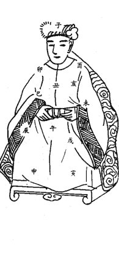
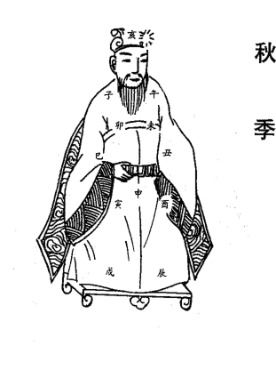
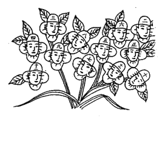
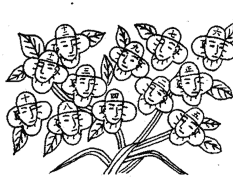
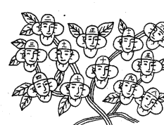
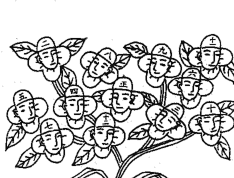

# 星盤法流星訣

樸湘潤
主編

中國哲學文化協進會

# 目 錄

書 名:星體法流星訣
著 者:梁湘潤
總 監:Alex Cho
編 輯:袁惠珍
植字排版:萬國國際發展公司
電 話:(852)81046178
出版人:曹慶碩
出 版:中華哲學文化促進會
九龍旺角皆老街43-49號禮佳樓6字47號
電 話:(852)26183861 26188861
傳 真:(852)26181277
網 址:www.168k.com 或 www.chinesebook.com.hk
電子信箱:168@168k.com
印 刷:更新印刷公司 24274536
發 行:利源書報社
九龍旺角洗衣街245-251號地下
23818251
國際書號:962-7943-34-7
定 價:28.00元(港幣300元)

版權所有
本書任何部分之文字及圖片未經出版人
書面許可,不得以任何方式抄襲或翻印。

- 原 序
- 新版流星訣序
- 前 言
- 導 論
- 星盤神煞起例
- 星煞限詩訣
- 星煞注解
- 行 星 機
- 皇 帝 局
- 瑞池金葉
- 開然胎神與夜啼鬼
- 李澤風時課
- 一掌金光明輪局
- 衣留篇通法
- 神煞吉凶提要
- 推毒現象
- 繪圖中箱手抄

# 原 序

看完「星學發微」以後，心中有頗多的感觸。以「流星訣」、「一掌金」、「皇帝局」、「衣留篇」等等的使用規範，看來似乎是一種顯淺單方方法，它卻是「紀辨子法」、「種引」等經典的關鍵理論，也是「子平法」、「用神」的微妙淵源派，也絕非是與「邵康節」、「劉伯溫」有什麼關聯。

它沒有一本超過二十個字的書，甚至有十個字以上手抄本。自宋代最著名的「徐子平」、「耶律材」以來，歷宋代之「五星法」有讓董之「擇日家」之氣息。歷代後人加入了相當程度的「紫微」、「計」、「氣」、「七政四餘」……等天星觀念，明代以後，以「納音五行」，重校整理，排出「月氣」（即是半身虛弱，中和平衡期觀念）歷三百餘年而有今日之平穩狀況。這一個系統，三百年中人才輩出，諸如萬育吾、陳應奎、任嚴毅，余春等諸名士。而「星盤」、「流星」，則默默無聞。元代以後曾留傳於「三台」（唐、宋、元三期祿命法之繼承與術語），廣泛流傳於民間。中，以至俗稱「祖傳命館」，一直至如今，它沒有任何經典，更沒有一個大士，進士頂戴之人，為其揚名。切之學問與時計。祿命法自明代以來，即漸意於江湖五行。這已百數十年，關於這個問題現象，著實值得深究。

一是此明祿命學籍，祿命法，必首推子平，語中和談總真，對其占驗性質與歷史性，則不甚關心，近似於養者之雅趣，玄妙深刻之通道，一字珠璣，而語句含混難無真之過。若有論及不準時，有其聲廣泛之理者可以推斷。一是此經典，可依術語起局迥然不同。題似是難亂無章，但其準確性之或然率并不比「大學生」或「進士」所推論之流派差。若有論及不準時，自然被認為為歌訣不完善。

這種系統與現象是客觀存在的。這種現象，既不是貌視其窮，又或者是如何通之術，而是深究其本原，要追溯千餘年來祿命法沿革來看，其始創，自有其由。前者，是唐宋古法祿命法，歷經元明清三代之演變而形成。後者，是以宋有之餘術術法術則，歷經元明清三代之演變而形成。

## 新版「流星訣」序

「己未」年，作者在編纂《中華相術全書》之際，曾將「流星訣」整法，編入於「百科全書」之中，並名選用「流星訣論」。爾之間，該書已絕售，空請書常僅保留「己未」末年的「金盤」作為編輯的模式，雖於「命、限」的「起例」，都有註明，仍是略嫌簡化了一些。

故此，在「再版」之時，將「子平至亥年」上組的「命盤」，合計一百四十四組的「神煞」，彼此此之「組合」，因詩訣，全部列於「命、限」之前，讀者在推論「吉、凶」之時，自有「萬方」之取捨，改定名為「星盤流星訣」。

按「星盤法」在「命術」系統中，是屬於「吉凶」的「神煞」，坊間都有對此作承襲式之「抄本」，大抵都是一種「家族式」的「世相傳承」方式去述續此法，因此在「神煞」取用多少有些有些不同，此家有不同於別家。

譬如：有時是用「破碎、血刃」，有時又是用「哭虛、的煞」等之不同。故此，酌情取用普通多數採用的「神煞」為準。

至於「十立命」的吉凶詩訣，坊間早已難得。此次「再版」之時，作者一一予以補齊所缺範圍，文中仍有未盡之處，祈請讀者見諒。

## 前言

通常以推命法區分派別之途（星、平兩家），亦就是子平法，以四柱推人一生祿命，一般所見到的派別傳播很多，其實「星、平」兩者之作區分，也不是十分必要區分，依子平法而言，「星」常以「五星子平」、「窮通寶鑑」、「三命通會」……等書稱之，為子平之淆。然真正對子平法研究之人士，皆知徐子平，是何年代之人氏，已不可考，亦未見有那一本書記載徐氏之生平，因此，「星平」是「一個時代背景上的一本小水準」，是平派，並非真正用神典籍會影響到它們的派別界限，大致是：以「日干」為主，用神正運行，取用神，遵格局，論衰旺、觀大運……等即是子平法。但僅使用了小部分之神煞，大約在宋代末年，至明代初葉奠定會上之基礎，其間至明初，方始漸漸擴大，執命理之正宗，有一部最為大家熟知的，名曰：「星平會海」，觀此書名，似是星、平二派之主流之理論，都已包括在內，讀過前賢之人都知道既不能完全代表子平，亦不足以代表子平以之前之命學學術，然而，「星平會海」之真正代表意義，是代表當時，「星平派」正統命學派中各有各的相制力，無偏重任何一方之含意而已。自宋以前，所提出來的子平命法，是很驚世駭俗之術士之本，已為子平學理所棄，若在正統學術之中，要想提出子平之命法，只有「三命通會」，尚能為清代子平學人所能接受，餘皆失傳矣。故此，為搜求古書者所大惑，明代二百年來所流傳之命書，只有「三命通會」，尚能為清代子平學人所能接受，餘皆失傳矣。

## 星盤法演星盤法

為何能在《永樂大典》之中，看到《鬼谷子分定經》、《推背圖》、《三命通會》……等等，其中一部已散佚於世間，而另外兩部卻赫然列於全書第六冊之中？這些方式，各人相信是古代的命法，以明劉伯溫以前，大凡與命運相關的書籍，必推源於「鬼谷子」一部。康節、陳摶等人所著，明、清兩代的星盤，差別甚大。自明以後，就稱為「劉伯溫、徐子平、李虛中」等。

## 明代之特徵

- 一、重於年計，以「年幹時」、「年支月」、「月支時」、「季支時」……等等。
- 二、神煞多，全接錄唐、宋二代留存神煞，而且有諸如知之神煞。
- 三、觀念不脫，洛書五行，觀念，習慣以十二支圖形列為六十四卦。
- 四、不說「十八飛星」之說。
- 五、受道家「制解」、「厄難」觀念深。

## 清代之特徵

- 一、神煞，統計有二百餘家，只有未有不見者，始於她被保留。
- 二、如「命宮會日」之「戊申」、「辛亥」日出生者命不佳，即「土族」、「火蛇」，至今仍有沿用。
- 三、神煞只留極少數，剛上也是不重視神煞，只是因沿襲以來「神煞」之流傳已太久，不得不儘量保留少數。

## 星盤法

本篇所述星盤法，並不在於推斷著書務實的作者對此一個朝代的學術觀點，毫無偏頗之心態，完全是站在搜集整理之前階段命法，予整理後保留，使它不至散失失傳。因此，對已搜集之資料，並不會貶低其應有之價值，就如星盤法，只是以最詳盡方式，記載說明是「祿命法」之歷史演變，也是民俗風情之一部。故此對原圖案，不加毫更改，重加整理。

## 星盤流法星訣

佛家星術學，以印度天文學為訓，如字、曜、氣、煞等，法象統計，重在顯現，運用機子不說，而命理大師略有提及，略而不詳，此即是速緣掌法。

三：以上三者，皆消俗一些「七家」擇日之術語，形成大致相同而又是有多系統之根本因素，基於以上三項所累積而成者，所以「紀紀辨方書」所稱之「四：擇日之學子，基於以上三項所累積而成者，所以「紀紀辨方書」所稱之「四：擇日之學子，基於以上三項所累積而成者，所以「紀紀辨方書」所稱之「四：擇日之學子，基於以上三項所累積而成者，所以「紀紀辨方書」所稱之「四：擇日之學子，基於以上三項所累積而成者，所以「紀紀辨方書」所稱之「四：擇日之學子，基於以上三項所累積而成者，所以「紀紀辨方書」所稱之「四：擇日之學子，基於以上三項所累積而成者，所以「紀紀辨方書」所稱之「四：擇日之學子，基於以上三項所累積而成者，所以「紀紀辨方書」所稱之「四：擇日之學子，基於以上三項所累積而成者，所以「紀紀辨方書」所稱之「四：擇日之學子，基於以上三項所累積而成者，所以「紀紀辨方書」所稱之「四：擇日之學子，基於以上三項所累積而成者，所以「紀紀辨方書」所稱之「四：擇日之學子，基於以上三項所累積而成者，所以「紀紀辨方書」所稱之「四：擇日之學子，基於以上三項所累積而成者，所以「紀紀辨方書」所稱之「四：擇日之學子，基於以上三項所累積而成者，所以「紀紀辨方書」所稱之「四：擇日之學子，基於以上三項所累積而成者，所以「紀紀辨方書」所稱之「四：擇日之學子，基於以上三項所累積而成者，所以「紀紀辨方書」所稱之「四：擇日之學子，基於以上三項所累積而成者，所以「紀紀辨方書」所稱之「四：擇日之學子，基於以上三項所累積而成者，所以「紀紀辨方書」所稱之「四：擇日之學子，基於以上三項所累積而成者，所以「紀紀辨方書」所稱之「四：擇日之學子，基於以上三項所累積而成者，所以「紀紀辨方書」所稱之「四：擇日之學子，基於以上三項所累積而成者，所以「紀紀辨方書」所稱之「四：擇日之學子，基於以上三項所累積而成者，所以「紀紀辨方書」所稱之「四：擇日之學子，基於以上三項所累積而成者，所以「紀紀辨方書」所稱之「四：擇日之學子，基於以上三項所累積而成者，所以「紀紀辨方書」所稱之「四：擇日之學子，基於以上三項所累積而成者，所以「紀紀辨方書」所稱之「四：擇日之學子，基於以上三項所累積而成者，所以「紀紀辨方書」所稱之「四：擇日之學子，基於以上三項所累積而成者，所以「紀紀辨方書」所稱之「四：擇日之學子，基於以上三項所累積而成者，所以「紀紀辨方書」所稱之「四：擇日之學子，基於以上三項所累積而成者，所以「紀紀辨方書」所稱之「四：擇日之學子，基於以上三項所累積而成者，所以「紀紀辨方書」所稱之「四：擇日之學子，基於以上三項所累積而成者，所以「紀紀辨方書」所稱之「四：擇日之學子，基於以上三項所累積而成者，所以「紀紀辨方書」所稱之「四：擇日之學子，基於以上三項所累積而成者，所以「紀紀辨方書」所稱之「四：擇日之學子，基於以上三項所累積而成者，所以「紀紀辨方書」所稱之「四：擇日之學子，基於以上三項所累積而成者，所以「紀紀辨方書」所稱之「四：擇日之學子，基於以上三項所累積而成者，所以「紀紀辨方書」所稱之「四：擇日之學子，基於以上三項所累積而成者，所以「紀紀辨方書」所稱之「四：擇日之學子，基於以上三項所累積而成者，所以「紀紀辨方書」所稱之「四：擇日之學子，基於以上三項所累積而成者，所以「紀紀辨方書」所稱之「四：擇日之學子，基於以上三項所累積而成者，所以「紀紀辨方書」所稱之「四：擇日之學子，基於以上三項所累積而成者，所以「紀紀辨方書」所稱之「四：擇日之學子，基於以上三項所累積而成者，所以「紀紀辨方書」所稱之「四：擇日之學子，基於以上三項所累積而成者，所以「紀紀辨方書」所稱之「四：擇日之學子，基於以上三項所累積而成者，所以「紀紀辨方書」所稱之「四：擇日之學子，基於以上三項所累積而成者，所以「紀紀辨方書」所稱之「四：擇日之學子，基於以上三項所累積而成者，所以「紀紀辨方書」所稱之「四：擇日之學子，基於以上三項所累積而成者，所以「紀紀辨方書」所稱之「四：擇日之學子，基於以上三項所累積而成者，所以「紀紀辨方書」所稱之「四：擇日之學子，基於以上三項所累積而成者，所以「紀紀辨方書」所稱之「四：擇日之學子，基於以上三項所累積而成者，所以「紀紀辨方書」所稱之「四：擇日之學子，基於以上三項所累積而成者，所以「紀紀辨方書」所稱之「四：擇日之學子，基於以上三項所累積而成者，所以「紀紀辨方書」所稱之「四：擇日之學子，基於以上三項所累積而成者，所以「紀紀辨方書」所稱之「四：擇日之學子，基於以上三項所累積而成者，所以「紀紀辨方書」所稱之「四：擇日之學子，基於以上三項所累積而成者，所以「紀紀辨方書」所稱之「四：擇日之學子，基於以上三項所累積而成者，所以「紀紀辨方書」所稱之「四：擇日之學子，基於以上三項所累積而成者，所以「紀紀辨方書」所稱之「四：擇日之學子，基於以上三項所累積而成者，所以「紀紀辨方書」所稱之「四：擇日之學子，基於以上三項所累積而成者，所以「紀紀辨方書」所稱之「四：擇日之學子，基於以上三項所累積而成者，所以「紀紀辨方書」所稱之「四：擇日之學子，基於以上三項所累積而成者，所以「紀紀辨方書」所稱之「四：擇日之學子，基於以上三項所累積而成者，所以「紀紀辨方書」所稱之「四：擇日之學子，基於以上三項所累積而成者，所以「紀紀辨方書」所稱之「四：擇日之學子，基於以上三項所累積而成者，所以「紀紀辨方書」所稱之「四：擇日之學子，基於以上三項所累積而成者，所以「紀紀辨方書」所稱之「四：擇日之學子，基於以上三項所累積而成者，所以「紀紀辨方書」所稱之「四：擇日之學子，基於以上三項所累積而成者，所以「紀紀辨方書」所稱之「四：擇日之學子，基於以上三項所累積而成者，所以「紀紀辨方書」所稱之「四：擇日之學子，基於以上三項所累積而成者，所以「紀紀辨方書」所稱之「四：擇日之學子，基於以上三項所累積而成者，所以「紀紀辨方書」所稱之「四：擇日之學子，基於以上三項所累積而成者，所以「紀紀辨方書」所稱之「四：擇日之學子，基於以上三項所累積而成者，所以「紀紀辨方書」所稱之「四：擇日之學子，基於以上三項所累積而成者，所以「紀紀辨方書」所稱之「四：擇日之學子，基於以上三項所累積而成者，所以「紀紀辨方書」所稱之「四：擇日之學子，基於以上三項所累積而成者，所以「紀紀辨方書」所稱之「四：擇日之學子，基於以上三項所累積而成者，所以「紀紀辨方書」所稱之「四：擇日之學子，基於以上三項所累積而成者，所以「紀紀辨方書」所稱之「四：擇日之學子，基於以上三項所累積而成者，所以「紀紀辨方書」所稱之「四：擇日之學子，基於以上三項所累積而成者，所以「紀紀辨方書」所稱之「四：擇日之學子，基於以上三項所累積而成者，所以「紀紀辨方書」所稱之「四：擇日之學子，基於以上三項所累積而成者，所以「紀紀辨方書」所稱之「四：擇日之學子，基於以上三項所累積而成者，所以「紀紀辨方書」所稱之「四：擇日之學子，基於以上三項所累積而成者，所以「紀紀辨方書」所稱之「四：擇日之學子，基於以上三項所累積而成者，所以「紀紀辨方書」所稱之「四：擇日之學子，基於以上三項所累積而成者，所以「紀紀辨方書」所稱之「四：擇日之學子，基於以上三項所累積而成者，所以「紀紀辨方書」所稱之「四：擇日之學子，基於以上三項所累積而成者，所以「紀紀辨方書」所稱之「四：擇日之學子，基於以上三項所累積而成者，所以「紀紀辨方書」所稱之「四：擇日之學子，基於以上三項所累積而成者，所以「紀紀辨方書」所稱之「四：擇日之學子，基於以上三項所累積而成者，所以「紀紀辨方書」所稱之「四：擇日之學子，基於以上三項所累積而成者，所以「紀紀辨方書」所稱之「四：擇日之學子，基於以上三項所累積而成者，所以「紀紀辨方書」所稱之「四：擇日之學子，基於以上三項所累積而成者，所以「紀紀辨方書」所稱之「四：擇日之學子，基於以上三項所累積而成者，所以「紀紀辨方書」所稱之「四：擇日之學子，基於以上三項所累積而成者，所以「紀紀辨方書」所稱之「四：擇日之學子，基於以上三項所累積而成者，所以「紀紀辨方書」所稱之「四：擇日之學子，基於以上三項所累積而成者，所以「紀紀辨方書」所稱之「四：擇日之學子，基於以上三項所累積而成者，所以「紀紀辨方書」所稱之「四：擇日之學子，基於以上三項所累積而成者，所以「紀紀辨方書」所稱之「四：擇日之學子，基於以上三項所累積而成者，所以「紀紀辨方書」所稱之「四：擇日之學子，基於以上三項所累積而成者，所以「紀紀辨方書」所稱之「四：擇日之學子，基於以上三項所累積而成者，所以「紀紀辨方書」所稱之「四：擇日之學子，基於以上三項所累積而成者，所以「紀紀辨方書」所稱之「四：擇日之學子，基於以上三項所累積而成者，所以「紀紀辨方書」所稱之「四：擇日之學子，基於以上三項所累積而成者，所以「紀紀辨方書」所稱之「四：擇日之學子，基於以上三項所累積而成者，所以「紀紀辨方書」所稱之「四：擇日之學子，基於以上三項所累積而成者，所以「紀紀辨方書」所稱之「四：擇日之學子，基於以上三項所累積而成者，所以「紀紀辨方書」所稱之「四：擇日之學子，基於以上三項所累積而成者，所以「紀紀辨方書」所稱之「四：擇日之學子，基於以上三項所累積而成者，所以「紀紀辨方書」所稱之「四：擇日之學子，基於以上三項所累積而成者，所以「紀紀辨方書」所稱之「四：擇日之學子，基於以上三項所累積而成者，所以「紀紀辨方書」所稱之「四：擇日之學子，基於以上三項所累積而成者，所以「紀紀辨方書」所稱之「四：擇日之學子，基於以上三項所累積而成者，所以「紀紀辨方書」所稱之「四：擇日之學子，基於以上三項所累積而成者，所以「紀紀辨方書」所稱之「四：擇日之學子，基於以上三項所累積而成者，所以「紀紀辨方書」所稱之「四：擇日之學子，基於以上三項所累積而成者，所以「紀紀辨方書」所稱之「四：擇日之學子，基於以上三項所累積而成者，所以「紀紀辨方書」所稱之「四：擇日之學子，基於以上三項所累積而成者，所以「紀紀辨方書」所稱之「四：擇日之學子，基於以上三項所累積而成者，所以「紀紀辨方書」所稱之「四：擇日之學子，基於以上三項所累積而成者，所以「紀紀辨方書」所稱之「四：擇日之學子，基於以上三項所累積而成者，所以「紀紀辨方書」所稱之「四：擇日之學子，基於以上三項所累積而成者，所以「紀紀辨方書」所稱之「四：擇日之學子，基於以上三項所累積而成者，所以「紀紀辨方書」所稱之「四：擇日之學子，基於以上三項所累積而成者，所以「紀紀辨方書」所稱之「四：擇日之學子，基於以上三項所累積而成者，所以「紀紀辨方書」所稱之「四：擇日之學子，基於以上三項所累積而成者，所以「紀紀辨方書」所稱之「四：擇日之學子，基於以上三項所累積而成者，所以「紀紀辨方書」所稱之「四：擇日之學子，基於以上三項所累積而成者，所以「紀紀辨方書」所稱之「四：擇日之學子，基於以上三項所累積而成者，所以「紀紀辨方書」所稱之「四：擇日之學子，基於以上三項所累積而成者，所以「紀紀辨方書」所稱之「四：擇日之學子，基於以上三項所累積而成者，所以「紀紀辨方書」所稱之「四：擇日之學子，基於以上三項所累積而成者，所以「紀紀辨方書」所稱之「四：擇日之學子，基於以上三項所累積而成者，所以「紀紀辨方書」所稱之「四：擇日之學子，基於以上三項所累積而成者，所以「紀紀辨方書」所稱之「四：擇日之學子，基於以上三項所累積而成者，所以「紀紀辨方書」所稱之「四：擇日之學子，基於以上三項所累積而成者，所以「紀紀辨方書」所稱之「四：擇日之學子，基於以上三項所累積而成者，所以「紀紀辨方書」所稱之「四：擇日之學子，基於以上三項所累積而成者，所以「紀紀辨方書」所稱之「四：擇日之學子，基於以上三項所累積而成者，所以「紀紀辨方書」所稱之「四：擇日之學子，基於以上三項所累積而成者，所以「紀紀辨方書」所稱之「四：擇日之學子，基於以上三項所累積而成者，所以「紀紀辨方書」所稱之「四：擇日之學子，基於以上三項所累積而成者，所以「紀紀辨方書」所稱之「四：擇日之學子，基於以上三項所累積而成者，所以「紀紀辨方書」所稱之「四：擇日之學子，基於以上三項所累積而成者，所以「紀紀辨方書」所稱之「四：擇日之學子，基於以上三項所累積而成者，所以「紀紀辨方書」所稱之「四：擇日之學子，基於以上三項所累積而成者，所以「紀紀辨方書」所稱之「四：擇日之學子，基於以上三項所累積而成者，所以「紀紀辨方書」所稱之「四：擇日之學子，基於以上三項所累積而成者，所以「紀紀辨方書」所稱之「四：擇日之學子，基於以上三項所累積而成者，所以「紀紀辨方書」所稱之「四：擇日之學子，基於以上三項所累積而成者，所以「紀紀辨方書」所稱之「四：擇日之學子，基於以上三項所累積而成者，所以「紀紀辨方書」所稱之「四：擇日之學子，基於以上三項所累積而成者，所以「紀紀辨方書」所稱之「四：擇日之學子，基於以上三項所累積而成者，所以「紀紀辨方書」所稱之「四：擇日之學子，基於以上三項所累積而成者，所以「紀紀辨方書」所稱之「四：擇日之學子，基於以上三項所累積而成者，所以「紀紀辨方書」所稱之「四：擇日之學子，基於以上三項所累積而成者，所以「紀紀辨方書」所稱之「四：擇日之學子，基於以上三項所累積而成者，所以「紀紀辨方書」所稱之「四：擇日之學子，基於以上三項所累積而成者，所以「紀紀辨方書」所稱之「四：擇日之學子，基於以上三項所累積而成者，所以「紀紀辨方書」所稱之「四：擇日之學子，基於以上三項所累積而成者，所以「紀紀辨方書」所稱之「四：擇日之學子，基於以上三項所累積而成者，所以「紀紀辨方書」所稱之「四：擇日之學子，基於以上三項所累積而成者，所以「紀紀辨方書」所稱之「四：擇日之學子，基於以上三項所累積而成者，所以「紀紀辨方書」所稱之「四：擇日之學子，基於以上三項所累積而成者，所以「紀紀辨方書」所稱之「四：擇日之學子，基於以上三項所累積而成者，所以「紀紀辨方書」所稱之「四：擇日之學子，基於以上三項所累積而成者，所以「紀紀辨方書」所稱之「四：擇日之學子，基於以上三項所累積而成者，所以「紀紀辨方書」所稱之「四：擇日之學子，基於以上三項所累積而成者，所以「紀紀辨方書」所稱之「四：擇日之學子，基於以上三項所累積而成者，所以「紀紀辨方書」所稱之「四：擇日之學子，基於以上三項所累積而成者，所以「紀紀辨方書」所稱之「四：擇日之學子，基於以上三項所累積而成者，所以「紀紀辨方書」所稱之「四：擇日之學子，基於以上三項所累積而成者，所以「紀紀辨方書」所稱之「四：擇日之學子，基於以上三項所累積而成者，所以「紀紀辨方書」所稱之「四：擇日之學子，基於以上三項所累積而成者，所以「紀紀辨方書」所稱之「四：擇日之學子，基於以上三項所累積而成者，所以「紀紀辨方書」所稱之「四：擇日之學子，基於以上三項所累積而成者，所以「紀紀辨方書」所稱之「四：擇日之學子，基於以上三項所累積而成者，所以「紀紀辨方書」所稱之「四：擇日之學子，基於以上三項所累積而成者，所以「紀紀辨方書」所稱之「四：擇日之學子，基於以上三項所累積而成者，所以「紀紀辨方書」所稱之「四：擇日之學子，基於以上三項所累積而成者，所以「紀紀辨方書」所稱之「四：擇日之學子，基於以上三項所累積而成者，所以「紀紀辨方書」所稱之「四：擇日之學子，基於以上三項所累積而成者，所以「紀紀辨方書」所稱之「四：擇日之學子，基於以上三項所累積而成者，所以「紀紀辨方書」所稱之「四：擇日之學子，基於以上三項所累積而成者，所以「紀紀辨方書」所稱之「四：擇日之學子，基於以上三項所累積而成者，所以「紀紀辨方書」所稱之「四：擇日之學子，基於以上三項所累積而成者，所以「紀紀辨方書」所稱之「四：擇日之學子，基於以上三項所累積而成者，所以「紀紀辨方書」所稱之「四：擇日之學子，基於以上三項所累積而成者，所以「紀紀辨方書」所稱之「四：擇日之學子，基於以上三項所累積而成者，所以「紀紀辨方書」所稱之「四：擇日之學子，基於以上三項所累積而成者，所以「紀紀辨方書」所稱之「四：擇日之學子，基於以上三項所累積而成者，所以「紀紀辨方書」所稱之「四：擇日之學子，基於以上三項所累積而成者，所以「紀紀辨方書」所稱之「四：擇日之學子，基於以上三項所累積而成者，所以「紀紀辨方書」所稱之「四：擇日之學子，基於以上三項所累積而成者，所以「紀紀辨方書」所稱之「四：擇日之學子，基於以上三項所累積而成者，所以「紀紀辨方書」所稱之「四：擇日之學子，基於以上三項所累積而成者，所以「紀紀辨方書」所稱之「四：擇日之學子，基於以上三項所累積而成者，所以「紀紀辨方書」所稱之「四：擇日之學子，基於以上三項所累積而成者，所以「紀紀辨方書」所稱之「四：擇日之學子，基於以上三項所累積而成者，所以「紀紀辨方書」所稱之「四：擇日之學子，基於以上三項所累積而成者，所以「紀紀辨方書」所稱之「四：擇日之學子，基於以上三項所累積而成者，所以「紀紀辨方書」所稱之「四：擇日之學子，基於以上三項所累積而成者，所以「紀紀辨方書」所稱之「四：擇日之學子，基於以上三項所累積而成者，所以「紀紀辨方書」所稱之「四：擇日之學子，基於以上三項所累積而成者，所以「紀紀辨方書」所稱之「四：擇日之學子，基於以上三項所累積而成者，所以「紀紀辨方書」所稱之「四：擇日之學子，基於以上三項所累積而成者，所以「紀紀辨方書」所稱之「四：擇日之學子，基於以上三項所累積而成者，所以「紀紀辨方書」所稱之「四：擇日之學子，基於以上三項所累積而成者，所以「紀紀辨方書」所稱之「四：擇日之學子，基於以上三項所累積而成者，所以「紀紀辨方書」所稱之「四：擇日之學子，基於以上三項所累積而成者，所以「紀紀辨方書」所稱之「四：擇日之學子，基於以上三項所累積而成者，所以「紀紀辨方書」所稱之「四：擇日之學子，基於以上三項所累積而成者，所以「紀紀辨方書」所稱之「四：擇日之學子，基於以上三項所累積而成者，所以「紀紀辨方書」所稱之「四：擇日之學子，基於以上三項所累積而成者，所以「紀紀辨方書」所稱之「四：擇日之學子，基於以上三項所累積而成者，所以「紀紀辨方書」所稱之「四：擇日之學子，基於以上三項所累積而成者，所以「紀紀辨方書」所稱之「四：擇日之學子，基於以上三項所累積而成者，所以「紀紀辨方書」所稱之「四：擇日之學子，基於以上三項所累積而成者，所以「紀紀辨方書」所稱之「四：擇日之學子，基於以上三項所累積而成者，所以「紀紀辨方書」所稱之「四：擇日之學子，基於以上三項所累積而成者，所以「紀紀辨方書」所稱之「四：擇日之學子，基於以上三項所累積而成者，所以「紀紀辨方書」所稱之「四：擇日之學子，基於以上三項所累積而成者，所以「紀紀辨方書」所稱之「四：擇日之學子，基於以上三項所累積而成者，所以「紀紀辨方書」所稱之「四：擇日之學子，基於以上三項所累積而成者，所以「紀紀辨方書」所稱之「四：擇日之學子，基於以上三項所累積而成者，所以「紀紀辨方書」所稱之「四：擇日之學子，基於以上三項所累積而成者，所以「紀紀辨方書」所稱之「四：擇日之學子，基於以上三項所累積而成者，所以「紀紀辨方書」所稱之「四：擇日之學子，基於以上三項所累積而成者，所以「紀紀辨方書」所稱之「四：擇日之學子，基於以上三項所累積而成者，所以「紀紀辨方書」所稱之「四：擇日之學子，基於以上三項所累積而成者，所以「紀紀辨方書」所稱之「四：擇日之學子，基於以上三項所累積而成者，所以「紀紀辨方書」所稱之「四：擇日之學子，基於以上三項所累積而成者，所以「紀紀辨方書」所稱之「四：擇日之學子，基於以上三項所累積而成者，所以「紀紀辨方書」所稱之「四：擇日之學子，基於以上三項所累積而成者，所以「紀紀辨方書」所稱之「四：擇日之學子，基於以上三項所累積而成者，所以「紀紀辨方書」所稱之「四：擇日之學子，基於以上三項所累積而成者，所以「紀紀辨方書」所稱之「四：擇日之學子，基於以上三項所累積而成者，所以「紀紀辨方書」所稱之「四：擇日之學子，基於以上三項所累積而成者，所以「紀紀辨方書」所稱之「四：擇日之學子，基於以上三項所累積而成者，所以「紀紀辨方書」所稱之「四：擇日之學子，基於以上三項所累積而成者，所以「紀紀辨方書」所稱之「四：擇日之學子，基於以上三項所累積而成者，所以「紀紀辨方書」所稱之「四：擇日之學子，基於以上三項所累積而成者，所以「紀紀辨方書」所稱之「四：擇日之學子，基於以上三項所累積而成者，所以「紀紀辨方書」所稱之「四：擇日之學子，基於以上三項所累積而成者，所以「紀紀辨方書」所稱之「四：擇日之學子，基於以上三項所累積而成者，所以「紀紀辨方書」所稱之「四：擇日之學子，基於以上三項所累積而成者，所以「紀紀辨方書」所稱之「四：擇日之學子，基於以上三項所累積而成者，所以「紀紀辨方書」所稱之「四：擇日之學子，基於以上三項所累積而成者，所以「紀紀辨方書」所稱之「四：擇日之學子，基於以上三項所累積而成者，所以「紀紀辨方書」所稱之「四：擇日之學子，基於以上三項所累積而成者，所以「紀紀辨方書」所稱之「四：擇日之學子，基於以上三項所累積而成者，所以「紀紀辨方書」所稱之「四：擇日之學子，基於以上三項所累積而成者，所以「紀紀辨方書」所稱之「四：擇日之學子，基於以上三項所累積而成者，所以「紀紀辨方書」所稱之「四：擇日之學子，基於以上三項所累積而成者，所以「紀紀辨方書」所稱之「四：擇日之學子，基於以上三項所累積而成者，所以「紀紀辨方書」所稱之「四：擇日之學子，基於以上三項所累積而成者，所以「紀紀辨方書」所稱之「四：擇日之學子，基於以上三項所累積而成者，所以「紀紀辨方書」所稱之「四：擇日之學子，基於以上三項所累積而成者，所以「紀紀辨方書」所稱之「四：擇日之學子，基於以上三項所累積而成者，所以「紀紀辨方書」所稱之「四：擇日之學子，基於以上三項所累積而成者，所以「紀紀辨方書」所稱之「四：擇日之學子，基於以上三項所累積而成者，所以「紀紀辨方書」所稱之「四：擇日之學子，基於以上三項所累積而成者，所以「紀紀辨方書」所稱之「四：擇日之學子，基於以上三項所累積而成者，所以「紀紀辨方書」所稱之「四：擇日之學子，基於以上三項所累積而成者，所以「紀紀辨方書」所稱之「四：擇日之學子，基於以上三項所累積而成者，所以「紀紀辨方書」所稱之「四：擇日之學子，基於以上三項所累積而成者，所以「紀紀辨方書」所稱之「四：擇日之學子，基於以上三項所累積而成者，所以「紀紀辨方書」所稱之「四：擇日之學子，基於以上三項所累積而成者，所以「紀紀辨方書」所稱之「四：擇日之學子，基於以上三項所累積而成者，所以「紀紀辨方書」所稱之「四：擇日之學子，基於以上三項所累積而成者，所以「紀紀辨方書」所稱之「四：擇日之學子，基於以上三項所累積而成者，所以「紀紀辨方書」所稱之「四：擇日之學子，基於以上三項所累積而成者，所以「紀紀辨方書」所稱之「四：擇日之學子，基於以上三項所累積而成者，所以「紀紀辨方書」所稱之「四：擇日之學子，基於以上三項所累積而成者，所以「紀紀辨方書」所稱之「四：擇日之學子，基於以上三項所累積而成者，所以「紀紀辨方書」所稱之「四：擇日之學子，基於以上三項所累積而成者，所以「紀紀辨方書」所稱之「四：擇日之學子，基於以上三項所累積而成者，所以「紀紀辨方書」所稱之「四：擇日之學子，基於以上三項所累積而成者，所以「紀紀辨方書」所稱之「四：擇日之學子，基於以上三項所累積而成者，所以「紀紀辨方書」所稱之「四：擇日之學子，基於以上三項所累積而成者，所以「紀紀辨方書」所稱之「四：擇日之學子，基於以上三項所累積而成者，所以「紀紀辨方書」所稱之「四：擇日之學子，基於以上三項所累積而成者，所以「紀紀辨方書」所稱之「四：擇日之學子，基於以上三項所累積而成者，所以「紀紀辨方書」所稱之「四：擇日之學子，基於以上三項所累積而成者，所以「紀紀辨方書」所稱之「四：擇日之學子，基於以上三項所累積而成者，所以「紀紀辨方書」所稱之「四：擇日之學子，基於以上三項所累積而成者，所以「紀紀辨方書」所稱之「四：擇日之學子，基於以上三項所累積而成者，所以「紀紀辨方書」所稱之「四：擇日之學子，基於以上三項所累積而成者，所以「紀紀辨方書」所稱之「四：擇日之學子，基於以上三項所累積而成者，所以「紀紀辨方書」所稱之「四：擇日之學子，基於以上三項所累積而成者，所以「紀紀辨方書」所稱之「四：擇日之學子，基於以上三項所累積而成者，所以「紀紀辨方書」所稱之「四：擇日之學子，基於以上三項所累積而成者，所以「紀紀辨方書」所稱之「四：擇日之學子，基於以上三項所累積而成者，所以「紀紀辨方書」所稱之「四：擇日之學子，基於以上三項所累積而成者，所以「紀紀辨方書」所稱之「四：擇日之學子，基於以上三項所累積而成者，所以「紀紀辨方書」所稱之「四：擇日之學子，基於以上三項所累積而成者，所以「紀紀辨方書」所稱之「四：擇日之學子，基於以上三項所累積而成者，所以「紀紀辨方書」所稱之「四：擇日之學子，基於以上三項所累積而成者，所以「紀紀辨方書」所稱之「四：擇日之學子，基於以上三項所累積而成者，所以「紀紀辨方書」所稱之「四：擇日之學子，基於以上三項所累積而成者，所以「紀紀辨方書」所稱之「四：擇日之學子，基於以上三項所累積而成者，所以「紀紀辨方書」所稱之「四：擇日之學子，基於以上三項所累積而成者，所以「紀紀辨方書」所稱之「四：擇日之學子，基於以上三項所累積而成者，所以「紀紀辨方書」所稱之「四：擇日之學子，基於以上三項所累積而成者，所以「紀紀辨方書」所稱之「四：擇日之學子，基於以上三項所累積而成者，所以「紀紀辨方書」所稱之「四：擇日之學子，基於以上三項所累積而成者，所以「紀紀辨方書」所稱之「四：擇日之學子，基於以上三項所累積而成者，所以「紀紀辨方書」所稱之「四：擇日之學子，基於以上三項所累積而成者，所以「紀紀辨方書」所稱之「四：擇日之學子，基於以上三項所累積而成者，所以「紀紀辨方書」所稱之「四：擇日之學子，基於以上三項所累積而成者，所以「紀紀辨方書」所稱之「四：擇日之學子，基於以上三項所累積而成者，所以「紀紀辨方書」所稱之「四：擇日之學子，基於以上三項所累積而成者，所以「紀紀辨方書」所稱之「四：擇日之學子，基於以上三項所累積而成者，所以「紀紀辨方書」所稱之「四：擇日之學子，基於以上三項所累積而成者，所以「紀紀辨方書」所稱之「四：擇日之學子，基於以上三項所累積而成者，所以「紀紀辨方書」所稱之「四：擇日之學子，基於以上三項所累積而成者，所以「紀紀辨方書」所稱之「四：擇日之學子，基於以上三項所累積而成者，所以「紀紀辨方書」所稱之「四：擇日之學子，基於以上三項所累積而成者，所以「紀紀辨方書」所稱之「四：擇日之學子，基於以上三項所累積而成者，所以「紀紀辨方書」所稱之「四：擇日之學子，基於以上三項所累積而成者，所以「紀紀辨方書」所稱之「四：擇日之學子，基於以上三項所累積而成者，所以「紀紀辨方書」所稱之「四：擇日之學子，基於以上三項所累積而成者，所以「紀紀辨方書」所稱之「四：擇日之學子，基於以上三項所累積而成者，所以「紀紀辨方書」所稱之「四：擇日之學子，基於以上三項所累積而成者，所以「紀紀辨方書」所稱之「四：擇日之學子，基於以上三項所累積而成者，所以「紀紀辨方書」所稱之「四：擇日之學子，基於以上三項所累積而成者，所以「紀紀辨方書」所稱之「四：擇日之學子，基於以上三項所累積而成者，所以「紀紀辨方書」所稱之「四：擇日之學子，基於以上三項所累積而成者，所以「紀紀辨方書」所稱之「四：擇日之學子，基於以上三項所累積而成者，所以「紀紀辨方書」所稱之「四：擇日之學子，基於以上三項所累積而成者，所以「紀紀辨方書」所稱之「四：擇日之學子，基於以上三項所累積而成者，所以「紀紀辨方書」所稱之「四：擇日之學子，基於以上三項所累積而成者，所以「紀紀辨方書」所稱之「四：擇日之學子，基於以上三項所累積而成者，所以「紀紀辨方書」所稱之「四：擇日之學子，基於以上三項所累積而成者，所以「紀紀辨方書」所稱之「四：擇日之學子，基於以上三項所累積而成者，所以「紀紀辨方書」所稱之「四：擇日之學子，基於以上三項所累積而成者，所以「紀紀辨方書」所稱之「四：擇日之學子，基於以上三項所累積而成者，所以「紀紀辨方書」所稱之「四：擇日之學子，基於以上三項所累積而成者，所以「紀紀辨方書」所稱之「四：擇日之學子，基於以上三項所累積而成者，所以「紀紀辨方書」所稱之「四：擇日之學子，基於以上三項所累積而成者，所以「紀紀辨方書」所稱之「四：擇日之學子，基於以上三項所累積而成者，所以「紀紀辨方書」所稱之「四：擇日之學子，基於以上三項所累積而成者，所以「紀紀辨方書」所稱之「四：擇日之學子，基於以上三項所累積而成者，所以「紀紀辨方書」所稱之「四：擇日之學子，基於以上三項所累積而成者，所以「紀紀辨方書」所稱之「四：擇日之學子，基於以上三項所累積而成者，所以「紀紀辨方書」所稱之「四：擇日之學子，基於以上三項所累積而成者，所以「紀紀辨方書」所稱之「四：擇日之學子，基於以上三項所累積而成者，所以「紀紀辨方書」所稱之「四：擇日之學子，基於以上三項所累積而成者，所以「紀紀辨方書」所稱之「四：擇日之學子，基於以上三項所累積而成者，所以「紀紀辨方書」所稱之「四：擇日之學子，基於以上三項所累積而成者，所以「紀紀辨方書」所稱之「四：擇日之學子，基於以上三項所累積而成者，所以「紀紀辨方書」所稱之「四：擇日之學子，基於以上三項所累積而成者，所以「紀紀辨方書」所稱之「四：擇日之學子，基於以上三項所累積而成者，所以「紀紀辨方書」所稱之「四：擇日之學子，基於以上三項所累積而成者，所以「紀紀辨方書」所稱之「四：擇日之學子，基於以上三項所累積而成者，所以「紀紀辨方書」所稱之「四：擇日之學子，基於以上三項所累積而成者，所以「紀紀辨方書」所稱之「四：擇日之學子，基於以上三項所累積而成者，所以「紀紀辨方書」所稱之「四：擇日之學子，基於以上三項所累積而成者，所以「紀紀辨方書」所稱之「四：擇日之學子，基於以上三項所累積而成者，所以「紀紀辨方書」所稱之「四：擇日之學子，基於以上三項所累積而成者，所以「紀紀辨方書」所稱之「四：擇日之學子，基於以上三項所累積而成者，所以「紀紀辨方書」所稱之「四：擇日之學子，基於以上三項所累積而成者，所以「紀紀辨方書」所稱之「四：擇日之學子，基於以上三項所累積而成者，所以「紀紀辨方書」所稱之「四：擇日之學子，基於以上三項所累積而成者，所以「紀紀辨方書」所稱之「四：擇日之學子，基於以上三項所累積而成者，所以「紀紀辨方書」所稱之「四：擇日之學子，基於以上三項所累積而成者，所以「紀紀辨方書」所稱之「四：擇日之學子，基於以上三項所累積而成者，所以「紀紀辨方書」所稱之「四：擇日之學子，基於以上三項所累積而成者，所以「紀紀辨方書」所稱之「四：擇日之學子，基於以上三項所累積而成者，所以「紀紀辨方書」所稱之「四：擇日之學子，基於以上三項所累積而成者，所以「紀紀辨方書」所稱之「四：擇日之學子，基於以上三項所累積而成者，所以「紀紀辨方書」所稱之「四：擇日之學子，基於以上三項所累積而成者，所以「紀紀辨方書」所稱之「四：擇日之學子，基於以上三項所累積而成者，所以「紀紀辨方書」所稱之「四：擇日之學子，基於以上三項所累積而成者，所以「紀紀辨方書」所稱之「四：擇日之學子，基於以上三項所累積而成者，所以「紀紀辨方書」所稱之「四：擇日之學子，基於以上三項所累積而成者，所以「紀紀辨方書」所稱之「四：擇日之學子，基於以上三項所累積而成者，所以「紀紀辨方書」所稱之「四：擇日之學子，基於以上三項所累積而成者，所以「紀紀辨方書」所稱之「四：擇日之學子，基於以上三項所累積而成者，所以「紀紀辨方書」所稱之「四：擇日之學子，基於以上三項所累積而成者，所以「紀紀辨方書」所稱之「四：擇日之學子，基於以上三項所累積而成者，所以「紀紀辨方書」所稱之「四：擇日之學子，基於以上三項所累積而成者，所以「紀紀辨方書」所稱之「四：擇日之學子，基於以上三項所累積而成者，所以「紀紀辨方書」所稱之「四：擇日之學子，基於以上三項所累積而成者，所以「紀紀辨方書」所稱之「四：擇日之學子，基於以上三項所累積而成者，所以「紀紀辨方書」所稱之「四：擇日之學子，基於以上三項所累積而成者，所以「紀紀辨方書」所稱之「四：擇日之學子，基於以上三項所累積而成者，所以「紀紀辨方書」所稱之「四：擇日之學子，基於以上三項所累積而成者，所以「紀紀辨方書」所稱之「四：擇日之學子，基於以上三項所累積而成者，所以「紀紀辨方書」所稱之「四：擇日之學子，基於以上三項所累積而成者，所以「紀紀辨方書」所稱之「四：擇日之學子，基於以上三項所累積而成者，所以「紀紀辨方書」所稱之「四：擇日之學子，基於以上三項所累積而成者，所以「紀紀辨方書」所稱之「四：擇日之學子，基於以上三項所累積而成者，所以「紀紀辨方書」所稱之「四：擇日之學子，基於以上三項所累積而成者，所以「紀紀辨方書」所稱之「四：擇日之學子，基於以上三項所累積而成者，所以「紀紀辨方書」所稱之「四：擇日之學子，基於以上三項所累積而成者，所以「紀紀辨方書」所稱之「四：擇日之學子，基於以上三項所累積而成者，所以「紀紀辨方書」所稱之「四：擇日之學子，基於以上三項所累積而成者，所以「紀紀辨方書」所稱之「四：擇日之學子，基於以上三項所累積而成者，所以「紀紀辨方書」所稱之「四：擇日之學子，基於以上三項所累積而成者，所以「紀紀辨方書」所稱之「四：擇日之學子，基於以上三項所累積而成者，所以「紀紀辨方書」所稱之「四：擇日之學子，基於以上三項所累積而成者，所以「紀紀辨方書」所稱之「四：擇日之學子，基於以上三項所累積而成者，所以「紀紀辨方書」所稱之「四：擇日之學子，基於以上三項所累積而成者，所以「紀紀辨方書」所稱之「四：擇日之學子，基於以上三項所累積而成者，所以「紀紀辨方書」所稱之「四：擇日之學子，基於以上三項所累積而成者，所以「紀紀辨方書」所稱之「四：擇日之學子，基於以上三項所累積而成者，所以「紀紀辨方書」所稱之「四：擇日之學子，基於以上三項所累積而成者，所以「紀紀辨方書」所稱之「四：擇日之學子，基於以上三項所累積而成者，所以「紀紀辨方書」所稱之「四：擇日之學子，基於以上三項所累積而成者，所以「紀紀辨方書」所稱之「四：擇日之學子，基於以上三項所累積而成者，所以「紀紀辨方書」所稱之「四：擇日之學子，基於以上三項所累積而成者，所以「紀紀辨方書」所稱之「四：擇日之學子，基於以上三項所累積而成者，所以「紀紀辨方書」所稱之「四：擇日之學子，基於以上三項所累積而成者，所以「紀紀辨方書」所稱之「四：擇日之學子，基於以上三項所累積而成者，所以「紀紀辨方書」所稱之「四：擇日之學子，基於以上三項所累積而成者，所以「紀紀辨方書」所稱之「四：擇日之學子，基於以上三項所累積而成者，所以「紀紀辨方書」所稱之「四：擇日之學子，基於以上三項所累積而成者，所以「紀紀辨方書」所稱之「四：擇日之學子，基於以上三項所累積而成者，所以「紀紀辨方書」所稱之「四：擇日之學子，基於以上三項所累積而成者，所以「紀紀辨方書」所稱之「四：擇日之學子，基於以上三項所累積而成者，所以「紀紀辨方書」所稱之「四：擇日之學子，基於以上三項所累積而成者，所以「紀紀辨方書」所稱之「四：擇日之學子，基於以上三項所累積而成者，所以「紀紀辨方書」所稱之「四：擇日之學子，基於以上三項所累積而成者，所以「紀紀辨方書」所稱之「四：擇日之學子，基於以上三項所累積而成者，所以「紀紀辨方書」所稱之「四：擇日之學子，基於以上三項所累積而成者，所以「紀紀辨方書」所稱之「四：擇日之學子，基於以上三項所累積而成者，所以「紀紀辨方書」所稱之「四：擇日之學子，基於以上三項所累積而成者，所以「紀紀辨方書」所稱之「四：擇日之學子，基於以上三項所累積而成者，所以「紀紀辨方書」所稱之「四：擇日之學子，基於以上三項所累積而成者，所以「紀紀辨方書」所稱之「四：擇日之學子，基於以上三項所累積而成者，所以「紀紀辨方書」所稱之「四：擇日之學子，基於以上三項所累積而成者，所以「紀紀辨方書」所稱之「四：擇日之學子，基於以上三項所累積而成者，所以「紀紀辨方書」所稱之「四：擇日之學子，基於以上三項所累積而成者，所以「紀紀辨方書」所稱之「四：擇日之學子，基於以上三項所累積而成者，所以「紀紀辨方書」所稱之「四：擇日之學子，基於以上三項所累積而成者，所以「紀紀辨方書」所稱之「四：擇日之學子，基於以上三項所累積而成者，所以「紀紀辨方書」所稱之「四：擇日之學子，基於以上三項所累積而成者，所以「紀紀辨方書」所稱之「四：擇日之學子，基於以上三項所累積而成者，所以「紀紀辨方書」所稱之「四：擇日之學子，基於以上三項所累積而成者，所以「紀紀辨方書」所稱之「四：擇日之學子，基於以上三項所累積而成者，所以「紀紀辨方書」所稱之「四：擇日之學子，基於以上三項所累積而成者，所以「紀紀辨方書」所稱之「四：擇日之學子，基於以上三項所累積而成者，所以「紀紀辨方書」所稱之「四：擇日之學子，基於以上三項所累積而成者，所以「紀紀辨方書」所稱之「四：擇日之學子，基於以上三項所累積而成者，所以「紀紀辨方書」所稱之「四：擇日之學子，基於以上三項所累積而成者，所以「紀紀辨方書」所稱之「四：擇日之學子，基於以上三項所累積而成者，所以「紀紀辨方書」所稱之「四：擇日之學子，基於以上三項所累積而成者，所以「紀紀辨方書」所稱之「四：擇日之學子，基於以上三項所累積而成者，所以「紀紀辨方書」所稱之「四：擇日之學子，基於以上三項所累積而成者，所以「紀紀辨方書」所稱之「四：擇日之學子，基於以上三項所累積而成者，所以「紀紀辨方書」所稱之「四：擇日之學子，基於以上三項所累積而成者，所以「紀紀辨方書」所稱之「四：擇日之學子，基於以上三項所累積而成者，所以「紀紀辨方書」所稱之「四：擇日之學子，基於以上三項所累積而成者，所以「紀紀辨方書」所稱之「四：擇日之學子，基於以上三項所累積而成者，所以「紀紀辨方書」所稱之「四：擇日之學子，基於以上三項所累積而成者，所以「紀紀辨方書」所稱之「四：擇日之學子，基於以上三項所累積而成者，所以「紀紀辨方書」所稱之「四：擇日之學子，基於以上三項所累積而成者，所以「紀紀辨方書」所稱之「四：擇日之學子，基於以上三項所累積而成者，所以「紀紀辨方書」所稱之「四：擇日之學子，基於以上三項所累積而成者，所以「紀紀辨方書」所稱之「四：擇日之學子，基於以上三項所累積而成者，所以「紀紀辨方書」所稱之「四：擇日之學子，基於以上三項所累積而成者，所以「紀紀辨方書」所稱之「四：擇日之學子，基於以上三項所累積而成者，所以「紀紀辨方書」所稱之「四：擇日之學子，基於以上三項所累積而成者，所以「紀紀辨方書」所稱之「四：擇日之學子，基於以上三項所累積而成者，所以「紀紀辨方書」所稱之「四：擇日之學子，基於以上三項所累積而成者，所以「紀紀辨方書」所稱之「四：擇日之學子，基於以上三項所累積而成者，所以「紀紀辨方書」所稱之「四：擇日之學子，基於以上三項所累積而成者，所以「紀紀辨方書」所稱之「四：擇日之學子，基於以上三項所累積而成者，所以「紀紀辨方書」所稱之「四：擇日之學子，基於以上三項所累積而成者，所以「紀紀辨方書」所稱之「四：擇日之學子，基於以上三項所累積而成者，所以「紀紀辨方書」所稱之「四：擇日之學子，基於以上三項所累積而成者，所以「紀紀辨方書」所稱之「四：擇日之學子，基於以上三項所累積而成者，所以「紀紀辨方書」所稱之「四：擇日之學子，基於以上三項所累積而成者，所以「紀紀辨方書」所稱之「四：擇日之學子，基於以上三項所累積而成者，所以「紀紀辨方書」所稱之「四：擇日之學子，基於以上三項所累積而成者，所以「紀紀辨方書」所稱之「四：擇日之學子，基於以上三項所累積而成者，所以「紀紀辨方書」所稱之「四：擇日之學子，基於以上三項所累積而成者，所以「紀紀辨方書」所稱之「四：擇日之學子，基於以上三項所累積而成者，所以「紀紀辨方書」所稱之「四：擇日之學子，基於以上三項所累積而成者，所以「紀紀辨方書」所稱之「四：擇日之學子，基於以上三項所累積而成者，所以「紀紀辨方書」所稱之「四：擇日之學子，基於以上三項所累積而成者，所以「紀紀辨方書」所稱之「四：擇日之學子，基於以上三項所累積而成者，所以「紀紀辨方書」所稱之「四：擇日之學子，基於以上三項所累積而成者，所以「紀紀辨方書」所稱之「四：擇日之學子，基於以上三項所累積而成者，所以「紀紀辨方書」所稱之「四：擇日之學子，基於以上三項所累積而成者，所以「紀紀辨方書」所稱之「四：擇日之學子，基於以上三項所累積而成者，所以「紀紀辨方書」所稱之「四：擇日之學子，基於以上三項所累積而成者，所以「紀紀辨方書」所稱之「四：擇日之學子，基於以上三項所累積而成者，所以「紀紀辨方書」所稱之「四：擇日之學子，基於以上三項所累積而成者，所以「紀紀辨方書」所稱之「四：擇日之學子，基於以上三項所累積而成者，所以「紀紀辨方書」所稱之「四：擇日之學子，基於以上三項所累積而成者，所以「紀紀辨方書」所稱之「四：擇日之學子，基於以上三項所累積而成者，所以「紀紀辨方書」所稱之「四：擇日之學子，基於以上三項所累積而成者，所以「紀紀辨方書」所稱之「四：擇日之學子，基於以上三項所累積而成者，所以「紀紀辨方書」所稱之「四：擇日之學子，基於以上三項所累積而成者，所以「紀紀辨方書」所稱之「四：擇日之學子，基於以上三項所累積而成者，所以「紀紀辨方書」所稱之「四：擇日之學子，基於以上三項所累積而成者，所以「紀紀辨方書」所稱之「四：擇日之學子，基於以上三項所累積而成者，所以「紀紀辨方書」所稱之「四：擇日之學子，基於以上三項所累積而成者，所以「紀紀辨方書」所稱之「四：擇日之學子，基於以上三項所累積而成者，所以「紀紀辨方書」所稱之「四：擇日之學子，基於以上三項所累積而成者，所以「紀紀辨方書」所稱之「四：擇日之學子，基於以上三項所累積而成者，所以「紀紀辨方書」所稱之「四：擇日之學子，基於以上三項所累積而成者，所以「紀紀辨方書」所稱之「四：擇日之學子，基於以上三項所累積而成者，所以「紀紀辨方書」所稱之「四：擇日之學子，基於以上三項所累積而成者，所以「紀紀辨方書」所稱之「四：擇日之學子，基於以上三項所累積而成者，所以「紀紀辨方書」所稱之「四：擇日之學子，基於以上三項所累積而成者，所以「紀紀辨方書」所稱之「四：擇日之學子，基於以上三項所累積而成者，所以「紀紀辨方書」所稱之「四：擇日之學子，基於以上三項所累積而成者，所以「紀紀辨方書」所稱之「四：擇日之學子，基於以上三項所累積而成者，所以「紀紀辨方書」所稱之「四：擇日之學子，基於以上三項所累積而成者，所以「紀紀辨方書」所稱之「四：擇日之學子，基於以上三項所累積而成者，所以「紀紀辨方書」所稱之「四：擇日之學子，基於以上三項所累積而成者，所以「紀紀辨方書」所稱之「四：擇日之學子，基於以上三項所累積而成者，所以「紀紀辨方書」所稱之「四：擇日之學子，基於以上三項所累積而成者，所以「紀紀辨方書」所稱之「四：擇日之學子，基於以上三項所累積而成者，所以「紀紀辨方書」所稱之「四：擇日之學子，基於以上三項所累積而成者，所以「紀紀辨方書」所稱之「四：擇日之學子，基於以上三項所累積而成者，所以「紀紀辨方書」所稱之「四：擇日之學子，基於以上三項所累積而成者，所以「紀紀辨方書」所稱之「四：擇日之學子，基於以上三項所累積而成者，所以「紀紀辨方書」所稱之「四：擇日之學子，基於以上三項所累積而成者，所以「紀紀辨方書」所稱之「四：擇日之學子，基於以上三項所累積而成者，所以「紀紀辨方書」所稱之「四：擇日之學子，基於以上三項所累積而成者，所以「紀紀辨方書」所稱之「四：擇日之學子，基於以上三項所累積而成者，所以「紀紀辨方書」所稱之「四：擇日之學子，基於以上三項所累積而成者，所以「紀紀辨方書」所稱之「四：擇日之學子，基於以上三項所累積而成者，所以「紀紀辨方書」所稱之「四：擇日之學子，基於以上三項所累積而成者，所以「紀紀辨方書」所稱之「四：擇日之學子，基於以上三項所累積而成者，所以「紀紀辨方書」所稱之「四：擇日之學子，基於以上三項所累積而成者，所以「紀紀辨方書」所稱之「四：擇日之學子，基於以上三項所累積而成者，所以「紀紀辨方書」所稱之「四：擇日之學子，基於以上三項所累積而成者，所以「紀紀辨方書」所稱之「四：擇日之學子，基於以上三項所累積而成者，所以「紀紀辨方書」所稱之「四：擇日之學子，基於以上三項所累積而成者，所以「紀紀辨方書」所稱之「四：擇日之學子，基於以上三項所累積而成者，所以「紀紀辨方書」所稱之「四：擇日之學子，基於以上三項所累積而成者，所以「紀紀辨方書」所稱之「四：擇日之學子，基於以上三項所累積而成者，所以「紀紀辨方書」所稱之「四：擇日之學子，基於以上三項所累積而成者，所以「紀紀辨方書」所稱之「四：擇日之學子，基於以上三項所累積而成者，所以「紀紀辨方書」所稱之「四：擇日之學子，基於以上三項所累積而成者，所以「紀紀辨方書」所稱之「四：擇日之學子，基於以上三項所累積而成者，所以「紀紀辨方書」所稱之「四：擇日之學子，基於以上三項所累積而成者，所以「紀紀辨方書」所稱之「四：擇日之學子，基於以上三項所累積而成者，所以「紀紀辨方書」所稱之「四：擇日之學子，基於以上三項所累積而成者，所以「紀紀辨方書」所稱之「四：擇日之學子，基於以上三項所累積而成者，所以「紀紀辨方書」所稱之「四：擇日之學子，基於以上三項所累積而成者，所以「紀紀辨方書」所稱之「四：擇日之學子，基於以上三項所累積而成者，所以「紀紀辨方書」所稱之「四：擇日之學子，基於以上三項所累積而成者，所以「紀紀辨方書」所稱之「四：擇日之學子，基於以上三項所累積而成者，所以「紀紀辨方書」所稱之「四：擇日之學子，基於以上三項所累積而成者，所以「紀紀辨方書」所稱之「四：擇日之學子，基於以上三項所累積而成者，所以「紀紀辨方書」所稱之「四：擇日之學子，基於以上三項所累積而成者，所以「紀紀辨方書」所稱之「四：擇日之學子，基於以上三項所累積而成者，所以「紀紀辨方書」所稱之「四：擇日之學子，基於以上三項所累積而成者，所以「紀紀辨方書」所稱之「四：擇日之學子，基於以上三項所累積而成者，所以「紀紀辨方書」所稱之「四：擇日之學子，基於以上三項所累積而成者，所以「紀紀辨方書」所稱之「四：擇日之學子，基於以上三項所累積而成者，所以「紀紀辨方書」所稱之「四：擇日之學子，基於以上三項所累積而成者，所以「紀紀辨方書」所稱之「四：擇日之學子，基於以上三項所累積而成者，所以「紀紀辨方書」所稱之「四：擇日之學子，基於以上三項所累積而成者，所以「紀紀辨方書」所稱之「四：擇日之學子，基於以上三項所累積而成者，所以「紀紀辨方書」所稱之「四：擇日之學子，基於以上三項所累積而成者，所以「紀紀辨方書」所稱之「四：擇日之學子，基於以上三項所累積而成者，所以「紀紀辨方書」所稱之「四：擇日之學子，基於以上三項所累積而成者，所以「紀紀辨方書」所稱之「四：擇日之學子，基於以上三項所累積而成者，所以「紀紀辨方書」所稱之「四：擇日之學子，基於以上三項所累積而成者，所以「紀紀辨方書」所稱之「四：擇日之學子，基於以上三項所累積而成者，所以「紀紀辨方書」所稱之「四：擇日之學子，基於以上三項所累積而成者，所以「紀紀辨方書」所稱之「四：擇日之學子，基於以上三項所累積而成者，所以「紀紀辨方書」所稱之「四：擇日之學子，基於以上三項所累積而成者，所以「紀紀辨方書」所稱之「四：擇日之學子，基於以上三項所累積而成者，所以「紀紀辨方書」所稱之「四：擇日之學子，基於以上三項所累積而成者，所以「紀紀辨方書」所稱之「四：擇日之學子，基於以上三項所累積而成者，所以「紀紀辨方書」所稱之「四：擇日之學子，基於以上三項所累積而成者，所以「紀紀辨方書」所稱之「四：擇日之學子，基於以上三項所累積而成者，所以「紀紀辨方書」所稱之「四：擇日之學子，基於以上三項所累積而成者，所以「紀紀辨方書」所稱之「四：擇日之學子，基於以上三項所累積而成者，所以「紀紀辨方書」所稱之「四：擇日之學子，基於以上三項所累積而成者，所以「紀紀辨方書」所稱之「四：擇日之學子，基於以上三項所累積而成者，所以「紀紀辨方書」所稱之「四：擇日之學子，基於以上三項所累積而成者，所以「紀紀辨方書」所稱之「四：擇日之學子，基於以上三項所累積而成者，所以「紀紀辨方書」所稱之「四：擇日之學子，基於以上三項所累積而成者，所以「紀紀辨方書」所稱之「四：擇日之學子，基於以上三項所累積而成者，所以「紀紀辨方書」所稱之「四：擇日之學子，基於以上三項所累積而成者，所以「紀紀辨方書」所稱之「四：擇日之學子，基於以上三項所累積而成者，所以「紀紀辨方書」所稱之「四：擇日之學子，基於以上三項所累積而成者，所以「紀紀辨方書」所稱之「四：擇日之學子，基於以上三項所累積而成者，所以「紀紀辨方書」所稱之「四：擇日之學子，基於以上三項所累積而成者，所以「紀紀辨方書」所稱之「四：擇日之學子，基於以上三項所累積而成者，所以「紀紀辨方書」所稱之「四：擇日之學子，基於以上三項所累積而成者，所以「紀紀辨方書」所稱之「四：擇日之學子，基於以上三項所累積而成者，所以「紀紀辨方書」所稱之「四：擇日之學子，基於以上三項所累積而成者，所以「紀紀辨方書」所稱之「四：擇日之學子，基於以上三項所累積而成者，所以「紀紀辨方書」所稱之「四：擇日之學子，基於以上三項所累積而成者，所以「紀紀辨方書」所稱之「四：擇日之學子，基於以上三項所累積而成者，所以「紀紀辨方書」所稱之「四：擇日之學子，基於以上三項所累積而成者，所以「紀紀辨方書」所稱之「四：擇日之學子，基於以上三項所累積而成者，所以「紀紀辨方書」所稱之「四：擇日之學子，基於以上三項所累積而成者，所以「紀紀辨方書」所稱之「四：擇日之學子，基於以上三項所累積而成者，所以「紀紀辨方書」所稱之「四：擇日之學子，基於以上三項所累積而成者，所以「紀紀辨方書」所稱之「四：擇日之學子，基於以上三項所累積而成者，所以「紀紀辨方書」所稱之「四：擇日之學子，基於以上三項所累積而成者，所以「紀紀辨方書」所稱之「四：擇日之學子，基於以上三項所累積而成者，所以「紀紀辨方書」所稱之「四：擇日之學子，基於以上三項所累積而成者，所以「紀紀辨方書」所稱之「四：擇日之學子，基於以上三項所累積而成者，所以「紀紀辨方書」所稱之「四：擇日之學子，基於以上三項所累積而成者，所以「紀紀辨方書」所稱之「四：擇日之學子，基於以上三項所累積而成者，所以「紀紀辨方書」所稱之「四：擇日之學子，基於以上三項所累積而成者，所以「紀紀辨方書」所稱之「四：擇日之學子，基於以上三項所累積而成者，所以「紀紀辨方書」所稱之「四：擇日之學子，基於以上三項所累積而成者，所以「紀紀辨方書」所稱之「四：擇日之學子，基於以上三項所累積而成者，所以「紀紀辨方書」所稱之「四：擇日之學子，基於以上三項所累積而成者，所以「紀紀辨方書」所稱之「四：擇日之學子，基於以上三項所累積而成者，所以「紀紀辨方書」所稱之「四：擇日之學子，基於以上三項所累積而成者，所以「紀紀辨方書」所稱之「四：擇日之學子，基於以上三項所累積而成者，所以「紀紀辨方書」所稱之「四：擇日之學子，基於以上三項所累積而成者，所以「紀紀辨方書」所稱之「四：擇日之學子，基於以上三項所累積而成者，所以「紀紀辨方書」所稱之「四：擇日之學子，基於以上三項所累積而成者，所以「紀紀辨方書」所稱之「四：擇日之學子，基於以上三項所累積而成者，所以「紀紀辨方書」所稱之「四：擇日之學子，基於以上三項所累積而成者，所以「紀紀辨方書」所稱之「四：擇日之學子，基於以上三項所累積而成者，所以「紀紀辨方書」所稱之「四：擇日之學子，基於以上三項所累積而成者，所以「紀紀辨方書」所稱之「四：擇日之學子，基於以上三項所累積而成者，所以「紀紀辨方書」所稱之「四：擇日之學子，基於以上三項所累積而成者，所以「紀紀辨方書」所稱之「四：擇日之學子，基於以上三項所累積而成者，所以「紀紀辨方書」所稱之「四：擇日之學子，基於以上三項所累積而成者，所以「紀紀辨方書」所稱之「四：擇日之學子，基於以上三項所累積而成者，所以「紀紀辨方書」所稱之「四：擇日之學子，基於以上三項所累積而成者，所以「紀紀辨方書」所稱之「四：擇日之學子，基於以上三項所累積而成者，所以「紀紀辨方書」所稱之「四：擇日之學子，基於以上三項所累積而成者，所以「紀紀辨方書」所稱之「四：擇日之學子，基於以上三項所累積而成者，所以「紀紀辨方書」所稱之「四：擇日之學子，基於以上三項所累積而成者，所以「紀紀辨方書」所稱之「四：擇日之學子，基於以上三項所累積而成者，所以「紀紀辨方書」所稱之「四：擇日之學子，基於以上三項所累積而成者，所以「紀紀辨方書」所稱之「四：擇日之學子，基於以上三項所累積而成者，所以「紀紀辨方書」所稱之「四：擇日之學子，基於以上三項所累積而成者，所以「紀紀辨方書」所稱之「四：擇日之學子，基於以上三項所累積而成者，所以「紀紀辨方書」所稱之「四：擇日之學子，基於以上三項所累積而成者，所以「紀紀辨方書」所稱之「四：擇日之學子，基於以上三項所累積而成者，所以「紀紀辨方書」所稱之「四：擇日之學子，基於以上三項所累積而成者，所以「紀紀辨方書」所稱之「四：擇日之學子，基於以上三項所累積而成者，所以「紀紀辨方書」所稱之「四：擇日之學子，基於以上三項所累積而成者，所以「紀紀辨方書」所稱之「四：擇日之學子，基於以上三項所累積而成者，所以「紀紀辨方書」所稱之「四：擇日之學子，基於以上三項所累積而成者，所以「紀紀辨方書」所稱之「四：擇日之學子，基於以上三項所累積而成者，所以「紀紀辨方書」所稱之「四：擇日之學子，基於以上三項所累積而成者，所以「紀紀辨方書」所稱之「四：擇日之學子，基於以上三項所累積而成者，所以「紀紀辨方書」所稱之「四：擇日之學子，基於以上三項所累積而成者，所以「紀紀辨方書」所稱之「四：擇日之學子，基於以上三項所累積而成者，所以「紀紀辨方書」所稱之「四：擇日之學子，基於以上三項所累積而成者，所以「紀紀辨方書」所稱之「四：擇日之學子，基於以上三項所累積而成者，所以「紀紀辨方書」所稱之「四：擇日之學子，基於以上三項所累積而成者，所以「紀紀辨方書」所稱之「四：擇日之學子，基於以上三項所累積而成者，所以「紀紀辨方書」所稱之「四：擇日之學子，基於以上三項所累積而成者，所以「紀紀辨方書」所稱之「四：擇日之學子，基於以上三項所累積而成者，所以「紀紀辨方書」所稱之「四：擇日之學子，基於以上三項所累積而成者，所以「紀紀辨方書」所稱之「四：擇日之學子，基於以上三項所累積而成者，所以「紀紀辨方書」所稱之「四：擇日之學子，基於以上三項所累積而成者，所以「紀紀辨方書」所稱之「四：擇日之學子，基於以上三項所累積而成者，所以「紀紀辨方書」所稱之「四：擇日之學子，基於以上三項所累積而成者，所以「紀紀辨方書」所稱之「四：擇日之學子，基於以上三項所累積而成者，所以「紀紀辨方書」所稱之「四：擇日之學子，基於以上三項所累積而成者，所以「紀紀辨方書」所稱之「四：擇日之學子，基於以上三項所累積而成者，所以「紀紀辨方書」所稱之「四：擇日之學子，基於以上三項所累積而成者，所以「紀紀辨方書」所稱之「四：擇日之學子，基於以上三項所累積而成者，所以「紀紀辨方書」所稱之「四：擇日之學子，基於以上三項所累積而成者，所以「紀紀辨方書」所稱之「四：擇日之學子，基於以上三項所累積而成者，所以「紀紀辨方書」所稱之「四：擇日之學子，基於以上三項所累積而成者，所以「紀紀辨方書」所稱之「四：擇日之學子，基於以上三項所累積而成者，所以「紀紀辨方書」所稱之「四：擇日之學子，基於以上三項所累積而成者，所以「紀紀辨方書」所稱之「四：擇日之學子，基於以上三項所累積而成者，所以「紀紀辨方書」所稱之「四：擇日之學子，基於以上三項所累積而成者，所以「紀紀辨方書」所稱之「四：擇日之學子，基於以上三項所累積而成者，所以「紀紀辨方書」所稱之「四：擇日之學子，基於以上三項所累積而成者，所以「紀紀辨方書」所稱之「四：擇日之學子，基於以上三項所累積而成者，所以「紀紀辨方書」所稱之「四：擇日之學子，基於以上三項所累積而成者，所以「紀紀辨方書」所稱之「四：擇日之學子，基於以上三項所累積而成者，所以「紀紀辨方書」所稱之「四：擇日之學子，基於以上三項所累積而成者，所以「紀紀辨方書」所稱之「四：擇日之學子，基於以上三項所累積而成者，所以「紀紀辨方書」所稱之「四：擇日之學子，基於以上三項所累積而成者，所以「紀紀辨方書」所稱之「四：擇日之學子，基於以上三項所累積而成者，所以「紀紀辨方書」所稱之「四：擇日之學子，基於以上三項所累積而成者，所以「紀紀辨方書」所稱之「四：擇日之學子，基於以上三項所累積而成者，所以「紀紀辨方書」所稱之「四：擇日之學子，基於以上三項所累積而成者，所以「紀紀辨方書」所稱之「四：擇日之學子，基於以上三項所累積而成者，所以「紀紀辨方書」所稱之「四：擇日之學子，基於以上三項所累積而成者，所以「紀紀辨方書」所稱之「四：擇日之學子，基於以上三項所累積而成者，所以「紀紀辨方書」所稱之「四：擇日之學子，基於以上三項所累積而成者，所以「紀紀辨方書」所稱之「四：擇日之學子，基於以上三項所累積而成者，所以「紀紀辨方書」所稱之「四：擇日之學子，基於以上三項所累積而成者，所以「紀紀辨方書」所稱之「四：擇日之學子，基於以上三項所累積而成者，所以「紀紀辨方書」所稱之「四：擇日之學子，基於以上三項所累積而成者，所以「紀紀辨方書」所稱之「四：擇日之學子，基於以上三項所累積而成者，所以「紀紀辨方書」所稱之「四：擇日之學子，基於以上三項所累積而成者，所以「紀紀辨方書」所稱之「四：擇日之學子，基於以上三項所累積而成者，所以「紀紀辨方書」所稱之「四：擇日之學子，基於以上三項所累積而成者，所以「紀紀辨方書」所稱之「四：擇日之學子，基於以上三項所累積而成者，所以「紀紀辨方書」所稱之「四：擇日之學子，基於以上三項所累積而成者，所以「紀紀辨方書」所稱之「四：擇日之學子，基於以上三項所累積而成者，所以「紀紀辨方書」所稱之「四：擇日之學子，基於以上三項所累積而成者，所以「紀紀辨方書」所稱之「四：擇日之學子，基於以上三項所累積而成者，所以「紀紀辨方書」所稱之「四：擇日之學子，基於以上三項所累積而成者，所以「紀紀辨方書」所稱之「四：擇日之學子，基於以上三項所累積而成者，所以「紀紀辨方書」所稱之「四：擇日之學子，基於以上三項所累積而成者，所以「紀紀辨方書」所稱之「四：擇日之學子，基於以上三項所累積而成者，所以「紀紀辨方書」所稱之「四：擇日之學子，基於以上三項所累積而成者，所以「紀紀辨方書」所稱之「四：擇日之學子，基於以上三項所累積而成者，所以「紀紀辨方書」所稱之「四：擇日之學子，基於以上三項所累積而成者，所以「紀紀辨方書」所稱之「四：擇日之學子，基於以上三項所累積而成者，所以「紀紀辨方書」所稱之「四：擇日之學子，基於以上三項所累積而成者，所以「紀紀辨方書」所稱之「四：擇日之學子，基於以上三項所累積而成者，所以「紀紀辨方書」所稱之「四：擇日之學子，基於以上三項所累積而成者，所以「紀紀辨方書」所稱之「四：擇日之學子，基於以上三項所累積而成者，所以「紀紀辨方書」所稱之「四：擇日之學子，基於以上三項所累積而成者，所以「紀紀辨方書」所稱之「四：擇日之學子，基於以上三項所累積而成者，所以「紀紀辨方書」所稱之「四：擇日之學子，基於以上三項所累積而成者，所以「紀紀辨方書」所稱之「四：擇日之學子，基於以上三項所累積而成者，所以「紀紀辨方書」所稱之「四：擇日之學子，基於以上三項所累積而成者，所以「紀紀辨方書」所稱之「四：擇日之學子，基於以上三項所累積而成者，所以「紀紀辨方書」所稱之「四：擇日之學子，基於以上三項所累積而成者，所以「紀紀辨方書」所稱之「四：擇日之學子，基於以上三項所累積而成者，所以「紀紀辨方書」所稱之「四：擇日之學子，基於以上三項所累積而成者，所以「紀紀辨方書」所稱之「四：擇日之學子，基於以上三項所累積而成者，所以「紀紀辨方書」所稱之「四：擇日之學子，基於以上三項所累積而成者，所以「紀紀辨方書」所稱之「四：擇日之學子，基於以上三項所累積而成者，所以「紀紀辨方書」所稱之「四：擇日之學子，基於以上三項所累積而成者，所以「紀紀辨方書」所稱之「四：擇日之學子，基於以上三項所累積而成者，所以「紀紀辨方書」所稱之「四：擇日之學子，基於以上三項所累積而成者，所以「紀紀辨方書」所稱之「四：擇日之學子，基於以上三項所累積而成者，所以「紀紀辨方書」所稱之「四：擇日之學子，基於以上三項所累積而成者，所以「紀紀辨方書」所稱之「四：擇日之學子，基於以上三項所累積而成者，所以「紀紀辨方書」所稱之「四：擇日之學子，基於以上三項所累積而成者，所以「紀紀辨方書」所稱之「四：擇日之學子，基於以上三項所累積而成者，所以「紀紀辨方書」所稱之「四：擇日之學子，基於以上三項所累積而成者，所以「紀紀辨方書」所稱之「四：擇日之學子，基於以上三項所累積而成者，所以「紀紀辨方書」所稱之「四：擇日之學子，基於以上三項所累積而成者，所以「紀紀辨方書」所稱之「四：擇日之學子，基於以上三項所累積而成者，所以「紀紀辨方書」所稱之「四：擇日之學子，基於以上三項所累積而成者，所以「紀紀辨方書」所稱之「四：擇日之學子，基於以上三項所累積而成者，所以「紀紀辨方書」所稱之「四：擇日之學子，基於以上三項所累積而成者，所以「紀紀辨方書」所稱之「四：擇日之學子，基於以上三項所累積而成者，所以「紀紀辨方書」所稱之「四：擇日之學子，基於以上三項所累積而成者，所以「紀紀辨方書」所稱之「四：擇日之學子，基於以上三項所累積而成者，所以「紀紀辨方書」所稱之「四：擇日之學子，基於以上三項所累積而成者，所以「紀紀辨方書」所稱之「四：擇日之學子，基於以上三項所累積而成者，所以「紀紀辨方書」所稱之「四：擇日之學子，基於以上三項所累積而成者，所以「紀紀辨方書」所稱之「四：擇日之學子，基於以上三項所累積而成者，所以「紀紀辨方書」所稱之「四：擇日之學子，基於以上三項所累積而成者，所以「紀紀辨方書」所稱之「四：擇日之學子，基於以上三項所累積而成者，所以「紀紀辨方書」所稱之「四：擇日之學子，基於以上三項所累積而成者，所以「紀紀辨方書」所稱之「四：擇日之學子，基於以上三項所累積而成者，所以「紀紀辨方書」所稱之「四：擇日之學子，基於以上三項所累積而成者，所以「紀紀辨方書」所稱之「四：擇日之學子，基於以上三項所累積而成者，所以「紀紀辨方書」所稱之「四：擇日之學子，基於以上三項所累積而成者，所以「紀紀辨方書」所稱之「四：擇日之學子，基於以上三項所累積而成者，所以「紀紀辨方書」所稱之「四：擇日之學子，基於以上三項所累積而成者，所以「紀紀辨方書」所稱之「四：擇日之學子，基於以上三項所累積而成者，所以「紀紀辨方書」所稱之「四：擇日之學子，基於以上三項所累積而成者，所以「紀紀辨方書」所稱之「四：擇日之學子，基於以上三項所累積而成者，所以「紀紀辨方書」所稱之「四：擇日之學子，基於以上三項所累積而成者，所以「紀紀辨方書」所稱之「四：擇日之學子，基於以上三項所累積而成者，所以「紀紀辨方書」所稱之「四：擇日之學子，基於以上三項所累積而成者，所以「紀紀辨方書」所稱之「四：擇日之學子，基於以上三項所累積而成者，所以「紀紀辨方書」所稱之「四：擇日之學子，基於以上三項所累積而成者，所以「紀紀辨方書」所稱之「四：擇日之學子，基於以上三項所累積而成者，所以「紀紀辨方書」所稱之「四：擇日之學子，基於以上三項所累積而成者，所以「紀紀辨方書」所稱之「四：擇日之學子，基於以上三項所累積而成者，所以「紀紀辨方書」所稱之「四：擇日之學子，基於以上三項所累積而成者，所以「紀紀辨方書」所稱之「四：擇日之學子，基於以上三項所累積而成者，所以「紀紀辨方書」所稱之「四：擇日之學子，基於以上三項所累積而成者，所以「紀紀辨方書」所稱之「四：擇日之學子，基於以上三項所累積而成者，所以「紀紀辨方書」所稱之「四：擇日之學子，基於以上三項所累積而成者，所以「紀紀辨方書」所稱之「四：擇日之學子，基於以上三項所累積而成者，所以「紀紀辨方書」所稱之「四：擇日之學子，基於以上三項所累積而成者，所以「紀紀辨方書」所稱之「四：擇日之學子，基於以上三項所累積而成者，所以「紀紀辨方書」所稱之「四：擇日之學子，基於以上三項所累積而成者，所以「紀紀辨方書」所稱之「四：擇日之學子，基於以上三項所累積而成者，所以「紀紀辨方書」所稱之「四：擇日之學子，基於以上三項所累積而成者，所以「紀紀辨方書」所稱之「四：擇日之學子，基於以上三項所累積而成者，所以「紀紀辨方書」所稱之「四：擇日之學子，基於以上三項所累積而成者，所以「紀紀辨方書」所稱之「四：擇日之學子，基於以上三項所累積而成者，所以「紀紀辨方書」所稱之「四：擇日之學子，基於以上三項所累積而成者，所以「紀紀辨方書」所稱之「四：擇日之學子，基於以上三項所累積而成者，所以「紀紀辨方書」所稱之「四：擇日之學子，基於以上三項所累積而成者，所以「紀紀辨方書」所稱之「四：擇日之學子，基於以上三項所累積而成者，所以「紀紀辨方書」所稱之「四：擇日之學子，基於以上三項所累積而成者，所以「紀紀辨方書」所稱之「四：擇日之學子，基於以上三項所累積而成者，所以「紀紀辨方書」所稱之「四：擇日之學子，基於以上三項所累積而成者，所以「紀紀辨方書」所稱之「四：擇日之學子，基於以上三項所累積而成者，所以「紀紀辨方書」所稱之「四：擇日之學子，基於以上三項所累積而成者，所以「紀紀辨方書」所稱之「四：擇日之學子，基於以上三項所累積而成者，所以「紀紀辨方書」所稱之「四：擇日之學子，基於以上三項所累積而成者，所以「紀紀辨方書」所稱之「四：擇日之學子，基於以上三項所累積而成者，所以「紀紀辨方書」所稱之「四：擇日之學子，基於以上三項所累積而成者，所以「紀紀辨方書」所稱之「四：擇日之學子，基於以上三項所累積而成者，所以「紀紀辨方書」所稱之「四：擇日之學子，基於以上三項所累積而成者，所以「紀紀辨方書」所稱之「四：擇日之學子，基於以上三項所累積而成者，所以「紀紀辨方書」所稱之「四：擇日之學子，基於以上三項所累積而成者，所以「紀紀辨方書」所稱之「四：擇日之學子，基於以上三項所累積而成者，所以「紀紀辨方書」所稱之「四：擇日之學子，基於以上三項所累積而成者，所以「紀紀辨方書」所稱之「四：擇日之學子，基於以上三項所累積而成者，所以「紀紀辨方書」所稱之「四：擇日之學子，基於以上三項所累積而成者，所以「紀紀辨方書」所稱之「四：擇日之學子，基於以上三項所累積而成者，所以「紀紀辨方書」所稱之「四：擇日之學子，基於以上三項所累積而成者，所以「紀紀辨方書」所稱之「四：擇日之學子，基於以上三項所累積而成者，所以「紀紀辨方書」所稱之「四：擇日之學子，基於以上三項所累積而成者，所以「紀紀辨方書」所稱之「四：擇日之學子，基於以上三項所累積而成者，所以「紀紀辨方書」所稱之「四：擇日之學子，基於以上三項所累積而成者，所以「紀紀辨方書」所稱之「四：擇日之學子，基於以上三項所累積而成者，所以「紀紀辨方書」所稱之「四：擇日之學子，基於以上三項所累積而成者，所以「紀紀辨方書」所稱之「四：擇日之學子，基於以上三項所累積而成者，所以「紀紀辨方書」所稱之「四：擇日之學子，基於以上三項所累積而成者，所以「紀紀辨方書」所稱之「四：擇日之學子，基於以上三項所累積而成者，所以「紀紀辨方書」所稱之「四：擇日之學子，基於以上三項所累積而成者，所以「紀紀辨方書」所稱之「四：擇日之學子，基於以上三項所累積而成者，所以「紀紀辨方書」所稱之「四：擇日之學子，基於以上三項所累積而成者，所以「紀紀辨方書」所稱之「四：擇日之學子，基於以上三項所累積而成者，所以「紀紀辨方書」所稱之「四：擇日之學子，基於以上三項所累積而成者，所以「紀紀辨方書」所稱之「四：擇日之學子，基於以上三項所累積而成者，所以「紀紀辨方書」所稱之「四：擇日之學子，基於以上三項所累積而成者，所以「紀紀辨方書」所稱之「四：擇日之學子，基於以上三項所累積而成者，所以「紀紀辨方書」所稱之「四：擇日之學子，基於以上三項所累積而成者，所以「紀紀辨方書」所稱之「四：擇日之學子，基於以上三項所累積而成者，所以「紀紀辨方書」所稱之「四：擇日之學子，基於以上三項所累積而成者，所以「紀紀辨方書」所稱之「四：擇日之學子，基於以上三項所累積而成者，所以「紀紀辨方書」所稱之「四：擇日之學子，基於以上三項所累積而成者，所以「紀紀辨方書」所稱之「四：擇日之學子，基於以上三項所累積而成者，所以「紀紀辨方書」所稱之「四：擇日之學子，基於以上三項所累積而成者，所以「紀紀辨方書」所稱之「四：擇日之學子，基於以上三項所累積而成者，所以「紀紀辨方書」所稱之「四：擇日之學子，基於以上三項所累積而成者，所以「紀紀辨方書」所稱之「四：擇日之學子，基於以上三項所累積而成者，所以「紀紀辨方書」所稱之「四：擇日之學子，基於以上三項所累積而成者，所以「紀紀辨方書」所稱之「四：擇日之學子，基於以上三項所累積而成者，所以「紀紀辨方書」所稱之「四：擇日之學子，基於以上三項所累積而成者，所以「紀紀辨方書」所稱之「四：擇日之學子，基於以上三項所累積而成者，所以「紀紀辨方書」所稱之「四：擇日之學子，基於以上三項所累積而成者，所以「紀紀辨方書」所稱之「四：擇日之學子，基於以上三項所累積而成者，所以「紀紀辨方書」所稱之「四：擇日之學子，基於以上三項所累積而成者，所以「紀紀辨方書」所稱之「四：擇日之學子，基於以上三項所累積而成者，所以「紀紀辨方書」所稱之「四：擇日之學子，基於以上三項所累積而成者，所以「紀紀辨方書」所稱之「四：擇日之學子，基於以上三項所累積而成者，所以「紀紀辨方書」所稱之「四：擇日之學子，基於以上三項所累積而成者，所以「紀紀辨方書」所稱之「四：擇日之學子，基於以上三項所累積而成者，所以「紀紀辨方書」所稱之「四：擇日之學子，基於以上三項所累積而成者，所以「紀紀辨方書」所稱之「四：擇日之學子，基於以上三項所累積而成者，所以「紀紀辨方書」所稱之「四：擇日之學子，基於以上三項所累積而成者，所以「紀紀辨方書」所稱之「四：擇日之學子，基於以上三項所累積而成者，所以「紀紀辨方書」所稱之「四：擇日之學子，基於以上三項所累積而成者，所以「紀紀辨方書」所稱之「四：擇日之學子，基於以上三項所累積而成者，所以「紀紀辨方書」所稱之「四：擇日之學子，基於以上三項所累積而成者，所以「紀紀辨方書」所稱之「四：擇日之學子，基於以上三項所累積而成者，所以「紀紀辨方書」所稱之「四：擇日之學子，基於以上三項所累積而成者，所以「紀紀辨方書」所稱之「四：擇日之學子，基於以上三項所累積而成者，所以「紀紀辨方書」所稱之「四：擇日之學子，基於以上三項所累積而成者，所以「紀紀辨方書」所稱之「四：擇日之學子，基於以上三項所累積而成者，所以「紀紀辨方書」所稱之「四：擇日之學子，基於以上三項所累積而成者，所以「紀紀辨方書」所稱之「四：擇日之學子，基於以上三項所累積而成者，所以「紀紀辨方書」所稱之「四：擇日之學子，基於以上三項所累積而成者，所以「紀紀辨方書」所稱之「四：擇日之學子，基於以上三項所累積而成者，所以「紀紀辨方書」所稱之「四：擇日之學子，基於以上三項所累積而成者，所以「紀紀辨方書」所稱之「四：擇日之學子，基於以上三項所累積而成者，所以「紀紀辨方書」所稱之「四：擇日之學子，基於以上三項所累積而成者，所以「紀紀辨方書」所稱之「四：擇日之學子，基於以上三項所累積而成者，所以「紀紀辨方書」所稱之「四：擇日之學子，基於以上三項所累積而成者，所以「紀紀辨方書」所稱之「四：擇日之學子，基於以上三項所累積而成者，所以「紀紀辨方書」所稱之「四：擇日之學子，基於以上三項所累積而成者，所以「紀紀辨方書」所稱之「四：擇日之學子，基於以上三項所累積而成者，所以「紀紀辨方書」所稱之「四：擇日之學子，基於以上三項所累積而成者，所以「紀紀辨方書」所稱之「四：擇日之學子，基於以上三項所累積而成者，所以「紀紀辨方書」所稱之「四：擇日之學子，基於以上三項所累積而成者，所以「紀紀辨方書」所稱之「四：擇日之學子，基於以上三項所累積而成者，所以「紀紀辨方書」所稱之「四：擇日之學子，基於以上三項所累積而成者，所以「紀紀辨方書」所稱之「四：擇日之學子，基於以上三項所累積而成者，所以「紀紀辨方書」所稱之「四：擇日之學子，基於以上三項所累積而成者，所以「紀紀辨方書」所稱之「四：擇日之學子，基於以上三項所累積而成者，所以「紀紀辨方書」所稱之「四：擇日之學子，基於以上三項所累積而成者，所以「紀紀辨方書」所稱之「四：擇日之學子，基於以上三項所累積而成者，所以「紀紀辨方書」所稱之「四：擇日之學子，基於以上三項所累積而成者，所以「紀紀辨方書」所稱之「四：擇日之學子，基於以上三項所累積而成者，所以「紀紀辨方書」所稱之「四：擇日之學子，基於以上三項所累積而成者，所以「紀紀辨方書」所稱之「四：擇日之學子，基於以上三項所累積而成者，所以「紀紀辨方書」所稱之「四：擇日之學子，基於以上三項所累積而成者，所以「紀紀辨方書」所稱之「四：擇日之學子，基於以上三項所累積而成者，所以「紀紀辨方書」所稱之「四：擇日之學子，基於以上三項所累積而成者，所以「紀紀辨方書」所稱之「四：擇日之學子，基於以上三項所累積而成者，所以「紀紀辨方書」所稱之「四：擇日之學子，基於以上三項所累積而成者，所以「紀紀辨方書」所稱之「四：擇日之學子，基於以上三項所累積而成者，所以「紀紀辨方書」所稱之「四：擇日之學子，基於以上三項所累積而成者，所以「紀紀辨方書」所稱之「四：擇日之學子，基於以上三項所累積而成者，所以「紀紀辨方書」所稱之「四：擇日之學子，基於以上三項所累積而成者，所以「紀紀辨方書」所稱之「四：擇日之學子，基於以上三項所累積而成者，所以「紀紀辨方書」所稱之「四：擇日之學子，基於以上三項所累積而成者，所以「紀紀辨方書」所稱之「四：擇日之學子，基於以上三項所累積而成者，所以「紀紀辨方書」所稱之「四：擇日之學子，基於以上三項所累積而成者，所以「紀紀辨方書」所稱之「四：擇日之學子，基於以上三項所累積而成者，所以「紀紀辨方書」所稱之「四：擇日之學子，基於以上三項所累積而成者，所以「紀紀辨方書」所稱之「四：擇日之學子，基於以上三項所累積而成者，所以「紀紀辨方書」所稱之「四：擇日之學子，基於以上三項所累積而成者，所以「紀紀辨方書」所稱之「四：擇日之學子，基於以上三項所累積而成者，所以「紀紀辨方書」所稱之「四：擇日之學子，基於以上三項所累積而成者，所以「紀紀辨方書」所稱之「四：擇日之學子，基於以上三項所累積而成者，所以「紀紀辨方書」所稱之「四：擇日之學子，基於以上三項所累積而成者，所以「紀紀辨方書」所稱之「四：擇日之學子，基於以上三項所累積而成者，所以「紀紀辨方書」所稱之「四：擇日之學子，基於以上三項所累積而成者，所以「紀紀辨方書」所稱之「四：擇日之學子，基於以上三項所累積而成者，所以「紀紀辨方書」所稱之「四：擇日之學子，基於以上三項所累積而成者，所以「紀紀辨方書」所稱之「四：擇日之學子，基於以上三項所累積而成者，所以「紀紀辨方書」所稱之「四：擇日之學子，基於以上三項所累積而成者，所以「紀紀辨方書」所稱之「四：擇日之學子，基於以上三項所累積而成者，所以「紀紀辨方書」所稱之「四：擇日之學子，基於以上三項所累積而成者，所以「紀紀辨方書」所稱之「四：擇日之學子，基於以上三項所累積而成者，所以「紀紀辨方書」所稱之「四：擇日之學子，基於以上三項所累積而成者，所以「紀紀辨方書」所稱之「四：擇日之學子，基於以上三項所累積而成者，所以「紀紀辨方書」所稱之「四：擇日之學子，基於以上三項所累積而成者，所以「紀紀辨方書」所稱之「四：擇日之學子，基於以上三項所累積而成者，所以「紀紀辨方書」所稱之「四：擇日之學子，基於以上三項所累積而成者，所以「紀紀辨方書」所稱之「四：擇日之學子，基於以上三項所累積而成者，所以「紀紀辨方書」所稱之「四：擇日之學子，基於以上三項所累積而成者，所以「紀紀辨方書」所稱之「四：擇日之學子，基於以上三項所累積而成者，所以「紀紀辨方書」所稱之「四：擇日之學子，基於以上三項所累積而成者，所以「紀紀辨方書」所稱之「四：擇日之學子，基於以上三項所累積而成者，所以「紀紀辨方書」所稱之「四：擇日之學子，基於以上三項所累積而成者，所以「紀紀辨方書」所稱之「四：擇日之學子，基於以上三項所累積而成者，所以「紀紀辨方書」所稱之「四：擇日之學子，基於以上三項所累積而成者，所以「紀紀辨方書」所稱之「四：擇日之學子，基於以上三項所累積而成者，所以「紀紀辨方書」所稱之「四：擇日之學子，基於以上三項所累積而成者，所以「紀紀辨方書」所稱之「四：擇日之學子，基於以上三項所累積而成者，所以「紀紀辨方書」所稱之「四：擇日之學子，基於以上三項所累積而成者，所以「紀紀辨方書」所稱之「四：擇日之學子，基於以上三項所累積而成者，所以「紀紀辨方書」所稱之「四：擇日之學子，基於以上三項所累積而成者，所以「紀紀辨方書」所稱之「四：擇日之學子，基於以上三項所累積而成者，所以「紀紀辨方書」所稱之「四：擇日之學子，基於以上三項所累積而成者，所以「紀紀辨方書」所稱之「四：擇日之學子，基於以上三項所累積而成者，所以「紀紀辨方書」所稱之「四：擇日之學子，基於以上三項所累積而成者，所以「紀紀辨方書」所稱之「四：擇日之學子，基於以上三項所累積而成者，所以「紀紀辨方書」所稱之「四：擇日之學子，基於以上三項所累積而成者，所以「紀紀辨方書」所稱之「四：擇日之學子，基於以上三項所累積而成者，所以「紀紀辨方書」所稱之「四：擇日之學子，基於以上三項所累積而成者，所以「紀紀辨方書」所稱之「四：擇日之學子，基於以上三項所累積而成者，所以「紀紀辨方書」所稱之「四：擇日之學子，基於以上三項所累積而成者，所以「紀紀辨方書」所稱之「四：擇日之學子，基於以上三項所累積而成者，所以「紀紀辨方書」所稱之「四：擇日之學子，基於以上三項所累積而成者，所以「紀紀辨方書」所稱之「四：擇日之學子，基於以上三項所累積而成者，所以「紀紀辨方書」所稱之「四：擇日之學子，基於以上三項所累積而成者，所以「紀紀辨方書」所稱之「四：擇日之學子，基於以上三項所累積而成者，所以「紀紀辨方書」所稱之「四：擇日之學子，基於以上三項所累積而成者，所以「紀紀辨方書」所稱之「四：擇日之學子，基於以上三項所累積而成者，所以「紀紀辨方書」所稱之「四：擇日之學子，基於以上三項所累積而成者，所以「紀紀辨方書」所稱之「四：擇日之學子，基於以上三項所累積而成者，所以「紀紀辨方書」所稱之「四：擇日之學子，基於以上三項所累積而成者，所以「紀紀辨方書」所稱之「四：擇日之學子，基於以上三項所累積而成者，所以「紀紀辨方書」所稱之「四：擇日之學子，基於以上三項所累積而成者，所以「紀紀辨方書」所稱之「四：擇日之學子，基於以上三項所累積而成者，所以「紀紀辨方書」所稱之「四：擇日之學子，基於以上三項所累積而成者，所以「紀紀辨方書」所稱之「四：擇日之學子，基於以上三項所累積而成者，所以「紀紀辨方書」所稱之「四：擇日之學子，基於以上三項所累積而成者，所以「紀紀辨方書」所稱之「四：擇日之學子，基於以上三項所累積而成者，所以「紀紀辨方書」所稱之「四：擇日之學子，基於以上三項所累積而成者，所以「紀紀辨方書」所稱之「四：擇日之學子，基於以上三項所累積而成者，所以「紀紀辨方書」所稱之「四：擇日之學子，基於以上三項所累積而成者，所以「紀紀辨方書」所稱之「四：擇日之學子，基於以上三項所累積而成者，所以「紀紀辨方書」所稱之「四：擇日之學子，基於以上三項所累積而成者，所以「紀紀辨方書」所稱之「四：擇日之學子，基於以上三項所累積而成者，所以「紀紀辨方書」所稱之「四：擇日之學子，基於以上三項所累積而成者，所以「紀紀辨方書」所稱之「四：擇日之學子，基於以上三項所累積而成者，所以「紀紀辨方書」所稱之「四：擇日之學子，基於以上三項所累積而成者，所以「紀紀辨方書」所稱之「四：擇日之學子，基於以上三項所累積而成者，所以「紀紀辨方書」所稱之「四：擇日之學子，基於以上三項所累積而成者，所以「紀紀辨方書」所稱之「四：擇日之學子，基於以上三項所累積而成者，所以「紀紀辨方書」所稱之「四：擇日之學子，基於以上三項所累積而成者，所以「紀紀辨方書」所稱之「四：擇日之學子，基於以上三項所累積而成者，所以「紀紀辨方書」所稱之「四：擇日之學子，基於以上三項所累積而成者，所以「紀紀辨方書」所稱之「四：擇日之學子，基於以上三項所累積而成者，所以「紀紀辨方書」所稱之「四：擇日之學子，基於以上三項所累積而成者，所以「紀紀辨方書」所稱之「四：擇日之學子，基於以上三項所累積而成者，所以「紀紀辨方書」所稱之「四：擇日之學子，基於以上三項所累積而成者，所以「紀紀辨方書」所稱之「四：擇日之學子，基於以上三項所累積而成者，所以「紀紀辨方書」所稱之「四：擇日之學子，基於以上三項所累積而成者，所以「紀紀辨方書」所稱之「四：擇日之學子，基於以上三項所累積而成者，所以「紀紀辨方書」所稱之「四：擇日之學子，基於以上三項所累積而成者，所以「紀紀辨方書」所稱之「四：擇日之學子，基於以上三項所累積而成者，所以「紀紀辨方書」所稱之「四：擇日之學子，基於以上三項所累積而成者，所以「紀紀辨方書」所稱之「四：擇日之學子，基於以上三項所累積而成者，所以「紀紀辨方書」所稱之「四：擇日之學子，基於以上三項所累積而成者，所以「紀紀辨方書」所稱之「四：擇日之學子，基於以上三項所累積而成者，所以「紀紀辨方書」所稱之「四：擇日之學子，基於以上三項所累積而成者，所以「紀紀辨方書」所稱之「四：擇日之學子，基於以上三項所累積而成者，所以「紀紀辨方書」所稱之「四：擇日之學子，基於以上三項所累積而成者，所以「紀紀辨方書」所稱之「四：擇日之學子，基於以上三項所累積而成者，所以「紀紀辨方書」所稱之「四：擇日之學子，基於以上三項所累積而成者，所以「紀紀辨方書」所稱之「四：擇日之學子，基於以上三項所累積而成者，所以「紀紀辨方書」所稱之「四：擇日之學子，基於以上三項所累積而成者，所以「紀紀辨方書」所稱之「四：擇日之學子，基於以上三項所累積而成者，所以「紀紀辨方書」所稱之「四：擇日之學子，基於以上三項所累積而成者，所以「紀紀辨方書」所稱之「四：擇日之學子，基於以上三項所累積而成者，所以「紀紀辨方書」所稱之「四：擇日之學子，基於以上三項所累積而成者，所以「紀紀辨方書」所稱之「四：擇日之學子，基於以上三項所累積而成者，所以「紀紀辨方書」所稱之「四：擇日之學子，基於以上三項所累積而成者，所以「紀紀辨方書」所稱之「四：擇日之學子，基於以上三項所累積而成者，所以「紀紀辨方書」所稱之「四：擇日之學子，基於以上三項所累積而成者，所以「紀紀辨方書」所稱之「四：擇日之學子，基於以上三項所累積而成者，所以「紀紀辨方書」所稱之「四：擇日之學子，基於以上三項所累積而成者，所以「紀紀辨方書」所稱之「四：擇日之學子，基於以上三項所累積而成者，所以「紀紀辨方書」所稱之「四：擇日之學子，基於以上三項所累積而成者，所以「紀紀辨方書」所稱之「四：擇日之學子，基於以上三項所累積而成者，所以「紀紀辨方書」所稱之「四：擇日之學子，基於以上三項所累積而成者，所以「紀紀辨方書」所稱之「四：擇日之學子，基於以上三項所累積而成者，所以「紀紀辨方書」所稱之「四：擇日之學子，基於以上三項所累積而成者，所以「紀紀辨方書」所稱之「四：擇日之學子，基於以上三項所累積而成者，所以「紀紀辨方書」所稱之「四：擇日之學子，基於以上三項所累積而成者，所以「紀紀辨方書」所稱之「四：擇日之學子，基於以上三項所累積而成者，所以「紀紀辨方書」所稱之「四：擇日之學子，基於以上三項所累積而成者，所以「紀紀辨方書」所稱之「四：擇日之學子，基於以上三項所累積而成者，所以「紀紀辨方書」所稱之「四：擇日之學子，基於以上三項所累積而成者，所以「紀紀辨方書」所稱之「四：擇日之學子，基於以上三項所累積而成者，所以「紀紀辨方書」所稱之「四：擇日之學子，基於以上三項所累積而成者，所以「紀紀辨方書」所稱之「四：擇日之學子，基於以上三項所累積而成者，所以「紀紀辨方書」所稱之「四：擇日之學子，基於以上三項所累積而成者，所以「紀紀辨方書」所稱之「四：擇日之學子，基於以上三項所累積而成者，所以「紀紀辨方書」所稱之「四：擇日之學子，基於以上三項所累積而成者，所以「紀紀辨方書」所稱之「四：擇日之學子，基於以上三項所累積而成者，所以「紀紀辨方書」所稱之「四：擇日之學子，基於以上三項所累積而成者，所以「紀紀辨方書」所稱之「四：擇日之學子，基於以上三項所累積而成者，所以「紀紀辨方書」所稱之「四：擇日之學子，基於以上三項所累積而成者，所以「紀紀辨方書」所稱之「四：擇日之學子，基於以上三項所累積而成者，所以「紀紀辨方書」所稱之「四：擇日之學子，基於以上三項所累積而成者，所以「紀紀辨方書」所稱之「四：擇日之學子，基於以上三項所累積而成者，所以「紀紀辨方書」所稱之「四：擇日之學子，基於以上三項所累積而成者，所以「紀紀辨方書」所稱之「四：擇日之學子，基於以上三項所累積而成者，所以「紀紀辨方書」所稱之「四：擇日之學子，基於以上三項所累積而成者，所以「紀紀辨方書」所稱之「四：擇日之學子，基於以上三項所累積而成者，所以「紀紀辨方書」所稱之「四：擇日之學子，基於以上三項所累積而成者，所以「紀紀辨方書」所稱之「四：擇日之學子，基於以上三項所累積而成者，所以「紀紀辨方書」所稱之「四：擇日之學子，基於以上三項所累積而成者，所以「紀紀辨方書」所稱之「四：擇日之學子，基於以上三項所累積而成者，所以「紀紀辨方書」所稱之「四：擇日之學子，基於以上三項所累積而成者，所以「紀紀辨方書」所稱之「四：擇日之學子，基於以上三項所累積而成者，所以「紀紀辨方書」所稱之「四：擇日之學子，基於以上三項所累積而成者，所以「紀紀辨方書」所稱之「四：擇日之學子，基於以上三項所累積而成者，所以「紀紀辨方書」所稱之「四：擇日之學子，基於以上三項所累積而成者，所以「紀紀辨方書」所稱之「四：擇日之學子，基於以上三項所累積而成者，所以「紀紀辨方書」所稱之「四：擇日之學子，基於以上三項所累積而成者，所以「紀紀辨方書」所稱之「四：擇日之學子，基於以上三項所累積而成者，所以「紀紀辨方書」所稱之「四：擇日之學子，基於以上三項所累積而成者，所以「紀紀辨方書」所稱之「四：擇日之學子，基於以上三項所累積而成者，所以「紀紀辨方書」所稱之「四：擇日之學子，基於以上三項所累積而成者，所以「紀紀辨方書」所稱之「四：擇日之學子，基於以上三項所累積而成者，所以「紀紀辨方書」所稱之「四：擇日之學子，基於以上三項所累積而成者，所以「紀紀辨方書」所稱之「四：擇日之學子，基於以上三項所累積而成者，所以「紀紀辨方書」所稱之「四：擇日之學子，基於以上三項所累積而成者，所以「紀紀辨方書」所稱之「四：擇日之學子，基於以上三項所累積而成者，所以「紀紀辨方書」所稱之「四：擇日之學子，基於以上三項所累積而成者，所以「紀紀辨方書」所稱之「四：擇日之學子，基於以上三項所累積而成者，所以「紀紀辨方書」所稱之「四：擇日之學子，基於以上三項所累積而成者，所以「紀紀辨方書」所稱之「四：擇日之學子，基於以上三項所累積而成者，所以「紀紀辨方書」所稱之「四：擇日之學子，基於以上三項所累積而成者，所以「紀紀辨方書」所稱之「四：擇日之學子，基於以上三項所累積而成者，所以「紀紀辨方書」所稱之「四：擇日之學子，基於以上三項所累積而成者，所以「紀紀辨方書」所稱之「四：擇日之學子，基於以上三項所累積而成者，所以「紀紀辨方書」所稱之「四：擇日之學子，基於以上三項所累積而成者，所以「紀紀辨方書」所稱之「四：擇日之學子，基於以上三項所累積而成者，所以「紀紀辨方書」所稱之「四：擇日之學子，基於以上三項所累積而成者，所以「紀紀辨方書」所稱之「四：擇日之學子，基於以上三項所累積而成者，所以「紀紀辨方書」所稱之「四：擇日之學子，基於以上三項所累積而成者，所以「紀紀辨方書」所稱之「四：擇日之學子，基於以上三項所累積而成者，所以「紀紀辨方書」所稱之「四：擇日之學子，基於以上三項所累積而成者，所以「紀紀辨方書」所稱之「四：擇日之學子，基於以上三項所累積而成者，所以「紀紀辨方書」所稱之「四：擇日之學子，基於以上三項所累積而成者，所以「紀紀辨方書」所稱之「四：擇日之學子，基於以上三項所累積而成者，所以「紀紀辨方書」所稱之「四：擇日之學子，基於以上三項所累積而成者，所以「紀紀辨方書」所稱之「四：擇日之學子，基於以上三項所累積而成者，所以「紀紀辨方書」所稱之「四：擇日之學子，基於以上三項所累積而成者，所以「紀紀辨方書」所稱之「四：擇日之學子，基於以上三項所累積而成者，所以「紀紀辨方書」所稱之「

## 導論

明代星盤法，在日本以「果老星宗」為「流星訣」。然而與平時的「流星訣」，是大不相同。經載「果老星宗」，是依明代之經典整理出之星盤設計，此書中之流星訣是彙集明代三百年來，習用之訣法。

若以今日觀之看來，此法之「流星訣」，有一部分像紫微斗數，有一部分像八字「定分」用之訣法。

譬如，今日之人可以看到某些版本的「果老星宗」，列了一些術語，如「紫微、紅鸞……」等的術語，又有一些如「披麻、死符、披頭、五鬼、陌越……」之術語。

又或是「太陽流年」，計都值年「太陽觀之」不知所云。以及有一些「關煞」術語，如「四季關、五鬼關……」等。時至今日，一般命相館中也

時間，取人出生年月日時，以四柱因「星相」除以年月日時出生時間以外，尚有特殊

殊動之時空與空間。譬如，某個時間據某一個空間，可以影響原有之四柱八字，以及

用神之配置以避凶。

故此，明代星盤命理之範圍比較廣泛一些，也與民間之風情習俗，深深相互配合。

# 星盤法流星訣

明代「流星訣」是以四個大範圍組合而成。

- 一、命局之分
  1. 以出生「時」對出生「月」（用中氣）以立「命」（近半年度計算）
  2. 以立「命」對出生年以定此限，此限就是大限之運限，而流星是用之限，一年一轉

- 二、以限宮對星盤「神煞」、「神煞」分吉凶二組
  吉神煞：福星、天德、紅鸞、太陽、月德、驛馬、蓋、天喜、龍德、將星、紫微、天……
  凶神煞：死符、咸池、小耗、卷舌、披麻、孤辰、吊客、龍德、欄干、月煞、大耗、伏兵、劍鋒、大煞、勾陳、貫索、白虎、浮沉、披頭、五鬼、劫煞、陰……
  （近半年度計算）

- 三、二十八宿之星
  總、祿、存、符……等。

- 四、九行星之總
  男女各組共三組（九星值年、此九星即前述之第二項「命限」星宿不同）

# 星盤法流星訣

仍要引用用一些規則，這種規則，是子平命中所不能查到的。

然而推算不外乎是以這些邏輯學，又有年值符將、年值命星……又有四關關、百日關……等等不一而足。

有些直接是通俗的，有些是江湖術，但皆有其理。

這方式都散布在以下列舉幾種現狀之中

- 一、似懂非懂口的真術士
- 二、祖傳世子的擇運士
- 三、僧道偶得訣論運之流
- 四、才子算命的一派

大凡目前所見，少有通曉者，用此方法算命，這也就是代表此法是低俗的任憑如何體高雅，立論如何的平穩理論，基本上依舊是屬於「似懂非懂」的範疇。

這引進都是重要之事，最主要者，是要了解，何謂明代之「流星訣」？它究竟是怎樣的方法在推命。

## ☆☆星盤法流星訣☆☆

| 巳 | 天喜 | 解神 | 浮沉 | 八座 | 未 | 申 | 指背 |
|---|---|---|---|---|---|---|---|
| 辰 | | | | 辰年逆局 | | 酉 | 歲合 |
| 卯 | | 馬 | | | | 戌 | |
| 寅 | | 丑 | 子 | 披頭 | 亥 | 紅鸞 |

| 巳 | 午 | 未 | 天喜 | 馬 | 解神 | 浮沉 | 八座 |
|---|---|---|---|---|---|---|---|
| 辰 | | | 寅年逆局 | | 酉 | | |
| 卯 | | 指背 | 披頭 | 紅鸞 | | 戌 | 歲合 |
| 寅 | | 丑 | 子 | | 亥 | |

| 指背 | 解神 | 浮沉 | 八座 | 巳 | 午 | 未 | 申 | 歲合 |
|---|---|---|---|---|---|---|---|---|
| 辰 | 天喜 | | 巳年逆局 | | 酉 | | |
| 卯 | | | | | 戌 | 紅鸞 | |
| 寅 | 丑 | 子 | | | 亥 | 馬 | 披頭 |

| 巳 | 馬 | 午 | 天喜 | 未 | 解神 | 浮沉 | 八座 | 申 |
|---|---|---|---|---|---|---|---|---|
| 辰 | | | 卯年逆局 | | 酉 | | |
| 卯 | | | | | 戌 | 歲合 | |
| 寅 | | 丑 | 子 | 披頭 | 亥 | 紅鸞 | 指背 |

33

32

# 星盤法流星訣

| 巳 | 午 | 未 | 申 |
|---|---|---|---|
| 康合 | | 紅鸞 | 指背頑 |
| 辰 | 申年逆局 | 酉 | |
| 卯 | | 戌 | |
| 寅 | 馬解神浮沉八座 | 丑 | 天喜 | 子 | 亥 |

| 巳 | 午 | 未 | 申 |
|---|---|---|---|
| | | 康合 | 馬 |
| 辰 | 解神浮沉八座 | 午年逆局 | 紅鸞 |
| 卯 | 天喜 | 酉 | 披頭 |
| 寅 | 指背 | 丑 | 子 | 亥 |

| 巳 | 午 | 未 | 申 |
|---|---|---|---|
| 指背 | 紅鸞 | 披頭 | |
| 辰 | 酉年逆局 | 酉 | |
| 卯 | | 戌 | |
| 寅 | 解神浮沉八座 | 丑 | 天喜 | 子 | 馬 | 亥 |

| 巳 | 午 | 未 | 申 |
|---|---|---|---|
| 馬 | 康合 | | 紅鸞 |
| 辰 | 解神浮沉八座 | 未年逆局 | 披頭 |
| 卯 | 天喜 | 酉 | |
| 寅 | | 丑 | 子 | 指背 | 亥 |

# 星盤法流星訣

| 月德 | 大耗 | 月空 | 地解 | 素德 | 大煞 | |
|---|---|---|---|---|---|---|
| 巳 | 天哭 | 紅鸞 | 六害 | 天厄 | 暴敗 | 中 |
| 小耗 | 死符 | 破碎 | 宛空 | 天煞 | 白虎 | 劫煞 |
| 三臺 | | | | 天德 | 天喜 | |
| 黃旗 | 官符 | | | 咸池 | | |
| 披頭 | 五鬼 | | | 披麻 | | |
| 紅鸞 | 太陰 | | | 解神 | 八座 | |
| 辛墓 | 卯 | | | 戌 | | |
| 天厄 | 貫索 | | | 天解 | | |
| 驛馬 | 太陽 | 玉堂 | 將星 | | | |
| 寅 | 丑 | | 子 | | | |
| 寡門 | 陰煞 | | 劍鋒 | 太歲 | 伏屍 | 紫微 |
| | | | | 戶 | 天 | 亡神 |
| | | | | | 吞陷 | 符 |

| 紅鸞 | 披頭 | 馬 |
|---|---|---|
| 巳 | 午 | 未 | 申 |
| 辰 | | | 酉 |
| 卯 | | | 戌 |
| 寅 | 丑 | 子 | 亥 |
| | | 解神 | 八座 | 天喜 |
| | | 浮沉 | | |

## 戊年逆局

| 馬 披頭 | | | |
|---|---|---|---|
| 巳 | 午 | 未 | 申 |
| 辰 | | | 酉 |
| 卯 | | | 戌 |
| 寅 | 丑 | 子 | 亥 |
| | | 解神 | 八座 | 天喜 |
| | | 浮沉 | | |

## 亥年逆局

# 星盤法流星訣

| 太陰 | 將星 | 三台 | 板鞍 | 天喜 | 月德 | 解神 | 天解 | 驛馬 | 八座 |
|---|---|---|---|---|---|---|---|---|---|
| 亡神 | 巳 | 午 | 未 | | | 申 | | | |
| 六害 | 貫索 | 孤辰 | 勾神 | 官符 | 五鬼 | 小死 | 黃幡 | 浮沉 | 破碎 |
| 辰 | | | | | | | | 病符 | 大耗 |
| | | | | | | | | | |
| | | | | 寅 | 年 | | | | |
| | | | | | | | | | |
| | | | | | | | | | |
| | | | | | | | | | |
| | | | | | | | | | |
| | | | | | | | | | |
| | | | | | | | | | |
| | | | | | | | | | |
| | | | | | | | | | |
| | | | | | | | | | |
| | | | | | | | | | |
| | | | | | | | | | |
| | | | | | | | | | |
| | | | | | | | | | |
| | | | | | | | | | |
| | | | | | | | | | |
| | | | | | | | | | |
| | | | | | | | | | |
| | | | | | | | | | |
| | | | | | | | | | |
| | | | | | | | | | |
| | | | | | | | | | |
| | | | | | | | | | |
| | | | | | | | | | |
| | | | | | | | | | |
| | | | | | | | | | |
| | | | | | | | | | |
| | | | | | | | | | |
| | | | | | | | | | |
| | | | | | | | | | |
| | | | | | | | | | |
| | | | | | | | | | |
| | | | | | | | | | |
| | | | | | | | | | |
| | | | | | | | | | |
| | | | | | | | | | |
| | | | | | | | | | |
| | | | | | | | | | |
| | | | | | | | | | |
| | | | | | | | | | |
| | | | | | | | | | |
| | | | | | | | | | |
| | | | | | | | | | |
| | | | | | | | | | |
| | | | | | | | | | |
| | | | | | | | | | |
| | | | | | | | | | |
| | | | | | | | | | |
| | | | | | | | | | |
| | | | | | | | | | |
| | | | | | | | | | |
| | | | | | | | | | |
| | | | | | | | | | |
| | | | | | | | | | |
| | | | | | | | | | |
| | | | | | | | | | |
| | | | | | | | | | |
| | | | | | | | | | |
| | | | | | | | | | |
| | | | | | | | | | |
| | | | | | | | | | |
| | | | | | | | | | |
| | | | | | | | | | |
| | | | | | | | | | |
| | | | | | | | | | |
| | | | | | | | | | |
| | | | | | | | | | |
| | | | | | | | | | |
| | | | | | | | | | |
| | | | | | | | | | |
| | | | | | | | | | |
| | | | | | | | | | |
| | | | | | | | | | |
| | | | | | | | | | |
| | | | | | | | | | |
| | | | | | | | | | |
| | | | | | | | | | |
| | | | | | | | | | |
| | | | | | | | | | |
| | | | | | | | | | |
| | | | | | | | | | |
| | | | | | | | | | |
| | | | | | | | | | |
| | | | | | | | | | |
| | | | | | | | | | |
| | | | | | | | | | |
| | | | | | | | | | |
| | | | | | | | | | |
| | | | | | | | | | |
| | | | | | | | | | |
| | | | | | | | | | |
| | | | | | | | | | |
| | | | | | | | | | |
| | | | | | | | | | |
| | | | | | | | | | |
| | | | | | | | | | |
| | | | | | | | | | |
| | | | | | | | | | |
| | | | | | | | | | |
| | | | | | | | | | |
| | | | | | | | | | |
| | | | | | | | | | |
| | | | | | | | | | |
| | | | | | | | | | |
| | | | | | | | | | |
| | | | | | | | | | |
| | | | | | | | | | |
| | | | | | | | | | |
| | | | | | | | | | |
| | | | | | | | | | |
| | | | | | | | | | |
| | | | | | | | | | |
| | | | | | | | | | |
| | | | | | | | | | |
| | | | | | | | | | |
| | | | | | | | | | |
| | | | | | | | | | |
| | | | | | | | | | |
| | | | | | | | | | |
| | | | | | | | | | |
| | | | | | | | | | |
| | | | | | | | | | |
| | | | | | | | | | |
| | | | | | | | | | |
| | | | | | | | | | |
| | | | | | | | | | |
| | | | | | | | | | |
| | | | | | | | | | |
| | | | | | | | | | |
| | | | | | | | | | |
| | | | | | | | | | |
| | | | | | | | | | |
| | | | | | | | | | |
| | | | | | | | | | |
| | | | | | | | | | |
| | | | | | | | | | |
| | | | | | | | | | |
| | | | | | | | | | |
| | | | | | | | | | |
| | | | | | | | | | |
| | | | | | | | | | |
| | | | | | | | | | |
| | | | | | | | | | |
| | | | | | | | | | |
| | | | | | | | | | |
| | | | | | | | | | |
| | | | | | | | | | |
| | | | | | | | | | |
| | | | | | | | | | |
| | | | | | | | | | |
| | | | | | | | | | |
| | | | | | | | | | |
| | | | | | | | | | |
| | | | | | | | | | |
| | | | | | | | | | |
| | | | | | | | | | |
| | | | | | | | | | |
| | | | | | | | | | |
| | | | | | | | | | |
| | | | | | | | | | |
| | | | | | | | | | |
| | | | | | | | | | |
| | | | | | | | | | |
| | | | | | | | | | |
| | | | | | | | | | |
| | | | | | | | | | |
| | | | | | | | | | |
| | | | | | | | | | |
| | | | | | | | | | |
| | | | | | | | | | |
| | | | | | | | | | |
| | | | | | | | | | |
| | | | | | | | | | |
| | | | | | | | | | |
| | | | | | | | | | |
| | | | | | | | | | |
| | | | | | | | | | |
| | | | | | | | | | |
| | | | | | | | | | |
| | | | | | | | | | |
| | | | | | | | | | |
| | | | | | | | | | |
| | | | | | | | | | |
| | | | | | | | | | |
| | | | | | | | | | |
| | | | | | | | | | |
| | | | | | | | | | |
| | | | | | | | | | |
| | | | | | | | | | |
| | | | | | | | | | |
| | | | | | | | | | |
| | | | | | | | | | |
| | | | | | | | | | |
| | | | | | | | | | |
| | | | | | | | | | |
| | | | | | | | | | |
| | | | | | | | | | |
| | | | | | | | | | |
| | | | | | | | | | |
| | | | | | | | | | |
| | | | | | | | | | |
| | | | | | | | | | |
| | | | | | | | | | |
| | | | | | | | | | |
| | | | | | | | | | |
| | | | | | | | | | |
| | | | | | | | | | |
| | | | | | | | | | |
| | | | | | | | | | |
| | | | | | | | | | |
| | | | | | | | | | |
| | | | | | | | | | |
| | | | | | | | | | |
| | | | | | | | | | |
| | | | | | | | | | |
| | | | | | | | | | |
| | | | | | | | | | |
| | | | | | | | | | |
| | | | | | | | | | |
| | | | | | | | | | |
| | | | | | | | | | |
| | | | | | | | | | |
| | | | | | | | | | |
| | | | | | | | | | |
| | | | | | | | | | |
| | | | | | | | | | |
| | | | | | | | | | |
| | | | | | | | | | |
| | | | | | | | | | |
| | | | | | | | | | |
| | | | | | | | | | |
| | | | | | | | | | |
| | | | | | | | | | |
| | | | | | | | | | |
| | | | | | | | | | |
| | | | | | | | | | |
| | | | | | | | | | |
| | | | | | | | | | |
| | | | | | | | | | |
| | | | | | | | | | |
| | | | | | | | | | |
| | | | | | | | | | |
| | | | | | | | | | |
| | | | | | | | | | |
| | | | | | | | | | |
| | | | | | | | | | |
| | | | | | | | | | |
| | | | | | | | | | |
| | | | | | | | | | |
| | | | | | | | | | |
| | | | | | | | | | |
| | | | | | | | | | |
| | | | | | | | | | |
| | | | | | | | | | |
| | | | | | | | | | |
| | | | | | | | | | |
| | | | | | | | | | |
| | | | | | | | | | |
| | | | | | | | | | |
| | | | | | | | | | |
| | | | | | | | | | |
| | | | | | | | | | |
| | | | | | | | | | |
| | | | | | | | | | |
| | | | | | | | | | |
| | | | | | | | | | |
| | | | | | | | | | |
| | | | | | | | | | |
| | | | | | | | | | |
| | | | | | | | | | |
| | | | | | | | | | |
| | | | | | | | | | |
| | | | | | | | | | |
| | | | | | | | | | |
| | | | | | | | | | |
| | | | | | | | | | |
| | | | | | | | | | |
| | | | | | | | | | |
| | | | | | | | | | |
| | | | | | | | | | |
| | | | | | | | | | |
| | | | | | | | | | |
| | | | | | | | | | |
| | | | | | | | | | |
| | | | | | | | | | |
| | | | | | | | | | |
| | | | | | | | | | |
| | | | | | | | | | |
| | | | | | | | | | |
| | | | | | | | | | |
| | | | | | | | | | |
| | | | | | | | | | |
| | | | | | | | | | |
| | | | | | | | | | |
| | | | | | | | | | |
| | | | | | | | | | |
| | | | | | | | | | |
| | | | | | | | | | |
| | | | | | | | | | |
| | | | | | | | | | |
| | | | | | | | | | |
| | | | | | | | | | |
| | | | | | | | | | |
| | | | | | | | | | |
| | | | | | | | | | |
| | | | | | | | | | |
| | | | | | | | | | |
| | | | | | | | | | |
| | | | | | | | | | |
| | | | | | | | | | |
| | | | | | | | | | |
| | | | | | | | | | |
| | | | | | | | | | |
| | | | | | | | | | |
| | | | | | | | | | |
| | | | | | | | | | |
| | | | | | | | | | |
| | | | | | | | | | |
| | | | | | | | | | |
| | | | | | | | | | |
| | | | | | | | | | |
| | | | | | | | | | |
| | | | | | | | | | |
| | | | | | | | | | |
| | | | | | | | | | |
| | | | | | | | | | |
| | | | | | | | | | |
| | | | | | | | | | |
| | | | | | | | | | |
| | | | | | | | | | |
| | | | | | | | | | |
| | | | | | | | | | |
| | | | | | | | | | |
| | | | | | | | | | |
| | | | | | | | | | |
| | | | | | | | | | |
| | | | | | | | | | |
| | | | | | | | | | |
| | | | | | | | | | |
| | | | | | | | | | |
| | | | | | | | | | |
| | | | | | | | | | |
| | | | | | | | | | |
| | | | | | | | | | |
| | | | | | | | | | |
| | | | | | | | | | |
| | | | | | | | | | |
| | | | | | | | | | |
| | | | | | | | | | |
| | | | | | | | | | |
| | | | | | | | | | |
| | | | | | | | | | |
| | | | | | | | | | |
| | | | | | | | | | |
| | | | | | | | | | |
| | | | | | | | | | |
| | | | | | | | | | |
| | | | | | | | | | |
| | | | | | | | | | |
| | | | | | | | | | |
| | | | | | | | | | |
| | | | | | | | | | |
| | | | | | | | | | |
| | | | | | | | | | |
| | | | | | | | | | |
| | | | | | | | | | |
| | | | | | | | | | |
| | | | | | | | | | |
| | | | | | | | | | |
| | | | | | | | | | |
| | | | | | | | | | |
| | | | | | | | | | |
| | | | | | | | | | |
| | | | | | | | | | |
| | | | | | | | | | |
| | | | | | | | | | |
| | | | | | | | | | |
| | | | | | | | | | |
| | | | | | | | | | |
| | | | | | | | | | |
| | | | | | | | | | |
| | | | | | | | | | |
| | | | | | | | | | |
| | | | | | | | | | |
| | | | | | | | | | |
| | | | | | | | | | |
| | | | | | | | | | |
| | | | | | | | | | |
| | | | | | | | | | |
| | | | | | | | | | |
| | | | | | | | | | |
| | | | | | | | | | |
| | | | | | | | | | |
| | | | | | | | | | |
| | | | | | | | | | |
| | | | | | | | | | |
| | | | | | | | | | |
| | | | | | | | | | |
| | | | | | | | | | |
| | | | | | | | | | |
| | | | | | | | | | |
| | | | | | | | | | |
| | | | | | | | | | |
| | | | | | | | | | |
| | | | | | | | | | |
| | | | | | | | | | |
| | | | | | | | | | |
| | | | | | | | | | |
| | | | | | | | | | |
| | | | | | | | | | |
| | | | | | | | | | |
| | | | | | | | | | |
| | | | | | | | | | |
| | | | | | | | | | |
| | | | | | | | | | |
| | | | | | | | | | |
| | | | | | | | | | |
| | | | | | | | | | |
| | | | | | | | | | |
| | | | | | | | | | |
| | | | | | | | | | |
| | | | | | | | | | |
| | | | | | | | | | |
| | | | | | | | | | |
| | | | | | | | | | |
| | | | | | | | | | |
| | | | | | | | | | |
| | | | | | | | | | |
| | | | | | | | | | |
| | | | | | | | | | |
| | | | | | | | | | |
| | | | | | | | | | |
| | | | | | | | | | |
| | | | | | | | | | |
| | | | | | | | | | |
| | | | | | | | | | |
| | | | | | | | | | |
| | | | | | | | | | |
| | | | | | | | | | |
| | | | | | | | | | |
| | | | | | | | | | |
| | | | | | | | | | |
| | | | | | | | | | |
| | | | | | | | | | |
| | | | | | | | | | |
| | | | | | | | | | |
| | | | | | | | | | |
| | | | | | | | | | |
| | | | | | | | | | |
| | | | | | | | | | |
| | | | | | | | | | |
| | | | | | | | | | |
| | | | | | | | | | |
| | | | | | | | | | |
| | | | | | | | | | |
| | | | | | | | | | |
| | | | | | | | | | |
| | | | | | | | | | |
| | | | | | | | | | |
| | | | | | | | | | |
| | | | | | | | | | |
| | | | | | | | | | |
| | | | | | | | | | |
| | | | | | | | | | |
| | | | | | | | | | |
| | | | | | | | | | |
| | | | | | | | | | |
| | | | | | | | | | |
| | | | | | | | | | |
| | | | | | | | | | |
| | | | | | | | | | |
| | | | | | | | | | |
| | | | | | | | | | |
| | | | | | | | | | |
| | | | | | | | | | |
| | | | | | | | | | |
| | | | | | | | | | |
| | | | | | | | | | |
| | | | | | | | | | |
| | | | | | | | | | |
| | | | | | | | | | |
| | | | | | | | | | |
| | | | | | | | | | |
| | | | | | | | | | |
| | | | | | | | | | |
| | | | | | | | | | |
| | | | | | | | | | |
| | | | | | | | | | |
| | | | | | | | | | |
| | | | | | | | | | |
| | | | | | | | | | |
| | | | | | | | | | |
| | | | | | | | | | |
| | | | | | | | | | |
| | | | | | | | | | |
| | | | | | | | | | |
| | | | | | | | | | |
| | | | | | | | | | |
| | | | | | | | | | |
| | | | | | | | | | |
| | | | | | | | | | |
| | | | | | | | | | |
| | | | | | | | | | |
| | | | | | | | | | |
| | | | | | | | | | |
| | | | | | | | | | |
| | | | | | | | | | |
| | | | | | | | | | |
| | | | | | | | | | |
| | | | | | | | | | |
| | | | | | | | | | |
| | | | | | | | | | |
| | | | | | | | | | |
| | | | | | | | | | |
| | | | | | | | | | |
| | | | | | | | | | |
| | | | | | | | | | |
| | | | | | | | | | |
| | | | | | | | | | |
| | | | | | | | | | |
| | | | | | | | | | |
| | | | | | | | | | |
| | | | | | | | | | |
| | | | | | | | | | |
| | | | | | | | | | |
| | | | | | | | | | |
| | | | | | | | | | |
| | | | | | | | | | |
| | | | | | | | | | |
| | | | | | | | | | |
| | | | | | | | | | |
| | | | | | | | | | |
| | | | | | | | | | |
| | | | | | | | | | |
| | | | | | | | | | |
| | | | | | | | | | |
| | | | | | | | | | |
| | | | | | | | | | |
| | | | | | | | | | |
| | | | | | | | | | |
| | | | | | | | | | |
| | | | | | | | | | |
| | | | | | | | | | |
| | | | | | | | | | |
| | | | | | | | | | |
| | | | | | | | | | |
| | | | | | | | | | |
| | | | | | | | | | |
| | | | | | | | | | |
| | | | | | | | | | |
| | | | | | | | | | |
| | | | | | | | | | |
| | | | | | | | | | |
| | | | | | | | | | |
| | | | | | | | | | |
| | | | | | | | | | |
| | | | | | | | | | |
| | | | | | | | | | |
| | | | | | | | | | |
| | | | | | | | | | |
| | | | | | | | | | |
| | | | | | | | | | |
| | | | | | | | | | |
| | | | | | | | | | |
| | | | | | | | | | |
| | | | | | | | | | |
| | | | | | | | | | |
| | | | | | | | | | |
| | | | | | | | | | |
| | | | | | | | | | |
| | | | | | | | | | |
| | | | | | | | | | |
| | | | | | | | | | |
| | | | | | | | | | |
| | | | | | | | | | |
| | | | | | | | | | |
| | | | | | | | | | |
| | | | | | | | | | |
| | | | | | | | | | |
| | | | | | | | | | |
| | | | | | | | | | |
| | | | | | | | | | |
| | | | | | | | | | |
| | | | | | | | | | |
| | | | | | | | | | |
| | | | | | | | | | |
| | | | | | | | | | |
| | | | | | | | | | |
| | | | | | | | | | |
| | | | | | | | | | |
| | | | | | | | | | |
| | | | | | | | | | |
| | | | | | | | | | |
| | | | | | | | | | |
| | | | | | | | | | |
| | | | | | | | | | |
| | | | | | | | | | |
| | | | | | | | | | |
| | | | | | | | | | |
| | | | | | | | | | |
| | | | | | | | | | |
| | | | | | | | | | |
| | | | | | | | | | |
| | | | | | | | | | |
| | | | | | | | | | |
| | | | | | | | | | |
| | | | | | | | | | |
| | | | | | | | | | |
| | | | | | | | | | |
| | | | | | | | | | |
| | | | | | | | | | |
| | | | | | | | | | |
| | | | | | | | | | |
| | | | | | | | | | |
| | | | | | | | | | |
| | | | | | | | | | |
| | | | | | | | | | |
| | | | | | | | | | |
| | | | | | | | | | |
| | | | | | | | | | |
| | | | | | | | | | |
| | | | | | | | | | |
| | | | | | | | | | |
| | | | | | | | | | |
| | | | | | | | | | |
| | | | | | | | | | |
| | | | | | | | | | |
| | | | | | | | | | |
| | | | | | | | | | |
| | | | | | | | | | |
| | | | | | | | | | |
| | | | | | | | | | |
| | | | | | | | | | |
| | | | | | | | | | |
| | | | | | | | | | |
| | | | | | | | | | |
| | | | | | | | | | |
| | | | | | | | | | |
| | | | | | | | | | |
| | | | | | | | | | |
| | | | | | | | | | |
| | | | | | | | | | |
| | | | | | | | | | |
| | | | | | | | | | |
| | | | | | | | | | |
| | | | | | | | | | |
| | | | | | | | | | |
| | | | | | | | | | |
| | | | | | | | | | |
| | | | | | | | | | |
| | | | | | | | | | |
| | | | | | | | | | |
| | | | | | | | | | |
| | | | | | | | | | |
| | | | | | | | | | |
| | | | | | | | | | |
| | | | | | | | | | |
| | | | | | | | | | |
| | | | | | | | | | |
| | | | | | | | | | |
| | | | | | | | | | |
| | | | | | | | | | |
| | | | | | | | | | |
| | | | | | | | | | |
| | | | | | | | | | |
| | | | | | | | | | |
| | | | | | | | | | |
| | | | | | | | | | |
| | | | | | | | | | |
| | | | | | | | | | |
| | | | | | | | | | |
| | | | | | | | | | |
| | | | | | | | | | |
| | | | | | | | | | |
| | | | | | | | | | |
| | | | | | | | | | |
| | | | | | | | | | |
| | | | | | | | | | |
| | | | | | | | | | |
| | | | | | | | | | |
| | | | | | | | | | |
| | | | | | | | | | |
| | | | | | | | | | |
| | | | | | | | | | |
| | | | | | | | | | |
| | | | | | | | | | |
| | | | | | | | | | |
| | | | | | | | | | |
| | | | | | | | | | |
| | | | | | | | | | |
| | | | | | | | | | |
| | | | | | | | | | |
| | | | | | | | | | |
| | | | | | | | | | |
| | | | | | | | | | |
| | | | | | | | | | |
| | | | | | | | | | |
| | | | | | | | | | |
| | | | | | | | | | |
| | | | | | | | | | |
| | | | | | | | | | |
| | | | | | | | | | |
| | | | | | | | | | |
| | | | | | | | | | |
| | | | | | | | | | |
| | | | | | | | | | |
| | | | | | | | | | |
| | | | | | | | | | |
| | | | | | | | | | |
| | | | | | | | | | |
| | | | | | | | | | |
| | | | | | | | | | |
| | | | | | | | | | |
| | | | | | | | | | |
| | | | | | | | | | |
| | | | | | | | | | |
| | | | | | | | | | |
| | | | | | | | | | |
| | | | | | | | | | |
| | | | | | | | | | |
| | | | | | | | | | |
| | | | | | | | | | |
| | | | | | | | | | |
| | | | | | | | | | |
| | | | | | | | | | |
| | | | | | | | | | |
| | | | | | | | | | |
| | | | | | | | | | |
| | | | | | | | | | |
| | | | | | | | | | |
| | | | | | | | | | |
| | | | | | | | | | |
| | | | | | | | | | |
| | | | | | | | | | |
| | | | | | | | | | |
| | | | | | | | | | |
| | | | | | | | | | |
| | | | | | | | | | |
| | | | | | | | | | |
| | | | | | | | | | |
| | | | | | | | | | |
| | | | | | | | | | |
| | | | | | | | | | |
| | | | | | | | | | |
| | | | | | | | | | |
| | | | | | | | | | |
| | | | | | | | | | |
| | | | | | | | | | |
| | | | | | | | | | |
| | | | | | | | | | |
| | | | | | | | | | |
| | | | | | | | | | |
| | | | | | | | | | |
| | | | | | | | | | |
| | | | | | | | | | |
| | | | | | | | | | |
| | | | | | | | | | |
| | | | | | | | | | |
| | | | | | | | | | |
| | | | | | | | | | |
| | | | | | | | | | |
| | | | | | | | | | |
| | | | | | | | | | |
| | | | | | | | | | |
| | | | | | | | | | |
| | | | | | | | | | |
| | | | | | | | | | |
| | | | | | | | | | |
| | | | | | | | | | |
| | | | | | | | | | |
| | | | | | | | | | |
| | | | | | | | | | |
| | | | | | | | | | |
| | | | | | | | | | |
| | | | | | | | | | |
| | | | | | | | | | |
| | | | | | | | | | |
| | | | | | | | | | |
| | | | | | | | | | |
| | | | | | | | | | |
| | | | | | | | | | |
| | | | | | | | | | |
| | | | | | | | | | |
| | | | | | | | | | |
| | | | | | | | | | |
| | | | | | | | | | |
| | | | | | | | | | |
| | | | | | | | | | |
| | | | | | | | | | |
| | | | | | | | | | |
| | | | | | | | | | |
| | | | | | | | | | |
| | | | | | | | | | |
| | | | | | | | | | |
| | | | | | | | | | |
| | | | | | | | | | |
| | | | | | | | | | |
| | | | | | | | | | |
| | | | | | | | | | |
| | | | | | | | | | |
| | | | | | | | | | |
| | | | | | | | | | |
| | | | | | | | | | |
| | | | | | | | | | |
| | | | | | | | | | |
| | | | | | | | | | |
| | | | | | | | | | |
| | | | | | | | | | |
| | | | | | | | | | |
| | | | | | | | | | |
| | | | | | | | | | |
| | | | | | | | | | |
| | | | | | | | | | |
| | | | | | | | | | |
| | | | | | | | | | |
| | | | | | | | | | |
| | | | | | | | | | |
| | | | | | | | | | |
| | | | | | | | | | |
| | | | | | | | | | |
| | | | | | | | | | |
| | | | | | | | | | |
| | | | | | | | | | |
| | | | | | | | | | |
| | | | | | | | | | |
| | | | | | | | | | |
| | | | | | | | | | |
| | | | | | | | | | |
| | | | | | | | | | |
| | | | | | | | | | |
| | | | | | | | | | |
| | | | | | | | | | |
| | | | | | | | | | |
| | | | | | | | | | |
| | | | | | | | | | |
| | | | | | | | | | |
| | | | | | | | | | |
| | | | | | | | | | |
| | | | | | | | | | |
| | | | | | | | | | |
| | | | | | | | | | |
| | | | | | | | | | |
| | | | | | | | | | |
| | | | | | | | | | |
| | | | | | | | | | |
| | | | | | | | | | |
| | | | | | | | | | |
| | | | | | | | | | |
| | | | | | | | | | |
| | | | | | | | | | |
| | | | | | | | | | |
| | | | | | | | | | |
| | | | | | | | | | |
| | | | | | | | | | |
| | | | | | | | | | |
| | | | | | | | | | |
| | | | | | | | | | |
| | | | | | | | | | |
| | | | | | | | | | |
| | | | | | | | | | |
| | | | | | | | | | |
| | | | | | | | | | |
| | | | | | | | | | |
| | | | | | | | | | |
| | | | | | | | | | |
| | | | | | | | | | |
| | | | | | | | | | |
| | | | | | | | | | |
| | | | | | | | | | |
| | | | | | | | | | |
| | | | | | | | | | |
| | | | | | | | | | |
| | | | | | | | | | |
| | | | | | | | | | |
| | | | | | | | | | |
| | | | | | | | | | |
| | | | | | | | | | |
| | | | | | | | | | |
| | | | | | | | | | |
| | | | | | | | | | |
| | | | | | | | | | |
| | | | | | | | | | |
| | | | | | | | | | |
| | | | | | | | | | |
| | | | | | | | | | |
| | | | | | | | | | |
| | | | | | | | | | |
| | | | | | | | | | |
| | | | | | | | | | |
| | | | | | | | | | |
| | | | | | | | | | |
| | | | | | | | | | |
| | | | | | | | | | |
| | | | | | | | | | |
| | | | | | | | | | |
| | | | | | | | | | |
| | | | | | | | | | |
| | | | | | | | | | |
| | | | | | | | | | |
| | | | | | | | | | |
| | | | | | | | | | |
| | | | | | | | | | |
| | | | | | | | | | |
| | | | | | | | | | |
| | | | | | | | | | |
| | | | | | | | | | |
| | | | | | | | | | |
| | | | | | | | | | |
| | | | | | | | | | |
| | | | | | | | | | |
| | | | | | | | | | |
| | | | | | | | | | |
| | | | | | | | | | |
| | | | | | | | | | |
| | | | | | | | | | |
| | | | | | | | | | |
| | | | | | | | | | |
| | | | | | | | | | |
| | | | | | | | | | |
| | | | | | | | | | |
| | | | | | | | | | |
| | | | | | | | | | |
| | | | | | | | | | |
| | | | | | | | | | |
| | | | | | | | | | |
| | | | | | | | | | |
| | | | | | | | | | |
| | | | | | | | | | |
| | | | | | | | | | |
| | | | | | | | | | |
| | | | | | | | | | |
| | | | | | | | | | |
| | | | | | | | | | |
| | | | | | | | | | |
| | | | | | | | | | |
| | | | | | | | | | |
| | | | | | | | | | |
| | | | | | | | | | |
| | | | | | | | | | |
| | | | | | | | | | |
| | | | | | | | | | |
| | | | | | | | | | |
| | | | | | | | | | |
| | | | | | | | | | |
| | | | | | | | | | |
| | | | | | | | | | |
| | | | | | | | | | |
| | | | | | | | | | |
| | | | | | | | | | |
| | | | | | | | | | |
| | | | | | | | | | |
| | | | | | | | | | |
| | | | | | | | | | |
| | | | | | | | | | |
| | | | | | | | | | |
| | | | | | | | | | |
| | | | | | | | | | |
| | | | | | | | | | |
| | | | | | | | | | |
| | | | | | | | | | |
| | | | | | | | | | |
| | | | | | | | | | |
| | | | | | | | | | |
| | | | | | | | | | |
| | | | | | | | | | |
| | | | | | | | | | |
| | | | | | | | | | |
| | | | | | | | | | |
| | | | | | | | | | |
| | | | | | | | | | |
| | | | | | | | | | |
| | | | | | | | | | |
| | | | | | | | | | |
| | | | | | | | | | |
| | | | | | | | | | |
| | | | | | | | | | |
| | | | | | | | | | |
| | | | | | | | | | |
| | | | | | | | | | |
| | | | | | | | | | |
| | | | | | | | | | |
| | | | | | | | | | |
| | | | | | | | | | |
| | | | | | | | | | |
| | | | | | | | | | |
| | | | | | | | | | |
| | | | | | | | | | |
| | | | | | | | | | |
| | | | | | | | | | |
| | | | | | | | | | |
| | | | | | | | | | |
| | | | | | | | | | |
| | | | | | | | | | |
| | | | | | | | | | |
| | | | | | | | | | |
| | | | | | | | | | |
| | | | | | | | | | |
| | | | | | | | | | |
| | | | | | | | | | |
| | | | | | | | | | |
| | | | | | | | | | |
| | | | | | | | | | |
| | | | | | | | | | |
| | | | | | | | | | |
| | | | | | | | | | |
| | | | | | | | | | |
| | | | | | | | | | |
| | | | | | | | | | |
| | | | | | | | | | |
| | | | | | | | | | |
| | | | | | | | | | |
| | | | | | | | | | |
| | | | | | | | | | |
| | | | | | | | | | |
| | | | | | | | | | |
| | | | | | | | | | |
| | | | | | | | | | |
| | | | | | | | | | |
| | | | | | | | | | |
| | | | | | | | | | |
| | | | | | | | | | |
| | | | | | | | | | |
| | | | | | | | | | |
| | | | | | | | | | |
| | | | | | | | | | |
| | | | | | | | | | |
| | | | | | | | | | |
| | | | | | | | | | |
| | | | | | | | | | |
| | | | | | | | | | |
| | | | | | | | | | |
| | | | | | | | | | |
| | | | | | | | | | |
| | | | | | | | | | |
| | | | | | | | | | |
| | | | | | | | | | |
| | | | | | | | | | |
| | | | | | | | | | |
| | | | | | | | | | |
| | | | | | | | | | |
| | | | | | | | | | |
| | | | | | | | | | |
| | | | | | | | | | |
| | | | | | | | | | |
| | | | | | | | | | |
| | | | | | | | | | |
| | | | | | | | | | |
| | | | | | | | | | |
| | | | | | | | | | |
| | | | | | | | | | |
| | | | | | | | | | |
| | | | | | | | | | |
| | | | | | | | | | |
| | | | | | | | | | |
| | | | | | | | | | |
| | | | | | | | | | |
| | | | | | | | | | |
| | | | | | | | | | |
| | | | | | | | | | |
| | | | | | | | | | |
| | | | | | | | | | |
| | | | | | | | | | |
| | | | | | | | | | |
| | | | | | | | | | |
| | | | | | | | | | |
| | | | | | | | | | |
| | | | | | | | | | |
| | | | | | | | | | |
| | | | | | | | | | |
| | | | | | | | | | |
| | | | | | | | | | |
| | | | | | | | | | |
| | | | | | | | | | |
| | | | | | | | | | |
| | | | | | | | | | |
| | | | | | | | | | |
| | | | | | | | | | |
| | | | | | | | | | |
| | | | | | | | | | |
| | | | | | | | | | |
| | | | | | | | | | |
| | | | | | | | | | |
| | | | | | | | | | |
| | | | | | | | | | |
| | | | | | | | | | |
| | | | | | | | | | |
| | | | | | | | | | |
| | | | | | | | | | |
| | | | | | | | | | |
| | | | | | | | | | |
| | | | | | | | | | |
| | | | | | | | | | |
| | | | | | | | | | |
| | | | | | | | | | |
| | | | | | | | | | |
| | | | | | | | | | |
| | | | | | | | | | |
| | | | | | | | | | |
| | | | | | | | | | |
| | | | | | | | | | |
| | | | | | | | | | |
| | | | | | | | | | |
| | | | | | | | | | |
| | | | | | | | | | |
| | | | | | | | | | |
| | | | | | | | | | |
| | | | | | | | | | |
| | | | | | | | | | |
| | | | | | | | | | |
| | | | | | | | | | |
| | | | | | | | | | |
| | | | | | | | | | |
| | | | | | | | | | |
| | | | | | | | | | |
| | | | | | | | | | |
| | | | | | | | | | |
| | | | | | | | | | |
| | | | | | | | | | |
| | | | | | | | | | |
| | | | | | | | | | |
| | | | | | | | | | |
| | | | | | | | | | |
| | | | | | | | | | |
| | | | | | | | | | |
| | | | | | | | | | |
| | | | | | | | | | |
| | | | | | | | | | |
| | | | | | | | | | |
| | | | | | | | | | |
| | | | | | | | | | |
| | | | | | | | | | |
| | | | | | | | | | |
| | | | | | | | | | |
| | | | | | | | | | |
| | | | | | | | | | |
| | | | | | | | | | |
| | | | | | | | | | |
| | | | | | | | | | |
| | | | | | | | | | |
| | | | | | | | | | |
| | | | | | | | | | |
| | | | | | | | | | |
| | | | | | | | | | |
| | | | | | | | | | |
| | | | | | | | | | |
| | | | | | | | | | |
| | | | | | | | | | |
| | | | | | | | | | |
| | | | | | | | | | |
| | | | | | | | | | |
| | | | | | | | | | |
| | | | | | | | | | |
| | | | | | | | | | |
| | | | | | | | | | |
| | | | | | | | | | |
| | | | | | | | | | |
| | | | | | | | | | |
| | | | | | | | | | |
| | | | | | | | | | |
| | | | | | | | | | |
| | | | | | | | | | |
| | | | | | | | | | |
| | | | | | | | | | |
| | | | | | | | | | |
| | | | | | | | | | |
| | | | | | | | | | |
| | | | | | | | | | |
| | | | | | | | | | |
| | | | | | | | | | |
| | | | | | | | | | |
| | | | | | | | | | |
| | | | | | | | | | |
| | | | | | | | | | |
| | | | | | | | | | |
| | | | | | | | | | |
| | | | | | | | | | |
| | | | | | | | | | |
| | | | | | | | | | |
| | | | | | | | | | |
| | | | | | | | | | |
| | | | | | | | | | |
| | | | | | | | | | |
| | | | | | | | | | |
| | | | | | | | | | |
| | | | | | | | | | |
| | | | | | | | | | |
| | | | | | | | | | |
| | | | | | | | | | |
| | | | | | | | | | |
| | | | | | | | | | |
| | | | | | | | | | |
| | | | | | | | | | |
| | | | | | | | | | |
| | | | | | | | | | |
| | | | | | | | | | |
| | | | | | | | | | |
| | | | | | | | | | |
| | | | | | | | | | |
| | | | | | | | | | |
| | | | | | | | | | |
| | | | | | | | | | |
| | | | | | | | | | |
| | | | | | | | | | |
| | | | | | | | | | |
| | | | | | | | | | |
| | | | | | | | | | |
| | | | | | | | | | |
| | | | | | | | | | |
| | | | | | | | | | |
| | | | | | | | | | |
| | | | | | | | | | |
| | | | | | | | | | |
| | | | | | | | | | |
| | | | | | | | | | |
| | | | | | | | | | |
| | | | | | | | | | |
| | | | | | | | | | |
| | | | | | | | | | |
| | | | | | | | | | |
| | | | | | | | | | |
| | | | | | | | | | |
| | | | | | | | | | |
| | | | | | | | | | |
| | | | | | | | | | |
| | | | | | | | | | |
| | | | | | | | | | |
| | | | | | | | | | |
| | | | | | | | | | |
| | | | | | | | | | |
| | | | | | | | | | |
| | | | | | | | | | |
| | | | | | | | | | |
| | | | | | | | | | |
| | | | | | | | | | |
| | | | | | | | | | |
| | | | | | | | | | |
| | | | | | | | | | |
| | | | | | | | | | |
| | | | | | | | | | |
| | | | | | | | | | |
| | | | | | | | | | |
| | | | | | | | | | |
| | | | | | | | | | |
| | | | | | | | | | |
| | | | | | | | | | |
| | | | | | | | | | |
| | | | | | | | | | |
| | | | | | | | | | |
| | | | | | | | | | |
| | | | | | | | | | |
| | | | | | | | | | |
| | | | | | | | | | |
| | | | | | | | | | |
| | | | | | | | | | |
| | | | | | | | | | |
| | | | | | | | | | |
| | | | | | | | | | |
| | | | | | | | | | |
| | | | | | | | | | |
| | | | | | | | | | |
| | | | | | | | | | |
| | | | | | | | | | |
| | | | | | | | | | |
| | | | | | | | | | |
| | | | | | | | | | |
| | | | | | | | | | |
| | | | | | | | | | |
| | | | | | | | | | |
| | | | | | | | | | |
| | | | | | | | | | |
| | | | | | | | | | |
| | | | | | | | | | |
| | | | | | | | | | |
| | | | | | | | | | |
| | | | | | | | | | |
| | | | | | | | | | |
| | | | | | | | | | |
| | | | | | | | | | |
| | | | | | | | | | |
| | | | | | | | | | |
| | | | | | | | | | |
| | | | | | | | | | |
| | | | | | | | | | |
| | | | | | | | | | |
| | | | | | | | | | |
| | | | | | | | | | |
| | | | | | | | | | |
| | | | | | | | | | |
| | | | | | | | | | |
| | | | | | | | | | |
| | | | | | | | | | |
| | | | | | | | | | |
| | | | | | | | | | |
| | | | | | | | | | |
| | | | | | | | | | |
| | | | | | | | | | |
| | | | | | | | | | |
| | | | | | | | | | |
| | | | | | | | | | |
| | | | | | | | | | |
| | | | | | | | | | |
| | | | | | | | | | |
| | | | | | | | | | |
| | | | | | | | | | |
| | | | | | | | | | |
| | | | | | | | | | |
| | | | | | | | | | |
| | | | | | | | | | |
| | | | | | | | | | |
| | | | | | | | | | |
| | | | | | | | | | |
| | | | | | | | | | |
| | | | | | | | | | |
| | | | | | | | | | |
| | | | | | | | | | |
| | | | | | | | | | |
| | | | | | | | | | |
| | | | | | | | | | |
| | | | | | | | | | |
| | | | | | | | | | |
| | | | | | | | | | |
| | | | | | | | | | |
| | | | | | | | | | |
| | | | | | | | | | |
| | | | | | | | | | |
| | | | | | | | | | |
| | | | | | | | | | |
| | | | | | | | | | |
| | | | | | | | | | |
| | | | | | | | | | |
| | | | | | | | | | |
| | | | | | | | | | |
| | | | | | | | | | |
| | | | | | | | | | |
| | | | | | | | | | |
| | | | | | | | | | |
| | | | | | | | | | |
| | | | | | | | | | |
| | | | | | | | | | |
| | | | | | | | | | |
| | | | | | | | | | |
| | | | | | | | | | |
| | | | | | | | | | |
| | | | | | | | | | |
| | | | | | | | | | |
| | | | | | | | | | |
| | | | | | | | | | |
| | | | | | | | | | |
| | | | | | | | | | |
| | | | | | | | | | |
| | | | | | | | | | |
| | | | | | | | | | |
| | | | | | | | | | |
| | | | | | | | | | |
| | | | | | | | | | |
| | | | | | | | | | |
| | | | | | | | | | |
| | | | | | | | | | |
| | | | | | | | | | |
| | | | | | | | | | |
| | | | | | | | | | |
| | | | | | | | | | |
| | | | | | | | | | |
| | | | | | | | | | |
| | | | | | | | | | |
| | | | | | | | | | |
| | | | | | | | | | |
| | | | | | | | | | |
| | | | | | | | | | |
| | | | | | | | | | |
| | | | | | | | | | |
| | | | | | | | | | |
| | | | | | | | | | |
| | | | | | | | | | |
| | | | | | | | | | |
| | | | | | | | | | |
| | | | | | | | | | |
| | | | | | | | | | |
| | | | | | | | | | |
| | | | | | | | | | |
| | | | | | | | | | |
| | | | | | | | | | |
| | | | | | | | | | |
| | | | | | | | | | |
| | | | | | | | | | |
| | | | | | | | | | |
| | | | | | | | | | |
| | | | | | | | | | |
| | | | | | | | | | |
| | | | | | | | | | |
| | | | | | | | | | |
| | | | | | | | | | |
| | | | | | | | | | |
| | | | | | | | | | |
| | | | | | | | | | |
| | | | | | | | | | |
| | | | | | | | | | |
| | | | | | | | | | |
| | | | | | | | | | |
| | | | | | | | | | |
| | | | | | | | | | |
| | | | | | | | | | |
| | | | | | | | | | |
| | | | | | | | | | |
| | | | | | | | | | |
| | | | | | | | | | |
| | | | | | | | | | |
| | | | | | | | | | |
| | | | | | | | | | |
| | | | | | | | | | |
| | | | | | | | | | |
| | | | | | | | | | |
| | | | | | | | | | |
| | | | | | | | | | |
| | | | | | | | | | |
| | | | | | | | | | |
| | | | | | | | | | |
| | | | | | | | | | |
| | | | | | | | | | |
| | | | | | | | | | |
| | | | | | | | | | |
| | | | | | | | | | |
| | | | | | | | | | |
| | | | | | | | | | |
| | | | | | | | | | |
| | | | | | | | | | |
| | | | | | | | | | |
| | | | | | | | | | |
| | | | | | | | | | |
| | | | | | | | | | |
| | | | | | | | | | |
| | | | | | | | | | |
| | | | | | | | | | |
| | | | | | | | | | |
| | | | | | | | | | |
| | | | | | | | | | |
| | | | | | | | | | |
| | | | | | | | | | |
| | | | | | | | | | |
| | | | | | | | | | |
| | | | | | | | | | |
| | | | | | | | | | |
| | | | | | | | | | |
| | | | | | | | | | |
| | | | | | | | | | |
| | | | | | | | | | |
| | | | | | | | | | |
| | | | | | | | | | |
| | | | | | | | | | |
| | | | | | | | | | |
| | | | | | | | | | |
| | | | | | | | | | |
| | | | | | | | | | |
| | | | | | | | | | |
| | | | | | | | | | |
| | | | | | | | | | |
| | | | | | | | | | |
| | | | | | | | | | |
| | | | | | | | | | |
| | | | | | | | | | |
| | | | | | | | | | |
| | | | | | | | | | |
| | | | | | | | | | |
| | | | | | | | | | |
| | | | | | | | | | |
| | | | | | | | | | |
| | | | | | | | | | |
| | | | | | | | | | |
| | | | | | | | | | |
| | | | | | | | | | |
| | | | | | | | | | |
| | | | | | | | | | |
| | | | | | | | | | |
| | | | | | | | | | |
| | | | | | | | | | |
| | | | | | | | | | |
| | | | | | | | | | |
| | | | | | | | | | |
| | | | | | | | | | |
| | | | | | | | | | |
| | | | | | | | | | |
| | | | | | | | | | |
| | | | | | | | | | |
| | | | | | | | | | |
| | | | | | | | | | |
| | | | | | | | | | |
| | | | | | | | | | |
| | | | | | | | | | |
| | | | | | | | | | |
| | | | | | | | | | |
| | | | | | | | | | |
| | | | | | | | | | |
| | | | | | | | | | |
| | | | | | | | | | |
| | | | | | | | | | |
| | | | | | | | | | |
| | | | | | | | | | |
| | | | | | | | | | |
| | | | | | | | | | |
| | | | | | | | | | |
| | | | | | | | | | |
| | | | | | | | | | |
| | | | | | | | | | |
| | | | | | | | | | |
| | | | | | | | | | |
| | | | | | | | | | |
| | | | | | | | | | |
| | | | | | | | | | |
| | | | | | | | | | |
| | | | | | | | | | |
| | | | | | | | | | |
| | | | | | | | | | |
| | | | | | | | | | |
| | | | | | | | | | |
| | | | | | | | | | |
| | | | | | | | | | |
| | | | | | | | | | |
| | | | | | | | | | |
| | | | | | | | | | |
| | | | | | | | | | |
| | | | | | | | | | |
| | | | | | | | | | |
| | | | | | | | | | |
| | | | | | | | | | |
| | | | | | | | | | |
| | | | | | | | | | |
| | | | | | | | | | |
| | | | | | | | | | |
| | | | | | | | | | |
| | | | | | | | | | |
| | | | | | | | | | |
| | | | | | | | | | |
| | | | | | | | | | |
| | | | | | | | | | |
| | | | | | | | | | |
| | | | | | | | | | |
| | | | | | | | | | |
| | | | | | | | | | |
| | | | | | | | | | |
| | | | | | | | | | |
| | | | | | | | | | |
| | | | | | | | | | |
| | | | | | | | | | |
| | | | | | | | | | |
| | | | | | | | | | |
| | | | | | | | | | |
| | | | | | | | | | |
| | | | | | | | | | |
| | | | | | | | | | |
| | | | | | | | | | |
| | | | | | | | | | |
| | | | | | | | | | |
| | | | | | | | | | |
| | | | | | | | | | |
| | | | | | | | | | |
| | | | | | | | | | |
| | | | | | | | | | |
| | | | | | | | | | |
| | | | | | | | | | |
| | | | | | | | | | |
| | | | | | | | | | |
| | | | | | | | | | |
| | | | | | | | | | |
| | | | | | | | | | |
| | | | | | | | | | |
| | | | | | | | | | |
| | | | | | | | | | |
| | | | | | | | | | |
| | | | | | | | | | |
| | | | | | | | | | |
| | | | | | | | | | |
| | | | | | | | | | |
| | | | | | | | | | |
| | | | | | | | | | |
| | | | | | | | | | |
| | | | | | | | | | |
| | | | | | | | | | |
| | | | | | | | | | |
| | | | | | | | | | |
| | | | | | | | | | |
| | | | | | | | | | |
| | | | | | | | | | |
| | | | | | | | | | |
| | | | | | | | | | |
| | | | | | | | | | |
| | | | | | | | | | |
| | | | | | | | | | |
| | | | | | | | | | |
| | | | | | | | | | |
| | | | | | | | | | |
| | | | | | | | | | |
| | | | | | | | | | |
| | | | | | | | | | |
| | | | | | | | | | |
| | | | | | | | | | |
| | | | | | | | | | |
| | | | | | | | | | |
| | | | | | | | | | |
| | | | | | | | | | |
| | | | | | | | | | |
| | | | | | | | | | |
| | | | | | | | | | |
| | | | | | | | | | |
| | | | | | | | | | |
| | | | | | | | | | |
| | | | | | | | | | |
| | | | | | | | | | |
| | | | | | | | | | |
| | | | | | | | | | |
| | | | | | | | | | |
| | | | | | | | | | |
| | | | | | | | | | |
| | | | | | | | | | |
| | | | | | | | | | |
| | | | | | | | | | |
| | | | | | | | | | |
| | | | | | | | | | |
| | | | | | | | | | |
| | | | | | | | | | |
| | | | | | | | | | |
| | | | | | | | | | |
| | | | | | | | | | |
| | | | | | | | | | |
| | | | | | | | | | |
| | | | | | | | | | |
| | | | | | | | | | |
| | | | | | | | | | |
| | | | | | | | | | |
| | | | | | | | | | |
| | | | | | | | | | |
| | | | | | | | | | |
| | | | | | | | | | |
| | | | | | | | | | |
| | | | | | | | | | |
| | | | | | | | | | |
| | | | | | | | | | |
| | | | | | | | | | |
| | | | | | | | | | |
| | | | | | | | | | |
| | | | | | | | | | |
| | | | | | | | | | |
| | | | | | | | | | |
| | | | | | | | | | |
| | | | | | | | | | |
| | | | | | | | | | |
| | | | | | | | | | |
| | | | | | | | | | |
| | | | | | | | | | |
| | | | | | | | | | |
| | | | | | | | | | |
| | | | | | | | | | |
| | | | | | | | | | |
| | | | | | | | | | |
| | | | | | | | | | |
| | | | | | | | | | |
| | | | | | | | | | |
| | | | | | | | | | |
| | | | | | | | | | |
| | | | | | | | | | |
| | | | | | | | | | |
| | | | | | | | | | |
| | | | | | | | | | |
| | | | | | | | | | |
| | | | | | | | | | |
| | | | | | | | | | |
| | | | | | | | | | |
| | | | | | | | | | |
| | | | | | | | | | |
| | | | | | | | | | |
| | | | | | | | | | |
| | | | | | | | | | |
| | | | | | | | | | |
| | | | | | | | | | |
| | | | | | | | | | |
| | | | | | | | | | |
| | | | | | | | | | |
| | | | | | | | | | |
| | | | | | | | | | |
| | | | | | | | | | |
| | | | | | | | | | |
| | | | | | | | | | |
| | | | | | | | | | |
| | | | | | | | | | |
| | | | | | | | | | |
| | | | | | | | | | |
| | | | | | | | | | |
| | | | | | | | | | |
| | | | | | | | | | |
| | | | | | | | | | |
| | | | | | | | | | |
| | | | | | | | | | |
| | | | | | | | | | |
| | | | | | | | | | |
| | | | | | | | | | |
| | | | | | | | | | |
| | | | | | | | | | |
| | | | | | | | | | |
| | | | | | | | | | |
| | | | | | | | | | |
| | | | | | | | | | |
| | | | | | | | | | |
| | | | | | | | | | |
| | | | | | | | | | |
| | | | | | | | | | |
| | | | | | | | | | |
| | | | | | | | | | |
| | | | | | | | | | |
| | | | | | | | | | |
| | | | | | | | | | |
| | | | | | | | | | |
| | | | | | | | | | |
| | | | | | | | | | |
| | | | | | | | | | |
| | | | | | | | | | |
| | | | | | | | | | |
| | | | | | | | | | |
| | | | | | | | | | |
| | | | | | | | | | |
| | | | | | | | | | |
| | | | | | | | | | |
| | | | | | | | | | |
| | | | | | | | | | |
| | | | | | | | | | |
| | | | | | | | | | |
| | | | | | | | | | |
| | | | | | | | | | |
| | | | | | | | | | |
| | | | | | | | | | |
| | | | | | | | | | |
| | | | | | | | | | |
| | | | | | | | | | |
| | | | | | | | | | |
| | | | | | | | | | |
| | | | | | | | | | |
| | | | | | | | | | |
| | | | | | | | | | |
| | | | | | | | | | |
| | | | | | | | | | |
| | | | | | | | | | |
| | | | | | | | | | |
| | | | | | | | | | |
| | | | | | | | | | |
| | | | | | | | | | |
| | | | | | | | | | |
| | | | | | | | | | |
| | | | | | | | | | |
| | | | | | | | | | |
| | | | | | | | | | |
| | | | | | | | | | |
| | | | | | | | | | |
| | | | | | | | | | |
| | | | | | | | | | |
| | | | | | | | | | |
| | | | | | | | | | |
| | | | | | | | | | |
| | | | | | | | | | |
| | | | | | | | | | |
| | | | | | | | | | |
| | | | | | | | | | |
| | | | | | | | | | |
| | | | | | | | | | |
| | | | | | | | | | |
| | | | | | | | | | |
| | | | | | | | | | |
| | | | | | | | | | |
| | | | | | | | | | |
| | | | | | | | | | |
| | | | | | | | | | |
| | | | | | | | | | |
| | | | | | | | | | |
| | | | | | | | | | |
| | | | | | | | | | |
| | | | | | | | | | |
| | | | | | | | | | |
| | | | | | | | | | |
| | | | | | | | | | |
| | | | | | | | | | |
| | | | | | | | | | |
| | | | | | | | | | |
| | | | | | | | | | |
| | | | | | | | | | |
| | | | | | | | | | |
| | | | | | | | | | |
| | | | | | | | | | |
| | | | | | | | | | |
| | | | | | | | | | |
| | | | | | | | | | |
| | | | | | | | | | |
| | | | | | | | | | |
| | | | | | | | | | |
| | | | | | | | | | |
| | | | | | | | | | |
| | | | | | | | | | |
| | | | | | | | | | |
| | | | | | | | | | |
| | | | | | | | | | |
| | | | | | | | | | |
| | | | | | | | | | |
| | | | | | | | | | |
| | | | | | | | | | |
| | | | | | | | | | |
| | | | | | | | | | |
| | | | | | | | | | |
| | | | | | | | | | |
| | | | | | | | | | |
| | | | | | | | | | |
| | | | | | | | | | |
| | | | | | | | | | |
| | | | | | | | | | |
| | | | | | | | | | |
| | | | | | | | | | |
| | | | | | | | | | |
| | | | | | | | | | |
| | | | | | | | | | |
| | | | | | | | | | |
| | | | | | | | | | |
| | | | | | | | | | |
| | | | | | | | | | |
| | | | | | | | | | |
| | | | | | | | | | |
| | | | | | | | | | |
| | | | | | | | | | |
| | | | | | | | | | |
| | | | | | | | | | |
| | | | | | | | | | |
| | | | | | | | | | |
| | | | | | | | | | |
| | | | | | | | | | |
| | | | | | | | | | |
| | | | | | | | | | |
| | | | | | | | | | |
| | | | | | | | | | |
| | | | | | | | | | |
| | | | | | | | | | |
| | | | | | | | | | |
| | | | | | | | | | |
| | | | | | | | | | |
| | | | | | | | | | |
| | | | | | | | | | |
| | | | | | | | | | |
| | | | | | | | | | |
| | | | | | | | | | |
| | | | | | | | | | |
| | | | | | | | | | |
| | | | | | | | | | |
| | | | | | | | | | |
| | | | | | | | | | |
| | | | | | | | | | |
| | | | | | | | | | |
| | | | | | | | | | |
| | | | | | | | | | |
| | | | | | | | | | |
| | | | | | | | | | |
| | | | | | | | | | |
| | | | | | | | | | |
| | | | | | | | | | |
| | | | | | | | | | |
| | | | | | | | | | |
| | | | | | | | | | |
| | | | | | | | | | |
| | | | | | | | | | |
| | | | | | | | | | |
| | | | | | | | | | |
| | | | | | | | | | |
| | | | | | | | | | |
| | | | | | | | | | |
| | | | | | | | | | |
| | | | | | | | | | |
| | | | | | | | | | |
| | | | | | | | | | |
| | | | | | | | | | |
| | | | | | | | | | |
| | | | | | | | | | |
| | | | | | | | | | |
| | | | | | | | | | |
| | | | | | | | | | |
| | | | | | | | | | |
| | | | | | | | | | |
| | | | | | | | | | |
| | | | | | | | | | |
| | | | | | | | | | |
| | | | | | | | | | |
| | | | | | | | | | |
| | | | | | | | | | |
| | | | | | | | | | |
| | | | | | | | | | |
| | | | | | | | | | |
| | | | | | | | | | |
| | | | | | | | | | |
| | | | | | | | | | |
| | | | | | | | | | |
| | | | | | | | | | |
| | | | | | | | | | |
| | | | | | | | | | |
| | | | | | | | | | |
| | | | | | | | | | |
| | | | | | | | | | |
| | | | | | | | | | |
| | | | | | | | | | |
| | | | | | | | | | |
| | | | | | | | | | |
| | | | | | | | | | |
| | | | | | | | | | |
| | | | | | | | | | |
| | | | | | | | | | |
| | | | | | | | | | |
| | | | | | | | | | |
| | | | | | | | | | |
| | | | | | | | | | |
| | | | | | | | | | |
| | | | | | | | | | |
| | | | | | | | | | |
| | | | | | | | | | |
| | | | | | | | | | |
| | | | | | | | | | |
| | | | | | | | | | |
| | | | | | | | | | |
| | | | | | | | | | |
| | | | | | | | | | |
| | | | | | | | | | |
| | | | | | | | | | |
| | | | | | | | | | |
| | | | | | | | | | |
| | | | | | | | | | |
| | | | | | | | | | |
| | | | | | | | | | |
| | | | | | | | | | |
| | | | | | | | | | |
| | | | | | | | | | |
| | | | | | | | | | |
| | | | | | | | | | |
| | | | | | | | | | |
| | | | | | | | | | |
| | | | | | | | | | |
| | | | | | | | | | |
| | | | | | | | | | |
| | | | | | | | | | |
| | | | | | | | | | |
| | | | | | | | | | |
| | | | | | | | | | |
| | | | | | | | | | |
| | | | | | | | | | |
| | | | | | | | | | |
| | | | | | | | | | |
| | | | | | | | | | |
| | | | | | | | | | |
| | | | | | | | | | |
| | | | | | | | | | |
| | | | | | | | | | |
| | | | | | | | | | |
| | | | | | | | | | |
| | | | | | | | | | |
| | | | | | | | | | |
| | | | | | | | | | |
| | | | | | | | | | |
| | | | | | | | | | |
| | | | | | | | | | |
| | | | | | | | | | |
| | | | | | | | | | |
| | | | | | | | | | |
| | | | | | | | | | |
| | | | | | | | | | |
| | | | | | | | | | |
| | | | | | | | | | |
| | | | | | | | | | |
| | | | | | | | | | |
| | | | | | | | | | |
| | | | | | | | | | |
| | | | | | | | | | |
| | | | | | | | | | |
| | | | | | | | | | |
| | | | | | | | | | |
| | | | | | | | | | |
| | | | | | | | | | |
| | | | | | | | | | |
| | | | | | | | | | |
| | | | | | | | | | |
| | | | | | | | | | |
| | | | | | | | | | |
| | | | | | | | | | |
| | | | | | | | | | |
| | | | | | | | | | |
| | | | | | | | | | |
| | | | | | | | | | |
| | | | | | | | | | |
| | | | | | | | | | |
| | | | | | | | | | |
| | | | | | | | | | |
| | | | | | | | | | |
| | | | | | | | | | |
| | | | | | | | | | |
| | | | | | | | | | |
| | | | | | | | | | |
| | | | | | | | | | |
| | | | | | | | | | |
| | | | | | | | | | |
| | | | | | | | | | |
| | | | | | | | | | |
| | | | | | | | | | |
| | | | | | | | | | |
| | | | | | | | | | |
| | | | | | | | | | |
| | | | | | | | | | |
| | | | | | | | | | |
| | | | | | | | | | |
| | | | | | | | | | |
| | | | | | | | | | |
| | | | | | | | | | |
| | | | | | | | | | |
| | | | | | | | | | |
| | | | | | | | | | |
| | | | | | | | | | |
| | | | | | | | | | |
| | | | | | | | | | |
| | | | | | | | | | |
| | | | | | | | | | |
| | | | | | | | | | |
| | | | | | | | | | |
| | | | | | | | | | |
| | | | | | | | | | |
| | | | | | | | | | |
| | | | | | | | | | |
| | | | | | | | | | |
| | | | | | | | | | |
| | | | | | | | | | |
| | | | | | | | | | |
| | | | | | | | | | |
| | | | | | | | | | |
| | | | | | | | | | |
| | | | | | | | | | |
| | | | | | | | | | |
| | | | | | | | | | |
| | | | | | | | | | |
| | | | | | | | | | |
| | | | | | | | | | |
| | | | | | | | | | |
| | | | | | | | | | |
| | | | | | | | | | |
| | | | | | | | | | |
| | | | | | | | | | |
| | | | | | | | | | |
| | | | | | | | | | |
| | | | | | | | | | |
| | | | | | | | | | |
| | | | | | | | | | |
| | | | | | | | | | |
| | | | | | | | | | |
| | | | | | | | | | |
| | | | | | | | | | |
| | | | | | | | | | |
| | | | | | | | | | |
| | | | | | | | | | |
| | | | | | | | | | |
| | | | | | | | | | |
| | | | | | | | | | |
| | | | | | | | | | |
| | | | | | | | | | |
| | | | | | | | | | |
| | | | | | | | | | |
| | | | | | | | | | |
| | | | | | | | | | |
| | | | | | | | | | |
| | | | | | | | | | |
| | | | | | | | | | |
| | | | | | | | | | |
| | | | | | | | | | |
| | | | | | | | | | |
| | | | | | | | | | |
| | | | | | | | | | |
| | | | | | | | | | |
| | | | | | | | | | |
| | | | | | | | | | |
| | | | | | | | | | |
| | | | | | | | | | |
| | | | | | | | | | |
| | | | | | | | | | |
| | | | | | | | | | |
| | | | | | | | | | |
| | | | | | | | | | |
| | | | | | | | | | |
| | | | | | | | | | |
| | | | | | | | | | |
| | | | | | | | | | |
| | | | | | | | | | |
| | | | | | | | | | |
| | | | | | | | | | |
| | | | | | | | | | |
| | | | | | | | | | |
| | | | | | | | | | |
| | | | | | | | | | |
| | | | | | | | | | |
| | | | | | | | | | |
| | | | | | | | | | |
| | | | | | | | | | |
| | | | | | | | | | |
| | | | | | | | | | |
| | | | | | | | | | |
| | | | | | | | | | |
| | | | | | | | | | |
| | | | | | | | | | |
| | | | | | | | | | |
| | | | | | | | | | |
| | | | | | | | | | |
| | | | | | | | | | |
| | | | | | | | | | |
| | | | | | | | | | |
| | | | | | | | | | |
| | | | | | | | | | |
| | | | | | | | | | |
| | | | | | | | | | |
| | | | | | | | | | |
| | | | | | | | | | |
| | | | | | | | | | |
| | | | | | | | | | |
| | | | | | | | | | |
| | | | | | | | | | |
| | | | | | | | | | |
| | | | | | | | | | |
| | | | | | | | | | |
| | | | | | | | | | |
| | | | | | | | | | |
| | | | | | | | | | |
| | | | | | | | | | |
| | | | | | | | | | |
| | | | | | | | | | |
| | | | | | | | | | |
| | | | | | | | | | |
| | | | | | | | | | |
| | | | | | | | | | |
| | | | | | | | | | |
| | | | | | | | | | |
| | | | | | | | | | |
| | | | | | | | | | |
| | | | | | | | | | |
| | | | | | | | | | |
| | | | | | | | | | |
| | | | | | | | | | |
| | | | | | | | | | |
| | | | | | | | | | |
| | | | | | | | | | |
| | | | | | | | | | |
| | | | | | | | | | |
| | | | | | | | | | |
| | | | | | | | | | |
| | | | | | | | | | |
| | | | | | | | | | |
| | | | | | | | | | |
| | | | | | | | | | |
| | | | | | | | | | |
| | | | | | | | | | |
| | | | | | | | | | |
| | | | | | | | | | |
| | | | | | | | | | |
| | | | | | | | | | |
| | | | | | | | | | |
| | | | | | | | | | |
| | | | | | | | | | |
| | | | | | | | | | |
| | | | | | | | | | |
| | | | | | | | | | |
| | | | | | | | | | |
| | | | | | | | | | |
| | | | | | | | | | |
| | | | | | | | | | |
| | | | | | | | | | |
| | | | | | | | | | |
| | | | | | | | | | |
| | | | | | | | | | |
| | | | | | | | | | |
| | | | | | | | | | |
| | | | | | | | | | |
| | | | | | | | | | |
| | | | | | | | | | |
| | | | | | | | | | |
| | | | | | | | | | |
| | | | | | | | | | |
| | | | | | | | | | |
| | | | | | | | | | |
| | | | | | | | | | |
| | | | | | | | | | |
| | | | | | | | | | |
| | | | | | | | | | |
| | | | | | | | | | |
| | | | | | | | | | |
| | | | | | | | | | |
| | | | | | | | | | |
| | | | | | | | | | |
| | | | | | | | | | |
| | | | | | | | | | |
| | | | | | | | | | |
| | | | | | | | | | |
| | | | | | | | | | |
| | | | | | | | | | |
| | | | | | | | | | |
| | | | | | | | | | |
| | | | | | | | | | |
| | | | | | | | | | |
| | | | | | | | | | |
| | | | | | | | | | |
| | | | | | | | | | |
| | | | | | | | | | |
| | | | | | | | | | |
| | | | | | | | | | |
| | | | | | | | | | |
| | | | | | | | | | |
| | | | | | | | | | |
| | | | | | | | | | |
| | | | | | | | | | |
| | | | | | | | | | |
| | | | | | | | | | |
| | | | | | | | | | |
| | | | | | | | | | |
| | | | | | | | | | |
| | | | | | | | | | |
| | | | | | | | | | |
| | | | | | | | | | |
| | | | | | | | | | |
| | | | | | | | | | |
| | | | | | | | | | |
| | | | | | | | | | |
| | | | | | | | | | |
| | | | | | | | | | |
| | | | | | | | | | |
| | | | | | | | | | |
| | | | | | | | | | |
| | | | | | | | | | |
| | | | | | | | | | |
| | | | | | | | | | |
| | | | | | | | | | |
| | | | | | | | | | |
| | | | | | | | | | |
| | | | | | | | | | |
| | | | | | | | | | |
| | | | | | | | | | |
| | | | | | | | | | |
| | | | | | | | | | |
| | | | | | | | | | |
| | | | | | | | | | |
| | | | | | | | | | |
| | | | | | | | | | |
| | | | | | | | | | |
| | | | | | | | | | |
| | | | | | | | | | |
| | | | | | | | | | |
| | | | | | | | | | |
| | | | | | | | | | |
| | | | | | | | | | |
| | | | | | | | | | |
| | | | | | | | | | |
| | | | | | | | | | |
| | | | | | | | | | |
| | | | | | | | | | |
| | | | | | | | | | |
| | | | | | | | | | |
| | | | | | | | | | |
| | | | | | | | | | |
| | | | | | | | | | |
| | | | | | | | | | |
| | | | | | | | | | |
| | | | | | | | | | |
| | | | | | | | | | |
| | | | | | | | | | |
| | | | | | | | | | |
| | | | | | | | | | |
| | | | | | | | | | |
| | | | | | | | | | |
| | | | | | | | | | |
| | | | | | | | | | |
| | | | | | | | | | |
| | | | | | | | | | |
| | | | | | | | | | |
| | | | | | | | | | |
| | | | | | | | | | |
| | | | | | | | | | |
| | | | | | | | | | |
| | | | | | | | | | |
| | | | | | | | | | |
| | | | | | | | | | |
| | | | | | | | | | |
| | | | | | | | | | |
| | | | | | | | | | |
| | | | | | | | | | |
| | | | | | | | | | |
| | | | | | | | | | |
| | | | | | | | | | |
| | | | | | | | | | |
| | | | | | | | | | |
| | | | | | | | | | |
| | | | | | | | | | |
| | | | | | | | | | |
| | | | | | | | | | |
| | | | | | | | | | |
| | | | | | | | | | |
| | | | | | | | | | |
| | | | | | | | | | |
| | | | | | | | | | |
| | | | | | | | | | |
| | | | | | | | | | |
| | | | | | | | | | |
| | | | | | | | | | |
| | | | | | | | | | |
| | | | | | | | | | |
| | | | | | | | | | |
| | | | | | | | | | |
| | | | | | | | | | |
| | | | | | | | | | |
| | | | | | | | | | |
| | | | | | | | | | |
| | | | | | | | | | |
| | | | | | | | | | |
| | | | | | | | | | |
| | | | | | | | | | |
| | | | | | | | | | |
| | | | | | | | | | |
| | | | | | | | | | |
| | | | | | | | | | |
| | | | | | | | | | |
| | | | | | | | | | |
| | | | | | | | | | |
| | | | | | | | | | |
| | | | | | | | | | |
| | | | | | | | | | |
| | | | | | | | | | |
| | | | | | | | | | |
| | | | | | | | | | |
| | | | | | | | | | |
| | | | | | | | | | |
| | | | | | | | | | |
| | | | | | | | | | |
| | | | | | | | | | |
| | | | | | | | | | |
| | | | | | | | | | |
| | | | | | | | | | |
| | | | | | | | | | |
| | | | | | | | | | |
| | | | | | | | | | |
| | | | | | | | | | |
| | | | | | | | | | |
| | | | | | | | | | |
| | | | | | | | | | |
| | | | | | | | | | |
| | | | | | | | | | |
| | | | | | | | | | |
| | | | | | | | | | |
| | | | | | | | | | |
| | | | | | | | | | |
| | | | | | | | | | |
| | | | | | | | | | |
| | | | | | | | | | |
| | | | | | | | | | |
| | | | | | | | | | |
| | | | | | | | | | |
| | | | | | | | | | |
| | | | | | | | | | |
| | | | | | | | | | |
| | | | | | | | | | |
| | | | | | | | | | |
| | | | | | | | | | |
| | | | | | | | | | |
| | | | | | | | | | |
| | | | | | | | | | |
| | | | | | | | | | |
| | | | | | | | | | |
| | | | | | | | | | |
| | | | | | | | | | |
| | | | | | | | | | |
| | | | | | | | | | |
| | | | | | | | | | |
| | | | | | | | | | |
| | | | | | | | | | |
| | | | | | | | | | |
| | | | | | | | | | |
| | | | | | | | | | |
| | | | | | | | | | |
| | | | | | | | | | |
| | | | | | | | | | |
| | | | | | | | | | |
| | | | | | | | | | |
| | | | | | | | | | |
| | | | | | | | | | |
| | | | | | | | | | |
| | | | | | | | | | |
| | | | | | | | | | |
| | | | | | | | | | |
| | | | | | | | | | |
| | | | | | | | | | |
| | | | | | | | | | |
| | | | | | | | | | |
| | | | | | | | | | |
| | | | | | | | | | |
| | | | | | | | | | |
| | | | | | | | | | |
| | | | | | | | | | |
| | | | | | | | | | |
| | | | | | | | | | |
| | | | | | | | | | |
| | | | | | | | | | |
| | | | | | | | | | |
| | | | | | | | | | |
| | | | | | | | | | |
| | | | | | | | | | |
| | | | | | | | | | |
| | | | | | | | | | |
| | | | | | | | | | |
| | | | | | | | | | |
| | | | | | | | | | |
| | | | | | | | | | |
| | | | | | | | | | |
| | | | | | | | | | |
| | | | | | | | | | |
| | | | | | | | | | |
| | | | | | | | | | |
| | | | | | | | | | |
| | | | | | | | | | |
| | | | | | | | | | |
| | | | | | | | | | |
| | | | | | | | | | |
| | | | | | | | | | |
| | | | | | | | | | |
| | | | | | | | | | |
| | | | | | | | | | |
| | | | | | | | | | |
| | | | | | | | | | |
| | | | | | | | | | |
| | | | | | | | | | |
| | | | | | | | | | |
| | | | | | | | | | |
| | | | | | | | | | |
| | | | | | | | | | |
| | | | | | | | | | |
| | | | | | | | | | |
| | | | | | | | | | |
| | | | | | | | | | |
| | | | | | | | | | |
| | | | | | | | | | |
| | | | | | | | | | |
| | | | | | | | | | |
| | | | | | | | | | |
| | | | | | | | | | |
| | | | | | | | | | |
| | | | | | | | | | |
| | | | | | | | | | |
| | | | | | | | | | |
| | | | | | | | | | |
| | | | | | | | | | |
| | | | | | | | | | |
| | | | | | | | | | |
| | | | | | | | | | |
| | | | | | | | | | |
| | | | | | | | | | |
| | | | | | | | | | |
| | | | | | | | | | |
| | | | | | | | | | |
| | | | | | | | | | |
| | | | | | | | | | |
| | | | | | | | | | |
| | | | | | | | | | |
| | | | | | | | | | |
| | | | | | | | | | |
| | | | | | | | | | |
| | | | | | | | | | |
| | | | | | | | | | |
| | | | | | | | | | |
| | | | | | | | | | |
| | | | | | | | | | |
| | | | | | | | | | |
| | | | | | | | | | |
| | | | | | | | | | |
| | | | | | | | | | |
| | | | | | | | | | |
| | | | | | | | | | |
| | | | | | | | | | |
| | | | | | | | | | |
| | | | | | | | | | |
| | | | | | | | | | |
| | | | | | | | | | |
| | | | | | | | | | |
| | | | | | | | | | |
| | | | | | | | | | |
| | | | | | | | | | |
| | | | | | | | | | |
| | | | | | | | | | |
| | | | | | | | | | |
| | | | | | | | | | |
| | | | | | | | | | |
| | | | | | | | | | |
| | | | | | | | | | |
| | | | | | | | | | |
| | | | | | | | | | |
| | | | | | | | | | |
| | | | | | | | | | |
| | | | | | | | | | |
| | | | | | | | | | |
| | | | | | | | | | |
| | | | | | | | | | |
| | | | | | | | | | |
| | | | | | | | | | |
| | | | | | | | | | |
| | | | | | | | | | |
| | | | | | | | | | |
| | | | | | | | | | |
| | | | | | | | | | |
| | | | | | | | | | |
| | | | | | | | | | |
| | | | | | | | | | |
| | | | | | | | | | |
| | | | | | | | | | |
| | | | | | | | | | |
| | | | | | | | | | |
| | | | | | | | | | |
| | | | | | | | | | |
| | | | | | | | | | |
| | | | | | | | | | |
| | | | | | | | | | |
| | | | | | | | | | |
| | | | | | | | | | |
| | | | | | | | | | |
| | | | | | | | | | |
| | | | | | | | | | |
| | | | | | | | | | |
| | | | | | | | | | |
| | | | | | | | | | |
| | | | | | | | | | |
| | | | | | | | | | |
| | | | | | | | | | |
| | | | | | | | | | |
| | | | | | | | | | |
| | | | | | | | | | |
| | | | | | | | | | |
| | | | | | | | | | |
| | | | | | | | | | |
| | | | | | | | | | |
| | | | | | | | | | |
| | | | | | | | | | |
| | | | | | | | | | |
| | | | | | | | | | |
| | | | | | | | | | |
| | | | | | | | | | |
| | | | | | | | | | |
| | | | | | | | | | |
| | | | | | | | | | |
| | | | | | | | | | |
| | | | | | | | | | |
| | | | | | | | | | |
| | | | | | | | | | |
| | | | | | | | | | |
| | | | | | | | | | |
| | | | | | | | | | |
| | | | | | | | | | |
| | | | | | | | | | |
| | | | | | | | | | |
| | | | | | | | | | |
| | | | | | | | | | |
| | | | | | | | | | |
| | | | | | | | | | |
| | | | | | | | | | |
| | | | | | | | | | |
| | | | | | | | | | |
| | | | | | | | | | |
| | | | | | | | | | |
| | | | | | | | | | |
| | | | | | | | | | |
| | | | | | | | | | |
| | | | | | | | | | |
| | | | | | | | | | |
| | | | | | | | | | |
| | | | | | | | | | |
| | | | | | | | | | |
| | | | | | | | | | |
| | | | | | | | | | |
| | | | | | | | | | |
| | | | | | | | | | |
| | | | | | | | | | |
| | | | | | | | | | |
| | | | | | | | | | |
| | | | | | | | | | |
| | | | | | | | | | |
| | | | | | | | | | |
| | | | | | | | | | |
| | | | | | | | | | |
| | | | | | | | | | |
| | | | | | | | | | |
| | | | | | | | | | |
| | | | | | | | | | |
| | | | | | | | | | |
| | | | | | | | | | |
| | | | | | | | | | |
| | | | | | | | | | |
| | | | | | | | | | |
| | | | | | | | | | |
| | | | | | | | | | |
| | | | | | | | | | |
| | | | | | | | | | |
| | | | | | | | | | |
| | | | | | | | | | |
| | | | | | | | | | |
| | | | | | | | | | |
| | | | | | | | | | |
| | | | | | | | | | |
| | | | | | | | | | |
| | | | | | | | | | |
| | | | | | | | | | |
| | | | | | | | | | |
| | | | | | | | | | |
| | | | | | | | | | |
| | | | | | | | | | |
| | | | | | | | | | |
| | | | | | | | | | |
| | | | | | | | | | |
| | | | | | | | | | |
| | | | | | | | | | |
| | | | | | | | | | |
| | | | | | | | | | |
| | | | | | | | | | |
| | | | | | | | | | |
| | | | | | | | | | |
| | | | | | | | | | |
| | | | | | | | | | |
| | | | | | | | | | |
| | | | | | | | | | |
| | | | | | | | | | |
| | | | | | | | | | |
| | | | | | | | | | |
| | | | | | | | | | |
| | | | | | | | | | |
| | | | | | | | | | |
| | | | | | | | | | |
| | | | | | | | | | |
| | | | | | | | | | |
| | | | | | | | | | |
| | | | | | | | | | |
| | | | | | | | | | |
| | | | | | | | | | |
| | | | | | | | | | |
| | | | | | | | | | |
| | | | | | | | | | |
| | | | | | | | | | |
| | | | | | | | | | |
| | | | | | | | | | |
| | | | | | | | | | |
| | | | | | | | | | |
| | | | | | | | | | |
| | | | | | | | | | |
| | | | | | | | | | |
| | | | | | | | | | |
| | | | | | | | | | |
| | | | | | | | | | |
| | | | | | | | | | |
| | | | | | | | | | |
| | | | | | | | | | |
| | | | | | | | | | |
| | | | | | | | | | |
| | | | | | | | | | |
| | | | | | | | | | |
| | | | | | | | | | |
| | | | | | | | | | |
| | | | | | | | | | |
| | | | | | | | | | |
| | | | | | | | | | |
| | | | | | | | | | |
| | | | | | | | | | |
| | | | | | | | | | |
| | | | | | | | | | |
| | | | | | | | | | |
| | | | | | | | | | |
| | | | | | | | | | |
| | | | | | | | | | |
| | | | | | | | | | |
| | | | | | | | | | |
| | | | | | | | | | |
| | | | | | | | | | |
| | | | | | | | | | |
| | | | | | | | | | |
| | | | | | | | | | |
| | | | | | | | | | |
| | | | | | | | | | |
| | | | | | | | | | |
| | | | | | | | | | |
| | | | | | | | | | |
| | | | | | | | | | |
| | | | | | | | | | |
| | | | | | | | | | |
| | | | | | | | | | |
| | | | | | | | | | |
| | | | | | | | | | |
| | | | | | | | | | |
| | | | | | | | | | |
| | | | | | | | | | |
| | | | | | | | | | |
| | | | | | | | | | |
| | | | | | | | | | |
| | | | | | | | | | |
| | | | | | | | | | |
| | | | | | | | | | |
| | | | | | | | | | |
| | | | | | | | | | |
| | | | | | | | | | |
| | | | | | | | | | |
| | | | | | | | | | |
| | | | | | | | | | |
| | | | | | | | | | |
| | | | | | | | | | |
| | | | | | | | | | |
| | | | | | | | | | |
| | | | | | | | | | |
| | | | | | | | | | |
| | | | | | | | | | |
| | | | | | | | | | |
| | | | | | | | | | |
| | | | | | | | | | |
| | | | | | | | | | |
| | | | | | | | | | |
| | | | | | | | | | |
| | | | | | | | | | |
| | | | | | | | | | |
| | | | | | | | | | |
| | | | | | | | | | |
| | | | | | | | | | |
| | | | | | | | | | |
| | | | | | | | | | |
| | | | | | | | | | |
| | | | | | | | | | |
| | | | | | | | | | |
| | | | | | | | | | |
| | | | | | | | | | |
| | | | | | | | | | |
| | | | | | | | | | |
| | | | | | | | | | |
| | | | | | | | | | |
| | | | | | | | | | |
| | | | | | | | | | |
| | | | | | | | | | |
| | | | | | | | | | |
| | | | | | | | | | |
| | | | | | | | | | |
| | | | | | | | | | |
| | | | | | | | | | |
| | | | | | | | | | |
| | | | | | | | | | |
| | | | | | | | | | |
| | | | | | | | | | |
| | | | | | | | | | |
| | | | | | | | | | |
| | | | | | | | | | |
| | | | | | | | | | |
| | | | | | | | | | |
| | | | | | | | | | |
| | | | | | | | | | |
| | | | | | | | | | |
| | | | | | | | | | |
| | | | | | | | | | |
| | | | | | | | | | |
| | | | | | | | | | |
| | | | | | | | | | |
| | | | | | | | | | |
| | | | | | | | | | |
| | | | | | | | | | |
| | | | | | | | | | |
| | | | | | | | | | |
| | | | | | | | | | |
| | | | | | | | | | |
| | | | | | | | | | |
| | | | | | | | | | |
| | | | | | | | | | |
| | | | | | | | | | |
| | | | | | | | | | |
| | | | | | | | | | |
| | | | | | | | | | |
| | | | | | | | | | |
| | | | | | | | | | |
| | | | | | | | | | |
| | | | | | | | | | |
| | | | | | | | | | |
| | | | | | | | | | |
| | | | | | | | | | |
| | | | | | | | | | |
| | | | | | | | | | |
| | | | | | | | | | |
| | | | | | | | | | |
| | | | | | | | | | |
| | | | | | | | | | |
| | | | | | | | | | |
| | | | | | | | | | |
| | | | | | | | | | |
| | | | | | | | | | |
| | | | | | | | | | |
| | | | | | | | | | |
| | | | | | | | | | |
| | | | | | | | | | |
| | | | | | | | | | |
| | | | | | | | | | |
| | | | | | | | | | |
| | | | | | | | | | |
| | | | | | | | | | |
| | | | | | | | | | |
| | | | | | | | | | |
| | | | | | | | | | |
| | | | | | | | | | |
| | | | | | | | | | |
| | | | | | | | | | |
| | | | | | | | | | |
| | | | | | | | | | |
| | | | | | | | | | |
| | | | | | | | | | |
| | | | | | | | | | |
| | | | | | | | | | |
| | | | | | | | | | |
| | | | | | | | | | |
| | | | | | | | | | |
| | | | | | | | | | |
| | | | | | | | | | |
| | | | | | | | | | |
| | | | | | | | | | |
| | | | | | | | | | |
| | | | | | | | | | |
| | | | | | | | | | |
| | | | | | | | | | |
| | | | | | | | | | |
| | | | | | | | | | |
| | | | | | | | | | |
| | | | | | | | | | |
| | | | | | | | | | |
| | | | | | | | | | |
| | | | | | | | | | |
| | | | | | | | | | |
| | | | | | | | | | |
| | | | | | | | | | |
| | | | | | | | | | |
| | | | | | | | | | |
| | | | | | | | | | |
| | | | | | | | | | |
| | | | | | | | | | |
| | | | | | | | | | |
| | | | | | | | | | |
| | | | | | | | | | |
| | | | | | | | | | |
| | | | | | | | | | |
| | | | | | | | | | |
| | | | | | | | | | |
| | | | | | | | | | |
| | | | | | | | | | |
| | | | | | | | | | |
| | | | | | | | | | |
| | | | | | | | | | |
| | | | | | | | | | |
| | | | | | | | | | |
| | | | | | | | | | |
| | | | | | | | | | |
| | | | | | | | | | |
| | | | | | | | | | |
| | | | | | | | | | |
| | | | | | | | | | |
| | | | | | | | | | |
| | | | | | | | | | |
| | | | | | | | | | |
| | | | | | | | | | |
| | | | | | | | | | |
| | | | | | | | | | |
| | | | | | | | | | |
| | | | | | | | | | |
| | | | | | | | | | |
| | | | | | | | | | |
| | | | | | | | | | |
| | | | | | | | | | |
| | | | | | | | | | |
| | | | | | | | | | |
| | | | | | | | | | |
| | | | | | | | | | |
| | | | | | | | | | |
| | | | | | | | | | |
| | | | | | | | | | |
| | | | | | | | | | |
| | | | | | | | | | |
| | | | | | | | | | |
| | | | | | | | | | |
| | | | | | | | | | |
| | | | | | | | | | |
| | | | | | | | | | |
| | | | | | | | | | |
| | | | | | | | | | |
| | | | | | | | | | |
| | | | | | | | | | |
| | | | | | | | | | |
| | | | | | | | | | |
| | | | | | | | | | |
| | | | | | | | | | |
| | | | | | | | | | |
| | | | | | | | | | |
| | | | | | | | | | |
| | | | | | | | | | |
| | | | | | | | | | |
| | | | | | | | | | |
| | | | | | | | | | |
| | | | | | | | | | |
| | | | | | | | | | |
| | | | | | | | | | |
| | | | | | | | | | |
| | | | | | | | | | |
| | | | | | | | | | |
| | | | | | | | | | |
| | | | | | | | | | |
| | | | | | | | | | |
| | | | | | | | | | |
| | | | | | | | | | |
| | | | | | | | | | |
| | | | | | | | | | |
| | | | | | | | | | |
| | | | | | | | | | |
| | | | | | | | | | |
| | | | | | | | | | |
| | | | | | | | | | |
| | | | | | | | | | |
| | | | | | | | | | |
| | | | | | | | | | |
| | | | | | | | | | |
| | | | | | | | | | |
| | | | | | | | | | |
| | | | | | | | | | |
| | | | | | | | | | |
| | | | | | | | | | |
| | | | | | | | | | |
| | | | | | | | | | |
| | | | | | | | | | |
| | | | | | | | | | |
| | | | | | | | | | |
| | | | | | | | | | |
| | | | | | | | | | |
| | | | | | | | | | |
| | | | | | | | | | |
| | | | | | | | | | |
| | | | | | | | | | |
| | | | | | | | | | |
| | | | | | | | | | |
| | | | | | | | | | |
| | | | | | | | | | |
| | | | | | | | | | |
| | | | | | | | | | |
| | | | | | | | | | |
| | | | | | | | | | |
| | | | | | | | | | |
| | | | | | | | | | |
| | | | | | | | | | |
| | | | | | | | | | |
| | | | | | | | | | |
| | | | | | | | | | |
| | | | | | | | | | |
| | | | | | | | | | |
| | | | | | | | | | |
| | | | | | | | | | |
| | | | | | | | | | |
| | | | | | | | | | |
| | | | | | | | | | |
| | | | | | | | | | |
| | | | | | | | | | |
| | | | | | | | | | |
| | | | | | | | | | |
| | | | | | | | | | |
| | | | | | | | | | |
| | | | | | | | | | |
| | | | | | | | | | |
| | | | | | | | | | |
| | | | | | | | | | |
| | | | | | | | | | |
| | | | | | | | | | |
| |

# 星盤法流星訣

| 天喜 | 太陰 | 天解 | 解神 | 八座 | 太陰 | 三台 | 天巫 |
|---|---|---|---|---|---|---|---|
| 巳 | | 午 | | 未 | | 申 | |
| 孤辰 | 劫殺 | 喪門 | 災殺 | 成池 | 貫索 | 五鬼 | 指背 |
| 劍鋒 | 辰 | | | | | 酉 | |
| 伏尸 | 黃幡 | 華蓋 | | | | 月德 | 咸池 |
| 陌越 | 卯 | | | | | 小耗 | 死符 |
| 病符 | | | | | | 月空 | 破碎 |
| 驛馬 | 天德 | 福星 | 將星 | 金匱 | 紅鸞 | 天喜 | 紫微 |
| 寅 | 丑 | | 子 | | 亥 | | |
| 天狗 | 天哭 | 喪門 | 卷舌 | 披頭 | 白虎 | 官符 | 天厄 |

辰年

| 驛馬 | 天喜 | 太陰 | 天解 | 解神 | 八座 | 太陰 | 三台 | 天巫 |
|---|---|---|---|---|---|---|---|---|
| 巳 | | 午 | | 未 | | 申 | |
| 孤辰 | 地喪 | 震門 | 六害 | 勾絞 | 索尼 | 浮沉 | 血刃 | 官符 |
| 破碎 | | | | | | 五鬼 | 小耗 | 死符 |
| 太陰 | 辰 | | | | | 酉 | |
| | | | | | | 月空 | 咸池 |
| 將星 | 金匱 | | | | | 紫微 | 龍德 |
| 弓 | | | | | | 戌 | |
| 伏尸 | 劍鋒 | 天哭 | | | | 天厄 | 喜神 |
| 陌越 | 寅 | | 八座 | 天解 | 紅鸞 | 天德 | 紫微 |
| 病符 | 亡神 | 天狗 | 月殺 | 卷舌 | 成池 | 白虎 | 飛廉 |

卯年

# 星盤法流星訣

| 陷越 | 亡神 | 將星 | 太陽 | 咸合 | 驛馬 |
|---|---|---|---|---|---|
| 巳 | | 午 | 未 | | 申 |
| 病符 | 伏兵 | 太歲 | 劍鋒 | | 寰門 | 孤辰 |
| 八座 | 天解 | 解神 | 寡宿 | 紅鸞 | 太陰 | 華蓋 | 貫索 |
| 豹尾 | 辰 | 浮沉 | | 西 | 勾絞 | 六害 |
| 天狗 | 弗客 | | | | | |
| 天喜 | 天德 | 天德 | 三臺 | 五鬼 |
| 福星 | 卯 | | 戌 | 官符 |
| 披麻 | 捲舌 | 咸池 | 被頭 | 華蓋 |
| 地解 | 龍德 | 紫微 | 月空 | 月德 |
| 安 | 丑 | 子 | 亥 | |
| 指背 | 暴敗 | 天厄 | 死符 | 劫殺 |
| 白虎 | 大耗 | 天哭 | 虛耗 | 小耗 |

| 解神 | 太陽 | 太陰 | 歲合 |
|---|---|---|---|
| 浮沉 | 巳 | 午 | 未 | 申 | 勾絞 | 辛墓 |
| 指背 | 太歲 | 劍鋒 | 咸池 | 寰門 | 豹尾 | 貫索 |
| 天解 | 天喜 | 陷越 | 三臺 | 路星 |
| 弗客 | 辰 | | 西 | |
| 紅鸞 | 病符 | 嘉賓 | 五鬼 | 官符 |
| 八座 | | | 月德 | 紅鸞 |
| 卯 | 弗客 | 戌 | 小耗 |
| 天殺 | 天狗 | | 死符 |
| 福星 | 天德 | 龍德 | 紫微 | 地解 | 驛馬 |
| 寅 | 丑 | 子 | 亥 | |
| 劫殺 | 捲舌 | 白虎 | 大殺 | 暴敗 | 天厄 | 華蓋 | 建破 | 披頭 |

午年

巳年

## 星盤法演星訣

| 巳 | 午 | 未 | 申 |
|---|---|---|---|
| 福星 | 德合 | 天祿 | 紅鸞 |
| 陀羅 | 陷禍 | 指背 | 劍鋒 |
| 波麻 | 卷舌 | 喪門 | 伏尸 |
| 功衰 | 弗害 | 天狗 | 病符 |
| 辰 | | | 酉 |
| 紫微 | 白虎 | 大殺 | 歲破 |
| 蓋 | 蓋 | | 咸池 |
| 地解 | 龍德 | 紫微 | 戌 |
| 卯 | | | 天哭 |
| 天罡 | 六害 | | 地解 |
| 寅 | 丑 | 子 | 亥 |
| 獅神 | 天福 | 天德 | 三臺 |
| 闌干 | 月德 | 將星 | 地解 |
| 八座 | 大耗 | 死符 | 官府 |
| 浮沉 | 小耗 | 五鬼 | 貴人 |
| 破碎 | 破碎 | | 勾絞 |

| 巳 | 午 | 未 | 申 |
|---|---|---|---|
| 驛馬 | 咸合 | 陷禍 | 太陽 |
| 弗害 | 天狗 | 華蓋 | 紅鸞 |
| 病符 | 伏尸 | 劍鋒 | 太歲 |
| 天德 | 福星 | | 劫殺 |
| 辰 | | | 酉 |
| 紫微 | 白虎 | 大殺 | 歲破 |
| 蓋 | 蓋 | | 咸池 |
| 地解 | 龍德 | 紫微 | 戌 |
| 卯 | | | 天哭 |
| 天罡 | 六害 | | 地解 |
| 寅 | 丑 | 子 | 亥 |
| 獅神 | 天福 | 天德 | 三臺 |
| 闌干 | 月德 | 將星 | 地解 |
| 八座 | 大耗 | 死符 | 官府 |
| 浮沉 | 小耗 | 五鬼 | 貴人 |
| 破碎 | 破碎 | | 勾絞 |

# 星盤法流星訣

| 紫微 | 龍鳳 | 紅鸞 | 將星 | 地解 | 福星 | 天德 | 天馬 |
|---|---|---|---|---|---|---|---|
| 巳 | | | 午 | | 未 | | 申 |
| 暴敗 | 天厄 | 亡神 | 披頭 | 白虎 | 壽星 | 寡宿 | 天哭 | 天笑 | 天客 |
| 辰 | 蘭干 | | | | | 酉 | 陌越 |
| 大耗 | 戀殺 | 釣尾 | | | | 六害 | 病符 |
| 戌 | | | | | | 戌 | 伏尸 |
| 藏合 | 月德 | | | | | 華蓋 | 黃幡 | 劍鋒 |
| 卯 | | | | | | | |
| 小耗 | 托符 | 咸池 | | | | | |
| 三煞 | | 太陰 | 都神 | 天解 | 天解 | 太陽 | 天喜 |
| 寅 | | 丑 | | 子 | | 亥 | |
| 指背 | 五鬼 | 勾絞 | 貫索 | 八座 | 喪門 | 災殺 | 劫殺 | 孤辰 |

| 巳 | | 天德 | 相祿 | 紅鸞 | | 陌越 |
|---|---|---|---|---|---|---|
| 大殺 | 白虎 | 病符 | 披頭 | 咸池 | | 申 |
| 地解 | 紫微 | 戲合 | | 天狗 | 尾宿 | 亡哭 | 神符 |
| 辰 | | 承 | | | | 酉 | 將星 |
| 暴敗 | | 虐殺 | 天厄 | | | 伏尸 | 劍鋒 |
| 蘭干 | | 大耗 | | | | 戌 | 太陽 |
| 卯 | | | | | | 提網 |
| 安殺 | 戀合 | | | | | | |
| 月德 | | 三煞 | 解神 | 天解 | 太陰 | 天喜 | 驛馬 |
| 寅 | | 丑 | | 子 | | 亥 | |
| 小耗 | 功殺 | 八座 | 華蓋 | 黃幡 | 六害 | 勾絞 | 貫索 | 地壽 | 養門 | 孤辰 |

## 星盤命限詩訣

| | | | | |
|---|---|---|---|---|
| 驛馬 | 地解 | 超德 | 常微 | 福星 |
| 巳 | 午 | 未 | 申 | 天德 |
| 蘭干 | 拔頭 | 成破 | 大耗 | 暴敗 | 天哭 | 黃幡 | 華蓋 | 卷舌 | 劫煞 | 紋殺 |
| 月德 | 紅鸞 | | | 天解 |
| 辰 | | 亥 | | 安煞 |
| 小耗 | 死符 | 年 | | 破碎 |
| 將星 | 三臺 | | | 天喜 |
| 卯 | | | | 陌越 |
| 官符 | 五鬼 | | | 戌 |
| 太陰 | 龍合 | | 太陽 | 黃旗 |
| 寅 | | 丑 | 子 | 八座 |
| 至暴 | 喪門 | | 咸池 | 天解 |
| 孤辰 | 亡神 | 貫索 | 大殺 | 豹尾 | 豎天 | 年殺 | 伏屍 | 太歲 | 浮沉 | 指背 |

## 子年立命

| 命立卯宫 | 命立寅宫 |
|---|---|
| 【卯】宫屬「火」，支藏：角、亢、氐，三宿。 | 【寅】宫屬「木」，支藏：氏、房、心、尾，四宿。 |
| 太陰守命，主大發。 | 立命之年，太歲入垣。 |
| 本年有紅鸞入命，重陽節前後喜事。 | 虎頭蛇尾，成敗不一。 |
| 拱照，又有三台相拱，雖逢煞星，亦無大礙。 | 無所成，又見「大耗」，正沖相拱，慎防破財。 |
| 宜：太陰、太陽、祈福。 | 宜：太陰、祈福。 |

| 命立丑宫 | 命立子宫 |
|---|---|
| 【丑】宫屬「土」，支藏：斗、牛、女、虛，四宿。 | 【子】宫屬「土」，支藏：斗、牛、女、虛，四宿。 |
| 玉人移出華堂。 | 太歲坐宮，照破家門。 |
| 紫微正照，得恩光。 | 初時暗耗相侵。 |
| 本年有「太歲」入命，又有「紫微」、「龍德」正照，三合會齊。 | 輕則有小人伏尸，金錢耗散。 |
| 宜：太陰、祈福。 | 宜：太歲安墳，祈福。 |

## 辰宫立命

「辰宫属金，一支援，参、柳、角、亢三宿。」

五鬼星吉符可敌，定有小人是非之灾。

解神星守命，将星得力辅才。

指背，群阴相逐，以辰陷之宫，群解，凡事切不可涉及阴私之事，即有一「墓」字化解。

宜：城垣、祈福、白虎。

## 巳宫立命

「巳宫属水，一支援，张、翼、室三宿。」

月德星临命可喜，幼年顺遂无忧。

三合岁殿意外喜。

天厄、月德，当临，本为小事纠纷之兆，病符、咸池、卷舌交加，「大耗、破碎、天哭」凶星缠度，即或不至官灾、丧事，亦要慎防不可涉及阴私等事。

宜：朝拱。只要不属非份之财，则虑无碍。

天德、朝拱，只要不属非份之财，则虑无碍。

宜：城垣、祈福。

## 午宫立命

「午宫属火，一支援，井、鬼、柳、星四宿。」

本年太岁，当面拱照，且有驿神飞临，化险为夷，又以「大耗、破碎、天哭」凶星缠度，即或不至官灾、丧事，亦要慎防不可涉及阴私等事。

宜：祈福。

## 未宫立命

「未宫属土，一支援，参、井二宿。」

受刑冲于紫微部，大道星升途途壮。

红鸾星照临命，紫微、解神、将星相扶，守命，又有「太阳、红鸾、太阴、吉星」相照，纵有凶星，亦是「岁建、廉贞」相照，诸吉咸集，自有化解之机。宜静修祈福。

## 子年立命

## 命立宫亥

「亥」宫属「木」，支藏「壬、甲、木」三宿。

本年病符、陌越、月德、月空、天解、地解、太阳、太阴、龙德、紫微、月德、月空、天解、地解、太阳、太阴、龙德、紫微、月德、月空、天解、地解、太阳、太阴、龙德、紫微、月德、月空、天解、地解、太阳、太阴、龙德、紫微、月德、月空、天解、地解、太阳、太阴、龙德、紫微、月德、月空、天解、地解、太阳、太阴、龙德、紫微、月德、月空、天解、地解、太阳、太阴、龙德、紫微、月德、月空、天解、地解、太阳、太阴、龙德、紫微、月德、月空、天解、地解、太阳、太阴、龙德、紫微、月德、月空、天解、地解、太阳、太阴、龙德、紫微、月德、月空、天解、地解、太阳、太阴、龙德、紫微、月德、月空、天解、地解、太阳、太阴、龙德、紫微、月德、月空、天解、地解、太阳、太阴、龙德、紫微、月德、月空、天解、地解、太阳、太阴、龙德、紫微、月德、月空、天解、地解、太阳、太阴、龙德、紫微、月德、月空、天解、地解、太阳、太阴、龙德、紫微、月德、月空、天解、地解、太阳、太阴、龙德、紫微、月德、月空、天解、地解、太阳、太阴、龙德、紫微、月德、月空、天解、地解、太阳、太阴、龙德、紫微、月德、月空、天解、地解、太阳、太阴、龙德、紫微、月德、月空、天解、地解、太阳、太阴、龙德、紫微、月德、月空、天解、地解、太阳、太阴、龙德、紫微、月德、月空、天解、地解、太阳、太阴、龙德、紫微、月德、月空、天解、地解、太阳、太阴、龙德、紫微、月德、月空、天解、地解、太阳、太阴、龙德、紫微、月德、月空、天解、地解、太阳、太阴、龙德、紫微、月德、月空、天解、地解、太阳、太阴、龙德、紫微、月德、月空、天解、地解、太阳、太阴、龙德、紫微、月德、月空、天解、地解、太阳、太阴、龙德、紫微、月德、月空、天解、地解、太阳、太阴、龙德、紫微、月德、月空、天解、地解、太阳、太阴、龙德、紫微、月德、月空、天解、地解、太阳、太阴、龙德、紫微、月德、月空、天解、地解、太阳、太阴、龙德、紫微、月德、月空、天解、地解、太阳、太阴、龙德、紫微、月德、月空、天解、地解、太阳、太阴、龙德、紫微、月德、月空、天解、地解、太阳、太阴、龙德、紫微、月德、月空、天解、地解、太阳、太阴、龙德、紫微、月德、月空、天解、地解、太阳、太阴、龙德、紫微、月德、月空、天解、地解、太阳、太阴、龙德、紫微、月德、月空、天解、地解、太阳、太阴、龙德、紫微、月德、月空、天解、地解、太阳、太阴、龙德、紫微、月德、月空、天解、地解、太阳、太阴、龙德、紫微、月德、月空、天解、地解、太阳、太阴、龙德、紫微、月德、月空、天解、地解、太阳、太阴、龙德、紫微、月德、月空、天解、地解、太阳、太阴、龙德、紫微、月德、月空、天解、地解、太阳、太阴、龙德、紫微、月德、月空、天解、地解、太阳、太阴、龙德、紫微、月德、月空、天解、地解、太阳、太阴、龙德、紫微、月德、月空、天解、地解、太阳、太阴、龙德、紫微、月德、月空、天解、地解、太阳、太阴、龙德、紫微、月德、月空、天解、地解、太阳、太阴、龙德、紫微、月德、月空、天解、地解、太阳、太阴、龙德、紫微、月德、月空、天解、地解、太阳、太阴、龙德、紫微、月德、月空、天解、地解、太阳、太阴、龙德、紫微、月德、月空、天解、地解、太阳、太阴、龙德、紫微、月德、月空、天解、地解、太阳、太阴、龙德、紫微、月德、月空、天解、地解、太阳、太阴、龙德、紫微、月德、月空、天解、地解、太阳、太阴、龙德、紫微、月德、月空、天解、地解、太阳、太阴、龙德、紫微、月德、月空、天解、地解、太阳、太阴、龙德、紫微、月德、月空、天解、地解、太阳、太阴、龙德、紫微、月德、月空、天解、地解、太阳、太阴、龙德、紫微、月德、月空、天解、地解、太阳、太阴、龙德、紫微、月德、月空、天解、地解、太阳、太阴、龙德、紫微、月德、月空、天解、地解、太阳、太阴、龙德、紫微、月德、月空、天解、地解、太阳、太阴、龙德、紫微、月德、月空、天解、地解、太阳、太阴、龙德、紫微、月德、月空、天解、地解、太阳、太阴、龙德、紫微、月德、月空、天解、地解、太阳、太阴、龙德、紫微、月德、月空、天解、地解、太阳、太阴、龙德、紫微、月德、月空、天解、地解、太阳、太阴、龙德、紫微、月德、月空、天解、地解、太阳、太阴、龙德、紫微、月德、月空、天解、地解、太阳、太阴、龙德、紫微、月德、月空、天解、地解、太阳、太阴、龙德、紫微、月德、月空、天解、地解、太阳、太阴、龙德、紫微、月德、月空、天解、地解、太阳、太阴、龙德、紫微、月德、月空、天解、地解、太阳、太阴、龙德、紫微、月德、月空、天解、地解、太阳、太阴、龙德、紫微、月德、月空、天解、地解、太阳、太阴、龙德、紫微、月德、月空、天解、地解、太阳、太阴、龙德、紫微、月德、月空、天解、地解、太阳、太阴、龙德、紫微、月德、月空、天解、地解、太阳、太阴、龙德、紫微、月德、月空、天解、地解、太阳、太阴、龙德、紫微、月德、月空、天解、地解、太阳、太阴、龙德、紫微、月德、月空、天解、地解、太阳、太阴、龙德、紫微、月德、月空、天解、地解、太阳、太阴、龙德、紫微、月德、月空、天解、地解、太阳、太阴、龙德、紫微、月德、月空、天解、地解、太阳、太阴、龙德、紫微、月德、月空、天解、地解、太阳、太阴、龙德、紫微、月德、月空、天解、地解、太阳、太阴、龙德、紫微、月德、月空、天解、地解、太阳、太阴、龙德、紫微、月德、月空、天解、地解、太阳、太阴、龙德、紫微、月德、月空、天解、地解、太阳、太阴、龙德、紫微、月德、月空、天解、地解、太阳、太阴、龙德、紫微、月德、月空、天解、地解、太阳、太阴、龙德、紫微、月德、月空、天解、地解、太阳、太阴、龙德、紫微、月德、月空、天解、地解、太阳、太阴、龙德、紫微、月德、月空、天解、地解、太阳、太阴、龙德、紫微、月德、月空、天解、地解、太阳、太阴、龙德、紫微、月德、月空、天解、地解、太阳、太阴、龙德、紫微、月德、月空、天解、地解、太阳、太阴、龙德、紫微、月德、月空、天解、地解、太阳、太阴、龙德、紫微、月德、月空、天解、地解、太阳、太阴、龙德、紫微、月德、月空、天解、地解、太阳、太阴、龙德、紫微、月德、月空、天解、地解、太阳、太阴、龙德、紫微、月德、月空、天解、地解、太阳、太阴、龙德、紫微、月德、月空、天解、地解、太阳、太阴、龙德、紫微、月德、月空、天解、地解、太阳、太阴、龙德、紫微、月德、月空、天解、地解、太阳、太阴、龙德、紫微、月德、月空、天解、地解、太阳、太阴、龙德、紫微、月德、月空、天解、地解、太阳、太阴、龙德、紫微、月德、月空、天解、地解、太阳、太阴、龙德、紫微、月德、月空、天解、地解、太阳、太阴、龙德、紫微、月德、月空、天解、地解、太阳、太阴、龙德、紫微、月德、月空、天解、地解、太阳、太阴、龙德、紫微、月德、月空、天解、地解、太阳、太阴、龙德、紫微、月德、月空、天解、地解、太阳、太阴、龙德、紫微、月德、月空、天解、地解、太阳、太阴、龙德、紫微、月德、月空、天解、地解、太阳、太阴、龙德、紫微、月德、月空、天解、地解、太阳、太阴、龙德、紫微、月德、月空、天解、地解、太阳、太阴、龙德、紫微、月德、月空、天解、地解、太阳、太阴、龙德、紫微、月德、月空、天解、地解、太阳、太阴、龙德、紫微、月德、月空、天解、地解、太阳、太阴、龙德、紫微、月德、月空、天解、地解、太阳、太阴、龙德、紫微、月德、月空、天解、地解、太阳、太阴、龙德、紫微、月德、月空、天解、地解、太阳、太阴、龙德、紫微、月德、月空、天解、地解、太阳、太阴、龙德、紫微、月德、月空、天解、地解、太阳、太阴、龙德、紫微、月德、月空、天解、地解、太阳、太阴、龙德、紫微、月德、月空、天解、地解、太阳、太阴、龙德、紫微、月德、月空、天解、地解、太阳、太阴、龙德、紫微、月德、月空、天解、地解、太阳、太阴、龙德、紫微、月德、月空、天解、地解、太阳、太阴、龙德、紫微、月德、月空、天解、地解、太阳、太阴、龙德、紫微、月德、月空、天解、地解、太阳、太阴、龙德、紫微、月德、月空、天解、地解、太阳、太阴、龙德、紫微、月德、月空、天解、地解、太阳、太阴、龙德、紫微、月德、月空、天解、地解、太阳、太阴、龙德、紫微、月德、月空、天解、地解、太阳、太阴、龙德、紫微、月德、月空、天解、地解、太阳、太阴、龙德、紫微、月德、月空、天解、地解、太阳、太阴、龙德、紫微、月德、月空、天解、地解、太阳、太阴、龙德、紫微、月德、月空、天解、地解、太阳、太阴、龙德、紫微、月德、月空、天解、地解、太阳、太阴、龙德、紫微、月德、月空、天解、地解、太阳、太阴、龙德、紫微、月德、月空、天解、地解、太阳、太阴、龙德、紫微、月德、月空、天解、地解、太阳、太阴、龙德、紫微、月德、月空、天解、地解、太阳、太阴、龙德、紫微、月德、月空、天解、地解、太阳、太阴、龙德、紫微、月德、月空、天解、地解、太阳、太阴、龙德、紫微、月德、月空、天解、地解、太阳、太阴、龙德、紫微、月德、月空、天解、地解、太阳、太阴、龙德、紫微、月德、月空、天解、地解、太阳、太阴、龙德、紫微、月德、月空、天解、地解、太阳、太阴、龙德、紫微、月德、月空、天解、地解、太阳、太阴、龙德、紫微、月德、月空、天解、地解、太阳、太阴、龙德、紫微、月德、月空、天解、地解、太阳、太阴、龙德、紫微、月德、月空、天解、地解、太阳、太阴、龙德、紫微、月德、月空、天解、地解、太阳、太阴、龙德、紫微、月德、月空、天解、地解、太阳、太阴、龙德、紫微、月德、月空、天解、地解、太阳、太阴、龙德、紫微、月德、月空、天解、地解、太阳、太阴、龙德、紫微、月德、月空、天解、地解、太阳、太阴、龙德、紫微、月德、月空、天解、地解、太阳、太阴、龙德、紫微、月德、月空、天解、地解、太阳、太阴、龙德、紫微、月德、月空、天解、地解、太阳、太阴、龙德、紫微、月德、月空、天解、地解、太阳、太阴、龙德、紫微、月德、月空、天解、地解、太阳、太阴、龙德、紫微、月德、月空、天解、地解、太阳、太阴、龙德、紫微、月德、月空、天解、地解、太阳、太阴、龙德、紫微、月德、月空、天解、地解、太阳、太阴、龙德、紫微、月德、月空、天解、地解、太阳、太阴、龙德、紫微、月德、月空、天解、地解、太阳、太阴、龙德、紫微、月德、月空、天解、地解、太阳、太阴、龙德、紫微、月德、月空、天解、地解、太阳、太阴、龙德、紫微、月德、月空、天解、地解、太阳、太阴、龙德、紫微、月德、月空、天解、地解、太阳、太阴、龙德、紫微、月德、月空、天解、地解、太阳、太阴、龙德、紫微、月德、月空、天解、地解、太阳、太阴、龙德、紫微、月德、月空、天解、地解、太阳、太阴、龙德、紫微、月德、月空、天解、地解、太阳、太阴、龙德、紫微、月德、月空、天解、地解、太阳、太阴、龙德、紫微、月德、月空、天解、地解、太阳、太阴、龙德、紫微、月德、月空、天解、地解、太阳、太阴、龙德、紫微、月德、月空、天解、地解、太阳、太阴、龙德、紫微、月德、月空、天解、地解、太阳、太阴、龙德、紫微、月德、月空、天解、地解、太阳、太阴、龙德、紫微、月德、月空、天解、地解、太阳、太阴、龙德、紫微、月德、月空、天解、地解、太阳、太阴、龙德、紫微、月德、月空、天解、地解、太阳、太阴、龙德、紫微、月德、月空、天解、地解、太阳、太阴、龙德、紫微、月德、月空、天解、地解、太阳、太阴、龙德、紫微、月德、月空、天解、地解、太阳、太阴、龙德、紫微、月德、月空、天解、地解、太阳、太阴、龙德、紫微、月德、月空、天解、地解、太阳、太阴、龙德、紫微、月德、月空、天解、地解、太阳、太阴、龙德、紫微、月德、月空、天解、地解、太阳、太阴、龙德、紫微、月德、月空、天解、地解、太阳、太阴、龙德、紫微、月德、月空、天解、地解、太阳、太阴、龙德、紫微、月德、月空、天解、地解、太阳、太阴、龙德、紫微、月德、月空、天解、地解、太阳、太阴、龙德、紫微、月德、月空、天解、地解、太阳、太阴、龙德、紫微、月德、月空、天解、地解、太阳、太阴、龙德、紫微、月德、月空、天解、地解、太阳、太阴、龙德、紫微、月德、月空、天解、地解、太阳、太阴、龙德、紫微、月德、月空、天解、地解、太阳、太阴、龙德、紫微、月德、月空、天解、地解、太阳、太阴、龙德、紫微、月德、月空、天解、地解、太阳、太阴、龙德、紫微、月德、月空、天解、地解、太阳、太阴、龙德、紫微、月德、月空、天解、地解、太阳、太阴、龙德、紫微、月德、月空、天解、地解、太阳、太阴、龙德、紫微、月德、月空、天解、地解、太阳、太阴、龙德、紫微、月德、月空、天解、地解、太阳、太阴、龙德、紫微、月德、月空、天解、地解、太阳、太阴、龙德、紫微、月德、月空、天解、地解、太阳、太阴、龙德、紫微、月德、月空、天解、地解、太阳、太阴、龙德、紫微、月德、月空、天解、地解、太阳、太阴、龙德、紫微、月德、月空、天解、地解、太阳、太阴、龙德、紫微、月德、月空、天解、地解、太阳、太阴、龙德、紫微、月德、月空、天解、地解、太阳、太阴、龙德、紫微、月德、月空、天解、地解、太阳、太阴、龙德、紫微、月德、月空、天解、地解、太阳、太阴、龙德、紫微、月德、月空、天解、地解、太阳、太阴、龙德、紫微、月德、月空、天解、地解、太阳、太阴、龙德、紫微、月德、月空、天解、地解、太阳、太阴、龙德、紫微、月德、月空、天解、地解、太阳、太阴、龙德、紫微、月德、月空、天解、地解、太阳、太阴、龙德、紫微、月德、月空、天解、地解、太阳、太阴、龙德、紫微、月德、月空、天解、地解、太阳、太阴、龙德、紫微、月德、月空、天解、地解、太阳、太阴、龙德、紫微、月德、月空、天解、地解、太阳、太阴、龙德、紫微、月德、月空、天解、地解、太阳、太阴、龙德、紫微、月德、月空、天解、地解、太阳、太阴、龙德、紫微、月德、月空、天解、地解、太阳、太阴、龙德、紫微、月德、月空、天解、地解、太阳、太阴、龙德、紫微、月德、月空、天解、地解、太阳、太阴、龙德、紫微、月德、月空、天解、地解、太阳、太阴、龙德、紫微、月德、月空、天解、地解、太阳、太阴、龙德、紫微、月德、月空、天解、地解、太阳、太阴、龙德、紫微、月德、月空、天解、地解、太阳、太阴、龙德、紫微、月德、月空、天解、地解、太阳、太阴、龙德、紫微、月德、月空、天解、地解、太阳、太阴、龙德、紫微、月德、月空、天解、地解、太阳、太阴、龙德、紫微、月德、月空、天解、地解、太阳、太阴、龙德、紫微、月德、月空、天解、地解、太阳、太阴、龙德、紫微、月德、月空、天解、地解、太阳、太阴、龙德、紫微、月德、月空、天解、地解、太阳、太阴、龙德、紫微、月德、月空、天解、地解、太阳、太阴、龙德、紫微、月德、月空、天解、地解、太阳、太阴、龙德、紫微、月德、月空、天解、地解、太阳、太阴、龙德、紫微、月德、月空、天解、地解、太阳、太阴、龙德、紫微、月德、月空、天解、地解、太阳、太阴、龙德、紫微、月德、月空、天解、地解、太阳、太阴、龙德、紫微、月德、月空、天解、地解、太阳、太阴、龙德、紫微、月德、月空、天解、地解、太阳、太阴、龙德、紫微、月德、月空、天解、地解、太阳、太阴、龙德、紫微、月德、月空、天解、地解、太阳、太阴、龙德、紫微、月德、月空、天解、地解、太阳、太阴、龙德、紫微、月德、月空、天解、地解、太阳、太阴、龙德、紫微、月德、月空、天解、地解、太阳、太阴、龙德、紫微、月德、月空、天解、地解、太阳、太阴、龙德、紫微、月德、月空、天解、地解、太阳、太阴、龙德、紫微、月德、月空、天解、地解、太阳、太阴、龙德、紫微、月德、月空、天解、地解、太阳、太阴、龙德、紫微、月德、月空、天解、地解、太阳、太阴、龙德、紫微、月德、月空、天解、地解、太阳、太阴、龙德、紫微、月德、月空、天解、地解、太阳、太阴、龙德、紫微、月德、月空、天解、地解、太阳、太阴、龙德、紫微、月德、月空、天解、地解、太阳、太阴、龙德、紫微、月德、月空、天解、地解、太阳、太阴、龙德、紫微、月德、月空、天解、地解、太阳、太阴、龙德、紫微、月德、月空、天解、地解、太阳、太阴、龙德、紫微、月德、月空、天解、地解、太阳、太阴、龙德、紫微、月德、月空、天解、地解、太阳、太阴、龙德、紫微、月德、月空、天解、地解、太阳、太阴、龙德、紫微、月德、月空、天解、地解、太阳、太阴、龙德、紫微、月德、月空、天解、地解、太阳、太阴、龙德、紫微、月德、月空、天解、地解、太阳、太阴、龙德、紫微、月德、月空、天解、地解、太阳、太阴、龙德、紫微、月德、月空、天解、地解、太阳、太阴、龙德、紫微、月德、月空、天解、地解、太阳、太阴、龙德、紫微、月德、月空、天解、地解、太阳、太阴、龙德、紫微、月德、月空、天解、地解、太阳、太阴、龙德、紫微、月德、月空、天解、地解、太阳、太阴、龙德、紫微、月德、月空、天解、地解、太阳、太阴、龙德、紫微、月德、月空、天解、地解、太阳、太阴、龙德、紫微、月德、月空、天解、地解、太阳、太阴、龙德、紫微、月德、月空、天解、地解、太阳、太阴、龙德、紫微、月德、月空、天解、地解、太阳、太阴、龙德、紫微、月德、月空、天解、地解、太阳、太阴、龙德、紫微、月德、月空、天解、地解、太阳、太阴、龙德、紫微、月德、月空、天解、地解、太阳、太阴、龙德、紫微、月德、月空、天解、地解、太阳、太阴、龙德、紫微、月德、月空、天解、地解、太阳、太阴、龙德、紫微、月德、月空、天解、地解、太阳、太阴、龙德、紫微、月德、月空、天解、地解、太阳、太阴、龙德、紫微、月德、月空、天解、地解、太阳、太阴、龙德、紫微、月德、月空、天解、地解、太阳、太阴、龙德、紫微、月德、月空、天解、地解、太阳、太阴、龙德、紫微、月德、月空、天解、地解、太阳、太阴、龙德、紫微、月德、月空、天解、地解、太阳、太阴、龙德、紫微、月德、月空、天解、地解、太阳、太阴、龙德、紫微、月德、月空、天解、地解、太阳、太阴、龙德、紫微、月德、月空、天解、地解、太阳、太阴、龙德、紫微、月德、月空、天解、地解、太阳、太阴、龙德、紫微、月德、月空、天解、地解、太阳、太阴、龙德、紫微、月德、月空、天解、地解、太阳、太阴、龙德、紫微、月德、月空、天解、地解、太阳、太阴、龙德、紫微、月德、月空、天解、地解、太阳、太阴、龙德、紫微、月德、月空、天解、地解、太阳、太阴、龙德、紫微、月德、月空、天解、地解、太阳、太阴、龙德、紫微、月德、月空、天解、地解、太阳、太阴、龙德、紫微、月德、月空、天解、地解、太阳、太阴、龙德、紫微、月德、月空、天解、地解、太阳、太阴、龙德、紫微、月德、月空、天解、地解、太阳、太阴、龙德、紫微、月德、月空、天解、地解、太阳、太阴、龙德、紫微、月德、月空、天解、地解、太阳、太阴、龙德、紫微、月德、月空、天解、地解、太阳、太阴、龙德、紫微、月德、月空、天解、地解、太阳、太阴、龙德、紫微、月德、月空、天解、地解、太阳、太阴、龙德、紫微、月德、月空、天解、地解、太阳、太阴、龙德、紫微、月德、月空、天解、地解、太阳、太阴、龙德、紫微、月德、月空、天解、地解、太阳、太阴、龙德、紫微、月德、月空、天解、地解、太阳、太阴、龙德、紫微、月德、月空、天解、地解、太阳、太阴、龙德、紫微、月德、月空、天解、地解、太阳、太阴、龙德、紫微、月德、月空、天解、地解、太阳、太阴、龙德、紫微、月德、月空、天解、地解、太阳、太阴、龙德、紫微、月德、月空、天解、地解、太阳、太阴、龙德、紫微、月德、月空、天解、地解、太阳、太阴、龙德、紫微、月德、月空、天解、地解、太阳、太阴、龙德、紫微、月德、月空、天解、地解、太阳、太阴、龙德、紫微、月德、月空、天解、地解、太阳、太阴、龙德、紫微、月德、月空、天解、地解、太阳、太阴、龙德、紫微、月德、月空、天解、地解、太阳、太阴、龙德、紫微、月德、月空、天解、地解、太阳、太阴、龙德、紫微、月德、月空、天解、地解、太阳、太阴、龙德、紫微、月德、月空、天解、地解、太阳、太阴、龙德、紫微、月德、月空、天解、地解、太阳、太阴、龙德、紫微、月德、月空、天解、地解、太阳、太阴、龙德、紫微、月德、月空、天解、地解、太阳、太阴、龙德、紫微、月德、月空、天解、地解、太阳、太阴、龙德、紫微、月德、月空、天解、地解、太阳、太阴、龙德、紫微、月德、月空、天解、地解、太阳、太阴、龙德、紫微、月德、月空、天解、地解、太阳、太阴、龙德、紫微、月德、月空、天解、地解、太阳、太阴、龙德、紫微、月德、月空、天解、地解、太阳、太阴、龙德、紫微、月德、月空、天解、地解、太阳、太阴、龙德、紫微、月德、月空、天解、地解、太阳、太阴、龙德、紫微、月德、月空、天解、地解、太阳、太阴、龙德、紫微、月德、月空、天解、地解、太阳、太阴、龙德、紫微、月德、月空、天解、地解、太阳、太阴、龙德、紫微、月德、月空、天解、地解、太阳、太阴、龙德、紫微、月德、月空、天解、地解、太阳、太阴、龙德、紫微、月德、月空、天解、地解、太阳、太阴、龙德、紫微、月德、月空、天解、地解、太阳、太阴、龙德、紫微、月德、月空、天解、地解、太阳、太阴、龙德、紫微、月德、月空、天解、地解、太阳、太阴、龙德、紫微、月德、月空、天解、地解、太阳、太阴、龙德、紫微、月德、月空、天解、地解、太阳、太阴、龙德、紫微、月德、月空、天解、地解、太阳、太阴、龙德、紫微、月德、月空、天解、地解、太阳、太阴、龙德、紫微、月德、月空、天解、地解、太阳、太阴、龙德、紫微、月德、月空、天解、地解、太阳、太阴、龙德、紫微、月德、月空、天解、地解、太阳、太阴、龙德、紫微、月德、月空、天解、地解、太阳、太阴、龙德、紫微、月德、月空、天解、地解、太阳、太阴、龙德、紫微、月德、月空、天解、地解、太阳、太阴、龙德、紫微、月德、月空、天解、地解、太阳、太阴、龙德、紫微、月德、月空、天解、地解、太阳、太阴、龙德、紫微、月德、月空、天解、地解、太阳、太阴、龙德、紫微、月德、月空、天解、地解、太阳、太阴、龙德、紫微、月德、月空、天解、地解、太阳、太阴、龙德、紫微、月德、月空、天解、地解、太阳、太阴、龙德、紫微、月德、月空、天解、地解、太阳、太阴、龙德、紫微、月德、月空、天解、地解、太阳、太阴、龙德、紫微、月德、月空、天解、地解、太阳、太阴、龙德、紫微、月德、月空、天解、地解、太阳、太阴、龙德、紫微、月德、月空、天解、地解、太阳、太阴、龙德、紫微、月德、月空、天解、地解、太阳、太阴、龙德、紫微、月德、月空、天解、地解、太阳、太阴、龙德、紫微、月德、月空、天解、地解、太阳、太阴、龙德、紫微、月德、月空、天解、地解、太阳、太阴、龙德、紫微、月德、月空、天解、地解、太阳、太阴、龙德、紫微、月德、月空、天解、地解、太阳、太阴、龙德、紫微、月德、月空、天解、地解、太阳、太阴、龙德、紫微、月德、月空、天解、地解、太阳、太阴、龙德、紫微、月德、月空、天解、地解、太阳、太阴、龙德、紫微、月德、月空、天解、地解、太阳、太阴、龙德、紫微、月德、月空、天解、地解、太阳、太阴、龙德、紫微、月德、月空、天解、地解、太阳、太阴、龙德、紫微、月德、月空、天解、地解、太阳、太阴、龙德、紫微、月德、月空、天解、地解、太阳、太阴、龙德、紫微、月德、月空、天解、地解、太阳、太阴、龙德、紫微、月德、月空、天解、地解、太阳、太阴、龙德、紫微、月德、月空、天解、地解、太阳、太阴、龙德、紫微、月德、月空、天解、地解、太阳、太阴、龙德、紫微、月德、月空、天解、地解、太阳、太阴、龙德、紫微、月德、月空、天解、地解、太阳、太阴、龙德、紫微、月德、月空、天解、地解、太阳、太阴、龙德、紫微、月德、月空、天解、地解、太阳、太阴、龙德、紫微、月德、月空、天解、地解、太阳、太阴、龙德、紫微、月德、月空、天解、地解、太阳、太阴、龙德、紫微、月德、月空、天解、地解、太阳、太阴、龙德、紫微、月德、月空、天解、地解、太阳、太阴、龙德、紫微、月德、月空、天解、地解、太阳、太阴、龙德、紫微、月德、月空、天解、地解、太阳、太阴、龙德、紫微、月德、月空、天解、地解、太阳、太阴、龙德、紫微、月德、月空、天解、地解、太阳、太阴、龙德、紫微、月德、月空、天解、地解、太阳、太阴、龙德、紫微、月德、月空、天解、地解、太阳、太阴、龙德、紫微、月德、月空、天解、地解、太阳、太阴、龙德、紫微、月德、月空、天解、地解、太阳、太阴、龙德、紫微、月德、月空、天解、地解、太阳、太阴、龙德、紫微、月德、月空、天解、地解、太阳、太阴、龙德、紫微、月德、月空、天解、地解、太阳、太阴、龙德、紫微、月德、月空、天解、地解、太阳、太阴、龙德、紫微、月德、月空、天解、地解、太阳、太阴、龙德、紫微、月德、月空、天解、地解、太阳、太阴、龙德、紫微、月德、月空、天解、地解、太阳、太阴、龙德、紫微、月德、月空、天解、地解、太阳、太阴、龙德、紫微、月德、月空、天解、地解、太阳、太阴、龙德、紫微、月德、月空、天解、地解、太阳、太阴、龙德、紫微、月德、月空、天解、地解、太阳、太阴、龙德、紫微、月德、月空、天解、地解、太阳、太阴、龙德、紫微、月德、月空、天解、地解、太阳、太阴、龙德、紫微、月德、月空、天解、地解、太阳、太阴、龙德、紫微、月德、月空、天解、地解、太阳、太阴、龙德、紫微、月德、月空、天解、地解、太阳、太阴、龙德、紫微、月德、月空、天解、地解、太阳、太阴、龙德、紫微、月德、月空、天解、地解、太阳、太阴、龙德、紫微、月德、月空、天解、地解、太阳、太阴、龙德、紫微、月德、月空、天解、地解、太阳、太阴、龙德、紫微、月德、月空、天解、地解、太阳、太阴、龙德、紫微、月德、月空、天解、地解、太阳、太阴、龙德、紫微、月德、月空、天解、地解、太阳、太阴、龙德、紫微、月德、月空、天解、地解、太阳、太阴、龙德、紫微、月德、月空、天解、地解、太阳、太阴、龙德、紫微、月德、月空、天解、地解、太阳、太阴、龙德、紫微、月德、月空、天解、地解、太阳、太阴、龙德、紫微、月德、月空、天解、地解、太阳、太阴、龙德、紫微、月德、月空、天解、地解、太阳、太阴、龙德、紫微、月德、月空、天解、地解、太阳、太阴、龙德、紫微、月德、月空、天解、地解、太阳、太阴、龙德、紫微、月德、月空、天解、地解、太阳、太阴、龙德、紫微、月德、月空、天解、地解、太阳、太阴、龙德、紫微、月德、月空、天解、地解、太阳、太阴、龙德、紫微、月德、月空、天解、地解、太阳、太阴、龙德、紫微、月德、月空、天解、地解、太阳、太阴、龙德、紫微、月德、月空、天解、地解、太阳、太阴、龙德、紫微、月德、月空、天解、地解、太阳、太阴、龙德、紫微、月德、月空、天解、地解、太阳、太阴、龙德、紫微、月德、月空、天解、地解、太阳、太阴、龙德、紫微、月德、月空、天解、地解、太阳、太阴、龙德、紫微、月德、月空、天解、地解、太阳、太阴、龙德、紫微、月德、月空、天解、地解、太阳、太阴、龙德、紫微、月德、月空、天解、地解、太阳、太阴、龙德、紫微、月德、月空、天解、地解、太阳、太阴、龙德、紫微、月德、月空、天解、地解、太阳、太阴、龙德、紫微、月德、月空、天解、地解、太阳、太阴、龙德、紫微、月德、月空、天解、地解、太阳、太阴、龙德、紫微、月德、月空、天解、地解、太阳、太阴、龙德、紫微、月德、月空、天解、地解、太阳、太阴、龙德、紫微、月德、月空、天解、地解、太阳、太阴、龙德、紫微、月德、月空、天解、地解、太阳、太阴、龙德、紫微、月德、月空、天解、地解、太阳、太阴、龙德、紫微、月德、月空、天解、地解、太阳、太阴、龙德、紫微、月德、月空、天解、地解、太阳、太阴、龙德、紫微、月德、月空、天解、地解、太阳、太阴、龙德、紫微、月德、月空、天解、地解、太阳、太阴、龙德、紫微、月德、月空、天解、地解、太阳、太阴、龙德、紫微、月德、月空、天解、地解、太阳、太阴、龙德、紫微、月德、月空、天解、地解、太阳、太阴、龙德、紫微、月德、月空、天解、地解、太阳、太阴、龙德、紫微、月德、月空、天解、地解、太阳、太阴、龙德、紫微、月德、月空、天解、地解、太阳、太阴、龙德、紫微、月德、月空、天解、地解、太阳、太阴、龙德、紫微、月德、月空、天解、地解、太阳、太阴、龙德、紫微、月德、月空、天解、地解、太阳、太阴、龙德、紫微、月德、月空、天解、地解、太阳、太阴、龙德、紫微、月德、月空、天解、地解、太阳、太阴、龙德、紫微、月德、月空、天解、地解、太阳、太阴、龙德、紫微、月德、月空、天解、地解、太阳、太阴、龙德、紫微、月德、月空、天解、地解、太阳、太阴、龙德、紫微、月德、月空、天解、地解、太阳、太阴、龙德、紫微、月德、月空、天解、地解、太阳、太阴、龙德、紫微、月德、月空、天解、地解、太阳、太阴、龙德、紫微、月德、月空、天解、地解、太阳、太阴、龙德、紫微、月德、月空、天解、地解、太阳、太阴、龙德、紫微、月德、月空、天解、地解、太阳、太阴、龙德、紫微、月德、月空、天解、地解、太阳、太阴、龙德、紫微、月德、月空、天解、地解、太阳、太阴、龙德、紫微、月德、月空、天解、地解、太阳、太阴、龙德、紫微、月德、月空、天解、地解、太阳、太阴、龙德、紫微、月德、月空、天解、地解、太阳、太阴、龙德、紫微、月德、月空、天解、地解、太阳、太阴、龙德、紫微、月德、月空、天解、地解、太阳、太阴、龙德、紫微、月德、月空、天解、地解、太阳、太阴、龙德、紫微、月德、月空、天解、地解、太阳、太阴、龙德、紫微、月德、月空、天解、地解、太阳、太阴、龙德、紫微、月德、月空、天解、地解、太阳、太阴、龙德、紫微、月德、月空、天解、地解、太阳、太阴、龙德、紫微、月德、月空、天解、地解、太阳、太阴、龙德、紫微、月德、月空、天解、地解、太阳、太阴、龙德、紫微、月德、月空、天解、地解、太阳、太阴、龙德、紫微、月德、月空、天解、地解、太阳、太阴、龙德、紫微、月德、月空、天解、地解、太阳、太阴、龙德、紫微、月德、月空、天解、地解、太阳、太阴、龙德、紫微、月德、月空、天解、地解、太阳、太阴、龙德、紫微、月德、月空、天解、地解、太阳、太阴、龙德、紫微、月德、月空、天解、地解、太阳、太阴、龙德、紫微、月德、月空、天解、地解、太阳、太阴、龙德、紫微、月德、月空、天解、地解、太阳、太阴、龙德、紫微、月德、月空、天解、地解、太阳、太阴、龙德、紫微、月德、月空、天解、地解、太阳、太阴、龙德、紫微、月德、月空、天解、地解、太阳、太阴、龙德、紫微、月德、月空、天解、地解、太阳、太阴、龙德、紫微、月德、月空、天解、地解、太阳、太阴、龙德、紫微、月德、月空、天解、地解、太阳、太阴、龙德、紫微、月德、月空、天解、地解、太阳、太阴、龙德、紫微、月德、月空、天解、地解、太阳、太阴、龙德、紫微、月德、月空、天解、地解、太阳、太阴、龙德、紫微、月德、月空、天解、地解、太阳、太阴、龙德、紫微、月德、月空、天解、地解、太阳、太阴、龙德、紫微、月德、月空、天解、地解、太阳、太阴、龙德、紫微、月德、月空、天解、地解、太阳、太阴、龙德、紫微、月德、月空、天解、地解、太阳、太阴、龙德、紫微、月德、月空、天解、地解、太阳、太阴、龙德、紫微、月德、月空、天解、地解、太阳、太阴、龙德、紫微、月德、月空、天解、地解、太阳、太阴、龙德、紫微、月德、月空、天解、地解、太阳、太阴、龙德、紫微、月德、月空、天解、地解、太阳、太阴、龙德、紫微、月德、月空、天解、地解、太阳、太阴、龙德、紫微、月德、月空、天解、地解、太阳、太阴、龙德、紫微、月德、月空、天解、地解、太阳、太阴、龙德、紫微、月德、月空、天解、地解、太阳、太阴、龙德、紫微、月德、月空、天解、地解、太阳、太阴、龙德、紫微、月德、月空、天解、地解、太阳、太阴、龙德、紫微、月德、月空、天解、地解、太阳、太阴、龙德、紫微、月德、月空、天解、地解、太阳、太阴、龙德、紫微、月德、月空、天解、地解、太阳、太阴、龙德、紫微、月德、月空、天解、地解、太阳、太阴、龙德、紫微、月德、月空、天解、地解、太阳、太阴、龙德、紫微、月德、月空、天解、地解、太阳、太阴、龙德、紫微、月德、月空、天解、地解、太阳、太阴、龙德、紫微、月德、月空、天解、地解、太阳、太阴、龙德、紫微、月德、月空、天解、地解、太阳、太阴、龙德、紫微、月德、月空、天解、地解、太阳、太阴、龙德、紫微、月德、月空、天解、地解、太阳、太阴、龙德、紫微、月德、月空、天解、地解、太阳、太阴、龙德、紫微、月德、月空、天解、地解、太阳、太阴、龙德、紫微、月德、月空、天解、地解、太阳、太阴、龙德、紫微、月德、月空、天解、地解、太阳、太阴、龙德、紫微、月德、月空、天解、地解、太阳、太阴、龙德、紫微、月德、月空、天解、地解、太阳、太阴、龙德、紫微、月德、月空、天解、地解、太阳、太阴、龙德、紫微、月德、月空、天解、地解、太阳、太阴、龙德、紫微、月德、月空、天解、地解、太阳、太阴、龙德、紫微、月德、月空、天解、地解、太阳、太阴、龙德、紫微、月德、月空、天解、地解、太阳、太阴、龙德、紫微、月德、月空、天解、地解、太阳、太阴、龙德、紫微、月德、月空、天解、地解、太阳、太阴、龙德、紫微、月德、月空、天解、地解、太阳、太阴、龙德、紫微、月德、月空、天解、地解、太阳、太阴、龙德、紫微、月德、月空、天解、地解、太阳、太阴、龙德、紫微、月德、月空、天解、地解、太阳、太阴、龙德、紫微、月德、月空、天解、地解、太阳、太阴、龙德、紫微、月德、月空、天解、地解、太阳、太阴、龙德、紫微、月德、月空、天解、地解、太阳、太阴、龙德、紫微、月德、月空、天解、地解、太阳、太阴、龙德、紫微、月德、月空、天解、地解、太阳、太阴、龙德、紫微、月德、月空、天解、地解、太阳、太阴、龙德、紫微、月德、月空、天解、地解、太阳、太阴、龙德、紫微、月德、月空、天解、地解、太阳、太阴、龙德、紫微、月德、月空、天解、地解、太阳、太阴、龙德、紫微、月德、月空、天解、地解、太阳、太阴、龙德、紫微、月德、月空、天解、地解、太阳、太阴、龙德、紫微、月德、月空、天解、地解、太阳、太阴、龙德、紫微、月德、月空、天解、地解、太阳、太阴、龙德、紫微、月德、月空、天解、地解、太阳、太阴、龙德、紫微、月德、月空、天解、地解、太阳、太阴、龙德、紫微、月德、月空、天解、地解、太阳、太阴、龙德、紫微、月德、月空、天解、地解、太阳、太阴、龙德、紫微、月德、月空、天解、地解、太阳、太阴、龙德、紫微、月德、月空、天解、地解、太阳、太阴、龙德、紫微、月德、月空、天解、地解、太阳、太阴、龙德、紫微、月德、月空、天解、地解、太阳、太阴、龙德、紫微、月德、月空、天解、地解、太阳、太阴、龙德、紫微、月德、月空、天解、地解、太阳、太阴、龙德、紫微、月德、月空、天解、地解、太阳、太阴、龙德、紫微、月德、月空、天解、地解、太阳、太阴、龙德、紫微、月德、月空、天解、地解、太阳、太阴、龙德、紫微、月德、月空、天解、地解、太阳、太阴、龙德、紫微、月德、月空、天解、地解、太阳、太阴、龙德、紫微、月德、月空、天解、地解、太阳、太阴、龙德、紫微、月德、月空、天解、地解、太阳、太阴、龙德、紫微、月德、月空、天解、地解、太阳、太阴、龙德、紫微、月德、月空、天解、地解、太阳、太阴、龙德、紫微、月德、月空、天解、地解、太阳、太阴、龙德、紫微、月德、月空、天解、地解、太阳、太阴、龙德、紫微、月德、月空、天解、地解、太阳、太阴、龙德、紫微、月德、月空、天解、地解、太阳、太阴、龙德、紫微、月德、月空、天解、地解、太阳、太阴、龙德、紫微、月德、月空、天解、地解、太阳、太阴、龙德、紫微、月德、月空、天解、地解、太阳、太阴、龙德、紫微、月德、月空、天解、地解、太阳、太阴、龙德、紫微、月德、月空、天解、地解、太阳、太阴、龙德、紫微、月德、月空、天解、地解、太阳、太阴、龙德、紫微、月德、月空、天解、地解、太阳、太阴、龙德、紫微、月德、月空、天解、地解、太阳、太阴、龙德、紫微、月德、月空、天解、地解、太阳、太阴、龙德、紫微、月德、月空、天解、地解、太阳、太阴、龙德、紫微、月德、月空、天解、地解、太阳、太阴、龙德、紫微、月德、月空、天解、地解、太阳、太阴、龙德、紫微、月德、月空、天解、地解、太阳、太阴、龙德、紫微、月德、月空、天解、地解、太阳、太阴、龙德、紫微、月德、月空、天解、地解、太阳、太阴、龙德、紫微、月德、月空、天解、地解、太阳、太阴、龙德、紫微、月德、月空、天解、地解、太阳、太阴、龙德、紫微、月德、月空、天解、地解、太阳、太阴、龙德、紫微、月德、月空、天解、地解、太阳、太阴、龙德、紫微、月德、月空、天解、地解、太阳、太阴、龙德、紫微、月德、月空、天解、地解、太阳、太阴、龙德、紫微、月德、月空、天解、地解、太阳、太阴、龙德、紫微、月德、月空、天解、地解、太阳、太阴、龙德、紫微、月德、月空、天解、地解、太阳、太阴、龙德、紫微、月德、月空、天解、地解、太阳、太阴、龙德、紫微、月德、月空、天解、地解、太阳、太阴、龙德、紫微、月德、月空、天解、地解、太阳、太阴、龙德、紫微、月德、月空、天解、地解、太阳、太阴、龙德、紫微、月德、月空、天解、地解、太阳、太阴、龙德、紫微、月德、月空、天解、地解、太阳、太阴、龙德、紫微、月德、月空、天解、地解、太阳、太阴、龙德、紫微、月德、月空、天解、地解、太阳、太阴、龙德、紫微、月德、月空、天解、地解、太阳、太阴、龙德、紫微、月德、月空、天解、地解、太阳、太阴、龙德、紫微、月德、月空、天解、地解、太阳、太阴、龙德、紫微、月德、月空、天解、地解、太阳、太阴、龙德、紫微、月德、月空、天解、地解、太阳、太阴、龙德、紫微、月德、月空、天解、地解、太阳、太阴、龙德、紫微、月德、月空、天解、地解、太阳、太阴、龙德、紫微、月德、月空、天解、地解、太阳、太阴、龙德、紫微、月德、月空、天解、地解、太阳、太阴、龙德、紫微、月德、月空、天解、地解、太阳、太阴、龙德、紫微、月德、月空、天解、地解、太阳、太阴、龙德、紫微、月德、月空、天解、地解、太阳、太阴、龙德、紫微、月德、月空、天解、地解、太阳、太阴、龙德、紫微、月德、月空、天解、地解、太阳、太阴、龙德、紫微、月德、月空、天解、地解、太阳、太阴、龙德、紫微、月德、月空、天解、地解、太阳、太阴、龙德、紫微、月德、月空、天解、地解、太阳、太阴、龙德、紫微、月德、月空、天解、地解、太阳、太阴、龙德、紫微、月德、月空、天解、地解、太阳、太阴、龙德、紫微、月德、月空、天解、地解、太阳、太阴、龙德、紫微、月德、月空、天解、地解、太阳、太阴、龙德、紫微、月德、月空、天解、地解、太阳、太阴、龙德、紫微、月德、月空、天解、地解、太阳、太阴、龙德、紫微、月德、月空、天解、地解、太阳、太阴、龙德、紫微、月德、月空、天解、地解、太阳、太阴、龙德、紫微、月德、月空、天解、地解、太阳、太阴、龙德、紫微、月德、月空、天解、地解、太阳、太阴、龙德、紫微、月德、月空、天解、地解、太阳、太阴、龙德、紫微、月德、月空、天解、地解、太阳、太阴、龙德、紫微、月德、月空、天解、地解、太阳、太阴、龙德、紫微、月德、月空、天解、地解、太阳、太阴、龙德、紫微、月德、月空、天解、地解、太阳、太阴、龙德、紫微、月德、月空、天解、地解、太阳、太阴、龙德、紫微、月德、月空、天解、地解、太阳、太阴、龙德、紫微、月德、月空、天解、地解、太阳、太阴、龙德、紫微、月德、月空、天解、地解、太阳、太阴、龙德、紫微、月德、月空、天解、地解、太阳、太阴、龙德、紫微、月德、月空、天解、地解、太阳、太阴、龙德、紫微、月德、月空、天解、地解、太阳、太阴、龙德、紫微、月德、月空、天解、地解、太阳、太阴、龙德、紫微、月德、月空、天解、地解、太阳、太阴、龙德、紫微、月德、月空、天解、地解、太阳、太阴、龙德、紫微、月德、月空、天解、地解、太阳、太阴、龙德、紫微、月德、月空、天解、地解、太阳、太阴、龙德、紫微、月德、月空、天解、地解、太阳、太阴、龙德、紫微、月德、月空、天解、地解、太阳、太阴、龙德、紫微、月德、月空、天解、地解、太阳、太阴、龙德、紫微、月德、月空、天解、地解、太阳、太阴、龙德、紫微、月德、月空、天解、地解、太阳、太阴、龙德、紫微、月德、月空、天解、地解、太阳、太阴、龙德、紫微、月德、月空、天解、地解、太阳、太阴、龙德、紫微、月德、月空、天解、地解、太阳、太阴、龙德、紫微、月德、月空、天解、地解、太阳、太阴、龙德、紫微、月德、月空、天解、地解、太阳、太阴、龙德、紫微、月德、月空、天解、地解、太阳、太阴、龙德、紫微、月德、月空、天解、地解、太阳、太阴、龙德、紫微、月德、月空、天解、地解、太阳、太阴、龙德、紫微、月德、月空、天解、地解、太阳、太阴、龙德、紫微、月德、月空、天解、地解、太阳、太阴、龙德、紫微、月德、月空、天解、地解、太阳、太阴、龙德、紫微、月德、月空、天解、地解、太阳、太阴、龙德、紫微、月德、月空、天解、地解、太阳、太阴、龙德、紫微、月德、月空、天解、地解、太阳、太阴、龙德、紫微、月德、月空、天解、地解、太阳、太阴、龙德、紫微、月德、月空、天解、地解、太阳、太阴、龙德、紫微、月德、月空、天解、地解、太阳、太阴、龙德、紫微、月德、月空、天解、地解、太阳、太阴、龙德、紫微、月德、月空、天解、地解、太阳、太阴、龙德、紫微、月德、月空、天解、地解、太阳、太阴、龙德、紫微、月德、月空、天解、地解、太阳、太阴、龙德、紫微、月德、月空、天解、地解、太阳、太阴、龙德、紫微、月德、月空、天解、地解、太阳、太阴、龙德、紫微、月德、月空、天解、地解、太阳、太阴、龙德、紫微、月德、月空、天解、地解、太阳、太阴、龙德、紫微、月德、月空、天解、地解、太阳、太阴、龙德、紫微、月德、月空、天解、地解、太阳、太阴、龙德、紫微、月德、月空、天解、地解、太阳、太阴、龙德、紫微、月德、月空、天解、地解、太阳、太阴、龙德、紫微、月德、月空、天解、地解、太阳、太阴、龙德、紫微、月德、月空、天解、地解、太阳、太阴、龙德、紫微、月德、月空、天解、地解、太阳、太阴、龙德、紫微、月德、月空、天解、地解、太阳、太阴、龙德、紫微、月德、月空、天解、地解、太阳、太阴、龙德、紫微、月德、月空、天解、地解、太阳、太阴、龙德、紫微、月德、月空、天解、地解、太阳、太阴、龙德、紫微、月德、月空、天解、地解、太阳、太阴、龙德、紫微、月德、月空、天解、地解、太阳、太阴、龙德、紫微、月德、月空、天解、地解、太阳、太阴、龙德、紫微、月德、月空、天解、地解、太阳、太阴、龙德、紫微、月德、月空、天解、地解、太阳、太阴、龙德、紫微、月德、月空、天解、地解、太阳、太阴、龙德、紫微、月德、月空、天解、地解、太阳、太阴、龙德、紫微、月德、月空、天解、地解、太阳、太阴、龙德、紫微、月德、月空、天解、地解、太阳、太阴、龙德、紫微、月德、月空、天解、地解、太阳、太阴、龙德、紫微、月德、月空、天解、地解、太阳、太阴、龙德、紫微、月德、月空、天解、地解、太阳、太阴、龙德、紫微、月德、月空、天解、地解、太阳、太阴、龙德、紫微、月德、月空、天解、地解、太阳、太阴、龙德、紫微、月德、月空、天解、地解、太阳、太阴、龙德、紫微、月德、月空、天解、地解、太阳、太阴、龙德、紫微、月德、月空、天解、地解、太阳、太阴、龙德、紫微、月德、月空、天解、地解、太阳、太阴、龙德、紫微、月德、月空、天解、地解、太阳、太阴、龙德、紫微、月德、月空、天解、地解、太阳、太阴、龙德、紫微、月德、月空、天解、地解、太阳、太阴、龙德、紫微、月德、月空、天解、地解、太阳、太阴、龙德、紫微、月德、月空、天解、地解、太阳、太阴、龙德、紫微、月德、月空、天解、地解、太阳、太阴、龙德、紫微、月德、月空、天解、地解、太阳、太阴、龙德、紫微、月德、月空、天解、地解、太阳、太阴、龙德、紫微、月德、月空、天解、地解、太阳、太阴、龙德、紫微、月德、月空、天解、地解、太阳、太阴、龙德、紫微、月德、月空、天解、地解、太阳、太阴、龙德、紫微、月德、月空、天解、地解、太阳、太阴、龙德、紫微、月德、月空、天解、地解、太阳、太阴、龙德、紫微、月德、月空、天解、地解、太阳、太阴、龙德、紫微、月德、月空、天解、地解、太阳、太阴、龙德、紫微、月德、月空、天解、地解、太阳、太阴、龙德、紫微、月德、月空、天解、地解、太阳、太阴、龙德、紫微、月德、月空、天解、地解、太阳、太阴、龙德、紫微、月德、月空、天解、地解、太阳、太阴、龙德、紫微、月德、月空、天解、地解、太阳、太阴、龙德、紫微、月德、月空、天解、地解、太阳、太阴、龙德、紫微、月德、月空、天解、地解、太阳、太阴、龙德、紫微、月德、月空、天解、地解、太阳、太阴、龙德、紫微、月德、月空、天解、地解、太阳、太阴、龙德、紫微、月德、月空、天解、地解、太阳、太阴、龙德、紫微、月德、月空、天解、地解、太阳、太阴、龙德、紫微、月德、月空、天解、地解、太阳、太阴、龙德、紫微、月德、月空、天解、地解、太阳、太阴、龙德、紫微、月德、月空、天解、地解、太阳、太阴、龙德、紫微、月德、月空、天解、地解、太阳、太阴、龙德、紫微、月德、月空、天解、地解、太阳、太阴、龙德、紫微、月德、月空、天解、地解、太阳、太阴、龙德、紫微、月德、月空、天解、地解、太阳、太阴、龙德、紫微、月德、月空、天解、地解、太阳、太阴、龙德、紫微、月德、月空、天解、地解、太阳、太阴、龙德、紫微、月德、月空、天解、地解、太阳、太阴、龙德、紫微、月德、月空、天解、地解、太阳、太阴、龙德、紫微、月德、月空、天解、地解、太阳、太阴、龙德、紫微、月德、月空、天解、地解、太阳、太阴、龙德、紫微、月德、月空、天解、地解、太阳、太阴、龙德、紫微、月德、月空、天解、地解、太阳、太阴、龙德、紫微、月德、月空、天解、地解、太阳、太阴、龙德、紫微、月德、月空、天解、地解、太阳、太阴、龙德、紫微、月德、月空、天解、地解、太阳、太阴、龙德、紫微、月德、月空、天解、地解、太阳、太阴、龙德、紫微、月德、月空、天解、地解、太阳、太阴、龙德、紫微、月德、月空、天解、地解、太阳、太阴、龙德、紫微、月德、月空、天解、地解、太阳、太阴、龙德、紫微、月德、月空、天解、地解、太阳、太阴、龙德、紫微、月德、月空、天解、地解、太阳、太阴、龙德、紫微、月德、月空、天解、地解、太阳、太阴、龙德、紫微、月德、月空、天解、地解、太阳、太阴、龙德、紫微、月德、月空、天解、地解、太阳、太阴、龙德、紫微、月德、月空、天解、地解、太阳、太阴、龙德、紫微、月德、月空、天解、地解、太阳、太阴、龙德、紫微、月德、月空、天解、地解、太阳、太阴、龙德、紫微、月德、月空、天解、地解、太阳、太阴、龙德、紫微、月德、月空、天解、地解、太阳、太阴、龙德、紫微、月德、月空、天解、地解、太阳、太阴、龙德、紫微、月德、月空、天解、地解、太阳、太阴、龙德、紫微、月德、月空、天解、地解、太阳、太阴、龙德、紫微、月德、月空、天解、地解、太阳、太阴、龙德、紫微、月德、月空、天解、地解、太阳、太阴、龙德、紫微、月德、月空、天解、地解、太阳、太阴、龙德、紫微、月德、月空、天解、地解、太阳、太阴、龙德、紫微、月德、月空、天解、地解、太阳、太阴、龙德、紫微、月德、月空、天解、地解、太阳、太阴、龙德、紫微、月德、月空、天解、地解、太阳、太阴、龙德、紫微、月德、月空、天解、地解、太阳、太阴、龙德、紫微、月德、月空、天解、地解、太阳、太阴、龙德、紫微、月德、月空、天解、地解、太阳、太阴、龙德、紫微、月德、月空、天解、地解、太阳、太阴、龙德、紫微、月德、月空、天解、地解、太阳、太阴、龙德、紫微、月德、月空、天解、地解、太阳、太阴、龙德、紫微、月德、月空、天解、地解、太阳、太阴、龙德、紫微、月德、月空、天解、地解、太阳、太阴、龙德、紫微、月德、月空、天解、地解、太阳、太阴、龙德、紫微、月德、月空、天解、地解、太阳、太阴、龙德、紫微、月德、月空、天解、地解、太阳、太阴、龙德、紫微、月德、月空、天解、地解、太阳、太阴、龙德、紫微、月德、月空、天解、地解、太阳、太阴、龙德、紫微、月德、月空、天解、地解、太阳、太阴、龙德、紫微、月德、月空、天解、地解、太阳、太阴、龙德、紫微、月德、月空、天解、地解、太阳、太阴、龙德、紫微、月德、月空、天解、地解、太阳、太阴、龙德、紫微、月德、月空、天解、地解、太阳、太阴、龙德、紫微、月德、月空、天解、地解、太阳、太阴、龙德、紫微、月德、月空、天解、地解、太阳、太阴、龙德、紫微、月德、月空、天解、地解、太阳、太阴、龙德、紫微、月德、月空、天解、地解、太阳、太阴、龙德、紫微、月德、月空、天解、地解、太阳、太阴、龙德、紫微、月德、月空、天解、地解、太阳、太阴、龙德、紫微、月德、月空、天解、地解、太阳、太阴、龙德、紫微、月德、月空、天解、地解、太阳、太阴、龙德、紫微、月德、月空、天解、地解、太阳、太阴、龙德、紫微、月德、月空、天解、地解、太阳、太阴、龙德、紫微、月德、月空、天解、地解、太阳、太阴、龙德、紫微、月德、月空、天解、地解、太阳、太阴、龙德、紫微、月德、月空、天解、地解、太阳、太阴、龙德、紫微、月德、月空、天解、地解、太阳、太阴、龙德、紫微、月德、月空、天解、地解、太阳、太阴、龙德、紫微、月德、月空、天解、地解、太阳、太阴、龙德、紫微、月德、月空、天解、地解、太阳、太阴、龙德、紫微、月德、月空、天解、地解、太阳、太阴、龙德、紫微、月德、月空、天解、地解、太阳、太阴、龙德、紫微、月德、月空、天解、地解、太阳、太阴、龙德、紫微、月德、月空、天解、地解、太阳、太阴、龙德、紫微、月德、月空、天解、地解、太阳、太阴、龙德、紫微、月德、月空、天解、地解、太阳、太阴、龙德、紫微、月德、月空、天解、地解、太阳、太阴、龙德、紫微、月德、月空、天解、地解、太阳、太阴、龙德、紫微、月德、月空、天解、地解、太阳、太阴、龙德、紫微、月德、月空、天解、地解、太阳、太阴、龙德、紫微、月德、月空、天解、地解、太阳、太阴、龙德、紫微、月德、月空、天解、地解、太阳、太阴、龙德、紫微、月德、月空、天解、地解、太阳、太阴、龙德、紫微、月德、月空、天解、地解、太阳、太阴、龙德、紫微、月德、月空、天解、地解、太阳、太阴、龙德、紫微、月德、月空、天解、地解、太阳、太阴、龙德、紫微、月德、月空、天解、地解、太阳、太阴、龙德、紫微、月德、月空、天解、地解、太阳、太阴、龙德、紫微、月德、月空、天解、地解、太阳、太阴、龙德、紫微、月德、月空、天解、地解、太阳、太阴、龙德、紫微、月德、月空、天解、地解、太阳、太阴、龙德、紫微、月德、月空、天解、地解、太阳、太阴、龙德、紫微、月德、月空、天解、地解、太阳、太阴、龙德、紫微、月德、月空、天解、地解、太阳、太阴、龙德、紫微、月德、月空、天解、地解、太阳、太阴、龙德、紫微、月德、月空、天解、地解、太阳、太阴、龙德、紫微、月德、月空、天解、地解、太阳、太阴、龙德、紫微、月德、月空、天解、地解、太阳、太阴、龙德、紫微、月德、月空、天解、地解、太阳、太阴、龙德、紫微、月德、月空、天解、地解、太阳、太阴、龙德、紫微、月德、月空、天解、地解、太阳、太阴、龙德、紫微、月德、月空、天解、地解、太阳、太阴、龙德、紫微、月德、月空、天解、地解、太阳、太阴、龙德、紫微、月德、月空、天解、地解、太阳、太阴、龙德、紫微、月德、月空、天解、地解、太阳、太阴、龙德、紫微、月德、月空、天解、地解、太阳、太阴、龙德、紫微、月德、月空、天解、地解、太阳、太阴、龙德、紫微、月德、月空、天解、地解、太阳、太阴、龙德、紫微、月德、月空、天解、地解、太阳、太阴、龙德、紫微、月德、月空、天解、地解、太阳、太阴、龙德、紫微、月德、月空、天解、地解、太阳、太阴、龙德、紫微、月德、月空、天解、地解、太阳、太阴、龙德、紫微、月德、月空、天解、地解、太阳、太阴、龙德、紫微、月德、月空、天解、地解、太阳、太阴、龙德、紫微、月德、月空、天解、地解、太阳、太阴、龙德、紫微、月德、月空、天解、地解、太阳、太阴、龙德、紫微、月德、月空、天解、地解、太阳、太阴、龙德、紫微、月德、月空、天解、地解、太阳、太阴、龙德、紫微、月德、月空、天解、地解、太阳、太阴、龙德、紫微、月德、月空、天解、地解、太阳、太阴、龙德、紫微、月德、月空、天解、地解、太阳、太阴、龙德、紫微、月德、月空、天解、地解、太阳、太阴、龙德、紫微、月德、月空、天解、地解、太阳、太阴、龙德、紫微、月德、月空、天解、地解、太阳、太阴、龙德、紫微、月德、月空、天解、地解、太阳、太阴、龙德、紫微、月德、月空、天解、地解、太阳、太阴、龙德、紫微、月德、月空、天解、地解、太阳、太阴、龙德、紫微、月德、月空、天解、地解、太阳、太阴、龙德、紫微、月德、月空、天解、地解、太阳、太阴、龙德、紫微、月德、月空、天解、地解、太阳、太阴、龙德、紫微、月德、月空、天解、地解、太阳、太阴、龙德、紫微、月德、月空、天解、地解、太阳、太阴、龙德、紫微、月德、月空、天解、地解、太阳、太阴、龙德、紫微、月德、月空、天解、地解、太阳、太阴、龙德、紫微、月德、月空、天解、地解、太阳、太阴、龙德、紫微、月德、月空、天解、地解、太阳、太阴、龙德、紫微、月德、月空、天解、地解、太阳、太阴、龙德、紫微、月德、月空、天解、地解、太阳、太阴、龙德、紫微、月德、月空、天解、地解、太阳、太阴、龙德、紫微、月德、月空、天解、地解、太阳、太阴、龙德、紫微、月德、月空、天解、地解、太阳、太阴、龙德、紫微、月德、月空、天解、地解、太阳、太阴、龙德、紫微、月德、月空、天解、地解、太阳、太阴、龙德、紫微、月德、月空、天解、地解、太阳、太阴、龙德、紫微、月德、月空、天解、地解、太阳、太阴、龙德、紫微、月德、月空、天解、地解、太阳、太阴、龙德、紫微、月德、月空、天解、地解、太阳、太阴、龙德、紫微、月德、月空、天解、地解、太阳、太阴、龙德、紫微、月德、月空、天解、地解、太阳、太阴、龙德、紫微、月德、月空、天解、地解、太阳、太阴、龙德、紫微、月德、月空、天解、地解、太阳、太阴、龙德、紫微、月德、月空、天解、地解、太阳、太阴、龙德、紫微、月德、月空、天解、地解、太阳、太阴、龙德、紫微、月德、月空、天解、地解、太阳、太阴、龙德、紫微、月德、月空、天解、地解、太阳、太阴、龙德、紫微、月德、月空、天解、地解、太阳、太阴、龙德、紫微、月德、月空、天解、地解、太阳、太阴、龙德、紫微、月德、月空、天解、地解、太阳、太阴、龙德、紫微、月德、月空、天解、地解、太阳、太阴、龙德、紫微、月德、月空、天解、地解、太阳、太阴、龙德、紫微、月德、月空、天解、地解、太阳、太阴、龙德、紫微、月德、月空、天解、地解、太阳、太阴、龙德、紫微、月德、月空、天解、地解、太阳、太阴、龙德、紫微、月德、月空、天解、地解、太阳、太阴、龙德、紫微、月德、月空、天解、地解、太阳、太阴、龙德、紫微、月德、月空、天解、地解、太阳、太阴、龙德、紫微、月德、月空、天解、地解、太阳、太阴、龙德、紫微、月德、月空、天解、地解、太阳、太阴、龙德、紫微、月德、月空、天解、地解、太阳、太阴、龙德、紫微、月德、月空、天解、地解、太阳、太阴、龙德、紫微、月德、月空、天解、地解、太阳、太阴、龙德、紫微、月德、月空、天解、地解、太阳、太阴、龙德、紫微、月德、月空、天解、地解、太阳、太阴、龙德、紫微、月德、月空、天解、地解、太阳、太阴、龙德、紫微、月德、月空、天解、地解、太阳、太阴、龙德、紫微、月德、月空、天解、地解、太阳、太阴、龙德、紫微、月德、月空、天解、地解、太阳、太阴、龙德、紫微、月德、月空、天解、地解、太阳、太阴、龙德、紫微、月德、月空、天解、地解、太阳、太阴、龙德、紫微、月德、月空、天解、地解、太阳、太阴、龙德、紫微、月德、月空、天解、地解、太阳、太阴、龙德、紫微、月德、月空、天解、地解、太阳、太阴、龙德、紫微、月德、月空、天解、地解、太阳、太阴、龙德、紫微、月德、月空、天解、地解、太阳、太阴、龙德、紫微、月德、月空、天解、地解、太阳、太阴、龙德、紫微、月德、月空、天解、地解、太阳、太阴、龙德、紫微、月德、月空、天解、地解、太阳、太阴、龙德、紫微、月德、月空、天解、地解、太阳、太阴、龙德、紫微、月德、月空、天解、地解、太阳、太阴、龙德、紫微、月德、月空、天解、地解、太阳、太阴、龙德、紫微、月德、月空、天解、地解、太阳、太阴、龙德、紫微、月德、月空、天解、地解、太阳、太阴、龙德、紫微、月德、月空、天解、地解、太阳、太阴、龙德、紫微、月德、月空、天解、地解、太阳、太阴、龙德、紫微、月德、月空、天解、地解、太阳、太阴、龙德、紫微、月德、月空、天解、地解、太阳、太阴、龙德、紫微、月德、月空、天解、地解、太阳、太阴、龙德、紫微、月德、月空、天解、地解、太阳、太阴、龙德、紫微、月德、月空、天解、地解、太阳、太阴、龙德、紫微、月德、月空、天解、地解、太阳、太阴、龙德、紫微、月德、月空、天解、地解、太阳、太阴、龙德、紫微、月德、月空、天解、地解、太阳、太阴、龙德、紫微、月德、月空、天解、地解、太阳、太阴、龙德、紫微、月德、月空、天解、地解、太阳、太阴、龙德、紫微、月德、月空、天解、地解、太阳、太阴、龙德、紫微、月德、月空、天解、地解、太阳、太阴、龙德、紫微、月德、月空、天解、地解、太阳、太阴、龙德、紫微、月德、月空、天解、地解、太阳、太阴、龙德、紫微、月德、月空、天解、地解、太阳、太阴、龙德、紫微、月德、月空、天解、地解、太阳、太阴、龙德、紫微、月德、月空、天解、地解、太阳、太阴、龙德、紫微、月德、月空、天解、地解、太阳、太阴、龙德、紫微、月德、月空、天解、地解、太阳、太阴、龙德、紫微、月德、月空、天解、地解、太阳、太阴、龙德、紫微、月德、月空、天解、地解、太阳、太阴、龙德、紫微、月德、月空、天解、地解、太阳、太阴、龙德、紫微、月德、月空、天解、地解、太阳、太阴、龙德、紫微、月德、月空、天解、地解、太阳、太阴、龙德、紫微、月德、月空、天解、地解、太阳、太阴、龙德、紫微、月德、月空、天解、地解、太阳、太阴、龙德、紫微、月德、月空、天解、地解、太阳、太阴、龙德、紫微、月德、月空、天解、地解、太阳、太阴、龙德、紫微、月德、月空、天解、地解、太阳、太阴、龙德、紫微、月德、月空、天解、地解、太阳、太阴、龙德、紫微、月德、月空、天解、地解、太阳、太阴、龙德、紫微、月德、月空、天解、地解、太阳、太阴、龙德、紫微、月德、月空、天解、地解、太阳、太阴、龙德、紫微、月德、月空、天解、地解、太阳、太阴、龙德、紫微、月德、月空、天解、地解、太阳、太阴、龙德、紫微、月德、月空、天解、地解、太阳、太阴、龙德、紫微、月德、月空、天解、地解、太阳、太阴、龙德、紫微、月德、月空、天解、地解、太阳、太阴、龙德、紫微、月德、月空、天解、地解、太阳、太阴、龙德、紫微、月德、月空、天解、地解、太阳、太阴、龙德、紫微、月德、月空、天解、地解、太阳、太阴、龙德、紫微、月德、月空、天解、地解、太阳、太阴、龙德、紫微、月德、月空、天解、地解、太阳、太阴、龙德、紫微、月德、月空、天解、地解、太阳、太阴、龙德、紫微、月德、月空、天解、地解、太阳、太阴、龙德、紫微、月德、月空、天解、地解、太阳、太阴、龙德、紫微、月德、月空、天解、地解、太阳、太阴、龙德、紫微、月德、月空、天解、地解、太阳、太阴、龙德、紫微、月德、月空、天解、地解、太阳、太阴、龙德、紫微、月德、月空、天解、地解、太阳、太阴、龙德、紫微、月德、月空、天解、地解、太阳、太阴、龙德、紫微、月德、月空、天解、地解、太阳、太阴、龙德、紫微、月德、月空、天解、地解、太阳、太阴、龙德、紫微、月德、月空、天解、地解、太阳、太阴、龙德、紫微、月德、月空、天解、地解、太阳、太阴、龙德、紫微、月德、月空、天解、地解、太阳、太阴、龙德、紫微、月德、月空、天解、地解、太阳、太阴、龙德、紫微、月德、月空、天解、地解、太阳、太阴、龙德、紫微、月德、月空、天解、地解、太阳、太阴、龙德、紫微、月德、月空、天解、地解、太阳、太阴、龙德、紫微、月德、月空、天解、地解、太阳、太阴、龙德、紫微、月德、月空、天解、地解、太阳、太阴、龙德、紫微、月德、月空、天解、地解、太阳、太阴、龙德、紫微、月德、月空、天解、地解、太阳、太阴、龙德、紫微、月德、月空、天解、地解、太阳、太阴、龙德、紫微、月德、月空、天解、地解、太阳、太阴、龙德、紫微、月德、月空、天解、地解、太阳、太阴、龙德、紫微、月德、月空、天解、地解、太阳、太阴、龙德、紫微、月德、月空、天解、地解、太阳、太阴、龙德、紫微、月德、月空、天解、地解、太阳、太阴、龙德、紫微、月德、月空、天解、地解、太阳、太阴、龙德、紫微、月德、月空、天解、地解、太阳、太阴、龙德、紫微、月德、月空、天解、地解、太阳、太阴、龙德、紫微、月德、月空、天解、地解、太阳、太阴、龙德、紫微、月德、月空、天解、地解、太阳、太阴、龙德、紫微、月德、月空、天解、地解、太阳、太阴、龙德、紫微、月德、月空、天解、地解、太阳、太阴、龙德、紫微、月德、月空、天解、地解、太阳、太阴、龙德、紫微、月德、月空、天解、地解、太阳、太阴、龙德、紫微、月德、月空、天解、地解、太阳、太阴、龙德、紫微、月德、月空、天解、地解、太阳、太阴、龙德、紫微、月德、月空、天解、地解、太阳、太阴、龙德、紫微、月德、月空、天解、地解、太阳、太阴、龙德、紫微、月德、月空、天解、地解、太阳、太阴、龙德、紫微、月德、月空、天解、地解、太阳、太阴、龙德、紫微、月德、月空、天解、地解、太阳、太阴、龙德、紫微、月德、月空、天解、地解、太阳、太阴、龙德、紫微、月德、月空、天解、地解、太阳、太阴、龙德、紫微、月德、月空、天解、地解、太阳、太阴、龙德、紫微、月德、月空、天解、地解、太阳、太阴、龙德、紫微、月德、月空、天解、地解、太阳、太阴、龙德、紫微、月德、月空、天解、地解、太阳、太阴、龙德、紫微、月德、月空、天解、地解、太阳、太阴、龙德、紫微、月德、月空、天解、地解、太阳、太阴、龙德、紫微、月德、月空、天解、地解、太阳、太阴、龙德、紫微、月德、月空、天解、地解、太阳、太阴、龙德、紫微、月德、月空、天解、地解、太阳、太阴、龙德、紫微、月德、月空、天解、地解、太阳、太阴、龙德、紫微、月德、月空、天解、地解、太阳、太阴、龙德、紫微、月德、月空、天解、地解、太阳、太阴、龙德、紫微、月德、月空、天解、地解、太阳、太阴、龙德、紫微、月德、月空、天解、地解、太阳、太阴、龙德、紫微、月德、月空、天解、地解、太阳、太阴、龙德、紫微、月德、月空、天解、地解、太阳、太阴、龙德、紫微、月德、月空、天解、地解、太阳、太阴、龙德、紫微、月德、月空、天解、地解、太阳、太阴、龙德、紫微、月德、月空、天解、地解、太阳、太阴、龙德、紫微、月德、月空、天解、地解、太阳、太阴、龙德、紫微、月德、月空、天解、地解、太阳、太阴、龙德、紫微、月德、月空、天解、地解、太阳、太阴、龙德、紫微、月德、月空、天解、地解、太阳、太阴、龙德、紫微、月德、月空、天解、地解、太阳、太阴、龙德、紫微、月德、月空、天解、地解、太阳、太阴、龙德、紫微、月德、月空、天解、地解、太阳、太阴、龙德、紫微、月德、月空、天解、地解、太阳、太阴、龙德、紫微、月德、月空、天解、地解、太阳、太阴、龙德、紫微、月德、月空、天解、地解、太阳、太阴、龙德、紫微、月德、月空、天解、地解、太阳、太阴、龙德、紫微、月德、月空、天解、地解、太阳、太阴、龙德、紫微、月德、月空、天解、地解、太阳、太阴、龙德、紫微、月德、月空、天解、地解、太阳、太阴、龙德、紫微、月德、月空、天解、地解、太阳、太阴、龙德、紫微、月德、月空、天解、地解、太阳、太阴、龙德、紫微、月德、月空、天解、地解、太阳、太阴、龙德、紫微、月德、月空、天解、地解、太阳、太阴、龙德、紫微、月德、月空、天解、地解、太阳、太阴、龙德、紫微、月德、月空、天解、地解、太阳、太阴、龙德、紫微、月德、月空、天解、地解、太阳、太阴、龙德、紫微、月德、月空、天解、地解、太阳、太阴、龙德、紫微、月德、月空、天解、地解、太阳、太阴、龙德、紫微、月德、月空、天解、地解、太阳、太阴、龙德、紫微、月德、月空、天解、地解、太阳、太阴、龙德、紫微、月德、月空、天解、地解、太阳、太阴、龙德、紫微、月德、月空、天解、地解、太阳、太阴、龙德、紫微、月德、月空、天解、地解、太阳、太阴、龙德、紫微、月德、月空、天解、地解、太阳、太阴、龙德、紫微、月德、月空、天解、地解、太阳、太阴、龙德、紫微、月德、月空、天解、地解、太阳、太阴、龙德、紫微、月德、月空、天解、地解、太阳、太阴、龙德、紫微、月德、月空、天解、地解、太阳、太阴、龙德、紫微、月德、月空、天解、地解、太阳、太阴、龙德、紫微、月德、月空、天解、地解、太阳、太阴、龙德、紫微、月德、月空、天解、地解、太阳、太阴、龙德、紫微、月德、月空、天解、地解、太阳、太阴、龙德、紫微、月德、月空、天解、地解、太阳、太阴、龙德、紫微、月德、月空、天解、地解、太阳、太阴、龙德、紫微、月德、月空、天解、地解、太阳、太阴、龙德、紫微、月德、月空、天解、地解、太阳、太阴、龙德、紫微、月德、月空、天解、地解、太阳、太阴、龙德、紫微、月德、月空、天解、地解、太阳、太阴、龙德、紫微、月德、月空、天解、地解、太阳、太阴、龙德、紫微、月德、月空、天解、地解、太阳、太阴、龙德、紫微、月德、月空、天解、地解、太阳、太阴、龙德、紫微、月德、月空、天解、地解、太阳、太阴、龙德、紫微、月德、月空、天解、地解、太阳、太阴、龙德、紫微、月德、月空、天解、地解、太阳、太阴、龙德、紫微、月德、月空、天解、地解、太阳、太阴、龙德、紫微、月德、月空、天解、地解、太阳、太阴、龙德、紫微、月德、月空、天解、地解、太阳、太阴、龙德、紫微、月德、月空、天解、地解、太阳、太阴、龙德、紫微、月德、月空、天解、地解、太阳、太阴、龙德、紫微、月德、月空、天解、地解、太阳、太阴、龙德、紫微、月德、月空、天解、地解、太阳、太阴、龙德、紫微、月德、月空、天解、地解、太阳、太阴、龙德、紫微、月德、月空、天解、地解、太阳、太阴、龙德、紫微、月德、月空、天解、地解、太阳、太阴、龙德、紫微、月德、月空、天解、地解、太阳、太阴、龙德、紫微、月德、月空、天解、地解、太阳、太阴、龙德、紫微、月德、月空、天解、地解、太阳、太阴、龙德、紫微、月德、月空、天解、地解、太阳、太阴、龙德、紫微、月德、月空、天解、地解、太阳、太阴、龙德、紫微、月德、月空、天解、地解、太阳、太阴、龙德、紫微、月德、月空、天解、地解、太阳、太阴、龙德、紫微、月德、月空、天解、地解、太阳、太阴、龙德、紫微、月德、月空、天解、地解、太阳、太阴、龙德、紫微、月德、月空、天解、地解、太阳、太阴、龙德、紫微、月德、月空、天解、地解、太阳、太阴、龙德、紫微、月德、月空、天解、地解、太阳、太阴、龙德、紫微、月德、月空、天解、地解、太阳、太阴、龙德、紫微、月德、月空、天解、地解、太阳、太阴、龙德、紫微、月德、月空、天解、地解、太阳、太阴、龙德、紫微、月德、月空、天解、地解、太阳、太阴、龙德、紫微、月德、月空、天解、地解、太阳、太阴、龙德、紫微、月德、月空、天解、地解、太阳、太阴、龙德、紫微、月德、月空、天解、地解、太阳、太阴、龙德、紫微、月德、月空、天解、地解、太阳、太阴、龙德、紫微、月德、月空、天解、地解、太阳、太阴、龙德、紫微、月德、月空、天解、地解、太阳、太阴、龙德、紫微、月德、月空、天解、地解、太阳、太阴、龙德、紫微、月德、月空、天解、地解、太阳、太阴、龙德、紫微、月德、月空、天解、地解、太阳、太阴、龙德、紫微、月德、月空、天解、地解、太阳、太阴、龙德、紫微、月德、月空、天解、地解、太阳、太阴、龙德、紫微、月德、月空、天解、地解、太阳、太阴、龙德、紫微、月德、月空、天解、地解、太阳、太阴、龙德、紫微、月德、月空、天解、地解、太阳、太阴、龙德、紫微、月德、月空、天解、地解、太阳、太阴、龙德、紫微、月德、月空、天解、地解、太阳、太阴、龙德、紫微、月德、月空、天解、地解、太阳、太阴、龙德、紫微、月德、月空、天解、地解、太阳、太阴、龙德、紫微、月德、月空、天解、地解、太阳、太阴、龙德、紫微、月德、月空、天解、地解、太阳、太阴、龙德、紫微、月德、月空、天解、地解、太阳、太阴、龙德、紫微、月德、月空、天解、地解、太阳、太阴、龙德、紫微、月德、月空、天解、地解、太阳、太阴、龙德、紫微、月德、月空、天解、地解、太阳、太阴、龙德、紫微、月德、月空、天解、地解、太阳、太阴、龙德、紫微、月德、月空、天解、地解、太阳、太阴、龙德、紫微、月德、月空、天解、地解、太阳、太阴、龙德、紫微、月德、月空、天解、地解、太阳、太阴、龙德、紫微、月德、月空、天解、地解、太阳、太阴、龙德、紫微、月德、月空、天解、地解、太阳、太阴、龙德、紫微、月德、月空、天解、地解、太阳、太阴、龙德、紫微、月德、月空、天解、地解、太阳、太阴、龙德、紫微、月德、月空、天解、地解、太阳、太阴、龙德、紫微、月德、月空、天解、地解、太阳、太阴、龙德、紫微、月德、月空、天解、地解、太阳、太阴、龙德、紫微、月德、月空、天解、地解、太阳、太阴、龙德、紫微、月德、月空、天解、地解、太阳、太阴、龙德、紫微、月德、月空、天解、地解、太阳、太阴、龙德、紫微、月德、月空、天解、地解、太阳、太阴、龙德、紫微、月德、月空、天解、地解、太阳、太阴、龙德、紫微、月德、月空、天解、地解、太阳、太阴、龙德、紫微、月德、月空、天解、地解、太阳、太阴、龙德、紫微、月德、月空、天解、地解、太阳、太阴、龙德、紫微、月德、月空、天解、地解、太阳、太阴、龙德、紫微、月德、月空、天解、地解、太阳、太阴、龙德、紫微、月德、月空、天解、地解、太阳、太阴、龙德、紫微、月德、月空、天解、地解、太阳、太阴、龙德、紫微、月德、月空、天解、地解、太阳、太阴、龙德、紫微、月德、月空、天解、地解、太阳、太阴、龙德、紫微、月德、月空、天解、地解、太阳、太阴、龙德、紫微、月德、月空、天解、地解、太阳、太阴、龙德、紫微、月德、月空、天解、地解、太阳、太阴、龙德、紫微、月德、月空、天解、地解、太阳、太阴、龙德、紫微、月德、月空、天解、地解、太阳、太阴、龙德、紫微、月德、月空、天解、地解、太阳、太阴、龙德、紫微、月德、月空、天解、地解、太阳、太阴、龙德、紫微、月德、月空、天解、地解、太阳、太阴、龙德、紫微、月德、月空、天解、地解、太阳、太阴、龙德、紫微、月德、月空、天解、地解、太阳、太阴、龙德、紫微、月德、月空、天解、地解、太阳、太阴、龙德、紫微、月德、月空、天解、地解、太阳、太阴、龙德、紫微、月德、月空、天解、地解、太阳、太阴、龙德、紫微、月德、月空、天解、地解、太阳、太阴、龙德、紫微、月德、月空、天解、地解、太阳、太阴、龙德、紫微、月德、月空、天解、地解、太阳、太阴、龙德、紫微、月德、月空、天解、地解、太阳、太阴、龙德、紫微、月德、月空、天解、地解、太阳、太阴、龙德、紫微、月德、月空、天解、地解、太阳、太阴、龙德、紫微、月德、月空、天解、地解、太阳、太阴、龙德、紫微、月德、月空、天解、地解、太阳、太阴、龙德、紫微、月德、月空、天解、地解、太阳、太阴、龙德、紫微、月德、月空、天解、地解、太阳、太阴、龙德、紫微、月德、月空、天解、地解、太阳、太阴、龙德、紫微、月德、月空、天解、地解、太阳、太阴、龙德、紫微、月德、月空、天解、地解、太阳、太阴、龙德、紫微、月德、月空、天解、地解、太阳、太阴、龙德、紫微、月德、月空、天解、地解、太阳、太阴、龙德、紫微、月德、月空、天解、地解、太阳、太阴、龙德、紫微、月德、月空、天解、地解、太阳、太阴、龙德、紫微、月德、月空、天解、地解、太阳、太阴、龙德、紫微、月德、月空、天解、地解、太阳、太阴、龙德、紫微、月德、月空、天解、地解、太阳、太阴、龙德、紫微、月德、月空、天解、地解、太阳、太阴、龙德、紫微、月德、月空、天解、地解、太阳、太阴、龙德、紫微、月德、月空、天解、地解、太阳、太阴、龙德、紫微、月德、月空、天解、地解、太阳、太阴、龙德、紫微、月德、月空、天解、地解、太阳、太阴、龙德、紫微、月德、月空、天解、地解、太阳、太阴、龙德、紫微、月德、月空、天解、地解、太阳、太阴、龙德、紫微、月德、月空、天解、地解、太阳、太阴、龙德、紫微、月德、月空、天解、地解、太阳、太阴、龙德、紫微、月德、月空、天解、地解、太阳、太阴、龙德、紫微、月德、月空、天解、地解、太阳、太阴、龙德、紫微、月德、月空、天解、地解、太阳、太阴、龙德、紫微、月德、月空、天解、地解、太阳、太阴、龙德、紫微、月德、月空、天解、地解、太阳、太阴、龙德、紫微、月德、月空、天解、地解、太阳、太阴、龙德、紫微、月德、月空、天解、地解、太阳、太阴、龙德、紫微、月德、月空、天解、地解、太阳、太阴、龙德、紫微、月德、月空、天解、地解、太阳、太阴、龙德、紫微、月德、月空、天解、地解、太阳、太阴、龙德、紫微、月德、月空、天解、地解、太阳、太阴、龙德、紫微、月德、月空、天解、地解、太阳、太阴、龙德、紫微、月德、月空、天解、地解、太阳、太阴、龙德、紫微、月德、月空、天解、地解、太阳、太阴、龙德、紫微、月德、月空、天解、地解、太阳、太阴、龙德、紫微、月德、月空、天解、地解、太阳、太阴、龙德、紫微、月德、月空、天解、地解、太阳、太阴、龙德、紫微、月德、月空、天解、地解、太阳、太阴、龙德、紫微、月德、月空、天解、地解、太阳、太阴、龙德、紫微、月德、月空、天解、地解、太阳、太阴、龙德、紫微、月德、月空、天解、地解、太阳、太阴、龙德、紫微、月德、月空、天解、地解、太阳、太阴、龙德、紫微、月德、月空、天解、地解、太阳、太阴、龙德、紫微、月德、月空、天解、地解、太阳、太阴、龙德、紫微、月德、月空、天解、地解、太阳、太阴、龙德、紫微、月德、月空、天解、地解、太阳、太阴、龙德、紫微、月德、月空、天解、地解、太阳、太阴、龙德、紫微、月德、月空、天解、地解、太阳、太阴、龙德、紫微、月德、月空、天解、地解、太阳、太阴、龙德、紫微、月德、月空、天解、地解、太阳、太阴、龙德、紫微、月德、月空、天解、地解、太阳、太阴、龙德、紫微、月德、月空、天解、地解、太阳、太阴、龙德、紫微、月德、月空、天解、地解、太阳、太阴、龙德、紫微、月德、月空、天解、地解、太阳、太阴、龙德、紫微、月德、月空、天解、地解、太阳、太阴、龙德、紫微、月德、月空、天解、地解、太阳、太阴、龙德、紫微、月德、月空、天解、地解、太阳、太阴、龙德、紫微、月德、月空、天解、地解、太阳、太阴、龙德、紫微、月德、月空、天解、地解、太阳、太阴、龙德、紫微、月德、月空、天解、地解、太阳、太阴、龙德、紫微、月德、月空、天解、地解、太阳、太阴、龙德、紫微、月德、月空、天解、地解、太阳、太阴、龙德、紫微、月德、月空、天解、地解、太阳、太阴、龙德、紫微、月德、月空、天解、地解、太阳、太阴、龙德、紫微、月德、月空、天解、地解、太阳、太阴、龙德、紫微、月德、月空、天解、地解、太阳、太阴、龙德、紫微、月德、月空、天解、地解、太阳、太阴、龙德、紫微、月德、月空、天解、地解、太阳、太阴、龙德、紫微、月德、月空、天解、地解、太阳、太阴、龙德、紫微、月德、月空、天解、地解、太阳、太阴、龙德、紫微、月德、月空、天解、地解、太阳、太阴、龙德、紫微、月德、月空、天解、地解、太阳、太阴、龙德、紫微、月德、月空、天解、地解、太阳、太阴、龙德、紫微、月德、月空、天解、地解、太阳、太阴、龙德、紫微、月德、月空、天解、地解、太阳、太阴、龙德、紫微、月德、月空、天解、地解、太阳、太阴、龙德、紫微、月德、月空、天解、地解、太阳、太阴、龙德、紫微、月德、月空、天解、地解、太阳、太阴、龙德、紫微、月德、月空、天解、地解、太阳、太阴、龙德、紫微、月德、月空、天解、地解、太阳、太阴、龙德、紫微、月德、月空、天解、地解、太阳、太阴、龙德、紫微、月德、月空、天解、地解、太阳、太阴、龙德、紫微、月德、月空、天解、地解、太阳、太阴、龙德、紫微、月德、月空、天解、地解、太阳、太阴、龙德、紫微、月德、月空、天解、地解、太阳、太阴、龙德、紫微、月德、月空、天解、地解、太阳、太阴、龙德、紫微、月德、月空、天解、地解、太阳、太阴、龙德、紫微、月德、月空、天解、地解、太阳、太阴、龙德、紫微、月德、月空、天解、地解、太阳、太阴、龙德、紫微、月德、月空、天解、地解、太阳、太阴、龙德、紫微、月德、月空、天解、地解、太阳、太阴、龙德、紫微、月德、月空、天解、地解、太阳、太阴、龙德、紫微、月德、月空、天解、地解、太阳、太阴、龙德、紫微、月德、月空、天解、地解、太阳、太阴、龙德、紫微、月德、月空、天解、地解、太阳、太阴、龙德、紫微、月德、月空、天解、地解、太阳、太阴、龙德、紫微、月德、月空、天解、地解、太阳、太阴、龙德、紫微、月德、月空、天解、地解、太阳、太阴、龙德、紫微、月德、月空、天解、地解、太阳、太阴、龙德、紫微、月德、月空、天解、地解、太阳、太阴、龙德、紫微、月德、月空、天解、地解、太阳、太阴、龙德、紫微、月德、月空、天解、地解、太阳、太阴、龙德、紫微、月德、月空、天解、地解、太阳、太阴、龙德、紫微、月德、月空、天解、地解、太阳、太阴、龙德、紫微、月德、月空、天解、地解、太阳、太阴、龙德、紫微、月德、月空、天解、地解、太阳、太阴、龙德、紫微、月德、月空、天解、地解、太阳、太阴、龙德、紫微、月德、月空、天解、地解、太阳、太阴、龙德、紫微、月德、月空、天解、地解、太阳、太阴、龙德、紫微、月德、月空、天解、地解、太阳、太阴、龙德、紫微、月德、月空、天解、地解、太阳、太阴、龙德、紫微、月德、月空、天解、地解、太阳、太阴、龙德、紫微、月德、月空、天解、地解、太阳、太阴、龙德、紫微、月德、月空、天解、地解、太阳、太阴、龙德、紫微、月德、月空、天解、地解、太阳、太阴、龙德、紫微、月德、月空、天解、地解、太阳、太阴、龙德、紫微、月德、月空、天解、地解、太阳、太阴、龙德、紫微、月德、月空、天解、地解、太阳、太阴、龙德、紫微、月德、月空、天解、地解、太阳、太阴、龙德、紫微、月德、月空、天解、地解、太阳、太阴、龙德、紫微、月德、月空、天解、地解、太阳、太阴、龙德、紫微、月德、月空、天解、地解、太阳、太阴、龙德、紫微、月德、月空、天解、地解、太阳、太阴、龙德、紫微、月德、月空、天解、地解、太阳、太阴、龙德、紫微、月德、月空、天解、地解、太阳、太阴、龙德、紫微、月德、月空、天解、地解、太阳、太阴、龙德、紫微、月德、月空、天解、地解、太阳、太阴、龙德、紫微、月德、月空、天解、地解、太阳、太阴、龙德、紫微、月德、月空、天解、地解、太阳、太阴、龙德、紫微、月德、月空、天解、地解、太阳、太阴、龙德、紫微、月德、月空、天解、地解、太阳、太阴、龙德、紫微、月德、月空、天解、地解、太阳、太阴、龙德、紫微、月德、月空、天解、地解、太阳、太阴、龙德、紫微、月德、月空、天解、地解、太阳、太阴、龙德、紫微、月德、月空、天解、地解、太阳、太阴、龙德、紫微、月德、月空、天解、地解、太阳、太阴、龙德、紫微、月德、月空、天解、地解、太阳、太阴、龙德、紫微、月德、月空、天解、地解、太阳、太阴、龙德、紫微、月德、月空、天解、地解、太阳、太阴、龙德、紫微、月德、月空、天解、地解、太阳、太阴、龙德、紫微、月德、月空、天解、地解、太阳、太阴、龙德、紫微、月德、月空、天解、地解、太阳、太阴、龙德、紫微、月德、月空、天解、地解、太阳、太阴、龙德、紫微、月德、月空、天解、地解、太阳、太阴、龙德、紫微、月德、月空、天解、地解、太阳、太阴、龙德、紫微、月德、月空、天解、地解、太阳、太阴、龙德、紫微、月德、月空、天解、地解、太阳、太阴、龙德、紫微、月德、月空、天解、地解、太阳、太阴、龙德、紫微、月德、月

## 丑年立命

| 命立宫卯 | 命立宫寅 | 命立宫丑 | 命立宫子 |
|---|---|---|---|
| 「卯」宫属火，支藏角、亢二宿。 | 「寅」宫属木，支藏氐、房、心、尾四宿。 | 「丑」宫属土，支藏斗、牛、女、虚四宿。 | 「子」宫属土，支藏斗、牛、女、虚四宿。 |
| 灾煞来侵可畏，春门上见披头。 | 中主现出，垣城，沐浴九流万国升。 | 黄道兼燕坐命宫，五鬼官符相逢。 | 建合命宫六害侵，天喜能拱紫微。 |
| 天解、太阳照临，守命，三方有地驿、驿马，吉星照。 | 龙德、天喜相照， | 本年病符、天杀、亡神、白虎、指背、血刃、伏兵、黄旗、剑锋、守命不为祸。 | 本年病符、亡神、小耗、贯索、咸池、天刑、大耗、破碎、天哭、天伤、天寿。 |

## 丑年立命

| 未宫立命 | 午宫立命 | 巳宫立命 | 辰宫立命 |
| :--- | :--- | :--- | :--- |
| 「未」宫属「土」，支藏「井」、「鬼」、「柳」、「星」四宿。 | 「午」宫属「火」，支藏「井」、「鬼」、「柳」、「星」四宿。 | 「巳」宫属「火」，支藏「翼」、「轸」、「角」、「亢」三宿。 | 「辰」宫属「金」，支藏「翼」、「轸」、「角」、「亢」三宿。 |
| 破军入庙，秋风急。 | 破军入庙，秋风急。 | 破军入庙，秋风急。 | 破军入庙，秋风急。 |
| 吊客入庙，天刑不耐烦。 | 吊客入庙，天刑不耐烦。 | 吊客入庙，天刑不耐烦。 | 吊客入庙，天刑不耐烦。 |
| 本年「禄」、「权」、「科」、「忌」四化飞入命宫，亦有「地解」、「同宫」，亦有「大耗」、「披头」、「天狗」、「哭客」、「破碎」、「贯索」、「天哭」、「天虚」、「孤辰」、「寡宿」、「劫煞」、「亡神」、「指背」、「咸池」、「天德」、「月德」、「红鸾」、「天喜」、「龙德」、「福德」、「天巫」、「天医」、「解神」、「驿马」、「天马」。 | 本年「禄」、「权」、「科」、「忌」四化飞入命宫，亦有「地解」、「同宫」，亦有「大耗」、「披头」、「天狗」、「哭客」、「破碎」、「贯索」、「天哭」、「天虚」、「孤辰」、「寡宿」、「劫煞」、「亡神」、「指背」、「咸池」、「天德」、「月德」、「红鸾」、「天喜」、「龙德」、「福德」、「天巫」、「天医」、「解神」、「驿马」、「天马」。 | 本年「禄」、「权」、「科」、「忌」四化飞入命宫，亦有「地解」、「同宫」，亦有「大耗」、「披头」、「天狗」、「哭客」、「破碎」、「贯索」、「天哭」、「天虚」、「孤辰」、「寡宿」、「劫煞」、「亡神」、「指背」、「咸池」、「天德」、「月德」、「红鸾」、「天喜」、「龙德」、「福德」、「天巫」、「天医」、「解神」、「驿马」、「天马」。 | 本年「禄」、「权」、「科」、「忌」四化飞入命宫，亦有「地解」、「同宫」，亦有「大耗」、「披头」、「天狗」、「哭客」、「破碎」、「贯索」、「天哭」、「天虚」、「孤辰」、「寡宿」、「劫煞」、「亡神」、「指背」、「咸池」、「天德」、「月德」、「红鸾」、「天喜」、「龙德」、「福德」、「天巫」、「天医」、「解神」、「驿马」、「天马」。 |
| 何交？逢「禄」亦有「地解」、「同宫」，亦有「大耗」、「披头」、「天狗」、「哭客」、「破碎」、「贯索」、「天哭」、「天虚」、「孤辰」、「寡宿」、「劫煞」、「亡神」、「指背」、「咸池」、「天德」、「月德」、「红鸾」、「天喜」、「龙德」、「福德」、「天巫」、「天医」、「解神」、「驿马」、「天马」。 | 何交？逢「禄」亦有「地解」、「同宫」，亦有「大耗」、「披头」、「天狗」、「哭客」、「破碎」、「贯索」、「天哭」、「天虚」、「孤辰」、「寡宿」、「劫煞」、「亡神」、「指背」、「咸池」、「天德」、「月德」、「红鸾」、「天喜」、「龙德」、「福德」、「天巫」、「天医」、「解神」、「驿马」、「天马」。 | 何交？逢「禄」亦有「地解」、「同宫」，亦有「大耗」、「披头」、「天狗」、「哭客」、「破碎」、「贯索」、「天哭」、「天虚」、「孤辰」、「寡宿」、「劫煞」、「亡神」、「指背」、「咸池」、「天德」、「月德」、「红鸾」、「天喜」、「龙德」、「福德」、「天巫」、「天医」、「解神」、「驿马」、「天马」。 | 何交？逢「禄」亦有「地解」、「同宫」，亦有「大耗」、「披头」、「天狗」、「哭客」、「破碎」、「贯索」、「天哭」、「天虚」、「孤辰」、「寡宿」、「劫煞」、「亡神」、「指背」、「咸池」、「天德」、「月德」、「红鸾」、「天喜」、「龙德」、「福德」、「天巫」、「天医」、「解神」、「驿马」、「天马」。 |
| 本年「禄」、「权」、「科」、「忌」四化飞入命宫，亦有「地解」、「同宫」，亦有「大耗」、「披头」、「天狗」、「哭客」、「破碎」、「贯索」、「天哭」、「天虚」、「孤辰」、「寡宿」、「劫煞」、「亡神」、「指背」、「咸池」、「天德」、「月德」、「红鸾」、「天喜」、「龙德」、「福德」、「天巫」、「天医」、「解神」、「驿马」、「天马」。 | 本年「禄」、「权」、「科」、「忌」四化飞入命宫，亦有「地解」、「同宫」，亦有「大耗」、「披头」、「天狗」、「哭客」、「破碎」、「贯索」、「天哭」、「天虚」、「孤辰」、「寡宿」、「劫煞」、「亡神」、「指背」、「咸池」、「天德」、「月德」、「红鸾」、「天喜」、「龙德」、「福德」、「天巫」、「天医」、「解神」、「驿马」、「天马」。 | 本年「禄」、「权」、「科」、「忌」四化飞入命宫，亦有「地解」、「同宫」，亦有「大耗」、「披头」、「天狗」、「哭客」、「破碎」、「贯索」、「天哭」、「天虚」、「孤辰」、「寡宿」、「劫煞」、「亡神」、「指背」、「咸池」、「天德」、「月德」、「红鸾」、「天喜」、「龙德」、「福德」、「天巫」、「天医」、「解神」、「驿马」、「天马」。 | 本年「禄」、「权」、「科」、「忌」四化飞入命宫，亦有「地解」、「同宫」，亦有「大耗」、「披头」、「天狗」、「哭客」、「破碎」、「贯索」、「天哭」、「天虚」、「孤辰」、「寡宿」、「劫煞」、「亡神」、「指背」、「咸池」、「天德」、「月德」、「红鸾」、「天喜」、「龙德」、「福德」、「天巫」、「天医」、「解神」、「驿马」、「天马」。 |
| 本年「禄」、「权」、「科」、「忌」四化飞入命宫，亦有「地解」、「同宫」，亦有「大耗」、「披头」、「天狗」、「哭客」、「破碎」、「贯索」、「天哭」、「天虚」、「孤辰」、「寡宿」、「劫煞」、「亡神」、「指背」、「咸池」、「天德」、「月德」、「红鸾」、「天喜」、「龙德」、「福德」、「天巫」、「天医」、「解神」、「驿马」、「天马」。 | 本年「禄」、「权」、「科」、「忌」四化飞入命宫，亦有「地解」、「同宫」，亦有「大耗」、「披头」、「天狗」、「哭客」、「破碎」、「贯索」、「天哭」、「天虚」、「孤辰」、「寡宿」、「劫煞」、「亡神」、「指背」、「咸池」、「天德」、「月德」、「红鸾」、「天喜」、「龙德」、「福德」、「天巫」、「天医」、「解神」、「驿马」、「天马」。 | 本年「禄」、「权」、「科」、「忌」四化飞入命宫，亦有「地解」、「同宫」，亦有「大耗」、「披头」、「天狗」、「哭客」、「破碎」、「贯索」、「天哭」、「天虚」、「孤辰」、「寡宿」、「劫煞」、「亡神」、「指背」、「咸池」、「天德」、「月德」、「红鸾」、「天喜」、「龙德」、「福德」、「天巫」、「天医」、「解神」、「驿马」、「天马」。 | 本年「禄」、「权」、「科」、「忌」四化飞入命宫，亦有「地解」、「同宫」，亦有「大耗」、「披头」、「天狗」、「哭客」、「破碎」、「贯索」、「天哭」、「天虚」、「孤辰」、「寡宿」、「劫煞」、「亡神」、「指背」、「咸池」、「天德」、「月德」、「红鸾」、「天喜」、「龙德」、「福德」、「天巫」、「天医」、「解神」、「驿马」、「天马」。 |
| 本年「禄」、「权」、「科」、「忌」四化飞入命宫，亦有「地解」、「同宫」，亦有「大耗」、「披头」、「天狗」、「哭客」、「破碎」、「贯索」、「天哭」、「天虚」、「孤辰」、「寡宿」、「劫煞」、「亡神」、「指背」、「咸池」、「天德」、「月德」、「红鸾」、「天喜」、「龙德」、「福德」、「天巫」、「天医」、「解神」、「驿马」、「天马」。 | 本年「禄」、「权」、「科」、「忌」四化飞入命宫，亦有「地解」、「同宫」，亦有「大耗」、「披头」、「天狗」、「哭客」、「破碎」、「贯索」、「天哭」、「天虚」、「孤辰」、「寡宿」、「劫煞」、「亡神」、「指背」、「咸池」、「天德」、「月德」、「红鸾」、「天喜」、「龙德」、「福德」、「天巫」、「天医」、「解神」、「驿马」、「天马」。 | 本年「禄」、「权」、「科」、「忌」四化飞入命宫，亦有「地解」、「同宫」，亦有「大耗」、「披头」、「天狗」、「哭客」、「破碎」、「贯索」、「天哭」、「天虚」、「孤辰」、「寡宿」、「劫煞」、「亡神」、「指背」、「咸池」、「天德」、「月德」、「红鸾」、「天喜」、「龙德」、「福德」、「天巫」、「天医」、「解神」、「驿马」、「天马」。 | 本年「禄」、「权」、「科」、「忌」四化飞入命宫，亦有「地解」、「同宫」，亦有「大耗」、「披头」、「天狗」、「哭客」、「破碎」、「贯索」、「天哭」、「天虚」、「孤辰」、「寡宿」、「劫煞」、「亡神」、「指背」、「咸池」、「天德」、「月德」、「红鸾」、「天喜」、「龙德」、「福德」、「天巫」、「天医」、「解神」、「驿马」、「天马」。 |
| 本年「禄」、「权」、「科」、「忌」四化飞入命宫，亦有「地解」、「同宫」，亦有「大耗」、「披头」、「天狗」、「哭客」、「破碎」、「贯索」、「天哭」、「天虚」、「孤辰」、「寡宿」、「劫煞」、「亡神」、「指背」、「咸池」、「天德」、「月德」、「红鸾」、「天喜」、「龙德」、「福德」、「天巫」、「天医」、「解神」、「驿马」、「天马」。 | 本年「禄」、「权」、「科」、「忌」四化飞入命宫，亦有「地解」、「同宫」，亦有「大耗」、「披头」、「天狗」、「哭客」、「破碎」、「贯索」、「天哭」、「天虚」、「孤辰」、「寡宿」、「劫煞」、「亡神」、「指背」、「咸池」、「天德」、「月德」、「红鸾」、「天喜」、「龙德」、「福德」、「天巫」、「天医」、「解神」、「驿马」、「天马」。 | 本年「禄」、「权」、「科」、「忌」四化飞入命宫，亦有「地解」、「同宫」，亦有「大耗」、「披头」、「天狗」、「哭客」、「破碎」、「贯索」、「天哭」、「天虚」、「孤辰」、「寡宿」、「劫煞」、「亡神」、「指背」、「咸池」、「天德」、「月德」、「红鸾」、「天喜」、「龙德」、「福德」、「天巫」、「天医」、「解神」、「驿马」、「天马」。 | 本年「禄」、「权」、「科」、「忌」四化飞入命宫，亦有「地解」、「同宫」，亦有「大耗」、「披头」、「天狗」、「哭客」、「破碎」、「贯索」、「天哭」、「天虚」、「孤辰」、「寡宿」、「劫煞」、「亡神」、「指背」、「咸池」、「天德」、「月德」、「红鸾」、「天喜」、「龙德」、「福德」、「天巫」、「天医」、「解神」、「驿马」、「天马」。 |
| 本年「禄」、「权」、「科」、「忌」四化飞入命宫，亦有「地解」、「同宫」，亦有「大耗」、「披头」、「天狗」、「哭客」、「破碎」、「贯索」、「天哭」、「天虚」、「孤辰」、「寡宿」、「劫煞」、「亡神」、「指背」、「咸池」、「天德」、「月德」、「红鸾」、「天喜」、「龙德」、「福德」、「天巫」、「天医」、「解神」、「驿马」、「天马」。 | 本年「禄」、「权」、「科」、「忌」四化飞入命宫，亦有「地解」、「同宫」，亦有「大耗」、「披头」、「天狗」、「哭客」、「破碎」、「贯索」、「天哭」、「天虚」、「孤辰」、「寡宿」、「劫煞」、「亡神」、「指背」、「咸池」、「天德」、「月德」、「红鸾」、「天喜」、「龙德」、「福德」、「天巫」、「天医」、「解神」、「驿马」、「天马」。 | 本年「禄」、「权」、「科」、「忌」四化飞入命宫，亦有「地解」、「同宫」，亦有「大耗」、「披头」、「天狗」、「哭客」、「破碎」、「贯索」、「天哭」、「天虚」、「孤辰」、「寡宿」、「劫煞」、「亡神」、「指背」、「咸池」、「天德」、「月德」、「红鸾」、「天喜」、「龙德」、「福德」、「天巫」、「天医」、「解神」、「驿马」、「天马」。 | 本年「禄」、「权」、「科」、「忌」四化飞入命宫，亦有「地解」、「同宫」，亦有「大耗」、「披头」、「天狗」、「哭客」、「破碎」、「贯索」、「天哭」、「天虚」、「孤辰」、「寡宿」、「劫煞」、「亡神」、「指背」、「咸池」、「天德」、「月德」、「红鸾」、「天喜」、「龙德」、「福德」、「天巫」、「天医」、「解神」、「驿马」、「天马」。 |
| 本年「禄」、「权」、「科」、「忌」四化飞入命宫，亦有「地解」、「同宫」，亦有「大耗」、「披头」、「天狗」、「哭客」、「破碎」、「贯索」、「天哭」、「天虚」、「孤辰」、「寡宿」、「劫煞」、「亡神」、「指背」、「咸池」、「天德」、「月德」、「红鸾」、「天喜」、「龙德」、「福德」、「天巫」、「天医」、「解神」、「驿马」、「天马」。 | 本年「禄」、「权」、「科」、「忌」四化飞入命宫，亦有「地解」、「同宫」，亦有「大耗」、「披头」、「天狗」、「哭客」、「破碎」、「贯索」、「天哭」、「天虚」、「孤辰」、「寡宿」、「劫煞」、「亡神」、「指背」、「咸池」、「天德」、「月德」、「红鸾」、「天喜」、「龙德」、「福德」、「天巫」、「天医」、「解神」、「驿马」、「天马」。 | 本年「禄」、「权」、「科」、「忌」四化飞入命宫，亦有「地解」、「同宫」，亦有「大耗」、「披头」、「天狗」、「哭客」、「破碎」、「贯索」、「天哭」、「天虚」、「孤辰」、「寡宿」、「劫煞」、「亡神」、「指背」、「咸池」、「天德」、「月德」、「红鸾」、「天喜」、「龙德」、「福德」、「天巫」、「天医」、「解神」、「驿马」、「天马」。 | 本年「禄」、「权」、「科」、「忌」四化飞入命宫，亦有「地解」、「同宫」，亦有「大耗」、「披头」、「天狗」、「哭客」、「破碎」、「贯索」、「天哭」、「天虚」、「孤辰」、「寡宿」、「劫煞」、「亡神」、「指背」、「咸池」、「天德」、「月德」、「红鸾」、「天喜」、「龙德」、「福德」、「天巫」、「天医」、「解神」、「驿马」、「天马」。 |
| 本年「禄」、「权」、「科」、「忌」四化飞入命宫，亦有「地解」、「同宫」，亦有「大耗」、「披头」、「天狗」、「哭客」、「破碎」、「贯索」、「天哭」、「天虚」、「孤辰」、「寡宿」、「劫煞」、「亡神」、「指背」、「咸池」、「天德」、「月德」、「红鸾」、「天喜」、「龙德」、「福德」、「天巫」、「天医」、「解神」、「驿马」、「天马」。 | 本年「禄」、「权」、「科」、「忌」四化飞入命宫，亦有「地解」、「同宫」，亦有「大耗」、「披头」、「天狗」、「哭客」、「破碎」、「贯索」、「天哭」、「天虚」、「孤辰」、「寡宿」、「劫煞」、「亡神」、「指背」、「咸池」、「天德」、「月德」、「红鸾」、「天喜」、「龙德」、「福德」、「天巫」、「天医」、「解神」、「驿马」、「天马」。 | 本年「禄」、「权」、「科」、「忌」四化飞入命宫，亦有「地解」、「同宫」，亦有「大耗」、「披头」、「天狗」、「哭客」、「破碎」、「贯索」、「天哭」、「天虚」、「孤辰」、「寡宿」、「劫煞」、「亡神」、「指背」、「咸池」、「天德」、「月德」、「红鸾」、「天喜」、「龙德」、「福德」、「天巫」、「天医」、「解神」、「驿马」、「天马」。 | 本年「禄」、「权」、「科」、「忌」四化飞入命宫，亦有「地解」、「同宫」，亦有「大耗」、「披头」、「天狗」、「哭客」、「破碎」、「贯索」、「天哭」、「天虚」、「孤辰」、「寡宿」、「劫煞」、「亡神」、「指背」、「咸池」、「天德」、「月德」、「红鸾」、「天喜」、「龙德」、「福德」、「天巫」、「天医」、「解神」、「驿马」、「天马」。 |
| 本年「禄」、「权」、「科」、「忌」四化飞入命宫，亦有「地解」、「同宫」，亦有「大耗」、「披头」、「天狗」、「哭客」、「破碎」、「贯索」、「天哭」、「天虚」、「孤辰」、「寡宿」、「劫煞」、「亡神」、「指背」、「咸池」、「天德」、「月德」、「红鸾」、「天喜」、「龙德」、「福德」、「天巫」、「天医」、「解神」、「驿马」、「天马」。 | 本年「禄」、「权」、「科」、「忌」四化飞入命宫，亦有「地解」、「同宫」，亦有「大耗」、「披头」、「天狗」、「哭客」、「破碎」、「贯索」、「天哭」、「天虚」、「孤辰」、「寡宿」、「劫煞」、「亡神」、「指背」、「咸池」、「天德」、「月德」、「红鸾」、「天喜」、「龙德」、「福德」、「天巫」、「天医」、「解神」、「驿马」、「天马」。 | 本年「禄」、「权」、「科」、「忌」四化飞入命宫，亦有「地解」、「同宫」，亦有「大耗」、「披头」、「天狗」、「哭客」、「破碎」、「贯索」、「天哭」、「天虚」、「孤辰」、「寡宿」、「劫煞」、「亡神」、「指背」、「咸池」、「天德」、「月德」、「红鸾」、「天喜」、「龙德」、「福德」、「天巫」、「天医」、「解神」、「驿马」、「天马」。 | 本年「禄」、「权」、「科」、「忌」四化飞入命宫，亦有「地解」、「同宫」，亦有「大耗」、「披头」、「天狗」、「哭客」、「破碎」、「贯索」、「天哭」、「天虚」、「孤辰」、「寡宿」、「劫煞」、「亡神」、「指背」、「咸池」、「天德」、「月德」、「红鸾」、「天喜」、「龙德」、「福德」、「天巫」、「天医」、「解神」、「驿马」、「天马」。 |
| 本年「禄」、「权」、「科」、「忌」四化飞入命宫，亦有「地解」、「同宫」，亦有「大耗」、「披头」、「天狗」、「哭客」、「破碎」、「贯索」、「天哭」、「天虚」、「孤辰」、「寡宿」、「劫煞」、「亡神」、「指背」、「咸池」、「天德」、「月德」、「红鸾」、「天喜」、「龙德」、「福德」、「天巫」、「天医」、「解神」、「驿马」、「天马」。 | 本年「禄」、「权」、「科」、「忌」四化飞入命宫，亦有「地解」、「同宫」，亦有「大耗」、「披头」、「天狗」、「哭客」、「破碎」、「贯索」、「天哭」、「天虚」、「孤辰」、「寡宿」、「劫煞」、「亡神」、「指背」、「咸池」、「天德」、「月德」、「红鸾」、「天喜」、「龙德」、「福德」、「天巫」、「天医」、「解神」、「驿马」、「天马」。 | 本年「禄」、「权」、「科」、「忌」四化飞入命宫，亦有「地解」、「同宫」，亦有「大耗」、「披头」、「天狗」、「哭客」、「破碎」、「贯索」、「天哭」、「天虚」、「孤辰」、「寡宿」、「劫煞」、「亡神」、「指背」、「咸池」、「天德」、「月德」、「红鸾」、「天喜」、「龙德」、「福德」、「天巫」、「天医」、「解神」、「驿马」、「天马」。 | 本年「禄」、「权」、「科」、「忌」四化飞入命宫，亦有「地解」、「同宫」，亦有「大耗」、「披头」、「天狗」、「哭客」、「破碎」、「贯索」、「天哭」、「天虚」、「孤辰」、「寡宿」、「劫煞」、「亡神」、「指背」、「咸池」、「天德」、「月德」、「红鸾」、「天喜」、「龙德」、「福德」、「天巫」、「天医」、「解神」、「驿马」、「天马」。 |
| 本年「禄」、「权」、「科」、「忌」四化飞入命宫，亦有「地解」、「同宫」，亦有「大耗」、「披头」、「天狗」、「哭客」、「破碎」、「贯索」、「天哭」、「天虚」、「孤辰」、「寡宿」、「劫煞」、「亡神」、「指背」、「咸池」、「天德」、「月德」、「红鸾」、「天喜」、「龙德」、「福德」、「天巫」、「天医」、「解神」、「驿马」、「天马」。 | 本年「禄」、「权」、「科」、「忌」四化飞入命宫，亦有「地解」、「同宫」，亦有「大耗」、「披头」、「天狗」、「哭客」、「破碎」、「贯索」、「天哭」、「天虚」、「孤辰」、「寡宿」、「劫煞」、「亡神」、「指背」、「咸池」、「天德」、「月德」、「红鸾」、「天喜」、「龙德」、「福德」、「天巫」、「天医」、「解神」、「驿马」、「天马」。 | 本年「禄」、「权」、「科」、「忌」四化飞入命宫，亦有「地解」、「同宫」，亦有「大耗」、「披头」、「天狗」、「哭客」、「破碎」、「贯索」、「天哭」、「天虚」、「孤辰」、「寡宿」、「劫煞」、「亡神」、「指背」、「咸池」、「天德」、「月德」、「红鸾」、「天喜」、「龙德」、「福德」、「天巫」、「天医」、「解神」、「驿马」、「天马」。 | 本年「禄」、「权」、「科」、「忌」四化飞入命宫，亦有「地解」、「同宫」，亦有「大耗」、「披头」、「天狗」、「哭客」、「破碎」、「贯索」、「天哭」、「天虚」、「孤辰」、「寡宿」、「劫煞」、「亡神」、「指背」、「咸池」、「天德」、「月德」、「红鸾」、「天喜」、「龙德」、「福德」、「天巫」、「天医」、「解神」、「驿马」、「天马」。 |
| 本年「禄」、「权」、「科」、「忌」四化飞入命宫，亦有「地解」、「同宫」，亦有「大耗」、「披头」、「天狗」、「哭客」、「破碎」、「贯索」、「天哭」、「天虚」、「孤辰」、「寡宿」、「劫煞」、「亡神」、「指背」、「咸池」、「天德」、「月德」、「红鸾」、「天喜」、「龙德」、「福德」、「天巫」、「天医」、「解神」、「驿马」、「天马」。 | 本年「禄」、「权」、「科」、「忌」四化飞入命宫，亦有「地解」、「同宫」，亦有「大耗」、「披头」、「天狗」、「哭客」、「破碎」、「贯索」、「天哭」、「天虚」、「孤辰」、「寡宿」、「劫煞」、「亡神」、「指背」、「咸池」、「天德」、「月德」、「红鸾」、「天喜」、「龙德」、「福德」、「天巫」、「天医」、「解神」、「驿马」、「天马」。 | 本年「禄」、「权」、「科」、「忌」四化飞入命宫，亦有「地解」、「同宫」，亦有「大耗」、「披头」、「天狗」、「哭客」、「破碎」、「贯索」、「天哭」、「天虚」、「孤辰」、「寡宿」、「劫煞」、「亡神」、「指背」、「咸池」、「天德」、「月德」、「红鸾」、「天喜」、「龙德」、「福德」、「天巫」、「天医」、「解神」、「驿马」、「天马」。 | 本年「禄」、「权」、「科」、「忌」四化飞入命宫，亦有「地解」、「同宫」，亦有「大耗」、「披头」、「天狗」、「哭客」、「破碎」、「贯索」、「天哭」、「天虚」、「孤辰」、「寡宿」、「劫煞」、「亡神」、「指背」、「咸池」、「天德」、「月德」、「红鸾」、「天喜」、「龙德」、「福德」、「天巫」、「天医」、「解神」、「驿马」、「天马」。 |
| 本年「禄」、「权」、「科」、「忌」四化飞入命宫，亦有「地解」、「同宫」，亦有「大耗」、「披头」、「天狗」、「哭客」、「破碎」、「贯索」、「天哭」、「天虚」、「孤辰」、「寡宿」、「劫煞」、「亡神」、「指背」、「咸池」、「天德」、「月德」、「红鸾」、「天喜」、「龙德」、「福德」、「天巫」、「天医」、「解神」、「驿马」、「天马」。 | 本年「禄」、「权」、「科」、「忌」四化飞入命宫，亦有「地解」、「同宫」，亦有「大耗」、「披头」、「天狗」、「哭客」、「破碎」、「贯索」、「天哭」、「天虚」、「孤辰」、「寡宿」、「劫煞」、「亡神」、「指背」、「咸池」、「天德」、「月德」、「红鸾」、「天喜」、「龙德」、「福德」、「天巫」、「天医」、「解神」、「驿马」、「天马」。 | 本年「禄」、「权」、「科」、「忌」四化飞入命宫，亦有「地解」、「同宫」，亦有「大耗」、「披头」、「天狗」、「哭客」、「破碎」、「贯索」、「天哭」、「天虚」、「孤辰」、「寡宿」、「劫煞」、「亡神」、「指背」、「咸池」、「天德」、「月德」、「红鸾」、「天喜」、「龙德」、「福德」、「天巫」、「天医」、「解神」、「驿马」、「天马」。 | 本年「禄」、「权」、「科」、「忌」四化飞入命宫，亦有「地解」、「同宫」，亦有「大耗」、「披头」、「天狗」、「哭客」、「破碎」、「贯索」、「天哭」、「天虚」、「孤辰」、「寡宿」、「劫煞」、「亡神」、「指背」、「咸池」、「天德」、「月德」、「红鸾」、「天喜」、「龙德」、「福德」、「天巫」、「天医」、「解神」、「驿马」、「天马」。 |
| 本年「禄」、「权」、「科」、「忌」四化飞入命宫，亦有「地解」、「同宫」，亦有「大耗」、「披头」、「天狗」、「哭客」、「破碎」、「贯索」、「天哭」、「天虚」、「孤辰」、「寡宿」、「劫煞」、「亡神」、「指背」、「咸池」、「天德」、「月德」、「红鸾」、「天喜」、「龙德」、「福德」、「天巫」、「天医」、「解神」、「驿马」、「天马」。 | 本年「禄」、「权」、「科」、「忌」四化飞入命宫，亦有「地解」、「同宫」，亦有「大耗」、「披头」、「天狗」、「哭客」、「破碎」、「贯索」、「天哭」、「天虚」、「孤辰」、「寡宿」、「劫煞」、「亡神」、「指背」、「咸池」、「天德」、「月德」、「红鸾」、「天喜」、「龙德」、「福德」、「天巫」、「天医」、「解神」、「驿马」、「天马」。 | 本年「禄」、「权」、「科」、「忌」四化飞入命宫，亦有「地解」、「同宫」，亦有「大耗」、「披头」、「天狗」、「哭客」、「破碎」、「贯索」、「天哭」、「天虚」、「孤辰」、「寡宿」、「劫煞」、「亡神」、「指背」、「咸池」、「天德」、「月德」、「红鸾」、「天喜」、「龙德」、「福德」、「天巫」、「天医」、「解神」、「驿马」、「天马」。 | 本年「禄」、「权」、「科」、「忌」四化飞入命宫，亦有「地解」、「同宫」，亦有「大耗」、「披头」、「天狗」、「哭客」、「破碎」、「贯索」、「天哭」、「天虚」、「孤辰」、「寡宿」、「劫煞」、「亡神」、「指背」、「咸池」、「天德」、「月德」、「红鸾」、「天喜」、「龙德」、「福德」、「天巫」、「天医」、「解神」、「驿马」、「天马」。 |
| 本年「禄」、「权」、「科」、「忌」四化飞入命宫，亦有「地解」、「同宫」，亦有「大耗」、「披头」、「天狗」、「哭客」、「破碎」、「贯索」、「天哭」、「天虚」、「孤辰」、「寡宿」、「劫煞」、「亡神」、「指背」、「咸池」、「天德」、「月德」、「红鸾」、「天喜」、「龙德」、「福德」、「天巫」、「天医」、「解神」、「驿马」、「天马」。 | 本年「禄」、「权」、「科」、「忌」四化飞入命宫，亦有「地解」、「同宫」，亦有「大耗」、「披头」、「天狗」、「哭客」、「破碎」、「贯索」、「天哭」、「天虚」、「孤辰」、「寡宿」、「劫煞」、「亡神」、「指背」、「咸池」、「天德」、「月德」、「红鸾」、「天喜」、「龙德」、「福德」、「天巫」、「天医」、「解神」、「驿马」、「天马」。 | 本年「禄」、「权」、「科」、「忌」四化飞入命宫，亦有「地解」、「同宫」，亦有「大耗」、「披头」、「天狗」、「哭客」、「破碎」、「贯索」、「天哭」、「天虚」、「孤辰」、「寡宿」、「劫煞」、「亡神」、「指背」、「咸池」、「天德」、「月德」、「红鸾」、「天喜」、「龙德」、「福德」、「天巫」、「天医」、「解神」、「驿马」、「天马」。 | 本年「禄」、「权」、「科」、「忌」四化飞入命宫，亦有「地解」、「同宫」，亦有「大耗」、「披头」、「天狗」、「哭客」、「破碎」、「贯索」、「天哭」、「天虚」、「孤辰」、「寡宿」、「劫煞」、「亡神」、「指背」、「咸池」、「天德」、「月德」、「红鸾」、「天喜」、「龙德」、「福德」、「天巫」、「天医」、「解神」、「驿马」、「天马」。 |
| 本年「禄」、「权」、「科」、「忌」四化飞入命宫，亦有「地解」、「同宫」，亦有「大耗」、「披头」、「天狗」、「哭客」、「破碎」、「贯索」、「天哭」、「天虚」、「孤辰」、「寡宿」、「劫煞」、「亡神」、「指背」、「咸池」、「天德」、「月德」、「红鸾」、「天喜」、「龙德」、「福德」、「天巫」、「天医」、「解神」、「驿马」、「天马」。 | 本年「禄」、「权」、「科」、「忌」四化飞入命宫，亦有「地解」、「同宫」，亦有「大耗」、「披头」、「天狗」、「哭客」、「破碎」、「贯索」、「天哭」、「天虚」、「孤辰」、「寡宿」、「劫煞」、「亡神」、「指背」、「咸池」、「天德」、「月德」、「红鸾」、「天喜」、「龙德」、「福德」、「天巫」、「天医」、「解神」、「驿马」、「天马」。 | 本年「禄」、「权」、「科」、「忌」四化飞入命宫，亦有「地解」、「同宫」，亦有「大耗」、「披头」、「天狗」、「哭客」、「破碎」、「贯索」、「天哭」、「天虚」、「孤辰」、「寡宿」、「劫煞」、「亡神」、「指背」、「咸池」、「天德」、「月德」、「红鸾」、「天喜」、「龙德」、「福德」、「天巫」、「天医」、「解神」、「驿马」、「天马」。 | 本年「禄」、「权」、「科」、「忌」四化飞入命宫，亦有「地解」、「同宫」，亦有「大耗」、「披头」、「天狗」、「哭客」、「破碎」、「贯索」、「天哭」、「天虚」、「孤辰」、「寡宿」、「劫煞」、「亡神」、「指背」、「咸池」、「天德」、「月德」、「红鸾」、「天喜」、「龙德」、「福德」、「天巫」、「天医」、「解神」、「驿马」、「天马」。 |
| 本年「禄」、「权」、「科」、「忌」四化飞入命宫，亦有「地解」、「同宫」，亦有「大耗」、「披头」、「天狗」、「哭客」、「破碎」、「贯索」、「天哭」、「天虚」、「孤辰」、「寡宿」、「劫煞」、「亡神」、「指背」、「咸池」、「天德」、「月德」、「红鸾」、「天喜」、「龙德」、「福德」、「天巫」、「天医」、「解神」、「驿马」、「天马」。 | 本年「禄」、「权」、「科」、「忌」四化飞入命宫，亦有「地解」、「同宫」，亦有「大耗」、「披头」、「天狗」、「哭客」、「破碎」、「贯索」、「天哭」、「天虚」、「孤辰」、「寡宿」、「劫煞」、「亡神」、「指背」、「咸池」、「天德」、「月德」、「红鸾」、「天喜」、「龙德」、「福德」、「天巫」、「天医」、「解神」、「驿马」、「天马」。 | 本年「禄」、「权」、「科」、「忌」四化飞入命宫，亦有「地解」、「同宫」，亦有「大耗」、「披头」、「天狗」、「哭客」、「破碎」、「贯索」、「天哭」、「天虚」、「孤辰」、「寡宿」、「劫煞」、「亡神」、「指背」、「咸池」、「天德」、「月德」、「红鸾」、「天喜」、「龙德」、「福德」、「天巫」、「天医」、「解神」、「驿马」、「天马」。 | 本年「禄」、「权」、「科」、「忌」四化飞入命宫，亦有「地解」、「同宫」，亦有「大耗」、「披头」、「天狗」、「哭客」、「破碎」、「贯索」、「天哭」、「天虚」、「孤辰」、「寡宿」、「劫煞」、「亡神」、「指背」、「咸池」、「天德」、「月德」、「红鸾」、「天喜」、「龙德」、「福德」、「天巫」、「天医」、「解神」、「驿马」、「天马」。 |
| 本年「禄」、「权」、「科」、「忌」四化飞入命宫，亦有「地解」、「同宫」，亦有「大耗」、「披头」、「天狗」、「哭客」、「破碎」、「贯索」、「天哭」、「天虚」、「孤辰」、「寡宿」、「劫煞」、「亡神」、「指背」、「咸池」、「天德」、「月德」、「红鸾」、「天喜」、「龙德」、「福德」、「天巫」、「天医」、「解神」、「驿马」、「天马」。 | 本年「禄」、「权」、「科」、「忌」四化飞入命宫，亦有「地解」、「同宫」，亦有「大耗」、「披头」、「天狗」、「哭客」、「破碎」、「贯索」、「天哭」、「天虚」、「孤辰」、「寡宿」、「劫煞」、「亡神」、「指背」、「咸池」、「天德」、「月德」、「红鸾」、「天喜」、「龙德」、「福德」、「天巫」、「天医」、「解神」、「驿马」、「天马」。 | 本年「禄」、「权」、「科」、「忌」四化飞入命宫，亦有「地解」、「同宫」，亦有「大耗」、「披头」、「天狗」、「哭客」、「破碎」、「贯索」、「天哭」、「天虚」、「孤辰」、「寡宿」、「劫煞」、「亡神」、「指背」、「咸池」、「天德」、「月德」、「红鸾」、「天喜」、「龙德」、「福德」、「天巫」、「天医」、「解神」、「驿马」、「天马」。 | 本年「禄」、「权」、「科」、「忌」四化飞入命宫，亦有「地解」、「同宫」，亦有「大耗」、「披头」、「天狗」、「哭客」、「破碎」、「贯索」、「天哭」、「天虚」、「孤辰」、「寡宿」、「劫煞」、「亡神」、「指背」、「咸池」、「天德」、「月德」、「红鸾」、「天喜」、「龙德」、「福德」、「天巫」、「天医」、「解神」、「驿马」、「天马」。 |
| 本年「禄」、「权」、「科」、「忌」四化飞入命宫，亦有「地解」、「同宫」，亦有「大耗」、「披头」、「天狗」、「哭客」、「破碎」、「贯索」、「天哭」、「天虚」、「孤辰」、「寡宿」、「劫煞」、「亡神」、「指背」、「咸池」、「天德」、「月德」、「红鸾」、「天喜」、「龙德」、「福德」、「天巫」、「天医」、「解神」、「驿马」、「天马」。 | 本年「禄」、「权」、「科」、「忌」四化飞入命宫，亦有「地解」、「同宫」，亦有「大耗」、「披头」、「天狗」、「哭客」、「破碎」、「贯索」、「天哭」、「天虚」、「孤辰」、「寡宿」、「劫煞」、「亡神」、「指背」、「咸池」、「天德」、「月德」、「红鸾」、「天喜」、「龙德」、「福德」、「天巫」、「天医」、「解神」、「驿马」、「天马」。 | 本年「禄」、「权」、「科」、「忌」四化飞入命宫，亦有「地解」、「同宫」，亦有「大耗」、「披头」、「天狗」、「哭客」、「破碎」、「贯索」、「天哭」、「天虚」、「孤辰」、「寡宿」、「劫煞」、「亡神」、「指背」、「咸池」、「天德」、「月德」、「红鸾」、「天喜」、「龙德」、「福德」、「天巫」、「天医」、「解神」、「驿马」、「天马」。 | 本年「禄」、「权」、「科」、「忌」四化飞入命宫，亦有「地解」、「同宫」，亦有「大耗」、「披头」、「天狗」、「哭客」、「破碎」、「贯索」、「天哭」、「天虚」、「孤辰」、「寡宿」、「劫煞」、「亡神」、「指背」、「咸池」、「天德」、「月德」、「红鸾」、「天喜」、「龙德」、「福德」、「天巫」、「天医」、「解神」、「驿马」、「天马」。 |
| 本年「禄」、「权」、「科」、「忌」四化飞入命宫，亦有「地解」、「同宫」，亦有「大耗」、「披头」、「天狗」、「哭客」、「破碎」、「贯索」、「天哭」、「天虚」、「孤辰」、「寡宿」、「劫煞」、「亡神」、「指背」、「咸池」、「天德」、「月德」、「红鸾」、「天喜」、「龙德」、「福德」、「天巫」、「天医」、「解神」、「驿马」、「天马」。 | 本年「禄」、「权」、「科」、「忌」四化飞入命宫，亦有「地解」、「同宫」，亦有「大耗」、「披头」、「天狗」、「哭客」、「破碎」、「贯索」、「天哭」、「天虚」、「孤辰」、「寡宿」、「劫煞」、「亡神」、「指背」、「咸池」、「天德」、「月德」、「红鸾」、「天喜」、「龙德」、「福德」、「天巫」、「天医」、「解神」、「驿马」、「天马」。 | 本年「禄」、「权」、「科」、「忌」四化飞入命宫，亦有「地解」、「同宫」，亦有「大耗」、「披头」、「天狗」、「哭客」、「破碎」、「贯索」、「天哭」、「天虚」、「孤辰」、「寡宿」、「劫煞」、「亡神」、「指背」、「咸池」、「天德」、「月德」、「红鸾」、「天喜」、「龙德」、「福德」、「天巫」、「天医」、「解神」、「驿马」、「天马」。 | 本年「禄」、「权」、「科」、「忌」四化飞入命宫，亦有「地解」、「同宫」，亦有「大耗」、「披头」、「天狗」、「哭客」、「破碎」、「贯索」、「天哭」、「天虚」、「孤辰」、「寡宿」、「劫煞」、「亡神」、「指背」、「咸池」、「天德」、「月德」、「红鸾」、「天喜」、「龙德」、「福德」、「天巫」、「天医」、「解神」、「驿马」、「天马」。 |
| 本年「禄」、「权」、「科」、「忌」四化飞入命宫，亦有「地解」、「同宫」，亦有「大耗」、「披头」、「天狗」、「哭客」、「破碎」、「贯索」、「天哭」、「天虚」、「孤辰」、「寡宿」、「劫煞」、「亡神」、「指背」、「咸池」、「天德」、「月德」、「红鸾」、「天喜」、「龙德」、「福德」、「天巫」、「天医」、「解神」、「驿马」、「天马」。 | 本年「禄」、「权」、「科」、「忌」四化飞入命宫，亦有「地解」、「同宫」，亦有「大耗」、「披头」、「天狗」、「哭客」、「破碎」、「贯索」、「天哭」、「天虚」、「孤辰」、「寡宿」、「劫煞」、「亡神」、「指背」、「咸池」、「天德」、「月德」、「红鸾」、「天喜」、「龙德」、「福德」、「天巫」、「天医」、「解神」、「驿马」、「天马」。 | 本年「禄」、「权」、「科」、「忌」四化飞入命宫，亦有「地解」、「同宫」，亦有「大耗」、「披头」、「天狗」、「哭客」、「破碎」、「贯索」、「天哭」、「天虚」、「孤辰」、「寡宿」、「劫煞」、「亡神」、「指背」、「咸池」、「天德」、「月德」、「红鸾」、「天喜」、「龙德」、「福德」、「天巫」、「天医」、「解神」、「驿马」、「天马」。 | 本年「禄」、「权」、「科」、「忌」四化飞入命宫，亦有「地解」、「同宫」，亦有「大耗」、「披头」、「天狗」、「哭客」、「破碎」、「贯索」、「天哭」、「天虚」、「孤辰」、「寡宿」、「劫煞」、「亡神」、「指背」、「咸池」、「天德」、「月德」、「红鸾」、「天喜」、「龙德」、「福德」、「天巫」、「天医」、「解神」、「驿马」、「天马」。 |
| 本年「禄」、「权」、「科」、「忌」四化飞入命宫，亦有「地解」、「同宫」，亦有「大耗」、「披头」、「天狗」、「哭客」、「破碎」、「贯索」、「天哭」、「天虚」、「孤辰」、「寡宿」、「劫煞」、「亡神」、「指背」、「咸池」、「天德」、「月德」、「红鸾」、「天喜」、「龙德」、「福德」、「天巫」、「天医」、「解神」、「驿马」、「天马」。 | 本年「禄」、「权」、「科」、「忌」四化飞入命宫，亦有「地解」、「同宫」，亦有「大耗」、「披头」、「天狗」、「哭客」、「破碎」、「贯索」、「天哭」、「天虚」、「孤辰」、「寡宿」、「劫煞」、「亡神」、「指背」、「咸池」、「天德」、「月德」、「红鸾」、「天喜」、「龙德」、「福德」、「天巫」、「天医」、「解神」、「驿马」、「天马」。 | 本年「禄」、「权」、「科」、「忌」四化飞入命宫，亦有「地解」、「同宫」，亦有「大耗」、「披头」、「天狗」、「哭客」、「破碎」、「贯索」、「天哭」、「天虚」、「孤辰」、「寡宿」、「劫煞」、「亡神」、「指背」、「咸池」、「天德」、「月德」、「红鸾」、「天喜」、「龙德」、「福德」、「天巫」、「天医」、「解神」、「驿马」、「天马」。 | 本年「禄」、「权」、「科」、「忌」四化飞入命宫，亦有「地解」、「同宫」，亦有「大耗」、「披头」、「天狗」、「哭客」、「破碎」、「贯索」、「天哭」、「天虚」、「孤辰」、「寡宿」、「劫煞」、「亡神」、「指背」、「咸池」、「天德」、「月德」、「红鸾」、「天喜」、「龙德」、「福德」、「天巫」、「天医」、「解神」、「驿马」、「天马」。 |
| 本年「禄」、「权」、「科」、「忌」四化飞入命宫，亦有「地解」、「同宫」，亦有「大耗」、「披头」、「天狗」、「哭客」、「破碎」、「贯索」、「天哭」、「天虚」、「孤辰」、「寡宿」、「劫煞」、「亡神」、「指背」、「咸池」、「天德」、「月德」、「红鸾」、「天喜」、「龙德」、「福德」、「天巫」、「天医」、「解神」、「驿马」、「天马」。 | 本年「禄」、「权」、「科」、「忌」四化飞入命宫，亦有「地解」、「同宫」，亦有「大耗」、「披头」、「天狗」、「哭客」、「破碎」、「贯索」、「天哭」、「天虚」、「孤辰」、「寡宿」、「劫煞」、「亡神」、「指背」、「咸池」、「天德」、「月德」、「红鸾」、「天喜」、「龙德」、「福德」、「天巫」、「天医」、「解神」、「驿马」、「天马」。 | 本年「禄」、「权」、「科」、「忌」四化飞入命宫，亦有「地解」、「同宫」，亦有「大耗」、「披头」、「天狗」、「哭客」、「破碎」、「贯索」、「天哭」、「天虚」、「孤辰」、「寡宿」、「劫煞」、「亡神」、「指背」、「咸池」、「天德」、「月德」、「红鸾」、「天喜」、「龙德」、「福德」、「天巫」、「天医」、「解神」、「驿马」、「天马」。 | 本年「禄」、「权」、「科」、「忌」四化飞入命宫，亦有「地解」、「同宫」，亦有「大耗」、「披头」、「天狗」、「哭客」、「破碎」、「贯索」、「天哭」、「天虚」、「孤辰」、「寡宿」、「劫煞」、「亡神」、「指背」、「咸池」、「天德」、「月德」、「红鸾」、「天喜」、「龙德」、「福德」、「天巫」、「天医」、「解神」、「驿马」、「天马」。 |
| 本年「禄」、「权」、「科」、「忌」四化飞入命宫，亦有「地解」、「同宫」，亦有「大耗」、「披头」、「天狗」、「哭客」、「破碎」、「贯索」、「天哭」、「天虚」、「孤辰」、「寡宿」、「劫煞」、「亡神」、「指背」、「咸池」、「天德」、「月德」、「红鸾」、「天喜」、「龙德」、「福德」、「天巫」、「天医」、「解神」、「驿马」、「天马」。 | 本年「禄」、「权」、「科」、「忌」四化飞入命宫，亦有「地解」、「同宫」，亦有「大耗」、「披头」、「天狗」、「哭客」、「破碎」、「贯索」、「天哭」、「天虚」、「孤辰」、「寡宿」、「劫煞」、「亡神」、「指背」、「咸池」、「天德」、「月德」、「红鸾」、「天喜」、「龙德」、「福德」、「天巫」、「天医」、「解神」、「驿马」、「天马」。 | 本年「禄」、「权」、「科」、「忌」四化飞入命宫，亦有「地解」、「同宫」，亦有「大耗」、「披头」、「天狗」、「哭客」、「破碎」、「贯索」、「天哭」、「天虚」、「孤辰」、「寡宿」、「劫煞」、「亡神」、「指背」、「咸池」、「天德」、「月德」、「红鸾」、「天喜」、「龙德」、「福德」、「天巫」、「天医」、「解神」、「驿马」、「天马」。 | 本年「禄」、「权」、「科」、「忌」四化飞入命宫，亦有「地解」、「同宫」，亦有「大耗」、「披头」、「天狗」、「哭客」、「破碎」、「贯索」、「天哭」、「天虚」、「孤辰」、「寡宿」、「劫煞」、「亡神」、「指背」、「咸池」、「天德」、「月德」、「红鸾」、「天喜」、「龙德」、「福德」、「天巫」、「天医」、「解神」、「驿马」、「天马」。 |
| 本年「禄」、「权」、「科」、「忌」四化飞入命宫，亦有「地解」、「同宫」，亦有「大耗」、「披头」、「天狗」、「哭客」、「破碎」、「贯索」、「天哭」、「天虚」、「孤辰」、「寡宿」、「劫煞」、「亡神」、「指背」、「咸池」、「天德」、「月德」、「红鸾」、「天喜」、「龙德」、「福德」、「天巫」、「天医」、「解神」、「驿马」、「天马」。 | 本年「禄」、「权」、「科」、「忌」四化飞入命宫，亦有「地解」、「同宫」，亦有「大耗」、「披头」、「天狗」、「哭客」、「破碎」、「贯索」、「天哭」、「天虚」、「孤辰」、「寡宿」、「劫煞」、「亡神」、「指背」、「咸池」、「天德」、「月德」、「红鸾」、「天喜」、「龙德」、「福德」、「天巫」、「天医」、「解神」、「驿马」、「天马」。 | 本年「禄」、「权」、「科」、「忌」四化飞入命宫，亦有「地解」、「同宫」，亦有「大耗」、「披头」、「天狗」、「哭客」、「破碎」、「贯索」、「天哭」、「天虚」、「孤辰」、「寡宿」、「劫煞」、「亡神」、「指背」、「咸池」、「天德」、「月德」、「红鸾」、「天喜」、「龙德」、「福德」、「天巫」、「天医」、「解神」、「驿马」、「天马」。 | 本年「禄」、「权」、「科」、「忌」四化飞入命宫，亦有「地解」、「同宫」，亦有「大耗」、「披头」、「天狗」、「哭客」、「破碎」、「贯索」、「天哭」、「天虚」、「孤辰」、「寡宿」、「劫煞」、「亡神」、「指背」、「咸池」、「天德」、「月德」、「红鸾」、「天喜」、「龙德」、「福德」、「天巫」、「天医」、「解神」、「驿马」、「天马」。 |
| 本年「禄」、「权」、「科」、「忌」四化飞入命宫，亦有「地解」、「同宫」，亦有「大耗」、「披头」、「天狗」、「哭客」、「破碎」、「贯索」、「天哭」、「天虚」、「孤辰」、「寡宿」、「劫煞」、「亡神」、「指背」、「咸池」、「天德」、「月德」、「红鸾」、「天喜」、「龙德」、「福德」、「天巫」、「天医」、「解神」、「驿马」、「天马」。 | 本年「禄」、「权」、「科」、「忌」四化飞入命宫，亦有「地解」、「同宫」，亦有「大耗」、「披头」、「天狗」、「哭客」、「破碎」、「贯索」、「天哭」、「天虚」、「孤辰」、「寡宿」、「劫煞」、「亡神」、「指背」、「咸池」、「天德」、「月德」、「红鸾」、「天喜」、「龙德」、「福德」、「天巫」、「天医」、「解神」、「驿马」、「天马」。 | 本年「禄」、「权」、「科」、「忌」四化飞入命宫，亦有「地解」、「同宫」，亦有「大耗」、「披头」、「天狗」、「哭客」、「破碎」、「贯索」、「天哭」、「天虚」、「孤辰」、「寡宿」、「劫煞」、「亡神」、「指背」、「咸池」、「天德」、「月德」、「红鸾」、「天喜」、「龙德」、「福德」、「天巫」、「天医」、「解神」、「驿马」、「天马」。 | 本年「禄」、「权」、「科」、「忌」四化飞入命宫，亦有「地解」、「同宫」，亦有「大耗」、「披头」、「天狗」、「哭客」、「破碎」、「贯索」、「天哭」、「天虚」、「孤辰」、「寡宿」、「劫煞」、「亡神」、「指背」、「咸池」、「天德」、「月德」、「红鸾」、「天喜」、「龙德」、「福德」、「天巫」、「天医」、「解神」、「驿马」、「天马」。 |
| 本年「禄」、「权」、「科」、「忌」四化飞入命宫，亦有「地解」、「同宫」，亦有「大耗」、「披头」、「天狗」、「哭客」、「破碎」、「贯索」、「天哭」、「天虚」、「孤辰」、「寡宿」、「劫煞」、「亡神」、「指背」、「咸池」、「天德」、「月德」、「红鸾」、「天喜」、「龙德」、「福德」、「天巫」、「天医」、「解神」、「驿马」、「天马」。 | 本年「禄」、「权」、「科」、「忌」四化飞入命宫，亦有「地解」、「同宫」，亦有「大耗」、「披头」、「天狗」、「哭客」、「破碎」、「贯索」、「天哭」、「天虚」、「孤辰」、「寡宿」、「劫煞」、「亡神」、「指背」、「咸池」、「天德」、「月德」、「红鸾」、「天喜」、「龙德」、「福德」、「天巫」、「天医」、「解神」、「驿马」、「天马」。 | 本年「禄」、「权」、「科」、「忌」四化飞入命宫，亦有「地解」、「同宫」，亦有「大耗」、「披头」、「天狗」、「哭客」、「破碎」、「贯索」、「天哭」、「天虚」、「孤辰」、「寡宿」、「劫煞」、「亡神」、「指背」、「咸池」、「天德」、「月德」、「红鸾」、「天喜」、「龙德」、「福德」、「天巫」、「天医」、「解神」、「驿马」、「天马」。 | 本年「禄」、「权」、「科」、「忌」四化飞入命宫，亦有「地解」、「同宫」，亦有「大耗」、「披头」、「天狗」、「哭客」、「破碎」、「贯索」、「天哭」、「天虚」、「孤辰」、「寡宿」、「劫煞」、「亡神」、「指背」、「咸池」、「天德」、「月德」、「红鸾」、「天喜」、「龙德」、「福德」、「天巫」、「天医」、「解神」、「驿马」、「天马」。 |
| 本年「禄」、「权」、「科」、「忌」四化飞入命宫，亦有「地解」、「同宫」，亦有「大耗」、「披头」、「天狗」、「哭客」、「破碎」、「贯索」、「天哭」、「天虚」、「孤辰」、「寡宿」、「劫煞」、「亡神」、「指背」、「咸池」、「天德」、「月德」、「红鸾」、「天喜」、「龙德」、「福德」、「天巫」、「天医」、「解神」、「驿马」、「天马」。 | 本年「禄」、「权」、「科」、「忌」四化飞入命宫，亦有「地解」、「同宫」，亦有「大耗」、「披头」、「天狗」、「哭客」、「破碎」、「贯索」、「天哭」、「天虚」、「孤辰」、「寡宿」、「劫煞」、「亡神」、「指背」、「咸池」、「天德」、「月德」、「红鸾」、「天喜」、「龙德」、「福德」、「天巫」、「天医」、「解神」、「驿马」、「天马」。 | 本年「禄」、「权」、「科」、「忌」四化飞入命宫，亦有「地解」、「同宫」，亦有「大耗」、「披头」、「天狗」、「哭客」、「破碎」、「贯索」、「天哭」、「天虚」、「孤辰」、「寡宿」、「劫煞」、「亡神」、「指背」、「咸池」、「天德」、「月德」、「红鸾」、「天喜」、「龙德」、「福德」、「天巫」、「天医」、「解神」、「驿马」、「天马」。 | 本年「禄」、「权」、「科」、「忌」四化飞入命宫，亦有「地解」、「同宫」，亦有「大耗」、「披头」、「天狗」、「哭客」、「破碎」、「贯索」、「天哭」、「天虚」、「孤辰」、「寡宿」、「劫煞」、「亡神」、「指背」、「咸池」、「天德」、「月德」、「红鸾」、「天喜」、「龙德」、「福德」、「天巫」、「天医」、「解神」、「驿马」、「天马」。 |
| 本年「禄」、「权」、「科」、「忌」四化飞入命宫，亦有「地解」、「同宫」，亦有「大耗」、「披头」、「天狗」、「哭客」、「破碎」、「贯索」、「天哭」、「天虚」、「孤辰」、「寡宿」、「劫煞」、「亡神」、「指背」、「咸池」、「天德」、「月德」、「红鸾」、「天喜」、「龙德」、「福德」、「天巫」、「天医」、「解神」、「驿马」、「天马」。 | 本年「禄」、「权」、「科」、「忌」四化飞入命宫，亦有「地解」、「同宫」，亦有「大耗」、「披头」、「天狗」、「哭客」、「破碎」、「贯索」、「天哭」、「天虚」、「孤辰」、「寡宿」、「劫煞」、「亡神」、「指背」、「咸池」、「天德」、「月德」、「红鸾」、「天喜」、「龙德」、「福德」、「天巫」、「天医」、「解神」、「驿马」、「天马」。 | 本年「禄」、「权」、「科」、「忌」四化飞入命宫，亦有「地解」、「同宫」，亦有「大耗」、「披头」、「天狗」、「哭客」、「破碎」、「贯索」、「天哭」、「天虚」、「孤辰」、「寡宿」、「劫煞」、「亡神」、「指背」、「咸池」、「天德」、「月德」、「红鸾」、「天喜」、「龙德」、「福德」、「天巫」、「天医」、「解神」、「驿马」、「天马」。 | 本年「禄」、「权」、「科」、「忌」四化飞入命宫，亦有「地解」、「同宫」，亦有「大耗」、「披头」、「天狗」、「哭客」、「破碎」、「贯索」、「天哭」、「天虚」、「孤辰」、「寡宿」、「劫煞」、「亡神」、「指背」、「咸池」、「天德」、「月德」、「红鸾」、「天喜」、「龙德」、「福德」、「天巫」、「天医」、「解神」、「驿马」、「天马」。 |
| 本年「禄」、「权」、「科」、「忌」四化飞入命宫，亦有「地解」、「同宫」，亦有「大耗」、「披头」、「天狗」、「哭客」、「破碎」、「贯索」、「天哭」、「天虚」、「孤辰」、「寡宿」、「劫煞」、「亡神」、「指背」、「咸池」、「天德」、「月德」、「红鸾」、「天喜」、「龙德」、「福德」、「天巫」、「天医」、「解神」、「驿马」、「天马」。 | 本年「禄」、「权」、「科」、「忌」四化飞入命宫，亦有「地解」、「同宫」，亦有「大耗」、「披头」、「天狗」、「哭客」、「破碎」、「贯索」、「天哭」、「天虚」、「孤辰」、「寡宿」、「劫煞」、「亡神」、「指背」、「咸池」、「天德」、「月德」、「红鸾」、「天喜」、「龙德」、「福德」、「天巫」、「天医」、「解神」、「驿马」、「天马」。 | 本年「禄」、「权」、「科」、「忌」四化飞入命宫，亦有「地解」、「同宫」，亦有「大耗」、「披头」、「天狗」、「哭客」、「破碎」、「贯索」、「天哭」、「天虚」、「孤辰」、「寡宿」、「劫煞」、「亡神」、「指背」、「咸池」、「天德」、「月德」、「红鸾」、「天喜」、「龙德」、「福德」、「天巫」、「天医」、「解神」、「驿马」、「天马」。 | 本年「禄」、「权」、「科」、「忌」四化飞入命宫，亦有「地解」、「同宫」，亦有「大耗」、「披头」、「天狗」、「哭客」、「破碎」、「贯索」、「天哭」、「天虚」、「孤辰」、「寡宿」、「劫煞」、「亡神」、「指背」、「咸池」、「天德」、「月德」、「红鸾」、「天喜」、「龙德」、「福德」、「天巫」、「天医」、「解神」、「驿马」、「天马」。 |
| 本年「禄」、「权」、「科」、「忌」四化飞入命宫，亦有「地解」、「同宫」，亦有「大耗」、「披头」、「天狗」、「哭客」、「破碎」、「贯索」、「天哭」、「天虚」、「孤辰」、「寡宿」、「劫煞」、「亡神」、「指背」、「咸池」、「天德」、「月德」、「红鸾」、「天喜」、「龙德」、「福德」、「天巫」、「天医」、「解神」、「驿马」、「天马」。 | 本年「禄」、「权」、「科」、「忌」四化飞入命宫，亦有「地解」、「同宫」，亦有「大耗」、「披头」、「天狗」、「哭客」、「破碎」、「贯索」、「天哭」、「天虚」、「孤辰」、「寡宿」、「劫煞」、「亡神」、「指背」、「咸池」、「天德」、「月德」、「红鸾」、「天喜」、「龙德」、「福德」、「天巫」、「天医」、「解神」、「驿马」、「天马」。 | 本年「禄」、「权」、「科」、「忌」四化飞入命宫，亦有「地解」、「同宫」，亦有「大耗」、「披头」、「天狗」、「哭客」、「破碎」、「贯索」、「天哭」、「天虚」、「孤辰」、「寡宿」、「劫煞」、「亡神」、「指背」、「咸池」、「天德」、「月德」、「红鸾」、「天喜」、「龙德」、「福德」、「天巫」、「天医」、「解神」、「驿马」、「天马」。 | 本年「禄」、「权」、「科」、「忌」四化飞入命宫，亦有「地解」、「同宫」，亦有「大耗」、「披头」、「天狗」、「哭客」、「破碎」、「贯索」、「天哭」、「天虚」、「孤辰」、「寡宿」、「劫煞」、「亡神」、「指背」、「咸池」、「天德」、「月德」、「红鸾」、「天喜」、「龙德」、「福德」、「天巫」、「天医」、「解神」、「驿马」、「天马」。 |
| 本年「禄」、「权」、「科」、「忌」四化飞入命宫，亦有「地解」、「同宫」，亦有「大耗」、「披头」、「天狗」、「哭客」、「破碎」、「贯索」、「天哭」、「天虚」、「孤辰」、「寡宿」、「劫煞」、「亡神」、「指背」、「咸池」、「天德」、「月德」、「红鸾」、「天喜」、「龙德」、「福德」、「天巫」、「天医」、「解神」、「驿马」、「天马」。 | 本年「禄」、「权」、「科」、「忌」四化飞入命宫，亦有「地解」、「同宫」，亦有「大耗」、「披头」、「天狗」、「哭客」、「破碎」、「贯索」、「天哭」、「天虚」、「孤辰」、「寡宿」、「劫煞」、「亡神」、「指背」、「咸池」、「天德」、「月德」、「红鸾」、「天喜」、「龙德」、「福德」、「天巫」、「天医」、「解神」、「驿马」、「天马」。 | 本年「禄」、「权」、「科」、「忌」四化飞入命宫，亦有「地解」、「同宫」，亦有「大耗」、「披头」、「天狗」、「哭客」、「破碎」、「贯索」、「天哭」、「天虚」、「孤辰」、「寡宿」、「劫煞」、「亡神」、「指背」、「咸池」、「天德」、「月德」、「红鸾」、「天喜」、「龙德」、「福德」、「天巫」、「天医」、「解神」、「驿马」、「天马」。 | 本年「禄」、「权」、「科」、「忌」四化飞入命宫，亦有「地解」、「同宫」，亦有「大耗」、「披头」、「天狗」、「哭客」、「破碎」、「贯索」、「天哭」、「天虚」、「孤辰」、「寡宿」、「劫煞」、「亡神」、「指背」、「咸池」、「天德」、「月德」、「红鸾」、「天喜」、「龙德」、「福德」、「天巫」、「天医」、「解神」、「驿马」、「天马」。 |
| 本年「禄」、「权」、「科」、「忌」四化飞入命宫，亦有「地解」、「同宫」，亦有「大耗」、「披头」、「天狗」、「哭客」、「破碎」、「贯索」、「天哭」、「天虚」、「孤辰」、「寡宿」、「劫煞」、「亡神」、「指背」、「咸池」、「天德」、「月德」、「红鸾」、「天喜」、「龙德」、「福德」、「天巫」、「天医」、「解神」、「驿马」、「天马」。 | 本年「禄」、「权」、「科」、「忌」四化飞入命宫，亦有「地解」、「同宫」，亦有「大耗」、「披头」、「天狗」、「哭客」、「破碎」、「贯索」、「天哭」、「天虚」、「孤辰」、「寡宿」、「劫煞」、「亡神」、「指背」、「咸池」、「天德」、「月德」、「红鸾」、「天喜」、「龙德」、「福德」、「天巫」、「天医」、「解神」、「驿马」、「天马」。 | 本年「禄」、「权」、「科」、「忌」四化飞入命宫，亦有「地解」、「同宫」，亦有「大耗」、「披头」、「天狗」、「哭客」、「破碎」、「贯索」、「天哭」、「天虚」、「孤辰」、「寡宿」、「劫煞」、「亡神」、「指背」、「咸池」、「天德」、「月德」、「红鸾」、「天喜」、「龙德」、「福德」、「天巫」、「天医」、「解神」、「驿马」、「天马」。 | 本年「禄」、「权」、「科」、「忌」四化飞入命宫，亦有「地解」、「同宫」，亦有「大耗」、「披头」、「天狗」、「哭客」、「破碎」、「贯索」、「天哭」、「天虚」、「孤辰」、「寡宿」、「劫煞」、「亡神」、「指背」、「咸池」、「天德」、「月德」、「红鸾」、「天喜」、「龙德」、「福德」、「天巫」、「天医」、「解神」、「驿马」、「天马」。 |
| 本年「禄」、「权」、「科」、「忌」四化飞入命宫，亦有「地解」、「同宫」，亦有「大耗」、「披头」、「天狗」、「哭客」、「破碎」、「贯索」、「天哭」、「天虚」、「孤辰」、「寡宿」、「劫煞」、「亡神」、「指背」、「咸池」、「天德」、「月德」、「红鸾」、「天喜」、「龙德」、「福德」、「天巫」、「天医」、「解神」、「驿马」、「天马」。 | 本年「禄」、「权」、「科」、「忌」四化飞入命宫，亦有「地解」、「同宫」，亦有「大耗」、「披头」、「天狗」、「哭客」、「破碎」、「贯索」、「天哭」、「天虚」、「孤辰」、「寡宿」、「劫煞」、「亡神」、「指背」、「咸池」、「天德」、「月德」、「红鸾」、「天喜」、「龙德」、「福德」、「天巫」、「天医」、「解神」、「驿马」、「天马」。 | 本年「禄」、「权」、「科」、「忌」四化飞入命宫，亦有「地解」、「同宫」，亦有「大耗」、「披头」、「天狗」、「哭客」、「破碎」、「贯索」、「天哭」、「天虚」、「孤辰」、「寡宿」、「劫煞」、「亡神」、「指背」、「咸池」、「天德」、「月德」、「红鸾」、「天喜」、「龙德」、「福德」、「天巫」、「天医」、「解神」、「驿马」、「天马」。 | 本年「禄」、「权」、「科」、「忌」四化飞入命宫，亦有「地解」、「同宫」，亦有「大耗」、「披头」、「天狗」、「哭客」、「破碎」、「贯索」、「天哭」、「天虚」、「孤辰」、「寡宿」、「劫煞」、「亡神」、「指背」、「咸池」、「天德」、「月德」、「红鸾」、「天喜」、「龙德」、「福德」、「天巫」、「天医」、「解神」、「驿马」、「天马」。 |
| 本年「禄」、「权」、「科」、「忌」四化飞入命宫，亦有「地解」、「同宫」，亦有「大耗」、「披头」、「天狗」、「哭客」、「破碎」、「贯索」、「天哭」、「天虚」、「孤辰」、「寡宿」、「劫煞」、「亡神」、「指背」、「咸池」、「天德」、「月德」、「红鸾」、「天喜」、「龙德」、「福德」、「天巫」、「天医」、「解神」、「驿马」、「天马」。 | 本年「禄」、「权」、「科」、「忌」四化飞入命宫，亦有「地解」、「同宫」，亦有「大耗」、「披头」、「天狗」、「哭客」、「破碎」、「贯索」、「天哭」、「天虚」、「孤辰」、「寡宿」、「劫煞」、「亡神」、「指背」、「咸池」、「天德」、「月德」、「红鸾」、「天喜」、「龙德」、「福德」、「天巫」、「天医」、「解神」、「驿马」、「天马」。 | 本年「禄」、「权」、「科」、「忌」四化飞入命宫，亦有「地解」、「同宫」，亦有「大耗」、「披头」、「天狗」、「哭客」、「破碎」、「贯索」、「天哭」、「天虚」、「孤辰」、「寡宿」、「劫煞」、「亡神」、「指背」、「咸池」、「天德」、「月德」、「红鸾」、「天喜」、「龙德」、「福德」、「天巫」、「天医」、「解神」、「驿马」、「天马」。 | 本年「禄」、「权」、「科」、「忌」四化飞入命宫，亦有「地解」、「同宫」，亦有「大耗」、「披头」、「天狗」、「哭客」、「破碎」、「贯索」、「天哭」、「天虚」、「孤辰」、「寡宿」、「劫煞」、「亡神」、「指背」、「咸池」、「天德」、「月德」、「红鸾」、「天喜」、「龙德」、「福德」、「天巫」、「天医」、「解神」、「驿马」、「天马」。 |
| 本年「禄」、「权」、「科」、「忌」四化飞入命宫，亦有「地解」、「同宫」，亦有「大耗」、「披头」、「天狗」、「哭客」、「破碎」、「贯索」、「天哭」、「天虚」、「孤辰」、「寡宿」、「劫煞」、「亡神」、「指背」、「咸池」、「天德」、「月德」、「红鸾」、「天喜」、「龙德」、「福德」、「天巫」、「天医」、「解神」、「驿马」、「天马」。 | 本年「禄」、「权」、「科」、「忌」四化飞入命宫，亦有「地解」、「同宫」，亦有「大耗」、「披头」、「天狗」、「哭客」、「破碎」、「贯索」、「天哭」、「天虚」、「孤辰」、「寡宿」、「劫煞」、「亡神」、「指背」、「咸池」、「天德」、「月德」、「红鸾」、「天喜」、「龙德」、「福德」、「天巫」、「天医」、「解神」、「驿马」、「天马」。 | 本年「禄」、「权」、「科」、「忌」四化飞入命宫，亦有「地解」、「同宫」，亦有「大耗」、「披头」、「天狗」、「哭客」、「破碎」、「贯索」、「天哭」、「天虚」、「孤辰」、「寡宿」、「劫煞」、「亡神」、「指背」、「咸池」、「天德」、「月德」、「红鸾」、「天喜」、「龙德」、「福德」、「天巫」、「天医」、「解神」、「驿马」、「天马」。 | 本年「禄」、「权」、「科」、「忌」四化飞入命宫，亦有「地解」、「同宫」，亦有「大耗」、「披头」、「天狗」、「哭客」、「破碎」、「贯索」、「天哭」、「天虚」、「孤辰」、「寡宿」、「劫煞」、「亡神」、「指背」、「咸池」、「天德」、「月德」、「红鸾」、「天喜」、「龙德」、「福德」、「天巫」、「天医」、「解神」、「驿马」、「天马」。 |
| 本年「禄」、「权」、「科」、「忌」四化飞入命宫，亦有「地解」、「同宫」，亦有「大耗」、「披头」、「天狗」、「哭客」、「破碎」、「贯索」、「天哭」、「天虚」、「孤辰」、「寡宿」、「劫煞」、「亡神」、「指背」、「咸池」、「天德」、「月德」、「红鸾」、「天喜」、「龙德」、「福德」、「天巫」、「天医」、「解神」、「驿马」、「天马」。 | 本年「禄」、「权」、「科」、「忌」四化飞入命宫，亦有「地解」、「同宫」，亦有「大耗」、「披头」、「天狗」、「哭客」、「破碎」、「贯索」、「天哭」、「天虚」、「孤辰」、「寡宿」、「劫煞」、「亡神」、「指背」、「咸池」、「天德」、「月德」、「红鸾」、「天喜」、「龙德」、「福德」、「天巫」、「天医」、「解神」、「驿马」、「天马」。 | 本年「禄」、「权」、「科」、「忌」四化飞入命宫，亦有「地解」、「同宫」，亦有「大耗」、「披头」、「天狗」、「哭客」、「破碎」、「贯索」、「天哭」、「天虚」、「孤辰」、「寡宿」、「劫煞」、「亡神」、「指背」、「咸池」、「天德」、「月德」、「红鸾」、「天喜」、「龙德」、「福德」、「天巫」、「天医」、「解神」、「驿马」、「天马」。 | 本年「禄」、「权」、「科」、「忌」四化飞入命宫，亦有「地解」、「同宫」，亦有「大耗」、「披头」、「天狗」、「哭客」、「破碎」、「贯索」、「天哭」、「天虚」、「孤辰」、「寡宿」、「劫煞」、「亡神」、「指背」、「咸池」、「天德」、「月德」、「红鸾」、「天喜」、「龙德」、「福德」、「天巫」、「天医」、「解神」、「驿马」、「天马」。 |
| 本年「禄」、「权」、「科」、「忌」四化飞入命宫，亦有「地解」、「同宫」，亦有「大耗」、「披头」、「天狗」、「哭客」、「破碎」、「贯索」、「天哭」、「天虚」、「孤辰」、「寡宿」、「劫煞」、「亡神」、「指背」、「咸池」、「天德」、「月德」、「红鸾」、「天喜」、「龙德」、「福德」、「天巫」、「天医」、「解神」、「驿马」、「天马」。 | 本年「禄」、「权」、「科」、「忌」四化飞入命宫，亦有「地解」、「同宫」，亦有「大耗」、「披头」、「天狗」、「哭客」、「破碎」、「贯索」、「天哭」、「天虚」、「孤辰」、「寡宿」、「劫煞」、「亡神」、「指背」、「咸池」、「天德」、「月德」、「红鸾」、「天喜」、「龙德」、「福德」、「天巫」、「天医」、「解神」、「驿马」、「天马」。 | 本年「禄」、「权」、「科」、「忌」四化飞入命宫，亦有「地解」、「同宫」，亦有「大耗」、「披头」、「天狗」、「哭客」、「破碎」、「贯索」、「天哭」、「天虚」、「孤辰」、「寡宿」、「劫煞」、「亡神」、「指背」、「咸池」、「天德」、「月德」、「红鸾」、「天喜」、「龙德」、「福德」、「天巫」、「天医」、「解神」、「驿马」、「天马」。 | 本年「禄」、「权」、「科」、「忌」四化飞入命宫，亦有「地解」、「同宫」，亦有「大耗」、「披头」、「天狗」、「哭客」、「破碎」、「贯索」、「天哭」、「天虚」、「孤辰」、「寡宿」、「劫煞」、「亡神」、「指背」、「咸池」、「天德」、「月德」、「红鸾」、「天喜」、「龙德」、「福德」、「天巫」、「天医」、「解神」、「驿马」、「天马」。 |
| 本年「禄」、「权」、「科」、「忌」四化飞入命宫，亦有「地解」、「同宫」，亦有「大耗」、「披头」、「天狗」、「哭客」、「破碎」、「贯索」、「天哭」、「天虚」、「孤辰」、「寡宿」、「劫煞」、「亡神」、「指背」、「咸池」、「天德」、「月德」、「红鸾」、「天喜」、「龙德」、「福德」、「天巫」、「天医」、「解神」、「驿马」、「天马」。 | 本年「禄」、「权」、「科」、「忌」四化飞入命宫，亦有「地解」、「同宫」，亦有「大耗」、「披头」、「天狗」、「哭客」、「破碎」、「贯索」、「天哭」、「天虚」、「孤辰」、「寡宿」、「劫煞」、「亡神」、「指背」、「咸池」、「天德」、「月德」、「红鸾」、「天喜」、「龙德」、「福德」、「天巫」、「天医」、「解神」、「驿马」、「天马」。 | 本年「禄」、「权」、「科」、「忌」四化飞入命宫，亦有「地解」、「同宫」，亦有「大耗」、「披头」、「天狗」、「哭客」、「破碎」、「贯索」、「天哭」、「天虚」、「孤辰」、「寡宿」、「劫煞」、「亡神」、「指背」、「咸池」、「天德」、「月德」、「红鸾」、「天喜」、「龙德」、「福德」、「天巫」、「天医」、「解神」、「驿马」、「天马」。 | 本年「禄」、「权」、「科」、「忌」四化飞入命宫，亦有「地解」、「同宫」，亦有「大耗」、「披头」、「天狗」、「哭客」、「破碎」、「贯索」、「天哭」、「天虚」、「孤辰」、「寡宿」、「劫煞」、「亡神」、「指背」、「咸池」、「天德」、「月德」、「红鸾」、「天喜」、「龙德」、「福德」、「天巫」、「天医」、「解神」、「驿马」、「天马」。 |
| 本年「禄」、「权」、「科」、「忌」四化飞入命宫，亦有「地解」、「同宫」，亦有「大耗」、「披头」、「天狗」、「哭客」、「破碎」、「贯索」、「天哭」、「天虚」、「孤辰」、「寡宿」、「劫煞」、「亡神」、「指背」、「咸池」、「天德」、「月德」、「红鸾」、「天喜」、「龙德」、「福德」、「天巫」、「天医」、「解神」、「驿马」、「天马」。 | 本年「禄」、「权」、「科」、「忌」四化飞入命宫，亦有「地解」、「同宫」，亦有「大耗」、「披头」、「天狗」、「哭客」、「破碎」、「贯索」、「天哭」、「天虚」、「孤辰」、「寡宿」、「劫煞」、「亡神」、「指背」、「咸池」、「天德」、「月德」、「红鸾」、「天喜」、「龙德」、「福德」、「天巫」、「天医」、「解神」、「驿马」、「天马」。 | 本年「禄」、「权」、「科」、「忌」四化飞入命宫，亦有「地解」、「同宫」，亦有「大耗」、「披头」、「天狗」、「哭客」、「破碎」、「贯索」、「天哭」、「天虚」、「孤辰」、「寡宿」、「劫煞」、「亡神」、「指背」、「咸池」、「天德」、「月德」、「红鸾」、「天喜」、「龙德」、「福德」、「天巫」、「天医」、「解神」、「驿马」、「天马」。 | 本年「禄」、「权」、「科」、「忌」四化飞入命宫，亦有「地解」、「同宫」，亦有「大耗」、「披头」、「天狗」、「哭客」、「破碎」、「贯索」、「天哭」、「天虚」、「孤辰」、「寡宿」、「劫煞」、「亡神」、「指背」、「咸池」、「天德」、「月德」、「红鸾」、「天喜」、「龙德」、「福德」、「天巫」、「天医」、「解神」、「驿马」、「天马」。 |
| 本年「禄」、「权」、「科」、「忌」四化飞入命宫，亦有「地解」、「同宫」，亦有「大耗」、「披头」、「天狗」、「哭客」、「破碎」、「贯索」、「天哭」、「天虚」、「孤辰」、「寡宿」、「劫煞」、「亡神」、「指背」、「咸池」、「天德」、「月德」、「红鸾」、「天喜」、「龙德」、「福德」、「天巫」、「天医」、「解神」、「驿马」、「天马」。 | 本年「禄」、「权」、「科」、「忌」四化飞入命宫，亦有「地解」、「同宫」，亦有「大耗」、「披头」、「天狗」、「哭客」、「破碎」、「贯索」、「天哭」、「天虚」、「孤辰」、「寡宿」、「劫煞」、「亡神」、「指背」、「咸池」、「天德」、「月德」、「红鸾」、「天喜」、「龙德」、「福德」、「天巫」、「天医」、「解神」、「驿马」、「天马」。 | 本年「禄」、「权」、「科」、「忌」四化飞入命宫，亦有「地解」、「同宫」，亦有「大耗」、「披头」、「天狗」、「哭客」、「破碎」、「贯索」、「天哭」、「天虚」、「孤辰」、「寡宿」、「劫煞」、「亡神」、「指背」、「咸池」、「天德」、「月德」、「红鸾」、「天喜」、「龙德」、「福德」、「天巫」、「天医」、「解神」、「驿马」、「天马」。 | 本年「禄」、「权」、「科」、「忌」四化飞入命宫，亦有「地解」、「同宫」，亦有「大耗」、「披头」、「天狗」、「哭客」、「破碎」、「贯索」、「天哭」、「天虚」、「孤辰」、「寡宿」、「劫煞」、「亡神」、「指背」、「咸池」、「天德」、「月德」、「红鸾」、「天喜」、「龙德」、「福德」、「天巫」、「天医」、「解神」、「驿马」、「天马」。 |
| 本年「禄」、「权」、「科」、「忌」四化飞入命宫，亦有「地解」、「同宫」，亦有「大耗」、「披头」、「天狗」、「哭客」、「破碎」、「贯索」、「天哭」、「天虚」、「孤辰」、「寡宿」、「劫煞」、「亡神」、「指背」、「咸池」、「天德」、「月德」、「红鸾」、「天喜」、「龙德」、「福德」、「天巫」、「天医」、「解神」、「驿马」、「天马」。 | 本年「禄」、「权」、「科」、「忌」四化飞入命宫，亦有「地解」、「同宫」，亦有「大耗」、「披头」、「天狗」、「哭客」、「破碎」、「贯索」、「天哭」、「天虚」、「孤辰」、「寡宿」、「劫煞」、「亡神」、「指背」、「咸池」、「天德」、「月德」、「红鸾」、「天喜」、「龙德」、「福德」、「天巫」、「天医」、「解神」、「驿马」、「天马」。 | 本年「禄」、「权」、「科」、「忌」四化飞入命宫，亦有「地解」、「同宫」，亦有「大耗」、「披头」、「天狗」、「哭客」、「破碎」、「贯索」、「天哭」、「天虚」、「孤辰」、「寡宿」、「劫煞」、「亡神」、「指背」、「咸池」、「天德」、「月德」、「红鸾」、「天喜」、「龙德」、「福德」、「天巫」、「天医」、「解神」、「驿马」、「天马」。 | 本年「禄」、「权」、「科」、「忌」四化飞入命宫，亦有「地解」、「同宫」，亦有「大耗」、「披头」、「天狗」、「哭客」、「破碎」、「贯索」、「天哭」、「天虚」、「孤辰」、「寡宿」、「劫煞」、「亡神」、「指背」、「咸池」、「天德」、「月德」、「红鸾」、「天喜」、「龙德」、「福德」、「天巫」、「天医」、「解神」、「驿马」、「天马」。 |
| 本年「禄」、「权」、「科」、「忌」四化飞入命宫，亦有「地解」、「同宫」，亦有「大耗」、「披头」、「天狗」、「哭客」、「破碎」、「贯索」、「天哭」、「天虚」、「孤辰」、「寡宿」、「劫煞」、「亡神」、「指背」、「咸池」、「天德」、「月德」、「红鸾」、「天喜」、「龙德」、「福德」、「天巫」、「天医」、「解神」、「驿马」、「天马」。 | 本年「禄」、「权」、「科」、「忌」四化飞入命宫，亦有「地解」、「同宫」，亦有「大耗」、「披头」、「天狗」、「哭客」、「破碎」、「贯索」、「天哭」、「天虚」、「孤辰」、「寡宿」、「劫煞」、「亡神」、「指背」、「咸池」、「天德」、「月德」、「红鸾」、「天喜」、「龙德」、「福德」、「天巫」、「天医」、「解神」、「驿马」、「天马」。 | 本年「禄」、「权」、「科」、「忌」四化飞入命宫，亦有「地解」、「同宫」，亦有「大耗」、「披头」、「天狗」、「哭客」、「破碎」、「贯索」、「天哭」、「天虚」、「孤辰」、「寡宿」、「劫煞」、「亡神」、「指背」、「咸池」、「天德」、「月德」、「红鸾」、「天喜」、「龙德」、「福德」、「天巫」、「天医」、「解神」、「驿马」、「天马」。 | 本年「禄」、「权」、「科」、「忌」四化飞入命宫，亦有「地解」、「同宫」，亦有「大耗」、「披头」、「天狗」、「哭客」、「破碎」、「贯索」、「天哭」、「天虚」、「孤辰」、「寡宿」、「劫煞」、「亡神」、「指背」、「咸池」、「天德」、「月德」、「红鸾」、「天喜」、「龙德」、「福德」、「天巫」、「天医」、「解神」、「驿马」、「天马」。 |
| 本年「禄」、「权」、「科」、「忌」四化飞入命宫，亦有「地解」、「同宫」，亦有「大耗」、「披头」、「天狗」、「哭客」、「破碎」、「贯索」、「天哭」、「天虚」、「孤辰」、「寡宿」、「劫煞」、「亡神」、「指背」、「咸池」、「天德」、「月德」、「红鸾」、「天喜」、「龙德」、「福德」、「天巫」、「天医」、「解神」、「驿马」、「天马」。 | 本年「禄」、「权」、「科」、「忌」四化飞入命宫，亦有「地解」、「同宫」，亦有「大耗」、「披头」、「天狗」、「哭客」、「破碎」、「贯索」、「天哭」、「天虚」、「孤辰」、「寡宿」、「劫煞」、「亡神」、「指背」、「咸池」、「天德」、「月德」、「红鸾」、「天喜」、「龙德」、「福德」、「天巫」、「天医」、「解神」、「驿马」、「天马」。 | 本年「禄」、「权」、「科」、「忌」四化飞入命宫，亦有「地解」、「同宫」，亦有「大耗」、「披头」、「天狗」、「哭客」、「破碎」、「贯索」、「天哭」、「天虚」、「孤辰」、「寡宿」、「劫煞」、「亡神」、「指背」、「咸池」、「天德」、「月德」、「红鸾」、「天喜」、「龙德」、「福德」、「天巫」、「天医」、「解神」、「驿马」、「天马」。 | 本年「禄」、「权」、「科」、「忌」四化飞入命宫，亦有「地解」、「同宫」，亦有「大耗」、「披头」、「天狗」、「哭客」、「破碎」、「贯索」、「天哭」、「天虚」、「孤辰」、「寡宿」、「劫煞」、「亡神」、「指背」、「咸池」、「天德」、「月德」、「红鸾」、「天喜」、「龙德」、「福德」、「天巫」、「天医」、「解神」、「驿马」、「天马」。 |
| 本年「禄」、「权」、「科」、「忌」四化飞入命宫，亦有「地解」、「同宫」，亦有「大耗」、「披头」、「天狗」、「哭客」、「破碎」、「贯索」、「天哭」、「天虚」、「孤辰」、「寡宿」、「劫煞」、「亡神」、「指背」、「咸池」、「天德」、「月德」、「红鸾」、「天喜」、「龙德」、「福德」、「天巫」、「天医」、「解神」、「驿马」、「天马」。 | 本年「禄」、「权」、「科」、「忌」四化飞入命宫，亦有「地解」、「同宫」，亦有「大耗」、「披头」、「天狗」、「哭客」、「破碎」、「贯索」、「天哭」、「天虚」、「孤辰」、「寡宿」、「劫煞」、「亡神」、「指背」、「咸池」、「天德」、「月德」、「红鸾」、「天喜」、「龙德」、「福德」、「天巫」、「天医」、「解神」、「驿马」、「天马」。 | 本年「禄」、「权」、「科」、「忌」四化飞入命宫，亦有「地解」、「同宫」，亦有「大耗」、「披头」、「天狗」、「哭客」、「破碎」、「贯索」、「天哭」、「天虚」、「孤辰」、「寡宿」、「劫煞」、「亡神」、「指背」、「咸池」、「天德」、「月德」、「红鸾」、「天喜」、「龙德」、「福德」、「天巫」、「天医」、「解神」、「驿马」、「天马」。 | 本年「禄」、「权」、「科」、「忌」四化飞入命宫，亦有「地解」、「同宫」，亦有「大耗」、「披头」、「天狗」、「哭客」、「破碎」、「贯索」、「天哭」、「天虚」、「孤辰」、「寡宿」、「劫煞」、「亡神」、「指背」、「咸池」、「天德」、「月德」、「红鸾」、「天喜」、「龙德」、「福德」、「天巫」、「天医」、「解神」、「驿马」、「天马」。 |
| 本年「禄」、「权」、「科」、「忌」四化飞入命宫，亦有「地解」、「同宫」，亦有「大耗」、「披头」、「天狗」、「哭客」、「破碎」、「贯索」、「天哭」、「天虚」、「孤辰」、「寡宿」、「劫煞」、「亡神」、「指背」、「咸池」、「天德」、「月德」、「红鸾」、「天喜」、「龙德」、「福德」、「天巫」、「天医」、「解神」、「驿马」、「天马」。 | 本年「禄」、「权」、「科」、「忌」四化飞入命宫，亦有「地解」、「同宫」，亦有「大耗」、「披头」、「天狗」、「哭客」、「破碎」、「贯索」、「天哭」、「天虚」、「孤辰」、「寡宿」、「劫煞」、「亡神」、「指背」、「咸池」、「天德」、「月德」、「红鸾」、「天喜」、「龙德」、「福德」、「天巫」、「天医」、「解神」、「驿马」、「天马」。 | 本年「禄」、「权」、「科」、「忌」四化飞入命宫，亦有「地解」、「同宫」，亦有「大耗」、「披头」、「天狗」、「哭客」、「破碎」、「贯索」、「天哭」、「天虚」、「孤辰」、「寡宿」、「劫煞」、「亡神」、「指背」、「咸池」、「天德」、「月德」、「红鸾」、「天喜」、「龙德」、「福德」、「天巫」、「天医」、「解神」、「驿马」、「天马」。 | 本年「禄」、「权」、「科」、「忌」四化飞入命宫，亦有「地解」、「同宫」，亦有「大耗」、「披头」、「天狗」、「哭客」、「破碎」、「贯索」、「天哭」、「天虚」、「孤辰」、「寡宿」、「劫煞」、「亡神」、「指背」、「咸池」、「天德」、「月德」、「红鸾」、「天喜」、「龙德」、「福德」、「天巫」、「天医」、「解神」、「驿马」、「天马」。 |
| 本年「禄」、「权」、「科」、「忌」四化飞入命宫，亦有「地解」、「同宫」，亦有「大耗」、「披头」、「天狗」、「哭客」、「破碎」、「贯索」、「天哭」、「天虚」、「孤辰」、「寡宿」、「劫煞」、「亡神」、「指背」、「咸池」、「天德」、「月德」、「红鸾」、「天喜」、「龙德」、「福德」、「天巫」、「天医」、「解神」、「驿马」、「天马」。 | 本年「禄」、「权」、「科」、「忌」四化飞入命宫，亦有「地解」、「同宫」，亦有「大耗」、「披头」、「天狗」、「哭客」、「破碎」、「贯索」、「天哭」、「天虚」、「孤辰」、「寡宿」、「劫煞」、「亡神」、「指背」、「咸池」、「天德」、「月德」、「红鸾」、「天喜」、「龙德」、「福德」、「天巫」、「天医」、「解神」、「驿马」、「天马」。 | 本年「禄」、「权」、「科」、「忌」四化飞入命宫，亦有「地解」、「同宫」，亦有「大耗」、「披头」、「天狗」、「哭客」、「破碎」、「贯索」、「天哭」、「天虚」、「孤辰」、「寡宿」、「劫煞」、「亡神」、「指背」、「咸池」、「天德」、「月德」、「红鸾」、「天喜」、「龙德」、「福德」、「天巫」、「天医」、「解神」、「驿马」、「天马」。 | 本年「禄」、「权」、「科」、「忌」四化飞入命宫，亦有「地解」、「同宫」，亦有「大耗」、「披头」、「天狗」、「哭客」、「破碎」、「贯索」、「天哭」、「天虚」、「孤辰」、「寡宿」、「劫煞」、「亡神」、「指背」、「咸池」、「天德」、「月德」、「红鸾」、「天喜」、「龙德」、「福德」、「天巫」、「天医」、「解神」、「驿马」、「天马」。 |
| 本年「禄」、「权」、「科」、「忌」四化飞入命宫，亦有「地解」、「同宫」，亦有「大耗」、「披头」、「天狗」、「哭客」、「破碎」、「贯索」、「天哭」、「天虚」、「孤辰」、「寡宿」、「劫煞」、「亡神」、「指背」、「咸池」、「天德」、「月德」、「红鸾」、「天喜」、「龙德」、「福德」、「天巫」、「天医」、「解神」、「驿马」、「天马」。 | 本年「禄」、「权」、「科」、「忌」四化飞入命宫，亦有「地解」、「同宫」，亦有「大耗」、「披头」、「天狗」、「哭客」、「破碎」、「贯索」、「天哭」、「天虚」、「孤辰」、「寡宿」、「劫煞」、「亡神」、「指背」、「咸池」、「天德」、「月德」、「红鸾」、「天喜」、「龙德」、「福德」、「天巫」、「天医」、「解神」、「驿马」、「天马」。 | 本年「禄」、「权」、「科」、「忌」四化飞入命宫，亦有「地解」、「同宫」，亦有「大耗」、「披头」、「天狗」、「哭客」、「破碎」、「贯索」、「天哭」、「天虚」、「孤辰」、「寡宿」、「劫煞」、「亡神」、「指背」、「咸池」、「天德」、「月德」、「红鸾」、「天喜」、「龙德」、「福德」、「天巫」、「天医」、「解神」、「驿马」、「天马」。 | 本年「禄」、「权」、「科」、「忌」四化飞入命宫，亦有「地解」、「同宫」，亦有「大耗」、「披头」、「天狗」、「哭客」、「破碎」、「贯索」、「天哭」、「天虚」、「孤辰」、「寡宿」、「劫煞」、「亡神」、「指背」、「咸池」、「天德」、「月德」、「红鸾」、「天喜」、「龙德」、「福德」、「天巫」、「天医」、「解神」、「驿马」、「天马」。 |
| 本年「禄」、「权」、「科」、「忌」四化飞入命宫，亦有「地解」、「同宫」，亦有「大耗」、「披头」、「天狗」、「哭客」、「破碎」、「贯索」、「天哭」、「天虚」、「孤辰」、「寡宿」、「劫煞」、「亡神」、「指背」、「咸池」、「天德」、「月德」、「红鸾」、「天喜」、「龙德」、「福德」、「天巫」、「天医」、「解神」、「驿马」、「天马」。 | 本年「禄」、「权」、「科」、「忌」四化飞入命宫，亦有「地解」、「同宫」，亦有「大耗」、「披头」、「天狗」、「哭客」、「破碎」、「贯索」、「天哭」、「天虚」、「孤辰」、「寡宿」、「劫煞」、「亡神」、「指背」、「咸池」、「天德」、「月德」、「红鸾」、「天喜」、「龙德」、「福德」、「天巫」、「天医」、「解神」、「驿马」、「天马」。 | 本年「禄」、「权」、「科」、「忌」四化飞入命宫，亦有「地解」、「同宫」，亦有「大耗」、「披头」、「天狗」、「哭客」、「破碎」、「贯索」、「天哭」、「天虚」、「孤辰」、「寡宿」、「劫煞」、「亡神」、「指背」、「咸池」、「天德」、「月德」、「红鸾」、「天喜」、「龙德」、「福德」、「天巫」、「天医」、「解神」、「驿马」、「天马」。 | 本年「禄」、「权」、「科」、「忌」四化飞入命宫，亦有「地解」、「同宫」，亦有「大耗」、「披头」、「天狗」、「哭客」、「破碎」、「贯索」、「天哭」、「天虚」、「孤辰」、「寡宿」、「劫煞」、「亡神」、「指背」、「咸池」、「天德」、「月德」、「红鸾」、「天喜」、「龙德」、「福德」、「天巫」、「天医」、「解神」、「驿马」、「天马」。 |
| 本年「禄」、「权」、「科」、「忌」四化飞入命宫，亦有「地解」、「同宫」，亦有「大耗」、「披头」、「天狗」、「哭客」、「破碎」、「贯索」、「天哭」、「天虚」、「孤辰」、「寡宿」、「劫煞」、「亡神」、「指背」、「咸池」、「天德」、「月德」、「红鸾」、「天喜」、「龙德」、「福德」、「天巫」、「天医」、「解神」、「驿马」、「天马」。 | 本年「禄」、「权」、「科」、「忌」四化飞入命宫，亦有「地解」、「同宫」，亦有「大耗」、「披头」、「天狗」、「哭客」、「破碎」、「贯索」、「天哭」、「天虚」、「孤辰」、「寡宿」、「劫煞」、「亡神」、「指背」、「咸池」、「天德」、「月德」、「红鸾」、「天喜」、「龙德」、「福德」、「天巫」、「天医」、「解神」、「驿马」、「天马」。 | 本年「禄」、「权」、「科」、「忌」四化飞入命宫，亦有「地解」、「同宫」，亦有「大耗」、「披头」、「天狗」、「哭客」、「破碎」、「贯索」、「天哭」、「天虚」、「孤辰」、「寡宿」、「劫煞」、「亡神」、「指背」、「咸池」、「天德」、「月德」、「红鸾」、「天喜」、「龙德」、「福德」、「天巫」、「天医」、「解神」、「驿马」、「天马」。 | 本年「禄」、「权」、「科」、「忌」四化飞入命宫，亦有「地解」、「同宫」，亦有「大耗」、「披头」、「天狗」、「哭客」、「破碎」、「贯索」、「天哭」、「天虚」、「孤辰」、「寡宿」、「劫煞」、「亡神」、「指背」、「咸池」、「天德」、「月德」、「红鸾」、「天喜」、「龙德」、「福德」、「天巫」、「天医」、「解神」、「驿马」、「天马」。 |
| 本年「禄」、「权」、「科」、「忌」四化飞入命宫，亦有「地解」、「同宫」，亦有「大耗」、「披头」、「天狗」、「哭客」、「破碎」、「贯索」、「天哭」、「天虚」、「孤辰」、「寡宿」、「劫煞」、「亡神」、「指背」、「咸池」、「天德」、「月德」、「红鸾」、「天喜」、「龙德」、「福德」、「天巫」、「天医」、「解神」、「驿马」、「天马」。 | 本年「禄」、「权」、「科」、「忌」四化飞入命宫，亦有「地解」、「同宫」，亦有「大耗」、「披头」、「天狗」、「哭客」、「破碎」、「贯索」、「天哭」、「天虚」、「孤辰」、「寡宿」、「劫煞」、「亡神」、「指背」、「咸池」、「天德」、「月德」、「红鸾」、「天喜」、「龙德」、「福德」、「天巫」、「天医」、「解神」、「驿马」、「天马」。 | 本年「禄」、「权」、「科」、「忌」四化飞入命宫，亦有「地解」、「同宫」，亦有「大耗」、「披头」、「天狗」、「哭客」、「破碎」、「贯索」、「天哭」、「天虚」、「孤辰」、「寡宿」、「劫煞」、「亡神」、「指背」、「咸池」、「天德」、「月德」、「红鸾」、「天喜」、「龙德」、「福德」、「天巫」、「天医」、「解神」、「驿马」、「天马」。 | 本年「禄」、「权」、「科」、「忌」四化飞入命宫，亦有「地解」、「同宫」，亦有「大耗」、「披头」、「天狗」、「哭客」、「破碎」、「贯索」、「天哭」、「天虚」、「孤辰」、「寡宿」、「劫煞」、「亡神」、「指背」、「咸池」、「天德」、「月德」、「红鸾」、「天喜」、「龙德」、「福德」、「天巫」、「天医」、「解神」、「驿马」、「天马」。 |
| 本年「禄」、「权」、「科」、「忌」四化飞入命宫，亦有「地解」、「同宫」，亦有「大耗」、「披头」、「天狗」、「哭客」、「破碎」、「贯索」、「天哭」、「天虚」、「孤辰」、「寡宿」、「劫煞」、「亡神」、「指背」、「咸池」、「天德」、「月德」、「红鸾」、「天喜」、「龙德」、「福德」、「天巫」、「天医」、「解神」、「驿马」、「天马」。 | 本年「禄」、「权」、「科」、「忌」四化飞入命宫，亦有「地解」、「同宫」，亦有「大耗」、「披头」、「天狗」、「哭客」、「破碎」、「贯索」、「天哭」、「天虚」、「孤辰」、「寡宿」、「劫煞」、「亡神」、「指背」、「咸池」、「天德」、「月德」、「红鸾」、「天喜」、「龙德」、「福德」、「天巫」、「天医」、「解神」、「驿马」、「天马」。 | 本年「禄」、「权」、「科」、「忌」四化飞入命宫，亦有「地解」、「同宫」，亦有「大耗」、「披头」、「天狗」、「哭客」、「破碎」、「贯索」、「天哭」、「天虚」、「孤辰」、「寡宿」、「劫煞」、「亡神」、「指背」、「咸池」、「天德」、「月德」、「红鸾」、「天喜」、「龙德」、「福德」、「天巫」、「天医」、「解神」、「驿马」、「天马」。 | 本年「禄」、「权」、「科」、「忌」四化飞入命宫，亦有「地解」、「同宫」，亦有「大耗」、「披头」、「天狗」、「哭客」、「破碎」、「贯索」、「天哭」、「天虚」、「孤辰」、「寡宿」、「劫煞」、「亡神」、「指背」、「咸池」、「天德」、「月德」、「红鸾」、「天喜」、「龙德」、「福德」、「天巫」、「天医」、「解神」、「驿马」、「天马」。 |
| 本年「禄」、「权」、「科」、「忌」四化飞入命宫，亦有「地解」、「同宫」，亦有「大耗」、「披头」、「天狗」、「哭客」、「破碎」、「贯索」、「天哭」、「天虚」、「孤辰」、「寡宿」、「劫煞」、「亡神」、「指背」、「咸池」、「天德」、「月德」、「红鸾」、「天喜」、「龙德」、「福德」、「天巫」、「天医」、「解神」、「驿马」、「天马」。 | 本年「禄」、「权」、「科」、「忌」四化飞入命宫，亦有「地解」、「同宫」，亦有「大耗」、「披头」、「天狗」、「哭客」、「破碎」、「贯索」、「天哭」、「天虚」、「孤辰」、「寡宿」、「劫煞」、「亡神」、「指背」、「咸池」、「天德」、「月德」、「红鸾」、「天喜」、「龙德」、「福德」、「天巫」、「天医」、「解神」、「驿马」、「天马」。 | 本年「禄」、「权」、「科」、「忌」四化飞入命宫，亦有「地解」、「同宫」，亦有「大耗」、「披头」、「天狗」、「哭客」、「破碎」、「贯索」、「天哭」、「天虚」、「孤辰」、「寡宿」、「劫煞」、「亡神」、「指背」、「咸池」、「天德」、「月德」、「红鸾」、「天喜」、「龙德」、「福德」、「天巫」、「天医」、「解神」、「驿马」、「天马」。 | 本年「禄」、「权」、「科」、「忌」四化飞入命宫，亦有「地解」、「同宫」，亦有「大耗」、「披头」、「天狗」、「哭客」、「破碎」、「贯索」、「天哭」、「天虚」、「孤辰」、「寡宿」、「劫煞」、「亡神」、「指背」、「咸池」、「天德」、「月德」、「红鸾」、「天喜」、「龙德」、「福德」、「天巫」、「天医」、「解神」、「驿马」、「天马」。 |
| 本年「禄」、「权」、「科」、「忌」四化飞入命宫，亦有「地解」、「同宫」，亦有「大耗」、「披头」、「天狗」、「哭客」、「破碎」、「贯索」、「天哭」、「天虚」、「孤辰」、「寡宿」、「劫煞」、「亡神」、「指背」、「咸池」、「天德」、「月德」、「红鸾」、「天喜」、「龙德」、「福德」、「天巫」、「天医」、「解神」、「驿马」、「天马」。 | 本年「禄」、「权」、「科」、「忌」四化飞入命宫，亦有「地解」、「同宫」，亦有「大耗」、「披头」、「天狗」、「哭客」、「破碎」、「贯索」、「天哭」、「天虚」、「孤辰」、「寡宿」、「劫煞」、「亡神」、「指背」、「咸池」、「天德」、「月德」、「红鸾」、「天喜」、「龙德」、「福德」、「天巫」、「天医」、「解神」、「驿马」、「天马」。 | 本年「禄」、「权」、「科」、「忌」四化飞入命宫，亦有「地解」、「同宫」，亦有「大耗」、「披头」、「天狗」、「哭客」、「破碎」、「贯索」、「天哭」、「天虚」、「孤辰」、「寡宿」、「劫煞」、「亡神」、「指背」、「咸池」、「天德」、「月德」、「红鸾」、「天喜」、「龙德」、「福德」、「天巫」、「天医」、「解神」、「驿马」、「天马」。 | 本年「禄」、「权」、「科」、「忌」四化飞入命宫，亦有「地解」、「同宫」，亦有「大耗」、「披头」、「天狗」、「哭客」、「破碎」、「贯索」、「天哭」、「天虚」、「孤辰」、「寡宿」、「劫煞」、「亡神」、「指背」、「咸池」、「天德」、「月德」、「红鸾」、「天喜」、「龙德」、「福德」、「天巫」、「天医」、「解神」、「驿马」、「天马」。 |
| 本年「禄」、「权」、「科」、「忌」四化飞入命宫，亦有「地解」、「同宫」，亦有「大耗」、「披头」、「天狗」、「哭客」、「破碎」、「贯索」、「天哭」、「天虚」、「孤辰」、「寡宿」、「劫煞」、「亡神」、「指背」、「咸池」、「天德」、「月德」、「红鸾」、「天喜」、「龙德」、「福德」、「天巫」、「天医」、「解神」、「驿马」、「天马」。 | 本年「禄」、「权」、「科」、「忌」四化飞入命宫，亦有「地解」、「同宫」，亦有「大耗」、「披头」、「天狗」、「哭客」、「破碎」、「贯索」、「天哭」、「天虚」、「孤辰」、「寡宿」、「劫煞」、「亡神」、「指背」、「咸池」、「天德」、「月德」、「红鸾」、「天喜」、「龙德」、「福德」、「天巫」、「天医」、「解神」、「驿马」、「天马」。 | 本年「禄」、「权」、「科」、「忌」四化飞入命宫，亦有「地解」、「同宫」，亦有「大耗」、「披头」、「天狗」、「哭客」、「破碎」、「贯索」、「天哭」、「天虚」、「孤辰」、「寡宿」、「劫煞」、「亡神」、「指背」、「咸池」、「天德」、「月德」、「红鸾」、「天喜」、「龙德」、「福德」、「天巫」、「天医」、「解神」、「驿马」、「天马」。 | 本年「禄」、「权」、「科」、「忌」四化飞入命宫，亦有「地解」、「同宫」，亦有「大耗」、「披头」、「天狗」、「哭客」、「破碎」、「贯索」、「天哭」、「天虚」、「孤辰」、「寡宿」、「劫煞」、「亡神」、「指背」、「咸池」、「天德」、「月德」、「红鸾」、「天喜」、「龙德」、「福德」、「天巫」、「天医」、「解神」、「驿马」、「天马」。 |
| 本年「禄」、「权」、「科」、「忌」四化飞入命宫，亦有「地解」、「同宫」，亦有「大耗」、「披头」、「天狗」、「哭客」、「破碎」、「贯索」、「天哭」、「天虚」、「孤辰」、「寡宿」、「劫煞」、「亡神」、「指背」、「咸池」、「天德」、「月德」、「红鸾」、「天喜」、「龙德」、「福德」、「天巫」、「天医」、「解神」、「驿马」、「天马」。 | 本年「禄」、「权」、「科」、「忌」四化飞入命宫，亦有「地解」、「同宫」，亦有「大耗」、「披头」、「天狗」、「哭客」、「破碎」、「贯索」、「天哭」、「天虚」、「孤辰」、「寡宿」、「劫煞」、「亡神」、「指背」、「咸池」、「天德」、「月德」、「红鸾」、「天喜」、「龙德」、「福德」、「天巫」、「天医」、「解神」、「驿马」、「天马」。 | 本年「禄」、「权」、「科」、「忌」四化飞入命宫，亦有「地解」、「同宫」，亦有「大耗」、「披头」、「天狗」、「哭客」、「破碎」、「贯索」、「天哭」、「天虚」、「孤辰」、「寡宿」、「劫煞」、「亡神」、「指背」、「咸池」、「天德」、「月德」、「红鸾」、「天喜」、「龙德」、「福德」、「天巫」、「天医」、「解神」、「驿马」、「天马」。 | 本年「禄」、「权」、「科」、「忌」四化飞入命宫，亦有「地解」、「同宫」，亦有「大耗」、「披头」、「天狗」、「哭客」、「破碎」、「贯索」、「天哭」、「天虚」、「孤辰」、「寡宿」、「劫煞」、「亡神」、「指背」、「咸池」、「天德」、「月德」、「红鸾」、「天喜」、「龙德」、「福德」、「天巫」、「天医」、「解神」、「驿马」、「天马」。 |
| 本年「禄」、「权」、「科」、「忌」四化飞入命宫，亦有「地解」、「同宫」，亦有「大耗」、「披头」、「天狗」、「哭客」、「破碎」、「贯索」、「天哭」、「天虚」、「孤辰」、「寡宿」、「劫煞」、「亡神」、「指背」、「咸池」、「天德」、「月德」、「红鸾」、「天喜」、「龙德」、「福德」、「天巫」、「天医」、「解神」、「驿马」、「天马」。 | 本年「禄」、「权」、「科」、「忌」四化飞入命宫，亦有「地解」、「同宫」，亦有「大耗」、「披头」、「天狗」、「哭客」、「破碎」、「贯索」、「天哭」、「天虚」、「孤辰」、「寡宿」、「劫煞」、「亡神」、「指背」、「咸池」、「天德」、「月德」、「红鸾」、「天喜」、「龙德」、「福德」、「天巫」、「天医」、「解神」、「驿马」、「天马」。 | 本年「禄」、「权」、「科」、「忌」四化飞入命宫，亦有「地解」、「同宫」，亦有「大耗」、「披头」、「天狗」、「哭客」、「破碎」、「贯索」、「天哭」、「天虚」、「孤辰」、「寡宿」、「劫煞」、「亡神」、「指背」、「咸池」、「天德」、「月德」、「红鸾」、「天喜」、「龙德」、「福德」、「天巫」、「天医」、「解神」、「驿马」、「天马」。 | 本年「禄」、「权」、「科」、「忌」四化飞入命宫，亦有「地解」、「同宫」，亦有「大耗」、「披头」、「天狗」、「哭客」、「破碎」、「贯索」、「天哭」、「天虚」、「孤辰」、「寡宿」、「劫煞」、「亡神」、「指背」、「咸池」、「天德」、「月德」、「红鸾」、「天喜」、「龙德」、「福德」、「天巫」、「天医」、「解神」、「驿马」、「天马」。 |
| 本年「禄」、「权」、「科」、「忌」四化飞入命宫，亦有「地解」、「同宫」，亦有「大耗」、「披头」、「天狗」、「哭客」、「破碎」、「贯索」、「天哭」、「天虚」、「孤辰」、「寡宿」、「劫煞」、「亡神」、「指背」、「咸池」、「天德」、「月德」、「红鸾」、「天喜」、「龙德」、「福德」、「天巫」、「天医」、「解神」、「驿马」、「天马」。 | 本年「禄」、「权」、「科」、「忌」四化飞入命宫，亦有「地解」、「同宫」，亦有「大耗」、「披头」、「天狗」、「哭客」、「破碎」、「贯索」、「天哭」、「天虚」、「孤辰」、「寡宿」、「劫煞」、「亡神」、「指背」、「咸池」、「天德」、「月德」、「红鸾」、「天喜」、「龙德」、「福德」、「天巫」、「天医」、「解神」、「驿马」、「天马」。 | 本年「禄」、「权」、「科」、「忌」四化飞入命宫，亦有「地解」、「同宫」，亦有「大耗」、「披头」、「天狗」、「哭客」、「破碎」、「贯索」、「天哭」、「天虚」、「孤辰」、「寡宿」、「劫煞」、「亡神」、「指背」、「咸池」、「天德」、「月德」、「红鸾」、「天喜」、「龙德」、「福德」、「天巫」、「天医」、「解神」、「驿马」、「天马」。 | 本年「禄」、「权」、「科」、「忌」四化飞入命宫，亦有「地解」、「同宫」，亦有「大耗」、「披头」、「天狗」、「哭客」、「破碎」、「贯索」、「天哭」、「天虚」、「孤辰」、「寡宿」、「劫煞」、「亡神」、「指背」、「咸池」、「天德」、「月德」、「红鸾」、「天喜」、「龙德」、「福德」、「天巫」、「天医」、「解神」、「驿马」、「天马」。 |
| 本年「禄」、「权」、「科」、「忌」四化飞入命宫，亦有「地解」、「同宫」，亦有「大耗」、「披头」、「天狗」、「哭客」、「破碎」、「贯索」、「天哭」、「天虚」、「孤辰」、「寡宿」、「劫煞」、「亡神」、「指背」、「咸池」、「天德」、「月德」、「红鸾」、「天喜」、「龙德」、「福德」、「天巫」、「天医」、「解神」、「驿马」、「天马」。 | 本年「禄」、「权」、「科」、「忌」四化飞入命宫，亦有「地解」、「同宫」，亦有「大耗」、「披头」、「天狗」、「哭客」、「破碎」、「贯索」、「天哭」、「天虚」、「孤辰」、「寡宿」、「劫煞」、「亡神」、「指背」、「咸池」、「天德」、「月德」、「红鸾」、「天喜」、「龙德」、「福德」、「天巫」、「天医」、「解神」、「驿马」、「天马」。 | 本年「禄」、「权」、「科」、「忌」四化飞入命宫，亦有「地解」、「同宫」，亦有「大耗」、「披头」、「天狗」、「哭客」、「破碎」、「贯索」、「天哭」、「天虚」、「孤辰」、「寡宿」、「劫煞」、「亡神」、「指背」、「咸池」、「天德」、「月德」、「红鸾」、「天喜」、「龙德」、「福德」、「天巫」、「天医」、「解神」、「驿马」、「天马」。 | 本年「禄」、「权」、「科」、「忌」四化飞入命宫，亦有「地解」、「同宫」，亦有「大耗」、「披头」、「天狗」、「哭客」、「破碎」、「贯索」、「天哭」、「天虚」、「孤辰」、「寡宿」、「劫煞」、「亡神」、「指背」、「咸池」、「天德」、「月德」、「红鸾」、「天喜」、「龙德」、「福德」、「天巫」、「天医」、「解神」、「驿马」、「天马」。 |
| 本年「禄」、「权」、「科」、「忌」四化飞入命宫，亦有「地解」、「同宫」，亦有「大耗」、「披头」、「天狗」、「哭客」、「破碎」、「贯索」、「天哭」、「天虚」、「孤辰」、「寡宿」、「劫煞」、「亡神」、「指背」、「咸池」、「天德」、「月德」、「红鸾」、「天喜」、「龙德」、「福德」、「天巫」、「天医」、「解神」、「驿马」、「天马」。 | 本年「禄」、「权」、「科」、「忌」四化飞入命宫，亦有「地解」、「同宫」，亦有「大耗」、「披头」、「天狗」、「哭客」、「破碎」、「贯索」、「天哭」、「天虚」、「孤辰」、「寡宿」、「劫煞」、「亡神」、「指背」、「咸池」、「天德」、「月德」、「红鸾」、「天喜」、「龙德」、「福德」、「天巫」、「天医」、「解神」、「驿马」、「天马」。 | 本年「禄」、「权」、「科」、「忌」四化飞入命宫，亦有「地解」、「同宫」，亦有「大耗」、「披头」、「天狗」、「哭客」、「破碎」、「贯索」、「天哭」、「天虚」、「孤辰」、「寡宿」、「劫煞」、「亡神」、「指背」、「咸池」、「天德」、「月德」、「红鸾」、「天喜」、「龙德」、「福德」、「天巫」、「天医」、「解神」、「驿马」、「天马」。 | 本年「禄」、「权」、「科」、「忌」四化飞入命宫，亦有「地解」、「同宫」，亦有「大耗」、「披头」、「天狗」、「哭客」、「破碎」、「贯索」、「天哭」、「天虚」、「孤辰」、「寡宿」、「劫煞」、「亡神」、「指背」、「咸池」、「天德」、「月德」、「红鸾」、「天喜」、「龙德」、「福德」、「天巫」、「天医」、「解神」、「驿马」、「天马」。 |
| 本年「禄」、「权」、「科」、「忌」四化飞入命宫，亦有「地解」、「同宫」，亦有「大耗」、「披头」、「天狗」、「哭客」、「破碎」、「贯索」、「天哭」、「天虚」、「孤辰」、「寡宿」、「劫煞」、「亡神」、「指背」、「咸池」、「天德」、「月德」、「红鸾」、「天喜」、「龙德」、「福德」、「天巫」、「天医」、「解神」、「驿马」、「天马」。 | 本年「禄」、「权」、「科」、「忌」四化飞入命宫，亦有「地解」、「同宫」，亦有「大耗」、「披头」、「天狗」、「哭客」、「破碎」、「贯索」、「天哭」、「天虚」、「孤辰」、「寡宿」、「劫煞」、「亡神」、「指背」、「咸池」、「天德」、「月德」、「红鸾」、「天喜」、「龙德」、「福德」、「天巫」、「天医」、「解神」、「驿马」、「天马」。 | 本年「禄」、「权」、「科」、「忌」四化飞入命宫，亦有「地解」、「同宫」，亦有「大耗」、「披头」、「天狗」、「哭客」、「破碎」、「贯索」、「天哭」、「天虚」、「孤辰」、「寡宿」、「劫煞」、「亡神」、「指背」、「咸池」、「天德」、「月德」、「红鸾」、「天喜」、「龙德」、「福德」、「天巫」、「天医」、「解神」、「驿马」、「天马」。 | 本年「禄」、「权」、「科」、「忌」四化飞入命宫，亦有「地解」、「同宫」，亦有「大耗」、「披头」、「天狗」、「哭客」、「破碎」、「贯索」、「天哭」、「天虚」、「孤辰」、「寡宿」、「劫煞」、「亡神」、「指背」、「咸池」、「天德」、「月德」、「红鸾」、「天喜」、「龙德」、「福德」、「天巫」、「天医」、「解神」、「驿马」、「天马」。 |
| 本年「禄」、「权」、「科」、「忌」四化飞入命宫，亦有「地解」、「同宫」，亦有「大耗」、「披头」、「天狗」、「哭客」、「破碎」、「贯索」、「天哭」、「天虚」、「孤辰」、「寡宿」、「劫煞」、「亡神」、「指背」、「咸池」、「天德」、「月德」、「红鸾」、「天喜」、「龙德」、「福德」、「天巫」、「天医」、「解神」、「驿马」、「天马」。 | 本年「禄」、「权」、「科」、「忌」四化飞入命宫，亦有「地解」、「同宫」，亦有「大耗」、「披头」、「天狗」、「哭客」、「破碎」、「贯索」、「天哭」、「天虚」、「孤辰」、「寡宿」、「劫煞」、「亡神」、「指背」、「咸池」、「天德」、「月德」、「红鸾」、「天喜」、「龙德」、「福德」、「天巫」、「天医」、「解神」、「驿马」、「天马」。 | 本年「禄」、「权」、「科」、「忌」四化飞入命宫，亦有「地解」、「同宫」，亦有「大耗」、「披头」、「天狗」、「哭客」、「破碎」、「贯索」、「天哭」、「天虚」、「孤辰」、「寡宿」、「劫煞」、「亡神」、「指背」、「咸池」、「天德」、「月德」、「红鸾」、「天喜」、「龙德」、「福德」、「天巫」、「天医」、「解神」、「驿马」、「天马」。 | 本年「禄」、「权」、「科」、「忌」四化飞入命宫，亦有「地解」、「同宫」，亦有「大耗」、「披头」、「天狗」、「哭客」、「破碎」、「贯索」、「天哭」、「天虚」、「孤辰」、「寡宿」、「劫煞」、「亡神」、「指背」、「咸池」、「天德」、「月德」、「红鸾」、「天喜」、「龙德」、「福德」、「天巫」、「天医」、「解神」、「驿马」、「天马」。 |
| 本年「禄」、「权」、「科」、「忌」四化飞入命宫，亦有「地解」、「同宫」，亦有「大耗」、「披头」、「天狗」、「哭客」、「破碎」、「贯索」、「天哭」、「天虚」、「孤辰」、「寡宿」、「劫煞」、「亡神」、「指背」、「咸池」、「天德」、「月德」、「红鸾」、「天喜」、「龙德」、「福德」、「天巫」、「天医」、「解神」、「驿马」、「天马」。 | 本年「禄」、「权」、「科」、「忌」四化飞入命宫，亦有「地解」、「同宫」，亦有「大耗」、「披头」、「天狗」、「哭客」、「破碎」、「贯索」、「天哭」、「天虚」、「孤辰」、「寡宿」、「劫煞」、「亡神」、「指背」、「咸池」、「天德」、「月德」、「红鸾」、「天喜」、「龙德」、「福德」、「天巫」、「天医」、「解神」、「驿马」、「天马」。 | 本年「禄」、「权」、「科」、「忌」四化飞入命宫，亦有「地解」、「同宫」，亦有「大耗」、「披头」、「天狗」、「哭客」、「破碎」、「贯索」、「天哭」、「天虚」、「孤辰」、「寡宿」、「劫煞」、「亡神」、「指背」、「咸池」、「天德」、「月德」、「红鸾」、「天喜」、「龙德」、「福德」、「天巫」、「天医」、「解神」、「驿马」、「天马」。 | 本年「禄」、「权」、「科」、「忌」四化飞入命宫，亦有「地解」、「同宫」，亦有「大耗」、「披头」、「天狗」、「哭客」、「破碎」、「贯索」、「天哭」、「天虚」、「孤辰」、「寡宿」、「劫煞」、「亡神」、「指背」、「咸池」、「天德」、「月德」、「红鸾」、「天喜」、「龙德」、「福德」、「天巫」、「天医」、「解神」、「驿马」、「天马」。 |
| 本年「禄」、「权」、「科」、「忌」四化飞入命宫，亦有「地解」、「同宫」，亦有「大耗」、「披头」、「天狗」、「哭客」、「破碎」、「贯索」、「天哭」、「天虚」、「孤辰」、「寡宿」、「劫煞」、「亡神」、「指背」、「咸池」、「天德」、「月德」、「红鸾」、「天喜」、「龙德」、「福德」、「天巫」、「天医」、「解神」、「驿马」、「天马」。 | 本年「禄」、「权」、「科」、「忌」四化飞入命宫，亦有「地解」、「同宫」，亦有「大耗」、「

## 丑年立命

| 亥宫立命 | 戌宫立命 | 酉宫立命 | 申宫立命 |
| :--- | :--- | :--- | :--- |
| 【亥宫属「木」，支藏：室、壁、奎、娄三宿。】  吊客、天刑、守命，三煞正照，足以破格为忌。但煞星有制，宜太岁、二德祈福。 | 【戌宫属「火」，支藏：奎、胃、昴、毕三宿。】  福星、路暗、破碎，花街柳巷任流连。本年、天德、月德拱照，虽有刑伤，亦不至为祸。此年进退之年，只忌破耗。 | 【酉宫属「金」，支藏：胃、昴、毕、觜、参四宿。】  大耗、填实、气馁，单骑直入敌方营。本年、天解、天厨、守命，又有华盖、箕宿、朝拱，虽然有命，诸星俱皆受制，可以经营磨之事。 | 【申宫属「水」，支藏：毕、觜、参、井四宿。】  紫微、勾绞、病符，亡神勾绞不足畏。本年、天喜、龙德、守命，又有劫煞、天厄、攀鞍同宫。 |

## 寅年立命

| 卯宫立命 | 寅宫立命 | 丑宫立命 | 子宫立命 |
| :--- | :--- | :--- | :--- |
| 【卯宫属火】一支辰、角、亢、氐三宿。 | 【寅宫属木】一支辰、氐、房、心、尾四宿。 | 【丑宫属土】一支辰、斗、牛、女三宿。 | 【子宫属水】一支辰、斗、牛、女四宿。 |
| 太阳守命，四时生人，遇吉星相拱照，有威权，桃花同宫，一劫煞、死符、小耗、卷舌等相拱，亦为掌事之人，但不可见火铃。 | 三煞星上局解，最忌逢左辅。 | 红鸾星科，主聪明，病符自败化天伤。 | 天吊客命庭，谨防马倒星灾，逢之度可平中福。 |
| 沧海遗珠，紫微、天德、月德、福星相拱照，有威权，桃花同宫，一劫煞、死符、小耗、卷舌等相拱，亦为掌事之人，但不可见火铃。 | 地劫、擎羊、正照，即有白虎、天解、三台、华盖、化忌。 | | |

## 寅年立命

| 命立宫未 | 命立宫午 | 命立宫巳 | 命立宫辰 |
| :--- | :--- | :--- | :--- |
| 【未宫属土，太阴、参、井二宿。】 月建入垣，星分劣方。光射斗牛，扶照。本年太岁、月德守命，又有天德、福星、红鸾、太阳、紫气相拱，虽有死符、小耗、卷舌、晦气、咸池等相侵，俱是虚花有名无实之兆。宜：太阳、财神、祈福。 | 【午宫属火，太阳、星、张、翼、四宿。】 五鬼守命非佳，三台将星相照，善事可追。又有白虎、天头、飞廉、官符、成池相侵，慎于官非口舌之事。宜：文昌、祈福、祭白虎、天狗。 | 【巳宫属水，星、房、翼、三宿。】 三刑并立而病，本年太岁守命，可惜廉贞、贪狼、六杀同宫，杂有寡宿相照，月老难逃苦楚之令。外有喜神相交，可解凶危。惟有破碎、监临、紫微、红鸾、吉星相拱照，亦能防刑克虚花之度。宜：紫微、太阴、祈福。 | 【辰宫属金，翼、轸、角、亢三宿。】 三刑守命，岁来难保相缠。本年天喜、月德守命，虽有天解、地解、华盖、天伤、天哭、天月、然、值命，虽然有是天解、地解、华盖、天伤、天哭、天月、然、值命，虽然有是天解、地解、华盖、天伤、天哭、天月、然、值命，虽然有是天解、地解、华盖、天伤、天哭、天月、然、值命，虽然有是天解、地解、华盖、天伤、天哭、天月、然、值命，虽然有是天解、地解、华盖、天伤、天哭、天月、然、值命，虽然有是天解、地解、华盖、天伤、天哭、天月、然、值命，虽然有是天解、地解、华盖、天伤、天哭、天月、然、值命，虽然有是天解、地解、华盖、天伤、天哭、天月、然、值命，虽然有是天解、地解、华盖、天伤、天哭、天月、然、值命，虽然有是天解、地解、华盖、天伤、天哭、天月、然、值命，虽然有是天解、地解、华盖、天伤、天哭、天月、然、值命，虽然有是天解、地解、华盖、天伤、天哭、天月、然、值命，虽然有是天解、地解、华盖、天伤、天哭、天月、然、值命，虽然有是天解、地解、华盖、天伤、天哭、天月、然、值命，虽然有是天解、地解、华盖、天伤、天哭、天月、然、值命，虽然有是天解、地解、华盖、天伤、天哭、天月、然、值命，虽然有是天解、地解、华盖、天伤、天哭、天月、然、值命，虽然有是天解、地解、华盖、天伤、天哭、天月、然、值命，虽然有是天解、地解、华盖、天伤、天哭、天月、然、值命，虽然有是天解、地解、华盖、天伤、天哭、天月、然、值命，虽然有是天解、地解、华盖、天伤、天哭、天月、然、值命，虽然有是天解、地解、华盖、天伤、天哭、天月、然、值命，虽然有是天解、地解、华盖、天伤、天哭、天月、然、值命，虽然有是天解、地解、华盖、天伤、天哭、天月、然、值命，虽然有是天解、地解、华盖、天伤、天哭、天月、然、值命，虽然有是天解、地解、华盖、天伤、天哭、天月、然、值命，虽然有是天解、地解、华盖、天伤、天哭、天月、然、值命，虽然有是天解、地解、华盖、天伤、天哭、天月、然、值命，虽然有是天解、地解、华盖、天伤、天哭、天月、然、值命，虽然有是天解、地解、华盖、天伤、天哭、天月、然、值命，虽然有是天解、地解、华盖、天伤、天哭、天月、然、值命，虽然有是天解、地解、华盖、天伤、天哭、天月、然、值命，虽然有是天解、地解、华盖、天伤、天哭、天月、然、值命，虽然有是天解、地解、华盖、天伤、天哭、天月、然、值命，虽然有是天解、地解、华盖、天伤、天哭、天月、然、值命，虽然有是天解、地解、华盖、天伤、天哭、天月、然、值命，虽然有是天解、地解、华盖、天伤、天哭、天月、然、值命，虽然有是天解、地解、华盖、天伤、天哭、天月、然、值命，虽然有是天解、地解、华盖、天伤、天哭、天月、然、值命，虽然有是天解、地解、华盖、天伤、天哭、天月、然、值命，虽然有是天解、地解、华盖、天伤、天哭、天月、然、值命，虽然有是天解、地解、华盖、天伤、天哭、天月、然、值命，虽然有是天解、地解、华盖、天伤、天哭、天月、然、值命，虽然有是天解、地解、华盖、天伤、天哭、天月、然、值命，虽然有是天解、地解、华盖、天伤、天哭、天月、然、值命，虽然有是天解、地解、华盖、天伤、天哭、天月、然、值命，虽然有是天解、地解、华盖、天伤、天哭、天月、然、值命，虽然有是天解、地解、华盖、天伤、天哭、天月、然、值命，虽然有是天解、地解、华盖、天伤、天哭、天月、然、值命，虽然有是天解、地解、华盖、天伤、天哭、天月、然、值命，虽然有是天解、地解、华盖、天伤、天哭、天月、然、值命，虽然有是天解、地解、华盖、天伤、天哭、天月、然、值命，虽然有是天解、地解、华盖、天伤、天哭、天月、然、值命，虽然有是天解、地解、华盖、天伤、天哭、天月、然、值命，虽然有是天解、地解、华盖、天伤、天哭、天月、然、值命，虽然有是天解、地解、华盖、天伤、天哭、天月、然、值命，虽然有是天解、地解、华盖、天伤、天哭、天月、然、值命，虽然有是天解、地解、华盖、天伤、天哭、天月、然、值命，虽然有是天解、地解、华盖、天伤、天哭、天月、然、值命，虽然有是天解、地解、华盖、天伤、天哭、天月、然、值命，虽然有是天解、地解、华盖、天伤、天哭、天月、然、值命，虽然有是天解、地解、华盖、天伤、天哭、天月、然、值命，虽然有是天解、地解、华盖、天伤、天哭、天月、然、值命，虽然有是天解、地解、华盖、天伤、天哭、天月、然、值命，虽然有是天解、地解、华盖、天伤、天哭、天月、然、值命，虽然有是天解、地解、华盖、天伤、天哭、天月、然、值命，虽然有是天解、地解、华盖、天伤、天哭、天月、然、值命，虽然有是天解、地解、华盖、天伤、天哭、天月、然、值命，虽然有是天解、地解、华盖、天伤、天哭、天月、然、值命，虽然有是天解、地解、华盖、天伤、天哭、天月、然、值命，虽然有是天解、地解、华盖、天伤、天哭、天月、然、值命，虽然有是天解、地解、华盖、天伤、天哭、天月、然、值命，虽然有是天解、地解、华盖、天伤、天哭、天月、然、值命，虽然有是天解、地解、华盖、天伤、天哭、天月、然、值命，虽然有是天解、地解、华盖、天伤、天哭、天月、然、值命，虽然有是天解、地解、华盖、天伤、天哭、天月、然、值命，虽然有是天解、地解、华盖、天伤、天哭、天月、然、值命，虽然有是天解、地解、华盖、天伤、天哭、天月、然、值命，虽然有是天解、地解、华盖、天伤、天哭、天月、然、值命，虽然有是天解、地解、华盖、天伤、天哭、天月、然、值命，虽然有是天解、地解、华盖、天伤、天哭、天月、然、值命，虽然有是天解、地解、华盖、天伤、天哭、天月、然、值命，虽然有是天解、地解、华盖、天伤、天哭、天月、然、值命，虽然有是天解、地解、华盖、天伤、天哭、天月、然、值命，虽然有是天解、地解、华盖、天伤、天哭、天月、然、值命，虽然有是天解、地解、华盖、天伤、天哭、天月、然、值命，虽然有是天解、地解、华盖、天伤、天哭、天月、然、值命，虽然有是天解、地解、华盖、天伤、天哭、天月、然、值命，虽然有是天解、地解、华盖、天伤、天哭、天月、然、值命，虽然有是天解、地解、华盖、天伤、天哭、天月、然、值命，虽然有是天解、地解、华盖、天伤、天哭、天月、然、值命，虽然有是天解、地解、华盖、天伤、天哭、天月、然、值命，虽然有是天解、地解、华盖、天伤、天哭、天月、然、值命，虽然有是天解、地解、华盖、天伤、天哭、天月、然、值命，虽然有是天解、地解、华盖、天伤、天哭、天月、然、值命，虽然有是天解、地解、华盖、天伤、天哭、天月、然、值命，虽然有是天解、地解、华盖、天伤、天哭、天月、然、值命，虽然有是天解、地解、华盖、天伤、天哭、天月、然、值命，虽然有是天解、地解、华盖、天伤、天哭、天月、然、值命，虽然有是天解、地解、华盖、天伤、天哭、天月、然、值命，虽然有是天解、地解、华盖、天伤、天哭、天月、然、值命，虽然有是天解、地解、华盖、天伤、天哭、天月、然、值命，虽然有是天解、地解、华盖、天伤、天哭、天月、然、值命，虽然有是天解、地解、华盖、天伤、天哭、天月、然、值命，虽然有是天解、地解、华盖、天伤、天哭、天月、然、值命，虽然有是天解、地解、华盖、天伤、天哭、天月、然、值命，虽然有是天解、地解、华盖、天伤、天哭、天月、然、值命，虽然有是天解、地解、华盖、天伤、天哭、天月、然、值命，虽然有是天解、地解、华盖、天伤、天哭、天月、然、值命，虽然有是天解、地解、华盖、天伤、天哭、天月、然、值命，虽然有是天解、地解、华盖、天伤、天哭、天月、然、值命，虽然有是天解、地解、华盖、天伤、天哭、天月、然、值命，虽然有是天解、地解、华盖、天伤、天哭、天月、然、值命，虽然有是天解、地解、华盖、天伤、天哭、天月、然、值命，虽然有是天解、地解、华盖、天伤、天哭、天月、然、值命，虽然有是天解、地解、华盖、天伤、天哭、天月、然、值命，虽然有是天解、地解、华盖、天伤、天哭、天月、然、值命，虽然有是天解、地解、华盖、天伤、天哭、天月、然、值命，虽然有是天解、地解、华盖、天伤、天哭、天月、然、值命，虽然有是天解、地解、华盖、天伤、天哭、天月、然、值命，虽然有是天解、地解、华盖、天伤、天哭、天月、然、值命，虽然有是天解、地解、华盖、天伤、天哭、天月、然、值命，虽然有是天解、地解、华盖、天伤、天哭、天月、然、值命，虽然有是天解、地解、华盖、天伤、天哭、天月、然、值命，虽然有是天解、地解、华盖、天伤、天哭、天月、然、值命，虽然有是天解、地解、华盖、天伤、天哭、天月、然、值命，虽然有是天解、地解、华盖、天伤、天哭、天月、然、值命，虽然有是天解、地解、华盖、天伤、天哭、天月、然、值命，虽然有是天解、地解、华盖、天伤、天哭、天月、然、值命，虽然有是天解、地解、华盖、天伤、天哭、天月、然、值命，虽然有是天解、地解、华盖、天伤、天哭、天月、然、值命，虽然有是天解、地解、华盖、天伤、天哭、天月、然、值命，虽然有是天解、地解、华盖、天伤、天哭、天月、然、值命，虽然有是天解、地解、华盖、天伤、天哭、天月、然、值命，虽然有是天解、地解、华盖、天伤、天哭、天月、然、值命，虽然有是天解、地解、华盖、天伤、天哭、天月、然、值命，虽然有是天解、地解、华盖、天伤、天哭、天月、然、值命，虽然有是天解、地解、华盖、天伤、天哭、天月、然、值命，虽然有是天解、地解、华盖、天伤、天哭、天月、然、值命，虽然有是天解、地解、华盖、天伤、天哭、天月、然、值命，虽然有是天解、地解、华盖、天伤、天哭、天月、然、值命，虽然有是天解、地解、华盖、天伤、天哭、天月、然、值命，虽然有是天解、地解、华盖、天伤、天哭、天月、然、值命，虽然有是天解、地解、华盖、天伤、天哭、天月、然、值命，虽然有是天解、地解、华盖、天伤、天哭、天月、然、值命，虽然有是天解、地解、华盖、天伤、天哭、天月、然、值命，虽然有是天解、地解、华盖、天伤、天哭、天月、然、值命，虽然有是天解、地解、华盖、天伤、天哭、天月、然、值命，虽然有是天解、地解、华盖、天伤、天哭、天月、然、值命，虽然有是天解、地解、华盖、天伤、天哭、天月、然、值命，虽然有是天解、地解、华盖、天伤、天哭、天月、然、值命，虽然有是天解、地解、华盖、天伤、天哭、天月、然、值命，虽然有是天解、地解、华盖、天伤、天哭、天月、然、值命，虽然有是天解、地解、华盖、天伤、天哭、天月、然、值命，虽然有是天解、地解、华盖、天伤、天哭、天月、然、值命，虽然有是天解、地解、华盖、天伤、天哭、天月、然、值命，虽然有是天解、地解、华盖、天伤、天哭、天月、然、值命，虽然有是天解、地解、华盖、天伤、天哭、天月、然、值命，虽然有是天解、地解、华盖、天伤、天哭、天月、然、值命，虽然有是天解、地解、华盖、天伤、天哭、天月、然、值命，虽然有是天解、地解、华盖、天伤、天哭、天月、然、值命，虽然有是天解、地解、华盖、天伤、天哭、天月、然、值命，虽然有是天解、地解、华盖、天伤、天哭、天月、然、值命，虽然有是天解、地解、华盖、天伤、天哭、天月、然、值命，虽然有是天解、地解、华盖、天伤、天哭、天月、然、值命，虽然有是天解、地解、华盖、天伤、天哭、天月、然、值命，虽然有是天解、地解、华盖、天伤、天哭、天月、然、值命，虽然有是天解、地解、华盖、天伤、天哭、天月、然、值命，虽然有是天解、地解、华盖、天伤、天哭、天月、然、值命，虽然有是天解、地解、华盖、天伤、天哭、天月、然、值命，虽然有是天解、地解、华盖、天伤、天哭、天月、然、值命，虽然有是天解、地解、华盖、天伤、天哭、天月、然、值命，虽然有是天解、地解、华盖、天伤、天哭、天月、然、值命，虽然有是天解、地解、华盖、天伤、天哭、天月、然、值命，虽然有是天解、地解、华盖、天伤、天哭、天月、然、值命，虽然有是天解、地解、华盖、天伤、天哭、天月、然、值命，虽然有是天解、地解、华盖、天伤、天哭、天月、然、值命，虽然有是天解、地解、华盖、天伤、天哭、天月、然、值命，虽然有是天解、地解、华盖、天伤、天哭、天月、然、值命，虽然有是天解、地解、华盖、天伤、天哭、天月、然、值命，虽然有是天解、地解、华盖、天伤、天哭、天月、然、值命，虽然有是天解、地解、华盖、天伤、天哭、天月、然、值命，虽然有是天解、地解、华盖、天伤、天哭、天月、然、值命，虽然有是天解、地解、华盖、天伤、天哭、天月、然、值命，虽然有是天解、地解、华盖、天伤、天哭、天月、然、值命，虽然有是天解、地解、华盖、天伤、天哭、天月、然、值命，虽然有是天解、地解、华盖、天伤、天哭、天月、然、值命，虽然有是天解、地解、华盖、天伤、天哭、天月、然、值命，虽然有是天解、地解、华盖、天伤、天哭、天月、然、值命，虽然有是天解、地解、华盖、天伤、天哭、天月、然、值命，虽然有是天解、地解、华盖、天伤、天哭、天月、然、值命，虽然有是天解、地解、华盖、天伤、天哭、天月、然、值命，虽然有是天解、地解、华盖、天伤、天哭、天月、然、值命，虽然有是天解、地解、华盖、天伤、天哭、天月、然、值命，虽然有是天解、地解、华盖、天伤、天哭、天月、然、值命，虽然有是天解、地解、华盖、天伤、天哭、天月、然、值命，虽然有是天解、地解、华盖、天伤、天哭、天月、然、值命，虽然有是天解、地解、华盖、天伤、天哭、天月、然、值命，虽然有是天解、地解、华盖、天伤、天哭、天月、然、值命，虽然有是天解、地解、华盖、天伤、天哭、天月、然、值命，虽然有是天解、地解、华盖、天伤、天哭、天月、然、值命，虽然有是天解、地解、华盖、天伤、天哭、天月、然、值命，虽然有是天解、地解、华盖、天伤、天哭、天月、然、值命，虽然有是天解、地解、华盖、天伤、天哭、天月、然、值命，虽然有是天解、地解、华盖、天伤、天哭、天月、然、值命，虽然有是天解、地解、华盖、天伤、天哭、天月、然、值命，虽然有是天解、地解、华盖、天伤、天哭、天月、然、值命，虽然有是天解、地解、华盖、天伤、天哭、天月、然、值命，虽然有是天解、地解、华盖、天伤、天哭、天月、然、值命，虽然有是天解、地解、华盖、天伤、天哭、天月、然、值命，虽然有是天解、地解、华盖、天伤、天哭、天月、然、值命，虽然有是天解、地解、华盖、天伤、天哭、天月、然、值命，虽然有是天解、地解、华盖、天伤、天哭、天月、然、值命，虽然有是天解、地解、华盖、天伤、天哭、天月、然、值命，虽然有是天解、地解、华盖、天伤、天哭、天月、然、值命，虽然有是天解、地解、华盖、天伤、天哭、天月、然、值命，虽然有是天解、地解、华盖、天伤、天哭、天月、然、值命，虽然有是天解、地解、华盖、天伤、天哭、天月、然、值命，虽然有是天解、地解、华盖、天伤、天哭、天月、然、值命，虽然有是天解、地解、华盖、天伤、天哭、天月、然、值命，虽然有是天解、地解、华盖、天伤、天哭、天月、然、值命，虽然有是天解、地解、华盖、天伤、天哭、天月、然、值命，虽然有是天解、地解、华盖、天伤、天哭、天月、然、值命，虽然有是天解、地解、华盖、天伤、天哭、天月、然、值命，虽然有是天解、地解、华盖、天伤、天哭、天月、然、值命，虽然有是天解、地解、华盖、天伤、天哭、天月、然、值命，虽然有是天解、地解、华盖、天伤、天哭、天月、然、值命，虽然有是天解、地解、华盖、天伤、天哭、天月、然、值命，虽然有是天解、地解、华盖、天伤、天哭、天月、然、值命，虽然有是天解、地解、华盖、天伤、天哭、天月、然、值命，虽然有是天解、地解、华盖、天伤、天哭、天月、然、值命，虽然有是天解、地解、华盖、天伤、天哭、天月、然、值命，虽然有是天解、地解、华盖、天伤、天哭、天月、然、值命，虽然有是天解、地解、华盖、天伤、天哭、天月、然、值命，虽然有是天解、地解、华盖、天伤、天哭、天月、然、值命，虽然有是天解、地解、华盖、天伤、天哭、天月、然、值命，虽然有是天解、地解、华盖、天伤、天哭、天月、然、值命，虽然有是天解、地解、华盖、天伤、天哭、天月、然、值命，虽然有是天解、地解、华盖、天伤、天哭、天月、然、值命，虽然有是天解、地解、华盖、天伤、天哭、天月、然、值命，虽然有是天解、地解、华盖、天伤、天哭、天月、然、值命，虽然有是天解、地解、华盖、天伤、天哭、天月、然、值命，虽然有是天解、地解、华盖、天伤、天哭、天月、然、值命，虽然有是天解、地解、华盖、天伤、天哭、天月、然、值命，虽然有是天解、地解、华盖、天伤、天哭、天月、然、值命，虽然有是天解、地解、华盖、天伤、天哭、天月、然、值命，虽然有是天解、地解、华盖、天伤、天哭、天月、然、值命，虽然有是天解、地解、华盖、天伤、天哭、天月、然、值命，虽然有是天解、地解、华盖、天伤、天哭、天月、然、值命，虽然有是天解、地解、华盖、天伤、天哭、天月、然、值命，虽然有是天解、地解、华盖、天伤、天哭、天月、然、值命，虽然有是天解、地解、华盖、天伤、天哭、天月、然、值命，虽然有是天解、地解、华盖、天伤、天哭、天月、然、值命，虽然有是天解、地解、华盖、天伤、天哭、天月、然、值命，虽然有是天解、地解、华盖、天伤、天哭、天月、然、值命，虽然有是天解、地解、华盖、天伤、天哭、天月、然、值命，虽然有是天解、地解、华盖、天伤、天哭、天月、然、值命，虽然有是天解、地解、华盖、天伤、天哭、天月、然、值命，虽然有是天解、地解、华盖、天伤、天哭、天月、然、值命，虽然有是天解、地解、华盖、天伤、天哭、天月、然、值命，虽然有是天解、地解、华盖、天伤、天哭、天月、然、值命，虽然有是天解、地解、华盖、天伤、天哭、天月、然、值命，虽然有是天解、地解、华盖、天伤、天哭、天月、然、值命，虽然有是天解、地解、华盖、天伤、天哭、天月、然、值命，虽然有是天解、地解、华盖、天伤、天哭、天月、然、值命，虽然有是天解、地解、华盖、天伤、天哭、天月、然、值命，虽然有是天解、地解、华盖、天伤、天哭、天月、然、值命，虽然有是天解、地解、华盖、天伤、天哭、天月、然、值命，虽然有是天解、地解、华盖、天伤、天哭、天月、然、值命，虽然有是天解、地解、华盖、天伤、天哭、天月、然、值命，虽然有是天解、地解、华盖、天伤、天哭、天月、然、值命，虽然有是天解、地解、华盖、天伤、天哭、天月、然、值命，虽然有是天解、地解、华盖、天伤、天哭、天月、然、值命，虽然有是天解、地解、华盖、天伤、天哭、天月、然、值命，虽然有是天解、地解、华盖、天伤、天哭、天月、然、值命，虽然有是天解、地解、华盖、天伤、天哭、天月、然、值命，虽然有是天解、地解、华盖、天伤、天哭、天月、然、值命，虽然有是天解、地解、华盖、天伤、天哭、天月、然、值命，虽然有是天解、地解、华盖、天伤、天哭、天月、然、值命，虽然有是天解、地解、华盖、天伤、天哭、天月、然、值命，虽然有是天解、地解、华盖、天伤、天哭、天月、然、值命，虽然有是天解、地解、华盖、天伤、天哭、天月、然、值命，虽然有是天解、地解、华盖、天伤、天哭、天月、然、值命，虽然有是天解、地解、华盖、天伤、天哭、天月、然、值命，虽然有是天解、地解、华盖、天伤、天哭、天月、然、值命，虽然有是天解、地解、华盖、天伤、天哭、天月、然、值命，虽然有是天解、地解、华盖、天伤、天哭、天月、然、值命，虽然有是天解、地解、华盖、天伤、天哭、天月、然、值命，虽然有是天解、地解、华盖、天伤、天哭、天月、然、值命，虽然有是天解、地解、华盖、天伤、天哭、天月、然、值命，虽然有是天解、地解、华盖、天伤、天哭、天月、然、值命，虽然有是天解、地解、华盖、天伤、天哭、天月、然、值命，虽然有是天解、地解、华盖、天伤、天哭、天月、然、值命，虽然有是天解、地解、华盖、天伤、天哭、天月、然、值命，虽然有是天解、地解、华盖、天伤、天哭、天月、然、值命，虽然有是天解、地解、华盖、天伤、天哭、天月、然、值命，虽然有是天解、地解、华盖、天伤、天哭、天月、然、值命，虽然有是天解、地解、华盖、天伤、天哭、天月、然、值命，虽然有是天解、地解、华盖、天伤、天哭、天月、然、值命，虽然有是天解、地解、华盖、天伤、天哭、天月、然、值命，虽然有是天解、地解、华盖、天伤、天哭、天月、然、值命，虽然有是天解、地解、华盖、天伤、天哭、天月、然、值命，虽然有是天解、地解、华盖、天伤、天哭、天月、然、值命，虽然有是天解、地解、华盖、天伤、天哭、天月、然、值命，虽然有是天解、地解、华盖、天伤、天哭、天月、然、值命，虽然有是天解、地解、华盖、天伤、天哭、天月、然、值命，虽然有是天解、地解、华盖、天伤、天哭、天月、然、值命，虽然有是天解、地解、华盖、天伤、天哭、天月、然、值命，虽然有是天解、地解、华盖、天伤、天哭、天月、然、值命，虽然有是天解、地解、华盖、天伤、天哭、天月、然、值命，虽然有是天解、地解、华盖、天伤、天哭、天月、然、值命，虽然有是天解、地解、华盖、天伤、天哭、天月、然、值命，虽然有是天解、地解、华盖、天伤、天哭、天月、然、值命，虽然有是天解、地解、华盖、天伤、天哭、天月、然、值命，虽然有是天解、地解、华盖、天伤、天哭、天月、然、值命，虽然有是天解、地解、华盖、天伤、天哭、天月、然、值命，虽然有是天解、地解、华盖、天伤、天哭、天月、然、值命，虽然有是天解、地解、华盖、天伤、天哭、天月、然、值命，虽然有是天解、地解、华盖、天伤、天哭、天月、然、值命，虽然有是天解、地解、华盖、天伤、天哭、天月、然、值命，虽然有是天解、地解、华盖、天伤、天哭、天月、然、值命，虽然有是天解、地解、华盖、天伤、天哭、天月、然、值命，虽然有是天解、地解、华盖、天伤、天哭、天月、然、值命，虽然有是天解、地解、华盖、天伤、天哭、天月、然、值命，虽然有是天解、地解、华盖、天伤、天哭、天月、然、值命，虽然有是天解、地解、华盖、天伤、天哭、天月、然、值命，虽然有是天解、地解、华盖、天伤、天哭、天月、然、值命，虽然有是天解、地解、华盖、天伤、天哭、天月、然、值命，虽然有是天解、地解、华盖、天伤、天哭、天月、然、值命，虽然有是天解、地解、华盖、天伤、天哭、天月、然、值命，虽然有是天解、地解、华盖、天伤、天哭、天月、然、值命，虽然有是天解、地解、华盖、天伤、天哭、天月、然、值命，虽然有是天解、地解、华盖、天伤、天哭、天月、然、值命，虽然有是天解、地解、华盖、天伤、天哭、天月、然、值命，虽然有是天解、地解、华盖、天伤、天哭、天月、然、值命，虽然有是天解、地解、华盖、天伤、天哭、天月、然、值命，虽然有是天解、地解、华盖、天伤、天哭、天月、然、值命，虽然有是天解、地解、华盖、天伤、天哭、天月、然、值命，虽然有是天解、地解、华盖、天伤、天哭、天月、然、值命，虽然有是天解、地解、华盖、天伤、天哭、天月、然、值命，虽然有是天解、地解、华盖、天伤、天哭、天月、然、值命，虽然有是天解、地解、华盖、天伤、天哭、天月、然、值命，虽然有是天解、地解、华盖、天伤、天哭、天月、然、值命，虽然有是天解、地解、华盖、天伤、天哭、天月、然、值命，虽然有是天解、地解、华盖、天伤、天哭、天月、然、值命，虽然有是天解、地解、华盖、天伤、天哭、天月、然、值命，虽然有是天解、地解、华盖、天伤、天哭、天月、然、值命，虽然有是天解、地解、华盖、天伤、天哭、天月、然、值命，虽然有是天解、地解、华盖、天伤、天哭、天月、然、值命，虽然有是天解、地解、华盖、天伤、天哭、天月、然、值命，虽然有是天解、地解、华盖、天伤、天哭、天月、然、值命，虽然有是天解、地解、华盖、天伤、天哭、天月、然、值命，虽然有是天解、地解、华盖、天伤、天哭、天月、然、值命，虽然有是天解、地解、华盖、天伤、天哭、天月、然、值命，虽然有是天解、地解、华盖、天伤、天哭、天月、然、值命，虽然有是天解、地解、华盖、天伤、天哭、天月、然、值命，虽然有是天解、地解、华盖、天伤、天哭、天月、然、值命，虽然有是天解、地解、华盖、天伤、天哭、天月、然、值命，虽然有是天解、地解、华盖、天伤、天哭、天月、然、值命，虽然有是天解、地解、华盖、天伤、天哭、天月、然、值命，虽然有是天解、地解、华盖、天伤、天哭、天月、然、值命，虽然有是天解、地解、华盖、天伤、天哭、天月、然、值命，虽然有是天解、地解、华盖、天伤、天哭、天月、然、值命，虽然有是天解、地解、华盖、天伤、天哭、天月、然、值命，虽然有是天解、地解、华盖、天伤、天哭、天月、然、值命，虽然有是天解、地解、华盖、天伤、天哭、天月、然、值命，虽然有是天解、地解、华盖、天伤、天哭、天月、然、值命，虽然有是天解、地解、华盖、天伤、天哭、天月、然、值命，虽然有是天解、地解、华盖、天伤、天哭、天月、然、值命，虽然有是天解、地解、华盖、天伤、天哭、天月、然、值命，虽然有是天解、地解、华盖、天伤、天哭、天月、然、值命，虽然有是天解、地解、华盖、天伤、天哭、天月、然、值命，虽然有是天解、地解、华盖、天伤、天哭、天月、然、值命，虽然有是天解、地解、华盖、天伤、天哭、天月、然、值命，虽然有是天解、地解、华盖、天伤、天哭、天月、然、值命，虽然有是天解、地解、华盖、天伤、天哭、天月、然、值命，虽然有是天解、地解、华盖、天伤、天哭、天月、然、值命，虽然有是天解、地解、华盖、天伤、天哭、天月、然、值命，虽然有是天解、地解、华盖、天伤、天哭、天月、然、值命，虽然有是天解、地解、华盖、天伤、天哭、天月、然、值命，虽然有是天解、地解、华盖、天伤、天哭、天月、然、值命，虽然有是天解、地解、华盖、天伤、天哭、天月、然、值命，虽然有是天解、地解、华盖、天伤、天哭、天月、然、值命，虽然有是天解、地解、华盖、天伤、天哭、天月、然、值命，虽然有是天解、地解、华盖、天伤、天哭、天月、然、值命，虽然有是天解、地解、华盖、天伤、天哭、天月、然、值命，虽然有是天解、地解、华盖、天伤、天哭、天月、然、值命，虽然有是天解、地解、华盖、天伤、天哭、天月、然、值命，虽然有是天解、地解、华盖、天伤、天哭、天月、然、值命，虽然有是天解、地解、华盖、天伤、天哭、天月、然、值命，虽然有是天解、地解、华盖、天伤、天哭、天月、然、值命，虽然有是天解、地解、华盖、天伤、天哭、天月、然、值命，虽然有是天解、地解、华盖、天伤、天哭、天月、然、值命，虽然有是天解、地解、华盖、天伤、天哭、天月、然、值命，虽然有是天解、地解、华盖、天伤、天哭、天月、然、值命，虽然有是天解、地解、华盖、天伤、天哭、天月、然、值命，虽然有是天解、地解、华盖、天伤、天哭、天月、然、值命，虽然有是天解、地解、华盖、天伤、天哭、天月、然、值命，虽然有是天解、地解、华盖、天伤、天哭、天月、然、值命，虽然有是天解、地解、华盖、天伤、天哭、天月、然、值命，虽然有是天解、地解、华盖、天伤、天哭、天月、然、值命，虽然有是天解、地解、华盖、天伤、天哭、天月、然、值命，虽然有是天解、地解、华盖、天伤、天哭、天月、然、值命，虽然有是天解、地解、华盖、天伤、天哭、天月、然、值命，虽然有是天解、地解、华盖、天伤、天哭、天月、然、值命，虽然有是天解、地解、华盖、天伤、天哭、天月、然、值命，虽然有是天解、地解、华盖、天伤、天哭、天月、然、值命，虽然有是天解、地解、华盖、天伤、天哭、天月、然、值命，虽然有是天解、地解、华盖、天伤、天哭、天月、然、值命，虽然有是天解、地解、华盖、天伤、天哭、天月、然、值命，虽然有是天解、地解、华盖、天伤、天哭、天月、然、值命，虽然有是天解、地解、华盖、天伤、天哭、天月、然、值命，虽然有是天解、地解、华盖、天伤、天哭、天月、然、值命，虽然有是天解、地解、华盖、天伤、天哭、天月、然、值命，虽然有是天解、地解、华盖、天伤、天哭、天月、然、值命，虽然有是天解、地解、华盖、天伤、天哭、天月、然、值命，虽然有是天解、地解、华盖、天伤、天哭、天月、然、值命，虽然有是天解、地解、华盖、天伤、天哭、天月、然、值命，虽然有是天解、地解、华盖、天伤、天哭、天月、然、值命，虽然有是天解、地解、华盖、天伤、天哭、天月、然、值命，虽然有是天解、地解、华盖、天伤、天哭、天月、然、值命，虽然有是天解、地解、华盖、天伤、天哭、天月、然、值命，虽然有是天解、地解、华盖、天伤、天哭、天月、然、值命，虽然有是天解、地解、华盖、天伤、天哭、天月、然、值命，虽然有是天解、地解、华盖、天伤、天哭、天月、然、值命，虽然有是天解、地解、华盖、天伤、天哭、天月、然、值命，虽然有是天解、地解、华盖、天伤、天哭、天月、然、值命，虽然有是天解、地解、华盖、天伤、天哭、天月、然、值命，虽然有是天解、地解、华盖、天伤、天哭、天月、然、值命，虽然有是天解、地解、华盖、天伤、天哭、天月、然、值命，虽然有是天解、地解、华盖、天伤、天哭、天月、然、值命，虽然有是天解、地解、华盖、天伤、天哭、天月、然、值命，虽然有是天解、地解、华盖、天伤、天哭、天月、然、值命，虽然有是天解、地解、华盖、天伤、天哭、天月、然、值命，虽然有是天解、地解、华盖、天伤、天哭、天月、然、值命，虽然有是天解、地解、华盖、天伤、天哭、天月、然、值命，虽然有是天解、地解、华盖、天伤、天哭、天月、然、值命，虽然有是天解、地解、华盖、天伤、天哭、天月、然、值命，虽然有是天解、地解、华盖、天伤、天哭、天月、然、值命，虽然有是天解、地解、华盖、天伤、天哭、天月、然、值命，虽然有是天解、地解、华盖、天伤、天哭、天月、然、值命，虽然有是天解、地解、华盖、天伤、天哭、天月、然、值命，虽然有是天解、地解、华盖、天伤、天哭、天月、然、值命，虽然有是天解、地解、华盖、天伤、天哭、天月、然、值命，虽然有是天解、地解、华盖、天伤、天哭、天月、然、值命，虽然有是天解、地解、华盖、天伤、天哭、天月、然、值命，虽然有是天解、地解、华盖、天伤、天哭、天月、然、值命，虽然有是天解、地解、华盖、天伤、天哭、天月、然、值命，虽然有是天解、地解、华盖、天伤、天哭、天月、然、值命，虽然有是天解、地解、华盖、天伤、天哭、天月、然、值命，虽然有是天解、地解、华盖、天伤、天哭、天月、然、值命，虽然有是天解、地解、华盖、天伤、天哭、天月、然、值命，虽然有是天解、地解、华盖、天伤、天哭、天月、然、值命，虽然有是天解、地解、华盖、天伤、天哭、天月、然、值命，虽然有是天解、地解、华盖、天伤、天哭、天月、然、值命，虽然有是天解、地解、华盖、天伤、天哭、天月、然、值命，虽然有是天解、地解、华盖、天伤、天哭、天月、然、值命，虽然有是天解、地解、华盖、天伤、天哭、天月、然、值命，虽然有是天解、地解、华盖、天伤、天哭、天月、然、值命，虽然有是天解、地解、华盖、天伤、天哭、天月、然、值命，虽然有是天解、地解、华盖、天伤、天哭、天月、然、值命，虽然有是天解、地解、华盖、天伤、天哭、天月、然、值命，虽然有是天解、地解、华盖、天伤、天哭、天月、然、值命，虽然有是天解、地解、华盖、天伤、天哭、天月、然、值命，虽然有是天解、地解、华盖、天伤、天哭、天月、然、值命，虽然有是天解、地解、华盖、天伤、天哭、天月、然、值命，虽然有是天解、地解、华盖、天伤、天哭、天月、然、值命，虽然有是天解、地解、华盖、天伤、天哭、天月、然、值命，虽然有是天解、地解、华盖、天伤、天哭、天月、然、值命，虽然有是天解、地解、华盖、天伤、天哭、天月、然、值命，虽然有是天解、地解、华盖、天伤、天哭、天月、然、值命，虽然有是天解、地解、华盖、天伤、天哭、天月、然、值命，虽然有是天解、地解、华盖、天伤、天哭、天月、然、值命，虽然有是天解、地解、华盖、天伤、天哭、天月、然、值命，虽然有是天解、地解、华盖、天伤、天哭、天月、然、值命，虽然有是天解、地解、华盖、天伤、天哭、天月、然、值命，虽然有是天解、地解、华盖、天伤、天哭、天月、然、值命，虽然有是天解、地解、华盖、天伤、天哭、天月、然、值命，虽然有是天解、地解、华盖、天伤、天哭、天月、然、值命，虽然有是天解、地解、华盖、天伤、天哭、天月、然、值命，虽然有是天解、地解、华盖、天伤、天哭、天月、然、值命，虽然有是天解、地解、华盖、天伤、天哭、天月、然、值命，虽然有是天解、地解、华盖、天伤、天哭、天月、然、值命，虽然有是天解、地解、华盖、天伤、天哭、天月、然、值命，虽然有是天解、地解、华盖、天伤、天哭、天月、然、值命，虽然有是天解、地解、华盖、天伤、天哭、天月、然、值命，虽然有是天解、地解、华盖、天伤、天哭、天月、然、值命，虽然有是天解、地解、华盖、天伤、天哭、天月、然、值命，虽然有是天解、地解、华盖、天伤、天哭、天月、然、值命，虽然有是天解、地解、华盖、天伤、天哭、天月、然、值命，虽然有是天解、地解、华盖、天伤、天哭、天月、然、值命，虽然有是天解、地解、华盖、天伤、天哭、天月、然、值命，虽然有是天解、地解、华盖、天伤、天哭、天月、然、值命，虽然有是天解、地解、华盖、天伤、天哭、天月、然、值命，虽然有是天解、地解、华盖、天伤、天哭、天月、然、值命，虽然有是天解、地解、华盖、天伤、天哭、天月、然、值命，虽然有是天解、地解、华盖、天伤、天哭、天月、然、值命，虽然有是天解、地解、华盖、天伤、天哭、天月、然、值命，虽然有是天解、地解、华盖、天伤、天哭、天月、然、值命，虽然有是天解、地解、华盖、天伤、天哭、天月、然、值命，虽然有是天解、地解、华盖、天伤、天哭、天月、然、值命，虽然有是天解、地解、华盖、天伤、天哭、天月、然、值命，虽然有是天解、地解、华盖、天伤、天哭、天月、然、值命，虽然有是天解、地解、华盖、天伤、天哭、天月、然、值命，虽然有是天解、地解、华盖、天伤、天哭、天月、然、值命，虽然有是天解、地解、华盖、天伤、天哭、天月、然、值命，虽然有是天解、地解、华盖、天伤、天哭、天月、然、值命，虽然有是天解、地解、华盖、天伤、天哭、天月、然、值命，虽然有是天解、地解、华盖、天伤、天哭、天月、然、值命，虽然有是天解、地解、华盖、天伤、天哭、天月、然、值命，虽然有是天解、地解、华盖、天伤、天哭、天月、然、值命，虽然有是天解、地解、华盖、天伤、天哭、天月、然、值命，虽然有是天解、地解、华盖、天伤、天哭、天月、然、值命，虽然有是天解、地解、华盖、天伤、天哭、天月、然、值命，虽然有是天解、地解、华盖、天伤、天哭、天月、然、值命，虽然有是天解、地解、华盖、天伤、天哭、天月、然、值命，虽然有是天解、地解、华盖、天伤、天哭、天月、然、值命，虽然有是天解、地解、华盖、天伤、天哭、天月、然、值命，虽然有是天解、地解、华盖、天伤、天哭、天月、然、值命，虽然有是天解、地解、华盖、天伤、天哭、天月、然、值命，虽然有是天解、地解、华盖、天伤、天哭、天月、然、值命，虽然有是天解、地解、华盖、天伤、天哭、天月、然、值命，虽然有是天解、地解、华盖、天伤、天哭、天月、然、值命，虽然有是天解、地解、华盖、天伤、天哭、天月、然、值命，虽然有是天解、地解、华盖、天伤、天哭、天月、然、值命，虽然有是天解、地解、华盖、天伤、天哭、天月、然、值命，虽然有是天解、地解、华盖、天伤、天哭、天月、然、值命，虽然有是天解、地解、华盖、天伤、天哭、天月、然、值命，虽然有是天解、地解、华盖、天伤、天哭、天月、然、值命，虽然有是天解、地解、华盖、天伤、天哭、天月、然、值命，虽然有是天解、地解、华盖、天伤、天哭、天月、然、值命，虽然有是天解、地解、华盖、天伤、天哭、天月、然、值命，虽然有是天解、地解、华盖、天伤、天哭、天月、然、值命，虽然有是天解、地解、华盖、天伤、天哭、天月、然、值命，虽然有是天解、地解、华盖、天伤、天哭、天月、然、值命，虽然有是天解、地解、华盖、天伤、天哭、天月、然、值命，虽然有是天解、地解、华盖、天伤、天哭、天月、然、值命，虽然有是天解、地解、华盖、天伤、天哭、天月、然、值命，虽然有是天解、地解、华盖、天伤、天哭、天月、然、值命，虽然有是天解、地解、华盖、天伤、天哭、天月、然、值命，虽然有是天解、地解、华盖、天伤、天哭、天月、然、值命，虽然有是天解、地解、华盖、天伤、天哭、天月、然、值命，虽然有是天解、地解、华盖、天伤、天哭、天月、然、值命，虽然有是天解、地解、华盖、天伤、天哭、天月、然、值命，虽然有是天解、地解、华盖、天伤、天哭、天月、然、值命，虽然有是天解、地解、华盖、天伤、天哭、天月、然、值命，虽然有是天解、地解、华盖、天伤、天哭、天月、然、值命，虽然有是天解、地解、华盖、天伤、天哭、天月、然、值命，虽然有是天解、地解、华盖、天伤、天哭、天月、然、值命，虽然有是天解、地解、华盖、天伤、天哭、天月、然、值命，虽然有是天解、地解、华盖、天伤、天哭、天月、然、值命，虽然有是天解、地解、华盖、天伤、天哭、天月、然、值命，虽然有是天解、地解、华盖、天伤、天哭、天月、然、值命，虽然有是天解、地解、华盖、天伤、天哭、天月、然、值命，虽然有是天解、地解、华盖、天伤、天哭、天月、然、值命，虽然有是天解、地解、华盖、天伤、天哭、天月、然、值命，虽然有是天解、地解、华盖、天伤、天哭、天月、然、值命，虽然有是天解、地解、华盖、天伤、天哭、天月、然、值命，虽然有是天解、地解、华盖、天伤、天哭、天月、然、值命，虽然有是天解、地解、华盖、天伤、天哭、天月、然、值命，虽然有是天解、地解、华盖、天伤、天哭、天月、然、值命，虽然有是天解、地解、华盖、天伤、天哭、天月、然、值命，虽然有是天解、地解、华盖、天伤、天哭、天月、然、值命，虽然有是天解、地解、华盖、天伤、天哭、天月、然、值命，虽然有是天解、地解、华盖、天伤、天哭、天月、然、值命，虽然有是天解、地解、华盖、天伤、天哭、天月、然、值命，虽然有是天解、地解、华盖、天伤、天哭、天月、然、值命，虽然有是天解、地解、华盖、天伤、天哭、天月、然、值命，虽然有是天解、地解、华盖、天伤、天哭、天月、然、值命，虽然有是天解、地解、华盖、天伤、天哭、天月、然、值命，虽然有是天解、地解、华盖、天伤、天哭、天月、然、值命，虽然有是天解、地解、华盖、天伤、天哭、天月、然、值命，虽然有是天解、地解、华盖、天伤、天哭、天月、然、值命，虽然有是天解、地解、华盖、天伤、天哭、天月、然、值命，虽然有是天解、地解、华盖、天伤、天哭、天月、然、值命，虽然有是天解、地解、华盖、天伤、天哭、天月、然、值命，虽然有是天解、地解、华盖、天伤、天哭、天月、然、值命，虽然有是天解、地解、华盖、天伤、天哭、天月、然、值命，虽然有是天解、地解、华盖、天伤、天哭、天月、然、值命，虽然有是天解、地解、华盖、天伤、天哭、天月、然、值命，虽然有是天解、地解、华盖、天伤、天哭、天月、然、值命，虽然有是天解、地解、华盖、天伤、天哭、天月、然、值命，虽然有是天解、地解、华盖、天伤、天哭、天月、然、值命，虽然有是天解、地解、华盖、天伤、天哭、天月、然、值命，虽然有是天解、地解、华盖、天伤、天哭、天月、然、值命，虽然有是天解、地解、华盖、天伤、天哭、天月、然、值命，虽然有是天解、地解、华盖、天伤、天哭、天月、然、值命，虽然有是天解、地解、华盖、天伤、天哭、天月、然、值命，虽然有是天解、地解、华盖、天伤、天哭、天月、然、值命，虽然有是天解、地解、华盖、天伤、天哭、天月、然、值命，虽然有是天解、地解、华盖、天伤、天哭、天月、然、值命，虽然有是天解、地解、华盖、天伤、天哭、天月、然、值命，虽然有是天解、地解、华盖、天伤、天哭、天月、然、值命，虽然有是天解、地解、华盖、天伤、天哭、天月、然、值命，虽然有是天解、地解、华盖、天伤、天哭、天月、然、值命，虽然有是天解、地解、华盖、天伤、天哭、天月、然、值命，虽然有是天解、地解、华盖、天伤、天哭、天月、然、值命，虽然有是天解、地解、华盖、天伤、天哭、天月、然、值命，虽然有是天解、地解、华盖、天伤、天哭、天月、然、值命，虽然有是天解、地解、华盖、天伤、天哭、天月、然、值命，虽然有是天解、地解、华盖、天伤、天哭、天月、然、值命，虽然有是天解、地解、华盖、天伤、天哭、天月、然、值命，虽然有是天解、地解、华盖、天伤、天哭、天月、然、值命，虽然有是天解、地解、华盖、天伤、天哭、天月、然、值命，虽然有是天解、地解、华盖、天伤、天哭、天月、然、值命，虽然有是天解、地解、华盖、天伤、天哭、天月、然、值命，虽然有是天解、地解、华盖、天伤、天哭、天月、然、值命，虽然有是天解、地解、华盖、天伤、天哭、天月、然、值命，虽然有是天解、地解、华盖、天伤、天哭、天月、然、值命，虽然有是天解、地解、华盖、天伤、天哭、天月、然、值命，虽然有是天解、地解、华盖、天伤、天哭、天月、然、值命，虽然有是天解、地解、华盖、天伤、天哭、天月、然、值命，虽然有是天解、地解、华盖、天伤、天哭、天月、然、值命，虽然有是天解、地解、华盖、天伤、天哭、天月、然、值命，虽然有是天解、地解、华盖、天伤、天哭、天月、然、值命，虽然有是天解、地解、华盖、天伤、天哭、天月、然、值命，虽然有是天解、地解、华盖、天伤、天哭、天月、然、值命，虽然有是天解、地解、华盖、天伤、天哭、天月、然、值命，虽然有是天解、地解、华盖、天伤、天哭、天月、然、值命，虽然有是天解、地解、华盖、天伤、天哭、天月、然、值命，虽然有是天解、地解、华盖、天伤、天哭、天月、然、值命，虽然有是天解、地解、华盖、天伤、天哭、天月、然、值命，虽然有是天解、地解、华盖、天伤、天哭、天月、然、值命，虽然有是天解、地解、华盖、天伤、天哭、天月、然、值命，虽然有是天解、地解、华盖、天伤、天哭、天月、然、值命，虽然有是天解、地解、华盖、天伤、天哭、天月、然、值命，虽然有是天解、地解、华盖、天伤、天哭、天月、然、值命，虽然有是天解、地解、华盖、天伤、天哭、天月、然、值命，虽然有是天解、地解、华盖、天伤、天哭、天月、然、值命，虽然有是天解、地解、华盖、天伤、天哭、天月、然、值命，虽然有是天解、地解、华盖、天伤、天哭、天月、然、值命，虽然有是天解、地解、华盖、天伤、天哭、天月、然、值命，虽然有是天解、地解、华盖、天伤、天哭、天月、然、值命，虽然有是天解、地解、华盖、天伤、天哭、天月、然、值命，虽然有是天解、地解、华盖、天伤、天哭、天月、然、值命，虽然有是天解、地解、华盖、天伤、天哭、天月、然、值命，虽然有是天解、地解、华盖、天伤、天哭、天月、然、值命，虽然有是天解、地解、华盖、天伤、天哭、天月、然、值命，虽然有是天解、地解、华盖、天伤、天哭、天月、然、值命，虽然有是天解、地解、华盖、天伤、天哭、天月、然、值命，虽然有是天解、地解、华盖、天伤、天哭、天月、然、值命，虽然有是天解、地解、华盖、天伤、天哭、天月、然、值命，虽然有是天解、地解、华盖、天伤、天哭、天月、然、值命，虽然有是天解、地解、华盖、天伤、天哭、天月、然、值命，虽然有是天解、地解、华盖、天伤、天哭、天月、然、值命，虽然有是天解、地解、华盖、天伤、天哭、天月、然、值命，虽然有是天解、地解、华盖、天伤、天哭、天月、然、值命，虽然有是天解、地解、华盖、天伤、天哭、天月、然、值命，虽然有是天解、地解、华盖、天伤、天哭、天月、然、值命，虽然有是天解、地解、华盖、天伤、天哭、天月、然、值命，虽然有是天解、地解、华盖、天伤、天哭、天月、然、值命，虽然有是天解、地解、华盖、天伤、天哭、天月、然、值命，虽然有是天解、地解、华盖、天伤、天哭、天月、然、值命，虽然有是天解、地解、华盖、天伤、天哭、天月、然、值命，虽然有是天解、地解、华盖、天伤、天哭、天月、然、值命，虽然有是天解、地解、华盖、天伤、天哭、天月、然、值命，虽然有是天解、地解、华盖、天伤、天哭、天月、然、值命，虽然有是天解、地解、华盖、天伤、天哭、天月、然、值命，虽然有是天解、地解、华盖、天伤、天哭、天月、然、值命，虽然有是天解、地解、华盖、天伤、天哭、天月、然、值命，虽然有是天解、地解、华盖、天伤、天哭、天月、然、值命，虽然有是天解、地解、华盖、天伤、天哭、天月、然、值命，虽然有是天解、地解、华盖、天伤、天哭、天月、然、值命，虽然有是天解、地解、华盖、天伤、天哭、天月、然、值命，虽然有是天解、地解、华盖、天伤、天哭、天月、然、值命，虽然有是天解、地解、华盖、天伤、天哭、天月、然、值命，虽然有是天解、地解、华盖、天伤、天哭、天月、然、值命，虽然有是天解、地解、华盖、天伤、天哭、天月、然、值命，虽然有是天解、地解、华盖、天伤、天哭、天月、然、值命，虽然有是天解、地解、华盖、天伤、天哭、天月、然、值命，虽然有是天解、地解、华盖、天伤、天哭、天月、然、值命，虽然有是天解、地解、华盖、天伤、天哭、天月、然、值命，虽然有是天解、地解、华盖、天伤、天哭、天月、然、值命，虽然有是天解、地解、华盖、天伤、天哭、天月、然、值命，虽然有是天解、地解、华盖、天伤、天哭、天月、然、值命，虽然有是天解、地解、华盖、天伤、天哭、天月、然、值命，虽然有是天解、地解、华盖、天伤、天哭、天月、然、值命，虽然有是天解、地解、华盖、天伤、天哭、天月、然、值命，虽然有是天解、地解、华盖、天伤、天哭、天月、然、值命，虽然有是天解、地解、华盖、天伤、天哭、天月、然、值命，虽然有是天解、地解、华盖、天伤、天哭、天月、然、值命，虽然有是天解、地解、华盖、天伤、天哭、天月、然、值命，虽然有是天解、地解、华盖、天伤、天哭、天月、然、值命，虽然有是天解、地解、华盖、天伤、天哭、天月、然、值命，虽然有是天解、地解、华盖、天伤、天哭、天月、然、值命，虽然有是天解、地解、华盖、天伤、天哭、天月、然、值命，虽然有是天解、地解、华盖、天伤、天哭、天月、然、值命，虽然有是天解、地解、华盖、天伤、天哭、天月、然、值命，虽然有是天解、地解、华盖、天伤、天哭、天月、然、值命，虽然有是天解、地解、华盖、天伤、天哭、天月、然、值命，虽然有是天解、地解、华盖、天伤、天哭、天月、然、值命，虽然有是天解、地解、华盖、天伤、天哭、天月、然、值命，虽然有是天解、地解、华盖、天伤、天哭、天月、然、值命，虽然有是天解、地解、华盖、天伤、天哭、天月、然、值命，虽然有是天解、地解、华盖、天伤、天哭、天月、然、值命，虽然有是天解、地解、华盖、天伤、天哭、天月、然、值命，虽然有是天解、地解、华盖、天伤、天哭、天月、然、值命，虽然有是天解、地解、华盖、天伤、天哭、天月、然、值命，虽然有是天解、地解、华盖、天伤、天哭、天月、然、值命，虽然有是天解、地解、华盖、天伤、天哭、天月、然、值命，虽然有是天解、地解、华盖、天伤、天哭、天月、然、值命，虽然有是天解、地解、华盖、天伤、天哭、天月、然、值命，虽然有是天解、地解、华盖、天伤、天哭、天月、然、值命，虽然有是天解、地解、华盖、天伤、天哭、天月、然、值命，虽然有是天解、地解、华盖、天伤、天哭、天月、然、值命，虽然有是天解、地解、华盖、天伤、天哭、天月、然、值命，虽然有是天解、地解、华盖、天伤、天哭、天月、然、值命，虽然有是天解、地解、华盖、天伤、天哭、天月、然、值命，虽然有是天解、地解、华盖、天伤、天哭、天月、然、值命，虽然有是天解、地解、华盖、天伤、天哭、天月、然、值命，虽然有是天解、地解、华盖、天伤、天哭、天月、然、值命，虽然有是天解、地解、华盖、天伤、天哭、天月、然、值命，虽然有是天解、地解、华盖、天伤、天哭、天月、然、值命，虽然有是天解、地解、华盖、天伤、天哭、天月、然、值命，虽然有是天解、地解、华盖、天伤、天哭、天月、然、值命，虽然有是天解、地解、华盖、天伤、天哭、天月、然、值命，虽然有是天解、地解、华盖、天伤、天哭、天月、然、值命，虽然有是天解、地解、华盖、天伤、天哭、天月、然、值命，虽然有是天解、地解、华盖、天伤、天哭、天月、然、值命，虽然有是天解、地解、华盖、天伤、天哭、天月、然、值命，虽然有是天解、地解、华盖、天伤、天哭、天月、然、值命，虽然有是天解、地解、华盖、天伤、天哭、天月、然、值命，虽然有是天解、地解、华盖、天伤、天哭、天月、然、值命，虽然有是天解、地解、华盖、天伤、天哭、天月、然、值命，虽然有是天解、地解、华盖、天伤、天哭、天月、然、值命，虽然有是天解、地解、华盖、天伤、天哭、天月、然、值命，虽然有是天解、地解、华盖、天伤、天哭、天月、然、值命，虽然有是天解、地解、华盖、天伤、天哭、天月、然、值命，虽然有是天解、地解、华盖、天伤、天哭、天月、然、值命，虽然有是天解、地解、华盖、天伤、天哭、天月、然、值命，虽然有是天解、地解、华盖、天伤、天哭、天月、然、值命，虽然有是天解、地解、华盖、天伤、天哭、天月、然、值命，虽然有是天解、地解、华盖、天伤、天哭、天月、然、值命，虽然有是天解、地解、华盖、天伤、天哭、天月、然、值命，虽然有是天解、地解、华盖、天伤、天哭、天月、然、值命，虽然有是天解、地解、华盖、天伤、天哭、天月、然、值命，虽然有是天解、地解、华盖、天伤、天哭、天月、然、值命，虽然有是天解、地解、华盖、天伤、天哭、天月、然、值命，虽然有是天解、地解、华盖、天伤、天哭、天月、然、值命，虽然有是天解、地解、华盖、天伤、天哭、天月、然、值命，虽然有是天解、地解、华盖、天伤、天哭、天月、然、值命，虽然有是天解、地解、华盖、天伤、天哭、天月、然、值命，虽然有是天解、地解、华盖、天伤、天哭、天月、然、值命，虽然有是天解、地解、华盖、天伤、天哭、天月、然、值命，虽然有是天解、地解、华盖、天伤、天哭、天月、然、值命，虽然有是天解、地解、华盖、天伤、天哭、天月、然、值命，虽然有是天解、地解、华盖、天伤、天哭、天月、然、值命，虽然有是天解、地解、华盖、天伤、天哭、天月、然、值命，虽然有是天解、地解、华盖、天伤、天哭、天月、然、值命，虽然有是天解、地解、华盖、天伤、天哭、天月、然、值命，虽然有是天解、地解、华盖、天伤、天哭、天月、然、值命，虽然有是天解、地解、华盖、天伤、天哭、天月、然、值命，虽然有是天解、地解、华盖、天伤、天哭、天月、然、值命，虽然有是天解、地解、华盖、天伤、天哭、天月、然、值命，虽然有是天解、地解、华盖、天伤、天哭、天月、然、值命，虽然有是天解、地解、华盖、天伤、天哭、天月、然、值命，虽然有是天解、地解、华盖、天伤、天哭、天月、然、值命，虽然有是天解、地解、华盖、天伤、天哭、天月、然、值命，虽然有是天解、地解、华盖、天伤、天哭、天月、然、值命，虽然有是天解、地解、华盖、天伤、天哭、天月、然、值命，虽然有是天解、地解、华盖、天伤、天哭、天月、然、值命，虽然有是天解、地解、华盖、天伤、天哭、天月、然、值命，虽然有是天解、地解、华盖、天伤、天哭、天月、然、值命，虽然有是天解、地解、华盖、天伤、天哭、天月、然、值命，虽然有是天解、地解、华盖、天伤、天哭、天月、然、值命，虽然有是天解、地解、华盖、天伤、天哭、天月、然、值命，虽然有是天解、地解、华盖、天伤、天哭、天月、然、值命，虽然有是天解、地解、华盖、天伤、天哭、天月、然、值命，虽然有是天解、地解、华盖、天伤、天哭、天月、然、值命，虽然有是天解、地解、华盖、天伤、天哭、天月、然、值命，虽然有是天解、地解、华盖、天伤、天哭、天月、然、值命，虽然有是天解、地解、华盖、天伤、天哭、天月、然、值命，虽然有是天解、地解、华盖、天伤、天哭、天月、然、值命，虽然有是天解、地解、华盖、天伤、天哭、天月、然、值命，虽然有是天解、地解、华盖、天伤、天哭、天月、然、值命，虽然有是天解、地解、华盖、天伤、天哭、天月、然、值命，虽然有是天解、地解、华盖、天伤、天哭、天月、然、值命，虽然有是天解、地解、华盖、天伤、天哭、天月、然、值命，虽然有是天解、地解、华盖、天伤、天哭、天月、然、值命，虽然有是天解、地解、华盖、天伤、天哭、天月、然、值命，虽然有是天解、地解、华盖、天伤、天哭、天月、然、值命，虽然有是天解、地解、华盖、天伤、天哭、天月、然、值命，虽然有是天解、地解、华盖、天伤、天哭、天月、然、值命，虽然有是天解、地解、华盖、天伤、天哭、天月、然、值命，虽然有是天解、地解、华盖、天伤、天哭、天月、然、值命，虽然有是天解、地解、华盖、天伤、天哭、天月、然、值命，虽然有是天解、地解、华盖、天伤、天哭、天月、然、值命，虽然有是天解、地解、华盖、天伤、天哭、天月、然、值命，虽然有是天解、地解、华盖、天伤、天哭、天月、然、值命，虽然有是天解、地解、华盖、天伤、天哭、天月、然、值命，虽然有是天解、地解、华盖、天伤、天哭、天月、然、值命，虽然有是天解、地解、华盖、天伤、天哭、天月、然、值命，虽然有是天解、地解、华盖、天伤、天哭、天月、然、值命，虽然有是天解、地解、华盖、天伤、天哭、天月、然、值命，虽然有是天解、地解、华盖、天伤、天哭、天月、然、值命，虽然有是天解、地解、华盖、天伤、天哭、天月、然、值命，虽然有是天解、地解、华盖、天伤、天哭、天月、然、值命，虽然有是天解、地解、华盖、天伤、天哭、天月、然、值命，虽然有是天解、地解、华盖、天伤、天哭、天月、然、值命，虽然有是天解、地解、华盖、天伤、天哭、天月、然、值命，虽然有是天解、地解、华盖、天伤、天哭、天月、然、值命，虽然有是天解、地解、华盖、天伤、天哭、天月、然、值命，虽然有是天解、地解、华盖、天伤、天哭、天月、然、值命，虽然有是天解、地解、华盖、天伤、天哭、天月、然、值命，虽然有是天解、地解、华盖、天伤、天哭、天月、然、值命，虽然有是天解、地解、华盖、天伤、天哭、天月、然、值命，虽然有是天解、地解、华盖、天伤、天哭、天月、然、值命，虽然有是天解、地解、华盖、天伤、天哭、天月、然、值命，虽然有是天解、地解、华盖、天伤、天哭、天月、然、值命，虽然有是天解、地解、华盖、天伤、天哭、天月、然、值命，虽然有是天解、地解、华盖、天伤、天哭、天月、然、值命，虽然有是天解、地解、华盖、天伤、天哭、天月、然、值命，虽然有是天解、地解、华盖、天伤、天哭、天月、然、值命，虽然有是天解、地解、华盖、天伤、天哭、天月、然、值命，虽然有是天解、地解、华盖、天伤、天哭、天月、然、值命，虽然有是天解、地解、华盖、天伤、天哭、天月、然、值命，虽然有是天解、地解、华盖、天伤、天哭、天月、然、值命，虽然有是天解、地解、华盖、天伤、天哭、天月、然、值命，虽然有是天解、地解、华盖、天伤、天哭、天月、然、值命，虽然有是天解、地解、华盖、天伤、天哭、天月、然、值命，虽然有是天解、地解、华盖、天伤、天哭、天月、然、值命，虽然有是天解、地解、华盖、天伤、天哭、天月、然、值命，虽然有是天解、地解、华盖、天伤、天哭、天月、然、值命，虽然有是天解、地解、华盖、天伤、天哭、天月、然、值命，虽然有是天解、地解、华盖、天伤、天哭、天月、然、值命，虽然有是天解、地解、华盖、天伤、天哭、天月、然、值命，虽然有是天解、地解、华盖、天伤、天哭、天月、然、值命，虽然有是天解、地解、华盖、天伤、天哭、天月、然、值命，虽然有是天解、地解、华盖、天伤、天哭、天月、然、值命，虽然有是天解、地解、华盖、天伤、天哭、天月、然、值命，虽然有是天解、地解、华盖、天伤、天哭、天月、然、值命，虽然有是天解、地解、华盖、天伤、天哭、天月、然、值命，虽然有是天解、地解、华盖、天伤、天哭、天月、然、值命，虽然有是天解、地解、华盖、天伤、天哭、天月、然、值命，虽然有是天解、地解、华盖、天伤、天哭、天月、然、值命，虽然有是天解、地解、华盖、天伤、天哭、天月、然、值命，虽然有是天解、地解、华盖、天伤、天哭、天月、然、值命，虽然有是天解、地解、华盖、天伤、天哭、天月、然、值命，虽然有是天解、地解、华盖、天伤、天哭、天月、然、值命，虽然有是天解、地解、华盖、天伤、天哭、天月、然、值命，虽然有是天解、地解、华盖、天伤、天哭、天月、然、值命，虽然有是天解、地解、华盖、天伤、天哭、天月、然、值命，虽然有是天解、地解、华盖、天伤、天哭、天月、然、值命，虽然有是天解、地解、华盖、天伤、天哭、天月、然、值命，虽然有是天解、地解、华盖、天伤、天哭、天月、然、值命，虽然有是天解、地解、华盖、天伤、天哭、天月、然、值命，虽然有是天解、地解、华盖、天伤、天哭、天月、然、值命，虽然有是天解、地解、华盖、天伤、天哭、天月、然、值命，虽然有是天解、地解、华盖、天伤、天哭、天月、然、值命，虽然有是天解、地解、华盖、天伤、天哭、天月、然、值命，虽然有是天解、地解、华盖、天伤、天哭、天月、然、值命，虽然有是天解、地解、华盖、天伤、天哭、天月、然、值命，虽然有是天解、地解、华盖、天伤、天哭、天月、然、值命，虽然有是天解、地解、华盖、天伤、天哭、天月、然、值命，虽然有是天解、地解、华盖、天伤、天哭、天月、然、值命，虽然有是天解、地解、华盖、天伤、天哭、天月、然、值命，虽然有是天解、地解、华盖、天伤、天哭、天月、然、值命，虽然有是天解、地解、华盖、天伤、天哭、天月、然、值命，虽然有是天解、地解、华盖、天伤、天哭、天月、然、值命，虽然有是天解、地解、华盖、天伤、天哭、天月、然、值命，虽然有是天解、地解、华盖、天伤、天哭、天月、然、值命，虽然有是天解、地解、华盖、天伤、天哭、天月、然、值命，虽然有是天解、地解、华盖、天伤、天哭、天月、然、值命，虽然有是天解、地解、华盖、天伤、天哭、天月、然、值命，虽然有是天解、地解、华盖、天伤、天哭、天月、然、值命，虽然有是天解、地解、华盖、天伤、天哭、天月、然、值命，虽然有是天解、地解、华盖、天伤、天哭、天月、然、值命，虽然有是天解、地解、华盖、天伤、天哭、天月、然、值命，虽然有是天解、地解、华盖、天伤、天哭、天月、然、值命，虽然有是天解、地解、华盖、天伤、天哭、天月、然、值命，虽然有是天解、地解、华盖、天伤、天哭、天月、然、值命，虽然有是天解、地解、华盖、天伤、天哭、天月、然、值命，虽然有是天解、地解、华盖、天伤、天哭、天月、然、值命，虽然有是天解、地解、华盖、天伤、天哭、天月、然、值命，虽然有是天解、地解、华盖、天伤、天哭、天月、然、值命，虽然有是天解、地解、华盖、天伤、天哭、天月、然、值命，虽然有是天解、地解、华盖、天伤、天哭、天月、然、值命，虽然有是天解、地解、华盖、天伤、天哭、天月、然、值命，虽然有是天解、地解、华盖、天伤、天哭、天月、然、值命，虽然有是天解、地解、华盖、天伤、天哭、天月、然、值命，虽然有是天解、地解、华盖、天伤、天哭、天月、然、值命，虽然有是天解、地解、华盖、天伤、天哭、天月、然、值命，虽然有是天解、地解、华盖、天伤、天哭、天月、然、值命，虽然有是天解、地解、华盖、天伤、天哭、天月、然、值命，虽然有是天解、地解、华盖、天伤、天哭、天月、然、值命，虽然有是天解、地解、华盖、天伤、天哭、天月、然、值命，虽然有是天解、地解、华盖、天伤、天哭、天月、然、值命，虽然有是天解、地解、华盖、天伤、天哭、天月、然、值命，虽然有是天解、地解、华盖、天伤、天哭、天月、然、值命，虽然有是天解、地解、华盖、天伤、天哭、天月、然、值命，虽然有是天解、地解、华盖、天伤、天哭、天月、然、值命，虽然有是天解、地解、华盖、天伤、天哭、天月、然、值命，虽然有是天解、地解、华盖、天伤、天哭、天月、然、值命，虽然有是天解、地解、华盖、天伤、天哭、天月、然、值命，虽然有是天解、地解、华盖、天伤、天哭、天月、然、值命，虽然有是天解、地解、华盖、天伤、天哭、天月、然、值命，虽然有是天解、地解、华盖、天伤、天哭、天月、然、值命，虽然有是天解、地解、华盖、天伤、天哭、天月、然、值命，虽然有是天解、地解、华盖、天伤、天哭、天月、然、值命，虽然有是天解、地解、华盖、天伤、天哭、天月、然、值命，虽然有是天解、地解、华盖、天伤、天哭、天月、然、值命，虽然有是天解、地解、华盖、天伤、天哭、天月、然、值命，虽然有是天解、地解、华盖、天伤、天哭、天月、然、值命，虽然有是天解、地解、华盖、天伤、天哭、天月、然、值命，虽然有是天解、地解、华盖、天伤、天哭、天月、然、值命，虽然有是天解、地解、华盖、天伤、天哭、天月、然、值命，虽然有是天解、地解、华盖、天伤、天哭、天月、然、值命，虽然有是天解、地解、华盖、天伤、天哭、天月、然、值命，虽然有是天解、地解、华盖、天伤、天哭、天月、然、值命，虽然有是天解、地解、华盖、天伤、天哭、天月、然、值命，虽然有是天解、地解、华盖、天伤、天哭、天月、然、值命，虽然有是天解、地解、华盖、天伤、天哭、天月、然、值命，虽然有是天解、地解、华盖、天伤、天哭、天月、然、值命，虽然有是天解、地解、华盖、天伤、天哭、天月、然、值命，虽然有是天解、地解、华盖、天伤、天哭、天月、然、值命，虽然有是天解、地解、华盖、天伤、天哭、天月、然、值命，虽然有是天解、地解、华盖、天伤、天哭、天月、然、值命，虽然有是天解、地解、华盖、天伤、天哭、天月、然、值命，虽然有是天解、地解、华盖、天伤、天哭、天月、然、值命，虽然有是天解、地解、华盖、天伤、天哭、天月、然、值命，虽然有是天解、地解、华盖、天伤、天哭、天月、然、值命，虽然有是天解、地解、华盖、天伤、天哭、天月、然、值命，虽然有是天解、地解、华盖、天伤、天哭、天月、然、值命，虽然有是天解、地解、华盖、天伤、天哭、天月、然、值命，虽然有是天解、地解、华盖、天伤、天哭、天月、然、值命，虽然有是天解、地解、华盖、天伤、天哭、天月、然、值命，虽然有是天解、地解、华盖、天伤、天哭、天月、然、值命，虽然有是天解、地解、华盖、天伤、天哭、天月、然、值命，虽然有是天解、地解、华盖、天伤、天哭、天月、然、值命，虽然有是天解、地解、华盖、天伤、天哭、天月、然、值命，虽然有是天解、地解、华盖、天伤、天哭、天月、然、值命，虽然有是天解、地解、华盖、天伤、天哭、天月、然、值命，虽然有是天解、地解、华盖、天伤、天哭、天月、然、值命，虽然有是天解、地解、华盖、天伤、天哭、天月、然、值命，虽然有是天解、地解、华盖、天伤、天哭、天月、然、值命，虽然有是天解、地解、华盖、天伤、天哭、天月、然、值命，虽然有是天解、地解、华盖、天伤、天哭、天月、然、值命，虽然有是天解、地解、华盖、天伤、天哭、天月、然、值命，虽然有是天解、地解、华盖、天伤、天哭、天月、然、值命，虽然有是天解、地解、华盖、天伤、天哭、天月、然、值命，虽然有是天解、地解、华盖、天伤、天哭、天月、然、值命，虽然有是天解、地解、华盖、天伤、天哭、天月、然、值命，虽然有是天解、地解、华盖、天伤、天哭、天月、然、值命，虽然有是天解、地解、华盖、天伤、天哭、天月、然、值命，虽然有是天解、地解、华盖、天伤、天哭、天月、然、值命，虽然有是天解、地解、华盖、天伤、天哭、天月、然、值命，虽然有是天解、地解、华盖、天伤、天哭、天月、然、值命，虽然有是天解、地解、华盖、天伤、天哭、天月、然、值命，虽然有是天解、地解、华盖、天伤、天哭、天月、然、值命，虽然有是天解、地解、华盖、天伤、天哭、天月、然、值命，虽然有是天解、地解、华盖、天伤、天哭、天月、然、值命，虽然有是天解、地解、华盖、天伤、天哭、天月、然、值命，虽然有是天解、地解、华盖、天伤、天哭、天月、然、值命，虽然有是天解、地解、华盖、天伤、天哭、天月、然、值命，虽然有是天解、地解、华盖、天伤、天哭、天月、然、值命，虽然有是天解、地解、华盖、天伤、天哭、天月、然、值命，虽然有是天解、地解、华盖、天伤、天哭、天月、然、值命，虽然有是天解、地解、华盖、天伤、天哭、天月、然、值命，虽然有是天解、地解、华盖、天伤、天哭、天月、然、值命，虽然有是天解、地解、华盖、天伤、天哭、天月、然、值命，虽然有是天解、地解、华盖、天伤、天哭、天月、然、值命，虽然有是天解、地解、华盖、天伤、天哭、天月、然、值命，虽然有是天解、地解、华盖、天伤、天哭、天月、然、值命，虽然有是天解、地解、华盖、天伤、天哭、天月、然、值命，虽然有是天解、地解、华盖、天伤、天哭、天月、然、值命，虽然有是天解、地解、华盖、天伤、天哭、天月、然、值命，虽然有是天解、地解、华盖、天伤、天哭、天月、然、值命，虽然有是天解、地解、华盖、天伤、天哭、天月、然、值命，虽然有是天解、地解、华盖、天伤、天哭、天月、然、值命，虽然有是天解、地解、华盖、天伤、天哭、天月、然、值命，虽然有是天解、地解、华盖、天伤、天哭、天月、然、值命，虽然有是天解、地解、华盖、天伤、天哭、天月、然、值命，虽然有是天解、地解、华盖、天伤、天哭、天月、然、值命，虽然有是天解、地解、华盖、天伤、天哭、天月、然、值命，虽然有是天解、地解、华盖、天伤、天哭、天月、然、值命，虽然有是天解、地解、华盖、天伤、天哭、天月、然、值命，虽然有是天解、地解、华盖、天伤、天哭、天月、然、值命，虽然有是天解、地解、华盖、天伤、天哭、天月、然、值命，虽然有是天解、地解、华盖、天伤、天哭、天月、然、值命，虽然有是天解、地解、华盖、天伤、天哭、天月、然、值命，虽然有是天解、地解、华盖、天伤、天哭、天月、然、值命，虽然有是天解、地解、华盖、天伤、天哭、天月、然、值命，虽然有是天解、地解、华盖、天伤、天哭、天月、然、值命，虽然有是天解、地解、华盖、天伤、天哭、天月、然、值命，虽然有是天解、地解、华盖、天伤、天哭、天月、然、值命，虽然有是天解、地解、华盖、天伤、天哭、天月、然、值命，虽然有是天解、地解、华盖、天伤、天哭、天月、然、值命，虽然有是天解、地解、华盖、天伤、天哭、天月、然、值命，虽然有是天解、地解、华盖、天伤、天哭、天月、然、值命，虽然有是天解、地解、华盖、天伤、天哭、天月、然、值命，虽然有是天解、地解、华盖、天伤、天哭、天月、然、值命，虽然有是天解、地解、华盖、天伤、天哭、天月、然、值命，虽然有是天解、地解、华盖、天伤、天哭、天月、然、值命，虽然有是天解、地解、华盖、天伤、天哭、天月、然、值命，虽然有是天解、地解、华盖、天伤、天哭、天月、然、值命，虽然有是天解、地解、华盖、天伤、天哭、天月、然、值命，虽然有是天解、地解、华盖、天伤、天哭、天月、然、值命，虽然有是天解、地解、华盖、天伤、天哭、天月、然、值命，虽然有是天解、地解、华盖、天伤、天哭、天月、然、值命，虽然有是天解、地解、华盖、天伤、天哭、天月、然、值命，虽然有是天解、地解、华盖、天伤、天哭、天月、然、值命，虽然有是天解、地解、华盖、天伤、天哭、天月、然、值命，虽然有是天解、地解、华盖、天伤、天哭、天月、然、值命，虽然有是天解、地解、华盖、天伤、天哭、天月、然、值命，虽然有是天解、地解、华盖、天伤、天哭、天月、然、值命，虽然有是天解、地解、华盖、天伤、天哭、天月、然、值命，虽然有是天解、地解、华盖、天伤、天哭、天月、然、值命，虽然有是天解、地解、华盖、天伤、天哭、天月、然、值命，虽然有是天解、地解、华盖、天伤、天哭、天月、然、值命，虽然有是天解、地解、华盖、天伤、天哭、天月、然、值命，虽然有是天解、地解、华盖、天伤、天哭、天月、然、值命，虽然有是天解、地解、华盖、天伤、天哭、天月、然、值命，虽然有是天解、地解、华盖、天伤、天哭、天月、然、值命，虽然有是天解、地解、华盖、天伤、天哭、天月、然、值命，虽然有是天解、地解、华盖、天伤、天哭、天月、然、值命，虽然有是天解、地解、华盖、天伤、天哭、天月、然、值命，虽然有是天解、地解、华盖、天伤、天哭、天月、然、值命，虽然有是天解、地解、华盖、天伤、天哭、天月、然、值命，虽然有是天解、地解、华盖、天伤、天哭、天月、然、值命，虽然有是天解、地解、华盖、天伤、天哭、天月、然、值命，虽然有是天解、地解、华盖、天伤、天哭、天月、然、值命，虽然有是天解、地解、华盖、天伤、天哭、天月、然、值命，虽然有是天解、地解、华盖、天伤、天哭、天月、然、值命，虽然有是天解、地解、华盖、天伤、天哭、天月、然、值命，虽然有是天解、地解、华盖、天伤、天哭、天月、然、值命，虽然有是天解、地解、华盖、天伤、天哭、天月、然、值命，虽然有是天解、地解、华盖、天伤、天哭、天月、然、值命，虽然有是天解、地解、华盖、天伤、天哭、天月、然、值命，虽然有是天解、地解、华盖、天伤、天哭、天月、然、值命，虽然有是天解、地解、华盖、天伤、天哭、天月、然、值命，虽然有是天解、地解、华盖、天伤、天哭、天月、然、值命，虽然有是天解、地解、华盖、天伤、天哭、天月、然、值命，虽然有是天解、地解、华盖、天伤、天哭、天月、然、值命，虽然有是天解、地解、华盖、天伤、天哭、天月、然、值命，虽然有是天解、地解、华盖、天伤、天哭、天月、然、值命，虽然有是天解、地解、华盖、天伤、天哭、天月、然、值命，虽然有是天解、地解、华盖、天伤、天哭、天月、然、值命，虽然有是天解、地解、华盖、天伤、天哭、天月、然、值命，虽然有是天解、地解、华盖、天伤、天哭、天月、然、值命，虽然有是天解、地解、华盖、天伤、天哭、天月、然、值命，虽然有是天解、地解、华盖、天伤、天哭、天月、然、值命，虽然有是天解、地解、华盖、天伤、天哭、天月、然、值命，虽然有是天解、地解、华盖、天伤、天哭、天月、然、值命，虽然有是天解、地解、华盖、天伤、天哭、天月、然、值命，虽然有是天解、地解、华盖、天伤、天哭、天月、然、值命，虽然有是天解、地解、华盖、天伤、天哭、天月、然、值命，虽然有是天解、地解、华盖、天伤、天哭、天月、然、值命，虽然有是天解、地解、华盖、天伤、天哭、天月、然、值命，虽然有是天解、地解、华盖、天伤、天哭、天月、然、值命，虽然有是天解、地解、华盖、天伤、天哭、天月、然、值命，虽然有是天解、地解、华盖、天伤、天哭、天月、然、值命，虽然有是天解、地解、华盖、天伤、天哭、天月、然、值命，虽然有是天解、地解、华盖、天伤、天哭、天月、然、值命，虽然有是天解、地解、华盖、天伤、天哭、天月、然、值命，虽然有是天解、地解、华盖、天伤、天哭、天月、然、值命，虽然有是天解、地解、华盖、天伤、天哭、天月、然、值命，虽然有是天解、地解、华盖、天伤、天哭、天月、然、值命，虽然有是天解、地解、华盖、天伤、天哭、天月、然、值命，虽然有是天解、地解、华盖、天伤、天哭、天月、然、值命，虽然有是天解、地解、华盖、天伤、天哭、天月、然、值命，虽然有是天解、地解、华盖、天伤、天哭、天月、然、值命，虽然有是天解、地解、华盖、天伤、天哭、天月、然、值命，虽然有是天解、地解、华盖、天伤、天哭、天月、然、值命，虽然有是天解、地解、华盖、天伤、天哭、天月、然、值命，虽然有是天解、地解、华盖、天伤、天哭、天月、然、值命，虽然有是天解、地解、华盖、天伤、天哭、天月、然、值命，虽然有是天解、地解、华盖、天伤、天哭、天月、然、值命，虽然有是天解、地解、华盖、天伤、天哭、天月、然、值命，虽然有是天解、地解、华盖、天伤、天哭、天月、然、值命，虽然有是天解、地解、华盖、天伤、天哭、天月、然、值命，虽然有是天解、地解、华盖、天伤、天哭、天月、然、值命，虽然有是天解、地解、华盖、天伤、天哭、天月、然、值命，虽然有是天解、地解、华盖、天伤、天哭、天月、然、值命，虽然有是天解、地解、华盖、天伤、天哭、天月、然、值命，虽然有是天解、地解、华盖、天伤、天哭、天月、然、值命，虽然有是天解、地解、华盖、天伤、天哭、天月、然、值命，虽然有是天解、地解、华盖、天伤、天哭、天月、然、值命，虽然有是天解、地解、华盖、天伤、天哭、天月、然、值命，虽然有是天解、地解、华盖、天伤、天哭、天月、然、值命，虽然有是天解、地解、华盖、天伤、天哭、天月、然、值命，虽然有是天解、地解、华盖、天伤、天哭、天月、然、值命，虽然有是天解、地解、华盖、天伤、天哭、天月、然、值命，虽然有是天解、地解、华盖、天伤、天哭、天月、然、值命，虽然有是天解、地解、华盖、天伤、天哭、天月、然、值命，虽然有是天解、地解、华盖、天伤、天哭、天月、然、值命，虽然有是天解、地解、华盖、天伤、天哭、天月、然、值命，虽然有是天解、地解、华盖、天伤、天哭、天月、然、值命，虽然有是天解、地解、华盖、天伤、天哭、天月、然、值命，虽然有是天解、地解、华盖、天伤、天哭、天月、然、值命，虽然有是天解、地解、华盖、天伤、天哭、天月、然、值命，虽然有是天解、地解、华盖、天伤、天哭、天月、然、值命，虽然有是天解、地解、华盖、天伤、天哭、天月、然、值命，虽然有是天解、地解、华盖、天伤、天哭、天月、然、值命，虽然有是天解、地解、华盖、天伤、天哭、天月、然、值命，虽然有是天解、地解、华盖、天伤、天哭、天月、然、值命，虽然有是天解、地解、华盖、天伤、天哭、天月、然、值命，虽然有是天解、地解、华盖、天伤、天哭、天月、然、值命，虽然有是天解、地解、华盖、天伤、天哭、天月、然、值命，虽然有是天解、地解、华盖、天伤、天哭、天月、然、值命，虽然有是天解、地解、华盖、天伤、天哭、天月、然、值命，虽然有是天解、地解、华盖、天伤、天哭、天月、然、值命，虽然有是天解、地解、华盖、天伤、天哭、天月、然、值命，虽然有是天解、地解、华盖、天伤、天哭、天月、然、值命，虽然有是天解、地解、华盖、天伤、天哭、天月、然、值命，虽然有是天解、地解、华盖、天伤、天哭、天月、然、值命，虽然有是天解、地解、华盖、天伤、天哭、天月、然、值命，虽然有是天解、地解、华盖、天伤、天哭、天月、然、值命，虽然有是天解、地解、华盖、天伤、天哭、天月、然、值命，虽然有是天解、地解、华盖、天伤、天哭、天月、然、值命，虽然有是天解、地解、华盖、天伤、天哭、天月、然、值命，虽然有是天解、地解、华盖、天伤、天哭、天月、然、值命，虽然有是天解、地解、华盖、天伤、天哭、天月、然、值命，虽然有是天解、地解、华盖、天伤、天哭、天月、然、值命，虽然有是天解、地解、华盖、天伤、天哭、天月、然、值命，虽然有是天解、地解、华盖、天伤、天哭、天月、然、值命，虽然有是天解、地解、华盖、天伤、天哭、天月、然、值命，虽然有是天解、地解、华盖、天伤、天哭、天月、然、值命，虽然有是天解、地解、华盖、天伤、天哭、天月、然、值命，虽然有是天解、地解、华盖、天伤、天哭、天月、然、值命，虽然有是天解、地解、华盖、天伤、天哭、天月、然、值命，虽然有是天解、地解、华盖、天伤、天哭、天月、然、值命，虽然有是天解、地解、华盖、天伤、天哭、天月、然、值命，虽然有是天解、地解、华盖、天伤、天哭、天月、然、值命，虽然有是天解、地解、华盖、天伤、天哭、天月、然、值命，虽然有是天解、地解、华盖、天伤、天哭、天月、然、值命，虽然有是天解、地解、华盖、天伤、天哭、天月、然、值命，虽然有是天解、地解、华盖、天伤、天哭、天月、然、值命，虽然有是天解、地解、华盖、天伤、天哭、天月、然、值命，虽然有是天解、地解、华盖、天伤、天哭、天月、然、值命，虽然有是天解、地解、华盖、天伤、天哭、天月、然、值命，虽然有是天解、地解、华盖、天伤、天哭、天月、然、值命，虽然有是天解、地解、华盖、天伤、天哭、天月、然、值命，虽然有是天解、地解、华盖、天伤、天哭、天月、然、值命，虽然有是天解、地解、华盖、天伤、天哭、天月、然、值命，虽然有是天解、地解、华盖、天伤、天哭、天月、然、值命，虽然有是天解、地解、华盖、天伤、天哭、天月、然、值命，虽然有是天解、地解、华盖、天伤、天哭、天月、然、值命，虽然有是天解、地解、华盖、天伤、天哭、天月、然、值命，虽然有是天解、地解、华盖、天伤、天哭、天月、然、值命，虽然有是天解、地解、华盖、天伤、天哭、天月、然、值命，虽然有是天解、地解、华盖、天伤、天哭、天月、然、值命，虽然有是天解、地解、华盖、天伤、天哭、天月、然、值命，虽然有是天解、地解、华盖、天伤、天哭、天月、然、值命，虽然有是天解、地解、华盖、天伤、天哭、天月、然、值命，虽然有是天解、地解、华盖、天伤、天哭、天月、然、值命，虽然有是天解、地解、华盖、天伤、天哭、天月、然、值命，虽然有是天解、地解、华盖、天伤、天哭、天月、然、值命，虽然有是天解、地解、华盖、天伤、天哭、天月、然、值命，虽然有是天解、地解、华盖、天伤、天哭、天月、然、值命，虽然有是天解、地解、华盖、天伤、天哭、天月、然、值命，虽然有是天解、地解、华盖、天伤、天哭、天月、然、值命，虽然有是天解、地解、华盖、天伤、天哭、天月、然、值命，虽然有是天解、地解、华盖、天伤、天哭、天月、然、值命，虽然有是天解、地解、华盖、天伤、天哭、天月、然、值命，虽然有是天解、地解、华盖、天伤、天哭、天月、然、值命，虽然有是天解、地解、华盖、天伤、天哭、天月、然、值命，虽然有是天解、地解、华盖、天伤、天哭、天月、然、值命，虽然有是天解、地解、华盖、天伤、天哭、天月、然、值命，虽然有是天解、地解、华盖、天伤、天哭、天月、然、值命，虽然有是天解、地解、华盖、天伤、天哭、天月、然、值命，虽然有是天解、地解、华盖、天伤、天哭、天月、然、值命，虽然有是天解、地解、华盖、天伤、天哭、天月、然、值命，虽然有是天解、地解、华盖、天伤、天哭、天月、然、值命，虽然有是天解、地解、华盖、天伤、天哭、天月、然、值命，虽然有是天解、地解、华盖、天伤、天哭、天月、然、值命，虽然有是天解、地解、华盖、天伤、天哭、天月、然、值命，虽然有是天解、地解、华盖、天伤、天哭、天月、然、值命，虽然有是天解、地解、华盖、天伤、天哭、天月、然、值命，虽然有是天解、地解、华盖、天伤、天哭、天月、然、值命，虽然有是天解、地解、华盖、天伤、天哭、天月、然、值命，虽然有是天解、地解、华盖、天伤、天哭、天月、然、值命，虽然有是天解、地解、华盖、天伤、天哭、天月、然、值命，虽然有是天解、地解、华盖、天伤、天哭、天月、然、值命，虽然有是天解、地解、华盖、天伤、天哭、天月、然、值命，虽然有是天解、地解、华盖、天伤、天哭、天月、然、值命，虽然有是天解、地解、华盖、天伤、天哭、天月、然、值命，虽然有是天解、地解、华盖、天伤、天哭、天月、然、值命，虽然有是天解、地解、华盖、天伤、天哭、天月、然、值命，虽然有是天解、地解、华盖、天伤、天哭、天月、然、值命，虽然有是天解、地解、华盖、天伤、天哭、天月、然、值命，虽然有是天解、地解、华盖、天伤、天哭、天月、然、值命，虽然有是天解、地解、华盖、天伤、天哭、天月、然、值命，虽然有是天解、地解、华盖、天伤、天哭、天月、然、值命，虽然有是天解、地解、华盖、天伤、天哭、天月、然、值命，虽然有是天解、地解、华盖、天伤、天哭、天月、然、值命，虽然有是天解、地解、华盖、天伤、天哭、天月、然、值命，虽然有是天解、地解、华盖、天伤、天哭、天月、然、值命，虽然有是天解、地解、华盖、天伤、天哭、天月、然、值命，虽然有是天解、地解、华盖、天伤、天哭、天月、然、值命，虽然有是天解、地解、华盖、天伤、天哭、天月、然、值命，虽然有是天解、地解、华盖、天伤、天哭、天月、然、值命，虽然有是天解、地解、华盖、天伤、天哭、天月、然、值命，虽然有是天解、地解、华盖、天伤、天哭、天月、然、值命，虽然有是天解、地解、华盖、天伤、天哭、天月、然、值命，虽然有是天解、地解、华盖、天伤、天哭、天月、然、值命，虽然有是天解、地解、华盖、天伤、天哭、天月、然、值命，虽然有是天解、地解、华盖、天伤、天哭、天月、然、值命，虽然有是天解、地解、华盖、天伤、天哭、天月、然、值命，虽然有是天解、地解、华盖、天伤、天哭、天月、然、值命，虽然有是天解、地解、华盖、天伤、天哭、天月、然、值命，虽然有是天解、地解、华盖、天伤、天哭、天月、然、值命，虽然有是天解、地解、华盖、天伤、天哭、天月、然、值命，虽然有是天解、地解、华盖、天伤、天哭、天月、然、值命，虽然有是天解、地解、华盖、天伤、天哭、天月、然、值命，虽然有是天解、地解、华盖、天伤、天哭、天月、然、值命，虽然有是天解、地解、华盖、天伤、天哭、天月、然、值命，虽然有是天解、地解、华盖、天伤、天哭、天月、然、值命，虽然有是天解、地解、华盖、天伤、天哭、天月、然、值命，虽然有是天解、地解、华盖、天伤、天哭、天月、然、值命，虽然有是天解、地解、华盖、天伤、天哭、天月、然、值命，虽然有是天解、地解、华盖、天伤、天哭、天月、然、值命，虽然有是天解、地解、华盖、天伤、天哭、天月、然、值命，虽然有是天解、地解、华盖、天伤、天哭、天月、然、值命，虽然有是天解、地解、华盖、天伤、天哭、天月、然、值命，虽然有是天解、地解、华盖、天伤、天哭、天月、然、值命，虽然有是天解、地解、华盖、天伤、天哭、天月、然、值命，虽然有是天解、地解、华盖、天伤、天哭、天月、然、值命，虽然有是天解、地解、华盖、天伤、天哭、天月、然、值命，虽然有是天解、地解、华盖、天伤、天哭、天月、然、值命，虽然有是天解、地解、华盖、天伤、天哭、天月、然、值命，虽然有是天解、地解、华盖、天伤、天哭、天月、然、值命，虽然有是天解、地解、华盖、天伤、天哭、天月、然、值命，虽然有是天解、地解、华盖、天伤、天哭、天月、然、值命，虽然有是天解、地解、华盖、天伤、天哭、天月、然、值命，虽然有是天解、地解、华盖、天伤、天哭、天月、然、值命，虽然有是天解、地解、华盖、天伤、天哭、天月、然、值命，虽然有是天解、地解、华盖、天伤、天哭、天月、然、值命，虽然有是天解、地解、华盖、天伤、天哭、天月、然、值命，虽然有是天解、地解、华盖、天伤、天哭、天月、然、值命，虽然有是天解、地解、华盖、天伤、天哭、天月、然、值命，虽然有是天解、地解、华盖、天伤、天哭、天月、然、值命，虽然有是天解、地解、华盖、天伤、天哭、天月、然、值命，虽然有是天解、地解、华盖、天伤、天哭、天月、然、值命，虽然有是天解、地解、华盖、天伤、天哭、天月、然、值命，虽然有是天解、地解、华盖、天伤、天哭、天月、然、值命，虽然有是天解、地解、华盖、天伤、天哭、天月、然、值命，虽然有是天解、地解、华盖、天伤、天哭、天月、然、值命，虽然有是天解、地解、华盖、天伤、天哭、天月、然、值命，虽然有是天解、地解、华盖、天伤、天哭、天月、然、值命，虽然有是天解、地解、华盖、天伤、天哭、天月、然、值命，虽然有是天解、地解、华盖、天伤、天哭、天月、然、值命，虽然有是天解、地解、华盖、天伤、天哭、天月、然、值命，虽然有是天解、地解、华盖、天伤、天哭、天月、然、值命，虽然有是天解、地解、华盖、天伤、天哭、天月、然、值命，虽然有是天解、地解、华盖、天伤、天哭、天月、然、值命，虽然有是天解、地解、华盖、天伤、天哭、天月、然、值命，虽然有是天解、地解、华盖、天伤、天哭、天月、然、值命，虽然有是天解、地解、华盖、天伤、天哭、天月、然、值命，虽然有是天解、地解、华盖、天伤、天哭、天月、然、值命，虽然有是天解、地解、华盖、天伤、天哭、天月、然、值命，虽然有是天解、地解、华盖、天伤、天哭、天月、然、值命，虽然有是天解、地解、华盖、天伤、天哭、天月、然、值命，虽然有是天解、地解、华盖、天伤、天哭、天月、然、值命，虽然有是天解、地解、华盖、天伤、天哭、天月、然、值命，虽然有是天解、地解、华盖、天伤、天哭、天月、然、值命，虽然有是天解、地解、华盖、天伤、天哭、天月、然、值命，虽然有是天解、地解、华盖、天伤、天哭、天月、然、值命，虽然有是天解、地解、华盖、天伤、天哭、天月、然、值命，虽然有是天解、地解、华盖、天伤、天哭、天月、然、值命，虽然有是天解、地解、华盖、天伤、天哭、天月、然、值命，虽然有是天解、地解、华盖、天伤、天哭、天月、然、值命，虽然有是天解、地解、华盖、天伤、天哭、天月、然、值命，虽然有是天解、地解、华盖、天伤、天哭、天月、然、值命，虽然有是天解、地解、华盖、天伤、天哭、天月、然、值命，虽然有是天解、地解、华盖、天伤、天哭、天月、然、值命，虽然有是天解、地解、华盖、天伤、天哭、天月、然、值命，虽然有是天解、地解、华盖、天伤、天哭、天月、然、值命，虽然有是天解、地解、华盖、天伤、天哭、天月、然、值命，虽然有是天解、地解、华盖、天伤、天哭、天月、然、值命，虽然有是天解、地解、华盖、天伤、天哭、天月、然、值命，虽然有是天解、地解、华盖、天伤、天哭、天月、然、值命，虽然有是天解、地解、华盖、天伤、天哭、天月、然、值命，虽然有是天解、地解、华盖、天伤、天哭、天月、然、值命，虽然有是天解、地解、华盖、天伤、天哭、天月、然、值命，虽然有是天解、地解、华盖、天伤、天哭、天月、然、值命，虽然有是天解、地解、华盖、天伤、天哭、天月、然、值命，虽然有是天解、地解、华盖、天伤、天哭、天月、然、值命，虽然有是天解、地解、华盖、天伤、天哭、天月、然、值命，虽然有是天解、地解、华盖、天伤、天哭、天月、然、值命，虽然有是天解、地解、华盖、天伤、天哭、天月、然、值命，虽然有是天解、地解、华盖、天伤、天哭、天月、然、值命，虽然有是天解、地解、华盖、天伤、天哭、天月、然、值命，虽然有是天解、地解、华盖、天伤、天哭、天月、然、值命，虽然有是天解、地解、华盖、天伤、天哭、天月、然、值命，虽然有是天解、地解、华盖、天伤、天哭、天月、然、值命，虽然有是天解、地解、华盖、天伤、天哭、天月、然、值命，虽然有是天解、地解、华盖、天伤、天哭、天月、然、值命，虽然有是天解、地解、华盖、天伤、天哭、天月、然、值命，虽然有是天解、地解、华盖、天伤、天哭、天月、然、值命，虽然有是天解、地解、华盖、天伤、天哭、天月、然、值命，虽然有是天解、地解、华盖、天伤、天哭、天月、然、值命，虽然有是天解、地解、华盖、天伤、天哭、天月、然、值命，虽然有是天解、地解、华盖、天伤、天哭、天月、然、值命，虽然有是天解、地解、华盖、天伤、天哭、天月、然、值命，虽然有是天解、地解、华盖、天伤、天哭、天月、然、值命，虽然有是天解、地解、华盖、天伤、天哭、天月、然、值命，虽然有是天解、地解、华盖、天伤、天哭、天月、然、值命，虽然有是天解、地解、华盖、天伤、天哭、天月、然、值命，虽然有是天解、地解、华盖、天伤、天哭、天月、然、值命，虽然有是天解、地解、华盖、天伤、天哭、天月、然、值命，虽然有是天解、地解、华盖、天伤、天哭、天月、然、值命，虽然有是天解、地解、华盖、天伤、天哭、天月、然、值命，虽然有是天解、地解、华盖、天伤、天哭、天月、然、值命，虽然有是天解、地解、华盖、天伤、天哭、天月、然、值命，虽然有是天解、地解、华盖、天伤、天哭、天月、然、值命，虽然有是天解、地解、华盖、天伤、天哭、天月、然、值命，虽然有是天解、地解、华盖、天伤、天哭、天月、然、值命，虽然有是天解、地解、华盖、天伤、天哭、天月、然、值命，虽然有是天解、地解、华盖、天伤、天哭、天月、然、值命，虽然有是天解、地解、华盖、天伤、天哭、天月、然、值命，虽然有是天解、地解、华盖、天伤、天哭、天月、然、值命，虽然有是天解、地解、华盖、天伤、天哭、天月、然、值命，虽然有是天解、地解、华盖、天伤、天哭、天月、然、值命，虽然有是天解、地解、华盖、天伤、天哭、天月、然、值命，虽然有是天解、地解、华盖、天伤、天哭、天月、然、值命，虽然有是天解、地解、华盖、天伤、天哭、天月、然、值命，虽然有是天解、地解、华盖、天伤、天哭、天月、然、值命，虽然有是天解、地解、华盖、天伤、天哭、天月、然、值命，虽然有是天解、地解、华盖、天伤、天哭、天月、然、值命，虽然有是天解、地解、华盖、天伤、天哭、天月、然、值命，虽然有是天解、地解、华盖、天伤、天哭、天月、然、值命，虽然有是天解、地解、华盖、天伤、天哭、天月、然、值命，虽然有是天解、地解、华盖、天伤、天哭、天月、然、值命，虽然有是天解、地解、华盖、天伤、天哭、天月、然、值命，虽然有是天解、地解、华盖、天伤、天哭、天月、然、值命，虽然有是天解、地解、华盖、天伤、天哭、天月、然、值命，虽然有是天解、地解、华盖、天伤、天哭、天月、然、值命，虽然有是天解、地解、华盖、天伤、天哭、天月、然、值命，虽然有是天解、地解、华盖、天伤、天哭、天月、然、值命，虽然有是天解、地解、华盖、天伤、天哭、天月、然、值命，虽然有是

## 寅年立命

| 申宫立命 | 酉宫立命 | 戌宫立命 | 亥宫立命 |
| :--- | :--- | :--- | :--- |
| 「申」宫属「水」，支藏、畢、觜、參四宿。 | 「酉」宫属「金」，支藏、胃、昴、畢、觜四宿。 | 「戌」宫属「火」，支藏、奎、婁、胃三宿。 | 「亥」宫属「木」，支藏、室、壁、奎三宿。 |
| 破軍守命為奇格，事須勤勞又勞碌。 | 天機紫微帝座來，能做紫微帝座來。 | 自守妻宮惹刀兵，五鬼臨身有刑傷。 | 歲合年宿小心傷，春色如花莫久長。 |
| 天機暴作暴敗，破軍守命為奇格，事須勤勞又勞碌。 | 天機紫微帝座來，能做紫微帝座來。 | 自守妻宮惹刀兵，五鬼臨身有刑傷。 | 歲合年宿小心傷，春色如花莫久長。 |
| 天機暴作暴敗，破軍守命為奇格，事須勤勞又勞碌。 | 天機紫微帝座來，能做紫微帝座來。 | 自守妻宮惹刀兵，五鬼臨身有刑傷。 | 歲合年宿小心傷，春色如花莫久長。 |
| 天機暴作暴敗，破軍守命為奇格，事須勤勞又勞碌。 | 天機紫微帝座來，能做紫微帝座來。 | 自守妻宮惹刀兵，五鬼臨身有刑傷。 | 歲合年宿小心傷，春色如花莫久長。 |
| 天機暴作暴敗，破軍守命為奇格，事須勤勞又勞碌。 | 天機紫微帝座來，能做紫微帝座來。 | 自守妻宮惹刀兵，五鬼臨身有刑傷。 | 歲合年宿小心傷，春色如花莫久長。 |
| 天機暴作暴敗，破軍守命為奇格，事須勤勞又勞碌。 | 天機紫微帝座來，能做紫微帝座來。 | 自守妻宮惹刀兵，五鬼臨身有刑傷。 | 歲合年宿小心傷，春色如花莫久長。 |
| 天機暴作暴敗，破軍守命為奇格，事須勤勞又勞碌。 | 天機紫微帝座來，能做紫微帝座來。 | 自守妻宮惹刀兵，五鬼臨身有刑傷。 | 歲合年宿小心傷，春色如花莫久長。 |
| 天機暴作暴敗，破軍守命為奇格，事須勤勞又勞碌。 | 天機紫微帝座來，能做紫微帝座來。 | 自守妻宮惹刀兵，五鬼臨身有刑傷。 | 歲合年宿小心傷，春色如花莫久長。 |
| 天機暴作暴敗，破軍守命為奇格，事須勤勞又勞碌。 | 天機紫微帝座來，能做紫微帝座來。 | 自守妻宮惹刀兵，五鬼臨身有刑傷。 | 歲合年宿小心傷，春色如花莫久長。 |
| 天機暴作暴敗，破軍守命為奇格，事須勤勞又勞碌。 | 天機紫微帝座來，能做紫微帝座來。 | 自守妻宮惹刀兵，五鬼臨身有刑傷。 | 歲合年宿小心傷，春色如花莫久長。 |
| 天機暴作暴敗，破軍守命為奇格，事須勤勞又勞碌。 | 天機紫微帝座來，能做紫微帝座來。 | 自守妻宮惹刀兵，五鬼臨身有刑傷。 | 歲合年宿小心傷，春色如花莫久長。 |
| 天機暴作暴敗，破軍守命為奇格，事須勤勞又勞碌。 | 天機紫微帝座來，能做紫微帝座來。 | 自守妻宮惹刀兵，五鬼臨身有刑傷。 | 歲合年宿小心傷，春色如花莫久長。 |
| 天機暴作暴敗，破軍守命為奇格，事須勤勞又勞碌。 | 天機紫微帝座來，能做紫微帝座來。 | 自守妻宮惹刀兵，五鬼臨身有刑傷。 | 歲合年宿小心傷，春色如花莫久長。 |
| 天機暴作暴敗，破軍守命為奇格，事須勤勞又勞碌。 | 天機紫微帝座來，能做紫微帝座來。 | 自守妻宮惹刀兵，五鬼臨身有刑傷。 | 歲合年宿小心傷，春色如花莫久長。 |
| 天機暴作暴敗，破軍守命為奇格，事須勤勞又勞碌。 | 天機紫微帝座來，能做紫微帝座來。 | 自守妻宮惹刀兵，五鬼臨身有刑傷。 | 歲合年宿小心傷，春色如花莫久長。 |
| 天機暴作暴敗，破軍守命為奇格，事須勤勞又勞碌。 | 天機紫微帝座來，能做紫微帝座來。 | 自守妻宮惹刀兵，五鬼臨身有刑傷。 | 歲合年宿小心傷，春色如花莫久長。 |
| 天機暴作暴敗，破軍守命為奇格，事須勤勞又勞碌。 | 天機紫微帝座來，能做紫微帝座來。 | 自守妻宮惹刀兵，五鬼臨身有刑傷。 | 歲合年宿小心傷，春色如花莫久長。 |
| 天機暴作暴敗，破軍守命為奇格，事須勤勞又勞碌。 | 天機紫微帝座來，能做紫微帝座來。 | 自守妻宮惹刀兵，五鬼臨身有刑傷。 | 歲合年宿小心傷，春色如花莫久長。 |
| 天機暴作暴敗，破軍守命為奇格，事須勤勞又勞碌。 | 天機紫微帝座來，能做紫微帝座來。 | 自守妻宮惹刀兵，五鬼臨身有刑傷。 | 歲合年宿小心傷，春色如花莫久長。 |
| 天機暴作暴敗，破軍守命為奇格，事須勤勞又勞碌。 | 天機紫微帝座來，能做紫微帝座來。 | 自守妻宮惹刀兵，五鬼臨身有刑傷。 | 歲合年宿小心傷，春色如花莫久長。 |
| 天機暴作暴敗，破軍守命為奇格，事須勤勞又勞碌。 | 天機紫微帝座來，能做紫微帝座來。 | 自守妻宮惹刀兵，五鬼臨身有刑傷。 | 歲合年宿小心傷，春色如花莫久長。 |
| 天機暴作暴敗，破軍守命為奇格，事須勤勞又勞碌。 | 天機紫微帝座來，能做紫微帝座來。 | 自守妻宮惹刀兵，五鬼臨身有刑傷。 | 歲合年宿小心傷，春色如花莫久長。 |
| 天機暴作暴敗，破軍守命為奇格，事須勤勞又勞碌。 | 天機紫微帝座來，能做紫微帝座來。 | 自守妻宮惹刀兵，五鬼臨身有刑傷。 | 歲合年宿小心傷，春色如花莫久長。 |
| 天機暴作暴敗，破軍守命為奇格，事須勤勞又勞碌。 | 天機紫微帝座來，能做紫微帝座來。 | 自守妻宮惹刀兵，五鬼臨身有刑傷。 | 歲合年宿小心傷，春色如花莫久長。 |
| 天機暴作暴敗，破軍守命為奇格，事須勤勞又勞碌。 | 天機紫微帝座來，能做紫微帝座來。 | 自守妻宮惹刀兵，五鬼臨身有刑傷。 | 歲合年宿小心傷，春色如花莫久長。 |
| 天機暴作暴敗，破軍守命為奇格，事須勤勞又勞碌。 | 天機紫微帝座來，能做紫微帝座來。 | 自守妻宮惹刀兵，五鬼臨身有刑傷。 | 歲合年宿小心傷，春色如花莫久長。 |
| 天機暴作暴敗，破軍守命為奇格，事須勤勞又勞碌。 | 天機紫微帝座來，能做紫微帝座來。 | 自守妻宮惹刀兵，五鬼臨身有刑傷。 | 歲合年宿小心傷，春色如花莫久長。 |
| 天機暴作暴敗，破軍守命為奇格，事須勤勞又勞碌。 | 天機紫微帝座來，能做紫微帝座來。 | 自守妻宮惹刀兵，五鬼臨身有刑傷。 | 歲合年宿小心傷，春色如花莫久長。 |
| 天機暴作暴敗，破軍守命為奇格，事須勤勞又勞碌。 | 天機紫微帝座來，能做紫微帝座來。 | 自守妻宮惹刀兵，五鬼臨身有刑傷。 | 歲合年宿小心傷，春色如花莫久長。 |
| 天機暴作暴敗，破軍守命為奇格，事須勤勞又勞碌。 | 天機紫微帝座來，能做紫微帝座來。 | 自守妻宮惹刀兵，五鬼臨身有刑傷。 | 歲合年宿小心傷，春色如花莫久長。 |
| 天機暴作暴敗，破軍守命為奇格，事須勤勞又勞碌。 | 天機紫微帝座來，能做紫微帝座來。 | 自守妻宮惹刀兵，五鬼臨身有刑傷。 | 歲合年宿小心傷，春色如花莫久長。 |
| 天機暴作暴敗，破軍守命為奇格，事須勤勞又勞碌。 | 天機紫微帝座來，能做紫微帝座來。 | 自守妻宮惹刀兵，五鬼臨身有刑傷。 | 歲合年宿小心傷，春色如花莫久長。 |
| 天機暴作暴敗，破軍守命為奇格，事須勤勞又勞碌。 | 天機紫微帝座來，能做紫微帝座來。 | 自守妻宮惹刀兵，五鬼臨身有刑傷。 | 歲合年宿小心傷，春色如花莫久長。 |
| 天機暴作暴敗，破軍守命為奇格，事須勤勞又勞碌。 | 天機紫微帝座來，能做紫微帝座來。 | 自守妻宮惹刀兵，五鬼臨身有刑傷。 | 歲合年宿小心傷，春色如花莫久長。 |
| 天機暴作暴敗，破軍守命為奇格，事須勤勞又勞碌。 | 天機紫微帝座來，能做紫微帝座來。 | 自守妻宮惹刀兵，五鬼臨身有刑傷。 | 歲合年宿小心傷，春色如花莫久長。 |
| 天機暴作暴敗，破軍守命為奇格，事須勤勞又勞碌。 | 天機紫微帝座來，能做紫微帝座來。 | 自守妻宮惹刀兵，五鬼臨身有刑傷。 | 歲合年宿小心傷，春色如花莫久長。 |
| 天機暴作暴敗，破軍守命為奇格，事須勤勞又勞碌。 | 天機紫微帝座來，能做紫微帝座來。 | 自守妻宮惹刀兵，五鬼臨身有刑傷。 | 歲合年宿小心傷，春色如花莫久長。 |
| 天機暴作暴敗，破軍守命為奇格，事須勤勞又勞碌。 | 天機紫微帝座來，能做紫微帝座來。 | 自守妻宮惹刀兵，五鬼臨身有刑傷。 | 歲合年宿小心傷，春色如花莫久長。 |
| 天機暴作暴敗，破軍守命為奇格，事須勤勞又勞碌。 | 天機紫微帝座來，能做紫微帝座來。 | 自守妻宮惹刀兵，五鬼臨身有刑傷。 | 歲合年宿小心傷，春色如花莫久長。 |
| 天機暴作暴敗，破軍守命為奇格，事須勤勞又勞碌。 | 天機紫微帝座來，能做紫微帝座來。 | 自守妻宮惹刀兵，五鬼臨身有刑傷。 | 歲合年宿小心傷，春色如花莫久長。 |
| 天機暴作暴敗，破軍守命為奇格，事須勤勞又勞碌。 | 天機紫微帝座來，能做紫微帝座來。 | 自守妻宮惹刀兵，五鬼臨身有刑傷。 | 歲合年宿小心傷，春色如花莫久長。 |
| 天機暴作暴敗，破軍守命為奇格，事須勤勞又勞碌。 | 天機紫微帝座來，能做紫微帝座來。 | 自守妻宮惹刀兵，五鬼臨身有刑傷。 | 歲合年宿小心傷，春色如花莫久長。 |
| 天機暴作暴敗，破軍守命為奇格，事須勤勞又勞碌。 | 天機紫微帝座來，能做紫微帝座來。 | 自守妻宮惹刀兵，五鬼臨身有刑傷。 | 歲合年宿小心傷，春色如花莫久長。 |
| 天機暴作暴敗，破軍守命為奇格，事須勤勞又勞碌。 | 天機紫微帝座來，能做紫微帝座來。 | 自守妻宮惹刀兵，五鬼臨身有刑傷。 | 歲合年宿小心傷，春色如花莫久長。 |
| 天機暴作暴敗，破軍守命為奇格，事須勤勞又勞碌。 | 天機紫微帝座來，能做紫微帝座來。 | 自守妻宮惹刀兵，五鬼臨身有刑傷。 | 歲合年宿小心傷，春色如花莫久長。 |
| 天機暴作暴敗，破軍守命為奇格，事須勤勞又勞碌。 | 天機紫微帝座來，能做紫微帝座來。 | 自守妻宮惹刀兵，五鬼臨身有刑傷。 | 歲合年宿小心傷，春色如花莫久長。 |
| 天機暴作暴敗，破軍守命為奇格，事須勤勞又勞碌。 | 天機紫微帝座來，能做紫微帝座來。 | 自守妻宮惹刀兵，五鬼臨身有刑傷。 | 歲合年宿小心傷，春色如花莫久長。 |
| 天機暴作暴敗，破軍守命為奇格，事須勤勞又勞碌。 | 天機紫微帝座來，能做紫微帝座來。 | 自守妻宮惹刀兵，五鬼臨身有刑傷。 | 歲合年宿小心傷，春色如花莫久長。 |
| 天機暴作暴敗，破軍守命為奇格，事須勤勞又勞碌。 | 天機紫微帝座來，能做紫微帝座來。 | 自守妻宮惹刀兵，五鬼臨身有刑傷。 | 歲合年宿小心傷，春色如花莫久長。 |
| 天機暴作暴敗，破軍守命為奇格，事須勤勞又勞碌。 | 天機紫微帝座來，能做紫微帝座來。 | 自守妻宮惹刀兵，五鬼臨身有刑傷。 | 歲合年宿小心傷，春色如花莫久長。 |
| 天機暴作暴敗，破軍守命為奇格，事須勤勞又勞碌。 | 天機紫微帝座來，能做紫微帝座來。 | 自守妻宮惹刀兵，五鬼臨身有刑傷。 | 歲合年宿小心傷，春色如花莫久長。 |
| 天機暴作暴敗，破軍守命為奇格，事須勤勞又勞碌。 | 天機紫微帝座來，能做紫微帝座來。 | 自守妻宮惹刀兵，五鬼臨身有刑傷。 | 歲合年宿小心傷，春色如花莫久長。 |
| 天機暴作暴敗，破軍守命為奇格，事須勤勞又勞碌。 | 天機紫微帝座來，能做紫微帝座來。 | 自守妻宮惹刀兵，五鬼臨身有刑傷。 | 歲合年宿小心傷，春色如花莫久長。 |
| 天機暴作暴敗，破軍守命為奇格，事須勤勞又勞碌。 | 天機紫微帝座來，能做紫微帝座來。 | 自守妻宮惹刀兵，五鬼臨身有刑傷。 | 歲合年宿小心傷，春色如花莫久長。 |
| 天機暴作暴敗，破軍守命為奇格，事須勤勞又勞碌。 | 天機紫微帝座來，能做紫微帝座來。 | 自守妻宮惹刀兵，五鬼臨身有刑傷。 | 歲合年宿小心傷，春色如花莫久長。 |
| 天機暴作暴敗，破軍守命為奇格，事須勤勞又勞碌。 | 天機紫微帝座來，能做紫微帝座來。 | 自守妻宮惹刀兵，五鬼臨身有刑傷。 | 歲合年宿小心傷，春色如花莫久長。 |
| 天機暴作暴敗，破軍守命為奇格，事須勤勞又勞碌。 | 天機紫微帝座來，能做紫微帝座來。 | 自守妻宮惹刀兵，五鬼臨身有刑傷。 | 歲合年宿小心傷，春色如花莫久長。 |
| 天機暴作暴敗，破軍守命為奇格，事須勤勞又勞碌。 | 天機紫微帝座來，能做紫微帝座來。 | 自守妻宮惹刀兵，五鬼臨身有刑傷。 | 歲合年宿小心傷，春色如花莫久長。 |
| 天機暴作暴敗，破軍守命為奇格，事須勤勞又勞碌。 | 天機紫微帝座來，能做紫微帝座來。 | 自守妻宮惹刀兵，五鬼臨身有刑傷。 | 歲合年宿小心傷，春色如花莫久長。 |
| 天機暴作暴敗，破軍守命為奇格，事須勤勞又勞碌。 | 天機紫微帝座來，能做紫微帝座來。 | 自守妻宮惹刀兵，五鬼臨身有刑傷。 | 歲合年宿小心傷，春色如花莫久長。 |
| 天機暴作暴敗，破軍守命為奇格，事須勤勞又勞碌。 | 天機紫微帝座來，能做紫微帝座來。 | 自守妻宮惹刀兵，五鬼臨身有刑傷。 | 歲合年宿小心傷，春色如花莫久長。 |
| 天機暴作暴敗，破軍守命為奇格，事須勤勞又勞碌。 | 天機紫微帝座來，能做紫微帝座來。 | 自守妻宮惹刀兵，五鬼臨身有刑傷。 | 歲合年宿小心傷，春色如花莫久長。 |
| 天機暴作暴敗，破軍守命為奇格，事須勤勞又勞碌。 | 天機紫微帝座來，能做紫微帝座來。 | 自守妻宮惹刀兵，五鬼臨身有刑傷。 | 歲合年宿小心傷，春色如花莫久長。 |
| 天機暴作暴敗，破軍守命為奇格，事須勤勞又勞碌。 | 天機紫微帝座來，能做紫微帝座來。 | 自守妻宮惹刀兵，五鬼臨身有刑傷。 | 歲合年宿小心傷，春色如花莫久長。 |
| 天機暴作暴敗，破軍守命為奇格，事須勤勞又勞碌。 | 天機紫微帝座來，能做紫微帝座來。 | 自守妻宮惹刀兵，五鬼臨身有刑傷。 | 歲合年宿小心傷，春色如花莫久長。 |
| 天機暴作暴敗，破軍守命為奇格，事須勤勞又勞碌。 | 天機紫微帝座來，能做紫微帝座來。 | 自守妻宮惹刀兵，五鬼臨身有刑傷。 | 歲合年宿小心傷，春色如花莫久長。 |
| 天機暴作暴敗，破軍守命為奇格，事須勤勞又勞碌。 | 天機紫微帝座來，能做紫微帝座來。 | 自守妻宮惹刀兵，五鬼臨身有刑傷。 | 歲合年宿小心傷，春色如花莫久長。 |
| 天機暴作暴敗，破軍守命為奇格，事須勤勞又勞碌。 | 天機紫微帝座來，能做紫微帝座來。 | 自守妻宮惹刀兵，五鬼臨身有刑傷。 | 歲合年宿小心傷，春色如花莫久長。 |
| 天機暴作暴敗，破軍守命為奇格，事須勤勞又勞碌。 | 天機紫微帝座來，能做紫微帝座來。 | 自守妻宮惹刀兵，五鬼臨身有刑傷。 | 歲合年宿小心傷，春色如花莫久長。 |
| 天機暴作暴敗，破軍守命為奇格，事須勤勞又勞碌。 | 天機紫微帝座來，能做紫微帝座來。 | 自守妻宮惹刀兵，五鬼臨身有刑傷。 | 歲合年宿小心傷，春色如花莫久長。 |
| 天機暴作暴敗，破軍守命為奇格，事須勤勞又勞碌。 | 天機紫微帝座來，能做紫微帝座來。 | 自守妻宮惹刀兵，五鬼臨身有刑傷。 | 歲合年宿小心傷，春色如花莫久長。 |
| 天機暴作暴敗，破軍守命為奇格，事須勤勞又勞碌。 | 天機紫微帝座來，能做紫微帝座來。 | 自守妻宮惹刀兵，五鬼臨身有刑傷。 | 歲合年宿小心傷，春色如花莫久長。 |
| 天機暴作暴敗，破軍守命為奇格，事須勤勞又勞碌。 | 天機紫微帝座來，能做紫微帝座來。 | 自守妻宮惹刀兵，五鬼臨身有刑傷。 | 歲合年宿小心傷，春色如花莫久長。 |
| 天機暴作暴敗，破軍守命為奇格，事須勤勞又勞碌。 | 天機紫微帝座來，能做紫微帝座來。 | 自守妻宮惹刀兵，五鬼臨身有刑傷。 | 歲合年宿小心傷，春色如花莫久長。 |
| 天機暴作暴敗，破軍守命為奇格，事須勤勞又勞碌。 | 天機紫微帝座來，能做紫微帝座來。 | 自守妻宮惹刀兵，五鬼臨身有刑傷。 | 歲合年宿小心傷，春色如花莫久長。 |
| 天機暴作暴敗，破軍守命為奇格，事須勤勞又勞碌。 | 天機紫微帝座來，能做紫微帝座來。 | 自守妻宮惹刀兵，五鬼臨身有刑傷。 | 歲合年宿小心傷，春色如花莫久長。 |
| 天機暴作暴敗，破軍守命為奇格，事須勤勞又勞碌。 | 天機紫微帝座來，能做紫微帝座來。 | 自守妻宮惹刀兵，五鬼臨身有刑傷。 | 歲合年宿小心傷，春色如花莫久長。 |
| 天機暴作暴敗，破軍守命為奇格，事須勤勞又勞碌。 | 天機紫微帝座來，能做紫微帝座來。 | 自守妻宮惹刀兵，五鬼臨身有刑傷。 | 歲合年宿小心傷，春色如花莫久長。 |
| 天機暴作暴敗，破軍守命為奇格，事須勤勞又勞碌。 | 天機紫微帝座來，能做紫微帝座來。 | 自守妻宮惹刀兵，五鬼臨身有刑傷。 | 歲合年宿小心傷，春色如花莫久長。 |
| 天機暴作暴敗，破軍守命為奇格，事須勤勞又勞碌。 | 天機紫微帝座來，能做紫微帝座來。 | 自守妻宮惹刀兵，五鬼臨身有刑傷。 | 歲合年宿小心傷，春色如花莫久長。 |
| 天機暴作暴敗，破軍守命為奇格，事須勤勞又勞碌。 | 天機紫微帝座來，能做紫微帝座來。 | 自守妻宮惹刀兵，五鬼臨身有刑傷。 | 歲合年宿小心傷，春色如花莫久長。 |
| 天機暴作暴敗，破軍守命為奇格，事須勤勞又勞碌。 | 天機紫微帝座來，能做紫微帝座來。 | 自守妻宮惹刀兵，五鬼臨身有刑傷。 | 歲合年宿小心傷，春色如花莫久長。 |
| 天機暴作暴敗，破軍守命為奇格，事須勤勞又勞碌。 | 天機紫微帝座來，能做紫微帝座來。 | 自守妻宮惹刀兵，五鬼臨身有刑傷。 | 歲合年宿小心傷，春色如花莫久長。 |
| 天機暴作暴敗，破軍守命為奇格，事須勤勞又勞碌。 | 天機紫微帝座來，能做紫微帝座來。 | 自守妻宮惹刀兵，五鬼臨身有刑傷。 | 歲合年宿小心傷，春色如花莫久長。 |
| 天機暴作暴敗，破軍守命為奇格，事須勤勞又勞碌。 | 天機紫微帝座來，能做紫微帝座來。 | 自守妻宮惹刀兵，五鬼臨身有刑傷。 | 歲合年宿小心傷，春色如花莫久長。 |
| 天機暴作暴敗，破軍守命為奇格，事須勤勞又勞碌。 | 天機紫微帝座來，能做紫微帝座來。 | 自守妻宮惹刀兵，五鬼臨身有刑傷。 | 歲合年宿小心傷，春色如花莫久長。 |
| 天機暴作暴敗，破軍守命為奇格，事須勤勞又勞碌。 | 天機紫微帝座來，能做紫微帝座來。 | 自守妻宮惹刀兵，五鬼臨身有刑傷。 | 歲合年宿小心傷，春色如花莫久長。 |
| 天機暴作暴敗，破軍守命為奇格，事須勤勞又勞碌。 | 天機紫微帝座來，能做紫微帝座來。 | 自守妻宮惹刀兵，五鬼臨身有刑傷。 | 歲合年宿小心傷，春色如花莫久長。 |
| 天機暴作暴敗，破軍守命為奇格，事須勤勞又勞碌。 | 天機紫微帝座來，能做紫微帝座來。 | 自守妻宮惹刀兵，五鬼臨身有刑傷。 | 歲合年宿小心傷，春色如花莫久長。 |
| 天機暴作暴敗，破軍守命為奇格，事須勤勞又勞碌。 | 天機紫微帝座來，能做紫微帝座來。 | 自守妻宮惹刀兵，五鬼臨身有刑傷。 | 歲合年宿小心傷，春色如花莫久長。 |
| 天機暴作暴敗，破軍守命為奇格，事須勤勞又勞碌。 | 天機紫微帝座來，能做紫微帝座來。 | 自守妻宮惹刀兵，五鬼臨身有刑傷。 | 歲合年宿小心傷，春色如花莫久長。 |
| 天機暴作暴敗，破軍守命為奇格，事須勤勞又勞碌。 | 天機紫微帝座來，能做紫微帝座來。 | 自守妻宮惹刀兵，五鬼臨身有刑傷。 | 歲合年宿小心傷，春色如花莫久長。 |
| 天機暴作暴敗，破軍守命為奇格，事須勤勞又勞碌。 | 天機紫微帝座來，能做紫微帝座來。 | 自守妻宮惹刀兵，五鬼臨身有刑傷。 | 歲合年宿小心傷，春色如花莫久長。 |
| 天機暴作暴敗，破軍守命為奇格，事須勤勞又勞碌。 | 天機紫微帝座來，能做紫微帝座來。 | 自守妻宮惹刀兵，五鬼臨身有刑傷。 | 歲合年宿小心傷，春色如花莫久長。 |
| 天機暴作暴敗，破軍守命為奇格，事須勤勞又勞碌。 | 天機紫微帝座來，能做紫微帝座來。 | 自守妻宮惹刀兵，五鬼臨身有刑傷。 | 歲合年宿小心傷，春色如花莫久長。 |
| 天機暴作暴敗，破軍守命為奇格，事須勤勞又勞碌。 | 天機紫微帝座來，能做紫微帝座來。 | 自守妻宮惹刀兵，五鬼臨身有刑傷。 | 歲合年宿小心傷，春色如花莫久長。 |
| 天機暴作暴敗，破軍守命為奇格，事須勤勞又勞碌。 | 天機紫微帝座來，能做紫微帝座來。 | 自守妻宮惹刀兵，五鬼臨身有刑傷。 | 歲合年宿小心傷，春色如花莫久長。 |
| 天機暴作暴敗，破軍守命為奇格，事須勤勞又勞碌。 | 天機紫微帝座來，能做紫微帝座來。 | 自守妻宮惹刀兵，五鬼臨身有刑傷。 | 歲合年宿小心傷，春色如花莫久長。 |
| 天機暴作暴敗，破軍守命為奇格，事須勤勞又勞碌。 | 天機紫微帝座來，能做紫微帝座來。 | 自守妻宮惹刀兵，五鬼臨身有刑傷。 | 歲合年宿小心傷，春色如花莫久長。 |
| 天機暴作暴敗，破軍守命為奇格，事須勤勞又勞碌。 | 天機紫微帝座來，能做紫微帝座來。 | 自守妻宮惹刀兵，五鬼臨身有刑傷。 | 歲合年宿小心傷，春色如花莫久長。 |
| 天機暴作暴敗，破軍守命為奇格，事須勤勞又勞碌。 | 天機紫微帝座來，能做紫微帝座來。 | 自守妻宮惹刀兵，五鬼臨身有刑傷。 | 歲合年宿小心傷，春色如花莫久長。 |
| 天機暴作暴敗，破軍守命為奇格，事須勤勞又勞碌。 | 天機紫微帝座來，能做紫微帝座來。 | 自守妻宮惹刀兵，五鬼臨身有刑傷。 | 歲合年宿小心傷，春色如花莫久長。 |
| 天機暴作暴敗，破軍守命為奇格，事須勤勞又勞碌。 | 天機紫微帝座來，能做紫微帝座來。 | 自守妻宮惹刀兵，五鬼臨身有刑傷。 | 歲合年宿小心傷，春色如花莫久長。 |
| 天機暴作暴敗，破軍守命為奇格，事須勤勞又勞碌。 | 天機紫微帝座來，能做紫微帝座來。 | 自守妻宮惹刀兵，五鬼臨身有刑傷。 | 歲合年宿小心傷，春色如花莫久長。 |
| 天機暴作暴敗，破軍守命為奇格，事須勤勞又勞碌。 | 天機紫微帝座來，能做紫微帝座來。 | 自守妻宮惹刀兵，五鬼臨身有刑傷。 | 歲合年宿小心傷，春色如花莫久長。 |
| 天機暴作暴敗，破軍守命為奇格，事須勤勞又勞碌。 | 天機紫微帝座來，能做紫微帝座來。 | 自守妻宮惹刀兵，五鬼臨身有刑傷。 | 歲合年宿小心傷，春色如花莫久長。 |
| 天機暴作暴敗，破軍守命為奇格，事須勤勞又勞碌。 | 天機紫微帝座來，能做紫微帝座來。 | 自守妻宮惹刀兵，五鬼臨身有刑傷。 | 歲合年宿小心傷，春色如花莫久長。 |
| 天機暴作暴敗，破軍守命為奇格，事須勤勞又勞碌。 | 天機紫微帝座來，能做紫微帝座來。 | 自守妻宮惹刀兵，五鬼臨身有刑傷。 | 歲合年宿小心傷，春色如花莫久長。 |
| 天機暴作暴敗，破軍守命為奇格，事須勤勞又勞碌。 | 天機紫微帝座來，能做紫微帝座來。 | 自守妻宮惹刀兵，五鬼臨身有刑傷。 | 歲合年宿小心傷，春色如花莫久長。 |
| 天機暴作暴敗，破軍守命為奇格，事須勤勞又勞碌。 | 天機紫微帝座來，能做紫微帝座來。 | 自守妻宮惹刀兵，五鬼臨身有刑傷。 | 歲合年宿小心傷，春色如花莫久長。 |
| 天機暴作暴敗，破軍守命為奇格，事須勤勞又勞碌。 | 天機紫微帝座來，能做紫微帝座來。 | 自守妻宮惹刀兵，五鬼臨身有刑傷。 | 歲合年宿小心傷，春色如花莫久長。 |
| 天機暴作暴敗，破軍守命為奇格，事須勤勞又勞碌。 | 天機紫微帝座來，能做紫微帝座來。 | 自守妻宮惹刀兵，五鬼臨身有刑傷。 | 歲合年宿小心傷，春色如花莫久長。 |
| 天機暴作暴敗，破軍守命為奇格，事須勤勞又勞碌。 | 天機紫微帝座來，能做紫微帝座來。 | 自守妻宮惹刀兵，五鬼臨身有刑傷。 | 歲合年宿小心傷，春色如花莫久長。 |
| 天機暴作暴敗，破軍守命為奇格，事須勤勞又勞碌。 | 天機紫微帝座來，能做紫微帝座來。 | 自守妻宮惹刀兵，五鬼臨身有刑傷。 | 歲合年宿小心傷，春色如花莫久長。 |
| 天機暴作暴敗，破軍守命為奇格，事須勤勞又勞碌。 | 天機紫微帝座來，能做紫微帝座來。 | 自守妻宮惹刀兵，五鬼臨身有刑傷。 | 歲合年宿小心傷，春色如花莫久長。 |
| 天機暴作暴敗，破軍守命為奇格，事須勤勞又勞碌。 | 天機紫微帝座來，能做紫微帝座來。 | 自守妻宮惹刀兵，五鬼臨身有刑傷。 | 歲合年宿小心傷，春色如花莫久長。 |
| 天機暴作暴敗，破軍守命為奇格，事須勤勞又勞碌。 | 天機紫微帝座來，能做紫微帝座來。 | 自守妻宮惹刀兵，五鬼臨身有刑傷。 | 歲合年宿小心傷，春色如花莫久長。 |
| 天機暴作暴敗，破軍守命為奇格，事須勤勞又勞碌。 | 天機紫微帝座來，能做紫微帝座來。 | 自守妻宮惹刀兵，五鬼臨身有刑傷。 | 歲合年宿小心傷，春色如花莫久長。 |
| 天機暴作暴敗，破軍守命為奇格，事須勤勞又勞碌。 | 天機紫微帝座來，能做紫微帝座來。 | 自守妻宮惹刀兵，五鬼臨身有刑傷。 | 歲合年宿小心傷，春色如花莫久長。 |
| 天機暴作暴敗，破軍守命為奇格，事須勤勞又勞碌。 | 天機紫微帝座來，能做紫微帝座來。 | 自守妻宮惹刀兵，五鬼臨身有刑傷。 | 歲合年宿小心傷，春色如花莫久長。 |
| 天機暴作暴敗，破軍守命為奇格，事須勤勞又勞碌。 | 天機紫微帝座來，能做紫微帝座來。 | 自守妻宮惹刀兵，五鬼臨身有刑傷。 | 歲合年宿小心傷，春色如花莫久長。 |
| 天機暴作暴敗，破軍守命為奇格，事須勤勞又勞碌。 | 天機紫微帝座來，能做紫微帝座來。 | 自守妻宮惹刀兵，五鬼臨身有刑傷。 | 歲合年宿小心傷，春色如花莫久長。 |
| 天機暴作暴敗，破軍守命為奇格，事須勤勞又勞碌。 | 天機紫微帝座來，能做紫微帝座來。 | 自守妻宮惹刀兵，五鬼臨身有刑傷。 | 歲合年宿小心傷，春色如花莫久長。 |
| 天機暴作暴敗，破軍守命為奇格，事須勤勞又勞碌。 | 天機紫微帝座來，能做紫微帝座來。 | 自守妻宮惹刀兵，五鬼臨身有刑傷。 | 歲合年宿小心傷，春色如花莫久長。 |
| 天機暴作暴敗，破軍守命為奇格，事須勤勞又勞碌。 | 天機紫微帝座來，能做紫微帝座來。 | 自守妻宮惹刀兵，五鬼臨身有刑傷。 | 歲合年宿小心傷，春色如花莫久長。 |
| 天機暴作暴敗，破軍守命為奇格，事須勤勞又勞碌。 | 天機紫微帝座來，能做紫微帝座來。 | 自守妻宮惹刀兵，五鬼臨身有刑傷。 | 歲合年宿小心傷，春色如花莫久長。 |
| 天機暴作暴敗，破軍守命為奇格，事須勤勞又勞碌。 | 天機紫微帝座來，能做紫微帝座來。 | 自守妻宮惹刀兵，五鬼臨身有刑傷。 | 歲合年宿小心傷，春色如花莫久長。 |
| 天機暴作暴敗，破軍守命為奇格，事須勤勞又勞碌。 | 天機紫微帝座來，能做紫微帝座來。 | 自守妻宮惹刀兵，五鬼臨身有刑傷。 | 歲合年宿小心傷，春色如花莫久長。 |
| 天機暴作暴敗，破軍守命為奇格，事須勤勞又勞碌。 | 天機紫微帝座來，能做紫微帝座來。 | 自守妻宮惹刀兵，五鬼臨身有刑傷。 | 歲合年宿小心傷，春色如花莫久長。 |
| 天機暴作暴敗，破軍守命為奇格，事須勤勞又勞碌。 | 天機紫微帝座來，能做紫微帝座來。 | 自守妻宮惹刀兵，五鬼臨身有刑傷。 | 歲合年宿小心傷，春色如花莫久長。 |
| 天機暴作暴敗，破軍守命為奇格，事須勤勞又勞碌。 | 天機紫微帝座來，能做紫微帝座來。 | 自守妻宮惹刀兵，五鬼臨身有刑傷。 | 歲合年宿小心傷，春色如花莫久長。 |
| 天機暴作暴敗，破軍守命為奇格，事須勤勞又勞碌。 | 天機紫微帝座來，能做紫微帝座來。 | 自守妻宮惹刀兵，五鬼臨身有刑傷。 | 歲合年宿小心傷，春色如花莫久長。 |
| 天機暴作暴敗，破軍守命為奇格，事須勤勞又勞碌。 | 天機紫微帝座來，能做紫微帝座來。 | 自守妻宮惹刀兵，五鬼臨身有刑傷。 | 歲合年宿小心傷，春色如花莫久長。 |
| 天機暴作暴敗，破軍守命為奇格，事須勤勞又勞碌。 | 天機紫微帝座來，能做紫微帝座來。 | 自守妻宮惹刀兵，五鬼臨身有刑傷。 | 歲合年宿小心傷，春色如花莫久長。 |
| 天機暴作暴敗，破軍守命為奇格，事須勤勞又勞碌。 | 天機紫微帝座來，能做紫微帝座來。 | 自守妻宮惹刀兵，五鬼臨身有刑傷。 | 歲合年宿小心傷，春色如花莫久長。 |
| 天機暴作暴敗，破軍守命為奇格，事須勤勞又勞碌。 | 天機紫微帝座來，能做紫微帝座來。 | 自守妻宮惹刀兵，五鬼臨身有刑傷。 | 歲合年宿小心傷，春色如花莫久長。 |
| 天機暴作暴敗，破軍守命為奇格，事須勤勞又勞碌。 | 天機紫微帝座來，能做紫微帝座來。 | 自守妻宮惹刀兵，五鬼臨身有刑傷。 | 歲合年宿小心傷，春色如花莫久長。 |
| 天機暴作暴敗，破軍守命為奇格，事須勤勞又勞碌。 | 天機紫微帝座來，能做紫微帝座來。 | 自守妻宮惹刀兵，五鬼臨身有刑傷。 | 歲合年宿小心傷，春色如花莫久長。 |
| 天機暴作暴敗，破軍守命為奇格，事須勤勞又勞碌。 | 天機紫微帝座來，能做紫微帝座來。 | 自守妻宮惹刀兵，五鬼臨身有刑傷。 | 歲合年宿小心傷，春色如花莫久長。 |
| 天機暴作暴敗，破軍守命為奇格，事須勤勞又勞碌。 | 天機紫微帝座來，能做紫微帝座來。 | 自守妻宮惹刀兵，五鬼臨身有刑傷。 | 歲合年宿小心傷，春色如花莫久長。 |
| 天機暴作暴敗，破軍守命為奇格，事須勤勞又勞碌。 | 天機紫微帝座來，能做紫微帝座來。 | 自守妻宮惹刀兵，五鬼臨身有刑傷。 | 歲合年宿小心傷，春色如花莫久長。 |
| 天機暴作暴敗，破軍守命為奇格，事須勤勞又勞碌。 | 天機紫微帝座來，能做紫微帝座來。 | 自守妻宮惹刀兵，五鬼臨身有刑傷。 | 歲合年宿小心傷，春色如花莫久長。 |
| 天機暴作暴敗，破軍守命為奇格，事須勤勞又勞碌。 | 天機紫微帝座來，能做紫微帝座來。 | 自守妻宮惹刀兵，五鬼臨身有刑傷。 | 歲合年宿小心傷，春色如花莫久長。 |
| 天機暴作暴敗，破軍守命為奇格，事須勤勞又勞碌。 | 天機紫微帝座來，能做紫微帝座來。 | 自守妻宮惹刀兵，五鬼臨身有刑傷。 | 歲合年宿小心傷，春色如花莫久長。 |
| 天機暴作暴敗，破軍守命為奇格，事須勤勞又勞碌。 | 天機紫微帝座來，能做紫微帝座來。 | 自守妻宮惹刀兵，五鬼臨身有刑傷。 | 歲合年宿小心傷，春色如花莫久長。 |
| 天機暴作暴敗，破軍守命為奇格，事須勤勞又勞碌。 | 天機紫微帝座來，能做紫微帝座來。 | 自守妻宮惹刀兵，五鬼臨身有刑傷。 | 歲合年宿小心傷，春色如花莫久長。 |
| 天機暴作暴敗，破軍守命為奇格，事須勤勞又勞碌。 | 天機紫微帝座來，能做紫微帝座來。 | 自守妻宮惹刀兵，五鬼臨身有刑傷。 | 歲合年宿小心傷，春色如花莫久長。 |
| 天機暴作暴敗，破軍守命為奇格，事須勤勞又勞碌。 | 天機紫微帝座來，能做紫微帝座來。 | 自守妻宮惹刀兵，五鬼臨身有刑傷。 | 歲合年宿小心傷，春色如花莫久長。 |
| 天機暴作暴敗，破軍守命為奇格，事須勤勞又勞碌。 | 天機紫微帝座來，能做紫微帝座來。 | 自守妻宮惹刀兵，五鬼臨身有刑傷。 | 歲合年宿小心傷，春色如花莫久長。 |
| 天機暴作暴敗，破軍守命為奇格，事須勤勞又勞碌。 | 天機紫微帝座來，能做紫微帝座來。 | 自守妻宮惹刀兵，五鬼臨身有刑傷。 | 歲合年宿小心傷，春色如花莫久長。 |
| 天機暴作暴敗，破軍守命為奇格，事須勤勞又勞碌。 | 天機紫微帝座來，能做紫微帝座來。 | 自守妻宮惹刀兵，五鬼臨身有刑傷。 | 歲合年宿小心傷，春色如花莫久長。 |
| 天機暴作暴敗，破軍守命為奇格，事須勤勞又勞碌。 | 天機紫微帝座來，能做紫微帝座來。 | 自守妻宮惹刀兵，五鬼臨身有刑傷。 | 歲合年宿小心傷，春色如花莫久長。 |
| 天機暴作暴敗，破軍守命為奇格，事須勤勞又勞碌。 | 天機紫微帝座來，能做紫微帝座來。 | 自守妻宮惹刀兵，五鬼臨身有刑傷。 | 歲合年宿小心傷，春色如花莫久長。 |
| 天機暴作暴敗，破軍守命為奇格，事須勤勞又勞碌。 | 天機紫微帝座來，能做紫微帝座來。 | 自守妻宮惹刀兵，五鬼臨身有刑傷。 | 歲合年宿小心傷，春色如花莫久長。 |
| 天機暴作暴敗，破軍守命為奇格，事須勤勞又勞碌。 | 天機紫微帝座來，能做紫微帝座來。 | 自守妻宮惹刀兵，五鬼臨身有刑傷。 | 歲合年宿小心傷，春色如花莫久長。 |
| 天機暴作暴敗，破軍守命為奇格，事須勤勞又勞碌。 | 天機紫微帝座來，能做紫微帝座來。 | 自守妻宮惹刀兵，五鬼臨身有刑傷。 | 歲合年宿小心傷，春色如花莫久長。 |
| 天機暴作暴敗，破軍守命為奇格，事須勤勞又勞碌。 | 天機紫微帝座來，能做紫微帝座來。 | 自守妻宮惹刀兵，五鬼臨身有刑傷。 | 歲合年宿小心傷，春色如花莫久長。 |
| 天機暴作暴敗，破軍守命為奇格，事須勤勞又勞碌。 | 天機紫微帝座來，能做紫微帝座來。 | 自守妻宮惹刀兵，五鬼臨身有刑傷。 | 歲合年宿小心傷，春色如花莫久長。 |
| 天機暴作暴敗，破軍守命為奇格，事須勤勞又勞碌。 | 天機紫微帝座來，能做紫微帝座來。 | 自守妻宮惹刀兵，五鬼臨身有刑傷。 | 歲合年宿小心傷，春色如花莫久長。 |
| 天機暴作暴敗，破軍守命為奇格，事須勤勞又勞碌。 | 天機紫微帝座來，能做紫微帝座來。 | 自守妻宮惹刀兵，五鬼臨身有刑傷。 | 歲合年宿小心傷，春色如花莫久長。 |
| 天機暴作暴敗，破軍守命為奇格，事須勤勞又勞碌。 | 天機紫微帝座來，能做紫微帝座來。 | 自守妻宮惹刀兵，五鬼臨身有刑傷。 | 歲合年宿小心傷，春色如花莫久長。 |
| 天機暴作暴敗，破軍守命為奇格，事須勤勞又勞碌。 | 天機紫微帝座來，能做紫微帝座來。 | 自守妻宮惹刀兵，五鬼臨身有刑傷。 | 歲合年宿小心傷，春色如花莫久長。 |
| 天機暴作暴敗，破軍守命為奇格，事須勤勞又勞碌。 | 天機紫微帝座來，能做紫微帝座來。 | 自守妻宮惹刀兵，五鬼臨身有刑傷。 | 歲合年宿小心傷，春色如花莫久長。 |
| 天機暴作暴敗，破軍守命為奇格，事須勤勞又勞碌。 | 天機紫微帝座來，能做紫微帝座來。 | 自守妻宮惹刀兵，五鬼臨身有刑傷。 | 歲合年宿小心傷，春色如花莫久長。 |
| 天機暴作暴敗，破軍守命為奇格，事須勤勞又勞碌。 | 天機紫微帝座來，能做紫微帝座來。 | 自守妻宮惹刀兵，五鬼臨身有刑傷。 | 歲合年宿小心傷，春色如花莫久長。 |
| 天機暴作暴敗，破軍守命為奇格，事須勤勞又勞碌。 | 天機紫微帝座來，能做紫微帝座來。 | 自守妻宮惹刀兵，五鬼臨身有刑傷。 | 歲合年宿小心傷，春色如花莫久長。 |
| 天機暴作暴敗，破軍守命為奇格，事須勤勞又勞碌。 | 天機紫微帝座來，能做紫微帝座來。 | 自守妻宮惹刀兵，五鬼臨身有刑傷。 | 歲合年宿小心傷，春色如花莫久長。 |
| 天機暴作暴敗，破軍守命為奇格，事須勤勞又勞碌。 | 天機紫微帝座來，能做紫微帝座來。 | 自守妻宮惹刀兵，五鬼臨身有刑傷。 | 歲合年宿小心傷，春色如花莫久長。 |
| 天機暴作暴敗，破軍守命為奇格，事須勤勞又勞碌。 | 天機紫微帝座來，能做紫微帝座來。 | 自守妻宮惹刀兵，五鬼臨身有刑傷。 | 歲合年宿小心傷，春色如花莫久長。 |
| 天機暴作暴敗，破軍守命為奇格，事須勤勞又勞碌。 | 天機紫微帝座來，能做紫微帝座來。 | 自守妻宮惹刀兵，五鬼臨身有刑傷。 | 歲合年宿小心傷，春色如花莫久長。 |
| 天機暴作暴敗，破軍守命為奇格，事須勤勞又勞碌。 | 天機紫微帝座來，能做紫微帝座來。 | 自守妻宮惹刀兵，五鬼臨身有刑傷。 | 歲合年宿小心傷，春色如花莫久長。 |
| 天機暴作暴敗，破軍守命為奇格，事須勤勞又勞碌。 | 天機紫微帝座來，能做紫微帝座來。 | 自守妻宮惹刀兵，五鬼臨身有刑傷。 | 歲合年宿小心傷，春色如花莫久長。 |
| 天機暴作暴敗，破軍守命為奇格，事須勤勞又勞碌。 | 天機紫微帝座來，能做紫微帝座來。 | 自守妻宮惹刀兵，五鬼臨身有刑傷。 | 歲合年宿小心傷，春色如花莫久長。 |
| 天機暴作暴敗，破軍守命為奇格，事須勤勞又勞碌。 | 天機紫微帝座來，能做紫微帝座來。 | 自守妻宮惹刀兵，五鬼臨身有刑傷。 | 歲合年宿小心傷，春色如花莫久長。 |
| 天機暴作暴敗，破軍守命為奇格，事須勤勞又勞碌。 | 天機紫微帝座來，能做紫微帝座來。 | 自守妻宮惹刀兵，五鬼臨身有刑傷。 | 歲合年宿小心傷，春色如花莫久長。 |
| 天機暴作暴敗，破軍守命為奇格，事須勤勞又勞碌。 | 天機紫微帝座來，能做紫微帝座來。 | 自守妻宮惹刀兵，五鬼臨身有刑傷。 | 歲合年宿小心傷，春色如花莫久長。 |
| 天機暴作暴敗，破軍守命為奇格，事須勤勞又勞碌。 | 天機紫微帝座來，能做紫微帝座來。 | 自守妻宮惹刀兵，五鬼臨身有刑傷。 | 歲合年宿小心傷，春色如花莫久長。 |
| 天機暴作暴敗，破軍守命為奇格，事須勤勞又勞碌。 | 天機紫微帝座來，能做紫微帝座來。 | 自守妻宮惹刀兵，五鬼臨身有刑傷。 | 歲合年宿小心傷，春色如花莫久長。 |
| 天機暴作暴敗，破軍守命為奇格，事須勤勞又勞碌。 | 天機紫微帝座來，能做紫微帝座來。 | 自守妻宮惹刀兵，五鬼臨身有刑傷。 | 歲合年宿小心傷，春色如花莫久長。 |
| 天機暴作暴敗，破軍守命為奇格，事須勤勞又勞碌。 | 天機紫微帝座來，能做紫微帝座來。 | 自守妻宮惹刀兵，五鬼臨身有刑傷。 | 歲合年宿小心傷，春色如花莫久長。 |
| 天機暴作暴敗，破軍守命為奇格，事須勤勞又勞碌。 | 天機紫微帝座來，能做紫微帝座來。 | 自守妻宮惹刀兵，五鬼臨身有刑傷。 | 歲合年宿小心傷，春色如花莫久長。 |
| 天機暴作暴敗，破軍守命為奇格，事須勤勞又勞碌。 | 天機紫微帝座來，能做紫微帝座來。 | 自守妻宮惹刀兵，五鬼臨身有刑傷。 | 歲合年宿小心傷，春色如花莫久長。 |
| 天機暴作暴敗，破軍守命為奇格，事須勤勞又勞碌。 | 天機紫微帝座來，能做紫微帝座來。 | 自守妻宮惹刀兵，五鬼臨身有刑傷。 | 歲合年宿小心傷，春色如花莫久長。 |
| 天機暴作暴敗，破軍守命為奇格，事須勤勞又勞碌。 | 天機紫微帝座來，能做紫微帝座來。 | 自守妻宮惹刀兵，五鬼臨身有刑傷。 | 歲合年宿小心傷，春色如花莫久長。 |
| 天機暴作暴敗，破軍守命為奇格，事須勤勞又勞碌。 | 天機紫微帝座來，能做紫微帝座來。 | 自守妻宮惹刀兵，五鬼臨身有刑傷。 | 歲合年宿小心傷，春色如花莫久長。 |
| 天機暴作暴敗，破軍守命為奇格，事須勤勞又勞碌。 | 天機紫微帝座來，能做紫微帝座來。 | 自守妻宮惹刀兵，五鬼臨身有刑傷。 | 歲合年宿小心傷，春色如花莫久長。 |
| 天機暴作暴敗，破軍守命為奇格，事須勤勞又勞碌。 | 天機紫微帝座來，能做紫微帝座來。 | 自守妻宮惹刀兵，五鬼臨身有刑傷。 | 歲合年宿小心傷，春色如花莫久長。 |
| 天機暴作暴敗，破軍守命為奇格，事須勤勞又勞碌。 | 天機紫微帝座來，能做紫微帝座來。 | 自守妻宮惹刀兵，五鬼臨身有刑傷。 | 歲合年宿小心傷，春色如花莫久長。 |
| 天機暴作暴敗，破軍守命為奇格，事須勤勞又勞碌。 | 天機紫微帝座來，能做紫微帝座來。 | 自守妻宮惹刀兵，五鬼臨身有刑傷。 | 歲合年宿小心傷，春色如花莫久長。 |
| 天機暴作暴敗，破軍守命為奇格，事須勤勞又勞碌。 | 天機紫微帝座來，能做紫微帝座來。 | 自守妻宮惹刀兵，五鬼臨身有刑傷。 | 歲合年宿小心傷，春色如花莫久長。 |
| 天機暴作暴敗，破軍守命為奇格，事須勤勞又勞碌。 | 天機紫微帝座來，能做紫微帝座來。 | 自守妻宮惹刀兵，五鬼臨身有刑傷。 | 歲合年宿小心傷，春色如花莫久長。 |
| 天機暴作暴敗，破軍守命為奇格，事須勤勞又勞碌。 | 天機紫微帝座來，能做紫微帝座來。 | 自守妻宮惹刀兵，五鬼臨身有刑傷。 | 歲合年宿小心傷，春色如花莫久長。 |
| 天機暴作暴敗，破軍守命為奇格，事須勤勞又勞碌。 | 天機紫微帝座來，能做紫微帝座來。 | 自守妻宮惹刀兵，五鬼臨身有刑傷。 | 歲合年宿小心傷，春色如花莫久長。 |
| 天機暴作暴敗，破軍守命為奇格，事須勤勞又勞碌。 | 天機紫微帝座來，能做紫微帝座來。 | 自守妻宮惹刀兵，五鬼臨身有刑傷。 | 歲合年宿小心傷，春色如花莫久長。 |
| 天機暴作暴敗，破軍守命為奇格，事須勤勞又勞碌。 | 天機紫微帝座來，能做紫微帝座來。 | 自守妻宮惹刀兵，五鬼臨身有刑傷。 | 歲合年宿小心傷，春色如花莫久長。 |
| 天機暴作暴敗，破軍守命為奇格，事須勤勞又勞碌。 | 天機紫微帝座來，能做紫微帝座來。 | 自守妻宮惹刀兵，五鬼臨身有刑傷。 | 歲合年宿小心傷，春色如花莫久長。 |
| 天機暴作暴敗，破軍守命為奇格，事須勤勞又勞碌。 | 天機紫微帝座來，能做紫微帝座來。 | 自守妻宮惹刀兵，五鬼臨身有刑傷。 | 歲合年宿小心傷，春色如花莫久長。 |
| 天機暴作暴敗，破軍守命為奇格，事須勤勞又勞碌。 | 天機紫微帝座來，能做紫微帝座來。 | 自守妻宮惹刀兵，五鬼臨身有刑傷。 | 歲合年宿小心傷，春色如花莫久長。 |
| 天機暴作暴敗，破軍守命為奇格，事須勤勞又勞碌。 | 天機紫微帝座來，能做紫微帝座來。 | 自守妻宮惹刀兵，五鬼臨身有刑傷。 | 歲合年宿小心傷，春色如花莫久長。 |
| 天機暴作暴敗，破軍守命為奇格，事須勤勞又勞碌。 | 天機紫微帝座來，能做紫微帝座來。 | 自守妻宮惹刀兵，五鬼臨身有刑傷。 | 歲合年宿小心傷，春色如花莫久長。 |
| 天機暴作暴敗，破軍守命為奇格，事須勤勞又勞碌。 | 天機紫微帝座來，能做紫微帝座來。 | 自守妻宮惹刀兵，五鬼臨身有刑傷。 | 歲合年宿小心傷，春色如花莫久長。 |
| 天機暴作暴敗，破軍守命為奇格，事須勤勞又勞碌。 | 天機紫微帝座來，能做紫微帝座來。 | 自守妻宮惹刀兵，五鬼臨身有刑傷。 | 歲合年宿小心傷，春色如花莫久長。 |
| 天機暴作暴敗，破軍守命為奇格，事須勤勞又勞碌。 | 天機紫微帝座來，能做紫微帝座來。 | 自守妻宮惹刀兵，五鬼臨身有刑傷。 | 歲合年宿小心傷，春色如花莫久長。 |
| 天機暴作暴敗，破軍守命為奇格，事須勤勞又勞碌。 | 天機紫微帝座來，能做紫微帝座來。 | 自守妻宮惹刀兵，五鬼臨身有刑傷。 | 歲合年宿小心傷，春色如花莫久長。 |
| 天機暴作暴敗，破軍守命為奇格，事須勤勞又勞碌。 | 天機紫微帝座來，能做紫微帝座來。 | 自守妻宮惹刀兵，五鬼臨身有刑傷。 | 歲合年宿小心傷，春色如花莫久長。 |
| 天機暴作暴敗，破軍守命為奇格，事須勤勞又勞碌。 | 天機紫微帝座來，能做紫微帝座來。 | 自守妻宮惹刀兵，五鬼臨身有刑傷。 | 歲合年宿小心傷，春色如花莫久長。 |
| 天機暴作暴敗，破軍守命為奇格，事須勤勞又勞碌。 | 天機紫微帝座來，能做紫微帝座來。 | 自守妻宮惹刀兵，五鬼臨身有刑傷。 | 歲合年宿小心傷，春色如花莫久長。 |
| 天機暴作暴敗，破軍守命為奇格，事須勤勞又勞碌。 | 天機紫微帝座來，能做紫微帝座來。 | 自守妻宮惹刀兵，五鬼臨身有刑傷。 | 歲合年宿小心傷，春色如花莫久長。 |
| 天機暴作暴敗，破軍守命為奇格，事須勤勞又勞碌。 | 天機紫微帝座來，能做紫微帝座來。 | 自守妻宮惹刀兵，五鬼臨身有刑傷。 | 歲合年宿小心傷，春色如花莫久長。 |
| 天機暴作暴敗，破軍守命為奇格，事須勤勞又勞碌。 | 天機紫微帝座來，能做紫微帝座來。 | 自守妻宮惹刀兵，五鬼臨身有刑傷。 | 歲合年宿小心傷，春色如花莫久長。 |
| 天機暴作暴敗，破軍守命為奇格，事須勤勞又勞碌。 | 天機紫微帝座來，能做紫微帝座來。 | 自守妻宮惹刀兵，五鬼臨身有刑傷。 | 歲合年宿小心傷，春色如花莫久長。 |
| 天機暴作暴敗，破軍守命為奇格，事須勤勞又勞碌。 | 天機紫微帝座來，能做紫微帝座來。 | 自守妻宮惹刀兵，五鬼臨身有刑傷。 | 歲合年宿小心傷，春色如花莫久長。 |
| 天機暴作暴敗，破軍守命為奇格，事須勤勞又勞碌。 | 天機紫微帝座來，能做紫微帝座來。 | 自守妻宮惹刀兵，五鬼臨身有刑傷。 | 歲合年宿小心傷，春色如花莫久長。 |
| 天機暴作暴敗，破軍守命為奇格，事須勤勞又勞碌。 | 天機紫微帝座來，能做紫微帝座來。 | 自守妻宮惹刀兵，五鬼臨身有刑傷。 | 歲合年宿小心傷，春色如花莫久長。 |
| 天機暴作暴敗，破軍守命為奇格，事須勤勞又勞碌。 | 天機紫微帝座來，能做紫微帝座來。 | 自守妻宮惹刀兵，五鬼臨身有刑傷。 | 歲合年宿小心傷，春色如花莫久長。 |
| 天機暴作暴敗，破軍守命為奇格，事須勤勞又勞碌。 | 天機紫微帝座來，能做紫微帝座來。 | 自守妻宮惹刀兵，五鬼臨身有刑傷。 | 歲合年宿小心傷，春色如花莫久長。 |
| 天機暴作暴敗，破軍守命為奇格，事須勤勞又勞碌。 | 天機紫微帝座來，能做紫微帝座來。 | 自守妻宮惹刀兵，五鬼臨身有刑傷。 | 歲合年宿小心傷，春色如花莫久長。 |
| 天機暴作暴敗，破軍守命為奇格，事須勤勞又勞碌。 | 天機紫微帝座來，能做紫微帝座來。 | 自守妻宮惹刀兵，五鬼臨身有刑傷。 | 歲合年宿小心傷，春色如花莫久長。 |
| 天機暴作暴敗，破軍守命為奇格，事須勤勞又勞碌。 | 天機紫微帝座來，能做紫微帝座來。 | 自守妻宮惹刀兵，五鬼臨身有刑傷。 | 歲合年宿小心傷，春色如花莫久長。 |
| 天機暴作暴敗，破軍守命為奇格，事須勤勞又勞碌。 | 天機紫微帝座來，能做紫微帝座來。 | 自守妻宮惹刀兵，五鬼臨身有刑傷。 | 歲合年宿小心傷，春色如花莫久長。 |
| 天機暴作暴敗，破軍守命為奇格，事須勤勞又勞碌。 | 天機紫微帝座來，能做紫微帝座來。 | 自守妻宮惹刀兵，五鬼臨身有刑傷。 | 歲合年宿小心傷，春色如花莫久長。 |
| 天機暴作暴敗，破軍守命為奇格，事須勤勞又勞碌。 | 天機紫微帝座來，能做紫微帝座來。 | 自守妻宮惹刀兵，五鬼臨身有刑傷。 | 歲合年宿小心傷，春色如花莫久長。 |
| 天機暴作暴敗，破軍守命為奇格，事須勤勞又勞碌。 | 天機紫微帝座來，能做紫微帝座來。 | 自守妻宮惹刀兵，五鬼臨身有刑傷。 | 歲合年宿小心傷，春色如花莫久長。 |
| 天機暴作暴敗，破軍守命為奇格，事須勤勞又勞碌。 | 天機紫微帝座來，能做紫微帝座來。 | 自守妻宮惹刀兵，五鬼臨身有刑傷。 | 歲合年宿小心傷，春色如花莫久長。 |
| 天機暴作暴敗，破軍守命為奇格，事須勤勞又勞碌。 | 天機紫微帝座來，能做紫微帝座來。 | 自守妻宮惹刀兵，五鬼臨身有刑傷。 | 歲合年宿小心傷，春色如花莫久長。 |
| 天機暴作暴敗，破軍守命為奇格，事須勤勞又勞碌。 | 天機紫微帝座來，能做紫微帝座來。 | 自守妻宮惹刀兵，五鬼臨身有刑傷。 | 歲合年宿小心傷，春色如花莫久長。 |
| 天機暴作暴敗，破軍守命為奇格，事須勤勞又勞碌。 | 天機紫微帝座來，能做紫微帝座來。 | 自守妻宮惹刀兵，五鬼臨身有刑傷。 | 歲合年宿小心傷，春色如花莫久長。 |
| 天機暴作暴敗，破軍守命為奇格，事須勤勞又勞碌。 | 天機紫微帝座來，能做紫微帝座來。 | 自守妻宮惹刀兵，五鬼臨身有刑傷。 | 歲合年宿小心傷，春色如花莫久長。 |
| 天機暴作暴敗，破軍守命為奇格，事須勤勞又勞碌。 | 天機紫微帝座來，能做紫微帝座來。 | 自守妻宮惹刀兵，五鬼臨身有刑傷。 | 歲合年宿小心傷，春色如花莫久長。 |
| 天機暴作暴敗，破軍守命為奇格，事須勤勞又勞碌。 | 天機紫微帝座來，能做紫微帝座來。 | 自守妻宮惹刀兵，五鬼臨身有刑傷。 | 歲合年宿小心傷，春色如花莫久長。 |
| 天機暴作暴敗，破軍守命為奇格，事須勤勞又勞碌。 | 天機紫微帝座來，能做紫微帝座來。 | 自守妻宮惹刀兵，五鬼臨身有刑傷。 | 歲合年宿小心傷，春色如花莫久長。 |
| 天機暴作暴敗，破軍守命為奇格，事須勤勞又勞碌。 | 天機紫微帝座來，能做紫微帝座來。 | 自守妻宮惹刀兵，五鬼臨身有刑傷。 | 歲合年宿小心傷，春色如花莫久長。 |
| 天機暴作暴敗，破軍守命為奇格，事須勤勞又勞碌。 | 天機紫微帝座來，能做紫微帝座來。 | 自守妻宮惹刀兵，五鬼臨身有刑傷。 | 歲合年宿小心傷，春色如花莫久長。 |
| 天機暴作暴敗，破軍守命為奇格，事須勤勞又勞碌。 | 天機紫微帝座來，能做紫微帝座來。 | 自守妻宮惹刀兵，五鬼臨身有刑傷。 | 歲合年宿小心傷，春色如花莫久長。 |
| 天機暴作暴敗，破軍守命為奇格，事須勤勞又勞碌。 | 天機紫微帝座來，能做紫微帝座來。 | 自守妻宮惹刀兵，五鬼臨身有刑傷。 | 歲合年宿小心傷，春色如花莫久長。 |
| 天機暴作暴敗，破軍守命為奇格，事須勤勞又勞碌。 | 天機紫微帝座來，能做紫微帝座來。 | 自守妻宮惹刀兵，五鬼臨身有刑傷。 | 歲合年宿小心傷，春色如花莫久長。 |
| 天機暴作暴敗，破軍守命為奇格，事須勤勞又勞碌。 | 天機紫微帝座來，能做紫微帝座來。 | 自守妻宮惹刀兵，五鬼臨身有刑傷。 | 歲合年宿小心傷，春色如花莫久長。 |
| 天機暴作暴敗，破軍守命為奇格，事須勤勞又勞碌。 | 天機紫微帝座來，能做紫微帝座來。 | 自守妻宮惹刀兵，五鬼臨身有刑傷。 | 歲合年宿小心傷，春色如花莫久長。 |
| 天機暴作暴敗，破軍守命為奇格，事須勤勞又勞碌。 | 天機紫微帝座來，能做紫微帝座來。 | 自守妻宮惹刀兵，五鬼臨身有刑傷。 | 歲合年宿小心傷，春色如花莫久長。 |
| 天機暴作暴敗，破軍守命為奇格，事須勤勞又勞碌。 | 天機紫微帝座來，能做紫微帝座來。 | 自守妻宮惹刀兵，五鬼臨身有刑傷。 | 歲合年宿小心傷，春色如花莫久長。 |
| 天機暴作暴敗，破軍守命為奇格，事須勤勞又勞碌。 | 天機紫微帝座來，能做紫微帝座來。 | 自守妻宮惹刀兵，五鬼臨身有刑傷。 | 歲合年宿小心傷，春色如花莫久長。 |
| 天機暴作暴敗，破軍守命為奇格，事須勤勞又勞碌。 | 天機紫微帝座來，能做紫微帝座來。 | 自守妻宮惹刀兵，五鬼臨身有刑傷。 | 歲合年宿小心傷，春色如花莫久長。 |
| 天機暴作暴敗，破軍守命為奇格，事須勤勞又勞碌。 | 天機紫微帝座來，能做紫微帝座來。 | 自守妻宮惹刀兵，五鬼臨身有刑傷。 | 歲合年宿小心傷，春色如花莫久長。 |
| 天機暴作暴敗，破軍守命為奇格，事須勤勞又勞碌。 | 天機紫微帝座來，能做紫微帝座來。 | 自守妻宮惹刀兵，五鬼臨身有刑傷。 | 歲合年宿小心傷，春色如花莫久長。 |
| 天機暴作暴敗，破軍守命為奇格，事須勤勞又勞碌。 | 天機紫微帝座來，能做紫微帝座來。 | 自守妻宮惹刀兵，五鬼臨身有刑傷。 | 歲合年宿小心傷，春色如花莫久長。 |
| 天機暴作暴敗，破軍守命為奇格，事須勤勞又勞碌。 | 天機紫微帝座來，能做紫微帝座來。 | 自守妻宮惹刀兵，五鬼臨身有刑傷。 | 歲合年宿小心傷，春色如花莫久長。 |
| 天機暴作暴敗，破軍守命為奇格，事須勤勞又勞碌。 | 天機紫微帝座來，能做紫微帝座來。 | 自守妻宮惹刀兵，五鬼臨身有刑傷。 | 歲合年宿小心傷，春色如花莫久長。 |
| 天機暴作暴敗，破軍守命為奇格，事須勤勞又勞碌。 | 天機紫微帝座來，能做紫微帝座來。 | 自守妻宮惹刀兵，五鬼臨身有刑傷。 | 歲合年宿小心傷，春色如花莫久長。 |
| 天機暴作暴敗，破軍守命為奇格，事須勤勞又勞碌。 | 天機紫微帝座來，能做紫微帝座來。 | 自守妻宮惹刀兵，五鬼臨身有刑傷。 | 歲合年宿小心傷，春色如花莫久長。 |
| 天機暴作暴敗，破軍守命為奇格，事須勤勞又勞碌。 | 天機紫微帝座來，能做紫微帝座來。 | 自守妻宮惹刀兵，五鬼臨身有刑傷。 | 歲合年宿小心傷，春色如花莫久長。 |
| 天機暴作暴敗，破軍守命為奇格，事須勤勞又勞碌。 | 天機紫微帝座來，能做紫微帝座來。 | 自守妻宮惹刀兵，五鬼臨身有刑傷。 | 歲合年宿小心傷，春色如花莫久長。 |
| 天機暴作暴敗，破軍守命為奇格，事須勤勞又勞碌。 | 天機紫微帝座來，能做紫微帝座來。 | 自守妻宮惹刀兵，五鬼臨身有刑傷。 | 歲合年宿小心傷，春色如花莫久長。 |
| 天機暴作暴敗，破軍守命為奇格，事須勤勞又勞碌。 | 天機紫微帝座來，能做紫微帝座來。 | 自守妻宮惹刀兵，五鬼臨身有刑傷。 | 歲合年宿小心傷，春色如花莫久長。 |
| 天機暴作暴敗，破軍守命為奇格，事須勤勞又勞碌。 | 天機紫微帝座來，能做紫微帝座來。 | 自守妻宮惹刀兵，五鬼臨身有刑傷。 | 歲合年宿小心傷，春色如花莫久長。 |
| 天機暴作暴敗，破軍守命為奇格，事須勤勞又勞碌。 | 天機紫微帝座來，能做紫微帝座來。 | 自守妻宮惹刀兵，五鬼臨身有刑傷。 | 歲合年宿小心傷，春色如花莫久長。 |
| 天機暴作暴敗，破軍守命為奇格，事須勤勞又勞碌。 | 天機紫微帝座來，能做紫微帝座來。 | 自守妻宮惹刀兵，五鬼臨身有刑傷。 | 歲合年宿小心傷，春色如花莫久長。 |
| 天機暴作暴敗，破軍守命為奇格，事須勤勞又勞碌。 | 天機紫微帝座來，能做紫微帝座來。 | 自守妻宮惹刀兵，五鬼臨身有刑傷。 | 歲合年宿小心傷，春色如花莫久長。 |
| 天機暴作暴敗，破軍守命為奇格，事須勤勞又勞碌。 | 天機紫微帝座來，能做紫微帝座來。 | 自守妻宮惹刀兵，五鬼臨身有刑傷。 | 歲合年宿小心傷，春色如花莫久長。 |
| 天機暴作暴敗，破軍守命為奇格，事須勤勞又勞碌。 | 天機紫微帝座來，能做紫微帝座來。 | 自守妻宮惹刀兵，五鬼臨身有刑傷。 | 歲合年宿小心傷，春色如花莫久長。 |
| 天機暴作暴敗，破軍守命為奇格，事須勤勞又勞碌。 | 天機紫微帝座來，能做紫微帝座來。 | 自守妻宮惹刀兵，五鬼臨身有刑傷。 | 歲合年宿小心傷，春色如花莫久長。 |
| 天機暴作暴敗，破軍守命為奇格，事須勤勞又勞碌。 | 天機紫微帝座來，能做紫微帝座來。 | 自守妻宮惹刀兵，五鬼臨身有刑傷。 | 歲合年宿小心傷，春色如花莫久長。 |
| 天機暴作暴敗，破軍守命為奇格，事須勤勞又勞碌。 | 天機紫微帝座來，能做紫微帝座來。 | 自守妻宮惹刀兵，五鬼臨身有刑傷。 | 歲合年宿小心傷，春色如花莫久長。 |
| 天機暴作暴敗，破軍守命為奇格，事須勤勞又勞碌。 | 天機紫微帝座來，能做紫微帝座來。 | 自守妻宮惹刀兵，五鬼臨身有刑傷。 | 歲合年宿小心傷，春色如花莫久長。 |
| 天機暴作暴敗，破軍守命為奇格，事須勤勞又勞碌。 | 天機紫微帝座來，能做紫微帝座來。 | 自守妻宮惹刀兵，五鬼臨身有刑傷。 | 歲合年宿小心傷，春色如花莫久長。 |
| 天機暴作暴敗，破軍守命為奇格，事須勤勞又勞碌。 | 天機紫微帝座來，能做紫微帝座來。 | 自守妻宮惹刀兵，五鬼臨身有刑傷。 | 歲合年宿小心傷，春色如花莫久長。 |
| 天機暴作暴敗，破軍守命為奇格，事須勤勞又勞碌。 | 天機紫微帝座來，能做紫微帝座來。 | 自守妻宮惹刀兵，五鬼臨身有刑傷。 | 歲合年宿小心傷，春色如花莫久長。 |
| 天機暴作暴敗，破軍守命為奇格，事須勤勞又勞碌。 | 天機紫微帝座來，能做紫微帝座來。 | 自守妻宮惹刀兵，五鬼臨身有刑傷。 | 歲合年宿小心傷，春色如花莫久長。 |
| 天機暴作暴敗，破軍守命為奇格，事須勤勞又勞碌。 | 天機紫微帝座來，能做紫微帝座來。 | 自守妻宮惹刀兵，五鬼臨身有刑傷。 | 歲合年宿小心傷，春色如花莫久長。 |
| 天機暴作暴敗，破軍守命為奇格，事須勤勞又勞碌。 | 天機紫微帝座來，能做紫微帝座來。 | 自守妻宮惹刀兵，五鬼臨身有刑傷。 | 歲合年宿小心傷，春色如花莫久長。 |
| 天機暴作暴敗，破軍守命為奇格，事須勤勞又勞碌。 | 天機紫微帝座來，能做紫微帝座來。 | 自守妻宮惹刀兵，五鬼臨身有刑傷。 | 歲合年宿小心傷，春色如花莫久長。 |
| 天機暴作暴敗，破軍守命為奇格，事須勤勞又勞碌。 | 天機紫微帝座來，能做紫微帝座來。 | 自守妻宮惹刀兵，五鬼臨身有刑傷。 | 歲合年宿小心傷，春色如花莫久長。 |
| 天機暴作暴敗，破軍守命為奇格，事須勤勞又勞碌。 | 天機紫微帝座來，能做紫微帝座來。 | 自守妻宮惹刀兵，五鬼臨身有刑傷。 | 歲合年宿小心傷，春色如花莫久長。 |
| 天機暴作暴敗，破軍守命為奇格，事須勤勞又勞碌。 | 天機紫微帝座來，能做紫微帝座來。 | 自守妻宮惹刀兵，五鬼臨身有刑傷。 | 歲合年宿小心傷，春色如花莫久長。 |
| 天機暴作暴敗，破軍守命為奇格，事須勤勞又勞碌。 | 天機紫微帝座來，能做紫微帝座來。 | 自守妻宮惹刀兵，五鬼臨身有刑傷。 | 歲合年宿小心傷，春色如花莫久長。 |
| 天機暴作暴敗，破軍守命為奇格，事須勤勞又勞碌。 | 天機紫微帝座來，能做紫微帝座來。 | 自守妻宮惹刀兵，五鬼臨身有刑傷。 | 歲合年宿小心傷，春色如花莫久長。 |
| 天機暴作暴敗，破軍守命為奇格，事須勤勞又勞碌。 | 天機紫微帝座來，能做紫微帝座來。 | 自守妻宮惹刀兵，五鬼臨身有刑傷。 | 歲合年宿小心傷，春色如花莫久長。 |
| 天機暴作暴敗，破軍守命為奇格，事須勤勞又勞碌。 | 天機紫微帝座來，能做紫微帝座來。 | 自守妻宮惹刀兵，五鬼臨身有刑傷。 | 歲合年宿小心傷，春色如花莫久長。 |
| 天機暴作暴敗，破軍守命為奇格，事須勤勞又勞碌。 | 天機紫微帝座來，能做紫微帝座來。 | 自守妻宮惹刀兵，五鬼臨身有刑傷。 | 歲合年宿小心傷，春色如花莫久長。 |
| 天機暴作暴敗，破軍守命為奇格，事須勤勞又勞碌。 | 天機紫微帝座來，能做紫微帝座來。 | 自守妻宮惹刀兵，五鬼臨身有刑傷。 | 歲合年宿小心傷，春色如花莫久長。 |
| 天機暴作暴敗，破軍守命為奇格，事須勤勞又勞碌。 | 天機紫微帝座來，能做紫微帝座來。 | 自守妻宮惹刀兵，五鬼臨身有刑傷。 | 歲合年宿小心傷，春色如花莫久長。 |
| 天機暴作暴敗，破軍守命為奇格，事須勤勞又勞碌。 | 天機紫微帝座來，能做紫微帝座來。 | 自守妻宮惹刀兵，五鬼臨身有刑傷。 | 歲合年宿小心傷，春色如花莫久長。 |
| 天機暴作暴敗，破軍守命為奇格，事須勤勞又勞碌。 | 天機紫微帝座來，能做紫微帝座來。 | 自守妻宮惹刀兵，五鬼臨身有刑傷。 | 歲合年宿小心傷，春色如花莫久長。 |
| 天機暴作暴敗，破軍守命為奇格，事須勤勞又勞碌。 | 天機紫微帝座來，能做紫微帝座來。 | 自守妻宮惹刀兵，五鬼臨身有刑傷。 | 歲合年宿小心傷，春色如花莫久長。 |
| 天機暴作暴敗，破軍守命為奇格，事須勤勞又勞碌。 | 天機紫微帝座來，能做紫微帝座來。 | 自守妻宮惹刀兵，五鬼臨身有刑傷。 | 歲合年宿小心傷，春色如花莫久長。 |
| 天機暴作暴敗，破軍守命為奇格，事須勤勞又勞碌。 | 天機紫微帝座來，能做紫微帝座來。 | 自守妻宮惹刀兵，五鬼臨身有刑傷。 | 歲合年宿小心傷，春色如花莫久長。 |
| 天機暴作暴敗，破軍守命為奇格，事須勤勞又勞碌。 | 天機紫微帝座來，能做紫微帝座來。 | 自守妻宮惹刀兵，五鬼臨身有刑傷。 | 歲合年宿小心傷，春色如花莫久長。 |
| 天機暴作暴敗，破軍守命為奇格，事須勤勞又勞碌。 | 天機紫微帝座來，能做紫微帝座來。 | 自守妻宮惹刀兵，五鬼臨身有刑傷。 | 歲合年宿小心傷，春色如花莫久長。 |
| 天機暴作暴敗，破軍守命為奇格，事須勤勞又勞碌。 | 天機紫微帝座來，能做紫微帝座來。 | 自守妻宮惹刀兵，五鬼臨身有刑傷。 | 歲合年宿小心傷，春色如花莫久長。 |
| 天機暴作暴敗，破軍守命為奇格，事須勤勞又勞碌。 | 天機紫微帝座來，能做紫微帝座來。 | 自守妻宮惹刀兵，五鬼臨身有刑傷。 | 歲合年宿小心傷，春色如花莫久長。 |
| 天機暴作暴敗，破軍守命為奇格，事須勤勞又勞碌。 | 天機紫微帝座來，能做紫微帝座來。 | 自守妻宮惹刀兵，五鬼臨身有刑傷。 | 歲合年宿小心傷，春色如花莫久長。 |
| 天機暴作暴敗，破軍守命為奇格，事須勤勞又勞碌。 | 天機紫微帝座來，能做紫微帝座來。 | 自守妻宮惹刀兵，五鬼臨身有刑傷。 | 歲合年宿小心傷，春色如花莫久長。 |
| 天機暴作暴敗，破軍守命為奇格，事須勤勞又勞碌。 | 天機紫微帝座來，能做紫微帝座來。 | 自守妻宮惹刀兵，五鬼臨身有刑傷。 | 歲合年宿小心傷，春色如花莫久長。 |
| 天機暴作暴敗，破軍守命為奇格，事須勤勞又勞碌。 | 天機紫微帝座來，能做紫微帝座來。 | 自守妻宮惹刀兵，五鬼臨身有刑傷。 | 歲合年宿小心傷，春色如花莫久長。 |
| 天機暴作暴敗，破軍守命為奇格，事須勤勞又勞碌。 | 天機紫微帝座來，能做紫微帝座來。 | 自守妻宮惹刀兵，五鬼臨身有刑傷。 | 歲合年宿小心傷，春色如花莫久長。 |
| 天機暴作暴敗，破軍守命為奇格，事須勤勞又勞碌。 | 天機紫微帝座來，能做紫微帝座來。 | 自守妻宮惹刀兵，五鬼臨身有刑傷。 | 歲合年宿小心傷，春色如花莫久長。 |
| 天機暴作暴敗，破軍守命為奇格，事須勤勞又勞碌。 | 天機紫微帝座來，能做紫微帝座來。 | 自守妻宮惹刀兵，五鬼臨身有刑傷。 | 歲合年宿小心傷，春色如花莫久長。 |
| 天機暴作暴敗，破軍守命為奇格，事須勤勞又勞碌。 | 天機紫微帝座來，能做紫微帝座來。 | 自守妻宮惹刀兵，五鬼臨身有刑傷。 | 歲合年宿小心傷，春色如花莫久長。 |
| 天機暴作暴敗，破軍守命為奇格，事須勤勞又勞碌。 | 天機紫微帝座來，能做紫微帝座來。 | 自守妻宮惹刀兵，五鬼臨身有刑傷。 | 歲合年宿小心傷，春色如花莫久長。 |
| 天機暴作暴敗，破軍守命為奇格，事須勤勞又勞碌。 | 天機紫微帝座來，能做紫微帝座來。 | 自守妻宮惹刀兵，五鬼臨身有刑傷。 | 歲合年宿小心傷，春色如花莫久長。 |
| 天機暴作暴敗，破軍守命為奇格，事須勤勞又勞碌。 | 天機紫微帝座來，能做紫微帝座來。 | 自守妻宮惹刀兵，五鬼臨身有刑傷。 | 歲合年宿小心傷，春色如花莫久長。 |
| 天機暴作暴敗，破軍守命為奇格，事須勤勞又勞碌。 | 天機紫微帝座來，能做紫微帝座來。 | 自守妻宮惹刀兵，五鬼臨身有刑傷。 | 歲合年宿小心傷，春色如花莫久長。 |
| 天機暴作暴敗，破軍守命為奇格，事須勤勞又勞碌。 | 天機紫微帝座來，能做紫微帝座來。 | 自守妻宮惹刀兵，五鬼臨身有刑傷。 | 歲合年宿小心傷，春色如花莫久長。 |
| 天機暴作暴敗，破軍守命為奇格，事須勤勞又勞碌。 | 天機紫微帝座來，能做紫微帝座來。 | 自守妻宮惹刀兵，五鬼臨身有刑傷。 | 歲合年宿小心傷，春色如花莫久長。 |
| 天機暴作暴敗，破軍守命為奇格，事須勤勞又勞碌。 | 天機紫微帝座來，能做紫微帝座來。 | 自守妻宮惹刀兵，五鬼臨身有刑傷。 | 歲合年宿小心傷，春色如花莫久長。 |
| 天機暴作暴敗，破軍守命為奇格，事須勤勞又勞碌。 | 天機紫微帝座來，能做紫微帝座來。 | 自守妻宮惹刀兵，五鬼臨身有刑傷。 | 歲合年宿小心傷，春色如花莫久長。 |
| 天機暴作暴敗，破軍守命為奇格，事須勤勞又勞碌。 | 天機紫微帝座來，能做紫微帝座來。 | 自守妻宮惹刀兵，五鬼臨身有刑傷。 | 歲合年宿小心傷，春色如花莫久長。 |
| 天機暴作暴敗，破軍守命為奇格，事須勤勞又勞碌。 | 天機紫微帝座來，能做紫微帝座來。 | 自守妻宮惹刀兵，五鬼臨身有刑傷。 | 歲合年宿小心傷，春色如花莫久長。 |
| 天機暴作暴敗，破軍守命為奇格，事須勤勞又勞碌。 | 天機紫微帝座來，能做紫微帝座來。 | 自守妻宮惹刀兵，五鬼臨身有刑傷。 | 歲合年宿小心傷，春色如花莫久長。 |
| 天機暴作暴敗，破軍守命為奇格，事須勤勞又勞碌。 | 天機紫微帝座來，能做紫微帝座來。 | 自守妻宮惹刀兵，五鬼臨身有刑傷。 | 歲合年宿小心傷，春色如花莫久長。 |
| 天機暴作暴敗，破軍守命為奇格，事須勤勞又勞碌。 | 天機紫微帝座來，能做紫微帝座來。 | 自守妻宮惹刀兵，五鬼臨身有刑傷。 | 歲合年宿小心傷，春色如花莫久長。 |
| 天機暴作暴敗，破軍守命為奇格，事須勤勞又勞碌。 | 天機紫微帝座來，能做紫微帝座來。 | 自守妻宮惹刀兵，五鬼臨身有刑傷。 | 歲合年宿小心傷，春色如花莫久長。 |
| 天機暴作暴敗，破軍守命為奇格，事須勤勞又勞碌。 | 天機紫微帝座來，能做紫微帝座來。 | 自守妻宮惹刀兵，五鬼臨身有刑傷。 | 歲合年宿小心傷，春色如花莫久長。 |
| 天機暴作暴敗，破軍守命為奇格，事須勤勞又勞碌。 | 天機紫微帝座來，能做紫微帝座來。 | 自守妻宮惹刀兵，五鬼臨身有刑傷。 | 歲合年宿小心傷，春色如花莫久長。 |
| 天機暴作暴敗，破軍守命為奇格，事須勤勞又勞碌。 | 天機紫微帝座來，能做紫微帝座來。 | 自守妻宮惹刀兵，五鬼臨身有刑傷。 | 歲合年宿小心傷，春色如花莫久長。 |
| 天機暴作暴敗，破軍守命為奇格，事須勤勞又勞碌。 | 天機紫微帝座來，能做紫微帝座來。 | 自守妻宮惹刀兵，五鬼臨身有刑傷。 | 歲合年宿小心傷，春色如花莫久長。 |
| 天機暴作暴敗，破軍守命為奇格，事須勤勞又勞碌。 | 天機紫微帝座來，能做紫微帝座來。 | 自守妻宮惹刀兵，五鬼臨身有刑傷。 | 歲合年宿小心傷，春色如花莫久長。 |
| 天機暴作暴敗，破軍守命為奇格，事須勤勞又勞碌。 | 天機紫微帝座來，能做紫微帝座來。 | 自守妻宮惹刀兵，五鬼臨身有刑傷。 | 歲合年宿小心傷，春色如花莫久長。 |
| 天機暴作暴敗，破軍守命為奇格，事須勤勞又勞碌。 | 天機紫微帝座來，能做紫微帝座來。 | 自守妻宮惹刀兵，五鬼臨身有刑傷。 | 歲合年宿小心傷，春色如花莫久長。 |
| 天機暴作暴敗，破軍守命為奇格，事須勤勞又勞碌。 | 天機紫微帝座來，能做紫微帝座來。 | 自守妻宮惹刀兵，五鬼臨身有刑傷。 | 歲合年宿小心傷，春色如花莫久長。 |
| 天機暴作暴敗，破軍守命為奇格，事須勤勞又勞碌。 | 天機紫微帝座來，能做紫微帝座來。 | 自守妻宮惹刀兵，五鬼臨身有刑傷。 | 歲合年宿小心傷，春色如花莫久長。 |
| 天機暴作暴敗，破軍守命為奇格，事須勤勞又勞碌。 | 天機紫微帝座來，能做紫微帝座來。 | 自守妻宮惹刀兵，五鬼臨身有刑傷。 | 歲合年宿小心傷，春色如花莫久長。 |
| 天機暴作暴敗，破軍守命為奇格，事須勤勞又勞碌。 | 天機紫微帝座來，能做紫微帝座來。 | 自守妻宮惹刀兵，五鬼臨身有刑傷。 | 歲合年宿小心傷，春色如花莫久長。 |
| 天機暴作暴敗，破軍守命為奇格，事須勤勞又勞碌。 | 天機紫微帝座來，能做紫微帝座來。 | 自守妻宮惹刀兵，五鬼臨身有刑傷。 | 歲合年宿小心傷，春色如花莫久長。 |
| 天機暴作暴敗，破軍守命為奇格，事須勤勞又勞碌。 | 天機紫微帝座來，能做紫微帝座來。 | 自守妻宮惹刀兵，五鬼臨身有刑傷。 | 歲合年宿小心傷，春色如花莫久長。 |
| 天機暴作暴敗，破軍守命為奇格，事須勤勞又勞碌。 | 天機紫微帝座來，能做紫微帝座來。 | 自守妻宮惹刀兵，五鬼臨身有刑傷。 | 歲合年宿小心傷，春色如花莫久長。 |
| 天機暴作暴敗，破軍守命為奇格，事須勤勞又勞碌。 | 天機紫微帝座來，能做紫微帝座來。 | 自守妻宮惹刀兵，五鬼臨身有刑傷。 | 歲合年宿小心傷，春色如花莫久長。 |
| 天機暴作暴敗，破軍守命為奇格，事須勤勞又勞碌。 | 天機紫微帝座來，能做紫微帝座來。 | 自守妻宮惹刀兵，五鬼臨身有刑傷。 | 歲合年宿小心傷，春色如花莫久長。 |
| 天機暴作暴敗，破軍守命為奇格，事須勤勞又勞碌。 | 天機紫微帝座來，能做紫微帝座來。 | 自守妻宮惹刀兵，五鬼臨身有刑傷。 | 歲合年宿小心傷，春色如花莫久長。 |
| 天機暴作暴敗，破軍守命為奇格，事須勤勞又勞碌。 | 天機紫微帝座來，能做紫微帝座來。 | 自守妻宮惹刀兵，五鬼臨身有刑傷。 | 歲合年宿小心傷，春色如花莫久長。 |
| 天機暴作暴敗，破軍守命為奇格，事須勤勞又勞碌。 | 天機紫微帝座來，能做紫微帝座來。 | 自守妻宮惹刀兵，五鬼臨身有刑傷。 | 歲合年宿小心傷，春色如花莫久長。 |
| 天機暴作暴敗，破軍守命為奇格，事須勤勞又勞碌。 | 天機紫微帝座來，能做紫微帝座來。 | 自守妻宮惹刀兵，五鬼臨身有刑傷。 | 歲合年宿小心傷，春色如花莫久長。 |
| 天機暴作暴敗，破軍守命為奇格，事須勤勞又勞碌。 | 天機紫微帝座來，能做紫微帝座來。 | 自守妻宮惹刀兵，五鬼臨身有刑傷。 | 歲合年宿小心傷，春色如花莫久長。 |
| 天機暴作暴敗，破軍守命為奇格，事須勤勞又勞碌。 | 天機紫微帝座來，能做紫微帝座來。 | 自守妻宮惹刀兵，五鬼臨身有刑傷。 | 歲合年宿小心傷，春色如花莫久長。 |
| 天機暴作暴敗，破軍守命為奇格，事須勤勞又勞碌。 | 天機紫微帝座來，能做紫微帝座來。 | 自守妻宮惹刀兵，五鬼臨身有刑傷。 | 歲合年宿小心傷，春色如花莫久長。 |
| 天機暴作暴敗，破軍守命為奇格，事須勤勞又勞碌。 | 天機紫微帝座來，能做紫微帝座來。 | 自守妻宮惹刀兵，五鬼臨身有刑傷。 | 歲合年宿小心傷，春色如花莫久長。 |
| 天機暴作暴敗，破軍守命為奇格，事須勤勞又勞碌。 | 天機紫微帝座來，能做紫微帝座來。 | 自守妻宮惹刀兵，五鬼臨身有刑傷。 | 歲合年宿小心傷，春色如花莫久長。 |
| 天機暴作暴敗，破軍守命為奇格，事須勤勞又勞碌。 | 天機紫微帝座來，能做紫微帝座來。 | 自守妻宮惹刀兵，五鬼臨身有刑傷。 | 歲合年宿小心傷，春色如花莫久長。 |
| 天機暴作暴敗，破軍守命為奇格，事須勤勞又勞碌。 | 天機紫微帝座來，能做紫微帝座來。 | 自守妻宮惹刀兵，五鬼臨身有刑傷。 | 歲合年宿小心傷，春色如花莫久長。 |
| 天機暴作暴敗，破軍守命為奇格，事須勤勞又勞碌。 | 天機紫微帝座來，能做紫微帝座來。 | 自守妻宮惹刀兵，五鬼臨身有刑傷。 | 歲合年宿小心傷，春色如花莫久長。 |
| 天機暴作暴敗，破軍守命為奇格，事須勤勞又勞碌。 | 天機紫微帝座來，能做紫微帝座來。 | 自守妻宮惹刀兵，五鬼臨身有刑傷。 | 歲合年宿小心傷，春色如花莫久長。 |
| 天機暴作暴敗，破軍守命為奇格，事須勤勞又勞碌。 | 天機紫微帝座來，能做紫微帝座來。 | 自守妻宮惹刀兵，五鬼臨身有刑傷。 | 歲合年宿小心傷，春色如花莫久長。 |
| 天機暴作暴敗，破軍守命為奇格，事須勤勞又勞碌。 | 天機紫微帝座來，能做紫微帝座來。 | 自守妻宮惹刀兵，五鬼臨身有刑傷。 | 歲合年宿小心傷，春色如花莫久長。 |
| 天機暴作暴敗，破軍守命為奇格，事須勤勞又勞碌。 | 天機紫微帝座來，能做紫微帝座來。 | 自守妻宮惹刀兵，五鬼臨身有刑傷。 | 歲合年宿小心傷，春色如花莫久長。 |
| 天機暴作暴敗，破軍守命為奇格，事須勤勞又勞碌。 | 天機紫微帝座來，能做紫微帝座來。 | 自守妻宮惹刀兵，五鬼臨身有刑傷。 | 歲合年宿小心傷，春色如花莫久長。 |
| 天機暴作暴敗，破軍守命為奇格，事須勤勞又勞碌。 | 天機紫微帝座來，能做紫微帝座來。 | 自守妻宮惹刀兵，五鬼臨身有刑傷。 | 歲合年宿小心傷，春色如花莫久長。 |
| 天機暴作暴敗，破軍守命為奇格，事須勤勞又勞碌。 | 天機紫微帝座來，能做紫微帝座來。 | 自守妻宮惹刀兵，五鬼臨身有刑傷。 | 歲合年宿小心傷，春色如花莫久長。 |
| 天機暴作暴敗，破軍守命為奇格，事須勤勞又勞碌。 | 天機紫微帝座來，能做紫微帝座來。 | 自守妻宮惹刀兵，五鬼臨身有刑傷。 | 歲合年宿小心傷，春色如花莫久長。 |
| 天機暴作暴敗，破軍守命為奇格，事須勤勞又勞碌。 | 天機紫微帝座來，能做紫微帝座來。 | 自守妻宮惹刀兵，五鬼臨身有刑傷。 | 歲合年宿小心傷，春色如花莫久長。 |
| 天機暴作暴敗，破軍守命為奇格，事須勤勞又勞碌。 | 天機紫微帝座來，能做紫微帝座來。 | 自守妻宮惹刀兵，五鬼臨身有刑傷。 | 歲合年宿小心傷，春色如花莫久長。 |
| 天機暴作暴敗，破軍守命為奇格，事須勤勞又勞碌。 | 天機紫微帝座來，能做紫微帝座來。 | 自守妻宮惹刀兵，五鬼臨身有刑傷。 | 歲合年宿小心傷，春色如花莫久長。 |
| 天機暴作暴敗，破軍守命為奇格，事須勤勞又勞碌。 | 天機紫微帝座來，能做紫微帝座來。 | 自守妻宮惹刀兵，五鬼臨身有刑傷。 | 歲合年宿小心傷，春色如花莫久長。 |
| 天機暴作暴敗，破軍守命為奇格，事須勤勞又勞碌。 | 天機紫微帝座來，能做紫微帝座來。 | 自守妻宮惹刀兵，五鬼臨身有刑傷。 | 歲合年宿小心傷，春色如花莫久長。 |
| 天機暴作暴敗，破軍守命為奇格，事須勤勞又勞碌。 | 天機紫微帝座來，能做紫微帝座來。 | 自守妻宮惹刀兵，五鬼臨身有刑傷。 | 歲合年宿小心傷，春色如花莫久長。 |
| 天機暴作暴敗，破軍守命為奇格，事須勤勞又勞碌。 | 天機紫微帝座來，能做紫微帝座來。 | 自守妻宮惹刀兵，五鬼臨身有刑傷。 | 歲合年宿小心傷，春色如花莫久長。 |
| 天機暴作暴敗，破軍守命為奇格，事須勤勞又勞碌。 | 天機紫微帝座來，能做紫微帝座來。 | 自守妻宮惹刀兵，五鬼臨身有刑傷。 | 歲合年宿小心傷，春色如花莫久長。 |
| 天機暴作暴敗，破軍守命為奇格，事須勤勞又勞碌。 | 天機紫微帝座來，能做紫微帝座來。 | 自守妻宮惹刀兵，五鬼臨身有刑傷。 | 歲合年宿小心傷，春色如花莫久長。 |
| 天機暴作暴敗，破軍守命為奇格，事須勤勞又勞碌。 | 天機紫微帝座來，能做紫微帝座來。 | 自守妻宮惹刀兵，五鬼臨身有刑傷。 | 歲合年宿小心傷，春色如花莫久長。 |
| 天機暴作暴敗，破軍守命為奇格，事須勤勞又勞碌。 | 天機紫微帝座來，能做紫微帝座來。 | 自守妻宮惹刀兵，五鬼臨身有刑傷。 | 歲合年宿小心傷，春色如花莫久長。 |
| 天機暴作暴敗，破軍守命為奇格，事須勤勞又勞碌。 | 天機紫微帝座來，能做紫微帝座來。 | 自守妻宮惹刀兵，五鬼臨身有刑傷。 | 歲合年宿小心傷，春色如花莫久長。 |
| 天機暴作暴敗，破軍守命為奇格，事須勤勞又勞碌。 | 天機紫微帝座來，能做紫微帝座來。 | 自守妻宮惹刀兵，五鬼臨身有刑傷。 | 歲合年宿小心傷，春色如花莫久長。 |
| 天機暴作暴敗，破軍守命為奇格，事須勤勞又勞碌。 | 天機紫微帝座來，能做紫微帝座來。 | 自守妻宮惹刀兵，五鬼臨身有刑傷。 | 歲合年宿小心傷，春色如花莫久長。 |
| 天機暴作暴敗，破軍守命為奇格，事須勤勞又勞碌。 | 天機紫微帝座來，能做紫微帝座來。 | 自守妻宮惹刀兵，五鬼臨身有刑傷。 | 歲合年宿小心傷，春色如花莫久長。 |
| 天機暴作暴敗，破軍守命為奇格，事須勤勞又勞碌。 | 天機紫微帝座來，能做紫微帝座來。 | 自守妻宮惹刀兵，五鬼臨身有刑傷。 | 歲合年宿小心傷，春色如花莫久長。 |
| 天機暴作暴敗，破軍守命為奇格，事須勤勞又勞碌。 | 天機紫微帝座來，能做紫微帝座來。 | 自守妻宮惹刀兵，五鬼臨身有刑傷。 | 歲合年宿小心傷，春色如花莫久長。 |
| 天機暴作暴敗，破軍守命為奇格，事須勤勞又勞碌。 | 天機紫微帝座來，能做紫微帝座來。 | 自守妻宮惹刀兵，五鬼臨身有刑傷。 | 歲合年宿小心傷，春色如花莫久長。 |
| 天機暴作暴敗，破軍守命為奇格，事須勤勞又勞碌。 | 天機紫微帝座來，能做紫微帝座來。 | 自守妻宮惹刀兵，五鬼臨身有刑傷。 | 歲合年宿小心傷，春色如花莫久長。 |
| 天機暴作暴敗，破軍守命為奇格，事須勤勞又勞碌。 | 天機紫微帝座來，能做紫微帝座來。 | 自守妻宮惹刀兵，五鬼臨身有刑傷。 | 歲合年宿小心傷，春色如花莫久長。 |
| 天機暴作暴敗，破軍守命為奇格，事須勤勞又勞碌。 | 天機紫微帝座來，能做紫微帝座來。 | 自守妻宮惹刀兵，五鬼臨身有刑傷。 | 歲合年宿小心傷，春色如花莫久長。 |
| 天機暴作暴敗，破軍守命為奇格，事須勤勞又勞碌。 | 天機紫微帝座來，能做紫微帝座來。 | 自守妻宮惹刀兵，五鬼臨身有刑傷。 | 歲合年宿小心傷，春色如花莫久長。 |
| 天機暴作暴敗，破軍守命為奇格，事須勤勞又勞碌。 | 天機紫微帝座來，能做紫微帝座來。 | 自守妻宮惹刀兵，五鬼臨身有刑傷。 | 歲合年宿小心傷，春色如花莫久長。 |
| 天機暴作暴敗，破軍守命為奇格，事須勤勞又勞碌。 | 天機紫微帝座來，能做紫微帝座來。 | 自守妻宮惹刀兵，五鬼臨身有刑傷。 | 歲合年宿小心傷，春色如花莫久長。 |
| 天機暴作暴敗，破軍守命為奇格，事須勤勞又勞碌。 | 天機紫微帝座來，能做紫微帝座來。 | 自守妻宮惹刀兵，五鬼臨身有刑傷。 | 歲合年宿小心傷，春色如花莫久長。 |
| 天機暴作暴敗，破軍守命為奇格，事須勤勞又勞碌。 | 天機紫微帝座來，能做紫微帝座來。 | 自守妻宮惹刀兵，五鬼臨身有刑傷。 | 歲合年宿小心傷，春色如花莫久長。 |
| 天機暴作暴敗，破軍守命為奇格，事須勤勞又勞碌。 | 天機紫微帝座來，能做紫微帝座來。 | 自守妻宮惹刀兵，五鬼臨身有刑傷。 | 歲合年宿小心傷，春色如花莫久長。 |
| 天機暴作暴敗，破軍守命為奇格，事須勤勞又勞碌。 | 天機紫微帝座來，能做紫微帝座來。 | 自守妻宮惹刀兵，五鬼臨身有刑傷。 | 歲合年宿小心傷，春色如花莫久長。 |
| 天機暴作暴敗，破軍守命為奇格，事須勤勞又勞碌。 | 天機紫微帝座來，能做紫微帝座來。 | 自守妻宮惹刀兵，五鬼臨身有刑傷。 | 歲合年宿小心傷，春色如花莫久長。 |
| 天機暴作暴敗，破軍守命為奇格，事須勤勞又勞碌。 | 天機紫微帝座來，能做紫微帝座來。 | 自守妻宮惹刀兵，五鬼臨身有刑傷。 | 歲合年宿小心傷，春色如花莫久長。 |
| 天機暴作暴敗，破軍守命為奇格，事須勤勞又勞碌。 | 天機紫微帝座來，能做紫微帝座來。 | 自守妻宮惹刀兵，五鬼臨身有刑傷。 | 歲合年宿小心傷，春色如花莫久長。 |
| 天機暴作暴敗，破軍守命為奇格，事須勤勞又勞碌。 | 天機紫微帝座來，能做紫微帝座來。 | 自守妻宮惹刀兵，五鬼臨身有刑傷。 | 歲合年宿小心傷，春色如花莫久長。 |
| 天機暴作暴敗，破軍守命為奇格，事須勤勞又勞碌。 | 天機紫微帝座來，能做紫微帝座來。 | 自守妻宮惹刀兵，五鬼臨身有刑傷。 | 歲合年宿小心傷，春色如花莫久長。 |
| 天機暴作暴敗，破軍守命為奇格，事須勤勞又勞碌。 | 天機紫微帝座來，能做紫微帝座來。 | 自守妻宮惹刀兵，五鬼臨身有刑傷。 | 歲合年宿小心傷，春色如花莫久長。 |
| 天機暴作暴敗，破軍守命為奇格，事須勤勞又勞碌。 | 天機紫微帝座來，能做紫微帝座來。 | 自守妻宮惹刀兵，五鬼臨身有刑傷。 | 歲合年宿小心傷，春色如花莫久長。 |
| 天機暴作暴敗，破軍守命為奇格，事須勤勞又勞碌。 | 天機紫微帝座來，能做紫微帝座來。 | 自守妻宮惹刀兵，五鬼臨身有刑傷。 | 歲合年宿小心傷，春色如花莫久長。 |
| 天機暴作暴敗，破軍守命為奇格，事須勤勞又勞碌。 | 天機紫微帝座來，能做紫微帝座來。 | 自守妻宮惹刀兵，五鬼臨身有刑傷。 | 歲合年宿小心傷，春色如花莫久長。 |
| 天機暴作暴敗，破軍守命為奇格，事須勤勞又勞碌。 | 天機紫微帝座來，能做紫微帝座來。 | 自守妻宮惹刀兵，五鬼臨身有刑傷。 | 歲合年宿小心傷，春色如花莫久長。 |
| 天機暴作暴敗，破軍守命為奇格，事須勤勞又勞碌。 | 天機紫微帝座來，能做紫微帝座來。 | 自守妻宮惹刀兵，五鬼臨身有刑傷。 | 歲合年宿小心傷，春色如花莫久長。 |
| 天機暴作暴敗，破軍守命為奇格，事須勤勞又勞碌。 | 天機紫微帝座來，能做紫微帝座來。 | 自守妻宮惹刀兵，五鬼臨身有刑傷。 | 歲合年宿小心傷，春色如花莫久長。 |
| 天機暴作暴敗，破軍守命為奇格，事須勤勞又勞碌。 | 天機紫微帝座來，能做紫微帝座來。 | 自守妻宮惹刀兵，五鬼臨身有刑傷。 | 歲合年宿小心傷，春色如花莫久長。 |
| 天機暴作暴敗，破軍守命為奇格，事須勤勞又勞碌。 | 天機紫微帝座來，能做紫微帝座來。 | 自守妻宮惹刀兵，五鬼臨身有刑傷。 | 歲合年宿小心傷，春色如花莫久長。 |
| 天機暴作暴敗，破軍守命為奇格，事須勤勞又勞碌。 | 天機紫微帝座來，能做紫微帝座來。 | 自守妻宮惹刀兵，五鬼臨身有刑傷。 | 歲合年宿小心傷，春色如花莫久長。 |
| 天機暴作暴敗，破軍守命為奇格，事須勤勞又勞碌。 | 天機紫微帝座來，能做紫微帝座來。 | 自守妻宮惹刀兵，五鬼臨身有刑傷。 | 歲合年宿小心傷，春色如花莫久長。 |
| 天機暴作暴敗，破軍守命為奇格，事須勤勞又勞碌。 | 天機紫微帝座來，能做紫微帝座來。 | 自守妻宮惹刀兵，五鬼臨身有刑傷。 | 歲合年宿小心傷，春色如花莫久長。 |
| 天機暴作暴敗，破軍守命為奇格，事須勤勞又勞碌。 | 天機紫微帝座來，能做紫微帝座來。 | 自守妻宮惹刀兵，五鬼臨身有刑傷。 | 歲合年宿小心傷，春色如花莫久長。 |
| 天機暴作暴敗，破軍守命為奇格，事須勤勞又勞碌。 | 天機紫微帝座來，能做紫微帝座來。 | 自守妻宮惹刀兵，五鬼臨身有刑傷。 | 歲合年宿小心傷，春色如花莫久長。 |
| 天機暴作暴敗，破軍守命為奇格，事須勤勞又勞碌。 | 天機紫微帝座來，能做紫微帝座來。 | 自守妻宮惹刀兵，五鬼臨身有刑傷。 | 歲合年宿小心傷，春色如花莫久長。 |
| 天機暴作暴敗，破軍守命為奇格，事須勤勞又勞碌。 | 天機紫微帝座來，能做紫微帝座來。 | 自守妻宮惹刀兵，五鬼臨身有刑傷。 | 歲合年宿小心傷，春色如花莫久長。 |
| 天機暴作暴敗，破軍守命為奇格，事須勤勞又勞碌。 | 天機紫微帝座來，能做紫微帝座來。 | 自守妻宮惹刀兵，五鬼臨身有刑傷。 | 歲合年宿小心傷，春色如花莫久長。 |
| 天機暴作暴敗，破軍守命為奇格，事須勤勞又勞碌。 | 天機紫微帝座來，能做紫微帝座來。 | 自守妻宮惹刀兵，五鬼臨身有刑傷。 | 歲合年宿小心傷，春色如花莫久長。 |
| 天機暴作暴敗，破軍守命為奇格，事須勤勞又勞碌。 | 天機紫微帝座來，能做紫微帝座來。 | 自守妻宮惹刀兵，五鬼臨身有刑傷。 | 歲合年宿小心傷，春色如花莫久長。 |
| 天機暴作暴敗，破軍守命為奇格，事須勤勞又勞碌。 | 天機紫微帝座來，能做紫微帝座來。 | 自守妻宮惹刀兵，五鬼臨身有刑傷。 | 歲合年宿小心傷，春色如花莫久長。 |
| 天機暴作暴敗，破軍守命為奇格，事須勤勞又勞碌。 | 天機紫微帝座來，能做紫微帝座來。 | 自守妻宮惹刀兵，五鬼臨身有刑傷。 | 歲合年宿小心傷，春色如花莫久長。 |
| 天機暴作暴敗，破軍守命為奇格，事須勤勞又勞碌。 | 天機紫微帝座來，能做紫微帝座來。 | 自守妻宮惹刀兵，五鬼臨身有刑傷。 | 歲合年宿小心傷，春色如花莫久長。 |
| 天機暴作暴敗，破軍守命為奇格，事須勤勞又勞碌。 | 天機紫微帝座來，能做紫微帝座來。 | 自守妻宮惹刀兵，五鬼臨身有刑傷。 | 歲合年宿小心傷，春色如花莫久長。 |
| 天機暴作暴敗，破軍守命為奇格，事須勤勞又勞碌。 | 天機紫微帝座來，能做紫微帝座來。 | 自守妻宮惹刀兵，五鬼臨身有刑傷。 | 歲合年宿小心傷，春色如花莫久長。 |
| 天機暴作暴敗，破軍守命為奇格，事須勤勞又勞碌。 | 天機紫微帝座來，能做紫微帝座來。 | 自守妻宮惹刀兵，五鬼臨身有刑傷。 | 歲合年宿小心傷，春色如花莫久長。 |
| 天機暴作暴敗，破軍守命為奇格，事須勤勞又勞碌。 | 天機紫微帝座來，能做紫微帝座來。 | 自守妻宮惹刀兵，五鬼臨身有刑傷。 | 歲合年宿小心傷，春色如花莫久長。 |
| 天機暴作暴敗，破軍守命為奇格，事須勤勞又勞碌。 | 天機紫微帝座來，能做紫微帝座來。 | 自守妻宮惹刀兵，五鬼臨身有刑傷。 | 歲合年宿小心傷，春色如花莫久長。 |
| 天機暴作暴敗，破軍守命為奇格，事須勤勞又勞碌。 | 天機紫微帝座來，能做紫微帝座來。 | 自守妻宮惹刀兵，五鬼臨身有刑傷。 | 歲合年宿小心傷，春色如花莫久長。 |
| 天機暴作暴敗，破軍守命為奇格，事須勤勞又勞碌。 | 天機紫微帝座來，能做紫微帝座來。 | 自守妻宮惹刀兵，五鬼臨身有刑傷。 | 歲合年宿小心傷，春色如花莫久長。 |
| 天機暴作暴敗，破軍守命為奇格，事須勤勞又勞碌。 | 天機紫微帝座來，能做紫微帝座來。 | 自守妻宮惹刀兵，五鬼臨身有刑傷。 | 歲合年宿小心傷，春色如花莫久長。 |
| 天機暴作暴敗，破軍守命為奇格，事須勤勞又勞碌。 | 天機紫微帝座來，能做紫微帝座來。 | 自守妻宮惹刀兵，五鬼臨身有刑傷。 | 歲合年宿小心傷，春色如花莫久長。 |
| 天機暴作暴敗，破軍守命為奇格，事須勤勞又勞碌。 | 天機紫微帝座來，能做紫微帝座來。 | 自守妻宮惹刀兵，五鬼臨身有刑傷。 | 歲合年宿小心傷，春色如花莫久長。 |
| 天機暴作暴敗，破軍守命為奇格，事須勤勞又勞碌。 | 天機紫微帝座來，能做紫微帝座來。 | 自守妻宮惹刀兵，五鬼臨身有刑傷。 | 歲合年宿小心傷，春色如花莫久長。 |
| 天機暴作暴敗，破軍守命為奇格，事須勤勞又勞碌。 | 天機紫微帝座來，能做紫微帝座來。 | 自守妻宮惹刀兵，五鬼臨身有刑傷。 | 歲合年宿小心傷，春色如花莫久長。 |
| 天機暴作暴敗，破軍守命為奇格，事須勤勞又勞碌。 | 天機紫微帝座來，能做紫微帝座來。 | 自守妻宮惹刀兵，五鬼臨身有刑傷。 | 歲合年宿小心傷，春色如花莫久長。 |
| 天機暴作暴敗，破軍守命為奇格，事須勤勞又勞碌。 | 天機紫微帝座來，能做紫微帝座來。 | 自守妻宮惹刀兵，五鬼臨身有刑傷。 | 歲合年宿小心傷，春色如花莫久長。 |
| 天機暴作暴敗，破軍守命為奇格，事須勤勞又勞碌。 | 天機紫微帝座來，能做紫微帝座來。 | 自守妻宮惹刀兵，五鬼臨身有刑傷。 | 歲合年宿小心傷，春色如花莫久長。 |
| 天機暴作暴敗，破軍守命為奇格，事須勤勞又勞碌。 | 天機紫微帝座來，能做紫微帝座來。 | 自守妻宮惹刀兵，五鬼臨身有刑傷。 | 歲合年宿小心傷，春色如花莫久長。 |
| 天機暴作暴敗，破軍守命為奇格，事須勤勞又勞碌。 | 天機紫微帝座來，能做紫微帝座來。 | 自守妻宮惹刀兵，五鬼臨身有刑傷。 | 歲合年宿小心傷，春色如花莫久長。 |
| 天機暴作暴敗，破軍守命為奇格，事須勤勞又勞碌。 | 天機紫微帝座來，能做紫微帝座來。 | 自守妻宮惹刀兵，五鬼臨身有刑傷。 | 歲合年宿小心傷，春色如花莫久長。 |
| 天機暴作暴敗，破軍守命為奇格，事須勤勞又勞碌。 | 天機紫微帝座來，能做紫微帝座來。 | 自守妻宮惹刀兵，五鬼臨身有刑傷。 | 歲合年宿小心傷，春色如花莫久長。 |
| 天機暴作暴敗，破軍守命為奇格，事須勤勞又勞碌。 | 天機紫微帝座來，能做紫微帝座來。 | 自守妻宮惹刀兵，五鬼臨身有刑傷。 | 歲合年宿小心傷，春色如花莫久長。 |
| 天機暴作暴敗，破軍守命為奇格，事須勤勞又勞碌。 | 天機紫微帝座來，能做紫微帝座來。 | 自守妻宮惹刀兵，五鬼臨身有刑傷。 | 歲合年宿小心傷，春色如花莫久長。 |
| 天機暴作暴敗，破軍守命為奇格，事須勤勞又勞碌。 | 天機紫微帝座來，能做紫微帝座來。 | 自守妻宮惹刀兵，五鬼臨身有刑傷。 | 歲合年宿小心傷，春色如花莫久長。 |
| 天機暴作暴敗，破軍守命為奇格，事須勤勞又勞碌。 | 天機紫微帝座來，能做紫微帝座來。 | 自守妻宮惹刀兵，五鬼臨身有刑傷。 | 歲合年宿小心傷，春色如花莫久長。 |
| 天機暴作暴敗，破軍守命為奇格，事須勤勞又勞碌。 | 天機紫微帝座來，能做紫微帝座來。 | 自守妻宮惹刀兵，五鬼臨身有刑傷。 | 歲合年宿小心傷，春色如花莫久長。 |
| 天機暴作暴敗，破軍守命為奇格，事須勤勞又勞碌。 | 天機紫微帝座來，能做紫微帝座來。 | 自守妻宮惹刀兵，五鬼臨身有刑傷。 | 歲合年宿小心傷，春色如花莫久長。 |
| 天機暴作暴敗，破軍守命為奇格，事須勤勞又勞碌。 | 天機紫微帝座來，能做紫微帝座來。 | 自守妻宮惹刀兵，五鬼臨身有刑傷。 | 歲合年宿小心傷，春色如花莫久長。 |
| 天機暴作暴敗，破軍守命為奇格，事須勤勞又勞碌。 | 天機紫微帝座來，能做紫微帝座來。 | 自守妻宮惹刀兵，五鬼臨身有刑傷。 | 歲合年宿小心傷，春色如花莫久長。 |
| 天機暴作暴敗，破軍守命為奇格，事須勤勞又勞碌。 | 天機紫微帝座來，能做紫微帝座來。 | 自守妻宮惹刀兵，五鬼臨身有刑傷。 | 歲合年宿小心傷，春色如花莫久長。 |
| 天機暴作暴敗，破軍守命為奇格，事須勤勞又勞碌。 | 天機紫微帝座來，能做紫微帝座來。 | 自守妻宮惹刀兵，五鬼臨身有刑傷。 | 歲合年宿小心傷，春色如花莫久長。 |
| 天機暴作暴敗，破軍守命為奇格，事須勤勞又勞碌。 | 天機紫微帝座來，能做紫微帝座來。 | 自守妻宮惹刀兵，五鬼臨身有刑傷。 | 歲合年宿小心傷，春色如花莫久長。 |
| 天機暴作暴敗，破軍守命為奇格，事須勤勞又勞碌。 | 天機紫微帝座來，能做紫微帝座來。 | 自守妻宮惹刀兵，五鬼臨身有刑傷。 | 歲合年宿小心傷，春色如花莫久長。 |
| 天機暴作暴敗，破軍守命為奇格，事須勤勞又勞碌。 | 天機紫微帝座來，能做紫微帝座來。 | 自守妻宮惹刀兵，五鬼臨身有刑傷。 | 歲合年宿小心傷，春色如花莫久長。 |
| 天機暴作暴敗，破軍守命為奇格，事須勤勞又勞碌。 | 天機紫微帝座來，能做紫微帝座來。 | 自守妻宮惹刀兵，五鬼臨身有刑傷。 | 歲合年宿小心傷，春色如花莫久長。 |
| 天機暴作暴敗，破軍守命為奇格，事須勤勞又勞碌。 | 天機紫微帝座來，能做紫微帝座來。 | 自守妻宮惹刀兵，五鬼臨身有刑傷。 | 歲合年宿小心傷，春色如花莫久長。 |
| 天機暴作暴敗，破軍守命為奇格，事須勤勞又勞碌。 | 天機紫微帝座來，能做紫微帝座來。 | 自守妻宮惹刀兵，五鬼臨身有刑傷。 | 歲合年宿小心傷，春色如花莫久長。 |
| 天機暴作暴敗，破軍守命為奇格，事須勤勞又勞碌。 | 天機紫微帝座來，能做紫微帝座來。 | 自守妻宮惹刀兵，五鬼臨身有刑傷。 | 歲合年宿小心傷，春色如花莫久長。 |
| 天機暴作暴敗，破軍守命為奇格，事須勤勞又勞碌。 | 天機紫微帝座來，能做紫微帝座來。 | 自守妻宮惹刀兵，五鬼臨身有刑傷。 | 歲合年宿小心傷，春色如花莫久長。 |
| 天機暴作暴敗，破軍守命為奇格，事須勤勞又勞碌。 | 天機紫微帝座來，能做紫微帝座來。 | 自守妻宮惹刀兵，五鬼臨身有刑傷。 | 歲合年宿小心傷，春色如花莫久長。 |
| 天機暴作暴敗，破軍守命為奇格，事須勤勞又勞碌。 | 天機紫微帝座來，能做紫微帝座來。 | 自守妻宮惹刀兵，五鬼臨身有刑傷。 | 歲合年宿小心傷，春色如花莫久長。 |
| 天機暴作暴敗，破軍守命為奇格，事須勤勞又勞碌。 | 天機紫微帝座來，能做紫微帝座來。 | 自守妻宮惹刀兵，五鬼臨身有刑傷。 | 歲合年宿小心傷，春色如花莫久長。 |
| 天機暴作暴敗，破軍守命為奇格，事須勤勞又勞碌。 | 天機紫微帝座來，能做紫微帝座來。 | 自守妻宮惹刀兵，五鬼臨身有刑傷。 | 歲合年宿小心傷，春色如花莫久長。 |
| 天機暴作暴敗，破軍守命為奇格，事須勤勞又勞碌。 | 天機紫微帝座來，能做紫微帝座來。 | 自守妻宮惹刀兵，五鬼臨身有刑傷。 | 歲合年宿小心傷，春色如花莫久長。 |
| 天機暴作暴敗，破軍守命為奇格，事須勤勞又勞碌。 | 天機紫微帝座來，能做紫微帝座來。 | 自守妻宮惹刀兵，五鬼臨身有刑傷。 | 歲合年宿小心傷，春色如花莫久長。 |
| 天機暴作暴敗，破軍守命為奇格，事須勤勞又勞碌。 | 天機紫微帝座來，能做紫微帝座來。 | 自守妻宮惹刀兵，五鬼臨身有刑傷。 | 歲合年宿小心傷，春色如花莫久長。 |
| 天機暴作暴敗，破軍守命為奇格，事須勤勞又勞碌。 | 天機紫微帝座來，能做紫微帝座來。 | 自守妻宮惹刀兵，五鬼臨身有刑傷。 | 歲合年宿小心傷，春色如花莫久長。 |
| 天機暴作

# 星盤法流星訣

## 卯年立命

| 卯立官命 | 寅立官命 | 丑立官命 | 子立官命 |
| :--- | :--- | :--- | :--- |
| 「卯」宮屬「火」，支藏：角、亢、氐、三宿。 | 「寅」宮屬「木」，支藏：尾、箕、斗、四宿。 | 「丑」宮屬「土」，支藏：斗、牛、女、虛、四宿。 | 「子」宮屬「土」，支藏：斗、牛、女、虛、四宿。 |
| 本年若滿天星，處高，守命論命，亦有天解、三臺、青星照臨。 | 本年若滿天星，處高，守命論命，亦有天解、三臺、青星照臨。 | 本年若滿天星，處高，守命論命，亦有天解、三臺、青星照臨。 | 本年若滿天星，處高，守命論命，亦有天解、三臺、青星照臨。 |
| 但以「哭」、「哭」、「二」、「三」、「四」、「五」、「六」、「七」、「八」、「九」、「十」、「十一」、「十二」、「十三」、「十四」、「十五」、「十六」、「十七」、「十八」、「十九」、「二十」、「二十一」、「二十二」、「二十三」、「二十四」、「二十五」、「二十六」、「二十七」、「二十八」、「二十九」、「三十」、「三十一」、「三十二」、「三十三」、「三十四」、「三十五」、「三十六」、「三十七」、「三十八」、「三十九」、「四十」、「四十一」、「四十二」、「四十三」、「四十四」、「四十五」、「四十六」、「四十七」、「四十八」、「四十九」、「五十」、「五十一」、「五十二」、「五十三」、「五十四」、「五十五」、「五十六」、「五十七」、「五十八」、「五十九」、「六十」、「六十一」、「六十二」、「六十三」、「六十四」、「六十五」、「六十六」、「六十七」、「六十八」、「六十九」、「七十」、「七十一」、「七十二」、「七十三」、「七十四」、「七十五」、「七十六」、「七十七」、「七十八」、「七十九」、「八十」、「八十一」、「八十二」、「八十三」、「八十四」、「八十五」、「八十六」、「八十七」、「八十八」、「八十九」、「九十」、「九十一」、「九十二」、「九十三」、「九十四」、「九十五」、「九十六」、「九十七」、「九十八」、「九十九」、「一百」、「一百零一」、「一百零二」、「一百零三」、「一百零四」、「一百零五」、「一百零六」、「一百零七」、「一百零八」、「一百零九」、「一百一十」、「一百一十一」、「一百一十二」、「一百一十三」、「一百一十四」、「一百一十五」、「一百一十六」、「一百一十七」、「一百一十八」、「一百一十九」、「一百二十」、「一百二十一」、「一百二十二」、「一百二十三」、「一百二十四」、「一百二十五」、「一百二十六」、「一百二十七」、「一百二十八」、「一百二十九」、「一百三十」、「一百三十一」、「一百三十二」、「一百三十三」、「一百三十四」、「一百三十五」、「一百三十六」、「一百三十七」、「一百三十八」、「一百三十九」、「一百四十」、「一百四十一」、「一百四十二」、「一百四十三」、「一百四十四」、「一百四十五」、「一百四十六」、「一百四十七」、「一百四十八」、「一百四十九」、「一百五十」、「一百五十一」、「一百五十二」、「一百五十三」、「一百五十四」、「一百五十五」、「一百五十六」、「一百五十七」、「一百五十八」、「一百五十九」、「一百六十」、「一百六十一」、「一百六十二」、「一百六十三」、「一百六十四」、「一百六十五」、「一百六十六」、「一百六十七」、「一百六十八」、「一百六十九」、「一百七十」、「一百七十一」、「一百七十二」、「一百七十三」、「一百七十四」、「一百七十五」、「一百七十六」、「一百七十七」、「一百七十八」、「一百七十九」、「一百八十」、「一百八十一」、「一百八十二」、「一百八十三」、「一百八十四」、「一百八十五」、「一百八十六」、「一百八十七」、「一百八十八」、「一百八十九」、「一百九十」、「一百九十一」、「一百九十二」、「一百九十三」、「一百九十四」、「一百九十五」、「一百九十六」、「一百九十七」、「一百九十八」、「一百九十九」、「二百」、「二百零一」、「二百零二」、「二百零三」、「二百零四」、「二百零五」、「二百零六」、「二百零七」、「二百零八」、「二百零九」、「二百一十」、「二百一十一」、「二百一十二」、「二百一十三」、「二百一十四」、「二百一十五」、「二百一十六」、「二百一十七」、「二百一十八」、「二百一十九」、「二百二十」、「二百二十一」、「二百二十二」、「二百二十三」、「二百二十四」、「二百二十五」、「二百二十六」、「二百二十七」、「二百二十八」、「二百二十九」、「二百三十」、「二百三十一」、「二百三十二」、「二百三十三」、「二百三十四」、「二百三十五」、「二百三十六」、「二百三十七」、「二百三十八」、「二百三十九」、「二百四十」、「二百四十一」、「二百四十二」、「二百四十三」、「二百四十四」、「二百四十五」、「二百四十六」、「二百四十七」、「二百四十八」、「二百四十九」、「二百五十」、「二百五十一」、「二百五十二」、「二百五十三」、「二百五十四」、「二百五十五」、「二百五十六」、「二百五十七」、「二百五十八」、「二百五十九」、「二百六十」、「二百六十一」、「二百六十二」、「二百六十三」、「二百六十四」、「二百六十五」、「二百六十六」、「二百六十七」、「二百六十八」、「二百六十九」、「二百七十」、「二百七十一」、「二百七十二」、「二百七十三」、「二百七十四」、「二百七十五」、「二百七十六」、「二百七十七」、「二百七十八」、「二百七十九」、「二百八十」、「二百八十一」、「二百八十二」、「二百八十三」、「二百八十四」、「二百八十五」、「二百八十六」、「二百八十七」、「二百八十八」、「二百八十九」、「二百九十」、「二百九十一」、「二百九十二」、「二百九十三」、「二百九十四」、「二百九十五」、「二百九十六」、「二百九十七」、「二百九十八」、「二百九十九」、「三百」、「三百零一」、「三百零二」、「三百零三」、「三百零四」、「三百零五」、「三百零六」、「三百零七」、「三百零八」、「三百零九」、「三百一十」、「三百一十一」、「三百一十二」、「三百一十三」、「三百一十四」、「三百一十五」、「三百一十六」、「三百一十七」、「三百一十八」、「三百一十九」、「三百二十」、「三百二十一」、「三百二十二」、「三百二十三」、「三百二十四」、「三百二十五」、「三百二十六」、「三百二十七」、「三百二十八」、「三百二十九」、「三百三十」、「三百三十一」、「三百三十二」、「三百三十三」、「三百三十四」、「三百三十五」、「三百三十六」、「三百三十七」、「三百三十八」、「三百三十九」、「三百四十」、「三百四十一」、「三百四十二」、「三百四十三」、「三百四十四」、「三百四十五」、「三百四十六」、「三百四十七」、「三百四十八」、「三百四十九」、「三百五十」、「三百五十一」、「三百五十二」、「三百五十三」、「三百五十四」、「三百五十五」、「三百五十六」、「三百五十七」、「三百五十八」、「三百五十九」、「三百六十」、「三百六十一」、「三百六十二」、「三百六十三」、「三百六十四」、「三百六十五」、「三百六十六」、「三百六十七」、「三百六十八」、「三百六十九」、「三百七十」、「三百七十一」、「三百七十二」、「三百七十三」、「三百七十四」、「三百七十五」、「三百七十六」、「三百七十七」、「三百七十八」、「三百七十九」、「三百八十」、「三百八十一」、「三百八十二」、「三百八十三」、「三百八十四」、「三百八十五」、「三百八十六」、「三百八十七」、「三百八十八」、「三百八十九」、「三百九十」、「三百九十一」、「三百九十二」、「三百九十三」、「三百九十四」、「三百九十五」、「三百九十六」、「三百九十七」、「三百九十八」、「三百九十九」、「四百」、「四百零一」、「四百零二」、「四百零三」、「四百零四」、「四百零五」、「四百零六」、「四百零七」、「四百零八」、「四百零九」、「四百一十」、「四百一十一」、「四百一十二」、「四百一十三」、「四百一十四」、「四百一十五」、「四百一十六」、「四百一十七」、「四百一十八」、「四百一十九」、「四百二十」、「四百二十一」、「四百二十二」、「四百二十三」、「四百二十四」、「四百二十五」、「四百二十六」、「四百二十七」、「四百二十八」、「四百二十九」、「四百三十」、「四百三十一」、「四百三十二」、「四百三十三」、「四百三十四」、「四百三十五」、「四百三十六」、「四百三十七」、「四百三十八」、「四百三十九」、「四百四十」、「四百四十一」、「四百四十二」、「四百四十三」、「四百四十四」、「四百四十五」、「四百四十六」、「四百四十七」、「四百四十八」、「四百四十九」、「四百五十」、「四百五十一」、「四百五十二」、「四百五十三」、「四百五十四」、「四百五十五」、「四百五十六」、「四百五十七」、「四百五十八」、「四百五十九」、「四百六十」、「四百六十一」、「四百六十二」、「四百六十三」、「四百六十四」、「四百六十五」、「四百六十六」、「四百六十七」、「四百六十八」、「四百六十九」、「四百七十」、「四百七十一」、「四百七十二」、「四百七十三」、「四百七十四」、「四百七十五」、「四百七十六」、「四百七十七」、「四百七十八」、「四百七十九」、「四百八十」、「四百八十一」、「四百八十二」、「四百八十三」、「四百八十四」、「四百八十五」、「四百八十六」、「四百八十七」、「四百八十八」、「四百八十九」、「四百九十」、「四百九十一」、「四百九十二」、「四百九十三」、「四百九十四」、「四百九十五」、「四百九十六」、「四百九十七」、「四百九十八」、「四百九十九」、「五百」 |
| 慎勿相爭，避免是非訟。 | 慎勿相爭，避免是非訟。 | 慎勿相爭，避免是非訟。 | 慎勿相爭，避免是非訟。 |
| 宜：太歲、祈福、祭、白虎。 | 宜：太歲、祈福、祭、白虎。 | 宜：太歲、祈福、祭、白虎。 | 宜：太歲、祈福、祭、白虎。 |

## 卯年生人立命

| 未宫立命 | 午宫立命 | 巳宫立命 | 辰宫立命 |
| :--- | :--- | :--- | :--- |
| 【未宫属「土」，大疾】一宫藏：参、井二宿。 | 【午宫属「火」，大疾】一宫藏：井、鬼、柳、星、四宿。 | 【巳宫属「水」，大疾】一宫藏：张、翼、轸三宿。 | 【辰宫属「金」，大疾】一宫藏：角、亢、氐三宿。 |
| 命逢五星守照， | 天喜星临命宫， | 孩提之疾常侵门， | 命宫值太阳， |
| 白虎相侵作祸殃。 | 紫微坐守照正明。 | 处事须防大耗侵。 | 月德又合地解， |
| 本年「三鬼」、「浮沉」、「守值命宫」，外有「剑锋」、「白虎」、「攀鞍」， | 本年「三鬼」、「天喜」、「守值命宫」，外有「天德」、「红鸾」、「福星」、「正照」， | 本年「三鬼」、「大耗」、「守值命宫」，外有「驿马」、「月德」、「地解」、「相逢」， | 煞星虽然有亦无妨。 |
| 三煞临身亦成双。 | 当临「三方」、「四正」、「相拱照」， | 故「天哭」、「相侵」， | 煞星虽然有亦无妨。 |
| 星辰犯忌，逢「官非」、「灾厄」、「身有暗病」之虞。 | 虽然是「哭」、「勾绞」、「同宫」， | 亦是大吉祥也。 | 煞星虽然有亦无妨。 |
| 救援：「天解」、「解神」、「同宫」、「守护」， | 宜：「太岁」、「祈福」。 | 宜：「太岁」、「祈福」。 | 宜：「太岁」、「祈福」。 |
| 以凶化众多，难以 | | | |
| 宜：「太岁」、「祈福」、「祭白虎」。 | | | |

## 卯年立命

【寅宫属木】支辰：寅、亥、卯、未三宿。
白虎星入命宫，主有血光之灾，或有意外之伤。流年逢之，主有破财、官非、口舌之事。若命宫有吉星同度，则可化解凶险，但仍有小人暗算，须防备之。
宜：三台、折桂、祭、白虎。

【戌宫属火】支辰：戌、辛、寅、午、戌三宿。
紫微星入命宫，主有贵人相助，事业有成。流年逢之，主有升迁、加薪、喜庆之事。若命宫有煞星同度，则吉中带凶，须防小人暗算，但总体运势仍佳。
宜：紫微、祈福。

【酉宫属金】支辰：酉、辰、巳、丑、酉四宿。
破军星入命宫，主有变动、破败之事。流年逢之，主有失业、破财、官非之事。若命宫有吉星同度，则可化解凶险，但仍有小人暗算，须防备之。
宜：太岁、祈福。

【申宫属水】支辰：申、巳、寅、亥、申四宿。
天机星入命宫，主有聪明才智，事业有成。流年逢之，主有升迁、加薪、喜庆之事。若命宫有煞星同度，则吉中带凶，须防小人暗算，但总体运势仍佳。
宜：太阳、祈福。

## 辰年立命

### 卯宫立命

【卯】宫属「木」，支藏：角、亢、氐、房、心、尾、箕七宿。
本年「太岁」入命，主有刑伤、破耗、灾厄、是非、口舌、官非、诉讼等事。但有「天德」、「月德」、「天解」、「地解」、「太阳」、「太阴」、「龙德」、「紫微」、「红鸾」、「天喜」、「福德」、「天厨」、「天福」、「天贵」、「天寿」、「天官」、「天财」、「天富」、「天禄」、「天马」、「天哭」、「天虚」、「天伤」、「天使」、「天刑」、「天耗」、「天伤」、「天使」、「天刑」、「天耗」、「天伤」、「天使」、「天刑」、「天耗」、「天伤」、「天使」、「天刑」、「天耗」、「天伤」、「天使」、「天刑」、「天耗」、「天伤」、「天使」、「天刑」、「天耗」、「天伤」、「天使」、「天刑」、「天耗」、「天伤」、「天使」、「天刑」、「天耗」、「天伤」、「天使」、「天刑」、「天耗」、「天伤」、「天使」、「天刑」、「天耗」、「天伤」、「天使」、「天刑」、「天耗」、「天伤」、「天使」、「天刑」、「天耗」、「天伤」、「天使」、「天刑」、「天耗」、「天伤」、「天使」、「天刑」、「天耗」、「天伤」、「天使」、「天刑」、「天耗」、「天伤」、「天使」、「天刑」、「天耗」、「天伤」、「天使」、「天刑」、「天耗」、「天伤」、「天使」、「天刑」、「天耗」、「天伤」、「天使」、「天刑」、「天耗」、「天伤」、「天使」、「天刑」、「天耗」、「天伤」、「天使」、「天刑」、「天耗」、「天伤」、「天使」、「天刑」、「天耗」、「天伤」、「天使」、「天刑」、「天耗」、「天伤」、「天使」、「天刑」、「天耗」、「天伤」、「天使」、「天刑」、「天耗」、「天伤」、「天使」、「天刑」、「天耗」、「天伤」、「天使」、「天刑」、「天耗」、「天伤」、「天使」、「天刑」、「天耗」、「天伤」、「天使」、「天刑」、「天耗」、「天伤」、「天使」、「天刑」、「天耗」、「天伤」、「天使」、「天刑」、「天耗」、「天伤」、「天使」、「天刑」、「天耗」、「天伤」、「天使」、「天刑」、「天耗」、「天伤」、「天使」、「天刑」、「天耗」、「天伤」、「天使」、「天刑」、「天耗」、「天伤」、「天使」、「天刑」、「天耗」、「天伤」、「天使」、「天刑」、「天耗」、「天伤」、「天使」、「天刑」、「天耗」、「天伤」、「天使」、「天刑」、「天耗」、「天伤」、「天使」、「天刑」、「天耗」、「天伤」、「天使」、「天刑」、「天耗」、「天伤」、「天使」、「天刑」、「天耗」、「天伤」、「天使」、「天刑」、「天耗」、「天伤」、「天使」、「天刑」、「天耗」、「天伤」、「天使」、「天刑」、「天耗」、「天伤」、「天使」、「天刑」、「天耗」、「天伤」、「天使」、「天刑」、「天耗」、「天伤」、「天使」、「天刑」、「天耗」、「天伤」、「天使」、「天刑」、「天耗」、「天伤」、「天使」、「天刑」、「天耗」、「天伤」、「天使」、「天刑」、「天耗」、「天伤」、「天使」、「天刑」、「天耗」、「天伤」、「天使」、「天刑」、「天耗」、「天伤」、「天使」、「天刑」、「天耗」、「天伤」、「天使」、「天刑」、「天耗」、「天伤」、「天使」、「天刑」、「天耗」、「天伤」、「天使」、「天刑」、「天耗」、「天伤」、「天使」、「天刑」、「天耗」、「天伤」、「天使」、「天刑」、「天耗」、「天伤」、「天使」、「天刑」、「天耗」、「天伤」、「天使」、「天刑」、「天耗」、「天伤」、「天使」、「天刑」、「天耗」、「天伤」、「天使」、「天刑」、「天耗」、「天伤」、「天使」、「天刑」、「天耗」、「天伤」、「天使」、「天刑」、「天耗」、「天伤」、「天使」、「天刑」、「天耗」、「天伤」、「天使」、「天刑」、「天耗」、「天伤」、「天使」、「天刑」、「天耗」、「天伤」、「天使」、「天刑」、「天耗」、「天伤」、「天使」、「天刑」、「天耗」、「天伤」、「天使」、「天刑」、「天耗」、「天伤」、「天使」、「天刑」、「天耗」、「天伤」、「天使」、「天刑」、「天耗」、「天伤」、「天使」、「天刑」、「天耗」、「天伤」、「天使」、「天刑」、「天耗」、「天伤」、「天使」、「天刑」、「天耗」、「天伤」、「天使」、「天刑」、「天耗」、「天伤」、「天使」、「天刑」、「天耗」、「天伤」、「天使」、「天刑」、「天耗」、「天伤」、「天使」、「天刑」、「天耗」、「天伤」、「天使」、「天刑」、「天耗」、「天伤」、「天使」、「天刑」、「天耗」、「天伤」、「天使」、「天刑」、「天耗」、「天伤」、「天使」、「天刑」、「天耗」、「天伤」、「天使」、「天刑」、「天耗」、「天伤」、「天使」、「天刑」、「天耗」、「天伤」、「天使」、「天刑」、「天耗」、「天伤」、「天使」、「天刑」、「天耗」、「天伤」、「天使」、「天刑」、「天耗」、「天伤」、「天使」、「天刑」、「天耗」、「天伤」、「天使」、「天刑」、「天耗」、「天伤」、「天使」、「天刑」、「天耗」、「天伤」、「天使」、「天刑」、「天耗」、「天伤」、「天使」、「天刑」、「天耗」、「天伤」、「天使」、「天刑」、「天耗」、「天伤」、「天使」、「天刑」、「天耗」、「天伤」、「天使」、「天刑」、「天耗」、「天伤」、「天使」、「天刑」、「天耗」、「天伤」、「天使」、「天刑」、「天耗」、「天伤」、「天使」、「天刑」、「天耗」、「天伤」、「天使」、「天刑」、「天耗」、「天伤」、「天使」、「天刑」、「天耗」、「天伤」、「天使」、「天刑」、「天耗」、「天伤」、「天使」、「天刑」、「天耗」、「天伤」、「天使」、「天刑」、「天耗」、「天伤」、「天使」、「天刑」、「天耗」、「天伤」、「天使」、「天刑」、「天耗」、「天伤」、「天使」、「天刑」、「天耗」、「天伤」、「天使」、「天刑」、「天耗」、「天伤」、「天使」、「天刑」、「天耗」、「天伤」、「天使」、「天刑」、「天耗」、「天伤」、「天使」、「天刑」、「天耗」、「天伤」、「天使」、「天刑」、「天耗」、「天伤」、「天使」、「天刑」、「天耗」、「天伤」、「天使」、「天刑」、「天耗」、「天伤」、「天使」、「天刑」、「天耗」、「天伤」、「天使」、「天刑」、「天耗」、「天伤」、「天使」、「天刑」、「天耗」、「天伤」、「天使」、「天刑」、「天耗」、「天伤」、「天使」、「天刑」、「天耗」、「天伤」、「天使」、「天刑」、「天耗」、「天伤」、「天使」、「天刑」、「天耗」、「天伤」、「天使」、「天刑」、「天耗」、「天伤」、「天使」、「天刑」、「天耗」、「天伤」、「天使」、「天刑」、「天耗」、「天伤」、「天使」、「天刑」、「天耗」、「天伤」、「天使」、「天刑」、「天耗」、「天伤」、「天使」、「天刑」、「天耗」、「天伤」、「天使」、「天刑」、「天耗」、「天伤」、「天使」、「天刑」、「天耗」、「天伤」、「天使」、「天刑」、「天耗」、「天伤」、「天使」、「天刑」、「天耗」、「天伤」、「天使」、「天刑」、「天耗」、「天伤」、「天使」、「天刑」、「天耗」、「天伤」、「天使」、「天刑」、「天耗」、「天伤」、「天使」、「天刑」、「天耗」、「天伤」、「天使」、「天刑」、「天耗」、「天伤」、「天使」、「天刑」、「天耗」、「天伤」、「天使」、「天刑」、「天耗」、「天伤」、「天使」、「天刑」、「天耗」、「天伤」、「天使」、「天刑」、「天耗」、「天伤」、「天使」、「天刑」、「天耗」、「天伤」、「天使」、「天刑」、「天耗」、「天伤」、「天使」、「天刑」、「天耗」、「天伤」、「天使」、「天刑」、「天耗」、「天伤」、「天使」、「天刑」、「天耗」、「天伤」、「天使」、「天刑」、「天耗」、「天伤」、「天使」、「天刑」、「天耗」、「天伤」、「天使」、「天刑」、「天耗」、「天伤」、「天使」、「天刑」、「天耗」、「天伤」、「天使」、「天刑」、「天耗」、「天伤」、「天使」、「天刑」、「天耗」、「天伤」、「天使」、「天刑」、「天耗」、「天伤」、「天使」、「天刑」、「天耗」、「天伤」、「天使」、「天刑」、「天耗」、「天伤」、「天使」、「天刑」、「天耗」、「天伤」、「天使」、「天刑」、「天耗」、「天伤」、「天使」、「天刑」、「天耗」、「天伤」、「天使」、「天刑」、「天耗」、「天伤」、「天使」、「天刑」、「天耗」、「天伤」、「天使」、「天刑」、「天耗」、「天伤」、「天使」、「天刑」、「天耗」、「天伤」、「天使」、「天刑」、「天耗」、「天伤」、「天使」、「天刑」、「天耗」、「天伤」、「天使」、「天刑」、「天耗」、「天伤」、「天使」、「天刑」、「天耗」、「天伤」、「天使」、「天刑」、「天耗」、「天伤」、「天使」、「天刑」、「天耗」、「天伤」、「天使」、「天刑」、「天耗」、「天伤」、「天使」、「天刑」、「天耗」、「天伤」、「天使」、「天刑」、「天耗」、「天伤」、「天使」、「天刑」、「天耗」、「天伤」、「天使」、「天刑」、「天耗」、「天伤」、「天使」、「天刑」、「天耗」、「天伤」、「天使」、「天刑」、「天耗」、「天伤」、「天使」、「天刑」、「天耗」、「天伤」、「天使」、「天刑」、「天耗」、「天伤」、「天使」、「天刑」、「天耗」、「天伤」、「天使」、「天刑」、「天耗」、「天伤」、「天使」、「天刑」、「天耗」、「天伤」、「天使」、「天刑」、「天耗」、「天伤」、「天使」、「天刑」、「天耗」、「天伤」、「天使」、「天刑」、「天耗」、「天伤」、「天使」、「天刑」、「天耗」、「天伤」、「天使」、「天刑」、「天耗」、「天伤」、「天使」、「天刑」、「天耗」、「天伤」、「天使」、「天刑」、「天耗」、「天伤」、「天使」、「天刑」、「天耗」、「天伤」、「天使」、「天刑」、「天耗」、「天伤」、「天使」、「天刑」、「天耗」、「天伤」、「天使」、「天刑」、「天耗」、「天伤」、「天使」、「天刑」、「天耗」、「天伤」、「天使」、「天刑」、「天耗」、「天伤」、「天使」、「天刑」、「天耗」、「天伤」、「天使」、「天刑」、「天耗」、「天伤」、「天使」、「天刑」、「天耗」、「天伤」、「天使」、「天刑」、「天耗」、「天伤」、「天使」、「天刑」、「天耗」、「天伤」、「天使」、「天刑」、「天耗」、「天伤」、「天使」、「天刑」、「天耗」、「天伤」、「天使」、「天刑」、「天耗」、「天伤」、「天使」、「天刑」、「天耗」、「天伤」、「天使」、「天刑」、「天耗」、「天伤」、「天使」、「天刑」、「天耗」、「天伤」、「天使」、「天刑」、「天耗」、「天伤」、「天使」、「天刑」、「天耗」、「天伤」、「天使」、「天刑」、「天耗」、「天伤」、「天使」、「天刑」、「天耗」、「天伤」、「天使」、「天刑」、「天耗」、「天伤」、「天使」、「天刑」、「天耗」、「天伤」、「天使」、「天刑」、「天耗」、「天伤」、「天使」、「天刑」、「天耗」、「天伤」、「天使」、「天刑」、「天耗」、「天伤」、「天使」、「天刑」、「天耗」、「天伤」、「天使」、「天刑」、「天耗」、「天伤」、「天使」、「天刑」、「天耗」、「天伤」、「天使」、「天刑」、「天耗」、「天伤」、「天使」、「天刑」、「天耗」、「天伤」、「天使」、「天刑」、「天耗」、「天伤」、「天使」、「天刑」、「天耗」、「天伤」、「天使」、「天刑」、「天耗」、「天伤」、「天使」、「天刑」、「天耗」、「天伤」、「天使」、「天刑」、「天耗」、「天伤」、「天使」、「天刑」、「天耗」、「天伤」、「天使」、「天刑」、「天耗」、「天伤」、「天使」、「天刑」、「天耗」、「天伤」、「天使」、「天刑」、「天耗」、「天伤」、「天使」、「天刑」、「天耗」、「天伤」、「天使」、「天刑」、「天耗」、「天伤」、「天使」、「天刑」、「天耗」、「天伤」、「天使」、「天刑」、「天耗」、「天伤」、「天使」、「天刑」、「天耗」、「天伤」、「天使」、「天刑」、「天耗」、「天伤」、「天使」、「天刑」、「天耗」、「天伤」、「天使」、「天刑」、「天耗」、「天伤」、「天使」、「天刑」、「天耗」、「天伤」、「天使」、「天刑」、「天耗」、「天伤」、「天使」、「天刑」、「天耗」、「天伤」、「天使」、「天刑」、「天耗」、「天伤」、「天使」、「天刑」、「天耗」、「天伤」、「天使」、「天刑」、「天耗」、「天伤」、「天使」、「天刑」、「天耗」、「天伤」、「天使」、「天刑」、「天耗」、「天伤」、「天使」、「天刑」、「天耗」、「天伤」、「天使」、「天刑」、「天耗」、「天伤」、「天使」、「天刑」、「天耗」、「天伤」、「天使」、「天刑」、「天耗」、「天伤」、「天使」、「天刑」、「天耗」、「天伤」、「天使」、「天刑」、「天耗」、「天伤」、「天使」、「天刑」、「天耗」、「天伤」、「天使」、「天刑」、「天耗」、「天伤」、「天使」、「天刑」、「天耗」、「天伤」、「天使」、「天刑」、「天耗」、「天伤」、「天使」、「天刑」、「天耗」、「天伤」、「天使」、「天刑」、「天耗」、「天伤」、「天使」、「天刑」、「天耗」、「天伤」、「天使」、「天刑」、「天耗」、「天伤」、「天使」、「天刑」、「天耗」、「天伤」、「天使」、「天刑」、「天耗」、「天伤」、「天使」、「天刑」、「天耗」、「天伤」、「天使」、「天刑」、「天耗」、「天伤」、「天使」、「天刑」、「天耗」、「天伤」、「天使」、「天刑」、「天耗」、「天伤」、「天使」、「天刑」、「天耗」、「天伤」、「天使」、「天刑」、「天耗」、「天伤」、「天使」、「天刑」、「天耗」、「天伤」、「天使」、「天刑」、「天耗」、「天伤」、「天使」、「天刑」、「天耗」、「天伤」、「天使」、「天刑」、「天耗」、「天伤」、「天使」、「天刑」、「天耗」、「天伤」、「天使」、「天刑」、「天耗」、「天伤」、「天使」、「天刑」、「天耗」、「天伤」、「天使」、「天刑」、「天耗」、「天伤」、「天使」、「天刑」、「天耗」、「天伤」、「天使」、「天刑」、「天耗」、「天伤」、「天使」、「天刑」、「天耗」、「天伤」、「天使」、「天刑」、「天耗」、「天伤」、「天使」、「天刑」、「天耗」、「天伤」、「天使」、「天刑」、「天耗」、「天伤」、「天使」、「天刑」、「天耗」、「天伤」、「天使」、「天刑」、「天耗」、「天伤」、「天使」、「天刑」、「天耗」、「天伤」、「天使」、「天刑」、「天耗」、「天伤」、「天使」、「天刑」、「天耗」、「天伤」、「天使」、「天刑」、「天耗」、「天伤」、「天使」、「天刑」、「天耗」、「天伤」、「天使」、「天刑」、「天耗」、「天伤」、「天使」、「天刑」、「天耗」、「天伤」、「天使」、「天刑」、「天耗」、「天伤」、「天使」、「天刑」、「天耗」、「天伤」、「天使」、「天刑」、「天耗」、「天伤」、「天使」、「天刑」、「天耗」、「天伤」、「天使」、「天刑」、「天耗」、「天伤」、「天使」、「天刑」、「天耗」、「天伤」、「天使」、「天刑」、「天耗」、「天伤」、「天使」、「天刑」、「天耗」、「天伤」、「天使」、「天刑」、「天耗」、「天伤」、「天使」、「天刑」、「天耗」、「天伤」、「天使」、「天刑」、「天耗」、「天伤」、「天使」、「天刑」、「天耗」、「天伤」、「天使」、「天刑」、「天耗」、「天伤」、「天使」、「天刑」、「天耗」、「天伤」、「天使」、「天刑」、「天耗」、「天伤」、「天使」、「天刑」、「天耗」、「天伤」、「天使」、「天刑」、「天耗」、「天伤」、「天使」、「天刑」、「天耗」、「天伤」、「天使」、「天刑」、「天耗」、「天伤」、「天使」、「天刑」、「天耗」、「天伤」、「天使」、「天刑」、「天耗」、「天伤」、「天使」、「天刑」、「天耗」、「天伤」、「天使」、「天刑」、「天耗」、「天伤」、「天使」、「天刑」、「天耗」、「天伤」、「天使」、「天刑」、「天耗」、「天伤」、「天使」、「天刑」、「天耗」、「天伤」、「天使」、「天刑」、「天耗」、「天伤」、「天使」、「天刑」、「天耗」、「天伤」、「天使」、「天刑」、「天耗」、「天伤」、「天使」、「天刑」、「天耗」、「天伤」、「天使」、「天刑」、「天耗」、「天伤」、「天使」、「天刑」、「天耗」、「天伤」、「天使」、「天刑」、「天耗」、「天伤」、「天使」、「天刑」、「天耗」、「天伤」、「天使」、「天刑」、「天耗」、「天伤」、「天使」、「天刑」、「天耗」、「天伤」、「天使」、「天刑」、「天耗」、「天伤」、「天使」、「天刑」、「天耗」、「天伤」、「天使」、「天刑」、「天耗」、「天伤」、「天使」、「天刑」、「天耗」、「天伤」、「天使」、「天刑」、「天耗」、「天伤」、「天使」、「天刑」、「天耗」、「天伤」、「天使」、「天刑」、「天耗」、「天伤」、「天使」、「天刑」、「天耗」、「天伤」、「天使」、「天刑」、「天耗」、「天伤」、「天使」、「天刑」、「天耗」、「天伤」、「天使」、「天刑」、「天耗」、「天伤」、「天使」、「天刑」、「天耗」、「天伤」、「天使」、「天刑」、「天耗」、「天伤」、「天使」、「天刑」、「天耗」、「天伤」、「天使」、「天刑」、「天耗」、「天伤」、「天使」、「天刑」、「天耗」、「天伤」、「天使」、「天刑」、「天耗」、「天伤」、「天使」、「天刑」、「天耗」、「天伤」、「天使」、「天刑」、「天耗」、「天伤」、「天使」、「天刑」、「天耗」、「天伤」、「天使」、「天刑」、「天耗」、「天伤」、「天使」、「天刑」、「天耗」、「天伤」、「天使」、「天刑」、「天耗」、「天伤」、「天使」、「天刑」、「天耗」、「天伤」、「天使」、「天刑」、「天耗」、「天伤」、「天使」、「天刑」、「天耗」、「天伤」、「天使」、「天刑」、「天耗」、「天伤」、「天使」、「天刑」、「天耗」、「天伤」、「天使」、「天刑」、「天耗」、「天伤」、「天使」、「天刑」、「天耗」、「天伤」、「天使」、「天刑」、「天耗」、「天伤」、「天使」、「天刑」、「天耗」、「天伤」、「天使」、「天刑」、「天耗」、「天伤」、「天使」、「天刑」、「天耗」、「天伤」、「天使」、「天刑」、「天耗」、「天伤」、「天使」、「天刑」、「天耗」、「天伤」、「天使」、「天刑」、「天耗」、「天伤」、「天使」、「天刑」、「天耗」、「天伤」、「天使」、「天刑」、「天耗」、「天伤」、「天使」、「天刑」、「天耗」、「天伤」、「天使」、「天刑」、「天耗」、「天伤」、「天使」、「天刑」、「天耗」、「天伤」、「天使」、「天刑」、「天耗」、「天伤」、「天使」、「天刑」、「天耗」、「天伤」、「天使」、「天刑」、「天耗」、「天伤」、「天使」、「天刑」、「天耗」、「天伤」、「天使」、「天刑」、「天耗」、「天伤」、「天使」、「天刑」、「天耗」、「天伤」、「天使」、「天刑」、「天耗」、「天伤」、「天使」、「天刑」、「天耗」、「天伤」、「天使」、「天刑」、「天耗」、「天伤」、「天使」、「天刑」、「天耗」、「天伤」、「天使」、「天刑」、「天耗」、「天伤」、「天使」、「天刑」、「天耗」、「天伤」、「天使」、「天刑」、「天耗」、「天伤」、「天使」、「天刑」、「天耗」、「天伤」、「天使」、「天刑」、「天耗」、「天伤」、「天使」、「天刑」、「天耗」、「天伤」、「天使」、「天刑」、「天耗」、「天伤」、「天使」、「天刑」、「天耗」、「天伤」、「天使」、「天刑」、「天耗」、「天伤」、「天使」、「天刑」、「天耗」、「天伤」、「天使」、「天刑」、「天耗」、「天伤」、「天使」、「天刑」、「天耗」、「天伤」、「天使」、「天刑」、「天耗」、「天伤」、「天使」、「天刑」、「天耗」、「天伤」、「天使」、「天刑」、「天耗」、「天伤」、「天使」、「天刑」、「天耗」、「天伤」、「天使」、「天刑」、「天耗」、「天伤」、「天使」、「天刑」、「天耗」、「天伤」、「天使」、「天刑」、「天耗」、「天伤」、「天使」、「天刑」、「天耗」、「天伤」、「天使」、「天刑」、「天耗」、「天伤」、「天使」、「天刑」、「天耗」、「天伤」、「天使」、「天刑」、「天耗」、「天伤」、「天使」、「天刑」、「天耗」、「天伤」、「天使」、「天刑」、「天耗」、「天伤」、「天使」、「天刑」、「天耗」、「天伤」、「天使」、「天刑」、「天耗」、「天伤」、「天使」、「天刑」、「天耗」、「天伤」、「天使」、「天刑」、「天耗」、「天伤」、「天使」、「天刑」、「天耗」、「天伤」、「天使」、「天刑」、「天耗」、「天伤」、「天使」、「天刑」、「天耗」、「天伤」、「天使」、「天刑」、「天耗」、「天伤」、「天使」、「天刑」、「天耗」、「天伤」、「天使」、「天刑」、「天耗」、「天伤」、「天使」、「天刑」、「天耗」、「天伤」、「天使」、「天刑」、「天耗」、「天伤」、「天使」、「天刑」、「天耗」、「天伤」、「天使」、「天刑」、「天耗」、「天伤」、「天使」、「天刑」、「天耗」、「天伤」、「天使」、「天刑」、「天耗」、「天伤」、「天使」、「天刑」、「天耗」、「天伤」、「天使」、「天刑」、「天耗」、「天伤」、「天使」、「天刑」、「天耗」、「天伤」、「天使」、「天刑」、「天耗」、「天伤」、「天使」、「天刑」、「天耗」、「天伤」、「天使」、「天刑」、「天耗」、「天伤」、「天使」、「天刑」、「天耗」、「天伤」、「天使」、「天刑」、「天耗」、「天伤」、「天使」、「天刑」、「天耗」、「天伤」、「天使」、「天刑」、「天耗」、「天伤」、「天使」、「天刑」、「天耗」、「天伤」、「天使」、「天刑」、「天耗」、「天伤」、「天使」、「天刑」、「天耗」、「天伤」、「天使」、「天刑」、「天耗」、「天伤」、「天使」、「天刑」、「天耗」、「天伤」、「天使」、「天刑」、「天耗」、「天伤」、「天使」、「天刑」、「天耗」、「天伤」、「天使」、「天刑」、「天耗」、「天伤」、「天使」、「天刑」、「天耗」、「天伤」、「天使」、「天刑」、「天耗」、「天伤」、「天使」、「天刑」、「天耗」、「天伤」、「天使」、「天刑」、「天耗」、「天伤」、「天使」、「天刑」、「天耗」、「天伤」、「天使」、「天刑」、「天耗」、「天伤」、「天使」、「天刑」、「天耗」、「天伤」、「天使」、「天刑」、「天耗」、「天伤」、「天使」、「天刑」、「天耗」、「天伤」、「天使」、「天刑」、「天耗」、「天伤」、「天使」、「天刑」、「天耗」、「天伤」、「天使」、「天刑」、「天耗」、「天伤」、「天使」、「天刑」、「天耗」、「天伤」、「天使」、「天刑」、「天耗」、「天伤」、「天使」、「天刑」、「天耗」、「天伤」、「天使」、「天刑」、「天耗」、「天伤」、「天使」、「天刑」、「天耗」、「天伤」、「天使」、「天刑」、「天耗」、「天伤」、「天使」、「天刑」、「天耗」、「天伤」、「天使」、「天刑」、「天耗」、「天伤」、「天使」、「天刑」、「天耗」、「天伤」、「天使」、「天刑」、「天耗」、「天伤」、「天使」、「天刑」、「天耗」、「天伤」、「天使」、「天刑」、「天耗」、「天伤」、「天使」、「天刑」、「天耗」、「天伤」、「天使」、「天刑」、「天耗」、「天伤」、「天使」、「天刑」、「天耗」、「天伤」、「天使」、「天刑」、「天耗」、「天伤」、「天使」、「天刑」、「天耗」、「天伤」、「天使」、「天刑」、「天耗」、「天伤」、「天使」、「天刑」、「天耗」、「天伤」、「天使」、「天刑」、「天耗」、「天伤」、「天使」、「天刑」、「天耗」、「天伤」、「天使」、「天刑」、「天耗」、「天伤」、「天使」、「天刑」、「天耗」、「天伤」、「天使」、「天刑」、「天耗」、「天伤」、「天使」、「天刑」、「天耗」、「天伤」、「天使」、「天刑」、「天耗」、「天伤」、「天使」、「天刑」、「天耗」、「天伤」、「天使」、「天刑」、「天耗」、「天伤」、「天使」、「天刑」、「天耗」、「天伤」、「天使」、「天刑」、「天耗」、「天伤」、「天使」、「天刑」、「天耗」、「天伤」、「天使」、「天刑」、「天耗」、「天伤」、「天使」、「天刑」、「天耗」、「天伤」、「天使」、「天刑」、「天耗」、「天伤」、「天使」、「天刑」、「天耗」、「天伤」、「天使」、「天刑」、「天耗」、「天伤」、「天使」、「天刑」、「天耗」、「天伤」、「天使」、「天刑」、「天耗」、「天伤」、「天使」、「天刑」、「天耗」、「天伤」、「天使」、「天刑」、「天耗」、「天伤」、「天使」、「天刑」、「天耗」、「天伤」、「天使」、「天刑」、「天耗」、「天伤」、「天使」、「天刑」、「天耗」、「天伤」、「天使」、「天刑」、「天耗」、「天伤」、「天使」、「天刑」、「天耗」、「天伤」、「天使」、「天刑」、「天耗」、「天伤」、「天使」、「天刑」、「天耗」、「天伤」、「天使」、「天刑」、「天耗」、「天伤」、「天使」、「天刑」、「天耗」、「天伤」、「天使」、「天刑」、「天耗」、「天伤」、「天使」、「天刑」、「天耗」、「天伤」、「天使」、「天刑」、「天耗」、「天伤」、「天使」、「天刑」、「天耗」、「天伤」、「天使」、「天刑」、「天耗」、「天伤」、「天使」、「天刑」、「天耗」、「天伤」、「天使」、「天刑」、「天耗」、「天伤」、「天使」、「天刑」、「天耗」、「天伤」、「天使」、「天刑」、「天耗」、「天伤」、「天使」、「天刑」、「天耗」、「天伤」、「天使」、「天刑」、「天耗」、「天伤」、「天使」、「天刑」、「天耗」、「天伤」、「天使」、「天刑」、「天耗」、「天伤」、「天使」、「天刑」、「天耗」、「天伤」、「天使」、「天刑」、「天耗」、「天伤」、「天使」、「天刑」、「天耗」、「天伤」、「天使」、「天刑」、「天耗」、「天伤」、「天使」、「天刑」、「天耗」、「天伤」、「天使」、「天刑」、「天耗」、「天伤」、「天使」、「天刑」、「天耗」、「天伤」、「天使」、「天刑」、「天耗」、「天伤」、「天使」、「天刑」、「天耗」、「天伤」、「天使」、「天刑」、「天耗」、「天伤」、「天使」、「天刑」、「天耗」、「天伤」、「天使」、「天刑」、「天耗」、「天伤」、「天使」、「天刑」、「天耗」、「天伤」、「天使」、「天刑」、「天耗」、「天伤」、「天使」、「天刑」、「天耗」、「天伤」、「天使」、「天刑」、「天耗」、「天伤」、「天使」、「天刑」、「天耗」、「天伤」、「天使」、「天刑」、「天耗」、「天伤」、「天使」、「天刑」、「天耗」、「天伤」、「天使」、「天刑」、「天耗」、「天伤」、「天使」、「天刑」、「天耗」、「天伤」、「天使」、「天刑」、「天耗」、「天伤」、「天使」、「天刑」、「天耗」、「天伤」、「天使」、「天刑」、「天耗」、「天伤」、「天使」、「天刑」、「天耗」、「天伤」、「天使」、「天刑」、「天耗」、「天伤」、「天使」、「天刑」、「天耗」、「天伤」、「天使」、「天刑」、「天耗」、「天伤」、「天使」、「天刑」、「天耗」、「天伤」、「天使」、「天刑」、「天耗」、「天伤」、「天使」、「天刑」、「天耗」、「天伤」、「天使」、「天刑」、「天耗」、「天伤」、「天使」、「天刑」、「天耗」、「天伤」、「天使」、「天刑」、「天耗」、「天伤」、「天使」、「天刑」、「天耗」、「天伤」、「天使」、「天刑」、「天耗」、「天伤」、「天使」、「天刑」、「天耗」、「天伤」、「天使」、「天刑」、「天耗」、「天伤」、「天使」、「天刑」、「天耗」、「天伤」、「天使」、「天刑」、「天耗」、「天伤」、「天使」、「天刑」、「天耗」、「天伤」、「天使」、「天刑」、「天耗」、「天伤」、「天使」、「天刑」、「天耗」、「天伤」、「天使」、「天刑」、「天耗」、「天伤」、「天使」、「天刑」、「天耗」、「天伤」、「天使」、「天刑」、「天耗」、「天伤」、「天使」、「天刑」、「天耗」、「天伤」、「天使」、「天刑」、「天耗」、「天伤」、「天使」、「天刑」、「天耗」、「天伤」、「天使」、「天刑」、「天耗」、「天伤」、「天使」、「天刑」、「天耗」、「天伤」、「天使」、「天刑」、「天耗」、「天伤」、「天使」、「天刑」、「天耗」、「天伤」、「天使」、「天刑」、「天耗」、「天伤」、「天使」、「天刑」、「天耗」、「天伤」、「天使」、「天刑」、「天耗」、「天伤」、「天使」、「天刑」、「天耗」、「天伤」、「天使」、「天刑」、「天耗」、「天伤」、「天使」、「天刑」、「天耗」、「天伤」、「天使」、「天刑」、「天耗」、「天伤」、「天使」、「天刑」、「天耗」、「天伤」、「天使」、「天刑」、「天耗」、「天伤」、「天使」、「天刑」、「天耗」、「天伤」、「天使」、「天刑」、「天耗」、「天伤」、「天使」、「天刑」、「天耗」、「天伤」、「天使」、「天刑」、「天耗」、「天伤」、「天使」、「天刑」、「天耗」、「天伤」、「天使」、「天刑」、「天耗」、「天伤」、「天使」、「天刑」、「天耗」、「天伤」、「天使」、「天刑」、「天耗」、「天伤」、「天使」、「天刑」、「天耗」、「天伤」、「天使」、「天刑」、「天耗」、「天伤」、「天使」、「天刑」、「天耗」、「天伤」、「天使」、「天刑」、「天耗」、「天伤」、「天使」、「天刑」、「天耗」、「天伤」、「天使」、「天刑」、「天耗」、「天伤」、「天使」、「天刑」、「天耗」、「天伤」、「天使」、「天刑」、「天耗」、「天伤」、「天使」、「天刑」、「天耗」、「天伤」、「天使」、「天刑」、「天耗」、「天伤」、「天使」、「天刑」、「天耗」、「天伤」、「天使」、「天刑」、「天耗」、「天伤」、「天使」、「天刑」、「天耗」、「天伤」、「天使」、「天刑」、「天耗」、「天伤」、「天使」、「天刑」、「天耗」、「天伤」、「天使」、「天刑」、「天耗」、「天伤」、「天使」、「天刑」、「天耗」、「天伤」、「天使」、「天刑」、「天耗」、「天伤」、「天使」、「天刑」、「天耗」、「天伤」、「天使」、「天刑」、「天耗」、「天伤」、「天使」、「天刑」、「天耗」、「天伤」、「天使」、「天刑」、「天耗」、「天伤」、「天使」、「天刑」、「天耗」、「天伤」、「天使」、「天刑」、「天耗」、「天伤」、「天使」、「天刑」、「天耗」、「天伤」、「天使」、「天刑」、「天耗」、「天伤」、「天使」、「天刑」、「天耗」、「天伤」、「天使」、「天刑」、「天耗」、「天伤」、「天使」、「天刑」、「天耗」、「天伤」、「天使」、「天刑」、「天耗」、「天伤」、「天使」、「天刑」、「天耗」、「天伤」、「天使」、「天刑」、「天耗」、「天伤」、「天使」、「天刑」、「天耗」、「天伤」、「天使」、「天刑」、「天耗」、「天伤」、「天使」、「天刑」、「天耗」、「天伤」、「天使」、「天刑」、「天耗」、「天伤」、「天使」、「天刑」、「天耗」、「天伤」、「天使」、「天刑」、「天耗」、「天伤」、「天使」、「天刑」、「天耗」、「天伤」、「天使」、「天刑」、「天耗」、「天伤」、「天使」、「天刑」、「天耗」、「天伤」、「天使」、「天刑」、「天耗」、「天伤」、「天使」、「天刑」、「天耗」、「天伤」、「天使」、「天刑」、「天耗」、「天伤」、「天使」、「天刑」、「天耗」、「天伤」、「天使」、「天刑」、「天耗」、「天伤」、「天使」、「天刑」、「天耗」、「天伤」、「天使」、「天刑」、「天耗」、「天伤」、「天使」、「天刑」、「天耗」、「天伤」、「天使」、「天刑」、「天耗」、「天伤」、「天使」、「天刑」、「天耗」、「天伤」、「天使」、「天刑」、「天耗」、「天伤」、「天使」、「天刑」、「天耗」、「天伤」、「天使」、「天刑」、「天耗」、「天伤」、「天使」、「天刑」、「天耗」、「天伤」、「天使」、「天刑」、「天耗」、「天伤」、「天使」、「天刑」、「天耗」、「天伤」、「天使」、「天刑」、「天耗」、「天伤」、「天使」、「天刑」、「天耗」、「天伤」、「天使」、「天刑」、「天耗」、「天伤」、「天使」、「天刑」、「天耗」、「天伤」、「天使」、「天刑」、「天耗」、「天伤」、「天使」、「天刑」、「天耗」、「天伤」、「天使」、「天刑」、「天耗」、「天伤」、「天使」、「天刑」、「天耗」、「天伤」、「天使」、「天刑」、「天耗」、「天伤」、「天使」、「天刑」、「天耗」、「天伤」、「天使」、「天刑」、「天耗」、「天伤」、「天使」、「天刑」、「天耗」、「天伤」、「天使」、「天刑」、「天耗」、「天伤」、「天使」、「天刑」、「天耗」、「天伤」、「天使」、「天刑」、「天耗」、「天伤」、「天使」、「天刑」、「天耗」、「天伤」、「天使」、「天刑」、「天耗」、「天伤」、「天使」、「天刑」、「天耗」、「天伤」、「天使」、「天刑」、「天耗」、「天伤」、「天使」、「天刑」、「天耗」、「天伤」、「天使」、「天刑」、「天耗」、「天伤」、「天使」、「天刑」、「天耗」、「天伤」、「天使」、「天刑」、「天耗」、「天伤」、「天使」、「天刑」、「天耗」、「天伤」、「天使」、「天刑」、「天耗」、「天伤」、「天使」、「天刑」、「天耗」、「天伤」、「天使」、「天刑」、「天耗」、「天伤」、「天使」、「天刑」、「天耗」、「天伤」、「天使」、「天刑」、「天耗」、「天伤」、「天使」、「天刑」、「天耗」、「天伤」、「天使」、「天刑」、「天耗」、「天伤」、「天使」、「天刑」、「天耗」、「天伤」、「天使」、「天刑」、「天耗」、「天伤」、「天使」、「天刑」、「天耗」、「天伤」、「天使」、「天刑」、「天耗」、「天伤」、「天使」、「天刑」、「天耗」、「天伤」、「天使」、「天刑」、「天耗」、「天伤」、「天使」、「天刑」、「天耗」、「天伤」、「天使」、「天刑」、「天耗」、「天伤」、「天使」、「天刑」、「天耗」、「天伤」、「天使」、「天刑」、「天耗」、「天伤」、「天使」、「天刑」、「天耗」、「天伤」、「天使」、「天刑」、「天耗」、「天伤」、「天使」、「天刑」、「天耗」、「天伤」、「天使」、「天刑」、「天耗」、「天伤」、「天使」、「天刑」、「天耗」、「天伤」、「天使」、「天刑」、「天耗」、「天伤」、「天使」、「天刑」、「天耗」、「天伤」、「天使」、「天刑」、「天耗」、「天伤」、「天使」、「天刑」、「天耗」、「天伤」、「天使」、「天刑」、「天耗」、「天伤」、「天使」、「天刑」、「天耗」、「天伤」、「天使」、「天刑」、「天耗」、「天伤」、「天使」、「天刑」、「天耗」、「天伤」、「天使」、「天刑」、「天耗」、「天伤」、「天使」、「天刑」、「天耗」、「天伤」、「天使」、「天刑」、「天耗」、「天伤」、「天使」、「天刑」、「天耗」、「天伤」、「天使」、「天刑」、「天耗」、「天伤」、「天使」、「天刑」、「天耗」、「天伤」、「天使」、「天刑」、「天耗」、「天伤」、「天使」、「天刑」、「天耗」、「天伤」、「天使」、「天刑」、「天耗」、「天伤」、「天使」、「天刑」、「天耗」、「天伤」、「天使」、「天刑」、「天耗」、「天伤」、「天使」、「天刑」、「天耗」、「天伤」、「天使」、「天刑」、「天耗」、「天伤」、「天使」、「天刑」、「天耗」、「天伤」、「天使」、「天刑」、「天耗」、「天伤」、「天使」、「天刑」、「天耗」、「天伤」、「天使」、「天刑」、「天耗」、「天伤」、「天使」、「天刑」、「天耗」、「天伤」、「天使」、「天刑」、「天耗」、「天伤」、「天使」、「天刑」、「天耗」、「天伤」、「天使」、「天刑」、「天耗」、「天伤」、「天使」、「天刑」、「天耗」、「天伤」、「天使」、「天刑」、「天耗」、「天伤」、「天使」、「天刑」、「天耗」、「天伤」、「天使」、「天刑」、「天耗」、「天伤」、「天使」、「天刑」、「天耗」、「天伤」、「天使」、「天刑」、「天耗」、「天伤」、「天使」、「天刑」、「天耗」、「天伤」、「天使」、「天刑」、「天耗」、「天伤」、「天使」、「天刑」、「天耗」、「天伤」、「天使」、「天刑」、「天耗」、「天伤」、「天使」、「天刑」、「天耗」、「天伤」、「天使」、「天刑」、「天耗」、「天伤」、「天使」、「天刑」、「天耗」、「天伤」、「天使」、「天刑」、「天耗」、「天伤」、「天使」、「天刑」、「天耗」、「天伤」、「天使」、「天刑」、「天耗」、「天伤」、「天使」、「天刑」、「天耗」、「天伤」、「天使」、「天刑」、「天耗」、「天伤」、「天使」、「天刑」、「天耗」、「天伤」、「天使」、「天刑」、「天耗」、「天伤」、「天使」、「天刑」、「天耗」、「天伤」、「天使」、「天刑」、「天耗」、「天伤」、「天使」、「天刑」、「天耗」、「天伤」、「天使」、「天刑」、「天耗」、「天伤」、「天使」、「天刑」、「天耗」、「天伤」、「天使」、「天刑」、「天耗」、「天伤」、「天使」、「天刑」、「天耗」、「天伤」、「天使」、「天刑」、「天耗」、「天伤」、「天使」、「天刑」、「天耗」、「天伤」、「天使」、「天刑」、「天耗」、「天伤」、「天使」、「天刑」、「天耗」、「天伤」、「天使」、「天刑」、「天耗」、「天伤」、「天使」、「天刑」、「天耗」、「天伤」、「天使」、「天刑」、「天耗」、「天伤」、「天使」、「天刑」、「天耗」、「天伤」、「天使」、「天刑」、「天耗」、「天伤」、「天使」、「天刑」、「天耗」、「天伤」、「天使」、「天刑」、「天耗」、「天伤」、「天使」、「天刑」、「天耗」、「天伤」、「天使」、「天刑」、「天耗」、「天伤」、「天使」、「天刑」、「天耗」、「天伤」、「天使」、「天刑」、「天耗」、「天伤」、「天使」、「天刑」、「天耗」、「天伤」、「天使」、「天刑」、「天耗」、「天伤」、「天使」、「天刑」、「天耗」、「天伤」、「天使」、「天刑」、「天耗」、「天伤」、「天使」、「天刑」、「天耗」、「天伤」、「天使」、「天刑」、「天耗」、「天伤」、「天使」、「天刑」、「天耗」、「天伤」、「天使」、「天刑」、「天耗」、「天伤」、「天使」、「天刑」、「天耗」、「天伤」、「天使」、「天刑」、「天耗」、「天伤」、「天使」、「天刑」、「天耗」、「天伤」、「天使」、「天刑」、「天耗」、「天伤」、「天使」、「天刑」、「天耗」、「天伤」、「天使」、「天刑」、「天耗」、「天伤」、「天使」、「天刑」、「天耗」、「天伤」、「天使」、「天刑」、「天耗」、「天伤」、「天使」、「天刑」、「天耗」、「天伤」、「天使」、「天刑」、「天耗」、「天伤」、「天使」、「天刑」、「天耗」、「天伤」、「天使」、「天刑」、「天耗」、「天伤」、「天使」、「天刑」、「天耗」、「天伤」、「天使」、「天刑」、「天耗」、「天伤」、「天使」、「天刑」、「天耗」、「天伤」、「天使」、「天刑」、「天耗」、「天伤」、「天使」、「天刑」、「天耗」、「天伤」、「天使」、「天刑」、「天耗」、「天伤」、「天使」、「天刑」、「天耗」、「天伤」、「天使」、「天刑」、「天耗」、「天伤」、「天使」、「天刑」、「天耗」、「天伤」、「天使」、「天刑」、「天耗」、「天伤」、「天使」、「天刑」、「天耗」、「天伤」、「天使」、「天刑」、「天耗」、「天伤」、「天使」、「天刑」、「天耗」、「天伤」、「天使」、「天刑」、「天耗」、「天伤」、「天使」、「天刑」、「天耗」、「天伤」、「天使」、「天刑」、「天耗」、「天伤」、「天使」、「天刑」、「天耗」、「天伤」、「天使」、「天刑」、「天耗」、「天伤」、「天使」、「天刑」、「天耗」、「天伤」、「天使」、「天刑」、「天耗」、「天伤」、「天使」、「天刑」、「天耗」、「天伤」、「天使」、「天刑」、「天耗」、「天伤」、「天使」、「天刑」、「天耗」、「天伤」、「天使」、「天刑」、「天耗」、「天伤」、「天使」、「天刑」、「天耗」、「天伤」、「天使」、「天刑」、「天耗」、「天伤」、「天使」、「天刑」、「天耗」、「天伤」、「天使」、「天刑」、「天耗」、「天伤」、「天使」、「天刑」、「天耗」、「天伤」、「天使」、「天刑」、「天耗」、「天伤」、「天使」、「天刑」、「天耗」、「天伤」、「天使」、「天刑」、「天耗」、「天伤」、「天使」、「天刑」、「天耗」、「天伤」、「天使」、「天刑」、「天耗」、「天伤」、「天使」、「天刑」、「天耗」、「天伤」、「天使」、「天刑」、「天耗」、「天伤」、「天使」、「天刑」、「天耗」、「天伤」、「天使」、「天刑」、「天耗」、「天伤」、「天使」、「天刑」、「天耗」、「天伤」、「天使」、「天刑」、「天耗」、「天伤」、「天使」、「天刑」、「天耗」、「天伤」、「天使」、「天刑」、「天耗」、「天伤」、「天使」、「天刑」、「天耗」、「天伤」、「天使」、「天刑」、「天耗」、「天伤」、「天使」、「天刑」、「天耗」、「天伤」、「天使」、「天刑」、「天耗」、「天伤」、「天使」、「天刑」、「天耗」、「天伤」、「天使」、「天刑」、「天耗」、「天伤」、「天使」、「天刑」、「天耗」、「天伤」、「天使」、「天刑」、「天耗」、「天伤」、「天使」、「天刑」、「天耗」、「天伤」、「天使」、「天刑」、「天耗」、「天伤」、「天使」、「天刑」、「天耗」、「天伤」、「天使」、「天刑」、「天耗」、「天伤」、「天使」、「天刑」、「天耗」、「天伤」、「天使」、「天刑」、「天耗」、「天伤」、「天使」、「天刑」、「天耗」、「天伤」、「天使」、「天刑」、「天耗」、「天伤」、「天使」、「天刑」、「天耗」、「天伤」、「天使」、「天刑」、「天耗」、「天伤」、「天使」、「天刑」、「天耗」、「天伤」、「天使」、「天刑」、「天耗」、「天伤」、「天使」、「天刑」、「天耗」、「天伤」、「天使」、「天刑」、「天耗」、「天伤」、「天使」、「天刑」、「天耗」、「天伤」、「天使」、「天刑」、「天耗」、「天伤」、「天使」、「天刑」、「天耗」、「天伤」、「天使」、「天刑」、「天耗」、「天伤」、「天使」、「天刑」、「天耗」、「天伤」、「天使」、「天刑」、「天耗」、「天伤」、「天使」、「天刑」、「天耗」、「天伤」、「天使」、「天刑」、「天耗」、「天伤」、「天使」、「天刑」、「天耗」、「天伤」、「天使」、「天刑」、「天耗」、「天伤」、「天使」、「天刑」、「天耗」、「天伤」、「天使」、「天刑」、「天耗」、「天伤」、「天使」、「天刑」、「天耗」、「天伤」、「天使」、「天刑」、「天耗」、「天伤」、「天使」、「天刑」、「天耗」、「天伤」、「天使」、「天刑」、「天耗」、「天伤」、「天使」、「天刑」、「天耗」、「天伤」、「天使」、「天刑」、「天耗」、「天伤」、「天使」、「天刑」、「天耗」、「天伤」、「天使」、「天刑」、「天耗」、「天伤」、「天使」、「天刑」、「天耗」、「天伤」、「天使」、「天刑」、「天耗」、「天伤」、「天使」、「天刑」、「天耗」、「天伤」、「天使」、「天刑」、「天耗」、「天伤」、「天使」、「天刑」、「天耗」、「天伤」、「天使」、「天刑」、「天耗」、「天伤」、「天使」、「天刑」、「天耗」、「天伤」、「天使」、「天刑」、「天耗」、「天伤」、「天使」、「天刑」、「天耗」、「天伤」、「天使」、「天刑」、「天耗」、「天伤」、「天使」、「天刑」、「天耗」、「天伤」、「天使」、「天刑」、「天耗」、「天伤」、「天使」、「天刑」、「天耗」、「天伤」、「天使」、「天刑」、「天耗」、「天伤」、「天使」、「天刑」、「天耗」、「天伤」、「天使」、「天刑」、「天耗」、「天伤」、「天使」、「天刑」、「天耗」、「天伤」、「天使」、「天刑」、「天耗」、「天伤」、「天使」、「天刑」、「天耗」、「天伤」、「天使」、「天刑」、「天耗」、「天伤」、「天使」、「天刑」、「天耗」、「天伤」、「天使」、「天刑」、「天耗」、「天伤」、「天使」、「天刑」、「天耗」、「天伤」、「天使」、「天刑」、「天耗」、「天伤」、「天使」、「天刑」、「天耗」、「天伤」、「天使」、「天刑」、「天耗」、「天伤」、「天使」、「天刑」、「天耗」、「天伤」、「天使」、「天刑」、「天耗」、「天伤」、「天使」、「天刑」、「天耗」、「天伤」、「天使」、「天刑」、「天耗」、「天伤」、「天使」、「天刑」、「天耗」、「天伤」、「天使」、「天刑」、「天耗」、「天伤」、「天使」、「天刑」、「天耗」、「天伤」、「天使」、「天刑」、「天耗」、「天伤」、「天使」、「天刑」、「天耗」、「天伤」、「天使」、「天刑」、「天耗」、「天伤」、「天使」、「天刑」、「天耗」、「天伤」、「天使」、「天刑」、「天耗」、「天伤」、「天使」、「天刑」、「天耗」、「天伤」、「天使」、「天刑」、「天耗」、「天伤」、「天使」、「天刑」、「天耗」、「天伤」、「天使」、「天刑」、「天耗」、「天伤」、「天使」、「天刑」、「天耗」、「天伤」、「天使」、「天刑」、「天耗」、「天伤」、「天使」、「天刑」、「天耗」、「天伤」、「天使」、「天刑」、「天耗」、「天伤」、「天使」、「天刑」、「天耗」、「天伤」、「天使」、「天刑」、「天耗」、「天伤」、「天使」、「天刑」、「天耗」、「天伤」、「天使」、「天刑」、「天耗」、「天伤」、「天使」、「天刑」、「天耗」、「天伤」、「天使」、「天刑」、「天耗」、「天伤」、「天使」、「天刑」、「天耗」、「天伤」、「天使」、「天刑」、「天耗」、「天伤」、「天使」、「天刑」、「天耗」、「天伤」、「天使」、「天刑」、「天耗」、「天伤」、「天使」、「天刑」、「天耗」、「天伤」、「天使」、「天刑」、「天耗」、「天伤」、「天使」、「天刑」、「天耗」、「天伤」、「天使」、「天刑」、「天耗」、「天伤」、「天使」、「天刑」、「天耗」、「天伤」、「天使」、「天刑」、「天耗」、「天伤」、「天使」、「天刑」、「天耗」、「天伤」、「天使」、「天刑」、「天耗」、「天伤」、「天使」、「天刑」、「天耗」、「天伤」、「天使」、「天刑」、「天耗」、「天伤」、「天使」、「天刑」、「天耗」、「天伤」、「天使」、「天刑」、「天耗」、「天伤」、「天使」、「天刑」、「天耗」、「天伤」、「天使」、「天刑」、「天耗」、「天伤」、「天使」、「天刑」、「天耗」、「天伤」、「天使」、「天刑」、「天耗」、「天伤」、「天使」、「天刑」、「天耗」、「天伤」、「天使」、「天刑」、「天耗」、「天伤」、「天使」、「天刑」、「天耗」、「天伤」、「天使」、「天刑」、「天耗」、「天伤」、「天使」、「天刑」、「天耗」、「天伤」、「天使」、「天刑」、「天耗」、「天伤」、「天使」、「天刑」、「天耗」、「天伤」、「天使」、「天刑」、「天耗」、「天伤」、「天使」、「天刑」、「天耗」、「天伤」、「天使」、「天刑」、「天耗」、「天伤」、「天使」、「天刑」、「天耗」、「天伤」、「天使」、「天刑」、「天耗」、「天伤」、「天使」、「天刑」、「天耗」、「天伤」、「天使」、「天刑」、「天耗」、「天伤」、「天使」、「天刑」、「天耗」、「天伤」、「天使」、「天刑」、「天耗」、「天伤」、「天使」、「天刑」、「天耗」、「天伤」、「天使」、「天刑」、「天耗」、「天伤」、「天使」、「天刑」、「天耗」、「天伤」、「天使」、「天刑」、「天耗」、「天伤」、「天使」、「天刑」、「天耗」、「天伤」、「天使」、「天刑」、「天耗」、「天伤」、「天使」、「天刑」、「天耗」、「天伤」、「天使」、「天刑」、「天耗」、「天伤」、「天使」、「天刑」、「天耗」、「天伤」、「天使」、「天刑」、「天耗」、「天伤」、「天使」、「天刑」、「天耗」、「天伤」、「天使」、「天刑」、「天耗」、「天伤」、「天使」、「天刑」、「天耗」、「天伤」、「天使」、「天刑」、「天耗」、「天伤」、「天使」、「天刑」、「天耗」、「天伤」、「天使」、「天刑」、「天耗」、「天伤」、「天使」、「天刑」、「天耗」、「天伤」、「天使」、「天刑」、「天耗」、「天伤」、「天使」、「天刑」、「天耗」、「天伤」、「天使」、「天刑」、「天耗」、「天伤」、「天使」、「天刑」、「天耗」、「天伤」、「天使」、「天刑」、「天耗」、「天伤」、「天使」、「天刑」、「天耗」、「天伤」、「天使」、「天刑」、「天耗」、「天伤」、「天使」、「天刑」、「天耗」、「天伤」、「天使」、「天刑」、「天耗」、「天伤」、「天使」、「天刑」、「天耗」、「天伤」、「天使」、「天刑」、「天耗」、「天伤」、「天使」、「天刑」、「天耗」、「天伤」、「天使」、「天刑」、「天耗」、「天伤」、「天使」、「天刑」、「天耗」、「天伤」、「天使」、「天刑」、「天耗」、「天伤」、「天使」、「天刑」、「天耗」、「天伤」、「天使」、「天刑」、「天耗」、「天伤」、「天使」、「天刑」、「天耗」、「天伤」、「天使」、「天刑」、「天耗」、「天伤」、「天使」、「天刑」、「天耗」、「天伤」、「天使」、「天刑」、「天耗」、「天伤」、「天使」、「天刑」、「天耗」、「天伤」、「天使」、「天刑」、「天耗」、「天伤」、「天使」、「天刑」、「天耗」、「天伤」、「天使」、「天刑」、「天耗」、「天伤」、「天使」、「天刑」、「天耗」、「天伤」、「天使」、「天刑」、「天耗」、「天伤」、「天使」、「天刑」、「天耗」、「天伤」、「天使」、「天刑」、「天耗」、「天伤」、「天使」、「天刑」、「天耗」、「天伤」、「天使」、「天刑」、「天耗」、「天伤」、「天使」、「天刑」、「天耗」、「天伤」、「天使」、「天刑」、「天耗」、「天伤」、「天使」、「天刑」、「天耗」、「天伤」、「天使」、「天刑」、「天耗」、「天伤」、「天使」、「天刑」、「天耗」、「天伤」、「天使」、「天刑」、「天耗」、「天伤」、「天使」、「天刑」、「天耗」、「天伤」、「天使」、「天刑」、「天耗」、「天伤」、「天使」、「天刑」、「天耗」、「天伤」、「天使」、「天刑」、「天耗」、「天伤」、「天使」、「天刑」、「天耗」、「天伤」、「天使」、「天刑」、「天耗」、「天伤」、「天使」、「天刑」、「天耗」、「天伤」、「天使」、「天刑」、「天耗」、「天伤」、「天使」、「天刑」、「天耗」、「天伤」、「天使」、「天刑」、「天耗」、「天伤」、「天使」、「天刑」、「天耗」、「天伤」、「天使」、「天刑」、「天耗」、「天伤」、「天使」、「天刑」、「天耗」、「天伤」、「天使」、「天刑」、「天耗」、「天伤」、「天使」、「天刑」、「天耗」、「天伤」、「天使」、「天刑」、「天耗」、「天伤」、「天使」、「天刑」、「天耗」、「天伤」、「天使」、「天刑」、「天耗」、「天伤」、「天使」、「天刑」、「天耗」、「天伤」、「天使」、「天刑」、「天耗」、「天伤」、「天使」、「天刑」、「天耗」、「天伤」、「天使」、「天刑」、「天耗」、「天伤」、「天使」、「天刑」、「天耗」、「天伤」、「天使」、「天刑」、「天耗」、「天伤」、「天使」、「天刑」、「天耗」、「天伤」、「天使」、「天刑」、「天耗」、「天伤」、「天使」、「天刑」、「天耗」、「天伤」、「天使」、「天刑」、「天耗」、「天伤」、「天使」、「天刑」、「天耗」、「天伤」、「天使」、「天刑」、「天耗」、「天伤」、「天使」、「天刑」、「天耗」、「天伤」、「天使」、「天刑」、「天耗」、「天伤」、「天使」、「天刑」、「天耗」、「天伤」、「天使」、「天刑」、「天耗」、「天伤」、「天使」、「天刑」、「天耗」、「天伤」、「天使」、「天刑」、「天耗」、「天伤」、「天使」、「天刑」、「天耗」、「天伤」、「天使」、「天刑」、「天耗」、「天伤」、「天使」、「天刑」、「天耗」、「天伤」、「天使」、「天刑」、「天耗」、「天伤」、「天使」、「天刑」、「天耗」、「天伤」、「天使」、「天刑」、「天耗」、「天伤」、「天使」、「天刑」、「天耗」、「天伤」、「天使」、「天刑」、「天耗」、「天伤」、「天使」、「天刑」、「天耗」、「天伤」、「天使」、「天刑」、「天耗」、「天伤」、「天使」、「天刑」、「天耗」、「天伤」、「天使」、「天刑」、「天耗」、「天伤」、「天使」、「天刑」、「天耗」、「天伤」、「天使」、「天刑」、「天耗」、「天伤」、「天使」、「天刑」、「天耗」、「天伤」、「天使」、「天刑」、「天耗」、「天伤」、「天使」、「天刑」、「天耗」、「天伤」、「天使」、「天刑」、「天耗」、「天伤」、「天使」、「天刑」、「天耗」、「天伤」、「天使」、「天刑」、「天耗」、「天伤」、「天使」、「天刑」、「天耗」、「天伤」、「天使」、「天刑」、「天耗」、「天伤」、「天使」、「天刑」、「天耗」、「天伤」、「天使」、「天刑」、「天耗」、「天伤」、「天使」、「天刑」、「天耗」、「天伤」、「天使」、「天刑」、「天耗」、「天伤」、「天使」、「天刑」、「天耗」、「天伤」、「天使」、「天刑」、「天耗」、「天伤」、「天使」、「天刑」、「天耗」、「天伤」、「天使」、「天刑」、「天耗」、「天伤」、「天使」、「天刑」、「天耗」、「天伤」、「天使」、「天刑」、「天耗」、「天伤」、「天使」、「天刑」、「天耗」、「天伤」、「天使」、「天刑」、「天耗」、「天伤」、「天使」、「天刑」、「天耗」、「天伤」、「天使」、「天刑」、「天耗」、「天伤」、「天使」、「天刑」、「天耗」、「天伤」、「天使」、「天刑」、「天耗」、「天伤」、「天使」、「天刑」、「天耗」、「天伤」、「天使」、「天刑」、「天耗」、「天伤」、「天使」、「天刑」、「天耗」、「天伤」、「天使」、「天刑」、「天耗」、「天伤」、「天使」、「天刑」、「天耗」、「天伤」、「天使」、「天刑」、「天耗」、「天伤」、「天使」、「天刑」、「天耗」、「天伤」、「天使」、「天刑」、「天耗」、「天伤」、「天使」、「天刑」、「天耗」、「天伤」、「天使」、「天刑」、「天耗」、「天伤」、「天使」、「天刑」、「天耗」、「天伤」、「天使」、「天刑」、「天耗」、「天伤」、「天使」、「天刑」、「天耗」、「天伤」、「天使」、「天刑」、「天耗」、「天伤」、「天使」、「天刑」、「天耗」、「天伤」、「天使」、「天刑」、「天耗」、「天伤」、「天使」、「天刑」、「天耗」、「天伤」、「天使」、「天刑」、「天耗」、「天伤」、「天使」、「天刑」、「天耗」、「天伤」、「天使」、「天刑」、「天耗」、「天伤」、「天使」、「天刑」、「天耗」、「天伤」、「天使」、「天刑」、「天耗」、「天伤」、「天使」、「天刑」、「天耗」、「天伤」、「天使」、「天刑」、「天耗」、「天伤」、「天使」、「天刑」、「天耗」、「天伤」、「天使」、「天刑」、「天耗」、「天伤」、「天使」、「天刑」、「天耗」、「天伤」、「天使」、「天刑」、「天耗」、「天伤」、「天使」、「天刑」、「天耗」、「天伤」、「天使」、「天刑」、「天耗」、「天伤」、「天使」、「天刑」、「天耗」、「天伤」、「天使」、「天刑」、「天耗」、「天伤」、「天使」、「天刑」、「天耗」、「天伤」、「天使」、「天刑」、「天耗」、「天伤」、「天使」、「天刑」、「天耗」、「天伤」、「天使」、「天刑」、「天耗」、「天伤」、「天使」、「天刑」、「天耗」、「天伤」、「天使」、「天刑」、「天耗」、「天伤」、「天使」、「天刑」、「天耗」、「天伤」、「天使」、「天刑」、「天耗」、「天伤」、「天使」、「天刑」、「天耗」、「天伤」、「天使」、「天刑」、「天耗」、「天伤」、「天使」、「天刑」、「天耗」、「天伤」、「天使」、「天刑」、「天耗」、「天伤」、「天使」、「天刑」、「天耗」、「天伤」、「天使」、「天刑」、「天耗」、「天伤」、「天使」、「天刑」、「天耗」、「天伤」、「天使」、「天刑」、「天耗」、「天伤」、「天使」、「天刑」、「天耗」、「天伤」、「天使」、「天刑」、「天耗」、「天伤」、「天使」、「天刑」、「天耗」、「天伤」、「天使」、「天刑」、「天耗」、「天伤」、「天使」、「天刑」、「天耗」、「天伤」、「天使」、「天刑」、「天耗」、「天伤」、「天使」、「天刑」、「天耗」、「天伤」、「天使」、「天刑」、「天耗」、「天伤」、「天使」、「天刑」、「天耗」、「天伤」、「天使」、「天刑」、「天耗」、「天伤」、「天使」、「天刑」、「天耗」、「天伤」、「天使」、「天刑」、「天耗」、「天伤」、「天使」、「天刑」、「天耗」、「天伤」、「天使」、「天刑」、「天耗」、「天伤」、「天使」、「天刑」、「天耗」、「天伤」、「天使」、「天刑」、「天耗」、「天伤」、「天使」、「天刑」、「天耗」、「天伤」、「天使」、「天刑」、「天耗」、「天伤」、「天使」、「天刑」、「天耗」、「天伤」、「天使」、「天刑」、「天耗」、「天伤」、「天使」、「天刑」、「天耗」、「天伤」、「天使」、「天刑」、「天耗」、「天伤」、「天使」、「天刑」、「天耗」、「天伤」、「天使」、「天刑」、「天耗」、「天伤」、「天使」、「天刑」、「天耗」、「天伤」、「天使」、「天刑」、「天耗」、「天伤」、「天使」、「天刑」、「天耗」、「天伤」、「天使」、「天刑」、「天耗」、「天伤」、「天使」、「天刑」、「天耗」、「天伤」、「天使」、「天刑」、「天耗」、「天伤」、「天使」、「天刑」、「天耗」、「天伤」、「天使」、「天刑」、「天耗」、「天伤」、「天使」、「天刑」、「天耗」、「天伤」、「天使」、「天刑」、「天耗」、「天伤」、「天使」、「天刑」、「天耗」、「天伤」、「天使」、「天刑」、「天耗」、「天伤」、「天使」、「天刑」、「天耗」、「天伤」、「天使」、「天刑」、「天耗」、「天伤」、「天使」、「天刑」、「天耗」、「天伤」、「天使」、「天刑」、「天耗」、「天伤」、「天使」、「天刑」、「天耗」、「天伤」、「天使」、「天刑」、「天耗」、「天伤」、「天使」、「天刑」、「天耗」、「天伤」、「天使」、「天刑」、「天耗」、「天伤」、「天使」、「天刑」、「天耗」、「天伤」、「天使」、「天刑」、「天耗」、「天伤」、「天使」、「天刑」、「天耗」、「天伤」、「天使」、「天刑」、「天耗」、「天伤」、「天使」、「天刑」、「天耗」、「天伤」、「天使」、「天刑」、「天耗」、「天伤」、「天使」、「天刑」、「天耗」、「天伤」、「天使」、「天刑」、「天耗」、「天伤」、「天使」、「天刑」、「天耗」、「天伤」、「天使」、「天刑」、「天耗」、「天伤」、「天使」、「天刑」、「天耗」、「天伤」、「天使」、「天刑」、「天耗」、「天伤」、「天使」、「天刑」、「天耗」、「天伤」、「天使」、「天刑」、「天耗」、「天伤」、「天使」、「天刑」、「天耗」、「天伤」、「天使」、「天刑」、「天耗」、「天伤」、「天使」、「天刑」、「天耗」、「天伤」、「天使」、「天刑」、「天耗」、「天伤」、「天使」、「天刑」、「天耗」、「天伤」、「天使」、「天刑」、「天耗」、「天伤」、「天使」、「天刑」、「天耗」、「天伤」、「天使」、「天刑」、「天耗」、「天伤」、「天使」、「天刑」、「天耗」、「天伤」、「天使」、「天刑」、「天耗」、「天伤」、「天使」、「天刑」、「天耗」、「天伤」、「天使」、「天刑」、「天耗」、「天伤」、「天使」、「天刑」、「天耗」、「天伤」、「天使」、「天刑」、「天耗」、「天伤」、「天使」、「天刑」、「天耗」、「天伤」、「天使」、「天刑」、「天耗」、「天伤」、「天使」、「天刑」、「天耗」、「天伤」、「天使」、「天刑」、「天耗」、「天伤」、「天使」、「天刑」、「天耗」、「天伤」、「天使」、「天刑」、「天耗」、「天伤」、「天使」、「天刑」、「天耗」、「天伤」、「天使」、「天刑」、「天耗」、「天伤」、「天使」、「天刑」、「天耗」、「天伤」、「天使」、「天刑」、「天耗」、「天伤」、「天使」、「天刑」、「天耗」、「天伤」、「天使」、「天刑」、「天耗」、「天伤」、「天使」、「天刑」、「天耗」、「天伤」、「天使」、「天刑」、「天耗」、「天伤」、「天使」、「天刑」、「天耗」、「天伤」、「天使」、「天刑」、「天耗」、「天伤」、「天使」、「天刑」、「天耗」、「天伤」、「天使」、「天刑」、「天耗」、「天伤」、「天使」、「天刑」、「天耗」、「天伤」、「天使」、「天刑」、「天耗」、「天伤」、「天使」、「天刑」、「天耗」、「天伤」、「天使」、「天刑」、「天耗」、「天伤」、「天使」、「天刑」、「天耗」、「天伤」、「天使」、「天刑」、「天耗」、「天伤」、「天使」、「天刑」、「天耗」、「天伤」、「天使」、「天刑」、「天耗」、「天伤」、「天使」、「天刑」、「天耗」、「天伤」、「天使」、「天刑」、「天耗」、「天伤」、「天使」、「天刑」、「天耗」、「天伤」、「天使」、「天刑」、「天耗」、「天伤」、「天使」、「天刑」、「天耗」、「天伤」、「天使」、「天刑」、「天耗」、「天伤」、「天使」、「天刑」、「天耗」、「天伤」、「天使」、「天刑」、「天耗」、「天伤」、「天使」、「天刑」、「天耗」、「天伤」、「天使」、「天刑」、「天耗」、「天伤」、「天使」、「天刑」、「天耗」、「天伤」、「天使」、「天刑」、「天耗」、「天伤」、「天使」、「天刑」、「天耗」、「天伤」、「天使」、「天刑」、「天耗」、「天伤」、「天使」、「天刑」、「天耗」、「天伤」、「天使」、「天刑」、「天耗」、「天伤」、「天使」、「天刑」、「天耗」、「天伤」、「天使」、「天刑」、「天耗」、「天伤」、「天使」、「天刑」、「天耗」、「天伤」、「天使」、「天刑」、「天耗」、「天伤」、「天使」、「天刑」、「天耗」、「天伤」、「天使」、「天刑」、「天耗」、「天伤」、「天使」、「天刑」、「天耗」、「天伤」、「天使」、「天刑」、「天耗」、「天伤」、「天使」、「天刑」、「天耗」、「天伤」、「天使」、「天刑」、「天耗」、「天伤」、「天使」、「天刑」、「天耗」、「天伤」、「天使」、「天刑」、「天耗」、「天伤」、「天使」、「天刑」、「天耗」、「天伤」、「天使」、「天刑」、「天耗」、「天伤」、「天使」、「天刑」、「天耗」、「天伤」、「天使」、「天刑」、「天耗」、「天伤」、「天使」、「天刑」、「天耗」、「天伤」、「天使」、「天刑」、「天耗」、「天伤」、「天使」、「天刑」、「天耗」、「天伤」、「天使」、「天刑」、「天耗」、「天伤」、「天使」、「天刑」、「天耗」、「天伤」、「天使」、「天刑」、「天耗」、「天伤」、「天使」、「天刑」、「天耗」、「天伤」、「天使」、「天刑」、「天耗」、「天伤」、「天使」、「天刑」、「天耗」、「天伤」、「天使」、「天刑」、「天耗」、「天伤」、「天使」、「天刑」、「天耗」、「天伤」、「天使」、「天刑」、「天耗」、「天伤」、「天使」、「天刑」、「天耗」、「天伤」、「天使」、「天刑」、「天耗」、「天伤」、「天使」、「天刑」、「天耗」、「天伤」、「天使」、「天刑」、「天耗」、「天伤」、「天使」、「天刑」、「天耗」、「天伤」、「天使」、「天刑」、「天耗」、「天伤」、「天使」、「天刑」、「天耗」、「天伤」、「天使」、「天刑」、「天耗」、「天伤」、「天使」、「天刑」、「天耗」、「天伤」、「天使」、「天刑」、「天耗」、「天伤」、「天使」、「天刑」、「天耗」、「天伤」、「天使」、「天刑」、「天耗」、「天伤」、「天使」、「天刑」、「天耗」、「天伤」、「天使」、「天刑」、「天耗」、「天伤」、「天使」、「天刑」、「天耗」、「天伤」、「天使」、「天刑」、「天耗」、「天伤」、「天使」、「天刑」、「天耗」、「天伤」、「天使」、「天刑」、「天耗」、「天伤」、「天使」、「天刑」、「天耗」、「天伤」、「天使」、「天刑」、「天耗」、「天伤」、「天使」、「天刑」、「天耗」、「天伤」、「天使」、「天刑」、「天耗」、「天伤」、「天使」、「天刑」、「天耗」、「天伤」、「天使」、「天刑」、「天耗」、「天伤」、「天使」、「天刑」、「天耗」、「天伤」、「天使」、「天刑」、「天耗」、「天伤」、「天使」、「天刑」、「天耗」、「天伤」、「天使」、「天刑」、「天耗」、「天伤」、「天使」、「天刑」、「天耗」、「天伤」、「天使」、「天刑」、「天耗」、「天伤」、「天使」、「天刑」、「天耗」、「天伤」、「天使」、「天刑」、「天耗」、「天伤」、「天使」、「天刑」、「天耗」、「天伤」、「天使」、「天刑」、「天耗」、「天伤」、「天使」、「天刑」、「天耗」、「天伤」、「天使」、「天刑」、「天耗」、「天伤」、「天使」、「天刑」、「天耗」、「天伤」、「天使」、「天刑」、「天耗」、「天伤」、「天使」、「天刑」、「天耗」、「天伤」、「天使」、「天刑」、「天耗」、「天伤」、「天使」、「天刑」、「天耗」、「天伤」、「天使」、「天刑」、「天耗」、「天伤」、「天使」、「天刑」、「天耗」、「天伤」、「天使」、「天刑」、「天耗」、「天伤」、「天使」、「天刑」、「天耗」、「天伤」、「天使」、「天刑」、「天耗」、「天伤」、「天使」、「天刑」、「天耗」、「天伤」、「天使」、「天刑」、「天耗」、「天伤」、「天使」、「天刑」、「天耗」、「天伤」、「天使」、「天刑」、「天耗」、「天伤」、「天使」、「天刑」、「天耗」、「天伤」、「天使」、「天刑」、「天耗」、「天伤」、「天使」、「天刑」、「天耗」、「天伤」、「天使」、「天刑」、「天耗」、「天伤」、「天使」、「天刑」、「天耗」、「天伤」、「天使」、「天刑」、「天耗」、「天伤」、「天使」、「天刑」、「天耗」、「天伤」、「天使」、「天刑」、「天耗」、「天伤」、「天使」、「天刑」、「天耗」、「天伤」、「天使」、「天刑」、「天耗」、「天伤」、「天使」、「天刑」、「天耗」、「天伤」、「天使」、「天刑」、「天耗」、「天伤」、「天使」、「天刑」、「天耗」、「天伤」、「天使」、「天刑」、「天耗」、「天伤」、「天使」、「天刑」、「天耗」、「天伤」、「天使」、「天刑」、「天耗」、「天伤」、「天使」、「天刑」、「天耗」、「天伤」、「天使」、「天刑」、「天耗」、「天伤」、「天使」、「天刑」、「天耗」、「天伤」、「天使」、「天刑」、「天耗」、「天伤」、「天使」、「天刑」、「天耗」、「天伤」、「天使」、「天刑」、「天耗」、「天伤」、「天使」、「天刑」、「天耗」、「天伤」、「天使」、「天刑」、「天耗」、「天伤」、「天使」、「天刑」、「天耗」、「天伤」、「天使」、「天刑」、「天耗」、「天伤」、「天使」、「天刑」、「天耗」、「天伤」、「天使」、「天刑」、「天耗」、「天伤」、「天使」、「天刑」、「天耗」、「天伤」、「天使」、「天刑」、「天耗」、「天伤」、「天使」、「天刑」、「天耗」、「天伤」、「天使」、「天刑」、「天耗」、「天伤」、「天使」、「天刑」、「天耗」、「天伤」、「天使」、「天刑」、「天耗」、「天伤」、「天使」、「天刑」、「天耗」、「天伤」、「天使」、「天刑」、「天耗」、「天伤」、「天使」、「天刑」、「天耗」、「天伤」、「天使」、「天刑」、「天耗」、「天伤」、「天使」、「天刑」、「天耗」、「天伤」、「天使」、「天刑」、「天耗」、「天伤」、「天使」、「天刑」、「天耗」、「天伤」、「天使」、「天刑」、「天耗」、「天伤」、「天使」、「天刑」、「天耗」、「天伤」、「天使」、「天刑」、「天耗」、「天伤」、「天使」、「天刑」、「天耗」、「天伤」、「天使」、「天刑」、「天耗」、「天伤」、「天使」、「天刑」、「天耗」、「天伤」、「天使」、「天刑」、「天耗」、「天伤」、「天使」、「天刑」、「天耗」、「天伤」、「天使」、「天刑」、「天耗」、「天伤」、「天使」、「天刑」、「天耗」、「天伤」、「天使」、「天刑」、「天耗」、「天伤」、「天使」、「天刑」、「天耗」、「天伤」、「天使」、「天刑」、「天耗」、「天伤」、「天使」、「天刑」、「天耗」、「天伤」、「天使」、「天刑」、「天耗」、「天伤」、「天使」、「天刑」、「天耗」、「天伤」、「天使」、「天刑」、「天耗」、「天伤」、「天使」、「天刑」、「天耗」、「天伤」、「天使」、「天刑」、「天耗」、「天伤」、「天使」、「天刑」、「天耗」、「天伤」、「天使」、「天刑」、「天耗」、「天伤」、「天使」、「天刑」、「天耗」、「天伤」、「天使」、「天刑」、「天耗」、「天伤」、「天使」、「天刑」、「天耗」、「天伤」、「天使」、「天刑」、「天耗」、「天伤」、「天使」、「天刑」、「天耗」、「天伤」、「天使」、「天刑」、「天耗」、「天伤」、「天使」、「天刑」、「天耗」、「天伤」、「天使」、「天刑」、「天耗」、「天伤」、「天使」、「天刑」、「天耗」、「天伤」、「天使」、「天刑」、「天耗」、「天伤」、「天使」、「天刑」、「天耗」、「天伤」、「天使」、「天刑」、「天耗」、「天伤」、「天使」、「天刑」、「天耗」、「天伤」、「天使」、「天刑」、「天耗」、「天伤」、「天使」、「天刑」、「天耗」、「天伤」、「天使」、「天刑」、「天耗」、「天伤」、「天使」、「天刑」、「天耗」、「天伤」、「天使」、「天刑」、「天耗」、「天伤」、「天使」、「天刑」、「天耗」、「天伤」、「天使」、「天刑」、「天耗」、「天伤」、「天使」、「天刑」、「天耗」、「天伤」、「天使」、「天刑」、「天耗」、「天伤」、「天使」、「天刑」、「天耗」、「天伤」、「天使」、「天刑」、「天耗」、「天伤」、「天使」、「天刑」、「天耗」、「天伤」、「天使」、「天刑」、「天耗」、「天伤」、「天使」、「天刑」、「天耗」、「天伤」、「天使」、「天刑」、「天耗」、「天伤」、「天使」、「天刑」、「天耗」、「天伤」、「天使」、「天刑」、「天耗」、「天伤」、「天使」、「天刑」、「天耗」、「天伤」、「天使」、「天刑」、「天耗」、「天伤」、「天使」、「天刑」、「天耗」、「天伤」、「天使」、「天刑」、「天耗」、「天伤」、「天使」、「天刑」、「天耗」、「天伤」、「天使」、「天刑」、「天耗」、「天伤」、「天使」、「天刑」、「天耗」、「天伤」、「天使」、「天刑」、「天耗」、「天伤」、「天使」、「天刑」、「天耗」、「天伤」、「天使」、「天刑」、「天耗」、「天伤」、「天使」、「天刑」、「天耗」、「天伤」、「天使」、「天刑」、「天耗」、「天伤」、「天使」、「天刑」、「天耗」、「天伤」、「天使」、「天刑」、「天耗」、「天伤」、「天使」、「天刑」、「天耗」、「天伤」、「天使」、「天刑」、「天耗」、「天伤」、「天使」、「天刑」、「天耗」、「天伤」、「天使」、「天刑」、「天耗」、「天伤」、「天使」、「天刑」、「天耗」、「天伤」、「天使」、「天刑」、「天耗」、「天伤」、「天使」、「天刑」、「天耗」、「天伤」、「天使」、「天刑」、「天耗」、「天伤」、「天使」、「天刑」、「天耗」、「天伤」、「天使」、「天刑」、「天耗」、「天伤」、「天使」、「天刑」、「天耗」、「天伤」、「天使」、「天刑」、「天耗」、「天伤」、「天使」、「天刑」、「天耗」、「天伤」、「天使」、「天刑」、「天耗」、「天伤」、「天使」、「天刑」、「天耗」、「天伤」、「天使」、「天刑」、「天耗」、「天伤」、「天使」、「天刑」、「天耗」、「天伤」、「天使」、「天刑」、「天耗」、「天伤」、「天使」、「天刑」、「天耗」、「天伤」、「天使」、「天刑」、「天耗」、「天伤」、「天使」、「天刑」、「天耗」、「天伤」、「天使」、「天刑」、「天耗」、「天伤」、「天使」、「天刑」、「天耗」、「天伤」、「天使」、「天刑」、「天耗」、「天伤」、「天使」、「天刑」、「天耗」、「天伤」、「天使」、「天刑」、「天耗」、「天伤」、「天使」、「天刑」、「天耗」、「天伤」、「天使」、「天刑」、「天耗」、「天伤」、「天使」、「天刑」、「天耗」、「天伤」、「天使」、「天刑」、「天耗」、「天伤」、「天使」、「天刑」、「天耗」、「天伤」、「天使」、「天刑」、「天耗」、「天伤」、「天使」、「天刑」、「天耗」、「天伤」、「天使」、「天刑」、「天耗」、「天伤」、「天使」、「天刑」、「天耗」、「天伤」、「天使」、「天刑」、「天耗」、「天伤」、「天使」、「天刑」、「天耗」、「天伤」、「天使」、「天刑」、「天耗」、「天伤」、「天使」、「天刑」、「天耗」、「天伤」、「天使」、「天刑」、「天耗」、「天伤」、「天使」、「天刑」、「天耗」、「天伤」、「天使」、「天刑」、「天耗」、「天伤」、「天使」、「天刑」、「天耗」、「天伤」、「天使」、「天刑」、「天耗」、「天伤」、「天使」、「天刑」、「天耗」、「天伤」、「天使」、「天刑」、「天耗」、「天伤」、「天使」、「天刑」、「天耗」、「天伤」、「天使」、「天刑」、「天耗」、「天伤」、「天使」、「天刑」、「天耗」、「天伤」、「天使」、「天刑」、「天耗」、「天伤」、「天使」、「天刑」、「天耗」、「天伤」、「天使」、「天刑」、「天耗」、「天伤」、「天使」、「天刑」、「天耗」、「天伤」、「天使」、「天刑」、「天耗」、「天伤」、「天使」、「天刑」、「天耗」、「天伤」、「天使」、「天刑」、「天耗」、「天伤」、「天使」、「天刑」、「天耗」、「天伤」、「天使」、「天刑」、「天耗」、「天伤」、「天使」、「天刑」、「天耗」、「天伤」、「天使」、「天刑」、「天耗」、「天伤」、「天使」、「天刑」、「天耗」、「天伤」、「天使」、「天刑」、「天耗」、「天伤」、「天使」、「天刑」、「天耗」、「天伤」、「天使」、「天刑」、「天耗」、「天伤」、「天使」、「天刑」、「天耗」、「天伤」、「天使」、「天刑」、「天耗」、「天伤」、「天使」、「天刑」、「天耗」、「天伤」、「天使」、「天刑」、「天耗」、「天伤」、「天使」、「天刑」、「天耗」、「天伤」、「天使」、「天刑」、「天耗」、「天伤」、「天使」、「天刑」、「天耗」、「天伤」、「天使」、「天刑」、「天耗」、「天伤」、「天使」、「天刑」、「天耗」、「天伤」、「天使」、「天刑」、「天耗」、「天伤」、「天使」、「天刑」、「天耗」、「天伤」、「天使」、「天刑」、「天耗」、「天伤」、「天使」、「天刑」、「天耗」、「天伤」、「天使」、「天刑」、「天耗」、「天伤」、「天使」、「天刑」、「天耗」、「天伤」、「天使」、「天刑」、「天耗」、「天伤」、「天使」、「天刑」、「天耗」、「天伤」、「天使」、「天刑」、「天耗」、「天伤」、「天使」、「天刑」、「天耗」、「天伤」、「天使」、「天刑」、「天耗」、「天伤」、「天使」、「天刑」、「天耗」、「天伤」、「天使」、「天刑」、「天耗」、「天伤」、「天使」、「天刑」、「天耗」、「天伤」、「天使」、「天刑」、「天耗」、「天伤」、「天使」、「天刑」、「天耗」、「天伤」、「天使」、「天刑」、「天耗」、「天伤」、「天使」、「天刑」、「天耗」、「天伤」、「天使」、「天刑」、「天耗」、「天伤」、「天使」、「天刑」、「天耗」、「天伤」、「天使」、「天刑」、「天耗」、「天伤」、「天使」、「天刑」、「天耗」、「天伤」、「天使」、「天刑」、「天耗」、「天伤」、「天使」、「天刑」、「天耗」、「天伤」、「天使」、「天刑」、「天耗」、「天伤」、「天使」、「天刑」、「天耗」、「天伤」、「天使」、「天刑」、「天耗」、「天伤」、「天使」、「天刑」、「天耗」、「天伤」、「天使」、「天刑」、「天耗」、「天伤」、「天使」、「天刑」、「天耗」、「天伤」、「天使」、「天刑」、「天耗」、「天伤」、「天使」、「天刑」、「天耗」、「天伤」、「天使」、「天刑」、「天耗」、「天伤」、「天使」、「天刑」、「天耗」、「天伤」、「天使」、「天刑」、「天耗」、「天伤」、「天使」、「天刑」、「天耗」、「天伤」、「天使」、「天刑」、「天耗」、「天伤」、「天使」、「天刑」、「天耗」、「天伤」、「天使」、「天刑」、「天耗」、「天伤」、「天使」、「天刑」、「天耗」、「天伤」、「天使」、「天刑」、「天耗」、「天伤」、「天使」、「天刑」、「天耗」、「天伤」、「天使」、「天刑」、「天耗」、「天伤」、「天使」、「天刑」、「天耗」、「天伤」、「天使」、「天刑」、「天耗」、「天伤」、「天使」、「天刑」、「天耗」、「天伤」、「天使」、「天刑」、「天耗」、「天伤」、「天使」、「天刑」、「天耗」、「天伤」、「天使」、「天刑」、「天耗」、「天伤」、「天使」、「天刑」、「天耗」、「天伤」、「天使」、「天刑」、「天耗」、「天伤」、「天使」、「天刑」、「天耗」、「天伤」、「天使」、「天刑」、「天耗」、「天伤」、「天使」、「天刑」、「天耗」、「天伤」、「天使」、「天刑」、「天耗」、「天伤」、「天使」、「天刑」、「天耗」、「天伤」、「天使」、「天刑」、「天耗」、「天伤」、「天使」、「天刑」、「天耗」、「天伤」、「天使」、「天刑」、「天耗」、「天伤」、「天使」、「天刑」、「天耗」、「天伤」、「天使」、「天刑」、「天耗」、「天伤」、「天使」、「天刑」、「天耗」、「天伤」、「天使」、「天刑」、「天耗」、「天伤」、「天使」、「天刑」、「天耗」、「天伤」、「天使」、「天刑」、「天耗」、「天伤」、「天使」、「天刑」、「天耗」、「天伤」、「天使」、「天刑」、「天耗」、「天伤」、「天使」、「天刑」、「天耗」、「天伤」、「天使」、「天刑」、「天耗」、「天伤」、「天使」、「天刑」、「天耗」、「天伤」、「天使」、「天刑」、「天耗」、「天伤」、「天使」、「天刑」、「天耗」、「天伤」、「天使」、「天刑」、「天耗」、「天伤」、「天使」、「天刑」、「天耗」、「天伤」、「天使」、「天刑」、「天耗」、「天伤」、「天使」、「天刑」、「天耗」、「天伤」、「天使」、「天刑」、「天耗」、「天伤」、「天使」、「天刑」、「天耗」、「天伤」、「天使」、「天刑」、「天耗」、「天伤」、「天使」、「天刑」、「天耗」、「天伤」、「天使」、「天刑」、「天耗」、「天伤」、「天使」、「天刑」、「天耗」、「天伤」、「天使」、「天刑」、「天耗」、「天伤」、「天使」、「天刑」、「天耗」、「天伤」、「天使」、「天刑」、「天耗」、「天伤」、「天使」、「天刑」、「天耗」、「天伤」、「天使」、「天刑」、「天耗」、「天伤」、「天使」、「天刑」、「天耗」、「天伤」、「天使」、「天刑」、「天耗」、「天伤」、「天使」、「天刑」、「天耗」、「天伤」、「天使」、「天刑」、「天耗」、「天伤」、「天使」、「天刑」、「天耗」、「天伤」、「天使」、「天刑」、「天耗」、「天伤」、「天使」、「天刑」、「天耗」、「天伤」、「天使」、「天刑」、「天耗」、「天伤」、「天使」、「天刑」、「天耗」、「天伤」、「天使」、「天刑」、「天耗」、「天伤」、「天使」、「天刑」、「天耗」、「天伤」、「天使」、「天刑」、「天耗」、「天伤」、「天使」、「天刑」、「天耗」、「天伤」、「天使」、「天刑」、「天耗」、「天伤」、「天使」、「天刑」、「天耗」、「天伤」、「天使」、「天刑」、「天耗」、「天伤」、「天使」、「天刑」、「天耗」、「天伤」、「天使」、「天刑」、「天耗」、「天伤」、「天使」、「天刑」、「天耗」、「天伤」、「天使」、「天刑」、「天耗」、「天伤」、「天使」、「天刑」、「天耗」、「天伤」、「天使」、「天刑」、「天耗」、「天伤」、「天使」、「天刑」、「天耗」、「天伤」、「天使」、「天刑」、「天耗」、「天伤」、「天使」、「天刑」、「天耗」、「天伤」、「天使」、「天刑」、「天耗」、「天伤」、「天使」、「天刑」、「天耗」、「天伤」、「天使」、「天刑」、「天耗」、「天伤」、「天使」、「天刑」、「天耗」、「天伤」、「天使」、「天刑」、「天耗」、「天伤」、「天使」、「天刑」、「天耗」、「天伤」、「天使」、「天刑」、「天耗」、「天伤」、「天使」、「天刑」、「天耗」、「天伤」、「天使」、「天刑」、「天耗」、「天伤」、「天使」、「天刑」、「天耗」、「天伤」、「天使」、「天刑」、「天耗」、「天伤」、「天使」、「天刑」、「天耗」、「天伤」、「天使」、「天刑」、「天耗」、「天伤」、「天使」、「天刑」、「天耗」、「天伤」、「天使」、「天刑」、「天耗」、「天伤」、「天使」、「天刑」、「天耗」、「天伤」、「天使」、「天刑」、「天耗」、「天伤」、「天使」、「天刑」、「天耗」、「天伤」、「天使」、「天刑」、「天耗」、「天伤」、「天使」、「天刑」、「天耗」、「天伤」、「天使」、「天刑」、「天耗」、「天伤」、「天使」、「天刑」、「天耗」、「天伤」、「天使」、「天刑」、「天耗」、「天伤」、「天使」、「天刑」、「天耗」、「天伤」、「天使」、「天刑」、「天耗」、「天伤」、「天使」、「天刑」、「天耗」、「天伤」、「天使」、「天刑」、「天耗」、「天伤」、「天使」、「天刑」、「天耗」、「天伤」、「天使」、「天刑」、「天耗」、「天伤」、「天使」、「天刑」、「天耗」、「天伤」、「天使」、「天刑」、「天耗」、「天伤」、「天使」、「天刑」、「天耗」、「天伤」、「天使」、「天刑」、「天耗」、「天伤」、「天使」、「天刑」、「天耗」、「天伤」、「天使」、「天刑」、「天耗」、「天伤」、「天使」、「天刑」、「天耗」、「天伤」、「天使」、「天刑」、「天耗」、「天伤」、「天使」、「天刑」、「天耗」、「天伤」、「天使」、「天刑」、「天耗」、「天伤」、「天使」、「天刑」、「天耗」、「天伤」、「天使」、「天刑」、「天耗」、「天伤」、「天使」、「天刑」、「天耗」、「天伤」、「天使」、「天刑」、「天耗」、「天伤」、「天使」、「天刑」、「天耗」、「天伤」、「天使」、「天刑」、「天耗」、「天伤」、「天使」、「天刑」、「天耗」、「天伤」、「天使」、「天刑」、「天耗」、「天伤」、「天使」、「天刑」、「天耗」、「天伤」、「天使」、「天刑」、「天耗」、「天伤」、「天使」、「天刑」、「天耗」、「天伤」、「天使」、「天刑」、「天耗」、「天伤」、「天使」、「天刑」、「天耗」、「天伤」、「天使」、「天刑」、「天耗」、「天伤」、「天使」、「天刑」、「天耗」、「天伤」、「天使」、「天刑」、「天耗」、「天伤」、「天使」、「天刑」、「天耗」、「天伤」、「天使」、「天刑」、「天耗」、「天伤」、「天使」、「天刑」、「天耗」、「天伤」、「天使」、「天刑」、「天耗」、「天伤」、「天使」、「天刑」、「天耗」、「天伤」、「天使」、「天刑」、「天耗」、「天伤」、「天使」、「天刑」、「天耗」、「天伤」、「天使」、「天刑」、「天耗」、「天伤」、「天使」、「天刑」、「天耗」、「天伤」、「天使」、「天刑」、「天耗」、「天伤」、「天使」、「天刑」、「天耗」、「天伤」、「天使」、「天刑」、「天耗」、「天伤」、「天使」、「天刑」、「天耗」、「天伤」、「天使」、「天刑」、「天耗」、「天伤」、「天使」、「天刑」、「天耗」、「天伤」、「天使」、「天刑」、「天耗」、「天伤」、「天使」、「天刑」、「天耗」、「天伤」、「天使」、「天刑」、「天耗」、「天伤」、「天使」、「天刑」、「天耗」、「天伤」、「天使」、「天刑」、「天耗」、「天伤」、「天使」、「天刑」、「天耗」、「天伤」、「天使」、「天刑」、「天耗」、「天伤」、「天使」、「天刑」、「天耗」、「天伤」、「天使」、「天刑」、「天耗」、「天伤」、「天使」、「天刑」、「天耗」、「天伤」、「天使」、「天刑」、「天耗」、「天伤」、「天使」、「天刑」、「天耗」、「天伤」、「天使」、「天刑」、「天耗」、「天伤」、「天使」、「天刑」、「天耗」、「天伤」、「天使」、「天刑」、「天耗」、「天伤」、「天使」、「天刑」、「天耗」、「天伤」、「天使」、「天刑」、「天耗」、「天伤」、「天使」、「天刑」、「天耗」、「天伤」、「天使」、「天刑」、「天耗」、「天伤」、「天使」、「天刑」、「天耗」、「天伤」、「天使」、「天刑」、「天耗」、「天伤」、「天使」、「天刑」、「天耗」、「天伤」、「天使」、「天刑」、「天耗」、「天伤」、「天使」、「天刑」、「天耗」、「天伤」、「天使」、「天刑」、「天耗」、「天伤」、「天使」、「天刑」、「天耗」、「天伤」、「天使」、「天刑」、「天耗」、「天伤」、「天使」、「天刑」、「天耗」、「天伤」、「天使」、「天刑」、「天耗」、「天伤」、「天使」、「天刑」、「天耗」、「天伤」、「天使」、「天刑」、「天耗」、「天伤」、「天使」、「天刑」、「天耗」、「天伤」、「天使」、「天刑」、「天耗」、「天伤」、「天使」、「天刑」、「天耗」、「天伤」、「天使」、「天刑」、「天耗」、「天伤」、「天使」、「天刑」、「天耗」、「天伤」、「天使」、「天刑」、「天耗」、「天伤」、「天使」、「天刑」、「天耗」、「天伤」、「天使」、「天刑」、「天耗」、「天伤」、「天使」、「天刑」、「天耗」、「天伤」、「天使」、「天刑」、「天耗」、「天伤」、「天使」、「天刑」、「天耗」、「天伤」、「天使」、「天刑」、「天耗」、「天伤」、「天使」、「天刑」、「天耗」、「天伤」、「天使」、「天刑」、「天耗」、「天伤」、「天使」、「天刑」、「天耗」、「天伤」、「天使」、「天刑」、「天耗」、「天伤」、「天使」、「天刑」、「天耗」、「天伤」、「天使」、「天刑」、「天耗」、「天伤」、「天使」、「天刑」、「天耗」、「天伤」、「天使」、「天刑」、「天耗」、「天伤」、「天使」、「天刑」、「天耗」、「天伤」、「天使」、「天刑」、「天耗」、「天伤」、「天使」、「天刑」、「天耗」、「天伤」、「天使」、「天刑」、「天耗」、「天伤」、「天使」、「天刑」、「天耗」、「天伤」、「天使」、「天刑」、「天耗」、「天伤」、「天使」、「天刑」、「天耗」、「天伤」、「天使」、「天刑」、「天耗」、「天伤」、「天使」、「天刑」、「天耗」、「天伤」、「天使」、「天刑」、「天耗」、「天伤」、「天使」、「天刑」、「天耗」、「天伤」、「天使」、「天刑」、「天耗」、「天伤」、「天使」、「天刑」、「天耗」、「天伤」、「天使」、「天刑」、「天耗」、「天伤」、「天使」、「天刑」、「天耗」、「天伤」、「天使」、「天刑」、「天耗」、「天伤」、「天使」、「天刑」、「天耗」、「天伤」、「天使」、「天刑」、「天耗」、「天伤」、「天使」、「天刑」、「天耗」、「天伤」、「天使」、「天刑」、「天耗」、「天伤」、「天使」、「天刑」、「天耗」、「天伤」、「天使」、「天刑」、「天耗」、「天伤」、「天使」、「天刑」、「天耗」、「天伤」、「天使」、「天刑」、「天耗」、「天伤」、「天使」、「天刑」、「天耗」、「天伤」、「天使」、「天刑」、「天耗」、「天伤」、「天使」、「天刑」、「天耗」、「天伤」、「天使」、「天刑」、「天耗」、「天伤」、「天使」、「天刑」、「天耗」、「天伤」、「天使」、「天刑」、「天耗」、「天伤」、「天使」、「天刑」、「天耗」、「天伤」、「天使」、「天刑」、「天耗」、「天伤」、「天使」、「天刑」、「天耗」、「天伤」、「天使」、「天刑」、「天耗」、「天伤」、「天使」、「天刑」、「天耗」、「天伤」、「天使」、「天刑」、「天耗」、「天伤」、「天使」、「天刑」、「天耗」、「天伤」、「天使」、「天刑」、「天耗」、「天伤」、「天使」、「天刑」、「天耗」、「天伤」、「天使」、「天刑」、「天耗」、「天伤」、「天使」、「天刑」、「天耗」、「天伤」、「天使」、「天刑」、「天耗」、「天伤」、「天使」、「天刑」、「天耗」、「天伤」、「天使」、「天刑」、「天耗」、「天伤」、「天使」、「天刑」、「天耗」、「天伤」、「天使」、「天刑」、「天耗」、「天伤」、「天使」、「天刑」、「天耗」、「天伤」、「天使」、「天刑」、「天耗」、「天伤」、「天使」、「天刑」、「天耗」、「天伤」、「天使」、「天刑」、「天耗」、「天伤」、「天使」、「天刑」、「天耗」、「天伤」、「天使」、「天刑」、「天耗」、「天伤」、「天使」、「天刑」、「天耗」、「天伤」、「天使」、「天刑」、「天耗」、「天伤」、「天使」、「天刑」、「天耗」、「天伤」、「天使」、「天刑」、「天耗」、「天伤」、「天使」、「天刑」、「天耗」、「天伤」、「天使」、「天刑」、「天耗」、「天伤」、「天使」、「天刑」、「天耗」、「天伤」、「天使」、「天刑」、「天耗」、「天伤」、「天使」、「天刑」、「天耗」、「天伤」、「天使」、「天刑」、「天耗」、「天伤」、「天使」、「天刑」、「天耗」、「天伤」、「天使」、「天刑」、「天耗」、「天伤」、「天使」、「天刑」、「天耗」、「天伤」、「天使」、「天刑」、「天耗」、「天伤」、「天使」、「天刑」、「天耗」、「天伤」、「天使」、「天刑」、「天耗」、「天伤」、「天使」、「天刑」、「天耗」、「天伤」、「天使」、「天刑」、「天耗」、「天伤」、「天使」、「天刑」、「天耗」、「天伤」、「天使」、「天刑」、「天耗」、「天伤」、「天使」、「天刑」、「天耗」、「天伤」、「天使」、「天刑」、「天耗」、「天伤」、「天使」、「天刑」、「天耗」、「天伤」、「天使」、「天刑」、「天耗」、「天伤」、「天使」、「天刑」、「天耗」、「天伤」、「天使」、「天刑」、「天耗」、「天伤」、「天使」、「天刑」、「天耗」、「天伤」、「天使」、「天刑」、「天耗」、「天伤」、「天使」、「天刑」、「天耗」、「天伤」、「天使」、「天刑」、「天耗」、「天伤」、「天使」、「天刑」、「天耗」、「天伤」、「天使」、「天刑」、「天耗」、「天伤」、「天使」、「天刑」、「天耗」、「天伤」、「天使」、「天刑」、「天耗」、「天伤」、「天使」、「天刑」、「天耗」、「天伤」、「天使」、「天刑」、「天耗」、「天伤」、「天使」、「天刑」、「天耗」、「天伤」、「天使」、「天刑」、「天耗」、「天伤」、「天使」、「天刑」、「天耗」、「天伤」、「天使」、「天刑」、「天耗」、「天伤」、「天使」、「天刑」、「天耗」、「天伤」、「天使」、「天刑」、「天耗」、「天伤」、「天使」、「天刑」、「天耗」、「天伤」、「天使」、「天刑」、「天耗」、「天伤」、「天使」、「天刑」、「天耗」、「天伤」、「天使」、「天刑」、「天耗」、「天伤」、「天使」、「天刑」、「天耗」、「天伤」、「天使」、「天刑」、「天耗」、「天伤」、「天使」、「天刑」、「天耗」、「天伤」、「天使」、「天刑」、「天耗」、「天伤」、「天使」、「天刑」、「天耗」、「天伤」、「天使」、「天刑」、「天耗」、「天伤」、「天使」、「天刑」、「天耗」、「天伤」、「天使」、「天刑」、「天耗」、「天伤」、「天使」、「天刑」、「天耗」、「天伤」、「天使」、「天刑」、「天耗」、「天伤」、「天使」、「天刑」、「天耗」、「天伤」、「天使」、「天刑」、「天耗」、「天伤」、「天使」、「天刑」、「天耗」、「天伤」、「天使」、「天刑」、「天耗」、「天伤」、「天使」、「天刑」、「天耗」、「天伤」、「天使」、「天刑」、「天耗」、「天伤」、「天使」、「天刑」、「天耗」、「天伤」、「天使」、「天刑」、「天耗」、「天伤」、「天使」、「天刑」、「天耗」、「天伤」、「天使」、「天刑」、「天耗」、「天伤」、「天使」、「天刑」、「天耗」、「天伤」、「天使」、「天刑」、「天耗」、「天伤」、「天使」、「天刑」、「天耗」、「天伤」、「天使」、「天刑」、「天耗」、「天伤」、「天使」、「天刑」、「天耗」、「天伤」、「天使」、「天刑」、「天耗」、「天伤」、「天使」、「天刑」、「天耗」、「天伤」、「天使」、「天刑」、「天耗」、「天伤」、「天使」、「天刑」、「天耗」、「天伤」、「天使」、「天刑」、「天耗」、「天伤」、「天使」、「天刑」、「天耗」、「天伤」、「天使」、「天刑」、「天耗」、「天伤」、「天使」、「天刑」、「天耗」、「天伤」、「天使」、「天刑」、「天耗」、「天伤」、「天使」、「天刑」、「天耗」、「天伤」、「天使」、「天刑」、「天耗」、「天伤」、「天使」、「天刑」、「天耗」、「天伤」、「天使」、「天刑」、「天耗」、「天伤」、「天使」、「天刑」、「天耗」、「天伤」、「天使」、「天刑」、「天耗」、「天伤」、「天使」、「天刑」、「天耗」、「天伤」、「天使」、「天刑」、「天耗」、「天伤」、「天使」、「天刑」、「天耗」、「天伤」、「天使」、「天刑」、「天耗」、「天伤」、「天使」、「天刑」、「天耗」、「天伤」、「天使」、「天刑」、「天耗」、「天伤」、「天使」、「天刑」、「天耗」、「天伤」、「天使」、「天刑」、「天耗」、「天伤」、「天使」、「天刑」、「天耗」、「天伤」、「天使」、「天刑」、「天耗」、「天伤」、「天使」、「天刑」、「天耗」、「天伤」、「天使」、「天刑」、「天耗」、「天伤」、「天使」、「天刑」、「天耗」、「天伤」、「天使」、「天刑」、「天耗」、「天伤」、「天使」、「天刑」、「天耗」、「天伤」、「天使」、「天刑」、「天耗」、「天伤」、「天使」、「天刑」、「天耗」、「天伤」、「天使」、「天刑」、「天耗」、「天伤」、「天使」、「天刑」、「天耗」、「天伤」、「天使」、「天刑」、「天耗」、「天伤」、「天使」、「天刑」、「天耗」、「天伤」、「天使」、「天刑」、「天耗」、「天伤」、「天使」、「天刑」、「天耗」、「天伤」、「天使」、「天刑」、「天耗」、「天伤」、「天使」、「天刑」、「天耗」、「天伤」、「天使」、「天刑」、「天耗」、「天伤」、「天使」、「天刑」、「天耗」、「天伤」、「天使」、「天刑」、「天耗」、「天伤」、「天使」、「天刑」、「天耗」、「天伤」、「天使」、「天刑」、「天耗」、「天伤」、「天使」、「天刑」、「天耗」、「天伤」、「天使」、「天刑」、「天耗」、「天伤」、「天使」、「天刑」、「天耗」、「天伤」、「天使」、「天刑」、「天耗」、「天伤」、「天使」、「天刑」、「天耗」、「天伤」、「天使」、「天刑」、「天耗」、「天伤」、「天使」、「天刑」、「天耗」、「天伤」、「天使」、「天刑」、「天耗」、「天伤」、「天使」、「天刑」、「天耗」、「天伤」、「天使」、「天刑」、「天耗」、「天伤」、「天使」、「天刑」、「天耗」、「天伤」、「天使」、「天刑」、「天耗」、「天伤」、「天使」、「天刑」、「天耗」、「天伤」、「天使」、「天刑」、「天耗」、「天伤」、「天使」、「天刑」、「天耗」、「天伤」、「天使」、「天刑」、「天耗」、「天伤」、「天使」、「天刑」、「天耗」、「天伤」、「天使」、「天刑」、「天耗」、「天伤」、「天使」、「天刑」、「天耗」、「天伤」、「天使」、「天刑」、「天耗」、「天伤」、「天使」、「天刑」、「天耗」、「天伤」、「天使」、「天刑」、「天耗」、「天伤」、「天使」、「天刑」、「天耗」、「天伤」、「天使」、「天刑」、「天耗」、「天伤」、「天使」、「天刑」、「天耗」、「天伤」、「天使」、「天刑」、「天耗」、「天伤」、「天使」、「天刑」、「天耗」、「天伤」、「天使」、「天刑」、「天耗」、「天伤」、「天使」、「天刑」、「天耗」、「天伤」、「天使」、「天刑」、「天耗」、「天伤」、「天使」、「天刑」、「天耗」、「天伤」、「天使」、「天刑」、「天耗」、「天伤」、「天使」、「天刑」、「天耗」、「天伤」、「天使」、「天刑」、「天耗」、「天伤」、「天使」、「天刑」、「天耗」、「天伤」、「天使」、「天刑」、「天耗」、「天伤」、「天使」、「天刑」、「天耗」、「天伤」、「天使」、「天刑」、「天耗」、「天伤」、「天使」、「天刑」、「天耗」、「天伤」、「天使」、「天刑」、「天耗」、「天伤」、「天使」、「天刑」、「天耗」、「天伤」、「天使」、「天刑」、「天耗」、「天伤」、「天使」、「天刑」、「天耗」、「天伤」、「天使」、「天刑」、「天耗」、「天伤」、「天使」、「天刑」、「天耗」、「天伤」、「天使」、「天刑」、「天耗」、「天伤」、「天使」、「天刑」、「天耗」、「天伤」、「天使」、「天刑」、「天耗」、「天伤」、「天使」、「天刑」、「天耗」、「天伤」、「天使」、「天刑」、「天耗」、「天伤」、「天使」、「天刑」、「天耗」、「天伤」、「天使」、「天刑」、「天耗」、「天伤」、「天使」、「天刑」、「天耗」、「天伤」、「天使」、「天刑」、「天耗」、「天伤」、「天使」、「天刑」、「天耗」、「天伤」、「天使」、「天刑」、「天耗」、「天伤」、「天使」、「天刑」、「天耗」、「天伤」、「天使」、「天刑」、「天耗」、「天伤」、「天使」、「天刑」、「天耗」、「天伤」、「天使」、「天刑」、「天耗」、「天伤」、「天使」、「天刑」、「天耗」、「天伤」、「天使」、「天刑」、「天耗」、「天伤」、「天使」、「天刑」、「天耗」、「天伤」、「天使」、「天刑」、「天耗」、「天伤」、「天使」、「天刑」、「天耗」、「天伤」、「天使」、「天刑」、「天耗」、「天伤」、「天使」、「天刑」、「天耗」、「天伤」、「天使」、「天刑」、「天耗」、「天伤」、「天使」、「天刑」、「天耗」、「天伤」、「天使」、「天刑」、「天耗」、「天伤」、「天使」、「天刑」、「天耗」、「天伤」、「天使」、「天刑」、「天耗」、「天伤」、「天使」、「天刑」、「天耗」、「天伤」、「天使」、「天刑」、「天耗」、「天伤」、「天使」、「天刑」、「天耗」、「天伤」、「天使」、「天刑」、「天耗」、「天伤」、「天使」、「天刑」、「天耗」、「天伤」、「天使」、「天刑」、「天耗」、「天伤」、「天使」、「天刑」、「天耗」、「天伤」、「天使」、「天刑」、「天耗」、「天伤」、「天使」、「天刑」、「天耗」、「天伤」、「天使」、「天刑」、「天耗」、「天伤」、「天使」、「天刑」、「天耗」、「天伤」、「天使」、「天刑」、「天耗」、「天伤」、「天使」、「天刑」、「天耗」、「天伤」、「天使」、「天刑」、「天耗」、「天伤」、「天使」、「天刑」、「天耗」、「天伤」、「天使」、「天刑」、「天耗」、「天伤」、「天使」、「天刑」、「天耗」、「天伤」、「天使」、「天刑」、「天耗」、「天伤」、「天使」、「天刑」、「天耗」、「天伤」、「天使」、「天刑」、「天耗」、「天伤」、「天使」、「天刑」、「天耗」、「天伤」、「天使」、「天刑」、「天耗」、「天伤」、「天使」、「天刑」、「天耗」、「天伤」、「天使」、「天刑」、「天耗」、「天伤」、「天使」、「天刑」、「天耗」、「天伤」、「天使」、「天刑」、「天耗」、「天伤」、「天使」、「天刑」、「天耗」、「天伤」、「天使」、「天刑」、「天耗」、「天伤」、「天使」、「天刑」、「天耗」、「天伤」、「天使」、「天刑」、「天耗」、「天伤」、「天使」、「天刑」、「天耗」、「天伤」、「天使」、「天刑」、「天耗」、「天伤」、「天使」、「天刑」、「天耗」、「天伤」、「天使」、「天刑」、「天耗」、「天伤」、「天使」、「天刑」、「天耗」、「天伤」、「天使」、「天刑」、「天耗」、「天伤」、「天使」、「天刑」、「天耗」、「天伤」、「天使」、「天刑」、「天耗」、「天伤」、「天使」、「天刑」、「天耗」、「天伤」、「天使」、「天刑」、「天耗」、「天伤」、「天使」、「天刑」、「天耗」、「天伤」、「天使」、「天刑」、「天耗」、「天伤」、「天使」、「天刑」、「天耗」、「天伤」、「天使」、「天刑」、「天耗」、「天伤」、「天使」、「天刑」、「天耗」、「天伤」、「天使」、「天刑」、「天耗」、「天伤」、「天使」、「天刑」、「天耗」、「天伤」、「天使」、「天刑」、「天耗」、「天伤」、「天使」、「天刑」、「天耗」、「天伤」、「天使」、「天刑」、「天耗」、「天伤」、「天使」、「天刑」、「天耗」、「天伤」、「天使」、「天刑」、「天耗」、「天伤」、「天使」、「天刑」、「天耗」、「天伤」、「天使」、「天刑」、「天耗」、「天伤」、「天使」、「天刑」、「天耗」、「天伤」、「天使」、「天刑」、「天耗」、「天伤」、「天使」、「天刑」、「天耗」、「天伤」、「天使」、「天刑」、「天耗」、「天伤」、「天使」、「天刑」、「天耗」、「天伤」、「天使」、「天刑」、「天耗」、「天伤」、「天使」、「天刑」、「天耗」、「天伤」、「天使」、「天刑」、「天耗」、「天伤」、「天使」、「天刑」、「天耗」、「天伤」、「天使」、「天刑」、「天耗」、「天伤」、「天使」、「天刑」、「天耗」、「天伤」、「天使」、「天刑」、「天耗」、「天伤」、「天使」、「天刑」、「天耗」、「天伤」、「天使」、「天刑」、「天耗」、「天伤」、「天使」、「天刑」、「天耗」、「天伤」、「天使」、「天刑」、「天耗」、「天伤」、「天使」、「天刑」、「天耗」、「天伤」、「天使」、「天刑」、「天耗」、「天伤」、「天使」、「天刑」、「天耗」、「天伤」、「天使」、「天刑」、「天耗」、「天伤」、「天使」、「天刑」、「天耗」、「天伤」、「天使」、「天刑」、「天耗」、「天伤」、「天使」、「天刑」、「天耗」、「天伤」、「天使」、「天刑」、「天耗」、「天伤」、「天使」、「天刑」、「天耗」、「天伤」、「天使」、「天刑」、「天耗」、「天伤」、「天使」、「天刑」、「天耗」、「天伤」、「天使」、「天刑」、「天耗」、「天伤」、「天使」、「天刑」、「天耗」、「天伤」、「天使」、「天刑」、「天耗」、「天伤」、「天使」、「天刑」、「天耗」、「天伤」、「天使」、「天刑」、「天耗」、「天伤」、「天使」、「天刑」、「天耗」、「天伤」、「天使」、「天刑」、「天耗」、「天伤」、「天使」、「天刑」、「天耗」、「天伤」、「天使」、「天刑」、「天耗」、「天伤」、「天使」、「天刑」、「天耗」、「天伤」、「天使」、「天刑」、「天耗」、「天伤」、「天使」、「天刑」、「天耗」、「天伤」、「天使」、「天刑」、「天耗」、「天伤」、「天使」、「天刑」、「天耗」、「天伤」、「天使」、「天刑」、「天耗」、「天伤」、「天使」、「天刑」、「天耗」、「天伤」、「天使」、「天刑」、「天耗」、「天伤」、「天使」、「天刑」、「天耗」、「天伤」、「天使」、「天刑」、「天耗」、「天伤」、「天使」、「天刑」、「天耗」、「天伤」、「天使」、「天刑」、「天耗」、「天伤」、「天使」、「天刑」、「天耗」、「天伤」、「天使」、「天刑」、「天耗」、「天伤」、「天使」、「天刑」、「天耗」、「天伤」、「天使」、「天刑」、「天耗」、「天伤」、「天使」、「天刑」、「天耗」、「天伤」、「天使」、「天刑」、「天耗」、「天伤」、「天使」、「天刑」、「

## 辰年立命

| 未宫立命 | 午宫立命 | 巳宫立命 | 辰宫立命 |
| :--- | :--- | :--- | :--- |
| 「未」宫属「太阴」，支藏：参、井二宿。 | 「午」宫属「太阳」，支藏：井、鬼、柳、星四宿。 | 「巳」宫属「水」，支藏：星、张、翼、轸四宿。 | 「辰」宫属「金」，支藏：角、亢、氐、房四宿。 |
| 轮月正照当头，真星聚照，故此收。 | 人安敢犯，白虎照头，须防凶险。 | 天喜临门福禄，红鸾五福俱臻。 | 劫煞值命宫中，虎视眈眈似猛兽。 |
| 更有吉星来朝拱，四星入命，对宫又是「白虎」一头。 | 安然无事，相犯，可保平安康泰。 | 玉堂投馆入梦，紫微星照命，对宫「龙德」紫微吉星双双正照。 | 虽有贵人相救，终是凶中有吉。 |
| 本年「太阴」入命，对宫「福德」、「禄存」双双正照，三方又有「紫微」、「龙德」拱照，纵有「贯索」、「暴败」、「天厄」、「病符」四凶星相犯，自有贵人相救，安然无事。 | 外遇「破军」、「大耗」、「亡神」、「天狗」群凶相侵，只有「解神」、「扶危」、「奏书」、「太阴」、「天财」、「修符」六吉星相扶。 | 本年「天喜」、「太阳」入命，对宫「龙德」、「紫微」吉星双双正照。又有「地解」拱照，纵使是有「晦气」、「劫煞」、「孤辰」同宫，亦不足以深虑，无甚大害。 | 本年「岁建」、「三刑」、「剑锋」值命宫，又见「官符」、「披头」、「五鬼」、「白虎」诸凶星同相拱照，仍恐暗中有损伤，小心为是。 |
| 宜：「太阴」、「福德」。 | 宜：「文昌」、「天福」、「解神」、「白虎」、「狗」。 | 宜：「太阳」、「文昌」。 | 宜：「太岁」、「玄坛」、「祈福」、「祭」、「白虎」。 |

## 辰年立命

| 亥宫立命 | 戌宫立命 |
| :--- | :--- |
| 「亥宫属木」，支藏：虚、危、室三宿。 | 「戌宫属火」，支藏：奎、娄、胃三宿。 |
| 三阳泰，喜星拱照。 | 大耗临于命前， |
| 当照禄，又有紫微、龙德、红鸾、「三台」、「八座」、「天喜」、「天官」星 | 太岁破耗祸非轻， |
| 交宫，拱照，虽然逢凶，亦不为害。 | 人立此宫因惜命， |
| 宜：太阳、太阴。 | 见浮沉，天钺、剑锋相侵， |
| 祈福。 | 即使有「龙德」吉星拱扶，亦难保全。 |
| | 宜：太岁、文昌。 |
| | 祈福。 |

| 酉宫立命 | 申宫立命 |
| :--- | :--- |
| 「酉宫属金」，支藏：毕、觜、参四宿。 | 「申宫属水」，支藏：昴、毕、觜、参四宿。 |
| 红颜须防破镜俦， | 朝为多情暮无情， |
| 勤力守田花事毕， | 燃灯念旧合人情。 |
| 星相照难以咸池对照「桃花」，病符、卷舌、寡宿，亦相侵，倒退酒色，自无有福也。 | 本年「玉堂」官符值命，对宫「白虎」、「岁破」、「伏兵」，当照「天哭」、「天狗」、「华盖」、「冲杀」，亦相侵，对门「驿马」，纵然有「三台」同宫，将星拱照，冲杀，亦相侵，对门「驿马」，纵然有「三台」同宫，将星拱照，冲杀，亦相侵，对门「驿马」，纵然有「三台」同宫，将星拱照，冲杀，亦相侵，对门「驿马」，纵然有「三台」同宫，将星拱照，冲杀，亦相侵，对门「驿马」，纵然有「三台」同宫，将星拱照，冲杀，亦相侵，对门「驿马」，纵然有「三台」同宫，将星拱照，冲杀，亦相侵，对门「驿马」，纵然有「三台」同宫，将星拱照，冲杀，亦相侵，对门「驿马」，纵然有「三台」同宫，将星拱照，冲杀，亦相侵，对门「驿马」，纵然有「三台」同宫，将星拱照，冲杀，亦相侵，对门「驿马」，纵然有「三台」同宫，将星拱照，冲杀，亦相侵，对门「驿马」，纵然有「三台」同宫，将星拱照，冲杀，亦相侵，对门「驿马」，纵然有「三台」同宫，将星拱照，冲杀，亦相侵，对门「驿马」，纵然有「三台」同宫，将星拱照，冲杀，亦相侵，对门「驿马」，纵然有「三台」同宫，将星拱照，冲杀，亦相侵，对门「驿马」，纵然有「三台」同宫，将星拱照，冲杀，亦相侵，对门「驿马」，纵然有「三台」同宫，将星拱照，冲杀，亦相侵，对门「驿马」，纵然有「三台」同宫，将星拱照，冲杀，亦相侵，对门「驿马」，纵然有「三台」同宫，将星拱照，冲杀，亦相侵，对门「驿马」，纵然有「三台」同宫，将星拱照，冲杀，亦相侵，对门「驿马」，纵然有「三台」同宫，将星拱照，冲杀，亦相侵，对门「驿马」，纵然有「三台」同宫，将星拱照，冲杀，亦相侵，对门「驿马」，纵然有「三台」同宫，将星拱照，冲杀，亦相侵，对门「驿马」，纵然有「三台」同宫，将星拱照，冲杀，亦相侵，对门「驿马」，纵然有「三台」同宫，将星拱照，冲杀，亦相侵，对门「驿马」，纵然有「三台」同宫，将星拱照，冲杀，亦相侵，对门「驿马」，纵然有「三台」同宫，将星拱照，冲杀，亦相侵，对门「驿马」，纵然有「三台」同宫，将星拱照，冲杀，亦相侵，对门「驿马」，纵然有「三台」同宫，将星拱照，冲杀，亦相侵，对门「驿马」，纵然有「三台」同宫，将星拱照，冲杀，亦相侵，对门「驿马」，纵然有「三台」同宫，将星拱照，冲杀，亦相侵，对门「驿马」，纵然有「三台」同宫，将星拱照，冲杀，亦相侵，对门「驿马」，纵然有「三台」同宫，将星拱照，冲杀，亦相侵，对门「驿马」，纵然有「三台」同宫，将星拱照，冲杀，亦相侵，对门「驿马」，纵然有「三台」同宫，将星拱照，冲杀，亦相侵，对门「驿马」，纵然有「三台」同宫，将星拱照，冲杀，亦相侵，对门「驿马」，纵然有「三台」同宫，将星拱照，冲杀，亦相侵，对门「驿马」，纵然有「三台」同宫，将星拱照，冲杀，亦相侵，对门「驿马」，纵然有「三台」同宫，将星拱照，冲杀，亦相侵，对门「驿马」，纵然有「三台」同宫，将星拱照，冲杀，亦相侵，对门「驿马」，纵然有「三台」同宫，将星拱照，冲杀，亦相侵，对门「驿马」，纵然有「三台」同宫，将星拱照，冲杀，亦相侵，对门「驿马」，纵然有「三台」同宫，将星拱照，冲杀，亦相侵，对门「驿马」，纵然有「三台」同宫，将星拱照，冲杀，亦相侵，对门「驿马」，纵然有「三台」同宫，将星拱照，冲杀，亦相侵，对门「驿马」，纵然有「三台」同宫，将星拱照，冲杀，亦相侵，对门「驿马」，纵然有「三台」同宫，将星拱照，冲杀，亦相侵，对门「驿马」，纵然有「三台」同宫，将星拱照，冲杀，亦相侵，对门「驿马」，纵然有「三台」同宫，将星拱照，冲杀，亦相侵，对门「驿马」，纵然有「三台」同宫，将星拱照，冲杀，亦相侵，对门「驿马」，纵然有「三台」同宫，将星拱照，冲杀，亦相侵，对门「驿马」，纵然有「三台」同宫，将星拱照，冲杀，亦相侵，对门「驿马」，纵然有「三台」同宫，将星拱照，冲杀，亦相侵，对门「驿马」，纵然有「三台」同宫，将星拱照，冲杀，亦相侵，对门「驿马」，纵然有「三台」同宫，将星拱照，冲杀，亦相侵，对门「驿马」，纵然有「三台」同宫，将星拱照，冲杀，亦相侵，对门「驿马」，纵然有「三台」同宫，将星拱照，冲杀，亦相侵，对门「驿马」，纵然有「三台」同宫，将星拱照，冲杀，亦相侵，对门「驿马」，纵然有「三台」同宫，将星拱照，冲杀，亦相侵，对门「驿马」，纵然有「三台」同宫，将星拱照，冲杀，亦相侵，对门「驿马」，纵然有「三台」同宫，将星拱照，冲杀，亦相侵，对门「驿马」，纵然有「三台」同宫，将星拱照，冲杀，亦相侵，对门「驿马」，纵然有「三台」同宫，将星拱照，冲杀，亦相侵，对门「驿马」，纵然有「三台」同宫，将星拱照，冲杀，亦相侵，对门「驿马」，纵然有「三台」同宫，将星拱照，冲杀，亦相侵，对门「驿马」，纵然有「三台」同宫，将星拱照，冲杀，亦相侵，对门「驿马」，纵然有「三台」同宫，将星拱照，冲杀，亦相侵，对门「驿马」，纵然有「三台」同宫，将星拱照，冲杀，亦相侵，对门「驿马」，纵然有「三台」同宫，将星拱照，冲杀，亦相侵，对门「驿马」，纵然有「三台」同宫，将星拱照，冲杀，亦相侵，对门「驿马」，纵然有「三台」同宫，将星拱照，冲杀，亦相侵，对门「驿马」，纵然有「三台」同宫，将星拱照，冲杀，亦相侵，对门「驿马」，纵然有「三台」同宫，将星拱照，冲杀，亦相侵，对门「驿马」，纵然有「三台」同宫，将星拱照，冲杀，亦相侵，对门「驿马」，纵然有「三台」同宫，将星拱照，冲杀，亦相侵，对门「驿马」，纵然有「三台」同宫，将星拱照，冲杀，亦相侵，对门「驿马」，纵然有「三台」同宫，将星拱照，冲杀，亦相侵，对门「驿马」，纵然有「三台」同宫，将星拱照，冲杀，亦相侵，对门「驿马」，纵然有「三台」同宫，将星拱照，冲杀，亦相侵，对门「驿马」，纵然有「三台」同宫，将星拱照，冲杀，亦相侵，对门「驿马」，纵然有「三台」同宫，将星拱照，冲杀，亦相侵，对门「驿马」，纵然有「三台」同宫，将星拱照，冲杀，亦相侵，对门「驿马」，纵然有「三台」同宫，将星拱照，冲杀，亦相侵，对门「驿马」，纵然有「三台」同宫，将星拱照，冲杀，亦相侵，对门「驿马」，纵然有「三台」同宫，将星拱照，冲杀，亦相侵，对门「驿马」，纵然有「三台」同宫，将星拱照，冲杀，亦相侵，对门「驿马」，纵然有「三台」同宫，将星拱照，冲杀，亦相侵，对门「驿马」，纵然有「三台」同宫，将星拱照，冲杀，亦相侵，对门「驿马」，纵然有「三台」同宫，将星拱照，冲杀，亦相侵，对门「驿马」，纵然有「三台」同宫，将星拱照，冲杀，亦相侵，对门「驿马」，纵然有「三台」同宫，将星拱照，冲杀，亦相侵，对门「驿马」，纵然有「三台」同宫，将星拱照，冲杀，亦相侵，对门「驿马」，纵然有「三台」同宫，将星拱照，冲杀，亦相侵，对门「驿马」，纵然有「三台」同宫，将星拱照，冲杀，亦相侵，对门「驿马」，纵然有「三台」同宫，将星拱照，冲杀，亦相侵，对门「驿马」，纵然有「三台」同宫，将星拱照，冲杀，亦相侵，对门「驿马」，纵然有「三台」同宫，将星拱照，冲杀，亦相侵，对门「驿马」，纵然有「三台」同宫，将星拱照，冲杀，亦相侵，对门「驿马」，纵然有「三台」同宫，将星拱照，冲杀，亦相侵，对门「驿马」，纵然有「三台」同宫，将星拱照，冲杀，亦相侵，对门「驿马」，纵然有「三台」同宫，将星拱照，冲杀，亦相侵，对门「驿马」，纵然有「三台」同宫，将星拱照，冲杀，亦相侵，对门「驿马」，纵然有「三台」同宫，将星拱照，冲杀，亦相侵，对门「驿马」，纵然有「三台」同宫，将星拱照，冲杀，亦相侵，对门「驿马」，纵然有「三台」同宫，将星拱照，冲杀，亦相侵，对门「驿马」，纵然有「三台」同宫，将星拱照，冲杀，亦相侵，对门「驿马」，纵然有「三台」同宫，将星拱照，冲杀，亦相侵，对门「驿马」，纵然有「三台」同宫，将星拱照，冲杀，亦相侵，对门「驿马」，纵然有「三台」同宫，将星拱照，冲杀，亦相侵，对门「驿马」，纵然有「三台」同宫，将星拱照，冲杀，亦相侵，对门「驿马」，纵然有「三台」同宫，将星拱照，冲杀，亦相侵，对门「驿马」，纵然有「三台」同宫，将星拱照，冲杀，亦相侵，对门「驿马」，纵然有「三台」同宫，将星拱照，冲杀，亦相侵，对门「驿马」，纵然有「三台」同宫，将星拱照，冲杀，亦相侵，对门「驿马」，纵然有「三台」同宫，将星拱照，冲杀，亦相侵，对门「驿马」，纵然有「三台」同宫，将星拱照，冲杀，亦相侵，对门「驿马」，纵然有「三台」同宫，将星拱照，冲杀，亦相侵，对门「驿马」，纵然有「三台」同宫，将星拱照，冲杀，亦相侵，对门「驿马」，纵然有「三台」同宫，将星拱照，冲杀，亦相侵，对门「驿马」，纵然有「三台」同宫，将星拱照，冲杀，亦相侵，对门「驿马」，纵然有「三台」同宫，将星拱照，冲杀，亦相侵，对门「驿马」，纵然有「三台」同宫，将星拱照，冲杀，亦相侵，对门「驿马」，纵然有「三台」同宫，将星拱照，冲杀，亦相侵，对门「驿马」，纵然有「三台」同宫，将星拱照，冲杀，亦相侵，对门「驿马」，纵然有「三台」同宫，将星拱照，冲杀，亦相侵，对门「驿马」，纵然有「三台」同宫，将星拱照，冲杀，亦相侵，对门「驿马」，纵然有「三台」同宫，将星拱照，冲杀，亦相侵，对门「驿马」，纵然有「三台」同宫，将星拱照，冲杀，亦相侵，对门「驿马」，纵然有「三台」同宫，将星拱照，冲杀，亦相侵，对门「驿马」，纵然有「三台」同宫，将星拱照，冲杀，亦相侵，对门「驿马」，纵然有「三台」同宫，将星拱照，冲杀，亦相侵，对门「驿马」，纵然有「三台」同宫，将星拱照，冲杀，亦相侵，对门「驿马」，纵然有「三台」同宫，将星拱照，冲杀，亦相侵，对门「驿马」，纵然有「三台」同宫，将星拱照，冲杀，亦相侵，对门「驿马」，纵然有「三台」同宫，将星拱照，冲杀，亦相侵，对门「驿马」，纵然有「三台」同宫，将星拱照，冲杀，亦相侵，对门「驿马」，纵然有「三台」同宫，将星拱照，冲杀，亦相侵，对门「驿马」，纵然有「三台」同宫，将星拱照，冲杀，亦相侵，对门「驿马」，纵然有「三台」同宫，将星拱照，冲杀，亦相侵，对门「驿马」，纵然有「三台」同宫，将星拱照，冲杀，亦相侵，对门「驿马」，纵然有「三台」同宫，将星拱照，冲杀，亦相侵，对门「驿马」，纵然有「三台」同宫，将星拱照，冲杀，亦相侵，对门「驿马」，纵然有「三台」同宫，将星拱照，冲杀，亦相侵，对门「驿马」，纵然有「三台」同宫，将星拱照，冲杀，亦相侵，对门「驿马」，纵然有「三台」同宫，将星拱照，冲杀，亦相侵，对门「驿马」，纵然有「三台」同宫，将星拱照，冲杀，亦相侵，对门「驿马」，纵然有「三台」同宫，将星拱照，冲杀，亦相侵，对门「驿马」，纵然有「三台」同宫，将星拱照，冲杀，亦相侵，对门「驿马」，纵然有「三台」同宫，将星拱照，冲杀，亦相侵，对门「驿马」，纵然有「三台」同宫，将星拱照，冲杀，亦相侵，对门「驿马」，纵然有「三台」同宫，将星拱照，冲杀，亦相侵，对门「驿马」，纵然有「三台」同宫，将星拱照，冲杀，亦相侵，对门「驿马」，纵然有「三台」同宫，将星拱照，冲杀，亦相侵，对门「驿马」，纵然有「三台」同宫，将星拱照，冲杀，亦相侵，对门「驿马」，纵然有「三台」同宫，将星拱照，冲杀，亦相侵，对门「驿马」，纵然有「三台」同宫，将星拱照，冲杀，亦相侵，对门「驿马」，纵然有「三台」同宫，将星拱照，冲杀，亦相侵，对门「驿马」，纵然有「三台」同宫，将星拱照，冲杀，亦相侵，对门「驿马」，纵然有「三台」同宫，将星拱照，冲杀，亦相侵，对门「驿马」，纵然有「三台」同宫，将星拱照，冲杀，亦相侵，对门「驿马」，纵然有「三台」同宫，将星拱照，冲杀，亦相侵，对门「驿马」，纵然有「三台」同宫，将星拱照，冲杀，亦相侵，对门「驿马」，纵然有「三台」同宫，将星拱照，冲杀，亦相侵，对门「驿马」，纵然有「三台」同宫，将星拱照，冲杀，亦相侵，对门「驿马」，纵然有「三台」同宫，将星拱照，冲杀，亦相侵，对门「驿马」，纵然有「三台」同宫，将星拱照，冲杀，亦相侵，对门「驿马」，纵然有「三台」同宫，将星拱照，冲杀，亦相侵，对门「驿马」，纵然有「三台」同宫，将星拱照，冲杀，亦相侵，对门「驿马」，纵然有「三台」同宫，将星拱照，冲杀，亦相侵，对门「驿马」，纵然有「三台」同宫，将星拱照，冲杀，亦相侵，对门「驿马」，纵然有「三台」同宫，将星拱照，冲杀，亦相侵，对门「驿马」，纵然有「三台」同宫，将星拱照，冲杀，亦相侵，对门「驿马」，纵然有「三台」同宫，将星拱照，冲杀，亦相侵，对门「驿马」，纵然有「三台」同宫，将星拱照，冲杀，亦相侵，对门「驿马」，纵然有「三台」同宫，将星拱照，冲杀，亦相侵，对门「驿马」，纵然有「三台」同宫，将星拱照，冲杀，亦相侵，对门「驿马」，纵然有「三台」同宫，将星拱照，冲杀，亦相侵，对门「驿马」，纵然有「三台」同宫，将星拱照，冲杀，亦相侵，对门「驿马」，纵然有「三台」同宫，将星拱照，冲杀，亦相侵，对门「驿马」，纵然有「三台」同宫，将星拱照，冲杀，亦相侵，对门「驿马」，纵然有「三台」同宫，将星拱照，冲杀，亦相侵，对门「驿马」，纵然有「三台」同宫，将星拱照，冲杀，亦相侵，对门「驿马」，纵然有「三台」同宫，将星拱照，冲杀，亦相侵，对门「驿马」，纵然有「三台」同宫，将星拱照，冲杀，亦相侵，对门「驿马」，纵然有「三台」同宫，将星拱照，冲杀，亦相侵，对门「驿马」，纵然有「三台」同宫，将星拱照，冲杀，亦相侵，对门「驿马」，纵然有「三台」同宫，将星拱照，冲杀，亦相侵，对门「驿马」，纵然有「三台」同宫，将星拱照，冲杀，亦相侵，对门「驿马」，纵然有「三台」同宫，将星拱照，冲杀，亦相侵，对门「驿马」，纵然有「三台」同宫，将星拱照，冲杀，亦相侵，对门「驿马」，纵然有「三台」同宫，将星拱照，冲杀，亦相侵，对门「驿马」，纵然有「三台」同宫，将星拱照，冲杀，亦相侵，对门「驿马」，纵然有「三台」同宫，将星拱照，冲杀，亦相侵，对门「驿马」，纵然有「三台」同宫，将星拱照，冲杀，亦相侵，对门「驿马」，纵然有「三台」同宫，将星拱照，冲杀，亦相侵，对门「驿马」，纵然有「三台」同宫，将星拱照，冲杀，亦相侵，对门「驿马」，纵然有「三台」同宫，将星拱照，冲杀，亦相侵，对门「驿马」，纵然有「三台」同宫，将星拱照，冲杀，亦相侵，对门「驿马」，纵然有「三台」同宫，将星拱照，冲杀，亦相侵，对门「驿马」，纵然有「三台」同宫，将星拱照，冲杀，亦相侵，对门「驿马」，纵然有「三台」同宫，将星拱照，冲杀，亦相侵，对门「驿马」，纵然有「三台」同宫，将星拱照，冲杀，亦相侵，对门「驿马」，纵然有「三台」同宫，将星拱照，冲杀，亦相侵，对门「驿马」，纵然有「三台」同宫，将星拱照，冲杀，亦相侵，对门「驿马」，纵然有「三台」同宫，将星拱照，冲杀，亦相侵，对门「驿马」，纵然有「三台」同宫，将星拱照，冲杀，亦相侵，对门「驿马」，纵然有「三台」同宫，将星拱照，冲杀，亦相侵，对门「驿马」，纵然有「三台」同宫，将星拱照，冲杀，亦相侵，对门「驿马」，纵然有「三台」同宫，将星拱照，冲杀，亦相侵，对门「驿马」，纵然有「三台」同宫，将星拱照，冲杀，亦相侵，对门「驿马」，纵然有「三台」同宫，将星拱照，冲杀，亦相侵，对门「驿马」，纵然有「三台」同宫，将星拱照，冲杀，亦相侵，对门「驿马」，纵然有「三台」同宫，将星拱照，冲杀，亦相侵，对门「驿马」，纵然有「三台」同宫，将星拱照，冲杀，亦相侵，对门「驿马」，纵然有「三台」同宫，将星拱照，冲杀，亦相侵，对门「驿马」，纵然有「三台」同宫，将星拱照，冲杀，亦相侵，对门「驿马」，纵然有「三台」同宫，将星拱照，冲杀，亦相侵，对门「驿马」，纵然有「三台」同宫，将星拱照，冲杀，亦相侵，对门「驿马」，纵然有「三台」同宫，将星拱照，冲杀，亦相侵，对门「驿马」，纵然有「三台」同宫，将星拱照，冲杀，亦相侵，对门「驿马」，纵然有「三台」同宫，将星拱照，冲杀，亦相侵，对门「驿马」，纵然有「三台」同宫，将星拱照，冲杀，亦相侵，对门「驿马」，纵然有「三台」同宫，将星拱照，冲杀，亦相侵，对门「驿马」，纵然有「三台」同宫，将星拱照，冲杀，亦相侵，对门「驿马」，纵然有「三台」同宫，将星拱照，冲杀，亦相侵，对门「驿马」，纵然有「三台」同宫，将星拱照，冲杀，亦相侵，对门「驿马」，纵然有「三台」同宫，将星拱照，冲杀，亦相侵，对门「驿马」，纵然有「三台」同宫，将星拱照，冲杀，亦相侵，对门「驿马」，纵然有「三台」同宫，将星拱照，冲杀，亦相侵，对门「驿马」，纵然有「三台」同宫，将星拱照，冲杀，亦相侵，对门「驿马」，纵然有「三台」同宫，将星拱照，冲杀，亦相侵，对门「驿马」，纵然有「三台」同宫，将星拱照，冲杀，亦相侵，对门「驿马」，纵然有「三台」同宫，将星拱照，冲杀，亦相侵，对门「驿马」，纵然有「三台」同宫，将星拱照，冲杀，亦相侵，对门「驿马」，纵然有「三台」同宫，将星拱照，冲杀，亦相侵，对门「驿马」，纵然有「三台」同宫，将星拱照，冲杀，亦相侵，对门「驿马」，纵然有「三台」同宫，将星拱照，冲杀，亦相侵，对门「驿马」，纵然有「三台」同宫，将星拱照，冲杀，亦相侵，对门「驿马」，纵然有「三台」同宫，将星拱照，冲杀，亦相侵，对门「驿马」，纵然有「三台」同宫，将星拱照，冲杀，亦相侵，对门「驿马」，纵然有「三台」同宫，将星拱照，冲杀，亦相侵，对门「驿马」，纵然有「三台」同宫，将星拱照，冲杀，亦相侵，对门「驿马」，纵然有「三台」同宫，将星拱照，冲杀，亦相侵，对门「驿马」，纵然有「三台」同宫，将星拱照，冲杀，亦相侵，对门「驿马」，纵然有「三台」同宫，将星拱照，冲杀，亦相侵，对门「驿马」，纵然有「三台」同宫，将星拱照，冲杀，亦相侵，对门「驿马」，纵然有「三台」同宫，将星拱照，冲杀，亦相侵，对门「驿马」，纵然有「三台」同宫，将星拱照，冲杀，亦相侵，对门「驿马」，纵然有「三台」同宫，将星拱照，冲杀，亦相侵，对门「驿马」，纵然有「三台」同宫，将星拱照，冲杀，亦相侵，对门「驿马」，纵然有「三台」同宫，将星拱照，冲杀，亦相侵，对门「驿马」，纵然有「三台」同宫，将星拱照，冲杀，亦相侵，对门「驿马」，纵然有「三台」同宫，将星拱照，冲杀，亦相侵，对门「驿马」，纵然有「三台」同宫，将星拱照，冲杀，亦相侵，对门「驿马」，纵然有「三台」同宫，将星拱照，冲杀，亦相侵，对门「驿马」，纵然有「三台」同宫，将星拱照，冲杀，亦相侵，对门「驿马」，纵然有「三台」同宫，将星拱照，冲杀，亦相侵，对门「驿马」，纵然有「三台」同宫，将星拱照，冲杀，亦相侵，对门「驿马」，纵然有「三台」同宫，将星拱照，冲杀，亦相侵，对门「驿马」，纵然有「三台」同宫，将星拱照，冲杀，亦相侵，对门「驿马」，纵然有「三台」同宫，将星拱照，冲杀，亦相侵，对门「驿马」，纵然有「三台」同宫，将星拱照，冲杀，亦相侵，对门「驿马」，纵然有「三台」同宫，将星拱照，冲杀，亦相侵，对门「驿马」，纵然有「三台」同宫，将星拱照，冲杀，亦相侵，对门「驿马」，纵然有「三台」同宫，将星拱照，冲杀，亦相侵，对门「驿马」，纵然有「三台」同宫，将星拱照，冲杀，亦相侵，对门「驿马」，纵然有「三台」同宫，将星拱照，冲杀，亦相侵，对门「驿马」，纵然有「三台」同宫，将星拱照，冲杀，亦相侵，对门「驿马」，纵然有「三台」同宫，将星拱照，冲杀，亦相侵，对门「驿马」，纵然有「三台」同宫，将星拱照，冲杀，亦相侵，对门「驿马」，纵然有「三台」同宫，将星拱照，冲杀，亦相侵，对门「驿马」，纵然有「三台」同宫，将星拱照，冲杀，亦相侵，对门「驿马」，纵然有「三台」同宫，将星拱照，冲杀，亦相侵，对门「驿马」，纵然有「三台」同宫，将星拱照，冲杀，亦相侵，对门「驿马」，纵然有「三台」同宫，将星拱照，冲杀，亦相侵，对门「驿马」，纵然有「三台」同宫，将星拱照，冲杀，亦相侵，对门「驿马」，纵然有「三台」同宫，将星拱照，冲杀，亦相侵，对门「驿马」，纵然有「三台」同宫，将星拱照，冲杀，亦相侵，对门「驿马」，纵然有「三台」同宫，将星拱照，冲杀，亦相侵，对门「驿马」，纵然有「三台」同宫，将星拱照，冲杀，亦相侵，对门「驿马」，纵然有「三台」同宫，将星拱照，冲杀，亦相侵，对门「驿马」，纵然有「三台」同宫，将星拱照，冲杀，亦相侵，对门「驿马」，纵然有「三台」同宫，将星拱照，冲杀，亦相侵，对门「驿马」，纵然有「三台」同宫，将星拱照，冲杀，亦相侵，对门「驿马」，纵然有「三台」同宫，将星拱照，冲杀，亦相侵，对门「驿马」，纵然有「三台」同宫，将星拱照，冲杀，亦相侵，对门「驿马」，纵然有「三台」同宫，将星拱照，冲杀，亦相侵，对门「驿马」，纵然有「三台」同宫，将星拱照，冲杀，亦相侵，对门「驿马」，纵然有「三台」同宫，将星拱照，冲杀，亦相侵，对门「驿马」，纵然有「三台」同宫，将星拱照，冲杀，亦相侵，对门「驿马」，纵然有「三台」同宫，将星拱照，冲杀，亦相侵，对门「驿马」，纵然有「三台」同宫，将星拱照，冲杀，亦相侵，对门「驿马」，纵然有「三台」同宫，将星拱照，冲杀，亦相侵，对门「驿马」，纵然有「三台」同宫，将星拱照，冲杀，亦相侵，对门「驿马」，纵然有「三台」同宫，将星拱照，冲杀，亦相侵，对门「驿马」，纵然有「三台」同宫，将星拱照，冲杀，亦相侵，对门「驿马」，纵然有「三台」同宫，将星拱照，冲杀，亦相侵，对门「驿马」，纵然有「三台」同宫，将星拱照，冲杀，亦相侵，对门「驿马」，纵然有「三台」同宫，将星拱照，冲杀，亦相侵，对门「驿马」，纵然有「三台」同宫，将星拱照，冲杀，亦相侵，对门「驿马」，纵然有「三台」同宫，将星拱照，冲杀，亦相侵，对门「驿马」，纵然有「三台」同宫，将星拱照，冲杀，亦相侵，对门「驿马」，纵然有「三台」同宫，将星拱照，冲杀，亦相侵，对门「驿马」，纵然有「三台」同宫，将星拱照，冲杀，亦相侵，对门「驿马」，纵然有「三台」同宫，将星拱照，冲杀，亦相侵，对门「驿马」，纵然有「三台」同宫，将星拱照，冲杀，亦相侵，对门「驿马」，纵然有「三台」同宫，将星拱照，冲杀，亦相侵，对门「驿马」，纵然有「三台」同宫，将星拱照，冲杀，亦相侵，对门「驿马」，纵然有「三台」同宫，将星拱照，冲杀，亦相侵，对门「驿马」，纵然有「三台」同宫，将星拱照，冲杀，亦相侵，对门「驿马」，纵然有「三台」同宫，将星拱照，冲杀，亦相侵，对门「驿马」，纵然有「三台」同宫，将星拱照，冲杀，亦相侵，对门「驿马」，纵然有「三台」同宫，将星拱照，冲杀，亦相侵，对门「驿马」，纵然有「三台」同宫，将星拱照，冲杀，亦相侵，对门「驿马」，纵然有「三台」同宫，将星拱照，冲杀，亦相侵，对门「驿马」，纵然有「三台」同宫，将星拱照，冲杀，亦相侵，对门「驿马」，纵然有「三台」同宫，将星拱照，冲杀，亦相侵，对门「驿马」，纵然有「三台」同宫，将星拱照，冲杀，亦相侵，对门「驿马」，纵然有「三台」同宫，将星拱照，冲杀，亦相侵，对门「驿马」，纵然有「三台」同宫，将星拱照，冲杀，亦相侵，对门「驿马」，纵然有「三台」同宫，将星拱照，冲杀，亦相侵，对门「驿马」，纵然有「三台」同宫，将星拱照，冲杀，亦相侵，对门「驿马」，纵然有「三台」同宫，将星拱照，冲杀，亦相侵，对门「驿马」，纵然有「三台」同宫，将星拱照，冲杀，亦相侵，对门「驿马」，纵然有「三台」同宫，将星拱照，冲杀，亦相侵，对门「驿马」，纵然有「三台」同宫，将星拱照，冲杀，亦相侵，对门「驿马」，纵然有「三台」同宫，将星拱照，冲杀，亦相侵，对门「驿马」，纵然有「三台」同宫，将星拱照，冲杀，亦相侵，对门「驿马」，纵然有「三台」同宫，将星拱照，冲杀，亦相侵，对门「驿马」，纵然有「三台」同宫，将星拱照，冲杀，亦相侵，对门「驿马」，纵然有「三台」同宫，将星拱照，冲杀，亦相侵，对门「驿马」，纵然有「三台」同宫，将星拱照，冲杀，亦相侵，对门「驿马」，纵然有「三台」同宫，将星拱照，冲杀，亦相侵，对门「驿马」，纵然有「三台」同宫，将星拱照，冲杀，亦相侵，对门「驿马」，纵然有「三台」同宫，将星拱照，冲杀，亦相侵，对门「驿马」，纵然有「三台」同宫，将星拱照，冲杀，亦相侵，对门「驿马」，纵然有「三台」同宫，将星拱照，冲杀，亦相侵，对门「驿马」，纵然有「三台」同宫，将星拱照，冲杀，亦相侵，对门「驿马」，纵然有「三台」同宫，将星拱照，冲杀，亦相侵，对门「驿马」，纵然有「三台」同宫，将星拱照，冲杀，亦相侵，对门「驿马」，纵然有「三台」同宫，将星拱照，冲杀，亦相侵，对门「驿马」，纵然有「三台」同宫，将星拱照，冲杀，亦相侵，对门「驿马」，纵然有「三台」同宫，将星拱照，冲杀，亦相侵，对门「驿马」，纵然有「三台」同宫，将星拱照，冲杀，亦相侵，对门「驿马」，纵然有「三台」同宫，将星拱照，冲杀，亦相侵，对门「驿马」，纵然有「三台」同宫，将星拱照，冲杀，亦相侵，对门「驿马」，纵然有「三台」同宫，将星拱照，冲杀，亦相侵，对门「驿马」，纵然有「三台」同宫，将星拱照，冲杀，亦相侵，对门「驿马」，纵然有「三台」同宫，将星拱照，冲杀，亦相侵，对门「驿马」，纵然有「三台」同宫，将星拱照，冲杀，亦相侵，对门「驿马」，纵然有「三台」同宫，将星拱照，冲杀，亦相侵，对门「驿马」，纵然有「三台」同宫，将星拱照，冲杀，亦相侵，对门「驿马」，纵然有「三台」同宫，将星拱照，冲杀，亦相侵，对门「驿马」，纵然有「三台」同宫，将星拱照，冲杀，亦相侵，对门「驿马」，纵然有「三台」同宫，将星拱照，冲杀，亦相侵，对门「驿马」，纵然有「三台」同宫，将星拱照，冲杀，亦相侵，对门「驿马」，纵然有「三台」同宫，将星拱照，冲杀，亦相侵，对门「驿马」，纵然有「三台」同宫，将星拱照，冲杀，亦相侵，对门「驿马」，纵然有「三台」同宫，将星拱照，冲杀，亦相侵，对门「驿马」，纵然有「三台」同宫，将星拱照，冲杀，亦相侵，对门「驿马」，纵然有「三台」同宫，将星拱照，冲杀，亦相侵，对门「驿马」，纵然有「三台」同宫，将星拱照，冲杀，亦相侵，对门「驿马」，纵然有「三台」同宫，将星拱照，冲杀，亦相侵，对门「驿马」，纵然有「三台」同宫，将星拱照，冲杀，亦相侵，对门「驿马」，纵然有「三台」同宫，将星拱照，冲杀，亦相侵，对门「驿马」，纵然有「三台」同宫，将星拱照，冲杀，亦相侵，对门「驿马」，纵然有「三台」同宫，将星拱照，冲杀，亦相侵，对门「驿马」，纵然有「三台」同宫，将星拱照，冲杀，亦相侵，对门「驿马」，纵然有「三台」同宫，将星拱照，冲杀，亦相侵，对门「驿马」，纵然有「三台」同宫，将星拱照，冲杀，亦相侵，对门「驿马」，纵然有「三台」同宫，将星拱照，冲杀，亦相侵，对门「驿马」，纵然有「三台」同宫，将星拱照，冲杀，亦相侵，对门「驿马」，纵然有「三台」同宫，将星拱照，冲杀，亦相侵，对门「驿马」，纵然有「三台」同宫，将星拱照，冲杀，亦相侵，对门「驿马」，纵然有「三台」同宫，将星拱照，冲杀，亦相侵，对门「驿马」，纵然有「三台」同宫，将星拱照，冲杀，亦相侵，对门「驿马」，纵然有「三台」同宫，将星拱照，冲杀，亦相侵，对门「驿马」，纵然有「三台」同宫，将星拱照，冲杀，亦相侵，对门「驿马」，纵然有「三台」同宫，将星拱照，冲杀，亦相侵，对门「驿马」，纵然有「三台」同宫，将星拱照，冲杀，亦相侵，对门「驿马」，纵然有「三台」同宫，将星拱照，冲杀，亦相侵，对门「驿马」，纵然有「三台」同宫，将星拱照，冲杀，亦相侵，对门「驿马」，纵然有「三台」同宫，将星拱照，冲杀，亦相侵，对门「驿马」，纵然有「三台」同宫，将星拱照，冲杀，亦相侵，对门「驿马」，纵然有「三台」同宫，将星拱照，冲杀，亦相侵，对门「驿马」，纵然有「三台」同宫，将星拱照，冲杀，亦相侵，对门「驿马」，纵然有「三台」同宫，将星拱照，冲杀，亦相侵，对门「驿马」，纵然有「三台」同宫，将星拱照，冲杀，亦相侵，对门「驿马」，纵然有「三台」同宫，将星拱照，冲杀，亦相侵，对门「驿马」，纵然有「三台」同宫，将星拱照，冲杀，亦相侵，对门「驿马」，纵然有「三台」同宫，将星拱照，冲杀，亦相侵，对门「驿马」，纵然有「三台」同宫，将星拱照，冲杀，亦相侵，对门「驿马」，纵然有「三台」同宫，将星拱照，冲杀，亦相侵，对门「驿马」，纵然有「三台」同宫，将星拱照，冲杀，亦相侵，对门「驿马」，纵然有「三台」同宫，将星拱照，冲杀，亦相侵，对门「驿马」，纵然有「三台」同宫，将星拱照，冲杀，亦相侵，对门「驿马」，纵然有「三台」同宫，将星拱照，冲杀，亦相侵，对门「驿马」，纵然有「三台」同宫，将星拱照，冲杀，亦相侵，对门「驿马」，纵然有「三台」同宫，将星拱照，冲杀，亦相侵，对门「驿马」，纵然有「三台」同宫，将星拱照，冲杀，亦相侵，对门「驿马」，纵然有「三台」同宫，将星拱照，冲杀，亦相侵，对门「驿马」，纵然有「三台」同宫，将星拱照，冲杀，亦相侵，对门「驿马」，纵然有「三台」同宫，将星拱照，冲杀，亦相侵，对门「驿马」，纵然有「三台」同宫，将星拱照，冲杀，亦相侵，对门「驿马」，纵然有「三台」同宫，将星拱照，冲杀，亦相侵，对门「驿马」，纵然有「三台」同宫，将星拱照，冲杀，亦相侵，对门「驿马」，纵然有「三台」同宫，将星拱照，冲杀，亦相侵，对门「驿马」，纵然有「三台」同宫，将星拱照，冲杀，亦相侵，对门「驿马」，纵然有「三台」同宫，将星拱照，冲杀，亦相侵，对门「驿马」，纵然有「三台」同宫，将星拱照，冲杀，亦相侵，对门「驿马」，纵然有「三台」同宫，将星拱照，冲杀，亦相侵，对门「驿马」，纵然有「三台」同宫，将星拱照，冲杀，亦相侵，对门「驿马」，纵然有「三台」同宫，将星拱照，冲杀，亦相侵，对门「驿马」，纵然有「三台」同宫，将星拱照，冲杀，亦相侵，对门「驿马」，纵然有「三台」同宫，将星拱照，冲杀，亦相侵，对门「驿马」，纵然有「三台」同宫，将星拱照，冲杀，亦相侵，对门「驿马」，纵然有「三台」同宫，将星拱照，冲杀，亦相侵，对门「驿马」，纵然有「三台」同宫，将星拱照，冲杀，亦相侵，对门「驿马」，纵然有「三台」同宫，将星拱照，冲杀，亦相侵，对门「驿马」，纵然有「三台」同宫，将星拱照，冲杀，亦相侵，对门「驿马」，纵然有「三台」同宫，将星拱照，冲杀，亦相侵，对门「驿马」，纵然有「三台」同宫，将星拱照，冲杀，亦相侵，对门「驿马」，纵然有「三台」同宫，将星拱照，冲杀，亦相侵，对门「驿马」，纵然有「三台」同宫，将星拱照，冲杀，亦相侵，对门「驿马」，纵然有「三台」同宫，将星拱照，冲杀，亦相侵，对门「驿马」，纵然有「三台」同宫，将星拱照，冲杀，亦相侵，对门「驿马」，纵然有「三台」同宫，将星拱照，冲杀，亦相侵，对门「驿马」，纵然有「三台」同宫，将星拱照，冲杀，亦相侵，对门「驿马」，纵然有「三台」同宫，将星拱照，冲杀，亦相侵，对门「驿马」，纵然有「三台」同宫，将星拱照，冲杀，亦相侵，对门「驿马」，纵然有「三台」同宫，将星拱照，冲杀，亦相侵，对门「驿马」，纵然有「三台」同宫，将星拱照，冲杀，亦相侵，对门「驿马」，纵然有「三台」同宫，将星拱照，冲杀，亦相侵，对门「驿马」，纵然有「三台」同宫，将星拱照，冲杀，亦相侵，对门「驿马」，纵然有「三台」同宫，将星拱照，冲杀，亦相侵，对门「驿马」，纵然有「三台」同宫，将星拱照，冲杀，亦相侵，对门「驿马」，纵然有「三台」同宫，将星拱照，冲杀，亦相侵，对门「驿马」，纵然有「三台」同宫，将星拱照，冲杀，亦相侵，对门「驿马」，纵然有「三台」同宫，将星拱照，冲杀，亦相侵，对门「驿马」，纵然有「三台」同宫，将星拱照，冲杀，亦相侵，对门「驿马」，纵然有「三台」同宫，将星拱照，冲杀，亦相侵，对门「驿马」，纵然有「三台」同宫，将星拱照，冲杀，亦相侵，对门「驿马」，纵然有「三台」同宫，将星拱照，冲杀，亦相侵，对门「驿马」，纵然有「三台」同宫，将星拱照，冲杀，亦相侵，对门「驿马」，纵然有「三台」同宫，将星拱照，冲杀，亦相侵，对门「驿马」，纵然有「三台」同宫，将星拱照，冲杀，亦相侵，对门「驿马」，纵然有「三台」同宫，将星拱照，冲杀，亦相侵，对门「驿马」，纵然有「三台」同宫，将星拱照，冲杀，亦相侵，对门「驿马」，纵然有「三台」同宫，将星拱照，冲杀，亦相侵，对门「驿马」，纵然有「三台」同宫，将星拱照，冲杀，亦相侵，对门「驿马」，纵然有「三台」同宫，将星拱照，冲杀，亦相侵，对门「驿马」，纵然有「三台」同宫，将星拱照，冲杀，亦相侵，对门「驿马」，纵然有「三台」同宫，将星拱照，冲杀，亦相侵，对门「驿马」，纵然有「三台」同宫，将星拱照，冲杀，亦相侵，对门「驿马」，纵然有「三台」同宫，将星拱照，冲杀，亦相侵，对门「驿马」，纵然有「三台」同宫，将星拱照，冲杀，亦相侵，对门「驿马」，纵然有「三台」同宫，将星拱照，冲杀，亦相侵，对门「驿马」，纵然有「三台」同宫，将星拱照，冲杀，亦相侵，对门「驿马」，纵然有「三台」同宫，将星拱照，冲杀，亦相侵，对门「驿马」，纵然有「三台」同宫，将星拱照，冲杀，亦相侵，对门「驿马」，纵然有「三台」同宫，将星拱照，冲杀，亦相侵，对门「驿马」，纵然有「三台」同宫，将星拱照，冲杀，亦相侵，对门「驿马」，纵然有「三台」同宫，将星拱照，冲杀，亦相侵，对门「驿马」，纵然有「三台」同宫，将星拱照，冲杀，亦相侵，对门「驿马」，纵然有「三台」同宫，将星拱照，冲杀，亦相侵，对门「驿马」，纵然有「三台」同宫，将星拱照，冲杀，亦相侵，对门「驿马」，纵然有「三台」同宫，将星拱照，冲杀，亦相侵，对门「驿马」，纵然有「三台」同宫，将星拱照，冲杀，亦相侵，对门「驿马」，纵然有「三台」同宫，将星拱照，冲杀，亦相侵，对门「驿马」，纵然有「三台」同宫，将星拱照，冲杀，亦相侵，对门「驿马」，纵然有「三台」同宫，将星拱照，冲杀，亦相侵，对门「驿马」，纵然有「三台」同宫，将星拱照，冲杀，亦相侵，对门「驿马」，纵然有「三台」同宫，将星拱照，冲杀，亦相侵，对门「驿马」，纵然有「三台」同宫，将星拱照，冲杀，亦相侵，对门「驿马」，纵然有「三台」同宫，将星拱照，冲杀，亦相侵，对门「驿马」，纵然有「三台」同宫，将星拱照，冲杀，亦相侵，对门「驿马」，纵然有「三台」同宫，将星拱照，冲杀，亦相侵，对门「驿马」，纵然有「三台」同宫，将星拱照，冲杀，亦相侵，对门「驿马」，纵然有「三台」同宫，将星拱照，冲杀，亦相侵，对门「驿马」，纵然有「三台」同宫，将星拱照，冲杀，亦相侵，对门「驿马」，纵然有「三台」同宫，将星拱照，冲杀，亦相侵，对门「驿马」，纵然有「三台」同宫，将星拱照，冲杀，亦相侵，对门「驿马」，纵然有「三台」同宫，将星拱照，冲杀，亦相侵，对门「驿马」，纵然有「三台」同宫，将星拱照，冲杀，亦相侵，对门「驿马」，纵然有「三台」同宫，将星拱照，冲杀，亦相侵，对门「驿马」，纵然有「三台」同宫，将星拱照，冲杀，亦相侵，对门「驿马」，纵然有「三台」同宫，将星拱照，冲杀，亦相侵，对门「驿马」，纵然有「三台」同宫，将星拱照，冲杀，亦相侵，对门「驿马」，纵然有「三台」同宫，将星拱照，冲杀，亦相侵，对门「驿马」，纵然有「三台」同宫，将星拱照，冲杀，亦相侵，对门「驿马」，纵然有「三台」同宫，将星拱照，冲杀，亦相侵，对门「驿马」，纵然有「三台」同宫，将星拱照，冲杀，亦相侵，对门「驿马」，纵然有「三台」同宫，将星拱照，冲杀，亦相侵，对门「驿马」，纵然有「三台」同宫，将星拱照，冲杀，亦相侵，对门「驿马」，纵然有「三台」同宫，将星拱照，冲杀，亦相侵，对门「驿马」，纵然有「三台」同宫，将星拱照，冲杀，亦相侵，对门「驿马」，纵然有「三台」同宫，将星拱照，冲杀，亦相侵，对门「驿马」，纵然有「三台」同宫，将星拱照，冲杀，亦相侵，对门「驿马」，纵然有「三台」同宫，将星拱照，冲杀，亦相侵，对门「驿马」，纵然有「三台」同宫，将星拱照，冲杀，亦相侵，对门「驿马」，纵然有「三台」同宫，将星拱照，冲杀，亦相侵，对门「驿马」，纵然有「三台」同宫，将星拱照，冲杀，亦相侵，对门「驿马」，纵然有「三台」同宫，将星拱照，冲杀，亦相侵，对门「驿马」，纵然有「三台」同宫，将星拱照，冲杀，亦相侵，对门「驿马」，纵然有「三台」同宫，将星拱照，冲杀，亦相侵，对门「驿马」，纵然有「三台」同宫，将星拱照，冲杀，亦相侵，对门「驿马」，纵然有「三台」同宫，将星拱照，冲杀，亦相侵，对门「驿马」，纵然有「三台」同宫，将星拱照，冲杀，亦相侵，对门「驿马」，纵然有「三台」同宫，将星拱照，冲杀，亦相侵，对门「驿马」，纵然有「三台」同宫，将星拱照，冲杀，亦相侵，对门「驿马」，纵然有「三台」同宫，将星拱照，冲杀，亦相侵，对门「驿马」，纵然有「三台」同宫，将星拱照，冲杀，亦相侵，对门「驿马」，纵然有「三台」同宫，将星拱照，冲杀，亦相侵，对门「驿马」，纵然有「三台」同宫，将星拱照，冲杀，亦相侵，对门「驿马」，纵然有「三台」同宫，将星拱照，冲杀，亦相侵，对门「驿马」，纵然有「三台」同宫，将星拱照，冲杀，亦相侵，对门「驿马」，纵然有「三台」同宫，将星拱照，冲杀，亦相侵，对门「驿马」，纵然有「三台」同宫，将星拱照，冲杀，亦相侵，对门「驿马」，纵然有「三台」同宫，将星拱照，冲杀，亦相侵，对门「驿马」，纵然有「三台」同宫，将星拱照，冲杀，亦相侵，对门「驿马」，纵然有「三台」同宫，将星拱照，冲杀，亦相侵，对门「驿马」，纵然有「三台」同宫，将星拱照，冲杀，亦相侵，对门「驿马」，纵然有「三台」同宫，将星拱照，冲杀，亦相侵，对门「驿马」，纵然有「三台」同宫，将星拱照，冲杀，亦相侵，对门「驿马」，纵然有「三台」同宫，将星拱照，冲杀，亦相侵，对门「驿马」，纵然有「三台」同宫，将星拱照，冲杀，亦相侵，对门「驿马」，纵然有「三台」同宫，将星拱照，冲杀，亦相侵，对门「驿马」，纵然有「三台」同宫，将星拱照，冲杀，亦相侵，对门「驿马」，纵然有「三台」同宫，将星拱照，冲杀，亦相侵，对门「驿马」，纵然有「三台」同宫，将星拱照，冲杀，亦相侵，对门「驿马」，纵然有「三台」同宫，将星拱照，冲杀，亦相侵，对门「驿马」，纵然有「三台」同宫，将星拱照，冲杀，亦相侵，对门「驿马」，纵然有「三台」同宫，将星拱照，冲杀，亦相侵，对门「驿马」，纵然有「三台」同宫，将星拱照，冲杀，亦相侵，对门「驿马」，纵然有「三台」同宫，将星拱照，冲杀，亦相侵，对门「驿马」，纵然有「三台」同宫，将星拱照，冲杀，亦相侵，对门「驿马」，纵然有「三台」同宫，将星拱照，冲杀，亦相侵，对门「驿马」，纵然有「三台」同宫，将星拱照，冲杀，亦相侵，对门「驿马」，纵然有「三台」同宫，将星拱照，冲杀，亦相侵，对门「驿马」，纵然有「三台」同宫，将星拱照，冲杀，亦相侵，对门「驿马」，纵然有「三台」同宫，将星拱照，冲杀，亦相侵，对门「驿马」，纵然有「三台」同宫，将星拱照，冲杀，亦相侵，对门「驿马」，纵然有「三台」同宫，将星拱照，冲杀，亦相侵，对门「驿马」，纵然有「三台」同宫，将星拱照，冲杀，亦相侵，对门「驿马」，纵然有「三台」同宫，将星拱照，冲杀，亦相侵，对门「驿马」，纵然有「三台」同宫，将星拱照，冲杀，亦相侵，对门「驿马」，纵然有「三台」同宫，将星拱照，冲杀，亦相侵，对门「驿马」，纵然有「三台」同宫，将星拱照，冲杀，亦相侵，对门「驿马」，纵然有「三台」同宫，将星拱照，冲杀，亦相侵，对门「驿马」，纵然有「三台」同宫，将星拱照，冲杀，亦相侵，对门「驿马」，纵然有「三台」同宫，将星拱照，冲杀，亦相侵，对门「驿马」，纵然有「三台」同宫，将星拱照，冲杀，亦相侵，对门「驿马」，纵然有「三台」同宫，将星拱照，冲杀，亦相侵，对门「驿马」，纵然有「三台」同宫，将星拱照，冲杀，亦相侵，对门「驿马」，纵然有「三台」同宫，将星拱照，冲杀，亦相侵，对门「驿马」，纵然有「三台」同宫，将星拱照，冲杀，亦相侵，对门「驿马」，纵然有「三台」同宫，将星拱照，冲杀，亦相侵，对门「驿马」，纵然有「三台」同宫，将星拱照，冲杀，亦相侵，对门「驿马」，纵然有「三台」同宫，将星拱照，冲杀，亦相侵，对门「驿马」，纵然有「三台」同宫，将星拱照，冲杀，亦相侵，对门「驿马」，纵然有「三台」同宫，将星拱照，冲杀，亦相侵，对门「驿马」，纵然有「三台」同宫，将星拱照，冲杀，亦相侵，对门「驿马」，纵然有「三台」同宫，将星拱照，冲杀，亦相侵，对门「驿马」，纵然有「三台」同宫，将星拱照，冲杀，亦相侵，对门「驿马」，纵然有「三台」同宫，将星拱照，冲杀，亦相侵，对门「驿马」，纵然有「三台」同宫，将星拱照，冲杀，亦相侵，对门「驿马」，纵然有「三台」同宫，将星拱照，冲杀，亦相侵，对门「驿马」，纵然有「三台」同宫，将星拱照，冲杀，亦相侵，对门「驿马」，纵然有「三台」同宫，将星拱照，冲杀，亦相侵，对门「驿马」，纵然有「三台」同宫，将星拱照，冲杀，亦相侵，对门「驿马」，纵然有「三台」同宫，将星拱照，冲杀，亦相侵，对门「驿马」，纵然有「三台」同宫，将星拱照，冲杀，亦相侵，对门「驿马」，纵然有「三台」同宫，将星拱照，冲杀，亦相侵，对门「驿马」，纵然有「三台」同宫，将星拱照，冲杀，亦相侵，对门「驿马」，纵然有「三台」同宫，将星拱照，冲杀，亦相侵，对门「驿马」，纵然有「三台」同宫，将星拱照，冲杀，亦相侵，对门「驿马」，纵然有「三台」同宫，将星拱照，冲杀，亦相侵，对门「驿马」，纵然有「三台」同宫，将星拱照，冲杀，亦相侵，对门「驿马」，纵然有「三台」同宫，将星拱照，冲杀，亦相侵，对门「驿马」，纵然有「三台」同宫，将星拱照，冲杀，亦相侵，对门「驿马」，纵然有「三台」同宫，将星拱照，冲杀，亦相侵，对门「驿马」，纵然有「三台」同宫，将星拱照，冲杀，亦相侵，对门「驿马」，纵然有「三台」同宫，将星拱照，冲杀，亦相侵，对门「驿马」，纵然有「三台」同宫，将星拱照，冲杀，亦相侵，对门「驿马」，纵然有「三台」同宫，将星拱照，冲杀，亦相侵，对门「驿马」，纵然有「三台」同宫，将星拱照，冲杀，亦相侵，对门「驿马」，纵然有「三台」同宫，将星拱照，冲杀，亦相侵，对门「驿马」，纵然有「三台」同宫，将星拱照，冲杀，亦相侵，对门「驿马」，纵然有「三台」同宫，将星拱照，冲杀，亦相侵，对门「驿马」，纵然有「三台」同宫，将星拱照，冲杀，亦相侵，对门「驿马」，纵然有「三台」同宫，将星拱照，冲杀，亦相侵，对门「驿马」，纵然有「三台」同宫，将星拱照，冲杀，亦相侵，对门「驿马」，纵然有「三台」同宫，将星拱照，冲杀，亦相侵，对门「驿马」，纵然有「三台」同宫，将星拱照，冲杀，亦相侵，对门「驿马」，纵然有「三台」同宫，将星拱照，冲杀，亦相侵，对门「驿马」，纵然有「三台」同宫，将星拱照，冲杀，亦相侵，对门「驿马」，纵然有「三台」同宫，将星拱照，冲杀，亦相侵，对门「驿马」，纵然有「三台」同宫，将星拱照，冲杀，亦相侵，对门「驿马」，纵然有「三台」同宫，将星拱照，冲杀，亦相侵，对门「驿马」，纵然有「三台」同宫，将星拱照，冲杀，亦相侵，对门「驿马」，纵然有「三台」同宫，将星拱照，冲杀，亦相侵，对门「驿马」，纵然有「三台」同宫，将星拱照，冲杀，亦相侵，对门「驿马」，纵然有「三台」同宫，将星拱照，冲杀，亦相侵，对门「驿马」，纵然有「三台」同宫，将星拱照，冲杀，亦相侵，对门「驿马」，纵然有「三台」同宫，将星拱照，冲杀，亦相侵，对门「驿马」，纵然有「三台」同宫，将星拱照，冲杀，亦相侵，对门「驿马」，纵然有「三台」同宫，将星拱照，冲杀，亦相侵，对门「驿马」，纵然有「三台」同宫，将星拱照，冲杀，亦相侵，对门「驿马」，纵然有「三台」同宫，将星拱照，冲杀，亦相侵，对门「驿马」，纵然有「三台」同宫，将星拱照，冲杀，亦相侵，对门「驿马」，纵然有「三台」同宫，将星拱照，冲杀，亦相侵，对门「驿马」，纵然有「三台」同宫，将星拱照，冲杀，亦相侵，对门「驿马」，纵然有「三台」同宫，将星拱照，冲杀，亦相侵，对门「驿马」，纵然有「三台」同宫，将星拱照，冲杀，亦相侵，对门「驿马」，纵然有「三台」同宫，将星拱照，冲杀，亦相侵，对门「驿马」，纵然有「三台」同宫，将星拱照，冲杀，亦相侵，对门「驿马」，纵然有「三台」同宫，将星拱照，冲杀，亦相侵，对门「驿马」，纵然有「三台」同宫，将星拱照，冲杀，亦相侵，对门「驿马」，纵然有「三台」同宫，将星拱照，冲杀，亦相侵，对门「驿马」，纵然有「三台」同宫，将星拱照，冲杀，亦相侵，对门「驿马」，纵然有「三台」同宫，将星拱照，冲杀，亦相侵，对门「驿马」，纵然有「三台」同宫，将星拱照，冲杀，亦相侵，对门「驿马」，纵然有「三台」同宫，将星拱照，冲杀，亦相侵，对门「驿马」，纵然有「三台」同宫，将星拱照，冲杀，亦相侵，对门「驿马」，纵然有「三台」同宫，将星拱照，冲杀，亦相侵，对门「驿马」，纵然有「三台」同宫，将星拱照，冲杀，亦相侵，对门「驿马」，纵然有「三台」同宫，将星拱照，冲杀，亦相侵，对门「驿马」，纵然有「三台」同宫，将星拱照，冲杀，亦相侵，对门「驿马」，纵然有「三台」同宫，将星拱照，冲杀，亦相侵，对门「驿马」，纵然有「三台」同宫，将星拱照，冲杀，亦相侵，对门「驿马」，纵然有「三台」同宫，将星拱照，冲杀，亦相侵，对门「驿马」，纵然有「三台」同宫，将星拱照，冲杀，亦相侵，对门「驿马」，纵然有「三台」同宫，将星拱照，冲杀，亦相侵，对门「驿马」，纵然有「三台」同宫，将星拱照，冲杀，亦相侵，对门「驿马」，纵然有「三台」同宫，将星拱照，冲杀，亦相侵，对门「驿马」，纵然有「三台」同宫，将星拱照，冲杀，亦相侵，对门「驿马」，纵然有「三台」同宫，将星拱照，冲杀，亦相侵，对门「驿马」，纵然有「三台」同宫，将星拱照，冲杀，亦相侵，对门「驿马」，纵然有「三台」同宫，将星拱照，冲杀，亦相侵，对门「驿马」，纵然有「三台」同宫，将星拱照，冲杀，亦相侵，对门「驿马」，纵然有「三台」同宫，将星拱照，冲杀，亦相侵，对门「驿马」，纵然有「三台」同宫，将星拱照，冲杀，亦相侵，对门「驿马」，纵然有「三台」同宫，将星拱照，冲杀，亦相侵，对门「驿马」，纵然有「三台」同宫，将星拱照，冲杀，亦相侵，对门「驿马」，纵然有「三台」同宫，将星拱照，冲杀，亦相侵，对门「驿马」，纵然有「三台」同宫，将星拱照，冲杀，亦相侵，对门「驿马」，纵然有「三台」同宫，将星拱照，冲杀，亦相侵，对门「驿马」，纵然有「三台」同宫，将星拱照，冲杀，亦相侵，对门「驿马」，纵然有「三台」同宫，将星拱照，冲杀，亦相侵，对门「驿马」，纵然有「三台」同宫，将星拱照，冲杀，亦相侵，对门「驿马」，纵然有「三台」同宫，将星拱照，冲杀，亦相侵，对门「驿马」，纵然有「三台」同宫，将星拱照，冲杀，亦相侵，对门「驿马」，纵然有「三台」同宫，将星拱照，冲杀，亦相侵，对门「驿马」，纵然有「三台」同宫，将星拱照，冲杀，亦相侵，对门「驿马」，纵然有「三台」同宫，将星拱照，冲杀，亦相侵，对门「驿马」，纵然有「三台」同宫，将星拱照，冲杀，亦相侵，对门「驿马」，纵然有「三台」同宫，将星拱照，冲杀，亦相侵，对门「驿马」，纵然有「三台」同宫，将星拱照，冲杀，亦相侵，对门「驿马」，纵然有「三台」同宫，将星拱照，冲杀，亦相侵，对门「驿马」，纵然有「三台」同宫，将星拱照，冲杀，亦相侵，对门「驿马」，纵然有「三台」同宫，将星拱照，冲杀，亦相侵，对门「驿马」，纵然有「三台」同宫，将星拱照，冲杀，亦相侵，对门「驿马」，纵然有「三台」同宫，将星拱照，冲杀，亦相侵，对门「驿马」，纵然有「三台」同宫，将星拱照，冲杀，亦相侵，对门「驿马」，纵然有「三台」同宫，将星拱照，冲杀，亦相侵，对门「驿马」，纵然有「三台」同宫，将星拱照，冲杀，亦相侵，对门「驿马」，纵然有「三台」同宫，将星拱照，冲杀，亦相侵，对门「驿马」，纵然有「三台」同宫，将星拱照，冲杀，亦相侵，对门「驿马」，纵然有「三台」同宫，将星拱照，冲杀，亦相侵，对门「驿马」，纵然有「三台」同宫，将星拱照，冲杀，亦相侵，对门「驿马」，纵然有「三台」同宫，将星拱照，冲杀，亦相侵，对门「驿马」，纵然有「三台」同宫，将星拱照，冲杀，亦相侵，对门「驿马」，纵然有「三台」同宫，将星拱照，冲杀，亦相侵，对门「驿马」，纵然有「三台」同宫，将星拱照，冲杀，亦相侵，对门「驿马」，纵然有「三台」同宫，将星拱照，冲杀，亦相侵，对门「驿马」，纵然有「三台」同宫，将星拱照，冲杀，亦相侵，对门「驿马」，纵然有「三台」同宫，将星拱照，冲杀，亦相侵，对门「驿马」，纵然有「三台」同宫，将星拱照，冲杀，亦相侵，对门「驿马」，纵然有「三台」同宫，将星拱照，冲杀，亦相侵，对门「驿马」，纵然有「三台」同宫，将星拱照，冲杀，亦相侵，对门「驿马」，纵然有「三台」同宫，将星拱照，冲杀，亦相侵，对门「驿马」，纵然有「三台」同宫，将星拱照，冲杀，亦相侵，对门「驿马」，纵然有「三台」同宫，将星拱照，冲杀，亦相侵，对门「驿马」，纵然有「三台」同宫，将星拱照，冲杀，亦相侵，对门「驿马」，纵然有「三台」同宫，将星拱照，冲杀，亦相侵，对门「驿马」，纵然有「三台」同宫，将星拱照，冲杀，亦相侵，对门「驿马」，纵然有「三台」同宫，将星拱照，冲杀，亦相侵，对门「驿马」，纵然有「三台」同宫，将星拱照，冲杀，亦相侵，对门「驿马」，纵然有「三台」同宫，将星拱照，冲杀，亦相侵，对门「驿马」，纵然有「三台」同宫，将星拱照，冲杀，亦相侵，对门「驿马」，纵然有「三台」同宫，将星拱照，冲杀，亦相侵，对门「驿马」，纵然有「三台」同宫，将星拱照，冲杀，亦相侵，对门「驿马」，纵然有「三台」同宫，将星拱照，冲杀，亦相侵，对门「驿马」，纵然有「三台」同宫，将星拱照，冲杀，亦相侵，对门「驿马」，纵然有「三台」同宫，将星拱照，冲杀，亦相侵，对门「驿马」，纵然有「三台」同宫，将星拱照，冲杀，亦相侵，对门「驿马」，纵然有「三台」同宫，将星拱照，冲杀，亦相侵，对门「驿马」，纵然有「三台」同宫，将星拱照，冲杀，亦相侵，对门「驿马」，纵然有「三台」同宫，将星拱照，冲杀，亦相侵，对门「驿马」，纵然有「三台」同宫，将星拱照，冲杀，亦相侵，对门「驿马」，纵然有「三台」同宫，将星拱照，冲杀，亦相侵，对门「驿马」，纵然有「三台」同宫，将星拱照，冲杀，亦相侵，对门「驿马」，纵然有「三台」同宫，将星拱照，冲杀，亦相侵，对门「驿马」，纵然有「三台」同宫，将星拱照，冲杀，亦相侵，对门「驿马」，纵然有「三台」同宫，将星拱照，冲杀，亦相侵，对门「驿马」，纵然有「三台」同宫，将星拱照，冲杀，亦相侵，对门「驿马」，纵然有「三台」同宫，将星拱照，冲杀，亦相侵，对门「驿马」，纵然有「三台」同宫，将星拱照，冲杀，亦相侵，对门「驿马」，纵然有「三台」同宫，将星拱照，冲杀，亦相侵，对门「驿马」，纵然有「三台」同宫，将星拱照，冲杀，亦相侵，对门「驿马」，纵然有「三台」同宫，将星拱照，冲杀，亦相侵，对门「驿马」，纵然有「三台」同宫，将星拱照，冲杀，亦相侵，对门「驿马」，纵然有「三台」同宫，将星拱照，冲杀，亦相侵，对门「驿马」，纵然有「三台」同宫，将星拱照，冲杀，亦相侵，对门「驿马」，纵然有「三台」同宫，将星拱照，冲杀，亦相侵，对门「驿马」，纵然有「三台」同宫，将星拱照，冲杀，亦相侵，对门「驿马」，纵然有「三台」同宫，将星拱照，冲杀，亦相侵，对门「驿马」，纵然有「三台」同宫，将星拱照，冲杀，亦相侵，对门「驿马」，纵然有「三台」同宫，将星拱照，冲杀，亦相侵，对门「驿马」，纵然有「三台」同宫，将星拱照，冲杀，亦相侵，对门「驿马」，纵然有「三台」同宫，将星拱照，冲杀，亦相侵，对门「驿马」，纵然有「三台」同宫，将星拱照，冲杀，亦相侵，对门「驿马」，纵然有「三台」同宫，将星拱照，冲杀，亦相侵，对门「驿马」，纵然有「三台」同宫，将星拱照，冲杀，亦相侵，对门「驿马」，纵然有「三台」同宫，将星拱照，冲杀，亦相侵，对门「驿马」，纵然有「三台」同宫，将星拱照，冲杀，亦相侵，对门「驿马」，纵然有「三台」同宫，将星拱照，冲杀，亦相侵，对门「驿马」，纵然有「三台」同宫，将星拱照，冲杀，亦相侵，对门「驿马」，纵然有「三台」同宫，将星拱照，冲杀，亦相侵，对门「驿马」，纵然有「三台」同宫，将星拱照，冲杀，亦相侵，对门「驿马」，纵然有「三台」同宫，将星拱照，冲杀，亦相侵，对门「驿马」，纵然有「三台」同宫，将星拱照，冲杀，亦相侵，对门「驿马」，纵然有「三台」同宫，将星拱照，冲杀，亦相侵，对门「驿马」，纵然有「三台」同宫，将星拱照，冲杀，亦相侵，对门「驿马」，纵然有「三台」同宫，将星拱照，冲杀，亦相侵，对门「驿马」，纵然有「三台」同宫，将星拱照，冲杀，亦相侵，对门「驿马」，纵然有「三台」同宫，将星拱照，冲杀，亦相侵，对门「驿马」，纵然有「三台」同宫，将星拱照，冲杀，亦相侵，对门「驿马」，纵然有「三台」同宫，将星拱照，冲杀，亦相侵，对门「驿马」，纵然有「三台」同宫，将星拱照，冲杀，亦相侵，对门「驿马」，纵然有「三台」同宫，将星拱照，冲杀，亦相侵，对门「驿马」，纵然有「三台」同宫，将星拱照，冲杀，亦相侵，对门「驿马」，纵然有「三台」同宫，将星拱照，冲杀，亦相侵，对门「驿马」，纵然有「三台」同宫，将星拱照，冲杀，亦相侵，对门「驿马」，纵然有「三台」同宫，将星拱照，冲杀，亦相侵，对门「驿马」，纵然有「三台」同宫，将星拱照，冲杀，亦相侵，对门「驿马」，纵然有「三台」同宫，将星拱照，冲杀，亦相侵，对门「驿马」，纵然有「三台」同宫，将星拱照，冲杀，亦相侵，对门「驿马」，纵然有「三台」同宫，将星拱照，冲杀，亦相侵，对门「驿马」，纵然有「三台」同宫，将星拱照，冲杀，亦相侵，对门「驿马」，纵然有「三台」同宫，将星拱照，冲杀，亦相侵，对门「驿马」，纵然有「三台」同宫，将星拱照，冲杀，亦相侵，对门「驿马」，纵然有「三台」同宫，将星拱照，冲杀，亦相侵，对门「驿马」，纵然有「三台」同宫，将星拱照，冲杀，亦相侵，对门「驿马」，纵然有「三台」同宫，将星拱照，冲杀，亦相侵，对门「驿马」，纵然有「三台」同宫，将星拱照，冲杀，亦相侵，对门「驿马」，纵然有「三台」同宫，将星拱照，冲杀，亦相侵，对门「驿马」，纵然有「三台」同宫，将星拱照，冲杀，亦相侵，对门「驿马」，纵然有「三台」同宫，将星拱照，冲杀，亦相侵，对门「驿马」，纵然有「三台」同宫，将星拱照，冲杀，亦相侵，对门「驿马」，纵然有「三台」同宫，将星拱照，冲杀，亦相侵，对门「驿马」，纵然有「三台」同宫，将星拱照，冲杀，亦相侵，对门「驿马」，纵然有「三台」同宫，将星拱照，冲杀，亦相侵，对门「驿马」，纵然有「三台」同宫，将星拱照，冲杀，亦相侵，对门「驿马」，纵然有「三台」同宫，将星拱照，冲杀，亦相侵，对门「驿马」，纵然有「三台」同宫，将星拱照，冲杀，亦相侵，对门「驿马」，纵然有「三台」同宫，将星拱照，冲杀，亦相侵，对门「驿马」，纵然有「三台」同宫，将星拱照，冲杀，亦相侵，对门「驿马」，纵然有「三台」同宫，将星拱照，冲杀，亦相侵，对门「驿马」，纵然有「三台」同宫，将星拱照，冲杀，亦相侵，对门「驿马」，纵然有「三台」同宫，将星拱照，冲杀，亦相侵，对门「驿马」，纵然有「三台」同宫，将星拱照，冲杀，亦相侵，对门「驿马」，纵然有「三台」同宫，将星拱照，冲杀，亦相侵，对门「驿马」，纵然有「三台」同宫，将星拱照，冲杀，亦相侵，对门「驿马」，纵然有「三台」同宫，将星拱照，冲杀，亦相侵，对门「驿马」，纵然有「三台」同宫，将星拱照，冲杀，亦相侵，对门「驿马」，纵然有「三台」同宫，将星拱照，冲杀，亦相侵，对门「驿马」，纵然有「三台」同宫，将星拱照，冲杀，亦相侵，对门「驿马」，纵然有「三台」同宫，将星拱照，冲杀，亦相侵，对门「驿马」，纵然有「三台」同宫，将星拱照，冲杀，亦相侵，对门「驿马」，纵然有「三台」同宫，将星拱照，冲杀，亦相侵，对门「驿马」，纵然有「三台」同宫，将星拱照，冲杀，亦相侵，对门「驿马」，纵然有「三台」同宫，将星拱照，冲杀，亦相侵，对门「驿马」，纵然有「三台」同宫，将星拱照，冲杀，亦相侵，对门「驿马」，纵然有「三台」同宫，将星拱照，冲杀，亦相侵，对门「驿马」，纵然有「三台」同宫，将星拱照，冲杀，亦相侵，对门「驿马」，纵然有「三台」同宫，将星拱照，冲杀，亦相侵，对门「驿马」，纵然有「三台」同宫，将星拱照，冲杀，亦相侵，对门「驿马」，纵然有「三台」同宫，将星拱照，冲杀，亦相侵，对门「驿马」，纵然有「三台」同宫，将星拱照，冲杀，亦相侵，对门「驿马」，纵然有「三台」同宫，将星拱照，冲杀，亦相侵，对门「驿马」，纵然有「三台」同宫，将星拱照，冲杀，亦相侵，对门「驿马」，纵然有「三台」同宫，将星拱照，冲杀，亦相侵，对门「驿马」，纵然有「三台」同宫，将星拱照，冲杀，亦相侵，对门「驿马」，纵然有「三台」同宫，将星拱照，冲杀，亦相侵，对门「驿马」，纵然有「三台」同宫，将星拱照，冲杀，亦相侵，对门「驿马」，纵然有「三台」同宫，将星拱照，冲杀，亦相侵，对门「驿马」，纵然有「三台」同宫，将星拱照，冲杀，亦相侵，对门「驿马」，纵然有「三台」同宫，将星拱照，冲杀，亦相侵，对门「驿马」，纵然有「三台」同宫，将星拱照，冲杀，亦相侵，对门「驿马」，纵然有「三台」同宫，将星拱照，冲杀，亦相侵，对门「驿马」，纵然有「三台」同宫，将星拱照，冲杀，亦相侵，对门「驿马」，纵然有「三台」同宫，将星拱照，冲杀，亦相侵，对门「驿马」，纵然有「三台」同宫，将星拱照，冲杀，亦相侵，对门「驿马」，纵然有「三台」同宫，将星拱照，冲杀，亦相侵，对门「驿马」，纵然有「三台」同宫，将星拱照，冲杀，亦相侵，对门「驿马」，纵然有「三台」同宫，将星拱照，冲杀，亦相侵，对门「驿马」，纵然有「三台」同宫，将星拱照，冲杀，亦相侵，对门「驿马」，纵然有「三台」同宫，将星拱照，冲杀，亦相侵，对门「驿马」，纵然有「三台」同宫，将星拱照，冲杀，亦相侵，对门「驿马」，纵然有「三台」同宫，将星拱照，冲杀，亦相侵，对门「驿马」，纵然有「三台」同宫，将星拱照，冲杀，亦相侵，对门「驿马」，纵然有「三台」同宫，将星拱照，冲杀，亦相侵，对门「驿马」，纵然有「三台」同宫，将星拱照，冲杀，亦相侵，对门「驿马」，纵然有「三台」同宫，将星拱照，冲杀，亦相侵，对门「驿马」，纵然有「三台」同宫，将星拱照，冲杀，亦相侵，对门「驿马」，纵然有「三台」同宫，将星拱照，冲杀，亦相侵，对门「驿马」，纵然有「三台」同宫，将星拱照，冲杀，亦相侵，对门「驿马」，纵然有「三台」同宫，将星拱照，冲杀，亦相侵，对门「驿马」，纵然有「三台」同宫，将星拱照，冲杀，亦相侵，对门「驿马」，纵然有「三台」同宫，将星拱照，冲杀，亦相侵，对门「驿马」，纵然有「三台」同宫，将星拱照，冲杀，亦相侵，对门「驿马」，纵然有「三台」同宫，将星拱照，冲杀，亦相侵，对门「驿马」，纵然有「三台」同宫，将星拱照，冲杀，亦相侵，对门「驿马」，纵然有「三台」同宫，将星拱照，冲杀，亦相侵，对门「驿马」，纵然有「三台」同宫，将星拱照，冲杀，亦相侵，对门「驿马」，纵然有「三台」同宫，将星拱照，冲杀，亦相侵，对门「驿马」，纵然有「三台」同宫，将星拱照，冲杀，亦相侵，对门「驿马」，纵然有「三台」同宫，将星拱照，冲杀，亦相侵，对门「驿马」，纵然有「三台」同宫，将星拱照，冲杀，亦相侵，对门「驿马」，纵然有「三台」同宫，将星拱照，冲杀，亦相侵，对门「驿马」，纵然有「三台」同宫，将星拱照，冲杀，亦相侵，对门「驿马」，纵然有「三台」同宫，将星拱照，冲杀，亦相侵，对门「驿马」，纵然有「三台」同宫，将星拱照，冲杀，亦相侵，对门「驿马」，纵然有「三台」同宫，将星拱照，冲杀，亦相侵，对门「驿马」，纵然有「三台」同宫，将星拱照，冲杀，亦相侵，对门「驿马」，纵然有「三台」同宫，将星拱照，冲杀，亦相侵，对门「驿马」，纵然有「三台」同宫，将星拱照，冲杀，亦相侵，对门「驿马」，纵然有「三台」同宫，将星拱照，冲杀，亦相侵，对门「驿马」，纵然有「三台」同宫，将星拱照，冲杀，亦相侵，对门「驿马」，纵然有「三台」同宫，将星拱照，冲杀，亦相侵，对门「驿马」，纵然有「三台」同宫，将星拱照，冲杀，亦相侵，对门「驿马」，纵然有「三台」同宫，将星拱照，冲杀，亦相侵，对门「驿马」，纵然有「三台」同宫，将星拱照，冲杀，亦相侵，对门「驿马」，纵然有「三台」同宫，将星拱照，冲杀，亦相侵，对门「驿马」，纵然有「三台」同宫，将星拱照，冲杀，亦相侵，对门「驿马」，纵然有「三台」同宫，将星拱照，冲杀，亦相侵，对门「驿马」，纵然有「三台」同宫，将星拱照，冲杀，亦相侵，对门「驿马」，纵然有「三台」同宫，将星拱照，冲杀，亦相侵，对门「驿马」，纵然有「三台」同宫，将星拱照，冲杀，亦相侵，对门「驿马」，纵然有「三台」同宫，将星拱照，冲杀，亦相侵，对门「驿马」，纵然有「三台」同宫，将星拱照，冲杀，亦相侵，对门「驿马」，纵然有「三台」同宫，将星拱照，冲杀，亦相侵，对门「驿马」，纵然有「三台」同宫，将星拱照，冲杀，亦相侵，对门「驿马」，纵然有「三台」同宫，将星拱照，冲杀，亦相侵，对门「驿马」，纵然有「三台」同宫，将星拱照，冲杀，亦相侵，对门「驿马」，纵然有「三台」同宫，将星拱照，冲杀，亦相侵，对门「驿马」，纵然有「三台」同宫，将星拱照，冲杀，亦相侵，对门「驿马」，纵然有「三台」同宫，将星拱照，冲杀，亦相侵，对门「驿马」，纵然有「三台」同宫，将星拱照，冲杀，亦相侵，对门「驿马」，纵然有「三台」同宫，将星拱照，冲杀，亦相侵，对门「驿马」，纵然有「三台」同宫，将星拱照，冲杀，亦相侵，对门「驿马」，纵然有「三台」同宫，将星拱照，冲杀，亦相侵，对门「驿马」，纵然有「三台」同宫，将星拱照，冲杀，亦相侵，对门「驿马」，纵然有「三台」同宫，将星拱照，冲杀，亦相侵，对门「驿马」，纵然有「三台」同宫，将星拱照，冲杀，亦相侵，对门「驿马」，纵然有「三台」同宫，将星拱照，冲杀，亦相侵，对门「驿马」，纵然有「三台」同宫，将星拱照，冲杀，亦相侵，对门「驿马」，纵然有「三台」同宫，将星拱照，冲杀，亦相侵，对门「驿马」，纵然有「三台」同宫，将星拱照，冲杀，亦相侵，对门「驿马」，纵然有「三台」同宫，将星拱照，冲杀，亦相侵，对门「驿马」，纵然有「三台」同宫，将星拱照，冲杀，亦相侵，对门「驿马」，纵然有「三台」同宫，将星拱照，冲杀，亦相侵，对门「驿马」，纵然有「三台」同宫，将星拱照，冲杀，亦相侵，对门「驿马」，纵然有「三台」同宫，将星拱照，冲杀，亦相侵，对门「驿马」，纵然有「三台」同宫，将星拱照，冲杀，亦相侵，对门「驿马」，纵然有「三台」同宫，将星拱照，冲杀，亦相侵，对门「驿马」，纵然有「三台」同宫，将星拱照，冲杀，亦相侵，对门「驿马」，纵然有「三台」同宫，将星拱照，冲杀，亦相侵，对门「驿马」，纵然有「三台」同宫，将星拱照，冲杀，亦相侵，对门「驿马」，纵然有「三台」同宫，将星拱照，冲杀，亦相侵，对门「驿马」，纵然有「三台」同宫，将星拱照，冲杀，亦相侵，对门「驿马」，纵然有「三台」同宫，将星拱照，冲杀，亦相侵，对门「驿马」，纵然有「三台」同宫，将星拱照，冲杀，亦相侵，对门「驿马」，纵然有「三台」同宫，将星拱照，冲杀，亦相侵，对门「驿马」，纵然有「三台」同宫，将星拱照，冲杀，亦相侵，对门「驿马」，纵然有「三台」同宫，将星拱照，冲杀，亦相侵，对门「驿马」，纵然有「三台」同宫，将星拱照，冲杀，亦相侵，对门「驿马」，纵然有「三台」同宫，将星拱照，冲杀，亦相侵，对门「驿马」，纵然有「三台」同宫，将星拱照，冲杀，亦相侵，对门「驿马」，纵然有「三台」同宫，将星拱照，冲杀，亦相侵，对门「驿马」，纵然有「三台」同宫，将星拱照，冲杀，亦相侵，对门「驿马」，纵然有「三台」同宫，将星拱照，冲杀，亦相侵，对门「驿马」，纵然有「三台」同宫，将星拱照，冲杀，亦相侵，对门「驿马」，纵然有「三台」同宫，将星拱照，冲杀，亦相侵，对门「驿马」，纵然有「三台」同宫，将星拱照，冲杀，亦相侵，对门「驿马」，纵然有「三台」同宫，将星拱照，冲杀，亦相侵，对门「驿马」，纵然有「三台」同宫，将星拱照，冲杀，亦相侵，对门「驿马」，纵然有「三台」同宫，将星拱照，冲杀，亦相侵，对门「驿马」，纵然有「三台」同宫，将星拱照，冲杀，亦相侵，对门「驿马」，纵然有「三台」同宫，将星拱照，冲杀，亦相侵，对门「驿马」，纵然有「三台」同宫，将星拱照，冲杀，亦相侵，对门「驿马」，纵然有「三台」同宫，将星拱照，冲杀，亦相侵，对门「驿马」，纵然有「三台」同宫，将星拱照，冲杀，亦相侵，对门「驿马」，纵然有「三台」同宫，将星拱照，冲杀，亦相侵，对门「驿马」，纵然有「三台」同宫，将星拱照，冲杀，亦相侵，对门「驿马」，纵然有「三台」同宫，将星拱照，冲杀，亦相侵，对门「驿马」，纵然有「三台」同宫，将星拱照，冲杀，亦相侵，对门「驿马」，纵然有「三台」同宫，将星拱照，冲杀，亦相侵，对门「驿马」，纵然有「三台」同宫，将星拱照，冲杀，亦相侵，对门「驿马」，纵然有「三台」同宫，将星拱照，冲杀，亦相侵，对门「驿马」，纵然有「三台」同宫，将星拱照，冲杀，亦相侵，对门「驿马」，纵然有「三台」同宫，将星拱照，冲杀，亦相侵，对门「驿马」，纵然有「三台」同宫，将星拱照，冲杀，亦相侵，对门「驿马」，纵然有「三台」同宫，将星拱照，冲杀，亦相侵，对门「驿马」，纵然有「三台」同宫，将星拱照，冲杀，亦相侵，对门「驿马」，纵然有「三台」同宫，将星拱照，冲杀，亦相侵，对门「驿马」，纵然有「三台」同宫，将星拱照，冲杀，亦相侵，对门「驿马」，纵然有「三台」同宫，将星拱照，冲杀，亦相侵，对门「驿马」，纵然有「三台」同宫，将星拱照，冲杀，亦相侵，对门「驿马」，纵然有「三台」同宫，将星拱照，冲杀，亦相侵，对门「驿马」，纵然有「三台」同宫，将星拱照，冲杀，亦相侵，对门「驿马」，纵然有「三台」同宫，将星拱照，冲杀，亦相侵，对门「驿马」，纵然有「三台」同宫，将星拱照，冲杀，亦相侵，对门「驿马」，纵然有「三台」同宫，将星拱照，冲杀，亦相侵，对门「驿马」，纵然有「三台」同宫，将星拱照，冲杀，亦相侵，对门「驿马」，纵然有「三台」同宫，将星拱照，冲杀，亦相侵，对门「驿马」，纵然有「三台」同宫，将星拱照，冲杀，亦相侵，对门「驿马」，纵然有「三台」同宫，将星拱照，冲杀，亦相侵，对门「驿马」，纵然有「三台」同宫，将星拱照，冲杀，亦相侵，对门「驿马」，纵然有「三台」同宫，将星拱照，冲杀，亦相侵，对门「驿马」，纵然有「三台」同宫，将星拱照，冲杀，亦相侵，对门「驿马」，纵然有「三台」同宫，将星拱照，冲杀，亦相侵，对门「驿马」，纵然有「三台」同宫，将星拱照，冲杀，亦相侵，对门「驿马」，纵然有「三台」同宫，将星拱照，冲杀，亦相侵，对门「驿马」，纵然有「三台」同宫，将星拱照，冲杀，亦相侵，对门「驿马」，纵然有「三台」同宫，将星拱照，冲杀，亦相侵，对门「驿马」，纵然有「三台」同宫，将星拱照，冲杀，亦相侵，对门「驿马」，纵然有「三台」同宫，将星拱照，冲杀，亦相侵，对门「驿马」，纵然有「三台」同宫，将星拱照，冲杀，亦相侵，对门「驿马」，纵然有「三台」同宫，将星拱照，冲杀，亦相侵，对门「驿马」，纵然有「三台」同宫，将星拱照，冲杀，亦相侵，对门「驿马」，纵然有「三台」同宫，将星拱照，冲杀，亦相侵，对门「驿马」，纵然有「三台」同宫，将星拱照，冲杀，亦相侵，对门「驿马」，纵然有「三台」同宫，将星拱照，冲杀，亦相侵，对门「驿马」，纵然有「三台」同宫，将星拱照，冲杀，亦相侵，对门「驿马」，纵然有「三台」同宫，将星拱照，冲杀，亦相侵，对门「驿马」，纵然有「三台」同宫，将星拱照，冲杀，亦相侵，对门「驿马」，纵然有「三台」同宫，将星拱照，冲杀，亦相侵，对门「驿马」，纵然有「三台」同宫，将星拱照，冲杀，亦相侵，对门「驿马」，纵然有「三台」同宫，将星拱照，冲杀，亦相侵，对门「驿马」，纵然有「三台」同宫，将星拱照，冲杀，亦相侵，对门「驿马」，纵然有「三台」同宫，将星拱照，冲杀，亦相侵，对门「驿马」，纵然有「三台」同宫，将星拱照，冲杀，亦相侵，对门「驿马」，纵然有「三台」同宫，将星拱照，冲杀，亦相侵，对门「驿马」，纵然有「三台」同宫，将星拱照，冲杀，亦相侵，对门「驿马」，纵然有「三台」同宫，将星拱照，冲杀，亦相侵，对门「驿马」，纵然有「三台」同宫，将星拱照，冲杀，亦相侵，对门「驿马」，纵然有「三台」同宫，将星拱照，冲杀，亦相侵，对门「驿马」，纵然有「三台」同宫，将星拱照，冲杀，亦相侵，对门「驿马」，纵然有「三台」同宫，将星拱照，冲杀，亦相侵，对门「驿马」，纵然有「三台」同宫，将星拱照，冲杀，亦相侵，对门「驿马」，纵然有「三台」同宫，将星拱照，冲杀，亦相侵，对门「驿马」，纵然有「三台」同宫，将星拱照，冲杀，亦相侵，对门「驿马」，纵然有「三台」同宫，将星拱照，冲杀，亦相侵，对门「驿马」，纵然有「三台」同宫，将星拱照，冲杀，亦相侵，对门「驿马」，纵然有「三台」同宫，将星拱照，冲杀，亦相侵，对门「驿马」，纵然有「三台」同宫，将星拱照，冲杀，亦相侵，对门「驿马」，纵然有「三台」同宫，将星拱照，冲杀，亦相侵，对门「驿马」，纵然有「三台」同宫，将星拱照，冲杀，亦相侵，对门「驿马」，纵然有「三台」同宫，将星拱照，冲杀，亦相侵，对门「驿马」，纵然有「三台」同宫，将星拱照，冲杀，亦相侵，对门「驿马」，纵然有「三台」同宫，将星拱照，冲杀，亦相侵，对门「驿马」，纵然有「三台」同宫，将星拱照，冲杀，亦相侵，对门「驿马」，纵然有「三台」同宫，将星拱照，冲杀，亦相侵，对门「驿马」，纵然有「三台」同宫，将星拱照，冲杀，亦相侵，对门「驿马」，纵然有「三台」同宫，将星拱照，冲杀，亦相侵，对门「驿马」，纵然有「三台」同宫，将星拱照，冲杀，亦相侵，对门「驿马」，纵然有「三台」同宫，将星拱照，冲杀，亦相侵，对门「驿马」，纵然有「三台」同宫，将星拱照，冲杀，亦相侵，对门「驿马」，纵然有「三台」同宫，将星拱照，冲杀，亦相侵，对门「驿马」，纵然有「三台」同宫，将星拱照，冲杀，亦相侵，对门「驿马」，纵然有「三台」同宫，将星拱照，冲杀，亦相侵，对门「驿马」，纵然有「三台」同宫，将星拱照，冲杀，亦相侵，对门「驿马」，纵然有「三台」同宫，将星拱照，冲杀，亦相侵，对门「驿马」，纵然有「三台」同宫，将星拱照，冲杀，亦相侵，对门「驿马」，纵然有「三台」同宫，将星拱照，冲杀，亦相侵，对门「驿马」，纵然有「三台」同宫，将星拱照，冲杀，亦相侵，对门「驿马」，纵然有「三台」同宫，将星拱照，冲杀，亦相侵，对门「驿马」，纵然有「三台」同宫，将星拱照，冲杀，亦相侵，对门「驿马」，纵然有「三台」同宫，将星拱照，冲杀，亦相侵，对门「驿马」，纵然有「三台」同宫，将星拱照，冲杀，亦相侵，对门「驿马」，纵然有「三台」同宫，将星拱照，冲杀，亦相侵，对门「驿马」，纵然有「三台」同宫，将星拱照，冲杀，亦相侵，对门「驿马」，纵然有「三台」同宫，将星拱照，冲杀，亦相侵，对门「驿马」，纵然有「三台」同宫，将星拱照，冲杀，亦相侵，对门「驿马」，纵然有「三台」同宫，将星拱照，冲杀，亦相侵，对门「驿马」，纵然有「三台」同宫，将星拱照，冲杀，亦相侵，对门「驿马」，纵然有「三台」同宫，将星拱照，冲杀，亦相侵，对门「驿马」，纵然有「三台」同宫，将星拱照，冲杀，亦相侵，对门「驿马」，纵然有「三台」同宫，将星拱照，冲杀，亦相侵，对门「驿马」，纵然有「三台」同宫，将星拱照，冲杀，亦相侵，对门「驿马」，纵然有「三台」同宫，将星拱照，冲杀，亦相侵，对门「驿马」，纵然有「三台」同宫，将星拱照，冲杀，亦相侵，对门「驿马」，纵然有「三台」同宫，将星拱照，冲杀，亦相侵，对门「驿马」，纵然有「三台」同宫，将星拱照，冲杀，亦相侵，对门「驿马」，纵然有「三台」同宫，将星拱照，冲杀，亦相侵，对门「驿马」，纵然有「三台」同宫，将星拱照，冲杀，亦相侵，对门「驿马」，纵然有「三台」同宫，将星拱照，冲杀，亦相侵，对门「驿马」，纵然有「三台」同宫，将星拱照，冲杀，亦相侵，对门「驿马」，纵然有「三台」同宫，将星拱照，冲杀，亦相侵，对门「驿马」，纵然有「三台」同宫，将星拱照，冲杀，亦相侵，对门「驿马」，纵然有「三台」同宫，将星拱照，冲杀，亦相侵，对门「驿马」，纵然有「三台」同宫，将星拱照，冲杀，亦相侵，对门「驿马」，纵然有「三台」同宫，将星拱照，冲杀，亦相侵，对门「驿马」，纵然有「三台」同宫，将星拱照，冲杀，亦相侵，对门「驿马」，纵然有「三台」同宫，将星拱照，冲杀，亦相侵，对门「驿马」，纵然有「三台」同宫，将星拱照，冲杀，亦相侵，对门「驿马」，纵然有「三台」同宫，将星拱照，冲杀，亦相侵，对门「驿马」，纵然有「三台」同宫，将星拱照，冲杀，亦相侵，对门「驿马」，纵然有「三台」同宫，将星拱照，冲杀，亦相侵，对门「驿马」，纵然有「三台」同宫，将星拱照，冲杀，亦相侵，对门「驿马」，纵然有「三台」同宫，将星拱照，冲杀，亦相侵，对门「驿马」，纵然有「三台」同宫，将星拱照，冲杀，亦相侵，对门「驿马」，纵然有「三台」同宫，将星拱照，冲杀，亦相侵，对门「驿马」，纵然有「三台」同宫，将星拱照，冲杀，亦相侵，对门「驿马」，纵然有「三台」同宫，将星拱照，冲杀，亦相侵，对门「驿马」，纵然有「三台」同宫，将星拱照，冲杀，亦相侵，对门「驿马」，纵然有「三台」同宫，将星拱照，冲杀，亦相侵，对门「驿马」，纵然有「三台」同宫，将星拱照，冲杀，亦相侵，对门「驿马」，纵然有「三台」同宫，将星拱照，冲杀，亦相侵，对门「驿马」，纵然有「三台」同宫，将星拱照，冲杀，亦相侵，对门「驿马」，纵然有「三台」同宫，将星拱照，冲杀，亦相侵，对门「驿马」，纵然有「三台」同宫，将星拱照，冲杀，亦相侵，对门「驿马」，纵然有「三台」同宫，将星拱照，冲杀，亦相侵，对门「驿马」，纵然有「三台」同宫，将星拱照，冲杀，亦相侵，对门「驿马」，纵然有「三台」同宫，将星拱照，冲杀，亦相侵，对门「驿马」，纵然有「三台」同宫，将星拱照，冲杀，亦相侵，对门「驿马」，纵然有「三台」同宫，将星拱照，冲杀，亦相侵，对门「驿马」，纵然有「三台」同宫，将星拱照，冲杀，亦相侵，对门「驿马」，纵然有「三台」同宫，将星拱照，冲杀，亦相侵，对门「驿马」，纵然有「三台」同宫，将星拱照，冲杀，亦相侵，对门「驿马」，纵然有「三台」同宫，将星拱照，冲杀，亦相侵，对门「驿马」，纵然有「三台」同宫，将星拱照，冲杀，亦相侵，对门「驿马」，纵然有「三台」同宫，将星拱照，冲杀，亦相侵，对门「驿马」，纵然有「三台」同宫，将星拱照，冲杀，亦相侵，对门「驿马」，纵然有「三台」同宫，将星拱照，冲杀，亦相侵，对门「驿马」，纵然有「三台」同宫，将星拱照，冲杀，亦相侵，对门「驿马」，纵然有「三台」同宫，将星拱照，冲杀，亦相侵，对门「驿马」，纵然有「三台」同宫，将星拱照，冲杀，亦相侵，对门「驿马」，纵然有「三台」同宫，将星拱照，冲杀，亦相侵，对门「驿马」，纵然有「三台」同宫，将星拱照，冲杀，亦相侵，对门「驿马」，纵然有「三台」同宫，将星拱照，冲杀，亦相侵，对门「驿马」，纵然有「三台」同宫，将星拱照，冲杀，亦相侵，对门「驿马」，纵然有「三台」同宫，将星拱照，冲杀，亦相侵，对门「驿马」，纵然有「三台」同宫，将星拱照，冲杀，亦相侵，对门「驿马」，纵然有「三台」同宫，将星拱照，冲杀，亦相侵，对门「驿马」，纵然有「三台」同宫，将星拱照，冲杀，亦相侵，对门「驿马」，纵然有「三台」同宫，将星拱照，冲杀，亦相侵，对门「驿马」，纵然有「三台」同宫，将星拱照，冲杀，亦相侵，对门「驿马」，纵然有「三台」同宫，将星拱照，冲杀，亦相侵，对门「驿马」，纵然有「三台」同宫，将星拱照，冲杀，亦相侵，对门「驿马」，纵然有「三台」同宫，将星拱照，冲杀，亦相侵，对门「驿马」，纵然有「三台」同宫，将星拱照，冲杀，亦相侵，对门「驿马」，纵然有「三台」同宫，将星拱照，冲杀，亦相侵，对门「驿马」，纵然有「三台」同宫，将星拱照，冲杀，亦相侵，对门「驿马」，纵然有「三台」同宫，将星拱照，冲杀，亦相侵，对门「驿马」，纵然有「三台」同宫，将星拱照，冲杀，亦相侵，对门「驿马」，纵然有「三台」同宫，将星拱照，冲杀，亦相侵，对门「驿马」，纵然有「三台」同宫，将星拱照，冲杀，亦相侵，对门「驿马」，纵然有「三台」同宫，将星拱照，冲杀，亦相侵，对门「驿马」，纵然有「三台」同宫，将星拱照，冲杀，亦相侵，对门「驿马」，纵然有「三台」同宫，将星拱照，冲杀，亦相侵，对门「驿马」，纵然有「三台」同宫，将星拱照，冲杀，亦相侵，对门「驿马」，纵然有「三台」同宫，将星拱照，冲杀，亦相侵，对门「驿马」，纵然有「三台」同宫，将星拱照，冲杀，亦相侵，对门「驿马」，纵然有「三台」同宫，将星拱照，冲杀，亦相侵，对门「驿马」，纵然有「三台」同宫，将星拱照，冲杀，亦相侵，对门「驿马」，纵然有「三台」同宫，将星拱照，冲杀，亦相侵，对门「驿马」，纵然有「三台」同宫，将星拱照，冲杀，亦相侵，对门「驿马」，纵然有「三台」同宫，将星拱照，冲杀，亦相侵，对门「驿马」，纵然有「三台」同宫，将星拱照，冲杀，亦相侵，对门「驿马」，纵然有「三台」同宫，将星拱照，冲杀，亦相侵，对门「驿马」，纵然有「三台」同宫，将星拱照，冲杀，亦相侵，对门「驿马」，纵然有「三台」同宫，将星拱照，冲杀，亦相侵，对门「驿马」，纵然有「三台」同宫，将星拱照，冲杀，亦相侵，对门「驿马」，纵然有「三台」同宫，将星拱照，冲杀，亦相侵，对门「驿马」，纵然有「三台」同宫，将星拱照，冲杀，亦相侵，对门「驿马」，纵然有「三台」同宫，将星拱照，冲杀，亦相侵，对门「驿马」，纵然有「三台」同宫，将星拱照，冲杀，亦相侵，对门「驿马」，纵然有「三台」同宫，将星拱照，冲杀，亦相侵，对门「驿马」，纵然有「三台」同宫，将星拱照，冲杀，亦相侵，对门「驿马」，纵然有「三台」同宫，将星拱照，冲杀，亦相侵，对门「驿马」，纵然有「三台」同宫，将星拱照，冲杀，亦相侵，对门「驿马」，纵然有「三台」同宫，将星拱照，冲杀，亦相侵，对门「驿马」，纵然有「三台」同宫，将星拱照，冲杀，亦相侵，对门「驿马」，纵然有「三台」同宫，将星拱照，冲杀，亦相侵，对门「驿马」，纵然有「三台」同宫，将星拱照，冲杀，亦相侵，对门「驿马」，纵然有「三台」同宫，将星拱照，冲杀，亦相侵，对门「驿马」，纵然有「三台」同宫，将星拱照，冲杀，亦相侵，对门「驿马」，纵然有「三台」同宫，将星拱照，冲杀，亦相侵，对门「驿马」，纵然有「三台」同宫，将星拱照，冲杀，亦相侵，对门「驿马」，纵然有「三台」同宫，将星拱照，冲杀，亦相侵，对门「驿马」，纵然有「三台」同宫，将星拱照，冲杀，亦相侵，对门「驿马」，纵然有「三台」同宫，将星拱照，冲杀，亦相侵，对门「驿马」，纵然有「三台」同宫，将星拱照，冲杀，亦相侵，对门「驿马」，纵然有「三台」同宫，将星拱照，冲杀，亦相侵，对门「驿马」，纵然有「三台」同宫，将星拱照，冲杀，亦相侵，对门「驿马」，纵然有「三台」同宫，将星拱照，冲杀，亦相侵，对门「驿马」，纵然有「三台」同宫，将星拱照，冲杀，亦相侵，对门「驿马」，纵然有「三台」同宫，将星拱照，冲杀，亦相侵，对门「驿马」，纵然有「三台」同宫，将星拱照，冲杀，亦相侵，对门「驿马」，纵然有「三台」同宫，将星拱照，冲杀，亦相侵，对门「驿马」，纵然有「三台」同宫，将星拱照，冲杀，亦相侵，对门「驿马」，纵然有「三台」同宫，将星拱照，冲杀，亦相侵，对门「驿马」，纵然有「三台」同宫，将星拱照，冲杀，亦相侵，对门「驿马」，纵然有「三台」同宫，将星拱照，冲杀，亦相侵，对门「驿马」，纵然有「三台」同宫，将星拱照，冲杀，亦相侵，对门「驿马」，纵然有「三台」同宫，将星拱照，冲杀，亦相侵，对门「驿马」，纵然有「三台」同宫，将星拱照，冲杀，亦相侵，对门「驿马」，纵然有「三台」同宫，将星拱照，冲杀，亦相侵，对门「驿马」，纵然有「三台」同宫，将星拱照，冲杀，亦相侵，对门「驿马」，纵然有「三台」同宫，将星拱照，冲杀，亦相侵，对门「驿马」，纵然有「三台」同宫，将星拱照，冲杀，亦相侵，对门「驿马」，纵然有「三台」同宫，将星拱照，冲杀，亦相侵，对门「驿马」，纵然有「三台」同宫，将星拱照，冲杀，亦相侵，对门「驿马」，纵然有「三台」同宫，将星拱照，冲杀，亦相侵，对门「驿马」，纵然有「三台」同宫，将星拱照，冲杀，亦相侵，对门「驿马」，纵然有「三台」同宫，将星拱照，冲杀，亦相侵，对门「驿马」，纵然有「三台」同宫，将星拱照，冲杀，亦相侵，对门「驿马」，纵然有「三台」同宫，将星拱照，冲杀，亦相侵，对门「驿马」，纵然有「三台」同宫，将星拱照，冲杀，亦相侵，对门「驿马」，纵然有「三台」同宫，将星拱照，冲杀，亦相侵，对门「驿马」，纵然有「三台」同宫，将星拱照，冲杀，亦相侵，对门「驿马」，纵然有「三台」同宫，将星拱照，冲杀，亦相侵，对门「驿马」，纵然有「三台」同宫，将星拱照，冲杀，亦相侵，对门「驿马」，纵然有「三台」同宫，将星拱照，冲杀，亦相侵，对门「驿马」，纵然有「三台」同宫，将星拱照，冲杀，亦相侵，对门「驿马」，纵然有「三台」同宫，将星拱照，冲杀，亦相侵，对门「驿马」，纵然有「三台」同宫，将星拱照，冲杀，亦相侵，对门「驿马」，纵然有「三台」同宫，将星拱照，冲杀，亦相侵，对门「驿马」，纵然有「三台」同宫，将星拱照，冲杀，亦相侵，对门「驿马」，纵然有「三台」同宫，将星拱照，冲杀，亦相侵，对门「驿马」，纵然有「三台」同宫，将星拱照，冲杀，亦相侵，对门「驿马」，纵然有「三台」同宫，将星拱照，冲杀，亦相侵，对门「驿马」，纵然有「三台」同宫，将星拱照，冲杀，亦相侵，对门「驿马」，纵然有「三台」同宫，将星拱照，冲杀，亦相侵，对门「驿马」，纵然有「三台」同宫，将星拱照，冲杀，亦相侵，对门「驿马」，纵然有「三台」同宫，将星拱照，冲杀，亦相侵，对门「驿马」，纵然有「三台」同宫，将星拱照，冲杀，亦相侵，对门「驿马」，纵然有「三台」同宫，将星拱照，冲杀，亦相侵，对门「驿马」，纵然有「三台」同宫，将星拱照，冲杀，亦相侵，对门「驿马」，纵然有「三台」同宫，将星拱照，冲杀，亦相侵，对门「驿马」，纵然有「三台」同宫，将星拱照，冲杀，亦相侵，对门「驿马」，纵然有「三台」同宫，将星拱照，冲杀，亦相侵，对门「驿马」，纵然有「三台」同宫，将星拱照，冲杀，亦相侵，对门「驿马」，纵然有「三台」同宫，将星拱照，冲杀，亦相侵，对门「驿马」，纵然有「三台」同宫，将星拱照，冲杀，亦相侵，对门「驿马」，纵然有「三台」同宫，将星拱照，冲杀，亦相侵，对门「驿马」，纵然有「三台」同宫，将星拱照，冲杀，亦相侵，对门「驿马」，纵然有「三台」同宫，将星拱照，冲杀，亦相侵，对门「驿马」，纵然有「三台」同宫，将星拱照，冲杀，亦相侵，对门「驿马」，纵然有「三台」同宫，将星拱照，冲杀，亦相侵，对门「驿马」，纵然有「三台」同宫，将星拱照，冲杀，亦相侵，对门「驿马」，纵然有「三台」同宫，将星拱照，冲杀，亦相侵，对门「驿马」，纵然有「三台」同宫，将星拱照，冲杀，亦相侵，对门「驿马」，纵然有「三台」同宫，将星拱照，冲杀，亦相侵，对门「驿马」，纵然有「三台」同宫，将星拱照，冲杀，亦相侵，对门「驿马」，纵然有「三台」同宫，将星拱照，冲杀，亦相侵，对门「驿马」，纵然有「三台」同宫，将星拱照，冲杀，亦相侵，对门「驿马」，纵然有「三台」同宫，将星拱照，冲杀，亦相侵，对门「驿马」，纵然有「三台」同宫，将星拱照，冲杀，亦相侵，对门「驿马」，纵然

## 命立年巳

### 命立宫卯

| 命立宫卯 |
|---|
| 「卯」宫属「火」，「支藏」角、亢、氐（三宿）。 |
| 本年逢天哭、伏吟、三杀同宫，恐有伤。 |
| 居客宫，难免头痛、丧门、大煞、「病符」、「死符」、「月德」、「天解」、「地解」、「白虎」、「太阳」、「紫微」、「天机」、「天梁」、「天同」、「天相」、「天梁」、「天同」、「天相」、「天梁」、「天同」、「天相」、「天梁」、「天同」、「天相」、「天梁」、「天同」、「天相」、「天梁」、「天同」、「天相」、「天梁」、「天同」、「天相」、「天梁」、「天同」、「天相」、「天梁」、「天同」、「天相」、「天梁」、「天同」、「天相」、「天梁」、「天同」、「天相」、「天梁」、「天同」、「天相」、「天梁」、「天同」、「天相」、「天梁」、「天同」、「天相」、「天梁」、「天同」、「天相」、「天梁」、「天同」、「天相」、「天梁」、「天同」、「天相」、「天梁」、「天同」、「天相」、「天梁」、「天同」、「天相」、「天梁」、「天同」、「天相」、「天梁」、「天同」、「天相」、「天梁」、「天同」、「天相」、「天梁」、「天同」、「天相」、「天梁」、「天同」、「天相」、「天梁」、「天同」、「天相」、「天梁」、「天同」、「天相」、「天梁」、「天同」、「天相」、「天梁」、「天同」、「天相」、「天梁」、「天同」、「天相」、「天梁」、「天同」、「天相」、「天梁」、「天同」、「天相」、「天梁」、「天同」、「天相」、「天梁」、「天同」、「天相」、「天梁」、「天同」、「天相」、「天梁」、「天同」、「天相」、「天梁」、「天同」、「天相」、「天梁」、「天同」、「天相」、「天梁」、「天同」、「天相」、「天梁」、「天同」、「天相」、「天梁」、「天同」、「天相」、「天梁」、「天同」、「天相」、「天梁」、「天同」、「天相」、「天梁」、「天同」、「天相」、「天梁」、「天同」、「天相」、「天梁」、「天同」、「天相」、「天梁」、「天同」、「天相」、「天梁」、「天同」、「天相」、「天梁」、「天同」、「天相」、「天梁」、「天同」、「天相」、「天梁」、「天同」、「天相」、「天梁」、「天同」、「天相」、「天梁」、「天同」、「天相」、「天梁」、「天同」、「天相」、「天梁」、「天同」、「天相」、「天梁」、「天同」、「天相」、「天梁」、「天同」、「天相」、「天梁」、「天同」、「天相」、「天梁」、「天同」、「天相」、「天梁」、「天同」、「天相」、「天梁」、「天同」、「天相」、「天梁」、「天同」、「天相」、「天梁」、「天同」、「天相」、「天梁」、「天同」、「天相」、「天梁」、「天同」、「天相」、「天梁」、「天同」、「天相」、「天梁」、「天同」、「天相」、「天梁」、「天同」、「天相」、「天梁」、「天同」、「天相」、「天梁」、「天同」、「天相」、「天梁」、「天同」、「天相」、「天梁」、「天同」、「天相」、「天梁」、「天同」、「天相」、「天梁」、「天同」、「天相」、「天梁」、「天同」、「天相」、「天梁」、「天同」、「天相」、「天梁」、「天同」、「天相」、「天梁」、「天同」、「天相」、「天梁」、「天同」、「天相」、「天梁」、「天同」、「天相」、「天梁」、「天同」、「天相」、「天梁」、「天同」、「天相」、「天梁」、「天同」、「天相」、「天梁」、「天同」、「天相」、「天梁」、「天同」、「天相」、「天梁」、「天同」、「天相」、「天梁」、「天同」、「天相」、「天梁」、「天同」、「天相」、「天梁」、「天同」、「天相」、「天梁」、「天同」、「天相」、「天梁」、「天同」、「天相」、「天梁」、「天同」、「天相」、「天梁」、「天同」、「天相」、「天梁」、「天同」、「天相」、「天梁」、「天同」、「天相」、「天梁」、「天同」、「天相」、「天梁」、「天同」、「天相」、「天梁」、「天同」、「天相」、「天梁」、「天同」、「天相」、「天梁」、「天同」、「天相」、「天梁」、「天同」、「天相」、「天梁」、「天同」、「天相」、「天梁」、「天同」、「天相」、「天梁」、「天同」、「天相」、「天梁」、「天同」、「天相」、「天梁」、「天同」、「天相」、「天梁」、「天同」、「天相」、「天梁」、「天同」、「天相」、「天梁」、「天同」、「天相」、「天梁」、「天同」、「天相」、「天梁」、「天同」、「天相」、「天梁」、「天同」、「天相」、「天梁」、「天同」、「天相」、「天梁」、「天同」、「天相」、「天梁」、「天同」、「天相」、「天梁」、「天同」、「天相」、「天梁」、「天同」、「天相」、「天梁」、「天同」、「天相」、「天梁」、「天同」、「天相」、「天梁」、「天同」、「天相」、「天梁」、「天同」、「天相」、「天梁」、「天同」、「天相」、「天梁」、「天同」、「天相」、「天梁」、「天同」、「天相」、「天梁」、「天同」、「天相」、「天梁」、「天同」、「天相」、「天梁」、「天同」、「天相」、「天梁」、「天同」、「天相」、「天梁」、「天同」、「天相」、「天梁」、「天同」、「天相」、「天梁」、「天同」、「天相」、「天梁」、「天同」、「天相」、「天梁」、「天同」、「天相」、「天梁」、「天同」、「天相」、「天梁」、「天同」、「天相」、「天梁」、「天同」、「天相」、「天梁」、「天同」、「天相」、「天梁」、「天同」、「天相」、「天梁」、「天同」、「天相」、「天梁」、「天同」、「天相」、「天梁」、「天同」、「天相」、「天梁」、「天同」、「天相」、「天梁」、「天同」、「天相」、「天梁」、「天同」、「天相」、「天梁」、「天同」、「天相」、「天梁」、「天同」、「天相」、「天梁」、「天同」、「天相」、「天梁」、「天同」、「天相」、「天梁」、「天同」、「天相」、「天梁」、「天同」、「天相」、「天梁」、「天同」、「天相」、「天梁」、「天同」、「天相」、「天梁」、「天同」、「天相」、「天梁」、「天同」、「天相」、「天梁」、「天同」、「天相」、「天梁」、「天同」、「天相」、「天梁」、「天同」、「天相」、「天梁」、「天同」、「天相」、「天梁」、「天同」、「天相」、「天梁」、「天同」、「天相」、「天梁」、「天同」、「天相」、「天梁」、「天同」、「天相」、「天梁」、「天同」、「天相」、「天梁」、「天同」、「天相」、「天梁」、「天同」、「天相」、「天梁」、「天同」、「天相」、「天梁」、「天同」、「天相」、「天梁」、「天同」、「天相」、「天梁」、「天同」、「天相」、「天梁」、「天同」、「天相」、「天梁」、「天同」、「天相」、「天梁」、「天同」、「天相」、「天梁」、「天同」、「天相」、「天梁」、「天同」、「天相」、「天梁」、「天同」、「天相」、「天梁」、「天同」、「天相」、「天梁」、「天同」、「天相」、「天梁」、「天同」、「天相」、「天梁」、「天同」、「天相」、「天梁」、「天同」、「天相」、「天梁」、「天同」、「天相」、「天梁」、「天同」、「天相」、「天梁」、「天同」、「天相」、「天梁」、「天同」、「天相」、「天梁」、「天同」、「天相」、「天梁」、「天同」、「天相」、「天梁」、「天同」、「天相」、「天梁」、「天同」、「天相」、「天梁」、「天同」、「天相」、「天梁」、「天同」、「天相」、「天梁」、「天同」、「天相」、「天梁」、「天同」、「天相」、「天梁」、「天同」、「天相」、「天梁」、「天同」、「天相」、「天梁」、「天同」、「天相」、「天梁」、「天同」、「天相」、「天梁」、「天同」、「天相」、「天梁」、「天同」、「天相」、「天梁」、「天同」、「天相」、「天梁」、「天同」、「天相」、「天梁」、「天同」、「天相」、「天梁」、「天同」、「天相」、「天梁」、「天同」、「天相」、「天梁」、「天同」、「天相」、「天梁」、「天同」、「天相」、「天梁」、「天同」、「天相」、「天梁」、「天同」、「天相」、「天梁」、「天同」、「天相」、「天梁」、「天同」、「天相」、「天梁」、「天同」、「天相」、「天梁」、「天同」、「天相」、「天梁」、「天同」、「天相」、「天梁」、「天同」、「天相」、「天梁」、「天同」、「天相」、「天梁」、「天同」、「天相」、「天梁」、「天同」、「天相」、「天梁」、「天同」、「天相」、「天梁」、「天同」、「天相」、「天梁」、「天同」、「天相」、「天梁」、「天同」、「天相」、「天梁」、「天同」、「天相」、「天梁」、「天同」、「天相」、「天梁」、「天同」、「天相」、「天梁」、「天同」、「天相」、「天梁」、「天同」、「天相」、「天梁」、「天同」、「天相」、「天梁」、「天同」、「天相」、「天梁」、「天同」、「天相」、「天梁」、「天同」、「天相」、「天梁」、「天同」、「天相」、「天梁」、「天同」、「天相」、「天梁」、「天同」、「天相」、「天梁」、「天同」、「天相」、「天梁」、「天同」、「天相」、「天梁」、「天同」、「天相」、「天梁」、「天同」、「天相」、「天梁」、「天同」、「天相」、「天梁」、「天同」、「天相」、「天梁」、「天同」、「天相」、「天梁」、「天同」、「天相」、「天梁」、「天同」、「天相」、「天梁」、「天同」、「天相」、「天梁」、「天同」、「天相」、「天梁」、「天同」、「天相」、「天梁」、「天同」、「天相」、「天梁」、「天同」、「天相」、「天梁」、「天同」、「天相」、「天梁」、「天同」、「天相」、「天梁」、「天同」、「天相」、「天梁」、「天同」、「天相」、「天梁」、「天同」、「天相」、「天梁」、「天同」、「天相」、「天梁」、「天同」、「天相」、「天梁」、「天同」、「天相」、「天梁」、「天同」、「天相」、「天梁」、「天同」、「天相」、「天梁」、「天同」、「天相」、「天梁」、「天同」、「天相」、「天梁」、「天同」、「天相」、「天梁」、「天同」、「天相」、「天梁」、「天同」、「天相」、「天梁」、「天同」、「天相」、「天梁」、「天同」、「天相」、「天梁」、「天同」、「天相」、「天梁」、「天同」、「天相」、「天梁」、「天同」、「天相」、「天梁」、「天同」、「天相」、「天梁」、「天同」、「天相」、「天梁」、「天同」、「天相」、「天梁」、「天同」、「天相」、「天梁」、「天同」、「天相」、「天梁」、「天同」、「天相」、「天梁」、「天同」、「天相」、「天梁」、「天同」、「天相」、「天梁」、「天同」、「天相」、「天梁」、「天同」、「天相」、「天梁」、「天同」、「天相」、「天梁」、「天同」、「天相」、「天梁」、「天同」、「天相」、「天梁」、「天同」、「天相」、「天梁」、「天同」、「天相」、「天梁」、「天同」、「天相」、「天梁」、「天同」、「天相」、「天梁」、「天同」、「天相」、「天梁」、「天同」、「天相」、「天梁」、「天同」、「天相」、「天梁」、「天同」、「天相」、「天梁」、「天同」、「天相」、「天梁」、「天同」、「天相」、「天梁」、「天同」、「天相」、「天梁」、「天同」、「天相」、「天梁」、「天同」、「天相」、「天梁」、「天同」、「天相」、「天梁」、「天同」、「天相」、「天梁」、「天同」、「天相」、「天梁」、「天同」、「天相」、「天梁」、「天同」、「天相」、「天梁」、「天同」、「天相」、「天梁」、「天同」、「天相」、「天梁」、「天同」、「天相」、「天梁」、「天同」、「天相」、「天梁」、「天同」、「天相」、「天梁」、「天同」、「天相」、「天梁」、「天同」、「天相」、「天梁」、「天同」、「天相」、「天梁」、「天同」、「天相」、「天梁」、「天同」、「天相」、「天梁」、「天同」、「天相」、「天梁」、「天同」、「天相」、「天梁」、「天同」、「天相」、「天梁」、「天同」、「天相」、「天梁」、「天同」、「天相」、「天梁」、「天同」、「天相」、「天梁」、「天同」、「天相」、「天梁」、「天同」、「天相」、「天梁」、「天同」、「天相」、「天梁」、「天同」、「天相」、「天梁」、「天同」、「天相」、「天梁」、「天同」、「天相」、「天梁」、「天同」、「天相」、「天梁」、「天同」、「天相」、「天梁」、「天同」、「天相」、「天梁」、「天同」、「天相」、「天梁」、「天同」、「天相」、「天梁」、「天同」、「天相」、「天梁」、「天同」、「天相」、「天梁」、「天同」、「天相」、「天梁」、「天同」、「天相」、「天梁」、「天同」、「天相」、「天梁」、「天同」、「天相」、「天梁」、「天同」、「天相」、「天梁」、「天同」、「天相」、「天梁」、「天同」、「天相」、「天梁」、「天同」、「天相」、「天梁」、「天同」、「天相」、「天梁」、「天同」、「天相」、「天梁」、「天同」、「天相」、「天梁」、「天同」、「天相」、「天梁」、「天同」、「天相」、「天梁」、「天同」、「天相」、「天梁」、「天同」、「天相」、「天梁」、「天同」、「天相」、「天梁」、「天同」、「天相」、「天梁」、「天同」、「天相」、「天梁」、「天同」、「天相」、「天梁」、「天同」、「天相」、「天梁」、「天同」、「天相」、「天梁」、「天同」、「天相」、「天梁」、「天同」、「天相」、「天梁」、「天同」、「天相」、「天梁」、「天同」、「天相」、「天梁」、「天同」、「天相」、「天梁」、「天同」、「天相」、「天梁」、「天同」、「天相」、「天梁」、「天同」、「天相」、「天梁」、「天同」、「天相」、「天梁」、「天同」、「天相」、「天梁」、「天同」、「天相」、「天梁」、「天同」、「天相」、「天梁」、「天同」、「天相」、「天梁」、「天同」、「天相」、「天梁」、「天同」、「天相」、「天梁」、「天同」、「天相」、「天梁」、「天同」、「天相」、「天梁」、「天同」、「天相」、「天梁」、「天同」、「天相」、「天梁」、「天同」、「天相」、「天梁」、「天同」、「天相」、「天梁」、「天同」、「天相」、「天梁」、「天同」、「天相」、「天梁」、「天同」、「天相」、「天梁」、「天同」、「天相」、「天梁」、「天同」、「天相」、「天梁」、「天同」、「天相」、「天梁」、「天同」、「天相」、「天梁」、「天同」、「天相」、「天梁」、「天同」、「天相」、「天梁」、「天同」、「天相」、「天梁」、「天同」、「天相」、「天梁」、「天同」、「天相」、「天梁」、「天同」、「天相」、「天梁」、「天同」、「天相」、「天梁」、「天同」、「天相」、「天梁」、「天同」、「天相」、「天梁」、「天同」、「天相」、「天梁」、「天同」、「天相」、「天梁」、「天同」、「天相」、「天梁」、「天同」、「天相」、「天梁」、「天同」、「天相」、「天梁」、「天同」、「天相」、「天梁」、「天同」、「天相」、「天梁」、「天同」、「天相」、「天梁」、「天同」、「天相」、「天梁」、「天同」、「天相」、「天梁」、「天同」、「天相」、「天梁」、「天同」、「天相」、「天梁」、「天同」、「天相」、「天梁」、「天同」、「天相」、「天梁」、「天同」、「天相」、「天梁」、「天同」、「天相」、「天梁」、「天同」、「天相」、「天梁」、「天同」、「天相」、「天梁」、「天同」、「天相」、「天梁」、「天同」、「天相」、「天梁」、「天同」、「天相」、「天梁」、「天同」、「天相」、「天梁」、「天同」、「天相」、「天梁」、「天同」、「天相」、「天梁」、「天同」、「天相」、「天梁」、「天同」、「天相」、「天梁」、「天同」、「天相」、「天梁」、「天同」、「天相」、「天梁」、「天同」、「天相」、「天梁」、「天同」、「天相」、「天梁」、「天同」、「天相」、「天梁」、「天同」、「天相」、「天梁」、「天同」、「天相」、「天梁」、「天同」、「天相」、「天梁」、「天同」、「天相」、「天梁」、「天同」、「天相」、「天梁」、「天同」、「天相」、「天梁」、「天同」、「天相」、「天梁」、「天同」、「天相」、「天梁」、「天同」、「天相」、「天梁」、「天同」、「天相」、「天梁」、「天同」、「天相」、「天梁」、「天同」、「天相」、「天梁」、「天同」、「天相」、「天梁」、「天同」、「天相」、「天梁」、「天同」、「天相」、「天梁」、「天同」、「天相」、「天梁」、「天同」、「天相」、「天梁」、「天同」、「天相」、「天梁」、「天同」、「天相」、「天梁」、「天同」、「天相」、「天梁」、「天同」、「天相」、「天梁」、「天同」、「天相」、「天梁」、「天同」、「天相」、「天梁」、「天同」、「天相」、「天梁」、「天同」、「天相」、「天梁」、「天同」、「天相」、「天梁」、「天同」、「天相」、「天梁」、「天同」、「天相」、「天梁」、「天同」、「天相」、「天梁」、「天同」、「天相」、「天梁」、「天同」、「天相」、「天梁」、「天同」、「天相」、「天梁」、「天同」、「天相」、「天梁」、「天同」、「天相」、「天梁」、「天同」、「天相」、「天梁」、「天同」、「天相」、「天梁」、「天同」、「天相」、「天梁」、「天同」、「天相」、「天梁」、「天同」、「天相」、「天梁」、「天同」、「天相」、「天梁」、「天同」、「天相」、「天梁」、「天同」、「天相」、「天梁」、「天同」、「天相」、「天梁」、「天同」、「天相」、「天梁」、「天同」、「天相」、「天梁」、「天同」、「天相」、「天梁」、「天同」、「天相」、「天梁」、「天同」、「天相」、「天梁」、「天同」、「天相」、「天梁」、「天同」、「天相」、「天梁」、「天同」、「天相」、「天梁」、「天同」、「天相」、「天梁」、「天同」、「天相」、「天梁」、「天同」、「天相」、「天梁」、「天同」、「天相」、「天梁」、「天同」、「天相」、「天梁」、「天同」、「天相」、「天梁」、「天同」、「天相」、「天梁」、「天同」、「天相」、「天梁」、「天同」、「天相」、「天梁」、「天同」、「天相」、「天梁」、「天同」、「天相」、「天梁」、「天同」、「天相」、「天梁」、「天同」、「天相」、「天梁」、「天同」、「天相」、「天梁」、「天同」、「天相」、「天梁」、「天同」、「天相」、「天梁」、「天同」、「天相」、「天梁」、「天同」、「天相」、「天梁」、「天同」、「天相」、「天梁」、「天同」、「天相」、「天梁」、「天同」、「天相」、「天梁」、「天同」、「天相」、「天梁」、「天同」、「天相」、「天梁」、「天同」、「天相」、「天梁」、「天同」、「天相」、「天梁」、「天同」、「天相」、「天梁」、「天同」、「天相」、「天梁」、「天同」、「天相」、「天梁」、「天同」、「天相」、「天梁」、「天同」、「天相」、「天梁」、「天同」、「天相」、「天梁」、「天同」、「天相」、「天梁」、「天同」、「天相」、「天梁」、「天同」、「天相」、「天梁」、「天同」、「天相」、「天梁」、「天同」、「天相」、「天梁」、「天同」、「天相」、「天梁」、「天同」、「天相」、「天梁」、「天同」、「天相」、「天梁」、「天同」、「天相」、「天梁」、「天同」、「天相」、「天梁」、「天同」、「天相」、「天梁」、「天同」、「天相」、「天梁」、「天同」、「天相」、「天梁」、「天同」、「天相」、「天梁」、「天同」、「天相」、「天梁」、「天同」、「天相」、「天梁」、「天同」、「天相」、「天梁」、「天同」、「天相」、「天梁」、「天同」、「天相」、「天梁」、「天同」、「天相」、「天梁」、「天同」、「天相」、「天梁」、「天同」、「天相」、「天梁」、「天同」、「天相」、「天梁」、「天同」、「天相」、「天梁」、「天同」、「天相」、「天梁」、「天同」、「天相」、「天梁」、「天同」、「天相」、「天梁」、「天同」、「天相」、「天梁」、「天同」、「天相」、「天梁」、「天同」、「天相」、「天梁」、「天同」、「天相」、「天梁」、「天同」、「天相」、「天梁」、「天同」、「天相」、「天梁」、「天同」、「天相」、「天梁」、「天同」、「天相」、「天梁」、「天同」、「天相」、「天梁」、「天同」、「天相」、「天梁」、「天同」、「天相」、「天梁」、「天同」、「天相」、「天梁」、「天同」、「天相」、「天梁」、「天同」、「天相」、「天梁」、「天同」、「天相」、「天梁」、「天同」、「天相」、「天梁」、「天同」、「天相」、「天梁」、「天同」、「天相」、「天梁」、「天同」、「天相」、「天梁」、「天同」、「天相」、「天梁」、「天同」、「天相」、「天梁」、「天同」、「天相」、「天梁」、「天同」、「天相」、「天梁」、「天同」、「天相」、「天梁」、「天同」、「天相」、「天梁」、「天同」、「天相」、「天梁」、「天同」、「天相」、「天梁」、「天同」、「天相」、「天梁」、「天同」、「天相」、「天梁」、「天同」、「天相」、「天梁」、「天同」、「天相」、「天梁」、「天同」、「天相」、「天梁」、「天同」、「天相」、「天梁」、「天同」、「天相」、「天梁」、「天同」、「天相」、「天梁」、「天同」、「天相」、「天梁」、「天同」、「天相」、「天梁」、「天同」、「天相」、「天梁」、「天同」、「天相」、「天梁」、「天同」、「天相」、「天梁」、「天同」、「天相」、「天梁」、「天同」、「天相」、「天梁」、「天同」、「天相」、「天梁」、「天同」、「天相」、「天梁」、「天同」、「天相」、「天梁」、「天同」、「天相」、「天梁」、「天同」、「天相」、「天梁」、「天同」、「天相」、「天梁」、「天同」、「天相」、「天梁」、「天同」、「天相」、「天梁」、「天同」、「天相」、「天梁」、「天同」、「天相」、「天梁」、「天同」、「天相」、「天梁」、「天同」、「天相」、「天梁」、「天同」、「天相」、「天梁」、「天同」、「天相」、「天梁」、「天同」、「天相」、「天梁」、「天同」、「天相」、「天梁」、「天同」、「天相」、「天梁」、「天同」、「天相」、「天梁」、「天同」、「天相」、「天梁」、「天同」、「天相」、「天梁」、「天同」、「天相」、「天梁」、「天同」、「天相」、「天梁」、「天同」、「天相」、「天梁」、「天同」、「天相」、「天梁」、「天同」、「天相」、「天梁」、「天同」、「天相」、「天梁」、「天同」、「天相」、「天梁」、「天同」、「天相」、「天梁」、「天同」、「天相」、「天梁」、「天同」、「天相」、「天梁」、「天同」、「天相」、「天梁」、「天同」、「天相」、「天梁」、「天同」、「天相」、「天梁」、「天同」、「天相」、「天梁」、「天同」、「天相」、「天梁」、「天同」、「天相」、「天梁」、「天同」、「天相」、「天梁」、「天同」、「天相」、「天梁」、「天同」、「天相」、「天梁」、「天同」、「天相」、「天梁」、「天同」、「天相」、「天梁」、「天同」、「天相」、「天梁」、「天同」、「天相」、「天梁」、「天同」、「天相」、「天梁」、「天同」、「天相」、「天梁」、「天同」、「天相」、「天梁」、「天同」、「天相」、「天梁」、「天同」、「天相」、「天梁」、「天同」、「天相」、「天梁」、「天同」、「天相」、「天梁」、「天同」、「天相」、「天梁」、「天同」、「天相」、「天梁」、「天同」、「天相」、「天梁」、「天同」、「天相」、「天梁」、「天同」、「天相」、「天梁」、「天同」、「天相」、「天梁」、「天同」、「天相」、「天梁」、「天同」、「天相」、「天梁」、「天同」、「天相」、「天梁」、「天同」、「天相」、「天梁」、「天同」、「天相」、「天梁」、「天同」、「天相」、「天梁」、「天同」、「天相」、「天梁」、「天同」、「天相」、「天梁」、「天同」、「天相」、「天梁」、「天同」、「天相」、「天梁」、「天同」、「天相」、「天梁」、「天同」、「天相」、「天梁」、「天同」、「天相」、「天梁」、「天同」、「天相」、「天梁」、「天同」、「天相」、「天梁」、「天同」、「天相」、「天梁」、「天同」、「天相」、「天梁」、「天同」、「天相」、「天梁」、「天同」、「天相」、「天梁」、「天同」、「天相」、「天梁」、「天同」、「天相」、「天梁」、「天同」、「天相」、「天梁」、「天同」、「天相」、「天梁」、「天同」、「天相」、「天梁」、「天同」、「天相」、「天梁」、「天同」、「天相」、「天梁」、「天同」、「天相」、「天梁」、「天同」、「天相」、「天梁」、「天同」、「天相」、「天梁」、「天同」、「天相」、「天梁」、「天同」、「天相」、「天梁」、「天同」、「天相」、「天梁」、「天同」、「天相」、「天梁」、「天同」、「天相」、「天梁」、「天同」、「天相」、「天梁」、「天同」、「天相」、「天梁」、「天同」、「天相」、「天梁」、「天同」、「天相」、「天梁」、「天同」、「天相」、「天梁」、「天同」、「天相」、「天梁」、「天同」、「天相」、「天梁」、「天同」、「天相」、「天梁」、「天同」、「天相」、「天梁」、「天同」、「天相」、「天梁」、「天同」、「天相」、「天梁」、「天同」、「天相」、「天梁」、「天同」、「天相」、「天梁」、「天同」、「天相」、「天梁」、「天同」、「天相」、「天梁」、「天同」、「天相」、「天梁」、「天同」、「天相」、「天梁」、「天同」、「天相」、「天梁」、「天同」、「天相」、「天梁」、「天同」、「天相」、「天梁」、「天同」、「天相」、「天梁」、「天同」、「天相」、「天梁」、「天同」、「天相」、「天梁」、「天同」、「天相」、「天梁」、「天同」、「天相」、「天梁」、「天同」、「天相」、「天梁」、「天同」、「天相」、「天梁」、「天同」、「天相」、「天梁」、「天同」、「天相」、「天梁」、「天同」、「天相」、「天梁」、「天同」、「天相」、「天梁」、「天同」、「天相」、「天梁」、「天同」、「天相」、「天梁」、「天同」、「天相」、「天梁」、「天同」、「天相」、「天梁」、「天同」、「天相」、「天梁」、「天同」、「天相」、「天梁」、「天同」、「天相」、「天梁」、「天同」、「天相」、「天梁」、「天同」、「天相」、「天梁」、「天同」、「天相」、「天梁」、「天同」、「天相」、「天梁」、「天同」、「天相」、「天梁」、「天同」、「天相」、「天梁」、「天同」、「天相」、「天梁」、「天同」、「天相」、「天梁」、「天同」、「天相」、「天梁」、「天同」、「天相」、「天梁」、「天同」、「天相」、「天梁」、「天同」、「天相」、「天梁」、「天同」、「天相」、「天梁」、「天同」、「天相」、「天梁」、「天同」、「天相」、「天梁」、「天同」、「天相」、「天梁」、「天同」、「天相」、「天梁」、「天同」、「天相」、「天梁」、「天同」、「天相」、「天梁」、「天同」、「天相」、「天梁」、「天同」、「天相」、「天梁」、「天同」、「天相」、「天梁」、「天同」、「天相」、「天梁」、「天同」、「天相」、「天梁」、「天同」、「天相」、「天梁」、「天同」、「天相」、「天梁」、「天同」、「天相」、「天梁」、「天同」、「天相」、「天梁」、「天同」、「天相」、「天梁」、「天同」、「天相」、「天梁」、「天同」、「天相」、「天梁」、「天同」、「天相」、「天梁」、「天同」、「天相」、「天梁」、「天同」、「天相」、「天梁」、「天同」、「天相」、「天梁」、「天同」、「天相」、「天梁」、「天同」、「天相」、「天梁」、「天同」、「天相」、「天梁」、「天同」、「天相」、「天梁」、「天同」、「天相」、「天梁」、「天同」、「天相」、「天梁」、「天同」、「天相」、「天梁」、「天同」、「天相」、「天梁」、「天同」、「天相」、「天梁」、「天同」、「天相」、「天梁」、「天同」、「天相」、「天梁」、「天同」、「天相」、「天梁」、「天同」、「天相」、「天梁」、「天同」、「天相」、「天梁」、「天同」、「天相」、「天梁」、「天同」、「天相」、「天梁」、「天同」、「天相」、「天梁」、「天同」、「天相」、「天梁」、「天同」、「天相」、「天梁」、「天同」、「天相」、「天梁」、「天同」、「天相」、「天梁」、「天同」、「天相」、「天梁」、「天同」、「天相」、「天梁」、「天同」、「天相」、「天梁」、「天同」、「天相」、「天梁」、「天同」、「天相」、「天梁」、「天同」、「天相」、「天梁」、「天同」、「天相」、「天梁」、「天同」、「天相」、「天梁」、「天同」、「天相」、「天梁」、「天同」、「天相」、「天梁」、「天同」、「天相」、「天梁」、「天同」、「天相」、「天梁」、「天同」、「天相」、「天梁」、「天同」、「天相」、「天梁」、「天同」、「天相」、「天梁」、「天同」、「天相」、「天梁」、「天同」、「天相」、「天梁」、「天同」、「天相」、「天梁」、「天同」、「天相」、「天梁」、「天同」、「天相」、「天梁」、「天同」、「天相」、「天梁」、「天同」、「天相」、「天梁」、「天同」、「天相」、「天梁」、「天同」、「天相」、「天梁」、「天同」、「天相」、「天梁」、「天同」、「天相」、「天梁」、「天同」、「天相」、「天梁」、「天同」、「天相」、「天梁」、「天同」、「天相」、「天梁」、「天同」、「天相」、「天梁」、「天同」、「天相」、「天梁」、「天同」、「天相」、「天梁」、「天同」、「天相」、「天梁」、「天同」、「天相」、「天梁」、「天同」、「天相」、「天梁」、「天同」、「天相」、「天梁」、「天同」、「天相」、「天梁」、「天同」、「天相」、「天梁」、「天同」、「天相」、「天梁」、「天同」、「天相」、「天梁」、「天同」、「天相」、「天梁」、「天同」、「天相」、「天梁」、「天同」、「天相」、「天梁」、「天同」、「天相」、「天梁」、「天同」、「天相」、「天梁」、「天同」、「天相」、「天梁」、「天同」、「天相」、「天梁」、「天同」、「天相」、「天梁」、「天同」、「天相」、「天梁」、「天同」、「天相」、「天梁」、「天同」、「天相」、「天梁」、「天同」、「天相」、「天梁」、「天同」、「天相」、「天梁」、「天同」、「天相」、「天梁」、「天同」、「天相」、「天梁」、「天同」、「天相」、「天梁」、「天同」、「天相」、「天梁」、「天同」、「天相」、「天梁」、「天同」、「天相」、「天梁」、「天同」、「天相」、「天梁」、「天同」、「天相」、「天梁」、「天同」、「天相」、「天梁」、「天同」、「天相」、「天梁」、「天同」、「天相」、「天梁」、「天同」、「天相」、「天梁」、「天同」、「天相」、「天梁」、「天同」、「天相」、「天梁」、「天同」、「天相」、「天梁」、「天同」、「天相」、「天梁」、「天同」、「天相」、「天梁」、「天同」、「天相」、「天梁」、「天同」、「天相」、「天梁」、「天同」、「天相」、「天梁」、「天同」、「天相」、「天梁」、「天同」、「天相」、「天梁」、「天同」、「天相」、「天梁」、「天同」、「天相」、「天梁」、「天同」、「天相」、「天梁」、「天同」、「天相」、「天梁」、「天同」、「天相」、「天梁」、「天同」、「天相」、「天梁」、「天同」、「天相」、「天梁」、「天同」、「天相」、「天梁」、「天同」、「天相」、「天梁」、「天同」、「天相」、「天梁」、「天同」、「天相」、「天梁」、「天同」、「天相」、「天梁」、「天同」、「天相」、「天梁」、「天同」、「天相」、「天梁」、「天同」、「天相」、「天梁」、「天同」、「天相」、「天梁」、「天同」、「天相」、「天梁」、「天同」、「天相」、「天梁」、「天同」、「天相」、「天梁」、「天同」、「天相」、「天梁」、「天同」、「天相」、「天梁」、「天同」、「天相」、「天梁」、「天同」、「天相」、「天梁」、「天同」、「天相」、「天梁」、「天同」、「天相」、「天梁」、「天同」、「天相」、「天梁」、「天同」、「天相」、「天梁」、「天同」、「天相」、「天梁」、「天同」、「天相」、「天梁」、「天同」、「天相」、「天梁」、「天同」、「天相」、「天梁」、「天同」、「天相」、「天梁」、「天同」、「天相」、「天梁」、「天同」、「天相」、「天梁」、「天同」、「天相」、「天梁」、「天同」、「天相」、「天梁」、「天同」、「天相」、「天梁」、「天同」、「天相」、「天梁」、「天同」、「天相」、「天梁」、「天同」、「天相」、「天梁」、「天同」、「天相」、「天梁」、「天同」、「天相」、「天梁」、「天同」、「天相」、「天梁」、「天同」、「天相」、「天梁」、「天同」、「天相」、「天梁」、「天同」、「天相」、「天梁」、「天同」、「天相」、「天梁」、「天同」、「天相」、「天梁」、「天同」、「天相」、「天梁」、「天同」、「天相」、「天梁」、「天同」、「天相」、「天梁」、「天同」、「天相」、「天梁」、「天同」、「天相」、「天梁」、「天同」、「天相」、「天梁」、「天同」、「天相」、「天梁」、「天同」、「天相」、「天梁」、「天同」、「天相」、「天梁」、「天同」、「天相」、「天梁」、「天同」、「天相」、「天梁」、「天同」、「天相」、「天梁」、「天同」、「天相」、「天梁」、「天同」、「天相」、「天梁」、「天同」、「天相」、「天梁」、「天同」、「天相」、「天梁」、「天同」、「天相」、「天梁」、「天同」、「天相」、「天梁」、「天同」、「天相」、「天梁」、「天同」、「天相」、「天梁」、「天同」、「天相」、「天梁」、「天同」、「天相」、「天梁」、「天同」、「天相」、「天梁」、「天同」、「天相」、「天梁」、「天同」、「天相」、「天梁」、「天同」、「天相」、「天梁」、「天同」、「天相」、「天梁」、「天同」、「天相」、「天梁」、「天同」、「天相」、「天梁」、「天同」、「天相」、「天梁」、「天同」、「天相」、「天梁」、「天同」、「天相」、「天梁」、「天同」、「天相」、「天梁」、「天同」、「天相」、「天梁」、「天同」、「天相」、「天梁」、「天同」、「天相」、「天梁」、「天同」、「天相」、「天梁」、「天同」、「天相」、「天梁」、「天同」、「天相」、「天梁」、「天同」、「天相」、「天梁」、「天同」、「天相」、「天梁」、「天同」、「天相」、「天梁」、「天同」、「天相」、「天梁」、「天同」、「天相」、「天梁」、「天同」、「天相」、「天梁」、「天同」、「天相」、「天梁」、「天同」、「天相」、「天梁」、「天同」、「天相」、「天梁」、「天同」、「天相」、「天梁」、「天同」、「天相」、「天梁」、「天同」、「天相」、「天梁」、「天同」、「天相」、「天梁」、「天同」、「天相」、「天梁」、「天同」、「天相」、「天梁」、「天同」、「天相」、「天梁」、「天同」、「天相」、「天梁」、「天同」、「天相」、「天梁」、「天同」、「天相」、「天梁」、「天同」、「天相」、「天梁」、「天同」、「天相」、「天梁」、「天同」、「天相」、「天梁」、「天同」、「天相」、「天梁」、「天同」、「天相」、「天梁」、「天同」、「天相」、「天梁」、「天同」、「天相」、「天梁」、「天同」、「天相」、「天梁」、「天同」、「天相」、「天梁」、「天同」、「天相」、「天梁」、「天同」、「天相」、「天梁」、「天同」、「天相」、「天梁」、「天同」、「天相」、「天梁」、「天同」、「天相」、「天梁」、「天同」、「天相」、「天梁」、「天同」、「天相」、「天梁」、「天同」、「天相」、「天梁」、「天同」、「天相」、「天梁」、「天同」、「天相」、「天梁」、「天同」、「天相」、「天梁」、「天同」、「天相」、「天梁」、「天同」、「天相」、「天梁」、「天同」、「天相」、「天梁」、「天同」、「天相」、「天梁」、「天同」、「天相」、「天梁」、「天同」、「天相」、「天梁」、「天同」、「天相」、「天梁」、「天同」、「天相」、「天梁」、「天同」、「天相」、「天梁」、「天同」、「天相」、「天梁」、「天同」、「天相」、「天梁」、「天同」、「天相」、「天梁」、「天同」、「天相」、「天梁」、「天同」、「天相」、「天梁」、「天同」、「天相」、「天梁」、「天同」、「天相」、「天梁」、「天同」、「天相」、「天梁」、「天同」、「天相」、「天梁」、「天同」、「天相」、「天梁」、「天同」、「天相」、「天梁」、「天同」、「天相」、「天梁」、「天同」、「天相」、「天梁」、「天同」、「天相」、「天梁」、「天同」、「天相」、「天梁」、「天同」、「天相」、「天梁」、「天同」、「天相」、「天梁」、「天同」、「天相」、「天梁」、「天同」、「天相」、「天梁」、「天同」、「天相」、「天梁」、「天同」、「天相」、「天梁」、「天同」、「天相」、「天梁」、「天同」、「天相」、「天梁」、「天同」、「天相」、「天梁」、「天同」、「天相」、「天梁」、「天同」、「天相」、「天梁」、「天同」、「天相」、「天梁」、「天同」、「天相」、「天梁」、「天同」、「天相」、「天梁」、「天同」、「天相」、「天梁」、「天同」、「天相」、「天梁」、「天同」、「天相」、「天梁」、「天同」、「天相」、「天梁」、「天同」、「天相」、「天梁」、「天同」、「天相」、「天梁」、「天同」、「天相」、「天梁」、「天同」、「天相」、「天梁」、「天同」、「天相」、「天梁」、「天同」、「天相」、「天梁」、「天同」、「天相」、「天梁」、「天同」、「天相」、「天梁」、「天同」、「天相」、「天梁」、「天同」、「天相」、「天梁」、「天同」、「天相」、「天梁」、「天同」、「天相」、「天梁」、「天同」、「天相」、「天梁」、「天同」、「天相」、「天梁」、「天同」、「天相」、「天梁」、「天同」、「天相」、「天梁」、「天同」、「天相」、「天梁」、「天同」、「天相」、「天梁」、「天同」、「天相」、「天梁」、「天同」、「天相」、「天梁」、「天同」、「天相」、「天梁」、「天同」、「天相」、「天梁」、「天同」、「天相」、「天梁」、「天同」、「天相」、「天梁」、「天同」、「天相」、「天梁」、「天同」、「天相」、「天梁」、「天同」、「天相」、「天梁」、「天同」、「天相」、「天梁」、「天同」、「天相」、「天梁」、「天同」、「天相」、「天梁」、「天同」、「天相」、「天梁」、「天同」、「天相」、「天梁」、「天同」、「天相」、「天梁」、「天同」、「天相」、「天梁」、「天同」、「天相」、「天梁」、「天同」、「天相」、「天梁」、「天同」、「天相」、「天梁」、「天同」、「天相」、「天梁」、「天同」、「天相」、「天梁」、「天同」、「天相」、「天梁」、「天同」、「天相」、「天梁」、「天同」、「天相」、「天梁」、「天同」、「天相」、「天梁」、「天同」、「天相」、「天梁」、「天同」、「天相」、「天梁」、「天同」、「天相」、「天梁」、「天同」、「天相」、「天梁」、「天同」、「天相」、「天梁」、「天同」、「天相」、「天梁」、「天同」、「天相」、「天梁」、「天同」、「天相」、「天梁」、「天同」、「天相」、「天梁」、「天同」、「天相」、「天梁」、「天同」、「天相」、「天梁」、「天同」、「天相」、「天梁」、「天同」、「天相」、「天梁」、「天同」、「天相」、「天梁」、「天同」、「天相」、「天梁」、「天同」、「天相」、「天梁」、「天同」、「天相」、「天梁」、「天同」、「天相」、「天梁」、「天同」、「天相」、「天梁」、「天同」、「天相」、「天梁」、「天同」、「天相」、「天梁」、「天同」、「天相」、「天梁」、「天同」、「天相」、「天梁」、「天同」、「天相」、「天梁」、「天同」、「天相」、「天梁」、「天同」、「天相」、「天梁」、「天同」、「天相」、「天梁」、「天同」、「天相」、「天梁」、「天同」、「天相」、「天梁」、「天同」、「天相」、「天梁」、「天同」、「天相」、「天梁」、「天同」、「天相」、「天梁」、「天同」、「天相」、「天梁」、「天同」、「天相」、「天梁」、「天同」、「天相」、「天梁」、「天同」、「天相」、「天梁」、「天同」、「天相」、「天梁」、「天同」、「天相」、「天梁」、「天同」、「天相」、「天梁」、「天同」、「天相」、「天梁」、「天同」、「天相」、「天梁」、「天同」、「天相」、「天梁」、「天同」、「天相」、「天梁」、「天同」、「天相」、「天梁」、「天同」、「天相」、「天梁」、「天同」、「天相」、「天梁」、「天同」、「天相」、「天梁」、「天同」、「天相」、「天梁」、「天同」、「天相」、「天梁」、「天同」、「天相」、「天梁」、「天同」、「天相」、「天梁」、「天同」、「天相」、「天梁」、「天同」、「天相」、「天梁」、「天同」、「天相」、「天梁」、「天同」、「天相」、「天梁」、「天同」、「天相」、「天梁」、「天同」、「天相」、「天梁」、「天同」、「天相」、「天梁」、「天同」、「天相」、「天梁」、「天同」、「天相」、「天梁」、「天同」、「天相」、「天梁」、「天同」、「天相」、「天梁」、「天同」、「天相」、「天梁」、「天同」、「天相」、「天梁」、「天同」、「天相」、「天梁」、「天同」、「天相」、「天梁」、「天同」、「天相」、「天梁」、「天同」、「天相」、「天梁」、「天同」、「天相」、「天梁」、「天同」、「天相」、「天梁」、「天同」、「天相」、「天梁」、「天同」、「天相」、「天梁」、「天同」、「天相」、「天梁」、「天同」、「天相」、「天梁」、「天同」、「天相」、「天梁」、「天同」、「天相」、「天梁」、「天同」、「天相」、「天梁」、「天同」、「天相」、「天梁」、「天同」、「天相」、「天梁」、「天同」、「天相」、「天梁」、「天同」、「天相」、「天梁」、「天同」、「天相」、「天梁」、「天同」、「天相」、「天梁」、「天同」、「天相」、「天梁」、「天同」、「天相」、「天梁」、「天同」、「天相」、「天梁」、「天同」、「天相」、「天梁」、「天同」、「天相」、「天梁」、「天同」、「天相」、「天梁」、「天同」、「天相」、「天梁」、「天同」、「天相」、「天梁」、「天同」、「天相」、「天梁」、「天同」、「天相」、「天梁」、「天同」、「天相」、「天梁」、「天同」、「天相」、「天梁」、「天同」、「天相」、「天梁」、「天同」、「天相」、「天梁」、「天同」、「天相」、「天梁」、「天同」、「天相」、「天梁」、「天同」、「天相」、「天梁」、「天同」、「天相」、「天梁」、「天同」、「天相」、「天梁」、「天同」、「天相」、「天梁」、「天同」、「天相」、「天梁」、「天同」、「天相」、「天梁」、「天同」、「天相」、「天梁」、「天同」、「天相」、「天梁」、「天同」、「天相」、「天梁」、「天同」、「天相」、「天梁」、「天同」、「天相」、「天梁」、「天同」、「天相」、「天梁」、「天同」、「天相」、「天梁」、「天同」、「天相」、「天梁」、「天同」、「天相」、「天梁」、「天同」、「天相」、「天梁」、「天同」、「天相」、「天梁」、「天同」、「天相」、「天梁」、「天同」、「天相」、「天梁」、「天同」、「天相」、「天梁」、「天同」、「天相」、「天梁」、「天同」、「天相」、「天梁」、「天同」、「天相」、「天梁」、「天同」、「天相」、「天梁」、「天同」、「天相」、「天梁」、「天同」、「天相」、「天梁」、「天同」、「天相」、「天梁」、「天同」、「天相」、「天梁」、「天同」、「天相」、「天梁」、「天同」、「天相」、「天梁」、「天同」、「天相」、「天梁」、「天同」、「天相」、「天梁」、「天同」、「天相」、「天梁」、「天同」、「天相」、「天梁」、「天同」、「天相」、「天梁」、「天同」、「天相」、「天梁」、「天同」、「天相」、「天梁」、「天同」、「天相」、「天梁」、「天同」、「天相」、「天梁」、「天同」、「天相」、「天梁」、「天同」、「天相」、「天梁」、「天同」、「天相」、「天梁」、「天同」、「天相」、「天梁」、「天同」、「天相」、「天梁」、「天同」、「天相」、「天梁」、「天同」、「天相」、「天梁」、「天同」、「天相」、「天梁」、「天同」、「天相」、「天梁」、「天同」、「天相」、「天梁」、「天同」、「天相」、「天梁」、「天同」、「天相」、「天梁」、「天同」、「天相」、「天梁」、「天同」、「天相」、「天梁」、「天同」、「天相」、「天梁」、「天同」、「天相」、「天梁」、「天同」、「天相」、「天梁」、「天同」、「天相」、「天梁」、「天同」、「天相」、「天梁」、「天同」、「天相」、「天梁」、「天同」、「天相」、「天梁」、「天同」、「天相」、「天梁」、「天同」、「天相」、「天梁」、「天同」、「天相」、「天梁」、「天同」、「天相」、「天梁」、「天同」、「天相」、「天梁」、「天同」、「天相」、「天梁」、「天同」、「天相」、「天梁」、「天同」、「天相」、「天梁」、「天同」、「天相」、「天梁」、「天同」、「天相」、「天梁」、「天同」、「天相」、「天梁」、「天同」、「天相」、「天梁」、「天同」、「天相」、「天梁」、「天同」、「天相」、「天梁」、「天同」、「天相」、「天梁」、「天同」、「天相」、「天梁」、「天同」、「天相」、「天梁」、「天同」、「天相」、「天梁」、「天同」、「天相」、「天梁」、「天同」、「天相」、「天梁」、「天同」、「天相」、「天梁」、「天同」、「天相」、「天梁」、「天同」、「天相」、「天梁」、「天同」、「天相」、「天梁」、「天同」、「天相」、「天梁」、「天同」、「天相」、「天梁」、「天同」、「天相」、「天梁」、「天同」、「天相」、「天梁」、「天同」、「天相」、「天梁」、「天同」、「天相」、「天梁」、「天同」、「天相」、「天梁」、「天同」、「天相」、「天梁」、「天同」、「天相」、「天梁」、「天同」、「天相」、「天梁」、「天同」、「天相」、「天梁」、「天同」、「天相」、「天梁」、「天同」、「天相」、「天梁」、「天同」、「天相」、「天梁」、「天同」、「天相」、「天梁」、「天同」、「天相」、「天梁」、「天同」、「天相」、「天梁」、「天同」、「天相」、「天梁」、「天同」、「天相」、「天梁」、「天同」、「天相」、「天梁」、「天同」、「天相」、「天梁」、「天同」、「天相」、「天梁」、「天同」、「天相」、「天梁」、「天同」、「天相」、「天梁」、「天同」、「天相」、「天梁」、「天同」、「天相」、「天梁」、「天同」、「天相」、「天梁」、「天同」、「天相」、「天梁」、「天同」、「天相」、「天梁」、「天同」、「天相」、「天梁」、「天同」、「天相」、「天梁」、「天同」、「天相」、「天梁」、「天同」、「天相」、「天梁」、「天同」、「天相」、「天梁」、「天同」、「天相」、「天梁」、「天同」、「天相」、「天梁」、「天同」、「天相」、「天梁」、「天同」、「天相」、「天梁」、「天同」、「天相」、「天梁」、「天同」、「天相」、「天梁」、「天同」、「天相」、「天梁」、「天同」、「天相」、「天梁」、「天同」、「天相」、「天梁」、「天同」、「天相」、「天梁」、「天同」、「天相」、「天梁」、「天同」、「天相」、「天梁」、「天同」、「天相」、「天梁」、「天同」、「天相」、「天梁」、「天同」、「天相」、「天梁」、「天同」、「天相」、「天梁」、「天同」、「天相」、「天梁」、「天同」、「天相」、「天梁」、「天同」、「天相」、「天梁」、「天同」、「天相」、「天梁」、「天同」、「天相」、「天梁」、「天同」、「天相」、「天梁」、「天同」、「天相」、「天梁」、「天同」、「天相」、「天梁」、「天同」、「天相」、「天梁」、「天同」、「天相」、「天梁」、「天同」、「天相」、「天梁」、「天同」、「天相」、「天梁」、「天同」、「天相」、「天梁」、「天同」、「天相」、「天梁」、「天同」、「天相」、「天梁」、「天同」、「天相」、「天梁」、「天同」、「天相」、「天梁」、「天同」、「天相」、「天梁」、「天同」、「天相」、「天梁」、「天同」、「天相」、「天梁」、「天同」、「天相」、「天梁」、「天同」、「天相」、「天梁」、「天同」、「天相」、「天梁」、「天同」、「天相」、「天梁」、「天同」、「天相」、「天梁」、「天同」、「天相」、「天梁」、「天同」、「天相」、「天梁」、「天同」、「天相」、「天梁」、「天同」、「天相」、「天梁」、「天同」、「天相」、「天梁」、「天同」、「天相」、「天梁」、「天同」、「天相」、「天梁」、「天同」、「天相」、「天梁」、「天同」、「天相」、「天梁」、「天同」、「天相」、「天梁」、「天同」、「天相」、「天梁」、「天同」、「天相」、「天梁」、「天同」、「天相」、「天梁」、「天同」、「天相」、「天梁」、「天同」、「天相」、「天梁」、「天同」、「天相」、「天梁」、「天同」、「天相」、「天梁」、「天同」、「天相」、「天梁」、「天同」、「天相」、「天梁」、「天同」、「天相」、「天梁」、「天同」、「天相」、「天梁」、「天同」、「天相」、「天梁」、「天同」、「天相」、「天梁」、「天同」、「天相」、「天梁」、「天同」、「天相」、「天梁」、「天同」、「天相」、「天梁」、「天同」、「天相」、「天梁」、「天同」、「天相」、「天梁」、「天同」、「天相」、「天梁」、「天同」、「天相」、「天梁」、「天同」、「天相」、「天梁」、「天同」、「天相」、「天梁」、「天同」、「天相」、「天梁」、「天同」、「天相」、「天梁」、「天同」、「天相」、「天梁」、「天同」、「天相」、「天梁」、「天同」、「天相」、「天梁」、「天同」、「天相」、「天梁」、「天同」、「天相」、「天梁」、「天同」、「天相」、「天梁」、「天同」、「天相」、「天梁」、「天同」、「天相」、「天梁」、「天同」、「天相」、「天梁」、「天同」、「天相」、「天梁」、「天同」、「天相」、「天梁」、「天同」、「天相」、「天梁」、「天同」、「天相」、「天梁」、「天同」、「天相」、「天梁」、「天同」、「天相」、「天梁」、「天同」、「天相」、「天梁」、「天同」、「天相」、「天梁」、「天同」、「天相」、「天梁」、「天同」、「天相」、「天梁」、「天同」、「天相」、「天梁」、「天同」、「天相」、「天梁」、「天同」、「天相」、「天梁」、「天同」、「天相」、「天梁」、「天同」、「天相」、「天梁」、「天同」、「天相」、「天梁」、「天同」、「天相」、「天梁」、「天同」、「天相」、「天梁」、「天同」、「天相」、「天梁」、「天同」、「天相」、「天梁」、「天同」、「天相」、「天梁」、「天同」、「天相」、「天梁」、「天同」、「天相」、「天梁」、「天同」、「天相」、「天梁」、「天同」、「天相」、「天梁」、「天同」、「天相」、「天梁」、「天同」、「天相」、「天梁」、「天同」、「天相」、「天梁」、「天同」、「天相」、「天梁」、「天同」、「天相」、「天梁」、「天同」、「天相」、「天梁」、「天同」、「天相」、「天梁」、「天同」、「天相」、「天梁」、「天同」、「天相」、「天梁」、「天同」、「天相」、「天梁」、「天同」、「天相」、「天梁」、「天同」、「天相」、「天梁」、「天同」、「天相」、「天梁」、「天同」、「天相」、「天梁」、「天同」、「天相」、「天梁」、「天同」、「天相」、「天梁」、「天同」、「天相」、「天梁」、「天同」、「天相」、「天梁」、「天同」、「天相」、「天梁」、「天同」、「天相」、「天梁」、「天同」、「天相」、「天梁」、「天同」、「天相」、「天梁」、「天同」、「天相」、「天梁」、「天同」、「天相」、「天梁」、「天同」、「天相」、「天梁」、「天同」、「天相」、「天梁」、「天同」、「天相」、「天梁」、「天同」、「天相」、「天梁」、「天同」、「天相」、「天梁」、「天同」、「天相」、「天梁」、「天同」、「天相」、「天梁」、「天同」、「天相」、「天梁」、「天同」、「天相」、「天梁」、「天同」、「天相」、「天梁」、「天同」、「天相」、「天梁」、「天同」、「天相」、「天梁」、「天同」、「天相」、「天梁」、「天同」、「天相」、「天梁」、「天同」、「天相」、「天梁」、「天同」、「天相」、「天梁」、「天同」、「天相」、「天梁」、「天同」、「天相」、「天梁」、「天同」、「天相」、「天梁」、「天同」、「天相」、「天梁」、「天同」、「天相」、「天梁」、「天同」、「天相」、「天梁」、「天同」、「天相」、「天梁」、「天同」、「天相」、「天梁」、「天同」、「天相」、「天梁」、「天同」、「天相」、「天梁」、「天同」、「天相」、「天梁」、「天同」、「天相」、「天梁」、「天同」、「天相」、「天梁」、「天同」、「天相」、「天梁」、「天同」、「天相」、「天梁」、「天同」、「天相」、「天梁」、「天同」、「天相」、「天梁」、「天同」、「天相」、「天梁」、「天同」、「天相」、「天梁」、「天同」、「天相」、「天梁」、「天同」、「天相」、「天梁」、「天同」、「天相」、「天梁」、「天同」、「天相」、「天梁」、「天同」、「天相」、「天梁」、「天同」、「天相」、「天梁」、「天同」、「天相」、「天梁」、「天同」、「天相」、「天梁」、「天同」、「天相」、「天梁」、「天同」、「天相」、「天梁」、「天同」、「天相」、「天梁」、「天同」、「天相」、「天梁」、「天同」、「天相」、「天梁」、「天同」、「天相」、「天梁」、「天同」、「天相」、「天梁」、「天同」、「天相」、「天梁」、「天同」、「天相」、「天梁」、「天同」、「天相」、「天梁」、「天同」、「天相」、「天梁」、「天同」、「天相」、「天梁」、「天同」、「天相」、「天梁」、「天同」、「天相」、「天梁」、「天同」、「天相」、「天梁」、「天同」、「天相」、「天梁」、「天同」、「天相」、「天梁」、「天同」、「天相」、「天梁」、「天同」、「天相」、「天梁」、「天同」、「天相」、「天梁」、「天同」、「天相」、「天梁」、「天同」、「天相」、「天梁」、「天同」、「天相」、「天梁」、「天同」、「天相」、「天梁」、「天同」、「天相」、「天梁」、「天同」、「天相」、「天梁」、「天同」、「天相」、「天梁」、「天同」、「天相」、「天梁」、「天同」、「天相」、「天梁」、「天同」、「天相」、「天梁」、「天同」、「天相」、「天梁」、「天同」、「天相」、「天梁」、「天同」、「天相」、「天梁」、「天同」、「天相」、「天梁」、「天同」、「天相」、「天梁」、「天同」、「天相」、「天梁」、「天同」、「天相」、「天梁」、「天同」、「天相」、「天梁」、「天同」、「天相」、「天梁」、「天同」、「天相」、「天梁」、「天同」、「天相」、「天梁」、「天同」、「天相」、「天梁」、「天同」、「天相」、「天梁」、「天同」、「天相」、「天梁」、「天同」、「天相」、「天梁」、「天同」、「天相」、「天梁」、「天同」、「天相」、「天梁」、「天同」、「天相」、「天梁」、「天同」、「天相」、「天梁」、「天同」、「天相」、「天梁」、「天同」、「天相」、「天梁」、「天同」、「天相」、「天梁」、「天同」、「天相」、「天梁」、「天同」、「天相」、「天梁」、「天同」、「天相」、「天梁」、「天同」、「天相」、「天梁」、「天同」、「天相」、「天梁」、「天同」、「天相」、「天梁」、「天同」、「天相」、「天梁」、「天同」、「天相」、「天梁」、「天同」、「天相」、「天梁」、「天同」、「天相」、「天梁」、「天同」、「天相」、「天梁」、「天同」、「天相」、「天梁」、「天同」、「天相」、「天梁」、「天同」、「天相」、「天梁」、「天同」、「天相」、「天梁」、「天同」、「天相」、「天梁」、「天同」、「天相」、「天梁」、「天同」、「天相」、「天梁」、「天同」、「天相」、「天梁」、「天同」、「天相」、「天梁」、「天同」、「天相」、「天梁」、「天同」、「天相」、「天梁」、「天同」、「天相」、「天梁」、「天同」、「天相」、「天梁」、「天同」、「天相」、「天梁」、「天同」、「天相」、「天梁」、「天同」、「天相」、「天梁」、「天同」、「天相」、「天梁」、「天同」、「天相」、「天梁」、「天同」、「天相」、「天梁」、「天同」、「天相」、「天梁」、「天同」、「天相」、「天梁」、「天同」、「天相」、「天梁」、「天同」、「天相」、「天梁」、「天同」、「天相」、「天梁」、「天同」、「天相」、「天梁」、「天同」、「天相」、「天梁」、「天同」、「天相」、「天梁」、「天同」、「天相」、「天梁」、「天同」、「天相」、「天梁」、「天同」、「天相」、「天梁」、「天同」、「天相」、「天梁」、「天同」、「天相」、「天梁」、「天同」、「天相」、「天梁」、「天同」、「天相」、「天梁」、「天同」、「天相」、「天梁」、「天同」、「天相」、「天梁」、「天同」、「天相」、「天梁」、「天同」、「天相」、「天梁」、「天同」、「天相」、「天梁」、「天同」、「天相」、「天梁」、「天同」、「天相」、「天梁」、「天同」、「天相」、「天梁」、「天同」、「天相」、「天梁」、「天同」、「天相」、「天梁」、「天同」、「天相」、「天梁」、「天同」、「天相」、「天梁」、「天同」、「天相」、「天梁」、「天同」、「天相」、「天梁」、「天同」、「天相」、「天梁」、「天同」、「天相」、「天梁」、「天同」、「天相」、「天梁」、「天同」、「天相」、「天梁」、「天同」、「天相」、「天梁」、「天同」、「天相」、「天梁」、「天同」、「天相」、「天梁」、「天同」、「天相」、「天梁」、「天同」、「天相」、「天梁」、「天同」、「天相」、「天梁」、「天同」、「天相」、「天梁」、「天同」、「天相」、「天梁」、「天同」、「天相」、「天梁」、「天同」、「天相」、「天梁」、「天同」、「天相」、「天梁」、「天同」、「天相」、「天梁」、「天同」、「天相」、「天梁」、「天同」、「天相」、「天梁」、「天同」、「天相」、「天梁」、「天同」、「天相」、「天梁」、「天同」、「天相」、「天梁」、「天同」、「天相」、「天梁」、「天同」、「天相」、「天梁」、「天同」、「天相」、「天梁」、「天同」、「天相」、「天梁」、「天同」、「天相」、「天梁」、「天同」、「天相」、「天梁」、「天同」、「天相」、「天梁」、「天同」、「天相」、「天梁」、「天同」、「天相」、「天梁」、「天同」、「天相」、「天梁」、「天同」、「天相」、「天梁」、「天同」、「天相」、「天梁」、「天同」、「天相」、「天梁」、「天同」、「天相」、「天梁」、「天同」、「天相」、「天梁」、「天同」、「天相」、「天梁」、「天同」、「天相」、「天梁」、「天同」、「天相」、「天梁」、「天同」、「天相」、「天梁」、「天同」、「天相」、「天梁」、「天同」、「天相」、「天梁」、「天同」、「天相」、「天梁」、「天同」、「天相」、「天梁」、「天同」、「天相」、「天梁」、「天同」、「天相」、「天梁」、「天同」、「天相」、「天梁」、「天同」、「天相」、「天梁」、「天同」、「天相」、「天梁」、「天同」、「天相」、「天梁」、「天同」、「天相」、「天梁」、「天同」、「天相」、「天梁」、「天同」、「天相」、「天梁」、「天同」、「天相」、「天梁」、「天同」、「天相」、「天梁」、「天同」、「天相」、「天梁」、「天同」、「天相」、「天梁」、「天同」、「天相」、「天梁」、「天同」、「天相」、「天梁」、「天同」、「天相」、「天梁」、「天同」、「天相」、「天梁」、「天同」、「天相」、「天梁」、「天同」、「天相」、「天梁」、「天同」、「天相」、「天梁」、「天同」、「天相」、「天梁」、「天同」、「天相」、「天梁」、「天同」、「天相」、「天梁」、「天同」、「天相」、「天梁」、「天同」、「天相」、「天梁」、「天同」、「天相」、「天梁」、「天同」、「天相」、「天梁」、「天同」、「天相」、「天梁」、「天同」、「天相」、「天梁」、「天同」、「天相」、「天梁」、「天同」、「天相」、「天梁」、「天同」、「天相」、「天梁」、「天同」、「天相」、「天梁」、「天同」、「天相」、「天梁」、「天同」、「天相」、「天梁」、「天同」、「天相」、「天梁」、「天同」、「天相」、「天梁」、「天同」、「天相」、「天梁」、「天同」、「天相」、「天梁」、「天同」、「天相」、「天梁」、「天同」、「天相」、「天梁」、「天同」、「天相」、「天梁」、「天同」、「天相」、「天梁」、「天同」、「天相」、「天梁」、「天同」、「天相」、「天梁」、「天同」、「天相」、「天梁」、「天同」、「天相」、「天梁」、「天同」、「天相」、「天梁」、「天同」、「天相」、「天梁」、「天同」、「天相」、「天梁」、「天同」、「天相」、「天梁」、「天同」、「天相」、「天梁」、「天同」、「天相」、「天梁」、「天同」、「天相」、「天梁」、「天同」、「天相」、「天梁」、「天同」、「天相」、「天梁」、「天同」、「天相」、「天梁」、「天同」、「天相」、「天梁」、「天同」、「天相」、「天梁」、「天同」、「天相」、「天梁」、「天同」、「天相」、「天梁」、「天同」、「天相」、「天梁」、「天同」、「天相」、「天梁」、「天同」、「天相」、「天梁」、「天同」、「天相」、「天梁」、「天同」、「天相」、「天梁」、「天同」、「天相」、「天梁」、「天同」、「天相」、「天梁」、「天同」、「天相」、「天梁」、「天同」、「天相」、「天梁」、「天同」、「天相」、「天梁」、「天同」、「天相」、「天梁」、「天同」、「天相」、「天梁」、「天同」、「天相」、「天梁」、「天同」、「天相」、「天梁」、「天同」、「天相」、「天梁」、「天同」、「天相」、「天梁」、「天同」、「天相」、「天梁」、「天同」、「天相」、「天梁」、「天同」、「天相」、「天梁」、「天同」、「天相」、「天梁」、「天同」、「天相」、「天梁」、「天同」、「天相」、「天梁」、「天同」、「天相」、「天梁」、「天同」、「天相」、「天梁」、「天同」、「天相」、「天梁」、「天同」、「天相」、「天梁」、「天同」、「天相」、「天梁」、「天同」、「天相」、「天梁」、「天同」、「天相」、「天梁」、「天同」、「天相」、「天梁」、「天同」、「天相」、「天梁」、「天同」、「天相」、「天梁」、「天同」、「天相」、「天梁」、「天同」、「天相」、「天梁」、「天同」、「天相」、「天梁」、「天同」、「天相」、「天梁」、「天同」、「天相」、「天梁」、「天同」、「天相」、「天梁」、「天同」、「天相」、「天梁」、「天同」、「天相」、「天梁」、「天同」、「天相」、「天梁」、「天同」、「天相」、「天梁」、「天同」、「天相」、「天梁」、「天同」、「天相」、「天梁」、「天同」、「天相」、「天梁」、「天同」、「天相」、「天梁」、「天同」、「天相」、「天梁」、「天同」、「天相」、「天梁」、「天同」、「天相」、「天梁」、「天同」、「天相」、「天梁」、「天同」、「天相」、「天梁」、「天同」、「天相」、「天梁」、「天同」、「天相」、「天梁」、「天同」、「天相」、「天梁」、「天同」、「天相」、「天梁」、「天同」、「天相」、「天梁」、「天同」、「天相」、「天梁」、「天同」、「天相」、「天梁」、「天同」、「天相」、「天梁」、「天同」、「天相」、「天梁」、「天同」、「天相」、「天梁」、「天同」、「天相」、「天梁」、「天同」、「天相」、「天梁」、「天同」、「天相」、「天梁」、「天同」、「天相」、「天梁」、「天同」、「天相」、「天梁」、「天同」、「天相」、「天梁」、「天同」、「天相」、「天梁」、「天同」、「天相」、「天梁」、「天同」、「天相」、「天梁」、「天同」、「天相」、「天梁」、「天同」、「天相」、「天梁」、「天同」、「天相」、「天梁」、「天同」、「天相」、「天梁」、「天同」、「天相」、「天梁」、「天同」、「天相」、「天梁」、「天同」、「天相」、「天梁」、「天同」、「天相」、「天梁」、「天同」、「天相」、「天梁」、「天同」、「天相」、「天梁」、「天同」、「天相」、「天梁」、「天同」、「天相」、「天梁」、「天同」、「天相」、「天梁」、「天同」、「天相」、「天梁」、「天同」、「天相」、「天梁」、「天同」、「天相」、「天梁」、「天同」、「天相」、「天梁」、「天同」、「天相」、「天梁」、「天同」、「天相」、「天梁」、「天同」、「天相」、「天梁」、「天同」、「天相」、「天梁」、「天同」、「天相」、「天梁」、「天同」、「天相」、「天梁」、「天同」、「天相」、「天梁」、「天同」、「天相」、「天梁」、「天同」、「天相」、「天梁」、「天同」、「天相」、「天梁」、「天同」、「天相」、「天梁」、「天同」、「天相」、「天梁」、「天同」、「天相」、「天梁」、「天同」、「天相」、「天梁」、「天同」、「天相」、「天梁」、「天同」、「天相」、「天梁」、「天同」、「天相」、「天梁」、「天同」、「天相」、「天梁」、「天同」、「天相」、「天梁」、「天同」、「天相」、「天梁」、「天同」、「天相」、「天梁」、「天同」、「天相」、「天梁」、「天同」、「天相」、「天梁」、「天同」、「天相」、「天梁」、「天同」、「天相」、「天梁」、「天同」、「天相」、「天梁」、「天同」、「天相」、「天梁」、「天同」、「天相」、「天梁」、「天同」、「天相」、「天梁」、「天同」、「天相」、「天梁」、「天同」、「天相」、「天梁」、「天同」、「天相」、「天梁」、「天同」、「天相」、「天梁」、「天同」、「天相」、「天梁」、「天同」、「天相」、「天梁」、「天同」、「天相」、「天梁」、「天同」、「天相」、「天梁」、「天同」、「天相」、「天梁」、「天同」、「天相」、「天梁」、「天同」、「天相」、「天梁」、「天同」、「天相」、「天梁」、「天同」、「天相」、「天梁」、「天同」、「天相」、「天梁」、「天同」、「天相」、「天梁」、「天同」、「天相」、「天梁」、「天同」、「天相」、「天梁」、「天同」、「天相」、「天梁」、「天同」、「天相」、「天梁」、「天同」、「天相」、「天梁」、「天同」、「天相」、「天梁」、「天同」、「天相」、「天梁」、「天同」、「天相」、「天梁」、「天同」、「天相」、「天梁」、「天同」、「天相」、「天梁」、「天同」、「天相」、「天梁」、「天同」、「天相」、「天梁」、「天同」、「天相」、「天梁」、「天同」、「天相」、「天梁」、「天同」、「天相」、「天梁」、「天同」、「天相」、「天梁」、「天同」、「天相」、「天梁」、「天同」、「天相」、「天梁」、「天同」、「天相」、「天梁」、「天同」、「天相」、「天梁」、「天同」、「天相」、「天梁」、「天同」、「天相」、「天梁」、「天同」、「天相」、「天梁」、「天同」、「天相」、「天梁」、「天同」、「天相」、「天梁」、「天同」、「天相」、「天梁」、「天同」、「天相」、「天梁」、「天同」、「天相」、「天梁」、「天同」、「天相」、「天梁」、「天同」、「天相」、「天梁」、「天同」、「天相」、「天梁」、「天同」、「天相」、「天梁」、「天同」、「天相」、「天梁」、「天同」、「天相」、「天梁」、「天同」、「天相」、「天梁」、「天同」、「天相」、「天梁」、「天同」、「天相」、「天梁」、「天同」、「天相」、「天梁」、「天同」、「天相」、「天梁」、「天同」、「天相」、「天梁」、「天同」、「天相」、「天梁」、「天同」、「天相」、「天梁」、「天同」、「天相」、「天梁」、「天同」、「天相」、「天梁」、「天同」、「天相」、「天梁」、「天同」、「天相」、「天梁」、「天同」、「天相」、「天梁」、「天同」、「天相」、「天梁」、「天同」、「天相」、「天梁」、「天同」、「天相」、「天梁」、「天同」、「天相」、「天梁」、「天同」、「天相」、「天梁」、「天同」、「天相」、「天梁」、「天同」、「天相」、「天梁」、「天同」、「天相」、「天梁」、「天同」、「天相」、「天梁」、「天同」、「天相」、「天梁」、「天同」、「天相」、「天梁」、「天同」、「天相」、「天梁」、「天同」、「天相」、「天梁」、「天同」、「天相」、「天梁」、「天同」、「天相」、「天梁」、「天同」、「天相」、「天梁」、「天同」、「天相」、「天梁」、「天同」、「天相」、「天梁」、「天同」、「天相」、「天梁」、「天同」、「天相」、「天梁」、「天同」、「天相」、「天梁」、「天同」、「天相」、「天梁」、「天同」、「天相」、「天梁」、「天同」、「天相」、「天梁」、「天同」、「天相」、「天梁」、「天同」、「天相」、「天梁」、「天同」、「天相」、「天梁」、「天同」、「天相」、「天梁」、「天同」、「天相」、「天梁」、「天同」、「天相」、「天梁」、「天同」、「天相」、「天梁」、「天同」、「天相」、「天梁」、「天同」、「天相」、「天梁」、「天同」、「天相」、「天梁」、「天同」、「天相」、「天梁」、「天同」、「天相」、「天梁」、「天同」、「天相」、「天梁」、「天同」、「天相」、「天梁」、「天同」、「天相」、「天梁」、「天同」、「天相」、「天梁」、「天同」、「天相」、「天梁」、「天同」、「天相」、「天梁」、「天同」、「天相」、「天梁」、「天同」、「天相」、「天梁」、「天同」、「天相」、「天梁」、「天同」、「天相」、「天梁」、「天同」、「天相」、「天梁」、「天同」、「天相」、「天梁」、「天同」、「天相」、「天梁」、「天同」、「天相」、「天梁」、「天同」、「天相」、「天梁」、「天同」、「天相」、「天梁」、「天同」、「天相」、「天梁」、「天同」、「天相」、「天梁」、「天同」、「天相」、「天梁」、「天同」、「天相」、「天梁」、「天同」、「天相」、「天梁」、「天同」、「天相」、「天梁」、「天同」、「天相」、「天梁」、「天同」、「天相」、「天梁」、「天同」、「天相」、「天梁」、「天同」、「天相」、「天梁」、「天同」、「天相」、「天梁」、「天同」、「天相」、「天梁」、「天同」、「天相」、「天梁」、「天同」、「天相」、「天梁」、「天同」、「天相」、「天梁」、「天同」、「天相」、「天梁」、「天同」、「天相」、「天梁」、「天同」、「天相」、「天梁」、「天同」、「天相」、「天梁」、「天同」、「天相」、「天梁」、「天同」、「天相」、「天梁」、「天同」、「天相」、「天梁」、「天同」、「天相」、「天梁」、「天同」、「天相」、「天梁」、「天同」、「天相」、「天梁」、「天同」、「天相」、「天梁」、「天同」、「天相」、「天梁」、「天同」、「天相」、「天梁」、「天同」、「天相」、「天梁」、「天同」、「天相」、「天梁」、「天同」、「天相」、「天梁」、「天同」、「天相」、「天梁」、「天同」、「天相」、「天梁」、「天同」、「天相」、「天梁」、「天同」、「天相」、「天梁」、「天同」、「天相」、「天梁」、「天同」、「天相」、「天梁」、「天同」、「天相」、「天梁」、「天同」、「天相」、「天梁」、「天同」、「天相」、「天梁」、「天同」、「天相」、「天梁」、「天同」、「天相」、「天梁」、「天同」、「天相」、「天梁」、「天同」、「天相」、「天梁」、「天同」、「天相」、「天梁」、「天同」、「天相」、「天梁」、「天同」、「天相」、「天梁」、「天同」、「天相」、「天梁」、「天同」、「天相」、「天梁」、「天同」、「天相」、「天梁」、「天同」、「天相」、「天梁」、「天同」、「天相」、「天梁」、「天同」、「天相」、「天梁」、「天同」、「天相」、「天梁」、「天同」、「天相」、「天梁」、「天同」、「天相」、「天梁」、「天同」、「天相」、「天梁」、「天同」、「天相」、「天梁」、「天同」、「天相」、「天梁」、「天同」、「天相」、「天梁」、「天同」、「天相」、「天梁」、「天同」、「天相」、「天梁」、「天同」、「天相」、「天梁」、「天同」、「天相」、「天梁」、「天同」、「天相」、「天梁」、「天同」、「天相」、「天梁」、「天同」、「天相」、「天梁」、「天同」、「天相」、「天梁」、「天同」、「天相」、「天梁」、「天同」、「天相」、「天梁」、「天同」、「天相」、「天梁」、「天同」、「天相」、「天梁」、「天同」、「天相」、「天梁」、「天同」、「天相」、「天梁」、「天同」、「天相」、「天梁」、「天同」、「天相」、「天梁」、「天同」、「天相」、「天梁」、「天同」、「天相」、「天梁」、「天同」、「天相」、「天梁」、「天同」、「天相」、「天梁」、「天同」、「天相」、「天梁」、「天同」、「天相」、「天梁」、「天同」、「天相」、「天梁」、「天同」、「天相」、「天梁」、「天同」、「天相」、「天梁」、「天同」、「天相」、「天梁」、「天同」、「天相」、「天梁」、「天同」、「天相」、「天梁」、「天同」、「天相」、「天梁」、「天同」、「天相」、「天梁」、「天同」、「天相」、「天梁」、「天同」、「天相」、「天梁」、「天同」、「天相」、「天梁」、「天同」、「天相」、「天梁」、「天同」、「天相」、「天梁」、「天同」、「天相」、「天梁」、「天同」、「天相」、「天梁」、「天同」、「天相」、「天梁」、「天同」、「天相」、「天梁」、「天同」、「天相」、「天梁」、「天同」、「天相」、「天梁」、「天同」、「天相」、「天梁」、「天同」、「天相」、「天梁」、「天同」、「天相」、「天梁」、「天同」、「天相」、「天梁」、「天同」、「天相」、「天梁」、「天同」、「天相」、「天梁」、「天同」、「天相」、「天梁」、「天同」、「天相」、「天梁」、「天同」、「天相」、「天梁」、「天同」、「天相」、「天梁」、「天同」、「天相」、「天梁」、「天同」、「天相」、「天梁」、「天同」、「天相」、「天梁」、「天同」、「天相」、「天梁」、「天同」、「天相」、「天梁」、「天同」、「天相」、「天梁」、「天同」、「天相」、「天梁」、「天同」、「天相」、「天梁」、「天同」、「天相」、「天梁」、「天同」、「天相」、「天梁」、「天同」、「天相」、「天梁」、「天同」、「天相」、「天梁」、「天同」、「天相」、「天梁」、「天同」、「天相」、「天梁」、「天同」、「天相」、「天梁」、「天同」、「天相」、「天梁」、「天同」、「天相」、「天梁」、「天同」、「天相」、「天梁」、「天同」、「天相」、「天梁」、「天同」、「天相」、「天梁」、「天同」、「天相」、「天梁」、「天同」、「天相」、「天梁」、「天同」、「天相」、「天梁」、「天同」、「天相」、「天梁」、「天同」、「天相」、「天梁」、「天同」、「天相」、「天梁」、「天同」、「天相」、「天梁」、「天同」、「天相」、「天梁」、「天同」、「天相」、「天梁」、「天同」、「天相」、「天梁」、「天同」、「天相」、「天梁」、「天同」、「天相」、「天梁」、「天同」、「天相」、「天梁」、「天同」、「天相」、「天梁」、「天同」、「天相」、「天梁」、「天同」、「天相」、「天梁」、「天同」、「天相」、「天梁」、「天同」、「天相」、「天梁」、「天同」、「天相」、「天梁」、「天同」、「天相」、「天梁」、「天同」、「天相」、「天梁」、「天同」、「天相」、「天梁」、「天同」、「天相」、「天梁」、「天同」、「天相」、「天梁」、「天同」、「天相」、「天梁」、「天同」、「天相」、「天梁」、「天同」、「天相」、「天梁」、「天同」、「天相」、「天梁」、「天同」、「天相」、「天梁」、「天同」、「天相」、「天梁」、「天同」、「天相」、「天梁」、「天同」、「天相」、「天梁」、「天同」、「天相」、「天梁」、「天同」、「天相」、「天梁」、「天同」、「天相」、「天梁」、「天同」、「天相」、「天梁」、「天同」、「天相」、「天梁」、「天同」、「天相」、「天梁」、「天同」、「天相」、「天梁」、「天同」、「天相」、「天梁」、「天同」、「天相」、「天梁」、「天同」、「天相」、「天梁」、「天同」、「天相」、「天梁」、「天同」、「天相」、「天梁」、「天同」、「天相」、「天梁」、「天同」、「天相」、「天梁」、「天同」、「天相」、「天梁」、「天同」、「天相」、「天梁」、「天同」、「天相」、「天梁」、「天同」、「天相」、「天梁」、「天同」、「天相」、「天梁」、「天同」、「天相」、「天梁」、「天同」、「天相」、「天梁」、「天同」、「天相」、「天梁」、「天同」、「天相」、「天梁」、「天同」、「天相」、「天梁」、「天同」、「天相」、「天梁」、「天同」、「天相」、「天梁」、「天同」、「天相」、「天梁」、「天同」、「天相」、「天梁」、「天同」、「天相」、「天梁」、「天同」、「天相」、「天梁」、「天同」、「天相」、「天梁」、「天同」、「天相」、「天梁」、「天同」、「天相」、「天梁」、「天同」、「天相」、「天梁」、「天同」、「天相」、「天梁」、「天同」、「天相」、「天梁」、「天同」、「天相」、「天梁」、「天同」、「天相」、「天梁」、「天同」、「天相」、「天梁」、「天同」、「天相」、「天梁」、「天同」、「天相」、「天梁」、「天同」、「天相」、「天梁」、「天同」、「天相」、「天梁」、「天同」、「天相」、「天梁」、「天同」、「天相」、「天梁」、「天同」、「天相」、「天梁」、「天同」、「天相」、「天梁」、「天同」、「天相」、「天梁」、「天同」、「天相」、「天梁」、「天同」、「天相」、「天梁」、「天同」、「天相」、「天梁」、「天同」、「天相」、「天梁」、「天同」、「天相」、「天梁」、「天同」、「天相」、「天梁」、「天同」、「天相」、「天梁」、「天同」、「天相」、「天梁」、「天同」、「天相」、「天梁」、「天同」、「天相」、「天梁」、「天同」、「天相」、「天梁」、「天同」、「天相」、「天梁」、「天同」、「天相」、「天梁」、「天同」、「天相」、「天梁」、「天同」、「天相」、「天梁」、「天同」、「天相」、「天梁」、「天同」、「天相」、「天梁」、「天同」、「天相」、「天梁」、「天同」、「天相」、「天梁」、「天同」、「天相」、「天梁」、「天同」、「天相」、「天梁」、「天同」、「天相」、「天梁」、「天同」、「天相」、「天梁」、「天同」、「天相」、「天梁」、「天同」、「天相」、「天梁」、「天同」、「天相」、「天梁」、「天同」、「天相」、「天梁」、「天同」、「天相」、「天梁」、「天同」、「天相」、「天梁」、「天同」、「天相」、「天梁」、「天同」、「天相」、「天梁」、「天同」、「天相」、「天梁」、「天同」、「天相」、「天梁」、「天同」、「天相」、「天梁」、「天同」、「天相」、「天梁」、「天同」、「天相」、「天梁」、「天同」、「天相」、「天梁」、「天同」、「天相」、「天梁」、「天同」、「天相」、「天梁」、「天同」、「天相」、「天梁」、「天同」、「天相」、「天梁」、「天同」、「天相」、「天梁」、「天同」、「天相」、「天梁」、「天同」、「天相」、「天梁」、「天同」、「天相」、「天梁」、「天同」、「天相」、「天梁」、「天同」、「天相」、「天梁」、「天同」、「天相」、「天梁」、「天同」、「天相」、「天梁」、「天同」、「天相」、「天梁」、「天同」、「天相」、「天梁」、「天同」、「天相」、「天梁」、「天同」、「天相」、「天梁」、「天同」、「天相」、「天梁」、「天同」、「天相」、「天梁」、「天同」、「天相」、「天梁」、「天同」、「天相」、「天梁」、「天同」、「天相」、「天梁」、「天同」、「天相」、「天梁」、「天同」、「天相」、「天梁」、「天同」、「天相」、「天梁」、「天同」、「天相」、「天梁」、「天同」、「天相」、「天梁」、「天同」、「天相」、「天梁」、「天同」、「天相」、「天梁」、「天同」、「天相」、「天梁」、「天同」、「天相」、「天梁」、「天同」、「天相」、「天梁」、「天同」、「天相」、「天梁」、「天同」、「天相」、「天梁」、「天同」、「天相」、「天梁」、「天同」、「天相」、「天梁」、「天同」、「天相」、「天梁」、「天同」、「天相」、「天梁」、「天同」、「天相」、「天梁」、「天同」、「天相」、「天梁」、「天同」、「天相」、「天梁」、「天同」、「天相」、「天梁」、「天同」、「天相」、「天梁」、「天同」、「天相」、「天梁」、「天同」、「天相」、「天梁」、「天同」、「天相」、「天梁」、「天同」、「天相」、「天梁」、「天同」、「天相」、「天梁」、「天同」、「天相」、「天梁」、「天同」、「天相」、「天梁」、「天同」、「天相」、「天梁」、「天同」、「天相」、「天梁」、「天同」、「天相」、「天梁」、「天同」、「天相」、「天梁」、「天同」、「天相」、「天梁」、「天同」、「天相」、「天梁」、「天同」、「天相」、「天梁」、「天同」、「天相」、「天梁」、「天同」、「天相」、「天梁」、「天同」、「天相」、「天梁」、「天同」、「天相」、「天梁」、「天同」、「天相」、「天梁」、「天同」、「天相」、「天梁」、「天同」、「天相」、「天梁」、「天同」、「天相」、「天梁」、「天同」、「天相」、「天梁」、「天同」、「天相」、「天梁」、「天同」、「天相」、「天梁」、「天同」、「天相」、「天梁」、「天同」、「天相」、「天梁」、「天同」、「天相」、「天梁」、「天同」、「天相」、「天梁」、「天同」、「天相」、「天梁」、「天同」、「天相」、「天梁」、「天同」、「天相」、「天梁」、「天同」、「天相」、「天梁」、「天同」、「天相」、「天梁」、「天同」、「天相」、「天梁」、「天同」、「天相」、「天梁」、「天同」、「天相」、「天梁」、「天同」、「天相」、「天梁」、「天同」、「天相」、「天梁」、「天同」、「天相」、「天梁」、「天同」、「天相」、「天梁」、「天同」、「天相」、「天梁」、「天同」、「天相」、「天梁」、「天同」、「天相」、「天梁」、「天同」、「天相」、「天梁」、「天同」、「天相」、「天梁」、「天同」、「天相」、「天梁」、「天同」、「天相」、「天梁」、「天同」、「天相」、「天梁」、「天同」、「天相」、「天梁」、「天同」、「天相」、「天梁」、「天同」、「天相」、「天梁」、「天同」、「天相」、「天梁」、「天同」、「天相」、「天梁」、「天同」、「天相」、「天梁」、「天同」、「天相」、「天梁」、「天同」、「天相」、「天梁」、「天同」、「天相」、「天梁」、「天同」、「天相」、「天梁」、「天同」、「天相」、「天梁」、「天同」、「天相」、「天梁」、「天同」、「天相」、「天梁」、「天同」、「天相」、「天梁」、「天同」、「天相」、「天梁」、「天同」、「天相」、「天梁」、「天同」、「天相」、「天梁」、「天同」、「天相」、「天梁」、「天同」、「天相」、「天梁」、「天同」、「天相」、「天梁」、「天同」、「天相」、「天梁」、「天同」、「天相」、「天梁」、「天同」、「天相」、「天梁」、「天同」、「天相」、「天梁」、「天同」、「天相」、「天梁」、「天同」、「天相」、「天梁」、「天同」、「天相」、「天梁」、「天同」、「天相」、「天梁」、「天同」、「天相」、「天梁」、「天同」、「天相」、「天梁」、「天同」、「天相」、「天梁」、「天同」、「天相」、「天梁」、「天同」、「天相」、「天梁」、「天同」、「天相」、「天梁」、「天同」、「天相」、「天梁」、「天同」、「天相」、「天梁」、「天同」、「天相」、「天梁」、「天同」、「天相」、「天梁」、「天同」、「天相」、「天梁」、「天同」、「天相」、「天梁」、「天同」、「天相」、「天梁」、「天同」、「天相」、「天梁」、「天同」、「天相」、「天梁」、「天同」、「天相」、「天梁」、「天同」、「天相」、「天梁」、「天同」、「天相」、「天梁」、「天同」、「天相」、「天梁」、「天同」、「天相」、「天梁」、「天同」、「天相」、「天梁」、「天同」、「天相」、「天梁」、「天同」、「天相」、「天梁」、「天同」、「天相」、「天梁」、「天同」、「天相」、「天梁」、「天同」、「天相」、「天梁」、「天同」、「天相」、「天梁」、「天同」、「天相」、「天梁」、「天同」、「天相」、「天梁」、「天同」、「天相」、「天梁」、「天同」、「天相」、「天梁」、「天同」、「天相」、「天梁」、「天同」、「天相」、「天梁」、「天同」、「天相」、「天梁」、「天同」、「天相」、「天梁」、「天同」、「天相」、「天梁」、「天同」、「天相」、「天梁」、「天同」、「天相」、「天梁」、「天同」、「天相」、「天梁」、「天同」、「天相」、「天梁」、「天同」、「天相」、「天梁」、「天同」、「天相」、「天梁」、「天同」、「天相」、「天梁」、「天同」、「天相」、「天梁」、「天同」、「天相」、「天梁」、「天同」、「天相」、「天梁」、「天同」、「天相」、「天梁」、「天同」、「天相」、「天梁」、「天同」、「天相」、「天梁」、「天同」、「天相」、「天梁」、「天同」、「天相」、「天梁」、「天同」、「天相」、「天梁」、「天同」、「天相」、「天梁」、「天同」、「天相」、「天梁」、「天同」、「天相」、「天梁」、「天同」、「天相」、「天梁」、「天同」、「天相」、「天梁」、「天同」、「天相」、「天梁」、「天同」、「天相」、「天梁」、「天同」、「天相」、「天梁」、「天同」、「天相」、「天梁」、「天同」、「天相」、「天梁」、「天同」、「天相」、「天梁」、「天同」、「天相」、「天梁」、「天同」、「天相」、「天梁」、「天同」、「天相」、「天梁」、「天同」、「天相」、「天梁」、「天同」、「天相」、「天梁」、「天同」、「天相」、「天梁」、「天同」、「天相」、「天梁」、「天同」、「天相」、「天梁」、「天同」、「天相」、「天梁」、「天同」、「天相」、「天梁」、「天同」、「天相」、「天梁」、「天同」、「天相」、「天梁」、「天同」、「天相」、「天梁」、「天同」、「天相」、「天梁」、「天同」、「天相」、「天梁」、「天同」、「天相」、「天梁」、「天同」、「天相」、「天梁」、「天同」、「天相」、「天梁」、「天同」、「天相」、「天梁」、「天同」、「天相」、「天梁」、「天同」、「天相」、「天梁」、「天同」、「天相」、「天梁」、「天同」、「天相」、「天梁」、「天同」、「天相」、「天梁」、「天同」、「天相」、「天梁」、「天同」、「天相」、「天梁」、「天同」、「天相」、「天梁」、「天同」、「天相」、「天梁」、「天同」、「天相」、「天梁」、「天同」、「天相」、「天梁」、「天同」、「天相」、「天梁」、「天同」、「天相」、「天梁」、「天同」、「天相」、「天梁」、「天同」、「天相」、「天梁」、「天同」、「天相」、「天梁」、「天同」、「天相」、「天梁」、「天同」、「天相」、「天梁」、「天同」、「天相」、「天梁」、「天同」、「天相」、「天梁」、「天同」、「天相」、「天梁」、「天同」、「天相」、「天梁」、「天同」、「天相」、「天梁」、「天同」、「天相」、「天梁」、「天同」、「天相」、「天梁」、「天同」、「天相」、「天梁」、「天同」、「天相」、「天梁」、「天同」、「天相」、「天梁」、「天同」、「天相」、「天梁」、「天同」、「天相」、「天梁」、「天同」、「天相」、「天梁」、「天同」、「天相」、「天梁」、「天同」、「天相」、「天梁」、「天同」、「天相」、「天梁」、「天同」、「天相」、「天梁」、「天同」、「天相」、「天梁」、「天同」、「天相」、「天梁」、「天同」、「天相」、「天梁」、「天同」、「天相」、「天梁」、「天同」、「天相」、「天梁」、「天同」、「天相」、「天梁」、「天同」、「天相」、「天梁」、「天同」、「天相」、「天梁」、「天同」、「天相」、「天梁」、「天同」、「天相」、「天梁」、「天同」、「天相」、「天梁」、「天同」、「天相」、「天梁」、「天同」、「天相」、「天梁」、「天同」、「天相」、「天梁」、「天同」、「天相」、「天梁」、「天同」、「天相」、「天梁」、「天同」、「天相」、「天梁」、「天同」、「天相」、「天梁」、「天同」、「天相」、「天梁」、「天同」、「天相」、「天梁」、「天同」、「天相」、「天梁」、「天同」、「天相」、「天梁」、「天同」、「天相」、「天梁」、「天同」、「天相」、「天梁」、「天同」、「天相」、「天梁」、「天同」、「天相」、「天梁」、「天同」、「天相」、「天梁」、「天同」、「天相」、「天梁」、「天同」、「天相」、「天梁」、「天同」、「天相」、「天梁」、「天同」、「天相」、「天梁」、「天同」、「天相」、「天梁」、「天同」、「天相」、「天梁」、「天同」、「天相」、「天梁」、「天同」、「天相」、「天梁」、「天同」、「天相」、「天梁」、「天同」、「天相」、「天梁」、「天同」、「天相」、「天梁」、「天同」、「天相」、「天梁」、「天同」、「天相」、「天梁」、「天同」、「天相」、「天梁」、「天同」、「天相」、「天梁」、「天同」、「天相」、「天梁」、「天同」、「天相」、「天梁」、「天同」、「天相」、「天梁」、「天同」、「天相」、「天梁」、「天同」、「天相」、「天梁」、「天同」、「天相」、「天梁」、「天同」、「天相」、「天梁」、「天同」、「天相」、「天梁」、「天同」、「天相」、「天梁」、「天同」、「天相」、「天梁」、「天同」、「天相」、「天梁」、「天同」、「天相」、「天梁」、「天同」、「天相」、「天梁」、「天同」、「天相」、「天梁」、「天同」、「天相」、「天梁」、「天同」、「天相」、「天梁」、「天同」、「天相」、「天梁」、「天同」、「天相」、「天梁」、「天同」、「天相」、「天梁」、「天同」、「天相」、「天梁」、「天同」、「天相」、「天梁」、「天同」、「天相」、「天梁」、「天同」、「天相」、「天梁」、「天同」、「天相」、「天梁」、「天同」、「天相」、「天梁」、「天同」、「天相」、「天梁」、「天同」、「天相」、「天梁」、「天同」、「天相」、「天梁」、「天同」、「天相」、「天梁」、「天同」、「天相」、「天梁」、「天同」、「天相」、「天梁」、「天同」、「天相」、「天梁」、「天同」、「天相」、「天梁」、「天同」、「天相」、「天梁」、「天同」、「天相」、「天梁」、「天同」、「天相」、「天梁」、「天同」、「天相」、「天梁」、「天同」、「天相」、「天梁」、「天同」、「天相」、「天梁」、「天同」、「天相」、「天梁」、「天同」、「天相」、「天梁」、「天同」、「天相」、「天梁」、「天同」、「天相」、「天梁」、「天同」、「天相」、「天梁」、「天同」、「天相」、「天梁」、「天同」、「天相」、「天梁」、「天同」、「天相」、「天梁」、「天同」、「天相」、「天梁」、「天同」、「天相」、「天梁」、「天同」、「天相」、「天梁」、「天同」、「天相」、「天梁」、「天同」、「天相」、「天梁」、「天同」、「天相」、「天梁」、「天同」、「天相」、「天梁」、「天同」、「天相」、「天梁」、「天同」、「天相」、「天梁」、「天同」、「天相」、「天梁」、「天同」、「天相」、「天梁」、「天同」、「天相」、「天梁」、「天同」、「天相」、「天梁」、「天同」、「天相」、「天梁」、「天同」、「天相」、「天梁」、「天同」、「天相」、「天梁」、「天同」、「天相」、「天梁」、「天同」、「天相」、「天梁」、「天同」、「天相」、「天梁」、「天同」、「天相」、「天梁」、「天同」、「天相」、「天梁」、「天同」、「天相」、「天梁」、「天同」、「天相」、「天梁」、「天同」、「天相」、「天梁」、「天同」、「天相」、「天梁」、「天同」、「天相」、「天梁」、「天同」、「天相」、「天梁」、「天同」、「天相」、「天梁」、「天同」、「天相」、「天梁」、「天同」、「天相」、「天梁」、「天同」、「天相」、「天梁」、「天同」、「天相」、「天梁」、「天同」、「天相」、「天梁」、「天同」、「天相」、「天梁」、「天同」、「天相」、「天梁」、「天同」、「天相」、「天梁」、「天同」、「天相」、「天梁」、「天同」、「天相」、「天梁」、「天同」、「天相」、「天梁」、「天同」、「天相」、「天梁」、「天同」、「天相」、「天梁」、「天同」、「天相」、「天梁」、「天同」、「天相」、「天梁」、「天同」、「天相」、「天梁」、「天同」、「天相」、「天梁」、「天同」、「天相」、「天梁」、「天同」、「天相」、「天梁」、「天同」、「天相」、「天梁」、「天同」、「天相」、「天梁」、「天同」、「天相」、「天梁」、「天同」、「天相」、「天梁」、「天同」、「天相」、「天梁」、「天同」、「天相」、「天梁」、「天同」、「天相」、「天梁」、「天同」、「天相」、「天梁」、「天同」、「天相」、「天梁」、「天同」、「天相」、「天梁」、「天同」、「天相」、「天梁」、「天同」、「天相」、「天梁」、「天同」、「天相」、「天梁」、「天同」、「天相」、「天梁」、「天同」、「天相」、「天梁」、「天同」、「天相」、「天梁」、「天同」、「天相」、「天梁」、「天同」、「天相」、「天梁」、「天同」、「天相」、「天梁」、「天同」、「天相」、「天梁」、「天同」、「天相」、「天梁」、「天同」、「天相」、「天梁」、「天同」、「天相」、「天梁」、「天同」、「天相」、「天梁」、「天同」、「天相」、「天梁」、「天同」、「天相」、「天梁」、「天同」、「天相」、「天梁」、「天同」、「天相」、「天梁」、「天同」、「天相」、「天梁」、「天同」、「天相」、「天梁」、「天同」、「天相」、「天梁」、「天同」、「天相」、「天梁」、「天同」、「天相」、「天梁」、「天同」、「天相」、「天梁」、「天同」、「天相」、「天梁」、「天同」、「天相」、「天梁」、「天同」、「天相」、「天梁」、「天同」、「天相」、「天梁」、「天同」、「天相」、「天梁」、「天同」、「天相」、「天梁」、「天同」、「天相」、「天梁」、「天同」、「天相」、「天梁」、「天同」、「天相」、「天梁」、「天同」、「天相」、「天梁」、「天同」、「天相」、「天梁」、「天同」、「天相」、「天梁」、「天同」、「天相」、「天梁」、「天同」、「天相」、「天梁」、「天同」、「天相」、「天梁」、「天同」、「天相」、「天梁」、「天同」、「天相」、「天梁」、「天同」、「天相」、「天梁」、「天同」、「天相」、「天梁」、「天同」、「天相」、「天梁」、「天同」、「天相」、「天梁」、「天同」、「天相」、「天梁」、「天同」、「天相」、「天梁」、「天同」、「天相」、「天梁」、「天同」、「天相」、「天梁」、「天同」、「天相」、「天梁」、「天同」、「天相」、「天梁」、「天同」、「天相」、「天梁」、「天同」、「天相」、「天梁」、「天同」、「天相」、「天梁」、「天同」、「天相」、「天梁」、「天同」、「天相」、「天梁」、「天同」、「天相」、「天梁」、「天同」、「天相」、「天梁」、「天同」、「天相」、「天梁」、「天同」、「天相」、「天梁」、「天同」、「天相」、「天梁」、「天同」、「天相」、「天梁」、「天同」、「天相」、「天梁」、「天同」、「天相」、「天梁」、「天同」、「天相」、「天梁」、「天同」、「天相」、「天梁」、「天同」、「天相」、「天梁」、「天同」、「天相」、「天梁」、「天同」、「天相」、「天梁」、「天同」、「天相」、「天梁」、「天同」、「天相」、「天梁」、「天同」、「天相」、「天梁」、「天同」、「天相」、「天梁」、「天同」、「天相」、「天梁」、「天同」、「天相」、「天梁」、「天同」、「天相」、「天梁」、「天同」、「天相」、「天梁」、「天同」、「天相」、「天梁」、「天同」、「天相」、「天梁」、「天同」、「天相」、「天梁」、「天同」、「天相」、「天梁」、「天同」、「天相」、「天梁」、「天同」、「天相」、「天梁」、「天同」、「天相」、「天梁」、「天同」、「天相」、「天梁」、「天同」、「天相」、「天梁」、「天同」、「天相」、「天梁」、「天同」、「天相」、「天梁」、「天同」、「天相」、「天梁」、「天同」、「天相」、「天梁」、「天同」、「天相」、「天梁」、「天同」、「天相」、「天梁」、「天同」、「天相」、「天梁」、「天同」、「天相」、「天梁」、「天同」、「天相」、「天梁」、「天同」、「天相」、「天梁」、「天同」、「天相」、「天梁」、「天同」、「天相」、「天梁」、「天同」、「天相」、「天梁」、「天同」、「天相」、「天梁」、「天同」、「天相」、「天梁」、「天同」、「天相」、「天梁」、「天同」、「天相」、「天梁」、「天同」、「天相」、「天梁」、「天同」、「天相」、「天梁」、「天同」、「天相」、「天梁」、「天同」、「天相」、「天梁」、「天同」、「天相」、「天梁」、「天同」、「天相」、「天梁」、「天同」、「天相」、「天梁」、「天同」、「天相」、「天梁」、「天同」、「天相」、「天梁」、「天同」、「天相」、「天梁」、「天同」、「天相」、「天梁」、「天同」、「天相」、「天梁」、「天同」、「天相」、「天梁」、「天同」、「天相」、「天梁」、「天同」、「天相」、「天梁」、「天同」、「天相」、「天梁」、「天同」、「天相」、「天梁」、「天同」、「天相」、「天梁」、「天同」、「天相」、「天梁」、「天同」、「天相」、「天梁」、「天同」、「天相」、「天梁」、「天同」、「天相」、「天梁」、「天同」、「天相」、「天梁」、「天同」、「天相」、「天梁」、「天同」、「天相」、「天梁」、「天同」、「天相」、「天梁」、「天同」、「天相」、「天梁」、「天同」、「天相」、「天梁」、「天同」、「天相」、「天梁」、「天同」、「天相」、「天梁」、「天同」、「天相」、「天梁」、「天同」、「天相」、「天梁」、「天同」、「天相」、「天梁」、「天同」、「天相」、「天梁」、「天同」、「天相」、「天梁」、「天同」、「天相」、「天梁」、「天同」、「天相」、「天梁」、「天同」、「天相」、「天梁」、「天同」、「天相」、「天梁」、「天同」、「天相」、「天梁」、「天同」、「天相」、「天梁」、「天同」、「天相」、「天梁」、「天同」、「天相」、「天梁」、「天同」、「天相」、「天梁」、「天同」、「天相」、「天梁」、「天同」、「天相」、「天梁」、「天同」、「天相」、「天梁」、「天同」、「天相」、「天梁」、「天同」、「天相」、「天梁」、「天同」、「天相」、「天梁」、「天同」、「天相」、「天梁」、「天同」、「天相」、「天梁」、「天同」、「天相」、「天梁」、「天同」、「天相」、「天梁」、「天同」、「天相」、「天梁」、「天同」、「天相」、「天梁」、「天同」、「天相」、「天梁」、「天同」、「天相」、「天梁」、「天同」、「天相」、「天梁」、「天同」、「天相」、「天梁」、「天同」、「天相」、「天梁」、「天同」、「天相」、「天梁」、「天同」、「天相」、「天梁」、「天同」、「天相」、「天梁」、「天同」、「天相」、「天梁」、「天同」、「天相」、「天梁」、「天同」、「天相」、「天梁」、「天同」、「天相」、「天梁」、「天同」、「天相」、「天梁」、「天同」、「天相」、「天梁」、「天同」、「天相」、「天梁」、「天同」、「天相」、「天梁」、「天同」、「天相」、「天梁」、「天同」、「天相」、「天梁」、「天同」、「天相」、「天梁」、「天同」、「天相」、「天梁」、「天同」、「天相」、「天梁」、「天同」、「天相」、「天梁」、「天同」、「天相」、「天梁」、「天同」、「天相」、「天梁」、「天同」、「天相」、「天梁」、「天同」、「天相」、「天梁」、「天同」、「天相」、「天梁」、「天同」、「天相」、「天梁」、「天同」、「天相」、「天梁」、「天同」、「天相」、「天梁」、「天同」、「天相」、「天梁」、「天同」、「天相」、「天梁」、「天同」、「天相」、「天梁」、「天同」、「天相」、「天梁」、「天同」、「天相」、「天梁」、「天同」、「天相」、「天梁」、「天同」、「天相」、「天梁」、「天同」、「天相」、「天梁」、「天同」、「天相」、「天梁」、「天同」、「天相」、「天梁」、「天同」、「天相」、「天梁」、「天同」、「天相」、「天梁」、「天同」、「天相」、「天梁」、「天同」、「天相」、「天梁」、「天同」、「天相」、「天梁」、「天同」、「天相」、「天梁」、「天同」、「天相」、「天梁」、「天同」、「天相」、「天梁」、「天同」、「天相」、「天梁」、「天同」、「天相」、「天梁」、「天同」、「天相」、「天梁」、「天同」、「天相」、「天梁」、「天同」、「天相」、「天梁」、「天同」、「天相」、「天梁」、「天同」、「天相」、「天梁」、「天同」、「天相」、「天梁」、「天同」、「天相」、「天梁」、「天同」、「天相」、「天梁」、「天同」、「天相」、「天梁」、「天同」、「天相」、「天梁」、「天同」、「天相」、「天梁」、「天同」、「天相」、「天梁」、「天同」、「天相」、「天梁」、「天同」、「天相」、「天梁」、「天同」、「天相」、「天梁」、「天同」、「天相」、「天梁」、「天同」、「天相」、「天梁」、「天同」、「天相」、「天梁」、「天同」、「天相」、「天梁」、「天同」、「天相」、「天梁」、「天同」、「天相」、「天梁」、「天同」、「天相」、「天梁」、「天同」、「天相」、「天梁」、「天同」、「天相」、「天梁」、「天同」、「天相」、「天梁」、「天同」、「天相」、「天梁」、「天同」、「天相」、「天梁」、「天同」、「天相」、「天梁」、「天同」、「天相」、「天梁」、「天同」、「天相」、「天梁」、「天同」、「天相」、「天梁」、「天同」、「天相」、「天梁」、「天同」、「天相」、「天梁」、「天同」、「天相」、「天梁」、「天同」、「天相」、「天梁」、「天同」、「天相」、「天梁」、「天同」、「天相」、「天梁」、「天同」、「天相」、「天梁」、「天同」、「天相」、「天梁」、「天同」、「天相」、「天梁」、「天同」、「天相」、「天梁」、「天同」、「天相」、「天梁」、「天同」、「天相」、「天梁」、「天同」、「天相」、「天梁」、「天同」、「天相」、「天梁」、「天同」、「天相」、「天梁」、「天同」、「天相」、「天梁」、「天同」、「天相」、「天梁」、「天同」、「天相」、「天梁」、「天同」、「天相」、「天梁」、「天同」、「天相」、「天梁」、「天同」、「天相」、「天梁」、「天同」、「天相」、「天梁」、「天同」、「天相」、「天梁」、「天同」、「天相」、「天梁」、「天同」、「天相」、「天梁」、「天同」、「天相」、「天梁」、「天同」、「天相」、「天梁」、「天同」、「天相」、「天梁」、「天同」、「天相」、「天梁」、「天同」、「天相」、「天梁」、「天同」、「天相」、「天梁」、「天同」、「天相」、「天梁」、「天同」、「天相」、「天梁」、「天同」、「天相」、「天梁」、「天同」、「天相」、「天梁」、「天同」、「天相」、「天梁」、「天同」、「天相」、「天梁」、「天同」、「天相」、「天梁」、「天同」、「天相」、「天梁」、「天同」、「天相」、「天梁」、「天同」、「天相」、「天梁」、「天同」、「天相」、「天梁」、「天同」、「天相」、「天梁」、「天同」、「天相」、「天梁」、「天同」、「天相」、「天梁」、「天同」、「天相」、「天梁」、「天同」、「天相」、「天梁」、「天同」、「天相」、「天梁」、「天同」、「天相」、「天梁」、「天同」、「天相」、「天梁」、「天同」、「天相」、「天梁」、「天同」、「天相」、「天梁」、「天同」、「天相」、「天梁」、「天同」、「天相」、「天梁」、「天同」、「天相」、「天梁」、「天同」、「天相」、「天梁」、「天同」、「天相」、「天梁」、「天同」、「天相」、「天梁」、「天同」、「天相」、「天梁」、「天同」、「天相」、「天梁」、「天同」、「天相」、「天梁」、「天同」、「天相」、「天梁」、「天同」、「天相」、「天梁」、「天同」、「天相」、「天梁」、「天同」、「天相」、「天梁」、「天同」、「天相」、「天梁」、「天同」、「天相」、「天梁」、「天同」、「天相」、「天梁」、「天同」、「天相」、「天梁」、「天同」、「天相」、「天梁」、「天同」、「天相」、「天梁」、「天同」、「天相」、「天梁」、「天同」、「天相」、「天梁」、「天同」、「天相」、「天梁」、「天同」、「天相」、「天梁」、「天同」、「天相」、「天梁」、「天同」、「天相」、「天梁」、「天同」、「天相」、「天梁」、「天同」、「天相」、「天梁」、「天同」、「天相」、「天梁」、「天同」、「天相」、「天梁」、「天同」、「天相」、「天梁」、「天同」、「天相」、「天梁」、「天同」、「天相」、「天梁」、「天同」、「天相」、「天梁」、「天同」、「天相」、「天梁」、「天同」、「天相」、「天梁」、「天同」、「天相」、「天梁」、「天同」、「天相」、「天梁」、「天同」、「天相」、「天梁」、「天同」、「天相」、「天梁」、「天同」、「天相」、「天梁」、「天同」、「天相」、「天梁」、「天同」、「天相」、「天梁」、「天同」、「天相」、「天梁」、「天同」、「天相」、「天梁」、「天同」、「天相」、「天梁」、「天同」、「天相」、「天梁」、「天同」、「天相」、「天梁」、「天同」、「天相」、「天梁」、「天同」、「天相」、「天梁」、「天同」、「天相」、「天梁」、「天同」、「天相」、「天梁」、「天同」、「天相」、「天梁」、「天同」、「天相」、「天梁」、「天同」、「天相」、「天梁」、「天同」、「天相」、「天梁」、「天同」、「天相」、「天梁」、「天同」、「天相」、「天梁」、「天同」、「天相」、「天梁」、「天同」、「天相」、「天梁」、「天同」、「天相」、「天梁」、「天同」、「天相」、「天梁」、「天同」、「天相」、「天梁」、「天同」、「天相」、「天梁」、「天同」、「天相」、「天梁」、「天同」、「天相」、「天梁」、「天同」、「天相」、「天梁」、「天同」、「天相」、「天梁」、「天同」、「天相」、「天梁」、「天同」、「天相」、「天梁」、「天同」、「天相」、「天梁」、「天同」、「天相」、「天梁」、「天同」、「天相」、「天梁」、「天同」、「天相」、「天梁」、「天同」、「天相」、「天梁」、「天同」、「天相」、「天梁」、「天同」、「天相」、「天梁」、「天同」、「天相」、「天梁」、「天同」、「天相」、「天梁」、「天同」、「天相」、「天梁」、「天同」、「天相」、「天梁」、「天同」、「天相」、「天梁」、「天同」、「天相」、「天梁」、「天同」、「天相」、「天梁」、「天同」、「天相」、「天梁」、「天同」、「天相」、「天梁」、「天同」、「天相」、「天梁」、「天同」、「天相」、「天梁」、「天同」、「天相」、「天梁」、「天同」、「天相」、「天梁」、「天同」、「天相」、「天梁」、「天同」、「天相」、「天梁」、「天同」、「天相」、「天梁」、「天同」、「天相」、「天梁」、「天同」、「天相」、「天梁」、「天同」、「天相」、「天梁」、「天同」、「天相」、「天梁」、「天同」、「天相」、「天梁」、「天同」、「天相」、「天梁」、「天同」、「天相」、「天梁」、「天同」、「天相」、「天梁」、「天同」、「天相」、「天梁」、「天同」、「天相」、「天梁」、「天同」、「天相」、「天梁」、「天同」、「天相」、「天梁」、「天同」、「天相」、「天梁」、「天同」、「天相」、「天梁」、「天同」、「天相」、「天梁」、「天同」、「天相」、「天梁」、「天同」、「天相」、「天梁」、「天同」、「天相」、「天梁」、「天同

## 巳年立命

| 未宫立命 | 午宫立命 | 巳宫立命 | 辰宫立命 |
| :--- | :--- | :--- | :--- |
| 「未宫属「太阴」，支藏「参、井」二宿。」 命宫逢此， 凶作事难， 若无事事已过， 本年大煞、豹尾、登廉、穿心、 吊客、白虎、天哭、大耗、破碎、 廉贞、朝拱，亦恐有官服、破财之忧。 宜：「三宝」祈福。祭「白虎」。 | 「午宫属「太阳」，支藏「井、鬼、柳、星、四宿。」 太阳星值命宫， 月德旺相照拱。 本年有「红鸾、紫微、月德、福星、 天德」照临命宫， 兼与「咸池、同宫」，得有「禄星、三台」 相扶， 亦恐有凶厄之灾。 宜：「太阳、紫微」祈福。 | 「巳宫属「水」，支藏「翼、轸」二宿。」 天钺星值命宫， 将星照临拱照。 变有精神健旺之力， 逢凶化吉之事成。 但与「铃星、同宫」，得有「禄星、三台」 相扶， 亦恐有凶厄之灾。 宜：「玄坛」祈福。祭「白虎」。 | 「辰宫属「金」，支藏「翼、轸、角、亢」三宿。」 正逢贪狼守命中， 月德照临拱照。 本年「龙德、太阴、红鸾、紫微、 月德」照临命宫， 兼与「病符、同宫」，因此，「升宫、添丁」 均有。 但有疾病之忧。 宜：「太阴」祈福。 |

# 星盤法流星訣

## 命立年巳

| 命立宮亥 | 命立宮戌 |
|---|---|
| 【亥宮屬木】，支藏：寅、甲、壬三宿。 | 【戌宮屬火】，支藏：室、壁、奎、婁二宿。 |
| 卷舌頭好媒人，破耗消磨事不寧。 | 紅鸞星照命時，太陽德照喜逢迎。 |
| 繼有家裡好婚姻，終亦天乏之難。 | 四海揚名千萬年，天德太陽。 |
| 本年歲破，逢干，披頭，大耗，四凶星會合，兼有天狗，飛 | 即是男命，小耗，披頭，成池，晦氣，相交相侵 |
| 客，披頭，喪門，劍鋒，飛廉，因凶星埋門不見，雖然，與驛馬 | 犯亦不可以為忌，可卜，養生之源。 |
| 同宮，亦是助力不止，破財而已。 | 宜：太陽，祈福。 |
| 宜：太歲，三寶，祈福。 | |

| 命立宮酉 | 命立宮申 |
|---|---|
| 【酉宮屬金】，支藏：奎、婁、胃、昴、畢四宿。 | 【申宮屬水】，支藏：角、亢、氐、房、參。 |
| 文昌星照命，然，天沖宮欣逢。 | 三德星是陰，三德星是陽。 |
| 本年歲破，逢干，披頭，大耗，四凶星會合，兼有天狗，飛 | 本年歲破，逢干，披頭，大耗，四凶星會合，兼有天狗，飛 |
| 而因與驛馬同宮，亦是助力不止，破財而已。 | 客，披頭，喪門，劍鋒，飛廉，因凶星埋門不見，雖然，與驛馬 |
| 本年符，五鬼，相交相侵，外有天狗，白虎，劍鋒，相交相侵。 | 同宮，亦是助力不止，破財而已。 |
| 宜：太歲，三寶，祈福。 | 宜：太歲，三寶，祈福。 |

## 巳年立命

| 未宮立命 | 午宮立命 |
|---|---|
| 【未】宮屬土，太歲、大耗、井、鬼二宿。 | 【午】宮屬火，太歲、火星、張、翼、軫四宿。 |
| 命已離家門， | 本年天德、月德同宮， |
| 借三凶因事， | 月德紅鸞朝拱。 |
| 本年大煞、豹尾、飛廉、黃幡、閻羅、四柱坐命， | 【午】宮屬火，太歲、火星、張、翼、軫四宿。 |
| 更兼三方拱照， | 本年天德、月德同宮， |
| 拱護衛，恐仍有喪服、破財之厄。 | 月德紅鸞朝拱。 |
| 宜：「三教」、「祈福」、「祭」、「白虎」。 | 宜：「太歲」、「紫微」、「祈福」。 |

| 巳宮立命 | 辰宮立命 |
|---|---|
| 【巳】宮屬水，太歲、火星、張、翼、軫四宿。 | 【辰】宮屬金，太歲、祿、角、亢二宿。 |
| 天解、解神並身， | 正逢歲德三奇命中， |
| 將星、三臺拱照。 | 月德紅鸞朝拱。 |
| 本年天德、月德同宮， | 【辰】宮屬金，太歲、祿、角、亢二宿。 |
| 但有「飛廉」、「大耗」、「劫煞」同宮， | 正逢歲德三奇命中， |
| 以致「官符」、「五鬼」相侵， | 月德紅鸞朝拱。 |
| 疾厄臨身，美中不足。 | 吉星拱，但有「飛廉」、「大耗」、「劫煞」同宮， |
| 宜：「太歲」、「祈福」。 | 以致「官符」、「五鬼」相侵， |
| | 疾厄臨身，美中不足。 |
| | 宜：「玄壇」、「祈福」、「祭」、「白虎」。 |

## 午年立命

| 卯宫立命 | 寅宫立命 | 丑宫立命 | 子宫立命 |
| :--- | :--- | :--- | :--- |
| 「卯」属「火」，支藏：角、亢、氐三宿。 | 「寅」属「木」，支藏：房、心、尾三宿。 | 「丑」属「土」，支藏：斗、牛、女三宿。 | 「子」属「土」，支藏：斗、牛、女、虚四宿。 |
| 太阳在命，天德同宫。 | 白虎在命，天德同宫。 | 天德在命，天德同宫。 | 天德在命，天德同宫。 |
| 三方拱照：禄存、化权、化科。 | 三方拱照：禄存、化权、化科。 | 三方拱照：禄存、化权、化科。 | 三方拱照：禄存、化权、化科。 |
| 四正拱照：禄存、化权、化科、化忌。 | 四正拱照：禄存、化权、化科、化忌。 | 四正拱照：禄存、化权、化科、化忌。 | 四正拱照：禄存、化权、化科、化忌。 |
| 宜：太阳、太阴、禄存。 | 宜：太阳、太阴、禄存。 | 宜：太阳、太阴、禄存。 | 宜：太阳、太阴、禄存。 |

## 命立年午

| 命立宫未 |
|---|
| 「未」宫属「太阴」，支藏「井、鬼、柳、星」四宿。 |
| 命宫将星照临，于命理可论中平。 |
| 本年「将星」坐命宫，虽与「天刑」、「天哭」、「孤辰」、「寡宿」之凶星，同度对照，但因「太阳」、「太阴」、「天魁」、「天钺」、「龙德」、「月德」、「福星」等众吉星相拱护照，只因「暗廉」、「贯索」、「咸池」、「暴败」、「天厄」诸凶星小煞相侵扰，因而吉凶论半。 |
| 宜：「国印」祈福。 |

| 命立宫午 |
|---|
| 「午」宫属「太阳」，支藏「井、鬼、柳、星」四宿。 |
| 命宫将星照临，于命理可论中平。 |
| 本年「将星」坐命宫，虽与「天刑」、「天哭」、「孤辰」、「寡宿」之凶星，同度对照，但因「太阳」、「太阴」、「天魁」、「天钺」、「龙德」、「月德」、「福星」等众吉星相拱护照，只因「暗廉」、「贯索」、「咸池」、「暴败」、「天厄」诸凶星小煞相侵扰，因而吉凶论半。 |
| 宜：「太岁」祈福。 |

| 命立宫巳 |
|---|
| 「巳」宫属「水」，支藏「星、张、翼、轸」四宿。 |
| 命宫将星照临，于命理可论中平。 |
| 本年「将星」坐命宫，虽与「天刑」、「天哭」、「孤辰」、「寡宿」之凶星，同度对照，但因「太阳」、「太阴」、「天魁」、「天钺」、「龙德」、「月德」、「福星」等众吉星相拱护照，只因「暗廉」、「贯索」、「咸池」、「暴败」、「天厄」诸凶星小煞相侵扰，因而吉凶论半。 |
| 宜：「太岁」祈福。 |

| 命立宫辰 |
|---|
| 「辰」宫属「金」，支藏「翼、轸、角、亢」四宿。 |
| 命宫将星照临，于命理可论中平。 |
| 本年「将星」坐命宫，虽与「天刑」、「天哭」、「孤辰」、「寡宿」之凶星，同度对照，但因「太阳」、「太阴」、「天魁」、「天钺」、「龙德」、「月德」、「福星」等众吉星相拱护照，只因「暗廉」、「贯索」、「咸池」、「暴败」、「天厄」诸凶星小煞相侵扰，因而吉凶论半。 |
| 宜：「文昌」祈福。 |

## 午年立命

| 亥宫立命 | 戌宫立命 | 酉宫立命 | 申宫立命 |
| :--- | :--- | :--- | :--- |
| 【亥宫属木】，支藏：虚、危、室三宿。 | 【戌宫属火】，支藏：奎、娄、胃、昴四宿。 | 【酉宫属金】，支藏：毕、觜、参、井四宿。 | 【申宫属水】，支藏：柳、星、张、翼四宿。 |
| 月德、龙德、天德、天喜、合德四吉星照命，守值命宫，登科有日，财源广进，家有余庆。 | 五鬼、披头、二度伤命，三合煞星，虽有天厨、天解、飞廉、月煞、亡神、晦气，须谨慎处世。 | 太阳、命主、财帛、官禄、田宅、福德、父母、兄弟、夫妻、子女、疾厄、迁移、交友、官禄、田宅、福德、父母、兄弟、夫妻、子女、疾厄、迁移、交友、官禄、田宅、福德、父母、兄弟、夫妻、子女、疾厄、迁移、交友、官禄、田宅、福德、父母、兄弟、夫妻、子女、疾厄、迁移、交友、官禄、田宅、福德、父母、兄弟、夫妻、子女、疾厄、迁移、交友、官禄、田宅、福德、父母、兄弟、夫妻、子女、疾厄、迁移、交友、官禄、田宅、福德、父母、兄弟、夫妻、子女、疾厄、迁移、交友、官禄、田宅、福德、父母、兄弟、夫妻、子女、疾厄、迁移、交友、官禄、田宅、福德、父母、兄弟、夫妻、子女、疾厄、迁移、交友、官禄、田宅、福德、父母、兄弟、夫妻、子女、疾厄、迁移、交友、官禄、田宅、福德、父母、兄弟、夫妻、子女、疾厄、迁移、交友、官禄、田宅、福德、父母、兄弟、夫妻、子女、疾厄、迁移、交友、官禄、田宅、福德、父母、兄弟、夫妻、子女、疾厄、迁移、交友、官禄、田宅、福德、父母、兄弟、夫妻、子女、疾厄、迁移、交友、官禄、田宅、福德、父母、兄弟、夫妻、子女、疾厄、迁移、交友、官禄、田宅、福德、父母、兄弟、夫妻、子女、疾厄、迁移、交友、官禄、田宅、福德、父母、兄弟、夫妻、子女、疾厄、迁移、交友、官禄、田宅、福德、父母、兄弟、夫妻、子女、疾厄、迁移、交友、官禄、田宅、福德、父母、兄弟、夫妻、子女、疾厄、迁移、交友、官禄、田宅、福德、父母、兄弟、夫妻、子女、疾厄、迁移、交友、官禄、田宅、福德、父母、兄弟、夫妻、子女、疾厄、迁移、交友、官禄、田宅、福德、父母、兄弟、夫妻、子女、疾厄、迁移、交友、官禄、田宅、福德、父母、兄弟、夫妻、子女、疾厄、迁移、交友、官禄、田宅、福德、父母、兄弟、夫妻、子女、疾厄、迁移、交友、官禄、田宅、福德、父母、兄弟、夫妻、子女、疾厄、迁移、交友、官禄、田宅、福德、父母、兄弟、夫妻、子女、疾厄、迁移、交友、官禄、田宅、福德、父母、兄弟、夫妻、子女、疾厄、迁移、交友、官禄、田宅、福德、父母、兄弟、夫妻、子女、疾厄、迁移、交友、官禄、田宅、福德、父母、兄弟、夫妻、子女、疾厄、迁移、交友、官禄、田宅、福德、父母、兄弟、夫妻、子女、疾厄、迁移、交友、官禄、田宅、福德、父母、兄弟、夫妻、子女、疾厄、迁移、交友、官禄、田宅、福德、父母、兄弟、夫妻、子女、疾厄、迁移、交友、官禄、田宅、福德、父母、兄弟、夫妻、子女、疾厄、迁移、交友、官禄、田宅、福德、父母、兄弟、夫妻、子女、疾厄、迁移、交友、官禄、田宅、福德、父母、兄弟、夫妻、子女、疾厄、迁移、交友、官禄、田宅、福德、父母、兄弟、夫妻、子女、疾厄、迁移、交友、官禄、田宅、福德、父母、兄弟、夫妻、子女、疾厄、迁移、交友、官禄、田宅、福德、父母、兄弟、夫妻、子女、疾厄、迁移、交友、官禄、田宅、福德、父母、兄弟、夫妻、子女、疾厄、迁移、交友、官禄、田宅、福德、父母、兄弟、夫妻、子女、疾厄、迁移、交友、官禄、田宅、福德、父母、兄弟、夫妻、子女、疾厄、迁移、交友、官禄、田宅、福德、父母、兄弟、夫妻、子女、疾厄、迁移、交友、官禄、田宅、福德、父母、兄弟、夫妻、子女、疾厄、迁移、交友、官禄、田宅、福德、父母、兄弟、夫妻、子女、疾厄、迁移、交友、官禄、田宅、福德、父母、兄弟、夫妻、子女、疾厄、迁移、交友、官禄、田宅、福德、父母、兄弟、夫妻、子女、疾厄、迁移、交友、官禄、田宅、福德、父母、兄弟、夫妻、子女、疾厄、迁移、交友、官禄、田宅、福德、父母、兄弟、夫妻、子女、疾厄、迁移、交友、官禄、田宅、福德、父母、兄弟、夫妻、子女、疾厄、迁移、交友、官禄、田宅、福德、父母、兄弟、夫妻、子女、疾厄、迁移、交友、官禄、田宅、福德、父母、兄弟、夫妻、子女、疾厄、迁移、交友、官禄、田宅、福德、父母、兄弟、夫妻、子女、疾厄、迁移、交友、官禄、田宅、福德、父母、兄弟、夫妻、子女、疾厄、迁移、交友、官禄、田宅、福德、父母、兄弟、夫妻、子女、疾厄、迁移、交友、官禄、田宅、福德、父母、兄弟、夫妻、子女、疾厄、迁移、交友、官禄、田宅、福德、父母、兄弟、夫妻、子女、疾厄、迁移、交友、官禄、田宅、福德、父母、兄弟、夫妻、子女、疾厄、迁移、交友、官禄、田宅、福德、父母、兄弟、夫妻、子女、疾厄、迁移、交友、官禄、田宅、福德、父母、兄弟、夫妻、子女、疾厄、迁移、交友、官禄、田宅、福德、父母、兄弟、夫妻、子女、疾厄、迁移、交友、官禄、田宅、福德、父母、兄弟、夫妻、子女、疾厄、迁移、交友、官禄、田宅、福德、父母、兄弟、夫妻、子女、疾厄、迁移、交友、官禄、田宅、福德、父母、兄弟、夫妻、子女、疾厄、迁移、交友、官禄、田宅、福德、父母、兄弟、夫妻、子女、疾厄、迁移、交友、官禄、田宅、福德、父母、兄弟、夫妻、子女、疾厄、迁移、交友、官禄、田宅、福德、父母、兄弟、夫妻、子女、疾厄、迁移、交友、官禄、田宅、福德、父母、兄弟、夫妻、子女、疾厄、迁移、交友、官禄、田宅、福德、父母、兄弟、夫妻、子女、疾厄、迁移、交友、官禄、田宅、福德、父母、兄弟、夫妻、子女、疾厄、迁移、交友、官禄、田宅、福德、父母、兄弟、夫妻、子女、疾厄、迁移、交友、官禄、田宅、福德、父母、兄弟、夫妻、子女、疾厄、迁移、交友、官禄、田宅、福德、父母、兄弟、夫妻、子女、疾厄、迁移、交友、官禄、田宅、福德、父母、兄弟、夫妻、子女、疾厄、迁移、交友、官禄、田宅、福德、父母、兄弟、夫妻、子女、疾厄、迁移、交友、官禄、田宅、福德、父母、兄弟、夫妻、子女、疾厄、迁移、交友、官禄、田宅、福德、父母、兄弟、夫妻、子女、疾厄、迁移、交友、官禄、田宅、福德、父母、兄弟、夫妻、子女、疾厄、迁移、交友、官禄、田宅、福德、父母、兄弟、夫妻、子女、疾厄、迁移、交友、官禄、田宅、福德、父母、兄弟、夫妻、子女、疾厄、迁移、交友、官禄、田宅、福德、父母、兄弟、夫妻、子女、疾厄、迁移、交友、官禄、田宅、福德、父母、兄弟、夫妻、子女、疾厄、迁移、交友、官禄、田宅、福德、父母、兄弟、夫妻、子女、疾厄、迁移、交友、官禄、田宅、福德、父母、兄弟、夫妻、子女、疾厄、迁移、交友、官禄、田宅、福德、父母、兄弟、夫妻、子女、疾厄、迁移、交友、官禄、田宅、福德、父母、兄弟、夫妻、子女、疾厄、迁移、交友、官禄、田宅、福德、父母、兄弟、夫妻、子女、疾厄、迁移、交友、官禄、田宅、福德、父母、兄弟、夫妻、子女、疾厄、迁移、交友、官禄、田宅、福德、父母、兄弟、夫妻、子女、疾厄、迁移、交友、官禄、田宅、福德、父母、兄弟、夫妻、子女、疾厄、迁移、交友、官禄、田宅、福德、父母、兄弟、夫妻、子女、疾厄、迁移、交友、官禄、田宅、福德、父母、兄弟、夫妻、子女、疾厄、迁移、交友、官禄、田宅、福德、父母、兄弟、夫妻、子女、疾厄、迁移、交友、官禄、田宅、福德、父母、兄弟、夫妻、子女、疾厄、迁移、交友、官禄、田宅、福德、父母、兄弟、夫妻、子女、疾厄、迁移、交友、官禄、田宅、福德、父母、兄弟、夫妻、子女、疾厄、迁移、交友、官禄、田宅、福德、父母、兄弟、夫妻、子女、疾厄、迁移、交友、官禄、田宅、福德、父母、兄弟、夫妻、子女、疾厄、迁移、交友、官禄、田宅、福德、父母、兄弟、夫妻、子女、疾厄、迁移、交友、官禄、田宅、福德、父母、兄弟、夫妻、子女、疾厄、迁移、交友、官禄、田宅、福德、父母、兄弟、夫妻、子女、疾厄、迁移、交友、官禄、田宅、福德、父母、兄弟、夫妻、子女、疾厄、迁移、交友、官禄、田宅、福德、父母、兄弟、夫妻、子女、疾厄、迁移、交友、官禄、田宅、福德、父母、兄弟、夫妻、子女、疾厄、迁移、交友、官禄、田宅、福德、父母、兄弟、夫妻、子女、疾厄、迁移、交友、官禄、田宅、福德、父母、兄弟、夫妻、子女、疾厄、迁移、交友、官禄、田宅、福德、父母、兄弟、夫妻、子女、疾厄、迁移、交友、官禄、田宅、福德、父母、兄弟、夫妻、子女、疾厄、迁移、交友、官禄、田宅、福德、父母、兄弟、夫妻、子女、疾厄、迁移、交友、官禄、田宅、福德、父母、兄弟、夫妻、子女、疾厄、迁移、交友、官禄、田宅、福德、父母、兄弟、夫妻、子女、疾厄、迁移、交友、官禄、田宅、福德、父母、兄弟、夫妻、子女、疾厄、迁移、交友、官禄、田宅、福德、父母、兄弟、夫妻、子女、疾厄、迁移、交友、官禄、田宅、福德、父母、兄弟、夫妻、子女、疾厄、迁移、交友、官禄、田宅、福德、父母、兄弟、夫妻、子女、疾厄、迁移、交友、官禄、田宅、福德、父母、兄弟、夫妻、子女、疾厄、迁移、交友、官禄、田宅、福德、父母、兄弟、夫妻、子女、疾厄、迁移、交友、官禄、田宅、福德、父母、兄弟、夫妻、子女、疾厄、迁移、交友、官禄、田宅、福德、父母、兄弟、夫妻、子女、疾厄、迁移、交友、官禄、田宅、福德、父母、兄弟、夫妻、子女、疾厄、迁移、交友、官禄、田宅、福德、父母、兄弟、夫妻、子女、疾厄、迁移、交友、官禄、田宅、福德、父母、兄弟、夫妻、子女、疾厄、迁移、交友、官禄、田宅、福德、父母、兄弟、夫妻、子女、疾厄、迁移、交友、官禄、田宅、福德、父母、兄弟、夫妻、子女、疾厄、迁移、交友、官禄、田宅、福德、父母、兄弟、夫妻、子女、疾厄、迁移、交友、官禄、田宅、福德、父母、兄弟、夫妻、子女、疾厄、迁移、交友、官禄、田宅、福德、父母、兄弟、夫妻、子女、疾厄、迁移、交友、官禄、田宅、福德、父母、兄弟、夫妻、子女、疾厄、迁移、交友、官禄、田宅、福德、父母、兄弟、夫妻、子女、疾厄、迁移、交友、官禄、田宅、福德、父母、兄弟、夫妻、子女、疾厄、迁移、交友、官禄、田宅、福德、父母、兄弟、夫妻、子女、疾厄、迁移、交友、官禄、田宅、福德、父母、兄弟、夫妻、子女、疾厄、迁移、交友、官禄、田宅、福德、父母、兄弟、夫妻、子女、疾厄、迁移、交友、官禄、田宅、福德、父母、兄弟、夫妻、子女、疾厄、迁移、交友、官禄、田宅、福德、父母、兄弟、夫妻、子女、疾厄、迁移、交友、官禄、田宅、福德、父母、兄弟、夫妻、子女、疾厄、迁移、交友、官禄、田宅、福德、父母、兄弟、夫妻、子女、疾厄、迁移、交友、官禄、田宅、福德、父母、兄弟、夫妻、子女、疾厄、迁移、交友、官禄、田宅、福德、父母、兄弟、夫妻、子女、疾厄、迁移、交友、官禄、田宅、福德、父母、兄弟、夫妻、子女、疾厄、迁移、交友、官禄、田宅、福德、父母、兄弟、夫妻、子女、疾厄、迁移、交友、官禄、田宅、福德、父母、兄弟、夫妻、子女、疾厄、迁移、交友、官禄、田宅、福德、父母、兄弟、夫妻、子女、疾厄、迁移、交友、官禄、田宅、福德、父母、兄弟、夫妻、子女、疾厄、迁移、交友、官禄、田宅、福德、父母、兄弟、夫妻、子女、疾厄、迁移、交友、官禄、田宅、福德、父母、兄弟、夫妻、子女、疾厄、迁移、交友、官禄、田宅、福德、父母、兄弟、夫妻、子女、疾厄、迁移、交友、官禄、田宅、福德、父母、兄弟、夫妻、子女、疾厄、迁移、交友、官禄、田宅、福德、父母、兄弟、夫妻、子女、疾厄、迁移、交友、官禄、田宅、福德、父母、兄弟、夫妻、子女、疾厄、迁移、交友、官禄、田宅、福德、父母、兄弟、夫妻、子女、疾厄、迁移、交友、官禄、田宅、福德、父母、兄弟、夫妻、子女、疾厄、迁移、交友、官禄、田宅、福德、父母、兄弟、夫妻、子女、疾厄、迁移、交友、官禄、田宅、福德、父母、兄弟、夫妻、子女、疾厄、迁移、交友、官禄、田宅、福德、父母、兄弟、夫妻、子女、疾厄、迁移、交友、官禄、田宅、福德、父母、兄弟、夫妻、子女、疾厄、迁移、交友、官禄、田宅、福德、父母、兄弟、夫妻、子女、疾厄、迁移、交友、官禄、田宅、福德、父母、兄弟、夫妻、子女、疾厄、迁移、交友、官禄、田宅、福德、父母、兄弟、夫妻、子女、疾厄、迁移、交友、官禄、田宅、福德、父母、兄弟、夫妻、子女、疾厄、迁移、交友、官禄、田宅、福德、父母、兄弟、夫妻、子女、疾厄、迁移、交友、官禄、田宅、福德、父母、兄弟、夫妻、子女、疾厄、迁移、交友、官禄、田宅、福德、父母、兄弟、夫妻、子女、疾厄、迁移、交友、官禄、田宅、福德、父母、兄弟、夫妻、子女、疾厄、迁移、交友、官禄、田宅、福德、父母、兄弟、夫妻、子女、疾厄、迁移、交友、官禄、田宅、福德、父母、兄弟、夫妻、子女、疾厄、迁移、交友、官禄、田宅、福德、父母、兄弟、夫妻、子女、疾厄、迁移、交友、官禄、田宅、福德、父母、兄弟、夫妻、子女、疾厄、迁移、交友、官禄、田宅、福德、父母、兄弟、夫妻、子女、疾厄、迁移、交友、官禄、田宅、福德、父母、兄弟、夫妻、子女、疾厄、迁移、交友、官禄、田宅、福德、父母、兄弟、夫妻、子女、疾厄、迁移、交友、官禄、田宅、福德、父母、兄弟、夫妻、子女、疾厄、迁移、交友、官禄、田宅、福德、父母、兄弟、夫妻、子女、疾厄、迁移、交友、官禄、田宅、福德、父母、兄弟、夫妻、子女、疾厄、迁移、交友、官禄、田宅、福德、父母、兄弟、夫妻、子女、疾厄、迁移、交友、官禄、田宅、福德、父母、兄弟、夫妻、子女、疾厄、迁移、交友、官禄、田宅、福德、父母、兄弟、夫妻、子女、疾厄、迁移、交友、官禄、田宅、福德、父母、兄弟、夫妻、子女、疾厄、迁移、交友、官禄、田宅、福德、父母、兄弟、夫妻、子女、疾厄、迁移、交友、官禄、田宅、福德、父母、兄弟、夫妻、子女、疾厄、迁移、交友、官禄、田宅、福德、父母、兄弟、夫妻、子女、疾厄、迁移、交友、官禄、田宅、福德、父母、兄弟、夫妻、子女、疾厄、迁移、交友、官禄、田宅、福德、父母、兄弟、夫妻、子女、疾厄、迁移、交友、官禄、田宅、福德、父母、兄弟、夫妻、子女、疾厄、迁移、交友、官禄、田宅、福德、父母、兄弟、夫妻、子女、疾厄、迁移、交友、官禄、田宅、福德、父母、兄弟、夫妻、子女、疾厄、迁移、交友、官禄、田宅、福德、父母、兄弟、夫妻、子女、疾厄、迁移、交友、官禄、田宅、福德、父母、兄弟、夫妻、子女、疾厄、迁移、交友、官禄、田宅、福德、父母、兄弟、夫妻、子女、疾厄、迁移、交友、官禄、田宅、福德、父母、兄弟、夫妻、子女、疾厄、迁移、交友、官禄、田宅、福德、父母、兄弟、夫妻、子女、疾厄、迁移、交友、官禄、田宅、福德、父母、兄弟、夫妻、子女、疾厄、迁移、交友、官禄、田宅、福德、父母、兄弟、夫妻、子女、疾厄、迁移、交友、官禄、田宅、福德、父母、兄弟、夫妻、子女、疾厄、迁移、交友、官禄、田宅、福德、父母、兄弟、夫妻、子女、疾厄、迁移、交友、官禄、田宅、福德、父母、兄弟、夫妻、子女、疾厄、迁移、交友、官禄、田宅、福德、父母、兄弟、夫妻、子女、疾厄、迁移、交友、官禄、田宅、福德、父母、兄弟、夫妻、子女、疾厄、迁移、交友、官禄、田宅、福德、父母、兄弟、夫妻、子女、疾厄、迁移、交友、官禄、田宅、福德、父母、兄弟、夫妻、子女、疾厄、迁移、交友、官禄、田宅、福德、父母、兄弟、夫妻、子女、疾厄、迁移、交友、官禄、田宅、福德、父母、兄弟、夫妻、子女、疾厄、迁移、交友、官禄、田宅、福德、父母、兄弟、夫妻、子女、疾厄、迁移、交友、官禄、田宅、福德、父母、兄弟、夫妻、子女、疾厄、迁移、交友、官禄、田宅、福德、父母、兄弟、夫妻、子女、疾厄、迁移、交友、官禄、田宅、福德、父母、兄弟、夫妻、子女、疾厄、迁移、交友、官禄、田宅、福德、父母、兄弟、夫妻、子女、疾厄、迁移、交友、官禄、田宅、福德、父母、兄弟、夫妻、子女、疾厄、迁移、交友、官禄、田宅、福德、父母、兄弟、夫妻、子女、疾厄、迁移、交友、官禄、田宅、福德、父母、兄弟、夫妻、子女、疾厄、迁移、交友、官禄、田宅、福德、父母、兄弟、夫妻、子女、疾厄、迁移、交友、官禄、田宅、福德、父母、兄弟、夫妻、子女、疾厄、迁移、交友、官禄、田宅、福德、父母、兄弟、夫妻、子女、疾厄、迁移、交友、官禄、田宅、福德、父母、兄弟、夫妻、子女、疾厄、迁移、交友、官禄、田宅、福德、父母、兄弟、夫妻、子女、疾厄、迁移、交友、官禄、田宅、福德、父母、兄弟、夫妻、子女、疾厄、迁移、交友、官禄、田宅、福德、父母、兄弟、夫妻、子女、疾厄、迁移、交友、官禄、田宅、福德、父母、兄弟、夫妻、子女、疾厄、迁移、交友、官禄、田宅、福德、父母、兄弟、夫妻、子女、疾厄、迁移、交友、官禄、田宅、福德、父母、兄弟、夫妻、子女、疾厄、迁移、交友、官禄、田宅、福德、父母、兄弟、夫妻、子女、疾厄、迁移、交友、官禄、田宅、福德、父母、兄弟、夫妻、子女、疾厄、迁移、交友、官禄、田宅、福德、父母、兄弟、夫妻、子女、疾厄、迁移、交友、官禄、田宅、福德、父母、兄弟、夫妻、子女、疾厄、迁移、交友、官禄、田宅、福德、父母、兄弟、夫妻、子女、疾厄、迁移、交友、官禄、田宅、福德、父母、兄弟、夫妻、子女、疾厄、迁移、交友、官禄、田宅、福德、父母、兄弟、夫妻、子女、疾厄、迁移、交友、官禄、田宅、福德、父母、兄弟、夫妻、子女、疾厄、迁移、交友、官禄、田宅、福德、父母、兄弟、夫妻、子女、疾厄、迁移、交友、官禄、田宅、福德、父母、兄弟、夫妻、子女、疾厄、迁移、交友、官禄、田宅、福德、父母、兄弟、夫妻、子女、疾厄、迁移、交友、官禄、田宅、福德、父母、兄弟、夫妻、子女、疾厄、迁移、交友、官禄、田宅、福德、父母、兄弟、夫妻、子女、疾厄、迁移、交友、官禄、田宅、福德、父母、兄弟、夫妻、子女、疾厄、迁移、交友、官禄、田宅、福德、父母、兄弟、夫妻、子女、疾厄、迁移、交友、官禄、田宅、福德、父母、兄弟、夫妻、子女、疾厄、迁移、交友、官禄、田宅、福德、父母、兄弟、夫妻、子女、疾厄、迁移、交友、官禄、田宅、福德、父母、兄弟、夫妻、子女、疾厄、迁移、交友、官禄、田宅、福德、父母、兄弟、夫妻、子女、疾厄、迁移、交友、官禄、田宅、福德、父母、兄弟、夫妻、子女、疾厄、迁移、交友、官禄、田宅、福德、父母、兄弟、夫妻、子女、疾厄、迁移、交友、官禄、田宅、福德、父母、兄弟、夫妻、子女、疾厄、迁移、交友、官禄、田宅、福德、父母、兄弟、夫妻、子女、疾厄、迁移、交友、官禄、田宅、福德、父母、兄弟、夫妻、子女、疾厄、迁移、交友、官禄、田宅、福德、父母、兄弟、夫妻、子女、疾厄、迁移、交友、官禄、田宅、福德、父母、兄弟、夫妻、子女、疾厄、迁移、交友、官禄、田宅、福德、父母、兄弟、夫妻、子女、疾厄、迁移、交友、官禄、田宅、福德、父母、兄弟、夫妻、子女、疾厄、迁移、交友、官禄、田宅、福德、父母、兄弟、夫妻、子女、疾厄、迁移、交友、官禄、田宅、福德、父母、兄弟、夫妻、子女、疾厄、迁移、交友、官禄、田宅、福德、父母、兄弟、夫妻、子女、疾厄、迁移、交友、官禄、田宅、福德、父母、兄弟、夫妻、子女、疾厄、迁移、交友、官禄、田宅、福德、父母、兄弟、夫妻、子女、疾厄、迁移、交友、官禄、田宅、福德、父母、兄弟、夫妻、子女、疾厄、迁移、交友、官禄、田宅、福德、父母、兄弟、夫妻、子女、疾厄、迁移、交友、官禄、田宅、福德、父母、兄弟、夫妻、子女、疾厄、迁移、交友、官禄、田宅、福德、父母、兄弟、夫妻、子女、疾厄、迁移、交友、官禄、田宅、福德、父母、兄弟、夫妻、子女、疾厄、迁移、交友、官禄、田宅、福德、父母、兄弟、夫妻、子女、疾厄、迁移、交友、官禄、田宅、福德、父母、兄弟、夫妻、子女、疾厄、迁移、交友、官禄、田宅、福德、父母、兄弟、夫妻、子女、疾厄、迁移、交友、官禄、田宅、福德、父母、兄弟、夫妻、子女、疾厄、迁移、交友、官禄、田宅、福德、父母、兄弟、夫妻、子女、疾厄、迁移、交友、官禄、田宅、福德、父母、兄弟、夫妻、子女、疾厄、迁移、交友、官禄、田宅、福德、父母、兄弟、夫妻、子女、疾厄、迁移、交友、官禄、田宅、福德、父母、兄弟、夫妻、子女、疾厄、迁移、交友、官禄、田宅、福德、父母、兄弟、夫妻、子女、疾厄、迁移、交友、官禄、田宅、福德、父母、兄弟、夫妻、子女、疾厄、迁移、交友、官禄、田宅、福德、父母、兄弟、夫妻、子女、疾厄、迁移、交友、官禄、田宅、福德、父母、兄弟、夫妻、子女、疾厄、迁移、交友、官禄、田宅、福德、父母、兄弟、夫妻、子女、疾厄、迁移、交友、官禄、田宅、福德、父母、兄弟、夫妻、子女、疾厄、迁移、交友、官禄、田宅、福德、父母、兄弟、夫妻、子女、疾厄、迁移、交友、官禄、田宅、福德、父母、兄弟、夫妻、子女、疾厄、迁移、交友、官禄、田宅、福德、父母、兄弟、夫妻、子女、疾厄、迁移、交友、官禄、田宅、福德、父母、兄弟、夫妻、子女、疾厄、迁移、交友、官禄、田宅、福德、父母、兄弟、夫妻、子女、疾厄、迁移、交友、官禄、田宅、福德、父母、兄弟、夫妻、子女、疾厄、迁移、交友、官禄、田宅、福德、父母、兄弟、夫妻、子女、疾厄、迁移、交友、官禄、田宅、福德、父母、兄弟、夫妻、子女、疾厄、迁移、交友、官禄、田宅、福德、父母、兄弟、夫妻、子女、疾厄、迁移、交友、官禄、田宅、福德、父母、兄弟、夫妻、子女、疾厄、迁移、交友、官禄、田宅、福德、父母、兄弟、夫妻、子女、疾厄、迁移、交友、官禄、田宅、福德、父母、兄弟、夫妻、子女、疾厄、迁移、交友、官禄、田宅、福德、父母、兄弟、夫妻、子女、疾厄、迁移、交友、官禄、田宅、福德、父母、兄弟、夫妻、子女、疾厄、迁移、交友、官禄、田宅、福德、父母、兄弟、夫妻、子女、疾厄、迁移、交友、官禄、田宅、福德、父母、兄弟、夫妻、子女、疾厄、迁移、交友、官禄、田宅、福德、父母、兄弟、夫妻、子女、疾厄、迁移、交友、官禄、田宅、福德、父母、兄弟、夫妻、子女、疾厄、迁移、交友、官禄、田宅、福德、父母、兄弟、夫妻、子女、疾厄、迁移、交友、官禄、田宅、福德、父母、兄弟、夫妻、子女、疾厄、迁移、交友、官禄、田宅、福德、父母、兄弟、夫妻、子女、疾厄、迁移、交友、官禄、田宅、福德、父母、兄弟、夫妻、子女、疾厄、迁移、交友、官禄、田宅、福德、父母、兄弟、夫妻、子女、疾厄、迁移、交友、官禄、田宅、福德、父母、兄弟、夫妻、子女、疾厄、迁移、交友、官禄、田宅、福德、父母、兄弟、夫妻、子女、疾厄、迁移、交友、官禄、田宅、福德、父母、兄弟、夫妻、子女、疾厄、迁移、交友、官禄、田宅、福德、父母、兄弟、夫妻、子女、疾厄、迁移、交友、官禄、田宅、福德、父母、兄弟、夫妻、子女、疾厄、迁移、交友、官禄、田宅、福德、父母、兄弟、夫妻、子女、疾厄、迁移、交友、官禄、田宅、福德、父母、兄弟、夫妻、子女、疾厄、迁移、交友、官禄、田宅、福德、父母、兄弟、夫妻、子女、疾厄、迁移、交友、官禄、田宅、福德、父母、兄弟、夫妻、子女、疾厄、迁移、交友、官禄、田宅、福德、父母、兄弟、夫妻、子女、疾厄、迁移、交友、官禄、田宅、福德、父母、兄弟、夫妻、子女、疾厄、迁移、交友、官禄、田宅、福德、父母、兄弟、夫妻、子女、疾厄、迁移、交友、官禄、田宅、福德、父母、兄弟、夫妻、子女、疾厄、迁移、交友、官禄、田宅、福德、父母、兄弟、夫妻、子女、疾厄、迁移、交友、官禄、田宅、福德、父母、兄弟、夫妻、子女、疾厄、迁移、交友、官禄、田宅、福德、父母、兄弟、夫妻、子女、疾厄、迁移、交友、官禄、田宅、福德、父母、兄弟、夫妻、子女、疾厄、迁移、交友、官禄、田宅、福德、父母、兄弟、夫妻、子女、疾厄、迁移、交友、官禄、田宅、福德、父母、兄弟、夫妻、子女、疾厄、迁移、交友、官禄、田宅、福德、父母、兄弟、夫妻、子女、疾厄、迁移、交友、官禄、田宅、福德、父母、兄弟、夫妻、子女、疾厄、迁移、交友、官禄、田宅、福德、父母、兄弟、夫妻、子女、疾厄、迁移、交友、官禄、田宅、福德、父母、兄弟、夫妻、子女、疾厄、迁移、交友、官禄、田宅、福德、父母、兄弟、夫妻、子女、疾厄、迁移、交友、官禄、田宅、福德、父母、兄弟、夫妻、子女、疾厄、迁移、交友、官禄、田宅、福德、父母、兄弟、夫妻、子女、疾厄、迁移、交友、官禄、田宅、福德、父母、兄弟、夫妻、子女、疾厄、迁移、交友、官禄、田宅、福德、父母、兄弟、夫妻、子女、疾厄、迁移、交友、官禄、田宅、福德、父母、兄弟、夫妻、子女、疾厄、迁移、交友、官禄、田宅、福德、父母、兄弟、夫妻、子女、疾厄、迁移、交友、官禄、田宅、福德、父母、兄弟、夫妻、子女、疾厄、迁移、交友、官禄、田宅、福德、父母、兄弟、夫妻、子女、疾厄、迁移、交友、官禄、田宅、福德、父母、兄弟、夫妻、子女、疾厄、迁移、交友、官禄、田宅、福德、父母、兄弟、夫妻、子女、疾厄、迁移、交友、官禄、田宅、福德、父母、兄弟、夫妻、子女、疾厄、迁移、交友、官禄、田宅、福德、父母、兄弟、夫妻、子女、疾厄、迁移、交友、官禄、田宅、福德、父母、兄弟、夫妻、子女、疾厄、迁移、交友、官禄、田宅、福德、父母、兄弟、夫妻、子女、疾厄、迁移、交友、官禄、田宅、福德、父母、兄弟、夫妻、子女、疾厄、迁移、交友、官禄、田宅、福德、父母、兄弟、夫妻、子女、疾厄、迁移、交友、官禄、田宅、福德、父母、兄弟、夫妻、子女、疾厄、迁移、交友、官禄、田宅、福德、父母、兄弟、夫妻、子女、疾厄、迁移、交友、官禄、田宅、福德、父母、兄弟、夫妻、子女、疾厄、迁移、交友、官禄、田宅、福德、父母、兄弟、夫妻、子女、疾厄、迁移、交友、官禄、田宅、福德、父母、兄弟、夫妻、子女、疾厄、迁移、交友、官禄、田宅、福德、父母、兄弟、夫妻、子女、疾厄、迁移、交友、官禄、田宅、福德、父母、兄弟、夫妻、子女、疾厄、迁移、交友、官禄、田宅、福德、父母、兄弟、夫妻、子女、疾厄、迁移、交友、官禄、田宅、福德、父母、兄弟、夫妻、子女、疾厄、迁移、交友、官禄、田宅、福德、父母、兄弟、夫妻、子女、疾厄、迁移、交友、官禄、田宅、福德、父母、兄弟、夫妻、子女、疾厄、迁移、交友、官禄、田宅、福德、父母、兄弟、夫妻、子女、疾厄、迁移、交友、官禄、田宅、福德、父母、兄弟、夫妻、子女、疾厄、迁移、交友、官禄、田宅、福德、父母、兄弟、夫妻、子女、疾厄、迁移、交友、官禄、田宅、福德、父母、兄弟、夫妻、子女、疾厄、迁移、交友、官禄、田宅、福德、父母、兄弟、夫妻、子女、疾厄、迁移、交友、官禄、田宅、福德、父母、兄弟、夫妻、子女、疾厄、迁移、交友、官禄、田宅、福德、父母、兄弟、夫妻、子女、疾厄、迁移、交友、官禄、田宅、福德、父母、兄弟、夫妻、子女、疾厄、迁移、交友、官禄、田宅、福德、父母、兄弟、夫妻、子女、疾厄、迁移、交友、官禄、田宅、福德、父母、兄弟、夫妻、子女、疾厄、迁移、交友、官禄、田宅、福德、父母、兄弟、夫妻、子女、疾厄、迁移、交友、官禄、田宅、福德、父母、兄弟、夫妻、子女、疾厄、迁移、交友、官禄、田宅、福德、父母、兄弟、夫妻、子女、疾厄、迁移、交友、官禄、田宅、福德、父母、兄弟、夫妻、子女、疾厄、迁移、交友、官禄、田宅、福德、父母、兄弟、夫妻、子女、疾厄、迁移、交友、官禄、田宅、福德、父母、兄弟、夫妻、子女、疾厄、迁移、交友、官禄、田宅、福德、父母、兄弟、夫妻、子女、疾厄、迁移、交友、官禄、田宅、福德、父母、兄弟、夫妻、子女、疾厄、迁移、交友、官禄、田宅、福德、父母、兄弟、夫妻、子女、疾厄、迁移、交友、官禄、田宅、福德、父母、兄弟、夫妻、子女、疾厄、迁移、交友、官禄、田宅、福德、父母、兄弟、夫妻、子女、疾厄、迁移、交友、官禄、田宅、福德、父母、兄弟、夫妻、子女、疾厄、迁移、交友、官禄、田宅、福德、父母、兄弟、夫妻、子女、疾厄、迁移、交友、官禄、田宅、福德、父母、兄弟、夫妻、子女、疾厄、迁移、交友、官禄、田宅、福德、父母、兄弟、夫妻、子女、疾厄、迁移、交友、官禄、田宅、福德、父母、兄弟、夫妻、子女、疾厄、迁移、交友、官禄、田宅、福德、父母、兄弟、夫妻、子女、疾厄、迁移、交友、官禄、田宅、福德、父母、兄弟、夫妻、子女、疾厄、迁移、交友、官禄、田宅、福德、父母、兄弟、夫妻、子女、疾厄、迁移、交友、官禄、田宅、福德、父母、兄弟、夫妻、子女、疾厄、迁移、交友、官禄、田宅、福德、父母、兄弟、夫妻、子女、疾厄、迁移、交友、官禄、田宅、福德、父母、兄弟、夫妻、子女、疾厄、迁移、交友、官禄、田宅、福德、父母、兄弟、夫妻、子女、疾厄、迁移、交友、官禄、田宅、福德、父母、兄弟、夫妻、子女、疾厄、迁移、交友、官禄、田宅、福德、父母、兄弟、夫妻、子女、疾厄、迁移、交友、官禄、田宅、福德、父母、兄弟、夫妻、子女、疾厄、迁移、交友、官禄、田宅、福德、父母、兄弟、夫妻、子女、疾厄、迁移、交友、官禄、田宅、福德、父母、兄弟、夫妻、子女、疾厄、迁移、交友、官禄、田宅、福德、父母、兄弟、夫妻、子女、疾厄、迁移、交友、官禄、田宅、福德、父母、兄弟、夫妻、子女、疾厄、迁移、交友、官禄、田宅、福德、父母、兄弟、夫妻、子女、疾厄、迁移、交友、官禄、田宅、福德、父母、兄弟、夫妻、子女、疾厄、迁移、交友、官禄、田宅、福德、父母、兄弟、夫妻、子女、疾厄、迁移、交友、官禄、田宅、福德、父母、兄弟、夫妻、子女、疾厄、迁移、交友、官禄、田宅、福德、父母、兄弟、夫妻、子女、疾厄、迁移、交友、官禄、田宅、福德、父母、兄弟、夫妻、子女、疾厄、迁移、交友、官禄、田宅、福德、父母、兄弟、夫妻、子女、疾厄、迁移、交友、官禄、田宅、福德、父母、兄弟、夫妻、子女、疾厄、迁移、交友、官禄、田宅、福德、父母、兄弟、夫妻、子女、疾厄、迁移、交友、官禄、田宅、福德、父母、兄弟、夫妻、子女、疾厄、迁移、交友、官禄、田宅、福德、父母、兄弟、夫妻、子女、疾厄、迁移、交友、官禄、田宅、福德、父母、兄弟、夫妻、子女、疾厄、迁移、交友、官禄、田宅、福德、父母、兄弟、夫妻、子女、疾厄、迁移、交友、官禄、田宅、福德、父母、兄弟、夫妻、子女、疾厄、迁移、交友、官禄、田宅、福德、父母、兄弟、夫妻、子女、疾厄、迁移、交友、官禄、田宅、福德、父母、兄弟、夫妻、子女、疾厄、迁移、交友、官禄、田宅、福德、父母、兄弟、夫妻、子女、疾厄、迁移、交友、官禄、田宅、福德、父母、兄弟、夫妻、子女、疾厄、迁移、交友、官禄、田宅、福德、父母、兄弟、夫妻、子女、疾厄、迁移、交友、官禄、田宅、福德、父母、兄弟、夫妻、子女、疾厄、迁移、交友、官禄、田宅、福德、父母、兄弟、夫妻、子女、疾厄、迁移、交友、官禄、田宅、福德、父母、兄弟、夫妻、子女、疾厄、迁移、交友、官禄、田宅、福德、父母、兄弟、夫妻、子女、疾厄、迁移、交友、官禄、田宅、福德、父母、兄弟、夫妻、子女、疾厄、迁移、交友、官禄、田宅、福德、父母、兄弟、夫妻、子女、疾厄、迁移、交友、官禄、田宅、福德、父母、兄弟、夫妻、子女、疾厄、迁移、交友、官禄、田宅、福德、父母、兄弟、夫妻、子女、疾厄、迁移、交友、官禄、田宅、福德、父母、兄弟、夫妻、子女、疾厄、迁移、交友、官禄、田宅、福德、父母、兄弟、夫妻、子女、疾厄、迁移、交友、官禄、田宅、福德、父母、兄弟、夫妻、子女、疾厄、迁移、交友、官禄、田宅、福德、父母、兄弟、夫妻、子女、疾厄、迁移、交友、官禄、田宅、福德、父母、兄弟、夫妻、子女、疾厄、迁移、交友、官禄、田宅、福德、父母、兄弟、夫妻、子女、疾厄、迁移、交友、官禄、田宅、福德、父母、兄弟、夫妻、子女、疾厄、迁移、交友、官禄、田宅、福德、父母、兄弟、夫妻、子女、疾厄、迁移、交友、官禄、田宅、福德、父母、兄弟、夫妻、子女、疾厄、迁移、交友、官禄、田宅、福德、父母、兄弟、夫妻、子女、疾厄、迁移、交友、官禄、田宅、福德、父母、兄弟、夫妻、子女、疾厄、迁移、交友、官禄、田宅、福德、父母、兄弟、夫妻、子女、疾厄、迁移、交友、官禄、田宅、福德、父母、兄弟、夫妻、子女、疾厄、迁移、交友、官禄、田宅、福德、父母、兄弟、夫妻、子女、疾厄、迁移、交友、官禄、田宅、福德、父母、兄弟、夫妻、子女、疾厄、迁移、交友、官禄、田宅、福德、父母、兄弟、夫妻、子女、疾厄、迁移、交友、官禄、田宅、福德、父母、兄弟、夫妻、子女、疾厄、迁移、交友、官禄、田宅、福德、父母、兄弟、夫妻、子女、疾厄、迁移、交友、官禄、田宅、福德、父母、兄弟、夫妻、子女、疾厄、迁移、交友、官禄、田宅、福德、父母、兄弟、夫妻、子女、疾厄、迁移、交友、官禄、田宅、福德、父母、兄弟、夫妻、子女、疾厄、迁移、交友、官禄、田宅、福德、父母、兄弟、夫妻、子女、疾厄、迁移、交友、官禄、田宅、福德、父母、兄弟、夫妻、子女、疾厄、迁移、交友、官禄、田宅、福德、父母、兄弟、夫妻、子女、疾厄、迁移、交友、官禄、田宅、福德、父母、兄弟、夫妻、子女、疾厄、迁移、交友、官禄、田宅、福德、父母、兄弟、夫妻、子女、疾厄、迁移、交友、官禄、田宅、福德、父母、兄弟、夫妻、子女、疾厄、迁移、交友、官禄、田宅、福德、父母、兄弟、夫妻、子女、疾厄、迁移、交友、官禄、田宅、福德、父母、兄弟、夫妻、子女、疾厄、迁移、交友、官禄、田宅、福德、父母、兄弟、夫妻、子女、疾厄、迁移、交友、官禄、田宅、福德、父母、兄弟、夫妻、子女、疾厄、迁移、交友、官禄、田宅、福德、父母、兄弟、夫妻、子女、疾厄、迁移、交友、官禄、田宅、福德、父母、兄弟、夫妻、子女、疾厄、迁移、交友、官禄、田宅、福德、父母、兄弟、夫妻、子女、疾厄、迁移、交友、官禄、田宅、福德、父母、兄弟、夫妻、子女、疾厄、迁移、交友、官禄、田宅、福德、父母、兄弟、夫妻、子女、疾厄、迁移、交友、官禄、田宅、福德、父母、兄弟、夫妻、子女、疾厄、迁移、交友、官禄、田宅、福德、父母、兄弟、夫妻、子女、疾厄、迁移、交友、官禄、田宅、福德、父母、兄弟、夫妻、子女、疾厄、迁移、交友、官禄、田宅、福德、父母、兄弟、夫妻、子女、疾厄、迁移、交友、官禄、田宅、福德、父母、兄弟、夫妻、子女、疾厄、迁移、交友、官禄、田宅、福德、父母、兄弟、夫妻、子女、疾厄、迁移、交友、官禄、田宅、福德、父母、兄弟、夫妻、子女、疾厄、迁移、交友、官禄、田宅、福德、父母、兄弟、夫妻、子女、疾厄、迁移、交友、官禄、田宅、福德、父母、兄弟、夫妻、子女、疾厄、迁移、交友、官禄、田宅、福德、父母、兄弟、夫妻、子女、疾厄、迁移、交友、官禄、田宅、福德、父母、兄弟、夫妻、子女、疾厄、迁移、交友、官禄、田宅、福德、父母、兄弟、夫妻、子女、疾厄、迁移、交友、官禄、田宅、福德、父母、兄弟、夫妻、子女、疾厄、迁移、交友、官禄、田宅、福德、父母、兄弟、夫妻、子女、疾厄、迁移、交友、官禄、田宅、福德、父母、兄弟、夫妻、子女、疾厄、迁移、交友、官禄、田宅、福德、父母、兄弟、夫妻、子女、疾厄、迁移、交友、官禄、田宅、福德、父母、兄弟、夫妻、子女、疾厄、迁移、交友、官禄、田宅、福德、父母、兄弟、夫妻、子女、疾厄、迁移、交友、官禄、田宅、福德、父母、兄弟、夫妻、子女、疾厄、迁移、交友、官禄、田宅、福德、父母、兄弟、夫妻、子女、疾厄、迁移、交友、官禄、田宅、福德、父母、兄弟、夫妻、子女、疾厄、迁移、交友、官禄、田宅、福德、父母、兄弟、夫妻、子女、疾厄、迁移、交友、官禄、田宅、福德、父母、兄弟、夫妻、子女、疾厄、迁移、交友、官禄、田宅、福德、父母、兄弟、夫妻、子女、疾厄、迁移、交友、官禄、田宅、福德、父母、兄弟、夫妻、子女、疾厄、迁移、交友、官禄、田宅、福德、父母、兄弟、夫妻、子女、疾厄、迁移、交友、官禄、田宅、福德、父母、兄弟、夫妻、子女、疾厄、迁移、交友、官禄、田宅、福德、父母、兄弟、夫妻、子女、疾厄、迁移、交友、官禄、田宅、福德、父母、兄弟、夫妻、子女、疾厄、迁移、交友、官禄、田宅、福德、父母、兄弟、夫妻、子女、疾厄、迁移、交友、官禄、田宅、福德、父母、兄弟、夫妻、子女、疾厄、迁移、交友、官禄、田宅、福德、父母、兄弟、夫妻、子女、疾厄、迁移、交友、官禄、田宅、福德、父母、兄弟、夫妻、子女、疾厄、迁移、交友、官禄、田宅、福德、父母、兄弟、夫妻、子女、疾厄、迁移、交友、官禄、田宅、福德、父母、兄弟、夫妻、子女、疾厄、迁移、交友、官禄、田宅、福德、父母、兄弟、夫妻、子女、疾厄、迁移、交友、官禄、田宅、福德、父母、兄弟、夫妻、子女、疾厄、迁移、交友、官禄、田宅、福德、父母、兄弟、夫妻、子女、疾厄、迁移、交友、官禄、田宅、福德、父母、兄弟、夫妻、子女、疾厄、迁移、交友、官禄、田宅、福德、父母、兄弟、夫妻、子女、疾厄、迁移、交友、官禄、田宅、福德、父母、兄弟、夫妻、子女、疾厄、迁移、交友、官禄、田宅、福德、父母、兄弟、夫妻、子女、疾厄、迁移、交友、官禄、田宅、福德、父母、兄弟、夫妻、子女、疾厄、迁移、交友、官禄、田宅、福德、父母、兄弟、夫妻、子女、疾厄、迁移、交友、官禄、田宅、福德、父母、兄弟、夫妻、子女、疾厄、迁移、交友、官禄、田宅、福德、父母、兄弟、夫妻、子女、疾厄、迁移、交友、官禄、田宅、福德、父母、兄弟、夫妻、子女、疾厄、迁移、交友、官禄、田宅、福德、父母、兄弟、夫妻、子女、疾厄、迁移、交友、官禄、田宅、福德、父母、兄弟、夫妻、子女、疾厄、迁移、交友、官禄、田宅、福德、父母、兄弟、夫妻、子女、疾厄、迁移、交友、官禄、田宅、福德、父母、兄弟、夫妻、子女、疾厄、迁移、交友、官禄、田宅、福德、父母、兄弟、夫妻、子女、疾厄、迁移、交友、官禄、田宅、福德、父母、兄弟、夫妻、子女、疾厄、迁移、交友、官禄、田宅、福德、父母、兄弟、夫妻、子女、疾厄、迁移、交友、官禄、田宅、福德、父母、兄弟、夫妻、子女、疾厄、迁移、交友、官禄、田宅、福德、父母、兄弟、夫妻、子女、疾厄、迁移、交友、官禄、田宅、福德、父母、兄弟、夫妻、子女、疾厄、迁移、交友、官禄、田宅、福德、父母、兄弟、夫妻、子女、疾厄、迁移、交友、官禄、田宅、福德、父母、兄弟、夫妻、子女、疾厄、迁移、交友、官禄、田宅、福德、父母、兄弟、夫妻、子女、疾厄、迁移、交友、官禄、田宅、福德、父母、兄弟、夫妻、子女、疾厄、迁移、交友、官禄、田宅、福德、父母、兄弟、夫妻、子女、疾厄、迁移、交友、官禄、田宅、福德、父母、兄弟、夫妻、子女、疾厄、迁移、交友、官禄、田宅、福德、父母、兄弟、夫妻、子女、疾厄、迁移、交友、官禄、田宅、福德、父母、兄弟、夫妻、子女、疾厄、迁移、交友、官禄、田宅、福德、父母、兄弟、夫妻、子女、疾厄、迁移、交友、官禄、田宅、福德、父母、兄弟、夫妻、子女、疾厄、迁移、交友、官禄、田宅、福德、父母、兄弟、夫妻、子女、疾厄、迁移、交友、官禄、田宅、福德、父母、兄弟、夫妻、子女、疾厄、迁移、交友、官禄、田宅、福德、父母、兄弟、夫妻、子女、疾厄、迁移、交友、官禄、田宅、福德、父母、兄弟、夫妻、子女、疾厄、迁移、交友、官禄、田宅、福德、父母、兄弟、夫妻、子女、疾厄、迁移、交友、官禄、田宅、福德、父母、兄弟、夫妻、子女、疾厄、迁移、交友、官禄、田宅、福德、父母、兄弟、夫妻、子女、疾厄、迁移、交友、官禄、田宅、福德、父母、兄弟、夫妻、子女、疾厄、迁移、交友、官禄、田宅、福德、父母、兄弟、夫妻、子女、疾厄、迁移、交友、官禄、田宅、福德、父母、兄弟、夫妻、子女、疾厄、迁移、交友、官禄、田宅、福德、父母、兄弟、夫妻、子女、疾厄、迁移、交友、官禄、田宅、福德、父母、兄弟、夫妻、子女、疾厄、迁移、交友、官禄、田宅、福德、父母、兄弟、夫妻、子女、疾厄、迁移、交友、官禄、田宅、福德、父母、兄弟、夫妻、子女、疾厄、迁移、交友、官禄、田宅、福德、父母、兄弟、夫妻、子女、疾厄、迁移、交友、官禄、田宅、福德、父母、兄弟、夫妻、子女、疾厄、迁移、交友、官禄、田宅、福德、父母、兄弟、夫妻、子女、疾厄、迁移、交友、官禄、田宅、福德、父母、兄弟、夫妻、子女、疾厄、迁移、交友、官禄、田宅、福德、父母、兄弟、夫妻、子女、疾厄、迁移、交友、官禄、田宅、福德、父母、兄弟、夫妻、子女、疾厄、迁移、交友、官禄、田宅、福德、父母、兄弟、夫妻、子女、疾厄、迁移、交友、官禄、田宅、福德、父母、兄弟、夫妻、子女、疾厄、迁移、交友、官禄、田宅、福德、父母、兄弟、夫妻、子女、疾厄、迁移、交友、官禄、田宅、福德、父母、兄弟、夫妻、子女、疾厄、迁移、交友、官禄、田宅、福德、父母、兄弟、夫妻、子女、疾厄、迁移、交友、官禄、田宅、福德、父母、兄弟、夫妻、子女、疾厄、迁移、交友、官禄、田宅、福德、父母、兄弟、夫妻、子女、疾厄、迁移、交友、官禄、田宅、福德、父母、兄弟、夫妻、子女、疾厄、迁移、交友、官禄、田宅、福德、父母、兄弟、夫妻、子女、疾厄、迁移、交友、官禄、田宅、福德、父母、兄弟、夫妻、子女、疾厄、迁移、交友、官禄、田宅、福德、父母、兄弟、夫妻、子女、疾厄、迁移、交友、官禄、田宅、福德、父母、兄弟、夫妻、子女、疾厄、迁移、交友、官禄、田宅、福德、父母、兄弟、夫妻、子女、疾厄、迁移、交友、官禄、田宅、福德、父母、兄弟、夫妻、子女、疾厄、迁移、交友、官禄、田宅、福德、父母、兄弟、夫妻、子女、疾厄、迁移、交友、官禄、田宅、福德、父母、兄弟、夫妻、子女、疾厄、迁移、交友、官禄、田宅、福德、父母、兄弟、夫妻、子女、疾厄、迁移、交友、官禄、田宅、福德、父母、兄弟、夫妻、子女、疾厄、迁移、交友、官禄、田宅、福德、父母、兄弟、夫妻、子女、疾厄、迁移、交友、官禄、田宅、福德、父母、兄弟、夫妻、子女、疾厄、迁移、交友、官禄、田宅、福德、父母、兄弟、夫妻、子女、疾厄、迁移、交友、官禄、田宅、福德、父母、兄弟、夫妻、子女、疾厄、迁移、交友、官禄、田宅、福德、父母、兄弟、夫妻、子女、疾厄、迁移、交友、官禄、田宅、福德、父母、兄弟、夫妻、子女、疾厄、迁移、交友、官禄、田宅、福德、父母、兄弟、夫妻、子女、疾厄、迁移、交友、官禄、田宅、福德、父母、兄弟、夫妻、子女、疾厄、迁移、交友、官禄、田宅、福德、父母、兄弟、夫妻、子女、疾厄、迁移、交友、官禄、田宅、福德、父母、兄弟、夫妻、子女、疾厄、迁移、交友、官禄、田宅、福德、父母、兄弟、夫妻、子女、疾厄、迁移、交友、官禄、田宅、福德、父母、兄弟、夫妻、子女、疾厄、迁移、交友、官禄、田宅、福德、父母、兄弟、夫妻、子女、疾厄、迁移、交友、官禄、田宅、福德、父母、兄弟、夫妻、子女、疾厄、迁移、交友、官禄、田宅、福德、父母、兄弟、夫妻、子女、疾厄、迁移、交友、官禄、田宅、福德、父母、兄弟、夫妻、子女、疾厄、迁移、交友、官禄、田宅、福德、父母、兄弟、夫妻、子女、疾厄、迁移、交友、官禄、田宅、福德、父母、兄弟、夫妻、子女、疾厄、迁移、交友、官禄、田宅、福德、父母、兄弟、夫妻、子女、疾厄、迁移、交友、官禄、田宅、福德、父母、兄弟、夫妻、子女、疾厄、迁移、交友、官禄、田宅、福德、父母、兄弟、夫妻、子女、疾厄、迁移、交友、官禄、田宅、福德、父母、兄弟、夫妻、子女、疾厄、迁移、交友、官禄、田宅、福德、父母、兄弟、夫妻、子女、疾厄、迁移、交友、官禄、田宅、福德、父母、兄弟、夫妻、子女、疾厄、迁移、交友、官禄、田宅、福德、父母、兄弟、夫妻、子女、疾厄、迁移、交友、官禄、田宅、福德、父母、兄弟、夫妻、子女、疾厄、迁移、交友、官禄、田宅、福德、父母、兄弟、夫妻、子女、疾厄、迁移、交友、官禄、田宅、福德、父母、兄弟、夫妻、子女、疾厄、迁移、交友、官禄、田宅、福德、父母、兄弟、夫妻、子女、疾厄、迁移、交友、官禄、田宅、福德、父母、兄弟、夫妻、子女、疾厄、迁移、交友、官禄、田宅、福德、父母、兄弟、夫妻、子女、疾厄、迁移、交友、官禄、田宅、福德、父母、兄弟、夫妻、子女、疾厄、迁移、交友、官禄、田宅、福德、父母、兄弟、夫妻、子女、疾厄、迁移、交友、官禄、田宅、福德、父母、兄弟、夫妻、子女、疾厄、迁移、交友、官禄、田宅、福德、父母、兄弟、夫妻、子女、疾厄、迁移、交友、官禄、田宅、福德、父母、兄弟、夫妻、子女、疾厄、迁移、交友、官禄、田宅、福德、父母、兄弟、夫妻、子女、疾厄、迁移、交友、官禄、田宅、福德、父母、兄弟、夫妻、子女、疾厄、迁移、交友、官禄、田宅、福德、父母、兄弟、夫妻、子女、疾厄、迁移、交友、官禄、田宅、福德、父母、兄弟、夫妻、子女、疾厄、迁移、交友、官禄、田宅、福德、父母、兄弟、夫妻、子女、疾厄、迁移、交友、官禄、田宅、福德、父母、兄弟、夫妻、子女、疾厄、迁移、交友、官禄、田宅、福德、父母、兄弟、夫妻、子女、疾厄、迁移、交友、官禄、田宅、福德、父母、兄弟、夫妻、子女、疾厄、迁移、交友、官禄、田宅、福德、父母、兄弟、夫妻、子女、疾厄、迁移、交友、官禄、田宅、福德、父母、兄弟、夫妻、子女、疾厄、迁移、交友、官禄、田宅、福德、父母、兄弟、夫妻、子女、疾厄、迁移、交友、官禄、田宅、福德、父母、兄弟、夫妻、子女、疾厄、迁移、交友、官禄、田宅、福德、父母、兄弟、夫妻、子女、疾厄、迁移、交友、官禄、田宅、福德、父母、兄弟、夫妻、子女、疾厄、迁移、交友、官禄、田宅、福德、父母、兄弟、夫妻、子女、疾厄、迁移、交友、官禄、田宅、福德、父母、兄弟、夫妻、子女、疾厄、迁移、交友、官禄、田宅、福德、父母、兄弟、夫妻、子女、疾厄、迁移、交友、官禄、田宅、福德、父母、兄弟、夫妻、子女、疾厄、迁移、交友、官禄、田宅、福德、父母、兄弟、夫妻、子女、疾厄、迁移、交友、官禄、田宅、福德、父母、兄弟、夫妻、子女、疾厄、迁移、交友、官禄、田宅、福德、父母、兄弟、夫妻、子女、疾厄、迁移、交友、官禄、田宅、福德、父母、兄弟、夫妻、子女、疾厄、迁移、交友、官禄、田宅、福德、父母、兄弟、夫妻、子女、疾厄、迁移、交友、官禄、田宅、福德、父母、兄弟、夫妻、子女、疾厄、迁移、交友、官禄、田宅、福德、父母、兄弟、夫妻、子女、疾厄、迁移、交友、官禄、田宅、福德、父母、兄弟、夫妻、子女、疾厄、迁移、交友、官禄、田宅、福德、父母、兄弟、夫妻、子女、疾厄、迁移、交友、官禄、田宅、福德、父母、兄弟、夫妻、子女、疾厄、迁移、交友、官禄、田宅、福德、父母、兄弟、夫妻、子女、疾厄、迁移、交友、官禄、田宅、福德、父母、兄弟、夫妻、子女、疾厄、迁移、交友、官禄、田宅、福德、父母、兄弟、夫妻、子女、疾厄、迁移、交友、官禄、田宅、福德、父母、兄弟、夫妻、子女、疾厄、迁移、交友、官禄、田宅、福德、父母、兄弟、夫妻、子女、疾厄、迁移、交友、官禄、田宅、福德、父母、兄弟、夫妻、子女、疾厄、迁移、交友、官禄、田宅、福德、父母、兄弟、夫妻、子女、疾厄、迁移、交友、官禄、田宅、福德、父母、兄弟、夫妻、子女、疾厄、迁移、交友、官禄、田宅、福德、父母、兄弟、夫妻、子女、疾厄、迁移、交友、官禄、田宅、福德、父母、兄弟、夫妻、子女、疾厄、迁移、交友、官禄、田宅、福德、父母、兄弟、夫妻、子女、疾厄、迁移、交友、官禄、田宅、福德、父母、兄弟、夫妻、子女、疾厄、迁移、交友、官禄、田宅、福德、父母、兄弟、夫妻、子女、疾厄、迁移、交友、官禄、田宅、福德、父母、兄弟、夫妻、子女、疾厄、迁移、交友、官禄、田宅、福德、父母、兄弟、夫妻、子女、疾厄、迁移、交友、官禄、田宅、福德、父母、兄弟、夫妻、子女、疾厄、迁移、交友、官禄、田宅、福德、父母、兄弟、夫妻、子女、疾厄、迁移、交友、官禄、田宅、福德、父母、兄弟、夫妻、子女、疾厄、迁移、交友、官禄、田宅、福德、父母、兄弟、夫妻、子女、疾厄、迁移、交友、官禄、田宅、福德、父母、兄弟、夫妻、子女、疾厄、迁移、交友、官禄、田宅、福德、父母、兄弟、夫妻、子女、疾厄、迁移、交友、官禄、田宅、福德、父母、兄弟、夫妻、子女、疾厄、迁移、交友、官禄、田宅、福德、父母、兄弟、夫妻、子女、疾厄、迁移、交友、官禄、田宅、福德、父母、兄弟、夫妻、子女、疾厄、迁移、交友、官禄、田宅、福德、父母、兄弟、夫妻、子女、疾厄、迁移、交友、官禄、田宅、福德、父母、兄弟、夫妻、子女、疾厄、迁移、交友、官禄、田宅、福德、父母、兄弟、夫妻、子女、疾厄、迁移、交友、官禄、田宅、福德、父母、兄弟、夫妻、子女、疾厄、迁移、交友、官禄、田宅、福德、父母、兄弟、夫妻、子女、疾厄、迁移、交友、官禄、田宅、福德、父母、兄弟、夫妻、子女、疾厄、迁移、交友、官禄、田宅、福德、父母、兄弟、夫妻、子女、疾厄、迁移、交友、官禄、田宅、福德、父母、兄弟、夫妻、子女、疾厄、迁移、交友、官禄、田宅、福德、父母、兄弟、夫妻、子女、疾厄、迁移、交友、官禄、田宅、福德、父母、兄弟、夫妻、子女、疾厄、迁移、交友、官禄、田宅、福德、父母、兄弟、夫妻、子女、疾厄、迁移、交友、官禄、田宅、福德、父母、兄弟、夫妻、子女、疾厄、迁移、交友、官禄、田宅、福德、父母、兄弟、夫妻、子女、疾厄、迁移、交友、官禄、田宅、福德、父母、兄弟、夫妻、子女、疾厄、迁移、交友、官禄、田宅、福德、父母、兄弟、夫妻、子女、疾厄、迁移、交友、官禄、田宅、福德、父母、兄弟、夫妻、子女、疾厄、迁移、交友、官禄、田宅、福德、父母、兄弟、夫妻、子女、疾厄、迁移、交友、官禄、田宅、福德、父母、兄弟、夫妻、子女、疾厄、迁移、交友、官禄、田宅、福德、父母、兄弟、夫妻、子女、疾厄、迁移、交友、官禄、田宅、福德、父母、兄弟、夫妻、子女、疾厄、迁移、交友、官禄、田宅、福德、父母、兄弟、夫妻、子女、疾厄、迁移、交友、官禄、田宅、福德、父母、兄弟、夫妻、子女、疾厄、迁移、交友、官禄、田宅、福德、父母、兄弟、夫妻、子女、疾厄、迁移、交友、官禄、田宅、福德、父母、兄弟、夫妻、子女、疾厄、迁移、交友、官禄、田宅、福德、父母、兄弟、夫妻、子女、疾厄、迁移、交友、官禄、田宅、福德、父母、兄弟、夫妻、子女、疾厄、迁移、交友、官禄、田宅、福德、父母、兄弟、夫妻、子女、疾厄、迁移、交友、官禄、田宅、福德、父母、兄弟、夫妻、子女、疾厄、迁移、交友、官禄、田宅、福德、父母、兄弟、夫妻、子女、疾厄、迁移、交友、官禄、田宅、福德、父母、兄弟、夫妻、子女、疾厄、迁移、交友、官禄、田宅、福德、父母、兄弟、夫妻、子女、疾厄、迁移、交友、官禄、田宅、福德、父母、兄弟、夫妻、子女、疾厄、迁移、交友、官禄、田宅、福德、父母、兄弟、夫妻、子女、疾厄、迁移、交友、官禄、田宅、福德、父母、兄弟、夫妻、子女、疾厄、迁移、交友、官禄、田宅、福德、父母、兄弟、夫妻、子女、疾厄、迁移、交友、官禄、田宅、福德、父母、兄弟、夫妻、子女、疾厄、迁移、交友、官禄、田宅、福德、父母、兄弟、夫妻、子女、疾厄、迁移、交友、官禄、田宅、福德、父母、兄弟、夫妻、子女、疾厄、迁移、交友、官禄、田宅、福德、父母、兄弟、夫妻、子女、疾厄、迁移、交友、官禄、田宅、福德、父母、兄弟、夫妻、子女、疾厄、迁移、交友、官禄、田宅、福德、父母、兄弟、夫妻、子女、疾厄、迁移、交友、官禄、田宅、福德、父母、兄弟、夫妻、子女、疾厄、迁移、交友、官禄、田宅、福德、父母、兄弟、夫妻、子女、疾厄、迁移、交友、官禄、田宅、福德、父母、兄弟、夫妻、子女、疾厄、迁移、交友、官禄、田宅、福德、父母、兄弟、夫妻、子女、疾厄、迁移、交友、官禄、田宅、福德、父母、兄弟、夫妻、子女、疾厄、迁移、交友、官禄、田宅、福德、父母、兄弟、夫妻、子女、疾厄、迁移、交友、官禄、田宅、福德、父母、兄弟、夫妻、子女、疾厄、迁移、交友、官禄、田宅、福德、父母、兄弟、夫妻、子女、疾厄、迁移、交友、官禄、田宅、福德、父母、兄弟、夫妻、子女、疾厄、迁移、交友、官禄、田宅、福德、父母、兄弟、夫妻、子女、疾厄、迁移、交友、官禄、田宅、福德、父母、兄弟、夫妻、子女、疾厄、迁移、交友、官禄、田宅、福德、父母、兄弟、夫妻、子女、疾厄、迁移、交友、官禄、田宅、福德、父母、兄弟、夫妻、子女、疾厄、迁移、交友、官禄、田宅、福德、父母、兄弟、夫妻、子女、疾厄、迁移、交友、官禄、田宅、福德、父母、兄弟、夫妻、子女、疾厄、迁移、交友、官禄、田宅、福德、父母、兄弟、夫妻、子女、疾厄、迁移、交友、官禄、田宅、福德、父母、兄弟、夫妻、子女、疾厄、迁移、交友、官禄、田宅、福德、父母、兄弟、夫妻、子女、疾厄、迁移、交友、官禄、田宅、福德、父母、兄弟、夫妻、子女、疾厄、迁移、交友、官禄、田宅、福德、父母、兄弟、夫妻、子女、疾厄、迁移、交友、官禄、田宅、福德、父母、兄弟、夫妻、子女、疾厄、迁移、交友、官禄、田宅、福德、父母、兄弟、夫妻、子女、疾厄、迁移、交友、官禄、田宅、福德、父母、兄弟、夫妻、子女、疾厄、迁移、交友、官禄、田宅、福德、父母、兄弟、夫妻、子女、疾厄、迁移、交友、官禄、田宅、福德、父母、兄弟、夫妻、子女、疾厄、迁移、交友、官禄、田宅、福德、父母、兄弟、夫妻、子女、疾厄、迁移、交友、官禄、田宅、福德、父母、兄弟、夫妻、子女、疾厄、迁移、交友、官禄、田宅、福德、父母、兄弟、夫妻、子女、疾厄、迁移、交友、官禄、田宅、福德、父母、兄弟、夫妻、子女、疾厄、迁移、交友、官禄、田宅、福德、父母、兄弟、夫妻、子女、疾厄、迁移、交友、官禄、田宅、福德、父母、兄弟、夫妻、子女、疾厄、迁移、交友、官禄、田宅、福德、父母、兄弟、夫妻、子女、疾厄、迁移、交友、官禄、田宅、福德、父母、兄弟、夫妻、子女、疾厄、迁移、交友、官禄、田宅、福德、父母、兄弟、夫妻、子女、疾厄、迁移、交友、官禄、田宅、福德、父母、兄弟、夫妻、子女、疾厄、迁移、交友、官禄、田宅、福德、父母、兄弟、夫妻、子女、疾厄、迁移、交友、官禄、田宅、福德、父母、兄弟、夫妻、子女、疾厄、迁移、交友、官禄、田宅、福德、父母、兄弟、夫妻、子女、疾厄、迁移、交友、官禄、田宅、福德、父母、兄弟、夫妻、子女、疾厄、迁移、交友、官禄、田宅、福德、父母、兄弟、夫妻、子女、疾厄、迁移、交友、官禄、田宅、福德、父母、兄弟、夫妻、子女、疾厄、迁移、交友、官禄、田宅、福德、父母、兄弟、夫妻、子女、疾厄、迁移、交友、官禄、田宅、福德、父母、兄弟、夫妻、子女、疾厄、迁移、交友、官禄、田宅、福德、父母、兄弟、夫妻、子女、疾厄、迁移、交友、官禄、田宅、福德、父母、兄弟、夫妻、子女、疾厄、迁移、交友、官禄、田宅、福德、父母、兄弟、夫妻、子女、疾厄、迁移、交友、官禄、田宅、福德、父母、兄弟、夫妻、子女、疾厄、迁移、交友、官禄、田宅、福德、父母、兄弟、夫妻、子女、疾厄、迁移、交友、官禄、田宅、福德、父母、兄弟、夫妻、子女、疾厄、迁移、交友、官禄、田宅、福德、父母、兄弟、夫妻、子女、疾厄、迁移、交友、官禄、田宅、福德、父母、兄弟、夫妻、子女、疾厄、迁移、交友、官禄、田宅、福德、父母、兄弟、夫妻、子女、疾厄、迁移、交友、官禄、田宅、福德、父母、兄弟、夫妻、子女、疾厄、迁移、交友、官禄、田宅、福德、父母、兄弟、夫妻、子女、疾厄、迁移、交友、官禄、田宅、福德、父母、兄弟、夫妻、子女、疾厄、迁移、交友、官禄、田宅、福德、父母、兄弟、夫妻、子女、疾厄、迁移、交友、官禄、田宅、福德、父母、兄弟、夫妻、子女、疾厄、迁移、交友、官禄、田宅、福德、父母、兄弟、夫妻、子女、疾厄、迁移、交友、官禄、田宅、福德、父母、兄弟、夫妻、子女、疾厄、迁移、交友、官禄、田宅、福德、父母、兄弟、夫妻、子女、疾厄、迁移、交友、官禄、田宅、福德、父母、兄弟、夫妻、子女、疾厄、迁移、交友、官禄、田宅、福德、父母、兄弟、夫妻、子女、疾厄、迁移、交友、官禄、田宅、福德、父母、兄弟、夫妻、子女、疾厄、迁移、交友、官禄、田宅、福德、父母、兄弟、夫妻、子女、疾厄、迁移、交友、官禄、田宅、福德、父母、兄弟、夫妻、子女、疾厄、迁移、交友、官禄、田宅、福德、父母、兄弟、夫妻、子女、疾厄、迁移、交友、官禄、田宅、福德、父母、兄弟、夫妻、子女、疾厄、迁移、交友、官禄、田宅、福德、父母、兄弟、夫妻、子女、疾厄、迁移、交友、官禄、田宅、福德、父母、兄弟、夫妻、子女、疾厄、迁移、交友、官禄、田宅、福德、父母、兄弟、夫妻、子女、疾厄、迁移、交友、官禄、田宅、福德、父母、兄弟、夫妻、子女、疾厄、迁移、交友、官禄、田宅、福德、父母、兄弟、夫妻、子女、疾厄、迁移、交友、官禄、田宅、福德、父母、兄弟、夫妻、子女、疾厄、迁移、交友、官禄、田宅、福德、父母、兄弟、夫妻、子女、疾厄、迁移、交友、官禄、田宅、福德、父母、兄弟、夫妻、子女、疾厄、迁移、交友、官禄、田宅、福德、父母、兄弟、夫妻、子女、疾厄、迁移、交友、官禄、田宅、福德、父母、兄弟、夫妻、子女、疾厄、迁移、交友、官禄、田宅、福德、父母、兄弟、夫妻、子女、疾厄、迁移、交友、官禄、田宅、福德、父母、兄弟、夫妻、子女、疾厄、迁移、交友、官禄、田宅、福德、父母、兄弟、夫妻、子女、疾厄、迁移、交友、官禄、田宅、福德、父母、兄弟、夫妻、子女、疾厄、迁移、交友、官禄、田宅、福德、父母、兄弟、夫妻、子女、疾厄、迁移、交友、官禄、田宅、福德、父母、兄弟、夫妻、子女、疾厄、迁移、交友、官禄、田宅、福德、父母、兄弟、夫妻、子女、疾厄、迁移、交友、官禄、田宅、福德、父母、兄弟、夫妻、子女、疾厄、迁移、交友、官禄、田宅、福德、父母、兄弟、夫妻、子女、疾厄、迁移、交友、官禄、田宅、福德、父母、兄弟、夫妻、子女、疾厄、迁移、交友、官禄、田宅、福德、父母、兄弟、夫妻、子女、疾厄、迁移、交友、官禄、田宅、福德、父母、兄弟、夫妻、子女、疾厄、迁移、交友、官禄、田宅、福德、父母、兄弟、夫妻、子女、疾厄、迁移、交友、官禄、田宅、福德、父母、兄弟、夫妻、子女、疾厄、迁移、交友、官禄、田宅、福德、父母、兄弟、夫妻、子女、疾厄、迁移、交友、官禄、田宅、福德、父母、兄弟、夫妻、子女、疾厄、迁移、交友、官禄、田宅、福德、父母、兄弟、夫妻、子女、疾厄、迁移、交友、官禄、田宅、福德、父母、兄弟、夫妻、子女、疾厄、迁移、交友、官禄、田宅、福德、父母、兄弟、夫妻、子女、疾厄、迁移、交友、官禄、田宅、福德、父母、兄弟、夫妻、子女、疾厄、迁移、交友、官禄、田宅、福德、父母、兄弟、夫妻、子女、疾厄、迁移、交友、官禄、田宅、福德、父母、兄弟、夫妻、子女、疾厄、迁移、交友、官禄、田宅、福德、父母、兄弟、夫妻、子女、疾厄、迁移、交友、官禄、田宅、福德、父母、兄弟、夫妻、子女、疾厄、迁移、交友、官禄、田宅、福德、父母、兄弟、夫妻、子女、疾厄、迁移、交友、官禄、田宅、福德、父母、兄弟、夫妻、子女、疾厄、迁移、交友、官禄、田宅、福德、父母、兄弟、夫妻、子女、疾厄、迁移、交友、官禄、田宅、福德、父母、兄弟、夫妻、子女、疾厄、迁移、交友、官禄、田宅、福德、父母、兄弟、夫妻、子女、疾厄、迁移、交友、官禄、田宅、福德、父母、兄弟、夫妻、子女、疾厄、迁移、交友、官禄、田宅、福德、父母、兄弟、夫妻、子女、疾厄、迁移、交友、官禄、田宅、福德、父母、兄弟、夫妻、子女、疾厄、迁移、交友、官禄、田宅、福德、父母、兄弟、夫妻、子女、疾厄、迁移、交友、官禄、田宅、福德、父母、兄弟、夫妻、子女、疾厄、迁移、交友、官禄、田宅、福德、父母、兄弟、夫妻、子女、疾厄、迁移、交友、官禄、田宅、福德、父母、兄弟、夫妻、子女、疾厄、迁移、交友、官禄、田宅、福德、父母、兄弟、夫妻、子女、疾厄、迁移、交友、官禄、田宅、福德、父母、兄弟、夫妻、子女、疾厄、迁移、交友、官禄、田宅、福德、父母、兄弟、夫妻、子女、疾厄、迁移、交友、官禄、田宅、福德、父母、兄弟、夫妻、子女、疾厄、迁移、交友、官禄、田宅、福德、父母、兄弟、夫妻、子女、疾厄、迁移、交友、官禄、田宅、福德、父母、兄弟、夫妻、子女、疾厄、迁移、交友、官禄、田宅、福德、父母、兄弟、夫妻、子女、疾厄、迁移、交友、官禄、田宅、福德、父母、兄弟、夫妻、子女、疾厄、迁移、交友、官禄、田宅、福德、父母、兄弟、夫妻、子女、疾厄、迁移、交友、官禄、田宅、福德、父母、兄弟、夫妻、子女、疾厄、迁移、交友、官禄、田宅、福德、父母、兄弟、夫妻、子女、疾厄、迁移、交友、官禄、田宅、福德、父母、兄弟、夫妻、子女、疾厄、迁移、交友、官禄、田宅、福德、父母、兄弟、夫妻、子女、疾厄、迁移、交友、官禄、田宅、福德、父母、兄弟、夫妻、子女、疾厄、迁移、交友、官禄、田宅、福德、父母、兄弟、夫妻、子女、疾厄、迁移、交友、官禄、田宅、福德、父母、兄弟、夫妻、子女、疾厄、迁移、交友、官禄、田宅、福德、父母、兄弟、夫妻、子女、疾厄、迁移、交友、官禄、田宅、福德、父母、兄弟、夫妻、子女、疾厄、迁移、交友、官禄、田宅、福德、父母、兄弟、夫妻、子女、疾厄、迁移、交友、官禄、田宅、福德、父母、兄弟、夫妻、子女、疾厄、迁移、交友、官禄、田宅、福德、父母、兄弟、夫妻、子女、疾厄、迁移、交友、官禄、田宅、福德、父母、兄弟、夫妻、子女、疾厄、迁移、交友、官禄、田宅、福德、父母、兄弟、夫妻、子女、疾厄、迁移、交友、官禄、田宅、福德、父母、兄弟、夫妻、子女、疾厄、迁移、交友、官禄、田宅、福德、父母、兄弟、夫妻、子女、疾厄、迁移、交友、官禄、田宅、福德、父母、兄弟、夫妻、子女、疾厄、迁移、交友、官禄、田宅、福德、父母、兄弟、夫妻、子女、疾厄、迁移、交友、官禄、田宅、福德、父母、兄弟、夫妻、子女、疾厄、迁移、交友、官禄、田宅、福德、父母、兄弟、夫妻、子女、疾厄、迁移、交友、官禄、田宅、福德、父母、兄弟、夫妻、子女、疾厄、迁移、交友、官禄、田宅、福德、父母、兄弟、夫妻、子女、疾厄、迁移、交友、官禄、田宅、福德、父母、兄弟、夫妻、子女、疾厄、迁移、交友、官禄、田宅、福德、父母、兄弟、夫妻、子女、疾厄、迁移、交友、官禄、田宅、福德、父母、兄弟、夫妻、子女、疾厄、迁移、交友、官禄、田宅、福德、父母、兄弟、夫妻、子女、疾厄、迁移、交友、官禄、田宅、福德、父母、兄弟、夫妻、子女、疾厄、迁移、交友、官禄、田宅、福德、父母、兄弟、夫妻、子女、疾厄、迁移、交友、官禄、田宅、福德、父母、兄弟、夫妻、子女、疾厄、迁移、交友、官禄、田宅、福德、父母、兄弟、夫妻、子女、疾厄、迁移、交友、官禄、田宅、福德、父母、兄弟、夫妻、子女、疾厄、迁移、交友、官禄、田宅、福德、父母、兄弟、夫妻、子女、疾厄、迁移、交友、官禄、田宅、福德、父母、兄弟、夫妻、子女、疾厄、迁移、交友、官禄、田宅、福德、父母、兄弟、夫妻、子女、疾厄、迁移、交友、官禄、田宅、福德、父母、兄弟、夫妻、子女、疾厄、迁移、交友、官禄、田宅、福德、父母、兄弟、夫妻、子女、疾厄、迁移、交友、官禄、田宅、福德、父母、兄弟、夫妻、子女、疾厄、迁移、交友、官禄、田宅、福德、父母、兄弟、夫妻、子女、疾厄、迁移、交友、官禄、田宅、福德、父母、兄弟、夫妻、子女、疾厄、迁移、交友、官禄、田宅、福德、父母、兄弟、夫妻、子女、疾厄、迁移、交友、官禄、田宅、福德、父母、兄弟、夫妻、子女、疾厄、迁移、交友、官禄、田宅、福德、父母、兄弟、夫妻、子女、疾厄、迁移、交友、官禄、田宅、福德、父母、兄弟、夫妻、子女、疾厄、迁移、交友、官禄、田宅、福德、父母、兄弟、夫妻、子女、疾厄、迁移、交友、官禄、田宅、福德、父母、兄弟、夫妻、子女、疾厄、迁移、交友、官禄、田宅、福德、父母、兄弟、夫妻、子女、疾厄、迁移、交友、官禄、田宅、福德、父母、兄弟、夫妻、子女、疾厄、迁移、交友、官禄、田宅、福德、父母、兄弟、夫妻、子女、疾厄、迁移、交友、官禄、田宅、福德、父母、兄弟、夫妻、子女、疾厄、迁移、交友、官禄、田宅、福德、父母、兄弟、夫妻、子女、疾厄、迁移、交友、官禄、田宅、福德、父母、兄弟、夫妻、子女、疾厄、迁移、交友、官禄、田宅、福德、父母、兄弟、夫妻、子女、疾厄、迁移、交友、官禄、田宅、福德、父母、兄弟、夫妻、子女、疾厄、迁移、交友、官禄、田宅、福德、父母、兄弟、夫妻、子女、疾厄、迁移、交友、官禄、田宅、福德、父母、兄弟、夫妻、子女、疾厄、迁移、交友、官禄、田宅、福德、父母、兄弟、夫妻、子女、疾厄、迁移、交友、官禄、田宅、福德、父母、兄弟、夫妻、子女、疾厄、迁移、交友、官禄、田宅、福德、父母、兄弟、夫妻、子女、疾厄、迁移、交友、官禄、田宅、福德、父母、兄弟、夫妻、子女、疾厄、迁移、交友、官禄、田宅、福德、父母、兄弟、夫妻、子女、疾厄、迁移、交友、官禄、田宅、福德、父母、兄弟、夫妻、子女、疾厄、迁移、交友、官禄、田宅、福德、父母、兄弟、夫妻、子女、疾厄、迁移、交友、官禄、田宅、福德、父母、兄弟、夫妻、子女、疾厄、迁移、交友、官禄、田宅、福德、父母、兄弟、夫妻、子女、疾厄、迁移、交友、官禄、田宅、福德、父母、兄弟、夫妻、子女、疾厄、迁移、交友、官禄、田宅、福德、父母、兄弟、夫妻、子女、疾厄、迁移、交友、官禄、田宅、福德、父母、兄弟、夫妻、子女、疾厄、迁移、交友、官禄、田宅、福德、父母、兄弟、夫妻、子女、疾厄、迁移、交友、官禄、田宅、福德、父母、兄弟、夫妻、子女、疾厄、迁移、交友、官禄、田宅、福德、父母、兄弟、夫妻、子女、疾厄、迁移、交友、官禄、田宅、福德、父母、兄弟、夫妻、子女、疾厄、迁移、交友、官禄、田宅、福德、父母、兄弟、夫妻、子女、疾厄、迁移、交友、官禄、田宅、福德、父母、兄弟、夫妻、子女、疾厄、迁移、交友、官禄、田宅、福德、父母、兄弟、夫妻、子女、疾厄、迁移、交友、官禄、田宅、福德、父母、兄弟、夫妻、子女、疾厄、迁移、交友、官禄、田宅、福德、父母、兄弟、夫妻、子女、疾厄、迁移、交友、官禄、田宅、福德、父母、兄弟、夫妻、子女、疾厄、迁移、交友、官禄、田宅、福德、父母、兄弟、夫妻、子女、疾厄、迁移、交友、官禄、田宅、福德、父母、兄弟、夫妻、子女、疾厄、迁移、交友、官禄、田宅、福德、父母、兄弟、夫妻、子女、疾厄、迁移、交友、官禄、田宅、福德、父母、兄弟、夫妻、子女、疾厄、迁移、交友、官禄、田宅、福德、父母、兄弟、夫妻、子女、疾厄、迁移、交友、官禄、田宅、福德、父母、兄弟、夫妻、子女、疾厄、迁移、交友、官禄、田宅、福德、父母、兄弟、夫妻、子女、疾厄、迁移、交友、官禄、田宅、福德、父母、兄弟、夫妻、子女、疾厄、迁移、交友、官禄、田宅、福德、父母、兄弟、夫妻、子女、疾厄、迁移、交友、官禄、田宅、福德、父母、兄弟、夫妻、子女、疾厄、迁移、交友、官禄、田宅、福德、父母、兄弟、夫妻、子女、疾厄、迁移、交友、官禄、田宅、福德、父母、兄弟、夫妻、子女、疾厄、迁移、交友、官禄、田宅、福德、父母、兄弟、夫妻、子女、疾厄、迁移、交友、官禄、田宅、福德、父母、兄弟、夫妻、子女、疾厄、迁移、交友、官禄、田宅、福德、父母、兄弟、夫妻、子女、疾厄、迁移、交友、官禄、田宅、福德、父母、兄弟、夫妻、子女、疾厄、迁移、交友、官禄、田宅、福德、父母、兄弟、夫妻、子女、疾厄、迁移、交友、官禄、田宅、福德、父母、兄弟、夫妻、子女、疾厄、迁移、交友、官禄、田宅、福德、父母、兄弟、夫妻、子女、疾厄、迁移、交友、官禄、田宅、福德、父母、兄弟、夫妻、子女、疾厄、迁移、交友、官禄、田宅、福德、父母、兄弟、夫妻、子女、疾厄、迁移、交友、官禄、田宅、福德、父母、兄弟、夫妻、子女、疾厄、迁移、交友、官禄、田宅、福德、父母、兄弟、夫妻、子女、疾厄、迁移、交友、官禄、田宅、福德、父母、兄弟、夫妻、子女、疾厄、迁移、交友、官禄、田宅、福德、父母、兄弟、夫妻、子女、疾厄、迁移、交友、官禄、田宅、福德、父母、兄弟、夫妻、子女、疾厄、迁移、交友、官禄、田宅、福德、父母、兄弟、夫妻、子女、疾厄、迁移、交友、官禄、田宅、福德、父母、兄弟、夫妻、子女、疾厄、迁移、交友、官禄、田宅、福德、父母、兄弟、夫妻、子女、疾厄、迁移、交友、官禄、田宅、福德、父母、兄弟、夫妻、子女、疾厄、迁移、交友、官禄、田宅、福德、父母、兄弟、夫妻、子女、疾厄、迁移、交友、官禄、田宅、福德、父母、兄弟、夫妻、子女、疾厄、迁移、交友、官禄、田宅、福德、父母、兄弟、夫妻、子女、疾厄、迁移、交友、官禄、田宅、福德、父母、兄弟、夫妻、子女、疾厄、迁移、交友、官禄、田宅、福德、父母、兄弟、夫妻、子女、疾厄、迁移、交友、官禄、田宅、福德、父母、兄弟、夫妻、子女、疾厄、迁移、交友、官禄、田宅、福德、父母、兄弟、夫妻、子女、疾厄、迁移、交友、官禄、田宅、福德、父母、兄弟、夫妻、子女、疾厄、迁移、交友、官禄、田宅、福德、父母、兄弟、夫妻、子女、疾厄、迁移、交友、官禄、田宅、福德、父母、兄弟、夫妻、子女、疾厄、迁移、交友、官禄、田宅、福德、父母、兄弟、夫妻、子女、疾厄、迁移、交友、官禄、田宅、福德、父母、兄弟、夫妻、子女、疾厄、迁移、交友、官禄、田宅、福德、父母、兄弟、夫妻、子女、疾厄、迁移、交友、官禄、田宅、福德、父母、兄弟、夫妻、子女、疾厄、迁移、交友、官禄、田宅、福德、父母、兄弟、夫妻、子女、疾厄、迁移、交友、官禄、田宅、福德、父母、兄弟、夫妻、子女、疾厄、迁移、交友、官禄、田宅、福德、父母、兄弟、夫妻、子女、疾厄、迁移、交友、官禄、田宅、福德、父母、兄弟、夫妻、子女、疾厄、迁移、交友、官禄、田宅、福德、父母、兄弟、夫妻、子女、疾厄、迁移、交友、官禄、田宅、福德、父母、兄弟、夫妻、子女、疾厄、迁移、交友、官禄、田宅、福德、父母、兄弟、夫妻、子女、疾厄、迁移、交友、官禄、田宅、福德、父母、兄弟、夫妻、子女、疾厄、迁移、交友、官禄、田宅、福德、父母、兄弟、夫妻、子女、疾厄、迁移、交友、官禄、田宅、福德、父母、兄弟、夫妻、子女、疾厄、迁移、交友、官禄、田宅、福德、父母、兄弟、夫妻、子女、疾厄、迁移、交友、官禄、田宅、福德、父母、兄弟、夫妻、子女、疾厄、迁移、交友、官禄、田宅、福德、父母、兄弟、夫妻、子女、疾厄、迁移、交友、官禄、田宅、福德、父母、兄弟、夫妻、子女、疾厄、迁移、交友、官禄、田宅、福德、父母、兄弟、夫妻、子女、疾厄、迁移、交友、官禄、田宅、福德、父母、兄弟、夫妻、子女、疾厄、迁移、交友、官禄、田宅、福德、父母、兄弟、夫妻、子女、疾厄、迁移、交友、官禄、田宅、福德、父母、兄弟、夫妻、子女、疾厄、迁移、交友、官禄、田宅、福德、父母、兄弟、夫妻、子女、疾厄、迁移、交友、官禄、田宅、福德、父母、兄弟、夫妻、子女、疾厄、迁移、交友、官禄、田宅、福德、父母、兄弟、夫妻、子女、疾厄、迁移、交友、官禄、田宅、福德、父母、兄弟、夫妻、子女、疾厄、迁移、交友、官禄、田宅、福德、父母、兄弟、夫妻、子女、疾厄、迁移、交友、官禄、田宅、福德、父母、兄弟、夫妻、子女、疾厄、迁移、交友、官禄、田宅、福德、父母、兄弟、夫妻、子女、疾厄、迁移、交友、官禄、田宅、福德、父母、兄弟、夫妻、子女、疾厄、迁移、交友、官禄、田宅、福德、父母、兄弟、夫妻、子女、疾厄、迁移、交友、官禄、田宅、福德、父母、兄弟、夫妻、子女、疾厄、迁移、交友、官禄、田宅、福德、父母、兄弟、夫妻、子女、疾厄、迁移、交友、官禄、田宅、福德、父母、兄弟、夫妻、子女、疾厄、迁移、交友、官禄、田宅、福德、父母、兄弟、夫妻、子女、疾厄、迁移、交友、官禄、田宅、福德、父母、兄弟、夫妻、子女、疾厄、迁移、交友、官禄、田宅、福德、父母、兄弟、夫妻、子女、疾厄、迁移、交友、官禄、田宅、福德、父母、兄弟、夫妻、子女、疾厄、迁移、交友、官禄、田宅、福德、父母、兄弟、夫妻、子女、疾厄、迁移、交友、官禄、田宅、福德、父母、兄弟、夫妻、子女、疾厄、迁移、交友、官禄、田宅、福德、父母、兄弟、夫妻、子女、疾厄、迁移、交友、官禄、田宅、福德、父母、兄弟、夫妻、子女、疾厄、迁移、交友、官禄、田宅、福德、父母、兄弟、夫妻、子女、疾厄、迁移、交友、官禄、田宅、福德、父母、兄弟、夫妻、子女、疾厄、迁移、交友、官禄、田宅、福德、父母、兄弟、夫妻、子女、疾厄、迁移、交友、官禄、田宅、福德、父母、兄弟、夫妻、子女、疾厄、迁移、交友、官禄、田宅、福德、父母、兄弟、夫妻、子女、疾厄、迁移、交友、官禄、田宅、福德、父母、兄弟、夫妻、子女、疾厄、迁移、交友、官禄、田宅、福德、父母、兄弟、夫妻、子女、疾厄、迁移、交友、官禄、田宅、福德、父母、兄弟、夫妻、子女、疾厄、迁移、交友、官禄、田宅、福德、父母、兄弟、夫妻、子女、疾厄、迁移、交友、官禄、田宅、福德、父母、兄弟、夫妻、子女、疾厄、迁移、交友、官禄、田宅、福德、父母、兄弟、夫妻、子女、疾厄、迁移、交友、官禄、田宅、福德、父母、兄弟、夫妻、子女、疾厄、迁移、交友、官禄、田宅、福德、父母、兄弟、夫妻、子女、疾厄、迁移、交友、官禄、田宅、福德、父母、兄弟、夫妻、子女、疾厄、迁移、交友、官禄、田宅、福德、父母、兄弟、夫妻、子女、疾厄、迁移、交友、官禄、田宅、福德、父母、兄弟、夫妻、子女、疾厄、迁移、交友、官禄、田宅、福德、父母、兄弟、夫妻、子女、疾厄、迁移、交友、官禄、田宅、福德、父母、兄弟、夫妻、子女、疾厄、迁移、交友、官禄、田宅、福德、父母、兄弟、夫妻、子女、疾厄、迁移、交友、官禄、田宅、福德、父母、兄弟、夫妻、子女、疾厄、迁移、交友、官禄、田宅、福德、父母、兄弟、夫妻、子女、疾厄、迁移、交友、官禄、田宅、福德、父母、兄弟、夫妻、子女、疾厄、迁移、交友、官禄、田宅、福德、父母、兄弟、夫妻、子女、疾厄、迁移、交友、官禄、田宅、福德、父母、兄弟、夫妻、子女、疾厄、迁移、交友、官禄、田宅、福德、父母、兄弟、夫妻、子女、疾厄、迁移、交友、官禄、田宅、福德、父母、兄弟、夫妻、子女、疾厄、迁移、交友、官禄、田宅、福德、父母、兄弟、夫妻、子女、疾厄、迁移、交友、官禄、田宅、福德、父母、兄弟、夫妻、子女、疾厄、迁移、交友、官禄、田宅、福德、父母、兄弟、夫妻、子女、疾厄、迁移、交友、官禄、田宅、福德、父母、兄弟、夫妻、子女、疾厄、迁移、交友、官禄、田宅、福德、父母、兄弟、夫妻、子女、疾厄、迁移、交友、官禄、田宅、福德、父母、兄弟、夫妻、子女、疾厄、迁移、交友、官禄、田宅、福德、父母、兄弟、夫妻、子女、疾厄、迁移、交友、官禄、田宅、福德、父母、兄弟、夫妻、子女、疾厄、迁移、交友、官禄、田宅、福德、父母、兄弟、夫妻、子女、疾厄、迁移、交友、官禄、田宅、福德、父母、兄弟、夫妻、子女、疾厄、迁移、交友、官禄、田宅、福德、父母、兄弟、夫妻、子女、疾厄、迁移、交友、官禄、田宅、福德、父母、兄弟、夫妻、子女、疾厄、迁移、交友、官禄、田宅、福德、父母、兄弟、夫妻、子女、疾厄、迁移、交友、官禄、田宅、福德、父母、兄弟、夫妻、子女、疾厄、迁移、交友、官禄、田宅、福德、父母、兄弟、夫妻、子女、疾厄、迁移、交友、官禄、田宅、福德、父母、兄弟、夫妻、子女、疾厄、迁移、交友、官禄、田宅、福德、父母、兄弟、夫妻、子女、疾厄、迁移、交友、官禄、田宅、福德、父母、兄弟、夫妻、子女、疾厄、迁移、交友、官禄、田宅、福德、父母、兄弟、夫妻、子女、疾厄、迁移、交友、官禄、田宅、福德、父母、兄弟、夫妻、子女、疾厄、迁移、交友、官禄、田宅、福德、父母、兄弟、夫妻、子女、疾厄、迁移、交友、官禄、田宅、福德、父母、兄弟、夫妻、子女、疾厄、迁移、交友、官禄、田宅、福德、父母、兄弟、夫妻、子女、疾厄、迁移、交友、官禄、田宅、福德、父母、兄弟、夫妻、子女、疾厄、迁移、交友、官禄、田宅、福德、父母、兄弟、夫妻、子女、疾厄、迁移、交友、官禄、田宅、福德、父母、兄弟、夫妻、子女、疾厄、迁移、交友、官禄、田宅、福德、父母、兄弟、夫妻、子女、疾厄、迁移、交友、官禄、田宅、福德、父母、兄弟、夫妻、子女、疾厄、迁移、交友、官禄、田宅、福德、父母、兄弟、夫妻、子女、疾厄、迁移、交友、官禄、田宅、福德、父母、兄弟、夫妻、子女、疾厄、迁移、交友、官禄、田宅、福德、父母、兄弟、夫妻、子女、疾厄、迁移、交友、官禄、田宅、福德、父母、兄弟、夫妻、子女、疾厄、迁移、交友、官禄、田宅、福德、父母、兄弟、夫妻、子女、疾厄、迁移、交友、官禄、田宅、福德、父母、兄弟、夫妻、子女、疾厄、迁移、交友、官禄、田宅、福德、父母、兄弟、夫妻、子女、疾厄、迁移、交友、官禄、田宅、福德、父母、兄弟、夫妻、子女、疾厄、迁移、交友、官禄、田宅、福德、父母、兄弟、夫妻、子女、疾厄、迁移、交友、官禄、田宅、福德、父母、兄弟、夫妻、子女、疾厄、迁移、交友、官禄、田宅、福德、父母、兄弟、夫妻、子女、疾厄、迁移、交友、官禄、田宅、福德、父母、兄弟、夫妻、子女、疾厄、迁移、交友、官禄、田宅、福德、父母、兄弟、夫妻、子女、疾厄、迁移、交友、官禄、田宅、福德、父母、兄弟、夫妻、子女、疾厄、迁移、交友、官禄、田宅、福德、父母、兄弟、夫妻、子女、疾厄、迁移、交友、官禄、田宅、福德、父母、兄弟、夫妻、子女、疾厄、迁移、交友、官禄、田宅、福德、父母、兄弟、夫妻、子女、疾厄、迁移、交友、官禄、田宅、福德、父母、兄弟、夫妻、子女、疾厄、迁移、交友、官禄、田宅、福德、父母、兄弟、夫妻、子女、疾厄、迁移、交友、官禄、田宅、福德、父母、兄弟、夫妻、子女、疾厄、迁移、交友、官禄、田宅、福德、父母、兄弟、夫妻、子女、疾厄、迁移、交友、官禄、田宅、福德、父母、兄弟、夫妻、子女、疾厄、迁移、交友、官禄、田宅、福德、父母、兄弟、夫妻、子女、疾厄、迁移、交友、官禄、田宅、福德、父母、兄弟、夫妻、子女、疾厄、迁移、交友、官禄、田宅、福德、父母、兄弟、夫妻、子女、疾厄、迁移、交友、官禄、田宅、福德、父母、兄弟、夫妻、子女、疾厄、迁移、交友、官禄、田宅、福德、父母、兄弟、夫妻、子女、疾厄、迁移、交友、官禄、田宅、福德、父母、兄弟、夫妻、子女、疾厄、迁移、交友、官禄、田宅、福德、父母、兄弟、夫妻、子女、疾厄、迁移、交友、官禄、田宅、福德、父母、兄弟、夫妻、子女、疾厄、迁移、交友、官禄、田宅、福德、父母、兄弟、夫妻、子女、疾厄、迁移、交友、官禄、田宅、福德、父母、兄弟、夫妻、子女、疾厄、迁移、交友、官禄、田宅、福德、父母、兄弟、夫妻、子女、疾厄、迁移、交友、官禄、田宅、福德、父母、兄弟、夫妻、子女、疾厄、迁移、交友、官禄、田宅、福德、父母、兄弟、夫妻、子女、疾厄、迁移、交友、官禄、田宅、福德、父母、兄弟、夫妻、子女、疾厄、迁移、交友、官禄、田宅、福德、父母、兄弟、夫妻、子女、疾厄、迁移、交友、官禄、田宅、福德、父母、兄弟、夫妻、子女、疾厄、迁移、交友、官禄、田宅、福德、父母、兄弟、夫妻、子女、疾厄、迁移、交友、官禄、田宅、福德、父母、兄弟、夫妻、子女、疾厄、迁移、交友、官禄、田宅、福德、父母、兄弟、夫妻、子女、疾厄、迁移、交友、官禄、田宅、福德、父母、兄弟、夫妻、子女、疾厄、迁移、交友、官禄、田宅、福德、父母、兄弟、夫妻、子女、疾厄、迁移、交友、官禄、田宅、福德、父母、兄弟、夫妻、子女、疾厄、迁移、交友、官禄、田宅、福德、父母、兄弟、夫妻、子女、疾厄、迁移、交友、官禄、田宅、福德、父母、兄弟、夫妻、子女、疾厄、迁移、交友、官禄、田宅、福德、父母、兄弟、夫妻、子女、疾厄、迁移、交友、官禄、田宅、福德、父母、兄弟、夫妻、子女、疾厄、迁移、交友、官禄、田宅、福德、父母、兄弟、夫妻、子女、疾厄、迁移、交友、官禄、田宅、福德、父母、兄弟、夫妻、子女、疾厄、迁移、交友、官禄、田宅、福德、父母、兄弟、夫妻、子女、疾厄、迁移、交友、官禄、田宅、福德、父母、兄弟、夫妻、子女、疾厄、迁移、交友、官禄、田宅、福德、父母、兄弟、夫妻、子女、疾厄、迁移、交友、官禄、田宅、福德、父母、兄弟、夫妻、子女、疾厄、迁移、交友、官禄、田宅、福德、父母、兄弟、夫妻、子女、疾厄、迁移、交友、官禄、田宅、福德、父母、兄弟、夫妻、子女、疾厄、迁移、交友、官禄、田宅、福德、父母、兄弟、夫妻、子女、疾厄、迁移、交友、官禄、田宅、福德、父母、兄弟、夫妻、子女、疾厄、迁移、交友、官禄、田宅、福德、父母、兄弟、夫妻、子女、疾厄、迁移、交友、官禄、田宅、福德、父母、兄弟、夫妻、子女、疾厄、迁移、交友、官禄、田宅、福德、父母、兄弟、夫妻、子女、疾厄、迁移、交友、官禄、田宅、福德、父母、兄弟、夫妻、子女、疾厄、迁移、交友、官禄、田宅、福德、父母、兄弟、夫妻、子女、疾厄、迁移、交友、官禄、田宅、福德、父母、兄弟、夫妻、子女、疾厄、迁移、交友、官禄、田宅、福德、父母、兄弟、夫妻、子女、疾厄、迁移、交友、官禄、田宅、福德、父母、兄弟、夫妻、子女、疾厄、迁移、交友、官禄、田宅、福德、父母、兄弟、夫妻、子女、疾厄、迁移、交友、官禄、田宅、福德、父母、兄弟、夫妻、子女、疾厄、迁移、交友、官禄、田宅、福德、父母、兄弟、夫妻、子女、疾厄、迁移、交友、官禄、田宅、福德、父母、兄弟、夫妻、子女、疾厄、迁移、交友、官禄、田宅、福德、父母、兄弟、夫妻、子女、疾厄、迁移、交友、官禄、田宅、福德、父母、兄弟、夫妻、子女、疾厄、迁移、交友、官禄、田宅、福德、父母、兄弟、夫妻、子女、疾厄、迁移、交友、官禄、田宅、福德、父母、兄弟、夫妻、子女、疾厄、迁移、交友、官禄、田宅、福德、父母、兄弟、夫妻、子女、疾厄、迁移、交友、官禄、田宅、福德、父母、兄弟、夫妻、子女、疾厄、迁移、交友、官禄、田宅、福德、父母、兄弟、夫妻、子女、疾厄、迁移、交友、官禄、田宅、福德、父母、兄弟、夫妻、子女、疾厄、迁移、交友、官禄、田宅、福德、父母、兄弟、夫妻、子女、疾厄、迁移、交友、官禄、田宅、福德、父母、兄弟、夫妻、子女、疾厄、迁移、交友、官禄、田宅、福德、父母、兄弟、夫妻、子女、疾厄、迁移、交友、官禄、田宅、福德、父母、兄弟、夫妻、子女、疾厄、迁移、交友、官禄、田宅、福德、父母、兄弟、夫妻、子女、疾厄、迁移、交友、官禄、田宅、福德、父母、兄弟、夫妻、子女、疾厄、迁移、交友、官禄、田宅、福德、父母、兄弟、夫妻、子女、疾厄、迁移、交友、官禄、田宅、福德、父母、兄弟、夫妻、子女、疾厄、迁移、交友、官禄、田宅、福德、父母、兄弟、夫妻、子女、疾厄、迁移、交友、官禄、田宅、福德、父母、兄弟、夫妻、子女、疾厄、迁移、交友、官禄、田宅、福德、父母、兄弟、夫妻、子女、疾厄、迁移、交友、官禄、田宅、福德、父母、兄弟、夫妻、子女、疾厄、迁移、交友、官禄、田宅、福德、父母、兄弟、夫妻、子女、疾厄、迁移、交友、官禄、田宅、福德、父母、兄弟、夫妻、子女、疾厄、迁移、交友、官禄、田宅、福德、父母、兄弟、夫妻、子女、疾厄、迁移、交友、官禄、田宅、福德、父母、兄弟、夫妻、子女、疾厄、迁移、交友、官禄、田宅、福德、父母、兄弟、夫妻、子女、疾厄、迁移、交友、官禄、田宅、福德、父母、兄弟、夫妻、子女、疾厄、迁移、交友、官禄、田宅、福德、父母、兄弟、夫妻、子女、疾厄、迁移、交友、官禄、田宅、福德、父母、兄弟、夫妻、子女、疾厄、迁移、交友、官禄、田宅、福德、父母、兄弟、夫妻、子女、疾厄、迁移、交友、官禄、田宅、福德、父母、兄弟、夫妻、子女、疾厄、迁移、交友、官禄、田宅、福德、父母、兄弟、夫妻、子女、疾厄、迁移、交友、官禄、田宅、福德、父母、兄弟、夫妻、子女、疾厄、迁移、交友、官禄、田宅、福德、父母、兄弟、夫妻、子女、疾厄、迁移、交友、官禄、田宅、福德、父母、兄弟、夫妻、子女、疾厄、迁移、交友、官禄、田宅、福德、父母、兄弟、夫妻、子女、疾厄、迁移、交友、官禄、田宅、福德、父母、兄弟、夫妻、子女、疾厄、迁移、交友、官禄、田宅、福德、父母、兄弟、夫妻、子女、疾厄、迁移、交友、官禄、田宅、福德、父母、兄弟、夫妻、子女、疾厄、迁移、交友、官禄、田宅、福德、父母、兄弟、夫妻、子女、疾厄、迁移、交友、官禄、田宅、福德、父母、兄弟、夫妻、子女、疾厄、迁移、交友、官禄、田宅、福德、父母、兄弟、夫妻、子女、疾厄、迁移、交友、官禄、田宅、福德、父母、兄弟、夫妻、子女、疾厄、迁移、交友、官禄、田宅、福德、父母、兄弟、夫妻、子女、疾厄、迁移、交友、官禄、田宅、福德、父母、兄弟、夫妻、子女、疾厄、迁移、交友、官禄、田宅、福德、父母、兄弟、夫妻、子女、疾厄、迁移、交友、官禄、田宅、福德、父母、兄弟、夫妻、子女、疾厄、迁移、交友、官禄、田宅、福德、父母、兄弟、夫妻、子女、疾厄、迁移、交友、官禄、田宅、福德、父母、兄弟、夫妻、子女、疾厄、迁移、交友、官禄、田宅、福德、父母、兄弟、夫妻、子女、疾厄、迁移、交友、官禄、田宅、福德、父母、兄弟、夫妻、子女、疾厄、迁移、交友、官禄、田宅、福德、父母、兄弟、夫妻、子女、疾厄、迁移、交友、官禄、田宅、福德、父母、兄弟、夫妻、子女、疾厄、迁移、交友、官禄、田宅、福德、父母、兄弟、夫妻、子女、疾厄、迁移、交友、官禄、田宅、福德、父母、兄弟、夫妻、子女、疾厄、迁移、交友、官禄、田宅、福德、父母、兄弟、夫妻、子女、疾厄、迁移、交友、官禄、田宅、福德、父母、兄弟、夫妻、子女、疾厄、迁移、交友、官禄、田宅、福德、父母、兄弟、夫妻、子女、疾厄、迁移、交友、官禄、田宅、福德、父母、兄弟、夫妻、子女、疾厄、迁移、交友、官禄、田宅、福德、父母、兄弟、夫妻、子女、疾厄、迁移、交友、官禄、田宅、福德、父母、兄弟、夫妻、子女、疾厄、迁移、交友、官禄、田宅、福德、父母、兄弟、夫妻、子女、疾厄、迁移、交友、官禄、田宅、福德、父母、兄弟、夫妻、子女、疾厄、迁移、交友、官禄、田宅、福德、父母、兄弟、夫妻、子女、疾厄、迁移、交友、官禄、田宅、福德、父母、兄弟、夫妻、子女、疾厄、迁移、交友、官禄、田宅、福德、父母、兄弟、夫妻、子女、疾厄、迁移、交友、官禄、田宅、福德、父母、兄弟、夫妻、子女、疾厄、迁移、交友、官禄、田宅、福德、父母、兄弟、夫妻、子女、疾厄、迁移、交友、官禄、田宅、福德、父母、兄弟、夫妻、子女、疾厄、迁移、交友、官禄、田宅、福德、父母、兄弟、夫妻、子女、疾厄、迁移、交友、官禄、田宅、福德、父母、兄弟、夫妻、子女、疾厄、迁移、交友、官禄、田宅、福德、父母、兄弟、夫妻、子女、疾厄、迁移、交友、官禄、田宅、福德、父母、兄弟、夫妻、子女、疾厄、迁移、交友、官禄、田宅、福德、父母、兄弟、夫妻、子女、疾厄、迁移、交友、官禄、田宅、福德、父母、兄弟、夫妻、子女、疾厄、迁移、交友、官禄、田宅、福德、父母、兄弟、夫妻、子女、疾厄、迁移、交友、官禄、田宅、福德、父母、兄弟、夫妻、子女、疾厄、迁移、交友、官禄、田宅、福德、父母、兄弟、夫妻、子女、疾厄、迁移、交友、官禄、田宅、福德、父母、兄弟、夫妻、子女、疾厄、迁移、交友、官禄、田宅、福德、父母、兄弟、夫妻、子女、疾厄、迁移、交友、官禄、田宅、福德、父母、兄弟、夫妻、子女、疾厄、迁移、交友、官禄、田宅、福德、父母、兄弟、夫妻、子女、疾厄、迁移、交友、官禄、田宅、福德、父母、兄弟、夫妻、子女、疾厄、迁移、交友、官禄、田宅、福德、父母、兄弟、夫妻、子女、疾厄、迁移、交友、官禄、田宅、福德、父母、兄弟、夫妻、子女、疾厄、迁移、交友、官禄、田宅、福德、父母、兄弟、夫妻、子女、疾厄、迁移、交友、官禄、田宅、福德、父母、兄弟、夫妻、子女、疾厄、迁移、交友、官禄、田宅、福德、父母、兄弟、夫妻、子女、疾厄、迁移、交友、官禄、田宅、福德、父母、兄弟、夫妻、子女、疾厄、迁移、交友、官禄、田宅、福德、父母、兄弟、夫妻、子女、疾厄、迁移、交友、官禄、田宅、福德、父母、兄弟、夫妻、子女、疾厄、迁移、交友、官禄、田宅、福德、父母、兄弟、夫妻、子女、疾厄、迁移、交友、官禄、田宅、福德、父母、兄弟、夫妻、子女、疾厄、迁移、交友、官禄、田宅、福德、父母、兄弟、夫妻、子女、疾厄、迁移、交友、官禄、田宅、福德、父母、兄弟、夫妻、子女、疾厄、迁移、交友、官禄、田宅、福德、父母、兄弟、夫妻、子女、疾厄、迁移、交友、官禄、田宅、福德、父母、兄弟、夫妻、子女、疾厄、迁移、交友、官禄、田宅、福德、父母、兄弟、夫妻、子女、疾厄、迁移、交友、官禄、田宅、福德、父母、兄弟、夫妻、子女、疾厄、迁移、交友、官禄、田宅、福德、父母、兄弟、夫妻、子女、疾厄、迁移、交友、官禄、田宅、福德、父母、兄弟、夫妻、子女、疾厄、迁移、交友、官禄、田宅、福德、父母、兄弟、夫妻、子女、疾厄、迁移、交友、官禄、田宅、福德、父母、兄弟、夫妻、子女、疾厄、迁移、交友、官禄、田宅、福德、父母、兄弟、夫妻、子女、疾厄、迁移、交友、官禄、田宅、福德、父母、兄弟、夫妻、子女、疾厄、迁移、交友、官禄、田宅、福德、父母、兄弟、夫妻、子女、疾厄、迁移、交友、官禄、田宅、福德、父母、兄弟、夫妻、子女、疾厄、迁移、交友、官禄、田宅、福德、父母、兄弟、夫妻、子女、疾厄、迁移、交友、官禄、田宅、福德、父母、兄弟、夫妻、子女、疾厄、迁移、交友、官禄、田宅、福德、父母、兄弟、夫妻、子女、疾厄、迁移、交友、官禄、田宅、福德、父母、兄弟、夫妻、子女、疾厄、迁移、交友、官禄、田宅、福德、父母、兄弟、夫妻、子女、疾厄、迁移、交友、官禄、田宅、福德、父母、兄弟、夫妻、子女、疾厄、迁移、交友、官禄、田宅、福德、父母、兄弟、夫妻、子女、疾厄、迁移、交友、官禄、田宅、福德、父母、兄弟、夫妻、子女、疾厄、迁移、交友、官禄、田宅、福德、父母、兄弟、夫妻、子女、疾厄、迁移、交友、官禄、田宅、福德、父母、兄弟、夫妻、子女、疾厄、迁移、交友、官禄、田宅、福德、父母、兄弟、夫妻、子女、疾厄、迁移、交友、官禄、田宅、福德、父母、兄弟、夫妻、子女、疾厄、迁移、交友、官禄、田宅、福德、父母、兄弟、夫妻、子女、疾厄、迁移、交友、官禄、田宅、福德、父母、兄弟、夫妻、子女、疾厄、迁移、交友、官禄、田宅、福德、父母、兄弟、夫妻、子女、疾厄、迁移、交友、官禄、田宅、福德、父母、兄弟、夫妻、子女、疾厄、迁移、交友、官禄、田宅、福德、父母、兄弟、夫妻、子女、疾厄、迁移、交友、官禄、田宅、福德、父母、兄弟、夫妻、子女、疾厄、迁移、交友、官禄、田宅、福德、父母、兄弟、夫妻、子女、疾厄、迁移、交友、官禄、田宅、福德、父母、兄弟、夫妻、子女、疾厄、迁移、交友、官禄、田宅、福德、父母、兄弟、夫妻、子女、疾厄、迁移、交友、官禄、田宅、福德、父母、兄弟、夫妻、子女、疾厄、迁移、交友、官禄、田宅、福德、父母、兄弟、夫妻、子女、疾厄、迁移、交友、官禄、田宅、福德、父母、兄弟、夫妻、子女、疾厄、迁移、交友、官禄、田宅、福德、父母、兄弟、夫妻、子女、疾厄、迁移、交友、官禄、田宅、福德、父母、兄弟、夫妻、子女、疾厄、迁移、交友、官禄、田宅、福德、父母、兄弟、夫妻、子女、疾厄、迁移、交友、官禄、田宅、福德、父母、兄弟、夫妻、子女、疾厄、迁移、交友、官禄、田宅、福德、父母、兄弟、夫妻、子女、疾厄、迁移、交友、官禄、田宅、福德、父母、兄弟、夫妻、子女、疾厄、迁移、交友、官禄、田宅、福德、父母、兄弟、夫妻、子女、疾厄、迁移、交友、官禄、田宅、福德、父母、兄弟、夫妻、子女、疾厄、迁移、交友、官禄、田宅、福德、父母、兄弟、夫妻、子女、疾厄、迁移、交友、官禄、田宅、福德、父母、兄弟、夫妻、子女、疾厄、迁移、交友、官禄、田宅、福德、父母、兄弟、夫妻、子女、疾厄、迁移、交友、官禄、田宅、福德、父母、兄弟、夫妻、子女、疾厄、迁移、交友、官禄、田宅、福德、父母、兄弟、夫妻、子女、疾厄、迁移、交友、官禄、田宅、福德、父母、兄弟、夫妻、子女、疾厄、迁移、交友、官禄、田宅、福德、父母、兄弟、夫妻、子女、疾厄、迁移、交友、官禄、田宅、福德、父母、兄弟、夫妻、子女、疾厄、迁移、交友、官禄、田宅、福德、父母、兄弟、夫妻、子女、疾厄、迁移、交友、官禄、田宅、福德、父母、兄弟、夫妻、子女、疾厄、迁移、交友、官禄、田宅、福德、父母、兄弟、夫妻、子女、疾厄、迁移、交友、官禄、田宅、福德、父母、兄弟、夫妻、子女、疾厄、迁移、交友、官禄、田宅、福德、父母、兄弟、夫妻、子女、疾厄、迁移、交友、官禄、田宅、福德、父母、兄弟、夫妻、子女、疾厄、迁移、交友、官禄、田宅、福德、父母、兄弟、夫妻、子女、疾厄、迁移、交友、官禄、田宅、福德、父母、兄弟、夫妻、子女、疾厄、迁移、交友、官禄、田宅、福德、父母、兄弟、夫妻、子女、疾厄、迁移、交友、官禄、田宅、福德、父母、兄弟、夫妻、子女、疾厄、迁移、交友、官禄、田宅、福德、父母、兄弟、夫妻、子女、疾厄、迁移、交友、官禄、田宅、福德、父母、兄弟、夫妻、子女、疾厄、迁移、交友、官禄、田宅、福德、父母、兄弟、夫妻、子女、疾厄、迁移、交友、官禄、田宅、福德、父母、兄弟、夫妻、子女、疾厄、迁移、交友、官禄、田宅、福德、父母、兄弟、夫妻、子女、疾厄、迁移、交友、官禄、田宅、福德、父母、兄弟、夫妻、子女、疾厄、迁移、交友、官禄、田宅、福德、父母、兄弟、夫妻、子女、疾厄、迁移、交友、官禄、田宅、福德、父母、兄弟、夫妻、子女、疾厄、迁移、交友、官禄、田宅、福德、父母、兄弟、夫妻、子女、疾厄、迁移、交友、官禄、田宅、福德、父母、兄弟、夫妻、子女、疾厄、迁移、交友、官禄、田宅、福德、父母、兄弟、夫妻、子女、疾厄、迁移、交友、官禄、田宅、福德、父母、兄弟、夫妻、子女、疾厄、迁移、交友、官禄、田宅、福德、父母、兄弟、夫妻、子女、疾厄、迁移、交友、官禄、田宅、福德、父母、兄弟、夫妻、子女、疾厄、迁移、交友、官禄、田宅、福德、父母、兄弟、夫妻、子女、疾厄、迁移、交友、官禄、田宅、福德、父母、兄弟、夫妻、子女、疾厄、迁移、交友、官禄、田宅、福德、父母、兄弟、夫妻、子女、疾厄、迁移、交友、官禄、田宅、福德、父母、兄弟、夫妻、子女、疾厄、迁移、交友、官禄、田宅、福德、父母、兄弟、夫妻、子女、疾厄、迁移、交友、官禄、田宅、福德、父母、兄弟、夫妻、子女、疾厄、迁移、交友、官禄、田宅、福德、父母、兄弟、夫妻、子女、疾厄、迁移、交友、官禄、田宅、福德、父母、兄弟、夫妻、子女、疾厄、迁移、交友、官禄、田宅、福德、父母、兄弟、夫妻、子女、疾厄、迁移、交友、官禄、田宅、福德、父母、兄弟、夫妻、子女、疾厄、迁移、交友、官禄、田宅、福德、父母、兄弟、夫妻、子女、疾厄、迁移、交友、官禄、田宅、福德、父母、兄弟、夫妻、子女、疾厄、迁移、交友、官禄、田宅、福德、父母、兄弟、夫妻、子女、疾厄、迁移、交友、官禄、田宅、福德、父母、兄弟、夫妻、子女、疾厄、迁移、交友、官禄、田宅、福德、父母、兄弟、夫妻、子女、疾厄、迁移、交友、官禄、田宅、福德、父母、兄弟、夫妻、子女、疾厄、迁移、交友、官禄、田宅、福德、父母、兄弟、夫妻、子女、疾厄、迁移、交友、官禄、田宅、福德、父母、兄弟、夫妻、子女、疾厄、迁移、交友、官禄、田宅、福德、父母、兄弟、夫妻、子女、疾厄、迁移、交友、官禄、田宅、福德、父母、兄弟、夫妻、子女、疾厄、迁移、交友、官禄、田宅、福德、父母、兄弟、夫妻、子女、疾厄、迁移、交友、官禄、田宅、福德、父母、兄弟、夫妻、子女、疾厄、迁移、交友、官禄、田宅、福德、父母、兄弟、夫妻、子女、疾厄、迁移、交友、官禄、田宅、福德、父母、兄弟、夫妻、子女、疾厄、迁移、交友、官禄、田宅、福德、父母、兄弟、夫妻、子女、疾厄、迁移、交友、官禄、田宅、福德、父母、兄弟、夫妻、子女、疾厄、迁移、交友、官禄、田宅、福德、父母、兄弟、夫妻、子女、疾厄、迁移、交友、官禄、田宅、福德、父母、兄弟、夫妻、子女、疾厄、迁移、交友、官禄、田宅、福德、父母、兄弟、夫妻、子女、疾厄、迁移、交友、官禄、田宅、福德、父母、兄弟、夫妻、子女、疾厄、迁移、交友、官禄、田宅、福德、父母、兄弟、夫妻、子女、疾厄、迁移、交友、官禄、田宅、福德、父母、兄弟、夫妻、子女、疾厄、迁移、交友、官禄、田宅、福德、父母、兄弟、夫妻、子女、疾厄、迁移、交友、官禄、田宅、福德、父母、兄弟、夫妻、子女、疾厄、迁移、交友、官禄、田宅、福德、父母、兄弟、夫妻、子女、疾厄、迁移、交友、官禄、田宅、福德、父母、兄弟、夫妻、子女、疾厄、迁移、交友、官禄、田宅、福德、父母、兄弟、夫妻、子女、疾厄、迁移、交友、官禄、田宅、福德、父母、兄弟、夫妻、子女、疾厄、迁移、交友、官禄、田宅、福德、父母、兄弟、夫妻、子女、疾厄、迁移、交友、官禄、田宅、福德、父母、兄弟、夫妻、子女、疾厄、迁移、交友、官禄、田宅、福德、父母、兄弟、夫妻、子女、疾厄、迁移、交友、官禄、田宅、福德、父母、兄弟、夫妻、子女、疾厄、迁移、交友、官禄、田宅、福德、父母、兄弟、夫妻、子女、疾厄、迁移、交友、官禄、田宅、福德、父母、兄弟、夫妻、子女、疾厄、迁移、交友、官禄、田宅、福德、父母、兄弟、夫妻、子女、疾厄、迁移、交友、官禄、田宅、福德、父母、兄弟、夫妻、子女、疾厄、迁移、交友、官禄、田宅、福德、父母、兄弟、夫妻、子女、疾厄、迁移、交友、官禄、田宅、福德、父母、兄弟、夫妻、子女、疾厄、迁移、交友、官禄、田宅、福德、父母、兄弟、夫妻、子女、疾厄、迁移、交友、官禄、田宅、福德、父母、兄弟、夫妻、子女、疾厄、迁移、交友、官禄、田宅、福德、父母、兄弟、夫妻、子女、疾厄、迁移、交友、官禄、田宅、福德、父母、兄弟、夫妻、子女、疾厄、迁移、交友、官禄、田宅、福德、父母、兄弟、夫妻、子女、疾厄、迁移、交友、官禄、田宅、福德、父母、兄弟、夫妻、子女、疾厄、迁移、交友、官禄、田宅、福德、父母、兄弟、夫妻、子女、疾厄、迁移、交友、官禄、田宅、福德、父母、兄弟、夫妻、子女、疾厄、迁移、交友、官禄、田宅、福德、父母、兄弟、夫妻、子女、疾厄、迁移、交友、官禄、田宅、福德、父母、兄弟、夫妻、子女、疾厄、迁移、交友、官禄、田宅、福德、父母、兄弟、夫妻、子女、疾厄、迁移、交友、官禄、田宅、福德、父母、兄弟、夫妻、子女、疾厄、迁移、交友、官禄、田宅、福德、父母、兄弟、夫妻、子女、疾厄、迁移、交友、官禄、田宅、福德、父母、兄弟、夫妻、子女、疾厄、迁移、交友、官禄、田宅、福德、父母、兄弟、夫妻、子女、疾厄、迁移、交友、官禄、田宅、福德、父母、兄弟、夫妻、子女、疾厄、迁移、交友、官禄、田宅、福德、父母、兄弟、夫妻、子女、疾厄、迁移、交友、官禄、田宅、福德、父母、兄弟、夫妻、子女、疾厄、迁移、交友、官禄、田宅、福德、父母、兄弟、夫妻、子女、疾厄、迁移、交友、官禄、田宅、福德、父母、兄弟、夫妻、子女、疾厄、迁移、交友、官禄、田宅、福德、父母、兄弟、夫妻、子女、疾厄、迁移、交友、官禄、田宅、福德、父母、兄弟、夫妻、子女、疾厄、迁移、交友、官禄、田宅、福德、父母、兄弟、夫妻、子女、疾厄、迁移、交友、官禄、田宅、福德、父母、兄弟、夫妻、子女、疾厄、迁移、交友、官禄、田宅、福德、父母、兄弟、夫妻、子女、疾厄、迁移、交友、官禄、田宅、福德、父母、兄弟、夫妻、子女、疾厄、迁移、交友、官禄、田宅、福德、父母、兄弟、夫妻、子女、疾厄、迁移、交友、官禄、田宅、福德、父母、兄弟、夫妻、子女、疾厄、迁移、交友、官禄、田宅、福德、父母、兄弟、夫妻、子女、疾厄、迁移、交友、官禄、田宅、福德、父母、兄弟、夫妻、子女、疾厄、迁移、交友、官禄、田宅、福德、父母、兄弟、夫妻、子女、疾厄、迁移、交友、官禄、田宅、福德、父母、兄弟、夫妻、子女、疾厄、迁移、交友、官禄、田宅、福德、父母、兄弟、夫妻、子女、疾厄、迁移、交友、官禄、田宅、福德、父母、兄弟、夫妻、子女、疾厄、迁移、交友、官禄、田宅、福德、父母、兄弟、夫妻、子女、疾厄、迁移、交友、官禄、田宅、福德、父母、兄弟、夫妻、子女、疾厄、迁移、交友、官禄、田宅、福德、父母、兄弟、夫妻、子女、疾厄、迁移、交友、官禄、田宅、福德、父母、兄弟、夫妻、子女、疾厄、迁移、交友、官禄、田宅、福德、父母、兄弟、夫妻、子女、疾厄、迁移、交友、官禄、田宅、福德、父母、兄弟、夫妻、子女、疾厄、迁移、交友、官禄、田宅、福德、父母、兄弟、夫妻、子女、疾厄、迁移、交友、官禄、田宅、福德、父母、兄弟、夫妻、子女、疾厄、迁移、交友、官禄、田宅、福德、父母、兄弟、夫妻、子女、疾厄、迁移、交友、官禄、田宅、福德、父母、兄弟、夫妻、子女、疾厄、迁移、交友、官禄、田宅、福德、父母、兄弟、夫妻、子女、疾厄、迁移、交友、官禄、田宅、福德、父母、兄弟、夫妻、子女、疾厄、迁移、交友、官禄、田宅、福德、父母、兄弟、夫妻、子女、疾厄、迁移、交友、官禄、田宅、福德、父母、兄弟、夫妻、子女、疾厄、迁移、交友、官禄、田宅、福德、父母、兄弟、夫妻、子女、疾厄、迁移、交友、官禄、田宅、福德、父母、兄弟、夫妻、子女、疾厄、迁移、交友、官禄、田宅、福德、父母、兄弟、夫妻、子女、疾厄、迁移、交友、官禄、田宅、福德、父母、兄弟、夫妻、子女、疾厄、迁移、交友、官禄、田宅、福德、父母、兄弟、夫妻、子女、疾厄、迁移、交友、官禄、田宅、福德、父母、兄弟、夫妻、子女、疾厄、迁移、交友、官禄、田宅、福德、父母、兄弟、夫妻、子女、疾厄、迁移、交友、官禄、田宅、福德、父母、兄弟、夫妻、子女、疾厄、迁移、交友、官禄、田宅、福德、父母、兄弟、夫妻、子女、疾厄、迁移、交友、官禄、田宅、福德、父母、兄弟、夫妻、子女、疾厄、迁移、交友、官禄、田宅、福德、父母、兄弟、夫妻、子女、疾厄、迁移、交友、官禄、田宅、福德、父母、兄弟、夫妻、子女、疾厄、迁移、交友、官禄、田宅、福德、父母、兄弟、夫妻、子女、疾厄、迁移、交友、官禄、田宅、福德、父母、兄弟、夫妻、子女、疾厄、迁移、交友、官禄、田宅、福德、父母、兄弟、夫妻、子女、疾厄、迁移、交友、官禄、田宅、福德、父母、兄弟、夫妻、子女、疾厄、迁移、交友、官禄、田宅、福德、父母、兄弟、夫妻、子女、疾厄、迁移、交友、官禄、田宅、福德、父母、兄弟、夫妻、子女、疾厄、迁移、交友、官禄、田宅、福德、父母、兄弟、夫妻、子女、疾厄、迁移、交友、官禄、田宅、福德、父母、兄弟、夫妻、子女、疾厄、迁移、交友、官禄、田宅、福德、父母、兄弟、夫妻、子女、疾厄、迁移、交友、官禄、田宅、福德、父母、兄弟、夫妻、子女、疾厄、迁移、交友、官禄、田宅、福德、父母、兄弟、夫妻、子女、疾厄、迁移、交友、官禄、田宅、福德、父母、兄弟、夫妻、子女、疾厄、迁移、交友、官禄、田宅、福德、父母、兄弟、夫妻、子女、疾厄、迁移、交友、官禄、田宅、福德、父母、兄弟、夫妻、子女、疾厄、迁移、交友、官禄、田宅、福德、父母、兄弟、夫妻、子女、疾厄、迁移、交友、官禄、田宅、福德、父母、兄弟、夫妻、子女、疾厄、迁移、交友、官禄、田宅、福德、父母、兄弟、夫妻、子女、疾厄、迁移、交友、官禄、田宅、福德、父母、兄弟、夫妻、子女、疾厄、迁移、交友、官禄、田宅、福德、父母、兄弟、夫妻、子女、疾厄、迁移、交友、官禄、田宅、福德、父母、兄弟、夫妻、子女、疾厄、迁移、交友、官禄、田宅、福德、父母、兄弟、夫妻、子女、疾厄、迁移、交友、官禄、田宅、福德、父母、兄弟、夫妻、子女、疾厄、迁移、交友、官禄、田宅、福德、父母、兄弟、夫妻、子女、疾厄、迁移、交友、官禄、田宅、福德、父母、兄弟、夫妻、子女、疾厄、迁移、交友、官禄、田宅、福德、父母、兄弟、夫妻、子女、疾厄、迁移、交友、官禄、田宅、福德、父母、兄弟、夫妻、子女、疾厄、迁移、交友、官禄、田宅、福德、父母、兄弟、夫妻、子女、疾厄、迁移、交友、官禄、田宅、福德、父母、兄弟、夫妻、子女、疾厄、迁移、交友、官禄、田宅、福德、父母、兄弟、夫妻、子女、疾厄、

## 未年立命

| 命立宮卯 | 命立宮寅 |
|---|---|
| 「卯」宮屬「火」，支藏「角、亢、氐」三宿。 | 「寅」宮屬「木」，支藏「氐、房、心、尾」四宿。 |
| 大運順行，天機巨門同宮，本年「太歲」值命，雖然是「三吉」、「六煞」相交攻，「太歲」不使，進退浮沉。 | 紫微福德值命，業興家道，運逢歡喜，財氣亨通，對宮紅鸞併。 |
| 三方四正，見「白虎」、「浮沉」、「三煞」值命，雖然是「三吉」、「六煞」相交攻，「太歲」不使，進退浮沉。 | 本年「太歲」值命，「三吉」、「六煞」相交攻，「太歲」不使，進退浮沉。 |
| 宜：「太歲」祈福。 | 宜：「隨機」祈福。 |

| 命立宮丑 | 命立宮子 |
|---|---|
| 「丑」宮屬「土」，支藏「尾、箕、斗」三宿。 | 「子」宮屬「土」，支藏「斗、牛、女、虛、危」四宿。 |
| 紫微破軍值命，對宮貪狼同宮，談笑亦有財祿。 | 月德宮中主死符，紅鸞更對太陽，相看咸池，相因度外，有「天德」、「太陽」群星相拱照，即使是有「吉」、「凶」煞，但無大礙。 |
| 本年「太歲」值命，「三吉」、「六煞」相交攻，「太歲」不使，進退浮沉。 | 本年「太歲」值命，「三吉」、「六煞」相交攻，「太歲」不使，進退浮沉。 |
| 宜：「太陽」、「文昌」祈福。 | 宜：「太陽」、「天財」祈福。 |

## 未年立命

| 未宫立命 | 午宫立命 | 巳宫立命 | 辰宫立命 |
| :--- | :--- | :--- | :--- |
| 【未】宫属土，太阳，支藏井、鬼、柳、星四宿。 | 【午】宫属火，太阳，支藏井、鬼、柳、星四宿。 | 【巳】宫属水，太阳，支藏翼、轸、角、亢四宿。 | 【辰】宫属金，太阳，支藏翼、轸、角、亢四宿。 |
| 主财帛丰盈，支藏参、井二宿。 | 疾厄有暗耗，支藏柳、星、张、翼四宿。 | 命主今夕孤客，支藏房、心、尾、箕四宿。 | 福德深厚，支藏奎、娄、胃、昴四宿。 |
| 浮沉再遇符纪，月破当头须可破。 | 本年病符陷害，坐守命宫，三方四正， | 被月煞侵， | 次改红鸾天喜， |

【未】宫属土，太阳，支藏井、鬼、柳、星四宿。主财帛丰盈，支藏参、井二宿。浮沉再遇符纪，月破当头须可破。本年病符陷害，坐守命宫，三方四正，有暗耗，支藏柳、星、张、翼四宿。疾厄有暗耗，支藏柳、星、张、翼四宿。命主今夕孤客，支藏房、心、尾、箕四宿。被月煞侵，福德深厚，支藏奎、娄、胃、昴四宿。次改红鸾天喜，

【午】宫属火，太阳，支藏井、鬼、柳、星四宿。疾厄有暗耗，支藏柳、星、张、翼四宿。命主今夕孤客，支藏房、心、尾、箕四宿。被月煞侵，福德深厚，支藏奎、娄、胃、昴四宿。次改红鸾天喜，

【巳】宫属水，太阳，支藏翼、轸、角、亢四宿。命主今夕孤客，支藏房、心、尾、箕四宿。被月煞侵，福德深厚，支藏奎、娄、胃、昴四宿。次改红鸾天喜，

【辰】宫属金，太阳，支藏翼、轸、角、亢四宿。福德深厚，支藏奎、娄、胃、昴四宿。次改红鸾天喜，

# 星盤法流星訣

## 未立年命

| 命立宮亥 | 命立宮戌 | 命立宮酉 | 命立宮申 |
| :--- | :--- | :--- | :--- |
| 【亥】宮屬「木」，支藏「壬、甲、木」三宿。 | 【戌】宮屬「火」，支藏「辛、戊、火」三宿。 | 【酉】宮屬「金」，支藏「庚、辛、金」四宿。 | 【申】宮屬「水」，支藏「庚、壬、水」四宿。 |
| 宮列驛馬，背祿，向天庭，難退。 | 勾陳值命，大凶，祿星紫微，相扶。 | 便得之門，披頭，弔客，白虎，收。 | 來逢紅鸞，太陽，紫微正照，天德，三方拱正長。 |
| 本年「三煞」纏入命宮，而暗合「天狗、官符、指背、天狗、吊客、白虎」，群凶交集，即使命有「將星、劍鋒」成隊，亦難以解救。 | 對照當頭，頂門煞，又逢「計都、貫索、三方會」，「三刑、病符」，卷舌。 | 本年「歲破、披頭、弔客、白虎」，凶星交集，雖有「天狗、天傷、祿神」，相照破，但亦不免小耗，破敗。 | 福星、月德、龍德、太陰，即是與「孤辰、劫煞」同宮，並有「亡神、小耗」，相照破，亦大敗。 |
| 宜：「文昌、太歲」祈福。 | 宜：「太歲、紫微」祈福。 | 稍有解救，但亦不免小耗，破敗。 | 宜：「太陽、紫微」祈福。 |

## 申年立命

| 命立宮卯 | 命立宮寅 |
|---|---|
| 「卯」宮屬「火」，支藏「氐、亢、氐」三宿。 | 「寅」宮屬「木」，支藏「尾、心、尾」四宿。 |
| 紫微、龍德守命，是故無災禍融。 | 天空、驛馬是福神，破相相逢遇禍沉。 |
| 本年「紫微、龍德」同宮，「三方四會」，「太陽、太陰、紅鸞」三吉不足畏凶禍，謹如遇，所求皆遂。 | 本年「驛馬、天解」守命，「三方四會」，「天喜、月德、劍鋒」亦凶理，破財可以消災矣！ |
| 宜：「太陽、太陰、紫微」祈福。 | 宜：「太歲」祈福。 |

| 命立宮丑 | 命立宮子 |
|---|---|
| 「丑」宮屬「土」，支藏「箕、斗、二宿」。 | 「子」宮屬「水」，支藏「斗、牛、女、虛、危」四宿。 |
| 月德、天喜、紅鸞對宮中天喜， | 本年「太歲、將星」，「三方四會」，「白虎、天狗、伏尸、黃幡、大煞、劍鋒」， |
| 本年「月德、天喜、紅鸞」雙星坐命，雖與流年「病符」小耗相犯，然有「卷舌」劫煞相侵犯，猶有「龍德、太陽、紅鸞、福星」吉神救助，不足畏也。 | 仍然不免「官非、口舌」之災。 |
| 宜：「太陽」財神、祈福。 | 宜：「太歲」祈福。 |

## 申年立命

| 命立宫未 | 命立宫午 |
|---|---|
| 「未」宫属（土），支属（井、鬼、柳、星、四宿）。 病符中遇天惊，兼有破碎拱扶，本年红鸾坐命宫，又见月德天喜，銮星当照正拱，二方同拱，亦有天厨星并拱，可卜灾殃是祥。 | 「午」宫属（火），支属（井、鬼、柳、星、四宿）。 浮沉耗兼天刑，破岁破命，兼有方拱扶，本年太岁天哭，双门拱命，兼有方拱扶，五鬼浮沉，大耗当照，亦须留心用事，方能免祸。 |
| 宜：太岁、紫微、祈福。 | 宜：太岁、文昌、祈福。 |

| 命立宫巳 | 命立宫辰 |
|---|---|
| 「巳」宫属（水），支属（星、翼、张、三宿）。 天德福星当照，太阳临命，本年天德福星，双星当照，又有太阳、地解、月德等吉星拱照，即使太岁、病符、五鬼、死符等凶星临照，亦落极无碍。 | 「辰」宫属（金），支属（翼、轸、角、亢、三宿）。 黄旗照白虎，丧门吊客，本年黄旗、白虎、丧门吊客，三煞值命，三方会照，伏尸、剑锋、天哭、月煞、三刑、孤辰、死符等凶星临照，亦落极无碍。 |
| 宜：太岁、太阳、祈福。 | 宜：玄坛、祈福、祭白虎。 |

## 申年立命

【申宫属水】一支辰、亥、子、癸、参四宿。
太岁值年，浮沉不定，三煞临命，破耗不宁。
太岁值年，浮沉不定，三煞临命，破耗不宁。
太岁值年，浮沉不定，三煞临命，破耗不宁。
太岁值年，浮沉不定，三煞临命，破耗不宁。

## 酉年立命

【酉宫属金】一支辰、戌、丑、未、昴四宿。
太阳光照命宫，龙德紫微吉拱。
天喜星入命宫，三合又见紫微。
本年太阳、福星、禄存、天德、天喜、月德、龙德、紫微、天解、三台、解神。

## 西年立命

| 卯宫立命 | 寅宫立命 |
|---|---|
| 【卯宫属“火”，支藏：角、亢、氐三宿。】  灾煞临照命宫， 将星与驿马同躔， 本年灾煞，祸干大耗， 四凶会命，兼三方会合“天狗”、“喜宿”、“客门”、“弗客”， 群凶相凑，“将星”、“驿马”， 纵遇救，亦无力扶持， 克破难免。  宜：大岁、济众、祈福。 | 【寅宫属“木”，支藏：氐、房、心、尾四宿。】  月德虽坐命宫， 虽有吉星相拱， 今年月德守命， 红鸾会照福星， 吉星扶拱， 即使命与死符、劫煞、同宫， 外加“晦气”、“病符”相侵， 足以降凶。  宜：太阳、太阴、祈福。 |
| 丑宫立命 | 子宫立命 |
| 【丑宫属“土”，支藏：斗、牛、女三宿。】  三台会照命宫， 华盖对照， 流年天解、三台、华盖， 守照命宫，又有将星， 披头虽客亦无妨。  惟五鬼、官符、浮沉， 诸凶拱照， 但能谨慎处世， 纵无“丁”、“贵”， 亦可得平安。  宜：太岁、祈福。 | 【子宫属“土”，支藏：斗、牛、虚、危四宿。】  太阴昌曲拱天， 福星警照命前， 紫微福德拱照， 三吉有荣拱照， 惟本年太岁、天哭、文昌， 三吉有荣拱照， 惟本年太岁、天哭、文昌， 三吉有荣拱照， 惟本年太岁、天哭、文昌， 三吉有荣拱照， 惟本年太岁、天哭、文昌， 三吉有荣拱照， 惟本年太岁、天哭、文昌， 三吉有荣拱照， 惟本年太岁、天哭、文昌， 三吉有荣拱照， 惟本年太岁、天哭、文昌， 三吉有荣拱照， 惟本年太岁、天哭、文昌， 三吉有荣拱照， 惟本年太岁、天哭、文昌， 三吉有荣拱照， 惟本年太岁、天哭、文昌， 三吉有荣拱照， 惟本年太岁、天哭、文昌， 三吉有荣拱照， 惟本年太岁、天哭、文昌， 三吉有荣拱照， 惟本年太岁、天哭、文昌， 三吉有荣拱照， 惟本年太岁、天哭、文昌， 三吉有荣拱照， 惟本年太岁、天哭、文昌， 三吉有荣拱照， 惟本年太岁、天哭、文昌， 三吉有荣拱照， 惟本年太岁、天哭、文昌， 三吉有荣拱照， 惟本年太岁、天哭、文昌， 三吉有荣拱照， 惟本年太岁、天哭、文昌， 三吉有荣拱照， 惟本年太岁、天哭、文昌， 三吉有荣拱照， 惟本年太岁、天哭、文昌， 三吉有荣拱照， 惟本年太岁、天哭、文昌， 三吉有荣拱照， 惟本年太岁、天哭、文昌， 三吉有荣拱照， 惟本年太岁、天哭、文昌， 三吉有荣拱照， 惟本年太岁、天哭、文昌， 三吉有荣拱照， 惟本年太岁、天哭、文昌， 三吉有荣拱照， 惟本年太岁、天哭、文昌， 三吉有荣拱照， 惟本年太岁、天哭、文昌， 三吉有荣拱照， 惟本年太岁、天哭、文昌， 三吉有荣拱照， 惟本年太岁、天哭、文昌， 三吉有荣拱照， 惟本年太岁、天哭、文昌， 三吉有荣拱照， 惟本年太岁、天哭、文昌， 三吉有荣拱照， 惟本年太岁、天哭、文昌， 三吉有荣拱照， 惟本年太岁、天哭、文昌， 三吉有荣拱照， 惟本年太岁、天哭、文昌， 三吉有荣拱照， 惟本年太岁、天哭、文昌， 三吉有荣拱照， 惟本年太岁、天哭、文昌， 三吉有荣拱照， 惟本年太岁、天哭、文昌， 三吉有荣拱照， 惟本年太岁、天哭、文昌， 三吉有荣拱照， 惟本年太岁、天哭、文昌， 三吉有荣拱照， 惟本年太岁、天哭、文昌， 三吉有荣拱照， 惟本年太岁、天哭、文昌， 三吉有荣拱照， 惟本年太岁、天哭、文昌， 三吉有荣拱照， 惟本年太岁、天哭、文昌， 三吉有荣拱照， 惟本年太岁、天哭、文昌， 三吉有荣拱照， 惟本年太岁、天哭、文昌， 三吉有荣拱照， 惟本年太岁、天哭、文昌， 三吉有荣拱照， 惟本年太岁、天哭、文昌， 三吉有荣拱照， 惟本年太岁、天哭、文昌， 三吉有荣拱照， 惟本年太岁、天哭、文昌， 三吉有荣拱照， 惟本年太岁、天哭、文昌， 三吉有荣拱照， 惟本年太岁、天哭、文昌， 三吉有荣拱照， 惟本年太岁、天哭、文昌， 三吉有荣拱照， 惟本年太岁、天哭、文昌， 三吉有荣拱照， 惟本年太岁、天哭、文昌， 三吉有荣拱照， 惟本年太岁、天哭、文昌， 三吉有荣拱照， 惟本年太岁、天哭、文昌， 三吉有荣拱照， 惟本年太岁、天哭、文昌， 三吉有荣拱照， 惟本年太岁、天哭、文昌， 三吉有荣拱照， 惟本年太岁、天哭、文昌， 三吉有荣拱照， 惟本年太岁、天哭、文昌， 三吉有荣拱照， 惟本年太岁、天哭、文昌， 三吉有荣拱照， 惟本年太岁、天哭、文昌， 三吉有荣拱照， 惟本年太岁、天哭、文昌， 三吉有荣拱照， 惟本年太岁、天哭、文昌， 三吉有荣拱照， 惟本年太岁、天哭、文昌， 三吉有荣拱照， 惟本年太岁、天哭、文昌， 三吉有荣拱照， 惟本年太岁、天哭、文昌， 三吉有荣拱照， 惟本年太岁、天哭、文昌， 三吉有荣拱照， 惟本年太岁、天哭、文昌， 三吉有荣拱照， 惟本年太岁、天哭、文昌， 三吉有荣拱照， 惟本年太岁、天哭、文昌， 三吉有荣拱照， 惟本年太岁、天哭、文昌， 三吉有荣拱照， 惟本年太岁、天哭、文昌， 三吉有荣拱照， 惟本年太岁、天哭、文昌， 三吉有荣拱照， 惟本年太岁、天哭、文昌， 三吉有荣拱照， 惟本年太岁、天哭、文昌， 三吉有荣拱照， 惟本年太岁、天哭、文昌， 三吉有荣拱照， 惟本年太岁、天哭、文昌， 三吉有荣拱照， 惟本年太岁、天哭、文昌， 三吉有荣拱照， 惟本年太岁、天哭、文昌， 三吉有荣拱照， 惟本年太岁、天哭、文昌， 三吉有荣拱照， 惟本年太岁、天哭、文昌， 三吉有荣拱照， 惟本年太岁、天哭、文昌， 三吉有荣拱照， 惟本年太岁、天哭、文昌， 三吉有荣拱照， 惟本年太岁、天哭、文昌， 三吉有荣拱照， 惟本年太岁、天哭、文昌， 三吉有荣拱照， 惟本年太岁、天哭、文昌， 三吉有荣拱照， 惟本年太岁、天哭、文昌， 三吉有荣拱照， 惟本年太岁、天哭、文昌， 三吉有荣拱照， 惟本年太岁、天哭、文昌， 三吉有荣拱照， 惟本年太岁、天哭、文昌， 三吉有荣拱照， 惟本年太岁、天哭、文昌， 三吉有荣拱照， 惟本年太岁、天哭、文昌， 三吉有荣拱照， 惟本年太岁、天哭、文昌， 三吉有荣拱照， 惟本年太岁、天哭、文昌， 三吉有荣拱照， 惟本年太岁、天哭、文昌， 三吉有荣拱照， 惟本年太岁、天哭、文昌， 三吉有荣拱照， 惟本年太岁、天哭、文昌， 三吉有荣拱照， 惟本年太岁、天哭、文昌， 三吉有荣拱照， 惟本年太岁、天哭、文昌， 三吉有荣拱照， 惟本年太岁、天哭、文昌， 三吉有荣拱照， 惟本年太岁、天哭、文昌， 三吉有荣拱照， 惟本年太岁、天哭、文昌， 三吉有荣拱照， 惟本年太岁、天哭、文昌， 三吉有荣拱照， 惟本年太岁、天哭、文昌， 三吉有荣拱照， 惟本年太岁、天哭、文昌， 三吉有荣拱照， 惟本年太岁、天哭、文昌， 三吉有荣拱照， 惟本年太岁、天哭、文昌， 三吉有荣拱照， 惟本年太岁、天哭、文昌， 三吉有荣拱照， 惟本年太岁、天哭、文昌， 三吉有荣拱照， 惟本年太岁、天哭、文昌， 三吉有荣拱照， 惟本年太岁、天哭、文昌， 三吉有荣拱照， 惟本年太岁、天哭、文昌， 三吉有荣拱照， 惟本年太岁、天哭、文昌， 三吉有荣拱照， 惟本年太岁、天哭、文昌， 三吉有荣拱照， 惟本年太岁、天哭、文昌， 三吉有荣拱照， 惟本年太岁、天哭、文昌， 三吉有荣拱照， 惟本年太岁、天哭、文昌， 三吉有荣拱照， 惟本年太岁、天哭、文昌， 三吉有荣拱照， 惟本年太岁、天哭、文昌， 三吉有荣拱照， 惟本年太岁、天哭、文昌， 三吉有荣拱照， 惟本年太岁、天哭、文昌， 三吉有荣拱照， 惟本年太岁、天哭、文昌， 三吉有荣拱照， 惟本年太岁、天哭、文昌， 三吉有荣拱照， 惟本年太岁、天哭、文昌， 三吉有荣拱照， 惟本年太岁、天哭、文昌， 三吉有荣拱照， 惟本年太岁、天哭、文昌， 三吉有荣拱照， 惟本年太岁、天哭、文昌， 三吉有荣拱照， 惟本年太岁、天哭、文昌， 三吉有荣拱照， 惟本年太岁、天哭、文昌， 三吉有荣拱照， 惟本年太岁、天哭、文昌， 三吉有荣拱照， 惟本年太岁、天哭、文昌， 三吉有荣拱照， 惟本年太岁、天哭、文昌， 三吉有荣拱照， 惟本年太岁、天哭、文昌， 三吉有荣拱照， 惟本年太岁、天哭、文昌， 三吉有荣拱照， 惟本年太岁、天哭、文昌， 三吉有荣拱照， 惟本年太岁、天哭、文昌， 三吉有荣拱照， 惟本年太岁、天哭、文昌， 三吉有荣拱照， 惟本年太岁、天哭、文昌， 三吉有荣拱照， 惟本年太岁、天哭、文昌， 三吉有荣拱照， 惟本年太岁、天哭、文昌， 三吉有荣拱照， 惟本年太岁、天哭、文昌， 三吉有荣拱照， 惟本年太岁、天哭、文昌， 三吉有荣拱照， 惟本年太岁、天哭、文昌， 三吉有荣拱照， 惟本年太岁、天哭、文昌， 三吉有荣拱照， 惟本年太岁、天哭、文昌， 三吉有荣拱照， 惟本年太岁、天哭、文昌， 三吉有荣拱照， 惟本年太岁、天哭、文昌， 三吉有荣拱照， 惟本年太岁、天哭、文昌， 三吉有荣拱照， 惟本年太岁、天哭、文昌， 三吉有荣拱照， 惟本年太岁、天哭、文昌， 三吉有荣拱照， 惟本年太岁、天哭、文昌， 三吉有荣拱照， 惟本年太岁、天哭、文昌， 三吉有荣拱照， 惟本年太岁、天哭、文昌， 三吉有荣拱照， 惟本年太岁、天哭、文昌， 三吉有荣拱照， 惟本年太岁、天哭、文昌， 三吉有荣拱照， 惟本年太岁、天哭、文昌， 三吉有荣拱照， 惟本年太岁、天哭、文昌， 三吉有荣拱照， 惟本年太岁、天哭、文昌， 三吉有荣拱照， 惟本年太岁、天哭、文昌， 三吉有荣拱照， 惟本年太岁、天哭、文昌， 三吉有荣拱照， 惟本年太岁、天哭、文昌， 三吉有荣拱照， 惟本年太岁、天哭、文昌， 三吉有荣拱照， 惟本年太岁、天哭、文昌， 三吉有荣拱照， 惟本年太岁、天哭、文昌， 三吉有荣拱照， 惟本年太岁、天哭、文昌， 三吉有荣拱照， 惟本年太岁、天哭、文昌， 三吉有荣拱照， 惟本年太岁、天哭、文昌， 三吉有荣拱照， 惟本年太岁、天哭、文昌， 三吉有荣拱照， 惟本年太岁、天哭、文昌， 三吉有荣拱照， 惟本年太岁、天哭、文昌， 三吉有荣拱照， 惟本年太岁、天哭、文昌， 三吉有荣拱照， 惟本年太岁、天哭、文昌， 三吉有荣拱照， 惟本年太岁、天哭、文昌， 三吉有荣拱照， 惟本年太岁、天哭、文昌， 三吉有荣拱照， 惟本年太岁、天哭、文昌， 三吉有荣拱照， 惟本年太岁、天哭、文昌， 三吉有荣拱照， 惟本年太岁、天哭、文昌， 三吉有荣拱照， 惟本年太岁、天哭、文昌， 三吉有荣拱照， 惟本年太岁、天哭、文昌， 三吉有荣拱照， 惟本年太岁、天哭、文昌， 三吉有荣拱照， 惟本年太岁、天哭、文昌， 三吉有荣拱照， 惟本年太岁、天哭、文昌， 三吉有荣拱照， 惟本年太岁、天哭、文昌， 三吉有荣拱照， 惟本年太岁、天哭、文昌， 三吉有荣拱照， 惟本年太岁、天哭、文昌， 三吉有荣拱照， 惟本年太岁、天哭、文昌， 三吉有荣拱照， 惟本年太岁、天哭、文昌， 三吉有荣拱照， 惟本年太岁、天哭、文昌， 三吉有荣拱照， 惟本年太岁、天哭、文昌， 三吉有荣拱照， 惟本年太岁、天哭、文昌， 三吉有荣拱照， 惟本年太岁、天哭、文昌， 三吉有荣拱照， 惟本年太岁、天哭、文昌， 三吉有荣拱照， 惟本年太岁、天哭、文昌， 三吉有荣拱照， 惟本年太岁、天哭、文昌， 三吉有荣拱照， 惟本年太岁、天哭、文昌， 三吉有荣拱照， 惟本年太岁、天哭、文昌， 三吉有荣拱照， 惟本年太岁、天哭、文昌， 三吉有荣拱照， 惟本年太岁、天哭、文昌， 三吉有荣拱照， 惟本年太岁、天哭、文昌， 三吉有荣拱照， 惟本年太岁、天哭、文昌， 三吉有荣拱照， 惟本年太岁、天哭、文昌， 三吉有荣拱照， 惟本年太岁、天哭、文昌， 三吉有荣拱照， 惟本年太岁、天哭、文昌， 三吉有荣拱照， 惟本年太岁、天哭、文昌， 三吉有荣拱照， 惟本年太岁、天哭、文昌， 三吉有荣拱照， 惟本年太岁、天哭、文昌， 三吉有荣拱照， 惟本年太岁、天哭、文昌， 三吉有荣拱照， 惟本年太岁、天哭、文昌， 三吉有荣拱照， 惟本年太岁、天哭、文昌， 三吉有荣拱照， 惟本年太岁、天哭、文昌， 三吉有荣拱照， 惟本年太岁、天哭、文昌， 三吉有荣拱照， 惟本年太岁、天哭、文昌， 三吉有荣拱照， 惟本年太岁、天哭、文昌， 三吉有荣拱照， 惟本年太岁、天哭、文昌， 三吉有荣拱照， 惟本年太岁、天哭、文昌， 三吉有荣拱照， 惟本年太岁、天哭、文昌， 三吉有荣拱照， 惟本年太岁、天哭、文昌， 三吉有荣拱照， 惟本年太岁、天哭、文昌， 三吉有荣拱照， 惟本年太岁、天哭、文昌， 三吉有荣拱照， 惟本年太岁、天哭、文昌， 三吉有荣拱照， 惟本年太岁、天哭、文昌， 三吉有荣拱照， 惟本年太岁、天哭、文昌， 三吉有荣拱照， 惟本年太岁、天哭、文昌， 三吉有荣拱照， 惟本年太岁、天哭、文昌， 三吉有荣拱照， 惟本年太岁、天哭、文昌， 三吉有荣拱照， 惟本年太岁、天哭、文昌， 三吉有荣拱照， 惟本年太岁、天哭、文昌， 三吉有荣拱照， 惟本年太岁、天哭、文昌， 三吉有荣拱照， 惟本年太岁、天哭、文昌， 三吉有荣拱照， 惟本年太岁、天哭、文昌， 三吉有荣拱照， 惟本年太岁、天哭、文昌， 三吉有荣拱照， 惟本年太岁、天哭、文昌， 三吉有荣拱照， 惟本年太岁、天哭、文昌， 三吉有荣拱照， 惟本年太岁、天哭、文昌， 三吉有荣拱照， 惟本年太岁、天哭、文昌， 三吉有荣拱照， 惟本年太岁、天哭、文昌， 三吉有荣拱照， 惟本年太岁、天哭、文昌， 三吉有荣拱照， 惟本年太岁、天哭、文昌， 三吉有荣拱照， 惟本年太岁、天哭、文昌， 三吉有荣拱照， 惟本年太岁、天哭、文昌， 三吉有荣拱照， 惟本年太岁、天哭、文昌， 三吉有荣拱照， 惟本年太岁、天哭、文昌， 三吉有荣拱照， 惟本年太岁、天哭、文昌， 三吉有荣拱照， 惟本年太岁、天哭、文昌， 三吉有荣拱照， 惟本年太岁、天哭、文昌， 三吉有荣拱照， 惟本年太岁、天哭、文昌， 三吉有荣拱照， 惟本年太岁、天哭、文昌， 三吉有荣拱照， 惟本年太岁、天哭、文昌， 三吉有荣拱照， 惟本年太岁、天哭、文昌， 三吉有荣拱照， 惟本年太岁、天哭、文昌， 三吉有荣拱照， 惟本年太岁、天哭、文昌， 三吉有荣拱照， 惟本年太岁、天哭、文昌， 三吉有荣拱照， 惟本年太岁、天哭、文昌， 三吉有荣拱照， 惟本年太岁、天哭、文昌， 三吉有荣拱照， 惟本年太岁、天哭、文昌， 三吉有荣拱照， 惟本年太岁、天哭、文昌， 三吉有荣拱照， 惟本年太岁、天哭、文昌， 三吉有荣拱照， 惟本年太岁、天哭、文昌， 三吉有荣拱照， 惟本年太岁、天哭、文昌， 三吉有荣拱照， 惟本年太岁、天哭、文昌， 三吉有荣拱照， 惟本年太岁、天哭、文昌， 三吉有荣拱照， 惟本年太岁、天哭、文昌， 三吉有荣拱照， 惟本年太岁、天哭、文昌， 三吉有荣拱照， 惟本年太岁、天哭、文昌， 三吉有荣拱照， 惟本年太岁、天哭、文昌， 三吉有荣拱照， 惟本年太岁、天哭、文昌， 三吉有荣拱照， 惟本年太岁、天哭、文昌， 三吉有荣拱照， 惟本年太岁、天哭、文昌， 三吉有荣拱照， 惟本年太岁、天哭、文昌， 三吉有荣拱照， 惟本年太岁、天哭、文昌， 三吉有荣拱照， 惟本年太岁、天哭、文昌， 三吉有荣拱照， 惟本年太岁、天哭、文昌， 三吉有荣拱照， 惟本年太岁、天哭、文昌， 三吉有荣拱照， 惟本年太岁、天哭、文昌， 三吉有荣拱照， 惟本年太岁、天哭、文昌， 三吉有荣拱照， 惟本年太岁、天哭、文昌， 三吉有荣拱照， 惟本年太岁、天哭、文昌， 三吉有荣拱照， 惟本年太岁、天哭、文昌， 三吉有荣拱照， 惟本年太岁、天哭、文昌， 三吉有荣拱照， 惟本年太岁、天哭、文昌， 三吉有荣拱照， 惟本年太岁、天哭、文昌， 三吉有荣拱照， 惟本年太岁、天哭、文昌， 三吉有荣拱照， 惟本年太岁、天哭、文昌， 三吉有荣拱照， 惟本年太岁、天哭、文昌， 三吉有荣拱照， 惟本年太岁、天哭、文昌， 三吉有荣拱照， 惟本年太岁、天哭、文昌， 三吉有荣拱照， 惟本年太岁、天哭、文昌， 三吉有荣拱照， 惟本年太岁、天哭、文昌， 三吉有荣拱照， 惟本年太岁、天哭、文昌， 三吉有荣拱照， 惟本年太岁、天哭、文昌， 三吉有荣拱照， 惟本年太岁、天哭、文昌， 三吉有荣拱照， 惟本年太岁、天哭、文昌， 三吉有荣拱照， 惟本年太岁、天哭、文昌， 三吉有荣拱照， 惟本年太岁、天哭、文昌， 三吉有荣拱照， 惟本年太岁、天哭、文昌， 三吉有荣拱照， 惟本年太岁、天哭、文昌， 三吉有荣拱照， 惟本年太岁、天哭、文昌， 三吉有荣拱照， 惟本年太岁、天哭、文昌， 三吉有荣拱照， 惟本年太岁、天哭、文昌， 三吉有荣拱照， 惟本年太岁、天哭、文昌， 三吉有荣拱照， 惟本年太岁、天哭、文昌， 三吉有荣拱照， 惟本年太岁、天哭、文昌， 三吉有荣拱照， 惟本年太岁、天哭、文昌， 三吉有荣拱照， 惟本年太岁、天哭、文昌， 三吉有荣拱照， 惟本年太岁、天哭、文昌， 三吉有荣拱照， 惟本年太岁、天哭、文昌， 三吉有荣拱照， 惟本年太岁、天哭、文昌， 三吉有荣拱照， 惟本年太岁、天哭、文昌， 三吉有荣拱照， 惟本年太岁、天哭、文昌， 三吉有荣拱照， 惟本年太岁、天哭、文昌， 三吉有荣拱照， 惟本年太岁、天哭、文昌， 三吉有荣拱照， 惟本年太岁、天哭、文昌， 三吉有荣拱照， 惟本年太岁、天哭、文昌， 三吉有荣拱照， 惟本年太岁、天哭、文昌， 三吉有荣拱照， 惟本年太岁、天哭、文昌， 三吉有荣拱照， 惟本年太岁、天哭、文昌， 三吉有荣拱照， 惟本年太岁、天哭、文昌， 三吉有荣拱照， 惟本年太岁、天哭、文昌， 三吉有荣拱照， 惟本年太岁、天哭、文昌， 三吉有荣拱照， 惟本年太岁、天哭、文昌， 三吉有荣拱照， 惟本年太岁、天哭、文昌， 三吉有荣拱照， 惟本年太岁、天哭、文昌， 三吉有荣拱照， 惟本年太岁、天哭、文昌， 三吉有荣拱照， 惟本年太岁、天哭、文昌， 三吉有荣拱照， 惟本年太岁、天哭、文昌， 三吉有荣拱照， 惟本年太岁、天哭、文昌， 三吉有荣拱照， 惟本年太岁、天哭、文昌， 三吉有荣拱照， 惟本年太岁、天哭、文昌， 三吉有荣拱照， 惟本年太岁、天哭、文昌， 三吉有荣拱照， 惟本年太岁、天哭、文昌， 三吉有荣拱照， 惟本年太岁、天哭、文昌， 三吉有荣拱照， 惟本年太岁、天哭、文昌， 三吉有荣拱照， 惟本年太岁、天哭、文昌， 三吉有荣拱照， 惟本年太岁、天哭、文昌， 三吉有荣拱照， 惟本年太岁、天哭、文昌， 三吉有荣拱照， 惟本年太岁、天哭、文昌， 三吉有荣拱照， 惟本年太岁、天哭、文昌， 三吉有荣拱照， 惟本年太岁、天哭、文昌， 三吉有荣拱照， 惟本年太岁、天哭、文昌， 三吉有荣拱照， 惟本年太岁、天哭、文昌， 三吉有荣拱照， 惟本年太岁、天哭、文昌， 三吉有荣拱照， 惟本年太岁、天哭、文昌， 三吉有荣拱照， 惟本年太岁、天哭、文昌， 三吉有荣拱照， 惟本年太岁、天哭、文昌， 三吉有荣拱照， 惟本年太岁、天哭、文昌， 三吉有荣拱照， 惟本年太岁、天哭、文昌， 三吉有荣拱照， 惟本年太岁、天哭、文昌， 三吉有荣拱照， 惟本年太岁、天哭、文昌， 三吉有荣拱照， 惟本年太岁、天哭、文昌， 三吉有荣拱照， 惟本年太岁、天哭、文昌， 三吉有荣拱照， 惟本年太岁、天哭、文昌， 三吉有荣拱照， 惟本年太岁、天哭、文昌， 三吉有荣拱照， 惟本年太岁、天哭、文昌， 三吉有荣拱照， 惟本年太岁、天哭、文昌， 三吉有荣拱照， 惟本年太岁、天哭、文昌， 三吉有荣拱照， 惟本年太岁、天哭、文昌， 三吉有荣拱照， 惟本年太岁、天哭、文昌， 三吉有荣拱照， 惟本年太岁、天哭、文昌， 三吉有荣拱照， 惟本年太岁、天哭、文昌， 三吉有荣拱照， 惟本年太岁、天哭、文昌， 三吉有荣拱照， 惟本年太岁、天哭、文昌， 三吉有荣拱照， 惟本年太岁、天哭、文昌， 三吉有荣拱照， 惟本年太岁、天哭、文昌， 三吉有荣拱照， 惟本年太岁、天哭、文昌， 三吉有荣拱照， 惟本年太岁、天哭、文昌， 三吉有荣拱照， 惟本年太岁、天哭、文昌， 三吉有荣拱照， 惟本年太岁、天哭、文昌， 三吉有荣拱照， 惟本年太岁、天哭、文昌， 三吉有荣拱照， 惟本年太岁、天哭、文昌， 三吉有荣拱照， 惟本年太岁、天哭、文昌， 三吉有荣拱照， 惟本年太岁、天哭、文昌， 三吉有荣拱照， 惟本年太岁、天哭、文昌， 三吉有荣拱照， 惟本年太岁、天哭、文昌， 三吉有荣拱照， 惟本年太岁、天哭、文昌， 三吉有荣拱照， 惟本年太岁、天哭、文昌， 三吉有荣拱照， 惟本年太岁、天哭、文昌， 三吉有荣拱照， 惟本年太岁、天哭、文昌， 三吉有荣拱照， 惟本年太岁、天哭、文昌， 三吉有荣拱照， 惟本年太岁、天哭、文昌， 三吉有荣拱照， 惟本年太岁、天哭、文昌， 三吉有荣拱照， 惟本年太岁、天哭、文昌， 三吉有荣拱照， 惟本年太岁、天哭、文昌， 三吉有荣拱照， 惟本年太岁、天哭、文昌， 三吉有荣拱照， 惟本年太岁、天哭、文昌， 三吉有荣拱照， 惟本年太岁、天哭、文昌， 三吉有荣拱照， 惟本年太岁、天哭、文昌， 三吉有荣拱照， 惟本年太岁、天哭、文昌， 三吉有荣拱照， 惟本年太岁、天哭、文昌， 三吉有荣拱照， 惟本年太岁、天哭、文昌， 三吉有荣拱照， 惟本年太岁、天哭、文昌， 三吉有荣拱照， 惟本年太岁、天哭、文昌， 三吉有荣拱照， 惟本年太岁、天哭、文昌， 三吉有荣拱照， 惟本年太岁、天哭、文昌， 三吉有荣拱照， 惟本年太岁、天哭、文昌， 三吉有荣拱照， 惟本年太岁、天哭、文昌， 三吉有荣拱照， 惟本年太岁、天哭、文昌， 三吉有荣拱照， 惟本年太岁、天哭、文昌， 三吉有荣拱照， 惟本年太岁、天哭、文昌， 三吉有荣拱照， 惟本年太岁、天哭、文昌， 三吉有荣拱照， 惟本年太岁、天哭、文昌， 三吉有荣拱照， 惟本年太岁、天哭、文昌， 三吉有荣拱照， 惟本年太岁、天哭、文昌， 三吉有荣拱照， 惟本年太岁、天哭、文昌， 三吉有荣拱照， 惟本年太岁、天哭、文昌， 三吉有荣拱照， 惟本年太岁、天哭、文昌， 三吉有荣拱照， 惟本年太岁、天哭、文昌， 三吉有荣拱照， 惟本年太岁、天哭、文昌， 三吉有荣拱照， 惟本年太岁、天哭、文昌， 三吉有荣拱照， 惟本年太岁、天哭、文昌， 三吉有荣拱照， 惟本年太岁、天哭、文昌， 三吉有荣拱照， 惟本年太岁、天哭、文昌， 三吉有荣拱照， 惟本年太岁、天哭、文昌， 三吉有荣拱照， 惟本年太岁、天哭、文昌， 三吉有荣拱照， 惟本年太岁、天哭、文昌， 三吉有荣拱照， 惟本年太岁、天哭、文昌， 三吉有荣拱照， 惟本年太岁、天哭、文昌， 三吉有荣拱照， 惟本年太岁、天哭、文昌， 三吉有荣拱照， 惟本年太岁、天哭、文昌， 三吉有荣拱照， 惟本年太岁、天哭、文昌， 三吉有荣拱照， 惟本年太岁、天哭、文昌， 三吉有荣拱照， 惟本年太岁、天哭、文昌， 三吉有荣拱照， 惟本年太岁、天哭、文昌， 三吉有荣拱照， 惟本年太岁、天哭、文昌， 三吉有荣拱照， 惟本年太岁、天哭、文昌， 三吉有荣拱照， 惟本年太岁、天哭、文昌， 三吉有荣拱照， 惟本年太岁、天哭、文昌， 三吉有荣拱照， 惟本年太岁、天哭、文昌， 三吉有荣拱照， 惟本年太岁、天哭、文昌， 三吉有荣拱照， 惟本年太岁、天哭、文昌， 三吉有荣拱照， 惟本年太岁、天哭、文昌， 三吉有荣拱照， 惟本年太岁、天哭、文昌， 三吉有荣拱照， 惟本年太岁、天哭、文昌， 三吉有荣拱照， 惟本年太岁、天哭、文昌， 三吉有荣拱照， 惟本年太岁、天哭、文昌， 三吉有荣拱照， 惟本年太岁、天哭、文昌， 三吉有荣拱照， 惟本年太岁、天哭、文昌， 三吉有荣拱照， 惟本年太岁、天哭、文昌， 三吉有荣拱照， 惟本年太岁、天哭、文昌， 三吉有荣拱照， 惟本年太岁、天哭、文昌， 三吉有荣拱照， 惟本年太岁、天哭、文昌， 三吉有荣拱照， 惟本年太岁、天哭、文昌， 三吉有荣拱照， 惟本年太岁、天哭、文昌， 三吉有荣拱照， 惟本年太岁、天哭、文昌， 三吉有荣拱照， 惟本年太岁、天哭、文昌， 三吉有荣拱照， 惟本年太岁、天哭、文昌， 三吉有荣拱照， 惟本年太岁、天哭、文昌， 三吉有荣拱照， 惟本年太岁、天哭、文昌， 三吉有荣拱照， 惟本年太岁、天哭、文昌， 三吉有荣拱照， 惟本年太岁、天哭、文昌， 三吉有荣拱照， 惟本年太岁、天哭、文昌， 三吉有荣拱照， 惟本年太岁、天哭、文昌， 三吉有荣拱照， 惟本年太岁、天哭、文昌， 三吉有荣拱照， 惟本年太岁、天哭、文昌， 三吉有荣拱照， 惟本年太岁、天哭、文昌， 三吉有荣拱照， 惟本年太岁、天哭、文昌， 三吉有荣拱照， 惟本年太岁、天哭、文昌， 三吉有荣拱照， 惟本年太岁、天哭、文昌， 三吉有荣拱照， 惟本年太岁、天哭、文昌， 三吉有荣拱照， 惟本年太岁、天哭、文昌， 三吉有荣拱照， 惟本年太岁、天哭、文昌， 三吉有荣拱照， 惟本年太岁、天哭、文昌， 三吉有荣拱照， 惟本年太岁、天哭、文昌， 三吉有荣拱照， 惟本年太岁、天哭、文昌， 三吉有荣拱照， 惟本年太岁、天哭、文昌， 三吉有荣拱照， 惟本年太岁、天哭、文昌， 三吉有荣拱照， 惟本年太岁、天哭、文昌， 三吉有荣拱照， 惟本年太岁、天哭、文昌， 三吉有荣拱照， 惟本年太岁、天哭、文昌， 三吉有荣拱照， 惟本年太岁、天哭、文昌， 三吉有荣拱照， 惟本年太岁、天哭、文昌， 三吉有荣拱照， 惟本年太岁、天哭、文昌， 三吉有荣拱照， 惟本年太岁、天哭、文昌， 三吉有荣拱照， 惟本年太岁、天哭、文昌， 三吉有荣拱照， 惟本年太岁、天哭、文昌， 三吉有荣拱照， 惟本年太岁、天哭、文昌， 三吉有荣拱照， 惟本年太岁、天哭、文昌， 三吉有荣拱照， 惟本年太岁、天哭、文昌， 三吉有荣拱照， 惟本年太岁、天哭、文昌， 三吉有荣拱照， 惟本年太岁、天哭、文昌， 三吉有荣拱照， 惟本年太岁、天哭、文昌， 三吉有荣拱照， 惟本年太岁、天哭、文昌， 三吉有荣拱照， 惟本年太岁、天哭、文昌， 三吉有荣拱照， 惟本年太岁、天哭、文昌， 三吉有荣拱照， 惟本年太岁、天哭、文昌， 三吉有荣拱照， 惟本年太岁、天哭、文昌， 三吉有荣拱照， 惟本年太岁、天哭、文昌， 三吉有荣拱照， 惟本年太岁、天哭、文昌， 三吉有荣拱照， 惟本年太岁、天哭、文昌， 三吉有荣拱照， 惟本年太岁、天哭、文昌， 三吉有荣拱照， 惟本年太岁、天哭、文昌， 三吉有荣拱照， 惟本年太岁、天哭、文昌， 三吉有荣拱照， 惟本年太岁、天哭、文昌， 三吉有荣拱照， 惟本年太岁、天哭、文昌， 三吉有荣拱照， 惟本年太岁、天哭、文昌， 三吉有荣拱照， 惟本年太岁、天哭、文昌， 三吉有荣拱照， 惟本年太岁、天哭、文昌， 三吉有荣拱照， 惟本年太岁、天哭、文昌， 三吉有荣拱照， 惟本年太岁、天哭、文昌， 三吉有荣拱照， 惟本年太岁、天哭、文昌， 三吉有荣拱照， 惟本年太岁、天哭、文昌， 三吉有荣拱照， 惟本年太岁、天哭、文昌， 三吉有荣拱照， 惟本年太岁、天哭、文昌， 三吉有荣拱照， 惟本年太岁、天哭、文昌， 三吉有荣拱照， 惟本年太岁、天哭、文昌， 三吉有荣拱照， 惟本年太岁、天哭、文昌， 三吉有荣拱照， 惟本年太岁、天哭、文昌， 三吉有荣拱照， 惟本年太岁、天哭、文昌， 三吉有荣拱照， 惟本年太岁、天哭、文昌， 三吉有荣拱照， 惟本年太岁、天哭、文昌， 三吉有荣拱照， 惟本年太岁、天哭、文昌， 三吉有荣拱照， 惟本年太岁、天哭、文昌， 三吉有荣拱照， 惟本年太岁、天哭、文昌， 三吉有荣拱照， 惟本年太岁、天哭、文昌， 三吉有荣拱照， 惟本年太岁、天哭、文昌， 三吉有荣拱照， 惟本年太岁、天哭、文昌， 三吉有荣拱照， 惟本年太岁、天哭、文昌， 三吉有荣拱照， 惟本年太岁、天哭、文昌， 三吉有荣拱照， 惟本年太岁、天哭、文昌， 三吉有荣拱照， 惟本年太岁、天哭、文昌， 三吉有荣拱照， 惟本年太岁、天哭、文昌， 三吉有荣拱照， 惟本年太岁、天哭、文昌， 三吉有荣拱照， 惟本年太岁、天哭、文昌， 三吉有荣拱照， 惟本年太岁、天哭、文昌， 三吉有荣拱照， 惟本年太岁、天哭、文昌， 三吉有荣拱照， 惟本年太岁、天哭、文昌， 三吉有荣拱照， 惟本年太岁、天哭、文昌， 三吉有荣拱照， 惟本年太岁、天哭、文昌， 三吉有荣拱照， 惟本年太岁、天哭、文昌， 三吉有荣拱照， 惟本年太岁、天哭、文昌， 三吉有荣拱照， 惟本年太岁、天哭、文昌， 三吉有荣拱照， 惟本年太岁、天哭、文昌， 三吉有荣拱照， 惟本年太岁、天哭、文昌， 三吉有荣拱照， 惟本年太岁、天哭、文昌， 三吉有荣拱照， 惟本年太岁、天哭、文昌， 三吉有荣拱照， 惟本年太岁、天哭、文昌， 三吉有荣拱照， 惟本年太岁、天哭、文昌， 三吉有荣拱照， 惟本年太岁、天哭、文昌， 三吉有荣拱照， 惟本年太岁、天哭、文昌， 三吉有荣拱照， 惟本年太岁、天哭、文昌， 三吉有荣拱照， 惟本年太岁、天哭、文昌， 三吉有荣拱照， 惟本年太岁、天哭、文昌， 三吉有荣拱照， 惟本年太岁、天哭、文昌， 三吉有荣拱照， 惟本年太岁、天哭、文昌， 三吉有荣拱照， 惟本年太岁、天哭、文昌， 三吉有荣拱照， 惟本年太岁、天哭、文昌， 三吉有荣拱照， 惟本年太岁、天哭、文昌， 三吉有荣拱照， 惟本年太岁、天哭、文昌， 三吉有荣拱照， 惟本年太岁、天哭、文昌， 三吉有荣拱照， 惟本年太岁、天哭、文昌， 三吉有荣拱照， 惟本年太岁、天哭、文昌， 三吉有荣拱照， 惟本年太岁、天哭、文昌， 三吉有荣拱照， 惟本年太岁、天哭、文昌， 三吉有荣拱照， 惟本年太岁、天哭、文昌， 三吉有荣拱照， 惟本年太岁、天哭、文昌， 三吉有荣拱照， 惟本年太岁、天哭、文昌， 三吉有荣拱照， 惟本年太岁、天哭、文昌， 三吉有荣拱照， 惟本年太岁、天哭、文昌， 三吉有荣拱照， 惟本年太岁、天哭、文昌， 三吉有荣拱照， 惟本年太岁、天哭、文昌， 三吉有荣拱照， 惟本年太岁、天哭、文昌， 三吉有荣拱照， 惟本年太岁、天哭、文昌， 三吉有荣拱照， 惟本年太岁、天哭、文昌， 三吉有荣拱照， 惟本年太岁、天哭、文昌， 三吉有荣拱照， 惟本年太岁、天哭、文昌， 三吉有荣拱照， 惟本年太岁、天哭、文昌， 三吉有荣拱照， 惟本年太岁、天哭、文昌， 三吉有荣拱照， 惟本年太岁、天哭、文昌， 三吉有荣拱照， 惟本年太岁、天哭、文昌， 三吉有荣拱照， 惟本年太岁、天哭、文昌， 三吉有荣拱照， 惟本年太岁、天哭、文昌， 三吉有荣拱照， 惟本年太岁、天哭、文昌， 三吉有荣拱照， 惟本年太岁、天哭、文昌， 三吉有荣拱照， 惟本年太岁、天哭、文昌， 三吉有荣拱照， 惟本年太岁、天哭、文昌， 三吉有荣拱照， 惟本年太岁、天哭、文昌， 三吉有荣拱照， 惟本年太岁、天哭、文昌， 三吉有荣拱照， 惟本年太岁、天哭、文昌， 三吉有荣拱照， 惟本年太岁、天哭、文昌， 三吉有荣拱照， 惟本年太岁、天哭、文昌， 三吉有荣拱照， 惟本年太岁、天哭、文昌， 三吉有荣拱照， 惟本年太岁、天哭、文昌， 三吉有荣拱照， 惟本年太岁、天哭、文昌， 三吉有荣拱照， 惟本年太岁、天哭、文昌， 三吉有荣拱照， 惟本年太岁、天哭、文昌， 三吉有荣拱照， 惟本年太岁、天哭、文昌， 三吉有荣拱照， 惟本年太岁、天哭、文昌， 三吉有荣拱照， 惟本年太岁、天哭、文昌， 三吉有荣拱照， 惟本年太岁、天哭、文昌， 三吉有荣拱照， 惟本年太岁、天哭、文昌， 三吉有荣拱照， 惟本年太岁、天哭、文昌， 三吉有荣拱照， 惟本年太岁、天哭、文昌， 三吉有荣拱照， 惟本年太岁、天哭、文昌， 三吉有荣拱照， 惟本年太岁、天哭、文昌， 三吉有荣拱照， 惟本年太岁、天哭、文昌， 三吉有荣拱照， 惟本年太岁、天哭、文昌， 三吉有荣拱照， 惟本年太岁、天哭、文昌， 三吉有荣拱照， 惟本年太岁、天哭、文昌， 三吉有荣拱照， 惟本年太岁、天哭、文昌， 三吉有荣拱照， 惟本年太岁、天哭、文昌， 三吉有荣拱照， 惟本年太岁、天哭、文昌， 三吉有荣拱照， 惟本年太岁、天哭、文昌， 三吉有荣拱照， 惟本年太岁、天哭、文昌， 三吉有荣拱照， 惟本年太岁、天哭、文昌， 三吉有荣拱照， 惟本年太岁、天哭、文昌， 三吉有荣拱照， 惟本年太岁、天哭、文昌， 三吉有荣拱照， 惟本年太岁、天哭、文昌， 三吉有荣拱照， 惟本年太岁、天哭、文昌， 三吉有荣拱照， 惟本年太岁、天哭、文昌， 三吉有荣拱照， 惟本年太岁、天哭、文昌， 三吉有荣拱照， 惟本年太岁、天哭、文昌， 三吉有荣拱照， 惟本年太岁、天哭、文昌， 三吉有荣拱照， 惟本年太岁、天哭、文昌， 三吉有荣拱照， 惟本年太岁、天哭、文昌， 三吉有荣拱照， 惟本年太岁、天哭、文昌， 三吉有荣拱照， 惟本年太岁、天哭、文昌， 三吉有荣拱照， 惟本年太岁、天哭、文昌， 三吉有荣拱照， 惟本年太岁、天哭、文昌， 三吉有荣拱照， 惟本年太岁、天哭、文昌， 三吉有荣拱照， 惟本年太岁、天哭、文昌， 三吉有荣拱照， 惟本年太岁、天哭、文昌， 三吉有荣拱照， 惟本年太岁、天哭、文昌， 三吉有荣拱照， 惟本年太岁、天哭、文昌， 三吉有荣拱照， 惟本年太岁、天哭、文昌， 三吉有荣拱照， 惟本年太岁、天哭、文昌， 三吉有荣拱照， 惟本年太岁、天哭、文昌， 三吉有荣拱照， 惟本年太岁、天哭、文昌， 三吉有荣拱照， 惟本年太岁、天哭、文昌， 三吉有荣拱照， 惟本年太岁、天哭、文昌， 三吉有荣拱照， 惟本年太岁、天哭、文昌， 三吉有荣拱照， 惟本年太岁、天哭、文昌， 三吉有荣拱照， 惟本年太岁、天哭、文昌， 三吉有荣拱照， 惟本年太岁、天哭、文昌， 三吉有荣拱照， 惟本年太岁、天哭、文昌， 三吉有荣拱照， 惟本年太岁、天哭、文昌， 三吉有荣拱照， 惟本年太岁、天哭、文昌， 三吉有荣拱照， 惟本年太岁、天哭、文昌， 三吉有荣拱照， 惟本年太岁、天哭、文昌， 三吉有荣拱照， 惟本年太岁、天哭、文昌， 三吉有荣拱照， 惟本年太岁、天哭、文昌， 三吉有荣拱照， 惟本年太岁、天哭、文昌， 三吉有荣拱照， 惟本年太岁、天哭、文昌， 三吉有荣拱照， 惟本年太岁、天哭、文昌， 三吉有荣拱照， 惟本年太岁、天哭、文昌， 三吉有荣拱照， 惟本年太岁、天哭、文昌， 三吉有荣拱照， 惟本年太岁、天哭、文昌， 三吉有荣拱照， 惟本年太岁、天哭、文昌， 三吉有荣拱照， 惟本年太岁、天哭、文昌， 三吉有荣拱照， 惟本年太岁、天哭、文昌， 三吉有荣拱照， 惟本年太岁、天哭、文昌， 三吉有荣拱照， 惟本年太岁、天哭、文昌， 三吉有荣拱照， 惟本年太岁、天哭、文昌， 三吉有荣拱照， 惟本年太岁、天哭、文昌， 三吉有荣拱照， 惟本年太岁、天哭、文昌， 三吉有荣拱照， 惟本年太岁、天哭、文昌， 三吉有荣拱照， 惟本年太岁、天哭、文昌， 三吉有荣拱照， 惟本年太岁、天哭、文昌， 三吉有荣拱照， 惟本年太岁、天哭、文昌， 三吉有荣拱照， 惟本年太岁、天哭、文昌， 三吉有荣拱照， 惟本年太岁、天哭、文昌， 三吉有荣拱照， 惟本年太岁、天哭、文昌， 三吉有荣拱照， 惟本年太岁、天哭、文昌， 三吉有荣拱照， 惟本年太岁、天哭、文昌， 三吉有荣拱照， 惟本年太岁、天哭、文昌， 三吉有荣拱照， 惟本年太岁、天哭、文昌， 三吉有荣拱照， 惟本年太岁、天哭、文昌， 三吉有荣拱照， 惟本年太岁、天哭、文昌， 三吉有荣拱照， 惟本年太岁、天哭、文昌， 三吉有荣拱照， 惟本年太岁、天哭、文昌， 三吉有荣拱照， 惟本年太岁、天哭、文昌， 三吉有荣拱照， 惟本年太岁、天哭、文昌， 三吉有荣拱照， 惟本年太岁、天哭、文昌， 三吉有荣拱照， 惟本年太岁、天哭、文昌， 三吉有荣拱照， 惟本年太岁、天哭、文昌， 三吉有荣拱照， 惟本年太岁、天哭、文昌， 三吉有荣拱照， 惟本年太岁、天哭、文昌， 三吉有荣拱照， 惟本年太岁、天哭、文昌， 三吉有荣拱照， 惟本年太岁、天哭、文昌， 三吉有荣拱照， 惟本年太岁、天哭、文昌， 三吉有荣拱照， 惟本年太岁、天哭、文昌， 三吉有荣拱照， 惟本年太岁、天哭、文昌， 三吉有荣拱照， 惟本年太岁、天哭、文昌， 三吉有荣拱照， 惟本年太岁、天哭、文昌， 三吉有荣拱照， 惟本年太岁、天哭、文昌， 三吉有荣拱照， 惟本年太岁、天哭、文昌， 三吉有荣拱照， 惟本年太岁、天哭、文昌， 三吉有荣拱照， 惟本年太岁、天哭、文昌， 三吉有荣拱照， 惟本年太岁、天哭、文昌， 三吉有荣拱照， 惟本年太岁、天哭、文昌， 三吉有荣拱照， 惟本年太岁、天哭、文昌， 三吉有荣拱照， 惟本年太岁、天哭、文昌， 三吉有荣拱照， 惟本年太岁、天哭、文昌， 三吉有荣拱照， 惟本年太岁、天哭、文昌， 三吉有荣拱照， 惟本年太岁、天哭、文昌， 三吉有荣拱照， 惟本年太岁、天哭、文昌， 三吉有荣拱照， 惟本年太岁、天哭、文昌， 三吉有荣拱照， 惟本年太岁、天哭、文昌， 三吉有荣拱照， 惟本年太岁、天哭、文昌， 三吉有荣拱照， 惟本年太岁、天哭、文昌， 三吉有荣拱照， 惟本年太岁、天哭、文昌， 三吉有荣拱照， 惟本年太岁、天哭、文昌， 三吉有荣拱照， 惟本年太岁、天哭、文昌， 三吉有荣拱照， 惟本年太岁、天哭、文昌， 三吉有荣拱照， 惟本年太岁、天哭、文昌， 三吉有荣拱照， 惟本年太岁、天哭、文昌， 三吉有荣拱照， 惟本年太岁、天哭、文昌， 三吉有荣拱照， 惟本年太岁、天哭、文昌， 三吉有荣拱照， 惟本年太岁、天哭、文昌， 三吉有荣拱照， 惟本年太岁、天哭、文昌， 三吉有荣拱照， 惟本年太岁、天哭、文昌， 三吉有荣拱照， 惟本年太岁、天哭、文昌， 三吉有荣拱照， 惟本年太岁、天哭、文昌， 三吉有荣拱照， 惟本年太岁、天哭、文昌， 三吉有荣拱照， 惟本年太岁、天哭、文昌， 三吉有荣拱照， 惟本年太岁、天哭、文昌， 三吉有荣拱照， 惟本年太岁、天哭、文昌， 三吉有荣拱照， 惟本年太岁、天哭、文昌， 三吉有荣拱照， 惟本年太岁、天哭、文昌， 三吉有荣拱照， 惟本年太岁、天哭、文昌， 三吉有荣拱照， 惟本年太岁、天哭、文昌， 三吉有荣拱照， 惟本年太岁、天哭、文昌， 三吉有荣拱照， 惟本年太岁、天哭、文昌， 三吉有荣拱照， 惟本年太岁、天哭、文昌， 三吉有荣拱照， 惟本年太岁、天哭、文昌， 三吉有荣拱照， 惟本年太岁、天哭、文昌， 三吉有荣拱照， 惟本年太岁、天哭、文昌， 三吉有荣拱照， 惟本年太岁、天哭、文昌， 三吉有荣拱照， 惟本年太岁、天哭、文昌， 三吉有荣拱照， 惟本年太岁、天哭、文昌， 三吉有荣拱照， 惟本年太岁、天哭、文昌， 三吉有荣拱照， 惟本年太岁、天哭、文昌， 三吉有荣拱照， 惟本年太岁、天哭、文昌， 三吉有荣拱照， 惟本年太岁、天哭、文昌， 三吉有荣拱照， 惟本年太岁、天哭、文昌， 三吉有荣拱照， 惟本年太岁、天哭、文昌， 三吉有荣拱照， 惟本年太岁、天哭、文昌， 三吉有荣拱照， 惟本年太岁、天哭、文昌， 三吉有荣拱照， 惟本年太岁、天哭、文昌， 三吉有荣拱照， 惟本年太岁、天哭、文昌， 三吉有荣拱照， 惟本年太岁、天哭、文昌， 三吉有荣拱照， 惟本年太岁、天哭、文昌， 三吉有荣拱照， 惟本年太岁、天哭、文昌， 三吉有荣拱照， 惟本年太岁、天哭、文昌， 三吉有荣拱照， 惟本年太岁、天哭、文昌， 三吉有荣拱照， 惟本年太岁、天哭、文昌， 三吉有荣拱照， 惟本年太岁、天哭、文昌， 三吉有荣拱照， 惟本年太岁、天哭、文昌， 三吉有荣拱照， 惟本年太岁、天哭、文昌， 三吉有荣拱照， 惟本年太岁、天哭、文昌， 三吉有荣拱照， 惟本年太岁、天哭、文昌， 三吉有荣拱照， 惟本年太岁、天哭、文昌， 三吉有荣拱照， 惟本年太岁、天哭、文昌， 三吉有荣拱照， 惟本年太岁、天哭、文昌， 三吉有荣拱照， 惟本年太岁、天哭、文昌， 三吉有荣拱照， 惟本年太岁、天哭、文昌， 三吉有荣拱照， 惟本年太岁、天哭、文昌， 三吉有荣拱照， 惟本年太岁、天哭、文昌， 三吉有荣拱照， 惟本年太岁、天哭、文昌， 三吉有荣拱照， 惟本年太岁、天哭、文昌， 三吉有荣拱照， 惟本年太岁、天哭、文昌， 三吉有荣拱照， 惟本年太岁、天哭、文昌， 三吉有荣拱照， 惟本年太岁、天哭、文昌， 三吉有荣拱照， 惟本年太岁、天哭、文昌， 三吉有荣拱照， 惟本年太岁、天哭、文昌， 三吉有荣拱照， 惟本年太岁、天哭、文昌， 三吉有荣拱照， 惟本年太岁、天哭、文昌， 三吉有荣拱照， 惟本年太岁、天哭、文昌， 三吉有荣拱照， 惟本年太岁、天哭、文昌， 三吉有荣拱照， 惟本年太岁、天哭、文昌， 三吉有荣拱照， 惟本年太岁、天哭、文昌， 三吉有荣拱照， 惟本年太岁、天哭、文昌， 三吉有荣拱照， 惟本年太岁、天哭、文昌， 三吉有荣拱照， 惟本年太岁、天哭、文昌， 三吉有荣拱照， 惟本年太岁、天哭、文昌， 三吉有荣拱照， 惟本年太岁、天哭、文昌， 三吉有荣拱照， 惟本年太岁、天哭、文昌， 三吉有荣拱照， 惟本年太岁、天哭、文昌， 三吉有荣拱照， 惟本年太岁、天哭、文昌， 三吉有荣拱照， 惟本年太岁、天哭、文昌， 三吉有荣拱照， 惟本年太岁、天哭、文昌， 三吉有荣拱照， 惟本年太岁、天哭、文昌， 三吉有荣拱照， 惟本年太岁、天哭、文昌， 三吉有荣拱照， 惟本年太岁、天哭、文昌， 三吉有荣拱照， 惟本年太岁、天哭、文昌， 三吉有荣拱照， 惟本年太岁、天哭、文昌， 三吉有荣拱照， 惟本年太岁、天哭、文昌， 三吉有荣拱照， 惟本年太岁、天哭、文昌， 三吉有荣拱照， 惟本年太岁、天哭、文昌， 三吉有荣拱照， 惟本年太岁、天哭、文昌， 三吉有荣拱照， 惟本年太岁、天哭、文昌， 三吉有荣拱照， 惟本年太岁、天哭、文昌， 三吉有荣拱照， 惟本年太岁、天哭、文昌， 三吉有荣拱照， 惟本年太岁、天哭、文昌， 三吉有荣拱照， 惟本年太岁、天哭、文昌， 三吉有荣拱照， 惟本年太岁、天哭、文昌， 三吉有荣拱照， 惟本年太岁、天哭、文昌， 三吉有荣拱照， 惟本年太岁、天哭、文昌， 三吉有荣拱照， 惟本年太岁、天哭、文昌， 三吉有荣拱照， 惟本年太岁、天哭、文昌， 三吉有荣拱照， 惟本年太岁、天哭、文昌， 三吉有荣拱照， 惟本年太岁、天哭、文昌， 三吉有荣拱照， 惟本年太岁、天哭、文昌， 三吉有荣拱照， 惟本年太岁、天哭、文昌， 三吉有荣拱照， 惟本年太岁、天哭、文昌， 三吉有荣拱照， 惟本年太岁、天哭、文昌， 三吉有荣拱照， 惟本年太岁、天哭、文昌， 三吉有荣拱照， 惟本年太岁、天哭、文昌， 三吉有荣拱照， 惟本年太岁、天哭、文昌， 三吉有荣拱照， 惟本年太岁、天哭、文昌， 三吉有荣拱照， 惟本年太岁、天哭、文昌， 三吉有荣拱照， 惟本年太岁、天哭、文昌， 三吉有荣拱照， 惟本年太岁、天哭、文昌， 三吉有荣拱照， 惟本年太岁、天哭、文昌， 三吉有荣拱照， 惟本年太岁、天哭、文昌， 三吉有荣拱照， 惟本年太岁、天哭、文昌， 三吉有荣拱照， 惟本年太岁、天哭、文昌， 三吉有荣拱照， 惟本年太岁、天哭、文昌， 三吉有荣拱照， 惟本年太岁、天哭、文昌， 三吉有荣拱照， 惟本年太岁、天哭、文昌， 三吉有荣拱照， 惟本年太岁、天哭、文昌， 三吉有荣拱照， 惟本年太岁、天哭、文昌， 三吉有荣拱照， 惟本年太岁、天哭、文昌， 三吉有荣拱照， 惟本年太岁、天哭、文昌， 三吉有荣拱照， 惟本年太岁、天哭、文昌， 三吉有荣拱照， 惟本年太岁、天哭、文昌， 三吉有荣拱照， 惟本年太岁、天哭、文昌， 三吉有荣拱照， 惟本年太岁、天哭、文昌， 三吉有荣拱照， 惟本年太岁、天哭、文昌， 三吉有荣拱照， 惟本年太岁、天哭、文昌， 三吉有荣拱照， 惟本年太岁、天哭、文昌， 三吉有荣拱照， 惟本年太岁、天哭、文昌， 三吉有荣拱照， 惟本年太岁、天哭、文昌， 三吉有荣拱照， 惟本年太岁、天哭、文昌， 三吉有荣拱照， 惟本年太岁、天哭、文昌， 三吉有荣拱照， 惟本年太岁、天哭、文昌， 三吉有荣拱照， 惟本年太岁、天哭、文昌， 三吉有荣拱照， 惟本年太岁、天哭、文昌， 三吉有荣拱照， 惟本年太岁、天哭、文昌， 三吉有荣拱照， 惟本年太岁、天哭、文昌， 三吉有荣拱照， 惟本年太岁、天哭、文昌， 三吉有荣拱照， 惟本年太岁、天哭、文昌， 三吉有荣拱照， 惟本年太岁、天哭、文昌， 三吉有荣拱照， 惟本年太岁、天哭、文昌， 三吉有荣拱照， 惟本年太岁、天哭、文昌， 三吉有荣拱照， 惟本年太岁、天哭、文昌， 三吉有荣拱照， 惟本年太岁、天哭、文昌， 三吉有荣拱照， 惟本年太岁、天哭、文昌， 三吉有荣拱照， 惟本年太岁、天哭、文昌， 三吉有荣拱照， 惟本年太岁、天哭、文昌， 三吉有荣拱照， 惟本年太岁、天哭、文昌， 三吉有荣拱照， 惟本年太岁、天哭、文昌， 三吉有荣拱照， 惟本年太岁、天哭、文昌， 三吉有荣拱照， 惟本年太岁、天哭、文昌， 三吉有荣拱照， 惟本年太岁、天哭、文昌， 三吉有荣拱照， 惟本年太岁、天哭、文昌， 三吉有荣拱照， 惟本年太岁、天哭、文昌， 三吉有荣拱照， 惟本年太岁、天哭、文昌， 三吉有荣拱照， 惟本年太岁、天哭、文昌， 三吉有荣拱照， 惟本年太岁、天哭、文昌， 三吉有荣拱照， 惟本年太岁、天哭、文昌， 三吉有荣拱照， 惟本年太岁、天哭、文昌， 三吉有荣拱照， 惟本年太岁、天哭、文昌， 三吉有荣拱照， 惟本年太岁、天哭、文昌， 三吉有荣拱照， 惟本年太岁、天哭、文昌， 三吉有荣拱照， 惟本年太岁、天哭、文昌， 三吉有荣拱照， 惟本年太岁、天哭、文昌， 三吉有荣拱照， 惟本年太岁、天哭、文昌， 三吉有荣拱照， 惟本年太岁、天哭、文昌， 三吉有荣拱照， 惟本年太岁、天哭、文昌， 三吉有荣拱照， 惟本年太岁、天哭、文昌， 三吉有荣拱照， 惟本年太岁、天哭、文昌， 三吉有荣拱照， 惟本年太岁、天哭、文昌， 三吉有荣拱照， 惟本年太岁、天哭、文昌， 三吉有荣拱照， 惟本年太岁、天哭、文昌， 三吉有荣拱照， 惟本年太岁、天哭、文昌， 三吉有荣拱照， 惟本年太岁、天哭、文昌， 三吉有荣拱照， 惟本年太岁、天哭、文昌， 三吉有荣拱照， 惟本年太岁、天哭、文昌， 三吉有荣拱照， 惟本年太岁、天哭、文昌， 三吉有荣拱照， 惟本年太岁、天哭、文昌， 三吉有荣拱照， 惟本年太岁、天哭、文昌， 三吉有荣拱照， 惟本年太岁、天哭、文昌， 三吉有荣拱照， 惟本年太岁、天哭、文昌， 三吉有荣拱照， 惟本年太岁、天哭、文昌， 三吉有荣拱照， 惟本年太岁、天哭、文昌， 三吉有荣拱照， 惟本年太岁、天哭、文昌， 三吉有荣拱照， 惟本年太岁、天哭、文昌， 三吉有荣拱照， 惟本年太岁、天哭、文昌， 三吉有荣拱照， 惟本年太岁、天哭、文昌， 三吉有荣拱照， 惟本年太岁、天哭、文昌， 三吉有荣拱照， 惟本年太岁、天哭、文昌， 三吉有荣拱照， 惟本年太岁、天哭、文昌， 三吉有荣拱照， 惟本年太岁、天哭、文昌， 三吉有荣拱照， 惟本年太岁、天哭、文昌， 三吉有荣拱照， 惟本年太岁、天哭、文昌， 三吉有荣拱照， 惟本年太岁、天哭、文昌， 三吉有荣拱照， 惟本年太岁、天哭、文昌， 三吉有荣拱照， 惟本年太岁、天哭、文昌， 三吉有荣拱照， 惟本年太岁、天哭、文昌， 三吉有荣拱照， 惟本年太岁、天哭、文昌， 三吉有荣拱照， 惟本年太岁、天哭、文昌， 三吉有荣拱照， 惟本年太岁、天哭、文昌， 三吉有荣拱照， 惟本年太岁、天哭、文昌， 三吉有荣拱照， 惟本年太岁、天哭、文昌， 三吉有荣拱照， 惟本年太岁、天哭、文昌， 三吉有荣拱照， 惟本年太岁、天哭、文昌， 三吉有荣拱照， 惟本年太岁、天哭、文昌， 三吉有荣拱照， 惟本年太岁、天哭、文昌， 三吉有荣拱照， 惟本年太岁、天哭、文昌， 三吉有荣拱照， 惟本年太岁、天哭、文昌， 三吉有荣拱照， 惟本年太岁、天哭、文昌， 三吉有荣拱照， 惟本年太岁、天哭、文昌， 三吉有荣拱照， 惟本年太岁、天哭、文昌， 三吉有荣拱照， 惟本年太岁、天哭、文昌， 三吉有荣拱照， 惟本年太岁、天哭、文昌， 三吉有荣拱照， 惟本年太岁、天哭、文昌， 三吉有荣拱照， 惟本年太岁、天哭、文昌， 三吉有荣拱照， 惟本年太岁、天哭、文昌， 三吉有荣拱照， 惟本年太岁、天哭、文昌， 三吉有荣拱照， 惟本年太岁、天哭、文昌， 三吉有荣拱照， 惟本年太岁、天哭、文昌， 三吉有荣拱照， 惟本年太岁、天哭、文昌， 三吉有荣拱照， 惟本年太岁、天哭、文昌， 三吉有荣拱照， 惟本年太岁、天哭、文昌， 三吉有荣拱照， 惟本年太岁、天哭、文昌， 三吉有荣拱照， 惟本年太岁、天哭、文昌， 三吉有荣拱照， 惟本年太岁、天哭、文昌， 三吉有荣拱照， 惟本年太岁、天哭、文昌， 三吉有荣拱照， 惟本年太岁、天哭、文昌， 三吉有荣拱照， 惟本年太岁、天哭、文昌， 三吉有荣拱照， 惟本年太岁、天哭、文昌， 三吉有荣拱照， 惟本年太岁、天哭、文昌， 三吉有荣拱照， 惟本年太岁、天哭、文昌， 三吉有荣拱照， 惟本年太岁、天哭、文昌， 三吉有荣拱照， 惟本年太岁、天哭、文昌， 三吉有荣拱照， 惟本年太岁、天哭、文昌， 三吉有荣拱照， 惟本年太岁、天哭、文昌， 三吉有荣拱照， 惟本年太岁、天哭、文昌， 三吉有荣拱照， 惟本年太岁、天哭、文昌， 三吉有荣拱照， 惟本年太岁、天哭、文昌， 三吉有荣拱照， 惟本年太岁、天哭、文昌， 三吉有荣拱照， 惟本年太岁、天哭、文昌， 三吉有荣拱照， 惟本年太岁、天哭、文昌， 三吉有荣拱照， 惟本年太岁、天哭、文昌， 三吉有荣拱照， 惟本年太岁、天哭、文昌， 三吉有荣拱照， 惟本年太岁、天哭、文昌， 三吉有荣拱照， 惟本年太岁、天哭、文昌， 三吉有荣拱照， 惟本年太岁、天哭、文昌， 三吉有荣拱照， 惟本年太岁、天哭、文昌， 三吉有荣拱照， 惟本年太岁、天哭、文昌， 三吉有荣拱照， 惟本年太岁、天哭、文昌， 三吉有荣拱照， 惟本年太岁、天哭、文昌， 三吉有荣拱照， 惟本年太岁、天哭、文昌， 三吉有荣拱照， 惟本年太岁、天哭、文昌， 三吉有荣拱照， 惟本年太岁、天哭、文昌， 三吉有荣拱照， 惟本年太岁、天哭、文昌， 三吉有荣拱照， 惟本年太岁、天哭、文昌， 三吉有荣拱照， 惟本年太岁、天哭、文昌， 三吉有荣拱照， 惟本年太岁、天哭、文昌， 三吉有荣拱照， 惟本年太岁、天哭、文昌， 三吉有荣拱照， 惟本年太岁、天哭、文昌， 三吉有荣拱照， 惟本年太岁、天哭、文昌， 三吉有荣拱照， 惟本年太岁、天哭、文昌， 三吉有荣拱照， 惟本年太岁、天哭、文昌， 三吉有荣拱照， 惟本年太岁、天哭、文昌， 三吉有荣拱照， 惟本年太岁、天哭、文昌， 三吉有荣拱照， 惟本年太岁、天哭、文昌， 三吉有荣拱照， 惟本年太岁、天哭、文昌， 三吉有荣拱照， 惟本年太岁、天哭、文昌， 三吉有荣拱照， 惟本年太岁、天哭、文昌， 三吉有荣拱照， 惟本年太岁、天哭、文昌， 三吉有荣拱照， 惟本年太岁、天哭、文昌， 三吉有荣拱照， 惟本年太岁、天哭、文昌， 三吉有荣拱照， 惟本年太岁、天哭、文昌， 三吉有荣拱照， 惟本年太岁、天哭、文昌， 三吉有荣拱照， 惟本年太岁、天哭、文昌， 三吉有荣拱照， 惟本年太岁、天哭、文昌， 三吉有荣拱照， 惟本年太岁、天哭、文昌， 三吉有荣拱照， 惟本年太岁、天哭、文昌， 三吉有荣拱照， 惟本年太岁、天哭、文昌， 三吉有荣拱照， 惟本年太岁、天哭、文昌， 三吉有荣拱照， 惟本年太岁、天哭、文昌， 三吉有荣拱照， 惟本年太岁、天哭、文昌， 三吉有荣拱照， 惟本年太岁、天哭、文昌， 三吉有荣拱照， 惟本年太岁、天哭、文昌， 三吉有荣拱照， 惟本年太岁、天哭、文昌， 三吉有荣拱照， 惟本年太岁、天哭、文昌， 三吉有荣拱照， 惟本年太岁、天哭、文昌， 三吉有荣拱照， 惟本年太岁、天哭、文昌， 三吉有荣拱照， 惟本年太岁、天哭、文昌， 三吉有荣拱照， 惟本年太岁、天哭、文昌， 三吉有荣拱照， 惟本年太岁、天哭、文昌， 三吉有荣拱照， 惟本年太岁、天哭、文昌， 三吉有荣拱照， 惟本年太岁、天哭、文昌， 三吉有荣拱照， 惟本年太岁、天哭、文昌， 三吉有荣拱照， 惟本年太岁、天哭、文昌， 三吉有荣拱照， 惟本年太岁、天哭、文昌， 三吉有荣拱照， 惟本年太岁、天哭、文昌， 三吉有荣拱照， 惟本年太岁、天哭、文昌， 三吉有荣拱照， 惟本年太岁、天哭、文昌， 三吉有荣拱照， 惟本年太岁、天哭、文昌， 三吉有荣拱照， 惟本年太岁、天哭、文昌， 三吉有荣拱照， 惟本年太岁、天哭、文昌， 三吉有荣拱照， 惟本年太岁、天哭、文昌， 三吉有荣拱照， 惟本年太岁、天哭、文昌， 三吉有荣拱照， 惟本年太岁、天哭、文昌， 三吉有荣拱照， 惟本年太岁、天哭、文昌， 三吉有荣拱照， 惟本年太岁、天哭、文昌， 三吉有荣拱照， 惟本年太岁、天哭、文昌， 三吉有荣拱照， 惟本年太岁、天哭、文昌， 三吉有荣拱照， 惟本年太岁、天哭、文昌， 三吉有荣拱照， 惟本年太岁、天哭、文昌， 三吉有荣拱照， 惟本年太岁、天哭、文昌， 三吉有荣拱照， 惟本年太岁、天哭、文昌， 三吉有荣拱照， 惟本年太岁、天哭、文昌， 三吉有荣拱照， 惟本年太岁、天哭、文昌， 三吉有荣拱照， 惟本年太岁、天哭、文昌， 三吉有荣拱照， 惟本年太岁、天哭、文昌， 三吉有荣拱照， 惟本年太岁、天哭、文昌， 三吉有荣拱照， 惟本年太岁、天哭、文昌， 三吉有荣拱照， 惟本年太岁、天哭、文昌， 三吉有荣拱照， 惟本年太岁、天哭、文昌， 三吉有荣拱照， 惟本年太岁、天哭、文昌， 三吉有荣拱照， 惟本年太岁、天哭、文昌， 三吉有荣拱照， 惟本年太岁、天哭、文昌， 三吉有荣拱照， 惟本年太岁、天哭、文昌， 三吉有荣拱照， 惟本年太岁、天哭、文昌， 三吉有荣拱照， 惟本年太岁、天哭、文昌， 三吉有荣拱照， 惟本年太岁、天哭、文昌， 三吉有荣拱照， 惟本年太岁、天哭、文昌， 三吉有荣拱照， 惟本年太岁、天哭、文昌， 三吉有荣拱照， 惟本年太岁、天哭、文昌， 三吉有荣拱照， 惟本年太岁、天哭、文昌， 三吉有荣拱照， 惟本年太岁、天哭、文昌， 三吉有荣拱照， 惟本年太岁、天哭、文昌， 三吉有荣拱照， 惟本年太岁、天哭、文昌， 三吉有荣拱照， 惟本年太岁、天哭、文昌， 三吉有荣拱照， 惟本年太岁、天哭、文昌， 三吉有荣拱照， 惟本年太岁、天哭、文昌， 三吉有荣拱照， 惟本年太岁、天哭、文昌， 三吉有荣拱照， 惟本年太岁、天哭、文昌， 三吉有荣拱照， 惟本年太岁、天哭、文昌， 三吉有荣拱照， 惟本年太岁、天哭、文昌， 三吉有荣拱照， 惟本年太岁、天哭、文昌， 三吉有荣拱照， 惟本年太岁、天哭、文昌， 三吉有荣拱照， 惟本年太岁、天哭、文昌， 三吉有荣拱照， 惟本年太岁、天哭、文昌， 三吉有荣拱照， 惟本年太岁、天哭、文昌， 三吉有荣拱照， 惟本年太岁、天哭、文昌， 三吉有荣拱照， 惟本年太岁、天哭、文昌， 三吉有荣拱照， 惟本年太岁、天哭、文昌， 三吉有荣拱照， 惟本年太岁、天哭、文昌， 三吉有荣拱照， 惟本年太岁、天哭、文昌， 三吉有荣拱照， 惟本年太岁、天哭、文昌， 三吉有荣拱照， 惟本年太岁、天哭、文昌， 三吉有荣拱照， 惟本年太岁、天哭、文昌， 三吉有荣拱照， 惟本年太岁、天哭、文昌， 三吉有荣拱照， 惟本年太岁、天哭、文昌， 三吉有荣拱照， 惟本年太岁、天哭、文昌， 三吉有荣拱照， 惟本年太岁、天哭、文昌， 三吉有荣拱照， 惟本年太岁、天哭、文昌， 三吉有荣拱照， 惟本年太岁、天哭、文昌， 三吉有荣拱照， 惟本年太岁、天哭、文昌， 三吉有荣拱照， 惟本年太岁、天哭、文昌， 三吉有荣拱照， 惟本年太岁、天哭、文昌， 三吉有荣拱照， 惟本年太岁、天哭、文昌， 三吉有荣拱照， 惟本年太岁、天哭、文昌， 三吉有荣拱照， 惟本年太岁、天哭、文昌， 三吉有荣拱照， 惟本年太岁、天哭、文昌， 三吉有荣拱照， 惟本年太岁、天哭、文昌， 三吉有荣拱照， 惟本年太岁、天哭、文昌， 三吉有荣拱照， 惟本年太岁、天哭、文昌， 三吉有荣拱照， 惟本年太岁、天哭、文昌， 三吉有荣拱照， 惟本年太岁、天哭、文昌， 三吉有荣拱照， 惟本年太岁、天哭、文昌， 三吉有荣拱照， 惟本年太岁、天哭、文昌， 三吉有荣拱照， 惟本年太岁、天哭、文昌， 三吉有荣拱照， 惟本年太岁、天哭、文昌， 三吉有荣拱照， 惟本年太岁、天哭、文昌， 三吉有荣拱照， 惟本年太岁、天哭、文昌， 三吉有荣拱照， 惟本年太岁、天哭、文昌， 三吉有荣拱照， 惟本年太岁、天哭、文昌， 三吉有荣拱照， 惟本年太岁、天哭、文昌， 三吉有荣拱照， 惟本年太岁、天哭、文昌， 三吉有荣拱照， 惟本年太岁、天哭、文昌， 三吉有荣拱照， 惟本年太岁、天哭、文昌， 三吉有荣拱照， 惟本年太岁、天哭、文昌， 三吉有荣拱照， 惟本年太岁、天哭、文昌， 三吉有荣拱照， 惟本年太岁、天哭、文昌， 三吉有荣拱照， 惟本年太岁、天哭、文昌， 三吉有荣拱照， 惟本年太岁、天哭、文昌， 三吉有荣拱照， 惟本年太岁、天哭、文昌， 三吉有荣拱照， 惟本年太岁、天哭、文昌， 三吉有荣拱照， 惟本年太岁、天哭、文昌， 三吉有荣拱照， 惟本年太岁、天哭、文昌， 三吉有荣拱照， 惟本年太岁、天哭、文昌， 三吉有荣拱照， 惟本年太岁、天哭、文昌， 三吉有荣拱照， 惟本年太岁、天哭、文昌， 三吉有荣拱照， 惟本年太岁、天哭、文昌， 三吉有荣拱照， 惟本年太岁、天哭、文昌， 三吉有荣拱照， 惟本年太岁、天哭、文昌， 三吉有荣拱照， 惟本年太岁、天哭、文昌， 三吉有荣拱照， 惟本年太岁、天哭、文昌， 三吉有荣拱照， 惟本年太岁、天哭、文昌， 三吉有荣拱照， 惟本年太岁、天哭、文昌， 三吉有荣拱照， 惟本年太岁、天哭、文昌， 三吉有荣拱照， 惟本年太岁、天哭、文昌， 三吉有荣拱照， 惟本年太岁、天哭、文昌， 三吉有荣拱照， 惟本年太岁、天哭、文昌， 三吉有荣拱照， 惟本年太岁、天哭、文昌， 三吉有荣拱照， 惟本年太岁、天哭、文昌， 三吉有荣拱照， 惟本年太岁、天哭、文昌， 三吉有荣拱照， 惟本年太岁、天哭、文昌， 三吉有荣拱照， 惟本年太岁、天哭、文昌， 三吉有荣拱照， 惟本年太岁、天哭、文昌， 三吉有荣拱照， 惟本年太岁、天哭、文昌， 三吉有荣拱照， 惟本年太岁、天哭、文昌， 三吉有荣拱照， 惟本年太岁、天哭、文昌， 三吉有荣拱照， 惟本年太岁、天哭、文昌， 三吉有荣拱照， 惟本年太岁、天哭、文昌， 三吉有荣拱照， 惟本年太岁、天哭、文昌， 三吉有荣拱照， 惟本年太岁、天哭、文昌， 三吉有荣拱照， 惟本年太岁、天哭、文昌， 三吉有荣拱照， 惟本年太岁、天哭、文昌， 三吉有荣拱照， 惟本年太岁、天哭、文昌， 三吉有荣拱照， 惟本年太岁、天哭、文昌， 三吉有荣拱照， 惟本年太岁、天哭、文昌， 三吉有荣拱照， 惟本年太岁、天哭、文昌， 三吉有荣拱照， 惟本年太岁、天哭、文昌， 三吉有荣拱照， 惟本年太岁、天哭、文昌， 三吉有荣拱照， 惟本年太岁、天哭、文昌， 三吉有荣拱照， 惟本年太岁、天哭、文昌， 三吉有荣拱照， 惟本年太岁、天哭、文昌， 三吉有荣拱照， 惟本年太岁、天哭、文昌， 三吉有荣拱照， 惟本年太岁、天哭、文昌， 三吉有荣拱照， 惟本年太岁、天哭、文昌， 三吉有荣拱照， 惟本年太岁、天哭、文昌， 三吉有荣拱照， 惟本年太岁、天哭、文昌， 三吉有荣拱照， 惟本年太岁、天哭、文昌， 三吉有荣拱照， 惟本年太岁、天哭、文昌， 三吉有荣拱照， 惟本年太岁、天哭、文昌， 三吉有荣拱照， 惟本年太岁、天哭、文昌， 三吉有荣拱照， 惟本年太岁、天哭、文昌， 三吉有荣拱照， 惟本年太岁、天哭、文昌， 三吉有荣拱照， 惟本年太岁、天哭、文昌， 三吉有荣拱照， 惟本年太岁、天哭、文昌， 三吉有荣拱照， 惟本年太岁、天哭、文昌， 三吉有荣拱照， 惟本年太岁、天哭、文昌， 三吉有荣拱照， 惟本年太岁、天哭、文昌， 三吉有荣拱照， 惟本年太岁、天哭、文昌， 三吉有荣拱照， 惟本年太岁、天哭、文昌， 三吉有荣拱照， 惟本年太岁、天哭、文昌， 三吉有荣拱照， 惟本年太岁、天哭、文昌， 三吉有荣拱照， 惟本年太岁、天哭、文昌， 三吉有荣拱照， 惟本年太岁、天哭、文昌， 三吉有荣拱照， 惟本年太岁、天哭、文昌， 三吉有荣拱照， 惟本年太岁、天哭、文昌， 三吉有荣拱照， 惟本年太岁、天哭、文昌， 三吉有荣拱照， 惟本年太岁、天哭、文昌， 三吉有荣拱照， 惟本年太岁、天哭、文昌， 三吉有荣拱照， 惟本年太岁、天哭、文昌， 三吉有荣拱照， 惟本年太岁、天哭、文昌， 三吉有荣拱照， 惟本年太岁、天哭、文昌， 三吉有荣拱照， 惟本年太岁、天哭、文昌， 三吉有荣拱照， 惟本年太岁、天哭、文昌， 三吉有荣拱照， 惟本年太岁、天哭、文昌， 三吉有荣拱照， 惟本年太岁、天哭、文昌， 三吉有荣拱照， 惟本年太岁、天哭、文昌， 三吉有荣拱照， 惟本年太岁、天哭、文昌， 三吉有荣拱照， 惟本年太岁、天哭、文昌， 三吉有荣拱照， 惟本年太岁、天哭、文昌， 三吉有荣拱照， 惟本年太岁、天哭、文昌， 三吉有荣拱照， 惟本年太岁、天哭、文昌， 三吉有荣拱照， 惟本年太岁、天哭、文昌， 三吉有荣拱照， 惟本年太岁、天哭、文昌， 三吉有荣拱照， 惟本年太岁、天哭、文昌， 三吉有荣拱照， 惟本年太岁、天哭、文昌， 三吉有荣拱照， 惟本年太岁、天哭、文昌， 三吉有荣拱照， 惟本年太岁、天哭、文昌， 三吉有荣拱照， 惟本年太岁、天哭、文昌， 三吉有荣拱照， 惟本年太岁、天哭、文昌， 三吉有荣拱照， 惟本年太岁、天哭、文昌， 三吉有荣拱照， 惟本年太岁、天哭、文昌， 三吉有荣拱照， 惟本年太岁、天哭、文昌， 三吉有荣拱照， 惟本年太岁、天哭、文昌， 三吉有荣拱照， 惟本年太岁、天哭、文昌， 三吉有荣拱照， 惟本年太岁、天哭、文昌， 三吉有荣拱照， 惟本年太岁、天哭、文昌， 三吉有荣拱照， 惟本年太岁、天哭、文昌， 三吉有荣拱照， 惟本年太岁、天哭、文昌， 三吉有荣拱照， 惟本年太岁、天哭、文昌， 三吉有荣拱照， 惟本年太岁、天哭、文昌， 三吉有荣拱照， 惟本年太岁、天哭、文昌， 三吉有荣拱照， 惟本年太岁、天哭、文昌， 三吉有荣拱照， 惟本年太岁、天哭、文昌， 三吉有荣拱照， 惟本年太岁、天哭、文昌， 三吉有荣拱照， 惟本年太岁、天哭、文昌， 三吉有荣拱照， 惟本年太岁、天哭、文昌， 三吉有荣拱照， 惟本年太岁、天哭、文昌， 三吉有荣拱照， 惟本年太岁、天哭、文昌， 三吉有荣拱照， 惟本年太岁、天哭、文昌， 三吉有荣拱照， 惟本年太岁、天哭、文昌， 三吉有荣拱照， 惟本年太岁、天哭、文昌， 三吉有荣拱照， 惟本年太岁、天哭、文昌， 三吉有荣拱照， 惟本年太岁、天哭、文昌， 三吉有荣拱照， 惟本年太岁、天哭、文昌， 三吉有荣拱照， 惟本年太岁、天哭、文昌， 三吉有荣拱照， 惟本年太岁、天哭、文昌， 三吉有荣拱照， 惟本年太岁、天哭、文昌， 三吉有荣拱照， 惟本年太岁、天哭、文昌， 三吉有荣拱照， 惟本年太岁、天哭、文昌， 三吉有荣拱照， 惟本年太岁、天哭、文昌， 三吉有荣拱照， 惟本年太岁、天哭、文昌， 三吉有荣拱照， 惟本年太岁、天哭、文昌， 三吉有荣拱照， 惟本年太岁、天哭、文昌， 三吉有荣拱照， 惟本年太岁、天哭、文昌， 三吉有荣拱照， 惟本年太岁、天哭、文昌， 三吉有荣拱照， 惟本年太岁、天哭、文昌， 三吉有荣拱照， 惟本年太岁、天哭、文昌， 三吉有荣拱照， 惟本年太岁、天哭、文昌， 三吉有荣拱照， 惟本年太岁、天哭、文昌， 三吉有荣拱照， 惟本年太岁、天哭、文昌， 三吉有荣拱照， 惟本年太岁、天哭、文昌， 三吉有荣拱照， 惟本年太岁、天哭、文昌， 三吉有荣拱照， 惟本年太岁、天哭、文昌， 三吉有荣拱照， 惟本年太岁、天哭、文昌， 三吉有荣拱照， 惟本年太岁、天哭、文昌， 三吉有荣拱照， 惟本年太岁、天哭、文昌， 三吉有荣拱照， 惟本年太岁、天哭、文昌， 三吉有荣拱照， 惟本年太岁、天哭、文昌， 三吉有荣拱照， 惟本年太岁、天哭、文昌， 三吉有荣拱照， 惟本年太岁、天哭、文昌， 三吉有荣拱照， 惟本年太岁、天哭、文昌， 三吉有荣拱照， 惟本年太岁、天哭、文昌， 三吉有荣拱照， 惟本年太岁、天哭、文昌， 三吉有荣拱照， 惟本年太岁、天哭、文昌， 三吉有荣拱照， 惟本年太岁、天哭、文昌， 三吉有荣拱照， 惟本年太岁、天哭、文昌， 三吉有荣拱照， 惟本年太岁、天哭、文昌， 三吉有荣拱照， 惟本年太岁、天哭、文昌， 三吉有荣拱照， 惟本年太岁、天哭、文昌， 三吉有荣拱照， 惟本年太岁、天哭、文昌， 三吉有荣拱照， 惟本年太岁、天哭、文昌， 三吉有荣拱照， 惟本年太岁、天哭、文昌， 三吉有荣拱照， 惟本年太岁、天哭、文昌， 三吉有荣拱照， 惟本年太岁、天哭、文昌， 三吉有荣拱照， 惟本年太岁、天哭、文昌， 三吉有荣拱照， 惟本年太岁、天哭、文昌， 三吉有荣拱照， 惟本年太岁、天哭、文昌， 三吉有荣拱照， 惟本年太岁、天哭、文昌， 三吉有荣拱照， 惟本年太岁、天哭、文昌， 三吉有荣拱照， 惟本年太岁、天哭、文昌， 三吉有荣拱照， 惟本年太岁、天哭、文昌， 三吉有荣拱照， 惟本年太岁、天哭、文昌， 三吉有荣拱照， 惟本年太岁、天哭、文昌， 三吉有荣拱照， 惟本年太岁、天哭、文昌， 三吉有荣拱照， 惟本年太岁、天哭、文昌， 三吉有荣拱照， 惟本年太岁、天哭、文昌， 三吉有荣拱照， 惟本年太岁、天哭、文昌， 三吉有荣拱照， 惟本年太岁、天哭、文昌， 三吉有荣拱照， 惟本年太岁、天哭、文昌， 三吉有荣拱照， 惟本年太岁、天哭、文昌， 三吉有荣拱照， 惟本年太岁、天哭、文昌， 三吉有荣拱照， 惟本年太岁、天哭、文昌， 三吉有荣拱照， 惟本年太岁、天哭、文昌， 三吉有荣拱照， 惟本年太岁、天哭、文昌， 三吉有荣拱照， 惟本年太岁、天哭、文昌， 三吉有荣拱照， 惟本年太岁、天哭、文昌， 三吉有荣拱照， 惟本年太岁、天哭、文昌， 三吉有荣拱照， 惟本年太岁、天哭、文昌， 三吉有荣拱照， 惟本年太岁、天哭、文昌， 三吉有荣拱照， 惟本年太岁、天哭、文昌， 三吉有荣拱照， 惟本年太岁、天哭、文昌， 三吉有荣拱照， 惟本年太岁、天哭、文昌， 三吉有荣拱照， 惟本年太岁、天哭、文昌， 三吉有荣拱照， 惟本年太岁、天哭、文昌， 三吉有荣拱照， 惟本年太岁、天哭、文昌， 三吉有荣拱照， 惟本年太岁、天哭、文昌， 三吉有荣拱照， 惟本年太岁、天哭、文昌， 三吉有荣拱照， 惟本年太岁、天哭、文昌， 三吉有荣拱照， 惟本年太岁、天哭、文昌， 三吉有荣拱照， 惟本年太岁、天哭、文昌， 三吉有荣拱照， 惟本年太岁、天哭、文昌， 三吉有荣拱照， 惟本年太岁、天哭、文昌， 三吉有荣拱照， 惟本年太岁、天哭、文昌， 三吉有荣拱照， 惟本年太岁、天哭、文昌， 三吉有荣拱照， 惟本年太岁、天哭、文昌， 三吉有荣拱照， 惟本年太岁、天哭、文昌， 三吉有荣拱照， 惟本年太岁、天哭、文昌， 三吉有荣拱照， 惟本年太岁、天哭、文昌， 三吉有荣拱照， 惟本年太岁、天哭、文昌， 三吉有荣拱照， 惟本年太岁、天哭、文昌， 三吉有荣拱照， 惟本年太岁、天哭、文昌， 三吉有荣拱照， 惟本年太岁、天哭、文昌， 三吉有荣拱照， 惟本年太岁、天哭、文昌， 三吉有荣拱照， 惟本年太岁、天哭、文昌， 三吉有荣拱照， 惟本年太岁、天哭、文昌， 三吉有荣拱照， 惟本年太岁、天哭、文昌， 三吉有荣拱照， 惟本年太岁、天哭、文昌， 三吉有荣拱照， 惟本年太岁、天哭、文昌， 三吉有荣拱照， 惟本年太岁、天哭、文昌， 三吉有荣拱照， 惟本年太岁、天哭、文昌， 三吉有荣拱照， 惟本年太岁、天哭、文昌， 三吉有荣拱照， 惟本年太岁、天哭、文昌， 三吉有荣拱照， 惟本年太岁、天哭、文昌， 三吉有荣拱照， 惟本年太岁、天哭、文昌， 三吉有荣拱照， 惟本年太岁、天哭、文昌， 三吉有荣拱照， 惟本年太岁、天哭、文昌， 三吉有荣拱照， 惟本年太岁、天哭、文昌， 三吉有荣拱照， 惟本年太岁、天哭、文昌， 三吉有荣拱照， 惟本年太岁、天哭、文昌， 三吉有荣拱照， 惟本年太岁、天哭、文昌， 三吉有荣拱照， 惟本年太岁、天哭、文昌， 三吉有荣拱照， 惟本年太岁、天哭、文昌， 三吉有荣拱照， 惟本年太岁、天哭、文昌， 三吉有荣拱照， 惟本年太岁、天哭、文昌， 三吉有荣拱照， 惟本年太岁、天哭、文昌， 三吉有荣拱照， 惟本年太岁、天哭、文昌， 三吉有荣拱照， 惟本年太岁、天哭、文昌， 三吉有荣拱照， 惟本年太岁、天哭、文昌， 三吉有荣拱照， 惟本年太岁、天哭、文昌， 三吉有荣拱照， 惟本年太岁、天哭、文昌， 三吉有荣拱照， 惟本年太岁、天哭、文昌， 三吉有荣拱照， 惟本年太岁、天哭、文昌， 三吉有荣拱照， 惟本年太岁、天哭、文昌， 三吉有荣拱照， 惟本年太岁、天哭、文昌， 三吉有荣拱照， 惟本年太岁、天哭、文昌， 三吉有荣拱照， 惟本年太岁、天哭、文昌， 三吉有荣拱照， 惟本年太岁、天哭、文昌， 三吉有荣拱照， 惟本年太岁、天哭、文昌， 三吉有荣拱照， 惟本年太岁、天哭、文昌， 三吉有荣拱照， 惟本年太岁、天哭、文昌， 三吉有荣拱照， 惟本年太岁、天哭、文昌， 三吉有荣拱照， 惟本年太岁、天哭、文昌， 三吉有荣拱照， 惟本年太岁、天哭、文昌， 三吉有荣拱照， 惟本年太岁、天哭、文昌， 三吉有荣拱照， 惟本年太岁、天哭、文昌， 三吉有荣拱照， 惟本年太岁、天哭、文昌， 三吉有荣拱照， 惟本年太岁、天哭、文昌， 三吉有荣拱照， 惟本年太岁、天哭、文昌， 三吉有荣拱照， 惟本年太岁、天哭、文昌， 三吉有荣拱照， 惟本年太岁、天哭、文昌， 三吉有荣拱照， 惟本年太岁、天哭、文昌， 三吉有荣拱照， 惟本年太岁、天哭、文昌， 三吉有荣拱照， 惟本年太岁、天哭、文昌， 三吉有荣拱照， 惟本年太岁、天哭、文昌， 三吉有荣拱照， 惟本年太岁、天哭、文昌， 三吉有荣拱照， 惟本年太岁、天哭、文昌， 三吉有荣拱照， 惟本年太岁、天哭、文昌， 三吉有荣拱照， 惟本年太岁、天哭、文昌， 三吉有荣拱照， 惟本年太岁、天哭、文昌， 三吉有荣拱照， 惟本年太岁、天哭、文昌， 三吉有荣拱照， 惟本年太岁、天哭、文昌， 三吉有荣拱照， 惟本年太岁、天哭、文昌， 三吉有荣拱照， 惟本年太岁、天哭、文昌， 三吉有荣拱照， 惟本年太岁、天哭、文昌， 三吉有荣拱照， 惟本年太岁、天哭、文昌， 三吉有荣拱照， 惟本年太岁、天哭、文昌， 三吉有荣拱照， 惟本年太岁、天哭、文昌， 三吉有荣拱照， 惟本年太岁、天哭、文昌， 三吉有荣拱照， 惟本年太岁、天哭、文昌， 三吉有荣拱照， 惟本年太岁、天哭、文昌， 三吉有荣拱照， 惟本年太岁、天哭、文昌， 三吉有荣拱照， 惟本年太岁、天哭、文昌， 三吉有荣拱照， 惟本年太岁、天哭、文昌， 三吉有荣拱照， 惟本年太岁、天哭、文昌， 三吉有荣拱照， 惟本年太岁、天哭、文昌， 三吉有荣拱照， 惟本年太岁、天哭、文昌， 三吉有荣拱照， 惟本年太岁、天哭、文昌， 三吉有荣拱照， 惟本年太岁、天哭、文昌， 三吉有荣拱照， 惟本年太岁、天哭、文昌， 三吉有荣拱照， 惟本年太岁、天哭、文昌， 三吉有荣拱照， 惟本年太岁、天哭、文昌， 三吉有荣拱照， 惟本年太岁、天哭、文昌， 三吉有荣拱照， 惟本年太岁、天哭、文昌， 三吉有荣拱照， 惟本年太岁、天哭、文昌， 三吉有荣拱照， 惟本年太岁、天哭、文昌， 三吉有荣拱照， 惟本年太岁、天哭、文昌， 三吉有荣拱照， 惟本年太岁、天哭、文昌， 三吉有荣拱照， 惟本年太岁、天哭、文昌， 三吉有荣拱照， 惟本年太岁、天哭、文昌， 三吉有荣拱照， 惟本年太岁、天哭、文昌， 三吉有荣拱照， 惟本年太岁、天哭、文昌， 三吉有荣拱照， 惟本年太岁、天哭、文昌， 三吉有荣拱照， 惟本年太岁、天哭、文昌， 三吉有荣拱照， 惟本年太岁、天哭、文昌， 三吉有荣拱照， 惟本年太岁、天哭、文昌， 三吉有荣拱照， 惟本年太岁、天哭、文昌， 三吉有荣拱照， 惟本年太岁、天哭、文昌， 三吉有荣拱照， 惟本年太岁、天哭、文昌， 三吉有荣拱照， 惟本年太岁、天哭、文昌， 三吉有荣拱照， 惟本年太岁、天哭、文昌， 三吉有荣拱照， 惟本年太岁、天哭、文昌， 三吉有荣拱照， 惟本年太岁、天哭、文昌， 三吉有荣拱照， 惟本年太岁、天哭、文昌， 三吉有荣拱照， 惟本年太岁、天哭、文昌， 三吉有荣拱照， 惟本年太岁、天哭、文昌， 三吉有荣拱照， 惟本年太岁、天哭、文昌， 三吉有荣拱照， 惟本年太岁、天哭、文昌， 三吉有荣拱照， 惟本年太岁、天哭、文昌， 三吉有荣拱照， 惟本年太岁、天哭、文昌， 三吉有荣拱照， 惟本年太岁、天哭、文昌， 三吉有荣拱照， 惟本年太岁、天哭、文昌， 三吉有荣拱照， 惟本年太岁、天哭、文昌， 三吉有荣拱照， 惟本年太岁、天哭、文昌， 三吉有荣拱照， 惟本年太岁、天哭、文昌， 三吉有荣拱照， 惟本年太岁、天哭、文昌， 三吉有荣拱照， 惟本年太岁、天哭、文昌， 三吉有荣拱照， 惟本年太岁、天哭、文昌， 三吉有荣拱照， 惟本年太岁、天哭、文昌， 三吉有荣拱照， 惟本年太岁、天哭、文昌， 三吉有荣拱照， 惟本年太岁、天哭、文昌， 三吉有荣拱照， 惟本年太岁、天哭、文昌， 三吉有荣拱照， 惟本年太岁、天哭、文昌， 三吉有荣拱照， 惟本年太岁、天哭、文昌， 三吉有荣拱照， 惟本年太岁、天哭、文昌， 三吉有荣拱照， 惟本年太岁、天哭、文昌， 三吉有荣拱照， 惟本年太岁、天哭、文昌， 三吉有荣拱照， 惟本年太岁、天哭、文昌， 三吉有荣拱照， 惟本年太岁、天哭、文昌， 三吉有荣拱照， 惟本年太岁、天哭、文昌， 三吉有荣拱照， 惟本年太岁、天哭、文昌， 三吉有荣拱照， 惟本年太岁、天哭、文昌， 三吉有荣拱照， 惟本年太岁、天哭、文昌， 三吉有荣拱照， 惟本年太岁、天哭、文昌， 三吉有荣拱照， 惟本年太岁、天哭、文昌， 三吉有荣拱照， 惟本年太岁、天哭、文昌， 三吉有荣拱照， 惟本年太岁、天哭、文昌， 三吉有荣拱照， 惟本年太岁、天哭、文昌， 三吉有荣拱照， 惟本年太岁、天哭、文昌， 三吉有荣拱照， 惟本年太岁、天哭、文昌， 三吉有荣拱照， 惟本年太岁、天哭、文昌， 三吉有荣拱照， 惟本年太岁、天哭、文昌， 三吉有荣拱照， 惟本年太岁、天哭、文昌， 三吉有荣拱照， 惟本年太岁、天哭、文昌， 三吉有荣拱照， 惟本年太岁、天哭、文昌， 三吉有荣拱照， 惟本年太岁、天哭、文昌， 三

## 西年立命

| 未宫立命 | 午宫立命 |
|---|---|
| 「未」宫属「土」，支藏「井」、「鬼」二宿。 | 「午」宫属「火」，支藏「柳」、「星」四宿。 |
| 弗客星照临，三煞欲动秋战。 | 双喜喜遇太阳，或遇太阴，皆无碍。 |
| 本年天狗，大耗，寡宿，四凶缠于命宫。 | 阳临太阴，月德，天德，福星，三吉拱照命宫。 |
| 五鬼，天符，栏干，天解，驿马，将星，相交攻，纵有三吉，难解厄扶。 | 本年红鸾，天德，福星，三吉拱照命宫。 |
| 宜：太岁，祈福。 | 宜：太阳，太阴，祈福。 |

| 巳宫立命 | 辰宫立命 |
|---|---|
| 「巳」宫属「水」，支藏「翼」、「轸」二宿。 | 「辰」宫属「金」，支藏「角」、「亢」二宿。 |
| 破碎，神，合，白虎，三煞，须防灾。 | 破碎，神，合，白虎，三煞，须防灾。 |
| 本年白虎，破碎，双凶临命。 | 本年白虎，破碎，双凶临命。 |
| 孤辰，大耗，天狗，五鬼，四凶缠于命宫。 | 孤辰，大耗，天狗，五鬼，四凶缠于命宫。 |
| 宜：太岁，祈福。 | 宜：太阳，太阴，祈福。 |

| 命立宫亥 |
|---|
| 「亥」宫属「木」，支藏「壬、甲、木」三宿。 |
| 驿马逢破败，非吉宿。 |
| 大耗、丧门、飞廉、孤辰、守值命宫，万又见「白虎、天狗、解神、太岁」，仍恐耗破之变。 |
| 宜：「太阳、紫微」祈福。 |

| 命立宫戌 |
|---|
| 「戌」宫属「火」，支藏「辛、戊、丁」三宿。 |
| 命宫太阳照临，然而月德合照财帛。 |
| 紫微居财帛宫，大有多年康泰。 |
| 本年「太阳」守值命宫，万又见「紫微、龙德、天德、福星、月德、红鸾」，掌相扶助，然而与「太阳」同宫，亦见「天将、咸池、卷舌」，但是大有多年康泰。 |
| 宜：「太阳、紫微」祈福。 |

| 命立宫酉 |
|---|
| 「酉」宫属「金」，支藏「庚、辛、酉」四宿。 |
| 太岁入命宫，将星逢破败，大耗、丧门、飞廉、孤辰、守值命宫，万又见「白虎、天狗、解神、太岁」，仍恐耗破之变。 |
| 宜：「太阳、紫微」祈福。 |

| 命立宫申 |
|---|
| 「申」宫属「水」，支藏「壬、庚、戊」四宿。 |
| 病符、天哭、月德、天德、天喜、天厄、劫煞、亡神、病符、擎羊、天刑、孤辰、守值命宫，万又见「白虎、天狗、解神、太岁」，仍恐耗破之变。 |
| 宜：「紫微、太岁」祈福。 |

## 戊年立命

| 卯宫立命 | 寅宫立命 |
|---|---|
| 「卯」宫属「火」，支藏：角、亢、氐「三宿」。 | 「寅」宫属「木」，支藏：氐、房、心、尾「四宿」。 |
| 月德合守命宫，天喜拱照对宫。 | 列为灾煞之宫，狗吠鸡鸣合局。 |
| 本年「月德」值守命宫，咸池是「桃花」之宿，兼有「天喜」、「太阳」、「福星」、「三吉星」拱照，故虽有小耗财，却有「门贵」之庆。 | 本年「太岁」值命宫，对照「五鬼」、「天向」、「吊客」、「披头」、「白虎」、「倒锋」、「指背」诸凶神，凶多吉少，纵有「地解」、「吉星」相辅相成，亦属凶神拱犯之局。 |
| 宜：太阳、祈福。 | 宜：大耗、祈福。 |

| 丑宫立命 | 子宫立命 |
|---|---|
| 「丑」宫属「土」，支藏：斗、牛、女、虚「四宿」。 | 「子」宫属「土」，支藏：斗、牛、女、虚「四宿」。 |
| 太阴对照命宫，不忌群神拱照。 | 寅门浮荡入命宫，白虎披头对照对宫。 |
| 本年「太阴」值命宫，对照「岁建」、「福星」、「正照」三方有「小耗」、「大耗」、「岁破」相犯，幸有「将星」、「解神」、「医扶」，可卜无虞。 | 本年「岁建」值命宫，对照「白虎」、「披头」、「三刑」值命宫，对宫又遇「白虎」、「披头」、「三刑」值命宫，对宫又遇「白虎」、「披头」、「三刑」值命宫，对宫又遇「白虎」、「披头」、「三刑」值命宫，对宫又遇「白虎」、「披头」、「三刑」值命宫，对宫又遇「白虎」、「披头」、「三刑」值命宫，对宫又遇「白虎」、「披头」、「三刑」值命宫，对宫又遇「白虎」、「披头」、「三刑」值命宫，对宫又遇「白虎」、「披头」、「三刑」值命宫，对宫又遇「白虎」、「披头」、「三刑」值命宫，对宫又遇「白虎」、「披头」、「三刑」值命宫，对宫又遇「白虎」、「披头」、「三刑」值命宫，对宫又遇「白虎」、「披头」、「三刑」值命宫，对宫又遇「白虎」、「披头」、「三刑」值命宫，对宫又遇「白虎」、「披头」、「三刑」值命宫，对宫又遇「白虎」、「披头」、「三刑」值命宫，对宫又遇「白虎」、「披头」、「三刑」值命宫，对宫又遇「白虎」、「披头」、「三刑」值命宫，对宫又遇「白虎」、「披头」、「三刑」值命宫，对宫又遇「白虎」、「披头」、「三刑」值命宫，对宫又遇「白虎」、「披头」、「三刑」值命宫，对宫又遇「白虎」、「披头」、「三刑」值命宫，对宫又遇「白虎」、「披头」、「三刑」值命宫，对宫又遇「白虎」、「披头」、「三刑」值命宫，对宫又遇「白虎」、「披头」、「三刑」值命宫，对宫又遇「白虎」、「披头」、「三刑」值命宫，对宫又遇「白虎」、「披头」、「三刑」值命宫，对宫又遇「白虎」、「披头」、「三刑」值命宫，对宫又遇「白虎」、「披头」、「三刑」值命宫，对宫又遇「白虎」、「披头」、「三刑」值命宫，对宫又遇「白虎」、「披头」、「三刑」值命宫，对宫又遇「白虎」、「披头」、「三刑」值命宫，对宫又遇「白虎」、「披头」、「三刑」值命宫，对宫又遇「白虎」、「披头」、「三刑」值命宫，对宫又遇「白虎」、「披头」、「三刑」值命宫，对宫又遇「白虎」、「披头」、「三刑」值命宫，对宫又遇「白虎」、「披头」、「三刑」值命宫，对宫又遇「白虎」、「披头」、「三刑」值命宫，对宫又遇「白虎」、「披头」、「三刑」值命宫，对宫又遇「白虎」、「披头」、「三刑」值命宫，对宫又遇「白虎」、「披头」、「三刑」值命宫，对宫又遇「白虎」、「披头」、「三刑」值命宫，对宫又遇「白虎」、「披头」、「三刑」值命宫，对宫又遇「白虎」、「披头」、「三刑」值命宫，对宫又遇「白虎」、「披头」、「三刑」值命宫，对宫又遇「白虎」、「披头」、「三刑」值命宫，对宫又遇「白虎」、「披头」、「三刑」值命宫，对宫又遇「白虎」、「披头」、「三刑」值命宫，对宫又遇「白虎」、「披头」、「三刑」值命宫，对宫又遇「白虎」、「披头」、「三刑」值命宫，对宫又遇「白虎」、「披头」、「三刑」值命宫，对宫又遇「白虎」、「披头」、「三刑」值命宫，对宫又遇「白虎」、「披头」、「三刑」值命宫，对宫又遇「白虎」、「披头」、「三刑」值命宫，对宫又遇「白虎」、「披头」、「三刑」值命宫，对宫又遇「白虎」、「披头」、「三刑」值命宫，对宫又遇「白虎」、「披头」、「三刑」值命宫，对宫又遇「白虎」、「披头」、「三刑」值命宫，对宫又遇「白虎」、「披头」、「三刑」值命宫，对宫又遇「白虎」、「披头」、「三刑」值命宫，对宫又遇「白虎」、「披头」、「三刑」值命宫，对宫又遇「白虎」、「披头」、「三刑」值命宫，对宫又遇「白虎」、「披头」、「三刑」值命宫，对宫又遇「白虎」、「披头」、「三刑」值命宫，对宫又遇「白虎」、「披头」、「三刑」值命宫，对宫又遇「白虎」、「披头」、「三刑」值命宫，对宫又遇「白虎」、「披头」、「三刑」值命宫，对宫又遇「白虎」、「披头」、「三刑」值命宫，对宫又遇「白虎」、「披头」、「三刑」值命宫，对宫又遇「白虎」、「披头」、「三刑」值命宫，对宫又遇「白虎」、「披头」、「三刑」值命宫，对宫又遇「白虎」、「披头」、「三刑」值命宫，对宫又遇「白虎」、「披头」、「三刑」值命宫，对宫又遇「白虎」、「披头」、「三刑」值命宫，对宫又遇「白虎」、「披头」、「三刑」值命宫，对宫又遇「白虎」、「披头」、「三刑」值命宫，对宫又遇「白虎」、「披头」、「三刑」值命宫，对宫又遇「白虎」、「披头」、「三刑」值命宫，对宫又遇「白虎」、「披头」、「三刑」值命宫，对宫又遇「白虎」、「披头」、「三刑」值命宫，对宫又遇「白虎」、「披头」、「三刑」值命宫，对宫又遇「白虎」、「披头」、「三刑」值命宫，对宫又遇「白虎」、「披头」、「三刑」值命宫，对宫又遇「白虎」、「披头」、「三刑」值命宫，对宫又遇「白虎」、「披头」、「三刑」值命宫，对宫又遇「白虎」、「披头」、「三刑」值命宫，对宫又遇「白虎」、「披头」、「三刑」值命宫，对宫又遇「白虎」、「披头」、「三刑」值命宫，对宫又遇「白虎」、「披头」、「三刑」值命宫，对宫又遇「白虎」、「披头」、「三刑」值命宫，对宫又遇「白虎」、「披头」、「三刑」值命宫，对宫又遇「白虎」、「披头」、「三刑」值命宫，对宫又遇「白虎」、「披头」、「三刑」值命宫，对宫又遇「白虎」、「披头」、「三刑」值命宫，对宫又遇「白虎」、「披头」、「三刑」值命宫，对宫又遇「白虎」、「披头」、「三刑」值命宫，对宫又遇「白虎」、「披头」、「三刑」值命宫，对宫又遇「白虎」、「披头」、「三刑」值命宫，对宫又遇「白虎」、「披头」、「三刑」值命宫，对宫又遇「白虎」、「披头」、「三刑」值命宫，对宫又遇「白虎」、「披头」、「三刑」值命宫，对宫又遇「白虎」、「披头」、「三刑」值命宫，对宫又遇「白虎」、「披头」、「三刑」值命宫，对宫又遇「白虎」、「披头」、「三刑」值命宫，对宫又遇「白虎」、「披头」、「三刑」值命宫，对宫又遇「白虎」、「披头」、「三刑」值命宫，对宫又遇「白虎」、「披头」、「三刑」值命宫，对宫又遇「白虎」、「披头」、「三刑」值命宫，对宫又遇「白虎」、「披头」、「三刑」值命宫，对宫又遇「白虎」、「披头」、「三刑」值命宫，对宫又遇「白虎」、「披头」、「三刑」值命宫，对宫又遇「白虎」、「披头」、「三刑」值命宫，对宫又遇「白虎」、「披头」、「三刑」值命宫，对宫又遇「白虎」、「披头」、「三刑」值命宫，对宫又遇「白虎」、「披头」、「三刑」值命宫，对宫又遇「白虎」、「披头」、「三刑」值命宫，对宫又遇「白虎」、「披头」、「三刑」值命宫，对宫又遇「白虎」、「披头」、「三刑」值命宫，对宫又遇「白虎」、「披头」、「三刑」值命宫，对宫又遇「白虎」、「披头」、「三刑」值命宫，对宫又遇「白虎」、「披头」、「三刑」值命宫，对宫又遇「白虎」、「披头」、「三刑」值命宫，对宫又遇「白虎」、「披头」、「三刑」值命宫，对宫又遇「白虎」、「披头」、「三刑」值命宫，对宫又遇「白虎」、「披头」、「三刑」值命宫，对宫又遇「白虎」、「披头」、「三刑」值命宫，对宫又遇「白虎」、「披头」、「三刑」值命宫，对宫又遇「白虎」、「披头」、「三刑」值命宫，对宫又遇「白虎」、「披头」、「三刑」值命宫，对宫又遇「白虎」、「披头」、「三刑」值命宫，对宫又遇「白虎」、「披头」、「三刑」值命宫，对宫又遇「白虎」、「披头」、「三刑」值命宫，对宫又遇「白虎」、「披头」、「三刑」值命宫，对宫又遇「白虎」、「披头」、「三刑」值命宫，对宫又遇「白虎」、「披头」、「三刑」值命宫，对宫又遇「白虎」、「披头」、「三刑」值命宫，对宫又遇「白虎」、「披头」、「三刑」值命宫，对宫又遇「白虎」、「披头」、「三刑」值命宫，对宫又遇「白虎」、「披头」、「三刑」值命宫，对宫又遇「白虎」、「披头」、「三刑」值命宫，对宫又遇「白虎」、「披头」、「三刑」值命宫，对宫又遇「白虎」、「披头」、「三刑」值命宫，对宫又遇「白虎」、「披头」、「三刑」值命宫，对宫又遇「白虎」、「披头」、「三刑」值命宫，对宫又遇「白虎」、「披头」、「三刑」值命宫，对宫又遇「白虎」、「披头」、「三刑」值命宫，对宫又遇「白虎」、「披头」、「三刑」值命宫，对宫又遇「白虎」、「披头」、「三刑」值命宫，对宫又遇「白虎」、「披头」、「三刑」值命宫，对宫又遇「白虎」、「披头」、「三刑」值命宫，对宫又遇「白虎」、「披头」、「三刑」值命宫，对宫又遇「白虎」、「披头」、「三刑」值命宫，对宫又遇「白虎」、「披头」、「三刑」值命宫，对宫又遇「白虎」、「披头」、「三刑」值命宫，对宫又遇「白虎」、「披头」、「三刑」值命宫，对宫又遇「白虎」、「披头」、「三刑」值命宫，对宫又遇「白虎」、「披头」、「三刑」值命宫，对宫又遇「白虎」、「披头」、「三刑」值命宫，对宫又遇「白虎」、「披头」、「三刑」值命宫，对宫又遇「白虎」、「披头」、「三刑」值命宫，对宫又遇「白虎」、「披头」、「三刑」值命宫，对宫又遇「白虎」、「披头」、「三刑」值命宫，对宫又遇「白虎」、「披头」、「三刑」值命宫，对宫又遇「白虎」、「披头」、「三刑」值命宫，对宫又遇「白虎」、「披头」、「三刑」值命宫，对宫又遇「白虎」、「披头」、「三刑」值命宫，对宫又遇「白虎」、「披头」、「三刑」值命宫，对宫又遇「白虎」、「披头」、「三刑」值命宫，对宫又遇「白虎」、「披头」、「三刑」值命宫，对宫又遇「白虎」、「披头」、「三刑」值命宫，对宫又遇「白虎」、「披头」、「三刑」值命宫，对宫又遇「白虎」、「披头」、「三刑」值命宫，对宫又遇「白虎」、「披头」、「三刑」值命宫，对宫又遇「白虎」、「披头」、「三刑」值命宫，对宫又遇「白虎」、「披头」、「三刑」值命宫，对宫又遇「白虎」、「披头」、「三刑」值命宫，对宫又遇「白虎」、「披头」、「三刑」值命宫，对宫又遇「白虎」、「披头」、「三刑」值命宫，对宫又遇「白虎」、「披头」、「三刑」值命宫，对宫又遇「白虎」、「披头」、「三刑」值命宫，对宫又遇「白虎」、「披头」、「三刑」值命宫，对宫又遇「白虎」、「披头」、「三刑」值命宫，对宫又遇「白虎」、「披头」、「三刑」值命宫，对宫又遇「白虎」、「披头」、「三刑」值命宫，对宫又遇「白虎」、「披头」、「三刑」值命宫，对宫又遇「白虎」、「披头」、「三刑」值命宫，对宫又遇「白虎」、「披头」、「三刑」值命宫，对宫又遇「白虎」、「披头」、「三刑」值命宫，对宫又遇「白虎」、「披头」、「三刑」值命宫，对宫又遇「白虎」、「披头」、「三刑」值命宫，对宫又遇「白虎」、「披头」、「三刑」值命宫，对宫又遇「白虎」、「披头」、「三刑」值命宫，对宫又遇「白虎」、「披头」、「三刑」值命宫，对宫又遇「白虎」、「披头」、「三刑」值命宫，对宫又遇「白虎」、「披头」、「三刑」值命宫，对宫又遇「白虎」、「披头」、「三刑」值命宫，对宫又遇「白虎」、「披头」、「三刑」值命宫，对宫又遇「白虎」、「披头」、「三刑」值命宫，对宫又遇「白虎」、「披头」、「三刑」值命宫，对宫又遇「白虎」、「披头」、「三刑」值命宫，对宫又遇「白虎」、「披头」、「三刑」值命宫，对宫又遇「白虎」、「披头」、「三刑」值命宫，对宫又遇「白虎」、「披头」、「三刑」值命宫，对宫又遇「白虎」、「披头」、「三刑」值命宫，对宫又遇「白虎」、「披头」、「三刑」值命宫，对宫又遇「白虎」、「披头」、「三刑」值命宫，对宫又遇「白虎」、「披头」、「三刑」值命宫，对宫又遇「白虎」、「披头」、「三刑」值命宫，对宫又遇「白虎」、「披头」、「三刑」值命宫，对宫又遇「白虎」、「披头」、「三刑」值命宫，对宫又遇「白虎」、「披头」、「三刑」值命宫，对宫又遇「白虎」、「披头」、「三刑」值命宫，对宫又遇「白虎」、「披头」、「三刑」值命宫，对宫又遇「白虎」、「披头」、「三刑」值命宫，对宫又遇「白虎」、「披头」、「三刑」值命宫，对宫又遇「白虎」、「披头」、「三刑」值命宫，对宫又遇「白虎」、「披头」、「三刑」值命宫，对宫又遇「白虎」、「披头」、「三刑」值命宫，对宫又遇「白虎」、「披头」、「三刑」值命宫，对宫又遇「白虎」、「披头」、「三刑」值命宫，对宫又遇「白虎」、「披头」、「三刑」值命宫，对宫又遇「白虎」、「披头」、「三刑」值命宫，对宫又遇「白虎」、「披头」、「三刑」值命宫，对宫又遇「白虎」、「披头」、「三刑」值命宫，对宫又遇「白虎」、「披头」、「三刑」值命宫，对宫又遇「白虎」、「披头」、「三刑」值命宫，对宫又遇「白虎」、「披头」、「三刑」值命宫，对宫又遇「白虎」、「披头」、「三刑」值命宫，对宫又遇「白虎」、「披头」、「三刑」值命宫，对宫又遇「白虎」、「披头」、「三刑」值命宫，对宫又遇「白虎」、「披头」、「三刑」值命宫，对宫又遇「白虎」、「披头」、「三刑」值命宫，对宫又遇「白虎」、「披头」、「三刑」值命宫，对宫又遇「白虎」、「披头」、「三刑」值命宫，对宫又遇「白虎」、「披头」、「三刑」值命宫，对宫又遇「白虎」、「披头」、「三刑」值命宫，对宫又遇「白虎」、「披头」、「三刑」值命宫，对宫又遇「白虎」、「披头」、「三刑」值命宫，对宫又遇「白虎」、「披头」、「三刑」值命宫，对宫又遇「白虎」、「披头」、「三刑」值命宫，对宫又遇「白虎」、「披头」、「三刑」值命宫，对宫又遇「白虎」、「披头」、「三刑」值命宫，对宫又遇「白虎」、「披头」、「三刑」值命宫，对宫又遇「白虎」、「披头」、「三刑」值命宫，对宫又遇「白虎」、「披头」、「三刑」值命宫，对宫又遇「白虎」、「披头」、「三刑」值命宫，对宫又遇「白虎」、「披头」、「三刑」值命宫，对宫又遇「白虎」、「披头」、「三刑」值命宫，对宫又遇「白虎」、「披头」、「三刑」值命宫，对宫又遇「白虎」、「披头」、「三刑」值命宫，对宫又遇「白虎」、「披头」、「三刑」值命宫，对宫又遇「白虎」、「披头」、「三刑」值命宫，对宫又遇「白虎」、「披头」、「三刑」值命宫，对宫又遇「白虎」、「披头」、「三刑」值命宫，对宫又遇「白虎」、「披头」、「三刑」值命宫，对宫又遇「白虎」、「披头」、「三刑」值命宫，对宫又遇「白虎」、「披头」、「三刑」值命宫，对宫又遇「白虎」、「披头」、「三刑」值命宫，对宫又遇「白虎」、「披头」、「三刑」值命宫，对宫又遇「白虎」、「披头」、「三刑」值命宫，对宫又遇「白虎」、「披头」、「三刑」值命宫，对宫又遇「白虎」、「披头」、「三刑」值命宫，对宫又遇「白虎」、「披头」、「三刑」值命宫，对宫又遇「白虎」、「披头」、「三刑」值命宫，对宫又遇「白虎」、「披头」、「三刑」值命宫，对宫又遇「白虎」、「披头」、「三刑」值命宫，对宫又遇「白虎」、「披头」、「三刑」值命宫，对宫又遇「白虎」、「披头」、「三刑」值命宫，对宫又遇「白虎」、「披头」、「三刑」值命宫，对宫又遇「白虎」、「披头」、「三刑」值命宫，对宫又遇「白虎」、「披头」、「三刑」值命宫，对宫又遇「白虎」、「披头」、「三刑」值命宫，对宫又遇「白虎」、「披头」、「三刑」值命宫，对宫又遇「白虎」、「披头」、「三刑」值命宫，对宫又遇「白虎」、「披头」、「三刑」值命宫，对宫又遇「白虎」、「披头」、「三刑」值命宫，对宫又遇「白虎」、「披头」、「三刑」值命宫，对宫又遇「白虎」、「披头」、「三刑」值命宫，对宫又遇「白虎」、「披头」、「三刑」值命宫，对宫又遇「白虎」、「披头」、「三刑」值命宫，对宫又遇「白虎」、「披头」、「三刑」值命宫，对宫又遇「白虎」、「披头」、「三刑」值命宫，对宫又遇「白虎」、「披头」、「三刑」值命宫，对宫又遇「白虎」、「披头」、「三刑」值命宫，对宫又遇「白虎」、「披头」、「三刑」值命宫，对宫又遇「白虎」、「披头」、「三刑」值命宫，对宫又遇「白虎」、「披头」、「三刑」值命宫，对宫又遇「白虎」、「披头」、「三刑」值命宫，对宫又遇「白虎」、「披头」、「三刑」值命宫，对宫又遇「白虎」、「披头」、「三刑」值命宫，对宫又遇「白虎」、「披头」、「三刑」值命宫，对宫又遇「白虎」、「披头」、「三刑」值命宫，对宫又遇「白虎」、「披头」、「三刑」值命宫，对宫又遇「白虎」、「披头」、「三刑」值命宫，对宫又遇「白虎」、「披头」、「三刑」值命宫，对宫又遇「白虎」、「披头」、「三刑」值命宫，对宫又遇「白虎」、「披头」、「三刑」值命宫，对宫又遇「白虎」、「披头」、「三刑」值命宫，对宫又遇「白虎」、「披头」、「三刑」值命宫，对宫又遇「白虎」、「披头」、「三刑」值命宫，对宫又遇「白虎」、「披头」、「三刑」值命宫，对宫又遇「白虎」、「披头」、「三刑」值命宫，对宫又遇「白虎」、「披头」、「三刑」值命宫，对宫又遇「白虎」、「披头」、「三刑」值命宫，对宫又遇「白虎」、「披头」、「三刑」值命宫，对宫又遇「白虎」、「披头」、「三刑」值命宫，对宫又遇「白虎」、「披头」、「三刑」值命宫，对宫又遇「白虎」、「披头」、「三刑」值命宫，对宫又遇「白虎」、「披头」、「三刑」值命宫，对宫又遇「白虎」、「披头」、「三刑」值命宫，对宫又遇「白虎」、「披头」、「三刑」值命宫，对宫又遇「白虎」、「披头」、「三刑」值命宫，对宫又遇「白虎」、「披头」、「三刑」值命宫，对宫又遇「白虎」、「披头」、「三刑」值命宫，对宫又遇「白虎」、「披头」、「三刑」值命宫，对宫又遇「白虎」、「披头」、「三刑」值命宫，对宫又遇「白虎」、「披头」、「三刑」值命宫，对宫又遇「白虎」、「披头」、「三刑」值命宫，对宫又遇「白虎」、「披头」、「三刑」值命宫，对宫又遇「白虎」、「披头」、「三刑」值命宫，对宫又遇「白虎」、「披头」、「三刑」值命宫，对宫又遇「白虎」、「披头」、「三刑」值命宫，对宫又遇「白虎」、「披头」、「三刑」值命宫，对宫又遇「白虎」、「披头」、「三刑」值命宫，对宫又遇「白虎」、「披头」、「三刑」值命宫，对宫又遇「白虎」、「披头」、「三刑」值命宫，对宫又遇「白虎」、「披头」、「三刑」值命宫，对宫又遇「白虎」、「披头」、「三刑」值命宫，对宫又遇「白虎」、「披头」、「三刑」值命宫，对宫又遇「白虎」、「披头」、「三刑」值命宫，对宫又遇「白虎」、「披头」、「三刑」值命宫，对宫又遇「白虎」、「披头」、「三刑」值命宫，对宫又遇「白虎」、「披头」、「三刑」值命宫，对宫又遇「白虎」、「披头」、「三刑」值命宫，对宫又遇「白虎」、「披头」、「三刑」值命宫，对宫又遇「白虎」、「披头」、「三刑」值命宫，对宫又遇「白虎」、「披头」、「三刑」值命宫，对宫又遇「白虎」、「披头」、「三刑」值命宫，对宫又遇「白虎」、「披头」、「三刑」值命宫，对宫又遇「白虎」、「披头」、「三刑」值命宫，对宫又遇「白虎」、「披头」、「三刑」值命宫，对宫又遇「白虎」、「披头」、「三刑」值命宫，对宫又遇「白虎」、「披头」、「三刑」值命宫，对宫又遇「白虎」、「披头」、「三刑」值命宫，对宫又遇「白虎」、「披头」、「三刑」值命宫，对宫又遇「白虎」、「披头」、「三刑」值命宫，对宫又遇「白虎」、「披头」、「三刑」值命宫，对宫又遇「白虎」、「披头」、「三刑」值命宫，对宫又遇「白虎」、「披头」、「三刑」值命宫，对宫又遇「白虎」、「披头」、「三刑」值命宫，对宫又遇「白虎」、「披头」、「三刑」值命宫，对宫又遇「白虎」、「披头」、「三刑」值命宫，对宫又遇「白虎」、「披头」、「三刑」值命宫，对宫又遇「白虎」、「披头」、「三刑」值命宫，对宫又遇「白虎」、「披头」、「三刑」值命宫，对宫又遇「白虎」、「披头」、「三刑」值命宫，对宫又遇「白虎」、「披头」、「三刑」值命宫，对宫又遇「白虎」、「披头」、「三刑」值命宫，对宫又遇「白虎」、「披头」、「三刑」值命宫，对宫又遇「白虎」、「披头」、「三刑」值命宫，对宫又遇「白虎」、「披头」、「三刑」值命宫，对宫又遇「白虎」、「披头」、「三刑」值命宫，对宫又遇「白虎」、「披头」、「三刑」值命宫，对宫又遇「白虎」、「披头」、「三刑」值命宫，对宫又遇「白虎」、「披头」、「三刑」值命宫，对宫又遇「白虎」、「披头」、「三刑」值命宫，对宫又遇「白虎」、「披头」、「三刑」值命宫，对宫又遇「白虎」、「披头」、「三刑」值命宫，对宫又遇「白虎」、「披头」、「三刑」值命宫，对宫又遇「白虎」、「披头」、「三刑」值命宫，对宫又遇「白虎」、「披头」、「三刑」值命宫，对宫又遇「白虎」、「披头」、「三刑」值命宫，对宫又遇「白虎」、「披头」、「三刑」值命宫，对宫又遇「白虎」、「披头」、「三刑」值命宫，对宫又遇「白虎」、「披头」、「三刑」值命宫，对宫又遇「白虎」、「披头」、「三刑」值命宫，对宫又遇「白虎」、「披头」、「三刑」值命宫，对宫又遇「白虎」、「披头」、「三刑」值命宫，对宫又遇「白虎」、「披头」、「三刑」值命宫，对宫又遇「白虎」、「披头」、「三刑」值命宫，对宫又遇「白虎」、「披头」、「三刑」值命宫，对宫又遇「白虎」、「披头」、「三刑」值命宫，对宫又遇「白虎」、「披头」、「三刑」值命宫，对宫又遇「白虎」、「披头」、「三刑」值命宫，对宫又遇「白虎」、「披头」、「三刑」值命宫，对宫又遇「白虎」、「披头」、「三刑」值命宫，对宫又遇「白虎」、「披头」、「三刑」值命宫，对宫又遇「白虎」、「披头」、「三刑」值命宫，对宫又遇「白虎」、「披头」、「三刑」值命宫，对宫又遇「白虎」、「披头」、「三刑」值命宫，对宫又遇「白虎」、「披头」、「三刑」值命宫，对宫又遇「白虎」、「披头」、「三刑」值命宫，对宫又遇「白虎」、「披头」、「三刑」值命宫，对宫又遇「白虎」、「披头」、「三刑」值命宫，对宫又遇「白虎」、「披头」、「三刑」值命宫，对宫又遇「白虎」、「披头」、「三刑」值命宫，对宫又遇「白虎」、「披头」、「三刑」值命宫，对宫又遇「白虎」、「披头」、「三刑」值命宫，对宫又遇「白虎」、「披头」、「三刑」值命宫，对宫又遇「白虎」、「披头」、「三刑」值命宫，对宫又遇「白虎」、「披头」、「三刑」值命宫，对宫又遇「白虎」、「披头」、「三刑」值命宫，对宫又遇「白虎」、「披头」、「三刑」值命宫，对宫又遇「白虎」、「披头」、「三刑」值命宫，对宫又遇「白虎」、「披头」、「三刑」值命宫，对宫又遇「白虎」、「披头」、「三刑」值命宫，对宫又遇「白虎」、「披头」、「三刑」值命宫，对宫又遇「白虎」、「披头」、「三刑」值命宫，对宫又遇「白虎」、「披头」、「三刑」值命宫，对宫又遇「白虎」、「披头」、「三刑」值命宫，对宫又遇「白虎」、「披头」、「三刑」值命宫，对宫又遇「白虎」、「披头」、「三刑」值命宫，对宫又遇「白虎」、「披头」、「三刑」值命宫，对宫又遇「白虎」、「披头」、「三刑」值命宫，对宫又遇「白虎」、「披头」、「三刑」值命宫，对宫又遇「白虎」、「披头」、「三刑」值命宫，对宫又遇「白虎」、「披头」、「三刑」值命宫，对宫又遇「白虎」、「披头」、「三刑」值命宫，对宫又遇「白虎」、「披头」、「三刑」值命宫，对宫又遇「白虎」、「披头」、「三刑」值命宫，对宫又遇「白虎」、「披头」、「三刑」值命宫，对宫又遇「白虎」、「披头」、「三刑」值命宫，对宫又遇「白虎」、「披头」、「三刑」值命宫，对宫又遇「白虎」、「披头」、「三刑」值命宫，对宫又遇「白虎」、「披头」、「三刑」值命宫，对宫又遇「白虎」、「披头」、「三刑」值命宫，对宫又遇「白虎」、「披头」、「三刑」值命宫，对宫又遇「白虎」、「披头」、「三刑」值命宫，对宫又遇「白虎」、「披头」、「三刑」值命宫，对宫又遇「白虎」、「披头」、「三刑」值命宫，对宫又遇「白虎」、「披头」、「三刑」值命宫，对宫又遇「白虎」、「披头」、「三刑」值命宫，对宫又遇「白虎」、「披头」、「三刑」值命宫，对宫又遇「白虎」、「披头」、「三刑」值命宫，对宫又遇「白虎」、「披头」、「三刑」值命宫，对宫又遇「白虎」、「披头」、「三刑」值命宫，对宫又遇「白虎」、「披头」、「三刑」值命宫，对宫又遇「白虎」、「披头」、「三刑」值命宫，对宫又遇「白虎」、「披头」、「三刑」值命宫，对宫又遇「白虎」、「披头」、「三刑」值命宫，对宫又遇「白虎」、「披头」、「三刑」值命宫，对宫又遇「白虎」、「披头」、「三刑」值命宫，对宫又遇「白虎」、「披头」、「三刑」值命宫，对宫又遇「白虎」、「披头」、「三刑」值命宫，对宫又遇「白虎」、「披头」、「三刑」值命宫，对宫又遇「白虎」、「披头」、「三刑」值命宫，对宫又遇「白虎」、「披头」、「三刑」值命宫，对宫又遇「白虎」、「披头」、「三刑」值命宫，对宫又遇「白虎」、「披头」、「三刑」值命宫，对宫又遇「白虎」、「披头」、「三刑」值命宫，对宫又遇「白虎」、「披头」、「三刑」值命宫，对宫又遇「白虎」、「披头」、「三刑」值命宫，对宫又遇「白虎」、「披头」、「三刑」值命宫，对宫又遇「白虎」、「披头」、「三刑」值命宫，对宫又遇「白虎」、「披头」、「三刑」值命宫，对宫又遇「白虎」、「披头」、「三刑」值命宫，对宫又遇「白虎」、「披头」、「三刑」值命宫，对宫又遇「白虎」、「披头」、「三刑」值命宫，对宫又遇「白虎」、「披头」、「三刑」值命宫，对宫又遇「白虎」、「披头」、「三刑」值命宫，对宫又遇「白虎」、「披头」、「三刑」值命宫，对宫又遇「白虎」、「披头」、「三刑」值命宫，对宫又遇「白虎」、「披头」、「三刑」值命宫，对宫又遇「白虎」、「披头」、「三刑」值命宫，对宫又遇「白虎」、「披头」、「三刑」值命宫，对宫又遇「白虎」、「披头」、「三刑」值命宫，对宫又遇「白虎」、「披头」、「三刑」值命宫，对宫又遇「白虎」、「披头」、「三刑」值命宫，对宫又遇「白虎」、「披头」、「三刑」值命宫，对宫又遇「白虎」、「披头」、「三刑」值命宫，对宫又遇「白虎」、「披头」、「三刑」值命宫，对宫又遇「白虎」、「披头」、「三刑」值命宫，对宫又遇「白虎」、「披头」、「三刑」值命宫，对宫又遇「白虎」、「披头」、「三刑」值命宫，对宫又遇「白虎」、「披头」、「三刑」值命宫，对宫又遇「白虎」、「披头」、「三刑」值命宫，对宫又遇「白虎」、「披头」、「三刑」值命宫，对宫又遇「白虎」、「披头」、「三刑」值命宫，对宫又遇「白虎」、「披头」、「三刑」值命宫，对宫又遇「白虎」、「披头」、「三刑」值命宫，对宫又遇「白虎」、「披头」、「三刑」值命宫，对宫又遇「白虎」、「披头」、「三刑」值命宫，对宫又遇「白虎」、「披头」、「三刑」值命宫，对宫又遇「白虎」、「披头」、「三刑」值命宫，对宫又遇「白虎」、「披头」、「三刑」值命宫，对宫又遇「白虎」、「披头」、「三刑」值命宫，对宫又遇「白虎」、「披头」、「三刑」值命宫，对宫又遇「白虎」、「披头」、「三刑」值命宫，对宫又遇「白虎」、「披头」、「三刑」值命宫，对宫又遇「白虎」、「披头」、「三刑」值命宫，对宫又遇「白虎」、「披头」、「三刑」值命宫，对宫又遇「白虎」、「披头」、「三刑」值命宫，对宫又遇「白虎」、「披头」、「三刑」值命宫，对宫又遇「白虎」、「披头」、「三刑」值命宫，对宫又遇「白虎」、「披头」、「三刑」值命宫，对宫又遇「白虎」、「披头」、「三刑」值命宫，对宫又遇「白虎」、「披头」、「三刑」值命宫，对宫又遇「白虎」、「披头」、「三刑」值命宫，对宫又遇「白虎」、「披头」、「三刑」值命宫，对宫又遇「白虎」、「披头」、「三刑」值命宫，对宫又遇「白虎」、「披头」、「三刑」值命宫，对宫又遇「白虎」、「披头」、「三刑」值命宫，对宫又遇「白虎」、「披头」、「三刑」值命宫，对宫又遇「白虎」、「披头」、「三刑」值命宫，对宫又遇「白虎」、「披头」、「三刑」值命宫，对宫又遇「白虎」、「披头」、「三刑」值命宫，对宫又遇「白虎」、「披头」、「三刑」值命宫，对宫又遇「白虎」、「披头」、「三刑」值命宫，对宫又遇「白虎」、「披头」、「三刑」值命宫，对宫又遇「白虎」、「披头」、「三刑」值命宫，对宫又遇「白虎」、「披头」、「三刑」值命宫，对宫又遇「白虎」、「披头」、「三刑」值命宫，对宫又遇「白虎」、「披头」、「三刑」值命宫，对宫又遇「白虎」、「披头」、「三刑」值命宫，对宫又遇「白虎」、「披头」、「三刑」值命宫，对宫又遇「白虎」、「披头」、「三刑」值命宫，对宫又遇「白虎」、「披头」、「三刑」值命宫，对宫又遇「白虎」、「披头」、「三刑」值命宫，对宫又遇「白虎」、「披头」、「三刑」值命宫，对宫又遇「白虎」、「披头」、「三刑」值命宫，对宫又遇「白虎」、「披头」、「三刑」值命宫，对宫又遇「白虎」、「披头」、「三刑」值命宫，对宫又遇「白虎」、「披头」、「三刑」值命宫，对宫又遇「白虎」、「披头」、「三刑」值命宫，对宫又遇「白虎」、「披头」、「三刑」值命宫，对宫又遇「白虎」、「披头」、「三刑」值命宫，对宫又遇「白虎」、「披头」、「三刑」值命宫，对宫又遇「白虎」、「披头」、「三刑」值命宫，对宫又遇「白虎」、「披头」、「三刑」值命宫，对宫又遇「白虎」、「披头」、「三刑」值命宫，对宫又遇「白虎」、「披头」、「三刑」值命宫，对宫又遇「白虎」、「披头」、「三刑」值命宫，对宫又遇「白虎」、「披头」、「三刑」值命宫，对宫又遇「白虎」、「披头」、「三刑」值命宫，对宫又遇「白虎」、「披头」、「三刑」值命宫，对宫又遇「白虎」、「披头」、「三刑」值命宫，对宫又遇「白虎」、「披头」、「三刑」值命宫，对宫又遇「白虎」、「披头」、「三刑」值命宫，对宫又遇「白虎」、「披头」、「三刑」值命宫，对宫又遇「白虎」、「披头」、「三刑」值命宫，对宫又遇「白虎」、「披头」、「三刑」值命宫，对宫又遇「白虎」、「披头」、「三刑」值命宫，对宫又遇「白虎」、「披头」、「三刑」值命宫，对宫又遇「白虎」、「披头」、「三刑」值命宫，对宫又遇「白虎」、「披头」、「三刑」值命宫，对宫又遇「白虎」、「披头」、「三刑」值命宫，对宫又遇「白虎」、「披头」、「三刑」值命宫，对宫又遇「白虎」、「披头」、「三刑」值命宫，对宫又遇「白虎」、「披头」、「三刑」值命宫，对宫又遇「白虎」、「披头」、「三刑」值命宫，对宫又遇「白虎」、「披头」、「三刑」值命宫，对宫又遇「白虎」、「披头」、「三刑」值命宫，对宫又遇「白虎」、「披头」、「三刑」值命宫，对宫又遇「白虎」、「披头」、「三刑」值命宫，对宫又遇「白虎」、「披头」、「三刑」值命宫，对宫又遇「白虎」、「披头」、「三刑」值命宫，对宫又遇「白虎」、「披头」、「三刑」值命宫，对宫又遇「白虎」、「披头」、「三刑」值命宫，对宫又遇「白虎」、「披头」、「三刑」值命宫，对宫又遇「白虎」、「披头」、「三刑」值命宫，对宫又遇「白虎」、「披头」、「三刑」值命宫，对宫又遇「白虎」、「披头」、「三刑」值命宫，对宫又遇「白虎」、「披头」、「三刑」值命宫，对宫又遇「白虎」、「披头」、「三刑」值命宫，对宫又遇「白虎」、「披头」、「三刑」值命宫，对宫又遇「白虎」、「披头」、「三刑」值命宫，对宫又遇「白虎」、「披头」、「三刑」值命宫，对宫又遇「白虎」、「披头」、「三刑」值命宫，对宫又遇「白虎」、「披头」、「三刑」值命宫，对宫又遇「白虎」、「披头」、「三刑」值命宫，对宫又遇「白虎」、「披头」、「三刑」值命宫，对宫又遇「白虎」、「披头」、「三刑」值命宫，对宫又遇「白虎」、「披头」、「三刑」值命宫，对宫又遇「白虎」、「披头」、「三刑」值命宫，对宫又遇「白虎」、「披头」、「三刑」值命宫，对宫又遇「白虎」、「披头」、「三刑」值命宫，对宫又遇「白虎」、「披头」、「三刑」值命宫，对宫又遇「白虎」、「披头」、「三刑」值命宫，对宫又遇「白虎」、「披头」、「三刑」值命宫，对宫又遇「白虎」、「披头」、「三刑」值命宫，对宫又遇「白虎」、「披头」、「三刑」值命宫，对宫又遇「白虎」、「披头」、「三刑」值命宫，对宫又遇「白虎」、「披头」、「三刑」值命宫，对宫又遇「白虎」、「披头」、「三刑」值命宫，对宫又遇「白虎」、「披头」、「三刑」值命宫，对宫又遇「白虎」、「披头」、「三刑」值命宫，对宫又遇「白虎」、「披头」、「三刑」值命宫，对宫又遇「白虎」、「披头」、「三刑」值命宫，对宫又遇「白虎」、「披头」、「三刑」值命宫，对宫又遇「白虎」、「披头」、「三刑」值命宫，对宫又遇「白虎」、「披头」、「三刑」值命宫，对宫又遇「白虎」、「披头」、「三刑」值命宫，对宫又遇「白虎」、「披头」、「三刑」值命宫，对宫又遇「白虎」、「披头」、「三刑」值命宫，对宫又遇「白虎」、「披头」、「三刑」值命宫，对宫又遇「白虎」、「披头」、「三刑」值命宫，对宫又遇「白虎」、「披头」、「三刑」值命宫，对宫又遇「白虎」、「披头」、「三刑」值命宫，对宫又遇「白虎」、「披头」、「三刑」值命宫，对宫又遇「白虎」、「披头」、「三刑」值命宫，对宫又遇「白虎」、「披头」、「三刑」值命宫，对宫又遇「白虎」、「披头」、「三刑」值命宫，对宫又遇「白虎」、「披头」、「三刑」值命宫，对宫又遇「白虎」、「披头」、「三刑」值命宫，对宫又遇「白虎」、「披头」、「三刑」值命宫，对宫又遇「白虎」、「披头」、「三刑」值命宫，对宫又遇「白虎」、「披头」、「三刑」值命宫，对宫又遇「白虎」、「披头」、「三刑」值命宫，对宫又遇「白虎」、「披头」、「三刑」值命宫，对宫又遇「白虎」、「披头」、「三刑」值命宫，对宫又遇「白虎」、「披头」、「三刑」值命宫，对宫又遇「白虎」、「披头」、「三刑」值命宫，对宫又遇「白虎」、「披头」、「三刑」值命宫，对宫又遇「白虎」、「披头」、「三刑」值命宫，对宫又遇「白虎」、「披头」、「三刑」值命宫，对宫又遇「白虎」、「披头」、「三刑」值命宫，对宫又遇「白虎」、「披头」、「三刑」值命宫，对宫又遇「白虎」、「披头」、「三刑」值命宫，对宫又遇「白虎」、「披头」、「三刑」值命宫，对宫又遇「白虎」、「披头」、「三刑」值命宫，对宫又遇「白虎」、「披头」、「三刑」值命宫，对宫又遇「白虎」、「披头」、「三刑」值命宫，对宫又遇「白虎」、「披头」、「三刑」值命宫，对宫又遇「白虎」、「披头」、「三刑」值命宫，对宫又遇「白虎」、「披头」、「三刑」值命宫，对宫又遇「白虎」、「披头」、「三刑」值命宫，对宫又遇「白虎」、「披头」、「三刑」值命宫，对宫又遇「白虎」、「披头」、「三刑」值命宫，对宫又遇「白虎」、「披头」、「三刑」值命宫，对宫又遇「白虎」、「披头」、「三刑」值命宫，对宫又遇「白虎」、「披头」、「三刑」值命宫，对宫又遇「白虎」、「披头」、「三刑」值命宫，对宫又遇「白虎」、「披头」、「三刑」值命宫，对宫又遇「白虎」、「披头」、「三刑」值命宫，对宫又遇「白虎」、「披头」、「三刑」值命宫，对宫又遇「白虎」、「披头」、「三刑」值命宫，对宫又遇「白虎」、「披头」、「三刑」值命宫，对宫又遇「白虎」、「披头」、「三刑」值命宫，对宫又遇「白虎」、「披头」、「三刑」值命宫，对宫又遇「白虎」、「披头」、「三刑」值命宫，对宫又遇「白虎」、「披头」、「三刑」值命宫，对宫又遇「白虎」、「披头」、「三刑」值命宫，对宫又遇「白虎」、「披头」、「三刑」值命宫，对宫又遇「白虎」、「披头」、「三刑」值命宫，对宫又遇「白虎」、「披头」、「三刑」值命宫，对宫又遇「白虎」、「披头」、「三刑」值命宫，对宫又遇「白虎」、「披头」、「三刑」值命宫，对宫又遇「白虎」、「披头」、「三刑」值命宫，对宫又遇「白虎」、「披头」、「三刑」值命宫，对宫又遇「白虎」、「披头」、「三刑」值命宫，对宫又遇「白虎」、「披头」、「三刑」值命宫，对宫又遇「白虎」、「披头」、「三刑」值命宫，对宫又遇「白虎」、「披头」、「三刑」值命宫，对宫又遇「白虎」、「披头」、「三刑」值命宫，对宫又遇「白虎」、「披头」、「三刑」值命宫，对宫又遇「白虎」、「披头」、「三刑」值命宫，对宫又遇「白虎」、「披头」、「三刑」值命宫，对宫又遇「白虎」、「披头」、「三刑」值命宫，对宫又遇「白虎」、「披头」、「三刑」值命宫，对宫又遇「白虎」、「披头」、「三刑」值命宫，对宫又遇「白虎」、「披头」、「三刑」值命宫，对宫又遇「白虎」、「披头」、「三刑」值命宫，对宫又遇「白虎」、「披头」、「三刑」值命宫，对宫又遇「白虎」、「披头」、「三刑」值命宫，对宫又遇「白虎」、「披头」、「三刑」值命宫，对宫又遇「白虎」、「披头」、「三刑」值命宫，对宫又遇「白虎」、「披头」、「三刑」值命宫，对宫又遇「白虎」、「披头」、「三刑」值命宫，对宫又遇「白虎」、「披头」、「三刑」值命宫，对宫又遇「白虎」、「披头」、「三刑」值命宫，对宫又遇「白虎」、「披头」、「三刑」值命宫，对宫又遇「白虎」、「披头」、「三刑」值命宫，对宫又遇「白虎」、「披头」、「三刑」值命宫，对宫又遇「白虎」、「披头」、「三刑」值命宫，对宫又遇「白虎」、「披头」、「三刑」值命宫，对宫又遇「白虎」、「披头」、「三刑」值命宫，对宫又遇「白虎」、「披头」、「三刑」值命宫，对宫又遇「白虎」、「披头」、「三刑」值命宫，对宫又遇「白虎」、「披头」、「三刑」值命宫，对宫又遇「白虎」、「披头」、「三刑」值命宫，对宫又遇「白虎」、「披头」、「三刑」值命宫，对宫又遇「白虎」、「披头」、「三刑」值命宫，对宫又遇「白虎」、「披头」、「三刑」值命宫，对宫又遇「白虎」、「披头」、「三刑」值命宫，对宫又遇「白虎」、「披头」、「三刑」值命宫，对宫又遇「白虎」、「披头」、「三刑」值命宫，对宫又遇「白虎」、「披头」、「三刑」值命宫，对宫又遇「白虎」、「披头」、「三刑」值命宫，对宫又遇「白虎」、「披头」、「三刑」值命宫，对宫又遇「白虎」、「披头」、「三刑」值命宫，对宫又遇「白虎」、「披头」、「三刑」值命宫，对宫又遇「白虎」、「披头」、「三刑」值命宫，对宫又遇「白虎」、「披头」、「三刑」值命宫，对宫又遇「白虎」、「披头」、「三刑」值命宫，对宫又遇「白虎」、「披头」、「三刑」值命宫，对宫又遇「白虎」、「披头」、「三刑」值命宫，对宫又遇「白虎」、「披头」、「三刑」值命宫，对宫又遇「白虎」、「披头」、「三刑」值命宫，对宫又遇「白虎」、「披头」、「三刑」值命宫，对宫又遇「白虎」、「披头」、「三刑」值命宫，对宫又遇「白虎」、「披头」、「三刑」值命宫，对宫又遇「白虎」、「披头」、「三刑」值命宫，对宫又遇「白虎」、「披头」、「三刑」值命宫，对宫又遇「白虎」、「披头」、「三刑」值命宫，对宫又遇「白虎」、「披头」、「三刑」值命宫，对宫又遇「白虎」、「披头」、「三刑」值命宫，对宫又遇「白虎」、「披头」、「三刑」值命宫，对宫又遇「白虎」、「披头」、「三刑」值命宫，对宫又遇「白虎」、「披头」、「三刑」值命宫，对宫又遇「白虎」、「披头」、「三刑」值命宫，对宫又遇「白虎」、「披头」、「三刑」值命宫，对宫又遇「白虎」、「披头」、「三刑」值命宫，对宫又遇「白虎」、「披头」、「三刑」值命宫，对宫又遇「白虎」、「披头」、「三刑」值命宫，对宫又遇「白虎」、「披头」、「三刑」值命宫，对宫又遇「白虎」、「披头」、「三刑」值命宫，对宫又遇「白虎」、「披头」、「三刑」值命宫，对宫又遇「白虎」、「披头」、「三刑」值命宫，对宫又遇「白虎」、「披头」、「三刑」值命宫，对宫又遇「白虎」、「披头」、「三刑」值命宫，对宫又遇「白虎」、「披头」、「三刑」值命宫，对宫又遇「白虎」、「披头」、「三刑」值命宫，对宫又遇「白虎」、「披头」、「三刑」值命宫，对宫又遇「白虎」、「披头」、「三刑」值命宫，对宫又遇「白虎」、「披头」、「三刑」值命宫，对宫又遇「白虎」、「披头」、「三刑」值命宫，对宫又遇「白虎」、「披头」、「三刑」值命宫，对宫又遇「白虎」、「披头」、「三刑」值命宫，对宫又遇「白虎」、「披头」、「三刑」值命宫，对宫又遇「白虎」、「披头」、「三刑」值命宫，对宫又遇「白虎」、「披头」、「三刑」值命宫，对宫又遇「白虎」、「披头」、「三刑」值命宫，对宫又遇「白虎」、「披头」、「三刑」值命宫，对宫又遇「白虎」、「披头」、「三刑」值命宫，对宫又遇「白虎」、「披头」、「三刑」值命宫，对宫又遇「白虎」、「披头」、「三刑」值命宫，对宫又遇「白虎」、「披头」、「三刑」值命宫，对宫又遇「白虎」、「披头」、「三刑」值命宫，对宫又遇「白虎」、「披头」、「三刑」值命宫，对宫又遇「白虎」、「披头」、「三刑」值命宫，对宫又遇「白虎」、「披头」、「三刑」值命宫，对宫又遇「白虎」、「披头」、「三刑」值命宫，对宫又遇「白虎」、「披头」、「三刑」值命宫，对宫又遇「白虎」、「披头」、「三刑」值命宫，对宫又遇「白虎」、「披头」、「三刑」值命宫，对宫又遇「白虎」、「披头」、「三刑」值命宫，对宫又遇「白虎」、「披头」、「三刑」值命宫，对宫又遇「白虎」、「披头」、「三刑」值命宫，对宫又遇「白虎」、「披头」、「三刑」值命宫，对宫又遇「白虎」、「披头」、「三刑」值命宫，对宫又遇「白虎」、「披头」、「三刑」值命宫，对宫又遇「白虎」、「披头」、「三刑」值命宫，对宫又遇「白虎」、「披头」、「三刑」值命宫，对宫又遇「白虎」、「披头」、「三刑」值命宫，对宫又遇「白虎」、「披头」、「三刑」值命宫，对宫又遇「白虎」、「披头」、「三刑」值命宫，对宫又遇「白虎」、「披头」、「三刑」值命宫，对宫又遇「白虎」、「披头」、「三刑」值命宫，对宫又遇「白虎」、「披头」、「三刑」值命宫，对宫又遇「白虎」、「披头」、「三刑」值命宫，对宫又遇「白虎」、「披头」、「三刑」值命宫，对宫又遇「白虎」、「披头」、「三刑」值命宫，对宫又遇「白虎」、「披头」、「三刑」值命宫，对宫又遇「白虎」、「披头」、「三刑」值命宫，对宫又遇「白虎」、「披头」、「三刑」值命宫，对宫又遇「白虎」、「披头」、「三刑」值命宫，对宫又遇「白虎」、「披头」、「三刑」值命宫，对宫又遇「白虎」、「披头」、「三刑」值命宫，对宫又遇「白虎」、「披头」、「三刑」值命宫，对宫又遇「白虎」、「披头」、「三刑」值命宫，对宫又遇「白虎」、「披头」、「三刑」值命宫，对宫又遇「白虎」、「披头」、「三刑」值命宫，对宫又遇「白虎」、「披头」、「三刑」值命宫，对宫又遇「白虎」、「披头」、「三刑」值命宫，对宫又遇「白虎」、「披头」、「三刑」值命宫，对宫又遇「白虎」、「披头」、「三刑」值命宫，对宫又遇「白虎」、「披头」、「三刑」值命宫，对宫又遇「白虎」、「披头」、「三刑」值命宫，对宫又遇「白虎」、「披头」、「三刑」值命宫，对宫又遇「白虎」、「披头」、「三刑」值命宫，对宫又遇「白虎」、「披头」、「三刑」值命宫，对宫又遇「白虎」、「披头」、「三刑」值命宫，对宫又遇「白虎」、「披头」、「三刑」值命宫，对宫又遇「白虎」、「披头」、「三刑」值命宫，对宫又遇「白虎」、「披头」、「三刑」值命宫，对宫又遇「白虎」、「披头」、「三刑」值命宫，对宫又遇「白虎」、「披头」、「三刑」值命宫，对宫又遇「白虎」、「披头」、「三刑」值命宫，对宫又遇「白虎」、「披头」、「三刑」值命宫，对宫又遇「白虎」、「披头」、「三刑」值命宫，对宫又遇「白虎」、「披头」、「三刑」值命宫，对宫又遇「白虎」、「披头」、「三刑」值命宫，对宫又遇「白虎」、「披头」、「三刑」值命宫，对宫又遇「白虎」、「披头」、「三刑」值命宫，对宫又遇「白虎」、「披头」、「三刑」值命宫，对宫又遇「白虎」、「披头」、「三刑」值命宫，对宫又遇「白虎」、「披头」、「三刑」值命宫，对宫又遇「白虎」、「披头」、「三刑」值命宫，对宫又遇「白虎」、「披头」、「三刑」值命宫，对宫又遇「白虎」、「披头」、「三刑」值命宫，对宫又遇「白虎」、「披头」、「三刑」值命宫，对宫又遇「白虎」、「披头」、「三刑」值命宫，对宫又遇「白虎」、「披头」、「三刑」值命宫，对宫又遇「白虎」、「披头」、「三刑」值命宫，对宫又遇「白虎」、「披头」、「三刑」值命宫，对宫又遇「白虎」、「披头」、「三刑」值命宫，对宫又遇「白虎」、「披头」、「三刑」值命宫，对宫又遇「白虎」、「披头」、「三刑」值命宫，对宫又遇「白虎」、「披头」、「三刑」值命宫，对宫又遇「白虎」、「披头」、「三刑」值命宫，对宫又遇「白虎」、「披头」、「三刑」值命宫，对宫又遇「白虎」、「披头」、「三刑」值命宫，对宫又遇「白虎」、「披头」、「三刑」值命宫，对宫又遇「白虎」、「披头」、「三刑」值命宫，对宫又遇「白虎」、「披头」、「三刑」值命宫，对宫又遇「白虎」、「披头」、「三刑」值命宫，对宫又遇「白虎」、「披头」、「三刑」值命宫，对宫又遇「白虎」、「披头」、「三刑」值命宫，对宫又遇「白虎」、「披头」、「三刑」值命宫，对宫又遇「白虎」、「披头」、「三刑」值命宫，对宫又遇「白虎」、「披头」、「三刑」值命宫，对宫又遇「白虎」、「披头」、「三刑」值命宫，对宫又遇「白虎」、「披头」、「三刑」值命宫，对宫又遇「白虎」、「披头」、「三刑」值命宫，对宫又遇「白虎」、「披头」、「三刑」值命宫，对宫又遇「白虎」、「披头」、「三刑」值命宫，对宫又遇「白虎」、「披头」、「三刑」值命宫，对宫又遇「白虎」、「披头」、「三刑」值命宫，对宫又遇「白虎」、「披头」、「三刑」值命宫，对宫又遇「白虎」、「披头」、「三刑」值命宫，对宫又遇「白虎」、「披头」、「三刑」值命宫，对宫又遇「白虎」、「披头」、「三刑」值命宫，对宫又遇「白虎」、「披头」、「三刑」值命宫，对宫又遇「白虎」、「披头」、「三刑」值命宫，对宫又遇「白虎」、「披头」、「三刑」值命宫，对宫又遇「白虎」、「披头」、「三刑」值命宫，对宫又遇「白虎」、「披头」、「三刑」值命宫，对宫又遇「白虎」、「披头」、「三刑」值命宫，对宫又遇「白虎」、「披头」、「三刑」值命宫，对宫又遇「白虎」、「披头」、「三刑」值命宫，对宫又遇「白虎」、「披头」、「三刑」值命宫，对宫又遇「白虎」、「披头」、「三刑」值命宫，对宫又遇「白虎」、「披头」、「三刑」值命宫，对宫又遇「白虎」、「披头」、「三刑」值命宫，对宫又遇「白虎」、「披头」、「三刑」值命宫，对宫又遇「白虎」、「披头」、「三刑」值命宫，对宫又遇「白虎」、「披头」、「三刑」值命宫，对宫又遇「白虎」、「披头」、「三刑」值命宫，对宫又遇「白虎」、「披头」、「三刑」值命宫，对宫又遇「白虎」、「披头」、「三刑」值命宫，对宫又遇「白虎」、「披头」、「三刑」值命宫，对宫又遇「白虎」、「披头」、「三刑」值命宫，对宫又遇「白虎」、「披头」、「三刑」值命宫，对宫又遇「白虎」、「披头」、「三刑」值命宫，对宫又遇「白虎」、「披头」、「三刑」值命宫，对宫又遇「白虎」、「披头」、「三刑」值命宫，对宫又遇「白虎」、「披头」、「三刑」值命宫，对宫又遇「白虎」、「披头」、「三刑」值命宫，对宫又遇「白虎」、「披头」、「三刑」值命宫，对宫又遇「白虎」、「披头」、「三刑」值命宫，对宫又遇「白虎」、「披头」、「三刑」值命宫，对宫又遇「白虎」、「披头」、「三刑」值命宫，对宫又遇「白虎」、「披头」、「三刑」值命宫，对宫又遇「白虎」、「披头」、「三刑」值命宫，对宫又遇「白虎」、「披头」、「三刑」值命宫，对宫又遇「白虎」、「披头」、「三刑」值命宫，对宫又遇「白虎」、「披头」、「三刑」值命宫，对宫又遇「白虎」、「披头」、「三刑」值命宫，对宫又遇「白虎」、「披头」、「三刑」值命宫，对宫又遇「白虎」、「披头」、「三刑」值命宫，对宫又遇「白虎」、「披头」、「三刑」值命宫，对宫又遇「白虎」、「披头」、「三刑」值命宫，对宫又遇「白虎」、「披头」、「三刑」值命宫，对宫又遇「白虎」、「披头」、「三刑」值命宫，对宫又遇「白虎」、「披头」、「三刑」值命宫，对宫又遇「白虎」、「披头」、「三刑」值命宫，对宫又遇「白虎」、「披头」、「三刑」值命宫，对宫又遇「白虎」、「披头」、「三刑」值命宫，对宫又遇「白虎」、「披头」、「三刑」值命宫，对宫又遇「白虎」、「披头」、「三刑」值命宫，对宫又遇「白虎」、「披头」、「三刑」值命宫，对宫又遇「白虎」、「披头」、「三刑」值命宫，对宫又遇「白虎」、「披头」、「三刑」值命宫，对宫又遇「白虎」、「披头」、「三刑」值命宫，对宫又遇「白虎」、「披头」、「三刑」值命宫，对宫又遇「白虎」、「披头」、「三刑」值命宫，对宫又遇「白虎」、「披头」、「三刑」值命宫，对宫又遇「白虎」、「披头」、「三刑」值命宫，对宫又遇「白虎」、「披头」、「三刑」值命宫，对宫又遇「白虎」、「披头」、「三刑」值命宫，对宫又遇「白虎」、「披头」、「三刑」值命宫，对宫又遇「白虎」、「披头」、「三刑」值命宫，对宫又遇「白虎」、「披头」、「三刑」值命宫，对宫又遇「白虎」、「披头」、「三刑」值命宫，对宫又遇「白虎」、「披头」、「三刑」值命宫，对宫又遇「白虎」、「披头」、「三刑」值命宫，对宫又遇「白虎」、「披头」、「三刑」值命宫，对宫又遇「白虎」、「披头」、「三刑」值命宫，对宫又遇「白虎」、「披头」、「三刑」值命宫，对宫又遇「白虎」、「披头」、「三刑」值命宫，对宫又遇「白虎」、「披头」、「三刑」值命宫，对宫又遇「白虎」、「披头」、「三刑」值命宫，对宫又遇「白虎」、「披头」、「三刑」值命宫，对宫又遇「白虎」、「披头」、「三刑」值命宫，对宫又遇「白虎」、「披头」、「三刑」值命宫，对宫又遇「白虎」、「披头」、「三刑」值命宫，对宫又遇「白虎」、「披头」、「三刑」值命宫，对宫又遇「白虎」、「披头」、「三刑」值命宫，对宫又遇「白虎」、「披头」、「三刑」值命宫，对宫又遇「白虎」、「披头」、「三刑」值命宫，对宫又遇「白虎」、「披头」、「三刑」值命宫，对宫又遇「白虎」、「披头」、「三刑」值命宫，对宫又遇「白虎」、「披头」、「三刑」值命宫，对宫又遇「白虎」、「披头」、「三刑」值命宫，对宫又遇「白虎」、「披头」、「三刑」值命宫，对宫又遇「白虎」、「披头」、「三刑」值命宫，对宫又遇「白虎」、「披头」、「三刑」值命宫，对宫又遇「白虎」、「披头」、「三刑」值命宫，对宫又遇「白虎」、「披头」、「三刑」值命宫，对宫又遇「白虎」、「披头」、「三刑」值命宫，对宫又遇「白虎」、「披头」、「三刑」值命宫，对宫又遇「白虎」、「披头」、「三刑」值命宫，对宫又遇「白虎」、「披头」、「三刑」值命宫，对宫又遇「白虎」、「披头」、「三刑」值命宫，对宫又遇「白虎」、「披头」、「三刑」值命宫，对宫又遇「白虎」、「披头」、「三刑」值命宫，对宫又遇「白虎」、「披头」、「三刑」值命宫，对宫又遇「白虎」、「披头」、「三刑」值命宫，对宫又遇「白虎」、「披头」、「三刑」值命宫，对宫又遇「白虎」、「披头」、「三刑」值命宫，对宫又遇「白虎」、「披头」、「三刑」值命宫，对宫又遇「白虎」、「披头」、「三刑」值命宫，对宫又遇「白虎」、「披头」、「三刑」值命宫，对宫又遇「白虎」、「披头」、「三刑」值命宫，对宫又遇「白虎」、「披头」、「三刑」值命宫，对宫又遇「白虎」、「披头」、「三刑」值命宫，对宫又遇「白虎」、「披头」、「三刑」值命宫，对宫又遇「白虎」、「披头」、「三刑」值命宫，对宫又遇「白虎」、「披头」、「三刑」值命宫，对宫又遇「白虎」、「披头」、「三刑」值命宫，对宫又遇「白虎」、「披头」、「三刑」值命宫，对宫又遇「白虎」、「披头」、「三刑」值命宫，对宫又遇「白虎」、「披头」、「三刑」值命宫，对宫又遇「白虎」、「披头」、「三刑」值命宫，对宫又遇「白虎」、「披头」、「三刑」值命宫，对宫又遇「白虎」、「披头」、「三刑」值命宫，对宫又遇「白虎」、「披头」、「三刑」值命宫，对宫又遇「白虎」、「披头」、「三刑」值命宫，对宫又遇「白虎」、「披头」、「三刑」值命宫，对宫又遇「白虎」、「披头」、「三刑」值命宫，对宫又遇「白虎」、「披头」、「三刑」值命宫，对宫又遇「白虎」、「披头」、「三刑」值命宫，对宫又遇「白虎」、「披头」、「三刑」值命宫，对宫又遇「白虎」、「披头」、「三刑」值命宫，对宫又遇「白虎」、「披头」、「三刑」值命宫，对宫又遇「白虎」、「披头」、「三刑」值命宫，对宫又遇「白虎」、「披头」、「三刑」值命宫，对宫又遇「白虎」、「披头」、「三刑」值命宫，对宫又遇「白虎」、「披头」、「三刑」值命宫，对宫又遇「白虎」、「披头」、「三刑」值命宫，对宫又遇「白虎」、「披头」、「三刑」值命宫，对宫又遇「白虎」、「披头」、「三刑」值命宫，对宫又遇「白虎」、「披头」、「三刑」值命宫，对宫又遇「白虎」、「披头」、「三刑」值命宫，对宫又遇「白虎」、「披头」、「三刑」值命宫，对宫又遇「白虎」、「披头」、「三刑」值命宫，对宫又遇「白虎」、「披头」、「三刑」值命宫，对宫又遇「白虎」、「披头」、「三刑」值命宫，对宫又遇「白虎」、「披头」、「三刑」值命宫，对宫又遇「白虎」、「披头」、「三刑」值命宫，对宫又遇「白虎」、「披头」、「三刑」值命宫，对宫又遇「白虎」、「披头」、「三刑」值命宫，对宫又遇「白虎」、「披头」、「三刑」值命宫，对宫又遇「白虎」、「披头」、「三刑」值命宫，对宫又遇「白虎」、「披头」、「三刑」值命宫，对宫又遇「白虎」、「披头」、「三刑」值命宫，对宫又遇「白虎」、「披头」、「三刑」值命宫，对宫又遇「白虎」、「披头」、「三刑」值命宫，对宫又遇「白虎」、「披头」、「三刑」值命宫，对宫又遇「白虎」、「披头」、「三刑」值命宫，对宫又遇「白虎」、「披头」、「三刑」值命宫，对宫又遇「白虎」、「披头」、「三刑」值命宫，对宫又遇「白虎」、「披头」、「三刑」值命宫，对宫又遇「白虎」、「披头」、「三刑」值命宫，对宫又遇「白虎」、「披头」、「三刑」值命宫，对宫又遇「白虎」、「披头」、「三刑」值命宫，对宫又遇「白虎」、「披头」、「三刑」值命宫，对宫又遇「白虎」、「披头」、「三刑」值命宫，对宫又遇「白虎」、「披头」、「三刑」值命宫，对宫又遇「白虎」、「披头」、「三刑」值命宫，对宫又遇「白虎」、「披头」、「三刑」值命宫，对宫又遇「白虎」、「披头」、「三刑」值命宫，对宫又遇「白虎」、「披头」、「三刑」值命宫，对宫又遇「白虎」、「披头」、「三刑」值命宫，对宫又遇「白虎」、「披头」、「三刑」值命宫，对宫又遇「白虎」、「披头」、「三刑」值命宫，对宫又遇「白虎」、「披头」、「三刑」值命宫，对宫又遇「白虎」、「披头」、「三刑」值命宫，对宫又遇「白虎」、「披头」、「三刑」值命宫，对宫又遇「白虎」、「披头」、「三刑」值命宫，对宫又遇「白虎」、「披头」、「三刑」值命宫，对宫又遇「白虎」、「披头」、「三刑」值命宫，对宫又遇「白虎」、「披头」、「三刑」值命宫，对宫又遇「白虎」、「披头」、「三刑」值命宫，对宫又遇「白虎」、「披头」、「三刑」值命宫，对宫又遇「白虎」、「披头」、「三刑」值命宫，对宫又遇「白虎」、「披头」、「三刑」值命宫，对宫又遇「白虎」、「披头」、「三刑」值命宫，对宫又遇「白虎」、「披头」、「三刑」值命宫，对宫又遇「白虎」、「披头」、「三刑」值命宫，对宫又遇「白虎」、「披头」、「三刑」值命宫，对宫又遇「白虎」、「披头」、「三刑」值命宫，对宫又遇「白虎」、「披头」、「三刑」值命宫，对宫又遇「白虎」、「披头」、「三刑」值命宫，对宫又遇「白虎」、「披头」、「三刑」值命宫，对宫又遇「白虎」、「披头」、「三刑」值命宫，对宫又遇「白虎」、「披头」、「三刑」值命宫，对宫又遇「白虎」、「披头」、「三刑」值命宫，对宫又遇「白虎」、「披头」、「三刑」值命宫，对宫又遇「白虎」、「披头」、「三刑」值命宫，对宫又遇「白虎」、「披头」、「三刑」值命宫，对宫又遇「白虎」、「披头」、「三刑」值命宫，对宫又遇「白虎」、「披头」、「三刑」值命宫，对宫又遇「白虎」、「披头」、「三刑」值命宫，对宫又遇「白虎」、「披头」、「三刑」值命宫，对宫又遇「白虎」、「披头」、「三刑」值命宫，对宫又遇「白虎」、「披头」、「三刑」值命宫，对宫又遇「白虎」、「披头」、「三刑」值命宫，对宫又遇「白虎」、「披头」、「三刑」值命宫，对宫又遇「白虎」、「披头」、「三刑」值命宫，对宫又遇「白虎」、「披头」、「三刑」值命宫，对宫又遇「白虎」、「披头」、「三刑」值命宫，对宫又遇「白虎」、「披头」、「三刑」值命宫，对宫又遇「白虎」、「披头」、「三刑」值命宫，对宫又遇「白虎」、「披头」、「三刑」值命宫，对宫又遇「白虎」、「披头」、「三刑」值命宫，对宫又遇「白虎」、「披头」、「三刑」值命宫，对宫又遇「白虎」、「披头」、「三刑」值命宫，对宫又遇「白虎」、「披头」、「三刑」值命宫，对宫又遇「白虎」、「披头」、「三刑」值命宫，对宫又遇「白虎」、「披头」、「三刑」值命宫，对宫又遇「白虎」、「披头」、「三刑」值命宫，对宫又遇「白虎」、「披头」、「三刑」值命宫，对宫又遇「白虎」、「披头」、「三刑」值命宫，对宫又遇「白虎」、「披头」、「三刑」值命宫，对宫又遇「白虎」、「披头」、「三刑」值命宫，对宫又遇「白虎」、「披头」、「三刑」值命宫，对宫又遇「白虎」、「披头」、「三刑」值命宫，对宫又遇「白虎」、「披头」、「三刑」值命宫，对宫又遇「白虎」、「披头」、「三刑」值命宫，对宫又遇「白虎」、「披头」、「三刑」值命宫，对宫又遇「白虎」、「披头」、「三刑」值命宫，对宫又遇「白虎」、「披头」、「三刑」值命宫，对宫又遇「白虎」、「披头」、「三刑」值命宫，对宫又遇「白虎」、「披头」、「三刑」值命宫，对宫又遇「白虎」、「披头」、「三刑」值命宫，对宫又遇「白虎」、「披头」、「三刑」值命宫，对宫又遇「白虎」、「披头」、「三刑」值命宫，对宫又遇「白虎」、「披头」、「三刑」值命宫，对宫又遇「白虎」、「披头」、「三刑」值命宫，对宫又遇「白虎」、「披头」、「三刑」值命宫，对宫又遇「白虎」、「披头」、「三刑」值命宫，对宫又遇「白虎」、「披头」、「三刑」值命宫，对宫又遇「白虎」、「披头」、「三刑」值命宫，对宫又遇「白虎」、「披头」、「三刑」值命宫，对宫又遇「白虎」、「披头」、「三刑」值命宫，对宫又遇「白虎」、「披头」、「三刑」值命宫，对宫又遇「白虎」、「披头」、「三刑」值命宫，对宫又遇「白虎」、「披头」、「三刑」值命宫，对宫又遇「白虎」、「披头」、「三刑」值命宫，对宫又遇「白虎」、「披头」、「三刑」值命宫，对宫又遇「白虎」、「披头」、「三刑」值命宫，对宫又遇「白虎」、「披头」、「三刑」值命宫，对宫又遇「白虎」、「披头」、「三刑」值命宫，对宫又遇「白虎」、「披头」、「三刑」值命宫，对宫又遇「白虎」、「披头」、「三刑」值命宫，对宫又遇「白虎」、「披头」、「三刑」值命宫，对宫又遇「白虎」、「披头」、「三刑」值命宫，对宫又遇「白虎」、「披头」、「三刑」值命宫，对宫又遇「白虎」、「披头」、「三刑」值命宫，对宫又遇「白虎」、「披头」、「三刑」值命宫，对宫又遇「白虎」、「披头」、「三刑」值命宫，对宫又遇「白虎」、「披头」、「三刑」值命宫，对宫又遇「白虎」、「披头」、「三刑」值命宫，对宫又遇「白虎」、「披头」、「三刑」值命宫，对宫又遇「白虎」、「披头」、「三刑」值命宫，对宫又遇「白虎」、「披头」、「三刑」值命宫，对宫又遇「白虎」、「披头」、「三刑」值命宫，对宫又遇「白虎」、「披头」、「三刑」值命宫，对宫又遇「白虎」、「披头」、「三刑」值命宫，对宫又遇「白虎」、「披头」、「三刑」值命宫，对宫又遇「白虎」、「披头」、「三刑」值命宫，对宫又遇「白虎」、「披头」、「三刑」值命宫，对宫又遇「白虎」、「披头」、「三刑」值命宫，对宫又遇「白虎」、「披头」、「三刑」值命宫，对宫又遇「白虎」、「披头」、「三刑」值命宫，对宫又遇「白虎」、「披头」、「三刑」值命宫，对宫又遇「白虎」、「披头」、「三刑」值命宫，对宫又遇「白虎」、「披头」、「三刑」值命宫，对宫又遇「白虎」、「披头」、「三刑」值命宫，对宫又遇「白虎」、「披头」、「三刑」值命宫，对宫又遇「白虎」、「披头」、「三刑」值命宫，对宫又遇「白虎」、「披头」、「三刑」值命宫，对宫又遇「白虎」、「披头」、「三刑」值命宫，对宫又遇「白虎」、「披头」、「三刑」值命宫，对宫又遇「白虎」、「披头」、「三刑」值命宫，对宫又遇「白虎」、「披头」、「三刑」值命宫，对宫又遇「白虎」、「披头」、「三刑」值命宫，对宫又遇「白虎」、「披头」、「三刑」值命宫，对宫又遇「白虎」、「披头」、「三刑」值命宫，对宫又遇「白虎」、「披头」、「三刑」值命宫，对宫又遇「白虎」、「披头」、「三刑」值命宫，对宫又遇「白虎」、「披头」、「三刑」值命宫，对宫又遇「白虎」、「披头」、「三刑」值命宫，对宫又遇「白虎」、「披头」、「三刑」值命宫，对宫又遇「白虎」、「披头」、「三刑」值命宫，对宫又遇「白虎」、「披头」、「三刑」值命宫，对宫又遇「白虎」、「披头」、「三刑」值命宫，对宫又遇「白虎」、「披头」、「三刑」值命宫，对宫又遇「白虎」、「披头」、「三刑」值命宫，对宫又遇「白虎」、「披头」、「三刑」值命宫，对宫又遇「白虎」、「披头」、「三刑」值命宫，对宫又遇「白虎」、「披头」、「三刑」值命宫，对宫又遇「白虎」、「披头」、「三刑」值命宫，对宫又遇「白虎」、「披头」、「三刑」值命宫，对宫又遇「白虎」、「披头」、「三刑」值命宫，对宫又遇「白虎」、「披头」、「三刑」值命宫，对宫又遇「白虎」、「披头」、「三刑」值命宫，对宫又遇「白虎」、「披头」、「三刑」值命宫，对宫又遇「白虎」、「披头」、「三刑」值命宫，对宫又遇「白虎」、「披头」、「三刑」值命宫，对宫又遇「白虎」、「披头」、「三刑」值命宫，对宫又遇「白虎」、「披头」、「三刑」值命宫，对宫又遇「白虎」、「披头」、「三刑」值命宫，对宫又遇「白虎」、「披头」、「三刑」值命宫，对宫又遇「白虎」、「披头」、「三刑」值命宫，对宫又遇「白虎」、「披头」、「三刑」值命宫，对宫又遇「白虎」、「披头」、「三刑」值命宫，对宫又遇「白虎」、「披头」、「三刑」值命宫，对宫又遇「白虎」、「披头」、「三刑」值命宫，对宫又遇「白虎」、「披头」、「三刑」值命宫，对宫又遇「白虎」、「披头」、「三刑」值命宫，对宫又遇「白虎」、「披头」、「三刑」值命宫，对宫又遇「白虎」、「披头」、「三刑」值命宫，对宫又遇「白虎」、「披头」、「三刑」值命宫，对宫又遇「白虎」、「披头」、「三刑」值命宫，对宫又遇「白虎」、「披头」、「三刑」值命宫，对宫又遇「白虎」、「披头」、「三刑」值命宫，对宫又遇「白虎」、「披头」、「三刑」值命宫，对宫又遇「白虎」、「披头」、「三刑」值命宫，对宫又遇「白虎」、「披头」、「三刑」值命宫，对宫又遇「白虎」、「披头」、「三刑」值命宫，对宫又遇「白虎」、「披头」、「三刑」值命宫，对宫又遇「白虎」、「披头」、「三刑」值命宫，对宫又遇「白虎」、「披头」、「三刑」值命宫，对宫又遇「白虎」、「披头」、「三刑」值命宫，对宫又遇「白虎」、「披头」、「三刑」值命宫，对宫又遇「白虎」、「披头」、「三刑」值命宫，对宫又遇「白虎」、「披头」、「三刑」值命宫，对宫又遇「白虎」、「披头」、「三刑」值命宫，对宫又遇「白虎」、「披头」、「三刑」值命宫，对宫又遇「白虎」、「披头」、「三刑」值命宫，对宫又遇「白虎」、「披头」、「三刑」值命宫，对宫又遇「白虎」、「披头」、「三刑」值命宫，对宫又遇「白虎」、「披头」、「三刑」值命宫，对宫又遇「白虎」、「披头」、「三刑」值命宫，对宫又遇「白虎」、「披头」、「三刑」值命宫，对宫又遇「白虎」、「披头」、「三刑」值命宫，对宫又遇「白虎」、「披头」、「三刑」值命宫，对宫又遇「白虎」、「披头」、「三刑」值命宫，对宫又遇「白虎」、「披头」、「三刑」值命宫，对宫又遇「白虎」、「披头」、「三刑」值命宫，对宫又遇「白虎」、「披头」、「三刑」值命宫，对宫又遇「白虎」、「披头」、「三刑」值命宫，对宫又遇「白虎」、「披头」、「三刑」值命宫，对宫又遇「白虎」、「披头」、「三刑」值命宫，对宫又遇「白虎」、「披头」、「三刑」值命宫，对宫又遇「白虎」、「披头」、「三刑」值命宫，对宫又遇「白虎」、「披头」、「三刑」值命宫，对宫又遇「白虎」、「披头」、「三刑」值命宫，对宫又遇「白虎」、「披头」、「三刑」值命宫，对宫又遇「白虎」、「披头」、「三刑」值命宫，对宫又遇「白虎」、「披头」、「三刑」值命宫，对宫又遇「白虎」、「披头」、「三刑」值命宫，对宫又遇「白虎」、「披头」、「三刑」值命宫，对宫又遇「白虎」、「披头」、「三刑」值命宫，对宫又遇「白虎」、「披头」、「三刑」值命宫，对宫又遇「白虎」、「披头」、「三刑」值命宫，对宫又遇「白虎」、「披头」、「三刑」值命宫，对宫又遇「白虎」、「披头」、「三刑」值命宫，对宫又遇「白虎」、「披头」、「三刑」值命宫，对宫又遇「白虎」、「披头」、「三刑」值命宫，对宫又遇「白虎」、「披头」、「三刑」值命宫，对宫又遇「白虎」、「披头」、「三刑」值命宫，对宫又遇「白虎」、「披头」、「三刑」值命宫，对宫又遇「白虎」、「披头」、「三刑」值命宫，对宫又遇「白虎」、「披头」、「三刑」值命宫，对宫又遇「白虎」、「披头」、「三刑」值命宫，对宫又遇「白虎」、「披头」、「三刑」值命宫，对宫又遇「白虎」、「披头」、「三刑」值命宫，对宫又遇「白虎」、「披头」、「三刑」值命宫，对宫又遇「白虎」、「披头」、「三刑」值命宫，对宫又遇「白虎」、「披头」、「三刑」值命宫，对宫又遇「白虎」、「披头」、「三刑」值命宫，对宫又遇「白虎」、「披头」、「三刑」值命宫，对宫又遇「白虎」、「披头」、「三刑」值命宫，对宫又遇「白虎」、「披头」、「三刑」值命宫，对宫又遇「白虎」、「披头」、「三刑」值命宫，对宫又遇「白虎」、「披头」、「三刑」值命宫，对宫又遇「白虎」、「披头」、「三刑」值命宫，对宫又遇「白虎」、「披头」、「三刑」值命宫，对宫又遇「白虎」、「披头」、「三刑」值命宫，对宫又遇「白虎」、「披头」、「三刑」值命宫，对宫又遇「白虎」、「披头」、「三刑」值命宫，对宫又遇「白虎」、「披头」、「三刑」值命宫，对宫又遇「白虎」、「披头」、「三刑」值命宫，对宫又遇「白虎」、「披头」、「三刑」值命宫，对宫又遇「白虎」、「披头」、「三刑」值命宫，对宫又遇「白虎」、「披头」、「三刑」值命宫，对宫又遇「白虎」、「披头」、「三刑」值命宫，对宫又遇「白虎」、「披头」、「三刑」值命宫，对宫又遇「白虎」、「披头」、「三刑」值命宫，对宫又遇「白虎」、「披头」、「三刑」值命宫，对宫又遇「白虎」、「披头」、「三刑」值命宫，对宫又遇「白虎」、「披头」、「三刑」值命宫，对宫又遇「白虎」、「披头」、「三刑」值命宫，对宫又遇「白虎」、「披头」、「三刑」值命宫，对宫又遇「白虎」、「披头」、「三刑」值命宫，对宫又遇「白虎」、「披头」、「三刑」值命宫，对宫又遇「白虎」、「披头」、「三刑」值命宫，对宫又遇「白虎」、「披头」、「三刑」值命宫，对宫又遇「白虎」、「披头」、「三刑」值命宫，对宫又遇「白虎」、「披头」、「三刑」值命宫，对宫又遇「白虎」、「披头」、「三刑」值命宫，对宫又遇「白虎」、「披头」、「三刑」值命宫，对宫又遇「白虎」、「披头」、「三刑」值命宫，对宫又遇「白虎」、「披头」、「三刑」值命宫，对宫又遇「白虎」、「披头」、「三刑」值命宫，对宫又遇「白虎」、「披头」、「三刑」值命宫，对宫又遇「白虎」、「披头」、「三刑」值命宫，对宫又遇「白虎」、「披头」、「三刑」值命宫，对宫又遇「白虎」、「披头」、「三刑」值命宫，对宫又遇「白虎」、「披头」、「三刑」值命宫，对宫又遇「白虎」、「披头」、「三刑」值命宫，对宫又遇「白虎」、「披头」、「三刑」值命宫，对宫又遇「白虎」、「披头」、「三刑」值命宫，对宫又遇「白虎」、「披头」、「三刑」值命宫，对宫又遇「白虎」、「披头」、「三刑」值命宫，对宫又遇「白虎」、「披头」、「三刑」值命宫，对宫又遇「白虎」、「披头」、「三刑」值命宫，对宫又遇「白虎」、「披头」、「三刑」值命宫，对宫又遇「白虎」、「披头」、「三刑」值命宫，对宫又遇「白虎」、「披头」、「三刑」值命宫，对宫又遇「白虎」、「披头」、「三刑」值命宫，对宫又遇「白虎」、「披头」、「三刑」值命宫，对宫又遇「白虎」、「披头」、「三刑」值命宫，对宫又遇「白虎」、「披头」、「三刑」值命宫，对宫又遇「白虎」、「披头」、「三刑」值命宫，对宫又遇「白虎」、「披头」、「三刑」值命宫，对宫又遇「白虎」、「披头」、「三刑」值命宫，对宫又遇「白虎」、「披头」、「三刑」值命宫，对宫又遇「白虎」、「披头」、「三刑」值命宫，对宫又遇「白虎」、「披头」、「三刑」值命宫，对宫又遇「白虎」、「披头」、「三刑」值命宫，对宫又遇「白虎」、「披头」、「三刑」值命宫，对宫又遇「白虎」、「披头」、「三刑」值命宫，对宫又遇「白虎」、「披头」、「三刑」值命宫，对宫又遇「白虎」、「披头」、「三刑」值命宫，对宫又遇「白虎」、「披头」、「三刑」值命宫，对宫又遇「白虎」、「披头」、「三刑」值命宫，对宫又遇「白虎」、「披头」、「三刑」值命宫，对宫又遇「白虎」、「披头」、「三刑」值命宫，对宫又遇「白虎」、「披头」、「三刑」值命宫，对宫又遇「白虎」、「披头」、「三刑」值命宫，对宫又遇「白虎」、「披头」、「三刑」值命宫，对宫又遇「白虎」、「披头」、「三刑」值命宫，对宫又遇「白虎」、「披头」、「三刑」值命宫，对宫又遇「白虎」、「披头」、「三刑」值命宫，对宫又遇「白虎」、「披头」、「三刑」值命宫，对宫又遇「白虎」、「披头」、「三刑」值命宫，对宫又遇「白虎」、「披头」、「三刑」值命宫，对宫又遇「白虎」、「披头」、「三刑」值命宫，对宫又遇「白虎」、「披头」、「三刑」值命宫，对宫又遇「白虎」、「披头」、「三刑」值命宫，对宫又遇「白虎」、「披头」、「三刑」值命宫，对宫又遇「白虎」、「披头」、「三刑」值命宫，对宫又遇「白虎」、「披头」、「三刑」值命宫，对宫又遇「白虎」、「披头」、「三刑」值命宫，对宫又遇「白虎」、「披头」、「三刑」值命宫，对宫又遇「白虎」、「披头」、「三刑」值命宫，对宫又遇「白虎」、「披头」、「三刑」值命宫，对宫又遇「白虎」、「披头」、「三刑」值命宫，对宫又遇「白虎」、「披头」、「三刑」值命宫，对宫又遇「白虎」、「披头」、「三刑」值命宫，对宫又遇「白虎」、「披头」、「三刑」值命宫，对宫又遇「白虎」、「披头」、「三刑」值命宫，对宫又遇「白虎」、「披头」、「三刑」值命宫，对宫又遇「白虎」、「披头」、「三刑」值命宫，对宫又遇「白虎」、「披头」、「三刑」值命宫，对宫又遇「白虎」、「披头」、「三刑」值命宫，对宫又遇「白虎」、「披头」、「三刑」值命宫，对宫又遇「白虎」、「披头」、「三刑」值命宫，对宫又遇「白虎」、「披头」、「三刑」值命宫，对宫又遇「白虎」、「披头」、「三刑」值命宫，对宫又遇「白虎」、「披头」、「三刑」值命宫，对宫又遇「白虎」、「披头」、「三刑」值命宫，对宫又遇「白虎」、「披头」、「三刑」值命宫，对宫又遇「白虎」、「披头」、「三刑」值命宫，对宫又遇「白虎」、「披头」、「三刑」值命宫，对宫又遇「白虎」、「披头」、「三刑」值命宫，对宫又遇「白虎」、「披头」、「三刑」值命宫，对宫又遇「白虎」、「披头」、「三刑」值命宫，对宫又遇「白虎」、「披头」、「三刑」值命宫，对宫又遇「白虎」、「披头」、「三刑」值命宫，对宫又遇「白虎」、「披头」、「三刑」值命宫，对宫又遇「白虎」、「披头」、「三刑」值命宫，对宫又遇「白虎」、「披头」、「三刑」值命宫，对宫又遇「白虎」、「披头」、「三刑」值命宫，对宫又遇「白虎」、「披头」、「三刑」值命宫，对宫又遇「白虎」、「披头」、「三刑」值命宫，对宫又遇「白虎」、「披头」、「三刑」值命宫，对宫又遇「白虎」、「披头」、「三刑」值命宫，对宫又遇「白虎」、「披头」、「三刑」值命宫，对宫又遇「白虎」、「披头」、「三刑」值命宫，对宫又遇「白虎」、「披头」、「三刑」值命宫，对宫又遇「白虎」、「披头」、「三刑」值命宫，对宫又遇「白虎」、「披头」、「三刑」值命宫，对宫又遇「白虎」、「披头」、「三刑」值命宫，对宫又遇「白虎」、「披头」、「三刑」值命宫，对宫又遇「白虎」、「披头」、「三刑」值命宫，对宫又遇「白虎」、「披头」、「三刑」值命宫，对宫又遇「白虎」、「披头」、「三刑」值命宫，对宫又遇「白虎」、「披头」、「三刑」值命宫，对宫又遇「白虎」、「披头」、「三刑」值命宫，对宫又遇「白虎」、「披头」、「三刑」值命宫，对宫又遇「白虎」、「披头」、「三刑」值命宫，对宫又遇「白虎」、「披头」、「三刑」值命宫，对宫又遇「白虎」、「披头」、「三刑」值命宫，对宫又遇「白虎」、「披头」、「三刑」值命宫，对宫又遇「白虎」、「披头」、「三刑」值命宫，对宫又遇「白虎」、「披头」、「三刑」值命宫，对宫又遇「白虎」、「披头」、「三刑」值命宫，对宫又遇「白虎」、「披头」、「三刑」值命宫，对宫又遇「白虎」、「披头」、「三刑」值命宫，对宫又遇「白虎」、「披头」、「三刑」值命宫，对宫又遇「白虎」、「披头」、「三刑」值命宫，对宫又遇「白虎」、「披头」、「三刑」值命宫，对宫又遇「白虎」、「披头」、「三刑」值命宫，对宫又遇「白虎」、「披头」、「三刑」值命宫，对宫又遇「白虎」、「披头」、「三刑」值命宫，对宫又遇「白虎」、「披头」、「三刑」值命宫，对宫又遇「白虎」、「披头」、「三刑」值命宫，对宫又遇「白虎」、「披头」、「三刑」值命宫，对宫又遇「白虎」、「披头」、「三刑」值命宫，对宫又遇「白虎」、「披头」、「三刑」值命宫，对宫又遇「白虎」、「披头」、「三刑」值命宫，对宫又遇「白虎」、「披头」、「三刑」值命宫，对宫又遇「白虎」、「披头」、「三刑」值命宫，对宫又遇「白虎」、「披头」、「三刑」值命宫，对宫又遇「白虎」、「披头」、「三刑」值命宫，对宫又遇「白虎」、「披头」、「三刑」值命宫，对宫又遇「白虎」、「披头」、「三刑」值命宫，对宫又遇「白虎」、「披头」、「三刑」值命宫，对宫又遇「白虎」、「披头」、「三刑」值命宫，对宫又遇「白虎」、「披头」、「三刑」值命宫，对宫又遇「白虎」、「披头」、「三刑」值命宫，对宫又遇「白虎」、「披头」、「三刑」值命宫，对宫又遇「白虎」、「披头」、「三刑」值命宫，对宫又遇「白虎」、「披头」、「三刑」值命宫，对宫又遇「白虎」、「披头」、「三刑」值命宫，对宫又遇「白虎」、「披头」、「三刑」值命宫，对宫又遇「白虎」、「披头」、「三刑」值命宫，对宫又遇「白虎」、「披头」、「三刑」值命宫，对宫又遇「白虎」、「披头」、「三刑」值命宫，对宫又遇「白虎」、「披头」、「三刑」值命宫，对宫又遇「白虎」、「披头」、「三刑」值命宫，对宫又遇「白虎」、「披头」、「三刑」值命宫，对宫又遇「白虎」、「披头」、「三刑」值命宫，对宫又遇「白虎」、「披头」、「三刑」值命宫，对宫又遇「白虎」、「披头」、「三刑」值命宫，对宫又遇「白虎」、「披头」、「三刑」值命宫，对宫又遇「白虎」、「披头」、「三刑」值命宫，对宫又遇「白虎」、「披头」、「三刑」值命宫，对宫又遇「白虎」、「披头」、「三刑」值命宫，对宫又遇「白虎」、「披头」、「三刑」值命宫，对宫又遇「白虎」、「披头」、「三刑」值命宫，对宫又遇「白虎」、「披头」、「三刑」值命宫，对宫又遇「白虎」、「披头」、「三刑」值命宫，对宫又遇「白虎」、「披头」、「三刑」值命宫，对宫又遇「白虎」、「披头」、「三刑」值命宫，对宫又遇「白虎」、「披头」、「三刑」值命宫，对宫又遇「白虎」、「披头」、「三刑」值命宫，对宫又遇「白虎」、「披头」、「三刑」值命宫，对宫又遇「白虎」、「披头」、「三刑」值命宫，对宫又遇「白虎」、「披头」、「三刑」值命宫，对宫又遇「白虎」、「披头」、「三刑」值命宫，对宫又遇「白虎」、「披头」、「三刑」值命宫，对宫又遇「白虎」、「披头」、「三刑」值命宫，对宫又遇「白虎」、「披头」、「三刑」值命宫，对宫又遇「白虎」、「披头」、「三刑」值命宫，对宫又遇「白虎」、「披头」、「三刑」值命宫，对宫又遇「白虎」、「披头」、「三刑」值命宫，对宫又遇「白虎」、「披头」、「三刑」值命宫，对宫又遇「白虎」、「披头」、「三刑」值命宫，对宫又遇「白虎」、「披头」、「三刑」值命宫，对宫又遇「白虎」、「披头」、「三刑」值命宫，对宫又遇「白虎」、「披头」、「三刑」值命宫，对宫又遇「白虎」、「披头」、「三刑」值命宫，对宫又遇「白虎」、「披头」、「三刑」值命宫，对宫又遇「白虎」、「披头」、「三刑」值命宫，对宫又遇「白虎」、「披头」、「三刑」值命宫，对宫又遇「白虎」、「披头」、「三刑」值命宫，对宫又遇「白虎」、「披头」、「三刑」值命宫，对宫又遇「白虎」、「披头」、「三刑」值命宫，对宫又遇「白虎」、「披头」、「三刑」值命宫，对宫又遇「白虎」、「披头」、「三刑」值命宫，对宫又遇「白虎」、「披头」、「三刑」值命宫，对宫又遇「白虎」、「披头」、「三刑」值命宫，对宫又遇「白虎」、「披头」、「三刑」值命宫，对宫又遇「白虎」、「披头」、「三刑」值命宫，对宫又遇「白虎」、「披头」、「三刑」值命宫，对宫又遇「白虎」、「披头」、「三刑」值命宫，对宫又遇「白虎」、「披头」、「三刑」值命宫，对宫又遇「白虎」、「披头」、「三刑」值命宫，对宫又遇「白虎」、「披头」、「三刑」值命宫，对宫又遇「白虎」、「披头」、「三刑」值命宫，对宫又遇「白虎」、「披头」、「三刑」值命宫，对宫又遇「白虎」、「披头」、「三刑」值命宫，对宫又遇「白虎」、「披头」、「三刑」值命宫，对宫又遇「白虎」、「披头」、「三刑」值命宫，对宫又遇「白虎」、「披头」、「三刑」值命宫，对宫又遇「白虎」、「披头」、「三刑」值命宫，对宫又遇「白虎」、「披头」、「三刑」值命宫，对宫又遇「白虎」、「披头」、「三刑」值命宫，对宫又遇「白虎」、「披头」、「三刑」值命宫，对宫又遇「白虎」、「披头」、「三刑」值命宫，对宫又遇「白虎」、「披头」、「三刑」值命宫，对宫又遇「白虎」、「披头」、「三刑」值命宫，对宫又遇「白虎」、「披头」、「三刑」值命宫，对宫又遇「白虎」、「披头」、「三刑」值命宫，对宫又遇「白虎」、「披头」、「三刑」值命宫，对宫又遇「白虎」、「披头」、「三刑」值命宫，对宫又遇「白虎」、「披头」、「三刑」值命宫，对宫又遇「白虎」、「披头」、「三刑」值命宫，对宫又遇「白虎」、「披头」、「三刑」值命宫，对宫又遇「白虎」、「披头」、「三刑」值命宫，对宫又遇「白虎」、「披头」、「三刑」值命宫，对宫又遇「白虎」、「披头」、「三刑」值命宫，对宫又遇「白虎」、「披头」、「三刑」值命宫，对宫又遇「白虎」、「披头」、「三刑」值命宫，对宫又遇「白虎」、「披头」、「三刑」值命宫，对宫又遇「白虎」、「披头」、「三刑」值命宫，对宫又遇「白虎」、「披头」、「三刑」值命宫，对宫又遇「白虎」、「披头」、「三刑」值命宫，对宫又遇「白虎」、「披头」、「三刑」值命宫，对宫又遇「白虎」、「披头」、「三刑」值命宫，对宫又遇「白虎」、「披头」、「三刑」值命宫，对宫又遇「白虎」、「披头」、「三刑」值命宫，对宫又遇「白虎」、「披头」、「三刑」值命宫，对宫又遇「白虎」、「披头」、「三刑」值命宫，对宫又遇「白虎」、「披头」、「三刑」值命宫，对宫又遇「白虎」、「披头」、「三刑」值命宫，对宫又遇「白虎」、「披头」、「三刑」值命宫，对宫又遇「白虎」、「披头」、「三刑」值命宫，对宫又遇「白虎」、「披头」、「三刑」值命宫，对宫又遇「白虎」、「披头」、「三刑」值命宫，对宫又遇「白虎」、「披头」、「三刑」值命宫，对宫又遇「白虎」、「披头」、「三刑」值命宫，对宫又遇「白虎」、「披头」、「三刑」值命宫，对宫又遇「白虎」、「披头」、「三刑」值命宫，对宫又遇「白虎」、「披头」、「三刑」值命宫，对宫又遇「白虎」、「披头」、「三刑」值命宫，对宫又遇「白虎」、「披头」、「三刑」值命宫，对宫又遇「白虎」、「披头」、「三刑」值命宫，对宫又遇「白虎」、「披头」、「三刑」值命宫，对宫又遇「白虎」、「披头」、「三刑」值命宫，对宫又遇「白虎」、「披头」、「三刑」值命宫，对宫又遇「白虎」、「披头」、「三刑」值命宫，对宫又遇「白虎」、「披头」、「三刑」值命宫，对宫又遇「白虎」、「披头」、「三刑」值命宫，对宫又遇「白虎」、「披头」、「三刑」值命宫，对宫又遇「白虎」、「披头」、「三刑」值命宫，对宫又遇「白虎」、「披头」、「三刑」值命宫，对宫又遇「白虎」、「披头」、「三刑」值命宫，对宫又遇「白虎」、「披头」、「三刑」值命宫，对宫又遇「白虎」、「披头」、「三刑」值命宫，对宫又遇「白虎」、「披头」、「三刑」值命宫，对宫又遇「白虎」、「披头」、「三刑」值命宫，对宫又遇「白虎」、「披头」、「三刑」值命宫，对宫又遇「白虎」、「披头」、「三刑」值命宫，对宫又遇「白虎」、「披头」、「三刑」值命宫，对宫又遇「白虎」、「披头」、「三刑」值命宫，对宫又遇「白虎」、「披头」、「三刑」值命宫，对宫又遇「白虎」、「披头」、「三刑」值命宫，对宫又遇「白虎」、「披头」、「三刑」值命宫，对宫又遇「白虎」、「披头」、「三刑」值命宫，对宫又遇「白虎」、「披头」、「三刑」值命宫，对宫又遇「白虎」、「披头」、「三刑」值命宫，对宫又遇「白虎」、「披头」、「三刑」值命宫，对宫又遇「白虎」、「披头」、「三刑」值命宫，对宫又遇「白虎」、「披头」、「三刑」值命宫，对宫又遇「白虎」、「披头」、「三刑」值命宫，对宫又遇「白虎」、「披头」、「三刑」值命宫，对宫又遇「白虎」、「披头」、「三刑」值命宫，对宫又遇「白虎」、「披头」、「三刑」值命宫，对宫又遇「白虎」、「披头」、「三刑」值命宫，对宫又遇「白虎」、「披头」、「三刑」值命宫，对宫又遇「白虎」、「披头」、「三刑」值命宫，对宫又遇「白虎」、「披头」、「三刑」值命宫，对宫又遇「白虎」、「披头」、「三刑」值命宫，对宫又遇「白虎」、「披头」、「三刑」值命宫，对宫又遇「白虎」、「披头」、「三刑」值命宫，对宫又遇「白虎」、「披头」、「三刑」值命宫，对宫又遇「白虎」、「披头」、「三刑」值命宫，对宫又遇「白虎」、「披头」、「三刑」值命宫，对宫又遇「白虎」、「披头」、「三刑」值命宫，对宫又遇「白虎」、「披头」、「三刑」值命宫，对宫又遇「白虎」、「披头」、「三刑」值命宫，对宫又遇「白虎」、「披头」、「三刑」值命宫，对宫又遇「白虎」、「披头」、「三刑」值命宫，对宫又遇「白虎」、「披头」、「三刑」值命宫，对宫又遇「白虎」、「披头」、「三刑」值命宫，对宫又遇「白虎」、「披头」、「三刑」值命宫，对宫又遇「白虎」、「披头」、「三刑」值命宫，对宫又遇「白虎」、「披头」、「三刑」值命宫，对宫又遇「白虎」、「披头」、「三刑」值命宫，对宫又遇「白虎」、「披头」、「三刑」值命宫，对宫又遇「白虎」、「披头」、「三刑」值命宫，对宫又遇「白虎」、「披头」、「三刑」值命宫，对宫又遇「白虎」、「披头」、「三刑」值命宫，对宫又遇「白虎」、「披头」、「三刑」值命宫，对宫又遇「白虎」、「披头」、「三刑」值命宫，对宫又遇「白虎」、「披头」、「三刑」值命宫，对宫又遇「白虎」、「披头」、「三刑」值命宫，对宫又遇「白虎」、「披头」、「三刑」值命宫，对宫又遇「白虎」、「披头」、「三刑」值命宫，对宫又遇「白虎」、「披头」、「三刑」值命宫，对宫又遇「白虎」、「披头」、「三刑」值命宫，对宫又遇「白虎」、「披头」、「三刑」值命宫，对宫又遇「白虎」、「披头」、「三刑」值命宫，对宫又遇「白虎」、「披头」、「三刑」值命宫，对宫又遇「白虎」、「披头」、「三刑」值命宫，对宫又遇「白虎」、「披头」、「三刑」值命宫，对宫又遇「白虎」、「披头」、「三刑」值命宫，对宫又遇「白虎」、「披头」、「三刑」值命宫，对宫又遇「白虎」、「披头」、「三刑」值命宫，对宫又遇「白虎」、「披头」、「三刑」值命宫，对宫又遇「白虎」、「披头」、「三刑」值命宫，对宫又遇「白虎」、「披头」、「三刑」值命宫，对宫又遇「白虎」、「披头」、「三刑」值命宫，对宫又遇「白虎」、「披头」、「三刑」值命宫，对宫又遇「白虎」、「披头」、「三刑」值命宫，对宫又遇「白虎」、「披头」、「三刑」值命宫，对宫又遇「白虎」、「披头」、「三刑」值命宫，对宫又遇「白虎」、「披头」、「三刑」值命宫，对宫又遇「白虎」、「披头」、「三刑」值命宫，对宫又遇「白虎」、「披头」、「三刑」值命宫，对宫又遇「白虎」、「披头」、「三刑」值命宫，对宫又遇「白虎」、「披头」、「三刑」值命宫，对宫又遇「白虎」、「披头」、「三刑」值命宫，对宫又遇「白虎」、「披头」、「三刑」值命宫，对宫又遇「白虎」、「披头」、「三刑」值命宫，对宫又遇「白虎」、「披头」、「三刑」值命宫，对宫又遇「白虎」、「披头」、「三刑」值命宫，对宫又遇「白虎」、「披头」、「三刑」值命宫，对宫又遇「白虎」、「披头」、「三刑」值命宫，对宫又遇「白虎」、「披头」、「三刑」值命宫，对宫又遇「白虎」、「披头」、「三刑」值命宫，对宫又遇「白虎」、「披头」、「三刑」值命宫，对宫又遇「白虎」、「披头」、「三刑」值命宫，对宫又遇「白虎」、「披头」、「三刑」值命宫，对宫又遇「白虎」、「披头」、「三刑」值命宫，对宫又遇「白虎」、「披头」、「三刑」值命宫，对宫又遇「白虎」、「披头」、「三刑」值命宫，对宫又遇「白虎」、「披头」、「三刑」值命宫，对宫又遇「白虎」、「披头」、「三刑」值命宫，对宫又遇「白虎」、「披头」、「三刑」值命宫，对宫又遇「白虎」、「披头」、「三刑」值命宫，对宫又遇「白虎」、「披头」、「三刑」值命宫，对宫又遇「白虎」、「披头」、「三刑」值命宫，对宫又遇「白虎」、「披头」、「三刑」值命宫，对宫又遇「白虎」、「披头」、「三刑」值命宫，对宫又遇「白虎」、「披头」、「三刑」值命宫，对宫又遇「白虎」、「披头」、「三刑」值命宫，对宫又遇「白虎」、「披头」、「三刑」值命宫，对宫又遇「白虎」、「披头」、「三刑」值命宫，对宫又遇「白虎」、「披头」、「三刑」值命宫，对宫又遇「白虎」、「披头」、「三刑」值命宫，对宫又遇「白虎」、「披头」、「三刑」值命宫，对宫又遇「白虎」、「披头」、「三刑」值命宫，对宫又遇「白虎」、「披头」、「三刑」值命宫，对宫又遇「白虎」、「披头」、「三刑」值命宫，对宫又遇「白虎」、「披头」、「三刑」值命宫，对宫又遇「白虎」、「披头」、「三刑」值命宫，对宫又遇「白虎」、「披头」、「三刑」值命宫，对宫又遇「白虎」、「披头」、「三刑」值命宫，对宫又遇「白虎」、「披头」、「三刑」值命宫，对宫又遇「白虎」、「披头」、「三刑」值命宫，对宫又遇「白虎」、「披头」、「三刑」值命宫，对宫又遇「白虎」、「披头」、「三刑」值命宫，对宫又遇「白虎」、「披头」、「三刑」值命宫，对宫又遇「白虎」、「披头」、「三刑」值命宫，对宫又遇「白虎」、「披头」、「三刑」值命宫，对宫又遇「白虎」、「披头」、「三刑」值命宫，对宫又遇「白虎」、「披头」、「三刑」值命宫，对宫又遇「白虎」、「披头」、「三刑」值命宫，对宫又遇「白虎」、「披头」、「三刑」值命宫，对宫又遇「白虎」、「披头」、「三刑」值命宫，对宫又遇「白虎」、「披头」、「三刑」值命宫，对宫又遇「白虎」、「披头」、「三刑」值命宫，对宫又遇「白虎」、「披头」、「三刑」值命宫，对宫又遇「白虎」、「披头」、「三刑」值命宫，对宫又遇「白虎」、「披头」、「三刑」值命宫，对宫又遇「白虎」、「披头」、「三刑」值命宫，对宫又遇「白虎」、「披头」、「三刑」值命宫，对宫又遇「白虎」、「披头」、「三刑」值命宫，对宫又遇「白虎」、「披头」、「三刑」值命宫，对宫又遇「白虎」、「披头」、「三刑」值命宫，对宫又遇「白虎」、「披头」、「三刑」值命宫，对宫又遇「白虎」、「披头」、「三刑」值命宫，对宫又遇「白虎」、「披头」、「三刑」值命宫，对宫又遇「白虎」、「披头」、「三刑」值命宫，对宫又遇「白虎」、「披头」、「三刑」值命宫，对宫又遇「白虎」、「披头」、「三刑」值命宫，对宫又遇「白虎」、「披头」、「三刑」值命宫，对宫又遇「白虎」、「披头」、「三刑」值命宫，对宫又遇「白虎」、「披头」、「三刑」值命宫，对宫又遇「白虎」、「披头」、「三刑」值命宫，对宫又遇「白虎」、「披头」、「三刑」值命宫，对宫又遇「白虎」、「披头」、「三刑」值命宫，对宫又遇「白虎」、「披头」、「三刑」值命宫，对宫又遇「白虎」、「披头」、「三刑」值命宫，对宫又遇「白虎」、「披头」、「三刑」值命宫，对宫又遇「白虎」、「披头」、「三刑」值命宫，对宫又遇「白虎」、「披头」、「三刑」值命宫，对宫又遇「白虎」、「披头」、「三刑」值命宫，对宫又遇「白虎」、「披头」、「三刑」值命宫，对宫又遇「白虎」、「披头」、「三刑」值命宫，对宫又遇「白虎」、「披头」、「三刑」值命宫，对宫又遇「白虎」、「披头」、「三刑」值命宫，对宫又遇「白虎」、「披头」、「三刑」值命宫，对宫又遇「白虎」、「披头」、「三刑」值命宫，对宫又遇「白虎」、「披头」、「三刑」值命宫，对宫又遇「白虎」、「披头」、「三刑」值命宫，对宫又遇「白虎」、「披头」、「三刑」值命宫，对宫又遇「白虎」、「披头」、「三刑」值命宫，对宫又遇「白虎」、「披头」、「三刑」值命宫，对宫又遇「白虎」、「披头」、「三刑」值命宫，对宫又遇「白虎」、「披头」、「三刑」值命宫，对宫又遇「白虎」、「披头」、「三刑」值命宫，对宫又遇「白虎」、「披头」、「三刑」值命宫，对宫又遇「白虎」、「披头」、「三刑」值命宫，对宫又遇「白虎」、「披头」、「三刑」值命宫，对宫又遇「白虎」、「披头」、「三刑」值命宫，对宫又遇「白虎」、「披头」、「三刑」值命宫，对宫又遇「白虎」、「披头」、「三刑」值命宫，对宫又遇「白虎」、「披头」、「三刑」值命宫，对宫又遇「白虎」、「披头」、「三刑」值命宫，对宫又遇「白虎」、「披头」、「三刑」值命宫，对宫又遇「白虎」、「披头」、「三刑」值命宫，对宫又遇「白虎」、「披头」、「三刑」值命宫，对宫又遇「白虎」、「披头」、「三刑」值命宫，对宫又遇「白虎」、「披头」、「三刑」值命宫，对宫又遇「白虎」、「披头」、「三刑」值命宫，对宫又遇「白虎」、「披头」、「三刑」值命宫，对宫又遇「白虎」、「披头」、「三刑」值命宫，对宫又遇「白虎」、「披头」、「三刑」值命宫，对宫又遇「白虎」、「披头」、「三刑」值命宫，对宫又遇「白虎」、「披头」、「三刑」值命宫，对宫又遇「白虎」、「披头」、「三刑」值命宫，对宫又遇「白虎」、「披头」、「三刑」值命宫，对宫又遇「白虎」、「披头」、「三刑」值命宫，对宫又遇「白虎」、「披头」、「三刑」值命宫，对宫又遇「白虎」、「披头」、「三刑」值命宫，对宫又遇「白虎」、「披头」、「三刑」值命宫，对宫又遇「白虎」、「披头」、「三刑」值命宫，对宫又遇「白虎」、「披头」、「三刑」值命宫，对宫又遇「白虎」、「披头」、「三刑」值命宫，对宫又遇「白虎」、「披头」、「三刑」值命宫，对宫又遇「白虎」、「披头」、「三刑」值命宫，对宫又遇「白虎」、「披头」、「三刑」值命宫，对宫又遇「白虎」、「披头」、「三刑」值命宫，对宫又遇「白虎」、「披头」、「三刑」值命宫，对宫又遇「

## 戊年立命

### 命立宫未

「未」宫属「太阴」，支藏、参、井二宿。
天德星对照，岁合、平合照。
更有太阳对照，紫微、贪狼同宫，三奇加会。
本年天德福星，擎羊同命宫，三奇加会。
月德四吉星照，也有「卷舌」、「寡宿」、「三刑」、「犯」、「亡神」、「人」、「财」旺。
阳旺，唯略是非口舌之争。
宜：太阳、祈福。

### 命立宫午

「午」宫属「太阳」，支藏、井、鬼、柳、星四宿。
白虎、破军同宫，三奇加会。
五鬼、廉贞符合会。
本年将星，虽然非命宫，也有「寡」、「天解」、「月德」相助。
余有「白虎」、「破碎」、「天哭」、「天伤」、「伏尸」、「剑锋」，诸凶会集，大祸可免，小灾常有。
宜：太岁、文昌、祈福。

### 命立宫巳

「巳」宫属「水」，支藏、星、张、翼三宿。
单宫直遇三奇，岁合、天合同宫。
紫微、龙德、红鸾三吉星守命，小小灾厄无碍。
本年「紫微」、「龙德」三吉星守命，小小灾厄无碍。
须照拂，三奇加有「太阳」、「天解」、「天喜」、「天厨」、「天德」、「天福」、「天贵」、「天官」。

## 戊年立命

| 宫立命亥 | 宫立命戌 |
|---|---|
| 「亥」宫属「木」，支藏：室、壁、奎三宿。太阴居命，主清奇祥和。群星退避，平平无奇。本年太阳、天喜、坐命，对宫紫微、龙德。三合会照，红鸾、天德。福星、咸池、合化，略见「亡神」、「咸池」小耗。「太阳」祈福。宜：「太阳」祈福。 | 「戌」宫属「火」，支藏：奎、娄、胃三宿。太阴居命，主清奇祥和。群星退避，平平无奇。本年太阳、天喜、坐命，对宫紫微、龙德。三合会照，红鸾、天德。福星、咸池、合化，略见「亡神」、「咸池」小耗。「太阳」祈福。宜：「太阳」祈福。 |

| 宫立命酉 | 宫立命申 |
|---|---|
| 「酉」宫属「金」，支藏：奎、娄、胃、昴四宿。紫微居命，主清奇祥和。群星退避，平平无奇。本年太阳、天喜、坐命，对宫紫微、龙德。三合会照，红鸾、天德。福星、咸池、合化，略见「亡神」、「咸池」小耗。「太阳」祈福。宜：「太阳」祈福。 | 「申」宫属「水」，支藏：昴、毕、觜、参四宿。紫微居命，主清奇祥和。群星退避，平平无奇。本年太阳、天喜、坐命，对宫紫微、龙德。三合会照，红鸾、天德。福星、咸池、合化，略见「亡神」、「咸池」小耗。「太阳」祈福。宜：「太阳」祈福。 |

## 亥年立命

### 命立子宫

【子宫属土，一支属斗、牛、女、虚、危、室、壁。】

太阳值命，诸星相照，前有红鸾、咸池吉曜，后有红鸾、咸池吉曜，地解、天解、驿马、华盖三星拱照，三方四正，更见紫微、天府、禄存、天同、天梁、天相、天阴、咸池、凶星同宫，也有将星、天厄、小耗一相侵，并无大碍，功名可成。

宜：紫微、紫微、折福。

### 命立丑宫

【丑宫属土，一支属尾、箕、斗、亢、氐、房、心、尾、箕。】

紫微、天府、禄存、天同、天梁、天相、天阴、咸池、凶星同宫，也有将星、天厄、小耗一相侵，并无大碍，功名可成。

宜：紫微、紫微、折福。

### 命立寅宫

【寅宫属木，一支属尾、箕、斗、亢、氐、房、心、尾、箕。】

紫微、天府、禄存、天同、天梁、天相、天阴、咸池、凶星同宫，也有将星、天厄、小耗一相侵，并无大碍，功名可成。

宜：紫微、紫微、折福。

### 命立卯宫

【卯宫属火，一支属角、亢、氐、房、心、尾、箕。】

紫微、天府、禄存、天同、天梁、天相、天阴、咸池、凶星同宫，也有将星、天厄、小耗一相侵，并无大碍，功名可成。

宜：紫微、紫微、折福。

## 命立年亥

| 命立宫未 |
|---|
| 「未」宫属「土」，主「参」、「井」二宿。黄道哭星相侵流，後行哭星相侵流，本年「天哭」、「白虎」、「黄旗」三星相侵，官符、伏尸、破碎、三煞，煞然又有「华盖」同宫，星、匡扶，宜：「太岁」祈福祭「白虎」。 |

| 命立宫午 |
|---|
| 「午」宫属「太阳」，主「井」、「鬼」、「星」四宿。带平宫「太阳」、「天德」，三合「太阳」拱照，三合「紫微」、「龙德」、「天德」拱照，喜合「太阳」、「天德」、「龙德」拱照，煞合「太阳」、「天德」、「龙德」拱照。 |

## 命立年亥

【亥宫属水】支藏：壬、甲。三宿：室、壁、奎三宿。
浮沉不定，合禄逢冲，破耗千端。伏尸、剑锋、三凶俱值，虽有解神同到，亦须防险。
本年太岁、岁破、栏干、三刑齐集，白虎、天煞、亡神同宫，更有三台星相扶，也是吉守之上，动则相悖。
宜：太岁、祈福。

【戌宫属火】支藏：辛、戊、丁。三宿：奎、娄、胃三宿。
崇喜俱值，符信咸逢，且有天喜同拱。
月德、红鸾、紫微、太阴又照，勾绞、病符、贯索、孤辰、小耗相侵，本年吉凶相件。
宜：太岁、祈福。

【酉宫属金】支藏：辛。三宿：胃、昴、毕、觜、参四宿。
天德、月德同临，将星、三台拱照，对宫有五鬼官符，破耗等凶星，何倘能处世谨慎，亦可免忧。
宜：文昌、祈福、祭、天狗。

【申宫属水】支藏：庚、壬、戊。三宿：觜、参、井、鬼、柳四宿。
天福、天星、星、红鸾、月德同拱，幼年有灾，中年守命，变星守命，三方四正有印、禄、贵、权、寿，除丧门、暴败外，余皆为美。但恐高处跌坠，安中虑危，小耗、披头、小耗、相侵，俱能为祸灾，安中虑危，小耗、披头、小耗、相侵，俱能为祸灾，安中虑危，小耗、披头、小耗、相侵，俱能为祸灾，安中虑危，小耗、披头、小耗、相侵，俱能为祸灾，安中虑危，小耗、披头、小耗、相侵，俱能为祸灾，安中虑危，小耗、披头、小耗、相侵，俱能为祸灾，安中虑危，小耗、披头、小耗、相侵，俱能为祸灾，安中虑危，小耗、披头、小耗、相侵，俱能为祸灾，安中虑危，小耗、披头、小耗、相侵，俱能为祸灾，安中虑危，小耗、披头、小耗、相侵，俱能为祸灾，安中虑危，小耗、披头、小耗、相侵，俱能为祸灾，安中虑危，小耗、披头、小耗、相侵，俱能为祸灾，安中虑危，小耗、披头、小耗、相侵，俱能为祸灾，安中虑危，小耗、披头、小耗、相侵，俱能为祸灾，安中虑危，小耗、披头、小耗、相侵，俱能为祸灾，安中虑危，小耗、披头、小耗、相侵，俱能为祸灾，安中虑危，小耗、披头、小耗、相侵，俱能为祸灾，安中虑危，小耗、披头、小耗、相侵，俱能为祸灾，安中虑危，小耗、披头、小耗、相侵，俱能为祸灾，安中虑危，小耗、披头、小耗、相侵，俱能为祸灾，安中虑危，小耗、披头、小耗、相侵，俱能为祸灾，安中虑危，小耗、披头、小耗、相侵，俱能为祸灾，安中虑危，小耗、披头、小耗、相侵，俱能为祸灾，安中虑危，小耗、披头、小耗、相侵，俱能为祸灾，安中虑危，小耗、披头、小耗、相侵，俱能为祸灾，安中虑危，小耗、披头、小耗、相侵，俱能为祸灾，安中虑危，小耗、披头、小耗、相侵，俱能为祸灾，安中虑危，小耗、披头、小耗、相侵，俱能为祸灾，安中虑危，小耗、披头、小耗、相侵，俱能为祸灾，安中虑危，小耗、披头、小耗、相侵，俱能为祸灾，安中虑危，小耗、披头、小耗、相侵，俱能为祸灾，安中虑危，小耗、披头、小耗、相侵，俱能为祸灾，安中虑危，小耗、披头、小耗、相侵，俱能为祸灾，安中虑危，小耗、披头、小耗、相侵，俱能为祸灾，安中虑危，小耗、披头、小耗、相侵，俱能为祸灾，安中虑危，小耗、披头、小耗、相侵，俱能为祸灾，安中虑危，小耗、披头、小耗、相侵，俱能为祸灾，安中虑危，小耗、披头、小耗、相侵，俱能为祸灾，安中虑危，小耗、披头、小耗、相侵，俱能为祸灾，安中虑危，小耗、披头、小耗、相侵，俱能为祸灾，安中虑危，小耗、披头、小耗、相侵，俱能为祸灾，安中虑危，小耗、披头、小耗、相侵，俱能为祸灾，安中虑危，小耗、披头、小耗、相侵，俱能为祸灾，安中虑危，小耗、披头、小耗、相侵，俱能为祸灾，安中虑危，小耗、披头、小耗、相侵，俱能为祸灾，安中虑危，小耗、披头、小耗、相侵，俱能为祸灾，安中虑危，小耗、披头、小耗、相侵，俱能为祸灾，安中虑危，小耗、披头、小耗、相侵，俱能为祸灾，安中虑危，小耗、披头、小耗、相侵，俱能为祸灾，安中虑危，小耗、披头、小耗、相侵，俱能为祸灾，安中虑危，小耗、披头、小耗、相侵，俱能为祸灾，安中虑危，小耗、披头、小耗、相侵，俱能为祸灾，安中虑危，小耗、披头、小耗、相侵，俱能为祸灾，安中虑危，小耗、披头、小耗、相侵，俱能为祸灾，安中虑危，小耗、披头、小耗、相侵，俱能为祸灾，安中虑危，小耗、披头、小耗、相侵，俱能为祸灾，安中虑危，小耗、披头、小耗、相侵，俱能为祸灾，安中虑危，小耗、披头、小耗、相侵，俱能为祸灾，安中虑危，小耗、披头、小耗、相侵，俱能为祸灾，安中虑危，小耗、披头、小耗、相侵，俱能为祸灾，安中虑危，小耗、披头、小耗、相侵，俱能为祸灾，安中虑危，小耗、披头、小耗、相侵，俱能为祸灾，安中虑危，小耗、披头、小耗、相侵，俱能为祸灾，安中虑危，小耗、披头、小耗、相侵，俱能为祸灾，安中虑危，小耗、披头、小耗、相侵，俱能为祸灾，安中虑危，小耗、披头、小耗、相侵，俱能为祸灾，安中虑危，小耗、披头、小耗、相侵，俱能为祸灾，安中虑危，小耗、披头、小耗、相侵，俱能为祸灾，安中虑危，小耗、披头、小耗、相侵，俱能为祸灾，安中虑危，小耗、披头、小耗、相侵，俱能为祸灾，安中虑危，小耗、披头、小耗、相侵，俱能为祸灾，安中虑危，小耗、披头、小耗、相侵，俱能为祸灾，安中虑危，小耗、披头、小耗、相侵，俱能为祸灾，安中虑危，小耗、披头、小耗、相侵，俱能为祸灾，安中虑危，小耗、披头、小耗、相侵，俱能为祸灾，安中虑危，小耗、披头、小耗、相侵，俱能为祸灾，安中虑危，小耗、披头、小耗、相侵，俱能为祸灾，安中虑危，小耗、披头、小耗、相侵，俱能为祸灾，安中虑危，小耗、披头、小耗、相侵，俱能为祸灾，安中虑危，小耗、披头、小耗、相侵，俱能为祸灾，安中虑危，小耗、披头、小耗、相侵，俱能为祸灾，安中虑危，小耗、披头、小耗、相侵，俱能为祸灾，安中虑危，小耗、披头、小耗、相侵，俱能为祸灾，安中虑危，小耗、披头、小耗、相侵，俱能为祸灾，安中虑危，小耗、披头、小耗、相侵，俱能为祸灾，安中虑危，小耗、披头、小耗、相侵，俱能为祸灾，安中虑危，小耗、披头、小耗、相侵，俱能为祸灾，安中虑危，小耗、披头、小耗、相侵，俱能为祸灾，安中虑危，小耗、披头、小耗、相侵，俱能为祸灾，安中虑危，小耗、披头、小耗、相侵，俱能为祸灾，安中虑危，小耗、披头、小耗、相侵，俱能为祸灾，安中虑危，小耗、披头、小耗、相侵，俱能为祸灾，安中虑危，小耗、披头、小耗、相侵，俱能为祸灾，安中虑危，小耗、披头、小耗、相侵，俱能为祸灾，安中虑危，小耗、披头、小耗、相侵，俱能为祸灾，安中虑危，小耗、披头、小耗、相侵，俱能为祸灾，安中虑危，小耗、披头、小耗、相侵，俱能为祸灾，安中虑危，小耗、披头、小耗、相侵，俱能为祸灾，安中虑危，小耗、披头、小耗、相侵，俱能为祸灾，安中虑危，小耗、披头、小耗、相侵，俱能为祸灾，安中虑危，小耗、披头、小耗、相侵，俱能为祸灾，安中虑危，小耗、披头、小耗、相侵，俱能为祸灾，安中虑危，小耗、披头、小耗、相侵，俱能为祸灾，安中虑危，小耗、披头、小耗、相侵，俱能为祸灾，安中虑危，小耗、披头、小耗、相侵，俱能为祸灾，安中虑危，小耗、披头、小耗、相侵，俱能为祸灾，安中虑危，小耗、披头、小耗、相侵，俱能为祸灾，安中虑危，小耗、披头、小耗、相侵，俱能为祸灾，安中虑危，小耗、披头、小耗、相侵，俱能为祸灾，安中虑危，小耗、披头、小耗、相侵，俱能为祸灾，安中虑危，小耗、披头、小耗、相侵，俱能为祸灾，安中虑危，小耗、披头、小耗、相侵，俱能为祸灾，安中虑危，小耗、披头、小耗、相侵，俱能为祸灾，安中虑危，小耗、披头、小耗、相侵，俱能为祸灾，安中虑危，小耗、披头、小耗、相侵，俱能为祸灾，安中虑危，小耗、披头、小耗、相侵，俱能为祸灾，安中虑危，小耗、披头、小耗、相侵，俱能为祸灾，安中虑危，小耗、披头、小耗、相侵，俱能为祸灾，安中虑危，小耗、披头、小耗、相侵，俱能为祸灾，安中虑危，小耗、披头、小耗、相侵，俱能为祸灾，安中虑危，小耗、披头、小耗、相侵，俱能为祸灾，安中虑危，小耗、披头、小耗、相侵，俱能为祸灾，安中虑危，小耗、披头、小耗、相侵，俱能为祸灾，安中虑危，小耗、披头、小耗、相侵，俱能为祸灾，安中虑危，小耗、披头、小耗、相侵，俱能为祸灾，安中虑危，小耗、披头、小耗、相侵，俱能为祸灾，安中虑危，小耗、披头、小耗、相侵，俱能为祸灾，安中虑危，小耗、披头、小耗、相侵，俱能为祸灾，安中虑危，小耗、披头、小耗、相侵，俱能为祸灾，安中虑危，小耗、披头、小耗、相侵，俱能为祸灾，安中虑危，小耗、披头、小耗、相侵，俱能为祸灾，安中虑危，小耗、披头、小耗、相侵，俱能为祸灾，安中虑危，小耗、披头、小耗、相侵，俱能为祸灾，安中虑危，小耗、披头、小耗、相侵，俱能为祸灾，安中虑危，小耗、披头、小耗、相侵，俱能为祸灾，安中虑危，小耗、披头、小耗、相侵，俱能为祸灾，安中虑危，小耗、披头、小耗、相侵，俱能为祸灾，安中虑危，小耗、披头、小耗、相侵，俱能为祸灾，安中虑危，小耗、披头、小耗、相侵，俱能为祸灾，安中虑危，小耗、披头、小耗、相侵，俱能为祸灾，安中虑危，小耗、披头、小耗、相侵，俱能为祸灾，安中虑危，小耗、披头、小耗、相侵，俱能为祸灾，安中虑危，小耗、披头、小耗、相侵，俱能为祸灾，安中虑危，小耗、披头、小耗、相侵，俱能为祸灾，安中虑危，小耗、披头、小耗、相侵，俱能为祸灾，安中虑危，小耗、披头、小耗、相侵，俱能为祸灾，安中虑危，小耗、披头、小耗、相侵，俱能为祸灾，安中虑危，小耗、披头、小耗、相侵，俱能为祸灾，安中虑危，小耗、披头、小耗、相侵，俱能为祸灾，安中虑危，小耗、披头、小耗、相侵，俱能为祸灾，安中虑危，小耗、披头、小耗、相侵，俱能为祸灾，安中虑危，小耗、披头、小耗、相侵，俱能为祸灾，安中虑危，小耗、披头、小耗、相侵，俱能为祸灾，安中虑危，小耗、披头、小耗、相侵，俱能为祸灾，安中虑危，小耗、披头、小耗、相侵，俱能为祸灾，安中虑危，小耗、披头、小耗、相侵，俱能为祸灾，安中虑危，小耗、披头、小耗、相侵，俱能为祸灾，安中虑危，小耗、披头、小耗、相侵，俱能为祸灾，安中虑危，小耗、披头、小耗、相侵，俱能为祸灾，安中虑危，小耗、披头、小耗、相侵，俱能为祸灾，安中虑危，小耗、披头、小耗、相侵，俱能为祸灾，安中虑危，小耗、披头、小耗、相侵，俱能为祸灾，安中虑危，小耗、披头、小耗、相侵，俱能为祸灾，安中虑危，小耗、披头、小耗、相侵，俱能为祸灾，安中虑危，小耗、披头、小耗、相侵，俱能为祸灾，安中虑危，小耗、披头、小耗、相侵，俱能为祸灾，安中虑危，小耗、披头、小耗、相侵，俱能为祸灾，安中虑危，小耗、披头、小耗、相侵，俱能为祸灾，安中虑危，小耗、披头、小耗、相侵，俱能为祸灾，安中虑危，小耗、披头、小耗、相侵，俱能为祸灾，安中虑危，小耗、披头、小耗、相侵，俱能为祸灾，安中虑危，小耗、披头、小耗、相侵，俱能为祸灾，安中虑危，小耗、披头、小耗、相侵，俱能为祸灾，安中虑危，小耗、披头、小耗、相侵，俱能为祸灾，安中虑危，小耗、披头、小耗、相侵，俱能为祸灾，安中虑危，小耗、披头、小耗、相侵，俱能为祸灾，安中虑危，小耗、披头、小耗、相侵，俱能为祸灾，安中虑危，小耗、披头、小耗、相侵，俱能为祸灾，安中虑危，小耗、披头、小耗、相侵，俱能为祸灾，安中虑危，小耗、披头、小耗、相侵，俱能为祸灾，安中虑危，小耗、披头、小耗、相侵，俱能为祸灾，安中虑危，小耗、披头、小耗、相侵，俱能为祸灾，安中虑危，小耗、披头、小耗、相侵，俱能为祸灾，安中虑危，小耗、披头、小耗、相侵，俱能为祸灾，安中虑危，小耗、披头、小耗、相侵，俱能为祸灾，安中虑危，小耗、披头、小耗、相侵，俱能为祸灾，安中虑危，小耗、披头、小耗、相侵，俱能为祸灾，安中虑危，小耗、披头、小耗、相侵，俱能为祸灾，安中虑危，小耗、披头、小耗、相侵，俱能为祸灾，安中虑危，小耗、披头、小耗、相侵，俱能为祸灾，安中虑危，小耗、披头、小耗、相侵，俱能为祸灾，安中虑危，小耗、披头、小耗、相侵，俱能为祸灾，安中虑危，小耗、披头、小耗、相侵，俱能为祸灾，安中虑危，小耗、披头、小耗、相侵，俱能为祸灾，安中虑危，小耗、披头、小耗、相侵，俱能为祸灾，安中虑危，小耗、披头、小耗、相侵，俱能为祸灾，安中虑危，小耗、披头、小耗、相侵，俱能为祸灾，安中虑危，小耗、披头、小耗、相侵，俱能为祸灾，安中虑危，小耗、披头、小耗、相侵，俱能为祸灾，安中虑危，小耗、披头、小耗、相侵，俱能为祸灾，安中虑危，小耗、披头、小耗、相侵，俱能为祸灾，安中虑危，小耗、披头、小耗、相侵，俱能为祸灾，安中虑危，小耗、披头、小耗、相侵，俱能为祸灾，安中虑危，小耗、披头、小耗、相侵，俱能为祸灾，安中虑危，小耗、披头、小耗、相侵，俱能为祸灾，安中虑危，小耗、披头、小耗、相侵，俱能为祸灾，安中虑危，小耗、披头、小耗、相侵，俱能为祸灾，安中虑危，小耗、披头、小耗、相侵，俱能为祸灾，安中虑危，小耗、披头、小耗、相侵，俱能为祸灾，安中虑危，小耗、披头、小耗、相侵，俱能为祸灾，安中虑危，小耗、披头、小耗、相侵，俱能为祸灾，安中虑危，小耗、披头、小耗、相侵，俱能为祸灾，安中虑危，小耗、披头、小耗、相侵，俱能为祸灾，安中虑危，小耗、披头、小耗、相侵，俱能为祸灾，安中虑危，小耗、披头、小耗、相侵，俱能为祸灾，安中虑危，小耗、披头、小耗、相侵，俱能为祸灾，安中虑危，小耗、披头、小耗、相侵，俱能为祸灾，安中虑危，小耗、披头、小耗、相侵，俱能为祸灾，安中虑危，小耗、披头、小耗、相侵，俱能为祸灾，安中虑危，小耗、披头、小耗、相侵，俱能为祸灾，安中虑危，小耗、披头、小耗、相侵，俱能为祸灾，安中虑危，小耗、披头、小耗、相侵，俱能为祸灾，安中虑危，小耗、披头、小耗、相侵，俱能为祸灾，安中虑危，小耗、披头、小耗、相侵，俱能为祸灾，安中虑危，小耗、披头、小耗、相侵，俱能为祸灾，安中虑危，小耗、披头、小耗、相侵，俱能为祸灾，安中虑危，小耗、披头、小耗、相侵，俱能为祸灾，安中虑危，小耗、披头、小耗、相侵，俱能为祸灾，安中虑危，小耗、披头、小耗、相侵，俱能为祸灾，安中虑危，小耗、披头、小耗、相侵，俱能为祸灾，安中虑危，小耗、披头、小耗、相侵，俱能为祸灾，安中虑危，小耗、披头、小耗、相侵，俱能为祸灾，安中虑危，小耗、披头、小耗、相侵，俱能为祸灾，安中虑危，小耗、披头、小耗、相侵，俱能为祸灾，安中虑危，小耗、披头、小耗、相侵，俱能为祸灾，安中虑危，小耗、披头、小耗、相侵，俱能为祸灾，安中虑危，小耗、披头、小耗、相侵，俱能为祸灾，安中虑危，小耗、披头、小耗、相侵，俱能为祸灾，安中虑危，小耗、披头、小耗、相侵，俱能为祸灾，安中虑危，小耗、披头、小耗、相侵，俱能为祸灾，安中虑危，小耗、披头、小耗、相侵，俱能为祸灾，安中虑危，小耗、披头、小耗、相侵，俱能为祸灾，安中虑危，小耗、披头、小耗、相侵，俱能为祸灾，安中虑危，小耗、披头、小耗、相侵，俱能为祸灾，安中虑危，小耗、披头、小耗、相侵，俱能为祸灾，安中虑危，小耗、披头、小耗、相侵，俱能为祸灾，安中虑危，小耗、披头、小耗、相侵，俱能为祸灾，安中虑危，小耗、披头、小耗、相侵，俱能为祸灾，安中虑危，小耗、披头、小耗、相侵，俱能为祸灾，安中虑危，小耗、披头、小耗、相侵，俱能为祸灾，安中虑危，小耗、披头、小耗、相侵，俱能为祸灾，安中虑危，小耗、披头、小耗、相侵，俱能为祸灾，安中虑危，小耗、披头、小耗、相侵，俱能为祸灾，安中虑危，小耗、披头、小耗、相侵，俱能为祸灾，安中虑危，小耗、披头、小耗、相侵，俱能为祸灾，安中虑危，小耗、披头、小耗、相侵，俱能为祸灾，安中虑危，小耗、披头、小耗、相侵，俱能为祸灾，安中虑危，小耗、披头、小耗、相侵，俱能为祸灾，安中虑危，小耗、披头、小耗、相侵，俱能为祸灾，安中虑危，小耗、披头、小耗、相侵，俱能为祸灾，安中虑危，小耗、披头、小耗、相侵，俱能为祸灾，安中虑危，小耗、披头、小耗、相侵，俱能为祸灾，安中虑危，小耗、披头、小耗、相侵，俱能为祸灾，安中虑危，小耗、披头、小耗、相侵，俱能为祸灾，安中虑危，小耗、披头、小耗、相侵，俱能为祸灾，安中虑危，小耗、披头、小耗、相侵，俱能为祸灾，安中虑危，小耗、披头、小耗、相侵，俱能为祸灾，安中虑危，小耗、披头、小耗、相侵，俱能为祸灾，安中虑危，小耗、披头、小耗、相侵，俱能为祸灾，安中虑危，小耗、披头、小耗、相侵，俱能为祸灾，安中虑危，小耗、披头、小耗、相侵，俱能为祸灾，安中虑危，小耗、披头、小耗、相侵，俱能为祸灾，安中虑危，小耗、披头、小耗、相侵，俱能为祸灾，安中虑危，小耗、披头、小耗、相侵，俱能为祸灾，安中虑危，小耗、披头、小耗、相侵，俱能为祸灾，安中虑危，小耗、披头、小耗、相侵，俱能为祸灾，安中虑危，小耗、披头、小耗、相侵，俱能为祸灾，安中虑危，小耗、披头、小耗、相侵，俱能为祸灾，安中虑危，小耗、披头、小耗、相侵，俱能为祸灾，安中虑危，小耗、披头、小耗、相侵，俱能为祸灾，安中虑危，小耗、披头、小耗、相侵，俱能为祸灾，安中虑危，小耗、披头、小耗、相侵，俱能为祸灾，安中虑危，小耗、披头、小耗、相侵，俱能为祸灾，安中虑危，小耗、披头、小耗、相侵，俱能为祸灾，安中虑危，小耗、披头、小耗、相侵，俱能为祸灾，安中虑危，小耗、披头、小耗、相侵，俱能为祸灾，安中虑危，小耗、披头、小耗、相侵，俱能为祸灾，安中虑危，小耗、披头、小耗、相侵，俱能为祸灾，安中虑危，小耗、披头、小耗、相侵，俱能为祸灾，安中虑危，小耗、披头、小耗、相侵，俱能为祸灾，安中虑危，小耗、披头、小耗、相侵，俱能为祸灾，安中虑危，小耗、披头、小耗、相侵，俱能为祸灾，安中虑危，小耗、披头、小耗、相侵，俱能为祸灾，安中虑危，小耗、披头、小耗、相侵，俱能为祸灾，安中虑危，小耗、披头、小耗、相侵，俱能为祸灾，安中虑危，小耗、披头、小耗、相侵，俱能为祸灾，安中虑危，小耗、披头、小耗、相侵，俱能为祸灾，安中虑危，小耗、披头、小耗、相侵，俱能为祸灾，安中虑危，小耗、披头、小耗、相侵，俱能为祸灾，安中虑危，小耗、披头、小耗、相侵，俱能为祸灾，安中虑危，小耗、披头、小耗、相侵，俱能为祸灾，安中虑危，小耗、披头、小耗、相侵，俱能为祸灾，安中虑危，小耗、披头、小耗、相侵，俱能为祸灾，安中虑危，小耗、披头、小耗、相侵，俱能为祸灾，安中虑危，小耗、披头、小耗、相侵，俱能为祸灾，安中虑危，小耗、披头、小耗、相侵，俱能为祸灾，安中虑危，小耗、披头、小耗、相侵，俱能为祸灾，安中虑危，小耗、披头、小耗、相侵，俱能为祸灾，安中虑危，小耗、披头、小耗、相侵，俱能为祸灾，安中虑危，小耗、披头、小耗、相侵，俱能为祸灾，安中虑危，小耗、披头、小耗、相侵，俱能为祸灾，安中虑危，小耗、披头、小耗、相侵，俱能为祸灾，安中虑危，小耗、披头、小耗、相侵，俱能为祸灾，安中虑危，小耗、披头、小耗、相侵，俱能为祸灾，安中虑危，小耗、披头、小耗、相侵，俱能为祸灾，安中虑危，小耗、披头、小耗、相侵，俱能为祸灾，安中虑危，小耗、披头、小耗、相侵，俱能为祸灾，安中虑危，小耗、披头、小耗、相侵，俱能为祸灾，安中虑危，小耗、披头、小耗、相侵，俱能为祸灾，安中虑危，小耗、披头、小耗、相侵，俱能为祸灾，安中虑危，小耗、披头、小耗、相侵，俱能为祸灾，安中虑危，小耗、披头、小耗、相侵，俱能为祸灾，安中虑危，小耗、披头、小耗、相侵，俱能为祸灾，安中虑危，小耗、披头、小耗、相侵，俱能为祸灾，安中虑危，小耗、披头、小耗、相侵，俱能为祸灾，安中虑危，小耗、披头、小耗、相侵，俱能为祸灾，安中虑危，小耗、披头、小耗、相侵，俱能为祸灾，安中虑危，小耗、披头、小耗、相侵，俱能为祸灾，安中虑危，小耗、披头、小耗、相侵，俱能为祸灾，安中虑危，小耗、披头、小耗、相侵，俱能为祸灾，安中虑危，小耗、披头、小耗、相侵，俱能为祸灾，安中虑危，小耗、披头、小耗、相侵，俱能为祸灾，安中虑危，小耗、披头、小耗、相侵，俱能为祸灾，安中虑危，小耗、披头、小耗、相侵，俱能为祸灾，安中虑危，小耗、披头、小耗、相侵，俱能为祸灾，安中虑危，小耗、披头、小耗、相侵，俱能为祸灾，安中虑危，小耗、披头、小耗、相侵，俱能为祸灾，安中虑危，小耗、披头、小耗、相侵，俱能为祸灾，安中虑危，小耗、披头、小耗、相侵，俱能为祸灾，安中虑危，小耗、披头、小耗、相侵，俱能为祸灾，安中虑危，小耗、披头、小耗、相侵，俱能为祸灾，安中虑危，小耗、披头、小耗、相侵，俱能为祸灾，安中虑危，小耗、披头、小耗、相侵，俱能为祸灾，安中虑危，小耗、披头、小耗、相侵，俱能为祸灾，安中虑危，小耗、披头、小耗、相侵，俱能为祸灾，安中虑危，小耗、披头、小耗、相侵，俱能为祸灾，安中虑危，小耗、披头、小耗、相侵，俱能为祸灾，安中虑危，小耗、披头、小耗、相侵，俱能为祸灾，安中虑危，小耗、披头、小耗、相侵，俱能为祸灾，安中虑危，小耗、披头、小耗、相侵，俱能为祸灾，安中虑危，小耗、披头、小耗、相侵，俱能为祸灾，安中虑危，小耗、披头、小耗、相侵，俱能为祸灾，安中虑危，小耗、披头、小耗、相侵，俱能为祸灾，安中虑危，小耗、披头、小耗、相侵，俱能为祸灾，安中虑危，小耗、披头、小耗、相侵，俱能为祸灾，安中虑危，小耗、披头、小耗、相侵，俱能为祸灾，安中虑危，小耗、披头、小耗、相侵，俱能为祸灾，安中虑危，小耗、披头、小耗、相侵，俱能为祸灾，安中虑危，小耗、披头、小耗、相侵，俱能为祸灾，安中虑危，小耗、披头、小耗、相侵，俱能为祸灾，安中虑危，小耗、披头、小耗、相侵，俱能为祸灾，安中虑危，小耗、披头、小耗、相侵，俱能为祸灾，安中虑危，小耗、披头、小耗、相侵，俱能为祸灾，安中虑危，小耗、披头、小耗、相侵，俱能为祸灾，安中虑危，小耗、披头、小耗、相侵，俱能为祸灾，安中虑危，小耗、披头、小耗、相侵，俱能为祸灾，安中虑危，小耗、披头、小耗、相侵，俱能为祸灾，安中虑危，小耗、披头、小耗、相侵，俱能为祸灾，安中虑危，小耗、披头、小耗、相侵，俱能为祸灾，安中虑危，小耗、披头、小耗、相侵，俱能为祸灾，安中虑危，小耗、披头、小耗、相侵，俱能为祸灾，安中虑危，小耗、披头、小耗、相侵，俱能为祸灾，安中虑危，小耗、披头、小耗、相侵，俱能为祸灾，安中虑危，小耗、披头、小耗、相侵，俱能为祸灾，安中虑危，小耗、披头、小耗、相侵，俱能为祸灾，安中虑危，小耗、披头、小耗、相侵，俱能为祸灾，安中虑危，小耗、披头、小耗、相侵，俱能为祸灾，安中虑危，小耗、披头、小耗、相侵，俱能为祸灾，安中虑危，小耗、披头、小耗、相侵，俱能为祸灾，安中虑危，小耗、披头、小耗、相侵，俱能为祸灾，安中虑危，小耗、披头、小耗、相侵，俱能为祸灾，安中虑危，小耗、披头、小耗、相侵，俱能为祸灾，安中虑危，小耗、披头、小耗、相侵，俱能为祸灾，安中虑危，小耗、披头、小耗、相侵，俱能为祸灾，安中虑危，小耗、披头、小耗、相侵，俱能为祸灾，安中虑危，小耗、披头、小耗、相侵，俱能为祸灾，安中虑危，小耗、披头、小耗、相侵，俱能为祸灾，安中虑危，小耗、披头、小耗、相侵，俱能为祸灾，安中虑危，小耗、披头、小耗、相侵，俱能为祸灾，安中虑危，小耗、披头、小耗、相侵，俱能为祸灾，安中虑危，小耗、披头、小耗、相侵，俱能为祸灾，安中虑危，小耗、披头、小耗、相侵，俱能为祸灾，安中虑危，小耗、披头、小耗、相侵，俱能为祸灾，安中虑危，小耗、披头、小耗、相侵，俱能为祸灾，安中虑危，小耗、披头、小耗、相侵，俱能为祸灾，安中虑危，小耗、披头、小耗、相侵，俱能为祸灾，安中虑危，小耗、披头、小耗、相侵，俱能为祸灾，安中虑危，小耗、披头、小耗、相侵，俱能为祸灾，安中虑危，小耗、披头、小耗、相侵，俱能为祸灾，安中虑危，小耗、披头、小耗、相侵，俱能为祸灾，安中虑危，小耗、披头、小耗、相侵，俱能为祸灾，安中虑危，小耗、披头、小耗、相侵，俱能为祸灾，安中虑危，小耗、披头、小耗、相侵，俱能为祸灾，安中虑危，小耗、披头、小耗、相侵，俱能为祸灾，安中虑危，小耗、披头、小耗、相侵，俱能为祸灾，安中虑危，小耗、披头、小耗、相侵，俱能为祸灾，安中虑危，小耗、披头、小耗、相侵，俱能为祸灾，安中虑危，小耗、披头、小耗、相侵，俱能为祸灾，安中虑危，小耗、披头、小耗、相侵，俱能为祸灾，安中虑危，小耗、披头、小耗、相侵，俱能为祸灾，安中虑危，小耗、披头、小耗、相侵，俱能为祸灾，安中虑危，小耗、披头、小耗、相侵，俱能为祸灾，安中虑危，小耗、披头、小耗、相侵，俱能为祸灾，安中虑危，小耗、披头、小耗、相侵，俱能为祸灾，安中虑危，小耗、披头、小耗、相侵，俱能为祸灾，安中虑危，小耗、披头、小耗、相侵，俱能为祸灾，安中虑危，小耗、披头、小耗、相侵，俱能为祸灾，安中虑危，小耗、披头、小耗、相侵，俱能为祸灾，安中虑危，小耗、披头、小耗、相侵，俱能为祸灾，安中虑危，小耗、披头、小耗、相侵，俱能为祸灾，安中虑危，小耗、披头、小耗、相侵，俱能为祸灾，安中虑危，小耗、披头、小耗、相侵，俱能为祸灾，安中虑危，小耗、披头、小耗、相侵，俱能为祸灾，安中虑危，小耗、披头、小耗、相侵，俱能为祸灾，安中虑危，小耗、披头、小耗、相侵，俱能为祸灾，安中虑危，小耗、披头、小耗、相侵，俱能为祸灾，安中虑危，小耗、披头、小耗、相侵，俱能为祸灾，安中虑危，小耗、披头、小耗、相侵，俱能为祸灾，安中虑危，小耗、披头、小耗、相侵，俱能为祸灾，安中虑危，小耗、披头、小耗、相侵，俱能为祸灾，安中虑危，小耗、披头、小耗、相侵，俱能为祸灾，安中虑危，小耗、披头、小耗、相侵，俱能为祸灾，安中虑危，小耗、披头、小耗、相侵，俱能为祸灾，安中虑危，小耗、披头、小耗、相侵，俱能为祸灾，安中虑危，小耗、披头、小耗、相侵，俱能为祸灾，安中虑危，小耗、披头、小耗、相侵，俱能为祸灾，安中虑危，小耗、披头、小耗、相侵，俱能为祸灾，安中虑危，小耗、披头、小耗、相侵，俱能为祸灾，安中虑危，小耗、披头、小耗、相侵，俱能为祸灾，安中虑危，小耗、披头、小耗、相侵，俱能为祸灾，安中虑危，小耗、披头、小耗、相侵，俱能为祸灾，安中虑危，小耗、披头、小耗、相侵，俱能为祸灾，安中虑危，小耗、披头、小耗、相侵，俱能为祸灾，安中虑危，小耗、披头、小耗、相侵，俱能为祸灾，安中虑危，小耗、披头、小耗、相侵，俱能为祸灾，安中虑危，小耗、披头、小耗、相侵，俱能为祸灾，安中虑危，小耗、披头、小耗、相侵，俱能为祸灾，安中虑危，小耗、披头、小耗、相侵，俱能为祸灾，安中虑危，小耗、披头、小耗、相侵，俱能为祸灾，安中虑危，小耗、披头、小耗、相侵，俱能为祸灾，安中虑危，小耗、披头、小耗、相侵，俱能为祸灾，安中虑危，小耗、披头、小耗、相侵，俱能为祸灾，安中虑危，小耗、披头、小耗、相侵，俱能为祸灾，安中虑危，小耗、披头、小耗、相侵，俱能为祸灾，安中虑危，小耗、披头、小耗、相侵，俱能为祸灾，安中虑危，小耗、披头、小耗、相侵，俱能为祸灾，安中虑危，小耗、披头、小耗、相侵，俱能为祸灾，安中虑危，小耗、披头、小耗、相侵，俱能为祸灾，安中虑危，小耗、披头、小耗、相侵，俱能为祸灾，安中虑危，小耗、披头、小耗、相侵，俱能为祸灾，安中虑危，小耗、披头、小耗、相侵，俱能为祸灾，安中虑危，小耗、披头、小耗、相侵，俱能为祸灾，安中虑危，小耗、披头、小耗、相侵，俱能为祸灾，安中虑危，小耗、披头、小耗、相侵，俱能为祸灾，安中虑危，小耗、披头、小耗、相侵，俱能为祸灾，安中虑危，小耗、披头、小耗、相侵，俱能为祸灾，安中虑危，小耗、披头、小耗、相侵，俱能为祸灾，安中虑危，小耗、披头、小耗、相侵，俱能为祸灾，安中虑危，小耗、披头、小耗、相侵，俱能为祸灾，安中虑危，小耗、披头、小耗、相侵，俱能为祸灾，安中虑危，小耗、披头、小耗、相侵，俱能为祸灾，安中虑危，小耗、披头、小耗、相侵，俱能为祸灾，安中虑危，小耗、披头、小耗、相侵，俱能为祸灾，安中虑危，小耗、披头、小耗、相侵，俱能为祸灾，安中虑危，小耗、披头、小耗、相侵，俱能为祸灾，安中虑危，小耗、披头、小耗、相侵，俱能为祸灾，安中虑危，小耗、披头、小耗、相侵，俱能为祸灾，安中虑危，小耗、披头、小耗、相侵，俱能为祸灾，安中虑危，小耗、披头、小耗、相侵，俱能为祸灾，安中虑危，小耗、披头、小耗、相侵，俱能为祸灾，安中虑危，小耗、披头、小耗、相侵，俱能为祸灾，安中虑危，小耗、披头、小耗、相侵，俱能为祸灾，安中虑危，小耗、披头、小耗、相侵，俱能为祸灾，安中虑危，小耗、披头、小耗、相侵，俱能为祸灾，安中虑危，小耗、披头、小耗、相侵，俱能为祸灾，安中虑危，小耗、披头、小耗、相侵，俱能为祸灾，安中虑危，小耗、披头、小耗、相侵，俱能为祸灾，安中虑危，小耗、披头、小耗、相侵，俱能为祸灾，安中虑危，小耗、披头、小耗、相侵，俱能为祸灾，安中虑危，小耗、披头、小耗、相侵，俱能为祸灾，安中虑危，小耗、披头、小耗、相侵，俱能为祸灾，安中虑危，小耗、披头、小耗、相侵，俱能为祸灾，安中虑危，小耗、披头、小耗、相侵，俱能为祸灾，安中虑危，小耗、披头、小耗、相侵，俱能为祸灾，安中虑危，小耗、披头、小耗、相侵，俱能为祸灾，安中虑危，小耗、披头、小耗、相侵，俱能为祸灾，安中虑危，小耗、披头、小耗、相侵，俱能为祸灾，安中虑危，小耗、披头、小耗、相侵，俱能为祸灾，安中虑危，小耗、披头、小耗、相侵，俱能为祸灾，安中虑危，小耗、披头、小耗、相侵，俱能为祸灾，安中虑危，小耗、披头、小耗、相侵，俱能为祸灾，安中虑危，小耗、披头、小耗、相侵，俱能为祸灾，安中虑危，小耗、披头、小耗、相侵，俱能为祸灾，安中虑危，小耗、披头、小耗、相侵，俱能为祸灾，安中虑危，小耗、披头、小耗、相侵，俱能为祸灾，安中虑危，小耗、披头、小耗、相侵，俱能为祸灾，安中虑危，小耗、披头、小耗、相侵，俱能为祸灾，安中虑危，小耗、披头、小耗、相侵，俱能为祸灾，安中虑危，小耗、披头、小耗、相侵，俱能为祸灾，安中虑危，小耗、披头、小耗、相侵，俱能为祸灾，安中虑危，小耗、披头、小耗、相侵，俱能为祸灾，安中虑危，小耗、披头、小耗、相侵，俱能为祸灾，安中虑危，小耗、披头、小耗、相侵，俱能为祸灾，安中虑危，小耗、披头、小耗、相侵，俱能为祸灾，安中虑危，小耗、披头、小耗、相侵，俱能为祸灾，安中虑危，小耗、披头、小耗、相侵，俱能为祸灾，安中虑危，小耗、披头、小耗、相侵，俱能为祸灾，安中虑危，小耗、披头、小耗、相侵，俱能为祸灾，安中虑危，小耗、披头、小耗、相侵，俱能为祸灾，安中虑危，小耗、披头、小耗、相侵，俱能为祸灾，安中虑危，小耗、披头、小耗、相侵，俱能为祸灾，安中虑危，小耗、披头、小耗、相侵，俱能为祸灾，安中虑危，小耗、披头、小耗、相侵，俱能为祸灾，安中虑危，小耗、披头、小耗、相侵，俱能为祸灾，安中虑危，小耗、披头、小耗、相侵，俱能为祸灾，安中虑危，小耗、披头、小耗、相侵，俱能为祸灾，安中虑危，小耗、披头、小耗、相侵，俱能为祸灾，安中虑危，小耗、披头、小耗、相侵，俱能为祸灾，安中虑危，小耗、披头、小耗、相侵，俱能为祸灾，安中虑危，小耗、披头、小耗、相侵，俱能为祸灾，安中虑危，小耗、披头、小耗、相侵，俱能为祸灾，安中虑危，小耗、披头、小耗、相侵，俱能为祸灾，安中虑危，小耗、披头、小耗、相侵，俱能为祸灾，安中虑危，小耗、披头、小耗、相侵，俱能为祸灾，安中虑危，小耗、披头、小耗、相侵，俱能为祸灾，安中虑危，小耗、披头、小耗、相侵，俱能为祸灾，安中虑危，小耗、披头、小耗、相侵，俱能为祸灾，安中虑危，小耗、披头、小耗、相侵，俱能为祸灾，安中虑危，小耗、披头、小耗、相侵，俱能为祸灾，安中虑危，小耗、披头、小耗、相侵，俱能为祸灾，安中虑危，小耗、披头、小耗、相侵，俱能为祸灾，安中虑危，小耗、披头、小耗、相侵，俱能为祸灾，安中虑危，小耗、披头、小耗、相侵，俱能为祸灾，安中虑危，小耗、披头、小耗、相侵，俱能为祸灾，安中虑危，小耗、披头、小耗、相侵，俱能为祸灾，安中虑危，小耗、披头、小耗、相侵，俱能为祸灾，安中虑危，小耗、披头、小耗、相侵，俱能为祸灾，安中虑危，小耗、披头、小耗、相侵，俱能为祸灾，安中虑危，小耗、披头、小耗、相侵，俱能为祸灾，安中虑危，小耗、披头、小耗、相侵，俱能为祸灾，安中虑危，小耗、披头、小耗、相侵，俱能为祸灾，安中虑危，小耗、披头、小耗、相侵，俱能为祸灾，安中虑危，小耗、披头、小耗、相侵，俱能为祸灾，安中虑危，小耗、披头、小耗、相侵，俱能为祸灾，安中虑危，小耗、披头、小耗、相侵，俱能为祸灾，安中虑危，小耗、披头、小耗、相侵，俱能为祸灾，安中虑危，小耗、披头、小耗、相侵，俱能为祸灾，安中虑危，小耗、披头、小耗、相侵，俱能为祸灾，安中虑危，小耗、披头、小耗、相侵，俱能为祸灾，安中虑危，小耗、披头、小耗、相侵，俱能为祸灾，安中虑危，小耗、披头、小耗、相侵，俱能为祸灾，安中虑危，小耗、披头、小耗、相侵，俱能为祸灾，安中虑危，小耗、披头、小耗、相侵，俱能为祸灾，安中虑危，小耗、披头、小耗、相侵，俱能为祸灾，安中虑危，小耗、披头、小耗、相侵，俱能为祸灾，安中虑危，小耗、披头、小耗、相侵，俱能为祸灾，安中虑危，小耗、披头、小耗、相侵，俱能为祸灾，安中虑危，小耗、披头、小耗、相侵，俱能为祸灾，安中虑危，小耗、披头、小耗、相侵，俱能为祸灾，安中虑危，小耗、披头、小耗、相侵，俱能为祸灾，安中虑危，小耗、披头、小耗、相侵，俱能为祸灾，安中虑危，小耗、披头、小耗、相侵，俱能为祸灾，安中虑危，小耗、披头、小耗、相侵，俱能为祸灾，安中虑危，小耗、披头、小耗、相侵，俱能为祸灾，安中虑危，小耗、披头、小耗、相侵，俱能为祸灾，安中虑危，小耗、披头、小耗、相侵，俱能为祸灾，安中虑危，小耗、披头、小耗、相侵，俱能为祸灾，安中虑危，小耗、披头、小耗、相侵，俱能为祸灾，安中虑危，小耗、披头、小耗、相侵，俱能为祸灾，安中虑危，小耗、披头、小耗、相侵，俱能为祸灾，安中虑危，小耗、披头、小耗、相侵，俱能为祸灾，安中虑危，小耗、披头、小耗、相侵，俱能为祸灾，安中虑危，小耗、披头、小耗、相侵，俱能为祸灾，安中虑危，小耗、披头、小耗、相侵，俱能为祸灾，安中虑危，小耗、披头、小耗、相侵，俱能为祸灾，安中虑危，小耗、披头、小耗、相侵，俱能为祸灾，安中虑危，小耗、披头、小耗、相侵，俱能为祸灾，安中虑危，小耗、披头、小耗、相侵，俱能为祸灾，安中虑危，小耗、披头、小耗、相侵，俱能为祸灾，安中虑危，小耗、披头、小耗、相侵，俱能为祸灾，安中虑危，小耗、披头、小耗、相侵，俱能为祸灾，安中虑危，小耗、披头、小耗、相侵，俱能为祸灾，安中虑危，小耗、披头、小耗、相侵，俱能为祸灾，安中虑危，小耗、披头、小耗、相侵，俱能为祸灾，安中虑危，小耗、披头、小耗、相侵，俱能为祸灾，安中虑危，小耗、披头、小耗、相侵，俱能为祸灾，安中虑危，小耗、披头、小耗、相侵，俱能为祸灾，安中虑危，小耗、披头、小耗、相侵，俱能为祸灾，安中虑危，小耗、披头、小耗、相侵，俱能为祸灾，安中虑危，小耗、披头、小耗、相侵，俱能为祸灾，安中虑危，小耗、披头、小耗、相侵，俱能为祸灾，安中虑危，小耗、披头、小耗、相侵，俱能为祸灾，安中虑危，小耗、披头、小耗、相侵，俱能为祸灾，安中虑危，小耗、披头、小耗、相侵，俱能为祸灾，安中虑危，小耗、披头、小耗、相侵，俱能为祸灾，安中虑危，小耗、披头、小耗、相侵，俱能为祸灾，安中虑危，小耗、披头、小耗、相侵，俱能为祸灾，安中虑危，小耗、披头、小耗、相侵，俱能为祸灾，安中虑危，小耗、披头、小耗、相侵，俱能为祸灾，安中虑危，小耗、披头、小耗、相侵，俱能为祸灾，安中虑危，小耗、披头、小耗、相侵，俱能为祸灾，安中虑危，小耗、披头、小耗、相侵，俱能为祸灾，安中虑危，小耗、披头、小耗、相侵，俱能为祸灾，安中虑危，小耗、披头、小耗、相侵，俱能为祸灾，安中虑危，小耗、披头、小耗、相侵，俱能为祸灾，安中虑危，小耗、披头、小耗、相侵，俱能为祸灾，安中虑危，小耗、披头、小耗、相侵，俱能为祸灾，安中虑危，小耗、披头、小耗、相侵，俱能为祸灾，安中虑危，小耗、披头、小耗、相侵，俱能为祸灾，安中虑危，小耗、披头、小耗、相侵，俱能为祸灾，安中虑危，小耗、披头、小耗、相侵，俱能为祸灾，安中虑危，小耗、披头、小耗、相侵，俱能为祸灾，安中虑危，小耗、披头、小耗、相侵，俱能为祸灾，安中虑危，小耗、披头、小耗、相侵，俱能为祸灾，安中虑危，小耗、披头、小耗、相侵，俱能为祸灾，安中虑危，小耗、披头、小耗、相侵，俱能为祸灾，安中虑危，小耗、披头、小耗、相侵，俱能为祸灾，安中虑危，小耗、披头、小耗、相侵，俱能为祸灾，安中虑危，小耗、披头、小耗、相侵，俱能为祸灾，安中虑危，小耗、披头、小耗、相侵，俱能为祸灾，安中虑危，小耗、披头、小耗、相侵，俱能为祸灾，安中虑危，小耗、披头、小耗、相侵，俱能为祸灾，安中虑危，小耗、披头、小耗、相侵，俱能为祸灾，安中虑危，小耗、披头、小耗、相侵，俱能为祸灾，安中虑危，小耗、披头、小耗、相侵，俱能为祸灾，安中虑危，小耗、披头、小耗、相侵，俱能为祸灾，安中虑危，小耗、披头、小耗、相侵，俱能为祸灾，安中虑危，小耗、披头、小耗、相侵，俱能为祸灾，安中虑危，小耗、披头、小耗、相侵，俱能为祸灾，安中虑危，小耗、披头、小耗、相侵，俱能为祸灾，安中虑危，小耗、披头、小耗、相侵，俱能为祸灾，安中虑危，小耗、披头、小耗、相侵，俱能为祸灾，安中虑危，小耗、披头、小耗、相侵，俱能为祸灾，安中虑危，小耗、披头、小耗、相侵，俱能为祸灾，安中虑危，小耗、披头、小耗、相侵，俱能为祸灾，安中虑危，小耗、披头、小耗、相侵，俱能为祸灾，安中虑危，小耗、披头、小耗、相侵，俱能为祸灾，安中虑危，小耗、披头、小耗、相侵，俱能为祸灾，安中虑危，小耗、披头、小耗、相侵，俱能为祸灾，安中虑危，小耗、披头、小耗、相侵，俱能为祸灾，安中虑危，小耗、披头、小耗、相侵，俱能为祸灾，安中虑危，小耗、披头、小耗、相侵，俱能为祸灾，安中虑危，小耗、披头、小耗、相侵，俱能为祸灾，安中虑危，小耗、披头、小耗、相侵，俱能为祸灾，安中虑危，小耗、披头、小耗、相侵，俱能为祸灾，安中虑危，小耗、披头、小耗、相侵，俱能为祸灾，安中虑危，小耗、披头、小耗、相侵，俱能为祸灾，安中虑危，小耗、披头、小耗、相侵，俱能为祸灾，安中虑危，小耗、披头、小耗、相侵，俱能为祸灾，安中虑危，小耗、披头、小耗、相侵，俱能为祸灾，安中虑危，小耗、披头、小耗、相侵，俱能为祸灾，安中虑危，小耗、披头、小耗、相侵，俱能为祸灾，安中虑危，小耗、披头、小耗、相侵，俱能为祸灾，安中虑危，小耗、披头、小耗、相侵，俱能为祸灾，安中虑危，小耗、披头、小耗、相侵，俱能为祸灾，安中虑危，小耗、披头、小耗、相侵，俱能为祸灾，安中虑危，小耗、披头、小耗、相侵，俱能为祸灾，安中虑危，小耗、披头、小耗、相侵，俱能为祸灾，安中虑危，小耗、披头、小耗、相侵，俱能为祸灾，安中虑危，小耗、披头、小耗、相侵，俱能为祸灾，安中虑危，小耗、披头、小耗、相侵，俱能为祸灾，安中虑危，小耗、披头、小耗、相侵，俱能为祸灾，安中虑危，小耗、披头、小耗、相侵，俱能为祸灾，安中虑危，小耗、披头、小耗、相侵，俱能为祸灾，安中虑危，小耗、披头、小耗、相侵，俱能为祸灾，安中虑危，小耗、披头、小耗、相侵，俱能为祸灾，安中虑危，小耗、披头、小耗、相侵，俱能为祸灾，安中虑危，小耗、披头、小耗、相侵，俱能为祸灾，安中虑危，小耗、披头、小耗、相侵，俱能为祸灾，安中虑危，小耗、披头、小耗、相侵，俱能为祸灾，安中虑危，小耗、披头、小耗、相侵，俱能为祸灾，安中虑危，小耗、披头、小耗、相侵，俱能为祸灾，安中虑危，小耗、披头、小耗、相侵，俱能为祸灾，安中虑危，小耗、披头、小耗、相侵，俱能为祸灾，安中虑危，小耗、披头、小耗、相侵，俱能为祸灾，安中虑危，小耗、披头、小耗、相侵，俱能为祸灾，安中虑危，小耗、披头、小耗、相侵，俱能为祸灾，安中虑危，小耗、披头、小耗、相侵，俱能为祸灾，安中虑危，小耗、披头、小耗、相侵，俱能为祸灾，安中虑危，小耗、披头、小耗、相侵，俱能为祸灾，安中虑危，小耗、披头、小耗、相侵，俱能为祸灾，安中虑危，小耗、披头、小耗、相侵，俱能为祸灾，安中虑危，小耗、披头、小耗、相侵，俱能为祸灾，安中虑危，小耗、披头、小耗、相侵，俱能为祸灾，安中虑危，小耗、披头、小耗、相侵，俱能为祸灾，安中虑危，小耗、披头、小耗、相侵，俱能为祸灾，安中虑危，小耗、披头、小耗、相侵，俱能为祸灾，安中虑危，小耗、披头、小耗、相侵，俱能为祸灾，安中虑危，小耗、披头、小耗、相侵，俱能为祸灾，安中虑危，小耗、披头、小耗、相侵，俱能为祸灾，安中虑危，小耗、披头、小耗、相侵，俱能为祸灾，安中虑危，小耗、披头、小耗、相侵，俱能为祸灾，安中虑危，小耗、披头、小耗、相侵，俱能为祸灾，安中虑危，小耗、披头、小耗、相侵，俱能为祸灾，安中虑危，小耗、披头、小耗、相侵，俱能为祸灾，安中虑危，小耗、披头、小耗、相侵，俱能为祸灾，安中虑危，小耗、披头、小耗、相侵，俱能为祸灾，安中虑危，小耗、披头、小耗、相侵，俱能为祸灾，安中虑危，小耗、披头、小耗、相侵，俱能为祸灾，安中虑危，小耗、披头、小耗、相侵，俱能为祸灾，安中虑危，小耗、披头、小耗、相侵，俱能为祸灾，安中虑危，小耗、披头、小耗、相侵，俱能为祸灾，安中虑危，小耗、披头、小耗、相侵，俱能为祸灾，安中虑危，小耗、披头、小耗、相侵，俱能为祸灾，安中虑危，小耗、披头、小耗、相侵，俱能为祸灾，安中虑危，小耗、披头、小耗、相侵，俱能为祸灾，安中虑危，小耗、披头、小耗、相侵，俱能为祸灾，安中虑危，小耗、披头、小耗、相侵，俱能为祸灾，安中虑危，小耗、披头、小耗、相侵，俱能为祸灾，安中虑危，小耗、披头、小耗、相侵，俱能为祸灾，安中虑危，小耗、披头、小耗、相侵，俱能为祸灾，安中虑危，小耗、披头、小耗、相侵，俱能为祸灾，安中虑危，小耗、披头、小耗、相侵，俱能为祸灾，安中虑危，小耗、披头、小耗、相侵，俱能为祸灾，安中虑危，小耗、披头、小耗、相侵，俱能为祸灾，安中虑危，小耗、披头、小耗、相侵，俱能为祸灾，安中虑危，小耗、披头、小耗、相侵，俱能为祸灾，安中虑危，小耗、披头、小耗、相侵，俱能为祸灾，安中虑危，小耗、披头、小耗、相侵，俱能为祸灾，安中虑危，小耗、披头、小耗、相侵，俱能为祸灾，安中虑危，小耗、披头、小耗、相侵，俱能为祸灾，安中虑危，小耗、披头、小耗、相侵，俱能为祸灾，安中虑危，小耗、披头、小耗、相侵，俱能为祸灾，安中虑危，小耗、披头、小耗、相侵，俱能为祸灾，安中虑危，小耗、披头、小耗、相侵，俱能为祸灾，安中虑危，小耗、披头、小耗、相侵，俱能为祸灾，安中虑危，小耗、披头、小耗、相侵，俱能为祸灾，安中虑危，小耗、披头、小耗、相侵，俱能为祸灾，安中虑危，小耗、披头、小耗、相侵，俱能为祸灾，安中虑危，小耗、披头、小耗、相侵，俱能为祸灾，安中虑危，小耗、披头、小耗、相侵，俱能为祸灾，安中虑危，小耗、披头、小耗、相侵，俱能为祸灾，安中虑危，小耗、披头、小耗、相侵，俱能为祸灾，安中虑危，小耗、披头、小耗、相侵，俱能为祸灾，安中虑危，小耗、披头、小耗、相侵，俱能为祸灾，安中虑危，小耗、披头、小耗、相侵，俱能为祸灾，安中虑危，小耗、披头、小耗、相侵，俱能为祸灾，安中虑危，小耗、披头、小耗、相侵，俱能为祸灾，安中虑危，小耗、披头、小耗、相侵，俱能为祸灾，安中虑危，小耗、披头、小耗、相侵，俱能为祸灾，安中虑危，小耗、披头、小耗、相侵，俱能为祸灾，安中虑危，小耗、披头、小耗、相侵，俱能为祸灾，安中虑危，小耗、披头、小耗、相侵，俱能为祸灾，安中虑危，小耗、披头、小耗、相侵，俱能为祸灾，安中虑危，小耗、披头、小耗、相侵，俱能为祸灾，安中虑危，小耗、披头、小耗、相侵，俱能为祸灾，安中虑危，小耗、披头、小耗、相侵，俱能为祸灾，安中虑危，小耗、披头、小耗、相侵，俱能为祸灾，安中虑危，小耗、披头、小耗、相侵，俱能为祸灾，安中虑危，小耗、披头、小耗、相侵，俱能为祸灾，安中虑危，小耗、披头、小耗、相侵，俱能为祸灾，安中虑危，小耗、披头、小耗、相侵，俱能为祸灾，安中虑危，小耗、披头、小耗、相侵，俱能为祸灾，安中虑危，小耗、披头、小耗、相侵，俱能为祸灾，安中虑危，小耗、披头、小耗、相侵，俱能为祸灾，安中虑危，小耗、披头、小耗、相侵，俱能为祸灾，安中虑危，小耗、披头、小耗、相侵，俱能为祸灾，安中虑危，小耗、披头、小耗、相侵，俱能为祸灾，安中虑危，小耗、披头、小耗、相侵，俱能为祸灾，安中虑危，小耗、披头、小耗、相侵，俱能为祸灾，安中虑危，小耗、披头、小耗、相侵，俱能为祸灾，安中虑危，小耗、披头、小耗、相侵，俱能为祸灾，安中虑危，小耗、披头、小耗、相侵，俱能为祸灾，安中虑危，小耗、披头、小耗、相侵，俱能为祸灾，安中虑危，小耗、披头、小耗、相侵，俱能为祸灾，安中虑危，小耗、披头、小耗、相侵，俱能为祸灾，安中虑危，小耗、披头、小耗、相侵，俱能为祸灾，安中虑危，小耗、披头、小耗、相侵，俱能为祸灾，安中虑危，小耗、披头、小耗、相侵，俱能为祸灾，安中虑危，小耗、披头、小耗、相侵，俱能为祸灾，安中虑危，小耗、披头、小耗、相侵，俱能为祸灾，安中虑危，小耗、披头、小耗、相侵，俱能为祸灾，安中虑危，小耗、披头、小耗、相侵，俱能为祸灾，安中虑危，小耗、披头、小耗、相侵，俱能为祸灾，安中虑危，小耗、披头、小耗、相侵，俱能为祸灾，安中虑危，小耗、披头、小耗、相侵，俱能为祸灾，安中虑危，小耗、披头、小耗、相侵，俱能为祸灾，安中虑危，小耗、披头、小耗、相侵，俱能为祸灾，安中虑危，小耗、披头、小耗、相侵，俱能为祸灾，安中虑危，小耗、披头、小耗、相侵，俱能为祸灾，安中虑危，小耗、披头、小耗、相侵，俱能为祸灾，安中虑危，小耗、披头、小耗、相侵，俱能为祸灾，安中虑危，小耗、披头、小耗、相侵，俱能为祸灾，安中虑危，小耗、披头、小耗、相侵，俱能为祸灾，安中虑危，小耗、披头、小耗、相侵，俱能为祸灾，安中虑危，小耗、披头、小耗、相侵，俱能为祸灾，安中虑危，小耗、披头、小耗、相侵，俱能为祸灾，安中虑危，小耗、披头、小耗、相侵，俱能为祸灾，安中虑危，小耗、披头、小耗、相侵，俱能为祸灾，安中虑危，小耗、披头、小耗、相侵，俱能为祸灾，安中虑危，小耗、披头、小耗、相侵，俱能为祸灾，安中虑危，小耗、披头、小耗、相侵，俱能为祸灾，安中虑危，小耗、披头、小耗、相侵，俱能为祸灾，安中虑危，小耗、披头、小耗、相侵，俱能为祸灾，安中虑危，小耗、披头、小耗、相侵，俱能为祸灾，安中虑危，小耗、披头、小耗、相侵，俱能为祸灾，安中虑危，小耗、披头、小耗、相侵，俱能为祸灾，安中虑危，小耗、披头、小耗、相侵，俱能为祸灾，安中虑危，小耗、披头、小耗、相侵，俱能为祸灾，安中虑危，小耗、披头、小耗、相侵，俱能为祸灾，安中虑危，小耗、披头、小耗、相侵，俱能为祸灾，安中虑危，小耗、披头、小耗、相侵，俱能为祸灾，安中虑危，小耗、披头、小耗、相侵，俱能为祸灾，安中虑危，小耗、披头、小耗、相侵，俱能为祸灾，安中虑危，小耗、披头、小耗、相侵，俱能为祸灾，安中虑危，小耗、披头、小耗、相侵，俱能为祸灾，安中虑危，小耗、披头、小耗、相侵，俱能为祸灾，安中虑危，小耗、披头、小耗、相侵，俱能为祸灾，安中虑危，小耗、披头、小耗、相侵，俱能为祸灾，安中虑危，小耗、披头、小耗、相侵，俱能为祸灾，安中虑危，小耗、披头、小耗、相侵，俱能为祸灾，安中虑危，小耗、披头、小耗、相侵，俱能为祸灾，安中虑危，小耗、披头、小耗、相侵，俱能为祸灾，安中虑危，小耗、披头、小耗、相侵，俱能为祸灾，安中虑危，小耗、披头、小耗、相侵，俱能为祸灾，安中虑危，小耗、披头、小耗、相侵，俱能为祸灾，安中虑危，小耗、披头、小耗、相侵，俱能为祸灾，安中虑危，小耗、披头、小耗、相侵，俱能为祸灾，安中虑危，小耗、披头、小耗、相侵，俱能为祸灾，安中虑危，小耗、披头、小耗、相侵，俱能为祸灾，安中虑危，小耗、披头、小耗、相侵，俱能为祸灾，安中虑危，小耗、披头、小耗、相侵，俱能为祸灾，安中虑危，小耗、披头、小耗、相侵，俱能为祸灾，安中虑危，小耗、披头、小耗、相侵，俱能为祸灾，安中虑危，小耗、披头、小耗、相侵，俱能为祸灾，安中虑危，小耗、披头、小耗、相侵，俱能为祸灾，安中虑危，小耗、披头、小耗、相侵，俱能为祸灾，安中虑危，小耗、披头、小耗、相侵，俱能为祸灾，安中虑危，小耗、披头、小耗、相侵，俱能为祸灾，安中虑危，小耗、披头、小耗、相侵，俱能为祸灾，安中虑危，小耗、披头、小耗、相侵，俱能为祸灾，安中虑危，小耗、披头、小耗、相侵，俱能为祸灾，安中虑危，小耗、披头、小耗、相侵，俱能为祸灾，安中虑危，小耗、披头、小耗、相侵，俱能为祸灾，安中虑危，小耗、披头、小耗、相侵，俱能为祸灾，安中虑危，小耗、披头、小耗、相侵，俱能为祸灾，安中虑危，小耗、披头、小耗、相侵，俱能为祸灾，安中虑危，小耗、披头、小耗、相侵，俱能为祸灾，安中虑危，小耗、披头、小耗、相侵，俱能为祸灾，安中虑危，小耗、披头、小耗、相侵，俱能为祸灾，安中虑危，小耗、披头、小耗、相侵，俱能为祸灾，安中虑危，小耗、披头、小耗、相侵，俱能为祸灾，安中虑危，小耗、披头、小耗、相侵，俱能为祸灾，安中虑危，小耗、披头、小耗、相侵，俱能为祸灾，安中虑危，小耗、披头、小耗、相侵，俱能为祸灾，安中虑危，小耗、披头、小耗、相侵，俱能为祸灾，安中虑危，小耗、披头、小耗、相侵，俱能为祸灾，安中虑危，小耗、披头、小耗、相侵，俱能为祸灾，安中虑危，小耗、披头、小耗、相侵，俱能为祸灾，安中虑危，小耗、披头、小耗、相侵，俱能为祸灾，安中虑危，小耗、披头、小耗、相侵，俱能为祸灾，安中虑危，小耗、披头、小耗、相侵，俱能为祸灾，安中虑危，小耗、披头、小耗、相侵，俱能为祸灾，安中虑危，小耗、披头、小耗、相侵，俱能为祸灾，安中虑危，小耗、披头、小耗、相侵，俱能为祸灾，安中虑危，小耗、披头、小耗、相侵，俱能为祸灾，安中虑危，小耗、披头、小耗、相侵，俱能为祸灾，安中虑危，小耗、披头、小耗、相侵，俱能为祸灾，安中虑危，小耗、披头、小耗、相侵，俱能为祸灾，安中虑危，小耗、披头、小耗、相侵，俱能为祸灾，安中虑危，小耗、披头、小耗、相侵，俱能为祸灾，安中虑危，小耗、披头、小耗、相侵，俱能为祸灾，安中虑危，小耗、披头、小耗、相侵，俱能为祸灾，安中虑危，小耗、披头、小耗、相侵，俱能为祸灾，安中虑危，小耗、披头、小耗、相侵，俱能为祸灾，安中虑危，小耗、披头、小耗、相侵，俱能为祸灾，安中虑危，小耗、披头、小耗、相侵，俱能为祸灾，安中虑危，小耗、披头、小耗、相侵，俱能为祸灾，安中虑危，小耗、披头、小耗、相侵，俱能为祸灾，安中虑危，小耗、披头、小耗、相侵，俱能为祸灾，安中虑危，小耗、披头、小耗、相侵，俱能为祸灾，安中虑危，小耗、披头、小耗、相侵，俱能为祸灾，安中虑危，小耗、披头、小耗、相侵，俱能为祸灾，安中虑危，小耗、披头、小耗、相侵，俱能为祸灾，安中虑危，小耗、披头、小耗、相侵，俱能为祸灾，安中虑危，小耗、披头、小耗、相侵，俱能为祸灾，安中虑危，小耗、披头、小耗、相侵，俱能为祸灾，安中虑危，小耗、披头、小耗、相侵，俱能为祸灾，安中虑危，小耗、披头、小耗、相侵，俱能为祸灾，安中虑危，小耗、披头、小耗、相侵，俱能为祸灾，安中虑危，小耗、披头、小耗、相侵，俱能为祸灾，安中虑危，小耗、披头、小耗、相侵，俱能为祸灾，安中虑危，小耗、披头、小耗、相侵，俱能为祸灾，安中虑危，小耗、披头、小耗、相侵，俱能为祸灾，安中虑危，小耗、披头、小耗、相侵，俱能为祸灾，安中虑危，小耗、披头、小耗、相侵，俱能为祸灾，安中虑危，小耗、披头、小耗、相侵，俱能为祸灾，安中虑危，小耗、披头、小耗、相侵，俱能为祸灾，安中虑危，小耗、披头、小耗、相侵，俱能为祸灾，安中虑危，小耗、披头、小耗、相侵，俱能为祸灾，安中虑危，小耗、披头、小耗、相侵，俱能为祸灾，安中虑危，小耗、披头、小耗、相侵，俱能为祸灾，安中虑危，小耗、披头、小耗、相侵，俱能为祸灾，安中虑危，小耗、披头、小耗、相侵，俱能为祸灾，安中虑危，小耗、披头、小耗、相侵，俱能为祸灾，安中虑危，小耗、披头、小耗、相侵，俱能为祸灾，安中虑危，小耗、披头、小耗、相侵，俱能为祸灾，安中虑危，小耗、披头、小耗、相侵，俱能为祸灾，安中虑危，小耗、披头、小耗、相侵，俱能为祸灾，安中虑危，小耗、披头、小耗、相侵，俱能为祸灾，安中虑危，小耗、披头、小耗、相侵，俱能为祸灾，安中虑危，小耗、披头、小耗、相侵，俱能为祸灾，安中虑危，小耗、披头、小耗、相侵，俱能为祸灾，安中虑危，小耗、披头、小耗、相侵，俱能为祸灾，安中虑危，小耗、披头、小耗、相侵，俱能为祸灾，安中虑危，小耗、披头、小耗、相侵，俱能为祸灾，安中虑危，小耗、披头、小耗、相侵，俱能为祸灾，安中虑危，小耗、披头、小耗、相侵，俱能为祸灾，安中虑危，小耗、披头、小耗、相侵，俱能为祸灾，安中虑危，小耗、披头、小耗、相侵，俱能为祸灾，安中虑危，小耗、披头、小耗、相侵，俱能为祸灾，安中虑危，小耗、披头、小耗、相侵，俱能为祸灾，安中虑危，小耗、披头、小耗、相侵，俱能为祸灾，安中虑危，小耗、披头、小耗、相侵，俱能为祸灾，安中虑危，小耗、披头、小耗、相侵，俱能为祸灾，安中虑危，小耗、披头、小耗、相侵，俱能为祸灾，安中虑危，小耗、披头、小耗、相侵，俱能为祸灾，安中虑危，小耗、披头、小耗、相侵，俱能为祸灾，安中虑危，小耗、披头、小耗、相侵，俱能为祸灾，安中虑危，小耗、披头、小耗、相侵，俱能为祸灾，安中虑危，小耗、披头、小耗、相侵，俱能为祸灾，安中虑危，小耗、披头、小耗、相侵，俱能为祸灾，安中虑危，小耗、披头、小耗、相侵，俱能为祸灾，安中虑危，小耗、披头、小耗、相侵，俱能为祸灾，安中虑危，小耗、披头、小耗、相侵，俱能为祸灾，安中虑危，小耗、披头、小耗、相侵，俱能为祸灾，安中虑危，小耗、披头、小耗、相侵，俱能为祸灾，安中虑危，小耗、披头、小耗、相侵，俱能为祸灾，安中虑危，小耗、披头、小耗、相侵，俱能为祸灾，安中虑危，小耗、披头、小耗、相侵，俱能为祸灾，安中虑危，小耗、披头、小耗、相侵，俱能为祸灾，安中虑危，小耗、披头、小耗、相侵，俱能为祸灾，安中虑危，小耗、披头、小耗、相侵，俱能为祸灾，安中虑危，小耗、披头、小耗、相侵，俱能为祸灾，安中虑危，小耗、披头、小耗、相侵，俱能为祸灾，安中虑危，小耗、披头、小耗、相侵，俱能为祸灾，安中虑危，小耗、披头、小耗、相侵，俱能为祸灾，安中虑危，小耗、披头、小耗、相侵，俱能为祸灾，安中虑危，小耗、披头、小耗、相侵，俱能为祸灾，安中虑危，小耗、披头、小耗、相侵，俱能为祸灾，安中虑危，小耗、披头、小耗、相侵，俱能为祸灾，安中虑危，小耗、披头、小耗、相侵，俱能为祸灾，安中虑危，小耗、披头、小耗、相侵，俱能为祸灾，安中虑危，小耗、披头、小耗、相侵，俱能为祸灾，安中虑危，小耗、披头、小耗、相侵，俱能为祸灾，安中虑危，小耗、披头、小耗、相侵，俱能为祸灾，安中虑危，小耗、披头、小耗、相侵，俱能为祸灾，安中虑危，小耗、披头、小耗、相侵，俱能为祸灾，安中虑危，小耗、披头、小耗、相侵，俱能为祸灾，安中虑危，小耗、披头、小耗、相侵，俱能为祸灾，安中虑危，小耗、披头、小耗、相侵，俱能为祸灾，安中虑危，小耗、披头、小耗、相侵，俱能为祸灾，安中虑危，小耗、披头、小耗、相侵，俱能为祸灾，安中虑危，小耗、披头、小耗、相侵，俱能为祸灾，安中虑危，小耗、披头、小耗、相侵，俱能为祸灾，安中虑危，小耗、披头、小耗、相侵，俱能为祸灾，安中虑危，小耗、披头、小耗、相侵，俱能为祸灾，安中虑危，小耗、披头、小耗、相侵，俱能为祸灾，安中虑危，小耗、披头、小耗、相侵，俱能为祸灾，安中虑危，小耗、披头、小耗、相侵，俱能为祸灾，安中虑危，小耗、披头、小耗、相侵，俱能为祸灾，安中虑危，小耗、披头、小耗、相侵，俱能为祸灾，安中虑危，小耗、披头、小耗、相侵，俱能为祸灾，安中虑危，小耗、披头、小耗、相侵，俱能为祸灾，安中虑危，小耗、披头、小耗、相侵，俱能为祸灾，安中虑危，小耗、披头、小耗、相侵，俱能为祸灾，安中虑危，小耗、披头、小耗、相侵，俱能为祸灾，安中虑危，小耗、披头、小耗、相侵，俱能为祸灾，安中虑危，小耗、披头、小耗、相侵，俱能为祸灾，安中虑危，小耗、披头、小耗、相侵，俱能为祸灾，安中虑危，小耗、披头、小耗、相侵，俱能为祸灾，安中虑危，小耗、披头、小耗、相侵，俱能为祸灾，安中虑危，小耗、披头、小耗、相侵，俱能为祸灾，安中虑危，小耗、披头、小耗、相侵，俱能为祸灾，安中虑危，小耗、披头、小耗、相侵，俱能为祸灾，安中虑危，小耗、披头、小耗、相侵，俱能为祸灾，安中虑危，小耗、披头、小耗、相侵，俱能为祸灾，安中虑危，小耗、披头、小耗、相侵，俱能为祸灾，安中虑危，小耗、披头、小耗、相侵，俱能为祸灾，安中虑危，小耗、披头、小耗、相侵，俱能为祸灾，安中虑危，小耗、披头、小耗、相侵，俱能为祸灾，安中虑危，小耗、披头、小耗、相侵，俱能为祸灾，安中虑危，小耗、披头、小耗、相侵，俱能为祸灾，安中虑危，小耗、披头、小耗、相侵，俱能为祸灾，安中虑危，小耗、披头、小耗、相侵，俱能为祸灾，安中虑危，小耗、披头、小耗、相侵，俱能为祸灾，安中虑危，小耗、披头、小耗、相侵，俱能为祸灾，安中虑危，小耗、披头、小耗、相侵，俱能为祸灾，安中虑危，小耗、披头、小耗、相侵，俱能为祸灾，安中虑危，小耗、披头、小耗、相侵，俱能为祸灾，安中虑危，小耗、披头、小耗、相侵，俱能为祸灾，安中虑危，小耗、披头、小耗、相侵，俱能为祸灾，安中虑危，小耗、披头、小耗、相侵，俱能为祸灾，安中虑危，小耗、披头、小耗、相侵，俱能为祸灾，安中虑危，小耗、披头、小耗、相侵，俱能为祸灾，安中虑危，小耗、披头、小耗、相侵，俱能为祸灾，安中虑危，小耗、披头、小耗、相侵，俱能为祸灾，安中虑危，小耗、披头、小耗、相侵，俱能为祸灾，安中虑危，小耗、披头、小耗、相侵，俱能为祸灾，安中虑危，小耗、披头、小耗、相侵，俱能为祸灾，安中虑危，小耗、披头、小耗、相侵，俱能为祸灾，安中虑危，小耗、披头、小耗、相侵，俱能为祸灾，安中虑危，小耗、披头、小耗、相侵，俱能为祸灾，安中虑危，小耗、披头、小耗、相侵，俱能为祸灾，安中虑危，小耗、披头、小耗、相侵，俱能为祸灾，安中虑危，小耗、披头、小耗、相侵，俱能为祸灾，安中虑危，小耗、披头、小耗、相侵，俱能为祸灾，安中虑危，小耗、披头、小耗、相侵，俱能为祸灾，安中虑危，小耗、披头、小耗、相侵，俱能为祸灾，安中虑危，小耗、披头、小耗、相侵，俱能为祸灾，安中虑危，小耗、披头、小耗、相侵，俱能为祸灾，安中虑危，小耗、披头、小耗、相侵，俱能为祸灾，安中虑危，小耗、披头、小耗、相侵，俱能为祸灾，安中虑危，小耗、披头、小耗、相侵，俱能为祸灾，安中虑危，小耗、披头、小耗、相侵，俱能为祸灾，安中虑危，小耗、披头、小耗、相侵，俱能为祸灾，安中虑危，小耗、披头、小耗、相侵，俱能为祸灾，安中虑危，小耗、披头、小耗、相侵，俱能为祸灾，安中虑危，小耗、披头、小耗、相侵，俱能为祸灾，安中虑危，小耗、披头、小耗、相侵，俱能为祸灾，安中虑危，小耗、披头、小耗、相侵，俱能为祸灾，安中虑危，小耗、披头、小耗、相侵，俱能为祸灾，安中虑危，小耗、披头、小耗、相侵，俱能为祸灾，安中虑危，小耗、披头、小耗、相侵，俱能为祸灾，安中虑危，小耗、披头、小耗、相侵，俱能为祸灾，安中虑危，小耗、披头、小耗、相侵，俱能为祸灾，安中虑危，小耗、披头、小耗、相侵，俱能为祸灾，安中虑危，小耗、披头、小耗、相侵，俱能为祸灾，安中虑危，小耗、披头、小耗、相侵，俱能为祸灾，安中虑危，小耗、披头、小耗、相侵，俱能为祸灾，安中虑危，小耗、披头、小耗、相侵，俱能为祸灾，安中虑危，小耗、披头、小耗、相侵，俱能为祸灾，安中虑危，小耗、披头、小耗、相侵，俱能为祸灾，安中虑危，小耗、披头、小耗、相侵，俱能为祸灾，安中虑危，小耗、披头、小耗、相侵，俱能为祸灾，安中虑危，小耗、披头、小耗、相侵，俱能为祸灾，安中虑危，小耗、披头、小耗、相侵，俱能为祸灾，安中虑危，小耗、披头、小耗、相侵，俱能为祸灾，安中虑危，小耗、披头、小耗、相侵，俱能为祸灾，安中虑危，小耗、披头、小耗、相侵，俱能为祸灾，安中虑危，小耗、披头、小耗、相侵，俱能为祸灾，安中虑危，小耗、披头、小耗、相侵，俱能为祸灾，安中虑危，小耗、披头、小耗、相侵，俱能为祸灾，安中虑危，小耗、披头、小耗、相侵，俱能为祸灾，安中虑危，小耗、披头、小耗、相侵，俱能为祸灾，安中虑危，小耗、披头、小耗、相侵，俱能为祸灾，安中虑危，小耗、披头、小耗、相侵，俱能为祸灾，安中虑危，小耗、披头、小耗、相侵，俱能为祸灾，安中虑危，小耗、披头、小耗、相侵，俱能为祸灾，安中虑危，小耗、披头、小耗、相侵，俱能为祸灾，安中虑危，小耗、披头、小耗、相侵，俱能为祸灾，安中虑危，小耗、披头、小耗、相侵，俱能为祸灾，安中虑危，小耗、披头、小耗、相侵，俱能为祸灾，安中虑危，小耗、披头、小耗、相侵，俱能为祸灾，安中虑危，小耗、披头、小耗、相侵，俱能为祸灾，安中虑危，小耗、披头、小耗、相侵，俱能为祸灾，安中虑危，小耗、披头、小耗、相侵，俱能为祸灾，安中虑危，小耗、披头、小耗、相侵，俱能为祸灾，安中虑危，小耗、披头、小耗、相侵，俱能为祸灾，安中虑危，小耗、披头、小耗、相侵，俱能为祸灾，安中虑危，小耗、披头、小耗、相侵，俱能为祸灾，安中虑危，小耗、披头、小耗、相侵，俱能为祸灾，安中虑危，小耗、披头、小耗、相侵，俱能为祸灾，安中虑危，小耗、披头、小耗、相侵，俱能为祸灾，安中虑危，小耗、披头、小耗、相侵，俱能为祸灾，安中虑危，小耗、披头、小耗、相侵，俱能为祸灾，安中虑危，小耗、披头、小耗、相侵，俱能为祸灾，安中虑危，小耗、披头、小耗、相侵，俱能为祸灾，安中虑危，小耗、披头、小耗、相侵，俱能为祸灾，安中虑危，小耗、披头、小耗、相侵，俱能为祸灾，安中虑危，小耗、披头、小耗、相侵，俱能为祸灾，安中虑危，小耗、披头、小耗、相侵，俱能为祸灾，安中虑危，小耗、披头、小耗、相侵，俱能为祸灾，安中虑危，小耗、披头、小耗、相侵，俱能为祸灾，安中虑危，小耗、披头、小耗、相侵，俱能为祸灾，安中虑危，小耗、披头、小耗、相侵，俱能为祸灾，安中虑危，小耗、披头、小耗、相侵，俱能为祸灾，安中虑危，小耗、披头、小耗、相侵，俱能为祸灾，安中虑危，小耗、披头、小耗、相侵，俱能为祸灾，安中虑危，小耗、披头、小耗、相侵，俱能为祸灾，安中虑危，小耗、披头、小耗、相侵，俱能为祸灾，安中虑危，小耗、披头、小耗、相侵，俱能为祸灾，安中虑危，小耗、披头、小耗、相侵，俱能为祸灾，安中虑危，小耗、披头、小耗、相侵，俱能为祸灾，安中虑危，小耗、披头、小耗、相侵，俱能为祸灾，安中虑危，小耗、披头、小耗、相侵，俱能为祸灾，安中虑危，小耗、披头、小耗、相侵，俱能为祸灾，安中虑危，小耗、披头、小耗、相侵，俱能为祸灾，安中虑危，小耗、披头、小耗、相侵，俱能为祸灾，安中虑危，小耗、披头、小耗、相侵，俱能为祸灾，安中虑危，小耗、披头、小耗、相侵，俱能为祸灾，安中虑危，小耗、披头、小耗、相侵，俱能为祸灾，安中虑危，小耗、披头、小耗、相侵，俱能为祸灾，安中虑危，小耗、披头、小耗、相侵，俱能为祸灾，安中虑危，小耗、披头、小耗、相侵，俱能为祸灾，安中虑危，小耗、披头、小耗、相侵，俱能为祸灾，安中虑危，小耗、披头、小耗、相侵，俱能为祸灾，安中虑危，小耗、披头、小耗、相侵，俱能为祸灾，安中虑危，小耗、披头、小耗、相侵，俱能为祸灾，安中虑危，小耗、披头、小耗、相侵，俱能为祸灾，安中虑危，小耗、披头、小耗、相侵，俱能为祸灾，安中虑危，小耗、披头、小耗、相侵，俱能为祸灾，安中虑危，小耗、披头、小耗、相侵，俱能为祸灾，安中虑危，小耗、披头、小耗、相侵，俱能为祸灾，安中虑危，小耗、披头、小耗、相侵，俱能为祸灾，安中虑危，小耗、披头、小耗、相侵，俱能为祸灾，安中虑危，小耗、披头、小耗、相侵，俱能为祸灾，安中虑危，小耗、披头、小耗、相侵，俱能为祸灾，安中虑危，小耗、披头、小耗、相侵，俱能为祸灾，安中虑危，小耗、披头、小耗、相侵，俱能为祸灾，安中虑危，小耗、披头、小耗、相侵，俱能为祸灾，安中虑危，小耗、披头、小耗、相侵，俱能为祸灾，安中虑危，小耗、披头、小耗、相侵，俱能为祸灾，安中虑危，小耗、披头、小耗、相侵，俱能为祸灾，安中虑危，小耗、披头、小耗、相侵，俱能为祸灾，安中虑危，小耗、披头、小耗、相侵，俱能为祸灾，安中虑危，小耗、披头、小耗、相侵，俱能为祸灾，安中虑危，小耗、披头、小耗、相侵，俱能为祸灾，安中虑危，小耗、披头、小耗、相侵，俱能为祸灾，安中虑危，小耗、披头、小耗、相侵，俱能为祸灾，安中虑危，小耗、披头、小耗、相侵，俱能为祸灾，安中虑危，小耗、披头、小耗、相侵，俱能为祸灾，安中虑危，小耗、披头、小耗、相侵，俱能为祸灾，安中虑危，小耗、披头、小耗、相侵，俱能为祸灾，安中虑危，小耗、披头、小耗、相侵，俱能为祸灾，安中虑危，小耗、披头、小耗、相侵，俱能为祸灾，安中虑危，小耗、披头、小耗、相侵，俱能为祸灾，安中虑危，小耗、披头、小耗、相侵，俱能为祸灾，安中虑危，小耗、披头、小耗、相侵，俱能为祸灾，安中虑危，小耗、披头、小耗、相侵，俱能为祸灾，安中虑危，小耗、披头、小耗、相侵，俱能为祸灾，安中虑危，小耗、披头、小耗、相侵，俱能为祸灾，安中虑危，小耗、披头、小耗、相侵，俱能为祸灾，安中虑危，小耗、披头、小耗、相侵，俱能为祸灾，安中虑危，小耗、披头、小耗、相侵，俱能为祸灾，安中虑危，小耗、披头、小耗、相侵，俱能为祸灾，安中虑危，小耗、披头、小耗、相侵，俱能为祸灾，安中虑危，小耗、披头、小耗、相侵，俱能为祸灾，安中虑危，小耗、披头、小耗、相侵，俱能为祸灾，安中虑危，小耗、披头、小耗、相侵，俱能为祸灾，安中虑危，小耗、披头、小耗、相侵，俱能为祸灾，安中虑危，小耗、披头、小耗、相侵，俱能为祸灾，安中虑危，小耗、披头、小耗、相侵，俱能为祸灾，安中虑危，小耗、披头、小耗、相侵，俱能为祸灾，安中虑危，小耗、披头、小耗、相侵，俱能为祸灾，安中虑危，小耗、披头、小耗、相侵，俱能为祸灾，安中虑危，小耗、披头、小耗、相侵，俱能为祸灾，安中虑危，小耗、披头、小耗、相侵，俱能为祸灾，安中虑危，小耗、披头、小耗、相侵，俱能为祸灾，安中虑危，小耗、披头、小耗、相侵，俱能为祸灾，安中虑危，小耗、披头、小耗、相侵，俱能为祸灾，安中虑危，小耗、披头、小耗、相侵，俱能为祸灾，安中虑危，小耗、披头、小耗、相侵，俱能为祸灾，安中虑危，小耗、披头、小耗、相侵，俱能为祸灾，安中虑危，小耗、披头、小耗、相侵，俱能为祸灾，安中虑危，小耗、披头、小耗、相侵，俱能为祸灾，安中虑危，小耗、披头、小耗、相侵，俱能为祸灾，安中虑危，小耗、披头、小耗、相侵，俱能为祸灾，安中虑危，小耗、披头、小耗、相侵，俱能为祸灾，安中虑危，小耗、披头、小耗、相侵，俱能为祸灾，安中虑危，小耗、披头、小耗、相侵，俱能为祸灾，安中虑危，小耗、披头、小耗、相侵，俱能为祸灾，安中虑危，小耗、披头、小耗、相侵，俱能为祸灾，安中虑危，小耗、披头、小耗、相侵，俱能为祸灾，安中虑危，小耗、披头、小耗、相侵，俱能为祸灾，安中虑危，小耗、披头、小耗、相侵，俱能为祸灾，安中虑危，小耗、披头、小耗、相侵，俱能为祸灾，安中虑危，小耗、披头、小耗、相侵，俱能为祸灾，安中虑危，小耗、披头、小耗、相侵，俱能为祸灾，安中虑危，小耗、披头、小耗、相侵，俱能为祸灾，安中虑危，小耗、披头、小耗、相侵，俱能为祸灾，安中虑危，小耗、披头、小耗、相侵，俱能为祸灾，安中虑危，小耗、披头、小耗、相侵，俱能为祸灾，安中虑危，小耗、披头、小耗、相侵，俱能为祸灾，安中虑危，小耗、披头、小耗、相侵，俱能为祸灾，安中虑危，小耗、披头、小耗、相侵，俱能为祸灾，安中虑危，小耗、披头、小耗、相侵，俱能为祸灾，安中虑危，小耗、披头、小耗、相侵，俱能为祸灾，安中虑危，小耗、披头、小耗、相侵，俱能为祸灾，安中虑危，小耗、披头、小耗、相侵，俱能为祸灾，安中虑危，小耗、披头、小耗、相侵，俱能为祸灾，安中虑危，小耗、披头、小耗、相侵，俱能为祸灾，安中虑危，小耗、披头、小耗、相侵，俱能为祸灾，安中虑危，小耗、披头、小耗、相侵，俱能为祸灾，安中虑危，小耗、披头、小耗、相侵，俱能为祸灾，安中虑危，小耗、披头、小耗、相侵，俱能为祸灾，安中虑危，小耗、披头、小耗、相侵，俱能为祸灾，安中虑危，小耗、披头、小耗、相侵，俱能为祸灾，安中虑危，小耗、披头、小耗、相侵，俱能为祸灾，安中虑危，小耗、披头、小耗、相侵，俱能为祸灾，安中虑危，小耗、披头、小耗、相侵，俱能为祸灾，安中虑危，小耗、披头、小耗、相侵，俱能为祸灾，安中虑危，小耗、披头、小耗、相侵，俱能为祸灾，安中虑危，小耗、披头、小耗、相侵，俱能为祸灾，安中虑危，小耗、披头、小耗、相侵，俱能为祸灾，安中虑危，小耗、披头、小耗、相侵，俱能为祸灾，安中虑危，小耗、披头、小耗、相侵，俱能为祸灾，安中虑危，小耗、披头、小耗、相侵，俱能为祸灾，安中虑危，小耗、披头、小耗、相侵，俱能为祸灾，安中虑危，小耗、披头、小耗、相侵，俱能为祸灾，安中虑危，小耗、披头、小耗、相侵，俱能为祸灾，安中虑危，小耗、披头、小耗、相侵，俱能为祸灾，安中虑危，小耗、披头、小耗、相侵，俱能为祸灾，安中虑危，小耗、披头、小耗、相侵，俱能为祸灾，安中虑危，小耗、披头、小耗、相侵，俱能为祸灾，安中虑危，小耗、披头、小耗、相侵，俱能为祸灾，安中虑危，小耗、披头、小耗、相侵，俱能为祸灾，安中虑危，小耗、披头、小耗、相侵，俱能为祸灾，安中虑危，小耗、披头、小耗、相侵，俱能为祸灾，安中虑危，小耗、披头、小耗、相侵，俱能为祸灾，安中虑危，小耗、披头、小耗、相侵，俱能为祸灾，安中虑危，小耗、披头、小耗、相侵，俱能为祸灾，安中虑危，小耗、披头、小耗、相侵，俱能为祸灾，安中虑危，小耗、披头、小耗、相侵，俱能为祸灾，安中虑危，小耗、披头、小耗、相侵，俱能为祸灾，安中虑危，小耗、披头、小耗、相侵，俱能为祸灾，安中虑危，小耗、披头、小耗、相侵，俱能为祸灾，安中虑危，小耗、披头、小耗、相侵，俱能为祸灾，安中虑危，小耗、披头、小耗、相侵，俱能为祸灾，安中虑危，小耗、披头、小耗、相侵，俱能为祸灾，安中虑危，小耗、披头、小耗、相侵，俱能为祸灾，安中虑危，小耗、披头、小耗、相侵，俱能为祸灾，安中虑危，小耗、披头、小耗、相侵，俱能为祸灾，安中虑危，小耗、披头、小耗、相侵，俱能为祸灾，安中虑危，小耗、披头、小耗、相侵，俱能为祸灾，安中虑危，小耗、披头、小耗、相侵，俱能为祸灾，安中虑危，小耗、披头、小耗、相侵，俱能为祸灾，安中虑危，小耗、披头、小耗、相侵，俱能为祸灾，安中虑危，小耗、披头、小耗、相侵，俱能为祸灾，安中虑危，小耗、披头、小耗、相侵，俱能为祸灾，安中虑危，小耗、披头、小耗、相侵，俱能为祸灾，安中虑危，小耗、披头、小耗、相侵，俱能为祸灾，安中虑危，小耗、披头、小耗、相侵，俱能为祸灾，安中虑危，小耗、披头、小耗、相侵，俱能为祸灾，安中虑危，小耗、披头、小耗、相侵，俱能为祸灾，安中虑危，小耗、披头、小耗、相侵，俱能为祸灾，安中虑危，小耗、披头、小耗、相侵，俱能为祸灾，安中虑危，小耗、披头、小耗、相侵，俱能为祸灾，安中虑危，小耗、披头、小耗、相侵，俱能为祸灾，安中虑危，小耗、披头、小耗、相侵，俱能为祸灾，安中虑危，小耗、披头、小耗、相侵，俱能为祸灾，安中虑危，小耗、披头、小耗、相侵，俱能为祸灾，安中虑危，小耗、披头、小耗、相侵，俱能为祸灾，安中虑危，小耗、披头、小耗、相侵，俱能为祸灾，安中虑危，小耗、披头、小耗、相侵，俱能为祸灾，安中虑危，小耗、披头、小耗、相侵，俱能为祸灾，安中虑危，小耗、披头、小耗、相侵，俱能为祸灾，安中虑危，小耗、披头、小耗、相侵，俱能为祸灾，安中虑危，小耗、披头、小耗、相侵，俱能为祸灾，安中虑危，小耗、披头、小耗、相侵，俱能为祸灾，安中虑危，小耗、披头、小耗、相侵，俱能为祸灾，安中虑危，小耗、披头、小耗、相侵，俱能为祸灾，安中虑危，小耗、披头、小耗、相侵，俱能为祸灾，安中虑危，小耗、披头、小耗、相侵，俱能为祸灾，安中虑危，小耗、披头、小耗、相侵，俱能为祸灾，安中虑危，小耗、披头、小耗、相侵，俱能为祸灾，安中虑危，小耗、披头、小耗、相侵，俱能为祸灾，安中虑危，小耗、披头、小耗、相侵，俱能为祸灾，安中虑危，小耗、披头、小耗、相侵，俱能为祸灾，安中虑危，小耗、披头、小耗、相侵，俱能为祸灾，安中虑危，小耗、披头、小耗、相侵，俱能为祸灾，安中虑危，小耗、披头、小耗、相侵，俱能为祸灾，安中虑危，小耗、披头、小耗、相侵，俱能为祸灾，安中虑危，小耗、披头、小耗、相侵，俱能为祸灾，安中虑危，小耗、披头、小耗、相侵，俱能为祸灾，安中虑危，小耗、披头、小耗、相侵，俱能为祸灾，安中虑危，小耗、披头、小耗、相侵，俱能为祸灾，安中虑危，小耗、披头、小耗、相侵，俱能为祸灾，安中虑危，小耗、披头、小耗、相侵，俱能为祸灾，安中虑危，小耗、披头、小耗、相侵，俱能为祸灾，安中虑危，小耗、披头、小耗、相侵，俱能为祸灾，安中虑危，小耗、披头、小耗、相侵，俱能为祸灾，安中虑危，小耗、披头、小耗、相侵，俱能为祸灾，安中虑危，小耗、披头、小耗、相侵，俱能为祸灾，安中虑危，小耗、披头、小耗、相侵，俱能为祸灾，安中虑危，小耗、披头、小耗、相侵，俱能为祸灾，安中虑危，小耗、披头、小耗、相侵，俱能为祸灾，安中虑危，小耗、披头、小耗、相侵，俱能为祸灾，安中虑危，小耗、披头、小耗、相侵，俱能为祸灾，安中虑危，小耗、披头、小耗、相侵，俱能为祸灾，安中虑危，小耗、披头、小耗、相侵，俱能为祸灾，安中虑危，小耗、披头、小耗、相侵，俱能为祸灾，安中虑危，小耗、披头、小耗、相侵，俱能为祸灾，安中虑危，小耗、披头、小耗、相侵，俱能为祸灾，安中虑危，小耗、披头、小耗、相侵，俱能为祸灾，安中虑危，小耗、披头、小耗、相侵，俱能为祸灾，安中虑危，小耗、披头、小耗、相侵，俱能为祸灾，安中虑危，小耗、披头、小耗、相侵，俱能为祸灾，安中虑危，小耗、披头、小耗、相侵，俱能为祸灾，安中虑危，小耗、披头、小耗、相侵，俱能为祸灾，安中虑危，小耗、披头、小耗、相侵，俱能为祸灾，安中虑危，小耗、披头、小耗、相侵，俱能为祸灾，安中虑危，小耗、披头、小耗、相侵，俱能为祸灾，安中虑危，小耗、披头、小耗、相侵，俱能为祸灾，安中虑危，小耗、披头、小耗、相侵，俱能为祸灾，安中虑危，小耗、披头、小耗、相侵，俱能为祸灾，安中虑危，小耗、披头、小耗、相侵，俱能为祸灾，安中虑危，小耗、披头、小耗、相侵，俱能为祸灾，安中虑危，小耗、披头、小耗、相侵，俱能为祸灾，安中虑危，小耗、披头、小耗、相侵，俱能为祸灾，安中虑危，小耗、披头、小耗、相侵，俱能为祸灾，安中虑危，小耗、披头、小耗、相侵，俱能为祸灾，安中虑危，小耗、披头、小耗、相侵，俱能为祸灾，安中虑危，小耗、披头、小耗、相侵，俱能为祸灾，安中虑危，小耗、披头、小耗、相侵，俱能为祸灾，安中虑危，小耗、披头、小耗、相侵，俱能为祸灾，安中虑危，小耗、披头、小耗、相侵，俱能为祸灾，安中虑危，小耗、披头、小耗、相侵，俱能为祸灾，安中虑危，小耗、披头、小耗、相侵，俱能为祸灾，安中虑危，小耗、披头、小耗、相侵，俱能为祸灾，安中虑危，小耗、披头、小耗、相侵，俱能为祸灾，安中虑危，小耗、披头、小耗、相侵，俱能为祸灾，安中虑危，小耗、披头、小耗、相侵，俱能为祸灾，安中虑危，小耗、披头、小耗、相侵，俱能为祸灾，安中虑危，小耗、披头、小耗、相侵，俱能为祸灾，安中虑危，小耗、披头、小耗、相侵，俱能为祸灾，安中虑危，小耗、披头、小耗、相侵，俱能为祸灾，安中虑危，小耗、披头、小耗、相侵，俱能为祸灾，安中虑危，小耗、披头、小耗、相侵，俱能为祸灾，安中虑危，小耗、披头、小耗、相侵，俱能为祸灾，安中虑危，小耗、披头、小耗、相侵，俱能为祸灾，安中虑危，小耗、披头、小耗、相侵，俱能为祸灾，安中虑危，小耗、披头、小耗、相侵，俱能为祸灾，安中虑危，小耗、披头、小耗、相侵，俱能为祸灾，安中虑危，小耗、披头、小耗、相侵，俱能为祸灾，安中虑危，小耗、披头、小耗、相侵，俱能为祸灾，安中虑危，小耗、披头、小耗、相侵，俱能为祸灾，安中虑危，小耗、披头、小耗、相侵，俱能为祸灾，安中虑危，小耗、披头、小耗、相侵，俱能为祸灾，安中虑危，小耗、披头、小耗、相侵，俱能为祸灾，安中虑危，小耗、披头、小耗、相侵，俱能为祸灾，安中虑危，小耗、披头、小耗、相侵，俱能为祸灾，安中虑危，小耗、披头、小耗、相侵，俱能为祸灾，安中虑危，小耗、披头、小耗、相侵，俱能为祸灾，安中虑危，小耗、披头、小耗、相侵，俱能为祸灾，安中虑危，小耗、披头、小耗、相侵，俱能为祸灾，安中虑危，小耗、披头、小耗、相侵，俱能为祸灾，安中虑危，小耗、披头、小耗、相侵，俱能为祸灾，安中虑危，小耗、披头、小耗、相侵，俱能为祸灾，安中虑危，小耗、披头、小耗、相侵，俱能为祸灾，安中虑危，小耗、披头、小耗、相侵，俱能为祸灾，安中虑危，小耗、披头、小耗、相侵，俱能为祸灾，安中虑危，小耗、披头、小耗、相侵，俱能为祸灾，安中虑危，小耗、披头、小耗、相侵，俱能为祸灾，安中虑危，小耗、披头、小耗、相侵，俱能为祸灾，安中虑危，小耗、披头、小耗、相侵，俱能为祸灾，安中虑危，小耗、披头、小耗、相侵，俱能为祸灾，安中虑危，小耗、披头、小耗、相侵，俱能为祸灾，安中虑危，小耗、披头、小耗、相侵，俱能为祸灾，安中虑危，小耗、披头、小耗、相侵，俱能为祸灾，安中虑危，小耗、披头、小耗、相侵，俱能为祸灾，安中虑危，小耗、披头、小耗、相侵，俱能为祸灾，安中虑危，小耗、披头、小耗、相侵，俱能为祸灾，安中虑危，小耗、披头、小耗、相侵，俱能为祸灾，安中虑危，小耗、披头、小耗、相侵，俱能为祸灾，安中虑危，小耗、披头、小耗、相侵，俱能为祸灾，安中虑危，小耗、披头、小耗、相侵，俱能为祸灾，安中虑危，小耗、披头、小耗、相侵，俱能为祸灾，安中虑危，小耗、披头、小耗、相侵，俱能为祸灾，安中虑危，小耗、披头、小耗、相侵，俱能为祸灾，安中虑危，小耗、披头、小耗、相侵，俱能为祸灾，安中虑危，小耗、披头、小耗、相侵，俱能为祸灾，安中虑危，小耗、披头、小耗、相侵，俱能为祸灾，安中虑危，小耗、披头、小耗、相侵，俱能为祸灾，安中虑危，小耗、披头、小耗、相侵，俱能为祸灾，安中虑危，小耗、披头、小耗、相侵，俱能为祸灾，安中虑危，小耗、披头、小耗、相侵，俱能为祸灾，安中虑危，小耗、披头、小耗、相侵，俱能为祸灾，安中虑危，小耗、披头、小耗、相侵，俱能为祸灾，安中虑危，小耗、披头、小耗、相侵，俱能为祸灾，安中虑危，小耗、披头、小耗、相侵，俱能为祸灾，安中虑危，小耗、披头、小耗、相侵，俱能为祸灾，安中虑危，小耗、披头、小耗、相侵，俱能为祸灾，安中虑危，小耗、披头、小耗、相侵，俱能为祸灾，安中虑危，小耗、披头、小耗、相侵，俱能为祸灾，安中虑危，小耗、披头、小耗、相侵，俱能为祸灾，安中虑危，小耗、披头、小耗、相侵，俱能为祸灾，安中虑危，小耗、披头、小耗、相侵，俱能为祸灾，安中虑危，小耗、披头、小耗、相侵，俱能为祸灾，安中虑危，小耗、披头、小耗、相侵，俱能为祸灾，安中虑危，小耗、披头、小耗、相侵，俱能为祸灾，安中虑危，小耗、披头、小耗、相侵，俱能为祸灾，安中虑危，小耗、披头、小耗、相侵，俱能为祸灾，安中虑危，小耗、披头、小耗、相侵，俱能为祸灾，安中虑危，小耗、披头、小耗、相侵，俱能为祸灾，安中虑危，小耗、披头、小耗、相侵，俱能为祸灾，安中虑危，小耗、披头、小耗、相侵，俱能为祸灾，安中虑危，小耗、披头、小耗、相侵，俱能为祸灾，安中虑危，小耗、披头、小耗、相侵，俱能为祸灾，安中虑危，小耗、披头、小耗、相侵，俱能为祸灾，安中虑危，小耗、披头、小耗、相侵，俱能为祸灾，安中虑危，小耗、披头、小耗、相侵，俱能为祸灾，安中虑危，小耗、披头、小耗、相侵，俱能为祸灾，安中虑危，小耗、披头、小耗、相侵，俱能为祸灾，安中虑危，小耗、披头、小耗、相侵，俱能为祸灾，安中虑危，小耗、披头、小耗、相侵，俱能为祸灾，安中虑危，小耗、披头、小耗、相侵，俱能为祸灾，安中虑危，小耗、披头、小耗、相侵，俱能为祸灾，安中虑危，小耗、披头、小耗、相侵，俱能为祸灾，安中虑危，小耗、披头、小耗、相侵，俱能为祸灾，安中虑危，小耗、披头、小耗、相侵，俱能为祸灾，安中虑危，小耗、披头、小耗、相侵，俱能为祸灾，安中虑危，小耗、披头、小耗、相侵，俱能为祸灾，安中虑危，小耗、披头、小耗、相侵，俱能为祸灾，安中虑危，小耗、披头、小耗、相侵，俱能为祸灾，安中虑危，小耗、披头、小耗、相侵，俱能为祸灾，安中虑危，小耗、披头、小耗、相侵，俱能为祸灾，安中虑危，小耗、披头、小耗、相侵，俱能为祸灾，安中虑危，小耗、披头、小耗、相侵，俱能为祸灾，安中虑危，小耗、披头、小耗、相侵，俱能为祸灾，安中虑危，小耗、披头、小耗、相侵，俱能为祸灾，安中虑危，小耗、披头、小耗、相侵，俱能为祸灾，安中虑危，小耗、披头、小耗、相侵，俱能为祸灾，安中虑危，小耗、披头、小耗、相侵，俱能为祸灾，安中虑危，小耗、披头、小耗、相侵，俱能为祸灾，安中虑危，小耗、披头、小耗、相侵，俱能为祸灾，安中虑危，小耗、披头、小耗、相侵，俱能为祸灾，安中虑危，小耗、披头、小耗、相侵，俱能为祸灾，安中虑危，小耗、披头、小耗、相侵，俱能为祸灾，安中虑危，小耗、披头、小耗、相侵，俱能为祸灾，安中虑危，小耗、披头、小耗、相侵，俱能为祸灾，安中虑危，小耗、披头、小耗、相侵，俱能为祸灾，安中虑危，小耗、披头、小耗、相侵，俱能为祸灾，安中虑危，小耗、披头、小耗、相侵，俱能为祸灾，安中虑危，小耗、披头、小耗、相侵，俱能为祸灾，安中虑危，小耗、披头、小耗、相侵，俱能为祸灾，安中虑危，小耗、披头、小耗、相侵，俱能为祸灾，安中虑危，小耗、披头、小耗、相侵，俱能为祸灾，安中虑危，小耗、披头、小耗、相侵，俱能为祸灾，安中虑危，小耗、披头、小耗、相侵，俱能为祸灾，安中虑危，小耗、披头、小耗、相侵，俱能为祸灾，安中虑危，小耗、披头、小耗、相侵，俱能为祸灾，安中虑危，小耗、披头、小耗、相侵，俱能为祸灾，安中虑危，小耗、披头、小耗、相侵，俱能为祸灾，安中虑危，小耗、披头、小耗、相侵，俱能为祸灾，安中虑危，小耗、披头、小耗、相侵，俱能为祸灾，安中虑危，小耗、披头、小耗、相侵，俱能为祸灾，安中虑危，小耗、披头、小耗、相侵，俱能为祸灾，安中虑危，小耗、披头、小耗、相侵，俱能为祸灾，安中虑危，小耗、披头、小耗、相侵，俱能为祸灾，安中虑危，小耗、披头、小耗、相侵，俱能为祸灾，安中虑危，小耗、披头、小耗、相侵，俱能为祸灾，安中虑危，小耗、披头、小耗、相侵，俱能为祸灾，安中虑危，小耗、披头、小耗、相侵，俱能为祸灾，安中虑危，小耗、披头、小耗、相侵，俱能为祸灾，安中虑危，小耗、披头、小耗、相侵，俱能为祸灾，安中虑危，小耗、披头、小耗、相侵，俱能为祸灾，安中虑危，小耗、披头、小耗、相侵，俱能为祸灾，安中虑危，小耗、披头、小耗、相侵，俱能为祸灾，安中虑危，小耗、披头、小耗、相侵，俱能为祸灾，安中虑危，小耗、披头、小耗、相侵，俱能为祸灾，安中虑危，小耗、披头、小耗、相侵，俱能为祸灾，安中虑危，小耗、披头、小耗、相侵，俱能为祸灾，安中虑危，小耗、披头、小耗、相侵，俱能为祸灾，安中虑危，小耗、披头、小耗、相侵，俱能为祸灾，安中虑危，小耗、披头、小耗、相侵，俱能为祸灾，安中虑危，小耗、披头、小耗、相侵，俱能为祸灾，安中虑危，小耗、披头、小耗、相侵，俱能为祸灾，安中虑危，小耗、披头、小耗、相侵，俱能为祸灾，安中虑危，小耗、披头、小耗、相侵，俱能为祸灾，安中虑危，小耗、披头、小耗、相侵，俱能为祸灾，安中虑危，小耗、披头、小耗、相侵，俱能为祸灾，安中虑危，小耗、披头、小耗、相侵，俱能为祸灾，安中虑危，小耗、披头、小耗、相侵，俱能为祸灾，安中虑危，小耗、披头、小耗、相侵，俱能为祸灾，安中虑危，小耗、披头、小耗、相侵，俱能为祸灾，安中虑危，小耗、披头、小耗、相侵，俱能为祸灾，安中虑危，小耗、披头、小耗、相侵，俱能为祸灾，安中虑危，小耗、披头、小耗、相侵，俱能为祸灾，安中虑危，小耗、披头、小耗、相侵，俱能为祸灾，安中虑危，小耗、披头、小耗、相侵，俱能为祸灾，安中虑危，小耗、披头、小耗、相侵，俱能为祸灾，安中虑危，小耗、披头、小耗、相侵，俱能为祸灾，安中虑危，小耗、披头、小耗、相侵，俱能为祸灾，安中虑危，小耗、披头、小耗、相侵，俱能为祸灾，安中虑危，小耗、披头、小耗、相侵，俱能为祸灾，安中虑危，小耗、披头、小耗、相侵，俱能为祸灾，安中虑危，小耗、披头、小耗、相侵，俱能为祸灾，安中虑危，小耗、披头、小耗、相侵，俱能为祸灾，安中虑危，小耗、披头、小耗、相侵，俱能为祸灾，安中虑危，小耗、披头、小耗、相侵，俱能为祸灾，安中虑危，小耗、披头、小耗、相侵，俱能为祸灾，安中虑危，小耗、披头、小耗、相侵，俱能为祸灾，安中虑危，小耗、披头、小耗、相侵，俱能为祸灾，安中虑危，小耗、披头、小耗、相侵，俱能为祸灾，安中虑危，小耗、披头、小耗、相侵，俱能为祸灾，安中虑危，小耗、披头、小耗、相侵，俱能为祸灾，安中虑危，小耗、披头、小耗、相侵，俱能为祸灾，安中虑危，小耗、披头、小耗、相侵，俱能为祸灾，安中虑危，小耗、披头、小耗、相侵，俱能为祸灾，安中虑危，小耗、披头、小耗、相侵，俱能为祸灾，安中虑危，小耗、披头、小耗、相侵，俱能为祸灾，安中虑危，小耗、披头、小耗、相侵，俱能为祸灾，安中虑危，小耗、披头、小耗、相侵，俱能为祸灾，安中虑危，小耗、披头、小耗、相侵，俱能为祸灾，

## 星盤訣

「星盤」之中，星煞繁多，在一個簡略的版本，或者偶爾見到一些形式似乎是近於「流星」的，因此很容易搞到「有關「流星盤」之起源問題，以「及「星盤」之定義。

因為「星盤」之中，有「神煞」，有「斗數」，有「神煞」，有「擇日」，「混雜」，由「神煞」不「擇日」，「神煞」，「擇日」，本就有「天乙」，「建除」，「歷數」，「時間」，「擇日」之「神煞」，「擇日」，「神煞」，「擇日」，「神煞」，「擇日」，「神煞」，「擇日」，「神煞」，「擇日」，「神煞」，「擇日」，「神煞」，「擇日」，「神煞」，「擇日」，「神煞」，「擇日」，「神煞」，「擇日」，「神煞」，「擇日」，「神煞」，「擇日」，「神煞」，「擇日」，「神煞」，「擇日」，「神煞」，「擇日」，「神煞」，「擇日」，「神煞」，「擇日」，「神煞」，「擇日」，「神煞」，「擇日」，「神煞」，「擇日」，「神煞」，「擇日」，「神煞」，「擇日」，「神煞」，「擇日」，「神煞」，「擇日」，「神煞」，「擇日」，「神煞」，「擇日」，「神煞」，「擇日」，「神煞」，「擇日」，「神煞」，「擇日」，「神煞」，「擇日」，「神煞」，「擇日」，「神煞」，「擇日」，「神煞」，「擇日」，「神煞」，「擇日」，「神煞」，「擇日」，「神煞」，「擇日」，「神煞」，「擇日」，「神煞」，「擇日」，「神煞」，「擇日」，「神煞」，「擇日」，「神煞」，「擇日」，「神煞」，「擇日」，「神煞」，「擇日」，「神煞」，「擇日」，「神煞」，「擇日」，「神煞」，「擇日」，「神煞」，「擇日」，「神煞」，「擇日」，「神煞」，「擇日」，「神煞」，「擇日」，「神煞」，「擇日」，「神煞」，「擇日」，「神煞」，「擇日」，「神煞」，「擇日」，「神煞」，「擇日」，「神煞」，「擇日」，「神煞」，「擇日」，「神煞」，「擇日」，「神煞」，「擇日」，「神煞」，「擇日」，「神煞」，「擇日」，「神煞」，「擇日」，「神煞」，「擇日」，「神煞」，「擇日」，「神煞」，「擇日」，「神煞」，「擇日」，「神煞」，「擇日」，「神煞」，「擇日」，「神煞」，「擇日」，「神煞」，「擇日」，「神煞」，「擇日」，「神煞」，「擇日」，「神煞」，「擇日」，「神煞」，「擇日」，「神煞」，「擇日」，「神煞」，「擇日」，「神煞」，「擇日」，「神煞」，「擇日」，「神煞」，「擇日」，「神煞」，「擇日」，「神煞」，「擇日」，「神煞」，「擇日」，「神煞」，「擇日」，「神煞」，「擇日」，「神煞」，「擇日」，「神煞」，「擇日」，「神煞」，「擇日」，「神煞」，「擇日」，「神煞」，「擇日」，「神煞」，「擇日」，「神煞」，「擇日」，「神煞」，「擇日」，「神煞」，「擇日」，「神煞」，「擇日」，「神煞」，「擇日」，「神煞」，「擇日」，「神煞」，「擇日」，「神煞」，「擇日」，「神煞」，「擇日」，「神煞」，「擇日」，「神煞」，「擇日」，「神煞」，「擇日」，「神煞」，「擇日」，「神煞」，「擇日」，「神煞」，「擇日」，「神煞」，「擇日」，「神煞」，「擇日」，「神煞」，「擇日」，「神煞」，「擇日」，「神煞」，「擇日」，「神煞」，「擇日」，「神煞」，「擇日」，「神煞」，「擇日」，「神煞」，「擇日」，「神煞」，「擇日」，「神煞」，「擇日」，「神煞」，「擇日」，「神煞」，「擇日」，「神煞」，「擇日」，「神煞」，「擇日」，「神煞」，「擇日」，「神煞」，「擇日」，「神煞」，「擇日」，「神煞」，「擇日」，「神煞」，「擇日」，「神煞」，「擇日」，「神煞」，「擇日」，「神煞」，「擇日」，「神煞」，「擇日」，「神煞」，「擇日」，「神煞」，「擇日」，「神煞」，「擇日」，「神煞」，「擇日」，「神煞」，「擇日」，「神煞」，「擇日」，「神煞」，「擇日」，「神煞」，「擇日」，「神煞」，「擇日」，「神煞」，「擇日」，「神煞」，「擇日」，「神煞」，「擇日」，「神煞」，「擇日」，「神煞」，「擇日」，「神煞」，「擇日」，「神煞」，「擇日」，「神煞」，「擇日」，「神煞」，「擇日」，「神煞」，「擇日」，「神煞」，「擇日」，「神煞」，「擇日」，「神煞」，「擇日」，「神煞」，「擇日」，「神煞」，「擇日」，「神煞」，「擇日」，「神煞」，「擇日」，「神煞」，「擇日」，「神煞」，「擇日」，「神煞」，「擇日」，「神煞」，「擇日」，「神煞」，「擇日」，「神煞」，「擇日」，「神煞」，「擇日」，「神煞」，「擇日」，「神煞」，「擇日」，「神煞」，「擇日」，「神煞」，「擇日」，「神煞」，「擇日」，「神煞」，「擇日」，「神煞」，「擇日」，「神煞」，「擇日」，「神煞」，「擇日」，「神煞」，「擇日」，「神煞」，「擇日」，「神煞」，「擇日」，「神煞」，「擇日」，「神煞」，「擇日」，「神煞」，「擇日」，「神煞」，「擇日」，「神煞」，「擇日」，「神煞」，「擇日」，「神煞」，「擇日」，「神煞」，「擇日」，「神煞」，「擇日」，「神煞」，「擇日」，「神煞」，「擇日」，「神煞」，「擇日」，「神煞」，「擇日」，「神煞」，「擇日」，「神煞」，「擇日」，「神煞」，「擇日」，「神煞」，「擇日」，「神煞」，「擇日」，「神煞」，「擇日」，「神煞」，「擇日」，「神煞」，「擇日」，「神煞」，「擇日」，「神煞」，「擇日」，「神煞」，「擇日」，「神煞」，「擇日」，「神煞」，「擇日」，「神煞」，「擇日」，「神煞」，「擇日」，「神煞」，「擇日」，「神煞」，「擇日」，「神煞」，「擇日」，「神煞」，「擇日」，「神煞」，「擇日」，「神煞」，「擇日」，「神煞」，「擇日」，「神煞」，「擇日」，「神煞」，「擇日」，「神煞」，「擇日」，「神煞」，「擇日」，「神煞」，「擇日」，「神煞」，「擇日」，「神煞」，「擇日」，「神煞」，「擇日」，「神煞」，「擇日」，「神煞」，「擇日」，「神煞」，「擇日」，「神煞」，「擇日」，「神煞」，「擇日」，「神煞」，「擇日」，「神煞」，「擇日」，「神煞」，「擇日」，「神煞」，「擇日」，「神煞」，「擇日」，「神煞」，「擇日」，「神煞」，「擇日」，「神煞」，「擇日」，「神煞」，「擇日」，「神煞」，「擇日」，「神煞」，「擇日」，「神煞」，「擇日」，「神煞」，「擇日」，「神煞」，「擇日」，「神煞」，「擇日」，「神煞」，「擇日」，「神煞」，「擇日」，「神煞」，「擇日」，「神煞」，「擇日」，「神煞」，「擇日」，「神煞」，「擇日」，「神煞」，「擇日」，「神煞」，「擇日」，「神煞」，「擇日」，「神煞」，「擇日」，「神煞」，「擇日」，「神煞」，「擇日」，「神煞」，「擇日」，「神煞」，「擇日」，「神煞」，「擇日」，「神煞」，「擇日」，「神煞」，「擇日」，「神煞」，「擇日」，「神煞」，「擇日」，「神煞」，「擇日」，「神煞」，「擇日」，「神煞」，「擇日」，「神煞」，「擇日」，「神煞」，「擇日」，「神煞」，「擇日」，「神煞」，「擇日」，「神煞」，「擇日」，「神煞」，「擇日」，「神煞」，「擇日」，「神煞」，「擇日」，「神煞」，「擇日」，「神煞」，「擇日」，「神煞」，「擇日」，「神煞」，「擇日」，「神煞」，「擇日」，「神煞」，「擇日」，「神煞」，「擇日」，「神煞」，「擇日」，「神煞」，「擇日」，「神煞」，「擇日」，「神煞」，「擇日」，「神煞」，「擇日」，「神煞」，「擇日」，「神煞」，「擇日」，「神煞」，「擇日」，「神煞」，「擇日」，「神煞」，「擇日」，「神煞」，「擇日」，「神煞」，「擇日」，「神煞」，「擇日」，「神煞」，「擇日」，「神煞」，「擇日」，「神煞」，「擇日」，「神煞」，「擇日」，「神煞」，「擇日」，「神煞」，「擇日」，「神煞」，「擇日」，「神煞」，「擇日」，「神煞」，「擇日」，「神煞」，「擇日」，「神煞」，「擇日」，「神煞」，「擇日」，「神煞」，「擇日」，「神煞」，「擇日」，「神煞」，「擇日」，「神煞」，「擇日」，「神煞」，「擇日」，「神煞」，「擇日」，「神煞」，「擇日」，「神煞」，「擇日」，「神煞」，「擇日」，「神煞」，「擇日」，「神煞」，「擇日」，「神煞」，「擇日」，「神煞」，「擇日」，「神煞」，「擇日」，「神煞」，「擇日」，「神煞」，「擇日」，「神煞」，「擇日」，「神煞」，「擇日」，「神煞」，「擇日」，「神煞」，「擇日」，「神煞」，「擇日」，「神煞」，「擇日」，「神煞」，「擇日」，「神煞」，「擇日」，「神煞」，「擇日」，「神煞」，「擇日」，「神煞」，「擇日」，「神煞」，「擇日」，「神煞」，「擇日」，「神煞」，「擇日」，「神煞」，「擇日」，「神煞」，「擇日」，「神煞」，「擇日」，「神煞」，「擇日」，「神煞」，「擇日」，「神煞」，「擇日」，「神煞」，「擇日」，「神煞」，「擇日」，「神煞」，「擇日」，「神煞」，「擇日」，「神煞」，「擇日」，「神煞」，「擇日」，「神煞」，「擇日」，「神煞」，「擇日」，「神煞」，「擇日」，「神煞」，「擇日」，「神煞」，「擇日」，「神煞」，「擇日」，「神煞」，「擇日」，「神煞」，「擇日」，「神煞」，「擇日」，「神煞」，「擇日」，「神煞」，「擇日」，「神煞」，「擇日」，「神煞」，「擇日」，「神煞」，「擇日」，「神煞」，「擇日」，「神煞」，「擇日」，「神煞」，「擇日」，「神煞」，「擇日」，「神煞」，「擇日」，「神煞」，「擇日」，「神煞」，「擇日」，「神煞」，「擇日」，「神煞」，「擇日」，「神煞」，「擇日」，「神煞」，「擇日」，「神煞」，「擇日」，「神煞」，「擇日」，「神煞」，「擇日」，「神煞」，「擇日」，「神煞」，「擇日」，「神煞」，「擇日」，「神煞」，「擇日」，「神煞」，「擇日」，「神煞」，「擇日」，「神煞」，「擇日」，「神煞」，「擇日」，「神煞」，「擇日」，「神煞」，「擇日」，「神煞」，「擇日」，「神煞」，「擇日」，「神煞」，「擇日」，「神煞」，「擇日」，「神煞」，「擇日」，「神煞」，「擇日」，「神煞」，「擇日」，「神煞」，「擇日」，「神煞」，「擇日」，「神煞」，「擇日」，「神煞」，「擇日」，「神煞」，「擇日」，「神煞」，「擇日」，「神煞」，「擇日」，「神煞」，「擇日」，「神煞」，「擇日」，「神煞」，「擇日」，「神煞」，「擇日」，「神煞」，「擇日」，「神煞」，「擇日」，「神煞」，「擇日」，「神煞」，「擇日」，「神煞」，「擇日」，「神煞」，「擇日」，「神煞」，「擇日」，「神煞」，「擇日」，「神煞」，「擇日」，「神煞」，「擇日」，「神煞」，「擇日」，「神煞」，「擇日」，「神煞」，「擇日」，「神煞」，「擇日」，「神煞」，「擇日」，「神煞」，「擇日」，「神煞」，「擇日」，「神煞」，「擇日」，「神煞」，「擇日」，「神煞」，「擇日」，「神煞」，「擇日」，「神煞」，「擇日」，「神煞」，「擇日」，「神煞」，「擇日」，「神煞」，「擇日」，「神煞」，「擇日」，「神煞」，「擇日」，「神煞」，「擇日」，「神煞」，「擇日」，「神煞」，「擇日」，「神煞」，「擇日」，「神煞」，「擇日」，「神煞」，「擇日」，「神煞」，「擇日」，「神煞」，「擇日」，「神煞」，「擇日」，「神煞」，「擇日」，「神煞」，「擇日」，「神煞」，「擇日」，「神煞」，「擇日」，「神煞」，「擇日」，「神煞」，「擇日」，「神煞」，「擇日」，「神煞」，「擇日」，「神煞」，「擇日」，「神煞」，「擇日」，「神煞」，「擇日」，「神煞」，「擇日」，「神煞」，「擇日」，「神煞」，「擇日」，「神煞」，「擇日」，「神煞」，「擇日」，「神煞」，「擇日」，「神煞」，「擇日」，「神煞」，「擇日」，「神煞」，「擇日」，「神煞」，「擇日」，「神煞」，「擇日」，「神煞」，「擇日」，「神煞」，「擇日」，「神煞」，「擇日」，「神煞」，「擇日」，「神煞」，「擇日」，「神煞」，「擇日」，「神煞」，「擇日」，「神煞」，「擇日」，「神煞」，「擇日」，「神煞」，「擇日」，「神煞」，「擇日」，「神煞」，「擇日」，「神煞」，「擇日」，「神煞」，「擇日」，「神煞」，「擇日」，「神煞」，「擇日」，「神煞」，「擇日」，「神煞」，「擇日」，「神煞」，「擇日」，「神煞」，「擇日」，「神煞」，「擇日」，「神煞」，「擇日」，「神煞」，「擇日」，「神煞」，「擇日」，「神煞」，「擇日」，「神煞」，「擇日」，「神煞」，「擇日」，「神煞」，「擇日」，「神煞」，「擇日」，「神煞」，「擇日」，「神煞」，「擇日」，「神煞」，「擇日」，「神煞」，「擇日」，「神煞」，「擇日」，「神煞」，「擇日」，「神煞」，「擇日」，「神煞」，「擇日」，「神煞」，「擇日」，「神煞」，「擇日」，「神煞」，「擇日」，「神煞」，「擇日」，「神煞」，「擇日」，「神煞」，「擇日」，「神煞」，「擇日」，「神煞」，「擇日」，「神煞」，「擇日」，「神煞」，「擇日」，「神煞」，「擇日」，「神煞」，「擇日」，「神煞」，「擇日」，「神煞」，「擇日」，「神煞」，「擇日」，「神煞」，「擇日」，「神煞」，「擇日」，「神煞」，「擇日」，「神煞」，「擇日」，「神煞」，「擇日」，「神煞」，「擇日」，「神煞」，「擇日」，「神煞」，「擇日」，「神煞」，「擇日」，「神煞」，「擇日」，「神煞」，「擇日」，「神煞」，「擇日」，「神煞」，「擇日」，「神煞」，「擇日」，「神煞」，「擇日」，「神煞」，「擇日」，「神煞」，「擇日」，「神煞」，「擇日」，「神煞」，「擇日」，「神煞」，「擇日」，「神煞」，「擇日」，「神煞」，「擇日」，「神煞」，「擇日」，「神煞」，「擇日」，「神煞」，「擇日」，「神煞」，「擇日」，「神煞」，「擇日」，「神煞」，「擇日」，「神煞」，「擇日」，「神煞」，「擇日」，「神煞」，「擇日」，「神煞」，「擇日」，「神煞」，「擇日」，「神煞」，「擇日」，「神煞」，「擇日」，「神煞」，「擇日」，「神煞」，「擇日」，「神煞」，「擇日」，「神煞」，「擇日」，「神煞」，「擇日」，「神煞」，「擇日」，「神煞」，「擇日」，「神煞」，「擇日」，「神煞」，「擇日」，「神煞」，「擇日」，「神煞」，「擇日」，「神煞」，「擇日」，「神煞」，「擇日」，「神煞」，「擇日」，「神煞」，「擇日」，「神煞」，「擇日」，「神煞」，「擇日」，「神煞」，「擇日」，「神煞」，「擇日」，「神煞」，「擇日」，「神煞」，「擇日」，「神煞」，「擇日」，「神煞」，「擇日」，「神煞」，「擇日」，「神煞」，「擇日」，「神煞」，「擇日」，「神煞」，「擇日」，「神煞」，「擇日」，「神煞」，「擇日」，「神煞」，「擇日」，「神煞」，「擇日」，「神煞」，「擇日」，「神煞」，「擇日」，「神煞」，「擇日」，「神煞」，「擇日」，「神煞」，「擇日」，「神煞」，「擇日」，「神煞」，「擇日」，「神煞」，「擇日」，「神煞」，「擇日」，「神煞」，「擇日」，「神煞」，「擇日」，「神煞」，「擇日」，「神煞」，「擇日」，「神煞」，「擇日」，「神煞」，「擇日」，「神煞」，「擇日」，「神煞」，「擇日」，「神煞」，「擇日」，「神煞」，「擇日」，「神煞」，「擇日」，「神煞」，「擇日」，「神煞」，「擇日」，「神煞」，「擇日」，「神煞」，「擇日」，「神煞」，「擇日」，「神煞」，「擇日」，「神煞」，「擇日」，「神煞」，「擇日」，「神煞」，「擇日」，「神煞」，「擇日」，「神煞」，「擇日」，「神煞」，「擇日」，「神煞」，「擇日」，「神煞」，「擇日」，「神煞」，「擇日」，「神煞」，「擇日」，「神煞」，「擇日」，「神煞」，「擇日」，「神煞」，「擇日」，「神煞」，「擇日」，「神煞」，「擇日」，「神煞」，「擇日」，「神煞」，「擇日」，「神煞」，「擇日」，「神煞」，「擇日」，「神煞」，「擇日」，「神煞」，「擇日」，「神煞」，「擇日」，「神煞」，「擇日」，「神煞」，「擇日」，「神煞」，「擇日」，「神煞」，「擇日」，「神煞」，「擇日」，「神煞」，「擇日」，「神煞」，「擇日」，「神煞」，「擇日」，「神煞」，「擇日」，「神煞」，「擇日」，「神煞」，「擇日」，「神煞」，「擇日」，「神煞」，「擇日」，「神煞」，「擇日」，「神煞」，「擇日」，「神煞」，「擇日」，「神煞」，「擇日」，「神煞」，「擇日」，「神煞」，「擇日」，「神煞」，「擇日」，「神煞」，「擇日」，「神煞」，「擇日」，「神煞」，「擇日」，「神煞」，「擇日」，「神煞」，「擇日」，「神煞」，「擇日」，「神煞」，「擇日」，「神煞」，「擇日」，「神煞」，「擇日」，「神煞」，「擇日」，「神煞」，「擇日」，「神煞」，「擇日」，「神煞」，「擇日」，「神煞」，「擇日」，「神煞」，「擇日」，「神煞」，「擇日」，「神煞」，「擇日」，「神煞」，「擇日」，「神煞」，「擇日」，「神煞」，「擇日」，「神煞」，「擇日」，「神煞」，「擇日」，「神煞」，「擇日」，「神煞」，「擇日」，「神煞」，「擇日」，「神煞」，「擇日」，「神煞」，「擇日」，「神煞」，「擇日」，「神煞」，「擇日」，「神煞」，「擇日」，「神煞」，「擇日」，「神煞」，「擇日」，「神煞」，「擇日」，「神煞」，「擇日」，「神煞」，「擇日」，「神煞」，「擇日」，「神煞」，「擇日」，「神煞」，「擇日」，「神煞」，「擇日」，「神煞」，「擇日」，「神煞」，「擇日」，「神煞」，「擇日」，「神煞」，「擇日」，「神煞」，「擇日」，「神煞」，「擇日」，「神煞」，「擇日」，「神煞」，「擇日」，「神煞」，「擇日」，「神煞」，「擇日」，「神煞」，「擇日」，「神煞」，「擇日」，「神煞」，「擇日」，「神煞」，「擇日」，「神煞」，「擇日」，「神煞」，「擇日」，「神煞」，「擇日」，「神煞」，「擇日」，「神煞」，「擇日」，「神煞」，「擇日」，「神煞」，「擇日」，「神煞」，「擇日」，「神煞」，「擇日」，「神煞」，「擇日」，「神煞」，「擇日」，「神煞」，「擇日」，「神煞」，「擇日」，「神煞」，「擇日」，「神煞」，「擇日」，「神煞」，「擇日」，「神煞」，「擇日」，「神煞」，「擇日」，「神煞」，「擇日」，「神煞」，「擇日」，「神煞」，「擇日」，「神煞」，「擇日」，「神煞」，「擇日」，「神煞」，「擇日」，「神煞」，「擇日」，「神煞」，「擇日」，「神煞」，「擇日」，「神煞」，「擇日」，「神煞」，「擇日」，「神煞」，「擇日」，「神煞」，「擇日」，「神煞」，「擇日」，「神煞」，「擇日」，「神煞」，「擇日」，「神煞」，「擇日」，「神煞」，「擇日」，「神煞」，「擇日」，「神煞」，「擇日」，「神煞」，「擇日」，「神煞」，「擇日」，「神煞」，「擇日」，「神煞」，「擇日」，「神煞」，「擇日」，「神煞」，「擇日」，「神煞」，「擇日」，「神煞」，「擇日」，「神煞」，「擇日」，「神煞」，「擇日」，「神煞」，「擇日」，「神煞」，「擇日」，「神煞」，「擇日」，「神煞」，「擇日」，「神煞」，「擇日」，「神煞」，「擇日」，「神煞」，「擇日」，「神煞」，「擇日」，「神煞」，「擇日」，「神煞」，「擇日」，「神煞」，「擇日」，「神煞」，「擇日」，「神煞」，「擇日」，「神煞」，「擇日」，「神煞」，「擇日」，「神煞」，「擇日」，「神煞」，「擇日」，「神煞」，「擇日」，「神煞」，「擇日」，「神煞」，「擇日」，「神煞」，「擇日」，「神煞」，「擇日」，「神煞」，「擇日」，「神煞」，「擇日」，「神煞」，「擇日」，「神煞」，「擇日」，「神煞」，「擇日」，「神煞」，「擇日」，「神煞」，「擇日」，「神煞」，「擇日」，「神煞」，「擇日」，「神煞」，「擇日」，「神煞」，「擇日」，「神煞」，「擇日」，「神煞」，「擇日」，「神煞」，「擇日」，「神煞」，「擇日」，「神煞」，「擇日」，「神煞」，「擇日」，「神煞」，「擇日」，「神煞」，「擇日」，「神煞」，「擇日」，「神煞」，「擇日」，「神煞」，「擇日」，「神煞」，「擇日」，「神煞」，「擇日」，「神煞」，「擇日」，「神煞」，「擇日」，「神煞」，「擇日」，「神煞」，「擇日」，「神煞」，「擇日」，「神煞」，「擇日」，「神煞」，「擇日」，「神煞」，「擇日」，「神煞」，「擇日」，「神煞」，「擇日」，「神煞」，「擇日」，「神煞」，「擇日」，「神煞」，「擇日」，「神煞」，「擇日」，「神煞」，「擇日」，「神煞」，「擇日」，「神煞」，「擇日」，「神煞」，「擇日」，「神煞」，「擇日」，「神煞」，「擇日」，「神煞」，「擇日」，「神煞」，「擇日」，「神煞」，「擇日」，「神煞」，「擇日」，「神煞」，「擇日」，「神煞」，「擇日」，「神煞」，「擇日」，「神煞」，「擇日」，「神煞」，「擇日」，「神煞」，「擇日」，「神煞」，「擇日」，「神煞」，「擇日」，「神煞」，「擇日」，「神煞」，「擇日」，「神煞」，「擇日」，「神煞」，「擇日」，「神煞」，「擇日」，「神煞」，「擇日」，「神煞」，「擇日」，「神煞」，「擇日」，「神煞」，「擇日」，「神煞」，「擇日」，「神煞」，「擇日」，「神煞」，「擇日」，「神煞」，「擇日」，「神煞」，「擇日」，「神煞」，「擇日」，「神煞」，「擇日」，「神煞」，「擇日」，「神煞」，「擇日」，「神煞」，「擇日」，「神煞」，「擇日」，「神煞」，「擇日」，「神煞」，「擇日」，「神煞」，「擇日」，「神煞」，「擇日」，「神煞」，「擇日」，「神煞」，「擇日」，「神煞」，「擇日」，「神煞」，「擇日」，「神煞」，「擇日」，「神煞」，「擇日」，「神煞」，「擇日」，「神煞」，「擇日」，「神煞」，「擇日」，「神煞」，「擇日」，「神煞」，「擇日」，「神煞」，「擇日」，「神煞」，「擇日」，「神煞」，「擇日」，「神煞」，「擇日」，「神煞」，「擇日」，「神煞」，「擇日」，「神煞」，「擇日」，「神煞」，「擇日」，「神煞」，「擇日」，「神煞」，「擇日」，「神煞」，「擇日」，「神煞」，「擇日」，「神煞」，「擇日」，「神煞」，「擇日」，「神煞」，「擇日」，「神煞」，「擇日」，「神煞」，「擇日」，「神煞」，「擇日」，「神煞」，「擇日」，「神煞」，「擇日」，「神煞」，「擇日」，「神煞」，「擇日」，「神煞」，「擇日」，「神煞」，「擇日」，「神煞」，「擇日」，「神煞」，「擇日」，「神煞」，「擇日」，「神煞」，「擇日」，「神煞」，「擇日」，「神煞」，「擇日」，「神煞」，「擇日」，「神煞」，「擇日」，「神煞」，「擇日」，「神煞」，「擇日」，「神煞」，「擇日」，「神煞」，「擇日」，「神煞」，「擇日」，「神煞」，「擇日」，「神煞」，「擇日」，「神煞」，「擇日」，「神煞」，「擇日」，「神煞」，「擇日」，「神煞」，「擇日」，「神煞」，「擇日」，「神煞」，「擇日」，「神煞」，「擇日」，「神煞」，「擇日」，「神煞」，「擇日」，「神煞」，「擇日」，「神煞」，「擇日」，「神煞」，「擇日」，「神煞」，「擇日」，「神煞」，「擇日」，「神煞」，「擇日」，「神煞」，「擇日」，「神煞」，「擇日」，「神煞」，「擇日」，「神煞」，「擇日」，「神煞」，「擇日」，「神煞」，「擇日」，「神煞」，「擇日」，「神煞」，「擇日」，「神煞」，「擇日」，「神煞」，「擇日」，「神煞」，「擇日」，「神煞」，「擇日」，「神煞」，「擇日」，「神煞」，「擇日」，「神煞」，「擇日」，「神煞」，「擇日」，「神煞」，「擇日」，「神煞」，「擇日」，「神煞」，「擇日」，「神煞」，「擇日」，「神煞」，「擇日」，「神煞」，「擇日」，「神煞」，「擇日」，「神煞」，「擇日」，「神煞」，「擇日」，「神煞」，「擇日」，「神煞」，「擇日」，「神煞」，「擇日」，「神煞」，「擇日」，「神煞」，「擇日」，「神煞」，「擇日」，「神煞」，「擇日」，「神煞」，「擇日」，「神煞」，「擇日」，「神煞」，「擇日」，「神煞」，「擇日」，「神煞」，「擇日」，「神煞」，「擇日」，「神煞」，「擇日」，「神煞」，「擇日」，「神煞」，「擇日」，「神煞」，「擇日」，「神煞」，「擇日」，「神煞」，「擇日」，「神煞」，「擇日」，「神煞」，「擇日」，「神煞」，「擇日」，「神煞」，「擇日」，「神煞」，「擇日」，「神煞」，「擇日」，「神煞」，「擇日」，「神煞」，「擇日」，「神煞」，「擇日」，「神煞」，「擇日」，「神煞」，「擇日」，「神煞」，「擇日」，「神煞」，「擇日」，「神煞」，「擇日」，「神煞」，「擇日」，「神煞」，「擇日」，「神煞」，「擇日」，「神煞」，「擇日」，「神煞」，「擇日」，「神煞」，「擇日」，「神煞」，「擇日」，「神煞」，「擇日」，「神煞」，「擇日」，「神煞」，「擇日」，「神煞」，「擇日」，「神煞」，「擇日」，「神煞」，「擇日」，「神煞」，「擇日」，「神煞」，「擇日」，「神煞」，「擇日」，「神煞」，「擇日」，「神煞」，「擇日」，「神煞」，「擇日」，「神煞」，「擇日」，「神煞」，「擇日」，「神煞」，「擇日」，「神煞」，「擇日」，「神煞」，「擇日」，「神煞」，「擇日」，「神煞」，「擇日」，「神煞」，「擇日」，「神煞」，「擇日」，「神煞」，「擇日」，「神煞」，「擇日」，「神煞」，「擇日」，「神煞」，「擇日」，「神煞」，「擇日」，「神煞」，「擇日」，「神煞」，「擇日」，「神煞」，「擇日」，「神煞」，「擇日」，「神煞」，「擇日」，「神煞」，「擇日」，「神煞」，「擇日」，「神煞」，「擇日」，「神煞」，「擇日」，「神煞」，「擇日」，「神煞」，「擇日」，「神煞」，「擇日」，「神煞」，「擇日」，「神煞」，「擇日」，「神煞」，「擇日」，「神煞」，「擇日」，「神煞」，「擇日」，「神煞」，「擇日」，「神煞」，「擇日」，「神煞」，「擇日」，「神煞」，「擇日」，「神煞」，「擇日」，「神煞」，「擇日」，「神煞」，「擇日」，「神煞」，「擇日」，「神煞」，「擇日」，「神煞」，「擇日」，「神煞」，「擇日」，「神煞」，「擇日」，「神煞」，「擇日」，「神煞」，「擇日」，「神煞」，「擇日」，「神煞」，「擇日」，「神煞」，「擇日」，「神煞」，「擇日」，「神煞」，「擇日」，「神煞」，「擇日」，「神煞」，「擇日」，「神煞」，「擇日」，「神煞」，「擇日」，「神煞」，「擇日」，「神煞」，「擇日」，「神煞」，「擇日」，「神煞」，「擇日」，「神煞」，「擇日」，「神煞」，「擇日」，「神煞」，「擇日」，「神煞」，「擇日」，「神煞」，「擇日」，「神煞」，「擇日」，「神煞」，「擇日」，「神煞」，「擇日」，「神煞」，「擇日」，「神煞」，「擇日」，「神煞」，「擇日」，「神煞」，「擇日」，「神煞」，「擇日」，「神煞」，「擇日」，「神煞」，「擇日」，「神煞」，「擇日」，「神煞」，「擇日」，「神煞」，「擇日」，「神煞」，「擇日」，「神煞」，「擇日」，「神煞」，「擇日」，「神煞」，「擇日」，「神煞」，「擇日」，「神煞」，「擇日」，「神煞」，「擇日」，「神煞」，「擇日」，「神煞」，「擇日」，「神煞」，「擇日」，「神煞」，「擇日」，「神煞」，「擇日」，「神煞」，「擇日」，「神煞」，「擇日」，「神煞」，「擇日」，「神煞」，「擇日」，「神煞」，「擇日」，「神煞」，「擇日」，「神煞」，「擇日」，「神煞」，「擇日」，「神煞」，「擇日」，「神煞」，「擇日」，「神煞」，「擇日」，「神煞」，「擇日」，「神煞」，「擇日」，「神煞」，「擇日」，「神煞」，「擇日」，「神煞」，「擇日」，「神煞」，「擇日」，「神煞」，「擇日」，「神煞」，「擇日」，「神煞」，「擇日」，「神煞」，「擇日」，「神煞」，「擇日」，「神煞」，「擇日」，「神煞」，「擇日」，「神煞」，「擇日」，「神煞」，「擇日」，「神煞」，「擇日」，「神煞」，「擇日」，「神煞」，「擇日」，「神煞」，「擇日」，「神煞」，「擇日」，「神煞」，「擇日」，「神煞」，「擇日」，「神煞」，「擇日」，「神煞」，「擇日」，「神煞」，「擇日」，「神煞」，「擇日」，「神煞」，「擇日」，「神煞」，「擇日」，「神煞」，「擇日」，「神煞」，「擇日」，「神煞」，「擇日」，「神煞」，「擇日」，「神煞」，「擇日」，「神煞」，「擇日」，「神煞」，「擇日」，「神煞」，「擇日」，「神煞」，「擇日」，「神煞」，「擇日」，「神煞」，「擇日」，「神煞」，「擇日」，「神煞」，「擇日」，「神煞」，「擇日」，「神煞」，「擇日」，「神煞」，「擇日」，「神煞」，「擇日」，「神煞」，「擇日」，「神煞」，「擇日」，「神煞」，「擇日」，「神煞」，「擇日」，「神煞」，「擇日」，「神煞」，「擇日」，「神煞」，「擇日」，「神煞」，「擇日」，「神煞」，「擇日」，「神煞」，「擇日」，「神煞」，「擇日」，「神煞」，「擇日」，「神煞」，「擇日」，「神煞」，「擇日」，「神煞」，「擇日」，「神煞」，「擇日」，「神煞」，「擇日」，「神煞」，「擇日」，「神煞」，「擇日」，「神煞」，「擇日」，「神煞」，「擇日」，「神煞」，「擇日」，「神煞」，「擇日」，「神煞」，「擇日」，「神煞」，「擇日」，「神煞」，「擇日」，「神煞」，「擇日」，「神煞」，「擇日」，「神煞」，「擇日」，「神煞」，「擇日」，「神煞」，「擇日」，「神煞」，「擇日」，「神煞」，「擇日」，「神煞」，「擇日」，「神煞」，「擇日」，「神煞」，「擇日」，「神煞」，「擇日」，「神煞」，「擇日」，「神煞」，「擇日」，「神煞」，「擇日」，「神煞」，「擇日」，「神煞」，「擇日」，「神煞」，「擇日」，「神煞」，「擇日」，「神煞」，「擇日」，「神煞」，「擇日」，「神煞」，「擇日」，「神煞」，「擇日」，「神煞」，「擇日」，「神煞」，「擇日」，「神煞」，「擇日」，「神煞」，「擇日」，「神煞」，「擇日」，「神煞」，「擇日」，「神煞」，「擇日」，「神煞」，「擇日」，「神煞」，「擇日」，「神煞」，「擇日」，「神煞」，「擇日」，「神煞」，「擇日」，「神煞」，「擇日」，「神煞」，「擇日」，「神煞」，「擇日」，「神煞」，「擇日」，「神煞」，「擇日」，「神煞」，「擇日」，「神煞」，「擇日」，「神煞」，「擇日」，「神煞」，「擇日」，「神煞」，「擇日」，「神煞」，「擇日」，「神煞」，「擇日」，「神煞」，「擇日」，「神煞」，「擇日」，「神煞」，「擇日」，「神煞」，「擇日」，「神煞」，「擇日」，「神煞」，「擇日」，「神煞」，「擇日」，「神煞」，「擇日」，「神煞」，「擇日」，「神煞」，「擇日」，「神煞」，「擇日」，「神煞」，「擇日」，「神煞」，「擇日」，「神煞」，「擇日」，「神煞」，「擇日」，「神煞」，「擇日」，「神煞」，「擇日」，「神煞」，「擇日」，「神煞」，「擇日」，「神煞」，「擇日」，「神煞」，「擇日」，「神煞」，「擇日」，「神煞」，「擇日」，「神煞」，「擇日」，「神煞」，「擇日」，「神煞」，「擇日」，「神煞」，「擇日」，「神煞」，「擇日」，「神煞」，「擇日」，「神煞」，「擇日」，「神煞」，「擇日」，「神煞」，「擇日」，「神煞」，「擇日」，「神煞」，「擇日」，「神煞」，「擇日」，「神煞」，「擇日」，「神煞」，「擇日」，「神煞」，「擇日」，「神煞」，「擇日」，「神煞」，「擇日」，「神煞」，「擇日」，「神煞」，「擇日」，「神煞」，「擇日」，「神煞」，「擇日」，「神煞」，「擇日」，「神煞」，「擇日」，「神煞」，「擇日」，「神煞」，「擇日」，「神煞」，「擇日」，「神煞」，「擇日」，「神煞」，「擇日」，「神煞」，「擇日」，「神煞」，「擇日」，「神煞」，「擇日」，「神煞」，「擇日」，「神煞」，「擇日」，「神煞」，「擇日」，「神煞」，「擇日」，「神煞」，「擇日」，「神煞」，「擇日」，「神煞」，「擇日」，「神煞」，「擇日」，「神煞」，「擇日」，「神煞」，「擇日」，「神煞」，「擇日」，「神煞」，「擇日」，「神煞」，「擇日」，「神煞」，「擇日」，「神煞」，「擇日」，「神煞」，「擇日」，「神煞」，「擇日」，「神煞」，「擇日」，「神煞」，「擇日」，「神煞」，「擇日」，「神煞」，「擇日」，「神煞」，「擇日」，「神煞」，「擇日」，「神煞」，「擇日」，「神煞」，「擇日」，「神煞」，「擇日」，「神煞」，「擇日」，「神煞」，「擇日」，「神煞」，「擇日」，「神煞」，「擇日」，「神煞」，「擇日」，「神煞」，「擇日」，「神煞」，「擇日」，「神煞」，「擇日」，「神煞」，「擇日」，「神煞」，「擇日」，「神煞」，「擇日」，「神煞」，「擇日」，「神煞」，「擇日」，「神煞」，「擇日」，「神煞」，「擇日」，「神煞」，「擇日」，「神煞」，「擇日」，「神煞」，「擇日」，「神煞」，「擇日」，「神煞」，「擇日」，「神煞」，「擇日」，「神煞」，「擇日」，「神煞」，「擇日」，「神煞」，「擇日」，「神煞」，「擇日」，「神煞」，「擇日」，「神煞」，「擇日」，「神煞」，「擇日」，「神煞」，「擇日」，「神煞」，「擇日」，「神煞」，「擇日」，「神煞」，「擇日」，「神煞」，「擇日」，「神煞」，「擇日」，「神煞」，「擇日」，「神煞」，「擇日」，「神煞」，「擇日」，「神煞」，「擇日」，「神煞」，「擇日」，「神煞」，「擇日」，「神煞」，「擇日」，「神煞」，「擇日」，「神煞」，「擇日」，「神煞」，「擇日」，「神煞」，「擇日」，「神煞」，「擇日」，「神煞」，「擇日」，「神煞」，「擇日」，「神煞」，「擇日」，「神煞」，「擇日」，「神煞」，「擇日」，「神煞」，「擇日」，「神煞」，「擇日」，「神煞」，「擇日」，「神煞」，「擇日」，「神煞」，「擇日」，「神煞」，「擇日」，「神煞」，「擇日」，「神煞」，「擇日」，「神煞」，「擇日」，「神煞」，「擇日」，「神煞」，「擇日」，「神煞」，「擇日」，「神煞」，「擇日」，「神煞」，「擇日」，「神煞」，「擇日」，「神煞」，「擇日」，「神煞」，「擇日」，「神煞」，「擇日」，「神煞」，「擇日」，「神煞」，「擇日」，「神煞」，「擇日」，「神煞」，「擇日」，「神煞」，「擇日」，「神煞」，「擇日」，「神煞」，「擇日」，「神煞」，「擇日」，「神煞」，「擇日」，「神煞」，「擇日」，「神煞」，「擇日」，「神煞」，「擇日」，「神煞」，「擇日」，「神煞」，「擇日」，「神煞」，「擇日」，「神煞」，「擇日」，「神煞」，「擇日」，「神煞」，「擇日」，「神煞」，「擇日」，「神煞」，「擇日」，「神煞」，「擇日」，「神煞」，「擇日」，「神煞」，「擇日」，「神煞」，「擇日」，「神煞」，「擇日」，「神煞」，「擇日」，「神煞」，「擇日」，「神煞」，「擇日」，「神煞」，「擇日」，「神煞」，「擇日」，「神煞」，「擇日」，「神煞」，「擇日」，「神煞」，「擇日」，「神煞」，「擇日」，「神煞」，「擇日」，「神煞」，「擇日」，「神煞」，「擇日」，「神煞」，「擇日」，「神煞」，「擇日」，「神煞」，「擇日」，「神煞」，「擇日」，「神煞」，「擇日」，「神煞」，「擇日」，「神煞」，「擇日」，「神煞」，「擇日」，「神煞」，「擇日」，「神煞」，「擇日」，「神煞」，「擇日」，「神煞」，「擇日」，「神煞」，「擇日」，「神煞」，「擇日」，「神煞」，「擇日」，「神煞」，「擇日」，「神煞」，「擇日」，「神煞」，「擇日」，「神煞」，「擇日」，「神煞」，「擇日」，「神煞」，「擇日」，「神煞」，「擇日」，「神煞」，「擇日」，「神煞」，「擇日」，「神煞」，「擇日」，「神煞」，「擇日」，「神煞」，「擇日」，「神煞」，「擇日」，「神煞」，「擇日」，「神煞」，「擇日」，「神煞」，「擇日」，「神煞」，「擇日」，「神煞」，「擇日」，「神煞」，「擇日」，「神煞」，「擇日」，「神煞」，「擇日」，「神煞」，「擇日」，「神煞」，「擇日」，「神煞」，「擇日」，「神煞」，「擇日」，「神煞」，「擇日」，「神煞」，「擇日」，「神煞」，「擇日」，「神煞」，「擇日」，「神煞」，「擇日」，「神煞」，「擇日」，「神煞」，「擇日」，「神煞」，「擇日」，「神煞」，「擇日」，「神煞」，「擇日」，「神煞」，「擇日」，「神煞」，「擇日」，「神煞」，「擇日」，「神煞」，「擇日」，「神煞」，「擇日」，「神煞」，「擇日」，「神煞」，「擇日」，「神煞」，「擇日」，「神煞」，「擇日」，「神煞」，「擇日」，「神煞」，「擇日」，「神煞」，「擇日」，「神煞」，「擇日」，「神煞」，「擇日」，「神煞」，「擇日」，「神煞」，「擇日」，「神煞」，「擇日」，「神煞」，「擇日」，「神煞」，「擇日」，「神煞」，「擇日」，「神煞」，「擇日」，「神煞」，「擇日」，「神煞」，「擇日」，「神煞」，「擇日」，「神煞」，「擇日」，「神煞」，「擇日」，「神煞」，「擇日」，「神煞」，「擇日」，「神煞」，「擇日」，「神煞」，「擇日」，「神煞」，「擇日」，「神煞」，「擇日」，「神煞」，「擇日」，「神煞」，「擇日」，「神煞」，「擇日」，「神煞」，「擇日」，「神煞」，「擇日」，「神煞」，「擇日」，「神煞」，「擇日」，「神煞」，「擇日」，「神煞」，「擇日」，「神煞」，「擇日」，「神煞」，「擇日」，「神煞」，「擇日」，「神煞」，「擇日」，「神煞」，「擇日」，「神煞」，「擇日」，「神煞」，「擇日」，「神煞」，「擇日」，「神煞」，「擇日」，「神煞」，「擇日」，「神煞」，「擇日」，「神煞」，「擇日」，「神煞」，「擇日」，「神煞」，「擇日」，「神煞」，「擇日」，「神煞」，「擇日」，「神煞」，「擇日」，「神煞」，「擇日」，「神煞」，「擇日」，「神煞」，「擇日」，「神煞」，「擇日」，「神煞」，「擇日」，「神煞」，「擇日」，「神煞」，「擇日」，「神煞」，「擇日」，「神煞」，「擇日」，「神煞」，「擇日」，「神煞」，「擇日」，「神煞」，「擇日」，「神煞」，「擇日」，「神煞」，「擇日」，「神煞」，「擇日」，「神煞」，「擇日」，「神煞」，「擇日」，「神煞」，「擇日」，「神煞」，「擇日」，「神煞」，「擇日」，「神煞」，「擇日」，「神煞」，「擇日」，「神煞」，「擇日」，「神煞」，「擇日」，「神煞」，「擇日」，「神煞」，「擇日」，「神煞」，「擇日」，「神煞」，「擇日」，「神煞」，「擇日」，「神煞」，「擇日」，「神煞」，「擇日」，「神煞」，「擇日」，「神煞」，「擇日」，「神煞」，「擇日」，「神煞」，「擇日」，「神煞」，「擇日」，「神煞」，「擇日」，「神煞」，「擇日」，「神煞」，「擇日」，「神煞」，「擇日」，「神煞」，「擇日」，「神煞」，「擇日」，「神煞」，「擇日」，「神煞」，「擇日」，「神煞」，「擇日」，「神煞」，「擇日」，「神煞」，「擇日」，「神煞」，「擇日」，「神煞」，「擇日」，「神煞」，「擇日」，「神煞」，「擇日」，「神煞」，「擇日」，「神煞」，「擇日」，「神煞」，「擇日」，「神煞」，「擇日」，「神煞」，「擇日」，「神煞」，「擇日」，「神煞」，「擇日」，「神煞」，「擇日」，「神煞」，「擇日」，「神煞」，「擇日」，「神煞」，「擇日」，「神煞」，「擇日」，「神煞」，「擇日」，「神煞」，「擇日」，「神煞」，「擇日」，「神煞」，「擇日」，「神煞」，「擇日」，「神煞」，「擇日」，「神煞」，「擇日」，「神煞」，「擇日」，「神煞」，「擇日」，「神煞」，「擇日」，「神煞」，「擇日」，「神煞」，「擇日」，「神煞」，「擇日」，「神煞」，「擇日」，「神煞」，「擇日」，「神煞」，「擇日」，「神煞」，「擇日」，「神煞」，「擇日」，「神煞」，「擇日」，「神煞」，「擇日」，「神煞」，「擇日」，「神煞」，「擇日」，「神煞」，「擇日」，「神煞」，「擇日」，「神煞」，「擇日」，「神煞」，「擇日」，「神煞」，「擇日」，「神煞」，「擇日」，「神煞」，「擇日」，「神煞」，「擇日」，「神煞」，「擇日」，「神煞」，「擇日」，「神煞」，「擇日」，「神煞」，「擇日」，「神煞」，「擇日」，「神煞」，「擇日」，「神煞」，「擇日」，「神煞」，「擇日」，「神煞」，「擇日」，「神煞」，「擇日」，「神煞」，「擇日」，「神煞」，「擇日」，「神煞」，「擇日」，「神煞」，「擇日」，「神煞」，「擇日」，「神煞」，「擇日」，「神煞」，「擇日」，「神煞」，「擇日」，「神煞」，「擇日」，「神煞」，「擇日」，「神煞」，「擇日」，「神煞」，「擇日」，「神煞」，「擇日」，「神煞」，「擇日」，「神煞」，「擇日」，「神煞」，「擇日」，「神煞」，「擇日」，「神煞」，「擇日」，「神煞」，「擇日」，「神煞」，「擇日」，「神煞」，「擇日」，「神煞」，「擇日」，「神煞」，「擇日」，「神煞」，「擇日」，「神煞」，「擇日」，「神煞」，「擇日」，「神煞」，「擇日」，「神煞」，「擇日」，「神煞」，「擇日」，「神煞」，「擇日」，「神煞」，「擇日」，「神煞」，「擇日」，「神煞」，「擇日」，「神煞」，「擇日」，「神煞」，「擇日」，「神煞」，「擇日」，「神煞」，「擇日」，「神煞」，「擇日」，「神煞」，「擇日」，「神煞」，「擇日」，「神煞」，「擇日」，「神煞」，「擇日」，「神煞」，「擇日」，「神煞」，「擇日」，「神煞」，「擇日」，「神煞」，「擇日」，「神煞」，「擇日」，「神煞」，「擇日」，「神煞」，「擇日」，「神煞」，「擇日」，「神煞」，「擇日」，「神煞」，「擇日」，「神煞」，「擇日」，「神煞」，「擇日」，「神煞」，「擇日」，「神煞」，「擇日」，「神煞」，「擇日」，「神煞」，「擇日」，「神煞」，「擇日」，「神煞」，「擇日」，「神煞」，「擇日」，「神煞」，「擇日」，「神煞」，「擇日」，「神煞」，「擇日」，「神煞」，「擇日」，「神煞」，「擇日」，「神煞」，「擇日」，「神煞」，「擇日」，「神煞」，「擇日」，「神煞」，「擇日」，「神煞」，「擇日」，「神煞」，「擇日」，「神煞」，「擇日」，「神煞」，「擇日」，「神煞」，「擇日」，「神煞」，「擇日」，「神煞」，「擇日」，「神煞」，「擇日」，「神煞」，「擇日」，「神煞」，「擇日」，「神煞」，「擇日」，「神煞」，「擇日」，「神煞」，「擇日」，「神煞」，「擇日」，「神煞」，「擇日」，「神煞」，「擇日」，「神煞」，「擇日」，「神煞」，「擇日」，「神煞」，「擇日」，「神煞」，「擇日」，「神煞」，「擇日」，「神煞」，「擇日」，「神煞」，「擇日」，「神煞」，「擇日」，「神煞」，「擇日」，「神煞」，「擇日」，「神煞」，「擇日」，「神煞」，「擇日」，「神煞」，「擇日」，「神煞」，「擇日」，「神煞」，「擇日」，「神煞」，「擇日」，「神煞」，「擇日」，「神煞」，「擇日」，「神煞」，「擇日」，「神煞」，「擇日」，「神煞」，「擇日」，「神煞」，「擇日」，「神煞」，「擇日」，「神煞」，「擇日」，「神煞」，「擇日」，「神煞」，「擇日」，「神煞」，「擇日」，「神煞」，「擇日」，「神煞」，「擇日」，「神煞」，「擇日」，「神煞」，「擇日」，「神煞」，「擇日」，「神煞」，「擇日」，「神煞」，「擇日」，「神煞」，「擇日」，「神煞」，「擇日」，「神煞」，「擇日」，「神煞」，「擇日」，「神煞」，「擇日」，「神煞」，「擇日」，「神煞」，「擇日」，「神煞」，「擇日」，「神煞」，「擇日」，「神煞」，「擇日」，「神煞」，「擇日」，「神煞」，「擇日」，「神煞」，「擇日」，「神煞」，「擇日」，「神煞」，「擇日」，「神煞」，「擇日」，「神煞」，「擇日」，「神煞」，「擇日」，「神煞」，「擇日」，「神煞」，「擇日」，「神煞」，「擇日」，「神煞」，「擇日」，「神煞」，「擇日」，「神煞」，「擇日」，「神煞」，「擇日」，「神煞」，「擇日」，「神煞」，「擇日」，「神煞」，「擇日」，「神煞」，「擇日」，「神煞」，「擇日」，「神煞」，「擇日」，「神煞」，「擇日」，「神煞」，「擇日」，「神煞」，「擇日」，「神煞」，「擇日」，「神煞」，「擇日」，「神煞」，「擇日」，「神煞」，「擇日」，「神煞」，「擇日」，「神煞」，「擇日」，「神煞」，「擇日」，「神煞」，「擇日」，「神煞」，「擇日」，「神煞」，「擇日」，「神煞」，「擇日」，「神煞」，「擇日」，「神煞」，「擇日」，「神煞」，「擇日」，「神煞」，「擇日」，「神煞」，「擇日」，「神煞」，「擇日」，「神煞」，「擇日」，「神煞」，「擇日」，「神煞」，「擇日」，「神煞」，「擇日」，「神煞」，「擇日」，「神煞」，「擇日」，「神煞」，「擇日」，「神煞」，「擇日」，「神煞」，「擇日」，「神煞」，「擇日」，「神煞」，「擇日」，「神煞」，「擇日」，「神煞」，「擇日」，「神煞」，「擇日」，「神煞」，「擇日」，「神煞」，「擇日」，「神煞」，「擇日」，「神煞」，「擇日」，「神煞」，「擇日」，「神煞」，「擇日」，「神煞」，「擇日」，「神煞」，「擇日」，「神煞」，「擇日」，「神煞」，「擇日」，「神煞」，「擇日」，「神煞」，「擇日」，「神煞」，「擇日」，「神煞」，「擇日」，「神煞」，「擇日」，「神煞」，「擇日」，「神煞」，「擇日」，「神煞」，「擇日」，「神煞」，「擇日」，「神煞」，「擇日」，「神煞」，「擇日」，「神煞」，「擇日」，「神煞」，「擇日」，「神煞」，「擇日」，「神煞」，「擇日」，「神煞」，「擇日」，「神煞」，「擇日」，「神煞」，「擇日」，「神煞」，「擇日」，「神煞」，「擇日」，「神煞」，「擇日」，「神煞」，「擇日」，「神煞」，「擇日」，「神煞」，「擇日」，「神煞」，「擇日」，「神煞」，「擇日」，「神煞」，「擇日」，「神煞」，「擇日」，「神煞」，「擇日」，「神煞」，「擇日」，「神煞」，「擇日」，「神煞」，「擇日」，「神煞」，「擇日」，「神煞」，「擇日」，「神煞」，「擇日」，「神煞」，「擇日」，「神煞」，「擇日」，「神煞」，「擇日」，「神煞」，「擇日」，「神煞」，「擇日」，「神煞」，「擇日」，「神煞」，「擇日」，「神煞」，「擇日」，「神煞」，「擇日」，「神煞」，「擇日」，「神煞」，「擇日」，「神煞」，「擇日」，「神煞」，「擇日」，「神煞」，「擇日」，「神煞」，「擇日」，「神煞」，「擇日」，「神煞」，「擇日」，「神煞」，「擇日」，「神煞」，「擇日」，「神煞」，「擇日」，「神煞」，「擇日」，「神煞」，「擇日」，「神煞」，「擇日」，「神煞」，「擇日」，「神煞」，「擇日」，「神煞」，「擇日」，「神煞」，「擇日」，「神煞」，「擇日」，「神煞」，「擇日」，「神煞」，「擇日」，「神煞」，「擇日」，「神煞」，「擇日」，「神煞」，「擇日」，「神煞」，「擇日」，「神煞」，「擇日」，「神煞」，「擇日」，「神煞」，「擇日」，「神煞」，「擇日」，「神煞」，「擇日」，「神煞」，「擇日」，「神煞」，「擇日」，「神煞」，「擇日」，「神煞」，「擇日」，「神煞」，「擇日」，「神煞」，「擇日」，「神煞」，「擇日」，「神煞」，「擇日」，「神煞」，「擇日」，「神煞」，「擇日」，「神煞」，「擇日」，「神煞」，「擇日」，「神煞」，「擇日」，「神煞」，「擇日」，「神煞」，「擇日」，「神煞」，「擇日」，「神煞」，「擇日」，「神煞」，「擇日」，「神煞」，「擇日」，「神煞」，「擇日」，「神煞」，「擇日」，「神煞」，「擇日」，「神煞」，「擇日」，「神煞」，「擇日」，「神煞」，「擇日」，「神煞」，「擇日」，「神煞」，「擇日」，「神煞」，「擇日」，「神煞」，「擇日」，「神煞」，「擇日」，「神煞」，「擇日」，「神煞」，「擇日」，「神煞」，「擇日」，「神煞」，「擇日」，「神煞」，「擇日」，「神煞」，「擇日」，「神煞」，「擇日」，「神煞」，「擇日」，「神煞」，「擇日」，「神煞」，「擇日」，「神煞」，「擇日」，「神煞」，「擇日」，「神煞」，「擇日」，「神煞」，「擇日」，「神煞」，「擇日」，「神煞」，「擇日」，「神煞」，「擇日」，「神煞」，「擇日」，「神煞」，「擇日」，「神煞」，「擇日」，「神煞」，「擇日」，「神煞」，「擇日」，「神煞」，「擇日」，「神煞」，「擇日」，「神煞」，「擇日」，「神煞」，「擇日」，「神煞」，「擇日」，「神煞」，「擇日」，「神煞」，「擇日」，「神煞」，「擇日」，「神煞」，「擇日」，「神煞」，「擇日」，「神煞」，「擇日」，「神煞」，「擇日」，「神煞」，「擇日」，「神煞」，「擇日」，「神煞」，「擇日」，「神煞」，「擇日」，「神煞」，「擇日」，「神煞」，「擇日」，「神煞」，「擇日」，「神煞」，「擇日」，「神煞」，「擇日」，「神煞」，「擇日」，「神煞」，「擇日」，「神煞」，「擇日」，「神煞」，「擇日」，「神煞」，「擇日」，「神煞」，「擇日」，「神煞」，「擇日」，「神煞」，「擇日」，「神煞」，「擇日」，「神煞」，「擇日」，「神煞」，「擇日」，「神煞」，「擇日」，「神煞」，「擇日」，「神煞」，「擇日」，「神煞」，「擇日」，「神煞」，「擇日」，「神煞」，「擇日」，「神煞」，「擇日」，「神煞」，「擇日」，「神煞」，「擇日」，「神煞」，「擇日」，「神煞」，「擇日」，「神煞」，「擇日」，「神煞」，「擇日」，「神煞」，「擇日」，「神煞」，「擇日」，「神煞」，「擇日」，「神煞」，「擇日」，「神煞」，「擇日」，「神煞」，「擇日」，「神煞」，「擇日」，「神煞」，「擇日」，「神煞」，「擇日」，「神煞」，「擇日」，「神煞」，「擇日」，「神煞」，「擇日」，「神煞」，「擇日」，「神煞」，「擇日」，「神煞」，「擇日」，「神煞」，「擇日」，「神煞」，「擇日」，「神煞」，「擇日」，「神煞」，「擇日」，「神煞」，「擇日」，「神煞」，「擇日」，「神煞」，「擇日」，「神煞」，「擇日」，「神煞」，「擇日」，「神煞」，「擇日」，「神煞」，「擇日」，「神煞」，「擇日」，「神煞」，「擇日」，「神煞」，「擇日」，「神煞」，「擇日」，「神煞」，「擇日」，「神煞」，「擇日」，「神煞」，「擇日」，「神煞」，「擇日」，「神煞」，「擇日」，「神煞」，「擇日」，「神煞」，「擇日」，「神煞」，「擇日」，「神煞」，「擇日」，「神煞」，「擇日」，「神煞」，「擇日」，「神煞」，「擇日」，「神煞」，「擇日」，「神煞」，「擇日」，「神煞」，「擇日」，「神煞」，「擇日」，「神煞」，「擇日」，「神煞」，「擇日」，「神煞」，「擇日」，「神煞」，「擇日」，「神煞」，「擇日」，「神煞」，「擇日」，「神煞」，「擇日」，「神煞」，「擇日」，「神煞」，「擇日」，「神煞」，「擇日」，「神煞」，「擇日」，「神煞」，「擇日」，「神煞」，「擇日」，「神煞」，「擇日」，「神煞」，「擇日」，「神煞」，「擇日」，「神煞」，「擇日」，「神煞」，「擇日」，「神煞」，「擇日」，「神煞」，「擇日」，「神煞」，「擇日」，「神煞」，「擇日」，「神煞」，「擇日」，「神煞」，「擇日」，「神煞」，「擇日」，「神煞」，「擇日」，「神煞」，「擇日」，「神煞」，「擇日」，「神煞」，「擇日」，「神煞」，「擇日」，「神煞」，「擇日」，「神煞」，「擇日」，「神煞」，「擇日」，「神煞」，「擇日」，「神煞」，「擇日」，「神煞」，「擇日」，「神煞」，「擇日」，「神煞」，「擇日」，「神煞」，「擇日」，「神煞」，「擇日」，「神煞」，「擇日」，「神煞」，「擇日」，「神煞」，「擇日」，「神煞」，「擇日」，「神煞」，「擇日」，「神煞」，「擇日」，「神煞」，「擇日」，「神煞」，「擇日」，「神煞」，「擇日」，「神煞」，「擇日」，「神煞」，「擇日」，「神煞」，「擇日」，「神煞」，「擇日」，「神煞」，「擇日」，「神煞」，「擇日」，「神煞」，「擇日」，「神煞」，「擇日」，「神煞」，「擇日」，「神煞」，「擇日」，「神煞」，「擇日」，「神煞」，「擇日」，「神煞」，「擇日」，「神煞」，「擇日」，「神煞」，「擇日」，「神煞」，「擇日」，「神煞」，「擇日」，「神煞」，「擇日」，「神煞」，「擇日」，「神煞」，「擇日」，「神煞」，「擇日」，「神煞」，「擇日」，「神煞」，「擇日」，「神煞」，「擇日」，「神煞」，「擇日」，「神煞」，「擇日」，「神煞」，「擇日」，「神煞」，「擇日」，「神煞」，「擇日」，「神煞」，「擇日」，「神煞」，「擇日」，「神煞」，「擇日」，「神煞」，「擇日」，「神煞」，「擇日」，「神煞」，「擇日」，「神煞」，「擇日」，「神煞」，「擇日」，「神煞」，「擇日」，「神煞」，「擇日」，「神煞」，「擇日」，「神煞」，「擇日」，「神煞」，「擇日」，「神煞」，「擇日」，「神煞」，「擇日」，「神煞」，「擇日」，「神煞」，「擇日」，「神煞」，「擇日」，「神煞」，「擇日」，「神煞」，「擇日」，「神煞」，「擇日」，「神煞」，「擇日」，「神煞」，「擇日」，「神煞」，「擇日」，「神煞」，「擇日」，「神煞」，「擇日」，「神煞」，「擇日」，「神煞」，「擇日」，「神煞」，「擇日」，「神煞」，「擇日」，「神煞」，「擇日」，「神煞」，「擇日」，「神煞」，「擇日」，「神煞」，「擇日」，「神煞」，「擇日」，「神煞」，「擇日」，「神煞」，「擇日」，「神煞」，「擇日」，「神煞」，「擇日」，「神煞」，「擇日」，「神煞」，「擇日」，「神煞」，「擇日」，「神煞」，「擇日」，「神煞」，「擇日」，「神煞」，「擇日」，「神煞」，「擇日」，「神煞」，「擇日」，「神煞」，「擇日」，「神煞」，「擇日」，「神煞」，「擇日」，「神煞」，「擇日」，「神煞」，「擇日」，「神煞」，「擇日」，「神煞」，「擇日」，「神煞」，「擇日」，「神煞」，「擇日」，「神煞」，「擇日」，「神煞」，「擇日」，「神煞」，「擇日」，「神煞」，「擇日」，「神煞」，「擇日」，「神煞」，「擇日」，「神煞」，「擇日」，「神煞」，「擇日」，「神煞」，「擇日」，「神煞」，「擇日」，「神煞」，「擇日」，「神煞」，「擇日」，「神煞」，「擇日」，「神煞」，「擇日」，「神煞」，「擇日」，「神煞」，「擇日」，「神煞」，「擇日」，「神煞」，「擇日」，「神煞」，「擇日」，「神煞」，「擇日」，「神煞」，「擇日」，「神煞」，「擇日」，「神煞」，「擇日」，「神煞」，「擇日」，「神煞」，「擇日」，「神煞」，「擇日」，「神煞」，「擇日」，「神煞」，「擇日」，「神煞」，「擇日」，「神煞」，「擇日」，「神煞」，「擇日」，「神煞」，「擇日」，「神煞」，「擇日」，「神煞」，「擇日」，「神煞」，「擇日」，「神煞」，「擇日」，「神煞」，「擇日」，「神煞」，「擇日」，「神煞」，「擇日」，「神煞」，「擇日」，「神煞」，「擇日」，「神煞」，「擇日」，「神煞」，「擇日」，「神煞」，「擇日」，「神煞」，「擇日」，「神煞」，「擇日」，「神煞」，「擇日」，「神煞」，「擇日」，「神煞」，「擇日」，「神煞」，「擇日」，「神煞」，「擇日」，「神煞」，「擇日」，「神煞」，「擇日」，「神煞」，「擇日」，「神煞」，「擇日」，「神煞」，「擇日」，「神煞」，「擇日」，「神煞」，「擇日」，「神煞」，「擇日」，「神煞」，「擇日」，「神煞」，「擇日」，「神煞」，「擇日」，「神煞」，「擇日」，「神煞」，「擇日」，「神煞」，「擇日」，「神煞」，「擇日」，「神煞」，「擇日」，「神煞」，「擇日」，「神煞」，「擇日」，「神煞」，「擇日」，「神煞」，「擇日」，「神煞」，「擇日」，「神煞」，「擇日」，「神煞」，「擇日」，「神煞」，「擇日」，「神煞」，「擇日」，「神煞」，「擇日」，「神煞」，「擇日」，「神煞」，「擇日」，「神煞」，「擇日」，「神煞」，「擇日」，「神煞」，「擇日」，「神煞」，「擇日」，「神煞」，「擇日」，「神煞」，「擇日」，「神煞」，「擇日」，「神煞」，「擇日」，「神煞」，「擇日」，「神煞」，「擇日」，「神煞」，「擇日」，「神煞」，「擇日」，「神煞」，「擇日」，「神煞」，「擇日」，「神煞」，「擇日」，「神煞」，「擇日」，「神煞」，「擇日」，「神煞」，「擇日」，「神煞」，「擇日」，「神煞」，「擇日」，「神煞」，「擇日」，「神煞」，「擇日」，「神煞」，「擇日」，「神煞」，「擇日」，「神煞」，「擇日」，「神煞」，「擇日」，「神煞」，「擇日」，「神煞」，「擇日」，「神煞」，「擇日」，「神煞」，「擇日」，「神煞」，「擇日」，「神煞」，「擇日」，「神煞」，「擇日」，「神煞」，「擇日」，「神煞」，「擇日」，「神煞」，「擇日」，「神煞」，「擇日」，「神煞」，「擇日」，「神煞」，「擇日」，「神煞」，「擇日」，「神煞」，「擇日」，「神煞」，「擇日」，「神煞」，「擇日」，「神煞」，「擇日」，「神煞」，「擇日」，「神煞」，「擇日」，「神煞」，「擇日」，「神煞」，「擇日」，「神煞」，「擇日」，「神煞」，「擇日」，「神煞」，「擇日」，「神煞」，「擇日」，「神煞」，「擇日」，「神煞」，「擇日」，「神煞」，「擇日」，「神煞」，「擇日」，「神煞」，「擇日」，「神煞」，「擇日」，「神煞」，「擇日」，「神煞」，「擇日」，「神煞」，「擇日」，「神煞」，「擇日」，「神煞」，「擇日」，「神煞」，「擇日」，「神煞」，「擇日」，「神煞」，「擇日」，「神煞」，「擇日」，「神煞」，「擇日」，「神煞」，「擇日」，「神煞」，「擇日」，「神煞」，「擇日」，「神煞」，「擇日」，「神煞」，「擇日」，「神煞」，「擇日」，「神煞」，「擇日」，「神煞」，「擇日」，「神煞」，「擇日」，「神煞」，「擇日」，「神煞」，「擇日」，「神煞」，「擇日」，「神煞」，「擇日」，「神煞」，「擇日」，「神煞」，「擇日」，「神煞」，「擇日」，「神煞」，「擇日」，「神煞」，「擇日」，「神煞」，「擇日」，「神煞」，「擇日」，「神煞」，「擇日」，「神煞」，「擇日」，「神煞」，「擇日」，「神煞」，「擇日」，「神煞」，「擇日」，「神煞」，「擇日」，「神煞」，「擇日」，「神煞」，「擇日」，「神煞」，「擇日」，「神煞」，「擇日」，「神煞」，「擇日」，「神煞」，「擇日」，「神煞」，「擇日」，「神煞」，「擇日」，「神煞」，「擇日」，「神煞」，「擇日」，「神煞」，「擇日」，「神煞」，「擇日」，「神煞」，「擇日」，「神煞」，「擇日」，「神煞」，「擇日」，「神煞」，「擇日」，「神煞」，「擇日」，「神煞」，「擇日」，「神煞」，「擇日」，「神煞」，「擇日」，「神煞」，「擇日」，「神煞」，「擇日」，「神煞」，「擇日」，「神煞」，「擇日」，「神煞」，「擇日」，「神煞」，「擇日」，「神煞」，「擇日」，「神煞」，「擇日」，「神煞」，「擇日」，「神煞」，「擇日」，「神煞」，「擇日」，「神煞」，「擇日」，「神煞」，「擇日」，「神煞」，「擇日」，「神煞」，「擇日」，「神煞」，「擇日」，「神煞」，「擇日」，「神煞」，「擇日」，「神煞」，「擇日」，「神煞」，「擇日」，「神煞」，「擇日」，「神煞」，「擇日」，「神煞」，「擇日」，「神煞」，「擇日」，「神煞」，「擇日」，「神煞」，「擇日」，「神煞」，「擇日」，「神煞」，「擇日」，「神煞」，「擇日」，「神煞」，「擇日」，「神煞」，「擇日」，「神煞」，「擇日」，「神煞」，「擇日」，「神煞」，「擇日」，「神煞」，「擇日」，「神煞」，「擇日」，「神煞」，「擇日」，「神煞」，「擇日」，「神煞」，「擇日」，「神煞」，「擇日」，「神煞」，「擇日」，「神煞」，「擇日」，「神煞」，「擇日」，「神煞」，「擇日」，「神煞」，「擇日」，「神煞」，「擇日」，「神煞」，「擇日」，「神煞」，「擇日」，「神煞」，「擇日」，「神煞」，「擇日」，「神煞」，「擇日」，「神煞」，「擇日」，「神煞」，「擇日」，「神煞」，「擇日」，「神煞」，「擇日」，「神煞」，「擇日」，「神煞」，「擇日」，「神煞」，「擇日」，「神煞」，「擇日」，「神煞」，「擇日」，「神煞」，「擇日」，「神煞」，「擇日」，「神煞」，「擇日」，「神煞」，「擇日」，「神煞」，「擇日」，「神煞」，「擇日」，「神煞」，「擇日」，「神煞」，「擇日」，「神煞」，「擇日」，「神煞」，「擇日」，「神煞」，「擇日」，「神煞」，「擇日」，「神煞」，「擇日」，「神煞」，「擇日」，「神煞」，「擇日」，「神煞」，「擇日」，「神煞」，「擇日」，「神煞」，「擇日」，「神煞」，「擇日」，「神煞」，「擇日」，「神煞」，「擇日」，「神煞」，「擇日」，「神煞」，「擇日」，「神煞」，「擇日」，「神煞」，「擇日」，「神煞」，「擇日」，「神煞」，「擇日」，「神煞」，「擇日」，「神煞」，「擇日」，「神煞」，「擇日」，「神煞」，「擇日」，「神煞」，「擇日」，「神煞」，「擇日」，「神煞」，「擇日」，「神煞」，「擇日」，「神煞」，「擇日」，「神煞」，「擇日」，「神煞」，「擇日」，「神煞」，「擇日」，「神煞」，「擇日」，「神煞」，「擇日」，「神煞」，「擇日」，「神煞」，「擇日」，「神煞」，「擇日」，「神煞」，「擇日」，「神煞」，「擇日」，「神煞」，「擇日」，「神煞」，「擇日」，「神煞」，「擇日」，「神煞」，「擇日」，「神煞」，「擇日」，「神煞」，「擇日」，「神煞」，「擇日」，「神煞」，「擇日」，「神煞」，「擇日」，「神煞」，「擇日」，「神煞」，「擇日」，「神煞」，「擇日」，「神煞」，「擇日」，「神煞」，「擇日」，「神煞」，「擇日」，「神煞」，「擇日」，「神煞」，「擇日」，「神煞」，「擇日」，「神煞」，「擇日」，「神煞」，「擇日」，「神煞」，「擇日」，「神煞」，「擇日」，「神煞」，「擇日」，「神煞」，「擇日」，「神煞」，「擇日」，「神煞」，「擇日」，「神煞」，「擇日」，「神煞」，「擇日」，「神煞」，「擇日」，「神煞」，「擇日」，「神煞」，「擇日」，「神煞」，「擇日」，「神煞」，「擇日」，「神煞」，「擇日」，「神煞」，「擇日」，「神煞」，「擇日」，「神煞」，「擇日」，「神煞」，「擇日」，「神煞」，「擇日」，「神煞」，「擇日」，「神煞」，「擇日」，「神煞」，「擇日」，「神煞」，「擇日」，「神煞」，「擇日」，「神煞」，「擇日」，「神煞」，「擇日」，「神煞」，「擇日」，「神煞」，「擇日」，「神煞」，「擇日」，「神煞」，「擇日」，「神煞」，「擇日」，「神煞」，「擇日」，「神煞」，「擇日」，「神煞」，「擇日」，「神煞」，「擇日」，「神煞」，「擇日」，「神煞」，「擇日」，「神煞」，「擇日」，「神煞」，「擇日」，「神煞」，「擇日」，「神煞」，「擇日」，「神煞」，「擇日」，「神煞」，「擇日」，「神煞」，「擇日」，「神煞」，「擇日」，「神煞」，「擇日」，「神煞」，「擇日」，「神煞」，「擇日」，「神煞」，「擇日」，「神煞」，「擇日」，「神煞」，「擇日」，「神煞」，「擇日」，「神煞」，「擇日」，「神煞」，「擇日」，「神煞」，「擇日」，「神煞」，「擇日」，「神煞」，「擇日」，「神煞」，「擇日」，「神煞」，「擇日」，「神煞」，「擇日」，「神煞」，「擇日」，「神煞」，「擇日」，「神煞」，「擇日」，「神煞」，「擇日」，「神煞」，「擇日」，「神煞」，「擇日」，「神煞」，「擇日」，「神煞」，「擇日」，「神煞」，「擇日」，「神煞」，「擇日」，「神煞」，「擇日」，「神煞」，「擇日」，「神煞」，「擇日」，「神煞」，「擇日」，「神煞」，「擇日」，「神煞」，「擇日」，「神煞」，「擇日」，「神煞」，「擇日」，「神煞」，「擇日」，「神煞」，「擇日」，「神煞」，「擇日」，「神煞」，「擇日」，「神煞」，「擇日」，「神煞」，「擇日」，「神煞」，「擇日」，「神煞」，「擇日」，「神煞」，「擇日」，「神煞」，「擇日」，「神煞」，「擇日」，「神煞」，「擇日」，「神煞」，「擇日」，「神煞」，「擇日」，「神煞」，「擇日」，「神煞」，「擇日」，「神煞」，「擇日」，「神煞」，「擇日」，「神煞」，「擇日」，「神煞」，「擇日」，「神煞」，「擇日」，「神煞」，「擇日」，「神煞」，「擇日」，「神煞」，「擇日」，「神煞」，「擇日」，「神煞」，「擇日」，「神煞」，「擇日」，「神煞」，「擇日」，「神煞」，「擇日」，「神煞」，「擇日」，「神煞」，「擇日」，「神煞」，「擇日」，「神煞」，「擇日」，「神煞」，「擇日」，「神煞」，「擇日」，「神煞」，「擇日」，「神煞」，「擇日」，「神煞」，「擇日」，「神煞」，「擇日」，「神煞」，「擇日」，「神煞」，「擇日」，「神煞」，「擇日」，「神煞」，「擇日」，「神煞」，「擇日」，「神煞」，「擇日」，「神煞」，「擇日」，「神煞」，「擇日」，「神煞」，「擇日」，「神煞」，「擇日」，「神煞」，「擇日」，「神煞」，「擇日」，「神煞」，「擇日」，「神煞」，「擇日」，「神煞」，「擇日」，「神煞」，「擇日」，「神煞」，「擇日」，「神煞」，「擇日」，「神煞」，「擇日」，「神煞」，「擇日」，「神煞」，「擇日」，「神煞」，「擇日」，「神煞」，「擇日」，「神煞」，「擇日」，「神煞」，「擇日」，「神煞」，「擇日」，「神煞」，「擇日」，「神煞」，「擇日」，「神煞」，「擇日」，「神煞」，「擇日」，「神煞」，「擇日」，「神煞」，「擇日」，「神煞」，「擇日」，「神煞」，「擇日」，「神煞」，「擇日」，「神煞」，「擇日」，「神煞」，「擇日」，「神煞」，「擇日」，「神煞」，「擇日」，「神煞」，「擇日」，「神煞」，「擇日」，「神煞」，「擇日」，「神煞」，「擇日」，「神煞」，「擇日」，「神煞」，「擇日」，「神煞」，「擇日」，「神煞」，「擇日」，「神煞」，「擇日」，「神煞」，「擇日」，「神煞」，「擇日」，「神煞」，「擇日」，「神煞」，「擇日」，「神煞」，「擇日」，「神煞」，「擇日」，「神煞」，「擇日」，「神煞」，「擇日」，「神煞」，「擇日」，「神煞」，「擇日」，「神煞」，「擇日」，「神煞」，「擇日」，「神煞」，「擇日」，「神煞」，「擇日」，「神煞」，「擇日」，「神煞」，「擇日」，「神煞」，「擇日」，「神煞」，「擇日」，「神煞」，「擇日」，「神煞」，「擇日」，「神煞」，「擇日」，「神煞」，「擇日」，「神煞」，「擇日」，「神煞」，「擇日」，「神煞」，「擇日」，「神煞」，「擇日」，「神煞」，「擇日」，「神煞」，「擇日」，「神煞」，「擇日」，「神煞」，「擇日」，「神煞」，「擇日」，「神煞」，「擇日」，「神煞」，「擇日」，「神煞」，「擇日」，「神煞」，「擇日」，「神煞」，「擇日」，「神煞」，「擇日」，「神煞」，「擇日」，「神煞」，「擇日」，「神煞」，「擇日」，「神煞」，「擇日」，「神煞」，「擇日」，「神煞」，「擇日」，「神煞」，「擇日」，「神煞」，「擇日」，「神煞」，「擇日」，「神煞」，「擇日」，「神煞」，「擇日」，「神煞」，「擇日」，「神煞」，「擇日」，「神煞」，「擇日」，「神煞」，「擇日」，「神煞」，「擇日」，「神煞」，「擇日」，「神煞」，「擇日」，「神煞」，「擇日」，「神煞」，「擇日」，「神煞」，「擇日」，「神煞」，「擇日」，「神煞」，「擇日」，「神煞」，「擇日」，「神煞」，「擇日」，「神煞」，「擇日」，「神煞」，「擇日」，「神煞」，「擇日」，「神煞」，「擇日」，「神煞」，「擇日」，「神煞」，「擇日」，「神煞」，「擇日」，「神煞」，「擇日」，「神煞」，「擇日」，「神煞」，「擇日」，「神煞」，「擇日」，「神煞」，「擇日」，「神煞」，「擇日」，「神煞」，「擇日」，「神煞」，「擇日」，「神煞」，「擇日」，「神煞」，「擇日」，「神煞」，「擇日」，「神煞」，「擇日」，「神煞」，「擇日」，「神煞」，「擇日」，「神煞」，「擇日」，「神煞」，「擇日」，「神煞」，「擇日」，「神煞」，「擇日」，「神煞」，「擇日」，「神煞」，「擇日」，「神煞」，「擇日」，「神煞」，「擇日」，「神煞」，「擇日」，「神煞」，「擇日」，「神煞」，「擇日」，「神煞」，「擇日」，「神煞」，「擇日」，「神煞」，「擇日」，「神煞」，「擇日」，「神煞」，「擇日」，「神煞」，「擇日」，「神煞」，「擇日」，「神煞」，「擇日」，「神煞」，「擇日」，「神煞」，「擇日」，「神煞」，「擇日」，「神煞」，「擇日」，「神煞」，「擇日」，「神煞」，「擇日」，「神煞」，「擇日」，「神煞」，「擇日」，「神煞」，「擇日」，「神煞」，「擇日」，「神煞」，「擇日」，「神煞」，「擇日」，「神煞」，「擇日」，「神煞」，「擇日」，「神煞」，「擇日」，「神煞」，「擇日」，「神煞」，「擇日」，「神煞」，「擇日」，「神煞」，「擇日」，「神煞」，「擇日」，「神煞」，「擇日」，「神煞」，「擇日」，「神煞」，「擇日」，「神煞」，「擇日」，「神煞」，「擇日」，「神煞」，「擇日」，「神煞」，「擇日」，「神煞」，「擇日」，「神煞」，「擇日」，「神煞」，「擇日」，「神煞」，「擇日」，「神煞」，「擇日」，「神煞」，「擇日」，「神煞」，「擇日」，「神煞」，「擇日」，「神煞」，「擇日」，「神煞」，「擇日」，「神煞」，「擇日」，「神煞」，「擇日」，「神煞」，「擇日」，「神煞」，「擇日」，「神煞」，「擇日」，「神煞」，「擇日」，「神煞」，「擇日」，「神煞」，「擇日」，「神煞」，「擇日」，「神煞」，「擇日」，「神煞」，「擇日」，「神煞」，「擇日」，「神煞」，「擇日」，「神煞」，「擇日」，「神煞」，「擇日」，「神煞」，「擇日」，「神煞」，「擇日」，「神煞」，「擇日」，「神煞」，「擇日」，「神煞」，「擇日」，「神煞」，「擇日」，「神煞」，「擇日」，「神煞」，「擇日」，「神煞」，「擇日」，「神煞」，「擇日」，「神煞」，「擇日」，「神煞」，「擇日」，「神煞」，「擇日」，「神煞」，「擇日」，「神煞」，「擇日」，「神煞」，「擇日」，「神煞」，「擇日」，「神煞」，「擇日」，「神煞」，「擇日」，「神煞」，「擇日」，「神煞」，「擇日」，「神煞」，「擇日」，「神煞」，「擇日」，「神煞」，「擇日」，「神煞」，「擇日」，「神煞」，「擇日」，「神煞」，「擇日」，「神煞」，「擇日」，「神煞」，「擇日」，「神煞」，「擇日」，「神煞」，「擇日」，「神煞」，「擇日」，「神煞」，「擇日」，「神煞」，「擇日」，「神煞」，「擇日」，「神煞」，「擇日」，「神煞」，「擇日」，「神煞」，「擇日」，「神煞」，「擇日」，「神煞」，「擇日」，「神煞」，「擇日」，「神煞」，「擇日」，「神煞」，「擇日」，「神煞」，「擇日」，「神煞」，「擇日」，「神煞」，「擇日」，「神煞」，「擇日」，「神煞」，「擇日」，「神煞」，「擇日」，「神煞」，「擇日」，「神煞」，「擇日」，「神煞」，「擇日」，「神煞」，「擇日」，「神煞」，「擇日」，「神煞」，「擇日」，「神煞」，「擇日」，「神煞」，「擇日」，「神煞」，「擇日」，「神煞」，「擇日」，「神煞」，「擇日」，「神煞」，「擇日」，「神煞」，「擇日」，「神煞」，「擇日」，「神煞」，「擇日」，「神煞」，「擇日」，「神煞」，「擇日」，「神煞」，「擇日」，「神煞」，「擇日」，「神煞」，「擇日」，「神煞」，「擇日」，「神煞」，「擇日」，「神煞」，「擇日」，「神煞」，「擇日」，「神煞」，「擇日」，「神煞」，「擇日」，「神煞」，「擇日」，「神煞」，「擇日」，「神煞」，「擇日」，「神煞」，「擇日」，「神煞」，「擇日」，「神煞」，「擇日」，「神煞」，「擇日」，「神煞」，「擇日」，「神煞」，「擇日」，「神煞」，「擇日」，「神煞」，「擇日」，「神煞」，「擇日」，「神煞」，「擇日」，「神煞」，「擇日」，「神煞」，「擇日」，「神煞」，「擇日」，「神煞」，「擇日」，「神煞」，「擇日」，「神煞」，「擇日」，「神煞」，「擇日」，「神煞」，「擇日」，「神煞」，「擇日」，「神煞」，「擇日」，「神煞」，「擇日」，「神煞」，「擇日」，「神煞」，「擇日」，「神煞」，「擇日」，「神煞」，「擇日」，「神煞」，「擇日」，「神煞」，「擇日」，「神煞」，「擇日」，「神煞」，「擇日」，「神煞」，「擇日」，「神煞」，「擇日」，「神煞」，「擇日」，「神煞」，「擇日」，「神煞」，「擇日」，「神煞」，「擇日」，「神煞」，「擇日」，「神煞」，「擇日」，「神煞」，「擇日」，「神煞」，「擇日」，「神煞」，「擇日」，「神煞」，「擇日」，「神煞」，「擇日」，「神煞」，「擇日」，「神煞」，「擇日」，「神煞」，「擇日」，「神煞」，「擇日」，「神煞」，「擇日」，「神煞」，「擇日」，「神煞」，「擇日」，「神煞」，「擇日」，「神煞」，「擇日」，「神煞」，「擇日」，「神煞」，「擇日」，「神煞」，「擇日」，「神煞」，「擇日」，「神煞」，「擇日」，「神煞」，「擇日」，「神煞」，「擇日」，「神煞」，「擇日」，「神煞」，「擇日」，「神煞」，「擇日」，「神煞」，「擇日」，「神煞」，「擇日」，「神煞」，「擇日」，「神煞」，「擇日」，「神煞」，「擇日」，「神煞」，「擇日」，「神煞」，「擇日」，「神煞」，「擇日」，「神煞」，「擇日」，「神煞」，「擇日」，「神煞」，「擇日」，「神煞」，「擇日」，「神煞」，「擇日」，「神煞」，「擇日」，「神煞」，「擇日」，「神煞」，「擇日」，「神煞」，「擇日」，「神煞」，「擇日」，「神煞」，「擇日」，「神煞」，「擇日」，「神煞」，「擇日」，「神煞」，「擇日」，「神煞」，「擇日」，「神煞」，「擇日」，「神煞」，「擇日」，「神煞」，「擇日」，「神煞」，「擇日」，「神煞」，「擇日」，「神煞」，「擇日」，「神煞」，「擇日」，「神煞」，「擇日」，「神煞」，「擇日」，「神煞」，「擇日」，「神煞」，「擇日」，「神煞」，「擇日」，「神煞」，「擇日」，「神煞」，「擇日」，「神煞」，「擇日」，「神煞」，「擇日」，「神煞」，「擇日」，「神煞」，「擇日」，「神煞」，「擇日」，「神煞」，「擇日」，「神煞」，「擇日」，「神煞」，「擇日」，「神煞」，「擇日」，「神煞」，「擇日」，「神煞」，「擇日」，「神煞」，「擇日」，「神煞」，「擇日」，「神煞」，「擇日」，「神煞」，「擇日」，「神煞」，「擇日」，「神煞」，「擇日」，「神煞」，「擇日」，「神煞」，「擇日」，「神煞」，「擇日」，「神煞」，「擇日」，「神煞」，「擇日」，「神煞」，「擇日」，「神煞」，「擇日」，「神煞」，「擇日」，「神煞」，「擇日」，「神煞」，「擇日」，「神煞」，「擇日」，「神煞」，「擇日」，「神煞」，「擇日」，「神煞」，「擇日」，「神煞」，「擇日」，「神煞」，「擇日」，「神煞」，「擇日」，「神煞」，「擇日」，「神煞」，「擇日」，「神煞」，「擇日」，「神煞」，「擇日」，「神煞」，「擇日」，「神煞」，「擇日」，「神煞」，「擇日」，「神煞」，「擇日」，「神煞」，「擇日」，「神煞」，「擇日」，「神煞」，「擇日」，「神煞」，「擇日」，「神煞」，「擇日」，「神煞」，「擇日」，「神煞」，「擇日」，「神煞」，「擇日」，「神煞」，「擇日」，「神煞」，「擇日」，「神煞」，「擇日」，「神煞」，「擇日」，「神煞」，「擇日」，「神煞」，「擇日」，「神煞」，「擇日」，「神煞」，「擇日」，「神煞」，「擇日」，「神煞」，「擇日」，「神煞」，「擇日」，「神煞」，「擇日」，「神煞」，「擇日」，「神煞」，「擇日」，「神煞」，「擇日」，「神煞」，「擇日」，「神煞」，「擇日」，「神煞」，「擇日」，「神煞」，「擇日」，「神煞」，「擇日」，「神煞」，「擇日」，「神煞」，「擇日」，「神煞」，「擇日」，「神煞」，「擇日」，「神煞」，「擇日」，「神煞」，「擇日」，「神煞」，「擇日」，「神煞」，「擇日」，「神煞」，「擇日」，「神煞」，「擇日」，「神煞」，「擇日」，「神煞」，「擇日」，「神煞」，「擇日」，「神煞」，「擇日」，「神煞」，「擇日」，「神煞」，「擇日」，「神煞」，「擇日」，「神煞」，「擇日」，「神煞」，「擇日」，「神煞」，「擇日」，「神煞」，「擇日」，「神煞」，「擇日」，「神煞」，「擇日」，「神煞」，「擇日」，「神煞」，「擇日」，「神煞」，「擇日」，「神煞」，「擇日」，「神煞」，「擇日」，「神煞」，「擇日」，「神煞」，「擇日」，「神煞」，「擇日」，「神煞」，「擇日」，「神煞」，「擇日」，「神煞」，「擇日」，「神煞」，「擇日」，「神煞」，「擇日」，「神煞」，「擇日」，「神煞」，「擇日」，「神煞」，「擇日」，「神煞」，「擇日」，「神煞」，「擇日」，「神煞」，「擇日」，「神煞」，「擇日」，「神煞」，「擇日」，「神煞」，「擇日」，「神煞」，「擇日」，「神煞」，「擇日」，「神煞」，「擇日」，「神煞」，「擇日」，「神煞」，「擇日」，「神煞」，「擇日」，「神煞」，「擇日」，「神煞」，「擇日」，「神煞」，「擇日」，「神煞」，「擇日」，「神煞」，「擇日」，「神煞」，「擇日」，「神煞」，「擇日」，「神煞」，「擇日」，「神煞」，「擇日」，「神煞」，「擇日」，「神煞」，「擇日」，「神煞」，「擇日」，「神煞」，「擇日」，「神煞」，「擇日」，「神煞」，「擇日」，「神煞」，「擇日」，「神煞」，「擇日」，「神煞」，「擇日」，「神煞」，「擇日」，「神煞」，「擇日」，「神煞」，「擇日」，「神煞」，「擇日」，「神煞」，「擇日」，「神煞」，「擇日」，「神煞」，「擇日」，「神煞」，「擇日」，「神煞」，「擇日」，「神煞」，「擇日」，「神煞」，「擇日」，「神煞」，「擇日」，「神煞」，「擇日」，「神煞」，「擇日」，「神煞」，「擇日」，「神煞」，「擇日」，「神煞」，「擇日」，「神煞」，「擇日」，「神煞」，「擇日」，「神煞」，「擇日」，「神煞」，「擇日」，「神煞」，「擇日」，「神煞」，「擇日」，「神煞」，「擇日」，「神煞」，「擇日」，「神煞」，「擇日」，「神煞」，「擇日」，「神煞」，「擇日」，「神煞」，「擇日」，「神煞」，「擇日」，「神煞」，「擇日」，「神煞」，「擇日」，「神煞」，「擇日」，「神煞」，「擇日」，「神煞」，「擇日」，「神煞」，「擇日」，「神煞」，「擇日」，「神煞」，「擇日」，「神煞」，「擇日」，「神煞」，「擇日」，「神煞」，「擇日」，「神煞」，「擇日」，「神煞」，「擇日」，「神煞」，「擇日」，「神煞」，「擇日」，「神煞」，「擇日」，「神煞」，「擇日」，「神煞」，「擇日」，「神煞」，「擇日」，「神煞」，「擇日」，「神煞」，「擇日」，「神煞」，「擇日」，「神煞」，「擇日」，「神煞」，「擇日」，「神煞」，「擇日」，「神煞」，「擇日」，「神煞」，「擇日」，「神煞」，「擇日」，「神煞」，「擇日」，「神煞」，「擇日」，「神煞」，「擇日」，「神煞」，「擇日」，「神煞」，「擇日」，「神煞」，「擇日」，「神煞」，「擇日」，「神煞」，「擇日」，「神煞」，「擇日」，「神煞」，「擇日」，「神煞」，「擇日」，「神煞」，「擇日」，「

# 星盤法流星訣

「流星盤」是「紫微斗數」的專稱，尤它是屬於家學術，範圍頗見狹隘，目前有書籍依據，以運行其「星盤」之凶吉而論斷，得失。

- 一、太陽、紅鸞、天德會照三方四正，得子。
- 二、太陰、紅鸞會照者，喜得男丁。
- 三、太陰、紅鸞、天月德會照，得子。
- 四、太陽、天梁、天月德、天德，向為養子。
- 五、天同、吊客、天哭、白虎，向為養子。
- 六、病符、勾絞、官符、天哭，有病不致大災。
- 七、太歲、劍鋒、浮沉、官符、天哭，主有病不致大災。
- 八、廉貞、大煞、白虎、五鬼，作事沉滯不得遂退。
- 九、破碎、喪門、伏兵、吊客會，主凶，謹以免之。
- 十、龍德、紫微、會福德、龍德，主遇吉曜。
- 十一、喪門、披頭、天狗、白虎，主遇凶曜，破財。
- 十二、三煞、五鬼、指背、天狗、白虎會照，主遭小人害。

# 星盤法流星訣

「流星盤」與「限」之「紫微斗數」，與「紫微斗數」之「限」，有相似之處，但其順序為相反。

「紫微斗數」以「命盤」之「命宮」為主，而「大限」、「流年」在「命盤」中，順十二支運用，然而「流星盤」則相反，以「地支」之「命宮」為主，而「大限」、「流年」在「命盤」中，逆十二支運用。

「流星盤」之「命宮」，即「未」盤之「子」，「命宮」，即「甲」盤之「丑」，「命宮」，即「乙」盤之「寅」，「命宮」，即「丙」盤之「卯」，「命宮」，即「丁」盤之「辰」，「命宮」，即「戊」盤之「巳」，「命宮」，即「己」盤之「午」，「命宮」，即「庚」盤之「未」，「命宮」，即「辛」盤之「申」，「命宮」，即「壬」盤之「酉」，「命宮」，即「癸」盤之「戌」，「命宮」，即「甲」盤之「亥」。

「流星盤」之「命宮」，即「未」盤之「子」，「命宮」，即「甲」盤之「丑」，「命宮」，即「乙」盤之「寅」，「命宮」，即「丙」盤之「卯」，「命宮」，即「丁」盤之「辰」，「命宮」，即「戊」盤之「巳」，「命宮」，即「己」盤之「午」，「命宮」，即「庚」盤之「未」，「命宮」，即「辛」盤之「申」，「命宮」，即「壬」盤之「酉」，「命宮」，即「癸」盤之「戌」，「命宮」，即「甲」盤之「亥」。

「流星盤」之「命宮」，即「未」盤之「子」，「命宮」，即「甲」盤之「丑」，「命宮」，即「乙」盤之「寅」，「命宮」，即「丙」盤之「卯」，「命宮」，即「丁」盤之「辰」，「命宮」，即「戊」盤之「巳」，「命宮」，即「己」盤之「午」，「命宮」，即「庚」盤之「未」，「命宮」，即「辛」盤之「申」，「命宮」，即「壬」盤之「酉」，「命宮」，即「癸」盤之「戌」，「命宮」，即「甲」盤之「亥」。

「流星盤」之「命宮」，即「未」盤之「子」，「命宮」，即「甲」盤之「丑」，「命宮」，即「乙」盤之「寅」，「命宮」，即「丙」盤之「卯」，「命宮」，即「丁」盤之「辰」，「命宮」，即「戊」盤之「巳」，「命宮」，即「己」盤之「午」，「命宮」，即「庚」盤之「未」，「命宮」，即「辛」盤之「申」，「命宮」，即「壬」盤之「酉」，「命宮」，即「癸」盤之「戌」，「命宮」，即「甲」盤之「亥」。

| 命宮 | 流年盤 |
|---|---|
| 亥 | 子 |
| 戌 | 丑 |
| 酉 | 寅 |
| 申 | 卯 |
| 未 | 辰 |
| 午 | 巳 |
| 巳 | 午 |
| 辰 | 未 |
| 卯 | 申 |
| 寅 | 酉 |
| 丑 | 戌 |
| 子 | 亥 |

「流星盤」之「命宮」，即「未」盤之「子」，「命宮」，即「甲」盤之「丑」，「命宮」，即「乙」盤之「寅」，「命宮」，即「丙」盤之「卯」，「命宮」，即「丁」盤之「辰」，「命宮」，即「戊」盤之「巳」，「命宮」，即「己」盤之「午」，「命宮」，即「庚」盤之「未」，「命宮」，即「辛」盤之「申」，「命宮」，即「壬」盤之「酉」，「命宮」，即「癸」盤之「戌」，「命宮」，即「甲」盤之「亥」。

## 星盤法訣

如此，即是「巳」命限人遇「子」流年。
「午」命限人遇「丑」流年。
「未」命限人遇「寅」流年。

等，俱皆類推用即可。一百四十四組之飛星，實際，可以總括在十二個格局之中，逐年逐月，以「命限之「飛星」配「九星花甲」九宮環繞，按照實際年齡標準，而推斷天星。

以「未」年「流年盤」分別立出其「十二命限」人之本年吉凶者。

## 星盤法訣

### 子命立命限
詩曰：月德星前值福祿
紅鸞輔弼太陽拱
滅絕大小耗災殃
福星天德貴人扶

本年歲方雖有小耗、耗、泡，又見「卷舌」披麻、六害、死符、孤辰、驛馬，但有「月德」星守垣、「天德」、「福德」、「太陽」、「紅鸞」在化解，立命在「子」，雖只有小耗浮災，不足為患，且主得女。

### 丑命立命限
詩曰：紫微貪狼雙星命
逢逢吉樣見雙星
太陰紅鸞對照勳
況復陰陽為助

本年歲方雖有小耗、耗、泡，又見「卷舌」披麻、六害、死符、孤辰、驛馬，但有「月德」星守垣、「天德」、「福德」、「太陽」、「紅鸞」在化解，立命在「子」，雖只有小耗浮災，不足為患，且主得女。

## 星盤法訣

### 寅命立命限
詩曰：太歲貪狼似利劍
驛馬逢難化解厄，立命在「丑」，本年須潔身守正，方可免災。

本年歲方雖有小耗、耗、泡，又見「卷舌」披麻、六害、死符、孤辰、驛馬，但有「月德」星守垣、「天德」、「福德」、「太陽」、「紅鸞」在化解，立命在「子」，雖只有小耗浮災，不足為患，且主得女。

### 卯命立命限
詩曰：歲建天厄貪索病符
伏尸白虎又尋尋
實是大煞對頭尋
本年凶是：大煞、白虎、浮沉、會「伏尸」、「劍鋒」、「披頭」，又見「天哭」、「五鬼」交合，確

本年歲方雖有小耗、耗、泡，又見「卷舌」披麻、六害、死符、孤辰、驛馬，但有「月德」星守垣、「天德」、「福德」、「太陽」、「紅鸞」在化解，立命在「子」，雖只有小耗浮災，不足為患，且主得女。

## 星盤法訣

### 辰命立命限
詩曰：歲建天厄貪索病符
伏尸白虎又尋尋
實是大煞對頭尋
本年凶是：大煞、白虎、浮沉、會「伏尸」、「劍鋒」、「披頭」，又見「天哭」、「五鬼」交合，確

本年歲方雖有小耗、耗、泡，又見「卷舌」披麻、六害、死符、孤辰、驛馬，但有「月德」星守垣、「天德」、「福德」、「太陽」、「紅鸞」在化解，立命在「子」，雖只有小耗浮災，不足為患，且主得女。

### 巳命立命限
詩曰：歲建天厄貪索病符
伏尸白虎又尋尋
實是大煞對頭尋
本年凶是：大煞、白虎、浮沉、會「伏尸」、「劍鋒」、「披頭」，又見「天哭」、「五鬼」交合，確

本年歲方雖有小耗、耗、泡，又見「卷舌」披麻、六害、死符、孤辰、驛馬，但有「月德」星守垣、「天德」、「福德」、「太陽」、「紅鸞」在化解，立命在「子」，雖只有小耗浮災，不足為患，且主得女。

## 星盤法訣

### 午命立命限
詩曰：歲建天厄貪索病符
伏尸白虎又尋尋
實是大煞對頭尋
本年凶是：大煞、白虎、浮沉、會「伏尸」、「劍鋒」、「披頭」，又見「天哭」、「五鬼」交合，確

本年歲方雖有小耗、耗、泡，又見「卷舌」披麻、六害、死符、孤辰、驛馬，但有「月德」星守垣、「天德」、「福德」、「太陽」、「紅鸞」在化解，立命在「子」，雖只有小耗浮災，不足為患，且主得女。

### 未命立命限
詩曰：歲建天厄貪索病符
伏尸白虎又尋尋
實是大煞對頭尋
本年凶是：大煞、白虎、浮沉、會「伏尸」、「劍鋒」、「披頭」，又見「天哭」、「五鬼」交合，確

本年歲方雖有小耗、耗、泡，又見「卷舌」披麻、六害、死符、孤辰、驛馬，但有「月德」星守垣、「天德」、「福德」、「太陽」、「紅鸞」在化解，立命在「子」，雖只有小耗浮災，不足為患，且主得女。

## 星訣

有「刑星」、「天解」亦非善事，以「凶神」太多，立命在「卯」者，此年極宜謹慎，一年作事浮沉。

### 經宮立命限
詩曰：況逢鸞德最權謀。
本年「福星」、「天德」守照，又逢「太陽」、「太陰」、「紅鸞」相拱，雖逢凶星「卷舌」、「披麻」、「劫煞」、「勾絞」、「計都」等雜曜，然不為害，立命在「辰」者，今年運順，諸事皆遂。

詩曰：命逢金殿掛衣客，
逢心月德化心凶。
羅計相侵非美事，
喪門歲破月然空。

### 已宮立命限
詩曰：太陽翰苑有光華。
對宮暗曜可驅邪。

本年「天狗」、「天哭」等星坐照，當逢「官符」、「三刑」、「三方會照」、「喪門」、「歲破」、「月煞」。

詩曰：歲破月煞莫相臨，
欣逢月德富門對，
雙會符命事無侵。

## 星訣

本年「相符」、「陰煞」守命垣，雖逢凶星，或遇「六害」、「天厄」、「貫索」、「勾絞」，然而吉星頗多，「太陰」、「龍德」、「天喜」、「龍德」，可以解凶化吉，立命在「午」者，今年雖有小疾，終究無礙。

### 未宮立命限
詩曰：太歲逢之見災殃，
官符暗耗共災殃，
月煞當事事不祥。

本年「天刑」、「伏尸」、「亡神」，又見「白虎」、「天沉」、「破碎」，官符、「五鬼」等凶星會照，吉星不足以解禍，故此年立命在「未」者，恐有大禍。

詩曰：且道驚鴻伴鶴飛，
孤辰劫煞兩無傷。

### 申宮立命限
詩曰：紫微照德喜相扶，
雙會符命事無侵。

本年「太陽」、「紅鸞」入命，會遇「紫微」、「天德」、「天喜」、「龍德」等，吉星甚多，雖然也有「孤辰」、「劫煞」同宮入垣，以如此之多之吉星，此年凶星無能為害，故此年立命在「申」。

詩曰：且道驚鴻伴鶴飛，
孤辰劫煞兩無傷。

詩曰：且道驚鴻伴鶴飛，
孤辰劫煞兩無傷。

詩曰：且道驚鴻伴鶴飛，
孤辰劫煞兩無傷。

詩曰：且道驚鴻伴鶴飛，
孤辰劫煞兩無傷。

詩曰：且道驚鴻伴鶴飛，
孤辰劫煞兩無傷。

詩曰：且道驚鴻伴鶴飛，
孤辰劫煞兩無傷。

# 星盤法流星訣

### 西宮立命限
詩曰：妻家財帛內須頹，
對守星曜忌刑破，
事多耗散又悲哀。

本年太歲逢命垣，又遇天傷、吊客、白虎、歲破、欄干等凶星圍繞作崇，故有破財、刑傷、災禍、是非等事，以其凶星太多，無法解救，是以故而有此立命限在西者，有喪事、破財之兆。

### 戊宮立命限
詩曰：太陰命垣遇破敗，
亡神入限無效驗，
紫微逢之相閃爍。

本年太陰星在命垣，雖有一勾絞、貫索、亡神等凶星相侵，但因有紫微、龍德、天喜、咸池等吉星相扶持，故此年立命限在「戌」者，諸事吉祥，帆風順。

# 星盤法流星訣

詩曰：官到朝堂富貴揚，
胸襟天際身難量。

本年雖有三煞飛入命垣，欲與無奈命先有合限，無奈凶星先合限，情況有五鬼、白符、吊客、虎等凶星相侵，即使用「解神、龍德、鳳閣」等星相扶持，亦能解破「白符」之凶，故而，本年太歲在「寅」者，務必事情保守，一不小心，即為他人所害，流年是非多。

以上十二宮之天盤，對照十二限之組，只須將此法訣，類推無誤起例，每移一「宮」，即須循環運用。

此法以十二宮之天盤，對照十二限之組，以觀星盤之位之為「坐垣」，如命限在「申」，即以「甲、子、辰」及對宮「寅」、「亥」，此四個宮之星曜為主，而斷一年之吉凶。

## 星煞注解

月德 — 吉星，能消除披麻、死符之凶星。

天德 — 吉星，能消除亡神、流霞之凶星。

福星 — 吉星，不能消除凶星，但能增加吉星之力量。

紅鸞 — 吉星，能消除孤神、寡宿之凶星。

太陽 — 吉星，最干于太陽、紅鸞相會之時，能有少凶星，皆作吉論。

若貴人、驛馬、天解、地解、天廚、天解、天解、天解、天解、天解、天解、天解、天解、天解、天解、天解、天解、天解、天解、天解、天解、天解、天解、天解、天解、天解、天解、天解、天解、天解、天解、天解、天解、天解、天解、天解、天解、天解、天解、天解、天解、天解、天解、天解、天解、天解、天解、天解、天解、天解、天解、天解、天解、天解、天解、天解、天解、天解、天解、天解、天解、天解、天解、天解、天解、天解、天解、天解、天解、天解、天解、天解、天解、天解、天解、天解、天解、天解、天解、天解、天解、天解、天解、天解、天解、天解、天解、天解、天解、天解、天解、天解、天解、天解、天解、天解、天解、天解、天解、天解、天解、天解、天解、天解、天解、天解、天解、天解、天解、天解、天解、天解、天解、天解、天解、天解、天解、天解、天解、天解、天解、天解、天解、天解、天解、天解、天解、天解、天解、天解、天解、天解、天解、天解、天解、天解、天解、天解、天解、天解、天解、天解、天解、天解、天解、天解、天解、天解、天解、天解、天解、天解、天解、天解、天解、天解、天解、天解、天解、天解、天解、天解、天解、天解、天解、天解、天解、天解、天解、天解、天解、天解、天解、天解、天解、天解、天解、天解、天解、天解、天解、天解、天解、天解、天解、天解、天解、天解、天解、天解、天解、天解、天解、天解、天解、天解、天解、天解、天解、天解、天解、天解、天解、天解、天解、天解、天解、天解、天解、天解、天解、天解、天解、天解、天解、天解、天解、天解、天解、天解、天解、天解、天解、天解、天解、天解、天解、天解、天解、天解、天解、天解、天解、天解、天解、天解、天解、天解、天解、天解、天解、天解、天解、天解、天解、天解、天解、天解、天解、天解、天解、天解、天解、天解、天解、天解、天解、天解、天解、天解、天解、天解、天解、天解、天解、天解、天解、天解、天解、天解、天解、天解、天解、天解、天解、天解、天解、天解、天解、天解、天解、天解、天解、天解、天解、天解、天解、天解、天解、天解、天解、天解、天解、天解、天解、天解、天解、天解、天解、天解、天解、天解、天解、天解、天解、天解、天解、天解、天解、天解、天解、天解、天解、天解、天解、天解、天解、天解、天解、天解、天解、天解、天解、天解、天解、天解、天解、天解、天解、天解、天解、天解、天解、天解、天解、天解、天解、天解、天解、天解、天解、天解、天解、天解、天解、天解、天解、天解、天解、天解、天解、天解、天解、天解、天解、天解、天解、天解、天解、天解、天解、天解、天解、天解、天解、天解、天解、天解、天解、天解、天解、天解、天解、天解、天解、天解、天解、天解、天解、天解、天解、天解、天解、天解、天解、天解、天解、天解、天解、天解、天解、天解、天解、天解、天解、天解、天解、天解、天解、天解、天解、天解、天解、天解、天解、天解、天解、天解、天解、天解、天解、天解、天解、天解、天解、天解、天解、天解、天解、天解、天解、天解、天解、天解、天解、天解、天解、天解、天解、天解、天解、天解、天解、天解、天解、天解、天解、天解、天解、天解、天解、天解、天解、天解、天解、天解、天解、天解、天解、天解、天解、天解、天解、天解、天解、天解、天解、天解、天解、天解、天解、天解、天解、天解、天解、天解、天解、天解、天解、天解、天解、天解、天解、天解、天解、天解、天解、天解、天解、天解、天解、天解、天解、天解、天解、天解、天解、天解、天解、天解、天解、天解、天解、天解、天解、天解、天解、天解、天解、天解、天解、天解、天解、天解、天解、天解、天解、天解、天解、天解、天解、天解、天解、天解、天解、天解、天解、天解、天解、天解、天解、天解、天解、天解、天解、天解、天解、天解、天解、天解、天解、天解、天解、天解、天解、天解、天解、天解、天解、天解、天解、天解、天解、天解、天解、天解、天解、天解、天解、天解、天解、天解、天解、天解、天解、天解、天解、天解、天解、天解、天解、天解、天解、天解、天解、天解、天解、天解、天解、天解、天解、天解、天解、天解、天解、天解、天解、天解、天解、天解、天解、天解、天解、天解、天解、天解、天解、天解、天解、天解、天解、天解、天解、天解、天解、天解、天解、天解、天解、天解、天解、天解、天解、天解、天解、天解、天解、天解、天解、天解、天解、天解、天解、天解、天解、天解、天解、天解、天解、天解、天解、天解、天解、天解、天解、天解、天解、天解、天解、天解、天解、天解、天解、天解、天解、天解、天解、天解、天解、天解、天解、天解、天解、天解、天解、天解、天解、天解、天解、天解、天解、天解、天解、天解、天解、天解、天解、天解、天解、天解、天解、天解、天解、天解、天解、天解、天解、天解、天解、天解、天解、天解、天解、天解、天解、天解、天解、天解、天解、天解、天解、天解、天解、天解、天解、天解、天解、天解、天解、天解、天解、天解、天解、天解、天解、天解、天解、天解、天解、天解、天解、天解、天解、天解、天解、天解、天解、天解、天解、天解、天解、天解、天解、天解、天解、天解、天解、天解、天解、天解、天解、天解、天解、天解、天解、天解、天解、天解、天解、天解、天解、天解、天解、天解、天解、天解、天解、天解、天解、天解、天解、天解、天解、天解、天解、天解、天解、天解、天解、天解、天解、天解、天解、天解、天解、天解、天解、天解、天解、天解、天解、天解、天解、天解、天解、天解、天解、天解、天解、天解、天解、天解、天解、天解、天解、天解、天解、天解、天解、天解、天解、天解、天解、天解、天解、天解、天解、天解、天解、天解、天解、天解、天解、天解、天解、天解、天解、天解、天解、天解、天解、天解、天解、天解、天解、天解、天解、天解、天解、天解、天解、天解、天解、天解、天解、天解、天解、天解、天解、天解、天解、天解、天解、天解、天解、天解、天解、天解、天解、天解、天解、天解、天解、天解、天解、天解、天解、天解、天解、天解、天解、天解、天解、天解、天解、天解、天解、天解、天解、天解、天解、天解、天解、天解、天解、天解、天解、天解、天解、天解、天解、天解、天解、天解、天解、天解、天解、天解、天解、天解、天解、天解、天解、天解、天解、天解、天解、天解、天解、天解、天解、天解、天解、天解、天解、天解、天解、天解、天解、天解、天解、天解、天解、天解、天解、天解、天解、天解、天解、天解、天解、天解、天解、天解、天解、天解、天解、天解、天解、天解、天解、天解、天解、天解、天解、天解、天解、天解、天解、天解、天解、天解、天解、天解、天解、天解、天解、天解、天解、天解、天解、天解、天解、天解、天解、天解、天解、天解、天解、天解、天解、天解、天解、天解、天解、天解、天解、天解、天解、天解、天解、天解、天解、天解、天解、天解、天解、天解、天解、天解、天解、天解、天解、天解、天解、天解、天解、天解、天解、天解、天解、天解、天解、天解、天解、天解、天解、天解、天解、天解、天解、天解、天解、天解、天解、天解、天解、天解、天解、天解、天解、天解、天解、天解、天解、天解、天解、天解、天解、天解、天解、天解、天解、天解、天解、天解、天解、天解、天解、天解、天解、天解、天解、天解、天解、天解、天解、天解、天解、天解、天解、天解、天解、天解、天解、天解、天解、天解、天解、天解、天解、天解、天解、天解、天解、天解、天解、天解、天解、天解、天解、天解、天解、天解、天解、天解、天解、天解、天解、天解、天解、天解、天解、天解、天解、天解、天解、天解、天解、天解、天解、天解、天解、天解、天解、天解、天解、天解、天解、天解、天解、天解、天解、天解、天解、天解、天解、天解、天解、天解、天解、天解、天解、天解、天解、天解、天解、天解、天解、天解、天解、天解、天解、天解、天解、天解、天解、天解、天解、天解、天解、天解、天解、天解、天解、天解、天解、天解、天解、天解、天解、天解、天解、天解、天解、天解、天解、天解、天解、天解、天解、天解、天解、天解、天解、天解、天解、天解、天解、天解、天解、天解、天解、天解、天解、天解、天解、天解、天解、天解、天解、天解、天解、天解、天解、天解、天解、天解、天解、天解、天解、天解、天解、天解、天解、天解、天解、天解、天解、天解、天解、天解、天解、天解、天解、天解、天解、天解、天解、天解、天解、天解、天解、天解、天解、天解、天解、天解、天解、天解、天解、天解、天解、天解、天解、天解、天解、天解、天解、天解、天解、天解、天解、天解、天解、天解、天解、天解、天解、天解、天解、天解、天解、天解、天解、天解、天解、天解、天解、天解、天解、天解、天解、天解、天解、天解、天解、天解、天解、天解、天解、天解、天解、天解、天解、天解、天解、天解、天解、天解、天解、天解、天解、天解、天解、天解、天解、天解、天解、天解、天解、天解、天解、天解、天解、天解、天解、天解、天解、天解、天解、天解、天解、天解、天解、天解、天解、天解、天解、天解、天解、天解、天解、天解、天解、天解、天解、天解、天解、天解、天解、天解、天解、天解、天解、天解、天解、天解、天解、天解、天解、天解、天解、天解、天解、天解、天解、天解、天解、天解、天解、天解、天解、天解、天解、天解、天解、天解、天解、天解、天解、天解、天解、天解、天解、天解、天解、天解、天解、天解、天解、天解、天解、天解、天解、天解、天解、天解、天解、天解、天解、天解、天解、天解、天解、天解、天解、天解、天解、天解、天解、天解、天解、天解、天解、天解、天解、天解、天解、天解、天解、天解、天解、天解、天解、天解、天解、天解、天解、天解、天解、天解、天解、天解、天解、天解、天解、天解、天解、天解、天解、天解、天解、天解、天解、天解、天解、天解、天解、天解、天解、天解、天解、天解、天解、天解、天解、天解、天解、天解、天解、天解、天解、天解、天解、天解、天解、天解、天解、天解、天解、天解、天解、天解、天解、天解、天解、天解、天解、天解、天解、天解、天解、天解、天解、天解、天解、天解、天解、天解、天解、天解、天解、天解、天解、天解、天解、天解、天解、天解、天解、天解、天解、天解、天解、天解、天解、天解、天解、天解、天解、天解、天解、天解、天解、天解、天解、天解、天解、天解、天解、天解、天解、天解、天解、天解、天解、天解、天解、天解、天解、天解、天解、天解、天解、天解、天解、天解、天解、天解、天解、天解、天解、天解、天解、天解、天解、天解、天解、天解、天解、天解、天解、天解、天解、天解、天解、天解、天解、天解、天解、天解、天解、天解、天解、天解、天解、天解、天解、天解、天解、天解、天解、天解、天解、天解、天解、天解、天解、天解、天解、天解、天解、天解、天解、天解、天解、天解、天解、天解、天解、天解、天解、天解、天解、天解、天解、天解、天解、天解、天解、天解、天解、天解、天解、天解、天解、天解、天解、天解、天解、天解、天解、天解、天解、天解、天解、天解、天解、天解、天解、天解、天解、天解、天解、天解、天解、天解、天解、天解、天解、天解、天解、天解、天解、天解、天解、天解、天解、天解、天解、天解、天解、天解、天解、天解、天解、天解、天解、天解、天解、天解、天解、天解、天解、天解、天解、天解、天解、天解、天解、天解、天解、天解、天解、天解、天解、天解、天解、天解、天解、天解、天解、天解、天解、天解、天解、天解、天解、天解、天解、天解、天解、天解、天解、天解、天解、天解、天解、天解、天解、天解、天解、天解、天解、天解、天解、天解、天解、天解、天解、天解、天解、天解、天解、天解、天解、天解、天解、天解、天解、天解、天解、天解、天解、天解、天解、天解、天解、天解、天解、天解、天解、天解、天解、天解、天解、天解、天解、天解、天解、天解、天解、天解、天解、天解、天解、天解、天解、天解、天解、天解、天解、天解、天解、天解、天解、天解、天解、天解、天解、天解、天解、天解、天解、天解、天解、天解、天解、天解、天解、天解、天解、天解、天解、天解、天解、天解、天解、天解、天解、天解、天解、天解、天解、天解、天解、天解、天解、天解、天解、天解、天解、天解、天解、天解、天解、天解、天解、天解、天解、天解、天解、天解、天解、天解、天解、天解、天解、天解、天解、天解、天解、天解、天解、天解、天解、天解、天解、天解、天解、天解、天解、天解、天解、天解、天解、天解、天解、天解、天解、天解、天解、天解、天解、天解、天解、天解、天解、天解、天解、天解、天解、天解、天解、天解、天解、天解、天解、天解、天解、天解、天解、天解、天解、天解、天解、天解、天解、天解、天解、天解、天解、天解、天解、天解、天解、天解、天解、天解、天解、天解、天解、天解、天解、天解、天解、天解、天解、天解、天解、天解、天解、天解、天解、天解、天解、天解、天解、天解、天解、天解、天解、天解、天解、天解、天解、天解、天解、天解、天解、天解、天解、天解、天解、天解、天解、天解、天解、天解、天解、天解、天解、天解、天解、天解、天解、天解、天解、天解、天解、天解、天解、天解、天解、天解、天解、天解、天解、天解、天解、天解、天解、天解、天解、天解、天解、天解、天解、天解、天解、天解、天解、天解、天解、天解、天解、天解、天解、天解、天解、天解、天解、天解、天解、天解、天解、天解、天解、天解、天解、天解、天解、天解、天解、天解、天解、天解、天解、天解、天解、天解、天解、天解、天解、天解、天解、天解、天解、天解、天解、天解、天解、天解、天解、天解、天解、天解、天解、天解、天解、天解、天解、天解、天解、天解、天解、天解、天解、天解、天解、天解、天解、天解、天解、天解、天解、天解、天解、天解、天解、天解、天解、天解、天解、天解、天解、天解、天解、天解、天解、天解、天解、天解、天解、天解、天解、天解、天解、天解、天解、天解、天解、天解、天解、天解、天解、天解、天解、天解、天解、天解、天解、天解、天解、天解、天解、天解、天解、天解、天解、天解、天解、天解、天解、天解、天解、天解、天解、天解、天解、天解、天解、天解、天解、天解、天解、天解、天解、天解、天解、天解、天解、天解、天解、天解、天解、天解、天解、天解、天解、天解、天解、天解、天解、天解、天解、天解、天解、天解、天解、天解、天解、天解、天解、天解、天解、天解、天解、天解、天解、天解、天解、天解、天解、天解、天解、天解、天解、天解、天解、天解、天解、天解、天解、天解、天解、天解、天解、天解、天解、天解、天解、天解、天解、天解、天解、天解、天解、天解、天解、天解、天解、天解、天解、天解、天解、天解、天解、天解、天解、天解、天解、天解、天解、天解、天解、天解、天解、天解、天解、天解、天解、天解、天解、天解、天解、天解、天解、天解、天解、天解、天解、天解、天解、天解、天解、天解、天解、天解、天解、天解、天解、天解、天解、天解、天解、天解、天解、天解、天解、天解、天解、天解、天解、天解、天解、天解、天解、天解、天解、天解、天解、天解、天解、天解、天解、天解、天解、天解、天解、天解、天解、天解、天解、天解、天解、天解、天解、天解、天解、天解、天解、天解、天解、天解、天解、天解、天解、天解、天解、天解、天解、天解、天解、天解、天解、天解、天解、天解、天解、天解、天解、天解、天解、天解、天解、天解、天解、天解、天解、天解、天解、天解、天解、天解、天解、天解、天解、天解、天解、天解、天解、天解、天解、天解、天解、天解、天解、天解、天解、天解、天解、天解、天解、天解、天解、天解、天解、天解、天解、天解、天解、天解、天解、天解、天解、天解、天解、天解、天解、天解、天解、天解、天解、天解、天解、天解、天解、天解、天解、天解、天解、天解、天解、天解、天解、天解、天解、天解、天解、天解、天解、天解、天解、天解、天解、天解、天解、天解、天解、天解、天解、天解、天解、天解、天解、天解、天解、天解、天解、天解、天解、天解、天解、天解、天解、天解、天解、天解、天解、天解、天解、天解、天解、天解、天解、天解、天解、天解、天解、天解、天解、天解、天解、天解、天解、天解、天解、天解、天解、天解、天解、天解、天解、天解、天解、天解、天解、天解、天解、天解、天解、天解、天解、天解、天解、天解、天解、天解、天解、天解、天解、天解、天解、天解、天解、天解、天解、天解、天解、天解、天解、天解、天解、天解、天解、天解、天解、天解、天解、天解、天解、天解、天解、天解、天解、天解、天解、天解、天解、天解、天解、天解、天解、天解、天解、天解、天解、天解、天解、天解、天解、天解、天解、天解、天解、天解、天解、天解、天解、天解、天解、天解、天解、天解、天解、天解、天解、天解、天解、天解、天解、天解、天解、天解、天解、天解、天解、天解、天解、天解、天解、天解、天解、天解、天解、天解、天解、天解、天解、天解、天解、天解、天解、天解、天解、天解、天解、天解、天解、天解、天解、天解、天解、天解、天解、天解、天解、天解、天解、天解、天解、天解、天解、天解、天解、天解、天解、天解、天解、天解、天解、天解、天解、天解、天解、天解、天解、天解、天解、天解、天解、天解、天解、天解、天解、天解、天解、天解、天解、天解、天解、天解、天解、天解、天解、天解、天解、天解、天解、天解、天解、天解、天解、天解、天解、天解、天解、天解、天解、天解、天解、天解、天解、天解、天解、天解、天解、天解、天解、天解、天解、天解、天解、天解、天解、天解、天解、天解、天解、天解、天解、天解、天解、天解、天解、天解、天解、天解、天解、天解、天解、天解、天解、天解、天解、天解、天解、天解、天解、天解、天解、天解、天解、天解、天解、天解、天解、天解、天解、天解、天解、天解、天解、天解、天解、天解、天解、天解、天解、天解、天解、天解、天解、天解、天解、天解、天解、天解、天解、天解、天解、天解、天解、天解、天解、天解、天解、天解、天解、天解、天解、天解、天解、天解、天解、天解、天解、天解、天解、天解、天解、天解、天解、天解、天解、天解、天解、天解、天解、天解、天解、天解、天解、天解、天解、天解、天解、天解、天解、天解、天解、天解、天解、天解、天解、天解、天解、天解、天解、天解、天解、天解、天解、天解、天解、天解、天解、天解、天解、天解、天解、天解、天解、天解、天解、天解、天解、天解、天解、天解、天解、天解、天解、天解、天解、天解、天解、天解、天解、天解、天解、天解、天解、天解、天解、天解、天解、天解、天解、天解、天解、天解、天解、天解、天解、天解、天解、天解、天解、天解、天解、天解、天解、天解、天解、天解、天解、天解、天解、天解、天解、天解、天解、天解、天解、天解、天解、天解、天解、天解、天解、天解、天解、天解、天解、天解、天解、天解、天解、天解、天解、天解、天解、天解、天解、天解、天解、天解、天解、天解、天解、天解、天解、天解、天解、天解、天解、天解、天解、天解、天解、天解、天解、天解、天解、天解、天解、天解、天解、天解、天解、天解、天解、天解、天解、天解、天解、天解、天解、天解、天解、天解、天解、天解、天解、天解、天解、天解、天解、天解、天解、天解、天解、天解、天解、天解、天解、天解、天解、天解、天解、天解、天解、天解、天解、天解、天解、天解、天解、天解、天解、天解、天解、天解、天解、天解、天解、天解、天解、天解、天解、天解、天解、天解、天解、天解、天解、天解、天解、天解、天解、天解、天解、天解、天解、天解、天解、天解、天解、天解、天解、天解、天解、天解、天解、天解、天解、天解、天解、天解、天解、天解、天解、天解、天解、天解、天解、天解、天解、天解、天解、天解、天解、天解、天解、天解、天解、天解、天解、天解、天解、天解、天解、天解、天解、天解、天解、天解、天解、天解、天解、天解、天解、天解、天解、天解、天解、天解、天解、天解、天解、天解、天解、天解、天解、天解、天解、天解、天解、天解、天解、天解、天解、天解、天解、天解、天解、天解、天解、天解、天解、天解、天解、天解、天解、天解、天解、天解、天解、天解、天解、天解、天解、天解、天解、天解、天解、天解、天解、天解、天解、天解、天解、天解、天解、天解、天解、天解、天解、天解、天解、天解、天解、天解、天解、天解、天解、天解、天解、天解、天解、天解、天解、天解、天解、天解、天解、天解、天解、天解、天解、天解、天解、天解、天解、天解、天解、天解、天解、天解、天解、天解、天解、天解、天解、天解、天解、天解、天解、天解、天解、天解、天解、天解、天解、天解、天解、天解、天解、天解、天解、天解、天解、天解、天解、天解、天解、天解、天解、天解、天解、天解、天解、天解、天解、天解、天解、天解、天解、天解、天解、天解、天解、天解、天解、天解、天解、天解、天解、天解、天解、天解、天解、天解、天解、天解、天解、天解、天解、天解、天解、天解、天解、天解、天解、天解、天解、天解、天解、天解、天解、天解、天解、天解、天解、天解、天解、天解、天解、天解、天解、天解、天解、天解、天解、天解、天解、天解、天解、天解、天解、天解、天解、天解、天解、天解、天解、天解、天解、天解、天解、天解、天解、天解、天解、天解、天解、天解、天解、天解、天解、天解、天解、天解、天解、天解、天解、天解、天解、天解、天解、天解、天解、天解、天解、天解、天解、天解、天解、天解、天解、天解、天解、天解、天解、天解、天解、天解、天解、天解、天解、天解、天解、天解、天解、天解、天解、天解、天解、天解、天解、天解、天解、天解、天解、天解、天解、天解、天解、天解、天解、天解、天解、天解、天解、天解、天解、天解、天解、天解、天解、天解、天解、天解、天解、天解、天解、天解、天解、天解、天解、天解、天解、天解、天解、天解、天解、天解、天解、天解、天解、天解、天解、天解、天解、天解、天解、天解、天解、天解、天解、天解、天解、天解、天解、天解、天解、天解、天解、天解、天解、天解、天解、天解、天解、天解、天解、天解、天解、天解、天解、天解、天解、天解、天解、天解、天解、天解、天解、天解、天解、天解、天解、天解、天解、天解、天解、天解、天解、天解、天解、天解、天解、天解、天解、天解、天解、天解、天解、天解、天解、天解、天解、天解、天解、天解、天解、天解、天解、天解、天解、天解、天解、天解、天解、天解、天解、天解、天解、天解、天解、天解、天解、天解、天解、天解、天解、天解、天解、天解、天解、天解、天解、天解、天解、天解、天解、天解、天解、天解、天解、天解、天解、天解、天解、天解、天解、天解、天解、天解、天解、天解、天解、天解、天解、天解、天解、天解、天解、天解、天解、天解、天解、天解、天解、天解、天解、天解、天解、天解、天解、天解、天解、天解、天解、天解、天解、天解、天解、天解、天解、天解、天解、天解、天解、天解、天解、天解、天解、天解、天解、天解、天解、天解、天解、天解、天解、天解、天解、天解、天解、天解、天解、天解、天解、天解、天解、天解、天解、天解、天解、天解、天解、天解、天解、天解、天解、天解、天解、天解、天解、天解、天解、天解、天解、天解、天解、天解、天解、天解、天解、天解、天解、天解、天解、天解、天解、天解、天解、天解、天解、天解、天解、天解、天解、天解、天解、天解、天解、天解、天解、天解、天解、天解、天解、天解、天解、天解、天解、天解、天解、天解、天解、天解、天解、天解、天解、天解、天解、天解、天解、天解、天解、天解、天解、天解、天解、天解、天解、天解、天解、天解、天解、天解、天解、天解、天解、天解、天解、天解、天解、天解、天解、天解、天解、天解、天解、天解、天解、天解、天解、天解、天解、天解、天解、天解、天解、天解、天解、天解、天解、天解、天解、天解、天解、天解、天解、天解、天解、天解、天解、天解、天解、天解、天解、天解、天解、天解、天解、天解、天解、天解、天解、天解、天解、天解、天解、天解、天解、天解、天解、天解、天解、天解、天解、天解、天解、天解、天解、天解、天解、天解、天解、天解、天解、天解、天解、天解、天解、天解、天解、天解、天解、天解、天解、天解、天解、天解、天解、天解、天解、天解、天解、天解、天解、天解、天解、天解、天解、天解、天解、天解、天解、天解、天解、天解、天解、天解、天解、天解、天解、天解、天解、天解、天解、天解、天解、天解、天解、天解、天解、天解、天解、天解、天解、天解、天解、天解、天解、天解、天解、天解、天解、天解、天解、天解、天解、天解、天解、天解、天解、天解、天解、天解、天解、天解、天解、天解、天解、天解、天解、天解、天解、天解、天解、天解、天解、天解、天解、天解、天解、天解、天解、天解、天解、天解、天解、天解、天解、天解、天解、天解、天解、天解、天解、天解、天解、天解、天解、天解、天解、天解、天解、天解、天解、天解、天解、天解、天解、天解、天解、天解、天解、天解、天解、天解、天解、天解、天解、天解、天解、天解、天解、天解、天解、天解、天解、天解、天解、天解、天解、天解、天解、天解、天解、天解、天解、天解、天解、天解、天解、天解、天解、天解、天解、天解、天解、天解、天解、天解、天解、天解、天解、天解、天解、天解、天解、天解、天解、天解、天解、天解、天解、天解、天解、天解、天解、天解、天解、天解、天解、天解、天解、天解、天解、天解、天解、天解、天解、天解、天解、天解、天解、天解、天解、天解、天解、天解、天解、天解、天解、天解、天解、天解、天解、天解、天解、天解、天解、天解、天解、天解、天解、天解、天解、天解、天解、天解、天解、天解、天解、天解、天解、天解、天解、天解、天解、天解、天解、天解、天解、天解、天解、天解、天解、天解、天解、天解、天解、天解、天解、天解、天解、天解、天解、天解、天解、天解、天解、天解、天解、天解、天解、天解、天解、天解、天解、天解、天解、天解、天解、天解、天解、天解、天解、天解、天解、天解、天解、天解、天解、天解、天解、天解、天解、天解、天解、天解、天解、天解、天解、天解、天解、天解、天解、天解、天解、天解、天解、天解、天解、天解、天解、天解、天解、天解、天解、天解、天解、天解、天解、天解、天解、天解、天解、天解、天解、天解、天解、天解、天解、天解、天解、天解、天解、天解、天解、天解、天解、天解、天解、天解、天解、天解、天解、天解、天解、天解、天解、天解、天解、天解、天解、天解、天解、天解、天解、天解、天解、天解、天解、天解、天解、天解、天解、天解、天解、天解、天解、天解、天解、天解、天解、天解、天解、天解、天解、天解、天解、天解、天解、天解、天解、天解、天解、天解、天解、天解、天解、天解、天解、天解、天解、天解、天解、天解、天解、天解、天解、天解、天解、天解、天解、天解、天解、天解、天解、天解、天解、天解、天解、天解、天解、天解、天解、天解、天解、天解、天解、天解、天解、天解、天解、天解、天解、天解、天解、天解、天解、天解、天解、天解、天解、天解、天解、天解、天解、天解、天解、天解、天解、天解、天解、天解、天解、天解、天解、天解、天解、天解、天解、天解、天解、天解、天解、天解、天解、天解、天解、天解、天解、天解、天解、天解、天解、天解、天解、天解、天解、天解、天解、天解、天解、天解、天解、天解、天解、天解、天解、天解、天解、天解、天解、天解、天解、天解、天解、天解、天解、天解、天解、天解、天解、天解、天解、天解、天解、天解、天解、天解、天解、天解、天解、天解、天解、天解、天解、天解、天解、天解、天解、天解、天解、天解、天解、天解、天解、天解、天解、天解、天解、天解、天解、天解、天解、天解、天解、天解、天解、天解、天解、天解、天解、天解、天解、天解、天解、天解、天解、天解、天解、天解、天解、天解、天解、天解、天解、天解、天解、天解、天解、天解、天解、天解、天解、天解、天解、天解、天解、天解、天解、天解、天解、天解、天解、天解、天解、天解、天解、天解、天解、天解、天解、天解、天解、天解、天解、天解、天解、天解、天解、天解、天解、天解、天解、天解、天解、天解、天解、天解、天解、天解、天解、天解、天解、天解、天解、天解、天解、天解、天解、天解、天解、天解、天解、天解、天解、天解、天解、天解、天解、天解、天解、天解、天解、天解、天解、天解、天解、天解、天解、天解、天解、天解、天解、天解、天解、天解、天解、天解、天解、天解、天解、天解、天解、天解、天解、天解、天解、天解、天解、天解、天解、天解、天解、天解、天解、天解、天解、天解、天解、天解、天解、天解、天解、天解、天解、天解、天解、天解、天解、天解、天解、天解、天解、天解、天解、天解、天解、天解、天解、天解、天解、天解、天解、天解、天解、天解、天解、天解、天解、天解、天解、天解、天解、天解、天解、天解、天解、天解、天解、天解、天解、天解、天解、天解、天解、天解、天解、天解、天解、天解、天解、天解、天解、天解、天解、天解、天解、天解、天解、天解、天解、天解、天解、天解、天解、天解、天解、天解、天解、天解、天解、天解、天解、天解、天解、天解、天解、天解、天解、天解、天解、天解、天解、天解、天解、天解、天解、天解、天解、天解、天解、天解、天解、天解、天解、天解、天解、天解、天解、天解、天解、天解、天解、天解、天解、天解、天解、天解、天解、天解、天解、天解、天解、天解、天解、天解、天解、天解、天解、天解、天解、天解、天解、天解、天解、天解、天解、天解、天解、天解、天解、天解、天解、天解、天解、天解、天解、天解、天解、天解、天解、天解、天解、天解、天解、天解、天解、天解、天解、天解、天解、天解、天解、天解、天解、天解、天解、天解、天解、天解、天解、天解、天解、天解、天解、天解、天解、天解、天解、天解、天解、天解、天解、天解、天解、天解、天解、天解、天解、天解、天解、天解、天解、天解、天解、天解、天解、天解、天解、天解、天解、天解、天解、天解、天解、天解、天解、天解、天解、天解、天解、天解、天解、天解、天解、天解、天解、天解、天解、天解、天解、天解、天解、天解、天解、天解、天解、天解、天解、天解、天解、天解、天解、天解、天解、天解、天解、天解、天解、天解、天解、天解、天解、天解、天解、天解、天解、天解、天解、天解、天解、天解、天解、天解、天解、天解、天解、天解、天解、天解、天解、天解、天解、天解、天解、天解、天解、天解、天解、天解、天解、天解、天解、天解、天解、天解、天解、天解、天解、天解、天解、天解、天解、天解、天解、天解、天解、天解、天解、天解、天解、天解、天解、天解、天解、天解、天解、天解、天解、天解、天解、天解、天解、天解、天解、天解、天解、天解、天解、天解、天解、天解、天解、天解、天解、天解、天解、天解、天解、天解、天解、天解、天解、天解、天解、天解、天解、天解、天解、天解、天解、天解、天解、天解、天解、天解、天解、天解、天解、天解、天解、天解、天解、天解、天解、天解、天解、天解、天解、天解、天解、天解、天解、天解、天解、天解、天解、天解、天解、天解、天解、天解、天解、天解、天解、天解、天解、天解、天解、天解、天解、天解、天解、天解、天解、天解、天解、天解、天解、天解、天解、天解、天解、天解、天解、天解、天解、天解、天解、天解、天解、天解、天解、天解、天解、天解、天解、天解、天解、天解、天解、天解、天解、天解、天解、天解、天解、天解、天解、天解、天解、天解、天解、天解、天解、天解、天解、天解、天解、天解、天解、天解、天解、天解、天解、天解、天解、天解、天解、天解、天解、天解、天解、天解、天解、天解、天解、天解、天解、天解、天解、天解、天解、天解、天解、天解、天解、天解、天解、天解、天解、天解、天解、天解、天解、天解、天解、天解、天解、天解、天解、天解、天解、天解、天解、天解、天解、天解、天解、天解、天解、天解、天解、天解、天解、天解、天解、天解、天解、天解、天解、天解、天解、天解、天解、天解、天解、天解、天解、天解、天解、天解、天解、天解、天解、天解、天解、天解、天解、天解、天解、天解、天解、天解、天解、天解、天解、天解、天解、天解、天解、天解、天解、天解、天解、天解、天解、天解、天解、天解、天解、天解、天解、天解、天解、天解、天解、天解、天解、天解、天解、天解、天解、天解、天解、天解、天解、天解、天解、天解、天解、天解、天解、天解、天解、天解、天解、天解、天解、天解、天解、天解、天解、天解、天解、天解、天解、天解、天解、天解、天解、天解、天解、天解、天解、天解、天解、天解、天解、天解、天解、天解、天解、天解、天解、天解、天解、天解、天解、天解、天解、天解、天解、天解、天解、天解、天解、天解、天解、天解、天解、天解、天解、天解、天解、天解、天解、天解、天解、天解、天解、天解、天解、天解、天解、天解、天解、天解、天解、天解、天解、天解、天解、天解、天解、天解、天解、天解、天解、天解、天解、天解、天解、天解、天解、天解、天解、天解、天解、天解、天解、天解、天解、天解、天解、天解、天解、天解、天解、天解、天解、天解、天解、天解、天解、天解、天解、天解、天解、天解、天解、天解、天解、天解、天解、天解、天解、天解、天解、天解、天解、天解、天解、天解、天解、天解、天解、天解、天解、天解、天解、天解、天解、天解、天解、天解、天解、天解、天解、天解、天解、天解、天解、天解、天解、天解、天解、天解、天解、天解、天解、天解、天解、天解、天解、天解、天解、天解、天解、天解、天解、天解、天解、天解、天解、天解、天解、天解、天解、天解、天解、天解、天解、天解、天解、天解、天解、天解、天解、天解、天解、天解、天解、天解、天解、天解、天解、天解、天解、天解、天解、天解、天解、天解、天解、天解、天解、天解、天解、天解、天解、天解、天解、天解、天解、天解、天解、天解、天解、天解、天解、天解、天解、天解、天解、天解、天解、天解、天解、天解、天解、天解、天解、天解、天解、天解、天解、天解、天解、天解、天解、天解、天解、天解、天解、天解、天解、天解、天解、天解、天解、天解、天解、天解、天解、天解、天解、天解、天解、天解、天解、天解、天解、天解、天解、天解、天解、天解、天解、天解、天解、天解、天解、天解、天解、天解、天解、天解、天解、天解、天解、天解、天解、天解、天解、天解、天解、天解、天解、天解、天解、天解、天解、天解、天解、天解、天解、天解、天解、天解、天解、天解、天解、天解、天解、天解、天解、天解、天解、天解、天解、天解、天解、天解、天解、天解、天解、天解、天解、天解、天解、天解、天解、天解、天解、天解、天解、天解、天解、天解、天解、天解、天解、天解、天解、天解、天解、天解、天解、天解、天解、天解、天解、天解、天解、天解、天解、天解、天解、天解、天解、天解、天解、天解、天解、天解、天解、天解、天解、天解、天解、天解、天解、天解、天解、天解、天解、天解、天解、天解、天解、天解、天解、天解、天解、天解、天解、天解、天解、天解、天解、天解、天解、天解、天解、天解、天解、天解、天解、天解、天解、天解、天解、天解、天解、天解、天解、天解、天解、天解、天解、天解、天解、天解、天解、天解、天解、天解、天解、天解、天解、天解、天解、天解、天解、天解、天解、天解、天解、天解、天解、天解、天解、天解、天解、天解、天解、天解、天解、天解、天解、天解、天解、天解、天解、天解、天解、天解、天解、天解、天解、天解、天解、天解、天解、天解、天解、天解、天解、天解、天解、天解、天解、天解、天解、天解、天解、天解、天解、天解、天解、天解、天解、天解、天解、天解、天解、天解、天解、天解、天解、天解、天解、天解、天解、天解、天解、天解、天解、天解、天解、天解、天解、天解、天解、天解、天解、天解、天解、天解、天解、天解、天解、天解、天解、天解、天解、天解、天解、天解、天解、天解、天解、天解、天解、天解、天解、天解、天解、天解、天解、天解、天解、天解、天解、天解、天解、天解、天解、天解、天解、天解、天解、天解、天解、天解、天解、天解、天解、天解、天解、天解、天解、天解、天解、天解、天解、天解、天解、天解、天解、天解、天解、天解、天解、天解、天解、天解、天解、天解、天解、天解、天解、天解、天解、天解、天解、天解、天解、天解、天解、天解、天解、天解、天解、天解、天解、天解、天解、天解、天解、天解、天解、天解、天解、天解、天解、天解、天解、天解、天解、天解、天解、天解、天解、天解、天解、天解、天解、天解、天解、天解、天解、天解、天解、天解、天解、天解、天解、天解、天解、天解、天解、天解、天解、天解、天解、天解、天解、天解、天解、天解、天解、天解、天解、天解、天解、天解、天解、天解、天解、天解、天解、天解、天解、天解、天解、天解、天解、天解、天解、天解、天解、天解、天解、天解、天解、天解、天解、天解、天解、天解、天解、天解、天解、天解、天解、天解、天解、天解、天解、天解、天解、天解、天解、天解、天解、天解、天解、天解、天解、天解、天解、天解、天解、天解、天解、天解、天解、天解、天解、天解、天解、天解、天解、天解、天解、天解、天解、天解、天解、天解、天解、天解、天解、天解、天解、天解、天解、天解、天解、天解、天解、天解、天解、天解、天解、天解、天解、天解、天解、天解、天解、天解、天解、天解、天解、天解、天解、天解、天解、天解、天解、天解、天解、天解、天解、天解、天解、天解、天解、天解、天解、天解、天解、天解、天解、天解、天解、天解、天解、天解、天解、天解、天解、天解、天解、天解、天解、天解、天解、天解、天解、天解、天解、天解、天解、天解、天解、天解、天解、天解、天解、天解、天解、天解、天解、天解、天解、天解、天解、天解、天解、天解、天解、天解、天解、天解、天解、天解、天解、天解、天解、天解、天解、天解、天解、天解、天解、天解、天解、天解、天解、天解、天解、天解、天解、天解、天解、天解、天解、天解、天解、天解、天解、天解、天解、天解、天解、天解、天解、天解、天解、天解、天解、天解、天解、天解、天解、天解、天解、天解、天解、天解、天解、天解、天解、天解、天解、天解、天解、天解、天解、天解、天解、天解、天解、天解、天解、天解、天解、天解、天解、天解、天解、天解、天解、天解、天解、天解、天解、天解、天解、天解、天解、天解、天解、天解、天解、天解、天解、天解、天解、天解、天解、天解、天解、天解、天解、天解、天解、天解、天解、天解、天解、天解、天解、天解、天解、天解、天解、天解、天解、天解、天解、天解、天解、天解、天解、天解、天解、天解、天解、天解、天解、天解、天解、天解、天解、天解、天解、天解、天解、天解、天解、天解、天解、天解、天解、天解、天解、天解、天解、天解、天解、天解、天解、天解、天解、天解、天解、天解、天解、天解、天解、天解、天解、天解、天解、天解、天解、天解、天解、天解、天解、天解、天解、天解、天解、天解、天解、天解、天解、天解、天解、天解、天解、天解、天解、天解、天解、天解、天解、天解、天解、天解、天解、天解、天解、天解、天解、天解、天解、天解、天解、天解、天解、天解、天解、天解、天解、天解、天解、天解、天解、天解、天解、天解、天解、天解、天解、天解、天解、天解、天解、天解、天解、天解、天解、天解、天解、天解、天解、天解、天解、天解、天解、天解、天解、天解、天解、天解、天解、天解、天解、天解、天解、天解、天解、天解、天解、天解、天解、天解、天解、天解、天解、天解、天解、天解、天解、天解、天解、天解、天解、天解、天解、天解、天解、天解、天解、天解、天解、天解、天解、天解、天解、天解、天解、天解、天解、天解、天解、天解、天解、天解、天解、天解、天解、天解、天解、天解、天解、天解、天解、天解、天解、天解、天解、天解、天解、天解、天解、天解、天解、天解、天解、天解、天解、天解、天解、天解、天解、天解、天解、天解、天解、天解、天解、天解、天解、天解、天解、天解、天解、天解、天解、天解、天解、天解、天解、天解、天解、天解、天解、天解、天解、天解、天解、天解、天解、天解、天解、天解、天解、天解、天解、天解、天解、天解、天解、天解、天解、天解、天解、天解、天解、天解、天解、天解、天解、天解、天解、天解、天解、天解、天解、天解、天解、天解、天解、天解、天解、天解、天解、天解、天解、天解、天解、天解、天解、天解、天解、天解、天解、天解、天解、天解、天解、天解、天解、天解、天解、天解、天解、天解、天解、天解、天解、天解、天解、天解、天解、天解、天解、天解、天解、天解、天解、天解、天解、天解、天解、天解、天解、天解、天解、天解、天解、天解、天解、天解、天解、天解、天解、天解、天解、天解、天解、天解、天解、天解、天解、天解、天解、天解、天解、天解、天解、天解、天解、天解、天解、天解、天解、天解、天解、天解、天解、天解、天解、天解、天解、天解、天解、天解、天解、天解、天解、天解、天解、天解、天解、天解、天解、天解、天解、天解、天解、天解、天解、天解、天解、天解、天解、天解、天解、天解、天解、天解、天解、天解、天解、天解、天解、天解、天解、天解、天解、天解、天解、天解、天解、天解、天解、天解、天解、天解、天解、天解、天解、天解、天解、天解、天解、天解、天解、天解、天解、天解、天解、天解、天解、天解、天解、天解、天解、天解、天解、天解、天解、天解、天解、天解、天解、天解、天解、天解、天解、天解、天解、天解、天解、天解、天解、天解、天解、天解、天解、天解、天解、天解、天解、天解、天解、天解、天解、天解、天解、天解、天解、天解、天解、天解、天解、天解、天解、天解、天解、天解、天解、天解、天解、天解、天解、天解、天解、天解、天解、天解、天解、天解、天解、天解、天解、天解、天解、天解、天解、天解、天解、天解、天解、天解、天解、天解、天解、天解、天解、天解、天解、天解、天解、天解、天解、天解、天解、天解、天解、天解、天解、天解、天解、天解、天解、天解、天解、天解、天解、天解、天解、天解、天解、天解、天解、天解、天解、天解、天解、天解、天解、天解、天解、天解、天解、天解、天解、天解、天解、天解、天解、天解、天解、天解、天解、天解、天解、天解、天解、天解、天解、天解、天解、天解、天解、天解、天解、天解、天解、天解、天解、天解、天解、天解、天解、天解、天解、天解、天解、天解、天解、天解、天解、天解、天解、天解、天解、天解、天解、天解、天解、天解、天解、天解、天解、天解、天解、天解、天解、天解、天解、天解、天解、天解、天解、天解、天解、天解、天解、天解、天解、天解、天解、天解、天解、天解、天解、天解、天解、天解、天解、天解、天解、天解、天解、天解、天解、天解、天解、天解、天解、天解、天解、天解、天解、天解、天解、天解、天解、天解、天解、天解、天解、天解、天解、天解、天解、天解、天解、天解、天解、天解、天解、天解、天解、天解、天解、天解、天解、天解、天解、天解、天解、天解、天解、天解、天解、天解、天解、天解、天解、天解、天解、天解、天解、天解、天解、天解、天解、天解、天解、天解、天解、天解、天解、天解、天解、天解、天解、天解、天解、天解、天解、天解、天解、天解、天解、天解、天解、天解、天解、天解、天解、天解、天解、天解、天解、天解、天解、天解、天解、天解、天解、天解、天解、天解、天解、天解、天解、天解、天解、天解、天解、天解、天解、天解、天解、天解、天解、天解、天解、天解、天解、天解、天解、天解、天解、天解、天解、天解、天解、天解、天解、天解、天解、天解、天解、天解、天解、天解、天解、天解、天解、天解、天解、天解、天解、天解、天解、天解、天解、天解、天解、天解、天解、天解、天解、天解、天解、天解、天解、天解、天解、天解、天解、天解、天解、天解、天解、天解、天解、天解、天解、天解、天解、天解、天解、天解、天解、天解、天解、天解、天解、天解、天解、天解、天解、天解、天解、天解、天解、天解、天解、天解、天解、天解、天解、天解、天解、天解、天解、天解、天解、天解、天解、天解、天解、天解、天解、天解、天解、天解、天解、天解、天解、天解、天解、天解、天解、天解、天解、天解、天解、天解、天解、天解、天解、天解、天解、天解、天解、天解、天解、天解、天解、天解、天解、天解、天解、天解、天解、天解、天解、天解、天解、天解、天解、天解、天解、天解、天解、天解、天解、天解、天解、天解、天解、天解、天解、天解、天解、天解、天解、天解、天解、天解、天解、天解、天解、天解、天解、天解、天解、天解、天解、天解、天解、天解、天解、天解、天解、天解、天解、天解、天解、天解、天解、天解、天解、天解、天解、天解、天解、天解、天解、天解、天解、天解、天解、天解、天解、天解、天解、天解、天解、天解、天解、天解、天解、天解、天解、天解、天解、天解、天解、天解、天解、天解、天解、天解、天解、天解、天解、天解、天解、天解、天解、天解、天解、天解、天解、天解、天解、天解、天解、天解、天解、天解、天解、天解、天解、天解、天解、天解、天解、天解、天解、天解、天解、天解、天解、天解、天解、天解、天解、天解、天解、天解、天解、天解、天解、天解、天解、天解、天解、天解、天解、天解、天解、天解、天解、天解、天解、天解、天解、天解、天解、天解、天解、天解、天解、天解、天解、天解、天解、天解、天解、天解、天解、天解、天解、天解、天解、天解、天解、天解、天解、天解、天解、天解、天解、天解、天解、天解、天解、天解、天解、天解、天解、天解、天解、天解、天解、天解、天解、天解、天解、天解、天解、天解、天解、天解、天解、天解、天解、天解、天解、天解、天解、天解、天解、天解、天解、天解、天解、天解、天解、天解、天解、天解、天解、天解、天解、天解、天解、天解、天解、天解、天解、天解、天解、天解、天解、天解、天解、天解、天解、天解、天解、天解、天解、天解、天解、天解、天解、天解、天解、天解、天解、天解、天解、天解、天解、天解、天解、天解、天解、天解、天解、天解、天解、天解、天解、天解、天解、天解、天解、天解、天解、天解、天解、天解、天解、天解、天解、天解、天解、天解、天解、天解、天解、天解、天解、天解、天解、天解、天解、天解、天解、天解、天解、天解、天解、天解、天解、天解、天解、天解、天解、天解、天解、天解、天解、天解、天解、天解、天解、天解、天解、天解、天解、天解、天解、天解、天解、天解、天解、天解、天解、天解、天解、天解、天解、天解、天解、天解、天解、天解、天解、天解、天解、天解、天解、天解、天解、天解、天解、天解、天解、天解、天解、天解、天解、天解、天解、天解、天解、天解、天解、天解、天解、天解、天解、天解、天解、天解、天解、天解、天解、天解、天解、天解、天解、天解、天解、天解、天解、天解、天解、天解、天解、天解、天解、天解、天解、天解、天解、天解、天解、天解、天解、天解、天解、天解、天解、天解、天解、天解、天解、天解、天解、天解、天解、天解、天解、天解、天解、天解、天解、天解、天解、天解、天解、天解、天解、天解、天解、天解、天解、天解、天解、天解、天解、天解、天解、天解、天解、天解、天解、天解、天解、天解、天解、天解、天解、天解、天解、天解、天解、天解、天解、天解、天解、天解、天解、天解、天解、天解、天解、天解、天解、天解、天解、天解、天解、天解、天解、天解、天解、天解、天解、天解、天解、天解、天解、天解、天解、天解、天解、天解、天解、天解、天解、天解、天解、天解、天解、天解、天解、天解、天解、天解、天解、天解、天解、天解、天解、天解、天解、天解、天解、天解、天解、天解、天解、天解、天解、天解、天解、天解、天解、天解、天解、天解、天解、天解、天解、天解、天解、天解、天解、天解、天解、天解、天解、天解、天解、天解、天解、天解、天解、天解、天解、天解、天解、天解、天解、天解、天解、天解、天解、天解、天解、天解、天解、天解、天解、天解、天解、天解、天解、天解、天解、天解、天解、天解、天解、天解、天解、天解、天解、天解、天解、天解、天解、天解、天解、天解、天解、天解、天解、天解、天解、天解、天解、天解、天解、天解、天解、天解、天解、天解、天解、天解、天解、天解、天解、天解、天解、天解、天解、天解、天解、天解、天解、天解、天解、天解、天解、天解、天解、天解、天解、天解、天解、天解、天解、天解、天解、天解、天解、天解、天解、天解、天解、天解、天解、天解、天解、天解、天解、天解、天解、天解、天解、天解、天解、天解、天解、天解、天解、天解、天解、天解、天解、天解、天解、天解、天解、天解、天解、天解、天解、天解、天解、天解、天解、天解、天解、天解、天解、天解、天解、天解、天解、天解、天解、天解、天解、天解、天解、天解、天解、天解、天解、天解、天解、天解、天解、天解、天解、天解、天解、天解、天解、天解、天解、天解、天解、天解、天解、天解、天解、天解、天解、天解、天解、天解、天解、天解、天解、天解、天解、天解、天解、天解、天解、天解、天解、天解、天解、天解、天解、天解、天解、天解、天解、天解、天解、天解、天解、天解、天解、天解、天解、天解、天解、天解、天解、天解、天解、天解、天解、天解、天解、天解、天解、天解、天解、天解、天解、天解、天解、天解、天解、天解、天解、天解、天解、天解、天解、天解、天解、天解、天解、天解、天解、天解、天解、天解、天解、天解、天解、天解、天解、天解、天解、天解、天解、天解、天解、天解、天解、天解、天解、天解、天解、天解、天解、天解、天解、天解、天解、天解、天解、天解、天解、天解、天解、天解、天解、天解、天解、天解、天解、天解、天解、天解、天解、天解、天解、天解、天解、天解、天解、天解、天解、天解、天解、天解、天解、天解、天解、天解、天解、天解、天解、天解、天解、天解、天解、天解、天解、天解、天解、天解、天解、天解、天解、天解、天解、天解、天解、天解、天解、天解、天解、天解、天解、天解、天解、天解、天解、天解、天解、天解、天解、天解、天解、天解、天解、天解、天解、天解、天解、天解、天解、天解、天解、天解、天解、天解、天解、天解、天解、天解、天解、天解、天解、天解、天解、天解、天解、天解、天解、天解、天解、天解、天解、天解、天解、天解、天解、天解、天解、天解、天解、天解、天解、天解、天解、天解、天解、天解、天解、天解、天解、天解、天解、天解、天解、天解、天解、天解、天解、天解、天解、天解、天解、天解、天解、天解、天解、天解、天解、天解、天解、天解、天解、天解、天解、天解、天解、天解、天解、天解、天解、天解、天解、天解、天解、天解、天解、天解、天解、天解、天解、天解、天解、天解、天解、天解、天解、天解、天解、天解、天解、天解、天解、天解、天解、天解、天解、天解、天解、天解、天解、天解、天解、天解、天解、天解、天解、天解、天解、天解、天解、天解、天解、天解、天解、天解、天解、天解、天解、天解、天解、天解、天解、天解、天解、天解、天解、天解、天解、天解、天解、天解、天解、天解、天解、天解、天解、天解、天解、天解、天解、天解、天解、天解、天解、天解、天解、天解、天解、天解、天解、天解、天解、天解、天解、天解、天解、天解、天解、天解、天解、天解、天解、天解、天解、天解、天解、天解、天解、天解、天解、天解、天解、天解、天解、天解、天解、天解、天解、天解、天解、天解、天解、天解、天解、天解、天解、天解、天解、天解、天解、天解、天解、天解、天解、天解、天解、天解、天解、天解、天解、天解、天解、天解、天解、天解、天解、天解、天解、天解、天解、天解、天解、天解、天解、天解、天解、天解、天解、天解、天解、天解、天解、天解、天解、天解、天解、天解、天解、天解、天解、天解、天解、天解、天解、天解、天解、天解、天解、天解、天解、天解、天解、天解、天解、天解、天解、天解、天解、天解、天解、天解、天解、天解、天解、天解、天解、天解、天解、天解、天解、天解、天解、天解、天解、天解、天解、天解、天解、天解、天解、天解、天解、天解、天解、天解、天解、天解、天解、天解、天解、天解、天解、天解、天解、天解、天解、天解、天解、天解、天解、天解、天解、天解、天解、天解、天解、天解、天解、天解、天解、天解、天解、天解、天解、天解、天解、天解、天解、天解、天解、天解、天解、天解、天解、天解、天解、天解、天解、天解、天解、天解、天解、天解、天解、天解、天解、天解、天解、天解、天解、天解、天解、天解、天解、天解、天解、天解、天解、天解、天解、天解、天解、天解、天解、天解、天解、天解、天解、天解、天解、天解、天解、天解、天解、天解、天解、天解、天解、天解、天解、天解、天解、天解、天解、天解、天解、天解、天解、天解、天解、天解、天解、天解、天解、天解、天解、天解、天解、天解、天解、天解、天解、天解、天解、天解、天解、天解、天解、天解、天解、天解、天解、天解、天解、天解、天解、天解、天解、天解、天解、天解、天解、天解、天解、天解、天解、天解、天解、天解、天解、天解、天解、天解、天解、天解、天解、天解、天解、天解、天解、天解、天解、天解、天解、天解、天解、天解、天解、天解、天解、天解、天解、天解、天解、天解、天解、天解、天解、天解、天解、天解、天解、天解、天解、天解、天解、天解、天解、天解、天解、天解、天解、天解、天解、天解、天解、天解、天解、天解、天解、天解、天解、天解、天解、天解、天解、天解、天解、天解、天解、天解、天解、天解、天解、天解、天解、天解、天解、天解、天解、天解、天解、天解、天解、天解、天解、天解、天解、天解、天解、天解、天解、天解、天解、天解、天解、天解、天解、天解、天解、天解、天解、天解、天解、天解、天解、天解、天解、天解、天解、天解、天解、天解、天解、天解、天解、天解、天解、天解、天解、天解、天解、天解、天解、天解、天解、天解、天解、天解、天解、天解、天解、天解、天解、天解、天解、天解、天解、天解、天解、天解、天解、天解、天解、天解、天解、天解、天解、天解、天解、天解、天解、天解、天解、天解、天解、天解、天解、天解、天解、天解、天解、天解、天解、天解、天解、天解、天解、天解、天解、天解、天解、天解、天解、天解、天解、天解、天解、天解、天解、天解、天解、天解、天解、天解、天解、天解、天解、天解、天解、天解、天解、天解、天解、天解、天解、天解、天解、天解、天解、天解、天解、天解、天解、天解、天解、天解、天解、天解、天解、天解、天解、天解、天解、天解、天解、天解、天解、天解、天解、天解、天解、天解、天解、天解、天解、天解、天解、天解、天解、天解、天解、天解、天解、天解、天解、天解、天解、天解、天解、天解、天解、天解、天解、天解、天解、天解、天解、天解、天解、天解、天解、天解、天解、天解、天解、天解、天解、天解、天解、天解、天解、天解、天解、天解、天解、天解、天解、天解、天解、天解、天解、天解、天解、天解、天解、天解、天解、天解、天解、天解、天解、天解、天解、天解、天解、天解、天解、天解、天解、天解、天解、天解、天解、天解、天解、天解、天解、天解、天解、天解、天解、天解、天解、天解、天解、天解、天解、天解、天解、天解、天解、天解、天解、天解、天解、天解、天解、天解、天解、天解、天解、天解、天解、天解、天解、天解、天解、天解、天解、天解、天解、天解、天解、天解、天解、天解、天解、天解、天解、天解、天解、天解、天解、天解、天解、天解、天解、天解、天解、天解、天解、天解、天解、天解、天解、天解、天解、天解、天解、天解、天解、天解、天解、天解、天解、天解、天解、天解、天解、天解、天解、天解、天解、天解、天解、天解、天解、天解、天解、天解、天解、天解、天解、天解、天解、天解、天解、天解、天解、天解、天解、天解、天解、天解、天解、天解、天解、天解、天解、天解、天解、天解、天解、天解、天解、天解、天解、天解、天解、天解、天解、天解、天解、天解、天解、天解、天解、天解、天解、天解、天解、天解、天解、天解、天解、天解、天解、天解、天解、天解、天解、天解、天解、天解、天解、天解、天解、天解、天解、天解、天解、天解、天解、天解、天解、天解、天解、天解、天解、天解、天解、天解、天解、天解、天解、天解、天解、天解、天解、天解、天解、天解、天解、天解、天解、天解、天解、天解、天解、天解、天解、天解、天解、天解、天解、天解、天解、天解、天解、天解、天解、天解、天解、天解、天解、天解、天解、天解、天解、天解、天解、天解、天解、天解、天解、天解、天解、天解、天解、天解、天解、天解、天解、天解、天解、天解、天解、天解、天解、天解、天解、天解、天解、天解、天解、天解、天解、天解、天解、天解、天解、天解、天解、天解、天解、天解、天解、天解、天解、天解、天解、天解、天解、天解、天解、天解、天解、天解、天解、天解、天解、天解、天解、天解、天解、天解、天解、天解、天解、天解、天解、天解、天解、天解、天解、天解、天解、天解、天解、天解、天解、天解、天解、天解、天解、天解、天解、天解、天解、天解、天解、天解、天解、天解、天解、天解、天解、天解、天解、天解、天解、天解、天解、天解、天解、天解、天解、天解、天解、天解、天解、天解、天解、天解、天解、天解、天解、天解、天解、天解、天解、天解、天解、天解、天解、天解、天解、天解、天解、天解、天解、天解、天解、天解、天解、天解、天解、天解、天解、天解、天解、天解、天解、天解、天解、天解、天解、天解、天解、天解、天解、天解、天解、天解、天解、天解、天解、天解、天解、天解、天解、天解、天解、天解、天解、天解、天解、天解、天解、天解、天解、天解、天解、天解、天解、天解、天解、天解、天解、天解、天解、天解、天解、天解、天解、天解、天解、天解、天解、天解、天解、天解、天解、天解、天解、天解、天解、天解、天解、天解、天解、天解、天解、天解、天解、天解、天解、天解、天解、天解、天解、天解、天解、天解、天解、天解、天解、天解、天解、天解、天解、天解、天解、天解、天解、天解、天解、天解、天解、天解、天解、天解、天解、天解、天解、天解、天解、天解、天解、天解、天解、天解、天解、天解、天解、天解、天解、天解、天解、天解、天解、天解、天解、天解、天解、天解、天解、天解、天解、天解、天解、天解、天解、天解、天解、天解、天解、天解、天解、天解、天解、天解、天解、天解、天解、天解、天解、天解、天解、天解、天解、天解、天解、天解、天解、天解、天解、天解、天解、天解、天解、天解、天解、天解、天解、天解、天解、天解、天解、天解、天解、天解、天解、天解、天解、天解、天解、天解、天解、天解、天解、天解、天解、天解、天解、天解、天解、天解、天解、天解、天解、天解、天解、天解、天解、天解、天解、天解、天解、天解、天解、天解、天解、天解、天解、天解、天解、天解、天解、天解、天解、天解、天解、天解、天解、天解、天解、天解、天解、天解、天解、天解、天解、天解、天解、天解、天解、天解、天解、天解、天解、天解、天解、天解、天解、天解、天解、天解、天解、天解、天解、天解、天解、天解、天解、天解、天解、天解、天解、天解、天解、天解、天解、天解、天解、天解、天解、天解、天解、天解、天解、天解、天解、天解、天解、天解、天解、天解、天解、天解、天解、天解、天解、天解、天解、天解、天解、天解、天解、天解、天解、天解、天解、天解、天解、天解、天解、天解、天解、天解、天解、天解、天解、天解、天解、天解、天解、天解、天解、天解、天解、天解、天解、天解、天解、天解、天解、天解、天解、天解、天解、天解、天解、天解、天解、天解、天解、天解、天解、天解、天解、天解、天解、天解、天解、天解、天解、天解、天解、天解、天解、天解、天解、天解、天解、天解、天解、天解、天解、天解、天解、天解、天解、天解、天解、天解、天解、天解、天解、天解、天解、天解、天解、天解、天解、天解、天解、天解、天解、天解、天解、天解、天解、天解、天解、天解、天解、天解、天解、天解、天解、天解、天解、天解、天解、天解、天解、天解、天解、天解、天解、天解、天解、天解、天解、天解、天解、天解、天解、天解、天解、天解、天解、天解、天解、天解、天解、天解、天解、天解、天解、天解、天解、天解、天解、天解、天解、天解、天解、天解、天解、天解、天解、天解、天解、天解、天解、天解、天解、天解、天解、天解、天解、天解、天解、天解、天解、天解、天解、天解、天解、天解、天解、天解、天解、天解、天解、天解、天解、天解、天解、天解、天解、天解、天解、天解、天解、天解、天解、天解、天解、天解、天解、天解、天解、天解、天解、天解、天解、天解、天解、天解、天解、天解、天解、天解、天解、天解、天解、天解、天解、天解、天解、天解、天解、天解、天解、天解、天解、天解、天解、天解、天解、天解、天解、天解、天解、天解、天解、天解、天解、天解、天解、天解、天解、天解、天解、天解、天解、天解、天解、天解、天解、天解、天解、天解、天解、天解、天解、天解、天解、天解、天解、天解、天解、天解、天解、天解、天解、天解、天解、天解、天解、天解、天解、天解、天解、天解、天解、天解、天解、天解、天解、天解、天解、天解、天解、天解、天解、天解、天解、天解、天解、天解、天解、天解、天解、天解、天解、天解、天解、天解、天解、天解、天解、天解、天解、天解、天解、天解、天解、天解、天解、天解、天解、天解、天解、天解、天解、天解、天解、天解、天解、天解、天解、天解、天解、天解、天解、天解、天解、天解、天解、天解、天解、天解、天解、天解、天解、天解、天解、天解、天解、天解、天解、天解、天解、天解、天解、天解、天解、天解、天解、天解、天解、天解、天解、天解、天解、天解、天解、天解、天解、天解、天解、天解、天解、天解、天解、天解、天解、天解、天解、天解、天解、天解、天解、天解、天解、天解、天解、天解、天解、天解、天解、天解、天解、天解、天解、天解、天解、天解、天解、天解、天解、天解、天解、天解、天解、天解、天解、天解、天解、天解、天解、天解、天解、天解、天解、天解、天解、天解、天解、天解、天解、天解、天解、天解、天解、天解、天解、天解、天解、天解、天解、天解、天解、天解、天解、天解、天解、天解、天解、天解、天解、天解、天解、天解、天解、天解、天解、天解、天解、天解、天解、天解、天解、天解、天解、天解、天解、天解、天解、天解、天解、天解、天解、天解、天解、天解、天解、天解、天解、天解、天解、天解、天解、天解、天解、天解、天解、天解、天解、天解、天解、天解、天解、天解、天解、天解、天解、天解、天解、天解、天解、天解、天解、天解、天解、天解、天解、天解、天解、天解、天解、天解、天解、天解、天解、天解、天解、天解、天解、天解、天解、天解、天解、天解、天解、天解、天解、天解、天解、天解、天解、天解、天解、天解、天解、天解、天解、天解、天解、天解、天解、天解、天解、天解、天解、天解、天解、天解、天解、天解、天解、天解、天解、天解、天解、天解、天解、天解、天解、天解、天解、天解、天解、天解、天解、天解、天解、天解、天解、天解、天解、天解、天解、天解、天解、天解、天解、天解、天解、天解、天解、天解、天解、天解、天解、天解、天解、天解、天解、天解、天解、天解、天解、天解、天解、天解、天解、天解、天解、天解、天解、天解、天解、天解、天解、天解、天解、天解、天解、天解、天解、天解、天解、天解、天解、天解、天解、天解、天解、天解、天解、天解、天解、天解、天解、天解、天解、天解、天解、天解、天解、天解、天解、天解、天解、天解、天解、天解、天解、天解、天解、天解、天解、天解、天解、天解、天解、天解、天解、天解、天解、天解、天解、天解、天解、天解、天解、天解、天解、天解、天解、天解、天解、天解、天解、天解、天解、天解、天解、天解、天解、天解、天解、天解、天解、天解、天解、天解、天解、天解、天解、天解、天解、天解、天解、天解、天解、天解、天解、天解、天解、天解、天解、天解、天解、天解、天解、天解、天解、天解、天解、天解、天解、天解、天解、天解、天解、天解、天解、天解、天解、天解、天解、天解、天解、天解、天解、天解、天解、天解、天解、天解、天解、天解、天解、天解、天解、天解、天解、天解、天解、天解、天解、天解、天解、天解、天解、天解、天解、天解、天解、天解、天解、天解、天解、天解、天解、天解、天解、天解、天解、天解、天解、天解、天解、天解、天解、天解、天解、天解、天解、天解、天解、天解、天解、天解、天解、天解、天解、天解、天解、天解、天解、天解、天解、天解、天解、天解、天解、天解、天解、天解、天解、天解、天解、天解、天解、天解、天解、天解、天解、天解、天解、天解、天解、天解、天解、天解、天解、天解、天解、天解、天解、天解、天解、天解、天解、天解、天解、天解、天解、天解、天解、天解、天解、天解、天解、天解、天解、天解、天解、天解、天解、天解、天解、天解、天解、天解、天解、天解、天解、天解、天解、天解、天解、天解、天解、天解、天解、天解、天解、天解、天解、天解、天解、天解、天解、天解、天解、天解、天解、天解、天解、天解、天解、天解、天解、天解、天解、天解、天解、天解、天解、天解、天解、天解、天解、天解、天解、天解、天解、天解、天解、天解、天解、天解、天解、天解、天解、天解、天解、天解、天解、天解、天解、天解、天解、天解、天解、天解、天解、天解、天解、天解、天解、天解、天解、天解、天解、天解、天解、天解、天解、天解、天解、天解、天解、天解、天解、天解、天解、天解、天解、天解、天解、天解、天解、天解、天解、天解、天解、天解、天解、天解、天解、天解、天解、天解、天解、天解、天解、天解、天解、天解、天解、天解、天解、天解、天解、天解、天解、天解、天解、天解、天解、天解、天解、天解、天解、天解、天解、天解、天解、天解、天解、天解、天解、天解、天解、天解、天解、天解、天解、天解、天解、天解、天解、天解、天解、天解、天解、天解、天解、天解、天解、天解、天解、天解、天解、天解、天解、天解、天解、天解、天解、天解、天解、天解、天解、天解、天解、天解、天解、天解、天解、天解、天解、天解、天解、天解、天解、天解、天解、天解、天解、天解、天解、天解、天解、天解、天解、天解、天解、天解、天解、天解、天解、天解、天解、天解、天解、天解、天解、天解、天解、天解、天解、天解、天解、天解、天解、天解、天解、天解、天解、天解、天解、天解、天解、天解、天解、天解、天解、天解、天解、天解、天解、天解、天解、天解、天解、天解、天解、天解、天解、天解、天解、天解、天解、天解、天解、天解、天解、天解、天解、天解、天解、天解、天解、天解、天解、天解、天解、天解、天解、天解、天解、天解、天解、天解、天解、天解、天解、天解、天解、天解、天解、天解、天解、天解、天解、天解、天解、天解、天解、天解、天解、天解、天解、天解、天解、天解、天解、天解、天解、天解、天解、天解、天解、天解、天解、天解、天解、天解、天解、天解、天解、天解、天解、天解、天解、天解、天解、天解、天解、天解、天解、天解、天解、天解、天解、天解、天解、天解、天解、天解、天解、天解、天解、天解、天解、天解、天解、天解、天解、天解、天解、天解、天解、天解、天解、天解、天解、天解、天解、天解、天解、天解、天解、天解、天解、天解、天解、天解、天解、天解、天解、天解、天解、天解、天解、天解、天解、天解、天解、天解、天解、天解、天解、天解、天解、天解、天解、天解、天解、天解、天解、天解、天解、天解、天解、天解、天解、天解、天解、天解、天解、天解、天解、天解、天解、天解、天解、天解、天解、天解、天解、天解、天解、天解、天解、天解、天解、天解、天解、天解、天解、天解、天解、天解、天解、天解、天解、天解、天解、天解、天解、天解、天解、天解、天解、天解、天解、天解、天解、天解、天解、天解、天解、天解、天解、天解、天解、天解、天解、天解、天解、天解、天解、天解、天解、天解、天解、天解、天解、天解、天解、天解、天解、天解、天解、天解、天解、天解、天解、天解、天解、天解、天解、天解、天解、天解、天解、天解、天解、天解、天解、天解、天解、天解、天解、天解、天解、天解、天解、天解、天解、天解、天解、天解、天解、天解、天解、天解、天解、天解、天解、天解、天解、天解、天解、天解、天解、天解、天解、天解、天解、天解、天解、天解、天解、天解、天解、天解、天解、天解、天解、天解、天解、天解、天解、天解、天解、天解、天解、天解、天解、天解、天解、天解、天解、天解、天解、天解、天解、天解、天解、天解、天解、天解、天解、天解、天解、天解、天解、天解、天解、天解、天解、天解、天解、天解、天解、天解、天解、天解、天解、天解、天解、天解、天解、天解、天解、天解、天解、天解、天解、天解、天解、天解、天解、天解、天解、天解、天解、天解、天解、天解、天解、天解、天解、天解、天解、天解、天解、天解、天解、天解、天解、天解、天解、天解、天解、天解、天解、天解、天解、天解、天解、天解、天解、天解、天解、天解、天解、天解、天解、天解、天解、天解、天解、天解、天解、天解、天解、天解、天解、天解、天解、天解、天解、天解、天解、天解、天解、天解、天解、天解、天解、天解、天解、天解、天解、天解、天解、天解、天解、天解、天解、天解、天解、天解、天解、天解、天解、天解、天解、天解、天解、天解、天解、天解、天解、天解、天解、天解、天解、天解、天解、天解、天解、天解、天解、天解、天解、天解、天解、天解、天解、天解、天解、天解、天解、天解、天解、天解、天解、天解、天解、天解、天解、天解、天解、天解、天解、天解、天解、天解、天解、天解、天解、天解、天解、天解、天解、天解、天解、天解、天解、天解、天解、天解、天解、天解、天解、天解、天解、天解、天解、天解、天解、天解、天解、天解、天解、天解、天解、天解、天解、天解、天解、天解、天解、天解、天解、天解、天解、天解、天解、天解、天解、天解、天解、天解、天解、天解、天解、天解、天解、天解、天解、天解、天解、天解、天解、天解、天解、天解、天解、天解、天解、天解、天解、天解、天解、天解、天解、天解、天解、天解、天解、天解、天解、天解、天解、天解、天解、天解、天解、天解、天解、天解、天解、天解、天解、天解、天解、天解、天解、天解、天解、天解、天解、天解、天解、天解、天解、天解、天解、天解、天解、天解、天解、天解、天解、天解、天解、天解、天解、天解、天解、天解、天解、天解、天解、天解、天解、天解、天解、天解、天解、天解、天解、天解、天解、天解、天解、天解、天解、天解、天解、天解、天解、天解、天解、天解、天解、天解、天解、天解、天解、天解、天解、天解、天解、天解、天解、天解、天解、天解、天解、天解、天解、天解、天解、天解、天解、天解、天解、天解、天解、天解、天解、天解、天解、天解、天解、天解、天解、天解、天解、天解、天解、天解、天解、天解、天解、天解、天解、天解、天解、天解、天解、天解、天解、天解、天解、天解、天解、天解、天解、天解、天解、天解、天解、天解、天解、天解、天解、天解、天解、天解、天解、天解、天解、天解、天解、天解、天解、天解、天解、天解、天解、天解、天解、天解、天解、天解、天解、天解、天解、天解、天解、天解、天解、天解、天解、天解、天解、天解、天解、天解、天解、天解、天解、天解、天解、天解、天解、天解、天解、天解、天解、天解、天解、天解、天解、天解、天解、天解、天解、天解、天解、天解、天解、天解、天解、天解、天解、天解、天解、天解、天解、天解、天解、天解、天解、天解、天解、天解、天解、天解、天解、天解、天解、天解、天解、天解、天解、天解、天解、天解、天解、天解、天解、天解、天解、天解、天解、天解、天解、天解、天解、天解、天解、天解、天解、天解、天解、天解、天解、天解、天解、天解、天解、天解、天解、天解、天解、天解、天解、天解、天解、天解、天解、天解、天解、天解、天解、天解、天解、天解、天解、天解、天解、天解、天解、天解、天解、天解、天解、天解、天解、天解、天解、天解、天解、天解、天解、天解、天解、天解、天解、天解、天解、天解、天解、天解、天解、天解、天解、天解、天解、天解、天解、天解、天解、天解、天解、天解、天解、天解、天解、天解、天解、天解、天解、天解、天解、天解、天解、天解、天解、天解、天解、天解、天解、天解、天解、天解、天解、天解、天解、天解、天解、天解、天解、天解、天解、天解、天解、天解、天解、天解、天解、天解、天解、天解、天解、天解、天解、天解、天解、天解、天解、天解、天解、天解、天解、天解、天解、天解、天解、天解、天解、天解、天解、天解、天解、天解、天解、天解、天解、天解、天解、天解、天解、天解、天解、天解、天解、天解、天解、天解、天解、天解、天解、天解、天解、天解、天解、天解、天解、天解、天解、天解、天解、天解、天解、天解、天解、天解、天解、天解、天解、天解、天解、天解、天解、天解、天解、天解、天解、天解、天解、天解、天解、天解、天解、天解、天解、天解、天解、天解、天解、天解、天解、天解、天解、天解、天解、天解、天解、天解、天解、天解、天解、天解、天解、天解、天解、天解、天解、天解、天解、天解、天解、天解、天解、天解、天解、天解、天解、天解、天解、天解、天解、天解、天解、天解、天解、天解、天解、天解、天解、天解、天解、

# 星盤法流星訣

勾絞：凶神。與太陰、劫煞會合，指背、官符、劍鋒會合，主衣食之災。

官符：凶神。與破碎、天狗、白虎（三煞）會合，依祿限，常有官訟是非。

提綱：凶神。與破碎、天狗、白虎（三煞）會合，依祿限，常有官訟是非。

貫索：凶神。與破碎、天狗、白虎（三煞）會合，依祿限，常有官訟是非。

白虎：凶神。與破碎、天狗、白虎（三煞）會合，依祿限，常有官訟是非。

「星盤流星」之訣則略含意，大略如此。

星盤之範圍，按其真寶所示，只是指「流年」，而沒有能夠顯示命造本運之實踐，也就是說，得不到「命」。雖然都在「破財、孝服、官訟、得子……」等等。這種現象，命不分明，故此，遺傳於一般性之命者，以一般「擇館」，或者是「命館」之術，以求其通常之要求，來實一定會判到，兄弟、妻子……等等之家屬問題。

然而，一般性之命者，少有顯赫世家，會在前一、二流年去世，縱然以「流星訣」說幾年流年，當然不足以應驗其家屬之要求，來實一定會判到，兄弟、妻子……等等之家屬問題。

# 星盤法流星訣

喪門：凶星。太歲、吊客、病符、披麻、天哭等之會合，遇見有凶兆，天解、地解、紫微、太陽、紅鸞可以化解。

吊客：與破碎、五鬼、小耗、華蓋會合，主有凶兆，若與病符、披麻、白虎會合，無痛苦相助，主凶兆。

太歲：與破碎、五鬼、小耗、華蓋會合，主有凶兆，若與病符、披麻、白虎會合，無痛苦相助，主凶兆。

伏尸：凶神。指不發展，茫茫然如日家一般，而是指死亡之兆，月德、天德、福星可解。

大耗：凶神。與大耗、白虎、吊客、破碎會合主財物之損失，會病符、披麻、喪門吊客主疾病破財。

病符：凶神。與破碎、天狗、白虎會合，主疾病、災厄、紅鸞、月德可解。

披麻：凶神。與破碎、天狗、白虎會合，主疾病、災厄、紅鸞、月德可解。

發廉：凶神。與破碎、天狗、白虎會合，主疾病、災厄、紅鸞、月德可解。

五鬼：凶神。與破碎、天狗、白虎會合，主疾病、災厄、紅鸞、月德可解。

勾絞：凶神。與破碎、天狗、白虎會合，主疾病、災厄、紅鸞、月德可解。

官符：凶神。與破碎、天狗、白虎會合，主疾病、災厄、紅鸞、月德可解。

貫索：凶神。與破碎、天狗、白虎會合，主疾病、災厄、紅鸞、月德可解。

白虎：凶神。與破碎、天狗、白虎會合，主疾病、災厄、紅鸞、月德可解。

「星盤流星」之訣則略含意，大略如此。

星盤之範圍，按其真寶所示，只是指「流年」，而沒有能夠顯示命造本運之實踐，也就是說，得不到「命」。雖然都在「破財、孝服、官訟、得子……」等等。這種現象，命不分明，故此，遺傳於一般性之命者，以一般「擇館」，或者是「命館」之術，以求其通常之要求，來實一定會判到，兄弟、妻子……等等之家屬問題。

## 星盤法訣

尤其「問壽」者，非常常帶者，一些經驗豐富之觀光，恆為所見者，就是其國以自己的屬國聯繫，「問壽」最常見者是其兄弟、父母、妻妾等之事，故知事者為探問術士是否高明，故此，術士往往是在這些方面，作更為實在的悟性之表明，故此，這連帶附屬之無用法則，始足以回答客之小問題，而達到其間之目的。

## ☆☆ 紫微斗數星盤法訣 ☆☆

九星入流年，不論男女，均是每年一星，十二歲起，每人都是平均值。故此，在吉凶之說，就有其機械化，略嫌牽強。

九星分男、女，各有一個輪值系統。

男自一星、太陽、金星、太陰、計都、木星、水星、羅喉、土星、火星、紫氣、計都。

女自一星、太陰、金星、太陽、計都、木星、水星、羅喉、土星、火星、紫氣、計都。

自一星起，逆佈十二宮，不論其在何宮之中，對男命而言，「紫氣」為最吉，「計都」為最凶。對女命而言，「計都」為最吉，「紫氣」為最凶。

則太陽星調，九星對男命吉凶如下：

- 太陽星 - 男吉女凶
- 太陰星 - 男吉女凶
- 金星 - 男吉女凶
- 木星 - 男吉女凶
- 水星 - 男吉女凶
- 火星 - 男吉女凶
- 土星 - 男吉女凶
- 羅喉 - 男吉女凶
- 計都 - 男吉女凶
- 紫氣 - 男吉女凶

古計曰：
此星人喜燃燈，
保佑平安福祿增。

又曰：
凡人命，和行值星位之年者，
必須設壇祭祀，
虔誠祈禱，
燈祭，
士加官，
進祿，
利名遂意，
自可免禍也。此法並不難，
也不須排四柱，
歷家亦用之，
而只須燃燈，
而所謂燃燈者，
今舉一例如：

## ☆☆ 紫微斗數星盤法訣 ☆☆

| 太陽男 | 太陰男 | 金星男 | 木星男 | 水星男 | 火星男 | 土星男 | 羅喉男 | 計都男 |
|---|---|---|---|---|---|---|---|---|
| 一 | 二 | 三 | 四 | 五 | 六 | 七 | 八 | 九 |
| 十 | 十一 | 十二 | 十三 | 十四 | 十五 | 十六 | 十七 | 十八 |
| 十九 | 二十 | 二十一 | 二十二 | 二十三 | 二十四 | 二十五 | 二十六 | 二十七 |
| 二十八 | 二十九 | 三十 | 三十一 | 三十二 | 三十三 | 三十四 | 三十五 | 三十六 |
| 三十七 | 三十八 | 三十九 | 四十 | 四十一 | 四十二 | 四十三 | 四十四 | 四十五 |
| 四十六 | 四十七 | 四十八 | 四十九 | 五十 | 五十一 | 五十二 | 五十三 | 五十四 |
| 五十五 | 五十六 | 五十七 | 五十八 | 五十九 | 六十 | 六十一 | 六十二 | 六十三 |
| 六十四 | 六十五 | 六十六 | 六十七 | 六十八 | 六十九 | 七十 | 七十一 | 七十二 |
| 七十三 | 七十四 | 七十五 | 七十六 | 七十七 | 七十八 | 七十九 | 八十 | 八十一 |
| 八十二 | 八十三 | 八十四 | 八十五 | 八十六 | 八十七 | 八十八 | 八十九 | 九十 |
| 九十一 | 九十二 | 九十三 | 九十四 | 九十五 | 九十六 | 九十七 | 九十八 | 九十九 |
| 一百 | 一百零一 | 一百零二 | 一百零三 | 一百零四 | 一百零五 | 一百零六 | 一百零七 | 一百零八 |
| 一百零九 | 一百一十 | 一百一十一 | 一百一十二 | 一百一十三 | 一百一十四 | 一百一十五 | 一百一十六 | 一百一十七 |
| 一百一十八 | 一百一十九 | 一百二十 | 一百二十一 | 一百二十二 | 一百二十三 | 一百二十四 | 一百二十五 | 一百二十六 |
| 一百二十七 | 一百二十八 | 一百二十九 | 一百三十 | 一百三十一 | 一百三十二 | 一百三十三 | 一百三十四 | 一百三十五 |
| 一百三十六 | 一百三十七 | 一百三十八 | 一百三十九 | 一百四十 | 一百四十一 | 一百四十二 | 一百四十三 | 一百四十四 |
| 一百四十五 | 一百四十六 | 一百四十七 | 一百四十八 | 一百四十九 | 一百五十 | 一百五十一 | 一百五十二 | 一百五十三 |
| 一百五十四 | 一百五十五 | 一百五十六 | 一百五十七 | 一百五十八 | 一百五十九 | 一百六十 | 一百六十一 | 一百六十二 |
| 一百六十三 | 一百六十四 | 一百六十五 | 一百六十六 | 一百六十七 | 一百六十八 | 一百六十九 | 一百七十 | 一百七十一 |
| 一百七十二 | 一百七十三 | 一百七十四 | 一百七十五 | 一百七十六 | 一百七十七 | 一百七十八 | 一百七十九 | 一百八十 |
| 一百八十一 | 一百八十二 | 一百八十三 | 一百八十四 | 一百八十五 | 一百八十六 | 一百八十七 | 一百八十八 | 一百八十九 |
| 一百九十 | 一百九十一 | 一百九十二 | 一百九十三 | 一百九十四 | 一百九十五 | 一百九十六 | 一百九十七 | 一百九十八 |
| 一百九十九 | 二百 | 二百零一 | 二百零二 | 二百零三 | 二百零四 | 二百零五 | 二百零六 | 二百零七 |
| 二百零八 | 二百零九 | 二百一十 | 二百一十一 | 二百一十二 | 二百一十三 | 二百一十四 | 二百一十五 | 二百一十六 |
| 二百一十七 | 二百一十八 | 二百一十九 | 二百二十 | 二百二十一 | 二百二十二 | 二百二十三 | 二百二十四 | 二百二十五 |
| 二百二十六 | 二百二十七 | 二百二十八 | 二百二十九 | 二百三十 | 二百三十一 | 二百三十二 | 二百三十三 | 二百三十四 |
| 二百三十五 | 二百三十六 | 二百三十七 | 二百三十八 | 二百三十九 | 二百四十 | 二百四十一 | 二百四十二 | 二百四十三 |
| 二百四十四 | 二百四十五 | 二百四十六 | 二百四十七 | 二百四十八 | 二百四十九 | 二百五十 | 二百五十一 | 二百五十二 |
| 二百五十三 | 二百五十四 | 二百五十五 | 二百五十六 | 二百五十七 | 二百五十八 | 二百五十九 | 二百六十 | 二百六十一 |
| 二百六十二 | 二百六十三 | 二百六十四 | 二百六十五 | 二百六十六 | 二百六十七 | 二百六十八 | 二百六十九 | 二百七十 |
| 二百七十一 | 二百七十二 | 二百七十三 | 二百七十四 | 二百七十五 | 二百七十六 | 二百七十七 | 二百七十八 | 二百七十九 |
| 二百八十 | 二百八十一 | 二百八十二 | 二百八十三 | 二百八十四 | 二百八十五 | 二百八十六 | 二百八十七 | 二百八十八 |
| 二百八十九 | 二百九十 | 二百九十一 | 二百九十二 | 二百九十三 | 二百九十四 | 二百九十五 | 二百九十六 | 二百九十七 |
| 二百九十八 | 二百九十九 | 三百 | 三百零一 | 三百零二 | 三百零三 | 三百零四 | 三百零五 | 三百零六 |
| 三百零七 | 三百零八 | 三百零九 | 三百一十 | 三百一十一 | 三百一十二 | 三百一十三 | 三百一十四 | 三百一十五 |
| 三百一十六 | 三百一十七 | 三百一十八 | 三百一十九 | 三百二十 | 三百二十一 | 三百二十二 | 三百二十三 | 三百二十四 |
| 三百二十五 | 三百二十六 | 三百二十七 | 三百二十八 | 三百二十九 | 三百三十 | 三百三十一 | 三百三十二 | 三百三十三 |
| 三百三十四 | 三百三十五 | 三百三十六 | 三百三十七 | 三百三十八 | 三百三十九 | 三百四十 | 三百四十一 | 三百四十二 |
| 三百四十三 | 三百四十四 | 三百四十五 | 三百四十六 | 三百四十七 | 三百四十八 | 三百四十九 | 三百五十 | 三百五十一 |
| 三百五十二 | 三百五十三 | 三百五十四 | 三百五十五 | 三百五十六 | 三百五十七 | 三百五十八 | 三百五十九 | 三百六十 |
| 三百六十一 | 三百六十二 | 三百六十三 | 三百六十四 | 三百六十五 | 三百六十六 | 三百六十七 | 三百六十八 | 三百六十九 |
| 三百七十 | 三百七十一 | 三百七十二 | 三百七十三 | 三百七十四 | 三百七十五 | 三百七十六 | 三百七十七 | 三百七十八 |
| 三百七十九 | 三百八十 | 三百八十一 | 三百八十二 | 三百八十三 | 三百八十四 | 三百八十五 | 三百八十六 | 三百八十七 |
| 三百八十八 | 三百八十九 | 三百九十 | 三百九十一 | 三百九十二 | 三百九十三 | 三百九十四 | 三百九十五 | 三百九十六 |
| 三百九十七 | 三百九十八 | 三百九十九 | 四百 | 四百零一 | 四百零二 | 四百零三 | 四百零四 | 四百零五 |
| 四百零六 | 四百零七 | 四百零八 | 四百零九 | 四百一十 | 四百一十一 | 四百一十二 | 四百一十三 | 四百一十四 |
| 四百一十五 | 四百一十六 | 四百一十七 | 四百一十八 | 四百一十九 | 四百二十 | 四百二十一 | 四百二十二 | 四百二十三 |
| 四百二十四 | 四百二十五 | 四百二十六 | 四百二十七 | 四百二十八 | 四百二十九 | 四百三十 | 四百三十一 | 四百三十二 |
| 四百三十三 | 四百三十四 | 四百三十五 | 四百三十六 | 四百三十七 | 四百三十八 | 四百三十九 | 四百四十 | 四百四十一 |
| 四百四十二 | 四百四十三 | 四百四十四 | 四百四十五 | 四百四十六 | 四百四十七 | 四百四十八 | 四百四十九 | 四百五十 |
| 四百五十一 | 四百五十二 | 四百五十三 | 四百五十四 | 四百五十五 | 四百五十六 | 四百五十七 | 四百五十八 | 四百五十九 |
| 四百六十 | 四百六十一 | 四百六十二 | 四百六十三 | 四百六十四 | 四百六十五 | 四百六十六 | 四百六十七 | 四百六十八 |
| 四百六十九 | 四百七十 | 四百七十一 | 四百七十二 | 四百七十三 | 四百七十四 | 四百七十五 | 四百七十六 | 四百七十七 |
| 四百七十八 | 四百七十九 | 四百八十 | 四百八十一 | 四百八十二 | 四百八十三 | 四百八十四 | 四百八十五 | 四百八十六 |
| 四百八十七 | 四百八十八 | 四百八十九 | 四百九十 | 四百九十一 | 四百九十二 | 四百九十三 | 四百九十四 | 四百九十五 |
| 四百九十六 | 四百九十七 | 四百九十八 | 四百九十九 | 五百 | 五百零一 | 五百零二 | 五百零三 | 五百零四 |
| 五百零五 | 五百零六 | 五百零七 | 五百零八 | 五百零九 | 五百一十 | 五百一十一 | 五百一十二 | 五百一十三 |
| 五百一十四 | 五百一十五 | 五百一十六 | 五百一十七 | 五百一十八 | 五百一十九 | 五百二十 | 五百二十一 | 五百二十二 |
| 五百二十三 | 五百二十四 | 五百二十五 | 五百二十六 | 五百二十七 | 五百二十八 | 五百二十九 | 五百三十 | 五百三十一 |
| 五百三十二 | 五百三十三 | 五百三十四 | 五百三十五 | 五百三十六 | 五百三十七 | 五百三十八 | 五百三十九 | 五百四十 |
| 五百四十一 | 五百四十二 | 五百四十三 | 五百四十四 | 五百四十五 | 五百四十六 | 五百四十七 | 五百四十八 | 五百四十九 |
| 五百五十 | 五百五十一 | 五百五十二 | 五百五十三 | 五百五十四 | 五百五十五 | 五百五十六 | 五百五十七 | 五百五十八 |
| 五百五十九 | 五百六十 | 五百六十一 | 五百六十二 | 五百六十三 | 五百六十四 | 五百六十五 | 五百六十六 | 五百六十七 |
| 五百六十八 | 五百六十九 | 五百七十 | 五百七十一 | 五百七十二 | 五百七十三 | 五百七十四 | 五百七十五 | 五百七十六 |
| 五百七十七 | 五百七十八 | 五百七十九 | 五百八十 | 五百八十一 | 五百八十二 | 五百八十三 | 五百八十四 | 五百八十五 |
| 五百八十六 | 五百八十七 | 五百八十八 | 五百八十九 | 五百九十 | 五百九十一 | 五百九十二 | 五百九十三 | 五百九十四 |
| 五百九十五 | 五百九十六 | 五百九十七 | 五百九十八 | 五百九十九 | 六百 | 六百零一 | 六百零二 | 六百零三 |
| 六百零四 | 六百零五 | 六百零六 | 六百零七 | 六百零八 | 六百零九 | 六百一十 | 六百一十一 | 六百一十二 |
| 六百一十三 | 六百一十四 | 六百一十五 | 六百一十六 | 六百一十七 | 六百一十八 | 六百一十九 | 六百二十 | 六百二十一 |
| 六百二十二 | 六百二十三 | 六百二十四 | 六百二十五 | 六百二十六 | 六百二十七 | 六百二十八 | 六百二十九 | 六百三十 |
| 六百三十一 | 六百三十二 | 六百三十三 | 六百三十四 | 六百三十五 | 六百三十六 | 六百三十七 | 六百三十八 | 六百三十九 |
| 六百四十 | 六百四十一 | 六百四十二 | 六百四十三 | 六百四十四 | 六百四十五 | 六百四十六 | 六百四十七 | 六百四十八 |
| 六百四十九 | 六百五十 | 六百五十一 | 六百五十二 | 六百五十三 | 六百五十四 | 六百五十五 | 六百五十六 | 六百五十七 |
| 六百五十八 | 六百五十九 | 六百六十 | 六百六十一 | 六百六十二 | 六百六十三 | 六百六十四 | 六百六十五 | 六百六十六 |
| 六百六十七 | 六百六十八 | 六百六十九 | 六百七十 | 六百七十一 | 六百七十二 | 六百七十三 | 六百七十四 | 六百七十五 |
| 六百七十六 | 六百七十七 | 六百七十八 | 六百七十九 | 六百八十 | 六百八十一 | 六百八十二 | 六百八十三 | 六百八十四 |
| 六百八十五 | 六百八十六 | 六百八十七 | 六百八十八 | 六百八十九 | 六百九十 | 六百九十一 | 六百九十二 | 六百九十三 |
| 六百九十四 | 六百九十五 | 六百九十六 | 六百九十七 | 六百九十八 | 六百九十九 | 七百 | 七百零一 | 七百零二 |
| 七百零三 | 七百零四 | 七百零五 | 七百零六 | 七百零七 | 七百零八 | 七百零九 | 七百一十 | 七百一十一 |
| 七百一十二 | 七百一十三 | 七百一十四 | 七百一十五 | 七百一十六 | 七百一十七 | 七百一十八 | 七百一十九 | 七百二十 |
| 七百二十一 | 七百二十二 | 七百二十三 | 七百二十四 | 七百二十五 | 七百二十六 | 七百二十七 | 七百二十八 | 七百二十九 |
| 七百三十 | 七百三十一 | 七百三十二 | 七百三十三 | 七百三十四 | 七百三十五 | 七百三十六 | 七百三十七 | 七百三十八 |
| 七百三十九 | 七百四十 | 七百四十一 | 七百四十二 | 七百四十三 | 七百四十四 | 七百四十五 | 七百四十六 | 七百四十七 |
| 七百四十八 | 七百四十九 | 七百五十 | 七百五十一 | 七百五十二 | 七百五十三 | 七百五十四 | 七百五十五 | 七百五十六 |
| 七百五十七 | 七百五十八 | 七百五十九 | 七百六十 | 七百六十一 | 七百六十二 | 七百六十三 | 七百六十四 | 七百六十五 |
| 七百六十六 | 七百六十七 | 七百六十八 | 七百六十九 | 七百七十 | 七百七十一 | 七百七十二 | 七百七十三 | 七百七十四 |
| 七百七十五 | 七百七十六 | 七百七十七 | 七百七十八 | 七百七十九 | 七百八十 | 七百八十一 | 七百八十二 | 七百八十三 |
| 七百八十四 | 七百八十五 | 七百八十六 | 七百八十七 | 七百八十八 | 七百八十九 | 七百九十 | 七百九十一 | 七百九十二 |
| 七百九十三 | 七百九十四 | 七百九十五 | 七百九十六 | 七百九十七 | 七百九十八 | 七百九十九 | 八百 | 八百零一 |
| 八百零二 | 八百零三 | 八百零四 | 八百零五 | 八百零六 | 八百零七 | 八百零八 | 八百零九 | 八百一十 |
| 八百一十一 | 八百一十二 | 八百一十三 | 八百一十四 | 八百一十五 | 八百一十六 | 八百一十七 | 八百一十八 | 八百一十九 |
| 八百二十 | 八百二十一 | 八百二十二 | 八百二十三 | 八百二十四 | 八百二十五 | 八百二十六 | 八百二十七 | 八百二十八 |
| 八百二十九 | 八百三十 | 八百三十一 | 八百三十二 | 八百三十三 | 八百三十四 | 八百三十五 | 八百三十六 | 八百三十七 |
| 八百三十八 | 八百三十九 | 八百四十 | 八百四十一 | 八百四十二 | 八百四十三 | 八百四十四 | 八百四十五 | 八百四十六 |
| 八百四十七 | 八百四十八 | 八百四十九 | 八百五十 | 八百五十一 | 八百五十二 | 八百五十三 | 八百五十四 | 八百五十五 |
| 八百五十六 | 八百五十七 | 八百五十八 | 八百五十九 | 八百六十 | 八百六十一 | 八百六十二 | 八百六十三 | 八百六十四 |
| 八百六十五 | 八百六十六 | 八百六十七 | 八百六十八 | 八百六十九 | 八百七十 | 八百七十一 | 八百七十二 | 八百七十三 |
| 八百七十四 | 八百七十五 | 八百七十六 | 八百七十七 | 八百七十八 | 八百七十九 | 八百八十 | 八百八十一 | 八百八十二 |
| 八百八十三 | 八百八十四 | 八百八十五 | 八百八十六 | 八百八十七 | 八百八十八 | 八百八十九 | 八百九十 | 八百九十一 |
| 八百九十二 | 八百九十三 | 八百九十四 | 八百九十五 | 八百九十六 | 八百九十七 | 八百九十八 | 八百九十九 | 九百 |
| 九百零一 | 九百零二 | 九百零三 | 九百零四 | 九百零五 | 九百零六 | 九百零七 | 九百零八 | 九百零九 |
| 九百一十 | 九百一十一 | 九百一十二 | 九百一十三 | 九百一十四 | 九百一十五 | 九百一十六 | 九百一十七 | 九百一十八 |
| 九百一十九 | 九百二十 | 九百二十一 | 九百二十二 | 九百二十三 | 九百二十四 | 九百二十五 | 九百二十六 | 九百二十七 |
| 九百二十八 | 九百二十九 | 九百三十 | 九百三十一 | 九百三十二 | 九百三十三 | 九百三十四 | 九百三十五 | 九百三十六 |
| 九百三十七 | 九百三十八 | 九百三十九 | 九百四十 | 九百四十一 | 九百四十二 | 九百四十三 | 九百四十四 | 九百四十五 |
| 九百四十六 | 九百四十七 | 九百四十八 | 九百四十九 | 九百五十 | 九百五十一 | 九百五十二 | 九百五十三 | 九百五十四 |
| 九百五十五 | 九百五十六 | 九百五十七 | 九百五十八 | 九百五十九 | 九百六十 | 九百六十一 | 九百六十二 | 九百六十三 |
| 九百六十四 | 九百六十五 | 九百六十六 | 九百六十七 | 九百六十八 | 九百六十九 | 九百七十 | 九百七十一 | 九百七十二 |
| 九百七十三 | 九百七十四 | 九百七十五 | 九百七十六 | 九百七十七 | 九百七十八 | 九百七十九 | 九百八十 | 九百八十一 |
| 九百八十二 | 九百八十三 | 九百八十四 | 九百八十五 | 九百八十六 | 九百八十七 | 九百八十八 | 九百八十九 | 九百九十 |
| 九百九十一 | 九百九十二 | 九百九十三 | 九百九十四 | 九百九十五 | 九百九十六 | 九百九十七 | 九百九十八 | 九百九十九 |
| 一千 |

## 流年吉凶訣

設若「夫婦二人，男年四十七歲，女年二十九歲，當查何「祿祿」？
答案：男年四十七歲值年，命三九歲亦是值年。
男命：每年正月初九日，用紅紙書寫「中戊戌己「德星君」」正西五黃處貼之。
女命：每年正月十五日，用紅紙書寫「庚申甲「德星君」」正西二黑處貼之。
參照「飛星圖式」，依此類推，諸斗君「祿祿」不再贅述。

## 星盤流星訣

行年值太陰
諸事遂其心。
求名財利勝
前宜遠行。
名曰：太陰星宜見官。百事有理。勝。男子出入
吉。可遂心。女子身體有疾。產厄之患。宜禳解
則吉。
每月二十六日下界用黃紙牌位寫月宮太陰皇后星
君。燃燈七盞。正西祭之大吉。

行年值太陽
終歲得安康。

男子重重喜
女人有災殃。

名曰：太陽星輝，天下無處不明朗。主遠行有財，
至，貴人見喜訊，進添人口，百事如意。女
子不忌此星，難為吉。

每月二十七日，下界用黃綾牌，書寫此日宮太陽天
子星君。

燃燈十二盞，向東祭之，吉。

行年值木星
不利是陰人
雖為微小疾
亦為歲月屯
名曰：朝元星。其年男有眼目之災，陰人（女）
有血光之災。不忌。婚姻和合，人口亦平
安。

每月二十五日，下界用青色紙，牌位書東方甲乙木
德星君。

行年值火星，守善且安身。
女人多灾难，男命不离刑。
主疮疾，女人难产血崩。
名曰：灾星。六畜不旺，百事皆不
利，人口不安，自宜谨慎。
每月一十九日，下界用皂纸，牌位写南方丙丁火德
星君。
燃灯十五盏，正南祭之大吉。

行年值土星

灾事常相侵。

出入多不顺。

提防小人惊。

名曰厄星。此年见祸不安，家事啾唧，夜多恶

梦。牧畜不旺，不利远行。犯之，被人暗害。

每月十九日，下界用黄纸牌位写曰：「中央戊己土德星

君。」

燃灯五盏，正西祭之。

行年直金星
男子主远行
名曰朝陽星
每月十五日
燈燭備盡
凡事不遂心
大忌陰女人
貴人見喜
恐有肚腹之災
下界用白紙
正西祭之大吉
添增人口
婚姻嫁娶
出門防小人
牌位寫西方庚辛金德星
君

行年水星
財星復重興。
男子祿至
女子口舌侵。

名曰福祿星
大人見喜。百事可進財。添增人
口。女人不利。但無災難。亦不宜渡河。

每月二十一日。上下界用黃紙。牌位寫北方壬癸水德
星君。

燈燭九盞。北方祭之大吉。

行年值羅喉 主人事滯

男子官災至 女人也憂愁

名曰：口舌星。主見官非、口舌、眼目之疾。女人見

之，慎血光之災，產厄之危。餘皆大順。

每月初八日，下界用黃紙，牌位書寫天宮神君羅喉

君。

燃燈九盞，正北祭之大吉。

行年值計都
陰人主口舌
名曰：凶星。大人不喜，六畜不利。
每月二十八日下界，用黃紙牌位書：天官分尾計都
星君。
燃燈二十一盞，正西祭之。

## 皇帝局

以上所介紹之「行星花盤」，「兩天為「九星行年」，一向流傳用於清代相士之擇日術，以及「非流年」，用神」者，所廣泛應用。「算命」一章，即是用「行星花盤」所算。原文如下：

「儒林外史」五六回中，所載之「算命」，原文如下：

「那鮑廷璽，始終今年十七歲，大爺叫他庚寅，算命。合著時上的貴人，就有個貴星，後來又有些「利」，「不得」，比不得上年。從前我們這裏的算命，這些年時的人都來算命，把我們擠了這一段文句，是登錄於「儒林外史」，「儒林外史」作者是吳敬梓，生於清，康熙四十年，死於乾隆十九年間，先生為十六歲，依此推論，清，乾隆年間之算命，就是這個樣子，而目靜眼算實命，也是乾隆年間以後才為數漸薄。

## 皇帝局

【皇帝局】只是用之於命造失明，一個字也不曉得的盲人算命之用。黃帝的歷史，並沒有將其列入正史籍，而在世間流傳之「稗日錄」，則尚有局所抄之手稿本。這【皇帝局】與「廣東」兩者民間之略不同，抄本大體相同，只是大體相同，只是大體相同，只是大體相同，只是大體相同，只是大體相同，只是大體相同，只是大體相同，只是大體相同，只是大體相同，只是大體相同，只是大體相同，只是大體相同，只是大體相同，只是大體相同，只是大體相同，只是大體相同，只是大體相同，只是大體相同，只是大體相同，只是大體相同，只是大體相同，只是大體相同，只是大體相同，只是大體相同，只是大體相同，只是大體相同，只是大體相同，只是大體相同，只是大體相同，只是大體相同，只是大體相同，只是大體相同，只是大體相同，只是大體相同，只是大體相同，只是大體相同，只是大體相同，只是大體相同，只是大體相同，只是大體相同，只是大體相同，只是大體相同，只是大體相同，只是大體相同，只是大體相同，只是大體相同，只是大體相同，只是大體相同，只是大體相同，只是大體相同，只是大體相同，只是大體相同，只是大體相同，只是大體相同，只是大體相同，只是大體相同，只是大體相同，只是大體相同，只是大體相同，只是大體相同，只是大體相同，只是大體相同，只是大體相同，只是大體相同，只是大體相同，只是大體相同，只是大體相同，只是大體相同，只是大體相同，只是大體相同，只是大體相同，只是大體相同，只是大體相同，只是大體相同，只是大體相同，只是大體相同，只是大體相同，只是大體相同，只是大體相同，只是大體相同，只是大體相同，只是大體相同，只是大體相同，只是大體相同，只是大體相同，只是大體相同，只是大體相同，只是大體相同，只是大體相同，只是大體相同，只是大體相同，只是大體相同，只是大體相同，只是大體相同，只是大體相同，只是大體相同，只是大體相同，只是大體相同，只是大體相同，只是大體相同，只是大體相同，只是大體相同，只是大體相同，只是大體相同，只是大體相同，只是大體相同，只是大體相同，只是大體相同，只是大體相同，只是大體相同，只是大體相同，只是大體相同，只是大體相同，只是大體相同，只是大體相同，只是大體相同，只是大體相同，只是大體相同，只是大體相同，只是大體相同，只是大體相同，只是大體相同，只是大體相同，只是大體相同，只是大體相同，只是大體相同，只是大體相同，只是大體相同，只是大體相同，只是大體相同，只是大體相同，只是大體相同，只是大體相同，只是大體相同，只是大體相同，只是大體相同，只是大體相同，只是大體相同，只是大體相同，只是大體相同，只是大體相同，只是大體相同，只是大體相同，只是大體相同，只是大體相同，只是大體相同，只是大體相同，只是大體相同，只是大體相同，只是大體相同，只是大體相同，只是大體相同，只是大體相同，只是大體相同，只是大體相同，只是大體相同，只是大體相同，只是大體相同，只是大體相同，只是大體相同，只是大體相同，只是大體相同，只是大體相同，只是大體相同，只是大體相同，只是大體相同，只是大體相同，只是大體相同，只是大體相同，只是大體相同，只是大體相同，只是大體相同，只是大體相同，只是大體相同，只是大體相同，只是大體相同，只是大體相同，只是大體相同，只是大體相同，只是大體相同，只是大體相同，只是大體相同，只是大體相同，只是大體相同，只是大體相同，只是大體相同，只是大體相同，只是大體相同，只是大體相同，只是大體相同，只是大體相同，只是大體相同，只是大體相同，只是大體相同，只是大體相同，只是大體相同，只是大體相同，只是大體相同，只是大體相同，只是大體相同，只是大體相同，只是大體相同，只是大體相同，只是大體相同，只是大體相同，只是大體相同，只是大體相同，只是大體相同，只是大體相同，只是大體相同，只是大體相同，只是大體相同，只是大體相同，只是大體相同，只是大體相同，只是大體相同，只是大體相同，只是大體相同，只是大體相同，只是大體相同，只是大體相同，只是大體相同，只是大體相同，只是大體相同，只是大體相同，只是大體相同，只是大體相同，只是大體相同，只是大體相同，只是大體相同，只是大體相同，只是大體相同，只是大體相同，只是大體相同，只是大體相同，只是大體相同，只是大體相同，只是大體相同，只是大體相同，只是大體相同，只是大體相同，只是大體相同，只是大體相同，只是大體相同，只是大體相同，只是大體相同，只是大體相同，只是大體相同，只是大體相同，只是大體相同，只是大體相同，只是大體相同，只是大體相同，只是大體相同，只是大體相同，只是大體相同，只是大體相同，只是大體相同，只是大體相同，只是大體相同，只是大體相同，只是大體相同，只是大體相同，只是大體相同，只是大體相同，只是大體相同，只是大體相同，只是大體相同，只是大體相同，只是大體相同，只是大體相同，只是大體相同，只是大體相同，只是大體相同，只是大體相同，只是大體相同，只是大體相同，只是大體相同，只是大體相同，只是大體相同，只是大體相同，只是大體相同，只是大體相同，只是大體相同，只是大體相同，只是大體相同，只是大體相同，只是大體相同，只是大體相同，只是大體相同，只是大體相同，只是大體相同，只是大體相同，只是大體相同，只是大體相同，只是大體相同，只是大體相同，只是大體相同，只是大體相同，只是大體相同，只是大體相同，只是大體相同，只是大體相同，只是大體相同，只是大體相同，只是大體相同，只是大體相同，只是大體相同，只是大體相同，只是大體相同，只是大體相同，只是大體相同，只是大體相同，只是大體相同，只是大體相同，只是大體相同，只是大體相同，只是大體相同，只是大體相同，只是大體相同，只是大體相同，只是大體相同，只是大體相同，只是大體相同，只是大體相同，只是大體相同，只是大體相同，只是大體相同，只是大體相同，只是大體相同，只是大體相同，只是大體相同，只是大體相同，只是大體相同，只是大體相同，只是大體相同，只是大體相同，只是大體相同，只是大體相同，只是大體相同，只是大體相同，只是大體相同，只是大體相同，只是大體相同，只是大體相同，只是大體相同，只是大體相同，只是大體相同，只是大體相同，只是大體相同，只是大體相同，只是大體相同，只是大體相同，只是大體相同，只是大體相同，只是大體相同，只是大體相同，只是大體相同，只是大體相同，只是大體相同，只是大體相同，只是大體相同，只是大體相同，只是大體相同，只是大體相同，只是大體相同，只是大體相同，只是大體相同，只是大體相同，只是大體相同，只是大體相同，只是大體相同，只是大體相同，只是大體相同，只是大體相同，只是大體相同，只是大體相同，只是大體相同，只是大體相同，只是大體相同，只是大體相同，只是大體相同，只是大體相同，只是大體相同，只是大體相同，只是大體相同，只是大體相同，只是大體相同，只是大體相同，只是大體相同，只是大體相同，只是大體相同，只是大體相同，只是大體相同，只是大體相同，只是大體相同，只是大體相同，只是大體相同，只是大體相同，只是大體相同，只是大體相同，只是大體相同，只是大體相同，只是大體相同，只是大體相同，只是大體相同，只是大體相同，只是大體相同，只是大體相同，只是大體相同，只是大體相同，只是大體相同，只是大體相同，只是大體相同，只是大體相同，只是大體相同，只是大體相同，只是大體相同，只是大體相同，只是大體相同，只是大體相同，只是大體相同，只是大體相同，只是大體相同，只是大體相同，只是大體相同，只是大體相同，只是大體相同，只是大體相同，只是大體相同，只是大體相同，只是大體相同，只是大體相同，只是大體相同，只是大體相同，只是大體相同，只是大體相同，只是大體相同，只是大體相同，只是大體相同，只是大體相同，只是大體相同，只是大體相同，只是大體相同，只是大體相同，只是大體相同，只是大體相同，只是大體相同，只是大體相同，只是大體相同，只是大體相同，只是大體相同，只是大體相同，只是大體相同，只是大體相同，只是大體相同，只是大體相同，只是大體相同，只是大體相同，只是大體相同，只是大體相同，只是大體相同，只是大體相同，只是大體相同，只是大體相同，只是大體相同，只是大體相同，只是大體相同，只是大體相同，只是大體相同，只是大體相同，只是大體相同，只是大體相同，只是大體相同，只是大體相同，只是大體相同，只是大體相同，只是大體相同，只是大體相同，只是大體相同，只是大體相同，只是大體相同，只是大體相同，只是大體相同，只是大體相同，只是大體相同，只是大體相同，只是大體相同，只是大體相同，只是大體相同，只是大體相同，只是大體相同，只是大體相同，只是大體相同，只是大體相同，只是大體相同，只是大體相同，只是大體相同，只是大體相同，只是大體相同，只是大體相同，只是大體相同，只是大體相同，只是大體相同，只是大體相同，只是大體相同，只是大體相同，只是大體相同，只是大體相同，只是大體相同，只是大體相同，只是大體相同，只是大體相同，只是大體相同，只是大體相同，只是大體相同，只是大體相同，只是大體相同，只是大體相同，只是大體相同，只是大體相同，只是大體相同，只是大體相同，只是大體相同，只是大體相同，只是大體相同，只是大體相同，只是大體相同，只是大體相同，只是大體相同，只是大體相同，只是大體相同，只是大體相同，只是大體相同，只是大體相同，只是大體相同，只是大體相同，只是大體相同，只是大體相同，只是大體相同，只是大體相同，只是大體相同，只是大體相同，只是大體相同，只是大體相同，只是大體相同，只是大體相同，只是大體相同，只是大體相同，只是大體相同，只是大體相同，只是大體相同，只是大體相同，只是大體相同，只是大體相同，只是大體相同，只是大體相同，只是大體相同，只是大體相同，只是大體相同，只是大體相同，只是大體相同，只是大體相同，只是大體相同，只是大體相同，只是大體相同，只是大體相同，只是大體相同，只是大體相同，只是大體相同，只是大體相同，只是大體相同，只是大體相同，只是大體相同，只是大體相同，只是大體相同，只是大體相同，只是大體相同，只是大體相同，只是大體相同，只是大體相同，只是大體相同，只是大體相同，只是大體相同，只是大體相同，只是大體相同，只是大體相同，只是大體相同，只是大體相同，只是大體相同，只是大體相同，只是大體相同，只是大體相同，只是大體相同，只是大體相同，只是大體相同，只是大體相同，只是大體相同，只是大體相同，只是大體相同，只是大體相同，只是大體相同，只是大體相同，只是大體相同，只是大體相同，只是大體相同，只是大體相同，只是大體相同，只是大體相同，只是大體相同，只是大體相同，只是大體相同，只是大體相同，只是大體相同，只是大體相同，只是大體相同，只是大體相同，只是大體相同，只是大體相同，只是大體相同，只是大體相同，只是大體相同，只是大體相同，只是大體相同，只是大體相同，只是大體相同，只是大體相同，只是大體相同，只是大體相同，只是大體相同，只是大體相同，只是大體相同，只是大體相同，只是大體相同，只是大體相同，只是大體相同，只是大體相同，只是大體相同，只是大體相同，只是大體相同，只是大體相同，只是大體相同，只是大體相同，只是大體相同，只是大體相同，只是大體相同，只是大體相同，只是大體相同，只是大體相同，只是大體相同，只是大體相同，只是大體相同，只是大體相同，只是大體相同，只是大體相同，只是大體相同，只是大體相同，只是大體相同，只是大體相同，只是大體相同，只是大體相同，只是大體相同，只是大體相同，只是大體相同，只是大體相同，只是大體相同，只是大體相同，只是大體相同，只是大體相同，只是大體相同，只是大體相同，只是大體相同，只是大體相同，只是大體相同，只是大體相同，只是大體相同，只是大體相同，只是大體相同，只是大體相同，只是大體相同，只是大體相同，只是大體相同，只是大體相同，只是大體相同，只是大體相同，只是大體相同，只是大體相同，只是大體相同，只是大體相同，只是大體相同，只是大體相同，只是大體相同，只是大體相同，只是大體相同，只是大體相同，只是大體相同，只是大體相同，只是大體相同，只是大體相同，只是大體相同，只是大體相同，只是大體相同，只是大體相同，只是大體相同，只是大體相同，只是大體相同，只是大體相同，只是大體相同，只是大體相同，只是大體相同，只是大體相同，只是大體相同，只是大體相同，只是大體相同，只是大體相同，只是大體相同，只是大體相同，只是大體相同，只是大體相同，只是大體相同，只是大體相同，只是大體相同，只是大體相同，只是大體相同，只是大體相同，只是大體相同，只是大體相同，只是大體相同，只是大體相同，只是大體相同，只是大體相同，只是大體相同，只是大體相同，只是大體相同，只是大體相同，只是大體相同，只是大體相同，只是大體相同，只是大體相同，只是大體相同，只是大體相同，只是大體相同，只是大體相同，只是大體相同，只是大體相同，只是大體相同，只是大體相同，只是大體相同，只是大體相同，只是大體相同，只是大體相同，只是大體相同，只是大體相同，只是大體相同，只是大體相同，只是大體相同，只是大體相同，只是大體相同，只是大體相同，只是大體相同，只是大體相同，只是大體相同，只是大體相同，只是大體相同，只是大體相同，只是大體相同，只是大體相同，只是大體相同，只是大體相同，只是大體相同，只是大體相同，只是大體相同，只是大體相同，只是大體相同，只是大體相同，只是大體相同，只是大體相同，只是大體相同，只是大體相同，只是大體相同，只是大體相同，只是大體相同，只是大體相同，只是大體相同，只是大體相同，只是大體相同，只是大體相同，只是大體相同，只是大體相同，只是大體相同，只是大體相同，只是大體相同，只是大體相同，只是大體相同，只是大體相同，只是大體相同，只是大體相同，只是大體相同，只是大體相同，只是大體相同，只是大體相同，只是大體相同，只是大體相同，只是大體相同，只是大體相同，只是大體相同，只是大體相同，只是大體相同，只是大體相同，只是大體相同，只是大體相同，只是大體相同，只是大體相同，只是大體相同，只是大體相同，只是大體相同，只是大體相同，只是大體相同，只是大體相同，只是大體相同，只是大體相同，只是大體相同，只是大體相同，只是大體相同，只是大體相同，只是大體相同，只是大體相同，只是大體相同，只是大體相同，只是大體相同，只是大體相同，只是大體相同，只是大體相同，只是大體相同，只是大體相同，只是大體相同，只是大體相同，只是大體相同，只是大體相同，只是大體相同，只是大體相同，只是大體相同，只是大體相同，只是大體相同，只是大體相同，只是大體相同，只是大體相同，只是大體相同，只是大體相同，只是大體相同，只是大體相同，只是大體相同，只是大體相同，只是大體相同，只是大體相同，只是大體相同，只是大體相同，只是大體相同，只是大體相同，只是大體相同，只是大體相同，只是大體相同，只是大體相同，只是大體相同，只是大體相同，只是大體相同，只是大體相同，只是大體相同，只是大體相同，只是大體相同，只是大體相同，只是大體相同，只是大體相同，只是大體相同，只是大體相同，只是大體相同，只是大體相同，只是大體相同，只是大體相同，只是大體相同，只是大體相同，只是大體相同，只是大體相同，只是大體相同，只是大體相同，只是大體相同，只是大體相同，只是大體相同，只是大體相同，只是大體相同，只是大體相同，只是大體相同，只是大體相同，只是大體相同，只是大體相同，只是大體相同，只是大體相同，只是大體相同，只是大體相同，只是大體相同，只是大體相同，只是大體相同，只是大體相同，只是大體相同，只是大體相同，只是大體相同，只是大體相同，只是大體相同，只是大體相同，只是大體相同，只是大體相同，只是大體相同，只是大體相同，只是大體相同，只是大體相同，只是大體相同，只是大體相同，只是大體相同，只是大體相同，只是大體相同，只是大體相同，只是大體相同，只是大體相同，只是大體相同，只是大體相同，只是大體相同，只是大體相同，只是大體相同，只是大體相同，只是大體相同，只是大體相同，只是大體相同，只是大體相同，只是大體相同，只是大體相同，只是大體相同，只是大體相同，只是大體相同，只是大體相同，只是大體相同，只是大體相同，只是大體相同，只是大體相同，只是大體相同，只是大體相同，只是大體相同，只是大體相同，只是大體相同，只是大體相同，只是大體相同，只是大體相同，只是大體相同，只是大體相同，只是大體相同，只是大體相同，只是大體相同，只是大體相同，只是大體相同，只是大體相同，只是大體相同，只是大體相同，只是大體相同，只是大體相同，只是大體相同，只是大體相同，只是大體相同，只是大體相同，只是大體相同，只是大體相同，只是大體相同，只是大體相同，只是大體相同，只是大體相同，只是大體相同，只是大體相同，只是大體相同，只是大體相同，只是大體相同，只是大體相同，只是大體相同，只是大體相同，只是大體相同，只是大體相同，只是大體相同，只是大體相同，只是大體相同，只是大體相同，只是大體相同，只是大體相同，只是大體相同，只是大體相同，只是大體相同，只是大體相同，只是大體相同，只是大體相同，只是大體相同，只是大體相同，只是大體相同，只是大體相同，只是大體相同，只是大體相同，只是大體相同，只是大體相同，只是大體相同，只是大體相同，只是大體相同，只是大體相同，只是大體相同，只是大體相同，只是大體相同，只是大體相同，只是大體相同，只是大體相同，只是大體相同，只是大體相同，只是大體相同，只是大體相同，只是大體相同，只是大體相同，只是大體相同，只是大體相同，只是大體相同，只是大體相同，只是大體相同，只是大體相同，只是大體相同，只是大體相同，只是大體相同，只是大體相同，只是大體相同，只是大體相同，只是大體相同，只是大體相同，只是大體相同，只是大體相同，只是大體相同，只是大體相同，只是大體相同，只是大體相同，只是大體相同，只是大體相同，只是大體相同，只是大體相同，只是大體相同，只是大體相同，只是大體相同，只是大體相同，只是大體相同，只是大體相同，只是大體相同，只是大體相同，只是大體相同，只是大體相同，只是大體相同，只是大體相同，只是大體相同，只是大體相同，只是大體相同，只是大體相同，只是大體相同，只是大體相同，只是大體相同，只是大體相同，只是大體相同，只是大體相同，只是大體相同，只是大體相同，只是大體相同，只是大體相同，只是大體相同，只是大體相同，只是大體相同，只是大體相同，只是大體相同，只是大體相同，只是大體相同，只是大體相同，只是大體相同，只是大體相同，只是大體相同，只是大體相同，只是大體相同，只是大體相同，只是大體相同，只是大體相同，只是大體相同，只是大體相同，只是大體相同，只是大體相同，只是大體相同，只是大體相同，只是大體相同，只是大體相同，只是大體相同，只是大體相同，只是大體相同，只是大體相同，只是大體相同，只是大體相同，只是大體相同，只是大體相同，只是大體相同，只是大體相同，只是大體相同，只是大體相同，只是大體相同，只是大體相同，只是大體相同，只是大體相同，只是大體相同，只是大體相同，只是大體相同，只是大體相同，只是大體相同，只是大體相同，只是大體相同，只是大體相同，只是大體相同，只是大體相同，只是大體相同，只是大體相同，只是大體相同，只是大體相同，只是大體相同，只是大體相同，只是大體相同，只是大體相同，只是大體相同，只是大體相同，只是大體相同，只是大體相同，只是大體相同，只是大體相同，只是大體相同，只是大體相同，只是大體相同，只是大體相同，只是大體相同，只是大體相同，只是大體相同，只是大體相同，只是大體相同，只是大體相同，只是大體相同，只是大體相同，只是大體相同，只是大體相同，只是大體相同，只是大體相同，只是大體相同，只是大體相同，只是大體相同，只是大體相同，只是大體相同，只是大體相同，只是大體相同，只是大體相同，只是大體相同，只是大體相同，只是大體相同，只是大體相同，只是大體相同，只是大體相同，只是大體相同，只是大體相同，只是大體相同，只是大體相同，只是大體相同，只是大體相同，只是大體相同，只是大體相同，只是大體相同，只是大體相同，只是大體相同，只是大體相同，只是大體相同，只是大體相同，只是大體相同，只是大體相同，只是大體相同，只是大體相同，只是大體相同，只是大體相同，只是大體相同，只是大體相同，只是大體相同，只是大體相同，只是大體相同，只是大體相同，只是大體相同，只是大體相同，只是大體相同，只是大體相同，只是大體相同，只是大體相同，只是大體相同，只是大體相同，只是大體相同，只是大體相同，只是大體相同，只是大體相同，只是大體相同，只是大體相同，只是大體相同，只是大體相同，只是大體相同，只是大體相同，只是大體相同，只是大體相同，只是大體相同，只是大體相同，只是大體相同，只是大體相同，只是大體相同，只是大體相同，只是大體相同，只是大體相同，只是大體相同，只是大體相同，只是大體相同，只是大體相同，只是大體相同，只是大體相同，只是大體相同，只是大體相同，只是大體相同，只是大體相同，只是大體相同，只是大體相同，只是大體相同，只是大體相同，只是大體相同，只是大體相同，只是大體相同，只是大體相同，只是大體相同，只是大體相同，只是大體相同，只是大體相同，只是大體相同，只是大體相同，只是大體相同，只是大體相同，只是大體相同，只是大體相同，只是大體相同，只是大體相同，只是大體相同，只是大體相同，只是大體相同，只是大體相同，只是大體相同，只是大體相同，只是大體相同，只是大體相同，只是大體相同，只是大體相同，只是大體相同，只是大體相同，只是大體相同，只是大體相同，只是大體相同，只是大體相同，只是大體相同，只是大體相同，只是大體相同，只是大體相同，只是大體相同，只是大體相同，只是大體相同，只是大體相同，只是大體相同，只是大體相同，只是大體相同，只是大體相同，只是大體相同，只是大體相同，只是大體相同，只是大體相同，只是大體相同，只是大體相同，只是大體相同，只是大體相同，只是大體相同，只是大體相同，只是大體相同，只是大體相同，只是大體相同，只是大體相同，只是大體相同，只是大體相同，只是大體相同，只是大體相同，只是大體相同，只是大體相同，只是大體相同，只是大體相同，只是大體相同，只是大體相同，只是大體相同，只是大體相同，只是大體相同，只是大體相同，只是大體相同，只是大體相同，只是大體相同，只是大體相同，只是大體相同，只是大體相同，只是大體相同，只是大體相同，只是大體相同，只是大體相同，只是大體相同，只是大體相同，只是大體相同，只是大體相同，只是大體相同，只是大體相同，只是大體相同，只是大體相同，只是大體相同，只是大體相同，只是大體相同，只是大體相同，只是大體相同，只是大體相同，只是大體相同，只是大體相同，只是大體相同，只是大體相同，只是大體相同，只是大體相同，只是大體相同，只是大體相同，只是大體相同，只是大體相同，只是大體相同，只是大體相同，只是大體相同，只是大體相同，只是大體相同，只是大體相同，只是大體相同，只是大體相同，只是大體相同，只是大體相同，只是大體相同，只是大體相同，只是大體相同，只是大體相同，只是大體相同，只是大體相同，只是大體相同，只是大體相同，只是大體相同，只是大體相同，只是大體相同，只是大體相同，只是大體相同，只是大體相同，只是大體相同，只是大體相同，只是大體相同，只是大體相同，只是大體相同，只是大體相同，只是大體相同，只是大體相同，只是大體相同，只是大體相同，只是大體相同，只是大體相同，只是大體相同，只是大體相同，只是大體相同，只是大體相同，只是大體相同，只是大體相同，只是大體相同，只是大體相同，只是大體相同，只是大體相同，只是大體相同，只是大體相同，只是大體相同，只是大體相同，只是大體相同，只是大體相同，只是大體相同，只是大體相同，只是大體相同，只是大體相同，只是大體相同，只是大體相同，只是大體相同，只是大體相同，只是大體相同，只是大體相同，只是大體相同，只是大體相同，只是大體相同，只是大體相同，只是大體相同，只是大體相同，只是大體相同，只是大體相同，只是大體相同，只是大體相同，只是大體相同，只是大體相同，只是大體相同，只是大體相同，只是大體相同，只是大體相同，只是大體相同，只是大體相同，只是大體相同，只是大體相同，只是大體相同，只是大體相同，只是大體相同，只是大體相同，只是大體相同，只是大體相同，只是大體相同，只是大體相同，只是大體相同，只是大體相同，只是大體相同，只是大體相同，只是大體相同，只是大體相同，只是大體相同，只是大體相同，只是大體相同，只是大體相同，只是大體相同，只是大體相同，只是大體相同，只是大體相同，只是大體相同，只是大體相同，只是大體相同，只是大體相同，只是大體相同，只是大體相同，只是大體相同，只是大體相同，只是大體相同，只是大體相同，只是大體相同，只是大體相同，只是大體相同，只是大體相同，只是大體相同，只是大體相同，只是大體相同，只是大體相同，只是大體相同，只是大體相同，只是大體相同，只是大體相同，只是大體相同，只是大體相同，只是大體相同，只是大體相同，只是大體相同，只是大體相同，只是大體相同，只是大體相同，只是大體相同，只是大體相同，只是大體相同，只是大體相同，只是大體相同，只是大體相同，只是大體相同，只是大體相同，只是大體相同，只是大體相同，只是大體相同，只是大體相同，只是大體相同，只是大體相同，只是大體相同，只是大體相同，只是大體相同，只是大體相同，只是大體相同，只是大體相同，只是大體相同，只是大體相同，只是大體相同，只是大體相同，只是大體相同，只是大體相同，只是大體相同，只是大體相同，只是大體相同，只是大體相同，只是大體相同，只是大體相同，只是大體相同，只是大體相同，只是大體相同，只是大體相同，只是大體相同，只是大體相同，只是大體相同，只是大體相同，只是大體相同，只是大體相同，只是大體相同，只是大體相同，只是大體相同，只是大體相同，只是大體相同，只是大體相同，只是大體相同，只是大體相同，只是大體相同，只是大體相同，只是大體相同，只是大體相同，只是大體相同，只是大體相同，只是大體相同，只是大體相同，只是大體相同，只是大體相同，只是大體相同，只是大體相同，只是大體相同，只是大體相同，只是大體相同，只是大體相同，只是大體相同，只是大體相同，只是大體相同，只是大體相同，只是大體相同，只是大體相同，只是大體相同，只是大體相同，只是大體相同，只是大體相同，只是大體相同，只是大體相同，只是大體相同，只是大體相同，只是大體相同，只是大體相同，只是大體相同，只是大體相同，只是大體相同，只是大體相同，只是大體相同，只是大體相同，只是大體相同，只是大體相同，只是大體相同，只是大體相同，只是大體相同，只是大體相同，只是大體相同，只是大體相同，只是大體相同，只是大體相同，只是大體相同，只是大體相同，只是大體相同，只是大體相同，只是大體相同，只是大體相同，只是大體相同，只是大體相同，只是大體相同，只是大體相同，只是大體相同，只是大體相同，只是大體相同，只是大體相同，只是大體相同，只是大體相同，只是大體相同，只是大體相同，只是大體相同，只是大體相同，只是大體相同，只是大體相同，只是大體相同，只是大體相同，只是大體相同，只是大體相同，只是大體相同，只是大體相同，只是大體相同，只是大體相同，只是大體相同，只是大體相同，只是大體相同，只是大體相同，只是大體相同，只是大體相同，只是大體相同，只是大體相同，只是大體相同，只是大體相同，只是大體相同，只是大體相同，只是大體相同，只是大體相同，只是大體相同，只是大體相同，只是大體相同，只是大體相同，只是大體相同，只是大體相同，只是大體相同，只是大體相同，只是大體相同，只是大體相同，只是大體相同，只是大體相同，只是大體相同，只是大體相同，只是大體相同，只是大體相同，只是大體相同，只是大體相同，只是大體相同，只是大體相同，只是大體相同，只是大體相同，只是大體相同，只是大體相同，只是大體相同，只是大體相同，只是大體相同，只是大體相同，只是大體相同，只是大體相同，只是大體相同，只是大體相同，只是大體相同，只是大體相同，只是大體相同，只是大體相同，只是大體相同，只是大體相同，只是大體相同，只是大體相同，只是大體相同，只是大體相同，只是大體相同，只是大體相同，只是大體相同，只是大體相同，只是大體相同，只是大體相同，只是大體相同，只是大體相同，只是大體相同，只是大體相同，只是大體相同，只是大體相同，只是大體相同，只是大體相同，只是大體相同，只是大體相同，只是大體相同，只是大體相同，只是大體相同，只是大體相同，只是大體相同，只是大體相同，只是大體相同，只是大體相同，只是大體相同，只是大體相同，只是大體相同，只是大體相同，只是大體相同，只是大體相同，只是大體相同，只是大體相同，只是大體相同，只是大體相同，只是大體相同，只是大體相同，只是大體相同，只是大體相同，只是大體相同，只是大體相同，只是大體相同，只是大體相同，只是大體相同，只是大體相同，只是大體相同，只是大體相同，只是大體相同，只是大體相同，只是大體相同，只是大體相同，只是大體相同，只是大體相同，只是大體相同，只是大體相同，只是大體相同，只是大體相同，只是大體相同，只是大體相同，只是大體相同，只是大體相同，只是大體相同，只是大體相同，只是大體相同，只是大體相同，只是大體相同，只是大體相同，只是大體相同，只是大體相同，只是大體相同，只是大體相同，只是大體相同，只是大體相同，只是大體相同，只是大體相同，只是大體相同，只是大體相同，只是大體相同，只是大體相同，只是大體相同，只是大體相同，只是大體相同，只是大體相同，只是大體相同，只是大體相同，只是大體相同，只是大體相同，只是大體相同，只是大體相同，只是大體相同，只是大體相同，只是大體相同，只是大體相同，只是大體相同，只是大體相同，只是大體相同，只是大體相同，只是大體相同，只是大體相同，只是大體相同，只是大體相同，只是大體相同，只是大體相同，只是大體相同，只是大體相同，只是大體相同，只是大體相同，只是大體相同，只是大體相同，只是大體相同，只是大體相同，只是大體相同，只是大體相同，只是大體相同，只是大體相同，只是大體相同，只是大體相同，只是大體相同，只是大體相同，只是大體相同，只是大體相同，只是大體相同，只是大體相同，只是大體相同，只是大體相同，只是大體相同，只是大體相同，只是大體相同，只是大體相同，只是大體相同，只是大體相同，只是大體相同，只是大體相同，只是大體相同，只是大體相同，只是大體相同，只是大體相同，只是大體相同，只是大體相同，只是大體相同，只是大體相同，只是大體相同，只是大體相同，只是大體相同，只是大體相同，只是大體相同，只是大體相同，只是大體相同，只是大體相同，只是大體相同，只是大體相同，只是大體相同，只是大體相同，只是大體相同，只是大體相同，只是大體相同，只是大體相同，只是大體相同，只是大體相同，只是大體相同，只是大體相同，只是大體相同，只是大體相同，只是大體相同，只是大體相同，只是大體相同，只是大體相同，只是大體相同，只是大體相同，只是大體相同，只是大體相同，只是大體相同，只是大體相同，只是大體相同，只是大體相同，只是大體相同，只是大體相同，只是大體相同，只是大體相同，只是大體相同，只是大體相同，只是大體相同，只是大體相同，只是大體相同，只是大體相同，只是大體相同，只是大體相同，只是大體相同，只是大體相同，只是大體相同，只是大體相同，只是大體相同，只是大體相同，只是大體相同，只是大體相同，只是大體相同，只是大體相同，只是大體相同，只是大體相同，只是大體相同，只是大體相同，只是大體相同，只是大體相同，只是大體相同，只是大體相同，只是大體相同，只是大體相同，只是大體相同，只是大體相同，只是大體相同，只是大體相同，只是大體相同，只是大體相同，只是大體相同，只是大體相同，只是大體相同，只是大體相同，只是大體相同，只是大體相同，只是大體相同，只是大體相同，只是大體相同，只是大體相同，只是大體相同，只是大體相同，只是大體相同，只是大體相同，只是大體相同，只是大體相同，只是大體相同，只是大體相同，只是大體相同，只是大體相同，只是大體相同，只是大體相同，只是大體相同，只是大體相同，只是大體相同，只是大體相同，只是大體相同，只是大體相同，只是大體相同，只是大體相同，只是大體相同，只是大體相同，只是大體相同，只是大體相同，只是大體相同，只是大體相同，只是大體相同，只是大體相同，只是大體相同，只是大體相同，只是大體相同，只是大體相同，只是大體相同，只是大體相同，只是大體相同，只是大體相同，只是大體相同，只是大體相同，只是大體相同，只是大體相同，只是大體相同，只是大體相同，只是大體相同，只是大體相同，只是大體相同，只是大體相同，只是大體相同，只是大體相同，只是大體相同，只是大體相同，只是大體相同，只是大體相同，只是大體相同，只是大體相同，只是大體相同，只是大體相同，只是大體相同，只是大體相同，只是大體相同，只是大體相同，只是大體相同，只是大體相同，只是大體相同，只是大體相同，只是大體相同，只是大體相同，只是大體相同，只是大體相同，只是大體相同，只是大體相同，只是大體相同，只是大體相同，只是大體相同，只是大體相同，只是大體相同，只是大體相同，只是大體相同，只是大體相同，只是大體相同，只是大體相同，只是大體相同，只是大體相同，只是大體相同，只是大體相同，只是大體相同，只是大體相同，只是大體相同，只是大體相同，只是大體相同，只是大體相同，只是大體相同，只是大體相同，只是大體相同，只是大體相同，只是大體相同，只是大體相同，只是大體相同，只是大體相同，只是大體相同，只是大體相同，只是大體相同，只是大體相同，只是大體相同，只是大體相同，只是大體相同，只是大體相同，只是大體相同，只是大體相同，只是大體相同，只是大體相同，只是大體相同，只是大體相同，只是大體相同，只是大體相同，只是大體相同，只是大體相同，只是大體相同，只是大體相同，只是大體相同，只是大體相同，只是大體相同，只是大體相同，只是大體相同，只是大體相同，只是大體相同，只是大體相同，只是大體相同，只是大體相同，只是大體相同，只是大體相同，只是大體相同，只是大體相同，只是大體相同，只是大體相同，只是大體相同，只是大體相同，只是大體相同，只是大體相同，只是大體相同，只是大體相同，只是大體相同，只是大體相同，只是大體相同，只是大體相同，只是大體相同，只是大體相同，只是大體相同，只是大體相同，只是大體相同，只是大體相同，只是大體相同，只是大體相同，只是大體相同，只是大體相同，只是大體相同，只是大體相同，只是大體相同，只是大體相同，只是大體相同，只是大體相同，只是大體相同，只是大體相同，只是大體相同，只是大體相同，只是大體相同，只是大體相同，只是大體相同，只是大體相同，只是大體相同，只是大體相同，只是大體相同，只是大體相同，只是大體相同，只是大體相同，只是大體相同，只是大體相同，只是大體相同，只是大體相同，只是大體相同，只是大體相同，只是大體相同，只是大體相同，只是大體相同，只是大體相同，只是大體相同，只是大體相同，只是大體相同，只是大體相同，只是大體相同，只是大體相同，只是大體相同，只是大體相同，只是大體相同，只是大體相同，只是大體相同，只是大體相同，只是大體相同，只是大體相同，只是大體相同，只是大體相同，只是大體相同，只是大體相同，只是大體相同，只是大體相同，只是大體相同，只是大體相同，只是大體相同，只是大體相同，只是大體相同，只是大體相同，只是大體相同，只是大體相同，只是大體相同，只是大體相同，只是大體相同，只是大體相同，只是大體相同，只是大體相同，只是大體相同，只是大體相同，只是大體相同，只是大體相同，只是大體相同，只是大體相同，只是大體相同，只是大體相同，只是大體相同，只是大體相同，只是大體相同，只是大體相同，只是大體相同，只是大體相同，只是大體相同，只是大體相同，只是大體相同，只是大體相同，只是大體相同，只是大體相同，只是大體相同，只是大體相同，只是大體相同，只是大體相同，只是大體相同，只是大體相同，只是大體相同，只是大體相同，只是大體相同，只是大體相同，只是大體相同，只是大體相同，只是大體相同，只是大體相同，只是大體相同，只是大體相同，只是大體相同，只是大體相同，只是大體相同，只是大體相同，只是大體相同，只是大體相同，只是大體相同，只是大體相同，只是大體相同，只是大體相同，只是大體相同，只是大體相同，只是大體相同，只是大體相同，只是大體相同，只是大體相同，只是大體相同，只是大體相同，只是大體相同，只是大體相同，只是大體相同，只是大體相同，只是大體相同，只是大體相同，只是大體相同，只是大體相同，只是大體相同，只是大體相同，只是大體相同，只是大體相同，只是大體相同，只是大體相同，只是大體相同，只是大體相同，只是大體相同，只是大體相同，只是大體相同，只是大體相同，只是大體相同，只是大體相同，只是大體相同，只是大體相同，只是大體相同，只是大體相同，只是大體相同，只是大體相同，只是大體相同，只是大體相同，只是大體相同，只是大體相同，只是大體相同，只是大體相同，只是大體相同，只是大體相同，只是大體相同，只是大體相同，只是大體相同，只是大體相同，只是大體相同，只是大體相同，只是大體相同，只是大體相同，只是大體相同，只是大體相同，只是大體相同，只是大體相同，只是大體相同，只是大體相同，只是大體相同，只是大體相同，只是大體相同，只是大體相同，只是大體相同，只是大體相同，只是大體相同，只是大體相同，只是大體相同，只是大體相同，只是大體相同，只是大體相同，只是大體相同，只是大體相同，只是大體相同，只是大體相同，只是大體相同，只是大體相同，只是大體相同，只是大體相同，只是大體相同，只是大體相同，只是大體相同，只是大體相同，只是大體相同，只是大體相同，只是大體相同，只是大體相同，只是大體相同，只是大體相同，只是大體相同，只是大體相同，只是大體相同，只是大體相同，只是大體相同，只是大體相同，只是大體相同，只是大體相同，只是大體相同，只是大體相同，只是大體相同，只是大體相同，只是大體相同，只是大體相同，只是大體相同，只是大體相同，只是大體相同，只是大體相同，只是大體相同，只是大體相同，只是大體相同，只是大體相同，只是大體相同，只是大體相同，只是大體相同，只是大體相同，只是大體相同，只是大體相同，只是大體相同，只是大體相同，只是大體相同，只是大體相同，只是大體相同，只是大體相同，只是大體相同，只是大體相同，只是大體相同，只是大體相同，只是大體相同，只是大體相同，只是大體相同，只是大體相同，只是大體相同，只是大體相同，只是大體相同，只是大體相同，只是大體相同，只是大體相同，只是大體相同，只是大體相同，只是大體相同，只是大體相同，只是大體相同，只是大體相同，只是大體相同，只是大體相同，只是大體相同，只是大體相同，只是大體相同，只是大體相同，只是大體相同，只是大體相同，只是大體相同，只是大體相同，只是大體相同，只是大體相同，只是大體相同，只是大體相同，只是大體相同，只是大體相同，只是大體相同，只是大體相同，只是大體相同，只是大體相同，只是大體相同，只是大體相同，只是大體相同，只是大體相同，只是大體相同，只是大體相同，只是大體相同，只是大體相同，只是大體相同，只是大體相同，只是大體相同，只是大體相同，只是大體相同，只是大體相同，只是大體相同，只是大體相同，只是大體相同，只是大體相同，只是大體相同，只是大體相同，只是大體相同，只是大體相同，只是大體相同，只是大體相同，只是大體相同，只是大體相同，只是大體相同，只是大體相同，只是大體相同，只是大體相同，只是大體相同，只是大體相同，只是大體相同，只是大體相同，只是大體相同，只是大體相同，只是大體相同，只是大體相同，只是大體相同，只是大體相同，只是大體相同，只是大體相同，只是大體相同，只是大體相同，只是大體相同，只是大體相同，只是大體相同，只是大體相同，只是大體相同，只是大體相同，只是大體相同，只是大體相同，只是大體相同，只是大體相同，只是大體相同，只是大體相同，只是大體相同，只是大體相同，只是大體相同，只是大體相同，只是大體相同，只是大體相同，只是大體相同，只是大體相同，只是大體相同，只是大體相同，只是大體相同，只是大體相同，只是大體相同，只是大體相同，只是大體相同，只是大體相同，只是大體相同，只是大體相同，只是大體相同，只是大體相同，只是大體相同，只是大體相同，只是大體相同，只是大體相同，只是大體相同，只是大體相同，只是大體相同，只是大體相同，只是大體相同，只是大體相同，只是大體相同，只是大體相同，只是大體相同，只是大體相同，只是大體相同，只是大體相同，只是大體相同，只是大體相同，只是大體相同，只是大體相同，只是大體相同，只是大體相同，只是大體相同，只是大體相同，只是大體相同，只是大體相同，只是大體相同，只是大體相同，只是大體相同，只是大體相同，只是大體相同，只是大體相同，只是大體相同，只是大體相同，只是大體相同，只是大體相同，只是大體相同，只是大體相同，只是大體相同，只是大體相同，只是大體相同，只是大體相同，只是大體相同，只是大體相同，只是大體相同，只是大體相同，只是大體相同，只是大體相同，只是大體相同，只是大體相同，只是大體相同，只是大體相同，只是大體相同，只是大體相同，只是大體相同，只是大體相同，只是大體相同，只是大體相同，只是大體相同，只是大體相同，只是大體相同，只是大體相同，只是大體相同，只是大體相同，只是大體相同，只是大體相同，只是大體相同，只是大體相同，只是大體相同，只是大體相同，只是大體相同，只是大體相同，只是大體相同，只是大體相同，只是大體相同，只是大體相同，只是大體相同，只是大體相同，只是大體相同，只是大體相同，只是大體相同，只是大體相同，只是大體相同，只是大體相同，只是大體相同，只是大體相同，只是大體相同，只是大體相同，只是大體相同，只是大體相同，只是大體相同，只是大體相同，只是大體相同，只是大體相同，只是大體相同，只是大體相同，只是大體相同，只是大體相同，只是大體相同，只是大體相同，只是大體相同，只是大體相同，只是大體相同，只是大體相同，只是大體相同，只是大體相同，只是大體相同，只是大體相同，只是大體相同，只是大體相同，只是大體相同，只是大體相同，只是大體相同，只是大體相同，只是大體相同，只是大體相同，只是大體相同，只是大體相同，只是大體相同，只是大體相同，只是大體相同，只是大體相同，只是大體相同，只是大體相同，只是大體相同，只是大體相同，只是大體相同，只是大體相同，只是大體相同，只是大體相同，只是大體相同，只是大體相同，只是大體相同，只是大體相同，只是大體相同，只是大體相同，只是大體相同，只是大體相同，只是大體相同，只是大體相同，只是大體相同，只是大體相同，只是大體相同，只是大體相同，只是大體相同，只是大體相同，只是大體相同，只是大體相同，只是大體相同，只是大體相同，只是大體相同，只是大體相同，只是大體相同，只是大體相同，只是大體相同，只是大體相同，只是大體相同，只是大體相同，只是大體相同，只是大體相同，只是大體相同，只是大體相同，只是大體相同，只是大體相同，只是大體相同，只是大體相同，只是大體相同，只是大體相同，只是大體相同，只是大體相同，只是大體相同，只是大體相同，只是大體相同，只是大體相同，只是大體相同，只是大體相同，只是大體相同，只是大體相同，只是大體相同，只是大體相同，只是大體相同，只是大體相同，只是大體相同，只是大體相同，只是大體相同，只是大體相同，只是大體相同，只是大體相同，只是大體相同，只是大體相同，只是大體相同，只是大體相同，只是大體相同，只是大體相同，只是大體相同，只是大體相同，只是大體相同，只是大體相同，只是大體相同，只是大體相同，只是大體相同，只是大體相同，只是大體相同，只是大體相同，只是大體相同，只是大體相同，只是大體相同，只是大體相同，只是大體相同，只是大體相同，只是大體相同，只是大體相同，只是大體相同，只是大體相同，只是大體相同，只是大體相同，只是大體相同，只是大體相同，只是大體相同，只是大體相同，只是大體相同，只是大體相同，只是大體相同，只是大體相同，只是大體相同，只是大體相同，只是大體相同，只是大體相同，只是大體相同，只是大體相同，只是大體相同，只是大體相同，只是大體相同，只是大體相同，只是大體相同，只是大體相同，只是大體相同，只是大體相同，只是大體相同，只是大體相同，只是大體相同，只是大體相同，只是大體相同，只是大體相同，只是大體相同，只是大體相同，只是大體相同，只是大體相同，只是大體相同，只是大體相同，只是大體相同，只是大體相同，只是大體相同，只是大體相同，只是大體相同，只是大體相同，只是大體相同，只是大體相同，只是大體相同，只是大體相同，只是大體相同，只是大體相同，只是大體相同，只是大體相同，只是大體相同，只是大體相同，只是大體相同，只是大體相同，只是大體相同，只是大體相同，只是大體相同，只是大體相同，只是大體相同，只是大體相同，只是大體相同，只是大體相同，只是大體相同，只是大體相同，只是大體相同，只是大體相同，只是大體相同，只是大體相同，只是大體相同，只是大體相同，只是大體相同，只是大體相同，只是大體相同，只是大體相同，只是大體相同，只是大體相同，只是大體相同，只是大體相同，只是大體相同，只是大體相同，只是大體相同，只是大體相同，只是大體相同，只是大體相同，只是大體相同，只是大體相同，只是大體相同，只是大體相同，只是大體相同，只是大體相同，只是大體相同，只是大體相同，只是大體相同，只是大體相同，只是大體相同，只是大體相同，只是大體相同，只是大體相同，只是大體相同，只是大體相同，只是大體相同，只是大體相同，只是大體相同，只是大體相同，只是大體相同，只是大體相同，只是大體相同，只是大體相同，只是大體相同，只是大體相同，只是大體相同，只是大體相同，只是大體相同，只是大體相同，只是大體相同，只是大體相同，只是大體相同，只是大體相同，只是大體相同，只是大體相同，只是大體相同，只是大體相同，只是大體相同，只是大體相同，只是大體相同，只是大體相同，只是大體相同，只是大體相同，只是大體相同，只是大體相同，只是大體相同，只是大體相同，只是大體相同，只是大體相同，只是大體相同，只是大體相同，只是大體相同，只是大體相同，只是大體相同，只是大體相同，只是大體相同，只是大體相同，只是大體相同，只是大體相同，只是大體相同，只是大體相同，只是大體相同，只是大體相同，只是大體相同，只是大體相同，只是大體相同，只是大體相同，只是大體相同，只是大體相同，只是大體相同，只是大體相同，只是大體相同，只是大體相同，只是大體相同，只是大體相同，只是大體相同，只是大體相同，只是大體相同，只是大體相同，只是大體相同，只是大體相同，只是大體相同，只是大體相同，只是大體相同，只是大體相同，只是大體相同，只是大體相同，只是大體相同，只是大體相同，只是大體相同，只是大體相同，只是大體相同，只是大體相同，只是大體相同，只是大體相同，只是大體相同，只是大體相同，只是大體相同，只是大體相同，只是大體相同，只是大體相同，只是大體相同，只是大體相同，只是大體相同，只是大體相同，只是大體相同，只是大體相同，只是大體相同，只是大體相同，只是大體相同，只是大體相同，只是大體相同，只是大體相同，只是大體相同，只是大體相同，只是大體相同，只是大體相同，只是大體相同，只是大體相同，只是大體相同，只是大體相同，只是大體相同，只是大體相同，只是大體相同，只是大體相同，只是大體相同，只是大體相同，只是大體相同，只是大體相同，只是大體相同，只是大體相同，只是大體相同，只是大體相同，只是大體相同，只是大體相同，只是大體相同，只是大體相同，只是大體相同，只是大體相同，只是大體相同，只是大體相同，只是大體相同，只是大體相同，只是大體相同，只是大體相同，只是大體相同，只是大體相同，只是大體相同，只是大體相同，只是大體相同，只是大體相同，只是大體相同，只是大體相同，只是大體相同，只是大體相同，只是大體相同，只是大體相同，只是大體相同，只是大體相同，只是大體相同，只是大體相同，只是大體相同，只是大體相同，只是大體相同，只是大體相同，只是大體相同，只是大體相同，只是大體相同，只是大體相同，只是大體相同，只是大體相同，只是大體相同，只是大體相同，只是大體相同，只是大體相同，只是大體相同，只是大體相同，只是大體相同，只是大體相同，只是大體相同，只是大體相同，只是大體相同，只是大體相同，只是大體相同，只是大體相同，只是大體相同，只是大體相同，只是大體相同，只是大體相同，只是大體相同，只是大體相同，只是大體相同，只是大體相同，只是大體相同，只是大體相同，只是大體相同，只是大體相同，只是大體相同，只是大體相同，只是大體相同，只是大體相同，只是大體相同，只是大體相同，只是大體相同，只是大體相同，只是大體相同，只是大體相同，只是大體相同，只是大體相同，只是大體相同，只是大體相同，只是大體相同，只是大體相同，只是大體相同，只是大體相同，只是大體相同，只是大體相同，只是大體相同，只是大體相同，只是大體相同，只是大體相同，只是大體相同，只是大體相同，只是大體相同，只是大體相同，只是大體相同，只是大體相同，只是大體相同，只是大體相同，只是大體相同，只是大體相同，只是大體相同，只是大體相同，只是大體相同，只是大體相同，只是大體相同，只是大體相同，只是大體相同，只是大體相同，只是大體相同，只是大體相同，只是大體相同，只是大體相同，只是大體相同，只是大體相同，只是大體相同，只是大體相同，只是大體相同，只是大體相同，只是大體相同，只是大體相同，只是大體相同，只是大體相同，只是大體相同，只是大體相同，只是大體相同，只是大體相同，只是大體相同，只是大體相同，只是大體相同，只是大體相同，只是大體相同，只是大體相同，只是大體相同，只是大體相同，只是大體相同，只是大體相同，只是大體相同，只是大體相同，只是大體相同，只是大體相同，只是大體相同，只是大體相同，只是大體相同，只是大體相同，只是大體相同，只是大體相同，只是大體相同，只是大體相同，只是大體相同，只是大體相同，只是大體相同，只是大體相同，只是大體相同，只是大體相同，只是大體相同，只是大體相同，只是大體相同，只是大體相同，只是大體相同，只是大體相同，只是大體相同，只是大體相同，只是大體相同，只是大體相同，只是大體相同，只是大體相同，只是大體相同，只是大體相同，只是大體相同，只是大體相同，只是大體相同，只是大體相同，只是大體相同，只是大體相同，只是大體相同，只是大體相同，只是大體相同，只是大體相同，只是大體相同，只是大體相同，只是大體相同，只是大體相同，只是大體相同，只是大體相同，只是大體相同，只是大體相同，只是大體相同，只是大體相同，只是大體相同，只是大體相同，只是大體相同，只是大體相同，只是大體相同，只是大體相同，只是大體相同，只是大體相同，只是大體相同，只是大體相同，只是大體相同，只是大體相同，只是大體相同，只是大體相同，只是大體相同，只是大體相同，只是大體相同，只是大體相同，只是大體相同，只是大體相同，只是大體相同，只是大體相同，只是大體相同，只是大體相同，只是大體相同，只是大體相同，只是大體相同，只是大體相同，只是大體相同，只是大體相同，只是大體相同，只是大體相同，只是大體相同，只是大體相同，只是大體相同，只是大體相同，只是大體相同，只是大體相同，只是大體相同，只是大體相同，只是大體相同，只是大體相同，只是大體相同，只是大體相同，只是大體相同，只是大體相同，只是大體相同，只是大體相同，只是大體相同，只是大體相同，只是大體相同，只是大體相同，只是大體相同，只是大體相同，只是大體相同，只是大體相同，只是大體相同，只是大體相同，只是大體相同，只是大體相同，只是大體相同，只是大體相同，只是大體相同，只是大體相同，只是大體相同，只是大體相同，只是大體相同，只是大體相同，只是大體相同，只是大體相同，只是大體相同，只是大體相同，只是大體相同，只是大體相同，只是大體相同，只是大體相同，只是大體相同，只是大體相同，只是大體相同，只是大體相同，只是大體相同，只是大體相同，只是大體相同，只是大體相同，只是大體相同，只是大體相同，只是大體相同，只是大體相同，只是大體相同，只是大體相同，只是大體相同，只是大體相同，只是大體相同，只是大體相同，只是大體相同，只是大體相同，只是大體相同，只是大體相同，只是大體相同，只是大體相同，只是大體相同，只是大體相同，只是大體相同，只是大體相同，只是大體相同，只是大體相同，只是大體相同，只是大體相同，只是大體相同，只是大體相同，只是大體相同，只是大體相同，只是大體相同，只是大體相同，只是大體相同，只是大體相同，只是大體相同，只是大體相同，只是大體相同，只是大體相同，只是大體相同，只是大體相同，只是大體相同，只是大體相同，只是大體相同，只是大體相同，只是大體相同，只是大體相同，只是大體相同，只是大體相同，只是大體相同，只是大體相同，只是大體相同，只是大體相同，只是大體相同，只是大體相同，只是大體相同，只是大體相同，只是大體相同，只是大體相同，只是大體相同，只是大體相同，只是大體相同，只是大體相同，只是大體相同，只是大體相同，只是大體相同，只是大體相同，只是大體相同，只是大體相同，只是大體相同，只是大體相同，只是大體相同，只是大體相同，只是大體相同，只是大體相同，只是大體相同，只是大體相同，只是大體相同，只是大體相同，只是大體相同，只是大體相同，只是大體相同，只是大體相同，只是大體相同，只是大體相同，只是大體相同，只是大體相同，只是大體相同，只是大體相同，只是大體相同，只是大體相同，只是大體相同，只是大體相同，只是大體相同，只是大體相同，只是大體相同，只是大體相同，只是大體相同，只是大體相同，只是大體相同，只是大體相同，只是大體相同，只是大體相同，只是大體相同，只是大體相同，只是大體相同，只是大體相同，只是大體相同，只是大體相同，只是大體相同，只是大體相同，只是大體相同，只是大體相同，只是大體相同，只是大體相同，只是大體相同，只是大體相同，只是大體相同，只是大體相同，只是大體相同，只是大體相同，只是大體相同，只是大體相同，只是大體相同，只是大體相同，只是大體相同，只是大體相同，只是大體相同，只是大體相同，只是大體相同，只是大體相同，只是大體相同，只是大體相同，只是大體相同，只是大體相同，只是大體相同，只是大體相同，只是大體相同，只是大體相同，只是大體相同，只是大體相同，只是大體相同，只是大體相同，只是大體相同，只是大體相同，只是大體相同，只是大體相同，只是大體相同，只是大體相同，只是大體相同，只是大體相同，只是大體相同，只是大體相同，只是大體相同，只是大體相同，只是大體相同，只是大體相同，只是大體相同，只是大體相同，只是大體相同，只是大體相同，只是大體相同，只是大體相同，只是大體相同，只是大體相同，只是大體相同，只是大體相同，只是大體相同，只是大體相同，只是大體相同，只是大體相同，只是大體相同，只是大體相同，只是大體相同，只是大體相同，只是大體相同，只是大體相同，只是大體相同，只是大體相同，只是大體相同，只是大體相同，只是大體相同，只是大體相同，只是大體相同，只是大體相同，只是大體相同，只是大體相同，只是大體相同，只是大體相同，只是大體相同，只是大體相同，只是大體相同，只是大體相同，只是大體相同，只是大體相同，只是大體相同，只是大體相同，只是大體相同，只是大體相同，只是大體相同，只是大體相同，只是大體相同，只是大體相同，只是大體相同，只是大體相同，只是大體相同，只是大體相同，只是大體相同，只是大體相同，只是大體相同，只是大體相同，只是大體相同，只是大體相同，只是大體相同，只是大體相同，只是大體相同，只是大體相同，只是大體相同，只是大體相同，只是大體相同，只是大體相同，只是大體相同，只是大體相同，只是大體相同，只是大體相同，只是大體相同，只是大體相同，只是大體相同，只是大體相同，只是大體相同，只是大體相同，只是大體相同，只是大體相同，只是大體相同，只是大體相同，只是大體相同，只是大體相同，只是大體相同，只是大體相同，只是大體相同，只是大體相同，只是大體相同，只是大體相同，只是大體相同，只是大體相同，只是大體相同，只是大體相同，只是大體相同，只是大體相同，只是大體相同，只是大體相同，只是大體相同，只是大體相同，只是大體相同，只是大體相同，只是大體相同，只是大體相同，只是大體相同，只是大體相同，只是大體相同，只是大體相同，只是大體相同，只是大體相同，只是大體相同，只是大體相同，只是大體相同，只是大體相同，只是大體相同，只是大體相同，只是大體相同，只是大體相同，只是大體相同，只是大體相同，只是大體相同，只是大體相同，只是大體相同，只是大體相同，只是大體相同，只是大體相同，只是大體相同，只是大體相同，只是大體相同，只是大體相同，只是大體相同，只是大體相同，只是大體相同，只是大體相同，只是大體相同，只是大體相同，只是大體相同，只是大體相同，只是大體相同，只是大體相同，只是大體相同，只是大體相同，只是大體相同，只是大體相同，只是大體相同，只是大體相同，只是大體相同，只是大體相同，只是大體相同，只是大體相同，只是大體相同，只是大體相同，只是大體相同，只是大體相同，只是大體相同，只是大體相同，只是大體相同，只是大體相同，只是大體相同，只是大體相同，只是大體相同，只是大體相同，只是大體相同，只是大體相同，只是大體相同，只是大體相同，只是大體相同，只是大體相同，只是大體相同，只是大體相同，只是大體相同，只是大體相同，只是大體相同，只是大體相同，只是大體相同，只是大體相同，只是大體相同，只是大體相同，只是大體相同，只是大體相同，只是大體相同，只是大體相同，只是大體相同，只是大體相同，只是大體相同，只是大體相同，只是大體相同，只是大體相同，只是大體相同，只是大體相同，只是大體相同，只是大體相同，只是大體相同，只是大體相同，只是大體相同，只是大體相同，只是大體相同，只是大體相同，只是大體相同，只是大體相同，只是大體相同，只是大體相同，只是大體相同，只是大體相同，只是大體相同，只是大體相同，只是大體相同，只是大體相同，只是大體相同，只是大體相同，只是大體相同，只是大體相同，只是大體相同，只是大體相同，只是大體相同，只是大體相同，只是大體相同，只是大體相同，只是大體相同，只是大體相同，只是大體相同，只是大體相同，只是大體相同，只是大體相同，只是大體相同，只是大體相同，只是大體相同，只是大體相同，只是大體相同，只是大體相同，只是大體相同，只是大體相同，只是大體相同，只是大體相同，只是大體相同，只是大體相同，只是大體相同，只是大體相同，只是大體相同，只是大體相同，只是大體相同，只是大體相同，只是大體相同，只是大體相同，只是大體相同，只是大體相同，只是大體相同，只是大體相同，只是大體相同，只是大體相同，只是大體相同，只是大體相同，只是大體相同，只是大體相同，只是大體相同，只是大體相同，只是大體相同，只是大體相同，只是大體相同，只是大體相同，只是大體相同，只是大體相同，只是大體相同，只是大體相同，只是大體相同，只是大體相同，只是大體相同，只是大體相同，只是大體相同，只是大體相同，只是大體相同，只是大體相同，只是大體相同，只是大體相同，只是大體相同，只是大體相同，只是大體相同，只是大體相同，只是大體相同，只是大體相同，只是大體相同，只是大體相同，只是大體相同，只是大體相同，只是大體相同，只是大體相同，只是大體相同，只是大體相同，只是大體相同，只是大體相同，只是大體相同，只是大體相同，只是大體相同，只是大體相同，只是大體相同，只是大體相同，只是大體相同，只是大體相同，只是大體相同，只是大體相同，只是大體相同，只是大體相同，只是大體相同，只是大體相同，只是大體相同，只是大體相同，只是大體相同，只是大體相同，只是大體相同，只是大體相同，只是大體相同，只是大體相同，只是大體相同，只是大體相同，只是大體相同，只是大體相同，只是大體相同，只是大體相同，只是大體相同，只是大體相同，只是大體相同，只是大體相同，只是大體相同，只是大體相同，只是大體相同，只是大體相同，只是大體相同，只是大體相同，只是大體相同，只是大體相同，只是大體相同，只是大體相同，只是大體相同，只是大體相同，只是大體相同，只是大體相同，只是大體相同，只是大體相同，只是大體相同，只是大體相同，只是大體相同，只是大體相同，只是大體相同，只是大體相同，只是大體相同，只是大體相同，只是大體相同，只是大體相同，只是大體相同，只是大體相同，只是大體相同，只是大體相同，只是大體相同，只是大體相同，只是大體相同，只是大體相同，只是大體相同，只是大體相同，只是大體相同，只是大體相同，只是大體相同，只是大體相同，只是大體相同，只是大體相同，只是大體相同，只是大體相同，只是大體相同，只是大體相同，只是大體相同，只是大體相同，只是大體相同，只是大體相同，只是大體相同，只是大體相同，只是大體相同，只是大體相同，只是大體相同，只是大體相同，只是大體相同，只是大體相同，只是大體相同，只是大體相同，只是大體相同，只是大體相同，只是大體相同，只是大體相同，只是大體相同，只是大體相同，只是大體相同，只是大體相同，只是大體相同，只是大體相同，只是大體相同，只是大體相同，只是大體相同，只是大體相同，只是大體相同，只是大體相同，只是大體相同，只是大體相同，只是大體相同，只是大體相同，只是大體相同，只是大體相同，只是大體相同，只是大體相同，只是大體相同，只是大體相同，只是大體相同，只是大體相同，只是大體相同，只是大體相同，只是大體相同，只是大體相同，只是大體相同，只是大體相同，只是大體相同，只是大體相同，只是大體相同，只是大體相同，只是大體相同，只是大體相同，只是大體相同，只是大體相同，只是大體相同，只是大體相同，只是大體相同，只是大體相同，只是大體相同，只是大體相同，只是大體相同，只是大體相同，只是大體相同，只是大體相同，只是大體相同，只是大體相同，只是大體相同，只是大體相同，只是大體相同，只是大體相同，只是大體相同，只是大體相同，只是大體相同，只是大體相同，只是大體相同，只是大體相同，只是大體相同，只是大體相同，只是大體相同，只是大體相同，只是大體相同，只是大體相同，只是大體相同，只是大體相同，只是大體相同，只是大體相同，只是大體相同，只是大體相同，只是大體相同，只是大體相同，只是大體相同，只是大體相同，只是大體相同，只是大體相同，只是大體相同，只是大體相同，只是大體相同，只是大體相同，只是大體相同，只是大體相同，只是大體相同，只是大體相同，只是大體相同，只是大體相同，只是大體相同，只是大體相同，只是大體相同，只是大體相同，只是大體相同，只是大體相同，只是大體相同，只是大體相同，只是大體相同，只是大體相同，只是大體相同，只是大體相同，只是大體相同，只是大體相同，只是大體相同，只是大體相同，只是大體相同，只是大體相同，只是大體相同，只是大體相同，只是大體相同，只是大體相同，只是大體相同，只是大體相同，只是大體相同，只是大體相同，只是大體相同，只是大體相同，只是大體相同，只是大體相同，只是大體相同，只是大體相同，只是大體相同，只是大體相同，只是大體相同，只是大體相同，只是大體相同，只是大體相同，只是大體相同，只是大體相同，只是大體相同，只是大體相同，只是大體相同，只是大體相同，只是大體相同，只是大體相同，只是大體相同，只是大體相同，只是大體相同，只是大體相同，只是大體相同，只是大體相同，只是大體相同，只是大體相同，只是大體相同，只是大體相同，只是大體相同，只是大體相同，只是大體相同，只是大體相同，只是大體相同，只是大體相同，只是大體相同，只是大體相同，只是大體相同，只是大體相同，只是大體相同，只是大體相同，只是大體相同，只是大體相同，只是大體相同，只是大體相同，只是大體相同，只是大體相同，只是大體相同，只是大體相同，只是大體相同，只是大體相同，只是大體相同，只是大體相同，只是大體相同，只是大體相同，只是大體相同，只是大體相同，只是大體相同，只是大體相同，只是大體相同，只是大體相同，只是大體相同，只是大體相同，只是大體相同，只是大體相同，只是大體相同，只是大體相同，只是大體相同，只是大體相同，只是大體相同，只是大體相同，只是大體相同，只是大體相同，只是大體相同，只是大體相同，只是大體相同，只是大體相同，只是大體相同，只是大體相同，只是大體相同，只是大體相同，只是大體相同，只是大體相同，只是大體相同，只是大體相同，只是大體相同，只是大體相同，只是大體相同，只是大體相同，只是大體相同，只是大體相同，只是大體相同，只是大體相同，只是大體相同，只是大體相同，只是大體相同，只是大體相同，只是大體相同，只是大體相同，只是大體相同，只是大體相同，只是大體相同，只是大體相同，只是大體相同，只是大體相同，只是大體相同，只是大體相同，只是大體相同，只是大體相同，只是大體相同，只是大體相同，只是大體相同，只是大體相同，只是大體相同，只是大體相同，只是大體相同，只是大體相同，只是大體相同，只是大體相同，只是大體相同，只是大體相同，只是大體相同，只是大體相同，只是大體相同，只是大體相同，只是大體相同，只是大體相同，只是大體相同，只是大體相同，只是大體相同，只是大體相同，只是大體相同，只是大體相同，只是大體相同，只是大體相同，只是大體相同，只是大體相同，只是大體相同，只是大體相同，只是大體相同，只是大體相同，只是大體相同，只是大體相同，只是大體相同，只是大體相同，只是大體相同，只是大體相同，只是大體相同，只是大體相同，只是大體相同，只是大體相同，只是大體相同，只是大體相同，只是大體相同，只是大體相同，只是大體相同，只是大體相同，只是大體相同，只是大體相同，只是大體相同，只是大體相同，只是大體相同，只是大體相同，只是大體相同，只是大體相同，只是大體相同，只是大體相同，只是大體相同，只是大體相同，只是大體相同，只是大體相同，只是大體相同，只是大體相同，只是大體相同，只是大體相同，只是大體相同，只是大體相同，只是大體相同，只是大體相同，只是大體相同，只是大體相同，只是大體相同，只是大體相同，只是大體相同，只是大體相同，只是大體相同，只是大體相同，只是大體相同，只是大體相同，只是大體相同，只是大體相同，只是大體相同，只是大體相同，只是大體相同，只是大體相同，只是大體相同，只是大體相同，只是大體相同，只是大體相同，只是大體相同，只是大體相同，只是大體相同，只是大體相同，只是大體相同，只是大體相同，只是大體相同，只是大體相同，只是大體相同，只是大體相同，只是大體相同，只是大體相同，只是大體相同，只是大體相同，只是大體相同，只是大體相同，只是大體相同，只是大體相同，只是大體相同，只是大體相同，只是大體相同，只是大體相同，只是大體相同，只是大體相同，只是大體相同，只是大體相同，只是大體相同，只是大體相同，只是大體相同，只是大體相同，只是大體相同，只是大體相同，只是大體相同，只是大體相同，只是大體相同，只是大體相同，只是大體相同，只是大體相同，只是大體相同，只是大體相同，只是大體相同，只是大體相同，只是大體相同，只是大體相同，只是大體相同，只是大體相同，只是大體相同，只是大體相同，只是大體相同，只是大體相同，只是大體相同，只是大體相同，只是大體相同，只是大體相同，只是大體相同，只是大體相同，只是大體相同，只是大體相同，只是大體相同，只是大體相同，只是大體相同，只是大體相同，只是大體相同，只是大體相同，只是大體相同，只是大體相同，只是大體相同，只是大體相同，只是大體相同，只是大體相同，只是大體相同，只是大體相同，只是大體相同，只是大體相同，只是大體相同，只是大體相同，只是大體相同，只是大體相同，只是大體相同，只是大體相同，只是大體相同，只是大體相同，只是大體相同，只是大體相同，只是大體相同，只是大體相同，只是大體相同，只是大體相同，只是大體相同，只是大體相同，只是大體相同，只是大體相同，只是大體相同，只是大體相同，只是大體相同，只是大體相同，只是大體相同，只是大體相同，只是大體相同，只是大體相同，只是大體相同，只是大體相同，只是大體相同，只是大體相同，只是大體相同，只是大體相同，只是大體相同，只是大體相同，只是大體相同，只是大體相同，只是大體相同，只是大體相同，只是大體相同，只是大體相同，只是大體相同，只是大體相同，只是大體相同，只是大體相同，只是大體相同，只是大體相同，只是大體相同，只是大體相同，只是大體相同，只是大體相同，只是大體相同，只是大體相同，只是大體相同，只是大體相同，只是大體相同，只是大體相同，只是大體相同，只是大體相同，只是大體相同，只是大體相同，只是大體相同，只是大體相同，只是大體相同，只是大體相同，只是大體相同，只是大體相同，只是大體相同，只是大體相同，只是大體相同，只是大體相同，只是大體相同，只是大體相同，只是大體相同，只是大體相同，只是大體相同，只是大體相同，只是大體相同，只是大體相同，只是大體相同，只是大體相同，只是大體相同，只是大體相同，只是大體相同，只是大體相同，只是大體相同，只是大體相同，只是大體相同，只是大體相同，只是大體相同，只是大體相同，只是大體相同，只是大體相同，只是大體相同，只是大體相同，只是大體相同，只是大體相同，只是大體相同，只是大體相同，只是大體相同，只是大體相同，只是大體相同，只是大體相同，只是大體相同，只是大體相同，只是大體相同，只是大體相同，只是大體相同，只是大體相同，只是大體相同，只是大體相同，只是大體相同，只是大體相同，只是大體相同，只是大體相同，只是大體相同，只是大體相同，只是大體相同，只是大體相同，只是大體相同，只是大體相同，只是大體相同，只是大體相同，只是大體相同，只是大體相同，只是大體相同，只是大體相同，只是大體相同，只是大體相同，只是大體相同，只是大體相同，只是大體相同，只是大體相同，只是大體相同，只是大體相同，只是大體相同，只是大體相同，只是大體相同，只是大體相同，只是大體相同，只是大體相同，只是大體相同，只是大體相同，只是大體相同，只是大體相同，只是大體相同，只是大體相同，只是大體相同，只是大體相同，只是大體相同，只是大體相同，只是大體相同，只是大體相同，只是大體相同，只是大體相同，只是大體相同，只是大體相同，只是大體相同，只是大體相同，只是大體相同，只是大體相同，只是大體相同，只是大體相同，只是大體相同，只是大體相同，只是大體相同，只是大體相同，只是大體相同，只是大體相同，只是大體相同，只是大體相同，只是大體相同，只是大體相同，只是大體相同，只是大體相同，只是大體相同，只是大體相同，只是大體相同，只是大體相同，只是大體相同，只是大體相同，只是大體相同，只是大體相同，只是大體相同，只是大體相同，只是大體相同，只是大體相同，只是大體相同，只是大體相同，只是大體相同，只是大體相同，只是大體相同，只是大體相同，只是大體相同，只是大體相同，只是大體相同，只是大體相同，只是大體相同，只是大體相同，只是大體相同，只是大體相同，只是大體相同，只是大體相同，只是大體相同，只是大體相同，只是大體相同，只是大體相同，只是大體相同，只是大體相同，只是大體相同，只是大體相同，只是大體相同，只是大體相同，只是大體相同，只是大體相同，只是大體相同，只是大體相同，只是大體相同，只是大體相同，只是大體相同，只是大體相同，只是大體相同，只是大體相同，只是大體相同，只是大體相同，只是大體相同，只是大體相同，只是大體相同，只是大體相同，只是大體相同，只是大體相同，只是大體相同，只是大體相同，只是大體相同，只是大體相同，只是大體相同，只是大體相同，只是大體相同，只是大體相同，只是大體相同，只是大體相同，只是大體相同，只是大體相同，只是大體相同，只是大體相同，只是大體相同，只是大體相同，只是大體相同，只是大體相同，只是大體相同，只是大體相同，只是大體相同，只是大體相同，只是大體相同，只是大體相同，只是大體相同，只是大體相同，只是大體相同，只是大體相同，只是大體相同，只是大體相同，只是大體相同，只是大體相同，只是大體相同，只是大體相同，只是大體相同，只是大體相同，只是大體相同，只是大體相同，只是大體相同，只是大體相同，只是大體相同，只是大體相同，只是大體相同，只是大體相同，只是大體相同，只是大體相同，只是大體相同，只是大體相同，只是大體相同，只是大體相同，只是大體相同，只是大體相同，只是大體相同，只是大體相同，只是大體相同，只是大體相同，只是大體相同，只是大體相同，只是大體相同，只是大體相同，只是大體相同，只是大體相同，只是大體相同，只是大體相同，只是大體相同，只是大體相同，只是大體相同，只是大體相同，只是大體相同，只是大體相同，只是大體相同，只是大體相同，只是大體相同，只是大體相同，只是大體相同，只是大體相同，只是大體相同，只是大體相同，只是大體相同，只是大體相同，只是大體相同，只是大體相同，只是大體相同，只是大體相同，只是大體相同，只是大體相同，只是大體相同，只是大體相同，只是大體相同，只是大體相同，只是大體相同，只是大體相同，只是大體相同，只是大體相同，只是大體相同，只是大體相同，只是大體相同，只是大體相同，只是大體相同，只是大體相同，只是大體相同，只是大體相同，只是大體相同，只是大體相同，只是大體相同，只是大體相同，只是大體相同，只是大體相同，只是大體相同，只是大體相同，只是大體相同，只是大體相同，只是大體相同，只是大體相同，只是大體相同，只是大體相同，只是大體相同，只是大體相同，只是大體相同，只是大體相同，只是大體相同，只是大體相同，只是大體相同，只是大體相同，只是大體相同，只是大體相同，只是大體相同，只是大體相同，只是大體相同，只是大體相同，只是大體相同，只是大體相同，只是大體相同，只是大體相同，只是大體相同，只是大體相同，只是大體相同，只是大體相同，只是大體相同，只是大體相同，只是大體相同，只是大體相同，只是大體相同，只是大體相同，只是大體相同，只是大體相同，只是大體相同，只是大體相同，只是大體相同，只是大體相同，只是大體相同，只是大體相同，只是大體相同，只是大體相同，只是大體相同，只是大體相同，只是大體相同，只是大體相同，只是大體相同，只是大體相同，只是大體相同，只是大體相同，只是大體相同，只是大體相同，只是大體相同，只是大體相同，只是大體相同，只是大體相同，只是大體相同，只是大體相同，只是大體相同，只是大體相同，只是大體相同，只是大體相同，只是大體相同，只是大體相同，只是大體相同，只是大體相同，只是大體相同，只是大體相同，只是大體相同，只是大體相同，只是大體相同，只是大體相同，只是大體相同，只是大體相同，只是大體相同，只是大體相同，只是大體相同，只是大體相同，只是大體相同，只是大體相同，只是大體相同，只是大體相同，只是大體相同，只是大體相同，只是大體相同，只是大體相同，只是大體相同，只是大體相同，只是大體相同，只是大體相同，只是大體相同，只是大體相同，只是大體相同，只是大體相同，只是大體相同，只是大體相同，只是大體相同，只是大體相同，只是大體相同，只是大體相同，只是大體相同，只是大體相同，只是大體相同，只是大體相同，只是大體相同，只是大體相同，只是大體相同，只是大體相同，只是大體相同，只是大體相同，只是大體相同，只是大體相同，只是大體相同，只是大體相同，只是大體相同，只是大體相同，只是大體相同，只是大體相同，只是大體相同，只是大體相同，只是大體相同，只是大體相同，只是大體相同，只是大體相同，只是大體相同，只是大體相同，只是大體相同，只是大體相同，只是大體相同，只是大體相同，只是大體相同，只是大體相同，只是大體相同，只是大體相同，只是大體相同，只是大體相同，只是大體相同，只是大體相同，只是大體相同，只是大體相同，只是大體相同，只是大體相同，只是大體相同，只是大體相同，只是大體相同，只是大體相同，只是大體相同，只是大體相同，只是大體相同，只是大體相同，只是大體相同，只是大體相同，只是大體相同，只是大體相同，只是大體相同，只是大體相同，只是大體相同，只是大體相同，只是大體相同，只是大體相同，只是大體相同，只是大體相同，只是大體相同，只是大體相同，只是大體相同，只是大體相同，只是大體相同，只是大體相同，只是大體相同，只是大體相同，只是大體相同，只是大體相同，只是大體相同，只是大體相同，只是大體相同，只是大體相同，只是大體相同，只是大體相同，只是大體相同，只是大體相同，只是大體相同，只是大體相同，只是大體相同，只是大體相同，只是大體相同，只是大體相同，只是大體相同，只是大體相同，只是大體相同，只是大體相同，只是大體相同，只是大體相同，只是大體相同，只是大體相同，只是大體相同，只是大體相同，只是大體相同，只是大體相同，只是大體相同，只是大體相同，只是大體相同，只是大體相同，只是大體相同，只是大體相同，只是大體相同，只是大體相同，只是大體相同，只是大體相同，只是大體相同，只是大體相同，只是大體相同，只是大體相同，只是大體相同，只是大體相同，只是大體相同，只是大體相同，只是大體相同，只是大體相同，只是大體相同，只是大體相同，只是大體相同，只是大體相同，只是大體相同，只是大體相同，只是大體相同，只是大體相同，只是大體相同，只是大體相同，只是大體相同，只是大體相同，只是大體相同，只是大體相同，只是大體相同，只是大體相同，只是大體相同，只是大體相同，只是大體相同，只是大體相同，只是大體相同，只是大體相同，只是大體相同，只是大體相同，只是大體相同，只是大體相同，只是大體相同，只是大體相同，只是大體相同，只是大體相同，只是大體相同，只是大體相同，只是大體相同，只是大體相同，只是大體相同，只是大體相同，只是大體相同，只是大體相同，只是大體相同，只是大體相同，只是大體相同，只是大體相同，只是大體相同，只是大體相同，只是大體相同，只是大體相同，只是大體相同，只是大體相同，只是大體相同，只是大體相同，只是大體相同，只是大體相同，只是大體相同，只是大體相同，只是大體相同，只是大體相同，只是大體相同，只是大體相同，只是大體相同，只是大體相同，只是大體相同，只是大體相同，只是大體相同，只是大體相同，只是大體相同，只是大體相同，只是大體相同，只是大體相同，只是大體相同，只是大體相同，只是大體相同，只是大體相同，只是大體相同，只是大體相同，只是大體相同，只是大體相同，只是大體相同，只是大體相同，只是大體相同，只是大體相同，只是大體相同，只是大體相同，只是大體相同，只是大體相同，只是大體相同，只是大體相同，只是大體相同，只是大體相同，只是大體相同，只是大體相同，只是大體相同，只是大體相同，只是大體相同，只是大體相同，只是大體相同，只是大體相同，只是大體相同，只是大體相同，只是大體相同，只是大體相同，只是大體相同，只是大體相同，只是大體相同，只是大體相同，只是大體相同，只是大體相同，只是大體相同，只是大體相同，只是大體相同，只是大體相同，只是大體相同，只是大體相同，只是大體相同，只是大體相同，只是大體相同，只是大體相同，只是大體相同，只是大體相同，只是大體相同，只是大體相同，只是大體相同，只是大體相同，只是大體相同，只是大體相同，只是大體相同，只是大體相同，只是大體相同，只是大體相同，只是大體相同，只是大體相同，只是大體相同，只是大體相同，只是大體相同，只是大體相同，只是大體相同，只是大體相同，只是大體相同，只是大體相同，只是大體相同，只是大體相同，只是大體相同，只是大體相同，只是大體相同，只是大體相同，只是大體相同，只是大體相同，只是大體相同，只是大體相同，只是大體相同，只是大體相同，只是大體相同，只是大體相同，只是大體相同，只是大體相同，只是大體相同，只是大體相同，只是大體相同，只是大體相同，只是大體相同，只是大體相同，只是大體相同，只是大體相同，只是大體相同，只是大體相同，只是大體相同，只是大體相同，只是大體相同，只是大體相同，只是大體相同，只是大體相同，只是大體相同，只是大體相同，只是大體相同，只是大體相同，只是大體相同，只是大體相同，只是大體相同，只是大體相同，只是大體相同，只是大體相同，只是大體相同，只是大體相同，只是大體相同，只是大體相同，只是大體相同，只是大體相同，只是大體相同，只是大體相同，只是大體相同，只是大體相同，只是大體相同，只是大體相同，只是大體相同，只是大體相同，只是大體相同，只是大體相同，只是大體相同，只是大體相同，只是大體相同，只是大體相同，只是大體相同，只是大體相同，只是大體相同，只是大體相同，只是大體相同，只是大體相同，只是大體相同，只是大體相同，只是大體相同，只是大體相同，只是大體相同，只是大體相同，只是大體相同，只是大體相同，只是大體相同，只是大體相同，只是大體相同，只是大體相同，只是大體相同，只是大體相同，只是大體相同，只是大體相同，只是大體相同，只是大體相同，只是大體相同，只是大體相同，只是大體相同，只是大體相同，只是大體相同，只是大體相同，只是大體相同，只是大體相同，只是大體相同，只是大體相同，只是大體相同，只是大體相同，只是大體相同，只是大體相同，只是大體相同，只是大體相同，只是大體相同，只是大體相同，只是大體相同，只是大體相同，只是大體相同，只是大體相同，只是大體相同，只是大體相同，只是大體相同，只是大體相同，只是大體相同，只是大體相同，只是大體相同，只是大體相同，只是大體相同，只是大體相同，只是大體相同，只是大體相同，只是大體相同，只是大體相同，只是大體相同，只是大體相同，只是大體相同，只是大體相同，只是大體相同，只是大體相同，只是大體相同，只是大體相同，只是大體相同，只是大體相同，只是大體相同，只是大體相同，只是大體相同，只是大體相同，只是大體相同，只是大體相同，只是大體相同，只是大體相同，只是大體相同，只是大體相同，只是大體相同，只是大體相同，只是大體相同，只是大體相同，只是大體相同，只是大體相同，只是大體相同，只是大體相同，只是大體相同，只是大體相同，只是大體相同，只是大體相同，只是大體相同，只是大體相同，只是大體相同，只是大體相同，只是大體相同，只是大體相同，只是大體相同，只是大體相同，只是大體相同，只是大體相同，只是大體相同，只是大體相同，只是大體相同，只是大體相同，只是大體相同，只是大體相同，只是大體相同，只是大體相同，只是大體相同，只是大體相同，只是大體相同，只是大體相同，只是大體相同，只是大體相同，只是大體相同，只是大體相同，只是大體相同，只是大體相同，只是大體相同，只是大體相同，只是大體相同，只是大體相同，只是大體相同，只是大體相同，只是大體相同，只是大體相同，只是大體相同，只是大體相同，只是大體相同，只是大體相同，只是大體相同，只是大體相同，只是大體相同，只是大體相同，只是大體相同，只是大體相同，只是大體相同，只是大體相同，只是大體相同，只是大體相同，只是大體相同，只是大體相同，只是大體相同，只是大體相同，只是大體相同，只是大體相同，只是大體相同，只是大體相同，只是大體相同，只是大體相同，只是大體相同，只是大體相同，只是大體相同，只是大體相同，只是大體相同，只是大體相同，只是大體相同，只是大體相同，只是大體相同，只是大體相同，只是大體相同，只是大體相同，只是大體相同，只是大體相同，只是大體相同，只是大體相同，只是大體相同，只是大體相同，只是大體相同，只是大體相同，只是大體相同，只是大體相同，只是大體相同，只是大體相同，只是大體相同，只是大體相同，只是大體相同，只是大體相同，只是大體相同，只是大體相同，只是大體相同，只是大體相同，只是大體相同，只是大體相同，只是大體相同，只是大體相同，只是大體相同，只是大體相同，只是大體相同，只是大體相同，只是大體相同，只是大體相同，只是大體相同，只是大體相同，只是大體相同，只是大體相同，只是大體相同，只是大體相同，只是大體相同，只是大體相同，只是大體相同，只是大體相同，只是大體相同，只是大體相同，只是大體相同，只是大體相同，只是大體相同，只是大體相同，只是大體相同，只是大體相同，只是大體相同，只是大體相同，只是大體相同，只是大體相同，只是大體相同，只是大體相同，只是大體相同，只是大體相同，只是大體相同，只是大體相同，只是大體相同，只是大體相同，只是大體相同，只是大體相同，只是大體相同，只是大體相同，只是大體相同，只是大體相同，只是大體相同，只是大體相同，只是大體相同，只是大體相同，只是大體相同，只是大體相同，只是大體相同，只是大體相同，只是大體相同，只是大體相同，只是大體相同，只是大體相同，只是大體相同，只是大體相同，只是大體相同，只是大體相同，只是大體相同，只是大體相同，只是大體相同，只是大體相同，只是大體相同，只是大體相同，只是大體相同，只是大體相同，只是大體相同，只是大體相同，只是大體相同，只是大體相同，只是大體相同，只是大體相同，只是大體相同，只是大體相同，只是大體相同，只是大體相同，只是大體相同，只是大體相同，只是大體相同，只是大體相同，只是大體相同，只是大體相同，只是大體相同，只是大體相同，只是大體相同，只是大體相同，只是大體相同，只是大體相同，只是大體相同，只是大體相同，只是大體相同，只是大體相同，只是大體相同，只是大體相同，只是大體相同，只是大體相同，只是大體相同，只是大體相同，只是大體相同，只是大體相同，只是大體相同，只是大體相同，只是大體相同，只是大體相同，只是大體相同，只是大體相同，只是大體相同，只是大體相同，只是大體相同，只是大體相同，只是大體相同，只是大體相同，只是大體相同，只是大體相同，只是大體相同，只是大體相同，只是大體相同，只是大體相同，只是大體相同，只是大體相同，只是大體相同，只是大體相同，只是大體相同，只是大體相同，只是大體相同，只是大體相同，只是大體相同，只是大體相同，只是大體相同，只是大體相同，只是大體相同，只是大體相同，只是大體相同，只是大體相同，只是大體相同，只是大體相同，只是大體相同，只是大體相同，只是大體相同，只是大體相同，只是大體相同，只是大體相同，只是大體相同，只是大體相同，只是大體相同，只是大體相同，只是大體相同，只是大體相同，只是大體相同，只是大體相同，只是大體相同，只是大體相同，只是大體相同，只是大體相同，只是大體相同，只是大體相同，只是大體相同，只是大體相同，只是大體相同，只是大體相同，只是大體相同，只是大體相同，只是大體相同，只是大體相同，只是大體相同，只是大體相同，只是大體相同，只是大體相同，只是大體相同，只是大體相同，只是大體相同，只是大體相同，只是大體相同，只是大體相同，只是大體相同，只是大體相同，只是大體相同，只是大體相同，只是大體相同，只是大體相同，只是大體相同，只是大體相同，只是大體相同，只是大體相同，只是大體相同，只是大體相同，只是大體相同，只是大體相同，只是大體相同，只是大體相同，只是大體相同，只是大體相同，只是大體相同，只是大體相同，只是大體相同，只是大體相同，只是大體相同，只是大體相同，只是大體相同，只是大體相同，只是大體相同，只是大體相同，只是大體相同，只是大體相同，只是大體相同，只是大體相同，只是大體相同，只是大體相同，只是大體相同，只是大體相同，只是大體相同，只是大體相同，只是大體相同，只是大體相同，只是大體相同，只是大體相同，只是大體相同，只是大體相同，只是大體相同，只是大體相同，只是大體相同，只是大體相同，只是大體相同，只是大體相同，只是大體相同，只是大體相同，只是大體相同，只是大體相同，只是大體相同，只是大體相同，只是大體相同，只是大體相同，只是大體相同，只是大體相同，只是大體相同，只是大體相同，只是大體相同，只是大體相同，只是大體相同，只是大體相同，只是大體相同，只是大體相同，只是大體相同，只是大體相同，只是大體相同，只是大體相同，只是大體相同，只是大體相同，只是大體相同，只是大體相同，只是大體相同，只是大體相同，只是大體相同，只是大體相同，只是大體相同，只是大體相同，只是大體相同，只是大體相同，只是大體相同，只是大體相同，只是大體相同，只是大體相同，只是大體相同，只是大體相同，只是大體相同，只是大體相同，只是大體相同，只是大體相同，只是大體相同，只是大體相同，只是大體相同，只是大體相同，只是大體相同，只是大體相同，只是大體相同，只是大體相同，只是大體相同，只是大體相同，只是大體相同，只是大體相同，只是大體相同，只是大體相同，只是大體相同，只是大體相同，只是大體相同，只是大體相同，只是大體相同，只是大體相同，只是大體相同，只是大體相同，只是大體相同，只是大體相同，只是大體相同，只是大體相同，只是大體相同，只是大體相同，只是大體相同，只是大體相同，只是大體相同，只是大體相同，只是大體相同，只是大體相同，只是大體相同，只是大體相同，只是大體相同，只是大體相同，只是大體相同，只是大體相同，只是大體相同，只是大體相同，只是大體相同，只是大體相同，只是大體相同，只是大體相同，只是大體相同，只是大體相同，只是大體相同，只是大體相同，只是大體相同，只是大體相同，只是大體相同，只是大體相同，只是大體相同，只是大體相同，只是大體相同，只是大體相同，只是大體相同，只是大體相同，只是大體相同，只是大體相同，只是大體相同，只是大體相同，只是大體相同，只是大體相同，只是大體相同，只是大體相同，只是大體相同，只是大體相同，只是大體相同，只是大體相同，只是大體相同，只是大體相同，只是大體相同，只是大體相同，只是大體相同，只是大體相同，只是大體相同，只是大體相同，只是大體相同，只是大體相同，只是大體相同，只是大體相同，只是大體相同，只是大體相同，只是大體相同，只是大體相同，只是大體相同，只是大體相同，只是大體相同，只是大體相同，只是大體相同，只是大體相同，只是大體相同，只是大體相同，只是大體相同，只是大體相同，只是大體相同，只是大體相同，只是大體相同，只是大體相同，只是大體相同，只是大體相同，只是大體相同，只是大體相同，只是大體相同，只是大體相同，只是大體相同，只是大體相同，只是大體相同，只是大體相同，只是大體相同，只是大體相同，只是大體相同，只是大體相同，只是大體相同，只是大體相同，只是大體相同，只是大體相同，只是大體相同，只是大體相同，只是大體相同，只是大體相同，只是大體相同，只是大體相同，只是大體相同，只是大體相同，只是大體相同，只是大體相同，只是大體相同，只是大體相同，只是大體相同，只是大體相同，只是大體相同，只是大體相同，只是大體相同，只是大體相同，只是大體相同，只是大體相同，只是大體相同，只是大體相同，只是大體相同，只是大體相同，只是大體相同，只是大體相同，只是大體相同，只是大體相同，只是大體相同，只是大體相同，只是大體相同，只是大體相同，只是大體相同，只是大體相同，只是大體相同，只是大體相同，只是大體相同，只是大體相同，只是大體相同，只是大體相同，只是大體相同，只是大體相同，只是大體相同，只是大體相同，只是大體相同，只是大體相同，只是大體相同，只是大體相同，只是大體相同，只是大體相同，只是大體相同，只是大體相同，只是大體相同，只是大體相同，只是大體相同，只是大體相同，只是大體相同，只是大體相同，只是大體相同，只是大體相同，只是大體相同，只是大體相同，只是大體相同，只是大體相同，只是大體相同，只是大體相同，只是大體相同，只是大體相同，只是大體相同，只是大體相同，只是大體相同，只是大體相同，只是大體相同，只是大體相同，只是大體相同，只是大體相同，只是大體相同，只是大體相同，只是大體相同，只是大體相同，只是大體相同，只是大體相同，只是大體相同，只是大體相同，只是大體相同，只是大體相同，只是大體相同，只是大體相同，只是大體相同，只是大體相同，只是大體相同，只是大體相同，只是大體相同，只是大體相同，只是大體相同，只是大體相同，只是大體相同，只是大體相同，只是大體相同，只是大體相同，只是大體相同，只是大體相同，只是大體相同，只是大體相同，只是大體相同，只是大體相同，只是大體相同，只是大體相同，只是大體相同，只是大體相同，只是大體相同，只是大體相同，只是大體相同，只是大體相同，只是大體相同，只是大體相同，只是大體相同，只是大體相同，只是大體相同，只是大體相同，只是大體相同，只是大體相同，只是大體相同，只是大體相同，只是大體相同，只是大體相同，只是大體相同，只是大體相同，只是大體相同，只是大體相同，只是大體相同，只是大體相同，只是大體相同，只是大體相同，只是大體相同，只是大體相同，只是大體相同，只是大體相同，只是大體相同，只是大體相同，只是大體相同，只是大體相同，只是大體相同，只是大體相同，只是大體相同，只是大體相同，只是大體相同，只是大體相同，只是大體相同，只是大體相同，只是大體相同，只是大體相同，只是大體相同，只是大體相同，只是大體相同，只是大體相同，只是大體相同，只是大體相同，只是大體相同，只是大體相同，只是大體相同，只是大體相同，只是大體相同，只是大體相同，只是大體相同，只是大體相同，只是大體相同，只是大體相同，只是大體相同，只是大體相同，只是大體相同，只是大體相同，只是大體相同，只是大體相同，只是大體相同，只是大體相同，只是大體相同，只是大體相同，只是大體相同，只是大體相同，只是大體相同，只是大體相同，只是大體相同，只是大體相同，只是大體相同，只是大體相同，只是大體相同，只是大體相同，只是大體相同，只是大體相同，只是大體相同，只是大體相同，只是大體相同，只是大體相同，只是大體相同，只是大體相同，只是大體相同，只是大體相同，只是大體相同，只是大體相同，只是大體相同，只是大體相同，只是大體相同，只是大體相同，只是大體相同，只是大體相同，只是大體相同，只是大體相同，只是大體相同，只是大體相同，只是大體相同，只是大體相同，只是大體相同，只是大體相同，只是大體相同，只是大體相同，只是大體相同，只是大體相同，只是大體相同，只是大體相同，只是大體相同，只是大體相同，只是大體相同，只是大體相同，只是大體相同，只是大體相同，只是大體相同，只是大體相同，只是大體相同，只是大體相同，只是大體相同，只是大體相同，只是大體相同，只是大體相同，只是大體相同，只是大體相同，只是大體相同，只是大體相同，只是大體相同，只是大體相同，只是大體相同，只是大體相同，只是大體相同，只是大體相同，只是大體相同，只是大體相同，只是大體相同，只是大體相同，只是大體相同，只是大體相同，只是大體相同，只是大體相同，只是大體相同，只是大體相同，只是大體相同，只是大體相同，只是大體相同，只是大體相同，只是大體相同，只是大體相同，只是大體相同，只是大體相同，只是大體相同，只是大體相同，只是大體相同，只是大體相同，只是大體相同，只是大體相同，只是大體相同，只是大體相同，只是大體相同，只是大體相同，只是大體相同，只是大體相同，只是大體相同，只是大體相同，只是大體相同，只是大體相同，只是大體相同，只是大體相同，只是大體相同，只是大體相同，只是大體相同，只是大體相同，只是大體相同，只是大體相同，只是大體相同，只是大體相同，只是大體相同，只是大體相同，只是大體相同，只是大體相同，只是大體相同，只是大體相同，只是大體相同，只是大體相同，只是大體相同，只是大體相同，只是大體相同，只是大體相同，只是大體相同，只是大體相同，只是大體相同，只是大體相同，只是大體相同，只是大體相同，只是大體相同，只是大體相同，只是大體相同，只是大體相同，只是大體相同，只是大體相同，只是大體相同，只是大體相同，只是大體相同，只是大體相同，只是大體相同，只是大體相同，只是大體相同，只是大體相同，只是大體相同，只是大體相同，只是大體相同，只是大體相同，只是大體相同，只是大體相同，只是大體相同，只是大體相同，只是大體相同，只是大體相同，只是大體相同，只是大體相同，只是大體相同，只是大體相同，只是大體相同，只是大體相同，只是大體相同，只是大體相同，只是大體相同，只是大體相同，只是大體相同，只是大體相同，只是大體相同，只是大體相同，只是大體相同，只是大體相同，只是大體相同，只是大體相同，只是大體相同，只是大體相同，只是大體相同，只是大體相同，只是大體相同，只是大體相同，只是大體相同，只是大體相同，只是大體相同，只是大體相同，只是大體相同，只是大體相同，只是大體相同，只是大體相同，只是大體相同，只是大體相同，只是大體相同，只是大體相同，只是大體相同，只是大體相同，只是大體相同，只是大體相同，只是大體相同，只是大體相同，只是大體相同，只是大體相同，只是大體相同，只是大體相同，只是大體相同，只是大體相同，只是大體相同，只是大體相同，只是大體相同，只是大體相同，只是大體相同，只是大體相同，只是大體相同，只是大體相同，只是大體相同，只是大體相同，只是大體相同，只是大體相同，只是大體相同，只是大體相同，只是大體相同，只是大體相同，只是大體相同，只是大體相同，只是大體相同，只是大體相同，只是大體相同，只是大體相同，只是大體相同，只是大體相同，只是大體相同，只是大體相同，只是大體相同，只是大體相同，只是大體相同，只是大體相同，只是大體相同，只是大體相同，只是大體相同，只是大體相同，只是大體相同，只是大體相同，只是大體相同，只是大體相同，只是大體相同，只是大體相同，只是大體相同，只是大體相同，只是大體相同，只是大體相同，只是大體相同，只是大體相同，只是大體相同，只是大體相同，只是大體相同，只是大體相同，只是大體相同，只是大體相同，只是大體相同，只是大體相同，只是大體相同，只是大體相同，只是大體相同，只是大體相同，只是大體相同，只是大體相同，只是大體相同，只是大體相同，只是大體相同，只是大體相同，只是大體相同，只是大體相同，只是大體相同，只是大體相同，只是大體相同，只是大體相同，只是大體相同，只是大體相同，只是大體相同，只是大體相同，只是大體相同，只是大體相同，只是大體相同，只是大體相同，只是大體相同，只是大體相同，只是大體相同，只是大體相同，只是大體相同，只是大體相同，只是大體相同，只是大體相同，只是大體相同，只是大體相同，只是大體相同，只是大體相同，只是大體相同，只是大體相同，只是大體相同，只是大體相同，只是大體相同，只是大體相同，只是大體相同，只是大體相同，只是大體相同，只是大體相同，只是大體相同，只是大體相同，只是大體相同，只是大體相同，只是大體相同，只是大體相同，只是大體相同，只是大體相同，只是大體相同，只是大體相同，只是大體相同，只是大體相同，只是大體相同，只是大體相同，只是大體相同，只是大體相同，只是大體相同，只是大體相同，只是大體相同，只是大體相同，只是大體相同，只是大體相同，只是大體相同，只是大體相同，只是大體相同，只是大體相同，只是大體相同，只是大體相同，只是大體相同，只是大體相同，只是大體相同，只是大體相同，只是大體相同，只是大體相同，只是大體相同，只是大體相同，只是大體相同，只是大體相同，只是大體相同，只是大體相同，只是大體相同，只是大體相同，只是大體相同，只是大體相同，只是大體相同，只是大體相同，只是大體相同，只是大體相同，只是大體相同，只是大體相同，只是大體相同，只是大體相同，只是大體相同，只是大體相同，只是大體相同，只是大體相同，只是大體相同，只是大體相同，只是大體相同，只是大體相同，只是大體相同，只是大體相同，只是大體相同，只是大體相同，只是大體相同，只是大體相同，只是大體相同，只是大體相同，只是大體相同，只是大體相同，只是大體相同，只是大體相同，只是大體相同，只是大體相同，只是大體相同，只是大體相同，只是大體相同，只是大體相同，只是大體相同，只是大體相同，只是大體相同，只是大體相同，只是大體相同，只是大體相同，只是大體相同，只是大體相同，只是大體相同，只是大體相同，只是大體相同，只是大體相同，只是大體相同，只是大體相同，只是大體相同，只是大體相同，只是大體相同，只是大體相同，只是大體相同，只是大體相同，只是大體相同，只是大體相同，只是大體相同，只是大體相同，只是大體相同，只是大體相同，只是大體相同，只是大體相同，只是大體相同，只是大體相同，只是大體相同，只是大體相同，只是大體相同，只是大體相同，只是大體相同，只是大體相同，只是大體相同，只是大體相同，只是大體相同，只是大體相同，只是大體相同，只是大體相同，只是大體相同，只是大體相同，只是大體相同，只是大體相同，只是大體相同，只是大體相同，只是大體相同，只是大體相同，只是大體相同，只是大體相同，只是大體相同，只是大體相同，只是大體相同，只是大體相同，只是大體相同，只是大體相同，只是大體相同，只是大體相同，只是大體相同，只是大體相同，只是大體相同，只是大體相同，只是大體相同，只是大體相同，只是大體相同，只是大體相同，只是大體相同，只是大體相同，只是大體相同，只是大體相同，只是大體相同，只是大體相同，只是大體相同，只是大體相同，只是大體相同，只是大體相同，只是大體相同，只是大體相同，只是大體相同，只是大體相同，只是大體相同，只是大體相同，只是大體相同，只是大體相同，只是大體相同，只是大體相同，只是大體相同，只是大體相同，只是大體相同，只是大體相同，只是大體相同，只是大體相同，只是大體相同，只是大體相同，只是大體相同，只是大體相同，只是大體相同，只是大體相同，只是大體相同，只是大體相同，只是大體相同，只是大體相同，只是大體相同，只是大體相同，只是大體相同，只是大體相同，只是大體相同，只是大體相同，只是大體相同，只是大體相同，只是大體相同，只是大體相同，只是大體相同，只是大體相同，只是大體相同，只是大體相同，只是大體相同，只是大體相同，只是大體相同，只是大體相同，只是大體相同，只是大體相同，只是大體相同，只是大體相同，只是大體相同，只是大體相同，只是大體相同，只是大體相同，只是大體相同，只是大體相同，只是大體相同，只是大體相同，只是大體相同，只是大體相同，只是大體相同，只是大體相同，只是大體相同，只是大體相同，只是大體相同，只是大體相同，只是大體相同，只是大體相同，只是大體相同，只是大體相同，只是大體相同，只是大體相同，只是大體相同，只是大體相同，只是大體相同，只是大體相同，只是大體相同，只是大體相同，只是大體相同，只是大體相同，只是大體相同，只是大體相同，只是大體相同，只是大體相同，只是大體相同，只是大體相同，只是大體相同，只是大體相同，只是大體相同，只是大體相同，只是大體相同，只是大體相同，只是大體相同，只是大體相同，只是大體相同，只是大體相同，只是大體相同，只是大體相同，只是大體相同，只是大體相同，只是大體相同，只是大體相同，只是大體相同，只是大體相同，只是大體相同，只是大體相同，只是大體相同，只是大體相同，只是大體相同，只是大體相同，只是大體相同，只是大體相同，只是大體相同，只是大體相同，只是大體相同，只是大體相同，只是大體相同，只是大體相同，只是大體相同，只是大體相同，只是大體相同，只是大體相同，只是大體相同，只是大體相同，只是大體相同，只是大體相同，只是大體相同，只是大體相同，只是大體相同，只是大體相同，只是大體相同，只是大體相同，只是大體相同，只是大體相同，只是大體相同，只是大體相同，只是大體相同，只是大體相同，只是大體相同，只是大體相同，只是大體相同，只是大體相同，只是大體相同，只是大體相同，只是大體相同，只是大體相同，只是大體相同，只是大體相同，只是大體相同，只是大體相同，只是大體相同，只是大體相同，只是大體相同，只是大體相同，只是大體相同，只是大體相同，只是大體相同，只是大體相同，只是大體相同，只是大體相同，只是大體相同，只是大體相同，只是大體相同，只是大體相同，只是大體相同，只是大體相同，只是大體相同，只是大體相同，只是大體相同，只是大體相同，只是大體相同，只是大體相同，只是大體相同，只是大體相同，只是大體相同，只是大體相同，只是大體相同，只是大體相同，只是大體相同，只是大體相同，只是大體相同，只是大體相同，只是大體相同，只是大體相同，只是大體相同，只是大體相同，只是大體相同，只是大體相同，只是大體相同，只是大體相同，只是大體相同，只是大體相同，只是大體相同，只是大體相同，只是大體相同，只是大體相同，只是大體相同，只是大體相同，只是大體相同，只是大體相同，只是大體相同，只是大體相同，只是大體相同，只是大體相同，只是大體相同，只是大體相同，只是大體相同，只是大體相同，只是大體相同，只是大體相同，只是大體相同，只是大體相同，只是大體相同，只是大體相同，只是大體相同，只是大體相同，只是大體相同，只是大體相同，只是大體相同，只是大體相同，只是大體相同，只是大體相同，只是大體相同，只是大體相同，只是大體相同，只是大體相同，只是大體相同，只是大體相同，只是大體相同，只是大體相同，只是大體相同，只是大體相同，只是大體相同，只是大體相同，只是大體相同，只是大體相同，只是大體相同，只是大體相同，只是大體相同，只是大體相同，只是大體相同，只是大體相同，只是大體相同，只是大體相同，只是大體相同，只是大體相同，只是大體相同，只是大體相同，只是大體相同，只是大體相同，只是大體相同，只是大體相同，只是大體相同，只是大體相同，只是大體相同，只是大體相同，只是大體相同，只是大體相同，只是大體相同，只是大體相同，只是大體相同，只是大體相同，只是大體相同，只是大體相同，只是大體相同，只是大體相同，只是大體相同，只是大體相同，只是大體相同，只是大體相同，只是大體相同，只是大體相同，只是大體相同，只是大體相同，只是大體相同，只是大體相同，只是大體相同，只是大體相同，只是大體相同，只是大體相同，只是大體相同，只是大體相同，只是大體相同，只是大體相同，只是大體相同，只是大體相同，只是大體相同，只是大體相同，只是大體相同，只是大體相同，只是大體相同，只是大體相同，只是大體相同，只是大體相同，只是大體相同，只是大體相同，只是大體相同，只是大體相同，只是大體相同，只是大體相同，只是大體相同，只是大體相同，只是大體相同，只是大體相同，只是大體相同，只是大體相同，只是大體相同，只是大體相同，只是大體相同，只是大體相同，只是大體相同，只是大體相同，只是大體相同，只是大體相同，只是大體相同，只是大體相同，只是大體相同，只是大體相同，只是大體相同，只是大體相同，只是大體相同，只是大體相同，只是大體相同，只是大體相同，只是大體相同，只是大體相同，只是大體相同，只是大體相同，只是大體相同，只是大體相同，只是大體相同，只是大體相同，只是大體相同，只是大體相同，只是大體相同，只是大體相同，只是大體相同，只是大體相同，只是大體相同，只是大體相同，只是大體相同，只是大體相同，只是大體相同，只是大體相同，只是大體相同，只是大體相同，只是大體相同，只是大體相同，只是大體相同，只是大體相同，只是大體相同，只是大體相同，只是大體相同，只是大體相同，只是大體相同，只是大體相同，只是大體相同，只是大體相同，只是大體相同，只是大體相同，只是大體相同，只是大體相同，只是大體相同，只是大體相同，只是大體相同，只是大體相同，只是大體相同，只是大體相同，只是大體相同，只是大體相同，只是大體相同，只是大體相同，只是大體相同，只是大體相同，只是大體相同，只是大體相同，只是大體相同，只是大體相同，只是大體相同，只是大體相同，只是大體相同，只是大體相同，只是大體相同，只是大體相同，只是大體相同，只是大體相同，只是大體相同，只是大體相同，只是大體相同，只是大體相同，只是大體相同，只是大體相同，只是大體相同，只是大體相同，只是大體相同，只是大體相同，只是大體相同，只是大體相同，只是大體相同，只是大體相同，只是大體相同，只是大體相同，只是大體相同，只是大體相同，只是大體相同，只是大體相同，只是大體相同，只是大體相同，只是大體相同，只是大體相同，只是大體相同，只是大體相同，只是大體相同，只是大體相同，只是大體相同，只是大體相同，只是大體相同，只是大體相同，只是大體相同，只是大體相同，只是大體相同，只是大體相同，只是大體相同，只是大體相同，只是大體相同，只是大體相同，只是大體相同，只是大體相同，只是大體相同，只是大體相同，只是大體相同，只是大體相同，只是大體相同，只是大體相同，只是大體相同，只是大體相同，只是大體相同，只是大體相同，只是大體相同，只是大體相同，只是大體相同，只是大體相同，只是大體相同，只是大體相同，只是大體相同，只是大體相同，只是大體相同，只是大體相同，只是大體相同，只是大體相同，只是大體相同，只是大體相同，只是大體相同，只是大體相同，只是大體相同，只是大體相同，只是大體相同，只是大體相同，只是大體相同，只是大體相同，只是大體相同，只是大體相同，只是大體相同，只是大體相同，只是大體相同，只是大體相同，只是大體相同，只是大體相同，只是大體相同，只是大體相同，只是大體相同，只是大體相同，只是大體相同，只是大體相同，只是大體相同，只是大體相同，只是大體相同，只是大體相同，只是大體相同，只是大體相同，只是大體相同，只是大體相同，只是大體相同，只是大體相同，只是大體相同，只是大體相同，只是大體相同，只是大體相同，只是大體相同，只是大體相同，只是大體相同，只是大體相同，只是大體相同，只是大體相同，只是大體相同，只是大體相同，只是大體相同，只是大體相同，只是大體相同，只是大體相同，只是大體相同，只是大體相同，只是大體相同，只是大體相同，只是大體相同，只是大體相同，只是大體相同，只是大體相同，只是大體相同，只是大體相同，只是大體相同，只是大體相同，只是大體相同，只是大體相同，只是大體相同，只是大體相同，只是大體相同，只是大體相同，只是大體相同，只是大體相同，只是大體相同，只是大體相同，只是大體相同，只是大體相同，只是大體相同，只是大體相同，只是大體相同，只是大體相同，只是大體相同，只是大體相同，只是大體相同，只是大體相同，只是大體相同，只是大體相同，只是大體相同，只是大體相同，只是大體相同，只是大體相同，只是大體相同，只是大體相同，只是大體相同，只是大體相同，只是大體相同，只是大體相同，只是大體相同，只是大體相同，只是大體相同，只是大體相同，只是大體相同，只是大體相同，只是大體相同，只是大體相同，只是大體相同，只是大體相同，只是大體相同，只是大體相同，只是大體相同，只是大體相同，只是大體相同，只是大體相同，只是大體相同，只是大體相同，只是大體相同，只是大體相同，只是大體相同，只是大體相同，只是大體相同，只是大體相同，只是大體相同，只是大體相同，只是大體相同，只是大體相同，只是大體相同，只是大體相同，只是大體相同，只是大體相同，只是大體相同，只是大體相同，只是大體相同，只是大體相同，只是大體相同，只是大體相同，只是大體相同，只是大體相同，只是大體相同，只是大體相同，只是大體相同，只是大體相同，只是大體相同，只是大體相同，只是大體相同，只是大體相同，只是大體相同，只是大體相同，只是大體相同，只是大體相同，只是大體相同，只是大體相同，只是大體相同，只是大體相同，只是大體相同，只是大體相同，只是大體相同，只是大體相同，只是大體相同，只是大體相同，只是大體相同，只是大體相同，只是大體相同，只是大體相同，只是大體相同，只是大體相同，只是大體相同，只是大體相同，只是大體相同，只是大體相同，只是大體相同，只是大體相同，只是大體相同，只是大體相同，只是大體相同，只是大體相同，只是大體相同，只是大體相同，只是大體相同，只是大體相同，只是大體相同，只是大體相同，只是大體相同，只是大體相同，只是大體相同，只是大體相同，只是大體相同，只是大體相同，只是大體相同，只是大體相同，只是大體相同，只是大體相同，只是大體相同，只是大體相同，只是大體相同，只是大體相同，只是大體相同，只是大體相同，只是大體相同，只是大體相同，只是大體相同，只是大體相同，只是大體相同，只是大體相同，只是大體相同，只是大體相同，只是大體相同，只是大體相同，只是大體相同，只是大體相同，只是大體相同，只是大體相同，只是大體相同，只是大體相同，只是大體相同，只是大體相同，只是大體相同，只是大體相同，只是大體相同，只是大體相同，只是大體相同，只是大體相同，只是大體相同，只是大體相同，只是大體相同，只是大體相同，只是大體相同，只是大體相同，只是大體相同，只是大體相同，只是大體相同，只是大體相同，只是大體相同，只是大體相同，只是大體相同，只是大體相同，只是大體相同，只是大體相同，只是大體相同，只是大體相同，只是大體相同，只是大體相同，只是大體相同，只是大體相同，只是大體相同，只是大體相同，只是大體相同，只是大體相同，只是大體相同，只是大體相同，只是大體相同，只是大體相同，只是大體相同，只是大體相同，只是大體相同，只是大體相同，只是大體相同，只是大體相同，只是大體相同，只是大體相同，只是大體相同，只是大體相同，只是大體相同，只是大體相同，只是大體相同，只是大體相同，只是大體相同，只是大體相同，只是大體相同，只是大體相同，只是大體相同，只是大體相同，只是大體相同，只是大體相同，只是大體相同，只是大體相同，只是大體相同，只是大體相同，只是大體相同，只是大體相同，只是大體相同，只是大體相同，只是大體相同，只是大體相同，只是大體相同，只是大體相同，只是大體相同，只是大體相同，只是大體相同，只是大體相同，只是大體相同，只是大體相同，只是大體相同，只是大體相同，只是大體相同，只是大體相同，只是大體相同，只是大體相同，只是大體相同，只是大體相同，只是大體相同，只是大體相同，只是大體相同，只是大體相同，只是大體相同，只是大體相同，只是大體相同，只是大體相同，只是大體相同，只是大體相同，只是大體相同，只是大體相同，只是大體相同，只是大體相同，只是大體相同，只是大

## ※星盤法流星訣※

## ※星雙法流星訣※

正月初一日——春季。
七月初一日——秋季。

四月初一日——夏季。
十月初一日——冬季。

## 紅絲黃帝四季詩

四季對黃帝部位列表于下：

春季——生在黃帝頭，
生在星堂平，
生在星堂好，
生在黃帝腰，
黃帝常下賤，
生在黃帝膝，
生在黃帝足，
世永無先，
最根本錢財。

秋季——
小兒亦富貴，
修業多勞碌，
作事有進退，
中年財帛至，
出外貴人逢，
文星左右現，
中年衣祿好，
初年多勞辛，
一世保安康，
衣食自然遂，
自幼根基有。

一生祿千萬，
衣祿分充足，
父祖大奇珍，
作事有進退，
修業多勞碌，
小兒亦富貴，
出外貴人逢，
中年財帛至，
文星左右現，
中年衣祿好，
初年多勞辛，
一世保安康，
衣食自然遂，
自幼根基有。

處世多富貴，（頭）子
初年見平安，（手）巳未
衣祿稱心腸，（肩）卯酉
中年衣祿好，（腹）午
門風常換了，（腰）卯酉
日日路行走，（膝）辰戌
女人嫁得好，（足）寅申
君子好謀求，（頭）午
積聚十年有，（手）丑巳

晚年有田園，（府）卯酉
后賢多福祿，（腹）子
生來貧賤身，（膝）戊辰
未免有傷刑，（膝）戊辰
男子續娶妻，（足）寅申
女子三嫁好，（手）巳丑
財帛四方來，（腹）午
兄弟又無力，（肩）卯酉
快樂理難享，（腹）午
子孫有刑克，（腰）卯酉
唯善波折力，（足）辰戌
嫁得俊郎秀，（頭）巳
老大定然就，（手）午亥

167

166

## 春季

兒須多嬌嬌，
能歌善舞曲，
中年多金銀，
老不缺衣食。

先苦后甜福，（肩即首）
讀書又聰明。（腹子）
日新又日新，應為帝王胸。
中年偏多辛，膝、丑未。
離祖方成福，（足亥戌）。

若不知四柱五行而論命者，即以其出生「季月」、「日時」，先以「黃帝」、「攝提其答案，再以「琉璃地五行」法，用出生年之五行，再檢查其出生月份，為第二個推論之程度，後加「十二長生」。

此為一般性，推論兄弟之論述吉凶。

這是完全符合於一般普通民間，對初生嬰兒有一個慣性心理，先排排八字，看個命，嬰兒之母，只是習性慣性之象徵。無非只是希望自己的兒女，聰明又好帶，自幼沒有什麼麻煩之事而

如格局屬「死絕」，則必須透過「流星盤」。

下附「黃帝為原圖」。

## 秋季

## 夏季

## 四季定位表

| | 春 | 夏 | 秋 | 冬 |
|---|---|---|---|---|
| 子 | 顶 | 腹 | 肩 | 腿 |
| 丑 | 胸 | 手 | 膝 | 膝 |
| 寅 | 足 | 足 | 胸 | 胸 |
| 卯 | 肩 | 肩 | 足 | 肩 |
| 辰 | 膝 | 膝 | 足 | 足 |
| 巳 | 手 | 手 | 手 | 顶 |
| 午 | 腹 | 腹 | 顶 | 手 |
| 未 | 手 | 手 | 胸 | 胸 |
| 申 | 足 | 足 | 足 | 足 |
| 酉 | 肩 | 肩 | 肩 | 肩 |
| 戌 | 膝 | 膝 | 膝 | 膝 |
| 亥 | 胸 | 胸 | 胸 | 胸 |

渊源按：诗云‘胸腰而膝’，四时皆有胸无腰，可能‘胸’字误为‘腰’字。

## 冬季

## 瑤池金葉

「瑤池金葉」是以人命之出生年干支之納音五行，對照出生之月份，以查其吉凶，此法只是一種簡易的學說，故此法造意，否則容易帶大，此書所學，講求實用，若連瑤葉，亦不重視，但是此是昔日民間星相藝術之一種，也應予以保留，方能與其它非正統法之外的「金訣」之全貌，附「瑤池金葉」原義，以及詩詞。

金命

- 根下最牢固
- 樹上搖便搖
- 一時風動起
- 叫苦鬧嘈嘈

- 枝下好風流
- 搖來搖去愁
- 啼哭多煩惱
- 過契命方留

水命

- 根下最好養
- 兒在花枝下
- 無災毒平長
- 衣祿終身享

木命

土命

- 花根易长养
- 在上恼爹娘
- 狂风来摆动
- 啼哭两三场

火命

- 花枝受霜时
- 夜哭少人知
- 四方风动起
- 劳苦费心机

## 關煞胎神與夜啼鬼

「關煞」這個術語，都是指小兒之災，乍聽之下近於迷信，研討之下，就並非如此。自古雲：道術流行，也就是一種文化，必不可免地要起變化的一環。小兒「關煞」之有如許之多，所以能夠普遍流傳，歷久不衰，其根本之形成有下列三個大原因：

一、日子命造：因男女之不便，一、九歲不能排四柱，量難避免使用排列五行之方式，類似「寅、午、戌（年）辰時生者為「天吊關」，正、二、三月生於「申」時，為「雷公關」等等。

二、古代習俗者：以婦女多數昔日很少出門，如果未嫁時懷胎，她須顧忌是頗為不便，如請算命者來問中間吉凶，有男女之不便，如請算命者看日子，就沒有這一项顧忌，故此在昔日，請算命者，反而比看日子，較為人所樂道。

三、人間命：所謂命者，意通於自己的子女。「關煞」之名稱越多，越能測得每一個幼切子女之吉凶禍福，與今日之求測者之答案是否合，而推論其因果，所以有一些不盡合，但以現代人命中之「關煞」法，「子午卯酉」四柱，「中和」之觀念已經過時，即是以人之八字，推算吉凶，以八四柱，大運流年為唯一之原因，最多只能推算一些「夜啼、雷公、關、東南西北、高山、河川」等等，大同小異，無小差別。

未完待續

然，而推而廣之，「關煞」之說，認為命之八字固為重要，如果命中帶「關煞」，若能渡過「關煞」，定有好命，也是枉然。而推而廣之，「關煞」之說，認為命之八字固為重要，如果命中帶「關煞」，若能渡過「關煞」，定有好命，也是枉然。而推而廣之，「關煞」之說，認為命之八字固為重要，如果命中帶「關煞」，若能渡過「關煞」，定有好命，也是枉然。而推而廣之，「關煞」之說，認為命之八字固為重要，如果命中帶「關煞」，若能渡過「關煞」，定有好命，也是枉然。而推而廣之，「關煞」之說，認為命之八字固為重要，如果命中帶「關煞」，若能渡過「關煞」，定有好命，也是枉然。而推而廣之，「關煞」之說，認為命之八字固為重要，如果命中帶「關煞」，若能渡過「關煞」，定有好命，也是枉然。而推而廣之，「關煞」之說，認為命之八字固為重要，如果命中帶「關煞」，若能渡過「關煞」，定有好命，也是枉然。而推而廣之，「關煞」之說，認為命之八字固為重要，如果命中帶「關煞」，若能渡過「關煞」，定有好命，也是枉然。而推而廣之，「關煞」之說，認為命之八字固為重要，如果命中帶「關煞」，若能渡過「關煞」，定有好命，也是枉然。而推而廣之，「關煞」之說，認為命之八字固為重要，如果命中帶「關煞」，若能渡過「關煞」，定有好命，也是枉然。而推而廣之，「關煞」之說，認為命之八字固為重要，如果命中帶「關煞」，若能渡過「關煞」，定有好命，也是枉然。而推而廣之，「關煞」之說，認為命之八字固為重要，如果命中帶「關煞」，若能渡過「關煞」，定有好命，也是枉然。而推而廣之，「關煞」之說，認為命之八字固為重要，如果命中帶「關煞」，若能渡過「關煞」，定有好命，也是枉然。而推而廣之，「關煞」之說，認為命之八字固為重要，如果命中帶「關煞」，若能渡過「關煞」，定有好命，也是枉然。而推而廣之，「關煞」之說，認為命之八字固為重要，如果命中帶「關煞」，若能渡過「關煞」，定有好命，也是枉然。而推而廣之，「關煞」之說，認為命之八字固為重要，如果命中帶「關煞」，若能渡過「關煞」，定有好命，也是枉然。而推而廣之，「關煞」之說，認為命之八字固為重要，如果命中帶「關煞」，若能渡過「關煞」，定有好命，也是枉然。而推而廣之，「關煞」之說，認為命之八字固為重要，如果命中帶「關煞」，若能渡過「關煞」，定有好命，也是枉然。而推而廣之，「關煞」之說，認為命之八字固為重要，如果命中帶「關煞」，若能渡過「關煞」，定有好命，也是枉然。而推而廣之，「關煞」之說，認為命之八字固為重要，如果命中帶「關煞」，若能渡過「關煞」，定有好命，也是枉然。而推而廣之，「關煞」之說，認為命之八字固為重要，如果命中帶「關煞」，若能渡過「關煞」，定有好命，也是枉然。而推而廣之，「關煞」之說，認為命之八字固為重要，如果命中帶「關煞」，若能渡過「關煞」，定有好命，也是枉然。而推而廣之，「關煞」之說，認為命之八字固為重要，如果命中帶「關煞」，若能渡過「關煞」，定有好命，也是枉然。而推而廣之，「關煞」之說，認為命之八字固為重要，如果命中帶「關煞」，若能渡過「關煞」，定有好命，也是枉然。而推而廣之，「關煞」之說，認為命之八字固為重要，如果命中帶「關煞」，若能渡過「關煞」，定有好命，也是枉然。而推而廣之，「關煞」之說，認為命之八字固為重要，如果命中帶「關煞」，若能渡過「關煞」，定有好命，也是枉然。而推而廣之，「關煞」之說，認為命之八字固為重要，如果命中帶「關煞」，若能渡過「關煞」，定有好命，也是枉然。而推而廣之，「關煞」之說，認為命之八字固為重要，如果命中帶「關煞」，若能渡過「關煞」，定有好命，也是枉然。而推而廣之，「關煞」之說，認為命之八字固為重要，如果命中帶「關煞」，若能渡過「關煞」，定有好命，也是枉然。而推而廣之，「關煞」之說，認為命之八字固為重要，如果命中帶「關煞」，若能渡過「關煞」，定有好命，也是枉然。而推而廣之，「關煞」之說，認為命之八字固為重要，如果命中帶「關煞」，若能渡過「關煞」，定有好命，也是枉然。而推而廣之，「關煞」之說，認為命之八字固為重要，如果命中帶「關煞」，若能渡過「關煞」，定有好命，也是枉然。而推而廣之，「關煞」之說，認為命之八字固為重要，如果命中帶「關煞」，若能渡過「關煞」，定有好命，也是枉然。而推而廣之，「關煞」之說，認為命之八字固為重要，如果命中帶「關煞」，若能渡過「關煞」，定有好命，也是枉然。而推而廣之，「關煞」之說，認為命之八字固為重要，如果命中帶「關煞」，若能渡過「關煞」，定有好命，也是枉然。而推而廣之，「關煞」之說，認為命之八字固為重要，如果命中帶「關煞」，若能渡過「關煞」，定有好命，也是枉然。而推而廣之，「關煞」之說，認為命之八字固為重要，如果命中帶「關煞」，若能渡過「關煞」，定有好命，也是枉然。而推而廣之，「關煞」之說，認為命之八字固為重要，如果命中帶「關煞」，若能渡過「關煞」，定有好命，也是枉然。而推而廣之，「關煞」之說，認為命之八字固為重要，如果命中帶「關煞」，若能渡過「關煞」，定有好命，也是枉然。而推而廣之，「關煞」之說，認為命之八字固為重要，如果命中帶「關煞」，若能渡過「關煞」，定有好命，也是枉然。而推而廣之，「關煞」之說，認為命之八字固為重要，如果命中帶「關煞」，若能渡過「關煞」，定有好命，也是枉然。而推而廣之，「關煞」之說，認為命之八字固為重要，如果命中帶「關煞」，若能渡過「關煞」，定有好命，也是枉然。而推而廣之，「關煞」之說，認為命之八字固為重要，如果命中帶「關煞」，若能渡過「關煞」，定有好命，也是枉然。而推而廣之，「關煞」之說，認為命之八字固為重要，如果命中帶「關煞」，若能渡過「關煞」，定有好命，也是枉然。而推而廣之，「關煞」之說，認為命之八字固為重要，如果命中帶「關煞」，若能渡過「關煞」，定有好命，也是枉然。而推而廣之，「關煞」之說，認為命之八字固為重要，如果命中帶「關煞」，若能渡過「關煞」，定有好命，也是枉然。而推而廣之，「關煞」之說，認為命之八字固為重要，如果命中帶「關煞」，若能渡過「關煞」，定有好命，也是枉然。而推而廣之，「關煞」之說，認為命之八字固為重要，如果命中帶「關煞」，若能渡過「關煞」，定有好命，也是枉然。而推而廣之，「關煞」之說，認為命之八字固為重要，如果命中帶「關煞」，若能渡過「關煞」，定有好命，也是枉然。而推而廣之，「關煞」之說，認為命之八字固為重要，如果命中帶「關煞」，若能渡過「關煞」，定有好命，也是枉然。而推而廣之，「關煞」之說，認為命之八字固為重要，如果命中帶「關煞」，若能渡過「關煞」，定有好命，也是枉然。而推而廣之，「關煞」之說，認為命之八字固為重要，如果命中帶「關煞」，若能渡過「關煞」，定有好命，也是枉然。而推而廣之，「關煞」之說，認為命之八字固為重要，如果命中帶「關煞」，若能渡過「關煞」，定有好命，也是枉然。而推而廣之，「關煞」之說，認為命之八字固為重要，如果命中帶「關煞」，若能渡過「關煞」，定有好命，也是枉然。而推而廣之，「關煞」之說，認為命之八字固為重要，如果命中帶「關煞」，若能渡過「關煞」，定有好命，也是枉然。而推而廣之，「關煞」之說，認為命之八字固為重要，如果命中帶「關煞」，若能渡過「關煞」，定有好命，也是枉然。而推而廣之，「關煞」之說，認為命之八字固為重要，如果命中帶「關煞」，若能渡過「關煞」，定有好命，也是枉然。而推而廣之，「關煞」之說，認為命之八字固為重要，如果命中帶「關煞」，若能渡過「關煞」，定有好命，也是枉然。而推而廣之，「關煞」之說，認為命之八字固為重要，如果命中帶「關煞」，若能渡過「關煞」，定有好命，也是枉然。而推而廣之，「關煞」之說，認為命之八字固為重要，如果命中帶「關煞」，若能渡過「關煞」，定有好命，也是枉然。而推而廣之，「關煞」之說，認為命之八字固為重要，如果命中帶「關煞」，若能渡過「關煞」，定有好命，也是枉然。而推而廣之，「關煞」之說，認為命之八字固為重要，如果命中帶「關煞」，若能渡過「關煞」，定有好命，也是枉然。而推而廣之，「關煞」之說，認為命之八字固為重要，如果命中帶「關煞」，若能渡過「關煞」，定有好命，也是枉然。而推而廣之，「關煞」之說，認為命之八字固為重要，如果命中帶「關煞」，若能渡過「關煞」，定有好命，也是枉然。而推而廣之，「關煞」之說，認為命之八字固為重要，如果命中帶「關煞」，若能渡過「關煞」，定有好命，也是枉然。而推而廣之，「關煞」之說，認為命之八字固為重要，如果命中帶「關煞」，若能渡過「關煞」，定有好命，也是枉然。而推而廣之，「關煞」之說，認為命之八字固為重要，如果命中帶「關煞」，若能渡過「關煞」，定有好命，也是枉然。而推而廣之，「關煞」之說，認為命之八字固為重要，如果命中帶「關煞」，若能渡過「關煞」，定有好命，也是枉然。而推而廣之，「關煞」之說，認為命之八字固為重要，如果命中帶「關煞」，若能渡過「關煞」，定有好命，也是枉然。而推而廣之，「關煞」之說，認為命之八字固為重要，如果命中帶「關煞」，若能渡過「關煞」，定有好命，也是枉然。而推而廣之，「關煞」之說，認為命之八字固為重要，如果命中帶「關煞」，若能渡過「關煞」，定有好命，也是枉然。而推而廣之，「關煞」之說，認為命之八字固為重要，如果命中帶「關煞」，若能渡過「關煞」，定有好命，也是枉然。而推而廣之，「關煞」之說，認為命之八字固為重要，如果命中帶「關煞」，若能渡過「關煞」，定有好命，也是枉然。而推而廣之，「關煞」之說，認為命之八字固為重要，如果命中帶「關煞」，若能渡過「關煞」，定有好命，也是枉然。而推而廣之，「關煞」之說，認為命之八字固為重要，如果命中帶「關煞」，若能渡過「關煞」，定有好命，也是枉然。而推而廣之，「關煞」之說，認為命之八字固為重要，如果命中帶「關煞」，若能渡過「關煞」，定有好命，也是枉然。而推而廣之，「關煞」之說，認為命之八字固為重要，如果命中帶「關煞」，若能渡過「關煞」，定有好命，也是枉然。而推而廣之，「關煞」之說，認為命之八字固為重要，如果命中帶「關煞」，若能渡過「關煞」，定有好命，也是枉然。而推而廣之，「關煞」之說，認為命之八字固為重要，如果命中帶「關煞」，若能渡過「關煞」，定有好命，也是枉然。而推而廣之，「關煞」之說，認為命之八字固為重要，如果命中帶「關煞」，若能渡過「關煞」，定有好命，也是枉然。而推而廣之，「關煞」之說，認為命之八字固為重要，如果命中帶「關煞」，若能渡過「關煞」，定有好命，也是枉然。而推而廣之，「關煞」之說，認為命之八字固為重要，如果命中帶「關煞」，若能渡過「關煞」，定有好命，也是枉然。而推而廣之，「關煞」之說，認為命之八字固為重要，如果命中帶「關煞」，若能渡過「關煞」，定有好命，也是枉然。而推而廣之，「關煞」之說，認為命之八字固為重要，如果命中帶「關煞」，若能渡過「關煞」，定有好命，也是枉然。而推而廣之，「關煞」之說，認為命之八字固為重要，如果命中帶「關煞」，若能渡過「關煞」，定有好命，也是枉然。而推而廣之，「關煞」之說，認為命之八字固為重要，如果命中帶「關煞」，若能渡過「關煞」，定有好命，也是枉然。而推而廣之，「關煞」之說，認為命之八字固為重要，如果命中帶「關煞」，若能渡過「關煞」，定有好命，也是枉然。而推而廣之，「關煞」之說，認為命之八字固為重要，如果命中帶「關煞」，若能渡過「關煞」，定有好命，也是枉然。而推而廣之，「關煞」之說，認為命之八字固為重要，如果命中帶「關煞」，若能渡過「關煞」，定有好命，也是枉然。而推而廣之，「關煞」之說，認為命之八字固為重要，如果命中帶「關煞」，若能渡過「關煞」，定有好命，也是枉然。而推而廣之，「關煞」之說，認為命之八字固為重要，如果命中帶「關煞」，若能渡過「關煞」，定有好命，也是枉然。而推而廣之，「關煞」之說，認為命之八字固為重要，如果命中帶「關煞」，若能渡過「關煞」，定有好命，也是枉然。而推而廣之，「關煞」之說，認為命之八字固為重要，如果命中帶「關煞」，若能渡過「關煞」，定有好命，也是枉然。而推而廣之，「關煞」之說，認為命之八字固為重要，如果命中帶「關煞」，若能渡過「關煞」，定有好命，也是枉然。而推而廣之，「關煞」之說，認為命之八字固為重要，如果命中帶「關煞」，若能渡過「關煞」，定有好命，也是枉然。而推而廣之，「關煞」之說，認為命之八字固為重要，如果命中帶「關煞」，若能渡過「關煞」，定有好命，也是枉然。而推而廣之，「關煞」之說，認為命之八字固為重要，如果命中帶「關煞」，若能渡過「關煞」，定有好命，也是枉然。而推而廣之，「關煞」之說，認為命之八字固為重要，如果命中帶「關煞」，若能渡過「關煞」，定有好命，也是枉然。而推而廣之，「關煞」之說，認為命之八字固為重要，如果命中帶「關煞」，若能渡過「關煞」，定有好命，也是枉然。而推而廣之，「關煞」之說，認為命之八字固為重要，如果命中帶「關煞」，若能渡過「關煞」，定有好命，也是枉然。而推而廣之，「關煞」之說，認為命之八字固為重要，如果命中帶「關煞」，若能渡過「關煞」，定有好命，也是枉然。而推而廣之，「關煞」之說，認為命之八字固為重要，如果命中帶「關煞」，若能渡過「關煞」，定有好命，也是枉然。而推而廣之，「關煞」之說，認為命之八字固為重要，如果命中帶「關煞」，若能渡過「關煞」，定有好命，也是枉然。而推而廣之，「關煞」之說，認為命之八字固為重要，如果命中帶「關煞」，若能渡過「關煞」，定有好命，也是枉然。而推而廣之，「關煞」之說，認為命之八字固為重要，如果命中帶「關煞」，若能渡過「關煞」，定有好命，也是枉然。而推而廣之，「關煞」之說，認為命之八字固為重要，如果命中帶「關煞」，若能渡過「關煞」，定有好命，也是枉然。而推而廣之，「關煞」之說，認為命之八字固為重要，如果命中帶「關煞」，若能渡過「關煞」，定有好命，也是枉然。而推而廣之，「關煞」之說，認為命之八字固為重要，如果命中帶「關煞」，若能渡過「關煞」，定有好命，也是枉然。而推而廣之，「關煞」之說，認為命之八字固為重要，如果命中帶「關煞」，若能渡過「關煞」，定有好命，也是枉然。而推而廣之，「關煞」之說，認為命之八字固為重要，如果命中帶「關煞」，若能渡過「關煞」，定有好命，也是枉然。而推而廣之，「關煞」之說，認為命之八字固為重要，如果命中帶「關煞」，若能渡過「關煞」，定有好命，也是枉然。而推而廣之，「關煞」之說，認為命之八字固為重要，如果命中帶「關煞」，若能渡過「關煞」，定有好命，也是枉然。而推而廣之，「關煞」之說，認為命之八字固為重要，如果命中帶「關煞」，若能渡過「關煞」，定有好命，也是枉然。而推而廣之，「關煞」之說，認為命之八字固為重要，如果命中帶「關煞」，若能渡過「關煞」，定有好命，也是枉然。而推而廣之，「關煞」之說，認為命之八字固為重要，如果命中帶「關煞」，若能渡過「關煞」，定有好命，也是枉然。而推而廣之，「關煞」之說，認為命之八字固為重要，如果命中帶「關煞」，若能渡過「關煞」，定有好命，也是枉然。而推而廣之，「關煞」之說，認為命之八字固為重要，如果命中帶「關煞」，若能渡過「關煞」，定有好命，也是枉然。而推而廣之，「關煞」之說，認為命之八字固為重要，如果命中帶「關煞」，若能渡過「關煞」，定有好命，也是枉然。而推而廣之，「關煞」之說，認為命之八字固為重要，如果命中帶「關煞」，若能渡過「關煞」，定有好命，也是枉然。而推而廣之，「關煞」之說，認為命之八字固為重要，如果命中帶「關煞」，若能渡過「關煞」，定有好命，也是枉然。而推而廣之，「關煞」之說，認為命之八字固為重要，如果命中帶「關煞」，若能渡過「關煞」，定有好命，也是枉然。而推而廣之，「關煞」之說，認為命之八字固為重要，如果命中帶「關煞」，若能渡過「關煞」，定有好命，也是枉然。而推而廣之，「關煞」之說，認為命之八字固為重要，如果命中帶「關煞」，若能渡過「關煞」，定有好命，也是枉然。而推而廣之，「關煞」之說，認為命之八字固為重要，如果命中帶「關煞」，若能渡過「關煞」，定有好命，也是枉然。而推而廣之，「關煞」之說，認為命之八字固為重要，如果命中帶「關煞」，若能渡過「關煞」，定有好命，也是枉然。而推而廣之，「關煞」之說，認為命之八字固為重要，如果命中帶「關煞」，若能渡過「關煞」，定有好命，也是枉然。而推而廣之，「關煞」之說，認為命之八字固為重要，如果命中帶「關煞」，若能渡過「關煞」，定有好命，也是枉然。而推而廣之，「關煞」之說，認為命之八字固為重要，如果命中帶「關煞」，若能渡過「關煞」，定有好命，也是枉然。而推而廣之，「關煞」之說，認為命之八字固為重要，如果命中帶「關煞」，若能渡過「關煞」，定有好命，也是枉然。而推而廣之，「關煞」之說，認為命之八字固為重要，如果命中帶「關煞」，若能渡過「關煞」，定有好命，也是枉然。而推而廣之，「關煞」之說，認為命之八字固為重要，如果命中帶「關煞」，若能渡過「關煞」，定有好命，也是枉然。而推而廣之，「關煞」之說，認為命之八字固為重要，如果命中帶「關煞」，若能渡過「關煞」，定有好命，也是枉然。而推而廣之，「關煞」之說，認為命之八字固為重要，如果命中帶「關煞」，若能渡過「關煞」，定有好命，也是枉然。而推而廣之，「關煞」之說，認為命之八字固為重要，如果命中帶「關煞」，若能渡過「關煞」，定有好命，也是枉然。而推而廣之，「關煞」之說，認為命之八字固為重要，如果命中帶「關煞」，若能渡過「關煞」，定有好命，也是枉然。而推而廣之，「關煞」之說，認為命之八字固為重要，如果命中帶「關煞」，若能渡過「關煞」，定有好命，也是枉然。而推而廣之，「關煞」之說，認為命之八字固為重要，如果命中帶「關煞」，若能渡過「關煞」，定有好命，也是枉然。而推而廣之，「關煞」之說，認為命之八字固為重要，如果命中帶「關煞」，若能渡過「關煞」，定有好命，也是枉然。而推而廣之，「關煞」之說，認為命之八字固為重要，如果命中帶「關煞」，若能渡過「關煞」，定有好命，也是枉然。而推而廣之，「關煞」之說，認為命之八字固為重要，如果命中帶「關煞」，若能渡過「關煞」，定有好命，也是枉然。而推而廣之，「關煞」之說，認為命之八字固為重要，如果命中帶「關煞」，若能渡過「關煞」，定有好命，也是枉然。而推而廣之，「關煞」之說，認為命之八字固為重要，如果命中帶「關煞」，若能渡過「關煞」，定有好命，也是枉然。而推而廣之，「關煞」之說，認為命之八字固為重要，如果命中帶「關煞」，若能渡過「關煞」，定有好命，也是枉然。而推而廣之，「關煞」之說，認為命之八字固為重要，如果命中帶「關煞」，若能渡過「關煞」，定有好命，也是枉然。而推而廣之，「關煞」之說，認為命之八字固為重要，如果命中帶「關煞」，若能渡過「關煞」，定有好命，也是枉然。而推而廣之，「關煞」之說，認為命之八字固為重要，如果命中帶「關煞」，若能渡過「關煞」，定有好命，也是枉然。而推而廣之，「關煞」之說，認為命之八字固為重要，如果命中帶「關煞」，若能渡過「關煞」，定有好命，也是枉然。而推而廣之，「關煞」之說，認為命之八字固為重要，如果命中帶「關煞」，若能渡過「關煞」，定有好命，也是枉然。而推而廣之，「關煞」之說，認為命之八字固為重要，如果命中帶「關煞」，若能渡過「關煞」，定有好命，也是枉然。而推而廣之，「關煞」之說，認為命之八字固為重要，如果命中帶「關煞」，若能渡過「關煞」，定有好命，也是枉然。而推而廣之，「關煞」之說，認為命之八字固為重要，如果命中帶「關煞」，若能渡過「關煞」，定有好命，也是枉然。而推而廣之，「關煞」之說，認為命之八字固為重要，如果命中帶「關煞」，若能渡過「關煞」，定有好命，也是枉然。而推而廣之，「關煞」之說，認為命之八字固為重要，如果命中帶「關煞」，若能渡過「關煞」，定有好命，也是枉然。而推而廣之，「關煞」之說，認為命之八字固為重要，如果命中帶「關煞」，若能渡過「關煞」，定有好命，也是枉然。而推而廣之，「關煞」之說，認為命之八字固為重要，如果命中帶「關煞」，若能渡過「關煞」，定有好命，也是枉然。而推而廣之，「關煞」之說，認為命之八字固為重要，如果命中帶「關煞」，若能渡過「關煞」，定有好命，也是枉然。而推而廣之，「關煞」之說，認為命之八字固為重要，如果命中帶「關煞」，若能渡過「關煞」，定有好命，也是枉然。而推而廣之，「關煞」之說，認為命之八字固為重要，如果命中帶「關煞」，若能渡過「關煞」，定有好命，也是枉然。而推而廣之，「關煞」之說，認為命之八字固為重要，如果命中帶「關煞」，若能渡過「關煞」，定有好命，也是枉然。而推而廣之，「關煞」之說，認為命之八字固為重要，如果命中帶「關煞」，若能渡過「關煞」，定有好命，也是枉然。而推而廣之，「關煞」之說，認為命之八字固為重要，如果命中帶「關煞」，若能渡過「關煞」，定有好命，也是枉然。而推而廣之，「關煞」之說，認為命之八字固為重要，如果命中帶「關煞」，若能渡過「關煞」，定有好命，也是枉然。而推而廣之，「關煞」之說，認為命之八字固為重要，如果命中帶「關煞」，若能渡過「關煞」，定有好命，也是枉然。而推而廣之，「關煞」之說，認為命之八字固為重要，如果命中帶「關煞」，若能渡過「關煞」，定有好命，也是枉然。而推而廣之，「關煞」之說，認為命之八字固為重要，如果命中帶「關煞」，若能渡過「關煞」，定有好命，也是枉然。而推而廣之，「關煞」之說，認為命之八字固為重要，如果命中帶「關煞」，若能渡過「關煞」，定有好命，也是枉然。而推而廣之，「關煞」之說，認為命之八字固為重要，如果命中帶「關煞」，若能渡過「關煞」，定有好命，也是枉然。而推而廣之，「關煞」之說，認為命之八字固為重要，如果命中帶「關煞」，若能渡過「關煞」，定有好命，也是枉然。而推而廣之，「關煞」之說，認為命之八字固為重要，如果命中帶「關煞」，若能渡過「關煞」，定有好命，也是枉然。而推而廣之，「關煞」之說，認為命之八字固為重要，如果命中帶「關煞」，若能渡過「關煞」，定有好命，也是枉然。而推而廣之，「關煞」之說，認為命之八字固為重要，如果命中帶「關煞」，若能渡過「關煞」，定有好命，也是枉然。而推而廣之，「關煞」之說，認為命之八字固為重要，如果命中帶「關煞」，若能渡過「關煞」，定有好命，也是枉然。而推而廣之，「關煞」之說，認為命之八字固為重要，如果命中帶「關煞」，若能渡過「關煞」，定有好命，也是枉然。而推而廣之，「關煞」之說，認為命之八字固為重要，如果命中帶「關煞」，若能渡過「關煞」，定有好命，也是枉然。而推而廣之，「關煞」之說，認為命之八字固為重要，如果命中帶「關煞」，若能渡過「關煞」，定有好命，也是枉然。而推而廣之，「關煞」之說，認為命之八字固為重要，如果命中帶「關煞」，若能渡過「關煞」，定有好命，也是枉然。而推而廣之，「關煞」之說，認為命之八字固為重要，如果命中帶「關煞」，若能渡過「關煞」，定有好命，也是枉然。而推而廣之，「關煞」之說，認為命之八字固為重要，如果命中帶「關煞」，若能渡過「關煞」，定有好命，也是枉然。而推而廣之，「關煞」之說，認為命之八字固為重要，如果命中帶「關煞」，若能渡過「關煞」，定有好命，也是枉然。而推而廣之，「關煞」之說，認為命之八字固為重要，如果命中帶「關煞」，若能渡過「關煞」，定有好命，也是枉然。而推而廣之，「關煞」之說，認為命之八字固為重要，如果命中帶「關煞」，若能渡過「關煞」，定有好命，也是枉然。而推而廣之，「關煞」之說，認為命之八字固為重要，如果命中帶「關煞」，若能渡過「關煞」，定有好命，也是枉然。而推而廣之，「關煞」之說，認為命之八字固為重要，如果命中帶「關煞」，若能渡過「關煞」，定有好命，也是枉然。而推而廣之，「關煞」之說，認為命之八字固為重要，如果命中帶「關煞」，若能渡過「關煞」，定有好命，也是枉然。而推而廣之，「關煞」之說，認為命之八字固為重要，如果命中帶「關煞」，若能渡過「關煞」，定有好命，也是枉然。而推而廣之，「關煞」之說，認為命之八字固為重要，如果命中帶「關煞」，若能渡過「關煞」，定有好命，也是枉然。而推而廣之，「關煞」之說，認為命之八字固為重要，如果命中帶「關煞」，若能渡過「關煞」，定有好命，也是枉然。而推而廣之，「關煞」之說，認為命之八字固為重要，如果命中帶「關煞」，若能渡過「關煞」，定有好命，也是枉然。而推而廣之，「關煞」之說，認為命之八字固為重要，如果命中帶「關煞」，若能渡過「關煞」，定有好命，也是枉然。而推而廣之，「關煞」之說，認為命之八字固為重要，如果命中帶「關煞」，若能渡過「關煞」，定有好命，也是枉然。而推而廣之，「關煞」之說，認為命之八字固為重要，如果命中帶「關煞」，若能渡過「關煞」，定有好命，也是枉然。而推而廣之，「關煞」之說，認為命之八字固為重要，如果命中帶「關煞」，若能渡過「關煞」，定有好命，也是枉然。而推而廣之，「關煞」之說，認為命之八字固為重要，如果命中帶「關煞」，若能渡過「關煞」，定有好命，也是枉然。而推而廣之，「關煞」之說，認為命之八字固為重要，如果命中帶「關煞」，若能渡過「關煞」，定有好命，也是枉然。而推而廣之，「關煞」之說，認為命之八字固為重要，如果命中帶「關煞」，若能渡過「關煞」，定有好命，也是枉然。而推而廣之，「關煞」之說，認為命之八字固為重要，如果命中帶「關煞」，若能渡過「關煞」，定有好命，也是枉然。而推而廣之，「關煞」之說，認為命之八字固為重要，如果命中帶「關煞」，若能渡過「關煞」，定有好命，也是枉然。而推而廣之，「關煞」之說，認為命之八字固為重要，如果命中帶「關煞」，若能渡過「關煞」，定有好命，也是枉然。而推而廣之，「關煞」之說，認為命之八字固為重要，如果命中帶「關煞」，若能渡過「關煞」，定有好命，也是枉然。而推而廣之，「關煞」之說，認為命之八字固為重要，如果命中帶「關煞」，若能渡過「關煞」，定有好命，也是枉然。而推而廣之，「關煞」之說，認為命之八字固為重要，如果命中帶「關煞」，若能渡過「關煞」，定有好命，也是枉然。而推而廣之，「關煞」之說，認為命之八字固為重要，如果命中帶「關煞」，若能渡過「關煞」，定有好命，也是枉然。而推而廣之，「關煞」之說，認為命之八字固為重要，如果命中帶「關煞」，若能渡過「關煞」，定有好命，也是枉然。而推而廣之，「關煞」之說，認為命之八字固為重要，如果命中帶「關煞」，若能渡過「關煞」，定有好命，也是枉然。而推而廣之，「關煞」之說，認為命之八字固為重要，如果命中帶「關煞」，若能渡過「關煞」，定有好命，也是枉然。而推而廣之，「關煞」之說，認為命之八字固為重要，如果命中帶「關煞」，若能渡過「關煞」，定有好命，也是枉然。而推而廣之，「關煞」之說，認為命之八字固為重要，如果命中帶「關煞」，若能渡過「關煞」，定有好命，也是枉然。而推而廣之，「關煞」之說，認為命之八字固為重要，如果命中帶「關煞」，若能渡過「關煞」，定有好命，也是枉然。而推而廣之，「關煞」之說，認為命之八字固為重要，如果命中帶「關煞」，若能渡過「關煞」，定有好命，也是枉然。而推而廣之，「關煞」之說，認為命之八字固為重要，如果命中帶「關煞」，若能渡過「關煞」，定有好命，也是枉然。而推而廣之，「關煞」之說，認為命之八字固為重要，如果命中帶「關煞」，若能渡過「關煞」，定有好命，也是枉然。而推而廣之，「關煞」之說，認為命之八字固為重要，如果命中帶「關煞」，若能渡過「關煞」，定有好命，也是枉然。而推而廣之，「關煞」之說，認為命之八字固為重要，如果命中帶「關煞」，若能渡過「關煞」，定有好命，也是枉然。而推而廣之，「關煞」之說，認為命之八字固為重要，如果命中帶「關煞」，若能渡過「關煞」，定有好命，也是枉然。而推而廣之，「關煞」之說，認為命之八字固為重要，如果命中帶「關煞」，若能渡過「關煞」，定有好命，也是枉然。而推而廣之，「關煞」之說，認為命之八字固為重要，如果命中帶「關煞」，若能渡過「關煞」，定有好命，也是枉然。而推而廣之，「關煞」之說，認為命之八字固為重要，如果命中帶「關煞」，若能渡過「關煞」，定有好命，也是枉然。而推而廣之，「關煞」之說，認為命之八字固為重要，如果命中帶「關煞」，若能渡過「關煞」，定有好命，也是枉然。而推而廣之，「關煞」之說，認為命之八字固為重要，如果命中帶「關煞」，若能渡過「關煞」，定有好命，也是枉然。而推而廣之，「關煞」之說，認為命之八字固為重要，如果命中帶「關煞」，若能渡過「關煞」，定有好命，也是枉然。而推而廣之，「關煞」之說，認為命之八字固為重要，如果命中帶「關煞」，若能渡過「關煞」，定有好命，也是枉然。而推而廣之，「關煞」之說，認為命之八字固為重要，如果命中帶「關煞」，若能渡過「關煞」，定有好命，也是枉然。而推而廣之，「關煞」之說，認為命之八字固為重要，如果命中帶「關煞」，若能渡過「關煞」，定有好命，也是枉然。而推而廣之，「關煞」之說，認為命之八字固為重要，如果命中帶「關煞」，若能渡過「關煞」，定有好命，也是枉然。而推而廣之，「關煞」之說，認為命之八字固為重要，如果命中帶「關煞」，若能渡過「關煞」，定有好命，也是枉然。而推而廣之，「關煞」之說，認為命之八字固為重要，如果命中帶「關煞」，若能渡過「關煞」，定有好命，也是枉然。而推而廣之，「關煞」之說，認為命之八字固為重要，如果命中帶「關煞」，若能渡過「關煞」，定有好命，也是枉然。而推而廣之，「關煞」之說，認為命之八字固為重要，如果命中帶「關煞」，若能渡過「關煞」，定有好命，也是枉然。而推而廣之，「關煞」之說，認為命之八字固為重要，如果命中帶「關煞」，若能渡過「關煞」，定有好命，也是枉然。而推而廣之，「關煞」之說，認為命之八字固為重要，如果命中帶「關煞」，若能渡過「關煞」，定有好命，也是枉然。而推而廣之，「關煞」之說，認為命之八字固為重要，如果命中帶「關煞」，若能渡過「關煞」，定有好命，也是枉然。而推而廣之，「關煞」之說，認為命之八字固為重要，如果命中帶「關煞」，若能渡過「關煞」，定有好命，也是枉然。而推而廣之，「關煞」之說，認為命之八字固為重要，如果命中帶「關煞」，若能渡過「關煞」，定有好命，也是枉然。而推而廣之，「關煞」之說，認為命之八字固為重要，如果命中帶「關煞」，若能渡過「關煞」，定有好命，也是枉然。而推而廣之，「關煞」之說，認為命之八字固為重要，如果命中帶「關煞」，若能渡過「關煞」，定有好命，也是枉然。而推而廣之，「關煞」之說，認為命之八字固為重要，如果命中帶「關煞」，若能渡過「關煞」，定有好命，也是枉然。而推而廣之，「關煞」之說，認為命之八字固為重要，如果命中帶「關煞」，若能渡過「關煞」，定有好命，也是枉然。而推而廣之，「關煞」之說，認為命之八字固為重要，如果命中帶「關煞」，若能渡過「關煞」，定有好命，也是枉然。而推而廣之，「關煞」之說，認為命之八字固為重要，如果命中帶「關煞」，若能渡過「關煞」，定有好命，也是枉然。而推而廣之，「關煞」之說，認為命之八字固為重要，如果命中帶「關煞」，若能渡過「關煞」，定有好命，也是枉然。而推而廣之，「關煞」之說，認為命之八字固為重要，如果命中帶「關煞」，若能渡過「關煞」，定有好命，也是枉然。而推而廣之，「關煞」之說，認為命之八字固為重要，如果命中帶「關煞」，若能渡過「關煞」，定有好命，也是枉然。而推而廣之，「關煞」之說，認為命之八字固為重要，如果命中帶「關煞」，若能渡過「關煞」，定有好命，也是枉然。而推而廣之，「關煞」之說，認為命之八字固為重要，如果命中帶「關煞」，若能渡過「關煞」，定有好命，也是枉然。而推而廣之，「關煞」之說，認為命之八字固為重要，如果命中帶「關煞」，若能渡過「關煞」，定有好命，也是枉然。而推而廣之，「關煞」之說，認為命之八字固為重要，如果命中帶「關煞」，若能渡過「關煞」，定有好命，也是枉然。而推而廣之，「關煞」之說，認為命之八字固為重要，如果命中帶「關煞」，若能渡過「關煞」，定有好命，也是枉然。而推而廣之，「關煞」之說，認為命之八字固為重要，如果命中帶「關煞」，若能渡過「關煞」，定有好命，也是枉然。而推而廣之，「關煞」之說，認為命之八字固為重要，如果命中帶「關煞」，若能渡過「關煞」，定有好命，也是枉然。而推而廣之，「關煞」之說，認為命之八字固為重要，如果命中帶「關煞」，若能渡過「關煞」，定有好命，也是枉然。而推而廣之，「關煞」之說，認為命之八字固為重要，如果命中帶「關煞」，若能渡過「關煞」，定有好命，也是枉然。而推而廣之，「關煞」之說，認為命之八字固為重要，如果命中帶「關煞」，若能渡過「關煞」，定有好命，也是枉然。而推而廣之，「關煞」之說，認為命之八字固為重要，如果命中帶「關煞」，若能渡過「關煞」，定有好命，也是枉然。而推而廣之，「關煞」之說，認為命之八字固為重要，如果命中帶「關煞」，若能渡過「關煞」，定有好命，也是枉然。而推而廣之，「關煞」之說，認為命之八字固為重要，如果命中帶「關煞」，若能渡過「關煞」，定有好命，也是枉然。而推而廣之，「關煞」之說，認為命之八字固為重要，如果命中帶「關煞」，若能渡過「關煞」，定有好命，也是枉然。而推而廣之，「關煞」之說，認為命之八字固為重要，如果命中帶「關煞」，若能渡過「關煞」，定有好命，也是枉然。而推而廣之，「關煞」之說，認為命之八字固為重要，如果命中帶「關煞」，若能渡過「關煞」，定有好命，也是枉然。而推而廣之，「關煞」之說，認為命之八字固為重要，如果命中帶「關煞」，若能渡過「關煞」，定有好命，也是枉然。而推而廣之，「關煞」之說，認為命之八字固為重要，如果命中帶「關煞」，若能渡過「關煞」，定有好命，也是枉然。而推而廣之，「關煞」之說，認為命之八字固為重要，如果命中帶「關煞」，若能渡過「關煞」，定有好命，也是枉然。而推而廣之，「關煞」之說，認為命之八字固為重要，如果命中帶「關煞」，若能渡過「關煞」，定有好命，也是枉然。而推而廣之，「關煞」之說，認為命之八字固為重要，如果命中帶「關煞」，若能渡過「關煞」，定有好命，也是枉然。而推而廣之，「關煞」之說，認為命之八字固為重要，如果命中帶「關煞」，若能渡過「關煞」，定有好命，也是枉然。而推而廣之，「關煞」之說，認為命之八字固為重要，如果命中帶「關煞」，若能渡過「關煞」，定有好命，也是枉然。而推而廣之，「關煞」之說，認為命之八字固為重要，如果命中帶「關煞」，若能渡過「關煞」，定有好命，也是枉然。而推而廣之，「關煞」之說，認為命之八字固為重要，如果命中帶「關煞」，若能渡過「關煞」，定有好命，也是枉然。而推而廣之，「關煞」之說，認為命之八字固為重要，如果命中帶「關煞」，若能渡過「關煞」，定有好命，也是枉然。而推而廣之，「關煞」之說，認為命之八字固為重要，如果命中帶「關煞」，若能渡過「關煞」，定有好命，也是枉然。而推而廣之，「關煞」之說，認為命之八字固為重要，如果命中帶「關煞」，若能渡過「關煞」，定有好命，也是枉然。而推而廣之，「關煞」之說，認為命之八字固為重要，如果命中帶「關煞」，若能渡過「關煞」，定有好命，也是枉然。而推而廣之，「關煞」之說，認為命之八字固為重要，如果命中帶「關煞」，若能渡過「關煞」，定有好命，也是枉然。而推而廣之，「關煞」之說，認為命之八字固為重要，如果命中帶「關煞」，若能渡過「關煞」，定有好命，也是枉然。而推而廣之，「關煞」之說，認為命之八字固為重要，如果命中帶「關煞」，若能渡過「關煞」，定有好命，也是枉然。而推而廣之，「關煞」之說，認為命之八字固為重要，如果命中帶「關煞」，若能渡過「關煞」，定有好命，也是枉然。而推而廣之，「關煞」之說，認為命之八字固為重要，如果命中帶「關煞」，若能渡過「關煞」，定有好命，也是枉然。而推而廣之，「關煞」之說，認為命之八字固為重要，如果命中帶「關煞」，若能渡過「關煞」，定有好命，也是枉然。而推而廣之，「關煞」之說，認為命之八字固為重要，如果命中帶「關煞」，若能渡過「關煞」，定有好命，也是枉然。而推而廣之，「關煞」之說，認為命之八字固為重要，如果命中帶「關煞」，若能渡過「關煞」，定有好命，也是枉然。而推而廣之，「關煞」之說，認為命之八字固為重要，如果命中帶「關煞」，若能渡過「關煞」，定有好命，也是枉然。而推而廣之，「關煞」之說，認為命之八字固為重要，如果命中帶「關煞」，若能渡過「關煞」，定有好命，也是枉然。而推而廣之，「關煞」之說，認為命之八字固為重要，如果命中帶「關煞」，若能渡過「關煞」，定有好命，也是枉然。而推而廣之，「關煞」之說，認為命之八字固為重要，如果命中帶「關煞」，若能渡過「關煞」，定有好命，也是枉然。而推而廣之，「關煞」之說，認為命之八字固為重要，如果命中帶「關煞」，若能渡過「關煞」，定有好命，也是枉然。而推而廣之，「關煞」之說，認為命之八字固為重要，如果命中帶「關煞」，若能渡過「關煞」，定有好命，也是枉然。而推而廣之，「關煞」之說，認為命之八字固為重要，如果命中帶「關煞」，若能渡過「關煞」，定有好命，也是枉然。而推而廣之，「關煞」之說，認為命之八字固為重要，如果命中帶「關煞」，若能渡過「關煞」，定有好命，也是枉然。而推而廣之，「關煞」之說，認為命之八字固為重要，如果命中帶「關煞」，若能渡過「關煞」，定有好命，也是枉然。而推而廣之，「關煞」之說，認為命之八字固為重要，如果命中帶「關煞」，若能渡過「關煞」，定有好命，也是枉然。而推而廣之，「關煞」之說，認為命之八字固為重要，如果命中帶「關煞」，若能渡過「關煞」，定有好命，也是枉然。而推而廣之，「關煞」之說，認為命之八字固為重要，如果命中帶「關煞」，若能渡過「關煞」，定有好命，也是枉然。而推而廣之，「關煞」之說，認為命之八字固為重要，如果命中帶「關煞」，若能渡過「關煞」，定有好命，也是枉然。而推而廣之，「關煞」之說，認為命之八字固為重要，如果命中帶「關煞」，若能渡過「關煞」，定有好命，也是枉然。而推而廣之，「關煞」之說，認為命之八字固為重要，如果命中帶「關煞」，若能渡過「關煞」，定有好命，也是枉然。而推而廣之，「關煞」之說，認為命之八字固為重要，如果命中帶「關煞」，若能渡過「關煞」，定有好命，也是枉然。而推而廣之，「關煞」之說，認為命之八字固為重要，如果命中帶「關煞」，若能渡過「關煞」，定有好命，也是枉然。而推而廣之，「關煞」之說，認為命之八字固為重要，如果命中帶「關煞」，若能渡過「關煞」，定有好命，也是枉然。而推而廣之，「關煞」之說，認為命之八字固為重要，如果命中帶「關煞」，若能渡過「關煞」，定有好命，也是枉然。而推而廣之，「關煞」之說，認為命之八字固為重要，如果命中帶「關煞」，若能渡過「關煞」，定有好命，也是枉然。而推而廣之，「關煞」之說，認為命之八字固為重要，如果命中帶「關煞」，若能渡過「關煞」，定有好命，也是枉然。而推而廣之，「關煞」之說，認為命之八字固為重要，如果命中帶「關煞」，若能渡過「關煞」，定有好命，也是枉然。而推而廣之，「關煞」之說，認為命之八字固為重要，如果命中帶「關煞」，若能渡過「關煞」，定有好命，也是枉然。而推而廣之，「關煞」之說，認為命之八字固為重要，如果命中帶「關煞」，若能渡過「關煞」，定有好命，也是枉然。而推而廣之，「關煞」之說，認為命之八字固為重要，如果命中帶「關煞」，若能渡過「關煞」，定有好命，也是枉然。而推而廣之，「關煞」之說，認為命之八字固為重要，如果命中帶「關煞」，若能渡過「關煞」，定有好命，也是枉然。而推而廣之，「關煞」之說，認為命之八字固為重要，如果命中帶「關煞」，若能渡過「關煞」，定有好命，也是枉然。而推而廣之，「關煞」之說，認為命之八字固為重要，如果命中帶「關煞」，若能渡過「關煞」，定有好命，也是枉然。而推而廣之，「關煞」之說，認為命之八字固為重要，如果命中帶「關煞」，若能渡過「關煞」，定有好命，也是枉然。而推而廣之，「關煞」之說，認為命之八字固為重要，如果命中帶「關煞」，若能渡過「關煞」，定有好命，也是枉然。而推而廣之，「關煞」之說，認為命之八字固為重要，如果命中帶「關煞」，若能渡過「關煞」，定有好命，也是枉然。而推而廣之，「關煞」之說，認為命之八字固為重要，如果命中帶「關煞」，若能渡過「關煞」，定有好命，也是枉然。而推而廣之，「關煞」之說，認為命之八字固為重要，如果命中帶「關煞」，若能渡過「關煞」，定有好命，也是枉然。而推而廣之，「關煞」之說，認為命之八字固為重要，如果命中帶「關煞」，若能渡過「關煞」，定有好命，也是枉然。而推而廣之，「關煞」之說，認為命之八字固為重要，如果命中帶「關煞」，若能渡過「關煞」，定有好命，也是枉然。而推而廣之，「關煞」之說，認為命之八字固為重要，如果命中帶「關煞」，若能渡過「關煞」，定有好命，也是枉然。而推而廣之，「關煞」之說，認為命之八字固為重要，如果命中帶「關煞」，若能渡過「關煞」，定有好命，也是枉然。而推而廣之，「關煞」之說，認為命之八字固為重要，如果命中帶「關煞」，若能渡過「關煞」，定有好命，也是枉然。而推而廣之，「關煞」之說，認為命之八字固為重要，如果命中帶「關煞」，若能渡過「關煞」，定有好命，也是枉然。而推而廣之，「關煞」之說，認為命之八字固為重要，如果命中帶「關煞」，若能渡過「關煞」，定有好命，也是枉然。而推而廣之，「關煞」之說，認為命之八字固為重要，如果命中帶「關煞」，若能渡過「關煞」，定有好命，也是枉然。而推而廣之，「關煞」之說，認為命之八字固為重要，如果命中帶「關煞」，若能渡過「關煞」，定有好命，也是枉然。而推而廣之，「關煞」之說，認為命之八字固為重要，如果命中帶「關煞」，若能渡過「關煞」，定有好命，也是枉然。而推而廣之，「關煞」之說，認為命之八字固為重要，如果命中帶「關煞」，若能渡過「關煞」，定有好命，也是枉然。而推而廣之，「關煞」之說，認為命之八字固為重要，如果命中帶「關煞」，若能渡過「關煞」，定有好命，也是枉然。而推而廣之，「關煞」之說，認為命之八字固為重要，如果命中帶「關煞」，若能渡過「關煞」，定有好命，也是枉然。而推而廣之，「關煞」之說，認為命之八字固為重要，如果命中帶「關煞」，若能渡過「關煞」，定有好命，也是枉然。而推而廣之，「關煞」之說，認為命之八字固為重要，如果命中帶「關煞」，若能渡過「關煞」，定有好命，也是枉然。而推而廣之，「關煞」之說，認為命之八字固為重要，如果命中帶「關煞」，若能渡過「關煞」，定有好命，也是枉然。而推而廣之，「關煞」之說，認為命之八字固為重要，如果命中帶「關煞」，若能渡過「關煞」，定有好命，也是枉然。而推而廣之，「關煞」之說，認為命之八字固為重要，如果命中帶「關煞」，若能渡過「關煞」，定有好命，也是枉然。而推而廣之，「關煞」之說，認為命之八字固為重要，如果命中帶「關煞」，若能渡過「關煞」，定有好命，也是枉然。而推而廣之，「關煞」之說，認為命之八字固為重要，如果命中帶「關煞」，若能渡過「關煞」，定有好命，也是枉然。而推而廣之，「關煞」之說，認為命之八字固為重要，如果命中帶「關煞」，若能渡過「關煞」，定有好命，也是枉然。而推而廣之，「關煞」之說，認為命之八字固為重要，如果命中帶「關煞」，若能渡過「關煞」，定有好命，也是枉然。而推而廣之，「關煞」之說，認為命之八字固為重要，如果命中帶「關煞」，若能渡過「關煞」，定有好命，也是枉然。而推而廣之，「關煞」之說，認為命之八字固為重要，如果命中帶「關煞」，若能渡過「關煞」，定有好命，也是枉然。而推而廣之，「關煞」之說，認為命之八字固為重要，如果命中帶「關煞」，若能渡過「關煞」，定有好命，也是枉然。而推而廣之，「關煞」之說，認為命之八字固為重要，如果命中帶「關煞」，若能渡過「關煞」，定有好命，也是枉然。而推而廣之，「關煞」之說，認為命之八字固為重要，如果命中帶「關煞」，若能渡過「關煞」，定有好命，也是枉然。而推而廣之，「關煞」之說，認為命之八字固為重要，如果命中帶「關煞」，若能渡過「關煞」，定有好命，也是枉然。而推而廣之，「關煞」之說，認為命之八字固為重要，如果命中帶「關煞」，若能渡過「關煞」，定有好命，也是枉然。而推而廣之，「關煞」之說，認為命之八字固為重要，如果命中帶「關煞」，若能渡過「關煞」，定有好命，也是枉然。而推而廣之，「關煞」之說，認為命之八字固為重要，如果命中帶「關煞」，若能渡過「關煞」，定有好命，也是枉然。而推而廣之，「關煞」之說，認為命之八字固為重要，如果命中帶「關煞」，若能渡過「關煞」，定有好命，也是枉然。而推而廣之，「關煞」之說，認為命之八字固為重要，如果命中帶「關煞」，若能渡過「關煞」，定有好命，也是枉然。而推而廣之，「關煞」之說，認為命之八字固為重要，如果命中帶「關煞」，若能渡過「關煞」，定有好命，也是枉然。而推而廣之，「關煞」之說，認為命之八字固為重要，如果命中帶「關煞」，若能渡過「關煞」，定有好命，也是枉然。而推而廣之，「關煞」之說，認為命之八字固為重要，如果命中帶「關煞」，若能渡過「關煞」，定有好命，也是枉然。而推而廣之，「關煞」之說，認為命之八字固為重要，如果命中帶「關煞」，若能渡過「關煞」，定有好命，也是枉然。而推而廣之，「關煞」之說，認為命之八字固為重要，如果命中帶「關煞」，若能渡過「關煞」，定有好命，也是枉然。而推而廣之，「關煞」之說，認為命之八字固為重要，如果命中帶「關煞」，若能渡過「關煞」，定有好命，也是枉然。而推而廣之，「關煞」之說，認為命之八字固為重要，如果命中帶「關煞」，若能渡過「關煞」，定有好命，也是枉然。而推而廣之，「關煞」之說，認為命之八字固為重要，如果命中帶「關煞」，若能渡過「關煞」，定有好命，也是枉然。而推而廣之，「關煞」之說，認為命之八字固為重要，如果命中帶「關煞」，若能渡過「關煞」，定有好命，也是枉然。而推而廣之，「關煞」之說，認為命之八字固為重要，如果命中帶「關煞」，若能渡過「關煞」，定有好命，也是枉然。而推而廣之，「關煞」之說，認為命之八字固為重要，如果命中帶「關煞」，若能渡過「關煞」，定有好命，也是枉然。而推而廣之，「關煞」之說，認為命之八字固為重要，如果命中帶「關煞」，若能渡過「關煞」，定有好命，也是枉然。而推而廣之，「關煞」之說，認為命之八字固為重要，如果命中帶「關煞」，若能渡過「關煞」，定有好命，也是枉然。而推而廣之，「關煞」之說，認為命之八字固為重要，如果命中帶「關煞」，若能渡過「關煞」，定有好命，也是枉然。而推而廣之，「關煞」之說，認為命之八字固為重要，如果命中帶「關煞」，若能渡過「關煞」，定有好命，也是枉然。而推而廣之，「關煞」之說，認為命之八字固為重要，如果命中帶「關煞」，若能渡過「關煞」，定有好命，也是枉然。而推而廣之，「關煞」之說，認為命之八字固為重要，如果命中帶「關煞」，若能渡過「關煞」，定有好命，也是枉然。而推而廣之，「關煞」之說，認為命之八字固為重要，如果命中帶「關煞」，若能渡過「關煞」，定有好命，也是枉然。而推而廣之，「關煞」之說，認為命之八字固為重要，如果命中帶「關煞」，若能渡過「關煞」，定有好命，也是枉然。而推而廣之，「關煞」之說，認為命之八字固為重要，如果命中帶「關煞」，若能渡過「關煞」，定有好命，也是枉然。而推而廣之，「關煞」之說，認為命之八字固為重要，如果命中帶「關煞」，若能渡過「關煞」，定有好命，也是枉然。而推而廣之，「關煞」之說，認為命之八字固為重要，如果命中帶「關煞」，若能渡過「關煞」，定有好命，也是枉然。而推而廣之，「關煞」之說，認為命之八字固為重要，如果命中帶「關煞」，若能渡過「關煞」，定有好命，也是枉然。而推而廣之，「關煞」之說，認為命之八字固為重要，如果命中帶「關煞」，若能渡過「關煞」，定有好命，也是枉然。而推而廣之，「關煞」之說，認為命之八字固為重要，如果命中帶「關煞」，若能渡過「關煞」，定有好命，也是枉然。而推而廣之，「關煞」之說，認為命之八字固為重要，如果命中帶「關煞」，若能渡過「關煞」，定有好命，也是枉然。而推而廣之，「關煞」之說，認為命之八字固為重要，如果命中帶「關煞」，若能渡過「關煞」，定有好命，也是枉然。而推而廣之，「關煞」之說，認為命之八字固為重要，如果命中帶「關煞」，若能渡過「關煞」，定有好命，也是枉然。而推而廣之，「關煞」之說，認為命之八字固為重要，如果命中帶「關煞」，若能渡過「關煞」，定有好命，也是枉然。而推而廣之，「關煞」之說，認為命之八字固為重要，如果命中帶「關煞」，若能渡過「關煞」，定有好命，也是枉然。而推而廣之，「關煞」之說，認為命之八字固為重要，如果命中帶「關煞」，若能渡過「關煞」，定有好命，也是枉然。而推而廣之，「關煞」之說，認為命之八字固為重要，如果命中帶「關煞」，若能渡過「關煞」，定有好命，也是枉然。而推而廣之，「關煞」之說，認為命之八字固為重要，如果命中帶「關煞」，若能渡過「關煞」，定有好命，也是枉然。而推而廣之，「關煞」之說，認為命之八字固為重要，如果命中帶「關煞」，若能渡過「關煞」，定有好命，也是枉然。而推而廣之，「關煞」之說，認為命之八字固為重要，如果命中帶「關煞」，若能渡過「關煞」，定有好命，也是枉然。而推而廣之，「關煞」之說，認為命之八字固為重要，如果命中帶「關煞」，若能渡過「關煞」，定有好命，也是枉然。而推而廣之，「關煞」之說，認為命之八字固為重要，如果命中帶「關煞」，若能渡過「關煞」，定有好命，也是枉然。而推而廣之，「關煞」之說，認為命之八字固為重要，如果命中帶「關煞」，若能渡過「關煞」，定有好命，也是枉然。而推而廣之，「關煞」之說，認為命之八字固為重要，如果命中帶「關煞」，若能渡過「關煞」，定有好命，也是枉然。而推而廣之，「關煞」之說，認為命之八字固為重要，如果命中帶「關煞」，若能渡過「關煞」，定有好命，也是枉然。而推而廣之，「關煞」之說，認為命之八字固為重要，如果命中帶「關煞」，若能渡過「關煞」，定有好命，也是枉然。而推而廣之，「關煞」之說，認為命之八字固為重要，如果命中帶「關煞」，若能渡過「關煞」，定有好命，也是枉然。而推而廣之，「關煞」之說，認為命之八字固為重要，如果命中帶「關煞」，若能渡過「關煞」，定有好命，也是枉然。而推而廣之，「關煞」之說，認為命之八字固為重要，如果命中帶「關煞」，若能渡過「關煞」，定有好命，也是枉然。而推而廣之，「關煞」之說，認為命之八字固為重要，如果命中帶「關煞」，若能渡過「關煞」，定有好命，也是枉然。而推而廣之，「關煞」之說，認為命之八字固為重要，如果命中帶「關煞」，若能渡過「關煞」，定有好命，也是枉然。而推而廣之，「關煞」之說，認為命之八字固為重要，如果命中帶「關煞」，若能渡過「關煞」，定有好命，也是枉然。而推而廣之，「關煞」之說，認為命之八字固為重要，如果命中帶「關煞」，若能渡過「關煞」，定有好命，也是枉然。而推而廣之，「關煞」之說，認為命之八字固為重要，如果命中帶「關煞」，若能渡過「關煞」，定有好命，也是枉然。而推而廣之，「關煞」之說，認為命之八字固為重要，如果命中帶「關煞」，若能渡過「關煞」，定有好命，也是枉然。而推而廣之，「關煞」之說，認為命之八字固為重要，如果命中帶「關煞」，若能渡過「關煞」，定有好命，也是枉然。而推而廣之，「關煞」之說，認為命之八字固為重要，如果命中帶「關煞」，若能渡過「關煞」，定有好命，也是枉然。而推而廣之，「關煞」之說，認為命之八字固為重要，如果命中帶「關煞」，若能渡過「關煞」，定有好命，也是枉然。而推而廣之，「關煞」之說，認為命之八字固為重要，如果命中帶「關煞」，若能渡過「關煞」，定有好命，也是枉然。而推而廣之，「關煞」之說，認為命之八字固為重要，如果命中帶「關煞」，若能渡過「關煞」，定有好命，也是枉然。而推而廣之，「關煞」之說，認為命之八字固為重要，如果命中帶「關煞」，若能渡過「關煞」，定有好命，也是枉然。而推而廣之，「關煞」之說，認為命之八字固為重要，如果命中帶「關煞」，若能渡過「關煞」，定有好命，也是枉然。而推而廣之，「關煞」之說，認為命之八字固為重要，如果命中帶「關煞」，若能渡過「關煞」，定有好命，也是枉然。而推而廣之，「關煞」之說，認為命之八字固為重要，如果命中帶「關煞」，若能渡過「關煞」，定有好命，也是枉然。而推而廣之，「關煞」之說，認為命之八字固為重要，如果命中帶「關煞」，若能渡過「關煞」，定有好命，也是枉然。而推而廣之，「關煞」之說，認為命之八字固為重要，如果命中帶「關煞」，若能渡過「關煞」，定有好命，也是枉然。而推而廣之，「關煞」之說，認為命之八字固為重要，如果命中帶「關煞」，若能渡過「關煞」，定有好命，也是枉然。而推而廣之，「關煞」之說，認為命之八字固為重要，如果命中帶「關煞」，若能渡過「關煞」，定有好命，也是枉然。而推而廣之，「關煞」之說，認為命之八字固為重要，如果命中帶「關煞」，若能渡過「關煞」，定有好命，也是枉然。而推而廣之，「關煞」之說，認為命之八字固為重要，如果命中帶「關煞」，若能渡過「關煞」，定有好命，也是枉然。而推而廣之，「關煞」之說，認為命之八字固為重要，如果命中帶「關煞」，若能渡過「關煞」，定有好命，也是枉然。而推而廣之，「關煞」之說，認為命之八字固為重要，如果命中帶「關煞」，若能渡過「關煞」，定有好命，也是枉然。而推而廣之，「關煞」之說，認為命之八字固為重要，如果命中帶「關煞」，若能渡過「關煞」，定有好命，也是枉然。而推而廣之，「關煞」之說，認為命之八字固為重要，如果命中帶「關煞」，若能渡過「關煞」，定有好命，也是枉然。而推而廣之，「關煞」之說，認為命之八字固為重要，如果命中帶「關煞」，若能渡過「關煞」，定有好命，也是枉然。而推而廣之，「關煞」之說，認為命之八字固為重要，如果命中帶「關煞」，若能渡過「關煞」，定有好命，也是枉然。而推而廣之，「關煞」之說，認為命之八字固為重要，如果命中帶「關煞」，若能渡過「關煞」，定有好命，也是枉然。而推而廣之，「關煞」之說，認為命之八字固為重要，如果命中帶「關煞」，若能渡過「關煞」，定有好命，也是枉然。而推而廣之，「關煞」之說，認為命之八字固為重要，如果命中帶「關煞」，若能渡過「關煞」，定有好命，也是枉然。而推而廣之，「關煞」之說，認為命之八字固為重要，如果命中帶「關煞」，若能渡過「關煞」，定有好命，也是枉然。而推而廣之，「關煞」之說，認為命之八字固為重要，如果命中帶「關煞」，若能渡過「關煞」，定有好命，也是枉然。而推而廣之，「關煞」之說，認為命之八字固為重要，如果命中帶「關煞」，若能渡過「關煞」，定有好命，也是枉然。而推而廣之，「關煞」之說，認為命之八字固為重要，如果命中帶「關煞」，若能渡過「關煞」，定有好命，也是枉然。而推而廣之，「關煞」之說，認為命之八字固為重要，如果命中帶「關煞」，若能渡過「關煞」，定有好命，也是枉然。而推而廣之，「關煞」之說，認為命之八字固為重要，如果命中帶「關煞」，若能渡過「關煞」，定有好命，也是枉然。而推而廣之，「關煞」之說，認為命之八字固為重要，如果命中帶「關煞」，若能渡過「關煞」，定有好命，也是枉然。而推而廣之，「關煞」之說，認為命之八字固為重要，如果命中帶「關煞」，若能渡過「關煞」，定有好命，也是枉然。而推而廣之，「關煞」之說，認為命之八字固為重要，如果命中帶「關煞」，若能渡過「關煞」，定有好命，也是枉然。而推而廣之，「關煞」之說，認為命之八字固為重要，如果命中帶「關煞」，若能渡過「關煞」，定有好命，也是枉然。而推而廣之，「關煞」之說，認為命之八字固為重要，如果命中帶「關煞」，若能渡過「關煞」，定有好命，也是枉然。而推而廣之，「關煞」之說，認為命之八字固為重要，如果命中帶「關煞」，若能渡過「關煞」，定有好命，也是枉然。而推而廣之，「關煞」之說，認為命之八字固為重要，如果命中帶「關煞」，若能渡過「關煞」，定有好命，也是枉然。而推而廣之，「關煞」之說，認為命之八字固為重要，如果命中帶「關煞」，若能渡過「關煞」，定有好命，也是枉然。而推而廣之，「關煞」之說，認為命之八字固為重要，如果命中帶「關煞」，若能渡過「關煞」，定有好命，也是枉然。而推而廣之，「關煞」之說，認為命之八字固為重要，如果命中帶「關煞」，若能渡過「關煞」，定有好命，也是枉然。而推而廣之，「關煞」之說，認為命之八字固為重要，如果命中帶「關煞」，若能渡過「關煞」，定有好命，也是枉然。而推而廣之，「關煞」之說，認為命之八字固為重要，如果命中帶「關煞」，若能渡過「關煞」，定有好命，也是枉然。而推而廣之，「關煞」之說，認為命之八字固為重要，如果命中帶「關煞」，若能渡過「關煞」，定有好命，也是枉然。而推而廣之，「關煞」之說，認為命之八字固為重要，如果命中帶「關煞」，若能渡過「關煞」，定有好命，也是枉然。而推而廣之，「關煞」之說，認為命之八字固為重要，如果命中帶「關煞」，若能渡過「關煞」，定有好命，也是枉然。而推而廣之，「關煞」之說，認為命之八字固為重要，如果命中帶「關煞」，若能渡過「關煞」，定有好命，也是枉然。而推而廣之，「關煞」之說，認為命之八字固為重要，如果命中帶「關煞」，若能渡過「關煞」，定有好命，也是枉然。而推而廣之，「關煞」之說，認為命之八字固為重要，如果命中帶「關煞」，若能渡過「關煞」，定有好命，也是枉然。而推而廣之，「關煞」之說，認為命之八字固為重要，如果命中帶「關煞」，若能渡過「關煞」，定有好命，也是枉然。而推而廣之，「關煞」之說，認為命之八字固為重要，如果命中帶「關煞」，若能渡過「關煞」，定有好命，也是枉然。而推而廣之，「關煞」之說，認為命之八字固為重要，如果命中帶「關煞」，若能渡過「關煞」，定有好命，也是枉然。而推而廣之，「關煞」之說，認為命之八字固為重要，如果命中帶「關煞」，若能渡過「關煞」，定有好命，也是枉然。而推而廣之，「關煞」之說，認為命之八字固為重要，如果命中帶「關煞」，若能渡過「關煞」，定有好命，也是枉然。而推而廣之，「關煞」之說，認為命之八字固為重要，如果命中帶「關煞」，若能渡過「關煞」，定有好命，也是枉然。而推而廣之，「關煞」之說，認為命之八字固為重要，如果命中帶「關煞」，若能渡過「關煞」，定有好命，也是枉然。而推而廣之，「關煞」之說，認為命之八字固為重要，如果命中帶「關煞」，若能渡過「關煞」，定有好命，也是枉然。而推而廣之，「關煞」之說，認為命之八字固為重要，如果命中帶「關煞」，若能渡過「關煞」，定有好命，也是枉然。而推而廣之，「關煞」之說，認為命之八字固為重要，如果命中帶「關煞」，若能渡過「關煞」，定有好命，也是枉然。而推而廣之，「關煞」之說，認為命之八字固為重要，如果命中帶「關煞」，若能渡過「關煞」，定有好命，也是枉然。而推而廣之，「關煞」之說，認為命之八字固為重要，如果命中帶「關煞」，若能渡過「關煞」，定有好命，也是枉然。而推而廣之，「關煞」之說，認為命之八字固為重要，如果命中帶「關煞」，若能渡過「關煞」，定有好命，也是枉然。而推而廣之，「關煞」之說，認為命之八字固為重要，如果命中帶「關煞」，若能渡過「關煞」，定有好命，也是枉然。而推而廣之，「關煞」之說，認為命之八字固為重要，如果命中帶「關煞」，若能渡過「關煞」，定有好命，也是枉然。而推而廣之，「關煞」之說，認為命之八字固為重要，如果命中帶「關煞」，若能渡過「關煞」，定有好命，也是枉然。而推而廣之，「關煞」之說，認為命之八字固為重要，如果命中帶「關煞」，若能渡過「關煞」，定有好命，也是枉然。而推而廣之，「關煞」之說，認為命之八字固為重要，如果命中帶「關煞」，若能渡過「關煞」，定有好命，也是枉然。而推而廣之，「關煞」之說，認為命之八字固為重要，如果命中帶「關煞」，若能渡過「關煞」，定有好命，也是枉然。而推而廣之，「關煞」之說，認為命之八字固為重要，如果命中帶「關煞」，若能渡過「關煞」，定有好命，也是枉然。而推而廣之，「關煞」之說，認為命之八字固為重要，如果命中帶「關煞」，若能渡過「關煞」，定有好命，也是枉然。而推而廣之，「關煞」之說，認為命之八字固為重要，如果命中帶「關煞」，若能渡過「關煞」，定有好命，也是枉然。而推而廣之，「關煞」之說，認為命之八字固為重要，如果命中帶「關煞」，若能渡過「關煞」，定有好命，也是枉然。而推而廣之，「關煞」之說，認為命之八字固為重要，如果命中帶「關煞」，若能渡過「關煞」，定有好命，也是枉然。而推而廣之，「關煞」之說，認為命之八字固為重要，如果命中帶「關煞」，若能渡過「關煞」，定有好命，也是枉然。而推而廣之，「關煞」之說，認為命之八字固為重要，如果命中帶「關煞」，若能渡過「關煞」，定有好命，也是枉然。而推而廣之，「關煞」之說，認為命之八字固為重要，如果命中帶「關煞」，若能渡過「關煞」，定有好命，也是枉然。而推而廣之，「關煞」之說，認為命之八字固為重要，如果命中帶「關煞」，若能渡過「關煞」，定有好命，也是枉然。而推而廣之，「關煞」之說，認為命之八字固為重要，如果命中帶「關煞」，若能渡過「關煞」，定有好命，也是枉然。而推而廣之，「關煞」之說，認為命之八字固為重要，如果命中帶「關煞」，若能渡過「關煞」，定有好命，也是枉然。而推而廣之，「關煞」之說，認為命之八字固為重要，如果命中帶「關煞」，若能渡過「關煞」，定有好命，也是枉然。而推而廣之，「關煞」之說，認為命之八字固為重要，如果命中帶「關煞」，若能渡過「關煞」，定有好命，也是枉然。而推而廣之，「關煞」之說，認為命之八字固為重要，如果命中帶「關煞」，若能渡過「關煞」，定有好命，也是枉然。而推而廣之，「關煞」之說，認為命之八字固為重要，如果命中帶「關煞」，若能渡過「關煞」，定有好命，也是枉然。而推而廣之，「關煞」之說，認為命之八字固為重要，如果命中帶「關煞」，若能渡過「關煞」，定有好命，也是枉然。而推而廣之，「關煞」之說，認為命之八字固為重要，如果命中帶「關煞」，若能渡過「關煞」，定有好命，也是枉然。而推而廣之，「關煞」之說，認為命之八字固為重要，如果命中帶「關煞」，若能渡過「關煞」，定有好命，也是枉然。而推而廣之，「關煞」之說，認為命之八字固為重要，如果命中帶「關煞」，若能渡過「關煞」，定有好命，也是枉然。而推而廣之，「關煞」之說，認為命之八字固為重要，如果命中帶「關煞」，若能渡過「關煞」，定有好命，也是枉然。而推而廣之，「關煞」之說，認為命之八字固為重要，如果命中帶「關煞」，若能渡過「關煞」，定有好命，也是枉然。而推而廣之，「關煞」之說，認為命之八字固為重要，如果命中帶「關煞」，若能渡過「關煞」，定有好命，也是枉然。而推而廣之，「關煞」之說，認為命之八字固為重要，如果命中帶「關煞」，若能渡過「關煞」，定有好命，也是枉然。而推而廣之，「關煞」之說，認為命之八字固為重要，如果命中帶「關煞」，若能渡過「關煞」，定有好命，也是枉然。而推而廣之，「關煞」之說，認為命之八字固為重要，如果命中帶「關煞」，若能渡過「關煞」，定有好命，也是枉然。而推而廣之，「關煞」之說，認為命之八字固為重要，如果命中帶「關煞」，若能渡過「關煞」，定有好命，也是枉然。而推而廣之，「關煞」之說，認為命之八字固為重要，如果命中帶「關煞」，若能渡過「關煞」，定有好命，也是枉然。而推而廣之，「關煞」之說，認為命之八字固為重要，如果命中帶「關煞」，若能渡過「關煞」，定有好命，也是枉然。而推而廣之，「關煞」之說，認為命之八字固為重要，如果命中帶「關煞」，若能渡過「關煞」，定有好命，也是枉然。而推而廣之，「關煞」之說，認為命之八字固為重要，如果命中帶「關煞」，若能渡過「關煞」，定有好命，也是枉然。而推而廣之，「關煞」之說，認為命之八字固為重要，如果命中帶「關煞」，若能渡過「關煞」，定有好命，也是枉然。而推而廣之，「關煞」之說，認為命之八字固為重要，如果命中帶「關煞」，若能渡過「關煞」，定有好命，也是枉然。而推而廣之，「關煞」之說，認為命之八字固為重要，如果命中帶「關煞」，若能渡過「關煞」，定有好命，也是枉然。而推而廣之，「關煞」之說，認為命之八字固為重要，如果命中帶「關煞」，若能渡過「關煞」，定有好命，也是枉然。而推而廣之，「關煞」之說，認為命之八字固為重要，如果命中帶「關煞」，若能渡過「關煞」，定有好命，也是枉然。而推而廣之，「關煞」之說，認為命之八字固為重要，如果命中帶「關煞」，若能渡過「關煞」，定有好命，也是枉然。而推而廣之，「關煞」之說，認為命之八字固為重要，如果命中帶「關煞」，若能渡過「關煞」，定有好命，也是枉然。而推而廣之，「關煞」之說，認為命之八字固為重要，如果命中帶「關煞」，若能渡過「關煞」，定有好命，也是枉然。而推而廣之，「關煞」之說，認為命之八字固為重要，如果命中帶「關煞」，若能渡過「關煞」，定有好命，也是枉然。而推而廣之，「關煞」之說，認為命之八字固為重要，如果命中帶「關煞」，若能渡過「關煞」，定有好命，也是枉然。而推而廣之，「關煞」之說，認為命之八字固為重要，如果命中帶「關煞」，若能渡過「關煞」，定有好命，也是枉然。而推而廣之，「關煞」之說，認為命之八字固為重要，如果命中帶「關煞」，若能渡過「關煞」，定有好命，也是枉然。而推而廣之，「關煞」之說，認為命之八字固為重要，如果命中帶「關煞」，若能渡過「關煞」，定有好命，也是枉然。而推而廣之，「關煞」之說，認為命之八字固為重要，如果命中帶「關煞」，若能渡過「關煞」，定有好命，也是枉然。而推而廣之，「關煞」之說，認為命之八字固為重要，如果命中帶「關煞」，若能渡過「關煞」，定有好命，也是枉然。而推而廣之，「關煞」之說，認為命之八字固為重要，如果命中帶「關煞」，若能渡過「關煞」，定有好命，也是枉然。而推而廣之，「關煞」之說，認為命之八字固為重要，如果命中帶「關煞」，若能渡過「關煞」，定有好命，也是枉然。而推而廣之，「關煞」之說，認為命之八字固為重要，如果命中帶「關煞」，若能渡過「關煞」，定有好命，也是枉然。而推而廣之，「關煞」之說，認為命之八字固為重要，如果命中帶「關煞」，若能渡過「關煞」，定有好命，也是枉然。而推而廣之，「關煞」之說，認為命之八字固為重要，如果命中帶「關煞」，若能渡過「關煞」，定有好命，也是枉然。而推而廣之，「關煞」之說，認為命之八字固為重要，如果命中帶「關煞」，若能渡過「關煞」，定有好命，也是枉然。而推而廣之，「關煞」之說，認為命之八字固為重要，如果命中帶「關煞」，若能渡過「關煞」，定有好命，也是枉然。而推而廣之，「關煞」之說，認為命之八字固為重要，如果命中帶「關煞」，若能渡過「關煞」，定有好命，也是枉然。而推而廣之，「關煞」之說，認為命之八字固為重要，如果命中帶「關煞」，若能渡過「關煞」，定有好命，也是枉然。而推而廣之，「關煞」之說，認為命之八字固為重要，如果命中帶「關煞」，若能渡過「關煞」，定有好命，也是枉然。而推而廣之，「關煞」之說，認為命之八字固為重要，如果命中帶「關煞」，若能渡過「關煞」，定有好命，也是枉然。而推而廣之，「關煞」之說，認為命之八字固為重要，如果命中帶「關煞」，若能渡過「關煞」，定有好命，也是枉然。而推而廣之，「關煞」之說，認為命之八字固為重要，如果命中帶「關煞」，若能渡過「關煞」，定有好命，也是枉然。而推而廣之，「關煞」之說，認為命之八字固為重要，如果命中帶「關煞」，若能渡過「關煞」，定有好命，也是枉然。而推而廣之，「關煞」之說，認為命之八字固為重要，如果命中帶「關煞」，若能渡過「關煞」，定有好命，也是枉然。而推而廣之，「關煞」之說，認為命之八字固為重要，如果命中帶「關煞」，若能渡過「關煞」，定有好命，也是枉然。而推而廣之，「關煞」之說，認為命之八字固為重要，如果命中帶「關煞」，若能渡過「關煞」，定有好命，也是枉然。而推而廣之，「關煞」之說，認為命之八字固為重要，如果命中帶「關煞」，若能渡過「關煞」，定有好命，也是枉然。而推而廣之，「關煞」之說，認為命之八字固為重要，如果命中帶「關煞」，若能渡過「關煞」，定有好命，也是枉然。而推而廣之，「關煞」之說，認為命之八字固為重要，如果命中帶「關煞」，若能渡過「關煞」，定有好命，也是枉然。而推而廣之，「關煞」之說，認為命之八字固為重要，如果命中帶「關煞」，若能渡過「關煞」，定有好命，也是枉然。而推而廣之，「關煞」之說，認為命之八字固為重要，如果命中帶「關煞」，若能渡過「關煞」，定有好命，也是枉然。而推而廣之，「關煞」之說，認為命之八字固為重要，如果命中帶「關煞」，若能渡過「關煞」，定有好命，也是枉然。而推而廣之，「關煞」之說，認為命之八字固為重要，如果命中帶「關煞」，若能渡過「關煞」，定有好命，也是枉然。而推而廣之，「關煞」之說，認為命之八字固為重要，如果命中帶「關煞」，若能渡過「關煞」，定有好命，也是枉然。而推而廣之，「關煞」之說，認為命之八字固為重要，如果命中帶「關煞」，若能渡過「關煞」，定有好命，也是枉然。而推而廣之，「關煞」之說，認為命之八字固為重要，如果命中帶「關煞」，若能渡過「關煞」，定有好命，也是枉然。而推而廣之，「關煞」之說，認為命之八字固為重要，如果命中帶「關煞」，若能渡過「關煞」，定有好命，也是枉然。而推而廣之，「關煞」之說，認為命之八字固為重要，如果命中帶「關煞」，若能渡過「關煞」，定有好命，也是枉然。而推而廣之，「關煞」之說，認為命之八字固為重要，如果命中帶「關煞」，若能渡過「關煞」，定有好命，也是枉然。而推而廣之，「關煞」之說，認為命之八字固為重要，如果命中帶「關煞」，若能渡過「關煞」，定有好命，也是枉然。而推而廣之，「關煞」之說，認為命之八字固為重要，如果命中帶「關煞」，若能渡過「關煞」，定有好命，也是枉然。而推而廣之，「關煞」之說，認為命之八字固為重要，如果命中帶「關煞」，若能渡過「關煞」，定有好命，也是枉然。而推而廣之，「關煞」之說，認為命之八字固為重要，如果命中帶「關煞」，若能渡過「關煞」，定有好命，也是枉然。而推而廣之，「關煞」之說，認為命之八字固為重要，如果命中帶「關煞」，若能渡過「關煞」，定有好命，也是枉然。而推而廣之，「關煞」之說，認為命之八字固為重要，如果命中帶「關煞」，若能渡過「關煞」，定有好命，也是枉然。而推而廣之，「關煞」之說，認為命之八字固為重要，如果命中帶「關煞」，若能渡過「關煞」，定有好命，也是枉然。而推而廣之，「關煞」之說，認為命之八字固為重要，如果命中帶「關煞」，若能渡過「關煞」，定有好命，也是枉然。而推而廣之，「關煞」之說，認為命之八字固為重要，如果命中帶「關煞」，若能渡過「關煞」，定有好命，也是枉然。而推而廣之，「關煞」之說，認為命之八字固為重要，如果命中帶「關煞」，若能渡過「關煞」，定有好命，也是枉然。而推而廣之，「關煞」之說，認為命之八字固為重要，如果命中帶「關煞」，若能渡過「關煞」，定有好命，也是枉然。而推而廣之，「關煞」之說，認為命之八字固為重要，如果命中帶「關煞」，若能渡過「關煞」，定有好命，也是枉然。而推而廣之，「關煞」之說，認為命之八字固為重要，如果命中帶「關煞」，若能渡過「關煞」，定有好命，也是枉然。而推而廣之，「關煞」之說，認為命之八字固為重要，如果命中帶「關煞」，若能渡過「關煞」，定有好命，也是枉然。而推而廣之，「關煞」之說，認為命之八字固為重要，如果命中帶「關煞」，若能渡過「關煞」，定有好命，也是枉然。而推而廣之，「關煞」之說，認為命之八字固為重要，如果命中帶「關煞」，若能渡過「關煞」，定有好命，也是枉然。而推而廣之，「關煞」之說，認為命之八字固為重要，如果命中帶「關煞」，若能渡過「關煞」，定有好命，也是枉然。而推而廣之，「關煞」之說，認為命之八字固為重要，如果命中帶「關煞」，若能渡過「關煞」，定有好命，也是枉然。而推而廣之，「關煞」之說，認為命之八字固為重要，如果命中帶「關煞」，若能渡過「關煞」，定有好命，也是枉然。而推而廣之，「關煞」之說，認為命之八字固為重要，如果命中帶「關煞」，若能渡過「關煞」，定有好命，也是枉然。而推而廣之，「關煞」之說，認為命之八字固為重要，如果命中帶「關煞」，若能渡過「關煞」，定有好命，也是枉然。而推而廣之，「關煞」之說，認為命之八字固為重要，如果命中帶「關煞」，若能渡過「關煞」，定有好命，也是枉然。而推而廣之，「關煞」之說，認為命之八字固為重要，如果命中帶「關煞」，若能渡過「關煞」，定有好命，也是枉然。而推而廣之，「關煞」之說，認為命之八字固為重要，如果命中帶「關煞」，若能渡過「關煞」，定有好命，也是枉然。而推而廣之，「關煞」之說，認為命之八字固為重要，如果命中帶「關煞」，若能渡過「關煞」，定有好命，也是枉然。而推而廣之，「關煞」之說，認為命之八字固為重要，如果命中帶「關煞」，若能渡過「關煞」，定有好命，也是枉然。而推而廣之，「關煞」之說，認為命之八字固為重要，如果命中帶「關煞」，若能渡過「關煞」，定有好命，也是枉然。而推而廣之，「關煞」之說，認為命之八字固為重要，如果命中帶「關煞」，若能渡過「關煞」，定有好命，也是枉然。而推而廣之，「關煞」之說，認為命之八字固為重要，如果命中帶「關煞」，若能渡過「關煞」，定有好命，也是枉然。而推而廣之，「關煞」之說，認為命之八字固為重要，如果命中帶「關煞」，若能渡過「關煞」，定有好命，也是枉然。而推而廣之，「關煞」之說，認為命之八字固為重要，如果命中帶「關煞」，若能渡過「關煞」，定有好命，也是枉然。而推而廣之，「關煞」之說，認為命之八字固為重要，如果命中帶「關煞」，若能渡過「關煞」，定有好命，也是枉然。而推而廣之，「關煞」之說，認為命之八字固為重要，如果命中帶「關煞」，若能渡過「關煞」，定有好命，也是枉然。而推而廣之，「關煞」之說，認為命之八字固為重要，如果命中帶「關煞」，若能渡過「關煞」，定有好命，也是枉然。而推而廣之，「關煞」之說，認為命之八字固為重要，如果命中帶「關煞」，若能渡過「關煞」，定有好命，也是枉然。而推而廣之，「關煞」之說，認為命之八字固為重要，如果命中帶「關煞」，若能渡過「關煞」，定有好命，也是枉然。而推而廣之，「關煞」之說，認為命之八字固為重要，如果命中帶「關煞」，若能渡過「關煞」，定有好命，也是枉然。而推而廣之，「關煞」之說，認為命之八字固為重要，如果命中帶「關煞」，若能渡過「關煞」，定有好命，也是枉然。而推而廣之，「關煞」之說，認為命之八字固為重要，如果命中帶「關煞」，若能渡過「關煞」，定有好命，也是枉然。而推而廣之，「關煞」之說，認為命之八字固為重要，如果命中帶「關煞」，若能渡過「關煞」，定有好命，也是枉然。而推而廣之，「關煞」之說，認為命之八字固為重要，如果命中帶「關煞」，若能渡過「關煞」，定有好命，也是枉然。而推而廣之，「關煞」之說，認為命之八字固為重要，如果命中帶「關煞」，若能渡過「關煞」，定有好命，也是枉然。而推而廣之，「關煞」之說，認為命之八字固為重要，如果命中帶「關煞」，若能渡過「關煞」，定有好命，也是枉然。而推而廣之，「關煞」之說，認為命之八字固為重要，如果命中帶「關煞」，若能渡過「關煞」，定有好命，也是枉然。而推而廣之，「關煞」之說，認為命之八字固為重要，如果命中帶「關煞」，若能渡過「關煞」，定有好命，也是枉然。而推而廣之，「關煞」之說，認為命之八字固為重要，如果命中帶「關煞」，若能渡過「關煞」，定有好命，也是枉然。而推而廣之，「關煞」之說，認為命之八字固為重要，如果命中帶「關煞」，若能渡過「關煞」，定有好命，也是枉然。而推而廣之，「關煞」之說，認為命之八字固為重要，如果命中帶「關煞」，若能渡過「關煞」，定有好命，也是枉然。而推而廣之，「關煞」之說，認為命之八字固為重要，如果命中帶「關煞」，若能渡過「關煞」，定有好命，也是枉然。而推而廣之，「關煞」之說，認為命之八字固為重要，如果命中帶「關煞」，若能渡過「關煞」，定有好命，也是枉然。而推而廣之，「關煞」之說，認為命之八字固為重要，如果命中帶「關煞」，若能渡過「關煞」，定有好命，也是枉然。而推而廣之，「關煞」之說，認為命之八字固為重要，如果命中帶「關煞」，若能渡過「關煞」，定有好命，也是枉然。而推而廣之，「關煞」之說，認為命之八字固為重要，如果命中帶「關煞」，若能渡過「關煞」，定有好命，也是枉然。而推而廣之，「關煞」之說，認為命之八字固為重要，如果命中帶「關煞」，若能渡過「關煞」，定有好命，也是枉然。而推而廣之，「關煞」之說，認為命之八字固為重要，如果命中帶「關煞」，若能渡過「關煞」，定有好命，也是枉然。而推而廣之，「關煞」之說，認為命之八字固為重要，如果命中帶「關煞」，若能渡過「關煞」，定有好命，也是枉然。而推而廣之，「關煞」之說，認為命之八字固為重要，如果命中帶「關煞」，若能渡過「關煞」，定有好命，也是枉然。而推而廣之，「關煞」之說，認為命之八字固為重要，如果命中帶「關煞」，若能渡過「關煞」，定有好命，也是枉然。而推而廣之，「關煞」之說，認為命之八字固為重要，如果命中帶「關煞」，若能渡過「關煞」，定有好命，也是枉然。而推而廣之，「關煞」之說，認為命之八字固為重要，如果命中帶「關煞」，若能渡過「關煞」，定有好命，也是枉然。而推而廣之，「關煞」之說，認為命之八字固為重要，如果命中帶「關煞」，若能渡過「關煞」，定有好命，也是枉然。而推而廣之，「關煞」之說，認為命之八字固為重要，如果命中帶「關煞」，若能渡過「關煞」，定有好命，也是枉然。而推而廣之，「關煞」之說，認為命之八字固為重要，如果命中帶「關煞」，若能渡過「關煞」，定有好命，也是枉然。而推而廣之，「關煞」之說，認為命之八字固為重要，如果命中帶「關煞」，若能渡過「關煞」，定有好命，也是枉然。而推而廣之，「關煞」之說，認為命之八字固為重要，如果命中帶「關煞」，若能渡過「關煞」，定有好命，也是枉然。而推而廣之，「關煞」之說，認為命之八字固為重要，如果命中帶「關煞」，若能渡過「關煞」，定有好命，也是枉然。而推而廣之，「關煞」之說，認為命之八字固為重要，如果命中帶「關煞」，若能渡過「關煞」，定有好命，也是枉然。而推而廣之，「關煞」之說，認為命之八字固為重要，如果命中帶「關煞」，若能渡過「關煞」，定有好命，也是枉然。而推而廣之，「關煞」之說，認為命之八字固為重要，如果命中帶「關煞」，若能渡過「關煞」，定有好命，也是枉然。而推而廣之，「關煞」之說，認為命之八字固為重要，如果命中帶「關煞」，若能渡過「關煞」，定有好命，也是枉然。而推而廣之，「關煞」之說，認為命之八字固為重要，如果命中帶「關煞」，若能渡過「關煞」，定有好命，也是枉然。而推而廣之，「關煞」之說，認為命之八字固為重要，如果命中帶「關煞」，若能渡過「關煞」，定有好命，也是枉然。而推而廣之，「關煞」之說，認為命之八字固為重要，如果命中帶「關煞」，若能渡過「關煞」，定有好命，也是枉然。而推而廣之，「關煞」之說，認為命之八字固為重要，如果命中帶「關煞」，若能渡過「關煞」，定有好命，也是枉然。而推而廣之，「關煞」之說，認為命之八字固為重要，如果命中帶「關煞」，若能渡過「關煞」，定有好命，也是枉然。而推而廣之，「關煞」之說，認為命之八字固為重要，如果命中帶「關煞」，若能渡過「關煞」，定有好命，也是枉然。而推而廣之，「關煞」之說，認為命之八字固為重要，如果命中帶「關煞」，若能渡過「關煞」，定有好命，也是枉然。而推而廣之，「關煞」之說，認為命之八字固為重要，如果命中帶「關煞」，若能渡過「關煞」，定有好命，也是枉然。而推而廣之，「關煞」之說，認為命之八字固為重要，如果命中帶「關煞」，若能渡過「關煞」，定有好命，也是枉然。而推而廣之，「關煞」之說，認為命之八字固為重要，如果命中帶「關煞」，若能渡過「關煞」，定有好命，也是枉然。而推而廣之，「關煞」之說，認為命之八字固為重要，如果命中帶「關煞」，若能渡過「關煞」，定有好命，也是枉然。而推而廣之，「關煞」之說，認為命之八字固為重要，如果命中帶「關煞」，若能渡過「關煞」，定有好命，也是枉然。而推而廣之，「關煞」之說，認為命之八字固為重要，如果命中帶「關煞」，若能渡過「關煞」，定有好命，也是枉然。而推而廣之，「關煞」之說，認為命之八字固為重要，如果命中帶「關煞」，若能渡過「關煞」，定有好命，也是枉然。而推而廣之，「關煞」之說，認為命之八字固為重要，如果命中帶「關煞」，若能渡過「關煞」，定有好命，也是枉然。而推而廣之，「關煞」之說，認為命之八字固為重要，如果命中帶「關煞」，若能渡過「關煞」，定有好命，也是枉然。而推而廣之，「關煞」之說，認為命之八字固為重要，如果命中帶「關煞」，若能渡過「關煞」，定有好命，也是枉然。而推而廣之，「關煞」之說，認為命之八字固為重要，如果命中帶「關煞」，若能渡過「關煞」，定有好命，也是枉然。而推而廣之，「關煞」之說，認為命之八字固為重要，如果命中帶「關煞」，若能渡過「關煞」，定有好命，也是枉然。而推而廣之，「關煞」之說，認為命之八字固為重要，如果命中帶「關煞」，若能渡過「關煞」，定有好命，也是枉然。而推而廣之，「關煞」之說，認為命之八字固為重要，如果命中帶「關煞」，若能渡過「關煞」，定有好命，也是枉然。而推而廣之，「關煞」之說，認為命之八字固為重要，如果命中帶「關煞」，若能渡過「關煞」，定有好命，也是枉然。而推而廣之，「關煞」之說，認為命之八字固為重要，如果命中帶「關煞」，若能渡過「關煞」，定有好命，也是枉然。而推而廣之，「關煞」之說，認為命之八字固為重要，如果命中帶「關煞」，若能渡過「關煞」，定有好命，也是枉然。而推而廣之，「關煞」之說，認為命之八字固為重要，如果命中帶「關煞」，若能渡過「關煞」，定有好命，也是枉然。而推而廣之，「關煞」之說，認為命之八字固為重要，如果命中帶「關煞」，若能渡過「關煞」，定有好命，也是枉然。而推而廣之，「關煞」之說，認為命之八字固為重要，如果命中帶「關煞」，若能渡過「關煞」，定有好命，也是枉然。而推而廣之，「關煞」之說，認為命之八字固為重要，如果命中帶「關煞」，若能渡過「關煞」，定有好命，也是枉然。而推而廣之，「關煞」之說，認為命之八字固為重要，如果命中帶「關煞」，若能渡過「關煞」，定有好命，也是枉然。而推而廣之，「關煞」之說，認為命之八字固為重要，如果命中帶「關煞」，若能渡過「關煞」，定有好命，也是枉然。而推而廣之，「關煞」之說，認為命之八字固為重要，如果命中帶「關煞」，若能渡過「關煞」，定有好命，也是枉然。而推而廣之，「關煞」之說，認為命之八字固為重要，如果命中帶「關煞」，若能渡過「關煞」，定有好命，也是枉然。而推而廣之，「關煞」之說，認為命之八字固為重要，如果命中帶「關煞」，若能渡過「關煞」，定有好命，也是枉然。而推而廣之，「關煞」之說，認為命之八字固為重要，如果命中帶「關煞」，若能渡過「關煞」，定有好命，也是枉然。而推而廣之，「關煞」之說，認為命之八字固為重要，如果命中帶「關煞」，若能渡過「關煞」，定有好命，也是枉然。而推而廣之，「關煞」之說，認為命之八字固為重要，如果命中帶「關煞」，若能渡過「關煞」，定有好命，也是枉然。而推而廣之，「關煞」之說，認為命之八字固為重要，如果命中帶「關煞」，若能渡過「關煞」，定有好命，也是枉然。而推而廣之，「關煞」之說，認為命之八字固為重要，如果命中帶「關煞」，若能渡過「關煞」，定有好命，也是枉然。而推而廣之，「關煞」之說，認為命之八字固為重要，如果命中帶「關煞」，若能渡過「關煞」，定有好命，也是枉然。而推而廣之，「關煞」之說，認為命之八字固為重要，如果命中帶「關煞」，若能渡過「關煞」，定有好命，也是枉然。而推而廣之，「關煞」之說，認為命之八字固為重要，如果命中帶「關煞」，若能渡過「關煞」，定有好命，也是枉然。而推而廣之，「關煞」之說，認為命之八字固為重要，如果命中帶「關煞」，若能渡過「關煞」，定有好命，也是枉然。而推而廣之，「關煞」之說，認為命之八字固為重要，如果命中帶「關煞」，若能渡過「關煞」，定有好命，也是枉然。而推而廣之，「關煞」之說，認為命之八字固為重要，如果命中帶「關煞」，若能渡過「關煞」，定有好命，也是枉然。而推而廣之，「關煞」之說，認為命之八字固為重要，如果命中帶「關煞」，若能渡過「關煞」，定有好命，也是枉然。而推而廣之，「關煞」之說，認為命之八字固為重要，如果命中帶「關煞」，若能渡過「關煞」，定有好命，也是枉然。而推而廣之，「關煞」之說，認為命之八字固為重要，如果命中帶「關煞」，若能渡過「關煞」，定有好命，也是枉然。而推而廣之，「關煞」之說，認為命之八字固為重要，如果命中帶「關煞」，若能渡過「關煞」，定有好命，也是枉然。而推而廣之，「關煞」之說，認為命之八字固為重要，如果命中帶「關煞」，若能渡過「關煞」，定有好命，也是枉然。而推而廣之，「關煞」之說，認為命之八字固為重要，如果命中帶「關煞」，若能渡過「關煞」，定有好命，也是枉然。而推而廣之，「關煞」之說，認為命之八字固為重要，如果命中帶「關煞」，若能渡過「關煞」，定有好命，也是枉然。而推而廣之，「關煞」之說，認為命之八字固為重要，如果命中帶「關煞」，若能渡過「關煞」，定有好命，也是枉然。而推而廣之，「關煞」之說，認為命之八字固為重要，如果命中帶「關煞」，若能渡過「關煞」，定有好命，也是枉然。而推而廣之，「關煞」之說，認為命之八字固為重要，如果命中帶「關煞」，若能渡過「關煞」，定有好命，也是枉然。而推而廣之，「關煞」之說，認為命之八字固為重要，如果命中帶「關煞」，若能渡過「關煞」，定有好命，也是枉然。而推而廣之，「關煞」之說，認為命之八字固為重要，如果命中帶「關煞」，若能渡過「關煞」，定有好命，也是枉然。而推而廣之，「關煞」之說，認為命之八字固為重要，如果命中帶「關煞」，若能渡過「關煞」，定有好命，也是枉然。而推而廣之，「關煞」之說，認為命之八字固為重要，如果命中帶「關煞」，若能渡過「關煞」，定有好命，也是枉然。而推而廣之，「關煞」之說，認為命之八字固為重要，如果命中帶「關煞」，若能渡過「關煞」，定有好命，也是枉然。而推而廣之，「關煞」之說，認為命之八字固為重要，如果命中帶「關煞」，若能渡過「關煞」，定有好命，也是枉然。而推而廣之，「關煞」之說，認為命之八字固為重要，如果命中帶「關煞」，若能渡過「關煞」，定有好命，也是枉然。而推而廣之，「關煞」之說，認為命之八字固為重要，如果命中帶「關煞」，若能渡過「關煞」，定有好命，也是枉然。而推而廣之，「關煞」之說，認為命之八字固為重要，如果命中帶「關煞」，若能渡過「關煞」，定有好命，也是枉然。而推而廣之，「關煞」之說，認為命之八字固為重要，如果命中帶「關煞」，若能渡過「關煞」，定有好命，也是枉然。而推而廣之，「關煞」之說，認為命之八字固為重要，如果命中帶「關煞」，若能渡過「關煞」，定有好命，也是枉然。而推而廣之，「關煞」之說，認為命之八字固為重要，如果命中帶「關煞」，若能渡過「關煞」，定有好命，也是枉然。而推而廣之，「關煞」之說，認為命之八字固為重要，如果命中帶「關煞」，若能渡過「關煞」，定有好命，也是枉然。而推而廣之，「關煞」之說，認為命之八字固為重要，如果命中帶「關煞」，若能渡過「關煞」，定有好命，也是枉然。而推而廣之，「關煞」之說，認為命之八字固為重要，如果命中帶「關煞」，若能渡過「關煞」，定有好命，也是枉然。而推而廣之，「關煞」之說，認為命之八字固為重要，如果命中帶「關煞」，若能渡過「關煞」，定有好命，也是枉然。而推而廣之，「關煞」之說，認為命之八字固為重要，如果命中帶「關煞」，若能渡過「關煞」，定有好命，也是枉然。而推而廣之，「關煞」之說，認為命之八字固為重要，如果命中帶「關煞」，若能渡過「關煞」，定有好命，也是枉然。而推而廣之，「關煞」之說，認為命之八字固為重要，如果命中帶「關煞」，若能渡過「關煞」，定有好命，也是枉然。而推而廣之，「關煞」之說，認為命之八字固為重要，如果命中帶「關煞」，若能渡過「關煞」，定有好命，也是枉然。而推而廣之，「關煞」之說，認為命之八字固為重要，如果命中帶「關煞」，若能渡過「關煞」，定有好命，也是枉然。而推而廣之，「關煞」之說，認為命之八字固為重要，如果命中帶「關煞」，若能渡過「關煞」，定有好命，也是枉然。而推而廣之，「關煞」之說，認為命之八字固為重要，如果命中帶「關煞」，若能渡過「關煞」，定有好命，也是枉然。而推而廣之，「關煞」之說，認為命之八字固為重要，如果命中帶「關煞」，若能渡過「關煞」，定有好命，也是枉然。而推而廣之，「關煞」之說，認為命之八字固為重要，如果命中帶「關煞」，若能渡過「關煞」，定有好命，也是枉然。而推而廣之，「關煞」之說，認為命之八字固為重要，如果命中帶「關煞」，若能渡過「關煞」，定有好命，也是枉然。而推而廣之，「關煞」之說，認為命之八字固為重要，如果命中帶「關煞」，若能渡過「關煞」，定有好命，也是枉然。而推而廣之，「關煞」之說，認為命之八字固為重要，如果命中帶「關煞」，若能渡過「關煞」，定有好命，也是枉然。而推而廣之，「關煞」之說，認為命之八字固為重要，如果命中帶「關煞」，若能渡過「關煞」，定有好命，也是枉然。而推而廣之，「關煞」之說，認為命之八字固為重要，如果命中帶「關煞」，若能渡過「關煞」，定有好命，也是枉然。而推而廣之，「關煞」之說，認為命之八字固為重要，如果命中帶「關煞」，若能渡過「關煞」，定有好命，也是枉然。而推而廣之，「關煞」之說，認為命之八字固為重要，如果命中帶「關煞」，若能渡過「關煞」，定有好命，也是枉然。而推而廣之，「關煞」之說，認為命之八字固為重要，如果命中帶「關煞」，若能渡過「關煞」，定有好命，也是枉然。而推而廣之，「關煞」之說，認為命之八字固為重要，如果命中帶「關煞」，若能渡過「關煞」，定有好命，也是枉然。而推而廣之，「關煞」之說，認為命之八字固為重要，如果命中帶「關煞」，若能渡過「關煞」，定有好命，也是枉然。而推而廣之，「關煞」之說，認為命之八字固為重要，如果命中帶「關煞」，若能渡過「關煞」，定有好命，也是枉然。而推而廣之，「關煞」之說，認為命之八字固為重要，如果命中帶「關煞」，若能渡過「關煞」，定有好命，也是枉然。而推而廣之，「關煞

# 星盤法流星訣

孕婦不得在「胎神」之方位，失言喧嘩。因此，防範觸犯胎神在前，謹慎鑲壓於後。因為有犯此一類型之現象者，其吉凶之影響力，以超越文字所能形容。

## 星盤法演課訣

## 胎神逐日所占遊方（二）

| 甲 | 乙 | 丙 | 丁 | 戊 | 己 | 庚 | 辛 | 壬 | 癸 |
|---|---|---|---|---|---|---|---|---|---|
| 午 | 未 | 申 | 酉 | 戌 | 亥 | 子 | 丑 | 寅 | 卯 |
| 占門樓 | 磨廁 | 磨廁 | 門持磨 | 廚竈 | 廚竈 | 占門樓 | 廚竈 | 廚竈 | 廚竈 |
| 房內北 | 房內北 | 房內北 | 房內北 | 房內中 | 房內中 | 房內南 | 房內南 | 房內南 | 房內南 |
| 甲 | 乙 | 丙 | 丁 | 戊 | 己 | 庚 | 辛 | 壬 | 癸 |
| 戌 | 亥 | 子 | 丑 | 寅 | 卯 | 辰 | 巳 | 午 | 未 |
| 門持磨 | 磨廁 | 磨廁 | 占門樓 | 廚竈 | 廚竈 | 占門樓 | 廚竈 | 廚竈 | 廚竈 |
| 房內北 | 房內北 | 房內北 | 房內北 | 房內中 | 房內中 | 房內南 | 房內南 | 房內南 | 房內南 |
| 甲 | 乙 | 丙 | 丁 | 戊 | 己 | 庚 | 辛 | 壬 | 癸 |
| 申 | 酉 | 戌 | 亥 | 子 | 丑 | 寅 | 卯 | 辰 | 巳 |
| 占門樓 | 磨廁 | 磨廁 | 門持磨 | 廚竈 | 廚竈 | 占門樓 | 廚竈 | 廚竈 | 廚竈 |
| 房內北 | 房內北 | 房內北 | 房內北 | 房內中 | 房內中 | 房內南 | 房內南 | 房內南 | 房內南 |

## 星盤法演課訣

## 胎神逐日所占遊方（一）

| 甲 | 乙 | 丙 | 丁 | 戊 | 己 | 庚 | 辛 | 壬 | 癸 |
|---|---|---|---|---|---|---|---|---|---|
| 子 | 丑 | 寅 | 卯 | 辰 | 巳 | 午 | 未 | 申 | 酉 |
| 占門樓 | 磨廁 | 磨廁 | 門持磨 | 廚竈 | 廚竈 | 占門樓 | 廚竈 | 廚竈 | 廚竈 |
| 房內北 | 房內北 | 房內北 | 房內北 | 房內中 | 房內中 | 房內南 | 房內南 | 房內南 | 房內南 |
| 甲 | 乙 | 丙 | 丁 | 戊 | 己 | 庚 | 辛 | 壬 | 癸 |
| 戌 | 亥 | 子 | 丑 | 寅 | 卯 | 辰 | 巳 | 午 | 未 |
| 門持磨 | 磨廁 | 磨廁 | 占門樓 | 廚竈 | 廚竈 | 占門樓 | 廚竈 | 廚竈 | 廚竈 |
| 房內北 | 房內北 | 房內北 | 房內北 | 房內中 | 房內中 | 房內南 | 房內南 | 房內南 | 房內南 |
| 甲 | 乙 | 丙 | 丁 | 戊 | 己 | 庚 | 辛 | 壬 | 癸 |
| 申 | 酉 | 戌 | 亥 | 子 | 丑 | 寅 | 卯 | 辰 | 巳 |
| 占門樓 | 磨廁 | 磨廁 | 門持磨 | 廚竈 | 廚竈 | 占門樓 | 廚竈 | 廚竈 | 廚竈 |
| 房內北 | 房內北 | 房內北 | 房內北 | 房內中 | 房內中 | 房內南 | 房內南 | 房內南 | 房內南 |

## 星雙法涼法訣

譬如以「干闌」為例：
古制：千日闌。為凡干東夷申王時生，則一歲有高跌落之危。
清代末年則改為：甲子遇庚午不住，
庚午遇虎林下，
虎已遂走在草莊。

如此之變更，他有「百日闌」之機會是增加，
單子平用為其基準，故改年干，用支主六十，
個年便稱為「個個干」。
子丑寅卯辰記，
孩兒見有災殃候。

清代名著，論命方面，
中，
的人才對照對照，
之，
術家蓋曰：「以民用利之具，而或成世道浮薄之器，術士握權益甚矣。」

況兼六代文宋唐虞明，以其實而說文，又見如知見，甘苦而向，而無不察也。觀通派問者，隨
地而異耳。自周、陳、隋、唐多言命，

這些話語，文人才學，當然是出於士大夫才之人，個中缺點，有它有合理之處。只不過
不去掉其功能。只作歷史中之實錄過。

「闌煞」與「神煞」不同。「闌煞」只是指幼年、「神煞」是指成年，所論之年齡在二十
六歲至四歲之間。

其基本不同處，最明顯之「闌煞」百中經，為實例，然而因時、因地、因人闌煞之種類
多少有些些不相同，而也似乎很難得有解釋可以完一致，何以故？

一、闌煞大都用之於鄉村人家，大門口、街巷，有濃厚民間方術、術、人情味
很重，問或不加文化之修飾，而「神煞」，夜闌人靜……等等，不比子法，用詞
雅，這些都因有習俗學問，因而，南北各處而異。

二、人為之傷害，一些世家大族居，地方多代相傳為秘訣，在地方已成相當權威性，有
看到某些兒輩遭逢挫折時，但是照常例式，因而依此例，以其所折斷，用
為時，或隨時……等畫組，新闌即不屬風儀，完全不自由，以次制，能為
大家所信即為大家所信者，不久即消聲匿跡，極少聲響的是有些地方
信，又有經地方不信，而造成成某本有些書有闌煞關，某本書沒有闌煞關，令今世無
法查考。

三、協調之改變，這是闌煞三百年間之基本例。

## ※星盤法流星訣※

復此，就指民間，收煞……等事。
古時有一項名稱通俗的的解法。
名曰：「捉拿夜啼鬼」。

所以古代「二十六禁策」為重要之介紹。
二十六禁策以區別，完全小兒可能遭遇到的意外事故的實情，以吾門藝術並發達，交通
不使，凡為母者，能注意到此二十六禁策，就是最佳之保健之法。
除了以陰陽五行之言，以陰陽生而言，也極大之效益。
不宜全以「無稽」、「俚俗」之點視之，其中所藏道理實在合乎醫學子女之情，為父母
人當知。
至於此術乃利用觀顏察子之表情之心理，考大「關竅」之
另用心思，都是為「回事」，與「十六禁策」之本身立義，是不可同日而語。
父母之於懷子女，是人之天性，小兒有病有災，因此是能為人父母者，朝夕不安，此
外，是小兒夜間啼哭不止，也是大傷腦筋，小兒夜間哭，斷不是無病之預兆，說
不盡，於疾病，之夜啼，每夜不啼哭，也會令人生下到以下不良因素情緒傷腦筋。
一：「晝間啼哭」，直接「損母之睡眠」，影響白日之工作體力與精神。
二：「夜間斷啼之啼」，會使著鄰人難眠。
三：「小兒夜間啼哭」，而在我們想到因果之下，父母心中會發生很大之疑慮與焦慮。

## 李淳風時課

譬如命理相師，對事實如何只問一件不大的疑難，不是排四柱，因為很小的事，不必自四柱、大運、流年、流月、流日，這方面去推算，而且這些非子平家所能會合，以命理總結是職業性的家傳，任何人均可以提出各式各樣的心裡疑難來發問。

若以子平法來問，如果何年發財？何年升職？甚至應驗在何月何日，或者有這一種之現象，則試問失了一個月，是否還能夠挽回？又如：去南部去訪友，一位多年未連絡音訊的朋友，是否能夠相會？

以及其它實務上，只有子平法無法付諸的實用問題，如此，也有特異價格的營業項目。問一件事之易與不易之法，即是「李淳風時課」。

此法則以手上掌，固定六個術語之名稱。

即是一、大安、留連、赤口、小吉、空亡。

其法：以來人問事之時辰為基準，從「大安」按正月上起日，上日起時。

- 大安：身不動時，五行屬木，顏色青色，方位東方。
- 留連：卒未歸時，五行屬水，顏色黑色，方位北方。
- 赤口：官事凶時，五行屬金，顏色白色，方位西方。
- 速喜：人即至時，五行屬火，顏色紅色，方位南方。
- 小吉：人來喜時，五行屬木，顏色綠色，方位東方。
- 空亡：音信稀時，五行屬土，顏色黃色，方位中央。

- 大安：事事一、四、七日。
- 留連：事事二、五、八日。
- 赤口：事事三、六、九日。
- 速喜：事事一、四、七日。
- 小吉：事事一、四、七日。
- 空亡：事事三、六、九日。

- 大安：青龍、木、東方。
- 留連：玄武、水、北方。
- 赤口：白虎、金、西方。
- 速喜：朱雀、火、南方。
- 小吉：六合、木、東方。
- 空亡：勾陳、土、中央。

# 星盤法流星訣

答案：「假如二、三月巳日辰時，三月在「迷霧」，即在「迷霧」作初一，初五日乃在「大安」之上，又即以「大安」起子時，順數辰時而止，不論日，即按下之吉凶作註釋，作為當事之日館，改為實際而定，都應當時代入以定之，此為最為標準。」

自「大安至空亡」，其六種分別之吉凶如下：

（一般民間也常借用此種推論，一些人性之受難。）

大安：
大安事事昌，求財在坤方，
失物去不遠，宅舍保安康。
行人身未動，病者主無妨，
將軍回田野，仔細更推詳。

留連：
留連事難成，求謀日未明，
官事只宜緩，去者未回程。
失物南方見，急討方心稱，
更須防口舌，人口且平平。

速喜：
速喜喜來臨，求財向南行，
失物申未午，逢人路上尋。
官事有福德，病者無禍侵，
田宅六畜吉，行人有信音。

赤口：
赤口主口舌，官非切要防，
失物速速討，行人有驚慌。
六畜多作怪，病者出西方，
更須防咒詛，誠恐染瘟皇。

小吉：
小吉最吉昌，路上好商量，
陰人來報喜，失物在坤方。
行人即便至，交關甚是強，
凡事皆和合，病者叩窮蒼。

空亡：
空亡事不祥，陰人少乖張，
求財無利益，行人有災殃。
失物尋不見，官事有刑傷，
病人逢暗鬼，解禳保安康。

## 一掌金光明輪局

## 一掌金光明輪法

「一掌金光明輪法」，是佛家推算人命運之方法。佛家原極重視「因果」，修善菩提，脫離三界為主旨，並不重視人生前、後榮華富貴、貧賤壽夭等之世俗之類。其所以有「一掌金光明輪法」之問世，是由於採取佛家「一種世俗之方便法門」，指明眾生心於佛法之助緣了。

此法並不是直接由陰陽五行之傳統觀念而來，其所涉及吉凶禍福之一面，也是以人命「視與大數」為根據，並不是「不用天干之星名稱，不用道家之全部術語」，其特點如下：

- （一）以時辰為主，地支，論星宿。
- （二）命限之名，仍用術語「流盤」之定命「限」之言。
- （三）十二星曜運限。
- （四）生月與人命之基本摘要。

## ※星盤法※

五：生日推算人之吉凶。（不用干支或用干支的各別之論斷）

六：時辰詳論父母之吉凶，一生因災厄之年，以及大難之年。

七：時辰論妻妾合婚之吉凶。

八：年支詳論兄弟之天壽剋死。

九：月時詳論小兒關煞，但不出「關煞」之名稱。

十：以「旺庫」之運程詳論禍福。

淵海子平「掌金萬明演法」，稱之為「連珠」、「當金」，此法流傳於民間，在明代一代之時，其書最普及。此法之版本，亦有多種，今所選用者是一光緒甲午年版山刻本。

今按其程序，分別詳細說明于后。

## （一）命根十二支及宮道

首先將人之出生年月，仍按「流星盤」之法則，取出「立命」與「立限」之宮地支，然後配屬各家之星曜，乃為四種程序次排列。

- 一：十二地支。
- 二：六曜與近于佛家之術語。
- 三：二十八個不見經傳之星名。
- 四：簡明註語。

附圖于下：

## ☆星盤法流星訣☆

如以上三地起例即是

| 運 | 星 |
|---|---|
| 通 | 貴 |
| 佛 | 天 |
| 鬼 | 道 |
| 人 | 道 |
| 通 | 道 |
| 道 | 道 |
| 道 | 道 |
| 道 | 道 |
| 道 | 道 |
| 道 | 道 |
| 道 | 道 |
| 道 | 道 |
| 道 | 道 |
| 道 | 道 |
| 道 | 道 |
| 道 | 道 |
| 道 | 道 |
| 道 | 道 |
| 道 | 道 |
| 道 | 道 |
| 道 | 道 |
| 道 | 道 |
| 道 | 道 |
| 道 | 道 |
| 道 | 道 |
| 道 | 道 |
| 道 | 道 |
| 道 | 道 |
| 道 | 道 |
| 道 | 道 |
| 道 | 道 |
| 道 | 道 |
| 道 | 道 |
| 道 | 道 |
| 道 | 道 |
| 道 | 道 |
| 道 | 道 |
| 道 | 道 |
| 道 | 道 |
| 道 | 道 |
| 道 | 道 |
| 道 | 道 |
| 道 | 道 |
| 道 | 道 |
| 道 | 道 |
| 道 | 道 |
| 道 | 道 |
| 道 | 道 |
| 道 | 道 |
| 道 | 道 |
| 道 | 道 |
| 道 | 道 |
| 道 | 道 |
| 道 | 道 |
| 道 | 道 |
| 道 | 道 |
| 道 | 道 |
| 道 | 道 |
| 道 | 道 |
| 道 | 道 |
| 道 | 道 |
| 道 | 道 |
| 道 | 道 |
| 道 | 道 |
| 道 | 道 |
| 道 | 道 |
| 道 | 道 |
| 道 | 道 |
| 道 | 道 |
| 道 | 道 |
| 道 | 道 |
| 道 | 道 |
| 道 | 道 |
| 道 | 道 |
| 道 | 道 |
| 道 | 道 |
| 道 | 道 |
| 道 | 道 |
| 道 | 道 |
| 道 | 道 |
| 道 | 道 |
| 道 | 道 |
| 道 | 道 |
| 道 | 道 |
| 道 | 道 |
| 道 | 道 |
| 道 | 道 |
| 道 | 道 |
| 道 | 道 |
| 道 | 道 |
| 道 | 道 |
| 道 | 道 |
| 道 | 道 |
| 道 | 道 |
| 道 | 道 |
| 道 | 道 |
| 道 | 道 |
| 道 | 道 |
| 道 | 道 |
| 道 | 道 |
| 道 | 道 |
| 道 | 道 |
| 道 | 道 |
| 道 | 道 |
| 道 | 道 |
| 道 | 道 |
| 道 | 道 |
| 道 | 道 |
| 道 | 道 |
| 道 | 道 |
| 道 | 道 |
| 道 | 道 |
| 道 | 道 |
| 道 | 道 |
| 道 | 道 |
| 道 | 道 |
| 道 | 道 |
| 道 | 道 |
| 道 | 道 |
| 道 | 道 |
| 道 | 道 |
| 道 | 道 |
| 道 | 道 |
| 道 | 道 |
| 道 | 道 |
| 道 | 道 |
| 道 | 道 |
| 道 | 道 |
| 道 | 道 |
| 道 | 道 |
| 道 | 道 |
| 道 | 道 |
| 道 | 道 |
| 道 | 道 |
| 道 | 道 |
| 道 | 道 |
| 道 | 道 |
| 道 | 道 |
| 道 | 道 |
| 道 | 道 |
| 道 | 道 |
| 道 | 道 |
| 道 | 道 |
| 道 | 道 |
| 道 | 道 |
| 道 | 道 |
| 道 | 道 |
| 道 | 道 |
| 道 | 道 |
| 道 | 道 |
| 道 | 道 |
| 道 | 道 |
| 道 | 道 |
| 道 | 道 |
| 道 | 道 |
| 道 | 道 |
| 道 | 道 |
| 道 | 道 |
| 道 | 道 |
| 道 | 道 |
| 道 | 道 |
| 道 | 道 |
| 道 | 道 |
| 道 | 道 |
| 道 | 道 |
| 道 | 道 |
| 道 | 道 |
| 道 | 道 |
| 道 | 道 |
| 道 | 道 |
| 道 | 道 |
| 道 | 道 |
| 道 | 道 |
| 道 | 道 |
| 道 | 道 |
| 道 | 道 |
| 道 | 道 |
| 道 | 道 |
| 道 | 道 |
| 道 | 道 |
| 道 | 道 |
| 道 | 道 |
| 道 | 道 |
| 道 | 道 |
| 道 | 道 |
| 道 | 道 |
| 道 | 道 |
| 道 | 道 |
| 道 | 道 |
| 道 | 道 |
| 道 | 道 |
| 道 | 道 |
| 道 | 道 |
| 道 | 道 |
| 道 | 道 |
| 道 | 道 |
| 道 | 道 |
| 道 | 道 |
| 道 | 道 |
| 道 | 道 |
| 道 | 道 |
| 道 | 道 |
| 道 | 道 |
| 道 | 道 |
| 道 | 道 |
| 道 | 道 |
| 道 | 道 |
| 道 | 道 |
| 道 | 道 |
| 道 | 道 |
| 道 | 道 |
| 道 | 道 |
| 道 | 道 |
| 道 | 道 |
| 道 | 道 |
| 道 | 道 |
| 道 | 道 |
| 道 | 道 |
| 道 | 道 |
| 道 | 道 |
| 道 | 道 |
| 道 | 道 |
| 道 | 道 |
| 道 | 道 |
| 道 | 道 |
| 道 | 道 |
| 道 | 道 |
| 道 | 道 |
| 道 | 道 |
| 道 | 道 |
| 道 | 道 |
| 道 | 道 |
| 道 | 道 |
| 道 | 道 |
| 道 | 道 |
| 道 | 道 |
| 道 | 道 |
| 道 | 道 |
| 道 | 道 |
| 道 | 道 |
| 道 | 道 |
| 道 | 道 |
| 道 | 道 |
| 道 | 道 |
| 道 | 道 |
| 道 | 道 |
| 道 | 道 |
| 道 | 道 |
| 道 | 道 |
| 道 | 道 |
| 道 | 道 |
| 道 | 道 |
| 道 | 道 |
| 道 | 道 |
| 道 | 道 |
| 道 | 道 |
| 道 | 道 |
| 道 | 道 |
| 道 | 道 |
| 道 | 道 |
| 道 | 道 |
| 道 | 道 |
| 道 | 道 |
| 道 | 道 |
| 道 | 道 |
| 道 | 道 |
| 道 | 道 |
| 道 | 道 |
| 道 | 道 |
| 道 | 道 |
| 道 | 道 |
| 道 | 道 |
| 道 | 道 |
| 道 | 道 |
| 道 | 道 |
| 道 | 道 |
| 道 | 道 |
| 道 | 道 |
| 道 | 道 |
| 道 | 道 |
| 道 | 道 |
| 道 | 道 |
| 道 | 道 |
| 道 | 道 |
| 道 | 道 |
| 道 | 道 |
| 道 | 道 |
| 道 | 道 |
| 道 | 道 |
| 道 | 道 |
| 道 | 道 |
| 道 | 道 |
| 道 | 道 |
| 道 | 道 |
| 道 | 道 |
| 道 | 道 |
| 道 | 道 |
| 道 | 道 |
| 道 | 道 |
| 道 | 道 |
| 道 | 道 |
| 道 | 道 |
| 道 | 道 |
| 道 | 道 |
| 道 | 道 |
| 道 | 道 |
| 道 | 道 |
| 道 | 道 |
| 道 | 道 |
| 道 | 道 |
| 道 | 道 |
| 道 | 道 |
| 道 | 道 |
| 道 | 道 |
| 道 | 道 |
| 道 | 道 |
| 道 | 道 |
| 道 | 道 |
| 道 | 道 |
| 道 | 道 |
| 道 | 道 |
| 道 | 道 |
| 道 | 道 |
| 道 | 道 |
| 道 | 道 |
| 道 | 道 |
| 道 | 道 |
| 道 | 道 |
| 道 | 道 |
| 道 | 道 |
| 道 | 道 |
| 道 | 道 |
| 道 | 道 |
| 道 | 道 |
| 道 | 道 |
| 道 | 道 |
| 道 | 道 |
| 道 | 道 |
| 道 | 道 |
| 道 | 道 |
| 道 | 道 |
| 道 | 道 |
| 道 | 道 |
| 道 | 道 |
| 道 | 道 |
| 道 | 道 |
| 道 | 道 |
| 道 | 道 |
| 道 | 道 |
| 道 | 道 |
| 道 | 道 |
| 道 | 道 |
| 道 | 道 |
| 道 | 道 |
| 道 | 道 |
| 道 | 道 |
| 道 | 道 |
| 道 | 道 |
| 道 | 道 |
| 道 | 道 |
| 道 | 道 |
| 道 | 道 |
| 道 | 道 |
| 道 | 道 |
| 道 | 道 |
| 道 | 道 |
| 道 | 道 |
| 道 | 道 |
| 道 | 道 |
| 道 | 道 |
| 道 | 道 |
| 道 | 道 |
| 道 | 道 |
| 道 | 道 |
| 道 | 道 |
| 道 | 道 |
| 道 | 道 |
| 道 | 道 |
| 道 | 道 |
| 道 | 道 |
| 道 | 道 |
| 道 | 道 |
| 道 | 道 |
| 道 | 道 |
| 道 | 道 |
| 道 | 道 |
| 道 | 道 |
| 道 | 道 |
| 道 | 道 |
| 道 | 道 |
| 道 | 道 |
| 道 | 道 |
| 道 | 道 |
| 道 | 道 |
| 道 | 道 |
| 道 | 道 |
| 道 | 道 |
| 道 | 道 |
| 道 | 道 |
| 道 | 道 |
| 道 | 道 |
| 道 | 道 |
| 道 | 道 |
| 道 | 道 |
| 道 | 道 |
| 道 | 道 |
| 道 | 道 |
| 道 | 道 |
| 道 | 道 |
| 道 | 道 |
| 道 | 道 |
| 道 | 道 |
| 道 | 道 |
| 道 | 道 |
| 道 | 道 |
| 道 | 道 |
| 道 | 道 |
| 道 | 道 |
| 道 | 道 |
| 道 | 道 |
| 道 | 道 |
| 道 | 道 |
| 道 | 道 |
| 道 | 道 |
| 道 | 道 |
| 道 | 道 |
| 道 | 道 |
| 道 | 道 |
| 道 | 道 |
| 道 | 道 |
| 道 | 道 |
| 道 | 道 |
| 道 | 道 |
| 道 | 道 |
| 道 | 道 |
| 道 | 道 |
| 道 | 道 |
| 道 | 道 |
| 道 | 道 |
| 道 | 道 |
| 道 | 道 |
| 道 | 道 |
| 道 | 道 |
| 道 | 道 |
| 道 | 道 |
| 道 | 道 |
| 道 | 道 |
| 道 | 道 |
| 道 | 道 |
| 道 | 道 |
| 道 | 道 |
| 道 | 道 |
| 道 | 道 |
| 道 | 道 |
| 道 | 道 |
| 道 | 道 |
| 道 | 道 |
| 道 | 道 |
| 道 | 道 |
| 道 | 道 |
| 道 | 道 |
| 道 | 道 |
| 道 | 道 |
| 道 | 道 |
| 道 | 道 |
| 道 | 道 |
| 道 | 道 |
| 道 | 道 |
| 道 | 道 |
| 道 | 道 |
| 道 | 道 |
| 道 | 道 |
| 道 | 道 |
| 道 | 道 |
| 道 | 道 |
| 道 | 道 |
| 道 | 道 |
| 道 | 道 |
| 道 | 道 |
| 道 | 道 |
| 道 | 道 |
| 道 | 道 |
| 道 | 道 |
| 道 | 道 |
| 道 | 道 |
| 道 | 道 |
| 道 | 道 |
| 道 | 道 |
| 道 | 道 |
| 道 | 道 |
| 道 | 道 |
| 道 | 道 |
| 道 | 道 |
| 道 | 道 |
| 道 | 道 |
| 道 | 道 |
| 道 | 道 |
| 道 | 道 |
| 道 | 道 |
| 道 | 道 |
| 道 | 道 |
| 道 | 道 |
| 道 | 道 |
| 道 | 道 |
| 道 | 道 |
| 道 | 道 |
| 道 | 道 |
| 道 | 道 |
| 道 | 道 |
| 道 | 道 |
| 道 | 道 |
| 道 | 道 |
| 道 | 道 |
| 道 | 道 |
| 道 | 道 |
| 道 | 道 |
| 道 | 道 |
| 道 | 道 |
| 道 | 道 |
| 道 | 道 |
| 道 | 道 |
| 道 | 道 |
| 道 | 道 |
| 道 | 道 |
| 道 | 道 |
| 道 | 道 |
| 道 | 道 |
| 道 | 道 |
| 道 | 道 |
| 道 | 道 |
| 道 | 道 |
| 道 | 道 |
| 道 | 道 |
| 道 | 道 |
| 道 | 道 |
| 道 | 道 |
| 道 | 道 |
| 道 | 道 |
| 道 | 道 |
| 道 | 道 |
| 道 | 道 |
| 道 | 道 |
| 道 | 道 |
| 道 | 道 |
| 道 | 道 |
| 道 | 道 |
| 道 | 道 |
| 道 | 道 |
| 道 | 道 |
| 道 | 道 |
| 道 | 道 |
| 道 | 道 |
| 道 | 道 |
| 道 | 道 |
| 道 | 道 |
| 道 | 道 |
| 道 | 道 |
| 道 | 道 |
| 道 | 道 |
| 道 | 道 |
| 道 | 道 |
| 道 | 道 |
| 道 | 道 |
| 道 | 道 |
| 道 | 道 |
| 道 | 道 |
| 道 | 道 |
| 道 | 道 |
| 道 | 道 |
| 道 | 道 |
| 道 | 道 |
| 道 | 道 |
| 道 | 道 |
| 道 | 道 |
| 道 | 道 |
| 道 | 道 |
| 道 | 道 |
| 道 | 道 |
| 道 | 道 |
| 道 | 道 |
| 道 | 道 |
| 道 | 道 |
| 道 | 道 |
| 道 | 道 |
| 道 | 道 |
| 道 | 道 |
| 道 | 道 |
| 道 | 道 |
| 道 | 道 |
| 道 | 道 |
| 道 | 道 |
| 道 | 道 |
| 道 | 道 |
| 道 | 道 |
| 道 | 道 |
| 道 | 道 |
| 道 | 道 |
| 道 | 道 |
| 道 | 道 |
| 道 | 道 |
| 道 | 道 |
| 道 | 道 |
| 道 | 道 |
| 道 | 道 |
| 道 | 道 |
| 道 | 道 |
| 道 | 道 |
| 道 | 道 |
| 道 | 道 |
| 道 | 道 |
| 道 | 道 |
| 道 | 道 |
| 道 | 道 |
| 道 | 道 |
| 道 | 道 |
| 道 | 道 |
| 道 | 道 |
| 道 | 道 |
| 道 | 道 |
| 道 | 道 |
| 道 | 道 |
| 道 | 道 |
| 道 | 道 |
| 道 | 道 |
| 道 | 道 |
| 道 | 道 |
| 道 | 道 |
| 道 | 道 |
| 道 | 道 |
| 道 | 道 |
| 道 | 道 |
| 道 | 道 |
| 道 | 道 |
| 道 | 道 |
| 道 | 道 |
| 道 | 道 |
| 道 | 道 |
| 道 | 道 |
| 道 | 道 |
| 道 | 道 |
| 道 | 道 |
| 道 | 道 |
| 道 | 道 |
| 道 | 道 |
| 道 | 道 |
| 道 | 道 |
| 道 | 道 |
| 道 | 道 |
| 道 | 道 |
| 道 | 道 |
| 道 | 道 |
| 道 | 道 |
| 道 | 道 |
| 道 | 道 |
| 道 | 道 |
| 道 | 道 |
| 道 | 道 |
| 道 | 道 |
| 道 | 道 |
| 道 | 道 |
| 道 | 道 |
| 道 | 道 |
| 道 | 道 |
| 道 | 道 |
| 道 | 道 |
| 道 | 道 |
| 道 | 道 |
| 道 | 道 |
| 道 | 道 |
| 道 | 道 |
| 道 | 道 |
| 道 | 道 |
| 道 | 道 |
| 道 | 道 |
| 道 | 道 |
| 道 | 道 |
| 道 | 道 |
| 道 | 道 |
| 道 | 道 |
| 道 | 道 |
| 道 | 道 |
| 道 | 道 |
| 道 | 道 |
| 道 | 道 |
| 道 | 道 |
| 道 | 道 |
| 道 | 道 |
| 道 | 道 |
| 道 | 道 |
| 道 | 道 |
| 道 | 道 |
| 道 | 道 |
| 道 | 道 |
| 道 | 道 |
| 道 | 道 |
| 道 | 道 |
| 道 | 道 |
| 道 | 道 |
| 道 | 道 |
| 道 | 道 |
| 道 | 道 |
| 道 | 道 |
| 道 | 道 |
| 道 | 道 |
| 道 | 道 |
| 道 | 道 |
| 道 | 道 |
| 道 | 道 |
| 道 | 道 |
| 道 | 道 |
| 道 | 道 |
| 道 | 道 |
| 道 | 道 |
| 道 | 道 |
| 道 | 道 |
| 道 | 道 |
| 道 | 道 |
| 道 | 道 |
| 道 | 道 |
| 道 | 道 |
| 道 | 道 |
| 道 | 道 |
| 道 | 道 |
| 道 | 道 |
| 道 | 道 |
| 道 | 道 |
| 道 | 道 |
| 道 | 道 |
| 道 | 道 |
| 道 | 道 |
| 道 | 道 |
| 道 | 道 |
| 道 | 道 |
| 道 | 道 |
| 道 | 道 |
| 道 | 道 |
| 道 | 道 |
| 道 | 道 |
| 道 | 道 |
| 道 | 道 |
| 道 | 道 |
| 道 | 道 |
| 道 | 道 |
| 道 | 道 |
| 道 | 道 |
| 道 | 道 |
| 道 | 道 |
| 道 | 道 |
| 道 | 道 |
| 道 | 道 |
| 道 | 道 |
| 道 | 道 |
| 道 | 道 |
| 道 | 道 |
| 道 | 道 |
| 道 | 道 |
| 道 | 道 |
| 道 | 道 |
| 道 | 道 |
| 道 | 道 |
| 道 | 道 |
| 道 | 道 |
| 道 | 道 |
| 道 | 道 |
| 道 | 道 |
| 道 | 道 |
| 道 | 道 |
| 道 | 道 |
| 道 | 道 |
| 道 | 道 |
| 道 | 道 |
| 道 | 道 |
| 道 | 道 |
| 道 | 道 |
| 道 | 道 |
| 道 | 道 |
| 道 | 道 |
| 道 | 道 |
| 道 | 道 |
| 道 | 道 |
| 道 | 道 |
| 道 | 道 |
| 道 | 道 |
| 道 | 道 |
| 道 | 道 |
| 道 | 道 |
| 道 | 道 |
| 道 | 道 |
| 道 | 道 |
| 道 | 道 |
| 道 | 道 |
| 道 | 道 |
| 道 | 道 |
| 道 | 道 |
| 道 | 道 |
| 道 | 道 |
| 道 | 道 |
| 道 | 道 |
| 道 | 道 |
| 道 | 道 |
| 道 | 道 |
| 道 | 道 |
| 道 | 道 |
| 道 | 道 |
| 道 | 道 |
| 道 | 道 |
| 道 | 道 |
| 道 | 道 |
| 道 | 道 |
| 道 | 道 |
| 道 | 道 |
| 道 | 道 |
| 道 | 道 |
| 道 | 道 |
| 道 | 道 |
| 道 | 道 |
| 道 | 道 |
| 道 | 道 |
| 道 | 道 |
| 道 | 道 |
| 道 | 道 |
| 道 | 道 |
| 道 | 道 |
| 道 | 道 |
| 道 | 道 |
| 道 | 道 |
| 道 | 道 |
| 道 | 道 |
| 道 | 道 |
| 道 | 道 |
| 道 | 道 |
| 道 | 道 |
| 道 | 道 |
| 道 | 道 |
| 道 | 道 |
| 道 | 道 |
| 道 | 道 |
| 道 | 道 |
| 道 | 道 |
| 道 | 道 |
| 道 | 道 |
| 道 | 道 |
| 道 | 道 |
| 道 | 道 |
| 道 | 道 |
| 道 | 道 |
| 道 | 道 |
| 道 | 道 |
| 道 | 道 |
| 道 | 道 |
| 道 | 道 |
| 道 | 道 |
| 道 | 道 |
| 道 | 道 |
| 道 | 道 |
| 道 | 道 |
| 道 | 道 |
| 道 | 道 |
| 道 | 道 |
| 道 | 道 |
| 道 | 道 |
| 道 | 道 |
| 道 | 道 |
| 道 | 道 |
| 道 | 道 |
| 道 | 道 |
| 道 | 道 |
| 道 | 道 |
| 道 | 道 |
| 道 | 道 |
| 道 | 道 |
| 道 | 道 |
| 道 | 道 |
| 道 | 道 |
| 道 | 道 |
| 道 | 道 |
| 道 | 道 |
| 道 | 道 |
| 道 | 道 |
| 道 | 道 |
| 道 | 道 |
| 道 | 道 |
| 道 | 道 |
| 道 | 道 |
| 道 | 道 |
| 道 | 道 |
| 道 | 道 |
| 道 | 道 |
| 道 | 道 |
| 道 | 道 |
| 道 | 道 |
| 道 | 道 |
| 道 | 道 |
| 道 | 道 |
| 道 | 道 |
| 道 | 道 |
| 道 | 道 |
| 道 | 道 |
| 道 | 道 |
| 道 | 道 |
| 道 | 道 |
| 道 | 道 |
| 道 | 道 |
| 道 | 道 |
| 道 | 道 |
| 道 | 道 |
| 道 | 道 |
| 道 | 道 |
| 道 | 道 |
| 道 | 道 |
| 道 | 道 |
| 道 | 道 |
| 道 | 道 |
| 道 | 道 |
| 道 | 道 |
| 道 | 道 |
| 道 | 道 |
| 道 | 道 |
| 道 | 道 |
| 道 | 道 |
| 道 | 道 |
| 道 | 道 |
| 道 | 道 |
| 道 | 道 |
| 道 | 道 |
| 道 | 道 |
| 道 | 道 |
| 道 | 道 |
| 道 | 道 |
| 道 | 道 |
| 道 | 道 |
| 道 | 道 |
| 道 | 道 |
| 道 | 道 |
| 道 | 道 |
| 道 | 道 |
| 道 | 道 |
| 道 | 道 |
| 道 | 道 |
| 道 | 道 |
| 道 | 道 |
| 道 | 道 |
| 道 | 道 |
| 道 | 道 |
| 道 | 道 |
| 道 | 道 |
| 道 | 道 |
| 道 | 道 |
| 道 | 道 |
| 道 | 道 |
| 道 | 道 |
| 道 | 道 |
| 道 | 道 |
| 道 | 道 |
| 道 | 道 |
| 道 | 道 |
| 道 | 道 |
| 道 | 道 |
| 道 | 道 |
| 道 | 道 |
| 道 | 道 |
| 道 | 道 |
| 道 | 道 |
| 道 | 道 |
| 道 | 道 |
| 道 | 道 |
| 道 | 道 |
| 道 | 道 |
| 道 | 道 |
| 道 | 道 |
| 道 | 道 |
| 道 | 道 |
| 道 | 道 |
| 道 | 道 |
| 道 | 道 |
| 道 | 道 |
| 道 | 道 |
| 道 | 道 |
| 道 | 道 |
| 道 | 道 |
| 道 | 道 |
| 道 | 道 |
| 道 | 道 |
| 道 | 道 |
| 道 | 道 |
| 道 | 道 |
| 道 | 道 |
| 道 | 道 |
| 道 | 道 |
| 道 | 道 |
| 道 | 道 |
| 道 | 道 |
| 道 | 道 |
| 道 | 道 |
| 道 | 道 |
| 道 | 道 |
| 道 | 道 |
| 道 | 道 |
| 道 | 道 |
| 道 | 道 |
| 道 | 道 |
| 道 | 道 |
| 道 | 道 |
| 道 | 道 |
| 道 | 道 |
| 道 | 道 |
| 道 | 道 |
| 道 | 道 |
| 道 | 道 |
| 道 | 道 |
| 道 | 道 |
| 道 | 道 |
| 道 | 道 |
| 道 | 道 |
| 道 | 道 |
| 道 | 道 |
| 道 | 道 |
| 道 | 道 |
| 道 | 道 |
| 道 | 道 |
| 道 | 道 |
| 道 | 道 |
| 道 | 道 |
| 道 | 道 |
| 道 | 道 |
| 道 | 道 |
| 道 | 道 |
| 道 | 道 |
| 道 | 道 |
| 道 | 道 |
| 道 | 道 |
| 道 | 道 |
| 道 | 道 |
| 道 | 道 |
| 道 | 道 |
| 道 | 道 |
| 道 | 道 |
| 道 | 道 |
| 道 | 道 |
| 道 | 道 |
| 道 | 道 |
| 道 | 道 |
| 道 | 道 |
| 道 | 道 |
| 道 | 道 |
| 道 | 道 |
| 道 | 道 |
| 道 | 道 |
| 道 | 道 |
| 道 | 道 |
| 道 | 道 |
| 道 | 道 |
| 道 | 道 |
| 道 | 道 |
| 道 | 道 |
| 道 | 道 |
| 道 | 道 |
| 道 | 道 |
| 道 | 道 |
| 道 | 道 |
| 道 | 道 |
| 道 | 道 |
| 道 | 道 |
| 道 | 道 |
| 道 | 道 |
| 道 | 道 |
| 道 | 道 |
| 道 | 道 |
| 道 | 道 |
| 道 | 道 |
| 道 | 道 |
| 道 | 道 |
| 道 | 道 |
| 道 | 道 |
| 道 | 道 |
| 道 | 道 |
| 道 | 道 |
| 道 | 道 |
| 道 | 道 |
| 道 | 道 |
| 道 | 道 |
| 道 | 道 |
| 道 | 道 |
| 道 | 道 |
| 道 | 道 |
| 道 | 道 |
| 道 | 道 |
| 道 | 道 |
| 道 | 道 |
| 道 | 道 |
| 道 | 道 |
| 道 | 道 |
| 道 | 道 |
| 道 | 道 |
| 道 | 道 |
| 道 | 道 |
| 道 | 道 |
| 道 | 道 |
| 道 | 道 |
| 道 | 道 |
| 道 | 道 |
| 道 | 道 |
| 道 | 道 |
| 道 | 道 |
| 道 | 道 |
| 道 | 道 |
| 道 | 道 |
| 道 | 道 |
| 道 | 道 |
| 道 | 道 |
| 道 | 道 |
| 道 | 道 |
| 道 | 道 |
| 道 | 道 |
| 道 | 道 |
| 道 | 道 |
| 道 | 道 |
| 道 | 道 |
| 道 | 道 |
| 道 | 道 |
| 道 | 道 |
| 道 | 道 |
| 道 | 道 |
| 道 | 道 |
| 道 | 道 |
| 道 | 道 |
| 道 | 道 |
| 道 | 道 |
| 道 | 道 |
| 道 | 道 |
| 道 | 道 |
| 道 | 道 |
| 道 | 道 |
| 道 | 道 |
| 道 | 道 |
| 道 | 道 |
| 道 | 道 |
| 道 | 道 |
| 道 | 道 |
| 道 | 道 |
| 道 | 道 |
| 道 | 道 |
| 道 | 道 |
| 道 | 道 |
| 道 | 道 |
| 道 | 道 |
| 道 | 道 |
| 道 | 道 |
| 道 | 道 |
| 道 | 道 |
| 道 | 道 |
| 道 | 道 |
| 道 | 道 |
| 道 | 道 |
| 道 | 道 |
| 道 | 道 |
| 道 | 道 |
| 道 | 道 |
| 道 | 道 |
| 道 | 道 |
| 道 | 道 |
| 道 | 道 |
| 道 | 道 |
| 道 | 道 |
| 道 | 道 |
| 道 | 道 |
| 道 | 道 |
| 道 | 道 |
| 道 | 道 |
| 道 | 道 |
| 道 | 道 |
| 道 | 道 |
| 道 | 道 |
| 道 | 道 |
| 道 | 道 |
| 道 | 道 |
| 道 | 道 |
| 道 | 道 |
| 道 | 道 |
| 道 | 道 |
| 道 | 道 |
| 道 | 道 |
| 道 | 道 |
| 道 | 道 |
| 道 | 道 |
| 道 | 道 |
| 道 | 道 |
| 道 | 道 |
| 道 | 道 |
| 道 | 道 |
| 道 | 道 |
| 道 | 道 |
| 道 | 道 |
| 道 | 道 |
| 道 | 道 |
| 道 | 道 |
| 道 | 道 |
| 道 | 道 |
| 道 | 道 |
| 道 | 道 |
| 道 | 道 |
| 道 | 道 |
| 道 | 道 |
| 道 | 道 |
| 道 | 道 |
| 道 | 道 |
| 道 | 道 |
| 道 | 道 |
| 道 | 道 |
| 道 | 道 |
| 道 | 道 |
| 道 | 道 |
| 道 | 道 |
| 道 | 道 |
| 道 | 道 |
| 道 | 道 |
| 道 | 道 |
| 道 | 道 |
| 道 | 道 |
| 道 | 道 |
| 道 | 道 |
| 道 | 道 |
| 道 | 道 |
| 道 | 道 |
| 道 | 道 |
| 道 | 道 |
| 道 | 道 |
| 道 | 道 |
| 道 | 道 |
| 道 | 道 |
| 道 | 道 |
| 道 | 道 |
| 道 | 道 |
| 道 | 道 |
| 道 | 道 |
| 道 | 道 |
| 道 | 道 |
| 道 | 道 |
| 道 | 道 |
| 道 | 道 |
| 道 | 道 |
| 道 | 道 |
| 道 | 道 |
| 道 | 道 |
| 道 | 道 |
| 道 | 道 |
| 道 | 道 |
| 道 | 道 |
| 道 | 道 |
| 道 | 道 |
| 道 | 道 |
| 道 | 道 |
| 道 | 道 |
| 道 | 道 |
| 道 | 道 |
| 道 | 道 |
| 道 | 道 |
| 道 | 道 |
| 道 | 道 |
| 道 | 道 |
| 道 | 道 |
| 道 | 道 |
| 道 | 道 |
| 道 | 道 |
| 道 | 道 |
| 道 | 道 |
| 道 | 道 |
| 道 | 道 |
| 道 | 道 |
| 道 | 道 |
| 道 | 道 |
| 道 | 道 |
| 道 | 道 |
| 道 | 道 |
| 道 | 道 |
| 道 | 道 |
| 道 | 道 |
| 道 | 道 |
| 道 | 道 |
| 道 | 道 |
| 道 | 道 |
| 道 | 道 |
| 道 | 道 |
| 道 | 道 |
| 道 | 道 |
| 道 | 道 |
| 道 | 道 |
| 道 | 道 |
| 道 | 道 |
| 道 | 道 |
| 道 | 道 |
| 道 | 道 |
| 道 | 道 |
| 道 | 道 |
| 道 | 道 |
| 道 | 道 |
| 道 | 道 |
| 道 | 道 |
| 道 | 道 |
| 道 | 道 |
| 道 | 道 |
| 道 | 道 |
| 道 | 道 |
| 道 | 道 |
| 道 | 道 |
| 道 | 道 |
| 道 | 道 |
| 道 | 道 |
| 道 | 道 |
| 道 | 道 |
| 道 | 道 |
| 道 | 道 |
| 道 | 道 |
| 道 | 道 |
| 道 | 道 |
| 道 | 道 |
| 道 | 道 |
| 道 | 道 |
| 道 | 道 |
| 道 | 道 |
| 道 | 道 |
| 道 | 道 |
| 道 | 道 |
| 道 | 道 |
| 道 | 道 |
| 道 | 道 |
| 道 | 道 |
| 道 | 道 |
| 道 | 道 |
| 道 | 道 |
| 道 | 道 |
| 道 | 道 |
| 道 | 道 |
| 道 | 道 |
| 道 | 道 |
| 道 | 道 |
| 道 | 道 |
| 道 | 道 |
| 道 | 道 |
| 道 | 道 |
| 道 | 道 |
| 道 | 道 |
| 道 | 道 |
| 道 | 道 |
| 道 | 道 |
| 道 | 道 |
| 道 | 道 |
| 道 | 道 |
| 道 | 道 |
| 道 | 道 |
| 道 | 道 |
| 道 | 道 |
| 道 | 道 |
| 道 | 道 |
| 道 | 道 |
| 道 | 道 |
| 道 | 道 |
| 道 | 道 |
| 道 | 道 |
| 道 | 道 |
| 道 | 道 |
| 道 | 道 |
| 道 | 道 |
| 道 | 道 |
| 道 | 道 |
| 道 | 道 |
| 道 | 道 |
| 道 | 道 |
| 道 | 道 |
| 道 | 道 |
| 道 | 道 |
| 道 | 道 |
| 道 | 道 |
| 道 | 道 |
| 道 | 道 |
| 道 | 道 |
| 道 | 道 |
| 道 | 道 |
| 道 | 道 |
| 道 | 道 |
| 道 | 道 |
| 道 | 道 |
| 道 | 道 |
| 道 | 道 |
| 道 | 道 |
| 道 | 道 |
| 道 | 道 |
| 道 | 道 |
| 道 | 道 |
| 道 | 道 |
| 道 | 道 |
| 道 | 道 |
| 道 | 道 |
| 道 | 道 |
| 道 | 道 |
| 道 | 道 |
| 道 | 道 |
| 道 | 道 |
| 道 | 道 |
| 道 | 道 |
| 道 | 道 |
| 道 | 道 |
| 道 | 道 |
| 道 | 道 |
| 道 | 道 |
| 道 | 道 |
| 道 | 道 |
| 道 | 道 |
| 道 | 道 |
| 道 | 道 |
| 道 | 道 |
| 道 | 道 |
| 道 | 道 |
| 道 | 道 |
| 道 | 道 |
| 道 | 道 |
| 道 | 道 |
| 道 | 道 |
| 道 | 道 |
| 道 | 道 |
| 道 | 道 |
| 道 | 道 |
| 道 | 道 |
| 道 | 道 |
| 道 | 道 |
| 道 | 道 |
| 道 | 道 |
| 道 | 道 |
| 道 | 道 |
| 道 | 道 |
| 道 | 道 |
| 道 | 道 |
| 道 | 道 |
| 道 | 道 |
| 道 | 道 |
| 道 | 道 |
| 道 | 道 |
| 道 | 道 |
| 道 | 道 |
| 道 | 道 |
| 道 | 道 |
| 道 | 道 |
| 道 | 道 |
| 道 | 道 |
| 道 | 道 |
| 道 | 道 |
| 道 | 道 |
| 道 | 道 |
| 道 | 道 |
| 道 | 道 |
| 道 | 道 |
| 道 | 道 |
| 道 | 道 |
| 道 | 道 |
| 道 | 道 |
| 道 | 道 |
| 道 | 道 |
| 道 | 道 |
| 道 | 道 |
| 道 | 道 |
| 道 | 道 |
| 道 | 道 |
| 道 | 道 |
| 道 | 道 |
| 道 | 道 |
| 道 | 道 |
| 道 | 道 |
| 道 | 道 |
| 道 | 道 |
| 道 | 道 |
| 道 | 道 |
| 道 | 道 |
| 道 | 道 |
| 道 | 道 |
| 道 | 道 |
| 道 | 道 |
| 道 | 道 |
| 道 | 道 |
| 道 | 道 |
| 道 | 道 |
| 道 | 道 |
| 道 | 道 |
| 道 | 道 |
| 道 | 道 |
| 道 | 道 |
| 道 | 道 |
| 道 | 道 |
| 道 | 道 |
| 道 | 道 |
| 道 | 道 |
| 道 | 道 |
| 道 | 道 |
| 道 | 道 |
| 道 | 道 |
| 道 | 道 |
| 道 | 道 |
| 道 | 道 |
| 道 | 道 |
| 道 | 道 |
| 道 | 道 |
| 道 | 道 |
| 道 | 道 |
| 道 | 道 |
| 道 | 道 |
| 道 | 道 |
| 道 | 道 |
| 道 | 道 |
| 道 | 道 |
| 道 | 道 |
| 道 | 道 |
| 道 | 道 |
| 道 | 道 |
| 道 | 道 |
| 道 | 道 |
| 道 | 道 |
| 道 | 道 |
| 道 | 道 |
| 道 | 道 |
| 道 | 道 |
| 道 | 道 |
| 道 | 道 |
| 道 | 道 |
| 道 | 道 |
| 道 | 道 |
| 道 | 道 |
| 道 | 道 |
| 道 | 道 |
| 道 | 道 |
| 道 | 道 |
| 道 | 道 |
| 道 | 道 |
| 道 | 道 |
| 道 | 道 |
| 道 | 道 |
| 道 | 道 |
| 道 | 道 |
| 道 | 道 |
| 道 | 道 |
| 道 | 道 |
| 道 | 道 |
| 道 | 道 |
| 道 | 道 |
| 道 | 道 |
| 道 | 道 |
| 道 | 道 |
| 道 | 道 |
| 道 | 道 |
| 道 | 道 |
| 道 | 道 |
| 道 | 道 |
| 道 | 道 |
| 道 | 道 |
| 道 | 道 |
| 道 | 道 |
| 道 | 道 |
| 道 | 道 |
| 道 | 道 |
| 道 | 道 |
| 道 | 道 |
| 道 | 道 |
| 道 | 道 |
| 道 | 道 |
| 道 | 道 |
| 道 | 道 |
| 道 | 道 |
| 道 | 道 |
| 道 | 道 |
| 道 | 道 |
| 道 | 道 |
| 道 | 道 |
| 道 | 道 |
| 道 | 道 |
| 道 | 道 |
| 道 | 道 |
| 道 | 道 |
| 道 | 道 |
| 道 | 道 |
| 道 | 道 |
| 道 | 道 |
| 道 | 道 |
| 道 | 道 |
| 道 | 道 |
| 道 | 道 |
| 道 | 道 |
| 道 | 道 |
| 道 | 道 |
| 道 | 道 |
| 道 | 道 |
| 道 | 道 |
| 道 | 道 |
| 道 | 道 |
| 道 | 道 |
| 道 | 道 |
| 道 | 道 |
| 道 | 道 |
| 道 | 道 |
| 道 | 道 |
| 道 | 道 |
| 道 | 道 |
| 道 | 道 |
| 道 | 道 |
| 道 | 道 |
| 道 | 道 |
| 道 | 道 |
| 道 | 道 |
| 道 | 道 |
| 道 | 道 |
| 道 | 道 |
| 道 | 道 |
| 道 | 道 |
| 道 | 道 |
| 道 | 道 |
| 道 | 道 |
| 道 | 道 |
| 道 | 道 |
| 道 | 道 |
| 道 | 道 |
| 道 | 道 |
| 道 | 道 |
| 道 | 道 |
| 道 | 道 |
| 道 | 道 |
| 道 | 道 |
| 道 | 道 |
| 道 | 道 |
| 道 | 道 |
| 道 | 道 |
| 道 | 道 |
| 道 | 道 |
| 道 | 道 |
| 道 | 道 |
| 道 | 道 |
| 道 | 道 |
| 道 | 道 |
| 道 | 道 |
| 道 | 道 |
| 道 | 道 |
| 道 | 道 |
| 道 | 道 |
| 道 | 道 |
| 道 | 道 |
| 道 | 道 |
| 道 | 道 |
| 道 | 道 |
| 道 | 道 |
| 道 | 道 |
| 道 | 道 |
| 道 | 道 |
| 道 | 道 |
| 道 | 道 |
| 道 | 道 |
| 道 | 道 |
| 道 | 道 |
| 道 | 道 |
| 道 | 道 |
| 道 | 道 |
| 道 | 道 |
| 道 | 道 |
| 道 | 道 |
| 道 | 道 |
| 道 | 道 |
| 道 | 道 |
| 道 | 道 |
| 道 | 道 |
| 道 | 道 |
| 道 | 道 |
| 道 | 道 |
| 道 | 道 |
| 道 | 道 |
| 道 | 道 |
| 道 | 道 |
| 道 | 道 |
| 道 | 道 |
| 道 | 道 |
| 道 | 道 |
| 道 | 道 |
| 道 | 道 |
| 道 | 道 |
| 道 | 道 |
| 道 | 道 |
| 道 | 道 |
| 道 | 道 |
| 道 | 道 |
| 道 | 道 |
| 道 | 道 |
| 道 | 道 |
| 道 | 道 |
| 道 | 道 |
| 道 | 道 |
| 道 | 道 |
| 道 | 道 |
| 道 | 道 |
| 道 | 道 |
| 道 | 道 |
| 道 | 道 |
| 道 | 道 |
| 道 | 道 |
| 道 | 道 |
| 道 | 道 |
| 道 | 道 |
| 道 | 道 |
| 道 | 道 |
| 道 | 道 |
| 道 | 道 |
| 道 | 道 |
| 道 | 道 |
| 道 | 道 |
| 道 | 道 |
| 道 | 道 |
| 道 | 道 |
| 道 | 道 |
| 道 | 道 |
| 道 | 道 |
| 道 | 道 |
| 道 | 道 |
| 道 | 道 |
| 道 | 道 |
| 道 | 道 |
| 道 | 道 |
| 道 | 道 |
| 道 | 道 |
| 道 | 道 |
| 道 | 道 |
| 道 | 道 |
| 道 | 道 |
| 道 | 道 |
| 道 | 道 |
| 道 | 道 |
| 道 | 道 |
| 道 | 道 |
| 道 | 道 |
| 道 | 道 |
| 道 | 道 |
| 道 | 道 |
| 道 | 道 |
| 道 | 道 |
| 道 | 道 |
| 道 | 道 |
| 道 | 道 |
| 道 | 道 |
| 道 | 道 |
| 道 | 道 |
| 道 | 道 |
| 道 | 道 |
| 道 | 道 |
| 道 | 道 |
| 道 | 道 |
| 道 | 道 |
| 道 | 道 |
| 道 | 道 |
| 道 | 道 |
| 道 | 道 |
| 道 | 道 |
| 道 | 道 |
| 道 | 道 |
| 道 | 道 |
| 道 | 道 |
| 道 | 道 |
| 道 | 道 |
| 道 | 道 |
| 道 | 道 |
| 道 | 道 |
| 道 | 道 |
| 道 | 道 |
| 道 | 道 |
| 道 | 道 |
| 道 | 道 |
| 道 | 道 |
| 道 | 道 |
| 道 | 道 |
| 道 | 道 |
| 道 | 道 |
| 道 | 道 |
| 道 | 道 |
| 道 | 道 |
| 道 | 道 |
| 道 | 道 |
| 道 | 道 |
| 道 | 道 |
| 道 | 道 |
| 道 | 道 |
| 道 | 道 |
| 道 | 道 |
| 道 | 道 |
| 道 | 道 |
| 道 | 道 |
| 道 | 道 |
| 道 | 道 |
| 道 | 道 |
| 道 | 道 |
| 道 | 道 |
| 道 | 道 |
| 道 | 道 |
| 道 | 道 |
| 道 | 道 |
| 道 | 道 |
| 道 | 道 |
| 道 | 道 |
| 道 | 道 |
| 道 | 道 |
| 道 | 道 |
| 道 | 道 |
| 道 | 道 |
| 道 | 道 |
| 道 | 道 |
| 道 | 道 |
| 道 | 道 |
| 道 | 道 |
| 道 | 道 |
| 道 | 道 |
| 道 | 道 |
| 道 | 道 |
| 道 | 道 |
| 道 | 道 |
| 道 | 道 |
| 道 | 道 |
| 道 | 道 |
| 道 | 道 |
| 道 | 道 |
| 道 | 道 |
| 道 | 道 |
| 道 | 道 |
| 道 | 道 |
| 道 | 道 |
| 道 | 道 |
| 道 | 道 |
| 道 | 道 |
| 道 | 道 |
| 道 | 道 |
| 道 | 道 |
| 道 | 道 |
| 道 | 道 |
| 道 | 道 |
| 道 | 道 |
| 道 | 道 |
| 道 | 道 |
| 道 | 道 |
| 道 | 道 |
| 道 | 道 |
| 道 | 道 |
| 道 | 道 |
| 道 | 道 |
| 道 | 道 |
| 道 | 道 |
| 道 | 道 |
| 道 | 道 |
| 道 | 道 |
| 道 | 道 |
| 道 | 道 |
| 道 | 道 |
| 道 | 道 |
| 道 | 道 |
| 道 | 道 |
| 道 | 道 |
| 道 | 道 |
| 道 | 道 |
| 道 | 道 |
| 道 | 道 |
| 道 | 道 |
| 道 | 道 |
| 道 | 道 |
| 道 | 道 |
| 道 | 道 |
| 道 | 道 |
| 道 | 道 |
| 道 | 道 |
| 道 | 道 |
| 道 | 道 |
| 道 | 道 |
| 道 | 道 |
| 道 | 道 |
| 道 | 道 |
| 道 | 道 |
| 道 | 道 |
| 道 | 道 |
| 道 | 道 |
| 道 | 道 |
| 道 | 道 |
| 道 | 道 |
| 道 | 道 |
| 道 | 道 |
| 道 | 道 |
| 道 | 道 |
| 道 | 道 |
| 道 | 道 |
| 道 | 道 |
| 道 | 道 |
| 道 | 道 |
| 道 | 道 |
| 道 | 道 |
| 道 | 道 |
| 道 | 道 |
| 道 | 道 |
| 道 | 道 |
| 道 | 道 |
| 道 | 道 |
| 道 | 道 |
| 道 | 道 |
| 道 | 道 |
| 道 | 道 |
| 道 | 道 |
| 道 | 道 |
| 道 | 道 |
| 道 | 道 |
| 道 | 道 |
| 道 | 道 |
| 道 | 道 |
| 道 | 道 |
| 道 | 道 |
| 道 | 道 |
| 道 | 道 |
| 道 | 道 |
| 道 | 道 |
| 道 | 道 |
| 道 | 道 |
| 道 | 道 |
| 道 | 道 |
| 道 | 道 |
| 道 | 道 |
| 道 | 道 |
| 道 | 道 |
| 道 | 道 |
| 道 | 道 |
| 道 | 道 |
| 道 | 道 |
| 道 | 道 |
| 道 | 道 |
| 道 | 道 |
| 道 | 道 |
| 道 | 道 |
| 道 | 道 |
| 道 | 道 |
| 道 | 道 |
| 道 | 道 |
| 道 | 道 |
| 道 | 道 |
| 道 | 道 |
| 道 | 道 |
| 道 | 道 |
| 道 | 道 |
| 道 | 道 |
| 道 | 道 |
| 道 | 道 |
| 道 | 道 |
| 道 | 道 |
| 道 | 道 |
| 道 | 道 |
| 道 | 道 |
| 道 | 道 |
| 道 | 道 |
| 道 | 道 |
| 道 | 道 |
| 道 | 道 |
| 道 | 道 |
| 道 | 道 |
| 道 | 道 |
| 道 | 道 |
| 道 | 道 |
| 道 | 道 |
| 道 | 道 |
| 道 | 道 |
| 道 | 道 |
| 道 | 道 |
| 道 | 道 |
| 道 | 道 |
| 道 | 道 |
| 道 | 道 |
| 道 | 道 |
| 道 | 道 |
| 道 | 道 |
| 道 | 道 |
| 道 | 道 |
| 道 | 道 |
| 道 | 道 |
| 道 | 道 |
| 道 | 道 |
| 道 | 道 |
| 道 | 道 |
| 道 | 道 |
| 道 | 道 |
| 道 | 道 |
| 道 | 道 |
| 道 | 道 |
| 道 | 道 |
| 道 | 道 |
| 道 | 道 |
| 道 | 道 |
| 道 | 道 |
| 道 | 道 |
| 道 | 道 |
| 道 | 道 |
| 道 | 道 |
| 道 | 道 |
| 道 | 道 |
| 道 | 道 |
| 道 | 道 |
| 道 | 道 |
| 道 | 道 |
| 道 | 道 |
| 道 | 道 |
| 道 | 道 |
| 道 | 道 |
| 道 | 道 |
| 道 | 道 |
| 道 | 道 |
| 道 | 道 |
| 道 | 道 |
| 道 | 道 |
| 道 | 道 |
| 道 | 道 |
| 道 | 道 |
| 道 | 道 |
| 道 | 道 |
| 道 | 道 |
| 道 | 道 |
| 道 | 道 |
| 道 | 道 |
| 道 | 道 |
| 道 | 道 |
| 道 | 道 |
| 道 | 道 |
| 道 | 道 |
| 道 | 道 |
| 道 | 道 |
| 道 | 道 |
| 道 | 道 |
| 道 | 道 |
| 道 | 道 |
| 道 | 道 |
| 道 | 道 |
| 道 | 道 |
| 道 | 道 |
| 道 | 道 |
| 道 | 道 |
| 道 | 道 |
| 道 | 道 |
| 道 | 道 |
| 道 | 道 |
| 道 | 道 |
| 道 | 道 |
| 道 | 道 |
| 道 | 道 |
| 道 | 道 |
| 道 | 道 |
| 道 | 道 |
| 道 | 道 |
| 道 | 道 |
| 道 | 道 |
| 道 | 道 |
| 道 | 道 |
| 道 | 道 |
| 道 | 道 |
| 道 | 道 |
| 道 | 道 |
| 道 | 道 |
| 道 | 道 |
| 道 | 道 |
| 道 | 道 |
| 道 | 道 |
| 道 | 道 |
| 道 | 道 |
| 道 | 道 |
| 道 | 道 |
| 道 | 道 |
| 道 | 道 |
| 道 | 道 |
| 道 | 道 |
| 道 | 道 |
| 道 | 道 |
| 道 | 道 |
| 道 | 道 |
| 道 | 道 |
| 道 | 道 |
| 道 | 道 |
| 道 | 道 |
| 道 | 道 |
| 道 | 道 |
| 道 | 道 |
| 道 | 道 |
| 道 | 道 |
| 道 | 道 |
| 道 | 道 |
| 道 | 道 |
| 道 | 道 |
| 道 | 道 |
| 道 | 道 |
| 道 | 道 |
| 道 | 道 |
| 道 | 道 |
| 道 | 道 |
| 道 | 道 |
| 道 | 道 |
| 道 | 道 |
| 道 | 道 |
| 道 | 道 |
| 道 | 道 |
| 道 | 道 |
| 道 | 道 |
| 道 | 道 |
| 道 | 道 |
| 道 | 道 |
| 道 | 道 |
| 道 | 道 |
| 道 | 道 |
| 道 | 道 |
| 道 | 道 |
| 道 | 道 |
| 道 | 道 |
| 道 | 道 |
| 道 | 道 |
| 道 | 道 |
| 道 | 道 |
| 道 | 道 |
| 道 | 道 |
| 道 | 道 |
| 道 | 道 |
| 道 | 道 |
| 道 | 道 |
| 道 | 道 |
| 道 | 道 |
| 道 | 道 |
| 道 | 道 |
| 道 | 道 |
| 道 | 道 |
| 道 | 道 |
| 道 | 道 |
| 道 | 道 |
| 道 | 道 |
| 道 | 道 |
| 道 | 道 |
| 道 | 道 |
| 道 | 道 |
| 道 | 道 |
| 道 | 道 |
| 道 | 道 |
| 道 | 道 |
| 道 | 道 |
| 道 | 道 |
| 道 | 道 |
| 道 | 道 |
| 道 | 道 |
| 道 | 道 |
| 道 | 道 |
| 道 | 道 |
| 道 | 道 |
| 道 | 道 |
| 道 | 道 |
| 道 | 道 |
| 道 | 道 |
| 道 | 道 |
| 道 | 道 |
| 道 | 道 |
| 道 | 道 |
| 道 | 道 |
| 道 | 道 |
| 道 | 道 |
| 道 | 道 |
| 道 | 道 |
| 道 | 道 |
| 道 | 道 |
| 道 | 道 |
| 道 | 道 |
| 道 | 道 |
| 道 | 道 |
| 道 | 道 |
| 道 | 道 |
| 道 | 道 |
| 道 | 道 |
| 道 | 道 |
| 道 | 道 |
| 道 | 道 |
| 道 | 道 |
| 道 | 道 |
| 道 | 道 |
| 道 | 道 |
| 道 | 道 |
| 道 | 道 |
| 道 | 道 |
| 道 | 道 |
| 道 | 道 |
| 道 | 道 |
| 道 | 道 |
| 道 | 道 |
| 道 | 道 |
| 道 | 道 |
| 道 | 道 |
| 道 | 道 |
| 道 | 道 |
| 道 | 道 |
| 道 | 道 |
| 道 | 道 |
| 道 | 道 |
| 道 | 道 |
| 道 | 道 |
| 道 | 道 |
| 道 | 道 |
| 道 | 道 |
| 道 | 道 |
| 道 | 道 |
| 道 | 道 |
| 道 | 道 |
| 道 | 道 |
| 道 | 道 |
| 道 | 道 |
| 道 | 道 |
| 道 | 道 |
| 道 | 道 |
| 道 | 道 |
| 道 | 道 |
| 道 | 道 |
| 道 | 道 |
| 道 | 道 |
| 道 | 道 |
| 道 | 道 |
| 道 | 道 |
| 道 | 道 |
| 道 | 道 |
| 道 | 道 |
| 道 | 道 |
| 道 | 道 |
| 道 | 道 |
| 道 | 道 |
| 道 | 道 |
| 道 | 道 |
| 道 | 道 |
| 道 | 道 |
| 道 | 道 |
| 道 | 道 |
| 道 | 道 |
| 道 | 道 |
| 道 | 道 |
| 道 | 道 |
| 道 | 道 |
| 道 | 道 |
| 道 | 道 |
| 道 | 道 |
| 道 | 道 |
| 道 | 道 |
| 道 | 道 |
| 道 | 道 |
| 道 | 道 |
| 道 | 道 |
| 道 | 道 |
| 道 | 道 |
| 道 | 道 |
| 道 | 道 |
| 道 | 道 |
| 道 | 道 |
| 道 | 道 |
| 道 | 道 |
| 道 | 道 |
| 道 | 道 |
| 道 | 道 |
| 道 | 道 |
| 道 | 道 |
| 道 | 道 |
| 道 | 道 |
| 道 | 道 |
| 道 | 道 |
| 道 | 道 |
| 道 | 道 |
| 道 | 道 |
| 道 | 道 |
| 道 | 道 |
| 道 | 道 |
| 道 | 道 |
| 道 | 道 |
| 道 | 道 |
| 道 | 道 |
| 道 | 道 |
| 道 | 道 |
| 道 | 道 |
| 道 | 道 |
| 道 | 道 |
| 道 | 道 |
| 道 | 道 |
| 道 | 道 |
| 道 | 道 |
| 道 | 道 |
| 道 | 道 |
| 道 | 道 |
| 道 | 道 |
| 道 | 道 |
| 道 | 道 |
| 道 | 道 |
| 道 | 道 |
| 道 | 道 |
| 道 | 道 |
| 道 | 道 |
| 道 | 道 |
| 道 | 道 |
| 道 | 道 |
| 道 | 道 |
| 道 | 道 |
| 道 | 道 |
| 道 | 道 |
| 道 | 道 |
| 道 | 道 |
| 道 | 道 |
| 道 | 道 |
| 道 | 道 |
| 道 | 道 |
| 道 | 道 |
| 道 | 道 |
| 道 | 道 |
| 道 | 道 |
| 道 | 道 |
| 道 | 道 |
| 道 | 道 |
| 道 | 道 |
| 道 | 道 |
| 道 | 道 |
| 道 | 道 |
| 道 | 道 |
| 道 | 道 |
| 道 | 道 |
| 道 | 道 |
| 道 | 道 |
| 道 | 道 |
| 道 | 道 |
| 道 | 道 |
| 道 | 道 |
| 道 | 道 |
| 道 | 道 |
| 道 | 道 |
| 道 | 道 |
| 道 | 道 |
| 道 | 道 |
| 道 | 道 |
| 道 | 道 |
| 道 | 道 |
| 道 | 道 |
| 道 | 道 |
| 道 | 道 |
| 道 | 道 |
| 道 | 道 |
| 道 | 道 |
| 道 | 道 |
| 道 | 道 |
| 道 | 道 |
| 道 | 道 |
| 道 | 道 |
| 道 | 道 |
| 道 | 道 |
| 道 | 道 |
| 道 | 道 |
| 道 | 道 |
| 道 | 道 |
| 道 | 道 |
| 道 | 道 |
| 道 | 道 |
| 道 | 道 |
| 道 | 道 |
| 道 | 道 |
| 道 | 道 |
| 道 | 道 |
| 道 | 道 |
| 道 | 道 |
| 道 | 道 |
| 道 | 道 |
| 道 | 道 |
| 道 | 道 |
| 道 | 道 |
| 道 | 道 |
| 道 | 道 |
| 道 | 道 |
| 道 | 道 |
| 道 | 道 |
| 道 | 道 |
| 道 | 道 |
| 道 | 道 |
| 道 | 道 |
| 道 | 道 |
| 道 | 道 |
| 道 | 道 |
| 道 | 道 |
| 道 | 道 |
| 道 | 道 |
| 道 | 道 |
| 道 | 道 |
| 道 | 道 |
| 道 | 道 |
| 道 | 道 |
| 道 | 道 |
| 道 | 道 |
| 道 | 道 |
| 道 | 道 |
| 道 | 道 |
| 道 | 道 |
| 道 | 道 |
| 道 | 道 |
| 道 | 道 |
| 道 | 道 |
| 道 | 道 |
| 道 | 道 |
| 道 | 道 |
| 道 | 道 |
| 道 | 道 |
| 道 | 道 |
| 道 | 道 |
| 道 | 道 |
| 道 | 道 |
| 道 | 道 |
| 道 | 道 |
| 道 | 道 |
| 道 | 道 |
| 道 | 道 |
| 道 | 道 |
| 道 | 道 |
| 道 | 道 |
| 道 | 道 |
| 道 | 道 |
| 道 | 道 |
| 道 | 道 |
| 道 | 道 |
| 道 | 道 |
| 道 | 道 |
| 道 | 道 |
| 道 | 道 |
| 道 | 道 |
| 道 | 道 |
| 道 | 道 |
| 道 | 道 |
| 道 | 道 |
| 道 | 道 |
| 道 | 道 |
| 道 | 道 |
| 道 | 道 |
| 道 | 道 |
| 道 | 道 |
| 道 | 道 |
| 道 | 道 |
| 道 | 道 |
| 道 | 道 |
| 道 | 道 |
| 道 | 道 |
| 道 | 道 |
| 道 | 道 |
| 道 | 道 |
| 道 | 道 |
| 道 | 道 |
| 道 | 道 |
| 道 | 道 |
| 道 | 道 |
| 道 | 道 |
| 道 | 道 |
| 道 | 道 |
| 道 | 道 |
| 道 | 道 |
| 道 | 道 |
| 道 | 道 |
| 道 | 道 |
| 道 | 道 |
| 道 | 道 |
| 道 | 道 |
| 道 | 道 |
| 道 | 道 |
| 道 | 道 |
| 道 | 道 |
| 道 | 道 |
| 道 | 道 |
| 道 | 道 |
| 道 | 道 |
| 道 | 道 |
| 道 | 道 |
| 道 | 道 |
| 道 | 道 |
| 道 | 道 |
| 道 | 道 |
| 道 | 道 |
| 道 | 道 |
| 道 | 道 |
| 道 | 道 |
| 道 | 道 |
| 道 | 道 |
| 道 | 道 |
| 道 | 道 |
| 道 | 道 |
| 道 | 道 |
| 道 | 道 |
| 道 | 道 |
| 道 | 道 |
| 道 | 道 |
| 道 | 道 |
| 道 | 道 |
| 道 | 道 |
| 道 | 道 |
| 道 | 道 |
| 道 | 道 |
| 道 | 道 |
| 道 | 道 |
| 道 | 道 |
| 道 | 道 |
| 道 | 道 |
| 道 | 道 |
| 道 | 道 |
| 道 | 道 |
| 道 | 道 |
| 道 | 道 |
| 道 | 道 |
| 道 | 道 |
| 道 | 道 |
| 道 | 道 |
| 道 | 道 |
| 道 | 道 |
| 道 | 道 |
| 道 | 道 |
| 道 | 道 |
| 道 | 道 |
| 道 | 道 |
| 道 | 道 |
| 道 | 道 |
| 道 | 道 |
| 道 | 道 |
| 道 | 道 |
| 道 | 道 |
| 道 | 道 |
| 道 | 道 |
| 道 | 道 |
| 道 | 道 |
| 道 | 道 |
| 道 | 道 |
| 道 | 道 |
| 道 | 道 |
| 道 | 道 |
| 道 | 道 |
| 道 | 道 |
| 道 | 道 |
| 道 | 道 |
| 道 | 道 |
| 道 | 道 |
| 道 | 道 |
| 道 | 道 |
| 道 | 道 |
| 道 | 道 |
| 道 | 道 |
| 道 | 道 |
| 道 | 道 |
| 道 | 道 |
| 道 | 道 |
| 道 | 道 |
| 道 | 道 |
| 道 | 道 |
| 道 | 道 |
| 道 | 道 |
| 道 | 道 |
| 道 | 道 |
| 道 | 道 |
| 道 | 道 |
| 道 | 道 |
| 道 | 道 |
| 道 | 道 |
| 道 | 道 |
| 道 | 道 |
| 道 | 道 |
| 道 | 道 |
| 道 | 道 |
| 道 | 道 |
| 道 | 道 |
| 道 | 道 |
| 道 | 道 |
| 道 | 道 |
| 道 | 道 |
| 道 | 道 |
| 道 | 道 |
| 道 | 道 |
| 道 | 道 |
| 道 | 道 |
| 道 | 道 |
| 道 | 道 |
| 道 | 道 |
| 道 | 道 |
| 道 | 道 |
| 道 | 道 |
| 道 | 道 |
| 道 | 道 |
| 道 | 道 |
| 道 | 道 |
| 道 | 道 |
| 道 | 道 |
| 道 | 道 |
| 道 | 道 |
| 道 | 道 |
| 道 | 道 |
| 道 | 道 |
| 道 | 道 |
| 道 | 道 |
| 道 | 道 |
| 道 | 道 |
| 道 | 道 |
| 道 | 道 |
| 道 | 道 |
| 道 | 道 |
| 道 | 道 |
| 道 | 道 |
| 道 | 道 |
| 道 | 道 |
| 道 | 道 |
| 道 | 道 |
| 道 | 道 |
| 道 | 道 |
| 道 | 道 |
| 道 | 道 |
| 道 | 道 |
| 道 | 道 |
| 道 | 道 |
| 道 | 道 |
| 道 | 道 |
| 道 | 道 |
| 道 | 道 |
| 道 | 道 |
| 道 | 道 |
| 道 | 道 |
| 道 | 道 |
| 道 | 道 |
| 道 | 道 |
| 道 | 道 |
| 道 | 道 |
| 道 | 道 |
| 道 | 道 |
| 道 | 道 |
| 道 | 道 |
| 道 | 道 |
| 道 | 道 |
| 道 | 道 |
| 道 | 道 |
| 道 | 道 |
| 道 | 道 |
| 道 | 道 |
| 道 | 道 |
| 道 | 道 |
| 道 | 道 |
| 道 | 道 |
| 道 | 道 |
| 道 | 道 |
| 道 | 道 |
| 道 | 道 |
| 道 | 道 |
| 道 | 道 |
| 道 | 道 |
| 道 | 道 |
| 道 | 道 |
| 道 | 道 |
| 道 | 道 |
| 道 | 道 |
| 道 | 道 |
| 道 | 道 |
| 道 | 道 |
| 道 | 道 |
| 道 | 道 |
| 道 | 道 |
| 道 | 道 |
| 道 | 道 |
| 道 | 道 |
| 道 | 道 |
| 道 | 道 |
| 道 | 道 |
| 道 | 道 |
| 道 | 道 |
| 道 | 道 |
| 道 | 道 |
| 道 | 道 |
| 道 | 道 |
| 道 | 道 |
| 道 | 道 |
| 道 | 道 |
| 道 | 道 |
| 道 | 道 |
| 道 | 道 |
| 道 | 道 |
| 道 | 道 |
| 道 | 道 |
| 道 | 道 |
| 道 | 道 |
| 道 | 道 |
| 道 | 道 |
| 道 | 道 |
| 道 | 道 |
| 道 | 道 |
| 道 | 道 |
| 道 | 道 |
| 道 | 道 |
| 道 | 道 |
| 道 | 道 |
| 道 | 道 |
| 道 | 道 |
| 道 | 道 |
| 道 | 道 |
| 道 | 道 |
| 道 | 道 |
| 道 | 道 |
| 道 | 道 |
| 道 | 道 |
| 道 | 道 |
| 道 | 道 |
| 道 | 道 |
| 道 | 道 |
| 道 | 道 |
| 道 | 道 |
| 道 | 道 |
| 道 | 道 |
| 道 | 道 |
| 道 | 道 |
| 道 | 道 |
| 道 | 道 |
| 道 | 道 |
| 道 | 道 |
| 道 | 道 |
| 道 | 道 |
| 道 | 道 |
| 道 | 道 |
| 道 | 道 |
| 道 | 道 |
| 道 | 道 |
| 道 | 道 |
| 道 | 道 |
| 道 | 道 |
| 道 | 道 |
| 道 | 道 |
| 道 | 道 |
| 道 | 道 |
| 道 | 道 |
| 道 | 道 |
| 道 | 道 |
| 道 | 道 |
| 道 | 道 |
| 道 | 道 |
| 道 | 道 |
| 道 | 道 |
| 道 | 道 |
| 道 | 道 |
| 道 | 道 |
| 道 | 道 |
| 道 | 道 |
| 道 | 道 |
| 道 | 道 |
| 道 | 道 |
| 道 | 道 |
| 道 | 道 |
| 道 | 道 |
| 道 | 道 |
| 道 | 道 |
| 道 | 道 |
| 道 | 道 |
| 道 | 道 |
| 道 | 道 |
| 道 | 道 |
| 道 | 道 |
| 道 | 道 |
| 道 | 道 |
| 道 | 道 |
| 道 | 道 |
| 道 | 道 |
| 道 | 道 |
| 道 | 道 |
| 道 | 道 |
| 道 | 道 |
| 道 | 道 |
| 道 | 道 |
| 道 | 道 |
| 道 | 道 |
| 道 | 道 |
| 道 | 道 |
| 道 | 道 |
| 道 | 道 |
| 道 | 道 |
| 道 | 道 |
| 道 | 道 |
| 道 | 道 |
| 道 | 道 |
| 道 | 道 |
| 道 | 道 |
| 道 | 道 |
| 道 | 道 |
| 道 | 道 |
| 道 | 道 |
| 道 | 道 |
| 道 | 道 |
| 道 | 道 |
| 道 | 道 |
| 道 | 道 |
| 道 | 道 |
| 道 | 道 |
| 道 | 道 |
| 道 | 道 |
| 道 | 道 |
| 道 | 道 |
| 道 | 道 |
| 道 | 道 |
| 道 | 道 |
| 道 | 道 |
| 道 | 道 |
| 道 | 道 |
| 道 | 道 |
| 道 | 道 |
| 道 | 道 |
| 道 | 道 |
| 道 | 道 |
| 道 | 道 |
| 道 | 道 |
| 道 | 道 |
| 道 | 道 |
| 道 | 道 |
| 道 | 道 |
| 道 | 道 |
| 道 | 道 |
| 道 | 道 |
| 道 | 道 |
| 道 | 道 |
| 道 | 道 |
| 道 | 道 |
| 道 | 道 |
| 道 | 道 |
| 道 | 道 |
| 道 | 道 |
| 道 | 道 |
| 道 | 道 |
| 道 | 道 |
| 道 | 道 |
| 道 | 道 |
| 道 | 道 |
| 道 | 道 |
| 道 | 道 |
| 道 | 道 |
| 道 | 道 |
| 道 | 道 |
| 道 | 道 |
| 道 | 道 |
| 道 | 道 |
| 道 | 道 |
| 道 | 道 |
| 道 | 道 |
| 道 | 道 |
| 道 | 道 |
| 道 | 道 |
| 道 | 道 |
| 道 | 道 |
| 道 | 道 |
| 道 | 道 |
| 道 | 道 |
| 道 | 道 |
| 道 | 道 |
| 道 | 道 |
| 道 | 道 |
| 道 | 道 |
| 道 | 道 |
| 道 | 道 |
| 道 | 道 |
| 道 | 道 |
| 道 | 道 |
| 道 | 道 |
| 道 | 道 |
| 道 | 道 |
| 道 | 道 |
| 道 | 道 |
| 道 | 道 |
| 道 | 道 |
| 道 | 道 |
| 道 | 道 |
| 道 | 道 |
| 道 | 道 |
| 道 | 道 |
| 道 | 道 |
| 道 | 道 |
| 道 | 道 |
| 道 | 道 |
| 道 | 道 |
| 道 | 道 |
| 道 | 道 |
| 道 | 道 |
| 道 | 道 |
| 道 | 道 |
| 道 | 道 |
| 道 | 道 |
| 道 | 道 |
| 道 | 道 |
| 道 | 道 |
| 道 | 道 |
| 道 | 道 |
| 道 | 道 |
| 道 | 道 |
| 道 | 道 |
| 道 | 道 |
| 道 | 道 |
| 道 | 道 |
| 道 | 道 |
| 道 | 道 |
| 道 | 道 |
| 道 | 道 |
| 道 | 道 |
| 道 | 道 |
| 道 | 道 |
| 道 | 道 |
| 道 | 道 |
| 道 | 道 |
| 道 | 道 |
| 道 | 道 |
| 道 | 道 |
| 道 | 道 |
| 道 | 道 |
| 道 | 道 |
| 道 | 道 |
| 道 | 道 |
| 道 | 道 |
| 道 | 道 |
| 道 | 道 |
| 道 | 道 |
| 道 | 道 |
| 道 | 道 |
| 道 | 道 |
| 道 | 道 |
| 道 | 道 |
| 道 | 道 |
| 道 | 道 |
| 道 | 道 |
| 道 | 道 |
| 道 | 道 |
| 道 | 道 |
| 道 | 道 |
| 道 | 道 |
| 道 | 道 |
| 道 | 道 |
| 道 | 道 |
| 道 | 道 |
| 道 | 道 |
| 道 | 道 |
| 道 | 道 |
| 道 | 道 |
| 道 | 道 |
| 道 | 道 |
| 道 | 道 |
| 道 | 道 |
| 道 | 道 |
| 道 | 道 |
| 道 | 道 |
| 道 | 道 |
| 道 | 道 |
| 道 | 道 |
| 道 | 道 |
| 道 | 道 |
| 道 | 道 |
| 道 | 道 |
| 道 | 道 |
| 道 | 道 |
| 道 | 道 |
| 道 | 道 |
| 道 | 道 |
| 道 | 道 |
| 道 | 道 |
| 道 | 道 |
| 道 | 道 |
| 道 | 道 |
| 道 | 道 |
| 道 | 道 |
| 道 | 道 |
| 道 | 道 |
| 道 | 道 |
| 道 | 道 |
| 道 | 道 |
| 道 | 道 |
| 道 | 道 |
| 道 | 道 |
| 道 | 道 |
| 道 | 道 |
| 道 | 道 |
| 道 | 道 |
| 道 | 道 |
| 道 | 道 |
| 道 | 道 |
| 道 | 道 |
| 道 | 道 |
| 道 | 道 |
| 道 | 道 |
| 道 | 道 |
| 道 | 道 |
| 道 | 道 |
| 道 | 道 |
| 道 | 道 |
| 道 | 道 |
| 道 | 道 |
| 道 | 道 |
| 道 | 道 |
| 道 | 道 |
| 道 | 道 |
| 道 | 道 |
| 道 | 道 |
| 道 | 道 |
| 道 | 道 |
| 道 | 道 |
| 道 | 道 |
| 道 | 道 |
| 道 | 道 |
| 道 | 道 |
| 道 | 道 |
| 道 | 道 |
| 道 | 道 |
| 道 | 道 |
| 道 | 道 |
| 道 | 道 |
| 道 | 道 |
| 道 | 道 |
| 道 | 道 |
| 道 | 道 |
| 道 | 道 |
| 道 | 道 |
| 道 | 道 |
| 道 | 道 |
| 道 | 道 |
| 道 | 道 |
| 道 | 道 |
| 道 | 道 |
| 道 | 道 |
| 道 | 道 |
| 道 | 道 |
| 道 | 道 |
| 道 | 道 |
| 道 | 道 |
| 道 | 道 |
| 道 | 道 |
| 道 | 道 |
| 道 | 道 |
| 道 | 道 |
| 道 | 道 |
| 道 | 道 |
| 道 | 道 |
| 道 | 道 |
| 道 | 道 |
| 道 | 道 |
| 道 | 道 |
| 道 | 道 |
| 道 | 道 |
| 道 | 道 |
| 道 | 道 |
| 道 | 道 |
| 道 | 道 |
| 道 | 道 |
| 道 | 道 |
| 道 | 道 |
| 道 | 道 |
| 道 | 道 |
| 道 | 道 |
| 道 | 道 |
| 道 | 道 |
| 道 | 道 |
| 道 | 道 |
| 道 | 道 |
| 道 | 道 |
| 道 | 道 |
| 道 | 道 |
| 道 | 道 |
| 道 | 道 |
| 道 | 道 |
| 道 | 道 |
| 道 | 道 |
| 道 | 道 |
| 道 | 道 |
| 道 | 道 |
| 道 | 道 |
| 道 | 道 |
| 道 | 道 |
| 道 | 道 |
| 道 | 道 |
| 道 | 道 |
| 道 | 道 |
| 道 | 道 |
| 道 | 道 |
| 道 | 道 |
| 道 | 道 |
| 道 | 道 |
| 道 | 道 |
| 道 | 道 |
| 道 | 道 |
| 道 | 道 |
| 道 | 道 |
| 道 | 道 |
| 道 | 道 |
| 道 | 道 |
| 道 | 道 |
| 道 | 道 |
| 道 | 道 |
| 道 | 道 |
| 道 | 道 |
| 道 | 道 |
| 道 | 道 |
| 道 | 道 |
| 道 | 道 |
| 道 | 道 |
| 道 | 道 |
| 道 | 道 |
| 道 | 道 |
| 道 | 道 |
| 道 | 道 |
| 道 | 道 |
| 道 | 道 |
| 道 | 道 |
| 道 | 道 |
| 道 | 道 |
| 道 | 道 |
| 道 | 道 |
| 道 | 道 |
| 道 | 道 |
| 道 | 道 |
| 道 | 道 |
| 道 | 道 |
| 道 | 道 |
| 道 | 道 |
| 道 | 道 |
| 道 | 道 |
| 道 | 道 |
| 道 | 道 |
| 道 | 道 |
| 道 | 道 |
| 道 | 道 |
| 道 | 道 |
| 道 | 道 |
| 道 | 道 |
| 道 | 道 |
| 道 | 道 |
| 道 | 道 |
| 道 | 道 |
| 道 | 道 |
| 道 | 道 |
| 道 | 道 |
| 道 | 道 |
| 道 | 道 |
| 道 | 道 |
| 道 | 道 |
| 道 | 道 |
| 道 | 道 |
| 道 | 道 |
| 道 | 道 |
| 道 | 道 |
| 道 | 道 |
| 道 | 道 |
| 道 | 道 |
| 道 | 道 |
| 道 | 道 |
| 道 | 道 |
| 道 | 道 |
| 道 | 道 |
| 道 | 道 |
| 道 | 道 |
| 道 | 道 |
| 道 | 道 |
| 道 | 道 |
| 道 | 道 |
| 道 | 道 |
| 道 | 道 |
| 道 | 道 |
| 道 | 道 |
| 道 | 道 |
| 道 | 道 |
| 道 | 道 |
| 道 | 道 |
| 道 | 道 |
| 道 | 道 |
| 道 | 道 |
| 道 | 道 |
| 道 | 道 |
| 道 | 道 |
| 道 | 道 |
| 道 | 道 |
| 道 | 道 |
| 道 | 道 |
| 道 | 道 |
| 道 | 道 |
| 道 | 道 |
| 道 | 道 |
| 道 | 道 |
| 道 | 道 |
| 道 | 道 |
| 道 | 道 |
| 道 | 道 |
| 道 | 道 |
| 道 | 道 |
| 道 | 道 |
| 道 | 道 |
| 道 | 道 |
| 道 | 道 |
| 道 | 道 |
| 道 | 道 |
| 道 | 道 |
| 道 | 道 |
| 道 | 道 |
| 道 | 道 |
| 道 | 道 |
| 道 | 道 |
| 道 | 道 |
| 道 | 道 |
| 道 | 道 |
| 道 | 道 |
| 道 | 道 |
| 道 | 道 |
| 道 | 道 |
| 道 | 道 |
| 道 | 道 |
| 道 | 道 |
| 道 | 道 |
| 道 | 道 |
| 道 | 道 |
| 道 | 道 |
| 道 | 道 |
| 道 | 道 |
| 道 | 道 |
| 道 | 道 |
| 道 | 道 |
| 道 | 道 |
| 道 | 道 |
| 道 | 道 |
| 道 | 道 |
| 道 | 道 |
| 道 | 道 |
| 道 | 道 |
| 道 | 道 |
| 道 | 道 |
| 道 | 道 |
| 道 | 道 |
| 道 | 道 |
| 道 | 道 |
| 道 | 道 |
| 道 | 道 |
| 道 | 道 |
| 道 | 道 |
| 道 | 道 |
| 道 | 道 |
| 道 | 道 |
| 道 | 道 |
| 道 | 道 |
| 道 | 道 |
| 道 | 道 |
| 道 | 道 |
| 道 | 道 |
| 道 | 道 |
| 道 | 道 |
| 道 | 道 |
| 道 | 道 |
| 道 | 道 |
| 道 | 道 |
| 道 | 道 |
| 道 | 道 |
| 道 | 道 |
| 道 | 道 |
| 道 | 道 |
| 道 | 道 |
| 道 | 道 |
| 道 | 道 |
| 道 | 道 |
| 道 | 道 |
| 道 | 道 |
| 道 | 道 |
| 道 | 道 |
| 道 | 道 |
| 道 | 道 |
| 道 | 道 |
| 道 | 道 |
| 道 | 道 |
| 道 | 道 |
| 道 | 道 |
| 道 | 道 |
| 道 | 道 |
| 道 | 道 |
| 道 | 道 |
| 道 | 道 |
| 道 | 道 |
| 道 | 道 |
| 道 | 道 |
| 道 | 道 |
| 道 | 道 |
| 道 | 道 |
| 道 | 道 |
| 道 | 道 |
| 道 | 道 |
| 道 | 道 |
| 道 | 道 |
| 道 | 道 |
| 道 | 道 |
| 道 | 道 |
| 道 | 道 |
| 道 | 道 |
| 道 | 道 |
| 道 | 道 |
| 道 | 道 |
| 道 | 道 |
| 道 | 道 |
| 道 | 道 |
| 道 | 道 |
| 道 | 道 |
| 道 | 道 |
| 道 | 道 |
| 道 | 道 |
| 道 | 道 |
| 道 | 道 |
| 道 | 道 |
| 道 | 道 |
| 道 | 道 |
| 道 | 道 |
| 道 | 道 |
| 道 | 道 |
| 道 | 道 |
| 道 | 道 |
| 道 | 道 |
| 道 | 道 |
| 道 | 道 |
| 道 | 道 |
| 道 | 道 |
| 道 | 道 |
| 道 | 道 |
| 道 | 道 |
| 道 | 道 |
| 道 | 道 |
| 道 | 道 |
| 道 | 道 |
| 道 | 道 |
| 道 | 道 |
| 道 | 道 |
| 道 | 道 |
| 道 | 道 |
| 道 | 道 |
| 道 | 道 |
| 道 | 道 |
| 道 | 道 |
| 道 | 道 |
| 道 | 道 |
| 道 | 道 |
| 道 | 道 |
| 道 | 道 |
| 道 | 道 |
| 道 | 道 |
| 道 | 道 |
| 道 | 道 |
| 道 | 道 |
| 道 | 道 |
| 道 | 道 |
| 道 | 道 |
| 道 | 道 |
| 道 | 道 |
| 道 | 道 |
| 道 | 道 |
| 道 | 道 |
| 道 | 道 |
| 道 | 道 |
| 道 | 道 |
| 道 | 道 |
| 道 | 道 |
| 道 | 道 |
| 道 | 道 |
| 道 | 道 |
| 道 | 道 |
| 道 | 道 |
| 道 | 道 |
| 道 | 道 |
| 道 | 道 |
| 道 | 道 |
| 道 | 道 |
| 道 | 道 |
| 道 | 道 |
| 道 | 道 |
| 道 | 道 |
| 道 | 道 |
| 道 | 道 |
| 道 | 道 |
| 道 | 道 |
| 道 | 道 |
| 道 | 道 |
| 道 | 道 |
| 道 | 道 |
| 道 | 道 |
| 道 | 道 |
| 道 | 道 |
| 道 | 道 |
| 道 | 道 |
| 道 | 道 |
| 道 | 道 |
| 道 | 道 |
| 道 | 道 |
| 道 | 道 |
| 道 | 道 |
| 道 | 道 |
| 道 | 道 |
| 道 | 道 |
| 道 | 道 |
| 道 | 道 |
| 道 | 道 |
| 道 | 道 |
| 道 | 道 |
| 道 | 道 |
| 道 | 道 |
| 道 | 道 |
| 道 | 道 |
| 道 | 道 |
| 道 | 道 |
| 道 | 道 |
| 道 | 道 |
| 道 | 道 |
| 道 | 道 |
| 道 | 道 |
| 道 | 道 |
| 道 | 道 |
| 道 | 道 |
| 道 | 道 |
| 道 | 道 |
| 道 | 道 |
| 道 | 道 |
| 道 | 道 |
| 道 | 道 |
| 道 | 道 |
| 道 | 道 |
| 道 | 道 |
| 道 | 道 |
| 道 | 道 |
| 道 | 道 |
| 道 | 道 |
| 道 | 道 |
| 道 | 道 |
| 道 | 道 |
| 道 | 道 |
| 道 | 道 |
| 道 | 道 |
| 道 | 道 |
| 道 | 道 |
| 道 | 道 |
| 道 | 道 |
| 道 | 道 |
| 道 | 道 |
| 道 | 道 |
| 道 | 道 |
| 道 | 道 |
| 道 | 道 |
| 道 | 道 |
| 道 | 道 |
| 道 | 道 |
| 道 | 道 |
| 道 | 道 |
| 道 | 道 |
| 道 | 道 |
| 道 | 道 |
| 道 | 道 |
| 道 | 道 |
| 道 | 道 |
| 道 | 道 |
| 道 | 道 |
| 道 | 道 |
| 道 | 道 |
| 道 | 道 |
| 道 | 道 |
| 道 | 道 |
| 道 | 道 |
| 道 | 道 |
| 道 | 道 |
| 道 | 道 |
| 道 | 道 |
| 道 | 道 |
| 道 | 道 |
| 道 | 道 |
| 道 | 道 |
| 道 | 道 |
| 道 | 道 |
| 道 | 道 |
| 道 | 道 |
| 道 | 道 |
| 道 | 道 |
| 道 | 道 |
| 道 | 道 |
| 道 | 道 |
| 道 | 道 |
| 道 | 道 |
| 道 | 道 |
| 道 | 道 |
| 道 | 道 |
| 道

## （二）論十二星命

佛道天貪星，即出生在「子」時。

時應落在天貪星，
走氣不凡，人出類，
安然自得性明通。

一生清吉事如何，

1：天機祿馬財助者，榮華富貴。
是指「命限」在「寅午未」者。

2：若無重者，主慈慧聰明，半吉之命。
是指「命限」在「寅午未」者。

3：若逢厄星照臨者，乃庸常無掙之人。
是指「命限」在「申丑卯酉」者。

4：災厄刑害全吉。

鬼道天厄星，即出生在丑時。

時應落在天厄星，
人在紅塵中入混沌，
作事多癡呆。
這時勞碌度生涯。

人道天權星，即出生在寅時。

時應落在天權宮，
性格操持志氣雄，
一呼百諾有威風。

1：逢紫微文星相助，人人敬服，重犯者權而無權。

2：逢貪狼奸星，作事遲疑。
是指「命限」在「申丑卯酉」者。

1：逢貪狼奸星，作事遲疑。
是指「命限」在「申丑卯酉」者。

作事差錯也喜。

# 星盤法流星訣

是指「命限」在「子午寅申」（重犯）「命宮」在「寅之漸也」。

2：逢破軍星在命，帛化祿，能先覺，未會先覺，浮沉中命。

是借「命限」在「子午寅申」（重犯）「命宮」在「寅之漸也」。

2：逢破軍星在命，帛化祿，能先覺，未會先覺，浮沉中命。

新道逢破星——即出生在辰時。

時常落在破星。

改命算計成家富。

紗袋難逃有蛀蟲。

古法以推論命。

1：機巨同臨星助，為中命。

是指「命限」在午。

2：如逢機巨同宮格者，澤湛東海之命。

是指「命限」在寅申，或重犯在卯。

修道逢奸星——即出生在辰時。

大海汪洋如毛。

奸狡狠謀藏毒心。

佛口蛇心兩面刀。

難多翻覆最難調。

# 星盤法流星訣

仙道天文星——即出生在卯時。

是指「命限」在寅申。

2：逢機星，好權柄人，有得人心，無容人之量。

男財秀身清白。

吉凶推論法。

1：逢天機星動者，金榜題名之人。

是指「命限」在子午戌寅。

2：遇破軍及巨門者，手藝術士之命。

是指「命限」在卯申亥。

佛道天福星——即出生在午時。

是指「命限」在卯申亥。

## 星法星訣

命逢天福星生時，定教倉庫有餘糧。寬衣大帶常享福，財帛光華百事齊。

1. 得祿逢相扶，衣紫腰金玉。是指命限在寅午。
2. 雖逢破敗不為凶，衣祿豐盈。是指命限在未申卯午。

鬼道天禍星——是指命限在未申卯午。凶禍重重天禍侵，身心不得片時停。搬移祖居不停守，走遍天涯是未寧。

1. 逢福逢貴逢刃者，必主官職顯。是指命限在午辰子酉。
2. 若逢羅網刑，如水上浮萍，心散無定，貧賤不美之命。

## 星法星訣

人道天福星——即是生在卯酉申時。女命逢之是好夫，時辰若逢此星孤。六兄弟弟皆如無，空作門戶清淨客。縱有妻兒情分疏。

1. 重逢反為害，反為孤，非橫傷性命。是指命限在申。
2. 逢破敗好厄星，刀劈水浪死之命。是指命限在丑辰戌辰。

畜道天刃星——即出於午酉時。天刃星性如剛，是非終日要爭強。持刀弄斧刑心性，好勇衙軍戰場場。

1. 逢機遇傷星，為人不信，非上命也。

# 星盤法流星訣

修羅天喜星——即出於戊時。

1. 重犯見孤，多少成或落道之類。
2. 天機福祿，剛為文星高壽。

吉凶論法：
是指命限，在戊申。
是指命限，在戊申。

天機人性靈，
謂為羅網機巧。

# 星盤法流星訣

仙道天壽星——即出於亥時。

1. 天機貴人相助，
   是指命限，在寅亥。
2. 重犯孤破，破乃有無福之中命。

吉凶論法：
是指命限，在寅亥。

夫婦長時命長，
一聞情心驚驚。

上慈下敬多溫良，
喜怒中間有主張。

是指命限，在寅午。
逢孤好荒，形體癆疾。
是指命限，在卯辰丑。

將南作北更多能，
到處和同人事勤。

## （三）十二星論限運

詳天機玄妙之法，必先查其限數為先。

男怕煞曜凶（未申限），但有天福天貴者（四柱有子午），不妨。

女怕刃星刃（丑卯限），但有天旺天財者（四柱有寅），不妨。

有天文（巳）天福（戌）者性巧，有天壽（亥）者主壽。

命限有兩個以上（巳亥）者凶，若見天福重者（四柱有子午），須要見貴。

行運而逢二重者限運，大抵月分而逢孤訟厄星者（流與命限一組相間支地支），此月亦有災。

男命重天貴者（寅），女命重天福者（戌），福而不祿，天文（巳）重者，男多泛蕩，天貴子（午），克子而衣祿輕微。天福重者（子午），衣祿自然，厄刃在時柱重者，反主為厄。

## 星盤法訣

逢厄（限柱有丑），不惟凶危而衣祿有餘。

有三權（寅）者嚴正，大命有四厄（丑），衣祿尚有餘。

有三天破（卯）衣祿反佳，有三孤（辰）乃軟智之人，有四好星（辰），反主破敗下命，有四破（卯）者，無衣祿而游不久。

（觀者）亦主流破敗。

好星（辰）見（二個），不好星光明正大，有三好星（辰），乃軟智之人，有四好星

（二）福星（午）者克妻先後平常，三福星（午）有壽而無福之命，四福星者（午）亦為衣祿輕微之命。

二祿星（未）反主女災，三祿星者主下賤，四祿星（未）者，女奴婢，男子奴，四孤星（未）者，妻無田。

二刃星（酉）者，主孤單無限，三刃星（酉）乃貴人有權之命，四刃星（酉）有祿貴而克妻之命。

二天壽（亥）者，主壽，三天壽（亥）者，主有壽而無福，四天壽（亥）者，主有壽而無祿之命。

二天財（戌）者，主有財而無福，三天財（戌）者，主有財而無壽，四天財（戌）者，主有財而無子之命。

二天貴（午）者，主有貴而無祿，三天貴（午）者，主有貴而無財，四天貴（午）者，主有貴而無壽之命。

二天福（戌）者，主有福而無祿，三天福（戌）者，主有福而無財，四天福（戌）者，主有福而無壽之命。

二天文（巳）者，主有文而無祿，三天文（巳）者，主有文而無財，四天文（巳）者，主有文而無壽之命。

## 星盤法演星訣

壽水。

一墓星（戊）者刑妻亦剋子，三墓星（戊）蒙晦而昏愚，四墓星（戊）者愚頑而無成，勞碌鄙賤之命也。

二墓星（亥）者，性格愚魯，三墓星（亥）者，修道路途高，四墓星（亥）者，難成而貧困。

二貴顯（子、三、未）多勞碌。

破敗（卯、巳）主天，逢權（寅）亦壽長水。

若見孤（申）多刑剋沖害，二見（申）者，年事雖高而多有是非敗之事。

重好（二辰），少年多災，而長壽，學藝不久，而長壽。

逢好（卯）但破敗勞苦，限在辰居西，見厄路（丑未）生於貧賤，逢厄（丑）早喪身。

四柱有三孤（申），中年破敗。

亡，壽不長之命也。

刃厄（丑酉）同宮，損自己而傷足。

費壽曜生年月（子寅亥月），必曾祖業蕭條門凋。

## 星盤法演星訣

休囚

曜羽星化厄（酉申丑），會（午）時（會運成四柱），難為繼娶子息。

十二星之理，斯備矣。論生之命，孰過焉。

智者詳書而推詳之，自可識禍福而前知也。

湘源按：此為「二金」所以借用「四柱」中，只以「地支」而推人命之吉凶。

今將其星名合去，完全只以「地支」代表之。即如——

## （四）四重星宿書函卷

| | 子 | 丑 | 寅 | 卯 | 辰 | 巳 | 午 | 未 | 申 | 酉 | 戌 | 亥 |
|---|---|---|---|---|---|---|---|---|---|---|---|---|
| 一 | 通見兄弟有傷 | 重見反為不美 | 處事往來見子 | 通已實財不水 | 衣祿自然豐盈 | 男得妻財女得夫 | 衣祿不虞之象 | 女好夫男好妻 | 年高遇一定多 | 中年破敗 | 利見得子 | 遇通兄弟有傷 |
| 二 | 性格善良 | 貴人接引前緣 | 平生快樂無憂 | 和氣滿門百年 | 一生衣祿豐肥 | 蒙師發達之象 | 貴人有助力之 | 蒙師發達之象 | 有壽無疾之命 | 女好夫男好妻 | 衣祿不虞之象 | 通見兄弟有傷 |
| 三 | 修道而壽高 | 一生衣祿豐肥 | 中限有破 | 平生招得四方財 | 稍有枯木逢春來 | 貴人有助力之 | 蒙師發達之象 | 有壽無疾之命 | 女好夫男好妻 | 衣祿不虞之象 | 通見兄弟有傷 | 性格善良 |
| 四 | 雖極貧困 | 勇之命不永 | 有壽而毒不永 | 貴人有助力之 | 蒙師發達之象 | 有壽無疾之命 | 女好夫男好妻 | 衣祿不虞之象 | 通見兄弟有傷 | 性格善良 | 修道而壽高 | 雖極貧困 |

## （五）生月論吉凶

生月之用四柱之「建」，但一般「育」後」都大部份不用「月建」，只以「初二」為人月之法，論其準確率較差，以其「月建」不是人人都能排四柱，故須只以「初一」即人月之法數眾多。

正月——利見近貴，大事有成，仔細小心為是，妻見和，無克破。

詩曰：端然衣祿前緣，平生快樂無憂愁。

二月——心性溫和，心無毒害，六親少緣，中限破敗，半真半假。

詩曰：平生性善怕家知，一生祿衣自豐肥。

三月——心性寬宏，初限有破，中限有成，衣祿榮華，光門耀祖。

詩曰：人心真寬懷，平生招得四方財。

# 星盤法流星訣

乙 皇帝局

丙 璀璨金鑾

丁 二十六煞

以上是四個大原則，可以合併使用，也可以單獨使用。

第一組之「甲」，適用之年，多半是這不順且流日不順之處。

第二組，三四項，一般通用之年，請看命主之生年。此二組可以不必排四柱。

第三組，「皇帝局」，「璀璨金鑾」，「二十六煞」，為推算小兒命造之大要，不是不排四柱之流年，而是排四柱之流年，則是用「皇帝局」，「璀璨金鑾」，「二十六煞」，來推算重要之流年。

但都捨棄金鑾去「限之」之星曜，因為會有土、局星繁多不多。

今將推算流年之法之次序，一一詳加說明。

星盤流星訣，是可以不排四柱。

排四柱的方法，是以「摩、拿金」使用之，較方便。

但不排四柱者，仍是可取出「中氣」之「日」，而「一」系統查出全部「金鑾」，與紫微斗數有很相似之處，其最大不同有四。

# 星盤法流星訣

一 紫微星與流星訣之「神煞」，大有不同，名稱雖同，只有極為少數之名稱為相同，如：紫微、貪狼、巨門等相同，但其「神煞」之起源，只是名式相似，而起例排列次序不同。

二 紫微數是先立「命宮」，流年則採用星盤，流星訣則反其道而使用，先立「流年盤」，後以「命」，填入流年盤中。

所謂「流年盤」，是十二中氣之流年，而只是以十二支當年盤，此盤因為是以十地干支之十二個宮之星曜，是固定的，所以每個人都是用相同的十二個盤，盤中之星曜亦是固定此十二個固定之星盤，是「屬於」流年，共有十二個盤。

三 取三方四正之法，則是以「命宮」，在十二中氣流年盤中找出「命宮」之三方四正之星曜，故流星訣之流年法。

四 現以「命局」，「排出」之「限」，配屬「命局」。

同樣使用原有十二地支之流年盤，

五 凡行星「行花橋」，行十二地支，依據其與流年地支之五行，分配于十二支何宮。

六 流星之「命限極」，排完後，由於「行花橋」是從十「歲開始的，故此，十一歲以

## 星雙法演星訣

四月—心性不定，名動四方，不住祖業，初限平平，末限建達。

詩曰：
生命有限年，
不須怨恨尤先前。
更逢詩書頻福，
夫婦和合百年圓。

五月—溫良善事，行事宜直，大業中間難別命。

詩曰：
出語時常帶福來，
田園事業漸興旺。
貴人接引頻開，
富貴榮華自天來。

六月—為人遠達，身有善行，不守祖業，機變甚佳。

詩曰：
平生衣食自豐昌，
晚景快樂更無量。
為人聰慧達文章，
夫婦諧和老年長。

七月—作事仔細，初限不平，末方佳。

詩曰：
二男三女不見憂，
家計田園宜自立。
安閑無事在心頭，
方知富祿命中求。

八月—應達事理，有藝有財有文章，近貴之命。

詩曰：
為人端正最堂堂，
心地聰明性善良。

## 星雙法演星訣

九月—性格剛招是與非，煩惱相煎，子晚遲之兆。

詩曰：
作事多能心理，
他年直到福祿長。

十月—買田置業事事強，
若能修善多福祿，
當為衣食有餘糧。

詩曰：
大海之心不動搖，
先難後易，
衣祿漸漸自稱心。

十一月—心性計謀，身有暗疾，初限平平，中年富貴。

詩曰：
早年獨立成家業，
骨肉兄弟倚靠難，
相交朋友相知心，
衣祿自然不須求。

十二月—心直口快，主有暗疾，半吉之。

詩曰：
初限辛勞勤勞，
心直口快無憂慮，
自成自立不求人，
骨肉闈過晚春。

## （六）生日论吉凶

初一、初七、十三、十九、二十五日出生者：
此日出生之人，为人衣禄有余，初限平常，末限大好，十九岁、二十五岁，男命有好机。

初二、初八、十四、二十、二十六日出生者：
此日出生之人，为人衣禄有余，初限平常，末限大好，十九岁、二十五岁，男命有好机。

初三、初九、十五、二十一、二十七日出生者：
此日出生之人，为人衣禄有余，初限平常，末限大好，十九岁、二十五岁，男命有好机。

初四、初十、十六、二十二、二十八日出生者：
此日出生之人，为人衣禄有余，初限平常，末限大好，十九岁、二十五岁，男命有好机。

初五、十一、十七、二十三、二十九日出生者：
此日出生之人，为人衣禄有余，初限平常，末限大好，十九岁、二十五岁，男命有好机。

初六、十二、十八、二十四、三十日出生者：
此日出生之人，为人衣禄有余，初限平常，末限大好，十九岁、二十五岁，男命有好机。

## （七）论十二时辰合论

子时生人：
性急刚强，逢事有定，招人是非，父母妻子有力，白手成家之命也。十二、十八、三十六、四十八、六十八、八十九岁之寿。

丑时生人：
父母刑克，一生敬重，有始有终，进退迟钝，兄弟无依，自身财禄有余，乃中平通顺之命也。十一、二十六、三十八、四十六、五十八、七十一岁之寿。

寅时生人：
为人聪明伶俐，衣禄有余，六亲无倚，兄弟无依，财禄有余，乃中平通顺之命也。十一、二十六、三十八、四十六、五十八、七十一岁之寿。

卯时生人：
为人聪明伶俐，衣禄有余，六亲无倚，兄弟无依，财禄有余，乃中平通顺之命也。十一、二十六、三十八、四十六、五十八、七十一岁之寿。

辰时生人：
为人聪明伶俐，衣禄有余，六亲无倚，兄弟无依，财禄有余，乃中平通顺之命也。十一、二十六、三十八、四十六、五十八、七十一岁之寿。

巳时生人：
为人聪明伶俐，衣禄有余，六亲无倚，兄弟无依，财禄有余，乃中平通顺之命也。十一、二十六、三十八、四十六、五十八、七十一岁之寿。

午时生人：
为人聪明伶俐，衣禄有余，六亲无倚，兄弟无依，财禄有余，乃中平通顺之命也。十一、二十六、三十八、四十六、五十八、七十一岁之寿。

未时生人：
为人聪明伶俐，衣禄有余，六亲无倚，兄弟无依，财禄有余，乃中平通顺之命也。十一、二十六、三十八、四十六、五十八、七十一岁之寿。

申时生人：
为人聪明伶俐，衣禄有余，六亲无倚，兄弟无依，财禄有余，乃中平通顺之命也。十一、二十六、三十八、四十六、五十八、七十一岁之寿。

酉时生人：
为人聪明伶俐，衣禄有余，六亲无倚，兄弟无依，财禄有余，乃中平通顺之命也。十一、二十六、三十八、四十六、五十八、七十一岁之寿。

戌时生人：
为人聪明伶俐，衣禄有余，六亲无倚，兄弟无依，财禄有余，乃中平通顺之命也。十一、二十六、三十八、四十六、五十八、七十一岁之寿。

亥时生人：
为人聪明伶俐，衣禄有余，六亲无倚，兄弟无依，财禄有余，乃中平通顺之命也。十一、二十六、三十八、四十六、五十八、七十一岁之寿。

# 星盤法流星訣

有疾，遇此七十八歲之壽。

未時生人。

父母不全，妻刑克，勞碌人家之命。初限有財，中限驚恐，未限財祿有餘。十九、二十、九、五十六歲有災，過此七十三歲壽。

申時生人。

離祖則吉，父母兄弟不全，未娶妻送老，初限近貴人命。初限反覆，未限大好。十九、二十、二十六、二十八、三十八、四十九、四十九、四十九、四十九、四十九、四十九、四十九、四十九、四十九、四十九、四十九、四十九、四十九、四十九、四十九、四十九、四十九、四十九、四十九、四十九、四十九、四十九、四十九、四十九、四十九、四十九、四十九、四十九、四十九、四十九、四十九、四十九、四十九、四十九、四十九、四十九、四十九、四十九、四十九、四十九、四十九、四十九、四十九、四十九、四十九、四十九、四十九、四十九、四十九、四十九、四十九、四十九、四十九、四十九、四十九、四十九、四十九、四十九、四十九、四十九、四十九、四十九、四十九、四十九、四十九、四十九、四十九、四十九、四十九、四十九、四十九、四十九、四十九、四十九、四十九、四十九、四十九、四十九、四十九、四十九、四十九、四十九、四十九、四十九、四十九、四十九、四十九、四十九、四十九、四十九、四十九、四十九、四十九、四十九、四十九、四十九、四十九、四十九、四十九、四十九、四十九、四十九、四十九、四十九、四十九、四十九、四十九、四十九、四十九、四十九、四十九、四十九、四十九、四十九、四十九、四十九、四十九、四十九、四十九、四十九、四十九、四十九、四十九、四十九、四十九、四十九、四十九、四十九、四十九、四十九、四十九、四十九、四十九、四十九、四十九、四十九、四十九、四十九、四十九、四十九、四十九、四十九、四十九、四十九、四十九、四十九、四十九、四十九、四十九、四十九、四十九、四十九、四十九、四十九、四十九、四十九、四十九、四十九、四十九、四十九、四十九、四十九、四十九、四十九、四十九、四十九、四十九、四十九、四十九、四十九、四十九、四十九、四十九、四十九、四十九、四十九、四十九、四十九、四十九、四十九、四十九、四十九、四十九、四十九、四十九、四十九、四十九、四十九、四十九、四十九、四十九、四十九、四十九、四十九、四十九、四十九、四十九、四十九、四十九、四十九、四十九、四十九、四十九、四十九、四十九、四十九、四十九、四十九、四十九、四十九、四十九、四十九、四十九、四十九、四十九、四十九、四十九、四十九、四十九、四十九、四十九、四十九、四十九、四十九、四十九、四十九、四十九、四十九、四十九、四十九、四十九、四十九、四十九、四十九、四十九、四十九、四十九、四十九、四十九、四十九、四十九、四十九、四十九、四十九、四十九、四十九、四十九、四十九、四十九、四十九、四十九、四十九、四十九、四十九、四十九、四十九、四十九、四十九、四十九、四十九、四十九、四十九、四十九、四十九、四十九、四十九、四十九、四十九、四十九、四十九、四十九、四十九、四十九、四十九、四十九、四十九、四十九、四十九、四十九、四十九、四十九、四十九、四十九、四十九、四十九、四十九、四十九、四十九、四十九、四十九、四十九、四十九、四十九、四十九、四十九、四十九、四十九、四十九、四十九、四十九、四十九、四十九、四十九、四十九、四十九、四十九、四十九、四十九、四十九、四十九、四十九、四十九、四十九、四十九、四十九、四十九、四十九、四十九、四十九、四十九、四十九、四十九、四十九、四十九、四十九、四十九、四十九、四十九、四十九、四十九、四十九、四十九、四十九、四十九、四十九、四十九、四十九、四十九、四十九、四十九、四十九、四十九、四十九、四十九、四十九、四十九、四十九、四十九、四十九、四十九、四十九、四十九、四十九、四十九、四十九、四十九、四十九、四十九、四十九、四十九、四十九、四十九、四十九、四十九、四十九、四十九、四十九、四十九、四十九、四十九、四十九、四十九、四十九、四十九、四十九、四十九、四十九、四十九、四十九、四十九、四十九、四十九、四十九、四十九、四十九、四十九、四十九、四十九、四十九、四十九、四十九、四十九、四十九、四十九、四十九、四十九、四十九、四十九、四十九、四十九、四十九、四十九、四十九、四十九、四十九、四十九、四十九、四十九、四十九、四十九、四十九、四十九、四十九、四十九、四十九、四十九、四十九、四十九、四十九、四十九、四十九、四十九、四十九、四十九、四十九、四十九、四十九、四十九、四十九、四十九、四十九、四十九、四十九、四十九、四十九、四十九、四十九、四十九、四十九、四十九、四十九、四十九、四十九、四十九、四十九、四十九、四十九、四十九、四十九、四十九、四十九、四十九、四十九、四十九、四十九、四十九、四十九、四十九、四十九、四十九、四十九、四十九、四十九、四十九、四十九、四十九、四十九、四十九、四十九、四十九、四十九、四十九、四十九、四十九、四十九、四十九、四十九、四十九、四十九、四十九、四十九、四十九、四十九、四十九、四十九、四十九、四十九、四十九、四十九、四十九、四十九、四十九、四十九、四十九、四十九、四十九、四十九、四十九、四十九、四十九、四十九、四十九、四十九、四十九、四十九、四十九、四十九、四十九、四十九、四十九、四十九、四十九、四十九、四十九、四十九、四十九、四十九、四十九、四十九、四十九、四十九、四十九、四十九、四十九、四十九、四十九、四十九、四十九、四十九、四十九、四十九、四十九、四十九、四十九、四十九、四十九、四十九、四十九、四十九、四十九、四十九、四十九、四十九、四十九、四十九、四十九、四十九、四十九、四十九、四十九、四十九、四十九、四十九、四十九、四十九、四十九、四十九、四十九、四十九、四十九、四十九、四十九、四十九、四十九、四十九、四十九、四十九、四十九、四十九、四十九、四十九、四十九、四十九、四十九、四十九、四十九、四十九、四十九、四十九、四十九、四十九、四十九、四十九、四十九、四十九、四十九、四十九、四十九、四十九、四十九、四十九、四十九、四十九、四十九、四十九、四十九、四十九、四十九、四十九、四十九、四十九、四十九、四十九、四十九、四十九、四十九、四十九、四十九、四十九、四十九、四十九、四十九、四十九、四十九、四十九、四十九、四十九、四十九、四十九、四十九、四十九、四十九、四十九、四十九、四十九、四十九、四十九、四十九、四十九、四十九、四十九、四十九、四十九、四十九、四十九、四十九、四十九、四十九、四十九、四十九、四十九、四十九、四十九、四十九、四十九、四十九、四十九、四十九、四十九、四十九、四十九、四十九、四十九、四十九、四十九、四十九、四十九、四十九、四十九、四十九、四十九、四十九、四十九、四十九、四十九、四十九、四十九、四十九、四十九、四十九、四十九、四十九、四十九、四十九、四十九、四十九、四十九、四十九、四十九、四十九、四十九、四十九、四十九、四十九、四十九、四十九、四十九、四十九、四十九、四十九、四十九、四十九、四十九、四十九、四十九、四十九、四十九、四十九、四十九、四十九、四十九、四十九、四十九、四十九、四十九、四十九、四十九、四十九、四十九、四十九、四十九、四十九、四十九、四十九、四十九、四十九、四十九、四十九、四十九、四十九、四十九、四十九、四十九、四十九、四十九、四十九、四十九、四十九、四十九、四十九、四十九、四十九、四十九、四十九、四十九、四十九、四十九、四十九、四十九、四十九、四十九、四十九、四十九、四十九、四十九、四十九、四十九、四十九、四十九、四十九、四十九、四十九、四十九、四十九、四十九、四十九、四十九、四十九、四十九、四十九、四十九、四十九、四十九、四十九、四十九、四十九、四十九、四十九、四十九、四十九、四十九、四十九、四十九、四十九、四十九、四十九、四十九、四十九、四十九、四十九、四十九、四十九、四十九、四十九、四十九、四十九、四十九、四十九、四十九、四十九、四十九、四十九、四十九、四十九、四十九、四十九、四十九、四十九、四十九、四十九、四十九、四十九、四十九、四十九、四十九、四十九、四十九、四十九、四十九、四十九、四十九、四十九、四十九、四十九、四十九、四十九、四十九、四十九、四十九、四十九、四十九、四十九、四十九、四十九、四十九、四十九、四十九、四十九、四十九、四十九、四十九、四十九、四十九、四十九、四十九、四十九、四十九、四十九、四十九、四十九、四十九、四十九、四十九、四十九、四十九、四十九、四十九、四十九、四十九、四十九、四十九、四十九、四十九、四十九、四十九、四十九、四十九、四十九、四十九、四十九、四十九、四十九、四十九、四十九、四十九、四十九、四十九、四十九、四十九、四十九、四十九、四十九、四十九、四十九、四十九、四十九、四十九、四十九、四十九、四十九、四十九、四十九、四十九、四十九、四十九、四十九、四十九、四十九、四十九、四十九、四十九、四十九、四十九、四十九、四十九、四十九、四十九、四十九、四十九、四十九、四十九、四十九、四十九、四十九、四十九、四十九、四十九、四十九、四十九、四十九、四十九、四十九、四十九、四十九、四十九、四十九、四十九、四十九、四十九、四十九、四十九、四十九、四十九、四十九、四十九、四十九、四十九、四十九、四十九、四十九、四十九、四十九、四十九、四十九、四十九、四十九、四十九、四十九、四十九、四十九、四十九、四十九、四十九、四十九、四十九、四十九、四十九、四十九、四十九、四十九、四十九、四十九、四十九、四十九、四十九、四十九、四十九、四十九、四十九、四十九、四十九、四十九、四十九、四十九、四十九、四十九、四十九、四十九、四十九、四十九、四十九、四十九、四十九、四十九、四十九、四十九、四十九、四十九、四十九、四十九、四十九、四十九、四十九、四十九、四十九、四十九、四十九、四十九、四十九、四十九、四十九、四十九、四十九、四十九、四十九、四十九、四十九、四十九、四十九、四十九、四十九、四十九、四十九、四十九、四十九、四十九、四十九、四十九、四十九、四十九、四十九、四十九、四十九、四十九、四十九、四十九、四十九、四十九、四十九、四十九、四十九、四十九、四十九、四十九、四十九、四十九、四十九、四十九、四十九、四十九、四十九、四十九、四十九、四十九、四十九、四十九、四十九、四十九、四十九、四十九、四十九、四十九、四十九、四十九、四十九、四十九、四十九、四十九、四十九、四十九、四十九、四十九、四十九、四十九、四十九、四十九、四十九、四十九、四十九、四十九、四十九、四十九、四十九、四十九、四十九、四十九、四十九、四十九、四十九、四十九、四十九、四十九、四十九、四十九、四十九、四十九、四十九、四十九、四十九、四十九、四十九、四十九、四十九、四十九、四十九、四十九、四十九、四十九、四十九、四十九、四十九、四十九、四十九、四十九、四十九、四十九、四十九、四十九、四十九、四十九、四十九、四十九、四十九、四十九、四十九、四十九、四十九、四十九、四十九、四十九、四十九、四十九、四十九、四十九、四十九、四十九、四十九、四十九、四十九、四十九、四十九、四十九、四十九、四十九、四十九、四十九、四十九、四十九、四十九、四十九、四十九、四十九、四十九、四十九、四十九、四十九、四十九、四十九、四十九、四十九、四十九、四十九、四十九、四十九、四十九、四十九、四十九、四十九、四十九、四十九、四十九、四十九、四十九、四十九、四十九、四十九、四十九、四十九、四十九、四十九、四十九、四十九、四十九、四十九、四十九、四十九、四十九、四十九、四十九、四十九、四十九、四十九、四十九、四十九、四十九、四十九、四十九、四十九、四十九、四十九、四十九、四十九、四十九、四十九、四十九、四十九、四十九、四十九、四十九、四十九、四十九、四十九、四十九、四十九、四十九、四十九、四十九、四十九、四十九、四十九、四十九、四十九、四十九、四十九、四十九、四十九、四十九、四十九、四十九、四十九、四十九、四十九、四十九、四十九、四十九、四十九、四十九、四十九、四十九、四十九、四十九、四十九、四十九、四十九、四十九、四十九、四十九、四十九、四十九、四十九、四十九、四十九、四十九、四十九、四十九、四十九、四十九、四十九、四十九、四十九、四十九、四十九、四十九、四十九、四十九、四十九、四十九、四十九、四十九、四十九、四十九、四十九、四十九、四十九、四十九、四十九、四十九、四十九、四十九、四十九、四十九、四十九、四十九、四十九、四十九、四十九、四十九、四十九、四十九、四十九、四十九、四十九、四十九、四十九、四十九、四十九、四十九、四十九、四十九、四十九、四十九、四十九、四十九、四十九、四十九、四十九、四十九、四十九、四十九、四十九、四十九、四十九、四十九、四十九、四十九、四十九、四十九、四十九、四十九、四十九、四十九、四十九、四十九、四十九、四十九、四十九、四十九、四十九、四十九、四十九、四十九、四十九、四十九、四十九、四十九、四十九、四十九、四十九、四十九、四十九、四十九、四十九、四十九、四十九、四十九、四十九、四十九、四十九、四十九、四十九、四十九、四十九、四十九、四十九、四十九、四十九、四十九、四十九、四十九、四十九、四十九、四十九、四十九、四十九、四十九、四十九、四十九、四十九、四十九、四十九、四十九、四十九、四十九、四十九、四十九、四十九、四十九、四十九、四十九、四十九、四十九、四十九、四十九、四十九、四十九、四十九、四十九、四十九、四十九、四十九、四十九、四十九、四十九、四十九、四十九、四十九、四十九、四十九、四十九、四十九、四十九、四十九、四十九、四十九、四十九、四十九、四十九、四十九、四十九、四十九、四十九、四十九、四十九、四十九、四十九、四十九、四十九、四十九、四十九、四十九、四十九、四十九、四十九、四十九、四十九、四十九、四十九、四十九、四十九、四十九、四十九、四十九、四十九、四十九、四十九、四十九、四十九、四十九、四十九、四十九、四十九、四十九、四十九、四十九、四十九、四十九、四十九、四十九、四十九、四十九、四十九、四十九、四十九、四十九、四十九、四十九、四十九、四十九、四十九、四十九、四十九、四十九、四十九、四十九、四十九、四十九、四十九、四十九、四十九、四十九、四十九、四十九、四十九、四十九、四十九、四十九、四十九、四十九、四十九、四十九、四十九、四十九、四十九、四十九、四十九、四十九、四十九、四十九、四十九、四十九、四十九、四十九、四十九、四十九、四十九、四十九、四十九、四十九、四十九、四十九、四十九、四十九、四十九、四十九、四十九、四十九、四十九、四十九、四十九、四十九、四十九、四十九、四十九、四十九、四十九、四十九、四十九、四十九、四十九、四十九、四十九、四十九、四十九、四十九、四十九、四十九、四十九、四十九、四十九、四十九、四十九、四十九、四十九、四十九、四十九、四十九、四十九、四十九、四十九、四十九、四十九、四十九、四十九、四十九、四十九、四十九、四十九、四十九、四十九、四十九、四十九、四十九、四十九、四十九、四十九、四十九、四十九、四十九、四十九、四十九、四十九、四十九、四十九、四十九、四十九、四十九、四十九、四十九、四十九、四十九、四十九、四十九、四十九、四十九、四十九、四十九、四十九、四十九、四十九、四十九、四十九、四十九、四十九、四十九、四十九、四十九、四十九、四十九、四十九、四十九、四十九、四十九、四十九、四十九、四十九、四十九、四十九、四十九、四十九、四十九、四十九、四十九、四十九、四十九、四十九、四十九、四十九、四十九、四十九、四十九、四十九、四十九、四十九、四十九、四十九、四十九、四十九、四十九、四十九、四十九、四十九、四十九、四十九、四十九、四十九、四十九、四十九、四十九、四十九、四十九、四十九、四十九、四十九、四十九、四十九、四十九、四十九、四十九、四十九、四十九、四十九、四十九、四十九、四十九、四十九、四十九、四十九、四十九、四十九、四十九、四十九、四十九、四十九、四十九、四十九、四十九、四十九、四十九、四十九、四十九、四十九、四十九、四十九、四十九、四十九、四十九、四十九、四十九、四十九、四十九、四十九、四十九、四十九、四十九、四十九、四十九、四十九、四十九、四十九、四十九、四十九、四十九、四十九、四十九、四十九、四十九、四十九、四十九、四十九、四十九、四十九、四十九、四十九、四十九、四十九、四十九、四十九、四十九、四十九、四十九、四十九、四十九、四十九、四十九、四十九、四十九、四十九、四十九、四十九、四十九、四十九、四十九、四十九、四十九、四十九、四十九、四十九、四十九、四十九、四十九、四十九、四十九、四十九、四十九、四十九、四十九、四十九、四十九、四十九、四十九、四十九、四十九、四十九、四十九、四十九、四十九、四十九、四十九、四十九、四十九、四十九、四十九、四十九、四十九、四十九、四十九、四十九、四十九、四十九、四十九、四十九、四十九、四十九、四十九、四十九、四十九、四十九、四十九、四十九、四十九、四十九、四十九、四十九、四十九、四十九、四十九、四十九、四十九、四十九、四十九、四十九、四十九、四十九、四十九、四十九、四十九、四十九、四十九、四十九、四十九、四十九、四十九、四十九、四十九、四十九、四十九、四十九、四十九、四十九、四十九、四十九、四十九、四十九、四十九、四十九、四十九、四十九、四十九、四十九、四十九、四十九、四十九、四十九、四十九、四十九、四十九、四十九、四十九、四十九、四十九、四十九、四十九、四十九、四十九、四十九、四十九、四十九、四十九、四十九、四十九、四十九、四十九、四十九、四十九、四十九、四十九、四十九、四十九、四十九、四十九、四十九、四十九、四十九、四十九、四十九、四十九、四十九、四十九、四十九、四十九、四十九、四十九、四十九、四十九、四十九、四十九、四十九、四十九、四十九、四十九、四十九、四十九、四十九、四十九、四十九、四十九、四十九、四十九、四十九、四十九、四十九、四十九、四十九、四十九、四十九、四十九、四十九、四十九、四十九、四十九、四十九、四十九、四十九、四十九、四十九、四十九、四十九、四十九、四十九、四十九、四十九、四十九、四十九、四十九、四十九、四十九、四十九、四十九、四十九、四十九、四十九、四十九、四十九、四十九、四十九、四十九、四十九、四十九、四十九、四十九、四十九、四十九、四十九、四十九、四十九、四十九、四十九、四十九、四十九、四十九、四十九、四十九、四十九、四十九、四十九、四十九、四十九、四十九、四十九、四十九、四十九、四十九、四十九、四十九、四十九、四十九、四十九、四十九、四十九、四十九、四十九、四十九、四十九、四十九、四十九、四十九、四十九、四十九、四十九、四十九、四十九、四十九、四十九、四十九、四十九、四十九、四十九、四十九、四十九、四十九、四十九、四十九、四十九、四十九、四十九、四十九、四十九、四十九、四十九、四十九、四十九、四十九、四十九、四十九、四十九、四十九、四十九、四十九、四十九、四十九、四十九、四十九、四十九、四十九、四十九、四十九、四十九、四十九、四十九、四十九、四十九、四十九、四十九、四十九、四十九、四十九、四十九、四十九、四十九、四十九、四十九、四十九、四十九、四十九、四十九、四十九、四十九、四十九、四十九、四十九、四十九、四十九、四十九、四十九、四十九、四十九、四十九、四十九、四十九、四十九、四十九、四十九、四十九、四十九、四十九、四十九、四十九、四十九、四十九、四十九、四十九、四十九、四十九、四十九、四十九、四十九、四十九、四十九、四十九、四十九、四十九、四十九、四十九、四十九、四十九、四十九、四十九、四十九、四十九、四十九、四十九、四十九、四十九、四十九、四十九、四十九、四十九、四十九、四十九、四十九、四十九、四十九、四十九、四十九、四十九、四十九、四十九、四十九、四十九、四十九、四十九、四十九、四十九、四十九、四十九、四十九、四十九、四十九、四十九、四十九、四十九、四十九、四十九、四十九、四十九、四十九、四十九、四十九、四十九、四十九、四十九、四十九、四十九、四十九、四十九、四十九、四十九、四十九、四十九、四十九、四十九、四十九、四十九、四十九、四十九、四十九、四十九、四十九、四十九、四十九、四十九、四十九、四十九、四十九、四十九、四十九、四十九、四十九、四十九、四十九、四十九、四十九、四十九、四十九、四十九、四十九、四十九、四十九、四十九、四十九、四十九、四十九、四十九、四十九、四十九、四十九、四十九、四十九、四十九、四十九、四十九、四十九、四十九、四十九、四十九、四十九、四十九、四十九、四十九、四十九、四十九、四十九、四十九、四十九、四十九、四十九、四十九、四十九、四十九、四十九、四十九、四十九、四十九、四十九、四十九、四十九、四十九、四十九、四十九、四十九、四十九、四十九、四十九、四十九、四十九、四十九、四十九、四十九、四十九、四十九、四十九、四十九、四十九、四十九、四十九、四十九、四十九、四十九、四十九、四十九、四十九、四十九、四十九、四十九、四十九、四十九、四十九、四十九、四十九、四十九、四十九、四十九、四十九、四十九、四十九、四十九、四十九、四十九、四十九、四十九、四十九、四十九、四十九、四十九、四十九、四十九、四十九、四十九、四十九、四十九、四十九、四十九、四十九、四十九、四十九、四十九、四十九、四十九、四十九、四十九、四十九、四十九、四十九、四十九、四十九、四十九、四十九、四十九、四十九、四十九、四十九、四十九、四十九、四十九、四十九、四十九、四十九、四十九、四十九、四十九、四十九、四十九、四十九、四十九、四十九、四十九、四十九、四十九、四十九、四十九、四十九、四十九、四十九、四十九、四十九、四十九、四十九、四十九、四十九、四十九、四十九、四十九、四十九、四十九、四十九、四十九、四十九、四十九、四十九、四十九、四十九、四十九、四十九、四十九、四十九、四十九、四十九、四十九、四十九、四十九、四十九、四十九、四十九、四十九、四十九、四十九、四十九、四十九、四十九、四十九、四十九、四十九、四十九、四十九、四十九、四十九、四十九、四十九、四十九、四十九、四十九、四十九、四十九、四十九、四十九、四十九、四十九、四十九、四十九、四十九、四十九、四十九、四十九、四十九、四十九、四十九、四十九、四十九、四十九、四十九、四十九、四十九、四十九、四十九、四十九、四十九、四十九、四十九、四十九、四十九、四十九、四十九、四十九、四十九、四十九、四十九、四十九、四十九、四十九、四十九、四十九、四十九、四十九、四十九、四十九、四十九、四十九、四十九、四十九、四十九、四十九、四十九、四十九、四十九、四十九、四十九、四十九、四十九、四十九、四十九、四十九、四十九、四十九、四十九、四十九、四十九、四十九、四十九、四十九、四十九、四十九、四十九、四十九、四十九、四十九、四十九、四十九、四十九、四十九、四十九、四十九、四十九、四十九、四十九、四十九、四十九、四十九、四十九、四十九、四十九、四十九、四十九、四十九、四十九、四十九、四十九、四十九、四十九、四十九、四十九、四十九、四十九、四十九、四十九、四十九、四十九、四十九、四十九、四十九、四十九、四十九、四十九、四十九、四十九、四十九、四十九、四十九、四十九、四十九、四十九、四十九、四十九、四十九、四十九、四十九、四十九、四十九、四十九、四十九、四十九、四十九、四十九、四十九、四十九、四十九、四十九、四十九、四十九、四十九、四十九、四十九、四十九、四十九、四十九、四十九、四十九、四十九、四十九、四十九、四十九、四十九、四十九、四十九、四十九、四十九、四十九、四十九、四十九、四十九、四十九、四十九、四十九、四十九、四十九、四十九、四十九、四十九、四十九、四十九、四十九、四十九、四十九、四十九、四十九、四十九、四十九、四十九、四十九、四十九、四十九、四十九、四十九、四十九、四十九、四十九、四十九、四十九、四十九、四十九、四十九、四十九、四十九、四十九、四十九、四十九、四十九、四十九、四十九、四十九、四十九、四十九、四十九、四十九、四十九、四十九、四十九、四十九、四十九、四十九、四十九、四十九、四十九、四十九、四十九、四十九、四十九、四十九、四十九、四十九、四十九、四十九、四十九、四十九、四十九、四十九、四十九、四十九、四十九、四十九、四十九、四十九、四十九、四十九、四十九、四十九、四十九、四十九、四十九、四十九、四十九、四十九、四十九、四十九、四十九、四十九、四十九、四十九、四十九、四十九、四十九、四十九、四十九、四十九、四十九、四十九、四十九、四十九、四十九、四十九、四十九、四十九、四十九、四十九、四十九、四十九、四十九、四十九、四十九、四十九、四十九、四十九、四十九、四十九、四十九、四十九、四十九、四十九、四十九、四十九、四十九、四十九、四十九、四十九、四十九、四十九、四十九、四十九、四十九、四十九、四十九、四十九、四十九、四十九、四十九、四十九、四十九、四十九、四十九、四十九、四十九、四十九、四十九、四十九、四十九、四十九、四十九、四十九、四十九、四十九、四十九、四十九、四十九、四十九、四十九、四十九、四十九、四十九、四十九、四十九、四十九、四十九、四十九、四十九、四十九、四十九、四十九、四十九、四十九、四十九、四十九、四十九、四十九、四十九、四十九、四十九、四十九、四十九、四十九、四十九、四十九、四十九、四十九、四十九、四十九、四十九、四十九、四十九、四十九、四十九、四十九、四十九、四十九、四十九、四十九、四十九、四十九、四十九、四十九、四十九、四十九、四十九、四十九、四十九、四十九、四十九、四十九、四十九、四十九、四十九、四十九、四十九、四十九、四十九、四十九、四十九、四十九、四十九、四十九、四十九、四十九、四十九、四十九、四十九、四十九、四十九、四十九、四十九、四十九、四十九、四十九、四十九、四十九、四十九、四十九、四十九、四十九、四十九、四十九、四十九、四十九、四十九、四十九、四十九、四十九、四十九、四十九、四十九、四十九、四十九、四十九、四十九、四十九、四十九、四十九、四十九、四十九、四十九、四十九、四十九、四十九、四十九、四十九、四十九、四十九、四十九、四十九、四十九、四十九、四十九、四十九、四十九、四十九、四十九、四十九、四十九、四十九、四十九、四十九、四十九、四十九、四十九、四十九、四十九、四十九、四十九、四十九、四十九、四十九、四十九、四十九、四十九、四十九、四十九、四十九、四十九、四十九、四十九、四十九、四十九、四十九、四十九、四十九、四十九、四十九、四十九、四十九、四十九、四十九、四十九、四十九、四十九、四十九、四十九、四十九、四十九、四十九、四十九、四十九、四十九、四十九、四十九、四十九、四十九、四十九、四十九、四十九、四十九、四十九、四十九、四十九、四十九、四十九、四十九、四十九、四十九、四十九、四十九、四十九、四十九、四十九、四十九、四十九、四十九、四十九、四十九、四十九、四十九、四十九、四十九、四十九、四十九、四十九、四十九、四十九、四十九、四十九、四十九、四十九、四十九、四十九、四十九、四十九、四十九、四十九、四十九、四十九、四十九、四十九、四十九、四十九、四十九、四十九、四十九、四十九、四十九、四十九、四十九、四十九、四十九、四十九、四十九、四十九、四十九、四十九、四十九、四十九、四十九、四十九、四十九、四十九、四十九、四十九、四十九、四十九、四十九、四十九、四十九、四十九、四十九、四十九、四十九、四十九、四十九、四十九、四十九、四十九、四十九、四十九、四十九、四十九、四十九、四十九、四十九、四十九、四十九、四十九、四十九、四十九、四十九、四十九、四十九、四十九、四十九、四十九、四十九、四十九、四十九、四十九、四十九、四十九、四十九、四十九、四十九、四十九、四十九、四十九、四十九、四十九、四十九、四十九、四十九、四十九、四十九、四十九、四十九、四十九、四十九、四十九、四十九、四十九、四十九、四十九、四十九、四十九、四十九、四十九、四十九、四十九、四十九、四十九、四十九、四十九、四十九、四十九、四十九、四十九、四十九、四十九、四十九、四十九、四十九、四十九、四十九、四十九、四十九、四十九、四十九、四十九、四十九、四十九、四十九、四十九、四十九、四十九、四十九、四十九、四十九、四十九、四十九、四十九、四十九、四十九、四十九、四十九、四十九、四十九、四十九、四十九、四十九、四十九、四十九、四十九、四十九、四十九、四十九、四十九、四十九、四十九、四十九、四十九、四十九、四十九、四十九、四十九、四十九、四十九、四十九、四十九、四十九、四十九、四十九、四十九、四十九、四十九、四十九、四十九、四十九、四十九、四十九、四十九、四十九、四十九、四十九、四十九、四十九、四十九、四十九、四十九、四十九、四十九、四十九、四十九、四十九、四十九、四十九、四十九、四十九、四十九、四十九、四十九、四十九、四十九、四十九、四十九、四十九、四十九、四十九、四十九、四十九、四十九、四十九、四十九、四十九、四十九、四十九、四十九、四十九、四十九、四十九、四十九、四十九、四十九、四十九、四十九、四十九、四十九、四十九、四十九、四十九、四十九、四十九、四十九、四十九、四十九、四十九、四十九、四十九、四十九、四十九、四十九、四十九、四十九、四十九、四十九、四十九、四十九、四十九、四十九、四十九、四十九、四十九、四十九、四十九、四十九、四十九、四十九、四十九、四十九、四十九、四十九、四十九、四十九、四十九、四十九、四十九、四十九、四十九、四十九、四十九、四十九、四十九、四十九、四十九、四十九、四十九、四十九、四十九、四十九、四十九、四十九、四十九、四十九、四十九、四十九、四十九、四十九、四十九、四十九、四十九、四十九、四十九、四十九、四十九、四十九、四十九、四十九、四十九、四十九、四十九、四十九、四十九、四十九、四十九、四十九、四十九、四十九、四十九、四十九、四十九、四十九、四十九、四十九、四十九、四十九、四十九、四十九、四十九、四十九、四十九、四十九、四十九、四十九、四十九、四十九、四十九、四十九、四十九、四十九、四十九、四十九、四十九、四十九、四十九、四十九、四十九、四十九、四十九、四十九、四十九、四十九、四十九、四十九、四十九、四十九、四十九、四十九、四十九、四十九、四十九、四十九、四十九、四十九、四十九、四十九、四十九、四十九、四十九、四十九、四十九、四十九、四十九、四十九、四十九、四十九、四十九、四十九、四十九、四十九、四十九、四十九、四十九、四十九、四十九、四十九、四十九、四十九、四十九、四十九、四十九、四十九、四十九、四十九、四十九、四十九、四十九、四十九、四十九、四十九、四十九、四十九、四十九、四十九、四十九、四十九、四十九、四十九、四十九、四十九、四十九、四十九、四十九、四十九、四十九、四十九、四十九、四十九、四十九、四十九、四十九、四十九、四十九、四十九、四十九、四十九、四十九、四十九、四十九、四十九、四十九、四十九、四十九、四十九、四十九、四十九、四十九、四十九、四十九、四十九、四十九、四十九、四十九、四十九、四十九、四十九、四十九、四十九、四十九、四十九、四十九、四十九、四十九、四十九、四十九、四十九、四十九、四十九、四十九、四十九、四十九、四十九、四十九、四十九、四十九、四十九、四十九、四十九、四十九、四十九、四十九、四十九、四十九、四十九、四十九、四十九、四十九、四十九、四十九、四十九、四十九、四十九、四十九、四十九、四十九、四十九、四十九、四十九、四十九、四十九、四十九、四十九、四十九、四十九、四十九、四十九、四十九、四十九、四十九、四十九、四十九、四十九、四十九、四十九、四十九、四十九、四十九、四十九、四十九、四十九、四十九、四十九、四十九、四十九、四十九、四十九、四十九、四十九、四十九、四十九、四十九、四十九、四十九、四十九、四十九、四十九、四十九、四十九、四十九、四十九、四十九、四十九、四十九、四十九、四十九、四十九、四十九、四十九、四十九、四十九、四十九、四十九、四十九、四十九、四十九、四十九、四十九、四十九、四十九、四十九、四十九、四十九、四十九、四十九、四十九、四十九、四十九、四十九、四十九、四十九、四十九、四十九、四十九、四十九、四十九、四十九、四十九、四十九、四十九、四十九、四十九、四十九、四十九、四十九、四十九、四十九、四十九、四十九、四十九、四十九、四十九、四十九、四十九、四十九、四十九、四十九、四十九、四十九、四十九、四十九、四十九、四十九、四十九、四十九、四十九、四十九、四十九、四十九、四十九、四十九、四十九、四十九、四十九、四十九、四十九、四十九、四十九、四十九、四十九、四十九、四十九、四十九、四十九、四十九、四十九、四十九、四十九、四十九、四十九、四十九、四十九、四十九、四十九、四十九、四十九、四十九、四十九、四十九、四十九、四十九、四十九、四十九、四十九、四十九、四十九、四十九、四十九、四十九、四十九、四十九、四十九、四十九、四十九、四十九、四十九、四十九、四十九、四十九、四十九、四十九、四十九、四十九、四十九、四十九、四十九、四十九、四十九、四十九、四十九、四十九、四十九、四十九、四十九、四十九、四十九、四十九、四十九、四十九、四十九、四十九、四十九、四十九、四十九、四十九、四十九、四十九、四十九、四十九、四十九、四十九、四十九、四十九、四十九、四十九、四十九、四十九、四十九、四十九、四十九、四十九、四十九、四十九、四十九、四十九、四十九、四十九、四十九、四十九、四十九、四十九、四十九、四十九、四十九、四十九、四十九、四十九、四十九、四十九、四十九、四十九、四十九、四十九、四十九、四十九、四十九、四十九、四十九、四十九、四十九、四十九、四十九、四十九、四十九、四十九、四十九、四十九、四十九、四十九、四十九、四十九、四十九、四十九、四十九、四十九、四十九、四十九、四十九、四十九、四十九、四十九、四十九、四十九、四十九、四十九、四十九、四十九、四十九、四十九、四十九、四十九、四十九、四十九、四十九、四十九、四十九、四十九、四十九、四十九、四十九、四十九、四十九、四十九、四十九、四十九、四十九、四十九、四十九、四十九、四十九、四十九、四十九、四十九、四十九、四十九、四十九、四十九、四十九、四十九、四十九、四十九、四十九、四十九、四十九、四十九、四十九、四十九、四十九、四十九、四十九、四十九、四十九、四十九、四十九、四十九、四十九、四十九、四十九、四十九、四十九、四十九、四十九、四十九、四十九、四十九、四十九、四十九、四十九、四十九、四十九、四十九、四十九、四十九、四十九、四十九、四十九、四十九、四十九、四十九、四十九、四十九、四十九、四十九、四十九、四十九、四十九、四十九、四十九、四十九、四十九、四十九、四十九、四十九、四十九、四十九、四十九、四十九、四十九、四十九、四十九、四十九、四十九、四十九、四十九、四十九、四十九、四十九、四十九、四十九、四十九、四十九、四十九、四十九、四十九、四十九、四十九、四十九、四十九、四十九、四十九、四十九、四十九、四十九、四十九、四十九、四十九、四十九、四十九、四十九、四十九、四十九、四十九、四十九、四十九、四十九、四十九、四十九、四十九、四十九、四十九、四十九、四十九、四十九、四十九、四十九、四十九、四十九、四十九、四十九、四十九、四十九、四十九、四十九、四十九、四十九、四十九、四十九、四十九、四十九、四十九、四十九、四十九、四十九、四十九、四十九、四十九、四十九、四十九、四十九、四十九、四十九、四十九、四十九、四十九、四十九、四十九、四十九、四十九、四十九、四十九、四十九、四十九、四十九、四十九、四十九、四十九、四十九、四十九、四十九、四十九、四十九、四十九、四十九、四十九、四十九、四十九、四十九、四十九、四十九、四十九、四十九、四十九、四十九、四十九、四十九、四十九、四十九、四十九、四十九、四十九、四十九、四十九、四十九、四十九、四十九、四十九、四十九、四十九、四十九、四十九、四十九、四十九、四十九、四十九、四十九、四十九、四十九、四十九、四十九、四十九、四十九、四十九、四十九、四十九、四十九、四十九、四十九、四十九、四十九、四十九、四十九、四十九、四十九、四十九、四十九、四十九、四十九、四十九、四十九、四十九、四十九、四十九、四十九、四十九、四十九、四十九、四十九、四十九、四十九、四十九、四十九、四十九、四十九、四十九、四十九、四十九、四十九、四十九、四十九、四十九、四十九、四十九、四十九、四十九、四十九、四十九、四十九、四十九、四十九、四十九、四十九、四十九、四十九、四十九、四十九、四十九、四十九、四十九、四十九、四十九、四十九、四十九、四十九、四十九、四十九、四十九、四十九、四十九、四十九、四十九、四十九、四十九、四十九、四十九、四十九、四十九、四十九、四十九、四十九、四十九、四十九、四十九、四十九、四十九、四十九、四十九、四十九、四十九、四十九、四十九、四十九、四十九、四十九、四十九、四十九、四十九、四十九、四十九、四十九、四十九、四十九、四十九、四十九、四十九、四十九、四十九、四十九、四十九、四十九、四十九、四十九、四十九、四十九、四十九、四十九、四十九、四十九、四十九、四十九、四十九、四十九、四十九、四十九、四十九、四十九、四十九、四十九、四十九、四十九、四十九、四十九、四十九、四十九、四十九、四十九、四十九、四十九、四十九、四十九、四十九、四十九、四十九、四十九、四十九、四十九、四十九、四十九、四十九、四十九、四十九、四十九、四十九、四十九、四十九、四十九、四十九、四十九、四十九、四十九、四十九、四十九、四十九、四十九、四十九、四十九、四十九、四十九、四十九、四十九、四十九、四十九、四十九、四十九、四十九、四十九、四十九、四十九、四十九、四十九、四十九、四十九、四十九、四十九、四十九、四十九、四十九、四十九、四十九、四十九、四十九、四十九、四十九、四十九、四十九、四十九、四十九、四十九、四十九、四十九、四十九、四十九、四十九、四十九、四十九、四十九、四十九、四十九、四十九、四十九、四十九、四十九、四十九、四十九、四十九、四十九、四十九、四十九、四十九、四十九、四十九、四十九、四十九、四十九、四十九、四十九、四十九、四十九、四十九、四十九、四十九、四十九、四十九、四十九、四十九、四十九、四十九、四十九、四十九、四十九、四十九、四十九、四十九、四十九、四十九、四十九、四十九、四十九、四十九、四十九、四十九、四十九、四十九、四十九、四十九、四十九、四十九、四十九、四十九、四十九、四十九、四十九、四十九、四十九、四十九、四十九、四十九、四十九、四十九、四十九、四十九、四十九、四十九、四十九、四十九、四十九、四十九、四十九、四十九、四十九、四十九、四十九、四十九、四十九、四十九、四十九、四十九、四十九、四十九、四十九、四十九、四十九、四十九、四十九、四十九、四十九、四十九、四十九、四十九、四十九、四十九、四十九、四十九、四十九、四十九、四十九、四十九、四十九、四十九、四十九、四十九、四十九、四十九、四十九、四十九、四十九、四十九、四十九、四十九、四十九、四十九、四十九、四十九、四十九、四十九、四十九、四十九、四十九、四十九、四十九、四十九、四十九、四十九、四十九、四十九、四十九、四十九、四十九、四十九、四十九、四十九、四十九、四十九、四十九、四十九、四十九、四十九、四十九、四十九、四十九、四十九、四十九、四十九、四十九、四十九、四十九、四十九、四十九、四十九、四十九、四十九、四十九、四十九、四十九、四十九、四十九、四十九、四十九、四十九、四十九、四十九、四十九、四十九、四十九、四十九、四十九、四十九、四十九、四十九、四十九、四十九、四十九、四十九、四十九、四十九、四十九、四十九、四十九、四十九、四十九、四十九、四十九、四十九、四十九、四十九、四十九、四十九、四十九、四十九、四十九、四十九、四十九、四十九、四十九、四十九、四十九、四十九、四十九、四十九、四十九、四十九、四十九、四十九、四十九、四十九、四十九、四十九、四十九、四十九、四十九、四十九、四十九、四十九、四十九、四十九、四十九、四十九、四十九、四十九、四十九、四十九、四十九、四十九、四十九、四十九、四十九、四十九、四十九、四十九、四十九、四十九、四十九、四十九、四十九、四十九、四十九、四十九、四十九、四十九、四十九、四十九、四十九、四十九、四十九、四十九、四十九、四十九、四十九、四十九、四十九、四十九、四十九、四十九、四十九、四十九、四十九、四十九、四十九、四十九、四十九、四十九、四十九、四十九、四十九、四十九、四十九、四十九、四十九、四十九、四十九、四十九、四十九、四十九、四十九、四十九、四十九、四十九、四十九、四十九、四十九、四十九、四十九、四十九、四十九、四十九、四十九、四十九、四十九、四十九、四十九、四十九、四十九、四十九、四十九、四十九、四十九、四十九、四十九、四十九、四十九、四十九、四十九、四十九、四十九、四十九、四十九、四十九、四十九、四十九、四十九、四十九、四十九、四十九、四十九、四十九、四十九、四十九、四十九、四十九、四十九、四十九、四十九、四十九、四十九、四十九、四十九、四十九、四十九、四十九、四十九、四十九、四十九、四十九、四十九、四十九、四十九、四十九、四十九、四十九、四十九、四十九、四十九、四十九、四十九、四十九、四十九、四十九、四十九、四十九、四十九、四十九、四十九、四十九、四十九、四十九、四十九、四十九、四十九、四十九、四十九、四十九、四十九、四十九、四十九、四十九、四十九、四十九、四十九、四十九、四十九、四十九、四十九、四十九、四十九、四十九、四十九、四十九、四十九、四十九、四十九、四十九、四十九、四十九、四十九、四十九、四十九、四十九、四十九、四十九、四十九、四十九、四十九、四十九、四十九、四十九、四十九、四十九、四十九、四十九、四十九、四十九、四十九、四十九、四十九、四十九、四十九、四十九、四十九、四十九、四十九、四十九、四十九、四十九、四十九、四十九、四十九、四十九、四十九、四十九、四十九、四十九、四十九、四十九、四十九、四十九、四十九、四十九、四十九、四十九、四十九、四十九、四十九、四十九、四十九、四十九、四十九、四十九、四十九、四十九、四十九、四十九、四十九、四十九、四十九、四十九、四十九、四十九、四十九、四十九、四十九、四十九、四十九、四十九、四十九、四十九、四十九、四十九、四十九、四十九、四十九、四十九、四十九、四十九、四十九、四十九、四十九、四十九、四十九、四十九、四十九、四十九、四十九、四十九、四十九、四十九、四十九、四十九、四十九、四十九、四十九、四十九、四十九、四十九、四十九、四十九、四十九、四十九、四十九、四十九、四十九、四十九、四十九、四十九、四十九、四十九、四十九、四十九、四十九、四十九、四十九、四十九、四十九、四十九、四十九、四十九、四十九、四十九、四十九、四十九、四十九、四十九、四十九、四十九、四十九、四十九、四十九、四十九、四十九、四十九、四十九、四十九、四十九、四十九、四十九、四十九、四十九、四十九、四十九、四十九、四十九、四十九、四十九、四十九、四十九、四十九、四十九、四十九、四十九、四十九、四十九、四十九、四十九、四十九、四十九、四十九、四十九、四十九、四十九、四十九、四十九、四十九、四十九、四十九、四十九、四十九、四十九、四十九、四十九、四十九、四十九、四十九、四十九、四十九、四十九、四十九、四十九、四十九、四十九、四十九、四十九、四十九、四十九、四十九、四十九、四十九、四十九、四十九、四十九、四十九、四十九、四十九、四十九、四十九、四十九、四十九、四十九、四十九、四十九、四十九、四十九、四十九、四十九、四十九、四十九、四十九、四十九、四十九、四十九、四十九、四十九、四十九、四十九、四十九、四十九、四十九、四十九、四十九、四十九、四十九、四十九、四十九、四十九、四十九、四十九、四十九、四十九、四十九、四十九、四十九、四十九、四十九、四十九、四十九、四十九、四十九、四十九、四十九、四十九、四十九、四十九、四十九、四十九、四十九、四十九、四十九、四十九、四十九、四十九、四十九、四十九、四十九、四十九、四十九、四十九、四十九、四十九、四十九、四十九、四十九、四十九、四十九、四十九、四十九、四十九、四十九、四十九、四十九、四十九、四十九、四十九、四十九、四十九、四十九、四十九、四十九、四十九、四十九、四十九、四十九、四十九、四十九、四十九、四十九、四十九、四十九、四十九、四十九、四十九、四十九、四十九、四十九、四十九、四十九、四十九、四十九、四十九、四十九、四十九、四十九、四十九、四十九、四十九、四十九、四十九、四十九、四十九、四十九、四十九、四十九、四十九、四十九、四十九、四十九、四十九、四十九、四十九、四十九、四十九、四十九、四十九、四十九、四十九、四十九、四十九、四十九、四十九、四十九、四十九、四十九、四十九、四十九、四十九、四十九、四十九、四十九、四十九、四十九、四十九、四十九、四十九、四十九、四十九、四十九、四十九、四十九、四十九、四十九、四十九、四十九、四十九、四十九、四十九、四十九、四十九、四十九、四十九、四十九、四十九、四十九、四十九、四十九、四十九、四十九、四十九、四十九、四十九、四十九、四十九、四十九、四十九、四十九、四十九、四十九、四十九、四十九、四十九、四十九、四十九、四十九、四十九、四十九、四十九、四十九、四十九、四十九、四十九、四十九、四十九、四十九、四十九、四十九、四十九、四十九、四十九、四十九、四十九、四十九、四十九、四十九、四十九、四十九、四十九、四十九、四十九、四十九、四十九、四十九、四十九、四十九、四十九、四十九、四十九、四十九、四十九、四十九、四十九、四十九、四十九、四十九、四十九、四十九、四十九、四十九、四十九、四十九、四十九、四十九、四十九、四十九、四十九、四十九、四十九、四十九、四十九、四十九、四十九、四十九、四十九、四十九、四十九、四十九、四十九、四十九、四十九、四十九、四十九、四十九、四十九、四十九、四十九、四十九、四十九、四十九、四十九、四十九、四十九、四十九、四十九、四十九、四十九、四十九、四十九、四十九、四十九、四十九、四十九、四十九、四十九、四十九、四十九、四十九、四十九、四十九、四十九、四十九、四十九、四十九、四十九、四十九、四十九、四十九、四十九、四十九、四十九、四十九、四十九、四十九、四十九、四十九、四十九、四十九、四十九、四十九、四十九、四十九、四十九、四十九、四十九、四十九、四十九、四十九、四十九、四十九、四十九、四十九、四十九、四十九、四十九、四十九、四十九、四十九、四十九、四十九、四十九、四十九、四十九、四十九、四十九、四十九、四十九、四十九、四十九、四十九、四十九、四十九、四十九、四十九、四十九、四十九、四十九、四十九、四十九、四十九、四十九、四十九、四十九、四十九、四十九、四十九、四十九、四十九、四十九、四十九、四十九、四十九、四十九、四十九、四十九、四十九、四十九、四十九、四十九、四十九、四十九、四十九、四十九、四十九、四十九、四十九、四十九、四十九、四十九、四十九、四十九、四十九、四十九、四十九、四十九、四十九、四十九、四十九、四十九、四十九、四十九、四十九、四十九、四十九、四十九、四十九、四十九、四十九、四十九、四十九、四十九、四十九、四十九、四十九、四十九、四十九、四十九、四十九、四十九、四十九、四十九、四十九、四十九、四十九、四十九、四十九、四十九、四十九、四十九、四十九、四十九、四十九、四十九、四十九、四十九、四十九、四十九、四十九、四十九、四十九、四十九、四十九、四十九、四十九、四十九、四十九、四十九、四十九、四十九、四十九、四十九、四十九、四十九、四十九、四十九、四十九、四十九、四十九、四十九、四十九、四十九、四十九、四十九、四十九、四十九、四十九、四十九、四十九、四十九、四十九、四十九、四十九、四十九、四十九、四十九、四十九、四十九、四十九、四十九、四十九、四十九、四十九、四十九、四十九、四十九、四十九、四十九、四十九、四十九、四十九、四十九、四十九、四十九、四十九、四十九、四十九、四十九、四十九、四十九、四十九、四十九、四十九、四十九、四十九、四十九、四十九、四十九、四十九、四十九、四十九、四十九、四十九、四十九、四十九、四十九、四十九、四十九、四十九、四十九、四十九、四十九、四十九、四十九、四十九、四十九、四十九、四十九、四十九、四十九、四十九、四十九、四十九、四十九、四十九、四十九、四十九、四十九、四十九、四十九、四十九、四十九、四十九、四十九、四十九、四十九、四十九、四十九、四十九、四十九、四十九、四十九、四十九、四十九、四十九、四十九、四十九、四十九、四十九、四十九、四十九、四十九、四十九、四十九、四十九、四十九、四十九、四十九、四十九、四十九、四十九、四十九、四十九、四十九、四十九、四十九、四十九、四十九、四十九、四十九、四十九、四十九、四十九、四十九、四十九、四十九、四十九、四十九、四十九、四十九、四十九、四十九、四十九、四十九、四十九、四十九、四十九、四十九、四十九、四十九、四十九、四十九、四十九、四十九、四十九、四十九、四十九、四十九、四十九、四十九、四十九、四十九、四十九、四十九、四十九、四十九、四十九、四十九、四十九、四十九、四十九、四十九、四十九、四十九、四十九、四十九、四十九、四十九、四十九、四十九、四十九、四十九、四十九、四十九、四十九、四十九、四十九、四十九、四十九、四十九、四十九、四十九、四十九、四十九、四十九、四十九、四十九、四十九、四十九、四十九、四十九、四十九、四十九、四十九、四十九、四十九、四十九、四十九、四十九、四十九、四十九、四十九、四十九、四十九、四十九、四十九、四十九、四十九、四十九、四十九、四十九、四十九、四十九、四十九、四十九、四十九、四十九、四十九、四十九、四十九、四十九、四十九、四十九、四十九、四十九、四十九、四十九、四十九、四十九、四十九、四十九、四十九、四十九、四十九、四十九、四十九、四十九、四十九、四十九、四十九、四十九、四十九、四十九、四十九、四十九、四十九、四十九、四十九、四十九、四十九、四十九、四十九、四十九、四十九、四十九、四十九、四十九、四十九、四十九、四十九、四十九、四十九、四十九、四十九、四十九、四十九、四十九、四十九、四十九、四十九、四十九、四十九、四十九、四十九、四十九、四十九、四十九、四十九、四十九、四十九、四十九、四十九、四十九、四十九、四十九、四十九、四十九、四十九、四十九、四十九、四十九、四十九、四十九、四十九、四十九、四十九、四十九、四十九、四十九、四十九、四十九、四十九、四十九、四十九、四十九、四十九、四十九、四十九、四十九、四十九、四十九、四十九、四十九、四十九、四十九、四十九、四十九、四十九、四十九、四十九、四十九、四十九、四十九、四十九、四十九、四十九、四十九、四十九、四十九、四十九、四十九、四十九、四十九、四十九、四十九、四十九、四十九、四十九、四十九、四十九、四十九、四十九、四十九、四十九、四十九、四十九、四十九、四十九、四十九、四十九、四十九、四十九、四十九、四十九、四十九、四十九、四十九、四十九、四十九、四十九、四十九、四十九、四十九、四十九、四十九、四十九、四十九、四十九、四十九、四十九、四十九、四十九、四十九、四十九、四十九、四十九、四十九、四十九、四十九、四十九、四十九、四十九、四十九、四十九、四十九、四十九、四十九、四十九、四十九、四十九、四十九、四十九、四十九、四十九、四十九、四十九、四十九、四十九、四十九、四十九、四十九、四十九、四十九、四十九、四十九、四十九、四十九、四十九、四十九、四十九、四十九、四十九、四十九、四十九、四十九、四十九、四十九、四十九、四十九、四十九、四十九、四十九、四十九、四十九、四十九、四十九、四十九、四十九、四十九、四十九、四十九、四十九、四十九、四十九、四十九、四十九、四十九、四十九、四十九、四十九、四十九、四十九、四十九、四十九、四十九、四十九、四十九、四十九、四十九、四十九、四十九、四十九、四十九、四十九、四十九、四十九、四十九、四十九、四十九、四十九、四十九、四十九、四十九、四十九、四十九、四十九、四十九、四十九、四十九、四十九、四十九、四十九、四十九、四十九、四十九、四十九、四十九、四十九、四十九、四十九、四十九、四十九、四十九、四十九、四十九、四十九、四十九、四十九、四十九、四十九、四十九、四十九、四十九、四十九、四十九、四十九、四十九、四十九、四十九、四十九、四十九、四十九、四十九、四十九、四十九、四十九、四十九、四十九、四十九、四十九、四十九、四十九、四十九、四十九、四十九、四十九、四十九、四十九、四十九、四十九、四十九、四十九、四十九、四十九、四十九、四十九、四十九、四十九、四十九、四十九、四十九、四十九、四十九、四十九、四十九、四十九、四十九、四十九、四十九、四十九、四十九、四十九、四十九、四十九、四十九、四十九、四十九、四十九、四十九、四十九、四十九、四十九、四十九、四十九、四十九、四十九、四十九、四十九、四十九、四十九、四十九、四十九、四十九、四十九、四十九、四十九、四十九、四十九、四十九、四十九、四十九、四十九、四十九、四十九、四十九、四十九、四十九、四十九、四十九、四十九、四十九、四十九、四十九、四十九、四十九、四十九、四十九、四十九、四十九、四十九、四十九、四十九、四十九、四十九、四十九、四十九、四十九、四十九、四十九、四十九、四十九、四十九、四十九、四十九、四十九、四十九、四十九、四十九、四十九、四十九、四十九、四十九、四十九、四十九、四十九、四十九、四十九、四十九、四十九、四十九、四十九、四十九、四十九、四十九、四十九、四十九、四十九、四十九、四十九、四十九、四十九、四十九、四十九、四十九、四十九、四十九、四十九、四十九、四十九、四十九、四十九、四十九、四十九、四十九、四十九、四十九、四十九、四十九、四十九、四十九、四十九、四十九、四十九、四十九、四十九、四十九、四十九、四十九、四十九、四十九、四十九、四十九、四十九、四十九、四十九、四十九、四十九、四十九、四十九、四十九、四十九、四十九、四十九、四十九、四十九、四十九、四十九、四十九、四十九、四十九、四十九、四十九、四十九、四十九、四十九、四十九、四十九、四十九、四十九、四十九、四十九、四十九、四十九、四十九、四十九、四十九、四十九、四十九、四十九、四十九、四十九、四十九、四十九、四十九、四十九、四十九、四十九、四十九、四十九、四十九、四十九、四十九、四十九、四十九、四十九、四十九、四十九、四十九、四十九、四十九、四十九、四十九、四十九、四十九、四十九、四十九、四十九、四十九、四十九、四十九、四十九、四十九、四十九、四十九、四十九、四十九、四十九、四十九、四十九、四十九、四十九、四十九、四十九、四十九、四十九、四十九、四十九、四十九、四十九、四十九、四十九、四十九、四十九、四十九、四十九、四十九、四十九、四十九、四十九、四十九、四十九、四十九、四十九、四十九、四十九、四十九、四十九、四十九、四十九、四十九、四十九、四十九、四十九、四十九、四十九、四十九、四十九、四十九、四十九、四十九、四十九、四十九、四十九、四十九、四十九、四十九、四十九、四十九、四十九、四十九、四十九、四十九、四十九、四十九、四十九、四十九、四十九、四十九、四十九、四十九、四十九、四十九、四十九、四十九、四十九、四十九、四十九、四十九、四十九、四十九、四十九、四十九、四十九、四十九、四十九、四十九、四十九、四十九、四十九、四十九、四十九、四十九、四十九、四十九、四十九、四十九、四十九、四十九、四十九、四十九、四十九、四十九、四十九、四十九、四十九、四十九、四十九、四十九、四十九、四十九、四十九、四十九、四十九、四十九、四十九、四十九、四十九、四十九、四十九、四十九、四十九、四十九、四十九、四十九、四十九、四十九、四十九、四十九、四十九、四十九、四十九、四十九、四十九、四十九、四十九、四十九、四十九、四十九、四十九、四十九、四十九、四十九、四十九、四十九、四十九、四十九、四十九、四十九、四十九、四十九、四十九、四十九、四十九、四十九、四十九、四十九、四十九、四十九、四十九、四十九、四十九、四十九、四十九、四十九、四十九、四十九、四十九、四十九、四十九、四十九、四十九、四十九、四十九、四十九、四十九、四十九、四十九、四十九、四十九、四十九、四十九、四十九、四十九、四十九、四十九、四十九、四十九、四十九、四十九、四十九、四十九、四十九、四十九、四十九、四十九、四十九、四十九、四十九、四十九、四十九、四十九、四十九、四十九、四十九、四十九、四十九、四十九、四十九、四十九、四十九、四十九、四十九、四十九、四十九、四十九、四十九、四十九、四十九、四十九、四十九、四十九、四十九、四十九、四十九、四十九、四十九、四十九、四十九、四十九、四十九、四十九、四十九、四十九、四十九、四十九、四十九、四十九、四十九、四十九、四十九、四十九、四十九、四十九、四十九、四十九、四十九、四十九、四十九、四十九、四十九、四十九、四十九、四十九、四十九、四十九、四十九、四十九、四十九、四十九、四十九、四十九、四十九、四十九、四十九、四十九、四十九、四十九、四十九、四十九、四十九、四十九、四十九、四十九、四十九、四十九、四十九、四十九、四十九、四十九、四十九、四十九、四十九、四十九、四十九、四十九、四十九、四十九、四十九、四十九、四十九、四十九、四十九、四十九、四十九、四十九、四十九、四十九、四十九、四十九、四十九、四十九、四十九、四十九、四十九、四十九、四十九、四十九、四十九、四十九、四十九、四十九、四十九、四十九、四十九、四十九、四十九、四十九、四十九、四十九、四十九、四十九、四十九、四十九、四十九、四十九、四十九、四十九、四十九、四十九、四十九、四十九、四十九、四十九、四十九、四十九、四十九、四十九、四十九、四十九、四十九、四十九、四十九、四十九、四十九、四十九、四十九、四十九、四十九、四十九、四十九、四十九、四十九、四十九、四十九、四十九、四十九、四十九、四十九、四十九、四十九、四十九、四十九、四十九、四十九、四十九、四十九、四十九、四十九、四十九、四十九、四十九、四十九、四十九、四十九、四十九、四十九、四十九、四十九、四十九、四十九、四十九、四十九、四十九、四十九、四十九、四十九、四十九、四十九、四十九、四十九、四十九、四十九、四十九、四十九、四十九、四十九、四十九、四十九、四十九、四十九、四十九、四十九、四十九、四十九、四十九、四十九、四十九、四十九、四十九、四十九、四十九、四十九、四十九、四十九、四十九、四十九、四十九、四十九、四十九、四十九、四十九、四十九、四十九、四十九、四十九、四十九、四十九、四十九、四十九、四十九、四十九、四十九、四十九、四十九、四十九、四十九、四十九、四十九、四十九、四十九、四十九、四十九、四十九、四十九、四十九、四十九、四十九、四十九、四十九、四十九、四十九、四十九、四十九、四十九、四十九、四十九、四十九、四十九、四十九、四十九、四十九、四十九、四十九、四十九、四十九、四十九、四十九、四十九、四十九、四十九、四十九、四十九、四十九、四十九、四十九、四十九、四十九、四十九、四十九、四十九、四十九、四十九、四十九、四十九、四十九、四十九、四十九、四十九、四十九、四十九、四十九、四十九、四十九、四十九、四十九、四十九、四十九、四十九、四十九、四十九、四十九、四十九、四十九、四十九、四十九、四十九、四十九、四十九、四十九、四十九、四十九、四十九、四十九、四十九、四十九、四十九、四十九、四十九、四十九、四十九、四十九、四十九、四十九、四十九、四十九、四十九、四十九、四十九、四十九、四十九、四十九、四十九、四十九、四十九、四十九、四十九、四十九、四十九、四十九、四十九、四十九、四十九、四十九、四十九、四十九、四十九、四十九、四十九、四十九、四十九、四十九、四十九、四十九、四十九、四十九、四十九、四十九、四十九、四十九、四十九、四十九、四十九、四十九、四十九、四十九、四十九、四十九、四十九、四十九、四十九、四十九、四十九、四十九、四十九、四十九、四十九、四十九、四十九、四十九、四十九、四十九、四十九、四十九、四十九、四十九、四十九、四十九、四十九、四十九、四十九、四十九、四十九、四十九、四十九、四十九、四十九、四十九、四十九、四十九、四十九、四十九、四十九、四十九、四十九、四十九、四十九、四十九、四十九、四十九、四十九、四十九、四十九、四十九、四十九、四十九、四十九、四十九、四十九、四十九、四十九、四十九、四十九、四十九、四十九、四十九、四十九、四十九、四十九、四十九、四十九、四十九、四十九、四十九、四十九、四十九、四十九、四十九、四十九、四十九、四十九、四十九、四十九、四十九、四十九、四十九、四十九、四十九、四十九、四十九、四十九、四十九、四十九、四十九、四十九、四十九、四十九、四十九、四十九、四十九、四十九、四十九、四十九、四十九、四十九、四十九、四十九、四十九、四十九、四十九、四十九、四十九、四十九、四十九、四十九、四十九、四十九、四十九、四十九、四十九、四十九、四十九、四十九、四十九、四十九、四十九、四十九、四十九、四十九、四十九、四十九、四十九、四十九、四十九、四十九、四十九、四十九、四十九、四十九、四十九、四十九、四十九、四十九、四十九、四十九、四十九、四十九、四十九、四十九、四十九、四十九、四十九、四十九、四十九、四十九、四十九、四十九、四十九、四十九、四十九、四十九、四十九、四十九、四十九、四十九、四十九、四十九、四十九、四十九、四十九、四十九、四十九、四十九、四十九、四十九、四十九、四十九、四十九、四十九、四十九、四十九、四十九、四十九、四十九、四十九、四十九、四十九、四十九、四十九、四十九、四十九、四十九、四十九、四十九、四十九、四十九、四十九、四十九、四十九、四十九、四十九、四十九、四十九、四十九、四十九、四十九、四十九、四十九、四十九、四十九、四十九、四十九、四十九、四十九、四十九、四十九、四十九、四十九、四十九、四十九、四十九、四十九、四十九、四十九、四十九、四十九、四十九、四十九、四十九、四十九、四十九、四十九、四十九、四十九、四十九、四十九、四十九、四十九、四十九、四十九、四十九、四十九、四十九、四十九、四十九、四十九、四十九、四十九、四十九、四十九、四十九、四十九、四十九、四十九、四十九、四十九、四十九、四十九、四十九、四十九、四十九、四十九、四十九、四十九、四十九、四十九、四十九、四十九、四十九、四十九、四十九、四十九、四十九、四十九、四十九、四十九、四十九、四十九、四十九、四十九、四十九、四十九、四十九、四十九、四十九、四十九、四十九、四十九、四十九、四十九、四十九、四十九、四十九、四十九、四十九、四十九、四十九、四十九、四十九、四十九、四十九、四十九、四十九、四十九、四十九、四十九、四十九、四十九、四十九、四十九、四十九、四十九、四十九、四十九、四十九、四十九、四十九、四十九、四十九、四十九、四十九、四十九、四十九、四十九、四十九、四十九、四十九、四十九、四十九、四十九、四十九、四十九、四十九、四十九、四十九、四十九、四十九、四十九、四十九、四十九、四十九、四十九、四十九、四十九、四十九、四十九、四十九、四十九、四十九、四十九、四十九、四十九、四十九、四十九、四十九、四十九、四十九、四十九、四十九、四十九、四十九、四十九、四十九、四十九、四十九、四十九、四十九、四十九、四十九、四十九、四十九、四十九、四十九、四十九、四十九、四十九、四十九、四十九、四十九、四十九、四十九、四十九、四十九、四十九、四十九、四十九、四十九、四十九、四十九、四十九、四十九、四十九、四十九、四十九、四十九、四十九、四十九、四十九、四十九、四十九、四十九、四十九、四十九、四十九、四十九、四十九、四十九、四十九、四十九、四十九、四十九、四十九、四十九、四十九、四十九、四十九、四十九、四十九、四十九、四十九、四十九、四十九、四十九、四十九、四十九、四十九、四十九、四十九、四十九、四十九、四十九、四十九、四十九、四十九、四十九、四十九、四十九、四十九、四十九、四十九、四十九、四十九、四十九、四十九、四十九、四十九、四十九、四十九、四十九、四十九、四十九、四十九、四十九、四十九、四十九、四十九、四十九、四十九、四十九、四十九、四十九、四十九、四十九、四十九、四十九、四十九、四十九、四十九、四十九、四十九、四十九、四十九、四十九、四十九、四十九、四十九、四十九、四十九、四十九、四十九、四十九、四十九、四十九、四十九、四十九、四十九、四十九、四十九、四十九、四十九、四十九、四十九、四十九、四十九、四十九、四十九、四十九、四十九、四十九、四十九、四十九、四十九、四十九、四十九、四十九、四十九、四十九、四十九、四十九、四十九、四十九、四十九、四十九、四十九、四十九、四十九、四十九、四十九、四十九、四十九、四十九、四十九、四十九、四十九、四十九、四十九、四十九、四十九、四十九、四十九、四十九、四十九、四十九、四十九、四十九、四十九、四十九、四十九、四十九、四十九、四十九、四十九、四十九、四十九、四十九、四十九、四十九、四十九、四十九、四十九、四十九、四十九、四十九、四十九、四十九、四十九、四十九、四十九、四十九、四十九、四十九、四十九、四十九、四十九、四十九、四十九、四十九、四十九、四十九、四十九、四十九、四十九、四十九、四十九、四十九、四十九、四十九、四十九、四十九、四十九、四十九、四十九、四十九、四十九、四十九、四十九、四十九、四十九、四十九、四十九、四十九、四十九、四十九、四十九、四十九、四十九、四十九、四十九、四十九、四十九、四十九、四十九、四十九、四十九、四十九、四十九、四十九、四十九、四十九、四十九、四十九、四十九、四十九、四十九、四十九、四十九、四十九、四十九、四十九、四十九、四十九、四十九、四十九、四十九、四十九、四十九、四十九、四十九、四十九、四十九、四十九、四十九、四十九、四十九、四十九、四十九、四十九、四十九、四十九、四十九、四十九、四十九、四十九、四十九、四十九、四十九、四十九、四十九、四十九、四十九、四十九、四十九、四十九、四十九、四十九、四十九、四十九、四十九、四十九、四十九、四十九、四十九、四十九、四十九、四十九、四十九、四十九、四十九、四十九、四十九、四十九、四十九、四十九、四十九、四十九、四十九、四十九、四十九、四十九、四十九、四十九、四十九、四十九、四十九、四十九、四十九、四十九、四十九、四十九、四十九、四十九、四十九、四十九、四十九、四十九、四十九、四十九、四十九、四十九、四十九、四十九、四十九、四十九、四十九、四十九、四十九、四十九、四十九、四十九、四十九、四十九、四十九、四十九、四十九、四十九、四十九、四十九、四十九、四十九、四十九、四十九、四十九、四十九、四十九、四十九、四十九、四十九、四十九、四十九、四十九、四十九、四十九、四十九、四十九、四十九、四十九、四十九、四十九、四十九、四十九、四十九、四十九、四十九、四十九、四十九、四十九、四十九、四十九、四十九、四十九、四十九、四十九、四十九、四十九、四十九、四十九、四十九、四十九、四十九、四十九、四十九、四十九、四十九、四十九、四十九、四十九、四十九、四十九、四十九、四十九、四十九、四十九、四十九、四十九、四十九、四十九、四十九、四十九、四十九、四十九、四十九、四十九、四十九、四十九、四十九、四十九、四十九、四十九、四十九、四十九、四十九、四十九、四十九、四十九、四十九、四十九、四十九、四十九、四十九、四十九、四十九、四十九、四十九、四十九、四十九、四十九、四十九、四十九、四十九、四十九、四十九、四十九、四十九、四十九、四十九、四十九、四十九、四十九、四十九、四十九、四十九、四十九、四十九、四十九、四十九、四十九、四十九、四十九、四十九、四十九、四十九、四十九、四十九、四十九、四十九、四十九、四十九、四十九、四十九、四十九、四十九、四十九、四十九、四十九、四十九、四十九、四十九、四十九、四十九、四十九、四十九、四十九、四十九、四十九、四十九、四十九、四十九、四十九、四十九、四十九、四十九、四十九、四十九、四十九、四十九、四十九、四十九、四十九、四十九、四十九、四十九、四十九、四十九、四十九、四十九、四十九、四十九、四十九、四十九、四十九、四十九、四十九、四十九、四十九、四十九、四十九、四十九、四十九、四十九、四十九、四十九、四十九、四十九、四十九、四十九、四十九、四十九、四十九、四十九、四十九、四十九、四十九、四十九、四十九、四十九、四十九、四十九、四十九、四十九、四十九、四十九、四十九、四十九、四十九、四十九、四十九、四十九、四十九、四十九、四十九、四十九、四十九、四十九、四十九、四十九、四十九、四十九、四十九、四十九、四十九、四十九、四十九、四十九、四十九、四十九、四十九、四十九、四十九、四十九、四十九、四十九、四十九、四十九、四十九、四十九、四十九、四十九、四十九、四十九、四十九、四十九、四十九、四十九、四十九、四十九、四十九、四十九、四十九、四十九、四十九、四十九、四十九、四十九、四十九、四十九、四十九、四十九、四十九、四十九、四十九、四十九、四十九、四十九、四十九、四十九、四十九、四十九、四十九、四十九、四十九、四十九、四十九、四十九、四十九、四十九、四十九、四十九、四十九、四十九、四十九、四十九、四十九、四十九、四十九、四十九、四十九、四十九、四十九、四十九、四十九、四十九、四十九、四十九、四十九、四十九、四十九、四十九、四十九、四十九、四十九、四十九、四十九、四十九、四十九、四十九、四十九、四十九、四十九、四十九、四十九、四十九、四十九、四十九、四十九、四十九、四十九、四十九、四十九、四十九、四十九、四十九、四十九、四十九、四十九、四十九、四十九、四十九、四十九、四十九、四十九、四十九、四十九、四十九、四十九、四十九、四十九、四十九、四十九、四十九、四十九、四十九、四十九、四十九、四十九、四十九、四十九、四十九、四十九、四十九、四十九、四十九、四十九、四十九、四十九、四十九、四十九、四十九、四十九、四十九、四十九、四十九、四十九、四十九、四十九、四十九、四十九、四十九、四十九、四十九、四十九、四十九、四十九、四十九、四十九、四十九、四十九、四十九、四十九、四十九、四十九、四十九、四十九、四十九、四十九、四十九、四十九、四十九、四十九、四十九、四十九、四十九、四十九、四十九、四十九、四十九、四十九、四十九、四十九、四十九、四十九、四十九、四十九、四十九、四十九、四十九、四十九、四十九、四十九、四十九、四十九、四十九、四十九、四十九、四十九、四十九、四十九、四十九、四十九、四十九、四十九、四十九、四十九、四十九、四十九、四十九、四十九、四十九、四十九、四十九、四十九、四十九、四十九、四十九、四十九、四十九、四十九、四十九、四十九、四十九、四十九、四十九、四十九、四十九、四十九、四十九、四十九、四十九、四十九、四十九、四十九、四十九、四十九、四十九、四十九、四十九、四十九、四十九、四十九、四十九、四十九、四十九、四十九、四十九、四十九、四十九、四十九、四十九、四十九、四十九、四十九、四十九、四十九、四十九、四十九、四十九、四十九、四十九、四十九、四十九、四十九、四十九、四十九、四十九、四十九、四十九、四十九、四十九、四十九、四十九、四十九、四十九、四十九、四十九、四十九、四十九、四十九、四十九、四十九、四十九、四十九、四十九、四十九、四十九、四十九、四十九、四十九、四十九、四十九、四十九、四十九、四十九、四十九、四十九、四十九、四十九、四十九、四十九、四十九、四十九、四十九、四十九、四十九、四十九、四十九、四十九、四十九、四十九、四十九、四十九、四十九、四十九、四十九、四十九、四十九、四十九、四十九、四十九、四十九、四十九、四十九、四十九、四十九、四十九、四十九、四十九、四十九、四十九、四十九、四十九、四十九、四十九、四十九、四十九、四十九、四十九、四十九、四十九、四十九、四十九、四十九、四十九、四十九、四十九、四十九、四十九、四十九、四十九、四十九、四十九、四十九、四十九、四十九、四十九、四十九、四十九、四十九、四十九、四十九、四十九、四十九、四十九、四十九、四十九、四十九、四十九、四十九、四十九、四十九、四十九、四十九、四十九、四十九、四十九、四十九、四十九、四十九、四十九、四十九、四十九、四十九、四十九、四十九、四十九、四十九、四十九、四十九、四十九、四十九、四十九、四十九、四十九、四十九、四十九、四十九、四十九、四十九、四十九、四十九、四十九、四十九、四十九、四十九、四十九、四十九、四十九、四十九、四十九、四十九、四十九、四十九、四十九、四十九、四十九、四十九、四十九、四十九、四十九、四十九、四十九、四十九、四十九、四十九、四十九、四十九、四十九、四十九、四十九、四十九、四十九、四十九、四十九、四十九、四十九、四十九、四十九、四十九、四十九、四十九、四十九、四十九、四十九、四十九、四十九、四十九、四十九、四十九、四十九、四十九、四十九、四十九、四十九、四十九、四十九、四十九、四十九、四十九、四十九、四十九、四十九、四十九、四十九、四十九、四十九、四十九、四十九、四十九、四十九、四十九、四十九、四十九、四十九、四十九、四十九、四十九、四十九、四十九、四十九、四十九、四十九、四十九、四十九、四十九、四十九、四十九、四十九、四十九、四十九、四十九、四十九、四十九、四十九、四十九、四十九、四十九、四十九、四十九、四十九、四十九、四十九、四十九、四十九、四十九、四十九、四十九、四十九、四十九、四十九、四十九、四十九、四十九、四十九、四十九、四十九、四十九、四十九、四十九、四十九、四十九、四十九、四十九、四十九、四十九、四十九、四十九、四十九、四十九、四十九、四十九、四十九、四十九、四十九、四十九、四十九、四十九、四十九、四十九、四十九、四十九、四十九、四十九、四十九、四十九、四十九、四十九、四十九、四十九、四十九、四十九、四十九、四十九、四十九、四十九、四十九、四十九、四十九、四十九、四十九、四十九、四十九、四十九、四十九、四十九、四十九、四十九、四十九、四十九、四十九、四十九、四十九、四十九、四十九、四十九、四十九、四十九、四十九、四十九、四十九、四十九、四十九、四十九、四十九、四十九、四十九、四十九、四十九、四十九、四十九、四十九、四十九、四十九、四十九、四十九、四十九、四十九、四十九、四十九、四十九、四十九、四十九、四十九、四十九、四十九、四十九、四十九、四十九、四十九、四十九、四十九、四十九、四十九、四十九、四十九、四十九、四十九、四十九、四十九、四十九、四十九、四十九、四十九、四十九、四十九、四十九、四十九、四十九、四十九、四十九、四十九、四十九、四十九、四十九、四十九、四十九、四十九、四十九、四十九、四十九、四十九、四十九、四十九、四十九、四十九、四十九、四十九、四十九、四十九、四十九、四十九、四十九、四十九、四十九、四十九、四十九、四十九、四十九、四十九、四十九、四十九、四十九、四十九、四十九、四十九、四十九、四十九、四十九、四十九、四十九、四十九、四十九、四十九、四十九、四十九、四十九、四十九、四十九、四十九、四十九、四十九、四十九、四十九、四十九、四十九、四十九、四十九、四十九、四十九、四十九、四十九、四十九、四十九、四十九、四十九、四十九、四十九、四十九、四十九、四十九、四十九、四十九、四十九、四十九、四十九、四十九、四十九、四十九、四十九、四十九、四十九、四十九、四十九、四十九、四十九、四十九、四十九、四十九、四十九、四十九、四十九、四十九、四十九、四十九、四十九、四十九、四十九、四十九、四十九、四十九、四十九、四十九、四十九、四十九、四十九、四十九、四十九、四十九、四十九、四十九、四十九、四十九、四十九、四十九、四十九、四十九、四十九、四十九、四十九、四十九、四十九、四十九、四十九、四十九、四十九、四十九、四十九、四十九、四十九、四十九、四十九、四十九、四十九、四十九、四十九、四十九、四十九、四十九、四十九、四十九、四十九、四十九、四十九、四十九、四十九、四十九、四十九、四十九、四十九、四十九、四十九、四十九、四十九、四十九、四十九、四十九、四十九、四十九、四十九、四十九、四十九、四十九、四十九、四十九、四十九、四十九、四十九、四十九、四十九、四十九、四十九、四十九、四十九、四十九、四十九、四十九、四十九、四十九、四十九、四十九、四十九、四十九、四十九、四十九、四十九、四十九、四十九、四十九、四十九、四十九、四十九、四十九、四十九、四十九、四十九、四十九、四十九、四十九、四十九、四十九、四十九、四十九、四十九、四十九、四十九、四十九、四十九、四十九、四十九、四十九、四十九、四十九、四十九、四十九、四十九、四十九、四十九、四十九、四十九、四十九、四十九、四十九、四十九、四十九、四十九、四十九、四十九、四十九、四十九、四十九、四十九、四十九、四十九、四十九、四十九、四十九、四十九、四十九、四十九、四十九、四十九、四十九、四十九、四十九、四十九、四十九、四十九、四十九、四十九、四十九、四十九、四十九、四十九、四十九、四十九、四十九、四十九、四十九、四十九、四十九、四十九、四十九、四十九、四十九、四十九、四十九、四十九、四十九、四十九、四十九、四十九、四十九、四十九、四十九、四十九、四十九、四十九、四十九、四十九、四十九、四十九、四十九、四十九、四十九、四十九、四十九、四十九、四十九、四十九、四十九、四十九、四十九、四十九、四十九、四十九、四十九、四十九、四十九、四十九、四十九、四十九、四十九、四十九、四十九、四十九、四十九、四十九、四十九、四十九、四十九、四十九、四十九、四十九、四十九、四十九、四十九、四十九、四十九、四十九、四十九、四十九、四十九、四十九、四十九、四十九、四十九、四十九、四十九、四十九、四十九、四十九、四十九、四十九、四十九、四十九、四十九、四十九、四十九、四十九、四十九、四十九、四十九、四十九、四十九、四十九、四十九、四十九、四十九、四十九、四十九、四十九、四十九、四十九、四十九、四十九、四十九、四十九、四十九、四十九、四十九、四十九、四十九、四十九、四十九、四十九、四十九、四十九、四十九、四十九、四十九、四十九、四十九、四十九、四十九、四十九、四十九、四十九、四十九、四十九、四十九、四十九、四十九、四十九、四十九、四十九、四十九、四十九、四十九、四十九、四十九、四十九、四十九、四十九、四十九、四十九、四十九、四十九、四十九、四十九、四十九、四十九、四十九、四十九、四十九、四十九、四十九、四十九、四十九、四十九、四十九、四十九、四十九、四十九、四十九、四十九、四十九、四十九、四十九、四十九、四十九、四十九、四十九、四十九、四十九、四十九、四十九、四十九、四十九、四十九、四十九、四十九、四十九、四十九、四十九、四十九、四十九、四十九、四十九、四十九、四十九、四十九、四十九、四十九、四十九、四十九、四十九、四十九、四十九、四十九、四十九、四十九、四十九、四十九、四十九、四十九、四十九、四十九、四十九、四十九、四十九、四十九、四十九、四十九、四十九、四十九、四十九、四十九、四十九、四十九、四十九、四十九、四十九、四十九、四十九、四十九、四十九、四十九、四十九、四十九、四十九、四十九、四十九、四十九、四十九、四十九、四十九、四十九、四十九、四十九、四十九、四十九、四十九、四十九、四十九、四十九、四十九、四十九、四十九、四十九、四十九、四十九、四十九、四十九、四十九、四十九、四十九、四十九、四十九、四十九、四十九、四十九、四十九、四十九、四十九、四十九、四十九、四十九、四十九、四十九、四十九、四十九、四十九、四十九、四十九、四十九、四十九、四十九、四十九、四十九、四十九、四十九、四十九、四十九、四十九、四十九、四十九、四十九、四十九、四十九、四十九、四十九、四十九、四十九、四十九、四十九、四十九、四十九、四十九、四十九、四十九、四十九、四十九、四十九、四十九、四十九、四十九、四十九、四十九、四十九、四十九、四十九、四十九、四十九、四十九、四十九、四十九、四十九、四十九、四十九、四十九、四十九、四十九、四十九、四十九、四十九、四十九、四十九、四十九、四十九、四十九、四十九、四十九、四十九、四十九、四十九、四十九、四十九、四十九、四十九、四十九、四十九、四十九、四十九、四十九、四十九、四十九、四十九、四十九、四十九、四十九、四十九、四十九、四十九、四十九、四十九、四十九、四十九、四十九、四十九、四十九、四十九、四十九、四十九、四十九、四十九、四十九、四十九、四十九、四十九、四十九、四十九、四十九、四十九、四十九、四十九、四十九、四十九、四十九、四十九、四十九、四十九、四十九、四十九、四十九、四十九、四十九、四十九、四十九、四十九、四十九、四十九、四十九、四十九、四十九、四十九、四十九、四十九、四十九、四十九、四十九、四十九、四十九、四十九、四十九、四十九、四十九、四十九、四十九、四十九、四十九、四十九、四十九、四十九、四十九、四十九、四十九、四十九、四十九、四十九、四十九、四十九、四十九、四十九、四十九、四十九、四十九、四十九、四十九、四十九、四十九、四十九、四十九、四十九、四十九、四十九、四十九、四十九、四十九、四十九、四十九、四十九、四十九、四十九、四十九、四十九、四十九、四十九、四十九、四十九、四十九、四十九、四十九、四十九、四十九、四十九、四十九、四十九、四十九、四十九、四十九、四十九、四十九、四十九、四十九、四十九、四十九、四十九、四十九、四十九、四十九、四十九、四十九、四十九、四十九、四十九、四十九、四十九、四十九、四十九、四十九、四十九、四十九、四十九、四十九、四十九、四十九、四十九、四十九、四十九、四十九、四十九、四十九、四十九、四十九、四十九、四十九、四十九、四十九、四十九、四十九、四十九、四十九、四十九、四十九、四十九、四十九、四十九、四十九、四十九、四十九、四十九、四十九、四十九、四十九、四十九、四十九、四十九、四十九、四十九、四十九、四十九、四十九、四十九、四十九、四十九、四十九、四十九、四十九、四十九、四十九、四十九、四十九、四十九、四十九、四十九、四十九、四十九、四十九、四十九、四十九、四十九、四十九、四十九、四十九、四十九、四十九、四十九、四十九、四十九、四十九、四十九、四十九、四十九、四十九、四十九、四十九、四十九、四十九、四十九、四十九、四十九、四十九、四十九、四十九、四十九、四十九、四十九、四十九、四十九、四十九、四十九、四十九、四十九、四十九、四十九、四十九、四十九、四十九、四十九、四十九、四十九、四十九、四十九、四十九、四十九、四十九、四十九、四十九、四十九、四十九、四十九、四十九、四十九、四十九、四十九、四十九、四十九、四十九、四十九、四十九、四十九、四十九、四十九、四十九、四十九、四十九、四十九、四十九、四十九、四十九、四十九、四十九、四十九、四十九、四十九、四十九、四十九、四十九、四十九、四十九、四十九、四十九、四十九、四十九、四十九、四十九、四十九、四十九、四十九、四十九、四十九、四十九、四十九、四十九、四十九、四十九、四十九、四十九、四十九、四十九、四十九、四十九、四十九、四十九、四十九、四十九、四十九、四十九、四十九、四十九、四十九、四十九、四十九、四十九、四十九、四十九、四十九、四十九、四十九、四十九、四十九、四十九、四十九、四十九、四十九、四十九、四十九、四十九、四十九、四十九、四十九、四十九、四十九、四十九、四十九、四十九、四十九、四十九、四十九、四十九、四十九、四十九、四十九、四十九、四十九、四十九、四十九、四十九、四十九、四十九、四十九、四十九、四十九、四十九、四十九、四十九、四十九、四十九、四十九、四十九、四十九、四十九、四十九、四十九、四十九、四十九、四十九、四十九、四十九、四十九、四十九、四十九、四十九、四十九、四十九、四十九、四十九、四十九、四十九、四十九、四十九、四十九、四十九、四十九、四十九、四十九、四十九、四十九、四十九、四十九、四十九、四十九、四十九、四十九、四十九、四十九、四十九、四十九、四十九、四十九、四十九、四十九、四十九、四十九、四十九、四十九、四十九、四十九、四十九、四十九、四十九、四十九、四十九、四十九、四十九、四十九、四十九、四十九、四十九、四十九、四十九、四十九、四十九、四十九、四十九、四十九、四十九、四十九、四十九、四十九、四十九、四十九、四十九、四十九、四十九、四十九、四十九、四十九、四十九、四十九、四十九、四十九、四十九、四十九、四十九、四十九、四十九、四十九、四十九、四十九、四十九、四十九、四十九、四十九、四十九、四十九、四十九、四十九、四十九、四十九、四十九、四十九、四十九、四十九、四十九、四十九、四十九、四十九、四十九、四十九、四十九、四十九、四十九、四十九、四十九、四十九、四十九、四十九、四十九、四十九、四十九、四十九、四十九、四十九、四十九、四十九、四十九、四十九、四十九、四十九、四十九、四十九、四十九、四十九、四十九、四十九、四十九、四十九、四十九、四十九、四十九、四十九、四十九、四十九、四十九、四十九、四十九、四十九、四十九、四十九、四十九、四十九、四十九、四十九、四十九、四十九、四十九、四十九、四十九、四十九、四十九、四十九、四十九、四十九、四十九、四十九、四十九、四十九、四十九、四十九、四十九、四十九、四十九、四十九、四十九、四十九、四十九、四十九、四十九、四十九、四十九、四十九、四十九、四十九、四十九、四十九、四十九、四十九、四十九、四十九、四十九、四十九、四十九、四十九、四十九、四十九、四十九、四十九、四十九、四十九、四十九、四十九、四十九、四十九、四十九、四十九、四十九、四十九、四十九、四十九、四十九、四十九、四十九、四十九、四十九、四十九、四十九、四十九、四十九、四十九、四十九、四十九、四十九、四十九、四十九、四十九、四十九、四十九、四十九、四十九、四十九、四十九、四十九、四十九、四十九、四十九、四十九、四十九、四十九、四十九、四十九、四十九、四十九、四十九、四十九、四十九、四十九、四十九、四十九、四十九、四十九、四十九、四十九、四十九、四十九、四十九、四十九、四十九、四十九、四十九、四十九、四十九、四十九、四十九、四十九、四十九、四十九、四十九、四十九、四十九、四十九、四十九、四十九、四十九、四十九、四十九、四十九、四十九、四十九、四十九、四十九、四十九、四十九、四十九、四十九、四十九、四十九、四十九、四十九、四十九、四十九、四十九、四十九、四十九、四十九、四十九、四十九、四十九、四十九、四十九、四十九、四十九、四十九、四十九、四十九、四十九、四十九、四十九、四十九、四十九、四十九、四十九、四十九、四十九、四十九、四十九、四十九、四十九、四十九、四十九、四十九、四十九、四十九、四十九、四十九、四十九、四十九、四十九、四十九、四十九、四十九、四十九、四十九、四十九、四十九、四十九、四十九、四十九、四十九、四十九、四十九、四十九、四十九、四十九、四十九、四十九、四十九、四十九、四十九、四十九、四十九、四十九、四十九、四十九、四十九、四十九、四十九、四十九、四十九、四十九、四十九、四十九、四十九、四十九、四十九、四十九、四十九、四十九、四十九、四十九、四十九、四十九、四十九、四十九、四十九、四十九、四十九、四十九、四十九、四十九、四十九、四十九、四十九、四十九、四十九、四十九、四十九、四十九、四十九、四十九、四十九、四十九、四十九、四十九、四十九、四十九、四十九、四十九、四十九、四十九、四十九、四十九、四十九、四十九、四十九、四十九、四十九、四十九、四十九、四十九、四十九、四十九、四十九、四十九、四十九、四十九、四十九、四十九、四十九、四十九、四十九、四十九、四十九、四十九、四十九、四十九、四十九、四十九、四十九、四十九、四十九、四十九、四十九、四十九、四十九、四十九、四十九、四十九、四十九、四十九、四十九、四十九、四十九、四十九、四十九、四十九、四十九、四十九、四十九、四十九、四十九、四十九、四十九、四十九、四十九、四十九、四十九、四十九、四十九、四十九、四十九、四十九、四十九、四十九、四十九、四十九、四十九、四十九、四十九、四十九、四十九、四十九、四十九、四十九、四十九、四十九、四十九、四十九、四十九、四十九、四十九、四十九、四十九、四十九、四十九、四十九、四十九、四十九、四十九、四十九、四十九、四十九、四十九、四十九、四十九、四十九、四十九、四十九、四十九、四十九、四十九、四十九、四十九、四十九、四十九、四十九、四十九、四十九、四十九、四十九、四十九、四十九、四十九、四十九、四十九、四十九、四十九、四十九、四十九、四十九、四十九、四十九、四十九、四十九、四十九、四十九、四十九、四十九、四十九、四十九、四十九、四十九、四十九、四十九、四十九、四十九、四十九、四十九、四十九、四十九、四十九、四十九、四十九、四十九、四十九、四十九、四十九、四十九、四十九、四十九、四十九、四十九、四十九、四十九、四十九、四十九、四十九、四十九、四十九、四十九、四十九、四十九、四十九、四十九、四十九、四十九、四十九、四十九、四十九、四十九、四十九、四十九、四十九、四十九、四十九、四十九、四十九、四十九、四十九、四十九、四十九、四十九、四十九、四十九、四十九、四十九、四十九、四十九、四十九、四十九、四十九、四十九、四十九、四十九、四十九、四十九、四十九、四十九、四十九、四十九、四十九、四十九、四十九、四十九、四十九、四十九、四十九、四十九、四十九、四十九、四十九、四十九、四十九、四十九、四十九、四十九、四十九、四十九、四十九、四十九、四十九、四十九、四十九、四十九、四十九、四十九、四十九、四十九、四十九、四十九、四十九、四十九、四十九、四十九、四十九、四十九、四十九、四十九、四十九、四十九、四十九、四十九、四十九、四十九、四十九、四十九、四十九、四十九、四十九、四十九、四十九、四十九、四十九、四十九、四十九、四十九、四十九、四十九、四十九、四十九、四十九、四十九、四十九、四十九、四十九、四十九、四十九、四十九、四十九、四十九、四十九、四十九、四十九、四十九、四十九、四十九、四十九、四十九、四十九、四十九、四十九、四十九、四十九、四十九、四十九、四十九、四十九、四十九、四十九、四十九、四十九、四十九、四十九、四十九、四十九、四十九、四十九、四十九、四十九、四十九、四十九、四十九、四十九、四十九、四十九、四十九、四十九、四十九、四十九、四十九、四十九、四十九、四十九、四十九、四十九、四十九、四十九、四十九、四十九、四十九、四十九、四十九、四十九、四十九、四十九、四十九、四十九、四十九、四十九、四十九、四十九、四十九、四十九、四十九、四十九、四十九、四十九、四十九、四十九、四十九、四十九、四十九、四十九、四十九、四十九、四十九、四十九、四十九、四十九、四十九、四十九、四十九、四十九、四十九、四十九、四十九、四十九、四十九、四十九、四十九、四十九、四十九、四十九、四十九、四十九、四十九、四十九、四十九、四十九、四十九、四十九、四十九、四十九、四十九、四十九、四十九、四十九、四十九、四十九、四十九、四十九、四十九、四十九、四十九、四十九、四十九、四十九、四十九、四十九、四十九、四十九、四十九、四十九、四十九、四十九、四十九、四十九、四十九、四十九、四十九、四十九、四十九、四十九、四十九、四十九、四十九、四十九、四十九、四十九、四十九、四十九、四十九、四十九、四十九、四十九、四十九、四十九、四十九、四十九、四十九、四十九、四十九、四十九、四十九、四十九、四十九、四十九、四十九、四十九、四十九、四十九、四十九、四十九、四十九、四十九、四十九、四十九、四十九、四十九、四十九、四十九、四十九、四十九、四十九、四十九、四十九、四十九、四十九、四十九、四十九、四十九、四十九、四十九、四十九、四十九、四十九、四十九、四十九、四十九、四十九、四十九、四十九、四十九、四十九、四十九、四十九、四十九、四十九、四十九、四十九、四十九、四十九、四十九、四十九、四十九、四十九、四十九、四十九、四十九、四十九、四十九、四十九、四十九、四十九、四十九、四十九、四十九、四十九、四十九、四十九、四十九、四十九、四十九、四十九、四十九、四十九、四十九、四十九、四十九、四十九、四十九、四十九、四十九、四十九、四十九、四十九、四十九、四十九、四十九、四十九、四十九、四十九、四十九、四十九、四十九、四十九、四十九、四十九、四十九、四十九、四十九、四十九、四十九、四十九、四十九、四十九、四十九、四十九、四十九、四十九、四十九、四十九、四十九、四十九、四十九、四十九、四十九、四十九、四十九、四十九、四十九、四十九、四十九、四十九、四十九、四十九、四十九、四十九、四十九、四十九、四十九、四十九、四十九、四十九、四十九、四十九、四十九、四十九、四十九、四十九、四十九、四十九、四十九、四十九、四十九、四十九、四十九、四十九、四十九、四十九、四十九、四十九、四十九、四十九、四十九、四十九、四十九、四十九、四十九、四十九、四十九、四十九、四十九、四十九、四十九、四十九、四十九、四十九、四十九、四十九、四十九、四十九、四十九、四十九、四十九、四十九、四十九、四十九、四十九、四十九、四十九、四十九、四十九、四十九、四十九、四十九、四十九、四十九、四十九、四十九、四十九、四十九、四十九、四十九、四十九、四十九、四十九、四十九、四十九、四十九、四十九、四十九、四十九、四十九、四十九、四十九、四十九、四十九、四十九、四十九、四十九、四十九、四十九、四十九、四十九、四十九、四十九、四十九、四十九、四十九、四十九、四十九、四十九、四十九、四十九、四十九、四十九、四十九、四十九、四十九、四十九、四十九、四十九、四十九、四十九、四十九、四十九、四十九、四十九、四十九、四十九、四十九、四十九、四十九、四十九、四十九、四十九、四十九、四十九、四十九、四十九、四十九、四十九、四十九、四十九、四十九、四十九、四十九、四十九、四十九、四十九、四十九、四十九、四十九、四十九、四十九、四十九、

## 談星法盤星訣

子時初生人。
詩 子未先克父，子孫個個有好子，只一個老景三十秋。

丑時生人。
詩 丑未先克父，女命主妨父，先男後有女，晚景貴人助。

丑時生人。
詩 為人正大，並無惡念，一生衣祿有餘，但主財不聚，子孫隆興，末限大好之命。

丑時生人。
詩 晚景主招助力，三子送終，兄弟皆得力，衣祿無虧。

丑時生人。
詩 無克破，一生衣祿有餘，但主財不聚，子孫隆興，末限大好之命。

丑時生人。
詩 父母得力，父母和順，兄弟和諧，末限大好之命。

## 星盤法演星訣

剛。火入限有禍之命。
詩。初年進田莊。兒女皆成雙。財祿中年旺。晚景任安康。

詩。初年昌。衣祿漸漸餘。有福不祿。成家業。先主榮貴。末限安康之命。

詩。寅正兄弟。三限最為長。克妻須有損。景運逢吉昌。

詩。寅未命安。祖業未須光。一生多坎坷。無成空自忙。

詩。寅亥命安。祖業六親無。難祖出家之命。一生勤勞心。妻子有克。帶疾方可。

詩。寅申命安。自成家業。六親難靠。一生多宜有。假子送終大。

詩。寅巳命安。祖業難靠。兄弟無緣。妻宮有克。假子送終大。

詩。寅午命安。祖業難靠。兄弟無緣。妻宮有克。假子送終大。

## 星盤法演星訣

卯時中生人。
寸土自成家。兄弟不得力。子息定招遲。

命無剋破。一兩年構財。不招至至。子息定招遲。

詩。寅卯架高樓。衣祿甚優光。衣祿漸漸進。末運享平亨。子息難招。祖業難多。不得承受獨權自立之命也。

卯時初生人。
先克父。十九成敗。衣祿漸漸進。末運享平亨。子息難招。祖業難多。不得承受獨權自立之命也。

詩。寅卯架高樓。衣祿甚優光。衣祿漸漸進。末運享平亨。子息難招。祖業難多。不得承受獨權自立之命也。

卯時末生人。
先克父。十九成敗。衣祿漸漸進。末運享平亨。子息難招。祖業難多。不得承受獨權自立之命也。

詩。寅卯架高樓。衣祿甚優光。衣祿漸漸進。末運享平亨。子息難招。祖業難多。不得承受獨權自立之命也。

詩。衣祿四方來。兄弟六親和。平生無罣礙。闊非光陰催。

# 星盤法流星訣

已時初生人
先克父，平直在直，白手興地，為多學多藝，事多成少敗，六親無力，志氣超群之命。

詩
立身自強，縱意遊天下，體氣如天大，無限好姻緣。

已中克父母，衣祿自豐盈，兄弟皆和順，克妻二子立，後代子孫賢。

詩
已未好文章，成家好吉昌，瞻前相萬尺，立在貴人鄉。

已末無量數，妻宮定見傷，立身多快樂，晚景保安康。

無克破，一生富貴，文武皆通，為人慷慨，出眾超群，六親助力，變化入模範。

詩
生來午時，一動人扶，安享榮華馬，兄弟多聚散，房中財寶，富足盈於數。

在時初生人
無克破，一生富貴，文武皆通，為人慷慨，出眾超群，六親助力，變化入模範。

詩
生來午時，一動人扶，安享榮華馬，兄弟多聚散，房中財寶，富足盈於數。

已時初生人
先克父，平直在直，白手興地，為多學多藝，事多成少敗，六親無力，志氣超群之命。

詩
立身自強，縱意遊天下，體氣如天大，無限好姻緣。

已中克父母，衣祿自豐盈，兄弟皆和順，克妻二子立，後代子孫賢。

詩
已未好文章，成家好吉昌，瞻前相萬尺，立在貴人鄉。

已末無量數，妻宮定見傷，立身多快樂，晚景保安康。

# 星盤法流星訣

展時初生人
整貌帶甲折，妻子相難遇，一生多反覆，終是命中該。

先克父母，衣祿平平，立心合道，剛強中年富貴，性急如風吹，易得人敬，自成家業，養在高門，費盡心機。

詩
日日走途路，財源自無虞，六親不助力，口舌事事多。

居正妻母，子孫未得力，外子承家計，晚景甚艱難。

展時中生人
命無兼破，心性合公道，財祿進益多，多生快樂，如魚化龍門，飛騰變化，光耀家門之命。

詩
魚龍變其身，衣祿自豐盈，一朝雷雨作，四海振生名。

夜來頭角現，鬧處立其身，觀見遊魚躍，外子用相親。

已時初生人
先克父母，初年破敗，田宅難退，六親有成勢，此命同春景，榮華有春風，子母多和順，家義好榮昌。

# 星盤法流星訣

午時生人。

先克父，衣祿辛苦，成敗反覆。先苦後吉，末限興家之命。

詩曰：
生來自由，衣食周全不愁。巴色聰明過，何處不風流。

子孫多福祿，事業出人頭。妻房多美滿，財帛積山邱。

午時生人。

先克母，六親無力，祖業難招。衣祿辛苦，勤儉生涯，末限興家之命。

詩曰：
父母六親無，財帛自悠悠。前程難進取，勞碌不休求。

午未身康健，兒孫望後流。妻兒心性悅，收成百事休。

未時生人。

無克破。兄弟無緣，為人處事遲。一生先難後易，衣祿足用，不凶不吉。初年苦

辛，晚添財帛之命。

詩曰：
二子命中招，兄弟相見好。田宅後稍有，

未時生人。

先克父母，衣祿自然，心中平等。行事有全，有功名富貴之分。六親兄弟無虧，前

# 星盤法流星訣

申時生人。

詩曰：
未中先克父，又主招晚妻。兄弟須相顧，外子后相依。

申時生人。

先克母，招祖上方之財，不愁衣祿。人力。人心，喜怒不定。人貧出貴之命。

詩曰：
衣祿請頭來，情性好多乖。財帛多破敗，虛花惹是非。

申時生人。

無克破。為人巧聰明，逢凶有救，大事成小。一生縱橫，主招妻子孫，成家立田

眾多之命。

詩曰：
命裡根基旺，家庭富有餘。早年文義達，晚歲更豐衣。

詩曰：
人心好休休，義信小人疏。安心守本分，慈善度春秋。

申時生人。

先克父母，六親不和，各自成家，招是惹非。小人不足，衣食有餘之命。

詩曰：
驚恐多破敗，多子自招成。獨立成家計，祖業換出門。

申時生人。

先克父母。六親兄弟皆不得力配。晚年娶妻，姓為人心多疑，逢凶化吉之命。

## ※星盤法流星訣※

詩
衣祿光無足，前程有餘
為人多性巧，作事便便宜
書難靠祖業，獨立自孤棲
外生繼母養，末限足有餘

無克破
衣祿有餘，多祖業，性情聰明
男如顏子，武官宜適，女必精巧
晚年如意

西時初生人
先生克父，六親兄弟和睦，宜與
勝同居，身間不明，晚歲發福之
命

詩
衣祿暗如時，猶如織錦雞
能成惟恨晚，身自未分明
西正個子力，成立有賢妻
田園財帛旺，晚子更相宜

西時中生人
先生克母，六親兄弟和，宜與
勝同居，身間不明，晚歲發福之
命

詩
年運自光輝，事業勝春閨
運逢多智慧，文武各相宜
妻宮多破敗，財帛足光輝
西時中子秀，團圓祖業肥

## 星盤法流法訣

亥時初生人
先主克父，作事百般如意，一生近貴能為，福祿所全之命也。

詩
萬種風流好，功名自成遂，諸般皆意遂，福祿挽門庭。

亥時生
三十年前破克成有，顯榮應發達，為人平等，自有威權，一生不犯災厄，親近貴人。

詩
衣祿自然有，平生福壽全，一心行善事，凡事坦然平。

亥時末生人
先主克父，衣祿尋常，凡事心存良善，妻宮見兩，有成有敗，晚年大旺財祿之命。

詩
衣祿初時苦，夫妻兩相扶，身無咒詛，二種子須行。

亥時中生人
衣祿初時苦，夫妻兩相扶，身無咒詛，二種子須行。

詩
衣祿初時苦，夫妻兩相扶，身無咒詛，二種子須行。

亥時末生人
衣祿初時苦，夫妻兩相扶，身無咒詛，二種子須行。

詩
衣祿初時苦，夫妻兩相扶，身無咒詛，二種子須行。

亥時末生人
衣祿初時苦，夫妻兩相扶，身無咒詛，二種子須行。

詩
衣祿初時苦，夫妻兩相扶，身無咒詛，二種子須行。

亥時末生人
衣祿初時苦，夫妻兩相扶，身無咒詛，二種子須行。

詩
衣祿初時苦，夫妻兩相扶，身無咒詛，二種子須行。

亥時末生人
衣祿初時苦，夫妻兩相扶，身無咒詛，二種子須行。

詩
衣祿初時苦，夫妻兩相扶，身無咒詛，二種子須行。

亥時末生人
衣祿初時苦，夫妻兩相扶，身無咒詛，二種子須行。

詩
衣祿初時苦，夫妻兩相扶，身無咒詛，二種子須行。

## 合論

詳夫觀星之法，原以八宇為主，八字俱好，無刑剋破，如根基深厚，不拘風搖，一逢好難，即發財祿，反而亦不至不測之禍，限於年月日時，方能決其禍福也。八字不全，這運逢而反凶者，蓋因小人破敗，刑剋身無壽，多招貧運，而大難難逃，以此論之萬無一失。

天票豪傑，英俊聰明，有巧機謀，果有高明，人見欽仰，年少有定見之時，如遇貴人，自可加官進爵，上半世衣祿豐厚，作前半月，下半月，作後半月，不問男女，女主人，地支四字，子寅辰午，申戌亥卯，丑亥酉巳，卯未丑，四字中，多多少少主克父，絕處逢生，主克母，得祖上陰德之助，年上起月，月上起日，日上起時，男順行，女逆行，逢凶化吉，遇貴皆發，運亨通，昭然易見。

## （八）年日時合論大病凶兆

入生在世，隔一些日子，總會不免有些小病小疾。然而大病來臨其初起之時，也只是一些小疾得了不癒，日久便會入重證。其推斷之法如下：

- 1：納音金不勝病於己丑日。
- 2：納音木不勝病於庚辰日。
- 3：納音水不勝病於壬辰日。
- 4：納音火不勝病於丙申日。
- 5：納音土不勝病於丙辰日。

金：甲子、乙丑、壬寅、癸卯、庚辰、辛巳、甲午、乙未、壬申、癸酉、庚戌、辛亥
木：戊辰、己巳、壬午、癸未、庚申、辛酉、戊戌、己亥、壬子、癸丑、庚寅、辛卯
水：丙寅、丁卯、甲辰、乙巳、壬午、癸未、庚申、辛酉、丙戌、丁亥、甲子、乙丑
火：丙寅、丁卯、甲辰、乙巳、壬午、癸未、庚申、辛酉、丙戌、丁亥、甲子、乙丑
土：庚午、辛未、戊寅、己卯、丙戌、丁亥、庚子、辛丑、戊申、己酉、丙辰、丁巳

## （九）小兒煞

「當金不取出生見」一語，此名稱簡稱為「小兒煞」。
訣曰：「正七生人巳卯尋，
二八酉辰寅不宜，
三九亥午四子未，
五十丑申寅怕期，
六十一月防卯子，
十二月防卯子期。」

| 時 | 正 | 二 | 三 | 四 | 五 | 六 | 七 | 八 | 九 | 十 | 十一 | 十二 |
|---|---|---|---|---|---|---|---|---|---|---|---|---|
| 辰 | 巳 | 午 | 未 | 申 | 酉 | 戌 | 亥 | 子 | 丑 | 寅 | 卯 | 辰 |
| 戌 | 酉 | 申 | 未 | 午 | 巳 | 辰 | 卯 | 寅 | 丑 | 子 | 亥 | 戌 |
| 申 | 未 | 午 | 巳 | 辰 | 卯 | 寅 | 丑 | 子 | 亥 | 戌 | 酉 | 申 |
| 午 | 巳 | 辰 | 卯 | 寅 | 丑 | 子 | 亥 | 戌 | 酉 | 申 | 未 | 午 |
| 寅 | 丑 | 子 | 亥 | 戌 | 酉 | 申 | 未 | 午 | 巳 | 辰 | 卯 | 寅 |

此煞之「小兒煞」，此較「流星盤」所載之「二十六曜煞」要簡易的多了！

前之法派，用「十干曜煞」，以及「業經、黃帝等論其吉凶。

七、流星訣論月份，不排柱，不論月，只論其點其吉凶。

譬如甲年納音，金之人，己丑一日得病為大凶，如果，己丑一日是在「甲子」月，

或者是在「未」月，這一個月之「流月」，皆為凶月。

八、流年並無「大運」之論。

以上述其最基本之法則。

## 星盤神煞起例

## （十）生旺庫論六親

一、子午卯酉四格高，為人聰俊逞英豪。
二、寅申巳亥四個字，時初時末皆孤獨。
三、辰戌丑未四個字，時初兄弟難偕老。

多有兄弟難倚靠，時正軍獨自高。
時正兄弟難偕老，時初兄弟難偕老。
時初兄弟難偕老，時末兄弟難偕老。

時正兄弟難偕老，時初兄弟難偕老。
時初兄弟難偕老，時末兄弟難偕老。

時初兄弟難偕老，時末兄弟難偕老。
時初兄弟難偕老，時末兄弟難偕老。

時初兄弟難偕老，時末兄弟難偕老。
時初兄弟難偕老，時末兄弟難偕老。

時初兄弟難偕老，時末兄弟難偕老。
時初兄弟難偕老，時末兄弟難偕老。

時初兄弟難偕老，時末兄弟難偕老。
時初兄弟難偕老，時末兄弟難偕老。

時初兄弟難偕老，時末兄弟難偕老。
時初兄弟難偕老，時末兄弟難偕老。

## 夫妻相犯

在一般夫妻婚姻，推論法，通常皆是以年、月、日、時四柱為主，
諸如：「為人無兄弟難倚靠，
時正兄弟難偕老，
時初兄弟難偕老，
時末兄弟難偕老。」
唯一「妻金」（不以「年、日」取論婚姻之事，而取「時辰」之支而論。）
其法如下：
羊刃相逢且休。
蛇猛虎威刀截。
玉兔見猴雞上去。
金雞見犬淚交流。
營頭豬犬吠不頭。

| 命令 | 男命 | 女命 |
|---|---|---|
| 子 | 子 | 子 |
| 丑 | 丑 | 丑 |
| 寅 | 寅 | 寅 |
| 卯 | 卯 | 卯 |
| 辰 | 辰 | 辰 |
| 巳 | 巳 | 巳 |
| 午 | 午 | 午 |
| 未 | 未 | 未 |
| 申 | 申 | 申 |
| 酉 | 酉 | 酉 |
| 戌 | 戌 | 戌 |
| 亥 | 亥 | 亥 |

即是（以生時辰為支）

## 衣留鳴遶法

【衣留鳴遶】十二法，自古以來，留傳甚廣。此法是今日，俗語所謂「心驚肉跳」、「眼皮跳」等，在戲劇文藝作品之中，亦頗多以之門見。鳥類，當頭鳴，喜鵲對叫，為主大吉凶兆，這一語，在總體觀察文藝作品之中，亦頗多以之門見。鳥類，當頭鳴，喜鵲對叫，為主大吉凶兆，這一語，在總體觀察文藝作品之中，亦頗多以之門見。鳥類，當頭鳴，喜鵲對叫，為主大吉凶兆，這一語，在總體觀察文藝作品之中，亦頗多以之門見。鳥類，當頭鳴，喜鵲對叫，為主大吉凶兆，這一語，在總體觀察文藝作品之中，亦頗多以之門見。鳥類，當頭鳴，喜鵲對叫，為主大吉凶兆，這一語，在總體觀察文藝作品之中，亦頗多以之門見。鳥類，當頭鳴，喜鵲對叫，為主大吉凶兆，這一語，在總體觀察文藝作品之中，亦頗多以之門見。鳥類，當頭鳴，喜鵲對叫，為主大吉凶兆，這一語，在總體觀察文藝作品之中，亦頗多以之門見。鳥類，當頭鳴，喜鵲對叫，為主大吉凶兆，這一語，在總體觀察文藝作品之中，亦頗多以之門見。鳥類，當頭鳴，喜鵲對叫，為主大吉凶兆，這一語，在總體觀察文藝作品之中，亦頗多以之門見。鳥類，當頭鳴，喜鵲對叫，為主大吉凶兆，這一語，在總體觀察文藝作品之中，亦頗多以之門見。鳥類，當頭鳴，喜鵲對叫，為主大吉凶兆，這一語，在總體觀察文藝作品之中，亦頗多以之門見。鳥類，當頭鳴，喜鵲對叫，為主大吉凶兆，這一語，在總體觀察文藝作品之中，亦頗多以之門見。鳥類，當頭鳴，喜鵲對叫，為主大吉凶兆，這一語，在總體觀察文藝作品之中，亦頗多以之門見。鳥類，當頭鳴，喜鵲對叫，為主大吉凶兆，這一語，在總體觀察文藝作品之中，亦頗多以之門見。鳥類，當頭鳴，喜鵲對叫，為主大吉凶兆，這一語，在總體觀察文藝作品之中，亦頗多以之門見。鳥類，當頭鳴，喜鵲對叫，為主大吉凶兆，這一語，在總體觀察文藝作品之中，亦頗多以之門見。鳥類，當頭鳴，喜鵲對叫，為主大吉凶兆，這一語，在總體觀察文藝作品之中，亦頗多以之門見。鳥類，當頭鳴，喜鵲對叫，為主大吉凶兆，這一語，在總體觀察文藝作品之中，亦頗多以之門見。鳥類，當頭鳴，喜鵲對叫，為主大吉凶兆，這一語，在總體觀察文藝作品之中，亦頗多以之門見。鳥類，當頭鳴，喜鵲對叫，為主大吉凶兆，這一語，在總體觀察文藝作品之中，亦頗多以之門見。鳥類，當頭鳴，喜鵲對叫，為主大吉凶兆，這一語，在總體觀察文藝作品之中，亦頗多以之門見。鳥類，當頭鳴，喜鵲對叫，為主大吉凶兆，這一語，在總體觀察文藝作品之中，亦頗多以之門見。鳥類，當頭鳴，喜鵲對叫，為主大吉凶兆，這一語，在總體觀察文藝作品之中，亦頗多以之門見。鳥類，當頭鳴，喜鵲對叫，為主大吉凶兆，這一語，在總體觀察文藝作品之中，亦頗多以之門見。鳥類，當頭鳴，喜鵲對叫，為主大吉凶兆，這一語，在總體觀察文藝作品之中，亦頗多以之門見。鳥類，當頭鳴，喜鵲對叫，為主大吉凶兆，這一語，在總體觀察文藝作品之中，亦頗多以之門見。鳥類，當頭鳴，喜鵲對叫，為主大吉凶兆，這一語，在總體觀察文藝作品之中，亦頗多以之門見。鳥類，當頭鳴，喜鵲對叫，為主大吉凶兆，這一語，在總體觀察文藝作品之中，亦頗多以之門見。鳥類，當頭鳴，喜鵲對叫，為主大吉凶兆，這一語，在總體觀察文藝作品之中，亦頗多以之門見。鳥類，當頭鳴，喜鵲對叫，為主大吉凶兆，這一語，在總體觀察文藝作品之中，亦頗多以之門見。鳥類，當頭鳴，喜鵲對叫，為主大吉凶兆，這一語，在總體觀察文藝作品之中，亦頗多以之門見。鳥類，當頭鳴，喜鵲對叫，為主大吉凶兆，這一語，在總體觀察文藝作品之中，亦頗多以之門見。鳥類，當頭鳴，喜鵲對叫，為主大吉凶兆，這一語，在總體觀察文藝作品之中，亦頗多以之門見。鳥類，當頭鳴，喜鵲對叫，為主大吉凶兆，這一語，在總體觀察文藝作品之中，亦頗多以之門見。鳥類，當頭鳴，喜鵲對叫，為主大吉凶兆，這一語，在總體觀察文藝作品之中，亦頗多以之門見。鳥類，當頭鳴，喜鵲對叫，為主大吉凶兆，這一語，在總體觀察文藝作品之中，亦頗多以之門見。鳥類，當頭鳴，喜鵲對叫，為主大吉凶兆，這一語，在總體觀察文藝作品之中，亦頗多以之門見。鳥類，當頭鳴，喜鵲對叫，為主大吉凶兆，這一語，在總體觀察文藝作品之中，亦頗多以之門見。鳥類，當頭鳴，喜鵲對叫，為主大吉凶兆，這一語，在總體觀察文藝作品之中，亦頗多以之門見。鳥類，當頭鳴，喜鵲對叫，為主大吉凶兆，這一語，在總體觀察文藝作品之中，亦頗多以之門見。鳥類，當頭鳴，喜鵲對叫，為主大吉凶兆，這一語，在總體觀察文藝作品之中，亦頗多以之門見。鳥類，當頭鳴，喜鵲對叫，為主大吉凶兆，這一語，在總體觀察文藝作品之中，亦頗多以之門見。鳥類，當頭鳴，喜鵲對叫，為主大吉凶兆，這一語，在總體觀察文藝作品之中，亦頗多以之門見。鳥類，當頭鳴，喜鵲對叫，為主大吉凶兆，這一語，在總體觀察文藝作品之中，亦頗多以之門見。鳥類，當頭鳴，喜鵲對叫，為主大吉凶兆，這一語，在總體觀察文藝作品之中，亦頗多以之門見。鳥類，當頭鳴，喜鵲對叫，為主大吉凶兆，這一語，在總體觀察文藝作品之中，亦頗多以之門見。鳥類，當頭鳴，喜鵲對叫，為主大吉凶兆，這一語，在總體觀察文藝作品之中，亦頗多以之門見。鳥類，當頭鳴，喜鵲對叫，為主大吉凶兆，這一語，在總體觀察文藝作品之中，亦頗多以之門見。鳥類，當頭鳴，喜鵲對叫，為主大吉凶兆，這一語，在總體觀察文藝作品之中，亦頗多以之門見。鳥類，當頭鳴，喜鵲對叫，為主大吉凶兆，這一語，在總體觀察文藝作品之中，亦頗多以之門見。鳥類，當頭鳴，喜鵲對叫，為主大吉凶兆，這一語，在總體觀察文藝作品之中，亦頗多以之門見。鳥類，當頭鳴，喜鵲對叫，為主大吉凶兆，這一語，在總體觀察文藝作品之中，亦頗多以之門見。鳥類，當頭鳴，喜鵲對叫，為主大吉凶兆，這一語，在總體觀察文藝作品之中，亦頗多以之門見。鳥類，當頭鳴，喜鵲對叫，為主大吉凶兆，這一語，在總體觀察文藝作品之中，亦頗多以之門見。鳥類，當頭鳴，喜鵲對叫，為主大吉凶兆，這一語，在總體觀察文藝作品之中，亦頗多以之門見。鳥類，當頭鳴，喜鵲對叫，為主大吉凶兆，這一語，在總體觀察文藝作品之中，亦頗多以之門見。鳥類，當頭鳴，喜鵲對叫，為主大吉凶兆，這一語，在總體觀察文藝作品之中，亦頗多以之門見。鳥類，當頭鳴，喜鵲對叫，為主大吉凶兆，這一語，在總體觀察文藝作品之中，亦頗多以之門見。鳥類，當頭鳴，喜鵲對叫，為主大吉凶兆，這一語，在總體觀察文藝作品之中，亦頗多以之門見。鳥類，當頭鳴，喜鵲對叫，為主大吉凶兆，這一語，在總體觀察文藝作品之中，亦頗多以之門見。鳥類，當頭鳴，喜鵲對叫，為主大吉凶兆，這一語，在總體觀察文藝作品之中，亦頗多以之門見。鳥類，當頭鳴，喜鵲對叫，為主大吉凶兆，這一語，在總體觀察文藝作品之中，亦頗多以之門見。鳥類，當頭鳴，喜鵲對叫，為主大吉凶兆，這一語，在總體觀察文藝作品之中，亦頗多以之門見。鳥類，當頭鳴，喜鵲對叫，為主大吉凶兆，這一語，在總體觀察文藝作品之中，亦頗多以之門見。鳥類，當頭鳴，喜鵲對叫，為主大吉凶兆，這一語，在總體觀察文藝作品之中，亦頗多以之門見。鳥類，當頭鳴，喜鵲對叫，為主大吉凶兆，這一語，在總體觀察文藝作品之中，亦頗多以之門見。鳥類，當頭鳴，喜鵲對叫，為主大吉凶兆，這一語，在總體觀察文藝作品之中，亦頗多以之門見。鳥類，當頭鳴，喜鵲對叫，為主大吉凶兆，這一語，在總體觀察文藝作品之中，亦頗多以之門見。鳥類，當頭鳴，喜鵲對叫，為主大吉凶兆，這一語，在總體觀察文藝作品之中，亦頗多以之門見。鳥類，當頭鳴，喜鵲對叫，為主大吉凶兆，這一語，在總體觀察文藝作品之中，亦頗多以之門見。鳥類，當頭鳴，喜鵲對叫，為主大吉凶兆，這一語，在總體觀察文藝作品之中，亦頗多以之門見。鳥類，當頭鳴，喜鵲對叫，為主大吉凶兆，這一語，在總體觀察文藝作品之中，亦頗多以之門見。鳥類，當頭鳴，喜鵲對叫，為主大吉凶兆，這一語，在總體觀察文藝作品之中，亦頗多以之門見。鳥類，當頭鳴，喜鵲對叫，為主大吉凶兆，這一語，在總體觀察文藝作品之中，亦頗多以之門見。鳥類，當頭鳴，喜鵲對叫，為主大吉凶兆，這一語，在總體觀察文藝作品之中，亦頗多以之門見。鳥類，當頭鳴，喜鵲對叫，為主大吉凶兆，這一語，在總體觀察文藝作品之中，亦頗多以之門見。鳥類，當頭鳴，喜鵲對叫，為主大吉凶兆，這一語，在總體觀察文藝作品之中，亦頗多以之門見。鳥類，當頭鳴，喜鵲對叫，為主大吉凶兆，這一語，在總體觀察文藝作品之中，亦頗多以之門見。鳥類，當頭鳴，喜鵲對叫，為主大吉凶兆，這一語，在總體觀察文藝作品之中，亦頗多以之門見。鳥類，當頭鳴，喜鵲對叫，為主大吉凶兆，這一語，在總體觀察文藝作品之中，亦頗多以之門見。鳥類，當頭鳴，喜鵲對叫，為主大吉凶兆，這一語，在總體觀察文藝作品之中，亦頗多以之門見。鳥類，當頭鳴，喜鵲對叫，為主大吉凶兆，這一語，在總體觀察文藝作品之中，亦頗多以之門見。鳥類，當頭鳴，喜鵲對叫，為主大吉凶兆，這一語，在總體觀察文藝作品之中，亦頗多以之門見。鳥類，當頭鳴，喜鵲對叫，為主大吉凶兆，這一語，在總體觀察文藝作品之中，亦頗多以之門見。鳥類，當頭鳴，喜鵲對叫，為主大吉凶兆，這一語，在總體觀察文藝作品之中，亦頗多以之門見。鳥類，當頭鳴，喜鵲對叫，為主大吉凶兆，這一語，在總體觀察文藝作品之中，亦頗多以之門見。鳥類，當頭鳴，喜鵲對叫，為主大吉凶兆，這一語，在總體觀察文藝作品之中，亦頗多以之門見。鳥類，當頭鳴，喜鵲對叫，為主大吉凶兆，這一語，在總體觀察文藝作品之中，亦頗多以之門見。鳥類，當頭鳴，喜鵲對叫，為主大吉凶兆，這一語，在總體觀察文藝作品之中，亦頗多以之門見。鳥類，當頭鳴，喜鵲對叫，為主大吉凶兆，這一語，在總體觀察文藝作品之中，亦頗多以之門見。鳥類，當頭鳴，喜鵲對叫，為主大吉凶兆，這一語，在總體觀察文藝作品之中，亦頗多以之門見。鳥類，當頭鳴，喜鵲對叫，為主大吉凶兆，這一語，在總體觀察文藝作品之中，亦頗多以之門見。鳥類，當頭鳴，喜鵲對叫，為主大吉凶兆，這一語，在總體觀察文藝作品之中，亦頗多以之門見。鳥類，當頭鳴，喜鵲對叫，為主大吉凶兆，這一語，在總體觀察文藝作品之中，亦頗多以之門見。鳥類，當頭鳴，喜鵲對叫，為主大吉凶兆，這一語，在總體觀察文藝作品之中，亦頗多以之門見。鳥類，當頭鳴，喜鵲對叫，為主大吉凶兆，這一語，在總體觀察文藝作品之中，亦頗多以之門見。鳥類，當頭鳴，喜鵲對叫，為主大吉凶兆，這一語，在總體觀察文藝作品之中，亦頗多以之門見。鳥類，當頭鳴，喜鵲對叫，為主大吉凶兆，這一語，在總體觀察文藝作品之中，亦頗多以之門見。鳥類，當頭鳴，喜鵲對叫，為主大吉凶兆，這一語，在總體觀察文藝作品之中，亦頗多以之門見。鳥類，當頭鳴，喜鵲對叫，為主大吉凶兆，這一語，在總體觀察文藝作品之中，亦頗多以之門見。鳥類，當頭鳴，喜鵲對叫，為主大吉凶兆，這一語，在總體觀察文藝作品之中，亦頗多以之門見。鳥類，當頭鳴，喜鵲對叫，為主大吉凶兆，這一語，在總體觀察文藝作品之中，亦頗多以之門見。鳥類，當頭鳴，喜鵲對叫，為主大吉凶兆，這一語，在總體觀察文藝作品之中，亦頗多以之門見。鳥類，當頭鳴，喜鵲對叫，為主大吉凶兆，這一語，在總體觀察文藝作品之中，亦頗多以之門見。鳥類，當頭鳴，喜鵲對叫，為主大吉凶兆，這一語，在總體觀察文藝作品之中，亦頗多以之門見。鳥類，當頭鳴，喜鵲對叫，為主大吉凶兆，這一語，在總體觀察文藝作品之中，亦頗多以之門見。鳥類，當頭鳴，喜鵲對叫，為主大吉凶兆，這一語，在總體觀察文藝作品之中，亦頗多以之門見。鳥類，當頭鳴，喜鵲對叫，為主大吉凶兆，這一語，在總體觀察文藝作品之中，亦頗多以之門見。鳥類，當頭鳴，喜鵲對叫，為主大吉凶兆，這一語，在總體觀察文藝作品之中，亦頗多以之門見。鳥類，當頭鳴，喜鵲對叫，為主大吉凶兆，這一語，在總體觀察文藝作品之中，亦頗多以之門見。鳥類，當頭鳴，喜鵲對叫，為主大吉凶兆，這一語，在總體觀察文藝作品之中，亦頗多以之門見。鳥類，當頭鳴，喜鵲對叫，為主大吉凶兆，這一語，在總體觀察文藝作品之中，亦頗多以之門見。鳥類，當頭鳴，喜鵲對叫，為主大吉凶兆，這一語，在總體觀察文藝作品之中，亦頗多以之門見。鳥類，當頭鳴，喜鵲對叫，為主大吉凶兆，這一語，在總體觀察文藝作品之中，亦頗多以之門見。鳥類，當頭鳴，喜鵲對叫，為主大吉凶兆，這一語，在總體觀察文藝作品之中，亦頗多以之門見。鳥類，當頭鳴，喜鵲對叫，為主大吉凶兆，這一語，在總體觀察文藝作品之中，亦頗多以之門見。鳥類，當頭鳴，喜鵲對叫，為主大吉凶兆，這一語，在總體觀察文藝作品之中，亦頗多以之門見。鳥類，當頭鳴，喜鵲對叫，為主大吉凶兆，這一語，在總體觀察文藝作品之中，亦頗多以之門見。鳥類，當頭鳴，喜鵲對叫，為主大吉凶兆，這一語，在總體觀察文藝作品之中，亦頗多以之門見。鳥類，當頭鳴，喜鵲對叫，為主大吉凶兆，這一語，在總體觀察文藝作品之中，亦頗多以之門見。鳥類，當頭鳴，喜鵲對叫，為主大吉凶兆，這一語，在總體觀察文藝作品之中，亦頗多以之門見。鳥類，當頭鳴，喜鵲對叫，為主大吉凶兆，這一語，在總體觀察文藝作品之中，亦頗多以之門見。鳥類，當頭鳴，喜鵲對叫，為主大吉凶兆，這一語，在總體觀察文藝作品之中，亦頗多以之門見。鳥類，當頭鳴，喜鵲對叫，為主大吉凶兆，這一語，在總體觀察文藝作品之中，亦頗多以之門見。鳥類，當頭鳴，喜鵲對叫，為主大吉凶兆，這一語，在總體觀察文藝作品之中，亦頗多以之門見。鳥類，當頭鳴，喜鵲對叫，為主大吉凶兆，這一語，在總體觀察文藝作品之中，亦頗多以之門見。鳥類，當頭鳴，喜鵲對叫，為主大吉凶兆，這一語，在總體觀察文藝作品之中，亦頗多以之門見。鳥類，當頭鳴，喜鵲對叫，為主大吉凶兆，這一語，在總體觀察文藝作品之中，亦頗多以之門見。鳥類，當頭鳴，喜鵲對叫，為主大吉凶兆，這一語，在總體觀察文藝作品之中，亦頗多以之門見。鳥類，當頭鳴，喜鵲對叫，為主大吉凶兆，這一語，在總體觀察文藝作品之中，亦頗多以之門見。鳥類，當頭鳴，喜鵲對叫，為主大吉凶兆，這一語，在總體觀察文藝作品之中，亦頗多以之門見。鳥類，當頭鳴，喜鵲對叫，為主大吉凶兆，這一語，在總體觀察文藝作品之中，亦頗多以之門見。鳥類，當頭鳴，喜鵲對叫，為主大吉凶兆，這一語，在總體觀察文藝作品之中，亦頗多以之門見。鳥類，當頭鳴，喜鵲對叫，為主大吉凶兆，這一語，在總體觀察文藝作品之中，亦頗多以之門見。鳥類，當頭鳴，喜鵲對叫，為主大吉凶兆，這一語，在總體觀察文藝作品之中，亦頗多以之門見。鳥類，當頭鳴，喜鵲對叫，為主大吉凶兆，這一語，在總體觀察文藝作品之中，亦頗多以之門見。鳥類，當頭鳴，喜鵲對叫，為主大吉凶兆，這一語，在總體觀察文藝作品之中，亦頗多以之門見。鳥類，當頭鳴，喜鵲對叫，為主大吉凶兆，這一語，在總體觀察文藝作品之中，亦頗多以之門見。鳥類，當頭鳴，喜鵲對叫，為主大吉凶兆，這一語，在總體觀察文藝作品之中，亦頗多以之門見。鳥類，當頭鳴，喜鵲對叫，為主大吉凶兆，這一語，在總體觀察文藝作品之中，亦頗多以之門見。鳥類，當頭鳴，喜鵲對叫，為主大吉凶兆，這一語，在總體觀察文藝作品之中，亦頗多以之門見。鳥類，當頭鳴，喜鵲對叫，為主大吉凶兆，這一語，在總體觀察文藝作品之中，亦頗多以之門見。鳥類，當頭鳴，喜鵲對叫，為主大吉凶兆，這一語，在總體觀察文藝作品之中，亦頗多以之門見。鳥類，當頭鳴，喜鵲對叫，為主大吉凶兆，這一語，在總體觀察文藝作品之中，亦頗多以之門見。鳥類，當頭鳴，喜鵲對叫，為主大吉凶兆，這一語，在總體觀察文藝作品之中，亦頗多以之門見。鳥類，當頭鳴，喜鵲對叫，為主大吉凶兆，這一語，在總體觀察文藝作品之中，亦頗多以之門見。鳥類，當頭鳴，喜鵲對叫，為主大吉凶兆，這一語，在總體觀察文藝作品之中，亦頗多以之門見。鳥類，當頭鳴，喜鵲對叫，為主大吉凶兆，這一語，在總體觀察文藝作品之中，亦頗多以之門見。鳥類，當頭鳴，喜鵲對叫，為主大吉凶兆，這一語，在總體觀察文藝作品之中，亦頗多以之門見。鳥類，當頭鳴，喜鵲對叫，為主大吉凶兆，這一語，在總體觀察文藝作品之中，亦頗多以之門見。鳥類，當頭鳴，喜鵲對叫，為主大吉凶兆，這一語，在總體觀察文藝作品之中，亦頗多以之門見。鳥類，當頭鳴，喜鵲對叫，為主大吉凶兆，這一語，在總體觀察文藝作品之中，亦頗多以之門見。鳥類，當頭鳴，喜鵲對叫，為主大吉凶兆，這一語，在總體觀察文藝作品之中，亦頗多以之門見。鳥類，當頭鳴，喜鵲對叫，為主大吉凶兆，這一語，在總體觀察文藝作品之中，亦頗多以之門見。鳥類，當頭鳴，喜鵲對叫，為主大吉凶兆，這一語，在總體觀察文藝作品之中，亦頗多以之門見。鳥類，當頭鳴，喜鵲對叫，為主大吉凶兆，這一語，在總體觀察文藝作品之中，亦頗多以之門見。鳥類，當頭鳴，喜鵲對叫，為主大吉凶兆，這一語，在總體觀察文藝作品之中，亦頗多以之門見。鳥類，當頭鳴，喜鵲對叫，為主大吉凶兆，這一語，在總體觀察文藝作品之中，亦頗多以之門見。鳥類，當頭鳴，喜鵲對叫，為主大吉凶兆，這一語，在總體觀察文藝作品之中，亦頗多以之門見。鳥類，當頭鳴，喜鵲對叫，為主大吉凶兆，這一語，在總體觀察文藝作品之中，亦頗多以之門見。鳥類，當頭鳴，喜鵲對叫，為主大吉凶兆，這一語，在總體觀察文藝作品之中，亦頗多以之門見。鳥類，當頭鳴，喜鵲對叫，為主大吉凶兆，這一語，在總體觀察文藝作品之中，亦頗多以之門見。鳥類，當頭鳴，喜鵲對叫，為主大吉凶兆，這一語，在總體觀察文藝作品之中，亦頗多以之門見。鳥類，當頭鳴，喜鵲對叫，為主大吉凶兆，這一語，在總體觀察文藝作品之中，亦頗多以之門見。鳥類，當頭鳴，喜鵲對叫，為主大吉凶兆，這一語，在總體觀察文藝作品之中，亦頗多以之門見。鳥類，當頭鳴，喜鵲對叫，為主大吉凶兆，這一語，在總體觀察文藝作品之中，亦頗多以之門見。鳥類，當頭鳴，喜鵲對叫，為主大吉凶兆，這一語，在總體觀察文藝作品之中，亦頗多以之門見。鳥類，當頭鳴，喜鵲對叫，為主大吉凶兆，這一語，在總體觀察文藝作品之中，亦頗多以之門見。鳥類，當頭鳴，喜鵲對叫，為主大吉凶兆，這一語，在總體觀察文藝作品之中，亦頗多以之門見。鳥類，當頭鳴，喜鵲對叫，為主大吉凶兆，這一語，在總體觀察文藝作品之中，亦頗多以之門見。鳥類，當頭鳴，喜鵲對叫，為主大吉凶兆，這一語，在總體觀察文藝作品之中，亦頗多以之門見。鳥類，當頭鳴，喜鵲對叫，為主大吉凶兆，這一語，在總體觀察文藝作品之中，亦頗多以之門見。鳥類，當頭鳴，喜鵲對叫，為主大吉凶兆，這一語，在總體觀察文藝作品之中，亦頗多以之門見。鳥類，當頭鳴，喜鵲對叫，為主大吉凶兆，這一語，在總體觀察文藝作品之中，亦頗多以之門見。鳥類，當頭鳴，喜鵲對叫，為主大吉凶兆，這一語，在總體觀察文藝作品之中，亦頗多以之門見。鳥類，當頭鳴，喜鵲對叫，為主大吉凶兆，這一語，在總體觀察文藝作品之中，亦頗多以之門見。鳥類，當頭鳴，喜鵲對叫，為主大吉凶兆，這一語，在總體觀察文藝作品之中，亦頗多以之門見。鳥類，當頭鳴，喜鵲對叫，為主大吉凶兆，這一語，在總體觀察文藝作品之中，亦頗多以之門見。鳥類，當頭鳴，喜鵲對叫，為主大吉凶兆，這一語，在總體觀察文藝作品之中，亦頗多以之門見。鳥類，當頭鳴，喜鵲對叫，為主大吉凶兆，這一語，在總體觀察文藝作品之中，亦頗多以之門見。鳥類，當頭鳴，喜鵲對叫，為主大吉凶兆，這一語，在總體觀察文藝作品之中，亦頗多以之門見。鳥類，當頭鳴，喜鵲對叫，為主大吉凶兆，這一語，在總體觀察文藝作品之中，亦頗多以之門見。鳥類，當頭鳴，喜鵲對叫，為主大吉凶兆，這一語，在總體觀察文藝作品之中，亦頗多以之門見。鳥類，當頭鳴，喜鵲對叫，為主大吉凶兆，這一語，在總體觀察文藝作品之中，亦頗多以之門見。鳥類，當頭鳴，喜鵲對叫，為主大吉凶兆，這一語，在總體觀察文藝作品之中，亦頗多以之門見。鳥類，當頭鳴，喜鵲對叫，為主大吉凶兆，這一語，在總體觀察文藝作品之中，亦頗多以之門見。鳥類，當頭鳴，喜鵲對叫，為主大吉凶兆，這一語，在總體觀察文藝作品之中，亦頗多以之門見。鳥類，當頭鳴，喜鵲對叫，為主大吉凶兆，這一語，在總體觀察文藝作品之中，亦頗多以之門見。鳥類，當頭鳴，喜鵲對叫，為主大吉凶兆，這一語，在總體觀察文藝作品之中，亦頗多以之門見。鳥類，當頭鳴，喜鵲對叫，為主大吉凶兆，這一語，在總體觀察文藝作品之中，亦頗多以之門見。鳥類，當頭鳴，喜鵲對叫，為主大吉凶兆，這一語，在總體觀察文藝作品之中，亦頗多以之門見。鳥類，當頭鳴，喜鵲對叫，為主大吉凶兆，這一語，在總體觀察文藝作品之中，亦頗多以之門見。鳥類，當頭鳴，喜鵲對叫，為主大吉凶兆，這一語，在總體觀察文藝作品之中，亦頗多以之門見。鳥類，當頭鳴，喜鵲對叫，為主大吉凶兆，這一語，在總體觀察文藝作品之中，亦頗多以之門見。鳥類，當頭鳴，喜鵲對叫，為主大吉凶兆，這一語，在總體觀察文藝作品之中，亦頗多以之門見。鳥類，當頭鳴，喜鵲對叫，為主大吉凶兆，這一語，在總體觀察文藝作品之中，亦頗多以之門見。鳥類，當頭鳴，喜鵲對叫，為主大吉凶兆，這一語，在總體觀察文藝作品之中，亦頗多以之門見。鳥類，當頭鳴，喜鵲對叫，為主大吉凶兆，這一語，在總體觀察文藝作品之中，亦頗多以之門見。鳥類，當頭鳴，喜鵲對叫，為主大吉凶兆，這一語，在總體觀察文藝作品之中，亦頗多以之門見。鳥類，當頭鳴，喜鵲對叫，為主大吉凶兆，這一語，在總體觀察文藝作品之中，亦頗多以之門見。鳥類，當頭鳴，喜鵲對叫，為主大吉凶兆，這一語，在總體觀察文藝作品之中，亦頗多以之門見。鳥類，當頭鳴，喜鵲對叫，為主大吉凶兆，這一語，在總體觀察文藝作品之中，亦頗多以之門見。鳥類，當頭鳴，喜鵲對叫，為主大吉凶兆，這一語，在總體觀察文藝作品之中，亦頗多以之門見。鳥類，當頭鳴，喜鵲對叫，為主大吉凶兆，這一語，在總體觀察文藝作品之中，亦頗多以之門見。鳥類，當頭鳴，喜鵲對叫，為主大吉凶兆，這一語，在總體觀察文藝作品之中，亦頗多以之門見。鳥類，當頭鳴，喜鵲對叫，為主大吉凶兆，這一語，在總體觀察文藝作品之中，亦頗多以之門見。鳥類，當頭鳴，喜鵲對叫，為主大吉凶兆，這一語，在總體觀察文藝作品之中，亦頗多以之門見。鳥類，當頭鳴，喜鵲對叫，為主大吉凶兆，這一語，在總體觀察文藝作品之中，亦頗多以之門見。鳥類，當頭鳴，喜鵲對叫，為主大吉凶兆，這一語，在總體觀察文藝作品之中，亦頗多以之門見。鳥類，當頭鳴，喜鵲對叫，為主大吉凶兆，這一語，在總體觀察文藝作品之中，亦頗多以之門見。鳥類，當頭鳴，喜鵲對叫，為主大吉凶兆，這一語，在總體觀察文藝作品之中，亦頗多以之門見。鳥類，當頭鳴，喜鵲對叫，為主大吉凶兆，這一語，在總體觀察文藝作品之中，亦頗多以之門見。鳥類，當頭鳴，喜鵲對叫，為主大吉凶兆，這一語，在總體觀察文藝作品之中，亦頗多以之門見。鳥類，當頭鳴，喜鵲對叫，為主大吉凶兆，這一語，在總體觀察文藝作品之中，亦頗多以之門見。鳥類，當頭鳴，喜鵲對叫，為主大吉凶兆，這一語，在總體觀察文藝作品之中，亦頗多以之門見。鳥類，當頭鳴，喜鵲對叫，為主大吉凶兆，這一語，在總體觀察文藝作品之中，亦頗多以之門見。鳥類，當頭鳴，喜鵲對叫，為主大吉凶兆，這一語，在總體觀察文藝作品之中，亦頗多以之門見。鳥類，當頭鳴，喜鵲對叫，為主大吉凶兆，這一語，在總體觀察文藝作品之中，亦頗多以之門見。鳥類，當頭鳴，喜鵲對叫，為主大吉凶兆，這一語，在總體觀察文藝作品之中，亦頗多以之門見。鳥類，當頭鳴，喜鵲對叫，為主大吉凶兆，這一語，在總體觀察文藝作品之中，亦頗多以之門見。鳥類，當頭鳴，喜鵲對叫，為主大吉凶兆，這一語，在總體觀察文藝作品之中，亦頗多以之門見。鳥類，當頭鳴，喜鵲對叫，為主大吉凶兆，這一語，在總體觀察文藝作品之中，亦頗多以之門見。鳥類，當頭鳴，喜鵲對叫，為主大吉凶兆，這一語，在總體觀察文藝作品之中，亦頗多以之門見。鳥類，當頭鳴，喜鵲對叫，為主大吉凶兆，這一語，在總體觀察文藝作品之中，亦頗多以之門見。鳥類，當頭鳴，喜鵲對叫，為主大吉凶兆，這一語，在總體觀察文藝作品之中，亦頗多以之門見。鳥類，當頭鳴，喜鵲對叫，為主大吉凶兆，這一語，在總體觀察文藝作品之中，亦頗多以之門見。鳥類，當頭鳴，喜鵲對叫，為主大吉凶兆，這一語，在總體觀察文藝作品之中，亦頗多以之門見。鳥類，當頭鳴，喜鵲對叫，為主大吉凶兆，這一語，在總體觀察文藝作品之中，亦頗多以之門見。鳥類，當頭鳴，喜鵲對叫，為主大吉凶兆，這一語，在總體觀察文藝作品之中，亦頗多以之門見。鳥類，當頭鳴，喜鵲對叫，為主大吉凶兆，這一語，在總體觀察文藝作品之中，亦頗多以之門見。鳥類，當頭鳴，喜鵲對叫，為主大吉凶兆，這一語，在總體觀察文藝作品之中，亦頗多以之門見。鳥類，當頭鳴，喜鵲對叫，為主大吉凶兆，這一語，在總體觀察文藝作品之中，亦頗多以之門見。鳥類，當頭鳴，喜鵲對叫，為主大吉凶兆，這一語，在總體觀察文藝作品之中，亦頗多以之門見。鳥類，當頭鳴，喜鵲對叫，為主大吉凶兆，這一語，在總體觀察文藝作品之中，亦頗多以之門見。鳥類，當頭鳴，喜鵲對叫，為主大吉凶兆，這一語，在總體觀察文藝作品之中，亦頗多以之門見。鳥類，當頭鳴，喜鵲對叫，為主大吉凶兆，這一語，在總體觀察文藝作品之中，亦頗多以之門見。鳥類，當頭鳴，喜鵲對叫，為主大吉凶兆，這一語，在總體觀察文藝作品之中，亦頗多以之門見。鳥類，當頭鳴，喜鵲對叫，為主大吉凶兆，這一語，在總體觀察文藝作品之中，亦頗多以之門見。鳥類，當頭鳴，喜鵲對叫，為主大吉凶兆，這一語，在總體觀察文藝作品之中，亦頗多以之門見。鳥類，當頭鳴，喜鵲對叫，為主大吉凶兆，這一語，在總體觀察文藝作品之中，亦頗多以之門見。鳥類，當頭鳴，喜鵲對叫，為主大吉凶兆，這一語，在總體觀察文藝作品之中，亦頗多以之門見。鳥類，當頭鳴，喜鵲對叫，為主大吉凶兆，這一語，在總體觀察文藝作品之中，亦頗多以之門見。鳥類，當頭鳴，喜鵲對叫，為主大吉凶兆，這一語，在總體觀察文藝作品之中，亦頗多以之門見。鳥類，當頭鳴，喜鵲對叫，為主大吉凶兆，這一語，在總體觀察文藝作品之中，亦頗多以之門見。鳥類，當頭鳴，喜鵲對叫，為主大吉凶兆，這一語，在總體觀察文藝作品之中，亦頗多以之門見。鳥類，當頭鳴，喜鵲對叫，為主大吉凶兆，這一語，在總體觀察文藝作品之中，亦頗多以之門見。鳥類，當頭鳴，喜鵲對叫，為主大吉凶兆，這一語，在總體觀察文藝作品之中，亦頗多以之門見。鳥類，當頭鳴，喜鵲對叫，為主大吉凶兆，這一語，在總體觀察文藝作品之中，亦頗多以之門見。鳥類，當頭鳴，喜鵲對叫，為主大吉凶兆，這一語，在總體觀察文藝作品之中，亦頗多以之門見。鳥類，當頭鳴，喜鵲對叫，為主大吉凶兆，這一語，在總體觀察文藝作品之中，亦頗多以之門見。鳥類，當頭鳴，喜鵲對叫，為主大吉凶兆，這一語，在總體觀察文藝作品之中，亦頗多以之門見。鳥類，當頭鳴，喜鵲對叫，為主大吉凶兆，這一語，在總體觀察文藝作品之中，亦頗多以之門見。鳥類，當頭鳴，喜鵲對叫，為主大吉凶兆，這一語，在總體觀察文藝作品之中，亦頗多以之門見。鳥類，當頭鳴，喜鵲對叫，為主大吉凶兆，這一語，在總體觀察文藝作品之中，亦頗多以之門見。鳥類，當頭鳴，喜鵲對叫，為主大吉凶兆，這一語，在總體觀察文藝作品之中，亦頗多以之門見。鳥類，當頭鳴，喜鵲對叫，為主大吉凶兆，這一語，在總體觀察文藝作品之中，亦頗多以之門見。鳥類，當頭鳴，喜鵲對叫，為主大吉凶兆，這一語，在總體觀察文藝作品之中，亦頗多以之門見。鳥類，當頭鳴，喜鵲對叫，為主大吉凶兆，這一語，在總體觀察文藝作品之中，亦頗多以之門見。鳥類，當頭鳴，喜鵲對叫，為主大吉凶兆，這一語，在總體觀察文藝作品之中，亦頗多以之門見。鳥類，當頭鳴，喜鵲對叫，為主大吉凶兆，這一語，在總體觀察文藝作品之中，亦頗多以之門見。鳥類，當頭鳴，喜鵲對叫，為主大吉凶兆，這一語，在總體觀察文藝作品之中，亦頗多以之門見。鳥類，當頭鳴，喜鵲對叫，為主大吉凶兆，這一語，在總體觀察文藝作品之中，亦頗多以之門見。鳥類，當頭鳴，喜鵲對叫，為主大吉凶兆，這一語，在總體觀察文藝作品之中，亦頗多以之門見。鳥類，當頭鳴，喜鵲對叫，為主大吉凶兆，這一語，在總體觀察文藝作品之中，亦頗多以之門見。鳥類，當頭鳴，喜鵲對叫，為主大吉凶兆，這一語，在總體觀察文藝作品之中，亦頗多以之門見。鳥類，當頭鳴，喜鵲對叫，為主大吉凶兆，這一語，在總體觀察文藝作品之中，亦頗多以之門見。鳥類，當頭鳴，喜鵲對叫，為主大吉凶兆，這一語，在總體觀察文藝作品之中，亦頗多以之門見。鳥類，當頭鳴，喜鵲對叫，為主大吉凶兆，這一語，在總體觀察文藝作品之中，亦頗多以之門見。鳥類，當頭鳴，喜鵲對叫，為主大吉凶兆，這一語，在總體觀察文藝作品之中，亦頗多以之門見。鳥類，當頭鳴，喜鵲對叫，為主大吉凶兆，這一語，在總體觀察文藝作品之中，亦頗多以之門見。鳥類，當頭鳴，喜鵲對叫，為主大吉凶兆，這一語，在總體觀察文藝作品之中，亦頗多以之門見。鳥類，當頭鳴，喜鵲對叫，為主大吉凶兆，這一語，在總體觀察文藝作品之中，亦頗多以之門見。鳥類，當頭鳴，喜鵲對叫，為主大吉凶兆，這一語，在總體觀察文藝作品之中，亦頗多以之門見。鳥類，當頭鳴，喜鵲對叫，為主大吉凶兆，這一語，在總體觀察文藝作品之中，亦頗多以之門見。鳥類，當頭鳴，喜鵲對叫，為主大吉凶兆，這一語，在總體觀察文藝作品之中，亦頗多以之門見。鳥類，當頭鳴，喜鵲對叫，為主大吉凶兆，這一語，在總體觀察文藝作品之中，亦頗多以之門見。鳥類，當頭鳴，喜鵲對叫，為主大吉凶兆，這一語，在總體觀察文藝作品之中，亦頗多以之門見。鳥類，當頭鳴，喜鵲對叫，為主大吉凶兆，這一語，在總體觀察文藝作品之中，亦頗多以之門見。鳥類，當頭鳴，喜鵲對叫，為主大吉凶兆，這一語，在總體觀察文藝作品之中，亦頗多以之門見。鳥類，當頭鳴，喜鵲對叫，為主大吉凶兆，這一語，在總體觀察文藝作品之中，亦頗多以之門見。鳥類，當頭鳴，喜鵲對叫，為主大吉凶兆，這一語，在總體觀察文藝作品之中，亦頗多以之門見。鳥類，當頭鳴，喜鵲對叫，為主大吉凶兆，這一語，在總體觀察文藝作品之中，亦頗多以之門見。鳥類，當頭鳴，喜鵲對叫，為主大吉凶兆，這一語，在總體觀察文藝作品之中，亦頗多以之門見。鳥類，當頭鳴，喜鵲對叫，為主大吉凶兆，這一語，在總體觀察文藝作品之中，亦頗多以之門見。鳥類，當頭鳴，喜鵲對叫，為主大吉凶兆，這一語，在總體觀察文藝作品之中，亦頗多以之門見。鳥類，當頭鳴，喜鵲對叫，為主大吉凶兆，這一語，在總體觀察文藝作品之中，亦頗多以之門見。鳥類，當頭鳴，喜鵲對叫，為主大吉凶兆，這一語，在總體觀察文藝作品之中，亦頗多以之門見。鳥類，當頭鳴，喜鵲對叫，為主大吉凶兆，這一語，在總體觀察文藝作品之中，亦頗多以之門見。鳥類，當頭鳴，喜鵲對叫，為主大吉凶兆，這一語，在總體觀察文藝作品之中，亦頗多以之門見。鳥類，當頭鳴，喜鵲對叫，為主大吉凶兆，這一語，在總體觀察文藝作品之中，亦頗多以之門見。鳥類，當頭鳴，喜鵲對叫，為主大吉凶兆，這一語，在總體觀察文藝作品之中，亦頗多以之門見。鳥類，當頭鳴，喜鵲對叫，為主大吉凶兆，這一語，在總體觀察文藝作品之中，亦頗多以之門見。鳥類，當頭鳴，喜鵲對叫，為主大吉凶兆，這一語，在總體觀察文藝作品之中，亦頗多以之門見。鳥類，當頭鳴，喜鵲對叫，為主大吉凶兆，這一語，在總體觀察文藝作品之中，亦頗多以之門見。鳥類，當頭鳴，喜鵲對叫，為主大吉凶兆，這一語，在總體觀察文藝作品之中，亦頗多以之門見。鳥類，當頭鳴，喜鵲對叫，為主大吉凶兆，這一語，在總體觀察文藝作品之中，亦頗多以之門見。鳥類，當頭鳴，喜鵲對叫，為主大吉凶兆，這一語，在總體觀察文藝作品之中，亦頗多以之門見。鳥類，當頭鳴，喜鵲對叫，為主大吉凶兆，這一語，在總體觀察文藝作品之中，亦頗多以之門見。鳥類，當頭鳴，喜鵲對叫，為主大吉凶兆，這一語，在總體觀察文藝作品之中，亦頗多以之門見。鳥類，當頭鳴，喜鵲對叫，為主大吉凶兆，這一語，在總體觀察文藝作品之中，亦頗多以之門見。鳥類，當頭鳴，喜鵲對叫，為主大吉凶兆，這一語，在總體觀察文藝作品之中，亦頗多以之門見。鳥類，當頭鳴，喜鵲對叫，為主大吉凶兆，這一語，在總體觀察文藝作品之中，亦頗多以之門見。鳥類，當頭鳴，喜鵲對叫，為主大吉凶兆，這一語，在總體觀察文藝作品之中，亦頗多以之門見。鳥類，當頭鳴，喜鵲對叫，為主大吉凶兆，這一語，在總體觀察文藝作品之中，亦頗多以之門見。鳥類，當頭鳴，喜鵲對叫，為主大吉凶兆，這一語，在總體觀察文藝作品之中，亦頗多以之門見。鳥類，當頭鳴，喜鵲對叫，為主大吉凶兆，這一語，在總體觀察文藝作品之中，亦頗多以之門見。鳥類，當頭鳴，喜鵲對叫，為主大吉凶兆，這一語，在總體觀察文藝作品之中，亦頗多以之門見。鳥類，當頭鳴，喜鵲對叫，為主大吉凶兆，這一語，在總體觀察文藝作品之中，亦頗多以之門見。鳥類，當頭鳴，喜鵲對叫，為主大吉凶兆，這一語，在總體觀察文藝作品之中，亦頗多以之門見。鳥類，當頭鳴，喜鵲對叫，為主大吉凶兆，這一語，在總體觀察文藝作品之中，亦頗多以之門見。鳥類，當頭鳴，喜鵲對叫，為主大吉凶兆，這一語，在總體觀察文藝作品之中，亦頗多以之門見。鳥類，當頭鳴，喜鵲對叫，為主大吉凶兆，這一語，在總體觀察文藝作品之中，亦頗多以之門見。鳥類，當頭鳴，喜鵲對叫，為主大吉凶兆，這一語，在總體觀察文藝作品之中，亦頗多以之門見。鳥類，當頭鳴，喜鵲對叫，為主大吉凶兆，這一語，在總體觀察文藝作品之中，亦頗多以之門見。鳥類，當頭鳴，喜鵲對叫，為主大吉凶兆，這一語，在總體觀察文藝作品之中，亦頗多以之門見。鳥類，當頭鳴，喜鵲對叫，為主大吉凶兆，這一語，在總體觀察文藝作品之中，亦頗多以之門見。鳥類，當頭鳴，喜鵲對叫，為主大吉凶兆，這一語，在總體觀察文藝作品之中，亦頗多以之門見。鳥類，當頭鳴，喜鵲對叫，為主大吉凶兆，這一語，在總體觀察文藝作品之中，亦頗多以之門見。鳥類，當頭鳴，喜鵲對叫，為主大吉凶兆，這一語，在總體觀察文藝作品之中，亦頗多以之門見。鳥類，當頭鳴，喜鵲對叫，為主大吉凶兆，這一語，在總體觀察文藝作品之中，亦頗多以之門見。鳥類，當頭鳴，喜鵲對叫，為主大吉凶兆，這一語，在總體觀察文藝作品之中，亦頗多以之門見。鳥類，當頭鳴，喜鵲對叫，為主大吉凶兆，這一語，在總體觀察文藝作品之中，亦頗多以之門見。鳥類，當頭鳴，喜鵲對叫，為主大吉凶兆，這一語，在總體觀察文藝作品之中，亦頗多以之門見。鳥類，當頭鳴，喜鵲對叫，為主大吉凶兆，這一語，在總體觀察文藝作品之中，亦頗多以之門見。鳥類，當頭鳴，喜鵲對叫，為主大吉凶兆，這一語，在總體觀察文藝作品之中，亦頗多以之門見。鳥類，當頭鳴，喜鵲對叫，為主大吉凶兆，這一語，在總體觀察文藝作品之中，亦頗多以之門見。鳥類，當頭鳴，喜鵲對叫，為主大吉凶兆，這一語，在總體觀察文藝作品之中，亦頗多以之門見。鳥類，當頭鳴，喜鵲對叫，為主大吉凶兆，這一語，在總體觀察文藝作品之中，亦頗多以之門見。鳥類，當頭鳴，喜鵲對叫，為主大吉凶兆，這一語，在總體觀察文藝作品之中，亦頗多以之門見。鳥類，當頭鳴，喜鵲對叫，為主大吉凶兆，這一語，在總體觀察文藝作品之中，亦頗多以之門見。鳥類，當頭鳴，喜鵲對叫，為主大吉凶兆，這一語，在總體觀察文藝作品之中，亦頗多以之門見。鳥類，當頭鳴，喜鵲對叫，為主大吉凶兆，這一語，在總體觀察文藝作品之中，亦頗多以之門見。鳥類，當頭鳴，喜鵲對叫，為主大吉凶兆，這一語，在總體觀察文藝作品之中，亦頗多以之門見。鳥類，當頭鳴，喜鵲對叫，為主大吉凶兆，這一語，在總體觀察文藝作品之中，亦頗多以之門見。鳥類，當頭鳴，喜鵲對叫，為主大吉凶兆，這一語，在總體觀察文藝作品之中，亦頗多以之門見。鳥類，當頭鳴，喜鵲對叫，為主大吉凶兆，這一語，在總體觀察文藝作品之中，亦頗多以之門見。鳥類，當頭鳴，喜鵲對叫，為主大吉凶兆，這一語，在總體觀察文藝作品之中，亦頗多以之門見。鳥類，當頭鳴，喜鵲對叫，為主大吉凶兆，這一語，在總體觀察文藝作品之中，亦頗多以之門見。鳥類，當頭鳴，喜鵲對叫，為主大吉凶兆，這一語，在總體觀察文藝作品之中，亦頗多以之門見。鳥類，當頭鳴，喜鵲對叫，為主大吉凶兆，這一語，在總體觀察文藝作品之中，亦頗多以之門見。鳥類，當頭鳴，喜鵲對叫，為主大吉凶兆，這一語，在總體觀察文藝作品之中，亦頗多以之門見。鳥類，當頭鳴，喜鵲對叫，為主大吉凶兆，這一語，在總體觀察文藝作品之中，亦頗多以之門見。鳥類，當頭鳴，喜鵲對叫，為主大吉凶兆，這一語，在總體觀察文藝作品之中，亦頗多以之門見。鳥類，當頭鳴，喜鵲對叫，為主大吉凶兆，這一語，在總體觀察文藝作品之中，亦頗多以之門見。鳥類，當頭鳴，喜鵲對叫，為主大吉凶兆，這一語，在總體觀察文藝作品之中，亦頗多以之門見。鳥類，當頭鳴，喜鵲對叫，為主大吉凶兆，這一語，在總體觀察文藝作品之中，亦頗多以之門見。鳥類，當頭鳴，喜鵲對叫，為主大吉凶兆，這一語，在總體觀察文藝作品之中，亦頗多以之門見。鳥類，當頭鳴，喜鵲對叫，為主大吉凶兆，這一語，在總體觀察文藝作品之中，亦頗多以之門見。鳥類，當頭鳴，喜鵲對叫，為主大吉凶兆，這一語，在總體觀察文藝作品之中，亦頗多以之門見。鳥類，當頭鳴，喜鵲對叫，為主大吉凶兆，這一語，在總體觀察文藝作品之中，亦頗多以之門見。鳥類，當頭鳴，喜鵲對叫，為主大吉凶兆，這一語，在總體觀察文藝作品之中，亦頗多以之門見。鳥類，當頭鳴，喜鵲對叫，為主大吉凶兆，這一語，在總體觀察文藝作品之中，亦頗多以之門見。鳥類，當頭鳴，喜鵲對叫，為主大吉凶兆，這一語，在總體觀察文藝作品之中，亦頗多以之門見。鳥類，當頭鳴，喜鵲對叫，為主大吉凶兆，這一語，在總體觀察文藝作品之中，亦頗多以之門見。鳥類，當頭鳴，喜鵲對叫，為主大吉凶兆，這一語，在總體觀察文藝作品之中，亦頗多以之門見。鳥類，當頭鳴，喜鵲對叫，為主大吉凶兆，這一語，在總體觀察文藝作品之中，亦頗多以之門見。鳥類，當頭鳴，喜鵲對叫，為主大吉凶兆，這一語，在總體觀察文藝作品之中，亦頗多以之門見。鳥類，當頭鳴，喜鵲對叫，為主大吉凶兆，這一語，在總體觀察文藝作品之中，亦頗多以之門見。鳥類，當頭鳴，喜鵲對叫，為主大吉凶兆，這一語，在總體觀察文藝作品之中，亦頗多以之門見。鳥類，當頭鳴，喜鵲對叫，為主大吉凶兆，這一語，在總體觀察文藝作品之中，亦頗多以之門見。鳥類，當頭鳴，喜鵲對叫，為主大吉凶兆，這一語，在總體觀察文藝作品之中，亦頗多以之門見。鳥類，當頭鳴，喜鵲對叫，為主大吉凶兆，這一語，在總體觀察文藝作品之中，亦頗多以之門見。鳥類，當頭鳴，喜鵲對叫，為主大吉凶兆，這一語，在總體觀察文藝作品之中，亦頗多以之門見。鳥類，當頭鳴，喜鵲對叫，為主大吉凶兆，這一語，在總體觀察文藝作品之中，亦頗多以之門見。鳥類，當頭鳴，喜鵲對叫，為主大吉凶兆，這一語，在總體觀察文藝作品之中，亦頗多以之門見。鳥類，當頭鳴，喜鵲對叫，為主大吉凶兆，這一語，在總體觀察文藝作品之中，亦頗多以之門見。鳥類，當頭鳴，喜鵲對叫，為主大吉凶兆，這一語，在總體觀察文藝作品之中，亦頗多以之門見。鳥類，當頭鳴，喜鵲對叫，為主大吉凶兆，這一語，在總體觀察文藝作品之中，亦頗多以之門見。鳥類，當頭鳴，喜鵲對叫，為主大吉凶兆，這一語，在總體觀察文藝作品之中，亦頗多以之門見。鳥類，當頭鳴，喜鵲對叫，為主大吉凶兆，這一語，在總體觀察文藝作品之中，亦頗多以之門見。鳥類，當頭鳴，喜鵲對叫，為主大吉凶兆，這一語，在總體觀察文藝作品之中，亦頗多以之門見。鳥類，當頭鳴，喜鵲對叫，為主大吉凶兆，這一語，在總體觀察文藝作品之中，亦頗多以之門見。鳥類，當頭鳴，喜鵲對叫，為主大吉凶兆，這一語，在總體觀察文藝作品之中，亦頗多以之門見。鳥類，當頭鳴，喜鵲對叫，為主大吉凶兆，這一語，在總體觀察文藝作品之中，亦頗多以之門見。鳥類，當頭鳴，喜鵲對叫，為主大吉凶兆，這一語，在總體觀察文藝作品之中，亦頗多以之門見。鳥類，當頭鳴，喜鵲對叫，為主大吉凶兆，這一語，在總體觀察文藝作品之中，亦頗多以之門見。鳥類，當頭鳴，喜鵲對叫，為主大吉凶兆，這一語，在總體觀察文藝作品之中，亦頗多以之門見。鳥類，當頭鳴，喜鵲對叫，為主大吉凶兆，這一語，在總體觀察文藝作品之中，亦頗多以之門見。鳥類，當頭鳴，喜鵲對叫，為主大吉凶兆，這一語，在總體觀察文藝作品之中，亦頗多以之門見。鳥類，當頭鳴，喜鵲對叫，為主大吉凶兆，這一語，在總體觀察文藝作品之中，亦頗多以之門見。鳥類，當頭鳴，喜鵲對叫，為主大吉凶兆，這一語，在總體觀察文藝作品之中，亦頗多以之門見。鳥類，當頭鳴，喜鵲對叫，為主大吉凶兆，這一語，在總體觀察文藝作品之中，亦頗多以之門見。鳥類，當頭鳴，喜鵲對叫，為主大吉凶兆，這一語，在總體觀察文藝作品之中，亦頗多以之門見。鳥類，當頭鳴，喜鵲對叫，為主大吉凶兆，這一語，在總體觀察文藝作品之中，亦頗多以之門見。鳥類，當頭鳴，喜鵲對叫，為主大吉凶兆，這一語，在總體觀察文藝作品之中，亦頗多以之門見。鳥類，當頭鳴，喜鵲對叫，為主大吉凶兆，這一語，在總體觀察文藝作品之中，亦頗多以之門見。鳥類，當頭鳴，喜鵲對叫，為主大吉凶兆，這一語，在總體觀察文藝作品之中，亦頗多以之門見。鳥類，當頭鳴，喜鵲對叫，為主大吉凶兆，這一語，在總體觀察文藝作品之中，亦頗多以之門見。鳥類，當頭鳴，喜鵲對叫，為主大吉凶兆，這一語，在總體觀察文藝作品之中，亦頗多以之門見。鳥類，當頭鳴，喜鵲對叫，為主大吉凶兆，這一語，在總體觀察文藝作品之中，亦頗多以之門見。鳥類，當頭鳴，喜鵲對叫，為主大吉凶兆，這一語，在總體觀察文藝作品之中，亦頗多以之門見。鳥類，當頭鳴，喜鵲對叫，為主大吉凶兆，這一語，在總體觀察文藝作品之中，亦頗多以之門見。鳥類，當頭鳴，喜鵲對叫，為主大吉凶兆，這一語，在總體觀察文藝作品之中，亦頗多以之門見。鳥類，當頭鳴，喜鵲對叫，為主大吉凶兆，這一語，在總體觀察文藝作品之中，亦頗多以之門見。鳥類，當頭鳴，喜鵲對叫，為主大吉凶兆，這一語，在總體觀察文藝作品之中，亦頗多以之門見。鳥類，當頭鳴，喜鵲對叫，為主大吉凶兆，這一語，在總體觀察文藝作品之中，亦頗多以之門見。鳥類，當頭鳴，喜鵲對叫，為主大吉凶兆，這一語，在總體觀察文藝作品之中，亦頗多以之門見。鳥類，當頭鳴，喜鵲對叫，為主大吉凶兆，這一語，在總體觀察文藝作品之中，亦頗多以之門見。鳥類，當頭鳴，喜鵲對叫，為主大吉凶兆，這一語，在總體觀察文藝作品之中，亦頗多以之門見。鳥類，當頭鳴，喜鵲對叫，為主大吉凶兆，這一語，在總體觀察文藝作品之中，亦頗多以之門見。鳥類，當頭鳴，喜鵲對叫，為主大吉凶兆，這一語，在總體觀察文藝作品之中，亦頗多以之門見。鳥類，當頭鳴，喜鵲對叫，為主大吉凶兆，這一語，在總體觀察文藝作品之中，亦頗多以之門見。鳥類，當頭鳴，喜鵲對叫，為主大吉凶兆，這一語，在總體觀察文藝作品之中，亦頗多以之門見。鳥類，當頭鳴，喜鵲對叫，為主大吉凶兆，這一語，在總體觀察文藝作品之中，亦頗多以之門見。鳥類，當頭鳴，喜鵲對叫，為主大吉凶兆，這一語，在總體觀察文藝作品之中，亦頗多以之門見。鳥類，當頭鳴，喜鵲對叫，為主大吉凶兆，這一語，在總體觀察文藝作品之中，亦頗多以之門見。鳥類，當頭鳴，喜鵲對叫，為主大吉凶兆，這一語，在總體觀察文藝作品之中，亦頗多以之門見。鳥類，當頭鳴，喜鵲對叫，為主大吉凶兆，這一語，在總體觀察文藝作品之中，亦頗多以之門見。鳥類，當頭鳴，喜鵲對叫，為主大吉凶兆，這一語，在總體觀察文藝作品之中，亦頗多以之門見。鳥類，當頭鳴，喜鵲對叫，為主大吉凶兆，這一語，在總體觀察文藝作品之中，亦頗多以之門見。鳥類，當頭鳴，喜鵲對叫，為主大吉凶兆，這一語，在總體觀察文藝作品之中，亦頗多以之門見。鳥類，當頭鳴，喜鵲對叫，為主大吉凶兆，這一語，在總體觀察文藝作品之中，亦頗多以之門見。鳥類，當頭鳴，喜鵲對叫，為主大吉凶兆，這一語，在總體觀察文藝作品之中，亦頗多以之門見。鳥類，當頭鳴，喜鵲對叫，為主大吉凶兆，這一語，在總體觀察文藝作品之中，亦頗多以之門見。鳥類，當頭鳴，喜鵲對叫，為主大吉凶兆，這一語，在總體觀察文藝作品之中，亦頗多以之門見。鳥類，當頭鳴，喜鵲對叫，為主大吉凶兆，這一語，在總體觀察文藝作品之中，亦頗多以之門見。鳥類，當頭鳴，喜鵲對叫，為主大吉凶兆，這一語，在總體觀察文藝作品之中，亦頗多以之門見。鳥類，當頭鳴，喜鵲對叫，為主大吉凶兆，這一語，在總體觀察文藝作品之中，亦頗多以之門見。鳥類，當頭鳴，喜鵲對叫，為主大吉凶兆，這一語，在總體觀察文藝作品之中，亦頗多以之門見。鳥類，當頭鳴，喜鵲對叫，為主大吉凶兆，這一語，在總體觀察文藝作品之中，亦頗多以之門見。鳥類，當頭鳴，喜鵲對叫，為主大吉凶兆，這一語，在總體觀察文藝作品之中，亦頗多以之門見。鳥類，當頭鳴，喜鵲對叫，為主大吉凶兆，這一語，在總體觀察文藝作品之中，亦頗多以之門見。鳥類，當頭鳴，喜鵲對叫，為主大吉凶兆，這一語，在總體觀察文藝作品之中，亦頗多以之門見。鳥類，當頭鳴，喜鵲對叫，為主大吉凶兆，這一語，在總體觀察文藝作品之中，亦頗多以之門見。鳥類，當頭鳴，喜鵲對叫，為主大吉凶兆，這一語，在總體觀察文藝作品之中，亦頗多以之門見。鳥類，當頭鳴，喜鵲對叫，為主大吉凶兆，這一語，在總體觀察文藝作品之中，亦頗多以之門見。鳥類，當頭鳴，喜鵲對叫，為主大吉凶兆，這一語，在總體觀察文藝作品之中，亦頗多以之門見。鳥類，當頭鳴，喜鵲對叫，為主大吉凶兆，這一語，在總體觀察文藝作品之中，亦頗多以之門見。鳥類，當頭鳴，喜鵲對叫，為主大吉凶兆，這一語，在總體觀察文藝作品之中，亦頗多以之門見。鳥類，當頭鳴，喜鵲對叫，為主大吉凶兆，這一語，在總體觀察文藝作品之中，亦頗多以之門見。鳥類，當頭鳴，喜鵲對叫，為主大吉凶兆，這一語，在總體觀察文藝作品之中，亦頗多以之門見。鳥類，當頭鳴，喜鵲對叫，為主大吉凶兆，這一語，在總體觀察文藝作品之中，亦頗多以之門見。鳥類，當頭鳴，喜鵲對叫，為主大吉凶兆，這一語，在總體觀察文藝作品之中，亦頗多以之門見。鳥類，當頭鳴，喜鵲對叫，為主大吉凶兆，這一語，在總體觀察文藝作品之中，亦頗多以之門見。鳥類，當頭鳴，喜鵲對叫，為主大吉凶兆，這一語，在總體觀察文藝作品之中，亦頗多以之門見。鳥類，當頭鳴，喜鵲對叫，為主大吉凶兆，這一語，在總體觀察文藝作品之中，亦頗多以之門見。鳥類，當頭鳴，喜鵲對叫，為主大吉凶兆，這一語，在總體觀察文藝作品之中，亦頗多以之門見。鳥類，當頭鳴，喜鵲對叫，為主大吉凶兆，這一語，在總體觀察文藝作品之中，亦頗多以之門見。鳥類，當頭鳴，喜鵲對叫，為主大吉凶兆，這一語，在總體觀察文藝作品之中，亦頗多以之門見。鳥類，當頭鳴，喜鵲對叫，為主大吉凶兆，這一語，在總體觀察文藝作品之中，亦頗多以之門見。鳥類，當頭鳴，喜鵲對叫，為主大吉凶兆，這一語，在總體觀察文藝作品之中，亦頗多以之門見。鳥類，當頭鳴，喜鵲對叫，為主大吉凶兆，這一語，在總體觀察文藝作品之中，亦頗多以之門見。鳥類，當頭鳴，喜鵲對叫，為主大吉凶兆，這一語，在總體觀察文藝作品之中，亦頗多以之門見。鳥類，當頭鳴，喜鵲對叫，為主大吉凶兆，這一語，在總體觀察文藝作品之中，亦頗多以之門見。鳥類，當頭鳴，喜鵲對叫，為主大吉凶兆，這一語，在總體觀察文藝作品之中，亦頗多以之門見。鳥類，當頭鳴，喜鵲對叫，為主大吉凶兆，這一語，在總體觀察文藝作品之中，亦頗多以之門見。鳥類，當頭鳴，喜鵲對叫，為主大吉凶兆，這一語，在總體觀察文藝作品之中，亦頗多以之門見。鳥類，當頭鳴，喜鵲對叫，為主大吉凶兆，這一語，在總體觀察文藝作品之中，亦頗多以之門見。鳥類，當頭鳴，喜鵲對叫，為主大吉凶兆，這一語，在總體觀察文藝作品之中，亦頗多以之門見。鳥類，當頭鳴，喜鵲對叫，為主大吉凶兆，這一語，在總體觀察文藝作品之中，亦頗多以之門見。鳥類，當頭鳴，喜鵲對叫，為主大吉凶兆，這一語，在總體觀察文藝作品之中，亦頗多以之門見。鳥類，當頭鳴，喜鵲對叫，為主大吉凶兆，這一語，在總體觀察文藝作品之中，亦頗多以之門見。鳥類，當頭鳴，喜鵲對叫，為主大吉凶兆，這一語，在總體觀察文藝作品之中，亦頗多以之門見。鳥類，當頭鳴，喜鵲對叫，為主大吉凶兆，這一語，在總體觀察文藝作品之中，亦頗多以之門見。鳥類，當頭鳴，喜鵲對叫，為主大吉凶兆，這一語，在總體觀察文藝作品之中，亦頗多以之門見。鳥類，當頭鳴，喜鵲對叫，為主大吉凶兆，這一語，在總體觀察文藝作品之中，亦頗多以之門見。鳥類，當頭鳴，喜鵲對叫，為主大吉凶兆，這一語，在總體觀察文藝作品之中，亦頗多以之門見。鳥類，當頭鳴，喜鵲對叫，為主大吉凶兆，這一語，在總體觀察文藝作品之中，亦頗多以之門見。鳥類，當頭鳴，喜鵲對叫，為主大吉凶兆，這一語，在總體觀察文藝作品之中，亦頗多以之門見。鳥類，當頭鳴，喜鵲對叫，為主大吉凶兆，這一語，在總體觀察文藝作品之中，亦頗多以之門見。鳥類，當頭鳴，喜鵲對叫，為主大吉凶兆，這一語，在總體觀察文藝作品之中，亦頗多以之門見。鳥類，當頭鳴，喜鵲對叫，為主大吉凶兆，這一語，在總體觀察文藝作品之中，亦頗多以之門見。鳥類，當頭鳴，喜鵲對叫，為主大吉凶兆，這一語，在總體觀察文藝作品之中，亦頗多以之門見。鳥類，當頭鳴，喜鵲對叫，為主大吉凶兆，這一語，在總體觀察文藝作品之中，亦頗多以之門見。鳥類，當頭鳴，喜鵲對叫，為主大吉凶兆，這一語，在總體觀察文藝作品之中，亦頗多以之門見。鳥類，當頭鳴，喜鵲對叫，為主大吉凶兆，這一語，在總體觀察文藝作品之中，亦頗多以之門見。鳥類，當頭鳴，喜鵲對叫，為主大吉凶兆，這一語，在總體觀察文藝作品之中，亦頗多以之門見。鳥類，當頭鳴，喜鵲對叫，為主大吉凶兆，這一語，在總體觀察文藝作品之中，亦頗多以之門見。鳥類，當頭鳴，喜鵲對叫，為主大吉凶兆，這一語，在總體觀察文藝作品之中，亦頗多以之門見。鳥類，當頭鳴，喜鵲對叫，為主大吉凶兆，這一語，在總體觀察文藝作品之中，亦頗多以之門見。鳥類，當頭鳴，喜鵲對叫，為主大吉凶兆，這一語，在總體觀察文藝作品之中，亦頗多以之門見。鳥類，當頭鳴，喜鵲對叫，為主大吉凶兆，這一語，在總體觀察文藝作品之中，亦頗多以之門見。鳥類，當頭鳴，喜鵲對叫，為主大吉凶兆，這一語，在總體觀察文藝作品之中，亦頗多以之門見。鳥類，當頭鳴，喜鵲對叫，為主大吉凶兆，這一語，在總體觀察文藝作品之中，亦頗多以之門見。鳥類，當頭鳴，喜鵲對叫，為主大吉凶兆，這一語，在總體觀察文藝作品之中，亦頗多以之門見。鳥類，當頭鳴，喜鵲對叫，為主大吉凶兆，這一語，在總體觀察文藝作品之中，亦頗多以之門見。鳥類，當頭鳴，喜鵲對叫，為主大吉凶兆，這一語，在總體觀察文藝作品之中，亦頗多以之門見。鳥類，當頭鳴，喜鵲對叫，為主大吉凶兆，這一語，在總體觀察文藝作品之中，亦頗多以之門見。鳥類，當頭鳴，喜鵲對叫，為主大吉凶兆，這一語，在總體觀察文藝作品之中，亦頗多以之門見。鳥類，當頭鳴，喜鵲對叫，為主大吉凶兆，這一語，在總體觀察文藝作品之中，亦頗多以之門見。鳥類，當頭鳴，喜鵲對叫，為主大吉凶兆，這一語，在總體觀察文藝作品之中，亦頗多以之門見。鳥類，當頭鳴，喜鵲對叫，為主大吉凶兆，這一語，在總體觀察文藝作品之中，亦頗多以之門見。鳥類，當頭鳴，喜鵲對叫，為主大吉凶兆，這一語，在總體觀察文藝作品之中，亦頗多以之門見。鳥類，當頭鳴，喜鵲對叫，為主大吉凶兆，這一語，在總體觀察文藝作品之中，亦頗多以之門見。鳥類，當頭鳴，喜鵲對叫，為主大吉凶兆，這一語，在總體觀察文藝作品之中，亦頗多以之門見。鳥類，當頭鳴，喜鵲對叫，為主大吉凶兆，這一語，在總體觀察文藝作品之中，亦頗多以之門見。鳥類，當頭鳴，喜鵲對叫，為主大吉凶兆，這一語，在總體觀察文藝作品之中，亦頗多以之門見。鳥類，當頭鳴，喜鵲對叫，為主大吉凶兆，這一語，在總體觀察文藝作品之中，亦頗多以之門見。鳥類，當頭鳴，喜鵲對叫，為主大吉凶兆，這一語，在總體觀察文藝作品之中，亦頗多以之門見。鳥類，當頭鳴，喜鵲對叫，為主大吉凶兆，這一語，在總體觀察文藝作品之中，亦頗多以之門見。鳥類，當頭鳴，喜鵲對叫，為主大吉凶兆，這一語，在總體觀察文藝作品之中，亦頗多以之門見。鳥類，當頭鳴，喜鵲對叫，為主大吉凶兆，這一語，在總體觀察文藝作品之中，亦頗多以之門見。鳥類，當頭鳴，喜鵲對叫，為主大吉凶兆，這一語，在總體觀察文藝作品之中，亦頗多以之門見。鳥類，當頭鳴，喜鵲對叫，為主大吉凶兆，這一語，在總體觀察文藝作品之中，亦頗多以之門見。鳥類，當頭鳴，喜鵲對叫，為主大吉凶兆，這一語，在總體觀察文藝作品之中，亦頗多以之門見。鳥類，當頭鳴，喜鵲對叫，為主大吉凶兆，這一語，在總體觀察文藝作品之中，亦頗多以之門見。鳥類，當頭鳴，喜鵲對叫，為主大吉凶兆，這一語，在總體觀察文藝作品之中，亦頗多以之門見。鳥類，當頭鳴，喜鵲對叫，為主大吉凶兆，這一語，在總體觀察文藝作品之中，亦頗多以之門見。鳥類，當頭鳴，喜鵲對叫，為主大吉凶兆，這一語，在總體觀察文藝作品之中，亦頗多以之門見。鳥類，當頭鳴，喜鵲對叫，為主大吉凶兆，這一語，在總體觀察文藝作品之中，亦頗多以之門見。鳥類，當頭鳴，喜鵲對叫，為主大吉凶兆，這一語，在總體觀察文藝作品之中，亦頗多以之門見。鳥類，當頭鳴，喜鵲對叫，為主大吉凶兆，這一語，在總體觀察文藝作品之中，亦頗多以之門見。鳥類，當頭鳴，喜鵲對叫，為主大吉凶兆，這一語，在總體觀察文藝作品之中，亦頗多以之門見。鳥類，當頭鳴，喜鵲對叫，為主大吉凶兆，這一語，在總體觀察文藝作品之中，亦頗多以之門見。鳥類，當頭鳴，喜鵲對叫，為主大吉凶兆，這一語，在總體觀察文藝作品之中，亦頗多以之門見。鳥類，當頭鳴，喜鵲對叫，為主大吉凶兆，這一語，在總體觀察文藝作品之中，亦頗多以之門見。鳥類，當頭鳴，喜鵲對叫，為主大吉凶兆，這一語，在總體觀察文藝作品之中，亦頗多以之門見。鳥類，當頭鳴，喜鵲對叫，為主大吉凶兆，這一語，在總體觀察文藝作品之中，亦頗多以之門見。鳥類，當頭鳴，喜鵲對叫，為主大吉凶兆，這一語，在總體觀察文藝作品之中，亦頗多以之門見。鳥類，當頭鳴，喜鵲對叫，為主大吉凶兆，這一語，在總體觀察文藝作品之中，亦頗多以之門見。鳥類，當頭鳴，喜鵲對叫，為主大吉凶兆，這一語，在總體觀察文藝作品之中，亦頗多以之門見。鳥類，當頭鳴，喜鵲對叫，為主大吉凶兆，這一語，在總體觀察文藝作品之中，亦頗多以之門見。鳥類，當頭鳴，喜鵲對叫，為主大吉凶兆，這一語，在總體觀察文藝作品之中，亦頗多以之門見。鳥類，當頭鳴，喜鵲對叫，為主大吉凶兆，這一語，在總體觀察文藝作品之中，亦頗多以之門見。鳥類，當頭鳴，喜鵲對叫，為主大吉凶兆，這一語，在總體觀察文藝作品之中，亦頗多以之門見。鳥類，當頭鳴，喜鵲對叫，為主大吉凶兆，這一語，在總體觀察文藝作品之中，亦頗多以之門見。鳥類，當頭鳴，喜鵲對叫，為主大吉凶兆，這一語，在總體觀察文藝作品之中，亦頗多以之門見。鳥類，當頭鳴，喜鵲對叫，為主大吉凶兆，這一語，在總體觀察文藝作品之中，亦頗多以之門見。鳥類，當頭鳴，喜鵲對叫，為主大吉凶兆，這一語，在總體觀察文藝作品之中，亦頗多以之門見。鳥類，當頭鳴，喜鵲對叫，為主大吉凶兆，這一語，在總體觀察文藝作品之中，亦頗多以之門見。鳥類，當頭鳴，喜鵲對叫，為主大吉凶兆，這一語，在總體觀察文藝作品之中，亦頗多以之門見。鳥類，當頭鳴，喜鵲對叫，為主大吉凶兆，這一語，在總體觀察文藝作品之中，亦頗多以之門見。鳥類，當頭鳴，喜鵲對叫，為主大吉凶兆，這一語，在總體觀察文藝作品之中，亦頗多以之門見。鳥類，當頭鳴，喜鵲對叫，為主大吉凶兆，這一語，在總體觀察文藝作品之中，亦頗多以之門見。鳥類，當頭鳴，喜鵲對叫，為主大吉凶兆，這一語，在總體觀察文藝作品之中，亦頗多以之門見。鳥類，當頭鳴，喜鵲對叫，為主大吉凶兆，這一語，在總體觀察文藝作品之中，亦頗多以之門見。鳥類，當頭鳴，喜鵲對叫，為主大吉凶兆，這一語，在總體觀察文藝作品之中，亦頗多以之門見。鳥類，當頭鳴，喜鵲對叫，為主大吉凶兆，這一語，在總體觀察文藝作品之中，亦頗多以之門見。鳥類，當頭鳴，喜鵲對叫，為主大吉凶兆，這一語，在總體觀察文藝作品之中，亦頗多以之門見。鳥類，當頭鳴，喜鵲對叫，為主大吉凶兆，這一語，在總體觀察文藝作品之中，亦頗多以之門見。鳥類，當頭鳴，喜鵲對叫，為主大吉凶兆，這一語，在總體觀察文藝作品之中，亦頗多以之門見。鳥類，當頭鳴，喜鵲對叫，為主大吉凶兆，這一語，在總體觀察文藝作品之中，亦頗多以之門見。鳥類，當頭鳴，喜鵲對叫，為主大吉凶兆，這一語，在總體觀察文藝作品之中，亦頗多以之門見。鳥類，當頭鳴，喜鵲對叫，為主大吉凶兆，這一語，在總體觀察文藝作品之中，亦頗多以之門見。鳥類，當頭鳴，喜鵲對叫，為主大吉凶兆，這一語，在總體觀察文藝作品之中，亦頗多以之門見。鳥類，當頭鳴，喜鵲對叫，為主大吉凶兆，這一語，在總體觀察文藝作品之中，亦頗多以之門見。鳥類，當頭鳴，喜鵲對叫，為主大吉凶兆，這一語，在總體觀察文藝作品之中，亦頗多以之門見。鳥類，當頭鳴，喜鵲對叫，為主大吉凶兆，這一語，在總體觀察文藝作品之中，亦頗多以之門見。鳥類，當頭鳴，喜鵲對叫，為主大吉凶兆，這一語，在總體觀察文藝作品之中，亦頗多以之門見。鳥類，當頭鳴，喜鵲對叫，為主大吉凶兆，這一語，在總體觀察文藝作品之中，亦頗多以之門見。鳥類，當頭鳴，喜鵲對叫，為主大吉凶兆，這一語，在總體觀察文藝作品之中，亦頗多以之門見。鳥類，當頭鳴，喜鵲對叫，為主大吉凶兆，這一語，在總體觀察文藝作品之中，亦頗多以之門見。鳥類，當頭鳴，喜鵲對叫，為主大吉凶兆，這一語，在總體觀察文藝作品之中，亦頗多以之門見。鳥類，當頭鳴，喜鵲對叫，為主大吉凶兆，這一語，在總體觀察文藝作品之中，亦頗多以之門見。鳥類，當頭鳴，喜鵲對叫，為主大吉凶兆，這一語，在總體觀察文藝作品之中，亦頗多以之門見。鳥類，當頭鳴，喜鵲對叫，為主大吉凶兆，這一語，在總體觀察文藝作品之中，亦頗多以之門見。鳥類，當頭鳴，喜鵲對叫，為主大吉凶兆，這一語，在總體觀察文藝作品之中，亦頗多以之門見。鳥類，當頭鳴，喜鵲對叫，為主大吉凶兆，這一語，在總體觀察文藝作品之中，亦頗多以之門見。鳥類，當頭鳴，喜鵲對叫，為主大吉凶兆，這一語，在總體觀察文藝作品之中，亦頗多以之門見。鳥類，當頭鳴，喜鵲對叫，為主大吉凶兆，這一語，在總體觀察文藝作品之中，亦頗多以之門見。鳥類，當頭鳴，喜鵲對叫，為主大吉凶兆，這一語，在總體觀察文藝作品之中，亦頗多以之門見。鳥類，當頭鳴，喜鵲對叫，為主大吉凶兆，這一語，在總體觀察文藝作品之中，亦頗多以之門見。鳥類，當頭鳴，喜鵲對叫，為主大吉凶兆，這一語，在總體觀察文藝作品之中，亦頗多以之門見。鳥類，當頭鳴，喜鵲對叫，為主大吉凶兆，這一語，在總體觀察文藝作品之中，亦頗多以之門見。鳥類，當頭鳴，喜鵲對叫，為主大吉凶兆，這一語，在總體觀察文藝作品之中，亦頗多以之門見。鳥類，當頭鳴，喜鵲對叫，為主大吉凶兆，這一語，在總體觀察文藝作品之中，亦頗多以之門見。鳥類，當頭鳴，喜鵲對叫，為主大吉凶兆，這一語，在總體觀察文藝作品之中，亦頗多以之門見。鳥類，當頭鳴，喜鵲對叫，為主大吉凶兆，這一語，在總體觀察文藝作品之中，亦頗多以之門見。鳥類，當頭鳴，喜鵲對叫，為主大吉凶兆，這一語，在總體觀察文藝作品之中，亦頗多以之門見。鳥類，當頭鳴，喜鵲對叫，為主大吉凶兆，這一語，在總體觀察文藝作品之中，亦頗多以之門見。鳥類，當頭鳴，喜鵲對叫，為主大吉凶兆，這一語，在總體觀察文藝作品之中，亦頗多以之門見。鳥類，當頭鳴，喜鵲對叫，為主大吉凶兆，這一語，在總體觀察文藝作品之中，亦頗多以之門見。鳥類，當頭鳴，喜鵲對叫，為主大吉凶兆，這一語，在總體觀察文藝作品之中，亦頗多以之門見。鳥類，當頭鳴，喜鵲對叫，為主大吉凶兆，這一語，在總體觀察文藝作品之中，亦頗多以之門見。鳥類，當頭鳴，喜鵲對叫，為主大吉凶兆，這一語，在總體觀察文藝作品之中，亦頗多以之門見。鳥類，當頭鳴，喜鵲對叫，為主大吉凶兆，這一語，在總體觀察文藝作品之中，亦頗多以之門見。鳥類，當頭鳴，喜鵲對叫，為主大吉凶兆，這一語，在總體觀察文藝作品之中，亦頗多以之門見。鳥類，當頭鳴，喜鵲對叫，為主大吉凶兆，這一語，在總體觀察文藝作品之中，亦頗多以之門見。鳥類，當頭鳴，喜鵲對叫，為主大吉凶兆，這一語，在總體觀察文藝作品之中，亦頗多以之門見。鳥類，當頭鳴，喜鵲對叫，為主大吉凶兆，這一語，在總體觀察文藝作品之中，亦頗多以之門見。鳥類，當頭鳴，喜鵲對叫，為主大吉凶兆，這一語，在總體觀察文藝作品之中，亦頗多以之門見。鳥類，當頭鳴，喜鵲對叫，為主大吉凶兆，這一語，在總體觀察文藝作品之中，亦頗多以之門見。鳥類，當頭鳴，喜鵲對叫，為主大吉凶兆，這一語，在總體觀察文藝作品之中，亦頗多以之門見。鳥類，當頭鳴，喜鵲對叫，為主大吉凶兆，這一語，在總體觀察文藝作品之中，亦頗多以之門見。鳥類，當頭鳴，喜鵲對叫，為主大吉凶兆，這一語，在總體觀察文藝作品之中，亦頗多以之門見。鳥類，當頭鳴，喜鵲對叫，為主大吉凶兆，這一語，在總體觀察文藝作品之中，亦頗多以之門見。鳥類，當頭鳴，喜鵲對叫，為主大吉凶兆，這一語，在總體觀察文藝作品之中，亦頗多以之門見。鳥類，當頭鳴，喜鵲對叫，為主大吉凶兆，這一語，在總體觀察文藝作品之中，亦頗多以之門見。鳥類，當頭鳴，喜鵲對叫，為主大吉凶兆，這一語，在總體觀察文藝作品之中，亦頗多以之門見。鳥類，當頭鳴，喜鵲對叫，為主大吉凶兆，這一語，在總體觀察文藝作品之中，亦頗多以之門見。鳥類，當頭鳴，喜鵲對叫，為主大吉凶兆，這一語，在總體觀察文藝作品之中，亦頗多以之門見。鳥類，當頭鳴，喜鵲對叫，為主大吉凶兆，這一語，在總體觀察文藝作品之中，亦頗多以之門見。鳥類，當頭鳴，喜鵲對叫，為主大吉凶兆，這一語，在總體觀察文藝作品之中，亦頗多以之門見。鳥類，當頭鳴，喜鵲對叫，為主大吉凶兆，這一語，在總體觀察文藝作品之中，亦頗多以之門見。鳥類，當頭鳴，喜鵲對叫，為主大吉凶兆，這一語，在總體觀察文藝作品之中，亦頗多以之門見。鳥類，當頭鳴，喜鵲對叫，為主大吉凶兆，這一語，在總體觀察文藝作品之中，亦頗多以之門見。鳥類，當頭鳴，喜鵲對叫，為主大吉凶兆，這一語，在總體觀察文藝作品之中，亦頗多以之門見。鳥類，當頭鳴，喜鵲對叫，為主大吉凶兆，這一語，在總體觀察文藝作品之中，亦頗多以之門見。鳥類，當頭鳴，喜鵲對叫，為主大吉凶兆，這一語，在總體觀察文藝作品之中，亦頗多以之門見。鳥類，當頭鳴，喜鵲對叫，為主大吉凶兆，這一語，在總體觀察文藝作品之中，亦頗多以之門見。鳥類，當頭鳴，喜鵲對叫，為主大吉凶兆，這一語，在總體觀察文藝作品之中，亦頗多以之門見。鳥類，當頭鳴，喜鵲對叫，為主大吉凶兆，這一語，在總體觀察文藝作品之中，亦頗多以之門見。鳥類，當頭鳴，喜鵲對叫，為主大吉凶兆，這一語，在總體觀察文藝作品之中，亦頗多以之門見。鳥類，當頭鳴，喜鵲對叫，為主大吉凶兆，這一語，在總體觀察文藝作品之中，亦頗多以之門見。鳥類，當頭鳴，喜鵲對叫，為主大吉凶兆，這一語，在總體觀察文藝作品之中，亦頗多以之門見。鳥類，當頭鳴，喜鵲對叫，為主大吉凶兆，這一語，在總體觀察文藝作品之中，亦頗多以之門見。鳥類，當頭鳴，喜鵲對叫，為主大吉凶兆，這一語，在總體觀察文藝作品之中，亦頗多以之門見。鳥類，當頭鳴，喜鵲對叫，為主大吉凶兆，這一語，在總體觀察文藝作品之中，亦頗多以之門見。鳥類，當頭鳴，喜鵲對叫，為主大吉凶兆，這一語，在總體觀察文藝作品之中，亦頗多以之門見。鳥類，當頭鳴，喜鵲對叫，為主大吉凶兆，這一語，在總體觀察文藝作品之中，亦頗多以之門見。鳥類，當頭鳴，喜鵲對叫，為主大吉凶兆，這一語，在總體觀察文藝作品之中，亦頗多以之門見。鳥類，當頭鳴，喜鵲對叫，為主大吉凶兆，這一語，在總體觀察文藝作品之中，亦頗多以之門見。鳥類，當頭鳴，喜鵲對叫，為主大吉凶兆，這一語，在總體觀察文藝作品之中，亦頗多以之門見。鳥類，當頭鳴，喜鵲對叫，為主大吉凶兆，這一語，在總體觀察文藝作品之中，亦頗多以之門見。鳥類，當頭鳴，喜鵲對叫，為主大吉凶兆，這一語，在總體觀察文藝作品之中，亦頗多以之門見。鳥類，當頭鳴，喜鵲對叫，為主大吉凶兆，這一語，在總體觀察文藝作品之中，亦頗多以之門見。鳥類，當頭鳴，喜鵲對叫，為主大吉凶兆，這一語，在總體觀察文藝作品之中，亦頗多以之門見。鳥類，當頭鳴，喜鵲對叫，為主大吉凶兆，這一語，在總體觀察文藝作品之中，亦頗多以之門見。鳥類，當頭鳴，喜鵲對叫，為主大吉凶兆，這一語，在總體觀察文藝作品之中，亦頗多以之門見。鳥類，當頭鳴，喜鵲對叫，為主大吉凶兆，這一語，在總體觀察文藝作品之中，亦頗多以之門見。鳥類，當頭鳴，喜鵲對叫，為主大吉凶兆，這一語，在總體觀察文藝作品之中，亦頗多以之門見。鳥類，當頭鳴，喜鵲對叫，為主大吉凶兆，這一語，在總體觀察文藝作品之中，亦頗多以之門見。鳥類，當頭鳴，喜鵲對叫，為主大吉凶兆，這一語，在總體觀察文藝作品之中，亦頗多以之門見。鳥類，當頭鳴，喜鵲對叫，為主大吉凶兆，這一語，在總體觀察文藝作品之中，亦頗多以之門見。鳥類，當頭鳴，喜鵲對叫，為主大吉凶兆，這一語，在總體觀察文藝作品之中，亦頗多以之門見。鳥類，當頭鳴，喜鵲對叫，為主大吉凶兆，這一語，在總體觀察文藝作品之中，亦頗多以之門見。鳥類，當頭鳴，喜鵲對叫，為主大吉凶兆，這一語，在總體觀察文藝作品之中，亦頗多以之門見。鳥類，當頭鳴，喜鵲對叫，為主大吉凶兆，這一語，在總體觀察文藝作品之中，亦頗多以之門見。鳥類，當頭鳴，喜鵲對叫，為主大吉凶兆，這一語，在總體觀察文藝作品之中，亦頗多以之門見。鳥類，當頭鳴，喜鵲對叫，為主大吉凶兆，這一語，在總體觀察文藝作品之中，亦頗多以之門見。鳥類，當頭鳴，喜鵲對叫，為主大吉凶兆，這一語，在總體觀察文藝作品之中，亦頗多以之門見。鳥類，當頭鳴，喜鵲對叫，為主大吉凶兆，這一語，在總體觀察文藝作品之中，亦頗多以之門見。鳥類，當頭鳴，喜鵲對叫，為主大吉凶兆，這一語，在總體觀察文藝作品之中，亦頗多以之門見。鳥類，當頭鳴，喜鵲對叫，為主大吉凶兆，這一語，在總體觀察文藝作品之中，亦頗多以之門見。鳥類，當頭鳴，喜鵲對叫，為主大吉凶兆，這一語，在總體觀察文藝作品之中，亦頗多以之門見。鳥類，當頭鳴，喜鵲對叫，為主大吉凶兆，這一語，在總體觀察文藝作品之中，亦頗多以之門見。鳥類，當頭鳴，喜鵲對叫，為主大吉凶兆，這一語，在總體觀察文藝作品之中，亦頗多以之門見。鳥類，當頭鳴，喜鵲對叫，為主大吉凶兆，這一語，在總體觀察文藝作品之中，亦頗多以之門見。鳥類，當頭鳴，喜鵲對叫，為主大吉凶兆，這一語，在總體觀察文藝作品之中，亦頗多以之門見。鳥類，當頭鳴，喜鵲對叫，為主大吉凶兆，這一語，在總體觀察文藝作品之中，亦頗多以之門見。鳥類，當頭鳴，喜鵲對叫，為主大吉凶兆，這一語，在總體觀察文藝作品之中，亦頗多以之門見。鳥類，當頭鳴，喜鵲對叫，為主大吉凶兆，這一語，在總體觀察文藝作品之中，亦頗多以之門見。鳥類，當頭鳴，喜鵲對叫，為主大吉凶兆，這一語，在總體觀察文藝作品之中，亦頗多以之門見。鳥類，當頭鳴，喜鵲對叫，為主大吉凶兆，這一語，在總體觀察文藝作品之中，亦頗多以之門見。鳥類，當頭鳴，喜鵲對叫，為主大吉凶兆，這一語，在總體觀察文藝作品之中，亦頗多以之門見。鳥類，當頭鳴，喜鵲對叫，為主大吉凶兆，這一語，在總體觀察文藝作品之中，亦頗多以之門見。鳥類，當頭鳴，喜鵲對叫，為主大吉凶兆，這一語，在總體觀察文藝作品之中，亦頗多以之門見。鳥類，當頭鳴，喜鵲對叫，為主大吉凶兆，這一語，在總體觀察文藝作品之中，亦頗多以之門見。鳥類，當頭鳴，喜鵲對叫，為主大吉凶兆，這一語，在總體觀察文藝作品之中，亦頗多以之門見。鳥類，當頭鳴，喜鵲對叫，為主大吉凶兆，這一語，在總體觀察文藝作品之中，亦頗多以之門見。鳥類，當頭鳴，喜鵲對叫，為主大吉凶兆，這一語，在總體觀察文藝作品之中，亦頗多以之門見。鳥類，當頭鳴，喜鵲對叫，為主大吉凶兆，這一語，在總體觀察文藝作品之中，亦頗多以之門見。鳥類，當頭鳴，喜鵲對叫，為主大吉凶兆，這一語，在總體觀察文藝作品之中，亦頗多以之門見。鳥類，當頭鳴，喜鵲對叫，為主大吉凶兆，這一語，在總體觀察文藝作品之中，亦頗多以之門見。鳥類，當頭鳴，喜鵲對叫，為主大吉凶兆，這一語，在總體觀察文藝作品之中，亦頗多以之門見。鳥類，當頭鳴，喜鵲對叫，為主大吉凶兆，這一語，在總體觀察文藝作品之中，亦頗多以之門見。鳥類，當頭鳴，喜鵲對叫，為主大吉凶兆，這一語，在總體觀察文藝作品之中，亦頗多以之門見。鳥類，當頭鳴，喜鵲對叫，為主大吉凶兆，這一語，在總體觀察文藝作品之中，亦頗多以之門見。鳥類，當頭鳴，喜鵲對叫，為主大吉凶兆，這一語，在總體觀察文藝作品之中，亦頗多以之門見。鳥類，當頭鳴，喜鵲對叫，為主大吉凶兆，這一語，在總體觀察文藝作品之中，亦頗多以之門見。鳥類，當頭鳴，喜鵲對叫，為主大吉凶兆，這一語，在總體觀察文藝作品之中，亦頗多以之門見。鳥類，當頭鳴，喜鵲對叫，為主大吉凶兆，這一語，在總體觀察文藝作品之中，亦頗多以之門見。鳥類，當頭鳴，喜鵲對叫，為主大吉凶兆，這一語，在總體觀察文藝作品之中，亦頗多以之門見。鳥類，當頭鳴，喜鵲對叫，為主大吉凶兆，這一語，在總體觀察文藝作品之中，亦頗多以之門見。鳥類，當頭鳴，喜鵲對叫，為主大吉凶兆，這一語，在總體觀察文藝作品之中，亦頗多以之門見。鳥類，當頭鳴，喜鵲對叫，為主大吉凶兆，這一語，在總體觀察文藝作品之中，亦頗多以之門見。鳥類，當頭鳴，喜鵲對叫，為主大吉凶兆，這一語，在總體觀察文藝作品之中，亦頗多以之門見。鳥類，當頭鳴，喜鵲對叫，為主大吉凶兆，這一語，在總體觀察文藝作品之中，亦頗多以之門見。鳥類，當頭鳴，喜鵲對叫，為主大吉凶兆，這一語，在總體觀察文藝作品之中，亦頗多以之門見。鳥類，當頭鳴，喜鵲對叫，為主大吉凶兆，這一語，在總體觀察文藝作品之中，亦頗多以之門見。鳥類，當頭鳴，喜鵲對叫，為主大吉凶兆，這一語，在總體觀察文藝作品之中，亦頗多以之門見。鳥類，當頭鳴，喜鵲對叫，為主大吉凶兆，這一語，在總體觀察文藝作品之中，亦頗多以之門見。鳥類，當頭鳴，喜鵲對叫，為主大吉凶兆，這一語，在總體觀察文藝作品之中，亦頗多以之門見。鳥類，當頭鳴，喜鵲對叫，為主大吉凶兆，這一語，在總體觀察文藝作品之中，亦頗多以之門見。鳥類，當頭鳴，喜鵲對叫，為主大吉凶兆，這一語，在總體觀察文藝作品之中，亦頗多以之門見。鳥類，當頭鳴，喜鵲對叫，為主大吉凶兆，這一語，在總體觀察文藝作品之中，亦頗多以之門見。鳥類，當頭鳴，喜鵲對叫，為主大吉凶兆，這一語，在總體觀察文藝作品之中，亦頗多以之門見。鳥類，當頭鳴，喜鵲對叫，為主大吉凶兆，這一語，在總體觀察文藝作品之中，亦頗多以之門見。鳥類，當頭鳴，喜鵲對叫，為主大吉凶兆，這一語，在總體觀察文藝作品之中，亦頗多以之門見。鳥類，當頭鳴，喜鵲對叫，為主大吉凶兆，這一語，在總體觀察文藝作品之中，亦頗多以之門見。鳥類，當頭鳴，喜鵲對叫，為主大吉凶兆，這一語，在總體觀察文藝作品之中，亦頗多以之門見。鳥類，當頭鳴，喜鵲對叫，為主大吉凶兆，這一語，在總體觀察文藝作品之中，亦頗多以之門見。鳥類，當頭鳴，喜鵲對叫，為主大吉凶兆，這一語，在總體觀察文藝作品之中，亦頗多以之門見。鳥類，當頭鳴，喜鵲對叫，為主大吉凶兆，這一語，在總體觀察文藝作品之中，亦頗多以之門見。鳥類，當頭鳴，喜鵲對叫，為主大吉凶兆，這一語，在總體觀察文藝作品之中，亦頗多以之門見。鳥類，當頭鳴，喜鵲對叫，為主大吉凶兆，這一語，在總體觀察文藝作品之中，亦頗多以之門見。鳥類，當頭鳴，喜鵲對叫，為主大吉凶兆，這一語，在總體觀察文藝作品之中，亦頗多以之門見。鳥類，當頭鳴，喜鵲對叫，為主大吉凶兆，這一語，在總體觀察文藝作品之中，亦頗多以之門見。鳥類，當頭鳴，喜鵲對叫，為主大吉凶兆，這一語，在總體觀察文藝作品之中，亦頗多以之門見。鳥類，當頭鳴，喜鵲對叫，為主大吉凶兆，這一語，在總體觀察文藝作品之中，亦頗多以之門見。鳥類，當頭鳴，喜鵲對叫，為主大吉凶兆，這一語，在總體觀察文藝作品之中，亦頗多以之門見。鳥類，當頭鳴，喜鵲對叫，為主大吉凶兆，這一語，在總體觀察文藝作品之中，亦頗多以之門見。鳥類，當頭鳴，喜鵲對叫，為主大吉凶兆，這一語，在總體觀察文藝作品之中，亦頗多以之門見。鳥類，當頭鳴，喜鵲對叫，為主大吉凶兆，這一語，在總體觀察文藝作品之中，亦頗多以之門見。鳥類，當頭鳴，喜鵲對叫，為主大吉凶兆，這一語，在總體觀察文藝作品之中，亦頗多以之門見。鳥類，當頭鳴，喜鵲對叫，為主大吉凶兆，這一語，在總體觀察文藝作品之中，亦頗多以之門見。鳥類，當頭鳴，喜鵲對叫，為主大吉凶兆，這一語，在總體觀察文藝作品之中，亦頗多以之門見。鳥類，當頭鳴，喜鵲對叫，為主大吉凶兆，這一語，在總體觀察文藝作品之中，亦頗多以之門見。鳥類，當頭鳴，喜鵲對叫，為主大吉凶兆，這一語，在總體觀察文藝作品之中，亦頗多以之門見。鳥類，當頭鳴，喜鵲對叫，為主大吉凶兆，這一語，在總體觀察文藝作品之中，亦頗多以之門見。鳥類，當頭鳴，喜鵲對叫，為主大吉凶兆，這一語，在總體觀察文藝作品之中，亦頗多以之門見。鳥類，當頭鳴，喜鵲對叫，為主大吉凶兆，這一語，在總體觀察文藝作品之中，亦頗多以之門見。鳥類，當頭鳴，喜鵲對叫，為主大吉凶兆，這一語，在總體觀察文藝作品之中，亦頗多以之門見。鳥類，當頭鳴，喜鵲對叫，為主大吉凶兆，這一語，在總體觀察文藝作品之中，亦頗多以之門見。鳥類，當頭鳴，喜鵲對叫，為主大吉凶兆，這一語，在總體觀察文藝作品之中，亦頗多以之門見。鳥類，當頭鳴，喜鵲對叫，為主大吉凶兆，這一語，在總體觀察文藝作品之中，亦頗多以之門見。鳥類，當頭鳴，喜鵲對叫，為主大吉凶兆，這一語，在總體觀察文藝作品之中，亦頗多以之門見。鳥類，當頭鳴，喜鵲對叫，為主大吉凶兆，這一語，在總體觀察文藝作品之中，亦頗多以之門見。鳥類，當頭鳴，喜鵲對叫，為主大吉凶兆，這一語，在總體觀察文藝作品之中，亦頗多以之門見。鳥類，當頭鳴，喜鵲對叫，為主大吉凶兆，這一語，在總體觀察文藝作品之中，亦頗多以之門見。鳥類，當頭鳴，喜鵲對叫，為主大吉凶兆，這一語，在總體觀察文藝作品之中，亦頗多以之門見。鳥類，當頭鳴，喜鵲對叫，為主大吉凶兆，這一語，在總體觀察文藝作品之中，亦頗多以之門見。鳥類，當頭鳴，喜鵲對叫，為主大吉凶兆，這一語，在總體觀察文藝作品之中，亦頗多以之門見。鳥類，當頭鳴，喜鵲對叫，為主大吉凶兆，這一語，在總體觀察文藝作品之中，亦頗多以之門見。鳥類，當頭鳴，喜鵲對叫，為主大吉凶兆，這一語，在總體觀察文藝作品之中，亦頗多以之門見。鳥類，當頭鳴，喜鵲對叫，為主大吉凶兆，這一語，在總體觀察文藝作品之中，亦頗多以之門見。鳥類，當頭鳴，喜鵲對叫，為主大吉凶兆，這一語，在總體觀察文藝作品之中，亦頗多以之門見。鳥類，當頭鳴，喜鵲對叫，為主大吉凶兆，這一語，在總體觀察文藝作品之中，亦頗多以之門見。鳥類，當頭鳴，喜鵲對叫，為主大吉凶兆，這一語，在總體觀察文藝作品之中，亦頗多以之門見。鳥類，當頭鳴，喜鵲對叫，為主大吉凶兆，這一語，在總體觀察文藝作品之中，亦頗多以之門見。鳥類，當頭鳴，喜鵲對叫，為主大吉凶兆，這一語，在總體觀察文藝作品之中，亦頗多以之門見。鳥類，當頭鳴，喜鵲對叫，為主大吉凶兆，這一語，在總體觀察文藝作品之中，亦頗多以之門見。鳥類，當頭鳴，喜鵲對叫，為主大吉凶兆，這一語，在總體觀察文藝作品之中，亦頗多以之門見。鳥類，當頭鳴，喜鵲對叫，為主大吉凶兆，這一語，在總體觀察文藝作品之中，亦頗多以之門見。鳥類，當頭鳴，喜鵲對叫，為主大吉凶兆，這一語，在總體觀察文藝作品之中，亦頗多以之門見。鳥類，當頭鳴，喜鵲對叫，為主大吉凶兆，這一語，在總體觀察文藝作品之中，亦頗多以之門見。鳥類，當頭鳴，喜鵲對叫，為主大吉凶兆，這一語，在總體觀察文藝作品之中，亦頗多以之門見。鳥類，當頭鳴，喜鵲對叫，為主大吉凶兆，這一語，在總體觀察文藝作品之中，亦頗多以之門見。鳥類，當頭鳴，喜鵲對叫，為主大吉凶兆，這一語，在總體觀察文藝作品之中，亦頗多以之門見。鳥類，當頭鳴，喜鵲對叫，為主大吉凶兆，這一語，在總體觀察文藝作品之中，亦頗多以之門見。鳥類，當頭鳴，喜鵲對叫，為主大吉凶兆，這一語，在總體觀察文藝作品之中，亦頗多以之門見。鳥類，當頭鳴，喜鵲對叫，為主大吉凶兆，這一語，在總體觀察文藝作品之中，亦頗多以之門見。鳥類，當頭鳴，喜鵲對叫，為主大吉凶兆，這一語，在總體觀察文藝作品之中，亦頗多以之門見。鳥類，當頭

## 星盤流法星盤

律，而理應睡眠之時，不眠之象也。而又事過境遷，一些本來疑心之事卻有答案肯定之事實，而應驗於古法之凶兆。

心中無疑之事，並不一定主凶，人原就是以爲「訴訟、失財、被人重病」等等事而生疑，同樣亦是以爲事過境遷，例如：正在洽談中之賺錢事，談論中之煙酒事……等，都能使人產生疑心，種種之疑心可以相應有損失之事，當以「犬吠」與「鴉啼」二項。

在以下十一種法則中，可以相應有損失之事，當以「犬吠」與「鴉啼」二項。

今按此十一項之次序，各別作一解釋如下：

- 一：眼跳法：是指眼皮上的眼皮跳動，有時會跳很久，甚至一、二天之久者，通常有這些感應，多少會心靈感應，以及心理學中之早已存在之連鎖反應。
- 二：耳鳴法：即是耳中有嗡嗡之聲，其本是精神不足之現象，有此種生理現象時，其人體力、精力不足，最易處理錯事情。
- 三：耳熱法：是耳根感覺有發熱之感覺者，有此現象，一人（也不一定有此現象）多疑心人易有此現象，常有其餘人，或多或少有情緒不穩定。
- 四：面熱法：是指自己面部發熱，這是由於人久處於一種因不自主之現象下，類似像被火烤之感覺，或者因爲某些原因，不自覺地常與訪客、送禮物、人最易有此種感覺。
- 五：肉顫法：是有種跳動之感，小則大驚，常有肉顫，可能會感覺心臟跳動非常，莫名其妙之感。
- 六：心驚法：是種又驚又奇之感覺「心悸」忽然之間，無所事事之中。
- 七：噴嚏法：打噴嚏是常事，如果連續四、五個噴嚏，即以古法而論。
- 八：衣留法：古人穿的衣服，較今人更寬大，有時常在不留意之下，將衣服，即被住。
- 九：釜鳴法：這是當事人生理現象無關之事，而是當煮食物時，中有異象出現，現象，鐵鍋金屬之器，不會發生此現象，越是大鐵鍋越容易發生此現象，若以物理現象而言，是因爲鍋底受熱，水蒸氣逸出，如鍋蓋邊緣有某種特定角度，可產生共鳴之緣故。
- 十：火逸法：是指以柴草燒火，或者以煤氣燒火，未見有什麼大風，而火勢忽然異常性之改變。

## 雙星流法訣

- 十一：犬吠法——犬對空中吠叫，或者發出一種異乎尋常的聲音，類似嗚咽哭泣之聲音，但總是主不吉。這一項之預兆，其可信性甚高。
- 十二：鴉鳴法——此指烏鴉與喜鵲之鳴叫，對人而言，一般以烏鴉為凶，喜鵲為吉。

這十種方式，論其吉凶及與禍福之關連，也是一項民間藝術。廣泛流傳於民間。

## 附录

### 附录A：常用缩略语表

| 缩略语 | 全称 | 中文含义 |
| :--- | :--- | :--- |
| AI | Artificial Intelligence | 人工智能 |
| ML | Machine Learning | 机器学习 |
| DL | Deep Learning | 深度学习 |
| NLP | Natural Language Processing | 自然语言处理 |
| CV | Computer Vision | 计算机视觉 |
| CNN | Convolutional Neural Network | 卷积神经网络 |
| RNN | Recurrent Neural Network | 循环神经网络 |
| LSTM | Long Short-Term Memory | 长短期记忆网络 |
| GAN | Generative Adversarial Network | 生成对抗网络 |
| BERT | Bidirectional Encoder Representations from Transformers | 双向编码器表示转换器 |
| GPT | Generative Pre-trained Transformer | 生成式预训练转换器 |
| API | Application Programming Interface | 应用程序编程接口 |
| GPU | Graphics Processing Unit | 图形处理单元 |
| TPU | Tensor Processing Unit | 张量处理单元 |
| IoT | Internet of Things | 物联网 |
| AR | Augmented Reality | 增强现实 |
| VR | Virtual Reality | 虚拟现实 |
| MR | Mixed Reality | 混合现实 |
| 5G | 5th Generation Mobile Communication Technology | 第五代移动通信技术 |
| 6G | 6th Generation Mobile Communication Technology | 第六代移动通信技术 |
| IoT | Internet of Things | 物联网 |
| V2X | Vehicle-to-Everything | 车联万物 |
| MEC | Multi-access Edge Computing | 多接入边缘计算 |
| SDN | Software Defined Networking | 软件定义网络 |
| NFV | Network Function Virtualization | 网络功能虚拟化 |
| QoS | Quality of Service | 服务质量 |
| SLA | Service Level Agreement | 服务等级协议 |
| KPI | Key Performance Indicator | 关键绩效指标 |
| ROI | Return on Investment | 投资回报率 |
| TCO | Total Cost of Ownership | 总体拥有成本 |
| OPEX | Operating Expense | 运营支出 |
| CAPEX | Capital Expenditure | 资本支出 |
| SaaS | Software as a Service | 软件即服务 |
| PaaS | Platform as a Service | 平台即服务 |
| IaaS | Infrastructure as a Service | 基础设施即服务 |
| FaaS | Function as a Service | 功能即服务 |
| CaaS | Container as a Service | 容器即服务 |
| DaaS | Data as a Service | 数据即服务 |
| XaaS | Everything as a Service | 一切即服务 |
| DevOps | Development and Operations | 开发运维一体化 |
| MLOps | Machine Learning Operations | 机器学习运维 |
| AIOps | Artificial Intelligence for IT Operations | 智能运维 |
| NoOps | No Operations | 无运维 |
| GitOps | Git Operations | 基于Git的运维 |
| FinOps | Financial Operations | 财务运维 |
| DataOps | Data Operations | 数据运维 |
| ModelOps | Model Operations | 模型运维 |
| EdgeOps | Edge Operations | 边缘运维 |
| CloudOps | Cloud Operations | 云运维 |
| SecOps | Security Operations | 安全运维 |
| NetOps | Network Operations | 网络运维 |
| AppOps | Application Operations | 应用运维 |
| InfraOps | Infrastructure Operations | 基础设施运维 |
| PlatformOps | Platform Operations | 平台运维 |
| ServiceOps | Service Operations | 服务运维 |
| BusinessOps | Business Operations | 业务运维 |
| ProductOps | Product Operations | 产品运维 |
| DesignOps | Design Operations | 设计运维 |
| ContentOps | Content Operations | 内容运维 |
| MarketingOps | Marketing Operations | 营销运维 |
| SalesOps | Sales Operations | 销售运维 |
| RevOps | Revenue Operations | 收益运维 |
| HR Ops | Human Resources Operations | 人力资源运维 |
| LegalOps | Legal Operations | 法务运维 |
| ProcurementOps | Procurement Operations | 采购运维 |
| FacilityOps | Facility Operations | 设施运维 |
| FleetOps | Fleet Operations | 车队运维 |
| FieldOps | Field Operations | 现场运维 |
| SupportOps | Support Operations | 支持运维 |
| QualityOps | Quality Operations | 质量运维 |
| RiskOps | Risk Operations | 风险运维 |
| ComplianceOps | Compliance Operations | 合规运维 |
| AuditOps | Audit Operations | 审计运维 |
| GovernanceOps | Governance Operations | 治理运维 |
| StrategyOps | Strategy Operations | 战略运维 |
| InnovationOps | Innovation Operations | 创新运维 |
| TransformationOps | Transformation Operations | 转型运维 |
| ChangeOps | Change Operations | 变更运维 |
| ReleaseOps | Release Operations | 发布运维 |
| DeploymentOps | Deployment Operations | 部署运维 |
| MonitoringOps | Monitoring Operations | 监控运维 |
| LoggingOps | Logging Operations | 日志运维 |
| TracingOps | Tracing Operations | 追踪运维 |
| ProfilingOps | Profiling Operations | 性能分析运维 |
| BenchmarkingOps | Benchmarking Operations | 基准测试运维 |
| TestingOps | Testing Operations | 测试运维 |
| SecurityOps | Security Operations | 安全运维 |
| IdentityOps | Identity Operations | 身份运维 |
| AccessOps | Access Operations | 访问运维 |
| PolicyOps | Policy Operations | 策略运维 |
| EncryptionOps | Encryption Operations | 加密运维 |
| KeyOps | Key Operations | 密钥运维 |
| CertificateOps | Certificate Operations | 证书运维 |
| SecretOps | Secret Operations | 密钥管理运维 |
| VaultOps | Vault Operations | 保险库运维 |
| BackupOps | Backup Operations | 备份运维 |
| RestoreOps | Restore Operations | 恢复运维 |
| DisasterRecoveryOps | Disaster Recovery Operations | 灾难恢复运维 |
| BusinessContinuityOps | Business Continuity Operations | 业务连续性运维 |
| CapacityOps | Capacity Operations | 容量运维 |
| PerformanceOps | Performance Operations | 性能运维 |
| ScalabilityOps | Scalability Operations | 可扩展性运维 |
| ReliabilityOps | Reliability Operations | 可靠性运维 |
| AvailabilityOps | Availability Operations | 可用性运维 |
| DurabilityOps | Durability Operations | 持久性运维 |
| IntegrityOps | Integrity Operations | 完整性运维 |
| ConsistencyOps | Consistency Operations | 一致性运维 |
| LatencyOps | Latency Operations | 延迟运维 |
| ThroughputOps | Throughput Operations | 吞吐量运维 |
| BandwidthOps | Bandwidth Operations | 带宽运维 |
| NetworkOps | Network Operations | 网络运维 |
| StorageOps | Storage Operations | 存储运维 |
| ComputeOps | Compute Operations | 计算运维 |
| MemoryOps | Memory Operations | 内存运维 |
| CPUOps | CPU Operations | CPU运维 |
| GPUOps | GPU Operations | GPU运维 |
| TPUOps | TPU Operations | TPU运维 |
| NPUOps | NPU Operations | NPU运维 |
| DPUOps | DPU Operations | DPU运维 |
| IPUOps | IPU Operations | IPU运维 |
| QPUOps | QPU Operations | QPU运维 |
| FPGAOps | FPGA Operations | FPGA运维 |
| ASICOps | ASIC Operations | ASIC运维 |
| SoCOps | SoC Operations | 片上系统运维 |
| BoardOps | Board Operations | 板卡运维 |
| RackOps | Rack Operations | 机架运维 |
| DataCenterOps | Data Center Operations | 数据中心运维 |
| EdgeOps | Edge Operations | 边缘运维 |
| FogOps | Fog Operations | 雾运维 |
| CloudOps | Cloud Operations | 云运维 |
| HybridCloudOps | Hybrid Cloud Operations | 混合云运维 |
| MultiCloudOps | Multi-Cloud Operations | 多云运维 |
| PrivateCloudOps | Private Cloud Operations | 私有云运维 |
| PublicCloudOps | Public Cloud Operations | 公有云运维 |
| CommunityCloudOps | Community Cloud Operations | 社区云运维 |
| OnPremisesOps | On-Premises Operations | 本地运维 |
| ColocationOps | Colocation Operations | 托管运维 |
| HostingOps | Hosting Operations | 主机托管运维 |
| ManagedServicesOps | Managed Services Operations | 托管服务运维 |
| ProfessionalServicesOps | Professional Services Operations | 专业服务运维 |
| ConsultingOps | Consulting Operations | 咨询运维 |
| AdvisoryOps | Advisory Operations | 顾问运维 |
| SupportOps | Support Operations | 支持运维 |
| MaintenanceOps | Maintenance Operations | 维护运维 |
| UpgradeOps | Upgrade Operations | 升级运维 |
| PatchOps | Patch Operations | 补丁运维 |
| MigrationOps | Migration Operations | 迁移运维 |
| IntegrationOps | Integration Operations | 集成运维 |
| InteroperabilityOps | Interoperability Operations | 互操作性运维 |
| PortabilityOps | Portability Operations | 可移植性运维 |
| CompatibilityOps | Compatibility Operations | 兼容性运维 |
| StandardizationOps | Standardization Operations | 标准化运维 |
| CertificationOps | Certification Operations | 认证运维 |
| AccreditationOps | Accreditation Operations | 认可运维 |
| ComplianceOps | Compliance Operations | 合规运维 |
| GovernanceOps | Governance Operations | 治理运维 |
| PolicyOps | Policy Operations | 策略运维 |
| RegulationOps | Regulation Operations | 监管运维 |
| LegalOps | Legal Operations | 法务运维 |
| ContractOps | Contract Operations | 合同运维 |
| VendorOps | Vendor Operations | 供应商运维 |
| PartnerOps | Partner Operations | 合作伙伴运维 |
| CustomerOps | Customer Operations | 客户运维 |
| UserOps | User Operations | 用户运维 |
| EmployeeOps | Employee Operations | 员工运维 |
| StakeholderOps | Stakeholder Operations | 利益相关者运维 |
| CommunityOps | Community Operations | 社区运维 |
| PublicOps | Public Operations | 公共运维 |
| GovernmentOps | Government Operations | 政府运维 |
| NonProfitOps | Non-Profit Operations | 非营利运维 |
| EducationOps | Education Operations | 教育运维 |
| ResearchOps | Research Operations | 研究运维 |
| HealthcareOps | Healthcare Operations | 医疗运维 |
| FinancialOps | Financial Operations | 金融运维 |
| RetailOps | Retail Operations | 零售运维 |
| ManufacturingOps | Manufacturing Operations | 制造运维 |
| LogisticsOps | Logistics Operations | 物流运维 |
| TransportationOps | Transportation Operations | 运输运维 |
| EnergyOps | Energy Operations | 能源运维 |
| UtilityOps | Utility Operations | 公用事业运维 |
| TelecommunicationOps | Telecommunication Operations | 电信运维 |
| MediaOps | Media Operations | 媒体运维 |
| EntertainmentOps | Entertainment Operations | 娱乐运维 |
| GamingOps | Gaming Operations | 游戏运维 |
| SportsOps | Sports Operations | 体育运维 |
| TravelOps | Travel Operations | 旅行运维 |
| HospitalityOps | Hospitality Operations | 酒店运维 |
| RealEstateOps | Real Estate Operations | 房地产运维 |
| ConstructionOps | Construction Operations | 建筑运维 |
| AgricultureOps | Agriculture Operations | 农业运维 |
| MiningOps | Mining Operations | 采矿运维 |
| OilGasOps | Oil and Gas Operations | 油气运维 |
| AerospaceOps | Aerospace Operations | 航空航天运维 |
| DefenseOps | Defense Operations | 国防运维 |
| AutomotiveOps | Automotive Operations | 汽车运维 |
| MarineOps | Marine Operations | 海事运维 |
| RailOps | Rail Operations | 铁路运维 |
| AviationOps | Aviation Operations | 航空运维 |
| SpaceOps | Space Operations | 太空运维 |
| CyberOps | Cyber Operations | 网络运维 |
| InfoSecOps | Information Security Operations | 信息安全运维 |
| DataSecOps | Data Security Operations | 数据安全运维 |
| CloudSecOps | Cloud Security Operations | 云安全运维 |
| NetworkSecOps | Network Security Operations | 网络安全运维 |
| ApplicationSecOps | Application Security Operations | 应用安全运维 |
| EndpointSecOps | Endpoint Security Operations | 终端安全运维 |
| IdentitySecOps | Identity Security Operations | 身份安全运维 |
| AccessSecOps | Access Security Operations | 访问安全运维 |
| ThreatSecOps | Threat Security Operations | 威胁安全运维 |
| VulnerabilitySecOps | Vulnerability Security Operations | 漏洞安全运维 |
| IncidentSecOps | Incident Security Operations | 事件安全运维 |
| ForensicsSecOps | Forensics Security Operations | 取证安全运维 |
| ComplianceSecOps | Compliance Security Operations | 合规安全运维 |
| GovernanceSecOps | Governance Security Operations | 治理安全运维 |
| RiskSecOps | Risk Security Operations | 风险安全运维 |
| PrivacySecOps | Privacy Security Operations | 隐私安全运维 |
| EncryptionSecOps | Encryption Security Operations | 加密安全运维 |
| KeySecOps | Key Security Operations | 密钥安全运维 |
| CertificateSecOps | Certificate Security Operations | 证书安全运维 |
| SecretSecOps | Secret Security Operations | 密钥管理安全运维 |
| VaultSecOps | Vault Security Operations | 保险库安全运维 |
| BackupSecOps | Backup Security Operations | 备份安全运维 |
| RestoreSecOps | Restore Security Operations | 恢复安全运维 |
| DisasterRecoverySecOps | Disaster Recovery Security Operations | 灾难恢复安全运维 |
| BusinessContinuitySecOps | Business Continuity Security Operations | 业务连续性安全运维 |
| CapacitySecOps | Capacity Security Operations | 容量安全运维 |
| PerformanceSecOps | Performance Security Operations | 性能安全运维 |
| ScalabilitySecOps | Scalability Security Operations | 可扩展性安全运维 |
| ReliabilitySecOps | Reliability Security Operations | 可靠性安全运维 |
| AvailabilitySecOps | Availability Security Operations | 可用性安全运维 |
| DurabilitySecOps | Durability Security Operations | 持久性安全运维 |
| IntegritySecOps | Integrity Security Operations | 完整性安全运维 |
| ConsistencySecOps | Consistency Security Operations | 一致性安全运维 |
| LatencySecOps | Latency Security Operations | 延迟安全运维 |
| ThroughputSecOps | Throughput Security Operations | 吞吐量安全运维 |
| BandwidthSecOps | Bandwidth Security Operations | 带宽安全运维 |
| NetworkSecOps | Network Security Operations | 网络安全运维 |
| StorageSecOps | Storage Security Operations | 存储安全运维 |
| ComputeSecOps | Compute Security Operations | 计算安全运维 |
| MemorySecOps | Memory Security Operations | 内存安全运维 |
| CPUSecOps | CPU Security Operations | CPU安全运维 |
| GPUSecOps | GPU Security Operations | GPU安全运维 |
| TPUSecOps | TPU Security Operations | TPU安全运维 |
| NPUSecOps | NPU Security Operations | NPU安全运维 |
| DPUSecOps | DPU Security Operations | DPU安全运维 |
| IPUSecOps | IPU Security Operations | IPU安全运维 |
| QPUSecOps | QPU Security Operations | QPU安全运维 |
| FPGASecOps | FPGA Security Operations | FPGA安全运维 |
| ASICSecOps | ASIC Security Operations | ASIC安全运维 |
| SoCSecOps | SoC Security Operations | 片上系统安全运维 |
| BoardSecOps | Board Security Operations | 板卡安全运维 |
| RackSecOps | Rack Security Operations | 机架安全运维 |
| DataCenterSecOps | Data Center Security Operations | 数据中心安全运维 |
| EdgeSecOps | Edge Security Operations | 边缘安全运维 |
| FogSecOps | Fog Security Operations | 雾安全运维 |
| CloudSecOps | Cloud Security Operations | 云安全运维 |
| HybridCloudSecOps | Hybrid Cloud Security Operations | 混合云安全运维 |
| MultiCloudSecOps | Multi-Cloud Security Operations | 多云安全运维 |
| PrivateCloudSecOps | Private Cloud Security Operations | 私有云安全运维 |
| PublicCloudSecOps | Public Cloud Security Operations | 公有云安全运维 |
| CommunityCloudSecOps | Community Cloud Security Operations | 社区云安全运维 |
| OnPremisesSecOps | On-Premises Security Operations | 本地安全运维 |
| ColocationSecOps | Colocation Security Operations | 托管安全运维 |
| HostingSecOps | Hosting Security Operations | 主机托管安全运维 |
| ManagedServicesSecOps | Managed Services Security Operations | 托管服务安全运维 |
| ProfessionalServicesSecOps | Professional Services Security Operations | 专业服务安全运维 |
| ConsultingSecOps | Consulting Security Operations | 咨询安全运维 |
| AdvisorySecOps | Advisory Security Operations | 顾问安全运维 |
| SupportSecOps | Support Security Operations | 支持安全运维 |
| MaintenanceSecOps | Maintenance Security Operations | 维护安全运维 |
| UpgradeSecOps | Upgrade Security Operations | 升级安全运维 |
| PatchSecOps | Patch Security Operations | 补丁安全运维 |
| MigrationSecOps | Migration Security Operations | 迁移安全运维 |
| IntegrationSecOps | Integration Security Operations | 集成安全运维 |
| InteroperabilitySecOps | Interoperability Security Operations | 互操作性安全运维 |
| PortabilitySecOps | Portability Security Operations | 可移植性安全运维 |
| CompatibilitySecOps | Compatibility Security Operations | 兼容性安全运维 |
| StandardizationSecOps | Standardization Security Operations | 标准化安全运维 |
| CertificationSecOps | Certification Security Operations | 认证安全运维 |
| AccreditationSecOps | Accreditation Security Operations | 认可安全运维 |
| ComplianceSecOps | Compliance Security Operations | 合规安全运维 |
| GovernanceSecOps | Governance Security Operations | 治理安全运维 |
| PolicySecOps | Policy Security Operations | 策略安全运维 |
| RegulationSecOps | Regulation Security Operations | 监管安全运维 |
| LegalSecOps | Legal Security Operations | 法务安全运维 |
| ContractSecOps | Contract Security Operations | 合同安全运维 |
| VendorSecOps | Vendor Security Operations | 供应商安全运维 |
| PartnerSecOps | Partner Security Operations | 合作伙伴安全运维 |
| CustomerSecOps | Customer Security Operations | 客户安全运维 |
| UserSecOps | User Security Operations | 用户安全运维 |
| EmployeeSecOps | Employee Security Operations | 员工安全运维 |
| StakeholderSecOps | Stakeholder Security Operations | 利益相关者安全运维 |
| CommunitySecOps | Community Security Operations | 社区安全运维 |
| PublicSecOps | Public Security Operations | 公共安全运维 |
| GovernmentSecOps | Government Security Operations | 政府安全运维 |
| NonProfitSecOps | Non-Profit Security Operations | 非营利安全运维 |
| EducationSecOps | Education Security Operations | 教育安全运维 |
| ResearchSecOps | Research Security Operations | 研究安全运维 |
| HealthcareSecOps | Healthcare Security Operations | 医疗安全运维 |
| FinancialSecOps | Financial Security Operations | 金融安全运维 |
| RetailSecOps | Retail Security Operations | 零售安全运维 |
| ManufacturingSecOps | Manufacturing Security Operations | 制造安全运维 |
| LogisticsSecOps | Logistics Security Operations | 物流安全运维 |
| TransportationSecOps | Transportation Security Operations | 运输安全运维 |
| EnergySecOps | Energy Security Operations | 能源安全运维 |
| UtilitySecOps | Utility Security Operations | 公用事业安全运维 |
| TelecommunicationSecOps | Telecommunication Security Operations | 电信安全运维 |
| MediaSecOps | Media Security Operations | 媒体安全运维 |
| EntertainmentSecOps | Entertainment Security Operations | 娱乐安全运维 |
| GamingSecOps | Gaming Security Operations | 游戏安全运维 |
| SportsSecOps | Sports Security Operations | 体育安全运维 |
| TravelSecOps | Travel Security Operations | 旅行安全运维 |
| HospitalitySecOps | Hospitality Security Operations | 酒店安全运维 |
| RealEstateSecOps | Real Estate Security Operations | 房地产安全运维 |
| ConstructionSecOps | Construction Security Operations | 建筑安全运维 |
| AgricultureSecOps | Agriculture Security Operations | 农业安全运维 |
| MiningSecOps | Mining Security Operations | 采矿安全运维 |
| OilGasSecOps | Oil and Gas Security Operations | 油气安全运维 |
| AerospaceSecOps | Aerospace Security Operations | 航空航天安全运维 |
| DefenseSecOps | Defense Security Operations | 国防安全运维 |
| AutomotiveSecOps | Automotive Security Operations | 汽车安全运维 |
| MarineSecOps | Marine Security Operations | 海事安全运维 |
| RailSecOps | Rail Security Operations | 铁路安全运维 |
| AviationSecOps | Aviation Security Operations | 航空安全运维 |
| SpaceSecOps | Space Security Operations | 太空安全运维 |
| CyberSecOps | Cyber Security Operations | 网络安全运维 |
| InfoSecSecOps | Information Security Security Operations | 信息安全安全运维 |
| DataSecSecOps | Data Security Security Operations | 数据安全安全运维 |
| CloudSecSecOps | Cloud Security Security Operations | 云安全安全运维 |
| NetworkSecSecOps | Network Security Security Operations | 网络安全安全运维 |
| ApplicationSecSecOps | Application Security Security Operations | 应用安全安全运维 |
| EndpointSecSecOps | Endpoint Security Security Operations | 终端安全安全运维 |
| IdentitySecSecOps | Identity Security Security Operations | 身份安全安全运维 |
| AccessSecSecOps | Access Security Security Operations | 访问安全安全运维 |
| ThreatSecSecOps | Threat Security Security Operations | 威胁安全安全运维 |
| VulnerabilitySecSecOps | Vulnerability Security Security Operations | 漏洞安全安全运维 |
| IncidentSecSecOps | Incident Security Security Operations | 事件安全安全运维 |
| ForensicsSecSecOps | Forensics Security Security Operations | 取证安全安全运维 |
| ComplianceSecSecOps | Compliance Security Security Operations | 合规安全安全运维 |
| GovernanceSecSecOps | Governance Security Security Operations | 治理安全安全运维 |
| RiskSecSecOps | Risk Security Security Operations | 风险安全安全运维 |
| PrivacySecSecOps | Privacy Security Security Operations | 隐私安全安全运维 |
| EncryptionSecSecOps | Encryption Security Security Operations | 加密安全安全运维 |
| KeySecSecOps | Key Security Security Operations | 密钥安全安全运维 |
| CertificateSecSecOps | Certificate Security Security Operations | 证书安全安全运维 |
| SecretSecSecOps | Secret Security Security Operations | 密钥管理安全安全运维 |
| VaultSecSecOps | Vault Security Security Operations | 保险库安全安全运维 |
| BackupSecSecOps | Backup Security Security Operations | 备份安全安全运维 |
| RestoreSecSecOps | Restore Security Security Operations | 恢复安全安全运维 |
| DisasterRecoverySecSecOps | Disaster Recovery Security Security Operations | 灾难恢复安全安全运维 |
| BusinessContinuitySecSecOps | Business Continuity Security Security Operations | 业务连续性安全安全运维 |
| CapacitySecSecOps | Capacity Security Security Operations | 容量安全安全运维 |
| PerformanceSecSecOps | Performance Security Security Operations | 性能安全安全运维 |
| ScalabilitySecSecOps | Scalability Security Security Operations | 可扩展性安全安全运维 |
| ReliabilitySecSecOps | Reliability Security Security Operations | 可靠性安全安全运维 |
| AvailabilitySecSecOps | Availability Security Security Operations | 可用性安全安全运维 |
| DurabilitySecSecOps | Durability Security Security Operations | 持久性安全安全运维 |
| IntegritySecSecOps | Integrity Security Security Operations | 完整性安全安全运维 |
| ConsistencySecSecOps | Consistency Security Security Operations | 一致性安全安全运维 |
| LatencySecSecOps | Latency Security Security Operations | 延迟安全安全运维 |
| ThroughputSecSecOps | Throughput Security Security Operations | 吞吐量安全安全运维 |
| BandwidthSecSecOps | Bandwidth Security Security Operations | 带宽安全安全运维 |
| NetworkSecSecOps | Network Security Security Operations | 网络安全安全运维 |
| StorageSecSecOps | Storage Security Security Operations | 存储安全安全运维 |
| ComputeSecSecOps | Compute Security Security Operations | 计算安全安全运维 |
| MemorySecSecOps | Memory Security Security Operations | 内存安全安全运维 |
| CPUSecSecOps | CPU Security Security Operations | CPU安全安全运维 |
| GPUSecSecOps | GPU Security Security Operations | GPU安全安全运维 |
| TPUSecSecOps | TPU Security Security Operations | TPU安全安全运维 |
| NPUSecSecOps | NPU Security Security Operations | NPU安全安全运维 |
| DPUSecSecOps | DPU Security Security Operations | DPU安全安全运维 |
| IPUSecSecOps | IPU Security Security Operations | IPU安全安全运维 |
| QPUSecSecOps | QPU Security Security Operations | QPU安全安全运维 |
| FPGASecSecOps | FPGA Security Security Operations | FPGA安全安全运维 |
| ASICSecSecOps | ASIC Security Security Operations | ASIC安全安全运维 |
| SoCSecSecOps | SoC Security Security Operations | 片上系统安全安全运维 |
| BoardSecSecOps | Board Security Security Operations | 板卡安全安全运维 |
| RackSecSecOps | Rack Security Security Operations | 机架安全安全运维 |
| DataCenterSecSecOps | Data Center Security Security Operations | 数据中心安全安全运维 |
| EdgeSecSecOps | Edge Security Security Operations | 边缘安全安全运维 |
| FogSecSecOps | Fog Security Security Operations | 雾安全安全运维 |
| CloudSecSecOps | Cloud Security Security Operations | 云安全安全运维 |
| HybridCloudSecSecOps | Hybrid Cloud Security Security Operations | 混合云安全安全运维 |
| MultiCloudSecSecOps | Multi-Cloud Security Security Operations | 多云安全安全运维 |
| PrivateCloudSecSecOps | Private Cloud Security Security Operations | 私有云安全安全运维 |
| PublicCloudSecSecOps | Public Cloud Security Security Operations | 公有云安全安全运维 |
| CommunityCloudSecSecOps | Community Cloud Security Security Operations | 社区云安全安全运维 |
| OnPremisesSecSecOps | On-Premises Security Security Operations | 本地安全安全运维 |
| ColocationSecSecOps | Colocation Security Security Operations | 托管安全安全运维 |
| HostingSecSecOps | Hosting Security Security Operations | 主机托管安全安全运维 |
| ManagedServicesSecSecOps | Managed Services Security Security Operations | 托管服务安全安全运维 |
| ProfessionalServicesSecSecOps | Professional Services Security Security Operations | 专业服务安全安全运维 |
| ConsultingSecSecOps | Consulting Security Security Operations | 咨询安全安全运维 |
| AdvisorySecSecOps | Advisory Security Security Operations | 顾问安全安全运维 |
| SupportSecSecOps | Support Security Security Operations | 支持安全安全运维 |
| MaintenanceSecSecOps | Maintenance Security Security Operations | 维护安全安全运维 |
| UpgradeSecSecOps | Upgrade Security Security Operations | 升级安全安全运维 |
| PatchSecSecOps | Patch Security Security Operations | 补丁安全安全运维 |
| MigrationSecSecOps | Migration Security Security Operations | 迁移安全安全运维 |
| IntegrationSecSecOps | Integration Security Security Operations | 集成安全安全运维 |
| InteroperabilitySecSecOps | Interoperability Security Security Operations | 互操作性安全安全运维 |
| PortabilitySecSecOps | Portability Security Security Operations | 可移植性安全安全运维 |
| CompatibilitySecSecOps | Compatibility Security Security Operations | 兼容性安全安全运维 |
| StandardizationSecSecOps | Standardization Security Security Operations | 标准化安全安全运维 |
| CertificationSecSecOps | Certification Security Security Operations | 认证安全安全运维 |
| AccreditationSecSecOps | Accreditation Security Security Operations | 认可安全安全运维 |
| ComplianceSecSecOps | Compliance Security Security Operations | 合规安全安全运维 |
| GovernanceSecSecOps | Governance Security Security Operations | 治理安全安全运维 |
| PolicySecSecOps | Policy Security Security Operations | 策略安全安全运维 |
| RegulationSecSecOps | Regulation Security Security Operations | 监管安全安全运维 |
| LegalSecSecOps | Legal Security Security Operations | 法务安全安全运维 |
| ContractSecSecOps | Contract Security Security Operations | 合同安全安全运维 |
| VendorSecSecOps | Vendor Security Security Operations | 供应商安全安全运维 |
| PartnerSecSecOps | Partner Security Security Operations | 合作伙伴安全安全运维 |
| CustomerSecSecOps | Customer Security Security Operations | 客户安全安全运维 |
| UserSecSecOps | User Security Security Operations | 用户安全安全运维 |
| EmployeeSecSecOps | Employee Security Security Operations | 员工安全安全运维 |
| StakeholderSecSecOps | Stakeholder Security Security Operations | 利益相关者安全安全运维 |
| CommunitySecSecOps | Community Security Security Operations | 社区安全安全运维 |
| PublicSecSecOps | Public Security Security Operations | 公共安全安全运维 |
| GovernmentSecSecOps | Government Security Security Operations | 政府安全安全运维 |
| NonProfitSecSecOps | Non-Profit Security Security Operations | 非营利安全安全运维 |
| EducationSecSecOps | Education Security Security Operations | 教育安全安全运维 |
| ResearchSecSecOps | Research Security Security Operations | 研究安全安全运维 |
| HealthcareSecSecOps | Healthcare Security Security Operations | 医疗安全安全运维 |
| FinancialSecSecOps | Financial Security Security Operations | 金融安全安全运维 |
| RetailSecSecOps | Retail Security Security Operations | 零售安全安全运维 |
| ManufacturingSecSecOps | Manufacturing Security Security Operations | 制造安全安全运维 |
| LogisticsSecSecOps | Logistics Security Security Operations | 物流安全安全运维 |
| TransportationSecSecOps | Transportation Security Security Operations | 运输安全安全运维 |
| EnergySecSecOps | Energy Security Security Operations | 能源安全安全运维 |
| UtilitySecSecOps | Utility Security Security Operations | 公用事业安全安全运维 |
| TelecommunicationSecSecOps | Telecommunication Security Security Operations | 电信安全安全运维 |
| MediaSecSecOps | Media Security Security Operations | 媒体安全安全运维 |
| EntertainmentSecSecOps | Entertainment Security Security Operations | 娱乐安全安全运维 |
| GamingSecSecOps | Gaming Security Security Operations | 游戏安全安全运维 |
| SportsSecSecOps | Sports Security Security Operations | 体育安全安全运维 |
| TravelSecSecOps | Travel Security Security Operations | 旅行安全安全运维 |
| HospitalitySecSecOps | Hospitality Security Security Operations | 酒店安全安全运维 |
| RealEstateSecSecOps | Real Estate Security Security Operations | 房地产安全安全运维 |
| ConstructionSecSecOps | Construction Security Security Operations | 建筑安全安全运维 |
| AgricultureSecSecOps | Agriculture Security Security Operations | 农业安全安全运维 |
| MiningSecSecOps | Mining Security Security Operations | 采矿安全安全运维 |
| OilGasSecSecOps | Oil and Gas Security Security Operations | 油气安全安全运维 |
| AerospaceSecSecOps | Aerospace Security Security Operations | 航空航天安全安全运维 |
| DefenseSecSecOps | Defense Security Security Operations | 国防安全安全运维 |
| AutomotiveSecSecOps | Automotive Security Security Operations | 汽车安全安全运维 |
| MarineSecSecOps | Marine Security Security Operations | 海事安全安全运维 |
| RailSecSecOps | Rail Security Security Operations | 铁路安全安全运维 |
| AviationSecSecOps | Aviation Security Security Operations | 航空安全安全运维 |
| SpaceSecSecOps | Space Security Security Operations | 太空安全安全运维 |
| CyberSecSecOps | Cyber Security Security Operations | 网络安全安全运维 |
| InfoSecSecSecOps | Information Security Security Security Operations | 信息安全安全安全运维 |
| DataSecSecSecOps | Data Security Security Security Operations | 数据安全安全安全运维 |
| CloudSecSecSecOps | Cloud Security Security Security Operations | 云安全安全安全运维 |
| NetworkSecSecSecOps | Network Security Security Security Operations | 网络安全安全安全运维 |
| ApplicationSecSecSecOps | Application Security Security Security Operations | 应用安全安全安全运维 |
| EndpointSecSecSecOps | Endpoint Security Security Security Operations | 终端安全安全安全运维 |
| IdentitySecSecSecOps | Identity Security Security Security Operations | 身份安全安全安全运维 |
| AccessSecSecSecOps | Access Security Security Security Operations | 访问安全安全安全运维 |
| ThreatSecSecSecOps | Threat Security Security Security Operations | 威胁安全安全安全运维 |
| VulnerabilitySecSecSecOps | Vulnerability Security Security Security Operations | 漏洞安全安全安全运维 |
| IncidentSecSecSecOps | Incident Security Security Security Operations | 事件安全安全安全运维 |
| ForensicsSecSecSecOps | Forensics Security Security Security Operations | 取证安全安全安全运维 |
| ComplianceSecSecSecOps | Compliance Security Security Security Operations | 合规安全安全安全运维 |
| GovernanceSecSecSecOps | Governance Security Security Security Operations | 治理安全安全安全运维 |
| RiskSecSecSecOps | Risk Security Security Security Operations | 风险安全安全安全运维 |
| PrivacySecSecSecOps | Privacy Security Security Security Operations | 隐私安全安全安全运维 |
| EncryptionSecSecSecOps | Encryption Security Security Security Operations | 加密安全安全安全运维 |
| KeySecSecSecOps | Key Security Security Security Operations | 密钥安全安全安全运维 |
| CertificateSecSecSecOps | Certificate Security Security Security Operations | 证书安全安全安全运维 |
| SecretSecSecSecOps | Secret Security Security Security Operations | 密钥管理安全安全安全运维 |
| VaultSecSecSecOps | Vault Security Security Security Operations | 保险库安全安全安全运维 |
| BackupSecSecSecOps | Backup Security Security Security Operations | 备份安全安全安全运维 |
| RestoreSecSecSecOps | Restore Security Security Security Operations | 恢复安全安全安全运维 |
| DisasterRecoverySecSecSecOps | Disaster Recovery Security Security Security Operations | 灾难恢复安全安全安全运维 |
| BusinessContinuitySecSecSecOps | Business Continuity Security Security Security Operations | 业务连续性安全安全安全运维 |
| CapacitySecSecSecOps | Capacity Security Security Security Operations | 容量安全安全安全运维 |
| PerformanceSecSecSecOps | Performance Security Security Security Operations | 性能安全安全安全运维 |
| ScalabilitySecSecSecOps | Scalability Security Security Security Operations | 可扩展性安全安全安全运维 |
| ReliabilitySecSecSecOps | Reliability Security Security Security Operations | 可靠性安全安全安全运维 |
| AvailabilitySecSecSecOps | Availability Security Security Security Operations | 可用性安全安全安全运维 |
| DurabilitySecSecSecOps | Durability Security Security Security Operations | 持久性安全安全安全运维 |
| IntegritySecSecSecOps | Integrity Security Security Security Operations | 完整性安全安全安全运维 |
| ConsistencySecSecSecOps | Consistency Security Security Security Operations | 一致性安全安全安全运维 |
| LatencySecSecSecOps | Latency Security Security Security Operations | 延迟安全安全安全运维 |
| ThroughputSecSecSecOps | Throughput Security Security Security Operations | 吞吐量安全安全安全运维 |
| BandwidthSecSecSecOps | Bandwidth Security Security Security Operations | 带宽安全安全安全运维 |
| NetworkSecSecSecOps | Network Security Security Security Operations | 网络安全安全安全运维 |
| StorageSecSecSecOps | Storage Security Security Security Operations | 存储安全安全安全运维 |
| ComputeSecSecSecOps | Compute Security Security Security Operations | 计算安全安全安全运维 |
| MemorySecSecSecOps | Memory Security Security Security Operations | 内存安全安全安全运维 |
| CPUSecSecSecOps | CPU Security Security Security Operations | CPU安全安全安全运维 |
| GPUSecSecSecOps | GPU Security Security Security Operations | GPU安全安全安全运维 |
| TPUSecSecSecOps | TPU Security Security Security Operations | TPU安全安全安全运维 |
| NPUSecSecSecOps | NPU Security Security Security Operations | NPU安全安全安全运维 |
| DPUSecSecSecOps | DPU Security Security Security Operations | DPU安全安全安全运维 |
| IPUSecSecSecOps | IPU Security Security Security Operations | IPU安全安全安全运维 |
| QPUSecSecSecOps | QPU Security Security Security Operations | QPU安全安全安全运维 |
| FPGASecSecSecOps | FPGA Security Security Security Operations | FPGA安全安全安全运维 |
| ASICSecSecSecOps | ASIC Security Security Security Operations | ASIC安全安全安全运维 |
| SoCSecSecSecOps | SoC Security Security Security Operations | 片上系统安全安全安全运维 |
| BoardSecSecSecOps | Board Security Security Security Operations | 板卡安全安全安全运维 |
| RackSecSecSecOps | Rack Security Security Security Operations | 机架安全安全安全运维 |
| DataCenterSecSecSecOps | Data Center Security Security Security Operations | 数据中心安全安全安全运维 |
| EdgeSecSecSecOps | Edge Security Security Security Operations | 边缘安全安全安全运维 |
| FogSecSecSecOps | Fog Security Security Security Operations | 雾安全安全安全运维 |
| CloudSecSecSecOps | Cloud Security Security Security Operations | 云安全安全安全运维 |
| HybridCloudSecSecSecOps | Hybrid Cloud Security Security Security Operations | 混合云安全安全安全运维 |
| MultiCloudSecSecSecOps | Multi-Cloud Security Security Security Operations | 多云安全安全安全运维 |
| PrivateCloudSecSecSecOps | Private Cloud Security Security Security Operations | 私有云安全安全安全运维 |
| PublicCloudSecSecSecOps | Public Cloud Security Security Security Operations | 公有云安全安全安全运维 |
| CommunityCloudSecSecSecOps | Community Cloud Security Security Security Operations | 社区云安全安全安全运维 |
| OnPremisesSecSecSecOps | On-Premises Security Security Security Operations | 本地安全安全安全运维 |
| ColocationSecSecSecOps | Colocation Security Security Security Operations | 托管安全安全安全运维 |
| HostingSecSecSecOps | Hosting Security Security Security Operations | 主机托管安全安全安全运维 |
| ManagedServicesSecSecSecOps | Managed Services Security Security Security Operations | 托管服务安全安全安全运维 |
| ProfessionalServicesSecSecSecOps | Professional Services Security Security Security Operations | 专业服务安全安全安全运维 |
| ConsultingSecSecSecOps | Consulting Security Security Security Operations | 咨询安全安全安全运维 |
| AdvisorySecSecSecOps | Advisory Security Security Security Operations | 顾问安全安全安全运维 |
| SupportSecSecSecOps | Support Security Security Security Operations | 支持安全安全安全运维 |
| MaintenanceSecSecSecOps | Maintenance Security Security Security Operations | 维护安全安全安全运维 |
| UpgradeSecSecSecOps | Upgrade Security Security Security Operations | 升级安全安全安全运维 |
| PatchSecSecSecOps | Patch Security Security Security Operations | 补丁安全安全安全运维 |
| MigrationSecSecSecOps | Migration Security Security Security Operations | 迁移安全安全安全运维 |
| IntegrationSecSecSecOps | Integration Security Security Security Operations | 集成安全安全安全运维 |
| InteroperabilitySecSecSecOps | Interoperability Security Security Security Operations | 互操作性安全安全安全运维 |
| PortabilitySecSecSecOps | Portability Security Security Security Operations | 可移植性安全安全安全运维 |
| CompatibilitySecSecSecOps | Compatibility Security Security Security Operations | 兼容性安全安全安全运维 |
| StandardizationSecSecSecOps | Standardization Security Security Security Operations | 标准化安全安全安全运维 |
| CertificationSecSecSecOps | Certification Security Security Security Operations | 认证安全安全安全运维 |
| AccreditationSecSecSecOps | Accreditation Security Security Security Operations | 认可安全安全安全运维 |
| ComplianceSecSecSecOps | Compliance Security Security Security Operations | 合规安全安全安全运维 |
| GovernanceSecSecSecOps | Governance Security Security Security Operations | 治理安全安全安全运维 |
| PolicySecSecSecOps | Policy Security Security Security Operations | 策略安全安全安全运维 |
| RegulationSecSecSecOps | Regulation Security Security Security Operations | 监管安全安全安全运维 |
| LegalSecSecSecOps | Legal Security Security Security Operations | 法务安全安全安全运维 |
| ContractSecSecSecOps | Contract Security Security Security Operations | 合同安全安全安全运维 |
| VendorSecSecSecOps | Vendor Security Security Security Operations | 供应商安全安全安全运维 |
| PartnerSecSecSecOps | Partner Security Security Security Operations | 合作伙伴安全安全安全运维 |
| CustomerSecSecSecOps | Customer Security Security Security Operations | 客户安全安全安全运维 |
| UserSecSecSecOps | User Security Security Security Operations | 用户安全安全安全运维 |
| EmployeeSecSecSecOps | Employee Security Security Security Operations | 员工安全安全安全运维 |
| StakeholderSecSecSecOps | Stakeholder Security Security Security Operations | 利益相关者安全安全安全运维 |
| CommunitySecSecSecOps | Community Security Security Security Operations | 社区安全安全安全运维 |
| PublicSecSecSecOps | Public Security Security Security Operations | 公共安全安全安全运维 |
| GovernmentSecSecSecOps | Government Security Security Security Operations | 政府安全安全安全运维 |
| NonProfitSecSecSecOps | Non-Profit Security Security Security Operations | 非营利安全安全安全运维 |
| EducationSecSecSecOps | Education Security Security Security Operations | 教育安全安全安全运维 |
| ResearchSecSecSecOps | Research Security Security Security Operations | 研究安全安全安全运维 |
| HealthcareSecSecSecOps | Healthcare Security Security Security Operations | 医疗安全安全安全运维 |
| FinancialSecSecSecOps | Financial Security Security Security Operations | 金融安全安全安全运维 |
| RetailSecSecSecOps | Retail Security Security Security Operations | 零售安全安全安全运维 |
| ManufacturingSecSecSecOps | Manufacturing Security Security Security Operations | 制造安全安全安全运维 |
| LogisticsSecSecSecOps | Logistics Security Security Security Operations | 物流安全安全安全运维 |
| TransportationSecSecSecOps | Transportation Security Security Security Operations | 运输安全安全安全运维 |
| EnergySecSecSecOps | Energy Security Security Security Operations | 能源安全安全安全运维 |
| UtilitySecSecSecOps | Utility Security Security Security Operations | 公用事业安全安全安全运维 |
| TelecommunicationSecSecSecOps | Telecommunication Security Security Security Operations | 电信安全安全安全运维 |
| MediaSecSecSecOps | Media Security Security Security Operations | 媒体安全安全安全运维 |
| EntertainmentSecSecSecOps | Entertainment Security Security Security Operations | 娱乐安全安全安全运维 |
| GamingSecSecSecOps | Gaming Security Security Security Operations | 游戏安全安全安全运维 |
| SportsSecSecSecOps | Sports Security Security Security Operations | 体育安全安全安全运维 |
| TravelSecSecSecOps | Travel Security Security Security Operations | 旅行安全安全安全运维 |
| HospitalitySecSecSecOps | Hospitality Security Security Security Operations | 酒店安全安全安全运维 |
| RealEstateSecSecSecOps | Real Estate Security Security Security Operations | 房地产安全安全安全运维 |
| ConstructionSecSecSecOps | Construction Security Security Security Operations | 建筑安全安全安全运维 |
| AgricultureSecSecSecOps | Agriculture Security Security Security Operations | 农业安全安全安全运维 |
| MiningSecSecSecOps | Mining Security Security Security Operations | 采矿安全安全安全运维 |
| OilGasSecSecSecOps | Oil and Gas Security Security Security Operations | 油气安全安全安全运维 |
| AerospaceSecSecSecOps | Aerospace Security Security Security Operations | 航空航天安全安全安全运维 |
| DefenseSecSecSecOps | Defense Security Security Security Operations | 国防安全安全安全运维 |
| AutomotiveSecSecSecOps | Automotive Security Security Security Operations | 汽车安全安全安全运维 |
| MarineSecSecSecOps | Marine Security Security Security Operations | 海事安全安全安全运维 |
| RailSecSecSecOps | Rail Security Security Security Operations | 铁路安全安全安全运维 |
| AviationSecSecSecOps | Aviation Security Security Security Operations | 航空安全安全安全运维 |
| SpaceSecSecSecOps | Space Security Security Security Operations | 太空安全安全安全运维 |
| CyberSecSecSecOps | Cyber Security Security Security Operations | 网络安全安全安全运维 |
| InfoSecSecSecSecOps | Information Security Security Security Security Operations | 信息安全安全安全安全运维 |
| DataSecSecSecSecOps | Data Security Security Security Security Operations | 数据安全安全安全安全运维 |
| CloudSecSecSecSecOps | Cloud Security Security Security Security Operations | 云安全安全安全安全运维 |
| NetworkSecSecSecSecOps | Network Security Security Security Security Operations | 网络安全安全安全安全运维 |
| ApplicationSecSecSecSecOps | Application Security Security Security Security Operations | 应用安全安全安全安全运维 |
| EndpointSecSecSecSecOps | Endpoint Security Security Security Security Operations | 终端安全安全安全安全运维 |
| IdentitySecSecSecSecOps | Identity Security Security Security Security Operations | 身份安全安全安全安全运维 |
| AccessSecSecSecSecOps | Access Security Security Security Security Operations | 访问安全安全安全安全运维 |
| ThreatSecSecSecSecOps | Threat Security Security Security Security Operations | 威胁安全安全安全安全运维 |
| VulnerabilitySecSecSecSecOps | Vulnerability Security Security Security Security Operations | 漏洞安全安全安全安全运维 |
| IncidentSecSecSecSecOps | Incident Security Security Security Security Operations | 事件安全安全安全安全运维 |
| ForensicsSecSecSecSecOps | Forensics Security Security Security Security Operations | 取证安全安全安全安全运维 |
| ComplianceSecSecSecSecOps | Compliance Security Security Security Security Operations | 合规安全安全安全安全运维 |
| GovernanceSecSecSecSecOps | Governance Security Security Security Security Operations | 治理安全安全安全安全运维 |
| RiskSecSecSecSecOps | Risk Security Security Security Security Operations | 风险安全安全安全安全运维 |
| PrivacySecSecSecSecOps | Privacy Security Security Security Security Operations | 隐私安全安全安全安全运维 |
| EncryptionSecSecSecSecOps | Encryption Security Security Security Security Operations | 加密安全安全安全安全运维 |
| KeySecSecSecSecOps | Key Security Security Security Security Operations | 密钥安全安全安全安全运维 |
| CertificateSecSecSecSecOps | Certificate Security Security Security Security Operations | 证书安全安全安全安全运维 |
| SecretSecSecSecSecOps | Secret Security Security Security Security Operations | 密钥管理安全安全安全安全运维 |
| VaultSecSecSecSecOps | Vault Security Security Security Security Operations | 保险库安全安全安全安全运维 |
| BackupSecSecSecSecOps | Backup Security Security Security Security Operations | 备份安全安全安全安全运维 |
| RestoreSecSecSecSecOps | Restore Security Security Security Security Operations | 恢复安全安全安全安全运维 |
| DisasterRecoverySecSecSecSecOps | Disaster Recovery Security Security Security Security Operations | 灾难恢复安全安全安全安全运维 |
| BusinessContinuitySecSecSecSecOps | Business Continuity Security Security Security Security Operations | 业务连续性安全安全安全安全运维 |
| CapacitySecSecSecSecOps | Capacity Security Security Security Security Operations | 容量安全安全安全安全运维 |
| PerformanceSecSecSecSecOps | Performance Security Security Security Security Operations | 性能安全安全安全安全运维 |
| ScalabilitySecSecSecSecOps | Scalability Security Security Security Security Operations | 可扩展性安全安全安全安全运维 |
| ReliabilitySecSecSecSecOps | Reliability Security Security Security Security Operations | 可靠性安全安全安全安全运维 |
| AvailabilitySecSecSecSecOps | Availability Security Security Security Security Operations | 可用性安全安全安全安全运维 |
| DurabilitySecSecSecSecOps | Durability Security Security Security Security Operations | 持久性安全安全安全安全运维 |
| IntegritySecSecSecSecOps | Integrity Security Security Security Security Operations | 完整性安全安全安全安全运维 |
| ConsistencySecSecSecSecOps | Consistency Security Security Security Security Operations | 一致性安全安全安全安全运维 |
| LatencySecSecSecSecOps | Latency Security Security Security Security Operations | 延迟安全安全安全安全运维 |
| ThroughputSecSecSecSecOps | Throughput Security Security Security Security Operations | 吞吐量安全安全安全安全运维 |
| BandwidthSecSecSecSecOps | Bandwidth Security Security Security Security Operations | 带宽安全安全安全安全运维 |
| NetworkSecSecSecSecOps | Network Security Security Security Security Operations | 网络安全安全安全安全运维 |
| StorageSecSecSecSecOps | Storage Security Security Security Security Operations | 存储安全安全安全安全运维 |
| ComputeSecSecSecSecOps | Compute Security Security Security Security Operations | 计算安全安全安全安全运维 |
| MemorySecSecSecSecOps | Memory Security Security Security Security Operations | 内存安全安全安全安全运维 |
| CPUSecSecSecSecOps | CPU Security Security Security Security Operations | CPU安全安全安全安全运维 |
| GPUSecSecSecSecOps | GPU Security Security Security Security Operations | GPU安全安全安全安全运维 |
| TPUSecSecSecSecOps | TPU Security Security Security Security Operations | TPU安全安全安全安全运维 |
| NPUSecSecSecSecOps | NPU Security Security Security Security Operations | NPU安全安全安全安全运维 |
| DPUSecSecSecSecOps | DPU Security Security Security Security Operations | DPU安全安全安全安全运维 |
| IPUSecSecSecSecOps | IPU Security Security Security Security Operations | IPU安全安全安全安全运维 |
| QPUSecSecSecSecOps | QPU Security Security Security Security Operations | QPU安全安全安全安全运维 |
| FPGASecSecSecSecOps | FPGA Security Security Security Security Operations | FPGA安全安全安全安全运维 |
| ASICSecSecSecSecOps | ASIC Security Security Security Security Operations | ASIC安全安全安全安全运维 |
| SoCSecSecSecSecOps | SoC Security Security Security Security Operations | 片上系统安全安全安全安全运维 |
| BoardSecSecSecSecOps | Board Security Security Security Security Operations | 板卡安全安全安全安全运维 |
| RackSecSecSecSecOps | Rack Security Security Security Security Operations | 机架安全安全安全安全运维 |
| DataCenterSecSecSecSecOps | Data Center Security Security Security Security Operations | 数据中心安全安全安全安全运维 |
| EdgeSecSecSecSecOps | Edge Security Security Security Security Operations | 边缘安全安全安全安全运维 |
| FogSecSecSecSecOps | Fog Security Security Security Security Operations | 雾安全安全安全安全运维 |
| CloudSecSecSecSecOps | Cloud Security Security Security Security Operations | 云安全安全安全安全运维 |
| HybridCloudSecSecSecSecOps | Hybrid Cloud Security Security Security Security Operations | 混合云安全安全安全安全运维 |
| MultiCloudSecSecSecSecOps | Multi-Cloud Security Security Security Security Operations | 多云安全安全安全安全运维 |
| PrivateCloudSecSecSecSecOps | Private Cloud Security Security Security Security Operations | 私有云安全安全安全安全运维 |
| PublicCloudSecSecSecSecOps | Public Cloud Security Security Security Security Operations | 公有云安全安全安全安全运维 |
| CommunityCloudSecSecSecSecOps | Community Cloud Security Security Security Security Operations | 社区云安全安全安全安全运维 |
| OnPremisesSecSecSecSecOps | On-Premises Security Security Security Security Operations | 本地安全安全安全安全运维 |
| ColocationSecSecSecSecOps | Colocation Security Security Security Security Operations | 托管安全安全安全安全运维 |
| HostingSecSecSecSecOps | Hosting Security Security Security Security Operations | 主机托管安全安全安全安全运维 |
| ManagedServicesSecSecSecSecOps | Managed Services Security Security Security Security Operations | 托管服务安全安全安全安全运维 |
| ProfessionalServicesSecSecSecSecOps | Professional Services Security Security Security Security Operations | 专业服务安全安全安全安全运维 |
| ConsultingSecSecSecSecOps | Consulting Security Security Security Security Operations | 咨询安全安全安全安全运维 |
| AdvisorySecSecSecSecOps | Advisory Security Security Security Security Operations | 顾问安全安全安全安全运维 |
| SupportSecSecSecSecOps | Support Security Security Security Security Operations | 支持安全安全安全安全运维 |
| MaintenanceSecSecSecSecOps | Maintenance Security Security Security Security Operations | 维护安全安全安全安全运维 |
| UpgradeSecSecSecSecOps | Upgrade Security Security Security Security Operations | 升级安全安全安全安全运维 |
| PatchSecSecSecSecOps | Patch Security Security Security Security Operations | 补丁安全安全安全安全运维 |
| MigrationSecSecSecSecOps | Migration Security Security Security Security Operations | 迁移安全安全安全安全运维 |
| IntegrationSecSecSecSecOps | Integration Security Security Security Security Operations | 集成安全安全安全安全运维 |
| InteroperabilitySecSecSecSecOps | Interoperability Security Security Security Security Operations | 互操作性安全安全安全安全运维 |
| PortabilitySecSecSecSecOps | Portability Security Security Security Security Operations | 可移植性安全安全安全安全运维 |
| CompatibilitySecSecSecSecOps | Compatibility Security Security Security Security Operations | 兼容性安全安全安全安全运维 |
| StandardizationSecSecSecSecOps | Standardization Security Security Security Security Operations | 标准化安全安全安全安全运维 |
| CertificationSecSecSecSecOps | Certification Security Security Security Security Operations | 认证安全安全安全安全运维 |
| AccreditationSecSecSecSecOps | Accreditation Security Security Security Security Operations | 认可安全安全安全安全运维 |
| ComplianceSecSecSecSecOps | Compliance Security Security Security Security Operations | 合规安全安全安全安全运维 |
| GovernanceSecSecSecSecOps | Governance Security Security Security Security Operations | 治理安全安全安全安全运维 |
| PolicySecSecSecSecOps | Policy Security Security Security Security Operations | 策略安全安全安全安全运维 |
| RegulationSecSecSecSecOps | Regulation Security Security Security Security Operations | 监管安全安全安全安全运维 |
| LegalSecSecSecSecOps | Legal Security Security Security Security Operations | 法务安全安全安全安全运维 |
| ContractSecSecSecSecOps | Contract Security Security Security Security Operations | 合同安全安全安全安全运维 |
| VendorSecSecSecSecOps | Vendor Security Security Security Security Operations | 供应商安全安全安全安全运维 |
| PartnerSecSecSecSecOps | Partner Security Security Security Security Operations | 合作伙伴安全安全安全安全运维 |
| CustomerSecSecSecSecOps | Customer Security Security Security Security Operations | 客户安全安全安全安全运维 |
| UserSecSecSecSecOps | User Security Security Security Security Operations | 用户安全安全安全安全运维 |
| EmployeeSecSecSecSecOps | Employee Security Security Security Security Operations | 员工安全安全安全安全运维 |
| StakeholderSecSecSecSecOps | Stakeholder Security Security Security Security Operations | 利益相关者安全安全安全安全运维 |
| CommunitySecSecSecSecOps | Community Security Security Security Security Operations | 社区安全安全安全安全运维 |
| PublicSecSecSecSecOps | Public Security Security Security Security Operations | 公共安全安全安全安全运维 |
| GovernmentSecSecSecSecOps | Government Security Security Security Security Operations | 政府安全安全安全安全运维 |
| NonProfitSecSecSecSecOps | Non-Profit Security Security Security Security Operations | 非营利安全安全安全安全运维 |
| EducationSecSecSecSecOps | Education Security Security Security Security Operations | 教育安全安全安全安全运维 |
| ResearchSecSecSecSecOps | Research Security Security Security Security Operations | 研究安全安全安全安全运维 |
| HealthcareSecSecSecSecOps | Healthcare Security Security Security Security Operations | 医疗安全安全安全安全运维 |
| FinancialSecSecSecSecOps | Financial Security Security Security Security Operations | 金融安全安全安全安全运维 |
| RetailSecSecSecSecOps | Retail Security Security Security Security Operations | 零售安全安全安全安全运维 |
| ManufacturingSecSecSecSecOps | Manufacturing Security Security Security Security Operations | 制造安全安全安全安全运维 |
| LogisticsSecSecSecSecOps | Logistics Security Security Security Security Operations | 物流安全安全安全安全运维 |
| TransportationSecSecSecSecOps | Transportation Security Security Security Security Operations | 运输安全安全安全安全运维 |
| EnergySecSecSecSecOps | Energy Security Security Security Security Operations | 能源安全安全安全安全运维 |
| UtilitySecSecSecSecOps | Utility Security Security Security Security Operations | 公用事业安全安全安全安全运维 |
| TelecommunicationSecSecSecSecOps | Telecommunication Security Security Security Security Operations | 电信安全安全安全安全运维 |
| MediaSecSecSecSecOps | Media Security Security Security Security Operations | 媒体安全安全安全安全运维 |
| EntertainmentSecSecSecSecOps | Entertainment Security Security Security Security Operations | 娱乐安全安全安全安全运维 |
| GamingSecSecSecSecOps | Gaming Security Security Security Security Operations | 游戏安全安全安全安全运维 |
| SportsSecSecSecSecOps | Sports Security Security Security Security Operations | 体育安全安全安全安全运维 |
| TravelSecSecSecSecOps | Travel Security Security Security Security Operations | 旅行安全安全安全安全运维 |
| HospitalitySecSecSecSecOps | Hospitality Security Security Security Security Operations | 酒店安全安全安全安全运维 |
| RealEstateSecSecSecSecOps | Real Estate Security Security Security Security Operations | 房地产安全安全安全安全运维 |
| ConstructionSecSecSecSecOps | Construction Security Security Security Security Operations | 建筑安全安全安全安全运维 |
| AgricultureSecSecSecSecOps | Agriculture Security Security Security Security Operations | 农业安全安全安全安全运维 |
| MiningSecSecSecSecOps | Mining Security Security Security Security Operations | 采矿安全安全安全安全运维 |
| OilGasSecSecSecSecOps | Oil and Gas Security Security Security Security Operations | 油气安全安全安全安全运维 |
| AerospaceSecSecSecSecOps | Aerospace Security Security Security Security Operations | 航空航天安全安全安全安全运维 |
| DefenseSecSecSecSecOps | Defense Security Security Security Security Operations | 国防安全安全安全安全运维 |
| AutomotiveSecSecSecSecOps | Automotive Security Security Security Security Operations | 汽车安全安全安全安全运维 |
| MarineSecSecSecSecOps | Marine Security Security Security Security Operations | 海事安全安全安全安全运维 |
| RailSecSecSecSecOps | Rail Security Security Security Security Operations | 铁路安全安全安全安全运维 |
| AviationSecSecSecSecOps | Aviation Security Security Security Security Operations | 航空安全安全安全安全运维 |
| SpaceSecSecSecSecOps | Space Security Security Security Security Operations | 太空安全安全安全安全运维 |
| CyberSecSecSecSecOps | Cyber Security Security Security Security Operations | 网络安全安全安全安全运维 |
| InfoSecSecSecSecSecOps | Information Security Security Security Security Security Operations | 信息安全安全安全安全安全运维 |
| DataSecSecSecSecSecOps | Data Security Security Security Security Security Operations | 数据安全安全安全安全安全运维 |
| CloudSecSecSecSecSecOps | Cloud Security Security Security Security Security Operations | 云安全安全安全安全安全运维 |
| NetworkSecSecSecSecSecOps | Network Security Security Security Security Security Operations | 网络安全安全安全安全安全运维 |
| ApplicationSecSecSecSecSecOps | Application Security Security Security Security Security Operations | 应用安全安全安全安全安全运维 |
| EndpointSecSecSecSecSecOps | Endpoint Security Security Security Security Security Operations | 终端安全安全安全安全安全运维 |
| IdentitySecSecSecSecSecOps | Identity Security Security Security Security Security Operations | 身份安全安全安全安全安全运维 |
| AccessSecSecSecSecSecOps | Access Security Security Security Security Security Operations | 访问安全安全安全安全安全运维 |
| ThreatSecSecSecSecSecOps | Threat Security Security Security Security Security Operations | 威胁安全安全安全安全安全运维 |
| VulnerabilitySecSecSecSecSecOps | Vulnerability Security Security Security Security Security Operations | 漏洞安全安全安全安全安全运维 |
| IncidentSecSecSecSecSecOps | Incident Security Security Security Security Security Operations | 事件安全安全安全安全安全运维 |
| ForensicsSecSecSecSecSecOps | Forensics Security Security Security Security Security Operations | 取证安全安全安全安全安全运维 |
| ComplianceSecSecSecSecSecOps | Compliance Security Security Security Security Security Operations | 合规安全安全安全安全安全运维 |
| GovernanceSecSecSecSecSecOps | Governance Security Security Security Security Security Operations | 治理安全安全安全安全安全运维 |
| RiskSecSecSecSecSecOps | Risk Security Security Security Security Security Operations | 风险安全安全安全安全安全运维 |
| PrivacySecSecSecSecSecOps | Privacy Security Security Security Security Security Operations | 隐私安全安全安全安全安全运维 |
| EncryptionSecSecSecSecSecOps | Encryption Security Security Security Security Security Operations | 加密安全安全安全安全安全运维 |
| KeySecSecSecSecSecOps | Key Security Security Security Security Security Operations | 密钥安全安全安全安全安全运维 |
| CertificateSecSecSecSecSecOps | Certificate Security Security Security Security Security Operations | 证书安全安全安全安全安全运维 |
| SecretSecSecSecSecSecOps | Secret Security Security Security Security Security Operations | 密钥管理安全安全安全安全安全运维 |
| VaultSecSecSecSecSecOps | Vault Security Security Security Security Security Operations | 保险库安全安全安全安全安全运维 |
| BackupSecSecSecSecSecOps | Backup Security Security Security Security Security Operations | 备份安全安全安全安全安全运维 |
| RestoreSecSecSecSecSecOps | Restore Security Security Security Security Security Operations | 恢复安全安全安全安全安全运维 |
| DisasterRecoverySecSecSecSecSecOps | Disaster Recovery Security Security Security Security Security Operations | 灾难恢复安全安全安全安全安全运维 |
| BusinessContinuitySecSecSecSecSecOps | Business Continuity Security Security Security Security Security Operations | 业务连续性安全安全安全安全安全运维 |
| CapacitySecSecSecSecSecOps | Capacity Security Security Security Security Security Operations | 容量安全安全安全安全安全运维 |
| PerformanceSecSecSecSecSecOps | Performance Security Security Security Security Security Operations | 性能安全安全安全安全安全运维 |
| ScalabilitySecSecSecSecSecOps | Scalability Security Security Security Security Security Operations | 可扩展性安全安全安全安全安全运维 |
| ReliabilitySecSecSecSecSecOps | Reliability Security Security Security Security Security Operations | 可靠性安全安全安全安全安全运维 |
| AvailabilitySecSecSecSecSecOps | Availability Security Security Security Security Security Operations | 可用性安全安全安全安全安全运维 |
| DurabilitySecSecSecSecSecOps | Durability Security Security Security Security Security Operations | 持久性安全安全安全安全安全运维 |
| IntegritySecSecSecSecSecOps | Integrity Security Security Security Security Security Operations | 完整性安全安全安全安全安全运维 |
| ConsistencySecSecSecSecSecOps | Consistency Security Security Security Security Security Operations | 一致性安全安全安全安全安全运维 |
| LatencySecSecSecSecSecOps | Latency Security Security Security Security Security Operations | 延迟安全安全安全安全安全运维 |
| ThroughputSecSecSecSecSecOps | Throughput Security Security Security Security Security Operations | 吞吐量安全安全安全安全安全运维 |
| BandwidthSecSecSecSecSecOps | Bandwidth Security Security Security Security Security Operations | 带宽安全安全安全安全安全运维 |
| NetworkSecSecSecSecSecOps | Network Security Security Security Security Security Operations | 网络安全安全安全安全安全运维 |
| StorageSecSecSecSecSecOps | Storage Security Security Security Security Security Operations | 存储安全安全安全安全安全运维 |
| ComputeSecSecSecSecSecOps | Compute Security Security Security Security Security Operations | 计算安全安全安全安全安全运维 |
| MemorySecSecSecSecSecOps | Memory Security Security Security Security Security Operations | 内存安全安全安全安全安全运维 |
| CPUSecSecSecSecSecOps | CPU Security Security Security Security Security Operations | CPU安全安全安全安全安全运维 |
| GPUSecSecSecSecSecOps | GPU Security Security Security Security Security Operations | GPU安全安全安全安全安全运维 |
| TPUSecSecSecSecSecOps | TPU Security Security Security Security Security Operations | TPU安全安全安全安全安全运维 |
| NPUSecSecSecSecSecOps | NPU Security Security Security Security Security Operations | NPU安全安全安全安全安全运维 |
| DPUSecSecSecSecSecOps | DPU Security Security Security Security Security Operations | DPU安全安全安全安全安全运维 |
| IPUSecSecSecSecSecOps | IPU Security Security Security Security Security Operations | IPU安全安全安全安全安全运维 |
| QPUSecSecSecSecSecOps | QPU Security Security Security Security Security Operations | QPU安全安全安全安全安全运维 |
| FPGASecSecSecSecSecOps | FPGA Security Security Security Security Security Operations | FPGA安全安全安全安全安全运维 |
| ASICSecSecSecSecSecOps | ASIC Security Security Security Security Security Operations | ASIC安全安全安全安全安全运维 |
| SoCSecSecSecSecSecOps | SoC Security Security Security Security Security Operations | 片上系统安全安全安全安全安全运维 |
| BoardSecSecSecSecSecOps | Board Security Security Security Security Security Operations | 板卡安全安全安全安全安全运维 |
| RackSecSecSecSecSecOps | Rack Security Security Security Security Security Operations | 机架安全安全安全安全安全运维 |
| DataCenterSecSecSecSecSecOps | Data Center Security Security Security Security Security Operations | 数据中心安全安全安全安全安全运维 |
| EdgeSecSecSecSecSecOps | Edge Security Security Security Security Security Operations | 边缘安全安全安全安全安全运维 |
| FogSecSecSecSecSecOps | Fog Security Security Security Security Security Operations | 雾安全安全安全安全安全运维 |
| CloudSecSecSecSecSecOps | Cloud Security Security Security Security Security Operations | 云安全安全安全安全安全运维 |
| HybridCloudSecSecSecSecSecOps | Hybrid Cloud Security Security Security Security Security Operations | 混合云安全安全安全安全安全运维 |
| MultiCloudSecSecSecSecSecOps | Multi-Cloud Security Security Security Security Security Operations | 多云安全安全安全安全安全运维 |
| PrivateCloudSecSecSecSecSecOps | Private Cloud Security Security Security Security Security Operations | 私有云安全安全安全安全安全运维 |
| PublicCloudSecSecSecSecSecOps | Public Cloud Security Security Security Security Security Operations | 公有云安全安全安全安全安全运维 |
| CommunityCloudSecSecSecSecSecOps | Community Cloud Security Security Security Security Security Operations | 社区云安全安全安全安全安全运维 |
| OnPremisesSecSecSecSecSecOps | On-Premises Security Security Security Security Security Operations | 本地安全安全安全安全安全运维 |
| ColocationSecSecSecSecSecOps | Colocation Security Security Security Security Security Operations | 托管安全安全安全安全安全运维 |
| HostingSecSecSecSecSecOps | Hosting Security Security Security Security Security Operations | 主机托管安全安全安全安全安全运维 |
| ManagedServicesSecSecSecSecSecOps | Managed Services Security Security Security Security Security Operations | 托管服务安全安全安全安全安全运维 |
| ProfessionalServicesSecSecSecSecSecOps | Professional Services Security Security Security Security Security Operations | 专业服务安全安全安全安全安全运维 |
| ConsultingSecSecSecSecSecOps | Consulting Security Security Security Security Security Operations | 咨询安全安全安全安全安全运维 |
| AdvisorySecSecSecSecSecOps | Advisory Security Security Security Security Security Operations | 顾问安全安全安全安全安全运维 |
| SupportSecSecSecSecSecOps | Support Security Security Security Security Security Operations | 支持安全安全安全安全安全运维 |
| MaintenanceSecSecSecSecSecOps | Maintenance Security Security Security Security Security Operations | 维护安全安全安全安全安全运维 |
| UpgradeSecSecSecSecSecOps | Upgrade Security Security Security Security Security Operations | 升级安全安全安全安全安全运维 |
| PatchSecSecSecSecSecOps | Patch Security Security Security Security Security Operations | 补丁安全安全安全安全安全运维 |
| MigrationSecSecSecSecSecOps | Migration Security Security Security Security Security Operations | 迁移安全安全安全安全安全运维 |
| IntegrationSecSecSecSecSecOps | Integration Security Security Security Security Security Operations | 集成安全安全安全安全安全运维 |
| InteroperabilitySecSecSecSecSecOps | Interoperability Security Security Security Security Security Operations | 互操作性安全安全安全安全安全运维 |
| PortabilitySecSecSecSecSecOps | Portability Security Security Security Security Security Operations | 可移植性安全安全安全安全安全运维 |
| CompatibilitySecSecSecSecSecOps | Compatibility Security Security Security Security Security Operations | 兼容性安全安全安全安全安全运维 |
| StandardizationSecSecSecSecSecOps | Standardization Security Security Security Security Security Operations | 标准化安全安全安全安全安全运维 |
| CertificationSecSecSecSecSecOps | Certification Security Security Security Security Security Operations | 认证安全安全安全安全安全运维 |
| AccreditationSecSecSecSecSecOps | Accreditation Security Security Security Security Security Operations | 认可安全安全安全安全安全运维 |
| ComplianceSecSecSecSecSecOps | Compliance Security Security Security Security Security Operations | 合规安全安全安全安全安全运维 |
| GovernanceSecSecSecSecSecOps | Governance Security Security Security Security Security Operations | 治理安全安全安全安全安全运维 |
| PolicySecSecSecSecSecOps | Policy Security Security Security Security Security Operations | 策略安全安全安全安全安全运维 |
| RegulationSecSecSecSecSecOps | Regulation Security Security Security Security Security Operations | 监管安全安全安全安全安全运维 |
| LegalSecSecSecSecSecOps | Legal Security Security Security Security Security Operations | 法务安全安全安全安全安全运维 |
| ContractSecSecSecSecSecOps | Contract Security Security Security Security Security Operations | 合同安全安全安全安全安全运维 |
| VendorSecSecSecSecSecOps | Vendor Security Security Security Security Security Operations | 供应商安全安全安全安全安全运维 |
| PartnerSecSecSecSecSecOps | Partner Security Security Security Security Security Operations | 合作伙伴安全安全安全安全安全运维 |
| CustomerSecSecSecSecSecOps | Customer Security Security Security Security Security Operations | 客户安全安全安全安全安全运维 |
| UserSecSecSecSecSecOps | User Security Security Security Security Security Operations | 用户安全安全安全安全安全运维 |
| EmployeeSecSecSecSecSecOps | Employee Security Security Security Security Security Operations | 员工安全安全安全安全安全运维 |
| StakeholderSecSecSecSecSecOps | Stakeholder Security Security Security Security Security Operations | 利益相关者安全安全安全安全安全运维 |
| CommunitySecSecSecSecSecOps | Community Security Security Security Security Security Operations | 社区安全安全安全安全安全运维 |
| PublicSecSecSecSecSecOps | Public Security Security Security Security Security Operations | 公共安全安全安全安全安全运维 |
| GovernmentSecSecSecSecSecOps | Government Security Security Security Security Security Operations | 政府安全安全安全安全安全运维 |
| NonProfitSecSecSecSecSecOps | Non-Profit Security Security Security Security Security Operations | 非营利安全安全安全安全安全运维 |
| EducationSecSecSecSecSecOps | Education Security Security Security Security Security Operations | 教育安全安全安全安全安全运维 |
| ResearchSecSecSecSecSecOps | Research Security Security Security Security Security Operations | 研究安全安全安全安全安全运维 |
| HealthcareSecSecSecSecSecOps | Healthcare Security Security Security Security Security Operations | 医疗安全安全安全安全安全运维 |
| FinancialSecSecSecSecSecOps | Financial Security Security Security Security Security Operations | 金融安全安全安全安全安全运维 |
| RetailSecSecSecSecSecOps | Retail Security Security Security Security Security Operations | 零售安全安全安全安全安全运维 |
| ManufacturingSecSecSecSecSecOps | Manufacturing Security Security Security Security Security Operations | 制造安全安全安全安全安全运维 |
| LogisticsSecSecSecSecSecOps | Logistics Security Security Security Security Security Operations | 物流安全安全安全安全安全运维 |
| TransportationSecSecSecSecSecOps | Transportation Security Security Security Security Security Operations | 运输安全安全安全安全安全运维 |
| EnergySecSecSecSecSecOps | Energy Security Security Security Security Security Operations | 能源安全安全安全安全安全运维 |
| UtilitySecSecSecSecSecOps | Utility Security Security Security Security Security Operations | 公用事业安全安全安全安全安全运维 |
| TelecommunicationSecSecSecSecSecOps | Telecommunication Security Security Security Security Security Operations | 电信安全安全安全安全安全运维 |
| MediaSecSecSecSecSecOps | Media Security Security Security Security Security Operations | 媒体安全安全安全安全安全运维 |
| EntertainmentSecSecSecSecSecOps | Entertainment Security Security Security Security Security Operations | 娱乐安全安全安全安全安全运维 |
| GamingSecSecSecSecSecOps | Gaming Security Security Security Security Security Operations | 游戏安全安全安全安全安全运维 |
| SportsSecSecSecSecSecOps | Sports Security Security Security Security Security Operations | 体育安全安全安全安全安全运维 |
| TravelSecSecSecSecSecOps | Travel Security Security Security Security Security Operations | 旅行安全安全安全安全安全运维 |
| HospitalitySecSecSecSecSecOps | Hospitality Security Security Security Security Security Operations | 酒店安全安全安全安全安全运维 |
| RealEstateSecSecSecSecSecOps | Real Estate Security Security Security Security Security Operations | 房地产安全安全安全安全安全运维 |
| ConstructionSecSecSecSecSecOps | Construction Security Security Security Security Security Operations | 建筑安全安全安全安全安全运维 |
| AgricultureSecSecSecSecSecOps | Agriculture Security Security Security Security Security Operations | 农业安全安全安全安全安全运维 |
| MiningSecSecSecSecSecOps | Mining Security Security Security Security Security Operations | 采矿安全安全安全安全安全运维 |
| OilGasSecSecSecSecSecOps | Oil and Gas Security Security Security Security Security Operations | 油气安全安全安全安全安全运维 |
| AerospaceSecSecSecSecSecOps | Aerospace Security Security Security Security Security Operations | 航空航天安全安全安全安全安全运维 |
| DefenseSecSecSecSecSecOps | Defense Security Security Security Security Security Operations | 国防安全安全安全安全安全运维 |
| AutomotiveSecSecSecSecSecOps | Automotive Security Security Security Security Security Operations | 汽车安全安全安全安全安全运维 |
| MarineSecSecSecSecSecOps | Marine Security Security Security Security Security Operations | 海事安全安全安全安全安全运维 |
| RailSecSecSecSecSecOps | Rail Security Security Security Security Security Operations | 铁路安全安全安全安全安全运维 |
| AviationSecSecSecSecSecOps | Aviation Security Security Security Security Security Operations | 航空安全安全安全安全安全运维 |
| SpaceSecSecSecSecSecOps | Space Security Security Security Security Security Operations | 太空安全安全安全安全安全运维 |
| CyberSecSecSecSecSecOps | Cyber Security Security Security Security Security Operations | 网络安全安全安全安全安全运维 |
| InfoSecSecSecSecSecSecOps | Information Security Security Security Security Security Security Operations | 信息安全安全安全安全安全安全运维 |
| DataSecSecSecSecSecSecOps | Data Security Security Security Security Security Security Operations | 数据安全安全安全安全安全安全运维 |
| CloudSecSecSecSecSecSecOps | Cloud Security Security Security Security Security Security Operations | 云安全安全安全安全安全安全运维 |
| NetworkSecSecSecSecSecSecOps | Network Security Security Security Security Security Security Operations | 网络安全安全安全安全安全安全运维 |
| ApplicationSecSecSecSecSecSecOps | Application Security Security Security Security Security Security Operations | 应用安全安全安全安全安全安全运维 |
| EndpointSecSecSecSecSecSecOps | Endpoint Security Security Security Security Security Security Operations | 终端安全安全安全安全安全安全运维 |
| IdentitySecSecSecSecSecSecOps | Identity Security Security Security Security Security Security Operations | 身份安全安全安全安全安全安全运维 |
| AccessSecSecSecSecSecSecOps | Access Security Security Security Security Security Security Operations | 访问安全安全安全安全安全安全运维 |
| ThreatSecSecSecSecSecSecOps | Threat Security Security Security Security Security Security Operations | 威胁安全安全安全安全安全安全运维 |
| VulnerabilitySecSecSecSecSecSecOps | Vulnerability Security Security Security Security Security Security Operations | 漏洞安全安全安全安全安全安全运维 |
| IncidentSecSecSecSecSecSecOps | Incident Security Security Security Security Security Security Operations | 事件安全安全安全安全安全安全运维 |
| ForensicsSecSecSecSecSecSecOps | Forensics Security Security Security Security Security Security Operations | 取证安全安全安全安全安全安全运维 |
| ComplianceSecSecSecSecSecSecOps | Compliance Security Security Security Security Security Security Operations | 合规安全安全安全安全安全安全运维 |
| GovernanceSecSecSecSecSecSecOps | Governance Security Security Security Security Security Security Operations | 治理安全安全安全安全安全安全运维 |
| RiskSecSecSecSecSecSecOps | Risk Security Security Security Security Security Security Operations | 风险安全安全安全安全安全安全运维 |
| PrivacySecSecSecSecSecSecOps | Privacy Security Security Security Security Security Security Operations | 隐私安全安全安全安全安全安全运维 |
| EncryptionSecSecSecSecSecSecOps | Encryption Security Security Security Security Security Security Operations | 加密安全安全安全安全安全安全运维 |
| KeySecSecSecSecSecSecOps | Key Security Security Security Security Security Security Operations | 密钥安全安全安全安全安全安全运维 |
| CertificateSecSecSecSecSecSecOps | Certificate Security Security Security Security Security Security Operations | 证书安全安全安全安全安全安全运维 |
| SecretSecSecSecSecSecSecOps | Secret Security Security Security Security Security Security Operations | 密钥管理安全安全安全安全安全安全运维 |
| VaultSecSecSecSecSecSecOps | Vault Security Security Security Security Security Security Operations | 保险库安全安全安全安全安全安全运维 |
| BackupSecSecSecSecSecSecOps | Backup Security Security Security Security Security Security Operations | 备份安全安全安全安全安全安全运维 |
| RestoreSecSecSecSecSecSecOps | Restore Security Security Security Security Security Security Operations | 恢复安全安全安全安全安全安全运维 |
| DisasterRecoverySecSecSecSecSecSecOps | Disaster Recovery Security Security Security Security Security Security Operations | 灾难恢复安全安全安全安全安全安全运维 |
| BusinessContinuitySecSecSecSecSecSecOps | Business Continuity Security Security Security Security Security Security Operations | 业务连续性安全安全安全安全安全安全运维 |
| CapacitySecSecSecSecSecSecOps | Capacity Security Security Security Security Security Security Operations | 容量安全安全安全安全安全安全运维 |
| PerformanceSecSecSecSecSecSecOps | Performance Security Security Security Security Security Security Operations | 性能安全安全安全安全安全安全运维 |
| ScalabilitySecSecSecSecSecSecOps | Scalability Security Security Security Security Security Security Operations | 可扩展性安全安全安全安全安全安全运维 |
| ReliabilitySecSecSecSecSecSecOps | Reliability Security Security Security Security Security Security Operations | 可靠性安全安全安全安全安全安全运维 |
| AvailabilitySecSecSecSecSecSecOps | Availability Security Security Security Security Security Security Operations | 可用性安全安全安全安全安全安全运维 |
| DurabilitySecSecSecSecSecSecOps | Durability Security Security Security Security Security Security Operations | 持久性安全安全安全安全安全安全运维 |
| IntegritySecSecSecSecSecSecOps | Integrity Security Security Security Security Security Security Operations | 完整性安全安全安全安全安全安全运维 |
| ConsistencySecSecSecSecSecSecOps | Consistency Security Security Security Security Security Security Operations | 一致性安全安全安全安全安全安全运维 |
| LatencySecSecSecSecSecSecOps | Latency Security Security Security Security Security Security Operations | 延迟安全安全安全安全安全安全运维 |
| ThroughputSecSecSecSecSecSecOps | Throughput Security Security Security Security Security Security Operations | 吞吐量安全安全安全安全安全安全运维 |
| BandwidthSecSecSecSecSecSecOps | Bandwidth Security Security Security Security Security Security Operations | 带宽安全安全安全安全安全安全运维 |
| NetworkSecSecSecSecSecSecOps | Network Security Security Security Security Security Security Operations | 网络安全安全安全安全安全安全运维 |
| StorageSecSecSecSecSecSecOps | Storage Security Security Security Security Security Security Operations | 存储安全安全安全安全安全安全运维 |
| ComputeSecSecSecSecSecSecOps | Compute Security Security Security Security Security Security Operations | 计算安全安全安全安全安全安全运维 |
| MemorySecSecSecSecSecSecOps | Memory Security Security Security Security Security Security Operations | 内存安全安全安全安全安全安全运维 |
| CPUSecSecSecSecSecSecOps | CPU Security Security Security Security Security Security Operations | CPU安全安全安全安全安全安全运维 |
| GPUSecSecSecSecSecSecOps | GPU Security Security Security Security Security Security Operations | GPU安全安全安全安全安全安全运维 |
| TPUSecSecSecSecSecSecOps | TPU Security Security Security Security Security Security Operations | TPU安全安全安全安全安全安全运维 |
| NPUSecSecSecSecSecSecOps | NPU Security Security Security Security Security Security Operations | NPU安全安全安全安全安全安全运维 |
| DPUSecSecSecSecSecSecOps | DPU Security Security Security Security Security Security Operations | DPU安全安全安全安全安全安全运维 |
| IPUSecSecSecSecSecSecOps | IPU Security Security Security Security Security Security Operations | IPU安全安全安全安全安全安全运维 |
| QPUSecSecSecSecSecSecOps | QPU Security Security Security Security Security Security Operations | QPU安全安全安全安全安全安全运维 |
| FPGASecSecSecSecSecSecOps | FPGA Security Security Security Security Security Security Operations | FPGA安全安全安全安全安全安全运维 |
| ASICSecSecSecSecSecSecOps | ASIC Security Security Security Security Security Security Operations | ASIC安全安全安全安全安全安全运维 |
| SoCSecSecSecSecSecSecOps | SoC Security Security Security Security Security Security Operations | 片上系统安全安全安全安全安全安全运维 |
| BoardSecSecSecSecSecSecOps | Board Security Security Security Security Security Security Operations | 板卡安全安全安全安全安全安全运维 |
| RackSecSecSecSecSecSecOps | Rack Security Security Security Security Security Security Operations | 机架安全安全安全安全安全安全运维 |
| DataCenterSecSecSecSecSecSecOps | Data Center Security Security Security Security Security Security Operations | 数据中心安全安全安全安全安全安全运维 |
| EdgeSecSecSecSecSecSecOps | Edge Security Security Security Security Security Security Operations | 边缘安全安全安全安全安全安全运维 |
| FogSecSecSecSecSecSecOps | Fog Security Security Security Security Security Security Operations | 雾安全安全安全安全安全安全运维 |
| CloudSecSecSecSecSecSecOps | Cloud Security Security Security Security Security Security Operations | 云安全安全安全安全安全安全运维 |
| HybridCloudSecSecSecSecSecSecOps | Hybrid Cloud Security Security Security Security Security Security Operations | 混合云安全安全安全安全安全安全运维 |
| MultiCloudSecSecSecSecSecSecOps | Multi-Cloud Security Security Security Security Security Security Operations | 多云安全安全安全安全安全安全运维 |
| PrivateCloudSecSecSecSecSecSecOps | Private Cloud Security Security Security Security Security Security Operations | 私有云安全安全安全安全安全安全运维 |
| PublicCloudSecSecSecSecSecSecOps | Public Cloud Security Security Security Security Security Security Operations | 公有云安全安全安全安全安全安全运维 |
| CommunityCloudSecSecSecSecSecSecOps | Community Cloud Security Security Security Security Security Security Operations | 社区云安全安全安全安全安全安全运维 |
| OnPremisesSecSecSecSecSecSecOps | On-Premises Security Security Security Security Security Security Operations | 本地安全安全安全安全安全安全运维 |
| ColocationSecSecSecSecSecSecOps | Colocation Security Security Security Security Security Security Operations | 托管安全安全安全安全安全安全运维 |
| HostingSecSecSecSecSecSecOps | Hosting Security Security Security Security Security Security Operations | 主机托管安全安全安全安全安全安全运维 |
| ManagedServicesSecSecSecSecSecSecOps | Managed Services Security Security Security Security Security Security Operations | 托管服务安全安全安全安全安全安全运维 |
| ProfessionalServicesSecSecSecSecSecSecOps | Professional Services Security Security Security Security Security Security Operations | 专业服务安全安全安全安全安全安全运维 |
| ConsultingSecSecSecSecSecSecOps | Consulting Security Security Security Security Security Security Operations | 咨询安全安全安全安全安全安全运维 |
| AdvisorySecSecSecSecSecSecOps | Advisory Security Security Security Security Security Security Operations | 顾问安全安全安全安全安全安全运维 |
| SupportSecSecSecSecSecSecOps | Support Security Security Security Security Security Security Operations | 支持安全安全安全安全安全安全运维 |
| MaintenanceSecSecSecSecSecSecOps | Maintenance Security Security Security Security Security Security Operations | 维护安全安全安全安全安全安全运维 |
| UpgradeSecSecSecSecSecSecOps | Upgrade Security Security Security Security Security Security Operations | 升级安全安全安全安全安全安全运维 |
| PatchSecSecSecSecSecSecOps | Patch Security Security Security Security Security Security Operations | 补丁安全安全安全安全安全安全运维 |
| MigrationSecSecSecSecSecSecOps | Migration Security Security Security Security Security Security Operations | 迁移安全安全安全安全安全安全运维 |
| IntegrationSecSecSecSecSecSecOps | Integration Security Security Security Security Security Security Operations | 集成安全安全安全安全安全安全运维 |
| InteroperabilitySecSecSecSecSecSecOps | Interoperability Security Security Security Security Security Security Operations | 互操作性安全安全安全安全安全安全运维 |
| PortabilitySecSecSecSecSecSecOps | Portability Security Security Security Security Security Security Operations | 可移植性安全安全安全安全安全安全运维 |
| CompatibilitySecSecSecSecSecSecOps | Compatibility Security Security Security Security Security Security Operations | 兼容性安全安全安全安全安全安全运维 |
| StandardizationSecSecSecSecSecSecOps | Standardization Security Security Security Security Security Security Operations | 标准化安全安全安全安全安全安全运维 |
| CertificationSecSecSecSecSecSecOps | Certification Security Security Security Security Security Security Operations | 认证安全安全安全安全安全安全运维 |
| AccreditationSecSecSecSecSecSecOps | Accreditation Security Security Security Security Security Security Operations | 认可安全安全安全安全安全安全运维 |
| ComplianceSecSecSecSecSecSecOps | Compliance Security Security Security Security Security Security Operations | 合规安全安全安全安全安全安全运维 |
| GovernanceSecSecSecSecSecSecOps | Governance Security Security Security Security Security Security Operations | 治理安全安全安全安全安全安全运维 |
| PolicySecSecSecSecSecSecOps | Policy Security Security Security Security Security Security Operations | 策略安全安全安全安全安全安全运维 |
| RegulationSecSecSecSecSecSecOps | Regulation Security Security Security Security Security Security Operations | 监管安全安全安全安全安全安全运维 |
| LegalSecSecSecSecSecSecOps | Legal Security Security Security Security Security Security Operations | 法务安全安全安全安全安全安全运维 |
| ContractSecSecSecSecSecSecOps | Contract Security Security Security Security Security Security Operations | 合同安全安全安全安全安全安全运维 |
| VendorSecSecSecSecSecSecOps | Vendor Security Security Security Security Security Security Operations | 供应商安全安全安全安全安全安全运维 |
| PartnerSecSecSecSecSecSecOps | Partner Security Security Security Security Security Security Operations | 合作伙伴安全安全安全安全安全安全运维 |
| CustomerSecSecSecSecSecSecOps | Customer Security Security Security Security Security Security Operations | 客户安全安全安全安全安全安全运维 |
| UserSecSecSecSecSecSecOps | User Security Security Security Security Security Security Operations | 用户安全安全安全安全安全安全运维 |
| EmployeeSecSecSecSecSecSecOps | Employee Security Security Security Security Security Security Operations | 员工安全安全安全安全安全安全运维 |
| StakeholderSecSecSecSecSecSecOps | Stakeholder Security Security Security Security Security Security Operations | 利益相关者安全安全安全安全安全安全运维 |
| CommunitySecSecSecSecSecSecOps | Community Security Security Security Security Security Security Operations | 社区安全安全安全安全安全安全运维 |
| PublicSecSecSecSecSecSecOps | Public Security Security Security Security Security Security Operations | 公共安全安全安全安全安全安全运维 |
| GovernmentSecSecSecSecSecSecOps | Government Security Security Security Security Security Security Operations | 政府安全安全安全安全安全安全运维 |
| NonProfitSecSecSecSecSecSecOps | Non-Profit Security Security Security Security Security Security Operations | 非营利安全安全安全安全安全安全运维 |
| EducationSecSecSecSecSecSecOps | Education Security Security Security Security Security Security Operations | 教育安全安全安全安全安全安全运维 |
| ResearchSecSecSecSecSecSecOps | Research Security Security Security Security Security Security Operations | 研究安全安全安全安全安全安全运维 |
| HealthcareSecSecSecSecSecSecOps | Healthcare Security Security Security Security Security Security Operations | 医疗安全安全安全安全安全安全运维 |
| FinancialSecSecSecSecSecSecOps | Financial Security Security Security Security Security Security Operations | 金融安全安全安全安全安全安全运维 |
| RetailSecSecSecSecSecSecOps | Retail Security Security Security Security Security Security Operations | 零售安全安全安全安全安全安全运维 |
| ManufacturingSecSecSecSecSecSecOps | Manufacturing Security Security Security Security Security Security Operations | 制造安全安全安全安全安全安全运维 |
| LogisticsSecSecSecSecSecSecOps | Logistics Security Security Security Security Security Security Operations | 物流安全安全安全安全安全安全运维 |
| TransportationSecSecSecSecSecSecOps | Transportation Security Security Security Security Security Security Operations | 运输安全安全安全安全安全安全运维 |
| EnergySecSecSecSecSecSecOps | Energy Security Security Security Security Security Security Operations | 能源安全安全安全安全安全安全运维 |
| UtilitySecSecSecSecSecSecOps | Utility Security Security Security Security Security Security Operations | 公用事业安全安全安全安全安全安全运维 |
| TelecommunicationSecSecSecSecSecSecOps | Telecommunication Security Security Security Security Security Security Operations | 电信安全安全安全安全安全安全运维 |
| MediaSecSecSecSecSecSecOps | Media Security Security Security Security Security Security Operations | 媒体安全安全安全安全安全安全运维 |
| EntertainmentSecSecSecSecSecSecOps | Entertainment Security Security Security Security Security Security Operations | 娱乐安全安全安全安全安全安全运维 |
| GamingSecSecSecSecSecSecOps | Gaming Security Security Security Security Security Security Operations | 游戏安全安全安全安全安全安全运维 |
| SportsSecSecSecSecSecSecOps | Sports Security Security Security Security Security Security Operations | 体育安全安全安全安全安全安全运维 |
| TravelSecSecSecSecSecSecOps | Travel Security Security Security Security Security Security Operations | 旅行安全安全安全安全安全安全运维 |
| HospitalitySecSecSecSecSecSecOps | Hospitality Security Security Security Security Security Security Operations | 酒店安全安全安全安全安全安全运维 |
| RealEstateSecSecSecSecSecSecOps | Real Estate Security Security Security Security Security Security Operations | 房地产安全安全安全安全安全安全运维 |
| ConstructionSecSecSecSecSecSecOps | Construction Security Security Security Security Security Security Operations | 建筑安全安全安全安全安全安全运维 |
| AgricultureSecSecSecSecSecSecOps | Agriculture Security Security Security Security Security Security Operations | 农业安全安全安全安全安全安全运维 |
| MiningSecSecSecSecSecSecOps | Mining Security Security Security Security Security Security Operations | 采矿安全安全安全安全安全安全运维 |
| OilGasSecSecSecSecSecSecOps | Oil and Gas Security Security Security Security Security Security Operations | 油气安全安全安全安全安全安全运维 |
| AerospaceSecSecSecSecSecSecOps | Aerospace Security Security Security Security Security Security Operations | 航空航天安全安全安全安全安全安全运维 |
| DefenseSecSecSecSecSecSecOps | Defense Security Security Security Security Security Security Operations | 国防安全安全安全安全安全安全运维 |
| AutomotiveSecSecSecSecSecSecOps | Automotive Security Security Security Security Security Security Operations | 汽车安全安全安全安全安全安全运维 |
| MarineSecSecSecSecSecSecOps | Marine Security Security Security Security Security Security Operations | 海事安全安全安全安全安全安全运维 |
| RailSecSecSecSecSecSecOps | Rail Security Security Security Security Security Security Operations | 铁路安全安全安全安全安全安全运维 |
| AviationSecSecSecSecSecSecOps | Aviation Security Security Security Security Security Security Operations | 航空安全安全安全安全安全安全运维 |
| SpaceSecSecSecSecSecSecOps | Space Security Security Security Security Security Security Operations | 太空安全安全安全安全安全安全运维 |
| CyberSecSecSecSecSecSecOps | Cyber Security Security Security Security Security Security Operations | 网络安全安全安全安全安全安全运维 |
| InfoSecSecSecSecSecSecSecOps | Information Security Security Security Security Security Security Security Operations | 信息安全安全安全安全安全安全安全运维 |
| DataSecSecSecSecSecSecSecOps | Data Security Security Security Security Security Security Security Operations | 数据安全安全安全安全安全安全安全运维 |
| CloudSecSecSecSecSecSecSecOps | Cloud Security Security Security Security Security Security Security Operations | 云安全安全安全安全安全安全安全运维 |
| NetworkSecSecSecSecSecSecSecOps | Network Security Security Security Security Security Security Security Operations | 网络安全安全安全安全安全安全安全运维 |
| ApplicationSecSecSecSecSecSecSecOps | Application Security Security Security Security Security Security Security Operations | 应用安全安全安全安全安全安全安全运维 |
| EndpointSecSecSecSecSecSecSecOps | Endpoint Security Security Security Security Security Security Security Operations | 终端安全安全安全安全安全安全安全运维 |
| IdentitySecSecSecSecSecSecSecOps | Identity Security Security Security Security Security Security Security Operations | 身份安全安全安全安全安全安全安全运维 |
| AccessSecSecSecSecSecSecSecOps | Access Security Security Security Security Security Security Security Operations | 访问安全安全安全安全安全安全安全运维 |
| ThreatSecSecSecSecSecSecSecOps | Threat Security Security Security Security Security Security Security Operations | 威胁安全安全安全安全安全安全安全运维 |
| VulnerabilitySecSecSecSecSecSecSecOps | Vulnerability Security Security Security Security Security Security Security Operations | 漏洞安全安全安全安全安全安全安全运维 |
| IncidentSecSecSecSecSecSecSecOps | Incident Security Security Security Security Security Security Security Operations | 事件安全安全安全安全安全安全安全运维 |
| ForensicsSecSecSecSecSecSecSecOps | Forensics Security Security Security Security Security Security Security Operations | 取证安全安全安全安全安全安全安全运维 |
| ComplianceSecSecSecSecSecSecSecOps | Compliance Security Security Security Security Security Security Security Operations | 合规安全安全安全安全安全安全安全运维 |
| GovernanceSecSecSecSecSecSecSecOps | Governance Security Security Security Security Security Security Security Operations | 治理安全安全安全安全安全安全安全运维 |
| RiskSecSecSecSecSecSecSecOps | Risk Security Security Security Security Security Security Security Operations | 风险安全安全安全安全安全安全安全运维 |
| PrivacySecSecSecSecSecSecSecOps | Privacy Security Security Security Security Security Security Security Operations | 隐私安全安全安全安全安全安全安全运维 |
| EncryptionSecSecSecSecSecSecSecOps | Encryption Security Security Security Security Security Security Security Operations | 加密安全安全安全安全安全安全安全运维 |
| KeySecSecSecSecSecSecSecOps | Key Security Security Security Security Security Security Security Operations | 密钥安全安全安全安全安全安全安全运维 |
| CertificateSecSecSecSecSecSecSecOps | Certificate Security Security Security Security Security Security Security Operations | 证书安全安全安全安全安全安全安全运维 |
| SecretSecSecSecSecSecSecSecOps | Secret Security Security Security Security Security Security Security Operations | 密钥管理安全安全安全安全安全安全安全运维 |
| VaultSecSecSecSecSecSecSecOps | Vault Security Security Security Security Security Security Security Operations | 保险库安全安全安全安全安全安全安全运维 |
| BackupSecSecSecSecSecSecSecOps | Backup Security Security Security Security Security Security Security Operations | 备份安全安全安全安全安全安全安全运维 |
| RestoreSecSecSecSecSecSecSecOps | Restore Security Security Security Security Security Security Security Operations | 恢复安全安全安全安全安全安全安全运维 |
| DisasterRecoverySecSecSecSecSecSecSecOps | Disaster Recovery Security Security Security Security Security Security Security Operations | 灾难恢复安全安全安全安全安全安全安全运维 |
| BusinessContinuitySecSecSecSecSecSecSecOps | Business Continuity Security Security Security Security Security Security Security Operations | 业务连续性安全安全安全安全安全安全安全运维 |
| CapacitySecSecSecSecSecSecSecOps | Capacity Security Security Security Security Security Security Security Operations | 容量安全安全安全安全安全安全安全运维 |
| PerformanceSecSecSecSecSecSecSecOps | Performance Security Security Security Security Security Security Security Operations | 性能安全安全安全安全安全安全安全运维 |
| ScalabilitySecSecSecSecSecSecSecOps | Scalability Security Security Security Security Security Security Security Operations | 可扩展性安全安全安全安全安全安全安全运维 |
| ReliabilitySecSecSecSecSecSecSecOps | Reliability Security Security Security Security Security Security Security Operations | 可靠性安全安全安全安全安全安全安全运维 |
| AvailabilitySecSecSecSecSecSecSecOps | Availability Security Security Security Security Security Security Security Operations | 可用性安全安全安全安全安全安全安全运维 |
| DurabilitySecSecSecSecSecSecSecOps | Durability Security Security Security Security Security Security Security Operations | 持久性安全安全安全安全安全安全安全运维 |
| IntegritySecSecSecSecSecSecSecOps | Integrity Security Security Security Security Security Security Security Operations | 完整性安全安全安全安全安全安全安全运维 |
| ConsistencySecSecSecSecSecSecSecOps | Consistency Security Security Security Security Security Security Security Operations | 一致性安全安全安全安全安全安全安全运维 |
| LatencySecSecSecSecSecSecSecOps | Latency Security Security Security Security Security Security Security Operations | 延迟安全安全安全安全安全安全安全运维 |
| ThroughputSecSecSecSecSecSecSecOps | Throughput Security Security Security Security Security Security Security Operations | 吞吐量安全安全安全安全安全安全安全运维 |
| BandwidthSecSecSecSecSecSecSecOps | Bandwidth Security Security Security Security Security Security Security Operations | 带宽安全安全安全安全安全安全安全运维 |
| NetworkSecSecSecSecSecSecSecOps | Network Security Security Security Security Security Security Security Operations | 网络安全安全安全安全安全安全安全运维 |
| StorageSecSecSecSecSecSecSecOps | Storage Security Security Security Security Security Security Security Operations | 存储安全安全安全安全安全安全安全运维 |
| ComputeSecSecSecSecSecSecSecOps | Compute Security Security Security Security Security Security Security Operations | 计算安全安全安全安全安全安全安全运维 |
| MemorySecSecSecSecSecSecSecOps | Memory Security Security Security Security Security Security Security Operations | 内存安全安全安全安全安全安全安全运维 |
| CPUSecSecSecSecSecSecSecOps | CPU Security Security Security Security Security Security Security Operations | CPU安全安全安全安全安全安全安全运维 |
| GPUSecSecSecSecSecSecSecOps | GPU Security Security Security Security Security Security Security Operations | GPU安全安全安全安全安全安全安全运维 |
| TPUSecSecSecSecSecSecSecOps | TPU Security Security Security Security Security Security Security Operations | TPU安全安全安全安全安全安全安全运维 |
| NPUSecSecSecSecSecSecSecOps | NPU Security Security Security Security Security Security Security Operations | NPU安全安全安全安全安全安全安全运维 |
| DPUSecSecSecSecSecSecSecOps | DPU Security Security Security Security Security Security Security Operations | DPU安全安全安全安全安全安全安全运维 |
| IPUSecSecSecSecSecSecSecOps | IPU Security Security Security Security Security Security Security Operations | IPU安全安全安全安全安全安全安全运维 |
| QPUSecSecSecSecSecSecSecOps | QPU Security Security Security Security Security Security Security Operations | QPU安全安全安全安全安全安全安全运维 |
| FPGASecSecSecSecSecSecSecOps | FPGA Security Security Security Security Security Security Security Operations | FPGA安全安全安全安全安全安全安全运维 |
| ASICSecSecSecSecSecSecSecOps | ASIC Security Security Security Security Security Security Security Operations | ASIC安全安全安全安全安全安全安全运维 |
| SoCSecSecSecSecSecSecSecOps | SoC Security Security Security Security Security Security Security Operations | 片上系统安全安全安全安全安全安全安全运维 |
| BoardSecSecSecSecSecSecSecOps | Board Security Security Security Security Security Security Security Operations | 板卡安全安全安全安全安全安全安全运维 |
| RackSecSecSecSecSecSecSecOps | Rack Security Security Security Security Security Security Security Operations | 机架安全安全安全安全安全安全安全运维 |
| DataCenterSecSecSecSecSecSecSecOps | Data Center Security Security Security Security Security Security Security Operations | 数据中心安全安全安全安全安全安全安全运维 |
| EdgeSecSecSecSecSecSecSecOps | Edge Security Security Security Security Security Security Security Operations | 边缘安全安全安全安全安全安全安全运维 |
| FogSecSecSecSecSecSecSecOps | Fog Security Security Security Security Security Security Security Operations | 雾安全安全安全安全安全安全安全运维 |
| CloudSecSecSecSecSecSecSecOps | Cloud Security Security Security Security Security Security Security Operations | 云安全安全安全安全安全安全安全运维 |
| HybridCloudSecSecSecSecSecSecSecOps | Hybrid Cloud Security Security Security Security Security Security Security Operations | 混合云安全安全安全安全安全安全安全运维 |
| MultiCloudSecSecSecSecSecSecSecOps | Multi-Cloud Security Security Security Security Security Security Security Operations | 多云安全安全安全安全安全安全安全运维 |
| PrivateCloudSecSecSecSecSecSecSecOps | Private Cloud Security Security Security Security Security Security Security Operations | 私有云安全安全安全安全安全安全安全运维 |
| PublicCloudSecSecSecSecSecSecSecOps | Public Cloud Security Security Security Security Security Security Security Operations | 公有云安全安全安全安全安全安全安全运维 |
| CommunityCloudSecSecSecSecSecSecSecOps | Community Cloud Security Security Security Security Security Security Security Operations | 社区云安全安全安全安全安全安全安全运维 |
| OnPremisesSecSecSecSecSecSecSecOps | On-Premises Security Security Security Security Security Security Security Operations | 本地安全安全安全安全安全安全安全运维 |
| ColocationSecSecSecSecSecSecSecOps | Colocation Security Security Security Security Security Security Security Operations | 托管安全安全安全安全安全安全安全运维 |
| HostingSecSecSecSecSecSecSecOps | Hosting Security Security Security Security Security Security Security Operations | 主机托管安全安全安全安全安全安全安全运维 |
| ManagedServicesSecSecSecSecSecSecSecOps | Managed Services Security Security Security Security Security Security Security Operations | 托管服务安全安全安全安全安全安全安全运维 |
| ProfessionalServicesSecSecSecSecSecSecSecOps | Professional Services Security Security Security Security Security Security Security Operations | 专业服务安全安全安全安全安全安全安全运维 |
| ConsultingSecSecSecSecSecSecSecOps | Consulting Security Security Security Security Security Security Security Operations | 咨询安全安全安全安全安全安全安全运维 |
| AdvisorySecSecSecSecSecSecSecOps | Advisory Security Security Security Security Security Security Security Operations | 顾问安全安全安全安全安全安全安全运维 |
| SupportSecSecSecSecSecSecSecOps | Support Security Security Security Security Security Security Security Operations | 支持安全安全安全安全安全安全安全运维 |
| MaintenanceSecSecSecSecSecSecSecOps | Maintenance Security Security Security Security Security Security Security Operations | 维护安全安全安全安全安全安全安全运维 |
| UpgradeSecSecSecSecSecSecSecOps | Upgrade Security Security Security Security Security Security Security Operations | 升级安全安全安全安全安全安全安全运维 |
| PatchSecSecSecSecSecSecSecOps | Patch Security Security Security Security Security Security Security Operations | 补丁安全安全安全安全安全安全安全运维 |
| MigrationSecSecSecSecSecSecSecOps | Migration Security Security Security Security Security Security Security Operations | 迁移安全安全安全安全安全安全安全运维 |
| IntegrationSecSecSecSecSecSecSecOps | Integration Security Security Security Security Security Security Security Operations | 集成安全安全安全安全安全安全安全运维 |
| InteroperabilitySecSecSecSecSecSecSecOps | Interoperability Security Security Security Security Security Security Security Operations | 互操作性安全安全安全安全安全安全安全运维 |
| PortabilitySecSecSecSecSecSecSecOps | Portability Security Security Security Security Security Security Security Operations | 可移植性安全安全安全安全安全安全安全运维 |
| CompatibilitySecSecSecSecSecSecSecOps | Compatibility Security Security Security Security Security Security Security Operations | 兼容性安全安全安全安全安全安全安全运维 |
| StandardizationSecSecSecSecSecSecSecOps | Standardization Security Security Security Security Security Security Security Operations | 标准化安全安全安全安全安全安全安全运维 |
| CertificationSecSecSecSecSecSecSecOps | Certification Security Security Security Security Security Security Security Operations | 认证安全安全安全安全安全安全安全运维 |
| AccreditationSecSecSecSecSecSecSecOps | Accreditation Security Security Security Security Security Security Security Operations | 认可安全安全安全安全安全安全安全运维 |
| ComplianceSecSecSecSecSecSecSecOps | Compliance Security Security Security Security Security Security Security Operations | 合规安全安全安全安全安全安全安全运维 |
| GovernanceSecSecSecSecSecSecSecOps | Governance Security Security Security Security Security Security Security Operations | 治理安全安全安全安全安全安全安全运维 |
| PolicySecSecSecSecSecSecSecOps | Policy Security Security Security Security Security Security Security Operations | 策略安全安全安全安全安全安全安全运维 |
| RegulationSecSecSecSecSecSecSecOps | Regulation Security Security Security Security Security Security Security Operations | 监管安全安全安全安全安全安全安全运维 |
| LegalSecSecSecSecSecSecSecOps | Legal Security Security Security Security Security Security Security Operations | 法务安全安全安全安全安全安全安全运维 |
| ContractSecSecSecSecSecSecSecOps | Contract Security Security Security Security Security Security Security Operations | 合同安全安全安全安全安全安全安全运维 |
| VendorSecSecSecSecSecSecSecOps | Vendor Security Security Security Security Security Security Security Operations | 供应商安全安全安全安全安全安全安全运维 |
| PartnerSecSecSecSecSecSecSecOps | Partner Security Security Security Security Security Security Security Operations | 合作伙伴安全安全安全安全安全安全安全运维 |
| CustomerSecSecSecSecSecSecSecOps | Customer Security Security Security Security Security Security Security Operations | 客户安全安全安全安全安全安全安全运维 |
| UserSecSecSecSecSecSecSecOps | User Security Security Security Security Security Security Security Operations | 用户安全安全安全安全安全安全安全运维 |
| EmployeeSecSecSecSecSecSecSecOps | Employee Security Security Security Security Security Security Security Operations | 员工安全安全安全安全安全安全安全运维 |
| StakeholderSecSecSecSecSecSecSecOps | Stakeholder Security Security Security Security Security Security Security Operations | 利益相关者安全安全安全安全安全安全安全运维 |
| CommunitySecSecSecSecSecSecSecOps | Community Security Security Security Security Security Security Security Operations | 社区安全安全安全安全安全安全安全运维 |
| PublicSecSecSecSecSecSecSecOps | Public Security Security Security Security Security Security Security Operations | 公共安全安全安全安全安全安全安全运维 |
| GovernmentSecSecSecSecSecSecSecOps | Government Security Security Security Security Security Security Security Operations | 政府安全安全安全安全安全安全安全运维 |
| NonProfitSecSecSecSecSecSecSecOps | Non-Profit Security Security Security Security Security Security Security Operations | 非营利安全安全安全安全安全安全安全运维 |
| EducationSecSecSecSecSecSecSecOps | Education Security Security Security Security Security Security Security Operations | 教育安全安全安全安全安全安全安全运维 |
| ResearchSecSecSecSecSecSecSecOps | Research Security Security Security Security Security Security Security Operations | 研究安全安全安全安全安全安全安全运维 |
| HealthcareSecSecSecSecSecSecSecOps | Healthcare Security Security Security Security Security Security Security Operations | 医疗安全安全安全安全安全安全安全运维 |
| FinancialSecSecSecSecSecSecSecOps | Financial Security Security Security Security Security Security Security Operations | 金融安全安全安全安全安全安全安全运维 |
| RetailSecSecSecSecSecSecSecOps | Retail Security Security Security Security Security Security Security Operations | 零售安全安全安全安全安全安全安全运维 |
| ManufacturingSecSecSecSecSecSecSecOps | Manufacturing Security Security Security Security Security Security Security Operations | 制造安全安全安全安全安全安全安全运维 |
| LogisticsSecSecSecSecSecSecSecOps | Logistics Security Security Security Security Security Security Security Operations | 物流安全安全安全安全安全安全安全运维 |
| TransportationSecSecSecSecSecSecSecOps | Transportation Security Security Security Security Security Security Security Operations | 运输安全安全安全安全安全安全安全运维 |
| EnergySecSecSecSecSecSecSecOps | Energy Security Security Security Security Security Security Security Operations | 能源安全安全安全安全安全安全安全运维 |
| UtilitySecSecSecSecSecSecSecOps | Utility Security Security Security Security Security Security Security Operations | 公用事业安全安全安全安全安全安全安全运维 |
| TelecommunicationSecSecSecSecSecSecSecOps | Telecommunication Security Security Security Security Security Security Security Operations | 电信安全安全安全安全安全安全安全运维 |
| MediaSecSecSecSecSecSecSecOps | Media Security Security Security Security Security Security Security Operations | 媒体安全安全安全安全安全安全安全运维 |
| EntertainmentSecSecSecSecSecSecSecOps | Entertainment Security Security Security Security Security Security Security Operations | 娱乐安全安全安全安全安全安全安全运维 |
| GamingSecSecSecSecSecSecSecOps | Gaming Security Security Security Security Security Security Security Operations | 游戏安全安全安全安全安全安全安全运维 |
| SportsSecSecSecSecSecSecSecOps | Sports Security Security Security Security Security Security Security Operations | 体育安全安全安全安全安全安全安全运维 |
| TravelSecSecSecSecSecSecSecOps | Travel Security Security Security Security Security Security Security Operations | 旅行安全安全安全安全安全安全安全运维 |
| HospitalitySecSecSecSecSecSecSecOps | Hospitality Security Security Security Security Security Security Security Operations | 酒店安全安全安全安全安全安全安全运维 |
| RealEstateSecSecSecSecSecSecSecOps | Real Estate Security Security Security Security Security Security Security Operations | 房地产安全安全安全安全安全安全安全运维 |
| ConstructionSecSecSecSecSecSecSecOps | Construction Security Security Security Security Security Security Security Operations | 建筑安全安全安全安全安全安全安全运维 |
| AgricultureSecSecSecSecSecSecSecOps | Agriculture Security Security Security Security Security Security Security Operations | 农业安全安全安全安全安全安全安全运维 |
| MiningSecSecSecSecSecSecSecOps | Mining Security Security Security Security Security Security Security Operations | 采矿安全安全安全安全安全安全安全运维 |
| OilGasSecSecSecSecSecSecSecOps | Oil and Gas Security Security Security Security Security Security Security Operations | 油气安全安全安全安全安全安全安全运维 |
| AerospaceSecSecSecSecSecSecSecOps | Aerospace Security Security Security Security Security Security Security Operations | 航空航天安全安全安全安全安全安全安全运维 |
| DefenseSecSecSecSecSecSecSecOps | Defense Security Security Security Security Security Security Security Operations | 国防安全安全安全安全安全安全安全运维 |
| AutomotiveSecSecSecSecSecSecSecOps | Automotive Security Security Security Security Security Security Security Operations | 汽车安全安全安全安全安全安全安全运维 |
| MarineSecSecSecSecSecSecSecOps | Marine Security Security Security Security Security Security Security Operations | 海事安全安全安全安全安全安全安全运维 |
| RailSecSecSecSecSecSecSecOps | Rail Security Security Security Security Security Security Security Operations | 铁路安全安全安全安全安全安全安全运维 |
| AviationSecSecSecSecSecSecSecOps | Aviation Security Security Security Security Security Security Security Operations | 航空安全安全安全安全安全安全安全运维 |
| SpaceSecSecSecSecSecSecSecOps | Space Security Security Security Security Security Security Security Operations | 太空安全安全安全安全安全安全安全运维 |
| CyberSecSecSecSecSecSecSecOps | Cyber Security Security Security Security Security Security Security Operations | 网络安全安全安全安全安全安全安全运维 |
| InfoSecSecSecSecSecSecSecSecOps | Information Security Security Security Security Security Security Security Security Operations | 信息安全安全安全安全安全安全安全安全运维 |
| DataSecSecSecSecSecSecSecSecOps | Data Security Security Security Security Security Security Security Security Operations | 数据安全安全安全安全安全安全安全安全运维 |
| CloudSecSecSecSecSecSecSecSecOps | Cloud Security Security Security Security Security Security Security Security Operations | 云安全安全安全安全安全安全安全安全运维 |
| NetworkSecSecSecSecSecSecSecSecOps | Network Security Security Security Security Security Security Security Security Operations | 网络安全安全安全安全安全安全安全安全运维 |
| ApplicationSecSecSecSecSecSecSecSecOps | Application Security Security Security Security Security Security Security Security Operations | 应用安全安全安全安全安全安全安全安全运维 |
| EndpointSecSecSecSecSecSecSecSecOps | Endpoint Security Security Security Security Security Security Security Security Operations | 终端安全安全安全安全安全安全安全安全运维 |
| IdentitySecSecSecSecSecSecSecSecOps | Identity Security Security Security Security Security Security Security Security Operations | 身份安全安全安全安全安全安全安全安全运维 |
| AccessSecSecSecSecSecSecSecSecOps | Access Security Security Security Security Security Security Security Security Operations | 访问安全安全安全安全安全安全安全安全运维 |
| ThreatSecSecSecSecSecSecSecSecOps | Threat Security Security Security Security Security Security Security Security Operations | 威胁安全安全安全安全安全安全安全安全运维 |
| VulnerabilitySecSecSecSecSecSecSecSecOps | Vulnerability Security Security Security Security Security Security Security Security Operations | 漏洞安全安全安全安全安全安全安全安全运维 |
| IncidentSecSecSecSecSecSecSecSecOps | Incident Security Security Security Security Security Security Security Security Operations | 事件安全安全安全安全安全安全安全安全运维 |
| ForensicsSecSecSecSecSecSecSecSecOps | Forensics Security Security Security Security Security Security Security Security Operations | 取证安全安全安全安全安全安全安全安全运维 |
| ComplianceSecSecSecSecSecSecSecSecOps | Compliance Security Security Security Security Security Security Security Security Operations | 合规安全安全安全安全安全安全安全安全运维 |
| GovernanceSecSecSecSecSecSecSecSecOps | Governance Security Security Security Security Security Security Security Security Operations | 治理安全安全安全安全安全安全安全安全运维 |
| RiskSecSecSecSecSecSecSecSecOps | Risk Security Security Security Security Security Security Security Security Operations | 风险安全安全安全安全安全安全安全安全运维 |
| PrivacySecSecSecSecSecSecSecSecOps | Privacy Security Security Security Security Security Security Security Security Operations | 隐私安全安全安全安全安全安全安全安全运维 |
| EncryptionSecSecSecSecSecSecSecSecOps | Encryption Security Security Security Security Security Security Security Security Operations | 加密安全安全安全安全安全安全安全安全运维 |
| KeySecSecSecSecSecSecSecSecOps | Key Security Security Security Security Security Security Security Security Operations | 密钥安全安全安全安全安全安全安全安全运维 |
| CertificateSecSecSecSecSecSecSecSecOps | Certificate Security Security Security Security Security Security Security Security Operations | 证书安全安全安全安全安全安全安全安全运维 |
| SecretSecSecSecSecSecSecSecSecOps | Secret Security Security Security Security Security Security Security Security Operations | 密钥管理安全安全安全安全安全安全安全安全运维 |
| VaultSecSecSecSecSecSecSecSecOps | Vault Security Security Security Security Security Security Security Security Operations | 保险库安全安全安全安全安全安全安全安全运维 |
| BackupSecSecSecSecSecSecSecSecOps | Backup Security Security Security Security Security Security Security Security Operations | 备份安全安全安全安全安全安全安全安全运维 |
| RestoreSecSecSecSecSecSecSecSecOps | Restore Security Security Security Security Security Security Security Security Operations | 恢复安全安全安全安全安全安全安全安全运维 |
| DisasterRecoverySecSecSecSecSecSecSecSecOps | Disaster Recovery Security Security Security Security Security Security Security Security Operations | 灾难恢复安全安全安全安全安全安全安全安全运维 |
| BusinessContinuitySecSecSecSecSecSecSecSecOps | Business Continuity Security Security Security Security Security Security Security Security Operations | 业务连续性安全安全安全安全安全安全安全安全运维 |
| CapacitySecSecSecSecSecSecSecSecOps | Capacity Security Security Security Security Security Security Security Security Operations | 容量安全安全安全安全安全安全安全安全运维 |
| PerformanceSecSecSecSecSecSecSecSecOps | Performance Security Security Security Security Security Security Security Security Operations | 性能安全安全安全安全安全安全安全安全运维 |
| ScalabilitySecSecSecSecSecSecSecSecOps | Scalability Security Security Security Security Security Security Security Security Operations | 可扩展性安全安全安全安全安全安全安全安全运维 |
| ReliabilitySecSecSecSecSecSecSecSecOps | Reliability Security Security Security Security Security Security Security Security Operations | 可靠性安全安全安全安全安全安全安全安全运维 |
| AvailabilitySecSecSecSecSecSecSecSecOps | Availability Security Security Security Security Security Security Security Security Operations | 可用性安全安全安全安全安全安全安全安全运维 |
| DurabilitySecSecSecSecSecSecSecSecOps | Durability Security Security Security Security Security Security Security Security Operations | 持久性安全安全安全安全安全安全安全安全运维 |
| IntegritySecSecSecSecSecSecSecSecOps | Integrity Security Security Security Security Security Security Security Security Operations | 完整性安全安全安全安全安全安全安全安全运维 |
| ConsistencySecSecSecSecSecSecSecSecOps | Consistency Security Security Security Security Security Security Security Security Operations | 一致性安全安全安全安全安全安全安全安全运维 |
| LatencySecSecSecSecSecSecSecSecOps | Latency Security Security Security Security Security Security Security Security Operations | 延迟安全安全安全安全安全安全安全安全运维 |
| ThroughputSecSecSecSecSecSecSecSecOps | Throughput Security Security Security Security Security Security Security Security Operations | 吞吐量安全安全安全安全安全安全安全安全运维 |
| BandwidthSecSecSecSecSecSecSecSecOps | Bandwidth Security Security Security Security Security Security Security Security Operations | 带宽安全安全安全安全安全安全安全安全运维 |
| NetworkSecSecSecSecSecSecSecSecOps | Network Security Security Security Security Security Security Security Security Operations | 网络安全安全安全安全安全安全安全安全运维 |
| StorageSecSecSecSecSecSecSecSecOps | Storage Security Security Security Security Security Security Security Security Operations | 存储安全安全安全安全安全安全安全安全运维 |
| ComputeSecSecSecSecSecSecSecSecOps | Compute Security Security Security Security Security Security Security Security Operations | 计算安全安全安全安全安全安全安全安全运维 |
| MemorySecSecSecSecSecSecSecSecOps | Memory Security Security Security Security Security Security Security Security Operations | 内存安全安全安全安全安全安全安全安全运维 |
| CPUSecSecSecSecSecSecSecSecOps | CPU Security Security Security Security Security Security Security Security Operations | CPU安全安全安全安全安全安全安全安全运维 |
| GPUSecSecSecSecSecSecSecSecOps | GPU Security Security Security Security Security Security Security Security Operations | GPU安全安全安全安全安全安全安全安全运维 |
| TPUSecSecSecSecSecSecSecSecOps | TPU Security Security Security Security Security Security Security Security Operations | TPU安全安全安全安全安全安全安全安全运维 |
| NPUSecSecSecSecSecSecSecSecOps | NPU Security Security Security Security Security Security Security Security Operations | NPU安全安全安全安全安全安全安全安全运维 |
| DPUSecSecSecSecSecSecSecSecOps | DPU Security Security Security Security Security Security Security Security Operations | DPU安全安全安全安全安全安全安全安全运维 |
| IPUSecSecSecSecSecSecSecSecOps | IPU Security Security Security Security Security Security Security Security Operations | IPU安全安全安全安全安全安全安全安全运维 |
| QPUSecSecSecSecSecSecSecSecOps | QPU Security Security Security Security Security Security Security Security Operations | QPU安全安全安全安全安全安全安全安全运维 |
| FPGASecSecSecSecSecSecSecSecOps | FPGA Security Security Security Security Security Security Security Security Operations | FPGA安全安全安全安全安全安全安全安全运维 |
| ASICSecSecSecSecSecSecSecSecOps | ASIC Security Security Security Security Security Security Security Security Operations | ASIC安全安全安全安全安全安全安全安全运维 |
| SoCSecSecSecSecSecSecSecSecOps | SoC Security Security Security Security Security Security Security Security Operations | 片上系统安全安全安全安全安全安全安全安全运维 |
| BoardSecSecSecSecSecSecSecSecOps | Board Security Security Security Security Security Security Security Security Operations | 板卡安全安全安全安全安全安全安全安全运维 |
| RackSecSecSecSecSecSecSecSecOps | Rack Security Security Security Security Security Security Security Security Operations | 机架安全安全安全安全安全安全安全安全运维 |
| DataCenterSecSecSecSecSecSecSecSecOps | Data Center Security Security Security Security Security Security Security Security Operations | 数据中心安全安全安全安全安全安全安全安全运维 |
| EdgeSecSecSecSecSecSecSecSecOps | Edge Security Security Security Security Security Security Security Security Operations | 边缘安全安全安全安全安全安全安全安全运维 |
| FogSecSecSecSecSecSecSecSecOps | Fog Security Security Security Security Security Security Security Security Operations | 雾安全安全安全安全安全安全安全安全运维 |
| CloudSecSecSecSecSecSecSecSecOps | Cloud Security Security Security Security Security Security Security Security Operations | 云安全安全安全安全安全安全安全安全运维 |
| HybridCloudSecSecSecSecSecSecSecSecOps | Hybrid Cloud Security Security Security Security Security Security Security Security Operations | 混合云安全安全安全安全安全安全安全安全运维 |
| MultiCloudSecSecSecSecSecSecSecSecOps | Multi-Cloud Security Security Security Security Security Security Security Security Operations | 多云安全安全安全安全安全安全安全安全运维 |
| PrivateCloudSecSecSecSecSecSecSecSecOps | Private Cloud Security Security Security Security Security Security Security Security Operations | 私有云安全安全安全安全安全安全安全安全运维 |
| PublicCloudSecSecSecSecSecSecSecSecOps | Public Cloud Security Security Security Security Security Security Security Security Operations | 公有云安全安全安全安全安全安全安全安全运维 |
| CommunityCloudSecSecSecSecSecSecSecSecOps | Community Cloud Security Security Security Security Security Security Security Security Operations | 社区云安全安全安全安全安全安全安全安全运维 |
| OnPremisesSecSecSecSecSecSecSecSecOps | On-Premises Security Security Security Security Security Security Security Security Operations | 本地安全安全安全安全安全安全安全安全运维 |
| ColocationSecSecSecSecSecSecSecSecOps | Colocation Security Security Security Security Security Security Security Security Operations | 托管安全安全安全安全安全安全安全安全运维 |
| HostingSecSecSecSecSecSecSecSecOps | Hosting Security Security Security Security Security Security Security Security Operations | 主机托管安全安全安全安全安全安全安全安全运维 |
| ManagedServicesSecSecSecSecSecSecSecSecOps | Managed Services Security Security Security Security Security Security Security Security Operations | 托管服务安全安全安全安全安全安全安全安全运维 |
| ProfessionalServicesSecSecSecSecSecSecSecSecOps | Professional Services Security Security Security Security Security Security Security Security Operations | 专业服务安全安全安全安全安全安全安全安全运维 |
| ConsultingSecSecSecSecSecSecSecSecOps | Consulting Security Security Security Security Security Security Security Security Operations | 咨询安全安全安全安全安全安全安全安全运维 |
| AdvisorySecSecSecSecSecSecSecSecOps | Advisory Security Security Security Security Security Security Security Security Operations | 顾问安全安全安全安全安全安全安全安全运维 |
| SupportSecSecSecSecSecSecSecSecOps | Support Security Security Security Security Security Security Security Security Operations | 支持安全安全安全安全安全安全安全安全运维 |
| MaintenanceSecSecSecSecSecSecSecSecOps | Maintenance Security Security Security Security Security Security Security Security Operations | 维护安全安全安全安全安全安全安全安全运维 |
| UpgradeSecSecSecSecSecSecSecSecOps | Upgrade Security Security Security Security Security Security Security Security Operations | 升级安全安全安全安全安全安全安全安全运维 |
| PatchSecSecSecSecSecSecSecSecOps | Patch Security Security Security Security Security Security Security Security Operations | 补丁安全安全安全安全安全安全安全安全运维 |
| MigrationSecSecSecSecSecSecSecSecOps | Migration Security Security Security Security Security Security Security Security Operations | 迁移安全安全安全安全安全安全安全安全运维 |
| IntegrationSecSecSecSecSecSecSecSecOps | Integration Security Security Security Security Security Security Security Security Operations | 集成安全安全安全安全安全安全安全安全运维 |
| InteroperabilitySecSecSecSecSecSecSecSecOps | Interoperability Security Security Security Security Security Security Security Security Operations | 互操作性安全安全安全安全安全安全安全安全运维 |
| PortabilitySecSecSecSecSecSecSecSecOps | Portability Security Security Security Security Security Security Security Security Operations | 可移植性安全安全安全安全安全安全安全安全运维 |
| CompatibilitySecSecSecSecSecSecSecSecOps | Compatibility Security Security Security Security Security Security Security Security Operations | 兼容性安全安全安全安全安全安全安全安全运维 |
| StandardizationSecSecSecSecSecSecSecSecOps | Standardization Security Security Security Security Security Security Security Security Operations | 标准化安全安全安全安全安全安全安全安全运维 |
| CertificationSecSecSecSecSecSecSecSecOps | Certification Security Security Security Security Security Security Security Security Operations | 认证安全安全安全安全安全安全安全安全运维 |
| AccreditationSecSecSecSecSecSecSecSecOps | Accreditation Security Security Security Security Security Security Security Security Operations | 认可安全安全安全安全安全安全安全安全运维 |
| ComplianceSecSecSecSecSecSecSecSecOps | Compliance Security Security Security Security Security Security Security Security Operations | 合规安全安全安全安全安全安全安全安全运维 |
| GovernanceSecSecSecSecSecSecSecSecOps | Governance Security Security Security Security Security Security Security Security Operations | 治理安全安全安全安全安全安全安全安全运维 |
| PolicySecSecSecSecSecSecSecSecOps | Policy Security Security Security Security Security Security Security Security Operations | 策略安全安全安全安全安全安全安全安全运维 |
| RegulationSecSecSecSecSecSecSecSecOps | Regulation Security Security Security Security Security Security Security Security Operations | 监管安全安全安全安全安全安全安全安全运维 |
| LegalSecSecSecSecSecSecSecSecOps | Legal Security Security Security Security Security Security Security Security Operations | 法务安全安全安全安全安全安全安全安全运维 |
| ContractSecSecSecSecSecSecSecSecOps | Contract Security Security Security Security Security Security Security Security Operations | 合同安全安全安全安全安全安全安全安全运维 |
| VendorSecSecSecSecSecSecSecSecOps | Vendor Security Security Security Security Security Security Security Security Operations | 供应商安全安全安全安全安全安全安全安全运维 |
| PartnerSecSecSecSecSecSecSecSecOps | Partner Security Security Security Security Security Security Security Security Operations | 合作伙伴安全安全安全安全安全安全安全安全运维 |
| CustomerSecSecSecSecSecSecSecSecOps | Customer Security Security Security Security Security Security Security Security Operations | 客户安全安全安全安全安全安全安全安全运维 |
| UserSecSecSecSecSecSecSecSecOps | User Security Security Security Security Security Security Security Security Operations | 用户安全安全安全安全安全安全安全安全运维 |
| EmployeeSecSecSecSecSecSecSecSecOps | Employee Security Security Security Security Security Security Security Security Operations | 员工安全安全安全安全安全安全安全安全运维 |
| StakeholderSecSecSecSecSecSecSecSecOps | Stakeholder Security Security Security Security Security Security Security Security Operations | 利益相关者安全安全安全安全安全安全安全安全运维 |
| CommunitySecSecSecSecSecSecSecSecOps | Community Security Security Security Security Security Security Security Security Operations | 社区安全安全安全安全安全安全安全安全运维 |
| PublicSecSecSecSecSecSecSecSecOps | Public Security Security Security Security Security Security Security Security Operations | 公共安全安全安全安全安全安全安全安全运维 |
| GovernmentSecSecSecSecSecSecSecSecOps | Government Security Security Security Security Security Security Security Security Operations | 政府安全安全安全安全安全安全安全安全运维 |
| NonProfitSecSecSecSecSecSecSecSecOps | Non-Profit Security Security Security Security Security Security Security Security Operations | 非营利安全安全安全安全安全安全安全安全运维 |
| EducationSecSecSecSecSecSecSecSecOps | Education Security Security Security Security Security Security Security Security Operations | 教育安全安全安全安全安全安全安全安全运维 |
| ResearchSecSecSecSecSecSecSecSecOps | Research Security Security Security Security Security Security Security Security Operations | 研究安全安全安全安全安全安全安全安全运维 |
| HealthcareSecSecSecSecSecSecSecSecOps | Healthcare Security Security Security Security Security Security Security Security Operations | 医疗安全安全安全安全安全安全安全安全运维 |
| FinancialSecSecSecSecSecSecSecSecOps | Financial Security Security Security Security Security Security Security Security Operations | 金融安全安全安全安全安全安全安全安全运维 |
| RetailSecSecSecSecSecSecSecSecOps | Retail Security Security Security Security Security Security Security Security Operations | 零售安全安全安全安全安全安全安全安全运维 |
| ManufacturingSecSecSecSecSecSecSecSecOps | Manufacturing Security Security Security Security Security Security Security Security Operations | 制造安全安全安全安全安全安全安全安全运维 |
| LogisticsSecSecSecSecSecSecSecSecOps | Logistics Security Security Security Security Security Security Security Security Operations | 物流安全安全安全安全安全安全安全安全运维 |
| TransportationSecSecSecSecSecSecSecSecOps | Transportation Security Security Security Security Security Security Security Security Operations | 运输安全安全安全安全安全安全安全安全运维 |
| EnergySecSecSecSecSecSecSecSecOps | Energy Security Security Security Security Security Security Security Security Operations | 能源安全安全安全安全安全安全安全安全运维 |
| UtilitySecSecSecSecSecSecSecSecOps | Utility Security Security Security Security Security Security Security Security Operations | 公用事业安全安全安全安全安全安全安全安全运维 |
| TelecommunicationSecSecSecSecSecSecSecSecOps | Telecommunication Security Security Security Security Security Security Security Security Operations | 电信安全安全安全安全安全安全安全安全运维 |
| MediaSecSecSecSecSecSecSecSecOps | Media Security Security Security Security Security Security Security Security Operations | 媒体安全安全安全安全安全安全安全安全运维 |
| EntertainmentSecSecSecSecSecSecSecSecOps | Entertainment Security Security Security Security Security Security Security Security Operations | 娱乐安全安全安全安全安全安全安全安全运维 |
| GamingSecSecSecSecSecSecSecSecOps | Gaming Security Security Security Security Security Security Security Security Operations | 游戏安全安全安全安全安全安全安全安全运维 |
| SportsSecSecSecSecSecSecSecSecOps | Sports Security Security Security Security Security Security Security Security Operations | 体育安全安全安全安全安全安全安全安全运维 |
| TravelSecSecSecSecSecSecSecSecOps | Travel Security Security Security Security Security Security Security Security Operations | 旅行安全安全安全安全安全安全安全安全运维 |
| HospitalitySecSecSecSecSecSecSecSecOps | Hospitality Security Security Security Security Security Security Security Security Operations | 酒店安全安全安全安全安全安全安全安全运维 |
| RealEstateSecSecSecSecSecSecSecSecOps | Real Estate Security Security Security Security Security Security Security Security Operations | 房地产安全安全安全安全安全安全安全安全运维 |
| ConstructionSecSecSecSecSecSecSecSecOps | Construction Security Security Security Security Security Security Security Security Operations | 建筑安全安全安全安全安全安全安全安全运维 |
| AgricultureSecSecSecSecSecSecSecSecOps | Agriculture Security Security Security Security Security Security Security Security Operations | 农业安全安全安全安全安全安全安全安全运维 |
| MiningSecSecSecSecSecSecSecSecOps | Mining Security Security Security Security Security Security Security Security Operations | 采矿安全安全安全安全安全安全安全安全运维 |
| OilGasSecSecSecSecSecSecSecSecOps | Oil and Gas Security Security Security Security Security Security Security Security Operations | 油气安全安全安全安全安全安全安全安全运维 |
| AerospaceSecSecSecSecSecSecSecSecOps | Aerospace Security Security Security Security Security Security Security Security Operations | 航空航天安全安全安全安全安全安全安全安全运维 |
| DefenseSecSecSecSecSecSecSecSecOps | Defense Security Security Security Security Security Security Security Security Operations | 国防安全安全安全安全安全安全安全安全运维 |
| AutomotiveSecSecSecSecSecSecSecSecOps | Automotive Security Security Security Security Security Security Security Security Operations | 汽车安全安全安全安全安全安全安全安全运维 |
| MarineSecSecSecSecSecSecSecSecOps | Marine Security Security Security Security Security Security Security Security Operations | 海事安全安全安全安全安全安全安全安全运维 |
| RailSecSecSecSecSecSecSecSecOps | Rail Security Security Security Security Security Security Security Security Operations | 铁路安全安全安全安全安全安全安全安全运维 |
| AviationSecSecSecSecSecSecSecSecOps | Aviation Security Security Security Security Security Security Security Security Operations | 航空安全安全安全安全安全安全安全安全运维 |
| SpaceSecSecSecSecSecSecSecSecOps | Space Security Security Security Security Security Security Security Security Operations | 太空安全安全安全安全安全安全安全安全运维 |
| CyberSecSecSecSecSecSecSecSecOps | Cyber Security Security Security Security Security Security Security Security Operations | 网络安全安全安全安全安全安全安全安全运维 |
| InfoSecSecSecSecSecSecSecSecSecOps | Information Security Security Security Security Security Security Security Security Security Operations | 信息安全安全安全安全安全安全安全安全安全运维 |
| DataSecSecSecSecSecSecSecSecSecOps | Data Security Security Security Security Security Security Security Security Security Operations | 数据安全安全安全安全安全安全安全安全安全运维 |
| CloudSecSecSecSecSecSecSecSecSecOps | Cloud Security Security Security Security Security Security Security Security Security Operations | 云安全安全安全安全安全安全安全安全安全运维 |
| NetworkSecSecSecSecSecSecSecSecSecOps | Network Security Security Security Security Security Security Security Security Security Operations | 网络安全安全安全安全安全安全安全安全安全运维 |
| ApplicationSecSecSecSecSecSecSecSecSecOps | Application Security Security Security Security Security Security Security Security Security Operations | 应用安全安全安全安全安全安全安全安全安全运维 |
| EndpointSecSecSecSecSecSecSecSecSecOps | Endpoint Security Security Security Security Security Security Security Security Security Operations | 终端安全安全安全安全安全安全安全安全安全运维 |
| IdentitySecSecSecSecSecSecSecSecSecOps | Identity Security Security Security Security Security Security Security Security Security Operations | 身份安全安全安全安全安全安全安全安全安全运维 |
| AccessSecSecSecSecSecSecSecSecSecOps | Access Security Security Security Security Security Security Security Security Security Operations | 访问安全安全安全安全安全安全安全安全安全运维 |
| ThreatSecSecSecSecSecSecSecSecSecOps | Threat Security Security Security Security Security Security Security Security Security Operations | 威胁安全安全安全安全安全安全安全安全安全运维 |
| VulnerabilitySecSecSecSecSecSecSecSecSecOps | Vulnerability Security Security Security Security Security Security Security Security Security Operations | 漏洞安全安全安全安全安全安全安全安全安全运维 |
| IncidentSecSecSecSecSecSecSecSecSecOps | Incident Security Security Security Security Security Security Security Security Security Operations | 事件安全安全安全安全安全安全安全安全安全运维 |
| ForensicsSecSecSecSecSecSecSecSecSecOps | Forensics Security Security Security Security Security Security Security Security Security Operations | 取证安全安全安全安全安全安全安全安全安全运维 |
| ComplianceSecSecSecSecSecSecSecSecSecOps | Compliance Security Security Security Security Security Security Security Security Security Operations | 合规安全安全安全安全安全安全安全安全安全运维 |
| GovernanceSecSecSecSecSecSecSecSecSecOps | Governance Security Security Security Security Security Security Security Security Security Operations | 治理安全安全安全安全安全安全安全安全安全运维 |
| RiskSecSecSecSecSecSecSecSecSecOps | Risk Security Security Security Security Security Security Security Security Security Operations | 风险安全安全安全安全安全安全安全安全安全运维 |
| PrivacySecSecSecSecSecSecSecSecSecOps | Privacy Security Security Security Security Security Security Security Security Security Operations | 隐私安全安全安全安全安全安全安全安全安全运维 |
| EncryptionSecSecSecSecSecSecSecSecSecOps | Encryption Security Security Security Security Security Security Security Security Security Operations | 加密安全安全安全安全安全安全安全安全安全运维 |
| KeySecSecSecSecSecSecSecSecSecOps | Key Security Security Security Security Security Security Security Security Security Operations | 密钥安全安全安全安全安全安全安全安全安全运维 |
| CertificateSecSecSecSecSecSecSecSecSecOps | Certificate Security Security Security Security Security Security Security Security Security Operations | 证书安全安全安全安全安全安全安全安全安全运维 |
| SecretSecSecSecSecSecSecSecSecSecOps | Secret Security Security Security Security Security Security Security Security Security Operations | 密钥管理安全安全安全安全安全安全安全安全安全运维 |
| VaultSecSecSecSecSecSecSecSecSecOps | Vault Security Security Security Security Security Security Security Security Security Operations | 保险库安全安全安全安全安全安全安全安全安全运维 |
| BackupSecSecSecSecSecSecSecSecSecOps | Backup Security Security Security Security Security Security Security Security Security Operations | 备份安全安全安全安全安全安全安全安全安全运维 |
| RestoreSecSecSecSecSecSecSecSecSecOps | Restore Security Security Security Security Security Security Security Security Security Operations | 恢复安全安全安全安全安全安全安全安全安全运维 |
| DisasterRecoverySecSecSecSecSecSecSecSecSecOps | Disaster Recovery Security Security Security Security Security Security Security Security Security Operations | 灾难恢复安全安全安全安全安全安全安全安全安全运维 |
| BusinessContinuitySecSecSecSecSecSecSecSecSecOps | Business Continuity Security Security Security Security Security Security Security Security Security Operations | 业务连续性安全安全安全安全安全安全安全安全安全运维 |
| CapacitySecSecSecSecSecSecSecSecSecOps | Capacity Security Security Security Security Security Security Security Security Security Operations | 容量安全安全安全安全安全安全安全安全安全运维 |
| PerformanceSecSecSecSecSecSecSecSecSecOps | Performance Security Security Security Security Security Security Security Security Security Operations | 性能安全安全安全安全安全安全安全安全安全运维 |
| ScalabilitySecSecSecSecSecSecSecSecSecOps | Scalability Security Security Security Security Security Security Security Security Security Operations | 可扩展性安全安全安全安全安全安全安全安全安全运维 |
| ReliabilitySecSecSecSecSecSecSecSecSecOps | Reliability Security Security Security Security Security Security Security Security Security Operations | 可靠性安全安全安全安全安全安全安全安全安全运维 |
| AvailabilitySecSecSecSecSecSecSecSecSecOps | Availability Security Security Security Security Security Security Security Security Security Operations | 可用性安全安全安全安全安全安全安全安全安全运维 |
| DurabilitySecSecSecSecSecSecSecSecSecOps | Durability Security Security Security Security Security Security Security Security Security Operations | 持久性安全安全安全安全安全安全安全安全安全运维 |
| IntegritySecSecSecSecSecSecSecSecSecOps | Integrity Security Security Security Security Security Security Security Security Security Operations | 完整性安全安全安全安全安全安全安全安全安全运维 |
| ConsistencySecSecSecSecSecSecSecSecSecOps | Consistency Security Security Security Security Security Security Security Security Security Operations | 一致性安全安全安全安全安全安全安全安全安全运维 |
| LatencySecSecSecSecSecSecSecSecSecOps | Latency Security Security Security Security Security Security Security Security Security Operations | 延迟安全安全安全安全安全安全安全安全安全运维 |
| ThroughputSecSecSecSecSecSecSecSecSecOps | Throughput Security Security Security Security Security Security Security Security Security Operations | 吞吐量安全安全安全安全安全安全安全安全安全运维 |
| BandwidthSecSecSecSecSecSecSecSecSecOps | Bandwidth Security Security Security Security Security Security Security Security Security Operations | 带宽安全安全安全安全安全安全安全安全安全运维 |
| NetworkSecSecSecSecSecSecSecSecSecOps | Network Security Security Security Security Security Security Security Security Security Operations | 网络安全安全安全安全安全安全安全安全安全运维 |
| StorageSecSecSecSecSecSecSecSecSecOps | Storage Security Security Security Security Security Security Security Security Security Operations | 存储安全安全安全安全安全安全安全安全安全运维 |
| ComputeSecSecSecSecSecSecSecSecSecOps | Compute Security Security Security Security Security Security Security Security Security Operations | 计算安全安全安全安全安全安全安全安全安全运维 |
| MemorySecSecSecSecSecSecSecSecSecOps | Memory Security Security Security Security Security Security Security Security Security Operations | 内存安全安全安全安全安全安全安全安全安全运维 |
| CPUSecSecSecSecSecSecSecSecSecOps | CPU Security Security Security Security Security Security Security Security Security Operations | CPU安全安全安全安全安全安全安全安全安全运维 |
| GPUSecSecSecSecSecSecSecSecSecOps | GPU Security Security Security Security Security Security Security Security Security Operations | GPU安全安全安全安全安全安全安全安全安全运维 |
| TPUSecSecSecSecSecSecSecSecSecOps | TPU Security Security Security Security Security Security Security Security Security Operations | TPU安全安全安全安全安全安全安全安全安全运维 |
| NPUSecSecSecSecSecSecSecSecSecOps | NPU Security Security Security Security Security Security Security Security Security Operations | NPU安全安全安全安全安全安全安全安全安全运维 |
| DPUSecSecSecSecSecSecSecSecSecOps | DPU Security Security Security Security Security Security Security Security Security Operations | DPU安全安全安全安全安全安全安全安全安全运维 |
| IPUSecSecSecSecSecSecSecSecSecOps | IPU Security Security Security Security Security Security Security Security Security Operations | IPU安全安全安全安全安全安全安全安全安全运维 |
| QPUSecSecSecSecSecSecSecSecSecOps | QPU Security Security Security Security Security Security Security Security Security Operations | QPU安全安全安全安全安全安全安全安全安全运维 |
| FPGASecSecSecSecSecSecSecSecSecOps | FPGA Security Security Security Security Security Security Security Security Security Operations | FPGA安全安全安全安全安全安全安全安全安全运维 |
| ASICSecSecSecSecSecSecSecSecSecOps | ASIC Security Security Security Security Security Security Security Security Security Operations | ASIC安全安全安全安全安全安全安全安全安全运维 |
| SoCSecSecSecSecSecSecSecSecSecOps | SoC Security Security Security Security Security Security Security Security Security Operations | 片上系统安全安全安全安全安全安全安全安全安全运维 |
| BoardSecSecSecSecSecSecSecSecSecOps | Board Security Security Security Security Security Security Security Security Security Operations | 板卡安全安全安全安全安全安全安全安全安全运维 |
| RackSecSecSecSecSecSecSecSecSecOps | Rack Security Security Security Security Security Security Security Security Security Operations | 机架安全安全安全安全安全安全安全安全安全运维 |
| DataCenterSecSecSecSecSecSecSecSecSecOps | Data Center Security Security Security Security Security Security Security Security Security Operations | 数据中心安全安全安全安全安全安全安全安全安全运维 |
| EdgeSecSecSecSecSecSecSecSecSecOps | Edge Security Security Security Security Security Security Security Security Security Operations | 边缘安全安全安全安全安全安全安全安全安全运维 |
| FogSecSecSecSecSecSecSecSecSecOps | Fog Security Security Security Security Security Security Security Security Security Operations | 雾安全安全安全安全安全安全安全安全安全运维 |
| CloudSecSecSecSecSecSecSecSecSecOps | Cloud Security Security Security Security Security Security Security Security Security Operations | 云安全安全安全安全安全安全安全安全安全运维 |
| HybridCloudSecSecSecSecSecSecSecSecSecOps | Hybrid Cloud Security Security Security Security Security Security Security Security Security Operations | 混合云安全安全安全安全安全安全安全安全安全运维 |
| MultiCloudSecSecSecSecSecSecSecSecSecOps | Multi-Cloud Security Security Security Security Security Security Security Security Security Operations | 多云安全安全安全安全安全安全安全安全安全运维 |
| PrivateCloudSecSecSecSecSecSecSecSecSecOps | Private Cloud Security Security Security Security Security Security Security Security Security Operations | 私有云安全安全安全安全安全安全安全安全安全运维 |
| PublicCloudSecSecSecSecSecSecSecSecSecOps | Public Cloud Security Security Security Security Security Security Security Security Security Operations | 公有云安全安全安全安全安全安全安全安全安全运维 |
| CommunityCloudSecSecSecSecSecSecSecSecSecOps | Community Cloud Security Security Security Security Security Security Security Security Security Operations | 社区云安全安全安全安全安全安全安全安全安全运维 |
| OnPremisesSecSecSecSecSecSecSecSecSecOps | On-Premises Security Security Security Security Security Security Security Security Security Operations | 本地安全安全安全安全安全安全安全安全安全运维 |
| ColocationSecSecSecSecSecSecSecSecSecOps | Colocation Security Security Security Security Security Security Security Security Security Operations | 托管安全安全安全安全安全安全安全安全安全运维 |
| HostingSecSecSecSecSecSecSecSecSecOps | Hosting Security Security Security Security Security Security Security Security Security Operations | 主机托管安全安全安全安全安全安全安全安全安全运维 |
| ManagedServicesSecSecSecSecSecSecSecSecSecOps | Managed Services Security Security Security Security Security Security Security Security Security Operations | 托管服务安全安全安全安全安全安全安全安全安全运维 |
| ProfessionalServicesSecSecSecSecSecSecSecSecSecOps | Professional Services Security Security Security Security Security Security Security Security Security Operations | 专业服务安全安全安全安全安全安全安全安全安全运维 |
| ConsultingSecSecSecSecSecSecSecSecSecOps | Consulting Security Security Security Security Security Security Security Security Security Operations | 咨询安全安全安全安全安全安全安全安全安全运维 |
| AdvisorySecSecSecSecSecSecSecSecSecOps | Advisory Security Security Security Security Security Security Security Security Security Operations | 顾问安全安全安全安全安全安全安全安全安全运维 |
| SupportSecSecSecSecSecSecSecSecSecOps | Support Security Security Security Security Security Security Security Security Security Operations | 支持安全安全安全安全安全安全安全安全安全运维 |
| MaintenanceSecSecSecSecSecSecSecSecSecOps | Maintenance Security Security Security Security Security Security Security Security Security Operations | 维护安全安全安全安全安全安全安全安全安全运维 |
| UpgradeSecSecSecSecSecSecSecSecSecOps | Upgrade Security Security Security Security Security Security Security Security Security Operations | 升级安全安全安全安全安全安全安全安全安全运维 |
| PatchSecSecSecSecSecSecSecSecSecOps | Patch Security Security Security Security Security Security Security Security Security Operations | 补丁安全安全安全安全安全安全安全安全安全运维 |
| MigrationSecSecSecSecSecSecSecSecSecOps | Migration Security Security Security Security Security Security Security Security Security Operations | 迁移安全安全安全安全安全安全安全安全安全运维 |
| IntegrationSecSecSecSecSecSecSecSecSecOps | Integration Security Security Security Security Security Security Security Security Security Operations | 集成安全安全安全安全安全安全安全安全安全运维 |
| InteroperabilitySecSecSecSecSecSecSecSecSecOps | Interoperability Security Security Security Security Security Security Security Security Security Operations | 互操作性安全安全安全安全安全安全安全安全安全运维 |
| PortabilitySecSecSecSecSecSecSecSecSecOps | Portability Security Security Security Security Security Security Security Security Security Operations | 可移植性安全安全安全安全安全安全安全安全安全运维 |
| CompatibilitySecSecSecSecSecSecSecSecSecOps | Compatibility Security Security Security Security Security Security Security Security Security Operations | 兼容性安全安全安全安全安全安全安全安全安全运维 |
| StandardizationSecSecSecSecSecSecSecSecSecOps | Standardization Security Security Security Security Security Security Security Security Security Operations | 标准化安全安全安全安全安全安全安全安全安全运维 |
| CertificationSecSecSecSecSecSecSecSecSecOps | Certification Security Security Security Security Security Security Security Security Security Operations | 认证安全安全安全安全安全安全安全安全安全运维 |
| AccreditationSecSecSecSecSecSecSecSecSecOps | Accreditation Security Security Security Security Security Security Security Security Security Operations | 认可安全安全安全安全安全安全安全安全安全运维 |
| ComplianceSecSecSecSecSecSecSecSecSecOps | Compliance Security Security Security Security Security Security Security Security Security Operations | 合规安全安全安全安全安全安全安全安全安全运维 |
| GovernanceSecSecSecSecSecSecSecSecSecOps | Governance Security Security Security Security Security Security Security Security Security Operations | 治理安全安全安全安全安全安全安全安全安全运维 |
| PolicySecSecSecSecSecSecSecSecSecOps | Policy Security Security Security Security Security Security Security Security Security Operations | 策略安全安全安全安全安全安全安全安全安全运维 |
| RegulationSecSecSecSecSecSecSecSecSecOps | Regulation Security Security Security Security Security Security Security Security Security Operations | 监管安全安全安全安全安全安全安全安全安全运维 |
| LegalSecSecSecSecSecSecSecSecSecOps | Legal Security Security Security Security Security Security Security Security Security Operations | 法务安全安全安全安全安全安全安全安全安全运维 |
| ContractSecSecSecSecSecSecSecSecSecOps | Contract Security Security Security Security Security Security Security Security Security Operations | 合同安全安全安全安全安全安全安全安全安全运维 |
| VendorSecSecSecSecSecSecSecSecSecOps | Vendor Security Security Security Security Security Security Security Security Security Operations | 供应商安全安全安全安全安全安全安全安全安全运维 |
| PartnerSecSecSecSecSecSecSecSecSecOps | Partner Security Security Security Security Security Security Security Security Security Operations | 合作伙伴安全安全安全安全安全安全安全安全安全运维 |
| CustomerSecSecSecSecSecSecSecSecSecOps | Customer Security Security Security Security Security Security Security Security Security Operations | 客户安全安全安全安全安全安全安全安全安全运维 |
| UserSecSecSecSecSecSecSecSecSecOps | User Security Security Security Security Security Security Security Security Security Operations | 用户安全安全安全安全安全安全安全安全安全运维 |
| EmployeeSecSecSecSecSecSecSecSecSecOps | Employee Security Security Security Security Security Security Security Security Security Operations | 员工安全安全安全安全安全安全安全安全安全运维 |
| StakeholderSecSecSecSecSecSecSecSecSecOps | Stakeholder Security Security Security Security Security Security Security Security Security Operations | 利益相关者安全安全安全安全安全安全安全安全安全运维 |
| CommunitySecSecSecSecSecSecSecSecSecOps | Community Security Security Security Security Security Security Security Security Security Operations | 社区安全安全安全安全安全安全安全安全安全运维 |
| PublicSecSecSecSecSecSecSecSecSecOps | Public Security Security Security Security Security Security Security Security Security Operations | 公共安全安全安全安全安全安全安全安全安全运维 |
| GovernmentSecSecSecSecSecSecSecSecSecOps | Government Security Security Security Security Security Security Security Security Security Operations | 政府安全安全安全安全安全安全安全安全安全运维 |
| NonProfitSecSecSecSecSecSecSecSecSecOps | Non-Profit Security Security Security Security Security Security Security Security Security Operations | 非营利安全安全安全安全安全安全安全安全安全运维 |
| EducationSecSecSecSecSecSecSecSecSecOps | Education Security Security Security Security Security Security Security Security Security Operations | 教育安全安全安全安全安全安全安全安全安全运维 |
| ResearchSecSecSecSecSecSecSecSecSecOps | Research Security Security Security Security Security Security Security Security Security Operations | 研究安全安全安全安全安全安全安全安全安全运维 |
| HealthcareSecSecSecSecSecSecSecSecSecOps | Healthcare Security Security Security Security Security Security Security Security Security Operations | 医疗安全安全安全安全安全安全安全安全安全运维 |
| FinancialSecSecSecSecSecSecSecSecSecOps | Financial Security Security Security Security Security Security Security Security Security Operations | 金融安全安全安全安全安全安全安全安全安全运维 |
| RetailSecSecSecSecSecSecSecSecSecOps | Retail Security Security Security Security Security Security Security Security Security Operations | 零售安全安全安全安全安全安全安全安全安全运维 |
| ManufacturingSecSecSecSecSecSecSecSecSecOps | Manufacturing Security Security Security Security Security Security Security Security Security Operations | 制造安全安全安全安全安全安全安全安全安全运维 |
| LogisticsSecSecSecSecSecSecSecSecSecOps | Logistics Security Security Security Security Security Security Security Security Security Operations | 物流安全安全安全安全安全安全安全安全安全运维 |
| TransportationSecSecSecSecSecSecSecSecSecOps | Transportation Security Security Security Security Security Security Security Security Security Operations | 运输安全安全安全安全安全安全安全安全安全运维 |
| EnergySecSecSecSecSecSecSecSecSecOps | Energy Security Security Security Security Security Security Security Security Security Operations | 能源安全安全安全安全安全安全安全安全安全运维 |
| UtilitySecSecSecSecSecSecSecSecSecOps | Utility Security Security Security Security Security Security Security Security Security Operations | 公用事业安全安全安全安全安全安全安全安全安全运维 |
| TelecommunicationSecSecSecSecSecSecSecSecSecOps | Telecommunication Security Security Security Security Security Security Security Security Security Operations | 电信安全安全安全安全安全安全安全安全安全运维 |
| MediaSecSecSecSecSecSecSecSecSecOps | Media Security Security Security Security Security Security Security Security Security Operations | 媒体安全安全安全安全安全安全安全安全安全运维 |
| EntertainmentSecSecSecSecSecSecSecSecSecOps | Entertainment Security Security Security Security Security Security Security Security Security Operations | 娱乐安全安全安全安全安全安全安全安全安全运维 |
| GamingSecSecSecSecSecSecSecSecSecOps | Gaming Security Security Security Security Security Security Security Security Security Operations | 游戏安全安全安全安全安全安全安全安全安全运维 |
| SportsSecSecSecSecSecSecSecSecSecOps | Sports Security Security Security Security Security Security Security Security Security Operations | 体育安全安全安全安全安全安全安全安全安全运维 |
| TravelSecSecSecSecSecSecSecSecSecOps | Travel Security Security Security Security Security Security Security Security Security Operations | 旅行安全安全安全安全安全安全安全安全安全运维 |
| HospitalitySecSecSecSecSecSecSecSecSecOps | Hospitality Security Security Security Security Security Security Security Security Security Operations | 酒店安全安全安全安全安全安全安全安全安全运维 |
| RealEstateSecSecSecSecSecSecSecSecSecOps | Real Estate Security Security Security Security Security Security Security Security Security Operations | 房地产安全安全安全安全安全安全安全安全安全运维 |
| ConstructionSecSecSecSecSecSecSecSecSecOps | Construction Security Security Security Security Security Security Security Security Security Operations | 建筑安全安全安全安全安全安全安全安全安全运维 |
| AgricultureSecSecSecSecSecSecSecSecSecOps | Agriculture Security Security Security Security Security Security Security Security Security Operations | 农业安全安全安全安全安全安全安全安全安全运维 |
| MiningSecSecSecSecSecSecSecSecSecOps | Mining Security Security Security Security Security Security Security Security Security Operations | 采矿安全安全安全安全安全安全安全安全安全运维 |
| OilGasSecSecSecSecSecSecSecSecSecOps | Oil and Gas Security Security Security Security Security Security Security Security Security Operations | 油气安全安全安全安全安全安全安全安全安全运维 |
| AerospaceSecSecSecSecSecSecSecSecSecOps | Aerospace Security Security Security Security Security Security Security Security Security Operations | 航空航天安全安全安全安全安全安全安全安全安全运维 |
| DefenseSecSecSecSecSecSecSecSecSecOps | Defense Security Security Security Security Security Security Security Security Security Operations | 国防安全安全安全安全安全安全安全安全安全运维 |
| AutomotiveSecSecSecSecSecSecSecSecSecOps | Automotive Security Security Security Security Security Security Security Security Security Operations | 汽车安全安全安全安全安全安全安全安全安全运维 |
| MarineSecSecSecSecSecSecSecSecSecOps | Marine Security Security Security Security Security Security Security Security Security Operations | 海事安全安全安全安全安全安全安全安全安全运维 |
| RailSecSecSecSecSecSecSecSecSecOps | Rail Security Security Security Security Security Security Security Security Security Operations | 铁路安全安全安全安全安全安全安全安全安全运维 |
| AviationSecSecSecSecSecSecSecSecSecOps | Aviation Security Security Security Security Security Security Security Security Security Operations | 航空安全安全安全安全安全安全安全安全安全运维 |
| SpaceSecSecSecSecSecSecSecSecSecOps | Space Security Security Security Security Security Security Security Security Security Operations | 太空安全安全安全安全安全安全安全安全安全运维 |
| CyberSecSecSecSecSecSecSecSecSecOps | Cyber Security Security Security Security Security Security Security Security Security Operations | 网络安全安全安全安全安全安全安全安全安全运维 |
| InfoSecSecSecSecSecSecSecSecSecSecOps | Information Security Security Security Security Security Security Security Security Security Security Operations | 信息安全安全安全安全安全安全安全安全安全安全运维 |
| DataSecSecSecSecSecSecSecSecSecSecOps | Data Security Security Security Security Security Security Security Security Security Security Operations | 数据安全安全安全安全安全安全安全安全安全安全运维 |
| CloudSecSecSecSecSecSecSecSecSecSecOps | Cloud Security Security Security Security Security Security Security Security Security Security Operations | 云安全安全安全安全安全安全安全安全安全安全运维 |
| NetworkSecSecSecSecSecSecSecSecSecSecOps | Network Security Security Security Security Security Security Security Security Security Security Operations | 网络安全安全安全安全安全安全安全安全安全安全运维 |
| ApplicationSecSecSecSecSecSecSecSecSecSecOps | Application Security Security Security Security Security Security Security Security Security Security Operations | 应用安全安全安全安全安全安全安全安全安全安全运维 |
| EndpointSecSecSecSecSecSecSecSecSecSecOps | Endpoint Security Security Security Security Security Security Security Security Security Security Operations | 终端安全安全安全安全安全安全安全安全安全安全运维 |
| IdentitySecSecSecSecSecSecSecSecSecSecOps | Identity Security Security Security Security Security Security Security Security Security Security Operations | 身份安全安全安全安全安全安全安全安全安全安全运维 |
| AccessSecSecSecSecSecSecSecSecSecSecOps | Access Security Security Security Security Security Security Security Security Security Security Operations | 访问安全安全安全安全安全安全安全安全安全安全运维 |
| ThreatSecSecSecSecSecSecSecSecSecSecOps | Threat Security Security Security Security Security Security Security Security Security Security Operations | 威胁安全安全安全安全安全安全安全安全安全安全运维 |
| VulnerabilitySecSecSecSecSecSecSecSecSecSecOps | Vulnerability Security Security Security Security Security Security Security Security Security Security Operations | 漏洞安全安全安全安全安全安全安全安全安全安全运维 |
| IncidentSecSecSecSecSecSecSecSecSecSecOps | Incident Security Security Security Security Security Security Security Security Security Security Operations | 事件安全安全安全安全安全安全安全安全安全安全运维 |
| ForensicsSecSecSecSecSecSecSecSecSecSecOps | Forensics Security Security Security Security Security Security Security Security Security Security Operations | 取证安全安全安全安全安全安全安全安全安全安全运维 |
| ComplianceSecSecSecSecSecSecSecSecSecSecOps | Compliance Security Security Security Security Security Security Security Security Security Security Operations | 合规安全安全安全安全安全安全安全安全安全安全运维 |
| GovernanceSecSecSecSecSecSecSecSecSecSecOps | Governance Security Security Security Security Security Security Security Security Security Security Operations | 治理安全安全安全安全安全安全安全安全安全安全运维 |
| RiskSecSecSecSecSecSecSecSecSecSecOps | Risk Security Security Security Security Security Security Security Security Security Security Operations | 风险安全安全安全安全安全安全安全安全安全安全运维 |
| PrivacySecSecSecSecSecSecSecSecSecSecOps | Privacy Security Security Security Security Security Security Security Security Security Security Operations | 隐私安全安全安全安全安全安全安全安全安全安全运维 |
| EncryptionSecSecSecSecSecSecSecSecSecSecOps | Encryption Security Security Security Security Security Security Security Security Security Security Operations | 加密安全安全安全安全

# 星盤法流星訣

## 內盤法

## 外盤法

- 子時 左主視來
- 丑時 左主財祿
- 寅時 左主見喜
- 卯時 右主財至
- 辰時 左主災禍
- 巳時 右相會吉

- 子時 左主見喜
- 丑時 右主姻財
- 寅時 左主相會
- 卯時 右主遠客
- 辰時 左主大吉
- 巳時 右相會吉

- 午時 左有疑慮
- 未時 左主財至
- 申時 左主是非
- 酉時 右主失財
- 戌時 左遠行
- 亥時 右主大吉

- 午時 左主遠至
- 未時 左主遠至
- 申時 左主遠至
- 酉時 右主遠至
- 戌時 左主遠至
- 亥時 右主遠至

# 星盤法流星訣

子時 左有會事。
丑時 左有驚忙。
寅時 左有客至。
卯時 左有相求事。
辰時 右有驚事。
巳時 左有來人。
午時 左有酒食客。
未時 左有驚駭。
申時 左有不測。
酉時 左有相見事。
戌時 左有男客至。
亥時 左有驚駭。

子時 左有女客。
丑時 右主凶兆。
寅時 左主家會。
卯時 左有商議。
辰時 右有驚事。
巳時 右有女客。
午時 左有宴會。
未時 右有客來。
申時 右主身吉。
酉時 右主身吉。
戌時 左有貴客。
亥時 右主大凶。

晴雲法

心驚法

## ☆星盤法流星訣☆

## 參宿法

子時 左利收穫
丑時 以身吉
寅時 全宅吉
卯時 主眷屬凶
辰時 有禍大凶
巳時 有財臨門
午時 自身大吉

子時 左胡裘樂
丑時 右觀處
寅時 右破財
卯時 右人凶
辰時 右身凶
巳時 右友至
午時 右客至

未時 慎有小災
申時 有客至
酉時 有遠信至
戌時 行人回家
亥時 先驚後吉

未時 左喜光
申時 左外財
酉時 左有爭
戌時 右外財
亥時 右主外財

年時 主有外事
午時 破財吉
未時 慎有小災
申時 有客至
酉時 有遠信至
戌時 行人回家
亥時 先驚後吉

年時 左遠信至
午時 左喜光
未時 左外財
申時 左有爭
酉時 右外財
戌時 右主外財
亥時 右主外財

# 星盤法流星訣

## 大吠法

子時 主陰人事。
丑時 是非相爭。
寅時 心有疑難。
卯時 帶不進。
辰時 主得財利。
巳時 遠客來訪。
午時 有喜慶事。
未時 又破財。
申時 小有不利。
酉時 貴人相助。
戌時 門戶大吉。
亥時 主陰兆至。

# 星盤法流星訣

## 大速法

子時 陰人異心。
丑時 陰人異心。
寅時 有外財至。
卯時 自身財至。
辰時 大凶之兆。
巳時 主有喜事。
午時 有是非至。
未時 吉祥之兆。
申時 是非至。
酉時 主有喜事。
戌時 大凶之兆。
亥時 不祥之兆。

## 命盤格局例式

## 鵲噪法

- 子時。遠方人至。
- 丑時。有喜事。
- 寅時。主官事。
- 卯時。有外財至。
- 辰時。遠方人至。
- 巳時。主有喜事。

- 午時。主有疾病。
- 未時。主有小喜。
- 申時。主有損財。
- 酉時。主有光煩。
- 戌時。主有口舌。
- 亥時。主有大凶。

# 星盤法流星訣

## 神煞起例（一）

| 五 | 官 | 三 | 貴 | 太 | 勾 | 傷 | 伏 | 代 | 太 |
|---|---|---|---|---|---|---|---|---|---|
| 鬼 | 符 | 台 | 索 | 絡 | 索 | 門 | 洩 | 半 | 渡 |
| 辰 | 辰 | 辰 | 卯 | 卯 | 卯 | 寅 | 子 | 子 | 子 |
| 巳 | 巳 | 巳 | 辰 | 辰 | 辰 | 卯 | 丑 | 丑 | 丑 |
| 午 | 午 | 午 | 巳 | 巳 | 巳 | 辰 | 寅 | 寅 | 寅 |
| 未 | 未 | 未 | 午 | 午 | 午 | 巳 | 卯 | 卯 | 卯 |
| 申 | 申 | 申 | 未 | 未 | 未 | 午 | 辰 | 辰 | 辰 |
| 酉 | 酉 | 酉 | 申 | 申 | 申 | 未 | 巳 | 巳 | 巳 |
| 戌 | 戌 | 戌 | 酉 | 酉 | 酉 | 申 | 午 | 午 | 午 |
| 亥 | 亥 | 亥 | 戌 | 戌 | 戌 | 酉 | 未 | 未 | 未 |
| 子 | 子 | 子 | 亥 | 亥 | 亥 | 戌 | 申 | 申 | 申 |
| 丑 | 丑 | 丑 | 子 | 子 | 子 | 亥 | 酉 | 酉 | 酉 |
| 寅 | 寅 | 寅 | 丑 | 丑 | 丑 | 子 | 戌 | 戌 | 戌 |
| 卯 | 卯 | 卯 | 寅 | 寅 | 寅 | 丑 | 亥 | 亥 | 亥 |

# 星盤法流星訣

## 立命起例

| 冬至 | 小寒 | 大寒 | 立春 | 雨水 | 驚蟄 | 春分 | 清明 | 穀雨 | 立夏 | 小滿 | 芒種 | 夏至 | 小暑 | 大暑 | 立秋 | 處暑 | 白露 | 秋分 | 寒露 | 霜降 | 立冬 | 小雪 | 大雪 |
|---|---|---|---|---|---|---|---|---|---|---|---|---|---|---|---|---|---|---|---|---|---|---|---|
| 子時 | 丑時 | 寅時 | 卯時 | 辰時 | 巳時 | 午時 | 未時 | 申時 | 酉時 | 戌時 | 亥時 | 子時 | 丑時 | 寅時 | 卯時 | 辰時 | 巳時 | 午時 | 未時 | 申時 | 酉時 | 戌時 | 亥時 |
| 辰 | 巳 | 午 | 未 | 申 | 酉 | 戌 | 亥 | 子 | 丑 | 寅 | 卯 | 辰 | 巳 | 午 | 未 | 申 | 酉 | 戌 | 亥 | 子 | 丑 | 寅 | 卯 |
| 卯 | 辰 | 巳 | 午 | 未 | 申 | 酉 | 戌 | 亥 | 子 | 丑 | 寅 | 卯 | 辰 | 巳 | 午 | 未 | 申 | 酉 | 戌 | 亥 | 子 | 丑 | 寅 |
| 寅 | 卯 | 辰 | 巳 | 午 | 未 | 申 | 酉 | 戌 | 亥 | 子 | 丑 | 寅 | 卯 | 辰 | 巳 | 午 | 未 | 申 | 酉 | 戌 | 亥 | 子 | 丑 |
| 丑 | 寅 | 卯 | 辰 | 巳 | 午 | 未 | 申 | 酉 | 戌 | 亥 | 子 | 丑 | 寅 | 卯 | 辰 | 巳 | 午 | 未 | 申 | 酉 | 戌 | 亥 | 子 |
| 子 | 丑 | 寅 | 卯 | 辰 | 巳 | 午 | 未 | 申 | 酉 | 戌 | 亥 | 子 | 丑 | 寅 | 卯 | 辰 | 巳 | 午 | 未 | 申 | 酉 | 戌 | 亥 |
| 亥 | 子 | 丑 | 寅 | 卯 | 辰 | 巳 | 午 | 未 | 申 | 酉 | 戌 | 亥 | 子 | 丑 | 寅 | 卯 | 辰 | 巳 | 午 | 未 | 申 | 酉 | 戌 |
| 戌 | 亥 | 子 | 丑 | 寅 | 卯 | 辰 | 巳 | 午 | 未 | 申 | 酉 | 戌 | 亥 | 子 | 丑 | 寅 | 卯 | 辰 | 巳 | 午 | 未 | 申 | 酉 |
| 酉 | 戌 | 亥 | 子 | 丑 | 寅 | 卯 | 辰 | 巳 | 午 | 未 | 申 | 酉 | 戌 | 亥 | 子 | 丑 | 寅 | 卯 | 辰 | 巳 | 午 | 未 | 申 |
| 申 | 酉 | 戌 | 亥 | 子 | 丑 | 寅 | 卯 | 辰 | 巳 | 午 | 未 | 申 | 酉 | 戌 | 亥 | 子 | 丑 | 寅 | 卯 | 辰 | 巳 | 午 | 未 |
| 未 | 申 | 酉 | 戌 | 亥 | 子 | 丑 | 寅 | 卯 | 辰 | 巳 | 午 | 未 | 申 | 酉 | 戌 | 亥 | 子 | 丑 | 寅 | 卯 | 辰 | 巳 | 午 |
| 午 | 未 | 申 | 酉 | 戌 | 亥 | 子 | 丑 | 寅 | 卯 | 辰 | 巳 | 午 | 未 | 申 | 酉 | 戌 | 亥 | 子 | 丑 | 寅 | 卯 | 辰 | 巳 |
| 巳 | 午 | 未 | 申 | 酉 | 戌 | 亥 | 子 | 丑 | 寅 | 卯 | 辰 | 巳 | 午 | 未 | 申 | 酉 | 戌 | 亥 | 子 | 丑 | 寅 | 卯 | 辰 |

## ※星雙法流星訣※

立命在戌、立限在申。

民國六十六年農曆三月二十五日卯時男命

丁卯
己巳
乙巳
丁巳

立命在寅、立限在卯。

民國六十九年農曆五月二十一日申時男命

丙申
丙子
壬午
庚申

## 星盤法演星訣

丁卯
癸丑
丁卯
己酉

庚寅
甲申
戊戌
丙辰

民國三十九年歲曆七月十八日辰時男命

立命在辰、立限在寅。

此造出生於酉時，年月為卯，丑日為卯，如此，按上節之註明，酉丑五為體，見之為體弱。因此，即推斷此造一生體弱多病。

若用於「大運、流年」，即凡用於酉運者，運開其四柱是如此否？「大運」要「三會」、「三合」、「六合」、「丑卯」、「三刑」、「卯酉」。

## 丙 庚 戊 壬
子 子 子 子

此造子「卯」時，又生子年子月子寅，如此，即是四柱地支為四個子。依上所列「四重子」，即是四個子者，作「貴格」論。此只是說子者，如不是四個子，而只是生子時，如此人運藏財入子流年，主有進益之事。用神在大運，流年入申酉乃有晉職升遷之慶，若運逢庚金四個「子」，此年職位高升，而大不利子息。

## 甲 丙 甲 丁
寅 子 寅 卯

此造子「卯」時，寅年子月寅日，按上表寅卯為吉，見子吉，三支俱全為吉，如此，即可作相等程度好命。在大運流年是一樣，此造四柱不見「子寅」配合，而若有「寅」運「子」年或者「子」運「寅」年，任在此造是子等樣的數入字，也作一年吉祥之論。

## 星盤法演星訣

庚 戊 壬 甲
申 子 申 申

乙 己 庚 癸
丑 未 申 卯

此年申月申，時辰亦為申時申。
為飛星，如此即可以推論，此
論用於大運、流年，也是一
樣，即是以「申」時出生之人入
「申」運又遇「申」流年，便作
一年不利妻之論。

此人生於丑年卯，時卯月申未。
按此表以丑年卯即為災，未為
勞祿，見此為難疑，以此則可論
斷此一生不定，勞祿波波，
難有發展之命運。

## 紫微斗數星訣

此年年支為己，時支亦為己時。

己巳屬天火，如此即為不必推論造化之來源，而立論在作用問題上，有其先后之序。

一、先排四柱八字，及本子星盤，而後再引申到斗數，有其先后之序。

二、常見之論斷法，以「二十六神煞」、「祿前祿後」為第一優先，其次則用「皇帝問」。

三、成年之人會造「命宮」、「命限」、「大限」，以及今年之「流年」。

1：會合、浮沉、大耗、劫煞等吉星，謂之「星盤」。

2：會合、勾絞、飛廉、卷舌等凶星，但其中亦有吉星，時吉時凶，亦不盡為害，論為「星盤」。

3：會合、太陰、太陽、紅鸞、龍德、紫微等吉星，但其中亦有凶星，時吉時凶，亦不盡為害，論為「星盤」。

## 紫微斗數星訣

以上所介紹之各種方法，今舉其扼要之重點，作為習者之研究。

凡推論造化之來源，而立論在作用問題上，有其先后之序。

一、先排四柱八字，及本子星盤，而後再引申到斗數，有其先后之序。

二、常見之論斷法，以「二十六神煞」、「祿前祿後」為第一優先，其次則用「皇帝問」。

三、成年之人會造「命宮」、「命限」、「大限」，以及今年之「流年」。

1：會合、浮沉、大耗、劫煞等吉星，謂之「星盤」。

2：會合、勾絞、飛廉、卷舌等凶星，但其中亦有吉星，時吉時凶，亦不盡為害，論為「星盤」。

3：會合、太陰、太陽、紅鸞、龍德、紫微等吉星，但其中亦有凶星，時吉時凶，亦不盡為害，論為「星盤」。

4：會合、天刑、天姚、天哭、天虛等凶星，但其中亦有吉星，時吉時凶，亦不盡為害，論為「星盤」。

5：會合、天喜、天醫、天壽、天福等吉星，但其中亦有凶星，時吉時凶，亦不盡為害，論為「星盤」。

## 神煞吉凶提要

流年神煞之应用，在一般情形下是以「四柱八字」中之喜用神为主，然而有些地方，也会碰见这些神煞，斗数等神煞，亦须加进星盘中。

神煞这几个神煞，也没有什么用处，然而这些神煞，对于子平派而言，都是十分陌生，因此增加不少使用困难。为此，将「择日」、「星盘」全部神煞列出，并说明每个「星煞」之吉凶。如果非但有助于阅读不相同之「流星赶月」，同时也对「选择法」多少可以增加一些常识。

- 6 大耗：「天厄、病符、死符、贯索」：主不祥之凶兆
- 7 七合：常微、龙德、天喜、日禄：主吉
- 1 会合：破碎、亡神、白虎、驿马：可断
- 2 会合：披头、天哭、阴煞：可断
- 3 会合：大耗、伏尸、栏干：子无吉星，纵有吉星，且凶煞过甚，为上策，越逃避越不利，而至惨境地
- 4 会合：劫煞、天狗、吊客：主有疾病
- 七、煞凶之事，以「病符、天狗、吊客、索、披头」等，效力不大，太岁、太阴、对宫之神，并无凶神之力
- 4 会合：「天厄、病符、死符、贯索」：主不祥之凶兆
- 1 太岁：白虎、病符、天狗、吊客：主有疾病
- 2 陌越：天狗、吊客、贯索：主有疾病
- 3 浮沉：披头、病符、吊客：主有机之病
- 4 伏吟：月德、紫微、龙德：遇凶煞，其凶即逝

## ☆☆☆☆ 缺星法流盤星 ☆☆☆☆

- 天馬 — 出行遷移。
- 陽德 — 施恩惠。
- 天成 — 交易進財。
- 吉慶 — 上表章。
- 吉期 — 上官赴任。
- 六儀 — 施政事。
- 兵燹 — 安撫邊疆。
- 定日 — 冠帶謀。
- 月德合 — 百事吉。總詞訟訴訟。
- 福德 — 祭祀祈福。家會營造。
- 解神 — 政訟求醫。
- 時德 — 上疏陳情。
- 生氣 — 修通埋土出行。
- 續世 — 嫁娶納財。
- 天官 — 上官赴任。
- 時陰 — 陰謀求財。
- 財富 — 進財求財。
- 天恩 — 陰德祈福。宜家營造。
- 時德 — 冠帶求財。
- 時陰 — 冠帶安葬。
- 天恩 — 冠帶出行。

## ☆☆☆☆ 缺星法流盤星 ☆☆☆☆

- 天德合 — 百事吉。
- 天德 — 百事吉。
- 六合 — 百事吉。
- 五合 — 益福會事百事吉。
- 大紅紗 — 中平。
- 天瑞 — 百事吉。
- 驛馬 — 外行遠行。安治政事百事吉。
- 福厚 — 祈福祭祀。
- 敬安 — 安神祀事。
- 福生 — 祈福祭祀。
- 執日 — 捕捉。
- 旺日 — 裁權。
- 月德 — 百事吉。獨斷詞訟。
- 六合 — 百事吉。
- 三合 — 百事吉。
- 天恩 — 百事吉。
- 月恩 — 百事吉。
- 天恩 — 百事吉。
- 五富 — 開市交易百事吉。
- 天恩 — 百事吉。
- 不將 — 嫁娶。
- 危日 — 安床。

## ☆☆☆ 缺星法雙星 ☆☆☆

山星

- 例日：上梁。
- 天獄：出行問官。
- 月忌：嫁娶出行。
- 龍日：上官出行。
- 五鬼：出行。
- 天棒：問病遠行。
- 大耗：百事忌。
- 伏龍：百事忌。
- 咸池：旌旗搖搖。
- 地崩：修造動土。

- 天福：上官受禮。
- 官日：上官。
- 天賊：祀神除服。
- 天赦：求治即日合藥。
- 分食：納畜會客牧養。
- 時陰：出行會客牧養。
- 玉宇：修建宇宇。
- 相日：上官赴任。
- 除神：捕盜。
- 破日：求醫治病。
- 平日：修飾垣坦。
- 收日：牧養。

- 土宇：求財。
- 月祿：嫁娶出行。
- 月忌：百事忌。
- 結網：捕魚。
- 晚收：出行。
- 黃砂：出行。
- 水隔：問病求醫。
- 火：作竈遠回。
- 鳴吠：百事忌。
- 太歲：（風波）忌行舟。

- 民日：成動牧養遠移。
- 守日：安葬安機。
- 原星：入學赴任。
- 天富：即日造畜成倉。
- 天宜：結網出行遠求醫。
- 天后：出行遠行求醫。
- 金堂：修造倉庫。
- 天倉：修建倉庫。
- 戊日：入學開倉基垣坦。
- 滿日：立券修造倉庫。
- 臨日：求醫治病。
- 開日：修造垣坦外忌六。
- 地崩：開市。

## ※※※星盤法流星訣※※※

- 八風——取魚乘舟渡水
- 伏兵——詞訟口舌上表
- 發流——祈福祭祀勳士
- 天罡——一旦出門百事忌
- 天吏——求謀經商遂意
- 天牢——嫁娶安葬吉
- 月害——嫁娶祭祀吉
- 神煞——祭祀有月青
- 地囊——修造動土安葬穿井
- 小時——起造
- 河魁——造酒大禍安葬造酒
- 陽錯——出嫁嫁娶遠行道

- 反支——上官詞訟
- 泉閉——穿井開池
- 破敗——造作嫁娶
- 重複——婚嫁娶婦
- 土忌——動土
- 大煞——出行
- 大空——出行詞訟嫁娶
- 重日——破土安葬嫁娶
- 月建——乘船放水
- 天火——修造屋
- 分專——嫁娶
- 林簿——

- 地藏——入宅分居作灶
- 土瘟——入伏修造動土
- 龍禁——行舟造車上梁
- 天德——修作治病祈福
- 天刑——起工修造嫁娶
- 月德——出行嫁娶遠行吉
- 月刑——祭祀合帳道吉
- 鬼宿——出行嫁娶遠行吉
- 群場——祈福治病人
- 空亡——出行遠行
- 氣煞——出行遠行
- 勾絞——與大禍同
- 陰錯——出行嫁娶遠行

- 宅龍——損人口
- 月破——百事忌
- 小耗——交易
- 五虛——開市
- 雷公——遠行嫁娶
- 劫煞——嫁娶
- 絕氣——破土安葬嫁娶
- 天狗——作灶遠行
- 月煞——百事忌
- 四廢——開市入伏分店
- 招搖——嫁娶入伏分店
- 四忌——開市入伏分店
- 九鬼——出行嫁娶安葬
- 四窮——出行嫁娶

# 星盤法流星訣

- 大空亡。出行交易。
- 四正廢。嫁娶出行移徙蓋屋。
- 六不成。嫁娶。
- 佛正廢。嫁娶。
- 木馬煞。修料起土。
- 四耗。伐木開市。
- 四廢。嫁娶出行移徙蓋屋。
- 五不遇。嫁娶出行移徙蓋屋。
- 斧頭煞。起造屋宇。
- 天罡轉。嫁娶出行移徙蓋屋。
- 四時大吉。嫁娶出行移徙蓋屋。
- 死氣官符。起居安葬。
- 土王用事。動土修造安葬。
- 小空亡。出行交易。
- 小紅砂。百事忌。
- 刀砧煞。伐木蓋屋。
- 重喪。嫁娶出行移徙蓋屋。
- 披麻煞。嫁娶出行移徙蓋屋。
- 四廢。嫁娶出行移徙蓋屋。
- 伏斷。嫁娶出行移徙蓋屋。
- 五不歸。嫁娶出行移徙蓋屋。
- 橫財煞。嫁娶出行移徙蓋屋。
- 天狗不食。嫁娶出行移徙蓋屋。
- 九坎九焦。嫁娶出行移徙蓋屋。

# 星盤法流星訣

- 地賊。造作開池動土。
- 大敗。合壽木吉。
- 四窮。出行嫁娶交易。
- 九醜。嫁娶出行移徙蓋屋。
- 五離。嫁娶出行移徙蓋屋。
- 上元。入學赴任。
- 天狗。嫁娶出行移徙蓋屋。
- 赤口。嫁娶出行移徙蓋屋。
- 三喪。嫁娶出行移徙蓋屋。
- 同途。嫁娶出行移徙蓋屋。
- 空亡。嫁娶出行移徙蓋屋。
- 土符。動土起基。
- 人隔。嫁娶出行移徙蓋屋。
- 水痕日。造作合壽木升向凶地。
- 上朔。嫁娶出行移徙蓋屋。
- 荒蕪。百事忌。
- 土府。動土開池（同建日）。
- 五墓。出行嫁娶動土安葬吉。
- 月厭。嫁娶出行移徙蓋屋。
- 下元。入學赴任。
- 土禁。嫁娶出行移徙蓋屋。
- 血忌。針灸穿割。
- 大禍。百事忌。
- 重日。嫁娶出行移徙蓋屋。
- 天賊。嫁娶出行移徙蓋屋。
- 受死。宜造屋動土安葬吉。
- 城隍日。嫁娶出行移徙蓋屋。
- 短日。嫁娶出行移徙蓋屋。
- 火星日。嫁娶出行移徙蓋屋。
- 長短日。嫁娶出行移徙蓋屋。
- 天狗。嫁娶出行移徙蓋屋。
- 九坎九焦。嫁娶出行移徙蓋屋。

## 神煞起例（三）

| 太阳 | 陌越 | 病符 | 福星 | 天德 | 白虎 | 龙德 | 紫微 |
|---|---|---|---|---|---|---|---|
| 丑 | 亥 | 酉 | 酉 | 申 | 未 | 未 | 子 |
| 寅 | 子 | 戌 | 戌 | 酉 | 申 | 申 | 丑 |
| 卯 | 丑 | 亥 | 亥 | 戌 | 酉 | 酉 | 寅 |
| 辰 | 寅 | 子 | 子 | 亥 | 戌 | 戌 | 卯 |
| 巳 | 卯 | 丑 | 丑 | 子 | 亥 | 亥 | 辰 |
| 午 | 辰 | 寅 | 寅 | 丑 | 子 | 子 | 巳 |
| 未 | 巳 | 卯 | 卯 | 寅 | 丑 | 丑 | 午 |
| 申 | 午 | 辰 | 辰 | 卯 | 寅 | 寅 | 未 |
| 酉 | 未 | 巳 | 巳 | 辰 | 卯 | 卯 | 申 |
| 戌 | 申 | 午 | 午 | 巳 | 辰 | 辰 | 酉 |
| 亥 | 酉 | 未 | 未 | 午 | 巳 | 巳 | 戌 |
| 子 | 戌 | 申 | 申 | 未 | 午 | 午 | 亥 |

## 神煞起例（二）

| 弗 | 天 | 天 | 暴 | 咸 | 大 | 罴 | 月 | 死 | 小 |
|---|---|---|---|---|---|---|---|---|---|
| 茶 | 狗 | 匈 | 败 | 破 | 耗 | 干 | 符 | 符 | 耗 |
| 戌 | 戌 | 未 | 未 | 午 | 午 | 巳 | 巳 | 巳 | 子 |
| 亥 | 亥 | 申 | 申 | 未 | 未 | 午 | 午 | 午 | 丑 |
| 子 | 子 | 酉 | 酉 | 申 | 申 | 未 | 未 | 未 | 寅 |
| 丑 | 丑 | 戌 | 戌 | 酉 | 酉 | 申 | 申 | 申 | 卯 |
| 寅 | 寅 | 亥 | 亥 | 戌 | 戌 | 酉 | 酉 | 酉 | 辰 |
| 卯 | 卯 | 子 | 子 | 亥 | 亥 | 戌 | 戌 | 戌 | 巳 |
| 辰 | 辰 | 丑 | 丑 | 子 | 子 | 亥 | 亥 | 亥 | 午 |
| 巳 | 巳 | 寅 | 寅 | 丑 | 丑 | 子 | 子 | 子 | 未 |
| 午 | 午 | 卯 | 卯 | 寅 | 寅 | 丑 | 丑 | 丑 | 申 |
| 未 | 未 | 辰 | 辰 | 卯 | 卯 | 寅 | 寅 | 寅 | 酉 |
| 申 | 申 | 巳 | 巳 | 辰 | 辰 | 卯 | 卯 | 卯 | 戌 |
| 酉 | 酉 | 午 | 午 | 巳 | 巳 | 辰 | 辰 | 辰 | 亥 |

## ※※※ 星盤法流星訣 ※※※

冠帶（下剋上四五）
冠帶兄弟 一入過房
臨官兄弟 人命帶頑神 亦有剋刑傷
臨官兄弟 一帶孤剋弟有刑
本家四五成 命中帶頑神 亦自有剋傷
帝旺（下剋上六七）
帝旺兄弟 桃花三重
到老無兄弟 未後有倍兄
帝旺兄弟 六七 有剋
帝旺兄弟 六七 有剋
衰（上剋下三）
衰兄弟 多者有剋刑傷
打罵并提賊 與自家家齊
病（上剋下三）
病兄弟在命宮 彼此各分張
有虛無實蹤 與自家家齊
死（上剋下三）
死三人以入必 克
兄弟值命宮 雖然有分雙
縱然有三人 獨自事多煩
墓（下剋上二）
兄弟值墓宮 桃花三重
須早分開住 自身保安康

## ※※※ 星盤法流星訣 ※※※

長生（下剋上四五強）
兄弟值生宮 同胞三重
不宜居祖屋 各自二分張
沐浴（上剋下三）
沐浴兄弟多 法定 枝運
單格嫁四馬 獨自事多煩

|  | 金 | 木 | 水 | 火 | 土 |
|---|---|---|---|---|---|
| 長生 | 巳 | 亥 | 申 | 寅 | 申 |
| 沐浴 | 午 | 子 | 酉 | 卯 | 酉 |
| 冠帶 | 未 | 丑 | 戌 | 辰 | 戌 |
| 臨官 | 申 | 寅 | 亥 | 巳 | 亥 |
| 帝旺 | 酉 | 卯 | 子 | 午 | 子 |
| 衰 | 戌 | 辰 | 丑 | 未 | 丑 |
| 病 | 亥 | 巳 | 寅 | 申 | 寅 |
| 死 | 子 | 午 | 卯 | 酉 | 卯 |
| 墓 | 丑 | 未 | 辰 | 戌 | 辰 |
| 絕 | 寅 | 申 | 巳 | 亥 | 巳 |
| 胎 | 卯 | 酉 | 午 | 子 | 午 |
| 養 | 辰 | 戌 | 未 | 丑 | 未 |

湘潭：「星家」一派，大都慣用「擇日」之神煞。以上之神煞，是屬於已逝全部所有術家「神煞」，足以制勝任何「星家」。在「流星盤」中增添之「神煞」。

## 星盤法演星訣

| 豬 | 狗 | 雞 | 猴 | 羊 | 馬 | 蛇 | 龍 | 兔 | 虎 | 牛 | 鼠 |
|---|---|---|---|---|---|---|---|---|---|---|---|
| 十二 | 十一 | 十 | 九 | 八 | 七 | 六 | 五 | 四 | 三 | 二 | 一 |
| 一 | 十二 | 十一 | 十 | 九 | 八 | 七 | 六 | 五 | 四 | 三 | 二 |
| 二 | 一 | 十二 | 十一 | 十 | 九 | 八 | 七 | 六 | 五 | 四 | 三 |
| 三 | 二 | 一 | 十二 | 十一 | 十 | 九 | 八 | 七 | 六 | 五 | 四 |
| 四 | 三 | 二 | 一 | 十二 | 十一 | 十 | 九 | 八 | 七 | 六 | 五 |
| 五 | 四 | 三 | 二 | 一 | 十二 | 十一 | 十 | 九 | 八 | 七 | 六 |
| 六 | 五 | 四 | 三 | 二 | 一 | 十二 | 十一 | 十 | 九 | 八 | 七 |
| 七 | 六 | 五 | 四 | 三 | 二 | 一 | 十二 | 十一 | 十 | 九 | 八 |
| 八 | 七 | 六 | 五 | 四 | 三 | 二 | 一 | 十二 | 十一 | 十 | 九 |
| 九 | 八 | 七 | 六 | 五 | 四 | 三 | 二 | 一 | 十二 | 十一 | 十 |
| 十 | 九 | 八 | 七 | 六 | 五 | 四 | 三 | 二 | 一 | 十二 | 十一 |
| 十一 | 十 | 九 | 八 | 七 | 六 | 五 | 四 | 三 | 二 | 一 | 十二 |

絕 上剋下四
一兄弟絕宮
關煞主重
好心二男定
老來三子強

胎 下剋上三
命中孤單
兄弟刑剋多
命中雖生好
雖多也無如

養 上剋下三
管宮兄弟多
存兄弟一個
難得兄弟少
兒孫自然多

## ☆星盤法演星訣☆

| 不愁 | 平穩 | 近貴 | 節分 | 中平 | 平穩 | 安享 | 近貴 | 路省 | 富貴 | 近貴 |
|---|---|---|---|---|---|---|---|---|---|---|
| 三 | 五 | 二 | 三 | 二 | 二 | 七 | 二 | 空 | 四 | 二 |
| 四 | 三 | 九 | 四 | 四 | 十 | 八 | 十 | 五 | 十 | 五 |
| 五套 | 一箱 | 九件 | 三套 | 五套 | 五套 | 十套 | 五寺 | 二箱 | 一箱 | 一箱 |
| 五斤四兩 | 九斤 | 十斤 | 三斤 | 十斤 | 十斤八兩 | 十斤四兩 | 十斤四兩 | 十斤四兩 | 十斤四兩 | 十斤四兩 |
| 十二年 | 十三年 | 十四年 | 十三年 | 十四年 | 十五年 | 二千年 | 三千年 | 十五年 | 十五年 | 十五年 |
| 建 | 除 | 滿 | 平 | 定 | 執 | 破 | 危 | 成 | 收 | 開 |

## ☆星盤法演星訣☆

| 建 | 除 | 滿 | 平 | 定 | 執 | 破 | 危 | 成 | 收 | 開 | 開 |
|---|---|---|---|---|---|---|---|---|---|---|---|
| 十二 | 十一 | 十 | 九 | 八 | 七 | 六 | 五 | 四 | 三 | 二 | 一 |
| 十三 | 十二 | 十一 | 十 | 九 | 八 | 七 | 六 | 五 | 四 | 三 | 二 |
| 十四 | 十三 | 十二 | 十一 | 十 | 九 | 八 | 七 | 六 | 五 | 四 | 三 |
| 十五 | 十四 | 十三 | 十二 | 十一 | 十 | 九 | 八 | 七 | 六 | 五 | 四 |
| 十六 | 十五 | 十四 | 十三 | 十二 | 十一 | 十 | 九 | 八 | 七 | 六 | 五 |
| 十七 | 十六 | 十五 | 十四 | 十三 | 十二 | 十一 | 十 | 九 | 八 | 七 | 六 |
| 十八 | 十七 | 十六 | 十五 | 十四 | 十三 | 十二 | 十一 | 十 | 九 | 八 | 七 |
| 十九 | 十八 | 十七 | 十六 | 十五 | 十四 | 十三 | 十二 | 十一 | 十 | 九 | 八 |
| 二十 | 十九 | 十八 | 十七 | 十六 | 十五 | 十四 | 十三 | 十二 | 十一 | 十 | 九 |
| 二十一 | 二十 | 十九 | 十八 | 十七 | 十六 | 十五 | 十四 | 十三 | 十二 | 十一 | 十 |

# 星盤法流星訣

## 各路凶吉修祿妻夫

| 和順 | 重婚 | 入舍 | 相繼 | 相繼 | 妻子 | 克刑 | 保守 | 和合 | 商賈 | 歡通 | 月 |
|---|---|---|---|---|---|---|---|---|---|---|---|
| 戌 | 寅 | 子 | 丑 | 寅 | 卯 | 辰 | 巳 | 午 | 未 | 申 | 酉 | 正 |
| 酉 | 戌 | 寅 | 子 | 丑 | 寅 | 卯 | 辰 | 巳 | 午 | 未 | 申 | 二 |
| 申 | 酉 | 戌 | 寅 | 子 | 丑 | 寅 | 卯 | 辰 | 巳 | 午 | 未 | 三 |
| 未 | 申 | 酉 | 戌 | 寅 | 子 | 丑 | 寅 | 卯 | 辰 | 巳 | 午 | 四 |
| 午 | 未 | 申 | 酉 | 戌 | 寅 | 子 | 丑 | 寅 | 卯 | 辰 | 巳 | 五 |
| 巳 | 午 | 未 | 申 | 酉 | 戌 | 寅 | 子 | 丑 | 寅 | 卯 | 辰 | 六 |
| 辰 | 巳 | 午 | 未 | 申 | 酉 | 戌 | 寅 | 子 | 丑 | 寅 | 卯 | 七 |
| 卯 | 辰 | 巳 | 午 | 未 | 申 | 酉 | 戌 | 寅 | 子 | 丑 | 寅 | 八 |
| 寅 | 卯 | 辰 | 巳 | 午 | 未 | 申 | 酉 | 戌 | 寅 | 子 | 丑 | 九 |
| 丑 | 寅 | 卯 | 辰 | 巳 | 午 | 未 | 申 | 酉 | 戌 | 寅 | 子 | 十 |
| 子 | 丑 | 寅 | 卯 | 辰 | 巳 | 午 | 未 | 申 | 酉 | 戌 | 寅 | 十一 |
| 寅 | 子 | 丑 | 寅 | 卯 | 辰 | 巳 | 午 | 未 | 申 | 酉 | 戌 | 十二 |

# 星盤法流星訣

## 推壽終現象

| 土 | 火 | 水 | 木 | 金 | |
|---|---|---|---|---|---|
| 申 | 寅 | 申 | 寅 | 巳 | 長生 |
| 酉 | 卯 | 酉 | 子 | 午 | 沐浴 |
| 戌 | 辰 | 戌 | 丑 | 未 | 冠帶 |
| 亥 | 巳 | 亥 | 寅 | 申 | 臨官 |
| 子 | 午 | 子 | 卯 | 酉 | 帝旺 |
| 丑 | 未 | 丑 | 辰 | 戌 | 衰 |
| 寅 | 申 | 寅 | 巳 | 亥 | 病 |
| 卯 | 酉 | 卯 | 午 | 子 | 死 |
| 辰 | 戌 | 辰 | 未 | 丑 | 墓 |
| 巳 | 亥 | 巳 | 申 | 寅 | 絕 |
| 午 | 子 | 午 | 酉 | 卯 | 胎 |
| 未 | 丑 | 未 | 戌 | 辰 | 養 |

## ☆星盤法流星訣☆

| 八 | 孤 | 寡 | 成 | 再 | 重 | 織 | 常 |
|---|---|---|---|---|---|---|---|
| 敗 | 辰 | 宿 | 池 | 嫁 | 婚 | 女婚男 | 男婚女 |
| 六 | 正 | 九 | 八 | 五 | 四 | 十二 | 二 |
| 九 | 正 | 九 | 六 | 五 | 五 | 八 | 四 |
| 十二 | 四 | 十二 | 二 | 七 | 六 | 八 | 四 |
| 十二 | 四 | 十二 | 一 | 八 | 七 | 二 | 正 |
| 六 | 四 | 十二 | 八 | 八 | 十二 | 正 | 六 |
| 六 | 七 | 三 | 五 | 十 | 九 | 九 | 六 |
| 二 | 七 | 三 | 二 | 十一 | 八 | 四 | 三 |
| 三 | 七 | 三 | 十二 | 十一 | 七 | 二 | 正 |
| 九 | 十 | 六 | 八 | 正 | 十二 | 三 | 六 |
| 九 | 十 | 六 | 五 | 二 | 正 | 九 | 六 |
| 三 | 十 | 六 | 二 | 三 | 二 | 八 | 四 |
| 三 | 正 | 九 | 十一 | 四 | 三 | 七 | 二 |

## ☆星盤法流星訣☆

| 土 | 火 | 水 | 木 | 金 |
|---|---|---|---|---|
| 申 | 寅 | 中 | 玄 | 巳 |
| 酉 | 卯 | 酉 | 子 | 午 |
| 戌 | 辰 | 戌 | 丑 | 未 |
| 亥 | 巳 | 亥 | 寅 | 申 |
| 子 | 午 | 子 | 卯 | 酉 |
| 丑 | 未 | 丑 | 辰 | 戌 |
| 寅 | 申 | 寅 | 巳 | 亥 |
| 卯 | 酉 | 卯 | 午 | 子 |
| 辰 | 戌 | 辰 | 未 | 丑 |
| 巳 | 亥 | 巳 | 申 | 寅 |
| 午 | 子 | 午 | 酉 | 卯 |
| 未 | 丑 | 未 | 戌 | 辰 |

## 夫妻相刑

## ※星盤法流星訣※

## 男

| 十二 | 十一 | 十 | 九 | 八 | 七 | 六 | 五 | 四 | 三 | 二 | 正 |
|---|---|---|---|---|---|---|---|---|---|---|---|
| 43 | 25 | 24 | 14 | 45 | 38 | 3 | 13 | 22 | 15 | 5 | 12 |
| 67 | 59 | 59 | 59 | 59 | 59 | 21 | 31 | 51 | 37 | 68 | 45 |
| 83 | 81 | 72 | 72 | 75 | 75 | 65 | 76 | 93 | 83 | 72 | 67 |
| 22 | 20 | 19 | 10 | 13 | 5 | 20 | 8 | 13 | 39 | 5 | 22 |
| 43 | 62 | 43 | 47 | 49 | 26 | 49 | 36 | 37 | 59 | 25 | 35 |
| 67 | 82 | 79 | 83 | 83 | 55 | 82 | 75 | 81 | 76 | 83 | 84 |
| 7 | 15 | 6 | 2 | 19 | 42 | 20 | 19 | 45 | 39 | 11 | 22 |
| 39 | 45 | 35 | 35 | 29 | 76 | 65 | 61 | 62 | 58 | 26 | 52 |
| 75 | 63 | 70 | 70 | 67 | 83 | 81 | 75 | 80 | 82 | 62 | 73 |
| 21 | 22 | 5 | 17 | 51 | 13 | 7 | 25 | 29 | 29 | 13 | 10 |
| 43 | 61 | 13 | 45 | 66 | 35 | 41 | 35 | 45 | 55 | 22 | 25 |
| 75 | 73 | 78 | 81 | 81 | 91 | 79 | 74 | 90 | 71 | 65 | 71 |
| 42 | 22 | 13 | 21 | 22 | 25 | 27 | 31 | 22 | 25 | 47 | 31 |
| 65 | 55 | 29 | 55 | 45 | 45 | 39 | 49 | 37 | 71 | 55 | 59 |
| 70 | 79 | 65 | 81 | 76 | 72 | 67 | 78 | 77 | 82 | 76 | 71 |

時納音金

時納音木

時納音木

時納音火

時納音土

## ※星盤法流星訣※

| 男婚妻 | 望門寡 | 女婚夫 | 望門寡 |
|---|---|---|---|
| 七 | 金 | 十 | 金 |
| 四 | 木 | 正 | 木 |
| 十 | 水 | 四 | 水 |
| 正 | 火 | 四 | 火 |
| 四 | 土 | 七 | 土 |

# 星盤法流星訣

緯龍冤天太天暗祿文黑福天
精德常喜陽祿祿李昌然祿哭

## 君歲年值

| 病符 | 天狗 | 福德 | 白虎 | 龍德 | 死符 | 官符 | 喪門 | 太陰 | 太歲 |
|---|---|---|---|---|---|---|---|---|---|
| 十二 | 十一 | 十 | 九 | 八 | 七 | 六 | 五 | 四 | 三 |
| 二四 | 二三 | 二二 | 二一 | 二十 | 十九 | 十八 | 十七 | 十六 | 十五 |
| 三六 | 三五 | 三四 | 三三 | 三二 | 三一 | 三〇 | 二九 | 二八 | 二七 |
| 四八 | 四七 | 四六 | 四五 | 四四 | 四三 | 四二 | 四一 | 四〇 | 三九 |
| 六〇 | 五九 | 五八 | 五七 | 五六 | 五五 | 五四 | 五三 | 五二 | 五一 |
| 七二 | 七一 | 七〇 | 六九 | 六八 | 六七 | 六六 | 六五 | 六四 | 六三 |
| 八四 | 八三 | 八二 | 八一 | 八〇 | 七九 | 七八 | 七七 | 七六 | 七五 |
| 九六 | 九五 | 九四 | 九三 | 九二 | 九一 | 九〇 | 八九 | 八八 | 八七 |

# 星盤法流星訣

## 女

| 十二 | 十一 | 十 | 九 | 八 | 七 | 六 | 五 | 四 | 三 | 二 | 一 | 正 |
|---|---|---|---|---|---|---|---|---|---|---|---|---|
| 27 | 25 | 45 | 39 | 19 | 38 | 33 | 39 | 45 | 35 | 29 | 53 | 時納音金 |
| 56 | 69 | 66 | 72 | 45 | 59 | 61 | 76 | 51 | 67 | 63 | 62 | 時納音木 |
| 79 | 71 | 82 | 79 | 81 | 83 | 79 | 81 | 85 | 82 | 72 | 68 | 時納音水 |
| 37 | 30 | 42 | 33 | 49 | 46 | 47 | 36 | 45 | 39 | 55 | 35 | 時納音火 |
| 58 | 61 | 72 | 47 | 64 | 66 | 68 | 51 | 64 | 59 | 60 | 74 | 時納音土 |
| 81 | 75 | 87 | 74 | 82 | 82 | 79 | 79 | 83 | 75 | 77 | 86 | 時納音金 |
| 32 | 46 | 46 | 61 | 49 | 36 | 52 | 61 | 45 | 36 | 26 | 57 | 時納音木 |
| 79 | 64 | 64 | 73 | 64 | 42 | 61 | 75 | 62 | 57 | 69 | 67 | 時納音水 |
| 67 | 80 | 71 | 83 | 81 | 85 | 82 | 89 | 84 | 73 | 77 | 79 | 時納音火 |
| 32 | 51 | 52 | 31 | 16 | 45 | 33 | 36 | 26 | 13 | 36 | 33 | 時納音土 |
| 51 | 64 | 59 | 26 | 26 | 66 | 52 | 64 | 56 | 65 | 70 | 49 | 時納音金 |
| 82 | 75 | 79 | 85 | 85 | 72 | 69 | 86 | 79 | 84 | 74 | 67 | 時納音木 |
| 30 | 25 | 36 | 32 | 15 | 44 | 16 | 58 | 25 | 25 | 21 | 56 | 時納音水 |
| 44 | 25 | 59 | 52 | 64 | 75 | 59 | 69 | 69 | 44 | 48 | 77 | 時納音火 |
| 89 | 79 | 73 | 79 | 75 | 86 | 79 | 80 | 82 | 78 | 69 | 82 | 時納音土 |

# 星盤法流星訣

# 星盤法流星訣

| 犯神煞 | 男命破月 | 女命破月 | 鐵掃帚出 | 鐵掃帚入 | 咸池桃花 | 亡神 | 孤辰 |
|---|---|---|---|---|---|---|---|
| 鼠 | 二 | 六 | 五 | 十二 | 八 | 十 | 正 |
| 牛 | 三 | 四 | 六 | 九 | 五 | 七 | 正 |
| 虎 | 十 | 三 | 七 | 四 | 二 | 四 | 四 |
| 兔 | 五 | 正 | 三 | 八 | 十一 | 正 | 四 |
| 龍 | 十二 | 六 | 正 | 十二 | 八 | 十 | 四 |
| 蛇 | 正 | 四 | 六 | 九 | 五 | 七 | 七 |
| 馬 | 八 | 三 | 七 | 四 | 二 | 四 | 七 |
| 羊 | 九 | 正 | 三 | 八 | 十一 | 正 | 七 |
| 猴 | 四 | 六 | 正 | 十二 | 八 | 十 | 十 |
| 雞 | 十一 | 四 | 六 | 九 | 五 | 七 | 十 |
| 狗 | 六 | 三 | 七 | 四 | 二 | 四 | 十 |
| 豬 | 七 | 正 | 三 | 八 | 十一 | 正 | 正 |

## 繪圖巾箱手抄

## ※星盤法流星訣※

財聚少帶婦難命
易容夫兼相失薄
隨退莫鬼帶婦去
順安平鬼婦去帶

排安難聚不有婚
來自財婦難去帶
為安難難交鬼婦
當如發盛興財家

## ※星盤法流星訣※

門妻破月破人男
破叶若今月封男
財妻破月破男
內家在親招是若

皆發頭母岳破
春回可脫解早速
哀哀哭家外得
知皆人猴外在發

# 星盤法流星訣

# 星盤法流星訣

臨未遷居發心有
心孫生穿有貧有
賺得福鬼婦開帶
必認著本十認謙

經非事帶婦稀女
運如雖多煩小媳
走飛勿認錢欲若
失破財除不婦錢

填塵化貴富家家
知就陽南吉者
安婦興姑翁得破
婆乞做姑翁成演

來月破得娶妻娶
利不大又多吉凶
翁家破得破入女
走覽不泉財中家

293

292

# 星盤法流星訣

# 星盤法流星訣

## 神煞起例（四）

| 巳 | 午 | 未 | 申 | 酉 | 戌 | 亥 | 子 | 丑 | 寅 | 卯 | 辰 |
|---|---|---|---|---|---|---|---|---|---|---|---|
| 死符 | 小耗 | 月德 | 天喜 | 天哭 | 天解 | 天醫 | 天德 | 天赦 | 天馬 | 天空 | 天刑 |
| 官符 | 病符 | 歲破 | 大耗 | 龍德 | 紫微 | 太陽 | 太陰 | 天機 | 天梁 | 天同 | 天府 |
| 五鬼 | 三刑 | 子年順局 | | | | | | | | | |
| 太歲 | 貪狼 | 勾陳 | | | | | | | | | |
| 喪門 | | | | | | | | | | | |
| 太陽 | | | | | | | | | | | |
| 寅 | 丑 | 子 | 亥 | 戌 | 酉 | 申 | 未 | 午 | 巳 | 辰 | 卯 |

| 巳 | 午 | 未 | 申 | 酉 | 戌 | 亥 | 子 | 丑 | 寅 | 卯 | 辰 |
|---|---|---|---|---|---|---|---|---|---|---|---|
| 符官 | 三刑 | 死符 | 小耗 | 歲破 | 大耗 | 天喜 | 天哭 | 天解 | 天醫 | 天德 | 天赦 |
| 鬼害 | | | | | | | | | | | |
| 太歲 | 貪狼 | 勾陳 | | | | | | | | | |
| 喪門 | | | | | | | | | | | |
| 太陽 | | | | | | | | | | | |
| 寅 | 丑 | 子 | 亥 | 戌 | 酉 | 申 | 未 | 午 | 巳 | 辰 | 卯 |

| 驛馬 | 歲合 | 天哭 | 天喜 | 披頭 | 浮沉 | 解神 | 八座 | 虹鴛 |
|---|---|---|---|---|---|---|---|---|
| 寅 | 丑 | 午 | 酉 | 辰 | 戌 | 戌 | 戌 | 卯 |
| 亥 | 子 | 巳 | 申 | 卯 | 酉 | 酉 | 酉 | 寅 |
| 申 | 亥 | 辰 | 未 | 寅 | 申 | 申 | 申 | 丑 |
| 巳 | 戌 | 卯 | 午 | 丑 | 未 | 未 | 未 | 子 |
| 寅 | 酉 | 寅 | 巳 | 子 | 午 | 午 | 午 | 亥 |
| 亥 | 申 | 丑 | 辰 | 亥 | 巳 | 巳 | 巳 | 戌 |
| 申 | 未 | 子 | 卯 | 戌 | 辰 | 辰 | 辰 | 酉 |
| 巳 | 午 | 亥 | 寅 | 酉 | 卯 | 卯 | 卯 | 申 |
| 寅 | 巳 | 戌 | 丑 | 申 | 寅 | 寅 | 寅 | 未 |
| 亥 | 辰 | 酉 | 子 | 未 | 丑 | 丑 | 丑 | 午 |
| 申 | 卯 | 申 | 亥 | 午 | 子 | 子 | 子 | 巳 |
| 巳 | 寅 | 未 | 戌 | 巳 | 亥 | 亥 | 亥 | 辰 |

安入婦利不出婦
般兩有婦鐵帶命
山如重妻婦婦女
置一鞭男婦婦男
婆太做財發入婦
產蕩又家喊出婦
和妻夫婦鐵除破
脫解平雷須出婦

眠野四花桃婦女
黃日終種芒帶男
泉欲局外內桃花
春壓愁解可種芒
親相喜花桃外牆
婿夫克花桃內牆
身份敗貴富時成
敗敗多女男論不

## ☆☆☆☆星盤法流星訣☆☆☆☆

黃固是衰此逢 人忌廉貪孤宿命
煙炊敗來錢借求 露投難親見親六
歸回滯第不名功 橋可最合入辰孤
殃見設脫解福權 鬼神交順宿宮留

## ☆☆☆☆星盤法流星訣☆☆☆☆

縱有卻姻蟲是這 燈廉心來帶神芒
鳳鳳處之連命男 己自執情多人女
非和是多許到若 悲傷暗喜多病善
追跟難裂名敗身 別離妻散失財錢

時辰生在皇帝頭
意志堅決稱英豪

時辰生在皇帝肩
做事有為在人前

時辰生在皇帝胸
事業失敗而后成

時辰生在皇帝手
能進能退能攻守

運限起落多得失
攻守有為樂滔滔

若心竭力成家計
到得脫運方清閒

堅定若乾能發展
脫景安樂家業增

為人無功靠自己
時辰生在皇帝陰
六親手足助力少
時辰生在皇帝膝
白手謀生靠腦力
時辰生在皇帝足
中運小就有基楚
老來益兒孫福

# 星盤法流星訣

時辰生在皇帝足
早運未通多波阻
時辰生在皇帝膝
雖是多勞力
時辰生在皇帝陰
一生有志不怕貧
脫運創成家業守

# 星盤法流星訣

時辰生在皇帝頭
急智過人能攻守
時辰生在皇帝肩
一半勞力半清閒
時辰生在皇帝胸
一世做事有才能
脫運克成財祿齊

時辰生在皇帝頭
埋頭若干靠自己
白手創業稱英豪
志在四方不怕勞

時辰生在皇帝肩
一半須心半清閒
老運兒孫滿庭前

時辰生在皇帝胸
老運清閒家門興
謀為事業有高升

時辰生在皇帝手
親中帶剛能攻守

早年謀為多成敗

一生波阻常得失

# 星盤法流星訣

時辰生在皇帝頭
時辰生在皇帝肩
時辰生在皇帝胸
時辰生在皇帝手
堅定若干能發展
脫景安樂家業增
時辰生在皇帝肩
做事有為在人前
到得脫運方清閒
若心竭力成家計
時辰生在皇帝胸
做事有為在人前
到得脫運方清閒
運限起落多得失
攻守有為樂滔滔
意志堅決稱英豪

# 星盤法流星訣

能識高低有急智
時辰生在皇帝陰
白手成家能創業
時辰生在皇帝膝
祖業難得靠自己
時辰生在皇帝足
奮發有為事業就
內緣中平莫靠友
有食有穿生煩心
脫歲榮華福來臨
勤奮奮鬥有餘積
脫年榮華有福德
初年奔波多勞碌
兒孫滿堂享清福

## ☆☆☆星盤法演星訣☆☆☆

丑未六冲

为鼠相冲中财官
夫妻刑害两败散
多子少财冲撞
败地相连不安
心事常乱生意
疑精感动动如山
时常日久似海
负义忘恩两相和

为人无功靠自己
时生在皇帝阴
六亲手助力少
时生在皇帝膝
白手谋生靠脑力
时生在皇帝足
中运小就有基础
老来阴益见孙福

夫妇积德谐白首
命理有根免烦心
福至心灵得黄金
性情宜亲不宜迫
时来自有财帛积
纵有才能亦劳碌

## 星法盤流星訣

## 寅申六冲

獼虎相冲祸生方
夫妻恩爱也怕倾
最忌娘行贤淑
从此功名多不亨
无意求学爱荒废
终日思想爱离凰
女吟再嫁难脱身
偷鸡摸鸭事难防

## 子午六冲

牛羊六冲时库开
夫妻不知西东
虽然离别居南北
尚有钱财能合来
还是无情却有义
可惜恩爱不和谐
百年同床如山隔
欢乐时少生愁居

# 星盤法流星訣

## 辰戌六沖

龍狗六沖非大開
錢銀破盡惹有來
四壁蕭然難驟急
自有來日柴門開
命中有合宜沖破
日元相生忌沖破
少年相沖中發
老運相沖中元衰

# 星盤法流星訣

## 卯酉六沖

雞兔六沖非木官
今難玉兔相稱
無奈思想不相符
終日口舌難時停
謀生百事難如意
指桑罵槐恨在胸
欲解刑沖需變好
再選時辰速聘迎

# 星盤法流星訣

| 巳 | 午 | 未 | 申 |
|---|---|---|---|
| 太陽 | 青門 | 太陰 貴人 勾陳 | 五鬼 官符 三煞 |
| 斜鋒 伏尸 太歲 | 辰年順局 | 死符 小耗 破碎 | 月德 |
| 陰煞 病符 | | 歲破 天哭 大耗 | 欄干 |
| 弗客 天狗 | 卷舌 天德 | 龍德 白虎 | 天厄 暴敗 紫微 |
| 寅 | 丑 | 子 | 亥 |

| 巳 | 午 | 未 | 申 |
|---|---|---|---|
| 太陰 貴人 勾陳 | 五鬼 官符 三煞 | 死符 小耗 破碎 | 月德 |
| 斜鋒 伏尸 太歲 | 寅年順局 | 歲破 天哭 大耗 | 欄干 |
| 陰煞 病符 | | 天厄 暴敗 紫微 | 天狗 |
| 弗客 天狗 | 卷舌 天德 | 龍德 白虎 | 天厄 暴敗 紫微 |
| 寅 | 丑 | 子 | 亥 |

| 巳 | 午 | 未 | 申 |
|---|---|---|---|
| 斜鋒 伏尸 太歲 | 太陽 | 青門 | 太陰 貴人 勾陳 |
| 陰煞 病符 | 巳年順局 | 五鬼 官符 三煞 | 死符 小耗 破碎 |
| 弗客 天狗 | | 月德 | 歲破 天哭 大耗 |
| 卷舌 天德 | 龍德 白虎 | 天厄 暴敗 紫微 | 欄干 |
| 寅 | 丑 | 子 | 亥 |

| 巳 | 午 | 未 | 申 |
|---|---|---|---|
| 青門 | 太陰 貴人 勾陳 | 五鬼 官符 三煞 | 死符 小耗 破碎 |
| 太陽 | 卯年順局 | 月德 | 歲破 天哭 大耗 |
| 斜鋒 伏尸 太歲 | | 天厄 暴敗 紫微 | 欄干 |
| 陰煞 病符 | 弗客 天狗 | 卷舌 天德 | 龍德 白虎 |
| 寅 | 丑 | 子 | 亥 |

## 子丑六合

鼠牛六合共买房
结婚旅行相逢
蜜月远地结佳偶
无尤无虑免灾难
鼠牛六合结姻婚
夫妻恩爱情加深
选择吉日成佳妻
富贵功名指日临

## 巳亥六冲

猪蛇六冲舌多
妇人长舌好嗟
男人不喜遇贵贱
家庭从此起风波
生方惊动多不利
水火冰炭奈何
无尤六冲来解
消灾解难化干戈

# 星盤法流星訣

六合金案

卯戌六合
狗兔六合辅库财
夫妻恩爱凤凰合
男才女貌心相印
一遇冲开利自来
功名富贵如意想
家门和气自生财
子孙茂盛定兴旺
世代书香晋礼觅知

寅亥六合
猪虎六合称夫妻
男虎女猪貌美好
男才女貌两相依
相敬如宾如客
六合虎猪能扶助
你恩我爱如礼仪
百年偕老不相欺

## 申巳六合

猴蛇会合六亲心
夫妻恩爱重如金
初年运转中年旺
晚运收获利益深
夫妻蛇生方静
可比鸳鸯戏莲蓬
恩恩又爱同偕老
三生有幸喜相亲

## 辰酉六合

鹤笼六合喜相逢
窈窕淑女配英雄
佳偶天成恩和爱
富贵功名人尊崇
龙凤呈祥多纳福
夫妻偕同长寿终
若能生下龙虎子
光宗耀祖整家门

# 星盤法流星訣

| 夫妻姻緣定局橫推直算法 | | | | | | | | | | | | |
|---|---|---|---|---|---|---|---|---|---|---|---|---|
| 和順 | 重婚 | 入合 | 相嫌 | 相逆 | 離妻 | 克子 | 隔山 | 保合 | 和合 | 相重 | 飲酒 | 官祿位 生年月 |
| 丑 | 子 | 戌 | 酉 | 申 | 未 | 午 | 巳 | 辰 | 卯 | 寅 | 丑 | 正 |
| 寅 | 丑 | 子 | 戌 | 酉 | 申 | 未 | 午 | 巳 | 辰 | 卯 | 寅 | 二 |
| 卯 | 寅 | 丑 | 子 | 戌 | 酉 | 申 | 未 | 午 | 巳 | 辰 | 卯 | 三 |
| 辰 | 卯 | 寅 | 丑 | 子 | 戌 | 酉 | 申 | 未 | 午 | 巳 | 辰 | 四 |
| 未 | 辰 | 卯 | 寅 | 丑 | 子 | 戌 | 酉 | 申 | 未 | 午 | 巳 | 五 |
| 午 | 未 | 辰 | 卯 | 寅 | 丑 | 子 | 戌 | 酉 | 申 | 未 | 午 | 六 |
| 未 | 午 | 未 | 辰 | 卯 | 寅 | 丑 | 子 | 戌 | 酉 | 申 | 未 | 七 |
| 申 | 未 | 午 | 未 | 辰 | 卯 | 寅 | 丑 | 子 | 戌 | 酉 | 申 | 八 |
| 酉 | 申 | 未 | 午 | 未 | 辰 | 卯 | 寅 | 丑 | 子 | 戌 | 酉 | 九 |
| 戌 | 酉 | 申 | 未 | 午 | 未 | 辰 | 卯 | 寅 | 丑 | 子 | 戌 | 十 |
| 亥 | 戌 | 酉 | 申 | 未 | 午 | 未 | 辰 | 卯 | 寅 | 丑 | 子 | 十一 |
| 子 | 亥 | 戌 | 酉 | 申 | 未 | 午 | 未 | 辰 | 卯 | 寅 | 丑 | 十二 |

午未六合
為羊六合日月明
陰陽相配天道成
百年偕老皆鴛鴦
佳偶天然能合順
生男聰俊皆豪英
難友言談多善慈
富貴功名光門庭

情深似海真山盟
愛重義生如鶴
相敬如賓如客
量度寬宏似化朋

相敬重是有義情
旺益家將家門興
量中間有波浪興
先苦後甘晚平成

解 前生有宿因
曰 今生得相親
日 康寧福祿臻

夫婦正如鳥林間
妻兒雙雙樂開心
飲水思源恩莫負
酒肉弟兄情義真

百年夫妻老無尤
新夕飲酒度春秋
有食有穿無愁挂
酒家門有福享不週

解 夫婦天地圖
有特欲相歡
若要和合順
日 解去亡神曜

终为良母贤妻
身齐家教母仪
保泰全受多福
守法教子度名奇
保保守妻到白头
性纯贤淑福高
守若冰心勤事业
夫唱妇随乐治沿
解夫永志承傅子禄
保妻贤妻敬君
曰中间有小人侵
为解释脱得长春

百善孝悌为先
年深日久显双鸾
和鸣唱随同仙德
合家团圆福双全
和合注定是良缘
情善成家者双全
子谦家明尤一亩
治家有方生尤烦
解夫地好妻敬君
曰婚姻宜迟结
等闲难得长春

## ※星盤法流星訣※

請靠天地立后嗣
祝福庇護賜仁慈
求神保佑蔭蘭鳳
子孫滿堂讀詩書

求命理算來不逢時
命開闊多結好緣
子若是心做好事
天賜貴子麟兒

解 行婚日欲興
入門有腳丁
曰 若是日腳毒
曰 失妻半路刑

離合悲歡暗淚流
別井還鄉暗祈求
隔開好似情劍
山高水長惹心頭

隔 夫妻緣淺似隔山
人有狀意想一般
待時來運佳解除了
病去愁來悲變歡

解 不怕似難路途高
只恐不忠心耐勞
曰 貧賤富貴會成雙
曰 白頭到老成美夢

# 星盤法流星訣

性傲心高不服從
情乖意志難融洽
相親相變仇敵
說來順受如孩童
招相根本有著情
逆若夫婦無刑克
退著看開建家處
早婚早脈刑
遇結婚愛情
曰難見賢淑
正知妻聰明

離開門庭不合君
妻室彈淚怨對分
重圓鏡破愛倍份
回歸衣錦欺青春
雖然相愛久言祥
反目無情禍殃煥
配婚硬無刑克
知必改正是賢良
進配有久長
早婚少相重
行各做好事
曰夫妻到百年

招侍良人如上賓
親愿宜報作爲真
入門茶飯須周舉
會成家室鳳凰麟

入舍迎婚最得宜
五穀豐登無刑剋
夫妻和睦兩相依

解曰
進門庭喜滿廳
六親發旺錢財
曰
先苦后某福祿來

無罪過冤家
事小爭鬧執爭
相依爲命和氣
誰知我爲求生

相相逢前自然來
相門庭數般居
前難是多般困
後路終結得和諧

解曰
夫妻占在兩相宜
前路結很性正果
曰
結婚日長切要好
到去福來喜珠珍

# 星盤法流星訣

恩深德重配成雙
愛情永築樂心安
和睦親同甘苦
順時聽喜相幫
和順修來夫婦清
勤俭謀為家業增
中間帶有波折阻
先凶後吉家門興
解
夫妻得相稱
如能造福事
曰
子孫光門庭

命注姻緣潤房
硬金配玉難言
重重權勢壯美
婚后圓滿如芝蘭
重重本會有二個
重硬破箭無婚交
婚營生財成家業
輔佐家庭勝須眉
解
前世無修少姻緣
不結鴛鴦異日
配牛龍馬虎有
免致重婚成鳳鸞

## ☆星盤法流星訣☆

| 巳 | 午 | 未 | 申 |
|---|---|---|---|
| 披麻
卷舌
福德 | 弗客
天狗 | 陷符
病越 | 劍鋒
伏尸
太歲 |
| 辰 | | | 酉 |
| 發權
白虎 | | | 太陽 |
| 卯 | | | 戌 |
| 天厄
暴敗
龍德 | 紫微 | | 門 |
| 寅 | 丑 | 子 | 亥 |
| 歲破
天哭
大耗 | 權門
小耗
破碎 | 五鬼
官符
三煞 | 太陰
勾絞
貫索 |

## 申年順局

| 巳 | 午 | 未 | 申 |
|---|---|---|---|
| 陷符
病越 | 劍鋒
伏尸
太歲 | 太陽 | 門 |
| 辰 | | | 酉 |
| 弗客
天狗 | | | 太陰
勾絞
貫索 |
| 卯 | | | 戌 |
| 披麻
卷舌
福德 | 天德 | | 五鬼
官符
三煞 |
| 寅 | 丑 | 子 | 亥 |
| 發權
白虎 | 天厄
暴敗
龍德 | 紫微 | 歲破
天哭
大耗 |

## 午年順局

| 巳 | 午 | 未 | 申 |
|---|---|---|---|
| 發權
白虎 | 披麻
卷舌
福德 | 弗客
天狗 | 陷符
病越 |
| 辰 | | | 酉 |
| 天厄
暴敗
龍德 | 紫微 | | 劍鋒
伏尸
太歲 |
| 卯 | | | 戌 |
| 歲破
天哭
大耗 | 權門
小耗
破碎 | 五鬼
官符
三煞 | 太陰
勾絞
貫索 |
| 寅 | 丑 | 子 | 亥 |
| 歲破
天哭
大耗 | 權門
小耗
破碎 | 五鬼
官符
三煞 | 太陰
勾絞
貫索 |

## 酉年順局

| 巳 | 午 | 未 | 申 |
|---|---|---|---|
| 弗客
天狗 | 陷符
病越 | 劍鋒
伏尸
太歲 | 太陽 |
| 辰 | | | 酉 |
| 披麻
卷舌
福德 | 天德 | | 門 |
| 卯 | | | 戌 |
| 發權
白虎 | 天厄
暴敗
龍德 | 紫微 | 太陰
勾絞
貫索 |
| 寅 | 丑 | 子 | 亥 |
| 歲破
天哭
大耗 | 權門
小耗
破碎 | 五鬼
官符
三煞 | 太陰
勾絞
貫索 |

## 未年順局

## ※星盤法流星訣※

| 定局 | 生時 \ 令 | 正 | 二 | 三 | 四 | 五 | 六 | 七 | 八 | 九 | 十 | 十一 | 十二 |
| :--- | :--- | :--- | :--- | :--- | :--- | :--- | :--- | :--- | :--- | :--- | :--- | :--- | :--- |
| 長生 | 卯 | 辰 | 巳 | 午 | 未 | 申 | 酉 | 戌 | 亥 | 子 | 丑 | 寅 |
| 沐浴 | 寅 | 卯 | 辰 | 巳 | 午 | 未 | 申 | 酉 | 戌 | 亥 | 子 | 丑 |
| 冠帶 | 丑 | 寅 | 卯 | 辰 | 巳 | 午 | 未 | 申 | 酉 | 戌 | 亥 | 子 |
| 臨官 | 子 | 丑 | 寅 | 卯 | 辰 | 巳 | 午 | 未 | 申 | 酉 | 戌 | 亥 |
| 帝旺 | 亥 | 子 | 丑 | 寅 | 卯 | 辰 | 巳 | 午 | 未 | 申 | 酉 | 戌 |
| 衰 | 戌 | 亥 | 子 | 丑 | 寅 | 卯 | 辰 | 巳 | 午 | 未 | 申 | 酉 |
| 病 | 酉 | 戌 | 亥 | 子 | 丑 | 寅 | 卯 | 辰 | 巳 | 午 | 未 | 申 |
| 死 | 申 | 酉 | 戌 | 亥 | 子 | 丑 | 寅 | 卯 | 辰 | 巳 | 午 | 未 |
| 墓 | 未 | 申 | 酉 | 戌 | 亥 | 子 | 丑 | 寅 | 卯 | 辰 | 巳 | 午 |
| 絕 | 午 | 未 | 申 | 酉 | 戌 | 亥 | 子 | 丑 | 寅 | 卯 | 辰 | 巳 |
| 胎 | 巳 | 午 | 未 | 申 | 酉 | 戌 | 亥 | 子 | 丑 | 寅 | 卯 | 辰 |
| 養 | 辰 | 巳 | 午 | 未 | 申 | 酉 | 戌 | 亥 | 子 | 丑 | 寅 | 卯 |

花園長生主男兒
配上旺胎生英奇
男女聰明多歡喜
男婚女嫁兩相宜
天降麒麟呈祥瑞
岐山鳴鳳閣闈稀
局如八景園中秀
真個花妍月滿圓
桂子蘭孫添貴子
竹苞松茂發青枝
鯉魚跳過龍門過
朱紫滿園更鮮明

## ※星盤法流星訣※

花園冠春青子藏
帶有龍鳳冠吊
男發女閉財庫
金枝玉葉配銀枝
國中春光保護守
貴婦人可安邦
為人道德三及第
一庭之光掌朝綱
青衿紅綾光榮貴
揚名顯親在朝中
攀龍附鳳配皇室
高車駟馬家裕康

## ※星盤法流星訣※

花園沐浴命宮
花開謝落春又重
繞花落盡春歸去
只存二蕊燦香煙
沐浴花足是春宿
一樹桃花發英
神天保佑應成對
宜男有女久長成
故國夜雨潤芳草
晚年添得子如龍
翠柏蒼松添歲月
老蚌生珠日東升

花園帝旺生子成
旺入絕地女英
配有長生男俊
臨官建祿聰能
太旺損子多男傑
生得一男皆可貴
三男五女大家庭
一樹錦繡五鳳
圖庭茂盛共和
五男兒女皆榮格
貴子侯爵顯心胸

花園旺宮建祿宮
詩禮傳家書香濃
園內栽花多香氣
八胎孕生算是興
登明兒女多賢良
五子登科三及第
輔官相待方長成
園內栽花星作怪
解除妖怪理最明
修德行善添枝葉
葉盛枝茂長青青

花園衰落宗本一兒
早生貴子在青年
此乃天賜宜理育
切莫缺德遭別鄉
修功養善自順遂
少作惡事損珍奇
自古禍福反為貴
一子千名天下知
若是丈夫命生旺
千千萬孫后代宜
貴子高命宜行善
瓜瓞綿綿長可相依

花園衰落葉凋零
梧桐落葉秋風生
園內天鵝被破壞
因此見子少長成
來中只有二子在
循宜積善養德行
天鵝在園中不美
驅去鵝精鮮明
孕生慈蕊花絕麗
葉葉枝枝葉亭亭
如再添上花善事
好比蓮花花多矣

# 訣星法盤星訣

花園暮宮主天亡
園內涼亭時安全
花正開時雨兩到
翻雲作雨禍無防
梅開二度難避眼
三果後黃葉滿果
晚來一葉得風機
翰林名苑花開日
春蘭一舉順風
虎榜標名書萬第
世代簪纓伴乾顧

# 訣星法盤星訣

花園宮室松竹梅
歲寒三友耐雪花
配得良緣八字貴
自古鳳女配龍飛
若是夫妻相結合
同床異夢難栽培
蜂蝶靈蜜沒生產
終身子息一二四
富死絕無男女
堆金玉五人分瓜
旺死生命生十女
結局姻緣人期相會

# 星盤法流星訣

花園胎宮養姑娘
七星伴月英賢
圖中凶神提煞
宜男早生輝媚
應先孝行父母
感動神佛來享
玉堂下得麟子
牆內紅杏出牆葉
得中高科名代昌
祖宗有德庇地后
行善換日養留天

花園絕宮養麟
生養一兒半女凶神
事後接生有和女
個個換育又輕
女人花園見是絕
絕處逢生有子心
繼聲教父男子
丹青留名事事真
絕後空前不能臣
安邦治國難難節
絕地千千名曹彬

345

344

# 星盤法流星訣

| 跳跟法 | 耳鳴法 | 耳熱法 |
|---|---|---|
| 子時 左有喜事 右有食 | 子時 左主有思 右主有食 | 子時 左主有喜 右主有食 |
| 丑時 左有喜事 右有喜事 | 丑時 左主有思 右主有喜 | 丑時 左主有喜 右主有喜 |
| 寅時 左有喜事 右有喜事 | 寅時 左主有思 右主有喜 | 寅時 左主有喜 右主有喜 |
| 卯時 左主有喜 右主有喜 | 卯時 左主有思 右主有喜 | 卯時 左主有喜 右主有喜 |
| 辰時 左主有喜 右主有喜 | 辰時 左主有思 右主有喜 | 辰時 左主有喜 右主有喜 |
| 巳時 左主有喜 右主有喜 | 巳時 左主有思 右主有喜 | 巳時 左主有喜 右主有喜 |
| 午時 左主有喜 右主有喜 | 午時 左主有思 右主有喜 | 午時 左主有喜 右主有喜 |
| 未時 左主有喜 右主有喜 | 未時 左主有思 右主有喜 | 未時 左主有喜 右主有喜 |
| 申時 左主有喜 右主有喜 | 申時 左主有思 右主有喜 | 申時 左主有喜 右主有喜 |
| 酉時 左主有喜 右主有喜 | 酉時 左主有思 右主有喜 | 酉時 左主有喜 右主有喜 |
| 戌時 左主有喜 右主有喜 | 戌時 左主有思 右主有喜 | 戌時 左主有喜 右主有喜 |
| 亥時 左主有喜 右主有喜 | 亥時 左主有思 右主有喜 | 亥時 左主有喜 右主有喜 |

花園養宮三種
園內蜘蛛長結綵
二個嬌娥生俊秀
娶入歡喜婦人賢
兩次乘龍消舊障
最好招親嫁女嬌
三子媒二存子
風紅兩曜生華秀
誰知最後一枝
滿園花開豔冶
精德修功成最奇

# 星盤法流星訣

| 法驚心 | 法顛內 | 法熱面 |
|---|---|---|
| 子時 主有喜事
丑時 主有口舌
寅時 主有飲食
卯時 主有遠客
辰時 主有大吉
巳時 主有大吉
午時 主有喜事
未時 主有官非
申時 主有口舌
酉時 主有遠人
戌時 主有酒食
亥時 主有口舌 | 子時 主有遠人
丑時 主有口舌
寅時 主有飲食
卯時 主有遠客
辰時 主有大吉
巳時 主有大吉
午時 主有喜事
未時 主有官非
申時 主有口舌
酉時 主有遠人
戌時 主有酒食
亥時 主有口舌 | 子時 主有喜事
丑時 主有口舌
寅時 主有飲食
卯時 主有遠客
辰時 主有大吉
巳時 主有大吉
午時 主有喜事
未時 主有官非
申時 主有口舌
酉時 主有遠人
戌時 主有酒食
亥時 主有口舌 |

| 法鳴釜 | 法留衣 | 法噴嚏 |
|---|---|---|
| 子時 主有遠人
丑時 主有口舌
寅時 主有飲食
卯時 主有遠客
辰時 主有大吉
巳時 主有大吉
午時 主有喜事
未時 主有官非
申時 主有口舌
酉時 主有遠人
戌時 主有酒食
亥時 主有口舌 | 子時 主有遠人
丑時 主有口舌
寅時 主有飲食
卯時 主有遠客
辰時 主有大吉
巳時 主有大吉
午時 主有喜事
未時 主有官非
申時 主有口舌
酉時 主有遠人
戌時 主有酒食
亥時 主有口舌 | 子時 主有遠人
丑時 主有口舌
寅時 主有飲食
卯時 主有遠客
辰時 主有大吉
巳時 主有大吉
午時 主有喜事
未時 主有官非
申時 主有口舌
酉時 主有遠人
戌時 主有酒食
亥時 主有口舌 |

# 星盤法流星訣

| 床安床造 | 日吉衣裁 | 日吉頭洗 | 煞忌三 |
| :--- | :--- | :--- | :--- |
| 敷窗忌 | 甲子 | 初一 | 上旬初一初七 |
| 心帛帛 | 乙丑 | 初二 | 中旬二十一八 |
| 宜 | 丙寅 | 初三 | 下旬廿六廿七 |
| 天德 | 丁卯 | 初四 | |
| 月德 | 戊辰 | 初五 | |
| 合德 | 己巳 | 初六 | |
| 建德 | 庚午 | 初七 | |
| 平德 | 辛未 | 初八 | |
| 天恩 | 壬申 | 初九 | |
| 月恩 | 癸酉 | 初十 | |
| 三合 | 甲戌 | 十一 | |
| 天恩 | 乙亥 | 十二 | |
| 危日 | 丙子 | 十三 | |
| | 丁丑 | 十四 | |
| | 戊寅 | 十五 | |
| | 己卯 | 十六 | |
| | 庚辰 | 十七 | |
| | 辛巳 | 十八 | |
| | 壬午 | 十九 | |
| | 癸未 | 二十 | |
| | 甲申 | 廿一 | |
| | 乙酉 | 廿二 | |
| | 丙戌 | 廿三 | |
| | 丁亥 | 廿四 | |
| | 戊子 | 廿五 | |
| | 己丑 | 廿六 | |
| | 庚寅 | 廿七 | |
| | 辛卯 | 廿八 | |
| | 壬辰 | 廿九 | |
| | 癸巳 | 三十 | |

| 法噪鶴 | 法吹火 | 法逸火 |
| :--- | :--- | :--- |
| 寅時 | 丑時 | 子時 |
| 主有口舌爭訟 | 主有大喜事至 | 主有不祥之事 |
| 卯時 | 寅時 | 丑時 |
| 主有酒食相會 | 主有財祿大吉 | 主有口舌事 |
| 辰時 | 卯時 | 寅時 |
| 主有遠行人至 | 主有得財喜事 | 主有大吉 |
| 巳時 | 辰時 | 卯時 |
| 主有喜事大吉 | 主有口舌事 | 主有不祥之事 |
| 午時 | 巳時 | 辰時 |
| 主有口舌事 | 主有大吉 | 主有口舌事 |
| 未時 | 午時 | 巳時 |
| 主有口舌事 | 主有大吉 | 主有口舌事 |
| 申時 | 未時 | 午時 |
| 主有口舌事 | 主有大吉 | 主有口舌事 |
| 酉時 | 申時 | 未時 |
| 主有口舌事 | 主有大吉 | 主有口舌事 |
| 戌時 | 酉時 | 申時 |
| 主有口舌事 | 主有大吉 | 主有口舌事 |
| 亥時 | 戌時 | 酉時 |
| 主有口舌事 | 主有大吉 | 主有口舌事 |

351

350

# 星盤法流星訣

| 鈞水箕 | 虎文尾 | 絡月心 | 免日房 | 絡玉瓜 | 魏金元 | 蛇水解 |
|---|---|---|---|---|---|---|
| 馮昇吉 | 岑彭吉 | 冠恂吉 | 耿弇吉 | 賈復凶 | 吳漢凶 | 鄧禹吉 |
| 碰難時逢難無比凶 | 是星遇難無比凶 | 心星遇難無比凶 | 房星遇難無比凶 | 行難必逢難無比凶 | 嘴星遇難無比凶 | 造難時逢難無比凶 |
| 碰難時逢難無比凶 | 是星遇難無比凶 | 心星遇難無比凶 | 房星遇難無比凶 | 行難必逢難無比凶 | 嘴星遇難無比凶 | 造難時逢難無比凶 |
| 碰難時逢難無比凶 | 是星遇難無比凶 | 心星遇難無比凶 | 房星遇難無比凶 | 行難必逢難無比凶 | 嘴星遇難無比凶 | 造難時逢難無比凶 |
| 碰難時逢難無比凶 | 是星遇難無比凶 | 心星遇難無比凶 | 房星遇難無比凶 | 行難必逢難無比凶 | 嘴星遇難無比凶 | 造難時逢難無比凶 |
| 碰難時逢難無比凶 | 是星遇難無比凶 | 心星遇難無比凶 | 房星遇難無比凶 | 行難必逢難無比凶 | 嘴星遇難無比凶 | 造難時逢難無比凶 |
| 碰難時逢難無比凶 | 是星遇難無比凶 | 心星遇難無比凶 | 房星遇難無比凶 | 行難必逢難無比凶 | 嘴星遇難無比凶 | 造難時逢難無比凶 |
| 碰難時逢難無比凶 | 是星遇難無比凶 | 心星遇難無比凶 | 房星遇難無比凶 | 行難必逢難無比凶 | 嘴星遇難無比凶 | 造難時逢難無比凶 |
| 碰難時逢難無比凶 | 是星遇難無比凶 | 心星遇難無比凶 | 房星遇難無比凶 | 行難必逢難無比凶 | 嘴星遇難無比凶 | 造難時逢難無比凶 |
| 碰難時逢難無比凶 | 是星遇難無比凶 | 心星遇難無比凶 | 房星遇難無比凶 | 行難必逢難無比凶 | 嘴星遇難無比凶 | 造難時逢難無比凶 |
| 碰難時逢難無比凶 | 是星遇難無比凶 | 心星遇難無比凶 | 房星遇難無比凶 | 行難必逢難無比凶 | 嘴星遇難無比凶 | 造難時逢難無比凶 |
| 碰難時逢難無比凶 | 是星遇難無比凶 | 心星遇難無比凶 | 房星遇難無比凶 | 行難必逢難無比凶 | 嘴星遇難無比凶 | 造難時逢難無比凶 |
| 碰難時逢難無比凶 | 是星遇難無比凶 | 心星遇難無比凶 | 房星遇難無比凶 | 行難必逢難無比凶 | 嘴星遇難無比凶 | 造難時逢難無比凶 |
| 碰難時逢難無比凶 | 是星遇難無比凶 | 心星遇難無比凶 | 房星遇難無比凶 | 行難必逢難無比凶 | 嘴星遇難無比凶 | 造難時逢難無比凶 |
| 碰難時逢難無比凶 | 是星遇難無比凶 | 心星遇難無比凶 | 房星遇難無比凶 | 行難必逢難無比凶 | 嘴星遇難無比凶 | 造難時逢難無比凶 |
| 碰難時逢難無比凶 | 是星遇難無比凶 | 心星遇難無比凶 | 房星遇難無比凶 | 行難必逢難無比凶 | 嘴星遇難無比凶 | 造難時逢難無比凶 |
| 碰難時逢難無比凶 | 是星遇難無比凶 | 心星遇難無比凶 | 房星遇難無比凶 | 行難必逢難無比凶 | 嘴星遇難無比凶 | 造難時逢難無比凶 |
| 碰難時逢難無比凶 | 是星遇難無比凶 | 心星遇難無比凶 | 房星遇難無比凶 | 行難必逢難無比凶 | 嘴星遇難無比凶 | 造難時逢難無比凶 |
| 碰難時逢難無比凶 | 是星遇難無比凶 | 心星遇難無比凶 | 房星遇難無比凶 | 行難必逢難無比凶 | 嘴星遇難無比凶 | 造難時逢難無比凶 |
| 碰難時逢難無比凶 | 是星遇難無比凶 | 心星遇難無比凶 | 房星遇難無比凶 | 行難必逢難無比凶 | 嘴星遇難無比凶 | 造難時逢難無比凶 |
| 碰難時逢難無比凶 | 是星遇難無比凶 | 心星遇難無比凶 | 房星遇難無比凶 | 行難必逢難無比凶 | 嘴星遇難無比凶 | 造難時逢難無比凶 |
| 碰難時逢難無比凶 | 是星遇難無比凶 | 心星遇難無比凶 | 房星遇難無比凶 | 行難必逢難無比凶 | 嘴星遇難無比凶 | 造難時逢難無比凶 |
| 碰難時逢難無比凶 | 是星遇難無比凶 | 心星遇難無比凶 | 房星遇難無比凶 | 行難必逢難無比凶 | 嘴星遇難無比凶 | 造難時逢難無比凶 |
| 碰難時逢難無比凶 | 是星遇難無比凶 | 心星遇難無比凶 | 房星遇難無比凶 | 行難必逢難無比凶 | 嘴星遇難無比凶 | 造難時逢難無比凶 |
| 碰難時逢難無比凶 | 是星遇難無比凶 | 心星遇難無比凶 | 房星遇難無比凶 | 行難必逢難無比凶 | 嘴星遇難無比凶 | 造難時逢難無比凶 |
| 碰難時逢難無比凶 | 是星遇難無比凶 | 心星遇難無比凶 | 房星遇難無比凶 | 行難必逢難無比凶 | 嘴星遇難無比凶 | 造難時逢難無比凶 |
| 碰難時逢難無比凶 | 是星遇難無比凶 | 心星遇難無比凶 | 房星遇難無比凶 | 行難必逢難無比凶 | 嘴星遇難無比凶 | 造難時逢難無比凶 |
| 碰難時逢難無比凶 | 是星遇難無比凶 | 心星遇難無比凶 | 房星遇難無比凶 | 行難必逢難無比凶 | 嘴星遇難無比凶 | 造難時逢難無比凶 |
| 碰難時逢難無比凶 | 是星遇難無比凶 | 心星遇難無比凶 | 房星遇難無比凶 | 行難必逢難無比凶 | 嘴星遇難無比凶 | 造難時逢難無比凶 |
| 碰難時逢難無比凶 | 是星遇難無比凶 | 心星遇難無比凶 | 房星遇難無比凶 | 行難必逢難無比凶 | 嘴星遇難無比凶 | 造難時逢難無比凶 |
| 碰難時逢難無比凶 | 是星遇難無比凶 | 心星遇難無比凶 | 房星遇難無比凶 | 行難必逢難無比凶 | 嘴星遇難無比凶 | 造難時逢難無比凶 |
| 碰難時逢難無比凶 | 是星遇難無比凶 | 心星遇難無比凶 | 房星遇難無比凶 | 行難必逢難無比凶 | 嘴星遇難無比凶 | 造難時逢難無比凶 |
| 碰難時逢難無比凶 | 是星遇難無比凶 | 心星遇難無比凶 | 房星遇難無比凶 | 行難必逢難無比凶 | 嘴星遇難無比凶 | 造難時逢難無比凶 |
| 碰難時逢難無比凶 | 是星遇難無比凶 | 心星遇難無比凶 | 房星遇難無比凶 | 行難必逢難無比凶 | 嘴星遇難無比凶 | 造難時逢難無比凶 |
| 碰難時逢難無比凶 | 是星遇難無比凶 | 心星遇難無比凶 | 房星遇難無比凶 | 行難必逢難無比凶 | 嘴星遇難無比凶 | 造難時逢難無比凶 |
| 碰難時逢難無比凶 | 是星遇難無比凶 | 心星遇難無比凶 | 房星遇難無比凶 | 行難必逢難無比凶 | 嘴星遇難無比凶 | 造難時逢難無比凶 |
| 碰難時逢難無比凶 | 是星遇難無比凶 | 心星遇難無比凶 | 房星遇難無比凶 | 行難必逢難無比凶 | 嘴星遇難無比凶 | 造難時逢難無比凶 |
| 碰難時逢難無比凶 | 是星遇難無比凶 | 心星遇難無比凶 | 房星遇難無比凶 | 行難必逢難無比凶 | 嘴星遇難無比凶 | 造難時逢難無比凶 |
| 碰難時逢難無比凶 | 是星遇難無比凶 | 心星遇難無比凶 | 房星遇難無比凶 | 行難必逢難無比凶 | 嘴星遇難無比凶 | 造難時逢難無比凶 |
| 碰難時逢難無比凶 | 是星遇難無比凶 | 心星遇難無比凶 | 房星遇難無比凶 | 行難必逢難無比凶 | 嘴星遇難無比凶 | 造難時逢難無比凶 |
| 碰難時逢難無比凶 | 是星遇難無比凶 | 心星遇難無比凶 | 房星遇難無比凶 | 行難必逢難無比凶 | 嘴星遇難無比凶 | 造難時逢難無比凶 |
| 碰難時逢難無比凶 | 是星遇難無比凶 | 心星遇難無比凶 | 房星遇難無比凶 | 行難必逢難無比凶 | 嘴星遇難無比凶 | 造難時逢難無比凶 |
| 碰難時逢難無比凶 | 是星遇難無比凶 | 心星遇難無比凶 | 房星遇難無比凶 | 行難必逢難無比凶 | 嘴星遇難無比凶 | 造難時逢難無比凶 |
| 碰難時逢難無比凶 | 是星遇難無比凶 | 心星遇難無比凶 | 房星遇難無比凶 | 行難必逢難無比凶 | 嘴星遇難無比凶 | 造難時逢難無比凶 |
| 碰難時逢難無比凶 | 是星遇難無比凶 | 心星遇難無比凶 | 房星遇難無比凶 | 行難必逢難無比凶 | 嘴星遇難無比凶 | 造難時逢難無比凶 |
| 碰難時逢難無比凶 | 是星遇難無比凶 | 心星遇難無比凶 | 房星遇難無比凶 | 行難必逢難無比凶 | 嘴星遇難無比凶 | 造難時逢難無比凶 |
| 碰難時逢難無比凶 | 是星遇難無比凶 | 心星遇難無比凶 | 房星遇難無比凶 | 行難必逢難無比凶 | 嘴星遇難無比凶 | 造難時逢難無比凶 |
| 碰難時逢難無比凶 | 是星遇難無比凶 | 心星遇難無比凶 | 房星遇難無比凶 | 行難必逢難無比凶 | 嘴星遇難無比凶 | 造難時逢難無比凶 |
| 碰難時逢難無比凶 | 是星遇難無比凶 | 心星遇難無比凶 | 房星遇難無比凶 | 行難必逢難無比凶 | 嘴星遇難無比凶 | 造難時逢難無比凶 |
| 碰難時逢難無比凶 | 是星遇難無比凶 | 心星遇難無比凶 | 房星遇難無比凶 | 行難必逢難無比凶 | 嘴星遇難無比凶 | 造難時逢難無比凶 |
| 碰難時逢難無比凶 | 是星遇難無比凶 | 心星遇難無比凶 | 房星遇難無比凶 | 行難必逢難無比凶 | 嘴星遇難無比凶 | 造難時逢難無比凶 |
| 碰難時逢難無比凶 | 是星遇難無比凶 | 心星遇難無比凶 | 房星遇難無比凶 | 行難必逢難無比凶 | 嘴星遇難無比凶 | 造難時逢難無比凶 |
| 碰難時逢難無比凶 | 是星遇難無比凶 | 心星遇難無比凶 | 房星遇難無比凶 | 行難必逢難無比凶 | 嘴星遇難無比凶 | 造難時逢難無比凶 |
| 碰難時逢難無比凶 | 是星遇難無比凶 | 心星遇難無比凶 | 房星遇難無比凶 | 行難必逢難無比凶 | 嘴星遇難無比凶 | 造難時逢難無比凶 |
| 碰難時逢難無比凶 | 是星遇難無比凶 | 心星遇難無比凶 | 房星遇難無比凶 | 行難必逢難無比凶 | 嘴星遇難無比凶 | 造難時逢難無比凶 |
| 碰難時逢難無比凶 | 是星遇難無比凶 | 心星遇難無比凶 | 房星遇難無比凶 | 行難必逢難無比凶 | 嘴星遇難無比凶 | 造難時逢難無比凶 |
| 碰難時逢難無比凶 | 是星遇難無比凶 | 心星遇難無比凶 | 房星遇難無比凶 | 行難必逢難無比凶 | 嘴星遇難無比凶 | 造難時逢難無比凶 |
| 碰難時逢難無比凶 | 是星遇難無比凶 | 心星遇難無比凶 | 房星遇難無比凶 | 行難必逢難無比凶 | 嘴星遇難無比凶 | 造難時逢難無比凶 |
| 碰難時逢難無比凶 | 是星遇難無比凶 | 心星遇難無比凶 | 房星遇難無比凶 | 行難必逢難無比凶 | 嘴星遇難無比凶 | 造難時逢難無比凶 |
| 碰難時逢難無比凶 | 是星遇難無比凶 | 心星遇難無比凶 | 房星遇難無比凶 | 行難必逢難無比凶 | 嘴星遇難無比凶 | 造難時逢難無比凶 |
| 碰難時逢難無比凶 | 是星遇難無比凶 | 心星遇難無比凶 | 房星遇難無比凶 | 行難必逢難無比凶 | 嘴星遇難無比凶 | 造難時逢難無比凶 |
| 碰難時逢難無比凶 | 是星遇難無比凶 | 心星遇難無比凶 | 房星遇難無比凶 | 行難必逢難無比凶 | 嘴星遇難無比凶 | 造難時逢難無比凶 |
| 碰難時逢難無比凶 | 是星遇難無比凶 | 心星遇難無比凶 | 房星遇難無比凶 | 行難必逢難無比凶 | 嘴星遇難無比凶 | 造難時逢難無比凶 |
| 碰難時逢難無比凶 | 是星遇難無比凶 | 心星遇難無比凶 | 房星遇難無比凶 | 行難必逢難無比凶 | 嘴星遇難無比凶 | 造難時逢難無比凶 |
| 碰難時逢難無比凶 | 是星遇難無比凶 | 心星遇難無比凶 | 房星遇難無比凶 | 行難必逢難無比凶 | 嘴星遇難無比凶 | 造難時逢難無比凶 |
| 碰難時逢難無比凶 | 是星遇難無比凶 | 心星遇難無比凶 | 房星遇難無比凶 | 行難必逢難無比凶 | 嘴星遇難無比凶 | 造難時逢難無比凶 |
| 碰難時逢難無比凶 | 是星遇難無比凶 | 心星遇難無比凶 | 房星遇難無比凶 | 行難必逢難無比凶 | 嘴星遇難無比凶 | 造難時逢難無比凶 |
| 碰難時逢難無比凶 | 是星遇難無比凶 | 心星遇難無比凶 | 房星遇難無比凶 | 行難必逢難無比凶 | 嘴星遇難無比凶 | 造難時逢難無比凶 |
| 碰難時逢難無比凶 | 是星遇難無比凶 | 心星遇難無比凶 | 房星遇難無比凶 | 行難必逢難無比凶 | 嘴星遇難無比凶 | 造難時逢難無比凶 |
| 碰難時逢難無比凶 | 是星遇難無比凶 | 心星遇難無比凶 | 房星遇難無比凶 | 行難必逢難無比凶 | 嘴星遇難無比凶 | 造難時逢難無比凶 |
| 碰難時逢難無比凶 | 是星遇難無比凶 | 心星遇難無比凶 | 房星遇難無比凶 | 行難必逢難無比凶 | 嘴星遇難無比凶 | 造難時逢難無比凶 |
| 碰難時逢難無比凶 | 是星遇難無比凶 | 心星遇難無比凶 | 房星遇難無比凶 | 行難必逢難無比凶 | 嘴星遇難無比凶 | 造難時逢難無比凶 |
| 碰難時逢難無比凶 | 是星遇難無比凶 | 心星遇難無比凶 | 房星遇難無比凶 | 行難必逢難無比凶 | 嘴星遇難無比凶 | 造難時逢難無比凶 |
| 碰難時逢難無比凶 | 是星遇難無比凶 | 心星遇難無比凶 | 房星遇難無比凶 | 行難必逢難無比凶 | 嘴星遇難無比凶 | 造難時逢難無比凶 |
| 碰難時逢難無比凶 | 是星遇難無比凶 | 心星遇難無比凶 | 房星遇難無比凶 | 行難必逢難無比凶 | 嘴星遇難無比凶 | 造難時逢難無比凶 |
| 碰難時逢難無比凶 | 是星遇難無比凶 | 心星遇難無比凶 | 房星遇難無比凶 | 行難必逢難無比凶 | 嘴星遇難無比凶 | 造難時逢難無比凶 |
| 碰難時逢難無比凶 | 是星遇難無比凶 | 心星遇難無比凶 | 房星遇難無比凶 | 行難必逢難無比凶 | 嘴星遇難無比凶 | 造難時逢難無比凶 |
| 碰難時逢難無比凶 | 是星遇難無比凶 | 心星遇難無比凶 | 房星遇難無比凶 | 行難必逢難無比凶 | 嘴星遇難無比凶 | 造難時逢難無比凶 |
| 碰難時逢難無比凶 | 是星遇難無比凶 | 心星遇難無比凶 | 房星遇難無比凶 | 行難必逢難無比凶 | 嘴星遇難無比凶 | 造難時逢難無比凶 |
| 碰難時逢難無比凶 | 是星遇難無比凶 | 心星遇難無比凶 | 房星遇難無比凶 | 行難必逢難無比凶 | 嘴星遇難無比凶 | 造難時逢難無比凶 |
| 碰難時逢難無比凶 | 是星遇難無比凶 | 心星遇難無比凶 | 房星遇難無比凶 | 行難必逢難無比凶 | 嘴星遇難無比凶 | 造難時逢難無比凶 |
| 碰難時逢難無比凶 | 是星遇難無比凶 | 心星遇難無比凶 | 房星遇難無比凶 | 行難必逢難無比凶 | 嘴星遇難無比凶 | 造難時逢難無比凶 |
| 碰難時逢難無比凶 | 是星遇難無比凶 | 心星遇難無比凶 | 房星遇難無比凶 | 行難必逢難無比凶 | 嘴星遇難無比凶 | 造難時逢難無比凶 |
| 碰難時逢難無比凶 | 是星遇難無比凶 | 心星遇難無比凶 | 房星遇難無比凶 | 行難必逢難無比凶 | 嘴星遇難無比凶 | 造難時逢難無比凶 |
| 碰難時逢難無比凶 | 是星遇難無比凶 | 心星遇難無比凶 | 房星遇難無比凶 | 行難必逢難無比凶 | 嘴星遇難無比凶 | 造難時逢難無比凶 |
| 碰難時逢難無比凶 | 是星遇難無比凶 | 心星遇難無比凶 | 房星遇難無比凶 | 行難必逢難無比凶 | 嘴星遇難無比凶 | 造難時逢難無比凶 |
| 碰難時逢難無比凶 | 是星遇難無比凶 | 心星遇難無比凶 | 房星遇難無比凶 | 行難必逢難無比凶 | 嘴星遇難無比凶 | 造難時逢難無比凶 |
| 碰難時逢難無比凶 | 是星遇難無比凶 | 心星遇難無比凶 | 房星遇難無比凶 | 行難必逢難無比凶 | 嘴星遇難無比凶 | 造難時逢難無比凶 |
| 碰難時逢難無比凶 | 是星遇難無比凶 | 心星遇難無比凶 | 房星遇難無比凶 | 行難必逢難無比凶 | 嘴星遇難無比凶 | 造難時逢難無比凶 |
| 碰難時逢難無比凶 | 是星遇難無比凶 | 心星遇難無比凶 | 房星遇難無比凶 | 行難必逢難無比凶 | 嘴星遇難無比凶 | 造難時逢難無比凶 |
| 碰難時逢難無比凶 | 是星遇難無比凶 | 心星遇難無比凶 | 房星遇難無比凶 | 行難必逢難無比凶 | 嘴星遇難無比凶 | 造難時逢難無比凶 |
| 碰難時逢難無比凶 | 是星遇難無比凶 | 心星遇難無比凶 | 房星遇難無比凶 | 行難必逢難無比凶 | 嘴星遇難無比凶 | 造難時逢難無比凶 |
| 碰難時逢難無比凶 | 是星遇難無比凶 | 心星遇難無比凶 | 房星遇難無比凶 | 行難必逢難無比凶 | 嘴星遇難無比凶 | 造難時逢難無比凶 |
| 碰難時逢難無比凶 | 是星遇難無比凶 | 心星遇難無比凶 | 房星遇難無比凶 | 行難必逢難無比凶 | 嘴星遇難無比凶 | 造難時逢難無比凶 |
| 碰難時逢難無比凶 | 是星遇難無比凶 | 心星遇難無比凶 | 房星遇難無比凶 | 行難必逢難無比凶 | 嘴星遇難無比凶 | 造難時逢難無比凶 |
| 碰難時逢難無比凶 | 是星遇難無比凶 | 心星遇難無比凶 | 房星遇難無比凶 | 行難必逢難無比凶 | 嘴星遇難無比凶 | 造難時逢難無比凶 |
| 碰難時逢難無比凶 | 是星遇難無比凶 | 心星遇難無比凶 | 房星遇難無比凶 | 行難必逢難無比凶 | 嘴星遇難無比凶 | 造難時逢難無比凶 |
| 碰難時逢難無比凶 | 是星遇難無比凶 | 心星遇難無比凶 | 房星遇難無比凶 | 行難必逢難無比凶 | 嘴星遇難無比凶 | 造難時逢難無比凶 |
| 碰難時逢難無比凶 | 是星遇難無比凶 | 心星遇難無比凶 | 房星遇難無比凶 | 行難必逢難無比凶 | 嘴星遇難無比凶 | 造難時逢難無比凶 |
| 碰難時逢難無比凶 | 是星遇難無比凶 | 心星遇難無比凶 | 房星遇難無比凶 | 行難必逢難無比凶 | 嘴星遇難無比凶 | 造難時逢難無比凶 |
| 碰難時逢難無比凶 | 是星遇難無比凶 | 心星遇難無比凶 | 房星遇難無比凶 | 行難必逢難無比凶 | 嘴星遇難無比凶 | 造難時逢難無比凶 |
| 碰難時逢難無比凶 | 是星遇難無比凶 | 心星遇難無比凶 | 房星遇難無比凶 | 行難必逢難無比凶 | 嘴星遇難無比凶 | 造難時逢難無比凶 |
| 碰難時逢難無比凶 | 是星遇難無比凶 | 心星遇難無比凶 | 房星遇難無比凶 | 行難必逢難無比凶 | 嘴星遇難無比凶 | 造難時逢難無比凶 |
| 碰難時逢難無比凶 | 是星遇難無比凶 | 心星遇難無比凶 | 房星遇難無比凶 | 行難必逢難無比凶 | 嘴星遇難無比凶 | 造難時逢難無比凶 |
| 碰難時逢難無比凶 | 是星遇難無比凶 | 心星遇難無比凶 | 房星遇難無比凶 | 行難必逢難無比凶 | 嘴星遇難無比凶 | 造難時逢難無比凶 |
| 碰難時逢難無比凶 | 是星遇難無比凶 | 心星遇難無比凶 | 房星遇難無比凶 | 行難必逢難無比凶 | 嘴星遇難無比凶 | 造難時逢難無比凶 |
| 碰難時逢難無比凶 | 是星遇難無比凶 | 心星遇難無比凶 | 房星遇難無比凶 | 行難必逢難無比凶 | 嘴星遇難無比凶 | 造難時逢難無比凶 |
| 碰難時逢難無比凶 | 是星遇難無比凶 | 心星遇難無比凶 | 房星遇難無比凶 | 行難必逢難無比凶 | 嘴星遇難無比凶 | 造難時逢難無比凶 |
| 碰難時逢難無比凶 | 是星遇難無比凶 | 心星遇難無比凶 | 房星遇難無比凶 | 行難必逢難無比凶 | 嘴星遇難無比凶 | 造難時逢難無比凶 |
| 碰難時逢難無比凶 | 是星遇難無比凶 | 心星遇難無比凶 | 房星遇難無比凶 | 行難必逢難無比凶 | 嘴星遇難無比凶 | 造難時逢難無比凶 |
| 碰難時逢難無比凶 | 是星遇難無比凶 | 心星遇難無比凶 | 房星遇難無比凶 | 行難必逢難無比凶 | 嘴星遇難無比凶 | 造難時逢難無比凶 |
| 碰難時逢難無比凶 | 是星遇難無比凶 | 心星遇難無比凶 | 房星遇難無比凶 | 行難必逢難無比凶 | 嘴星遇難無比凶 | 造難時逢難無比凶 |
| 碰難時逢難無比凶 | 是星遇難無比凶 | 心星遇難無比凶 | 房星遇難無比凶 | 行難必逢難無比凶 | 嘴星遇難無比凶 | 造難時逢難無比凶 |
| 碰難時逢難無比凶 | 是星遇難無比凶 | 心星遇難無比凶 | 房星遇難無比凶 | 行難必逢難無比凶 | 嘴星遇難無比凶 | 造難時逢難無比凶 |
| 碰難時逢難無比凶 | 是星遇難無比凶 | 心星遇難無比凶 | 房星遇難無比凶 | 行難必逢難無比凶 | 嘴星遇難無比凶 | 造難時逢難無比凶 |
| 碰難時逢難無比凶 | 是星遇難無比凶 | 心星遇難無比凶 | 房星遇難無比凶 | 行難必逢難無比凶 | 嘴星遇難無比凶 | 造難時逢難無比凶 |
| 碰難時逢難無比凶 | 是星遇難無比凶 | 心星遇難無比凶 | 房星遇難無比凶 | 行難必逢難無比凶 | 嘴星遇難無比凶 | 造難時逢難無比凶 |
| 碰難時逢難無比凶 | 是星遇難無比凶 | 心星遇難無比凶 | 房星遇難無比凶 | 行難必逢難無比凶 | 嘴星遇難無比凶 | 造難時逢難無比凶 |
| 碰難時逢難無比凶 | 是星遇難無比凶 | 心星遇難無比凶 | 房星遇難無比凶 | 行難必逢難無比凶 | 嘴星遇難無比凶 | 造難時逢難無比凶 |
| 碰難時逢難無比凶 | 是星遇難無比凶 | 心星遇難無比凶 | 房星遇難無比凶 | 行難必逢難無比凶 | 嘴星遇難無比凶 | 造難時逢難無比凶 |
| 碰難時逢難無比凶 | 是星遇難無比凶 | 心星遇難無比凶 | 房星遇難無比凶 | 行難必逢難無比凶 | 嘴星遇難無比凶 | 造難時逢難無比凶 |
| 碰難時逢難無比凶 | 是星遇難無比凶 | 心星遇難無比凶 | 房星遇難無比凶 | 行難必逢難無比凶 | 嘴星遇難無比凶 | 造難時逢難無比凶 |
| 碰難時逢難無比凶 | 是星遇難無比凶 | 心星遇難無比凶 | 房星遇難無比凶 | 行難必逢難無比凶 | 嘴星遇難無比凶 | 造難時逢難無比凶 |
| 碰難時逢難無比凶 | 是星遇難無比凶 | 心星遇難無比凶 | 房星遇難無比凶 | 行難必逢難無比凶 | 嘴星遇難無比凶 | 造難時逢難無比凶 |
| 碰難時逢難無比凶 | 是星遇難無比凶 | 心星遇難無比凶 | 房星遇難無比凶 | 行難必逢難無比凶 | 嘴星遇難無比凶 | 造難時逢難無比凶 |
| 碰難時逢難無比凶 | 是星遇難無比凶 | 心星遇難無比凶 | 房星遇難無比凶 | 行難必逢難無比凶 | 嘴星遇難無比凶 | 造難時逢難無比凶 |
| 碰難時逢難無比凶 | 是星遇難無比凶 | 心星遇難無比凶 | 房星遇難無比凶 | 行難必逢難無比凶 | 嘴星遇難無比凶 | 造難時逢難無比凶 |
| 碰難時逢難無比凶 | 是星遇難無比凶 | 心星遇難無比凶 | 房星遇難無比凶 | 行難必逢難無比凶 | 嘴星遇難無比凶 | 造難時逢難無比凶 |
| 碰難時逢難無比凶 | 是星遇難無比凶 | 心星遇難無比凶 | 房星遇難無比凶 | 行難必逢難無比凶 | 嘴星遇難無比凶 | 造難時逢難無比凶 |
| 碰難時逢難無比凶 | 是星遇難無比凶 | 心星遇難無比凶 | 房星遇難無比凶 | 行難必逢難無比凶 | 嘴星遇難無比凶 | 造難時逢難無比凶 |
| 碰難時逢難無比凶 | 是星遇難無比凶 | 心星遇難無比凶 | 房星遇難無比凶 | 行難必逢難無比凶 | 嘴星遇難無比凶 | 造難時逢難無比凶 |
| 碰難時逢難無比凶 | 是星遇難無比凶 | 心星遇難無比凶 | 房星遇難無比凶 | 行難必逢難無比凶 | 嘴星遇難無比凶 | 造難時逢難無比凶 |
| 碰難時逢難無比凶 | 是星遇難無比凶 | 心星遇難無比凶 | 房星遇難無比凶 | 行難必逢難無比凶 | 嘴星遇難無比凶 | 造難時逢難無比凶 |
| 碰難時逢難無比凶 | 是星遇難無比凶 | 心星遇難無比凶 | 房星遇難無比凶 | 行難必逢難無比凶 | 嘴星遇難無比凶 | 造難時逢難無比凶 |
| 碰難時逢難無比凶 | 是星遇難無比凶 | 心星遇難無比凶 | 房星遇難無比凶 | 行難必逢難無比凶 | 嘴星遇難無比凶 | 造難時逢難無比凶 |
| 碰難時逢難無比凶 | 是星遇難無比凶 | 心星遇難無比凶 | 房星遇難無比凶 | 行難必逢難無比凶 | 嘴星遇難無比凶 | 造難時逢難無比凶 |
| 碰難時逢難無比凶 | 是星遇難無比凶 | 心星遇難無比凶 | 房星遇難無比凶 | 行難必逢難無比凶 | 嘴星遇難無比凶 | 造難時逢難無比凶 |
| 碰難時逢難無比凶 | 是星遇難無比凶 | 心星遇難無比凶 | 房星遇難無比凶 | 行難必逢難無比凶 | 嘴星遇難無比凶 | 造難時逢難無比凶 |
| 碰難時逢難無比凶 | 是星遇難無比凶 | 心星遇難無比凶 | 房星遇難無比凶 | 行難必逢難無比凶 | 嘴星遇難無比凶 | 造難時逢難無比凶 |
| 碰難時逢難無比凶 | 是星遇難無比凶 | 心星遇難無比凶 | 房星遇難無比凶 | 行難必逢難無比凶 | 嘴星遇難無比凶 | 造難時逢難無比凶 |
| 碰難時逢難無比凶 | 是星遇難無比凶 | 心星遇難無比凶 | 房星遇難無比凶 | 行難必逢難無比凶 | 嘴星遇難無比凶 | 造難時逢難無比凶 |
| 碰難時逢難無比凶 | 是星遇難無比凶 | 心星遇難無比凶 | 房星遇難無比凶 | 行難必逢難無比凶 | 嘴星遇難無比凶 | 造難時逢難無比凶 |
| 碰難時逢難無比凶 | 是星遇難無比凶 | 心星遇難無比凶 | 房星遇難無比凶 | 行難必逢難無比凶 | 嘴星遇難無比凶 | 造難時逢難無比凶 |
| 碰難時逢難無比凶 | 是星遇難無比凶 | 心星遇難無比凶 | 房星遇難無比凶 | 行難必逢難無比凶 | 嘴星遇難無比凶 | 造難時逢難無比凶 |
| 碰難時逢難無比凶 | 是星遇難無比凶 | 心星遇難無比凶 | 房星遇難無比凶 | 行難必逢難無比凶 | 嘴星遇難無比凶 | 造難時逢難無比凶 |
| 碰難時逢難無比凶 | 是星遇難無比凶 | 心星遇難無比凶 | 房星遇難無比凶 | 行難必逢難無比凶 | 嘴星遇難無比凶 | 造難時逢難無比凶 |
| 碰難時逢難無比凶 | 是星遇難無比凶 | 心星遇難無比凶 | 房星遇難無比凶 | 行難必逢難無比凶 | 嘴星遇難無比凶 | 造難時逢難無比凶 |
| 碰難時逢難無比凶 | 是星遇難無比凶 | 心星遇難無比凶 | 房星遇難無比凶 | 行難必逢難無比凶 | 嘴星遇難無比凶 | 造難時逢難無比凶 |
| 碰難時逢難無比凶 | 是星遇難無比凶 | 心星遇難無比凶 | 房星遇難無比凶 | 行難必逢難無比凶 | 嘴星遇難無比凶 | 造難時逢難無比凶 |
| 碰難時逢難無比凶 | 是星遇難無比凶 | 心星遇難無比凶 | 房星遇難無比凶 | 行難必逢難無比凶 | 嘴星遇難無比凶 | 造難時逢難無比凶 |
| 碰難時逢難無比凶 | 是星遇難無比凶 | 心星遇難無比凶 | 房星遇難無比凶 | 行難必逢難無比凶 | 嘴星遇難無比凶 | 造難時逢難無比凶 |
| 碰難時逢難無比凶 | 是星遇難無比凶 | 心星遇難無比凶 | 房星遇難無比凶 | 行難必逢難無比凶 | 嘴星遇難無比凶 | 造難時逢難無比凶 |
| 碰難時逢難無比凶 | 是星遇難無比凶 | 心星遇難無比凶 | 房星遇難無比凶 | 行難必逢難無比凶 | 嘴星遇難無比凶 | 造難時逢難無比凶 |
| 碰難時逢難無比凶 | 是星遇難無比凶 | 心星遇難無比凶 | 房星遇難無比凶 | 行難必逢難無比凶 | 嘴星遇難無比凶 | 造難時逢難無比凶 |
| 碰難時逢難無比凶 | 是星遇難無比凶 | 心星遇難無比凶 | 房星遇難無比凶 | 行難必逢難無比凶 | 嘴星遇難無比凶 | 造難時逢難無比凶 |
| 碰難時逢難無比凶 | 是星遇難無比凶 | 心星遇難無比凶 | 房星遇難無比凶 | 行難必逢難無比凶 | 嘴星遇難無比凶 | 造難時逢難無比凶 |
| 碰難時逢難無比凶 | 是星遇難無比凶 | 心星遇難無比凶 | 房星遇難無比凶 | 行難必逢難無比凶 | 嘴星遇難無比凶 | 造難時逢難無比凶 |
| 碰難時逢難無比凶 | 是星遇難無比凶 | 心星遇難無比凶 | 房星遇難無比凶 | 行難必逢難無比凶 | 嘴星遇難無比凶 | 造難時逢難無比凶 |
| 碰難時逢難無比凶 | 是星遇難無比凶 | 心星遇難無比凶 | 房星遇難無比凶 | 行難必逢難無比凶 | 嘴星遇難無比凶 | 造難時逢難無比凶 |
| 碰難時逢難無比凶 | 是星遇難無比凶 | 心星遇難無比凶 | 房星遇難無比凶 | 行難必逢難無比凶 | 嘴星遇難無比凶 | 造難時逢難無比凶 |
| 碰難時逢難無比凶 | 是星遇難無比凶 | 心星遇難無比凶 | 房星遇難無比凶 | 行難必逢難無比凶 | 嘴星遇難無比凶 | 造難時逢難無比凶 |
| 碰難時逢難無比凶 | 是星遇難無比凶 | 心星遇難無比凶 | 房星遇難無比凶 | 行難必逢難無比凶 | 嘴星遇難無比凶 | 造難時逢難無比凶 |
| 碰難時逢難無比凶 | 是星遇難無比凶 | 心星遇難無比凶 | 房星遇難無比凶 | 行難必逢難無比凶 | 嘴星遇難無比凶 | 造難時逢難無比凶 |
| 碰難時逢難無比凶 | 是星遇難無比凶 | 心星遇難無比凶 | 房星遇難無比凶 | 行難必逢難無比凶 | 嘴星遇難無比凶 | 造難時逢難無比凶 |
| 碰難時逢難無比凶 | 是星遇難無比凶 | 心星遇難無比凶 | 房星遇難無比凶 | 行難必逢難無比凶 | 嘴星遇難無比凶 | 造難時逢難無比凶 |
| 碰難時逢難無比凶 | 是星遇難無比凶 | 心星遇難無比凶 | 房星遇難無比凶 | 行難必逢難無比凶 | 嘴星遇難無比凶 | 造難時逢難無比凶 |
| 碰難時逢難無比凶 | 是星遇難無比凶 | 心星遇難無比凶 | 房星遇難無比凶 | 行難必逢難無比凶 | 嘴星遇難無比凶 | 造難時逢難無比凶 |
| 碰難時逢難無比凶 | 是星遇難無比凶 | 心星遇難無比凶 | 房星遇難無比凶 | 行難必逢難無比凶 | 嘴星遇難無比凶 | 造難時逢難無比凶 |
| 碰難時逢難無比凶 | 是星遇難無比凶 | 心星遇難無比凶 | 房星遇難無比凶 | 行難必逢難無比凶 | 嘴星遇難無比凶 | 造難時逢難無比凶 |
| 碰難時逢難無比凶 | 是星遇難無比凶 | 心星遇難無比凶 | 房星遇難無比凶 | 行難必逢難無比凶 | 嘴星遇難無比凶 | 造難時逢難無比凶 |
| 碰難時逢難無比凶 | 是星遇難無比凶 | 心星遇難無比凶 | 房星遇難無比凶 | 行難必逢難無比凶 | 嘴星遇難無比凶 | 造難時逢難無比凶 |
| 碰難時逢難無比凶 | 是星遇難無比凶 | 心星遇難無比凶 | 房星遇難無比凶 | 行難必逢難無比凶 | 嘴星遇難無比凶 | 造難時逢難無比凶 |
| 碰難時逢難無比凶 | 是星遇難無比凶 | 心星遇難無比凶 | 房星遇難無比凶 | 行難必逢難無比凶 | 嘴星遇難無比凶 | 造難時逢難無比凶 |
| 碰難時逢難無比凶 | 是星遇難無比凶 | 心星遇難無比凶 | 房星遇難無比凶 | 行難必逢難無比凶 | 嘴星遇難無比凶 | 造難時逢難無比凶 |
| 碰難時逢難無比凶 | 是星遇難無比凶 | 心星遇難無比凶 | 房星遇難無比凶 | 行難必逢難無比凶 | 嘴星遇難無比凶 | 造難時逢難無比凶 |
| 碰難時逢難無比凶 | 是星遇難無比凶 | 心星遇難無比凶 | 房星遇難無比凶 | 行難必逢難無比凶 | 嘴星遇難無比凶 | 造難時逢難無比凶 |
| 碰難時逢難無比凶 | 是星遇難無比凶 | 心星遇難無比凶 | 房星遇難無比凶 | 行難必逢難無比凶 | 嘴星遇難無比凶 | 造難時逢難無比凶 |
| 碰難時逢難無比凶 | 是星遇難無比凶 | 心星遇難無比凶 | 房星遇難無比凶 | 行難必逢難無比凶 | 嘴星遇難無比凶 | 造難時逢難無比凶 |
| 碰難時逢難無比凶 | 是星遇難無比凶 | 心星遇難無比凶 | 房星遇難無比凶 | 行難必逢難無比凶 | 嘴星遇難無比凶 | 造難時逢難無比凶 |
| 碰難時逢難無比凶 | 是星遇難無比凶 | 心星遇難無比凶 | 房星遇難無比凶 | 行難必逢難無比凶 | 嘴星遇難無比凶 | 造難時逢難無比凶 |
| 碰難時逢難無比凶 | 是星遇難無比凶 | 心星遇難無比凶 | 房星遇難無比凶 | 行難必逢難無比凶 | 嘴星遇難無比凶 | 造難時逢難無比凶 |
| 碰難時逢難無比凶 | 是星遇難無比凶 | 心星遇難無比凶 | 房星遇難無比凶 | 行難必逢難無比凶 | 嘴星遇難無比凶 | 造難時逢難無比凶 |
| 碰難時逢難無比凶 | 是星遇難無比凶 | 心星遇難無比凶 | 房星遇難無比凶 | 行難必逢難無比凶 | 嘴星遇難無比凶 | 造難時逢難無比凶 |
| 碰難時逢難無比凶 | 是星遇難無比凶 | 心星遇難無比凶 | 房星遇難無比凶 | 行難必逢難無比凶 | 嘴星遇難無比凶 | 造難時逢難無比凶 |
| 碰難時逢難無比凶 | 是星遇難無比凶 | 心星遇難無比凶 | 房星遇難無比凶 | 行難必逢難無比凶 | 嘴星遇難無比凶 | 造難時逢難無比凶 |
| 碰難時逢難無比凶 | 是星遇難無比凶 | 心星遇難無比凶 | 房星遇難無比凶 | 行難必逢難無比凶 | 嘴星遇難無比凶 | 造難時逢難無比凶 |
| 碰難時逢難無比凶 | 是星遇難無比凶 | 心星遇難無比凶 | 房星遇難無比凶 | 行難必逢難無比凶 | 嘴星遇難無比凶 | 造難時逢難無比凶 |
| 碰難時逢難無比凶 | 是星遇難無比凶 | 心星遇難無比凶 | 房星遇難無比凶 | 行難必逢難無比凶 | 嘴星遇難無比凶 | 造難時逢難無比凶 |
| 碰難時逢難無比凶 | 是星遇難無比凶 | 心星遇難無比凶 | 房星遇難無比凶 | 行難必逢難無比凶 | 嘴星遇難無比凶 | 造難時逢難無比凶 |
| 碰難時逢難無比凶 | 是星遇難無比凶 | 心星遇難無比凶 | 房星遇難無比凶 | 行難必逢難無比凶 | 嘴星遇難無比凶 | 造難時逢難無比凶 |
| 碰難時逢難無比凶 | 是星遇難無比凶 | 心星遇難無比凶 | 房星遇難無比凶 | 行難必逢難無比凶 | 嘴星遇難無比凶 | 造難時逢難無比凶 |
| 碰難時逢難無比凶 | 是星遇難無比凶 | 心星遇難無比凶 | 房星遇難無比凶 | 行難必逢難無比凶 | 嘴星遇難無比凶 | 造難時逢難無比凶 |
| 碰難時逢難無比凶 | 是星遇難無比凶 | 心星遇難無比凶 | 房星遇難無比凶 | 行難必逢難無比凶 | 嘴星遇難無比凶 | 造難時逢難無比凶 |
| 碰難時逢難無比凶 | 是星遇難無比凶 | 心星遇難無比凶 | 房星遇難無比凶 | 行難必逢難無比凶 | 嘴星遇難無比凶 | 造難時逢難無比凶 |
| 碰難時逢難無比凶 | 是星遇難無比凶 | 心星遇難無比凶 | 房星遇難無比凶 | 行難必逢難無比凶 | 嘴星遇難無比凶 | 造難時逢難無比凶 |
| 碰難時逢難無比凶 | 是星遇難無比凶 | 心星遇難無比凶 | 房星遇難無比凶 | 行難必逢難無比凶 | 嘴星遇難無比凶 | 造難時逢難無比凶 |
| 碰難時逢難無比凶 | 是星遇難無比凶 | 心星遇難無比凶 | 房星遇難無比凶 | 行難必逢難無比凶 | 嘴星遇難無比凶 | 造難時逢難無比凶 |
| 碰難時逢難無比凶 | 是星遇難無比凶 | 心星遇難無比凶 | 房星遇難無比凶 | 行難必逢難無比凶 | 嘴星遇難無比凶 | 造難時逢難無比凶 |
| 碰難時逢難無比凶 | 是星遇難無比凶 | 心星遇難無比凶 | 房星遇難無比凶 | 行難必逢難無比凶 | 嘴星遇難無比凶 | 造難時逢難無比凶 |
| 碰難時逢難無比凶 | 是星遇難無比凶 | 心星遇難無比凶 | 房星遇難無比凶 | 行難必逢難無比凶 | 嘴星遇難無比凶 | 造難時逢難無比凶 |
| 碰難時逢難無比凶 | 是星遇難無比凶 | 心星遇難無比凶 | 房星遇難無比凶 | 行難必逢難無比凶 | 嘴星遇難無比凶 | 造難時逢難無比凶 |
| 碰難時逢難無比凶 | 是星遇難無比凶 | 心星遇難無比凶 | 房星遇難無比凶 | 行難必逢難無比凶 | 嘴星遇難無比凶 | 造難時逢難無比凶 |
| 碰難時逢難無比凶 | 是星遇難無比凶 | 心星遇難無比凶 | 房星遇難無比凶 | 行難必逢難無比凶 | 嘴星遇難無比凶 | 造難時逢難無比凶 |
| 碰難時逢難無比凶 | 是星遇難無比凶 | 心星遇難無比凶 | 房星遇難無比凶 | 行難必逢難無比凶 | 嘴星遇難無比凶 | 造難時逢難無比凶 |
| 碰難時逢難無比凶 | 是星遇難無比凶 | 心星遇難無比凶 | 房星遇難無比凶 | 行難必逢難無比凶 | 嘴星遇難無比凶 | 造難時逢難無比凶 |
| 碰難時逢難無比凶 | 是星遇難無比凶 | 心星遇難無比凶 | 房星遇難無比凶 | 行難必逢難無比凶 | 嘴星遇難無比凶 | 造難時逢難無比凶 |
| 碰難時逢難無比凶 | 是星遇難無比凶 | 心星遇難無比凶 | 房星遇難無比凶 | 行難必逢難無比凶 | 嘴星遇難無比凶 | 造難時逢難無比凶 |
| 碰難時逢難無比凶 | 是星遇難無比凶 | 心星遇難無比凶 | 房星遇難無比凶 | 行難必逢難無比凶 | 嘴星遇難無比凶 | 造難時逢難無比凶 |
| 碰難時逢難無比凶 | 是星遇難無比凶 | 心星遇難無比凶 | 房星遇難無比凶 | 行難必逢難無比凶 | 嘴星遇難無比凶 | 造難時逢難無比凶 |
| 碰難時逢難無比凶 | 是星遇難無比凶 | 心星遇難無比凶 | 房星遇難無比凶 | 行難必逢難無比凶 | 嘴星遇難無比凶 | 造難時逢難無比凶 |
| 碰難時逢難無比凶 | 是星遇難無比凶 | 心星遇難無比凶 | 房星遇難無比凶 | 行難必逢難無比凶 | 嘴星遇難無比凶 | 造難時逢難無比凶 |
| 碰難時逢難無比凶 | 是星遇難無比凶 | 心星遇難無比凶 | 房星遇難無比凶 | 行難必逢難無比凶 | 嘴星遇難無比凶 | 造難時逢難無比凶 |
| 碰難時逢難無比凶 | 是星遇難無比凶 | 心星遇難無比凶 | 房星遇難無比凶 | 行難必逢難無比凶 | 嘴星遇難無比凶 | 造難時逢難無比凶 |
| 碰難時逢難無比凶 | 是星遇難無比凶 | 心星遇難無比凶 | 房星遇難無比凶 | 行難必逢難無比凶 | 嘴星遇難無比凶 | 造難時逢難無比凶 |
| 碰難時逢難無比凶 | 是星遇難無比凶 | 心星遇難無比凶 | 房星遇難無比凶 | 行難必逢難無比凶 | 嘴星遇難無比凶 | 造難時逢難無比凶 |
| 碰難時逢難無比凶 | 是星遇難無比凶 | 心星遇難無比凶 | 房星遇難無比凶 | 行難必逢難無比凶 | 嘴星遇難無比凶 | 造難時逢難無比凶 |
| 碰難時逢難無比凶 | 是星遇難無比凶 | 心星遇難無比凶 | 房星遇難無比凶 | 行難必逢難無比凶 | 嘴星遇難無比凶 | 造難時逢難無比凶 |
| 碰難時逢難無比凶 | 是星遇難無比凶 | 心星遇難無比凶 | 房星遇難無比凶 | 行難必逢難無比凶 | 嘴星遇難無比凶 | 造難時逢難無比凶 |
| 碰難時逢難無比凶 | 是星遇難無比凶 | 心星遇難無比凶 | 房星遇難無比凶 | 行難必逢難無比凶 | 嘴星遇難無比凶 | 造難時逢難無比凶 |
| 碰難時逢難無比凶 | 是星遇難無比凶 | 心星遇難無比凶 | 房星遇難無比凶 | 行難必逢難無比凶 | 嘴星遇難無比凶 | 造難時逢難無比凶 |
| 碰難時逢難無比凶 | 是星遇難無比凶 | 心星遇難無比凶 | 房星遇難無比凶 | 行難必逢難無比凶 | 嘴星遇難無比凶 | 造難時逢難無比凶 |
| 碰難時逢難無比凶 | 是星遇難無比凶 | 心星遇難無比凶 | 房星遇難無比凶 | 行難必逢難無比凶 | 嘴星遇難無比凶 | 造難時逢難無比凶 |
| 碰難時逢難無比凶 | 是星遇難無比凶 | 心星遇難無比凶 | 房星遇難無比凶 | 行難必逢難無比凶 | 嘴星遇難無比凶 | 造難時逢難無比凶 |
| 碰難時逢難無比凶 | 是星遇難無比凶 | 心星遇難無比凶 | 房星遇難無比凶 | 行難必逢難無比凶 | 嘴星遇難無比凶 | 造難時逢難無比凶 |
| 碰難時逢難無比凶 | 是星遇難無比凶 | 心星遇難無比凶 | 房星遇難無比凶 | 行難必逢難無比凶 | 嘴星遇難無比凶 | 造難時逢難無比凶 |
| 碰難時逢難無比凶 | 是星遇難無比凶 | 心星遇難無比凶 | 房星遇難無比凶 | 行難必逢難無比凶 | 嘴星遇難無比凶 | 造難時逢難無比凶 |
| 碰難時逢難無比凶 | 是星遇難無比凶 | 心星遇難無比凶 | 房星遇難無比凶 | 行難必逢難無比凶 | 嘴星遇難無比凶 | 造難時逢難無比凶 |
| 碰難時逢難無比凶 | 是星遇難無比凶 | 心星遇難無比凶 | 房星遇難無比凶 | 行難必逢難無比凶 | 嘴星遇難無比凶 | 造難時逢難無比凶 |
| 碰難時逢難無比凶 | 是星遇難無比凶 | 心星遇難無比凶 | 房星遇難無比凶 | 行難必逢難無比凶 | 嘴星遇難無比凶 | 造難時逢難無比凶 |
| 碰難時逢難無比凶 | 是星遇難無比凶 | 心星遇難無比凶 | 房星遇難無比凶 | 行難必逢難無比凶 | 嘴星遇難無比凶 | 造難時逢難無比凶 |
| 碰難時逢難無比凶 | 是星遇難無比凶 | 心星遇難無比凶 | 房星遇難無比凶 | 行難必逢難無比凶 | 嘴星遇難無比凶 | 造難時逢難無比凶 |
| 碰難時逢難無比凶 | 是星遇難無比凶 | 心星遇難無比凶 | 房星遇難無比凶 | 行難必逢難無比凶 | 嘴星遇難無比凶 | 造難時逢難無比凶 |
| 碰難時逢難無比凶 | 是星遇難無比凶 | 心星遇難無比凶 | 房星遇難無比凶 | 行難必逢難無比凶 | 嘴星遇難無比凶 | 造難時逢難無比凶 |
| 碰難時逢難無比凶 | 是星遇難無比凶 | 心星遇難無比凶 | 房星遇難無比凶 | 行難必逢難無比凶 | 嘴星遇難無比凶 | 造難時逢難無比凶 |
| 碰難時逢難無比凶 | 是星遇難無比凶 | 心星遇難無比凶 | 房星遇難無比凶 | 行難必逢難無比凶 | 嘴星遇難無比凶 | 造難時逢難無比凶 |
| 碰難時逢難無比凶 | 是星遇難無比凶 | 心星遇難無比凶 | 房星遇難無比凶 | 行難必逢難無比凶 | 嘴星遇難無比凶 | 造難時逢難無比凶 |
| 碰難時逢難無比凶 | 是星遇難無比凶 | 心星遇難無比凶 | 房星遇難無比凶 | 行難必逢難無比凶 | 嘴星遇難無比凶 | 造難時逢難無比凶 |
| 碰難時逢難無比凶 | 是星遇難無比凶 | 心星遇難無比凶 | 房星遇難無比凶 | 行難必逢難無比凶 | 嘴星遇難無比凶 | 造難時逢難無比凶 |
| 碰難時逢難無比凶 | 是星遇難無比凶 | 心星遇難無比凶 | 房星遇難無比凶 | 行難必逢難無比凶 | 嘴星遇難無比凶 | 造難時逢難無比凶 |
| 碰難時逢難無比凶 | 是星遇難無比凶 | 心星遇難無比凶 | 房星遇難無比凶 | 行難必逢難無比凶 | 嘴星遇難無比凶 | 造難時逢難無比凶 |
| 碰難時逢難無比凶 | 是星遇難無比凶 | 心星遇難無比凶 | 房星遇難無比凶 | 行難必逢難無比凶 | 嘴星遇難無比凶 | 造難時逢難無比凶 |
| 碰難時逢難無比凶 | 是星遇難無比凶 | 心星遇難無比凶 | 房星遇難無比凶 | 行難必逢難無比凶 | 嘴星遇難無比凶 | 造難時逢難無比凶 |
| 碰難時逢難無比凶 | 是星遇難無比凶 | 心星遇難無比凶 | 房星遇難無比凶 | 行難必逢難無比凶 | 嘴星遇難無比凶 | 造難時逢難無比凶 |
| 碰難時逢難無比凶 | 是星遇難無比凶 | 心星遇難無比凶 | 房星遇難無比凶 | 行難必逢難無比凶 | 嘴星遇難無比凶 | 造難時逢難無比凶 |
| 碰難時逢難無比凶 | 是星遇難無比凶 | 心星遇難無比凶 | 房星遇難無比凶 | 行難必逢難無比凶 | 嘴星遇難無比凶 | 造難時逢難無比凶 |
| 碰難時逢難無比凶 | 是星遇難無比凶 | 心星遇難無比凶 | 房星遇難無比凶 | 行難必逢難無比凶 | 嘴星遇難無比凶 | 造難時逢難無比凶 |
| 碰難時逢難無比凶 | 是星遇難無比凶 | 心星遇難無比凶 | 房星遇難無比凶 | 行難必逢難無比凶 | 嘴星遇難無比凶 | 造難時逢難無比凶 |
| 碰難時逢難無比凶 | 是星遇難無比凶 | 心星遇難無比凶 | 房星遇難無比凶 | 行難必逢難無比凶 | 嘴星遇難無比凶 | 造難時逢難無比凶 |
| 碰難時逢難無比凶 | 是星遇難無比凶 | 心星遇難無比凶 | 房星遇難無比凶 | 行難必逢難無比凶 | 嘴星遇難無比凶 | 造難時逢難無比凶 |
| 碰難時逢難無比凶 | 是星遇難無比凶 | 心星遇難無比凶 | 房星遇難無比凶 | 行難必逢難無比凶 | 嘴星遇難無比凶 | 造難時逢難無比凶 |
| 碰難時逢難無比凶 | 是星遇難無比凶 | 心星遇難無比凶 | 房星遇難無比凶 | 行難必逢難無比凶 | 嘴星遇難無比凶 | 造難時逢難無比凶 |
| 碰難時逢難無比凶 | 是星遇難無比凶 | 心星遇難無比凶 | 房星遇難無比凶 | 行難必逢難無比凶 | 嘴星遇難無比凶 | 造難時逢難無比凶 |
| 碰難時逢難無比凶 | 是星遇難無比凶 | 心星遇難無比凶 | 房星遇難無比凶 | 行難必逢難無比凶 | 嘴星遇難無比凶 | 造難時逢難無比凶 |
| 碰難時逢難無比凶 | 是星遇難無比凶 | 心星遇難無比凶 | 房星遇難無比凶 | 行難必逢難無比凶 | 嘴星遇難無比凶 | 造難時逢難無比凶 |
| 碰難時逢難無比凶 | 是星遇難無比凶 | 心星遇難無比凶 | 房星遇難無比凶 | 行難必逢難無比凶 | 嘴星遇難無比凶 | 造難時逢難無比凶 |
| 碰難時逢難無比凶 | 是星遇難無比凶 | 心星遇難無比凶 | 房星遇難無比凶 | 行難必逢難無比凶 | 嘴星遇難無比凶 | 造難時逢難無比凶 |
| 碰難時逢難無比凶 | 是星遇難無比凶 | 心星遇難無比凶 | 房星遇難無比凶 | 行難必逢難無比凶 | 嘴星遇難無比凶 | 造難時逢難無比凶 |
| 碰難時逢難無比凶 | 是星遇難無比凶 | 心星遇難無比凶 | 房星遇難無比凶 | 行難必逢難無比凶 | 嘴星遇難無比凶 | 造難時逢難無比凶 |
| 碰難時逢難無比凶 | 是星遇難無比凶 | 心星遇難無比凶 | 房星遇難無比凶 | 行難必逢難無比凶 | 嘴星遇難無比凶 | 造難時逢難無比凶 |
| 碰難時逢難無比凶 | 是星遇難無比凶 | 心星遇難無比凶 | 房星遇難無比凶 | 行難必逢難無比凶 | 嘴星遇難無比凶 | 造難時逢難無比凶 |
| 碰難時逢難無比凶 | 是星遇難無比凶 | 心星遇難無比凶 | 房星遇難無比凶 | 行難必逢難無比凶 | 嘴星遇難無比凶 | 造難時逢難無比凶 |
| 碰難時逢難無比凶 | 是星遇難無比凶 | 心星遇難無比凶 | 房星遇難無比凶 | 行難必逢難無比凶 | 嘴星遇難無比凶 | 造難時逢難無比凶 |
| 碰難時逢難無比凶 | 是星遇難無比凶 | 心星遇難無比凶 | 房星遇難無比凶 | 行難必逢難無比凶 | 嘴星遇難無比凶 | 造難時逢難無比凶 |
| 碰難時逢難無比凶 | 是星遇難無比凶 | 心星遇難無比凶 | 房星遇難無比凶 | 行難必逢難無比凶 | 嘴星遇難無比凶 | 造難時逢難無比凶 |
| 碰難時逢難無比凶 | 是星遇難無比凶 | 心星遇難無比凶 | 房星遇難無比凶 | 行難必逢難無比凶 | 嘴星遇難無比凶 | 造難時逢難無比凶 |
| 碰難時逢難無比凶 | 是星遇難無比凶 | 心星遇難無比凶 | 房星遇難無比凶 | 行難必逢難無比凶 | 嘴星遇難無比凶 | 造難時逢難無比凶 |
| 碰難時逢難無比凶 | 是星遇難無比凶 | 心星遇難無比凶 | 房星遇難無比凶 | 行難必逢難無比凶 | 嘴星遇難無比凶 | 造難時逢難無比凶 |
| 碰難時逢難無比凶 | 是星遇難無比凶 | 心星遇難無比凶 | 房星遇難無比凶 | 行難必逢難無比凶 | 嘴星遇難無比凶 | 造難時逢難無比凶 |
| 碰難時逢難無比凶 | 是星遇難無比凶 | 心星遇難無比凶 | 房星遇難無比凶 | 行難必逢難無比凶 | 嘴星遇難無比凶 | 造難時逢難無比凶 |
| 碰難時逢難無比凶 | 是星遇難無比凶 | 心星遇難無比凶 | 房星遇難無比凶 | 行難必逢難無比凶 | 嘴星遇難無比凶 | 造難時逢難無比凶 |
| 碰難時逢難無比凶 | 是星遇難無比凶 | 心星遇難無比凶 | 房星遇難無比凶 | 行難必逢難無比凶 | 嘴星遇難無比凶 | 造難時逢難無比凶 |
| 碰難時逢難無比凶 | 是星遇難無比凶 | 心星遇難無比凶 | 房星遇難無比凶 | 行難必逢難無比凶 | 嘴星遇難無比凶 | 造難時逢難無比凶 |
| 碰難時逢難無比凶 | 是星遇難無比凶 | 心星遇難無比凶 | 房星遇難無比凶 | 行難必逢難無比凶 | 嘴星遇難無比凶 | 造難時逢難無比凶 |
| 碰難時逢難無比凶 | 是星遇難無比凶 | 心星遇難無比凶 | 房星遇難無比凶 | 行難必逢難無比凶 | 嘴星遇難無比凶 | 造難時逢難無比凶 |
| 碰難時逢難無比凶 | 是星遇難無比凶 | 心星遇難無比凶 | 房星遇難無比凶 | 行難必逢難無比凶 | 嘴星遇難無比凶 | 造難時逢難無比凶 |
| 碰難時逢難無比凶 | 是星遇難無比凶 | 心星遇難無比凶 | 房星遇難無比凶 | 行難必逢難無比凶 | 嘴星遇難無比凶 | 造難時逢難無比凶 |
| 碰難時逢難無比凶 | 是星遇難無比凶 | 心星遇難無比凶 | 房星遇難無比凶 | 行難必逢難無比凶 | 嘴星遇難無比凶 | 造難時逢難無比凶 |
| 碰難時逢難無比凶 | 是星遇難無比凶 | 心星遇難無比凶 | 房星遇難無比凶 | 行難必逢難無比凶 | 嘴星遇難無比凶 | 造難時逢難無比凶 |
| 碰難時逢難無比凶 | 是星遇難無比凶 | 心星遇難無比凶 | 房星遇難無比凶 | 行難必逢難無比凶 | 嘴星遇難無比凶 | 造難時逢難無比凶 |
| 碰難時逢難無比凶 | 是星遇難無比凶 | 心星遇難無比凶 | 房星遇難無比凶 | 行難必逢難無比凶 | 嘴星遇難無比凶 | 造難時逢難無比凶 |
| 碰難時逢難無比凶 | 是星遇難無比凶 | 心星遇難無比凶 | 房星遇難無比凶 | 行難必逢難無比凶 | 嘴星遇難無比凶 | 造難時逢難無比凶 |
| 碰難時逢難無比凶 | 是星遇難無比凶 | 心星遇難無比凶 | 房星遇難無比凶 | 行難必逢難無比凶 | 嘴星遇難無比凶 | 造難時逢難無比凶 |
| 碰難時逢難無比凶 | 是星遇難無比凶 | 心星遇難無比凶 | 房星遇難無比凶 | 行難必逢難無比凶 | 嘴星遇難無比凶 | 造難時逢難無比凶 |
| 碰難時逢難無比凶 | 是星遇難無比凶 | 心星遇難無比凶 | 房星遇難無比凶 | 行難必逢難無比凶 | 嘴星遇難無比凶 | 造難時逢難無比凶 |
| 碰難時逢難無比凶 | 是星遇難無比凶 | 心星遇難無比凶 | 房星遇難無比凶 | 行難必逢難無比凶 | 嘴星遇難無比凶 | 造難時逢難無比凶 |
| 碰難時逢難無比凶 | 是星遇難無比凶 | 心星遇難無比凶 | 房星遇難無比凶 | 行難必逢難無比凶 | 嘴星遇難無比凶 | 造難時逢難無比凶 |
| 碰難時逢難無比凶 | 是星遇難無比凶 | 心星遇難無比凶 | 房星遇難無比凶 | 行難必逢難無比凶 | 嘴星遇難無比凶 | 造難時逢難無比凶 |
| 碰難時逢難無比凶 | 是星遇難無比凶 | 心星遇難無比凶 | 房星遇難無比凶 | 行難必逢難無比凶 | 嘴星遇難無比凶 | 造難時逢難無比凶 |
| 碰難時逢難無比凶 | 是星遇難無比凶 | 心星遇難無比凶 | 房星遇難無比凶 | 行難必逢難無比凶 | 嘴星遇難無比凶 | 造難時逢難無比凶 |
| 碰難時逢難無比凶 | 是星遇難無比凶 | 心星遇難無比凶 | 房星遇難無比凶 | 行難必逢難無比凶 | 嘴星遇難無比凶 | 造難時逢難無比凶 |
| 碰難時逢難無比凶 | 是星遇難無比凶 | 心星遇難無比凶 | 房星遇難無比凶 | 行難必逢難無比凶 | 嘴星遇難無比凶 | 造難時逢難無比凶 |
| 碰難時逢難無比凶 | 是星遇難無比凶 | 心星遇難無比凶 | 房星遇難無比凶 | 行難必逢難無比凶 | 嘴星遇難無比凶 | 造難時逢難無比凶 |
| 碰難時逢難無比凶 | 是星遇難無比凶 | 心星遇難無比凶 | 房星遇難無比凶 | 行難必逢難無比凶 | 嘴星遇難無比凶 | 造難時逢難無比凶 |
| 碰難時逢難無比凶 | 是星遇難無比凶 | 心星遇難無比凶 | 房星遇難無比凶 | 行難必逢難無比凶 | 嘴星遇難無比凶 | 造難時逢難無比凶 |
| 碰難時逢難無比凶 | 是星遇難無比凶 | 心星遇難無比凶 | 房星遇難無比凶 | 行難必逢難無比凶 | 嘴星遇難無比凶 | 造難時逢難無比凶 |
| 碰難時逢難無比凶 | 是星遇難無比凶 | 心星遇難無比凶 | 房星遇難無比凶 | 行難必逢難無比凶 | 嘴星遇難無比凶 | 造難時逢難無比凶 |
| 碰難時逢難無比凶 | 是星遇難無比凶 | 心星遇難無比凶 | 房星遇難無比凶 | 行難必逢難無比凶 | 嘴星遇難無比凶 | 造難時逢難無比凶 |
| 碰難時逢難無比凶 | 是星遇難無比凶 | 心星遇難無比凶 | 房星遇難無比凶 | 行難必逢難無比凶 | 嘴星遇難無比凶 | 造難時逢難無比凶 |
| 碰難時逢難無比凶 | 是星遇難無比凶 | 心星遇難無比凶 | 房星遇難無比凶 | 行難必逢難無比凶 | 嘴星遇難無比凶 | 造難時逢難無比凶 |
| 碰難時逢難無比凶 | 是星遇難無比凶 | 心星遇難無比凶 | 房星遇難無比凶 | 行難必逢難無比凶 | 嘴星遇難無比凶 | 造難時逢難無比凶 |
| 碰難時逢難無比凶 | 是星遇難無比凶 | 心星遇難無比凶 | 房星遇難無比凶 | 行難必逢難無比凶 | 嘴星遇難無比凶 | 造難時逢難無比凶 |
| 碰難時逢難無比凶 | 是星遇難無比凶 | 心星遇難無比凶 | 房星遇難無比凶 | 行難必逢難無比凶 | 嘴星遇難無比凶 | 造難時逢難無比凶 |
| 碰難時逢難無比凶 | 是星遇難無比凶 | 心星遇難無比凶 | 房星遇難無比凶 | 行難必逢難無比凶 | 嘴星遇難無比凶 | 造難時逢難無比凶 |
| 碰難時逢難無比凶 | 是星遇難無比凶 | 心星遇難無比凶 | 房星遇難無比凶 | 行難必逢難無比凶 | 嘴星遇難無比凶 | 造難時逢難無比凶 |
| 碰難時逢難無比凶 | 是星遇難無比凶 | 心星遇難無比凶 | 房星遇難無比凶 | 行難必逢難無比凶 | 嘴星遇難無比凶 | 造難時逢難無比凶 |
| 碰難時逢難無比凶 | 是星遇難無比凶 | 心星遇難無比凶 | 房星遇難無比凶 | 行難必逢難無比凶 | 嘴星遇難無比凶 | 造難時逢難無比凶 |
| 碰難時逢難無比凶 | 是星遇難無比凶 | 心星遇難無比凶 | 房星遇難無比凶 | 行難必逢難無比凶 | 嘴星遇難無比凶 | 造難時逢難無比凶 |
| 碰難時逢難無比凶 | 是星遇難無比凶 | 心星遇難無比凶 | 房星遇難無比凶 | 行難必逢難無比凶 | 嘴星遇難無比凶 | 造難時逢難無比凶 |
| 碰難時逢難無比凶 | 是星遇難無比凶 | 心星遇難無比凶 | 房星遇難無比凶 | 行難必逢難無比凶 | 嘴星遇難無比凶 | 造難時逢難無比凶 |
| 碰難時逢難無比凶 | 是星遇難無比凶 | 心星遇難無比凶 | 房星遇難無比凶 | 行難必逢難無比凶 | 嘴星遇難無比凶 | 造難時逢難無比凶 |
| 碰難時逢難無比凶 | 是星遇難無比凶 | 心星遇難無比凶 | 房星遇難無比凶 | 行難必逢難無比凶 | 嘴星遇難無比凶 | 造難時逢難無比凶 |
| 碰難時逢難無比凶 | 是星遇難無比凶 | 心星遇難無比凶 | 房星遇難無比凶 | 行難必逢難無比凶 | 嘴星遇難無比凶 | 造難時逢難無比凶 |
| 碰難時逢難無比凶 | 是星遇難無比凶 | 心星遇難無比凶 | 房星遇難無比凶 | 行難必逢難無比凶 | 嘴星遇難無比凶 | 造難時逢難無比凶 |
| 碰難時逢難無比凶 | 是星遇難無比凶 | 心星遇難無比凶 | 房星遇難無比凶 | 行難必逢難無比凶 | 嘴星遇難無比凶 | 造難時逢難無比凶 |
| 碰難時逢難無比凶 | 是星遇難無比凶 | 心星遇難無比凶 | 房星遇難無比凶 | 行難必逢難無比凶 | 嘴星遇難無比凶 | 造難時逢難無比凶 |
| 碰難時逢難無比凶 | 是星遇難無比凶 | 心星遇難無比凶 | 房星遇難無比凶 | 行難必逢難無比凶 | 嘴星遇難無比凶 | 造難時逢難無比凶 |
| 碰難時逢難無比凶 | 是星遇難無比凶 | 心星遇難無比凶 | 房星遇難無比凶 | 行難必逢難無比凶 | 嘴星遇難無比凶 | 造難時逢難無比凶 |
| 碰難時逢難無比凶 | 是星遇難無比凶 | 心星遇難無比凶 | 房星遇難無比凶 | 行難必逢難無比凶 | 嘴星遇難無比凶 | 造難時逢難無比凶 |
| 碰難時逢難無比凶 | 是星遇難無比凶 | 心星遇難無比凶 | 房星遇難無比凶 | 行難必逢難無比凶 | 嘴星遇難無比凶 | 造難時逢難無比凶 |
| 碰難時逢難無比凶 | 是星遇難無比凶 | 心星遇難無比凶 | 房星遇難無比凶 | 行難必逢難無比凶 | 嘴星遇難無比凶 | 造難時逢難無比凶 |
| 碰難時逢難無比凶 | 是星遇難無比凶 | 心星遇難無比凶 | 房星遇難無比凶 | 行難必逢難無比凶 | 嘴星遇難無比凶 | 造難時逢難無比凶 |
| 碰難時逢難無比凶 | 是星遇難無比凶 | 心星遇難無比凶 | 房星遇難無比凶 | 行難必逢難無比凶 | 嘴星遇難無比凶 | 造難時逢難無比凶 |
| 碰難時逢難無比凶 | 是星遇難無比凶 | 心星遇難無比凶 | 房星遇難無比凶 | 行難必逢難無比凶 | 嘴星遇難無比凶 | 造難時逢難無比凶 |
| 碰難時逢難無比凶 | 是星遇難無比凶 | 心星遇難無比凶 | 房星遇難無比凶 | 行難必逢難無比凶 | 嘴星遇難無比凶 | 造難時逢難無比凶 |
| 碰難時逢難無比凶 | 是星遇難無比凶 | 心星遇難無比凶 | 房星遇難無比凶 | 行難必逢難無比凶 | 嘴星遇難無比凶 | 造難時逢難無比凶 |
| 碰難時逢難無比凶 | 是星遇難無比凶 | 心星遇難無比凶 | 房星遇難無比凶 | 行難必逢難無比凶 | 嘴星遇難無比凶 | 造難時逢難無比凶 |
| 碰難時逢難無比凶 | 是星遇難無比凶 | 心星遇難無比凶 | 房星遇難無比凶 | 行難必逢難無比凶 | 嘴星遇難無比凶 | 造難時逢難無比凶 |
| 碰難時逢難無比凶 | 是星遇難無比凶 | 心星遇難無比凶 | 房星遇難無比凶 | 行難必逢難無比凶 | 嘴星遇難無比凶 | 造難時逢難無比凶 |
| 碰難時逢難無比凶 | 是星遇難無比凶 | 心星遇難無比凶 | 房星遇難無比凶 | 行難必逢難無比凶 | 嘴星遇難無比凶 | 造難時逢難無比凶 |
| 碰難時逢難無比凶 | 是星遇難無比凶 | 心星遇難無比凶 | 房星遇難無比凶 | 行難必逢難無比凶 | 嘴星遇難無比凶 | 造難時逢難無比凶 |
| 碰難時逢難無比凶 | 是星遇難無比凶 | 心星遇難無比凶 | 房星遇難無比凶 | 行難必逢難無比凶 | 嘴星遇難無比凶 | 造難時逢難無比凶 |
| 碰難時逢難無比凶 | 是星遇難無比凶 | 心星遇難無比凶 | 房星遇難無比凶 | 行難必逢難無比凶 | 嘴星遇難無比凶 | 造難時逢難無比凶 |
| 碰難時逢難無比凶 | 是星遇難無比凶 | 心星遇難無比凶 | 房星遇難無比凶 | 行難必逢難無比凶 | 嘴星遇難無比凶 | 造難時逢難無比凶 |
| 碰難時逢難無比凶 | 是星遇難無比凶 | 心星遇難無比凶 | 房星遇難無比凶 | 行難必逢難無比凶 | 嘴星遇難無比凶 | 造難時逢難無比凶 |
| 碰難時逢難無比凶 | 是星遇難無比凶 | 心星遇難無比凶 | 房星遇難無比凶 | 行難必逢難無比凶 | 嘴星遇難無比凶 | 造難時逢難無比凶 |
| 碰難時逢難無比凶 | 是星遇難無比凶 | 心星遇難無比凶 | 房星遇難無比凶 | 行難必逢難無比凶 | 嘴星遇難無比凶 | 造難時逢難無比凶 |
| 碰難時逢難無比凶 | 是星遇難無比凶 | 心星遇難無比凶 | 房星遇難無比凶 | 行難必逢難無比凶 | 嘴星遇難無比凶 | 造難時逢難無比凶 |
| 碰難時逢難無比凶 | 是星遇難無比凶 | 心星遇難無比凶 | 房星遇難無比凶 | 行難必逢難無比凶 | 嘴星遇難無比凶 | 造難時逢難無比凶 |
| 碰難時逢難無比凶 | 是星遇難無比凶 | 心星遇難無比凶 | 房星遇難無比凶 | 行難必逢難無比凶 | 嘴星遇難無比凶 | 造難時逢難無比凶 |
| 碰難時逢難無比凶 | 是星遇難無比凶 | 心星遇難無比凶 | 房星遇難無比凶 | 行難必逢難無比凶 | 嘴星遇難無比凶 | 造難時逢難無比凶 |
| 碰難時逢難無比凶 | 是星遇難無比凶 | 心星遇難無比凶 | 房星遇難無比凶 | 行難必逢難無比凶 | 嘴星遇難無比凶 | 造難時逢難無比凶 |
| 碰難時逢難無比凶 | 是星遇難無比凶 | 心星遇難無比凶 | 房星遇難無比凶 | 行難必逢難無比凶 | 嘴星遇難無比凶 | 造難時逢難無比凶 |
| 碰難時逢難無比凶 | 是星遇難無比凶 | 心星遇難無比凶 | 房星遇難無比凶 | 行難必逢難無比凶 | 嘴星遇難無比凶 | 造難時逢難無比凶 |
| 碰難時逢難無比凶 | 是星遇難無比凶 | 心星遇難無比凶 | 房星遇難無比凶 | 行難必逢難無比凶 | 嘴星遇難無比凶 | 造難時逢難無比凶 |
| 碰難時逢難無比凶 | 是星遇難無比凶 | 心星遇難無比凶 | 房星遇難無比凶 | 行難必逢難無比凶 | 嘴星遇難無比凶 | 造難時逢難無比凶 |
| 碰難時逢難無比凶 | 是星遇難無比凶 | 心星遇難無比凶 | 房星遇難無比凶 | 行難必逢難無比凶 | 嘴星遇難無比凶 | 造難時逢難無比凶 |
| 碰難時逢難無比凶 | 是星遇難無比凶 | 心星遇難無比凶 | 房星遇難無比凶 | 行難必逢難無比凶 | 嘴星遇難無比凶 | 造難時逢難無比凶 |
| 碰難時逢難無比凶 | 是星遇難無比凶 | 心星遇難無比凶 | 房星遇難無比凶 | 行難必逢難無比凶 | 嘴星遇難無比凶 | 造難時逢難無比凶 |
| 碰難時逢難無比凶 | 是星遇難無比凶 | 心星遇難無比凶 | 房星遇難無比凶 | 行難必逢難無比凶 | 嘴星遇難無比凶 | 造難時逢難無比凶 |
| 碰難時逢難無比凶 | 是星遇難無比凶 | 心星遇難無比凶 | 房星遇難無比凶 | 行難必逢難無比凶 | 嘴星遇難無比凶 | 造難時逢難無比凶 |
| 碰難時逢難無比凶 | 是星遇難無比凶 | 心星遇難無比凶 | 房星遇難無比凶 | 行難必逢難無比凶 | 嘴星遇難無比凶 | 造難時逢難無比凶 |
| 碰難時逢難無比凶 | 是星遇難無比凶 | 心星遇難無比凶 | 房星遇難無比凶 | 行難必逢難無比凶 | 嘴星遇難無比凶 | 造難時逢難無比凶 |
| 碰難時逢難無比凶 | 是星遇難無比凶 | 心星遇難無比凶 | 房星遇難無比凶 | 行難必逢難無比凶 | 嘴星遇難無比凶 | 造難時逢難無比凶 |
| 碰難時逢難無比凶 | 是星遇難無比凶 | 心星遇難無比凶 | 房星遇難無比凶 | 行難必逢難無比凶 | 嘴星遇難無比凶 | 造難時逢難無比凶 |
| 碰難時逢難無比凶 | 是星遇難無比凶 | 心星遇難無比凶 | 房星遇難無比凶 | 行難必逢難無比凶 | 嘴星遇難無比凶 | 造難時逢難無比凶 |
| 碰難時逢難無比凶 | 是星遇難無比凶 | 心星遇難無比凶 | 房星遇難無比凶 | 行難必逢難無比凶 | 嘴星遇難無比凶 | 造難時逢難無比凶 |
| 碰難時逢難無比凶 | 是星遇難無比凶 | 心星遇難無比凶 | 房星遇難無比凶 | 行難必逢難無比凶 | 嘴星遇難無比凶 | 造難時逢難無比凶 |
| 碰難時逢難無比凶 | 是星遇難無比凶 | 心星遇難無比凶 | 房星遇難無比凶 | 行難必逢難無比凶 | 嘴星遇難無比凶 | 造難時逢難無比凶 |
| 碰難時逢難無比凶 | 是星遇難無比凶 | 心星遇難無比凶 | 房星遇難無比凶 | 行難必逢難無比凶 | 嘴星遇難無比凶 | 造難時逢難無比凶 |
| 碰難時逢難無比凶 | 是星遇難無比凶 | 心星遇難無比凶 | 房星遇難無比凶 | 行難必逢難無比凶 | 嘴星遇難無比凶 | 造難時逢難無比凶 |
| 碰難時逢難無比凶 | 是星遇難無比凶 | 心星遇難無比凶 | 房星遇難無比凶 | 行難必逢難無比凶 | 嘴星遇難無比凶 | 造難時逢難無比凶 |
| 碰難時逢難無比凶 | 是星遇難無比凶 | 心星遇難無比凶 | 房星遇難無比凶 | 行難必逢難無比凶 | 嘴星遇難無比凶 | 造難時逢難無比凶 |
| 碰難時逢難無比凶 | 是星遇難無比凶 | 心星遇難無比凶 | 房星遇難無比凶 | 行難必逢難無比凶 | 嘴星遇難無比凶 | 造難時逢難無比凶 |
| 碰難時逢難無比凶 | 是星遇難無比凶 | 心星遇難無比凶 | 房星遇難無比凶 | 行難必逢難無比凶 | 嘴星遇難無比凶 | 造難時逢難無比凶 |
| 碰難時逢難無比凶 | 是星遇難無比凶 | 心星遇難無比凶 | 房星遇難無比凶 | 行難必逢難無比凶 | 嘴星遇難無比凶 | 造難時逢難無比凶 |
| 碰難時逢難無比凶 | 是星遇難無比凶 | 心星遇難無比凶 | 房星遇難無比凶 | 行難必逢難無比凶 | 嘴星遇難無比凶 | 造難時逢難無比凶 |
| 碰難時逢難無比凶 | 是星遇難無比凶 | 心星遇難無比凶 | 房星遇難無比凶 | 行難必逢難無比凶 | 嘴星遇難無比凶 | 造難時逢難無比凶 |
| 碰難時逢難無比凶 | 是星遇難無比凶 | 心星遇難無比凶 | 房星遇難無比凶 | 行難必逢難無比凶 | 嘴星遇難無比凶 | 造難時逢難無比凶 |
| 碰難時逢難無比凶 | 是星遇難無比凶 | 心星遇難無比凶 | 房星遇難無比凶 | 行難必逢難無比凶 | 嘴星遇難無比凶 | 造難時逢難無比凶 |
| 碰難時逢難無比凶 | 是星遇難無比凶 | 心星遇難無比凶 | 房星遇難無比凶 | 行難必逢難無比凶 | 嘴星遇難無比凶 | 造難時逢難無比凶 |
| 碰難時逢難無比凶 | 是星遇難無比凶 | 心星遇難無比凶 | 房星遇難無比凶 | 行難必逢難無比凶 | 嘴星遇難無比凶 | 造難時逢難無比凶 |
| 碰難時逢難無比凶 | 是星遇難無比凶 | 心星遇難無比凶 | 房星遇難無比凶 | 行難必逢難無比凶 | 嘴星遇難無比凶 | 造難時逢難無比凶 |
| 碰難時逢難無比凶 | 是星遇難無比凶 | 心星遇難無比凶 | 房星遇難無比凶 | 行難必逢難無比凶 | 嘴星遇難無比凶 | 造難時逢難無比凶 |
| 碰難時逢難無比凶 | 是星遇難無比凶 | 心星遇難無比凶 | 房星遇難無比凶 | 行難必逢難無比凶 | 嘴星遇難無比凶 | 造難時逢難無比凶 |
| 碰難時逢難無比凶 | 是星遇難無比凶 | 心星遇難無比凶 | 房星遇難無比凶 | 行難必逢難無比凶 | 嘴星遇難無比凶 | 造難時逢難無比凶 |
| 碰難時逢難無比凶 | 是星遇難無比凶 | 心星遇難無比凶 | 房星遇難無比凶 | 行難必逢難無比凶 | 嘴星遇難無比凶 | 造難時逢難無比凶 |
| 碰難時逢難無比凶 | 是星遇難無比凶 | 心星遇難無比凶 | 房星遇難無比凶 | 行難必逢難無比凶 | 嘴星遇難無比凶 | 造難時逢難無比凶 |
| 碰難時逢難無比凶 | 是星遇難無比凶 | 心星遇難無比凶 | 房星遇難無比凶 | 行難必逢難無比凶 | 嘴星遇難無比凶 | 造難時逢難無比凶 |
| 碰難時逢難無比凶 | 是星遇難無比凶 | 心星遇難無比凶 | 房星遇難無比凶 | 行難必逢難無比凶 | 嘴星遇難無比凶 | 造難時逢難無比凶 |
| 碰難時逢難無比凶 | 是星遇難無比凶 | 心星遇難無比凶 | 房星遇難無比凶 | 行難必逢難無比凶 | 嘴星遇難無比凶 | 造難時逢難無比凶 |
| 碰難時逢難無比凶 | 是星遇難無比凶 | 心星遇難無比凶 | 房星遇難無比凶 | 行難必逢難無比凶 | 嘴星遇難無比凶 | 造難時逢難無比凶 |
| 碰難時逢難無比凶 | 是星遇難無比凶 | 心星遇難無比凶 | 房星遇難無比凶 | 行難必逢難無比凶 | 嘴星遇難無比凶 | 造難時逢難無比凶 |
| 碰難時逢難無比凶 | 是星遇難無比凶 | 心星遇難無比凶 | 房星遇難無比凶 | 行難必逢難無比凶 | 嘴星遇難無比凶 | 造難時逢難無比凶 |
| 碰難時逢難無比凶 | 是星遇難無比凶 | 心星遇難無比凶 | 房星遇難無比凶 | 行難必逢難無比凶 | 嘴星遇難無比凶 | 造難時逢難無比凶 |
| 碰難時逢難無比凶 | 是星遇難無比凶 | 心星遇難無比凶 | 房星遇難無比凶 | 行難必逢難無比凶 | 嘴星遇難無比凶 | 造難時逢難無比凶 |
| 碰難時逢難無比凶 | 是星遇難無比凶 | 心星遇難無比凶 | 房星遇難無比凶 | 行難必逢難無比凶 | 嘴星遇難無比凶 | 造難時逢難無比凶 |
| 碰難時逢難無比凶 | 是星遇難無比凶 | 心星遇難無比凶 | 房星遇難無比凶 | 行難必逢難無比凶 | 嘴星遇難無比凶 | 造難時逢難無比凶 |
| 碰難時逢難無比凶 | 是星遇難無比凶 | 心星遇難無比凶 | 房星遇難無比凶 | 行難必逢難無比凶 | 嘴星遇難無比凶 | 造難時逢難無比凶 |
| 碰難時逢難無比凶 | 是星遇難無比凶 | 心星遇難無比凶 | 房星遇難無比凶 | 行難必逢難無比凶 | 嘴星遇難無比凶 | 造難時逢難無比凶 |
| 碰難時逢難無比凶 | 是星遇難無比凶 | 心星遇難無比凶 | 房星遇難無比凶 | 行難必逢難無比凶 | 嘴星遇難無比凶 | 造難時逢難無比凶 |
| 碰難時逢難無比凶 | 是星遇難無比凶 | 心星遇難無比凶 | 房星遇難無比凶 | 行難必逢難無比凶 | 嘴星遇難無比凶 | 造難時逢難無比凶 |
| 碰難時逢難無比凶 | 是星遇難無比凶 | 心星遇難無比凶 | 房星遇難無比凶 | 行難必逢難無比凶 | 嘴星遇難無比凶 | 造難時逢難無比凶 |
| 碰難時逢難無比凶 | 是星遇難無比凶 | 心星遇難無比凶 | 房星遇難無比凶 | 行難必逢難無比凶 | 嘴星遇難無比凶 | 造難時逢難無比凶 |
| 碰難時逢難無比凶 | 是星遇難無比凶 | 心星遇難無比凶 | 房星遇難無比凶 | 行難必逢難無比凶 | 嘴星遇難無比凶 | 造難時逢難無比凶 |
| 碰難時逢難無比凶 | 是星遇難無比凶 | 心星遇難無比凶 | 房星遇難無比凶 | 行難必逢難無比凶 | 嘴星遇難無比凶 | 造難時逢難無比凶 |
| 碰難時逢難無比凶 | 是星遇難無比凶 | 心星遇難無比凶 | 房星遇難無比凶 | 行難必逢難無比凶 | 嘴星遇難無比凶 | 造難時逢難無比凶 |
| 碰難時逢難無比凶 | 是星遇難無比凶 | 心星遇難無比凶 | 房星遇難無比凶 | 行難必逢難無比凶 | 嘴星遇難無比凶 | 造難時逢難無比凶 |
| 碰難時逢難無比凶 | 是星遇難無比凶 | 心星遇難無比凶 | 房星遇難無比凶 | 行難必逢難無比凶 | 嘴星遇難無比凶 | 造難時逢難無比凶 |
| 碰難時逢難無比凶 | 是星遇難無比凶 | 心星遇難無比凶 | 房星遇難無比凶 | 行難必逢難無比凶 | 嘴星遇難無比凶 | 造難時逢難無比凶 |
| 碰難時逢難無比凶 | 是星遇難無比凶 | 心星遇難無比凶 | 房星遇難無比凶 | 行難必逢難無比凶 | 嘴星遇難無比凶 | 造難時逢難無比凶 |
| 碰難時逢難無比凶 | 是星遇難無比凶 | 心星遇難無比凶 | 房星遇難無比凶 | 行難必逢難無比凶 | 嘴星遇難無比凶 | 造難時逢難無比凶 |
| 碰難時逢難無比凶 | 是星遇難無比凶 | 心星遇難無比凶 | 房星遇難無比凶 | 行難必逢難無比凶 | 嘴星遇難無比凶 | 造難時逢難無比凶 |
| 碰難時逢難無比凶 | 是星遇難無比凶 | 心星遇難無比凶 | 房星遇難無比凶 | 行難必逢難無比凶 | 嘴星遇難無比凶 | 造難時逢難無比凶 |
| 碰難時逢難無比凶 | 是星遇難無比凶 | 心星遇難無比凶 | 房星遇難無比凶 | 行難必逢難無比凶 | 嘴星遇難無比凶 | 造難時逢難無比凶 |
| 碰難時逢難無比凶 | 是星遇難無比凶 | 心星遇難無比凶 | 房星遇難無比凶 | 行難必逢難無比凶 | 嘴星遇難無比凶 | 造難時逢難無比凶 |
| 碰難時逢難無比凶 | 是星遇難無比凶 | 心星遇難無比凶 | 房星遇難無比凶 | 行難必逢難無比凶 | 嘴星遇難無比凶 | 造難時逢難無比凶 |
| 碰難時逢難無比凶 | 是星遇難無比凶 | 心星遇難無比凶 | 房星遇難無比凶 | 行難必逢難無比凶 | 嘴星遇難無比凶 | 造難時逢難無比凶 |
| 碰難時逢難無比凶 | 是星遇難無比凶 | 心星遇難無比凶 | 房星遇難無比凶 | 行難必逢難無比凶 | 嘴星遇難無比凶 | 造難時逢難無比凶 |
| 碰難時逢難無比凶 | 是星遇難無比凶 | 心星遇難無比凶 | 房星遇難無比凶 | 行難必逢難無比凶 | 嘴星遇難無比凶 | 造難時逢難無比凶 |
| 碰難時逢難無比凶 | 是星遇難無比凶 | 心星遇難無比凶 | 房星遇難無比凶 | 行難必逢難無比凶 | 嘴星遇難無比凶 | 造難時逢難無比凶 |
| 碰難時逢難無比凶 | 是星遇難無比凶 | 心星遇難無比凶 | 房星遇難無比凶 | 行難必逢難無比凶 | 嘴星遇難無比凶 | 造難時逢難無比凶 |
| 碰難時逢難無比凶 | 是星遇難無比凶 | 心星遇難無比凶 | 房星遇難無比凶 | 行難必逢難無比凶 | 嘴星遇難無比凶 | 造難時逢難無比凶 |
| 碰難時逢難無比凶 | 是星遇難無比凶 | 心星遇難無比凶 | 房星遇難無比凶 | 行難必逢難無比凶 | 嘴星遇難無比凶 | 造難時逢難無比凶 |
| 碰難時逢難無比凶 | 是星遇難無比凶 | 心星遇難無比凶 | 房星遇難無比凶 | 行難必逢難無比凶 | 嘴星遇難無比凶 | 造難時逢難無比凶 |
| 碰難時逢難無比凶 | 是星遇難無比凶 | 心星遇難無比凶 | 房星遇難無比凶 | 行難必逢難無比凶 | 嘴星遇難無比凶 | 造難時逢難無比凶 |
| 碰難時逢難無比凶 | 是星遇難無比凶 | 心星遇難無比凶 | 房星遇難無比凶 | 行難必逢難無比凶 | 嘴星遇難無比凶 | 造難時逢難無比凶 |
| 碰難時逢難無比凶 | 是星遇難無比凶 | 心星遇難無比凶 | 房星遇難無比凶 | 行難必逢難無比凶 | 嘴星遇難無比凶 | 造難時逢難無比凶 |
| 碰難時逢難無比凶 | 是星遇難無比凶 | 心星遇難無比凶 | 房星遇難無比凶 | 行難必逢難無比凶 | 嘴星遇難無比凶 | 造難時逢難無比凶 |
| 碰難時逢難無比凶 | 是星遇難無比凶 | 心星遇難無比凶 | 房星遇難無比凶 | 行難必逢難無比凶 | 嘴星遇難無比凶 | 造難時逢難無比凶 |
| 碰難時逢難無比凶 | 是星遇難無比凶 | 心星遇難無比凶 | 房星遇難無比凶 | 行難必逢難無比凶 | 嘴星遇難無比凶 | 造難時逢難無比凶 |
| 碰難時逢難無比凶 | 是星遇難無比凶 | 心星遇難無比凶 | 房星遇難無比凶 | 行難必逢難無比凶 | 嘴星遇難無比凶 | 造難時逢難無比凶 |
| 碰難時逢難無比凶 | 是星遇難無比凶 | 心星遇難無比凶 | 房星遇難無比凶 | 行難必逢難無比凶 | 嘴星遇難無比凶 | 造難時逢難無比凶 |
| 碰難時逢難無比凶 | 是星遇難無比凶 | 心星遇難無比凶 | 房星遇難無比凶 | 行難必逢難無比凶 | 嘴星遇難無比凶 | 造難時逢難無比凶 |
| 碰難時逢難無比凶 | 是星遇難無比凶 | 心星遇難無比凶 | 房星遇難無比凶 | 行難必逢難無比凶 | 嘴星遇難無比凶 | 造難時逢難無比凶 |
| 碰難時逢難無比凶 | 是星遇難無比凶 | 心星遇難無比凶 | 房星遇難無比凶 | 行難必逢難無比凶 | 嘴星遇難無比凶 | 造難時逢難無比凶 |
| 碰難時逢難無比凶 | 是星遇難無比凶 | 心星遇難無比凶 | 房星遇難無比凶 | 行難必逢難無比凶 | 嘴星遇難無比凶 | 造難時逢難無比凶 |
| 碰難時逢難無比凶 | 是星遇難無比凶 | 心星遇難無比凶 | 房星遇難無比凶 | 行難必逢難無比凶 | 嘴星遇難無比凶 | 造難時逢難無比凶 |
| 碰難時逢難無比凶 | 是星遇難無比凶 | 心星遇難無比凶 | 房星遇難無比凶 | 行難必逢難無比凶 | 嘴星遇難無比凶 | 造難時逢難無比凶 |
| 碰難時逢難無比凶 | 是星遇難無比凶 | 心星遇難無比凶 | 房星遇難無比凶 | 行難必逢難無比凶 | 嘴星遇難無比凶 | 造難時逢難無比凶 |
| 碰難時逢難無比凶 | 是星遇難無比凶 | 心星遇難無比凶 | 房星遇難無比凶 | 行難必逢難無比凶 | 嘴星遇難無比凶 | 造難時逢難無比凶 |
| 碰難時逢難無比凶 | 是星遇難無比凶 | 心星遇難無比凶 | 房星遇難無比凶 | 行難必逢難無比凶 | 嘴星遇難無比凶 | 造難時逢難無比凶 |
| 碰難時逢難無比凶 | 是星遇難無比凶 | 心星遇難無比凶 | 房星遇難無比凶 | 行難必逢難無比凶 | 嘴星遇難無比凶 | 造難時逢難無比凶 |
| 碰難時逢難無比凶 | 是星遇難無比凶 | 心星遇難無比凶 | 房星遇難無比凶 | 行難必逢難無比凶 | 嘴星遇難無比凶 | 造難時逢難無比凶 |
| 碰難時逢難無比凶 | 是星遇難無比凶 | 心星遇難無比凶 | 房星遇難無比凶 | 行難必逢難無比凶 | 嘴星遇難無比凶 | 造難時逢難無比凶 |
| 碰難時逢難無比凶 | 是星遇難無比凶 | 心星遇難無比凶 | 房星遇難無比凶 | 行難必逢難無比凶 | 嘴星遇難無比凶 | 造難時逢難無比凶 |
| 碰難時逢難無比凶 | 是星遇難無比凶 | 心星遇難無比凶 | 房星遇難無比凶 | 行難必逢難無比凶 | 嘴星遇難無比凶 | 造難時逢難無比凶 |
| 碰難時逢難無比凶 | 是星遇難無比凶 | 心星遇難無比凶 | 房星遇難無比凶 | 行難必逢難無比凶 | 嘴星遇難無比凶 | 造難時逢難無比凶 |
| 碰難時逢難無比凶 | 是星遇難無比凶 | 心星遇難無比凶 | 房星遇難無比凶 | 行難必逢難無比凶 | 嘴星遇難無比凶 | 造難時逢難無比凶 |
| 碰難時逢難無比凶 | 是星遇難無比凶 | 心星遇難無比凶 | 房星遇難無比凶 | 行難必逢難無比凶 | 嘴星遇難無比凶 | 造難時逢難無比凶 |
| 碰難時逢難無比凶 | 是星遇難無比凶 | 心星遇難無比凶 | 房星遇難無比凶 | 行難必逢難無比凶 | 嘴星遇難無比凶 | 造難時逢難無比凶 |
| 碰難時逢難無比凶 | 是星遇難無比凶 | 心星遇難無比凶 | 房星遇難無比凶 | 行難必逢難無比凶 | 嘴星遇難無比凶 | 造難時逢難無比凶 |
| 碰難時逢難無比凶 | 是星遇難無比凶 | 心星遇難無比凶 | 房星遇難無比凶 | 行難必逢難無比凶 | 嘴星遇難無比凶 | 造難時逢難無比凶 |
| 碰難時逢難無比凶 | 是星遇難無比凶 | 心星遇難無比凶 | 房星遇難無比凶 | 行難必逢難無比凶 | 嘴星遇難無比凶 | 造難時逢難無比凶 |
| 碰難時逢難無比凶 | 是星遇難無比凶 | 心星遇難無比凶 | 房星遇難無比凶 | 行難必逢難無比凶 | 嘴星遇難無比凶 | 造難時逢難無比凶 |
| 碰難時逢難無比凶 | 是星遇難無比凶 | 心星遇難無比凶 | 房星遇難無比凶 | 行難必逢難無比凶 | 嘴星遇難無比凶 | 造難時逢難無比凶 |
| 碰難時逢難無比凶 | 是星遇難無比凶 | 心星遇難無比凶 | 房星遇難無比凶 | 行難必逢難無比凶 | 嘴星遇難無比凶 | 造難時逢難無比凶 |
| 碰難時逢難無比凶 | 是星遇難無比凶 | 心星遇難無比凶 | 房星遇難無比凶 | 行難必逢難無比凶 | 嘴星遇難無比凶 | 造難時逢難無比凶 |
| 碰難時逢難無比凶 | 是星遇難無比凶 | 心星遇難無比凶 | 房星遇難無比凶 | 行難必逢難無比凶 | 嘴星遇難無比凶 | 造難時逢難無比凶 |
| 碰難時逢難無比凶 | 是星遇難無比凶 | 心星遇難無比凶 | 房星遇難無比凶 | 行難必逢難無比凶 | 嘴星遇難無比凶 | 造難時逢難無比凶 |
| 碰難時逢難無比凶 | 是星遇難無比凶 | 心星遇難無比凶 | 房星遇難無比凶 | 行難必逢難無比凶 | 嘴星遇難無比凶 | 造難時逢難無比凶 |
| 碰難時逢難無比凶 | 是星遇難無比凶 | 心星遇難無比凶 | 房星遇難無比凶 | 行難必逢難無比凶 | 嘴星遇難無比凶 | 造難時逢難無比凶 |
| 碰難時逢難無比凶 | 是星遇難無比凶 | 心星遇難無比凶 | 房星遇難無比凶 | 行難必逢難無比凶 | 嘴星遇難無比凶 | 造難時逢難無比凶 |
| 碰難時逢難無比凶 | 是星遇難無比凶 | 心星遇難無比凶 | 房星遇難無比凶 | 行難必逢難無比凶 | 嘴星遇難無比凶 | 造難時逢難無比凶 |
| 碰難時逢難無比凶 | 是星遇難無比凶 | 心星遇難無比凶 | 房星遇難無比凶 | 行難必逢難無比凶 | 嘴星遇難無比凶 | 造難時逢難無比凶 |
| 碰難時逢難無比凶 | 是星遇難無比凶 | 心星遇難無比凶 | 房星遇難無比凶 | 行難必逢難無比凶 | 嘴星遇難無比凶 | 造難時逢難無比凶 |
| 碰難時逢難無比凶 | 是星遇難無比凶 | 心星遇難無比凶 | 房星遇難無比凶 | 行難必逢難無比凶 | 嘴星遇難無比凶 | 造難時逢難無比凶 |
| 碰難時逢難無比凶 | 是星遇難無比凶 | 心星遇難無比凶 | 房星遇難無比凶 | 行難必逢難無比凶 | 嘴星遇難無比凶 | 造難時逢難無比凶 |
| 碰難時逢難無比凶 | 是星遇難無比凶 | 心星遇難無比凶 | 房星遇難無比凶 | 行難必逢難無比凶 | 嘴星遇難無比凶 | 造難時逢難無比凶 |
| 碰難時逢難無比凶 | 是星遇難無比凶 | 心星遇難無比凶 | 房星遇難無比凶 | 行難必逢難無比凶 | 嘴星遇難無比凶 | 造難時逢難無比凶 |
| 碰難時逢難無比凶 | 是星遇難無比凶 | 心星遇難無比凶 | 房星遇難無比凶 | 行難必逢難無比凶 | 嘴星遇難無比凶 | 造難時逢難無比凶 |
| 碰難時逢難無比凶 | 是星遇難無比凶 | 心星遇難無比凶 | 房星遇難無比凶 | 行難必逢難無比凶 | 嘴星遇難無比凶 | 造難時逢難無比凶 |
| 碰難時逢難無比凶 | 是星遇難無比凶 | 心星遇難無比凶 | 房星遇難無比凶 | 行難必逢難無比凶 | 嘴星遇難無比凶 | 造難時逢難無比凶 |
| 碰難時逢難無比凶 | 是星遇難無比凶 | 心星遇難無比凶 | 房星遇難無比凶 | 行難必逢難無比凶 | 嘴星遇難無比凶 | 造難時逢難無比凶 |
| 碰難時逢難無比凶 | 是星遇難無比凶 | 心星遇難無比凶 | 房星遇難無比凶 | 行難必逢難無比凶 | 嘴星遇難無比凶 | 造難時逢難無比凶 |
| 碰難時逢難無比凶 | 是星遇難無比凶 | 心星遇難無比凶 | 房星遇難無比凶 | 行難必逢難無比凶 | 嘴星遇難無比凶 | 造難時逢難無比凶 |
| 碰難時逢難無比凶 | 是星遇難無比凶 | 心星遇難無比凶 | 房星遇難無比凶 | 行難必逢難無比凶 | 嘴星遇難無比凶 | 造難時逢難無比凶 |
| 碰難時逢難無比凶 | 是星遇難無比凶 | 心星遇難無比凶 | 房星遇難無比凶 | 行難必逢難無比凶 | 嘴星遇難無比凶 | 造難時逢難無比凶 |
| 碰難時逢難無比凶 | 是星遇難無比凶 | 心星遇難無比凶 | 房星遇難無比凶 | 行難必逢難無比凶 | 嘴星遇難無比凶 | 造難時逢難無比凶 |
| 碰難時逢難無比凶 | 是星遇難無比凶 | 心星遇難無比凶 | 房星遇難無比凶 | 行難必逢難無比凶 | 嘴星遇難無比凶 | 造難時逢難無比凶 |
| 碰難時逢難無比凶 | 是星遇難無比凶 | 心星遇難無比凶 | 房星遇難無比凶 | 行難必逢難無比凶 | 嘴星遇難無比凶 | 造難時逢難無比凶 |
| 碰難時逢難無比凶 | 是星遇難無比凶 | 心星遇難無比凶 | 房星遇難無比凶 | 行難必逢難無比凶 | 嘴星遇難無比凶 | 造難時逢難無比凶 |
| 碰難時逢難無比凶 | 是星遇難無比凶 | 心星遇難無比凶 | 房星遇難無比凶 | 行難必逢難無比凶 | 嘴星遇難無比凶 | 造難時逢難無比凶 |
| 碰難時逢難無比凶 | 是星遇難無比凶 | 心星遇難無比凶 | 房星遇難無比凶 | 行難必逢難無比凶 | 嘴星遇難無比凶 | 造難時逢難無比凶 |
| 碰難時逢難無比凶 | 是星遇難無比凶 | 心星遇難無比凶 | 房星遇難無比凶 | 行難必逢難無比凶 | 嘴星遇難無比

# 星盤法流星訣

| 巳 | 午 | 未 | 申 |
|---|---|---|---|
| 指背 | | | 指背 |
| 辰 | | 子年逆局 | 天喜 |
| 拔頭 | | | 解神 浮沉 八座 |
| 卯 | | | 酉 |
| 紅鸞 | | | 戌 |
| 寅 | 丑 | 子 | 亥 |
| 馬 | 戴合 | | |

| 巳 | 午 | 未 | 申 |
|---|---|---|---|
| 天厄 暴敗 紫微 龍德 | 發權 白虎 | 披麻 卷舌 福星 天德 | 弗客 天狗 |
| 辰 | | 戌年順局 | 陌越 病符 |
| 歲破 天哭 大耗 天廚 | | | 劍鋒 伏尸 太歲 |
| 卯 | | | 酉 |
| 死符 小耗 破碎 月德 | | | 戌 |
| 寅 | 丑 | 子 | 亥 |
| 五鬼 官符 三刑 | 太陰 貪狼 勾陳 絕 | 喪門 | 太陽 |

| 巳 | 午 | 未 | 申 |
|---|---|---|---|
| 指背 | | | 天喜 |
| 辰 | | 丑年逆局 | 解神 浮沉 八座 |
| 拔頭 | | | 酉 |
| 卯 | | | 戌 |
| 紅鸞 | | | 馬 |
| 寅 | 丑 | 子 | 亥 |
| | 戴合 | | |

| 巳 | 午 | 未 | 申 |
|---|---|---|---|
| 歲破 天哭 大耗 天廚 | 天厄 暴敗 紫微 龍德 | 發權 白虎 | 披麻 卷舌 福星 天德 |
| 辰 | | 亥年順局 | 弗客 天狗 |
| 死符 小耗 破碎 月德 | | | 陌越 病符 |
| 卯 | | | 酉 |
| 五鬼 官符 三刑 | | | 劍鋒 伏尸 太歲 |
| 寅 | 丑 | 子 | 亥 |
| 太陰 貪狼 勾陳 絕 | | 喪門 | 太陽 |

31

30

# 星盤法流星訣

| 祿水孛 | 煞火熒 | 祿月孛 | 祿日烏 | 祿土胃 | 祿金牛 | 祿水孛 |
| --- | --- | --- | --- | --- | --- | --- |
| 杜茂吉 | 傅俊凶 | 陳俊吉 | 王良凶 | 馬成吉 | 劉隆吉 | 馬武吉 |
| 參星邊行作福祥 | 畢宿邊行作禍殃 | 奎宿邊行作福祥 | 井宿邊行作禍殃 | 胃宿邊行作福祥 | 斗宿邊行作禍殃 | 女宿邊行作福祥 |
| 家門和順大吉昌 | 閉門歛水哭聲長 | 家門和順大吉昌 | 閉門歛水哭聲長 | 家門和順大吉昌 | 閉門歛水哭聲長 | 家門和順大吉昌 |
| 參宿邊行作福祥 | 畢宿邊行作禍殃 | 奎宿邊行作福祥 | 井宿邊行作禍殃 | 胃宿邊行作福祥 | 斗宿邊行作禍殃 | 女宿邊行作福祥 |
| 家門和順大吉昌 | 閉門歛水哭聲長 | 家門和順大吉昌 | 閉門歛水哭聲長 | 家門和順大吉昌 | 閉門歛水哭聲長 | 家門和順大吉昌 |

# 星盤法流星訣

| 祿水孛 | 煞火熒 | 祿月孛 | 祿日烏 | 祿土胃 | 祿金牛 | 祿水孛 |
| --- | --- | --- | --- | --- | --- | --- |
| 咸當吉 | 歌純吉 | 堅鐸凶 | 蔡延凶 | 景舟凶 | 祭遵凶 | 朱佑吉 |
| 參宿邊行作福祥 | 畢宿邊行作禍殃 | 奎宿邊行作福祥 | 井宿邊行作禍殃 | 胃宿邊行作福祥 | 斗宿邊行作禍殃 | 女宿邊行作福祥 |
| 家門和順大吉昌 | 閉門歛水哭聲長 | 家門和順大吉昌 | 閉門歛水哭聲長 | 家門和順大吉昌 | 閉門歛水哭聲長 | 家門和順大吉昌 |
| 參宿邊行作福祥 | 畢宿邊行作禍殃 | 奎宿邊行作福祥 | 井宿邊行作禍殃 | 胃宿邊行作福祥 | 斗宿邊行作禍殃 | 女宿邊行作福祥 |
| 家門和順大吉昌 | 閉門歛水哭聲長 | 家門和順大吉昌 | 閉門歛水哭聲長 | 家門和順大吉昌 | 閉門歛水哭聲長 | 家門和順大吉昌 |

# 星盤法流星訣

| 劉水粉 | 蛇大翼 | 龍月旌 | 馬日張 | 鍾土柳 | 畢金鬼 | 軒木井 |
| :--- | :--- | :--- | :--- | :--- | :--- | :--- |
| 劉真吉 | 祁全凶 | 萬修吉 | 李忠吉 | 任光凶 | 王霸凶 | 姚期吉 |
| 理星入命多災禍 | 理星入命主重喪 | 理星入命主刑害 | 理星入命主刑害 | 理星入命主刑害 | 理星入命主刑害 | 理星入命主刑害 |
| 唯有吉星自降 | 終須遠行他州 | 少年必定見死亡 | 三年必定見死亡 | 三年必定見死亡 | 三年必定見死亡 | 三年必定見死亡 |

將星入命白石如玉，祿馬平生富貴增。別立文章字，宜求科甲，門下有賢人。理星入命主重喪，終須遠行他州。少年必定見死亡，三年必定見死亡。

# 星盤法流星訣

| 金命 | 木命 | 水命 | 火命 | 土命 |
|---|---|---|---|---|
| (插图) | (插图) | (插图) | (插图) | (插图) |
| (文字描述) | (文字描述) | (文字描述) | (文字描述) | (文字描述) |

## 五行生剋制化圖

| 男命年庚 | 女命年庚 |
|---|---|
| (表格内容) | (表格内容) |

## 二十六關煞

- 關王
- 關金
- 關井
- 關天
- 關水
- 關四
- 關五
- 關和
- 關水
- 關將
- 關下
- 關花
- 關鬼
- 關門
- 關夜
- 關夜

# 星盤法流星訣

訂正八十字圖相沖吉凶日時神煞及各門吉凶神煞方位表

| 甲子 | 乙丑 | 丙寅 | 丁卯 | 戊辰 | 己巳 | 庚午 | 辛未 | 壬申 | 癸酉 |
|---|---|---|---|---|---|---|---|---|---|
| 東北 | 東北 | 東北 | 東北 | 東北 | 東北 | 東北 | 東北 | 東北 | 東北 |
| 東南 | 東南 | 東南 | 東南 | 東南 | 東南 | 東南 | 東南 | 東南 | 東南 |
| 西南 | 西南 | 西南 | 西南 | 西南 | 西南 | 西南 | 西南 | 西南 | 西南 |
| 西北 | 西北 | 西北 | 西北 | 西北 | 西北 | 西北 | 西北 | 西北 | 西北 |

嘉靖甲子年重刊，凡神煞方位，立成一覽，以便查考。

## 星盤法演星訣

## 花甲相沖及吉凶神方位表

| 干支 | 起法 | 吉神 | 凶神 | 方位 |
|---|---|---|---|---|
| 甲子 | 甲子 | 天德 | 天刑 | 東 |
| 乙丑 | 乙丑 | 月德 | 朱雀 | 東 |
| 丙寅 | 丙寅 | 天德 | 金匱 | 東 |
| 丁卯 | 丁卯 | 月德 | 天德 | 東 |
| 戊辰 | 戊辰 | 天德 | 白虎 | 東 |
| 己巳 | 己巳 | 月德 | 玉堂 | 東 |
| 庚午 | 庚午 | 天德 | 天牢 | 東 |
| 辛未 | 辛未 | 月德 | 玄武 | 東 |
| 壬申 | 壬申 | 天德 | 司命 | 東 |
| 癸酉 | 癸酉 | 月德 | 勾陳 | 東 |
| 甲戌 | 甲戌 | 天德 | 青龍 | 東 |
| 乙亥 | 乙亥 | 月德 | 明堂 | 東 |
| 丙子 | 丙子 | 天德 | 天刑 | 東 |
| 丁丑 | 丁丑 | 月德 | 朱雀 | 東 |
| 戊寅 | 戊寅 | 天德 | 金匱 | 東 |
| 己卯 | 己卯 | 月德 | 天德 | 東 |
| 庚辰 | 庚辰 | 天德 | 白虎 | 東 |
| 辛巳 | 辛巳 | 月德 | 玉堂 | 東 |
| 壬午 | 壬午 | 天德 | 天牢 | 東 |
| 癸未 | 癸未 | 月德 | 玄武 | 東 |
| 甲申 | 甲申 | 天德 | 司命 | 東 |
| 乙酉 | 乙酉 | 月德 | 勾陳 | 東 |
| 丙戌 | 丙戌 | 天德 | 青龍 | 東 |
| 丁亥 | 丁亥 | 月德 | 明堂 | 東 |
| 戊子 | 戊子 | 天德 | 天刑 | 東 |
| 己丑 | 己丑 | 月德 | 朱雀 | 東 |
| 庚寅 | 庚寅 | 天德 | 金匱 | 東 |
| 辛卯 | 辛卯 | 月德 | 天德 | 東 |
| 壬辰 | 壬辰 | 天德 | 白虎 | 東 |
| 癸巳 | 癸巳 | 月德 | 玉堂 | 東 |
| 甲午 | 甲午 | 天德 | 天牢 | 東 |
| 乙未 | 乙未 | 月德 | 玄武 | 東 |
| 丙申 | 丙申 | 天德 | 司命 | 東 |
| 丁酉 | 丁酉 | 月德 | 勾陳 | 東 |
| 戊戌 | 戊戌 | 天德 | 青龍 | 東 |
| 己亥 | 己亥 | 月德 | 明堂 | 東 |
| 庚子 | 庚子 | 天德 | 天刑 | 東 |
| 辛丑 | 辛丑 | 月德 | 朱雀 | 東 |
| 壬寅 | 壬寅 | 天德 | 金匱 | 東 |
| 癸卯 | 癸卯 | 月德 | 天德 | 東 |
| 甲辰 | 甲辰 | 天德 | 白虎 | 東 |
| 乙巳 | 乙巳 | 月德 | 玉堂 | 東 |
| 丙午 | 丙午 | 天德 | 天牢 | 東 |
| 丁未 | 丁未 | 月德 | 玄武 | 東 |
| 戊申 | 戊申 | 天德 | 司命 | 東 |
| 己酉 | 己酉 | 月德 | 勾陳 | 東 |
| 庚戌 | 庚戌 | 天德 | 青龍 | 東 |
| 辛亥 | 辛亥 | 月德 | 明堂 | 東 |
| 壬子 | 壬子 | 天德 | 天刑 | 東 |
| 癸丑 | 癸丑 | 月德 | 朱雀 | 東 |
| 甲寅 | 甲寅 | 天德 | 金匱 | 東 |
| 乙卯 | 乙卯 | 月德 | 天德 | 東 |
| 丙辰 | 丙辰 | 天德 | 白虎 | 東 |
| 丁巳 | 丁巳 | 月德 | 玉堂 | 東 |
| 戊午 | 戊午 | 天德 | 天牢 | 東 |
| 己未 | 己未 | 月德 | 玄武 | 東 |
| 庚申 | 庚申 | 天德 | 司命 | 東 |
| 辛酉 | 辛酉 | 月德 | 勾陳 | 東 |
| 壬戌 | 壬戌 | 天德 | 青龍 | 東 |
| 癸亥 | 癸亥 | 月德 | 明堂 | 東 |

## 更多资料

↓↓↓

## 【中华古籍库】

↓ 点击链接 ↓

https://www.fozhu920.com/list/

珍版刻印 / 海外流传 / 家传手抄 / 民间失传

【易】【医】【道】【武】【文】【奇】【画】【书】

1000000+高清古书籍

## 打包下载

微信：mbook86

## 中华古籍库

1000000 册 高清影印古籍

珍版刻印 / 海外流传 / 家传手抄 / 民间失传

古籍善本、经史子集、史料笔记、古人文集、
民间收藏、传世家谱、各地方志、中医典籍、
四库全书、古禁毁书、内阁文库、图书集成、
丛书集成、四部丛刊、万有文库、四部备要、
二十四史、三国六朝文、明清和民国古籍史料
……

