## 好命密碼

### 數字磁場的魅力

親子教育健康篇

運用身分證數字磁場，
立即扭轉你的人生！

愛德華 Edward◎著

國際數字磁場大師 愛德華老師，
運用身分證數字磁場，
已扭轉無數失敗的人生，
搶救許多人的貧窮，
數字磁場魅力，將帶給你成功幸福的力量！

謹以本書之出版
紀念作者愛德華先生

# 目 錄

作者序 數字磁場為你找到人生的方向與答案 / 012

◆ 數字磁場魅力導讀

（一）身分證數字磁場，是你我命運起點與終點 / 017

（二）算命，你自己就可以了！ / 022

（三）數字能量的命運函數 / 030

◆ 運用數字磁場掌握健康能量——8種數字磁場人的健康體質

「伏位」數字磁場體質特性 / 042

「生氣」數字磁場體質特性 / 048

「天醫」數字磁場體質特性 / 062

「延年」數字磁場體質特性 / 072

「禍害」數字磁場體質特性 / 082

「絕命」數字磁場體質特性 / 092

「六煞」數字磁場體質特性 / 100

「五鬼」數字磁場體質特性 / 100

◆ 8種數字磁場人的親子教育和溝通

「伏位」數字磁場的親子教育 / 122

- 互動模式

- 學習能力鑑定

「生氣」數字磁場的親子教育 / 132

- 互動模式

- 學習能力鑑定

「天醫」數字磁場的親子教育 / 144

- 互動模式

- 學習能力鑑定

「延年」數字磁場的親子教育 / 156

- 互動模式

- 學習能力鑑定

「禍害」數字磁場的親子教育 / 170

- 互動模式

- 學習能力鑑定

「絕命」數字磁場的親子教育 / 182

- 互動模式

- 學習能力鑑定

「六煞」數字磁場的親子教育 / 194

- 互動模式

- 學習能力鑑定

「五鬼」數字磁場的親子教育 / 206

- 互動模式

- 學習能力鑑定

◆ 好命&好運的居家數字磁場

你的住宅是哪一種數字磁場？／222

- 「伏位」數字磁場的住宅磁場

- 「生氣」數字磁場的住宅磁場

- 「天醫」數字磁場的住宅磁場

- 「延年」數字磁場的住宅磁場

- 「禍害」數字磁場的住宅磁場

- 「六煞」數字磁場的住宅磁場

- 「絕命」數字磁場的住宅磁場

- 「五鬼」數字磁場的住宅磁場

附錄／244

後記／248

# 作者序

## 「數字磁場」為你找到人生的方向及答案

在《數字磁場的魅力》第一本書正式問市後，許多以前的忠實讀者紛紛以電話或E-MAIL的方式，告訴我他們期盼許久的訊息，令我著實感動。還有一些是第一次接觸的讀者們，更是抱持好奇訝異的心態，給予我許多的肯定與建議。

在舉辦新書的宣傳期，我特別與出版社討論宣傳活動的內容與方向，得到的結論是——走入書店，與讀者直接對話。就在這些小型的演講、座談會之中，讓我更了解到許多讀者所期盼的答案。所以原本已經撰寫完成的稿件主題及內容，又再大幅度地加入讀者們最想獲知的相關話題。

數字磁場所能探討及涵蓋的層面是相當全面性的，雖然幾百頁的內容，不一定能滿足每一位讀者的需求，但我一直相信，藉由許多生活主題的真實個案切入，不但可以反映出絕大多數的問題，同時也提供了許多解決問題的管道。

自從提出「數字磁場是可以改變命運」的理論時，許多人抱持半信半疑的態度，但經過這十多年來，有數萬人證明，「數字磁場，是經得起檢驗的。」在這段時間，許多讀者為了深入研究數字磁場的奧妙，成為我的學生，也有大老遠從美國、日本各地回來聽我的演講，因為他們對於這樣科學性的思維，有理論性的依據及可以不斷的驗證性的能力，均表示深切的認同。

「日夜不斷的埋鍋造飯，是不一定能成功的。」這是我一個已經進階到中級班的學生常說的話。我當然認同他的說法，畢竟任何一個人所有勢力，若是沒有一個大環境的賦予，又如何能「時勢造英雄」呢？而數字磁場正是我所謂的「天時」。

「何以見得『數字磁場』就是扮演了上天的角色呢？」這個問題是許多從未接觸或驗證數字磁場能量的人，經常提出的問題。請試著回想自己身邊，何種事物是與你日夜相伴的，而這個答案就已經呼之欲出了。所以數字磁場所產生的能量，牽動著每個人生活中的點點滴滴。你若無視於數字磁場的存在，但它仍像時間般一分一秒的按照它的步調前進。

數字磁場的主體架構就是「身分證數字磁場」，因為你的身分證數字，肯定不會與另一個人相同，這就是數字磁場擁有最原始以及最準確的依據標準。換句話說，每一個人的起跑點就是建立在身分證的數字上。

「您怎麼知道我已經離婚，而且目前有許多人在追求我？」這是最近參加一場演講，一位台下的聽眾以自己的身分證數字磁場為例，希望我為她說明。聽到我的回答後，當下她的反應是臉紅，甚至有點不知所措，「真的是太準了！」她非常訝異說。

她還質疑我是否會通靈，我再次重申我並不會通靈，這完全是經過她的身分證數字磁場所判讀出來的。事後，她及現場的幾位聽眾，陸續都來報名參加我的數字磁場課程。

這個個案的說明，只不過是每場演講當中許多案例其中的一個，事實上還有更多的驚奇，印證在許多人的身上。數字磁場的魅力確實是震撼了許許多多的人，也因為如此，我必須將更多的真實案例呈現在本書中，我非常希望透過書籍的方式，能讓更多人去感受數字磁場的巨大能量。

我發覺有太多人具有創造命運的能量，卻非常可惜的放置一旁，甚至放棄了希望，這是我發表數字磁場的理論後，最大的感受。

每個人的人生當中，都會有不止一個選擇題，而每一次的選擇，都決定了許多的未來。然而面對抉擇的同時，無論是事業、感情、婚姻、家庭……甚至是住宅的問題，對許多人來說，都是一大考驗。而數字磁場所提供的方式，是一種科學性的檢驗及精準性地判斷，因此駁斥了許多坊間的算命模式，當然也挑戰了難以說明的「命運說」。

在書店的座談會中，還發生了一個小插曲。有一位喜愛閱讀書籍的讀者，那天十分湊巧的因為逛書店聽了我的「身分證數字磁場」演講，就在我舉例說明時，他忽然問我一個問題，「二○○四年總統選舉，是否也能從「數字磁場」當中找到答案？」當時，我便立刻回答：「可以的。」事實上，我非常清楚台下的觀眾也想知道我如何預測，於是我從一般民眾所知道的候選人訊息，包括了兩組候選人的姓名數字磁場、出生年月日的數字磁場去分析，也給了當時這位讀者及台下的觀眾非常肯定的答案。

之後，這位讀者打了電話給我，「老師，您完全命中答案，而且是在您說的那段時間產生大反轉，真是太精準了！」事實上，我完全是依據每個人的數字磁場（特別是身分證數字磁場）所提供的線索，去找尋答案。

之所以談及此事，無非是希望讓讀者能了解到，「數字磁場」是可以經得起任何的檢驗，而且更重要的是能為每個人在生活上所碰到選擇題時，提供一個較具科學邏輯的推演方式，為自己找到方向及答案。

因此，本書所談論的話題將更為廣泛，包括健康、教育、溝通、住家、人生規畫……等，我希望藉由更多元化的層面探討，使得更多人注重及體認數字磁場所扮演的關鍵角色，同時，也深深的期望數字磁場能為許多人創造美麗新世界。

# 數字磁場魅力導讀（一）

## 身分證數字磁場，是你我命運起點與終點

「身分證數字也可以算命？」這句話是第一次接觸數字磁場的人，最常對我提出的疑問。

全世界的任何國家的任何一個人，都會享有國家給予的一種身分認可，而這樣的認定就像是標籤一般。因此，每個人身上都被貼上一個不同的符號，只不過這些符號是用數字表示而已。

台灣、日本、香港、中國大陸……幾乎東方國家，都將這樣的符號稱作「身分證號碼」，而多數西方國家則以「社會福利安全號碼」稱之，但實際上都是相同的涵義。

既然每個人都有一個與眾不同的一長串數字符號，而這些數字是一輩子不會任意改變的。因此「它」就像是一個巨大的磁場，左右著你我的過去、現在及未來。

在我之前出版的書籍中，都曾提及身分證數字磁場的意義，在這本書的序，我又再度強調，其目的是，除了給予對未曾有機會接觸數字磁場的人一種清楚的概念或說明外，更重要的是，無論是否曾經接觸、嘗試、深入探討這套數字磁場，這個觀念的引導是非常重要的。因為數字磁場本身，並無宿命或非宿命論之差異，所以對於許多「鐵齒」的朋友們，只需以一種「科學邏輯的統計學」態度來看待這套數字磁場的成因、過程及結果，或許這會是你們人生另一種希望的轉折點吧！

身分證數字磁場之所以可以精準地推斷一個人命運的起落，最重要就是在於身分證數字是由一長串數字所連結而成，而兩兩數字在連結起來之後，依據易經的命名及西方的數字理論為其統合、運算及分析。

當然，經過東西方如此的整合，必然有其精確度，所以再參考比較中國古老的傳統命運推斷方式（例如：紫微、八字、鐵板神算、姓名學、生肖學……），身分證數字磁場似乎比這些古老的傳統算命方法要來得簡單許多。畢竟從身分證數字當中，是可以看到過去、現在、未來的變化，我相信這是每個人都可以輕易做到的（Do it by yourself）。

而西方的星座學（月亮在雙魚座、太陽在牡羊座……）的命運推算方式，在這近十年來，已經是許多人相互問候、聊天時的話題。但這樣的星座推論命運的方法雖然簡單，但其同質性實在太高，所以許多人多半將其視為一種休閒娛樂的參考價值來看待。

「我相信只需再過幾年的時間，老師，您的數字磁場論一定會成為一種未來的趨勢，而這種趨勢必能讓您成為名人、大師，說不定還可以得個什麼知名的大獎呢！」這是我的助理最近曾對我說的一段笑話。

我並不想成為所謂的高人、大師或名人，因為我只是期望在數字磁場的學說及方式被許多人廣泛運用，並且效果顯著的那時，看到這些人能夠改變自己的現在，創造希望的未來。

而數字磁場在任何人得以改變的過程當中所扮演的角色，只不過是一種工具而已。這樣的想法、觀念，在我內心存在已久，畢竟每一個人的人生都會有起伏，但若藉由數字磁場的導引、執行，能將現在或未來的腳步做一個適當的調整，那麼每個人的人生都會是很可愛的。

# 數字磁場魅力導讀（二）

## 算命，你自己就可以了！

將身分證的數字，完整地連同英文字母加上九個數字（台灣），寫在一張紙上，這樣你已經完成身分證算命的第一步驟了。舉例來說：

英文字母換算成數字的排列方法是，A為01，B為02，C為03，D為04……Z為26。接著，將你的身分證第一個英文字母變成數字，再寫一次，你就已經完全寫下你自己

```
步驟1：
A127943287
```

```
步驟2：
A127943287
(A=01)
→01127943287
```

而這十一個數字的串連，就形成一個人的命運變化。現在，大家可以開始如法炮製，將自己的身分證數字排列出來。

如果你是第一次接觸這樣的算命方式，一定會感到非常好奇。因為一個人的一生竟然是被自己的十一位數字所決定，實在讓太多人感到不可思議及質疑。

以這個例子而言，我來做一個規律性的解釋，相信各位的疑惑就會得到答案。

超過七十歲時，就將身分證最後一個數字7，銜接最前面的第一個數字0，所以70=77就代表七十歲到七十五歲的命運變化，七十五歲以後，又形成原來的循環。截至目前為止，相信應該難不了各位讀者才是。

由於這是數字磁場掌握命運的基本法則，所以必須懂得如何看自己年齡的命運變化。因為這是進入「數字磁場」的入門，若是已經熟練的讀者，就當作是溫習功課般看待吧！

事實上，許多讀者在這個階段，只要寫下自己的身分證數字後，應該可以開始照單全收。

在這裡仍必須補充數字磁場的另一項重要法則，而下列這個舉例，是完全針對身分證數字有5和0的人所做的講解。

```
步驟3：
A 1 2 7 9 4 3 2 8 7
(A=01)
→ 0 1 1 2 7 9 4 3 2 8 7
```

- 01：一歲至十歲的命運變化（01-11）
- 11：十歲至十五歲的命運變化
- 12：十五歲至二十歲的命運變化
- 27：二十歲至二十五歲的命運變化
- 79：二十五歲至三十歲的命運變化
- 94：三十歲至三十五歲的命運變化
- 43：三十五歲至四十歲的命運變化
- 32：四十歲至四十五歲的命運變化
- 28：四十五歲至五十歲的命運變化
- 87：五十歲至七十歲的命運變化

這是因為數字磁場中的 5，只要是在三個數字以上的中間時，5就像是一座橋樑連接前、後的數字。所以 153 就等於 13。

從數字磁場的命運結構來看，銜接前後數字而形成的變化，代表延長原先磁場的命運變化。

簡單來說，好運是續約的，而厄運也是繼續延長，直到下個數字開始產生變化，自然命運也隨之轉折。

我現在還是用同樣的舉例，來讓各位看看 0 的數字命運遭遇，是如何變化的。

> 舉例：
> B 1 5 3 9 8 0 7 3 5
> (B=02)
> → 0 2 1 5 3 9 8 0 7 3 5

了解 5 和 0 的數字變化，對深入數字磁場的研究，是有其必要性的。請看上面列出的這個身分證數字，依照前面案例的解釋：

15 為十五至二十歲的命運變化。

53 為二十至二十五歲的命運。

但此時，153 代表著十五至二十五歲的十年命運變化。

在中間，或最後一個數字，都是與前面或後面的數字相同。

而5這個數字，除了在一串數字中間時是擔任橋樑的角色之外，若是5在第一個數字或最後一個數字，所扮演的角色與0是相同的，一樣是跟隨者的命運。

再從數字磁場的命運結構來看，5和0身分證數字，若有5與0的人，是可以隨波逐流，也可以自力更生的。

若又要能成為隨波逐流者，又能瞬間成為自立更生者，其自身的容納力必然十分強大，這就是一般所謂的寬宏雅量及事事盡量達到圓融。相對地，身分證數字具有這樣的人，也都具有與眾不同的能力，而這些能力善加運用後，也絕對是成為利人利己的最佳優點。

> 舉例：
> B 1 5 3 9 8 0 7 3 0
> （B=02）
> → 0 2 1 5 3 9 8 0 7 3 0

上列這個身分證數字，80為三十五歲至四十歲的命運變化，而0就是扮演跟隨者的角色，跟隨前面的數字，或跟隨後面的數字。所以80等於88。

而07為四十至四十五歲的命運變化，此時07等於77。

最後兩字是30，代表著五十至七十歲的命運變化，而30等於33。

所以0這個數字無論在第一個數字、在中間，或最後一個數字，都是與前面或後面的數字相同。

# 數字磁場魅力導讀（三）

## 數字能量的命運涵義

| 伏位 | 生氣 | 天醫 | 禍害 | 六煞 | 絕命 | 五鬼 | 延年 |
|---|---|---|---|---|---|---|---|
| 11 | 19 | 14 | 13 | 17 | 16 | 12 | 18 |
| 22 | 26 | 28 | 27 | 23 | 29 | 21 | 24 |
| 33 | 34 | 39 | 31 | 32 | 38 | 37 | 36 |
| 44 | 43 | 41 | 49 | 48 | 47 | 46 | 42 |
| 55 | 52 | 57 | 58 | 54 | 51 | 59 | 53 |
| 66 | 67 | 62 | 65 | 69 | 63 | 64 | 61 |
| 77 | 78 | 76 | 72 | 71 | 74 | 73 | 79 |
| 88 | 87 | 82 | 85 | 89 | 83 | 84 | 81 |
| 99 | 91 | 93 | 94 | 98 | 92 | 96 | 97 |

右頁所列出的「數字磁場魅力表」就是數字能量的命運涵義。在我們的數字磁場命運推斷法則當中，各位讀者必然會發現八種名詞：伏位、延年、生氣、天醫、禍害、六煞、絕命、五鬼。

是的，這些名詞是源自於中國的《易經》，名詞雖然看起來艱深、不易了解。但事實上，在我這些年推廣數字磁場學說的過程中發現，其實與我們目前的生活點滴，可以說是完全貼切。所以讀者們並不需要太過擔心其深奧，因為接著透過我以案例的說明及數字組合的相輔相成，相信你能在短短的時間中，即學會如何算自己的命。

當然，藉由這套數字磁場的衍生，你也可以運算別人的命，最重要的是，你能極為驚訝地驗證過去、檢視現在、計畫未來。

而這八種名詞，各自擁有八組的兩位數數字。所以這張表格共有六十四個數字。至於這六十四個數字，我是如何推算出來，這可能又必須寫一本書來說明。所以各位讀者現在僅需了解如何驗證、觀察及修正身邊的數字即可。

至於這八種名詞的數字能量（皆有正面及負面磁場），這就是任何事物都是一體兩面，若任何事都只能是單行道的處理方式，這必然不是一個最好的方式。

一般而言，這八種名詞下的命運，幾乎所有人都是迫切地需要「延年」、「生氣」、「天醫」、「伏位」的數字磁場來修正自己的缺點。而「禍害」、「六煞」、「絕命」、「五鬼」的數字磁場，則是被絕大多數人呈現出負面的數字磁場能量。因此，「延年」、「生氣」、「天醫」、「伏位」的數字磁場的功能性就更加重要及強大。

當然，你在觀看自己的身分證數字磁場，若是出現「禍害」、「六煞」、「絕命」、「五鬼」的數字時，並不需要害怕或立即認為「我的命真差」！

因為，你若能了解這套數字磁場的神奇魅力後，你必定會有新的價值觀出現，而且將身邊的數字磁場做適當的修正調整後，你可以與其他一命「好」的人平起平坐呢！這就是「事事皆有法」，而任何法（規則），也皆有密碼可以破解，所以不必、也不能低估了你自己的數字能量。

更何況，擁有「禍害」、「六煞」、「絕命」、「五鬼」的數字磁場能量，一旦被激發調整為正面能量時，其成就或幸福，絕對是令人羨慕的。

至於「伏位」的數字磁場能量，嚴格來說，同樣是需要「生氣」、「天醫」、「延年」的數字磁場來激發出正面的能量，若是無法獲得適當的調整，其各方面的表現也都只能是平平的水準演出。但是對於追求平凡或與世無爭的某些人來說，或許「伏位」的數字能量，是較適合他們的吧！

接下來，我要說明的是數字磁場學說裡非常重要的化解方法，請先看下列的這張「數字磁場化解表」。

# 數字磁場化解表

| 伏位 | 天醫 | 生氣 | 延年 | 六煞 | 絕命 | 禍害 | 五鬼 |
| :--- | :--- | :--- | :--- | :--- | :--- | :--- | :--- |
| 增加「生氣」或「天醫」的數字，是最有效的動能來源。 | 增加「生氣」或「延年」的數字，是使其好上加好的能量。 | 增加「天醫」及「延年」數字，是不可或缺的最佳能量。 | 增加「生氣」或「天醫」的數字，是最佳組合狀態。 | 增加「延年」的數字，才能破解負面能量。 | 增加「天醫」的數字，才能抵抗負面能量。 | 增加「生氣」與「生氣」、「生氣」與「延年」、「生氣」與「天醫」的數字，才能化解負面能量。 | 同時具有「生氣」、「天醫」、「延年」，才能化解負面能量。 |

上一頁的『數字磁場化解表』，是任何一種數字磁場的人，如何破解困境，或者強化更好能量磁場的方式，因此這張表格如同VISA、MASTER信用卡，絕對可以處處無國界，任何有價無價的事物，你都能精準掌握。

特別值得提出的是『五鬼』數字磁場能量，因為『五鬼』的數字能量，若是產生負面磁場時，其結果是令人難以想像。

因此『五鬼』數字磁場需要『生氣』、『天醫』、『延年』的數字磁場，像是貼身保鑣，隨時圍繞在身邊。

當然，調整自己身邊的數字磁場時，最好是能依照『生氣』、『天醫』、『延年』的數字磁場順序來作修正。

此時的你，一定急於知道這數字磁場的八種命運定義（呈現在個人財富、人際、事業……等），以及如何在自己的身邊調整及運用數字磁場的能量。

我會以多年的案例說明方式，以主題式的表達方式，一一詳述數字磁場的各種事物的呈現意義。同時，也將教導讀者如何強化或更改數字負面能量。因此，每一種主題的各個案例，可能都會是你身邊曾發生或可能即將發生的類似案例。讀者們可以『依樣畫葫蘆』的方式去做更動，相信你們會有驚人的豐收成果。

數字磁場不僅是一種更改命運，或強化好運的現實產物，對數字磁場了解愈多的人，會發現它同時是一種觀察了解人、事、物的一種心靈產物！

## 伏位數字磁場體質特性

運用「數字磁場」掌握健康能量

11、22、33、44、66、77、88、99

## 「伏位」數字磁場體質特性

在數字磁場的能量散發中，是可以容易的判讀出自己的健康體質的。
「伏位」數字磁場的人，由於忍耐及蟄伏力比其他七種數字磁場的人強，因此在身體上的器官呈現中，心臟及腦部的能量耗費量都比其他數字磁場大。以「伏位」數字磁場為主的人，多半在這方面較容易出現狀況。
但我必須強調的是，若是「伏位」數字磁場的人不認為有這方面的狀況時，那他們必定是屬於潛藏性的，相對的，在身分證數字磁場中，也會呈現「隱性」的「伏位」數字磁場能量。

讀者可能接著會想問：「何謂隱性的「伏位」數字磁場能量呢？」我在這裡除了以例子來解釋外，並且將以真實個案提醒具有隱性的「伏位」數字磁場的人，必須格外注意自己的健康狀況。

在上列的這個例子中的40等於44（二十五歲至三十歲）。07等於77（三十歲至三十五歲）。
所以這個身分證的主人所具備的「伏位」數字（40及07），就是隱性的「伏位」數字磁場。

```
<舉例>
L 234076589
(L=12)
→ 12234076589
```

而 40 是隱性的 44（「伏位」），07 是隱性的 77（「伏位」）。隱性的「伏位」數字磁場，意謂著平常不易發生的健康問題，在二十五至三十歲，以及三十到三十五歲這段時間，若是發生時，那所造成的健康殺傷力是極為強大的。

還記得有個學生的姊姊，在台北一所大醫院中擔任護士。有天，這位學生來上課時，帶著她的姊姊來旁聽，或許是好奇的因素，促使她在課堂中，以她自己的身分證為例，請我說明她的健康狀況。

這位學生的姊姊當時是二十九歲，二十五歲至三十歲的數字磁場能量是 61，三十歲到三十五歲的數字磁場的能量是 10，三十五歲到四十歲的數字磁場能量是 08。

從她的身分證數字磁場能量變化中，我立刻為課堂上的所有學生分析解讀她目前的健康狀態。我注視著這位護士說：「妳目前是否處在感情困擾的狀態？」這位護士點著頭回應了我。我接著又說：「妳若不是失眠有段時間了，就是最近胸口覺得有些悶悶的！」她沉默了幾秒鐘後回答我，「醫生告訴我，我心臟有心律不整的問題。」

那天課堂上有二十八個學生，頓時都沉默不語的看著她，她則是一臉不可思議的表情並且不停的問我怎麼會知道，更想了解她該如何來解決。

其實，她的身分證數字磁場已說明了一切，因為她的 61「六煞」數字磁場能量，是與感情、婚姻及人際關係有關的數字能量，而 61 的「六煞」數字後面連接了 10（10＝11）隱性的「伏位」數字磁場能量，10 後面又銜接了 08（08=88），所以 6108 的數字磁場就形成了 6188（61為「六煞」，18為「五鬼」）的數字磁場能量組合。因此，二十九歲的她，正处在接近 10、11（隱性的「伏位」數字磁場中），所以「六煞」數字磁場所產生的負面能量，就會在接近三十歲至三十五歲「伏位」（10）的這段時間出現。

也因為這位護士感情的不順遂，是由「六煞」數字磁場所引起，所以，「六煞」數字的負面能量正式引爆在隱性「伏位」的數字磁場中。當然，若是這樣的狀況到了三十五歲才出現，那麼屆時的 18「五鬼」數字磁場又出現時，雪上加霜的情況會更難以化解。

這位護士除了以醫學的方式治療外，她必須以數字磁場的天時、地利來改變體質。

由於她目前還處在 61「六煞」的數字磁場，因此，她必須以「延年」的數字磁場（19、91）的數字磁場予以化解，而三十歲至三十五歲會出現 10（10=11）的「伏位」數字磁場，所以可以同時增加「生氣」及「天醫」數字磁場，這樣是可以化解未來三十五歲到四十歲的隱性「五鬼」數字磁場。

當然，以「伏位」的健康而言，我建議她可以佩戴粉晶、綠幽靈及黃水晶，但必須是 19 顆「延年」的水晶手鏈，同時可以佩戴 41 顆的水晶項鍊，這是最直接可以立刻調整她的隱性「伏位」數字磁場體質的方法。

除此之外，她也須創造她周遭的數字磁場，例如行動電話號碼、開機密碼……等身邊可更動的數字磁場，成為「生氣」及「天醫」的數字磁場。

## 好命密碼

間隔了三個星期後，這位護士又和她妹妹一起來，這次卻是以報名上課的身分而來，她不僅認真的上課，課堂的休息時間中，我還聽到她告訴其他的學員，她的身體狀況已有極大程度的好轉。看到這樣的結果令我非常欣慰，我的心中再次為數字磁場具有的強大能量感到喜悅。

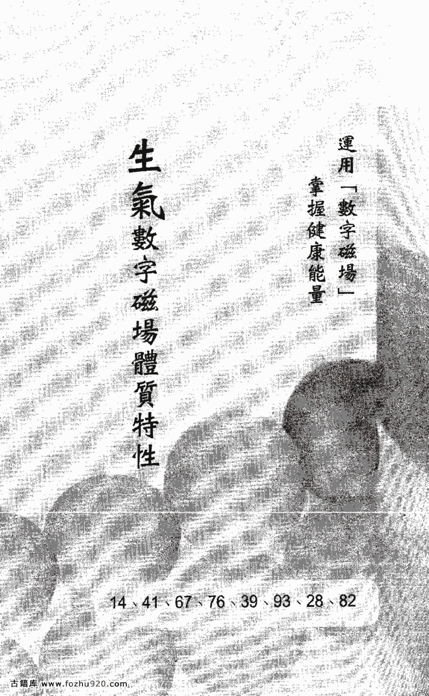

## 生氣數字磁場體質特性

運用「數字磁場」掌握健康能量

14、41、67、76、39、93、28、82

## 「生氣」數字磁場體質特性

「生氣」數字磁場的人是屬於樂觀及不拘小節的類型，因此在體質上的條件，堪稱是許多數字磁場中的救星。當「生氣」數字磁場運作之時，十之八九皆是出現正面能量，彷彿是「健康天使」般的身分來對抗惡魔。

雖然如此，「生氣」數字磁場依然有其負面能量的，並且當負面能量產生時，絕大多數是發生在胃、腸及眼、耳、鼻系統。對一般人來說，也或許僅僅是所謂的富貴小小毛病吧！

雖然如此，但是我仍然認為，小毛病經過日積月累後，若是適逢走到「絕命」、「六煞」或者「五鬼」數字磁場的年齡時，仍然會對身體的健康產生一定的影響。因此，我常對我的學生提供「生氣」數字磁場的養生方法。畢竟，人是吃五穀雜糧，即使有再強的數字能量來抵抗，仍須時時注意身體變化，且適當的增加欠缺的數字磁場才是。

接下來我舉的例子，是特別針對許多人的身分證數字磁場中具有5和0的組合來解釋的。在出版了數字磁場相關的許多書籍至今，我發現有將近百分之二十的讀者，並不了解該如何看待0和5的組合。若還有疑問，讀者可以翻閱本書導讀（二）的說明。

我希望藉由這個案例，更進一步的詳細解析，能夠幫助讀者更容易了解0和5的磁場能量變化。

從這個舉例中，我們可以知道：

十五歲至二十歲是13「天醫」的數字磁場。二十歲至二十五歲是35，35=33「伏位」。

二十五歲至三十歲是55。

三十歲至三十五歲是50，50=55。

三十五歲至四十歲是07，07=77。

因此二十歲至四十歲的35507就形成35557=37「絕命」的數字磁場。

而這裡的37「絕命」，由於中間跨越了三個5，因此會將37的「絕命」強度升級至12的「絕命」強度。等於他從二十歲至四十歲，都會圍繞在12「絕命」的數字磁場能量中。

```
A 1 3 5 5 0 7 6 7 4
(A=01)
→ 0 1 1 3 5 5 0 7 6 7 4
```

```
3 5 5 0 7
= 3 5 5 5 7
= 3 7
(絕命)
```

## 更多资料

↓↓↓

## 【中华古籍库】

↓ 点击链接 ↓

https://www.fozhu920.com/list/

珍版刻印 / 海外流传 / 家传手抄 / 民间失传

【易】【医】【道】【武】【文】【奇】【画】【书】

1000000+高清古书籍

## 打包下载


微信：mbook86

在他四十歲至四十五歲是76「生氣」的數字磁場，四十五歲至五十歲是67「生氣」的數字磁場，五十歲至七十歲是74「六煞」的數字磁場。

這樣一來，這位男性朋友若是二十歲到四十歲，生過一場大病，特別是肝、腎或者生殖系統的疾病，那麼他在四十歲至五十歲間，是能夠安然無恙的，因為連續的76及67的「生氣」數字磁場，能夠為他取得絕佳的健康條件。

在他五十歲到七十歲間的「六煞」（74）數字磁場，會帶來另外一段健康上的負面壓力（特別是腦部系統）。

所以說，「生氣」數字磁場的正面能量並不是萬靈丹。事實上，在數字磁場中的任何一種正面能量（「延年」、「生氣」、「天醫」，甚至是「伏位」……），並沒有所謂的「數字神醫」。

也就是說，任何一種數字的正面能量，都必須被置放在適合的人身上，才能完全發生最好的效果。

以這個舉例來說，他可以佩戴43顆的紫水晶手鍊，或者87顆的「延年」數字項鍊。對於胃、腸、十二指腸、肝、膽系統較容易發生狀況的「生氣」數字磁場的人來說，可以佩戴31顆的手鍊或項鍊，因為「天醫」磁場是可以幫助「生氣」數字磁場所遇到的麻煩。

三月初，在我的數字磁場股市投資班的初級團體班最後一堂課裡，那天絕大多數的學生都想繼續參加中級班的報名，其中一位學生在課堂結束後，掩不住滿臉的喜悅告訴我，他中了最近一期的小樂透一獎，獎金有好幾百萬，所以他想報名中、高級的個人班。

那段談話的過程中，他告訴我，自從他上了數字磁場的課程，他已經用了這套方法試驗在大、小樂透彩中，而這一次終於讓他如願以償。

但他告訴我，自從他中了樂透之後，已經有一星期感到身體不適，到醫院檢查之後，發現有胃出血的狀況，他除了按時服藥外，他請教我是否數字磁場的負面磁場影響他，他又該如何調整身體的數字磁場能量？

這位學生的身分證數字磁場，三十歲至三十五歲是14「生氣」數字磁場，三十五歲到四十歲是41「生氣」數字磁場，四十歲到四十五歲是16「六煞」數字磁場，他今年四十歲。從這些數據中，我已經可以清楚掌握了他的狀況。

我曾經在《數字磁場的魅力》第一本書中提到，「生氣」的數字磁場的偏財能量是最強的，這位學生的「生氣」數字磁場，同時具備了14及41最強的兩組數字能量。所以他中了樂透一獎，可以說是一點也不意外。

另外，這位學生自從開始上我的「數字磁場股市投資班」後，他告訴我，他確實在股市中賺了將近公務人員半輩子的薪水。

他這次胃出血，是發生在四十歲的這個時間點，在我看來，是完全符合了「六煞」數字磁場（16）的時間，因為「六煞」數字的負面能量，是發生在14及41的「生氣」數字磁場之後。
這意謂著，在他獲得大筆金錢後，勢必會發生的狀況。這位學生在五十歲到七十歲的數字磁場又出現61「六煞」的數字磁場，所以他在未來的三十年當中，必然會因為胃腸的問題困擾不已。
聽我解讀完後，原先他喜悅的面容瞬間變成慘綠的表情，他不停的追問我，該如何去調整自己的健康數字磁場。

我又觀察了他的出生月日的數字磁場：
八月二十九日
82為「生氣」數字磁場，
29為「六煞」數字磁場。

他的姓名數字磁場為：
41為「生氣」數字磁場。
16為「六煞」數字磁場。
61為「六煞」數字磁場。
11為「伏位」數字磁場。
再對照他的身分證數字磁場，我歸納出的結論是：
他的數字磁場皆存在著「生氣」及「六煞」的數字能量，並且都是「生氣」數字磁場在「六煞」數字磁場之前。

| 姓氏筆劃 | | |
| :--- | :--- | :--- |
| 姓氏 | 第二個字 | 第三個字 |
| 4 | 16 | 11 |
| = | 4 1 6 1 1 | |

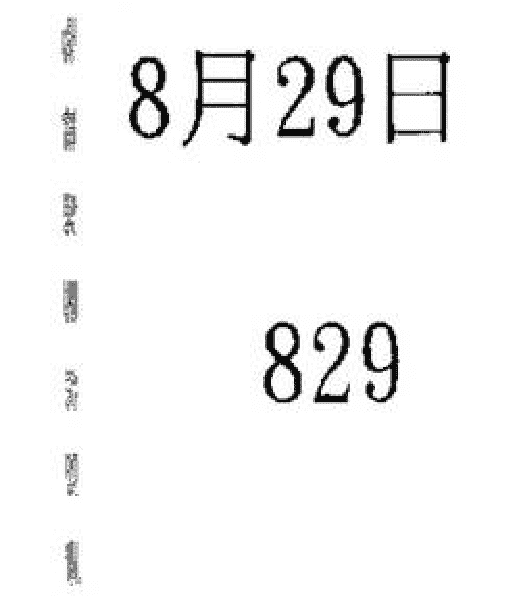

這樣的結果告訴我們，如果他的事業或財運極為順暢，那麼他的健康問題，也會隨之而產生。

我告訴他，除了必須化解「六煞」的數字負面能量外，同時還要增加「天醫」的數字磁場，以補足先天在健康數字磁場的不足。

以這個同學而言，他可以將賺到大筆金錢，拿出適當的部分，回饋給社會。我會建議他採用這個方式，是因為「生氣」數字磁場的天意本能是「無所計較」，所以回歸到「生氣」數字磁場最原始的地方，那麼「生氣」數字磁場，就會以完全正面能量的方式呈現。

同時，他要在週遭的數字磁場中增加「延年」（19、91）的數字磁場，但也必須展現出「延年」數字磁場本質的正面能量，例如成立基金會，親自掌舵及實踐「延年」數字磁場包容及愛的力量。

事實上，在他的一生，是不需擔憂金錢問題，因為14及41的「生氣」數字能量組合，是非常完美的。若是後天數字磁場再補足「天醫」數字磁場，那真的可以說得上是接近完美的人生。

在那次談話之後，雖然我並不知道這位學生是否完全依照我的建議去做，但我陸陸續續的了解，他的身體已經復原，而且加入了許多義工團體，對我而言，這是最令我感到欣慰的一件事了。

## 天醫數字磁場體質特性

運用「數字磁場」掌握健康能量

13、31、68、86、49、94、27、72

## 「天醫」數字磁場體質特性

「天醫」數字磁場的人是讓其他七種數字磁場的人非常羨慕的。因為在健康的體質條件中，「天醫」數字磁場屬最強。我在這裡仍然強調，任何一種數字磁場的能量，並沒有完全且絕對的完美，藉由其他數字磁場的正面能量補強，才是最適當的。

以「天醫」數字磁場而言，在體質上較易發生的狀況，會是出現在皮膚、頭髮、血液循環系統方面。由於「天醫」數字磁場的負面能量是非常不容易產生，除非在「天醫」數字磁場所連接的前及後面數字磁場，同時是「六煞」及「禍害」，否則「天醫」數字磁場的能量都是足以正面能量產生的。

從上面這個舉例當中，這位女性在二十歲至二十五歲是16「六煞」的數字磁場，二十五歲至三十歲是68「天醫」的數字磁場，三十歲至三十五歲是89「禍害」的數字磁場。

這些數據正告訴我們，此時「天醫」（68）的數字磁場夾在16（「六煞」）及89（「禍害」）的數字磁場中間，因此「天醫」的數字磁場負面能量便會產生。

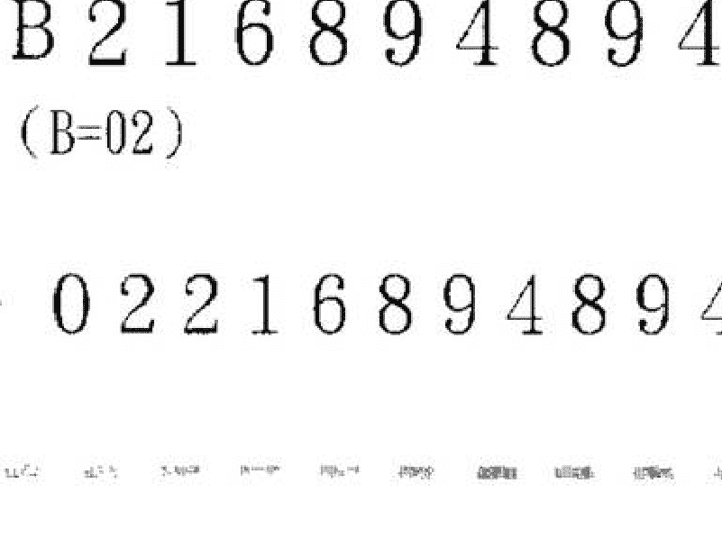

通常這樣的情況，對於「天醫」數字磁場的人是不需太過擔心，因為「天醫」數字磁場在健康上，原本就像是預防針一般，具有免疫的能量。若以這個案例來說，只需以一組「延年」的數字磁場化解16「六煞」的數字磁場，另外可以增加一組「生氣」的數字磁場即可。因為這位女性的身分證數字磁場共出現了（68、94、94）三組的「天醫」數字磁場。所以，三組的「天醫」數字磁場組合的能量，又已經等同於創造另一組14「生氣」數字磁場能量了。我之前不斷反覆提到，「天醫」數字磁場幾乎可以說是其他七種數字磁場所必備的數字磁場能量。

即使是最弱的2組（27、72）「天醫」數字磁場，只要善加適切地運用在後天的身邊數字磁場中，那麼所產生的力量還是很強大的。自從我將數字磁場的學說公開後，我發覺有太多的學生及讀者，拼命地運用13、31、68、86的「天醫」數字磁場在其週遭。而其中有不少的學生或讀者也曾向我反應，為什麼最強的「天醫」數字磁場能量運用在他們身上時，卻未察覺它的能量的發揮，有時反倒還會有挫折感？其實，「天醫」數字磁場的強弱的運用，亦是因人而異的。因為，任何一個人、一件事，若是都能一蹴可幾，那就違反了大自然的天時力量，自然地也會感受到被拉距的作用力了。因此，依照自己先天的身分證數字磁場循序漸進，是最符合數字磁場的原始力量的。

兩年半前，一個多年的好友從上海打電話給我，在電話中，他說最近要回台灣與妻子辦理離婚手續。當時在電話這端的我，感到非常驚訝。

這位好友在中國大陸所經營的生意可說是非常傲人的，也算得上是相當知名的第二代企業家。因此我對於這樣的訊息頗感納悶。

隔了一星期後我與他見面了，他將事情的原委一五一十地告訴我。我聽完之後，心裡已經有了答案，便急著想要應證他的身分證數字磁場。果然不出我所料，他當時的狀況，真的是「天醫」數字磁場惹的禍呢！

他的身分證數字磁場，二十五歲至三十歲是31（「天醫」），三十至三十五歲是13（「天醫」），三十五歲至四十歲是31（「天醫」），四十歲至四十五歲是18（「五鬼」）的數字磁場，他當時是四十二歲。

他的身分證數字磁場從二十五歲到四十五歲，可以說是具備三組最強的「天醫」數字磁場。

事實上證明，他也是一帆風順，但結婚八年最大的遺憾，就是膝下無子，他和妻子也不只一次去醫院做過檢查，雙方都沒有問題，可是就是無法完成「有子萬事足」的心願。

這個想離婚的理由，對許多人來說，可能會認為啼笑皆非，但對他而言，可是一件相當嚴肅且認真的事。

和他聊天的過程當中，我告訴他是否願意試著用數字磁場的方法嘗試，即使失敗，也不會有任何損失。他想了一想，回答我說：「那我就姑且一試吧！」

類似這種案例，我並不是第一次接觸，之前都成功的幫助好幾對夫婦達成心願。因此，我決定如法炮製，希望為我的好友完成願望。

我在當時也同時了解他妻子的身分證數字磁場。我發現他們夫妻倆的數字磁場，幾乎是完全相同類型的組合。

他妻子的數字磁場是68「天醫」及86「天醫」，其後銜接63「五鬼」的數字磁場組合。

當下我立刻告訴他，「你必須趕快破解『五鬼』的數字磁場的負面能量。」於是，我給了他這樣的建議。

首先，他必須將生意的主軸拉回台灣，因為台灣的數字磁場是14的「生氣」數字磁場，而中國大陸的數字磁場是「天醫」的數字磁場。以他這樣強大的「天醫」的數字磁場能量，會導致他的18（「五鬼」）數字磁場的負面能量完全展現無遺。

接著，他的妻子也必須將她的事業重心從日本拉回台灣。因為日本這個國家的數字磁場能量是屬於「伏位」及「絕命」雙重能量的數字磁場，即使她的「天醫」數字磁場再強，若是長期待在日本，「天醫」的數字磁場最多只能完全抵銷「絕命」的數字磁場能量罷了。

除此之外，他們兩人都必須佩戴珊瑚類，或是黑髮晶、茶晶、粉晶、綠幽靈的手鍊或項鍊，數量為41顆或76顆的「生氣」數字能量。

而他們目前居住地方的數字磁場是31號8樓。

31為「天醫」數字磁場，18為「五鬼」數字磁場。

## 延年數字磁場體質特性

運用「數字磁場」掌握健康能量

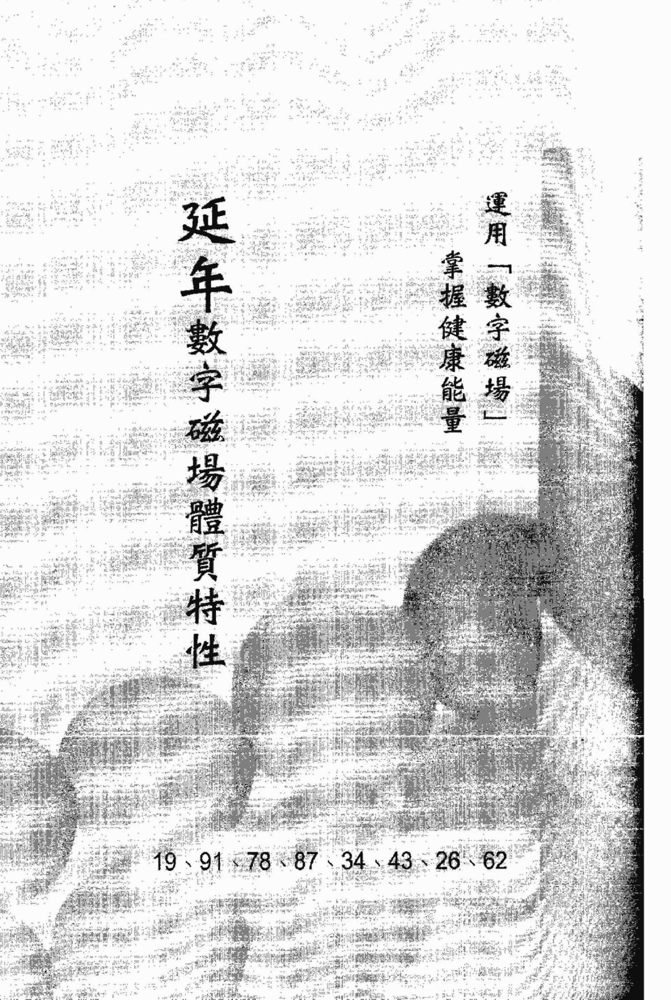

19、91、78、87、34、43、26、62

因此在居住的數字磁場也必須調整成「生氣」及「延年」的數字磁場。當然，他們身邊的數字磁場也必須完全增加「生氣」數字磁場為主的能量。還記得當時令我印象深刻的是我的好友回應我的一句話：「這簡直是將我的生活敲碎，再重新拼圖。」我則是斬釘截鐵的告訴他，「相信數字磁場，它一定可以為你帶來奇蹟！」

他約莫花了一個月的時間說服他的妻子，並調整他事業的方向及重心，就這樣完完全全的依照我的建議，一共創造出14種「生氣」及「延年」的數字磁場，圍繞在他與妻子的身邊。

九個月前，他得到一份上帝賜予的禮物——他的妻子懷孕了。我想，此時應該沒有任何一件事能夠更令他開心了吧！

## 「延年」數字磁場體質特性

「延年」數字磁場的人是屬於勞心勞力型的，他們的責任心永遠放不下，抗壓性也是其他數字磁場的人所望塵莫及的。因此，「延年」數字磁場的人最容易積勞成疾。他們最容易出現的疾病，不外乎是肩、頸、關節及神經系統，還有心臟方面的系統，也是「延年」數字磁場的人較容易發生的狀況。

一般而言，「延年」數字磁場一旦出現時，絕大多數都是以正面能量的方式呈現。所以在我的數字磁場學說中，才會有「延年」壓制「六煞」數字磁場的說法產生。

但是「延年」數字磁場的負面能量，是在何時產生的呢？這也是我的許多中級班學生常有的疑問。

「延年」數字磁場若是要產生負面能量，必須是前面或後面所連接的數字磁場，有「絕命」，或「禍害」，或「五鬼」，或是「六煞」的數字磁場能量太強時，而連續其前、後的「延年」數字磁場，若未能加以完全壓制時，即會對健康產生傷害。

從這個身分證的數字磁場中，我們可以知道：

三十歲至三十五歲是呈現78「延年」的數字磁場，四十五至五十歲是呈現62「延年」的數字磁場，而這兩個階段的「延年」數字磁場，對這位女性來說，並沒有對她的身體健康有太大的實質幫助。

其原因是，二十五到三十歲時的47「六煞」數字磁場出現於78「延年」的數字磁場之前，所以「延年」數字磁場的正面能量，剛好抵銷了「六煞」數字磁場的負面能量（「延年」壓制「六煞」）。

三十五歲至四十歲的84「絕命」數字磁場之前，是「延年」數字磁場。所以這也意謂著，這位女性將事業上的壓力完全承擔累積下來，或者將家庭之間的責任完全一肩扛起，以至於產生「絕命」84的結果。

而84「絕命」的數字磁場再結合上46「禍害」的數字磁場，會造成這位女性的肝、腎及胸腔系統產生極大的壓力，甚至於生一場重病，也都只是意料之中的事罷了！

五十歲至七十歲的29「六煞」數字磁場，又連接在62「延年」的數字磁場之後，所以這位女性若仍在職場上擔任主管的職務，會有許多心力交瘁的疲勞感，在她五十歲至七十歲的29「六煞」數字磁場出現時，會引起長期失眠或者焦慮不安，甚至會有更年期的煩躁與不安。

A 2 5 4 7 8 4 6 2 9
(A=01)
→ 0 1 2 5 4 7 8 4 6 2 9

同時，62的數字磁場，是「延年」數字磁場中最弱的一組，在壓制了29「六煞」的數字磁場之後，並不能再留下任何「延年」數字磁場的正面能量。因此，這位女性的健康條件是令人堪慮的。

從這位女性的身分證數字磁場，我可以清楚判讀出解決的方式。首先，這位女性必須多增加幾組「天醫」及「生氣」的數字磁場於週遭的數字磁場中。若是從這樣的個案來看，我並不建議她再增加身邊的一「延年」數字磁場，這是因為「延年」數字磁場的人已經具有強烈的使命感及責任心，而這位女性應該嘗試將權力放下，並且要相信身邊的人能夠為她分擔一部分的責任。

事實上，在「延年」的數字磁場中（87、78）的數字磁場是一人之下、萬人之上（在公司、團體或者在家庭中皆是如此），這樣數字磁場的人，幾乎都是握有實質權力的人，所以承受的壓力自然而然也比其他人來得多，若是能學習放下，再結合數字磁場的運轉，自然能夠心想事成。

記得在撰寫《數字磁場的魅力》第一本書之前，有一次和朋友相約吃飯。那次她帶了一位報社的高階主管前來。這位高階主管外表是極為嚴肅的女性，她的氣色看起來卻有些黯淡，似乎身體出了很大的狀況。藉由這位朋友的告知，知道她在兩年多前就開始洗腎，最近有前往大陸換腎的想法，她想詢問是否可以前往。

我看了她身分證數字磁場後，給了她些許的建議。她四十七歲，四十五歲至五十歲的數字磁場是71「禍害」，五十歲至七十歲的數字磁場是12「絕命」，而她三十五歲至四十歲是87的「延年」數字磁場。從她的身分證數字磁場中，我們可以發覺87「延年」的數字磁場使她成為高階的主管，但是卻由於如此，衍生出71「禍害」及12「絕命」的數字磁場。所以從數字磁場的健康角度而言，她生命中的87「延年」數字磁場為她創造出事業的高峰，但是卻必須用健康付出代價，實在令人感覺唏噓。

12「絕命」數字磁場的負面能量一旦產生，肝、腎系統的嚴重病變會是令人難以想像的。

這個案例，在我的學生或讀者之中，還不是算最嚴重的。對於她這樣的案例，我仍然強調數字磁場是可以創造奇蹟。

首先，我建議她必須辭去目前的職務，全心全意在家休息，因為「延年」數字磁場（87）為她帶來太強大的責任感，此時唯有放下，方能開始調整身體的數字磁場能量。

另外，我也根據她目前住家的數字磁場幫她做了調整，原先她住在91號2樓，形成912（91為「延年」，12為「絕命」）的數字磁場能量，三樓卻一直只是作為客房使用。

因此我告訴她，必須搬到三樓去住，使得住家的數字磁場形成913（91為「延年」，13為「天醫」，39為「生氣」）數字磁場。

同時，我也依照她的身分證數字磁場的71「禍害」及12「絕命」的數字磁場負面能量所可能產生的傷害，運用金髮晶、紅水晶的能量，並佩戴41顆的手鍊及31顆項鍊的「生氣」及「天醫」數字磁場能量運用方式。

## 好命密碼

甚至，她也願意更動名字的數字磁場為「生氣」及「天醫」的組合方式。

就這樣零零總總，我為她創造了十三種不同形式的數字磁場能量。就在我出版《數字磁場的魅力》第一本書的隔天，她告訴我，最近一次去洗腎時，醫生為她做定期的腎功能檢查，醫生告訴她一堆醫學名詞及說法，但結論是，她的腎功能竟然開始有逐漸恢復的契機，當時的她，簡直不敢置信。

我除了為她感到高興之外，並叮嚀她隨時注意身邊數字磁場的變化，千萬不能再產生不適當的負面磁場能量。

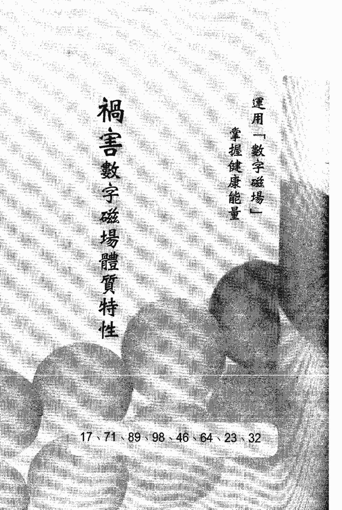

## 「禍害」數字磁場體質特性

「禍害」數字磁場的人，抵抗疾病的能力是相當脆弱的。這樣的說法，可以從「禍害」數字磁場的本質條件中找到答案的。

在我之前著作的書當中，不時提醒「禍害」數字磁場的人，「運用嘴巴可以成就任何一件事」，但是相對的，「口」也是病源最容易進入的一個管道。

因此，具有「禍害」數字磁場的人，在健康上的基本條件是屬於先天不足。如果平時又不注意養生之道，那就很容易產生後天失調的結果。

這十幾年來，我所接觸的案例當中，發現具有先天性遺傳疾病的人，都會具有「禍害」數字磁場的DNA。

以「禍害」數字磁場能量為主體，若再結合上「五鬼」、「絕命」、「六煞」，甚至是再次連接「禍害」數字磁場時，那麼許多疾病的引爆點就會正式開啟。

當然，「禍害」數字磁場的人主要的身體狀況是會發生在口腔、喉嚨、淋巴腺、胸腔的相關器官。而這樣的情形，已經不斷地驗證在許多數不清的案例中。

請看下列的案例說明。

這個舉例中，這位女性的身分證數字磁場當中，就是一個非常明顯的「先天不足、後天又失調」的數字能量組合。在她十到十五歲是32「禍害」的數字磁場，三十五到四十歲是32「禍害」的數字磁場，四十五歲到五十歲是98的「禍害」數字磁場，五十歲到七十歲，又再度出現89「禍害」的數字磁場。

由於這位女性的少年到中年、老年，皆出現以「禍害」完主體的磁場，因此她的一生將是大病、小病不停地困擾著她。

另外，她無論是在少年時期的「禍害」數字磁場32之後連接了24「五鬼」的數字磁場，或壯年期的32「禍害」數字磁場之前，是連接了63「五鬼」的數字磁場。這都會促使她原先的先天性疾病，無限性的轉壞，這就是「禍害」數字磁場的人最害怕遇到的數字磁場組合之一。

然而，單一產生的「禍害」數字磁場對健康的影響，已經是有相當的殺傷力了，此時，若是又結合負面數字能量極大的「五鬼」、「絕命」或「六煞」的數字磁場時，所要面臨的問題，絕對會是更加的棘手。

從這個舉例而言，我們首先須從「禍害」的數字磁場的負面能量先行著手化解，因為這個身分證的數字磁場的最重要癥結就是在「禍害」數字磁場。

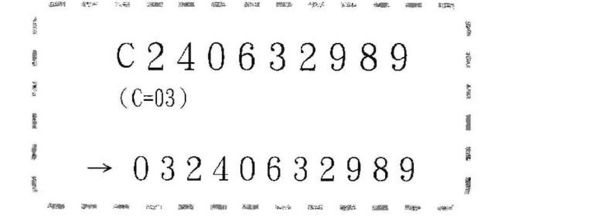

所以我建議她必須全面性的增加以「生氣」數字為主的後天數字磁場。以這個案例來看，她至少要創造五組具有「生氣」數字磁場為主的數字能量，當然，她同時要增加「延年」及「天醫」的數字磁場來化解「六煞」及「五鬼」數字磁場所產生的負面能量。

數字磁場命運解析的演講開始以來，至今應該超過上萬人的熱烈迴響，而只要是當日的演講主題是關於健康或財運解析時，幾乎都是場場爆滿的盛況。由此可見，愈來愈多人對於自己健康是非常關切的。

記得有一次演講主題是「身分證數字磁場決定你一生的健康」，那天絕大多數是銀髮族的朋友來參加，但其中有一位令我印象深刻的是，一位年約四十多歲的女性觀眾，在演講結束後，在寒風中的會場外等了我將近半小時只為了問我一個問題。她一見到我，立即將頭上的假髮拿掉，她告訴我，她禿髮已經有四年之久，而所造成她禿髮的原因，是由於甲狀腺亢進的因素，而她又因為乳房發現腫瘤，已切除了左半邊乳房，就在一次因緣際會的機會中，她接觸了數字磁場的書籍及訊息，因此特別報名參加這場健康講座。

那天我與這位女性在演講會場附近的Coffee Shop談了約莫一個小時，而她的身分證數字磁場中清楚地顯示，她三十五歲至四十歲是71的「禍害」數字磁場，而71的「禍害」數字是「禍害」數字磁場中最強的一組，四十歲至四十五歲的數字磁場是18的「五鬼」數字磁場，而18的「五鬼」數字磁場中最強的，她當時是三十九歲，她相當擔心的請教我，是否她還會有更惡劣的情況出現？因為將近五年的時間，由於自身的健康不佳，她情緒相當的不穩定，難以控制，連帶着整個家庭也受到相當大的衝擊，甚至還有幾次輕生的念頭，這一切無非都是由於這些疾病的產生所導致，因此她非常渴望且急切地希望得到最寶貴的幫助。

了解她的情況後，我除了分析她的身分證數字磁場中的「禍害」（71）及「五鬼」（18）的數字磁場結合後，陸續可能產生的幾種狀況之外，我還提供了許多解決她目前情況的方法。

「禍害」數字磁場的剋星是「生氣」數字磁場，以「生氣」數字磁場為主，連接「天醫」、「延年」、「生氣」的數字磁場，是可以化解「禍害」數字磁場所帶來的任何負面能量。

若以上面這個案例而言，這位女士可以考慮增加4134（41為「生氣」，13為「天醫」，34為「延年」）類似的數字磁場能量，在行動電話的號碼中。由於「生氣」加上「天醫」再結合「延年」的數字磁場組合，是可以化解「五鬼」數字磁場的唯一方式，而「生氣」加上「天醫」，「生氣」加上「延年」，或者「生氣」加上「生氣」的數字磁場組合，則可以根除「禍害」數字磁場負面能量的發生。所以類似上面的數字磁場不僅可以運用在行動電話號碼上，在車牌、姓名、住家的數字磁場組合，都可以適用。事實上，我不止一次的提過，創造十個數字磁場，絕對比只創造一個數字磁場來得有效、快速。

當然在更動數字磁場的過程中，有些方式確實造成了某些人的困擾，但我必須說，如果你希望達到目標，許多事物的取捨是在所難免的。

根據這位女士當時的狀況，我當然也建議她佩戴水晶，例如綠幽靈、綠髮晶、粉晶、東陵玉、青金石……等，都是非常適合的。同樣的，手鍊或者項鍊必須是「生氣」（41顆）、「天醫」（31顆）、「延年」（34顆或43顆）的數字磁場，這樣才能結合水晶以及相關佩戴飾品的能量，共同產生功效。就在那次的面談後，大概一個月的光景，這位女士陸續的變動了所有可以更動的數字磁場，在更動的過程中，我可以感覺到她對數字磁場能量的堅信及堅持。事情發展至今已兩年多了，她目前不僅狀況良好，並且還以她的親身體驗，陸續的幫助她身邊的親人和朋友，這也是最令我值得欣慰的。

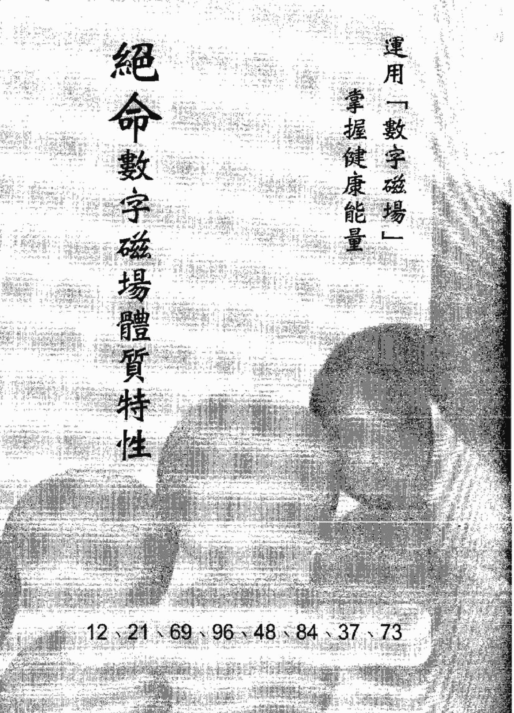

## 絕命數字磁場體質特性

運用「數字磁場」掌握健康能量

12、21、69、96、48、84、37、73

## 「絕命」數字磁場體質特性

「絕命」數字磁場的人是屬於大喜、大悲，人生曲線的起伏相當之大，因此勞心勞力是「絕命」數字能量的主要特性。在體質上，以肝臟為主體的器官較易產生狀況，腎及生殖器官也是「絕命」數字的人經常發生不適的主軸。

在數字磁場中，「絕命」數字磁場能量的人是最容易發生緊急事故，因為「絕命」數字能量總是將人帶到最高點，接著摔落至最低點。若以這樣的能量推演至身體狀況時，所發生的情形自然是不可等閒視之。

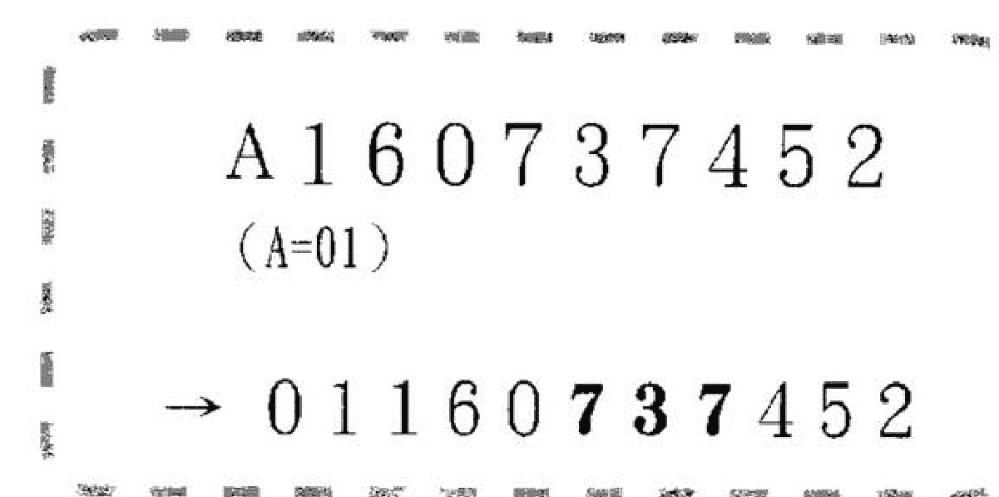

這個舉例中的 737（73 為「絕命」，是三十至三十五歲的數字磁場，37 為「絕命」，是三十五歲至四十歲的數字磁場）也就是說，這位身分證的主人，在三十歲至四十歲的十年當中，所面臨的是兩次「絕命」數字磁場能量的聚合。

換句話說，在十年當中，他必須對肝臟、腎臟、生殖器官的健康狀態，要相當的注重保養。否則一旦發生狀況，不僅是連續性的，傷害力之大，將是很難估計的。

「絕命」數字磁場的73和37是八組「絕命」數字磁場能量最弱的兩組數字，在這個舉例中，737是連結在一起發生，因此737的「絕命」數字在結合後，自動升級成（48、84）的次強「絕命」數字磁場能量。

以這個舉例而言，他在三十歲至四十歲的時間當中，由於是以最弱的37、73「絕命」數字磁場出現，因此所產生的身體狀況，會是他最不引以為意的時間點出現。例如，他在那段時間總是會感覺特別疲累、食慾不振……等，而這些癥兆就是「絕命」數字磁場73、37最可怕的狀況，因為數字磁場已經在警示這位主人，必須留心自己的身體了。

若是出現這樣的情形時，除了調整生活作息之外，依我看來，最好的方式還是在自己身邊，創造具有「天醫」的數字磁場（13、31、68、86、49、94、27、72）來化解身分證數字磁場先天所帶來的「絕命」數字磁場。

以這個案例而言，我會建議先以（27、72）或（49、94）的「天醫」數字磁場來增加即可。

這就是數字磁場真正的絕妙之處。因為，不是每個「絕命」數字磁場都需要或適合運用最強大的「天醫」數字磁場能量。

二〇〇三年的年初，我的一位朋友從日本回來，她是從事貿易的相關工作，那次見面時，她突然問我最近還有沒有開課（關於數字磁場的健康解析）。

當時，我楞了一下，因為我這位朋友是標準的「鐵齒族」，她會想報名上課，真是嚇了我一跳。

原來，在她要出國的前半年，我告訴她，她這段時間必須特別留意她的肝及腎的狀況。當時她並不以為意，甚至還說我是烏鴉嘴。結果不幸被我言中。她到了日本不到一個半月，因為腎結石及膀胱結石開了兩次刀，不僅花了許多錢，整個人看起來也消瘦了許多。

她很納悶地問我：「為什麼你會預知到我的身體狀況？」
我是這樣回答她問題的——她三十歲至三十五歲的數字磁場是85，三十五歲到四十歲是54的數字磁場，也就是說，她三十歲到四十歲的數字磁場是854＝84「絕命」的數字磁場。
由於854的「絕命」數字是大於84，小於69的「絕命」數字，所以在這樣的情況下，將有百分之九十以上的機會是發生在肝及腎臟上。她當時是三十五歲，正好介於「絕命」（854）的數字磁場能量最強的狀態，因此，一旦身體出現狀況時，是會連續發生的。

真是慶幸她能撿回一條命，從數字磁場的角度而言，她能平安無恙的原因是因為她四十歲到四十五歲出現49的「天醫」數字磁場，也因為「天醫」數字磁場是可以化解「絕命」數字磁場負面能量的。
但我也告訴她，由於49的「天醫」數字磁場，是屬於中強的「天醫」數字磁場，因此她還是必須小心會有再次復發的狀況。
最好的方式，就是在這段時間不斷的增加身旁「天醫」數字磁場。
我建議她可以隨身佩戴86顆，或是68顆的水晶（髮晶、鈦晶、茶晶……等），當然，她也必須在自己身邊其他可變動的數字磁場，例如行動電話號碼、車牌……等，不斷增加「天醫」的數字磁場。

距離那次見面後的一個星期，她參加了我的課程，在將近一個月的初級班結業後，她又踏上日本之途。

到目前為止，每每她回國，就不停的詢問我，中級及高級班的課程，因為她認為數字磁場是一套簡易入門，但卻又是非常專業的一門學問。

## 六煞數字磁場體質特性

運用「數字磁場」掌握健康能量

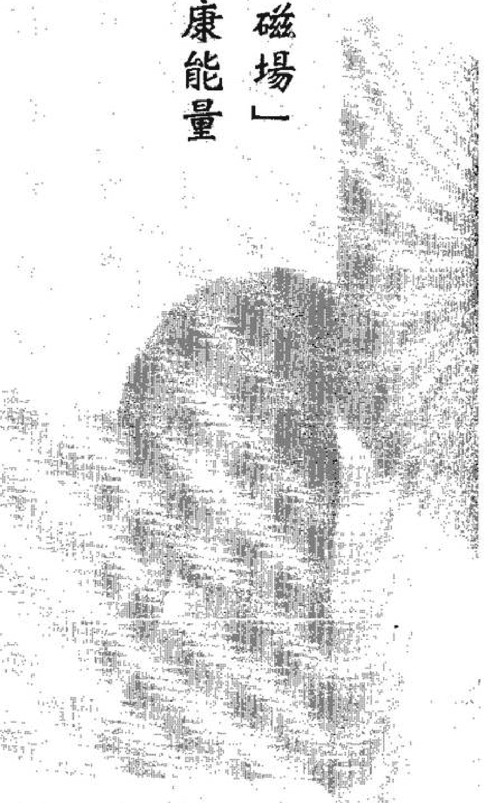

16、61、38、83、47、74、29、92

## 「六煞」數字磁場體質特性

「六煞」數字磁場的人，是屬於細膩敏感型，對於許多人、事、物，都具有高度的不確定及不安全感，而這樣的數字磁場特性，所呈現在身體體質上，是經常會產生腦部及胃腸的相關疾病。

在我曾經接觸上萬人的個案中，「六煞」數字磁場的人是很容易在環境、情緒上的壓力下，引發出不可思議的疾病。我在「六煞」數字磁場的女性身上最常看到的是憂鬱症、躁鬱症及許多精神上的疾病。胃部的抽搐、胃潰瘍、十二指腸潰瘍……等，也是「六煞」數字磁場人常會出現的症狀。

以上列身分證數字舉例來說，這位女性在她二十歲至二十五歲是38「六煞」數字磁場，三十五歲至四十歲是47「六煞」的數字磁場，四十五歲至五十歲，以及五十歲至七十歲，皆是92和29的「六煞」數字磁場。所以這位女性，在以上提到的階段，都必須面臨「六煞」數字磁場的負面能量所產生的身體疾病。

或許讀者這時會問，為何我如此肯定「六煞」數字磁場的負面能量，會大於正面能量呢？

我就用以這個例子為各位解釋。

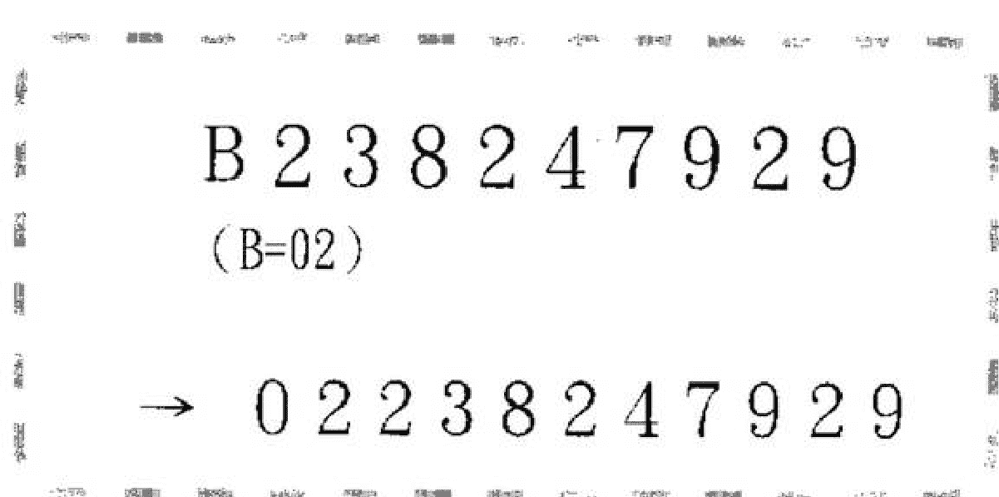

由於這位女性在第一階段二十歲到三十五歲的38「六煞」數字磁場產生時，連接在後面的數字磁場是82「生氣」數字磁場，這個「生氣」數字磁場雖然可以為她化解當時所產生的疾病，但卻無法完全根治，這是因為「生氣」數字磁場的正面能量，是無法壓制「六煞」數字磁場的負面能量，只有一「延年」的數字磁場能量才能做到。

這位女性在第二階段及第三階段、第四階段，所連接的皆是「五鬼」及「六煞」的數字磁場負面能量，在這樣的雙重數字磁場相互碰撞、結合的結果，就是雪上加霜。

若是這位女性產生憂鬱症的時間點是在二十五歲至四十歲47的「六煞」數字磁場時，那麼情形不但難以好轉，而且還可能會有更令人不可思議的舉動產生，甚至會有輕生的念頭及行動。

類似這樣的實例個案，我已經接觸不少。實際上藉由數字磁場的天時力量結合醫學的方法治療的人，是不勝枚舉。

針對上面的這個案例，除了必須以增加「延年」數字磁場正面能量，以壓制及化解「六煞」數字磁場的負面能量外，同時必須再根據「六煞」數字磁場的前或後面所連接的數字磁場是「五鬼」數字磁場。因此，我們也必須增加以「生氣」、「天醫」的數字磁場為主的後天數字磁場予以化解。

我建議在健康上的調整可以使用水晶為主體的原因有二，一是因為水晶在台灣是處處可見，價格也不至於太為昂貴。二是因水晶本身就具有淨化、循環的分子結構，若是結合數字磁場的能量調整，其功效必然是事半功倍。而且無論是手鍊、項鍊，若能常常佩戴具有數字磁場的特性，那對於每個人的健康是最直接性的助益。

數字磁場的更動及創造，當然不限於身上的配戴物，包括最常使用的行動電話、室內電話、提款卡、車牌……等相關的數字磁場，都會以間接或直接的方式來影響你的健康。

一位朋友的妻子剛生產完約兩個多月左右，有一天，這位朋友告訴我，他的妻子近來總是喜怒無常，而且經常在照顧baby時，時而餵過量的牛奶，時而對著baby大吼大叫。經檢查後，醫師認為是「產後憂鬱症」。

我這位朋友因為工作的緣故，經常夜歸，也必須常常出差，他妻子和他母親之間也是處於紛紛擾擾的狀況。他還告訴我，如果再這樣下去，他都快得精神分裂症了！

於是乎，我檢視了這位朋友妻子的身分證數字磁場，她在三十歲至三十五歲是出現61「六煞」的數字磁場，而三十五歲至四十歲是12「絕命」數字磁場，她當時三十五歲，所以三十五歲正好處在61「六煞」數字磁場及12「絕命」數字磁場的結合點。這樣的情況，表示產後憂鬱症的狀況在未來五年（至四十歲前）是很難好轉，且導致婆媳之間的問題，也會在這一年因為12「絕命」數字磁場而引爆更大的家庭內戰或革命。

我的這位朋友聽我說完之後，臉色是一片鐵青，但我也告訴他，不必太過悲觀，因為數字磁場是可以挽救這個婚姻及家庭的。

我告訴他，首先他的妻子必須先佩戴一串91顆（一延年一的數字磁場）的紫水晶項鍊，同時，在手上再佩戴一串13顆（一天醫一數字磁場）的紫水晶。除此之外，房間內的裝飾品，也必須符合一延年一的數字磁場。他妻子對外的聯繫電話號碼，也必須調整以一延年一為主、一天醫為輔的數字磁場能量。

至於我的這位朋友，由於他目前的數字磁場是處在88的一伏位一數字磁場，所以他會對目前的情況束手無策。因此，我也建議他將自己的身邊數字磁場調整86、68的「天醫」數字磁場，或82、28的一生氣一數字磁場，這樣一來，便可消除家庭中許多對立的氣氛。

果然不出我所料，不到一個星期的時間，我的朋友打電話來，興奮的向我致上謝意，他告訴我，他和他太太都明顯的感覺到家裡的平和氣息，而且他的母親竟然一反常態的對他太太噓寒問暖，他們夫妻倆都認為這是他們結婚幾年來從未發生的事。數字磁場如今對他們而言，是創造出比金錢更可貴的家庭奇蹟呢！

## 五鬼數字磁場體質特性

運用「數字磁場」
掌握健康能量

18、81、79、97、36、63、24、42

## 「五鬼」數字磁場體質特性

「五鬼」數字磁場的人是屬於詭譎多變，難以依照規則性去推演的個性特質。但是他們的最大特色就是反轉。

「五鬼」數字磁場在體質上的呈現，是「外強中弱」或者「外弱內強」。這兩句話是我長期研究驗證「五鬼」數字磁場的人，所歸納出的結語。具有這樣體質的人，是最令人擔心的，因為許多疾病的發生，都是突發性，甚至可以說是無前兆可言，當疾病已經產生時，都不只是一般的小毛病而已。

相反的，若是具有小毛病「五鬼」數字磁場的人，如果在那段時間之後，所連接的是「生氣」、「天醫」或「延年」的數字磁場，那之前身體的毛病，則有瞬間轉好的可能性。

「五鬼」數字磁場的人，身體上經常會出現的狀況，極為繁複，但主要是心、肺、免疫系統及生殖系統……等。

在此，我要說明的是，「五鬼」數字磁場愈強的人，或者組數愈多的人，對於腦部及神經系統的部分，是必須要格外注意的。

從上面舉例中，我們可以發現這位男士的一歲至十歲18「五鬼」，十歲到十五歲81「五鬼」，二十五至二十歲是36「五鬼」，四十五歲至五十歲是79「五鬼」的數字磁場。
因此，在這四個階段當中，除了十歲到十五歲的81「五鬼」數字磁場的負面能量所造成的殺傷力較小之外，其餘的三個階段「五鬼」數字磁場的負面能量，對健康的影響絕對是百分百的負面影響。

R143612798
(R=18)
→ 18143612798

由於第二階段的81「五鬼」產生之後，連接了一生氣14及「延年」43，所以給了這位男士稍微喘息的時間，否則這位男士可以說是一生皆被病魔纏身，所產生的這些疾病都是難以處理的。
在我接觸過的案例當中，在幼年及少年若是同時出現「五鬼」數字磁場，十之八九都生過一場大病，甚至也有些是先天性的疾病，或者因為家人的疏忽發生了不可挽救的疾病。
在青少年或者壯年具有的「五鬼」數字磁場，女性則需特別留心婦女方面的疾病，而男性則需留意心、肺的異常變化。
至於中年及老年所具有的「五鬼」數字磁場，則需特別留意腦部及免疫系統方面的病變。

「五鬼」數字磁場的負面能量一旦產生時，所需要的破解能量，比起其他七種數字磁場的人，需要更多種數字磁場正面能量。正因為如此，「五鬼」數字磁場的人，是最需要做定期的健康檢查。

除此之外，創造大自然所賦予的數字磁場力量，是可以做到滴水不漏的預防效果。我在本書導讀（三）提到，「五鬼」數字磁場的人，最好是能增加「生氣」加上「天醫」加上「延年」的數字磁場組合，並且順序不可顛倒，這完全是因為「五鬼」數字能量的變數實在太大，所以這樣的化解方式是接近完美的。

以上面這個舉例而言，這位男士從二十五歲開始，除了具備36「五鬼」的數字磁場外，其後連接的61「六煞」與12「絕命」，皆是最強的數字磁場類型。因此他在創造身邊的數字磁場時，皆可以連用「延年」及「天醫」最強的一組數字磁場予以壓制。

看到這裡，讀者會問，究竟數字磁場的效果，是需要多久的時間才能開始產生效果？事實上，數字磁場的效果對於每個人是因人而異。

因為每個人的身分證數字磁場的能量都不同，目前所處的數字能量與即將銜接的數字能量是正面或負面也會有所差異，故產生的效能會有時間上快慢差別。

另外，許多人因為很多的原因，沒有完全更改不適合的數字磁場，或是更動數字磁場後，並未使其運轉，有的人有去更改，但卻沒有使用，這樣在效果上也會大打折扣。

無論是何種情形，一般而言，數字磁場的能量是使用者開始使用，即刻就被啟動，至於是否能達到每個人的期望，那就必須看使用者的努力程度而言了！

去年十一月參加了一個同學的婚禮，這位同學的家境從小就是屬於富裕的環境，他本身又是一位知名的室內設計師，因此當天婚禮的排場，可以說是官蓋雲集、排場盛大。

就在婚禮準備開始時，我看見這位同學的父親坐在輪椅上擔任主婚人，其他同學則竊竊私語的在談論著，我才了解，這位同學的父親在三個多月前中風，所幸已在慢慢復原中，可是他平時是個非常注重養生之道，不僅天天運動，連飲食也非常注意的人。

婚禮結束後兩天，意外的接到我同學的電話，他是輾轉的從其他同學口中得知，我的數字磁場學說可能對他父親的狀況會有所幫助，於是乎希望我能給予協助。

又過了一個星期左右的時間，我到了那位同學的家中去了解他父親的整個狀況。他的父親當時六十三歲，五十歲到七十歲的數字磁場是97「五鬼」的磁場數字能量。從他父親的身分證數字磁場，我已經非常清楚他中風的原因，完全是由於他的97「五鬼」數字磁場負面能量所導致。當然，其他周遭的後天數字磁場，也應證了這個結論。

他們家的門牌號碼是98號，他的父親是睡在一樓，因此形成981，（98為「禍害」數字磁場，81為「五鬼」數字磁場）的數字磁場格局。

而他不停的出現不可思議的表情，為什麼所有的巧合都會聚在一起？

我告訴他，數字磁場並不是所有巧合事件的總合，而是任何事件只是驗證數字磁場的真實存在及正在進行而已。

我建議他，除了讓他父親接受固定復健的人為力量之外，仍需藉助外在的天時力量，去消除整個不適合的「五鬼」數字磁場負面力量。

首先，他可以為他父親佩戴41顆的紫水晶手鍊（左手），13顆的「天醫」手鍊（右手），以及91顆的白水晶「天醫」項鍊。

同時，將他父親的睡房安排在二樓，使得他的住宅數字磁場由981（81為「五鬼」），變成982（82為「生氣」）的數字磁場。也可為他申請一個行動電話號碼是由「生氣」＋「天醫」＋「延年」順序不變的數字磁場，

門牌數字磁場：
98號1樓
981

出生年月日：
6月3日
63

另外，他的出生月日是6月3日（63為「五鬼」數字磁場）。
在姓名的數字磁場也有「五鬼」數字磁場。

所以，種種的數字證據告訴我，他父親的中風成因是由於「五鬼」數字磁場所造成。

我的同學聽我說完之後，還告訴我，他父親的車牌及以前的行動電話，都擁有好幾組的「五鬼」數字。

| 姓氏筆劃 | | |
| --- | --- | --- |
| 姓氏 | 第二個字 | 第三個字 |
| 13 | 4 | 22 |
| → | 1 3 4 2 2 | |

## 好命密碼

平時可以盡量用這個號碼，即使他父親無法接聽，這樣的數字磁場都可以產生它的運轉效能。

上個月，我的同學到我開班的教室找我，他告訴我，他的父親現在已經可以講出好多句完整的話，右手雖然還有些顫抖，但已經可以自己拿碗。他告訴我這些話時，幾乎是喜極而泣的。

## 伏位數字磁場人的親子教育

運用「身分證數字磁場」做親子教育溝通

11、22、33、44、66、77、88、99

## 「伏位」數字磁場人的親子教育

### 互動模式

「伏位」數字磁場的人，最大負面特性是等待，他們對任何事都可以採取無止盡的等待，以便用時間換取空間。但任何事物都是一體兩面，「伏位」數字磁場的人，最大的優勢就是足夠伏、潛藏。我們可以看到許多已經功成名就的企業家、科學家、政治家……，都具備了這項優勢。

為何這些成功的「伏位」數字磁場名人，皆屬於少數？這正是由於絕大多數的「伏位」數字磁場都將「伏位」數字磁場的蟄伏、潛藏，呈現「空等待」的狀態，因此常常失去主動出擊的契機。

在數字磁場的學說中，我們可以清楚的從身分證數字磁場中，去發現何種「伏位」數字磁場的人，是藉山時間儲存實力；何種「伏位」數字磁場的人，是處在永遠被動，甚至等待上天提供最完美的機會，卻讓時間蹉跎。

具有上列身分證數字的女士，就是屬於標準的等待的「伏位」數字磁場人。

這位女性在一十到二十五歲是33「伏位」

```
A 2 3 3 5 7 0 4 7 1
(A=01)
→ 0 1 2 3 3 5 7 0 4 7 1
```

二十五歲到三十五歲是357「絕命」，三十五歲至四十歲是70「伏位」，四十歲到四十五歲是04「伏位」，四十五歲到五十歲是47「六煞」

從身分證數字磁場中，我們可以看到這位女性無論做任何事，總是三分鐘熱度，因為33的伏位是最弱的數字磁場，一旦被動性的被迫去決定時，所得到的結論就是37「絕命」，這意味著失敗的答案。因此，「伏位」數字磁場的後面，若是銜接「絕命」、「六煞」、「禍害」、「五鬼」的數字磁場，代表所等待的答案，都會是負面的結果。

上列這個舉例來說，我們處處可以看到，「伏位」數字磁場的後面皆是「絕命」、「六煞」、「禍害」……等，因此只要停下腳步，就很容易遇到挫折及困難，尤其是遇到357「絕命」的階段，以及遇到47「六煞」，加上71「禍害」的數字磁場時，是會讓這位女士對人生感到失去希望及信心。

做父母親的人，若是自己的子女是屬於上述類似的身分證數字磁場時，在互動的模式上，必須用更大的耐心來開導與鼓勵子女。因為「伏位」數字磁場的人，是非常容易產生恐懼及不安。若「伏位」數字磁場強度愈強時，更容易浮現出固執及「死鴨子嘴硬」的性格。

「伏位」數字磁場的人，是不喜歡被說之以大道理，唯有藉由父母親的以身作則，才能獲得「伏位」數字磁場孩子的認同感。簡單而言，叮嚀及關心的對待方式，很容易被「伏位」數字磁場的人視為嘮叨，並感到不耐煩。

除此之外，「伏位」數字磁場的人不喜歡被催促行事，父母親若是屬於「急驚風」的類型，那麼「伏位」數字磁場的子女，絕對是屬於「慢郎中」。所以在親子溝通的過程中，切記不要試圖用時間的壓力去制服他們，否則會產生百分之百的反效果。

### 學習能力鑑定

「伏位」數字磁場的人，在能力學習上，是擅於思考、分析及邏輯組合的。因此，「伏位」數字磁場的人，有許多是科學家、生物學家、文學創作家、歷史學家……等。

我長期觀察「伏位」數字磁場的人，發現一個結果：「任何事物只要是很容分出勝負結局的，對他們而言，反而會是一種無趣的遊戲。相反的，需要藉由時間來檢驗、認定的事物，他們則是興致勃勃。」

許多能夠接受固定不變工作的人，絕大多數都是屬於「伏位」數字磁場的類型，例如，軍人、警察、教師、編輯、設計、創作……等性質的工作，都可以提供「伏位」數字磁場的人作為絕佳的參考。

前年三月份，是我第一次舉辦「數字磁場&親子教育」的課程教授，原本我以為是女性來報名的居多，令我感到意外的是，在那次的課程，三十一個學生中，竟然有十四位是男性家長。

其中一位男性家長是位上校軍官，他讓我印象很深刻。他告訴我，他的妻子長時間忙於自己的事業，對小孩子疏於照顧，因此，他們的長子長期封閉自己，不與家人溝通。他在書店偶然接觸到數字磁場的書籍，用他子女身分證數字磁場相互對照、驗證之後，發現完全符合，於是他報名參加了課程。當然他也希望我能再給予他建議。

他的長子的身分證數字磁場在十五歲至二十歲是99「伏位」，二十歲到二十五歲是98「禍害」數字磁場，二十五歲到三十歲是88「伏位」的數字磁場。他兒子當時是二十歲。

我告訴他，他兒子的99「伏位」數字磁場之後，所銜接的是98「禍害」數字磁場。因此，這個孩子在家中長期是封閉自己，但是對外卻是待人出言不遜，導致別人對他的不滿，甚至引起是非不斷。這位軍官聽我這樣說後，不斷的點頭，並告訴我：「之前我已經不知道有多少次為了孩子的行為到學校向其他同學的家長及老師道歉了，去年還甚至差點被學校開除。」

由於這個孩子的「伏位」數字磁場99，是屬於相當強的「伏位」。所以他若是累積心中的不滿及怨恨，一旦爆發出來，所產生的能量是很可怕的，又因為「禍害」數字磁場98銜接在後，所爆發的肢體衝突是在難免。

我建議這位軍官，「你的孩子是絕對不能以責罵的方式來互動的，同時，也必須以耐心、冷靜的態度跟他分析原委，並長期的加以關注，因「伏位」數字磁場的人，是無法接受被冷落的，冷落及冷漠，只會令他們產生更大的不安全感。」

## 好命密碼

我同時建議他必須為孩子及自己增加「生氣」及「天醫」的數字磁場，來創造他們的積極、主動的力量，同時能將「伏位」的等待能量轉換成真正的蟄伏能量。以這個案例來說，在他二十歲到二十五時的「禍害」98數字磁場，可以運用兩組「生氣」（67、76）或者（39、93）的數字能量來化解未來可能發生令人擔憂的事情。

## 運用「身分證數字磁場」做親子教育溝通

## 生氣數字磁場人的親子教育

14、41、67、76、39、93、28、82

## 「生氣」數字磁場人的親子教育

### 互動模式

「生氣」數字磁場人是屬於隨緣的本質，個性上不與人計較，處理事情及面對態度都是平和及理性的。

在八種數字磁場中最容易產生良性親子溝通的數字磁場，就是「生氣」數字磁場。

由於「生氣」數字磁場的能量中，渾然天成的散發出「理性」的元素，因此遇到任何的爭執、衝突，他們都能夠自然的化解。所以在現實的生活中，「生氣」數字磁場人經常是扮演著和事佬的角色。

另外，「生氣」數字磁場人幾乎都是以樂觀態度去看待人生，他們認為生命其實是一種喜悅及分享，倘若常將人生視為苦痛的降臨，那麼，漫長的七十年、八十年……，又如何能度過？

我在上課時，若是遇到「生氣」數字磁場的人或是他們的子女為「生氣」數字磁場時，我總會說：「你們的笑容就像是每天早起的太陽，而夜晚的月亮，一點都不擔心夜晚是否有烏雲遮月。」

我舉一個例子來說明，從下列的身分證數字磁場中，我們可以發現這個身分證的主人，從他一歲到十歲是14「生氣」的數字磁場，十歲到十五歲是42「五鬼」的數字磁場，十五歲到二十歲是28「生氣」的數字磁場，三十歲到三十五歲是93「生氣」的數字磁場，三十五歲到四十歲是39「生氣」的數字磁場，五十歲到七十歲是67「生氣」的數字磁場。

這個身分證的主人，一生當中擁有五組的「生氣」數字磁場。因此，他的一生可以說是契機不斷，即使人生的過程中會有42「五鬼」數字磁場，89「禍害」數字磁場及956「96」「絕命」數字磁場的風風雨雨，但總是能夠有貴人出現，安然度過難關。

N 2 8 9 9 3 9 5 6 7
(N=14)
→ 1 4 2 8 9 9 3 9 5 6 7

數字磁場的魅力
親子 教育 健康篇

好命密碼

對於「生氣」數字磁場而言，機會是不斷降臨。有很多人在先天磁場上無法擁有「生氣」數字磁場，我也常提醒大家，唯有「生氣」數字磁場的能量，才能夠為人生帶來希望。

至於「生氣」數字磁場人的家長們，「生氣」數字磁場固然是「理性」能量的象徵符號，但若缺乏「延年」數字磁場的權威及自主時，「生氣」數字磁場有時會稍微顯得沒有主見，其隨和的態度若是被「禍害」、「六煞」或者「絕命」、「五鬼」負面數字磁場過度運用時，就容易產生「被佔便宜」，或者「好人總是被欺侮」的感受出現。

「生氣」數字磁場是一「機會」能量的展現，雖然自己會擁有許多不可思議的轉機，同樣的，也是提供「機會」能量的付出者。

雖然「生氣」數字磁場是不計較回報的，但若將機會全部提供給需要者，那自己可就會求助無門了。這也是我為何時常叮嚀「生氣」數字磁場人，必須在自己身邊創造「延年」數字磁場最重要的原因。

除此之外，「生氣」數字磁場人若想將自己正面能量發揮極致，還是需要「天醫」數字磁場的幫助。「天醫」數字磁場的能量散發，就像是人生方向的導航員，有了這樣的數字磁場能量幫助，「生氣」數字磁場人才能懂得何時是行小善，又何時該行大義了！

### 學習能力鑑定

「生氣」數字磁場人是全方位學習接受器，對於任何能力的學習，他們總能靈活運用所以能夠「舉一反三」的學生們，多半是具備「生氣」的數字磁場能量。

由於「生氣」數字磁場並不喜歡刻板的學習模式，因此傳統的「你教課、我聽課」的方式是無法激發「生氣」數字磁場人的學習興趣。互動性的教學模式才能讓「生氣」數字磁場的人能量發揮。

根據我手邊的個案整理、統計，我發現「生氣」數字磁場人的數理能力是百分之百的，而且完整的數字及邏輯運算能力的學習性質，是非常適合「生氣」數字磁場人的。

在我以往的經驗中，許多知名的會計師、企管專家、金融家……等，都是必須具備完善「生氣」數字磁場，才能達到的。

近來，因為新書的宣傳活動，在一場出版社安排的小型講座中，我因此又認識了不少新讀者，而許多新讀者也成為我的學生。由於我的開班有人數限制，因此有些讀者被安排至下一次的課程中。

記得當時有一位被安排到下一次課程的新讀者，他是位知名的牙醫師，他私下告訴我，他是為了他的女兒才來參加報名課程的。

當時我很納悶的問他理由，他回答我說：「因為我的女兒之前參加過老師的三場演講，也因為老師的建議去唸金融企管，但是我女兒這樣的想法與我希望她唸醫的想法，差距甚遠，我想了解數字磁場究竟是有何種魅力，能否決了我女兒之前的決定。」

這位牙醫師女兒的身分證數字磁場，在她十五歲到二十歲是28「生氣」數字磁場，二十歲至二十五歲是26的「延年」數字磁場。

從這個女孩的數字磁場中，我們可以發現，她具有兩組28及82連續「生氣」數字磁場，已經等同於一組39「生氣」的數字磁場能量，而39「生氣」的數字磁場是非常適合從事企業管理的培養。而銜接28及82「生氣」數字磁場之後的是26的「延年」數字磁場，這正意謂這個女孩若是往金融的企管方面努力，是會有一番成就的，因為26「延年」就是一種權力的典型代表數字，而且26或62「延年」數字磁場的人，擔任主管，是很容易搏得上司及下屬的齊聲認同。

畢竟26「延年」數字磁場並沒有像87、78或19、91「延年」數字磁場的一種強勢霸氣。

這位牙醫師的身分證數字磁場，他二十歲到二十五歲是81「五鬼」，二十五歲至三十歲是13「天醫」的數字磁場，三十歲至四十歲是351＝31「天醫」的數字磁場，因此我可以斷定他事業的選擇是正確的。

醫師這個行業在數字磁場中是屬於「五鬼」數字磁場的行業，由於醫師所面臨的患者是各種數字磁場具備的，然而唯有「五鬼」數字磁場的能量，才能抗衡某些數字磁場的負面能量，但前提是，「五鬼」數字磁場之後，必須連接「天醫」、「延年」或者「生氣」的數字磁場，才能百毒不侵！

我的個案當中，也發生過許多醫師是名醫，但卻先後與病患有醫療上的糾紛，會產生糾紛的主要原因是，他們的「五鬼」數字磁場之後，只連接了「延年」數字磁場，卻無「天醫」或「生氣」的數字磁場。

在這裡，我要提醒具有「生氣」數字磁場子女的家長們，若是勉強自己的子女去從事「五鬼」、「絕命」、「六煞」的數字磁場行業，反而會適得其反。同樣的，若是剝奪了「生氣」數字磁場人的「機會」能量，就等同於是讓他們放棄成功的機會。

另外，也千萬不要以為擁有「生氣」的數字磁場，就等於擁有了「萬能鎖」，若沒有「天醫」、「延年」數字磁場的能量供應，「生氣」數字磁場的機會能量再多，也是會用盡的。

## 天醫數字磁場人的親子教育

運用「身分證數字磁場」做親子教育溝通

13、31、86、68、49、94、27、72

## 「天醫」數字磁場人的親子教育

「天醫」數字磁場的能量中，是充滿了「信任」與「被信任」的元素。因此具備「天醫」數字磁場的人，總是能帶給旁人信任感。對於許多家長們而言，「天醫」數字磁場是善於溝通的。

所以，我常認為「天醫」數字磁場的小孩，是屬於「乖乖牌」。或許這樣的形容詞，並不能完全表達「天醫」數字磁場的「信任」能量，但由此可見，「天醫」數字磁場是擅於體會及了解他人的感受。

### 互動模式

「天醫」數字磁場的能量散發，還蘊藏著「單純」，因此，這般的能量若結合「禍害」、「五鬼」、「六煞」的數字磁場負面能量時，就很容易成為被利用的工具，甚至成為許多人想要成功的踏板。

不過，「天醫」數字磁場同時也充滿著智慧及和平的能量，這個事實已透過上萬個人以上的實例驗證過。而「天醫」數字磁場與生俱來的財富能量，的確造成他們日後能夠成功、幸福的重要基礎。

與其說「天醫」數字磁場就能帶來用不盡的財富，倒不如說，由於「天醫」數字磁場中的「信任」能量，為他們帶來人生最珍貴的資產。

從這個身分證的數字磁場中，他的十歲到十五歲是31「天醫」的數字磁場，十五歲到二十歲是13「天醫」的數字磁場，二十至三十五歲是49「天醫」的數字磁場。

這樣的數據可以顯示出，這個人的家境良好，也擁有良好的家庭教育，這是因為13及31數字磁場所產生的。但是助人為樂的「天醫」數字磁場，會因為無私、無己的付出，導致別人對他們的嫉妒及虎視眈眈。因此，「天醫」數字磁場子女的家長們，是必須留意他們的交友狀況，否則，起初是出於善意的幫助，最後可能演變成自己受傷害的結局。

在這個案例中，我們同時看到13「天醫」數字磁場後連接了37「絕命」的數字磁場，雖然「天醫」的數字能量是可以完全化解「絕命」的數字磁場負面能量，但是這樣的狀況，通常都是被遇遭以為值得信任、值得幫助的人所出賣或背叛，而這個「絕命」數字磁場就如同是當頭棒喝，會將「天醫」數字磁場的「信任」能量摧毀殆盡。

所以說，「天醫」數字磁場也是需要增加「生氣」及「延年」的數字磁場能量，因為「生氣」的數字磁場可以為「天醫」數字磁場的人發現盲點，而「延年」的數字磁場則是能夠將「天醫」數字磁場的信任能量，運用在真正被需要的人身上。

### 學習能力鑑定

「天醫」數字磁場的人是具備了一「語言學習機」及一「數理演算機」的雙重功能，因為任何事物的學習，對於「天醫」數字磁場的人來說，都不是一件困難的事。

當然，「天醫」數字磁場的人是非常擅於智慧的探討，也因此許多相關心靈的探測、宗教、哲學神秘領域，都是「天醫」數字磁場人相當有興趣學習的項目。

我曾經在之前出版的書籍中，多次提到，「絕命」數字磁場對於宗教、心靈的領域，是有極高的天賦，而「天醫」與「絕命」的數字磁場是互補的，「天醫」磁場還能完全壓制「絕命」數字磁場。由此可知，「天醫」數字磁場人若是想朝這些方向發展，其成就必然不可限量。

「五鬼」數字磁場的人也是非常適合從事心靈、宗教、哲學……等神秘事物，且往往他們成就也只限於某些領域而已。

至於「天醫」數字磁場所追求的領域是無邊無界的，據我所知，許多心理學家、大思想家、哲學家、宗教家……等，都是具備了相當多組的「天醫」數字磁場。

當然了，若是回到一般的社會中，許多大銀行家、政治家、企業家……等，都擁有一「天醫」的數字磁場。

從這裡的討論，讀者可以了解「天醫」數字磁場可以涵蓋的層面是相當廣大的，並且十之八九都還是知名的人物呢！

三個月前，一位知名企業家藉由朋友的推薦，希望我能為他公司事業體擔任全年度的諮詢顧問。或許我這位朋友將我描述得太過傳奇，這位企業家在閱讀我的幾本處版著作物後，決定聘請我擔任顧問一職。

事實上，這個顧問的內容包含了：高階人事的聘用、公司產品的營運方針及行銷，另外，還有海外分公司的具體建議……等，而這些內容，其實應該是專業經理人的工作項目，但這些企業家認為之前已經依照我的數字磁場方式為公司打了幾場勝仗，也為公司獲利不少，因此想藉由一本尊一來操作，應更為恰當吧！

首先，我面對的最大難題，就是他兩個兒子的職務分配建議。因為這兩兄弟從以前小時候開始，就是無法和平相處，所以我的建議，勢必要格外謹慎、小心。

他的大兒子（簡稱A）的身分證數字磁場其中四個數字是 8687：

他的小兒子（簡稱B）的身分證數字磁場其中四個數字是 3184：

二十五歲至三十歲是 86「天醫」數字磁場，
三十歲至三十五歲是 68「天醫」數字磁場，
三十五歲至四十歲是 87「延年」數字磁場，他今年是二十八歲。

二十五歲至三十歲是31「天醫」數字磁場，三十五歲到四十歲是84「絕命」數字磁場，三十歲至三十五歲是18「五鬼」數字磁場，他今年是二十五歲。

從A和B的先天身分證數字磁場比較之後，A是比較適合擔任決策性的事務，由於他有兩組「天醫」86及68的組合後，可以形成一組最強的13「天醫」數字磁場。因此在許多決策性的考量會非常有前瞻性的眼光，而86及68的「天醫」數字磁場的能量是處處小心謹慎、步步為營，是屬於先求自我穩定，立於不敗之地再往前攻掠城池的處事方式，因此挫敗的機會幾乎是零。

在他「天醫」數字磁場後面的「延年」87，這是代表了最後獲得權力的掌控及眾人的認同。

至於B的「天醫」數字磁場31後面銜接了18「五鬼」的數字磁場，這代表B在信任的原則下產生反轉，很可能導致失敗，但「五鬼」18的數字磁場，代表具有許多積極性及突圍性的執行策略，因此，我建議B是較適合擔任幕後作戰的智囊團，甚至是執行者。由於B的數字磁場中仍有84「絕命」數字磁場，因此又再次證明，「絕命」數字磁場是適合擔任幕僚的。

但是，兩兄弟卻很難相處在一起，這乃是弟弟的「五鬼」數字磁場的緣故，因此，我也建議這位企業家及這兩兄弟共同創造「生氣」數字磁場。

## 好命密碼

因為「生氣」數字磁場就是一種理性數字能量及機會能量，對於兩兄弟的溝通、相處，會有絕對性的幫助。

弟弟也可以在身邊創造「延年」的數字磁場，因為「延年」數字的包容能量，是可化解兄弟間的隔閡。

至於這位企業家，可以再多創造幾組「生氣」數字能量，以及「天醫」數字能量，這樣一來，這位父親將可運用「生氣」數字的理性能量，與「天醫」數字的信任能量，為這兩兄弟搭起平衡的橋樑。

## 延年數字磁場人的親子教育

運用「身分證數字磁場」做親子教育溝通

19、91、78、87、34、43、26、62

154

## 「延年」數字磁場的親子教育

### 互動模式

「延年」數字磁場的人是非常有主見的數字磁場類型，因此在一個團體中也必然扮演領導的角色。正因為數字磁場的能量賦予「延年」數字人領袖的氣質，所以在互動上除非你能比他們更為強勢，否則就得扮演弱者的姿態。

很多家長問我，「為什麼『延年』數字磁場人的在溝通上，要扮演如此極端的角色，難道不能中庸一些嗎？」

我要強調的是，「延年」數字磁場是天生的領導者，因此他們會信服的對象，必須是更具有威嚴、更具有說服力的唯一領導者。除此之外，「延年」數字磁場人的能量還充滿了博愛式的關懷及照顧。因此，他們是絕對會傾力相助弱者的。

也由於他們的胸襟廣闊、不計較小節，因此「六煞」數字磁場的人是最需要這樣的人來照顧及保護他們。所以「延年」數字磁場人的同情、憐憫心若是過於氾濫時，就會像水龍頭一打開，關都關不掉呢！

從這個身分證數字磁場中，十歲至十五歲是11「伏位」數字磁場，十五歲到二十歲是19「延年」數字磁場，二十歲到三十歲是951等於91「延年」數字磁場，三十至三十五歲是17「禍害」數字磁場。

這樣的數字磁場當中，我們可以清楚的知道，這個身分證的主人，在求學階段即是領導人物（十五至二十歲時）的「延年」數字磁場（19）。而且直到他三十歲前，都是屬於風雲人物。這一切可以看作是「延年」數字能量幫的忙。我不斷的提到，「延年」數字磁場強度愈大，所具備的領袖能量就愈充分。但「延年」數字磁場的能量中，卻也隱藏著責任感的強大壓力。在排除壓力的同時，難免對自己會產生部分的傷害。

許多數字磁場的人，頗會運用「延年」數字磁場的包容力、同情及博愛的優點，而加以利用。這些數字磁場就是「禍害」、「絕命」及「五鬼」的數字磁場。

以這個案例而言，在951「延年」之後，銜接了（17）「禍害」數字磁場，這代表太過包容的力量及太過權威主導的氣勢，讓許多週遭的人開始有了負面的批評，而這些負面的聲音，甚至會將這個身分證主人的人際關係及感情或婚姻關係破壞殆盡。

因此「延年」數字磁場的人在施展權力的同時，必須避免許多流言蜚語。我也必須告知「延年」數字磁場人的家長們，在你們的小孩是位居領導位置時，必須培養他們有謙卑的心，同時要避免太過感性的語言及行為。

「延年」數字磁場人或許具備最頂尖的領袖條件，但往往忽視了週遭可貴的諫言。有時過度的強勢及執著，常常容易導致錯誤的研判。

上面的舉例中，我還看到一個情況：十歲至十五歲的11（「伏位」）後連接上19（「延年」）。這樣的數據顯示，這個小孩的忍耐力十足，為了最後的勝利成果，所有時間的孤獨寂寞，甚至負面的批評，他都能忍受，但是這個小孩終究能獲取他所要的結果。

「延年」數字磁場人的目標是遠大的，企圖心是旺盛的，所以外表常能表現出無敵鐵金剛般的堅強，但其內心卻未必是如此。正因為這樣，我常提醒「延年」數字磁場人的家長們，在與他們做親子互動時，要必須時常注意孩子內心情緒的變化。簡單而言，就是藉由許多感性的事物或遊戲，例如看一部感人肺腑的家庭電影，使孩子內心的真正情感透過類似這樣的方式將其抒發出來。我認為，這是非常有效且實際的方式。

否則，貯存太多別人情緒垃圾壓力，是很容易導致「延年」數字磁場人的內傷。而當至這些負面壓力瞬間引爆時，那所引發的效應可是會驚天動地的。

當然，「延年」數字磁場人本身就具有完全化解「六煞」數字磁場的負面能量，但是若能在其週遭創造「生氣」數字磁場的「理性」能量元素，以及其「天醫」數字磁場的「信任」能量元素，那大自然中最完美的三大數字能量結合，所造就的成功，必然是圓滿和平的。

## 好命密碼

### 學習能力鑑定

「延年」數字磁場人與「六煞」數字磁場人，其實是具有互補功能的。因此，凡是「六煞」數字能量所適合學習、培養或具備的能力，「延年」數字磁場的人都能擁有。

「延年」數字磁場人對於美感的鑑賞能力，絕對是最頂尖的。許多珠寶鑑定師、美食評論家、建築師、藝術品鑑賞家……等，都具備了絕對的「延年」數字磁場能量。

至於「延年」數字磁場人的組織、創造能力也是相當強的，有許多著名的小說家、歷史家，也有不少來自「延年」數字磁場人的能量。

談到「延年」數字磁場人的能力鑑定，就絕對不能遺漏掉政治人物。事實上，根據我手上的資料顯示，許多知名的部會首長、政治家，乃至於一國的元首，無非都具備了完全的「延年」數字磁場能量，否則想登高一呼，又豈是輕易之舉？

不久前一位重量級的政治人物，因為自己的兒子近來想要從政，令他心中惶恐不已，因此透過許多方式輾轉與我聯繫上，期望我能從數字磁場的角度給予建議及協助。

這位男主角的身分證數字磁場是這樣的：

二十五歲至三十歲是87「延年」的數字磁場，三十歲至三十五歲是76「生氣」的數字磁場，他是二十六歲。

根據這樣的線索推演，驗證的方式不只是書中的個案介紹，事實上，每個人都有相類似的情形，只不過有的人是在姓名數字磁場，有的人是在出生年月日數字磁場，有的人是在行動電話號碼數字磁場、車牌數字磁場、住家的數字磁場、學號的數字磁場……等。

找到與自己身份證數字相同的類型數字。如此的反覆驗證及等待事件發生的答案，無不印證了數字磁場的奧妙及精準。

回到這個案例上面，我們可以發現這位男主角的「延年」數字磁場87及78是可以為他帶來前程的光明。

雖然87及78的「延年」數字磁場，並非「延年」數字中最強的兩組數字，但具有強勢的領導性格已是無庸置疑。

他的姓名數字磁場如上圖所示：

17為「禍害」，78為「延年」，82為「生氣」，21為「絕命」

從這兩種數字磁場的數據中，我們可以發現，87「延年」數字磁場是他的主要架構能量，身份證數字磁場的87「延年」，其後連接的是76「生氣」的數字磁場。同樣的，這種組合在他的姓名數字磁場，我們仍然可以找到相似的軌跡。78「延年」數字磁場，後面銜接著82「生氣」數字磁場。

姓氏筆劃：

| 姓氏 | 第二個字 | 第三個字 |
| :---: | :---: | :---: |
| 17 | 8 | 2 |

1782

我也曾經對許多「延年」數字磁場的人，有許多是晚婚的，其中又以78、87的數字更為常見。當然，「延年」數字磁場對於事業的企圖心是十分旺盛的，因此他們對於感情、婚姻的價值判斷，自有他們的一番想法。

在這裡，我也必須提醒「延年」數字磁場人的家長們，對於「延年」數字磁場人的溝通教育，必須是情及理同時兼顧。由於「延年」數字磁場是崇尚正義的，所以他們心中自有「英雄主義」的思想，而自古以來，英雄總是孤獨、寂寞的。有鑑於此，「延年」數字磁場的人，總是習慣於承受壓力、獨自療傷。

各位「延年」數字磁場的家長們，若是你們的子女一旦受傷時，可千萬別逼他們說出心事，因為這反而會破壞了他們內心想獨立、自主及勇敢的決心。

以上的案例來說，這位男主角是非常適合從政的，但在從政的過程中，必須小心「絕命」21及「禍害」17的數字磁場負面能量的傷害。

我曾經提過「絕命」數字磁場是很容易引起官司訴訟，因此，這位男主角應該謹言慎行，避免引起法律問題。

另外，17「禍害」是先天（祖先）所帶來的數字磁場，而因「禍害」數字磁場而產生78「延年」的數字磁場，表示著要多多聽父親或長輩的話，則必然會有所幫助的。並且多加運用長輩的人脈，也能為這位男主角的從政之路走得更順暢。

## 好命密碼

但我仍然建議這位男主角，可以從自己身邊的週遭創造多一些「天醫」數字磁場，因為「天醫」數字磁場能量可以幫助他增加許多值得信任的良師益友，而自己在將來用人考量上也能多一些信任。

## 運用「身分證數字磁場」做親子教育溝通

## 禍害數字磁場人的親子教育

17、71、89、98、46、64、23、32

168

## 「禍害」數字磁場人的親子教育

### 互動模式

「禍害」數字磁場的最大特性，即是以口舌征服他人，可以想見，「禍害」數字磁場是擁有三寸不爛之舌，且能說出一番道理。

然而就因為言語是「禍害」數字磁場人的專長，可是卻也因為這個原因，為自己帶來許多是非與爭執，甚至為了逞一時口舌之快的成就感，帶來無端的麻煩與衝突。

我在以往的案例經驗中，確實見識過許多以「禍害」數字磁場為主的小孩，不但舌鋒犀利，而且引經據典，可見他們真的是辯才無礙，絕非空穴來風，他們是會為了贏取一場口舌之戰的勝利，下盡功夫，無論是透過書籍向人請益，不達目的絕不罷休。

因此「禍害」數字磁場人的勝敗落差是相當大的，他們很願意也喜愛挑戰人、事、物，但卻不容易接受事實的挫敗結果。所以「禍害」數字磁場人一旦跌倒，是不容易爬起的。

下列這個身分證數字磁場中，十五歲到二十歲是呈現17「禍害」的數字磁場，二十歲到二十五歲是73「絕命」的數字磁場，二十五歲到三十歲是32「禍害」數字磁場，四十歲至四十五歲是71「禍害」的數字磁場。這些數據的磁場能量顯示，這位男性是屬於標準的「禍害」數字磁場類型。

我們若仔細觀看這個身分證數字磁場，他的「禍害」數字磁場後面銜接了「絕命」73，「六煞」29的數字磁場，會因為口舌創造的結果，必然產生負面的答案。

「禍害」數字磁場人的家長們必須了解「禍害」數字磁場人的好勝心特別強，因此，他們不容許自己的尊嚴或面子被踩在地上。或許這樣的說法有些嚴重，但事實上，他們是不能夠接受當面被指責的，即使是他們犯了錯。

私下柔性的勸導，他們是可以接受的，但是身為家長的你們必須具備第二種能力，第一是口才比他們好，第二是能引用歷史經驗及道理來說服他們。

基本上，「禍害」數字磁場的人是願意講理的，只不過不適合用趾高氣昂的態度，因為他們認為能以平和的語言態度，並且有智慧的思想作背景，才能打動及令他們心服口服。

記得我有幾個朋友的小孩，都具有多組的「禍害」數字磁場，尤其令我印象深刻的是其中有一位小孩，當時他才八歲，我聽到他和他的父親在辯論，這個孩子一會兒提到某位歷史學家曾說過某些話，又過一會兒，又講到哪位英國哲學家曾說過哪些話……等。這樣的辯才和飽讀詩書，確實令我這個長輩感到汗顏。

但是這個孩子在去年唸國中時，因為與同學起了口舌爭執，對方一時覺得丟臉，在樓梯間失手推倒他，這個孩子因為腰椎嚴重受傷，差點一輩子都要坐輪椅呢！這是個令人遺憾的故事，所幸這個孩子逐漸恢復，但至今他在行動上仍有許多不便之處。

這個小孩就是98「禍害」的數字磁場結合了84「絕命」的數字磁場，幸好他的先天數字磁場中尚有「天醫」86的數字磁場為他護航，否則後果真的是不堪設想。因為「禍害」數字磁場的人，很容易激怒別人，對於這個負面的影響，我有這個責任必須在書中特別提醒「禍害」數字磁場的家長們。

「禍害」數字磁場的人在某些程度上的衝突與「絕命」數字磁場的人相比，是有過之而無不及。因此，家長們若是想用以前的打罵教育，對於「禍害」數字磁場人只會引起反效果，嚴重時，還可能造成無可彌補的傷害。

針對「禍害」數字磁場的人，是必須創造出「生氣」數字磁場的能量中，會散發出一股「理性」的力量。

因此以「理性」的真諦在周遭中形成，許多暴戾之氣自然能化於無形，而且「生氣」數字磁場的正面能量也能將其導引至平和的心境及態度。

### 學習能力鑑定

「禍害」數字磁場的人，是以口舌取勝，甚至於成功的。所以語言的能力，似乎已成為他們的天賦。適當的讓「禍害」數字磁場人學習各國的語言，是絕對有助於他們未來的發展。

律師、外交官、講師、談判專家、哲學家、主持人、業務高手……等，需要以口才為主的工作性質，都是「禍害」數字磁場人非常適合培養及擔任的職務。

但是家長們也必須注意到，「禍害」數字磁場也會經常的過度膨脹自己甚至於為了贏取某些獎勵或獎項而說出謊言。而善意的謊言若是經過多次的操作或引以為樂時，就會變成蓄意的謊言，這是必須留意的。

在「禍害」數字磁場的強弱當中，也適時的呈現能力上的差異。若是數字磁場愈強，又結合上「五鬼」、「六煞」或者「絕命」的數字磁場時，在學習態度上絕對是呈現「不服輸」、「不能輸」的心態。此時，身為他們的家長，更要小心翼翼的關注其變化了。

上星期的週末，應一位學生的邀請，到她們所組的某個婦女團體舉辦一場「數字磁場&親子溝通」的演講。

那天會場擠滿了人，許多婦女都攜帶兒女來參加，我為了增加現場的互動，特別邀請現場的一組母子上台，來作實例解讀。上台這對母子，母親四十六歲，小孩十九歲。我問他們是否介意寫出他們目前年齡的前後五歲的身分證數字磁場。他們毫不介意的按照我的請求寫在白板上。

The request was rejected because it was considered high risk

最容易誤入歧途，因此如果沒有「生氣」的數字磁場（代表「理性」的能量），組合「天醫」的數字磁場（代表「包容」的能量），那麼「五鬼」數字磁場人是太輕易就被埋沒、隱藏起來的。

二月初到台中探望一位摯友，他之前由於公司擴充經營得太快，以致週轉不靈，險些結束營業。經過一年半的準備，終於又在今年成立新的分公司，所以此行算是道賀之旅吧！

由於這位摯友的盛情款待，遂在他的府上叨擾了兩天，而在這兩天當中，我似乎又犯了職業病，不僅為他們家的家宅重新設定數字磁場的格局，並且也為他的一對兒女做了數字磁場的解析。

這位摯友大約虛長我五歲，他又因早婚，所以大兒子今年已經是二十二歲了，女兒也十九歲了。根據我這位摯友及他妻子的說法，他們的大兒子還算可以，但女兒卻相當難以理解，更別說是管教了！

他們的女兒的身分證數字磁場，十五歲到二十歲是24「五鬼」的數字磁場，二十歲至二十五歲是42「五鬼」的數字磁場，二十五歲至三十歲是27「天醫」的數字磁場。

她的姓名數字磁場是：1186（11為「伏位」，18為「五鬼」，86為「天醫」）從這些數字磁場中，我已經可以清楚的了解到這個女孩為何難以理解。

| 姓氏筆劃： | 姓氏 | 第二個字 | 第三個字 |
|---|---|---|---|
| | 11 | 8 | 6 |
| | 1186 | | |

我告訴這位摯友和他的妻子，這個女孩的身份證數字具備了24「五鬼」及42「五鬼」的兩組數字磁場，所以她必然渾身充滿了變數，並且她是相當熱愛藝術，可能是繪畫、攝影或創作。

他們告訴我，我所說的這三項，都是他們女兒的最愛。

接著，我又告訴他們，「這個小孩是非常喜愛獨處，甚至是相當沉默，但對外面的同學、朋友，又是充滿了熱情及活力。」我的摯友驚訝的站起身來，問我是如何知道的？

我曾不只一次的提到，「五鬼」數字磁場的人是可以同時具備孤獨及熱情的能量的。若是一個環境是他們認為有安全感的空間，他們反而容易變得孤獨、不愛說話。相反的，若是一個陌生的環境中，他們確實能展現他們截然不同的一面，而就是「五鬼」數字磁場的絕佳適應能力。

「五鬼」數字磁場人是不容易讓人了解他們內心的真正想法，這是因為「五鬼」數字磁場的能量中，帶有一種深不可測的神秘內涵，一旦這種能量被揭露，他們反而會有無地自容，不知如何自處的感覺。

所以，我建議他們，試著讓他們的女兒，永遠保有他們認為的神秘感，除了必須耐心的聆聽他們所想表達的想法之外。

他的女兒在身份證數字磁場及姓名數字磁場中，都有一個共通點，那就是42「五鬼」數字磁場後面連接27「天醫」數字磁場，以及18「五鬼」數字磁場後面連接86「天醫」數字磁場。這是代表她的鬼才是會為她帶來別人對她的敬重，同時，隨之而來的是金錢的收穫。

他們對我說：「我們並不是反對她朝向藝術方面去發展，只是會擔心繪畫若沒有成名，是會餓死的，若像梵谷那樣，死後畫作才大賣，那可一點都不值得吧！」

我雖然對他們的觀念不能認同，但我是可以理解及接受的，畢竟藝術的領域及價值，豈是世俗的金錢可以比擬的。

也因為如此，我並沒有以這個觀念和他們辯論。但我清楚的告知他們一件事，由於他們女兒的「五鬼」數字磁場之後，是連接「天醫」27及86，所以不必擔心女兒會因為從事藝術領域而餓死，畢竟「天醫」的數字磁場是財富的代表象徵。

同時，我也告訴他們，這個女孩若是能在她的身邊多創造一些「生氣」及「延年」的數字磁場能量，相信不久的將來，這個女孩會是藝術圈中閃閃發光的一顆星呢！

另外，我還留意到這女孩擁有24及42的兩組「五鬼」數字磁場，這兩組「五鬼」數字磁場的能量，若負面能量爆發，其影響也會相當的大，因此我強烈建議他們，要特別留意她的作息，盡量不要日夜顛倒，否則「五鬼」負面能量會很容易被導引出來的。

## 8種數字磁場

好命&好運的居家數字磁場

## 你的住宅是哪一種數字磁場？

許多人尋找住家環境的條件，可能是交通便利、生活機能、公園綠地……等條件為優先考量的重要因素。

也有許多考慮適合坐南朝北、坐東朝西……等方位考量，甚至更仔細的人，會請陽宅風水師來觀看房子本身是否符合購屋或租屋。

近幾年來，數字磁場以簡易入門卻博大精深的方式推廣，所以愈來愈多人懂得以數字磁場去尋找能帶來好命和好運的住家環境。

事實上，這些年的驗證後，的確有許多人因而從貧窮變得富有，家庭不睦變得圓滿，感情婚姻不順遂變得倒吃甘蔗……等，這一切都是數字磁場幫的忙。

我在這裡特別強調八種數字磁場的人，各有適合居住的數字磁場門牌，這一切都必須從居住的主人身分證數字磁場為基準，進而尋找適合自己的數字磁場。住宅是每個人最溫暖的堡壘，如果堡壘是脆弱或者與你的數字磁場相抗衡時，你又如何期待住宅的環境，為你帶來好命和好運呢？

我在這裡介紹八種數字磁場人適合居住的門牌數字磁場，以提供讀者在選擇房屋時，最簡便、最實用的參考依據。當然，你也可以就現有的居家門牌數字磁場和我一起來進行驗證，相信你會非常訝異和驚喜！

## 「伏位」數字磁場的住宅磁場

11、22、88、99、77、66、44、33

若你目前年齡的身分證數字磁場，是以上的數字磁場時，那麼你就是「伏位」數字磁場人，你所需要的門牌數字磁場即是：

(1)「天醫」數字磁場（13、31、68、86、49、94、27、72）

例如：86號8樓

86為「天醫」，68為「天醫」。這樣的住宅數字磁場，能為你們帶來財富、智慧及健康。

86號8樓 → 868

(2)「生氣」數字磁場（14、41、67、76、39、93、28、82）

例如：82號2樓

82為「生氣」，22為「伏位」。這樣的住宅數字磁場，能為你們創造機會，帶來事業貴人。

82號2樓 → 822

(3)「延年」數字磁場（19、91、78、87、34、43、26、62）

例如：91號3樓

91為「延年」，13為「天醫」。這樣的住宅數字磁場，能為你們的感情婚姻順遂。

91號3樓 → 913

## 「生氣」數字磁場的住宅磁場

14、41、67、76、39、93、28、82

若你目前年齡的身分證數字磁場，是以上的數字磁場時，那麼你就是「生氣」數字磁場人，你所需要的門牌數字磁場即是：

(1)「天醫」數字磁場（13、31、68、86、49、94、27、72）

例如：94號9樓

94為「天醫」，49為「天醫」。

這樣的住宅數字磁場，能為你們帶來財富、信任、智慧及健康。

(2)「延年」數字磁場（19、91、78、87、34、43、26、62）

例如：87號6樓

87為「延年」，76為「生氣」。這樣的住宅數字磁場，能為你們帶來感情婚姻的圓融，子女的獨立、自主性。

## 「天醫」數字磁場的住宅磁場

13、31、68、86、49、94、27、72

若你目前年齡的身分證數字磁場，是以上的數字磁場時，那麼你就是「天醫」數字磁場人，你所需要的門牌數字磁場即是：

(1)「生氣」數字磁場（14、41、67、76、39、93、28、82）

例如：139號4樓

13為「天醫」，39為「生氣」，94為「天醫」。

這樣的住宅數字磁場，能為你們帶來健康、事業、貴人及平和。

(2)「延年」數字磁場（19、91、78、87、34、43、26、62）

例如：343號4樓

34為「延年」，43為「延年」，34為「延年」。

這樣的住宅數字磁場，能為你們帶來家庭的和睦、圓融及感情婚姻的幸福。

## 「延年」數字磁場的住宅磁場

19、91、78、87、34、43、26、62

若你目前年齡的身分證數字磁場，是以上的數字磁場時，那麼你就是「延年」數字磁場人，你所需要的門牌數字磁場即是：

(1)「天醫」數字磁場（13、31、68、86、49、94、27、72）

例如：27號8樓
27為「天醫」，78為「延年」。

這樣的住宅數字磁場，能為你們帶來智慧、財富及健康。

(2)「生氣」數字磁場（14、41、67、76、39、93、28、82）

例如：76號8樓
76為「生氣」，68為「天醫」。

這樣的住宅數字磁場，能為你們帶來個人及事業的好幫手，子女教育的易於溝通教導。

## 「禍害」數字磁場的住宅磁場

17、71、89、98、46、64、23、32

若你目前年齡的身分證數字磁場，是以上的數字磁場時，那麼你就是「禍害」數字磁場人，你所需要的門牌數字磁場即是：

(1)「生氣」數字磁場 +「生氣」數字磁場

例如：141號4樓
14為「生氣」，41為「生氣」，14為「生氣」。

這樣的住宅數字磁場，能為你們創造源源不絕的事業貴人及滿分健康。

(2)「生氣」數字磁場 +「天醫」數字磁場

例如：93號1樓
93為「生氣」，31為「天醫」。

這樣的住宅數字磁場，能為你們帶來財富、智慧、健康、事業的穩定。

## 「六煞」數字磁場的住宅磁場

16、61、47、74、38、83、29、92

若你目前年齡的身分證數字磁場，是以上的數字磁場時，那麼你就是「六煞」數字磁場人，你所需要的門牌數字磁場即是：

「延年」數字磁場（19、91、78、87、34、43、26、62）。

住家的門牌號碼以「延年」的數字磁場組合，即能化解「六煞」磁場的負面能量。

(3)「生氣」數字磁場 +「延年」數字磁場

例如：67號8樓

67為「生氣」，78為「延年」。

這樣的住宅數字磁場，能為你們帶來家庭的和睦、婚姻順遂。

以下舉兩個例子來說明：

1. 262號8樓

26為「延年」，62為「延年」，28為「生氣」。這樣的住宅數字磁場，能為你們帶來幸福的婚姻，家庭的和睦，事業的發展。

2. 62號7樓

62為「延年」，27為「天醫」。這樣的住宅數字磁場，能為你們帶來財富及健康。

## 「絕命」數字磁場的住宅磁場

12、21、69、96、48、84、37、73

若你目前年齡的身分證數字磁場，是以上的數字磁場時，那麼你就是「絕命」數字磁場人，你所需要的門牌數字磁場即是：「天醫」數字磁場（13、31、68、86、49、94、27、72）

以下舉兩個例子來說明：

1. 68號7樓

68為「天醫」，87為「延年」。這樣的住宅數字磁場，能為你們帶來健康、幸福的婚姻及智慧的累積。

2. 31號4樓

31為「天醫」，14為「生氣」。這樣的住宅數字磁場，能為你們帶來財富、事業、貴人及好幫手的出現。

## 「五鬼」數字磁場的住宅磁場

18、81、79、97、36、63、24、42

若你目前年齡的身分證數字磁場，是以上的數字磁場時，那麼你就是「五鬼」數字磁場人，你所需要的門牌數字磁場即是：「生氣」數字磁場＋「天醫」數字磁場＋「延年」數字磁場。

以下舉兩個例子說明：

1. 149號1樓

14為「生氣」，49為「天醫」，91為「延年」
這樣的住宅數字磁場，能為你們帶來財富、智慧、健康及家庭和睦。

2. 286號2樓

28為「生氣」，86為「天醫」，62為「延年」。
這樣的住宅數字磁場，能為你們帶來幸福的婚姻、家庭和樂、信任與勇氣的誕生及無盡的健康。

## 附錄

## 數字磁場魅力表

| 伏位 | 延年 | 生氣 | 天醫 | 禍害 | 六煞 | 絕命 | 五鬼 |
|---|---|---|---|---|---|---|---|
| 11 | 19 | 14 | 13 | 17 | 16 | 12 | 18 |
| 22 | 26 | 28 | 27 | 23 | 29 | 21 | 24 |
| 33 | 34 | 39 | 31 | 32 | 38 | 37 | 36 |
| 44 | 43 | 41 | 49 | 46 | 47 | 48 | 42 |
| 66 | 62 | 67 | 68 | 64 | 61 | 69 | 63 |
| 77 | 78 | 76 | 72 | 71 | 74 | 73 | 79 |
| 88 | 87 | 82 | 86 | 89 | 83 | 84 | 81 |
| 99 | 91 | 93 | 94 | 98 | 92 | 96 | 97 |

## 8 種數字磁場強弱比較表

| | 最強 | 強 | 次強 | 最弱 |
|---|---|---|---|---|
| 伏位 | 11 22 | 88 99 | 66 77 | 33 44 |
| 生氣 | 14 41 | 67 76 | 39 93 | 28 82 |
| 天醫 | 13 31 | 68 86 | 49 94 | 27 72 |
| 延年 | 19 91 | 78 87 | 34 43 | 26 62 |
| 禍害 | 17 71 | 89 98 | 46 64 | 23 32 |
| 六煞 | 16 61 | 47 74 | 38 83 | 29 92 |
| 絕命 | 12 21 | 69 96 | 48 84 | 37 73 |
| 五鬼 | 18 81 | 79 97 | 36 63 | 24 42 |

## 後記

## 8 種數字磁場
轉運&強運飾品表

| 伏位 | 生氣 | 天醫 | 延年 | 六煞 | 禍害 | 絕命 | 五鬼 |
|---|---|---|---|---|---|---|---|
| 適合白金、玉、鑽石、水晶。 | 適合翡翠、瑪瑙、黃金、水晶。 | 適合鑽石、水晶。 | 適合珍珠、鑽石。 | 適合珍珠、翡翠。 | 適合翡翠、水晶、瑪瑙。 | 適合黃金、鑽石。 | 適合水晶、鑽石。 |

## 後記

自從著作《好命DNA》、《我是預言大師》、《手機當家》……等數字磁場相關書籍，直到出版《數字磁場的魅力》，心中有許多感激與遺憾。

感激的是，從發明、研究、創作、演講、教授，以至於算命的多年過程中，獲得許多朋友、讀者、學生的認同及肯定。也因此促使我必須更努力的推廣數字磁場的力量，以期讓更多人也能接觸，甚至感受到數字磁場為他們帶來的成功與幸福。

去年，無意間在書店發現一本由「某工作室」完全抄襲數字磁場的架構，並且將八種數字磁場最精髓的內容，夾雜紫微、八字，七拼八湊而成的書，實在令我感到十分可笑。我痛心的是，他們還舉辦數字講座，由於他們錯誤引導，不知會有多少人的命運為之轉折，當我發現為時已晚，只能期盼這些讀者是有智慧的。

不久之前，我也聽到某人，甚至是許多人，經常宣稱是我的學生，來為別人算命。經過我求證後，這些人都不是，他們只是看到數字磁場可能為他們帶來的利益，而用各種方式去欺瞞眾人。

因此，我要特別鄭重聲明，我的數字磁場學生，確實遍佈全球各地，但我從未正式授權給任何人、任何公司或團體，去做數字磁場的相關商業經營。

## 好命密碼

而我的數字磁場相關內容，也都已申請著作權專利及智慧財產權的法律保護。所以對於曾經努力抄襲，甚至集結成書的一群人，或者在任何媒體上宣稱是我唯一授權數字磁場的產品擁有者，我不會再一次漠視類似事件的發生，希望他們能自省自覺。

另外，這幾本數字書籍之出版，我要感謝出版商對我的全力支持及認定。

愛德華
2004. 7. 3.

250

## § 讀者回函卡 §

書名：好命密碼～數字磁場的魅力
（親子教育健康篇）

感謝您購買本書，請您填妥以下資料後寄回，我們將定期提供最新的出版以及講座等活動資訊。
此回函卡，若附上回郵信封（請貼上5元郵票）一起寄回，我們將送給您～彩色「數字魅力卡」一張。

姓名：________________________

性別：□女  □男　　　　　　　　　年齡：________歲

E-Mail:________________________

電話：________________　手機：________________

聯絡地址：________________________
________________________

本書購於：□書店　　□網路書店　　□其它________

國家圖書館出版品預行編目資料

好命密碼～數字磁場的魅力(親子教育健康篇)/愛德華著
初版一刷. 台北縣中和市. 姿霓文化.
2010年07月　　面：公分
ISBN 978-986-86208-0-3 (平裝)
1.占卜　　2.數字

## 好命密碼～數字磁場的魅力　（親子・教育・健康篇）

作　者　愛德華 Edward
出版企劃　朱繪心
編　輯　張筱麗
內文排版　Minos工作室

出　版　姿霓文化公司（綠色生活工作小組）
　　　　電　話：(02)8241-9139
　　　　傳　真：(02)8241-9039
　　　　E - Mail：shining3193@gmail.com
　　　　235 台北縣中和市郵政第1-154號信箱

總經銷　吳氏圖書股份有限公司
　　　　電話：(02)3234-0036
　　　　傳真：(02)3234-0037
　　　　235 台北縣中和市中正路788-1號5樓

版　次　2010年7月　初版一刷

定　價　280元

國際書號　ISBN：978-986-86208-0-3

◆版權所有・翻印必究◆

寄件人地址：

郵政品
請貼
5元郵票

TO: 235
台北縣中和市郵局第1-154號信箱
姿霓文化公司 收

## 好命密碼
數字磁場的魅力

親子教育健康篇

## 好書推薦

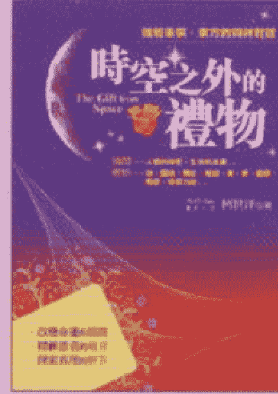

時空之外的禮物
Reiki Life 柯世洋◎著


精神療癒卡
Reiki Life 柯世洋◎著

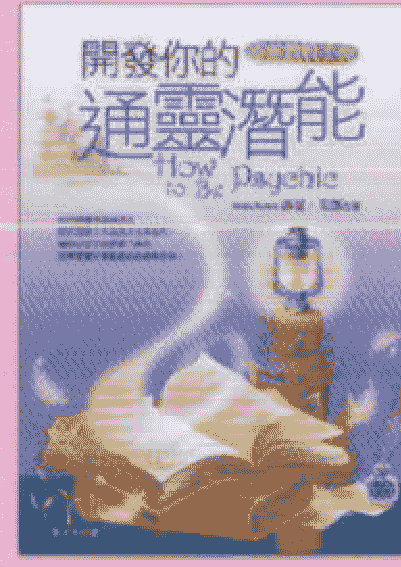

開發你的通靈潛能
莎夏·芳鄧 (Sasha Fenton)◎著

## 好命密碼
### 數字磁場的魅力

你是否厭倦一直停在原地？ Yes！
你是否沮喪於昨日的挫折？ Yes！
你是否放棄了原來的夢想？ Yes！
你是否渴望成功的到來？ Yes！
你是否祈求幸福的未來？ Yes！
你是否嚮往致富的秘訣？ Yes！

所有的Yes，數字磁場都能給你能量！

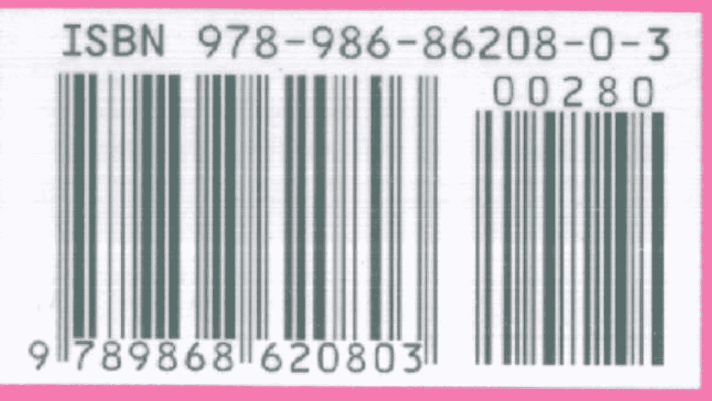

Y10-02-07
有成書業有限公司
$ 93.00

## 中华古籍库

1000000 册 高清影印古籍
珍版刻印 / 海外流传 / 家传手抄 / 民间失传

古籍善本、经史子集、史料笔记、古人文集、
民间收藏、传世家谱、各地方志、中医典籍、
四库全书、古禁毁书、内阁文库、图书集成、
丛书集成、四部丛刊、万有文库、四部备要、
二十四史、三国六朝文、明清和民国古籍史料
……

