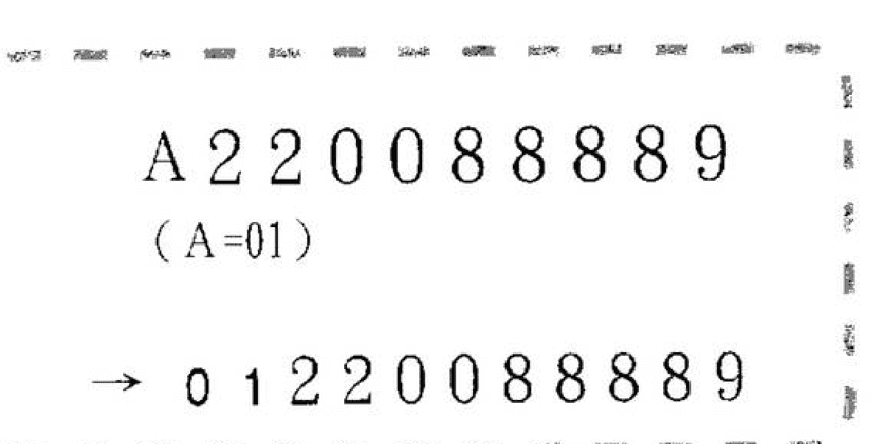
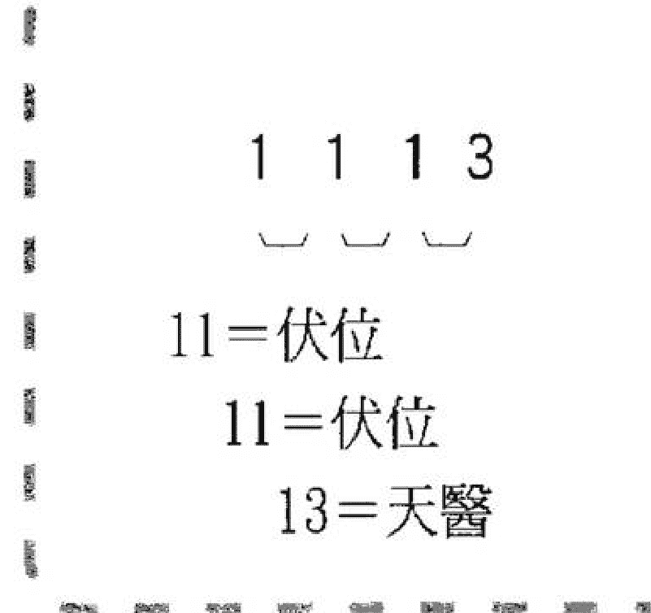
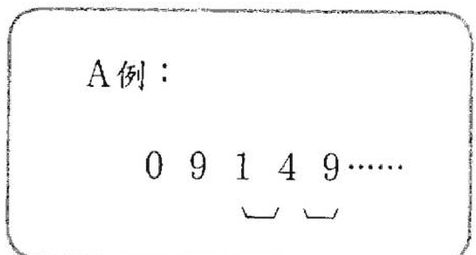
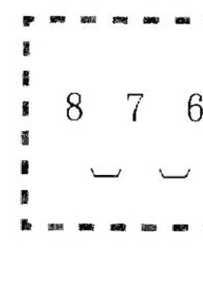
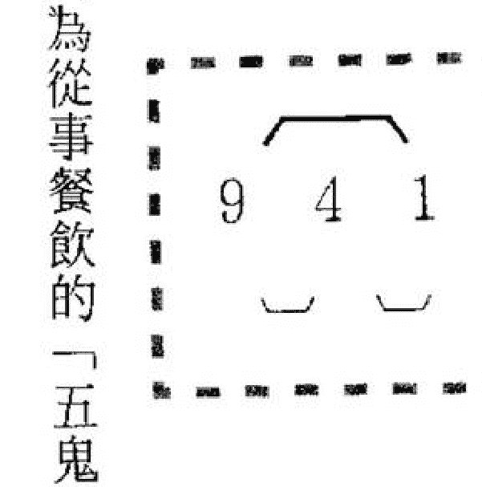
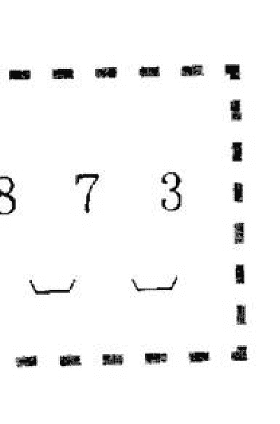
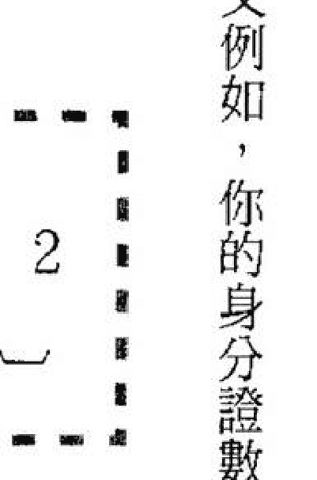

# 好命密碼

### 數字磁場的魅力

工作事業財富篇

運用身分證數字磁場，
立即扭轉你的人生！

愛德華 Edward◎著

國際數字磁場大師 愛德華 Edward老師，
運用身分證數字磁場，
已扭轉無數失敗的人生，
搶救許多人的貧窮，
數字磁場魅力，將帶給你成功幸福的力量！

# 好命密碼

### 數字磁場的魅力

工作・事業・財富篇

愛德華 Edward ◎著

謹以本書之出版
紀念作者愛德華先生

# 目錄

作者序

數字磁場的魅力

導讀

- （一）身分證數字磁場，是你我命運起點與終點
- （二）算命，你自己就可以了！
- （三）數字能量的命運涵義

## 「伏位」數字磁場能量魅力

- 工作 & 事業 & 財富指標及特性
- 人際關係特質
- 能量強弱影響及變化

## 「生氣」數字磁場能量魅力

- 工作 & 事業 & 財富指標及特性
- 人際關係特質
- 能量強弱影響及變化

## 「天醫」數字磁場能量魅力

- 工作 & 事業 & 財富指標及特性
- 人際關係特質
- 能量強弱影響及變化

## 「延年」數字磁場能量魅力

- 工作 & 事業 & 財富指標及特性
- 人際關係特質
- 能量強弱影響及變化

008

016

021

029

038

062

090

118

## 「禍害」數字磁場能量魅力

- 工作&事業&財富指標及特性
- 人際關係特質
- 能量強弱影響及變化

## 「絕命」數字磁場能量魅力

- 工作&事業&財富指標及特性
- 人際關係特質
- 能量強弱影響及變化

## 「六煞」數字磁場能量魅力

- 工作&事業&財富指標及特性
- 人際關係特質
- 能量強弱影響及變化

## 「五鬼」數字磁場能量魅力

- 工作&事業&財富指標及特性
- 人際關係特質
- 能量強弱影響及變化

## 後記

# 好命密碼

# 作者序

### 數字磁場的魅力

一個假日的下午，我獨自坐在Coffee Shop，正在構思著最近一場演講的內容。鄰座來了三位外型端莊、穿著一致的上班族女子，她們點了咖啡，就開始談論著行動電話號碼的話題。其中一位女子，侃侃而談她自從更換了一個新的行動電話號碼之後，所發生的好事、好運氣。而另外兩位女子，則是注視著她得意的表情及喜悅的言語。

「難怪妳最近又是買新車、又是準備買房子，我們心裡都想著『妳一定是中樂透』了。」

這位洋洋得意的女子則笑著說：「樂透我是沒中，但我投資的股票賺了不少錢。在我無意間看了一本書後，我深入研究、驗證，並且開始嘗試，我真的認為我轉運了！」

「我也幫Peter挑選了兩個新的行動電話號碼，妳們知道嗎？Peter告訴我：『從事賣車這個行業快六年，從來不曾有這個月的業績，一個月都還沒過完，已經賣了二十台車，這是我以前半年的業績，最近真是『旺』得不得了！』」

不一會兒的時間，這位好運不斷的女子就開始告訴她的同事們，該如何去挑選適合她們的行動電話號碼，此時的她，彷彿是一位命運數字大師，以自身的親身經歷傳授著她的成果。

席間，我只是不斷的重覆聽到她說：「嗯！13、31、49、94這些數字最適合妳，而妳就需要19、91、78、87的數字來壓制妳與天俱來的16、61數字！」

當然，坐在一旁的我，除了感到無比高興之外，同時我也發覺了一些問題——並非所有的人都適合或需要13、31、19、91、87、78的數字磁場。因為數字磁場的力量是藉由符合自己身邊數字能量磁場，去衍生及創造出不可思議的奇蹟。而若是按照一般人的說法，數字磁場所能達成的目的，就是所謂的「天時」。幾乎所有的人都了解「天時」的重要性，畢竟曾經經成功或偉大的人所成就的事物，若非有「天時」的助力，那可能就不會有「時勢造英雄」的這句話出現吧！

而我一直相信「天時」是可以被觀察，甚至被順勢運用的，如果能善加利用自己身邊的「天時」，那所有一生的努力才不會白費，自然地，成功與幸福也可如願以償了！

自有人類開始，幾乎所有人都在找尋解開命運的鑰匙，雖然至今尚未有人能夠給我們命運的答案，但我相信，這把鑰匙一定存在著我們最容易忽視的身邊。而數字與我們每個人的生活，可說是如影隨形，若是人有所謂的「命運」，那命運必然是由數字所組成。因此，了解身邊的數字這件事，就相形重要。

數字磁場改變了我，當然也創造了數不盡的希望給曾經接觸、印證和嘗試的人們，我很高興這套數字磁場的方法，的確解決了許多人的問題，

### 數字磁場的魅力
工作事業財富篇

也正由於如此，這次出版的書籍內容，所談的主題及應用範圍也更為深入。也由於這些年來所累積的案例實在是不勝枚舉，而藉由其中較易說明的個案，作為八種數字類型的代表，或許這樣的方式，能夠提供更多的讀者去感受及接近數字磁場的能量。

這次的主題更深入的貼近到各個階層的核心問題，當然，這些問題絕大多數包括了財富如何創造、人際關係如何維繫、事業如何經營、健康如何看護，甚至身材如何保持苗條……。這些主題，其實都是藉由身邊的數字磁場就可以掌控的，同時解決這些短期或長期的困擾，也是經由身邊數字磁場的調整即可達到。

在出版數字磁場相關書籍之後，許多讀者、學生、朋友們，都給予我相當多的建議，而這些意見在匯整之後，讓我更有自信的是數字磁場理論，應該能滿足更多讀者在實際使用數字磁場的方便性及正確性。

雖然好多學生，甚至是讀者，在親身感受到數字磁場的幫助後，都會對我說：「老師，你相信嗎？我們像是中了數字磁場的魔，現在只要是發票上號碼，生意興隆店家的門牌數字，家人、朋友、同事的車牌……只要是與數字磁場有關的事物，我們都會仔細地觀察驗證，而且每一次的驗證後，都感受到無比的震撼。怎麼辦？我們這樣算是瘋狂的執迷嗎？」

我常對所有的學生、讀者，甚至朋友、家人說：「數字磁場確實是牽動著我們的生活，而數字磁場的魅力就在於，『它』總是能轉危為安，並讓不可能的事，變成可能。而這就是天地之間的奧秘之處。」

## 數字磁場魅力 導讀

當然，我的學生或讀者的這番話，只是一種比喻，因為「真相」是必須經得起幾百次、千次以上驗證的，而他們不斷地從週遭生活的印證中得到事實的答案。因此，數字磁場確實產生了一種有形或無形的魅力，時時刻刻在支援著他們。

正式公開推廣這套數字能量磁場，雖然僅有幾年的時間，但在這些日子以來，我了解到更多人的需要，因此，這次書籍的出版，希望能更進一步地讓接觸到數字磁場的人，能找到自己的命運，並且藉由數字磁場的改變，圓一個不可能的夢。

### 數字磁場魅力導讀（一）

#### 身分證數字磁場，是你我命運起點與終點

「身分證數字也可以算命？」這句話是第一次接觸數字磁場的人，最常對我提出的疑問。

全世界的任何國家的任何一個人，都會享有國家給予的一種身分認可，而這樣的認定就像是標籤一般。因此，每個人身上都被貼上一個不同的符號，只不過這些符號是用數字表示而已。

台灣、日本、香港、中國大陸……幾乎東方國家，都將這樣的符號稱作「身分證號碼」，而多數西方國家則以「社會福利安全號碼」稱之，但實際上都是相同的涵義。

既然每個人都有一個與眾不同的一長串數字符號，而這些數字是一輩子不會任意改變的。因此「它」就像是一個巨大的磁場，左右著你我的過去、現在及未來。

在我之前出版的書籍中，都曾提及身分證數字磁場的意義，在這本書的序，我又再度強調，其目的是，除了給予對未曾有機會接觸數字磁場的人一種清楚地概念或說明外，更重要的是，無論是否曾經接觸、嘗試、深入探討這套數字磁場，這個觀念的引導是非常重要的。因為數字磁場本身，並無宿命或非宿命論之差異，所以對於許多「鐵齒」的朋友們，只需以一種「科學邏輯的統計學」態度來看待這套數字磁場的成因、過程及結果，或許這會是你們人生另一種希望的轉折點吧！

之所以身分證數字磁場可以精準地推斷一個人命運的起落，最重要就是在於身分證數字是由一長串數字所連結而成，而兩兩數字在連結起來之後，依據易經的命名及西方的數字理論為其統合、運算及分析。

當然，經過東西方如此的整合，必然有其精確度，所以再參考比較中國古老的傳統命運推斷方式（例如：紫微、八字、鐵板神算、姓名學、生肖學……），身分證數字磁場似乎比這些古老的傳統算命方法要來得簡單許多。畢竟從身分證數字當中，是可以看到過去、現在、未來的變化，我相信這是每個人都可以輕易做到的（Do it by yourself.）。

而西方的星座學（月亮在雙魚座、太陽在牡羊座……）的命運推算方式，在這近十年來，已經是許多人相互問候、聊天時的話題。但這樣的星座推論命運的方法雖然簡單，但其同質性實在太高，所以許多人多半將其視為一種休閒娛樂的參考價值來看待。

「我相信只需再過幾年的時間，老師，您的數字磁場論一定會成為一種未來的趨勢，而這種趨勢必能讓您成為名人、大師，說不定還可以得個什麼知名的大獎呢！」這是我的助理最近曾對我說的一段笑話。

我並不想成為所謂的高人、大師或名人，因為我只是期望在數字磁場的學說及方式被許多人廣泛運用，並且效果顯著的那時，看到這些人能夠改變自己的現在，創造希望的未來。

而數字磁場在任何人得以改變的過程當中所扮演的角色，只不過是一種工具而已。這樣的想法、觀念，在我內心存在已久，畢竟每一個人的人生都會有起伏，但若藉由數字磁場的導引、執行，能將現在或未來的腳步做一個適當的調整，那麼每個人的人生都會是很可愛的。

### 數字磁場魅力導讀（二）

#### 算命，你自己就可以了！

將身分證的數字，完整地連同英文字母加上九個數字（台灣），寫在一張紙上，這樣你已經完成身分證算命的第一步驟了。舉例來說：

英文字母換算成數字的排列方法是，A為01，B為02，C為03，D為04……Z為26。接著，將你的身分證第一個英文字母變成數字，再寫一次，你就已經完全寫下你自己

```
步驟1：
A 2 3 1 6 7 3 4 8 9
```

```
步驟2：
A 2 3 1 6 7 3 4 8 9
(A=01)
→ 0 1 2 3 1 6 7 3 4 8 9
```

```
步驟3：
A 2 3 1 6 7 3 4 8 9
(A=01)
→ 0 1 2 3 1 6 7 3 4 8 9
```

01：一歲至十歲的命運變化（01-11）
12：十歲至十五歲的命運變化
23：十五歲至二十歲的命運變化
31：二十歲至二十五歲的命運變化
16：二十五歲至三十歲的命運變化
67：三十歲至三十五歲的命運變化
73：三十五歲至四十歲的命運變化
34：四十歲至四十五歲的命運變化
48：四十五歲至五十歲的命運變化
89：五十歲至七十歲的命運變化

而這十一個數字的串連，就形成一個人的命運變化。現在，大家可以開始如法炮製，將自己的身分證數字排列出來。
如果你是第一次接觸這樣的算命方式，一定會感到非常好奇。因為一個人的一生竟然是被自己的十一位數字所決定，實在讓太多人感到不可思議及質疑。
以這個例子而言，我來做一個規律性的解釋，相信各位的疑惑就會得到答案。

23

22

超過七十歲時，就將身分證最後一個數字9，銜接最前面的第一個數字0，所以90就代表七十歲到七十五歲的命運變化，七十五歲以後，又形成原來的循環。

截至目前為止，相信應該難不了各位讀者才是。由於這是數字磁場掌握命運的基本法則，所以必須懂得如何看自己年齡的命運變化。因為這是進入「數字磁場」的入門，若是已經熟練的讀者，就當作是溫習功課般看待吧！

事實上，許多讀者在這個階段，只要寫下自己的身分證數字後，應該可以開始照單全收。

在這裡仍必須補充數字磁場的另一項重要法則，而下列這個舉例，是完全針對身分證數字有5和0的人所做的講解。而了解5和0的數字變化，對深入數字磁場的研究，是有其必要性的。

現在用一個例子來說明：

請看上面列出的這個身分證數字，依照前面案例的解釋，15為十五至二十歲的命運變化，54為二十至二十五歲的命運，但此時，154代表著十五至二十五歲的十年命運變化。

> 舉例：
C 1 5 4 9 0 8 5 7 0
(C=03)
→ 0 3 1 5 4 9 0 8 5 7 0

這是因為數字磁場中的5，只要是在三個數字以上的中間時，5就像是一座橋樑連接前、後的數字。所以154就等於14。

從數字磁場的命運結構來看，銜接前後數字而形成的變化，代表延長原先磁場的命運變化。簡單來說，好運是續約的，而厄運也是繼續延長，直到下個數字開始產生變化，自然命運也隨之轉折。

我現在還是用剛才的舉例來看0的數字命運遭遇，是如何變化的。

左列這個身分證數字，90為三十歲至三十五歲的命運變化，而0就是扮演跟隨者的角色，跟隨前面的數字，或跟隨後面的數字。

所以90等於99。

而08為三十五至四十歲的命運變化，此時08等於88。

最後兩個數字是70，為五十至七十歲的命運變化，而70等於77。

所以0這個數字無論在第一個數字、在中間，或最後一個數字，都是與前面或後面的數字相同。

> 舉例：
C 1 5 4 9 0 8 5 7 0
(C=03)
→ 0 3 1 5 4 9 0 8 5 7 0

### 數字磁場魅力導讀（三）

#### 數字能量的命運涵義

而5這個數字，除了在一串數字中間時是擔任橋樑的角色之外，弱勢5在第一個數字或最後一個數字，所扮演的角色與0是相同的，一樣是跟隨者的命運。

再從數字磁場的命運結構來看，5和0身分證數字，若有5與0的人，是可以隨波逐流，也可以自力更生的。

若又要能成為隨波逐流者，又能瞬間成為自立更生者，其自身的容納力必然十分強大，這就是一般所謂的寬宏雅量及事事盡量達到圓融。相對地，身分證數字具有這樣的人，也都具有與眾不同的能力，而這些能力善加運用後，也絕對是成為利人利己的最佳優點。

上頁所列出的「數字磁場魅力表」就是數字能量的命運涵義。在我們的數字磁場命運推斷法則當中，各位讀者必然會發現八種名詞（伏位、延年、生氣、天醫、禍害、六煞、絕命、五鬼）。

是的，這些名詞是源自於中國的《易經》，名詞雖然看起來艱深、不易了解。

但事實上，在我推廣數字磁場學說的過程中發現，其實與我們目前的生活點滴，可以說是完全貼切。所以讀者們並不需要太過擔心其深奧，因為接著透過我以案例的說明及數字組合的相輔相成，相信你能在短短的時間中，即學會如何算自己的命。

當然，藉由這套數字磁場的衍生，你也可以運算別人的命，最重要的是，你能極為驚訝地驗證過去、檢視現在、計畫未來。

而這八種名詞，各自擁有八組的兩位數數字。所以這張表格共有六十四個數字。至於這六十四個數字，我是如何推算出來，這可能又必須寫一本書來說明。所以各位讀者現在僅需了解如何驗證、觀察及修正身邊的數字即可。

至於這八種名詞的數字能量（皆有正面及負面磁場），這就是任何事物都是一體兩面，若任何事都只能是單行道的處理方式，這必然不是一個最好的方式。

一般而言，這八種名詞下的命運，幾乎所有人都是迫切地需要「延年」、「生氣」、「天醫」、「伏位」的數字磁場來修正自己的缺點。而「禍害」、「六煞」、「絕命」、「五鬼」的數字磁場，則是被絕大多數人呈現出負面的數字磁場能量。因此，「延年」、「生氣」、「天醫」、「伏位」的數字磁場的功能性就更加重要及強大。

當然，你在觀看自己的身分證數字磁場，若是出現「禍害」、「六煞」、「絕命」、「五鬼」的數字時，並不需要害怕或立即認為「我的命真差」！

因為，你若能了解這套數字磁場的神奇魅力後，你必定會有新的價值觀出現，而且將身邊的數字磁場做適當的修正調整後，你可以與其他「命好」的人平起平坐呢！這就是「事事皆有法」，而任何法（規則），也皆有密碼可以破解，所以不必、也不能低估了你自己的數字能量。

更何況，擁有「禍害」、「六煞」、「絕命」、「五鬼」的數字磁場能量，一旦被激發調整為正面能量時，其成就或幸福，絕對是令人羨慕的。

至於「伏位」的數字磁場能量，嚴格來說，同樣是需要「生氣」、「天醫」、「延年」的數字磁場來激發出正面的能量，若是無法獲得適當的調整，其各方面的表現也都只能是平平的水準演出。但是對於追求平凡或與世無爭的某些人來說，或許「伏位」的數字能量，是較適合他們的吧！

## 數字磁場化解表

| 伏位 | 天醫 | 生氣 | 延年 | 六煞 | 絕命 | 禍害 | 五鬼 |
| :--- | :--- | :--- | :--- | :--- | :--- | :--- | :--- |
| 增加「生氣」或「天醫」的數字，是最有效的動能來源。 | 增加「生氣」或「延年」的數字，是使其好上加好的能量。 | 增加「天醫」及「延年」數字，是不可或缺的最佳能量。 | 增加「生氣」或「天醫」的數字，是最佳組合狀態。 | 增加「延年」的數字，才能破解負面能量。 | 增加「天醫」的數字，才能抵抗負面能量。 | 增加「生氣」與「延年」、「生氣」與「天醫」的數字，才能化解負面能量。 | 同時具有「生氣」、「天醫」、「延年」，才能化解負面能量。 |

這個「數字磁場化解表」，是任何一種數字磁場的人，如何破解困境，或者強化更好能量磁場的方式，因此這張表格如同VISA、MASTER信用卡，絕對可以處處無國界，任何有價無價的事物，你都能精準掌握。

特別值得提出的是「五鬼」數字磁場能量，因為「五鬼」的數字能量，若是產生負面磁場時，其結果是令人難以想像。因此「五鬼」數字磁場需要「生氣」、「天醫」、「延年」的數字磁場，像是貼身保鑣，隨時圍繞在身邊。當然，調整自己身邊的數字磁場時，最好是能依照「生氣」、「天醫」、「延年」的數字磁場順序來作修正。

此時的你，一定急於知道這數字磁場的八種命運定義（呈現在個人財富、人際、事業……等），以及如何在自己的身邊調整及運用數字磁場的

35

34

古籍庫 www.fozhu920.com

## 「伏位」數字磁場能量魅力

11、22、33、44、66、77、88、99

能量。

我會以多年的案例說明方式，以主題式的表達方式，一一詳述數字磁場的各種事物的呈現意義。同時，也將教導讀者如何強化或更改數字負面能量。因此，每一種主題的各個案例，可能都會是你身邊曾發生或可能即將發生的類似案例。讀者們可以「依樣畫葫蘆」的方式去做更動，相信你們會有驚人的豐收成果。

數字磁場不僅是一種更改命運，或強化好運的現實產物，對數字磁場了解愈多的人，會發現它同時是一種觀察了解人、事、物的一種心靈產物。

一位長輩近來因為他的女兒一直未能出嫁而煩惱不已，於是催促他的女兒來尋求我的幫助。但或許是因緣的關係，幾次都未能謀面，終於在最近的一次機會中與她見了面。

見面的第一件事，便是拿出紙和筆，希望她將身分證數字及相關的數字磁場（姓名、出生年月日行動電話……等）寫下。就在她寫下這些數字磁場之際，我留意到她的表情，似乎在告訴我，她並非如她父親般的描述，急於想將自己趕快嫁掉。

她的年齡是三十三歲，而三十至三十五歲的數字磁場是88（伏位），三十五歲至四十歲的數字磁場是80（伏位），而之前二十五歲至三十歲的數字磁場是08（伏位）。

看到她的身分證數字磁場之後，我不免覺得，難怪女主角本身並不著急，就算她急著想找對象，恐怕結果也會令她失望吧！

在更深入與她聊天的過程當中，我才知道，其實她並非因為婚姻的問題來找我，她直率地告訴我，她是因為最近的一次公司升遷，讓她又失望了。她很懊惱，甚至語帶氣憤地表示，論年資及考績，與她同年進入的同事，都已是其他部門的小主管，唯獨她是「最資深的第一線員工」。

我除了進一步了解她的同事（已晉升主管）的數字磁場外，再比較她

### 「伏位」數字磁場

#### 工作&事業&財富指標及特性

「伏位」數字磁場無論是在工作或事業上的開創性都是屬於謹慎、保守型的心態。

簡單而言，一家公司能夠成為長青樹或者經常獲頒十年、二十年，甚至終生服務榮譽獎的人，也絕對是「伏位」數字磁場才能夠辦到的。

這是因為「伏位」數字磁場所散發出的能量，是耐力、耐心超強，鮮少有其他數字磁場的人能與之媲美。因此，「伏位」數字磁場的最大優點就是持久性的心。相對的，任何的變動對「伏位」數字磁場的人都會產生不安定，甚至害怕的感覺。所以，「伏位」數字磁場的人是較缺乏冒險精神的一群人。

在我的案例中，有將近三分之一以上的人，都屬於「伏位」數字磁場的人，當然其中不乏成功的企業家及學術界領袖，但這些企業家或學術界領袖之所以會成功，除了擁有「伏位」的數字磁場所展現的正面能量外，他們多半也具備了「生氣」或「天醫」及「延年」的數字磁場，否則他們也只是泛泛而已。

因為「伏位」的數字磁場，若是沒有一生氣」數字磁場（貴人的提攜或者機會的降臨）、「天醫」數字磁場（財富作為後盾）、「延年」數字磁場（領導者的氣勢），與之相輔相成，那麼「伏位」數字磁場的「等待能量」是無法轉化為「蟄伏」的正面能量，進而激發出成就的。

由於「伏位」數字磁場的忍耐性比一般人高，時間一久，就容易變成習慣，對於未知的環境或機會，都懷有恐懼感，因此猶豫之後的決定，必然是選擇留在原地及保守應對。當然，這樣是很容易錯失成功契機的。

防衛心的色彩濃厚，這是「伏位」數字磁場最容易散發出的能量訊號，同時重視及關愛自己的感受，會遠遠超越其他數字磁場的人。

「伏位」數字磁場的人在工作上，是屬於按部就班、一步一腳印的類型，在他們的世界裡，是沒有所謂的一蹴可幾、一步登天，對於「伏位」數字磁場的人來說，那是非常不務實的。當然他們也不信任或厭惡這樣數字磁場類型的人。

事實上，「腳踏實地」是「伏位」數字磁場的人唯一認同的觀點，但是世界上並非所有的人都能如他們所想，如果真是如此，人的命運也不會有起有落了。

如果「伏位」數字磁場在工作或事業上甚至財富上希望有所成就，「時間」的累積應該是他們最好的朋友。但我必須強調的是，並非等待或者累積時間的經驗，一定可以換得成功或幸福。



若身分證數字磁場是如同上列的數字，以這個案例而言，從三十五歲到五十歲，都是「伏位」的數字磁場（88）。這表示她從三十五歲開始，在工作、事業或財富上，都不會有更進一步的突破，一直得等到五十歲到七十歲出現了89「禍害」的數字磁場，人生的命運才會有巨大的變化。

若是人生的精華時間（二十五到五十歲）來看，她幾乎都是不容易變動的。當然，這對許多追求平凡生活的人來說，確實是相當適合的。但是，若對於有企圖心的人來說，這樣的命運數字磁場，簡直就是一場折磨。

我接觸過許多「伏位」數字磁場的人，幾乎千篇一律的都是固守城池，無論是工作（第一份做可能就是最後一份工作）、事業（自己成立公司，從成立公司三個人到結束營業也是三個人）、投資（買股票，永遠是買到最高點，等幾年後想賣股票時，一定又是賣到最低點）。

所以，許多公家機關朝九晚五的上班族，都是「伏位」數字磁場人的天下。畢竟穩定的環境、熟悉的面孔，是能夠符合「伏位」數字磁場的特性。但是當「伏位」數字磁場的人一想到要變動時，幾乎所有的困難、挫折都會一一的浮現出來，而此時「伏位」數字磁場的人，通常缺乏變通性，一味地執著自己的觀念、恣意而行，最後也容易造成失敗。

因此「伏位」數字磁場的人是非常需要「生氣」數字磁場的，因為「生氣」（代表機會或貴人）的出現，會促使「伏位」數字磁場產生動能，有了動能之後，「伏位」數字磁場的蟄伏正面能量就能順勢爆發，成功或幸福就會近在咫尺。

以前面的案例而言，若是她能在身邊的數字磁場多增加些「生氣」的數字磁場，那許多升遷的機會就不容易流失，或是會開始得到上司的注意、賞識。另外，若想在一個團體、公司中擔任主管的職位，那麼增加「延年」數字磁場，是勢在必行的，因為「延年」數字磁場所散發出來的是領導者的能量訊息。

### 「伏位」數字磁場

#### 人際關係特質

「伏位」數字磁場的人際關係是被動性且「反應較慢型」的，因此，與「伏位」數字磁場的人相處，是不可能一下就成為難兄難弟，或者也可以說是慢熱的類型。

而「伏位」數字能量愈多時，顯現的程度愈是內斂，但「伏位」的內斂是存在不安定的，因為「伏位」數字磁場是必須他人先給予安定、安全感，才會一步一步釋出自己的想法及觀念。

當自己或週遭的人，身分證數字磁場中目前年齡出現「伏位」的數字磁場，在那段時間，無論是在工作、事業、感情……甚至是人際關係上，都會是特別地停滯不前。同時許多事情，自己也會感到力不從心、無心經營任何事。

有位長輩的先生，大概還有五年才退休，但那段時間裡，他幾乎不時地向她透露及暗示他想提前退休的念頭。退休之後不到半年，就因為糖尿病的關係，終日鬱鬱寡歡，吃了約一個月的藥後，竟然連藥也不想吃了，終日抱怨人生很無奈及沒希望。我的長輩也帶她先生去看心理醫生，而心理醫生建議他可以去旅行或者再給自己踏入另一個新職場的嘗試，但並未被這位長輩的先生所接受，所以他依然如故。

有次到他們家中，剛好談到這個情況，我告訴這位長輩的先生，是否願意聽聽數字磁場給他的建議。於是乎，我又開始扮演數字磁場老師的角色，為他分析及解讀他的狀況。這位先生四十歲到四十五歲數字磁場是21的「絕命」數字磁場，而四十五歲到五十歲的數字磁場是12的「絕命」數字磁場，而五十歲到七十歲的數字磁場則是22的「伏位」數字磁場。

他今年五十二歲，所以他目前是處在「伏位」的數字磁場中。我告訴他，他前十年每天打拼，努力維持家庭的生活及孩子的教育，然而「絕命」數字磁場21、12，帶給他不斷的挫折及風風雨雨，他自己才五十二歲，卻認為好像已經七十歲了。

他告訴我，我的解讀完全正確，因為他在公司是資深的行銷主管，每天面臨的是一場接著一場的商品價格、企畫及行銷戰，他感覺真的累了，而且最近似乎感受不到人際關係的互動性，所以即使抗壓性十足，也無力再承擔。而這位長輩的「伏位」數字磁場22是「伏位」數字磁場中最強的，所以長期忍耐「絕命」數字所承受的壓力，直到停下腳步後，病痛就會在「伏位」數字磁場時出現。

我建議他先行調整身邊的數字磁場，將其修正為「天醫」的數字磁場，這是為了化解「絕命」數字磁場已經帶來的負面效應。我同時告訴他，可以戴上三十一顆的「天醫」水晶手環，或者是八十六顆的「天醫」項鍊，先行藉由數字磁場的運轉來改善他的身體磁場。

接著，可以將行動電話修正為14、41的數字磁場，但必須常和朋友、同事、家人聯繫，可將「伏位」22的數字磁場推升成動力磁場。

這件事過了兩個多月的時間，這位長輩告訴我，他已經準備成立行銷企管顧問公司，而且已經有簽約的客戶了，而他的身體狀況也已經由正常的服藥獲得了控制。這是個「伏位」數字出現時，經常出現的狀況。所以「伏位」的人際關係是需要被刺激及鼓勵的。當然，許多企業的高級行政主管也都具有這樣的「伏位」數字磁場特質，這是由於他們具有的沉穩及耐心，是非常天賦異稟的。但「伏位」數字磁場的人際關係智慧，是必須尋找「生氣」或「天醫」數字磁場的人相互學習，才能突顯。

因此，我仍然建議「伏位」數字磁場的人，必須化被動為主動，化保守為積極，那麼所有的負面僵局，就能夠變得有生命力。

當「伏位」數字磁場在你目前的年齡或未來的命運出現時，其實不必太過擔心。因為數字磁場就像是一種徵兆，也是一種提醒。而你在遇到問題時，只需冷靜地面對問題、解決問題，自然地就能化解一切的阻礙與煩惱。

「伏位」數字磁場出現在任何一個人的命運變化中，大部分都是提供休息及沉澱思考的時間給自己，畢竟長期的忙碌與不停歇的奮鬥，有時是會失去目標的。但是如果自己的身分證數字磁場，絕大多數是「伏位」的數字磁場，此時的「伏位」數字就是相對地在提示你，必須積極、主動的處理身邊的事物，否則你的人生一輩子都是處在等待的狀態，最後終將一事無成。

每種數字磁場都有強弱之分，而「伏位」數字磁場亦不例外。排名第一的「伏位」數字磁場（11、22），其忍耐力當然是最強的，但缺點也是最頑固，就如同石頭一般。

若是以適合職業來區分，軍人的一個口令、一個動作，類似這樣性質工作，是天生適合「伏位」數字磁場（11、22）來擔任的。當然，許多大企業家也不乏「伏位」數字（11、22）的「伏位」數字磁場組合。

請看上方的身分證數字磁場舉例：這樣的「伏位」（11）數字磁場與13（天醫）的數字磁場組合後，雖然必須經歷一段長時間的忍耐，而最後的努力與等待都是值得的，因為「伏位」數字愈多，而後面出現「天醫」、「生氣」、「延年」的數字磁場時，財富成就就會愈大。



因此在這裡的「伏位」數字，就不是無盡的等待，而是開花結果前的蟄伏了。

上列這個舉例就是一位知名企業家真實的案例。當初這位企業家也以同樣的口吻質疑我的推斷，結果十年後的今日，他已經是台灣前一百大的新生代企業家。

而這其實只是證明了數字磁場力量的延伸性，同時，這名企業家雖然當時抱持半信半疑的態度，但他還是修正了身邊所需要的「生氣」及「延年」磁場，促使他原先所具有的「禍害」及「六煞」數字磁場，得以消弭。所以「伏位」數字磁場的爆發力，提前了五年完成他的心願。

對照「伏位」數字中磁場能量強弱表，可以看出（88、99）的「伏位」數字磁場的等待時間，以及蟄伏力就不如（11、22）的強大。所以許多研究性、發明、創新性的工作性質是非常適合（88、99）「伏位」數字磁場的人。

至於（77、66）及（33、44）的「伏位」數字磁場的人，先天的成就雖然未必比（11、22）、（88、99）高，但若能善用「伏位」數字所等待的時間較短的優勢，掌握先機，同樣也可以創造出自我事業高峰。

以我所接觸的案例而言，多半（77、66）及（44、33）的「伏位」數字磁場，是屬於朝九晚五或公務人員的類型。其中也有自己的一番成就，當然也有自己開店經營餐飲、服飾……等的（77、66）與（33、44）「伏位」數字磁場成功的人，但或許數字磁場力量實在太大，若非本身的身分證數字磁場銜接「生氣」、「天醫」、「延年」的數字磁場，或者經過我予以調整及修正週遭的數字磁場，我還真的沒有看過例外成功的例子呢！

因此，「伏位」數字磁場的人，在人生的數字命運磁場變化下，必須隨時將「生氣」、「天醫」、「延年」的數字磁場像隨身口袋書般，不停地翻閱轉動，你的命運也會時時出現陽光。

### 「伏位」數字磁場

#### 能量強弱影響及變化

| 第一名 | 第二名 | 第三名 | 第四名 |
| :---: | :---: | :---: | :---: |
| 11 | 88 | 77 | 33 |
| 22 | 99 | 66 | 44 |

# 好命密碼

證數字磁場銜接「生氣」、「天醫」、「延年」的數字磁場，或者經過我予以調整及修正週遭的數字磁場，我還真的沒有看過例外成功的例子呢！

因此，「伏位」數字磁場的人，在人生的數字命運磁場變化下，必須隨時將「生氣」、「天醫」、「延年」的數字磁場像隨身口袋書般，不停地翻閱轉動，你的命運也會時時出現陽光。

## 生氣數字磁場能量魅力

14、28、39、41、67、76、82、93

## 「生氣」數字磁場能量魅力

約在四年前，一次在台南因工作職場的關係，結識了幾位當地的學術界及工商界的精英。在那場餐敘上，其中一位朋友是從事建築方面的工程，而這位朋友當時引薦了一位即將參選民意代表的候選人與我認識。這位候選人正努力向在場的所有朋友問候、寒暄，並且懇請支持。當時，這位建築界的朋友了解我是研究數字磁場的專業人士，於是乎將這位民意代表候選人是否能當選的事情請教於我。當然，這件事在當時僅是個茶餘飯後的話題，事後的結果，也如我當時的預測，這位候選人僅僅以些微的票數落選了。但我記得當時我對在場的幾位朋友說：「不出三年，他必然是冠蓋雲集的知名人物。」雖然當時他才三十幾歲，若是以他現在的地位，確實完全符合我當時的預言。我記得那時他的朋友還打趣地問他的身分證數字磁場，並告訴他，我可以精準算出他當選的機率及可能性。而這位候選人倒是相當豁達、直率地說出他的身分證數字，他甚至還笑容可掬地告訴我說，「還需要什麼數字資料，我都可以提供，除了銀行存款的數字以外。」這句話引起當時在場的朋友們一陣哄堂大笑。當時，他提供了非常多的數字磁場資料（先天與後天）給我，大約十分鐘的時間，我告訴他，若能當選是吊車尾，如果落選，反而是在三年內能更上一層樓，甚至是身居要職。

結果，那次他以些微的票數落選，但是他現在的確是身居要職，那時他約莫三十歲，嚴格來說才二十九歲，數字磁場正好橫跨21的「絕命」數字磁場，以及14的「生氣」數字磁場，所以這次重要的參選為他帶來另一個人生的轉折點。

因為21（絕命）的數字磁場是大起或者大落，而且21的「絕命」數字磁場是最強的一組「絕命」數字磁場，14「生氣」數字磁場也是「生氣」數字磁場當中，能量最強的一組，因此任何的重大決定是絕對能為他營造出人生的另一個起點。

那次，他也提到，許多政界的前輩告訴他，他還年輕，勸他這次先不要出來參選，因為當時角逐參選人的實力都比他雄厚，但他仍執意參選。而「絕命」（21）的數字磁場人是一旦下了決定，任何人都無法阻擋他的做法。或許他自己也心知肚明，但我相信當時的他自己也料想不到，當時的落選，反而是最好的轉機。

之後，他果然成為政界舉足輕重的重要幕僚，這一切在我的數字磁場看來，皆是「生氣」數字磁場所帶來的強大力量。

事後，許多朋友在參選前，都希望我能以數字磁場理論為他們算一算，並且為他們做適當的數字磁場調整建議。

「生氣」的數字磁場所代表的意義，即是「貴人、轉機及新生」。所以，具備「生氣」數字磁場的人，個性是隨緣、開朗並且直率、純真，在人脈的培養上，常常是能有意外的收穫。而且「生氣」數字磁場是非常熱心助人，可能也因為如此，他們常能得到有形及無形的回報。

又有一次，一個從事燈飾貿易的朋友，因為想擴廠遷移至中國大陸，所以專程從高雄開了五小時的車程來請教我。

之前，他在台灣的事業一直發展得很順利，前年開始因為成本、人員的問題，讓他想將工廠整個遷至中國大陸。

我了解他的身分證數字磁場後告訴他，因為他目前的年齡正處在93的「生氣」數字磁場中，所以兩年之內，可以按照他的想法遷移的。

但是兩年後，四十五歲至五十歲的這五年中，必須特別留心人際關係的掌控，尤其是對女性主管或女性員工的反應，必須多加關心。

那次見面之後，事隔大約一年左右，他告訴我，在中國大陸發展的近況，雖然事業都還算順利，但他聘用的女性高級主管或小主管，不是結婚後立刻就離職，就是以高壓的姿態管理下屬及員工，導致有一段時間，員工的情緒大為反彈，他告訴我，「老師，您說的真準！」

這位朋友由於「生氣」的數字磁場93發生在38的「六煞」數字磁場之前，這是表示93「生氣」的數字磁場，雖然可以為他帶來事業的新起點，但他會因為新的起點產生38的「六煞」問題（女性以及人脈的問題）。

我想他當時只是認為只要小心避免即可，哪裡知道，事情差一點一發不可收拾。

所以我告訴他，可以尋求先天具有「延年」數字磁場的異性主管，來化解這位老闆本身先天所出現的38「六煞」數字磁場。同時，我也建議他自己可以在身邊多增加更強的「生氣」數字磁場（67、76、14、41）的「生氣」數字磁場，便可藉由較強的「生氣」數字磁場提前至現在來運用。這也是數字磁場中的「乾坤大挪移」，這樣的方式在許多案例中，都顯示其實用性。

這位朋友聽了之後，連忙地道謝，沒幾天他就回去中國大陸。某個星期日下午接到他的電話，他告訴我，整個工廠不僅運作順利，而且下屬及員工的協調性更為順暢。

這位朋友還希望我能為他們的主管們安排一些「數字磁場與人際關係管理」的教育課程。

在數字磁場裡，可以涵蓋、探討的人生課程實在太多了，而且完全沒有限的主題，因為數字磁場每天都與我們的生活串連在一起，因此若能將上天的禮物——「數字磁場」放在生活中，予以巧妙地運用，相信每個人的命運都能有新的起點。

### 「生氣」數字磁場

#### 工作&事業&財富指標及特性

「生氣」數字磁場在工作或事業上所扮演的角色，不僅是個人本身的貴人、契機，若是能懂得運用「生氣」數字磁場，「生氣」數字磁場的人同時是任何人的貴人及轉機。

正因數字磁場的重要性，所以「禍害」數字磁場及「五鬼」數字磁場都必定需要「生氣」數字磁場的輔佐，才能化解工作或事業的阻礙。

有一次，幾個學生因為打算合夥經營開店的事情，跑來請教我如何用數字磁場經營一家店的事情。這幾個人都是我「數字磁場創業班」的初級班學員，因此許多數字磁場的開店法則，大概都能掌握。

他們本是各行業學有專精的專業人士，但或許是因為志趣相投，所以開花店及花藝教學補習班的經營，對他們而言，是興趣及智慧的結合。

在我了解他們四個學生的身分證數字磁場後，我給了他們中肯的建議：花店是屬於「生氣」數字磁場的行業，所以其中B學生目前年齡的數字磁場正好是76（「生氣」數字磁場），應該是由這位學生來擔任這家店的負責人，包括申請營利事業登記證、店面的承租……等。因為「生氣」數字磁場最能為一家店或一家公司帶來契機的數字磁場，因此由「生氣」數字磁場擔任負責人，必然有好彩頭。

至於A學生的年齡是屬於「天醫」（94）數字磁場，所以這位學生是可以負責財務（資金）的管理，由於「天醫」數字磁場在工作或事業上都是財富的象徵，因此，讓「天醫」數字磁場擔任金錢方面的控管，是保證可以財源廣進的。

另外，C學生的「禍害」數字磁場（17），正好可以作為花藝教學的負責人。事實上，從他們的口中，這位學生的教學表達能力也是最好的，在「禍害」數字磁場的單元裡，我也會特別強調，「禍害」數字磁場天生具備的講師能力，是鮮少有其他數字磁場的人可以超越的。同時，師資教學培訓的部分，當然也可以交由這位學生負責。

最後，D學生的目前年齡是處在「六煞」（74）數字磁場。因此，客戶的拓展，人脈的取得及培養，是可以交由這位學生來負責的。由於「六煞」的數字磁場所具備的人際外交手腕，可以為這家花店及花藝補習班，帶源源源不絕的客戶。

除此之外，由於這四位學生中，並沒有人具有「延年」的數字磁場，所以可以在尋找店面的門牌數字磁場，加入「延年」的數字磁場。這個理由是，「延年」的數字磁場是可以成為任何一個領域的霸主，因此若是在地址的數字磁場予以調整，那麼「生氣」、「天醫」、「延年」的數字磁場，便能各司其職，發揮其正面能量，當然這家花店及花藝教學補習也能生意興隆。其中，學生A，提出一個疑問，若是他們需要一些宣傳上的人員，是否可以尋找「絕命」數字磁場的人擔任呢？

# 好命密碼

而我的回答是：「『絕命』數字是善於擔任智囊團的，因此整體花店的行銷策略規畫的工作是非常適合的，而執行的創意製作是可以交由『五鬼』數字磁場的人來負責。」

聽完這樣的說明及分析數字磁場的優缺點後，他們告訴我，非常有信心將這家店經營得有聲有色。

事情經過大約四個月的時間，我因為朋友的公司即將要開幕，特別到他們的花店購買花籃，順道了解數字磁場運作之後，為他們帶來的情況。

這天，C學生看到我，高興地告訴我，他們的生意不僅超越原先的預期，而且他們還打算再繼續找點，擴大營業。我非常高興看到他們的努力得到了代價。

### 「生氣」數字磁場

#### 人際關係特質

「生氣」數字磁場在人際關係當中，是最容易如魚得水，畢竟本身的隨緣，所以極容易與任何人打成一片。但是「生氣」數字磁場的人，因為是許多貴人或機會，所以非常容易散發出「有困難，來找我就沒錯！」的訊息。事實上，任何人的任何難題，只要遇到「生氣」數字磁場，十之八九都能獲得解決，就算無法解決，他們也會為你們找到貴人，或數不清的機會來解決。

### 數字磁場的魅力
#### 工作 事業 財富篇

「生氣」數字磁場的人，總是為他人而忙。所以，「生氣」數字磁場的人每天二十四小時，就像是有忙不完的事。

我有位老朋友，長期是別人眼中的金主，並非他非常富有，而是他總能在別人需求時，幫助別人的困難。或許情義對他們而言，是人生最重要的一件事。

一次他在公司的業務運作當中，發生嚴重的週轉不靈，第二天他就必須軋一張為數不小的支票，而看他外表絲毫感覺不出有這回事似的，那天還和我們幾個朋友談到聖誕節是不是該舉辦一個古典音樂合奏的Party。

大夥兒聊著，不知不覺已經接近凌晨一點，他的太太突然起身說出了這件事。當時，大家都愣住了。我們幾個朋友湊在一起討論了一會兒，就告訴他太太，「明天這件事就交給我們處理吧！」

這是六年多前的往事，但至今我仍記憶猶新。我研究數字磁場多年，這位老朋友的「生氣」數字磁場，的確帶給我最深的記憶及判讀的案例。

還記得他當時的年齡數字磁場是81「五鬼」數字磁場，而之後銜接的是14「生氣」數字磁場及49「天醫」數字磁場。現在回想起來，難怪當時他能有無限的貴人及機會為他化解困難。

在這個事件之後，他的公司不但渡過危機，而且其中的兩個朋友，還加入他們的公司成為股東。所以「生氣」數字磁場的貴人及轉機，是隨時都能出現的。

有次，我曾好奇的問他，如果當時我們沒有出手幫助他，他如何渡過那個難關。他回答我：「『生氣』數字磁場是絕處逢生的，你不是常告訴我嗎？」

確實，當初他用堅持相信的信念，以行動證明了數字磁場的力量。

「危機就是轉機」，這句話放在「生氣」數字磁場上，應該是名副其實。所以，每當我的案例中，身分證數字磁場出現「生氣」數字磁場的人，我也都用這句話送給他們。我也勉勵他們自己也應該要多付出，因為「生氣」數字磁場的無形付出，日後，也會在需要幫助的時候，得到更大的有形回報。

另外，我同樣也會提醒「生氣」數字磁場的人，可以在身邊多增加一些「天醫」及「延年」的數字磁場。增加「天醫」數字磁場的原因，是比較不容易出現人生的低潮，走得較平順，而「延年」數字磁場的增加，是可以避免過多的人際關係產生人情壓力。

在數字磁場中，「生氣」數字磁場搭配「天醫」數字磁場及「延年」數字磁場的三大巨頭組合，是接近命運的完美。

### 「生氣」數字磁場
#### 能量強弱影響及變化

| 第一名 | 第二名 | 第三名 | 第四名 |
| :---: | :---: | :---: | :---: |
| 41 | 76 | 93 | 82 |
| 14 | 67 | 39 | 28 |

「生氣」數字磁場在所有的數字磁場當中，幾乎扮演了無可替代的重要角色。然而許多學生、讀者們都有一個疑問——究竟在後天數字磁場調整中，是「生氣」數字磁場在「天醫」磁場之前，還是在「天醫」數字磁場之後，才能使數字磁場的運作更為完整。

我舉兩個例子來說明，大家就能更為清楚。

這是某個行動電話前五位數字。
14 為「生氣」數字磁場。
49 為「天醫」數字磁場。
「生氣」數字磁場在「天醫」數字磁場之前。



A 的例子，代表了任何一件事，是有了（14）契機或者貴人的幫助之後，而得到財富（49）的「天醫」數字磁場。

至於 B 的例子，則是先投資了大筆的資金後，獲得原先預定十倍，甚至一百倍以上更具規模、前瞻性的機會，使得個人、公司或事業體的成長茁壯。

至於每個人是否都適合最強的（14、41）「生氣」數字磁場，對我而言，其實應該是隨著每個人的先天數字磁場所需，予以增加及調整。我也曾提及過，有時運用過強的數字磁場，未必自己就能負荷。

一般而言，具有先天（14、41）的「生氣」數字磁場的人，是屬於家族背景名望雄厚，或者是明日之星。

這是另外一個行動電話前五位數字。

31 為「天醫」數字磁場。

14 為「生氣」數字磁場。

「生氣」的數字磁場是在「天醫」數字磁場之後。

> B 例：
0 9 3 1 4 ......

當然，其潛在的爆發能力必然是上上之選。而（14、41）的人是非常適合，也很容易踏入上流社會之中。

所以，若想從政，或者企圖有大規模的事業，具備這樣的數字磁場是非常重要的。當然，（14、41）的「生氣」數字磁場的人，胸襟是非常廣闊，能容人所不能忍，且極有遠見，這是他們非常重要的幾個特點。

（67、76）數字磁場的人，雖然不像（14、41）數字磁場的人有如此雄厚的背景。但根據我多年的研究發現，（67、76）的「生氣」數字磁場的人，先天具有一種與上帝同在的第六感能力，因此他們的心靈是非常透徹的。正因如此，他們常能轉危為安。

而且有太多的案例顯示，（67、76）數字磁場的人，都是智慧過人、才氣四溢，但很少誕生在富貴之家，或許這樣數字磁場的人，是必須藉由天生潛在的第六感能力得以完全發揮之後，扭轉或創造人生新的起點。

我要提醒（67、76）「生氣」數字磁場的人，「你們是『生氣』數字磁場排名第二名的，因此那一步只在不遠的前方，你們是可以辦到的，因為，你們的貴人就是自己！」

（67、76）「生氣」的人，事業或工作的方向，相關於心靈教育、感應輔導，都是非常適合，而且相關「禍害」數字磁場可以從事的行業，（67、76）數字磁場的人，還是可以完成的。

至於（93、39）及（82、28）「生氣」數字磁場的人，則是在「生氣」磁場中，排名第三、第四的兩組「生氣」數字。

這兩組生氣數字一樣是具有樂觀，一切隨緣的心態及行為。而他們團體中也經常扮演開心果的角色，如果你本身或你的週遭具有這兩組數字的人，那必然是幽默感十足，可以帶來歡樂的氣氛。

有一次，有兩位朋友為了選車牌數字的事情向我請教，由於他們的先天數字磁場都具有（82）及（39）的「生氣」數字磁場，所以我告訴他們，車牌的挑選也可以選擇（93、39）及（82、28）的「生氣」數字磁場為主要的架構。

這兩位朋友是以車為家的，因為他們的車內全是商品，而這些都是他們的家當，記得他們曾經在一個月中，車內產品曾遭竊三次。

後來，我教他們如何修正及調整車牌的數字磁場之後，不僅不再遭竊，一個多月後，還意外地找回失竊的物品，所以（93、39）及（82、28）是非常容易失而復得的一組「生氣」數字磁場。

還記得他們告訴我，有一次他們的朋友的一隻愛犬走失，正心痛不已時，他們開著（39）及（82）的「生氣」數字磁場的車子去幫忙找尋，說也真巧，他們竟然幫他們朋友將愛犬尋獲，到現在他們還常常對許多人說：「我們是失物尋找的最佳活廣告呢！」

因此，（39、93）及（82、28）的工作或事業上，也是非常適合從事保全的相關性質工作，而這兩組「生氣」數字磁場的財富投資，則是較適合在小額的定期投資獲利上，較不適合大規模的投資。

## 天醫數字磁場能量魅力

13、27、31、49、68、72、86、94

## 天醫數字磁場的能量魅力

這些年來，由於數字磁場的推廣過程當中，結識許多各式數字磁場類型的人，但我總認為「天醫」數字磁場的人，是最能夠溝通及領悟的人。因此，「天醫」數字磁場與我算是特別有緣分。

因為我之前出版的數字磁場書籍，許多讀者會寫信或發E-mail向我請教問題，在我出版第四本書時，有位讀者用E-mail的方式，希望我能為他算命，這位讀者是某醫院知名的小兒科醫師。

後來在電話聯繫的過程中，我知道他是為了他的獨生子事情想請教我。他和我預約了時間，當然我希望他能與他兒子一同前來。畢竟，這次見面的主角，應該是以他的小孩為主。

那天，我們在他醫院附近的餐廳見面，遠遠地我看見一對父子朝我走來，父親的表情是嚴肅中帶著誠懇，兒子的臉上卻是一副滿不在乎的模樣。

坐定下來，我開始了解他們父子的先天數字磁場（身分證數字磁場），我發現這名醫師的身分證數字磁場全都是「天醫」數字磁場，只有在目前的年齡出現12的「絕命」數字磁場。而他的兒子，目前的年齡也出現84的「絕命」數字磁場，其他幾乎都是「天醫」數字磁場與「延年」數字磁場相互穿插。

這位醫師告訴我，他兒子剛從美國唸完大學回來，可是卻安定不下來，與朋友做過各種生意，幾乎都是賠錢，最近還因為生意的糾紛，有了官司訴訟的麻煩。他因為看了我的書後，發現數字磁場似乎給了他許多印證與感受，因此，他才決定和我聯繫。

我一開始就告訴這位父親，「你從小就受到良好的教育，而且是來自名門家族，一直到目前都是算平步青雲，不曾遇到任何太大的阻礙。」他面帶嚴謹的表情點頭回應著我。

而他的年齡所處的12「絕命」數字磁場，正好與他兒子的84「絕命」數字磁場，同屬於「絕命」數字磁場，因此他們父子之間的意見、觀念衝突，也勢必很劇烈，而且這段期間的溝通，都只會演變成口角爭執而已。

事實上，從他們父子間的對話中，我更證明了這一點。

而「絕命」數字磁場的負面能量爆發是會引導出官司訴訟的能量，就在此時，這名醫師也告訴我，「前年他也發生了一樁醫療糾紛的官司，只不過後來雙方都能心平靜和地解決。」

事實上，這位父親後來能因而化解這場官司的重要關鍵點，從數字磁場的角度來看，是因為他的先天就帶有「天醫」數字磁場，並且在12「絕命」數字磁場之後，也連接了27的「天醫」數字磁場，必然會大事化小，小事化無。

至於他兒子目前所引發的生意糾紛，我從他的先天數字磁場看來，最多一年半左右的時間，也會因為84的「絕命」數字磁場後面銜接的49「天醫」數字磁場，而自然的化解。他所投資的生意會都在賠錢的狀態，也是短暫的時間，因為他很快就會正式跨入49的「天醫」數字磁場，所有的投資都會開始由負向轉為正向的賺錢狀態，因此我告訴這位父親，不必太過於擔心。

但我也給了這位父親及他的兒子些許的建議，「絕命」數字磁場的最大幫手或者貴人，就是「天醫」數字磁場，因此他們可以讓自己身邊增加「天醫」的數字磁場，一種數字磁場就可以產生一份力量，若是愈多種的「天醫」數字磁場不停地相互運轉，那麼官司訴訟的化解、父子意見的良好溝通，以及投資獲利的時間點，也都能提前來到。

因為我看到這位兒子的手上帶了一串手環（類似佛珠），我要他數一數手珠共有幾顆珠子，他自己數了一下，是21顆。他告訴我他的手較大，所以這串手珠還是經過更改加大過的，而這21顆（21為絕命）手珠，再一次突顯出他目前「絕命」數字磁場所帶給他的影響。因此，我告訴他，可以選小顆的珠子，將其串成31顆或者27顆的「天醫」數字磁場，這樣就可以形成另一種「天醫」數字磁場在他身邊圍繞。

這只是個隨處可見的說明，所以身邊的後天數字磁場調整方式實在太多了，當你創造十種「天醫」數字磁場，就可以將身邊不適合的數字磁場所產生的「絕命」負面能量完全消除，並且提早消除的時間，這就是數字磁場的力量可以完全辦到的地方。同時，這也證明了一件事——人的命運是可以因為後天的掌控而改變的，只是你是否懂得使用科學方法，而且你願意去做罷了！

「天醫」數字磁場的本意，代表的是無窮的傳承力量，所以任何的無限可能，都是來自於「天醫」的數字磁場。而具有「天醫」數字磁場的人，天性是單純、無私、博愛及關懷，因此，在我接觸許多的個案當中，許多企業家的第二代、第三代，以及具有家族力量傳承的下一代中，都完全具備了這樣的數字磁場特色。

也因為天醫數字磁場是無限可能的延伸，所以喜愛幫助別人追求心靈的純淨……等，都是這些人的必備特色。

在「天醫」數字磁場中，「和平」是他們最大的心願。因此藉由他們強大力量，是可以改變，甚至創造未來的。

我有一些朋友，他們時時刻刻都在行善，無論是物質或者心靈上的付出，而我知道他們都具有「天醫」數字磁場。

還記得我的數字磁場啟蒙老師，他就是具備「天醫」數字磁場完備的人。他唯一的女兒現在美國，目前也是頗具聲望的學術界教授。如果從數字磁場的角度去深入分析探討結果，他的女兒的SSN（社會福利安全號碼），如同台灣的身分證般，也都是充滿了「天醫」數字磁場。一年多前，她回台灣探親的時間，我與她餐敘話家常的時候，印證了這個結論。

### 「天醫」數字磁場
#### 工作&事業&財富指標及特性

前兩年因為整個大環境的經濟不景氣，失業率陸續攀高，因此算命的行業更是興盛。而求助的人也是一籮筐的不請自來。記得一位三十一歲的未婚女子，由朋友的推薦找到了我。

她告訴我，這兩年來，她大概從台灣頭到台灣尾，找過二十個以上的專業算命師，可是她的情況都未改善，而且大部分的算命師都告訴她，七、八年後，才會有她的事業運，甚至才會有好的對象出現。

類似她的案例，那一陣子，我也遇到幾個，但我發現他們碰到問題雖然皆有相當大的差異性，但是算命師都只能告訴他們如何避免，卻無法調整、修正。我想他們聽到這樣的結果不免會失落的，也一定會想，人難道真的無法超越命運的掌控，自己決定現在及未來嗎？

其實這個問題，是許多遇到人生挫敗時的質疑，而我從數字磁場的角度來看這個問題，我一直如此認為的：每個人確實無法選擇父母、環境……，但每個人都有一份能量去改變現在，甚至創造未來。因為我堅持相信，有痛苦必然有快樂，有苦難也必定存在成功或幸福。這樣的觀念就像天與地般是對稱，而且是循環、有週期性的。我研究十多年的數字磁場，給了我所有問題的答案，我不敢誇言數字磁場可以完全百分百改變一個人、一件事，但我相信，若是持續接受數字磁場的運轉，人會轉變，事情會改編，自然命運就會不同。

這個未婚的年輕女子，在我看過她的身分證數字磁場後，我發現她的好運其實已經到了。她二十五歲到三十歲的數字磁場是24「五鬼」數字磁場，而三十歲至三十五歲的數字磁場是49「天醫」的數字磁場，三十五歲四十歲的數字磁場又是94「天醫」數字磁場。因此，我心裡已斷定她就在今年要開始走向她的人生。

她告訴我，她是一位室內設計師，這段時間換了三家公司。我了解更動的原因後，我才知道她都是因為與公司老闆理念不同而轉換環境。

我問她是否有考慮自己獨自成立公司？而她的回答是環境不景氣，又不是知名的室內設計師，因此很擔心沒有客戶來源。

我告訴她，她從事的室內設計工作，正是完全符合「五鬼」數字磁場的行業，而且（24、42）的「五鬼」數字磁場又是再適合不過。之前她工作會不停地更動，從數字磁場來看，那也是必然的。因為24的「五鬼」數字磁場後面銜接了49及94的「天醫」數字磁場，意謂短暫的痛苦期後，必然出現成功的豐碩期。談到這裡，她雖然有了些自信，但又疑惑地問我，

「可是之前每個算命師都告訴我，必須等到四十五歲才能創業，也才能有發展，為什麼你的說法和他們不同？而且他們也都告訴我，必須有長期抗戰的忍耐與心理準備，都要我等待。」

我對她說：「等到四十五歲，那妳會等到花兒都謝了。」她聽了終於有了笑容的表情出現。

我接著說：「妳是不是認為，在曾經待過的公司中，妳所設計的作品都是最有創意？而且妳在國外求學時，也都是最優秀的，可能還是前三名畢業的。」

她一臉驚訝地看著我，並回答我，我所說的完全命中，一點都沒有誤差。她還問我是否會通靈，或是懂得讀心術？

我笑著回應她，她說的通靈及讀心術，我都不會，我只是從她的數字磁場得知的。她二十歲到二十五歲的數字磁場是72「天醫」的數字磁場，因此求學的過程一定是非常順利，而24的「五鬼」數字磁場用來發揮室內設計的正面能量，所以必然是鬼才的類型，而且創意設計出來的作品，想必是非常具有深度及高質感的。

當然，我告訴她，在她三十一歲時已進入「天醫」的數字磁場49的能量範圍內，而且到四十歲前都是「天醫」數字磁場圍繞，這樣長的人生精華時段，是可以完成她的夢想的。

當我了解到她的弟弟是從事行銷產品的高手時，我強力建議她，可以和她弟弟一起合組公司，共創未來。

若以她弟弟（二十九歲）的身分證數字磁場來看，二十五歲至三十歲的數字磁場是89「禍害」的數字磁場，而三十歲至三十五歲的數字磁場是94「天醫」數字磁場，因此明年的這個時候，兩個人的「天醫」數字磁場相互碰撞結合的結果，就是由49與94的「天醫」數字磁場升一級至68及86的「天醫」數字磁場，這樣天衣無縫的組合，必定能創造無限的可能。

除此之外，我還告訴她，後天的數字磁場可以多增加些「生氣」的數字磁場。當然公司的地址門牌也都能找以「生氣」的數字磁場為主，因為增加「生氣」的數字磁場是可以推升出「五鬼」數字磁場的正面能量，同時化解她弟弟89「禍害」所可能產生的負面能量。

她聽了之後，信心滿滿地離開了。事後三個多月，我追蹤她的狀況，她真的聽從我的建議與弟弟合組公司，而且又沒多久，我親自到她的公司走訪一趟，她公司的門牌也是運用41的「生氣」數字磁場。那時，我是第一次和她的弟弟見面，她的弟弟見到我，連忙過來問候，他告訴我，「公司經營得非常順利，而且姊姊都快忙不過來，公司正在徵募新進的設計師。」

另外，她和她弟弟都希望我能為公司的所有員工做數字磁場的講座。當時我心裡想，他們是真的感受到數字磁場的存在，同時數字磁場也改變了他們的命運。

### 「天醫」數字磁場

#### 人際關係特質

「天醫」數字磁場在人際關係中所扮演的角色，往往是「他人成功的跳板」。所以「天醫」數字磁場在群體中，也是相當受到注目及歡迎的。

由於「天醫」數字磁場本身散發出貴族的氣質，因此「天醫」的背景、智慧、能力，都是其他數字磁場所羨慕、崇拜，甚至是嫉妒的對象。

在「天醫」數字磁場中，人際關係的培養及掌握是很容易取得的。若是一個團體或是一家公司缺乏「天醫」數字磁場人的存在，那麼這個團體或公司，想必是泛泛之輩而已。

確實，「天醫」數字磁場是得天獨厚的。我曾不斷地提到「天醫」數字磁場是財富的象徵，若廣義的去看財富的定義，「天醫」擁有的財富，包括了金錢、人際關係、智慧、能力、家庭、健康……等。寫到這裡，讀者可能已經將「天醫」數字磁場的八組數字反覆地背誦牢記了吧！

坦白而言，在數字磁場的世界裡，「天醫」數字磁場是每個人都該具備的。當然，每個人都有權利去擁有。即使你的先天數字磁場（身分證數字磁場）不能擁有，但你的後天數字磁場是可以不停地創造。因為「天醫」數字磁場的運轉，是能夠扭轉你的人生。

三年前，有個非常談得來的朋友，他年長我幾歲，而他的旺年就是出現31及13的「天醫」數字磁場。記得他曾問我：「為什麼我不是很富有，而且目前還失業在家，由另一半去承擔家計？」

我告訴他：「其實這是你自己的選擇。」事實上，他在31「天醫」的數字磁場擔任一家知名化妝品公司的總經理，後來他認為那不是他想過的生活。當時他所想追求的是家庭的心靈生活品質，簡單而言，他放棄了高薪、高職位，選擇陪伴三個孩子一起成長。

數字磁場的出現，都代表一種訊號。以我這個朋友來說，他的「天醫」數字磁場31及13出現時，是可以滿足他得到物質的財富，只不過當時他認為孩子們的童年，才是他想選擇的家庭財富。所以，並不能說是「天醫」31及13沒有給予他物質的財富。

最近，我又與他聯絡上，他告訴我，小孩所需的經濟負擔愈來愈大，他似乎不能再停留在原先的想法，他必須協助他太太，一起承擔這個家的經濟狀況。我的這位朋友，今年的身分證數字磁場是12的「絕命」數字磁場。因此，他若還有兩年的時間才能正式進入27的「天醫」數字磁場。因此，他若現在貿然地去找工作，必然會四處碰壁。所以我告訴他，可以花些時間聯繫人際的動作，但前提是必須先將目前行動電話的數字磁場修正為以「天醫」數字磁場為主，「生氣」數字磁場為輔。

其實，根據我對他的了解，他是一個相當有智慧及能力的人，也培養出許多不錯的人際關係。也因為他並沒有在「天醫」數字磁場出現時，適當的維繫好人際關係，而在「絕命」的數字磁場出現時，許多的身段是不容易放下的。

我這位朋友的太太，目前正出現86「天醫」的數字磁場。所以我建議他們是可以互相幫助的。他們告訴我，想要開幼稚園的計畫，但碰到他們的經濟狀況才剛復甦的起點，不知道是否恰當。

我給了他們這些建議，由於他是一個很擅長也喜愛與小朋友互動的人，因此他可以負責擔任實際的教學及整體的教育規劃，這是「絕命」數字磁場的最大特點。而他的太太，目前是「天醫」的數字磁場，本身又是老師，因此人際關係的掌握，自然不成問題。我也提醒他們，幼稚園的數字磁場是「六煞」數字磁場為主，及「禍害」數字磁場為輔的行業。因此在尋找園址時，必須以「延年」數字磁場搭配「生氣」數字磁場的門牌。這樣可為他們的幼稚園帶來好的開始。果然，他們完全按照我的方式去更改他的後天數字磁場。在行動電話更改為「天醫」數字磁場後，以前公司同事的小孩，都送到這家幼稚園來上課，而他們的園址門牌是876號。

他們在開業不久，就達到了他們的目標。所以「天醫」數字磁場的接近完美性，實在讓人感到力量強大。



- 87 是「延年」
- 76 是「生氣」
- 68 是「天醫」

### 「天醫」數字磁場

#### 能量強弱影響及變化

| 第一名 | 第二名 | 第三名 | 第四名 |
| :---: | :---: | :---: | :---: |
| 31 | 86 | 94 | 72 |
| 13 | 68 | 49 | 27 |

「天醫」數字磁場中的（31、13）是能量最強的，因此他們的財富、地位也是不容置疑。我常常用一個比喻來告訴接觸數字磁場的人，「如果72、27是可以創造一百萬的財富，94、49是可以擁有一千萬的財富……那麼31、13的財富就是十億，甚至於無限的可能。

「當然，這只是個比喻，也有學生當作是個鼓勵、努力的一個希望來看待。我必須強調，這麼多年來，接觸兩萬個以上的數字磁場案例，事實上，許多31、13的人都擁有、也創造出他們曾經認為的不可能！

還記得有一個高中畢業的朋友，一直在我家附近賣滷肉飯，他做的東西非常好吃。直到我吃長素之後，才沒有去光顧他的攤子。當時，我曾告訴他，必須找個對的地址、門牌數字磁場，才能愈做愈大。

剛好，就在他賣小吃的斜對面，有一家門牌是94號1樓。我告訴他，那個地址的數字非常適合他的行業，也符合他當時年齡的身分證數字磁場（72「天醫」數字磁場）。

27、72的「天醫」數字磁場雖是最弱的一組數字，但是94號1樓，這個數字磁場已經涵蓋了「天醫」、「生氣」、「延年」的數字磁場。



- 94是「天醫」
- 41是「生氣」
- 19是「延年」

因為從事餐飲的「五鬼」數字磁場，若有「生氣」、「天醫」、「延年」的數字磁場，必能引爆27、72的完全正面能量。

可是，他告訴我，之前這個門牌地址是一家做汽機車零件批發，生意不是很好，最後撐不下去才結束的。我告訴他：「汽機車的零件批發，在數字磁場是屬於「六煞」的行業，因此，門牌應該是以「延年」數字磁場為主，或者以「六煞」數字搭配「天醫」或「延年」的數字門牌，才能大發利市。」

或許，我和他認識許久，而且他也用數字磁場驗證過他週遭朋友的狀況。在那次碰面不到一個月之後，他的新店面正式開幕。又過了半年，我去看他，而他卻忙得連打招呼的時間都沒有，後來他的店還從原先的十個小時延長營業時間到一天二十個小時。有一次他去購買原料的路上碰到我，直向我說「對不起」及「謝謝」。這幾個字雖然簡單，但我卻能感受到最深的感動。

至於「天醫」數字磁場是否完全沒有缺陷？其實不然，「天醫」數字磁場如同其他的數字磁場一般，也有缺點，只不過「天醫」數字磁場的負面能量並不容易被激發。

一般來說，（31、13）的「天醫」數字磁場人，多半是悲天憫懷的人，因此非常容易相信他人，但如果過度時，有時也是會陰溝裡翻船。

而（86、68）的天醫數字磁場的人，謹慎、內斂是他們的特點，但過度時，就容易變成小氣、城府太深。

（94、49）的天醫數字磁場的缺點，則是冷靜、表現過度，又讓人覺得難以親近。

至於（72、27）的人，單純、善良，但過度時，則令人覺得憨厚，或太過直接。

但是以上「天醫」數字磁場只表現於生活中的程度，僅限於百分之十以下。所以「天醫」數字磁場的正面能量，還是滿足絕大多數人的需要。

19、26、34、43、62、78、87、91

## 延年數字磁場能量魅力

春季班開課，學生當中有一位女子，引起我的注意。這位女子是個殘障者，但我一進課堂時，她坐在我的正前方，並且開懷地與鄰座的學生聊著她的專業——保險。

課堂當中，我發現她的學習企圖心特別旺盛。因此，課程結束後，我與這個學生共同討論她的個別疑問。

她告訴我，她之前是藉由朋友的介紹，到書店買了我的書，研究了幾個月後，發覺數字磁場真的使她更容易與客戶溝通，並且也因此開發出許多新客戶。為了更深入這套數字磁場的能量，她特地存了兩個月的薪水，來上我的數字磁場命運能量班。

「身分證數字磁場除了將一個人的命運起落，經由兩兩數字的排列呈現之外，是否也同樣可以將人的個性（優、缺點）清楚地呈現？」這個學生嚴肅地問我這個問題。

「身分證數字磁場確實可以百分之百將每個人的優、缺點毫無掩飾地呈現出來。這是因為數字磁場本身就是具有正面及負面能量，所以如同人一般，可以展現出優點及缺點。了解數字磁場愈深入時，彷彿就像一位心理醫師，可以探測到一個人的潛意識，而這樣的能力其實人人都可以學習，並非一種特殊能力。」我這樣地回答她。

她相當認同我的說法，接著她以她個人為例，她想了解她的身分證數字磁場是否具備她目前從事的行業——保險，而且她更渴望知道是否會有一番成就？

她今年是三十七歲，三十五歲到四十歲的數字磁場是19「延年」，四十歲至四十五歲是93「生氣」數字磁場。

「延年」的數字磁場是非常適合她的工作性質，因為「延年」數字磁場的人，是絕對能單打獨鬥、獨立自主性非常強，而且在任何一個領域中，都能成為領導者，在團體中所扮演的角色，也往往能使人敬重與佩服。

她告訴我，她從事保險業約莫一年多，但似乎業績都比別人強，剛開始她認為可能是運氣比別人好吧，後來經過一段時間後，她與同事比較之下，在努力幾平均等的條件下，她竟然是團體中的佼佼者。她也告訴我，她是閱讀我之前出版的書籍，對照自己的數字磁場後，才下決心拿出勇氣嘗試的。

聽到她的一番話，我更深深地認為，數字磁場的力量不僅強大，而且確實幫助了許多無助的人，我更應該努力地推廣數字磁場的能量，使不曾接觸的人，也能獲得助益。

由於她從事保險的行業隸屬於「延年」的行業之一，因此四十歲到四十五歲，是可以獲得晉升的機會，這是因為四十歲至四十五歲出現了93「生氣」的數字磁場。在數字磁場中，「生氣」的數字磁場是貴人，或者機會，甚至是轉機的降臨。因此，她由於從事「延年」的數字磁場行業，所以會特別得到93「生氣」的升遷，或者挖角的機會。

至於她的身分證數字磁場中，並未出現「天醫」的數字磁場，這表示，雖然她獲得了眾人的掌聲與自我的成就，但在這樣的過程中，金錢的投資或支出也會相對地增加。四十五歲到五十歲或五十歲至七十歲也沒有出現「天醫」的數字磁場，只在四十五歲到五十歲呈現30「伏位」的數字磁場，而五十歲到七十歲出現05「伏位」的數字磁場。

由於「伏位」的數字磁場出現在「生氣」數字磁場之後，這表示她之前所經營的行業中所擁有的財富，只能持平，不容易累積成一筆驚人的財富。

以這個案例而言，這位勞心勞力的女同學，是可以再身邊的週遭數字磁場裡增加「生氣」的數字磁場。因為「生氣」的數字磁場是會促使她四十五歲七十歲的這段過程中，不會感到倦怠，這也是由於「延年」加「生氣」（193）的數字磁場中，「生氣」的數字磁場稍嫌弱了一些，因此若能再強化「生氣」的數字磁場，絕對能使她的生命力源源不絕，並且早日達到她的心願。

### 「延年」數字磁場

#### 工作&事業&財富指標及特性

「延年」的數字磁場所代表的基本意義是「權力」。因此權力欲望的延伸可以是正面能量，亦可以是負面能量。這樣的解釋對於多數讀者而言，可能還是難以理解，但我在本書中會不斷用數字磁場的呈現去解讀分析。



- 87是「延年」
- 73是「絕命」

例如，你的數字磁場中，若是擁有右列的數字，這表示，你必然是某個團體中的第二把交椅或是執行經理人。若是你擁有權力後，便一意孤行，這樣的結果就會造成整個案子的失敗，甚至使得整個公司的利益受到損害。而這就是「延年」數字權力欲望延伸後，所得到的負面能量及結果。

又例如，你的身分證數字磁場中，若是擁有：



- 87是「延年」
- 72是「天醫」

這表示，你在擁有權力之後，反而更能傾聽及參考眾多的意見。如此的情況下當然是正面的能量及結果。

或許讀者會好奇地問，873 和 872，也只不過相差一個數字，任何事或人生的命運，真的有天壤之別嗎？

是的，這是由於外在數字磁場的自然力量，會促使任何一個人或一件事的結果論不同，這就是數字磁場的因果論。同時，這也就是為何一個人擁有權力或名望之後，有的人獲得了尊重、崇拜，卻有些人在得到並享受權力後，狼狽過一生的原因。

談到這裡，我要提醒讀者們，「權力是成長的動力，同時也是迷失的來源。」因此，天生的身分證數字磁場擁有「延年」數字磁場的人（無論是 91、19、87、78、34、43、62、26）是必須時常反芻自己，是否因為得到權力、名望後而迷失了自己的本性。

「延年」數字磁場的人，是很容易拿到權力，這是「延年」數字磁場與生俱來的能力。而「延年」數字磁場的人，也是一個團體中的佼佼者。在工作或事業上，喜歡幫助弱者，因此老大或老大姐，常是「延年」數字磁場人的代名詞。

在所有數字磁場中，最能承受壓力，且具有眾人的精神指標的人，正是「延年」數字磁場的人。因此「延年」數字磁場的人，也是非常適合自己成立公司或擁有工作室、社團的人。

熱心助人、勞心努力，將所有的責任攬在肩上，並且以眾人的利益為第一優先，這是「延年」數字磁場人最大的優點。

或許是能力太強的關係，過於強勢的作風及態度，是經常惹人羨慕及嫉妒的對象。所以，適當的謙虛或謹言慎行是必要的。

在財富上，「延年」數字磁場的人是不愁吃穿，甚至坐擁一方的霸主。但「延年」數字磁場的人，在心靈精神上，所追求的並非龐大的財產，因此財富的數字多寡，對他們來說，並不是人生最重要的事。

相對的，「成就感」對「延年」數字磁場的人，才是他們一生中最渴望得到的。所以，精神食糧的成就感，就是「延年」數字磁場的人最高指導原則。

## 延年數字磁場

#### 人際關係特質

延年數字磁場的人際關係，是包容力十足，隨時都能展現大家長的風範。在八種數字磁場裡，「延年」數字磁場永遠是人際關係中的龍頭。

「延年」數字愈多，代表處理或掌握的人際關係愈為繁複，而「延年」數字能量愈強，特別是（91、19）、（87、78）時，所居的領導地位更相形重要。

我研究數字磁場多年的過程中，已經不下數千個具有「延年」數字磁場的人，尤其是（91、19）的「延年」數字，都是一個公司、團體、企業中，最具代表性的人物。

事實上，在「延年」數字中，確實不停地出現強人、強勢的作風，然而，這些人的背後，卻是揹負自己所設定的使命感而前進。在責任感的驅使下，即使所做的事，不能為自己帶來好處，他們仍然甘之如飴。相對地，「延年」數字磁場若長期承受如此的壓力，不能藉由適合的管道紓解壓力，那麼中年之後，許多疾病在遇到「禍害」、「絕命」、「五鬼」、「六煞」的數字磁場負面能量引爆時，就會陸續地產生。

「延年」數字磁場在人際關係中，是不太會碰到難題，除非是同樣地在一個團體中，遭遇相同「延年」數字磁場，而且能量是最強的，在這樣的情況當中，就會形成「一山不容二虎」的兩強對峙，自然「延年」數字磁場較弱的人，或者天生的身分證「延年」數字磁場組數不夠多者，是會感到沮喪及失落的。

寫這本書的過程中，有一次被盛情相邀到朋友家做客，而朋友的賓客中，有一位就是某個重要社團及公司的領導者。用餐當中，朋友與在場賓客聊起數字磁場對他的幫助，而這位女性長輩（重要社團的領導者），就好奇地開始請我讓她了解自己的身分證數字磁場。

這位女性長輩年輕時就是「延年」的數字磁場91，而她的「延年」數字磁場之後銜接的是13「天醫」數字磁場。所以她在四十歲時，就已經是直銷業界知名人物，而且她也確實在13「天醫」的數字磁場為她奠定穩定的財富基礎。

但就在她四十五歲至五十歲的這段時間中，她告訴我，不僅在社團的領導上出現人際關係的阻礙，並且也有萌生退出之意。

她四十五歲到五十歲的數字磁場出現了32的「禍害」數字磁場，所以，我告訴她，32「禍害」的數字磁場訊號出現時，這是代表許多的流言蜚語會不斷地發生，也因為這樣的流言蜚語，不僅讓她產生領導上的挫折感，在之前人際關係的建立上，也會產生些許的傷害。

這位長輩聽了之後，直點頭認同，此時，她還告訴我，她原先的副座，有意爭取領導地位，她非常煩惱此事，於是將此事提出來想請教於我。藉由她的告知，我了解這位有意爭取領導地位者的身分證數字磁場後，我給了她這樣的建議：

因為這位年輕的副手，先天的數字磁場中，目前年齡出現87「延年」數字磁場，而之後接的是73「絕命」數字磁場，所以，目前她是頗為強勢的，但再過三年的時間，73的「絕命」數字磁場正式浮現時，她所碰到的困難，絕對不是她可以承擔的。

在「延年」數字磁場中，（87、78）的「延年」數字是居於第二的領導地位，主觀及不服輸的精神，都是令人畏懼的。但是87「延年」數字磁場後，接上73「絕命」數字磁場，所引爆的負面能量，在人際關係中，會是全面瓦解的。換句話說，就是其他人在很短的時間中，會發現她只是個希望擁有權力，但卻獨斷獨行，且不能將公司及團體帶向一個新的願景。

這位女性長輩接著問我，該如何處理目前這個僵局。

我告訴她，由於她目前處在32「禍害」的數字磁場上，所以謹言是必做之事，此時應先讓賢，但因這位女性長輩五十歲至七十歲是26的「延年」數字磁場，所以她可以屆時再出來為大家服務。

這段時間，她應該先更改身邊的數字磁場，將其增加為「生氣」的數字磁場，因為她目前的身體狀況是欠佳的，而「生氣」的數字磁場正式調養身體狀況最好的數字磁場。除了身上的飾品，可以將其更改為「生氣」的數字外，更可以將她的行動電話，或其他常用的數字磁場，盡量創造「生氣」磁場。這樣一來，健康的數字磁場不停地圍繞在身邊，很快的就可以再將自己所設定的使命，一一的完成及實現。

那時候，這位女性長輩果然發揮寬大為懷的胸襟，請教我該如何化解那位副手的狀況。我回應她，「她的73「絕命」數字磁場，可以用身邊的數字磁場更改為『天醫』的數字磁場，因為若能化解即將到來73「絕命」數字磁場，那麼她的『延年』數字磁場87，才能夠被數字磁場的『天醫』數字能量自然地推升為19、91的『延年』數字磁場，這樣她的領導地位才能真正地鞏固，同時人際關係也能獲得更多的尊重。」

### 「延年」數字磁場

#### 能量強弱影響及變化

| 第一名 | 第二名 | 第三名 | 第四名 |
| :---: | :---: | :---: | :---: |
| 91 | 87 | 43 | 62 |
| 19 | 78 | 34 | 26 |

上面這個表格，所代表的涵意，乃是意謂著，數字磁場也是有強弱之分。強弱的區隔就顯示出你所呈現這樣數字磁場的明顯性。愈強的明顯性，就愈容易將這樣的數字磁場特性表露無遺。

若是以一個團體中為例子，（91、19）這樣的數字磁場就會是董事長，而（87、78）則是總經理，（43、34）就是某部門的最高主管，而（62、26）則是小主管。這樣的「延年」數字磁場，代表「延年」數字磁場具備達到如此成就的潛能。讀者們也可以就身邊的朋友、上司做一驗證，你一定會驚訝自己所見到的。

當然，若是想個人成立工作室或自己開店經營某項事業時，「延年」數字的強弱也同樣地預知及判讀事業的規模性。若是最強的（91、19）「延年」數字磁場能量，會為你帶來獨霸一方的版圖。若是（62、26）「延年」數字，表示你的事業體並不適宜在一開始便有過大的規模，應該是緩步擴大。較適當。

另外，有許多的讀者在閱讀過我之前出版的書籍時，會有一個疑問：

1. 若是先天的身分證數字磁場不具有「延年」的八組數字，是否就不能開店或成立自己的事業體？
2. 若是沒有「延年」數字磁場的人，如果已經開店或成立公司，是否就注定不能成功？

這兩個問題非常深入，我在此的回答是，這必須看他們後天數字磁場（行動電話、公司地址、電話、負責人的名字、公司名稱……）所換成數字磁場後，是否擁有「延年」數字磁場。若是沒有，恐怕「為人作嫁」的結果是無可避免了。

例如：公司名稱為「天林」（48為絕命數字磁場）。

這樣的後天數字磁場是不適合「延年」數字磁場的人，因為沒有「延年」數字磁場的八組數字任何一組，因此數字磁場相互衝突時，所造成的結果，只是諸多的阻礙與挫折。

# 好命密碼

所以，若是你想成為個人事業體，或自己經營一個龐大事業體，先天的數字磁場若是擁有「延年」數字磁場，自然是最好。若是沒有，也必須在後天的數字磁場中，增加「延年」的數字磁場，這樣對於你的事業才能有根本上的幫助。這就是數字磁場最神奇及震撼的地方。因為在數字磁場中，任何的願望都可以被實現及完成，只要你懂得方法，同時願意努力嘗試改變及調整，你的命運就會不一樣。

## 禍害數字磁場能量魅力

- 17、23、32、46、64、71、89、98

一年多前，在台南的一位學生（也是聘請我擔任行銷策畫總顧問的企業老闆），因業務上的關係，我認識了他的法律顧問。這位法律顧問外形不但斯文，談吐舉止更是精簡幹練，確實是典型的律師模範。這位企業老闆熱心地向這位年輕有為的律師介紹我，那天我們一行三個人到附近的飯店用餐，那位律師提及他想獨資成立法律事務所的構想，而我的學生也不停地向他推薦說，我絕對可以給他一些很好的建議。真的是人情難卻，我從公事包拿出紙筆，儼然一副又要為人算命的模樣。這位年輕的律師的身分證數字磁場的其中五個數字是這樣的：

在他二十歲至二十五歲的數字磁場是87，71「禍害」數字磁場是二十五歲至三十歲，14「生氣」數字磁場是三十歲至三十五歲，46「禍害」數字磁場是三十五歲至四十歲，而他當時才二十七歲。

從先天的身分證數字磁場可以看到，他是非常適合律師的這個職業。

在「禍害」數字磁場中，任何必須用口才表達或說服他人的行業，都是「禍害」數字磁場所具有的正面能量。然而「口能救人，也能傷人」，因此經常必須使用「口」才能完成任務的人，必須特別謹言，否則「口」就像一把利刃，隨時會使人受傷，當然也會使自己受傷。

當時，這位律師對我開始準備以數字磁場解答他的疑問時，不免感到好奇，臉上流露著姑且聽之的表情，而同座的企業老闆，則是不斷地告訴這位律師，稍後就會有令他驚奇的事情發生。

我告訴他，「你是二十四歲左右拿到律師執照，成績並非在前三名，但也是前十名之內。」

聽到這裡，他大感訝異，因為我所說的這兩點，幾乎與他當時的狀況是不謀而合，當然他立刻追問我是如何得知的，甚至問我是否「通靈」。

我告訴他，「我並非通靈人士，我只是從你的身分證數字磁場大致推算出來的。」

由於這位律師，二十至二十五歲的數字磁場變化是87「延年」的數字磁場，而他所從事的是「法律」，成為一名律師，就像是自己當老闆一般擁有87的數字，雖然並非第一把交椅，但87、78的「延年」數字磁場是排名第二的，所以必然會形成前十名的成績。

而二十歲至二十五歲就能出現87的「延年」數字磁場，所以這個人必然是年輕就有了獨當一面的成就，由於他二十五歲至三十歲是71「禍害」的數字磁場，所以二十五歲那年會同時帶有87「延年」及71「禍害」的數字磁場，因此考上律師執照，應該是二十四歲以前才是。

這樣的分析和解讀，讓這位律師大開眼界，於是乎他的態度及表情已經有了一百八十度大轉變，之後他在詢問的任何問題前，都多加了一句「老師」。

其實我並不在意稱呼與頭銜的加冕，我在意的反而是每個人謙卑的心，因為我一直認為「任何領域真正的大師級人物，都是謙虛，而且唯有內心的謙卑，才能夠看清事物的原貌。」

當然，這位律師接著向我請教，是否他在年後就可以獨立開業的問題。

我回答他，「二十五歲至三十歲是處在71「禍害」數字磁場最強的時間點，如果幾個月後，立即開業，當然客戶會源源不絕，但是口舌是非也會接踵而至。」

由於這位律師當時是二十七歲，必須等到三十歲開始才會進入14的「生氣」數字磁場。

所以，我建議他最好在三十歲前，繼續留在原來的事務所，培養人脈或者再多學習實務經驗。若要獨自開業，可以在三十歲至三十五歲間做一個選擇，因為「生氣」的數字磁場是可以化解「禍害」數字磁場所產生的負面能量，如果再搭配上後天調整的數字磁場後，屆時，他必然可在這個領域擁有一番成就。

這位律師的姓是十七劃，所以數字磁場是17，第二個字的數字磁場是6，第三個字的數字磁場是4，所以姓名的數字磁場是這樣的：17「禍害」，76「生氣」，64「禍害」。17是一歲至二十三歲的命運變化，76是二十三歲至四十六歲的命運變化，64是四十六歲至七十歲的命運變化。所以，將這位律師的姓名數字磁場與身分證數字磁場相互對照之後，發現他的生命當中，幾乎都是以「禍害」與「生氣」的數字磁場為主。這位律師未來的工作、事業、感情、婚姻、健康……等，也將以「禍害」及「生氣」數字磁場決定他的命運成敗及幸福！

數字磁場的驗證性及同質性，事實上可以高達百分之九十九以上。我的意思是說，如果你的先天身分證數字磁場所出現的數字磁場類型，同樣的，你也可以在你的後天（姓名數字磁場、出生年月日數字磁場、行動電話數字磁場、車牌數字磁場、銀行帳戶數字磁場、提款卡數字磁場、住家地址、辦公室地址、住家電話……等的數字磁場）找到幾近完全相同的數字磁場類型，這是每個人都無法例外的，這也是為什麼數字磁場可以解讀命運、個性、工作、事業……等的原因，而且愈深入了解數字磁場後，你就能找到自己的問題，再加以解決。所以，數字磁場是可以有科學根據及邏輯地為你找到人生的方向。

| 姓氏筆劃： | | |
| :--- | :--- | :--- |
| 姓氏 | 第二個字 | 第三個字 |
| 17 | 6 | 4 |

### 「禍害」數字磁場

#### 工作&事業&財富指標和特性

這位年輕的律師，較大問題的時間點，應該是發生在三十五歲及四十歲的71「禍害」數字磁場。由於他之前的「生氣」數字磁場（14）已經化解了之前的71「禍害」數字磁場，所以三十五至四十歲的46先天「禍害」數字磁場，必須藉由後天數字磁場的增加「生氣」數字磁場及「延年」數字磁場才能化解。否則這段時間會引起客戶與自己，甚至是同業之間的競爭，而有流言蜚語產生，一旦「禍害」數字磁場的負面能量產生後，那就必須以倍數的「生氣」數字磁場才能解決。所以，我給他的建議是在目前就先行增加「生氣」數字磁場，當然若也能增加一些「延年」數字磁場，會是更理想的狀況。因為，有備無患絕對勝過亡羊補牢。

「禍害」數字磁場，是最容易被解讀的，畢竟和「口」相關的事物，都是與「禍害」數字磁場有著密切不可分的關係。

我認識許多超級業務銷售員，無論是汽車銷售、直銷、珠寶銷售、服裝銷售、化粧保養品……等，有將近八成以上的先天數字磁場都是「禍害」數字磁場，特別是（89、98）的「禍害」數字磁場。這是由於（89、98）的「禍害」數字磁場，特別擅於在第一次的陌生銷售時產生說服力，嚴格說來，這是他們非常值得驕傲的優點。

在工作上「禍害」數字磁場的人，總是能以言語的魅力吸引眾人的目光及關注、滔滔不絕，或是口若懸河……，類似這樣的形容詞，必然是發生在「禍害」數字磁場人的身上。

之前我曾提過「口能助人，也能像利刃一樣地傷人」。所以，「禍害」數字磁場的口是非常尖銳的，若是表達過度不自知時，那所謂的流言便隨之產生。

記得不久前，一個朋友的哥哥，因員工表現欠佳，一時氣憤，出口罵那名女性員工三字經，結果竟然成為一樁法律糾紛，而這位朋友的哥哥所帶來的「禍害」數字磁場，可真是完備（八組的「禍害」數字磁場全都有了呢！）重要的是，他身邊竟然沒有任何一組的「生氣」數字磁場可以用來化解。

就在那個事件發生之後，他也來請我幫忙化解這個問題。我告訴他該如何改變身邊數字磁場。或許外在數字磁場的形成，再加上他努力地改變自己，兩個多月後的下午，我接到他親自道謝的電話。當然，那時我知道這件事已經結束了。

當一「禍害」數字磁場的負面能量一旦引爆，許多不堪其擾的事情是會不斷地到來，這點可千萬不要輕忽才好。

「禍害」數字磁場並非沒有成功的案例，據我手邊的個案資料，許多專業成功的演說家、外交官、律師、歌手、主持人、廣播人……等，都是具有「禍害」數字磁場的。

我的個案客戶、學生、讀者們都常對我說同樣的一句話，「還未接觸數字磁場之前，他們所有的成就，都是努力或者是因為興趣，甚至是貴人的提拔所換來的。在接觸並深入的了解數字磁場後，他們更加知道如何運用數字磁場帶給他們的天賦，將無限的能力發揮到極致，進而智慧的解決身邊的問題，完成夢想。」他們都認為這是數字磁場所給予他們最大的幫助。

財富的表現上，「禍害」數字磁場是「以口致富的」這句話或許有哲學性，但我的學生有幾位做到了。

記得有個學生跟隨我的「數字磁場股市班」上到高級班結束，而這段時間將近一年，當然他的資質是屬於中高級的，但我也時常會教他一些數字磁場的「心靈致富訓練法」，數字磁場的心靈致富訓練法是依據本身數字磁場的類型不同，而有所差異。

這段時間，這位學生除了學會如何從每日大盤及某些個股的買進賣出的數字，去研判大盤或者個股是即將作多或者放空，他不僅操作順利，也賺進他預期設定目標的三分之一。

同時，他更運用我告訴他的「禍害」數字磁場心靈致富口訣，每日從不間斷地重複唸著，一天晚上九點多，他傳了一封簡訊告訴我，他中了樂透二獎三張（那期的二獎大約是三百多萬），他說他難以置信，而我當時也傳了短訊給他，「你真的做到了，congratulations!」

類似因為接受數字磁場心靈訓練法而夢想成真的案例，實在是不少，當然這些夢想成真也同樣發生在其他數字磁場型人的身上。

所以「禍害」數字磁場的人的財富累積，是屬於「出口成金」的類型。當然，「禍害」數字磁場人應該明瞭在自己身邊週遭的後天數字磁場中，不斷地增加「生氣」數字磁場，必然是致富累積財富能量的第一要素。而「天醫」數字磁場的增加，可以適當地在經常使用銀行帳戶的提款卡密碼不停地交互使用，在一段時間後，慢則三個月，快則一星期，你會發現「生氣」數字磁場為你帶來許多的貴人、機會，甚至是奇蹟呢！

### 「禍害」數字磁場

#### 人際關係特質

「禍害」數字磁場在人際關係的特質，是屬於能言善道的類型，他們的外交辭令可說是多得數不清，而且他們是能夠將一個平凡無奇的事件，說得栩栩如生，那種感覺就像是看電影或電視連續劇般。所以透過他們的口舌，可以想像畫面的，之所以會如此，是因他們非常容易交到朋友，因此他們的人際關係維繫是必須藉由語言傳達的。

當然，言多必失，是「禍害」數字磁場最大的負面能量，因為一句話的失誤，可能將長久建立的人際關係毀於一旦。而且「禍害」數字磁場，似乎特別不能保守秘密，再大的秘密最後是眾人皆知，這是「禍害」數字磁場在人際關係中最常出現的挫敗。

一般而言，「禍害」數字磁場在一開始很容易贏得別人的信任，但是若表達過度、誇大，甚至無心的謊言，就鑄成了別人心中的不信任感，儘管「禍害」數字磁場有三寸不爛之舌，有時也難以挽回人際關係的挫敗。

有位學生之前在台中聽了我的一場「數字磁場與人際關係的影響」後，他就來報名上課，這個學生在台中是從事汽車銷售的工作。記得他告訴我，有位客戶向他訂了車，一切都已談妥，客戶也付了訂金，但事實上，公司因這款汽車銷售得很好，所以一個月後車子才能到台灣。或許是業績的壓力與客戶急著要車，他就私自告訴客戶，七天後就可以交車。時間到了，這位學生當然無法交車給客戶。他就用盡各種理由，瞞著客戶，甚至為客戶找了代步車。好不容易，終於可以準備交車了，客戶卻不知道從哪裡得知他欺騙的事實，這個客戶竟然連訂金也不要，車也不買了。而這個客戶是他好朋友的哥哥，就這樣，他連好朋友也失去了。

我從數字磁場的角度來看這件事的前後發展，當時的他身分證數字磁場是處在64的「禍害」數字磁場，而48的「絕命」數字磁場則是出現在後，所以「禍害」數字磁場的64是會引發「絕命」數字48的「大落」結果。

48的「絕命」數字磁場，促使他平常辛苦擁有的人際關係源頭都因此而失去，實在是划不來。

他的48的「絕命」數字磁場之後，又連接了89的「禍害」數字磁場，我告訴他，他說的謊言事件，應該還沒結束。

他接著告訴我，他在這件事之後的一星期左右被公司革職了。當時的他懊悔不已，沒想到因為一個無奈的謊言，最後卻連工作也不保。那段時間他也告訴我，失業將近四個月，因為同業的老闆都不敢用他，在受打擊之餘，有次到書店，接觸到我的數字磁場的書，才決定來參加座談。

這個學生的表達及學習能力，是非常優秀的，而且在這段失業的時間中，他常常請教我，該如何完全丟棄原有許多「禍害」數字磁場，獲得新的人際關係。我告訴他，他的「禍害」數字磁場連接的是「絕命」數字磁場，所以必須擁有「生氣」組合「天醫」的數字磁場。

他姓名數字磁場是這樣的：

從上列的姓名數字磁場得知，17是「禍害」，73「絕命」，37「絕命」，71「禍害」數字磁場。可以看到，幾乎其它的身邊數字磁場，也都是這些數字磁場在打轉。因此，他必須在身邊可能更動的數字磁場，全部都以「生氣」數字磁場組合「天醫」的數字磁場來化解現在及未來的狀況。

| 姓氏筆劃： | | |
| :--- | :--- | :--- |
| 姓氏 | 第二個字 | 第三個字 |
| 17 | 3 | 7 |
| 1 7 3 7 | | |

### 「禍害」數字磁場

#### 能量強弱影響及變化

| 第一名 | 第二名 | 第三名 | 第四名 |
|---|---|---|---|
| 71 | 98 | 64 | 32 |
| 17 | 89 | 46 | 23 |

「禍害」數字磁場中的排名順序，要特別注意的是愈強的（71、17）及（98、89）在負面能量發生時，所造成的磁場殺傷力是相當強的。

他也詢問我，是否可以更改名字的數字磁場。我告訴他，絕對可以，如果他的家長願意讓他這麼做，自然是最好，若是有困難，也可以用英文名字，創造一個「生氣」及「天醫」組合的數字磁場，這也是一個好的方法。

確實，「禍害」的數字磁場在人際關係上，若是在不謹言的情況下是很容易挫敗的，這也是我經常強調「禍從口出」的重要性。畢竟具有「禍害」數字磁場的人，在這方面必須小心處理，否則人際關係影響之大，甚至可能危害到事業的發展及財富的累積，更何況現在的社會，人際關係所代表的意義，可算得上是終生的財富呢！

記得鄰居的一對夫婦，兩年半前成立了一家語言補習班，而這對夫妻的英、日語能力都相當好，因此成立語言補習班是他們的夢想。

補習班開幕時，我接受了他們的邀請為其祝賀，那天參與的貴賓不少於五十人，就在大家熱鬧喧嘩的當時，我到門口透透氣，就在一排停放摩托車的傳單位置，一張張的黑白傳單夾在摩托車上，傳單上寫著「某某補習班的負責人，日文的學歷是造假的：……請學生及學生家長們千萬不要受騙。」看到這樣的傳單我立刻拿給這對夫婦，他們當場愣住了，並且告訴我，一定是同業的惡性競爭。

當天，我相信許多人也都看到了這樣的宣傳，了解他們的人都直說：「他們真是倒楣透了！」

宣傳單事件的那段時間，他們費盡苦心成立的小小補習班，可以說是門可羅雀，不到三個月的時間，就貼著頂讓的字條了。

這件事後的某一天，鄰居的男主人意外地接觸到我之前出版的書籍，於是想請教我一些問題。因鄰居的相處也有幾年的時間，我請他們至家中談及數字磁場的相關影響，而我從這位男主人及女主人的身分證數字磁場發現，男主人目前是處在64的「禍害」數字磁場，而女主人目前則是處在32的數字磁場，再加上男主人的姓名數字磁場（89），補習班地址開設的數字磁場（46），所以他們幾乎讓「禍害」數字磁場團團包圍。

當然，我就我的專業「數字磁場」分析及解讀他們目前的困境及可能遇到的問題。同時，我也從女主人的口中得知，他們成立補習班之前，就以各種方式，例如，重金挖角，甚至蓄意語言批評及挑釁其他同業。當時他們認為那只是商業競爭，沒什麼特別的，但現在他知道，他實在不該用那樣的做法，當初種了因，如今只是結了果而已。

從因果論的說法，我是可以接受的。但若從數字磁場的角度而言，這些都是「禍害」數字磁場的負面能量所造成的。而「禍害」數字磁場的（64、46）及（32、23）雖然是屬於靜態的「禍害」數字磁場，一旦轉為主動、具攻擊性的磁場時，其負面能量即會被引爆。所謂「靜態」的「禍害」數字磁場是指，若有別人製造流言抹黑打壓你，最好的方式就是以靜制動。更別說這對夫婦是主動製造攻擊點，當然所產生的結果是——結束營業。

在我仔細地觀看他們的先天數字磁場（身分證數字磁場）後，我仍然建議了一些做法，因為他們未來的年齡裡，除了「禍害」的數字磁場不斷出現外，同時「六煞」的數字磁場也出現其中。

因此，我告訴他們除了增加「生氣」的數字磁場外，同時也能增加「延年」的數字磁場，否則僅有「人和」還是一樣會挫敗，至於他們已計畫另外再尋找地點成立補習班，我則提議他們最好尋找「生氣」結合「延年」的數字磁場的門牌，例如：

這樣會符合「地利」的數字磁場。最後自己經常使用的行動電話號碼也能更改為「生氣」結合「延年」的數字磁場，相信做這樣的數字磁場完全轉變，就能達到「天時」。

目前，他們已準備成立第三家連鎖補習班，我著實為他們的改變及成功感到高興。

## 絕命數字磁場能量魅力

- 12、21、37、48、69、73、84、96

不久前應幾個學生的邀請，參加他們社團裡的一個座談會。由於這些學生熱情的召集，那次座談會竟意外地聚集了將近六十人次。

當天座談會的主題是「數字磁場與股票的操作」，座談會裡來了許多證券業的菁英（證券技術分析師、證券業的專業經理人、營業員及學生們的親朋好友）。

其實我很清楚這次座談會，除了探討、預測二○○四年的股市行情外，他們更想了解如何從數字磁場的八種類型，找到自己該投資標的。

座談會中，我注意到有一位分析師，不斷地做著筆記，並且提出了十個以上的證券當日沖銷與數字磁場的相關操作問題。原訂兩個小時的座談會，由於在場聽眾的踴躍發問，將近三個半小時才結束這場座談會。那次也是我首次破天荒的盡展所能，目的無非是想讓這些證券菁英們能不虛此行。

座談會後，那位專注的分析師告訴我，希望我能另闢一個時間為他授課。在他與我會後的溝通時間中，我了解到他是一位在美國長期研究華爾街的股市高手，他更告訴我，他持有證券的相關證照（高級技術分析師執照、專業投資經理人證照等），但他十分驚喜及認同這套數字磁場對於股市的解讀及分析觀點。

那天我與他共進午餐，談到他的背景及為何開始接觸股市操作。他非常謙虛地告訴我，他幾年前還是數十億外資的操盤手，如今想從事的是更具挑戰性的股市教學工作。

可能是職業病吧，我不免又開始一探他的先天數字磁場（身分證數字磁場）。從他的身分證數字磁場中，再一次的印證了我原先的預測。

他今年三十九歲，在他二十五歲到三十歲的數字磁場是21「絕命」數字磁場，三十歲至三十五歲的數字磁場是13「天醫」數字磁場，三十五歲至四十歲的數字磁場是31「天醫」數字磁場。

單從他的二十五歲到四十歲的數字磁場能量，我告訴他，「當初你應該是力排眾議到美國學習證券相關的商業實務，並且在這個過程當中，必定有許多人試圖說服他放棄這個行業，轉向比較按步就班的工作。」他一臉驚訝地凝視我，然後不停地點頭回應。

確實，當「絕命」（21）的數字出現時，其所下定決心的勇氣是沒有人可以阻止的。因為「絕命」的數字磁場所代表的本義是大起或者大落，因此任何一個決定都會是自己認為的關鍵性決定，簡而言之，是「只許成功，不許失敗」。或許「絕命」數字磁場的人，潛意識當中都具備了這種能量，因此處理事情的態度是相當堅決，一旦決定，絕不回頭。

對於這位分析師而言，他總算是完成心願，載譽歸國。但若從數字磁場的角度判讀，「絕命」（21）的數字磁場後銜接了13的「天醫」數字磁場，他是已經獲得了上帝的垂憐及愛護，成功是必然之事。數字磁場中，「天醫」的數字磁場是可以壓制並且幫助「絕命」數字磁場的，而且他們是八種數字磁場中的「天生一對」。

當然，我也告訴他，「你是三十一歲前後正式拿到證券相關的最高級檢定執照，並開始實際進入你夢想的工作環境。」他還是不停地點頭回應著我。

由於「天醫」（13）的數字磁場是出現在三十歲至三十五歲的時間點，而三十歲的年齡正好夾雜著「絕命」（21）與「天醫」（13）的數字磁場，因此「絕命」數字磁場中可能失敗的因子尚未完全消除，而「天醫」（13）數字磁場的成功因子也須藉由這一年醞釀成型，因此三十一歲是他正式發跡成功的時間點。

他小心翼翼並且認真地告訴我，「三十一歲的四月份，我在美國找到一份證券專業經理人的工作，年薪是十萬美金，這是我一生當中最喜悅的時刻。」

數字磁場中，「天醫」數字磁場是代表「財富」，因此這位分析師所獲得的第一份工作，就是「天醫」數字磁場的完全呈現。而他未來的三十五歲至四十歲當中，又持續31「天醫」的數字磁場，所以他的財富是會累積而不會流失。的確，他告訴我，後來的五、六年間輾轉地又因操盤的業績被肯定，陸續被挖角到更具規模的公司服務，當然他的收入也是不斷地上漲。

事實上，「絕命」數字磁場是非常適合從事大型的投資事業，由於「絕命」數字磁場最大的特色，就是大起或者大落，因此類似像證券期貨一般的投資性質工作，是再適合不過了。可是，我多半接觸到許多「絕命」數字磁場的人，在從事大型投資（股票、期貨、房地產……），最後是鎩羽而歸，甚至是傾家蕩產一無所有。

我認為從數字磁場的觀點看來，實在是「絕命」數字磁場所帶來的結果論（非勝即敗）太過強烈，而具有「絕命」數字磁場的人，若在判斷或下決定時，稍有閃失，那畢生的努力或積蓄都會功虧一簣。另外，「絕命」的先天身分證數字磁場後，若又出現「五鬼」、「禍害」或「六煞」的數字磁場，那失敗的結果，只是早晚時間的差別而已。

或許這樣的論調，對於一些從未接觸數字磁場或接觸不深的人，會認為太過宿命論。但我認為，數字磁場就像是人的呼吸一般，如果忘了呼吸或不能呼吸時，許多氣味就無法嗅出。而數字磁場代表的就是天地的氣息、徵兆，若你能仔細察覺、小心驗證，其實「天機」就在你的身邊。

這位分析師也問我，他將來是否能從事股市教學的工作。同時，他也告訴我，他從事這個行業十多年的心得，「許多半路出家的分析師的盲點，誤導許多一般投資大眾的心態，而且也讓太多投資散戶血本無歸，因此我想藉由這麼多年的研究及經驗，讓想投資股市的大眾能有正確的投資觀念、技術，最重要的是能真正地獲利。」

看到這位分析師的專業及專心的態度，我又再仔細地解讀他的身邊相關數字磁場，給他一個答案。

# 好命密碼

事實上，只要是年齡正在走「天醫」的數字磁場時，從事任何行業都是可以順遂的，但必須特別注意的是，「天醫」的數字磁場只能累積財富，若希望在某個領域享有專業的一席之地，「延年」的數字磁場是不可或缺的。「絕命」數字磁場的人，所遇到的問題都會比一般人大，就像是「天將降大任與斯人也，必先苦其心志、勞其筋骨……」般，這其實也是意謂著「絕命」數字磁場所受到的考驗會是與眾不同的。

### 「絕命」數字磁場
#### 工作&事業&財富指標及特性

「絕命」數字磁場在很多事情的態度處理上，是非常兩極化，鮮少有模糊的灰色地帶。所以直率、坦白及一清二楚是重要特色，追求公平、正義、有情有義也是「絕命」數字的基本原則。正因為如此，有時情義的感性會使事情的理性失去焦點，這點常常造成「絕命」數字磁場的人產生局部性的矛盾，而這樣的人性弱點也會使得自己深受重傷。

在工作上的「絕命」數字磁場，是老闆們的最佳智囊團，「絕命」數字磁場的人相當懂得謀略，因此現在許多企業界精英或政治界優秀的幕僚都是「絕命」數字磁場的人。由此可知，無論是企畫、創意想像、小說家……等，只要是需要繁瑣的大腦運用工作，都非常適合「絕命」數字磁場的人來加以發揮。

我身邊就有好幾位「絕命」數字磁場的人，在擔任政治界及商界企業主的重要幕僚，他們的反應及思考判斷力，著實令人佩服。也有幾位學生目前是擔任證券界的操盤手，他們判斷股市起落的能力，亦是不在話下。這些人他們的身分證數字磁場，當然以12、21、69、96居多數，同時，他們也都有「生氣」、「天醫」，甚至「延年」的數字磁場作為銜接，而這點就是他們能成為成功幕僚的最大推手。

所以，我有機會與一些企業主共同討論數字磁場的相關主題時，我也常給予他們建議，若是想使自己的事業能有突破性的發展，或者期望事業能起死回生，除了需要調整及修正自己身邊的數字磁場，挑選「絕命」數字磁場的人擔任政策幕僚，是很好的選擇。

當然，能找好身分證數字磁場帶有「絕命」數字磁場，並且擁有「天醫」及「生氣」或「延年」數字磁場的人，那絕對可以將自己的事業體推上高峰，我想這就是如何將每個人放在適合的位置予以發展所長吧！

另外，「絕命」數字磁場的財富能量是屬於瞬間爆發的，因為「絕命」數字磁場的大起或大落，決定了財富的多寡，甚至方向。因此「絕命」數字磁場的人，由於自傲，促使按部就班累積財富的觀念極為薄弱，所以許多巨富的角色，事實上都是由「絕命」數字磁場的人所擔任。但是內心渴望大成就、大財富的「絕命」數字磁場的人，也有許多跌入追求欲望的無底深淵而不可自拔。

因此，「絕命」數字磁場的人，是必須以後天的「天醫」數字磁場予以相輔相成，才能化解「絕命」數字磁場先天可能帶來的負面能量。

### 「絕命」數字磁場
#### 人際關係特質

「絕命」數字磁場的人際關係是屬於好惡分明的數字磁場類型。因為第一印象對於「絕命」數字磁場的人而言，是非常重要。或許是因為主觀意識相當濃厚，在人際關係的建立是較不討喜的，而且在「絕命」數字磁場的判斷中，人與人之間是不該有爾虞我詐的心態，坦誠相對才是人際關係的重要關鍵。

當然，「絕命」數字磁場是不容許欺騙或被欺的，只要一旦讓「絕命」數字磁場有了不好的認定後，「絕命」數字磁場的人雖然會試圖給對方機會以求修正，但嚴格而言，道德的高標準是「絕命」數字磁場謹守，甚至是追求的目標，因此人際關係一旦產生裂痕或誤會，對「絕命」數字磁場的人而言是無法釋懷的。

「絕命」數字磁場在人際關係中是如此的不懂圓滑，所以絕大多數「絕命」數字磁場的人在職場上適合擔任幕後的角色，畢竟虛委以對，實在是折磨了他們的時間及才情。

但這樣的人際關係，時常為「絕命」數字磁場的人帶來不小的殺傷力，所以愈弱的「絕命」數字磁場表現的「絕命」的人際關係，所受的傷害也相對地減少。

「絕命」數字磁場的人，在人際關係的建立上，其實是心知肚明，只是不願意去附和而已。

因此，在一個公司中，「絕命」數字磁場的人通常是必須選邊站的。因為「絕命」數字磁場是很難同時周旋在老闆及同事或下屬而能游刃有餘。而重情重義的「絕命」數字磁場，在人際關係中，最後大部分都選擇情義優先，個人利益在後。

我有個學生JAMES，在美國的出版業是相當知名的幕僚，他所策劃的書籍或相關的活動，都能造成暢銷或者引起盛大的迴響，他就是「絕命」數字磁場相當俱足的人。

記得一次，他告訴我，有另外兩家公司，用高薪、高福利……等條件想要強力挖角，但他並沒有為之所動，可是就在那件事過後的不久，他的幾名重要下屬相繼離開公司，在他深入了解詳情後，才發覺這是別家出版社所策動的計畫。當時的他，甚至被老闆誤會是他所刻意安排的。最後，他選擇離開那家公司。

因緣際會，我與他結識。而我了解他的SSN（社會福利安全號碼）的數字磁場（其意義等同身分證的數字磁場）後，我發覺他未來的十五年都是持續出現21、12、21的「絕命」數字磁場，而他必須到四十五歲時，才能出現19的「延年」數字磁場。

我不斷地重複提到，數字磁場的涵蓋性是不分國界的，即使是美國人、英國人、日本人……等，都可以完全適用。這是因為每個人都具有一個先天的數字磁場，雖然地域的不同，膚色的不同，語言不同……，但數字磁場的力量，並不會因為這些差異而有所分別。

這個學生是個崇拜東方神秘文化的美國人，但他本身卻是個事事依循科學邏輯推理的人，而數字磁場兼具此二者的特性，所以他也對這套數字磁場的奧秘及力量感到不可思議及信服。

記得當時我告訴他，他是具有「絕命」數字磁場的強大能量，因此策劃能力絕對是他的專長，而他的（SSN）數字磁場在四十歲出現「延年」的數字磁場（19），因此未來的他，必然可獨當一面，所以他是可以獨自成立類似出版行銷策略（The Marketing Strategy of Publication）公司，當時我的想法立刻被他採納及接受。

在他長達十五年的「絕命」數字磁場，是必須藉由「天醫」數字磁場的能量才能化解。所以我建議他在為公司命名時，可以將公司名稱以「天醫」的數字磁場為主要架構，許多人際關係上的阻礙，都會因此而化解。

在「絕命」的數字磁場中，人際關係的最大幫手即是「天醫」數字磁場，所以我也建議他在尋找負責公關溝通的左右手時，可以找尋先天數字磁場是「天醫」數字磁場的人來輔佐他，這樣一來，「絕命」數字的人際關係弱點，就能用「天醫」數字磁場予以彌補及調整。

課程結束後，他回到美國，不久的時間，他成立了屬於他自己的出版行銷策略公司。

去年他與我聯繫上，並且告訴我，公司業務都已上軌道，而且又做了好幾本暢銷書，同時所舉辦的相關活動也比以前獲得更多反應。

在談話中他還告訴我，他的許多朋友都感到非常訝異，他的公司可以擁有如此多的客戶，並且在人際上變得非常圓融，他覺得數字磁場真的對他產生莫大有形及無形的幫助。

### 「絕命」數字磁場
#### 能量強弱影響及變化

| 第一名 | 第二名 | 第三名 | 第四名 |
| :---: | :---: | :---: | :---: |
| 21 | 96 | 84 | 73 |
| 12 | 69 | 48 | 37 |

「絕命」數字磁場中的（21、12）是八種數字磁場的六十四組數字中，起伏最大的，倘若能成功，其成就亦是最令人讚嘆的。

記得去年有一次從台北包了一輛計程車到台中的路上，赫然發現計程車的司機先生在我坐的位置前方放一本《好命DNA》。眼尖的我看見了，以為是哪位乘客遺落的書，便與司機先生聊了起來，後來我才知道這本書是他購買並提供給乘客閱讀的。

兩個半小時的路途當中，這位司機侃侃而談，他對這本書的心得及自我驗證、嘗試的成果。他得意地說：「再開一個月左右的計程車，我就要去某企業擔任機要秘書了。」

深談之下，我才知道事情的原委。原來這位先生本是貿易公司的老闆，後來因股東將公司資金捲款潛逃，以至於公司破產倒閉，當然官司也在進行訴訟之中。他在一年前開始將跑計程車作為自己沉潛、試煉的時間。

在一個偶然的機緣下，藉由這樣數字磁場的書，他改變了自己身邊的相關磁場，在這段時間他也驗證身邊或乘客的成功及失敗個案。他還告訴我，就在兩個月前，他遇見一位貴人，也就是一個企業主給了他一個機會。他還說，未來老闆和他有機會深談，也是因為這本數字磁場的書所結緣的，他沒想到這本書給了他貴人，也給了他人生再一次的轉機。

他詢問我的工作並希望能給我一些建議時，我才告訴他，「我就是這本數字磁場書籍的作者！」可能他認為太巧合了，因這位司機先生幾乎是愣了將近一分鐘的時間，久久不語。

後來，他告訴我他的身分證數字，目前正是跨入（96）「絕命」數字磁場，他戒慎恐懼地問我，不知未來的這份工作是否適合他。我給了他一些建議及解釋，他很滿意地感謝我。

（96、69）的「絕命」數字磁場是排名第二的數字磁場，因此孤注一擲的做法較不明顯，但也由於如此，矛盾不安定的敏感元素，會不時出現在這樣數字磁場人的身上。

這位司機先生96的「絕命」數字磁場後面銜接了7的數字，形成四十五歲的67「生氣」數字磁場。因此，他除了可以擔任機要秘書外，可以另外為老闆作第一線的企畫執行及開發。因為「絕命」數字磁場帶了「生氣」數字磁場，是能夠為公司帶來新的潛在客戶的。

而排名第四的（73、37）的「絕命」數字磁場，矛盾性及內心不安感會更強大，因此在工作、事業，甚至財富的表現上，也都會較前三者為弱，所以在後天身邊的數字磁場調整上，我是建議以較小的「天醫」數字磁場開始增加，因為數字磁場中，磨合及調適期是非常重要的。

記得曾經有位學生的女朋友，她的先天的數字磁場及後天的數字磁場都是由「絕命」（48、84）及（37、73）所圍繞，而她一心想成為女強人，甚至在公司中能有所表現，所以將後天的數字磁場（姓名、行動電話、分機……等）全部調整為最大的「天醫」數字磁場（13、31）。

後來，公司指派她為許多大案子的負責人，可能因為能力尚待磨練以及協調性不足的問題，反而失去了寶貴的晉升機會，而這就是我一再強調數字磁場磨合期的重要性，因為一旦調整數字磁場與本身的原先磁場相距懸殊時，副作用可能就會因此產生了。

## 「六煞」數字磁場能量魅力

16、29、38、47、61、74、83、92

二〇〇三年六月，一個許久未曾連絡的朋友，輾轉地透過幾個朋友才與我聯繫上，電話中，從她急迫且渴望找到我的話語中，我強烈地感受她的不安與不知所措。

兩天後我們見了面，遠遠地我看見她美麗的臉龐似乎瘦了一圈，之前的神采奕奕，如今也只剩下一副無奈的身影。

她告訴我近一年半的近況，不僅目前是處在失業的狀態，而且短短的這段時間，已經換了八份工作。她一邊陳述近來工作的不如意，同時在感情上也是像換工作般，始終靠不了岸。當然，她非常希望我能就專業「數字磁場」解析她的現況，更重要的莫過於替她解決這一切的不如意。

我仔細地觀看她的身分證數字磁場，她目前的命運變化，由於她那時是三十二歲，而她（三十至三十五歲）數字磁場是83「六煞」，因此人際關係的因素會決定她事業、工作的如意與否。

83的數字命運是代表了「六煞」的意義，在「六煞」的數字出現時，首當其衝的就是「人際關係」，而人際關係的順遂與否，是必須觀看「六煞」的數字後面所銜接的數字為何。以她而言，三十到三十五歲是83「六煞」，三十五到四十歲的數字是37。雖然她目前是在83的數字格局，但因為銜接的數字是7，形成37「絕命」。因此，她的人際關係，我敢大膽地斷言，所帶來的都是負面的結果。

簡單而言，「六煞」的人際關係及外交手腕實際上都該是箇中高手，但有時過度的人氣，是會遭人嫉妒，就像「太過美麗或英俊」常常也會招來無妄之災。而她就是很明顯的例子，因此她必須先將目前的83數字磁場化解掉，使「六煞」的數字磁場成為正面的能量，而83「六煞」最適合的正面數字磁場是78或87「延年」數字磁場即可，如果她覺得整個情況已經獲得改善，屆時可以再運用其他更強的「延年」數字磁場。

另外，83的「六煞」的數字磁場，所遇到的人際關係問題，會是以女性為主，無論是女性的主管、同事、朋友甚至是家人的相處，所以現在年齡83或38「六煞」數字的人，必須謹慎小心地處理與「她們」之間的人際關係，因為女性的問題（83或38）會是她最大的難題。

千萬句的叮嚀都只是治標，畢竟人都是很容易健忘的。所以，我告訴她要徹底解決三十五歲前的人際關係問題，最好的根本方法，就是更改自己身邊所有的數字磁場，當然愈多的「延年」數字磁場，會愈容易幫助她找到工作，同時也不至於再出現類似的狀況，相反地，還會因為如此，促使她的人緣更強、人氣更旺呢！

談話的過程中，她告訴我，這半年增加了兩個行動電話號碼（某家電信公司的促銷活動申請），而她拿著我的「數字磁場魅力表」對照之下，竟然這兩個行動號碼一共出現了三個83「六煞」，兩個16「六煞」，一個29「六煞」，幾乎都是「六煞」的數字磁場圍繞在她的身邊。因此，她的人際關係問題一直無法獲得解決。

我在這次見面的過程中，除了為她解析未來二十年的命運變化之外，同時也告訴她幾個增加自己身邊「延年」數字磁場的方式。她可以更改行動電話號碼，但必須以「延年」數字磁場為主，搭配「天醫」數字磁場。而搭配「天醫」數字磁場，是因她三十五至四十歲的數字磁場是37「絕命」的數字磁場。在我的數字磁場理論中，「天醫」數字磁場是可以完全壓制「絕命」數字磁場的，事實上她也請教我，究竟什麼樣的工作會較適合她。

由於我側面了解，她大學時期的修業課程是與金融相關，因此，我建議她可以從事保險業的工作，因為保險業的工作在數字磁場是屬「延年」的數字磁場行業，凡是「六煞」或「延年」數字磁場的人，都是可以在這樣的行業中得到發揮，一展所長的。

當然，「六煞」數字適合的工作還有很多，例如：公關、記者……等，只不過就我所了解她的興趣，所以給了她如此的建議。

聽了我長達兩小時的分析與建議，她說：「我心中的石頭，終於可以放下了！」同時，我注意她的表情不僅是如釋重負的模樣，而且眼神中充滿了明日的希望又將來到的感受。

二〇〇三年十一月九日，我接到她打來的電話，希望我能與她一同慶祝領到薪水的喜悅，而且她不避諱地告訴我是一份豐碩的薪水，完全出乎她意料之外，話語中還得意地說：「我的客戶都不是親朋好友捧場的，連主管都認為這樣的業績是令人刮目相看的。」

後來，我才知道她也藉由這套數字磁場的方法，從聊天的話題，轉換成真心的幫助，因此她得到了許多可貴的客戶。

### 「六煞」數字磁場
#### 工作&事業&財富指標及特性

「六煞」數字磁場的人在工作或事業上，若有明顯的表現，那無庸置疑的是，複雜的人際必須處理得宜。而財富上若要能有明顯的成績出現，單靠自己的力量是無法完成，因為「六煞」數字磁場是憑藉自己的魅力、他人給的機會，最後財富也得以累積。

有一個案例，是頗能說明「六煞」數字磁場的成功代表性。之前，有幾個朋友合夥做法拍屋的生意，簡而言之，就是幾個人合出資金去標售法拍屋。

### 「六煞」數字磁場

#### 能量強弱影響及變化

拍屋，再將法拍屋作簡單、精緻的裝璜後，再進行出售。

其中與我較熟穩的朋友就對我說，她出的資金最少，所以客戶就大部分由她去集結及接洽，因為這位朋友之前曾從事證券營業員的工作，所以擁有許多潛在客戶。幾年前股市萎靡不振時，她就索性推薦客戶買房子保值，雖然當時房地產一樣不景氣，但值得稱讚的是，她推薦客戶的房子，幾乎都是裝璜後不到兩個月就賣出了。

她還曾經感嘆的告訴我，「證券營業員一年的收入還不如她賣兩間法拍屋的房子。」

而當時也是我鼓勵她可以從事房地產的事業，到如今，她雖然不做法拍屋了，可是她還是在房地產方面相當活躍，因為她認為交朋友是她的專長，現在又有網路，何必開家公司折騰自己。雖然她的看法是片面的，但她確實有成功的本錢。

現在提及她的事，我就想到「六煞」數字磁場人的專長，這位朋友在當時是三十九歲，而開始從事證券公司營業員是三十二歲的事，她當時的身分數字磁場三十歲至三十五歲是61「六煞」數字磁場，而三十五歲至四十歲的數字磁場是16「六煞」數字磁場，四十歲至四十五歲是68「天醫」數字磁場。

因為16及61的「六煞」數字磁場是非常適合從事房產、汽車……等的仲介相關工作，但不適合從事證券方面的工作，所以她在證券公司將近七年的時間，始終不得志，更別談擁有一筆可觀的財富。

而且她還告訴我，常常在擔任營業員時會常將客戶買賣的股票張數做錯，甚至一忙起來壓力上升時，會犯下其他營業員不容易犯的錯，因此常在賠錢或墊錢，有時當月的薪水也所剩無幾。

「六煞」數字磁場的人對金錢的概念是非常模糊的，因此錢財的進出常常都會變成一頭霧水。而且「六煞」數字磁場在抗壓力上也是非常薄弱的，所以只要太多的事情同時擠在短時間內處理，就會顯得力不從心。

因此「六煞」數字磁場的人，在工作職場上必須有彈性的時間及適度的空間感，否則他們會認為被逼迫做某件事，而情緒也會因此難以掌控。

同時「六煞」數字磁場的人在工作或事業上，是需要新奇感，太過於同質性或固定性的工作，他們是相當難以忍受。

因為「六煞」數字磁場的人，心中都存在著一個美麗的夢，而且這個夢必須是別人幫助他們完成及實現。事實上，「六煞」數字磁場的人是種「夢想者」，而其他人則必須是夢想推動者甚至夢想執行者。所以，若是對「六煞」數字磁場人沒有完全或事先的認知，那大部分人會認為，「六煞」數字磁場是空想者，缺乏面對現實的能力，當然這是「六煞」數字磁場最引人垢病的地方，但有時想想，若沒有夢想者，又何來實現者呢？

在上面的案例當中，這位女主角，可以說是將「六煞」數字磁場表現得入木三分的真實人生。當時我建議她可以將自己的身邊數字磁場多增加些「延年」數字磁場，因為「延年」數字磁場就是屬於夢想的推手及完成者。

喜愛享受，欣賞接近美的事物，是「六煞」數字磁場人的天職。但如果負面能量表現過度，則多半令人感到「花瓶」的氣息。事實上，「六煞」數字磁場的人，表現欲望是非常強烈的，沒有舞台可以展現他們的天賦，他們是不會輕易嘗試的。

因此，八種數字磁場中，可能也只有一「延年」數字磁場的保護弱者的心態，才能與「六煞」數字磁場相互契合，產生互補作用吧！

所以，「六煞」數字磁場的人在工作或事業上，甚至財富上要有傲人的成就，增加「延年」數字磁場，是絕對必須的，畢竟「延年」數字磁場，都是強勢領導者，當然也包括女強人，而且「六煞」數字磁場，身旁若有許多「延年」數字磁場的朋友、同事、上司或合作夥伴，這些人都會像是印鈔機，不停製造財富。

「六煞」的命運數字能量磁場，在人際關係中可以說是八面玲瓏，由於擁有這些數字的人，在人際關係的溝通、互動上，永遠都是天生的佼佼者。

首先，我們必須了解的是，「六煞」數字的人，百分之九十五以上都是美女或俊男，假若不是，也絕對是笑容可掬、親和力十足的人。因此，他們的外交手腕並不需經過訓練，就已經是爐火純青。記得我的學生曾對我形容他們認知的「六煞」數字的人為「笑面虎」。當然，對於這樣的形容，我並不十分接受，但他們若真的成為這樣的人，那也絕對不是問題。

雖然「六煞」數字的人，具有在人際關係這項得天獨厚的武器，但經過我這麼多年的觀察及驗證，我發現「六煞」數字的人最後能因人際關係而有所成就或幸福，可說是非常之少。

後來，我發現原因並教他們調整磁場，結果是令人滿意的。「六煞」數字的人多半失敗的原因，是由於他們本身的數字能量會散發出敏感、細膩、羨慕、嫉妒、猶豫、過於執著的多重複雜元素。因此即使別人對他們是真誠地對待，「六煞」數字磁場是極容易過度聯想，導致許多是非的發生，嚴重時，甚至演變成無謂的勾心鬥角。

數字磁場的力量是隨時牽引著任何人的一舉一動、一言一行。所以若是你本身具有「六煞」數字磁場，卻未能善用「六煞」數字正面的能量，那許多「桃花」就會不停地出現，而這些不好的「桃花」，不僅將你的人際關係帶向負面能量，而且所引發的危機也會是你無法想像的。

記得許多電影中的「致命吸引力」，在數字磁場理論裡，就是由「六煞」數字磁場所發動的。畢竟「六煞」數字磁場先天所具備的無以抵抗的魅力，是鮮少有人能為之抗衡的。

正因為如此，任何事物都會相生相剋，而「六煞」數字磁場的剋星就是「延年」的數字磁場。同時能將「六煞」數字磁場的人際關係發展成人緣強、交遊廣闊，並且因此獲得助益，就是「延年」的數字磁場。

例如，你的身分證數字磁場若是具有 478（47「六煞」，78「延年」，這正意謂你所散發出的人際關係訊息，不但能獲得眾人的喜愛、珍惜，而且，你也將因為你的八面玲瓏得到肯定，並且在眾多關係中如魚得水。

相對的，若是你的身分證數字磁場，若是具有474（47「六煞」，74「六煞」）兩個「六煞」的數字磁場組合，必然使你的人際關係成為「雪上加霜」，你的真誠或真心付出，都容易招致不必要的誤會及困擾，當然你的工作、事業感情……各方都無法如你所願的順遂。

所以「六煞」數字磁場的人，是必須在後天的相關數字磁場中來增加「延年」數字磁場，其實無論是何種數字磁場的人，若需要強化人際關係，「延年」數字磁場的增加是不可或缺的。

許多相關人際關係培養的書籍，會提到一個重點，那就是人際關係在未來社會所扮演角色，如果能掌握良好的人際關係，那你就距離成功愈來愈近了。

當然，如何擁有人際關係的大智慧是一門很深的學問，據我的數字磁場而言，若能將身邊的數字磁場調整成為「延年」數字磁場時，相信「六煞」數字磁場的許多負面人際關係能量，是能夠完全轉化成正面且積極的實質幫助。

### 「六煞」數字磁場

#### 能量強弱影響及變化

| 第一名 | 第二名 | 第三名 | 第四名 |
| :---: | :---: | :---: | :---: |
| 61 | 74 | 83 | 92 |
| 16 | 47 | 38 | 29 |

「六煞」數字磁場中，61、16的數字是最強大的能量，在這一組數字磁場的人，可以從事較大範圍的仲介、批發及公關方面的工作。

之前，也有幾個女強人，經由朋友的強力推薦，讓我為她們算命，而她們大部分的特色，就是美麗與氣質兼具。記得其中有兩位是出版業擔任公關的工作，而有幾位則是公關公司的老闆及報業的記者。

當然，我會特別提到這幾位，無非是他們的61、16的「六煞」數字磁場特色極為濃厚。親和力強、外表講究、談吐得宜……，一切都顯現出高級的外交手腕。

而（74、47）的「六煞」數字磁場，則是將「六煞」數字磁場的特點由明化暗，這是一種情感內斂的表現。而他們的內斂中也能展現他們強力的外交人緣。

所以（74、47）的人，一開始並不容易被打入核心，但熟識之後，他們會是最好的交心朋友，只不過在熱心過度之後，工作或事業上的表現，會顯得較不明確。因為（74、47）是「六煞」數字磁場中最擅長觀察別人內心的人，因此讓他摸透自己後，很多事都難逃他們的眼睛。

工作或事業上，適合從事心理層次或內心刻劃的工作，例如，心理分析師，作家（科幻或推理小說）……等。

至於（83、38）的「六煞」數字磁場的人，則是必定要與美的事物有關，例如：服裝、美容、化粧品、藝術鑑賞家……等。

然而（83、38）的心細敏感已經到了極限，所以（83、38）的「六煞」數字磁場是不容易被攻進心房，而一旦進入內心的最深處，許多的弱點就會完全曝光。

（92、29）的數字磁場是「六煞」數字磁場中最弱的一組，因此情緒性的作祟，也會較不明顯，正因如此，（92、29）的「六煞」數字磁場是較粗枝大葉，當然也可以說是不計較細節的，因此在工作職場或事業上，容易出現小狀況，但這樣的小狀況比較不傷大雅的。

而（92、29）的外交人脈則是不分男女老少，因為（92、29）數字磁場的人對許多事總能夠「四兩撥千斤」，即使發生嚴重的失誤，他們也能輕鬆應付，但事情的癥結卻未必能被解決或釋懷的。

有一個朋友在電視台擔任廣告業務的工作一段時間，她常向我吐露心事，其實她在公司都被當做傻大姐，甚至是和事佬，可是她非常不滿意自己被定位在這個立場。

而她的身分證數字磁場就是以（92、29）的數字磁場為主，所以許多別人的事，最後都變成她的問題，這就是（92、29）的「六煞」數字磁場的人是很容易被無端地捲入是非之中。

我與她熟識約半年後，我才告訴她，是否要嘗試用數字磁場來化解她的問題。還記得剛開始，她也是以「反正無害」的心態，去更改身邊的數字磁場。

但經過幾個月後，再看見她時，我發覺她無論是在談話、思考模式，都有相當大的轉折。了解之後，她告訴我，自從將「延年」數字磁場（26、62）放在身邊的各種數字磁場，已經很少人找她當和事佬，也因此許多不該有的是非，鮮少出現在她周圍。

她想起我曾告訴她的一番話，再經過自己親身體驗後，她認為數字磁場的力量影響了她，甚至她週遭的同事及朋友。在她變動數字磁場之前，客戶常常會無緣無故因許多是非而流失掉，這段時間以來，她的這些客戶，莫名地又開始將廣告交給她負責，因此在電視台的廣告業績已經從最低標準的邊緣，一路上升至前二名，這是她告訴我數字磁場所帶給她如此美好的正面影響。

## 五鬼數字磁場能量魅力

18、24、36、42、63、79、81、97

## 「五鬼」數字磁場能量魅力

人情的壓力，有時幾乎讓我喘不過氣來。不久前，一個好朋友的弟弟要成立傳播經紀工作室，因為這位好朋友是個非常愛護弟弟，同時他的弟弟也是他寄望最深的人，於是再三地請託我務必幫這個忙。

本來那段時間，自己希望能沉澱下來寫作，但最後還是得親自坐陣，為他的弟弟作幕僚。

這位朋友的弟弟，是從加拿大留學回來的高材生，回來台灣一年多的時間，一直在傳播圈工作（演藝、經紀、幕後、企畫、執行……）都有涉獵，而且他的企圖心十分旺盛，希望能盡快擁有他的「傳播王國」。

那天，我們約在朋友的家中，他的弟弟約莫晚了半個小時才進門，進門後直向我道歉，或許他覺得請我幫忙，還誤了時間，有些過意不去吧！

照例他將身分證數字磁場寫下，同時我也希望他能將身邊相關所有的數字磁場完整地記錄，以便我能為他作最精準的分析及解讀。

他的先天數字磁場（身分證數字），二十五歲至三十歲是81「五鬼」數字磁場，而三十歲至三十五歲是16「六煞」數字磁場，三十五歲至四十歲是68「天醫」數字磁場。

他去年二十八歲，姓名及出生月、日的數字磁場是這樣的：

姓氏筆劃：

| 姓氏 | 第二個字 | 第三個字 |
| :---: | :---: | :---: |
| 8 | 15 | 3 |

8 1 5 3

出生年月日：六月十八日

6 1 8

從以上的數字磁場看來，他的生命當中，大概是以「五鬼」數字磁場為主軸，由「五鬼」數字磁場所連接的其他數字磁場，不是「六煞」的數字磁場就是「天醫」的數字磁場。

首先，他的年齡當時是二十八歲，是處在81「五鬼」的數字磁場，所以他從事的傳播經紀工作是再適合不過的。因為「五鬼」數字磁場的本義是「反轉」，同時，鬼才、古靈精怪、思想行為特立獨行，都是「五鬼」數字磁場的特質，而「五鬼」數字磁場的人在運動、藝術……等，所謂需要特殊才能的行業，都是他們最擅長的專業。因此國內外傳播圈知名的導演、演員，編劇家、舞蹈家、運動員、畫家、音樂家……，十之八九都是先天具有「五鬼」數字磁場，才能發光發亮，佔有一席之地。

正因為「五鬼」數字磁場能量的人，具備這些方面的天賦，因此他們的思想、行為也會與眾不同。但我直到目前所談的都是「五鬼」數字磁場的正面能量。相對地，「五鬼」數字磁場的人，若是引爆負面能量時，那力量之強大，也是令人不敢想像。

以他目前所具備的五鬼數字磁場能量（81），雖然傳播經紀的行業非常適合且能發揮，但若要成立工作室，他三十歲至三十五歲走的數字磁場是16（六煞）的數字磁場，因此人際關係將會是考驗他成功或失敗的主因。

在數字磁場中，「五鬼」的數字連接「六煞」的數字磁場，其產生負面能量的結果是極可怕。他告訴我，他最近打算簽下三位新人的經紀約，幫他們作演藝工作的規劃，而他也很自信地告訴我：「這三個新人潛力十足，必然是未來的明日之星。」

我告訴他，「我相信你的眼光及直覺力的判斷，因為你是『五鬼』數字磁場的人。」事實上，我也告知及建議他，這件事可以暫緩。

因為我又得知這三位新人的數字磁場，目前與他是如出一轍的「五鬼」數字磁場搭配「六煞」數字磁場，這份經紀約若簽下，這一紙五年的合約，雙方都會難以得到應有的發揮，「五鬼」數字磁場的人個性是相當令人難以捉摸的，這一刻的決定，可能下一秒就變調了，而且遇遭若有任何的不安定因素，尤其是八卦消息，那整個事情就會開始走樣。

由於「五鬼」數字磁場的人，腦神經細胞特別發達，多疑，神經質是他們經常出現的負面能量，所以周遭的風吹草動，就會令他們感到事情即將產生變數。

這樣的說明，他似乎能嗅到我所表達的涵意，他雖然接受，但並未能十分認同。索性我告訴他，他即將簽約的三位新人之一，她是不是有一段期間的憂鬱症或躁鬱症，並且目前還在服藥治療當中。這句話一說出，他整個人愣住了，接著直追問我為何知道的？

其實，這位憂鬱症的新人，她的身分證數字磁場中幾乎全部都是「五鬼」數字磁場與「六煞」數字磁場的連接，姓名及出生年月日、住家地址、電話……等數字磁場也完全是如此，而且最重要的是，完全都沒有出現「生氣」、「天醫」、「延年」的數字磁場，我是這樣得知的。

談到這裡，他的態度似乎變成十分專注而且渴望我再繼續解讀下去。

不僅是剛剛那個案例，他告訴我，他自己最近這段時間也有一些「工作壓力恐懼症」。他在公司的創意能力是無庸置疑，而且許多人才能完成的工作，他一人獨自即可做到完美，但他似乎並未獲得上司的重視，甚至他透露即將創業的訊息給老闆，也未能如願一償的得到強力慰留，這當然也是他想獨立創業的原因。

| 姓氏筆劃： | | |
| :--- | :--- | :--- |
| 姓氏 | 第二個字 | 第三個字 |
| 8 | 15 | 3 |
| 8 1 5 3 | | |

這個問題，是許多「五鬼」數字磁場的人，曾經常遭遇的問題，而事實並非他們所想。因為在任何一個團體中，「五鬼」數字磁場的人才華是令人羨慕及佩服的，但「五鬼」數字磁場的人，自己永遠是走在別人的前面，卻忽略了別人的感覺！

在他的姓名數字磁場中：
81「五鬼」。
153等於13「天醫」。

這代表他三十九歲左右會開始有所成就，因為「五鬼」數字磁場連接的是「天醫」數字磁場。

我們再對照他的身分數字磁場，是三十五歲至四十歲出現68「天醫」數字磁場，所以在時間點上幾乎是不謀而合。

另外，他的出生月、日（六月十八日）618（61是「六煞」，18「五鬼」，86「天醫」），又再一次與他先天身分證數字磁場完全密合。

所以，他是可以從事這個行業而有所成就的，同時這個行業也能為他帶來不少的財富，因為（31、68、86）的天醫數字磁場是最強的前三名呢！

那天聽我談到這裡，他已經暫緩獨自創業的時間。

事實上，若他真的要硬闖一番，除非能更動他身邊的有關所有數字磁場（尤其需是「生氣」及「延年」為主），因為「生氣」的數字磁場是化解「五鬼」數字磁場的負面能量第一要件，而「延年」的數字磁場則是化解「六煞」的數字磁場。尤其是他三十歲至三十五歲即將面臨的16（「六煞」）數字磁場，「六煞」數字磁場一旦出現，且是最強的（61、16）這一組「六煞」數字，所以非得在現在就用「延年」的數字磁場以預防針的方式，將其可能的負面效應化解。

### 「五鬼」數字磁場

#### 工作&事業&財富指標特性

「五鬼」數字磁場在工作、事業上的魅力，確實是令人羨慕及嫉妒，他們不僅擁有永遠充沛的精力及鬥志，而且IQ之高更是令人稱奇。
在許多行業中，「五鬼」數字磁場的都扮演著舉足輕重的角色。在我多年研究全球IQ最高的數字磁場類型，「五鬼」數字磁場是八種數字磁場的第一位。所以他們經常能創造出許多政治或經濟奇蹟，當然他們也能打造出他們自己的事業王國。

而這些人的成就，在數字磁場理論看來，無非也是結合了「生氣」、「天醫」、「延年」的數字磁場才能辦到，否則我認為若只是「五鬼」數字磁場連接「伏位」、「五鬼」、「六煞」、「禍害」、「絕命」的數字磁場時，也只是引爆出「五鬼」的負面數字能量而已。
在工作職場上，「五鬼」數字磁場的人是非常擅於出奇致勝的。

記得一個廣告公司許老闆，之前因為經營不善，業績大幅下滑，股東們強力要求退股。
那時他找到我，向我請教，是否該將股份全部購買下來，或者接受另外一家大型廣告公司的併購。由於幾年前，市場吹著一股併購、裁員及減薪風潮，因此令他相當煩惱。

當時我知道他的年齡所處的數字磁場是81「五鬼」數字磁場，但他即將來到14「生氣」的數字磁場，所以我給了他一個建議，就是「逆其道而行」。

由於他的「五鬼」數字磁場81連接了14「生氣」數字磁場，因此若在此時能運用「五鬼」數字磁場的最大特質「反轉」，那危機立刻轉變成「轉機」。

這位廣告公司的老闆完全接受我的建議，不僅排除併購，也將所有股份全部購買，最重要的是，他還將表現優異的員工做大幅度的加薪、升職，同時提出一份員工的在職教育學習訓練計畫，員工眷屬福利，這樣的舉動是當時很少人能夠做得到的，但他辦到了。

這份計畫公布實施之後的兩個月內，我聽到許多優秀的人才，加入這家公司成為一份子。沒多久的一次聚會當中，這位廣告公司老闆神采奕奕地告訴我，半年來公司的業績成長了將近一億，而且許多的廣告客戶都主動告知希望合作。

這是這位廣告公司（「五鬼」數字磁場）的Boss，自己創造出的奇蹟，所以「五鬼」數字磁場在工作或事業上的爆發能量是相當驚人的。

至於「五鬼」數字磁場人的財富，也是如同「五鬼」數字磁場的本義一般「可以大逆轉」，但必須出其不意。

記得有一個學生上了我的數字磁場股市投資班的第一期課程時，他常在判讀某一檔漲跌時，看法總是與眾不同。當然他之前所具備的證券理論（波浪理論，黃金切割率，六日均線……）是非常豐富，但他自從上了數字磁場的股票分析後，他找到了一套屬於自己的新理論。

記得當時某一檔電子股，已經連跌多天跌停板，幾乎沒有人會看好這檔股票能東山再起，他運用「五鬼」數字磁場的「反轉」特性，加上他自已目前的「天醫」數字磁場（31），果然這檔股票跌破專家眼鏡，不僅起死回生，而且狂漲地超出他預定的獲利點。

我不得不稱讚這位學生的天資聰穎，並且能將數字磁場的特性完全運用到自己週遭，所以這份成功是他應該得到的。

除此之外，「五鬼」數字磁場的人是必須注意負面能量產生的反轉。

由於「五鬼」數字磁場的人是看到一些成果，就會加碼投入的類型，因此適當地踩剎車，作為自己思考，或下一步努力的時間是非常重要的。簡而言之，得意忘形是「五鬼」數字磁場人的最大缺點，因此時時停下腳步，檢視自己之前的方式會是有幫助的。

## 「五鬼」年數字磁場

#### 人際關係特質

「五鬼」數字磁場人際關係是神秘善變、難以捉摸的。在「五鬼」數字磁場中，沒有一件事是永恆不變的。所以「五鬼」數字磁場的人在人際關係的拿捏上，必然會為自己保留可退守的空間，因此「五鬼」數字磁場人給予一般人的感想，是非常表面化的，因為想進入「五鬼」數字磁場人心靈深處，是極度困難的，所以「五鬼」數字磁場能擁有知心的朋友，是非常之少。

「五鬼」數磁場的人在人際關係的應對上，也可以說得上是靈敏的，因為他們知道何種人際關係會為他們帶來利益，何種人際關係只是無謂的點頭之交。

選擇性的人際關係，對「五鬼」數字磁場的人，自然是有利有弊，而「五鬼」數字磁場的人，對人際關係是容易感到疲倦及厭煩。簡單而言，是難以具有持續性的，雖然一開始，「五鬼」數字磁場的多才多藝的魅力足以吸引一群人脈，但多變、多疑的性格，加上思考上的多重複雜性，所以經常破壞了原先的第一步人際關係形象。

因為從事數字磁場的研究已經非常多年，也因為數字磁場認識非常多的朋友、學生，而這些人來自社會的各個角落，而喜愛藝術的我，也因而結識「五鬼」數字磁場的人特別多。當然他們的才華及獨特的氣質，確實是萬中之選，但人際關係的掌握，有時真是感覺令人不敢恭維。

二〇〇三年三月，收到之前學生的邀請卡，而這個學生是個畫家，雖然不是頂尖知名的大師，但也算是頗具實力派的畫家，那天中午到了他舉辦的第二次個人畫展，但卻是首次在台灣舉辦的個人畫展。

那天現場，我原以為應該是聚集了整間畫廊的花籃才是，可是令我驚訝的是，不僅祝賀花籃少得可憐，而且現場的人也是寥寥可數，在經過我的深入了解後，我才知道原來他與經紀人在前幾天解約，並且有了合約上的法律糾紛。因為他的人脈幾乎都是來自於經紀人的人際關係所擴展，而畫展的前夕與經紀人產生衝突，甚至解約，當然那天的畫展場面勢必冷清。

看到那樣的場景，除了尷尬之外，又想起我曾經他分析的數字磁場。那天之後，他又登門拜訪，想了解他的數字磁場究竟遇到什麼難題，為何會有這樣的結局。

那天，我除了觀看他的身分證數字磁場，同時他也告訴我，他的經紀人的身分證數字磁場，而從這位年輕畫家的身分證數字磁場中，他當時是處在81「五鬼」數字磁場，而他的經紀人則是處在83「六煞」的數字磁場。

「五鬼」的數字磁場81碰上83的「六煞」的數字磁場，雖然表面上「五鬼」的數字磁場以磁場的強弱來看，較佔上風，但因為這位女性經紀人的83「六煞」數字磁場是可以扳倒他的。

在數字磁場中，「五鬼」的數字磁場若是碰到「六煞」的數字磁場，負面能量產生後，最後受傷較重的，必然是「五鬼」數字磁場的人。

這是因為「六煞」數字磁場的負面能量中，具有一種玉石俱焚的力量，而且「六煞」數字磁場的外交手腕能力之強，是足以在人際關係這個部分對這位畫家產生強大的殺傷力。

當時這位畫家聽我分析到此，不禁毛骨悚然，直問我該如何化解，我告訴他幾個方式，首先，必須主動地與這位經紀人真心誠意的溝通，而且必須以感性及柔性的方式將他軟化。

同時他必須立刻將身邊的數字磁場增加「生氣」搭配「天醫」及「延年」的數字磁場，最好多創造幾組這樣組合的數字磁場，才能化解目前的人際關係危機。

他也問到我，是否適合與這位女性經紀人繼續合作，我告訴他，因為這位女性經紀人的83「六煞」數字磁場後面銜接了31的「天醫」數字磁場及14的「生氣」數字磁場，所以這位女性經紀人不僅可以將他的作品熱賣，而且會將他的繪畫事業帶向另一個高峰，而且我告訴他，這位女性經紀人，儼然是他繪畫創作的貴人，所以千萬不可錯過。

經過我的分析，他毫不遲疑地照做，雖然費了一番功夫，但最後仍是喜劇收場，直到現在，他們經常在國外各地舉辦畫展，而且也獲得許多不錯的評價。所以「五鬼」數字磁場的人，在人際關係上的處理，是經常不按理出牌的，所以必須多增加「生氣」，「天醫」，及「延年」的數字磁場，以避免人生的遺憾。

### 「五鬼」數字磁場

#### 能量強弱影響及變化

| 第一名 | 第二名 | 第三名 | 第四名 |
| :---: | :---: | :---: | :---: |
| 81 | 97 | 63 | 42 |
| 18 | 79 | 36 | 24 |

「五鬼」數字磁場中，反轉變化性最大的就是81、18的人，若是得以正面發揮成就，就是無限的。相反的，若是負面能量發揮，其命運也是詭譎多變的。

我常去的一家coffee shop的老闆，告知我她的女兒是未婚生子，而且在特種行業上班，基於她的愛女心切及幾度請託，我在一次的機會與她的女兒見面談談數字磁場，或許也算是一種心理輔導吧！

在我了解她的身分證數字磁場後，不出我所料，她的先天數字磁場及姓名數字磁場甚至其他相關的數字磁場，大部分是（36、63）的「五鬼」數字磁場為主體，當然其中會連結到69的「絕命」數字磁場及38的「六煞」數字磁場。

事實上，她的外型是美麗動人的，本身是個模特兒，但由於把持不住外在物質環境的強力誘惑，與當時自己所認為的「小開」交往，後來的故事就是現在的情況。當然這樣的事件在社會中是屢見不鮮，而我特別舉這個案例，不過是想提醒，「五鬼」數字磁場，會常因一時的迷思而誤入深淵。後來深談之後，我告訴他，她的人生絕對是可以反轉向上的，而且她若想從事服飾或者珠寶的行業，是絕對適合的。

她的母親也在一旁靜靜地聽著我說，而她則慢慢提出構想與我討論。我告訴她，這家coffee shop地址的數字磁場是非常適合服飾和珠寶行業的。一旁的母親則加入意見，「她擔心這邊的人潮，原來coffee shop的客源就不是很穩定，如果現在經營服飾，不知道會不會……」

我分析數字磁場的力量，並且舉出許多案例，我告訴她們（63、36）的「五鬼」數字磁場若從事這方面的行業，是一一定可以成功，或許她們接受了我真心的建議，在不到一個月內，她們就將店面變成複合式的經營方式。

有一次，她們告訴我，「說也奇怪，開幕至今，服飾的營業額，幾乎是coffee shop營業額的七倍之多。」在數字磁場中，coffee shop的數字磁場是屬於「六煞」的數字磁場，而這家店的門牌是六十二號一樓。

這樣的數字磁場是完全適合經營美的事物（服飾珠寶，化粧品……等）的。

至於97、79的「五鬼」數字磁場的特性是較大範圍的，因此類似房地產的經營或者建築業之類的經營、控管，也會是有所成就。

> 門牌號碼：
> 63號1樓
> 6 3 1
>
> 63 是「五鬼」數字磁場。
> 31 是「天醫」數字磁場。

## 後記

但要注意的是，「五鬼」數字磁場的人，若先天數字磁場（身分證數字磁場）沒有「天醫」、「生氣」、「延年」數字磁場作後盾時，必須在後天的相關事業、工作職場，甚至身邊的數字磁場也需要三種數字磁場同時加以幫助。

排第四的（42、24）數字磁場，若是在藝術方面（繪畫、攝影、寫作、設計）會有不錯的成就，當然在美髮、美容技術的鑽研，也能達到理想。

因為「五鬼」數字磁場是百變的，因此如何「以動制靜」、「以靜制動」的思考及執行方式是轉變及創造人生命運的重要課題。

## 後記

自從著作《好命DNA》、《我是預言大師》、《手機當家》……等數字磁場相關書籍，直到出版《數字磁場的魅力》，心中有許多感激與遺憾。

感激的是，從發明、研究、創作、演講、教授，以至於算命的多年過程中，獲得許多朋友、讀者、學生的認同及肯定。也因此促使我必須更努力的推廣數字磁場的力量，以期讓更多人也能接觸，甚至感受到數字磁場為他們帶來的成功與幸福。

去年，無意間在書店發現一本由「某工作室」完全抄襲數字磁場的架構，並且將八種數字磁場最精髓的內容，夾雜紫微、八字，七拼八湊而成的書，實在令我感到十分可笑。我痛心的是，他們還舉辦數字講座，由於他們錯誤引導，不知會有多少人的命運為之轉折，當我發現為時已晚，只能期盼這些讀者是有智慧的。

另外，不久之前，我也聽到某人，甚至是許多人，經常宣稱是我的學生，來為別人算命。經過我求證後，這些人都不是，他們只是看到數字磁場可能為他們帶來的利益，而用各種方式去欺瞞眾人。

因此，我要特別鄭重聲明，我的數字磁場學生，確實遍佈全球各地，但我從未正式授權給任何人、任何公司或團體，去做數字磁場的相關商業經營。而我的數字磁場相關內容，也都已申請著作權專利及智慧財產權的法律保護。所以對於曾經努力抄襲，甚至集結成書的一群人，或者在任何媒體上宣稱是我唯一授權數字磁場的產品擁有者，我不會再一次漠視類似事件的發生，希望他們能自省自覺。

另外，這本書之出版，我要感謝出版商對我的全力支持及認定。

愛德華
2004.1.3.

## 數字磁場魅力表

| 伏位 | 延年 | 生氣 | 天醫 | 禍害 | 六煞 | 絕命 | 五鬼 |
|---|---|---|---|---|---|---|---|
| 11 | 19 | 14 | 13 | 17 | 16 | 12 | 18 |
| 22 | 26 | 28 | 27 | 23 | 29 | 21 | 24 |
| 33 | 34 | 39 | 31 | 32 | 38 | 37 | 36 |
| 44 | 43 | 41 | 49 | 45 | 47 | 48 | 42 |
| 66 | 62 | 67 | 68 | 64 | 61 | 69 | 63 |
| 77 | 78 | 76 | 72 | 71 | 74 | 73 | 79 |
| 88 | 87 | 82 | 86 | 89 | 83 | 84 | 81 |
| 99 | 91 | 93 | 94 | 98 | 92 | 96 | 97 |

## § 讀者回函卡 §

書名：好命密碼～數字磁場的魅力
（工作事業財運篇）

感謝您購買本書，請您填妥以下資料後寄回，我們將定期提供最新的出版以及講座等活動資訊。
此回函卡，若連同回郵信封（請貼上印刷郵資5元郵票）一起寄回，我們將送給您～ 彩色「數字魅力卡」一張。

姓名：________________________

性別：□女 □男　　　　　　　　　　　年齡：________歲

E-Mail:____________________________________

電話：________________　手機：________________

聯絡地址：____________________________________
____________________________________

本書購於：□書店　　□網路書店　　□其它________

國家圖書館出版品預行編目資料

好命密碼～數字磁場的魅力/愛德華著
初版一刷. 台北縣中和市. 姿霓文化,
2010年06月　　面：公分
ISBN 978-986-86208-2-7 (平裝)
1.占卜　　2.數字
292.9　　　　　　　99006869

## 好命密碼～數字磁場的魅力　（工作・事業・財富篇）

作　者　愛德華 Edward
出版企劃　朱繪心
編　輯　張筱麗
內文排版　Minos工作室

出　版　姿霓文化公司（綠色生活工作小組）
　　　　電　話：(02)8241-9139
　　　　傳　真：(02)8241-9039
　　　　E-Mail：shining3193@gmail.com
　　　　235 台北縣中和市郵政第1-154號信箱

總經銷　吳氏圖書股份有限公司
　　　　電話：(02)3234-0036
　　　　傳真：(02)3234-0037
　　　　235 台北縣中和市中正路788-1號5樓

版　次　2010年6月　初版一刷

定　價　280元

國際書號　ISBN：978-986-86208-2-7

◆版權所有・翻印必究◆

## 好書推薦

時空之外的禮物
Reiki Life 柯世洋◎著

精神療癒卡
Reiki Life 柯世洋◎著

開發你的通靈潛能
莎夏·芳鄧 (Sasha Fenton)◎著

寄件人地址：

印刷品
5元

TO: 235
台北縣中和市郵局第1-154號信箱
姿霓文化公司 收

# 好命密碼

### 數字磁場的魅力

你是否厭倦一直停在原地？ Yes！
你是否沮喪於昨日的挫折？ Yes！
你是否放棄了原來的夢想？ Yes！
你是否渴望成功的到來？ Yes！
你是否祈求幸福的未來？ Yes！
你是否嚮往致富的秘訣？ Yes！
所有的Yes，數字磁場都能給你能量！

Y10-02-07
有成書業有限公司
$ 93.00

## 中华古籍库

1000000 册 高清影印古籍

珍版刻印 / 海外流传 / 家传手抄 / 民间失传

古籍善本、经史子集、史料笔记、古人文集、
民间收藏、传世家谱、各地方志、中医典籍、
四库全书、古禁毁书、内阁文库、图书集成、
丛书集成、四部丛刊、万有文库、四部备要、
二十四史、三国六朝文、明清和民国古籍史料
……