# 符咒秘法大公開

中國社會出版社

787 × 1092 毫米 1/32 開 印張 10 字數 240 千字

1998 年 11 月第一版 1998 年 11 月第一次印刷

印數 1 - 5000 冊

ISBN - 80146 - 043 - X/C · 29

定價 18.80 元

## 序

通神鬼靈之術，不但在中國，近在日本、韓國、越南、及印度，遠至西歐、非洲等世界各國，都有其自古所流傳至今天的神話傳說，甚至到科學倡盛的現代，亦是不消其說。這神鬼通靈之說，在世界各國之中以中國最盛，而其書也最多。

在中國通神鬼靈之術中最具代表的就是符咒之法，此術之書在市面上到處可見，而行法人也有不少之數。以鄰國日本而言，也有符咒之書，在明治前就盛行此術，他們的行法人最注重的就是結手印之法，這種法術都是由中國大陸所傳入的，而到現代此手印訣之書反由日本傳回中國臺灣，這是因我國符咒之術家隱密而失傳之故，目前在中國國內市面上，並無此類好書，所有者都是其所說深不可捉摸，如無其明師，要精通是不易之事。

現在市面通神行法之書冊雖甚多，（如符咒之書或奇門遁甲之書，至於結手印法之書冊等），但都無詳細的說明，且深不可測，絕非數年的短暫時間就可成其果。其通此術者，其程度僅是一知半解而已。就符咒與奇門之書來說，難有步罡踏斗之說，而少有結手印之訣。結手印訣之書都無符咒與步罡踏斗之說，事實符咒或奇門之作法，也有配合手印之訣而各書不載明細，以現代擇日之書、通書等其內容都有擇異嫁娶、出行、商賈、移徙、安葬、破土等之日時，但皆無入神、安坐、開光點眼之時日，故一般的擇日師、風水匠之所擇吉，皆皆行事而臻神像有靈與不靈，而臻神佛之不驗等。這都是其法不周全之故，其說太玄之因。

余自弱冠從儒研究數十年，才得悟出通神鬼靈之術，其不只需以符咒，且需加以配合燥氣心法、日法、手印法、步罡法等才能得其神妙。故本書因此而著成以供愛好此學者研究與參考，實乃指引神道之捷徑，亦是神學之指南，願學而得者以利人濟世爲旨，以免害人遭殃，是以盼之望之幸甚！

## 目 錄

## 第一篇 神鬼之說

- 通神鬼靈說 …… 十五
- 神鬼之說 …… 二〇
- 神聖 …… 卅六

## 第二篇 通神鬼靈之秘訣

- 通神鬼靈法 ………… 四五
- 存想訣 ………… 五五
- 祈祭合用物件 ………… 五七
- 禮拜法 ………… 五九
- 通神的用具 ………… 六五
- 鬼、神與人 ………… 七〇
- 通神鬼靈的秘法 ………… 七四
- 祖師、作法器物與物件之用途 ………… 七八

### 第三篇 書符學咒的要訣

- 學符咒之秘訣 ………… 九九
- 符咒的要點 ………… 一〇二
- 符令的形式 ………… 一一六
- 煉咒的秘訣 ………… 一三四
- 書符心訣 ………… 一四一
- 祭煉法 ………… 一四四
- 符膽之說 ………… 一四九
- 符式的皆序 ………… 一五三

## 第四篇 通神鬼靈之器物

- 書符用物 ………… 一六一
- 符令與鬼神 ………… 一六五
- 符咒與八卦 ………… 一六九
- 符咒與奇門遁甲 ………… 一七四
- 符咒與步罡踏斗法 ………… 一八六
- 坐關 ………… 一九九
- 符咒與醫療 ………… 二〇四

### 第五篇 各類符式及其功用

- 請神仙符式 ………… 二一七
- 其他各符式 ………… 二三五
- 符令與鎮法 ………… 二五五
- 印式 ………… 二七三
- 切手印訣 ………… 二七六
- 書地法 ………… 二八〇
- 各國的符咒 ………… 二八三
- 戲法 ………… 二八九

## 第六篇 安神擇日法訣

- 安神位日法 ………… 三〇一
- 奇門安神擇吉日法 ………… 三一一

## 第一篇 神鬼之說

### 通神鬼靈說

通神鬼靈之說，不但在中國，甚至世界各國，都有其自古所流傳的故傳說。其神說自古迄今，仍然傳留不息。雖然現代科學進化，有多數不信邪者指為迷信無稽之談，但是不無法消滅其說，反而愈傳愈風行。通神鬼靈之術就是依其所傳之法，求神顯靈相助，驅役神鬼兵將而完成所期望事，以顯其奇者。明顯的來，這驅役神鬼之法就是傳說中的通神術，會此術者就有通神力，此力之廣大能千變萬化，神出鬼沒，呼風喚雨。

自古以來有不少有志此道之士，拋來嬌妻愛子、父母富貴財產等，早冒險入深山方道求明師，由師傳授此術，千辛萬苦修煉，經過長久的時間才能得此通力。此術如不是有天資，兼有耐心者是無法修煉學成的，因此會此術者甚少，精通此通神之術而能驅役鬼神者，就是一般人所稍謂的（活佛）、（活神仙）。較次者謂（道人）、（法師）等，他們所修成的通神力量是不等的，乃由於其天資與修學的時間不同，而有道行上的差別。

在修煉的過程，時間與天資所煉成的力量程度是謂之（根基）。所以根基之深，皆由天資與修煉的時間而定，所以其所修煉者之中有修數年者、有修數十年者、修數百年者、數千年者等，而其修煉所得到的神力也有不同的程度，此術在社會上，對於人類來說，利害是莫大的，如有德之人得此術則會救國救人，濟世助難。反之不德者得此術則會作亂、使世不宵，其害甚深。所以為師者是力秘其真法，謹而不肯經傳，非知其人是不傳其真者。因此之故，此術才會失傳。

通神鬼靈之法有祈搶救祭法、育經法、煉氣法、符咒法、奇門遁甲法等五門，其中最容易的是祈祭法，其次是育經法，至於煉氣法、符咒法、奇門遁甲之術是深不可測，不易通以致用。所以現代在一般社會上所會而通的，就是祈祭法與育經法。這二法在各國都很盛行，其通神力量甚薄弱也不為人。

在世界各國來說，此祈祭法在民間的各家庭視野，最為普遍適用，與育經法都是常用以通神安靈的。在中國來說，地方的祭典、國祭等的儀式都是用古制的禮式祈祭。在民間的喪葬、寺朝的祈願都是祈祭法。佛家的育經等也是祈祭法，而皆都是依古制的儀式以圖通神鬼靈者。

在日本國內神社的祭典，民間里請僧道作法事等也是用祈祭法通神鬼靈。在西歐的基督教與天主教等，其教徒所行的祈禱、誦聖經等都是與中國民間里的祈祭法與誦經法相等。 至於非洲等各國也有各國各族之不同的祈祭禮法，都是其通神鬼靈之法。

符咒法與奇門遁甲法、煉氣術，這三法都是通神鬼靈術中，最高奧之法。煉成者，有通天驅役鬼神之能，而得此術能克敵制勝。 因為有這樣人之力量，所以要修煉學成是不易之事。一般来说，这三法如能修到下乘程度，其威力就相当为人。至于中乘与上乘程度进，其威力之惊人则更不在话下。在现代能通此术者至高只得入门故其威力不高。

依中国的传说，在上古时代，善天通神役鬼的人物甚多。如女娲，九天玄女、黄帝、闻仲、姜子牙、李哪吒、杨戬、云中子、广成子等，此外沿有许多。他们都是普通神变化，驱鬼斩怪，而能神出鬼没。边有周文王、周公之善卜神机等都是常人之所不及者。

至于春秋时代有鬼谷子、孙膑、庞涓等，他们都是通上力广大为人之人。三国时代徐庶、诸葛武侯、曹洪等更是奇门遁甲术之善变化通玄者。特别是诸葛孔明，能在东吴立坛借东南风，火烧曹军百万兵者，都是奇门之术高深而才能得到为天动地之灵验。至于唐朝、明朝以及清朝等时代，都有出现过能通精神文明变化的异人，他们的作法符咒都能驱神役鬼、斩妖除怪等的奇贵到现代之世。到现代过种事都已成为神话，只有传符咒、炼气、奇门、八卦等之书，提供好学之士研究考证而已。

虽然在现代的社会里，人文化、科学倡盛、人类现实的观念中，有多数不信邪者都以迷信、无稽而论以排扩神鬼之术。但也有不少的学者悉心研究此术，以圆得其真，证实鬼神的存在。可异尚未有人能学得到真传以证实其功果，因此之故人心不古，甚者多犯科作奸，害社会害己者，都是失去神道之制裁之故。

在现代的社会里，所议论纷纭而不绝的，就是神鬼之有无问题。 这答案我已在《仙林天文星相全书》之内说过，故在本书不再述，现在先谈《神鬼》，神鬼之体都是气聚之体，即是灵魂，这灵魂都是存在于各人或各动物之躯体内，而以操徒其体内各部神经之活动行为，所以难或就依其操作而得能自动而生活。 如其人或其动物之躯体内，而以操徒其体内各部神经之活动行为所以人或就依其操作而得能自动而生活，如其人或其动物之将死时，其体内之灵魂就脱离躯体去至灵魂之脱离躯体后，其自入，其动物就死了，其躯体内外都不能自动。

至于灵魂脱离其躯体后，就不能停留阳间的世界里，一直去除间的灵魂世界里化其气体之生活。 这气聚之体就是所谓之灵魂，就是神鬼。 他们所结集的社会就是阴间，又谓地界，就是灵魂的世界。管理其世界的官员就是神，其部属就是鬼吏、鬼差、阴将阴兵，管理所在就是所谓之阴府，又作阴司。

依阴间的阴字来解其意义，就是阴暗，所以阴间就是阴暗的世界。与阳光照耀下之阳间世界的社会是不同而相反的。而其人所生活与阳间人的生活也是不同而相反。他们不怕阴暗、寒冷，反而怕阳光之热度、闪光等。因阳光的热度是炎热，闪光与电光其光芒是芒烈，阴魂之体是气聚之体，不如阳间或动物，在灵魂之外有其固定之躯体来掩来。故其体是易聚易散，如遇强度的热度或光线则易散而难聚之故。

试以火暑的热度来试验自己躯体内的情形，如炎热时，躯体内的气血会上升汹沸的感觉，导致使被躯体所蓄而与躯体内肉部冲突，而使躯体内感觉吃不消，甚至会使头昏目眩。这都是灵魂之体与血液同被炎暑的热度所长发，上升而被躯体所包围，不得上升散出躯体外，发生冲突之故。

所以由此可知在阳间人或动物，其体内的灵魂就不致散出分开。而阴间人或其动物，其灵魂之体则无固定的躯体来掩护，故过热度而易升发而散，遇冷度则易凝结而聚其体。而他们也畏雷，如过雷电的电光也会震散，至于遇风则因其体轻而不稳定，所以便会随风而行。

### 鬼神的生活

他们也与阳间的躯体人物及动物一样，有其生活起居。但是其生活起居，与体人物及各动物的起居生活不同。在人间的人物或动物，其灵魂的外总是有固定的躯体所围，饮食必须如饭菜肉汤茶水等，有固定体之物通过其口腹内而由尾部而出渣，吸取食物的精髓而养其躯体的精力，由此依饮食物而生存着。其所用的器皿用物，住所也须有固定体之物掩，用以寒避暑……等，起居以昼动夜眠为常。

鬼魂之体是气聚之体，其所饮食器皿用具等物，在阳间之固体物是不能饮食用的。其所饮食都是吸聚气体的食物，其用具、器皿等物都是气聚之物，至于居入都气聚之屋宅。其所起居则以夜动昼息为常，（就是夜起昼眠）。在他们来说，其气体聚则魂醒，气聚散开则魂睡。以人在睡眠时来证实魂酌情与魂散。人在眠中见梦境则魂醒，在睡眠中无梦境则魂睡。

人在睡眠中无梦，则其睡眠时似无所觉者，就是躯体内灵魂之体散开于躯体内，随躯体而睡眠者。至于有梦则其躯体难睡眠，体内灵魂不随躯体睡眠，而在体内脑、眼、耳各部行动脑、眼、耳各部的所觉神经，操其体脑、眼、耳各部器官的活动，致成其梦者，这就是魂醒而灵魂也在活动之故。由此就可得知鬼神之活动与睡眠情形，就是魂聚与魂散。

鬼神也有其寿命，他们之生就是其脱离体时为初生，（即是其为人之死后）。其寿书就是将投胎出世为人或为动物，此即其终。这人或动物之生死轮，与鬼神灵魂之后胎脱胎的的轮，都是互交而轮不息的。这轮之说，其关键难握，只能依理而推，甚似无稽之谈而无法可证实，现以天地间各项的事物而来证察。

### 轮回

灵魂在人或动物的躯体内存在着，而操从躯体内外各部的知觉活动，使其躯体生存而过着生活，其投入躯体内就是生，脱出躯体即是死。其人或动物之将生，与其将死的刹那间，即是生死门，亦是轮回口。在阳间的人或动物，与在阴间的灵魂鬼神，迟早都必须经过这道生死门而渡轮回，这乃是人或动物与鬼神灵魂所不能避免的，以人动物来说，其死后，在躯体内的灵魂脱离躯体而为鬼为神，久而灵魂再投入人或动物的躯体内而为人或为动物，久后再死而为神为鬼然后再投胎也世。而生死轮回不息者都是天地自然造化之所成者。因此若以天地自然的定理来说，亦是无法证实生死轮回，现在只能由天地间可见之各事物的轮回，依而证实生死之轮回。

在天地间有甚多可见得的轮回最显的就是日月昼夜之轮回（如图①），日则昼现于地上、夜而由西入地内而不可见。月则夜现于地上而昼入地下不见。以月之盈轮回来说（如图②），月在每月十五日夜圆满，至初一日不可见，初七八与二十日缺而不圆满。以草木花树的生枯轮回来说，初生萌芽而长成，时久日深而枯萎。以人与动静轮回来说（如图③），在生存时间内必有其行动与休息之轮流交换。以人的连气轮回来说，好坏之连气轮流换至生命终了为止。

以阴阳寒暑轮回来说，气在一年之内都是轮流而交换不息。再以人事世情的轮回来说，自古以来天下治而后乱，乱而后治，无五进年以上之太平五百年以上之乱者。难道说在这社会上太平而后乱，乱而后太平，这平乱之轮回、人的固定连气回、日月、四时等的轮回，不是天地自然的造化所成，而是人力之所成码。

以日月书夜之轮固、人事世能治乱之轮回、人连之好坏、月之盈、四时寒暑、草木之萌柘等来说，其自然都有轮回，而人及物之生死轮回、鬼神灵魂投胎与脱肥中的轮回，是无其事。且依日月书夜、世事治乱、人连好坏、月之满、草木萌柘之轮回，就可知人的生死、鬼神与动物及人都有胎脱胎回之事，是无可疑的。所以，由此可明的印证出来人的生死、动物的死生，鬼神灵魂的投胎、脱胎绝非无稽之谈。

### 人或动物生死一刹那间的情形

人之妊生就是鬼神灵魂的投胎，人之死就是居住人躯体内之灵魂脱离躯体。这人或动物之生就是鬼神灵魂生活之终，人或动物之死即是鬼神灵魂生活之开始。这人或动物之将生，或临死时一刹之间是最痛苦的。这最痛苦是将死者的临死状能，与传说者而得知的。事实上生存的人，未到死亡之前是不知其痛苦滋味的。至于人之初生时，灵魂投胎之痛苦滋味，是地欠可记得其滋味及其情形的；因人或动物，初生时，灵体投胎后因细稚蒙昧之故，所以无人能清澈的回忆其情形与滋味。现以人这初生，与临死时的情状来说明灵魂之投胎，与脱胎的情形。

### 人之初

现时所说的人之初，不是三安经内所说的人之初。而是说人之临出生之初时情形，也就是鬼神的灵魂投入胎内初为人的情形。在人或动物的躯体内都有其三魂七魄潜藏着，以操从其躯体内的血液循环，及体内各器官神经之知觉活动。这三魂就是气聚之物，即是人之所谓之灵魂。以人或各类动物来说，其躯体内都有灵魂潜藏而居住着，这灵魂就是气聚之体。所以人或动物死时，一般人是看不到其灵魂之体的。这灵魂就是三魂，就是潜藏在其躯体内的气物。三魂之气，一魂是在躯体血液内的气，即是水体内之气，另一魂就是人或动物初生落地被断脐带时，所侵入脐带内的空气，另一魂就是人或动物自鼻也吸至肺部的空气，这三气会合而成为灵魂，如其中缺少其一魂，或一魂被塞住则其人或动物就会死，而灵魂就会脱离其躯体。

以三魂来主，这三魂之中有一魂是真魂，其余二魂均不是真魂。以灵魂来说，这三魂都化以成其魂体真魂就是生气，古曰灵气。由鼻口吸入的空气是了是气，由鼻口吐出有阴阳。真魂是阳气之体，躯体内血液之气是阴气之体，所以阴阳之气会而生其变则灵为阴气，事实上由鼻口所吸入肺部的空气，是不常处于躯体内的，总是轮流离合而与躯体内的二魂合成为三魂而已。至于人或动物，其死后躯体的二魂仍未脱也躯体内，及至七日后，躯体内外开始腐烂，才得以脱出躯体，与外气会合，魂醒复成灵魂而为鬼为神。

虽然其余之气不是真魂，但若不与真魂互相会合以操纵躯体内各器官神经之知觉活。亦是无法使躯体内外各部器官等的知觉活动居住其躯体内而生活着。现在来说这真魂了。

真魂是在脐内胎肠中之气，婴儿刚出生，离开母体时，其脐内都定有肠状的脐带连声在母体子宫内。当其初生时面色苍白，目闭不活动，不啼哭而口开着，直至助产士取剪刀剪断脐带，急速用丝线绑好塞入婴儿的内后，婴儿面部才渐渐见面色而呼吸，片刻后就开始情开啼哭看人，人之初，始的有知觉活动由此而可知，魂体的人躯体，由此亦可证实，这是最明显的关键。至于真魂是气聚之体，气是无色无形，故一般的肉眼看不到。

### 人之终

人之终是说人之所临死时的一刹那间的情状，即是灵魂将脱也躯体的一刹那间。灵魂之脱离躯体，道家谓投胎传世。人之终即谓脱胎，俗谓去世。因灵魂无固定之体且无色，所以一般人的肉眼是无法看到的，必须由其临终刹那间才可见得。人之将死时必定口开，吐邮空气不息，且必须延续一段的时间，至吐完体内的空气，眼球向上翻转而后气而死。吐出空气至死，气绝而死，就是灵魂的脱胎。空气就是灵魂。

### 灵魂与神经

神经不是灵魂，以灵魂来说，科学式就说精神。科学家认为人之体内是有精神存在的，疯狂之症就是精神病症，不承认人之躯体内部有灵魂之存在。他们也无法证实精神之形状，与其所成之情形。因知精神是无形色不可见之物，事实来说，精神即是灵魂，而是灵魂之灵魂改名而已。在社会上很多人都误以为精神即是神经，所以，精神病患者人谓之神经病，这是很大的错误。现在来说灵魂与神经的关系及其差别。

神经分布在人或动物的躯体四肢及各器官的血管细胞内，无形体色象可见，受灵魂的指使而操纵其部的知觉活动，他处在灵魂与躯体之各器官、四肢之中间，也是不能全失去的。如全失去神经则其人、其动物就会死亡，其灵魂就不能居住其躯体内。但是失去一部分则与血气一样不会死，其脱离主体的部分只会失去其神经，而失去其知觉活动而已。

现在来证实神经处在躯体四肢内之各器官及肉细胞里的理由。如躯体四肢头面首各部，有一部被打伤之后，则痛的要命，这就是血管与肉细胞被外来的压力所迫，致使细胞紧张而发炎之故。以皮肉被必割或被刺也血而疼痛之例来说，被割或被刺之处，其肉细胞会分开，内部之血液就会被其内部的血液所迫，而流也不止而且血流时会迫使受伤肉部细胞紧张而发炎，至敷药久后被伤肉部的细胞才能密接而不生痛，以此得以证实神经是分布在各部肉细胞内的。

以此情形来说，神经与灵魂的精神不同，灵魂如首脑主人，神经就如各部管理人员一样，人与动物可以失去神经之一部，但不能失去主人翁的灵魂。这神灵魂然同无形色可见，但互不相同而关联者，由此而可知。

## 人及動物之陰陽

人與動物的生活動靜，皆需有其陰陽才得以生存。如陰陽有過失則不能生存，這乃是自然所成之道理。以呼來說，吸氣就是陽，呼氣就是陰，這呼吸的陰陽如有偏過或偏失則必死。人或動物必須飲食，必須通便。飲食是陽，通便是陰，如失飲食，或失其通便則會死亡。以男女生育來說，男是陽，女是陰，如男女不精則不會生育。以動靜來說，行走活動是陽，休息睡眠就是陰，這行走活動與休息睡眠都必須輪流交換，不能偏違而害身，此不可失其一。以人的連氣來說，好連就是陽，惡連說法是陰，陰陽必有輪迴。

以人與動物的生死來說，生是陽，死是陰，死生陰陽必會輪流交換。故人之死謂之取陰，死而復生者謂之還陽。靈魂存在陰間與陽世之間，或投胎出世或脫胎而取陰，陰陽交換不息。此乃天在地間造化之所成，非人力、神鬼這力所能左右。

## 神聖

就是神靈，亦是鬼魂之類。他們之體是氣所結聚者，也是靈魂之體。他們在魂靈的世界里，如陽間蝶界的社會上一樣，有地位機智的官員，管理魂靈世界里的鬼魂。他們皆有其所部屬的吏員，差役奉令執謹，亦有兵挽救鎮壓凶魂。他們的粗縱與陽世各機關的組成一樣，有地方政府，有區等。在天上則奉玉皇大帝君為主宰，在地則奉閻王為主宰。故天上世界謂天庭，地下世界為地府。又天上為天界，地下為地界，與人間社會稱而為三界。

以神來說，生上之神稱為天神，兵挽救謂天兵天將。其所處的魂靈不謂鬼魂而稱為仙，其體是兩重氣聚之體。在地界之神稱地神，如閻王、城隍、土地等之神。在地界管轄地內陰間鬼魂，其官吏差役都是單體魂靈，連兵將鬼魂皆是單體魂靈，管理這天界、人界、地界的神靈，人稱為三界公，據說，就是中國上古時代的天皇，地皇與人皇三神。

## 天界

以天神來說，其居住在天上，部屬有天兵天將，奉玉皇大帝君為主，而管理天上的人間社會。其神、兵將、人物，至於各類動物，皆是雙重氣聚之體。他們能上天入地，通幻變化，神出鬼沒，他們在中界人間蝗社會里也世，入深山修真煉氣，久而重結聚氣而修成體內之體，以請住其錄魂之體者，故修成脫胎而證果升天，為仙為天神者。

## 地界

以地界來說，就是陰間，其管轄之司謂陰府，又謂陰司。閻王為主，其部分官員是地神，如城隍、正德神、土地等都是。城隍的屬下有文判、陰陽司、大爺、二爺、牛頭、馬面、鬼役等神，專在陽章社會作奸犯科而死的魂靈，如有惡者送到地獄服弄，其弄殘忍不可睹。閻王專司鬼魂之出世投胎，與掌管陽間社會的生死，如鬼魂之能通過十殿閻王者，就得安寧居住陰間社會。

## 神鬼之說

他們是單重氣聚之體者，其所處之動物、食物、住宅都是氣聚之體。

因神與鬼之體是氣聚的魂體，與陽間的人動物不同，無固定的軀體，所以一般人的肉眼看不到。數年前美國研究太空船成功，太空人登月球后看不到中國人所說的月里嫦娥等，這都是因神鬼是氣聚之體，無固定軀體，無形色之故。

## 月內記

記得在我年少的時候，父母時常告訴我關于剛出生時的故事。在臺所留傳的風俗，婦女在生育的時期謂之作月，產房是謂月內房。產婦與嬰兒必須在一個月之內不出產房門外，直到一個月后產婦才可抱嬰兒出房門，此謂滿月。當我出世未滿一個月之時，有一日巧遇臺風過境，在產房的屋頂上的瓦被臺風吹翻，掀開一片，父親因怕產房的母親與我受到風邪侵而生病，即上月房屋頂好被掀開的瓦片。奇怪的是我因此一直不吃奶，而注視著人，不啼器，人家戲弄我也不笑。嬰兒的我突然生也怪病，我父就緊急求助產士、醫生等到宅內看我，但都診數據不出所以然來。當一家人束手無策之時，有人介紹父親到新竹北門效外，地名謂化仔的地方，求雷王神壇占卜，經過乩童之指示，回家登上產房的屋頂，將風風所掀開的瓦片，放於原位，我立即就病癒直到現在年已六十有三。神鬼之談，雖說無稽，但也是一件怪事。

## 感應

我在少年時即早婚，妻子是父母的童養媳，自幼心性不合，勉強過著不如意的小家庭生活。在我二十六歲的時候，妻子先生育女兒，至二十九歲才生長男楊明。當楊明剛要出世的時候，我就遇到怪事。

那時是初春之夜，妻子懷孕已十個月，正要生育的時候。父母就去請助產士到家接生，過了好久的時間，還是生育不出來，妻子的生育就將發生危機啦。此時助產士束手無策，一家人也著急起來。

雖然我倆感情不融洽，但我念及妻子腹內的嬰兒，就自己行走到廳中祈禱家神庇佑嬰兒平安的生育出來，待我點燭焚香祈求過后，怪事就發生了，我忽然聽到后面門內的布幕被一陣風吹開之聲音，吃驚的回頭一看，看到遮門的布幕中間的頂面，自動留著尖角的間隙，過了不久妻子生下男嬰的喜訊隨即傳到，我才恍然大悟人之出世，人體內之魂靈就是投胎時的一陣精氣，這就是氣聚之體者。

## 第二篇 通神鬼靈之秘訣

## 通神鬼靈法

通神鬼靈之法有五：分為一般之祈祭法、誦經法、煉氣法、符咒法、奇門遁甲法等五門。其中最普遍之法是為祈祭法與誦經法，因祈祭法與誦經法是通神鬼靈之最簡易的方法，故其力量最小，明顯說，這兩種方法都是庸法不能入奇術。其次是符咒之法，這符咒之術易學而不易通徹，且有上中下三乘程度之分別。以通力之程度來說，當然上乘程度最高，其次是中乘程度，最下是下乘程度，雖然下乘最低，力量最小，但是就現代所學的人來說，已少有人學煉到這種程度，最高者只不過入門程度而已。因這下乘以上的程度的秘訣，現已失傳而無明師可指點之故。

現以煉氣術與奇門遁甲術之法最難學，與符咒一樣，在市面上這種書相雖甚多可見，但研究得達成入門的程度者，也是甚少之數。 因這種上要書文法深 奧，變化太多且偏難，要研究不是數年的時可得變通活用。 所以，時常聽說甚多學者因此而成瘋狂。 這兩 法與符咒之法，能善用其中這一術者，就是當代之奇人異士，即是輔國安民之大賢，或是為人所謂之活佛活神仙。

### 祈祭法

祈祭法在一般 社上最為普遍，世界各國都有其祈祭之法。 在各地民間方面使用此法最多，因此法最簡易，只知其自古所傳 的禮拜法，儀式程序就可得祈祭。 現民間家庭 的問神擲交、拜拜等即是用祈祭以通神請示庇佑之法。 而高山各部落的祭舞等 也是他們的通神之法，他們都各有其通福利驗之法者。 再以日本楞內體拜神。 社等而言，也有他們通神求平安，或豐收之說法。 西歐國家的耶穌教，與天主教等教徒們的祈禱禮儀，也是他們所認同的通神法。

如國祭時的默禱也是他們所認的通神鬼靈的祈祭法。 一般的解說，如心誠則定能感應而通神，此例自古到今都或有聽過有得到其祈祭之靈應者，但至少數而已。所以不論那一國的民間，宗教的祈祭，都是注重肅靜專誠以祈祭求通神感應的。不過因祈祭法通神時間慢，且得到神助的靈力小，故無法使人為奇。

以事實來說，自古到今都有人祈祭而得到通神而有靈驗者，如剛光復不久時，在發生將旱之時，有各地方的長老們立壇求雨得感應之例，也有迎神請神求雨而得到感應之例，當時是有見得者。這感應，就是俗語所說的至誠就得以通神之例，只是得靈的時間過早之問題，未能達到為天動地之靈力而已。

我在年輕的時候，有一次旱象死地，數月無雨，那時地候地方人士發起祈雨大會，地方住民齊備五日，地方父老上壇誦經求雨，直至第五日黃昏，雷電交加，頃刻大雨傾盆。他們不眠不休的誦經求雨，甚至誠至意誦經受神求雨之情，終于感動天而降大雨解除旱象之象炎。

### 誦經法

誦經在一般佛門子弟及其信徒中為最普遍而用以通神鬼靈之法，此法也是祈祭法之一部分。據說誦經可得避邪，會誦經則死后不被打入地獄。如在陽間的人，看到怪異不祥之物等，誦經則邪怪即時消失，不敢作祟雲。這傳說，經典是自唐朝時代，天子李世民抱病愈后，派狀元三藏去西天（即印度）取經而一時在唐朝時與起。因此三藏取經的神話也同時而生。

經典原本是梵文，由三藏帶回后，三藏不久就去世，都是由其后的高僧所翻譯成中文的。事實上，佛教早在漢朝時代，印度達摩禪師片舟到中國教即開始。雖說當時有開教，但唐時和與起，也是最盛的時代。所以佛經的經文在佛門子弟中是作為禮佛通神之要法的。入佛門者必須注重肅靜至誠，聽講經典，訓練誦經。經文愈熟通，其根基就愈深。在民間一般家庭的祈安、喪葬都有請僧尼宅育經超渡、消災等之例。

在地方的祭典、求雨、祈安等也有請僧尼到壇，在神佛像之前誦經。其通鬼靈的地位，與道教的道士們平分秋色。這誦經與符咒的咒語一樣，通神鬼靈之用，經是話佛消災解厄，咒語是請神驗鬼，斬邪避鬼，其主旨雖有不同，但都是通神之義。至於西歐的耶穌教與天主教的聖經，也是以通神為目的，他們的主旨求耶酥、天主替他們洗淨非孽。日本神社祭典時，神官的誦讀咒語，也是通神求神庇佑的用意。所不同的是求神庇認的意旨不同，但其用意都是通神求神庇認的。

### 煉氣術

此術就是吐納之術，有內氣與外氣法之分。外氣法是武術家所煉以健身壯體、去病 增進功力之用。武術家之高深者，對於此法是甚重視的。內氣法則多在佛道家所修煉，其功力則能使人定心避邪、壯腦明目，在佛門是種謂禪功，道家則謂煉氣吐內，都是修真養性、通神變化的基礎。古學法之人必須由此術而種根基甚至煉成后才授法者。

如修煉到達入的程度則能動病避邪、鎮神清腦明目等，而功超藥醫。修至下乘程度則頭頂上會現金光于內，閉目可見，神至雙身，妖邪鬼怪不敢入侵。中乘程度就會使金光迦轉，能驅役鬼神兵將，能見到神鬼之靈，也能長生不老而通幻變化。上乘程度則神通廣大，頂內金光會化成金身之體，能出胎入胎，過去未來，天上地下世事皆能未卜先知，只待白日升天列天上神仙之期。

煉氣之術，修煉同時必須配合心法。如不配合心法而修煉，則其所修煉的程度蕪，最高不過入門而已。在煉氣的同時要配合心法。此為煉氣法中最難之法。通神鬼靈法之中，高深之術者，皆有祈祭、煉氣、符咒或誦經等法之混合而所修煉學成者。雖然合煉困難，但修成則威力甚是為人。

以符咒之術者來說，奇門之術家、佛門之誦經敲鐘、敲木魚，其靈力這能駭世矚目者，在作法術時都有配合煉氣術，與修心法而進行其術。所以，在道術家，或修佛之士，其所作法、修煉時必須戒色、殺生、葷味等，此都是重于心法之故。

### 符咒法

是書符吟咒、焚符作法，用以請神通神，驅役鬼神兵將斬妖劈邪、殺敵制敵之法。也有用以治病患者。此法，要書符吟咒，焚符作法時必須本民合存想的心法才有其書符吟咒、焚符作法的效力。在通神鬼靈術之中是最強性之法，也是易學而不易成的。其門派甚難而不能書學，其中最著者就是天師派、茅山派等派。

其程度分為上乘、中乘、下乘等三乘。在現代一般的社會裏，修到最高者也不過入門程度而已。在古代，修成下乘程度者非常普遍，至于修中乘以上者，人數甚少，此皆因此術易學，而不易成之故。自古即有修學此法之人，冒險難死生，僥幸才遇到明師，而且此法修煉期間不是一年數載就得以學成的。所以不堪其磨煉吃苦，而半途下山俗者甚多。

在一般所修煉而得到真傳的入門程度者，只能問神，考神治病患。驗邪壓煞而不能使神鬼類形眼前，與鬼神說話，都是無法到達存想心法之故。再以僧尼們的誦經請佛來，他（她）們也是無法修煉到達存想心法的，自古只有少數活佛得道而已。

至於下乘程度則有想當的通神靈力，雖未能見到神鬼，但也能與神鬼說話，其書符吟咒作法驅役神鬼兵將，斬邪打煞，制人治敵，尤有力。如漢末三國時代的諸葛亮、余庶，唐代的李淳風，明朝的劉伯溫都是，他們的程度也是未能達到通玄變化，神出鬼沒。

中乘以上程度則能與神鬼會面說話、能呼風喚雨千變萬化而神出鬼沒，如周初的呂牙、春秋孫肌等。其通神力量甚為敬人，其壽命長生不老，乃是奇人異士。

上乘程度更高，修得者就得以證果升天，成仙成佛，即是天上神仙佛聖，其變化出沒速而強，壽同於地，上天入地自在逍遙。

### 奇門遁甲法

是符咒法的一部分，其法乃是以符咒配合年月日時法，再配合方位法，而用以驅神鬼兵將克敵制敵，演陣因敵捕敵之法。它是由后天八卦所變化而成的，也就是八卦法，其陣名謂之八卦陣。此法亦可分為上乘、中乘、下乘的程度。因此書太復難而不單純，至現代已無人能用。只有少數命理學家能用以替人擇日、看地理、批命而已。

其內容之主要之神是三奇，（即是乙丙丁的三神將）六儀、八門、八神、九星、九宮等分為天般與地般。皆有其所隔之位，一時一易而變化無身。起法最重陰陽二遁，內分九局，陰陽計合為十八局。以二十四氣分上中下三元。其中有九遁、四十格等，加上陰八神與陽八神以占克應，兵事主客之吉凶而以克敵制勝者。如時間不利時由其方，焚其符，咒其真言而請神佑助則會反凶轉吉。此術的算法不但會通神克敵，反凶轉吉，也能用以替人批命、擇日、占地等。在符咒學之中，獨此自樹一幟，自古最著。

自古黃帝用此術以制勝強敵，以后春秋時代的孫臏、漢朝的韓信、三國時代的徐庶、諸葛武侯等都是用此術的高手。除此之外唐朝的李淳風、明朝的劉伯溫等，亦略有所聞。到現代僅少數人懂此術但無法用以變化，僅能替人批命、擇日課，或卜地而已。

## 存想訣

此法在煉術及符咒術法之中，都是必須之訣。人們只知心誠則通神，雖是如此，但是至誠也未必能得到存想的心戾。在各符咒之書中皆有記載，書符之前必須先在神前焚香禮拜，閉目存想北斗星君與南斗星君與南斗星 認佑兩側，取筆存想，筆毫上類出金光，后書符才會靈，這存想頭現愈明則表示愈有靈力，與煉氣術之頂顯金光法相同。 在一般閉自存想法中修煉無數十年之久是無法到達這個程度的。

這存想的心法，在煉氣法、符咒法、祈祭法或誦經法通神法之中，最深奧也是最難成的真訣。所以，在佛門弟子或修道弟子們，他們必受戒而守戒約。其需 戒色欲、戒殺生、戒吃葷、戒七情六欲等，這都是為了避免在修煉中受到魔障之侵擇，而尊致走火入魔之故。

修煉存想心法者，在修煉中最忌魔障的侵擾，如在修煉中心起難仿則會引起魔障之侵擾，而致走火入魔，發狂而死。俗語說，（道高尺，魔高丈），乃是說修煉心法之困難重重的意思。所以自古修道佛者，能修得其心法者，寥寥無戒。

## 祈祭合用物件

凡請神拜祭所用的物件有其所別，億為普遍祭物與作法用物。所謂普遍祭物即是在一般家庭，或地方各朝宇、寺院等拜神祭祖亡人所用之物。而作法用物則是道術家書符吟咒、焚符作法時必須使用的祭物，此二物皆是通神用物。這些用物較一般祭禮的用物特殊，很多在市面上是買不到的。所以，由於用物不齊之故，其作法者在作法時，通神力量就減少。都是由此所因。

- 1、一般的祭拜物件
香；燈燭；金紙（祖先、亡人、鬼魂等須銀紙）；水果；三牲；五牲；酒；茶；鮮花；糖餅；鏡；飯食（祖先、亡人、鬼魂用此）；紅絲；粿；香菇；木耳；金針；庫錢；檀香片；沈香片；油；豆；鹿脯；淨巾；新面盆；香粉；淨水；湯圓；交；神；茶葉；米。

- 2、作法用物
劍；印（法印）；鈴；令牌；旗；齒（聲案的木塊）；牛角吹；法索；毛筆；紙；墨；朱砂；硯；池；淨水；錢針；戒尺；甲馬；紙馬；紙人；木人；草人；紙虎；鹽；米。此外也需香、燈燭等一般祭禮物件。

在佛門則用鐘、木魚，在道家則用錢者等，此作法用物因各教之不同而有所不同。

## 禮拜法

凡要通神作法、書符吟咒等，都必須在神前點燈燭火，焚香禮拜主持的神靈，以后才告以所求之事，繼而祈求、誦經或焚符吟咒，過后就請示書。符家則再焚符吟咒送神，佛門子弟及一般俗人就后焚燒金紙。（祖先、亡魂則燒銀紙送行。）這事為俗為所知，但其意義欲甚少人知道。

如不知其義，則雖然其定式，也不能通變其術。現在來說明其意義 以供各學之參考。

## 燈燭之光

依中國的傳統，在請神、迎神、送神、祭祖、祭亡人時都得在神靈之前，先點燈燭，然後才焚香禮拜，而這點燈點燭是有其意義的。這燈燭之火光，就是光明之義，就是神佛，或魂靈所區的目標。冥界與天界上黑暗（所以陰間謂之幽冥。），在暗的境中，如不用燈燭為火之光明作為其所區的目標，則神佛僕靈與陰間的魂靈，就無法找出請審鬼靈的目標，所以這燈燭的火光明作為其所區的目標，則神佛僕靈與陰間的魂靈，就無法請神鬼靈的目標，所以這燈燭的火光，以地上來說，地面的燈燭之光就是天下地面人間的星光。這都是表示光明的意義，也是天地陰陽的相對者。

點燈燭火之數法點燈或點燭之前，一般家庭在神前與祖先的靈前點一對。以外的情形就不同，在摩擦亡人的死前點一燈，如祭七星則點七盞燈祈祭。據說，如祭過七日七夜，順利通過則會增加十年之壽。他如加上十年的時間，要平定三國，復與漢室以統一天下，已足足有餘而無所難了。

可異漢作當末，他在祭七星通過七日之后，只剩一夜的時間便可完成，但因軍情之急，而被蜀大將魏延誤撞了七盞燈，燈傾倒熄滅而嗚呼歸天。這都是天數非人力所能扭轉的。

凡祭禱禮拜祈求時，如燈燭之火光不熄，則所求事就得順利完成。如在祈求時燈燭熄滅則表示所求之事無望而難成之兆。反之燈燭之火無爆聲、火光開花，成物成象，則其所求之事不但可成而且必會有喜愛。這燈燭之火光開系着祈祭者之所求事願望的成敗愛喜與否。

## 香

以香來說，香煙就是魂靈的食物。鬼神之體是氣所聚結之體，不是氣體物，不能食用。 香烟是气聚之体，其性清香，故为魂体之最好食物。 他们吞食香气，以补延其体而以续其生命。（依古留传的吐纳炼气。 修炼聚气成形法就得知）以各寺观、朝宇人的焚香礼拜神佛，民间家庭的拜神祭祖之定例来说，焚香礼拜自古即有其意义在。 古有传言（忠臣孝子死后为神，受万人香烟，）之名，即是所谓万人奉养之意，由此可知，焚香祭祖自有其涵养。

香数的意义——以一般传统的规定来说，礼拜天地各位正神神位之前须插三支在其前的香烟上，这三之数就是奇数，是表示阳数。 礼拜正神左右边或以外处所位的神吏差役，兵将之前则插一支在其位前的香炉上。 一也是阳数，是奇之少者，就是少阳之象。正神多在天上，是天上人，阳数是取阳天之义，所以奉香于大神之前，必须用三之数，以应阳天。神吏差役兵将等，虽是神但小，乃是阳之少者阳未全，故取一为少阳之数。

以祖先、亡人、鬼魂的靈前來說，須以二支香禮拜而插其前香爐上。二是偶數，偶是陰之數。又二支取象則二為二點，而成陰爻之象。三就成連而成象陽爻，依易經文內所記載（參天雨地之說）就是說是三數為陽數，為天之數，二是陰數，是地之數。這禮拜鬼神的香數，其由來都是由天道易數而所成其定理的。其意義之存在，也有其象徵，不精微的考證，是無法得知的。

## 冥紙

在中國，從古至今的祭祀、祈求神靈及祖先亡靈鬼魂，祭祀完畢后，皆以符術家之焚符作法，焚燒冥紙送行以謝去，這都是供以作為車馬路費之用。而冥紙之燒用也有他別，如謝送神佛佩靈則必須燒金紙，而送謝祖先亡魂、鬼魂之靈則須焚燒銀紙。而其金紙也有天金與壽金之分，天金大，乃是焚燒送謝玉皇大帝君之用的，壽金則奉燒敬送天地一般的大神所用。

以天金與壽金來說，金是貴重之物，銀較賤，神貴鬼賤，故敬奉神佛之財物必須貴重之財物，送鬼之財賤薄者即可。以奉金紙來說，奉玉皇大帝君者必須用天金，以外神靈則用壽金即可，此乃因玉皇帝君的神位大，以外的神靈小故。以銀紙來說，祖先亡人等都是陰魂，鬼魂也是陰魂，陰魂為賤，而金貴銀賤，金陽銀陰，所以陰魂必須以較賤的銀紙，供為車馬費用，此乃以其貴賤陰陽所分。

至於神佩佛之體是金身之體。這金紙的金帛焚燒而金氣升天，為天神仙佛之所用。以金帛的金氣配金身，才能適用于天上神仙佛之所需。

## 通神的用具

在一般民間有奉祀家神與祖先的家庭裏，都會準備一封神交、香燭及燭臺置放在神像與祖先靈位之前。以備祈祭禮拜之用，如有疑難等事時，求神庇佑雙助，指示疑題。雙交就是請示神靈與祖靈及亡人鬼魂之用器。此乃從所皆知的方法。在各處大小寺觀朝宇裏，也都備有這用具以供人請示之用，更有加以資本主義備神象供人請神佛之用。其所占斷之事，有時亦有應驗之處，此為一般人之所共知的。

在寺觀朝宇裏面也有備符與靈丹供人計取，計取者馮個人意願捐也香油料錢。符今用以供人佩身以消災保安，而靈丹則服吞其水而去邪除病之用。在寺朝裏也吊著大鐘與大鼓，暮鼓晨鐘，用以告時請神佛。

## 通神用具

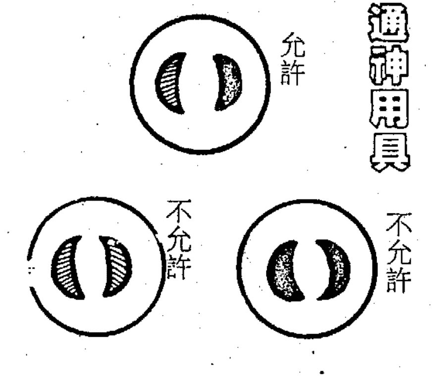

### 1、神交

神交在一般供奉家神祖先的家庭裏，皆可看到。而一般的寺觀廟宇裏也是不離此物。此物是一封都是木造的一樣一圓一平的彎尖形體，請示者必須點燈燭焚香禮神佛，告以請指示之事，是否吉凶或準照之後，合雙交擲于地面，如一背一負則吉或準，皆背皆腹則不吉或不準，其所示有時也有靈驗。

神與祖先、亡魂、鬼魂等都是魂體，他們無口嘴可發出聲，不能與人說話，其所說話是人之所不能聽到的，因此，人就設交以請神使交表示意見。如果擲交三次而皆是一背一腹則是決定允許所求，或所請示之事無差誤；如交三次皆腹或皆背，則表示祈求之事絕不能答應，或所請示的事項是不封的；如擲交三次而一是一否，則表示其所請示之事未決定，所請求之事也未決定允許的意思，如神靈感者則其交的表示是甚明確而固定的。

### 2、神簽

有連簽與樂簽之分，而樂簽又他為內服與外科用，善于求簽占卜者就會辨別其簽之數。

以連簽來說，有二十八首者，如二十八宿簽就是。也有六十首者，主是六十甲子簽，此簽在觀音朝，或寺院、尼庵皆有所備，百首簽，備用五城隍朝或媽祖朝內，但是其吉凶詩詞有所不同。除此之外類別繁多無法列舉。這連簽大多作爲指示求占者的吉凶得失之用，求占者在求占之前必須點香禮拜神前，繼而告以事由，請示借簽指教。如允許則抽連籤放于神前，再于共事百請示是否共籤可知所問的吉凶得失或成敗，如交允許持籤封號取籤詩，就得以詩中意義而解答其事將來的吉凶得失成敗。如不是則再抽籤擲交請示。

以藥籤來說，也是得抽籤擲交請示以分也是否共藥，如不是則再抽籤，如是則持其號碼至中藥房配藥。這藥方都是中藥房預先與朝裏管理人協調所開的，此藥大都用溫和之藥性開方，封病利害少。因西醫醫藥貴，低級收入者負擔不起，故貧窮的家庭多數都是到寺朝禮拜，求神開方醫病，也有怪病不治，去求神開方者。有時神籤之藥其效超過名醫之藥，這事都是甚不可思議的事情。因此，自古迄今，求神托佛之事乃流傳不絕。

### 3、靈丹

在一寺朝裏有供備此物，由信徒自取。此物用金紙包香灰，使用者以此物泡熱水服用或洗面以驅邪趕怪，也有醫痛之用。客家人稱為仙丹，閩南族謂之爐丹。此非通神之物件用具，而是神賜之物。此物有時亦有其靈驗。此物在各寺朝都以救世為目的，由人自取而不計其利。取者富裕則捐香油費，如不捐獻香油費也不強索。

### 4、靈符

在各寺院朝宇都有印其朝的靈符，皆以其所奉祀的主神（即是正神）為今，也是一樣備以供人索取，都是旗符術家考察其符式。因在一般的寺朝裏，精通符咒的人很少之故，因此朝宇之落成，祭典都請符術家到場作法，所以一般寺朝的靈符是在符令之中，是最下成而最簡易者。其符令之微妙，不及乩童所書的。雖是如此，也是有其神靈而有時有靈驗的。但是就其符令來說，乩童之符較高一靈。以乩童來說，神的乩童，其靈驗者少，如真神的乩童，其靈難就不可輕侮。在各寺院朝宇的靈符大都是保平安者，想要斬邪驅怪則未必有其靈效。

## 鬼神與人

神鬼與人不同，但是有很大的關係。因其體之不同，神鬼之體只是一重的魂體，人與動物之體是在魂體之外，加上一重固定之軀體，即是血肉之體。魂體在血肉的軀體之內出久而入，入久而也。脫離其血肉之體則死而為神為鬼，投入血肉之體則為人、為動物而輪迴不息。他們也與人和動物一樣怕吃苦，有其七情六欲。人之將死時是很痛苦的，他們之將投入軀體內也是很痛苦的，這就是所謂的歷劫。

以人來說，人之將死，就會悲傷恐懼。以殺人不眨眼的惡賊來說，他們被捕時會掙扎，被判死弄面色蒼白恐懼不能行。以動物來說，將死時也會掙扎，至死而不能動，由人宰殺擺布。這都是體內的魂靈畏死，怕吃苦頭故。如人或動物之死后，無其靈魂所居住之體謂死屍，不知覺不活動。其人其動物之畏死怕痛苦，都是其體內的靈魂自然作用之故。由此可知鬼神、輪迴之說不是無稽之談。

神鬼與人及動物一樣，也有性善性惡之分，其性格也各有不同，其鬼之膽小者怕人，凶惡者就是萬鬼惡鬼。他們也會欺弱畏強，如連衰之人遇到他則倒霉，如被連氣盛旺的人遇到他就會被赫跑。古有蓋英雄人物，在未得志時斬妖壓鬼的事迹。據說寧高祖在未得志時，途中借宿鬼屋，而在半夜之中神嚎鬼哭，一陣陰風吹熄燭火。高祖握劍喝說（何處鬼魂，有何事出現相見，否則劍下無情。）忽然數個鬼魂也現訴冤而去。以此可知鬼神與人及動物一樣也會弱附盛。

多人認為天地間如有神鬼存在，為何不出現呢？其實他們要丙臉間也是甚難而不易的，有如人類要去陰間一樣，是不容易的。以陰間的地面動物與水內動物來說，地面動物在水面不能生活，水中動物在地面也不能生活。由此可知陰陽之間的交往是不可能的，皆因魂體與軀體生活及居住所在不同之故。

至於神鬼他們也與人與動物一樣，有其命運。神之顯靈、鬼之出現都有其時，如非其時非其所，神就不敢顯靈，鬼就不敢出現，如神在非其時顯靈，在非其時出現則是犯天條而有罪，不過有緣人，神是不顯靈的，不是有冤仇者，鬼魂不敢報復，如亂赫人害人則犯陰律而不罪。以神靈來說，有很多人有病而求神計符令求樂籤醫治，而有靈效，也有不靈者，這是為何這故？因為神靈當是其人的救星則符或樂到病愈，如神靈不是其人的救星，則雖符到或樂到面不見赤效。猶有雖是救星而時未到而中靈應者，這都是緣與時之故。

在社會上許多人皆不詳其理，常因神不顯靈而以為神鬼之說是個信徒們的迷信言認。我在苗栗販封之時，有一熟客到而替他妻子占卦，據說其妻得到一種怪病，如進入廚房則頭不痛而無恙，我依此為她卜卦，數據后要他到西山求王爺索取靈符；他細聲的對我說，因他自幼認王爺的乩童作土父，怕開罪王爺，也會支求王爺索取靈符鎮廚房而不靈。我就對他說既發啦，再丈求一次看看。果然數日后，他回報其妻子，再索靈符鎮厨房而病愈。這就是說神之顯靈，也必須順時才會靈，隨緣而靈，不是緣、不是時是不敢顯其靈以達拗天時的，由此因而可知。

以神鬼來說，也有災難，如有災難也是無法逃過其却難，這都是天連之所以然者，非神鬼，非人力之所能左右的。以人與神之間的時連來說，也有忌認相見之時。如人之時連有冲犯神靈，則其年不可支禮拜祈求，如禮拜祈求或見其神則其年不作無補，而有災難，爲人者不可不知。

## 通神鬼靈的秘法

自古到今，在社會上通神鬼靈，最為眾人所共認者就是符咒之法、奇門遁甲之術及煉氣術這三種秘法。這三法都是通神的方法，要學容易，要成其功是最不易的。其法知其意義容易，但要應用則最難的，所以在所學的多數人當中，能真正得到其通變應用者寥寥無機。現時先來說符咒之術。

在古時會符咒作法的人較多，到現代能使用的人少，雖然有人會符咒作法，但其程度是入門的程度而已。至於能到達其所作之法變化，呼風喚雨，千變萬化，神出鬼沒之程度的人，尚未所見。因學習此術之前必須先修煉心法與煉氣法，使心神得至明心見性之境，之後才可修煉符咒學書符吟咒精熟之後，依法祭煉，如此方可得其術。至煉祭完畢后，看其所修煉及其所祭煉程度，而成其通神力量之高低。如祭煉所用的物件有缺一者，則其力量就會減少。

由於其所合用的物件用器，都是稀世之寶物，所以在市面上買不到。這稀世之異寶，就是有靈性之物，也就是活寶。此物能助所得者成其功，能助主殺敵傷人畜，能自飛動能變化之物，它與一般的金銀財寶不同，一般的金銀珠寶等物，只是價值美觀，以外是無甚作用的，用以通神之用者必須活寶才有靈力，一般的金銀財寶是不會發其力的。

自古的有名人物如黃帝戰尤不下，天降天書、周初呂牙得到杏黃旗、楊晉在作戰期間得到兩虎所變的雙錘、宋朝岳飛少年時在瀝泉井得到瀝泉槍此皆由於他們得到罕節異寶，所以立奇功而全勝。

目前來說雷劈刺木就是被雷電所劈的刺樹。依符書萬法掃宗所記載，要刻雷印、六甲神印必須取雷劈刺木雕刻其印。所謂的雷劈刺木即是罕見異寶。現在一般被雷電所劈過的木魂都不容易得到了，更何況是雷劈刺木，所以非有其福者是得不到的。

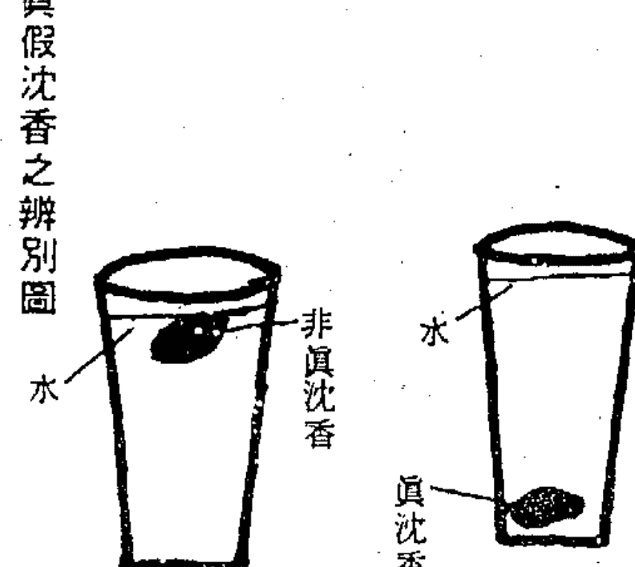

其次是沈香木，沈香木槐比被雷電所劈過的棘木更容易得到，但是大得可以刻印者是甚少而不易得到的，而且其價也甚貴。以通神力量來說，雷劈棘木的力量最高，沈香木的力量居次。所以自古學道者，都專心遍尋這二件異物。

說到沈香木，沈香木有真假，如不是內行是買不到真沈香的。要辨別沈香的真假有其方法；一、沈香木是黑色，二、沈香無香味，點火焚燒時只以嗅而無所聞其香味，如果個神貫注以自，其味淡得香而出，隱隱可聞。三、試以盛水于杯碗內，放沈香木于水中，隨即沈下至水底者才是真沈香，如浮者，或半沈在水中者雖有香味也不是真的。沈香在香料之中，是最的，其木槐也有結實者與不結實者之分，以結實者最好。不結實者多在中藥房作藥，結實者多爲雕佛像以入神之用，也有在香鋪作爲香料之用的。產在中國大陸及印度的深山裏，除此之外未有所聞。

其次是檀香木，檀香在市面上很多，隨時可買得到，有白香與黃檀香之別。黃檀較貴，白檀香價賤。當然黃檀香香味濃，而白檀香香味淡。因雷劈棘木不易得到，沈香木大可刻印者少，且價貴之故，所以一般的神及寺朝都用檀香刻符印。而現在寺朝或神壇也有以一般木料刻印的，甚至也有用塑刻符印的，所以其符令的通神代辦處小，都是由此之故。現今一般的雕刻家皆不以古法，只以樟木雕刻，加入少許的檀香入神而已。

## 祖師

要學通神者必須奉祀主持的神靈，這主持的神靈就是所謂的祖師，在客家則稱為仙師。都是通神者所求以指示助法之神靈。這祖師在神壇裏，多數都是命相卜家所奉祀的。其所奉祀的祖師，由其壇或命相卜師各人所信爺而奉祀，是無固一之所定者。以神壇所奉祀之神來說，由其師所留傳而奉者也多。

這祖師是影響最大而能夠通神的人，如靈顯則其壇的主持人就吃香，如不靈顯則奉祀者就不吃香。大概其祖師顯靈則其奉祀者都是很正道而不會胡為。以命相卜家來說，其祖師靈則其所卜備確而少差錯，所以真靈者也會使奉祀者得越得吉避凶，扭轉時連，消災解厄。

在符術家來說，奉祀的祖師有多派系。有奉祀張天師的，有奉茅山道人者，奉祀玄天上帝者，奉趙元師者，奉觀音佛祖者，奉天上聖母者，奉雷王者，奉王爺者等等，不計其數。以命相卜師來說，是有奉觀音者，奉五大聖賢者，奉鬼谷子者，奉玄天上帝者等，亦是不勝枚舉。

## 作法器物與物件之用途

在作法的器物中，最具代表的是劍、印、鈴等物。以牙必用者就是令旗、齒、令牌、法螺、法索、法鈸、法尺、幡、鑼、鼓、欠。在佛門則木魚、鈸等物。這些用器等愈古者愈通靈，最好的就是絕世的真實。但是絕世的真實不易取得，故以愈古者為良。

### 劍

在一般道術家的焚符作法、祭煉符咒時必須用劍、印、鈴等，這三項器物，他們稱為作法三寶。都是在作法煉祭時必須借用之物，缺一不可。以外令牌、上等之器物也是必須的。以劍來說，劍不但可斬殺人畜，堅利者也以斷銅削錢，連一般的刀劍都會被切斷。他的光芒魑魅奪目，通靈者也能斬鬼劈怪，百步這外殺人。不過這項神器是世上不可得，而作法煉祭是求之所不得者。在作法煉祭時，這神器之外，當然以堅利光芒者最好。

道術家在作法祭煉時用劍指揮，有驅役神鬼兵將，斬殺喝陰妖魔鬼怪之作用。所以作法用的神劍必須預先祭煉七七四十九日后才通靈。自古劍即有其傳奇，據說劍極能劈邪，其鋒堅利，光芒如雷電，閃爍奪目者即是好劍，即是絕世的神器。傳說中的寶劍不但堅硬鋒利，光芒奪目，且能通靈，不但人畜野豐，連鬼神精怪都會畏驚的跟蹤遁迹。據說古有干城莫邪的寶劍、青鋒劍等都是絕世的真寶。到現人芝些奇寶已是絕迹，而成為傳說之謠，無人可見得。據日本歷史所傳說，其天竿皇的祖先，天照大女神由其弟而得到天葉雲神劍，劍風能驅火殺匪賊，其劍與神說、牙師等三寶為傳統的神器，奉祀某處神社里，到現在未有所聞其蹤迹，尚聞古有英雄人物未得志時，劍斬精怪者。如唐將郭子儀劍斬妖神臂腕者、明時斐道人揮劍趕斬蛇精等都是依靠其寶劍的神器之故。

古代的名家甸定刀劍時，必須先看其刀劍的光芒程度，然後再用一指彈其鋒身，如光芒四射，如閃電的城目，聲亮如金石即斷定為名劍好刀，認定能斬銅削鐵。

我在十九歲時，被日本軍閥強制能加高雄第六海軍燃料廠軍工后被派往日本，到大孤市郊的放天受訓，一年卑鄙被調派回臺服務。在受訓畢，回臺之前參觀東京各地，在檀原神宮的古劍埔物館時看過陳列的古刀劍，每支都是美麗，且鋒身光芒如閃電城目，一見就知是名刀好劍，據說是古代的名將勇士之所佩身所用者。由此我因而得以眼福，也因此得以載于本冊，模仿諸學之參考。

### 日本古刀陳列館的古刀

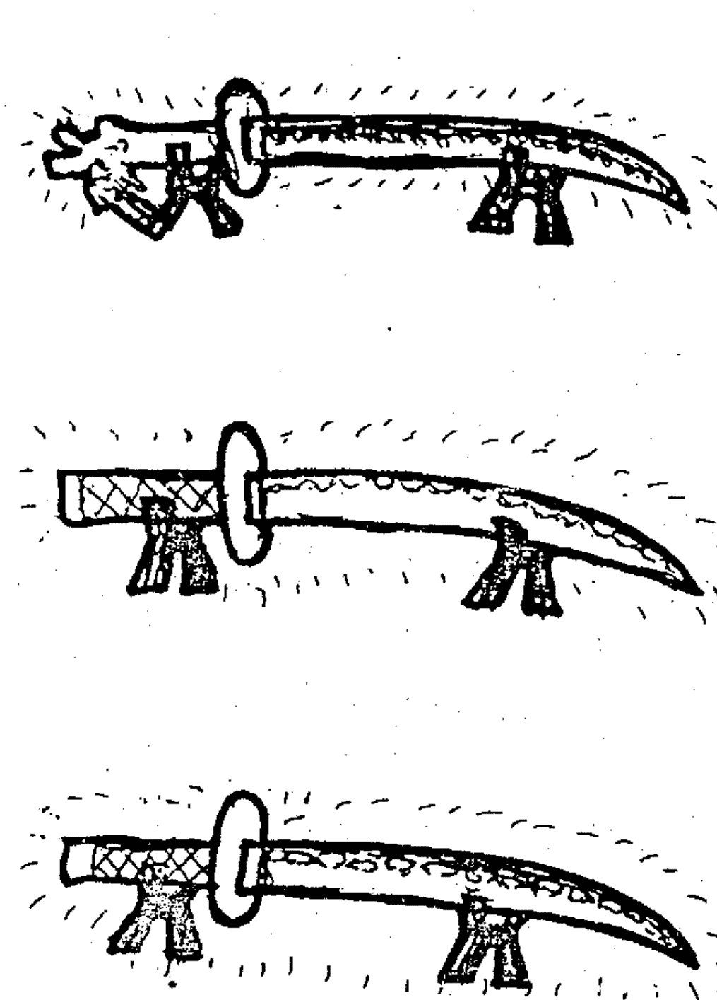

### 印

就是押符令的神印，又名稱法印。凡一般的符術家畫符后，必須習法印在符令上面，才得使符令發生效力，此有如在陽間的公務機關單位一樣，其命令畫、公文必須蓋其單位之公印才得有效。這法印與陽間各單位機關的公印不一樣的，不可以一般的木材刻印，必須罕世的木才可，如此才有神力的存在。因神鬼的兵將與在陽間社會的兵將不同，要使他顯形允役等是不易，所以要驅役他們，要使他們顯身，不是罕世的辦木作材是不會發生其效力的。

現舉幾種材料以作參考。以雷印與六甲印來說，據萬法歸宗所記載，必須用雷劈刺木作印材，但雷所劈過的豆木，不易得到。其次是沈香木，但是沈香木不但價高而且可刻印者甚少。在市面上所見者小而不够使用，所以，自古所流傳都是用檀香刻這些神印。這些檀香神印在一般的神壇上其通神力有，但威力不如傳說中所說的使世驚可，這都是因爲得不到雷劈刺木，或沈香木之故。以神通力來說，雷劈刺木最高，沈香木的力量較低而居中，檀香木之力是最低。而現在寺院神壇中的神印，大都以一般木材雕刻，甚者有用最省費的塑膠化學印材刻神印的，怪不得其通神力薄弱而到了似有似無的地步。

雕刻神印時，匠者必須先閃戒沐浴，擇吉星良時雕刻，至完成后置於神壇前，于六甲六丁日子時壇下祭煉七七四十九日，后用錦匣收藏以借押符、作法、祭煉之用。

### 鈴

鈴是道術家焚符作法時，搖動使它叫靈之用器。它們都是金物所鑄之器物，其聲音都靈字聲音，故此物命名稱謂鈴而取音與靈字同，與劍、印合稱作法二寶，都是在作法時不可缺少的用物。鑄鈴必須使用最好的銅，鈴心必須用最好的鋼鐵配制，柄最好以沈香木制造；也有以金銀之物合銅鑄鈴者，如用好銅，或與金銀合鑄，鈴心用好的鋼鐵所制則其鈴聲最好。柄用沈香木制作則鬼神就畏恨而衆鈴之聲，不敢違拗。這些資材是不易得到，故一般的僧道所用的鈴，都是由一般的鋼鐵所鑄制成。

如好的鈴之搖動，其聲亮而透澈人畜的心魄，連鬼神都會被他的響聲所搖動。鑄成后就必須在壇下祭煉七七四十九日后，才能通神，而發揮其靈力。

### 齒

齒是作法時神鬼兵將不到時，取以聲案推靈所用，也就是古縣官辦案，主師庚斷罪犯時聲民用的木塊，又名爲堂板，在古裝戲劇里時常可見。此物爲長方形的木塊，常放于案桌上，以沈香木、雷劈刺木所制成者最好，否則檀香木所制者也可。

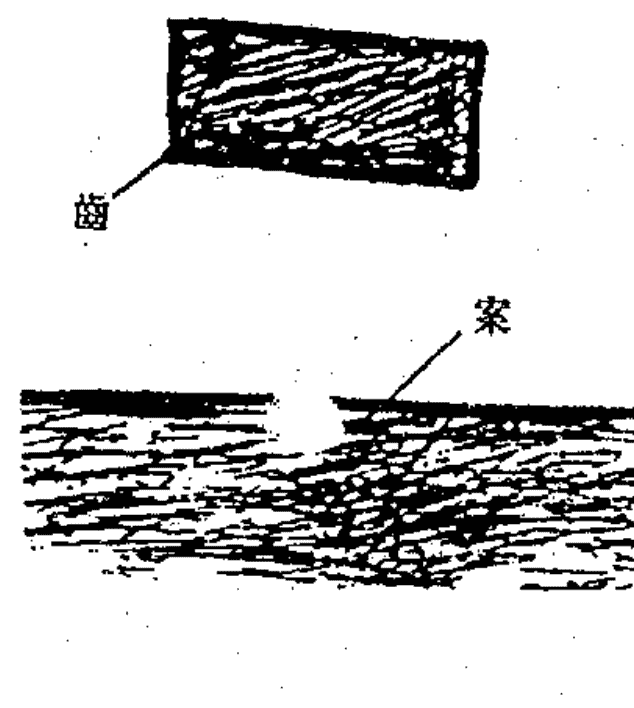

在道術家請神、驅役鬼神兵將時，如不到則取此物聲案桌三遍，以催神兵將之降臨。此物也有驅役神鬼兵將斬鬼殺怪、殺敵破敵之功用，但以先祭煉七七四十九日后使用最靈。

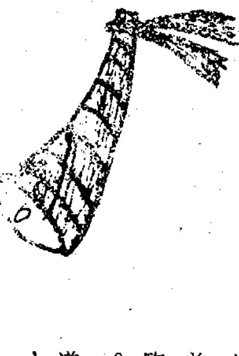

### 法螺

此物以牛角制成，其口处绑红布，在天师派弟子的道术家最惯用。（古谓号角，在上古代临敌作战时吹此如集兵将，或游行时军乐之用。）是现代军在所用喇叭之始祖。在天师派的道术家之作法时用此如集神鬼兵将，困围鬼怪，拿鬼捉怪，再取法索打鬼怪者，与法索都有连带作用的。

此物是牛角所制成的，在牛角顶尖部至下部内面开洞成空。用以作为喇叭吹者，此物以愈大的牛角制造愈好。

### 法索

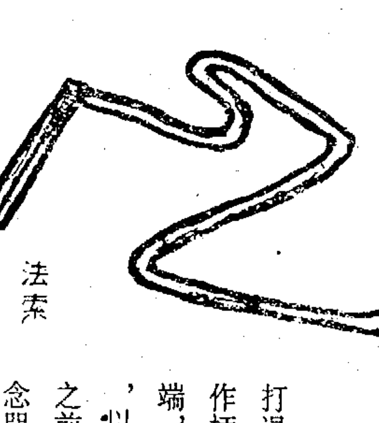

此物也是天師派的獨門作法用器，專用以打退鬼性邪煞等物。材料是用沉香木或檀香木作柄，（雷劈刺木更好）以茅縣作索，結地柄端，作法時用右手握住柄身，由上向下打地面，以趕打鬼怪，驅逐凶神惡煞妖魔等物，用此之前必須先吹法螺，如集神鬼兵將圍困，后才念咒打下法索。

一般來說，此物為與妖魔鬼怪斗法之法器。如遇到鬼怪凶麻者，不知要打下多少次的法索，才得驅退使他們知難而驚退。在社會上因犯煞而致精神病者，為此種打鬼法所醫者，也是時有所聞。

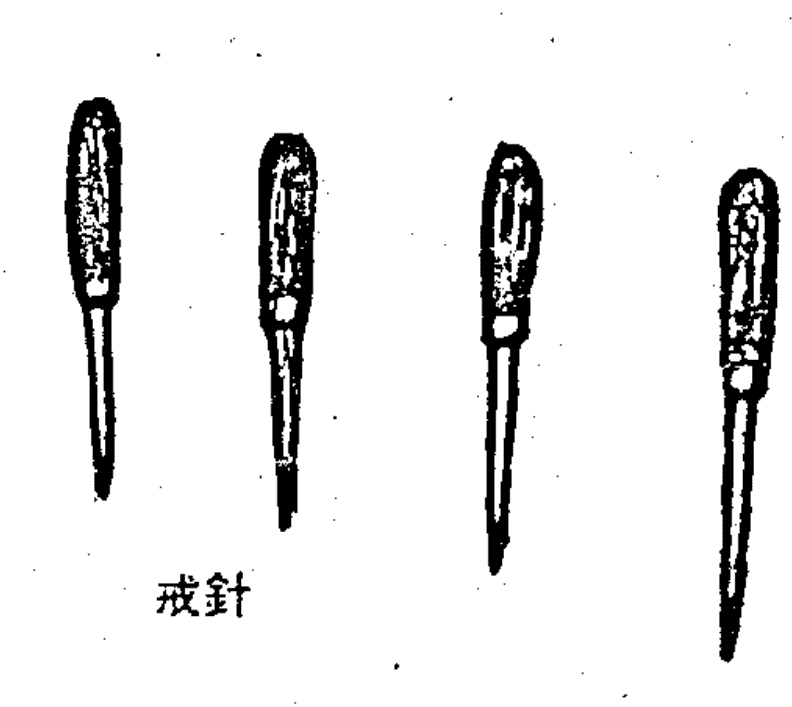

### 戒针

### 法针

鋼鐵所打的長針，為茅山派的道術家所慣用。是訓練所收伏拘到的鬼魂，如不依符咒所囑而行，不服驅役，則用此物燒紅，刺鬼魂所依的木人或草人、紙人等的身上，用以刑法鬼魂者。據說被拘服役的鬼魂，如被刺一次就痛苦難挨，連被刺三次則魂體就消失不能復聚，是懲治鬼魂，使鬼魂服從其符咒之役，助他變化出沒以作惡，后其法被破，終被捉判斬首示眾。

### 戒尺

也是茅山派弟子所惯用的法器，都是惩治被拘役的鬼魂用器，此物用沈香木或雷劈刺木制成。如鬼魂不服符咒、不服拘役则用此打鬼魂所附的木人或纸人、草人的身上，其毒辣也不逊法针之器。与法针同是正派所不用之器。

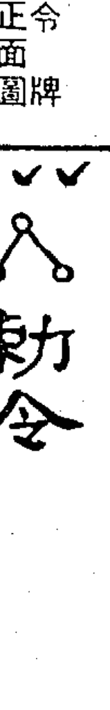

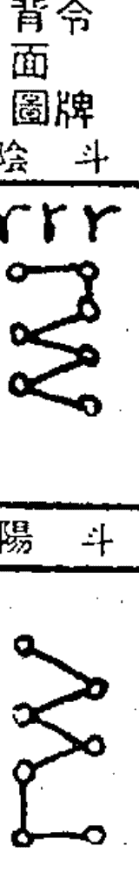

### 令牌

与剑印铃铛等物，都是作法时必用之器。其形体，头尖而润，长而下方细者。制法用柏木所造，外面用锦布粘貼周身，畫符于其面者。作法者如步罡踏斗完畢后，必須取此物聲案上，望北禮拜二十四拜。在乩童的問神降筆，也是有此物，后才降筆答人所問者。

## 旗幡

旗幟幡是古時作戰時所用之物，為行軍列陣時之所用，幡是超渡亡魂之所用者。其形狀同布料所制而其體不同。現在先來說旗了。

旗者干附其一面之端者，其形狀有三種，有四方形、長方形、角形。四方形與長方形者多是令旗，角形者多是眾軍之所執者，是列陣所用者。所以一名陣旗，而甚僅威。令旗是代表主將，其權威最大，故在一般的作法，行法人都是用令旗以調役神鬼兵將的。這令旗都是黑色，而中央白環，內有書寫令的大黑字，此外令旗無他色。而角旗則有五色者，有五花八色者，十分的美觀，作法人是少有用此的。

旗

幡

幟，即是參幟，其形長方，干在中央上面。是主將的親衛軍士所執，與親衛的隊伍隨行主將。如此物出現則主將就要出現，此物不現則主將就不出。其地位較角旗高一籌，無權威之人不用此物作法。

幡，形圓長內空，此物在作戰列陣時甚少用。是由西方佛教所傳入的，為道術家作法招魂超渡之用。現代多數人喪孝時請天師派的道術家作法，揮動此物為亡魂餅在炭上焚其香，則香烟直上天門而神立止。

看破軍一位落何子，任皆需此騰，而定存想曰口傳。先須將身潔淨，念淨口咒，並念混元畢，及罡咒才可去踏步斗。不可被婦女、雞犬及一切物所見，儀態須整肅。不可嬉笑，如不慎犯鬼神。則生惡降禍在須臾。

## 混元咒

（一身之主心元君 左有青龍肝元君 右有白虎肺元君 好游好放魂元君
好動好靜魄元君 明之於目眼元君 聽之於聲耳元君 聞之于味鼻元君
好是好非口元君 好善好惡舌元君 三十六部陵元君 山林樹大發元君
九江八腸元君 五湖四海肚元君 曹漢路上關元君 五臟宮里膽元君
能沖能清手元君 能沉能浮足元君 如和好合意元君 太極未判混元君
父母未分氣元君 八萬四千毛元君 元精元氣神元君 吾心所屬盡歸

鑼鼓手是配角，都有其間義存在，不是隨便無根據的。

## 噴吶

是古兵家或各長官行伍行所用之器。在道術家中有時也鑼配合使用。噴吶比法螺稍後，也是喇叭的祖先。都在一般隊伍之游行，各官僚出行時，配合鑼鼓而用。

## 鞭炮

在民間在祭拜、迎神、送神等儀式后，一般都會放鞭炮夢燒金紙，一般這家庭放小鞭炮，較富裕者就放大者，這都是中國自古所流傳之谷。放鞭炮，實在是危險，如不小心則會誤傷眼睛，大則可能會引起火災。爲這麼危險的玩意還能自古留傳到今呢？這都是有其道理的。這鞭炮屬于爆炸物，乃是仿效地雷火炮者。地雷火炮自上古時，夏杰之末、周朝之初即有此物。此物都是造以作戰時，預埋于地面下通神鬼靈這秘訣炸殺侵入之敵兵軍眾之所用者，當時其威力是最強者。而此物就是現代大炮、爆彈等物之始祖。

大多數的神靈生前是勇敢善戰的武官將士，他們生前歷戰沙場，難免遇到地雷火炮的爆炸場面。所以迎神、送神等祭拜完畢后，放鞭炮乃是讚揚神靈，生前英勇的事跡，而爭取神靈的歡心。所以，此俗能由古留傳到今便是此理。

## 第三篇
畫符學咒的要訣

## 學符咒之秘訣

要學符咒，最重要的是必須奉祀主持的神靈。這主持的神靈在符術家稱為祖師，在臺客家家族稱謂仙師，即是一般社會人間所稱的師匠、老師。是學符咒者最所靠者，其靈感之有無也是關係著其奉祀人的命運。奉祀者在畫符念咒、焚符作法、調遣神鬼兵將、驅役鬼神等事時皆由其先師之靈力而定其所靈驗之事。

所以，無祖師而學符咒，則有能學會符咒而且不能得到符令通神力。如祖師之靈者會托夢以傳授符咒之法，而其符令就是通靈，此為一般的符術家之所不及。這都是由修煉學符咒者之神緣，而看其造化而可得到者。

畫符學咒的要訣

## 神佛的法像

即是神佛的金身，在一般的家庭里，很多都会佛像店选购神佛的金身安坐宅中奉祀礼拜。至于符咒术家更会安神或佛在家礼拜，其神像者是仙师、祖师的金身。其宜师仙师的金身，也有其祖先所留传的。也有其师所传存留的，也有自己到佛神像店订刻的。当然其神佛像之通灵漠以愈古者愈好，如有奇逢者更通灵。我母在少年时代，有一日她在溪边洗衣服，看到一尊铜铸的观音佛像由上游流至，她是虔诚的佛教信徒，就捡回家里奉祀。以后我的家里如有疑难事，就托梦显灵指示以消灾解危。

在符咒术家所奉祀的神灵，由其所信仰之不同而各所不。有奉祀观音佛祖者，奉祀天上圣母为祖师者，奉祀九天玄女为仙师者，有奉祀太上老君者，奉张天师者，奉赵元帅者，祀王爷者……多得不胜枚举。此皆是由其所信仰，所依恃而托以助法的。以所奉祀的祖師聖像來說，最靈的就是所遇所得到的神佛聖像，其次是祖先所留下者。以奉祖師來說，由神靈托夢指示而所奉者最靈，其次是祖傳及師傳者，以外無拜師傳授者是不能致其靈驗的。

## 畫符學咒的要素

## 符咒的要點

初學畫符念咒，最重要的要點，就是須熟知天、地、日、月、星、辰、風、雲、雷、雨、山、川、河、海、水、火等。各種及神鬼兵將的姓名、字語及其職等，也須知其相貌、嗜好者，如不知這些則無法得到他們的相助。其所畫之符令，所念的咒語，都無法得到精通。因這些神、神將等，生前也是人。他們都是忠勇善戰的勇士，他們也與人一樣有其性情，有其情感，喜怒哀樂怨恨愛等的七情六欲，與人一樣都是肯助朋友、知己的。如無情份、無相識則要求他相助是不肯出力的。

依古留傳符咒畫冊之內所記載的其神將們的生名、相貌、嗜好等者，這些都是有其道理用意，而不是無端亂載的。凡要畫符念咒，在符令之內載著所驅役神將的神職，在咒語之內，請所鳳神將服役助法，此皆與神靈及神將有關。

符令的寫法，最重要者有四字的字式。是束令罡等式，這四個字式在畫寫各種符之內，都是得填上的。其中，束令兩字式要填寫時必須要看情形而畫寫在符令之中。再有罡字式，這罡字式在符家謂符膽。在符術家來說符膽有兩樣式，一式是罡字，另一式是字式。畫符時兩式之中只填一式就可，不必填寫兩式。但是不說明這兩式是要分填在何種符令的，只是在各符工之中有填罡字式者，也有填字式者。以研究之結果，陽神拊之下者是填字式符膽，陰神符式下多填字式符膽。陽神是在天上的神，陰神則是地下的神靈。

人畫符必須先寫束令兩字，這束令必須寫大字。最後把罡字寫在最下，這罡字也須寫大字，極后在束字之上填字式字體，也是要寫大。在束令字下就填寫驅役的神將，再填效勞的事項，最后在事項之下填寫罡字或字式的符膽，斷而在束令之上，再填字式，則一紙符令寫成啦。這是下乘符式的寫法，至於中乘符式、上乘的符式，著者未得到畫寫的要領，不敢妄言。只以符工之式樣，舉數例以供讀者參考。

| 符號 | 名稱 |
| :---: | :---: |
| 勅 | 勅令字式 |
| 罵 | 罵字式 |
| ∨∨∨ | ∨∨∨字式 |

## ◎ 四字式填法例

1. 符號是代表等
2. 書寫次序

## ◎ 符式例

## 束令的填法

填束令二字必須要有分別，如不分則所畫之符令不但不靈，且會貽笑于他人。這束令二字是只可填在下級神名之上，如中級神靈、上級神靈的神名之上是不可填寫。如主管正神、高級神靈則其神靈字語之上，必須其神名先填在束令之上才可，如填在其神名之上則會對神靈無禮而不靈。再有畫中級靈符令也有一法，如較中級神位高的神靈，必須先填奉天在束令之上，才可得用。臺差錯，他不受命而致使符令失效。

再有如奉請高級神或主管神靈，則不可填寫束令二字。只可填奉字式在神名之上。這些填法皆有其意義及用意在。現在來說這填寫法的意義，以奉束令的意義來說，如機識、哪吒等，高級些的神將，要驅役他們，只以束令壓他是不肯受命服役。所以必須畫填奉束令騙他們以為上級神靈或天庭的束令，而使其受命。

## ◎ 上級神符勒令字式

## ◎ 中級神符勒令字式

奉天式（不正位一敕主符式）

奉字式（請上級神移位符式）

以奉天敕令來說，就是要騙役最高級的神吏神將，其神位不亞於正神之無神職的野神頭目，如茅山老祖、瓣靈大仙等，不能以奉敕令騙他們受命，必須以奉天敕令騙他，才得使他們受命。

以航級神及主管神來說，他們都有神兵神將，陰神則有其鬼兵鬼將且有鬼役鬼官等，都是奉天軌其神務的，要以奉天敕令四字騙他們是不可得的，故必須以其神靈神名填寫在敕令之上才可用，這填法都是借重他們的神威，以驅役鬼神兵將，神吏鬼差，驅逐怪邪惡煞的。

以奉字來說，劉級神，或主管正神，如城隍、媽祖、王爺、一廟寺之主神等，要他們移其所居或到宅，必畫寫奉字請他們，奉他們移徙到宅才有其符令的靈效。

## 罡字式的意義

在符令之最下面在填寫者罡字的字式，或字式，就是符術家志謂的符膽。這兩字符膽的填法不同，要填這符膽，須念其膽的咒語。罡字式符膽是填在天神符令之下的，而來字式的符膽則是填在陰間神的符令下。這來字式的決義還未究知。以罡字來說，罡字的意義就是斗綱之道理名，就是北斗七星之一；以北斗七星在天文上來說，是帝星的坐車。在天上星辰就是天神天將的坐車，就是神靈神將的交通工具，有如人間的車馬一般。

罡字式符膽都是填在天上神仙之星辰日月的神靈、請符及驅役天上神兵天將的符令之下。咒曰(開天門)就畫四字式，(殺鬼路)畫一字式，最后念(開地府殺鬼卒）畫寫止字式，斷而再念（神兵火急如律令）。

來字式符膽咒曰，（一騎天地明），畫一字式。曰（一橫鬼延結）就再寫一字式，再曰（二點）畫字式，斷念（日月明）斷寫字式。咒念完符膽必須畫完，最後念（神兵急如律令）。

## ■罡字符膽咒

（開天開　殺鬼路　開地府　殺鬼卒　神兵火急如律令）

## ■來字符膽咒

（一騎天地明　一橫鬼延結　二點日月明　神兵火急如律令）

## 填字式的意義

這字工就是符家所謂的生氣，所謂的無中生有之意。在天地間所有的萬物，都昌無中生有而所生的。以鬼神靈魂、人或各種物來說，都是無中而生有的，至於花草樹竹等植物也是無中而生有的，再以地內所生的五金、礦油、水火、雷電、風雲等都是無中生有的。相反的有中也會生無，這無中生有與有中生無輪流不息，乃是天地自然之變化。凡一般之生都是由無中而生其有，以來字的來說，前面沉重而寫下，至于后爲之面則由下寫上，前面是表示無之意，后面則表示生有這意，此乃是先無而后有之例證。這來字式的三字無中生有之象者是表示奇的意義，因無中生有是奇之數。在神學來說，三神就是神靈者，來者就是三清之氣者，所以神仙都有三清之氣，如果失去三清則會去其苦修的道行的，由此就可知這三奇、三氣的意義。而這字式是表示要使符令發生無中生有，發生靈驗之意思。

## ◎ 奉太歲符式

## ◎ 城隍爺敕令符式

## 畫符學咒的要素

以此就可知畫符的要點，就是在符令最上面寫上來字樣式及束令兩字，及最下的罡字符膽，或來字樣式符膽。除來字式是固定填用之外，束令的兩字雖然必用，但也依情形而有不同之用法，至於符膽也須看情形而用，填罡字或填來字，都須分清而填入。這都是初學畫符法之捷徑，不可不熟記。

觀音佛祖敕令符式

天上聖母敕令符式

## 符令的形式

畫符時其字體愈有力愈好。符字之體有數種形式，有正楷字體式、草字體式、草開字體式、篆字體式、半字圓體式等。正楷體式與草體式、草開體式多為下乘符式所用。至于篆字體式，多用于中乘符式，半字圓式則多用于上乘符式，這在一般的符術家中是無法了解，且不會畫寫的。

自古以來，一般的符家，能畫寫中程符式者已是不易了。至于上乘的符式，必須仙家子弟才得以畫寫成功。以符式的形狀而論，愈怪异愈看愈可畏者最靈。如符字之有力，符狀之怪异可畏，則其符就更活生，故靈者都與此有關。而現在一般的符家僅會畫寫下乘符式，再于其上添加簡易的圖畫，其符令之形式皆無一見可怕之處，所以其所畫寫的，通靈力量少。現在有數式束令式，與其形體的樣式載于后，請由此參考。

| 正楷字敕令式 | 草字敕令式 | 草開字敕令式 | 篆字敕令式 |
| :--- | :--- | :--- | :--- |
| 敕令 | 敕令 | 敕令 | 敕令 |

| 甲骨字式 | 奉敕令正楷字式 | 奉天敕令半篆字式 | 奉天敕令草開寫式 |
| :--- | :--- | :--- | :--- |
| (符號) | 令 | 奉敕令 | 奉天敕令 |

奉九天玄女娘娘
奉正德神君

城隍爺敕令
奉太上老君敕令

## 雷部真君雷令 奉雷王雷令

符令有頭有身有腳，以束令為頭，符膽為腳。至其頭部有面、目、耳、口等。這頭是束令，腳是罡字，束下的符令字式就是身，這三點就是畫符要訣。現在來說符令的要字，符令的要字即是畫寫在束令之上、或束令之下，罡來字符膽之上的字式，也就是填寫在束令與罡來字的中間。

| 白天式 | 黄天式 | 火天式 | 青天式 |
| :---: | :---: | :---: | :---: |
| [Image] | [Image] | [Image] | [Image] |
| 白雷式 | 黄雷式 | 红雷式 | 青雷式 |
| [Image] | [Image] | [Image] | [Image] |
| 金星式 | 土星式 | 火星式 | 木星式 |
| [Image] | [Image] | [Image] | [Image] |

## ● 各字頭式（不填勅令）「符身」

| 丁字頭式 | 王字頭式 |
| :---: | :---: |
|  |  |
| 長燈式 | 左右步式 |
|  |  |
| 弓頭式 | 兩頭式 |
|  |  |

| 玄天式 |
| :---: |
|  |
| 黑雷式 |
|  |
| 水星式 |
|  |

| 十頭式 | 人頭式 |
| :---: | :---: |
|  |  |
| **身內式** | **外身式** |

| 鈎式 | 對宿式 |
| :---: | :---: |
|  |  |

| 長雲式 | 日字頭式 |
| :---: | :---: |
|  |  |

## ● 符 脚 式（多以鬼為腳）

| 金鬼腳 | 火鬼腳 | 木鬼腳 |
| :---: | :---: | :---: |
|  |  |  |
| 土鬼腳 | 雙頭鬼腳 | 雙鬼腳 |
|  |  |  |
| 交腳鬼式 | 行鬼腳 | 偏鬼腳 |
|  |  |  |

◎符內入神式 多入神、王、將、星、雷、日、月、丁、甲、斗等的字在鬼字之上，或煞字之上。而用以制煞斬鬼、消災解危、鎮宅平安收驚治病者。以外也有八卦圖、大金鋼等字用以入神于符內，以作為劈邪斬鬼之用。入神之字式甚多，于此甚難盡載，現舉幾種以供考究之用。

| 觀音佛祖敕令 | 天上聖母敕令 | 太陰星君敕令 | 九天玄女敕令 | 聖王公敕令 | 太上老君敕令 |
| :--- | :--- | :--- | :--- | :--- | :--- |
| 太陽星君敕令 | 姜太公敕令 | 城隍爺敕令 | 張天師敕令 | 伏魔大帝敕令 | 道祖敕令 |

### 符身要字

| 日 | 鎮 | 出 | 月 | 爻 | 怪 | 兩 |
|---|---|---|---|---|---|---|
| 三 | 打 | 斬 | ... | 甲 | 虎 | 七 |
| 田 | 月 | 煞 | 八 | 乙 | 斗 | 明 |
| 吉 | 星 | 山 | 刀 | 乙 | 神 | 普 |
| 土 | 尸 | 典 | 弓 | 丁 | 王 | 速 |
| 宀 | 王 | 尸 | 尸 | 丙 | 奄 | 押 |
| 尸 | 金 | 火 | 木 | 非 | 月 | 驅 |
| 口 | 田 | 水 | 雷 | 龜 | 正 | 收 |
| 風 | 用 | 霧 | 雲 | 龜 | 力 | 兵 |
| 目 | 几 | 田 | 龍 | 合 | 降 |  |

### 通用字

| | | | | |
|---|---|---|---|---|
| 打煞 | 退鬼 | 平安 | 招財 | 煙 |
| 打鬼 | 押煞 | 大吉 | 進寶 | 轟 |
| 斬煞 | 捍煞 | 吉祥 | 斬怪 | 霹 |
| 斬鬼 | 消災 | 天降 | 劈邪 | 靂 |
| 煞鬼 | 解厄 | 天官 | 急走 | 鎮 |
| 退煞 | 鎮宅 | 賜福 | 祖祖 | 煙 |
| | | | 捉怪 | 呼 |
| | | | 喜 | 趙 |
| | | | | 捉 |
| | | | | 怪 |
| | | | | 喜 |

### 符内要圖

| | | | | | | |
|---|---|---|---|---|---|---|
| 霓 | ○ | 三 | □ | 门 | ⊗ | × |
| 靈 | 8 | 三 | 田 | 弓 | ⊙ | ××× |
| 乖 | ◇ | 丰 | 非 | 弓 | 88 | /// |
| 酉 | 3 | * | △ | 门 | 88 | /// |
| 2 | 3 | 3 | 非 | 3 | 11 | 88 |
| 38 | 100 | | 雷 | | | |
| | | | | | | |

## 畫符學咒的要訣

以上所列者是符令所用的要字及要圖，學畫符者精熟牢記，用以配合畫符，則符無不通。

## 煉咒的秘訣

要修煉學咒語，必須熟悉天地間，日月星辰風雷雲霧水火金木山川河海等大小神靈與其神職。因在咒語之內，都有請各方大小神靈，及神鬼兵將在內。

其次就先要求主神借兵將相助護法，以後請其屬下的神兵神將相助打鬼斬煞，鎮宅消災解危，或以外的服役等事都是所含有的通例。所以，念咒之有效與否，與神鬼之是否熟悉息息相關。

在咒語最後的結句，修煉咒語這人必須明白其義而由心同念。如其結句有（吾奉太上老君，急急如律令）之句則再加上束字句。如有（吾奉九天玄女，神兵火急如律令）等，就是告神兵將說明自己是奉太上老君所定的束令托他們行事，要他們急速依天律的束令而服役，不可怠慢之意，意即以吾奉九天玄女的神威，期望神的兵將如火發之急速遵照天律的束令行事，不可怠慢之意。）

以急急如律令來說，在每句咒語之下都附隨著，神兵火急如律令，這兩句內的任一句，都是押咒之句。而以吾奉太上老君，或九天玄女等之句來說亦是押咒之句。

一般來說，人要驅神鬼兵將是不可能的，他們是不服驅役的，所以必須以奉太上老君，或九天玄女的大神神威以押鬼神兵將服驅役，才可使他們服行所囑之事。

在咒語之內，最先大概是請其須服役的神鬼兵將或下級神；其次是囑他們服役的事項；最後是對他們說明奉太上老君或九天玄女的束令行符令，要他們依束的律令急速進行。

念神咒之法，每咒多數念三遍，此為應天之數，是乾之數。乾者其卦三奇，所以念神咒多以三遍為數。現以舉數條咒語以便參考。

## 束水咒

（此水非幾壬癸水　一點硯中雲雨至　凡人吞則百病除　邪鬼吞則如粉碎
急急如三奇帝君如律令）

## 束硯咒

（玉帝有束　神硯四方　金木水火土　雲雨電雹
神硯輕磨　霹靂電光芒　急急如律令）

## 束紙咒

（北極束紙　畫符打邪斬鬼　敢有不伏者　押赴鄆都治
急急如律令）

## 畫符咒

（天圓地方律令九章　吾令下筆　萬鬼滅藏　急急如律令）

## 束筆咒

（居收五雷神將　電炮光華　納則佑身保命上則綁鬼伏邪
一切死生　惟我長生　急急如律令）

## 束墨神咒

（天帝有束　神靈炙炙　形如雲務　上列九星
神墨輕磨　雷電料紛　急急如律令）

## 祝香咒

（道由心合　心藉香傳　香在玉爐　心竭帝前
真靈下降　仙佛臨軒　今臣關告　遙達九天
所祈所禱　咸賜如願）

## 淨身咒

（以日洗身　以月煉形　仙聖扶起　玉女隨行
二十八宿　與我合形　千邪萬歲　逐水而清
急急如律令）

## 淨口咒

（丹朱口神
吐穢除氣
舌神正倫
通命養神
羅千齒神
驅邪衛真
急急如律令）

## 安神咒

（天上神兵
八卦之精
攝到神將
安坐吾身
聞咒速至
百事通靈
無不報
不得違令
吾奉九天玄女
急急如律令束）

## 祭壇咒

（祈禱道場
上觀赫赫
下看巍巍
吾令則項）

## 束符一宗奉文

金光護衛 五牙羅圍 保守罡煞跟隨 急急如律令

（神符烟中香烟正奉得玉皇大帝明。奉請玉帝行束令。四邊神將顯威靈。奉請五行束符帥。束符二帥主。三帥將軍童子郎奉請。某人來畫符。仙師祖師弟子來畫符。天上畫符天就動。地下畫符地也崩。田上畫符草木枯。海內畫符海隨乾。神廟畫符廟也倒。對人畫符人長生。對鬼畫符鬼怪滅。對神畫符神邊離。畫起神符到東方。東方百鬼走忙忙。畫起神符到南方。南方百鬼無處藏。畫起神符到西方。西方經陀隨現身。畫起神符到北方。北方真武大將軍。畫起神符到中央。中央百鬼走無蹤。畫符一道請準奏。）

以數列咒語、奏式等，即可得知其內容，多數請開地間各種神紙的降臨相助。所以初學者必勝精熟通放其真理，且善以應用變通，如此則無不成、無所不靈。

## 畫符心訣

學習畫符念咒熟悉之後，必須請神訴備，在神前畫符念咒。其序與法皆有所定，如失其序、錯其法則所畫之符、所念之咒便不得靈。一般來說符令與咒語，都是，有關聯而分不開的。要畫符之前必須先念畫符咒，要用符之前也須念束符咒。要用用水、用紙、用墨、用筆、用硯之先必須束水、束紙、束墨、束硯、束筆等而念其咒。必須再念淨身、淨心、淨口、安神等咒才得畫符而得靈。

## 畫符的時刻

要畫符最好的時刻是亥子兩時之內，就是半夜之中。（現代時間是下午九點至一點的時間內）因這兩時就是陰陽交接之時，也是天地交泰之時。其次是卯時與酉時，午是也可。

## 畫符日期

忌用破日、刑日，如遇破日或刑日畫符則不靈，且會有災禍臨身。因為破日畫符則神不敢至而會破符靈。刑日也會刑克神靈而為神紙之所忌，此乃刑克符靈之故。所以所畫之符不靈，且畫符之人有災禍，故畫符時必須慎重時日，必須忌刑破兩日而不可粗心大意。

## 注意事項

凡畫符必在神前虔誠一心，宜靜忌鬧。其法：在祖師神前，先點燈焚香禮拜，告以其事請助法束法，后取水束水、束紙、束墨、束硯、束筆。取筆沾墨汁，筆轉香上渡三轉咒畫符咒異。閉目存想祖師金身臨前，北斗與南斗星君護立左右，筆毫金光。（存想時現明者愈靈）后由東方吸一口氣，呵在筆毫上畫符。异后再禮拜謝師，送神后備以應用，符就靈驗如神。

## 存想訣

凡閉目存想要使腦海內神靈現身，或金光在頂上明顯的出現是不易之事。這存想訣在修佛家與道術修煉家來說，是最高之術。在煉氣術來說，要修到這程度最不易。所以對於修佛的人來說，修心養性就是修煉存想訣之入門，他（她）們修煉情性貪欲，一切不侵都是要排除雜念，而后才得心念皆空的程度。如能心念皆空，則存想法就易成。所以古之得道高僧，煉氣士能通神變化，未卜先知都是得到存想訣之故，此修符通神者必須明知。

## 祭煉法

在古時修符咒者，其所畫符所焚符之作法，並不是只依畫符之精熟、咒語之熟練而可得作法。依各符典所記載，其所用物如劍、筆、墨、紙、硯、朱、池、水、印等都是祭煉所必須)，經過七七四十九日后才可用它，也須步罡踏斗、祭煉符令等過后才有其神出鬼出鬼沒的通神力。

## 祭煉法儀

凡畫符念咒之前，或用符作法之先。必須先祭煉后，才可得到神通的奇驗。如不經過祭煉，則其符令就不能到達其驚人的靈驗。所以學符咒者須預先在祖師神前立壇選吉時吉日供鮮花水果禮拜。點燈焚香禱告顯事曰，（弟子某姓某名，是男或女，某年某月某日某時生，在祖師聖前求長生之道，（或求救國救民之道，或求救世救苦行道）而奉師修煉符法行法，求賜準奏，降符束法，神鬼兵將助法護法，請咸賜如顯。）斷而立誓曰，（弟子如得法后，不依心德、有戲心害民則顯受天誅，乞請賜準。）誓畢后搓交請示，（如得允許則再擇六丁六甲日子時，立壇六丁六甲神。）請示后再焚香禮拜，焚金紙送神。

## 祭煉秘訣

祭煉必須立甲壇，祖師位在中央面南。六丁在左右位，東方丁丑、丁卯、丁巳。西方丁亥、丁酉、丁未之序。壇下須併列鮮花、水果等物。案水備新面盆，潔淨面巾各一，盛水于盆內。再備池、紙、墨、硯、砂、筆、印、劍、鈴各一。行法人在壇前點燈焚香禮拜畢，先禱告祖師以束法賜法，再告六丁諸神禱曰，（弟子奉祖師束法，求尊神助法護法，劈鬼捉怪，斬惡劈賊，專伏神威立功，符令所至，顯求相助。（斷而步飛斗罡訣，念丁奇三遍。焚六丁六甲符，吞服六丁六甲符，七四十九日祭煉完畢后就得畫符通靈。祭煉時日必須在六丁六甲日子時。

## 祭煉筆墨紙硯原池秘訣

祭煉必須在六丁六甲日子時，用最好的黃紙四十九張、新毛筆五枝、黑墨五碇、硯臺五個、原砂一兩二、水池一個，祭煉于六甲壇下，左手雷印，右手劍訣，面朝東方，吸東方一口氣，吹在紙上，畫符五道，念咒一遍，焚符一道，祭煉七七四十九日，其物就通靈，應變如意。

## 咒曰：

（日出東方赫氣洋洋　用筆筆靈
用原原赤　用硯硯汪
畫天雨沛　無禱應
吾奉三山九侯律令攝）

用紙紙方
用池池光
無求不祥

用墨墨黑
畫庫鬼泣

## 符膽之說

在符令之下，所押的符膽圖式，已在前說過。據所傳說，真的符膽不是各符典所載的圖式。除各符典之內是無圖之說外，這符膽之說也是成迹，以此談是無根據之論而作罷。其實這符膽之說不是無根據，它也甚合天地自然所成之理。符令有其靈之所附，則會通玄變化而神也鬼沒。符內無靈之所附則有能通玄變化，僅空有其符式而不能發揮其效力。這都是與人及動物一樣，如人或動物，其體內無靈魂則不能有其知覺與活動作用。以人的死死、動物的死體來說，他們都有耳目口鼻手足，體內都有頭腦五臟等，但不能自動發生其作用，這都是因其軀體內無靈魂存在之故。

以此便可知符內無膽無其靈所附，是不能發揮靈力的。符令就是驅鬼神兵將的命令書，雖有命令書而無靈魂所則無其效力。自古有甚多道術家，其所書寫的符式，能真實的發其神通；而到現代少數的道術家中能有此力者已是難得所遇了，此乃因為真正的符膽得來不易之故。

以符令來說，大都無法真實得到符膽。有時也或有靈效者，但這等情形都是消災解危、治病退煞的衝令。因為符令的字式都是怪異字式，且多假借天地各正神的字語束令，也兼書寫斬煞劈鬼等字樣。所以鬼邪惡煞等所見者，有膽小的就赫得急走無蹤，因鬼怪也是靈體之物，他們也是與人及動物一樣有膽大者、膽小者、善者、惡者等各樣心性不同，他們也是怕吃苦頭，怕被刑罰。所以符令不實得到符膽者，有時也會發生退病赫鬼的效果。

俗語說得好，（師公嚇死鬼）之意，（師公就俗說的道士），即是由此之故。但若其符令的力量小，是無法達到通神變肥，驚世駭俗的。其符令也有替人醫病退鬼，有其神效者。都是與醫醫病患之病癒一樣。醫者替人醫病，有能醫治癒者，有治不癒者都是未能一定的，病患其病之怪者，求醫不能治，而求神符醫治而見效者，也有病患，求醫不能治，求神符不能治，最求一無名草藥鋪之草藥醫好的，這就是俗語所謂的（醫生緣，主人福。）之意，也是病患災難即顯而也運，在絕處得遇救星，而符到或藥到病除的事例。

以真正的符膽來說，符膽就是附于符令的精靈，就是一般世人所義論不戾的迷題，也是無形色或見可摸得到，如能握住這關鍵的人就得通神鬼靈，而能驅役鬼神兵將等，以驚天動地。所以自古到今能得此者，雖有但仍是少數。

以符令來說，其關鍵就是符膽。以符膽來說，其關鍵就是附于令服役的魂靈。如握住符膽之關鍵者，就是普通神的神奇人物。自古到今有不少好奇而膽大的人、道術家、術士等人故尋恐怖的鬼屋居住，而多數喪身在鬼屋中。這都是為要收服鬼怪為他們服役，以使符令得到真靈而通神變化之故。

## 符膽的關鍵

這問題是符法的秘密，在各符冊並無詳細的說明，僅在民間里流傳着。多數人都知要使符令得靈而通神變化，必須得到真正的符膽。要得真的符膽，其據說的方法各有不同。有說這符膽必須擇日，深夜到大衆廟或城隍廟祈禱祭拜，求正神準借陰兵陰將，允許后煉符才可得符膽。有說深夜求禱土地正神準借陰拴與陰將，祭煉符合七七四十九日后才可得到符膽。另有一說，是取得剛出生不久而死亡嬰兒的膽，藏墨于膽內吊垂陰乾處至乾，擇日祭煉于壇下七七四十九日后，取出膽內墨，磨汁書符則靈且能通神變化，這就是所謂的符膽，此說為最有道理的說法。再有一說是乩童必須經過坐開七七四十九日，在坐開期間神至授符傳法，所以其所書符就得通靈，在符典裏都有記載，步罡踏斗會通神，雖是不明說這符膽，暗中也是有其意義之所在。

符膽 的關鍵，由這些所列的方法中考證，別要明澈其情，實是不難之事。

## 符式的階序

符式之體形有三段，分為上、中、下三乘。現代一般社會上的人所會書者，多是下乘符式，是在各處寺院朝宇裏所有，備供信徒們計取的符令。其符式多用現代正階字式，或草體字式書為，再加些怪圓樣的符式，一般人都易看而知其義，學書為也容易，這就是下乘符式。此式多作消炎解厄，保身平安之用。也有于逐邪治病之用，藉正神神威鎮宅以保平安。

中乘符式之體較難收為，多用近古文的半篆字體所書為。其字形體較怪異，一見而可畏。其所附加之圓較下乘符更怪異，難通其義，其用途多在治病、制煞、祈求風雨雲雷及一切變化等。而乩童所書之符式，難甚似紊亂，一見難知其義，但此亦是中乘符類之一。

上乘符式更是不易，其符令體式圓形字樣更怪異，且一見可畏。其符式的意義難知，圓形符式似非亂必須細心考察，才得知其中有隱含最深的意義。此符式不但在現代的能符者，甚至古符家能解其義，能自主而書為者，已是極少之數。此式多用在作法驅神役鬼，通玄千變萬化者，不是仙家二、弟是不能書為、解通其所用之處的。現在列載上、中、下乘各形的符式，以備供各學者之參考。

## 下乘符式

（此处为图片，略）

## 中乘符式

（此处为图片，略）

## 上乘符式

（此处为图片，略）

以通神鬼靈力來說，下乘符式符令之威力不及中乘程度的符式，中乘符式的符令，其威力就不太上乘符式的符令。凡一般學書符者，必須學驚創到能自主的書符，其所書焉的符令才能得其效力。如所書焉的符令不是自主能書焉，而用抄焉者，則其所書的符令就不得其效力。所以一樣是所書焉的符令，有得其效力者，有不得其效力者，都是因所習所學之通塞與否而有所別之故。

凡一般物器之制作，文物之作，皆是熟練之所作。好而不熟通者劣，書焉符令熟通者，其符令較較靈，不熟通者則不靈驗。所以，下乘者易學而成，中乘符式較難，上乘式者最難。其神通力量，應是難學者強，易學者弱。此乃異庸之別，異奇者勝于平庸之故。

## 第四篇 通神鬼靈之器物

## 書符用物

書符所必須之物就是紙、墨、硯、株、池、水等六項。這些物品都是多數人之所知，而站在道術家的八寶之內。自古至今的公家公文，民間的文據書信等都用得到。在儒家來說，稱筆、墨、紙、硯為文房四寶，系為文所不可缺者。目前來說這些書符的六物與其用途，這六物不但必須之文物，也是最避邪的。

## 筆

就是最好的毛筆（狼毛所制之毫最佳），現代有些人用簽字筆來畫符，這是不通且不靈的。因符令是古時的命令書，神鬼是古人的魂靈，書寫古命令書必須用古器物才能接近其靈。取用現代的器物，如簽字筆、原子筆等物書寫符令則不合其定式，自古毛筆被傳為通天達地之物，能通神斬鬼，鬼怪見之駭走，據說其毫與墨汁能破邪術。

## 墨

也是能邪避鬼之物，其用途是磨汁沾于筆毫以書符，以松香制造者最佳，書為時字黑生光澤。

## 硯臺

此為最避邪之物，書符時盛水，磨墨至水墨，取筆沾于筆毫用以書寫者。石制者最宜，愈古者佳，是為最神物。

## 紙

寫書符之所用，一般多用黃紙與紅紙（也有用白紙或墨紙書符的，但此種情形甚少），而乩童則多用金紙書符。紙上書符則能驅邪退鬼，鬼怪駭棄。

## 朱砂

是合水磨墨書符之用物，此物極能避邪斬鬼，鬼怪最忌此物。能治虛驚怪症癲狂，在中醫有用以配方為行血之藥。種類甚多，色如瑪瑙，以紅潤者最佳。

## 水

盛于硯臺內磨墨畫符之用物，書符用未煮者靈，露水最佳，其次雨雪之水、冰雹之水亦良；其次泉水、井水。道家稍謂露水為甘露，雨雪冰雹之水為天水。泉、井之水爲地水，又爲陰水。

## 池

盛水的容器，石制者最佳，其次以金、銀、銅制者爲宜，陶器者也可，化學制器者不宜。

## 符令與鬼神

符令是人的靈魂居住在軀體內的人間神會裏所用以通魂靈界的鬼神的命令文，也就是驅役鬼神兵將的命令書。甚書式就是靈文，與軀體外的靈魂鬼神有極大的關係。所以符令必須有其靈之所蹄附，才可得通神鬼靈而驅役其兵將。符令如無其靈之所蹄附，則是庸符而不能使神鬼顯靈而驅役其兵將，且不能得鬼神之助以通玄變化，雖有得其助，其力是小而不得到達為人的威力。所以符令不能離神鬼，鬼也不可離符，其關係極大。難說符與神鬼有密切之關，但是要使符令與神換合是最不易之事。如能得到符與鬼神合一，就是自古張良所著的陰符經所謂的賊神。鬼神之心靈與人及動物的心靈是一樣的，有善惡之分。神之者就是吉神，惡者是凶神。鬼之善者就是陰魂，惡者就是萬鬼。惡神是凶神惡煞，惡鬼是萬鬼鬼邪。正直之神其道正，邪惡之神其道邪。以鬼來說也是有正邪之分，以人比喻再以支物來比喻就可證實相同。鬼神之正邪善惡，皆由其觀念見解，而成其心性，其所生爲人或動物，則其行爲就會依其觀念見解而生，死后其魂靈之見解與觀念亦不變。所以正善的符法者所奉之神多是正道之神，邪惡之符法家所奉之神多是邪惡之神，其所行秘爲多爲邪惡，是故行法人都有正邪之分。而自古即有正道與妖道因故閉法不息者，都是巴觀念與得爲有別而所臻之故。

鬼神與人及動物一樣，也會欺弱強，也有欺宮。以人及動物來說，都是怕凶神惡煞鬼怪等物，其實鬼神邪怪等也是怕邊旺之人都有其命運，連衰則不但失其財、失人助、被人欺，鬼神都欺他。連盛則財就，親友至，連心神都畏懼。以命理來比喻，人的流年輪到犯太歲與犯天狗、犯白虎之年，他的生命在當年必定不利，且有災禍區身。在同樣所犯其神煞者當中，有人難犯其年之煞然而其年內不但無災禍而百事順利，有人犯其年之煞而在其年中不利，甚者逢禍災而致傷亡。這都與其人氣連的旺衰有關，而其禍福有所差別。這就是所謂的神鬼也怕連盛者，而會欺衰連者之因。所以連衰者害怕犯太歲、犯天狗、犯白虎所區之年；而連盛者不畏犯太歲、犯天狗、犯白虎所區之年，神煞反而害怕而不敢近，而在其年內無恙一切順利。

自古都有鬼神畏人之例流傳到今，周初計王將亡時，其皇吞與貴妃的冤靈出現索命，也有被者之魂靈至而討命。宋太祖未得志時行走途中，夜宿鬼屋，至深夜中鬼魂至，跪地求卦而去。唐朝李世民皇帝魂地府時龍王魂至而索命。宋時狀元將出世晨，水怪欲翻船，而聽到另一鬼喝說（不可翻船，蔡大人在那船內）。鬼神也與人動物一樣，會欺弱畏盛。

以書符作來說，也是以書符作法者的命連來分出其靈與不靈。如書符者連氣盛則其所書爲的符令就靈，其所作法也靈。書符者連衰則所書爲的符令就不靈，作法也不靈。得連。得連者的符令鬼神都畏怕，失時的符令則神退鬼不畏，甚者書符者就死。這都是人的時連，鬼神也是由時連而隨符令。

鬼神與符令及人類，都是在時連之間而輪流出沒，以定其符令之靈否。非其人，非其符，其時鬼神不應而符是不靈的。

## 符咒與八卦

八卦與符咒不同，但亦有其所關系者。八卦有先天與后天卦之分。先天八卦是伏羲所創，后天八卦則是周文王所創的。先天八卦與后天八卦的卦書雖同，但其位置與次序欲不同。在一般的符令則用先天八卦，書在符中以避邪鎮魔佩身以保佑平安，亦有用以壓煞捉鬼者。后天八卦則用在奇門遁甲，專以列陣迷敵困敵。其方位在先天八卦是干爲首、刊爲終，干爲一而居正南，況在東南而序二，離三居正東，震四處東北，巽五居西南，坎六在正西，艮七位西北、坤八而居正北之位置。

后天八卦則至坎起至離爲終而成九宮八門，坎一居北，刊二處西南，震三導東，巽五在東南，加中央序五，干六處西北，況七居西，艮八在東北方，離九居南而終。先天八卦是取先天始分未形之象，后天八卦則取天地既成形之象。其卦書也是一樣，干三連，坤六斷，況上缺，離中虛，震仰孟，巽下斷，坎中滿，艮覆碗的形象。在先天八卦是干取象天，坤取象地，況取象澤，離取象火，震取象雷，巽取象風，坎取象水，艮取象山。

后天八卦則干取象父，坤取象母，坎取象中男，離取象中女，震取象長男，巽取象長女，艮取象少男，況取象少女者。

先天八卦在民間家庭裏也有不靈者，但多數都安此圓在門上中央，或正廳上面用以避邪鎮宅平安。也有書在屋上梁鎮宅壓鬼邪煞者，至于后天八卦，在民間則是少用。

以先天八卦來說，也分兩種書法。一是如前圓的書法，一是反向的書法，而其用意則有異。前列的先天八卦，在符法家來說是鎮宅避鬼邪之意義。反向的先天八卦，為道術家所有取以圓攻困捕鬼怪于卦內，封鬼怪來說，此為最歹毒的用法，事實上它們的卦書相同，次序與位置也同，只是首尾及其所向不同而已。前列的先天八卦是以外為首，內為尾而首向外，取守勢劈鬼退邪之意。后列的先天八卦首為內，尾為外，其所向是向內，用以困陷圓攻斬鬼捉怪。后天八卦在道術家有用以書符引用，專在兵家改編稍為奇門遁甲術。配合擇時日法與方位法，取九星八門，

## 八卦八門

## 九星九宮

## 先天反八卦

用以占克應，列陣圖以陷敵困敵。共內容有星門一時一易而區九宮，隨直符以變易其三奇六儀。用直使以變易八門的位置。共神也有其符令，有其神咒，此為符咒之法中最深奧、最複雜之術。其符咒是用在時門不利敵等攻急時所用。焚符吟咒，請神兵將助戰，以殺敵退敵。

以先天八卦與后天八卦來說，雖然與符咒不同，但此兩種八卦也是不離符咒，與符咒相互有關係而不離，只是用途之不同而已。先天八卦是書在符令之內，以避鬼捉邪；后天八卦就是看作家列陣用以困敵陷敵捕敵，以制勝者，其所用不同的是一書于符令之內，一排演于地面上而已。

## 符咒與奇門遁甲

奇門遁甲術是兵家在作戰驅敵時，排演八卦陣勢，使敵入陣破陣，誘敵入陣中以困敵陷敵之術。據說黃帝戰尤不勝，祭天千急而天降靈書授此法，而使黃帝得滅尤的陣法。此術由洛書所創，他將后天八卦改成八門，雖此但亦有用得到咒之處，由是而自立一門之學。因其八門之內有含藏九星，與三奇之神、六儀之將，其中都具備有符令與神咒。

由此術之書以考稽，其內容甚復難且奇異，比一般的符咒之書更難了解，其深奧之處，要通術變化是最難的。此法以時日法與方位法配合，再加上應用符咒法以驅役神兵將，使陣勢變化以助陷敵制敵者，此為符咒之術中最高深者，且是最有戰闊力之術。此法這學不比一般的符咒之學單純，所以能善通其學，能變化通用此術者，自古以來寥寥無機。此術之高深者也能呼風喚雨，如三國時代諸葛武侯這請東南風火燒曹軍百萬，都是用此術而顯奇功的例子。

此法以冬夏二至分為陰陽二遁，再以二至分二十四氣節作為三元九局。以二十四氣分為陰陽各九局，陰陽二遁計十八局。在一局之內五日之中六十時，在八門九星三奇六儀等奇都分為天地兩般。地般主靜，天般主動，一時一易變化萬化而千變萬化，而成九遁四十格局，九星所主為直符，八門所主為直使，直符之內歲八神，天般八將作陰神，地般八將為陽神，八將陽陰翻轉而而另局，而得占兵機之善惡。

三元法在二十四氣之中再分上中下元，由冬至起小寒、大寒、立春、雨水、驚蟄、春分、清明、穀種、立夏、小滿、芒種、等十二節氣為陽遁，成陽遁九局。由夏至起小暑、大暑、立秋、處暑、白露、秋分、寒露、霜降、立冬、小雪、大雪等十二節氣為陰遁，成陰遁九局，一年之內計十八局。

## 超接

陰遁由芒種之後至夏至之前，陽遁由大雪之後至冬至之前起遁法。以甲己為旬首符頭，子行卯酉日為上元，己亥申寅日為中元，辰戌丑未日為下元。日辰至而氣節未到為超神，氣節至而日神未到為接氣。超過十日就置閏，閏后就接氣，接氣后就正受，正受后超神，超過十日就復閏。如日月之輪流交替，是做天地之造化而成法。

以三奇來說，就是乙、丙、丁三神將。這三神將指揮六儀，以合九星、八門、八神之變休者，此者有神咒：

> 乙奇神咒曰
> 天帝神威
> 誅滅鬼賊
> 六乙相符
> 天道講德
> 吾令所行
> 無攻不克
> 急急如玄如律令）

## 丙奇神咒

（吾德天助
前后遮罩
青龙白虎
左右驱魔
朱雀尊前
使我会他
天威助我
六丙除疗
急急如玄如律令）

## 丁奇神咒曰

（天帝弟子
部合天兵
赏善罚恶
出幽入冥
来请吾者
玉女六丁
有犯我者
自灭其形
急急如玄如律令）

这三奇神咒都是作法人在作距出兵时，请神助来以杀敌制敌之通神之术。

六仪则甲子遁于六戊，甲戌遁于六己，甲申遁于六庚，甲午遁于六辛，甲辰遁于六壬，甲寅遁于六癸。都是与三奇布列于九宫，司守九星八门者。其中有八神相配合，而九遁四十格成。由是而天地之机在握，神机在中而得通神。

## 六甲神符

●甲寅符

●甲辰符

●甲子符
甲子神君號曰飛天大帝，鼠首人身，最怒不仁不義之人。

●甲戌符
甲戌神君名曰司獄將軍，犬首人身，助正斬賊。

## ● 甲申符

甲申神君號曰六符神，又名捷報將軍
猴首人身，性甘食，好淫。

## ● 甲午符

甲午神君號曰平水將軍，馬首人身，性清
高，可順不可逆，喜東南，助真人平妖

## ● 丁丑符

丁丑神君號曰奕將軍，牛首人身，性好
香物，好水戰，斬誅賊兵。

## ● 丁亥符

丁亥神君號曰靈將軍，豬首人身，好米
食飮酒，宜寬請，不可急召。

## ● 丁巳符

丁巳神君號曰陳將軍，蛇首人身，性最猛，不可輕用，喜食六畜，水陸不忌。

## ● 丁未符

丁未神君號曰將軍，羊首人身，喜食蔬果物，好烈日，忌陰雨，衝鋒陷陣。

## ● 丁酉符

丁酉神君號曰發將軍，雞首人身，性最惡，喜酒食，好陸戰忌水戰，破陣斬將。

## ● 丁卯符

丁卯神君號曰六將軍，兔首人身，性最柔和，驅邪斬鬼，輔佐真人成功。

## 書六甲神符用訣

左用杜天罡，拜劍默吟六甲神咒七遍。向東方吸一口氣吹于符上，用天地水一瓶，將符焚于水內，得化解不利之門，能化凶爲吉。咒曰：（吾呼君元陽甲子神君，急來速去願君證吾身，魑魅魍魎魑魅，吾奉太上老君急急如律令）

## 六丁神符用訣

以左手大拇指村天罡，步地而生煞。吟六丁神咒七遍，吸南方一口氣，砍于神筆，一氣呵成。作法如前，咒曰：六丁神兵，八卦之精，推到精神文明將，安坐吾身，聞咒速至，百事通靈無事不報，不得違令，吾奉九天玄女急包如律令。）

此法乃時門不利，急用符者，用六丁符禱之，但當咒掌撰書，用雷印鈴甲方才得應驗此例極神驗雲。

## 八門九星符

| 天沖傷門符 | 天蓬休門符 |
| :--- | :--- |
| [符咒圖像] | [符咒圖像] |

| 天柱驚門符 | 天禽中符 |
| :--- | :--- |
| [符咒圖像] | [符咒圖像] |

這神符都是貼在其方其門之所用，用法與神咒都無記載，只可列符以備參考之用。

| 天輔杜門符 | 天芮死門符 |
| :---: | :---: |
| [符咒圖像] | [符咒圖像] |

| 天英景門符 | 天任生門符 | 天心開門符 |
| :---: | :---: | :---: |
| [符咒圖像] | [符咒圖像] | [符咒圖像] |

## 天蓬咒曰

（天蓬天蓬九元殺童，五丁都司高力北翁，七政八靈太上皓凶，長頭巨額手握帝鐘，未條三神取駕變龍，威劍神王斬邪滅崇，紫氣乘天凡霞嘛衛，吞魔食鬼橫身飲風，蒼舌綠齒四月老翁，天丁力士威南衛凶，聚激泪威北即鋒三，十萬兵將衛我九重，劈死千里去卻不祥，敢有小鬼見形贊天，大斧斬鬼五形，炎帝泪血北斗燃誼，四盟破歲天鋒滅斄，神劍一下萬鬼自消，急急如律令。）

## 入門

- 一休門
- 二死門
- 三傷門
- 四杜門
- 五中央土
- 六開門
- 七驚門
- 八生門
- 九景門

## 九星

- 一天蓬
- 二天黃
- 三天沖
- 四天捕
- 五天禽
- 六天心
- 七天柱
- 八天任
- 九天英

## 八神

- 一真符
- 二勝蛇
- 三大陰
- 四六合
- 五勾陳
- 六朱雀
- 七九地
- 八九天
（上列陽遁八神之序）

- 一直符
- 二九天
- 三九地
- 四朱雀
- 五勾陳
- 六六合
- 七太陰
- 八勝
（上列陰遁八神之序）

由此可知奇門遁甲法與符咒是相關聯而不分開的。此為通神法之最深者。

## 符咒與步罡踏斗法

步罡踏斗在道術家來說，在畫符作法通神時，必須先通過此法。而奇門遁甲之作法，也須通過步罡踏斗法才得通神，在符咒與奇門遁甲法的書內，都有所記載。（步罡踏斗能通神）依此說就得知此術是畫符作法通神的要關，奇門遁甲也是符咒法之一部分，但其方法有所不同。

用符通神在作法上，雖說有所不同，用法亦不同，但是步罡踏斗在其作法上，仍是最重要的關頭，所以他們符咒之靈，作法之能通神，其靈威是一般人所不能及的。在三國時代，蜀諸葛武侯借東南風，在魚復擺的石磊八卦陣困陷吳陸遜等，都是必先步罡踏斗才得作法驅神役鬼，方得驚世駭俗的奇功。

此外周初的姜太公、春秋時代的孫寶等，都是經過步罡踏斗而作法通神，才得驅神役鬼得以助戰而制勝的。至於現代有道術家能步罡踏斗者，其步罡踏斗之法已太過簡陋，多數不知其意義，所合用之物亦不足，所以其所作法的靈威亦不及其奇功。現在來說罡法的種別。

罡法有斗罡法、先天八卦罡法、后天八卦罡法、太乙真人步罡法、飛斗罡法、三奶夫人步罡法、玉女過河罡訣。

罡法之中作為首者就是斗罡法，斗罡法有陰斗與陽斗之分。踏斗罡必須深夜至野外，在星光之下的地面畫上罡斗圓步踏斗罡圖。必須取禁被人窺視，連雞犬生都不能看見，如被窺則不但不靈，且有身臨禍災之害。

步斗罡法在各符畫冊內都有記載，而其圖咒都有不同。在萬法歸宗、太上老君符訣、奇門遁甲等畫內之所記載的說法不同。但是同樣必雷印、劍與齒乖之器物，亦忌人畜所窺視亦能通神，這都是相同的。

## 萬法歸宗步罡踏斗法

踏陰斗必須從貪字起至破字為止，望北斗拜二十四拜。叩齒三十六通，轉身踏陽斗。陽斗則自魁字起至魅字為止，再望北斗二十四拜，復轉身到香案前。吐氣休息才得恰總訣，念總訣咒七遍。面朝北方，右手按令牌，左手恰劍訣文上，聲牌一遍，如請天將至，默念總訣咒則班內二位當值神會出現，問曰，（如吾有何去使用），就念束咒回答神而說，（太上之法，受吾依吾，任吾之行，請神會合護吾之身，依吾變化，應吾這道，隨吾遠遁，急急如律令。）

即聲令牌一遍，雙手執科。望神朝壇上八拜，將令牌渡過香火上，按住令牌念安神咒，將祭禮念過后再念咒。左手執是，右手仗劍馬上將紙畢業化。香火及灑果茶飯等都拋入水中，三牲則自用，下壇不回頭，行走一右二十步，至淨處才脫衣冠收藏。（必須練熟咒語，如遇急難時，依此行持則無不感應護佑。）

## 合用物件

- ①右造水造寶劍七星劍一把。（長二尺四寸，寬一寸五分。）
- ②令牌用牲木制。（長七寸五分，寬三寸三分，厚一寸五分。）

造令牌需甲寅日砍木枝，甲辰日書寫，甲午日刻形，甲申日上金泊，甲戊日祭練，甲子日收藏。

通神鬼靈之器物

## 修七種名香法

黃檀香，降真香，沈香，安息香，乳香，丁香，藿香，以上爲末。用酥油調勻。

## 祭物

七品名香，全副紙馬，雲鶴甲馬各一百張，龍車鳳輦各五十張，三牲，禮香，酒果茶飯，沖水各一項。凡行時必須香湯沐浴，齋戒行功，要百日才可祭煉。

餅在炭上焚其香，則香烟直上天門而神立止。

看破軍一位落何子，任皆需此騰，而定存想曰口傳。先須將身潔淨，念淨口咒，並念混元畢，及罡咒才可去踏步斗。不可被婦女、雞犬及一切物所見，儀態須整肅。不可嬉笑，如不慎犯鬼神。則生惡降禍在須臾。

## 混元咒

（一身之主心元君 左有青龍肝元君 右有白虎肺元君 好游好放魂元君
好動好靜魄元君 明之於目眼元君 聽之於聲耳元君 聞之于味鼻元君
好是好非口元君 好善好惡舌元君 三十六部陵元君 山林樹大發元君
九江八腸元君 五湖四海肚元君 曹溪路上關元君 五臟宮里膽元君
能沖能清手元君 能沉能浮足元君 如和好合意元君 太極未判混元君
父母未分氣元君 八萬四千毛元君 元精元氣神元君 吾心所屬盡歸

## 太上老君符訣斗法

步斗咒
白氣混沌灌我形
禹步相推合登明
天迦地轉步七星
躡罡履斗齊九陵
亞指妖衆邪驚
衆靈消滅我得長生
我得長生）

通神鬼靈之器物

（直煉己爲神
接從業根起出天外
種入虛空有難護有事未成
如吾變但應候來臨
吾奉三山九侯生律令攝）

## 踏七星門罡圖

踏七星咒
（腳踏七星步步生
天上三奇日月星
通天達地鬼神驚
凶神見吾致頭拜
惡煞逢吾走不停
六丁六甲隨吾轉
天兵地將隨吾行
二十八宿隨吾轉
吾奉九天玄女斬妖邪）

## 布地原圖

## 奇門遁甲斗罡法

真人步斗法——步斗經曰（步斗可以通神，當在子夜半，在星光下立壇。盡地爲北斗七星，在中間距離三尺，由天罡天蓬起，隨次序布斗圖。居魁前逆布畢，正立在天英。必須先舉左足，同時念咒。依次輕步篇履左右更，至百日則與神靈感通。）

## 咒曰：

（斗要明今十二神　承光明今玄武陣　氣仿佛今如浮鹿　七變動禽上應天
知變化今有吉凶　入斗宿今通天門　合律呂治甲乙　履天英渡今天任
清冷洲今陸沉沉　柱天柱今擁天心　從此渡今登天禽　依天輔今望天沖
入天內今出天蓬　斗道通今剛柔濟　添祿祿今流后世　出冥明今千萬歲
急急如律令）

次來說其外的罡法，自先天八卦罡起，至各罡法在室內或野外，不一定要子時夜半，隨時都可踏罡。現載各罡圖以借參考。至於各罡之咒，在各符咒之冊內都無記載，故無法列于后。

## 八卦咒

（乾元亨利贞）
兑泽英雄兵
坎水多波急
艮山封鬼路
震雷霹雳声
阴阳八卦扶弟子
阴阳八卦扶吾身
扶弟子追阴劈邪
救良民好安宁
吾奉太上老君
神兵火急如律令）

此咒步八卦罡时念三遍。

## 坐關

要學符咒之前，必須先坐關至功行圓滿后，才得煉符咒，步罡踏斗。要坐關如無相當的堅定意志與信心，是無法達到功行圓滿。這功程到現代，在佛家與道術家的道行高深者中亦有人修煉。據說如經過坐關后就得以通神，在其期間內神會降臨授法。

要坐觀必須在一定的場所，以靜坐煉氣，在其期間內必須減飲食，不能吃葷，一直修煉至七七四十九日過后，才得功行圓滿而出關，所以沒有很大的信心及心志堅強者，是不能渡過這四十九日的坐觀期間的。據說在坐關期間內，在到達最高關頭時，如受到人畜的驚擾，或心有雜念則會引起魔障侵入，而會走火入魔發狂而致死。

自古到今，在佛門子弟或道家子弟，乃至於武術家的高深者中，真正能修煉坐關渡過四十九日而功行圓滿者很少數。據說在坐關期間，神會降臨授法，所以佛門子弟之中，有出過通天眼的人，在閉目之中能看到他人看不到的事物。

清末時期在新竹縣的香山，住著一位年輕美艷的尼姑，她三餐的飲食，只需飲茶水，不需吃飯食蔬菜、果餅等食物即能生存過日子。據說她是外省人，平日很少出外，因此當時的人也就無從知道她的姓名道號，稱她為吃水姑娘，后被侵臺的日军將軍強暴不久投井自殺。至現在在新竹地區，無人不知此事。她三餐不吃食物，只飲茶水就能生存，都是因修煉坐關達到七七四十九日之故。

要坐關，必須封閉關門，也需在門上安貼封符，到坐關者修坐經過七七四十九日后，才得出關取下關符，焚燒送去，即是在者坐關功行圓滿。

在道家坐觀者，每日朝夕必須吞服太陽符與太陰符，必須朝告東西方向，以后才靜坐修煉煉氣修性，及其坐修關頭中神至授法，否則神是不降臨的。但是坐修者必不可心生雜念，否則會被魔侵入，導致走火入魔。

坐關期間，在靜修時間必須在面前不斷焚香，而神才會降臨及授法。

## 太陽咒

（東方扶桑宮
把首朝結無太陽
動明景寥寥
何所終金
我拜金兔
侯天望共姿
皇華將玉女臨斬降此）

●太陽符
（符燒碗內，八卦罡，左手提金燈，右手劍訣。）

## 太陰咒

（仰望頭八表
曜華光二極
（訣同太陽咒）

●太陰符

惟月孕陰精
混明照三清
恨動求至道

中有火素星
天人爲大拼
五色下來過）

## 符咒與醫療

用符咒醫療病患，此俗在漢末時期始興起。在現代科學昌盛的時期，已被認為迷信、無稽之談而被排斥。事實自古到今，也不醫藥所不治之病患，求符咒用以醫治病除者，其例時可見聞。俗語說（真病無藥醫，真藥醫假病。）、（醫師緣，主人福。）之句，這都是說病患的壽命不該終而必須以真藥才得醫治，而除其病症。如病患已入膏亡，則雖是真藥，也不能醫治而除其病。又說病患如遇醫生對症下藥而醫治其病，則病除而醫治，這能對症下藥的醫者，就是病患的救星。病患有其福則可遇得，無福則遇不到。

人的病因有甚多因素，有傷痛之症分為內傷與外傷、有風熱時氣之症、體內各器官之症、毒發之症、血液之症、心理之症等。 一樣的病症都有其所因，其因素不同而醫藥用法也不同。以心理病症來說最難醫者就是此症。一般之病症延久會引起病患的心理病症，而心理病久亦會引起一般的病症。一般的傷病之症只可用一般的藥物治療，心理病則必須用心藥，再加上一般的醫藥才能醫治，而符咒就是心理醫藥。

以心理病症來說，其病情因素各有不同。人的思想就是心理，所以人的思想有發生不正常狀時則成心理病 如癲狂者，白凝者，精神不正常者等都是心理病患。如輕則易豈復正常，重者甚難恢復正常狀態。其因素則分爲受欲過多者、爲恐過度者、憂慮過度者、用思過度者、哀傷過度者、失望過度者等因素。凡人都有喜、怒、哀、樂、愛、怨、恨七情，如致其中之一過度則心理便會成其病，而傷到其身體內之一部器官。用思過度則傷腦，驚恐過度則傷膽，氣憤過度則傷肝，哀傷過度則傷心，憂慮過度則傷脾，因此而引起一般的病症。凡一般的病症病患，兼有心理病症者，則名醫仙藥都無法救治，乃是由此之故。

在一般來說，怪病與心理病，只靠醫藥是不能醫治其病症的，必須以符咒來配合醫治，才能達到醫療之功效。所以自古到今，一般醫藥不能醫治的病患而被符咒所醫治病除者，時有所見。

## 心理病

心理病的因素有二，一是思想過度所引起的，是由信念經思想而引起的，此皆是傷到腦部細胞而致使常發生其幻像幻覺。以病理來說，除思想過多而不息，致傷腦部而成其病者外，由信念所引起的病，皆是因強烈的暗示所影響之故。所以要治療心理病症，必須以醫藥加上強烈的暗示法來醫病患才可得奏其功。現代各大醫院的醫療都有採取醫藥配合此法醫療病患，但是其暗示療法，因不是其專所以奏效者只是少數。

## 心理

神靈符咒對於心理醫療，其暗示力最強烈。至於符令之字形都是怪字，神靈都是怪。以怪病來說，心理病說都是在心理上有其怪之故。所以治怪病或治心理病信念上之怪，非神靈、非符令無法醫治怪病與心理病之病症。但是，此法被醫術界所忽略，致使醫療上常失其功效，這都是眾人所意想不到的事。

古時中國的中醫，除醫藥與診脈之外多兼通符咒之術。如遇患怪病或兼患心理病的患者，則開藥方之外再畫符，兼以符藥施以醫病患者，此法時常能發揮他醫所做不到之醫功，這都是以怪方兼怪藥功怪病與心理病患的例證。這醫療之功，都是因神靈與符咒的暗示力量，才得使藥方去其信念障礙而順利完成。

依人與動物來說，都有其心理存在於身體內，這心理就是氣體，乃是無形狀不可得見的，這心理是靈魂之動向，是心靈之觀念所構成的。靈魂的觀念如有變動則會發生其心理作用。明白的說，心理就是思想的動向，除自己能知其動向之外，他是看不到、摸不到的。

以心理來說，其人或其動物的心靈裡，都包含良知、性、欲等三種觀念。這三種觀念就是七情之因素，這三種觀念的因素在心理混合而存在著，相制相約以平衡其心理之動向，而成其七情六欲之強度，成其觀念之動向。如性制勝良知則其人或其動物心殘酷凶毒；欲制勝良知則其人或其動物就貪淫無恥；良知制勝性則其人其動物性柔心善；良知制勝欲則其人或其動物便正直。

## 性

性就是喜怒哀樂愛怨恨等七情之主配。其人或動物七情六欲之強弱，都是由其性之纖弱所定，如其性在七情六欲之中有一所偏烈，則為欲。

## 欲

欲者所需者，就是生七情六欲者，也就七情六欲之父母。七情六欲由欲之所生，而與性相制相勝，如七情六欲之一制勝性則其人，其動物貪淫；如性制勝七情六欲，則其人、其動物正常而不貪淫。

## 良知

辨別曲直是非之主，與性欲互相制衡，以平衡心理之動向。在人或動物心善性柔正下者，皆是因良知勝性欲之故，若是凶惡性殘者，則是性勝良知；貪淫者，則是欲制勝良知所致。

## 七情六欲

就是喜怒哀樂愛怨恨等不管人類或動物甚至連身體外的神鬼仙佛，都有其存在於心念之中。以人來說，心理病都是由此而引起者，再以其人的善惡來說，都會因此而所生，在佛門與道家，都有設戒，入門修煉之前必須受戒，此都是因七情六欲會妨礙修煉之故。

七情六欲乃是由身體外所遭遇之利害，而致使其心理觀念生其利害。古有「人為財死，鳥為食亡。」之句，乃是說人為財利而生存，也會為財利而死亡，鳥的生路是食，也會因求食而死，這七情六欲都是因生存利害而引起于身體內心理之沖突，如七情六欲強過良知則會成凶成惡而成貪淫寡也之人，如不能收回則會引起心理病。

喜 生于愛，當所欲所愛達到其願則生喜。 另一方面也能生于樂，達到其所樂則生喜。

怒 生于愛，又生于樂，不能達到所愛所樂則生怒。 另一面也生于害，被害則會生怒。

哀 生于愛與樂，失其所愛、失其所樂則會生哀傷。

樂 生于愛，又生于喜，達到其利，達成其喜則成樂。 就七情來說，喜與樂是互生共存的。

愛 生於利，又生於喜，有所喜則生愛，愛也會生喜，都是與喜樂相生的。
怨 生於愛、樂、喜，失其所喜所愛所樂則會生怨，也會生於害，被害則生怨。
恨 生於害，所遇有害則會生恨。

## 天王敕令斬鬼罡

## ●收驚驅邪符

此符為留傳之醫符式，與受驚犯煞者佩之，大吉。

通神鬼靈之器物

## ●安產符

此符黃紙朱書，與產婦佩之，安產，大吉。

## ● 治病符

此符與病者佩之，大吉。

此符若犯胎神者，將此符貼於動土處，極靈。

## 通神鬼靈之器物

叩齒三通，口含淨水一口。中束叫之咒曰

（日出東方　吾束此符掃除不祥　口吐三昧真火　服飛座門色之光
捉怪使士蓬力士破疾　用劈邪　金剛降妖怪　化爲吉祥
急急如律令束）

依符咒之式就可得知符咒之治病症，皆是鬼邪所作祟，所以其醫療病患也是以打鬼怪、驅鬼怪，以暗示病除，此對於病患的心理治療有極大的功效。 如癲狂病患之驚恐過度者，或是久病不治而致生心理病者，都是以神靈與符令的暗示力矯正其心理，其效力是他法所不及的。 現在西歐國家及鄰慚日本，其國內都有人研究心理學、催眠術等方法來醫治心理病患，但其功效不及中國的神靈與符令暗示力之大。

## 第五篇
## 各類符式及其功用

## 請神仙符式

凡要修煉符咒必須先開壇祭請神仙降臨賜符授法，才能使符咒得到靈驗。因修煉祭煉此法，所合用的物件不易得到，因此甚少人能祭煉成功。古時符術家有人祭煉而得其通神，能自在變化者，都是因得到合用物件之故。祭煉者必須擇吉日良時開壇，且需先齋戒沐浴，修心養性過后才能祭煉。兩符燒化水中，飲食，灑四十符。

上四道符于请神仙时，同甲马纸钱一齐焚化。

| 符箓 | 符箓 | 符箓 | 符箓 |
|---|---|---|---|
| 勅令五鬼 | 勅令 | 勅令鬼鬼鬼鬼 | 令屈鬼 |
| 此四道符在请仙需纸钱并烧 | | 於水中烧熏冲妖怪者吊用符 | 烧水裡净手食酒四方符 |
| 勅龙车 | 勅令五鬼 | 其从急降三精 | 勅令 |

| | | 粘床上符不烧 | 粘箕不烧 |
|---|---|---|---|
| 驅邪符 | | 粘箕下符 | |
| | | | |

| 定箕符 | | | 邀仙符 |
| :--- | :--- | :--- | :--- |
| (符咒图像) | (符咒图像) | (符咒图像) | (符咒图像) |
| (符咒图像) | (符咒图像) | (符咒图像) | (符咒图像) |

## 通仙符

## 呂純陽符

| | | | 催 符 |
|---|---|---|---|
| 勅令 | 虎急降 | 龍 | 人人人 □□□ 人人人 □□□ 人人人 |
| 勅令 | 勅令 | 奉請諸天地神仙降 | 勅令 |

神仙不降，則多燒此符

粘箕頭上符

中寫軫字
下寫二十八宿

| 石斗符 | 如不降，燒此符立降 |
| :--- | :--- |
| (符咒圖像) | (符咒圖像) |
| (符咒圖像) | (符咒圖像) |
| (符咒圖像) | 中有口訣，訣曰四開香一力，天下入不識，君能有得者，虛空雷霧常 |
| (符咒圖像) | (符咒圖像) |

| 北斗符 | | 斗罡符 | |
|---|---|---|---|
| 北斗符咒 | 符咒 | 斗罡符咒 | 符咒 |
| 符咒 | 符咒 | 符咒 | 符咒 |

| 元君符 | 算不轉符 |
|---|---|
| 元天敕急降 | (符咒图像) |
| 元君急降 | (符咒图像) |
| 元君急降 | (符咒图像) |
| 范太保符 | 算不男符 |
| (符咒图像) | (符咒图像) |
| 元天真君急降 | (符咒图像) |
| 雷白令 | (符咒图像) |
| 雷中令 | (符咒图像) |

| 少女符 | | 野人符 | 蓬莱紫姑符 |
| :--- | :--- | :--- | :--- |
| (符咒图像) | (符咒图像) | (符咒图像) | (符咒图像) |
| | 曹仙符 | 太白符 | 文曲星符 |
| (符咒图像) | (符咒图像) | (符咒图像) | (符咒图像) |

| 泉符 | 鍾離符 | 張仙符 | 葛真人符 |
|---|---|---|---|
| (符咒圖像) | (符咒圖像) | (符咒圖像) | (符咒圖像) |
| 翠胡子符 | 韓湘子符 | 鐵拐符 | 李仙符 |
| (符咒圖像) | (符咒圖像) | (符咒圖像) | (符咒圖像) |

| | | 奉請陽符 | 合通護斗人事速士 |
|---|---|---|---|
| (符咒图像) | (符咒图像) | (符咒图像) | (符咒图像) |
| 送仙符 | 退醉仙符 | 退神符 | 康香王符 |
| (符咒图像) | (符咒图像) | (符咒图像) | (符咒图像) |

## 開壇咒（不召時不必念）

（吾祖師令）

急往蓬萊境

急召蓬萊仙

火速到壇處

或有迅則誦

上帝在哈呬咆斗咒

急急如律令）

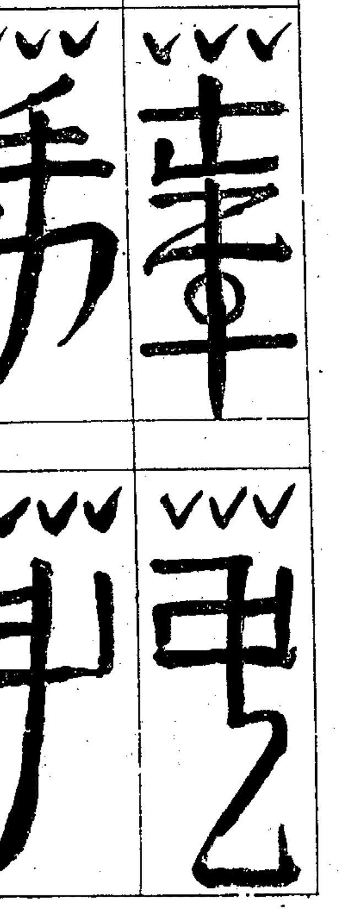

## 祝開符使咒

（召請上界天仙直符使　中界地仙直符使　下界鬼仙直符使　今事奉時直符使
千里尋符名香　請勝靈駕霧赴壇前　弟子心香通三界　通聞三界直符神
快睹九龍聚首　個個含珠同頭鐵頭　不畏強御　變手美玉滿腹文章
經天緯地左右面孔　日月爭光　左腳竟天　飛雲隨之右腳竟天
走路隨之手執開文　兼同符使即往仙宮　敢請神仙逢聖則邀
遇邪使殺高在青天之上　深任滄海之中　近在凡席之前　遠在九州之外
特奉太上老君束令　收煩三界五方直符使者　乾坎艮震坤難巽兌八卦之神
角亢氐房心尾箕　斗牛女虛危室壁　奎妻胃昂畢參嘴　井鬼柳星張翌軫神將
非神仙符使　與南北律令　同至桃源宮洞里　請蓬萊香從登雲駕霧
即速降臨作詩聊　明判斷以慰人望　無任虔祿之至）

各類符式及其功用

## 請召真人咒

（僅啓蓬萊天仙子　純心妙道呂真人　誓在踢師宣政化　從洲游天下問武靈
親受鐘難傳秘法　漸將法力救群生　九轉金丹方外道　一輪明月照蓬瀛
朝游蒼梧并北海　時游間苑轉昆命　收拾乾坤歸掌握　莫教迷却本原精
大將陰松長擁護　我今啓請望來臨）

## 請紫仙姑咒

（虔請蓬萊仙姑　清茶一會臨世間　洞里乾坤時盡醉　空中星斗伴游行
太平年上王母會　海底龍王獻金珠　弟子寸心恭叩請　神仙急降把事畫）

## 請八仙咒

（謹請仙官桃源洞 起至急急歸來赴我箕上）

## 請九仙咒

天靈靈地靈靈 水靈靈火靈靈 天地靈靈 水火靈靈

謹請九湖龍王 壽母華誕上及諸位仙眾來我明堂

來我淨室 或且或非 或吉或凶

判束母使至隱難解急降 望降神箕分明

## 請太白咒

（弟子虔誠設花延拜請 香仙李謫仙 伏望仙童通達意早降靈箕作詩聊）

各類符式及其功用

## 祝啓式（請時先爲）

（某省某縣某鄉某里某人
伏爲某事專里
九天玄女真科

請召天上地下水府
陰間洞天福地
三島十洲

召請衆位仙衆來降應里
伏望三界南北律令
爲某承此九天玄女符命

直指三島十洲請衆仙
特爲問小事
伏原乘變駕鶴

飛雲走霧漸離洞府
來降塵里
某下情祈願之至
謹啓）

## 其他各符式

以外各符咒都是作法驅神役鬼、斬邪劈怪、請各雲雨等之符咒。其用途甚難且廣，不能一一記載，只略舉凡種以作參考。

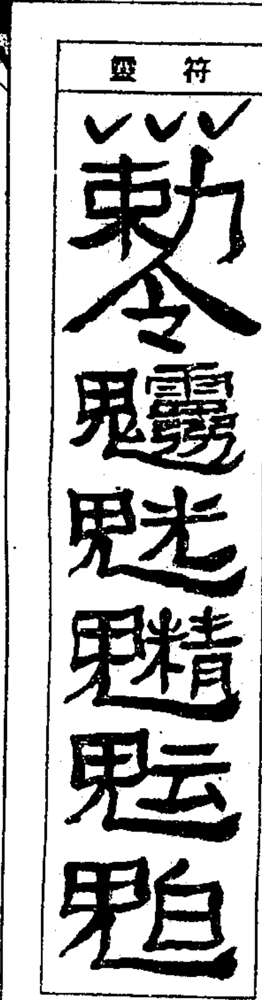

各類符式及其功用

## 咒曰

（屢出豪天橫
速假雨條
寒天腰生雨
止雨海底斬蛟龍
受吾一劍
吾奉三山九侯先生律令攝）

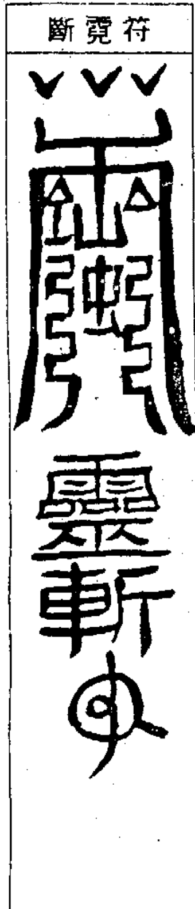

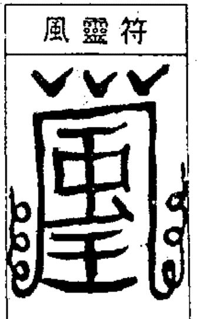

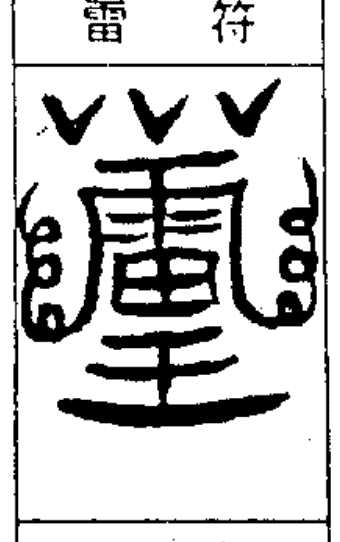

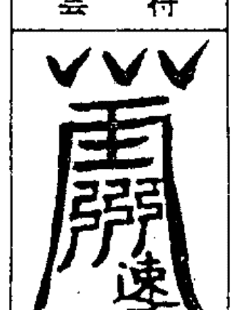

各類符式及其功用

## 安神符

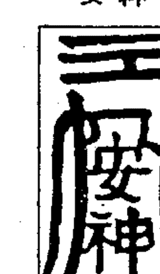

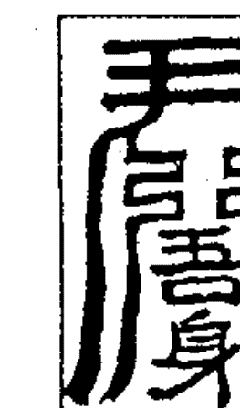

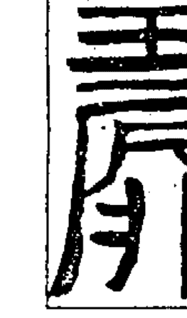

咒曰
「天上水　地下水
雲速降甘霜　五湖四海江河水升空
吾奉三山九侯先生律令攝」

## 生雨符

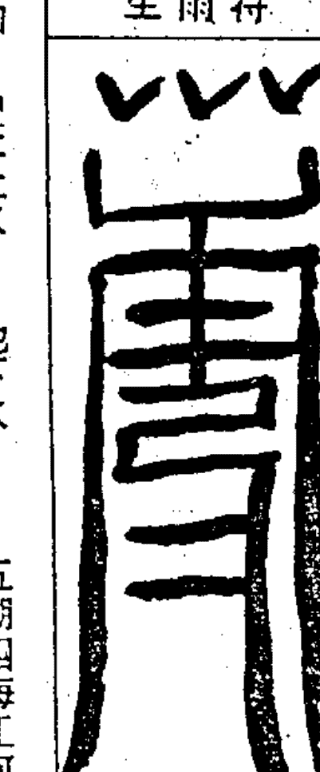

## 生雲咒

「淵底白雲露來臨
先迷日月　後基乾坤
山山生無　水水生騰
吾奉三山九侯先生律令攝」

## 神將現形咒

（吾呼六位神元陽甲子君 急來急速應類 君濟吾身 魁魑魅魍魎魑魅 吾奉太上老君急急如律令）此咒不可秘，秘則不靈，須念三遍。

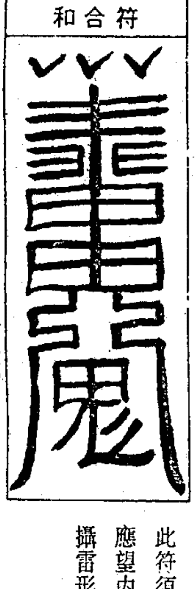

此符須用攝魔石畫于地上。應望內畫 年月生辰 攝雷形在內。

此圍內畫張道霞，此三字是天師諱。

穎夏 嬌妹十尋妃與哀貴……有和合訣。同唐姒妃

## 和合咒

（貞觀元年 五月五日 萬回聖僧 生下土不信佛法 不信仙專 管人間和合事 和合來時利市來 眼觀黎圓舞三臺 拍手呵呵常要笑 呼呼金鼓滾地來 男女相逢心相愛 管謀買賣大招財 時時刻刻心常戀 萬合千合萬事諧 吾奉萬回歌歌聖僧律令束）

## 急催咒

（天精元元 地層山 大精神煞 風伯混忠 雷公聲杖 雷母置筵 地精神女 早呼星宿 暮引神仙 神仙合德 使鬼萬千 左輔右弼 立在壇前 隨吾驅使 禁閉邪緣神 急急如律令） （不來時念此咒）

各類符式及其功用

## 避灾祸法

于五月初五日取梧桐的南枝，长五寸，刻成人形，用彩色布作衣里，穿于左臂，则千灾万祸不能为害。

| 避灾祸符 | 避怪符 |
| :--- | :--- |
| [符咒图像] | [符咒图像] |

此符二道，用于画于桃木板上，系垂于北堂梁上，能避灾祸、盗贼及妖怪，所求如意。
此符避怪用原画于桃木板上，独行万里，能避盗贼、虎狼之灾，见怪可压怪。

## 反凶變吉法

取梧桐木刻成二木人，一人赤帽黑衣立門左，一人黑帽赤衣立門右，穿地使衣浸門外，七覆完畢后，用酒灑它一次，用左足踏它倆各七次則會反凶吉甚靈驗。

此符盡畫在白素堂前，入陣中，則能避刀兵矢石。

凡人起屋、安葬、動土，有傷患、口舌、疾病、遇工造作之日，砂畫在門上及中庭張貼，則不爲害

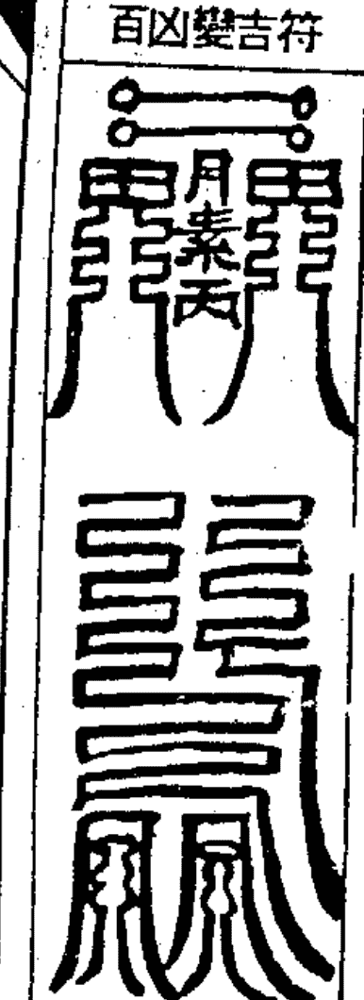

各類符式及其功用

## ● 镇宅符

凡人畫此符化飲，關於屋內四壁則大吉，百怪自滅，而得消災解禍。貼於門上，或系於正堂壁上，可以鎮宅平安。

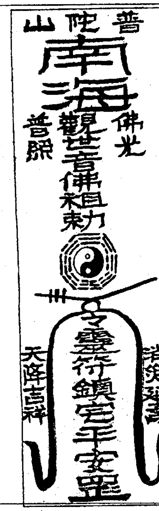

## 押煞符

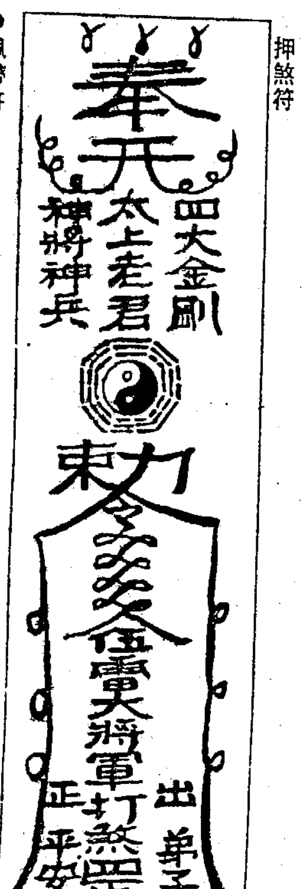

## 佩带符

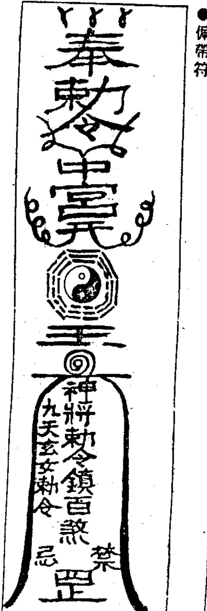

## ●五雷符

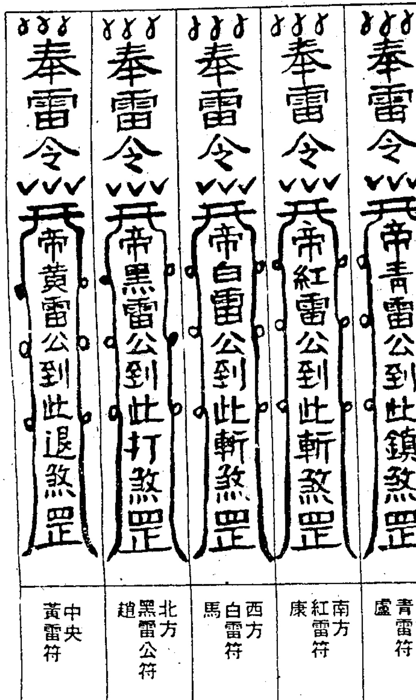

各類符式及其功用

右八卦圖用桃木板或柏木板畫，置於門上或廳上。畫畫于紅布或鏡面上置門上，廳上也可。

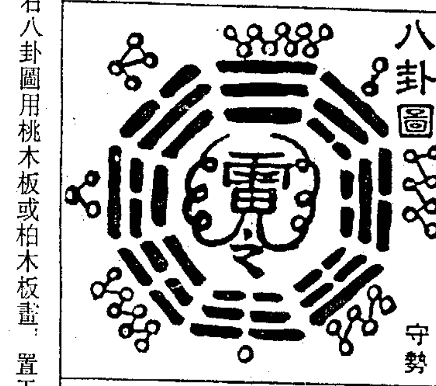

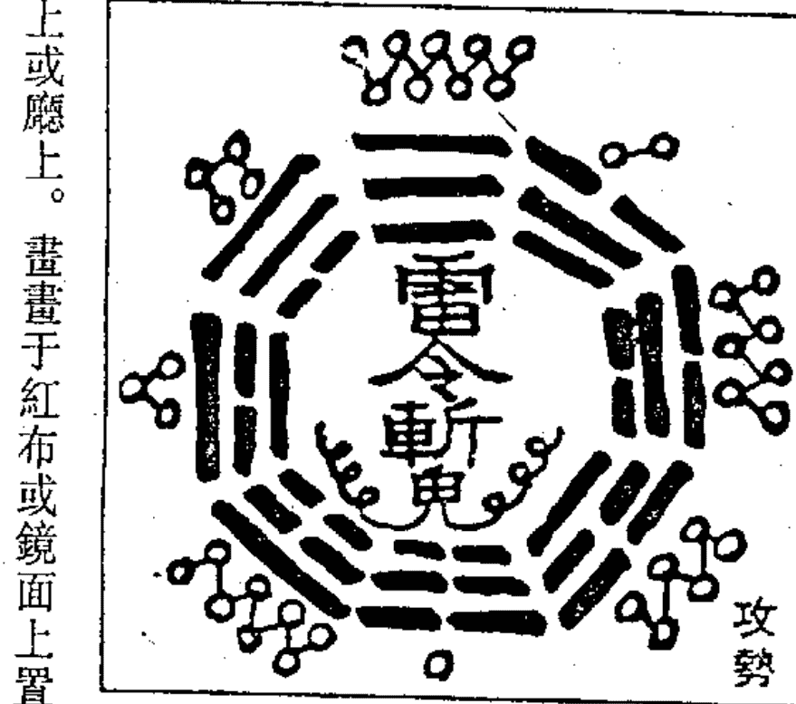

## ● 治豬瘟牛瘟符

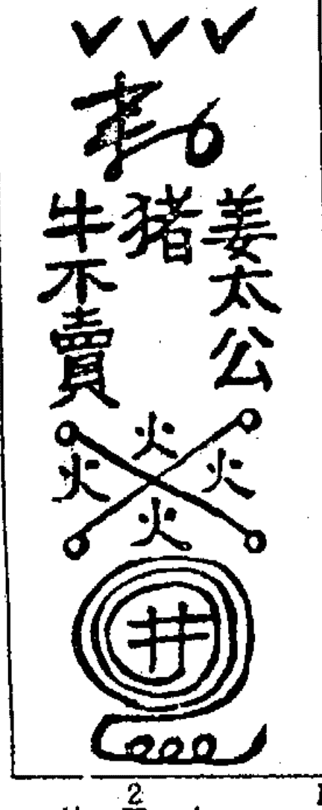

## 治小兒夜啼符

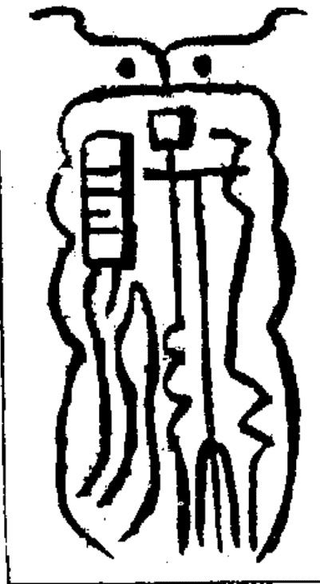

## 治百病符

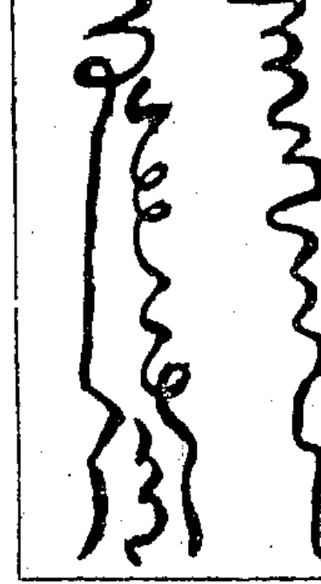

1 用皂刺焙乾末，麝香一錢五厘，將其研成末，吹入豬鼻內則立刻痊癒。（治豬瘟藥方）

2 用生木香四兩，忍各藤一斤，共煎水灌入牛口內立刻見效。

（治牛瘟藥方）

## 鎮門符

入新宅屋門不利、家宅不安等則畫畫此符貼門上大吉，且得化凶爲吉，消災解禍。

◎東門貼符

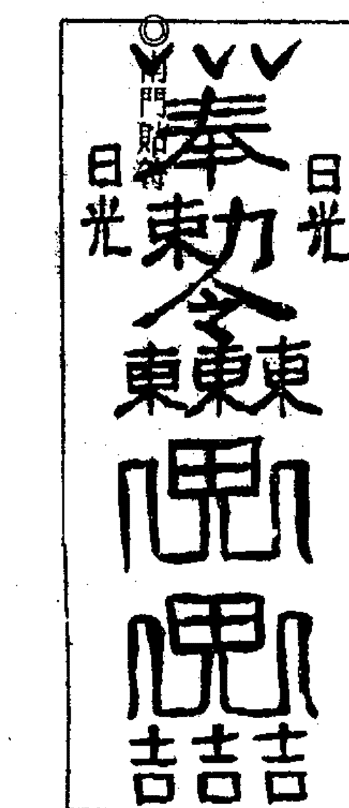

此符必須于壬癸亥子日，貼門上中心，降須忌破日、凶日、凶時

各類符式及其功用

## ◎ 南門貼符

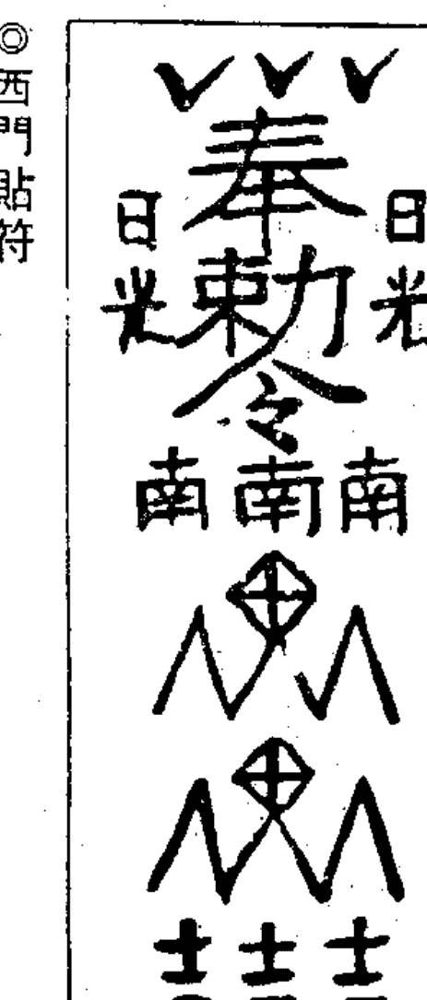

## ◎ 西門貼符

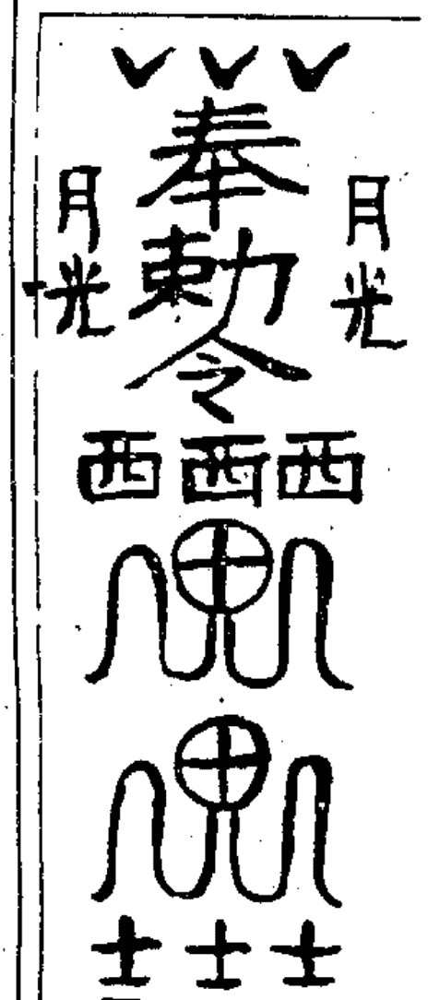

此符須于甲乙寅卯日，貼門上中心，須忌破日、凶日、凶時。

此符須于戊己丑未辰戌日，貼門上，須忌破日、凶日、凶時。

各類符式及其功用

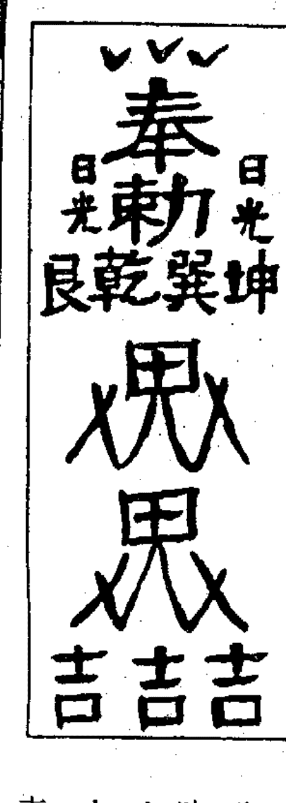

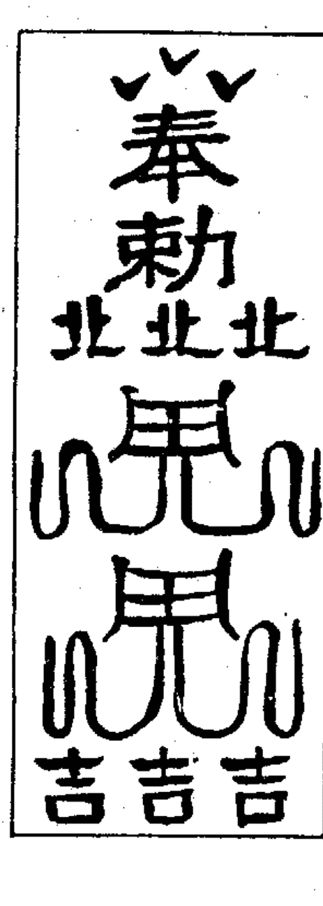

此符于丙丁巳午日，贴门上中心须忌破日，凶日、凶时。（四难：东北、西南、西北、东南方）。

此符须于庚辛申酉日，贴门上中心，须忌破日、凶日、凶时。

## 退神斬鬼符

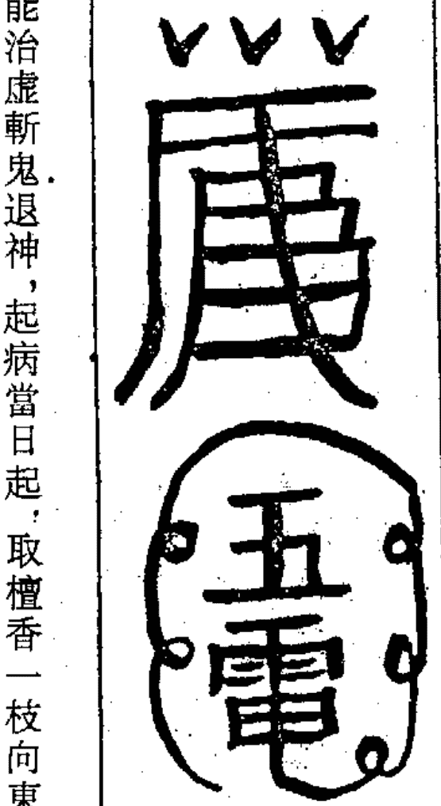

此符能治虛斬鬼退神，起病當日起，取檀香一枝向東咒曰（天靈靈地靈靈，水火靈靈，日月照其明，吾奉九天玄女律令奉束。）（檀香必須點焚著）

在符后必須畫姜太公在取，諸神鬼見字式。用針釘于帽上，或釘于衣領內，早朝過一次竈，過三五日後，即焚香燒化符令送去即愈。

## ● 其他各符式

| 風 | 雷 | 靈 |
|---|---|---|
| 風 | 雷 | 靈 |
| 風 | 雷 | 靈 |
| 風 | 雷 | 靈 |
| 風 | 雷 | 靈 |

| | | | | |
|---|---|---|---|---|
| ⛰️ | 魅祥 | 魅正 | 魅龍 | 魅鬼 |
| ⚡ | 魅龍 | 魅雲 | 魅天 | 魅鬼 |
| 🏺 | 魅鳳 | 魅靈 | 魅風 | 魅鬼 |
| 🌸 | 魅日 | 魅精 | 魅水 | 魅鬼 |
| | 魅月 | 魅剛 | 魅山 | 魅鬼 |
| | 魅光 | 魅巖 | 魅火 | 魅鬼 |
| | 魅明 | 魅吉 | 魅雷 | 魅鬼 |
| | 魅靈 | 魅福 | 魅地 | 魅鬼 |

| 雷田 | 雷正 | 束力雷正 |
|---|---|---|
| 雷田 | 雷令 | 束力雷正 |
| 雲臺 | 崑臺 | 雷束力 |
| 雷印 | 風臺 | 玉束力 |
| 雷訣 | 風鬼 | 奉束力 |

| 魁 | 魁 | 魁 | 魁 | 魁 |
|---|---|---|---|---|
| 魁 | 魁 | 魁 | 魁 | 魁 |
| 魁 | 魁 | 魁 | 魁 | 魁 |
| 魁 | 魁 | 魁 | 魁 | 魁 |
| 魁 | 魁 | 魁 | 魁 | 魁 |
| 魁 | 魁 | 魁 | 魁 | 魁 |
| 魁 | 魁 | 魁 | 魁 | 魁 |
| 魁 | 魁 | 魁 | 魁 | 魁 |

## 符令與鎮法

一般人也有用符令配合鎮物作法的，而鎮法又可分為替身法、破解法、鎮物法三種。

## 鎮物法

就是用，或磚物、木人、药物，或用以外之物理人指定的地内，与符令配合以鎮壓妖鬼煞的方法，其靈驗是甚顯，可惜所指定的合用物件，大多不易尋得到，故現在術者大都作罷。

各類符式及其功用

## 替身法

用稻草制草人或用纸人、纸虎作为替身，令草人或纸人纸虎承担当事人的灾祸，而替当事人消灾解顾的方法。此法在符术家多用。

## 破解法

又同斩送法。此方法在命相术中，用以替人斩送、破解或消灾解危。

## 打坚米法

在道家也有打坚米驱鬼退邪之法，此法为破解法之一。打坚米时也有咒语，兼用以打退鬼怪，以替人灾解危。

## 叫驚法

此法不是用物法，如有人運氣不好，或受驚、體弱多病者，用其衣服祭于神前，再取其人衣服到門口向外叫其名，叫喊其人回家，神明即帶其人回家。對兒童大都施用此法，以消災解危。

## 制替身法（制草人法）

取用稻草三十六根化為三下六骨節，制作為草人形。分頭面手足后取草人附于被制煞人的衣服。

## 替身咒

（替身代人身
白紙為你面
五色紙作身
未開光就是紙

各類符式及其功用

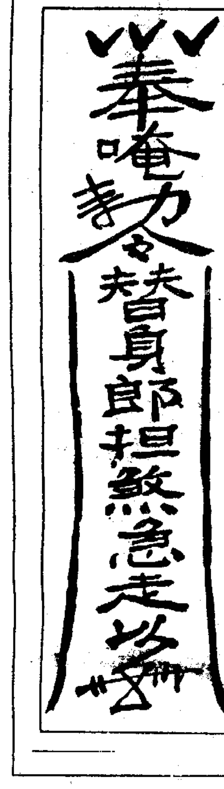

● 制替身符

開光變神光
同時同日同月同年生
擔起退出外方
神兵火急如律令）

開你左耳聽陰府
開你左手提錢財
無刑克擔煞急速走

右耳聽陽間
右手提災殃

要刑刑大山
要克克大海

你與某處某姓某名

## 制草人咒

（草人 人未開光便是草 開光變神通 節節是身就是人
女為湯三娘 男是武吉

三十六支草化三十六骨節
開你身開你面 開你眼光看分明 左耳聽陰間
右耳聽陽間
你與某處某名某姓是同年同月同日同時生
開你右手擔凶災 某保某姓災殃擔難關
擔出遠方退凶災
若要刑就刑大山 要克克大海 要煞煞大樹
無刑無克就保佑
吾奉太上老君束 神兵火急如律令）

## 制送白虎天狗法

凡制送白虎或天狗，必須借三牲、菜粄、飯食等置於外面。被制送的從不可收

各類符式及其功用

用，如收回而用则其制化无效，凶煞再回而不利。制与投下不同而不必再谢，投下事应于愈后方可再谢。

## 制天狗咒

（天狗急走 某人某姓名犯你 用三牲饭食制送 来领食

食人菜粮担起凶煞去远山 食人豆干担起凶煞走远去

食人蛋担走凶煞去远山 食人肉食担走凶煞替人打

食人三牲担起恶神走千里 食人酒担走凶神恶煞了

不可来纠缠 去 走到天涯海角远 送得走

寿元延百二 送得过寿元添百二岁 解分明送离去

无杯葛 早安顺利 寿延至百二）

各类符式及其功用

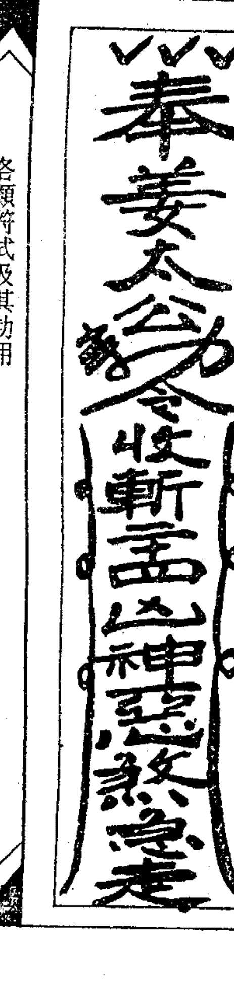

## 制白虎咒

●制白虎投下符

（白虎身）

白虎郎

某名某姓犯你白虎煞

担起恶神不可来惹祸

白虎担血光

用三牲洒食菜炉制送你来食

担走凶神恶煞走远方

（以下句与送天狗咒词同）

## 打堅米驅邪法

凡人家有犯凶神惡煞，或家宅病患不息而不安。口舌是非連綿不息則在廳內點燈，焚香神前，咒念打堅米驅邪咒，散打堅米。自房內各處，最後打出門外，則可驅退鬼邪難開宅內，家宅就得平安。

## ●打堅米驅邪咒

一打天門開 二打雷霹靂 三打人長生 四打凶神惡煞滅

吾奉太上老君束 神兵火急如律令

念一句，散打堅米一遍。（以上與替身法同）

## ●斬送法

在命相術家，如查出人家的八字內有犯關煞則畫符，令人借所指定之物件。依法斬送破解其八字內之關煞，替人消災解危。（此法與破解法同）

各類符式及其功用

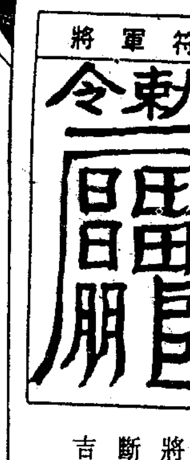

雞飛關、浴盆關、錢蛇關。鎮法俱用雄雞一支，新瓦盆一個。將雞放于盆內，打碎其盆。外用符一張，鬼王馬子，一柱香燭以祭祀則吉。

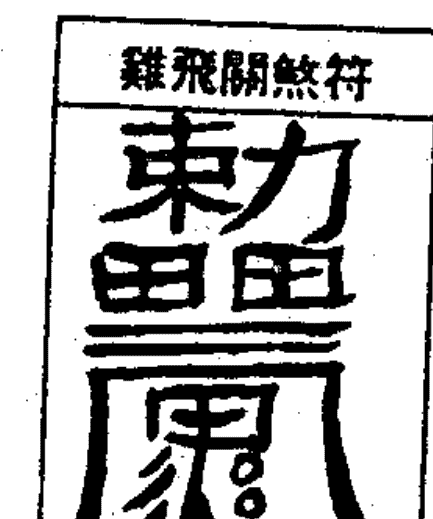

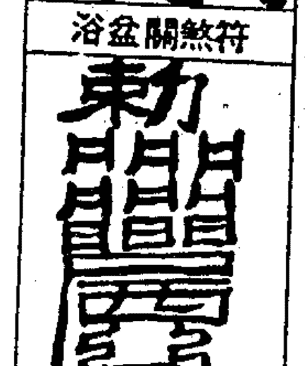

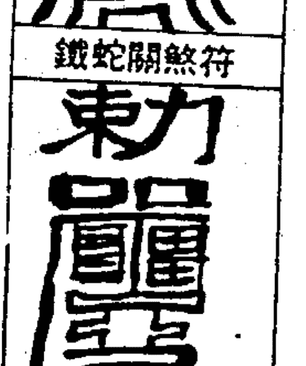

將軍箭，鎮法用弓一張，箭三枝。取斧頭斬斷弓箭燒化，香燭祭祀，用十種香安之，大吉。

## 鎮物法

命理術士、道術家也用此法替人消災解危。

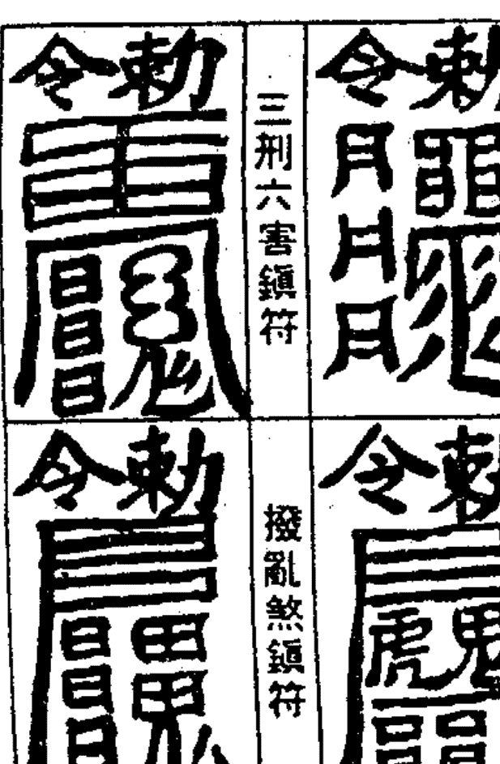

走跳星，華靶星，三刑六害，
撥亂煞。 鎮法用大年初一門神
一對，五月五日老虎人一對，
七月七日歲谷七支，艾五兩，
靈芝一兩王。 在十字路口燒化
，並以三柱香燭祭之大吉。

各類符式及其功用

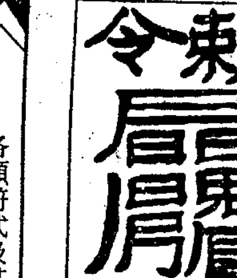

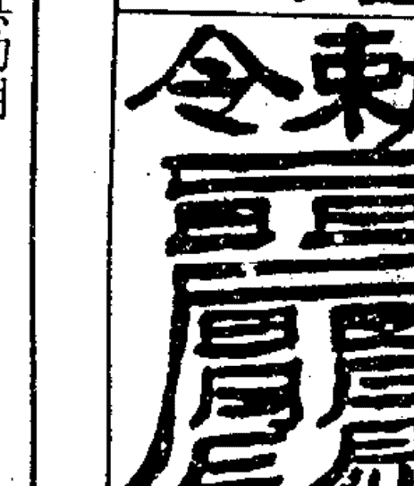

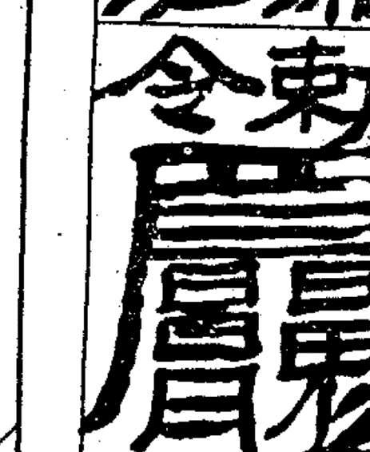

閻王關，五鬼關，金鎖關，鬼門關，急腳關，五鬼星，王鬼化胎，迷魂煞，沖天煞，遊魂煞，耗財煞，飛財星，勿絞星，投河煞，系梁煞，硯臺星，投崖煞，抹頭煞。鎮法具用五色紙、原砂、靈禽真王、黃桃仁七十個，煎湯灑，十二精藥調水，或前貼帶符，畫符名五鬼，勾絞星名畫于符上大吉，王鬼名爲魑魅魍魎魑魅。

| 迷魂煞镇符 | 耗财星煞镇符 | 悬梁煞镇符 |
| :---: | :---: | :---: |
| 五鬼化胎煞镇符 | 飞财煞镇符 | 勿绞煞镇符 |
| 砚台星煞镇符 | 游魂煞镇符 | 五鬼星镇符 |

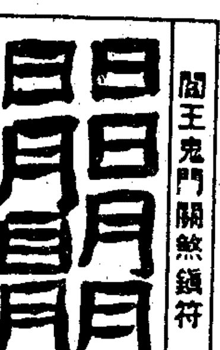

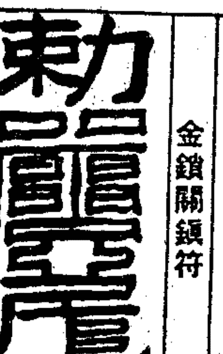

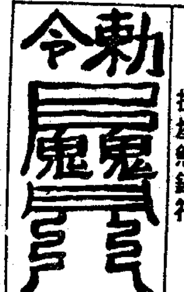

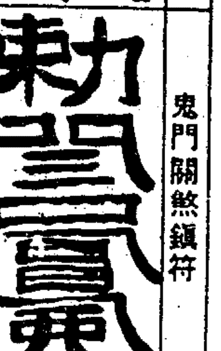

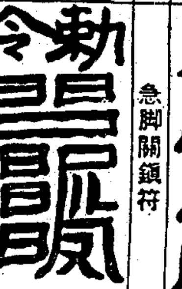

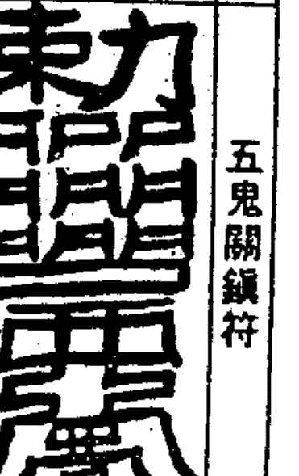

百日關，短命關，撞命關，天狗關，直雞關，偷生鬼，埋兒煞，九女星，硬眼煞，死骨投胎煞，暗算煞，暗害煞。鎮尖用河石八斤，安于中庭下，無鼻針七個，亂頭髮少許、生銅錢各四兩，磨石四兩，埋入門戶下深二尺五寸，又用雄雞二支，銅錢二十四個，湯匙一支，箸一支，乾地取土，七種名香七炷祭送，大吉。

百日關鎮符、短命關鎮符、撞命關鎮符、天狗關鎮符、直雞關鎮符、偷生鬼鎮符、埋兒煞鎮符、九女星鎮符、硬眼煞鎮符、死骨投胎煞鎮符、暗算煞鎮符、暗害煞鎮符、五鬼關鎮符、偷生鬼鎮符、直雞關鎮符、天狗關鎮符、同用

死骨投胎煞镇符

埋儿煞镇符

暗算煞镇符

九女星镇符

硬眼煞镇符

白虎關，水火關，雷公關，斷橋關，白虎煞，虎神煞，梟神奪食，飛廉煞，氣血煞，凶惡煞，張客煞，官符星，氣勞煞。鎮尖俱用城土、十字路土、河邊土、教場土、寺廟無根土，井水十三斤，七種香，砂砂，炙禽血，東南桃木，雙車福，三炷香燭祭之大吉。

與無情關同用▽

斷橋關鎖符
與浴盆關符同用

皋神穿食煞鎖符

氣勢煞鎖符

白虎煞鎖符

飛廉煞鎖符

吊客煞鎖符

虎神煞鎖符

凶惡煞鎖符

官符星鎮符

## 氣血煞鎮符

凡小兒之命有犯關煞而鎮物不足，則用其鎮符三通。將一通燒灰在無根水之上，（無根水是雨水，降落地者不是）令小兒飲食。將第二通縫于小兒衣上，至百日取下。用本命家宅竈神，錢紙由自己燒送則吉。凡精通此術者必須先推其八字有無神煞，適時有何煞臨命宮，或用三牲祭之，亦需看其犯煞的輕重，輕者破解斬送則無妨。會者必須以救世為懷，不可苛求，方不致損德。

## 印式

符令必須蓋印，押符才有力量，押符令所用的印，就是所謂的法印。這法印的印式甚多而各有不同，在神壇寺廟里，其符令之法印視其所奉之神而定，各有不同，而其印內圖字之式亦不同，其大小都是由其所定。印式圖字也有上、中、下三乘之分，其所需之材料各有不同，而力量也有差別。

### 下乘印式
在各處寺廟神壇，其所有的法印，多是此式字樣。其字樣式都是用正楷字體刻成，其意義易知易懂。而普遍的印字式，其印材也必須用檀香木來雕刻，現在用一般木材刻成印的，應是不行的。

### 中乘印式
在神壇里也有此式之印，只有祖先所傳，或師傅所留的古才有此式印

各類符式及其功用

### 上乘印式

其印用半圖半字之體式刻成，其圖字劃難通，連字學專家也不能解通。此印都是用所定的木材或沈香木刻成的，現在社會上已少見了。

凡法印，要雕刻之時，必擇吉日吉時，齊戒沐浴，點香刻印完畢收藏。要用時必須在神前祭煉過，用印才得有靈，祭煉方法與祭煉符令、用具物器同法，也須擇其吉時吉日，破日、刑日須戒。印式圖字例圖列舉于下：

其印式字樣多用篆字體刻成，其字式怪異，對字學無相當研究者是看不懂其字意義的，此印式較深奧，材料都是用沈香或檀香刻成，必須古物才有此印。

### 上乘印式

### 中乘印式

## 切手印訣

切手印法也是符咒術之作法中的一法，在各符咒的畫冊內並無詳細的記載，所以無明師教導，不可能學會此術。在現代的符咒家中，雖有少數人會用此法，但僅知皮毛，其力量無法發揮。此法用於符術家作法調遣神鬼將兵，累推不至時，用以推神鬼、驅遣神鬼兵將之最好的方法，在道家及佛門的作法中，這是最重要的推神法。而會此術者其通神力，更高于一般的符咒家。

這手印訣不但在中國的道術家與佛門子弟盛行，在日本國內的作法者中也是甚盛，用以通神變化。在其忍術使、氣合術使等法師之作法，都是用以推神通神變化。此手印訣的結印手式，樣式甚多，因其所傳之不同而其用用亦不同。

其手結式以八卦工來說，有乾卦式、兌卦式、離卦式、震卦式、巽卦式、坎卦式、艮卦式、坤卦式等八式手訣。以外還有九字雙身訣、束縛訣等手訣。在束縛訣又分外縛印、劍印、轉法輪印、刀印、外司佔印、內縛印、請天教印等九式的手訣。以護身法來說也有九式，有獨針印、大金剛輪印、外獅子印、內獅子印、外縛印、內縛印、知拳印、日輪印、隱形印等，皆都有其解法，據說結縛后必須解縛，如不解縛則有禍殃臨身。八卦手式例圖列舉如下：

### 艮卦式

### 震卦式

### 坤卦式

### 巽卦式

### 坎卦式

至於九字護身法與縛法的各九字手訣式，都是自古由中國傳至日本，在日本的作法家中，一直盛用著。除外由於其手式甚多，在此無法盡說，所以僅能略載上述數種，以供參考。

各類符式及其功用

## 畫地法

畫地法是兵家臨敵作戰，用以通神助陣制敵之術。此法在奇門遁甲書中有記載，都有其咒、其符。其畫地之法各有其畫法、其作用，也是奇門遁甲術中的一部分。其所靈雖無形可見但亦有應驗，據說作法者能用皮法制敵勝敵，能在臨危倉皇之中脫險遁逃，此乃因此術神至掩護之故。自古有能此術者，在臨危倉皇之中，畫地由吉方遁逃，敵兵不能發現者，此都有前例可查。

在春秋戰國時代，吳子胥被楚兵所包圍不得脫險，他在臨急之中於室內畫地，由青龍發足而走，楚兵不見其蹤跡而得逃脫。他這一法就是畫地之術。孫武論兵曰：「凡用兵之法，以坐生而死。」又有「善用兵者動于九天之上，藏于九地之下。」

## 四縱五橫圖

這些都是畫地術之入門法與入神法。在古兵家之通奇門之術者，都是善用此術臨敵以制勝者。而臨急能化凶爲吉，逃遁而敵不得發現者都是此術之驗所然者。

四縱五橫法一法用右手中指，念咒畢，在地面上畫四縱五橫圖。（如上圖）踏圖而行六十步不可回頭，臨行出外大吉，能消灾化吉。

## 咒曰：

（四縱五橫）
右佩七星
支不敢侵
入火不焚
視我者盲

六甲六丁
邪魔滅呯
太上有束
逆吾者死

玄武截道則尤避兵
鬼怪汪形
吾令指行
順吾者生

左縣南斗
干不敢犯
入水不溺
擋我者滅

急急如太上道祖
鐵師上帝律令）

各類符式及其功用

單日東西方畫五橫，南北方畫四縱。
雙日東西方畫四縱，南北方畫五橫。

## 起青龍法

子午日青龍起申，丑未日青龍起戌，寅申日青龍起子，卯酉日青龍起寅，辰戌日青龍起辰，巳亥日青龍起午。

- 一青龍
- 二明堂
- 三天刑
- 四朱雀
- 五金貴
- 六天德
- 七白虎
- 八玉堂
- 九天牢
- 十玄武
- 十一司命
- 十二勾陣

## 各國的符咒

不但在中國，甚至遠及印度、韓國、日本、西歐、非洲等各國的民間，都有其宗教信仰及其通神之法。尤其宗教，其信徒們都有其符咒，以借求神祈禱通神之用。其符咒，雖所稱有所不同，但其信仰，其所通神的意旨是相同的。他們自古即被用以通神祈禱，而至今仍盛傳不息。現在先說日本民間的通神法與其符咒。

以日本來說，他們的文化、文物除日字外，都是由中國傳入的，如符咒、佛教等之學皆是。除了中國之外，日本較西歐各國盛行。以符咒之術來說，其盛次於中國，但其符咒較中國的符咒簡陋而幼稚：在他們的神社及佛寺里，借有符令供人索取，其畫符者也有其咒語。日本神社的符令，他們改稱為太磨，裝在精緻的布袋里

各類符式及其功用

佩符者用此袋系于腰间，据说如此，神即会替他消灾解危。

以佛教来说，其佛徽（如万字兆即是佛的符徽）虽不称为符，但一般仍相信它能产生避邪解危的作用。而在中国民间，婴儿的衣帽上时常张有万字兆的图徽，此皆取其替人消灾解危而保平安之意。

以基督与天主教的十字架图徽来说，其意义与中国的符令相等，信徒们所诵的圣经，相当于中国道教的咒语，其各种虽因门之不同而有所异，但其信念与作用却都是以通神为目的的。

以各教的图徽之经义来说，其祈求神相助的目的不同。在佛教如平日佩带万字兆符徽与育佛经死后不会轮落地狱得以被渡上西天。

以道教来说，如佩符令、念咒语则鬼邪不敢侵，神至而斩鬼劈怪，佩者可保平安，亦可化凶为吉。

以基督与天主教的十字架与圣经来说，佩带十字架徽则死后得以上天堂见天

## 外國與外教的符式

主，天主會替他擔罪孽，使他住天堂。各家所說，其目的意旨雖不同，但其大意卻是大同小異，皆是通神之意。

### 佛教的萬字兆符式

此符徵就是佛祖所臨的標記，大多存在於寺院或尼庵里。

### 基督、天主教十字架的符式

此符徵就是基督、天主所臨的標記，多在基督教堂，與天主教堂內外可見。

各類符式及其功用

## 日本民間的各符式

日本民間的符式多用白紙板書寫着，佩者將之裝於精緻的布袋裏，繫於腰間。他們的符式分為兩門，一為神宮裏的符令，一為中國道術的符令。神宮的符令是畫印在硬紙板上，有供人奉祀者與供人佩帶者之別，其神都是日本天皇的祖先，也有日本功臣為神者。

## 各類符式及其功用

而在佛教則有萬字兆符徵，他們將之用於驅邪避鬼，在寺院及墓園里都可看見。

此外中國道教式的符令更是多得不勝枚舉，如五鬼符、四縱五橫符等皆是。

以咒語來說，大多用佛經內的咒語真言，此與中國的咒語不同，無法用以說天地日月星辰山川海河五行等的神咒。他們的祈禱、念咒作法等通神，最注重的是心想法，而咒法、符式等反而很少有變化。

## 日人的散豆驅邪法

在日本民間里也有自古所流傳的散打黑豆驅趕鬼怪惡煞的作法。其作法與中國符家的散打籃米法相同，皆是驅趕鬼怪惡煞的意思，所不同的是是一個用黑豆驅鬼怪，一個用籃米驅趕。其作法即是於每年的五月五日在宅內備一碗黑豆，主人拿著黑豆，并用右手握一把黑豆，口中念咒曰（人居內，鬼走外），念一句，散打黑豆一遍，由宅內各處，打出宅門外而止。

## 戲法

所謂的戲法是藉用藥物或器物，以使其變化，而今人驚奇其術之異者，這在江湖術士稱為把戲，在現代人謂魔術。在道術家與江湖術士用此法掩護符令變化。一般通靈之符令，神之所臨，在于無形之中，所以一般人看不到其變化。中乘以下的符術無法使神鬼顯形，使物顯然變化，故甚多道術家與江湖術士，以此法迷惑眾人耳目，以顯其符咒之能變化通神。

這戲法分為手法、藥法、彩法三門。其中以手法最難彩法與藥物法較易。以手法來說，在表演之前必須先經過訓練，否則會露出馬腳。善用此法者，都相配合而表演。

各類符式及其功用

日本古時的忍術家，據說能通玄變化，隱遁出沒，飛騰走壁，來無影去無蹤，僅用結刀印手訣、念真言咒語就能在眾目之下變化出沒，這都是利用物質法、藥物法配合其身手法而變化的。他作幼時除受過劍聲功夫訓練之外，另有忍術的身手法之訓練。在訓練期間不知吃過多少苦，才得以成其身手法。以日人所著的《忍術指導》一書之所記載，他作的五遁變化等都有其例。

這忍術家最盛和時期，在明治天皇以前的時代。當時的政治就是武家政治，主權在於幕府，當時的天皇只有其名而無權。在幕府之下為各藩主所割據。他們時常明爭暗斗，殺氣不息，所以當時的人慣于殺伐尋仇，不是殺人就是被殺，其勇士中有些是忍術家，在打開中神出鬼沒，當時的八勇士外號人稱里見八犬，乃為劍術之高手。他們在那殺伐的時代里縱橫而出名，他們也因打開而互相識、互憐所以才成了莫逆之交。

當初這八勇士未相識之初，其中有一人會忍術，當他與另一劍士打斗時，因兩

人的身手劍術皆精通猛厲，而互不退讓，久而忍術家漸漸不敵，對方的刀光劍影迫緊，使他無法走脫。他在險境之中退至大石之處，等他退至大石前時突然反攻，使對方猛厲避下，當對方揮刀前迫時，順勢急閃，對方因收勢不及而劈在大石之上，此時金石交擊發了火光，他在對方驚疑的片刻間急速的借草木等掩護而逃脫，這就是忍術的火遁法。

以他們的水遁法來說，就是利用石物，趁追殺者未注意時投入水中，自己藉械逃脫外還有很多方法，在此無法詳述們在訓練時即需先學習得走無聲之法，他們用濕紙放置於地面上，而后於其上行走，學習到行走時濕紙夫聲才算身步法成，繼之在黑暗中訓練眼力，練至在黑暗中能看見一針一物而成，而后就學習身至身手法成而忍術成。他們平時出門大都隨身勢帶其變化藥物或用器備隨時而得以變化了們在出沒化之先，必須用煙幕掩蓋，才得以出沒變化。這就是他們變化所必用之掩蓋物。

各類符式及其功用

在中國的符術家中也有借用藥物以變化、出沒隱遁的。這些遁法、變化法都與忍術一樣，必須先學身手法，才得成其藝，但現代已無師可傳，只有道家與江湖術士利用手法、藥法及彩法以變化物器，隱遁出沒器物而已，他們都以符令作掩護，用藥物配合手法、彩法而使物變化出沒，事實上符令是無法使物變化、出沒其物體的。現舉數十戲法，揭其秘以供讀者參考。

## 點香焚符法

一般焚燒紙物或器物時，必須點着柴火，使火焰角紙或物，才得以焚燒。如香火之火星無火焰，則點紙面角火星之處容易點化熔化而不能燃燒。說也奇怪，作法者點香角符令，符令則發火燒盡。

解：此是預先在符令紙上邊下部，擦上硫磺末，至表演時取出點香，角其擦硫磺處，即刻發火燃燒，至符燒盡為止。（一般畫符之紙面都是黃色紙，與硫磺色相同）

## 沾水寫紅色符字法

取毛筆沾清水，畫符于紙上，就會出現紅色的符字。

解：預先以咸爲末，令人取碗盛水。偷放一點碱末，取筆以筆毫沾水攪水，用水寫符則會成紅色符字。（必須寫于黃紙上）

## 劍割舌法

取劍割舌頭或輕劈舌頭，舌頭流血無妨。

解：取劍輕割舌頭或輕劈舌頭時，須由正中直割或直劈，如此才不會劈斷血管，雖流血亦無妨，但切忌橫割與橫劈，如橫切則會血流不止而發生危險。

## 無字天畫法

取白紙一張，浸沾于清水內即會出現圖畫。乾燥則失，浸水則現。

解：預先用白紙寫字圖畫于白紙上，表演時取出浸于水內，則紙上即會出現字迹圖畫。

各類符式及其功用

## 過火法

木炭燒紅，待燒成炭灰時，裸足行走過，安然無恙。

解：行走之前，必須先散過末于炭灰上，因過極冷能熱度減低。

## 畫鳥飛去法

畫鳥在紙上，紙上鳥飛上而去，紙上即看不見鳥。

解：紅毛國有名的紅唧唧鳥，其大如麻雀，身紅如火，來時萬千支而本滿山谷，土人捕而食用，取其腦調色以畫鳥在紙上則自飛而去。

## 香烟成字法

焚香而香烟上升，秀結而聚，取筋分割則成字。

解：五月間摘荷花葉，將荷葉涂滿新蜜，則會自生小昌而葉成如紗，爾后摘下研末混入香料作成香焚燒，則其香烟就般結直上而聚，取筋分割或寫字畫圖，則其圖字清不散。

## 燈光顯蛇法

燈上點火，則蛇影出現隨火光而動。

解：捉一條小蛇打死，取血染燈心候乾，點火于燈上則出現蛇影，將二條蛇血染二處，點火則會在二處出現兩條蛇影。

## 飛符法

畫符于紙上，向着日光，則其符自飛而去。

解：于八月十五夜，在地上掘深一尺許之窟，放兩、三支蛤蟆，上用竹絲紙蓋住，候月出照過一夜后，次日收紙裁用，畫符向日上則符自飛而去。（必須月明才靈驗）

## 紙蝶飛舞法

用剪刀剪紙作成蝴蝶，紙蝴蝶翩翩飛舞而去。

解：用真正的明起石，不拘多少研成粉末，以水調勻涂于白紙上，用時剪成蝶，放出即翩翩飛揚而去。

## 盆內走魚法

將紙剪成魚狀，放于盛水盆內，頃刻紙魚自游行走于水內。

解：取狗膽與鯉膽二味，調勻塗于紙上候乾，用時剪成魚狀，放于盆水內，紙魚即能行于水內。

## 招引蝴蝶法

舉手揮搖，蝴蝶立即飛舞而至。

解：取諸新花蓋白馬屢，浸三日后研末，用時塗于水掌上，舉手當空搖動，蝴蝶自飛而至。

## 香烟化鶴法

焚香于爐內，香烟上升結成鶴形，飄飄升空而去。

解：取野鴨全骨一副，苔蘚皮（在松樹上者佳）等分，研爲粉末，混合于香料内制香点之，其香烟就结成鹤状，以扇轻摇则自升空而去。

## 香烟五色法

焚香于炉上，香烟成五色上升而去。

解：取松树上的苔藓为末，调于香料内，制香点焚则香烟成五色。

## 水上兑走法

在不面上放二丸，即能兑走不息。

解：取樟脑丸二个，一漆红，一漆黑，置于盛水盆内，则能兑走追逐不息。

## 八仙戏法

摇转戏筒，使人拿取跳出之戏看其号码，然后将戏放回筒内，再摇转戏筒，令人再取跳出之戏，则其所取出之戏的号码与头次所取出之号码丰同，如此反复，号码皆相同。

解：预先订制戏与筒一组，每支戏的头尾两端形状必须相同。先在戏面中间作各種不同的號碼，然後在戲的一端內開小洞，另一頭不可開洞，后于開洞處插入鐵絲，修與戲平等，繼而將兩端漆上油漆，再放薄磁鐵于筒底，搖轉戲筒時筒內即會出現一或二、三支戲，使人抽出一支看其號碼。放戲入筒時須反放于筒內，使其戲裝有鐵絲之端頭向上，如此所搖出之戲皆爲同一支戲。

## 第六篇 安神擇日法訣

## 安神位日法

一般雕刻神佛的金身，自開斧起至於入神、點眼、安座等都有其儀式，要進行之前必須先擇吉日吉時，而才能進行其儀式。而擇日選吉之法，一般人都依一般的通書避刑日破日日時而先吉，有搓交請示神靈擇吉者，雖然如此，但被人供奉的神像，也有靈驗者與不靈驗者，此視奉神者的運氣而定。

事實上最好的儀法、真傳之日法因太深奧而久已失傳，所以在一般的日書、通書上大都專于先擇婚嫁、遷移、破土、收入、安埋等的擇吉法，雖有記載開光、點眼之日及九道、十二神等之記，但都無明細這說，所以一般民間都無法能用，因此所擇之日僅是形式，根本無法得到其通靈的程度。

此法失傳已久，目前無明師可授。所以現在一般的匠只是依師傳所傳而略知皮毛而已，雖然其開斧、入神、點眼、安座時皆在擇吉舉行儀式，但有奉祀神佛而合家平安者，有家宅與旺者，也有舉家災禍不息者，這是何故呢？這者是因一般的雕匠、擇日專家無法得到擇吉的真傳之故。

神靈與人一樣也忌凶日凶時，也忌與人的命動相沖犯，如與人相沖犯其神靈也會倒霉，而其所祀所拜所見之人亦有災禍。 因是神靈已自顧不暇，那能顧及人間呢

“我在替人占卜命相時，經常算到其人在其年與某神相沖犯，經我據實告知后，來客十分奇異的問我，（神靈是善且正大的，那有求助于祁、見祁還有災禍的。）我方才告訴他（神鬼與人一樣有其命運，有其時，有其喜忌，如犯其所忌即有禍災。

）這都是因人與鬼神，都有運氣，有好壞之時的緣故。

一般擇吉之日時法都是年月日時的干支，以相生相和相合爲上，也需與主人相生相和相合。 一般人皆不喜相沖相刑克。 而擇吉開斧、入神、獸眼開光、安座等也需忌刑克、沖破、喜生和合日，這也是眾所皆知的。這日法只是擇吉的入門，也不能得到萬全之法者。以外還有九道法、十二月建法、入神法、入門九星法等，擇日專家必須深通，才能得此要訣。現以舉例作為研究之參考。

## 九道

九道者有白道、黑道、碧道、綠道、黃道、赤道、紫道共有七色，因布于九宮，故謂九道。一宮白道，二宮黑道，三宮碧道，四宮綠道，五宮黃道，六宮白道，七宮赤道，八宮白道，九宮紫道。

黃道最吉，白道次吉，黑道最凶，赤道也凶，紫道、碧道，綠道則半吉半凶。

一般在選吉、開斧、入神、點眼、安座時與黃道日進行大吉。（吉言黃道吉）之句話者是由此而起的，白道也吉，黑道最凶，赤道也凶不可進行。以外半凶半吉者，日家必須細審，才不會誤人。

黃道 中色之道，是中正之日。自古都是以爲擇日選吉爲最吉利之日，故有選黃道吉日之說。

白道 白道無色，是清淨之日，無色清淨則無是非，也是光明之色，是無妨害之義，也是次吉之日。

碧道 青藍之色，爲半吉半凶之道，也是不全凶，不全吉之日，其義爲有利有害之意。

綠道 綠道也屬青色之內，是半凶半吉之日，也是不全凶不全吉之色，其義利害兼混。

紫道 位于赤色與青色之中間，也是半凶半吉之道。其日利害各半不可多用。

赤道 赤是災色，也就是凶道，選其日則有害，故不可用此日。

黑道 黑道者黑暗之道，此道最凶，故其日也最凶，用此日者必有災禍。

## 月建十二神

在通書裡也有記載月建十二神，但是並無詳細說明，擇日專家之學淺者無法善通此。在雕刻神佛的金之擇日，如開斧、入神、開光、點眼、安座等的作法，也是甚開利害的，以擇日專家及雕匠來說，也必須細番才有致誤人。

## 起月建十二神

起月建之法，必須由其月其日而起建。如子月須由子日子月起建，丑月丑日起建，寅月寅日起建，卯月卯日起建，辰月辰日起建，己月己日起建，午月午日起建，未月未日起建，申月申日起建，酉月酉日起建，戊月戊日起建日，亥月亥日起建日，假如子月則必須以子日作為月建，丑月必須以丑日起月建日，寅月時則寅日為月建，以外的月建就以此類推。

## 月建十二神序

- 一建
- 二除
- 三滿
- 四平
- 五定
- 六軌
- 七破
- 八危
- 九成
- 十收
- 十一開
- 十二閉

如子月時候，子建日。丑日為除日，寅日為滿日，卯日為平日，辰日為定日，巳日為軌日，午日為破日，未日為危日，申日為定日，酉日為收日，戌日為開日，亥日為閉日。
在丑月則丑日為建日。寅日為除日，卯日為滿日，辰日為平日，巳日為定日，午日為軌日，未日為破日，申日為危日，酉日為定日，戌日為收日，亥日為開日，子日為閉日。其餘之月日依序推算。

## 安神擇日法訣

建日 建者未成之初。（凡事物之始立，宜建基立業，忌破土，開斧，入神，點眼開光，安座以外一切不宜。）

除日 是清除之義，宜清潔、沐浴、求醫、安葬等，以外一切宜忌。

滿日 是取圓滿之義。宜開斧、入神、點眼開光、安座等。以外百喜俱宜，諸凶事宜忌。

平日 是平順之義。可開斧、入神、開光、點眼、安座等。以外一切喜、凶、百事也不忌。

定日 凡事有定之義，宜入神、安座等。以外宜納采、商賈、竭貴、考試等。以外諸凶事不宜。

執日 凡事固輕無變通之義。一切喜凶事宜忌。

成日 取凡事成就之義，當日有成。宜開斧、入神、點眼開光、安座此外嫁娶、竭貴、商賈、營建、出行、納采、遷移等俱宜。不宜埋葬、破土、採病等諸凶事。

收日 一切收回之義，宜收劍、索債、埋葬等。 以外忌諸喜凶事。

破日 取破沖之義，凡事破裂。 一切喜凶諸事，有則凶災。

危日 凡事危歷，可進行但必須警惕之義。 凡事少用。

開日 取凡事開通，一切順利之日。 以開斧、入神、開光點眼、安座最吉。 以外安靈、嫁娶、商賈、納采、入官、謁貴、出行、考試、遷移等也可。 以外諸凶事。

閉日 是取一切閉塞不通之義，可收全埋葬等，以外喜兄百事不宜。

## 值月十二神法

此法是由其年自正月寅起，由太歲起尋月值之神，以擇吉月法。凡擇吉日時以擇吉月配合則可得萬全之策，如所擇日時吉而臨月凶，則有能免其凶禍臨身，擇吉也須謹慎，不可大意。

## 起太歲法

自值年正月起太歲。一太歲，二太陽，三喪門，四太陰，五官符，六死符，七歲破，八龍德，九白虎，十福德，十一弟客，十二病符。

如子年正月起太歲，子在正北，則太歲在正北方，丑臨太陽，寅臨喪門，卯太陰，辰官符，巳死符，午歲破，未龍德，申白虎，酉福德，戌弟客，亥病符。

如丑年則正月起太歲，丑在東北方，則太歲在東北方。太陽臨寅，喪門臨卯，太陰臨辰，官符臨巳，死符臨午，歲破臨未，龍德臨申，白虎臨酉，福德臨戌，弟客臨亥，寅年正月主歲寅在寅方。太陽臨卯，喪門臨辰，太陰臨。以外依例推算即可知值神所臨方。

依月令來說，正月為太歲所主，二月亦為太歲所主，三月喪門，四月太陰，五月官符，六月死符，七月歲破，八月龍德，九月白虎，十月福德，十一月弟客，十二月病符。在子年則正月太歲在正北，丑年則太歲在丑方，寅年則在寅方，卯年則太歲在正東方。以外十二神依此類推，則萬無一失。

## 太歲十二神吉凶類神

太歲 凶神，不可犯，凡一切所犯者有禍災。凡事避其方則吉。

太陽 吉神，一切諸事皆宜，此神為光明之神，見者能得光明，喜凶事皆吉。

喪門 凶神，主喪死之神，只宜治喪。以外諸事不宜，犯者宅內喪禍不息。

太陰 吉神，主清光之神，凡一切諸子皆宜而得圓滿，用於嫁娶最吉。

官符 凶神，主口舌官事之神，諸事一切不宜，犯者口角連綿，官災不息。

死符 凶神，主死亡之神，諸事不宜。犯者宅內死喪、病災不息。

歲破 凶神，主破沖散財之神，諸事皆不宜。犯者散財，冷破宅骨不安。

龍德 吉神，主生產之神，諸事俱誕而吉利，以生育最吉，能破煞。

白虎 凶神，主傷害凶惡之神，諸事俱不宜。 犯者家宅傷亡、口舌、病喪不息。

福德 吉神，主慈祥賜福之神，諸事俱宜。 逢者家宅添丁進財，喜氣重重。

首客 凶神，主北喪哭泣口舌之神，諸東宜。 犯者家宅不安、口舌、死喪、哭泣連綿。

病符 凶神，主病傷之神，諸事俱不宜。 犯者傷病連綿，宅內不安。

安神位則以太陽、太陰、龍德、福德所臨之月最利，以外之月，至其方不宜。

## 奇門安神擇吉日法

擇日法最高深，若不是奇門之擇日專家很難運用。其法有九星法、入門法、入神法、三奇法四種，能通用者，其所擇吉，就能通玄神機。

## 八門法

三吉門者休生開三門，凶神則死門、驚門大凶，杜門、景門、傷門小凶。安神座須休開生三吉門所臨之時，所臨之方大吉。

## 九星法

吉星天輔、天禽、天心星大吉。天任、天沖小吉星。天黃、天柱星大凶。天沖天英小凶星。凡安神座須天輔、天禽、天心三吉星所臨之時、所臨之方，才是大吉。必須忌凶星所臨之時、所臨之方，犯則有凶災。

## 三奇法

凡在乙丙丁三奇神所臨之時、所臨之方安神則大吉。必須忌三奇入墓、虎猖狂、龍逃走、蛇展橋、雀投江之時之方，犯則有灾禍。（要安神座時，須由三奇所臨之時，向所臨之方念其奇的神咒三遍，由東吸一口氣，吹于安座之方安座最吉也最靈。）

## 九遁安神日法

神遁 丙奇與生門臨九天謂神遁，其時于其方安神座大大吉靈。

天遁 丙奇與生門臨六戊謂天遁，其時于其方安座大吉靈。

鬼遁 丁奇臨九地曰鬼遁，其時由其方祭煉符咒，驅神鎮鬼制煞，鬼怪惡煞不取為禍。

地遁 乙奇臨開門與六己為地遁，其時其方埋葬、安埋、安靈大吉而靈安。

又輔禽心三吉星入中宮，日貴人登殿，能壓一切一百二十惡煞，大吉。

## 天罡法

凡斗綱所指之方謂天罡方，其時其方，神像背其方安座大吉靈，能壓一切凶神惡煞及鬼怪。

## 八神法

直符所臨日 宜入神，開光 點眼，安座大吉。 直符大將之神，神靈正神在生時都是大將，不宜開斧。

勝蛇所臨日 不宜開斧、入神、點眼開光、安座也不宜安祖靈。 勝蛇乃妖魅怪異之神，其日行事則主人宅內怪異連綿，病灾不息。

太陰所臨日 宜入神、點眼開光、安座大吉，不宜開斧。 太陰吉神，其日行事則神靈人杰，宅內興旺，且添丁進財。

六合所臨日 可入神、開光點眼，安府上吉。 不宜開斧，最宜安金身。 六膈主和合之神，其日行事則宅內和平安寧，父慈子孝，合力協和順利。

勾陳所臨日 不宜開斧、入神、開光點眼、安座。 勾陳亦是凶神，其日行事，神不靈，主人家宅滯累，財散不聚，也忌安宜靈。

朱雀所臨日 不宜開斧、入神、開光點眼、安座，也忌安靈。凶神，主口舌是非之神，其日行事則主人家宅口角連綿，官事不息。

九地所臨日 不宜開斧、入神、開光點眼、安座。只可修祖墳，安亡人祖靈吉。其日行吉事安神則主人宅內，陰禍連綿，怪病不息。

九天所臨日 大利開斧、入神、開光點眼、安座。九天天界之神，其日行事則神靈，主人宅內大吉。百邪不侵，福慶連綿，在此日安神最吉最靈。

## 起八神法

起八神之法，有陽遁之法與陰遁法。

陽遁則一直符，二騰蛇，三太陰，四六合，五勾陳，六朱雀，七太陰，八九天

陰遁則一直符，二九天，三九地，四朱雀，五六合，七太陰，八騰蛇。自冬至起陽遁，夏至起陰遁。皆由甲子日子時，起直符。

假如冬至甲子日起直符，甲子日則直符所日。乙丑日騰蛇，丙寅日太陰，丁卯日六合，戊辰日勾陳，己巳日是朱雀所臨日，庚午日是九地所臨，辛未日九天所臨，其餘之日依例推即是陽遁。

陰遁則夏至甲子日甲子時起直符，甲子日是直符所臨日。乙丑日九天，丙寅日九地，丁卯日朱雀，戊辰日勾陳，己巳日六合，庚午日太陰，辛未日騰蛇，以外之日類推。

## 更多资料

↓↓↓

## 【中华古籍库】

↓ 点击链接 ↓

https://www.fozhu920.com/list/

珍版刻印 / 海外流传 / 家传手抄 / 民间失传

【易】【医】【道】【武】【文】【奇】【画】【书】

1000000+高清古书籍

## 打包下载

微信：mbook86

## 中华古籍库

1000000 册 高清影印古籍
珍版刻印 / 海外流传 / 家传手抄 / 民间失传

古籍善本、经史子集、史料笔记、古人文集、
民间收藏、传世家谱、各地方志、中医典籍、
四库全书、古禁毁书、内阁文库、图书集成、
丛书集成、四部丛刊、万有文库、四部备要、
二十四史、三国六朝文、明清和民国古籍史料
……