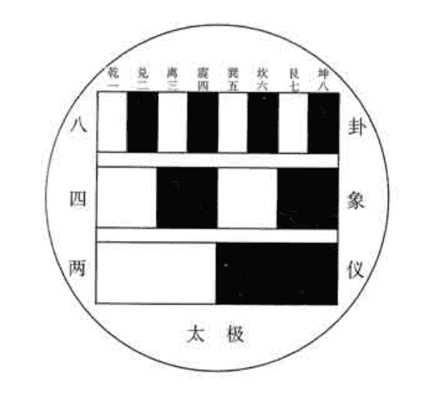
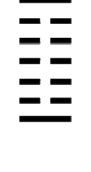
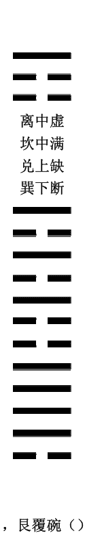

# 梅花易数

【宋】邵雍著 陈明点校

## 新订邵康节先生梅花

### 观梅拆字数全集卷之一

## 周易卦数

乾一，兑二，离三，震四，巽五，坎六，艮七，坤八

【白话释意】

《周易》由《易经》和《易传》两部分组成。《易经》由六十四幅卦图，六十四个卦名，六十四条卦辞，三百八十六个爻名，三百八十六条爻辞等五部分组成。六十四卦由八个三画卦组成。六十四卦每一卦都有六爻，因此又称为六画卦。

六画卦分为上下两部分，即上卦和下卦。上卦叫卦上体，下卦叫卦下体。下卦，上卦两体相重组成一个六画卦图，因而六画卦又叫做重卦，也叫做别卦。别卦用以区别于三画卦。三画卦又名单卦，也叫经卦，因为只有八个卦，所以又叫八卦。易数与卦数，是两个既有联系又有区别的两个概念。易数包含卦数。卦数包含八卦的个数，六十四卦的个数和八卦的序数，六十四卦的序数等内容。此处的卦数是指八卦的序数。八卦的顺序数可以编排出很多种类。这里的“周易卦数”是按照《伏羲八卦次序》编排的。《伏羲八卦次序》为：乾卦一，兑卦二，离卦三，震卦四，巽卦五，坎卦六，艮卦七，坤卦八。

这是《周易》先天八卦序数，人们在占卦时已去掉了原来这种八卦编排的序数的本来意义，将其视为实数，把“一”与乾卦对应，“二”与兑卦对应，“三”与离卦对应。“四”与震卦对应，“五”与巽卦对应，“六”与坎卦对应，“七”与艮卦对应，“八”与坤卦对应。例如人们在占卦时，只要占得数“七”，就意味着占得了艮卦，得到“五”，就意味着占得了巽卦，这实际上是符号学在原始思维中的不自觉的运用。

《易传》是阐发《周易》思想的论著，古称“十翼”，它是研究《周易》的十篇辅助资料，是在《易经》这部“占筮之书”问世之后，经过后人的长期研究，到战国中后期才写成的第一部易学专著。古人认为它是孔子一人所作，近代学者考证，它绝非一人所写，而各篇写作时间也先后不一，不过，这十篇论述易理的文章，观点大体一致，在思想上自成体系。

《易传》对《易经》的重大发展，在于它将一部占筮之书，改造成为论理性很强的哲学著作，如果没有这个改造和发展，《易经》在中国思想史，文化史的地位和作用将大为不同，远不会有后来这么高的学术价值。

对“周易卦数”的理解，可参看下图。下图名叫《先天八卦次序图》，此图是邵康节先生所说的加一倍法，八经卦和六十四别卦均按加一倍法来演变出来的。自然界一阴一阳相交，生出八卦，两仪为卦的初爻。四象为卦的二爻，八卦为卦的第三爻。这样八经卦由三爻组成。

从图中可以看出：乾一，兑二，离三，震四，巽五，坎六，艮七，坤八的卦次数是符合自然发展规律的。

## 五行生克

金生水，水生木，木生火，火生土，土生金。金克木，木克土，土克水，水克火，火克金。

【白话释意】

五行，是水，火，木，金，土等五种物质的总称。中国思想家把五行视为构成万物的五种基本元素，用来说明和解释客观世界。五行中具有相互促进，相互依存的那种关系，被称为“相生”，简称为“生”。“生”具有产生，帮助生长和联系等意义。

五行相生的次序为：

金生水，水生木，木生火，火生土，土生金。

五行不仅具有相互促进，相互依存的“相生”关系，而且还具有相互约束，相互制胜的关系。五行相互制约的关系叫做“相克”。“相克”是根据五种物质的基本属性及其相互联系和区别确定的。

五行相克的次序为：

金克木，木克土，土克水，水克火，火克金。

## 八宫所属五行

乾兑金，坤艮土，震巽木，坎水，离火。

【白话释意】

关于六十四卦形成的说法有好几种。主要的说法是八卦重为六十四卦，八卦的每一个卦用自身作基础于其它七个三画卦都可以组成七个六画卦，加上自身与自身相重得到的一个六画卦，一共得到八个六画卦。这一卦和这一卦组成的八个都可以叫做一宫。六十四卦共由八宫卦组成。如果说六十四卦是一个大系统的话，那么每一个有八个卦组成的八个六画卦就是一个小系统。因此，我们不妨说六十四卦这个大体系是由八个小体系组成的。

八宫为乾宫，兑宫，离宫，震宫，巽宫，坎宫，艮宫，坤宫。

将上述八宫分配给五行，就叫做“八卦所属五行”。在文王后天八卦系统中，八宫是这样分配给五行的：

- 乾宫位居西北，属金；
- 兑宫位居西方，属金；
- 坤宫位居西南，属土；
- 艮宫位居东北，属土；
- 震宫位居东方，属木；
- 巽宫位居东南，属木；
- 坎宫位于正北，属水；
- 离宫位于正南，属火。

## 卦气旺

震，巽木旺于春；离火旺于夏；乾兑金旺于秋；坎水旺于冬；坤艮土旺于辰戌丑未月。

【白话释意】

卦气学说，为汉朝孟喜，京房所倡导。用《周易》的卦与四时的气候相配对，便叫做卦气。卦气包含三种因素：一，卦；二，气候；三，五行。

春天雷声震震，万物因此生机勃发。草发新芽，木发新枝。震巽为木，时当春季，为得时得令，所以震卦，巽卦气旺。夏天骄阳似火，万物整洁相见。离卦属火，位居南方，所以旺盛。金秋时节。万物成熟，是喜悦收获的季节。乾兑为金，属于秋天，自然当时气旺。冬天万物归息不见，正是流动冰寒的水的时节。坎卦卦象为水，属于冬天，所以当旺。坤艮属土，“土旺四季”（也叫四时）。农历每一季的最后一月，即三，六，九，十二月，辰，戌，丑，未。古制每季三月，以孟，仲，季分别称之。如夏季的四，五，六月，分别称为孟夏，仲夏，季夏。“季”就是每一季度的最后一月。

五行与四时相配合为：春属木；夏属火；秋属金；冬属水；辰戌丑未属土。

八卦，四时，五行三因数组合起来后，处于旺盛状态的情况如下：
震卦，巽卦同春天组合起来形成木旺盛的状态；
离卦与夏天组合起来形成火旺盛的态势；
乾卦，兑卦与秋天组合起来形成金旺盛的态势；
坎卦与冬天组合起来形成水旺盛的态势；
坤卦，艮卦与辰戌丑未月（即三月，六月，九月，十二月）组合起来形成旺盛的态势。

## 卦气衰

春坤，艮；夏乾，兑；秋震，巽；冬离；辰，戌，丑，未，坎。

【白话释意】

卦气衰的道理与上述相同，由于时节迁移，加上对立五行的相克，相应卦的卦气也就随之衰颓了。
卦气衰颓的态势是相对于卦气旺盛的态势而言的。其衰败的情况具体如下：
春天木旺，木旺克土，土为旺木所克，所以土衰，古曰：“春，坤，艮”。坤卦，艮卦属土，震卦，巽卦木旺于春天，所以春天坤卦，艮卦土衰。
夏天火旺，火旺克金，金为火所克，所以金衰，古曰：“夏，乾，兑”。离卦火旺于夏，乾卦，兑卦金衰于夏天。
秋天金旺，金旺克木，木为金所克，所以木衰，故曰：“秋，震，巽”。谓秋天的震卦，巽卦木衰败。其原因是乾卦，兑卦金旺于秋所致。
冬天水旺，水旺克火，火为水所克，所以冬天火衰，故曰：“冬，离”。谓冬天离卦火衰败。其原因是坎卦水旺于冬天。
三月，六月，九月，十二月土旺，土旺克水，水为土所克，因此这四个月土衰。
卦气的旺衰状态与衰败状态是一个互相牵制，互相影响的消长过程。
卦气学说是卦与运气学说的产物。

## 十天干

甲，乙东方木。丙，丁南方火。戊，己中央土。庚，辛西方金。壬，癸北方水。

【白话释意】

此为天干，五行的配属。
天干，是古人用来纪录时间的符号，因为天干有十个符号，所以叫做“十天干”。这十个符号是：甲，乙，丙，丁，戊，己，庚，辛，壬，癸。古代人用天干纪日，日为阳，阳为天。
十天干本身也分为阴干和阳干两大类：
阳干：甲，丙，戊，庚，壬。阴干：乙，丁，己，辛，癸。
十天干与五行组合，结果如下：
甲乙→木。甲为阳木，乙为阴木。
丙丁→火。丙为阳火，丁为阴火。
戊己→土。戊为阳土，己为阴土。
庚辛→金。庚为阳金，辛为阴金。
壬癸→水。壬为阳水，癸为阴水。
十天干与五行，五方组合结果如下：
甲乙→东方→木；丙丁→南方→火；
戊己→中央→土；庚辛→西方→金；
壬癸→北方→水。

因为天干，地支原是以意于树木，有这样有趣的说法：

- 【甲】象草木破土而萌，阳在内而被阴包裹。
- 【乙】草木出生，枝叶柔软委屈。
- 【丙】丙，炳也，如赫赫太阳，炎炎火光，万物皆炳然著见而明。
- 【丁】草木成长壮实，好比人的成丁。
- 【戊】茂也。象征大地草木茂盛。
- 【己】起也，纪也。万物抑屈而起，有行可纪。
- 【庚】更也，秋收而待来春。
- 【辛】金味辛，物成而后有味。又有人认为，辛者新也，万物肃然更改，秀实新成。
- 【壬】妊也，阳气潜伏其中，万物怀妊。
- 【癸】揆也，万物闭藏，怀妊地下，揆然萌芽。

## 十二地支

子水鼠，丑土牛，寅木虎，卯木兔，辰土龙，巳火蛇，午火马，未土羊，申金猴，酉金鸡，戌土犬，亥水猪。

【白话释意】

此为十二地支与十二生肖，五行的具体配属。子属水属鼠，居于北方，坎卦，时当十一月。丑属土属牛，居于东北，艮卦，时当十二月。寅属木属虎，居于东北，时当正月。卯属木属兔，居于东方，震卦，时当二月。辰属土属龙，居于东南方，巽卦，时当三月。巳属火属蛇，位居东南，时当四月。午属火属马，位居正南，离卦，时当五月。未属土属羊，位居西南，时当六月。申属金属猴，位居西南，坤卦，时当七月。酉属金属鸡，位于正西方，兑卦，时当八月。戌属土属犬，位居西北方，时当九月。亥属水属猪，位居西北，乾卦，时当十二月。
地支，也是古人用来记录时间的符号，因为有十二个符号，所以叫做十二地支。这十二个符号是：子，丑，寅，卯，辰，巳，午，未，申，酉，戌，亥。古人用十二地支纪月，月为阴，阴为地。
地支十二个符号也分为阴支和阳支两大类：
阳支：子，寅，辰，午，申，戌。
阴支：丑，卯，巳，未，酉，亥。
一年十二个月，即地支十二个符号一个循环纪录。一月三旬，以旬十天，即天干十个符号一个循环记录。将十二地支与十天干组合排列得到六十个不同符号，这就是六十甲子。用六十甲子循环既可以纪年，又可以纪月，还可以纪日，甚至还可以纪时辰。
十天干相对于十二地支而言，则为阳；十二地支相对于十天干，则为阴。天干与地支的关系犹如树干与树枝的关系一样，天干为树干，地支为树枝。
十二地支与五行组合结果如下：
寅卯→木。寅为阳木，卯为阴木。
巳午→火。巳为阴火，午为阳火。
申酉→金。申为阳金，酉为阴金。
亥子→水。亥为阴水，子为阳水。
辰戌丑未→土。辰戌为阳土，丑未为阴土。

十二地支与五行，十二生肖组合的结果如下：
子→水→鼠；丑→土→牛；寅→木→虎；
卯→木→兔；辰→土→龙；巳→火→蛇；
午→火→马；未→土→羊；申→金→猴；
酉→金→鸡；戌→土→犬；亥→水→猪。

【子】 孳也，草木种子，吸土中水分而出，为一阳萌生的开始。
【丑】 草木在土中发芽，屈曲着将要冒出地面。
【寅】 演也，津也，寒土中屈曲的草木，迎着春阳从地面伸展。
【卯】 茂也，日照东方，万物滋茂。
【辰】 震也，万物震起而长，阳气生发已经过半。
【巳】 起也，万物盛长而起，阴气消尽，纯阳无阴。
【午】 万物丰满长大，阳气充盛，阴气开始萌生。
【未】 味也，果实成熟而有滋味。
【申】 身也，物体都已长成。
【酉】 酉，就也。万物到这时都收缩收敛。
【戌】 灭也，草木凋零，生气灭绝。
【亥】 劾也，阴气劾杀万物，到此已达极点。

## 八卦象例

乾三连
坤六断
震仰盂
艮覆碗

乾三连（），坤六断（），震仰盂（），艮覆碗（），离中虚（），坎中满（），兑上缺（）。巽下断（）。

【白话释意】

乾三连，乾卦三画均连接不断。

坤六断，坤卦三爻都一分为二。共得六根截断的卦图。

震仰盂，震卦三爻，上两爻为截断的阴爻，下一爻为连接的阳爻。利用想象力，一看就象一个仰面的痰盂。

艮覆碗，艮卦三爻，上爻为连接的阳爻，下两爻为截断的阴爻。利用想象力，一看就象一个反扣的碗行。

离中虚，离卦上下两爻为连接的阳爻，中间为断开的阴爻，中间显得空虚。

坎中满，坎卦上下两爻为截断的阴爻，中间为连接的阳爻，中间看上去显得丰满。

兑上缺，兑卦底下两爻是连接的阳爻，上面一爻为截断的阴爻，看上去好似缺了口似的。
巽下断，巽卦上面两爻是连接的阳爻，下面一爻为截断的阴爻，看上去如裂断一样。

## 占法

《易》中秘密穷天地，造化天机泄未然；
中有神明司祸福，从来切莫教轻传。

【白话释意】

《易》中秘密穷天地：《周易》中的奥妙囊括了天地间的奥妙。
造化天机泄未然：天地的机密创造和变化万物的奥妙全都没有泄漏。
中有神明司祸福：《周易》中好似有神明主管预测吉凶显示祸福。
从来切莫教轻传：自来都是告诫人们不要把它轻易传授给别人。
这首占卦法则诗反映了作者的世界观，宇宙观，祸福观和传授原则。

## 玩法

一物从来有一身，一身还有一乾坤；
能知百事备于我，肯把三才别立根。
天向一中分造化，人于心上起经纶；
仙人亦有两般话，道不虚传只在人。

【白话释意】

万物中任何事物都有其完整的系统。系统无论大小都是与宇宙沟通的小天地（小乾坤），
因此，“我”有者万物皆有，万物有者“我”亦有，所以说“万物皆备于我”。这样一来，
日月可以别构，天地可以我设，天，地，人“三才”在人心上另外建立根源。天地由太极
分化而来，机谋由人心滋生而出。即使是通天彻地的仙人，也有真假大小两种说法。因此，
凡人能否得到真传，全在于本人的修行了。
《易经》说：“君子居则观其象而玩其占，动则观其变而玩其占，是以自天之，吉无不利”。
有学问的人平时观察易象而探索玩味它的文辞；一有行动，就观察《易经》的变化而玩味
占筮的祸福吉凶，这样取法于易象的条例法则，行动起来就不会有大的失误。
下面讲一下卦数起例，《梅花易数》的起卦方式可分为两大类，一大类为：“先得数，再起卦”，如时间，尺寸，字数等起卦；另一类为：“先起卦，再得数”，如静物，动物等起卦。

“先得数，再起卦”的要旨是以数字除八，除六以获取卦象与动爻。为什么用以八除得的余数起卦呢？有什么神奇的奥妙呢？没有。因为卦象总数为八，以八除之余数总会小于或等于八，而且每卦有六爻，其道理与除八一样，至于“不均之气”（奇数）则定为“上卦小数”，“下卦多数”，“以取清气上浮，浊气下沉之理”，如此随意比合，说明古人类的思维过于发达，以致滥觞的特性。其实，人类思维应根据两个（或两类）对象之间的某些方面的相似或相同，推出它们其他方面相似或相同的一种逻辑方法。然而，数的前少后多与气的上清下重有什么相似性呢？

但在古人的眼里，数是相当神奇的。数，就是指天数一，三，五，七，九，地数是二，四，六，八，十。邵雍在《梅花易数》中就将天数，地数与人，事，物相似附，数变则天，地，人，事均相应有变。有象有数，则其卦象自显。故而作者认为易卦体系自可通天，通地，通人，通事，通物。在今人的眼中，“数”当然不再神奇了。

## 卦以八除

凡起卦不问数多少即以八作卦；数超过八数即以八数递除，以余数作上卦。如一八除不尽，再除二八，三八，直至除尽八数，以零数作卦，如得八整除，即坤卦，便不必除也。

【白话释意】

以数字起卦时，用八作除数，不论数字大小，超过八的数字都以八除，以所得的余数作卦；小于八的数，就以本数起卦。按照《伏羲先天八卦图》乾一，兑二，离三，震四，巽五，坎六，艮七，坤八的对应次序起卦。余数为零时，以八数起卦，即为坤卦。卦数为八时，不必再除，也以八数起卦。

## 爻以六除

凡取动爻，以重卦总数除六，以零数作动爻。如不满六，则用次数为动爻，不必再除。如过六数，则除之，一六不尽，再除二六，三六，直至除尽，一零数动爻。若一爻动，则看此一爻之阴阳，是阳爻则变阴爻，是阴爻则变阳爻。取爻当以时加之。

【白话释意】

凡取动爻，以重卦总数除六，以余数取动爻。如数不满六，就直接用这个数取动爻，不必再除。超过这个数，就以除六后所余的余数取爻。如果一爻动，则看这一爻的阴阳；是阴爻的就变为阳爻，是阳爻的就变为阴爻。取动爻还应加上当时的时辰数。

## 互卦起例

互卦只用八卦，不必取六十四卦名。互卦以重卦去了初爻及第六爻，以中间四爻分作上下两卦，看得何卦？又云：乾坤无互，互其变卦。

【白话释意】

重卦的互卦，只用八卦的名称，不必用六十四卦的名称。互卦以重卦去除初爻和上爻，以中间四爻分作两卦，看得到什么卦。乾坤两卦没有互卦，乾的变卦为坤，坤的变卦为乾。
以地天泰为例，下卦乾卦的互卦为兑卦，上卦坤的互卦为震卦。

## 年月日时起卦

年月日为上卦，年月日加时总数为下卦。又以年月日时总数取爻。如子年一数，丑年二数，直至亥年十二数。月如正月一数，直至十二月亦作十二数。日如初一，一数，直至三十日为三十数。以上年月日共计几数，以八除之，以零数作上卦，时如子时一数直至亥时十二数，就将年月日数加时之数，总计几数，以八除之，零数作下卦，就以六除之，作动爻。

【白话释意】

以年月日的加数之和除八，取上卦。又以年月日加时辰数的和除八，取下卦；除六，取动爻。例如，子年视为一数，丑年视为二数，依此类推到亥年视为十二数，又如正月视为一数，至十二月视为十二数。日数的算法也是一样的。例如，初一视为一数，至三十日为三十数。将年月日数相加，除八，以所得余数为上卦。把年月日数的和加时辰数，除八，以所得余数为下卦。时辰数的算法同前，如子时视为一数，类推至亥时十二数。又以年月日时数的和除六，以所得余数取动爻。

## 物数占

凡见有可数之物，即以此数起作上卦，以时数配作下卦，即以卦数并时数总除六，取动爻。

【白话释意】

凡见可数的事物，就以所数得的数字起卦作上卦，以当时的时辰数作为下卦。将上卦的数字加时辰数除六取动爻。

## 声音占

凡闻声音，数得几数，起作上卦，加时数配作下卦。有以声音，如闻动物鸣叫之声，或闻他人敲击之声，皆可作数起卦。

【白话释意】

凡听声音起卦，以所听到的声音起作上卦，以听到声音的时辰数起作下卦。例如，听到动物的鸣叫声或他人的敲击声等等，都可以作为起卦的声音数。

## 字占

凡见字数，如停匀，即平分一半为上卦，一半为下卦。如字数不均，即少一字为上卦，取天轻清之义，以多一字为下卦，取地重浊之义。

【白话释意】

这里讲的是所谓按字数起卦，就是把中国汉字或分解为笔画数，或分解为字数，或分解为音调等形式，使之纳入卦中的起卦方法，因为它有三种分解成数字的方法，所以起卦方法也应像对待字数的不同一样而分别论述。

凡是看见的字数可以被二整除，也就是说字数为偶数，就用平分的一半字数为上卦，另一半的字数为下卦。如果字数不能被二整除，也就是说字数是奇数，就用少一个字的前半部分作上卦，表示“天轻清于上”的意思，用多一个字的后半部分为下卦，表示“地重浊于下”的意思。

占字，说得通俗点，也就是人与字，字与卦，卦与人三者合一的东西，但是这里首先必须强调一点，凡是按字的笔画数起卦，那么该字必须是“繁体字”，否则就预测得不准，所谓的“繁体字”，最好以《康熙字典》中的笔画为准。第二，按声音起卦中的平，上，去，入四声，并不是我们现在小学语文课本中“汉语拼音”的四声，而是古代人所规定的四种声调。比如我们现在大力提倡的普通话就没有“入声”。正确的分示是按古中州韵的念字方法。这样才能正确区分平，上，去，入四声调。第三，按字数起卦法中，如果总的字数超过百字以上，就没有必要用此法，我们可以用“时间起卦法”等替而代之。第四，以上按字起卦法中，必须严格掌握它们之间的分界线，按笔画数起卦一般用于从一个字到三个字的范围，按声调起卦法一般用于从四字占到十字以内的范围，而以十一字以上的则按字数起卦的方法。如果不仔细加以区分，一是非常麻烦，二是带来不必要的错误，这一点该特别注意。

## 一字占至十一字

### 一字占

一字为太极未判。如草混沌不明，不可得卦。如楷书，则取其字画，以左为阳画，右为阴画。居左者看几数，取为上卦。居右者看几数，取为下卦。又以一字之阴阳，全画取爻。“彳”、“丿”，此为左者，“一”、“八”、“风”、“丶”，此为右者。

【白话释意】

一字犹如太极未判。像有的人书写的草字，混沌不明的，那就不可以起卦。像有的人书写的楷书是一字，就要取这个字左边的笔画作阳画，取这个字右边的笔画作阴画。取这个字左边的阳画看其笔画数是几，取为上卦；取这个字右边的阴画看其笔画数得的是几，取为下卦。又要以这个字的所有阴阳笔画数的总和除以六，然后取动爻。

### 二字占

二字为两仪平分。以一字为上卦，以一字为下卦。

【白话释意】

二字就如阴阳两仪，平分阴阳。二个字起卦，应以前一个字的笔画作上卦，以后一个字的笔画数作下卦，以两个字的笔画总数除以六，余数取动爻，其余部分与一字占相同。

## 三字占

三字为三才。以一字为上卦，二字为下卦。

【白话释意】
三字代表天地人三才。三个字起卦，以前一个字的笔画数作上卦，以后两个字的笔画数相加作下卦，以三个字的总笔画数除以六，余数为动爻，其余部分与上述相同。
为什么前一个字作上卦，后两个字作下卦呢？因为上卦为阳，为天；下卦为阴，为地。古人有天轻清，地浊重之意，因此上卦为少，下卦为多。

## 四字占

四字为四象。平分上下为卦。又四字以上，不必数笔画，只以平仄声音调之。平声为一数，上声为二数，去声为三数，入声为四数。

【白话释意】
四字代表四象，即少阳，太阳，少阴，太阴，分别代表春夏秋冬四时。四个字起卦，以前两个字作上卦，后两个字作下卦，合四字的笔画除六，余数取动爻。邵康节先生认为四字以上的起卦，就不必数笔画，就以字的音调数起卦，即按“平上去入”四声起卦。字读平声的为一数，字读上声的为二数，字读去声的为三数，字读入声的为四数。
平上去入是古代的四声计调法。现代的则是阴平，阳平，上声，去声。

## 五字占

五字为五行。以二字为上卦，三字为下卦。

【白话释意】
五字为金，木，水，火，土五行的象征。五个字起卦，以前两个字为上卦，以后三个字为下卦，以五个字的笔画数总和，除以六，余数取动爻。

## 六字占

六字为六爻之象。平分上下为卦。

【白话释意】
六字为一重卦初，二，三，四，五，上爻，共六爻之集的象征。以前三个字为上卦，以后三个字为下卦，平分起卦，并合两卦之数除以六取动爻。

## 七字占

七字为数齐七政。以三字为上卦，四字为下卦。

【白话释意】
七政是金，木，水，火，土合日，月七个字是七政的象征，七个字起卦，以前三个字为上卦，以后四个字为下卦，并合上下卦数除以六取动爻。

## 八字占

八字为八卦定位。平分上下为卦。

【白话释意】
八个字是天，地，风，雷，水，火，山，泽八卦的象征，八个字起卦，以前四个字为上卦，以后四个字为下卦，并合两卦数总和除以六取动爻。

## 九字占

九字为九畴之意。以四字为上卦，以五字为下卦。

【白话释意】
九畴：传说大禹治理天下的九类大法。九字为九畴之义。九个字起卦，前四字为上卦，后五字为下卦，合上下卦数之合除六取动爻。

## 十字占

十字为成数。平分上下为卦。

【白话释意】
十字为成数的象征。十个字起卦，取前五个字为上卦，后五个字为下卦，并合两卦之和除以六取动爻。

## 十一字占

十一字以上至于百余字，皆可起卦。但十一字以上，又不用平仄声音调之，只用字数。如字数均平，则以半为上卦，以半为下卦，又合两卦总数取爻。

【白话释意】
十一个字及十一个字以上直至百余字的起卦，应把总字数一分为二。如果总字数为偶数，就平分前后两部分；如果字数为奇数，按天轻地重的观点，上卦比下卦少一个字。以两卦之和数除以六取动爻。
十一个字及十一个字以上，如用笔画数作为运算的数字，则过于麻烦。如果用声调数作为运算的数字，也很麻烦。邵康节先生发明了以字数作为运算数字的方法，即十一字以上的起卦法，总字数是多少，平分后各作上下卦的数字，然后进行运算。

例如：77个字起卦
按照总字数一分为二，77÷2=38……1
上卦应取38个字，下卦应取39个字。
1：38÷8=4……6
余数6为上卦数，配之以卦是坎卦。则上卦为坎。
2：39÷8=4……7
余数7为下卦数，配之以卦是艮卦，则下卦为艮。
3：77÷6=12……5
总字数除以六，余数取动爻，现余数为5，则次卦为5爻动。

## 丈尺占

丈尺之物，以丈数为上卦，尺数为下卦。合丈尺之数取爻，寸数不取。

【白话释意】
以长度为几丈几尺的事物起卦，以其长的丈数为上卦，尺数为下卦，并以丈尺之和加当时的时辰数除六取动爻。
丈尺占的方法是：
1：量物体的长度，以丈尺为单位的数字，除以八，其余数为上卦。
2：以尺为单位的数字，除以八，其余数为下卦。
3：以上两数相加除以六，其余数为动爻。

## 尺寸物占

以尺数为上卦，寸数为下卦。合尺寸之数，加时取爻。分数不用。

【白话释意】
尺寸占的方法与丈尺占法相同。唯尺寸以尺数为上卦，以寸数为下卦。尺寸数相加之后再加时辰数除以六取动爻。
在尺寸占中有一种变化，即以尺数为上卦，以寸数为下卦，以尺寸相合之数另加起卦的时辰数，除以六取动爻，这种变化是依据邵康节先生的概念合起卦加数法的法则来变化的，故用此法的人很多。倒把正规的尺寸占法搁在一边了。

## 为人占

凡为人占，其例不一。或听语声，或观其人品，或取诸身，或取诸物，或观其服色，触其外物，或以年月日时，或以书写来意。又听其语声者，如或一句，即以其字数分之起卦，如说两句，即用先一句为上卦，以后一句为下卦。语多，则只用初听一句，或后闻一语。余句不用。
观其人品者，如老人为乾，少女为兑之类。
取诸其身者，如头动为乾，足动为震，目动为离之类。
取其诸物者，如人手偶有何物，如有金玉及圆物之类为乾，土瓦及方物之类为坤之类。
观其服色者，如其人青衣为震，赤衣为离之类。
触其外物者，起卦之时见水为坎卦，见火为离卦之类。
年月日时，以望梅之类推之。
书写来意者。其人来占，或写来意，则以其字占之。

【白话释意】
所谓为人占是为别人而预测的方法，这种方法在实践中运用得最多，也最广。正因为如此，所以它的起卦方式不是一种，而是多种形式。为别人预测，所知条件甚少，要凭仅知的一个或几个条件来对人或事作出预测，这种难度也比较大，但是它是最实用最常用的预测项目，所以它具有很高的研究价值。
已知条件少，而且已知条件各式各样，所以需要掌握的方法也就要多，已知哪种条件，就用哪种方法，这样，才能作出准确的预测。先逐一介绍如下：

### 一：听其语而起卦

所谓听其语声，就是听来人所讲的话，或听来人所发的声音来起卦的方式。如果来者问某事，所问的一句话即可起卦，此起卦方式与十一字以上的起卦方式相同，即以此句话的所有字数一分为二，为上下卦，然后总数取动爻。如来者问某事讲了两句话，则以这两句话的字数，以上句字数取上卦，以后句字数取下卦，两句总数字取动爻。如果来者问某事，讲了很多话，那么他所说的第一句话起卦，或用他所讲的最后一句话起卦，起卦方式与讲一句话的起卦方式相同，其余所讲的话不用。

### 二：听其声音起卦

所谓听其声音，就是来人在问某事的过程中，无意间所发出的除讲话外的其他声响，用此起卦的方式为听声音起卦。比如讲话间隙的咳嗽次数，无意间边说话边敲击东西等等之类。

### 三：观其人品起卦

所谓观其人品起卦。就是以来人的年纪大小，男女，分出类别起卦的方式。如来人为男性老人，则配以乾卦，因为乾为老父。来人为男性中年人则配以震卦，来人是男性青年，就配以坎卦，来人是男性少年，就配以艮卦。来人为女性老人，则配以坤卦，来人为女性中年人就配以巽卦，来人为女性青年人就配以离卦，来人为女性少年人就配以兑卦。以来人的人品作上卦，以问何事作下卦。总数加时辰数取动爻，其方法与上述所说的各占法相同。

### 四：取诸身起卦

所谓取诸身起卦，就是以来人身体某一部分起卦的方式。这种方法依据于《周易·系辞》：“近取诸身。”怎么取法则依据“不动不占”的原则。比如，本人在问事过程中，有头部的动作，则配以乾卦，因为乾为头；来人有脚动的动作，则配以震卦，因为震为足；来人有眼睛的动作，则配以离卦，因为离为目，等等。其起卦方式是：以身体部位作上卦，以问何事作下卦，两卦总数加时辰数取动爻，其起卦方式与上述相同。或是以来人人品作上卦，以身体部位作下卦，二卦总数加时辰数取动爻。

### 五：取诸物起卦

同。

### 六：观其服色起卦

所谓观服色就是观察来人所着服装的颜色起卦的方式。比如：来人身着青绿色服装，则配之以震，因为震为青色，来人身着红色服装则配之以离，因为离为红色，来人身着白色服装，则配之以兑卦，因为兑为白色等等。其起卦方式是：以上身穿的衣服颜色配之以卦作上卦，以下身穿的裤、裙颜色配之以卦作下卦，以二卦总数加时辰数取动爻，其起卦方式与上述相同。

### 七：寻外应起卦

所谓寻外应，就是来人问某事时，四周何物有动静，即以此物起卦的方式。这种方法是依据相应观的原理来起卦的。比如：来人问事之时，无意将水打翻，或正好见水，则配之以坎卦，因为坎为水，见火则配以离卦等等。其起卦方式是：以见外应为上卦，以此应加时辰数作下卦，此外应加时辰数取动爻，其起卦方式与上述相同。

### 八：按时间起卦

所谓按时间，就是以来人问事的时间来起卦的方式，这种方法又称为按年，月，日，时起卦。其起卦方法就是前面介绍的按时间起卦法，在此不再赘述。

### 九：按字数起卦

所谓按字数起卦，就是来人所问事写在纸上，则用其写下的字来起卦的方式。其起卦方法，就是前面介绍的，按字起卦法。

### 十：按来人方位起卦

所谓按来人方位起卦，就是来人从何方来，则用方位来起卦的方式。比如从东方来则配之以震卦，因震在东方；从南方来则配之以离卦，因为离在南方；从西方来则配之以兑卦，因兑在西方；从北方来则配以坎卦，因坎在北方；从西北来，则配以乾卦，因乾在西北；从东北来则配之以艮卦，因艮在东北；从西南来，则配之以坤卦，因坤在西南；从东南来，则配之以巽卦，因巽为东南。八卦配方位，均是用的后天八卦方位。

## 自己占

凡自己欲占，以年月日时或听闻有声音，或观当时所触之外物，皆可起卦。以上三例，与前章为人占法同。

【白话释意】
所谓自己占，就是为自己预测，这也是经常运用的占法。自己占的方法与“为人占”的方法基本相同。但是在此特别注意提醒各位：自己占一定要依照“不动不占”，“无事不占”，“无异常现象不占”的原则，否则所起之卦无准确率可言，为什么这么说呢？因为如果自己有件事要做，他在这件事的前后每个时辰都想着这件事，如果起卦预测这件事，你究竟用什么时辰来起卦呢？总不能一天十二个时辰起十二个卦来看一件事。这样起卦预测还有什么意义呢？所以古人规定了“不动不占”的原则。
那么，如果自己需要预测某件事，到底以什么为起卦要素呢？根据古人和今人不断总结和探索，认为以发生这件事的时间为起卦的要素，即用发生时间的时间起卦。或者是有异常现象，就以异常现象的时间起卦，以及用外应占法起卦，这样得到的结果就比较准确。

## 占动物

凡占群物之动，不可起卦。如见一物，则就以此物为上卦，物来之方为下卦。合物卦数与方位卦数，加时数取爻，以此卦数总断其物，如后天占牛鸣，鸡叫之类。又凡牛马犬之类，初生，则以初生年月日时占之。又或置买此物，亦可以初置买之时推之。

【白话释意】
所谓占动物就是以动物来起卦预测动物的方式，这种方式农村用得比较多。凡是占动物，一群动物是不能以此来起卦的，只有一只动物，才能起卦。
其起卦方法是以上动物为上卦，以来方位为下卦，二卦总和数加时辰数取动爻，其余起卦方式与上面所述相同。
比如：马配之以乾卦，因为乾为马，牛配之以坤卦，因为坤为牛，鸡配之以离卦，因为离为鸡等等。
第二种起卦方法是，以动物的叫声起卦，即以动物为上卦，以动物叫声和数字为下卦，以两卦总和数加时辰数取动爻。
第三种起卦方式是，以动物刚出生的时间起卦，即按年，月，日，时起卦法。
第四种起卦方式是，以动物买回家的时间起卦。

## 占静物

凡占静物，有如江河山石，不可起卦。若至屋宅，树木之类，则以屋宅初创之时，树木初置之时，皆可起卦。至于器物，则置成之时可占，如枕椅类是矣。余则无故不占。若观梅，则见雀争枝坠地而占。牡丹，则自有问而占。茂树，则枝枯自坠而后占也。

【白话释意】
又称静物占，所谓静物占就是用静物来起卦预测静物的方式。
凡是占静物，比如江，河，湖，海，山，石等自然界所属静物是不能起卦的，只有一些人为的静物才能起卦。
其起卦方式是：按时间起卦法，比如屋宅则以建成屋宅的时间起卦，树木则以种植的时间起卦，或以买来的时间起卦，木具，椅子，桌子等一类则以做成的时间起卦，或以买来的时间起卦，等等。
静物占也要注意“无故不占”的原则。

## 物卦起例（端法后天起卦）

后天端法：以物为上卦，方位为下卦，合物卦之数与方卦之数，加时数以取动爻。

【白话释意】
按后天八卦起卦的正确方法，是以万物为上卦，方位为下卦，以事物的卦数与方位的卦数之和，再加上时辰数除六以取动爻。

## 八卦万物属类（并为上卦）

乾卦：天，父，老人，官贵，头，骨，马，金，珠宝，玉，木果，圆物，冠，镜，刚物，大，赤色，水寒。

坤卦：地，母，老妇，土，牛，金，布帛，文章，舆，辇，方物，柄，黄色，瓦器，腹，裳，黑色，黍稷，书，米，谷。

震卦：雷，长男，足，发，龙，百虫，蹄，竹，雀，萑苇，马鸣，母足，稼，乐器之类，草木，青碧，绿色，树，木核，柴，蛇。

巽卦：风，长女，僧尼，鸡，股，百禽，百草，白，香气，臭，绳，眼，羽毛，帆，扇，枝叶之类，仙道，工匠，直物，工巧之器。

坎卦：水，雨雪，工，豕，中男，沟渎，弓轮，耳，血，月，盗，宫率，栋，丛棘，狐，蒺藜，桎梏，水族，鱼，盐，酒醢，有核之物，黑色。

离卦：火，雉，日，目，电，霓霞，中女，甲胄，戈兵，文书，槁木，炉，兽，鳄龟，蟹蚌，凡有壳之物，红赤紫色，花纹人，干燥物。

艮卦：山，土，少男，童子，狗，手，指，径路，门阙，果，瓜，阍寺，鼠，虎，狐，黔喙之属，木生之物，藤生之爪，鼻。

兑卦：泽，少女，巫，舌，妾，肺，羊，毁折之物，带口之器，属金者，废却之物，奴卜，婢。

【解说】
八卦的符号结构，作为一种框架，具有无限的储存功能。继天地万物产生之后，它又作为万物分类的模式，依次将世界万物万事尽收于其中。
从“远取诸物”来说，乾为天，天性刚健。马在家畜中最健行，所以乾又为马。坤为地，地性柔顺而无物不载，牛性也柔顺而能拉车载物，所以坤又为牛。震为雷，其性为动，龙潜入深渊，动则现于地，而飞于天，所以震又为龙。巽为风，风性无孔不入而能吹拂万物，鸡晨鸣而传入千家万户，能催促早起，所以巽为鸡。坎为水，水存于低洼处，其性险陷，猪为水畜，喜于泥水中生存，所以坎为猪。离为火，火光绚丽多彩，野鸡羽毛华丽而有光泽，所以离为野鸡。艮为山，其性为止，狗能守户而止人入内，所以是以艮又为狗。兑为泽，其性为悦，羊性温顺而为人所喜悦，所以兑为羊。以上八种动物之于八卦，都是从八卦的基本性质去进行分类的。
从“近取诸身”来说，天在上，人的首也在上，所以乾又为首。地含弘万物，人的腹含藏五藏六腑，所以坤又为腹。震为雷，雷震动，人的足能行动，所以震又为足。巽为风，风行八面，脚动才能带脚足而行八方，所以巽又为股。艮为山，是静止而不动的，手也能止物，所以艮又为手。兑为泽，泽在地上如口，可以吞吐江河，口在人身能吞吐食物，所以兑又为口。以上就是人身的八种器官而归之于八卦，基本上是依据卦象去进行分类的。
“八卦万物属类”中，大约列举出130几个具体事物。仔细研究，却是从八卦的基本卦象和基本性质引伸发挥比拟附会而推演出来的。
这里自然就会提出一个问题，八卦的模式是要对万物进行分类而装填，只装填了130几个事物，怎能称作万物。我们都知道，卦的模式是有限的，只有八个，客观事物是无限的，所谓万物，也只是一个概数。有限的八卦模式，要融入客观无限的事物，这本身就是个矛盾。要想解决这个矛盾，只有将八卦模式的容量也成为无限的。要把八卦模式的容量成为无限的，也就不能将客观的具体事物一一开列而装填。因为一一开列装填，不仅会使客观事物变成有限的，而八卦模式的容量也变成有限的了。所以，只能摄其要者，通过典型举例的方式，列出130几个事物，举一反三，以小而概大，以偏而概全。因此《周易·系辞传》说：“引而伸之，触类而长之，天下之能事毕矣。”所谓“引伸”，就是根据八卦的基本现象和基本性质可无限地去引伸发挥。所谓“触长”，就是根据《说卦传》已举出的130几个事物的分类方法，触类旁通而无限增长。这样一来，有限的八卦模式就可以容纳无限的事物，凡天下所能引举出来的东西无不包括其中，故言“天下之能事毕矣”。正是这种关系，八卦模式所储存的万事万物，不能全部加以列出而规定得十分具体。

## 八卦方位图

巽东南
离正南
坤西南
震正东
中
兑正西
艮东北
坎正北
乾西北

右离南，坎北，震东，兑西，人则介乎其中。凡物之从花甲来，并起作下卦，加时取爻。

【解说】
用《八卦万物属类》所得之卦作为上卦，用此《八卦方位图》作为下卦，便得到了所要占的卦。用上卦，下卦的先天卦数作为基础，再加时数，便可以确定要占的爻。
《八卦方位图》为后天八卦方位图。后天八卦方位，相传为文王所定。

## 观梅占（年月日时占例）

辰年十二月十七日申时，康节先生偶观梅，见二雀争枝坠地。先生说：“不动不占，不因事不占。今二雀争枝坠地，怪也。”因占之，辰年五数，十二月十二数，十七日十七数，共三十四数，除四八三十二，得二，属兑，为上卦，加申时九数，总得四十三数，五八除四十，零得三数，为离，作下卦。又上下总四十三数，以六除，六七除四十二，得一为零作动爻，是为泽火革。初爻变咸，互见乾巽。
断之曰：详此卦，明晚当有女子折花，园丁不知而逐之，女子失惊坠地，遂伤其股。又兑金为体，离火克之。互中巽木，复三起离火，则克体之卦气盛。兑为少女，因知少女之受伤，而互中巽木，又逢乾金兑金克之，则巽木被伤，而巽为股，故断有伤股之应。幸变为艮土，兑金得生，知少女虽被伤，而不至凶危也。

【白话释意】
辰年十二月十七日的申时，相当于一天中的下午15点至17点。康节先生偶然观赏梅花，看见两只雀为争枝坠地。先生说：“不行动不占测，没有什么事不占测，现今两只麻雀为争枝而落地，真是奇怪。”因此而起卦占断。辰年中的辰为五数，十二月为十二数，十七日为十七数，总共相加为三十四数，用三十四除以八，得四余二，二数对应的卦为兑卦，作上卦。三十四数加上申时九数，共得四十三数，用四十三除以八，得五余三，三数对应的卦是离卦，作下卦。又将上卦，下卦的总数（实际为下卦数）四十三除以六，得七余一，一所对应的爻为初爻，初爻动，变为泽火革卦。初爻变则成了咸卦，互卦见乾卦和巽卦。
所以，康节先生推断说：详断这一卦，明天晚上应当有女子来此折花，管花的园丁不知情况，就去撵走她，女子惊慌失措而摔倒在地，伤了大腿。为什么这样说呢？所得的泽火革卦中，上卦兑金为体，下卦离火为用克体兑金，互卦中有巽卦木，生下卦离火，三起离火，火热很旺，克体的卦气十分旺盛。兑卦为少女，因此能知道少女要受伤，而互卦中的巽木，又遇到乾金兑金所克，乾金兑金克巽木，那么巽木定要受伤，巽的卦象在人体为大腿，所以有伤大腿的应验。幸运的是，初爻动，咸卦的下卦为艮卦，艮为土，土生金，兑金得以生扶，因此知道女子虽然受了轻伤，但不会有大的凶险和危难。

## 牡丹占

巳年三月十六日卯时，先生与客往司马公家共观牡丹。时值花开甚盛，客曰：“花盛如此，亦有数乎？”
先生曰：“莫不有数，且因问而可占矣”。遂占之，以巳年六数，三月三数，十六日十六数，总共的二十五数，除三八二十四数，余数为乾，为上卦。加卯时四数，共得二十九数，又除三八二十四数，零五为巽卦，作下卦，得天风姤。又以总数二十九数，以六除之，四六除二十四，零五爻动，变鼎卦，互见重乾。遂与客说“怪哉，此花明日午时，当为马所践毁。”众客愕然不信，次日午时，果有官贵观牡丹，二马斗陷，群惊花间驰骤，花尽为之践毁。
断之曰：巽木为体，乾金克之，互卦又见重乾，克体之卦多矣，卦中无生意，故知牡丹必践毁。所谓马者，乾为马也。午时者，离明之象，是以知之也。

【白话释意】
巳年三月十六日的卯时，相当于一天中的早上5点到7点，康节先生与客人前往司马温公家一同观赏牡丹。当时正值牡丹花盛开之际，客人说：“牡丹花如此盛开美好，也有定数吗？”康节先生回答说：“万物都有定数，而且只要问，就可以起卦占测。”于是，就为盛开的牡丹花起卦占测。巳年中的“巳”为六数，三月中的“三”为三数，十六日中的“十六”为十六数，总共相加共得二十五数，用二十五除以八，得三余一，余数一对应的是乾卦，做上卦，二十五数加上卯时四数，共得二十九数，用二十九除以八，得三余五，余数五对应的卦是巽卦，做下卦。上卦乾，下卦巽，得天风姤卦。再以总数二十九数除以六，得四余五，余数五所对应的爻为天风姤卦的第五爻，变得鼎卦，互见两个乾卦。因此，康节先生对客人说：“真是奇怪，这娇艳的牡丹花明天午时，会被马践踏而毁。”众客人惊叹不已，都不相信。到了第二天午时，果然有两位高官观赏牡丹，两匹马互相嘶咬，两匹马到了花丛之中狂奔乱跑，美丽的牡丹花全部被践踏毁掉。

## 邻夜叩门借物占（系闻声占例）

冬夕酉时，先生方拥炉，有叩门者，初叩一声而止，继而又叩五声，且云借物。先生令勿言，令其子占之试所借何物。以一声属乾，为上卦，以五声属巽，为下卦，又以一乾五巽共六数，加酉时十数，总共得十六数，以六除之，余四，得天风姤第四爻变巽卦，互见重乾，卦中三乾金，二巽木，为金木而已，又以乾金断，而巽木长，是借斧也。
子乃断曰：“金短木长者，器也，所借者锄也”。先生说：“非锄，必斧也。”问之果借斧，其子问其故，先生曰：“于数又须明理，以卦推之，斧亦可也，锄亦可也；以理推之，夕晚安用锄？必借斧。概斧切于劈柴之用耳。推数又须明理，为卜占之切要也。推数不推理。是不得也。学数者志之！”

【白话释意】
有一年冬天的黄昏，在酉时，即相当于现在的 15 时至 19 时。康节先生刚刚拥着火炉而坐，就听见有人敲门，开始时只敲了一下就停止了接下来又敲了五下，而且说想要借点东西。康节先生让敲门的人先不说借什么东西，让他儿子起卦占测，看所借的到底是什么。用第一声的“一”对应的乾卦坐上卦，用后来五声中的“五”对应的巽卦作下卦，乾卦一数，巽卦五数，共计六数，加上酉时十数，共是十六数，用十六除六，得二余四，九四爻动，得天风姤卦，姤卦的第四阳爻变阴爻，得变卦为巽卦互卦中见见两个乾卦，本来卦中又一个乾卦，加起来有三个乾卦属金，两个巽卦属木，由此可见所借的东西为金属木器之物，又根据乾金一般较短，巽卦木一般较长，因此推断为斧子。
康节先生的儿子占断说：“金短木长的东西，是劳动所用的器。所借的东西应是锄头。”康节先生说：“借的一定不是锄头，是斧子。”一问借东西的人，果然要借的是斧子。康节先生的儿子问其中的缘故，先生说：“起卦占例还必须明白卦理，用卦象推测，斧子也可以，锄头也可以；用卦理去推测，冬季的黄昏怎么还会用锄头呢？一定是借斧子。大概是急等着用斧子劈柴吧。”
推断起数必须明白卦理，事理，这是卜占起卦预测的重要因素。光推测起数，不去推断事理，那是不行的，也是预测不准的。学习起数占例的人应当记住这一点。

## 今日动静如何（系声音占例）

有客问：“今日动静如何？”遂将此六字占之。以平分，“今天动”三字为上卦，“今”平声，一数；“日”入声，四数；“动”去声，三数，共八数，得坤卦为上卦。以“静如何”为下卦，“静”去声，三数；“如”平声，一数；“何”平声，一数，共五数，为巽，作下卦。又八五总数为十三数，除二六一十二，零得一数，地风升，初爻动，变泰卦，互见震，兑。遂胃客曰：“今天有人相请，客不多，酒不醉，味止至黍鸡而已。”至晚，果然。
断曰：升者，有升阶之义。互震兑，有东，西席之分。卦中兑为口，坤为腹，为口腹之事，故知有人相请。客不多者，坤土独立，无同类之气卦也。酒不醉，卦中无坎。味止鸡黍者，坤为鸡黍稷耳，盖卦无相生之气，故知酒不多，食品不丰富也。

【白话释意】
有客人曾问先生：“今日动静如何？”康节先生于是将这六个字进行起卦占测。均分六字，用“今天动”之字作为上卦，“今”字为平声，平声则是一数，“日”字为入声，入声则是四数，“动”字为去声，去声则是三数，三字总数为八，八所对应的卦为坤卦，作为上卦。以“静如何”三字作下卦。“静”字去声，去声为三数，“如”字平声，平声为一数，“何”字平声，平声为一数，这三字总数为五，五所对应的卦为巽卦，作为下卦。又用八数和五数相加得十三，用十三除以六，得二余一，一为初爻，除六爻动，得地风升卦。变动地风升卦的第一爻，变得变卦为泰卦，互卦见震卦，兑卦。
根据以上这些情况，先生对客人说：“今天有人请你吃饭，客人不多，喝酒不会醉，饭菜一般。”到了当晚，果然应验如神。推断总结说：升卦的升字又登上台阶的意思，互卦见震卦和兑卦，此两卦有东西之分，震居东方，兑居西方，即为东席，西席的区分。卦中兑的卦象为口，坤的卦象为腹，象征口腹事情，因此知道有人请。所说“客不多”，根据是坤卦的土独立存在，并没有同类比和，相生的卦出现。说“酒不醉”，是根据卦中没有坎卦水。说“味止鸡黍”，根据是坤卦象征的仅仅是小米杂粮而已，升卦又没有相生之气，因此知道酒不多，所以饭菜不会怎么丰盛。

## 西林寺牌额占（系字画占例）

先生偶见西林寺之额，“林”字无两钩，因占之，以“西”字七画为艮，作为上卦；以“林”字八卦为坤，作下卦。以上七画下八画共十五画，除二六一十二，零数得三，是山地剥卦，第三爻东，变艮互见重坤。
断曰：“寺者，纯阳之所居，今卦得重阴之爻，而又有群阴剥阳之兆。详此，则寺中当有阴人之祸。”询之果然，遂谓寺僧曰：“何不添林字两钩，则自然无阴人之祸矣。”僧信然，添林字两钩，寺果然无事。
又纯阳之人，所居得纯阴之卦，故不吉。又有群阴剥阳之义，故有阴人之祸。若添“林”字两钩，则十画，除八得二，为兑卦，合上艮，是为山泽损。第五爻变，动为中孚卦，互卦见坤，震，损者益之始，用互俱生体，为吉卦，可以得安定矣。
以上并是先天数，以数起卦，所谓先天之数也。

【白话释意】
邵康节先生偶然看见西林寺的牌额，西林寺三字中的“林”字没有两钩，因此占卦。以“西”字算作七画，七数所对应的卦为艮卦，作上卦，以“林”字八画作下卦，八数所对应的卦为坤卦，艮卦上，坤卦下，得山地剥卦。上卦数七，下卦数八，共得十五数，十五除以六，得二余三，六三爻动，山地剥卦的第三爻阴爻变为阳爻，剥变为艮卦，剥卦中互卦为两坤卦，即坤上坤下。
先生因此占断说：寺院，是纯阳之人，即僧人所居住的地方，现今得山地剥卦，多重阴之爻，并且又具有很多阴爻剥阳爻征兆。仔细打听，果然有这回事。康节先生便对寺院里的和尚说：“为什么不添上“林”字的两钩呢？这样一来便自然没有因女人而起的灾祸了。”“和尚认为可以这样做，便在西林寺三字中的“林”字上添加了两钩，寺院里果然再也没有此类事情出现了。”
寺院是属于纯阳的和尚居住的地方，却得到了纯阴之卦，所有不吉利。再加上剥卦有群阴剥阳之义，所以推断有因阴人引起的灾祸。如果在“林”字加上两钩，此字便成了十画，十除以八，余数得二，二数所对应的卦为兑卦，加上上卦艮卦，上卦艮，下卦兑，得到山泽损卦。损卦的第五爻由阴爻变为阳爻，六五爻动，便得到了变卦中孚卦，损卦的互卦合震卦，损是益的开始，损卦用卦为艮土，互卦坤也属土，因此说明用卦，互卦都为土，生扶体卦兑金，为吉利卦，以后便相安无事了。
以上都是先得到数，再以数起卦，这即是所谓先天之数的方法。

## 老人有忧色占（端法占例）

己丑日卯时，偶在途行，有老人往巽方，有忧色。问其何以有忧，曰：“无”。怪而占之，以老人属乾，为上卦；巽方为下卦，是为天风姤卦，又以乾一巽五之数，加卯时四数，总十数，除六得四为动爻，是为天风姤之九四。《易》曰：“包无鱼，起凶”。是易辞不吉矣。以卦论之，巽木为体，乾金克之，互卦又见重乾，俱是克体，并无生气。且时在途中，其应速。遂以成卦之数，中分而取其半，谓老人曰：“汝于五日内谨慎出入，恐有重灾。”果于五日，老者往赴吉席，因鱼骨鲠而终。
又凡占卜，克应之期，看自己之动静，以决事之迟速，故行则应速，以遂成卦之数，可中分而取其半也。坐则事应于迟，当倍其成卦之数而定之也；立则半迟半速，止以成卦之数定之可也。虽然如是，又在变通，如牡丹及观梅之类，则二花皆朝夕之故，岂待成数之久也。

【白话释意】
己丑日那天的卯时，相当于一天早上的5点至7点，康节先生在路上行走，看见一位老人由巽方（东南方）走来，且面带忧愁，问他因为什么事情而忧愁，老人回答说：“没什么忧愁”。先生感到很奇怪，于是起卦预测。老人为乾卦的卦象，使用乾卦作上卦，以巽方的卦巽卦作下卦，乾为天，巽为风，得天风姤卦。乾卦数一，巽卦数五，再加上卯时数四，共得十数，用十除以六，余四，九四爻动。《易经》天风姤卦九四爻辞说：“包无鱼，起凶。”此条爻辞很不吉利。用卦象来说，天风姤卦巽木为体，乾卦金克木，互卦卦中又出现两个乾卦，全都是金克木，体卦又没有什么生扶之气，况且被占测的人在路上行走，其应验是很快的。便用成卦的十数，均分后取其一半，即是五。对老人说：“你在五天之内，爻谨慎小心，恐怕有重大灾祸。”果然在第五天，老人因赴喜宴，因为鱼骨鲠喉而死。
凡是占卜预测，其能应卦的期限，要看自己是处于动中还是处于静中，以定决断事情的快和慢。因此，行走的人应验的时间短，用成卦的数除以二，取其半数作为应验的日期。坐着的人应验的时间慢，用成卦数乘以二，作为应验的日期，站立的人应验的时间不快不慢。直接用成卦的数来定应验的日期就行了。虽然有以上三种方法来定应验的日期，但是又要灵活变通，例如占牡丹以及观梅花等情况，两种花也许在朝夕之间就已落去。怎能用 成卦之数那么长的时间来作为应验之期呢？

## 少年有喜色占

壬申日午时，有少年从离方来，喜形于色。问其有何喜，曰：“无”。遂占之，以少年属艮，为上卦，离为下卦，得山火贲。以艮七离三加午时七，总十七数，除十二，余五为动爻，之六五爻动，曰：“贲于丘园，束帛戋戋，吝终吉。”易辞已吉矣，卦则贲之家人，互见震，坎，离为体，互变俱生之。
断曰：“子于十七日内，必有币聘之喜。”至期，果然定亲。

【白话释意】
壬申日那天的午时，相当于一天的 11 点至 13 点。有位少年从离方（正南方）走来，此少年满脸欢喜。问他有什么喜事，他回答说：“没有什么喜事”。于是便为他占了一卦，少年属于艮卦，为上卦，以离方的离卦为下卦，得山火贲卦。艮卦数七，离卦数三，加上午时七，共得十七数，用十七除以六，得二余数为五，余数五确定动爻，即是贲卦的第五要动。贲卦六五爻辞说：“贲于丘园，束帛戋戋，吝终吉。”《周易》中的爻辞已经吉利了。山火贲卦，变卦又得到风火家人卦，互卦又见震卦，坎卦，离卦为体卦。本卦，互卦，体卦，变卦都是充满生机之卦。
所以，占断说：“你在十七天之内，必定有订婚的大喜事。”到了第十七天那位少年果然定亲。

## 牛哀鸣占

癸卯日午时，有牛鸣于坎方。其声极悲，因占之。牛属坤，为上卦，坎方为下卦。坎六坤八，加午时七数，共二十一数，除三六一十八，三爻动得地水师卦之三爻。《易辞》曰：“师或舆尸，凶。”卦则师变升，互坤，震，乃坤为体，互变俱克之，并无生气。
断曰：“此牛二十一日内，必遭屠杀。”后二十日，有人果买此牛，杀以犒众，闻者皆异之。

【白话释意】
癸卯日那天的午时，相当于现在一天的 11 点至 13 点。有头牛在坎方悲鸣，其叫声极其悲凉，因此而占卦预测。牛未坤卦的卦象，用坤卦作上卦，坎方的坎卦作下卦，便得地水师卦。坎卦数六，坤卦数吧，加上午时的七数，共得二十一数，用六除，得三余三，第三爻动，得到地水师的六三爻动。《易经》师卦六三爻辞说：“师或舆尸，凶。”地水师的六三爻动，变为地风升卦，师卦的上互卦为坤，下互卦为震。师卦以坤卦为体（即牛的体卦），互卦，变卦都是克坤体，再加上牛的悲鸣，没有生气。
所以，占断说：“这头牛二十一天之内，必遭屠杀”。到了第二十天，果然有人买了这头牛去杀了，犒赏大众。知道这件事的人都惊异其占断之准。

## 鸡悲鸣占

甲申日卯时，有鸡鸣于乾方，声极悲怆，因占之。鸡属巽，为上卦，乾方为下卦，得风天小畜。以巽五乾一共六数，加上卯时四数，共十数，除六得四，爻动变乾是为小畜之六四。《易》曰：“有孚，血去惕，无咎。”推之，割鸡之义。卦则小畜之乾，互见离，兑。乾金为体，离火克之，有烹饪之象。
断曰：“此鸡十日当烹。”果十日客至，有烹鸡之验。

【白话释意】
甲申日那天的卯时，相当于一天早晨的5点到7点，有一只鸡在乾方鸣叫，声音极为悲怆，因此而占。鸡为巽卦的卦象，就用巽卦作上卦，乾方之卦为下卦，于是得到风天小畜卦。以巽卦数五，乾卦数一，共为六数，加上卯时的数四，总和为十数，除六余四，为六四爻动，变为乾卦，《易经》小畜六四爻辞说：“有孚，血去惕出，无咎。”用“血去”推算，便可推出杀鸡出血的意思。小畜卦变为乾卦并互见离，兑。乾卦金为体，离卦火克金。卦中巽木离火，有木生火来烹饪之象。所以，占断说：“这只鸡十天内当被杀掉烹煮。”果然不假，到了第十天来客人，杀了这只鸡用来待客，应验了占断的准确性。

## 枯枝坠地占

戊子日辰时，偶行至中途，有树蔚然，无风，枯枝自坠于兑方。占之，楠木为离，作上卦，兑方为下卦，得火泽睽。以兑二离三，加时辰五数，总十数，除六余四，变山泽损，是睽之九四。《易》曰：“睽孤，遇元夫。”卦火泽睽变损，互见坎，离，兑金为体，离火克之，且睽损卦名，俱有伤残之义。
断曰：“此树十日当伐。”果十日，伐木起公榭，而匠者适字“元夫”也。
以上诸占例，并是先得卦，以卦起数，所谓后天之数也。

【白话释意】
戊子日那天的辰时，相当于一天的早上7点至9点。一个人偶然走在路途中，有一棵树长得很茂盛，天没有刮风，树上的枯枝自己坠落在地上的兑方。于是，为此起卦占测，楠木属离卦的卦象，因此用离卦做上卦，用兑卦作下卦，得到火泽睽卦。兑卦属二数，离卦为三数，加上时辰为五数，共有十数，除六余四，九四爻动，便得到了山泽损卦。《易经》睽卦九四爻辞上讲“睽孤，遇元夫。“卦中火泽睽变为山泽损卦，睽卦互卦见坎，离，兑卦金为体，离火克兑金，而且睽卦和损卦的卦名，都有伤残的意思。
于是，占断说；“这棵树应当十日内被砍掉”。果然不假，到了第十天，树被砍掉用去建造官署衙门，而伐木的人正好叫“元夫”。
以上的几种占测方法，都是先起卦，再得数，这是以卦起数，即使所谓后天之数的方法。

## 风觉鸟占

风觉鸟占者，谓之见风而觉，见鸟而占也。然非风鸟而占，而谓风觉鸟占也。凡卦之寓物者，皆谓之风觉鸟占。如易数，总谓之观梅之数也。

【白话释意】
所谓风觉鸟占，就是；“见风而觉，见鸟而占”的起卦占测方法。并不是见到风鸟就占测，而是说看到了风能有所感觉，又见到了鸟才起卦占测。凡是卦所含的物象，都可以叫作“风觉鸟占”。就像按易数的内在意义起卦的总称为“观梅之数：一样。

## 风觉占

风觉占者，谓其见风而觉也，见鸟而占也。凡见风起而欲占之，便看风从何方而来，以之起卦。又须审其时，观其色，以推其声势，然后可断其吉凶。风从南方来者，为家人。南方属火，得风火家人卦（南方属离火，合得风火家人卦）。东来者，为益卦之类。其时者，春为发生和畅之风，夏为长样之风，秋为萧杀，冬为凛冽之类。观其色者，带埃烟云气，可见其色黄者，祥瑞之气；青者，半凶半吉；白主刃，气黑昏者凶，赤色者灾，红紫者吉。辩其声势者，其风声如阵马，主斗争；如波涛，有惊险；如悲咽者，有忧虑；如奏乐者，有喜事；有喧呼者，主闹哄；如烈焰者，主火惊。其音洋洋而来，徐徐而去者，吉庆之兆也。

【白话释意】
所谓风觉占，就是看见风有感觉，看见鸟就占卦的意思。凡是看见风刮起而起卦占测，便要看风从哪个方向刮来，用它刮来的方向起卦。在这同时还必须详审风刮起的时间和季节，详察刮风时云气的颜色和风中尘埃的颜色，以及风的声势，然后根据这些情况判断吉凶。
所谓风从何方来，就是指，如果风从南方来，就是家人卦，这是因为南方属火，风的卦象为巽，巽风作为上卦，离火作为下卦，于是就得到家人卦。如果风从东方来，则用巽风作为上卦，震雷卦作为下卦，于是就得到风雷益卦。其余方向刮来的风，可仿此类推。
所谓审其时，就是根据时令季节推断风的性质，春季的风为生长万物的和畅之风，夏季的风为万物茂盛的长养之风，秋季的风为遍扫落叶的萧杀之风，冬季的风为冰封大地的凛冽之风。
所谓观其色。就是根据风中的尘埃，烟雾，云气等可以观察到颜色的东西去判断吉凶。可看见颜色为黄色的风主有祥瑞之气；可看见颜色为青色的风。主有一半吉利，一半凶险；可看见颜色为白色的风，主有刃气，即萧杀之气；云气颜色黑暗昏浊的预示有大凶，红色的预示有灾难；红紫色的预示有吉祥。
所谓辩其势，就是根据风来的声势来判断吉凶。风声像军阵中的战马一样，主有斗争之事；风声像波涛一样，主有惊险之事；风声像悲鸣咽泣，主有忧愁之事；风声像奏乐一样好听，主有喜事；风声像喧哗呼闹一样，主有闹哄之事；风声像烈焰的响声一样，主有火灾之事。风声洋洋而来，缓缓而去，主有吉利喜庆之事。

## 鸟占

鸟占者，见鸟而占也。凡见鸟群，数其只数，看其方所，听其声音，辩其羽毛，皆可起数。有须审其名义，察其噪鸣，取其吉凶。见鸟而占，数其只数者，如一只属乾，二只属兑，三只属离。看其方向者，即离南，坎北之数；听其声音者，如鸟叫一声属乾，二声属兑，三声属离之类，皆可起卦。听其声音者，若夫鸣叫之喧哗者，主口舌；鸣叫悲咽者，主忧愁；鸟叫嘹亮者，主吉庆。此取断吉凶之声音也。察其名义者，如鸦报灾，鹊报喜，鸾鹤为祥瑞，鳄鹏为妖之类是也。

【白话释意】
所谓鸟占，就是看见鸟便能起卦占测，以定吉凶祸福。凡是看到有一群鸟，要数一数这群鸟有多少只，看一看这群鸟所处的方向位置，或听一听这群鸟叫的声音，辩察这群鸟的羽毛颜色，等等，都可以起卦。还必须审查鸟名鸟类，它们是吉祥只鸟，还是灾害之鸟，辨察其叫的声音，根据这些，以判断吉凶。
所谓见鸟而占，数其只数，就是根据鸟的只数起卦，如有一只鸟，就属于乾卦，两只鸟就属于兑卦，三只鸟就属于离卦，等等。所谓看其方所，就是根据方向和卦的对应关系来确定起什么卦如南方起离卦，北方起看卦。
所谓听其声音，就是根据鸟鸣叫的声音数起卦，如鸟叫一声起乾卦，鸟叫二声，起兑卦，鸟叫三声起离卦，等等。听其声音，是指鸟叫的声音数；听声音是指鸟叫的类别，至于鸟叫声像喧哗嘈杂的，预示有口舌之争；鸟叫声像悲咽凄凉的，预示有忧愁之事；鸟叫声宏亮欢快的，预示有吉庆之事。这是根据鸟声音的类别来预测吉凶。
所谓察其名义，就是根据鸟的名字的吉祥与否来判断吉凶，如乌鸦鸣叫主报灾，喜鹊鸣叫主报喜，鸾凤，松鹤鸣叫主有祥瑞，鹗鹏，也叫猫头鹰，它的叫主有妖孽怪异和不祥的征兆。

## 听声音占

声音者，如静室无所见，但于耳中所闻起卦，或数其数，验其方所；或辩其物声，详其所属，皆可起卦。观其悲喜，助断吉凶。数其数目者，如一声为乾，二声属兑。验其方所者，离南，坎北之类是也。如人语声，及动物鸣叫之声，声出自口者属兑。而静物扣击属震，鼓拍槌敲，板木之声是也；金声属乾，钟磬钲铎之声是也；火声属离，烈焰爆竹是也；土声属坤，筑基，杵桓，坡崩，山裂是也。此辩其物声，详其所属也。察其悲喜，助断吉凶者，如闻人语笑声，又说吉话，娱笑者，有喜也；人悲泣与怨声，愁语及骂语，穷叹等声，不吉也。

【白话释意】
所谓听声音占，就是按声音起卦的占测方法，例如在安静封闭的室内，什么也看不见，就可以根据耳朵听到的声音起卦，或者数听到声音的次数，或者审验声音所发生的方向；或者辨别一下发出的是哪一种声音，这种声音属于哪一种类别，属于哪一卦，凡此种种，皆可以用来起卦。还能辨别其声音属于悲还是喜，以帮助判断吉凶。所谓数其数目，就是根据声音数来起卦的方法。例如：听到一声，就按乾卦起卦，听到二声，就按兑卦起卦。所谓验其方所，就是根据声音发出的方向对应的处所方位来起卦的办法。例如，声音来自南方，就按离卦起卦，声音来自北方，就按坎卦起卦，等等。像人说话的声音，以及动物鸣叫的声音，其声音都是来自嘴里发出的，就按兑卦起卦。静止的物体扣击的声音，按震卦起卦，像各种擂鼓，木槌敲击木板的声音，也按震卦起卦。金属物体撞击发出的声音，就按乾卦起卦，钟磬钲铎这些物体发出的声音也是按乾卦起卦。火声属于按离卦起卦，像燃烧的烈焰的声音合爆竹发出的声音都按离卦起卦。土声属于按坤卦起卦，像打地基，用木棒捣砸土墙，山坡崩滑，山体裂开等泥石所发出的声音，就按坤卦起卦。用这样的方法辨别是什么物体发出的声音，这种声音属于什么类别，就可以按这种声音起卦。所谓察其悲喜，助断吉凶，就是根据人们的语声和笑声，又说出吉利的话语，又说出吉祥的话语，有欢乐喜庆的笑声，就是有喜悦的事，是吉利。如果听到他人有悲泣，埋怨声，发愁声，叫骂声，叹息声等等，就可以帮助判断其为不吉利的象征。

## 形物占

形物占者，凡见物形，可以起卦。如物之圆者属乾，刚者属兑，方者属坤，柔者属巽，仰者属震，覆者属艮，长者属巽，中刚外柔者属坎，内柔外刚者属离，干燥枯槁者属离，有文采者亦属离，用障碍之势，物之破者属兑。

【白话释意】
所谓形物占，就是根据物体的外部特征来确定起卦的方法。如果物体的外部形状是圆的，就用乾卦起卦；如果物体的外部看上去很坚硬，就用兑卦起卦；如果物体的外部形状属于方形的，就用坤卦起卦；物体如果柔软，就用巽卦起卦；物体如果是仰者的，就用震卦起卦，物体如果是覆在地上，就用艮卦起卦，物体如果较长的，就用巽卦起卦；物体如果是里面坚硬，外面柔软的，就用坎卦起卦，如果物体是里面柔软，外部坚硬的，就用离卦起卦；物体如果是看上去有文采的，也是用离卦起卦；物体如果看上去有障碍，又属于破损的，就用兑卦起卦。

## 验色占

凡占色之青者属震，红紫赤者属离，黄色者属坤，白色者属兑，黑色者属坎之类是也。

【白话释意】
凡是验色之占，青色的用震卦起卦；红色，紫色，赤色的都用离卦起卦，白色的用兑卦起卦，黑色的用坎卦起卦。

## 八卦类象

乾：玄黄，大赤色，金玉，宝珠，镜，狮，圆物，木果，贵物，冠，象，马，天鹅，刚物。
坎：水，带子带核之物，豕，鱼，弓轮，水具，水中之物，盐，酒，黑色。
艮：土石，黄色，虎，狗，土中之物，瓜果，百禽，鼠，黔喙之物。
震：竹木，青绿碧色，龙，蛇，蕉苇，竹木乐器，草，蕃鲜之物。
巽：木，蛇，长物，青碧绿色，山木之禽鸟，香鼠，鸡，直物，竹木之器，工巧之器。
离：火，文书，干戈，雉，龟，蟹，槁木，甲胄，螺，蚌，鳖，赤色。
坤：土，万物，五谷，柔物，丝绵，百禽，牛，布帛，舆，金，瓦器，黄色。
兑：金刃，金器，乐器，泽中之物，白色，有口缺之物，羊。

## 八卦万物属类

### 乾卦：一金

乾为天，天风姤，天山遁，天地否，风地观，山地剥，火地晋，火天大有。
天时：天，水，雹，霰。
地理：西北方，京都，大郡，行胜之地，高亢之所。
人物：君父，大人，老人，长者，宦官，名人，公门人。
人事：刚健武勇，果断，多动少静，高上下屈。
身体：首，骨，肺。
时序：秋，九十月之交，戌亥年月日时，金年月日时。
动物：马，天鹅，师，象。
静物：金玉，宝珠，圆物，水果，刚物，冠，镜。
屋宅：公廨，楼台，高堂，大厦，驿舍，西北向之居。
家宅：秋占宅兴隆，夏占有祸，冬占冷落，春占吉利。
婚姻：贵官之眷，有声名之家。秋占宜成，冬夏占不利。
饮食：马肉，珍味，多骨，肝肺，干肉，水果，诸物之首，圆物，辛辣之物。
生产：易生，秋占生贵子，夏占有损，坐宜向西北。
求名：有望，宜随朝内任，刑官，武职，掌权，宜西北方之任，天使，驿官。
谋望：有成，利公门，宜动中有财，夏占不成，冬占多谋，少遂。
交易：宜金玉宝珠贵货，易成，夏占不利。
求利：有财，金玉之利，公门中得财。秋占大利，夏占损财，冬占无财。
出行：利于出行，宜入京师，利西北之行，夏占不利。
谒见：利见大人，有德行的人，宜见官贵，可见。
疾病：头面之疾，肺疾，筋骨之疾，上焦疾。夏占不安。
官讼：健讼，有贵人助。秋占得胜，夏占失理。
坟墓：宜向西北，宜乾山气脉，宜天穴，宜高。秋占出贵，夏占大凶。
方道：西北。
五色：大赤色，玄色。
姓字：带金字旁者，商者，行位一四九。
数目：一，四，九。
五味：辛，辣。

### 坤卦：八土

坤为地，地雷复，地泽临，地天泰，雷天大壮，泽天夬，水天需，水地比。
天时：云阴，雾气。
地理：田野，乡里，平地，西南方。
人物：老母，后母，农夫，乡人，众人，大腹人。
人事：吝啬，柔顺，懦弱，众多。
身体：腹，脾，胃，肉。
时序：辰戌丑未月，申未年月日时，八五十月日。
静物：方物，柔物，布帛，丝绵，五谷，舆斧，瓦器。
动物：牛，百兽，牝马。
屋舍：西南向，村居，田舍，矮屋，土阶，仓库。
家宅：安稳，多阴气，春占宅舍不安。
饮食：牛肉，土中之物，甘味，野味，五谷之味，芋笋之物，腹脏之物。
婚姻：利于婚姻，宜税产之家，乡村之家，或寡妇之家。春占不利。
生产：易产，春占难产，有损或不利于母。坐宜西南方。
求名：有名，宜西南方，或教官，农官守土之职。春占虚名。
交易：宜利交易，宜田土交易，宜五谷，利贱货，重物，布帛，静中有财，春占不利。
求利：有利，宜土中之利。贱货重物之利。静中得财，春占无财，多中取利。
谋望：利求谋，邻里求谋，静中求谋，春占少遂，或谋于妇人。
出行：可行，宜西南行，宜往乡里行，宜陆行。春占不利行。
谒见：可见，理见乡人，宜见亲朋，或阴人，春不宜见。
疾病：腹疾，脾胃之病，饮食停伤，谷食不化。
官讼：理顺，得众情，讼当解散。
坟墓：宜向西南之穴，平阳之地，近田野，宜低葬。春不可葬。
姓字：宫音，带土姓人，行位八五十。
方道：西南。
五味：甘。
五色：黄，黑。

### 震卦：四木

震为雷，雷地豫，雷水解，雷风恒，地风升，水风井，泽风大过，泽雷随。
天时：雷。
地理：东方，树木，闹市，大途，竹木，草木茂盛之所。
身体：足，肝，发，声音。
人事：起动，怒，虚惊，鼓噪，多动，少静。
人物：长男。
时序：春三月，卯年月时，四三八月。
静物：木竹，萑苇，乐器（属竹木者），花草繁鲜之物。
动物：龙，蛇。
屋舍：东向之居，山林之处，楼阁。
家宅：宅中不时有惊虚，春占吉，秋占不利。
饮食：蹄，肉，山林野味，鲜肉，果酸味，菜蔬。
婚姻：可有成，声名之家。利长男之婚。秋占不利婚。
求利：山林竹木之财，动处求财，或山林竹木茶货之利。
求名：有名，宜东方之任，施号发令之职，掌刑狱之官，有茶竹木税课之任，或闹市司货之职。
生产：虚惊，胎动不安，头胎必生男，坐宜东向，秋占必有损。
疾病：足疾，肝经之疾，惊怖不安。
谋望：可望，可求，宜动中谋。秋占不遂。
交易：利于成交。秋占难成，山林木茶货竹之利。
官讼：健讼，有虚惊，行移取勘反复。
谒见：可见，见山林之人，利见宜有声名之人。
山行：宜行，利于东方，利山林之人，秋占不宜行，但恐虚惊。
坟墓：利于东向，山林中穴，秋不利。
姓字：角音，带木姓氏，行位四三八。
数目：四，八，三。
方道：东。
五味：酸味。
五色：青，绿，碧。

### 巽卦：五木

巽为风，风天小畜，风火家人，风雷益，天雷无妄，火雷噬嗑，山雷颐，山风蛊。
天时：风。
地理：东南方之地，草木茂秀之所，花果菜园。
人物：长女，秀士，寡妇之人，山林仙道之人。
人事：柔和，不定，鼓舞，利市三倍。进退不果。
身体：肱骨，气，风疾。
时序：春夏之交，三五八之月日时，辰巳年月日时。
静物：木香，绳，直物，长物，竹木，工巧之器。
动物：鸡，百禽，山林中之禽虫。
屋舍：东南向自己居，寺观楼园，山林之居。
家宅：安稳利市，春占吉，秋占不安。
饮食：鸡肉，山林之味，蔬菜，酸味。
婚姻：可成，宜长女之婚。秋占不利。
生产：易生，头胎产女。秋占损胎，宜向东南坐。
求名：有名，宜文职，有风宪，宜茶课竹木税货之职，宜东南之任。
求利：有利三倍，宜山林之利。秋占不吉，竹茶木货之类。
交易：可成，进退不一，利山林交易，山林木茶之类。
谋望：可谋望，有财，可成。秋占多谋少遂。
出行：可行，有出入之利。宜向东南行。秋占不利。
谒见：可见，宜见山林之人，利见文人秀士。
疾病：股肱之疾，风疾，肠疾，中风，寒邪，气疾。
姓字：角者，草木旁姓氏，行位五三八。
官讼：宜和，恐遭风宪之责。
坟墓：宜东南方向，山林之穴，多树木，秋占不利。
数目：五，三，八。
方道：东南。
五味：酸味。
五色：青，绿，碧，洁白。

### 坎卦：六水

坎为水，水泽节，水雷屯，水火既济，泽火革，雷火丰，地火明夷，地水师。
天时：雨，月，雪，霜，露。
地理：北方，江湖，溪涧，泉井之地。（沟渎池沼，凡有水处）
人物：中男，江湖之人，舟人，盗贼。
人事：险陷卑下，外示以利，内存以刚，漂泊不成，随波逐流。
身体：耳，血，肾。
时序：冬十一月，子年月日时，一六之月日。
静物：水带子带核之物，弓轮娇柔之物，酒器水具。
动物：豕，鱼，水中之物。
屋舍：向北之居，近水，水阁，江楼，茶酒肆，宅中湿地之处。
饮食：豕肉，酒，冷味，海味，羹汤，酸味，宿食，鱼，带血，淹藏有带核之物，水中之物，多骨之物。
家宅：不安，暗昧，防盗。
婚姻：利中男之婚，宜北方之婚，辰戌丑未月不可婚。
生产：难产有险，宜次胎，中男，辰戌丑未月有损，宜北向。
求名：艰难，恐有灾，宜北方之任，鱼盐河泊之职。
求利：有损失，宜水边之财，恐有失陷，宜鱼盐酒货之利，防阴失，防盗。
交易：不利成交，恐防失陷，宜水边交易，宜鱼盐酒货之交易，或点水人之交易。
谋望：不宜谋望，不能成就，秋冬占可谋望。
出行：不宜远行，宜涉舟，宜北方之行，防盗，恐遇险陷溺之事。
谒见：难见，宜见江湖之人，或有水傍姓氏之人。
疾病：耳疼，心疾，感寒，肾疾，胃冷水泻，干冷之病，血病。
官讼：不利，有阴险，有失，困讼失陷。
坟墓：宜北向之穴，近水傍之墓，不利葬。
姓字：羽音，点水傍之姓氏，行位一六。
数目：一，六。
方道：北方。
五味：咸，酸。
五色：黑。

### 离卦：三火

离为火，火山旅，火风鼎，火水未济，山水蒙，风水涣，天水讼，天火同人。
天时：日，电，虹，霓，霞。
地理：南方，干亢之地，窑灶，炉冶之所，干燥之厥地，其地面阳。
人物：中女，文人，大腹人，目疾人，甲胄之士。
人事：文书之所，聪明才学，相见虚心，书事。
身体：目，心，上焦。
时序：夏五月，午火年月日时，三二七月。
静物：火，书，文，甲胄，干戈，槁衣，干燥之物，赤色之物。
动物：雉，龟，鳖，蟹螺，蚌。
屋舍：南舍之居，阳明之宅，明窗，虚室。
家宅：安稳，平善，冬占不安，克体主火灾。
饮食：雉肉，煎炒，烧炙之物，干脯之类，热肉。
婚姻：不成，利中女之婚。夏占可成，冬占不利。
生产：易产，产中女，冬占有损，坐宜向南。
求名：有名，宜南方之职，文官之任，宜炉冶坑场之职。
求利：有财，宜南方求，有文书之财，冬占有失。
交易：可成，宜有文书之交易。
谋望：可以谋望，宜文书之事。
出行：可行，宜动向南方，就文书之行。冬占不宜行，不宜行舟。
谒见：可见南方人，冬占不顺，秋见文书考案才士。
官讼：易散，文书动，辞讼明辨。
疾病：目疾，心疾，上焦，热病，夏占伏暑，时疫。
坟墓：南向之墓，无树木之所，阳穴，夏占出文人，冬占不利。
姓字：徽音，带次及立人傍姓氏，位行三二七。
数目：三，二，七。
方道：南。
五色：赤，紫，红。
五味：苦。

### 艮卦：七土

艮为山，山火贲，山天大畜，山泽损，火泽睽，天泽履，风泽中孚，风山渐。
天时：云，雾，山岚。
地理：山径路，近山城，丘陵，坟墓，东南方。
人物：少男，闲人，山中人。
人事：阻隔，守静，进退不决，反背，止住，不见。
身体：手指，骨，鼻，背。
时序：冬春月，十二月，丑寅年月日时，七五十数月日。
静物：土石，瓜果，黄物，土中之物。
动物：虎，狗，属，百兽，黔喙之物。
家宅：安稳，诸事有阻，家人不睦，春占不安。
屋舍：冬北方之居，山居近石，近路之宅。
饮食：土中之物味，诸兽之肉，墓畔竹笋之属，野味。
婚姻：阻隔难成，成亦迟，利少男之婚。春占不利，宜对乡里婚。
求名：阻隔无名，宜动东北方之任，宜土宜山城之职。
求利：求财阻隔，宜山林中取财，春占不利，有损失。
生产：难生，有险阻之厄，宜向东北，春占有损。
交易：难成，利山林田土之交易。春占有失。
谋望：阻隔难成，进退不决。
出行：不宜远行，有阻，宜近陆行。
谒见：不可见，有阻，宜见山林之人。
疾病：手指之疾，脾胃之疾。
官讼：贵人阻隔，未讼未解，牵连不决。
坟墓：东北之穴，山中之穴，春占不利，近路边，有石。
姓字：宫音，带土字傍姓氏，行位五七十。
数目：五，七，十。
方道：东北方。
五色：黄。
五味：甘。

### 兑卦：二金

兑为泽，泽水困，泽地萃，泽山咸，水山蹇，地山谦，雷山小过，雷泽归妹。
天时：雨，泽，新月，星。
地理：泽，水际，缺池，废井，山崩破裂之地，其地为刚卤。
人物：少女，妾，歌妓，伶人，译人，巫师。
人事：喜悦，口舌，谗毁，谤说，饮食。
身体：舌，口，肺，痰，涎。
时序：秋八月，金年月日时，二四九数月日。
静物：金刃，金类，乐器，废物，缺器。
动物：羊，泽中之物。
屋舍：西向之居，近泽之居，败墙壁宅，户有损。
家宅：不安，防口舌。秋占喜悦，夏占家宅有祸。
饮食：羊肉，泽中之物，宿味，辛辣之味。
婚姻：不成，秋占可成，又喜主成婚之吉，利婚少女，夏占不利。
生产：不利，恐有损胎，或则生女。夏占不利，坐宜向西。
求名：难成，因名有损，利西之人，宜刑官，武职，伶官，译官。
求利：无利有损，财利，主口舌。秋占有财喜，夏占破财。
出行：不宜远行，防口舌或损失。宜西行，秋占宜行，有利。
交易：不利，防口舌，有争竞，夏占不利，秋占有交易之财。
谋望：难成，谋中有损。秋占有喜，夏占不遂。
谒见：利行西方见，有诅咒。
疾病：口舌咽喉之疾，气逆喘疾，饮食不瘥。
坟墓：宜西向，防穴中有水，近泽之墓。夏占不宜，或葬废墓。
官讼：争讼不已，曲直未决，因公有损，防刑。秋占为体得理，胜讼。
姓字：商音，带口或带金字旁姓氏，姓位四二九。
数目：二，四，九。
方道：西方。
五色：白。
五味：辛辣。

## 观梅拆字数全集卷之二

## 心易占卜玄机

天下之事有凶吉，托占以明其机；天下之理无形迹，假象以显其义。故乾有健之理，于马之类见之；故占卜寓吉凶之理。于卦象内见之。然卦象一定不易之理，而无变通之道，不可叶。易者，变易而已矣。至如今日观梅复得革兆，有女子折花，异日果有女子折花，可乎？今日算牡丹，得兑兆，断为马所践，异日果为马所践踏，可乎？且兑之属，非止女子；乾之属，非止马。谓他人折花有毁，皆可切验之真，是必有属矣。嗟！占卜之道，要在变通。得变通之道者，在乎心易之妙耳！

【白话释意】
古人将只可意会，不可言传的问题统统归纳为心易，所谓心易就是心意和《易经》结合，心意是讲人的悟性。古人认为心是思想之源，而悟性也产生于心，所以有心意之称，而心易的易在此可解释为易道，即对《易经》的熟练精心程度。天下的任何事都是有规律可循的，这一点不可否认，以古来后映出事务的规律，这是古人发明占法的一个目的。事物都是有规律的，此规律是看不见摸不着的，但是客观存在的这个规律古人用象来表示他的含义，所以说占断是古人认识世界的一种方法，是唯物的方法论，而且经过几千年的总结和证实，这种方法论基本上能体现世界的本源，能反映自认界的客观规律。正因为如此，取象的问题变得越来越重要了。既然断卦要从卦象内见之，世间万物都要从八卦里看出来，当然卦必须代表多种事物，不然的话，卦象只有一个，世界只有八个象，怎么能形成纷繁多彩的世界呢？《易经》认为，易有变易，不是简易的思想，就是说世界万物都是变化的，没有变化也就没有日益进步的世界。变化是世界的本质，但是虽然物质在无时不刻地进行者变化，但是万变不离其宗，他的基本规律是不变的，物质就是物质，绝对不会消失，它是永恒存在的。世界的本原也是非常简单的构造，从这简单的道理变化出缤纷的世界。所以《易经》的预测也是变化的规律。掌握了《易经》的预测方法，还要知道变通的道理。八卦预测的方法是可以由老师教会的，或者通过看书自学而懂的，但是变通的道理是无法教会的，就所谓只会意会，不可言传的。那么怎么去掌握它呢？靠的是人的悟性和和对《易经》理论掌握的熟练程度。

心易两字，如上解释，心是悟性，易是对《易经》的理解过程。此两者缺一不可，对《易经》理论必须多看多学，从中体会易的道理，对《易经》没有达到熟悉的程度是悟不出来的，所以说，易是心的基础，心是易的发挥，只有对《易经》有一定的认识和理解，才能从中悟出高深的道理来，用于预测就非常准确了。

天下各种事物都含有吉凶祸福，借助易占可以明白其中的玄机。天下各种规律都是没有行迹可触的，借助易象可以蕴藏在表象背后的奥妙义理显现出来。所以，乾卦中蕴含的刚健之义，便可以在马之类的动物身上见到；以占卜之术探明吉凶祸福的变化趋势，也就可以在卦象上见到。然而，如果把卦象上所呈现的义理看作一成不变的，不懂变通之术，就不好了。易是什么？不过就是变通之理罢了。比如今天看梅花，得到革卦的兆示——有女子折花，第二天便有女子折花的可能吗？今天占卜牡丹，得到卦的兆示，便断定这棵牡丹会被马践踏，第二天真的就有被马践踏的可能吗？况且，兑卦的属象并非仅仅象征女性；乾卦的属象也并非仅仅象征马。预言女子折花和马踏牡丹，都有被确切验证的事实，这完全是依据卦象依理推测出的必然结果。占卜的关键，就在于依据卦象与被占之事之间的真实联系，推断出事物发展的必然趋势，明白这种变通之理，就能领会易道的奥妙玄机了。

## 占卜总诀

大抵占卜之法，成卦之后，先看《周易》爻辞，以断吉凶。如乾卦初九“潜龙勿用”，则诸事未可为，宜潜伏之类；九二“见龙在田，利见大人”。则宜谒见贵人之类，余皆可仿此。次看卦之体用，以论五行生克，体用即动静之说。体为主，用为事。应用生体和比和，则吉，体生用或克体，则不吉。又次看克应。如闻见说吉兆，则吉；闻说凶说见凶兆，则凶。见圆物，事易成；见缺物，事终毁之类。

复验己身之动静。坐则事应迟，行则事应速，走则愈速，卧则愈迟之类。数者既备，可尽占卜之道，必须以易卦为主，克应次之。俱吉则大吉，俱凶则大凶，有凶有吉，则详审卦辞，及克用体应之类。以断吉凶也，要在圆机，不可执。

【白话释意】
所谓占卜总诀，其实就是一种断卦的方法和程序。笔者以为断卦方法只是一种方法，而并非就能以此获得自己所要获得的预言，只能说这些断卦方法是我们常用的几种将译为事物的方式。我们不要大过于迷信这些方法，对于初学者来说，这些方法是必不可少的，所以非常重要，但在学习了一段时间后就会感觉这些方法并非是万能钥匙，都能打开一个个迷一样的卦象。

但是方法虽然这样讲，而所断的卦有一些并非如此，如邵康节先生在“西林寺牌额占”所起出的卦是山地剥卦三爻动变艮为山卦，互卦为坤为地卦，在这个卦中，论爻辞，山地剥的三爻辞是“剥之无咎”，无咎就是没有灾难，应该从辞爻上说是没有凶的，在看体用五行生克，主卦，互卦，变卦，三者都是比和，卦和万事顺遂，应该说也是好的，而邵康节先生为何断凶呢？他的依据是什么呢？原来西林寺是和尚居住的东方，都是男人，为阳，所以应该是阳气盛的地方，显然是不对的，所以说凶，他用了这道理来断卦。

由此说是不是前面所述的断卦方法都是没有用处的？这也不能这样说。客观的前面所讲的断卦方法是前人总结出来的至圣的断卦手段，是非常重要的内容，对初学者来说尤其如此，但是在学了一段过程后，断卦也大有长进了，看卦也能熟能生巧了，到了这个时候，我认为不妨把前面所用的方法扔掉，按自己熟能生巧中所直接出来的信息来看卦断卦，不要再拘泥于方法之上，我想到了这个阶段，不用方法看卦比用方法看卦更胜一筹，这叫做用活的方法，变通的方法，而创造方法。这样看卦的准确率决不会比用上面的步骤和方法断出卦来的准确率差。当然如果是初学，如果对《易经》及其预测方法还没有看透看熟的话，绝对不用扔掉方法。否则，就会邯郸学步，而一事无成。对于初学者来说，断卦方法是至关重要的内容。占卜的方法大抵如此：

在得到“大成之卦”后，先根据《周易》中爻辞推断吉凶，例如，见到乾卦初九“潜龙勿用”，即理解为各种事物不能称心如意，属于隐忍等待时机之类的事情。见到九二“见龙在田，利见大人”，即理解为适宜谒见富有之人，尊贵之人等等。其余情形，其次类推。再看成卦的体用关系，根据五行的生克推断吉凶。体用就是动静之说。体为主，用为事。用生扶体或比和，就会吉利；体扶生用或克制体，便不吉利。

在看成卦时的克应。所谓克应，即成卦时周围阴阳之变化的事物中所含的吉凶信息。例如，有听到人讲吉利的说话的话，瞧见吉利的苗头，便是吉利的事情发生。听到有人将凶险的话，瞧见凶险的苗头，便会有凶险的事情发生。见到圆形的事物，便预示着事情容易办成。见到缺损不全的事物，便预示着事物最终要办坏等等。第四：查验自己在占卜时的各种情况。自己以坐姿成卦，预示着事物的成功将会迟缓，自己以走姿成卦，预示着事情会迅速成功。自己以跑姿成卦，预示着将以更快的速度成功。自己以睡姿成卦，预示着事情的成功最为迟缓等等。

以上四点有做到了，就会全面掌握了占卜之术。占卜时必须以易卦为主，以克应关系为次。二者都吉利，就会有大吉利的事情发生。二者都凶险，就会十分凶险的事情发生。既有吉利又有凶险，就要仔细审查卦辞以及克，用，体，应之间的关系，来推断时吉利还是凶险。占卜的关键，就在于变通变易，而不能死认理。

## 占卜论理决

数说当也，必以理论之而后备。苟论数而不论理，则拘其一见而不验矣。且如饮食得震，则震为龙。一理论之，龙非可取，当取鲤鱼之类代之。又以天时之得震，当有雷声，若冬月占卦得震，以理论之，冬月岂有雷声；当有风撼震动之类。既知以上数条之决，复明乎理，则占卜之道余蕴矣。

【白话释意】
象数学说固然有独到之处，但必须参照易理加以探究，而后占卜才能推衍完备。如果仅仅论数而不论理，就难免限于只是从一个侧面看问题，便占卜灵验了。况且，如占饮食得到震卦，震卦属龙，按正常道理来说，宴席之上，龙是不可能得到的，应当以鲤鱼之类而代之。又如占天时得到震卦，震卦属雷，如果冬月占得震卦，按正常道理来说，冬季哪有雷声；应当是有风撼震动之类的事情。有雷声？这应当断为是风劲吹而撼动外物的情形。知道了以上几条占卜的原则后，再明了易占的原则，占卜之道也就没有什么神秘了。

## 先天后天论

先天断卦吉凶，止以卦论，不甚用《易》之爻辞。后天则用爻辞，兼用卦辞，何也？盖先天者未得卦，先得数，是未有《易》书，先有《易》理，辞前之《易》也，故不必用《易》书之辞，专以卦断。后天则以先得卦，必用卦画，辞后之《易》也。故用爻之辞，兼《易》卦辞以断之也。后天起卦，与先天不同，其数不一。今人多以坎一，坤二，震三，巽四，中五，乾六，兑七，艮八，离九之数为用。盖圣人作《易》画卦，始以太极，两仪，四象，八卦加一倍，数自成乾一，兑二，离三，震四，巽五，坎六，艮七，坤八，故占卜起卦，合以此数为用。又今人起后天卦，多不加时数，得此一卦，止此一动，更无移易变通之道。故后天起卦定爻，必加时而后可。又先天之卦，定事应之期，则取之卦气，如乾兑应于庚辛及申酉之日，或坤为戌，亥之日时，兑为酉日时。如震，巽当应于甲乙及木支之日，或震取卯，巽取辰之类。后天则以卦数加时数，总之而分行，卧，坐，立，之迟速，以为事应之期。卦数时类，应近而不能决诸远者，必合先后之卦数取决可也。又凡占卦中决断吉凶，其理洞见，止于全卦体用生克之理，及参《易》辞，斯可矣。今日以后天卦，却于六十甲子之日，取其时方之魁，破败亡灭迹等，以助断决。盖历象选时，并于《周易》不相干涉，不可用也。

【白话释意】

用先天起卦之法断吉凶，只根据卦象来推测，不常使用《周易》的爻辞；用后天起卦之法断吉凶，则用爻辞兼看卦辞。为什么要这样呢？因为先天起卦之法认为：成卦之前，易数即已存在，即易的规律存在于《周易》成书之前，是文辞之前的《周易》。因此，不必使用《周易》的爻辞，而专用卦象进行分析推断，后天起卦之法则认为，得到卦象以后，必用卦辞爻辞，《周易》是文辞之后的《周易》，所以占卜时既用爻辞，又用卦辞。

此外，后天起卦之法与先天起卦之法的区别，还在于卦数不同。现在人们多以坎一，坤二，震三，巽四，中五，乾六，兑七，艮八，离九，为后天应用的数目。其原因就在于古代先贤圣哲作《周易》画卦，最初是以太极，两仪，四象，八卦的加一倍，自成一个乾一，兑二，离三，震四，巽五，坎六，艮七，坤八的先天数体系。所以，以后天八卦起卦，便以先天八卦为用。现在人们以后天八卦，也以洛书起卦，多不加上时间数，得到这一卦，只有一爻的变动，看不出所谓的“移易变通”的规律。所以，后天起卦之法的起卦定爻，一定要加上时间因素。

以先天起卦之法确定事物的克应日期，只取卦气的旺衰。如乾兑属金，克应的日期就定在庚日，辛日及五行中属金的日子，或定在戌，亥日属乾的位置，或酉日属兑的位置。如经占卜得到震巽卦，克应的日期就定在甲，乙日，以及五行中属木的日子，或定在卯日属震的位置，或辰日属巽的位置。

后天起卦之法是以卦数加时数的总和，而分为“走”，“睡”，“坐”，“立”等不同快慢情况，作为事物的克应日期。卦数，时辰之类，只能应验眼前之事，不能推断遥远之事。必须综合先天和后天的卦数，才能准确无误地断出吉凶。

大凡占卦时推断吉凶，易理精通的人，只需在全卦的体用生克关系中寻找信息，并参照《周易》上的爻辞，这就可以了。

如今，后天起卦之法却是根据六十甲子的纪日，取占断当日的时辰，方位的星名，以及残破，败亡，灭迹等征象，以此来帮助推断吉凶。原因就在于天文历史中的时间选择，与《周易》并不相干，所以不能一味依据《周易》的卦辞进行占卜。

## 卦断遗论

凡占卜决断，固以体用为主，然有不拘体用者，如起例中西林寺额，得山地剥，体用互变，俱比和，则为吉，但仍不吉，何也？盖寺者，纯阳人居住的地方，而纯阴爻象，则群阴剥阳义象显然也。此理甚明，不必拘体用也。又若有人问：“今日动静如何？”得地风升，初爻动，用克体卦，俱无饮食矣，而亦有人相请，虽饮食不丰而终有请，何也？此人当时，必有当日之应。又有“如何”二字带口，为重兑之义也。又有用不生体，互变生之而吉者，若少年有喜色，占得山火贲是也。又有用不生体，互变俱克之而凶者，如牛悲鸣，占得地水师是也。盖少年有喜色，占则略知其有喜。而《易》辞又有“束帛戋戋”之吉，是二者俱吉，互变俱生，愈见其吉矣。虽用不生体不吉，不为其害也。牛鸣之哀，则略知其凶，而《易》爻复有“舆尸”之凶，互变俱克，不能掩其凶也。盖用《易》断卦，当用理胜处验之，不可执拘于一也。

【白话释意】

大凡占卜决断吉凶，固然要以体与用二者的关系为主，但也有不拘泥于二者的时候。如占卦起例中占西林寺碑额，得卦为山地剥，体，用，互，变——此四者都是比和，应该为吉。而仍推断为不吉，原因何在呢？这是因为庙宇是“纯阳之人”和尚居住的地方，而占卜得到的却是群阴爻象。那么，众阴爻剥蚀阳爻的象征就太明显了。因此，道理简单了，也就不必拘泥于用，体之义了。又如，有人问“今日动静如何”。得卦为地风升，初爻发动，用卦巽木克体卦坤土，本应断为没吃没喝了，却断为有人相请，虽然饮食不多，而最后有人相邀，是何道理？因为特定的占卦人正处在当日，当时，必有所克应；而且“如何”二字都常带口，为重兑之义。又有用卦为吉的情况，如“少年有喜色占”。占卦得山火贲，就是如此。又有用卦不生体卦，互卦，变卦都克体卦，被断为凶的情形。如“牛哀鸣”占卦得地水师，就是如此。如上例中因为“少年有喜色”，占卦便可大略推断其有喜事，而《易经》爻辞又有“束帛戋戋”的吉辞，有以上两种吉兆，再加上互卦，变卦皆生卦体，便更见其吉利了。虽然用卦不生体卦不吉利，但也无妨害。牛鸣的声音悲哀，占卦则可大略推断其将有凶险。而且《易经》爻辞又有“舆尸”即以车载尸的凶辞，互卦，变卦均克制体卦，变更见其凶。虽然用卦不克体卦，但最终还是无法掩盖其凶险的象征。原因就在于用《易经》断卦，应当辅以明白的易理予以验证，不可拘泥于一端。

## 八卦心易体用诀

心易之数，得之者众。体用之诀，有之者罕。余幼读《易》书，长参数学，始得心易卦数，初见起例，仅知占其吉凶。如以蠡测海，茫然无涯。后得智人见授体用心得之诀，而后占事之诀，疑此有定。据验则验，如繇基射的，百发百中。其要在于分体用之卦，察其五行生克，比和之理，而明乎吉凶悔吝之机也。于是《易》数之妙始见，而《易》道之卦义备矣，乃世有真实，人罕遇之耳。得此者，幸甚秘之。

【白话释意】

“心易”（属于《周易》抽象理论）中的易数变化之道，得到传授的人较多；而关于体与用这二者变化之道的秘诀，懂的人就很少了。我自小就读《周易》，长大后又参加术数之学，这才开始得心易卦数中的真髓。起初占卦起例，只知道占卜吉凶，犹如以蠡测海，茫然不着边际。后来我得到智者的点拨，被授以体用心易的秘诀，从此之后占卜事理，判断吉凶疑难才开始有了把握，只要占就灵验，就像周朝神射手繇基射箭一样百发百中。由此，我悟出占卜的要义在于分辨体卦与用卦，考察它们之间的五行生克相合之理，从而明白所占事物中的吉凶悔吝的玄机。于是，易数的玄机开始发现，而易道的卦义全数具备。世上确有高人，只是很难碰上。能得其传授，可谓三生有幸，不可轻易再传授他人。

## 体用总诀

体用云者，如易卦具占筮之道，则易卦为体，以卜筮用之，此所谓体用者，借体用二字以寓动静之卦，以分主客之兆，以为占例之准则也。大抵体用之说，体卦为主，用卦为事，互卦为事的中间，克应变卦为事之终。应体之卦气宜盛不宜衰。盛者，如春震，巽；秋乾，兑；夏离；冬坎；四季之月坤，艮是也。衰者，春坤，艮；秋震；夏乾，兑；冬离；四季之月坎是也。

宜受他卦之生，不宜他卦之克。他卦者，谓用互变也。生者，如乾，兑金体，坤，艮生之。坤，艮土体，离，火生之。离，火体，震巽木生之。余皆仿此。克者，如金体火克，火体水克之类。体用之说，动静之机，八卦主宾，五行生克，体为己身之兆，用为应事之端。体宜受用卦之生，用宜见卦体之克，体盛则吉，体衰则凶。用克体固不宜，体生用亦非利。体党多而体势盛；用党多而体势衰。如卦体是金，而互变皆金，则是体之党多。体生用，为之泄气，如夏火逢土，亦泄气。体用之间，比和则吉，互乃中间之应，变乃末后之期。故用吉变凶者，先吉后凶；用凶变吉者，先凶后吉。体克用，诸事吉；用克体，诸事凶。体生用，有耗失之患；用生体，有进益之喜。体用比和，则百事顺遂。又卦中有生体之卦，看是何卦。

乾卦生体，则主公门中有喜益，或功名上有喜，或因官有财，或问讼得理，或有金宝之利，或有老人进财，或尊长惠送，或有官贵之喜。

坤卦生体，主有田土之喜，或有田土进财，或得乡人之益，或得阴人之利，或有谷果之进，或有布帛之喜。

震卦生体，则主有山林之益，或因山林得财，或进东方之财，或动中有喜，或有林货交易之利，或以茶果得利，或因草木姓氏人称心。

巽卦生体，亦主山林之益，或因山林得财，或于东南得财，或因草木姓人而得利，或以茶果得利，或有瓜蔬之喜。

坎卦生体，有北方之喜，或受北方之财，或水边人近利，或因点水人称心，或有因鱼盐酒货文书交易之利，或有馈送鱼盐酒之喜。

离卦生体，主有南方之财，或有文书之喜，或有炉冶场之利，或因火姓人而得财。

艮卦生体，主有东北方之财，或山田之喜，或因山林田土获财，或得宫音带土姓人之财，物当安稳，事有始终。

兑卦生体，有四方之财，或喜悦事，或有食物玉金货利之源，或商音之人或市口之人欣逢，或主宾之乐，或朋友讲习之事。

有看卦中有克体之卦者，看是何卦。如乾卦克体，主有公事之忧，或门户之忧，或有财宝之失，或于金谷有损，或有怒于尊长，或得罪于贵人。

坤卦克体，主有田土之忧，或于田土有损，或有阴人之侵，或有小人之害，或失布帛之财，或丧谷粟之利。

震卦克体，主有惊虚，常多恐惧，或身心不能安静，或家室见妖灾，或草木姓氏人相侵，或于山林有所失。

巽卦克体，亦有草木姓人相害，或于山林上生忧。谋事，乃东南方之人；处家，忌阴人小口之厄。

坎卦克体，主有险陷之事，或寇盗之忧，或失意于水边人，或生灾于酒后，或点水人相害，或北方人见灾。

离卦克体，主文书之忧，或失火之惊，或有南方之忧，或火姓人相害。

艮卦克体，诸事多违，百谋中阻。或有山林田土之失，或带土姓人相侵，防东北方之祸害，或忧坟墓不当。

兑卦克体，不利西方，主口舌事之纷争。或带口人侵欺，或有毁折之患，或因饮食而生忧。生克不逢，则止以本卦而论之。

【白话释意】

所谓体用，如易卦可以用作卜筮的功用，即以易卦为体，以卜筮为用，这就是所谓的体用。借体，用二字，以代表事物运动，变化和相对静止之意，来作为分别主体，客体的征兆，以及占筮的通例准则。“体用”之说，以体卦为主体为自己，用卦为他人他事，互卦为事物发展的中间阶段，克应变卦，为事物发展的终结。克应体卦中的卦气宜于旺盛，不宜衰颓。

卦气旺盛的，如春季震巽木，秋季乾兑金，夏季离火，冬季坎水，四季之月坤艮土等等。卦气衰颓的，如春季艮坤土，秋季震巽木，夏季乾兑金，冬季离火，四季之月坎水等。

体卦应得到他卦的生扶，不应受他卦的克制。他卦是什么？即用卦，互卦和变卦。生扶，指的是一卦的五行属性对另一卦的五行属性的对应关系。诸如：乾兑属金体，坤艮土生扶它；坤艮属土体，离火生扶它；离火属火体，震巽木生扶它；其余仿此类推。克制：指的是一卦的五行属性于另一卦的五行属性为克制关系，诸如金体火克之，火体水克之等。“体用”之说，指的就是事物发展变化的玄机，八卦都有主客体之别，五行也有生克相合的不同。体卦为自身的征兆，用卦为克应事物的端绪。体卦应得到他卦的生扶，用卦应被体卦克制。体卦气盛，则事情吉利；体卦气衰，则事情凶险。用卦克制体卦固然不妙，体卦生扶用卦也不吉利；体卦的同类繁多，体卦气势便旺盛；用卦的同类繁多，体卦气势就衰败。

若卦体为金，且互卦，变卦都属金，那么体卦同类就多；若用卦为金，且互卦，变卦都属金，则用卦同类就多。体卦生扶用卦，结果会使体卦卦气丢泄。如夏季火体遇土体，就会出现火生土而使卦气损耗的情况。

体卦和用卦之间，彼此相合就吉利。互卦是推断事物中间克应状况的依据，变卦是推断最终克应日期的依据。用卦由吉利变为凶险，事物发展过程便是先顺利而后坎坷无比。

体卦克制用卦，各种事情就会吉利；用卦克制体卦，各种事情就会凶险。体卦生扶用卦，有丢失财物的忧虑；用卦生扶体卦，有进财利益的欣喜。体卦与用卦比和，就会百事顺遂。再看其他卦中，生扶体卦的是什么卦。

乾卦生扶体卦，应此卦者官府中将有喜事迎门；或在功名方面有令人高兴的事情，或因职位提升而得到更好的经济待遇。或在诉讼中得理胜诉，或收到更多的金银，或老人发了财，或有尊贵长辈惠送财物，或因升官而愈发显得地位尊贵。

坤卦生扶体卦，应此卦者在田土方面将会有令人高兴的事情；或因田地的变化发了财，或得到种地人的好处，或得到女人的好处，或有水果五谷的进益；或有布匹锦帛的进益。

震卦生扶体卦，应此卦者就会在山林方面得到好处；或因山林出产而得到钱财，或有乔迁，调动之喜，或有木材，木器交易之利，或因姓中有“草木”而称心如意。

巽卦生扶体卦，也是预示将会得到山林方面的好处；或因山林出产得到钱财，或因姓中有“草木”而获利，或在茶叶，水果之类的交易中获利。或得到茶叶，水果，蔬菜的馈送之喜。

坎卦生扶体卦，就会有来自北方的喜悦；或获得来自北方的财物，或因住在江，河，湖，海之滨而得到好处，或因姓中有“水点”而称心如意，或在鱼，盐，酒，杂货及古籍交易中获利。

离卦生扶体卦，应此卦者可从南方得到钱财，或有公文，案卷征调之喜，或有炉冶矿场之利，或因姓中有“火”字而获得财物。

艮卦生扶体卦，应此卦者能获得东北方的财利；或有山林田产的进益，或因山林田地中的出产而获得财利，或得到姓氏发音浊重，或姓氏中带土之人的财产，占测物体则必当安稳，占测事物就会有始有终。

兑卦生扶体卦，应此卦者能得到四方的财物和高兴的事情；或得到食物，金玉，货物等财利之源，或与声音清爽之人，江湖上能说会道的人欣然相逢，或有主宾相见之乐，或有朋友聚在一起研习的喜悦。

再看卦中克制的其他卦是什么卦。

乾卦克制体卦，应此卦者就会有公家事务的纷扰；或有家事的纷扰，或有财宝的损失，或在金银谷米上有损耗，或惹恼尊贵长辈，或得罪富贵之人。

坤卦克制体卦。应此卦者就会有田地房产（房屋）之类的争扰；或因在田地房产方面有损失，或因得到阴险小人的祸害，或被女人欺负，或损失布料锦帛之类，或失去谷物，粟米方面的利益。

震卦克制体卦，应此卦者会闹虚惊，经常碰到恐惧之事；或身心得不到安逸静养，或家室住宅内出现灾异之象，或遭到姓氏中有“草木”二字之人的欺负，或在山林方面的利益有损失。

巽卦克制体卦，将会有姓氏中带有“草木”二字的人的加害于己，或在山林出产方面有损失，谋事须防东南面的人作梗，在家里要警惕并防女人嘴碎之流惹是生非。

坎卦克制体卦，应此卦者就会有凶恶险陷的事；或有盗贼的忧虑，或与生活在水边的人在一起时不得志，或生灾于酒醉之后，或被姓中带“水点”的人祸害，或在北方遭殃。

离卦克制体卦，会发生很多与文章书籍有关的麻烦事，或家中遭遇失火的惊吓，或有来自南方的忧患。

艮卦克制体卦，许多事情就会牵连纠缠在一起，各种谋划都会中途遇阻；或有山林，田地，房屋，地产之类财产的损失，或受到姓氏中带“土”之人的欺负，或有来自东北的祸害。或有坟墓不安稳的忧患。

兑卦克制体卦，将会在西方有不利的事情出现，将会有口舌上的纠纷；或有事物毁坏残缺的忧患，或有饮食方面的忧患，或遭到姓中有“火”之人的侵害。在一个成卦中，如果生扶和克制的情况都不存在，就以本卦的卦象爻辞来推断。

## 天时占第一

凡占天时，不分体用，全观诸卦，详推五行。离多主晴，坎多主雨，坤乃阴晦，乾主晴明。震多则春夏雷轰，巽多则四时风烈，艮多则久雨必晴，兑多则不雨亦阴。夏占离多而无坎，则亢旱炎炎。冬占坎多而无离，则雨雪飘飘。

全观诸卦者，谓互变卦。五行谓离属火，主晴；坎为水，主雨；坤为地气，主阴；乾为天，主晴；震为雷，巽为风。秋冬震多无制，亦有非常之雷，有巽佐之，则为风撼震动之应。艮为山云之气。若雨久，得艮则当止。艮者，止也，亦土克水之义。兑为泽，故不雨亦阴。

夫以造化之辩固难测，理数之妙亦可凭，是以乾象乎天，四时晴朗；坤体乎地，一气惨然。乾坤两同，晴雨时变。坤，艮两并，阴晦不常。卜数有阳有阴，卦象有奇有偶。阴雨阳晴，奇偶暗重。坤为老阴之极，久晴必雨；乾为老阳之极，久雨必晴。若逢重坎重离，亦曰时晴时雨。坎为水，必雨；离为火，必晴。乾，兑之金，秋明晴；坎之水，冬雪凛冽。坤艮之土，春雨泽，夏火炎蒸。《易》曰：“云从龙，风从虎”。又曰：“艮为云，巽为风”。艮，巽重逢，风云际会，飞砂走石，蔽日藏山，不以四时，不必二用。坎在艮上，布雾兴云，若在兑上，凝霜作雪。乾，兑为霜雪雹，离火为日电红霓。离为电，震为雷，重作而雷电俱作。坎为雨，巽为风，相逢则风雨骤兴。震卦重逢，雷惊百里。坎爻叠见，润泽九垓。故卦体之两逢，亦爻象之总断。地天泰，水天需，昏蒙之象；天地否，水地比，黑暗之形。爻纯离，夏必旱，四季皆晴。爻纯坎，冬必寒，四时必雨。久雨不晴，逢艮必止。久晴不雨，得此亦然。又若水火既济，火水未济，四时不测风云。风泽中孚，泽风大过，三冬必然有雪。水山蹇，山水蒙，百步必须执盖。地风升，风地观，四时不可行船。离在艮上，暮雨朝晴。离互艮宫，暮晴朝雨。巽坎互见，虹霓乃见，巽，离互见，造化亦同。又须推测四时，不可执迷一理。震，离为电，为雷，应在夏天；乾，兑为霜，为雪，验于冬月。天地之理大矣哉！得斯文者，当敬宝之。

【白话释意】

大凡占卜天时，不必分别体卦和用卦，只要综观诸卦（体，用，互，变），以阴阳五行之理详加推论就可以了。离卦属火，多主晴明；坎卦属水，主降雨；坤卦属地，主阴沉晦暗之象；乾卦为天，多主晴明；震卦多，则春夏两季雷声轰鸣；巽卦多，则四时风力强劲；艮卦多，则久雨必晴；兑卦多，即使没有雨也会阴晦不明。若夏天占卜时遇到离卦多，而不见坎卦，则赤日炎炎，天地干旱；若冬季占卜时遇到坎卦多，而不见离卦，则会大雪飘飘。所谓综观诸卦，指的就是观察包括互卦和变卦在内的体卦和用卦。八卦与五行（金，木，水，火，土）的配属不同，天气也随之不同。离卦属火，主晴明；坎卦为水，主降雨，巽卦属风，若秋冬占卜遇到的震卦多而无其他卦克制，将有不同凡响的雷声；再有巽卦佐助，将有风雷震撼之应。艮卦为山云之气，久雨之后占得此卦，淫雨肯定停止。“艮”就是止的意思。兑卦为泽，即使不下雨也是阴天。

天地间万物的运动固然难以预料，而易道，易数所揭示的玄妙之理却可依凭。所以，乾象征天，四时占卜得乾卦，就会有晴朗的天气。坤象征地，得此卦就会阴气惨然。乾坤两卦相并，天气就会时晴时雨。

易数既有奇数也有偶数，奇数为阳，偶数为阴；卦象既有阴也有阳，阴卦爻数为偶，阳卦爻数为奇。阴卦偶数为阴雨，阳卦奇数为晴明。奇偶明晦，各有所司。

坤卦为“太阴”，可谓阴之极限。占卜时遇到坤卦，则久晴必雨，坤阴之气泄散，又会久雨转晴。占卜时得逢两个坎卦，两个离卦，也会时晴时雨。坎卦为水，主阴雨；离卦为火，主晴明。乾兑属金，若秋季占得此卦，天气就会晴明；冬季占得此二卦，就会大雪纷飞。春天占卜时得逢艮土，将会春雨大泽。夏天占卜时得逢离火，将会暑气腾蒸。《周易》说：“云从龙生，风从虎起”，又说：“艮为山，山出云；巽为风，风四起。”艮卦与巽卦相逢，可谓风云际会，将会飞砂走石，满山遍野，遮天蔽日；而且这种情况不会因四时的变化而有所改变。坎卦在艮卦之上，将会水气腾蒸，云遮雾罩。如果坎卦在兑卦之上，将会凝霜飘雪。乾兑卦属金，为霜雪霰雹。离卦属火，属象为太阳，闪电，彩虹，霓光。离卦为闪电，震卦为雷霆；二者相会，将是雷电交加。坎卦为雨水，巽为天风，二者相会，就出现暴风骤雨。两个震卦相碰，就会雷惊百里。两个坎卦重叠，就会大雨落九州。因此，两个不一样的卦体相逢，也要模拟阴，阳两爻的属性作出综合推断。如，地天泰，水天需，上卦都属阴。阴为晦暗，所以二卦皆是昏昏不明之象。天地否，水地比，否卦之阳与地阴离绝，阴气充塞大地之上。比卦为两阴卦重叠，二卦均为黑暗象征。占卜时得到纯离卦，夏天肯定天旱河枯；其它时节得到此卦，就是晴明天气。冬季占卜时得到纯坎卦，势必久雨不晴，占卜时得到艮土，雨一定会停止的；天气久晴不雨，占卜时得到艮卦，旱情将被解除。又如，四季之中不管什么时候得到水山蹇，山水蒙，大雨转眼之间就会到来，出门时不过百步也要带上雨具。卦为地风升，风地观，一年四季都不可以行船。离卦在艮卦之上，将会晚上下雨早晨晴；离卦互见艮卦，将会早晨下雨晚间晴。占卜时得到巽卦，互离卦，可以见到飞虹和彩霞。巽卦互坎卦，会与上述情况有相同变化。

预测天候，推断四季变化，切忌认死理。震卦，离卦为闪电，雷霆，应断在夏天；乾卦，兑卦为霜，雪，应验在冬季。

## 人事占第二

人事之占，详观体用。体卦为主，用卦为宾。用克体不宜，体克用则吉。用生体，有进益之喜；体生用，有损耗之忧。体用比和，谋为吉利。更详观互卦，变卦，以推断吉凶；复究盛衰，以明休咎。人事之占，则以全体用向决吉凶。若有生体之卦，即看前章八卦中，生体之卦有何吉，又看克体之卦有何凶，即看前章克体之卦，卦中无生克，止断本卦。

【白话释意】

占测人事，应详细观察体卦，用卦的变化。体卦代表主方，用卦代表他方。用卦克制体卦，为不吉利；体卦克制用卦，为吉利。用卦生扶体卦，有获取利益之喜；体卦生扶用卦，则有破损之忧。体卦与用卦五行属性相同，谋划事情就会顺遂。另外，还应详细观察互卦，变卦，以推断吉凶；再研究卦气的盛衰，以明确吉凶好坏。占测人事，就以整个体用关系来判断吉凶。如果有生扶体卦的卦，就看前章八卦中，生扶体卦的卦有什么吉利；又看克制体卦的卦有什么凶险，就看前章克制体卦的卦。卦中如果没有生克关系，就只根据本卦来推断。

## 家室占第三

凡占家室，以体为主，用为家宅。体克用，则家宅多吉，用克体，则家宅多凶。体生用，多损耗，或有失盗之忧。用生体，多进益，或有馈送之喜。体用比和，家宅安稳。如有生体之卦，即以前章人事占断之。

> 【白话释意】
大凡占测家宅，以体卦为主，用卦为家宅。体卦克制用卦，家宅中吉利的事情就多，用卦克制体卦，家宅中凶险的事情就多。体卦生扶用卦，损耗家财之患就多，或要谨防失盗的事；用卦生扶体卦，便会多有进益或馈送之喜。体卦与用卦比和，家宅便会安稳无恙。

## 屋舍占第四

凡占屋舍，以体为主，用为屋舍。体克用，屋之吉；用克体，居之凶。体生用，主资材衰退；用生体，主门户兴隆。体用比和，自然安稳。

> 【白话释意】
大凡占测屋舍，以体卦为主，用卦代表屋舍。体卦克制用卦，屋舍便吉利；用卦克制体卦，家舍就会有危险的事情发生。体卦生扶用卦，就会资材损耗；用卦生扶体卦，门户就会兴旺发达。体卦与用卦两卦比和，就会安然无恙。

## 婚姻占第五

占婚姻以体卦为主，用为婚姻。用生体，婚易成，或婚姻有得；体生用，婚难成，或婚姻有失。体克用，可成，但成之迟；用克体，不可成，成亦有害。体用比和，婚姻吉利。

占婚姻，体为所占之家，用为所占之家。体卦旺，则此家门户胜；用卦旺，则彼家资盛。生体，则得婚姻之财，或彼此有向就之意；体生用，则无嫁妆之资，或此去求婚方谐。若体用比和，则彼此相就，良配无疑。

乾：端正而长。坎：邪淫，黑色，嫉妒，奢侈。艮：色黄多巧。震：美貌难犯。巽：发少稀疏，丑陋心贪。离：断赤色，性不常。坤：貌丑，大腹而黄。兑：高长，语话喜悦，白色。

> 【白话释意】
占测婚姻，以体卦为主，用卦代表婚姻，用卦生扶体卦，则婚姻易成，或因婚姻而获利。体卦生扶用卦，则婚姻难成，或因婚姻有所损失；用卦克制体卦，不可结成婚姻，勉强成婚也一定会有妨害。体卦与用卦比和，则婚姻吉祥有利。

占测婚姻，体卦为所占之家，用卦为婚约之家。体卦卦气旺，所占之家门第就高于对方。用卦气旺，说明婚约之家资材是丰富的。用卦生扶体卦，便会由于婚事而获得财产，或对方有向就之意；体卦生扶用卦，便会难得嫁妆之财，或者所占之家去求婚，这一问题刚得到和谐解决。如若体卦与用卦比和，双方便会情投意合，可定是一对天缘良配。

乾卦象征相貌端正，身体颀长。坎卦象征淫邪黝黑，天性嫉妒，奢侈无度。艮卦象征黄皮肤，好耍小聪明。震卦象征貌美，难以亲近。巽卦象征毛发稀少，相貌丑陋，心欲贪婪。离卦象征身材短小，皮肤红色，性情异常。坤卦象征面貌丑陋，大腹便便，黄皮肤。兑卦象征身材修长苗条，言谈招人喜欢，皮肤洁白。

## 生产占第六

占生产，以体卦为母，用为生。体用俱宜承旺，不宜承衰。宜相生，不宜相克。体克用，不利于子；用克体，不利于母。体克用而用卦衰，则子难完；用克体而体卦衰，则母难保。用生体，利于母；体生用，利于子。体用比和，生育顺快。若欲辨其男女，当于前卦审之：阳卦阳爻多者则生男，阴卦阴爻多者，则生女。阴阳卦爻相生，则观察占左右人之奇偶以佐之。如欲决其日辰，则以用卦之气数参决之。所谓卦之气数者，即看何为用卦，于八卦时序之类次之。

> 【白话释意】
占测分娩，以体卦为母体，用卦代表分娩。体卦和用卦最好是都旺盛，不宜衰颓。体卦和用卦最好是相互生扶，不宜相互克制。体卦克制用卦，对孩子不利，用卦克制体卦，对母亲不利。体卦克制用卦，用卦便会因受到克制而衰颓，孩子就难于保全。用卦克制体卦，体卦就会因受到克制而衰颓，母体就会难于保全。用卦生扶体卦，母体顺遂；体卦生扶用卦，分娩过程就会顺遂。体卦与用卦比和，分娩养育过程就会顺遂。

若要分辨是男胎还是女胎，应当仔细审查前卦（即初成之卦，不包括变卦）。阳卦，阳爻多，便会生男胎；阴卦，阴爻多，便会生女胎。阴阳卦，爻相杂生，就要观察占卜时左边右边的人是男是女，作为断卦的依据，若要推断分娩日期，时辰，就要以用卦的卦气旺相的时间和所属八卦数字作为断卦的依据。

## 饮食占第七

凡占饮食，以体为主，用为饮食。用生体，饮食必丰；体生用，饮食难就。体克用，则饮食有阻；用克体，则饮食必无。体用比和，饮食丰足。又卦中有坎则有酒，有兑则有食。无坎无兑，则皆无。兑，坎生体，酒肉醉饱。欲知所食何物，以饮食推之。欲知席上人，以互卦人事推之。

> 【白话释意】
占测饮食，以体卦为主，用卦代表饮食。用卦生扶体卦，饮食肯定丰盛；体卦生扶用卦，饮食不易得到。体卦克制用卦，得到饮食时就会受阻；用卦克制体卦，肯定什么饮食也没有。体卦与用卦比和，饮食就会丰盛充足。若卦象之中遇坎，饮食之中必有酒，若卦象中遇兑，就会有饮食。卦象中无坎无兑，则酒食皆无。兑卦，坎卦生扶体卦，自会酒醉饭饱。要想知道能吃到什么东西，就根据“饮食”一项推断。要想知道什么人同席，就根据用卦所主“人事”一项来推断。所谓“饮食”，“人事”都是指前述：“八卦万物属类”中的“饮食”，“人事”项目。

## 求谋占第八

占求谋，以体为主，用为所谋之事。体克用，谋虽可成，但迟。用克体，谋求不成，谋亦有害。用生体，不谋而成；体生用，则多谋少遂。体用比和，求谋称意。

> 【白话释意】
占测谋求计划，以体卦为主，用卦代表谋求的克应。体卦克制用卦，谋划即使能够成功，成功也迟；用卦克制体卦，谋划不能成功，强作谋划，则反而有害。用卦生扶体卦，不谋划自然就会成功。体卦生扶用卦，谋划虽多，顺心遂意者却少。体卦与用卦比和，谋划就会顺心称意。

## 求名占第九

凡占求名，以体为主，用为名。体克用，名可成，但成迟。用克体，名不可成。体生用，名不可就，或因名而丧。用生体，名易成，或因名而得。体用比和，功名称意。欲知名成之日，生体之卦气详之。欲知职任之处，变卦之方道决之。若无克体之卦，则名易就，止坎卦体时序之类，以定日期。若在任占卜，最忌见克体之卦，如卦有克体者，即居官见祸，轻则上司责罚，重则削官退居。其日期，看克体之卦气者，于八卦所属时序中断之。

> 【白话释意】
凡占测功名，以体卦为主，以用卦代表求名。体卦克制用卦，功名虽成，但成功得迟。用卦克制体卦，不会功成名就。体卦生扶用卦，功名难成，或因追求功名而遭受损失。用卦生扶体卦，功名就容易得到，或因功名而得到别的好处。体卦与用卦比和，追求功名就会称心如意。若想得知功名成就之日，可根据生体之卦卦气旺项的时间推断，若想知道在什么地方任职，可根据变卦的所属“方道”来推断。如果没有克制体卦的卦，功名就会容易得到。决断时应只看卦体的旺相时序，来确定应验的日期。如果是在任时占卜，最忌出现克体之卦，果真得到克体之卦，当官时就会遇到祸端，轻则遭到上司责罚，重则被降级撤职。应验日期，以克体之卦的卦气相对时序推断，可根据“八卦万物属类”所属时序一项推断。

## 求财占第十

占求财，以体为主，以用为财。体克用，有财；用克体，无财。体生用，财有耗损之忧；用生体，财有进益之喜。体用比和，财利快意。欲知得财之日，生体之卦气定之。欲知破财之日，克体卦气定之。
又若卦中有体克用之卦，及生体之卦，则有财，此卦气旺相即见财之日。若卦中有克体之卦，及体生用之卦，即破财，此卦气旺相即破财之日。

> 【白话释意】
占卜求财，以体卦为主，以用卦代表求财。体卦克制用卦，就会有获得钱财的高兴事；用卦克制体卦，就会有无财之揪心事。体卦生扶用卦，就会有财产耗损之揪心事；用卦生扶体卦，就会有获得钱财的高兴事。体卦与用卦比和，钱财收入的情况将是令人欣喜的。
若要得知获得钱财的日期，可根据生扶体卦的卦气旺相时间推断。若要得知破费或损失财产的日期，可根据克体之卦的卦气旺相时间来推断。
若是卦中出现体卦克制用卦的情况，就会获得钱财。若是卦中有生扶体卦的用卦，互卦出现，也会获得钱财；而且，体卦，互卦，用卦卦气旺相的时间，便是获得钱财的时间。
卦中有克制体卦的用卦，互卦，变卦，就会破财；体卦生扶用卦，也会破财。此用卦，互卦，变卦的卦气旺相时间，也就是破财的时间。

## 交易占第十一

占交易，以体为主，用为财。体克用有财；用克体，不成。体生用，难成，或因交易而失。用生体，即成，成必有财。体用比和，易成。

> 【白话释意】
占卜交易，以体卦为主，用卦代表交易的应验日期。体卦克制用卦，交易虽然能成，但做成得要迟。用卦克制体卦，交易无法做成。体卦生扶用卦，交易当即就可以做成，并且一定还能得到钱财。体卦与用卦比和，交易容易做成。

## 出行占第十二

占卜出行，以体卦为主，用为所行之应，体克用，可行，所至多得意。用克体，出则有祸。体生用，出行有破损之失；用生体，有意外之财。体用比和，出行顺利。
又凡出行，体宜乘旺，诸卦宜生体。体卦乾，震多，主动。坤，艮多，不动。巽宜舟行，离宜陆行，坎防失脱，兑主纷争之应也。

> 【白话释意】
占卜出行，以体卦为主，用卦为出行的克应。用卦克制体卦，一旦出外就会有祸端发生；体卦生扶用卦，外出时就会有财破物损的隐患。用卦生扶体卦，外出时会得到意外的财利。体卦与用卦比和，出门在外就会一帆风顺，心情愉快。
还有，凡出门远行，体卦的卦气旺盛，全部的卦象宜于生扶体卦。体卦得震，乾，一般来说是可以外出的；得坤，艮，远行不如不动；得巽卦，宜于乘船；得离卦，宜于陆上行走；得坎卦，要谨防途中财物丢失；得兑卦，预示着路上有纷争。

## 行人占第十三

占行人，以体为主，用为行人。体克用，行人归迟；用克体，行人不归。体生用，行人即归。体用比和，归期不日矣。
又以用卦看行人在外面的情况。逢生，在外顺快；逢衰，受克，在外灾殃。震多不宁，艮多又阻，坎有险难，兑主纷争。

> 【白话释意】
占卜行人，以体卦为主，用卦代表行人。体卦克制用卦，行人将回来得迟；用卦克制体卦，外出者去而不返。用卦生扶体卦，行人不用多久就会归来。体卦，用卦比和，归来的时候快到了。
还有，以用卦代表行人在外顺利或遇阻的情况，用卦得到他卦的生扶，行人在外面称心如意；用卦被他卦克制而变得衰颓，行人在外就会遭遇灾殃。震卦多预示旅途不宁，艮卦多预示旅途受阻，坎卦预示旅途艰难险恶，兑卦预示在途中与人发生纠纷争执。

## 谒见占第十四

占谒见，以体为主，用为所见之人。体克用，可见；用克体，不可见。体生用，难见，见之而无益；用生体，可见，且见之有得。体用比和，欢然相见。

> 【白话释意】
占卜谒见，以体卦为主，用卦代表要拜见的人。体卦克制用卦，便可晋见。用卦克制体卦，难于晋见；即使勉强会面，也不会有什么好处。用卦生扶体卦，可以晋见；而且会因晋见得到好处。体卦，用卦比和，双方相见，彼此欢欣。

## 失物占第十五

占失物，以体为主，用为失物。体克用，可寻但迟；用克体，不可寻。体生用，物难见；用生体，物易寻。体用比和，物不失矣。又以变卦为事物之所在。如变是乾，则觅于西北，或公榭楼阁之所，或金石傍，或圆物之中，或高亢之地。变卦是坤，则觅于西南方，或田野之所，或仓廪之处，或稼穑之处，或土窖穴藏之所，或瓦器方器之中。震则寻于东方，或山林之所，或丛棘之内，钟鼓之傍，或闹市之地，或大途之所。巽则寻于东南方，或山林之所，或寺观之地，或菜蔬之园，或舟居之间，或木器之内。坎则寻于北方，多藏于水边，或渠井沟溪之处，或酒醋之边，或鱼盐之地。离则寻于南方，或庖厨之间，或炉冶之傍，或在明窗，或遗虚室，或在文书之傍侧，或在烟火之地。艮则寻于东北方，或山林之内，或近路傍边，或岩石傍，或藏土穴。兑则寻于西方，或居泽畔，或败垣破壁之内，或废井缺沼之中。

> 【白话释意】
占卜失物，以体卦为主，用卦代表失物，体卦克制用卦，丢失之物便可以找到，但找回较迟。用卦克制体卦，失物便找不到了。体卦生扶用卦，失物难以找到；用卦生扶体卦，失物便容易找到。体卦与用卦比和，失物便会失而复得。
变卦代表失物所在的地方。
变卦为乾，便要向西北方寻找。失物不是在官署楼阁之内，就是在金属乱石旁边，不是在圆器物之中，就是在又高又干燥的地方。
变卦为坤，丢失的东西应在西南方寻找。丢失的东西或在田野间，或在仓库旁，或在农家劳动场所，或在土窖洞穴之中，或在泥瓦器物内，或方形器物中。
变卦为震，丢失的东西应在东方寻找。丢失的东西或在山林里，或藏于荆棘丛草中，或在乐器钟鼓边或在闹市，或在大街上。
变卦为巽，应在东南面寻找丢失的东西。丢失的东西或在山林间，或在寺庙道观内，或藏于菜蔬果园里，或在舟船车马上，或在竹木器物中。
变卦为坎，应在北方寻找丢失的东西。丢失的东西大多藏在水边，或在小溪，水井，阴沟，水渠里，或在酒罐，醋坛旁，或在鱼盐湖泊中。
变卦为离，应在南方寻找丢失的东西。丢失的东西或在伙房里，或在炉火旁，或在向阳窗户前，或在空房里，或在诗歌古籍里面，或在升火生烟处。
变卦为艮，应向东北方向寻找丢失的东西。丢失的东西或在山林间，或在道路旁，或在接近岩石的旁边，或藏于土穴中。
变卦为兑，应向西方寻找丢失的东西。丢失的东西或在沼泽岸边，或在断壁残垣间，或藏于废弃的水井和残损的池沼里。

## 疾病占第十六

凡占疾病，以体为病人，用为病症。体卦宜旺不宜衰，体宜逢生，不宜见克。用宜生体，不宜克体。体克用，病易安；体生用，病难愈。体克用者，勿药有喜；用克体者，虽药无功。若体逢克而乘旺，尤为庶几。体遇克而更衰，断无存日。欲知凶中有救，生体之气存焉。体生用者，迁延难好；用生体者，即愈。体用比和，疾病易安。若究和平之日，主卦决之。若详危厄之期，克体之卦定之。若论医药之属，当看生体之卦。如离卦生体，宜服热药；坎卦生体，宜服冷药，如艮生体，宜温补，乾、兑凉药是也。又有信鬼神之说，虽非《易》道，然不可谓《易》道之不该。姑以理推之。如卦有克体者，即可测其鬼神。乾卦克体，主有西北方之神，或兵刃之鬼，或天行时气，或乘正之邪神。坤则西南之神，或旷野之鬼，或连亲之鬼，或水土里社之神，或犯方隅，或无主之祟。震则东方之神，或木下之神，或妖怪百端，或影响时见。巽则东南之神，或自缢戥生，或枷锁致命。坎则北方之鬼，或水旁之神，或没溺而亡，或血疾之鬼。离则南方之鬼，或勇猛之神，或犯灶司，或衍于香火，或焚烧之鬼，或遇热病而亡。艮则东北之神，或是山林之祟，或山魈木客，或土怪石精。兑则西方之神，或阵亡之鬼，或废疾之鬼，或刎颈戥生之鬼。卦中无克体之卦者，不必论之。

又问：“乾上坤下，占病如何断？”
先生曰：“乾上坤下，第一爻动，便是生体之义。变为震木，互见巽艮，俱是生成之义，是谓不灾，逢生之日即愈。

又问：“第二爻动如何？”曰：“是变为坎水，乃泄体败金之义。金入水乡，互见巽，离，乃为风火煽炉，俱为克体之义。更看占时外应如何，即为焚尸之象，断之必死无疑矣。以春，夏，秋，冬四时断之，更见详理。

又曰：“第三爻动，坤变艮土，俱在生体之义，不问互卦，亦断其吉无疑。”

又曰：“第四爻动，乾变巽木，金体俱有克体之义，互吉亦凶。木有抗尸之义，金为砖椁之推。是理必定之推，必定之理。”

又曰：“第五爻动，乾变离，反能生体，互变俱生体，是其吉无疑。更有吉兆则愈吉，其断明矣。”

又曰：“第六爻动，乾变兑，则能泄体，互见巽、艮，一凶一吉，其病非死必危。亦宜看兆吉凶，吉则言吉，凶则言凶。此断甚明。”

余卦皆仿此断，则心易无不验矣。

> 【白话释意】
凡占卜疾病，以体卦代表病人，用卦代表疾病的症状；体卦宜于旺相，不宜衰竭；体卦宜于得到生扶，不宜被克制；用卦宜生扶体卦，不宜克制体卦。所以，体卦克制用卦，病人很快转安；体卦生扶用卦，病人便难得痊愈。遇到体卦克制用卦，即使不用药，也会有不治自愈的高兴事。若是用卦克制体卦，即便服药，也无功效。若是体卦被克制，而体卦卦气旺盛，病人就会转安。体卦被克制致使卦气更加衰颓，便活不了多长时间了。要了解能不能转危为安，可以生体之卦推断。体卦生扶用卦，病情便会迁延而难以治愈，用卦生扶体卦，病人不久就会恢复健康。体卦与用卦比和，病人便易于安好。若要推断病人的康复日期，可依生扶之卦来断，若要详知病危之日，可依克体之卦来定夺。若要推断医疗药物的寒热温燥属性，就应当仔细审察生体之卦。如离卦，表示宜于服用凉药；艮卦生体，表示宜于温补；乾卦，兑卦生体，表示最好服用凉性药。

有人问：“乾上坤下，据此怎样来推断疾病的情况呢？”

邵康节先生回答说：“乾上坤下，初六爻动，即生扶病体之意。初爻动，变卦为震木，上互卦为巽，下互卦为艮，艮坤两土生体，皆为生成之义。体卦乾金克震巽二木，不会发生灾祸。病人得到生扶之卦旺相之日，便会痊愈。

又问：“第二爻动，又怎样呢？”

康节先生又答道：“卦为坎水，为体卦泄气败坏金体之义。乾金进入水乡，上互卦为巽，下互卦为离。巽为风，离为火，风煽火炉，都是克制体卦的象征，可以推断为必死无疑。根据春、夏、秋、冬一年四季的推断，愈要注意更详细的道理。

康节先生又说：“第三爻动，下卦坤土变艮土，都是生扶病体的象征。不用问互卦，推断就是吉利。这样推断是没有问题的。”康节先生又说：“第四爻动，上卦乾金变为巽木，坤卦生扶乾金为泄体；巽木克坤土，都是对病体有害。即使下互为坤，有比和之吉，也于事无补，应断为大凶。而且，巽木有扛尸出殡的意思，乾金象征用砖块砌墓。据此，可推断为给死者整容，准备后事，这样的推断是没有问题的。”康节先生又说：“第五爻动，乾金变离卦，反而可以生扶病体；下互卦艮土与变卦离火，都是象征生扶病体，都视为生扶病体的吉利因素。然而，关键是观察征兆的吉凶，若征兆为凶，病人便只是迁延时日，等待死亡日期，这样的推断是没有问题的。”康节先生又说：“第六爻动，上卦乾金变兑金，坤土生扶兑金，为泄体之象，上互卦巽木克坤土，下互卦艮土比和坤土，一凶一吉，病人即使不死也一定会遇到危险。此外，还应参照征兆的吉凶，有吉兆推断为吉，有凶兆即推断为凶，如此类推，十分明确。”

其他各卦都可以仿照上述做法，进行推断。占卜者只要遵循易的变化规律，就没有不应验的。

## 官讼占第十七

占官讼，以体为主，用为对辞之人与官讼之应。体卦宜旺，用卦宜衰。体宜用生，不宜生用。用宜生体，不宜克体，是故体克用者，已胜人；用克体者，人胜己。体生用，非为理失，或因官有所丧；用生体，不止得理，或因讼有所得。体用比和，官讼最吉。非但扶持之力，必有主和之义。

> 【白话释意】
占卜官司，以体卦为主，用卦为对方和诉讼之事的管理者。体卦宜于旺盛，用卦宜于衰颓。体卦宜受用卦生扶，而不宜生扶用卦。用卦宜于生扶体卦，不宜克制体卦，所以，体卦克制用卦，自己就胜过对手；用卦克制体卦，对方就会胜过自己。体卦生扶用卦，自己不是理输，就是因打官司而遭受损失；用卦生扶体卦，不仅赢理，还可能因打官司而得到好处。体卦与用卦比和，官司最为吉利。不仅会得到扶持之力，打官司的双方也一定会和好如初。

## 坟墓占第十八

占坟墓，以体卦为主，用为坟墓。体卦克制用卦，下葬时就吉利；用卦克制体卦，下葬时就凶险。体卦生扶用卦，下葬后下一代将衰微；用卦生扶体卦，会给下一代带来福气，子孙人丁兴旺，事业发达。体卦与用卦比和，表明埋葬地点是合适的，很宜于安葬，而且葬后世代吉祥兴旺。

> 【白话释意】
上面有关体卦与用卦的秘诀，只以十八占例作为师范后学的调用法则。天下之事纷繁复杂，怎能只用十八占例就可以囊括？这十八占例，只是世俗大事中最贴近人们生活的，使用者应触类旁通，依此类推就可以了。

## 《三灵要应篇》序

夫《易》者，性理之学也。性理，具于人心者也。当其分寸湛然，灵台皎洁，无一丝之干，无一尘之类。斯时也，性理具而在《易》存吾心，浑然是《易》也，其先天之《易》也。及夫虑端一起，事根忽萌，物之著心，如云之蔽空，如尘之蒙镜，斯时也，汩没茫昧，而向之《易》存吾心者，泯焉尔。故三要之妙，在于运耳，目，心三者之虚灵，俾应于事物也。耳之聪，目之明，吾心实总乎聪明。盖事根于心，心该乎事，然事之未萌也，虽鬼神莫测其端，而吉凶祸福，无门可入。故先师曰：“思虑未动，鬼神不知，不由乎我，更由乎谁？”若事萌于心，鬼神知之矣。吉凶悔吝有其数，然吾预知之，何道欤？必曰：求诸吾“心易”之妙而已。于是肃然不动，静虑诚存，观变玩占，运乎三要；必使视之不见者，吾见之；听之不闻者，吾闻之；如形之见示，如音之见告，吾了然鉴之，则《易》之为卜筮之道，而《易》在吾心矣。三要三虚，而灵应之妙斯得也。是道也，寓至精至神之理，百姓日用而不知。安得圆通三昧者与之论欤！此先师刘先生，江夏人，号湛然子，得之王屋山人高处士云岩。
宝庆四年，仲夏既望，清灵子朱虚拜首序。

> 【白话释意】
《周易》属于性命理气之学，性命理气本来就存在于人们心中。当一个人的分寸之内湛然澄彻，胸中变得皎洁如洗，毫无牵连，毫无拖累，就是在这个时候，性命理气就会弥漫心中，易理就会浑然存于心中。这种易，就是先天之易。思想一旦开始运行，诸事一下子出现在眼前，各种物像充塞内心，就像云翳掩蔽长空，灰尘遮盖镜面，就是在这个时候，心灵即被淹没，眼前一片茫然，本来存活于心中的先天之易也就无影无踪了。

所以，“三要”的奥妙，就在于运用耳、目、心，以此三种空灵的直觉来感应万物万事。耳聪，目明，我的心总是紧紧地系结聪明。

由于事物根源在于一心，一心囊括事物。但事情未曾萌发之时，即使是鬼神也不能探测他的端绪。至于吉凶祸福，就更加不得而知了。所以先师说：“思虑未动，鬼神不知，不由乎我，更由乎谁？”

事物一旦萌动于心，鬼神便会知道的。吉凶悔吝，自有定数。这显然是一种唯心主义的说法。然而我预知它们，又是依据什么道理呢？答案只能是：“求助于我心灵中自在的易理罢了。”因此只能平心静气，殚精竭虑，以诚心来沟通神灵，注意观察易象的变化发展，玩味占得的吉凶，运用“三要”。一定要使自己能看到常人无法看到的东西，能听到常人无法听到的声音；就像亲眼看到眼前的东西，亲耳听到耳边的声音一样，自己都能了然明白于心。这样，《易经》就能作为预测占筮的方法，而存在于我心中了。耳、目、心一一三者运用得好，占测灵验之妙就算掌握了。《周易》中蕴含着天下至精、至神、至妙的义理，平民百姓每天使用它，却不知其所以然。怎样才能找到精通其玄机真谛的人，并与他讨论那些高深奥妙的道理呢？先师刘先生，江夏人氏，雅号湛然子，就从王屋山人高云岩士那里得到真传的。

宝庆四年，仲夏，在既望之日，清灵子朱虚敬拜顿首，撰写此序。

## 三要灵验篇

三要者，运耳、目、心三者之要也。灵验者，灵妙而应验也。夫耳之于听，目之于视，心之于思，三者为人一身之要，而万物之理不出于视听之外。占决之际，寂闻澄虑，静观万物，而听其音，知吉凶，见其形，知善恶，察其理，知祸福，皆可为占卜之验，如谷之应声，如影之随形，灼然可见也。其理出于《周易》“远取诸物，近取诸身”之法。是编则出于先贤先师，采世俗之语为之例用之者：鬼谷子、严君平、东方朔、诸葛孔明、郭璞、管辂、李淳风、袁天罡、黄甫真人、麻衣仙、陈希夷；继而得者：邵康节、邵伯温、刘伯温、牛思晦、牛思继、高处士、刘湛然、富寿子、朱清灵子。其年代相传不一，而不知其姓名者不与焉。

【白话释意】

所谓三要是指耳、目、心三个器官。耳管听、目管看、心管想。听、看、想是邵康节先生所认为的三要。耳朵和眼睛是接受外部信息的两个最主要的器官，据试验表明，人类接受外部信息的百分之八十是靠眼睛看而得来的，称为视觉功能，百分之十是靠耳朵听而得来的，称为听觉功能。此二者接受外部信息，就达到人类接受外部信息的百分之九十。另外百分之十是靠嗅觉、触觉等功能而得来的。由此可见，看和听是人们接受外部信息最主要的传感器官。

对于预测中所需要的外应，绝大多数更是靠看和听而得来的，一般来说，嗅觉、触觉对于寻找断卦中所需外应没有多大意义，而看和听则不同，它是获取外应的重要条件，运用看对方眼神，知道对方是吉事还是凶事，看对方形体与相貌，知道来人是好人还是恶人等等。而听对方声音可知道对方所问之事的吉凶等。

我们知道，在中医中就非常注意看和听。中医诊断病情的四大方法是望、闻、问、切。其中望就是我们所说的看，而闻就是我们所说的听，在中医望诊中，就有望神色、望体形、望病家所泄之物等等。望神色就是看病人神色怎么样，如脸色偏浅为虚症，脸色偏深为实症，脸色偏白为虚症，脸色泛黄为湿症，口唇发紫为心火旺，口唇泛青为肾脏虚，而望神色呆滞两眼无光为病重等等。望形体多用于小儿科，如望背凸出为驼背，望腹凸为腹胀之疾，望四肢佝偻为佝偻病，望鼻翼煽动大小定肺经是否有病等等。在闻诊中也会有听声音之说，病人声音尖为惊风之病，病人声音沉为虚症、寒症，病人声音响亮为实症、热症等等。

依据时空观点，在同一段时间内人生病可以其声音、形体神色等处反映出来。而来人有事也必是从本人的神色、声音中反映出来，不管来人知不知所问事的吉凶状况。

那么，既然所问之事已在本人的神色、声音中反映出来，我们就应仔细观察，这一类神色是吉还是凶，这一类声音是吉还是凶，这样，我们就能从中得到外应，再用所得到的外应配合所起的卦，就能得到比较准确的答案。

这种取外应的方法非常奇妙，准确率也相当高，所以自古至今一些大预测家和名家儒士，均用这种方法，配合到各种预测方法中去。通易理精此道的人物有：鬼谷子、严君平、东方朔、诸葛孔明、郭璞、管辂、李淳风、袁天罡、黄甫真人、麻衣仙、陈希夷；继而得者：邵康节、邵伯温、刘伯温、牛思晦、牛思继、高处士、刘湛然、富寿子、朱清灵子。其年代相传说法不一，不知姓名的人物，就不在这里提了。

所谓心要，是指思想经过耳听、眼看所获得的外应的信息后，与这些信息综合起来考虑，需要思考与理断，在这些外应信息中，哪些是有用的，而且信息特别强，那么通过大脑的思考，将它们分辨出来，这是不可缺少的步骤，所以邵康节将它也归入三要之列。三要是断卦取外应中不可缺少的条件。古人一直很重视。

既然三要这么重要，古人也多用此法。那么怎么来运用三要呢？古人总结了用眼观、耳听以下几个方面，获取外应，然后用心思来总结判断。

原夫天高地厚，万物散殊，阴浊阳清，五气顺布，祸福莫逃乎数，吉凶皆有其机。人为万物之灵，心乃一身之主，目寓而为行于色，耳得而为音于声，三要总之，万物备矣。此乃天地万物之灵而耳、目、心三者之要，故曰三要也。

【白话释意】

上天高远，大地深厚，万事万物散绎分殊，千差万别。阴气浊重而下降，阳气清轻而上扬，五行生克的规律无时不在，无论是成是败是祸是福，都超不出数理管辖的范围，吉凶悔吝的背后也无不蕴藏着各种玄机。人是万物之灵，心便是一身的主宰，目视天下万物，为的是分辨形形色色的事物；耳听万物之声，为的是弄清各种各样的声音。耳、目、心，三者并用，就没有预知不到的事情。

上面讲的是，天地万物之间，人为灵长；三要，就是人的耳、目、心。

是以遇吉兆而有吉，见凶兆而不免凶乎。物之圆者事成，缺者事败。此理断然，夫复何疑？此乃占物克应，见吉则吉，见凶则凶。

【白话释意】

凡是遇到吉兆或是外因比较顺的，所断为吉。凡是遇到凶兆或是不顺的情况所断为凶。凡是见到圆形的物品，则所断的事情容易成功。

是以云开见日，事必争辉；烟雾障空，物当失色。忽颠风而飘荡，遇震雷以虚惊。月忽当面，宜近清光。雨可沾衣，可蒙恩泽。

【白话释意】

凡是在问卦时，见到云开雾散，天气晴朗的则预示所问之事好事；凡是见到多云天气，不见太阳或者烟雾迷茫的天气，则所问之事不吉；在问事时正巧有狂风吹过，则此事多是飘荡没有结尾的事情；问事时有雷声隆隆，则所问之事虚惊；晚上问事，如月光正好照在脸上，则所问的事情很快有眉目了；问事时，有逢下雨天，雨刚好洒在衣服上一点，则所问之事必然有贵人相帮，或者是能受领导与上级的恩赏等等。上面讲的是，仰观天文，以应验人事。

重山为阻隔之际，重泽为浸润之深。水流而事通，土积而事滞。石乃坚心始得，沙乃放手即开。浪激主波涛之惊，坡崩主田土之失。旱沼之傍，心力俱竭；枯木之下，相貌皆衰。此乃俯察地理，以验人事。

【白话释意】

凡是问卦时，见山峦重叠，则所问之事有阻隔之象；见沼泽之地，则所问之事有浸润之行；见流水潺潺，则所问之事能成而且快；见垒土成堆，则所问之事有滞停之象；见石块为所问之人办此事坚决而果断；见沙粒为所问之事放手即开；见大浪涛涛为所问之事有惊险之举；见土坡崩泄，为所问之事有田土之失；见干旱的沼泽地为问卦之人为所问之事已竭尽全力；见有枯木，则所问之人相貌丑陋等等。

以上讲的是俯察地理，以应验人事。

适逢人品之来，实为事体之应。故荣宦显官，宜见其贵；富商巨贾，可问乎财。儿童哭泣忧子孙，吏卒叫嚣忌官讼。二男二女，重婚之义；一僧一道，独处之端。女子牵连，则阴私见累。匠氏，主门庭改换；宰夫，则骨肉分离。逢猎者，得野外之财；见渔者，有水边之利。见妊妇，则事萌于内；遇瞽者，则虑根于心。此乃人品之应，以验人事。

【白话释意】

所谓人品之应，是指来人问事情时，有人从一旁过，则此人的相貌、身份就为所问之事的外应；凡是问事时，有官贵、贵人从旁走过，或是走过来，则所问之事为贵事；如有有钱人或做生意的人从旁走过，则所问的事情为求财；如有婴儿哭泣，则所问之事是问子孙的忧患或下属之人的忠诚，或者是有官讼之事；如有二男二女走过，则所问之事必有重婚之应；如有僧道之人走过，则所问之事为独居人士；如旁边有妇女笑语，则所问之事为怀孕生产；如有女人相搀而过，则所问之事为第三者插足等等；如有木匠、铁匠、工匠等之类做工之人路过，则所问之事为搬建房屋；如有屠夫等之类杀动物之职的人走过，则所问之事为家庭中骨肉分离；如有猎人经过，则所问之事必有野外之财；如有打渔为生的人经过，则所问的事为水中之利；如见盲人走过，则所问之事为杞人忧天，即思想中有忧虑而实无其事，等等。

上面讲的是，人品之应，以应验人事。

至于摇手而莫为，或掉头而不肯，拭目而喷嚏者，方泣；搔首而弹垢者，有忧。足动者有行，交臂者有失。屈指者多阻节，嘘气者主悲忧，舍出掉者有是非，背相向者防闪失。偶攘臂者，争夺乃得；偶下膝盖，屈抑而求。此乃“近取诸身”之应。

【白话释意】

所谓近取诸身，是取人体的神色、形体、动作为外应的。

凡是断卦时，所问卦的人无意间摇手，则所问之事做不成功；无意间转头，为所问之事应一方面不愿意而不成功；无意间擦眼或是打喷嚏，则所问之事为哀事；问卦之人在问卦时搔痒，或是弹去污垢，则所问之事为忧患之事；在问卦时，脚不停地动，则所问的事为远行；问卦之人在问卦时交擦双臂，则所问之事有损失；屈指则所问之事有阻滞；问卦时听见问卦之人有嘘声的则所问之事为悲忧；无意中在问卦时，问卦之人舌头在口外则所问之事为是非口舌之事；问卦之人背向的，则所问之事防闪失；无意间问卦之人在问卦中攘臂的，为所问之事有争夺，而且争夺后才能得到；偶然俯身的，所问的事为委曲求全等等。

以上讲的是，近取诸身之应。

若逢童子授书，有词讼之端；主翁笞仆，防责罚之事。讲论经史，事体徒间于虚说；语歌词曲，谋为转见于悠扬。见赌博，主争斗之财；遇题写，主文书之事。偶携物者，受人提携；适挽手者，遇事牵连。此乃人事之应。

【白话释意】

凡是断卦时，见有小孩子看书，则所问之事为词讼之类的事；见有主人在鞭打责骂仆人，则所问之事为责罚之事；凡是有人在讲经论史，则所问之事有撒谎之事；听见唱歌等，则所问之事有转机；见有人在赌博，则所问之事为有财而争斗；见有书画，则所问之事为文书之事；无意间见拿着东西，则所问之事为有人提拔和帮助；见有人手挽手，则所问之事有被人牵连等等。

以上讲的是，人事之应。

及夫舟在水，凭其接引而行；车马登途，藉之负载而往。张弓挟缶者，必领荐；有箭无弓者，未可试。持刀执刃，须求块利之方。披甲操戈，可断刚强之柄。缫丝者，事务繁冗；围棋者，眼目众多。妆花刻果，终非结实之因；画影描行，皆为装点之类。络绎将成，可以问职；笔墨俱在，可以求文。偶倾盖者主退权，忽临镜者可赴诏。抱贵器者，有非常之用；负大木者，有不小之财。升斗宜量料而前，尺剪可裁度以用。见蹴球，有人发剔；开锁匙，遇事疏通；逢补气，终久难坚；值磨镜，再成始得。顽斧磨刚者，迟钝得利；快刀砍木者，利事伤财；裁衣服者，破后方成；造瓦器者，成后乃破。奕棋者，取之以计；张纲者，摸之以空。或持斧锯恐有伤，或涤壶觞恐有饮。或挥扇者，有相招之义；或污衣者，以防谋害之侵。此乃器物之应，即：“远取诸物”之义。

【白话释意】

凡是断卦时，见有船只停靠在岸边，则所问之事为与一人同出行；见有马车（车）刚开动，则所问之事为带重物外出；见有张弓带箭的，则所问之事有人推荐；见有人带箭而没有弓，则所问之事不能试；见有人持刀带刃，则所问之事为快速得利；见有人披甲带武器，则问事的人刚强；见有人搓绳、织丝，则所问卦的人事务繁多；见有人正在下棋，则问卦的人为众目睽睽之事；见有人正在画画写生，则所问之事为装点门面之好看不中用之事；见笔墨俱全，则所问求文求名之事；见有人倾覆物品，则所问之事为辞官之事；偶然照镜子，则所问之事为领导决定升官之事；见有人怀抱贵重物品，则问卦之人大有作为；见有人拿着大的木料、木块，则所问之事进大财；见有人拿着升、斗等量的容器，则所问之事有前进之兆；见有人拿着尺、剪等裁衣之物，则所问之事为商量用人的事；见有人踢球，则所问之事为剔发；见有人在开锁，则所问之事有疏通；见有人在补器具，则所问之事为不硬之事；见有人在磨镜子之类，则所问之事为迟钝，但是得利；见有人用快刀砍柴，则所问之事成但是破财；见有人在对弈，则所问之事为计算类之事；见有人在张网，则所问之事为无所得；见有人拿斧头、锯子之类，则所问之事恐有损失；见有人在洗壶、洗杯子，则所问之事为饮食之事；见有人挥动扇子，则所问之事有相招之事；见有脏衣服，则所问之事防被人谋害等等。

上面讲的是，器物克应，即《易经》所言：“远取诸物”的意思。

虽云草木之无情，亦与卜筮而有应。故芝兰为物之瑞，松柏为寿之坚。遇椿桧，则岁久年深；遇苗蔬，则朝生暮死。占产生病，得之即死之兆。枝叶飘零当萎谢，根核流落主牵连。奇葩端的虚花，嘉果可以结实。此乃草木之应。

【白话释意】

凡是断卦时，见灵芝、兰花之类，则所问之事为吉；见松柏则为长寿；见香椿和桧树，则年代久远；见独苗则朝生暮死，预测生产和生病时，见到独苗，即为死兆；见枝叶飘零，则萎缩根体之兆；见果核落地滚动，则所问之事为幸运；见奇花异草，则所问之事为虚无飘渺；见好的果子，则所问之事最终结实，等等。

上面所讲的是，草木的克应。

至于飞走，最有祯祥。故乌鸦报灾，喜鹊报喜，鸿雁主朋友之信，蛇虫防毒害之谋。鼠啮衣，有小口之灾；雀噪檐，有远行之至。犬斗恐招盗贼，鸡斗主有喧争。牵羊者，喜庆将临；骑马者，出入皆利。猿猴攀木，身心不安；鲤鱼出水，变化不凡。绳拴马，疾病难安；架陷禽，困人未脱。此乃禽兽之应。

【白话释意】

凡是断卦时，见乌鸦，则所问之事为凶事；见喜鹊则为喜事；见鸿雁，则所问之事为朋友的信用；见蛇则防谋害；见被鼠咬过的衣服，则为夫妻争吵；见麻雀喧闹不停，则有远行之事；见有两狗争斗，则防盗贼；见两鸡相斗，则有争吵之事；见有人牵羊，则有喜庆之事；见有被陷阱或夹子所逮的动物，则所问之事的人脱不了身；见骑马则出入都有利；见猿猴爬在树枝上，则心神不定；见鲤鱼出水则变化无端；见马被拴住，则问病难以见好等等。

上面讲的是，禽兽的克应。

酒乃忘忧之物，药乃祛病之方。故酒樽忽破，乐极生悲；良医道逢，难中有救。藤萝之类堪依，虎豹之象可施威。耕田锄地者，事势必顺。春花秋月，虽无实而关景；夏绵冬葛，虽有信而背时。凉扇，多主弃损；晴伞，渐逢闲废。泡沙电光，虚幻难信；蛛丝蚕茧，巧计方成。此乃杂见观物之应。

【白话释意】

凡断卦时，见酒杯破，则所问之事乐极生悲；见医生郎中，所问之病有救；见藤萝之物，则有仗势欺人之象；见耕田锄地，则所问之事翻转过来；见破竹或剖解竹竿，顺手潮流；春天见花，秋天见月亮，则有美好前景，但不实用；夏天见棉被，冬天见草席，则所问之事虽有用，但已过时；凡凉的天气见到扇子则无事可做；晴天见到雨伞，则空闲；见到泡泡、亮光之类的，则虚幻难信；见到蛛丝和蚕丝，则巧计成功等等。

上面讲的是，见到各种杂物，以观察克应。

若见物形，可知字体。故“石”逢“皮”则“破”，“人”傍“木”为“休”。“笠”漂“水”畔，“泣”字分明；“火”入山“林”，“焚”行可见。“三女”有“奸”之忧；“三牛”有“奔”之忧。一“木”两火，“燥”耀之光；一“水”四“鱼”，“鳏”寡之象。“人”继“牛”倒防“失”脱，“人”言“犬”中忧“狱”囚。一“人”立“门”，诸事有“闪”；而“人”夹“木”，所问必“来”。此乃拆字之应。

【白话释意】

见“石”逢“皮”为破；见“人”傍“木”为休；见“笠”漂“水”畔为泣；见火入山林为焚；见三女同行为奸私事；见三头牛，则为奔走之累；见一木二火则为荣耀之光；见一水四鱼，则为鳏寡之人；见人牵着牛则防失脱；见有人说狗，则为牢狱之灾；见一人立门，则为争斗之象；见两人夹木，则所问必来等等。

上面讲的是，拆字的应验。

复指物名，以叶音义。如见鹿可以问“禄”，见蜂可以言“卦”。梨主分别，桃主逃走。见李则问讼得“理”，逢冠问名得“官”。鞋为百事和“谐”，樽则诸事可“合”。难以详备，在于变通。此即物叶音之义。

【白话释意】

凡是断卦时，见鹿则所问之事必得禄；见蜂则所问之事必能卦言；见梨则为分离；见桃则为逃走。见李则问讼有理；见冠则为得名得官；见鞋则为百事和谐；见樽，则为百事可合，等等。这一类谐音，举不胜举，请各位变通使用。

上面讲的是，谐音取义。

及夫在我之身，实为彼事之应。故我心忧者，彼事亦忧；我心乐者，彼事亦乐。我适闲，彼当从容；我值忙，彼当窘迫。此即自己之应，“近取诸身”之应。

【白话释意】

凡断卦时，自己心忧，则来人所问之事也忧；自己心乐，则来人所问之事也乐。自己悠闲，则来人所问之事也是从容不急之事；自己很忙，则来人所问之事也很急忙等等。

上面讲的是，亲身应验被占测之事，是《易经》中“近则取象于人身”的运用。

欲究观人之道，须详系《易》之辞。将叛者，其辞惭；将疑者，其辞支。吉人之辞寡，躁人之辞多。诬善之人，其辞游；失其守者，其辞屈。此乃一动一应，“近取诸身”之义。

【白话释意】

凡来人，见他说话有惭愧之辞，则断此人为违心而做事之人；见他说话有支吾之辞，则断此人为有疑问的人；见他所说的话实，但词语少，则断此人为诚实之人；见他所说的话多，则断此人为暴躁之人；见他所说的有油腔滑调之辞，则断此人为污陷好人的人；见他所说的话有委屈等辞，则断此人为理亏之人等等。

以上讲的是一动一静之应，也是取“近取诸身”之义。

上面讲的是根据三要而取外应的各种方法。此外应还得与卦结合起来看。如果卦是吉卦，而外应也是吉的，则以吉卦论；如果卦是凶的，外应也是凶的，则以凶卦论。如果卦合外应一吉一凶，则此事为吉为凶，那就要仔细看卦的生克，观察动静的机关，根据事事相关、物物相合的原则，看卦的总趋势来断卦。总体来讲，以上这些外应，以及卦，都要活学活用，结合实际，选准外应，选准对象，这样才能推断卦意。这里本人讲了变通之法，要变通，要活用，不能死记硬背或者硬套。这样才能准确地预知未来。是应该活学活用才是。

上面讲的是，动与静的应验，是《易经》中“近则取象于人身”的运用。

既推五行，须详八卦。卦吉而应吉终吉。卦凶而应凶终凶，卦应一吉一凶，事体半吉半凶。明生克之理，察动静之机，事事相关，物物相合，此五行八卦及克应动静之理。活法更存乎方寸，玄机又在于师传。纵万象之纷纭，惟一理而融贯。务要相机而发，须要临事而详。此言占卜之理，在人变通之妙。

【白话释意】

按照上面所述，推断五行，必须熟悉八卦卦理。成卦吉利，征兆所应也为吉利，所占测的人事最终也就吉利。成卦凶险，应卦的征兆也凶险，所占的人事最终也就凶险。成卦与应卦征兆吉与凶各参其半，所占的人事最终也就一半吉利一半凶险。因此推衍五行占测事物，必须明了五行相生相克之理，细察动静转换之机。事事息息相关，物物内在契合，此可谓五行八卦及征兆应验成卦的动静内在规律。活学活用易占的方法，使之自存于方寸之内，关键在于能得到康节先生的传授。事物千变万化而不离其宗，易理都是一以贯之的。因此，一定要看准吉凶征兆的时机，然后结合所测之人世，仔细进行推衍。

上面讲的是，占卜的关键，在于领会变通之妙。

嗟夫！方朔覆射，知事物之隐微；诸葛马前，定吉凶于顷刻。皇甫坐端之妙，淳风鸟觉之占，虽所用之殊，诚此理之无异。此言三要灵验妙处。可以契鬼神之妙，可以会蓍龟之灵。然人非三世，莫能造其玄；心非七窍，莫能悟其奥。故得其说者、宜秘；非其人者，莫传。轻泄天机，重遭阴谴。造之深，可以入道。用之久，可以同神。此言灵验之妙。不可轻传妄授，宜秘之一人，以重斯道也。

【白话释意】

是啊！东方朔玩一种占卜的游戏，能预知藏在事物背后的真相；诸葛孔明站在马前，能在瞬间算出祸福吉凶；皇甫坐端，淳风鸟觉；二人的占测，无不妙验可称。诸位所用的方法迥异，但其所据之理却是完全一致的。

上面讲的是，以三要求得灵验的妙处。

## 十应奥论

“十应”固出于“三要”，而妙乎“三要”。但以耳目所得，如见吉兆，而终须吉；若逢凶谶，不免乎凶，理之自然也。然以此而遇吉凶，亦有未然者也。黄金白银，为世之宝，“三要”得之，必以为祥。“十应”之诀，遇金有不吉者；利刃锐兵，世谓凶器，“三要”得之，亦以为凶；“十应”之说，遇兵刃反有吉者。又若占产见“少男”，“三要”得之，为生子之喜；“十应”见少男则凶。占病遇棺，“三要”占之必死，“十应”以为有生意。例多若此，是占卜物者，不可无失应也。

【白话释意】

十应是从三要中而得来的，其内容差不多与上述各应相差不多。但是在有些地方，这些外应，就有相反的意义。比如：三要中，见黄金白银为吉，而在十应中，见黄金、白银就不吉；在三要中，见利刃、兵器则为凶，而在十应中，见兵器反为吉；在三要中，见少男则为生男孩，而在十应中，见了少男，就是有凶事；三要中，见棺材，则为病人死，而在十应中，见棺材，为有生的希望，等等。为什么会有相反的条目出现呢？原来三要，是## 十应目论

“十应”并以体卦为主，诸用卦为用。每以内分外体，用卦参看为妙。内卦不吉而外卦又吉，可以解其不吉；内卦吉而外卦不吉，反破其吉。若内外卦全吉，则断然吉。全凶则断然凶。其内吉外凶，内凶外吉，又须详理以断吉凶，慎不可胶柱鼓瑟也。外卦“十应”之目，则有“天时”、“地理”及“写字”等，其十一类之应，并以体卦为主，而随其所应以为用也。

【白话释意】

十应的方法是，以体卦为主，用卦、互卦、变卦为用，且以上述体用诸卦为内卦，以应卦的外部预兆为外卦，并将二者结合起来观察推衍，以为妙用。

内卦不吉利而外卦却吉利，可以理解为结果不吉利。内卦吉利而外卦却不吉利，吉利反被破坏。若内卦、外卦二者均为吉利，便断为吉利无疑。内外卦均为凶险，便断为凶险无疑。若内卦吉利而外卦凶险，或内卦凶险而外卦却吉利，必须仔细推衍卦理，以推断事物的吉凶，决不能认死理。十应之法分为天时、地理及声音等十项，都以体卦为主，并随时参照外部应卦的各种预兆，作为整个内、外卦的用卦参考因素。

## 复明天时之应

如天无云翳，明朗之际，为乾之时。乾，兑为体，则比和而吉；坎为体，则逢生而大吉。坤、艮为体，则泄气。震、巽为体，则见克而不吉矣。晴雯日中，为离之时，坤艮为体则吉。雨雪为坎之时，震巽为体则吉，离为体则不吉。雷风为震、巽之时，离为体则吉。坤、艮为体则不吉。此天时之应也。

【白话释意】

在断卦时，如果见晴空万里，没有云彩，天气非常明朗的时候，为乾卦的时候，如果起的卦中体卦是乾卦、兑卦，则断为比和，即万事顺利。如果体卦为坎，则可断为大吉，因为乾卦的时候生体卦的坎水（以下均相同，因限于篇幅不一一作解）如果体卦为坤卦、艮卦，则可断为泄气；如果体卦为震卦、巽卦，则可断断为大凶。在这时，乾象的天气，作为用卦，对体卦的生、克可知体卦的吉凶。如果断卦时，正遇太阳升到天空的当中，即一般在中午之时，则此卦象为离卦之象。在这时，如果起得体卦为坤卦、艮卦则为大吉；其他卦作为体卦，可以按照上面的生克条款而推之。如果在断卦时，正遇下雨或下雪，则此象为坎卦之象。在这时，如果起得之卦为震卦、巽卦，则可断为大吉；如果此时起得体卦是离卦，则可断为大凶，等等之类。如果在断卦时，遇见打雷的天气，或者刮风的天气，则此象为震、巽卦之象，在这里，如果起得体卦为离卦，则为大吉；如果此时起得体卦为坤卦、艮卦，则为不吉。以上内容为天时之应。

## 复明地理之应

茂树秀竹，为震之地，离与震、巽为体则吉，坤、艮为体则凶。江湖、河地、川泽、溪涧，为坎之地，震、巽与坎则吉，而离为体则不吉。窑灶之地为离，坤、艮并离为体则吉，而乾、兑为体则不吉。岩穴之地为艮，乾、兑与艮为体则吉，坎为体则不吉。此地理之应也。

【白话释意】

在断卦时，如果见到茂密的树林，或是竹林，或是秀美的花草等，则为震卦的卦象，如果起的体卦为离卦，则可断为大吉，如果起得的体卦为震卦、巽卦则可断为顺心如意。如果所起得体卦为坤卦、艮卦，则可断为大凶。如果在断卦时，见到江、河、湖、小溪等与水有关的地理形式，则为坎卦之象。这时，如果我们所起的体卦是震卦、巽卦或者是坎卦，则可断为大吉。如果所起的体卦为离卦，则可断为大凶。如在断卦时，见到窑洞、山洞等地理形势，则为离卦之象，这时如果起得离卦或坤卦、艮卦为体卦，则可断为大吉，如果起得的卦是乾卦、兑卦，则可断为大凶。断卦时，如见到岩石、山川等地理形势，为艮卦之象，这时，所起得体卦为乾卦、兑卦或者是艮卦、坤卦，则可断为大吉，如果此时起的体卦为坎卦，则可断为大凶。等等之类均为地理之应。

## 复明人事之应

人事有论卦象五行者，有不论卦象五行者。论卦象，则老人属乾，老妇属坤，艮为少男，兑为少女之类。五行生克，比和之理，与前天时、地理之卦同断。其不分卦象五行者，则以人事之纷，了见杂出，有吉有凶，此应则随其吉凶而为之兆也。有观其事，则亦为其人。此人事之应也。

【白话释意】

人事之应有两种，一种亦所见何人为何卦之象。比如在断卦时，见到老人，则为乾卦之象，所起的体卦为乾卦、兑卦或坎卦，则可断为大吉，所起的体卦为震卦、巽卦，则可断为大凶；如起卦时见到老妇，则为坤卦之象，所起的体卦为坤卦、艮卦或乾卦、兑卦，则可断为大吉，所起的体卦为坎卦，则为大凶。等等。这里所用的五行生克的道理和前面所讲的天时之应、地理之应均相同，在此就不多费笔墨。

人事中还有一种外应，即看人做的事来作为此卦的人事之应，或者是看人的形态等各方面与人有关的事作为断卦的外应，比如，在断卦时，见到有纷杂的人群，那么吉凶的兆头就在里面了。如见到一群人，他们在很高兴的说笑，则所起的卦为吉卦。如见到一群人，他们痛事未绝或者沉默寡言，则可断为卦凶等等。还有见到吉事，则所断之卦为吉。见到恶人，则所断之事为凶事等等之类，均为人事之应。

## 复明时令之应

时令不必论卦象，但详其令，月日值之五行衰旺之气。旺者，如寅卯之月日则木旺，巳午之月日火旺，申酉之月日金旺，亥子之月日水旺，辰戌丑未之月日土旺。衰者，如木旺则土衰，土旺则水衰，水旺则火衰，火旺则金衰，金旺则木衰。是故生体之卦气，宜值时之旺气，不宜衰气。如克体卦气，则宜乘衰。此时令之应也。

【白话释意】

所谓时令之应，就是我们所讲的节气的旺盛。比如在寅月、卯月或寅日、卯日为木旺。巳月午月或巳日、午日为火旺，申月、酉月或申日、酉日为金旺。亥月、子月或亥日、子日则为水旺。辰月、戌月、丑月、未月或辰日、戌日、丑日未日则为土旺。那么其卦的旺盛，就是如木旺则土衰，如火旺则金衰，如金旺则木衰，如水旺则火衰，土旺则水衰，断卦要依据这些节气和旺衰来断。如果所起的卦为生体，则此用卦应在旺地为吉。当然体卦也应在旺地为吉。

如果所起之卦为用克体，则此用卦在衰地为吉，而体卦起在旺地，这样之卦也为吉，最忌卦遇用克体，而且用在旺地，这就所谓凶了，如果再遇其他卦帮扶用卦克制体卦，那么体卦就衰而无气，则为大凶，这就是所谓之时令之应。

## 复明方卦之应

即分方之卦。如离南、坎北、震东、兑西、巽东南、乾西北、艮东北、坤西南类也。论吉凶者，看来占之人在何方位，而以用卦参详。如坎为用卦，宜在坎与震、巽之位，在离则不吉。离为用卦，宜在离与坤、艮之位，在乾、兑二位则不吉矣。盖宜在本卦之方，为用卦生之方，不宜受用卦克也。若天气在之卦所在之方，又当审之。如水从坎方来，为坎卦气旺。水从坤、艮来，则坎之卦气衰。火从南来，为离卦气旺，如从北方来，则离卦之气衰。余皆防此。大抵本卦之方，生为旺，受克为衰，宜以本卦参之。生扶卦气，宜受旺方，克体卦气，宜受克方，此方卦之应也。又震、巽之方，不论坤、艮。坤、艮之方不论坎。坎方不论离。离方不论乾。乾、兑之方，不论震、巽。以其寓卦受方卦之克也。

【白话释意】

所谓方卦之应，是说的方位的外应，在后天八卦中，我们知道离卦代表南方，坎卦代表北方，震卦代表东方，兑卦代表西方，而坤卦代表西南，乾卦代表西北，艮卦代表东北，巽卦代表东南，它所取的卦象是看来问卦的人站在断卦之人的什么方位，以此来断吉凶。

在这里看吉凶的方式与前面几种看法有点不同，前面几种比如天时之应，地理之应等都是，以看外应与体卦的关系来定吉凶。但在这里则是以用卦与问卦人所站的方位来定吉凶，比如起得坎卦为用卦，来问之人如站在北方、东方、东南方，则可断为吉，如站在南方则可断为凶。如果起得离卦为用卦，来问卦的人如站在南方，西南或东北方，则可断为大吉。如站在西方或西北方，则为凶等等之类。总体来说，来人如站在用卦的方位或是用卦所生的方位，则为吉；如果站在用卦所克的方位，则为凶。

以上都是看主卦中的体用，如果在整个卦中变出的卦要比主卦中的卦要旺，则应该看变卦的方位吉凶，比如；“水从坎方来为坎卦气旺，水从艮方来，则坎之卦气衰，火从南方来，为离卦气旺，如从北方来，则离卦之气衰，余皆防此。”

一般来说，主卦中所反映出来的方位吉凶，还是要看主卦的吉凶，主卦相生为主卦的方位旺而吉，主卦中相克则主卦的方位也弱，但是在看用卦与来人所站的方位中，还要看体卦的旺衰，如卦为生体卦，则来人站在用卦的方位为吉，如主卦为克体卦，则来人站在克用的方位为吉等等。

在站的方位中，还应考虑所占方位与体卦的关系，一般来说，体卦为坤卦、艮卦，来人则不应站在东方、东南，这样为不吉，所以，古人有“震巽之方，不论坤艮；坤艮之方，不论坎；坎之方，不论离；离之方，不论乾、兑；乾、兑之方不论震、巽。”之说。

以上这些内容，都是方卦之应中的内容，必须详细观察才能悟出其中道理。

## 复明动物之应

动物有论卦象者，乾为马，坤为牛，震为龙，巽为鸡，坎为豕，离为雉，艮为狗，兑为羊。又螺蚌龟鳖，为离之象，鱼类为坎之属，此动物之卦，与体卦参。又不论卦象五行者，如乌鸦报灾，灵鹊报喜，鸿雁主有书信，蛇虫防有毒害，鸡唱为家音，马嘶为动意。此动物之应也。

【白话释意】

动物之应与人事之应一样，也有两种情况，一种是以动物配以相对应的卦，比如马属于乾卦之象，牛属于坤卦之象，鸡属于巽卦之象，猪属于坎卦之象，野山鸡或是有美丽多彩羽毛的动物属于离卦之象，狗属于艮卦之象，羊属于兑卦之象等等。在此基础上化生出来的卦象有，螺、蚌、龟、鳖属于离卦之象，鱼类属于坎卦之象等等。以这些卦象作为对事物的外应，或者按照上节所述的以这些卦象来起卦，都是属于动物之应的方位，这些动物和卦象配之与体卦的关系，比如断卦时，见到猪，属于坎，那么如果所起的体卦为震、巽卦则可断为吉，所起的体卦为离卦，则断为不吉等等之类。

另外还有一种，即以动物的本身作为事物的外应，不将其配入卦中断吉凶，如断卦时，见到乌鸦，则可断为凶事；见到喜鹊则可断为吉；见到鸿雁，则可断为有书信；见到蛇，则可断为被毒害；见到鸡叫，则可断为家人有音讯；见到马嘶，则可断为有出行之事等等，这一类均属于动物之应。

## 复明静物之应

器物之类，有论卦象者。如水属坎，火属离，木之气属震、巽，金之气属乾、兑，土之气属坤、艮，为体卦，要参详。其不分卦象者，但观其器物之兆，如物之圆者，事成；器之缺者，事败。又详其器物是何物，如笔砚主文书之事，袍笏主官职之事；樽俎之具有宴集，枷锁之具防官灾。百端不一，审其物器。此静物之应也。

【白话释意】

静物之应也分为两种，一种为静物配之以卦象，参看卦象吉凶，比如与水有关的静物属于坎卦之象，与火有关的静物属于离卦之象，与木有关的属于巽卦、震卦之象，与铁、金有关的事物属于乾卦、兑卦之象，与土有关的静物属于坤卦、艮卦之象等等。将之与静物所配的卦象与体卦的关系来断吉凶，比如见到与木有关的静物则为震卦、巽卦之象，如果所起的体卦为震卦、巽卦或离卦，则可断为大吉，如起得体卦为坤卦、艮卦，则可断为不吉等等之类。

还有一种，即以静物本身作为事物的外应，不看卦象的生克，比如见到圆形之物，则可断为事已成；见到笔砚之类的静物，则可断为有文书之喜；见到袍服等静物，则可断为有官职之事；见到杯子及砧板，即可断为有宴请之事；见到枷锁之类的静物，则可断为官讼之灾等等，这一类都称为静物之应。

## 复明言语之应

闻人言语，不论卦象，但详其所言之事绪而占卜之。应闻吉语则吉，闻凶语则凶。若闻闹市丛言语喧集，难以决断。若定人少之处，或言语可辩其事绪，则审其所言何事，心领而意会之。如说朝廷迁选，可以求名；论江湖州郡，主出行；言争讼之事，主官司；言喜庆之事，利婚姻。事绪不一，随所问而依之。此言语之应也。

【白话释意】

所谓言语之应，是指听别人讲话中所得的外应，这类言语之应，一般不配以卦象，而是听言语所讲的事情，讲吉的话则可断为吉，讲凶的话，则可断为凶。如果在闹市所讲的话，语言辨别不出来，则不可以定吉凶，如听清语言则可断吉凶。如多人在旁七嘴八舌，则可断为所问之事无头绪。如旁边安静则可断为事物有头绪，如果所讲之事是讲国家大事或是人事变动，则可断为可以求名求官。如果是谈论江湖地名，则断为有出行之应。如果是谈论喜庆之事，则可断为婚姻顺利等等之类。以所听见的话作为事物的外应，这就是所谓的言语之应。

## 复明声音之应

耳所闻之声音而论卦象，则雷为震，风声为巽，水声为坎，鼓拍槌檄之声出于木者，皆属震、巽；钟磬铃铙之声出于金者，皆属于乾、兑。此声音之论卦象。若为体，参详决之，如闻声有欢笑之声，主有喜；悲愁之声，主有忧；歌唱之声，主快乐；怒号之声，主争喧。至若物声，则乌鸦报灾，鹊声传喜，鸿雁之声主远信，鸡鸟之声为佳音。此类推声音之应也。

【白话释意】

所谓声音之应，是指所听到的声音作为外应，其方法有两种，一种是将声音配之以卦，则要弄清此卦与体卦的关系，比如听见雷声为震卦之象，听见雨声为坎卦之象，听见风声为巽卦之象，听见打鼓等用木敲打出来的声音为震卦、巽卦之象，听见水声为坎卦之象，听见钟声或金属之类的声音为乾卦、兑卦之象等等之类。如听到雷声为震卦之象则所起的体卦为震卦、巽卦或是离卦则可断为吉，如起的体卦为坤卦、艮卦，则可断为凶等等。

第二种方法是不管卦象，所听见声音的本声来断吉凶，听见欢声笑语则可断为吉，听见悲愁的声音则可断为凶，听见非常高兴的声音，则可断为喜事，听见非常悲哀的声音，则可断为忧虑的事情，所听见唱歌则可断为快乐的事情，听见怒吼的声音，则可断为有争夺之意及争吵的事情，听见乌鸦叫，则断为灾事，听见喜鹊唱，则可断为喜事，听见鸿雁鸣，则可断为有远方的书信到，听见鸡和鸟叫声则可断为有佳音，等等这一类都属于声音之应。

## 复明五色之应

五色不论卦象，但以所见之色推五行。青碧绿色属木，红紫赤色属火，白属金，黑属水，黄属土。外应之五行，详于内卦。体用生克，比和，吉凶可见。此五色之应也。

【白话释意】

所谓五色之应，是指所见到的颜色作为外应的方法，五色之应一般不看卦象，而是看五行之色断吉凶，比如见青碧色为木，见红紫赤色为火，见白色为金，见黑色为水，见黄色为土等等。如见绿色为震卦，则所起的体卦为震卦、巽卦或是离卦，则可断为大吉。如所起体卦为坤卦、艮卦为凶等等之类，当然也有看卦象的，以卦象配颜色来断吉凶，方法与五行相同。

## 复明写字之应

淡中浓墨名为淬，浓墨中间似云，点画误书名鬼笔，定知贼在暗中缠。涕为流泪防丧服，定主忧惊梦里眠。鬼笔误书防盗窃，定知方位与通传。此写字之应也。

【白话释意】

所谓写字之应是指所写的字作为外应，古人写字用墨则墨有浓淡之分，以淡中见浓墨作为哭泣，以浓中见淡墨见鬼笔，则可断为贼人暗中缠绕。如淡中见浓则可断为防丧朋流泪，及主多梦惊醒等。如见鬼笔，则可断为防盗窃之事等等，当然见浓淡适中的写字之应为吉，见浓淡不一的写字之应为凶等等。

这是根据写字推出验证结果的方法。

## 遗论

万物卦数，本由于《易》，今观此书，止用五行生克之理，十应三要之诀，例不同《易》，何也？盖未有《易》书，先有《易》理。《易》书作于“四圣”之后，《易》理著于“四圣”之先。人心皆有《易》理，则于《易》也，占卜无非用卦，卦即《易》也。若得《易》卦爻，观其爻辞，以断吉凶悔吝，更为妙也，未尝不用《易》。又观寓物卦数，起例之篇，止用内卦，不用外卦，何也？盖泛泛起卦之诀，“十应”为传授之诀。若观梅，例曰：“今日观梅得革，知女折花，有伤股。明日观梅得革，亦谓女子折花，可乎？”占牡丹例曰：“今日算牡丹为马践毁，异日算牡丹亦为马践，可乎？”是必明其理。又于地风升卦，无饮食之兆，而知有人相请。此要外应诀之。

【白话释意】

推衍成万物寓卦数，全是根据《周易》。但是考察眼前这部书，却只见它采用了阴阳五行生克的道理，“十应”、“三要”二篇中所讲的预测方法，却与《周易》有所不同，原因何在？《周易》出现之前，此书所阐述的易道就已经存在了。《周易》成于伏羲、文王、周公、孔子四位圣人之后，而易道早就存在于四位圣人之前了。人们心中都是有易理存在，都是将易理作为行动准则的。占测，无非就是运用卦象来进行推断，而卦象即来源于《周易》，列成一卦后，也每每依据《周易》的卦辞、爻辞，来推断所测事情的吉凶悔吝，而且有更为灵验的地方，不能说根本就不用《周易》。

此外，以事物所寓含的卦数而起卦的以上名篇，只运用了大成之卦本身（即内卦）的体用生克关系，而没有将外部预兆作为用卦的参考依据。原因何在？这是传授者只是教给一般人的起卦方法而没有多余时间涉及其它的缘故。

## 体用

凡占卜成卦，即画成三重：本卦、互卦、变卦也。使于变卦分体用，此一体一用也。以卦五行明生克比和之理，此一用卦。最切看画卦变卦，直变亦用也。此内之体用也。又次看应卦，亦用也，此合内外之体用也。然则不止一体一用，所谓一体百用也。生克即分体用，则论生克。生体则吉，克体则凶，比和则吉，不必论矣。生体多者则愈吉，克体多者则愈凶。然此卦生体，诸卦有克此卦者，彼灭其吉。此卦克体，诸卦又有克此卦者，稍解其穷。有生此卦者吉，有克此卦者凶。此体用之生克。然卦之生克，有不论体用者。如占天时，有震则有雷，有巽则有风，逢坎则有雨，逢离则有晴，此一定之理。又有不然者，如论卦中乾、兑多，则震无雷，巽亦无风，又必有此诀也，皆隐然外卦之意。如观梅有女折花，算牡丹有马践毁，地风升有饮食兆。此又非外应之兆，不能决也。

【白话释意】

占测时根据所测人事的卦数成卦，且画成三重：本卦、互卦、和变卦。将本卦去掉初、上爻，其余四爻分成上、下两个互卦和变卦。如果卦得地天泰卦，初爻动，变卦为巽。画为三重，使变卦分为体卦、用卦，便是一体一用。根据八卦所属的五行来明断体卦、用卦之间的生克与比和关系。

六十四卦中比和之卦为乾、坎、艮、震、巽、离、坤、兑、剥、益、恒、谦、履、夬等十四卦。

五行的生克与比和关系，可谓用卦与体卦之间至为切要的关系。变卦、互卦也属于用卦的一部分，体卦与用、互、变卦构成的体用关系，叫做内卦的体用关系。外部应卦的预兆同样属于用卦的因素，可叫做外卦。内卦的体用，加上作为用卦关系的外卦，合称为外卦的体用。

然而，还不仅仅是一体一用，而是“体卦一个，用卦百端。”体用之间的生克一分，便可以推断吉凶。用卦生扶体卦，便会吉利。用卦克制体卦，就会凶险。体用比和，也会吉利。生扶体卦的因素愈多，被占测者的人事便越吉利。克制体卦的用卦因素愈多，被占测者的人事也就越凶险。然而，这一卦生扶体卦，但其他各卦克制体卦，那么，生扶体卦的吉利就会被减损。这一卦克制体卦，但其它各卦又克制克体之卦，便可以缓解受克制的体卦的穷困。在属于卦的其它各卦中，有生扶这一克体的卦便凶险；有克制这一克体的卦便会吉利。这是体卦、用卦之间的生克关系。另有一种情况，就是不以生克推论体卦及诸用卦。例如：占天时变化时，卦中有震就有雷，有巽就有风；逢坎卦就会降雨，遇离卦就会晴明。这是一般的原理。其中更为复杂的推论是，如乾兑金多，即便有震卦，也无雷声；即便有巽卦，也无风声。这是必然的应用秘诀，又都隐含着外卦相应为用之意。其它如观梅花知有女子折花，算牡丹知其有马匹践踏之毁，得地风升卦知有饮食相邀的预兆等等，这些情形没有外卦预示，便不能决断。

## 体用论

心易寓物之用，以体卦为主。然人知一体一用之常，不知一体百用之变。并体之变，全卦为内，卦内亦不知一用，而互变皆用也。“三要”、“十应”之卦，外卦也。外亦不一，无非用也。学寓物者，得体用以为至术，“十应”则罕有之，后则“三要”以为全术。且谓体用自体用，“三要”自“三要”，遂以体用诀吉凶。以“三要”为吉凶之兆。孰知“三要”、“十应”、体用之致？呜呼！体用不可无“三要”，“十应”不可无体用。“体用”、“三要”、“十应”理无件然也。

如此者，是谓心易之全术，而可以尽占卜之道也。有如乾、兑多，则巽无风；坤、艮多，则坎无雨；坎多，则离不晴。盖以乾、兑之金，克震巽之木；坤、艮之土，克坎水；坎水克离火也。此又须通过变而推验之。又若占饮食，有坎则有酒，有兑则有食。如遇坤、艮，则坎亦无酒，离值则兑无食。余皆可以类推。故举此二类，为心易生克之例耳。

【白话释意】

易道存在于万物运动发展之中，而以体卦为主。但世人只知道一体卦一用卦的常规，而不了解一体而有用卦百端的变通之用。体用的全卦为内卦，外卦之中也不只有一个用卦，而是互卦、变卦可成为用卦的一部分。

三要之说、十应之说等所讲的外部预兆，叫做外卦。外卦也是百端不一，但无非都是只属于用卦的因数罢了。将内卦的体用变化用在预测中，也就掌握了体用的最关键的要义了。

“十应”之说，原来就极少有人知道，所以有人以为“三要”已包括了全部的占测之法，并且以为体用就只是体用，“三要”就只有“三要”，孤立片面地以体用断吉凶，只是以“三要”作为吉凶地预兆。殊不知将三要之说、十应之说与内卦地综合起来，再加上方位的运用才是体用方法的极致。将三要与十应的道理于真正融会在一起，才算得到了变道的全部方法，就可以尽窥占测的精髓了。

又如预测天时，的卦中之乾兑金多，这样一来，即是有巽卦也不会有风。占测天时的风天小畜，即使上卦巽主风，但下卦乾金，下互兑金使巽风受到克制，风便没有了。得卦之中，坤土艮土多，即是有坎也没有雨。如占得水地比卦，上卦为坎，表示下雨，但有下卦坤土、上互艮土、下互坤土的克制，有坎也不会下雨了。此外，如坎卦多，那么即便有离，天也不会放晴。这是因为乾兑属金，可以克制震木、巽木；坤艮属土，可以克制坎卦之水，坎水可以克制离火。

具体的推测，必须根据变通原则去仔细地思考推断。如预测饮食，一般情况是，得卦有坎，就会有美酒；有兑，就会有美食。但是，如果遇坤艮之土克制坎水，即便有坎也不会有美酒；再逢离火克制兑金，那么即便有兑，也不会有美食了。其余的都可以仿此类推，这里紧举二例，作为以变易之道推断生克之理的示范。

## 衰旺论

既明生克，当看旺衰。旺者，如春震、巽木，夏离火，秋乾、兑金，冬坎水，四季之月坤、艮土是也。衰者，如春坤、艮，夏乾、兑，秋震、巽，冬离，四季之月坎是也。凡占卜，体卦宜旺盛。气旺而又逢生则吉，重遇克则凶。若体卦衰而逢克，则其凶甚矣。体衰而有生体之卦，则衰稍解。大抵体之卦宜旺。生体之卦气亦宜旺。克体之卦气宜衰。此心易论衰旺之诀也。

【白话释意】

清楚了体用之间有生克变化后，还要审视卦气的旺衰的不同。卦气旺盛的，如春季震巽属木而旺；夏季离卦属火而旺；秋季乾卦兑卦属金而旺；冬季坎卦属水而旺，四季之中每季的最后一个月即阴历的三、六、九、十二月为坤卦艮卦属土而旺。
卦气衰弱的，如春季坤艮土受春旺盛之震巽木克制而衰颓；夏季乾金兑金受旺盛的离火的克制而衰颓；秋季震木巽木印绶旺盛的乾兑金的克制而衰颓；冬季离火受旺盛的坎水克制而衰颓，四季之中每季的最后一个月坎水受旺盛的坤土艮土的克制而衰颓。
大凡占卜预测，体卦本身宜于旺盛。体卦气旺，又逢他卦生扶，就主吉利；如遇用卦中用、互、变卦的重重克制，就主凶险。如果体卦本身气衰，又加上遭逢他卦的克制，就会凶上加凶；体卦气衰，但喜逢生扶体卦的他卦，衰颓的趋势就会略微缓解。
总而言之，体卦之气宜于旺盛，而生扶变卦的卦气则宜于旺盛，克制体卦的卦气宜于衰弱。这是心易方法在分辨卦气衰旺上的秘诀。

## 内外论

凡占卜，体用为内，诸应卦为外卦，此占卜之例也。诸应卦与“三要”之应，与“十应”之应，必合内外卦而断之也。苟不知内外卦为断，谓体用自体用，“三要”、“十应”自“三要”、“十应”，如此则鲜见其有验者。然“十应”罕有知者，如前“舆论”云：金银为世宝，三要为吉者，若震、巽为体，则金克木，反为不吉。兵刃为世凶，三要为凶者，若坎为体，则金生水，反为不凶。占产见男子，谓有生子兆，设坎为体，少男为艮土，土克水，产反不吉。占病见棺必死，若遇离体，则木生火而反吉。似此之类，则内卦不可无外卦，外卦不可没内卦。占卜之精者，无非合内外之道也。

【白话释意】

凡占测所得的大成之卦（内在体用）叫“内卦”，诸多应卦的外部预兆，叫外卦，这是占测的通例。属于外卦的三要与十应一定要与内卦综合起来进行推断。
若不知道综合内外卦的体用、耳目、时空等诸元素，进行多角度的思考，只是单方面依据体用关系与“三要”、“十应”的预兆，僵化教条地进行推断，预测便很少能够有应验的。
然而，人们了解十应之说的不多，如前篇“十应舆论”所说的“金银为世人所重视”一样，“三要”的理论是吉兆的，“十应”之说不一定认为是吉兆。反之亦然，例如兵器刀刃，“三要”认为是凶兆，“十应”则认为如果此时坎卦为体，那么兵刃属金，生水，就不再是凶兆了。预测分娩，见少男应卦，“三要”认为有生子之喜；“十应”认为，如果坎卦为体，少男属土，克制体卦坎水，分娩反而会不吉利。“三要”预测疾病时如见棺材应卦，就认为患者必死无疑；而“十应”学说则认为，若此时离卦为体，那么棺木之木反而生扶体卦离火，病人就会变凶为吉。
上述例子说明。推测吉凶必须综合内外卦诸因素。精于此道者，不过是擅于贯通内外卦体用、耳目、时空等诸多因素，而进行多角度思考罢了。

## 动静

凡占诀，虽明动静之机；然有理之常，有事之变。阳动而阴静，一动一静者，理之常；此静则彼动，一静百动者，事之变也。天下之事物，纷纷群动。我则以一静而待之。事物之动，各有其端，我则以一静而测之。不动不占，不因事不占。占卜之际，察其群物之事，物动而凶者，兆吾卦之凶；物动而吉者，兆吾卦之吉。然于喧闹市缠之地，人物杂扰，群物满前，何时占何物为吉？吾占卜之应，此又推乎理而合其事。盖于群动之中，或观其身临吾耳目之近者，可以先见者，或以群事分明者，或以吾之一念所在者，此发占之所用。若求名，则于群动之中，或于官府，或有文书及袍笏仪卫之物，则为得官之应。

若求财利，则遇巨商富贾，或有钱宝财货之物，则厥为获财之应。若占讼事，而忽逢笞杖枷锁之具，则讼终不吉。占病，而不见衰麻棺椁之物者，并当无恙。凡此，所谓事事相关，物物相应，是以验吾占卦之切要也。至若坐则迟，行则应速，在则愈速，卧则愈迟，此则察其动之端也。吾心本静，人来求占，起念以应之，即动也。以此动而测被动，与此之念而求彼之念，诚而神知之。知此者，可以知动静之机也。

【白话释意】

凡通过占测来决断吉凶，明白动静变化的契机之后，还必须明白人事是相对稳定的规律可循的，人事又是时刻变化的。万物的运动变化由其内含的阴阳“因数”矛盾冲突而推，所谓无极生太极，太极动而生阴阳；阳气发动，阴气就相对静止，绝对的运动和相对的静止，是运动规律的体现。矛盾双方，此方静止则彼方运动，一物静止则百物运动。如太阳相对九大行星静止，九大行星就相对太阳而运动。这是事物运动变化的体现。

万物各依自己的规律运动，我们就将其作为一个相对静止的客观规律来把握。事物的运动变化各有其端倪苗头，我就遵循不变的规律来观测它们。

因此，占测的原则就是：不动不测，无事不测。预测的时候，观察周围事物的变化。事物的运动蕴含凶险征兆，便预示所测事物有凶险的趋向；事物运动蕴含吉祥征兆，便预示所测事物有吉祥趋向。

至于热闹喧嚣的集市，人物错杂相集，百货琳琅满目，占测吉凶，就应根据卦理来推论，或者以离我耳目最近的事物为预兆，或者以先进入我视线的事物为预兆，或者以井然有序的事物为预兆，或者以预测开始时那一瞬间的直觉为预兆，等等。这是体现用卦之玄机作用的地方。

若预测科考等求名事宜，有的遇政府机关，诗书古籍，机关制服，仪仗队，警卫员等，人物应卦就是将要成功的预兆。

占测经商财利，如果得遇富商巨贾，钱财贵物等，就是将获利的预兆。

占测官司结果，如果遇到刑杖、脚镣手铐等刑具，那就是打官司结果将不吉利的预兆。

预测疾病，如不见孝服、棺材之类的不祥之物，疾病就会不用吃药而自愈。

凡此种种，所谓事事息息相关，无物内在相应，是应验预测结果的重要参考因数。

至于预测本人的身心动静状态，也是预测应验的重要参考因数。预测时为坐姿，应验日期便迟缓；是走姿，应验日期便迅速；为跑姿，应验日期最为迅速；为卧姿，应验日期便为迟缓。这是体察事物变化苗头的方法。我心原本安静，人来求测，以直觉来测应，这是变化的开始。文物之间息息相通，因而，以我的直觉所得的信息，可以吻合对方事物变化的信息；以我的动静的变化信息，可以测得对方的动静变化信息。这是没有不灵验的。了解此奥妙者，便可以准确地把握事物的动静契机了。

## 向背

凡占卜求应，必须审其向背。向者，为事物之应，相向而来。背着，谓事物之应，相背而去也。如乌鸦报灾，鸦飞适来，其灾将至；鸦飞而去，则灾已过去也。如鹊报喜，鹊飞适来，其喜将至；鹊飞而去，则喜已过去也。至于外应之卦皆然。其克体之卦，器物方来，其祸将至，去则祸散。其生体之卦，器物方来则吉，去则吉以过矣。其它应卦皆然。此为占卦向背，至当之理也。

【白话释意】

凡占测应卦预兆，一定要审视预兆的向背。相向而来，是所测事物的吉凶趋势刚刚开始；向背而去，为所测事物的吉凶趋势已经过去。如乌鸦报灾，乌鸦适来，预示灾情将要到来；乌鸦适去，预示灾情已经结束。又如喜鹊传递喜讯，喜鹊适来，预示喜事将要到来；喜鹊飞去，预示喜事以成过去。至于作为预兆的外卦，也是如此，代表克制体卦的应卦刚刚开始，便预示灾祸将要到来；方去，预示灾祸已经过去。代表生扶体卦的事物方来，预示吉祥之事即将到来；方去，预示吉祥之事就已经过去。其它应卦的预兆，也要这样来推断。

这是预测应卦向背的至当之理。

## 静占

凡应占灾静室，无所闻见，则无外卦，即不论外卦。但以全卦年、月、日值五行衰旺之气，以体用诀之。

【白话释意】

凡占测时身处安静的斗室，听不到一点声音，也看不到一些明显的兆象，就当作没有外卦，也就是说，不考虑外卦的应卦因数，只以所成之卦的年、月、日所属五行的卦气旺衰，纳入体用各卦之中，来决断吉凶祸福。

## 观物洞玄歌

洞玄歌者，洞达玄妙之说也。此歌多为占宅气而发。昔牛思晦尝入人家，知其吉凶先兆，盖此术云。是故家之兴衰，必有镇详妖孽之谶，识者鉴之，不识者昧之，故此歌发其蕴奥，皆理之必然者，切勿以浅近目之也。

世间万事无非数，理在其中遇。
吉凶悔吝有其机，祸福可先知。
五行金木水火土，生克先为主。
青黄赤白黑五形，辩察要分明。
人家吉凶何堪见？只向玄中判。
入门辩察见闻时，于此察兴衰。
若还宅气如春意，家室主和气。
若然冷落似秋时，从此渐衰微。
自然馨香如兰室，福至无虚日。
鸡豚猫犬秽熏腥，贫病至相侵。
男妆女饰皆整齐，此去门风盛。
家人垢面与蓬头，定见有悲忧。
鬼啼妇叹情怀悄，祸害道阴小。
老人无故泣双垂，不日见愁悲。
门前墙壁如有缺，家道中消歇。
溜漕水势向门流，财帛永难收。
忽然屋上生奇草，益萌人家好。
门户幽爽绝沉埃，定必出高才。
偶悬破履当门户，必有奴欺主。
长长破碎在边门，断不利家君。
遮门临井桃花艳，内有风情染。
屋前屋后有高桐，离别主人翁。
井边倘种高梨树，长有离乡土。
祠堂神主忽焚香，火厄恐相招。
檐前瓦片当门坠，诸事愁崩破。
若施破碗厕坑中，从此见贫穷。
白昼不宜灯在地，死者还相继。
公然鼠向日中来，不日耗资材。
牝鸡司晨鸣伊喔，阴盛家消索。
中堂犬吠立而啼，人眷有灾厄。
清晨鹊噪连声继，远行人将至。
蟒蛇偶尔入人家，人病见妖邪。
雀群争逐当门盛，口舌纷纷定。
偶尔鹏鸟叫当门，人口有灾逢。
入门若见有群羊，家主病瘟黄。
舟船若安在平地，虽稳成淹滞。
他家鼠荫过墙来，多得横来财。
阶前石砌多残折，成事多衰灭。
入门茶果应声来，中馈主家财。
三餐时候炊烟早，家道渐基好。
连宵宿火不成时，人散与财离。
千门万户难详备，理在吾心地。
斯文引路发先天，深奥入玄玄。

上《洞玄歌》与“灵应”，同出而小异。彼篇多为占卜而诀，盖占卜之际，随所出所见，以为克应之兆。此歌则不特为占卜之事，一时而入人家，有此事，必有此理。盖多寓观察之术也。然有数端，人家可得儆戒而趋避之，或可转祸为福。偶不知所因而宥有于数中，俾吾见之，则善恶不逃乎明鉴矣。

## 【解说】

“观物洞玄歌”是邵康节先生对于上述内容总结出来地一套歌诀。在这套歌诀中，邵节康先生主要是针对预测住宅地好坏来说的。因此，预测住宅的好坏是一种比较困难的事，要抓住住宅周围的各种外应。所以，在这套歌诀中，虽然也讲到了预测内容，但是以住宅预测为主，而且以住宅预测的卦应为主。

邵康节先生认为，家的吉凶祸福，一定有外应反映出来，这些外应无时无刻地出现在住宅的周围，认识他的人就能避凶趋吉，而使家变得有利。而不知道，也不去研究外应的人，就无法抓住外应来感知住宅吉凶情况，也就不能避开凶事。所以说，观物洞玄歌是一首非常通俗明白而且有作用的歌诀，千万不要看低它或是不以为然，在这首歌诀中，邵康节先生也讲了许多吉凶低标志低解释内容，是一首非常有意义的集古人预测精华的歌诀。

以上的观物洞玄歌与其他各篇有关讲外应的有些不同，因为预测时所用的外应时根据预测在什么地方有什么外应，再将外应配入卦中，看对卦所产生的影响。而观物洞玄歌则主要是为他人家宅所用，而不是特意为预测所用，所以它取的外应是一进入他家的家门有上述歌诀中所提到的物品，就有所讲的事情发生，却是观察的结果，所以必须熟记，牢记。

## 起卦加数例

寅年十二月初一午时，有数家起造，俱在邻市之间，有三家以此年月日时，求占于先生，若同一卦，则吉凶莫辩矣。先生以各姓而加数，遂断之而皆验。盖三家同占，有田姓者，有王姓者，有韩姓者。若寅年三数，十二与一，共十六，加王姓四笔，得二十数，去二八一十六，得四，震为上卦，又加午时，七数，总二十七数，去三八二十四，得三，离为下卦，二十七中去四六二十四，余二，为初爻，得丰变震，互见兑、巽。其田姓加以田字六笔，得水风井，变升，互见离、兑。其韩姓人加入二十一画之数，得益变中孚，互见艮、坤。乃以各家之姓起卦也，随各家之卦断之也。不特起屋之年月日时加姓也，凡冠婚及丧事，皆虚加一姓可矣。然冠葬则加一姓可矣。若婚姻，则男女大事，必加二姓方可也。极北之人无姓，亦必有名，不辨其字，则数声音。又无名，则随所寓也。

## 【白话释意】

寅年十二月初一午时，有几户人家建造房子，全在临近市区的地方。其中有三家建房都用寅年十二月初一午时的时间，请康节先生起卦预测，如果用同一卦，三家就会混肴不清，吉凶也就难以分辨，于是先生即以时间所得的卦数，加上姓氏笔画数，分别为他们起卦预测，结果都得到应验。

三家的姓分别是：田、王、韩，以寅年数，十二月十二数，加初一数，共得十六数，加“王”姓四画四笔，共二十数，二十数除以八余四数，在先天八卦次序中，第四位为震卦，列为上卦。

又加上午时七数，总共为二十七数，除以八余三数，为离卦，列为下卦。二十七除以六余三，第三爻动，变卦为震卦，互卦见兑卦和巽卦。

同样，年、月、日数十六，加上“田”字六画，依据上述的推算方法，得卦为水风井，变卦为地风升，九五爻动，互卦加离卦、兑卦。

韩姓笔画数为二十，以同样方法加入，得卦为风雷益，变卦为风泽中孚，互卦见艮、坤。

上面讲的是随各姓氏笔画起卦，分别根据所得的卦来预测。

不仅建房可用年月日时，加姓氏笔画起卦，大凡结婚嫁女及丧之类红白喜事，都可以用上述方法起卦。不过，婚姻是双方的大事，必须加上夫妻二人的姓氏方可。居于北部边疆地区的小数民族，没有姓氏，只好用名字加入，如果名字难辩，就以呼名所得的声调起卦。若没有姓名，就以他所寄居的地名起卦。

## 屋宅之占诀

寅年十二月初一午时起屋者，其家田姓，其占水风井，变地风升，互见离、兑，巽木为体，用卦坎水生之，虽兑金克木，然得有离火，火虽无气，终是制金。然有兑金，酉年月日，亦当有损失之忧。亥子水年月日，当有进益，或得水边之财，坎生体用也。寅卯年当大快意，比和之气也。但家中必多口舌之聒，亦为兑也。木体近春，喜逢坎水，此居必然发旺。二十九年后，此居当毁。盖二十九年者，全卦之成数也。若非有兑在中，虽再见二十九年，屋当无恙也。

同时王姓之家起造，得雷火丰，变震，互见兑、巽。震木为体，离为用卦。兑金为体之互，克体亦切。虽得离火制兑金，亦不纯美。用火泄体之气，破耗资财。每遇火年月日，主见此事，或因妇人而有损失。家中亦多女子是非。亥子寅卯之年月，却主进益田财。盖震木为体，虽不见坎，终是利水年。生体之气，不见震、巽，亦逢寅卯，为体卦得局之时也。凡有震有巽，寅卯与木之气运年月，此居必大德意。亦主得长子之力，变重震也。二十二年后，复为火所焚。

韩姓之居，得益变中孚。巽体，互见艮、坤，变兑克体，此居必有官讼，见于酉年月日。申酉年连见病患，所喜用卦，其震与巽体比和，当见于寅卯年月日后。申酉年后大凶。三十一年之后，遇申酉年，此居当毁。若非有兑，或有一坎，再见三是一年，此居亦无恙也。

【白话释意】

寅年十二月初一午时，有一家姓田的建造屋舍。预测时得水风井卦，变卦为地风升，互见离、兑、九五爻动。巽木为体卦，受用卦坎水生扶。虽然内互卦兑金克制体木，但有外卦互离克制，冬季十二月水旺、火死，离火无气，终究是克制兑金的因素。即便如此，兑金仍是消极有害的因数。因此，每逢地支属酉金的年月日，便会有损失财物的忧虑；而每逢地支属于亥子水的年月日就会有进益财物的喜悦，或是在水滨获得财物。这是因为用卦坎水生扶体卦巽木的缘故；而每逢地支属寅卯年、月、日，就会有只得高兴的事情，因为寅卯与体卦比和。但这样家中肯定会有口舌纷争干扰，这是由于互卦兑金在坐崇。

巽木体卦进入春季，或等逢坎水生扶，田家便能兴旺发达。但是二十九后，房舍必定被破坏，因为全卦巽木五数，用卦坎水六数，上互离火三数，下互兑金二数，变卦地风升上坤为八数，下巽五数，共得成卦数二十九。若不是兑金居于内卦之中，即便再过二十九年，房舍也会安然无损。

在第二例中，王家建房，以同样方法起卦，得雷火丰，变卦为震纯卦，互卦见兑和巽。震木为体卦，离火为用卦，兑金为体卦的互卦，克害体卦亦烈，虽有用卦离火的制约，但力量不大。因为体木生扶离火，为耗泄体卦的卦气，所以每逢所属的年、月、日，便会有破耗资财的事情出现，或因妇女而有损失，家中也会多有女子是非。如遇地支属于亥子的年、月、日，便会进收田土财物，因为震木为体，虽卦中无坎水，但终究见于属水的年、月、日生体之气。即使不遇震木、巽木，也逢寅卯，为体卦得局之时。大凡逢震逢巽、或逢地支属于寅卯的年、月、日，其结果必然春风得意，并能得到长子和好处，因为震木为体，得变卦震纯卦比和。但二十二年后，所建房舍必定焚于大火。与田家例子所述的一样，都是卦数使然。

“韩”家建房，以同样方法起卦，得风雷益卦，变卦为风泽中孚，巽木为体填充，互见艮、坤变卦兑金克制体卦，结果便是遭逢官司，应验与地支属酉的年、月、日。逢申酉年，便连连出现病患。所幸的是，用卦震木与体卦巽木比和，逢地支属寅卯的年、月、日，结果将有喜事降临。三十一年后，所建房舍遭逢凶险，毁于属金克体的申酉之年。如果卦中没有兑金，虽然有兑而有一坎生体，即便再过三十一年，房舍也会安然无损。

## 器物占

大抵占器物，并不喜见兑卦，盖兑为毁折也。若坎为体，则见兑无伤。乾卦为体亦无害。其余卦体，逢兑不久即破。木之器物，或震巽为体，见兑为用，必不禁耐用矣。破器之日，必申酉与占卜之年月日也。又畜养之物，亦不宜乾兑克体，种植之物，乾、兑克体必不成，即成，亦有斧戕之厄。种植之物，宜见坎也。

又凡见器物，欲知其成毁，亦坎卦体，无克则久长。体逢克者则不久，视其器物之气数，可久者，以全卦之年数断之；不可久者，以月数断之；至速者，以日断之也。

【白话释意】

占测器物，不愿遇到兑卦，因为兑有毁折的象征。若坎卦为体卦，即便见兑卦也无伤害，因为兑卦属金，生扶体卦坎水。如果乾卦为体，也亦无妨害，因为乾兑都属金而比和。
其余各卦，如遇兑卦，器物必然寿命不长。如果震巽为体卦，兑为用卦，器物必不耐用，其破损时间应验于属金的申酉年月日。另外，预测畜养的动物，也不宜于乾兑克制体卦。因为乾兑象征刀刃之器，动物容易受到它们的伤害。
占测庄稼，见乾兑克制体卦，就难以长成；即便长成，也会遭到刀劈斧砍的灾祸。占测庄稼，宜于遇到生扶体卦的坎水。
占测器物的寿命，宜审看卦体的情况。卦体不受克制，寿命就会长；如逢克制，寿命就会短。推断寿命的长短，还要观察器物本身的质地。具体推测的方法是：金属质地耐用的器物，以全卦的卦数按年算；泥木玻璃等宜于损坏的器物，则以全卦的卦数按月或者日计算。

## 观梅拆字数全集卷之三

## 八卦方位图

## 八卦方位之图

## 观梅数诀序

嗟乎！《易》岂易言哉！盖《易》之为书，至精微，至玄妙。然数者，不外乎易理也。有先天后天之殊，有叶音取音之辩，明忧虞得失之机，取互变迟速之应。数有前定，祸福难测。易理灼然可察。予求得先天、玄黄、灵验诸篇，外采《易辞》曰：观梅数诀，列图明五行生克旺衰的之理，分例指避凶趋吉之道。后学君子幸鉴焉。《易辞》曰：易有太极，是分两仪，两仪生四象，四象生八卦，八卦生万物。邵子曰：“一分为二，二分为四，四分为八。”《说卦传》曰：“易逆数也。”邵子曰：“乾一，兑二，离三，震四，巽五，坎六，艮七，坤八，自乾至坤，皆得未生之卦，若逆推四时之比也。后天六十四卦仿此。”

【白话释意】

是啊，《周易》这本书岂是容易写成。这本书，对易理的阐述，太精微，太玄妙了。

以数来占卜预测，不外乎依据《周易》所阐述的事物变化发展规律。其中有先天八卦体系和后天八卦体系之分，有依据谐音起卦预测的方法，有参用声音动静辨别事物趋向的方法，用他们来揭示产生忧虑得失现象的变化契机，并以互、变卦作为预测应验快慢的时间参照因数。

万物中气数所表现的发展规律虽然是前定，祸福是难以预测的，然而，只要遵循《周易》之理，事物变化发展的吉凶祸福趋向就昭然可见了。

我悟得先天八卦、天地玄黄、三要、十应诸篇的妙旨，再结合《周易》爻辞，列图来揭示五行生克，卦气衰旺的内在规律，设例指示趋吉避凶的道理称之为观梅数诀。使后学君子有幸鉴察于它。《周易。系辞》上说：“《周易》之原始有太极，阴阳未分，混而为一。太极变而产生天地两仪，两仪变化而产生四象，即木火金水（春夏秋冬）。四象变化产生天地水火雷风山泽，这就是乾坤坎离巽震艮兑八卦。由八卦产生六十四卦，三百八十四爻，以它们来涵盖宇宙万物，这就是八卦生万物。”

邵子说：“太极分为两仪，即一分为二；两仪分为四象，即二分为四；四象分为八卦，即四分为八。”《周易。说卦》说：“《易经》就用逆推的方法来预测天下变化发展趋势的理论。”邵康节又说：“乾南居一位，坤北居八位，离东居三位，坎西居六位，震东北居四位，巽西南居五位，兑东南居兑位，艮西北居七位，自震卦上行到乾卦，为阳气顺行；自巽卦到坤卦，为阴气逆转。”如逆推春夏秋冬四时一样，后天体系六十四卦也仿照这个模式。

## 八卦定阴阳次序

乾为父 震长男 坎中男 艮少男
坤为母 巽长女 离中女 兑少女

## 变卦式八则

泽火革

体金、互巽木

变泽山咸

火金

艮土

离卦初爻，阳动变阴，变艮兑金，兑为少女，离火克之。巽为股，乾金克之，曰：“伤股”。得艮土生兑金，断曰：“不至于死。”体用于变爻，作动静取之。动者为用，静者为体。

地雷复 体土、用木 变地泽临 兑金
木是用爻，断出软物，文章之体也。

天泽履 土体金、金用土、互卦木火 变乾卦
此卦断出是铁器之物

泽火革 土用金、金体火、互卦金木 变火雷噬嗑，此卦乃用金火体，夏火得旺，能出土，必是土物也。

雷泽归妹 用木、体金、互卦火水 变火泽睽，用爻属木变火，体卦属金。四爻变卦成艮，土能生金，断出是铁。

泽天夬 体金、用金、互卦金 变兑卦，此卦非金是石，断是破磁铁也。

泽火革 互卦金木 变艮卦，本卦得泽火革，为少女，近物为口，远取羊。内离为中女，近目，远取雉。初爻变艮为土，土能生金，则扶起兑金之体，次除去初爻，移上四爻，又成巽木，断得伤股之灾。得初爻变艮土生兑金，是故有救而不至于死也。

“近取诸身”，乾头、坤腹、震足、巽股、坎耳、离目、兑口、艮手（人身）；“远取诸物”，乾马、坤牛、震龙、巽鸡、坎豕、离雉、艮狗、兑羊（畜道）。

天水讼卦变兑，欲要求财，盖卦是体生，而乃泻己之气，其财空望，次得离卦属火，能克金。其日午时，客来食去酒，返自消耗也。

## 占卦诀

又如占卦而问吉事，则看卦中有生体之卦，则吉事应之必速。变看生体之卦，于八卦时序类诀其日时，如生体是用卦，则事即成。生体是互卦，则渐渐成；生体是变卦，则稍迟耳。若有生体之卦，又有克体之卦，则事有阻节，好中不足。再看克体卦气阻于几日，若乾克体，阻一日，兑克体，阻二日之类推之。如占吉事，无生体之卦，有克体之卦，则事不谐矣。无克体之气，则吉事必可成就矣。

有如占不吉之事，卦中有生体之卦，则有救而无害；如无生体之卦，事必不吉矣。若以日期而论，看卦中有生体之卦，则事应于生体卦气之日；有克体之卦，则事败于克体卦气之日。要在活法取用也。

【白话释意】
占卦要想知道吉利的事情，就要看卦中有无生扶体卦的卦。如果有卦生扶体卦，吉利的事情就必须到来。再看生扶体卦的卦在后天八卦体系中的时令合先天八卦体系中的顺序，以诀断吉利的事情做成的日时、时令。如震旺于春，离旺于夏，兑旺于秋，坎旺于冬等等。顺序如乾一、兑二、离三、震四、巽五、坎六、艮七、坤八等。如生扶体卦的卦为用卦，吉利的事情即刻就会来临；生扶体卦的卦是互卦，吉利的事情就会慢慢到来；生扶体卦的卦是变卦，吉利的事情的到来就会稍稍迟一些。

如果在得卦之中，生扶体卦与克制体卦的卦都有，就表明事情在发展中将遇阻绕而美中不足，在审看克制体卦的卦在先天八卦中的位置次序，来预测事体将受阻几日。如果是乾卦克体预示受阻一日；兑卦克体，受阻二日等等，一下仿此类推。

若是预测吉利的事情，只有克制体卦的卦，而无生扶体卦的卦，事情的发展将会不和谐；有生扶体卦的卦，而无克制体卦的卦，吉利的事情就必然能够做成。

预测不吉利的事情，如果得卦之中出现生扶体卦的卦，预示坏事虽坏，却还有救，不至于有大的损害。如果得卦之中不见有生扶体卦的卦，事情就会很不吉利。

如果推测应验的日期，就要审视生克体卦的卦所属旺衰。生扶体卦的卦气旺盛之日，就是所测事情成功之时。克制体卦的卦气旺盛之日，就是所测事体毁败之时。总之，占测的秘诀就在于变通趋时。

## 体用互变之诀

大凡占卜，以体为其主，互用变皆为应。卦用最紧，互次之，变卦又次之。故曰：用为占之即应，互为中间之应，变为事占之终应。然互卦则分其有体之互，有用之互。如体在上，则上互为体之互，下互为用之互，体卦在下，则下互为体之互，上互为用之互。体互最紧，用互次之。

例如：观梅恒卦，互兑、乾，兑为体，互见女子折花。若乾为体，互则见老人折花矣。盖兑、乾皆克体，但取兑而不取乾，此体互用之分。大凡占卦，变卦克体，事于末后，必有不吉。变生体及比和，则事事临终有吉利。此用互变之诀也。

【白话释意】

占测时以体卦为主，互卦、用卦、变卦都是作为克应的卦。用卦与体卦的关系最为紧密，互卦次之，变卦又次之。所以说，用卦是所测事物的实时克应，互卦为所测事物的之间克应，变卦为所测事物的最终克应。

然而，互卦分为体互、用互两种。如果体卦在生重卦的上面，上面的互卦就称体互，反之亦然。体互与体卦的关系最紧密，用互与体互的关系次之。

例如，观赏梅花时，如果得的是恒卦，互卦见乾、兑，那么，震卦作为体卦时，体互兑金克体，便预示女子折花，因为兑象征少女，又与体卦震木关系紧密。如果乾卦作为体卦时，体互乾金克体，则预示老人折花，因为乾象征老人，又与体卦巽木的关系密切。大凡占卜预测，变卦克制体卦，预示所测事物在最后阶段不吉利；变卦生扶体卦或与体卦比和，则预示所测事物在最后阶段顺利。这就是用、互、变卦的分辨方法。

## 体用生克之诀

占卦即以卦分体用互变、即以五行之理断其吉凶。然生克之理，于内卦体用互变，一定之生克。若外卦，则需明察其真生真克之五行，以分轻重，则祸福立应。何也？假如乾、兑金之体，见火则克，然有真火之体，有火之形色。真火能克金，形色之火则不能克。能克则不吉，不能克则不顺而已。盖见炉中火，窑灶之火，真火也。烈焰巨炬，真火也，乾、兑为体，遇之则不吉。若色之红紫，形之中虚，槁木之离，日火之火，则灶之形色，非真火也，乾、兑之体，不为深忌。又若一盏之灯，一炬之烛，虽曰真火，细微而轻，小不利耳。又若震、巽之木体，遇金则克。然钗钏之金，金铂之金，成锭之银、杯盘之银、与器之锡，琐屑之铜铁，皆金也。此等之金，岂能克木？木之所忌者，快刀锐刃，巨斧大锯。震、巽之体，值之必有不吉。

又若离火为体，见真水能克。然但见色之黑者，见体之湿者，与夫血之类，皆坎之属，终忌之而不深害也。余卦为体，所值外应，克者皆以轻重断之，若夫生体之卦，亦当分辨。土与瓦器皆属坤卦，金遇之，土能生金，瓦不能生也。树木柴薪，皆木也，离火值之，柴薪生火之捷，树木之未伐者，生炎之迟也。木为体，真水生木之福重，如豕如血，虽坎之属，生木之轻也。其余五行生克，并以类而推之。

【白话释意】

占卦预测，就是将大成之卦分为体用互变，再以各卦所属的五行生克推断吉凶。然而，生克的道理有内卦生克于外卦生克之别。内卦体用互变各卦中的生克之理是一定的，外卦的生克则须明辨五行之间的真生真克，以区别孰轻孰重。这样一来，是祸是福便立即应验了。原因何在？

因为乾金兑金为体，即便遇其受克，但克体之火有“真火”、“行色之火”之别。真火能够克金，行色之火不能克金。遇到能克体卦的，便是不吉利的；不能克体卦的，就只是不顺罢了。

炉中火、窑灶火是真火，烈焰巨炬是真火。乾兑金体，见到这些都是不吉利的；若遇到红紫颜色中间空虚的枯枝之火，日光之火，属于“行色之火”，不是真火实体，不必以为过分担惊受怕。如见一盏灯，一根蜡烛，虽说是真火，但微乎其微，乾兑金体遇到它们，只是稍稍有此不利罢了。

又如震巽木体，虽遇金属之类便受克，但女性饰头的钗钏之类，金铂，成锭的银两，银杯银盘，锡铅器皿，铜铁屑末，虽然属于金属类，但对于木体却无大伤害。木体怕的是快刀利剑，巨斧大锯。震巽木体遇到次种金属，必然不吉利。

又如离火为体，见真水就会受克。然而，仅见颜色属黑的东西，物体潮湿的东西，或者血液之类，虽然属于坎水类，但不会有大大的伤害。

其余各卦为体卦而受到外卦克制的，都一定要辨明虚实，形色，区分轻重。若是生扶体卦的，也必须分辨真实和形色。如土与瓦器，虽都属于坤土，但金体逢土得生，逢瓦器则不能受生扶。树木、柴薪都属于木，离火的体卦遇到它们，柴火生体自然快捷；而未砍的树木生扶离卦，自然就会迟缓一些。木为体，逢真水生之，固然是有福的，但如果遇猪、遇血，虽然都属于逢坎，但木体受生扶的程度会比较短。

其余五行生克，都可以仿此类推。

## 体用衰旺之诀

凡体卦宜承旺，克体之卦宜衰。如春木、夏火、秋金、冬水、四季之月土，此得令之卦，承旺之气。虽有他卦克之，亦无大害。用互变卦，承旺皆吉，但不要克体之气旺。而体卦气衰是不吉之占。占者由此，若问病必死，问讼必败。若非问病与讼而常占，则防有官病之事。未临其期，在于克体卦气之月日也。若体卦旺而复有生体之卦，吉事之来，可刻期而至矣。若内卦外卦有生扶体者，体卦虽衰，亦无大碍也。内卦并无生体，虽体之卦党多，皆是衰卦，终不吉也。故体用之卦，必须详其盛衰也。

【白话释意】

体卦本身宜于卦气旺盛，克体之卦宜于卦气衰弱。如果体卦之气属于春木、夏火、秋金、冬水、四季之月土，就是得令卦气的卦象。

体卦气旺，即使遇到他卦克制，也没有大的伤害。生体的用卦、互卦、变卦气旺，都是吉利的。但克体的卦气旺，就不吉利了。占测的人遇到克体之卦气旺，而又占测疾病，病人就会必死无疑；问官司，官司必败诉。如果不是预测疾病、诉讼、而只是占测平常之事，就要防病患、官司之事的到来。这些事占而未验，只是克体的卦气旺盛月日还没到来。

如果体卦卦气旺，而又有生体之卦，好事的应兆就指日可待；如果内卦、外卦都有生体之卦，体卦的卦气虽然衰弱，但也无大的妨害。内卦、外卦如果都无生体之卦，即便同类众多，但终究是气衰孤弱的卦象，最后还是不吉。所以，体用之间的吉凶关系，必须通过详辨各自的卦气盛衰来判别。

## 体用动静之诀

占卦体用互变既分，必以内卦之卦察其动不动。不动不占，亦不断。其吉凶悔吝，生乎动也。以体卦为静，互卦为静，用卦变卦则动也，此内卦之动静也。以外卦言之，方应之卦，天时地理之卦，应皆静。若人事之应，器物之类，则有动者矣。器物本静，人持其器物而来，则动矣。若乾马、坤牛，皆动者也，盖水之井沼，土之山岩石，皆静也，人汲水担水而前，水之动也。又有人持石负土而前，土之动也。与外卦之应，观其动静而审其吉凶，动而吉者，应之速；动而凶者，应凶之速；不动而应者，吉凶未见也。此则外应体用之动静也。

若夫起卦之动静，亦以我之中静而观其动者而占之。如雀之争坠，如牛鸡之哀鸣，如枯木之坠，皆物之动者，我以静而占之也。又若我坐，则事应之迟；我行而事应之速；我立即半迟半速，此皆动静之理也。

【白话释意】

占卦预测体、用、互、变各卦既已明白，就必须依据内卦、外卦的具体情形，来审察所测事物的静止与运动。事物不运动就不预测，也不推断。这是因为事物的吉凶悔吝都寓于事物的运动之中。

体卦代表事物的静止，互卦也代表事物的静止，用卦、变卦则代表事物的运动变化。这里所指的是内卦的静止或运动。以外卦而言，方位克应的卦，如天时、地理因素作为外应的卦，都代表了事物相对静止的情行，如果是人事、器物等诸元素作为克应的外卦，就代表了事物运动变化的情形。器物本身是静止的，但人手持器物而来，器物也就是已经运动。乾马、坤牛等都属于运动变化的因素。而属水的水井、池沼、属土的高山、岩石，就都属于相对静止的应卦因素。人取水，担水而行，是水运动的形式之一；人持石担土而行，是土的运动形式之一。

对于作为应卦因素的外卦，就必须辨察它的运动情形，而预测事物吉凶。应卦因素运动而主吉祥，吉祥的结局就来得迅速；应卦因素运动而主凶险，凶险的后果也会迅速到来。应卦因素处于静止的状态，吉凶趋势就还不能辨别端倪，这是外卦的体用运动特征，至于起卦之时的事物运动火静止的情况，也是我占者一方的心态，去审视环境等因素的变动情况而作为推测根据。如件麻雀争枝坠地，闻牛鸡鸣声、遇见枯木的忽然坠地，都可视为事物的异动，而我以静态的心境列卦，去预测它们的吉凶趋势。

又如起卦预测的时候，我占测者处于坐式，所测事物结果的克应时间就来得迟缓；我在走动之中，克应时间就会来得迅速；我处于站立姿势，克应时间就会来得不快不慢，这些都是观测应卦事物动静的道理。

## 占卜坐端之诀

坐端者，以我之所坐为中，八位列于八方，占卦决断之。须虚心待应，坐而端之，察其八卦八方应兆，以为占卜事端之应。随其八卦有生克之应者，以定所占之家吉凶也。

如乾上有土生之，或乾宫有诸吉兆，则尊长老人分上，见吉庆的事情。若乾上有火克之，或有凶兆，则主长上老人有忧。

坤上有火生之，或坤上有吉兆，则主母亲份上，或主阴人有吉利之喜。坤宫见克，或有凶兆，则主老母阴人有灾厄。

震宫有水生之，见东方震宫有吉兆，则喜在长子长孙，见克或见凶，则长子长孙不利。

坎宫宜见五金，及有吉利之兆，则喜在中男之位，若土克，若见凶，则忧在中男矣。

离宫喜木生之，或有可喜之应，则中女有喜；若见克，或见凶，则中女有厄矣。

艮位少男之位，宜火生之，见吉则少男之喜。若见克，或见凶，则灾及少男。问产，必有不育。

兑为少女，土宜生之，见吉则少女有喜，或有欢愉之事，若问病，如乾卦受克，病在头。坤宫见克，病在腹，推之震足、巽股、离目、坎耳及血、艮手指、兑口齿，于其克者，定见其病。

至于八端之中，有奇占巧卜者，则在乎人。此引其端为之例也。

【白话释意】
坐端，就是指的以我所处的位置为中心，讲八卦和各自位置分别配置在八个方位，以预测吉凶的方法。使用此方法，必须澄怀静虑，等待克应，静静端详八方的应兆预兆，以作占测的参照因素。依据其方向、其对卦的克应，来推定吉凶。

例如，乾金遇到土地生扶，火灾乾方出现吉兆，在尊者、年长者就会遇到吉庆的事情。乾金遇火克制，或乾方出现凶险的预兆，就预示尊长、年长者就会遇到揪心的事情。

坤土得火生扶。或在坤方有吉祥的预兆，母亲或其他女性所生之人就会遇到吉利的高兴事。坤方受克或出现凶兆，老母或女人就会遇到凶险之事。

震木受水生扶，或者震方出现吉兆，便会有喜事临于长子长孙身上。震木受克或震方出现凶兆，长子长孙会遇到不利之事。

坎方见五行中的金以及其它吉兆，就会有喜悦降临在中男或排行中间的男性身上。坎水遇土克制，或见凶兆，忧患就要降临。

离方属火，得木生扶，或见有可喜的吉兆，中年女性或排行中间的女性就会得到喜庆的事情。离火遭遇克害，或见有凶险的预兆，灾险就要降临。

艮方得火生扶，或者见有吉利的征兆，少年男子或排行最小的男性就会遇到喜庆的事情。遇克害或见凶兆，少年男子就会遇到灾险。遇少男询问分娩的情况，就会有一方不育。

兑方为少年女子或排行最小的女性，宜于得土生扶。如果见到吉兆，少女就会有怀孕之喜，或者其它令人高兴的事情。

求测病情，见乾卦受克制，头部就会得病。坤卦受克，腹部就会得病。依此类推为，震在足部、巽在大腿、离在眼睛，坎在耳部或血液，艮在手指，兑在口齿。什么卦受克，与其相应的部位就会得病。

至于八方克应之中，有更妙的预测方法，这要看个人的悟性如何。

## 占卜克应之诀

克应者，所谓克期应验也。占卜之道无此诀，则吉凶成败之事，不知应与何时。故克应为卦之切要也。然克则最准，有以数而克之者，有以理而克之者，皆要论也。以数而刻期，必详其理，如算屋宅之初创，男女之始婚，坟墓之方葬，器物之新置，俱以年月日时，加事物之数而起卦。卦成，则于体互用变之中，视全卦之数，以为约定之期，审其事端之迟速而刻之，如屋宅坟墓，永久者也，屋宅则以全卦之数克其期。如屋宅之终应，盖屋宅有朽坏之期也。坟墓亦有损坏，然占墓但占吉凶，不计成败也。男女之婚，远亦不过数年。年内之事，全卦之数可决，又不如屋宅之久也。然婚姻不过占其吉凶，不必刻其期也。若吉凶之期，但以生体比和之年月为吉期，克体之年月为不吉之期也。器物之占，则金石之质终远，草木之质终不久也。远者，以全卦之数为年期；近者，以全卦之数为月期；又近者，以全卦之数为日期也。如置砚，则全卦之数为岁。计笔墨亦可以全卦为岁乎？笔墨之小者，以日卦之数可也。此器物刻期之占也。如先天观梅于牡丹二花，俱旦夕之事，故以卦理推，则不必诀其远日也。如后天老年、少年、鸡、牛之占，以方卦物卦之数，合而计之。老少、鸡牛之占，亦只可以日计之。若永久之占，则以日为月，以月为年矣。占者详吉，必又寻常之占事刻期，则于全卦中细观生体震卦为吉，应诀期克体之卦为凶。应之期远，则以年，近则以月，又近则以日也。如问求名，则乾为体，看卦中有坤、艮，则断其辰、戌、丑、未之土月日。盖乾、兑金体也，此为吉事生体之应。若问病，乾卦为体，则看卦中有离，又看卦中无坤、艮，及有凶犯，则断其体死于巳午火日，此克体为凶事之期也。又若问行人，以生体之日为归期，无生体比和之卦，则归必迟。例者，具难尽载，学者审焉。

【白话释意】

克应，即预测应验的时间，预测时如不掌握此法，则所测事物的吉凶成败就不知在什么时间应验。所以，克应是预测中至关重要的一环，然而，准确地推测克应时间也是很困难的。一般地方法是，或根据卦数定克应日期，或根据卦理测定克应日期，二者均属预测术中的重要理论。

以卦数推断克应日期，一定要详辨事物之中的义理。例如：测算新建房宅，新婚夫妇、将下葬的坟墓、刚置设的器物，都可以按照年、月、日、时，再加上事物内含的卦数起卦，卦成之后即分辨体、用、互、变各卦所属的卦数，以全卦总和之数作为预期的克应时间，如依卦数推测事物开始变化的迟速等等。

住宅、坟墓、为永久性建筑，房宅以全卦的卦数总和，作为房子最终气数的克应时间。房宅虽说是永久性的建筑，但终究有腐朽毁坏的时候，坟墓本身也有被毁的时候，但预测建坟，只测吉凶而不计成败。

男女婚姻，不过年内之数，最远也不过数年。以全卦的总数，可以推断其克应日期，当不如房宅之久远。然预测婚姻，一般来说，只测吉凶而不去推测他的结束的日期。如测吉凶克应时间，应以生体比和卦气旺盛的年月，作为吉祥克应的日期；而以克体卦气旺盛的年月，作为不吉利的克应日期。

预测器物，若为金属质地，受命就长；草木质地，寿命较短的，就以全卦的数按月计算克应之期；寿命更短的，就以全卦之数按日计算克应时间。

如置设墨砚，就以全卦的数按年计算寿命。笔墨等比较小的文具，则按日计，大的可以月计。这是推测器物克应的方法。

又如，以先天八卦数观测梅花与牡丹，二者的荣枯在旦夕之间就会变化的，所以应按卦理推测相应的克应日期，而没有必要推为久远的日期。

根据老人有忧色、少年有喜色、鸡牛哀鸣而起卦预测，应按方位物理所属卦数的总和计算日期，四者只可以按日来计算。若推算久远的日期，便以日数按月计，以月数按年计。

预测吉凶或者是一般性的预测，就以全卦的卦数计算克应日期。遇到生扶体卦的卦，便是吉祥；遇到克制体卦的卦，便是凶险。克应的日期，远则以年计，近则以月甚至以日计。

如咨询求功名之类，遇乾金为体，就看卦中有无坤之土，若有，就推断其克应日期为辰戌丑未属土的月辰、日辰。因为乾兑金体，遇生扶就是吉祥的兆应。若询问病情，遇乾卦为体，就看卦中有无离火，又看卦中有无坤土、艮土，以及有无凶险的克犯，就推断其体卦死于巳午火日，这就是克制体卦为凶事的克应日期。又如询问行人归期，以生体之日为归期，如果没有生体比和之卦，那么归来必定迟缓。类似的例子，难以全部记载，学习者需要仔细审察。

## 万物赋

人禀阴阳，卦分先后。达时务者，近取诸身，远取诸物。观物理者，静则乎地，动则乎天。原夫万物有数，易数无穷。动静可知，不出于玄天之外。吉凶必见，莫逃乎爻象之中。未成卦之前，必虚心而求应；既成卦以后，复观克应以为断。声音言语，旁人谶兆，当遇行影往来，我心指实皆是，极其六爻以定，三天既生，始寻卦象之端，终测克应之理，必须凭我耳目之闻见。未成卦而闻见之，乃已生之事，既定卦而观察之，乃未来之机。或闻何处喧闹，主有斗争；或听此间笑语，必逢吉庆。见妇啼叹，其家阴小有灾；东至军来，必有官司词讼。或逢枷锁而枷锁临身；倘遇鞭杖而鞭杖必至。若屠而负肉，此为骨肉有灾；倘逢血光，而又恐灾于孳畜，师巫药饵，病患临门。见讼则有犯家先，逢酒则欠神愿。阴人至则女子有厄，阳人至则男子当灾。又须八卦中分，不可一例而论。卦吉而爻象又吉，祸害终无；卦凶而爻兆亦凶，祸害难免。披麻带孝，必然孝服临头；持杖而号，定主号泣满室。其人忧，终是为忧；其人喜，终是为喜。故当观色察行，以为决意断心。其或鼓乐声喧，又见酒杯器皿，若不迎婚娶嫁，定须会客宴酣。欲知应于何日，须观爻象值数，巽五日而坤八日，离三朝而坎六朝。应远，则全卦相同；应近，则各时各断，假如天地否卦，上天一而下地八，设若泽火革卦，上兑二而下离三，依此类推，万无一失。此人物之兆，察之可推也。及其鸟兽之应，仍验之有准，雀噪而喜色已动，鸦鸣而祸事将来。牛羊猪犬之类，日晨不见，金日遇之，六畜有损。木日见猪，养猪必成，庚日见鸡鸣，丁日见羊过，此乃凶刃之杀。已日值马来，壬日有猪过，此皆食禄之兆。见吉兆而百事亨通，逢凶谶而诸事阻滞。或若求财问利，须凭克应。以言柜箱为藏财之用，绳索为穿钱之物。逢金帛宝货之类，理必有成，遇刀刃剑具之器，损则无益，又看原卦，不可执一。逢财而有财，无财亦无益。凡物成器，方系得全，缺损破碎，有之不足。或问婚姻，理亦相似。物团圆，指日而成；物破损，中途阻折。此又是一家。闻奥斯理明，万事昭然。

逢紫炭主忧，折麦主悲。米必奇，豆必伤。未与鞋，万事和谐；期与药，与人期约。斧锯必有修造，粮储必有远行。闻禽鸣，谋事虚说；听鼓声，交易空虚。拭目润睫，内有哭泣之事；持刀见血，外有蛊毒之讲。克应既明，饮食同断。见水为饮食酒汤，遇火为煎炮烤炙。见米为一饭之得，提壶为酌杯之礼。水乃鱼暇水中物味，土乃牛羊土内菜蔬。姜面为六辛辛苦味辣羹，刀砧乃董腥美味。此三天之克应，万物之枢机。能达此者，尚其秘之。

【白话释意】

人禀天地精华之元气而生，卦分先天后天之秩序而立。通达时务者，近可取象于人身，远可取象于诸物。洞察万物内在规律者，静则师法于地，动则师法于天。原来，万物内含数理，易数是无法穷尽的。根据《易经》所示之法。万物第运动、静止，都是可以推知的，都不出八卦第范围之外；吉凶祸福，都可以在八卦的爻象之中，得到清楚第预示。

未列成卦之前，占测人一定要静下心来，去观察外部事务的克应预兆。成卦之后，即依据内外卦的生克兆应第变化，来推断事物的发展趋向。声音言语，物行人影，与我的直觉相关第预兆，都可以用来推定六爻的变化位置。天、地、人三者位置确定以后，再去寻找卦象变化地端倪，最后纳入外卦第克应之道。自可根据吉祥的预兆，预知是否确有令人高兴第事情；根据凶险的预兆，预知是否真有凶险。

因此，要了解别人不了解的事情，一定要凭听觉、视觉的敏锐感觉能力，在未列成卦之前，先行观察外部预兆，而这些外部预兆正是所测事物发展趋势第预示。卦成之后，也要仔细观察这些外部预兆，因为它们是事物发展第契机。这时，听到喧闹之声，即可视为有争斗的事情发生。听到欢声笑语，即可视为将有吉庆第事情发生。看见妇女哭泣或叹息，即可视为所测第人家第女性或小辈将遇到祸害。看见军队从东而来，即可视为必有官司诉讼之争。偶逢枷锁，即可视为将有枷锁加身之灾，见有鞭子或刑杖等刑具，即可视为受罚的征兆。

预测诉讼时，遇屠夫担肉而来，即可视为将有灾情降临在骨肉亲属上；见血液之光，即可视为须防备家畜遭殃；见巫师药饵，即可视为病患临门；见邪僻的行为，即可视为须提防邪恶侵犯。

一家之主求测时，见酒浆，即可视为主人家中没有还上已许神灵之愿；遇到妇人忽然到来，即可视为主人家中女子将有险灾；男子忽然到来，即可视为须防家中男性忽遭厄运。

此外，一定要客观地根据八卦之理推衍，不可武断地作出以偏概全第结论。卦象吉利，兆象也吉利，结局自无祸害之忧；卦象凶险，兆象也凶险，结局必然灾祸难免。起卦预测时，见人披麻带孝，便预示着求测者全家将有灾祸临头；见人拄者拐杖号哭，便预示者全家因悲伤的事情而哭泣；见到忧郁第人来应卦，便预示着将有忧郁第事情发生；逢到喜悦第人来应卦，便预示着将有喜庆之事临门。因为，占测时必须以人物第形色，作为预测决断地参考。

起卦预测时，耳闻鼓乐喧天，眼见杯盘器皿，便预示着求测的人不是迎亲嫁女，就是佳宴酬宾。想知道应验于什么时间，一定要仔细观察卦象卦爻第气数（旺气的年、月、日、时及八卦位序卦数）。遇巽卦生扶体卦，就是五日第应验；坤卦生扶体卦，就是八日的应验；离卦生扶体卦，三日应验；坎卦六日应验。因为在先天卦数中，八卦第方位次序为乾一、兑二、离三、震四、巽五、坎六、艮七、坤八。就这样通过远近的克应因素，即可推断出确定的克应时间。克应时间长，就以全卦数目推断；克应时间短的，就以生扶体卦的卦数推断。例如天地否，上卦乾，一数；下卦坤地，八数泽火革，上卦兑泽，二数；下卦离火，三数。依此规律来推断克应时间，万无一失的。这是人物预兆第观察运用方法。

至于禽兽第克应，同样有克应第准确性。喜鹊欢噪，表示喜事已经发生；乌鸦悲鸣，表示将有祸事降临。地支属金第日子，遇到牛、狗之类第动物，就须防六畜受损，因为坤牛艮狗属土，土而生金，牛狗之类第动物就有虚耗之损。木日见诸，养猪难成，因为猪属水，水生木，有泻体之忧。同理，天干庚日属金，丁日属火，预测时逢鸡鸣（巽木属鸡），羊过（兑金属羊），是凶杀的征兆。巳日属火，见有马（乾金属马）来；壬日属水，见有猪（坎水象猪）过，都属于比和的吉兆，预示着有钱粮进益的喜事降临。

总之，起卦预测时，遇到吉祥第征兆，就百事顺利遂意；遇到凶险的征兆，各种事情就阻挠不顺。若是询问贸易财利之类的事情，也必须依据外部预兆进行综合推断。

至于起卦时，见钱盒箱柜之类，预示着才华得以施用；见绳索之类的东西，预示着赚钱有道；逢金银、布帛、贵重商品之类，预示着事必成；遇刀剑利刃等器物，预示着有损害，不能获益。

审视外卦的克应情况，不可固执拘泥。卦应逢财物之类，预示着将有进收财利的高兴事。没有财利来应卦，预示着难于从所占测的事情中获利。预测时有成器的物体来应卦，预示着所占测的事情结局圆满；见缺损破碎的器物来应卦，预示着所占测的事情有不能令人满意之处。预测婚姻，道理相似。预测时，见成团、圆滑的物体来应卦，就是结婚的时间指日可待；见破损器物来应卦，就是婚约中途受阻而夭折。

明白了克应之理后，再以类取象，万物之理也就清清楚楚地显示出来了。起卦预测时逢柴火木炭之类的事情来应卦，便预示着将有忧郁的事情发生；见人收割稻穗，便预示着将有悲伤的事情发生；遇收获稻穗，预示着将有奇事发生；遇收获豆类，预示着一定要受伤。见鞋来应卦，就是百事和谐，因为鞋与谐音。见棋类与药类，就是“棋”与“期”谐音，期为一年，“药”与“约”谐音。见斧头锯条之类来应卦，预示着将有土木修造的举动；见干粮储备等物来应卦，预示着将有远行的举动；应卦为家禽飞鸟啼鸣，预示着计划中的事情只是画饼而已；有鼓声应卦，预示着交易不过是空谈；见擦拭眼睛而泪湿睫毛，预示着将有哭泣悲伤的事情发生；见持刀染血应卦，预示着一定要防备外面巫蛊之术的毒害。

清楚了克应之理后，饮食之类的应卦，便可根据同样的道理来推断了。起卦预测时，见水应卦，便预示着得到酒汤之类的膳食；见测卦的人处于水地，便预示着将得到煮炒烧烤之类的膳食；见米来应卦，便预示着将得到一餐家常饭；见提壶应卦，预示着有斟酒相敬的视节举动。上面说的是器物饮食应卦的辨别方法。

## 饮食篇

夫乾之为象也，圆坚而味辛，取象乎首，为马为猪，秋得之食禄盛，夏得之而食禄衰。春为时新之物。水果蔬菜之属；冬为冷物，隔宿之食。有坎乃江湖海味，有水而蔬果珍馐。
艮为土物同烹，离乃火傍煎炙，秋为蟹，春为马。凡内必多肉，其味必辛，盛有瓦器，伴有金樽。其于菜也为芹，其于物也带羽。克出生回，食必鹅鸭。生出克入，野菜无名。
坤其于坤也，远客至，故人来，所用必瓦器，所食米果之味。静则梨枣茄芋，动则鱼虾鲜羊。无骨肉脯，杀亦为腌藏，藏亦为肚肠，遇客必妇人，克此必主口舌。克出生回，乃牲之味；克入生物，乃集物之烹。见乾、兑、细切薄披；见震、巽而新生旧煮，其色黑黄，其味甘甜，水火并之，蒸饮而已。四时皆为米麦之味，必带麻姜。仔细推详，必有验也。

巽之为卦，主文书束约之间，讲论之际，外客婚姻，故人旧交。或主原信近期，其色白青，其性曲直，其味酸，其象长。桃李木瓜，斋辣素食，为鱼为鸡，其豆其面，非济挚而得之。有乾、兑，食之而至病，有坤，得之非难。坎为炒菜蔬，离为炒菜，带坎于中，酒汤其食。其无生，半斋半荤。其在艮也，会邻里，有贵人。食物不多，适口而已。其桔柚菜果蔬，斫伐于山林带节，虎狗兔鹿，渔捕网罗，米麻面麦。克入素食，克出羊肉。克入口舌，是非阴灾，极不可食。其味甘甜，其色玄黄。坎为水象也，水近信至海内，味香有细鳞，或四足，凡曰水族，必可饮食也，或闻箫鼓之声，或在礼乐之所，其色黑，其味咸。克出饮酒，生回食鱼。为豕为目，为耳为血。羹汤物味，酒食水酱。遇离而说文书，逢乾而为海味。

震之为卦，木属也。酒友疏狂，虚轻怪异。大树之果，园林之蔬，其色青而酸，其数多，会客少。或有膻臭之气，或有异香之肴。同离多，主盐茶；见坎或为盐腊。

离则文书交易，亲戚师儒，坐中多礼貌之人，筵上总英才之士。其物乃煎烤炙烧，其间或盐茶。白日之夕。虽之以烛，春夏之际。凡物带花，老人莫食。心事不宁，少者宜之。宜讲论，即有益。为鸡为雉，为蟹为蛇。色赤味苦，性热而气香。逢坎而酒请有，逢巽则炒菜而已。

兑之为卦，其属白金，其味辛而色白。或远客暴至，或近交争交争来。凡动物刀砧，凡味必有辛辣，凡包裹腌藏。其于暴也，为芹，为菱；其于菜也，为葱为韭。盛而有腥臭，旺而有羊鹅。坐间有僭越之人，或有歌妓之女，单则必然口舌，虫则必然欢喜。生出多食，克出好事。

夫算其饮食，必须察其动静。故动则有，静则无。以体卦下卦为己卦，上为人卦。下为变为客，互之上为酒，下为食物。取象体之下为食何物，变为客体，下食之不终，生体下吉。互客体之不得食。他人克应亦难食。他人生，他人请，己生体生下，己请人。互受生后不计杯杓。上体受生客不计其数。变生互，客有后至者；互生克，有先去者。取其日时，以互卦用矣。

【白话释意】

乾卦象征形状圆而质地坚硬或者口味辛辣的东西，如蛋、牲畜的头部、马、猪。秋天占得乾卦，预示钱粮丰盛，夏天占得乾卦，预示钱粮稀少；春天占得乾卦，预示将有时令新鲜食物，水果蔬菜之类；冬天占得乾卦，预示着得到冷的食物或隔夜食物；有坎卦生扶，预示着将从江、湖、海中得到食物；见水来应卦，预示着将有蔬菜水果珍馐。

艮卦表示土产之物同烹一锅；占卦得离火生扶，代表置于火旁煎烤第土产食物。秋季占得艮卦，表示螃蟹；春季占得艮卦，表示马。占食物得艮卦，表示内部多荤腥食物。艮卦受克制，表示支出；克制他卦，表示收入，食物一定是无名野菜之类。

占得坤卦，表示将有宾客远来，故人远至；食物盛放为泥瓦器皿，饮食为稻米，水果之精味。互卦为坤卦，表示静；食物为梨子、枣子、茄子、芋头之类。用卦为坤卦，表示动，食物为腌鱼，鲜羊之类，为无骨的肉干，为泡制的腌肉，为收藏肚肠之下之类的腌制品。坤卦遇克制，表示妇人；克制他卦，表示一定有口舌之争。坤卦受他卦克制，表示收入；生扶他卦，表示支出；为群物杂烩。坤见乾、兑二卦，表示切碎的食物。坤逢震、巽，表示时鲜或久煮的食物，颜色黑黄，口味甘甜，清炖，清蒸。四时占卦得坤，表示大米、麦面等食物。而且口味必带麻辣生姜。对于上述卦象仔细推断，肯定应验。

巽卦象征公文、案卷、请柬、约会、讨论、会谈。占卦得巽，象征外面客人的婚姻、故人的旧交、远方的来信、近期的预约、色白、色青、行弯曲、味酸、状修长。占瓜果得巽卦，象征桃子、李子、木瓜。占食物得巽卦，象征素辣面、鸡、鱼、肉、面食、豆类，不是捕获而得挖掘而得的食物。占食物得坤而遇乾，兑金泄体，则象征因食物而患病。坤卦遇坤卦比和，吃食物，无害。占测饮食得坤卦，象征烹好的蔬菜；若遇离卦生扶，象征炒制茶叶、现成熟食，象征食物有汤有水。若未遇他卦生扶，象征一半斋食，一半荤腥的食物。坤卦遇艮卦比和，象征邻里宴会有贵人出席，食物不丰盛，适口而已。占果蔬得坤卦，象征桔子、油菜、被砍伐的山林、带节植物如竹类、老虎、走狗、奔兔、麋鹿、捕捞网罗的猎物、大米、芝麻、麦面等。坤卦克制他卦，象征收集食物；受克制，象征支出羊肉。克制他卦收食物，象征将有口舌是非之争一类的事情、受妇人陷害的灾祸、极不可食的东西。坤卦象征甘甜的味道，颜色黑黄。

坎卦象征水，象征从池沼的水到大海中的水，有香味且有细鳞或有四只脚的动物，可供食用的水族之类，萧声、故声、典礼娱乐的场所，如广场、礼堂等。颜色黑，味觉咸。坎卦受克制，象征支出酒食；坎卦受生扶，象征收入鱼类食物。坎卦属象为猪，象征身体的一部分，如眼睛。两耳、血液、象征食物之类，如汤羹、酒、。坎卦克制离火，象征谈论诗歌古籍之类的事情；逢乾金生扶，象征得到海味。

震卦属木，象征粗俗狂怪的酒友，虚幻，轻浮，怪异的事情，大树的果实，园林种植的菜蔬，颜色青而口味酸。占卦得震木，象征请客多而来者少，或象征腥臊气味，有特别香味的佳肴。震卦遇离卦泄体，象征盐、茶之类的食品，逢坎水生扶，多象征盐、醋等佐料。

离火象征诗歌，古籍的交易，亲戚师长和文人。占测饮食得离卦，象征筵席上多为有礼貌讲文明之人，精英之士，也象征煎炒烧烤的食品，春夏之间占得离卦，象征带花的植物。离卦象征老人食欲不振，心神不宁。年纪小的人，得离卦，宜于谈论沟通，象征野鸡、螃蟹、蛇类、色红、味苦、性热而味香。离卦逢坎水克制，象征有人争相请酒；逢巽木生扶，象征只有炒菜。

兑卦象征白金，味辛辣，色白。占卦得兑金，象征远方客人突然到来，或邻居之间发生冲突争吵，象征动物，刀具砧板，口味辛辣，象征包裹的腌制食物藏品、菱角。占饮食得兑卦，象征葱叶韭菜。兑卦的卦气盛，象征腥味食物，如鹅肉、羊肉等，象征席间越礼的人或歌女媚妓。兑卦卦气衰，象征发生口舌；兑卦卦气旺盛，象征发生欢喜的事情。

## 观物玄妙歌诀

观物戏验者，虽云无益于世，学者以此验数，而知圣人作《易》之灵耳。物之于世，必有数焉。故天圆地方，物之形也；天玄地黄，物之色也；天动地静，物之性也；天上地下，物之位也；乾刚坤柔，物之体也。故乾之为卦，刚而圆，贵而坚，为金为玉，为赤为圆，为大为首，为上之果物。见兑为毁拆，逢坎而沉溺，见离为锻炼之金，震为有动之物，巽为木果为圆。坤、艮土中之石，得火而成器。兑为剑锋之锐，秋得而价高，夏得之而衰矣。

坤之为卦，其形直而方，其色黑而黄。为文为布，为舆为釜，其物象牛，其性恶动。得乾乃圆可方，可贵可贱。震、巽为长器，离为文章，兑为土中出之金，艮为带刚之土石也。

震之为卦，其色玄黄而多青，为木为声，为竹为萑苇，为蕃鲜及生形。上柔下刚，是性震动而可惊。得乾乃为声价之物，得兑为无用之木，见艮山林间之石，见坎有气之类，巽为有枝叶，见离为带花。

巽之为卦，其色白，其气香。为草木，为刚为柔。见离为文书，见兑，乾为不用，乃遇金刀之物。坤、艮为草木之类，坎、兑为可食之物。为长为直，并震而春生夏长，草木之果蔬。

坎之为卦，其色黑，亦可圆可方物。为柔为腐，内则刚物。得之卑湿之所，多为水中之物。见乾亦圆，见兑亦毁。又乃污湿，得震、巽儿而可食；离火水既济，假水而出，假火而成。又为滞于物，兑为带口也。震、巽为带枝叶，为带花也。

艮之为卦，其色黄，其性止而少动。为山为石，为门途之处。为物见乾而刚，兑而毁折，坤而土块。巽为草之物，而震为木物类也。坎并为河岸之物，离并为瓦器，震巽并见，篱壁之物。

兑之为卦，其色白，其性少柔而多刚。为毁折而下，金带口而圆。见乾先圆后缺，见艮则金石废器，见震、巽为剥削之物，见坎为水之类。得乾而多刚，得坤而多柔，长于西泽之内。于水中之类，得柔而成器也。

【白话释意】

观察人事起卦预测，作为一种游戏实验虽说无济于事，但学习者却能够用它来验证易数规律，从而推知先贤古哲所作易象卦数的灵妙。万事万物，无不内含易数。所以，天圆地方，是事物的形体；天黑地黄，是事物的颜色；天动地静，是事物的性情；天在上地在下，是事物的位置；乾卦阳刚，坤卦阴柔，为事物的体质。

所以，乾象征阳刚而浑圆，尊贵而坚硬的事物，象征金、玉、红、圆。象征宏壮伟大，象征物体的头部、树木的果实。乾卦遇兑卦比和，象征毁折；逢坎卦泄体，象征沉没，淹溺；见离卦克体，象征锻炼之金；见震卦而克，象征运动的物体，见巽而克，象征树上的果实，象征圆；有坤、艮生扶，象征土中的石头；乾卦遇火炼，象征将成器物；遇兑卦比和，象征剑锋锐利。秋季占得乾卦，象征商品售价高昂；夏季占得乾卦，象征生意不旺。

坤卦象征直而方形的物体，颜色黑黄、纹饰和布施的举动、大车和炊锅、动物中的牛、括静柔顺的性情。遇乾卦泄体，象征亦圆亦方的物体，可贵可贱的商品；受震木巽木克制。象征长形器物；得离卦生扶、象征文章；遇兑卦泄体，象征出土中的金属；遇艮卦比和，象征刚硬的土石。

震卦象征黑黄，蓝绿色，树木及声音、竹类、芦苇、蕃累植物。象征生气勃勃、外柔内刚。好动，象征惊人的性格。遇乾卦克制，象征有声有色的事物；遇兑卦克制，象征无用的树木；遇艮卦克制，象征山林间的石头；得坎卦生扶，象征雾气之类；遇巽木比和，象征树叶植物；逢离火泄体，象征花卉植物。

巽卦象征白色、香味、象征草木之类。刚肉相济的事物。见离卦泄体，象征诗歌。古籍之类；见乾、兑受克，象征无用的物体，将遇金属刀具之类；遇坤、艮而克，象征草木之类；逢坎、兑，象征可以食用的物品，长且直的东西；得震卦比和，象征春生夏长的草木和果蔬。坎卦象征黑色、可圆可方的事物。柔软或腐烂的东西，为内刚外柔的物体、低下潮湿的处所，多象征为水中生物。见乾受生扶，象征圆形；逢兑受生扶，象征毁折，还象征恶污秽潮湿的地方；得震、巽，象征可食用的物品；遇离为水火既济，象征借助水而超出，借助火而成就，还象征为事物阻止。坎水遇兑卦，象征带口的物体，遇震、巽、象征枝叶草木或带花的植物。

离卦，象征青色，黄色，象征外刚而内柔或干燥的物体，象征山中石头，泥瓦器物，山中之石，门前路径。遇乾金克制，象征土块；遇艮生扶，象征草；得震生扶，象征树木；遇坎水克制，象征河岸之类；逢离火比和，象征瓦器；遇巽木，震木双双生扶，象征篱笆屏壁。

兑卦象征白色，刚多柔少的性格、毁坏破折之物、圆形带口的器物。遇乾金比和，象征事物先圆后缺；见艮生扶，象征金属、石质器物或残损废弃的器物；逢震、巽克制，象征剥蚀、尖削之物，如竹子等；见坎水泄体，象征雨水；得乾比和，象征刚性多的事物；得坤生扶，象征柔性多的事物、生于西边的生物，柔性成形的器物。

## 诸物响应歌

混沌开辟立人极，吉凶响应尤难避。
先贤遗下预知音，皇极观梅出周易。
玄微浩瀚总无涯，各述繁言人莫记。
大抵体宜用卦生，旺相谋为终有益。
比和为吉克为凶，生用亦为凶兆矣。
问雨天晴无坎兑，亢旱言之终则是。
天时连雨问晴明，艮离贲卦响应耳。
乾明坤晦巽多风，震主雷霆定莫疑。
凡占人事体克用，诸事亨通须有辛。
比和为妙克为凶，又看其中何卦证。
乾主公门是老人，坤遇阴人曰土应。
震为东方或山林，巽亦山林蔬果品。
坎为北方并水姓，酒货鱼盐财取定。
离言文书炉冶利，亦曰西方喜悦是。
生体克用亦同方，编记以为诸事应。
凡问家宅体为主，旺相须知进田土。
生用须云耗散财，比和家世安居处。
克体为凶决断之，生产以体为其母。
两宜生旺不宜衰，奇偶之中察男女。
乾卦为阳坤为阴，又有来人爻内取。
阴多生女阳生男，此数分明具易理。
婚姻生用必难成，比和克用大吉利。
若问饮食和生体，必知肴馔丰厚喜。
生用克体饮食难，克用必无比和美。
坎兑为酒震为鱼，八卦推求衰旺取。
求谋称意是比和，克用谋为迟可已。
求名克用名可求，生体比和具可取。
求财克用曰有财，生体比和具称意。
交易生体及比和，有利必成无后虑。
出行克用用生体，所至其方多得意。
坎则乘舟离旱途，乾震动则坤艮止。
行人克用必来迟，生体比和人即至。
咸远恒迟升不回，艮阻坎险君须记。
若去谒人体克用，速可追寻依卦断。
相生比和终可寻，兑临残缺并井畔。
离为治所并南方，坤主方器凭推看。
疾病最宜体旺相，克用易安药有效。
比和凶则有救星，体卦受克为凶兆。
离宜热服坎冷服，卦见坤土温补亨。
亦把鬼神卦象推，震主妖怪为状貌。
巽为自缢井锁枷，坤艮落水及血刃。
凡占公讼用宜克，体卦旺相终得理。
比和助解最为奇，非止全仗他人力。
若问墓穴在何地，坤则平阳巽林里。
乾宜高葬艮临山，离近人烟兑兴废。
比和生体宜葬之，克用尤为大吉利。
若人临问听傍言，笑语鸡鸣亦吉美。
美物是为祥瑞推，略举片言通万类。

## 诸卦反对性情

乾刚坤柔反其义，比卦欢欣困忧虑。
临逢百物观求之，蒙卦难明屯不失。
大畜其卦福生之，无妄若遇祸之始。
升者去而不复回，萃者聚而终不去。
谦卦自尊豫怠人，震则动而艮则止。
兑主外遇祸之藏，随前坎后偷安矣。
剥体消烂复自生，蛊改前非而已矣。
明夷内朗又逢伤，晋主外明并通理。
益拟茂盛损象衰，咸速恒迟涣远遁。
同人内亲睽外疏，解卦从容蹇难启。
离文美丽艮光明，遁退回身姤相逢。
大有曰众丰曰多，坎卦履险震卦起。
需不进兮讼不宁，既济一定无后虑。
未济之卦男之终，归妹之辞妇之始。
否遭大往而小来，泰卦大来而小去。
革去旧故鼎从新，小畜曰寡噬盍食。
旅羁其外大过颠，夬卦分明言快利。
要将字字考精详，杂卦性情反对是。

## 占物类例

凡看物数，看其成卦，观其爻辞。如得乾，曰“潜龙勿用”，乃曰“不可用之物”；“见龙在田”，乃曰“田中之物”；或“跃在渊”，乃曰“水中之物”；“亢龙有悔”，乃废物也。如坤之“直、方、大”。乃曰“直而方大之器物”；“括囊无咎”，乃曰“包囊之物”；“黄裳元吉”。乃曰“黄色衣服之物”，“其色玄黄”，“困于石”，乃曰“石物”，或“逢石而破”；“困于株林”，乃曰木物。又言爻辞，不言物类，而不能决者，须以八卦所属之象察之。

## 【白话释意】

大凡观察事物所含的卦数，一定要考察列成的卦象和爻辞。例如，占得乾卦，初九爻动，爻辞为“潜龙勿用”；也就是说，初九多象征潜伏的龙，不用为好。类推于事物就是不可用，不宜使用的物体。九二爻动，爻辞为“见龙在田”；也就是说，第二爻象征出现在田地上的龙。类推于物就是，“田中的东西”。上九爻动，爻辞为“亢龙有悔”，也就是说，第六爻象征“高亢之极的龙”，物极必反，因此，“必有后悔的结局”。类推于物就是，不宜采取过激行动，否则必会后悔。

如果占得坤卦，六二爻动，爻辞为“直、方、大”；也就是说“直的、方的、大的”。类推于物就是，线条直而形状方的大型器物。六四爻动，爻辞为“括囊”；也就是说，第四爻有“收束口袋”的象征，类推于物，就是“包裹之物”的象征。六五爻动，爻辞为“黄裳，元吉”，也就是说，第五爻动，有“黄色衣服”的象征，原本“大吉”，因为文采就在其中。类推于物，就是黄色衣物。

如占得困卦，初六爻动，爻辞为“臀困于株林”；也就是说，初六以阴爻居阳位，上应九四，有“坐困于木根之上”的象征。类推于物就是，被木根之类的东西困住。六三爻动，爻辞为“困于石”；也就是说，受困在石堆里面。类推于事物就是，石头之类的东西或物体遇石破损。

此外，当根据爻辞不能决断时，必须参考八卦属象。

## 又诀：体用断物之妙

生克制化为妙，于诸诀中，此诀极为美验。其所以生体者，为可食之物。克体者，为可近人之秽物；体生者，为不成之器；克体者，为破碎损折之物；比和者，乃有用成器之物，又生体象者为贵物；克体象者为贱物，所泄为废物也。

## 【白话释意】

在所有的规律中，八卦所属的五行生克制化变化规律，是最为应验的。具体方法是：用卦生扶体卦，象征可以吃的食品；占卦得水天需卦，初九爻动，用卦乾金生扶体卦坎水，象征可以食用海味。

用卦克制体卦，象征人身可以接近的污秽之物。如归妹卦，初二爻动，用卦兑金克制体卦震木，象征腥膻污臭的东西。

体卦生扶用卦，象征不成形的器物。如泽山咸，九五爻动，体卦艮土生扶用卦兑金，为泄体，兑为毁折，象征不成形的器物。同样道理，体卦克制用卦，为象征破损器物；体用二卦比和时，象征有用成形的器物。此外，卦象为用卦生体，象征贵重的物品；卦用克体，象征廉价之物。体卦生扶用卦泄体，则象征废缺之物。

## 又诀

凡算此数，以体卦为主，看其刚柔。用卦看其有用无用。体生方圆曲直，可作可用。如用生体，乃可食。用变互卦，看其色与数目也。如互见重乾、重艮、重坤、重坎、重离之属，皆是两件。物承旺，物数多，衰而物少。离为中虚之物，或空手无物。又决物之数者，如互艮卦，先天七数，后天亦不出八数之外。

## 【白话释意】

预测事物数目，以体卦为主，也考察体卦性情的刚、柔以及用卦对体卦的生克。体卦生扶用卦，象征方、圆、曲、直的有用之物。用卦生扶体卦，象征可食之物。上面已举例说明。

根据得卦的用、互、变卦的情形，可以推断出所测事物的颜色，数量。如以互卦推断数量，得卦互卦见一个乾卦、一个兑卦，如火天大有，上互兑金，下互乾金，象征一至两件金属刀具或圆形之物。因为在先天八卦数字中，乾为一数，兑为二数。

互卦见艮、坤卦，如风雷益卦，象征七、八件出土之物。然而，互卦中出现两个乾，如天风姤，两个艮，如风地观，六四爻动，两个坤，如山雷颐，两个坎，如火雷噬嗑，六三爻动；两个离，如风天小畜，九三、六四爻动等情形，均象征两件事物。

另外，预测事物数目，也有以后天八卦配洛书数进行推断的，这样一来，艮卦就是先天七数，后天也不出八数的范围。

## 物数为体诀

凡算物数者，不但以体卦为体，凡卦之多者，皆可为体。如乾金多，而金为体，则多刚。坤多，以土为体，多柔。乾卦，体卦乾，而互又是乾。固曰：金为体而刚矣，便是圆健刚硬之物。非金非石，此为体矣。观物有体互变卦，并无生旺之气者，为不入五行之物。观物须观爻，如八卦中阳爻多，乃多刚之物；阴爻多，乃多柔之物。

又诀：观物变在五六爻，多是能飞动之物。

## 【白话释意】

预测事物的数目，不但以体卦为主，凡是卦党（在五行属性上相同的卦）多的，均可为主体。若乾金多，即以金为主，其性质多刚硬。坤土多，即以土为主，其性质多阴柔。

预测事物，要看所得之卦的体、互、变卦有无生旺之气；卦气衰弱，为不入五行属性事物。必须观察爻象；如果所得卦中阳爻多，象征多刚性之物，如金属之类。阴爻多，象征多柔性之物，如竹木之类。

所得到的大成之卦，变爻在五六爻的，多象征会飞之物，如禽鸟等。

## 观物看变爻为主

凡观物，以变爻为主，应用之应验也。如得乾初爻变为巽，乃金刀削过之木器。二爻动变为离，乃火中锻炼之金。三爻动，变为兑，乃毁折五金之器，虽圆而破处多也。

## 【白话释意】

预测事物，以观察变卦为主，以变爻位数推断克应事物。例如，变爻所在的用卦为乾，初爻动，变卦为巽，巽属木，乾属金，综合两方面的情况，可推断为金属刀具的木质器物。二爻变，变卦为离，离属火，综合二者，可推断为经过炉火锤炼的金属物体。三爻变，变卦为兑，兑为毁折，可推断为金属器物，乾有圆形的象征，综合判断为圆而破损的金属器物。

## 观物克应法

凡算物之成败，又看体卦克应如何。成卦未决之际，有见圆形之物相遇，即断为圆物，即言是刚健之物。见有柔腐之物，即言柔腐之物。

## 【白话释意】

预测事物成败得失，一定要看体卦的克应情况。若未确切地列卦，见圆形之物应卦，便推断为圆形之物；见有柔软腐败之物应卦，便推断为柔弱腐败之物。

## 观物趣时诀

凡算物，趣时察理，无有不验。以春得震、离为花、夏得震为有声之物，秋得兑为毁折成器之物，冬得坤为无用土物也。

## 【白话释意】

预测时根据时间条件来考察事物的内在规律，便没有不准确的。例如，春季占卦得震、离，象征发芽开花的植物；原因就在于，春季木旺，火相，震为木，离为花，皆为旺气。夏季占卦得震卦，象征着能够发出声的事物，原因就在于夏季火旺，虽为木体，然震为雷，夏多雷雨，故能发声，秋季金旺，为毁折，秋季又至萧杀，所以秋天占得兑，象征毁缺、成形的器物。冬季占卦得坤，象征无用的土中之物。

## 观物用易诀

有人以笼盛物者，算得地天泰之初爻变升，互见震、兑，曰：“此必草木类而生土中也。色青根黄，当连根之草木也。盖爻辞曰：‘拔茅连茹，以其汇。’”乃曰：此乃连根之草木也。视之乃草木连根，新采于土中也，互震为青色，兑为黄根也。

又有以金钟覆物者，令占之，得火风鼎之雷风恒卦。乃曰：此有身价气势之物，虽圆而今毁缺矣。其色白而可用。盖其辞曰：“鼎玉铉，大吉。”互见乾、兑，虽圆而毁也。开视之，乃玉绦环，果破矣。

## 【白话释意】

有人以竹笼来盛物品，让人起卦占测，得到泰卦，初九爻动，变为地风升，互卦见震、兑，便推断说：“里面装的肯定是草木类植物，长在土中，枝叶是青色的，根部却是黄色的，还是连根的植物。”因为地天泰初九爻辞说：“拔茅连茹，以其汇。”这句话的意思是，第一爻象拔起茅草，便互相牵连到连根的同类。于是，便推断为“这就是连根的植物。”开笼一看，果然是刚刚从土中采来的连根植物。体卦是坤，象征生于土中的柔软之物，互卦震，震为花草类物体，颜色为绿、碧、青色，外互卦为兑，兑为黄色的象征。根据爻辞、卦象，综合判断为连根的植物。

互见乾、兑。乾象征金、玉，象征有价值之物，象征黄色。兑为毁折，所以推断为有价值，了不起的东西，而且是圆的、缺损的东西。揭开金钟一看，果然是已破的玉环。

## 万物戏验

凡猜手中之物，乾金为圆白之物，其色白，其性刚，为宝货之物。有气为无价物。坎为黑色，性柔，近水之物。又艮为土中之物，瓦石之类，有气为成器之物。其色黄，逢兑克柔，无气，折伤之物。又巽、震为竹木。有气为有用之物，为可食之物；无气为竹木之属。遇兑之属可食，当时之果物，色青。有气柔，无气刚。震、巽遇坎为污湿物，或有气；如无气，为烂朽之木。离色赤，性柔。有水有木，而火焚之，必碳之类。有气，为价值可货之物。坤为土中之物，色黄而性温。兑可为毁折之物，带口。凡占物，以春震巽、夏离、秋乾兑、冬坎，皆为可用之物，成器之物。否则，为无用之物。值六虚冲破，则必无物而空手矣。

## 【白话释意】

得卦为乾，象征圆物，白色之物；若性质刚硬，为金玉等宝货物品；若乾卦气旺，就象征物价的贵重物品。得卦为坎，象征颜色黑白而性质柔软的近水物品。得卦为艮，就象征土中的东西，如瓦器石头之类。艮卦的气旺，象征成形的器物，颜色为黄色。逢兑卦，就是刚硬的物体。艮卦气衰，就象征破折损伤的物品。得卦为巽、震，象征竹木。卦气旺，就是有用的物品，或是可以食用的物品；卦气衰，就象征腐烂、衰朽的竹木制品。震、巽遇坎，为污湿之物，或有生气；如无生气，为烂朽之木。得卦为离，象征内部柔软的物品。遇震和坎，离火就会焚烧震巽之木，必定是炭之类。离卦气旺，象征价值昂贵、可供买卖的物品。坤卦也象征土中之物，颜色黄白，性质温。兑卦性质带口，毁折的物品。以春季得震巽卦，夏季得离卦，秋季得乾兑卦，冬季得坎卦，为旺气得时，象征可以使用的成形物品。否则，为不能使用的物品。如果得卦为六爻，阴爻处阳位、阳爻处阴位，例如火水未济，六爻互相冲突，必然没有东西，而是空手了。

## 占卜十应诀

凡占卜，以体卦为主，用为事应，固然矣。但体卦既为主，用互变卦相应，参看祸福。然今日得此一卦，体用互变中决之如此；明日复得此卦，体用一般，岂可复以此决之？然则，若何而可？必得“十应”之说而后可也。盖“十应”之说，有正应、互应、变应、方应、日应、刻应、外应、天时应、地理应、人事应，所谓十应也。夫正应者，正卦之应也；互应，互卦之应也；变应者，变卦之应也。此二卦之诀也。占者俱用之，以断吉凶矣。至于诸应之理，人有不知者，故必得诸用之诀，卦无不验。不得其诀而占卜吉凶，或验或不验矣，得此诀者，宜秘之。

## 【白话释意】

占卜预测，以体卦为主，用卦为事物的克应，这是内卦原本使用的克应方法。体卦既已为主，代表静止；用卦、互卦、变卦作为克应，代表运动。以内卦的动静来推断吉凶祸福，虽无什么不可，然而今天得一卦，以内卦的体用、互变关系预测出的结果是这样，明天又得同样的一卦，同样关系也一致，难道又可以亦步亦趋地作出同样的推断吗？回答是否定的。那么，面对此情，又作何决断呢？回答是：一定要在把握了十应学说后，才能弄清个中的细微区别。

十应之说，指的就是正应、互应、变应、方应、日应、刻应、外应、天时应、地理应、人事应等十项克应方法。

## 正应

正应者，即体用二卦决吉凶。

## 【白话释意】

正应，就是本卦的克应，也就是体用之间的生克制化和比和关系。

## 互应

互应者，即互卦中决吉凶。

## 【白话释意】

互应，就是互卦与体卦之间的生克制化和比和关系。

## 变应

变应者，即变卦中决吉凶。

## 【白话释意】

变应，就是变卦与体卦之间的生克制化和比和的关系。

上述三项克应，都是指的所得本卦与变卦二卦的体、用、互、变的关系，属于内卦即内部卦象本身的克应。大凡预测，必须使用它们来推断事物的吉凶。至于其它七应，属于外部事物动静状态与卦象的克应，一般人不会运用。殊不知，只要掌握了这十项克应方法，预测便没有不应验的。

## 方应

方应者，以体为主，看来占之人在何方位上，即看其所坐立之方位。宜生体卦，又宜与体比和则吉，如克体卦则凶，如体卦生之，亦不吉矣。

## 【白话释意】

方应，就是以方位应卦。具体操作起来是这样的：以体卦为主，看求占之人处于什么方位，姿势是站立还是坐着。方位的五行属性宜于生扶体卦。若体卦为乾金，方位便以西南坤土、或东北艮土为宜。方位与体卦比和，结果将会是吉利。如体卦为震木，方位为东南巽木，即为比和，结果也是吉利的。

## 日应

日应者，以体卦为主，看所占属何卦，及体卦与本日衰旺如何。盖卦宜生体，宜比和，不宜克体，亦不宜体卦生之也，本日所属卦气如寅卯木、巳午火、申酉金、亥子水、辰戌丑未土也。

## 【白话释意】

日应，就是以日辰所属的五行应卦。具体操作起来是这样的：以体卦为主，看应卦是什么卦，是否与日辰比和或受生扶。如果用卦为巽木，日辰属壬癸亥子或寅卯，就为受生扶和比和。这时，用卦生体，结果就是大吉；用卦克体，结果就是大凶。再看体卦与本日辰是否相合，或受日辰生扶。如体卦为离火，日辰为巳午或寅卯木，就是比和或受生扶。这两种情形都是很吉利的。体卦宜受生扶、比和，不适宜受克，也不宜体卦生扶用卦而泄体。

## 刻应

刻应者，即“三要”之诀也。占卜之顷，随所闻所见吉凶之兆，以为吉凶之应。

## 【白话释意】

刻应，就是起卦时外物的瞬时动静克应。具体操作起来是这样的：按三要起卦时，耳朵所听到的、眼睛所看到的、心灵所感受到的，如果是凶，就是凶兆；是吉，就是吉兆。详见前面讲到的三要秘诀。

## 外应

外应者，外卦之应也。占卜之际，偶见外物之来者，即看其物属何卦。如火得离卦，如水得坎之类。如见老人、马、金玉圆物，得乾。见老妇、牛、土瓦物，得坤之类。

又有见此者，为外应之卦。并看其卦与体卦生克比和之理，以决吉凶。

## 【白话释意】

外应，就是外卦与本卦的克应关系。预测时偶见到外物来应卦，就要观察应卦的事物属于什么卦。若性质属火，就得离卦；若性质属水，就得坎卦。见老人、马匹、金玉、圆形物体等，就得乾卦；见老妇、耕牛、泥土、瓦器等人或物，就得坤卦。起卦时见上述情形应卦，均为外应，可以按其归属的具体卦象与体卦的生克比和关系，以断吉凶。

## 天时应

天时之应，占卜之际，晴朗为离，雨雪为坎，风为巽，雷为震。如离为体，宜晴。坎为体，宜雨。巽卦为体，宜风。震为体，宜雷。火见雷为比和。参之生克，以定吉凶。

## 【白话释意】

天时应，即天气与体卦的克应关系，如起卦预测时，天朗气清，就是天时的离卦克应；如有雨雪，就是天时的坎卦克应。如有风，就是天时的巽卦克应。打雷，就是天时的震卦克应。体卦为离卦，适宜于遇到晴朗天的克应。同理，坎卦为体，宜遇雨天；巽卦为体，宜遇刮风；震卦为体，宜遇响雷。闪电、火光与雷声为比和关系。根据体卦与天时所属的生克比和关系，以断吉凶。

## 地理应

地理之应，占卜之时，在竹林间，为震、巽之地；在江河溪涧池沼之上为坎；在五金之处为乾，兑为乡；在窑灶、炉火之所为离，在土瓦之所，为坤、艮，并为体卦，论生克比和之理以决之。

## 【白话释意】

地理应，就是地理环境与体卦的克应关系。如起卦预测时，处于竹林之间，地理环境就属震卦或巽卦；处于江、河、溪、涧、池沼的上面或近旁，地理环境就属坎卦；处在金属物体中间，地理环境就属乾卦或兑卦；处于窑灶、炉火旁边，地理环境就属离卦；置身于泥土、瓦石中间，地理环境就属坤卦、艮卦。根据地理环境所属的卦象与体卦之间的生克比和关系来断吉凶，也是预测时应加以注意的一个重要方面。

## 人事应

人事之应，即“三要”中人事之克应也。盖占卜之际，偶遇人事之吉为吉，偶遇人事之凶为凶。如闻笑语，主有吉庆之事；遇哭泣，主有悲愁之事。又有人事之属于卦者论之；老人为乾，老妇为坤，少男为艮，少女为兑。并看此人事之卦与体卦生克比和，以决吉凶。

此“十应”之理，凡占卜之际，耳闻目见，以决吉凶。并以体卦为主，而详其生克比和之理。如占病症，互变中俱有克体之卦，本卦又无生体之卦者，断不吉也。又看体之衰旺，若体旺则庶几有望，体衰则无复生之理。如是，又看诸应有生体者，险中有救；又有克体，则不可望安矣。其余占卜，并依此类推之。

## 【白话释意】

人事应，就是人事与体卦的克应关系。起卦的时候，应卦为高兴的人事，就是吉兆；应卦为凶险的人事，就是凶兆；若听见欢声笑语，就是吉利高兴的预兆；听到悲泣嚎哭，就是悲伤愁惨的预兆。

另外，也可根据人事所属的卦象进行推断。如老人属乾卦、老妇属坤，年少男子属艮卦，年少女子属兑卦。同样，依据所得卦象与体卦的生克、制化、比和关系以断吉凶。

上面讲的是十应的具体操作方法。起卦预测时，耳闻目睹的现象都可以作为预兆，在以体卦为主的前提下，详细考察卦象之间的生克、制化与比和关系，以断吉凶。

如预测疾病，所得卦象中互卦、变卦都为克体的卦，而本卦中用卦又不在生扶体卦，就应该断为不吉，肯定是病情恶化无疑。其次，一定还要察看体卦之气的衰旺。若这时体卦之旺盛，病人便有望康复；若体卦之气衰弱，病人就没有再活下去的希望了。最后，再考察一下其它诸项克应中有无生扶体卦的因素。如果有，便是险中有救的预兆；如果没有，就难以指望病人转危为安了。其它种类的推测，均可仿此类推。

## 论事十大应（论日辰秘文）

一行：问官事，属木，旺木有文书；属火，有官司；属金，财有至。有客至问病，人火潮热，金水米浆。

## 卦应

乾为天、为圆，为君父，为首，为金，为玉，为寒，为冰，为大赤，为良马，为老马，为瘠马，为驳马，为木果。（《九家易》云：“为龙，为直，为衣，为言”。）如姤，遁，否，履，无妄，讼，同人七卦，乾在天，刚于外。如大有，泰，大壮，夬，需，大畜，小畜七卦，乾在下，刚于内。乾坤刚柔，四发变八，惟六动随时有异，不拘于一。乾性温而刚直，偏位西北，不居子午而居戌亥。附于礼法，则为刚善，为明；不附于礼法，则为刚恶，为凶暴。

天文：雪，老阳。
天气：寒。
凶盗：军弓手，贼，强横，停尸。
官贵：朝贵，盐司，太守，座主。
身体：顶，面颊，辅。
性情：刚健正直，尊重。好高，战吉。
声音：正，清，商音。
信音：朝信改，诏命，荐举，关升，议亲。
事意：上卦为形象之家，下卦为强横之举。
疾病：手太阳脉弦紧，天威所罚，上壅目熟，寒热。
附药：丸子。
食物：饼子之赤者，手饼，馒头，荷包，猪头脑骨头，羹，珍粉，馄饨。
谷果：粟，栗，瓜，豆，龙眼，荔。
禽兽：雀，鹏，鹗，鹰（余备载于前）。
衣服：赤玄色。
器用：圆物盏、注子盘、水晶、玉环、定器。
财：恩义交货、钱马之类。
禄：壬、申。
字：字圆行字，有头者须傍八卦。
策：二百一十六。
轨：七百六十八。

## 【解说】

乾：乾卦与客观外物的对应关系如下：天、圆形物、君王、父亲、金、玉、寒冷、冰、大赤、马、良马、老马、瘦马、杂色马、木果（《九家易》说：“乾为龙、为直、为衣、为言。”）例如：姤卦、遁卦、否卦、履卦、无妄卦、讼卦、同人卦等七卦，乾卦在上面七个重卦中，居于上卦的位置，阳刚之气显露于外。例如：大有卦、泰卦、大壮卦、夬卦、需卦、大畜卦、小畜卦等七卦，乾卦在上面七个重卦中，居于下卦的位置，阳刚之气蕴含于内。乾卦坤卦，刚柔相济，四发变八，只有六爻变动时有差别，不能拘泥于一律。乾卦性情温良而刚直，偏位于西北方，不居于南北子午中线，而居于戌亥偏位。符合礼教、法律的规定，就刚善、明察；不符合礼教、法律的规定，就刚强恶劣、凶恶残暴。

乾卦取天文象：乾卦象征雪、老阳。
乾卦取天气象：寒冷。
乾卦取凶盗象：强横、停尸。
乾卦取官贵象：朝贵、盐司、太守、座主。
乾卦取身体象：头顶、面颊，辅。
乾卦取性情象：刚健、正直、尊重、好高、战吉。
乾卦取声音象：正、清、商音。
乾卦取信音象：朝信、诏命、荐举、关升。议亲。
乾卦取事意象：上卦作为形象的家，下卦作为横竖不讲理的人。
乾卦取疾病象：弦脉脉象硬而长直，双目赤热。
乾卦取附药象：丸子。
乾卦取食物象：赤色饼子、手饼、馒头、荷包、猪头脑和骨头、羹汤、珍粉，馄饨。
乾卦取谷果象：粟，栗，瓜，豆，龙眼，荔枝。
乾卦取禽兽象：雀类，鸥，鹦，鹰。其余的全部都在前面记载了。
乾卦取衣服象：赤色，玄色。
乾卦取器用象：圆形物器盖。注子盘，水晶，玉环，定器，球。
乾卦取财：恩义交货，钱马等等之类。
乾卦取禄位：壬位与申位。
乾卦取策数：216。
乾卦取轨数：768。
其余七卦的解说可仿此类推。

坤为地，为母，为布，为釜，为腹，为吝啬，为牛，为子母牛，为大舆，为文，为众，为柄。其于地也，为黑。坤，上体矣，外于八卦，柔在下，柔在内。坤，位居偏，在西南申上。附于理法则为圣贤，否则为邪荡。

天文：雾，露，云，阴。
地理：郡国，宫阙，城邑，墙壁。
人物：母、妻、儒、农、僧。
凶盗：奴婢藏在僻处。
官贵：大臣、教官、考校文字。
生育：女，肥壮。
性情：顺缓不信事，顽钝无慈爱。
声音：宫音。
事意：迟滞，顽愚，悭吝，怂恿。
疾病：手、太阴疾、腹病、脾胃闭、脉沈伏。
饮食：藜羹、烧熬之物、鹅、鸭、肺。太牢饮食，饴糖。
五味：苦、辣、甘。
果品：有物汁。
音信：顺遂，可许为捷应，辰戌丑未日。
财物：束修、抄题、僧衣、布裳。
婚姻：富家、庄家、商家、丑拙、大腹、壮、迟钝、面黄。
器用：轿、车、瓦器、田具、沙器。
禽兽：牛、牝马、鸥、雀、鸦、鸽。
字：圭、金、四、牛傍。
禄：癸、酉。
策：一百四十四。
轨：六百七十一。

震为雷，为龙，为玄黄，为，为大涂，为长子，为足，为决躁，为苍筤竹，为萑苇。其于马也，为善鸣，为，为作足，为的颡。其于稼也，为反生。其究为健，为蕃鲜。（《九家易》云：“为王，为鹄、为鼓。”）春夏性严刚直，众所钦服；秋冬刚而不威。不能制物，不好闲付，性偏而偶。附于理，则为威严；否则为躁暴。体用上卦为飞，下卦为走。
天文：雷、虹霓、电。
地理：屋市宅、门户枋。
方所：正东。
人物：商旅、将帅、工匠。
凶盗：东去，男人盗。
官贵：监司，郡守、刑幕、巡检、法官。
生育：长男、转动、虚惊、怪异。
性情：始刚，故决断。急于动、故躁。
婚姻：官宦家、技巧工，女容心神好动、静易转。
声音：上下角、上平生、三音、七声。
音信：所许不至。
事意：旧事重叠、有名无实。
疾病：气积冷伤胃、四体劳倦、温冷伤食、足太阳、脉洪浮。
宴会：酒会、玩赏、期集。
食物：面食、包子、酒、时新之物。
谷果：芋、小豆、稼、时新之果。
禽兽：蜂、蝶、白鹭、鹤。
器用：木器盘、竹器筐、算盘子、舟车、兵车、轿。
衣物：裙、腰带。
缠带：绳、匹帛、青玄黄之彩。
财：阴人取索、竹木钱。
禄：甲。
字：走竹旁、立画傍。
色：青、玄、黄。
策：百六十八。
轨：七百四。

巽为木、为风、为长女、为绳索、为工、为白、为长、为高、为进退、为不果、为鱼、为鸡。其于人也，为宣发，为广颡，为多白眼，为股，为近利市三倍。其究为躁卦。（《九家易》云：“为扬、为鹤。”）春夏有权，号令谋略；秋冬刚柔不一，与物为害。巽人也，凡事敢为，不退避。巽阴，赋性偏，附于礼法，则为权谋；否则为奸邪。

天文：风。
地理：林苑、园圃。
人物：命妇、药婆、工术女。
凶盗：奴婢商量取去、宜急来之。
官贵：典狱、考校、干官、休咎。
身体：耳、目、胆、发、命、口、肢。
生育：长女、胎月少、莹白。
性情：鄙野、悭吝、艰苦、号啕。
婚姻：命妇、宗室女、委望、进退。
声音：角声、仄声、三声、四声上下。
信音：诏令、报捷、辟差、举状。
事意：荐举、呈发、申审、号令、听命。
疾病：手足厥会、脉濡弱、饮食伤胃、宿酒、痞隔、为臭、水谷不化。
药：草药。
宴会：家筵、客不齐。
谷果：麻、粉、茶。
食物：长面、粉羹。
脸：鸡、鱼、肠、肚、酸物、下卦为鹅、鸭。
器用：竹木草具、绳、丝弦、索、乐器。
禽兽：鸡、鹅、鸭、鱼、善鸣之虫禽。上卦飞，下卦走。
衣服：衣、绳、丝。
色：青、绿、碧、白、紫色。
财：利市喜木、租钱、料钱。
禄：辛。
字：草、木、竹傍。
策：百九十二。
轨：七百三十六。

坎为水、为沟渎、为中男、为耳、为豕、为隐伏、为矫揉、为弓轮。其于人也，为加忧、为心病、为耳痛、为血卦、为赤。其于马也，为美脊、为亟心、为下首、为薄蹄、为电，其于舆也，为多眚、为通、为月、为盗。其于木也，为坚多心。
春夏性险，不顾危亡，为事多暴。秋冬性静，先难后易，有谋略，有胆志。坎险，维心亨内，主坎陷，赋性而居北，坎之体，为隐伏之物，水中之物。附于理法为刚，否则为险陷。

天文：月、虹、云、霜。
地理：海阔、水泉、沟渎、厕。
方所：正北、丘墓中、狐兔穴中。
人物：僧道。
凶盗：承便而来，脱头露尾、易败必获。
官贵：漕运、钱粮、漕官运属。
身体：发、膏、血。
生产：难产、中男、清秀。
性情：心机阴险、智随圆委屈。
婚姻：富家、酒家、亲家用性。
声音：上卦羽中、下卦羽平六声。
信音：反复、犹豫、小人欺诈、狡狯、盗贼、狱讼。
疾病：足太阴之气，脉滑芤。
附药：补肾药、或酒水下。
食物：酒、成物、豕、鱼、海味、中硬而核、腰子。
谷果：麦、枣、梅、李、桃、外柔内坚、有核。
禽兽：鹿、豕、象、豚、狐、燕、螺。
器用：酒器、车轮、败车。衣物、青黑色。
财：争讼之财、和合打偏财。
字：两头点水、金水、月、小弓之属。
禄：戌。
色：黑皂、白。
策：百六十八。
轨：七百零四。

离为火、为日、为电、为中女、为甲胄、为戈兵。其于人也，为大腹、为目。为乾卦、为雉、为鳖、为蟹、为蠃、为蚌、为龟。其于木也，为科上槁。（《九家易》云：“为牧牛，正殊作牦牛。”）春夏性明，文彩有断。秋冬晦而不明、始终不决。离，丽也。明察于心，赋性直而居正南。附于理法，则有文明，否则为非也。

天文：日、霞、电、晴。
地理：殿堂。中堂、檐、厨灶。
方所：正南。
人物：为将帅、兵戈、甲胄之士。
凶盗：妇人盗、从南面去。
官贵：翰苑、教官、通判、任宜在南方。
身体：三焦、小肠、目、心。
生育：次女，多性躁啼哭。
性情：聪明、见事明了。
信音：朝信、文书、报捷、契券。
事意：忧虑、聒噪、喧哄、性急、虑忧。
疾病：手足二君、太阳、明三相火病、气燥热疾、发狂。
禽兽：凤有文彩、鳖、螺、蚌、蟹、螯、蛤、赢、鹤、鹑、飞鸟、牦羊。
食物：馄饨、蟹、鳖、蚌、介虫之属、中虚物、炙煎物。
谷果：谷实、梁、藕、外坚内柔之物、棘木之花叶，枯枝。
器用：灯火之具、外坚内柔之物、屏幕、帘、旗帜、戈兵、甲胄、盘、甑瓶一应中虚之物、窑灶炉冶、盒子瓮笼。
色物：赤红、紫色。
财：远旧取索、意外之物。
字：火、日旁。
禄：己。
策：百九十二。
轨：七百六十三。

艮为山、少男、为手、为小石、为门阙、为果蓏、为阍寺、为指、为狗（《汉上易》作豹、熊虎之子）、为鼠、为黔啄之属。其于木也，为坚多节。（《九家易》云：“为鼻、为肤、为皮革、为虎、为狐”。）春夏性温和好善。秋冬执滞不常，为事迟缓。艮，止也，有刚有柔，民阳赋性偏而居东北。附于理法，为刚直；否则为顽梗。

天文：星、烟。
地理：山径、墙巷、丘园、门墙、阍寺、宗庙。
方所：东北方，艮土、寺。
人物：阍寺卜隶、官僚、保人。
凶盗：以下所使、警迹人。
官贵：山郡、无迁转。
身体：手指、鼻、肋、脾、胃。
生育：损胎、次男。
性情：濡滞多疑、忧游、内刚中软。
声音：清上平、一音、十二音、三声。
事意：反覆进退、去就多疑。
疾病：手太阳、欠患脾胃之疾、股疾、脉沈伏。
附药：湿土石药。
宴会：常酣、宴饮、期集。
谷果：豆、大小粟。
食物：妆点之物，所食不一，酒浆、杂蒸之物，冻物、汤羹、有汁物、鸭鹅、甘味。
禽兽：牦牛、子母牛、鹄、鹳、鹊、雀、鹭、鸥、鼠。
器用：轿舆、犁具、兵甲器、陶冶瓦器、锅釜、瓶、饔、簋、伞、钱袋、瓷器、螺蚌、盒子、内柔外刚之物。
衣物：黄裳、僧衣、黑皂、袋布。
禄：丙。
财：旧钱、置转货买、田土趁钱。
字：土、牛、田傍。
策：百六十八。
轨：七百零四。

兑为泽，为少女、为巫、为口舌、为毁折、为附决。其于地也，为刚直、为妾、为羔。（《九家易》云：“为堂、为辅颊。”）春夏季性说好辩，秋冬好雄。兑，说也，邪言伪行，无所不为，随波逐流。附于理法，则和顺；否则邪佞淫滥。

天文：雨露、春雾、细雨、春秋重雾、冬大雪、上为雨、下为露。
地理：井、泉、沼泽。
方所：西方。
人物：先生、客人、巫匠、媒人、牙人、少女、妾、娼。
官贵：学官、将帅、县令、考校、乐友、赴任西方。
凶盗：家使童卜、藏于僻地。
身体：口肺、膀胱、大肠、辅颊、舌。
生育：少女、一胎、月不足、多奇异。
性情：喜悦、口舌、多美。
声音：商上下、商之溺、四声。
婚姻：平常之家、少女媚悦。
信音：喜、酉丑日至。
事意：唇吻，口舌、谗谤、相欺、争打、妇人、暗昧。
疾病：口痛、唇齿、咽喉、危困。
附药：剂。
宴会：讲书、会友、请先生、吟赏。
食物：包子、有口舌物、糖饼、烤饼、肝肺。
谷果：栗、枣、李、胡桃、石榆。
禽兽：羔羊、鹿、猿、虎、豹、豺、鸷、鱼。
器物：席、铁、铜、钱、器皿、酒盏、瓶、有口器或损缺。
衣物：彩。
财：束修。合水。
禄：丁。
字：家、金、钓、口傍。
色：素白。
策：一百九十二。
轨：七百三十六。

## 观梅拆字数全集卷之四

## 序

夫先天者，已露天机；后天者，未成之兆也。先天，则有事，始占一事之吉凶；后天，则有所未知，而出苍猝之顷，而休咎验焉。故先天为易测，后天为难测也。先天，则有执著而成卦；后天，触物即有卦。此全在人心神之所用也。其能推测之精，所用之活，则无一事一物，莫逃之数矣。其居者为中，现于前者为离，现于后者为坎，出于左者为震，出于右者为兑，在我左角者为艮，在我右角者为乾，在我左上角者为巽，在我右上角者为坤。此八卦位。
八方而定吉凶，立八卦而定克应，取日时而定吉凶，现变爻而定体用。故我坐，则其祸福应二卦成数之间；我立，则其祸福应于中分二卦之间。大抵坐则静，行则动，立则半动半静。静则应迟，动则应速。凡有触于我而有意，以为我之吉凶，则吉凶在我，应验在人。意者如何？盖八卦之画既定，六爻之断既明，仍推之生克之理，究以刑冲之蕴，万物一失矣。近取诸身，远取诸物，仍当以心求，不可以迹求，不可拘泥。物圆为天卦，物方为地卦。是为序。

【白话释意】
先天八卦系统来源于先贤圣哲们仰观天文的实践，它昭示的是宇宙变化的大趋势，而大趋势总是在变化伊始便已显露端倪。后天八卦系统则来源于先贤圣哲俯查地理的实践，它揭示的是地理因素所导致的较小范围的变化规律，而这种变化显示出较大的偶然性。有时，这种变化表现为来得忽然，去得迅速，令人感到难以捉摸，但细心体察，也是能够预测到它的大体趋势，而有应验之真的。总而言之，先天八卦反映的变化大趋势易于把握，而后天八卦揭明的变化小趋势却显得难以捉摸。

先天起卦预测法依照既定的逻辑结构推出易数，然后再根据获得的数字布列成卦，后天起卦预测方法则耳闻目睹皆成卦象。运用之妙，在乎心神。这种方法的预测之精，使用之灵，全部体现在易数之中。

以预测者为中心，正前方为离卦方向；正后方为坎卦方向；左方为震卦方向，右方为兑卦方向，左后方为艮卦方向，右后方为乾卦方向；左前角为巽卦方向，右前角为坤卦方向、这是依据后天八卦体系来分辨方位的方法。

八方能决断吉凶，八卦能确定克应，时辰日期能定吉凶，成卦变爻可分体用。依据预测者的行站坐卧状态也能决断克应时间的迟速，坐式则祸福的应验时间取二经卦的卦数之和作为决断依据。大概的原则是坐式主所测事物出于相对静止的状态；行走，则预示所测事物出于运动状态；立式，就预示所测事物处于时而静止，时而运动的状态。静止状态则事物发展缓慢，克应也就迟缓；运动状态则事物发展迅速，克应也就快速。

凡耳闻目睹，心意所及，只要是不假思索的直觉所及，则我以为吉兆的，应验也是吉事；我以为凶兆的，则应验也是凶事，原因在于预测之际，两经卦六爻画既定，体用生克刑冲化合关系既明，再辅之以外在事物的预测而综合推断，自然便是万无一失的应验之妙了。

近的取卦象于身体，远的取卦象于万物。取象的方法是以心神所及的直觉而求，不要用机械的形象去硬套，而拘泥于事物圆形就只能当作乾卦，物体方行就只能认为地卦的教条。就是序。

## 指迷赋

尝闻相字乃前贤妙术，古今秘文，为后学之成规，辩吉凶之易见。相人不如相字。相字即相其人，变化如神，精微入圣。自古结绳为政，如今画押成数。言，心声也；字，心书也。心形如笔，笔画一成，分八卦之休囚，定五行之贵贱，决平生之祸福，知目前之吉凶。富贵贫贱，荣枯得失，皆于笔画见之。或将吉为凶，或指凶为吉，先问人之五行，次看人之笔画。相生相旺为吉，相克相泄则凶。如此观之，万物一失。为官则笔满金鱼，致富则笔如宝库。一生孤独，见于字画之斜；半世贫穷，乃是笔端之愚浊。非天即贱，三山削出，皆是显达之人；四大其亡，尽是寂寥之辈。父母具存兮，乾坤笔肥；母早亡兮，坤笔乃破；父先逝兮，乾笔乃亏。坎是田园并祖宅，稳重加官；艮为男女及兄弟，不宜损折。兑土主妻宫之巧拙；离宫主管禄之枯荣。震为长男，巽为驿马，乾离囚走，壬主竞争。震若勾尖，常招事非。妻定须离，若是圆净。禄官亦要清明。离位昏蒙，乃是剥官之杀。兑官破碎，宜婚硬命之妻。金命相逢火笔，克陷妻儿。木命亦怕逢金，破财常有。水命不宜土笔，不见男儿。火命若见水笔，定生口舌。土命若见木笔，祖产自消。相生相旺皆吉，相克相刑定凶，举一隅自反，遇五行而相之。略说根源，以示后学。

【白话释意】

曾经听说相字占测的方法是古代圣贤最奇妙的预测方法，这种方法从古至今秘而不宣，并集古今之大成，为后来从事预测的人提供了一套很好的方法，这样就比较容易辨别吉凶。相人的预测方法不如相字的预测方法，也就是说相人时，人的变化如神，精微入圣，相对于相字而言，比较难预测。

上古时期，在文字产生以前，人们是通过结绳记事的方法来管理的。文字出现之后，人们使用签字署名来作为凭证。言语，是人们心灵深处的声音；写字，是人们心灵深处的图画。人的心态反映在字的一笔一画上面。只要是笔画一确定，八卦的休囚也就显示出来了，阴阳五行的贵贱也就确定了，从而就能预测生平的祸福和目前的吉凶。富贵与贫贱，荣枯与得失，都在笔画上显示出来了。有的把吉作为凶，有的把凶为吉，先问清楚人的五行，其次看此人写字的笔画。如果人的五行和笔画五行相生相旺就吉利，如果人的五行和笔画五行相克相泄就凶恶。这样具体分析笔画来预测吉凶就能做到万无一失。

当官的人用毛笔写的字，笔法饱满，好像在水中游动的金鱼。富贵的人用毛笔写的字，笔法肥厚，好像装满金子的宝库。一生孤独的人写的字，笔画斜。半生半世贫穷的人写出来的字，笔画显得愚昧混浊，不清晰，不是天就是贱。三山削出，写出这样笔画的人，决不是达官贵人。写“四”、“大”字和“其”字来占测的人，都是寂寞孤单一类的人。父母都健在，乾、坤两笔的笔画一定肥满，其中乾代表字的右下角，坤代表字的右上角，坤笔如果破缺，其母去世早。乾笔如果亏损，其父先死。字体下面的笔画属于坎位，象征家中的田园和祖宅，如果坎位笔画稳重，象征其人能够加官近爵。字体左下角的笔画属于艮位，预示男女和兄弟，不应该有所损折。字体右边的笔画属于兑位，预示妻子的灵巧或笨拙。字体上面的笔画属于离位，预示官禄的兴旺和危机，字体左边的笔画属于震位，预示家中的长男或年长的男性。字体左上角的笔画属于巽位，象征古代驿马。

写出来的字属乾笔的如果分离，预示凶走。离位笔法预示竞争之位。震为笔法如果带有勾尖，预示此人常常招惹是非，妻子一定会离异，如果笔画圆润干净，预示此人为官清廉。离位笔法如果昏昏蒙蒙，那就预示此人将要丢掉官职。兑位笔法如果支离破碎，预示此人应取命硬的妻子。命相属金的人遭逢火笔，预示会克妻子和儿子。命相属木的人若见金笔，预示此人常常破财。命相属水的人若见土笔，预示此人家中无男子。命相属火的人若见水笔，预示此人今生口舌是非比较多。命相属土的人若见木笔，预示此人祖上家产会在自己手上消耗尽。人的五行和笔画五行相生相旺是非常吉利的，相克相刑一定很凶险。举出以上例子，希望读者能举一反三，触类旁通。遇到五行要详细观察分析，以上大略说一下相字的渊源，以示后来的学者。

## 玄黄克应歌

玄者天也；黄者，地也。应者，克应之期也；天地造化，克应之谓也。其歌曰：

- 凡是挥毫落褚时，便将吉凶此中推。
- 忽听傍语如何说，便把斯言究隐微。
- 倘是欢语多吉庆，若闻愁语见伤悲。
- 听得鹊声云有喜，偶逢鸦叫祸多移。
- 带花带酒忧还退，遇醖逢醁事转迷。
- 更看来人何服色，五行深说处根基。
- 有人抱得婴儿至，好吧阴阳两字推。
- 男人抱子占儿女，妇人抱子问熊罴。
- 一女一子成好事，群阴相挽是仍非。
- 若见女子携女子，阴私连累主官非。
- 忽然写字宽衣带，诸事从今可解围。

## 玄黄叙

龟形未判，此为太古之淳风；鸟迹既分，爱识当时之制字。虽俱存于简牍，当深究其源流。成其始者，信不徒然。即其终之，岂无奥义！宝田曰“富”、分贝为“贫”。两“木”相并以成“林”，“每水”东归是为“海”。虽纷纷而莫述，即一一而可知。不惟徒羡于简编，亦可预占乎休咎。春蛇秋蚓，无非归笔下之功。白虎青龙，皆不离毫端之运。今生好癖，博学博闻。少年与笔砚，相亲半世与诗书为侣，识鱼鲁之外。穷亥豕之谬，别贤愚之字。昭然与毫端，察祸福之机。了然于心目，谬鲜而当理。敢学说字之荆公，挟以动人；未逊后来之谢石。得失何劳。于龟卜依违，须决于狐疑。岂徒笔下以推尊，亦至梦中而讲究。刀悬梁上，后操刺史之权，松出腹间，果至三公之位。皆前人之已验，非后学之私言。洞察其阴阳，深明乎爻象，则金吉凶悔吝可知矣。

## 玄黄歌

大抵画乃由心出，以诚剖决要分明。
出笔发毫逢定位，笔头若出干无成。
墨断定知田土散，纸丰须防不正人。
犬吠一声防哭泣，鼠来又忌贼来侵。
赤朱写字血光动，叶上书来有怨盟。
忽见难鸣知可喜，人惊梦觉事灵通。
马嘶必有行人至，猫过须防不正人。
船上不宜书火字，楼头忌亦有官刑。
有时戏在炉中写，遇火焚烧忽不宁。
破器莫教添砚水，定知财散更伶仃。
笔下偶然留蟋至，分明六甲动阴人。
在左定生男子兆，右至当为添女人。
曾见人家轻薄辈，口中含饭问灾 x
直饶目下千般喜，也问刑徒法里寻。
花下写来为色欲，女人情意喜相亲。
花开花落寻灾福，刻应之时勿目盲。
麒麟凤凰为吉兆，猪羊牛马是凡形。
此际真搜玄妙理，其中然后有分明。
应验止须勤记取，灾详议论觉风生。

## 花押赋

夫押字者，人之心印也。古人以结绳为证，今人以押字为名。大凡穷通之理，皆与阴阳相应。先观五行之衰旺，次察六神之强胜。五行者，立木、卧土勾金，点火，曲水之象。六神者，青龙、朱雀、滕蛇、玄武、白虎之形。上大阔方火乃发；用坚瘦木乃生。荣金要方水要润，土要肥而木要正。故曰：炎炎火旺，玉堂拜相；洋洋水秀，金阙朝元。木盛兮，仁全义广；金旺兮，性急心刚；土薄而离巢三窝。金斜而定然子少，木曲而中不财丰。盖画长兮，象居天上。土卧厚兮，象地居下。内木停兮，象人在于中央。三才全兮，如身居其大厦。无天有地，父早刑。有天无地兮，母先化。有孤木兮，昆弟难倚。天失兮，故基已罢。内实外虚兮，虽才高无成。外实内虚兮，终富贵显赫。龙蟠古字，必有将相之权；不正偏斜，定是孤穷之客。滕蛇缠体，漂流万里之程；玄武克身，妨妻碍子。身之土透天，常违父母之言，而有失兄弟之理。只将正印按五行，仔细详推。大小吉凶，搜六神而无不验矣。

## 探玄赋

且夫天字者，乃乾健也，君子体之。地字者，乃坤顺也，庶人宜之。君子书天，得其理也。庶人书地，亦合宜也。夏木春花，此乃敷荣之日；冬梅秋菊，正是开发之时。一有背违，宁无困顿？日字要看停午，月来须问上弦。假如风雨，更逢长旺之时；若是雪霜，莫写炎蒸之候。牡丹芍药，只是虚花；野杏山桃，皆为结实。森森松柏，终为栋梁之材；郁郁逢篱，不过园篱之物。书来风竹，判以清虚。写到桑蚕，归于饱暖。锣鸣炮响，可言声势之家；波滚船行，俱作漂流之士。鱼龙上达，犬豕下流。泉石烟霞，自是清贫之士；轩窗台榭，难言暗昧之徒。江海河山，所为广大；涧溪沼沚，作事卑微。灯烛书于夜间，自然耀彩。月星写于日午，定是埋光。椒桂芝兰，岂出常人之口。桑麻禾麦，决非上达之人。黄白绿青红，许以相逢艳冶。宫商角徵羽，言他会遇知音。剑戟戈矛，终归武士。琴书笔砚，乃是文人。问钱与贫，因见自谦之德。书富乃贵，已萌妄想之心，金玉珍珠，不过守财之辈。荣华显达，宜寻及第之方。恩情欢爱，既出笔端。淫荡痴迷，常眠花下。酒浆脍炙，哺啜者必常书之；福寿康宁，老大者多应写此。且如龙蟠虎踞，必无变化之时；凤翥鸾翔，终有飞腾之日。体如鹭立，孤贫之士无疑；势如鸦飞，绕舌之徒可测。惊蛇失道，只寻入穴之谋；舞鹤离巢，自有冲霄之志。急如鹊跳，是子轻浮；缓似鹅行，斯人稳重。如篁翁郁，休言豁达心怀；似水漂流，未免萧条家道。或若炎炎之火，或如点点之云，一生喜怒无常，终生成败不保。风摇嫩竹，早年卓立难成；雨洗桃花，晚年羁栖无倚。为人潇洒，乃如千树之江海；赋性温柔，何异数株之岩柳。烟萝系树，卓立全倚他人；霜叶离巢，飘零不由乎自己。画似棱棱之枯木，孤苦伶仃；形如泛泛之浮萍，贫穷漂泊。无异岩之怪石，x险营生；有如耸拔之奇峰，孤高处世。金绳铁索，此非岩谷之幽人；玉树瑶琴，定是邦家之良佐。乱丝缠结，定知公事牵连；利刃交加，即是私家格角。撇如罗带，除遇阴人；捺似拖钩，刑伤及己。勾似锦靴，遭逢官贵；画成横枕，疾病临身。切忌横冲半断，不保荣身。仍嫌直落中枯，难言高寿。剔成新月，出门便见光辉。点作星飞，守旧必无晦滞。至若挥毫带煞，秉生死之重权；落纸无成，作奔趋之贱役。起腾腾之秀气，主有文章；生凛凛之寒光，必无声价。半浓半淡，做事多乖；倚东倚西，撑持不暇。字短则沉沦不显，字长则潦倒无成。拾后拈前，所为险阻；忘前顿后，举动趑趄。且如偃仰，遇庶人则成号泣；若是拘挛，逢君子乃是囚刑。君子必定飞腾，庶人必能勤劳。造其理也，即此推之。余向遇异人，曾授玄黄诸篇，今遇异翁授此，赋毕，问之曰：“愿得公之名姓。”公不答而去。

## 齐景至理论

天下之妙，无过一理。理既能明，在乎明学。学者穷究，莫难乎性。性既明达，其理昭然。且苍颉始制之时，观迹成象，以之运用，应变随机。且释老焚经，王勃佛记，迨乎今，飞轮宝藏之内既深且宁，非高士莫得而闻。何由赌之？其汉高有荣阴之围，以木生火，终不能灭。有人梦腹上生松，丝悬山下，后为幽州刺史。“松”为十八公，不十为“卒”。《春秋》说：“十四心为德”，《国志》云“口在天为吴”。《晋书》：“黄头小人为恭”。以人负吉为“造”。八女之解安乐山，两角女子绿衣裳。端坐太行邀君主，一正之月能灭亡。”一一正月也。郭璞云：“永昌有昌之象。”其后昌隆。罗，四维也。其偶如此。且人禀阴阳造人，凭五行妙思，一言一语，一动一静，然后挥笔落褚，点画勾拨，岂不从于善恶？得之于心，悬之于手，心正则笔正，心乱则笔乱。笔正则万物咸安，笔乱则千灾竟起，由是考之，其来有自。达者，以理晓；昧者，以字拘。难莫难于立意，贵于言辞。立意须在一门，言词务在心中。余幼亲师友，温故知新，志在取进场屋。为祖宗之光，遂乃屈身假道，每以诗酒自娱。渡江承兴，偶信卜于岩谷，观溪山之清流，闻禽鸟之好音，殆非人世。忽见一人道貌古怪，披头跣足，踞坐蟠石之上。余由是坐之于侧，良久交谈之际，询余曰：“子非其景乎？”予惊讶其预知姓名，疑其必异人也，遂答曰：“然。”异人曰：“馄饨既判，苍颉制字者，余也。自传书契于天下，天下大定。后登天为东华帝君，今居于此，乃东华洞天。余曾有奇篇，昔付谢石，今当付汝。今子之来，可熟记速去。不然，尘世更矣。”于是拜而受之，退而观其奥妙，乃《玄黄妙诀神机》。解字之文，得其方妙，如谷之应声，善恶悉见，祸福显然，定生死于先知，决狐疑于预见。后之学者幸珍重之。

## 字画经验

敷字：昔在任宰，请拆之，云；此字十日内放笔。果以十日罢任。
家字：凡人书此，家宅不宁。“空”字头，“豕”应在亥月者也。
荆字：x而刑，不利小人，大宜君子。
砚字：有一字天，出之乱尔，见明之兆。
典字：曲折多，四七日有典进之兆。贵人必加官进禄，雅宜便。四十日有进纳之喜。
马字：昔有马雅官，写“马”字无点。马无足不可动。
来字：“来”带两人之木，皆未见信，行人未应。三人同来，财午未年发。
葵字：逢春发生，又占名利。逢癸可发，占病不宜。廿日有惊恐之兆。
但字：如日初升，常人主孤，凡事未如意，十日身坦然。
谦字：故人谦，盖无廉耻，目下有事多是非。
亨字：“高”不高，“了”不了，须防小人不足，乃外孝，不祥。
达字：廿日未达，即日并不顺，少喜多忧。
奇字：占婚奇偶为谐，应十日。难为兄弟，事不全。
俊字：一住一种，交友难为。父兄反覆，文书牵连变迁，凶。
常字：占病堂上人灾，有异性异母。上有堂字头下哭。
每字：昔遭石遭人相此字；异日必为人母，后果然。
城字：逢丁、戊日，六神动。忌丁、戊日，田土不足，进力成功。
池字：凡事拖延有日，逢地必利。盖添“虫”为蛇。
春字：宋高祖写此字时，秦桧用事。相者云：秦头太重，压“日”无光。桧闻言召而谴之。
一字：土字一字，王也。
益字：有吏人书“益”字，廿八日有血光之厄，至期果然。
田字：有人书此字，相者云：直看是王，横看是王，必主大贵。

【白话释意】
“敷”字：过去在任何所时，曾请人拆此字，说：“这个字象征十日内放笔离任”。果然，十日之后辞职。
“家”字：大凡书写此字，象征家宅不安宁。“空”字作头，“豕”字在下，象征逢亥月出事。因猪属水，属于坎位。
“荆”字：“x”字加“刑”字，不利于小人，大宜于执掌刑法的掌权者。
“典”字：象征曲折多，逢四、七日有利益进收的预兆出现，社会地位高的人书写此字，预示加官晋级。
“果”字：象征披僧，剃头发，出家为僧尼。因为“果”字口中无才，而有四小口，故又象征增添人丁。
“马”字：过去有人写“马”，下面四点作横，马不足不走，象征不可行事。
“来”字：“来”字带“人”之“木”，象征都见不到信，远行的人没有回音。又象征三“人”同来，（繁体字来，中含三个“人”字），逢午未年无财。
“葵”字：象征逢春发生，如侧名利，癸年有发。预测疾病，象征不利，逢廿日有惊恐的预兆出现。
“但”字：象征红“日”初升。平常人写此字，主孤独，凡事不遂意，逢十日，身心泰然。
“谦”字：象征故人都嫌弃，因为书写此字的人，没有廉耻。又预示目前有心事，多有是非口舌。
“亨”字：“高”不象“高”，“了”不象“了”，预示预防不伦不类的小人，及外亲丧事不祥之事。
“逢”字：象征廿日不能到达，拆字当日也不顺遂，预示少喜多忧的结局。
“奇”字：预测婚姻，象征高不成，低不就。十日内难为兄弟之事，测事不圆满。
“每”字：过去曹石令人相此字，断为：“他日必然为人之母”，后果然如此。按，每字等于“人”“母”。
“城”字：写得此字逢丁戊日，六神冲动。忌丁戊日，象征财产田土不足，逢久日成功。
“池”字：象征凡事拖延不决，逢“地”字应兆必然得利，因为添一“虫”旁，变为“蛇”。
“春”字：宋高祖曾经写得此字，正值秦桧专权。拆字的人说：“秦”字泰字头太重，压得“日”无光。秦桧听说后便把相字人召去加以责罚。
“益”字：有一吏卒写下“益”字求相，断为逢廿八日有血光之灾，至期果然如此。
“田”字：有人写出此字，相字的人说：“横看是“王”字，竖看也是王字，必然主大贵。”

## 字体诗决

天字及二人，作事必有因。一天能庇盖，初主好安身。
地字如多理，从此出他乡。心如蛇口毒，去就尽无妨。
人字无凶祸，文书有人来。主人自卓立，凡事保和谐。
金字得人力，屋下多有财。小人多不足，凡事要安排。
木字人未到，初生六害临。未年财禄好，切莫要休心。
水字可求望，中妨有是非。文书中有救，出入总相宜。
火字小人相，中人发大财。灾忧相见遇，日下有人来。
土字日下旺，田财尽见之。穿心多不足，骨肉主分离。
东字正好动，凡事早求人。牵连须有事，财禄懒栖身。
南字穿心重，还教骨肉轻。凡事却有幸，田土不安宁。
比字本比和，不宜分彼此。欲休尚未休，问病必见死。
身字主己事，侧伴更添弓。常借人举荐，仍欣则禄丰。
心字无非大，秋初阴小灾。小人多不足，夏见庇灾来。
头来须鄙哀，发可却近贵。要过子丑前，凡事皆顺利。
病来如何疾，本命最非宜。过了丙丁日，方知定不危。
言字如何拆？人来有信音。平生多计较，喜吉事应临。
行字问出入，须知未可行。不如姑少诗，方免有灾惊。
到来若字推，出入尚颠倒。虽然吉未成，却于财上好。
来得间日下，宁免带勾陈。凡事未分付，行人信不真。
开字无分付，营谋尚未安。欲开开不得，进退皆两难。
附字见行人，行人犹在路。为事却无凶，更喜有分付。
事字事难了，更又带勾陈。手脚仍多犯，月中方可人。
卜方求测事，停笔好推详。上下俱不足，所为宜不祥。
望字逢寅日，所谋应可成。主须不正当，却喜有功名。
福字来求测，须防不足来。相连祸逼迫，一口又兴灾。
禄字无祖产，当知有五成。小人生不足，小口有灾惊。
贵字多近贵，六六发田财。出入须无阻，宜防失落灾。
用字主财用，有事必经州。谁识阴人事，姓王并姓周。
康字未康泰，宜防阴小灾。所为多不逮，财禄亦难来。
宁字占家宅，家和人口增。财于中主发，目下尚伶仃。
吉字来占问，反教吉又凶。因缘犹未就，作事每无终。
宜字事迁动，死中还得生。事成人侈靡。两日过方明。
古字还多吉，难逃刑克灾。虽然似喜吉，口舌却终来。
洪宜人共活，火命根基别。事还牵制多，应是离祖业。
香字忌暗箭，木上是非来。十八二十八，好看音信回。
清字贵人顺，财来蓄积盈。阴人是非事，不净更多年。
虚惟头似虎，未免有虚惊。凡事亦可虑，仍妨家不宁。
远字事多达，行人有信音。为事既皆顺，喜吉又来临。
同字如难测，商量亦未然。两旬事方足，尚恐不周圆。
众字人共事，亦多生是非。所为应不敛，小口有灾危。
飞字须可喜，反覆亦多非。意有飞腾象，求名事即宜。
秀字多不实，无事亦孤刑。五五加一岁，还生事不宁。
风字事不宁，逢秋愈不吉。疾多风瘫攻，更防辰戌日。
天字已成天，亦多吞噬心，事皆蒙庇盖，行主二人临。
元字二十日，所为应有成。平生刑克重，兀兀不安宁。
秋字秋方吉，小人多是非。须知和气散，目下不为宜。
申字是非长，道理亦有破。终然屈不伸，谋事难为祸。
甲字利姓黄，求名黄甲宜。只愁田土上，还惹是和非。
钟字如来问，当知有重灾。仍防三十日，不足事还来。
墟字若问事，虎头蛇尾惊。有人为遮盖，田土不安宁。
辰字如写成，主有变化象。进退虽两难，功名却可望。
青字事未遂，须知不静多。贵人仍不足，日久始安和。
三字多迁改，为事亦无主。当知二生三，本甲一生二。
人如来问测，分字亦安让。凡事多费解，仍妨公扰忧。
字须有学识，初主似空虚。家下不了事，名因女子中。
士为大夫礼，未免犯穿心。括括是非散，番多吉事临。

## 四季水笔

春水昏浊，夏水枯涸，秋水澄清，冬水凝结。水为财，忌居乾、兑、坎。了、乙、子、点不为煞，必为贵人。

## 画有阴阳

长中有短为阳中阴，短中有长为阴中阳。粗细轻重，以此为例。阳中有阴则佳，阴中有阳反凶。壬字头画，是阳中有阴，壬字头画，是阴中有阳。水笔不流，流则不佳。戴流珠，明映星，小人囚系。取福下至上一三，取祸至下一三。

## 八卦断

乾宫笔法如鸡脚，父母初年早见伤。
若不早年离侍下，也须抱疾及为凶。
坤宫属母着荣华，切忌勾陈杀带斜。
一点定分荣禄位，平生富贵最堪夸。
艮位排来兄弟宫，勾陈位笔性他凶。
纵然不克并州颇，也主参商吴楚中。
巽宫带口子难逢，见子须知有克刑。
饶君五个与三个，未免难为一个成。
震位东方一位间，要他笔正莫凋残。
若逢枯断须沾疾，腰脚交他不得安。
离是南方火位居，看他一点定荣枯。
若还圆净荣官禄，燥火炎炎定不愚。
坎为财帛定卦位，水星笔横占他方。
若见笔尖无大小，根甚至老主荣昌。
若然坑陷并尖缺，妻子骄奢保守难。

## 相字心易

凡写两字，止看一字。盖字多心乱，若谋事之类，亦必移时方可再看。

【白话释意】
凡是求占之人，如果写两个字，只占测一个字。被分析的字多，心就会乱。如果求占测之人写的是某些事情之类，也一定要移时，才可以再看。

## 辨字式

富人写字，多稳重无枯淡。贵人写字，多清奇，长画肥大。贫人之字，多枯淡无精神。贱人字，多散乱带空亡。百工字多挑跃。商贾字多远迹。男子字多开阔。妇人字多逼侧。余皆浓淡肥瘦、斜正分明之类断之。

【白话释意】
富人写字，大多字体稳重浑厚，没有枯淡之笔。贵人写字，大多清奇，较长的笔画肥大。贫穷之人写的字，大多枯淡，字中没有一点精神。下贱的人写的字，大多散乱，字中带有空亡。百工写的字，大多笔画雕琢，字中匠气很足。商人写的字，大多笔画长短不齐。男人写的字，大多开阔舒展。妇人写的字，大多逼侧不开阔。其余的都以浓与淡、肥与瘦、斜与正来分门别类进行推断。

## 笔画筌蹄

凡书字法，有浓淡、肥瘦、长短、反覆、阔狭、顺逆、曲直、高低、大小、软硬、开合、清浊、虚实、凸凹、平正、斜侧、圆满、直牵、明白、轻快、稳重、跳跃、骨力内敛、勾挽、枯槁、尖削、倒乱、鹤突、孤露交加、肥满、尖瘦、刚健、精神、艳冶、气势、衰弱、小巧、软满、老硬、骨棱、草率、开阖之分，各有一体，难以尽述。学者变化，知机其神。

歌曰：

- 笔画稳重，衣食丰隆。笔画平直，丰衣足食。
- 笔画端正，衣禄铁定。笔画分明，决定前程。
- 笔画圆净，富贵双并。笔画肥浓，富贵无穷。
- 笔画刚健，力量识见。笔画精神，必有声名。
- 笔画发光，荣显通达。笔画气势，慷慨意志。
- 笔画宽洪，逞英逞雄。笔画尖小，其人必了。
- 笔画如线，有识有见。笔画似绳，一世平宁。
- 笔画挑剔，好巧衣食。笔画乌梅，面相恢恢。
- 笔画懒淡，兄弟离散。笔画分扫，破家必早。
- 笔画弯曲，奸巧百出。笔画迭荡，一生浮浪。
- 笔画枯槁，财物虚耗。笔画糊涂，愚蠢无谋。
- 笔画粘滞，是非招怪。笔画大小，有谦有好。
- 笔画高低，说是说非。笔画淡泊，疮痍克剥。
- 笔画反覆，心常不定。笔画破淬，家事常退。
- 笔画欹斜，漂泊生涯。笔画恶浊，无知无学。
- 笔画如蛇，常不在宅。笔画偏侧，衣食断隔。
- 笔画鼓槌，至老寒微。笔势如针，此人心毒。
- 笔势勾斜，官事交加。笔势如钩，害人不休。
- 笔势散乱，财谷绝断。笔各常奇，诀以别之。

## 奴婢

恰是霜天一叶飞，画如木檐两头垂，画轻点重君须记，画定前趋后拥儿。

## 阴人

阴人下笔意如何，只为多羞胆气虚，起处恰如争嘴样，却来下笔定徐徐。

【白话释意】
女人下笔写字，是一种什么样的情形呢？只是因为大多数害羞而显得胆气较虚，写字时在起处犹如争嘴的样子，下笔时也是慢慢写来。

## 隔手

隔手书来仔细详，见他纸墨字光芒，更看体骨苏黄格，淡有家精神是贵郎。

【白话释意】
隔手写起字来要仔细端详，见他展纸泼墨写的字闪耀着光芒。其人所写之字后气势有风骨且属苏黄格，字体淡雅而有精神，此人必是贵人。

## 视势

每遇人写来，必别是何字？如“天”字，乃是“夫”字及“失”字基址，女人写妨夫，男子写有失。

【白话释意】
每遇到想占测的人写出的字，必须辨别是什么字？如果想占测的人写的是“天”字，就是“夫”和“失”字的基址部分，女人写出此字预示会妨自己的丈夫，男子写出此字预示将有财物丢失。

## 象人

凡字必别是何人写的，亦象人而言。如“天”字，秀才问科第，今年尚未，当勉力读书，来年有名望及第。官员求官，亦未，宜勉力政事，主来年得人荐举受恩。若庶人占之，病未安，用巫方愈。讼者，未了主费力，必被官劾断之。
“天”加直成“未”，再加点成“来”。“来”、“力”成其“刺”。

【白话释意】
凡是字必须辨别是什么人所写，也是指象人来讲的。如果想占的人写“天”字，秀才由此占问能否科考及第，占断结果是今年没有考取，应当勉励此人尽力读书，来年就会榜上有名。如果是官员求占能否升官，也是今年暂时升不上，应当勉励此官勤于政事，多为民办好事，来年就会得到高官保举推荐，就会受恩升官。如果是平民老百姓求占，预示其人有病没有好，需要用巫术才能治好。如果打官司的人求占，预示官司难打，必然官劾而断之。

## 有所喜

如问财，见“金”“宝”，偏傍，及“禾”“斗”之类，决好。

【白话释意】
如果想占测的人想问财，见到“金”字和“宝”字等，或见到字的偏傍是“禾”或“斗”的，就可断为是吉利。是财运好。

## 有所忌

如问病见“土”“木”，及问讼见“血”、“井”字，皆凶。

【白话释意】
如果想占测的人想问病情，见到“土”或“木”字，就是凶险。如问卜讼事见“血”字或“井”字，也是凶险。

## 有所闻

如问病，忌闻哭泣声。占财不宜破碎声。

【白话释意】
如果想占测的人想问卜病情，忌听到悲泣痛哭的声音。占卜财运，不适宜听到破碎的声音。

## 有所见

如“立”字见雨下，或水声，则成“泣”字。如“言”字，见犬成“狱”字，问病讼皆忌讳之。

【白话释意】
如“立”字如见到下雨，或者听到水声，就成了“泣”字，见到犬就成了“狱”字，如占测病情和讼事，都是要忌讳的。

## 以时而言

如草木字，春夏则生旺有财，秋冬则衰替多灾。风云气候之候，之类亦然。

【白话释意】
如见“草”字或“木”字，求占之人在春季、夏季则是生旺而有财，在秋季、冬季则是衰替多灾难。遇见上述二字，如是占测风云气候，也是一样。

## 以卦而断

如“震”字，春则得时，冬则无气，皆以其卦言之。

【白话释意】
如见“震”字，如逢春天则是得时，如逢冬天则是没有生气，都是以“震”卦的内容来解释。

## 以禽兽而断

如“牛”字，则为人劳苦。春夏劳苦，秋冬安逸。

【白话释意】
如见“牛”字，则预示其人劳苦。其人劳苦只是春季或夏季，秋季和冬季则是安逸。

## 取类而言

如“楼”字，笔画多，不可分解。以楼取义，乃“重屋”也。“重屋”拆开，乃“千里尸”，至问字人家必有人客死在外，尸至。

【白话释意】
如见“楼”字，笔画较多，不可分拆来解释。以楼字本身类别其意义，就是屋子上面还有屋子，即“重屋”。把“重屋”拆开，就是“千里尸至”的意思，求占问字之人的家内必然有人死在外面，把尸体运回之事。

## 以次而言

如字先写笔画，喜则言吉，次则言凶，又次则言半凶半吉。所次加减，亦察人之气也。

【白话释意】
如果写字时先写的笔画，如逢喜则是吉利，其次则是凶险，再次就是半凶半吉。以次进行加减，同时也要仔细观察人的气色。

## 当添亦添

且如官员写“尹”字，乃“君”字首断其人必见上位，定不禄而还。以“君”无口故也。如书“君”字，乃是“郡”旁，其人当得郡。

【白话释意】
就像官员写出“尹”字一样。此字乃是“君”的首端，预示此官员必见卸位，一定不禄而归。因为“君”要是没有口字就是“尹”字。如果有人写出“君”字进行占测，“君”字是“郡”字的左边旁，预示其人可做郡守之官。

## 当减亦减

如“樹”字，中有“吉”字，为得好音，减去两边，只是言“吉”。

【白话释意】
就像“樹”字，该字中有吉利的“吉”字，这为得到好音，减去两边的等，就是言“吉”。

## 笔画长短

如“吉”字，上作“土”字，终作土人。如作“士”字，乃“口”在下，问病必久。若身命属木，自身无妨。否则，屋下木土生，不过十日必亡。

如“常”字，上作“小”字，只是主家内小口灾，不为大害。若上草作“小”，如此写，乃是“灾”字，头中乃“门”字，下是“吊”字。主其人大灾临头，吊客入门，大凶。然亦须仔细，仍观人之气色。象人而言，如土人气色黑恶，其人必退，若土命者，必死。俱不过十日。

【白话释意】
就像“吉”字，如果把“吉”字上面的“士”字规矩地写成“士”字，预示此人终作士人。如果把“士”字写成“土”字，“口”字又在下面，占问疾病，预示病人会长久不愈。如果其人身命属木，其人自身没有妨害。否则，房屋下面有木生土，预示此人十日内一定死亡。

就像“常”字，上面写成“小”字，主此人家内小口有灾难，但不会有大的灾害，如果上面潦草成“小”字，这样写，就是“灾”，字中乃是“门”字，下面又是“吊”字，主其人要有大的灾患临头，神煞吊客入门，必有大凶。遇到这种情况也要仔细分析，仍然要仔细观察此人的气色。如果其人面部气象呈黑恶之象，其人又是属于土命的，必然死亡，都活不过十天。

## 偏旁侵客

如宀乃察字头。如宀 {笔画破断}，乃是破家宅，无其家，必退。如 {写作} “山” {字形}，必兴门户。如“山”有缺笔，乃是悬针之山，必大凶也。

【白话释意】
如宝盖头，乃是察字字头。如果宝盖头写的时候显得笔画破断，预示着其人要破家财，最后无家可归，必然退败。如果写的像“山”一样的字形，必然是门户兴旺。如果“山”字在写的时候有破笔，那是悬针之山，会有大凶。

## 字画指迷

如“人”字。正“人”作贵相，睡“人”作疾病，立“人”旁托人，双“人”劳动人，其人逆多顺少。“从”作两人相从，“众”作群党生事。“坐”人作阻隔。“更”作闲作人。

如“申”字，作破“田”煞，常人不辨破田之说，用事重成之义也。

如“田”字，藏器待时，头足有所争，争而有所私，忌田产不宁。如“x”字作横山，取之衣禄渐明矣，又作“日间”防破。如“黄”字，作“廿一”后，方得萌芽；又作廿一用，可喜也。又云：“上有一堆草，中有一条梁，撑杀田“八”郎”。

如“言”字，有谋有信，取之如草之作木，取之心不定也。如“心”字，三点连珠，一钩新月，皆清奇之象。或竖心“性”“情”，作小人之状。近身作“十”字，作穿心六害，取凡百般孤独。

如“寸”字，亦心也，一寸乃十分，为人有十分之望，谋望有分寸也，又作“一十”取之。如“辛”字，乃六七日内见，立用于求，远作六十一日，或云：有辛相成也。

## 问婚姻

凡字写得相粘者，可成。又字画直落成双者，可成。字中间阔而不黏，及直横成双者，偏旁长短者，不成。

凡字写得脚匀齐者，皆“就”字。四齐者，尤“吉”字。上短下长者，日久方“成”字。乾上有破，父不从。坤宫破，母不从。左边长者，男家顺，女家不肯。右边长者，女家顺，男家未然。

【白话释意】
凡是字写得紧密的，婚姻之事可成。凡是字的笔画直落下去成双的，婚姻之事可成。一行字中间距较宽的不紧密的。直横成双和偏旁长短不齐的，写出这样的字，来占测婚姻大事，则预示着其人婚姻大事不成。

凡是字写得底脚均匀整齐的，就好像“就”字。字的四个角都均匀整齐的，就好像“吉”字。上面短下面长的字，日子长久了才像“成”字，预示婚姻之事要经过一段时间才能成功。字的乾位笔画有破损，预示其父不同意婚事。字的坤为笔画有破损，预示其母不同意婚事。字的笔画左边长，预示男方家里顺利答应，女方家里却不肯同意婚事。字的笔画右边长的，预示女方家里顺利答应，男方家里却不同意婚事。

## 官事

或见“文”字，或字脚，一撇一捺笔破碎，断有杖责。或见“牛”字，有牢狱之忧，“士”人大失。或“木”笔开口者，亦有杖责。字画散乱者，易了。或有撇捺长者，耸者，亦有杖刑。或见“杖”、“竹”之类，亦有打兆。

火命人写“水”字来问，必有官灾。或字有草头者，说草头姓，得力之类。事容易了断。字中如果有撇捺较长的和较耸的，也能断为有杖刑。如见想占测的人写“杖”字或“竹”字之类的字，有被打板子的征兆。命相属火人如果写“水”字来占问，一定有官司之灾。想占测的人写的字如果有草字头的，可断为其人姓氏为带草字头的姓，为得力之类。

## 疾病

金笔多，心肺痰，肺疾，脏腑疾。西方金神为衬。
木笔多，心气疾，手足病。木神林坛为崇。
水笔多，泄痢吐呕之症。水鬼为凶。
火笔潮热，伤寒时行，火鬼为怪。又云四肢疼，时气疾病。火笔多者，病不死。
土笔多，脾胃兼苍疾，客亡。伏尸鬼，疼痛之疾。土笔多者，病死，凡是“丧”字、“虎”字头，或两口字者，皆难救。

## 六甲

字凡是有“喜”字，“吉”字体者，皆吉。字凡带白虎笔，难产，子必死。写得粘者，易产。字画吁断者，主有惊险。字有膝蛇笔画者，主虚惊。字画直落成双者，阴喜；成单者，男喜。

【白话释意】
字中凡是有“喜”字和“吉”字字体的，都预示着吉利。字中凡是带有白虎笔画的，主妇人难产，其子必然夭折。字写得粘紧的，预示产妇分娩顺利。字中笔画纤断的，主有惊慌凶险。字中有膝蛇笔画的，主有虚惊之事发生。字中笔画直落成双的，预示女子会有喜事；字中笔画直落成单的，预示男子将有喜事。

## 求谋

凡字写得中间阔者，所谋无成。“谋”字写得相粘者，廿四五前成，盖有隔字体故也。求字来问者，木命人吉，土人不利。

【白话释意】
凡是把字写得中间宽阔的，预示此人所谋划之事不会成功。“谋”字写得相粘紧密的，预示此人所谋划之事能够成功。二十四五日成，那是有隔字体的原因。求字来问吉凶的，木命人吉利，土命人不吉利。

## 行人远信

如“行”字写得下部短，一般整齐，人便至。字脚不齐，行人皆不至。字画直落点多者，其人必陷身。字画少者，人便至，乃详字体格范。

【白话释意】
如果把“行”字写得下部较短，又字脚整齐的，预示行人将回来，如果字脚不整齐，预示行人都不会回来。字中笔画直落点多的，预示其人必然陷身难回。字中笔画直落点少的，预示行人将回来。

## 官贵

凡事有二数，一点当先者，无阻事济。所写之字，相粘伶俐者，贵人，顺点多者，事不成。

【白话释意】
凡事有二数，有一点当先的，不会阻挡事情的成功。所写的字，相粘紧密伶俐的，预示贵人很顺。字中笔画点多，预示事情不成功。

## 失物

凡字有“失”字体，则失物皆难觅，朱雀动，有口舌，日久难寻。金笔多，艮土有破，五金之物，宜速等。土笔多，坎上有破碎，其物在北，上古井或窑边及坑坎之所，瓦器覆藏，五日见。坤土有一钩者，乃奴婢偷去，不可取得，兑上不足，乃妻妾为脚带，金人将去。离上一画不完者，乃南方火命人将去见官，失物仍在。

【白话释意】
想占测的人写得字中有“失”字体的，预示丢失的东西都难以找回。字中六神之一的朱雀动，预示有口舌之事，日子长久了，丢的东西更是难以找回。字中金笔笔画多，字中艮土位有破损，五金之物，预示丢的东西应朝远处寻找。字中笔画土笔较多，坎位上有破碎之物，预示丢失之物在北方的古井，或在窑边及坑边的地方，或是瓦器覆盖，五日内可以寻找到。字中笔画坤位上有一钩的，预示丢失的东西是被奴婢偷去，已不可能要回。字中笔画兑位上不足，乃是妻妾为脚带，命相属金的人将去。字中笔画离位上有一画不完善的，乃是南方火命之人将去见官，但是丢失之物仍然还在。

## 问寿

字画写得长而瘦者，寿耐久；若肥壮者，耐老；若短促者，无寿。

【白话释意】
字中笔画如果写得长而且瘦的，预示其人长寿而且耐久；字中笔画如果写得肥壮的，预示其人耐老；字中笔画如果写得短促的，预示其人不会长寿。

## 功名

字有“贵”人头者，有功名，字体金笔多端正，乃木笔轻而长者，皆贵。

【白话释意】
如果写的字有“贵”人头的，有功名。字体金笔笔画较多并且写的端正，以及字中木笔笔画较轻，较长的，都是大贵。

## 行人

“人”字潦倒，未动，写得“人”字起者，已动。人以“来”字问者，未至。“行”字问者，且待。凡字中有“言”者，有信至，人未至也。

【白话释意】
想占测的人写的“人”字，如果字迹潦草，可以断为行人没有行动，写的“人”字立起的，可占断为行人已经行动。想占测的人写“来”字来占问的，预示行人没有到。想占测的人写“行”字来占问得的，预示行人没有到，还需要等待。想占测的人写的字中有“言”字的，行人会有信到，人还没有到。

## 反体

写“喜”字来问者，未可言喜，一一有舌字脚的。有以“慶”字来问者，未可言，一一有忧字脚也。“星”字来问者，日在上，星辰不见，问病必凶。
大凡文人，不可写武字，武人不可写文字。阴人不可写阳字，阳人必可写阴字。皆反常故也。

【白话释意】
如果求占之人写个“喜”字来问的不能说求占之人将有喜事，因为“喜”字有舌字脚。如果求占之人写个“庆”字来占问的，不能说求占之人将有喜庆之事，因为庆字有忧字脚。如果求占之人写个“星”字来问的，日头在上面，自然星辰是见不着的，求占之人如问病人未来情况，必有凶险。
凡是从事文职工作的，如果求占不可以写“武”字，从事武职者，不可以写“文”字。妇女求占不可以写“男”字，男子求占不可以写“阴”字。都是反常现象。

## 六神笔法

“八”：青龙木。“义”：朱雀火。“勺”：勾陈土。“夙”：滕蛇（无正位）。
“几”：白虎金。“幺”：玄武水。
蚕头燕额是青龙，两笔交加朱雀凶。
玄武怕他枯笔断，勾陈回笔怕乾宫。
滕蛇草笔重重带，白虎原来坤位逢。
此是六神真数诀，前将断语未流通。

## 六神主事

青龙主喜事，白虎主丧灾，朱雀主官事，勾陈之流连，滕蛇主妖怪，玄武主盗贼。
六神都静，万物咸安。莫交一动之时，家长须忧不测。若非财散，必主刑囚狱讼。

【白话释意】
东方青龙主喜悦之事，西方白虎主丧事凶险；南方朱雀主官司争讼，西南勾陈主阻滞流连；西南滕蛇主妖孽怪事；北方玄武主偷盗窃贼。
六神都处于静态，则预示万物安宁。六神出现一动，家长须防不测之忧。这时不是财物耗散，就是拘刑官司之事。

## 青龙形式

“乙”、“丿”青龙要停匀，百事皆吉。青龙笔动喜还生，谋用营求事事通。人口增添财禄厚，主人日下尽亨通。

【白话释意】
“乙”“丿”这种青龙笔形停匀稳重，则预示百事吉祥。青龙笔形飞动，象征喜悦之事接踵而来，谋划求财事事顺遂。又预示添财进口，所测之人目前大亨通。

## 朱雀形式

“又”朱雀临身文书动，主失财，有口舌、生横事。忌惹人，有忧惊之事。朱雀交加口舌多，令人家内不安和。若逢水命方无怪，他命逢时有怨疴。

【白话释意】
“又”这种笔形象征朱雀降临己身，动用案卷公文，因而有口舌之争，有失财之患，须防惹人横生不测，防惊恐，忧伤之事。
朱雀笔形交叉，象征多口舌之争，家人不和睦。如水命之人写出这种笔形，则无妨害、因为水克朱雀之火。如果是其他命相的人写出此字，则预示有怨愤、疾病之事发生。

## 滕蛇形式

“凡”滕蛇形式主忧虑，梦不祥，作事多阻，有喧争，惹旧愁，宜宁静。滕蛇遇者主惊虚，家宅逢之尽不宁。出人官谋宜慎取，免教仆马有灾形。

【白话释意】
“凡”种滕蛇笔形，象征忧虑丛生，梦境不祥，作事每每受阻。有口舌喧哗之事。恐惹旧愁，宜深居简出。遭遇滕蛇笔形的人，象征遭受虚惊，所居家屋不宁。也象征远足。谋划应慎重处事，以免连累家人。

## 白虎形式

“几”凡白虎有不祥之招，产、病有孝服，及官鬼，惹口舌，在囚狱。
白虎逢之灾孝来，出门凡事不和谐。便防失脱家财损，足疾忧人家事乖。

【白话释意】
“几”之类白虎笔形，象征有不祥之兆，分娩、疾病极危险；有怪异之事，招惹口舌，须防牢狱之灾。

## 玄武形式

“厶”玄武贵人华盖，主盗财，亦难寻。玄武动时主失脱，家宅流离慎方活。更防阴小有灾危，又至小人生拮括。

【白话释意】
“厶”这类玄武笔形象征贵人华盖，预示失盗财物，且难寻找。玄武出现防失物，家人离散审慎有救。再防家中女性小孩的灾祸，以及小人的逼迫陷害。

## 笔法犯煞

| 非凤麟 | 丁断伏 | 口活法 | 丿用煞 |
| :--- | :--- | :--- | :--- |
| 彡连(图带) | 曰隔伏 | 丿欹伏 | 丿冲伏 |
| 丿悬针 | 丿冲伏 | 丿流金 | 乙活金 |
| 乙伏曲 | 丿曲伏 | 口死金 | 丿活火 |
| 丿灸火 | 凤螣蛇 | 丿死土 | 丿蛇土 |
| 刀隔伏 | | | |

## 玄黄笔法歌

厂、反
反旁无一好，十个十重灾。旁里推详看，临机数上排。
辶、走
走远字如何，须防失脱多。若还来问病，死兆不安和。
子、系
系绞同丝绊，干事主流连。却喜财公问，旁看日数言。
阝，卩
附邑旁边事，当从左右推。兑宫知事定，震位事重位。
灬、二
四点皆为火，逢寅过于通。若还书一画，百岁尽成空。
亻，彳
卓立人傍字，谋为倚傍成。若还来问病，死去又复生。
之、辶
之绕身必动，看其内必凶。问病也须忌，其余却少通。
弓、弓
弓件休乾用，反处日难凭。先自无弦弓，如何得箭行。
山、穴
穴下灾祸字，占家便问官，更推从来用，凶吉就中看。
人、亻
两点傍边字，还知凝滞攒。要问端的处，傍取吉凶看。
吕、叩
双口相排立，因知恸哭声。各逢于戈日，亦主泪如倾。
户、尸
户下尸不动，休来占病看。其余皆是吉，即断亦平安。
阝、阜
阜邑旁边字，当为仔细推。兑宫知事息，震位又重为。
礻、衤
礼字旁边折，必定见财生。X字如逢见，须从人正来。
月、骨
骨傍人有祸，囚狱一重来。门内生荆棘，施设不和谐。
身、自
自家身傍限，分明身不全。有谋难得遂，即日是多煎。
反、定
定绕字来看，身必有所动。吉凶意如何，相里临时用。
山、山
山下灾祥字，占用宜用官。更推从西用，凶吉数中安。
人、欠
欠字从西体，须知望用难。吹嘘无首尾，不用滞眉看。
禾、禾
禾边山则刑，春季则为殃。夏日宜更改，人中好举扬。
耳、耳
耳畔虽有纪，轻则是虚声。旺事宜重用，取谋合有成。

## 五行体格歌

水笔式：
水圆多性巧，浊者定昏迷。水泛为不定，水走必东西。
火笔式：
火重性不常，火燥见灾殃。火多攻心腹，火轻足衣粮。
土笔式：
土重根基好，土轻离祖居。土滞破田宅，土定无虚图。
金笔式：
金方利身主，金重性多刚。金走为神动，慷慨及门墙。
木笔式：
木长性聪明，木短定功名。木多才学敏，木斜废支撑。

## 时辰断

看字先须看时辰，时辰克应不相亲。
时辰若遇生其用，作事何忧不趁心。
（此字中笔一要用也。）

## 起六神卦诀

甲乙起青龙，丙丁起朱雀。
戊日起勾陈，己日起滕蛇。
庚辛起白虎，壬癸起玄武。

附例：今以甲乙丙丁日附载为式，余仿此。
六爻 五爻 四爻 三爻 二爻 初爻
甲乙日例：玄武 白虎 滕蛇 勾陈 朱雀 青龙
丙丁日例：青龙 玄武 白虎 滕蛇 勾陈 朱雀

【白话释意】
六神与天干、地支、大成之卦的六爻的配属，都必须依据六神与上下四方的固定循环次序进行，前面我们已经说明过六神与方位的关系，为叙述方便，我们仍然划出六神方位循环图。
青龙、白虎、朱雀、玄武、滕蛇、勾陈，“六神”与每一大成之卦的六爻配属，其顺序就是上图所表明的顺时，旋动的周期环形，其主要依据便是干支记录的日辰。

| 爻位 | 甲乙日 | 丙丁日 | 戊日 | 己日 | 庚辛日 | 壬癸日 |
|---|---|---|---|---|---|---|
| 上爻 | 玄武 | 青龙 | 朱雀 | 勾陈 | 滕蛇 | 白虎 |
| 五爻 | 白虎 | 玄武 | 青龙 | 朱雀 | 勾陈 | 滕蛇 |
| 四爻 | 滕蛇 | 白虎 | 玄武 | 青龙 | 朱雀 | 勾陈 |
| 三爻 | 勾陈 | 滕蛇 | 白虎 | 玄武 | 青龙 | 朱雀 |
| 二爻 | 朱雀 | 勾陈 | 滕蛇 | 白虎 | 玄武 | 青龙 |
| 初爻 | 青龙 | 朱雀 | 勾陈 | 滕蛇 | 白虎 | 玄武 |

## 辨别五行歌

一
一点当头作水称，一挑一捺俱为金。
撇长撇短皆为火，横直交加土最深。
有直不斜方是木，学者方明正五行。

二
一点悬空土进尘，三有相连化水名。
孤直无衣为冷木，腹中横短化囊金。
点边得撇为炎火，五行变化在其中。

三
三横两短若无钩，乃为湿木水中流。
两点如挑金在水，八字相须火可求。
空云独作寒金断，好己心钩比木舟。

四
无勾之画土稍寒，直非端正木休参。
围中横满无源水，口小金方莫错谈。
四匡无风全五事，用心辨别莫疑难。

五
穿心撇捺火陶金，走之平稳水溶溶。
直中一捺金伤木，踢起无尖不是金。
数点笔连休作火，奇奇偶偶水源清。

六
无直无钩独有横，水因土化复何云。
点挑撇捺同相聚，共总将来化土音。
四点不连真化火，孤行一笔五行同。

## 辨别六神歌

蚕头燕额是青龙，失短交加朱雀神。
弯弓斜月勾陈象，滕蛇长曲势如行。
尾尖口阔为白虎，体态方尖玄武行。
此即六神真妙诀，断事详占要认真。

## 五行并歌式

木瘦金方水主肥，土行敦厚背如龟。
上尖下阔名为火，字像人行一样推。

## 木式

有直不斜方是木，即此是也。凡字有木，不偏不倚，始为木。若无倚靠，上下左右者，此系冷木。故云：“直无倚为冷木。”另作别看。
“三”：此乃湿木也，歌曰：“三横两短有无钩，乃为湿木水中漂。”此土化水也。如“聿”字下三横，“春”字上三横，皆为湿木。凡有钩之横，及三横不分长短者，皆非。

## 干支辨

“車”直长为甲亦为寅，细短均为乙卯身。孤直心钩兼湿木，干支无位不须论。假如“車”字，中央一直，彻上彻下，强健无损，则属阳，所以为甲木寅木，余皆仿此。

“幸”：如“幸”字，上一直下一直，皆短弱属阴，所以作乙木，卯木论也。凡一直，细弱木健，即长如車之直，亦作乙卯看。其心钩舟船木，并三横两短木，一概不在干支论，因其不正故也。

【白话释意】

干支甲乙寅卯都属于五行之木。在木形笔画与干支的配属中，长直竖画属甲，或者属寅，如“情”“性”等字的左边竖画，细短的竖画属乙，或者卯，见下例“幸”字。孤立无倚的竖画和心钩都称作“湿木”笔画。不作干支看待。

“车”繁体字“車”中央一竖画，彻头彻尾地贯通，刚健完整，属阳。与干支中甲、寅阳支相配。余类推。

“幸”字，上一竖下一竖，形象较短较弱，属阴，与干支乙卯等阴支相配。大凡一竖画细弱，即便长如“車”字之竖，也作属阴的乙、卯木看。心钩、舟船木（乙）以及三横两短木，因其倚斜不正的缘故，一概不作干支论。

## 火式

“丿”：撇长撇短皆为火，此式是也。

“丶”：点边得撇为“炎”火，此即是也，要一点紧紧相连，始合式。如不联属点，仍属水，非炎火看也。

“八”：八字相须火可求，此余火也。如“八”字捺长，则一捺为火，一捺为金看。

“灬”：四点不连真化火，此真火也。如四点牵连不断，则属火，非火论也。

【白话释意】

“丿”：这类撇笔无论长短都作火形笔画看待。

“灬”：这类点画旁边有撇画的笔形视为“炎”火笔形。辨析要点是点撇之间必须紧紧相依，才作“炎”火看，如点撇离异，只属水形笔画，而非“炎”火。

“八”：歌诀云：“八字相须余火可求”，是为“余火”笔形。“八”字可为范式，如果笔画捺长而撇短，则捺作金笔，而撇作火笔。

## 干支辨

撇长丙乙短为丁，午火同居短撇中。八字滕蛇兼四点，天下不合地支冲。

“盧”：假如“盧”字撇长，则取丙火午火用。丙午属阳，故用撇长者当之。余仿此。

“從”：“從”字撇多皆短，则取为丁火，午火用。丁火属阴，故用短弱者当之。邵子之作，皆有深理存焉。余仿此。如“八”字，“四点”之类，皆火之余，俱不入干支论。

【白话释意】

干支丙丁巳午属火。火形笔画与干支的配属是长撇笔画为丙、巳，短撇笔画为丁，短捺笔画属午火。“八”字属余火之笔。滕蛇笔画属土，四点笔画作火看。这些情形都不作干支论。这里的“天干不合地支冲”并非指的天干相冲，地支相冲，而是指的上述不合都不便与干支配属，而另作别论。

“盧”：“盧”（简体“庐”）字撇画较长时，则可与干支丙午相配，因为，丙在天干中属阳干，午在地支中属阳支，与撇长而劲健的笔形性质相类。余仿此类推。

“從”：“從”（简体从）字撇画多而短，与干支丁、巳相配。天干丁属阴干，地支巳属阴支，与撇画短而弱的形象相类。由此可见，邵康节的创制都有深奥的道理存在。余仿此类推。如“八”字四点都是火笔的例外情形，不与干支配属。

## 土式

“一”：此横划连勾，作土称是也。如横画无勾，直画无撇捺相辅，此为寒土化水用，故“无直无勾独有横，土寒化水复何云”也。如“二”字、“且”字、“竺”字之类也。如“血”字、“土”字与直相连，仍作土看。

“十”：歌云：“横直交加土最深”也，即此是也。凡横书有一直在内为木，非深厚之土不能培木，所以云：土最深也。余仿此。

“丶”：歌云：“一点悬空土逆尘”，此乃沙尘也。凡“求”字，“戈”字，末后一点皆是。如“文”字，“章”字，当头一点属水，不在此论。“凉”字、“减”字，起头一点亦属水，不在此论。

“一”：此无勾之画，为寒土，解见前。

“亻人”：此“点挑撇捺同相聚，其总将来化土音。”作土看。

【白话释意】

“一”这种笔形属于“横画连钩作土称”的情形。如果横画无勾挑，竖画无撇、捺在旁，就视作寒土化水的笔形。所以，无竖无勾而仅有横的笔形，一概作土寒化水看。例如：“二”、“竺”等字的横画，都属于这类情形。而“血”“土”“且”等字的横画与竖画相交，则仍作土笔看待。歌诀曰：“横直交加土最深。”指的正是这种情形。余仿此类推。

“丶”这种笔形在笔画顺序中处于最后一画时，则属于“一点悬空土逆尘”的情形，称作“沙尘土”笔，“求”、“戈”等字的末后一点，都属这种情形。而“文”“章”等字的当头一点仍属水笔，不在此列。

“一”这种笔画属无勾横画，称作“寒土”笔，解说见前。

“氵人”这种形的点挑撇捺同聚在一起，属于其总将来（拿来）化土音的情况，作土笔看待。

## 干支辨

横中有直戊居中，画短横轻作己身。
末点勾陈皆丑未，长而粗者戊辰同。

“准”：假如“聿”字之类，第二画长，末后一画长，余画皆短。明长者为阳，土用。短者为阴，土用。必取横中有直者为准，如无直者，及无依附者，另看轻细，虽长亦作阴土。

“求”：假如“求”点，可作己土丑未，其挑撇点捺，同相聚无名之土，不入于干支之论也。

【白话释意】

干支中辰戊丑未即戊己都属土。横画与竖画的交加的笔画如“十”字则配中央戊土，稍稍轻短的“十”字则配中央己土，笔顺中最后一点，如“求戈”等字和“勹”等勾陈笔画，配丑未阴土。稍长而粗的末点和勾陈笔形都配辰戊阳土。

“聿”字之类，第二画长，末后一画最长，其余各画皆短，则长画配辰戊阳土，短画配丑未阴土。分阴分阳的笔画必须是横直交加的字形，如无竖画又无其他笔画依傍，只是较细横画，则横画虽长也作阴土丑未。

“求”字末点，可视作己土未土。这种字形的挑撇捺点相聚一处，视作不入干支的无名之土，所谓“其总将来化土音”。

## 金式

“丿”歌云：“一挑一捺俱为金”，即此是也。挑起定要有锋尖，始为金，如踢起无尖，又非金看也。

“乀”捺要下垂始为金。如走之平平，又变水看矣。学者辨之，不可不明。

“口”：口小金方，即此是也。如“因”字、“国”字、“匡”字，四匡大者皆非。

“目”：歌曰“腹中横短是囊金”。假如“目”字中两横短，则作囊内之金看。如两横长满者，乃“围中横满无源水”，又不作金用也。如“目”中用两点，非横者，亦是水，非金也。余仿此。

“氵”：此两点加一挑，金在水云金，乃水中之金也。

“几”：此“空云独作寒金断”，乃寒金也。

“又”：“穿心撇捺火陶金”此金在水火中也。

【白话释意】

“丿”：歌诀云：“一挑一捺俱为金”，指的是“丿”、“丶”等笔形都视作金笔。如踢起无尖，如“丿”等笔形，则不作金笔看，而是土笔形象。

“乀”：“捺要下垂始为金”，象“八”“公”一类字的捺笔都有下垂之象，如果是走字旁一样的平捺，则为“水溶溶”的水笔。学习相字的人，不可不明了个中细微的区别。

“口”：小“口”字形，属“小金方”笔。如“园”、“国”、“匡”等四匡大的字，都不作金笔看待。

“目”：歌诀曰：“腹中横短是囊金”，如果“目”字中两横末与左右两竖相交，则作“囊内金”笔看待。如果两横长与两竖画相交则视为“金化水”的情形。因为“横满看作无源水”，不作金笔使用。如果“目”用两点代两短横，也是水笔形象。

“冫”：这种笔形两点加一挑，为水中之金笔，仍属金。

“几”：这种笔形称作“空云独作寒金断”，属金笔。

“又”：这种笔形称作“穿心撇捺火陶金”，为水中之金笔。

## 干支辨

“口”字为庚亦作申，挑从酉用捺从辛。空头顽钝囊金炒，不在干支数内寻。

“喜”：例如喜字，上下两口，皆属阳，取其方正之故。俱为庚金申金用。

“扒”：例如“扒”字，挑才一挑，取为酉用，用“八”字一捺，取为辛用，因其偏隘，故作阴金用。余仿此。

【白话释意】

金形笔画与干支的配属是：“口”字配庚或配辛，挑笔配酉捺笔配辛；空头“几”，囊金“目”等都属于金笔例外，不与干支配属。

“喜”字上下各有一“口”，因“口”字字形方正与阳干阳支性质相类，故配阳干庚，阳支申。

“扒”字提手旁一挑笔，“八”字一捺笔，形象偏斜狭隘，与阴支、阴干的性质相类，故挑笔配属阴支酉，捺支配阴干辛。其余仿此类推。

## 水式

“丶”：此“一点当头作水称”，乃雨露也。歌出邵子旧本。又云：“有点笔清皆作水”，云有点，属水也。又“一点悬空土并尘”，点悬空一点，化解见前。点在末后一划，四点相连，化作水解，又化作火，亦见于前解也。

“川”：此三直相连化水，取“川”字之义也。

“日”：此字中央一满画，乃无源之水也。如画短不满者，不是水，另作别看。

“辶”：此“走之平稳溶溶，捺不下垂，故作水看也。

“灬”：此数点相连，野水也。即四点笔迹不断，亦作水看。

“一”：此土寒化水也，凡是依附者即非，仍作土看也。

【白话释意】

“丶”：这种点画属于“一点当头作水称”的水形笔点，象征雨露之水。歌诀出于邵子。又说：“有点笔清皆作水”，是说一般情形，清爽的点画都作水形笔画看，又有“一点悬空土并尘”的歌诀。如“戈”、“求”等字的末后一点即属于这种情形。“文”、“章”等字当头一点属水，不在此列。四点画相连，则化作水看。四点画分开，则化作火看，皆见前面的解释。

“川”：这种笔形属于三竖画相连，化作水看，取河川之字义的意思。

“日”：“日”字中央一满画，视作天源之水的水形笔画。如果中间一划太短，未与两竖相交，不作水看而作囊中之金看待。

“辶”：这种走字平稳，象征水热溶溶，而捺笔平平写出不下垂，所以当作水形笔画看。

“灬”：这种数点画相连的笔形，象征野水泛漫。就是四点笔画之间牵连不断，也作水形笔画看。

“一”：这种笔形视为寒土化水的水形笔画。但凡是依附的横画，则不属于这种情形，仍然视作土行笔画。

## 干支辨

点在当头作癸称，腹中为子要分明。点足为上腰在亥，余皆野水不同群。

“文”：例如：“文”字一点，即为癸水，癸水乃雨露之源，因其在上面之故也，余仿此。

“月”：例如“月”字腹中之点，即为子水，因其在内故也。凡是“勺”字、“目”字等，皆属此类。

“景”：“景”字中央一点，乃亥水，下二点为壬水，故“点足为壬，腰作亥”，取江河在下面之义也。余仿此。

【白话释意】

在干支与五行的配属中，干支壬癸亥子属水。当头的点画称作子水，中部的点画称作壬水，下部的点画称作亥水。

“文”字一点当头，称为癸水，癸水象征雨露的源泉，因为这一点居于顶部的缘故，其余如“章”、“六”等字，也属于这种情形。

“月”字腹中的点画，称为子水，因为点画居于腹的缘故。此外，“勺”、“目”等字都属于这类情形。

“景”字中间一点画，称作亥水，下部两点称作壬水，所以，足部之点作壬，腰部之点作亥。

## 观梅拆字数全集卷之五

## 五行全备

一点一画五行全，试看首尾秘为占。
点画若无疵笔露，功名发达享高年。

“丶”：如点画端正，无破绽鸦嘴等形，则是五行全。如不合式，仍属水，亦五行全。此象乃疱羲氏画卦之初，而混元一气数也。此太极未分时，亦五行全大之象也。

“口”：歌曰：“四匡无风全五行”，是亦五行全也。如“国”字、“园”字之类，四匡紧紧不透风乃是。如笔画稀的不是，口小者属金，亦不是。此地之象也。

【白话释意】

字中的一点一画，五行全部具备，还要看字的首尾紧密不松散。字中点画如果没有瑕疵，预示此人会有功名，且会日后发达，享有高寿。

如果字中一点写得十分端正，没有一点破绽，没有写得像乌鸦嘴一样的情形，那么这样的一点也可称为五行全备。这种情况就像庖羲氏画卦的时候，大地还处在混元一气的阶段。这种情况就像太极未分之时，也是属于五行全大之象。

除了上述情况。“四匡无风全五行”的“口”字也是属于五行全备。像“国”字和“园”字等，为四匡紧紧，密不透风。如果笔画稀的不是，口小的字属金，也不是五行全备。这种情况属于地之象。

## 六神形式

青龙：丿、飞
“蚕头燕额是青龙”。凡撇捺长而有头角之样，即作青龙，如撇短则不足以成青龙之式。如成青龙之式，“不拘撇捺皆化木”。如无须角，虽长亦非青龙。

朱雀：又、丿
“尖短交加朱雀神”。撇短而有尖嘴之形，则为朱雀。主文书事，厚属火无化。

滕蛇：
“滕蛇长曲势如行”。其样如蛇，皆化火看，亦主文书及惊怪等。

勾陈：勹、乙、飞
“弯弓斜月勾陈象”。凡是带长者是也，属土无化，主羁留。

白虎：兄、几、口
“尾尖口阔方为虎”。口不开者，非虎也。化作金用，主疾病凶兆也。

玄武：厶、么、彡、云
“体态方尖玄武形”。化木主盗贼事，又主波涛险阻等事。

【白话释意】

“六神”也称“六兽”，古人指的左青龙，右白虎，前朱雀，后玄武，外加西南方的勾陈，滕蛇等上下四方。古人习惯借星宿的名称的吉凶来类别事物。在此，是以六神概念来指代字形的具体笔画和吉凶含义。

## 八卦辨

口形为兑捺为乾，三画无伤乾亦然。
三点同来方是坎，撇如双见作离占。
土山居上名为艮，居下为坤不必言。
蛇形孤撇皆从巽，云首龙头震占先。
详明八卦知凶吉，学者求理自全。

【白话释意】

口形的字为兑卦，捺为乾卦，三画没有损伤的也为乾卦。三点同来为坎卦，撇在一个字中出现两次为离卦。土、山二字居于字的上方就为艮卦，土、山二字居于字的下方就为坤卦。蛇行状的撇画，在字中只有一个这样的撇画为巽卦，云字，龙字作为字头的情况就为震卦。详细的弄明白八卦与相字之间的关系和联系，就能准确预测吉凶祸福，学习此术的人应参考推求其中的道理，这些道理自然会完全明白。

## 贵神

中、上、贝、日、月、大、人

【白话释意】

神煞，是中国古代很早就有的一种神秘信仰。无论看相，算命、测字、推卦。古人喜欢把天上的星宿神煞纳入自己的预定推衍体系，结合人的命运来预测事物的吉凶。

神煞，也称星杀、神杀、吉者为神，凶者为煞。这种观念源于自古人长期以来内心神秘体验的积淀。

贵神：求相字者写下“中、上、贝、日、月、大、人”等字形，被视为遇到了帮助求相者逢凶化吉，遇难成祥的“贵神”了。

## 喜神

土、口、言、鸟

【白话释意】

喜神：求相字者写下“土、口、言、鸟”等字，被视为遇到昭喜悦之事的“喜神”。

## 福星

不、田（凡子孙动者亦作福星看）

【白话释意】

福星：求相字者写下“田、不”等字求相吉凶，被视为遇到了主管吉祥之事的“福星”了。

## 文星

二、又、日、子

【白话释意】

文星：求相字者写下“二、又、日、子”等字形求测，被认为遇到助人成就文章艺术事业的“文星”了。

## 印信

E、卩、口、子

【白话释意】

印信，也称印绶，指对求相字者卫护荫庇作用的吉神。求相字写出“E、卩、口、子”等字形被视为遇到发“印信”的吉神。

## 马星

丁、灬、辶、走

【白话释意】

马星，也称驿马，是象征升跃、奔腾的一种亦吉亦凶的神煞。凡写下“丁、灬、辶、走”等字形的，被认为遇到了此星。

## 禄神

甲禄在寅，乙禄在卯，丙戊禄在巳，丁己禄在午，庚禄在申，辛禄在酉，壬禄在亥，癸禄在子。俱以占者年庚本命于求之笔画为准，如甲命人，即以字中长直为禄，余仿此。

【白话释意】

禄，即俸禄，一如现代所言的经济来源。古人视“禄”为养命之源，求相字时遇上，昭示经济方面有收益。所谓“甲禄在寅”，是指相字时，如果求测者本命（四柱中日柱日支的五行属性）属甲木，而在其所写字中又出现了寅木笔形——长直，即为“甲禄”。其余仿此类推。

## 会神

田、日、云、禺

【白话释意】

会神：求测者写下“田、日、云、禺”等字形，被视为遇到吉祥的“会神”。

## 生神

一、丶、元、甲、子、初

盖“一”者，数之始；“元”者，洪蒙之初，“甲、子”乃干支之首，故皆为生神之用也。

【白话释意】

生神：求测者写下“一、丶、元、甲、子、初”等字形，被认为遇到了吉神“生神”。因为“一”为数字的开始，“元”指太极未判的混浊状态；“甲、子”分别为天干、地支的首部，都寓意禄生而用为“生神”。

## 亡神

十、千、百、万、贞、亥、癸

十千百万皆数之终，贞乃元之尽，亥癸是干支之末，固为亡神。

## 家神

宀、x、火（灶神以四点同火）、土（土者，奥神是也）、堂（堂者，香火神也）、水（水者，井神等，三点亦同用）。

【白话释意】

家神：“宀”为家字之头，“x”为“宅”字之尾。“火”为“灶”字偏旁（四点水，古称“火底点”亦视为“灶神”）；“土”为土地之神；“堂”为厅堂神龛的香火之神；“水”为水井之神等（三点水，亦视为“水”字）。求测者写出上述字形，一概视为遇到了庇护之神“家神”。

## 官符

宀、付、吕

【白话释意】

官符：“宀”为“官”字头。“付”为“符”字之尾，“吕”为“官”字之尾。求测者写出上述字形，被认为“官符”即将临身。

## 文书

二、又、丿、乙
朱雀、滕蛇皆是

【白话释意】

文书：求测者写出“二、又、丿、乙”等朱雀、滕蛇笔形，被视为“文书”神将临。

## 灾煞

巛、宀、火、广、丙、矢
字中见旧太岁亦为病符

【白话释意】

灾煞：即病符星，求相字者写下“巛、宀、火、广、丙、矢”等字形，被视为遇到病符星。字中见到前一年的太岁，也为遇到病符星。因为当年年支为太岁，是至尊之位，即癸亥年的亥为太岁所占方位，为当年太岁。第二年甲子岁见字形中有亥水笔形，如“景”字（中央一点：点足为壬腰在亥）即视为遭逢病符。

## 天狗煞

字中见太岁，前年干支是也。
如子午见戊，甲年见壬，皆是。

## 科名星

禾、斗

以本人年甲所属是科名。名如甲乙以一直，丙人以一撇，皆科名也。余仿此。

【白话释意】

求测者写下“禾、斗”等字形时，如本人年命为甲木，则被认为遇到了科名星。年命为甲木或乙木的人以一直为科名星，年命为丙火的人，以一撇为科名星，余仿此推。

## 丧门

白、来、氐、兄

【白话释意】

丧门：求相字者写下“白、来、氐、兄”等字形，被视为遇到“丧门星”。

## 空亡

即六甲空亡。“甲子旬戌亥空”之类是也。假如甲子旬中空，占即以腰间一点为亥空，以长画为戌空，余皆仿此。

【白话释意】

空亡：指六甲旬空。六甲旬亡诀为：甲子旬戌亥空，甲戌旬申酉空，甲申旬午未空，甲午旬辰巳空，甲辰旬寅卯空，甲寅旬子丑空。

## 宜神

子为财之宜神，鬼为父之宜神，兄为子之宜神，财为鬼之宜神，父为兄之宜神，是也。

【白话释意】

宜神：即吉神，这里指的是父母、兄弟、妻财、官鬼、子孙“六亲”之间相互生扶关系。

定六亲的原则是：
生我者——父母；我生者——子孙；克我者——官鬼；我克者——妻财；比和者——兄弟。

“六亲”的“亲”原指彼此间关系直接的人，这里则借用为“关系紧密的相关事物”，是广义的概念。“六亲”其实只有五个，称为“六”仅因为习惯使然。

“六亲”之间的生克关系为：“子”动生“财”克“鬼”，因此，“子”为“财”的宜神，为鬼的忌神。“鬼”动生“父”克“兄”，因此，“鬼”是“父”的宜神，为“兄”的忌神。“兄”动生子克“财”，因此，“兄”为子的宜神，为“财”的忌神。“父”动生“兄”克“子”，因此，“父”为“兄”的宜神，为“子”的忌神。

## 忌神

子为鬼之忌神，鬼为兄之忌神，兄为财之忌神，财为父之忌神，父为子之忌神，是也。

## 主神

眼前小事日干寻，代友占亲看纳音。
疾病官非详本命，字中末笔主终身。

假如占眼前出行、求财等事，俱以日干生克字中笔画为主。如替人问事，则以本日纳音为主，如占疾病官非，又以本人年干为主。如占测自己终身，俱以末后一笔为主，看生克衰旺而详占之。

【白话释意】
相字之时，以求相人的年命干支、当日干支或日的纳音干支，结合字中出现的五行笔画的生克关系，来预测吉凶，这些被定为主体的干支就被称为“主神”。例如，预测眼前出行、求财、军事等，都是以当日的干支结合字中的五行笔画来预测吉凶趋势；生我最吉，比和次之，克我最凶，我克则无咎。如甲日相字，见“景、月”等字，则为生我者，最吉，因为“景”字中失一点为亥水，下二点为壬水，俱为生扶甲木的因素。“月”字腹中的两点为子水，诀云“腹中为子要分明”即指此，也是生扶甲木的因素。相反，如果甲日遇上“喜”、“目”字，为金形笔画，则克我者凶了。“喜”字上下两“口”，分属庚金、申金，诀称：“口字为庚亦作申”指的就是这种情形；“目”字腹中两短横，诀云：“腹中横断是囊金”，这些字形中的属金笔画，俱是克制甲木的因素，因而不吉。如果是秋月金旺时节的甲日遭逢这类字形，古人认为更是雪上加霜了。

替他人求测具体事情的成败，则以本日的纳音五行为“主神”。以纳音五行为“主神”，则“主神”旺相时宜制、颓废时宜生。例如，夏季的“丙寅、丁卯”日测字，便宜于逢上内含水形笔画的字体，如上述的“景、月、文、日”等字。本属纳音“炉中火”，又得天时夏火之助，此时不宜制，恐其盛极而灾，而“文”字当头上点水癸字（点在当头作癸称），“日”字内中一点为无源之水，皆为制约炉中火而令其趋于平衡的因素，如果此时再逢“车、幸”等含有木形生扶（直长为甲亦为寅），或“文、从”等含有火形比合（撇长丙已短为丁），古人则以为“主神”因火上浇油而祸患立至了。

以求测者的年命为“主神”预测吉凶，亦同此理。年干旺相时必须砍斫，年干衰微时则须生扶。总之，是基于阴阳五行系统的相对平衡，来综合审视字形昭示的事物趋势，这几乎是一种朴素的辩证观。如果姑且撇开这种神秘兮兮的形式不谈，古人的这种思维方法的合理内核是值得探知的。

## 用神

官鬼父母才兄子，据事参详要仔细。认定一笔作用神，此为相字真消息。
假如占功名，则用官鬼；占生意，则用财爻；据事而取用神，只以一笔为主，详其旺相休囚，以定吉凶。

## 七言作用歌

一
用神加制五行真，谋望营为百事成。
疾病官非兼口舌，纵逢凶处不成空。
（此金木水火土真字，皆宜用，乃五行真也。诸事皆利。）

二
年午所属是科名，未斗皆为首占星。
有此求名皆遂意，如无考试定成空。
（凡占功名，必要科名入数，再兼官鬼文书动而旺相，功名可成，如无，科名莫许。）

三
求名之数禄神临，如断今科考事兴。
若遇科名同在数，自然高荐遂平生。
（禄神即甲禄在寅是也。）

四
有田有日会神兴，见客逢人不必寻。
马星原是弯弓脚，四点原来用亦同。
（凡谒贵寻人，俱要会神，行人俱要马星。）

五
士头口体喜神俱，嫁娶婚姻百事宜。
只怕重重见火土，许多克伐反非奇。
（“士”属土怕木，“口”属金怕火，所以见木土反非吉也。）

六
笔清墨秀琢磨深，方正无偏必缙绅。
足疾龙蛇心志远，行藏慷慨位三公。
字兼骨格有精神，总下工夫用得深。
笔迹丰肥金见火，诗书队里久陶镕。
金木重重间贵神，笔挥清楚主聪明。
耸直一行冲宝盖，富贵荣华日日新。
方圆端正笔无尘，年少登科入翰林。
只恐弱木逢金克，缠身病疾不明荫。
木形之字有精神，可云发达耀门庭。
火多年少心多燥，水盛为人智必清。
一直居中勇更明，少年规勉得功名。
末笔再逢金土厚，为官享禄更廉明。
笔端势小事无成，粗俗须知业不精。
起头落尾如莺嘴，心里奸谋刻薄人。
土行之字活而圆，用神清楚是英贤。
笔头到底无间断，一家荣耀有余钱。
字贬无绅笔更联，公门吏卒度余年。
勉强操觚无实学，欺人长者被人嫌。
战兢惕厉若临渊，静里修持反有年。
写笔果然无俗气，终须榜上有名填。
日月当头笔迹强，精神骨格字无伤。
国家梁栋何消息，更有奇衷佐圣疆。
衣食身旁黑带浓，最嫌软弱与无神。
字中人口如枯暗，莫待长年主恶终。
下笔头高志必雄，落头不是正经人。
尖头秃尾人无智，老死衙门不得名。
一字忙忙写未完，有头无尾不须言。
作事率然多失错，琢磨早失在当年。
宁无骨格少精神，一生多耗病沈沈。
问名带草牵连就，满腹文章亦落空。
草写香花定主贫，软弱干枯受苦辛。
于中若是为官客，几日新鲜一旦倾。

## 比例歌

一
斗日来占事不差，无心书鬼状元家。
功名第二推为政，舜字登科作探花。

二
辰时执笔若书才，大振声名事必来。
正午书言真是许，水旁写半见簧开。

三
逢三书八士能成，照例推之理便通。
申车不乱推联捷，数逢三一始为真。

四
二人同到读书余，一定其间事必徐。
间失执金知是铁，始为依据反三隅。

此例之类，不过详其理也，暂录四首，为后学之门，余仿此。

## 西江月

要见卦爻衰旺，
端详其内章图。
欲知事物识天机，
细把玄黄篇记。
临占现形象物，
叶阴即义断之。
若逢王者世为奇，
君免猜疑直示。

## 易理玄微

昔李淳风占赤黑二马入河，人问二马何先起。有人演得离卦云：离为火，火赤色，赤马先起。李曰：“火未然烟先发。黑马先起。”果然。

【白话释意】
在唐朝初年，李淳风占测红色马和黑色马下河的故事，有人问李淳风哪一匹马先从河里上岸。有人演卦，得到离卦，占断说：离卦的卦象是火，火是红色，红马先从河里上岸。李淳风占断说：火还没有燃烧起来时，烟要先升起，烟一般是黑色的，因此黑马会先从河里上岸。果然不假，最后却是黑马先从河里上岸。

李淳风（602—670）：唐代历法、术数家。岐州雍人。李播之子。幼通群书，明天文、历法、占候等术。曾制作浑天仪。唐太宗时为太史令，曾为太宗解释“唐中弱，有女武代王”的秘谶。善占候凶吉，撰《麟德历》，颇精密。有《乙巳占》传世。新旧《唐书》入《方技传》。

## 断扇占

昔有一妇，其夫久客不归，因请李淳风先生求断易数。适值他出，问其子，其子见妇人手中携一扇，其扇面忽然落地，因断曰：“骨肉分离，不得相见矣。”妇泣而归，恰路遇李淳风先生，妇诉其故，李断曰：“穿衣见父，脱衣见夫。不妨，尔夫今日必到。”将晚，果然至家。可见各解不同。其断精微若此。

【白话释意】
从前有一位妇女，她的丈夫长久客居他乡，一直没有回家，因此请李淳风先生为她断一下易数，即是预测一下情况。正好赶上李淳风先生不在家，这位妇女就问李淳风的儿子，李淳风的儿子见这位妇人手中拿着一把扇子，扇面忽然落到地上，因此占断说：“你和你丈夫已经骨肉分离，不得相见了。”这位妇女哭泣着往回家的方向走，在路上正好遇到李淳风先生，这位妇女向他讲述了事情的经过，李淳风占断说：“穿衣预示见到父亲，脱衣预示见到丈夫，没有什么问题，你的丈夫今天就会回来与你团聚。”到了天刚黑的时候，这位妇女的丈夫果然回到了家中。由此可见，同是一件事，占断的结果却是大相径庭。占卜预测的玄妙精微之处由此可见一斑。

## 买香占

酉年八月二十五日午时，有杨客买香。康节曰：“此香非沈香。”客曰：“此香振不可及。”康节曰：“火中有木，水泽之木，非沈香也。恐是久阴之木。用汤药煮之。”客怒而去。半月后有宾客至，云：是清尾人家作道场，沈香伪而不香。康节曰：“香是何人带来，但问其故，我已先知之矣。”伯温令人去问，果是杨客。康节曰：“前日到门首，因观之。未问之前先失手，其香坠地，故去年月日时占之，得睽之噬嗑。睽卦下卦属兑，兑为泽。噬嗑下卦属震，震为木，乃水泽之木，即非沈香。睽卦上互得坎，坎为水；下互得离，离为火。上有水即汤，噬嗑卦上互见坎，坎为水，下互见艮，艮为山，中有水，亦象之象。此乃水泽久损污湿之木，以汤煮之。此理可晓。从此大小事，不可不较其时也。”

【白话释意】
酉年的八月二十五日午时，相当于现在一天中的中午11点到13点，有一位姓杨的客人在卖香。康节先生说：“你卖的这种香不是沈香。”客人说：“我卖的香实在是很真了。”康节先生说：“火中有木，是属于水泽一样的木，不是沈香。恐怕是久阴之木，只不过是用汤药煮过了的木。”客人恼羞成怒而去。半个月以后，有好朋友来到康节先生家中，说是清尾人家做道场时，用的沈香是假之货，一点也不香。康节先生说：“沈香是什么人带来的，只要问一下原因就可以了，其时我在你这种事发生之前就已经知道了。”康节先生的儿子叫人去问了一下，果然是那个恼羞成怒而去的杨姓之客。康节先生说：“前些日子，我到了门口，因看到他在没有回答之前就先失手，他的‘沈香’掉到了地上，所以取当时的年月日时起卦进行占测，得到睽卦，变卦为火雷噬嗑。睽卦的下卦属兑卦，兑卦的卦象是泽。噬嗑卦的下卦属震木，震木的卦象是木，是水泽之木，因此可推断不是沈香。睽卦的上互为坎卦，坎卦的卦象是水；睽卦的下互是离，离卦的卦象是火，火上有水即是汤。噬嗑卦的上互是坎，坎卦的卦象是水，噬嗑卦的下互是艮卦，艮卦的卦象是山，山中有水，也是象中的象。这就是水泽长久侵损污湿之木，用汤煮过了。这些道理是很容易让人通晓的。从这个例子可以看出，不管大事或者是小事，不可不认真研究其发生的时间。

## 古人相字（计六则）

昔谢石拆字名扬天下，宋高宗私行遇石，以杖于土上画一“一”字，令相之。石思之曰：“土上加一画成‘王’字，心非庶人。”疑信之间，帝又画一“問”字，令相之。为田土所梗，两旁俱斜侧飘飞。石尤惊，曰：“左看是‘君’，右看也是‘君’字，必为主上。”遂下拜。

上曰：“毋多言。”石俯伏谢恩，帝因召官之。次日召见偏殿，书一“春”字，命相。石奏曰：“奏头太重，压日无光。”上默然。

时秦桧弄权，竟贬之边地。途中遇一女，自云能拆字，石怪曰：“世间复有如我拆字者乎？”遂书“谢”字，令相之。女曰：“不过一术土耳。”石曰：“何故？”女曰：“是‘寸’言尔。”石又书一“皮”字，令相。女曰：“‘石’逢皮即破矣。”盖押石之卒，即皮姓也。

石大惊服，曰：“吾亦能相字，汝可书字，吾相之。”女曰：“吾在此即字也，请相。”石曰：“人傍山立，即仙字，汝仙乎？”女笑而忽失。盖世有妙术，术有妙理，在人心耳。然数字，固莫能逃也。后石竟不返。

张乘槎善相字，浙江旧有拱北楼，王参政位渐，改为“来豐樓”。初揭匾，命槎占之，槎曰：“歹天矣！尚何占哉！”是晚，讣音果至。异日叩之故，槎曰：“丰字之形，山者墓所也。二丰者，冢上树也，豆者，祭器也。其兆如此，岂非死兆！”

刘尝心有所欲占，延槎而不言其事，但令射之，以验其术。槎曰：“书一字方可占。”适有小学生有旁习字，正写《千字文》，至“德建名立”一句，刘就指“德”字令占之，槎曰：“子欲占行人耳。”“然，何日当至？”槎曰：“自今十四日必来。”刘曰：“恐事不了，不肯来。”槎曰：“一心要行。”后来悉如所占。

刘问故，槎曰：“‘德’字双立人，乃行人也，故知占行，有十四字头，故云十四日，其下又有一心字形，所以云一心要来也。”裴晋公征吴元济，掘地得一石，字云：“鸡未肥，酒未熟。”相字者解曰：“鸡未肥，为己；酒未熟，无水也，酒去三点水为酉。破贼在己酉。”果然。唐僖宗改廣明元年，相字者曰：“昔有一人，自崖下出来，姓黄氏，左足踏日，右足踏月。自此天下被扰也。”是年黄巢在长安作乱，天下不安。宋太宗改元太平兴国，相字者曰：“太平二字乃一人六十寿也。”太宗果享六十而崩。周尚干年终将换桃符，制十数联，皆不惬意。周梅坡扶箕降紫姑仙，得两句云：“门无公事往来少，家有阴功子孙多。”甚喜，大书于门。相字者曰：“每句用上三字，其兆不祥。”上句云“门无公”，是年尚干卒于官，乃父致政亦卒。兄乃卒。俱无子。“门无公”、“家有阴”，兆于先矣。

【白话释意】
以前有一个叫谢石的人擅长测字来预测吉凶而闻名天下。宋高宗微服私访，遇到了谢石，就用所挂的手杖在泥土上写了一个“一”字，让谢石来相字。谢石心想：“土”加上“一”字，不就成了“王”字吗？这个挂手杖的人一定不是一般的平民老百姓。谢石正在满腹狐疑之时，宋高宗又用手杖在地上写了个“問”字，让他来相，因为用来写字的手杖为田土块所梗阻，所以“问”字两旁的竖画写得斜侧飘飞，谢石尤其感到惊讶，心想道：“这次用手杖所写的字，左看像‘君’，右边看也像‘君’，一定是主上。”于是，他赶紧下跪向皇上请安。宋高宗说：“请不要多讲了。”谢石俯伏在地，磕头，向宋高宗谢恩，宋高宗因为这件事情而召谢石上朝做官。第二天，宋高宗在皇宫的偏殿召见谢石时，写下一个“春”字，请谢石测字，谢石回奏道：“‘秦’字头太重，压日（主上）没有光芒（权力）。”宋高宗默不作声。当时南宋朝廷的真实情形是正值秦桧专权，谢石因为替皇上测字这件事上，违抗了秦桧，他竟然被贬到边境之地。谢石在前往边境之地的途中，遇到一位女子，说她自己也能够拆字以预测诸事，谢石感到十分怪异，说：“这个世上哪里还有像我一样能够进行拆字预算的人呢？”于是他写了自己的姓“谢”字，请那名女子进行拆算。女子回答说：“‘谢’字是‘寸’‘言’之间立身的意思。”谢石又写了一个“皮”字让那女子进行拆算，女子说：“‘石’逢‘皮’就要破败。”大概押运谢石的人姓“皮”。谢石听到这些话之后，即惊叹又佩服。谢石接着说：“我也会拆字预测，你可以写一个字让我拆一拆。”女子说：“我在这里即是一个字，请你相。”谢石说：“‘人’的旁边立着‘山’，便是‘仙’字，你大概是个仙人吧！”那个女子笑了一下，就忽然消失了。大概这个世界是有奇妙之术，奇术兼有妙理，只不过在人们的心中罢了。然而数有一定，没有人能够逃脱其中的定数。到了后来，谢石竟然一直在边境，不得而返。

张乘槎善于相字预测，浙江省在从前有一座拱北楼，一位姓王的参政莅临浙江为官，将“拱北”的名字改为“来豐楼”。开始揭匾额时，请张乘槎占测一下。张乘槎说：“完了，还有上面可占测的呢！”就在当晚，讣音果至，第二天问其具体是因为什么，张乘槎回答说：“‘豐’字的形状有‘山’，像坟墓所在的地点，两个‘豐’字就像坟墓上的树木。‘豆’是祭礼时用的物品，其征兆竟然是这样，难道还有不死的吗？”

一位姓刘的人曾想占字预测，请张乘槎去了以后，又不讲什么事，只要他进行覆射游戏，以验证张乘槎的本领。张乘槎说：“你写一个字来才好占测。”就在这时，正好有一个小学生在其旁边练习字，正好写的是《千字文》中的“德建名立”一句，刘就指着“德”字请张乘槎进行占测。张乘槎说：“你是想占问行人吧！”刘说：“是的。什么时候能够达到？”张乘槎说：“自从今天起，十四天必能达到。”刘说：“恐怕事情办不完，来不了。”张说：“一定要来的。”后来全部都验证了他的占测。刘问张乘槎到底是什么原因，张乘槎回答说：“‘德’字右边有十四字头，所以说是十四天，‘德’字下面又有一个‘心’字形，所以说‘一心要来’。”

裴晋公征讨吴元济，挖地时得到一块石头，石头上面写有“鸡未肥，酒未熟。”的字样。相字的人解释说：“‘鸡未肥’，表示没有肉，为‘己’，‘酒未熟’，表示没有水，‘酒’去水为酉。破贼应当在己酉日。”后来果然如此。

唐僖宗时改年号为广（廣）明元年，相字的人说：“过去有一个人，从崖下出来，此人姓黄，姓黄之人左脚踏日，右足踏月。自此出来后，天下将要被扰乱。”是年黄巢起义，占领长安，于是唐朝的天下不再安定。宋太宗时改年号为太平兴国元年，相字的人说：“太平这两个字内含的就是一个人六十岁。”宋太宗后来果然享年六十岁而驾崩。

周尚干在年末将要帖对联，写了十几副对联，都不满意。周梅坡扶箕降紫姑仙，得到两句对联：“门无公事往来少，家有阴功子孙多。”很是高兴，写好帖到门的两边。相字的人说：“每句用上的三个字，其征兆是很不祥的。”上联写有：“门无公”，是年周尚干死于官任之上。其父亲也是死在官任之上，其兄长也死了，周尚干和兄长都没有儿子。对联上写“门无公”和“家有阴”，这种征兆在后来的事情发生之前就已显示了。

## 断富贵贫贱要诀

凡字写得健壮，其人必发大财，有田土好产。二画一点者，多贵为官食禄，不然亦近贵。才字中或多了一画、一撇、一捺，亦主横发财禄多，遇异贵，得成名利。或少了一画、一撇、一捺，其人破弃祖，自立成败。

如“名”、“目”字，写得如法正当，无缺折者，其人有名分。笔多清贵虚名。上笔多，富而贵。字中有画，当短而长，其人慷慨，会使钱近贵。字画直长而短，其人鄙吝，一钱不使。字有悬针，或直落尖，皆刑六亲，伤害妻子。横画两头尖者，伤妻。字捩画少者，孤零。画不沾亦孤，为僧或九流。如十字两头尖者，穿心亦亥害，刑妻子兄弟，骨肉皆空。字中点多者，主人淫滥飘荡，贪花好色，居止不定。十字虚名脚不失者，晚得子力。如见上一画重者，平头杀，亦难为六亲；脚轻者初年不足，中末如意。或点重者，为商旅发财，离乡失井，出外卓立。若水命，金命间点画轻者，或早年有水灾，揆者无安身之所，作事成败，主恶死不善终。直落多者，聪明机巧，为手艺之人，白手求财。画多者，必有心肠、脾胃之疾。木多有心气之疾，晚年见之。写口字或四周有口开者，有口舌，旬日见之，或破财不足。发字头见者，末主发财。一字分作叁截，上中下三主断之。士头文脚，主有文学。金笔灵，或见于干戈字脚者，必是用武之士。凡妇人写来字画不正者，必是偏室，或带三点，必有动意。凡写字的人偶然出了笔头，此事破而不成。或近火边写字，必心下不宁。或写字用破器添砚水，家破人亡。或写字时，犬左右吠，不吉。或取纸来写破碎者，主有口舌。或写字时猫叫，此人有添丁之喜。或在楼上写来问者，主有重叠之事。或在船上写来问者，主有虚惊。或扇上写来问者，夏吉冬不吉。如本命属金，金笔多者贵，土笔多者富。五行生克亦然。余仿此。

【白话释意】
凡是字写得健壮的人，必定要大发财源，有田有土地有财产。所写的字是两画一点的，大多数是当官食俸禄的，即使不是当官的，也是贵人。才字中或者是多了一画、一撇、一捺，也是预示此人大发横财，厚禄得享，会遇到不一般的贵人，因此而成名获利。字中如果少了一画、一撇、一捺，预示此人将会家财破散，弃祖而去。

例如“名”字和“目”字，把这两字写得字法得当，没有缺折的，预示其人有名分。笔画多含有清贵虚名，笔画的上笔如果多，预示其人富而且贵。字中笔画应当短而写的较长，主其人慷慨大方，会花钱接近贵人。字中笔画应该直长而写的较短，主其人鄙俗吝惜，一个小钱也舍不得花。写的字中有悬针之迹，或者直落尖，都是预示其人会刑伤六亲，伤妻害子。写的字中横画两头尖的，预示伤妻。写的字挟字画较少的，预示其人孤单无助。字中笔画不紧密，写得松散的，也是预示其人孤单无助，或者其人是和尚，或者其人属于九流之辈。字中笔画如果见到十字两头尖的，穿心也是害，预示其人会刑伤妻子和儿子及兄弟，至亲骨肉都会远离。字中笔画点多的，主其人淫滥飘荡，贪恋女色，居无定所。字中笔画十字下面字脚不失的，预示其人晚年能得到儿子的孝心。字中笔画如果见上一画重的，为平头杀，也是会难为六亲，这种情况较轻的，主初年不足，中老年会较如意。字中笔画点重的，预示其人能在商旅中发财，背井离乡在外面会成为杰出人物。如果命相属水命和金命之人写的字点画较轻的，主早年有水灾，或者会没有安身之地，其人会死得较惨，不得善终。字中笔画直落较多的，主其人聪明机巧，是个有手艺的人，会白手起家，能白手求财。画多的，必是心肠之病或脾胃之病。字中笔画木笔较多的，主有心气方面的病，这种病在其人晚年能够见到。写口字或字的四周有开口的，预示此人将有口舌之事，一句之内就可见到，或者是破财不足。写字中有发字头（指繁体字字头）的，主最后能发财。写字时，一字分三截，预示其人上、中、下三个部位会有断的。字中有“士”字头或“文”字脚，主其人有文学方面的才华。字中笔画金笔灵巧，或在干戈字脚中见到，主其人必是用武之人。凡是妇女写出的字，字中笔画不正的，主其人是偏房，或者字中带有三点，必有动意，当不了本分人。凡是写字的人偶然将字写出了头，预示其人做事破败，难以成功。靠近火边写字，预示写字人心中不安宁。写字时用破烂的器具给砚池加水，预示其人会家破人亡。写字的时候，有狗在左右叫个不停，这是很不吉利的。取来了纸写字，把纸“写”破碎了，主有口舌纷争。写字时有猫在旁边叫，预示此人有添丁进口之喜。在楼上写字来问占的，主有双重之事发生。在船上写字来问占的，主有虚惊之事。在扇子上写字来问占的，主其人有夏天吉利，冬天有凶险。如果其人本命属金，字画金笔又多者，主其人贵。字中笔画土笔多的，主其人富。阴阳五行的相生、相克就是这样。其余的问题可仿此类推。

## 五行四时旺相休囚例

|      | 金   | 木   | 水   | 火   | 土   |
|------|------|------|------|------|------|
| 春   | 囚   | 旺   | 休   | 相   | 死   |
| 夏   | 死   | 休   | 囚   | 相   | 旺   |
| 秋   | 旺   | 死   | 相   | 囚   | 休   |
| 冬   | 相   | 休   | 旺   | 死   | 囚   |
| 四季 | 休   | 囚   | 死   | 旺   | 相   |

## 五行旺相休囚死

在春、夏、秋、冬四季里，每个季节都有一个五行处于“旺”的状态，一个五行处于“相”的状态，一个五行处于“休”的状态，一个五行处于“囚”的状态，一个五行处于“死”的状态。那么什么叫做旺、相、休、囚、死呢？

- 旺：处于旺盛的状态；
- 相：处于次旺的状态；
- 休：处于休闲的状态；
- 囚：处于衰落囚禁的状态；
- 死：处于受制而生气全无状态。（又称“废”）

五行在四季中的旺、相、休、囚、死的情况如下：

- 春：木旺 火相 水休 金囚 土死
- 夏：火旺 土相 木休 水囚 金死
- 秋：金旺 水相 土休 火囚 木死
- 冬：水旺 木相 金休 土囚 火死

由以上可知，这里有一个规律，那就是当令者旺，我生者相，生我者休，克我者囚，被我克者死。

## 五行相生地支

木生在亥，火生在寅，金生在巳、火土长生在申。

## 天干地支所属五行

甲乙寅卯属木，丙丁巳午属火，戊己辰戌丑未属土，庚辛申酉属金，壬癸亥子属水。

## 论八卦性情

乾健也，坤顺也，震起也，艮止也，坎陷也，离丽也，兑说也，巽入也。

【白话释意】
乾象征天，刚健而主动。坤象征地，柔顺而配天。震象征雷，震动而生变化。巽象征风，吹拂大地无孔不入。坎象征水，往下流而居陷阱。离象征火，附丽于物而燃烧。艮象征山，静止不动且阻止他物运动。兑象征泽，润育动物植物，使之生长、喜悦。健、顺、动、入等均指八卦的基本的象征意义，即意象，又称卦德。

## 八卦取象

乾为天，坤为地，震为雷，巽为风，坎为水，离为火，艮为山，兑为泽。

【白话释意】
八卦的每一卦形代表一定的事物。八卦互相搭配又得六十四卦，用来象征各种自然现象和人事现象。乾卦的卦象是天，坤卦的卦象是地，震卦的卦象是雷，巽卦的卦象是风，坎卦的卦象是水，离卦的卦象是火，艮卦的卦象是山，兑卦的卦象是沼泽。

## 六十甲子纳音歌

甲子乙丑海中金，丙寅丁卯炉中火。
戊辰己巳大林木，庚午辛未路旁土。
壬申癸酉剑锋金，甲戌乙亥山头火。
丙子丁丑涧下水，戊寅己卯城头土。
庚辰辛巳白腊金，壬午癸未杨柳木。
甲申乙酉井泉水，庚寅辛卯松柏木。
壬辰癸巳长流水，甲午乙未沙中金。
丙申丁酉山下火，戊戌己亥平地木。
庚子辛丑壁上土，壬寅癸卯金箔金。
甲辰乙巳覆灯火，丙午丁未天河水。
戊申己酉大驿土，庚戌辛亥钗钏金。
壬子癸丑桑柘木，甲寅乙卯大溪水。
丙辰丁巳沙中土，戊午己未天上火。
庚申辛酉石榴木，壬戌癸亥大海水。

## 【解说】

【甲子乙丑海中金】子属水，又为湖，又为水旺之地，加之金死于子，墓于丑，水旺而金死、墓，所以说是“海中金”。

【丙寅丁卯炉中火】寅为三阳，卯为四阴。火既得位，又得寅卯之木生之，此时天地开炉，万物始生，所以叫做“炉中火”。

【戊辰己巳大林木】辰为原野，巳为六阳。木至六阳则枝叶繁茂，以繁茂之大林木而生于原野之间，所以称为“大林木”。

【庚午辛未路傍土】以未中之木，生午未之火，火旺则土于斯而受刑。土之所生，未能自物，犹如路旁土地也。

【壬申癸酉剑锋金】以申、酉，金之正位，兼临官申，帝旺于酉，金既生旺，则诚刚矣，刚则无逾于剑锋，所以名为“剑锋金”。

【甲戌乙亥山头火】以戌、亥为天门，火照天门，其光至高，所以称作“山头火”。

【丙子丁丑涧下水】水旺于子，衰于丑，由于由旺而衰，难以成江河，所以叫做“涧下水”。

【戊寅己卯城头土】天干戊、己属土，寅为艮山。土积而为山，所以称为“城头土”。

【庚辰辛巳白蜡金】金的养地在辰，长生于巳，因其形质初成，未能坚利，所以取名为“白腊金”。

【壬午癸未杨柳木】木死于午，墓于未，甲木既已死、墓，虽有天干壬、癸之水相生，终究只能算是柔木，所以说是“杨柳木”。

【甲申乙酉井泉水】金的临官是申，帝旺是酉，这时金既生旺，水便得力，可是当此方生之际，水量一时还未洪大，所以只称为是“井泉水”。

【丙戌丁亥屋上土】丙、丁属火，戌亥为天门，火既炎上，那就土从上生，所以姑称为“屋上土”。

【戊子己丑霹雳火】子属水，丑属土，水居正位，而纳音乃是火水中之火，非龙神则无，所以叫做“霹雳火”。

【庚寅辛卯松柏木】木的临官在寅，帝旺在卯，这时木气生旺，非柔弱之比，所以名为“松柏木”。

【壬辰癸巳长流水】辰为水库，巳为金的长生之地，金能生水，又逢水库，如此则泉源不绝，所以人称“长流水”。

【甲午乙未沙中金】午为火旺之地，火旺则金败；未为火衰之地，火衰则金冠带。败而冠带，金力不足，所以只能称是“沙中金”。

【丙申丁酉山下火】申为地户，酉为日入之门，太阳之火到此而光辉敛藏，所以叫作“山下火”。

【戊戌己亥平地木】戌为原野，亥为生木之地，由于大木生于原野，非一根一木之比，所以称为“平地木”。

【庚子辛丑壁上土】丑虽土家正位，而子则水旺之地，土见水多则为泥，所以只得称为“壁上土”。

【壬寅癸卯金箔金】寅卯为木旺之地，木旺则金赢，加之金绝于寅，胎于卯，所以这时金气无力，名之为“金箔金”。

【甲辰乙巳覆灯火】辰为食时，巳为隅中，日之将午，艳阳之势光于天下，所以比之为“覆灯火”。

【丙午丁未天河水】丙、丁属火，午为火旺之地，然而水从火出，阴阳互根，非银河不能及此，所以称作“天河水”。

【戊申己酉大驿土】申在八卦为坤，坤为地；酉在八卦为兑，兑为泽，戊己之土加到坤、兑之上，非浮薄之土可以同日而语，所以叫作“大驿土”。

【庚戌辛亥钗钏金】金遇戌而衰，至亥为病，金既衰、病，当然柔弱，所以名为“钗钏金”。

【壬子癸丑桑柘木】子属水，丑为金库，水方生木，斧金伐之，就好比桑柘方生，便以戕伐。

【甲寅乙卯大溪水】寅为东方，卯为东方正位，川涧池沼，由西而顺流向东，所以人称“大溪水”。

【丙辰丁巳沙中土】丙、丁之火冠带于辰，临官于巳，这时火来生土，但没有太旺，所以说成“沙中土”。

【戊午己未天上火】午为火旺之地，未中之火又复生之，火性本属炎上，这时又逢木库生助，所以称为“天上火”。

【庚申辛酉石榴木】申为七月，酉为八月，这时木气已绝，只有石榴之木结果，所以名为“石榴木”。

【壬戌癸亥大海水】水冠带在戌，临官在亥，这时水力雄厚，非他水可比，所以称作“大海水”。

## 《系辞》八卦类象歌

乾为君兮首与马，卦属老阳体至刚。
坎虽为耳又为豕，艮为手狗男之详。
震卦但为龙与足，三卦皆名曰少阳。
阳刚终极资阴济，造化因知不易量。
坤为臣兮腹与牛，卦属老阴体至柔。
离卦但为鸡与股，少阴三卦皆相眸。
阴柔终极资阳济，万象搜罗靡不周。

## 浑天甲子定局

乾
壬戌土 壬申金 壬午火（上卦）
甲辰土 甲寅木 甲子水（下卦）

坎
戊子水 戊戌土 戊申金（上卦）
戊午火 戊辰土 戊寅木（下卦）

艮
丙寅木 丙子水 丙戌土（上卦）
丙申金 丙午火 丙辰土（下卦）

震
庚戌土 庚申金 庚午火（上卦）
庚辰土 庚寅木 庚子水（下卦）

（以上四宫属阳，皆从顺数）

巽
辛卯木 辛巳火 辛未土（上卦）
辛酉金 辛亥水 辛丑土（下卦）

离
己巳火 己未土 己酉金（上卦）
己亥水 己丑土 己卯木（下卦）

坤
癸酉金 癸亥水 癸丑土（上卦）
乙卯木 乙巳火 乙未土（下卦）

兑
丁未土 丁酉金 丁亥水（上卦）
丁丑土 丁卯木 丁巳火（下卦）

（以上四宫皆属阴，皆从逆数）

此诀从下念上，一如点画卦爻法。学者皆宜熟读之。

## 后天时方

子阳辰丑阳戌，已下皆吉。
子日子罡灭迹四位申务败七破位十祸皆同

|  | 子 | 丑 | 寅 | 卯 | 辰 | 巳 | 午 | 未 | 申 | 酉 | 戌 | 亥 |
|---|---|---|---|---|---|---|---|---|---|---|---|---|
| 甲 | 罡 | 墓 | 吉 | 灭 | 败 | 吉 | 破 | 绝 | 吉 | 祸 | 孤 | 空 |
| 乙 | 吉 | 罡 | 败 | 吉 | 祸 | 败 | 吉 | 破 | 凶 | 吉 | 灭 | 空 |
| 丙 | 孤 | 吉 | 罡 | 败 | 祸 | 灭 | 破 | 吉 | 破 | 败 | 灭 | 空 |
| 丁 | 灭 | 孤 | 祸 | 罡 | 凶 | 吉 | 祸 | 败 | 凶 | 破 | 空 | 吉 |
| 戊 | 灭 | 孤 | 凶 | 吉 | 败 | 败 | 凶 | 灭 | 凶 | 吉 | 败 | 空 |
| 己 | 吉 | 吉 | 凶 | 孤 | 罡 | 罡 | 吉 | 凶 | 灭 | 败 | 凶 | 破 |
| 庚 | 破 | 吉 | 吉 | 吉 | 灭 | 吉 | 罡 | 吉 | 凶 | 吉 | 凶 | 败 |
| 辛 | 凶 | 破 | 吉 | 吉 | 祸 | 凶 | 吉 | 罡 | 吉 | 吉 | 灭 | 凶 |
| 壬 | 吉 | 墓 | 破 | 凶 | 吉 | 祸 | 吉 | 罡 | 吉 | 吉 | 灭 | 空 |
| 癸 | 祸 | 墓 | 吉 | 破 | 吉 | 吉 | 灭 | 孤 | 吉 | 孤 | 空 | 破 |
| 甲 | 败 | 灭 | 败 | 害 | 破 | 吉 | 凶 | 害 | 凶 | 空 | 罡 | 吉 |
| 乙 | 吉 | 凶 | 祸 | 破 | 孤 | 破 | 吉 | 败 | 害 | 吉 | 孤 | 罡 |
| 丙 | 凶 | 吉 | 败 | 祸 | 害 | 破 | 凶 | 吉 | 空 | 破 | 孤 | 凶 |
| 丁 | 孤 | 罨 | 吉 | 害 | 害 | 败 | 凶 | 破 | 空 | 杀 | 灭 | 孤 |
| 戊 | 孤 | 破 | 罨 | 吉 | 凶 | 灭 | 败 | 凶 | 破 | 空 | 凶 | 破 |
| 己 | 灭 | 孤 | 吉 | 罨 | 吉 | 凶 | 祸 | 败 | 杀 | 破 | 害 | 凶 |
| 庚 | 罨 | 祸 | 孤 | 凶 | 罨 | 凶 | 吉 | 灭 | 败 | 凶 | 破 | 凶 |
| 辛 | 凶 | 墓 | 灭 | 孤 | 吉 | 罨 | 凶 | 凶 | 害 | 败 | 吉 | 破 |
| 壬 | 破 | 孤 | 吉 | 害 | 凶 | 吉 | 罨 | 凶 | 空 | 灭 | 散 | 散 |
| 癸 | 吉 | 破 | 吉 | 吉 | 祸 | 孤 | 吉 | 罨 | 空 | 吉 | 灭 | 散 |
| 甲 | 败 | 吉 | 败 | 吉 | 吉 | 祸 | 孤 | 空 | 罨 | 败 | 吉 | 灭 |
| 乙 | 祸 | 散 | 吉 | 破 | 凶 | 吉 | 灭 | 空 | 吉 | 罨 | 凶 | 吉 |
| 丙 | 吉 | 灭 | 败 | 吉 | 破 | 吉 | 空 | 祸 | 孤 | 吉 | 罨 | 吉 |
| 丁 | 败 | 吉 | 祸 | 败 | 吉 | 破 | 空 | 散 | 灭 | 孤 | 吉 | 罨 |
| 戊 | 罨 | 凶 | 吉 | 灭 | 败 | 吉 | 破 | 空 | 吉 | 害 | 孤 | 吉 |
| 己 | 吉 | 罨 | 吉 | 凶 | 孤 | 败 | 空 | 败 | 吉 | 凶 | 灭 | 孤 |
| 庚 | 吉 | 凶 | 罨 | 吉 | 祸 | 灭 | 败 | 空 | 破 | 害 | 灭 | 孤 |
| 辛 | 祸 | 败 | 孤 | 罅 | 吉 | 孤 | 灭 | 败 | 害 | 败 | 吉 | 凶 |
| 壬 | 凶 | 害 | 孤 | 害 | 罅 | 吉 | 凶 | 灭 | 破 | 凶 | 破 | 吉 |
| 癸 | 吉 | 凶 | 灭 | 孤 | 破 | 罅 | 亡 | 散 | 害 | 吉 | 害 | 凶 |
| 甲 | 破 | 凶 | 吉 | 祸 | 孤 | 空 | 罅 | 吉 | 害 | 灭 | 败 | 吉 |
| 乙 | 吉 | 破 | 凶 | 吉 | 灭 | 孤 | 吉 | 罅 | 败 | 吉 | 害 | 散 |
| 丙 | 败 | 吉 | 破 | 凶 | 空 | 祸 | 孤 | 吉 | 罅 | 败 | 孤 | 灭 |
| 丁 | 吉 | 败 | 凶 | 破 | 罅 | 祸 | 孤 | 吉 | 罅 | 罅 | 凶 | 吉 |
| 戊 | 凶 | 败 | 散 | 吉 | 破 | 空 | 凶 | 败 | 孤 | 吉 | 罅 | 祸 |
| 己 | 吉 | 凶 | 祸 | 散 | 空 | 破 | 吉 | 凶 | 吉 | 亥 | 孤 | 罅 |
| 庚 | 罅 | 吉 | 吉 | 灭 | 败 | 罅 | 破 | 吉 | 吉 | 祸 | 孤 | 吉 |
| 辛 | 吉 | 罅 | 吉 | 吉 | 败 | 败 | 吉 | 破 | 吉 | 吉 | 灭 | 孤 |
| 壬 | 孤 | 凶 | 罅 | 凶 | 凶 | 灭 | 败 | 吉 | 破 | 凶 | 吉 | 凶 |
| 癸 | 灭 | 孤 | 吉 | 罅 | 空 | 破 | 吉 | 败 | 吉 | 败 | 吉 | 吉 |
| 甲 | 凶 | 祸 | 孤 | 祸 | 罅 | 吉 | 凶 | 灭 | 败 | 散 | 破 | 吉 |
| 乙 | 吉 | 凶 | 灭 | 刑 | 凶 | 空 | 吉 | 散 | 害 | 灭 | 空 | 破 |
| 丙 | 破 | 吉 | 亡 | 害 | 孤 | 凶 | 罢 | 吉 | 凶 | 灭 | 败 | 凶 |
| 丁 | 死 | 破 | 空 | 散 | 灭 | 孤 | 祸 | 罢 | 吉 | 凶 | 害 | 败 |
| 戊 | 败 | 凶 | 破 | 空 | 祸 | 福 | 孤 | 凶 | 罢 | 吉 | 墓 | 灭 |
| 己 | 祸 | 败 | 空 | 败 | 墓 | 凶 | 灭 | 孤 | 吉 | 罢 | 凶 | 凶 |
| 庚 | 吉 | 灭 | 败 | 空 | 破 | 凶 | 吉 | 祸 | 孤 | 凶 | 凶 | 散 |
| 辛 | 福 | 墓 | 空 | 灭 | 败 | 凶 | 凶 | 墓 | 祸 | 孤 | 吉 | 罢 |
| 壬 | 罢 | 墓 | 空 | 灭 | 败 | 凶 | 破 | 孤 | 吉 | 祸 | 孤 | 散 |
| 癸 | 吉 | 罢 | 空 | 散 | 灭 | 败 | 吉 | 破 | 凶 | 凶 | 害 | 孤 |
| 甲 | 孤 | 空 | 罢 | 吉 | 墓 | 破 | 败 | 吉 | 破 | 墓 | 吉 | 祸 |
| 乙 | 凶 | 空 | 吉 | 罢 | 墓 | 吉 | 败 | 灭 | 吉 | 破 | 灭 | 吉 |
| 丙 | 空 | 祸 | 孤 | 吉 | 罢 | 吉 | 吉 | 灭 | 败 | 吉 | 破 | 吉 |
| 丁 | 空 | 散 | 灭 | 孤 | 吉 | 罢 | 凶 | 吉 | 祸 | 败 | 吉 | 破 |
| 戊 | 败 | 空 | 吉 | 祸 | 孤 | 吉 | 罢 | 吉 | 吉 | 灭 | 败 | 吉 |
| 己 | 空 | 空 | 破 | 祸 | 灭 | 孤 | 吉 | 罢 | 吉 | 凶 | 祸 | 败 |
| 庚 | 败 | 空 | 破 | 吉 | 凶 | 祸 | 孤 | 吉 | 罢 | 吉 | 凶 | 灭 |
| 辛 | 害 | 吉 | 凶 | 败 | 吉 | 凶 | 灭 | 孤 | 罢 | 凶 | 吉 | 凶 |
| 戊 | 败 | 空 | 吉 | 祸 | 孤 | 吉 | 罢 | 吉 | 吉 | 灭 | 败 | 吉 |
| 壬 | 空 | 凶 | 败 | 凶 | 破 | 吉 | 凶 | 凶 | 孤 | 凶 | 罢 | 吉 |
| 癸 | 空 | 败 | 害 | 败 | 死 | 破 | 吉 | 凶 | 灭 | 孤 | 墓 | 吉 |

## 八反格

问喜何曾喜，问忧未必忧。
问乐何曾乐，问愁何曾愁。
问死何曾死（心怀死必活）
问生不曾生，问官官不谐。
问财财不成。

## 四言独步

看字之法，毫不可差。下笔是我，其余是他。
子孙父母，官鬼妻财。兄弟之类，次叙安排。
详占一事，先看用神。或强或弱，详断吉凶。
用神健旺，事所必宜。用神衰弱，必失先机。
字无用神，如推末笔，末笔参差，诸事不立。
土头中贝，日月大人。字中有豫，必是贵人。
贵人在爻，祸事必消。逢险可救，财利必招。
左右有人，功名可许。笔法轩昂，上人荐举。
求财取债，金忌火多。再逢夏月，本利消磨。
五行俱全，人事宜然。用神清楚，妙不可言。
相争词讼，字详结尾，两笔分明，胜负立剖。
宁可平分，讼不成凶。人居圈内，缧绁之中。
青龙在数，求谋不误。若无水来，反为无助。
玄武自来，水上生财。白虎同至，若祸招灾。
朱雀临头，文书已动。事在公门，不与人共。
末勾叠叠，口舌重重。若无救助，毕竟成凶。
水冷金寒，亲戚无缘。求谋未遂，作事迁延。
五行正旺，财利可求。吉神相助，万事无忧。
土内埋金，功名未遂。或者水多，前行可贵。
人病在床，木被金伤。六神不动，毕竟不妨。
字不出头，蹭蹬乖蹇。五行有救，渐渐可展。
字无勾踢，人必平安。凶神乱动，好处成难。
末后一笔，一身之原。如无破绽，福寿绵绵。
一字联络，骨肉同门。孤悬一字，游子飘蓬。
金得炉炼，方成器皿。木无金制，可曰愚农。
木从土出，受人培植。水中浮木，波浪成风。
落笔小心，作事斟酌。小心太过，为人刻薄。
写来粗草，放荡之人。笔端熟溜，书记佣工。
字法龙蛇，仕途已往。秀而不俗，文章自广。
风流笔法，好逞聪明。写来透古，腹内不空。
墨迹滞涩，学问难夸。一笔无停，定是大家。
灯前窗下，岁月蹉跎。禾麻菽麦，俱已发科。
字无倚靠，不利六亲。字无筋节，事可让人。
直仰两足，奔波劳碌。摆尾摇头，心满意足。
字问日期，切勿妄许。有丁有日，方可以说。
山川划木，咸不宜冬。星辰日月，乃怕朦胧。
真正五行，不怕相克。直如用神，求谋易得。
笔法未全，作事多难。行人不至，音信杳然。
水火多源，木枯无枝。子孙宗派，于此可思。
终身事业，我即用神。生我者吉，克我者凶。
字只两笔，寿年不一。有撇七二，无撇六一。
字如三笔，亦各有数。常为十六，变为念五。
无勾为变，有勾为常。依斯立法，仔细推详。
字不出头，寿增五岁。当头一点，需减三年。
字若无勾，添九可求。字如无直，寿当增十。
笔画过半，须知减点。一点三年，岁数可免。
耳畔成三，口头除四。明彻斯传，始精相字。
此诀无多，功非一日。仔细详占，万无一失。

## 五言作用歌

断事不可泥，变通方是道。细细察根源，始识先贤奥。
十人写一字，笔法各不同。一字占十事，情理自然别。
六神无变乱，五行有真假。草木看时节，明明察晦明。
字中有子孙，子孙必不少。详其盛与衰，便知贤不肖。
我克不宜多，多必妻重娶。克我一般多，谐老又可许。
青龙值用神，万事皆无阻。若是无水泽，尤为受用苦。
用神见朱雀，利于公门中。君子功名吉，小人口舌凶。
用神见螣蛇，俱是文书动。功名眼下宜，富贵如春梦。
末笔是青龙，万事不成凶。名利皆如意，行人在路中。
末笔是朱雀，公事有着落。只恐闺门中，有病无良药。
末笔是螣蛇，远客即来家。忧疑终不免，官讼苦蹉呼。
末笔是白虎，疾病须忧苦。狱讼必牵连，出往多拦阻。
末笔是玄武，盗贼须提防。水土行人利，家中六畜康。
末笔看五行，所用看六神。先定吉凶主，然后字中寻。

## 别理篇

字义浑沦，辨别之篇须下学。理研变化，至诚之道可前知。字同事不同，不宜此而宜彼。事同字亦同，倏变吉而变凶。设若中也者，天下之大本。问终身与昆仲，无缘信乎哉。人间之重要，欲要之于朋友。更要如地天为泰，不遇阳间犹是否。雷火为丰如逢阴，即可云临。既虚矣，复反而为盈；既危矣，复还而为安。旺盛必衰，天地不逾其数；治极而乱，圣人能预为防。先则看其笔端，然后察其字义。须知字义古怪，学问宜深。笔走龙蛇，峥嵘已过。龙身草章，非正途显远之官。豹字昂昂，是执戟戈之职。志无心，定是飘蓬下士。斌不乱，始称文武全才。贝边月下定归期，足畔口头人必促。团团宝盖，多生富贵之家。济济冠裳，定是风云之客。无事生非因北字，有钱不享是亨来。合则婚事难成，力乃功名未妥。以他人问子，男女皆空。书本姓求官，声名远播。书先觅物终需写，写望迫人定是亡。马字偏斜，惟恐落人之局。口头阔大，定招闲事之非。青字有人求作主，事可全于月杪。妙字一女欲于归，少亦可出闺门。天字相连，一对良缘先注定。好字相属，百年美眷预生成。丁寸等字，皆才不足之形。占吉之类，皆告不成之象。香开晨昏扬誉还，花占百事一番新。小为本分之人，大是虚名之士。赤子依亲，是每一例可推。大人盖小，因余仿斯可断。具左一生多享福，空头半世受孤寒。东西南北，欲就其方。左右中前，乃择其地。一人旁立，求名是佐二之官。一直居中，占身乃正途之士。草木逢春旺，鱼龙得水舒。远字走长人未到，动旁撇断去忧迟。赤子儿曹这类，必利见大人。公祖父师之称，则相逢贵人。则立身无寸地，永如立志有衣冠。操为一品之才，饮定大人之食。之非出往必求财，赌不听呼定六畜。奇欲立而不可，用非走而不通。口居中，俨然一颗方印。元落后，前程可定魁名。体有昂昂，功名之客。性情亟亟，奈苦之儒。塑邦还未入朝廊，田里多应在乡党。活泼鸢鱼，是飞腾之象；乐滔滔凫鸟，为流荡之徒。川上皆圣贤游乐之余，周行是任途经由之道。崔巍远人犹在望，平安近事不能成。驷小见天长，心粗知胆大。归则归兮则止，笑如笑兮笑成悲。国字谓何？一口操戈在内。尔来何故？五人合伙同居。火字乃人在中央，一遇羊头为尽美。天字是人居其内，出头一日始逢春。以余字问，必有，以有字问，反无。龙虽在天在田，看笔迹如何布置。师既容民畜众，察精神始识兴衰。盖载有人，终享皇家福；伞带全备，定是极品官。有撇断为兄弟，无点并肩生意好，色丝同处病将亡。犯岁君之名，灾殃不小。书童问卜之日，财利可兴。理中变化深长，此乃规矩方圆之至。字里机关悠远，须认精粗为化造之原。

【白话释意】
汉字的字义繁多而深奥，难以理解，因此这辨别字义必须认真学习。深究文字变化的道理和规律，测定占断的方法便可以掌握。字虽相同，但所预示的事理都不一样，因此不应该一概而论，要懂得同一个字可以预测这个人的命运，却不可以预测那个人的命运。

## 六言剖断歌

事从天地之义，字乃圣贤之心。
静里功夫细阅，其中奥理无穷。
圆融莫测其辨，来去无阻其通。
笔法先详衰旺，得意始定吉凶。
干枯软小为衰，清秀坚昂为旺。
详其用神何如，吉凶自然的当。
寿天定于笔画，取其多寡为占。
字如十笔一上，一笔管之六年。
字如十笔一下，一笔管之六年。
字如十笔以下，一笔定其九岁。
若其五笔之间，一笔管十六年。
笔画过之十五，两笔折作一笔。
带草一笔相连，问寿只在目前。
笔迹清而拘束，必然游库在学。
笔端浊而放荡，功名必无着落。
写来笔法圆活，为人处世廉和。
笔底停而又写，为人性慢心多。
举笔茫无所措，胞中学问不大。
若无写罢复描，行事可为斟酌。
富贵出于精神，英雄定于骨格。
末后一笔丰隆，到老人称有德。
占妻先看其妻，占子先看其子。
妻子察其旺衰，据理定其生死。
父兄官灾狱讼，父兄要值空忙。
如若父兄在数，父兄反见灾殃。
一切谋望营求，字要察其虚实。
有声无物为虚，有物可见为实。
书出眼前之物，察其司重司轻。
司重断为有用，司轻大事无成。
采纳于归等事，更要加意推详。
笔画计其单双，字义察其阴阳。
假如子字求子，须防日建逢女。
子日如书女字，婚姻百事皆订。
一字笔书未全，万事不必开言。
字中若无余笔，必须用意详占。
先用五行功夫，后用增减字理。
影响毫发无差，谬则难寻千里。
学者变化细推，断事无不灵验。

## 格物章

物格而后知至，本末须详。事来必先见诚，始终可断。细长者，以一尺为百年，计寸分而知寿算。方而圆者，以千金必一两，度轻重以定荣枯。落手银圈，放荡终不改。出囊珠石，峥嵘半世尚丰盈。石土不逢时，谓之无用。木金全失气，枉自徒劳。执墨问功名，研究之苦，日见不足。端眉鼎比身命，近贵之体，一世非轻。腰下配玉，所求皆遂。道旁弃核，百事无成。取草问应谋，逢春须茂盛。将银问财帛，有本恐消磨。素纨无诗，当推结识疏。牙签托人，毕竟不顾我。数珠团圆到底，夫妻儿女皆宜。木鱼振作不常，父母兄弟难合。力下行人来得快，笔占远近有施为。求子息，圆者不宜空。占买卖，长者终须折。衣衫则包藏骨肉，藏祭之事宜然。绦带必紧系扇躯，牵缠之事竟。舟车骡马，用之则行。婢仆鸡鸾，呼之便至。金扇之类，收有复展之期。烹调之物，死无在生之理。瓜果问事，破不重圆。棋子求占，散而又聚。荡尘理乱，无全金篦牙签。释罪洗冤，俱是何章刀笔。壶是主人之礼，觞择空而满，满而复空。锁为君子之防，匙则去而来，来而去复。文章书籍，非小人用之，筐筥犁耙，岂君子用之。贯执鞭，所忻慕焉，富而必不可求也。能弹琴，复长啸，尔乐亦在其中乎？娱指悬匏，功名少待。折来随柳，意兴多狂。竹张龙头，节义一生无愧作。木锤莺嘴，钻眉万物有刚强。手不释正叶经书，自知道德修诸己。问不离九流艺术，意在干戈省阅躬。指庭前向日之花，倏忽坐问移影。点槛外敲风之竹，晨昏静里闻音。君子执笙簧，陶陶其乐，舌鼓终须不免。女人拈针线，刺刺不休，心牵毕竟难触。出匣图书行欲方，眼下可分玉石；执来宝剑心从利，手中立剖疑难。羽扇纶巾，须知人自山中去；奇珍异宝，可断人从海上来。百草可活人，不识着不可妄用；六经能补世，未精者焉敢施为？指孟中之水，久不耗则倾。顾治内之金，须知积而有用。事非容易，一首词两下欣逢。学识渊渊，几句话三生有幸。执金学道，借服如聚物之囊。割爱延师，重身如无价之宝。明心受业，既行束上之修。寄束传言，莫废师尊之礼。斯其人也，断其义也。可以为之，非其重焉，非其道焉，孰轻与耳？

## 【白话释意】

所谓“物格而后知至”，也叫“格物致知”，简称“格致”，儒家认识论命题。意思是穷究事物的原理而获得知识。要学习预测术，必须探求与研究万物之理，只要万物生存、变化的道理探明了，知识也就俱备了，遇到一件事情，必须先有诚心，只要心诚，事理才可以判断。

细长的东西，推算寿命的时候，以一尺为一百岁，这样量出几尺几寸几分，就可以推算出寿命的长短了。方而圆的东西，以一千金为一两，这样量出轻重，就可以判定事物的荣枯——也就是盛衰了。花钱出手很大，显示性情放荡不羁而且不易改变。动不动就示出珠宝，显示其才华是有限的。石土之类的东西尽管很有用处，但是只要遇不到良好的机遇，也终归无用的。木金完全失去旺盛之气，也是土局其表，毫无价值。

执起墨笔才想起来问功名是否有望，研究来推算去，显示出都是前景不妙。平正的眉笔可以显示身命的情状，这类身份贵重，一生一世不可小看。腰间佩戴玉佩，一旦有所谋求，都会称心如意。将坚果之核随手丢弃在路边，显示这种人将百事不成，拿一根草来占问事业经营的结果，预示遇到春天——也就是良好的机遇，事业定会发达。拿着金钱询问会不会发财，结果可能连本也会赔光。白净的丝绢空无一字，可以推断出此人不善交际，没有什么朋友，这犹如用签支撑一个人，毕竟难以成功。数珠团圆且始终如一，对夫妻女儿都是很吉利。木鱼不经常敲，预示父母兄弟难以亲密无间。外力下做事很快便可成功，占卦是可以断定到了远处将会有所作为。占问并谋求后代子孙，圆形物件不宜虚空，一无所有；占问并谋求经商发财，长形物件最终也得折损一段。

衣衫是包藏人身骨肉的物件，用来占问丧葬之事比较适宜。衣衫上的涤带之类物件必紧紧系在身躯之上，预示纠缠不清的事物很快就要结束。舟车与骡马，使用起来可以远行。奴婢仆役有如鸡鸭，一呼他们就会来到身边。

金扇之类物品，合起来之后还会有再次展开的可能性，而烹调所用食物，一旦死亡便绝没有复生的道理。用瓜之类物品占问，预示破镜不能重圆；用棋子之类物品占问，预示离散还能重聚。扫荡尘埃，治理混乱，开脱罪责，洗雪冤情，其他东西都办不到，只能用讼师的诉状。

茶壶酒杯，都是主人待客送礼之物，这些东西会由空转满，也会由满转空。锁是君子防盗的物件，锁匙则是开锁的工具，它会插进锁里，又会从锁里拨出来，如此进进出出，往复无穷。文章和书籍，都属于君子，与小人无缘；箩筐、扫把、犁耙等物品，君子从来不用。为贵人执鞭效力，是君子欣然去做的事情，预示富贵一定可以求得。能弹琴鼓瑟，又能仰天长啸，是君子为之，而不是普通人的事情。家中高悬乐器，预示不久便能取得功名。随手折断垂柳，预示意兴狂放，不拘小节。手拄龙头竹杖，预示此君崇尚节义，品行端正，终生没有什么令自己感到羞愧的地方。终日手不释卷，经常读书，说明此人深知高尚的道德主要靠自己不停的修炼。如果占问的三教九流的各种技艺，预示此人意在舞枪弄棒，应该反省自身，警戒自己。庭中的各种向阳花草，一会影子便会移动；门槛外的随风摇动的竹子，早晚都能发出肃肃之音。君子手执笙簧之类乐器演奏，其乐无穷，陶醉其中，预示口舌是非最终难以避免。女人拈线穿针，口中唠叨不休，说明心中有事牵挂。图书拿出书匣，预示将外出和眼下可分玉石之类珍玩；手执宝剑，预示心里追求财利，这类征兆立马可以做出占断。手执羽扇，头戴纶巾，说明此人将去深山修行；持真玩，拿异宝，说明此人是从海上过来。百草可以治愈人的疾病，但是不懂得药理的人千万不可胡乱使用；儒家六经能治国济世，但是没有精通儒学的人不可按六经的方法去行事。孟钵里面的水，时间长了仍消耗不完，便需要倾倒出去；匣子里的金钱，应长期积攒，日后必有用处。什么事情都不容易做成，当事双方相见，吟一诗，填一首，都会高兴起来，事情便好办了；遇到学识渊博的人，跟他说上几句话就获益不浅，觉得三生有幸。手持重金去向人学习，修炼道行，得到的知识、学问，就像聚积财富布袋；舍弃心爱之物，去聘请老师，向他学习，身份便会贵重起来，贵重得有如无价之宝。心性明净，向老师学习，向他学习，去的时候要带上送给老师的礼物；寄信传话，不要忘记尊敬老师的礼节。这才是做人的规范。这才是做事的道理。做人做事，切不可违背这些原则。

## 物理论

三才始判，八卦攸分，万物不离于五行，群生皆囿于二气。羲皇文字之祖，仓颉肇书篆之端。鸟迹成章，不过象形会意。云龙结篆，传来竹简添书。秦汉而返，篆隶迭易。钟王既出，真草各名。其文则见于今，其义犹法于古。人备万物之一数，物物相通。字泄万人之寸心，人人各异。欲穷吉凶之征兆，先格物以致知。且云天为极大，能望而不能亲，毕竟虚空为体；海是最深，可观而不可测，由来消长有时。移山拔树莫如风，片纸遮窗可避。变谷迁陵惟是水，尺筒无底难充。小弹大盘，日之远近，不辨白云苍狗，云之变化非常。雨本滋长禾苗，不及时，人皆蹙额。雪能冻压草木，如适中，人喜丰年。月行疾疾映于江，莫向水中捞捉。星布循环周八极，谁从天下推移。露可比恩，厌邑行人多畏。霞虽似锦，膏盲隐士方宜。皓皓秋阳，炎火再逢为坑害。娟娟冬日，寒水重见愈凄凉。顽金不畏洪炉，潦草须当提岸。雾气空蒙推障碍，电光攸忽喻浮生。月下美人来，只恐到头梦。雪中寻客去，犹防中道而归。白露可以寄思，迅雷闻而必变。履霜为忧虞之渐，当慎始焉。临渊有战惕之心，保厥终矣。闺门之事不宜。霖雨既零，稼穑之家有望。阳春白雪，只属孤音。流水高山，难逢知音。至于岩岩山石，生民具瞻。滚滚源泉，圣贤所乐。瀑布奔冲难收拾，溪流逾激不平宁。风水所以行舟，水涌风狂舟必破。雨露虽能长物，雨零霜结物遭伤。社稷自有人求，关津诚为客阻。烟雾迷林中有见，江河出峡去无回。桃天取妇相宜，未利于买童置畜。杨柳送行可折。尤喜于赴试求名。松柏可问寿年，拟声名则飘香挺秀。丝萝可结婚好，比人品则倚势扳援。荷方出水，渐见舒张。梅可调羹，未免酸涩。李有道傍之苦，榄余齿末之甘。笔墨驱使，时日不长。盆孟装载，团圆不久。绠短汲深求未得，戈长力弱荷难成。屠刀割肉利为官，若问六亲多刑损。利刀剖瓜休作事，如占六甲即生男。无人棺椁必添丁，有印书函终见折。匣等则骨贮匣中。纵有出时还须人。算盘则子盈目下，任凭拨乱却成行。瓦口虑其难全，怀亦防其有缺。席可卷虚，终归人下。伞能开合，定也人头。钓乃小去大来，樵则任重道远。素珠团圆，可串而成。蜡烛风流，不能久固。针线若还能逢既合，锄头如用必然翻。凿则损而为利，亦当有关。锯乃断而成器，岂谓无长。又若飞走之升沈，亦关人事之休咎。猢狲被系，还家终是无期。鹦鹉在囚，受用只因长舌。鸽乃随人饮啄，纵之仍入樊笼。马虽无担驰驱，用之不离僵锁。鲤失江湖难变化，燕来堂屋转疑难。诉理伸冤，逢鸦不白。占身问寿，遇鹤修龄。万物纷纭，理则难尽。诸人愿欲，志各不同。若执一端以断人，是犹胶柱鼓瑟。能反三隅而悟理。方称活法圆机。心同金鉴之悬空，妍媸自别。智若玉川之入海，活泼自如。鬼谷子曰：“人动我静，人言我听。”旨哉斯言！胡可忽诸。

## 【白话释意】

三才即天、地、人，最初分开，各居其位的时候，八卦即乾、坤、艮、震、离、巽、坎、兑八种卦刑就创立了。万物都脱离不开五行——金、木、水、火、土，各种生命都受阴阳二气的制约。伏羲是文字的创立者，堪称文字的鼻祖，仓颉最早创造篆书，接下来才有竹简和帛书。秦、汉两代以来，隶书逐渐取代篆书，成为同行的文字。重繇与王羲之出现以后，又有了楷书与草书。各体文字今天都能见到，但是其含义却师法古代万物而生成的。人不过是万物中的一个物类，人的一切都与万物相同。文字能表达所有人的细微的心情，而人的心性是各不相同的。所以要想透彻地把握世间种种吉凶的征兆，必须先探究万物之理，然后才能获得关于万物的知识。况且，天极为广大，只能仰望而无法亲近，因为它毕竟是虚空的；海极为幽深，只可观看而无法测量，因为有时水多，有时水少。移山拔树，风的力量最大，但是，一片薄纸遮住窗户便可以挡住大风，填满山谷，迁走丘陵，水的力量最大，但是，一尺高的竹筒如果没有底，水也不法把竹筒灌满。太阳离地球远的时候，像一粒小弹子，近的时候却像一个大盘子；云彩变化无常，一会是白云，一会却像一只花狗。雨水的作用本来是滋养禾苗的，但是如果雨下得不是时候，会造成旱灾，涝灾，把禾苗干死、淹死，令人痛苦不堪。雪能冻死压倒草木，看来似乎有害，但是如果下得正是时候，却会使庄稼旺盛，粮食丰产，令人欢喜不尽。月亮的倒映在江水之中，切不可到水中捕捞；星星布满天空，谁也不能在地上推动，令它们移动。露水能够滋养草木，对人类喝泽也不少，但是早起赶路的行人却厌恶露水。彩霞美丽似锦绣，只有隐士才能欣赏。明亮的秋季阳光很美，炎热过度会造成大旱。美丽的冬季月亮很好看，一降寒露就显得十分凄凉。坚破的金属不怕炉火熔炼，水边的野草却可以当作堤岸。雾气空朦可以推开障碍，一闪而过的电光有如人生之短暂。纵然有月下美人来到，也不可心存侥幸，因为可能只是一场美梦。雪中寻访客人，还要防备中途无功而返。白露可以寄托情思，一听到迅雷却可能骤然变了脸色。踏霜而行要当心发生意外之灾，应当在开始的时候就小心谨慎。面临深渊，要战战兢兢，保持警惕，才能保证不会落水身亡。闺门之事不宜。天降透雨，庄稼有丰产。阳春白雪——即高雅的艺术作品，超凡的学识见解，懂得并能欣赏的人是很少，因此难免孤独寂寞。高山流水——即上述阳春白雪，无人欣赏，因此难以理解欣赏的人。山上的石头，是人都常见到，而淙淙泉水，只有圣人贤者才喜欢。瀑布一泄千丈难以收拾，溪流奔腾难以平静。大风虽然可以推动舟船前行，但是狂风掀起巨浪会把舟船掀翻击破。雨露虽然能促进万物生长，但是暴雨严霜却会伤害万物。国家权力自然常常有人去争夺，关口和渡口却是层层障碍。烟雾大多出现在茫茫林海之中，江河奔出峡谷定然有去无回。桃花盛开的时节有利迎娶，却不利于购置产业。杨柳在为客人送行的时候可以采折，尤其在赴京参加科考求取功名的途中，因为杨柳象征诸事顺利。松柏象征年寿，用它们比拟人的声望与名节则显得很有文采。丝织物品虽然可以象征婚姻美好，但是比喻人品，则有巴结权贵之嫌。荷花出水后，会渐渐舒展开来；青梅可以调和食品，但是免不了有些酸涩。李子树长在路边上，行人常采摘，令它苦不堪言。橄榄嚼到最后才显出香甜的之味。为笔墨所驱使，好景不会久长；用孟盘盛东西，团圆时间很短。井绳短而水井却深，自然打不出水，戈矛很长而力气却很小，自然难以举起。用杀人屠刀割肉有利于做官，但对占问父母、兄弟、妻儿却很不利。利刀切瓜，象征不可做任何事情，但是如占问生育之事却可以断定必生男孩。无人的棺木象征家中必定添人口，但是加了印章的书信却象征孩子一定会。匣等预示人将会死亡，纵然时不时从匣子中出来，最终还得放入匣中，象征人必死亡，算盘满是算珠，任凭人怎么拨它最终还是一行一行整整齐齐，象征离散还能团聚。瓦口一碰就破，难以保持完好，茶杯也会出现缺口，因此应当事事小心。席子可以卷成席筒竖着立起，但最终也得铺置于人身之下。伞能开能合，一旦撑开必定高过人头。钓鱼是用一点极小的诱饵钓出大鱼，很是合算；打柴则应外出登山，道路遥远而任务繁重。珠子能堆成一堆，也能传穿成一串。蜡烛遇到刮风，便不能固定，蜡泪流淌，蜡烛本身必将化为灰烬。针线如果缝衣裳，一缝衣裳就合为一体；锄头如果使用必定卷刀。凿子虽然越用越短却越来越锋利，锯子只有把木头锯断才能造出器具。飞禽走兽的升空落地，都是人间的吉凶祸福有关。猴子被拴起来，预示外出回家永无归期。鹦鹉被关进笼中，只因为学人说话。鹤鸟只会随人吃食饮水，把它放出去，不久它还会转进笼子。马虽无胆量自行，纵横奔驰，用它的时候总得给它加上绳锁。鲤鱼离开江河便难以游动，燕子住进厅堂也难以展翅飞翔。打官司伸冤屈，一旦遇到乌鸦乱叫，冤情难以辩白，官司不会打赢。占问身体健康状况和寿命长短，一旦遇到白鹤，寿命必定很长。万物纷纭多变，变化之理难以一一说尽。各人的志愿和欲望都不相同，如果用一个标准去断所有的人，那就是自己束缚手脚。假若能举一反三，领悟其理，方可以称作灵活运用。人心有如金印高悬空中，是美是丑一看就能分清；智慧有如美丽的江水注入大海，姿态活泼自如。鬼谷子曾经说：“别人活动，我则静观其变；别人说话，我则细听其意”。这话说得多么精辟呀，怎么可以轻视呢。

## 五行六神辨别篇

先以五行为主，次向字中详祸福。既将六神作用，方观笔迹察原因。生克不容情，莫以字音称独美；宜忌须着意，休因文义恃能言。勿以吉字言吉，当认吉中多忌煞；漫将凶字言凶，须详凶处有元神。

相字预测，先以日干、纳音、年干、本命等的五行属性为主神，再结合字中五行笔画的生克制化关系而推定祸福吉凶。若以六神作为损益主神的用神，则须在字形之中细察青龙、白虎、朱雀、玄武等六神笔画，然后在依次克判休咎。生克吉他不殉情，莫以字好而称美。生扶忌讳着意辨，休囚意佳称妙言。勿以“吉”字而言吉，须辨个中忌煞。谬以“凶”字而言凶，岂知凶处有元神。

假如青龙予白虎同行，求功名各大得其宜。如庶人得之，反不免相争之咎。父母与妻财聚面，则赴选难从其志。若游子占之，又可触思远之忧。勾陈最忌小金连，惟恐事无间断。朱雀若逢傍水克，须防祸患有牵缠。水在木中流，替人濯垢；木从水中出，脱体犹难。五行全不犯凶神，问自身德建名立。六神动，再加吉利，将若求官，体贵身荣，旧事从新。朱雀、滕蛇双发动，倾家复创；金土两重临，微火熔金，难成器皿。弱金克木，反自损伤。求济于人，要看水火会合；营谋于众，还期土木齐登。金多子多，非土不得；土厚财厚，无火不生。水冷木孤，弟兄难靠；金寒土薄，祖业凋零。

玄武形青龙得水，连登两榜；白虎尾朱雀衔金，位列三公。玄武临渊，时中之雨化；青龙捧日，闵下之云腾。水非白而无源，金不秋而失气。有勾陈，难结案头文；见朱雀，想量堂上语。田下土溪，思还故里；月边水盛，意在归湖。玄武居中，出外不宜行陆路；

## 勾陈定位

勾陈定位，居官虽在受皇恩。白虎重重，不敢保今年无事；青龙两现，定不是今日燕居。字中见“母”母无忧，笔下从“兄”兄定位。水土形青龙翘首，何忧不得功名；木金相白虎当头，毕竟难逃灾害。重重金火不逢时，百事徒劳；叠叠青黄非见日，几番隆替。贵显招士木，万福皆隆；方体隐龙蛇，千祥并集。朱、勾相合，主唇舌干戈之富；龙、虎同行，风云际会之荣。玄武不遇火，阴中不美；滕蛇无水渡，郊外生悲。

纯土自能生官，福从天至；寒土不但无禄，灾自幽来。天贵专权，问功名必登黄甲；文书不动，赴场闱定值空亡。问子须求子在爻，占妻定要妻入数。笔迹孤寒金带水，六亲一个难招；字形丰满土生金，百岁百年易盛。

看五行之旺弱切记，卜词讼以官鬼为先；定六亲之机微须知，占家宅以本命为主。五行俱在，凡谋皆遂；六神不动，万事咸宁。细玩辞占向影，无差毫发；密搜奥义规绳，不爽纤微。

## 【白话释意】

测字时要先求卜者的五行情况，然后再从字里占断吉凶祸福。接下来是纳入六神，再看笔迹察原因。五行之间的相生相克关系往往决定吉凶，不要由于字音好听就断定命运吉利。什么情况为宜，什么情况为忌，应当着意推算，不可按字面含义乱判吉凶。不要见吉利字眼就说吉祥，应当认清吉利字眼里也有忌神煞。也不要一见凶险字眼就说凶险，应当明白凶险之中也有吉神。

假如青龙与白虎同时出现在命相之中，对于求取功名非常有利。如果是平头百姓有此面相，反而会有相互争斗之灾祸。神煞中如果出现父母与妻财同时出现，占问赴京科考则难以高中。如果是外出的游子占问，又会独发思念远方亲人的忧思。

勾陈最忌五行中的金，遇到金就会是非不断。朱雀如果遇到五行中的水，应当防备灾祸纠缠。水在木中流淌，象征替人冲洗污垢；木从水中流出，难免灾祸。

如果五行都不冲犯六神中的凶神，可以断为德行修成，名声树立。六神一行动，再加上吉祥之兆，如果求官，必定会体贵身荣，大福大贵。如果朱雀与滕蛇双双行动，破落的家业会重新创立起来。五行中的金与土同时降临，像小火熔化金属，怎么也化不了，预示人难以成器。金若居住柔弱，又克木，反而伤害自身。请求别人帮助，要看水与火星是否会合，会合则有人帮助，否则无人帮助。向众人求助，必土与木同时具备，金多则子必多，但命必须有土。土多则钱财也多，但必须有火。水冷而木孤，仅得水或只有木，弟兄之间难互相依靠。金性寒冷，土性薄弱，命相相同时逢金与土，预示祖传家业要败落。玄武现形而青龙得水，预示先考中举人，又考中进士。白虎之后有朱雀，朱雀又遇金，预示必做高官，位列三公。玄武遇水，事事得意；青龙逢火，步步高升。水必配白色，否则成无源之水；金须处秋季，否则失去力量。有了勾陈，文章难成；见朱雀，官司缠身。田字下边有土有水，预示要回故乡；月字多水，预示要归江湖。玄武居处中央，预示外出不宜走陆路。勾陈居住固，必定做官，并身受皇上恩典。白虎逞凶，不敢断定今年没有麻烦事。青龙两次出现，今年必定不能平安无事。字里有一个母字，母亲没有忧虑；字里有一个兄字，哥哥平安。水与土同时出现，再有青龙，不用担心得不到功名。命相为金为木，再有白虎当头，必定遭受灾祸。金与火过于旺盛，又不逢吉时，什么事情也做不成。命相中同时出现土与木，什么福份都有。字体端正并且隐隐有龙蛇之象，各种吉祥都会齐集而来。朱雀与勾陈会合，多争吵、战乱之事。青龙与白虎同时出现，有风云际合，功成名就之荣耀。玄武无火相助，又处阴位，前景不妙。滕蛇无水帮，到了郊外必生悲。命相中有土自然便能升官，福泽会从天而降。金处阴位，不但没有官禄，灾祸还会不招自来。天贵专权，求功名必须有黄色配合。文书不动，赴考场必定遇上空亡星煞，绝对考不中。求子必须爻位适当，占妻一定得妻在妻位。笔迹孤独而阴冷，命相中金又带水，六亲与之疏远。字形丰满，为土中生金之象，预示长命百岁。

测字的时候，要切记一定要看五行是旺盛还是衰弱，占问官司应当以官鬼星煞为先。确定六神这一点必须懂得，占问家宅应当以本命为主。命相里只要五行兼备，谋求什么事情都能如愿以偿。只要六神不动，什么事情都平平安安。仔细体会占辞的含义，占卦会毫发不差。精细地探求其中的玄奥与规律，占卦一占即准。

## 金声章

混沌未开，一元含于太极。无形之始；乾坤既判，万物成于文章著见之中。故未有其事，而先有象，可预得其体而兆其来。所以仓颉造字，接云霞蝌蚪之文；圣贤著书，采随宜义理而用。一字之善，千古流传；半点之疵，万年不泯。君子哉，非挥毫而莫辩；小人焉，一执笔而即知。是以消长盛衰，困极而知变；吉凶祸福，至诚而见神。

写来江汉秋阳，皓皓乎不可尚已；意在螽斯洗羽，绳绳兮与其宜焉。惟存好利喜衰，则落笔须终各别。必欲离尘脱俗，而开首自是不同。

若夫烟雾云霞，则聚散去来神变化；风雷日月，其盈虚消息妙裁成。鹦鹉等禽，人皆云其舌巧；虎豹之类，谁不惧其张威。生溪息霭盛者，乃稼穑禾苗；与物浮沉者，是江河湖海。渊中鱼跃，水向东流，何沮止；天上鸢飞，日从西落，四时同。

百兽俱胎孕之生，独报麟祥之喜；诸禽皆飞腾之物，只言凤德之衰。禽之鸣也，噪也，有形小体大小分；兽之利也，钝也，有轻清重浊之辨。香花灯烛，偏宜于朔望之时；铃铎鼓钟，独可于晨昏之际。点点滴滴，万里征衫游子泪；一层层叠叠，九行迷线老人心。至于犬豕牛羊，叱之即便去；鸡鱼鹅鸭，欲用则不生。狐貉羔裘，无济于夏；红炉黑炭，偏喜于冬。幽林深圃夜无人，情不逐也；楼阁厅堂士同袍。墨有渐减之虞，笔有久坚而弱。书成笔架，几上岷山。写到砚池，寓中闷海。如在其上，秋到是写怨之具；描写箫管，终须为耗气之端。假如云雨雾皆能蔽日之光，天正阴时原是吉。又有精气神本是扶身之主，人来问病反为凶。水急流清，意偕游鱼岁岁；烟飞篆渺，心从云树茫茫。农家落笔，草盛田禾宝不足；商家书笺，丝多交易乱如麻。紫绶金章，无者不必写出。蜗名蝇利，有者即便书成。锁匙金汤，必任国家之重任；羽毛千戚，是祈海甸以清宁。挂锦扬帆，风须之方必利；舒禽洒账，雨到之候成欢。礼乐射御书数，如求一艺可执。孝友睦姻任恤，定其六事皆宜。草木逢雨，时生而旺，要详春秋气候。轿马行际，日近而远，亦揆寒暑光阴。试看画饼望梅，何止饥渴？镜花水月，竟是空虚。欲造字之微，请明章中之理。

## 【白话释意】

宇宙混沌一团，天地未曾分开之时，宇宙是一个整体，都包含在太极之中。万物形成之初，天地分离，万物生成，并呈现出各种形状（文章）。所以，事物发生之前，必先有各种现象成为征兆，由此可以事先预知事物是什么样子，并能测知其未来是什么情状。所以，仓颉造字的时候，摹仿的是云霞的情状和蝌蚪的样子，先造出蝌蚪文。圣人贤者写字，文章根据事物的道理写成。所以，一个字用得好，会流传千古；只要有半点瑕疵，千年万载也不会被遗忘。所以，君子，不提笔写字，便无法断定其人究竟是不是君子；小人，只要一执笔写字，一眼就能看出其人就是小人。因此，事物的生成与消亡，兴盛与衰败，因穷到了极点自然就会相互转化；吉祥与凶险，福泽与灾祸，只要心存至诚就能准确测出。写出的字如长江汉水那样有气势，显示其人心地纯洁清正。人各不同，落笔便有区别。如果一个人立志要超凡脱俗，写起字来，一开头就与众不同。写出的字像烟雾云霞，或聚或散，来去自如，变化莫测，有如神助。写出的字似风雷日月，或满或虚，都是妙手写成。鹦鹉之类禽鸟，人们都说它们嘴巧；虎豹之类猛兽，谁都畏惧它们张牙舞爪。生长繁盛的是庄稼禾苗；随万物或浮或沉的是江河湖海。深渊中的鱼一跃，也挡不住水的东流；天上鸟飞，无论怎么飞，太阳一年四季都是从东边向西方落，谁也改变不了。各种走兽，都是胎生，麒麟也不会例外，但是人们却以麒麟为吉祥之物；各种飞禽都是会飞翔的动物，可是人们却不高兴看它们，唯独称颂凤凰的美德。禽鸟鸣唱还是吵闹，与其形体大小有关；走兽叫声或尖或钝，又有轻松情悦与厚重混浊的区别。

## 附：麻衣道者正易心法

## 麻衣道者正易心法序

《易》学病失其久矣。姑溪太守李公，出麻衣说。关子明传曰：“吾得二书，不敢私诸己。今用广于人，或字画之讹，子其为我正之。”准窃幸管窥，不敢辞听夕瞻对，若祥光烂然，发乎蔀屋之下。信夫神物也！”公得其传，行其道，又以传于世，盖将拯《易》学之病，而还《易》之本旨，岂诵说云乎哉！公用心也仁矣。

淳熙己亥三月丙寅，迪公郎新婺州浦县主簿程准谨书于左。

## 正易卦画

上经三十卦共得十八
乾、坤、屯、需、师、小畜、泰、同人、谦、随、临、噬嗑、剥、无妄、颐、大过、坎、离。

下经三十四卦共得十八
（注明：下例卦除“中孚”和“小过”卦以外，其余的卦正看是一卦，颠倒过来又是另一卦，比如‘咸’卦，颠倒过来即是‘恒’卦，依此类推）
恒——咸  大壮——遁  明夷——晋  睽——家人  解——蹇  益——损
姤——夬
升——萃  井——困  鼎——革  艮——震  归妹——渐  旅——丰
兑——巽
节——涣  ——中孚  小过——  未济——既济

## 麻衣道者正易心法

【宋】希夷先生受并消息

正易者，正谓卦画。若今经书正文也。据周、孔辞传，亦是注脚。每张四句者，心法也。训于其下，消息也。

羲皇《易》道，包括万象。须知落处，方可实用。一章

落处，谓知卦画实义所在，不盲诵古人语也。如震得乾初爻，故雷自先下而发；坎得中爻，故月自天之中而运；艮得上爻，故山自天上而坠也，巽、离、兑得坤三爻亦然，又六爻相应，如一阳生于子月，应在卯月；二阳丑，应在三月；三阳寅，应在四月是也。人事亦然。《易》道见于天地万物日用之间，能以此消息，皆得实用，方知羲皇画卦，不作纸上功夫也。

六画之设，非是曲意。阴阳运动，血气流行。二章

阴阳运动，若一阳为复，至六阳为乾，一阴为姤，至六阴为坤是也，血气流行，若一六为肾，二为肺，三为脾，四为肝，五为心，始生屯。屯而为蒙，养蒙为需之类是也。卦画凡以此顺此理而已。

卦象视人，本无文字，使人消息，吉凶嘿会。三章

羲皇始画八卦，重为六十四，不立文字，使天下之人嘿观其象而已。能如象焉，则吉凶应；违其象，则吉凶反。此羲皇氏作不言之教也。郑康成略知此说。

《易》道不传，乃有周、孔。周、孔孤行，《易》道复晦。四章

上古卦画明，《易》道行。后世卦画不明，《易》道不传。圣人于是不得已而有辞。学者浅识，一著其辞，便谓《易》止于是，而周、孔遂自孤行。更不知有卦画微旨，只作八字说。此谓之买椟还珠，由汉以来皆然，《易》道胡为而不晦也？

六十四卦，无穷妙义，尽在画中，合为自然。五章

无穷妙义，若蒙必取次于艮，师必取次于坤，是大有旨意也。不止于贞丈人吉，童蒙求我之义。合为自然，谓次艮、次坤，非是私意，乃阴阳运动，血气流行，其所施为，皆自然之理也。

消息卦画，无止于辞。辞外见意，方审《易》道。六章

系辞，特系以吉凶大略之辞而已，非谓六画之义尽于是也。如大有系以元亨，大壮系以利贞。此数字，果足以尽二卦之义乎？要须辞外见意可也。辞外之意。如乾九二“见龙在田”上九“亢龙有悔”辟师之上不动如地，内趋变如水，无穷好意，如此类不可枚举，皆是辞之所不能该也。

天地万物，理有未明。观于卦脉，理则昭然。七章

卦脉，为运动流行自然之理也。卦脉审，则天地万物之理得矣。如观坎画，则知月为地之气；观离画，则知雨从地出。观叠交，则知日为天之气；观艮画，则知山自天来；观兑画，则知雨从地出。关叠交，则知闰余之数；观交体，则知造化之原。凡此卦画，皆所以写天地万物之理于目前，亦若浑仪之器也。

经卦重卦，或离或合。纵横施设，理无不在。八章

纵横，谓若为诸图，或有二气老少之渐，或者三代祖孙之别，或有对待之理，或者、有真假之义，或有胎甲之象，或者错综之占。唯其施设，皆具妙理，无所往而不可。此所谓包括万象，而《易》道所以大也。

乾坤错杂，乃生六子。六子则是，乾坤破体。九章

粤乾舆坤，即是阴阳。圆融合粹，平和之中。十章

凡阴阳之气，纯而不驳，是为乾坤。《老子》曰：“天得一以清，地得一以宁。“正谓此也。因知能尽乾之道，是为圣人；能尽坤之道，是为贤人。

至于六子，即是阴阳。偏陂反侧，不平之名。十一章

乾健坤顺，阴阳之纯气也。一失健顺，则不平之气作。而六子生，观画像可知。《庄子》曰：“阴阳错行，天地大骇，有雷有庭，水中有火，乃焚乃块。”正谓此耳。由是六子非圣贤比，特众人兴万物而已。然由破体炼之，纯体乃成。

健顺动入，陷丽止说。非特乾坤，六子训释。十二章

非特训释，盖谓不可专于八字上取也，当求之于画像。健谓三画奇也，顺谓三画纯偶是也，动谓一阳在二阴下是，入谓一阴在二阳下是，陷谓一阳在二阴中是，丽为一阴在二阳中是，止则一阳在二阴之上是，说则一阴在二阳上是。凡是所顺，多见于画像。如阖户谓之坤，则姤之初爻是。关户谓之乾，则复之初爻是。

坎兑二水，明须识破。坎润兑说，理自不同。十三章

坎乾水也，气也，若井是也。兑，坤水也，形也，今雨是也。一阳中陷为二阴为坎，坎以气潜行于万物之中，为受命之根本，故曰：润万物者莫润乎水。盖润，液也，气之液也。一阴上彻于二阳为兑，兑以形普施于万物之上，为发生之利泽，故曰：说万物者莫说乎泽。盖说，散也，形之散也。坎、兑二水，其理昭昭如此。学者依文解义，不知落处，其能得实用乎？自汉诸儒不得其说，故真人发其端。又论，且以井卦观之，本来泰卦初爻变易五，是为井，则知一阳升而为坎水也。故《月令》云：“仲冬，谁泉动，仲冬一阳生。”至仲秋，乃云：“煞气侵盛，阳气日衰，水始涸。”信乎坎之为乾水也！道家有炼丹井。海外女国无男。窥井即生。《医经》：“无子妇，男服口循井即生。”其为乾阳，皆可明验。若曰：天降时雨。山川出云，又曰：地气上为云，天气下为雨，此兑之所以为坤水也。

钻木凿齿，人之坎离。天地坎离，识取自然。十四章

乾，天也。一阴升于乾之中为离。离为目，则日本天之气也，坤，地也。一阳下降于坤之中为坎。坎为月，则日本地之气也。日为天气，自西而下以交于地。月为地气，自东而上以交于天。日月交错，一昼一夜，循环三百六十度，而扰扰万绪起矣，是为三百六十爻，而诸卦生焉。坎离日月，天地之中气也。仲尼特言水火，而不言日月者，日月其体也，水火其用也。言其用而不言其体，盖欲其设施之广而碍也。学者不悟，但求之于钻木凿井之间，所失益甚矣。又论，月上于天，日入于地，男女构精之象。一来一往，卦画有中通之象。此所谓观于卦脉，理则昭然也。有谓理既昭然，若山者自天之坠也。《传》曰：“自有宇宙，便有此山。”又曰：“星陨为石”。推此意，则山自天坠无疑。而世曰：“山者，地之物。”以所见者言之耳。至月风雷雨，皆自地出也。而世曰：“月风雷雨，天之物。”亦以所见者言之耳。世以所见如此！苟徇其所见，则是天地万物，皆所不晓。审知《易》者，所以穷理尽性也。学者不可不留意邪！

八卦不止，天地雷风。一身一物，便据八卦。十五章

八卦，文王繇辞，周公爻辞，皆未尝指名其物象，以见八卦不止天、地、雷、风、水、火、山、泽，无所不统也。是故凡天下所谓健者，皆乾也。顺者，皆坤也。动者，皆震也。入者，皆巽也。陷者，皆坎也。丽者，皆离也。止者，皆艮也。说者，皆兑也。一身一物，便具此八卦之理。然宣父止以八物云者，特举其大者为宗本。姑以入《易》，以便学者耳。

卦有反对，最为关键。反体既深，对体尤妙。十六章

世虽知有反对之说，不能知圣人密意在是也。盖二卦反而为二，对而为四。既列序之，又以杂卦推明义者，以为天下之吉凶祸福，贫富贵贱，其实一体也。别而言之，其代谢循环，特倒正之间耳，未始有常也。然反对则诸卦皆是，对体则乾、坤、坎、离、颐、大过、中孚、小过而已。此八卦与诸卦不同，在《易》道，乃死生寿夭造化之枢机也。其体不变，故曰：对体尤妙。

六十四卦，皆有取象。其为名义，无不反对。十七章

《易》之取象，世所知者数卦而已，如颐、如鼎、如噬嗑之类是。殊不知《易》者，象也，依物象以为训，古六十四卦皆有取象。如屯象草木，蒙象童稚，需象燕宾，讼象饮食，师象军阵，比象翼戴，家人象家正，睽象覆家，余卦尽然。一人诸卦，名义无不反对。如噬嗑以贪饕，贲以节饰，履以蹈艰危，小畜以享尊富，临以出而治人，观以入而处己，丰以富盛，旅以困穷。自余推之，其名义反对，无不然者，此学《易》之大病也。

诸卦名义，须究端的。名义不正，《易》道悬绝。十八章

《易》卦名义，古今失其正者，二十余卦，师、比、小畜、履、同人、大有、谦、豫、临、观、噬嗑、贲、无妄、大畜、颐、大过、渐、归妹、丰、旅、中孚、小过是也。盖师以正众，比以兴王，二卦以武功创业，汤武之卦也。同人穷而在下，大有达而在上，二卦以文德嗣位，舜禹之卦也。履以阴德而蹈艰危，以致小畜之安富，人臣之事也，无妄以阴德而践灾眚，以致大畜之喜庆，人君之事也，临以阳来，宜出而有为；观以阴生，宜入而无为。廉则止在象后而存义，豫则动在象前而知几。中孚则始生，小过则天折。颐则成人而养生，大过则寿终而丧死。渐以正而进，归妹以说而合。噬嗑以贪而致罪，贲以义而致饰。丰则得所归而富盛，旅则失所基而困穷。凡此二十余卦，其名义显然，见于卦画反对，有不可掩者如此，当谛观之也。《大传》曰：“天而当名。”苟名义不当，则一卦无所归宿也，故曰：《易》道悬绝也。

一卦之中，凡具八卦。有正有伏，有互有参。十九章

正谓上下二体也，伏谓二体从变也，互谓一卦有二互体也，参谓二互体参合也。与本卦凡八，是谓一卦具八卦也，然一卦何以具八卦？盖一卦自有八变，如乾一变姤，二便遁，三变否，四变观，五变剥，六变晋，七变大有，八变复乾是也。因其所然，以见天地万物理无不通也。《庄子》论久竹生青宁，青宁生程，程生马，马生人，人死反入于机，万物皆出于机人于机，其一节论变化之理，无所不通如此。

六十四卦，唯乾与坤。本之自然，是名真体。二十章

太始者，气之始，是为乾。太始者，形之始，是为坤，皆本之自然，无所假合也。故其卦画纯一不驳，倒正不变，是名真体。

六子重卦，乾坤杂气。悉是假合，无有定实。二十一章

六子假乾坤以为体，重卦合八卦以为体。若分而散之，则六子重卦皆无有定体也。若今天地清明，阴阳不杂，则六子何在？六子不交，则品物何在？以是知人间万事，悉是假合。阴阳一气，但有虚幻，无有定实也。

卦义未审，须求变复。不唯辞合，义实通明。二十二章

变为一爻之变，复为一体之复。即复变之辞而观之，自然之义，无不与本卦吻合，以见阴阳之气。如蒙上九曰：“击蒙。”变为师，上六则云“小人勿用。”屯初九曰：“以贵下贱，大得民也。”变为比，初六则云“有孚比之，无咎。”此一爻之辞合也。如大有上体复需，有饮食之燕；下体复晋，有昭明之德。升上体复姤，姤一阴升；下体复夬，复一阳升。此一体之义合也。苟卦义未审，能以此求之，自然明矣。

古今传易，舛讹为多。履畜八体，最为害义。二十三章

按卦序，当先履而后小畜。今小畜在先，则二卦画象反对，文义缪乱，而不可考。又以八卦本对八体，独阙其鼻。乃以巽言股，股即系是也。若股可言，则又遗其肱，且与羲皇八卦不相应也。兹盖传者舛误耳，能不害义乎？试辨之，一柔自姤变同人，同人变履，履变小畜，小畜变大有，犹之一刚自复变师，又变谦，又变豫，又变比，皆自然之序不易也。今谦既在豫上，则知履不当在小畜下。当密探宣尼述九卦，以履为用九，谦用十五，复用二十四，皆《龙图大衍》定数。则履在小畜上，为第九卦也明矣。又履与无妄对义，既以大畜反无妄而居下，则知小畜反履而居下无疑矣。今序卦非宣尼旨，失其本真也。八体，乃艮为鼻，巽为手耳。《传》曰：“鼻者，面之山也。”又曰：“风能鼓舞万物，而手之所以舞也，”盖乾为首，坤为腹，天地定位也。坎为耳，离为目，水火相逮也。艮为鼻，兑为口，山泽通气也。巽为手，震为足，雷风相薄也。此羲皇八卦之应矣，其理昭昭。但学者承误效尤，见不高远，其失至此。真人闵之，故开其眼目。

画卦取象，本为特物。见于日用，无所不合。二十四章

羲皇画卦，非谓出私意。撰写一《易》道于方册上，以诲人也。特以顺时应物，则以见于日用之间耳。以粗迹言之，如以钱博，六纯字，乾也。六纯背，坤也。差互，六子也。若反则未胜，至纯则乾坤成矣。又如优人呈伎，壮者任其难，六子也。老者敛其利，乾坤也。此皆理之自然。即此理以察其余，则是行止坐卧纤悉举天下皆《易》，无可拣择者。但百姓昏昏，日用之而罔觉矣。

中爻之义，足为造化。纳音为切脚，其理则一。二十五章

纳音，甲为木，子为水，甲子交合则生金。切脚，如德为父，红为母，德红反切即东字。卦体亦然。上体为乾，下体为坤，交错乃生六子，即中爻二三四五也。二三四五，造化之气，参互成卦。如屯中有剥，蒙中有复，主此一卦每具于四卦中，皆得祸福倚伏之象。如屯、比、观、益中皆有剥、蒙、师、损中皆有复是也。

反对正如，甲子乙丑。有本有余，气序自然。二十六章

大凡一物，其气象必有本有余。余气者，所以为阴也。本，其阳也。如十干甲乙，乙者甲之余气也。丙丁，丁者丙之余气也。如十二支子丑，丑者子之余气也。寅卯，卯者寅之余气也。卦亦由是。坤者，乾之余气也。蒙者，屯之余气也。讼者，需之余气也。比者，师之余气也，且乾而后坤，屯而后蒙，需而后讼，师而后比，虽故有其义，然其所以相次者，皆其余气也，自然之理耳。学者不悟，谓圣人固以次之，是未知反对关键之键也，失之远矣。

每卦之体，六画便具。天地四方，是为六虚。二十七章

初爻为地，上爻为天，二爻为北，五爻为南，四爻为西，三爻为东。天地四方，每卦之体，皆具此义，是为六虚。《大传》：“变动不拘，周流六虚”正谓此耳。学者不悟，谓六虚天地四方，乃六画也，殊不知六画乃天地四方之象。此之谓纸上工夫，不知落处也。

乾坤六子，其象与数。乾坤之位，皆包六子。二十八章

象谓坤卦上中下加三乾画，变生三男。以乾卦上中下加三坤画，便胜三女。乾坤之体，皆在外，六子结包于其中也。数谓若画乾数三，巽离兑四，震坎艮五，坤六。坤数六，震坎艮七，巽离兑八，乾九。乾坤之策皆在外，六子皆包于其中也。此象之自然，有不可得而容心者。

震离坎兑之数，皆附会也。倘以闰求之，则三百八十四数，自然吻合，无余欠矣。盖天度或赢或缩，至三年，乾坤之气数始足于此也。由汉以来不悟，惟真人得其说。

二十四爻，求之八卦。画纯为叠，是为闰数。

三十章

一岁三百六十，而爻数三百八十四，则是二十四爻为余也。以卦画求之，是为叠数。何以言之？夫既有八卦矣。及八卦互相合体，以立诸卦。则诸卦者，八卦在其中矣。而别又有八纯卦，则其合体八卦为重复，而二十四数为叠也。是以三百六十为正爻，与每岁之数合。而三百八十四，与闰岁之数合矣，则是闰数也。岂惟见于数，亦见于象。人知之该鲜矣。

一岁之数，三百六十。八卦八变，气数已尽。

三十一章

乾、姤、遁、观、剥、晋、大有，八变而复乾，则天之气尽。坤、复、临、泰、大壮、夬、需、比，八变而复坤，则地之气尽。震、豫、解、恒、升、井、大过、随，八变而复震。则雷之气尽。艮、贲、大畜、损、睽、履、中孚、渐，八变而复艮，则山之气尽。离、旅、鼎、未济、蒙、涣、讼、同人，八变而复离，则火之气尽。巽、小畜、家人、益、无妄、噬嗑、颐、蛊，八变而复巽，则风之气尽。兑、困、萃、咸、蹇、谦、小过、归妹，八变而复兑，则泽之气尽。凡此八卦，各八变，八八六十四数，则天、地、雷、风、水、火、山、泽之气无余蕴矣。是为一义。

数成于三，重之则六。其退亦六，是为乾坤。

三十二章

天气之数，起于一，偶于二，成于三，无以加矣。重之则为六也。然三，少阳也。六，太阳也。三，春也。六，夏也。此乾之数也，是为进数。其退亦六。三，少阴也。六，太阴也。三，秋也。六，冬也。此乾坤之数也，是为退数，三画为经卦，六画为重卦者，凡以此而已。

凡物之数，有进有退。进以此数，退以此数。

三十三章

大抵物理，其盛衰之数相半。方其盛也，既以此数。及其衰也，亦以此数。若一岁十二月，春夏为进数，秋冬为退数。昼夜十二时，自子为进数，自午为退数。人寿百岁，前五十为进数，后五十为退数。以至甲为进数，乙为退数。子为进数，丑为退数。细推物理，无为然。世儒论教，但衍为一律，殊不明阴阳进退之理，惟真人独得其说。

凡具于形，便具五数。五数既具，十数乃成。

三十四章

凡丽于气者，必圆，圆者，径一而围三。天所以有三时者，以其气也。凡丽于形者，必方。方者，径一而围四。地所以有四方者，以其形也。天数三，重之则六。地数五，重之则十。何谓十？盖有四方，则有中央，为五。有中央四方，则为四维，复之中央，是为十也。菲特地为然，凡丽于形，便具十数，解若此也。

大衍七七，其一不用。凡得一数，理自不动。

三十五章

大衍之数五十。其用四十九，卦一而不用。不用之学，学者徒知一为太极不动之数，而不知义落实处也。何则？一者，数之宗本也。凡物之理，无所宗本则乱，有宗本焉，则不当用，用则复乱矣。且如轮之运，而中则止。如铭之行，而大者后。如网之有纲，而纲则提之。如器之有柄，而柄则执之。如元首在上。手足为之举。如大将居中，而士卒为之役。如君无为，而臣有为。如贤者尊，而能者使。是知凡得一者，宗也，本也，主也，皆有不动之理。一苟动焉，则其余错乱，而不能有所施设者矣。

策数六八，八卦定数。卦数占卦，理之自然。

三十六章

无形埒是也。四十九有卦一也者，有一也，《易》变为一是也。一不用者，数之宗本也，可动也。用四十八者，取八数变以占诸卦也。一变为七，七变为九。此之谓也。今筮者于五十数，先置一于前，乃揲之以四十九。或先去其一，欲于四十九数中除一，而终合之。是二者皆全用四十九数，曾不知本卦之本数也。以致误置一于本卦数中，遂有五与九之失也。且以揲之奇数，但论其多少，而五与九，则无损益于多少之数。而于阴阳正数，亦自无碍。揲法不取其正数，而取其余数，盖从其简便也，简便，谓一见多少。若待视正数，则烦难矣。又多少之说，无所经见，知古人但以记数也。《大传》曰：“大衍之数五十，其用四十九。”谓大衍数本五十，而止用四十九，则其一已先除矣，更无五十全数。分而为二以象四，谓止于四十九数中分而为二也。挂一象三，挂为悬，谓之四十九数中悬挂其一而不用也。筮法，一揲得五与四，四谓之三少。得九与八，八谓之三多。二揲，则五与九已矣。但得三个四，亦谓之三少。得三个八，亦谓之三多，方初得五与久也。而老阳之策三十六，老阴之策二十四，及次正得四与八也，而阴阳之策数如前。则是五九固无损益于多少数，而于阴阳之策正数亦自无伤也。因知四十八数而误用其九，断然而明矣。或者又谓揲法得奇偶数。殊不知二揲则五豫九已尽。所以观其余数，而不观其正数，特以从其简便也。

五行之数，须究落处。应数倍数，亦明特时。

三十七章

天一生水，坎之气孕于乾金，立冬节也。地二生火，离之气孕于巽木，立夏节也。天三生木，震之气孕于艮水，山高地厚，水泉出焉，立春节也。地生四金，兑之气孕于坤土，立秋节也。天五盛土，离寄戊而土气孕于离火，长夏节也。凡此皆言其成象矣。天一与地六合而成水，乾坎合而成水于金，冬至节也。地二与天七合二成火，巽离合而火成于木，夏至节也。天三与地八合而成木，艮震合木成于水，春分节也。地四与天九合而成金，坤兑合而金成于土，秋分节也。天五与地十合而成土，离寄于己而土成于火也。凡此，皆言其成形矣。夫以五言相成数，虽儿童亦能诵。要其义实。纵老壮亦不知落处也。是之谓盲随古人，何以见《易》乎？以至先天诸卦，初以一阴一阳相间，次以二阴二阳相间，倍数至三十二阴三十二阳相间。《太玄》诸首，初以一阴一阳相间，此以三阳三阴相间，倍数至二十七阴二十七阳相间。此其理何在哉？以时物推之，自祖父子孙，有众寡之渐。自正二三四五六月，有微盛之滋，皆数之所以明理也。应数见前说。

卦位生数，运以成数。生成之数，感应之道。

三十八章

生数，谓一二三四五，阴阳之位也，天道也。成数，谓六七八九十，刚柔之德也，地道也。以刚柔成数，而运于阴阳生数之上，然后天地交感，吉凶叶应。而天下之事，无能逃于其间矣。阴阳之位，有所无形，在天也。刚柔则形，而以其在地也。

一变为七，七变为九。即是卦变，宜究其实。

三十九章

《冲虚经》曰：《易》无形埒。易变而为一，一变而为七，七变而为九。九者，究也，复变而为一。盖卦爻自一变、二变、三变、四变、五变、六变、至七变，谓之归魂，而本宫之气革矣。更二变而极于九，遂复变为一而返本也。学者不悟经意溺空泛说，失之甚矣。

名易之义，非训变易。阴阳根本，有在于是。

四十章

《易》者，大易也。大易，未见气也。视之不见，所之不闻，循之不得，故曰《易》。《易》者，希微玄虚凝寂之称也。及易变而为一，一遍而为七，七变而为九，九复变而为一也。一者，形变之始也。清轻者上为天，重浊者下为地，冲和气者中为人。谓之《易》者，知阴阳之根本有在于是也。此说本于《冲虚真经》，是为定论。学着盲然不悟，乃作变《易》之《易》，即是字言之，非宗旨之学也。唯扬雄为书，拟之曰：《太玄》，颇得之。道家亦以日月为古之易字，盖其本阴阳而言也。

《易》道弥漫，九流可入。当知活法，要须自悟。

四十一章

《易》之为书，本于阴阳。万物负阴而抱阳，何适而非阴阳也？是以在人惟其所入耳。文王、周公以庶类入，宣父以八物入，斯其上也。其后或以律度人，或以历数人，或以仙道人。以此知《易》道无往而不可也。苟惟束于辞训，则是犯法也，良田未得悟耳。果得悟焉，则辞外见意，而纵横妙用，唯吾所欲，是为活法也。

故曰：“学《易》者当于羲皇心地者驰骋，无于周、孔言语下拘挛。”

世俗学解，浸渍旧闻。失其不始，《易》道浅狭，

四十二章

羲皇氏正《易》，《春秋》比也。周、孔明《易》，作传比也。左氏本为《春秋》作传，而世乃玩其文辞，致左氏孤行，而《春秋》之微旨泯矣。《易》之有辞，加以古今训注而袭谬承误，使羲皇初意不行于世，而《意》道于此狭矣。呜乎！

## 麻衣道者正易心法后序

麻衣道者《羲皇氏正易心法》，顷得之庐山一异人。或云许坚。或有疑而问者，余应之云：“何疑之有？顾其议论可也。”昔皇帝《素问》，孔子《易大传》，世尚有疑之，尝曰：世固有能作《素问》者乎？固有能作《易大传》者乎？虽非本真，亦皇帝、孔子之徒也。余于《正易心法》，亦曰：世固能有作之者乎？虽非麻衣，是乃麻衣之衔徒也。胡不观其文辞议论乎？一滴千金，源流天造，前无古人，后无来者。翩然于羲皇心地驰骋，实物外真仙之书也。读书十年方悟，浸渍触类，以知《易》道之大如是也。得其人，当与共之。

崇宁三年三月九日，庐峰隐者李潜几道书。

## 跋

五代李守正叛河中，周太祖亲征。麻衣语赵韩王曰：“李侍中安得久？其城中有三天子气。”末岁，城陷。时周世宗与宋朝太祖侍行。钱文僖公若水，陈希夷每见，以其神观清粹，谓可学仙，有升举之分。见之未精，使麻衣决之。麻衣云：“无仙骨，但可作贵公卿耳。”夫以神仙与帝王之相，岂可识哉？麻衣一见决之，则其识为何如也？即其识神仙、识帝王眼目以论《易》，则其出于寻常万一也，固不容于其言矣。

乾道元年冬十有一月初七日，玉溪戴师愈孔文撰。

## 更多资料

↓↓↓

--------------------------------------------------

## 【中华古籍库】

↓ 点击链接 ↓

[https://www.fozhu920.com/list/](https://www.fozhu920.com/list/)

珍版刻印 / 海外流传 / 家传手抄 / 民间失传

【易】【医】【道】【武】【文】【奇】【画】【书】

1000000+高清古书籍

## 打包下载

微信：mbook86

## 中华古籍库

1000000 册 高清影印古籍
珍版刻印 / 海外流传 / 家传手抄 / 民间失传

古籍善本、经史子集、史料笔记、古人文集、
民间收藏、传世家谱、各地方志、中医典籍、
四库全书、古禁毁书、内阁文库、图书集成、
丛书集成、四部丛刊、万有文库、四部备要、
二十四史、三国六朝文、明清和民国古籍史料
……

