# 九宮命理精解

鄭天皇 大周全生 著

# 目 錄

序 言

# 第一篇 九宮算命的訣竅

- 1. 九宮和九氣性的總論
- 2. 本命九氣性和月命九氣性之查法
- 3. 認識定數九宮圖
- 4. 五氣（五行）之相生、相剋、比和、陰陽
- 5. 同宮法之論
- 6. 年運之查法
- 7. 各年同命宮一覽表
- 8. 年齡十八歲以下者之年運查法
- 9. 月運之查法
- 10. 月運與年運之調和
- 11. 日運之查法

# 第二篇 靜鑑宮同會

- 1. 九氣性回應於靜宮時之處理
- 2. 同會九氣性應留意的地方
- 3. 五黃土氣性之象意
- 4. 磁場、運源必依本命八氣性而定

# 第三篇 強運宮同會

- 1. 運行大運亦勿驟斷
- 2. 本命屬於七赤金氣性者
- 3. 強運宮同會的命運現象

# 第四篇 喜樂宮同會

- 1. 雖錢多花錢也多
- 2. 本命屬於九紫火氣性者
- 3. 同會九氣性應注意的地方
- 4. 七赤金氣性之象意
- 5. 遊樂奢侈無止境

# 第五篇 變化宮同會

- 1. 雖斷吉凶之趨勢
- 2. 本命屬於二黑土氣性者
- 3. 同會九氣性應注意之處
- 4. 入白土氣性之象意

# 第六籤 頂山宮同會

# 第七篇 困難宮同會

- 1. 破冬季節留心頭事
- 2. 本命屬於大白金氣性者
- 3. 同會九氣性應注意之處
- 4. 一白水氣性之象意
- 5. 有難合藥飲之象

# 第八篇 準備宮或警戒宮同會

- 1. 吉凶難斷一目了然
- 2. 本命屬於四綠木氣性者
- 3. 同會九氣性應注意之處
- 4. 九紫火氣性之象意
- 5. 確實十分辛勞的頂上宮
- 6. 突變可能會敗跡

# 第九篇 關遊宮同會

- 1. 完成新計劃的時候
- 2. 本命屬於一白水氣性者
- 3. 同會九氣性應注意之處
- 4. 三碧木氣性之象意
- 5. 當關遊宮沖暗劍殺時
- 6. 開拓進取的一年

# 第十篇 顯現宮同會

- 1. 此宮是由易的異卦而來
- 2. 本命屬於三碧木氣性者
- 3. 同會九氣性應注意之處
- 4. 四綠木氣性之象意
- 5. 顯現宮具有「突發」之作用

# 序言

近幾年來，命運相學相當盛行，街頭巷尾，四處可見面相學、易占學、四柱推命學的兼職命相家。當中有「鐵口」之學者，亦不在少數。但不學無術，紙糊糊口的，也大有人在。鑑於此，編者體會應該有一本較為合理的、精確的命運學書籍，以供有志此道者參閱。

筆者潛心研究相學已具有五十餘年的經驗，專心一意希望能將它運用在學術、生活等多方面。本書即以「九宮算命法入門」作為標題，但卻包羅萬象；深入淺出的解釋深奧與難懂的命相學；同時，參照氣象派氣象的「同合法」來解說命運，內容簡易了解。

首先，我們需要了解「氣象是什麼？」

在呈現週期律活動的自然科學中，用固定的學理，客觀地將人們的命運把握住。此種科學，我們稱之為「氣學」。

所以，氣學可稱之為客觀的自我命運；非但能預測前途，也可藉以修正未來的計劃，及預做心理上的準備。

筆者深深相信，處於混濁之世，「氣學」恰是開啟命運之門的第一把鑰匙。本書除了前面曾提過的「同合法」命運鑑定法外，還包括了氣學中最主要的「方位學」與「紫相學」。當此三者處於平衡時，命運的運道相當高。

# 附錄

- ◎ 後天定位盤 ………… 一九○
- ◎ 五氣相生、相剋圖解 ………… 一九○
- ◎ 月的地支一覽表 ………… 一九一
- ◎ 支沖圖解 ………… 一九一
- ◎ 干支表 ………… 一九二
- ◎ 月盤用九性一覽表 ………… 二三二
- ◎ 日的九氣一覽表 ………… 二四○

# 第一篇 九宮算命的訣竅

為使讀者易於理解，在此試舉例解說：

根據「同會法」要選擇吉運時期，應往「吉方」的方向移動，這是以「方位學」作為根據而決定的。若能生長於吉相之家，日後的運勢自然會節節上升——盛運達到。當然，相命時，對於氣學上的技巧，和觀察的信念是比什麼都重要的。

我們將此種方法，可具體的運用在日常生活中。當預算是凶運時，可事先選擇「吉方」對應它，由移動而將凶運化解。所以，氣學的年運基本上若是凶運，也能用此法去加以化解——將凶運轉為平運。反之，若原先是良年運，但由於犯了凶方，就成為凶運；此時，意外之災必定會發生。另外，家相上是凶運者，也會因對應關係，而遭遇到一種周期性的凶災。

換言之，「同會法」和「方位」、「家相」也互相關連，使得善、惡、吉、凶都會受到影響。

我深切地盼望諸位，能藉本書解釋以「氣學」作為基礎的命運相法，而踏上命運學正確的第一步。

於宇宙中，我們務必確認本身是宇宙「大氣之子」，自覺具有神性的本能；而在陰陽調和的前提之下，運用我們本身的力量來創造光明的前程。

本書為了使讀者易於了解，曾舉了很多切身的例子，有的雖十分微不足道，但期望讀者能由微見著，尋找出自己的理想方向，而本書也將成為您處世的最好良伴。

日本易占學院院長 鐵線學人

## 九宮和九氣性的稱謂

當你鑑定本身的命運之前，務必先將你要知道的基礎而用語加以解釋。在氣學方面中，若能理解它的用語時，同時也領悟了鑑定時的必要原則。反之，如果你不完全理解氣學用語時，則在實際鑑定上，往往就會判斷錯誤，如此，就不能達到氣學的原本目的——開創本身的命運。

例如：即使命運鑑定時有暗刺殺的大凶出現，但是卻看漏了。那麼，意想不到的意外事故就會發生，諸位此種情況往往可見到的。

所以，本書盤可能簡略解說運勢的看法如何，而對基礎知識的說明與吸收做更進一步的解釋。

然而，以九星術作為基礎的氣學是用於鑑定九星之際。因此九星即是：一白水星、二黑土星、三碧木星、四綠木星、五黃土星、六白金星、七赤金星、八白土星、九紫火星。

東京易占學院院長劉親象學人所編輯的運勢曆，是將九星稱為「九氣性」，而九星又各自取

為何會如此稱呼呢？由於「九氣性」是經由地軸所生的強力磁性，因其對於人類的不同影響，其類分為九種，而並非以天體的星座作為對象之故。換言之，氣學並非是「東洋的占星術」。所以，親象派即使用「九氣性」此名稱。目前，東京易占學院在講義中也使用此新名稱。所以，本書一往也統一用此名稱。

- 稱為：
- 一白水氣性
- 二黑土氣性
- 三碧木氣性
- 四綠木氣性
- 五黃土氣性
- 六白金氣性
- 七赤金氣性
- 八白土氣性
- 九紫火氣性

## 2 本命九氣性和月命九氣性之查法

當神宮館的「運勢勝」一打開時，你也許就能發覺到於八角盤中各徑有九氣性（裏面記有××年的方位圖）。此八角盤就是當年的年盤。

位於此年盤中央的九氣性對於當年出生者而言，就形成了本命的九氣性。例如：於民國六十八年生者，三碧木氣性是屬本命九氣性，於民國六十九年生者，二黑土氣性就是屬本命九氣性。換言之，本身所出生之年的九氣性就是屬本命九氣性。此可查閱關於癸未一九二頁的「干支表」。但是，如果出生日在當年的二月三日（以此日劃開年度）以前的話，則前一年的九氣性才是屬本命九氣性，而自立春以後出生者才是以當年的九氣性作為本命九氣性。

但是，一般能依本命九氣性來做鑑定的均需滿十九歲以上，在此以下者均需依出生月的九氣性，也即是月命九氣性來做判斷的。所謂月命九氣性的查法是須先將出生當年的九氣性查出，然後再加以核對當年的地支（十二支）和節替的日期如何。之後再繼續對照二二三頁的「月盤用九氣性一覽表」，確認本身的本命地支（出生年的十二支）是屬於其中的那一組。

地支與九氣性是依其之組合，而被分為下述三種類。

（一）對子、卯、午、酉年者，其本命九氣性是一白、四綠、七赤。

（二）對寅、巳、申、亥年者，其本命九氣性是二黑、五黃、八白。

（三）對丑、辰、未、戌年者，其本命九氣性是三碧、六白、九紫。

然後再依照本身地支所屬之組的月盤表，將本身出身當月的月盤找出來。而在所找出的月盤中，月盤確定之後，於何日出生的呢？在氣學上這也是重要的問題。這是由於和曆替上的「節替」有關的緣故。

換言之，並非某月的月初至月末作為某月，而是以每月所定的節替日至次月的節替日前日止作為一月，這與氣學上，以立春開始至翌年的節分止為一年是一樣的。所以，以前述作為例子，於二月三日節分時出生者，應是屬於前年一月所出生。

再舉例如下：若你的生日是民國四十三年一月五日，則

△本命九氣性是屬二黑土氣性（民國四十二年度）

△本命地支是巳。

△月命九氣性是一白水氣性（民國四十二年十二月節）

以干支表作根據民國四十三年一月的節氣是一月六日）

（月盤請參照寅、巳、申、亥）。

此種情況，如果是一月六日生，即月命九氣性是指民國四十二年新一月節的「九紫火氣性」。

若要鑑定某年、某月，甚至於某日，在氣學方面上是如何的日子呢？此時年盤、月盤、日盤就可發揮其功效了；由於它能告知你是吉日或是凶日。

這三個盤都是以後天定位盤（簡稱為後天盤或定盤）上的九氣性之配性作為基本而形成者。

（請參照附錄）

（一）年盤就是指當年的九氣性（於中央者請參閱前述本命九氣性的查法）。

（二）月盤就是指當月的九氣性（於中央者請參閱前述月命九氣性的查法）。

（三）日盤就是指當日的九氣性（於中央者請參閱二四○頁「日的九氣性一覽表」）。

有關後天盤即使有各盤說明，但在此我認為若將後天盤記為是五黃土氣性而位於中央，各八氣性按固定的規律排列成定氣學的基本圖。

接著再將此八角形定盤的周圍三六○分為十二等分，分別將地支一個一個的配上即成為方位盤。

諸位對於地支的十二個名稱必定十分熟悉，此時再另外將方位和方角列出。

地支和方位的關係如下：

- 子 → 北
- 午 → 南
- 丑、寅 → 東北
- 未、申 → 西南
- 卯 → 東
- 酉 → 西
- 辰、巳 → 東南
- 戌、亥 → 西北

由此可見，於氣學的定盤上地支是無法動的。方位盤上的九氣性是以後天盤的配性作為基本，而以固定的規則迴轉。此種進行以氣學用語方面來稱是為遁甲、飛泊、回座、在泊。在本書中一律統一採用「回座」和「在泊」，儘量以簡扼來解說命運趨勢的判定。

因氣學的方位盤是以九氣性的每一項自作為中宮回座之緣故，因此可得到九種類。至於定盤，請別忘了南是屬上方，東是左方位，西是右方位，北是屬下方位。所以，西是右方位，東是左方位。定盤的東西南北，與一般的地圖恰好相反。這不僅僅限於定盤，就是方位盤也一樣，被運用於氣學方面的盤上方方位和一般地圖完全是相反的。

平常所謂的方位盤常被誤認為不僅是有九氣性和十二支的盤，尚包含有在十干的甲、乙、丙、丁、戊、己、庚、辛、壬、癸。

丁、戊、己、庚、辛、壬、癸中，另外区分出有四隅之柱的巽、坤、乾、艮之在内的二十四山。实际上，这是家相盘，仅是用作看家相用的。

家相盘与方位盘经常会有人会混淆不清，但是本书还是运用气学的方位盘，也就是以五黄土气性作为中央，配上置于各定位的八气性，接着，在三六○度圆周上另配以地支的圆盘。本书主要是指占卜运势，并没有将家相盘亦考虑在内的必要。

年运用九气性的一览表

## § 認識定盤九宮圖

在氣學的命運鑑定時，把握各宮所持的意義與特徵是最主要的。此稱為各宮的總意。所謂各宮的名稱，是被命名為與表示後天盤上定位的九氣性之易象一樣的名字，並且，與表方位的地支名稱也有所相關。

例如三碧木氣性的易象是指巽，那為三碧木氣性定座的東宮就稱為震宮。（各宮名稱參照第二四頁）。

如前所述的，九氣性是週年、月、日、時之差異，依照固定的規則，同座於此九宮之上，但是「宮」是無法動的，若將九宮比喻做花瓶的話，則九氣性就好似四季當令的鮮花。

定盤上的東方位稱為巽宮、南方位稱為離宮、西方位稱為兌宮、北方位稱為坎宮、東北方位稱為艮宮、東南稱為巽宮、西南稱為坤宮、西北稱為乾宮、中央稱為中宮。

在觀象派氣學上若想探知命運的趨勢如何，測知吉凶的方法之一，即是必須給予定盤上的九宮適當的名稱。由於當本命九氣性同座於定盤上各宮時，依九宮的特徵所表出的趨勢與現代人之名稱有完全吻合之必要。

觀象派的新名稱如下表依照其運勢的傾向一眼即可明判其詳。

| 宮位 | 名稱 | 九氣性定位 |
|---|---|---|
| 中宮 | → 淨觀宮 | 五黃土氣性定位 |
| 乾宮 | → 駿運宮 | 六白金氣性定位 |
| 兌宮 | → 奪樂宮 | 七赤金氣性定位 |
| 艮宮 | → 變化宮 | 八白土氣性定位 |
| 離宮 | → 頂上宮 | 九紫火氣性定位 |
| 坎宮 | → 困難宮 | 一白水氣性定位 |
| 坤宮 | → 警戒宮、華備宮 | 二黑土氣性定位 |
| 震宮 | → 朗通宮 | 三碧木氣性定位 |
| 巽宮 | → 躍進宮 | 四綠木氣性定位 |

坤宮分別有警戒宮和華備宮兩種名稱。本命九氣性是一白、三碧、四綠、六白、七赤、九紫者當同座到坤宮時，其運勢與「華備宮」相應和，而本命九氣性是二黑、五黃、八白者同座到此時，運勢漸凶，所以其名稱亦是「警戒宮」。

### 觀象派定盤九宮圖

### 會定盤九宮圖

## 4 五氣（五行）之相生、相剋、比和、陰陽

氣學主要是依五氣的相生、比和、相剋、陰陽來斷定吉凶如何。五氣又稱五行，還是自古流傳於中國的思想。此即是以大自然的週期，也就是將春、夏、秋、冬四季以及各季節的土用各各相應到木性（春）、火性（夏）、土性（四季的土用）、金性（秋）、水性（冬）的五氣，來斷定相生、相剋、比和之想法如何。

於本書中為了使能依同會宮的解說命運勢一目瞭然，您即使無探究五氣思想的必要，但為要欲為鑑定之參考者在此仍將其要點加以說明。

五氣雖有木、火、土、金、水，但對應到前述之九氣性時，即是：

- 木性→三碧木氣性（陽性）
- 火性→九紫火氣性（陰性）
- 土性→二黑土氣性（陰性）、五黃土氣性（陽性）、八白土氣性（陽性）
- 金性→六白金氣性（陽性）·七赤金氣性（陰性）
- 水性→一白水氣性（陽性）。

右屬於五氣的相生、相剋、比和是自古以來固定好的。能互相提攜幫助的相生，有下列幾種的組合（請參照一九○頁圖）

▲相生（吉）

- 木生火（木與木相互摩擦而生出火）
- 火生土（火燃燒而生出灰或土）
- 土生金（由土中生出之礦物與金屬）
- 金生水（由生出金屬的礦物中而湧出來）
- 水生木（水助草木苗長）

所謂相剋就是指互相排拒，傷害的五氣相對作用，一般而言「八字不合」就是指相剋。

▲相剋（凶）

- 木剋土（木吸走土中的養分）
- 土剋水（土奔河治水，而且遮斷水流）
- 水剋火（水澆滅火）

## ⑥九氣性的相生、相剋一覽表

| 自己的本命\月命九氣性 | 相生 | 相剋 | 相比 |
|---|---|---|---|
| 一白水氣性 | 六白金氣性 | 九紫火氣性 | 一白水氣性 |
| 二黑土氣性 | 九紫火氣性 | 一白水氣性 | 二黑土氣性 |
| 三碧木氣性 | 一白水氣性 | 八白土氣性 | 三碧木氣性 |
| 四綠木氣性 | 一白水氣性 | 八白土氣性 | 四綠木氣性 |
| 五黃土氣性 | 九紫火氣性 | 一白水氣性 | 五黃土氣性 |
| 六白金氣性 | 二黑土氣性 | 七赤金氣性 | 六白金氣性 |
| 七赤金氣性 | 二黑土氣性 | 八白土氣性 | 七赤金氣性 |
| 八白土氣性 | 九紫火氣性 | 三碧木氣性 | 八白土氣性 |
| 九紫火氣性 | 三碧木氣性 | 四綠木氣性 | 九紫火氣性 |

※十八歲以下者，不以本命九氣性來判斷，而以月命九氣性為準。

※土氣性的人比和因為是凶變，所以全部在相剋欄裏。

火剋金（火能熔金）

金剋木（金屬是以其硬度傷木）

換言之，若以一白水氣性為例來看其之相生、相剋的話，則一白水性與三碧木氣性、四綠木氣性相生（水生木），而與九紫火氣性相剋（水剋火）。又一白水氣性被二黑土氣性、五黃土氣性、八白土氣性相剋（土剋水），而由六白金氣性與七赤金氣性形成相生（金生水）。

最後，所謂的比和就是指同氣性的五氣之相對作用。比方說木氣性對木氣性即形成比和。雖然而比和是彼此可以互相共存（可），但只有土氣性的比和（土氣性對土氣性）會形成凶煞而顯出相當作用的一種傾向，所以應視為相剋。此種情況和其陰陽的調和雖然無關仍屬微凶。其他的比和陰陽若調和時則可視為相生（吉）。

地支也有五氣與陰陽，而與九氣性具有完全一樣的規則，在此就不再加以贅述。

比和（例）以木氣為主的情況

- 三碧木氣性對三碧木氣性 可
- 三碧木氣性（陽性）對四綠木氣性（陰性） 吉

## 5 同會法之論

所謂的同會法，簡而言之，即：

①將前述可鑑定命運運勢的定盤九宮圖打開，先找出本身的本命九氣性是屬那一宮，這主要是想了解您一年間的運勢傾向如何？當然，此時與當年的年盤還須相對照。

②接著，你若想要了解此月運勢該如何做呢？在「同會法」與氣學上說的正統活法即適用於這個②。將月盤先放於上方，年盤放於月盤之下。再將預先查好的本命九氣性或月命九氣性（十八歲以下者）從鑑於上方的月盤中在對，以確定本身究竟是屬於何宮。然後，再將鑑於下方的年盤中之相同宮位（場所）用線連結起來。這就是氣學上所說的「同會法」。當然，此時一定勿將月盤在上，年盤在下的位置弄顛倒。在一些專家的細密鑑定中，除此外而外尚採用有「被同會」，但為了免去煩複，本書僅採用同會法。由於只要能將所定的盤與九宮圖作完全正確的對照，則用「同會法」也就能正確的鑑定出運勢來。

為本身或旁人推算運勢時，下列兩點務必注意：

(一) 本身現時在泊之宮（月盤上）和與它同會之宮（年盤上）是否有犯兒殺（請參照三十九頁）？

(二) 本身現時在泊之宮和與它同會之宮是否有吉神同座呢？

以上的兩點，特別重要者是指第(1)點，關於此地暗劍殺、五黃殺、歲破、月破的各個災厄將做詳細的說明。對於第(2)點請參照二二三頁的月盤採用九氣性一覽表，若在本身希望鑑定的年月盤上，自己本命九氣性的來宮恰逢吉神，大抵強烈地暗示著運勢佳。但是縱逢吉神卻又會凶殺時，此時凶殺之力將勝過於吉神，在一宮中吉神和凶殺同座的情況亦是有的。

例如：於民國二十三年三碧木氣性出生者，到民國六十八年十二月的月運是本命三碧木氣性在泊的福運宮中有二吉神（天道、天德）。所以，如果依由此來看的話，則可以說是福運宮同會、吉神在泊之不用說的好月運。但是，由於共和暗劍殺又同會，所以這月運倒反而形成凶運的危險，而且在這種情況下，下列參考之點務必知道。

那就是將月盤上的本命三碧木氣性和在年盤上同會的二黑土氣性的相對照。此種對照法在「五氣的相生、相剋、相比、和陰陽」一項業已做過說明（參照 十五頁）。在此再做解說的話，由於三碧與二黑是木剋土的相剋之緣故，因此在三碧木氣性人的月運上將可判斷為壞運。

但是，無論如何，還是以本命九氣性的同會宮來斷定吉凶如何，請將此種對照法視做是一個參考。

## § 年運之查法

話終於談到命運的鑑定了。在此先要說明年運的查法如何，所謂的年運雖就是指一年中的運勢，但並非指自一月一日至十二月三十一日稱為一年。所謂氣學上年運的一年，就是指由當年的立春（二月四日）開始至翌年的節分（二月三日）為止。這是以往根據複雜的曆法計算始得出來的，如果無法將其牢牢地記入腦中的話，將會使判斷發生錯誤，所以務必要注意。

茲於正確且易懂的所謂運勢鑑定法，於本書中使用的是所謂定盤九宮圖之間會法。此係一種在欲推算的年（或為月、日）上以找出要推算運勢者的本命九氣性同會在定盤上的那一宮之看法。我想讀者諸君都能夠領悟出本命九氣性就是出生當年的九氣性。但務必注意的是，在當年節分以前出生者，則以前年的九氣性才是本命九氣性。例如於民國三十四年一月十二日出生者，即不能以民國三十四年的九氣性——一白水氣性是他的本命九氣性，須以前一年的二黑土氣性作為他的本命九氣性。

所謂經年運的鑑定務必遵從下述之次序：

(1) 首先將一九二頁的「干支表」打開，查出欲算命者的本命九氣性，也就是指出生當年的九氣性與地支（十二地支）。例如此人是民國三十五年出生的，那麼九紫火氣性就是他的本命九氣性，地支是戊。但如果是民國三十五年的節分（二月四日）以前出生者，則如前所述，前一年的一白水氣性才是他的本命九氣性，此時的地支是酉。

(2) 其次再運用「干支表」以便查出欲鑑定運勢的當年之九氣性如何。一九八〇年，於民國六十九年是二黑土氣性、地支是申。且又知道一九八一年，民國七十年是一白水氣性、地支是酉。

(3) 現在打開二〇頁的「年盤用九氣性一覽表」，選出欲鑑定之年的九氣性放於中宮（中央的位置）的年盤。換言之，在欲鑑定民國六十九年運時，即應選出二黑中宮的年盤。此時要以(2)項中已確定的地支作為基準，於年盤上務必要附加上歲破（請參閱三九頁的「歲破、月破、日破的查法」）。

(4) 由(3)項中所選出的年盤上，查出欲鑑定運勢者之命九氣性位於何宮位？由此可斷定出其宮位，過去歷之民國三十五年出生者為例，即能確定出其本命九氣性是指九紫火氣性的宮位。接著，馬上能了解其方位在東。

(5) 當本命九氣性的宮位確定以後，即是其宮位適用於定盤的九宮圖上，如例所示最頁之方位話，則其對應在開運宮上，此即是「開運宮同會」。換言之，例中所舉的自民國三十五年的立春至隔年的節分為止之一整年的運勢，就是指開運宮所表現出來的一種特徵。

(6) 同會宮確定之後，該宮的運勢如何在各同會宮的解說中即可求得，此時，凶狠的同會一定要確定。

以上(1)～(6)順序的圖示，如同前頁所記載。即使用話語做解說令人也感到有點囉嗦，但在欲鑑定運勢之人的本命九氣性查出後，再看當年的年歲和地支，接著再使用定盤九宮圖時就能一目瞭然了。所以，在實際鑑定時，將方位盤先畫在備忘紙上，然後再將必要的九氣性填入並推算。

【注】當在出欲鑑定運勢之年的地支時，歲破之故皆務必要找出，因此這點務必記住。

### 7 各年同會宮一覽表

在此將同會宮先列成較容易看出之一覽表，當欲鑑定運勢之人的出生年九氣性（本命九氣性）查出後，接著在欲鑑定之年的年歲上畫出，則就能了解那時的同會宮，然後一年的運勢如何也就了解了。此時，不用說當然要事先確定是否有與五黃殺和暗劍殺的同會及歲破的有無。所以，當年的地支也必須畫出。

- △本命九氣性是一白水氣性者之年運。
  - 一白之年→靜觀宮同會
  - 二黑之年→福運宮同會
  - 三碧之年→開運宮同會
  - 四綠之年→華備宮同會
  - 五黃之年→凶難宮同會
  - 六白之年→頂上宮同會
  - 七赤之年→變化宮同會
  - 八白之年→喜樂宮同會
  - 九紫之年→強運宮同會
  - 和暗劍殺同會

- △本命九氣性是二黑土氣性者之年運
  - 一白之年→強運宮同會
  - 二黑之年→靜觀宮同會
  - 三碧之年→福運宮同會
  - 四綠之年→開運宮同會
  - 五黃之年→警戒宮同會
  - 六白之年→困難宮同會
  - 七赤之年→頂上宮同會
  - 八白之年→變化宮同會
  - 九紫之年→喜樂宮同會
  - 和暗劍殺同會

- △本命九氣性是三碧木氣性者之年運
  - 一白之年→喜樂宮同會
  - 二黑之年→強運宮同會
  - 三碧之年→靜觀宮同會
  - 四綠之年→福運宮同會
  - 五黃之年→開運宮同會
  - 六白之年→警戒宮同會
  - 七赤之年→困難宮同會
  - 八白之年→頂上宮同會
  - 九紫之年→變化宮同會
  - 和暗劍殺同會

- △本命九氣性是四綠木氣性者之年運
  - 一白之年→變化宮同會
  - 二黑之年→喜樂宮同會
  - 三碧之年→強運宮同會
  - 四綠之年→靜觀宮同會
  - 五黃之年→福運宮同會
  - 六白之年→開運宮同會
  - 七赤之年→警戒宮同會
  - 八白之年→困難宮同會
  - 九紫之年→頂上宮同會

- △本命九氣性是五黃土氣性者之年運
  - 一白之年→頂上宮同會
  - 二黑之年→變化宮同會
  - 三碧之年→喜樂宮同會
  - 四綠之年→強運宮同會
  - 五黃之年→靜觀宮同會
  - 六白之年→福運宮同會
  - 七赤之年→開運宮同會
  - 八白之年→警戒宮同會
  - 九紫之年→困難宮同會

- △本命九氣性是六白金氣性者之年運
  - 一白之年→困難宮同會
  - 二黑之年→頂上宮同會
  - 三碧之年→災化宮同會
  - 四綠之年→喜樂宮同會
  - 五黃之年→強運宮同會
  - 六白之年→靜觀宮同會
  - 七赤之年→福運宮同會
  - 八白之年→開運宮同會
  - 九紫之年→警戒宮同會

- △本命九氣性是七赤金氣性者之年運
  - 一白之年→準備宮同會
  - 二黑之年→困難宮同會
  - 三碧之年→頂上宮同會
  - 四綠之年→災化宮同會
  - 和暗剋殺同會

### 3 年齡十八歲以下者之年運查法

- ▲本命九氣性是九紫火氣性者之年運
  - 一白之年→福運宮同會
  - 二黑之年→陰運宮同會
  - 三碧之年→難備宮同會
  - 四綠之年→困難宮同會
  - 五黃之年→頂上宮同會
  - 六白之年→變化宮同會
  - 七赤之年→喜樂宮同會
  - 八白之年→強運宮同會
  - 九紫之年→福運宮同會
  - 和暗劍殺同會

- ▲本命九氣性是八白土氣性者之年運
  - 一白之年→陰運宮同會
  - 二黑之年→警戒宮同會
  - 三碧之年→困難宮同會
  - 四綠之年→頂上宮同會
  - 五黃之年→變化宮同會
  - 六白之年→喜樂宮同會
  - 七赤之年→強運宮同會
  - 八白之年→靜觀宮同會
  - 和暗劍殺同會
  - 五黃之年→喜樂宮同會
  - 六白之年→強運宮同會
  - 七赤之年→靜觀宮同會
  - 八白之年→福運宮同會
  - 九紫之年→陰運宮同會
  - 和暗劍殺同會

上列的說明，全都是十九歲以上者之年運查法，對十八歲以下者而言，無法以本命九氣性來加以判斷，而是以出生月的九氣性作根據，換言之即是運用月命九氣性來加以斷定。此種情況需按照下列之順序來推算年運如何：

- (1) 最初，運用「干支表」查出出生之年的本命九氣性。接著再找出出生年的地支，然後再加以確定出其本命地支位在本卷後附之「月盤用九氣性一覽表」的那一組。而後自列有本身地支之組的月盤表中將出生月的月盤找出，而位於其中央的九氣性即是您的「月命九氣性」。這如同在「本命九氣性和月命九氣性」的項中所述述者。
- (2) 其次，再運用「干支表」將欲鑑定之年的九氣性和地支查出，再由「年盤用九氣性表」裏選出此九氣性是位於中宮的年盤。此時務必註上歲破。
- (3) 此後，和十九歲以上者之算法完全一樣。在(2)項中所選出的年盤上，將月命九氣性如何宮同會查出，再轉用在「定盤九宮圖」上來找出該宮的詳說。

例如：於民國五十二年六月出生者，在民國六十九年的年運如下：由於此人在民國六十九年時是十七歲，因此須根據月命九氣性來加以判斷。民國五十二年是指一白水氣性的卯年，根據二一四頁，是屬於二三四頁中的子、卯、午、酉組的六月月盤，六月是以四綠作為中宮之月，因此此人的月命九氣性是四綠木氣性。如果以圖表示之，則如同前頁。換言之，於民國五十二年六月出生者民國六十九年的年運是「喜樂宮」。

### 月運之查法

至於月運的鑑定如何，前已做過相當程度的解說，即是為想要了解某年某月會有怎樣的運勢之事。在此以民國三十六年出生者欲鑑定他於民國七十年二月的月運為例，來解說其順序。

- (1) 最初在本書末的「干支表」中將欲鑑定者的本命九氣性查出。例如所舉者的本命九氣性是八白土氣性。
- (2) 再由「干支表」中將欲鑑定之年的九氣性和地支（十二支）查出。例中所舉的民國七十年是一白水氣、地支是酉。
- (3) 過去已述過的「年盤用九氣性」覽表」將欲鑑定之年的年盤找出。在本例中是一白中宮的年盤。此時，請觀破在酉的正對面卯處。
- (4) 再將本書末的「月盤用九氣性」覽表」打開，選出該年的地支所屬之組別，繼將欲鑑定之月的月盤找出。此例中，即是自子、卯、午、酉之一組中選出二月的月盤，民國七十年二月的月盤是八白中宮。
- (5) 將由(4)項裏所選出的月盤放於上方，(3)項裏將查出的年盤放於下方。而後在上方月盤中的八白土氣性（此人之本命九氣性）做個標誌，再與下方年盤上的相同的宮用線連結起來，則此人本命九氣性在泊於靜觀宮，而與一白水氣性同座於年盤上同會的靜觀宮。
- (6) 所以，例中所舉的民國三十六年出生者之民國七十年二月的月運是指靜觀宮同會所表現出來的運勢（請參照下一頁）。以此結論作為前提再參考十五頁之關於相剋、相生、比和等來加以說明。

如(6)項所述，為此人本命九氣性的八白土氣性是同座於靜觀宮，與年盤的一白水氣性同會。此依五氣的對照來看，八白對一白則是土剋水的相剋，而以五英土氣性作為定盤中宮的靜觀宮之對照亦有凶兆。

所以，即使是在靜觀宮的同會，但其有強的惡兆之傾向亦可判斷出，為了能更具體的了解此變化，就必須參照同會的宮的象意了。

而其結論如下例：

> △因靜觀宮同會的運勢呈現出有「處處碰壁」的年運，所以，務必謹慎防範強烈的土氣作用，多加自珍重。對即使很穩健地做好的計劃，但千萬勿付諸以實行，若與的毅力去進行的話，則將受到同會的一白水氣性所帶來的凶兆侵犯。

※一白水氣性的凶兆是指（請參照一三五頁）多苦於勞苦、病痛、貧乏，且易受人傭所蒙騙，而為惡緣所苦。就算是本身能平穩的過活，也必須要為屬下、為孩子的事而操心受苦。

所謂月運的鑑定，是應用自五十八頁開始的同會宮之解說，再做一番推理、判斷。但是若想做年運和月運的吉凶鑑定，則應將這些綜合起來再做如同下列的判斷。

- 【一】、當年運凶月運凶時，則月運大凶。
- 【二】、當年運吉月運凶時，則月運小凶。
- 【三】、當年運凶月運吉時，則月運小吉。
- 【四】、當年運吉月運吉時，則月運大吉。

換言之，如果年運的鑑定是凶，且月運亦是凶時，就務必須特別注意了。在氣學方面上，是必然地能洞知這種凶相，而使厄運減至最小的限度。多數人對於年運是吉時常常會流於疏忽，所以當月運出現凶時，在日常的行動上仍然要多自強小心。

年運逢吉時又逢月運吉者，不用說必定是好運勢，若想將計畫付諸以實行，最好選上此月，而年運即使是凶，但月運是吉時，仍然是小吉。

即使在凶年時應儘量避免新的計畫和行動，但如果是實在不能規避時，則應選擇月運是吉的月份去進行。

如上列所述，如果同時檢討年運和月運，則對於本身的命運將能鑑定的更加細微，而可藉以開創本身的前程。

### 11 日運之查法

所謂日運的鑑定是指查看某日的運勢如何，而由此之鑑定可以預知某日所可能發生的事。所以，在您要決定新店開張、結婚、出發旅行、搬家的日子就可以運用到它了。但是，最主要的是鑑定日運的同時，月運如何務必要考慮。

日運和月運的鑑定法一樣，只不過是各自運用日盤和月盤而已。

- (1) 將想要鑑定之月的月盤自本書末的「月盤用九氣性一覽表」中選出。這時，請正確地選用那一個地支的月盤，以便能明確地了解凶殺和吉神。
- (2) 於本書末的「日九氣性一覽表」中查出欲鑑定之日的九氣性與地支，再自「年盤用九氣性表」中選出該九氣性位於中央的日盤。這時，請務必記住將日破註上。
- (3) 將由(2)中選出的日盤放於上方、由(1)中選出的月盤放於下方。之後在日盤上的由干支表示出的本命九氣性在泊之宮，查出何宮會以確記出凶殺如何。
- (4) 再查出日盤上的本命九氣性和本身的本命九氣性相對照一下，以便判斷出其之相生、相剋、比和以作為參考。

### 12 暗劍殺、五黃殺、歲破、月破、日破

自今為止所解說的都是依同會法而來的一種通勢，其之判斷均是依據其最後會同而達到定盤九宮圖的那一宮始得知的。但是，九宮的名稱一層卻就是華儲宮、客樂宮、頂上宮、強運宮、遊魂宮、因難宮、變化宮、福運宮、開運宮等，好比是除了變化宮、因難宮、遊魂宮（二黑、五黃、八白者與坤宮同會時）以外，再也沒有比它更壞的通勢了。若是作這麽想的話，大家都會為本身的命运而感到歡欣。但是，大家都曉得，實際的人生是有吉亦有凶的。

雖然九宮中凶方較少，但在氣學方面上卻仍有「五大凶殺」的凶方。分別是五黃殺、暗劍殺、歲破（月破・日破）、本命殺、本命的殺之五種凶方的總稱。但在本營的主要通勢鑑定上，採用了其中的五黃殺、暗劍殺、歲破（月破・日破）三種。另外的本命殺、本命的殺是用來判斷方位（方角）的吉凶如何。

五黃殺、暗劍殺、歲破（月破・日破）三者雖也可用來判斷方位的凶害如何，但在本營中被用它們來做命运鑑定的一種解說。有關方位的吉凶如何將俟下次出書時再加以解說即在聯絡命运鑑定家亦有忘記了日破等的凶殺，雖然對通勢的鑑定下斷語，這也是引起大錯誤的主要原因。如果您前途佈滿了荊棘，而不能察知的話，那也就無法採取任何的對策了。

五黃殺、暗劍殺、歲破及日破、三者，掌握了命运主要的關鍵。本書中將以甲作為暗劍殺的標誌、五黃殺的標誌是五、歲破、月破、日破的標誌是乙。

### 13 暗劍殺之查法

暗劍殺以甲的標誌被顯示在方位盤上，是五大凶殺中最大的凶殺。暗劍殺經常是記載於方位盤，也就是年盤、月盤、日盤之五黃土氣性的正對面。若民國六十九年是二黑中宮之年，即在八白土氣性上記上暗劍殺甲。

當你的本命九氣性在位於甲之方位時，就表示將有暗劍殺的凶害來襲。暗劍殺的凶害是以突破的原因而表現出來的。也是除氣學以外再也不能預測的凶害，例如交通事故等，暗劍殺常以此而表現出來。

民國69年（二黑中宮之年）的暗劍殺的方位

在氣學的古書上暗劍殺是這樣說明的：「災害多半暗中而起，君臣反目成仇，臣弒位，子弒父、疾病死亡，或奴僕反主、財產盡失、為事失敗，或遇意外之災、或沈溺男女淫俗，尤其是難免於盜難、火難、劍難（殺身之禍）、受傷。」

在此談者對於暗劍殺的恐怖應當有所領悟。關於暗劍殺的具體鑑定，自五十八頁開始的解說同會宮惡作用即能了解了。

在此舉一例解說民國三十八年出生者在民國七十年時年運的如何。

參照卷末「干支表」，於民國三十八年出生者的本命九氣性是六白金氣性，而於民國七十年是一白中宮之年。（可參閱次頁圖）。

如圖所示，以六白金氣性作為本命九氣性之六白的方位是北，與定盤九宮圖的困難宮同會。所以此人於民國七十年的年運逢逢暗劍殺。

更重要的是，為年盤上的本命九氣性之民國三十八年出生者，其在民國七十年的年運逢逢暗劍殺。

比如正不能償還借款，當回座到這困難宮時則更毫無辦法了。或是其凶害顯現於健康上，以至某些人會為本身的部屬和孩子之事，而陷入深深的煩惱中。

### 14 五黃殺之查法

暗劍殺的凶害，就好比是被突然由暗處刺出的劍刺到一般，而五黃殺的凶害，卻都是因本身判斷錯誤或行為的疏忽而引起的性格之災，以交通事故為例：超速或撞上對方的車等車禍，均是因本身的疏忽與錯覺等原因所引起的。相反地，如果是被撞或是汽車翻覆等，即是屬於暗劍殺的凶害。

在本書中運用此五黃殺之時，即是依同會法來查月運及日運之時。

例如民國六十八年的十一月，本命是七赤金氣性者月盤上係與普樂宮同會。這時應該是發現出普樂宮的吉運，但若舉出民國六十八年的年盤與十一月的月盤（五黃中宮）一同來看的話，則年盤的普樂宮與有五黃土氣性。而五黃土氣性的正對面則形成五黃殺。所以本命是七赤金氣性者的運勢將出現與受五黃殺一樣的影響，但是在以這種情況做同會時，普遍所受的災害較前述的暗劍殺者都為輕。

此五黃殺包含暗劍殺、歲破以圖形來加以說明，即如下頁所示的。

- 在民國六十八年十一月節裏，有下述之凶殺。
  - △七赤金氣性將受到五黃殺的影響。
  - △八白土氣性將受到歲破的影響。
  - △三碧木氣性將受到暗劍殺的影響。

這些均是做為判斷時的一種參考。以運勢而言，不論如何七赤金氣性者是以兌樂宮同會的月運、八白土氣性者是以艮運宮同會的月運作為各自之主證分別表現出來。但在這時，縱使是在位於很好的宮上，務必根據本身的行動

### 15 歲破、月破、日破之查法

不論歲破也好、月破也好、日破也好均是根據地支而被定出的凶殺，在定盤上它們是以乙的記號所表示出來的。歲破是鑑定年運、月破是鑑定月運時的一種判斷要素，而在鑑定日運上，日破亦仍是十分重要的關鍵。

歲破係先在欲鑑定之年的年盤上將當年的地支（十二支）找出，而位於該地支正對面的地支方位上。例如：民國六十九年的地支是申，則在二黑中宮的年盤上寅的方位是歲破，至於年的地支可將將來的「干支表」查出。

但是，當年盤四角（未申、戌亥、丑寅、辰巳）上的地支帶有歲破、月破、日破的凶災。所以，民國六十八年的歲破是丑，六十九年的歲破是寅，在兌化宮上將持續二年而帶有歲破（請參照次頁）。

由於民國六十九年之歲破恰好是五黃土泊的兌化宮，所以本命九氣性是五黃土氣性者在這一年就務必要注意了。這種情況的具體鑑定是，由於五黃土氣性變化宮同會，因此需以此項解說的凶害作用作為中心來加以判斷。

在當月的月盤上，正對當月地支的方位即是月破，年的地支讀者已有所了解，所以目前再將十二個月的地支與月破方位列成一覽表（請參照一九一頁）。

在此舉一例加以解說，現在要查出民國四十四年三月出生者（本命是九紫火氣性）在民國六十九年一月的月運。

由於民國六十九年一月係在節分以前，所以需以前年（六十八年）的九氣性作為本命九氣性，經查出本命九氣性是三碧木氣性、地支是未。於「月盤用九氣性一覽表」（二二二頁）中找出未年一月的三碧中宮月盤。由於一月的地支是丑，因此其正對面的未即是月破。且正對月破乙的未之方位（西南）恰是九紫在泊。換言之，即本命九氣性是九紫者，在民國六十九年一月有月破的命運。

此例更詳細的加以鑑定如下頁，可判斷出本命九紫火氣性有併與年盤、月盤同座至西南之準備宮同會為中心的惡現象。

如果以氣學的古書上之歲破、月破面看，在「陽明按察」上若有如此的說明：「歲破一名大凶，是指沖犯太歲之處、天上之凶神也，忌與土木、嫁娶、喪葬、遠行，犯忌者，家長會有殺身之禍」。

歲破的凶殺作用是指酷似前述的暗劍殺，也是突發的、被動的。由於凶殺之力是暗劍殺的三分之一，可算是大凶殺之一。

其凶害作用的特徵是具有破壞性，例如商業上出現有勁敵、屬下有反叛行為等。能將月破認做與歲破具有一樣特徵的凶害作用。

其次，曰歲破易令人所忘記，但是一觸犯到立刻就顯出凶兆，因此一定勿遺漏。曰歲破的方位，亦是位於欲鑑定之日的地支的正對面之處。

| 南 |
|---|
| 福運宮 | 頂上宮 | 維備宮 |
| 開運宮 | 靜觀宮 | 苦樂宮 |
| 變化宮 | 困難宮 | 強運宮 |
| 北 |

### 16 吉神之認識

當您翻閱本書末「月盤用九氣性一覽表」中的月盤時，大概可發覺到處處都記載著天德、月德合、生氣、三合之事，這些全都是吉神。

所以當您的本命九氣性在泊之宮恰逢吉神時，則積極地暗示著運勢會良好，祇要是無凶煞的話都能將其觀作吉運（困難宮、警戒宮、變化宮除外）。如果本身又是良運的宮話，則更形成大盛運。

又同會宮如果逢吉神也是同樣地暗示著會有好運，僅做是運勢較前述者弱而已。

但正如在「同會法」中所說的吉神不能勝過凶煞之力，此事務必牢記於腦海中。

### 17 運勢韻律的運用法

循著大自然的運行遵照一定規則做正確迴轉之九氣性所描繪出來的節律，即形成了大運勢之波形。

它是以九年或九個月作為週期，永不變化地一直在循環著。當人一出生至地球上時，就以當時之年、月、日的九氣性做為其生日而踏出人生的第一步，因而這時即從同舍的靜殿宮開始以命運的節律奏出。

其次再迴座到強運宮，經過了充滿慾望伸張權力的活動後即達到苦樂宮，此際起伏不定的節律漸漸地也穩定住了，就好比是在午後的陽光裏享受著下午茶一般的快樂寧靜，適為在與親密友人的談笑中相互開著無傷大雅的玩笑，並期堅著本身努力建成的城堡，而考慮著該整修之處之時。

沒多久日落西山，終於長夜來訪了。於黑暗中一直盼望著有破曉的光輝，在此時所引起的種種變化會使人數度的陷於恐懼之中，因此務必戒懼小心。最後清晨終於來臨了，而太陽不久後也衝到天空。

此時來到了頂上宮，所有都明朗開來，真是苦盡甘來，此時在盛運的絕頂之自覺中，使您有達到頂天之感。

此際對此盛運本身能做恰當的總結，稱得上是運觀者。但是，大多敗者，卻不顧拋掉本身不合宜的原則，總不想馬上做果斷，結果終於陷入因難宮的煩擾中。

在此貧病及人情事故所苦的一年中，就如同言者一般心中整體不安。但是如果您能一日日不斷地修行，將使您的心靈中綻放出花朵，從而使運勢亦更能登上更高的層次。

其次同座到的準備宮是藏著困難宮的種種苦難作為借鏡、為墊腳石，以作為將來臨的時日須做準備之時。領悟出「人生忍一字」的道理，正直而適力地去做的話，將會收穫到意想不到的結果，找到一份好職務或是戀愛成功等大多是此時的事。

日後，終於進入久盼的開運宮。開運宮是日出之宮，正是為實行而在相繼的準備宮時即已深就之計劃及預備好的事情之大好良機，應振奮起活力前進。祇要方向沒錯誤，命運之門都會為您大開而達盛運。但此時切忌獨斷專行及逾越規矩，遂從長輩或專家的忠告是相當重要的。

對警戒司命會的人們而言，在春三月將會迴座到開運宮使封閉迄今的冰雪溶解，而將命運的節律由被譏歌為「幼蘇萌發之春」的驚蟄（三月卯月）而躍進到清明（四月辰月）。

其次的迴巡宮是指當本命九氣性會合於巳、辰的巽宮時之名稱，也即是俗稱的福神之道。前一年於開運宮中所做的各種努力，在此時將全體蒙大自然施惠的原則旋開出花朵，使幸福的日子繼繼來臨。

此時，無論是貿易、興趣、提親、金融及交際等各方面都進行得十分順利，特別是自古以來的問題得到圓滿的解決更令人欣喜萬分，且出國旅行也將獲益頗多（但需注意方位），自準備宮開始即節節上升的運勢到此而達至一個頂點。

然後又回復到靜觀宮，您務必將九年間的運勢變化記下，貼掛於書房中，又由此這樣追蹤著運勢的起伏，對下述之事將有所了解。

運勢的上昇

- (1) 準備宮→開運宮→福運宮（三年相連）。
- (2) 靜觀宮→強運宮→喜樂宮（三年相連）。

但願您能運用此時期，將結婚、建築、本分店的開張、獨立成轉業等的人生大事作一個果斷。

換言之：

- (a) 在準備宮（屬於(1)的時期）或是靜觀宮（屬於(2)的時期）時應充分地做一番檢討計劃。
- (b) 在開運宮（屬於(1)的時期）或是強運宮（屬於(2)的時期）時，應積極地照計畫付諸以實行。
- (c) 在福運宮（屬於(1)的時期）或是喜樂宮（屬於(2)的時期）時，應一面享受成果，一面緩做修正。

但是，務必記住需要事先確認一下是否與凶煞同會，在本身的本命九氣性中選擇一個不違背和乙的時期去進行。

運勢的下降是指由變化宮開始。所以，數年來一直持續著好運者，在此時務必要謹慎小心。

換言之，若無法掌握變化宮的輪以與頂上宮同會，將會使您沒有一良策而受到困難宮之波潮所吞沒。

在困難宮時生病者將會發病而惡化，如又逢回座到被稱為病門、死門的鬼門之際或宮時，則多半是一去不回，所以諸如此種時期，務必要仔細地查對入院的方位怎麼樣。

# 第二篇 總觀宮殿

## 九氣性回座於靜宮時之處理

如果本命九氣性回座於靜觀宮時，將由與後天盤中宮的黃土氣性有相關連的各種現象表現出來。五黃土氣性是指九氣性的中心，具有很強的作用與性格。若位於支配其他九氣性的「帝王」立場時，非生成育化萬物將會發揮著，而是破滅的威力。

它所表現的，就家方面而言，是指家的中心部，就方位方面而言，是本身所在的場所，而且即使其他有變化、衰滅的涵意在內，但平常均被視為是最強運的一種九氣性。

若泊於靜觀宮時，就如同處於能俯視四面八方的山頂上。如果以自然的草木來看它，就表示若花開的季節及盛開的狀態如何。若將其比喻成人的運勢話，則可比喻作山中頭目的狀態。換句話而言，雖如花盛開時處於絕頂得意的時期，但這好比是已登至絕頂而不得不下山般，沒多久就要邁向盛開後凋萎的命運。此也可以喻滿月將很快地缺損的情形將要發生了。

所以，即使有將位於中宮的靜觀宮視為「四處碰壁」之看法。若本身的本命九氣性若處於中尖王座時，本身的定位（後天盤之處），必定是五黃殺。對這種四處碰壁的說法，某氣學研究處曾加以指斥地說：「由於其似花盛開的盛運期，因此所謂四處碰壁之說是不合情的一種迷信。」

此位研究者是將主眼點放於將中宮視為統率四周八氣性的帝王之座來考量的。上列即使可認為是真理，但並非全部的靜觀宮同會都具有兩面性，在靜觀宮的場合，將依照同會的個個本命九氣性，而使年運有差異。

具體而言，可以認為由依同會於中宮（靜觀宮）的各九氣性和五黃土氣性之相剋、相生來判斷出吉、凶如何（請參照、十七頁圖表）。如與土氣性相生的九紫火氣性若回座的話，將會遭凶運，而被認為將四處碰壁。

而此「四處碰壁」的涵義，絕不僅僅是指年運的衰退，而且是應以戒懼於新的行動與積極的活動為主。又所謂的「見到花開隆盛運」即是稍稍適當的一種說法，但所做者未必均是無謀之事，所以，在基本上若能伸展起腰桿，對未來的藍圖能明確地描繪出來的態度話，將可解釋為其係被平穩而良好的運勢所支配著。

當以靜觀宮間會作為年運來觀看時，由於恰好是回座於自己本命八氣性發動的一種土氣作用（變化作用）之五黃土氣性座上，因此將有自然和精神的發動作用。所以，新計畫就可以付諸實行了，諸如搬家、改建、新建、新居落成等。

接著在此時期，動輒會有不想去上班而獨自開業、意圖從事新的事業或閉店以及失業者欲找頭路之意。但在這一整年的時期內，沈著冷靜是最主要的，對於任何的事務必三思而後行。本命九氣性一向被看作「四處碰壁者，將此一年中全部的計畫皆落實才是上上之策。本命九氣性途「花開陰盛遊」者，準備應懷重地預做，等待實現之機以便能再接再勵走到接著而來的良運宮，如此才可生出良好的運勢。

因此靜觀宮同會之年，以往均受到得意自滿、獨斷專行的氣氛所支配著，致使常疏於深思、注意與戒備，所以，務必記住要經常反省。又，行、止之誤再添上土氣作用的一番強烈驅動力，其失敗、破壞、惡化等的情況，將招致於更大的惡果。換言之破產、離散、解散、倒閉、分離、分離、失敗、死亡、殘廢、腐敗、疾病、離婚、落伍、車禍等現象，在見有靜觀宮同會的凶作用時均易發生。

## 2 同會九氣性應留意的地方

所以，宮正位於中央，故說自身常處於五黃殺之中並未過言。犯大凶方者與居住在住宅中央持有凶相者，在此一年需格外的謹慎小心是必要的。

其次，再將預想到之靜觀宮同會的年運和月運等命運現象之忠告，分別靈驗在常時間同會的九氣性中。

- 一白水氣性：為易引起舊病再復發、家庭糾紛之時期。千萬勿飲酒過度使腸胃遭損傷，對惡愛老而曾在交際方面務必須留意。
- 二黑土氣性：可說是住所、變換工作或買賣、有出外旅遊、想遷移衝動的變化時期。但是，勿太具有主動性。
- 三碧木氣性：新計畫的產生。由於年輕男性的一番忠告可提高其效率，所以應聽從再付以行動，但要慎防有疏誤，且要有勿上當受騙的一種心理準備。
- 四綠木氣性：是為有強烈旅行慾望的時期，說好事沒有實現之可能。且若任惡慾及野心想去做事的話，將會遭致於挫折。
- 五黃土氣性：其特徵是好十分好，壞時十分壞，要留意身體上的小毛病。
- 六白金氣性：具有一種主動性。換言之是住所要遷移，工作想變換或要出門旅行而引起變化的時期。
- 七赤金氣性：在經濟方面或家庭即使有所幫助，但忌新的事物，運用消極的態度來處世是一種聰明的做法，由於「焦急常遭挫折」。
- 八白土氣性：在事業方面是為了呈現出迷亂及勞苦的時期，尤其是在輕率的行事之後，由於常遭挫折，所以繼重沉者是相當重要的。
- 九紫火氣性：有與親友的別離。且由於旅行而變得十分忙碌，迄今一直惡運連連者即使可求取變化，但忌性急，務要有耐性。

## 3 五黃土氣性之象意

靜觀宮是指五黃土氣性的定座，所以，回座到靜觀宮的各九氣性，均會因而受到五黃土氣性的影響。

五黃土氣性即使位於其他八氣性的中宮時，含有衰滅、變化之意義，但平常均如前所述是將其視為具有強運的一種九氣性。吾收錄這些象意的主要目的，係做為當您的本命九氣性在泊於靜觀宮，或和五黃土氣性同會時有相關連的索引，以備能活用查詢。

例如：當你在泊於靜觀宮時而感覺健康狀態有些人發問。那時接受醫生的一般診斷，當然是必要的，但身體和疾病之項看了而了解患病的部位後，再看雜象一項，就能從其狀況一點一點地將病態惡化之原因查個究竟了。

- 〔天象〕颱風 天候變壞 海嘯 凍災 水災 地震 漲潮 立秋前十八天 乾旱 大雪 熱風
- 〔地理〕砂漠 露地 不耕地 不毛之地 荒地 未開發地 中心地 墳築地 低溼地
- 〔地點〕原野 中央 墳墓 古戰場 火災後的廢墟 棄物處理所 垃圾場 廁所 發生事故的現場 無日光之地 泥土 火葬場 無人住的寺廟
- 〔人物〕部長 經理 嬰人 老人 盜賊 強盜集團 暴力集團 小偷 騙子 惡霸 瘋子 殺人犯 死於非命者 流浪者 死刑犯 殘骸館的人 放高利貸者 古玩商 路邊攤販 郎中
- 〔身體〕脾臟 腸 腹部 心臟（五臟六腑）內臟
- 〔疾病〕五臟六腑的病 脾臟疾病 腦溢血 發高燒 潰傷 腫瘍 傷寒瘟疫 霍亂 痢 便秘 惡性傳染病
- 〔食物〕腐敗的食物 味變淡 粗糙的食品 雞筋 香、味俱無的食物 貧剩的食品 豆腐 豆腐乾 酒糟 醬油 傾的食物 有毒的食物 沒有營養的食品 變質的食品 錢便宜的食物 麵粉
- 【物品】毀損的物品 粗糙的物品 瑕疵物 廢價物 腐朽的物品 生鏽的物品 不用的物品 蛻殼 舊工具 粗俗品 舊衣服 再製品 廢物 傳家之寶
- 【動物】毒蟲 毒蛇 猛獸類 毒性的動物類 猛禽類 跳蚤 臭蟲 蚊子 毛蟲 蟑螂 蝨子
- 【植物】所有的毒草類
- 【住宅】廢屋 黑暗的家 廢寺 饑餓的家
- 【時間】立春、立夏、立秋、立冬的前十八天
- 【難象】天變 中毒 地震 毒殺 破壞 被害 損害 戰爭 不景氣 強盜 暴行 粗暴 強奪 殺害 殘骸 妖怪 慘忍 自滿 惡性 頑固 無禮 狡猾 反抗 迷信 堅忍不拔 衰弱 根深蒂固的勢力 強慾 管理權 疾病 化膿 食弱 衰弱 高熱 毒病 復發 死弭證 破產 失業 倒閉 事情的破綻 失去信用 景氣好與壞的境界 護物 古物 塵埃 灰塵 異變 舊工具 熱 中央、家庭糾紛 關爭 反抗 四處碰壁

## 4 碰壁、逢源必依本命九氣性而定

所謂靜觀宮的運勢如何，雖如同前所述是被分為「四處碰壁」說與「左右逢源」說，但這均需遵照本命九氣性而定。於民國六十八年的靜觀宮即使有三碧木氣性的同會，但由於五黃土氣性具有木剋土的相剋，因此好的徵兆將發不出來。

而民國六十八年同會於靜觀宮之本命是三碧木氣性者，有：

由於投手交換而進到阪神棒球隊的小林繁（於民國四十一年十一月十四日出生）、前總理三木武夫（民前五年三月十七日出生）、建築家黑川紀章（於民國二十三年四月八日出生）、車急關係企業的總負責人五島昇（於民國五年八月二十一日出生）、空氣放出說發明下西武國際獅子會的吳義明（民國二十三年五月二十九日出生）、歌星加藤登紀子（於民國三十二年十二月十七日出生），曾多次結婚的宮土理（於民國三十二年十月一日出生）、和女明星愛川欽也（於民國二十三年六月二十五日出生），男明星石原裕次郎（於民國二十四年一月十三日出生）及名主持人大橋巨泉（於民國二十三年三月二十二日出生）等人。

在此值得謹慎的是自巨人隊被交換到阪神隊的投手小林繁。由於在職業球賽上與完全沒有表現的投手江川交換，若是平常人的話必定會變得十分消沉，而一整個棒球季會沒發掉，但此年小林簡直如同是完全變成另外一個人似的，所投者均是一種十分有威力的球。尤其是在對巨人對時，簡直是如何厲鬼附身般，這些都可說是三碧木氣性的主要特徵。

但是相反的，在其私生活方面却由于离婚问题等被人大作文章，换言之是为多灾多难的一年，还是由于木剋土的相剋而造成的。

同是静観宫的宫土理与爱川敏也之结婚，由于二人均是三碧十气性，因此二人的運勢突然行爲亦被認爲是同受土气作用（变化作用）的影响而成的。特别是爱川氏係和已结婚多年的丈夫离婚再去结婚的，因此这些均應有由自然力而来的一种变动作用。

民國六十九年的静観宫由于二黑土气性在泊因此稱爲「四處行不通」。

換言之，此時期由於受得意自滿、獨斷專行之心惰所支配者，因此常易忽忽深思、警戒、注意。所以，當弄錯行、止之道時，土气作用的強烈變動力將亦被加上，而導致於失敗、破壞、惡化等現象發生極有可能會造成更嚴重的後果。

如今，即把民國六十九年同會於静観宫的本命是二黑土气性之各界人士加以列舉出來，有：

以新巨人之星剛開始成名的三壘手中畑清（於民國四十三年一月六日出生），阪急隊的監督梶本隆夫（於民國二十四年四月八日出生），指揮家小澤征爾（於民國二十四年九月一日出生），日本總理田中角榮（於民國十六年一月六日出生），作曲家渡邊宙助（於民國六年七月二十二日出生），女星岡崎友紀（於民國四十四年七月三十一日出生），脫相撲的王川談志（於民國二十五年一月十二日出生），歌星迪克米勒（於民國前四年十月五日出生），歌舞伎演員中村吉右衛門（於民國三十三年五月二十二日出生）等人。

本命是「黑土氣性者」同會於靜觀宮時，即使寫的是「四處碰壁」，但最重要的是務必認清行、止之道。此「四處碰壁」可解說為：應將土氣性的凶變加以考慮，而戒慎新的行動或積極的活動之意。

但是，當同會於此靜觀宮時，確實可見到如同投手小林繁在民國六十八年那般，有無敗的變動作。譬如，在此時期中離婚的問題常會發生。所以，前途的本命是「黑土氣性者」，於民國六十九年希望能避免積極的活動保持著「靜觀」。當在泊於此宮時，最主要的是應為即將來臨的強巡宮的好運做一番預備，沈穩地將一個完美的計畫訂出來。

# 第三篇 強運宮同會

## 美術叢書

- ①壁報設計與節日由來 100元
- ②初學漫畫入門 100元
- ③素描畫範本 100元
- ④人體素描畫典 100元
- ⑤中文藝術字 100元
- ⑥英文藝術字 100元
- ⑦圖案設計全集 100元
- ⑧中國裝飾圖案大全 100元
- ⑨商標設計大全 100元
- ⑩商標設計專集 100元
- ⑪廣告設計全集 100元
- ⑫實用動物畫典 100元
- ⑬現代動物畫典 100元
- ⑭最新動物畫大全 100元
- ⑮最新百鳥畫典 100元
- ⑯兒童學畫畫 100元
- ⑰素描畫入門 100元
- ⑱壁報畫範大全 100元
- ⑲趣味卡通動物畫典 100元
- ⑳中國剪紙藝術(一)人物篇 100元
- ㉑中國剪紙藝術(二)動物花鳥篇 100元
- ㉒中國剪紙藝術(三)綜合篇 100元
- 16K剪紙圖案100種(十一開) 150元
- ㉓魚蟲花卉素描全集 100元
- ㉔人物造型素描全集 100元
- ㉕交通安全、環保、綠化專輯 100元
- ㉖禽鳥素描全集 100元
- ㉗壁報海報花邊花框設計 100元
- ㉘插畫世界(一)人物、動物、植物 100元
- ㉙插畫世界(二)四季行事、服飾 100元
- ㉚插畫世界(三)運動休閒生活 100元

## 國畫叢書

- ①芥子園(一)山水畫法 200元
- ②芥子園(二)梅蘭竹菊 200元
- ③芥子園(三)草蟲花卉 200元
- ④芥子園(四)人物畫法 200元
- ⑤仕女畫法 100元

## 國學叢書

- ①淺釋四書讀本 180元
- ②老莊遊記 60元
- ③浮生六記 40元
- ④三字經讀本 40元
- ⑤千家詩 60元
- ⑥唐詩三百首 80元
- ⑦百家姓 50元
- ⑧朱子治家格言 50元
- ⑨增廣昔時賢文 50元
- ⑩千字文讀本 50元
- ⑪菜根譚語話 80元
- ⑫孝經白話註解 50元
- ⑬人生必讀 40元

## 民俗宗教叢書

- 吉祥農民曆 20元
- 平安農民曆 40元
- 人生命運農民曆 60元
- 全家福祿農民曆 80元
- 濱公誕辰農民曆 500元
- 新通書 時價
- 劉伯溫通書(中、小) 時價
- 林啟亨通書(大、小) 時價
- 呂逸溪通書(中、小) 時價
- 林先知通書(大、中、小) 時價
- 袁天罡通書 時價

郵政劃撥：30397137
世峰出版社

## 1 雖行大運亦勿獨斷

本命九氣性若同座於西北的乾宮時即稱為強運宮同會，此宮由於發出易乾的象意（氣學上稱為六白金氣性），所以將支配著命運。

強運宮恰是深秋的十月、十一月之時期。也是樹葉由於變色而凋落、果實膨大而成熱的要收時期，亦是為即將來臨的冬天時備收穫物，以應付寒冷的日子而忙碌之時期，也就是秋涼承接之節氣，而有為未來準備的心情之時期。

若有秋收的運氣，就如同成熟的果實般可稱之為滿月的運勢，但也有為此反而形成了一種奢侈的習性，以致於收支失去平衡，而有財產減少的可能性發生。像此種情況，由本身對任何事情都猶豫不決而形成的亦占多數，又此階段，事實上將經由一般所說的「堅持到底」，而受到運氣的控制。

所謂強運宮的象意含有「天行健，君子自強不息」的意味，且易乾本身亦含有一種認真車的意味，而這些均表示活動永不停止。乾又是天、父、長輩，這些除代表本身的尊嚴，並含有頑固、剛健、獨斷、己意等等之含意。因此，必須離家至外活動，是為進行公共事業最合適的階段。

但是其結果，將有過於獨裁的強烈傾向產生，若以前所述者而看，終將會變的更容易疏忽，且最後有太過於勞累的特徵。

又對此年的活動，雖也有不能受到金錢恩惠的特徵，但以年運而言，仍可說是盛運期的主要時期。因此是盛運年的延長之故，因此諸如經營者擴張事業、增開分店的慾望即會燃起。其亦稱得上是公司職員被上司提拔、升遷之年。且對住宅的增、改建，或遷往更好的房屋去住之事也會發生。

總之，不論操心忙碌也好，經常外出也好，獨斷專行也好，做的太過份也好，其結果通常會悔恨交加。和強運宮同會的您，本身務必多慎重，勿使本身陷於固執、獨斷，和長輩商討，或接受長輩的協助是相當重要的。若由所做的這些事來實施的話，則您的希望就可達成。

這就如同「滿則溢」的譬喻一般，最後會經由本年的盛運年逐漸進入衰退期，因此要經常確認本身的目的和方向，注意勿使空忙一場才是正確。

另外於運途上亦是沒佳的良機，將可負下盛運之根。

犯了凶方者，住於西北方方位的家相上為凶相之房子者，以及本命九氣性是七赤且同會於強運

## 2 本命屬於七赤金氣性者

本命是七赤金氣性者同會於強運宮時，將帶有暗劍殺。所以七赤金氣性者，有預先了解強運宮的不良現象作用之必要。
其結果將造成收支失去平衡、財產減少。例如所購買的貴重物品遭到損失，計劃受挫折，且與長輩或合作者意見有衝突。以上這些均是經由時機尚未到達、或本身頑強固執的態度而形成的。
再進一步的解說，你具有反抗的性格，和公司的上司不能和睦相處，繼而易造成口角，在所有的事情上摩擦經常發生。即使是在財產問題或證券上，也會由於估計錯誤或弄錯而遭挫折，致使會為破產的憂慮而煩惱。因而會由於金錢上的緣故而起衝突，蒙受損失。且經營者將不能順利進行新開發的頁面，貸款額需增加，以及所雇用者（尤其是女性）多半是做要求而不願做事。

至於家庭中的糾紛亦層出不窮，擔心另有些人將會離婚的可能性發生，尤其是一家的主人會有不良現象發生，偶而也會喪失性命。倘有對熱中於賭博或生意投機致損失相當大，而有不得不失去祖先傳下來產業之事發生。

有關於審判或訴訟的敗北、劍難或動手術及車禍、被強盜刺傷、被捲入凶殺事件等，凡是受到致命打擊的災禍均必定會顯現出來，可以說是此時期的主要特徵。

於健康方面，要留意腎臟病、結核、頭部及口腔、牙齒的疾病，尤其是突發的病，轉瞬間就有一種惡化之傾向，而且多半是需要動手術者。

以上，若犯了這些因方，則災難和苦惱很容易發生，所以一刻也無法停留地迴避這些以使脫身之事，是您保身的最佳途徑。

## 3 強遷宮同會的命運現象

接著，再將預想到之強遷宮同會的年運和月運等命運現象之忠告，加以分別實施於當時同會的九氣性中。

又，不論何時歲破、月破總要犯上的話，凶兆即會變強（請參考前項之暗劍殺）。

- 一白水氣性：一般事業家在資金方面的對策，有待努力奔走的傾向發生。凡在各方面的新拓展上若能集注力的話，將會達盛運，但若有月破、歲破、日破的乙時，將會為借貸的問題而感到煩擾不已。
- 二黑土氣性：即使有擴大或增築的期望，但也會由於資金不足以致於不能實現之傾向，應務求出可確實提供援助者始為良策，且多有為屬下散財或勞苦之事，如果有乙的話，則不論是何事都常會有困擾發生。
- 三碧木氣性：即使是盛運，但若做的太過份則會一敗塗地，有為事業的擴張以致於反陷入困境之情況內，但若有長輩扶持的話，由於任何困境可解決，所以縱然到時怎麼躲也躲不掉。
- 四綠木氣性：若行勸募的話，將會太平無事，遵循長輩的意見，結果甚佳。若逢有乙時勿勉強去做，對投機性的事務必有所警戒。
- 五黃土氣性：與資本家間易引起紛爭，而失去援助者，與他人之間又常引起爭論和衝突，如果再逢有乙時，此種傾向將變的更加強烈。
- 六白金氣性：是為經常外出的階段，且可獲得長輩的協助實現本身的願望，如逢有乙的話，將變的易於過勞及有爭論發生。
- 七赤金氣性：請參閱前項。
- 八白土氣性：即是盛運期，但若太勉強的話將會導致挫折，總可保持原先的形式，腳跟站穩議綴努力才是強利之主要秘訣，若逢有乙的話，則賭博或投機之事將會因失敗。
- 九紫火氣性：即使有短暫的大盛運，但請自戒勿太勉強及獨斷專行，至於共同事業的成功與否，將全依賴對方如何而斷定，若逢有乙的話，則援助會失去且與資本家間易發生齟齬。

## 4 六白金氣性之象意

強運宮是指六白金氣性的定座，因此同座到強運宮的各九氣性全都會受到六白金氣性的影響。

六白金氣性是易乾象，所謂的乾是代表天，在一家中是父、在一國中就是君主，且由於乾象又是天德顯示健壯活動的一種動向，因此亦做為剛、勇、施之一種基礎。

而在命運方面即表示著活動、頑固、剛健、勇敢等，顯示出其有一種極端獨立的傾向。

後面所收錄的象意是指當您的本命九氣性同座於強運宮時，或者和六白金氣性同會時，可運用作為處理事物的指引。

譬如在強運宮在泊可決定時，或和六白金氣性同會的日子，以最主要的問題去訪問人。

接著，即時應送怎樣的贈品呢？那麼就可參照物品此項了，您的本命九氣性是六白金氣性時亦是一樣。

- （天象）晴天　自晚秋至初冬　寒氣　晴空　晴天中含變化　太陽　冰
- （地理）西北方（於戊亥方位）　繁華地　地方集權之地　鐵山　高台　中心地　名勝古蹟　都
- （地點）教會　神社　官府　參議院　內閣　警察局　國會會議廳　大建築　公共場所
- 劇院　競技場　博覽會　自行車競賽場　棒球場　運動場　廣場　博物館　武館　城牆
- 市　首都　海　大河　高原地帶
- 塔　有高樓大廈的街　大馬路　高級住宅地　根據地　本社　本店　宮殿　風景區　皇
- 陵　倉庫　金庫
- （人物）君子　總長　首相　社長　主持人　會長　高官　部長　高貴者　牧師　賢者　校長
- 官僚　官吏　長者　老人　主人　父親　丈夫　有名望者　獨裁者　資本家　財產家
- 卜者　高僧或有名之神父　政治家　運動家　銀行家　實業人　雜記

自各界中選出本命是四線木氣性者來加以解說。

在演藝界方面有三浦友和（於民國四十一年一月二十八日出生）、菅原文太（於民國二十一年出生）。

## 5 強運宮同會的豐收期

- （時間）十月與十一月 自晚秋至初冬 戊亥之年 日 月 時
- （難象）堅固 頑固 固執 威嚴 狂亂 強硬 傲慢 戰爭 極力 侵略 鏡技 競爭 勝敗
  之事 優勝 膽量 活動 充實 完成 滿足 模範 正確 遵守 政治機關 家法
  壯 進行 車輪 移動 飛行 運轉 忙碌 向上 照顧 長輩 健康 高的 飛行
  上升 掩蓋 原料 煉味 材料 上等 資源 高級 完全 高價 收穫 全盛 廣大
  資本家 房東 施捨 富豪 尊敬 寬大 喜悅 正直 大材 圓滿 純粹 誠實 健
  老成 晚年 祖先 老人 供養 僧侶 神像 神官 天占卜者 罪人 易經 乾道
  圓的無
- （身體）頭 臉 頸 心臟 肋膜 肺臟 指爪 肋骨
- （疾病）頭痛 心臟病 腦溢血 肺部疾病 發腫之病 肋膜炎 疲勞 脖子扭傷 皮膚病 肺
  病 骨折
- （食物）水果（蘋果 香蕉 香瓜 梨 瓜菜類）果實 蛋糕 砂糖糖果 帶殼年糕 紅豆年
  糕 冰淇淋 麥芽糖 包有紙的糖果 壽司 豆腐 紫菜壽司 高級食物 雞蛋 珍奇
  食物 香腸 洋火腿 肉乾 貝類 馬肉 魚乾 麥 米 木魚 花生 豆類 辣味蔥
- （物品）瓷冠 金幣 珍珠 貨幣 貴重金屬 金庫 玻璃 鏡子 手錶 火車 眼鏡 電器
  轎車 摩托車 自行車 三輪車 水車 飛機 齒輪 大砲 綴緞後 殘開槍 手槍
  子彈 軍隊 鐵鎖 鎖物 外套 短和服 手套 頭巾 襪子 帽子 面罩 衣服類
  包被巾 包裝 傘 外衣 郵票 債券 證券 票據 圓且硬之物 珊瑚 種子 刀劍
  藥品 燈泡 佛壇 蓋子 神案 念珠 佛像 神器 斗笠 衰衣
- （動物）獅子 馬 象 蟒 虎 猛獸 熊 豬 狗 虛帶的動物 鶴 鯨
- （植物）秋天開的花 可結果的樹 菊 大樹 神木 橘子 葵草
- （住宅）大的房子 西北向的房子 大廈 有名望的家 門第好的家 舊式的家 皇陵 城 有
  圍牆的家

年八月六日出生）、樹木希林（於民國三十二年一月十五日出生）等人，他們於民國六十八年均是屬強運宮的命運。

清秀而具有男人味的三浦友和，任何一部作品都推使他更邁向大明星之道走去，今年他在「聖職之碑」的演出，卻是以演技派而令人注目。菅原文則參與了賭徒的連續劇演出，而在「卡率野郎」連續劇中亦因其扮相滑稽而獲得到好評，又在民國六十八年於「劍聖太陽之男」中演出甚佳，更使其成為一個雙棲明星，樹木希林在此年，不論是他的奇行也好、演技也好，都比往年更加精進。

以上列三位大明星而看，可以了解他們在民國六十八年的命運就是如同強運宮所顯示出的「果實飽滿而成熟，是豐收的階段」。

另外再來參加職業棒球界，本命是四綠木氣性，於民國六十八年活躍的選手有：中央聯盟中日龍隊的投手藤澤公也（於民國四十年十一月二十九日出生）、外野手藤波行雄（於民國四十四年四月二十六日出生）、阪神虎隊的內野手佐野仙好（於民國四十年八月二十七日出生）等人。

做為在強運宮同會之年，他們的實力才能各自地發揮出，投手藤澤雖然是位新人，但卻也能以投球先發完而創下了無法想像得到的好成績。外野手藤波比往年亦順利，自初賽至中場都是擔任著首一棒的打擊重任。換言之，就是由於有了此三位強運宮同會而大趨活躍的好友在，使得原列於候補最後一名的中日龍隊一刹那脫穎而出被列於候補隊伍中，而阪神隊的佐野手依替補由於受傷而停賽一年的藤田之位置，也不失其驟地使阪神隊平安渡過了這年。

但是於民國六十八年雖是強運宮的同會，卻也有不能發實力的本命是四緣木氣性之選手。

例如：巨人隊的投手新浦壽夫（於民國四十年五月十一日出生）、內野手河埜和正（於民國四十年十一月七日出生）、內野手山本功兒（於民國四十年十二月二十六日出生）……這些人都破了強運宮「獨斷妄行、做過必要以上的傾向，其結果將留下悔恨，與強運宮同會的你，本身非自重慎重不可，勿陷入獨斷、固執之中……」之戒而造成的。

# 第四篇 喜樂宮同會

## 1 賺錢多花費也多

本命九氣性若同座於西方的兌宮時稱喜樂宮同會，自意味著兌（氣率上意七赤金氣性）卦可發現來之象意。由於喜樂宮是位於西的方位，若以一天來做比例的話，即表示著太陽將沒於西山的黃昏時刻，是指一天的職務做完急忙地趕回家，換言之，是快樂的休憩時間，將此比喻做四季的話，即表示是秋天。樹落的顏色變黃，最後變成淒寂的落葉而靜靜地飄落，但就其反面而言，即是為迎接豐收秋天的喜悅。換言之，於淒寂中亦含有歡樂的存在。
於喜樂宮的象意中雖然有所謂「欠損」的憂愁，但也有「喜悅」「年青女性」以及「通貨」「說話」「歌唱」「歡笑」等之象意。
在金錢方面而由於意味著「收支」，因此，是為和錢有緣的運勢，但其反面亦顯示出有支出超過收入的一種傾向。

又因其包含有休憩、遊玩、歡樂、戀愛、結婚等意味存在，亦可說是與異性或遊樂將具有很深的緣份。
將上列的說明做為年運來加以判斷的話，大體上是個較前一年運氣稍差之流年。但由於在金錢方面甚佳，縱使是貸款亦因相當順利地就可貸到之緣故，因此其本人根本就不會感覺運氣有何不好之處，但終會有支出超過儲蓄的錢或週轉金的結果發生。
所以，變動的心情稍有浮躁及生活太奢侈，以致於不能專心工作，偶而會因遊玩和異性關係而大筆錢財失去了。若由外表來看這些的話，情況似乎十分良好，但實際上卻生活的相當痛苦，像此種流年務必要小心變異，尚且各種事物還需保持有七、八分滿就足夠的心情。
又是為未婚的男女多發生戀愛或結婚的時期。和福樂宮時期的被動作用有差異，在喜樂宮時將能發揮主動的作用，所以，不論是誰都會認為自由戀愛結婚比相親結婚好，還有在此年由於藝術技能或興趣等使有緣份聚集一起的機會也相頗多，除此之外，於音樂欣賞、觀賞戲劇、旅行、洗溫泉等，緣份亦會有很深的。

此喜樂宮的暗劍殺由於將與本命是九紫火氣性者相剋，所以，本命屬此九氣性者，需要且帶有疑破者，犯上凶方者及住於西方方位上有凶相之屋者應小心恐懼。例如於金錢方面，會有收支失去平衡而造成極大的赤字，預定進入的錢未能全收到，借款愈積愈大，意想不到的耗費及忘了將錢放於何處等。
另外青年男女之間的感受會遭挫折。

## 2 本命屬於九紫火氣性者

當本命是九紫火氣性者同座於音樂宮時，將沖犯到暗劍殺。此時，於性格方面會有很強的虛榮心和狐疑心，且常由於競爭心和說話惡毒而引起糾紛，又和朋友或同事摩擦將會不停地發生，終演變成反目之後果，若您是合夥事業的經營者話，所屬的公司將有紛爭發生，以致使業務走下坡，即在金錢方面亦會遭致到困窮。
如果您是白領階級的話，與上司、同事及屬下的意見將會對立，以形成四面楚歌的狀態。
即是家庭內也會發生不和，不論在內在外，敵人都會產生出來，已婚者將因男女關係而散財，甚至於自掘墳墓。即便是未婚者亦會由於男女關係在金錢方面有問題，所以是需要特別戒慎的階段，對於婦人或少女被迷惑之事亦是屬於此流年的命運。

戀愛終會遭挫折，若太安心的話將有被騙的結果發生，至於相親、介紹等多半會失敗，以致於有被騙的結果而招來意想不到的災難。
對金錢上的問題或物質方面的損害，常會有糾紛引起，在營業或交易上，不能做收支的平衡而有赤字產生，借出的錢將不能收回，而借款卻永遠在增加，為急於使借出的錢收回，而放肆做不必要的交際反而更顯得浪費，因金錢上的問題，或是您過於執著於金錢話，和親友將疏遠，而導致惡評，甚至於需要警察或法院來做一番解決。
由口禍而生的災厄相當多，思想將形成跨大妄想狂，且有相當強的招致對己不利之發言及行動傾向產生。
做為上列所述者解決之策，對表面敷衍的交際應不要做，愛慕虛榮之遊和色情關係，不論何事都要本身積極地去針對問題加以解決，若依賴他人放任不管的話，結果反會對本身不利。
在健康方面，要注意警戒口、齒、胸部的疾病，另外，骨折、心臟病、健忘症等亦有必要留戀。又，如果同時沖犯了暗劍殺甲和歲破乙時，病況將會急速地更加惡化。

## 3 同會九氣性應注意的地方

其次，則將預想到之喜樂宮同會的年運和月運等命運現象之忠告，加以分別變整於當時同會的九氣性中。

又，不論何時只是犯上歲破、月破的話，凶兆即會變強（請參照前項的暗示）。

- 一白水氣性：留意勿使收支失諸平衡，對暴飲暴食及食物中摻要有所警戒，亦是易染患由異性關係傳來之病的階段，確是為相親、介紹可成功之時期，但務必慎重地檢討。
- 二黑土氣性：若是少數的金錢話，親戚及朋友的接濟將可接受，但若數目多的話，則會為它懊惱萬分，即使是良好的結婚階段，但如果沖犯到乙時，將會有破裂的傾向產生。
- 三碧木氣性：全盤而言來運勢甚佳，但有將因異性朋友及金錢而引起糾紛之傾向。不論何事都勿自作主張去決定，由於經常會被捲入不到的爭鬧中，所以，務必注意。
- 四綠木氣性：經濟方面、金錢方面情況十分良好，即就買賣方面來說，即使無法得到十足的利益，但大體上而言，情況還是不錯，是為本身或家族中有婚姻喜事之階段，但如果沖犯有乙的話，將會全然逆轉，而所被顯現出來者均是欠佳之事。
- 五黃土氣性：在金錢上將會因稍微的疏忽，以致於產生甚大之損害，要留意食物中摻與營養的失誤，年紀的女性在此階段中會有招致混亂的傾向。
- 六白金氣性：在貿易或經濟方面情況十分順利，但有務必考慮收支平衡的必要，如果沖犯上歲破乙的話，則經濟上的煩惱及家庭內的紛爭務必要留意。
- 七赤金氣性：家庭內喜事重重，是為未婚者結婚的良機，即使事業順遂且可確實享受開暇的時間，但若沖犯了暗劍殺甲的話，則全部將立即變得不順暢。
- 八白土氣性：對預估未來的投資即使不會很差，但若僅就眼前來看將會遭失敗，如果沖犯歲破乙，則以往一直留下來的不好之處將會更加惡化，故需慎重對處。
- 九紫火氣性：請參照前項。

## 4 七赤金氣性之象意

喜樂宮是指七赤金氣性的定座，所以同座到喜樂宮的各九氣性，均會受到此七赤金氣性的影響。

七赤金氣性是指易的兌宮，所謂的兌宮，於水澤方面即表示著如湖或池等充滿水之場所。

若將此比喻做人的話，即指少女，妻或妓女等，而亦有少女令人感到可愛而喜歡的情況。

在命運方面除可解說為喜悅之外，另外偶而亦可視做不足、欠缺，且又可解說與口、齒、說、明、通貨、說服等互相關連。

舉一個此象意的運用之例來加以解說，若您被邀參加某宴會之日恰逢吾樂宮同座，且又是與七赤金氣性同會話，則該宴會您將會被年齡女性的笑聲所包圍著（屬人物、雜象項），並充份地享受到奢侈浪費的美味，但要留意會有散財及失物（雜象）等情況發生。

- 〔天象〕新月（上弦月） 雨天 易變之天氣 由晴轉雨 不清爽的天氣 秋風 陰天 黃昏
  日沒 露 涼爽 星
- 〔地理〕西方（西方） 澤地 水濱 小河 谷 池 盆地 小巷 燈明的路 斷層地
  淫地 溝旁 低地 河邊 洞穴 井 溝 游泳場 可跳舞之酒吧 花街柳巷 酒吧
- 〔場所〕淫地 溝旁 低地 河邊 洞穴 井 溝 游泳場 可跳舞之酒吧 花街柳巷 酒吧
  餐館 飲食街 飲茶店 講堂 甜酒店 賓會堂 慶典之場所 會客處
- 〔人物〕少女 年輕之女性 藝妓 妾 歌手 織室 空中小姐 離婚而回娘家之女 行為不端
  正的少女 不良於行的人 藝人 遊人 譯者 演講者 說明者 律師 邀請者 涉足
  花柳之人 飲食業者 廚師 風雅者 販賣食品業者 金屬加工業者 賣藝肉者 賣金
  屬器具者 忙牙者 基層官員 膽小者 孕婦
- 〔身體〕舌 口 胸部 肺臟 呼吸器官 喉 牙齒
- 〔疾病〕口腔疾病 牙痛 口舌病 咽喉疾病 胸部疾病 氣喘 結核性之病 肺病 受傷 打
  傷 神經衰弱 創傷
- 〔食物〕牛肉 雞肉 雞湯 烤雞肉 雞肉和雞蛋燴飯 甜酒 蒙古烤肉 酒 西打 啤酒 湯
  飲用水 紅茶 年糕小豆湯 咖啡 可可亞 牛乳 冰水類 辣的食物 奶油 糖菓類
  調味品 食品原料 蛋
- 〔物品〕財寶 通貨 金銀器 缺少之物 桶 鍋 鑷 刀 碗 叉 金具類 湯匙 鈴 吊鐘
  五金 工具 破損物 修理品 樂器類 紀念品 玩具類 裝飾品 骨牌 撲克牌 紙
  牌 杯子 紙幣 旅行箱 手提袋 旅行箱 火爐 盒子 無尖端之物
- 〔動物〕羊 亻雀 貓 水鳥類 雞
- 〔植物〕秋天開花之草本植物 麥 女蘿 含羞草 桔梗 胡枝子 蓮 狗尾草 芥菜 長於沼
  澤地區之草木類
- 〔家宅〕西向之屋 垣或壁破損之屋 水濱之屋 窗戶破損之屋、紙門 有口舌紛爭之家 遮
  損毀之屋 陰森森之屋 無間隙之屋 不平不滿不絕之家 悶苦之屋 如遊戲人間之家
  有賊風吹入之屋
- 〔時序〕九月 秋 酉年 月 日 時

## 5 遊樂奢侈無止境

同會在「喜樂宮」之年雖是吉運，但運勢卻比較前一年稍稍地衰落。在另一方面，因當年亦是有金錢緣之年，因此，其運勢之衰退將很難被看出來，是為增加收入、支出也增加之一年。
除此之外，這喜樂宮尚有休憩、遊戲、歡樂、戀愛等，顯然有與其名稱相應之含意在內。

而民國六十八年同會此喜樂宮者，均係本命是五黃土氣性者，下面所列舉者正因他們是屬此九氣性，因此可推演出該年之運勢有較例年收入增加、體驗到遊玩與歡樂、生活變得奢侈、為異性著迷、以及事業可稍做休息之一種傾向。

例如：以才幹聞於日本的日本參議院議員青島幸男（於民國二十一年出生）、歌手三波春夫（於民國十二年七月十九日出生）、大明星萬屋錦之助（於民國二十一年十一月二十日出生）、女明星岸惠子（於民國二十一年八月十一日出生）、主持「情況劇場」的唐十郎（於民國三十一年二月十一日出生）等。

我們再來參考於民國六十九年與此喜樂宮同會者，是為後來所舉之本命屬四綠木氣性的人們。
如作家川上宗薫（於民國十三年四月二十三日出生）、老牌女演員的乙羽信子（於民國二十一年十月一日出生）、電視明星黑柳徹子（於民國二十二年八月九日出生）、老牌女演員的岡田茉莉子（於民國十三年十二月十六日出生）、池內淳子（於民國二十二年十一月四日出生）、淡島千景（於民國十三年十二月十六日出生）、實戶瓊子（於民國二十二年十二月六日出生）等。

總之就如同前所述說的一般，當同會在喜樂宮時，情緒將會有所改變，而使生活變得奢華，而不能專心於工作之事發生，偶而將會由於遊戲或異性關係致失去矩金，所以前記的人們，應

- （難象）壞話 口舌（爭論）講習 識論 飲食 酒食 吃飯中 舞會 酒會 盛饌 唱歌
  遊興 跳舞 宴會 娛樂 慶典 愉悅 歡喜 衰華 風趣 親愛 戀愛 厚情 結婚
  親密 甜言蜜語 色情 遊戲 被婚女戲耍 接吻 偽善 誘惑 巧言令色 卑劣 為
  女人浪費 殺身之禍 不注意 過失 受傷 缺陷 嘲笑之言語 輕舉妄動 中途挫折
  借錢 音樂 柔和 說話 外柔內剛 雄辯 機敏 廉介不苟 笑 洁淨 女性 少女
  綠燈街 經濟 欠缺 散財 毀壞 不足 噴息 被盜 金錢 不便 一家團圓 夫妻
  圓滿 修繕 工作 喜新厭舊 修建工作 忘却

將此本身之命運牢記在胸中，以便能成為吉樂宮原先的良運之年，此點務必要特加留意。

# 第五篇 變化宮同會

### 1 難斷吉凶之運勢

當本命九氣性回座在東北之艮宮時，即稱做變化宮同會，可發現出因易的艮卦而來之變化宮的象意支配著命運。

若將艮宮比喻做自然的季節話，則如同是由冬轉向春天間的時期。就相當於丑月（新一月）、寅月（新二月），此一個月即是由於隨氣候的變化不定而草木亦是迎接春天致變化的階段，所以，在艮宮中可見到有顯示變化的作用。

當同會在此變化宮時，是很難決定吉凶如何的微妙時期，因為是運勢上變化、變動很多的階段，因此，大體上被公認為凶運。至此永遠保持順利者，最好將此視為有惡變化之階段。反之，迄今運勢一直欠佳者，則有起死回生的良運變化，像有此種運勢者勿逃避此時機，仍需繼續地加以努力奮鬥，如果因此而過於自傲或頑固的話，將會遭受挫折。

此艮宮，也即是變化宮，就相當於家相學上所俗稱的「外鬼門」。此方位在前面也曾敘述過。

在您以往的三年間因運勢都欠佳，所以惟有今年是考慮為總得立定一方針之階段。所以，亦是為陷入究竟要前進呢？後退呢？還是保持不動之迷惘的階段。

此刻，要怎樣來做才會有效果發生呢？首先，要保持沈著反省檢討過去。所謂人的心理，就是永遠感到無法滿足，即使走得意滿之地步已達到，也會感到不足。所以，為了想使平安的話，前進、以及積極地行動之事全部均需使之停止。若在此時認為非往這條艱苦的路上走下去的話，則應要立定一個完整的新方針或計劃，充分地經過檢討之後再果斷地付諸以實行才是正確，但是，謹慢而慎重的行動仍是必要的。

在此艮宮中，有「行」和「止」二條道路，不論是整備陣容使內部充實也好、或另立新發展，不論是吉、是凶定論很難斷定，於鑑定上實是相當困難的方位，換言之，若做為吉方來用的話，確實能變成良好的運勢，若做為凶方而沖犯上的話，最強的運勢因而就會形成。所以，艮方位的凶方，絕對非避免不可。由於艮方位的吉方有特殊之條件，若胡亂地運用而得意洋洋話，終將成為自掘墳墓之事，所以，務請遵照專業人員的鑑定和指導。於氣學的領域中，此艮宮的方位，也即指變化宮方位之運用方法，可以說僅要一談及它對方位學研究的深奧就有所了解了。方位學上的看法，又有關艮宮的方位，由於我想後面的機會中再做一番詳細的解說，所以在此先將其省略不談，在此先來解釋變化宮的年運，即使在觀察月運、日運之際，亦請多多應用此鑑定法。

政策也好，都千萬勿硬著頭皮去走過危險的橋。若硬要勉強走過去的話，因其原先就是艮宮特徵的變化之緣故，不論何事都會逆轉的。

在變化宮的流年中，不論是工作方面或家庭方面之事，都期望能預做結束之準備。經營者應考慮到事業的後繼者，而居近退休者則應計劃晚年的準備和對策。毫無子嗣者，可考慮到收養子，而開始做此準備。

在此一年中尚有由於與不動產及親戚有關之事，而有一些糾紛產生。

以往曾沖犯艮宮方位（外鬼門→東北）的凶方，或住在艮宮方位有凶相者，以及以本命九氣性是二黑、五黃、八白各土氣性和變化宮同會而沖犯到暗劍殺、或破破者，務必做行、止決意之警戒。倘要冒進一步的話，事業的停頓、新開發的挫折、因後繼者而造成的糾紛、和結成養子關係有關的家庭騷動及與親戚間的糾紛、估計錯誤等事情將會發生。

又墳墓建造的吉和凶恰如所謂的是一家人運氣的根源，是相當重要的問題，若在您的本命九氣性回座到變化宮時（年、月），恰以喪家身份來建造墳墓的話，則生死問題的凶變將會來臨。

所以，在墳墓建造時，務必要查明本身不是回座於變化宮再去做。

同會於變化宮時，恐會引起糾紛之慮。

### 2 本命屬於二黑土氣性者

若本命是二黑土氣性者同座到變化宮時，暗劍殺將沖犯。
此刻，您至今一直相當順利進行的各項事情，自然地將停止而不能再推動下去，且與親近的人、或親戚等將發生糾紛，以致於疏遠開來斷絕的關係。
於性格方面，會有一股顯著的強烈慾望，假如一味為私利私欲打算的話，則將被他人怨恨及責難，或相反地與欲求多數人交往，也會有不良的結果產生。
在家庭中將會發生各種事情。比方說，因家族中某些欲求多數人的緣故，因此，在物質、心理方面都造成相當的不平衡，而在父子、兄弟間常引起紛爭，甚至於會有反目成仇的情況出現，於家庭中相當的不和諧，可想而知將趨於破裂的邊緣。
此種凶象不論是男性、女性都經常會發生，就是在孩子身上，亦務必要留意受傷或誘拐事件等。

## 3 同會九氣性應注意之處

接著，則將預想到之變化宮同會的年運和月運等命運現象之忠告，分別從整於當時間會的九氣性中。
又，不論何時觸犯上歲破、月破的話，則凶兆即會變得更強（請參照前項之暗劍殺）。
一白水氣性：將為自己自身的進退如何而感到煩惱不已，亦是為在親戚間或家庭內易引起紛爭的階段。腰痛、鼻病等會有久治不癒的一種傾向，如果歲破、月破、日破再沖犯了的話，上列所說者將會更加惡化了。
於事業或計劃上將開始衰退，不論是正在進行之事或已完成之事，問題均會出現而將致於損害而失去財產。有關於不動產方面，亦多提起老問題而易發生糾紛，另外或還有由公司之下屬、雇用人員、繼承人等的不正當行為，以致於蒙受損害的情況發生。
在健康方面上，要留意肥胖腫、關節的病狀、腰痛、胃腸病等，接著，若不遵從專家的一番指示就隨意服藥的話，必會引起大禍害，千萬要自戒。

二黑土氣性…請參閱前項。

三碧木氣性…即使受到他人說將予良好的照應，但那僅僅是說說而已，又在職位方針上也將發生迷惘，若積極地展開行動的話，則事情將會更加惡化，所以，應滿足於平凡萬事均勿太過火地生活下去始可太平，若沖犯了歲破、月破、日破時，要留意繼承的問題和火災。

四綠木氣性…雖常會由於緊急和忙碌而誤事，但若能抱持對未來的期待繼續再接再厲的話，則良好的結果會產生，如沖犯有歲破、月破、日破時，務必要注意會有與親戚、朋友的爭論。

五黃土氣性…易發生家庭的問題和與親戚間的爭吵，如果一味想改變將會有惡劣後果產生，所以，務必要注意，若沖犯了歲破、月破、日破時，凶兆將會更增強。

六白金氣性…當經營方針上欲求有所變化時，將會因應迄今為止的命運運勢而表示出盛衰的轉變，若沖犯有歲破、月破、日破話，將會有迷誤於二個方向不知該選那一條之傾向產生。

七赤金氣性…是為新的投資等，可動用存款以做某種計劃的階段，若沖犯了歲破、月破、日破時，在全部的經濟方面均將會陷入惡循環中。

八白土氣性…當遇上凶運時，命運上會有意外的變化，以及會由於家庭內的事故而需散財，且亦有會引起迷誤在二個方向問題之傾向發生。

九紫火氣性…內部即使十分寒酸，外表看來似乎很華麗，易引起體內的毛病及繼承者的問題發生，若沖犯上歲破、月破、日破的話，則該凶兆將會被更強烈地呈現出來。

### 八白土氣性之象意

變化宮稱得上是八白土氣性的定座，所以，回座於變化宮的各九氣性，均將會受到此八白土氣性的影響。

八白土氣性是指易的艮宮，艮即指山，也就代表有停止不動之意存在。但於變化宮中，亦顯示著有自半夜至破曉之變化作用，所以有其二面性。因為僅僅藉此是很難做吉凶如何的鑑定，所以，務必充分瞭解後述之象意始能做正確地加以判斷。

若將該意做命運地來加以考慮的話，則會成為中止、障礙、不動、頑固或高傲等的傾向產生，如今試舉一例以作為其活用法。

當您的本命九氣性同座於變化宮的月、日或和八白土氣性同會的月、日時，將會因山林（場所）的問題和初認識者發生糾紛，該問題易造成許多的阻害，或所說的話往往是一兩之詞且反覆不定，以致於在應付上面必須費心力。

那時，我想您自己本身必定會發現到您比以前變得更為頑固些。

- 〔天象〕陰天 天候或氣候要變化的階段
- 〔地理〕東北方（丑寅方） 丘陵 山 墳墓 高地 古墳
- 〔場所〕墓地 倉庫 寺廟 存物的小屋 堤防 土堤 境界 物與物之間 關門 交叉點 十字路口 樓梯 路的盡頭 出入口 門 支關 房屋 登山小屋 旅館 大厦 公寓 船上之客房 停留處 民間之客房 停車場 休息處 留宿處 石牆 山林 石台階 山路 橋 官舍 假山
- 〔人物〕年少者 山僧 小孩 僧侶 山中者 囚人 欲望強者 頑固者 無知者 肥胖者 蓄財家 身材高者 繼承人 後任者 後繼者 伯客 管理人 外交人員 守衛 看守平交通者 夜間警衛 傳達員 車站站員 旅館業者 出租公寓經營者 旅館關係業者 糖菓業者 批發商 倉庫管理員 倉庫出租業者 建築材料業者 不動產伯客 警官 像俱商 養子 看家者
- 〔身體〕背 鼻 腰 手 指 骨 關節 手腕 腳腕 頭 脊髓 足 瘤 筋肉
- 〔疾病〕腰痛 由脊髓來的病 關節的病 風濕病 鼻病 所有因疲勞而生的命 背骨痛 筋肉痠痛 肩部肌肉僵硬 手腕、腳腕處之病 半身不遂 血行不順 神經痛 消化不良 虛弱 小兒麻痺 癌 睡疽 瘤
- 〔食物〕牛肉 用牛肉做的料理 根類食物（例：芋頭） 獸肉 在山中採得的食物（例：薇菜、蕗頭菜、蕨菜） 炸甘露 湯圓 魚丸類食物 魚子類食物（鹹鮭魚子、鹹鯡魚子、鮑魚子、魚白） 高級糖菓 無皮、骨的肉類 需貯藏後再吃的食物
- 〔物品〕土石類 結合物 堆積物 連結物 重的 椅子 橫子 座椅 拖鞋箱 箱子 儲藏室 皮箱 含棉質的衣物（例：棉袍） 背心 燈籠 岩石 石碑 鐵物 踏腳石 砥石 儲金箱 像俱類 現台盒 骨董 苦類
- 〔動物〕長腳的鳥 長頸鹿 有硬喙的鳥 豬 鼠 鹿 鶴 有巢體生活習性的動物類 鳥
- 〔植物〕瓜類 將長成木的果實 竹 黃色的植物 蔓 筍頭菜 甘薯 筍 木耳 馬鈴薯 百合藤 多瓜 葡萄 絲瓜
- 〔家宅〕東北方突出的房屋 東北向之房屋 山間小屋 二層樓房 道路盡頭之房屋 石造之房屋 出租的房屋 有石台階的房屋
- 〔時序〕一月和二月 自冬天要轉到春天的日子 丑、寅之年、月、日、時
- 〔雄象〕有閒之人 不能決定進退 靜止 迷惑 正稱思中 倒店 方針未定 中止 完結 歡業 停止 封閉 結束 斷絕 斷念 完了 滿期 復活 起死 回生 重新開始 始 始終 轉換 轉接點 更正 轉達 交御 交接 接續 接觸 境界 新規模 開始 再生 改造 改革 出發 整理 儲蓄 宿泊 交換 集接 故障 性情古怪者 遲緩 等待 黃色之物 老朋友 老問題 親戚 祖先 看家者 師兄弟 禮允 同業 賈賣 乖僻 篤實 頑固 繼承的養子 叮嚀 遲滯

因變化宮是個很難斷定究竟是吉、或是凶的宮，所以大抵多由其不安定之看法而被視為是一種凶運，職是之故，它可以說對永遠很順利過來者是其惡變化時期，而一直不很順利過來者卻有良運到來的傾向發生。
但是，於民國六十九年的變化宮仍沖犯著有歲破。換言之，於這一年的地支（十二支）「未」的正對面由於有「丑」之緣故，因此丑、寅之艮宮（變化宮）將受到歲破的沖犯（請參照四十六頁的「歲破、月破、日破」之項）。所以，民國六十八年同會於變化宮者的該年命運應是，和前述之變化宮暗劍殺的鑑定十分相似。不過，歲破的凶災解說為備有暗劍殺三分之一的強度就行了。

「……迄今為止一向很順利推動的各項事情將形成自然停止不能再進行的狀態，並和很親近的人或親戚等發生糾紛，自然而然地疏遠而分開」
此在暗劍殺的鑑定中有如此的一段話，所以，我認為沖犯歲破者亦有與此一樣的命運。所以，在民國六十八年同會於帶有歲破的變化宮者，其命運將是怎麼樣呢？
例如：電視演員森繁久彌（於民國二年五月六日出生）所演出的連續劇「屋頂上的提琴手」，據我們所知的是他在今年有良好的運勢。但，以氣學上而言，可以判斷出在他的良運中有不為人知的一種凶作用。另外，山口百惠（於民國四十八年一月十七日出生）同樣也在這一年中受到觀眾的熱愛歡迎，但卻是除工作以外的不幸之年。
其他可做為沖犯歲破之例者，在這一年除了死亡的前日本眾議院議長船田中較特別之外，還有大明星勝新太郎（於民國二十年十一月二十九日出生）是個最佳的例子。當其被決定主演「影武者」且也開始攝影後，他與被稱為電影界天皇的導演黑澤明竟然發生衝突，最後終於至被更換主角的結局。此問題與其說是黑澤明禁止帶進勝新太郎的錄影帶為肇始之主要原因，倒不如說是命運在其中作祟。所以，依整個事件對電影影迷他們而言，真是個相當不幸的事，總括一句話，該厭惡的應該是歲破。

我們再將目光轉移到棒球界來參考參考，此一年有巨人隊的王貞治和張本沖犯了歲破，他們二人的成績各位大概都有所了解，王貞治是以完全的不順而渡過了整個球季。另外，張本卻由於視力衰退的毛病而在球季中間不得不開始做長時期的休養。

變化宮於民國六十九年亦帶有歲破。此一年的地支（十二支）是為申，就在其正對面的寅之方位，換言之即是變化宮上可發覺到有此種凶災作用（請參照一一一的表）。

此一年同會於變化宮者，是本命是五黃土氣性的人們。而有已在將樂宮之一章內所談及的青島幸男、三遊亭丹樂、三波春夫、有馬稻子、萬屋錦之助、岸惠子、唐十郎等人。

以上諸位應多參考變化宮暗劍殺的鑑定如何，以即早定出適當的對策。換言之，即是勿太偏於本身的欲望、勿做使人怨恨的事，以及勿和欲望強者交往等。

於民國六十九年中要時時謹戒本身，是最主要的事。

# 第六篇 頂上宮同會

留意。

接著，尚有「印」和「文書」之象，所以也是由於書籍、文書、證券、印鑑等引起問題的階段。

雖然頂上官是吉凶交互而來之年，但以全盤上而言是從盛運轉向衰退期之流年，因此要多加注意及警戒。做為其對策，不論何事都應及早預做準備，為何如此呢？由於離宮中有「火急」之象，所以要在火未燃著之前即予限制約束才妥當，若慢了一步的話，則就不能發生效用了。

在以往曾沖犯過南方位的凶方或家相上的南方若有凶相的話，則在此頂上官的階段中，將易發生火災、腦病、眼病、精神異常、不明原因的熱病及烫傷等，因此有警戒的必要。

又，本命是四綠木氣性者在此頂上官同會之時，將沖犯暗劍殺之緣故，因此，在這一年中將不能安下心來，而形成爲勞苦所迫的凶運之年，另外在本命九氣性如沖犯歲破時亦有一樣的結果。

### 2 本命屬於四綠木氣性者

本命是四綠木氣性者同會於頂上官時，將暗劍殺沖犯。這些人即使因時間與場合的差異或許可一時地見到好運，但其最後的結果將會有凶災的現象發生。企業家之營業將會一敗塗地，特別是和遠方的交易及交涉不能達成，而受到相當大的損失。

領薪階層的職員具有充分被降職的可能性，企業家將由於侵犯屬下的不正當行爲，而陷入困境中。

其餘尚有易遇上公難之傾向。換言之，即會有訴訟或審判的問題，在十分惡劣的情況下甚有被判刑致受牢獄之災之可能性發生。以及不遵守交通規則則遇到警察、逃稅的事被摘發出來，而被公諸於報端致臭名滿天下等事。

另亦可發現會有和上司自殺或他殺屍體等事件發生關連的現象產生。被延燒、放火及自家起火等事亦容易發生之故，尤其在白天中務必要注意勿使此現象發生。當沖犯暗劍殺，且同時更沖犯凶方時，即使您投保了火災保險，所獲的賠償保險金尚不敷用，由於有被燒死者及受傷者之緣故。

夫妻彼此間的吵架將特別多，且家中也不平靜而有使家族分散的傾向產生。這些都將由小事而引起的，例如：價格很高的眼鏡被打破、壓碎、丟掉使得夫妻間發生口角致鬧到離婚的情況亦是有的。

而相親，幾乎都是會失敗，在健康方面有必要注意直腸癌、腸捻轉、腹膜炎、神經衰弱、鼻病及眼病等。

## 3 同會九氣性應注意之處

其次，則將預想到之頂上宮同會的年運和月運等命運現象之忠告，分別加以變動於當時同會的九氣性中。

一白水氣性：因以往一直被保守的秘密被公開表面化致多為所苦，另外與文書及印鑑有關的小問題和與名譽有關的煩惱等都易發生。但是，長時期的研修與研究將會獲得成果的，若恰逢有歲破、月破、日破時，則訴訟問題將會發生。

二黑土氣性：若有被本身或親友誇張名譽時，唯恐有使隱藏在其反面的事被揭穿出來致受社會制裁的情況。接著，也可以說是離合集散的階段，若歲破、月破、日破沖犯時，將會因爭論、訴訟及逃稅的被揭發使得名譽更受損。

三碧木氣性：運勢即使平平，但因與他人易發生爭執，所以明哲和果斷是必要的，即使信用獲得，但是卻仍不能讓您得到利益之傾向，歲破、月破、日破若沖犯的話，要留意火災，另外要戒慎詐欺與大的爭執。

四綠木氣性：請參閱前項。

五黃土氣性：是為舊問題再起、離合聚散的階段，另亦有使名譽受損的傾向發生。請留意警戒和文書及印鑑相關連的問題。

六白金氣性：即使是屬良運，但與官府有關的問題有必要去留意。又，將會由於強迫而做出超出實力以上的事故致辛勞的傾向。歲破、月破、日破若沖犯的話，對由和長輩的爭吵、錯覺又看錯而來的失敗務必要留意。

七赤金氣性：是盛運的階段，名譽及地位即使會上昇，但散財之事亦會增多起來。歲破、月破、日破等若沖犯的話，對與長輩的感情糾葛及家庭內的不和要自我警惕。

八白土氣性：外表即使華美，但內部卻仍然是十分苦惱的階段。歲破、月破、日破若沖犯的話，這些事將會更加惡化，甚至會有生死別之問題發生。

九紫火氣性：在多方面吉凶如何的變化都相當多，因此要有臨機應變以對處之必要。即使是為本身對外關係最佳之階段，但歲破、月破、日破若沖犯的話，所有均將為之逆轉。

### 4 九紫火氣性之象意

頂上宮是九紫火氣性的定座。所以，四座在頂上宮的各九氣性，均將會受到此九紫火氣性的影響。

九紫火氣性是指易的離卦，離是指火和日之亭而具有離合聚散的意味，又日（太陽）照耀著萬物使全部變的明晰之故，因此也含有智慧的意味。

在命運上就如同火焰照燃燒的情狀般，外表看來似乎氣勢洶洶，但卻晃來、晃過去表示不穩定的形狀。

又象徵知識、文書，若是人的話，則象徵著積極而引人注目的中年女性。

如今試舉一例以作為此象意的運用解說，當本命九氣性在泊於頂上宮時，或是和九紫火氣性同會時，必是被登於大眾傳播系統（雜誌、報紙、宣傳刊物）上最好的良機，此時若有吉神在泊使為相生的話，則將會一躍而大大地有名。但如果與暗劍殺及歲破、月破、日破同處時，則會弄得臭名滿天下，諸如此般由於所表示的是與善惡、吉凶無關的象意，因此在活用時務必要充分地注意。

- 〔天象〕太陽 熱 晴天 中午 夏天 溫暖 霓虹 紅葉
- 〔地理〕南方（午方） 乾涸的土地 火山地帶 熱的地方 噴火口 朝南之地 繁華的地方
- 〔場所〕天文台 燈塔 看守所 信號站 稅務機關 檢查站 稅務署 警察崗哨 法院 警察客 派出所 消防隊 各政府機關 衆、參議院 議事室 圖書館 博物館 博覽會場 展示館 電影院 美術館 劇場 百貨公司 照相館 遊樂場 教室 賭館 學校 牌坊 繁華的街道 美容院 豪華的場所 化粧品店 試驗場 裝飾品店 投票所
- 〔人物〕美女 中年婦女 巫人 經淨者 未亡人 作家 護士 發家 蒼造家 術法家 學者 明星 裝飾家 美術家 法官 消防警官 警官 檢查官 試驗官 監視人 看守人 算命者 眼醫 教員 帶眼鏡者 藥劑師 美容師 有線火紙者 眼鏡店 塑人 花店 賣商 理事長 官吏 給達者 理髮師 會長 測量技師 議長 主人 團長 顧問 做廣告板店 設計者 裝飾店 出版業 照相館 印刷店 廣告宣傳業 文具店 證券業 保險業 模特兒 電視關係企業者 人體模特兒 神父 舞女 佈道師 日本神宮 神官 新聞記者 光學者 與劇團有關者 攝影記者
- 〔身體〕眼 乳房 心臟 精神 臉 頭 頭腦
- 〔疾病〕心臟病 視力減退 眼疾 近視 色盲 亂視 頭痛 腦溢血 頭昏 發熱之病 癲癇 精神失常 精神疲勞 耳疾 精神錯亂 臉上之病（面皰、皮膚乾燥等） 火傷 失眠病 日射病
- 〔食物〕乾的食物（海苔、魚干等） 烤的食物 有苦味的食物 煮的食物 色彩美麗的料理 貝類 馬肉 鑑甲魚 雞肉 紅色的食物 無製的食物類 紅豆飯 咖啡粉 調味料 辣醬 色彩美麗的食物、酒類（特別指洋酒類）
- 〔物品〕書籍 雜誌 書籍 新聞廣告 捲起之物 經文 月票 文書 契約書 原稱 教科書 執照 收據 委任書 申請書 公債 票據 股票 名片 保險證 信紙 記錄書 印動物 門牌 錦旗 照片 硯台 鉛筆 鋼筆 裝飾品 漆 小配件 刺繡 香水 印香煙 槍砲 飛機 船舶 眼鏡 火盆 望遠鏡 綢類 斑圖工具 人造花 窗 照明器具類 化粧品類
- 〔動物〕雉雞 甲魚 龜 蛤 蟹 其他之貝類 鸚哥 孔雀 鸚哥 蝦 火雞 金魚 熱帶魚

## 鯉魚

- 〔植物〕百日紅 南天竹 楓 紫蘇 牡丹 西瓜 蘋果 楊桐 紅色的花草類 所有的花類
- 〔家宅〕朝南的房屋 美麗的房屋 日照良好的房屋 窗戶多的房屋 有紅色屋頂的房屋 空房屋 空房間 神龕 候客室 佛壇 圖書館 百貨店 消防隊 遮過火燒的房屋
- 〔時序〕六月 午月 午年 午時 午日
- 〔雜象〕火 火災 明亮 熱光 放光輝 熱 照明 光明 太陽 發光 華麗的 光線 紅色的 色彩 華美 裝飾 美麗的 美系 文才 綻放的 有遠見 洞察 看透 判斷 診斷 搜索 鑑識 鑑定 推測 參觀 測量 發現 離別 離合聚散 對立 隔開 分裂 切斷 創具 外觀 發明 明確 暴露 奉祀 朝賀氏 祭典 生氣 發覺 注意 想到 破壞 激烈的 附著與分別 分離 手術 眼所看到的無形之物 心態 信仰 宗教 眼鏡 窗戶 視力 表面 眼睛 拍照 地圖 電影 心理學 生涯 死別 裝飾外表 無居所 火葬 放火 燒死 披露 宣傳 擴大

## 5 確實十分辛勞的頂上宮

同會在頂上宮之年即使從外一看可感受到華美不已、氣勢熊熊，但實際上卻是勞苦多的一年。就如同站在山頂上者勢必要往下走不可一樣，此宮亦是開始領向壞運，且自己以往的善、惡也將按照自然的法則而受到嚴格地加以審判。若欲查看民國六十八年同會於此帶有吉凶參半運勢之頂上宮者之命運話，即如同後所述，而他們的本命均是七赤金氣性。

這些人計有：名歌星北島三郎（於民國二十八年十月四日出生）、作家岡高健（於民國十九年十二月三十日出生）、廣島鯉魚棒球隊的後援投手札江夏嬰（於民國三十七年五月十五日出生）和同隊的內野手高橋慶彥（於民國四十六年三月十三日出生）等人。若我們就如此般來觀察這些同會頂上宮的人員名單時，似乎是不論誰都和此頂上，相應而發現不出有任何凶的作用。北島三郎以一曲「與作」而大大地出名，井上陽水仍然繼續受到歌迷的熱烈歡迎，岡高健的大作「歐帕」則成為暢銷書以及成為本年安打王的江夏嬰與締造日本連環安打新紀錄的廣島鯉魚棒球隊的高橋慶彥等，都是他們的最高難成績。但是，我們所見到的確僅是他們的一半而已，這半面均是指他們「吉」的一面，另外半面則是多勞苦的發的一面。

這些人雖是朝向惡運走去，但由於事先看出有些微兆，所以希望他們能早些預做準備對應之資才好。

## 6 壞事可能會敗露

民國六十九年和此幫著吉凶參半的頂上宮同會者，是本命屬六白金氣性者，因他們在民國六十八年沖犯過歲破之緣故，所以與之相比較，民國六十九年的運勢還算不錯。

但是，頂上宮的凶作用仍會再來侵犯，因此，千萬勿疑忽忘卻，為何這樣說呢？由於同會此宮者將有隱密的男女關係被揭穿出來，由於家庭不和睦而來的是離別現象亦會表面化開來，以及過去之漏稅、逃稅與其他任何壞事都將被揭露出來。所以，本命是六白金氣性者在民國六十九年中務必要留意謹慎。

所謂頂上宮凶作用的對應之策，是應儘早採取必要的措施，當運動界及演藝界的漏稅行為正被新聞界大炒特炒時，屬此一階層的人們就應特別留意稅金的問題了。

## 1 嚴冬季節留心瑣事

正如同定盤九宮圖上所示一般，當本命九氣性同座在北方的坎宮時，即稱為困難宮同會，此可由易的坎卦（在氣學上稱為「白水氣性」）之意象來加以判斷。坎是「水」之象，而由此得知其含有「冷」、「寒」、「煩惱」等的基本意味在內。

困難宮是嚴寒的季節，十二月之時期。若以自然界現象來加以表現的話，則是草木停止苗長而等待明春到來的狀態。所以，當本命九氣性同會於困難宮時，即使有欲成長、發展的意願，但卻受到四周環境的抑壓，以致於成為不能動彈的狀態。換言之，在此段時期內多半是煩擾與苦惱。

但是，惟有親身體驗到這樣的勞苦才能茁壯長大而成為偉人。所以，以整體地來考慮的話，因運勢再惡劣也不會比此以上差，所以要提起精神及早練就對策始是此困難宮對處之道。即使處於此煩惱多的命運之中，亦可藉著對處的方法怎樣，而結出勞苦之後的學術研究和發明、宗教和藝術的精純境界之沒多久即能派上用場的運勢。

若以年運來分析解說困難宮的話，則由於經濟方面整體地欠佳，因此將會受到金錢之苦。以往辛苦所得而存起之財產將會日漸減少，借款會增加，但卻不能償還，事業將一敗塗地或發生有差錯，而遭致於失敗，且有遇上被盜竊、欺詐之可能性。但是，除本類以外的副業卻出乎意料的相當順利，是此困難宮的主要特徵。

又將由於惜面關係而感到煩惱不已，以及由於親戚方面的事情而受到百般的勞苦，此時恰逢有戀愛的問題話，則將有愈變的煩擾不已之傾向發生。而男女間彼此的關係，在此宮中不論是如何的情況都會陷入困境內，有如一脚踏入泥濘般的狀態，所以不論是男也好、女也好都有必要去留意、警戒愛情問題。另外尚會由於小孩、下人及晚輩等的事情，而煩惱不已。

此困難宮的特徵是有病人及死人出現，老人要留意健康的衰弱，有宿疴者應更加謹慎小心，其中對腎臟方面有宿疾者，有及早警戒的必要。

易的坎卦之象意中因含有「災」的意味，所以以上列所述的困難情況也有不會發生到表面的場合，此時，由於其一直在內部發展下去，因此，應較前更為謹慎小心，諸如秘密的商業投資，挪用了公司的公款，貸款愈欠愈多，小孩的變成不良少年，無法公開的異性關係和預支薪水等情況均會不露於表面地愈來愈厲害，致終到不能補救的後果。

因您在同會於困難宮的前一年，也即是頂宮的同會時就已經可了解命運是怎樣之緣故，所以應及早預做最佳的對策，以便使災害減損至最小限度，又，即使是為年忌，但在這一年中仍不可建造填塞。

困難宮的惡現象對沖犯暗劍殺的本命是六白金氣性者，在午年同會於困難宮的人們有相當強的作用，所以，屬此二類者務必要留意。

## 2 本命屬於六白金氣性者

就如同前所述說的一樣，同會在困難宮時是不能獲得有良年、良月、良日。這對任何的本命九氣性者都是一樣，特別是六白金氣性者，在同座到困難宮時由於會沖犯到暗劍殺，因此對凶災之事的注意力務必要留意。

由於是不論碰上任何事都將無法得到吉惡的傾向，所以對此凶災應及早定出對策，千萬勿疏忽。

所謂六白金氣性者的凶災狀況如同後所述的。

可攀上有地位、名譽者或僧侶等之關係。但，與其等之交際將是屬競爭性地發展，最後會被迫入不利狀態的結局，因這些均是懷抱野心、或想做和身份不符合之事而引起來的，所以務必自我警戒。

話雖是這樣，但稍不留心就易邁入退方向的命運卻是事實的，而其錯誤之方向是由於熱中在投機與賭博之事，最後終會有招致挫折的結果發生。

至於姻緣方面因並非是良緣時機，所以，最好是能夠避免。接著，和酒及異性的親近是孽緣之緣故，將有為此而散財之可能。

在性格上由於難的易變失理性，且也有由前述的事而引起之情況，所以非得儘量避免激動、衝動，特別是在上司或長輩之前，務必多約束控制本身的情緒。

在困難宮的階段，不僅是長輩，另亦要留意下屬或晚輩，因易由公司的屬下或小孩等引發麻煩，致而有由此使本身陷入困境的情況內。

另外請留意水災或車禍，若有受傷將深及骨骼，也許說不定會形成重傷或生命不幸失去，其尚有必要動手術之類的病災，這些都是一種突發性的事故，惟有能預先避免它才是根本問題。

突發性的事故不只限於車禍，其他諸如在四周所發生的誘惑、詐欺、被搶劫、遭禍及被脅迫以致被刀劍所傷之事亦會發生。尤其是在夜晚的暗路上相當有被襲的可能性產生，所以最好能避免夜晚一人獨行，另外尚會有夏天的滑雪、登山、溜冰等事故和海難等。

於疾病方面易有肺病及腎臟、肋膜、子宮等下腹部之病狀。此中亦包含著有由梅毒而來的皮膚病、腦病及精神病等，另尚有很多小兒科的疾病及胃腸病和流產之可能。

雖然最後您全都留意到了，但事後依舊仍然發生且做以應酬就結束時，您務必要小心其忽有後遺症的可能性相當大，因此奉勸您必要充分地給予治療才行。

## 3 同會九氣性應注意之處

其次，則將預想到之困難宮同會的年運和月運等命運現象之忠告，分別發現在當時同會的九氣性內。
又，不論何時歲破、月破紙要犯上的話，凶兆即會變的更強（請參照前項的暗劍殺）。

- 一白水氣性：不論於任何事上都會遇到勞苦的，特別是將發生在健康上的問題而有料想不到的損失，一切的事請多忍耐，如沖犯歲破、月破、日破的話，則凶災將會變的更強，因此請務要多加以警戒。
- 二黑土氣性：易發生於胃腸方面的疾病，在物質的方面另外亦會受到勞苦。但會受到誠意而落實之援助者的庇蔭，以便脫離出這些煩擾，歲破、月破、日破若沖犯時，則勞苦將持續下去，若以生病為例的話，則會形成似乎要開刀的事態。
- 三碧木氣性：即使試以迅速地方式去做去亦不妥當，甚至會有更惡劣結果產生的傾向。在全部的事情上都無法照預想的方式實施下去，備感苦惱萬分。若遇有歲破、月破、日破的話，則本身的秘密將會被揭穿出來而引起更加苦痛之事情。
- 四綠木氣性：由於有雖已完成八、九分的地步卻始終不能突破最後之傾向，因此自一開始就不若手去實行者是最佳之策，請務必注意感冒或者涼。
- 五黃土氣性：會遭遇到疾病、詐欺、偷盜等現象，由於是為會被物質的勞苦及心理方面的病所纏住之階段，所以若沖犯了歲破、月破、日破時，則情況將變的更加嚴重了。
- 六白金氣性：請參照前項。
- 七赤金氣性：具有物質方面勞苦及因異性關係關係而煩惱萬分的傾向產生，吃的東西往往是造成疾病的主要原因，因此務必多加注意。
- 八白土氣性：將遭遇到有關繼承問題、健康上問題、家族內問題及進退兩難等之苦惱，若沖犯了歲破、月破、日破的話，則情況將變的更加嚴重了。
- 九紫火氣性：是為精神上苦惱的階段，由於會在處理過去的事時將付出無限的精力之緣故，因此不能再多從事於新的事情，如恰逢有歲破、月破、日破時，將有由於正業以外或暗中無法見到的事受到挫折的傾向。

## 4 一白水氣性之象意

困難宮是屬一白水氣性的定座。所以，回座到困難宮的各九氣性均會受到此一白水氣性的影響。

因一白水氣性是容易的坎宮，所以，用為象意的活用上並非具較良好的意義。

我試舉一例來加以說明。

當您約會完後獨自回來，將會發現不知於何處將貴重的東西丟掉了。

所以，您首先務必要調查出當天您的本命九氣性在泊於何宮，與那個九氣性同會。若是在泊於困難處並非一白水氣性同會，且甚而沖犯凶煞時即請參閱後附的難象，此時可斷定偷盜將來臨。另外您又回想起約會那天的場地如何，若在「場所」的項中有和其相合之處時，則您就可認定被偷盜，已是無法變更的事實了，所以，有關於偷盜的事，或約會的事也好，均是一白水氣性的象意所示。

- 【天象】月 雪 雨 霜 露 涼風 寒露 滿潮 水災 退潮 暗夜 電 霞 水氣 深夜 水滴 水壓 月光 海水 波紋 濕雨
- 【地理】北方 湖 河川 溪谷 井 有濕氣的低地 池 湖水 海中 凹地 急流
- 【場所】地下溫泉地 水族館 消防署 水源地 自來水廠 醫院 後門 澡堂 寢室 井邊 床下 洗臉台 痰餓館 黑暗的家 值夜之處 地窖 下水道 空屋 廁所 無人的房子 田 大河溝 漁場 瀑布落下之處 深地 便門 下水道 空屋 廁所 無人的房子 陷餅 埋有東西之處 溝渠 山崖 深的地方 隱蔽之處 物品的內面 支棚 陰森森的場所 間隙 柱子 浴槽 屋緣 封埋的井、床 無人走過的清寂之地 陰峻之處 東西的最下面 酒店 花柳街 飲茶店
- 【人物】船員 部下 船伏 外交官 惡人 事務員 參謀 流浪者 藉後人 病人 盲人 孕婦 色情狂 裸婦 淫婦 溺死者 屍體 服喪者 借侶 文學家 哲學家 小說家 乞丐 盜家 潛水人 間諜 逃亡者 私奔者 介紹人 看守者 印刷者 油漆匠 裱糊者 彫刻家 印染師 洗衣者 課堂老板 賣魚者 介紹人 看守者 印刷者 油漆
- 【身體】耳 血液 鼻孔 體液 腎臟 血管 脊髓 鼻涕 肛門 背 子宮 陰部 卵巢 膀胱 精液 尿道 關節 精力 眼睛閉起來
- 【疾病】耳痛 慢冷症 腎臟病 水腫 痔 瘡 黑痣 花柳病 月經不順 性病 婦女病 酒精 中毒 疲勞 血行不順 神經衰弱 腳部疾病 痰鬱症 神經病 糖尿病 膀胱的疾病 尿道的疾病 下痢 育體變疽 腎虛 哈溺
- 【食物】酒類 糖漿 清涼飲料 汽水 其他類之飲料 果汁 牛乳 海帶 紫菜 生魚片 生魚 豬肉 醬油 塩 鹹且辣之食物 用塩漬之食物 味精 胡蘿蔔 脂肪 蔥 蓮藕 茸類 花生 溶於水中的食物 多汁的食物 蘿蔔 有骨頭的食物
- 【物品】細繩 帶子 抹布 褲 手巾 羽毛帶 裙子 船舶 印刷機 油 石油 汽油 墨水 墨汁 漆 塗料 含水氣之物 焦油 蒸汽泉浦 彎曲的東西 毒藥 幽靈 死人 人影 石碑 守護神 佛像 鋼琴 打字機 釣魚用具 筆 洋娃娃 弓箭 紙張 北極星 織物 支柱 塌子 竹 珊瑚 木 錯車 原子筆
- 【動物】生活在水中之動物 魚類 蝌蚪 烏賊 水母 章魚 魚的卵 四足動物 蚯蚓 狐狸
- 【植物】水中的植物 藻類 深池的植物 水草類 浮草類 水仙 蓮花 生長於寒地的植物 福壽草 均骨 多梅 山茶 苗木草 藤花 樹木的根
- 【家宅】北向之房屋 深池之房屋 水邊之房屋 嚴寒之房屋 陽光不足之房屋 飲茶店 飲食店 當鋪 澡堂 醫院
- 【時序】冬 十二月（陰曆十一月） 子年 子月 子日 子時
- 【難象】交往 交際 關係 誘惑 結合 秘密 妊娠 沈溺 色情 慣怒 思想 考慮 懷疑 悲哀 煩惱 哭泣 生病 溺愛 結婚 停滯 秘密 不為人知的事 不景氣 壽災難 蹣跚 行方不明 放浪 牌位 冷淡 失敗 神與 困難 抱怨 人情 夜奔 滑倒 缺陷 苦痛 自殺 絕望 流去 策略 失望 落進 思索 潛入 秘策 法律 謀議 流轉 妨害 薄命 悲傷 閉敵 完結 立志 偷盜

在民國六十八年間會於此「困難宮」者係本命是八白土氣性者，例如日本巨人隊的投手堀內恒夫就是其中之一。他係出生於民國三十七年的一月十六日，該年雖然是七赤金氣性之年，但由於他出生於節分以前之緣故，即以前一年的八白土氣性作為堀內恒夫的本命九氣性。
他是位可投出就像田上空直直落下來曲線球的快速投手。即使戰力稍有衰退，但卻應該是還存有力氣才對，然而在與困難宮同會的民國六十八年，在棒球季中他卻慘遭對方投手封殺出局，故真可說是運氣欠佳。
又堀內投手於民國六十七年的運勢是屬頂上宮的運勢，此宮所表示的是位在盛運的極頂，由以往努力的成果而達到吉凶參半之年，在運勢上雖然可看出似如熊熊烈火燃燒上來的洶洶氣勢，但事實上卻是多勞苦的流年。
據內氏自民國六十七年頂上宮就開始走上衰運，最後終進入至民國六十八年的困難宮，在此順便談談，他在民國六十七年的成績是二十二勝九敗，對吉凶參半的頂上宮流年而言，他的成績不正就相應了嗎？
這樣說來堀內投手至民國六十九年內，是否就能恢復而成主力投手呢？很不幸地，我不得已說：「不行」，此因他在這一年的運勢與「警戒宮」恰同會，更不幸的是又沖犯了大凶的暗劍殺，所以，他在民國七十年時和「開運宮」同會，但卻由於又再沖犯歲破，因此運勢雖不如前一年沖犯暗劍殺那般地惡劣，但亦不能期待有好的成績來。

## 5 有離合集散之徵象

另外在民國六十九年和困難宮同會者，為本命屬七赤金氣者，此中有：於民國六十八年作為廣島鯉魚隊的王牌對該隊勝利有相當大貢獻的江夏豐（於民國三十七年五月一日出生）、創三十三次比賽日本連續安打新紀錄的高橋勝彥（廣島鯉魚隊於民國四十六年三月十三日出生）、以及歌手中的石田步明星中為以隨筆家而活躍的中山千夏（於民國三十七年七月十三日出生）、北島三郎（於民國二十八年十月四日出生）、五木廣市（於民國三十七年三月二十六日出生）、井上陽水（於民國三十七年八月三十日出生）等人。因他（們都是在民國六十八年和「頂上宮」同會者，所以，在當年均相當活躍，但好事多磨，在和困難宮同會的民國六十九年，他們務必要謹慎小心了。

又在民國七十年中和困難宮同會者（本命是屬六白金氣者）尚有如下所列。

首先棒球選手中有王貞治（讀賣巨人隊、於民國二十九年五月二十日出生）、張本勳（讀賣巨人隊、於民國二十九年六月十九日出生），明星中則有淺丘琉璃子（於民國二十九年七月二日本動）之燦爛棒球歷史，但卻因年齡的增長而達到退休的時期。依氣學的鑑定而看，具有處破的本勳」之燦爛棒球歷史，但卻因年齡的增長而達到退休的時期。依氣學的鑑定而看，具有處破的

並且，在這民國七十年和困難宮同會的本命是六白金氣者，另又沖犯了暗劍殺。

在此期望您要注意的是王貞治和張本勳。他倆縱然曾擁有過「世界的王貞治」、「亞洲的張

民國六十八年是為他們的最主要難關，走過此以後至民國六十九年的頂上宮同會，在氣學方面上看來即是以為該退休的階段了，為何如此斷定呢？係由於在頂上宮中有離合集散之象是故，在功名輝映的頂上宮時退休，確實是最佳的時機了，但是這個時期過了，仍將會碰上在民國七十年和困難宮同會而所帶來的衰運。

# 第八篇 準備宮或警戒宮同會

## 1 切勿性急或焦燥

當本命九氣性同座在西南的坤宮時，即稱為警戒宮同會或準備宮同會。此以易的坤卦（在氣學方面上為「黑土氣性」）之意象被顯示出來而支配著運勢，因此在觀象派氣學上是被分作警戒宮和準備宮做鑑定的。本命九氣性是一白、三碧、四綠、六白、七赤、九紫者當同會於此時，與準備宮之名稱相應的運勢將有來往，而本命九氣性是二黑、五黃、八白各土氣性者同座於此時，其運勢如同厄運之年而變的嚴苛起來，因此成為警戒宮。

此坤宮原先的意味是指大地，而大地擁有養育萬物、接受之能力，所以，意味可接納全部的事物並使之生育苗長的母親之慈愛，也就是指對天而育的低地除了象徵著大眾及庶民外，另培育自上天播下種子之模實的母親的努力、柔順性、生育的辛勞、忍耐等均表現於此準備宮裏。

如觀看其運勢，諸如為生產出什麼而恰在準備中，為建設而正努力中及做暗地裏支援等均可用之作為比喻。

本命九氣性是一白、三碧、四綠、六白、七赤、九紫者當同會於此準備宮時，將本著其環境與立場默默地過力工作，就好比是為生活而就職但卻為是將來的名聲而致力於工作般，完全捨棄理想而甘於最低報酬的階段。所以，發出強精神力以做起工作之意願，終而創造更理想的生活。

由上列的事可了解運勢正逐漸進入佳境的流年和月運，且因自然和努力的情緒又再漫昇過來，而可備做在即將來臨時期（開運宮同會）轉眼間開始活動之根基的時期，失業者應積極的尋找職務，經營者則應重新鑑定本身的營業方針以朝充實企業的方向邁進。

擁有龐大資產者應不再滿足於現狀，當重新開始選定踏實的方針，又即使毫無財產者在此時亦可為，即使是以小資本額就可做的生意，將會受到大家的照顧與鼓勵而能躍躍一試的運勢。

同會於此宮者應借助這股自然的力量，盡量不斷地努力、忍耐，最後終將會結出更美好、更茂密的果實出來。

總而言之，務必要牢記勿性急，也決勿焦躁，就如同前述般，坤宮即意味著要持續不斷地機拙的忍耐和努力。

所以，當二黑、五黃、八白各土氣性者同會於此警戒宮時，將會有怎樣的運勢呢？

在這裡請再回想一下第十五頁的「五氣的相剋、相生、比和、陰陽」中曾提到的「對土氣性的比和終將形成凶變」此句話，這是氣學上的新思考方法。

若是這樣的話，在以二黑土氣性作為定性的坤宮裏，當一黑、五黃、八白各土氣性者同應到此時將會變得如何呢？比方說，八白土氣性若同座在坤宮的話，將會受到暗劍殺的侵犯。所以，在觀察派中當土氣性在泊時，尤其其有強烈凶兆的坤宮定名為替滅宮。當各土氣性同會在此替滅宮時，將是為心中易起迷惘、易失定見，以致於使各種事情均不能實行的流年。因此與其勉強地推行下去倒不如等候越過隔年（或隔月、隔日）是為上策，所以亦算是應耐心等待春天的階級。

婦人若對丈夫不滿而想要離婚、嫌丈夫收入太微薄而急於尋找增加收入之道等等，均不可以總之，在任何時候都要謹慎於本身的行動以資警戒，另由於易因身體和朋友之事而引起勞苦及不動產的問題等，所以對這些亦要保持有警戒性。

在此時絕對禁止涉足於股票市場，且為他人做保之事亦相當危險，又作為喪家而建造墳墓也會招來凶災。

在健康方面要留意胃腸病，另外在藥的服用時，務必要遵從醫生的指示才可。

換言之，當問會在這替滅宮時，千萬勿性急需以「萬分謹慎小心」之姿應去對付才是最重要者。

此戒若破了而發生性急或急於功利時，其結果將會怎樣呢？因在坤宮的象意中含有一種空虛的意思，因此於現在以前的辛勞或努力均將歸於泡影。

後面必會把準備宮、警戒宮的惡現象加以列舉出來。依坤的易終而言，其含有「致役」的意思，此即是意味著勞動。所以，如果這個變成爲不良作用的話，則將指對服勞動者或無法勞動者，也就是意味懶惰者及不能工作的虛榮者。

自健康方面而看，應留意腹部和胃腸的疾患，又對於身體的衰弱，毫無力氣等事亦請務必小心。

在運勢方面上則會有因共同事業的挫折、破產、生產低落、無報酬、赤字、廢品、暗中支援他人、價值的降低及土地等而來的失敗，由於老母而來的阻礙，由於大衆而來的壞影響等。

但有關於土氣者，即使沖犯了焦慮、凶方、性急等，若並未犯上暗劍殺及歲破的話，則和此宮同會時說不定反將帶來較佳的結果，在準備宮的時期若能先取得一些土地或山林，日後必定會發生用處。

準備宮、警戒宮的凶現象產生於原本即是帶有凶方位及家相上凶相者那是自然現象，但對沖犯暗劍殺者而言，則將會招致更強的凶作用，此坤宮的暗劍殺將沖煞本命九氣性是八白土氣性者。

又在丑歲及寅歲和警戒宮、準備宮同會者，歲破將沖犯。

本命是八白土氣之人將沖犯到警戒宮的暗劍殺。

本命是八白土氣性之人於與警戒宮同會時，暗劍殺將沖犯。

對企業的經營者而言，事業將遭到一敗塗地、貸款不能收回，以致於經營陷入極端困難之情況，結果使借款更加增加，終而被迫入到沒法挽救之境地，另外在勞資關係上亦有磨擦發生，並發生罷工情事以及訴訟問題。

接著，若想解決此種事態而欲謀求對策的話，則反而會有更多問題會發生，以致於有惡劣的結果產生，換言之，像破產或倒閉的情況等亦經常有的。

此種事情不祗限於企業經營者，凡是和生意買賣者都是一樣的，將會自一小部份的挫折而使失敗會接踵而來，致形成不能抗衡的狀態，其結果是演變成一文不名。

其餘和土地及房屋等不動產有關的事亦均將一敗塗地。且在主婦及老母方面麻煩的事也是會發生的，甚而會有與親戚、部下、朋友、同事等的不和，以致於失去信用終於走入絕交狀態的顧慮中。

還有會由於聽信甜言蜜語終而招到家破人亡的情況。比方說像商場上的往來，當與您交易的對方破產時，您即極易受到以一己之力不能恢復過來的損害。

因暗劍殺具有強烈的被動作用，所以在家庭內紛亂和爭吵也易發生。另有家業承繼者失去的情況，即在婚姻方面将不能获得良缘，而无法期待有好结果出现。

關於職業上，若是為討厭工作的怠惰者話，偶而會突然燃起意欲表現的期望，但仍是會因生病或事故而不能完成此心意，在性格方面將會變得有點兒喋喋不休或毫無理由地就是為了反對而反對之情況。

有關於疾病方面易發生脾臟、胰臟、肝臟的毛病，甚或影響到骨頭或筋上去，骨頭或筋的疼痛，勿認為沒有什麼應馬上去找專門醫生為您診治，其原因乃是此種情況大多經由內臟出毛病而引起的。

尤其是左手如果發生毛病的話，將會十分地危險。

## 2 同會九氣性應注意之處

其次，則將預想到之警戒宮、準備宮同會的年運和月運等命運現象之忠告，分別參照在當時同會的九氣性中。

接著，不論何時處破、月破祇要犯上的話，凶兆即會受的更強（請參閱前項的暗劍殺）。

一白水氣性：將受到他人的一番援助而踏實地去工作。不論是對任何事情都期望您以謙虛的態度去慎重處理，另要注意以往曾患過的病的再犯，歲破、月破、日破如沖犯的話，則病狀將會更加惡化致非得要特別戒懼不可。

二黑土氣性：若您是從事於貿易行業者，則營業上將不會有任何的起色。另外亦有和親戚發生糾紛的傾向，在此時期最重要者是，應為日後的基礎暫做忍耐和努力。

三碧木氣性：是為新計劃穩健的職位，並繼續勤奮地努力時期，為準備而做的忍耐，日後必定會有好結果，不過依表面而看還可以，但內心卻有很多不滿的時候。歲破、月破、日破若沖犯的話，則與多數人或因土地問題而來的紛爭將會發生。

四綠木氣性：是為站在被動的立場而獲得利益之階段。由他人推介而做的事將能順利地進展，對於接受訂購的情況亦會有好結果，致使您的信用日漸增加，當遇有歲破、月破、日破時，與在遠方者會發生爭執。

五黃土氣性：工作將有一段時間會停頓，且因晚輩的事而起衝突的麻煩問題易發生。另尚有由於土地問題而煩惱、病痛的再發，以往的爭執再度表面化以致於有苦惱不已的傾向產生。

六白金氣性：是為專心於本身的職位致被長輩賞識而給予援助的階段，在命運上尚算是單純平安，歲破、月破、日破如沖犯的話，則在資金方面務必要留意。

七赤金氣性：是為以踏實和努力而落實地邁步時期。會有由於女性的調解以致於亨通好轉的傾向發生。

八白土氣性：請參閱前項。

九紫火氣性：是為能快活的心境預測未來，並孜孜地工作時期。常遇有歲破、月破、日破等將與他人易發生摩擦，且經常會為辛勞所苦，以致於務必要戒慎。

## 3 二黑土氣性之象意

「準備宮」或「警戒宮」的定座是二黑土氣性。所以，同座到準備宮或警戒宮的各九氣性，都會受到此二黑土氣性的影響。

二黑土氣性是易象的坤，而坤即代表著如母親般的大地，並以庶民、大眾及勞動作爲其象徵。又，它尚含有山林或不動產的意味，本命九氣性是一白、三碧、四綠、六白、七赤、九紫者當同座在這一黑土氣性的定座時，雖稱爲準備宮，但二黑、五黃、八白各土氣性者若同座到此的話，就稱爲警戒宮。

如今試舉一本命九氣性與二黑土氣性同會，並同座在準備宮或警戒宮時象意的運用之例子。當您像如此時，好比是被朋友推薦去看才新建好要出售的房屋，您所見到的卻與所聽到的差異很大，竟然是棟「陰森森日照不良的屋子」。但是對與凶殺不同座的準備宮者而言，由於是個好良機，所以在諸如此類的時候應要找出個吉方，謹善尋求一個有良好家相的房屋以作為開運之鑰匙。

- （天象）陰天 溫冷 霧 晴和的日子 初秋 晚夏
- （地理）西南方（未申方） 平地 田野 農村 郊外 故鄉 半山腰 盆地 邊緣
- （場所）原野 公園 田野 森林 空地 人造陸地 城址 墓地 倉庫 古宅 正堂 農家 寢室 庫房 暗處 米倉 未鋪地板之房屋 雜穀倉 廢棄場 房屋角落 壁櫥 家具 倉庫 小路 牆壁 小屋 社區 石灰窯
- （人物）母親 主婦 婆子 老太婆 副手 侄兒 副社長 財團法人 助理 工友 烏合之眾 無知者 迷童 職員 貧困者 木炭商 古玩商 米商 劣等生 土木工程師 乾貨商 工人 佣人 部下 木屐商 同業 蕃薯商 親戚 師兄弟 舊知 大腹便便者 故鄉 各審 徒眾 依賴 發果
- （性質）穩健 消極 踏實 謹慎 努力 共同 目前 大勢 出生 採集 作成 古舊 愚鈍 醫 無學識 無財產 焦急 不在 接受 可就職 求取 勤勞 營業 拖延 勞動 神 好照顧他人 用心周到 紊亂 實行 失去 損失 不足 趕不上流行 無能 技 努力 飼育 養生 安排中 商量中 勞心 安靜 柔和 溫厚 勤勉 俊勉 服務精 憂慮 擔心 老問題 老朋友 謹慎 謙虛 虛無 慈悲 叮嚀 正直 貞節 開拓 卑 微自 因應 固執 欲望 外柔內剛 生存欲 復雜 利欲 空虛 卑怯 疑惑
- （雜象）大地 遊從 柔順 服從 忍耐 勤俊 依賴心 不斷 迷惘 忽懈 急慢 懈怠 讓
- （時序）七月與八月 自晚夏至初秋 未申之年 月 日 時
- （家宅）朝向西南的房屋 農舍 村舍 家人已離去的房子 陰森的房屋 倉庫 採光不佳的房屋
- （植物）苔 蕨 芹菜 黑檀 柿子
- （動物）牛 羊 母馬 山羊 蜘蛛 螞蟻 烏鴉 長於暗處之生物 地中的蟲
- （物品）帶有四角的物品 綿布 柔軟的物品 座墊 袋子 用土作成的物品 抹布 褲子 橫 麵包 蛋糕 砂糖 蒲燒 魚類 牛肉 豬肉 有甜味的食物 內臟類食物 豆腐 雜煮 筍 煮豆 蔬菜 甘露 魚糕 火鍋 天婦羅 魚肉山芋丸子 栗 餅乾 煎餅
- （食物）糙米 粉類 小麥 麵粉 大豆 蕎麵 長於土中的食物 青芋 馬鈴薯 餅類 山芋
- （疾病）消化系統之病（腹痛） 胃癌 胃潰瘍 食慾不振 下體流血 貧血 不眠症 過度疲勞 嘔心 下痢 便秘 不消化 黃疸 胃下垂 胃酸過多 胃擴張 皮膚病 脾臟的病 肩部僵硬 餓死 虛脫 健忘症 傷寒 虛弱症 皮膚褐斑
- （身體）腹部 脾臟 肋骨 胃 肉 血 肚臍 消化器官 右手 死人

於民國六十八年中間會在準備宮者是本命為九紫火氣性者，當中有雖已決定要加入日本阪神各審 徒眾 依賴 發果

穩健 消極 踏實 謹慎 努力 共同 目前 大勢 出生 採集 作成 古舊 愚鈍

醫 無學識 無財產 焦急 不在 接受 可就職 求取 勤勞 營業 拖延 勞動

神 好照顧他人 用心周到 紊亂 實行 失去 損失 不足 趕不上流行 無能 技

努力 飼育 養生 安排中 商量中 勞心 安靜 柔和 溫厚 勤勉 俊勉 服務精

憂慮 擔心 老問題 老朋友 謹慎 謙虛 虛無 慈悲 叮嚀 正直 貞節 開拓

卑 微自 因應 固執 欲望 外柔內剛 生存欲 復雜 利欲 空虛 卑怯 疑惑

（雜象）大地 遊從 柔順 服從 忍耐 勤俊 依賴心 不斷 迷惘 忽懈 急慢 懈怠 讓

（時序）七月與八月 自晚夏至初秋 未申之年 月 日 時

屋

（家宅）朝向西南的房屋 農舍 村舍 家人已離去的房子 陰森的房屋 倉庫 採光不佳的房

（植物）苔 蕨 芹菜 黑檀 柿子

（動物）牛 羊 母馬 山羊 蜘蛛 螞蟻 烏鴉 長於暗處之生物 地中的蟲

（物品）帶有四角的物品 綿布 柔軟的物品 座墊 袋子 用土作成的物品 抹布 褲子 橫

麵包 蛋糕 砂糖 蒲燒 魚類 牛肉 豬肉 有甜味的食物 內臟類食物 豆腐

雜煮 筍 煮豆 蔬菜 甘露 魚糕 火鍋 天婦羅 魚肉山芋丸子 栗 餅乾 煎餅

（食物）糙米 粉類 小麥 麵粉 大豆 蕎麵 長於土中的食物 青芋 馬鈴薯 餅類 山芋

病 肩部僵硬 餓死 虛脫 健忘症 傷寒 虛弱症 皮膚褐斑

勞 嘔心 下痢 便秘 不消化 黃疸 胃下垂 胃酸過多 胃擴張 皮膚病 脾臟的

（疾病）消化系統之病（腹痛） 胃癌 胃潰瘍 食慾不振 下體流血 貧血 不眠症 過度疲

（身體）腹部 脾臟 肋骨 胃 肉 血 肚臍 消化器官 右手 死人

人

（於民國四十四年五月二十五

日出生）、堅持到球賽季最終點仍與阪神隊選手掛布爭奪全壘打王以致使造成疲勞得後援原動力的島鰈魚隊的山本浩二（於民國三十五年十月二十五日出生）、即使被懲為阪神隊主將卻被交換隊簽到西武獅子隊的田淵幸一（於民國三十五年九月二十四日出生）、目前是阪神隊黑馬的掛布雅之（於民國四十四年五月九日出生）、在國會議員中是自民黨的渡邊一（參議院議員、於民國十七年九月五日出生）、社會黨的上田哲（參議院議員、於民國十七年二月二十六日出生）、在影藝界是松岡吉千（於民國三十五年二月十一日出生）、美空雲雀（於民國二十六年五月二十九日出生）、三益愛子（於民國前一年十一月七日出生）、木實七（於民國三十五年九月十一日出生）、美川憲一（於民國三十五年五月十五日出生）等人。

就以這些人來加以研究的話，即可了解有惡影響及好影響者是被分的十分明顯，以職業棒球選手為例，受到惡影響的有江川卓和田淵勝一。而受到好影響的則有山本浩二、掛布雅之。

因此準備宮（如係各土氣性時將為警戒宮的運勢）是為了要產生出某種東西而被比喻做勞苦、努力建設或暗中支援他人等而在運勢上有逐漸上升的鮮明之緣故，因此江川卓及田淵幸一在即將來的球賽季中應該能夠大大地發揮才對，但事實上卻恰好相反，而山本浩二及掛布雅之卻在即未來的球賽季中被預測會有好成績成現。

其餘的渡邊勝一、松岡吉子、上田哲、三益愛子、美空雲雀、木實七、美川憲一等人於民國六十八年的命運應是為「正勞苦中、努力建設中」，所以，不論是受到長期婚約束縛的松岡吉子，由於兒子的不辯事致極為謹慎小心的三益愛子，在病倒之後慎重選擇職位的木實七，由於身手銜而發生訴訟問題的美川憲一等有壞運勢者也好，終可在其預測其本身運勢將好轉的同時對未來寄與無限大的期望。

在此準備宮中逢上料想不到的惡運者，無疑地性急的心理必然會產生，因同會此宮者的命運是「孜孜地繼續努力忍耐」之緣故，因此務必要能夠防止性急。此戒若破了，則性急而焦慮於功利的結果會產生，將「以往的辛勞與努力都付諸於流水」。

所以，無論是田淵幸一、或是其他的人也好，都務必要多多三思。

民國六十九年和「警戒宮」同會者，是本命屬八白土氣者。換言之，就是前一年民國六十八年和「困難宮」同會的，投手堀內行、近鐵隊王牌投手鈴木啓示（於民國三十六年九月二十八日出生）、影星三船敏郎（於民國九年四月一日出生）、先田三雄（於民國三十六年七月二十九日出生）、太田博一（於民國三十六年十一月二十五日出生）各位。

他們於民國六十九年間的沖犯暗劍殺，其之運勢就以三船敏郎作為一例來加以判斷。

和困難宮同會的民國六十八年，三船敏郎仍然繼續有離婚問題的糾紛發生。但於民國六十九年他沖犯了暗劍殺，所以這問題在這一年中仍舊沒有辦法解決。另外與親戚、屬下、朋友、同事發生不和睦致失去信用而變成與他們絕交的狀態，且因暗劍殺具有一種強烈的被動作用之緣故，因此即使在家庭內亦是易發生紛爭。更者，繼承其家業的兒子也將離去，這些就是他在民國六十九年的運勢。

那麼，在民國七十年三船敏郎的運氣是否會有好轉嗎？

他在民國七十年的運勢，是同會開運宮而歲破沖煞，歲破的凶煞作用強度是暗劍殺的三分之一，關於其內容如何，本書是採用開運宮暗劍殺的鑑定法。換言之，即指「會為了愛情問題，與屬下及晚輩的紛爭或家庭內的爭執所迫，需多加以留意俾能及早想出適當的政策。而當中的愛情問題將造成破產損失及社會信用的結果導致誤終生。與屬下或晚輩（包含子女）的紛爭（如不正當行為等），亦將使您的信用全喪失掉，且另會由於本身的措詞不妥當而失去信用，是為開運宮暗劍殺的鑑定，所以，由此可推斷出十分相似的運勢。

和三船敏郎相同的本命是八白土氣性之電視演員先田三雄，在和困難宮同會的民國六十八年中極易生病，致上電視演出的機會很少。民國六十九年、七十年則望他能更進一步地小心應付才好。

太田博之與其說是為天才演員，但倒不如說他是由於做「小和尚」社長而成功者，雖然迄今為止他的事業都是一帆風順，然而在沖犯暗劍殺、歲破的民國六十九年、七十年卻是他真正一決勝負之二年。

# 第九篇 開運宮同會

## 1 完成新計劃的時機

當本命九氣性同座在東方的震宮時，即稱為開運宮同會。所謂易的震，於氣學上是以三碧木氣性的象意作為其現象而呈現出來，是為支配的宮。所謂震即是指雷，而雷則是震動的爭務。換言之，就是意味著萬物會依舊的生氣使發動、胎動、伸長。開運宮，即是三碧木氣性又包含了大人於孩子之下、男性於女性之下、有知覺者於惡者之下，致感憤慨而反衝上去的活動、進出、激憤和發動之意。若將此轉換以運勢上面言，就是指新芽正要苗發的狀態，再將此比喻做人的话，即是可明確地發揮其才能究竟是好或是壞的時期。植物的良種種下就會苗長出良好的芽來，種下壞的種就會長出壞的芽來，這是天經地義的理論，所以人所種下的種子是好、是壞就在此時期中可發現出來，因而是發運今為止一直壓抑在心中的事，使其付諸行動時，惟有在和震宮同會時，在心中才能立定新計劃及新希望，接著被如此的自然氣勢所推動去努力實行。比方說，長期放在心裏始終有付諸實行的決心，將一切苦辛拿出拋棄完全從新方向開始的勇氣，湧起說出過去未便說出口的信念等，都是在此段時期內之事，且對過去不敢公開出來的論文等，如今也決定要發表了，又要建蓋的念頭興起時，將會帶來吉運。總算到可開始活動的一年了。自去年以來的努力已被四周環境所熟悉信用昇高，因此，可向目的邁進，或者給予後援者將現身出來為您打開運勢之門讓您跨出「好的開始」的第一步。所以此亦可說是為計劃及信念都能按您所策劃般進入的良好時期。在啓蒙（新曆的三月六日前後）時，可比喻做為是地下的蟲類經由過多的穴洞爬出而開始活動的階段，所以由此後自然給予遲速的時候終於到了。於易的變宮的象意中，除了震動之意以外尚有「顯現作用」之含意，此即意味著如前述般被隱蔽迄今的事總算浮於表面了，致公開化的活動。此事若以惡現象而言，即此時亦將是未被公開的男女關係、逃稅及賄賂等以往的壞事被表面化開來的階段，同時也是潛伏已久疾病併發出來的時機了。但並非是都儘為壞現象被表面化出來，像不被世人所知的善行、準備相當久的努力或孜孜不倦研究出來的學術結果，在這段時期內也將會開出燦爛的花朵出來。

和此宮同會時，不必回顧以往，若拘泥於以往的話，將反遭致壞結果。應是為去年於準備宮立定的基護，使之確實實行的時期，但勿要昧於勇氣、勿獨斷專行、勿惡言惡語等，是為您開運之關鍵所在。

## 2 本命屬於一白水氣性者

同會在此開運宮之際，本命是一白水氣性者將暗劍殺沖犯，於流年上將會有好現象出現之緣故，因此，務必自我警戒。由它將使您規劃已久的計畫遭到無法實現的結果，抱持著信念去實行之事與您設想的卻有所差異，以及受到他阻害而不能得到任何的成果。

又將因愛情問題、與屬下或晚輩的紛爭或家庭內的爭執所逼迫。聰明者應有所警務並及早預想出良策，愛情問題易造成財產或社會信用失去的結果，終而誤了您的終生。與屬下或晚輩（包含子嗣）的紛爭（不正當行為等），將使您喪失信用，而也有由於您的出言不遜而喪失信用之情況。此好比是在酒席上言語有差錯以致造成大大失態的情況一樣，所以，平日酒品就欠佳者務必要謹慎小心。

又唯恐有遭到火災之虞，因此對香煙等火亦務必要留意，其他如行走中途有爆炸事件，稱不當心而受到嚴重火傷的情況也是有的，不僅僅是遭到延燒之情況，另尚有自家成為火源以致於財產損失之時候亦會發生過，同時由於受朋友的影響如同受到損害，並因而使本身信用喪失及由友人或親戚使本身被社會上的壞事所迷惑之事也是經常有的。

而且易遭受偷盜、詐欺或被捲入像車禍等突發的意外事件中。不論您是本身營業或領取薪水者，若不相當小心這些事情的話，將招致惡運會使整個家運衰退。

在一白水氣性中由於含有水的象意，因此，對水難之凶災必須有所警惕。例如：海水浴場、釣魚、溜冰及滑雪等均應就開始時就儘量避免去做。另外，亦勿給小孩子吃冰淇淋或冰之類的食品。

至於健康方面，因女性易患子宮的疾病，所以，請務必多留意流產之事。不論是男女都將會由於受冷而影響到腎臟。最惡劣的情況甚或造成死亡，另外血液上的疾病亦務必要留意。

接下來，若您是女性的話，由於您單獨一人起居於眾多男性之中是相當危險之故，所以絕對要避免。

## 3 同會九氣性注意之處

其次，則將預想到之開運宮同會的年運和月運等命運現象之忠告，分別表現在當時同會的九氣性中。

又，不論何時僅要犯上該破、月破的話，凶兆即會變得更強（請參照前項的暗劍殺）。

一白水氣性：請參照前項。

二黑土氣性：是為策劃新工作致極感辛苦之階段。有聆聽四周各人的意見而收其結果或成功之傾向，若有歲破、月破、日破時，則內面將較外表易出現有惡現象。

三碧木氣性：有不論是何事均僅要口頭說說，始終不能期望能實現之傾向，應避免賭道，專心於本身原有的事業積極地對處才是解決之道。若沖犯歲破、月破、日破的話，心胸易為毫無內涵之活動搖，因此要特別注意。

四綠木氣性：是為在所有方面利益均上昇之階段。若能積極地前往的話，您預想以上的好結果將會收到，並是為您大大地活躍時期。當遇有歲破、月破、日破時，常會遇到意外地困擾，以致使您的名聲降低。

五黃土氣性：是為秘密而被表面化開來而感苦惱不已的階段。即使看起來似乎是良運的樣子，但事實上將有精神的煩惱，請務必注意警惕貪盜、火災及痼疾的再發等。

六白金氣性：祇要能壓抑住本身有勇無謀之衝動話，您的盛運將達到。如果遇有歲破、月破、日破時，則會有完全可實現之事竟也碰壁而遭到挫折的結果。

七赤金氣性：若能聽從他人意見而行動，將會有良好結果出現，而漸漸地進入盛運。若沖犯歲破、月破、日破的話，將會被捲入異性關係、金錢糾紛、詐欺的漩渦中。

八白土氣性：是為不陷入野心和欲望而獲良運的階段，但勿忘記在進行新計劃時，將伴隨有各種的困難。當遇有歲破、月破、日破時，請務必要小心。

九紫火氣性：是運氣十分盛勢的階段。在任何事上若能積極地預做推測並訂出對策的話，則您所想像的一切事都將獲得實現。若沖犯歲破、月破、日破的話，則事情會有混亂的傾向發生。

## 4 三碧木氣性之象意

## 5 當開運宮沖暗劍殺時

於民國六十八年同會開運宮者，是本命屬一白水氣性者。所以，這些人均將暗劍殺沖犯。
換言之，棒球界的中日隊教練中利夫（於民國二十五年四月二十八日出生）、南海隊教練廣瀨叔功（於民國二十五年八月二十八日出生）、巨人隊教練長島茂雄（於民國二十五年二月二十二日出生）、廣島隊教練古葉竹識（於民國二十五年四月二十二日出生）、華道隊安達滿子（於民國二十五年六月二十二日出生）及前職業棒球隊委員會主席金子銳（於民國前十二年三月七日出生）、財經界的堀清二（於民國十六年三月三十日出生）、演藝界的女明星吉永小百合（於民國三十四年三月十三日出生）、歌星研尚子（於民國二十七日出生）、影評人淀川長治（於民國前三年四月十日出生）、相聲家桂三枝（於民國三十四年七月十六日出生）、笑福亭仁鶴（於民國二十六年一月二十八日出生）等人在民國六十八年中均將沖犯暗劍殺。
所謂職業棒球賽中的獲勝與否並非是僅以教練的運氣來決定的。但是，教練的運氣如何成為整個球隊重要關鍵之事卻是確實不移的。就如同前述所述，於日本中央聯盟中的中日隊中利夫、廣島隊古葉竹識、巨人隊長島茂雄等三人均是沖犯上暗劍殺的教練。若僅由氣學的鑑定來看的話，於民國六十八年的中央聯盟優勝者應是為有D、布雷瑟（本命是五黃土氣性）的阪神隊或有廣岡（本命為五黃土氣性）的發樂多隊，

但養樂多隊卻在球季一開始即遭失敗，而阪神隊即使有可獲優勝的可能性，但結果卻始終不能將排在首位的阪島隊擊敗。

若我們將目光移轉到日本太平洋棒球聯盟去的話，則可看出因南海隊教練廣瀨功犯了暗劍殺，所以其成績根本就不必多。

在此，我先將在民國六十八年中沖犯過暗劍殺的主要職業棒球選手和教練列舉出來，您將可了解他們的成績和實力比起來，會令您驚訝萬分，以教練而言，他的運氣往往是影響球隊成績的好壞。當中因球隊球運欠佳致在球賽中即被迫喪失教練寶座的有：森昌彥（養樂多隊）、田代富雄、高橋重行、中塚正幸（以上是大洋隊）、谷木恭平（中日隊）、小川亨、仲根正廣（以上是近鐵隊）、島田誠、宮本幸信（以上是日本哈姆隊）、三井雅晴（羅德隊），以及雖是為新人且又是好投手但卻不能做投手投球，始終無法獲勝一場的森繁和（西武獅子隊）等人。

若仔細看這些人的名單，就可迅速知道中塚正幸和島田誠受到了暗劍殺的恐怖如何。民國六十八年同會在開運宮並沖犯了暗劍殺的前職業棒球委員會金子銳，那一年是他相當淒慘的一年。此係因從前一年而起的投手江川卓問題使他受到新聞界的攻擊，最後在這一年終被辭職，以其曾出任過東京大學法學院院長，東京工商會所副總裁、富士銀行總經理等身為財經界聞人而言，像此種的災難確實是無法想到的，此除暗劍殺的凶作用外，別無他種的說法。

特意擬定的計劃不能實現，抱持信念去實行之事卻與本身的考慮有所差異，以及由於他人的阻擾致得不到任何成果等開運宮暗劍殺之運勢，完全都在民國六十八年於金子銳身上呈現出來了。

此外，如中曾根康弘、研尚子、吉永小百合、桂三枝、淀川長治、笑福亭仁鶴等人，亦可推斷出他們於民國六十八年中會發生如後述的凶災。

換言之，即如愛情問題、與屬下或晚輩的紛爭、家庭內的爭執等都是，當中特別是愛情問題上將使您喪失財產或社會的信用，終於造成了終生之結果。與屬下或晚輩（含子姪輩）的紛爭（不正當行為等）亦是為使您信用喪失之根源外，其他如出言不遜等同樣也會給您帶來同樣的後果。

又於民國六十八年同會在開運宮且沖犯暗劍殺的一白水氣者，在民國六十七年是和「準備宮」同會。在準備宮各位都有所了解，應絕對避免性急，此戒若破了而發生性急、或急於功利的話，就同前述般將使迄今為止所做的努力和辛苦均將付諸以流水。而破了此「準備宮」之戒者，即是指民國六十八年運運連連的金子銳。

## 6 開拓運勢的一年

所以自去年來所做的努力將會被四周眾人認識而增加您的信用並可朝向目的的邁步前進。或者在暗中一直支援您的人將現身出來，為您打開運勢之門使您邁出「好的開始」第一步，因此今年是運氣甚佳的一年。

民國六十九年同會在開運宮者如下所述，有江川卓、掛布雅之、山本浩二、田淵幸一、濱田幸一、河野洋平、上田哲、三盆愛子、美空雲雀、美川憲一、本賀七等人。

以這些名單而看，他們都於民國六十九年中獲得發揮，尤其是與投手小林繁交換球籍終而能遂本身願望進到巨人隊的投手江川卓，於民國六十九年中大大地發揮出其的潛力，他於前一年的成績根本就不是他原先的實力，而是他為來年運勢預做準備之年。

但能使江川卓充分發揮出其潛力，您務必知道下面所提到者中包含了開運宮作用在內。

也即是說此宮會有使隱藏迄今之事被顯現出來而做表面化活動的意味。若這指壞方面的現象，即是秘密的異性關係、逃稅及賄賂等以往的惡事在此時期均會被公開出來，因此務必要謹慎小心。

當然這開運宮民國六十九年良好的運勢不僅僅是指投手江川卓，其他所有本命為九紫火氣性者均是。

再於民國七十年和開運宮同會者是本命為八白土氣性者，但他們的運氣就不會如同六十九年那般的好，其原因是，此一年開運宮具有歲破，換言之是應大大警惕小心之年。

又在民國六十七年中和開運宮同會的日本角力選手北湖敏滿（於民國四十二年五月十六日出生），在那年他竟達到了「五連霸」的高峰。該年他的開運宮鑑定是：「為明確地發揮出其才能好或壞之時期……」。但在同年十一月於九州的賽場中，他卻不能完成六連霸之野心，以發力而答，是為第一，以開運宮而宮運勢也佳，因何他卻失敗了呢？若您看看民國六十七年十一月的月盤話，您就可完全地明白，於他本命九氣性的二黑土氣性上帶有暗劍殺。

並且在十一月北湖敏滿的月盤上，倘同會在「變化宮」。所以其本命是二黑土氣性，在泊於變化宮並沖犯著暗劍殺的他而言，毫無疑問地此時是他的災難時期。

# 第十篇 福運宮同會

## 1 此宮是由易的巽卦而來

當本命九氣性回座在東南的巽宮時，即稱福運宮同會，此宮是由易的巽卦（氣學上稱為四綠木氣性）而來，所謂巽即是指風之事，具有吹拂萬物使其生育、遵從之意。但卻因缺乏氣概、太順從致令人厭惡。命運的傾向上則有順從他人為其盡力，然而在自己自身卻總是缺乏易被迷惑的果斷。

「注巽」的象意中倘存有「齊」之意味，即如四月、五月之季節草木有舒整其枝葉般，這就暗示著人亦要修其身心。

換言之，即使已到了為結親而注重身心方面的修養、為準備工作而調整生活、為增加信用以期待未來的安全，而發動重整一切事物作用的階段。同時亦可說是本身與他人洽談，將其內容整頓起來以作為參考的時節，所以此中即含有居間調解之意味。

因巽即是指風，所以它包含有「來」、「去」之意，又自風的信息的連鎖暗示，大致上，也
可說是做公共關係的大好良機，此段時期將會有金錢的收入及喜事，雇用者的來臨。

由以上的事而看年運，確實可知是迎接良好運勢之流年，且亦是您所具備的已成熟之心身充滿疑惑，將被本身與他人認識之時期，也就是指企業經營者應擁有為事業的充實或發展、商人應擁有發揮本身的才能和手腕、學者或專家應擁有期待研究結果的完成，而各自站於不同的立場去實行抱負和計劃的強烈信念的一年。

適婚年齡的男女千萬勿放過此時的相親機會，對結婚而言，今年亦是相當好的一年。總而言之，您勿忘記今年是您可搭上福運列車而經常受到自然方面甚多照拂之時期。所以，也可以說在此段時間內您務必經常保有感謝的心情而泰然接受大自然給予您的幸福。但是，千萬要避免過份的不合理之期望及目的。接著，亦勿採取十分勉強的行動或無視氣學法則的荒廢行動，如果違犯了此，則您的吉運將會完全逆轉過去。

若進入此種盛運期內，本身的運勢仍然毫無好轉時，那是由於有一些障礙在阻礙您，此可能是方位上的阻礙（侵犯凶方）、由家相上來的顯著缺陷或是暗劍殺及歲破等。所以，雖然走入這自然的好運期，但您卻發現本身並未受到它的恩惠時，應趁早找出缺點以按氣學的法則去加以修改。若不如此做光是空焦急不已的話，則即是有良運的把握、或命運之門打開等好運勢，亦將馬上變為不可能。

所以而當福運宮出現有運勢欠佳時，應該會變的如何呢？

因巽即是指風，所以為出入。因此會成為俗語所說「不知風自那兒來，亦不知會往那兒去」
般意味著不穩定的狀況，並常伴隨不安和迷惘的運勢現象，因造成出入頻繁的狀態，所以如同履
用人減少之事會表面化開來。又由於惹於風評的影響及造成惡評，因此會失去收支的平衡使支
出增加。所以，為巽的象意的信用、買賣等若以惡作用被表現出來時，將造成生意失敗、喪失信
用的結果，造成其原因者多半是詐欺、行為不明、連絡不明或因異性關係而產生出來的。

特別是本命為三碧木氣性者，由於本身的本命九氣性上帶有暗劍殺，因此有警戒的必要。又
，對於破敗亦務必要注意。

## 2 本命屬於三碧木氣性者

三碧木氣性者同會在福運宮時，將沖犯到暗劍殺，此時將易形成惡評和喪失信用，而新交的
朋友惹起麻煩的事件，致使您被捲入之例子亦是常有的，且會依其狀況使您也要負部份責任而受
到牽連的。

以事業方面而看的話，在開始時雖十分繁盛，但結果終將陷入營業惡化而賠累不堪，特別是
來自於遠方的生意、商談，可以說具有更強的失敗可能性，另亦有會被遠方的來人欺騙而蒙受損
失之情況，而此段時期中的到國外旅行儘量要避免。

接著，會因佣人及本身的兒子或女兒的不留意，使您處於料不到的不利立場而信用盡失。

若您是位公司職員的話，將會犯下大錯誤致公司失去、或上司的信任，甚至有調職的可能發
生。

此外，尚要留意由他人放火而來的火難。且異性關係或金錢問題將變的更加複雜，並會伴生
出沒有安定性之迷惘的命運現象。在婚姻方面亦難筆能結成良緣，在說媒上若要成功，但那僅僅
是由於媒人的口燥遊花而已，若一旦發現現象又終將不能成功。

又因女性的介入會使很難達成的買賣或交際終陷入失敗，致留下被人攻擊的把柄而飽嚐辛勞。

在健康方面亦患胃腸病、脾臟、受傷、神經系統的疾病或流行性感冒等，且將視情況會有轉
成非開刀不可的重病。

## 3 同會九氣性應注意之處

其次，則將預想到之福運宮同會的年運和月運等命運現象之忠告，分別彙整在當時同會的九氣性中。

又，不論何時歲破、月破祇要犯上的話，凶兆即會變的更強（請參閱前項的暗刻殺）。

- 一白水氣性——是發生戀愛的時期。即使有少許的勞苦，但將乘著福運的波使信用更穩固，必得變強慣由過勞而來的疾病。若犯上歲破、月破、日破的話，即使是幸運時期亦將會逆轉。
- 二黑土性氣——是交易或商談可去實行，及在土地問題上亦多有喜訊之時期，又將有自遠方的友人或親戚而來的幸運的消息發生。但是，歲破、月破、日破若沖犯上的話，則務必要注意。
- 三碧木氣性——請參照前項。
- 四綠木氣性——未婚者會傳出喜訊，以全盤而論看，若能聽從他人的意見去行動的話，是效果最佳的時期，並亦將有與遠方達成的注意。若沖犯歲破、月破、日破時，將併生凶兆。
- 五黃土氣性——雖是順利的運勢，但您要千萬不能有惡評發生。對由他方主動提出的商談必有所警戒，並留意流行病等的疾病。
- 六白金氣性——是為接受有利的商談，且於金融或資本方面均是良好的時期，在婚姻緣份上亦有好的機運會來臨。歲破、月破、日破若沖犯的話，任何事情都將有失敗的傾向產生。
- 七赤金氣性——是相親的好良機。關於買賣方面，亦由於有好的開端所以情況良好，並獲得信用，如遇有歲破、月破、日破時，在說話或東西遺忘等方面上，請仔細再三地小心檢討。
- 八白土氣性——逐漸會受到被動的影響而邁向福運之路。即使是接受幸福的時期，但若沖犯歲破、月破、日破的話，則內部糾紛會發生致而失敗。
- 九紫火氣性——會由商談的事而有良好的結果產生，不做壞評可建立、信用增高，另在生意等方面亦會進行地相當順利，又是為相親上最好的良機，當歲破、月破、日破達到時，若輕率地行動，則會有招致失敗的傾向發生。

## 4 四綠木氣性之象意

福運宮的定座是四綠木氣性。所以，回座到福運宮的各九氣性，均將會受到這四綠木氣性的影響。

因四綠木氣性是易的變，所表示的是長女、風，因此有調和事物的意味存在，然而其反面由於是無安定性的風之象，所以亦含有「迷誤」的意味。

對正在戀愛中的年輕人而言，當其本命九氣性不論是月、日都好均回座在福運宮時，或是本身的本命九氣性無論月、日與四綠木氣性均同會而相生時，也就是指將結婚的時機。

若您期盼能結成良緣的話，在此時就應慎重地選擇吉方的約會場所在何處，而試著勿在迷亂下彼此瞭解以確定雙方的心意。

當然，凶殺若沖犯時所同會的宮則運勢將會逆轉，故務必注意。

- （天象）風 下弦月 旋風 臭氣 大風 雖有雲但未降雨的天候
- （場所）交易場 市場 碼頭 道路 飛機場 軌道 忠烈祠 平交道 牌坊 隧道 寺廟 郵局 陸橋 木材堆置場
- （地理）東南方（辰巳方）果菜園 草木繁茂之地 山林 洞窟 森林 公園
- （人物）主婦 長女 寡婦 旅人 和尚 進人 中間人 商人 和交通機關有關者 迷路者 頭額寬者 白眼多者 有天份者 妾 收集和配達者 筋肉雖多但卻缺乏力氣的人 媒人 新娘 有狐臭者 木匠 木材商 飛行家 建材商 彫刻家 搬運者 船舶業者 理髮店 裝飾店 鞋店 米店 布店 棉花業者 蔬菜店 船來品店 信託業者 繼導揚客 小說家 明星 廣告宣傳業者 貿易業者 出版業者 運輸業者 推銷員 竹子店 毛線店 鳥獸店
- （身體）股肱 呼吸器官 大腿 食道 腸 動脈 神經 腹 頭髮 左手 筋 腋下
- （疾病）感冒 喘息 肋骨神經痛 支氣管炎 中風 神經痛 筋的病 內臟疾病 肝臟 障害 腎部的病 膽結石 脫肛 禿頭病 食道的病 脫腸 衰弱 痔的病 狐臭 發惡臭的病 毛髮的病 動脈硬化 骨折
- （食物）泥鰍 鰻魚 獸肉 雞肉 大蒜（其他有臭味的食物）蔬菜 蕎麥 薇 牛蒡 長蔥 胡蘿蔔 芋頭 山芋 柑橘類 韭菜 芹菜 百合 生於山林中的植物 山珍類 酸的食物 咖哩 比目魚 燻製肉類 纖維質的蔬菜 瓜
- （物品）風扇 扇子 通風機（其他與通風有關的物品）繩類 線類 刷子 細繩 條紋布 牙刷 毛髮 鐵軌 袈裟 長的東西 風箏 風笛 圍牆 電線 煙 電線桿 針 電話 氣球 提燈 旗 帳幕 筷子 屏風 抽屜 草鞋 衣服 木屐 樹苗 木材製品 竹製品 藤椅 鋪的東西 榉木 手巾 釣竿 信紙 鉛筆 明信片 木材 小刀 建材類 燹火用具 有香味的東西 煮香 火柴 食饌 線香 瓦斯 錄物 飛機 筷子 船船 精巧的東西 筆 絲髮 影刻物 郵票類 桌子 化粧用具
- （動物）雞 雉 山林中的蟲 蟾蜍 蝶 蚯蚓（或其他長蟲類） 蛇 蝙蝠 蜜蜂 蟋蟀 長頭 牛 鹿 鳥類 豬 壁虎 蜥蜴 蟾蜍
- （植物）香茅草 柳 夏草類 葡萄 枯草 菰 百合 楊柳 葫蘆花 牽牛花 菖蒲 玫瑰 草類 南瓜 絲瓜 松 竹 杉
- （家宅）向東南方的房屋 在森林中的房屋 通風良好的房屋 地下室 風有香味的房屋
- （時序）晚春 四月與五月 初夏的時候 辰巳時 辰巳日 辰巳月 辰巳時
- （雜象）迷亂 不斷 心不定 疑惑很多 柔和順從 空虛 調和 整理 整頓 照顧 相親 命令 仲介 履傭 交涉 交際 結婚 買賣 盛況 會合 成功 來客 歡迎 來往 就職 遠方 依賴 通倍 拖延 廣告 長的物 延遲 長期 旅行 外出 通勤 鯉 宣傳 解放 音信 負使 出奔 薄情 利益 實業 營業 繁榮 外出 出入 到達 順道 繞道 出家 交通 軌道 旅行 活動 外交 集 忙 通知 生意 報告 機敏 教導 開敬 飛過天空 無一定的職業而到處遊蕩 被動性的援助 中小企業 隨從 完成後的喜悅 任何事均旺盛的時期 結婚 相親後的喜悅 就職 精神 船舶

## 5 福運宮具有「齊整」之作用

福運宮具有一種「齊整」的作用。換言之，即是可發揮欲結成親家而齊整心身、調整職位以謀求生活、建立信用以期待將來安全等作用的宮。

所以，在今年中若能結婚、就職、轉換工作的話，均將可給您帶來好運氣。在職業棒球界中若說到轉換職位，即是指球籍交換之事了，在民國六十八年的球賽季中，和福運宮同會且被更換球籍者有二位。所以，此二人在當年的球賽季中也能發揮那是當然的，此二人即是阪神隊的捕手若菜嘉晴和內野手真弓明信，若菜氏於民國四十二年十一月五日出生，真弓氏則是同年的七月十二日出生，二人的本命九氣性均是二黑土氣性，他們在民國六十八年時都同會於福運宮。

在福運宮同會並被交換球籍的二者的成績，真是令人驚訝不已。真弓明信身為阪神隊的隊長，經常能發揮出他第一棒強打的效果，他於前一年在皇冠隊中的成長度即以第一名而受大家注目。

所以等他改隸於阪神隊時在打擊方面、或守備方面給予球隊如此大貢獻者，不論是對那一位棒球評論家都是可預測出來的。
若柴嘉晴亦繼續發展其在皇冠隊時代的表現並更進一步，而使大家看出他的天賦。他不僅僅能充分勝任捕手的吃重角色，在打擊方面另外亦具有深厚的潛力，而若柴原本即被稱做強運的主人，在柳川商高中一年級的初次比賽中他就擊出全壘打，以及雖進到職業棒球隊後亦留下一次比賽季中有二次滿壘全壘打的驚人記錄，因此可推斷出惟有若柴嘉晴的強運，才是在前一年為阪神一年的阪神隊在此年竟能打出好成績的主要因素。

# 附錄：

- ◎後天定位盤
- ◎五氣相生、相剋圖解
- ◎月的地支一覽表
- ◎支沖圖解
- ◎干支表
- ◎月盤用九氣性一覽表
- ◎日的九氣性一覽表

## ◎ 月的地支一覽表

| 六月 | 五月 | 四月 | 三月 | 二月 | 一月 | |
|---|---|---|---|---|---|---|
| 午 | 巳 | 辰 | 卯 | 寅 | 丑 | 地支(月的) |
| 子 | 亥 | 戌 | 酉 | 申 | 未 | 月破 |
| 十二月 | 十一月 | 十月 | 九月 | 八月 | 七月 | |
| 子 | 亥 | 戌 | 酉 | 申 | 未 | 地支(月的) |
| 午 | 巳 | 辰 | 卯 | 寅 | 丑 | 月破 |

## ◎ 支沖圖解（歲破……月破）

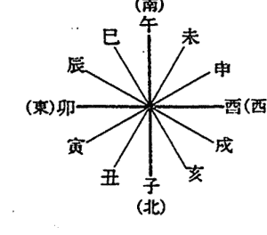

## ◎ 後天定位盤

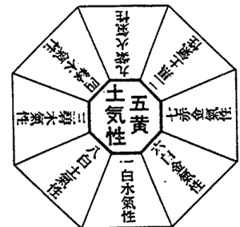

## ◎ 五氣相生、相剋圖解

○：表相生記號
×：表相剋記號

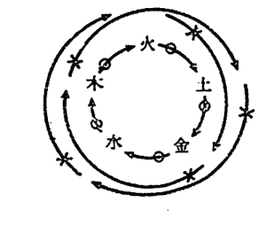

## ◎ 干支表

干支表「月」為國曆。係從「節入」之日起始為新月。月命九氣性的支可查看「節月」。

| 民前十五年 丁 四綠木氣性 酉 | 月 | 節入及刻 | 節月及地支 |
|---|---|---|---|
| | 一月 | 五日 巳 | 十二月 辛丑 |
| | 二月 | 三日 申 | 一月 壬寅 |
| | 三月 | 四日 申 | 二月 癸卯 |
| | 四月 | 五日 申 | 三月 甲辰 |
| | 五月 | 五日 戌 | 四月 乙巳 |
| | 六月 | 七日 卯 | 五月 丙午 |
| | 七月 | 七日 申 | 六月 丁未 |
| | 八月 | 七日 酉 | 七月 戊申 |
| | 九月 | 七日 巳 | 八月 己酉 |
| | 十月 | 七日 午 | 九月 庚戌 |
| | 十一月 | 七日 亥 | 十月 辛亥 |
| | 十二月 | 七日 亥 | 十一月 壬子 |

| 民前十四年 戊 三碧木氣性 戌 | 月 | 節入及刻 | 節月及地支 |
|---|---|---|---|
| | 一月 | 五日 申 | 十二月 癸丑 |
| | 二月 | 四日 寅 | 一月 甲寅 |
| | 三月 | 五日 寅 | 二月 乙卯 |
| | 四月 | 五日 寅 | 三月 丙辰 |
| | 五月 | 五日 丑 | 四月 丁巳 |
| | 六月 | 六日 午 | 五月 戊午 |
| | 七月 | 七日 寅 | 六月 己未 |
| | 八月 | 七日 子 | 七月 庚申 |
| | 九月 | 八日 申 | 八月 辛酉 |
| | 十月 | 八日 酉 | 九月 壬戌 |
| | 十一月 | 七日 巳 | 十月 癸亥 |
| | 十二月 | 七日 巳 | 十一月 甲子 |

| 民前十三年 己 二黑土氣性 亥 | 月 | 節入及刻 | 節月及地支 |
|---|---|---|---|
| | 一月 | 五日 寅 | 十二月 乙丑 |
| | 二月 | 四日 巳 | 一月 丙寅 |
| | 三月 | 六日 巳 | 二月 丁卯 |
| | 四月 | 六日 巳 | 三月 戊辰 |
| | 五月 | 六日 寅 | 四月 己巳 |
| | 六月 | 六日 亥 | 五月 庚午 |
| | 七月 | 六日 酉 | 六月 辛未 |
| | 八月 | 八日 卯 | 七月 壬申 |
| | 九月 | 八日 子 | 八月 癸酉 |
| | 十月 | 八日 申 | 九月 甲戌 |
| | 十一月 | 七日 亥 | 十月 乙亥 |
| | 十二月 | 七日 申 | 十一月 丙子 |

| 民前十二年 庚 一白水氣性 子 | 月 | 節入及刻 | 節月及地支 |
|---|---|---|---|
| | 一月 | 六日 寅 | 十二月 丁丑 |
| | 二月 | 四日 未 | 一月 戊寅 |
| | 三月 | 六日 巳 | 二月 己卯 |
| | 四月 | 六日 亥 | 三月 庚辰 |
| | 五月 | 六日 未 | 四月 辛巳 |
| | 六月 | 八日 子 | 五月 壬午 |
| | 七月 | 八日 巳 | 六月 癸未 |
| | 八月 | 八日 午 | 七月 甲申 |
| | 九月 | 九日 寅 | 八月 乙酉 |
| | 十月 | 八日 卯 | 九月 丙戌 |
| | 十一月 | 八日 亥 | 十月 丁亥 |
| | 十二月 | 七日 寅 | 十一月 戊子 |

| 民前十一年 辛 九紫火氣性 丑 | 月 | 節入及刻 | 節月及地支 |
|---|---|---|---|
| | 一月 | 六日 寅 | 十二月 己丑 |
| | 二月 | 四日 戌 | 一月 庚寅 |
| | 三月 | 六日 申 | 二月 辛卯 |
| | 四月 | 六日 戌 | 三月 壬辰 |
| | 五月 | 六日 未 | 四月 癸巳 |
| | 六月 | 六日 戌 | 五月 甲午 |
| | 七月 | 八日 卯 | 六月 乙未 |
| | 八月 | 八日 申 | 七月 丙申 |
| | 九月 | 八日 酉 | 八月 丁酉 |
| | 十月 | 九日 巳 | 九月 戊戌 |
| | 十一月 | 八日 午 | 十月 己亥 |
| | 十二月 | 八日 寅 | 十一月 庚子 |

| 民前十年 壬 八白土氣性 寅 | 月 | 節入及刻 | 節月及地支 |
|---|---|---|---|
| | 一月 | 六日 未 | 十二月 辛丑 |
| | 二月 | 五日 寅 | 一月 壬寅 |
| | 三月 | 六日 亥 | 二月 癸卯 |
| | 四月 | 六日 丑 | 三月 甲辰 |
| | 五月 | 六日 戌 | 四月 乙巳 |
| | 六月 | 七日 丑 | 五月 丙午 |
| | 七月 | 七日 午 | 六月 丁未 |
| | 八月 | 八日 亥 | 七月 戊申 |
| | 九月 | 九日 子 | 八月 己酉 |
| | 十月 | 九日 未 | 九月 庚戌 |
| | 十一月 | 九日 酉 | 十月 辛亥 |
| | 十二月 | 八日 巳 | 十一月 壬子 |

| 民前六年 丙午 四綠木氣性 | 月 | 節入及刻 | 節月及地支 |
|---|---|---|---|
| | 一月 | 六日 未 | 十二月 己丑 |
| | 二月 | 五日 丑 | 一月 庚寅 |
| | 三月 | 六日 戌 | 二月 辛卯 |
| | 四月 | 六日 丑 | 三月 壬辰 |
| | 五月 | 六日 戌 | 四月 癸巳 |
| | 六月 | 七日 子 | 五月 甲午 |
| | 七月 | 八日 午 | 六月 乙未 |
| | 八月 | 八日 戌 | 七月 丙申 |
| | 九月 | 九日 子 | 八月 丁酉 |
| | 十月 | 九日 未 | 九月 戊戌 |
| | 十一月 | 八日 申 | 十月 己亥 |
| | 十二月 | 八日 巳 | 十一月 庚子 |

| 民前五年 丁未 二碧木氣性 | 月 | 節入及刻 | 節月及地支 |
|---|---|---|---|
| | 一月 | 六日 戌 | 十二月 辛丑 |
| | 二月 | 五日 辰 | 一月 壬寅 |
| | 三月 | 七日 丑 | 二月 癸卯 |
| | 四月 | 六日 辰 | 三月 甲辰 |
| | 五月 | 七日 丑 | 四月 乙巳 |
| | 六月 | 七日 卯 | 五月 丙午 |
| | 七月 | 八日 申 | 六月 丁未 |
| | 八月 | 九日 丑 | 七月 戊申 |
| | 九月 | 九日 卯 | 八月 己酉 |
| | 十月 | 九日 戌 | 九月 庚戌 |
| | 十一月 | 八日 寅 | 十月 辛亥 |
| | 十二月 | 八日 申 | 十一月 壬子 |

| 民前四年 戊申 二黑土氣性 | 月 | 節入及刻 | 節月及地支 |
|---|---|---|---|
| | 一月 | 七日 丑 | 十二月 癸丑 |
| | 二月 | 五日 未 | 一月 甲寅 |
| | 三月 | 六日 辰 | 二月 乙卯 |
| | 四月 | 五日 未 | 三月 丙辰 |
| | 五月 | 五日 辰 | 四月 丁巳 |
| | 六月 | 六日 午 | 五月 戊午 |
| | 七月 | 七日 亥 | 六月 己未 |
| | 八月 | 八日 辰 | 七月 庚申 |
| | 九月 | 八日 巳 | 八月 辛酉 |
| | 十月 | 九日 丑 | 九月 壬戌 |
| | 十一月 | 八日 寅 | 十月 癸亥 |
| | 十二月 | 七日 戌 | 十一月 甲子 |

| 民前九年 癸卯 七赤金氣性 | 月 | 節入及刻 | 節月及地支 |
|---|---|---|---|
| | 一月 | 六日 戌 | 十二月 癸丑 |
| | 二月 | 五日 辰 | 一月 甲寅 |
| | 三月 | 七日 丑 | 二月 乙卯 |
| | 四月 | 六日 辰 | 三月 丙辰 |
| | 五月 | 七日 丑 | 四月 丁巳 |
| | 六月 | 七日 卯 | 五月 戊午 |
| | 七月 | 八日 申 | 六月 己未 |
| | 八月 | 九日 丑 | 七月 庚申 |
| | 九月 | 九日 卯 | 八月 辛酉 |
| | 十月 | 九日 戌 | 九月 壬戌 |
| | 十一月 | 八日 申 | 十月 癸亥 |
| | 十二月 | 八日 子 | 十一月 甲子 |

| 民前八年 甲辰 六白金氣性 | 月 | 節入及刻 | 節月及地支 |
|---|---|---|---|
| | 一月 | 七日 丑 | 十二月 乙丑 |
| | 二月 | 五日 未 | 一月 丙寅 |
| | 三月 | 五日 辰 | 二月 丁卯 |
| | 四月 | 六日 未 | 三月 戊辰 |
| | 五月 | 六日 辰 | 四月 己巳 |
| | 六月 | 六日 未 | 五月 庚午 |
| | 七月 | 八日 子 | 六月 辛未 |
| | 八月 | 八日 巳 | 七月 壬申 |
| | 九月 | 九日 午 | 八月 癸酉 |
| | 十月 | 九日 丑 | 九月 甲戌 |
| | 十一月 | 八日 卯 | 十月 乙亥 |
| | 十二月 | 七日 亥 | 十一月 丙子 |

| 民前七年 乙巳 五黃土氣性 | 月 | 節入及刻 | 節月及地支 |
|---|---|---|---|
| | 一月 | 六日 辰 | 十二月 丁丑 |
| | 二月 | 四日 戌 | 一月 戊寅 |
| | 三月 | 六日 未 | 二月 己卯 |
| | 四月 | 五日 戌 | 三月 庚辰 |
| | 五月 | 六日 未 | 四月 辛巳 |
| | 六月 | 六日 酉 | 五月 壬午 |
| | 七月 | 八日 卯 | 六月 癸未 |
| | 八月 | 八日 未 | 七月 甲申 |
| | 九月 | 九日 酉 | 八月 乙酉 |
| | 十月 | 九日 辰 | 九月 丙戌 |
| | 十一月 | 八日 巳 | 十月 丁亥 |
| | 十二月 | 八日 寅 | 十一月 戊子 |

| 民國一年 壬 七赤金氣性 子 | 月 | 節入及刻 | 節月及地支 |
|---|---|---|---|
| | 一月 | 七日 丑 | 十二月 辛丑 |
| | 二月 | 五日 午 | 十一月 壬寅 |
| | 三月 | 六日 辰 | 十月 癸卯 |
| | 四月 | 五日 午 | 九月 甲辰 |
| | 五月 | 六日 卯 | 八月 乙巳 |
| | 六月 | 六日 午 | 七月 丙午 |
| | 七月 | 七日 寅 | 六月 丁未 |
| | 八月 | 八日 辰 | 五月 戊申 |
| | 九月 | 八日 巳 | 四月 己酉 |
| | 十月 | 九日 丑 | 三月 庚戌 |
| | 十一月 | 八日 寅 | 二月 辛亥 |
| | 十二月 | 七日 戌 | 一月 壬子 |

| 民國二年 癸 六白金氣性 丑 | 月 | 節入及刻 | 節月及地支 |
|---|---|---|---|
| | 一月 | 六日 卯 | 十二月 癸丑 |
| | 二月 | 四日 酉 | 一月 甲寅 |
| | 三月 | 六日 未 | 二月 乙卯 |
| | 四月 | 五日 酉 | 三月 丙辰 |
| | 五月 | 六日 午 | 四月 丁巳 |
| | 六月 | 六日 酉 | 五月 戊午 |
| | 七月 | 八日 寅 | 六月 己未 |
| | 八月 | 八日 未 | 七月 庚申 |
| | 九月 | 八日 申 | 八月 辛酉 |
| | 十月 | 九日 卯 | 九月 壬戌 |
| | 十一月 | 八日 巳 | 十月 癸亥 |
| | 十二月 | 八日 丑 | 十一月 甲子 |

| 民國三年 甲 五黃土氣性 寅 | 月 | 節入及刻 | 節月及地支 |
|---|---|---|---|
| | 一月 | 六日 午 | 十二月 乙丑 |
| | 二月 | 五日 子 | 一月 丙寅 |
| | 三月 | 六日 酉 | 二月 丁卯 |
| | 四月 | 六日 子 | 三月 戊辰 |
| | 五月 | 六日 酉 | 四月 己巳 |
| | 六月 | 六日 子 | 五月 庚午 |
| | 七月 | 七日 巳 | 六月 辛未 |
| | 八月 | 八日 戌 | 七月 壬申 |
| | 九月 | 八日 寅 | 八月 癸酉 |
| | 十月 | 九日 午 | 九月 甲戌 |
| | 十一月 | 八日 申 | 十月 乙亥 |
| | 十二月 | 八日 辰 | 十一月 丙子 |

| 民前三年 己 一白水氣性 酉 | 月 | 節入及刻 | 節月及地支 |
|---|---|---|---|
| | 一月 | 六日 戌 | 十二月 乙丑 |
| | 二月 | 四日 未 | 一月 丙寅 |
| | 三月 | 六日 未 | 二月 丁卯 |
| | 四月 | 五日 戌 | 三月 戊辰 |
| | 五月 | 六日 未 | 四月 己巳 |
| | 六月 | 六日 戌 | 五月 庚午 |
| | 七月 | 八日 寅 | 六月 辛未 |
| | 八月 | 八日 未 | 七月 壬申 |
| | 九月 | 八日 申 | 八月 癸酉 |
| | 十月 | 九日 辰 | 九月 甲戌 |
| | 十一月 | 八日 巳 | 十月 乙亥 |
| | 十二月 | 八日 丑 | 十一月 丙子 |

| 民前二年 庚 九紫火氣性 戌 | 月 | 節入及刻 | 節月及地支 |
|---|---|---|---|
| | 一月 | 六日 未 | 十二月 丁丑 |
| | 二月 | 五日 丑 | 一月 戊寅 |
| | 三月 | 七日 丑 | 二月 己卯 |
| | 四月 | 六日 丑 | 三月 庚辰 |
| | 五月 | 六日 子 | 四月 辛巳 |
| | 六月 | 七日 巳 | 五月 壬午 |
| | 七月 | 八日 未 | 六月 癸未 |
| | 八月 | 八日 申 | 七月 甲申 |
| | 九月 | 八日 未 | 八月 乙酉 |
| | 十月 | 九日 申 | 九月 丙戌 |
| | 十一月 | 八日 辰 | 十月 丁亥 |
| | 十二月 | 八日 戌 | 十一月 戊子 |

| 民前一年 辛 八白土氣性 亥 | 月 | 節入及刻 | 節月及地支 |
|---|---|---|---|
| | 一月 | 六日 戌 | 十二月 己丑 |
| | 二月 | 五日 辰 | 一月 庚寅 |
| | 三月 | 七日 丑 | 二月 辛卯 |
| | 四月 | 六日 辰 | 三月 壬辰 |
| | 五月 | 七日 子 | 四月 癸巳 |
| | 六月 | 七日 卯 | 五月 甲午 |
| | 七月 | 八日 申 | 六月 乙未 |
| | 八月 | 九日 丑 | 七月 丙申 |
| | 九月 | 九日 申 | 八月 丁酉 |
| | 十月 | 九日 戌 | 九月 戊戌 |
| | 十一月 | 八日 亥 | 十月 己亥 |
| | 十二月 | 八日 未 | 十一月 庚子 |

| 民國七年 戊午 一白水氣性 | 月 | 節入及刻 | 節月及地支 |
|---|---|---|---|
| | 一月 | 六日 午 | 十二月 亥北 |
| | 二月 | 五日 子 | 一月 甲寅 |
| | 三月 | 六日 酉 | 二月 乙卯 |
| | 四月 | 六日 酉 | 三月 丙辰 |
| | 五月 | 六日 亥 | 四月 丁巳 |
| | 六月 | 八日 辰 | 五月 戊午 |
| | 七月 | 八日 酉 | 六月 己未 |
| | 八月 | 八日 戌 | 七月 庚申 |
| | 九月 | 九日 午 | 八月 辛酉 |
| | 十月 | 九日 未 | 九月 壬戌 |
| | 十一月 | 八日 卯 | 十月 癸亥 |
| | 十二月 | | 十一月 甲子 |

| 民國四年 乙卯 四綠木氣性 | 月 | 節入及刻 | 節月及地支 |
|---|---|---|---|
| | 一月 | 六日 酉 | 十二月 丁丑 |
| | 二月 | 五日 卯 | 一月 戊寅 |
| | 三月 | 七日 子 | 二月 己卯 |
| | 四月 | 六日 卯 | 三月 庚辰 |
| | 五月 | 七日 子 | 四月 辛巳 |
| | 六月 | 八日 申 | 五月 壬午 |
| | 七月 | 八日 寅 | 六月 癸未 |
| | 八月 | 九日 酉 | 七月 甲申 |
| | 九月 | 九日 戌 | 八月 乙酉 |
| | 十月 | 八日 戌 | 九月 丙戌 |
| | 十一月 | 八日 未 | 十月 丁亥 |
| | 十二月 | | 十一月 戊子 |

| 民國八年 己未 九紫火氣性 | 月 | 節入及刻 | 節月及地支 |
|---|---|---|---|
| | 一月 | 六日 酉 | 十二月 乙丑 |
| | 二月 | 五日 卯 | 一月 丙寅 |
| | 三月 | 七日 子 | 二月 丁卯 |
| | 四月 | 六日 卯 | 三月 戊辰 |
| | 五月 | 七日 子 | 四月 己巳 |
| | 六月 | 八日 申 | 五月 庚午 |
| | 七月 | 八日 寅 | 六月 辛未 |
| | 八月 | 九日 酉 | 七月 壬申 |
| | 九月 | 九日 戌 | 八月 癸酉 |
| | 十月 | 八日 戌 | 九月 甲戌 |
| | 十一月 | 八日 未 | 十月 乙亥 |
| | 十二月 | | 十一月 丙子 |

| 民國五年 丙辰 三碧木氣性 | 月 | 節入及刻 | 節月及地支 |
|---|---|---|---|
| | 一月 | 七日 子 | 十二月 己丑 |
| | 二月 | 五日 午 | 一月 庚寅 |
| | 三月 | 六日 卯 | 二月 辛卯 |
| | 四月 | 五日 午 | 三月 壬辰 |
| | 五月 | 六日 卯 | 四月 癸巳 |
| | 六月 | 七日 巳 | 五月 甲午 |
| | 七月 | 八日 未 | 六月 乙未 |
| | 八月 | 八日 卯 | 七月 丙申 |
| | 九月 | 八日 子 | 八月 丁酉 |
| | 十月 | 八日 丑 | 九月 戊戌 |
| | 十一月 | 七日 戌 | 十月 己亥 |
| | 十二月 | | 十一月 庚子 |

| 民國九年 庚申 八白土氣性 | 月 | 節入及刻 | 節月及地支 |
|---|---|---|---|
| | 一月 | 七日 子 | 十二月 丁丑 |
| | 二月 | 五日 午 | 一月 戊寅 |
| | 三月 | 六日 卯 | 二月 己卯 |
| | 四月 | 五日 午 | 三月 庚辰 |
| | 五月 | 六日 卯 | 四月 辛巳 |
| | 六月 | 六日 巳 | 五月 壬午 |
| | 七月 | 七日 未 | 六月 癸未 |
| | 八月 | 八日 卯 | 七月 甲申 |
| | 九月 | 八日 子 | 八月 乙酉 |
| | 十月 | 九日 丑 | 九月 丙戌 |
| | 十一月 | 八日 戌 | 十月 丁亥 |
| | 十二月 | 七日 酉 | 十一月 戊子 |

| 民國六年 丁巳 二黑土氣性 | 月 | 節入及刻 | 節月及地支 |
|---|---|---|---|
| | 一月 | 六日 卯 | 十二月 辛丑 |
| | 二月 | 四日 酉 | 一月 壬寅 |
| | 三月 | 六日 午 | 二月 癸卯 |
| | 四月 | 五日 酉 | 三月 甲辰 |
| | 五月 | 六日 午 | 四月 乙巳 |
| | 六月 | 六日 申 | 五月 丙午 |
| | 七月 | 八日 丑 | 六月 丁未 |
| | 八月 | 八日 午 | 七月 戊申 |
| | 九月 | 八日 未 | 八月 己酉 |
| | 十月 | 九日 卯 | 九月 庚戌 |
| | 十一月 | 八日 辰 | 十月 辛亥 |
| | 十二月 | 八日 丑 | 十一月 壬子 |

### 民國十三年 甲子(中元) 四綠木氣性

| 月 | 節入及刻 | 節月及地支 |
|---|---|---|
| 一月 | 七日 子 | 十一月 乙丑 |
| 二月 | 五日 巳 | 十二月 丙寅 |
| 三月 | 六日 卯 | 一月 丁卯 |
| 四月 | 五日 巳 | 二月 戊辰 |
| 五月 | 六日 寅 | 三月 己巳 |
| 六月 | 六日 巳 | 四月 庚午 |
| 七月 | 七日 戌 | 五月 辛未 |
| 八月 | 八日 卯 | 六月 壬申 |
| 九月 | 八日 辰 | 七月 癸酉 |
| 十月 | 八日 寅 | 八月 甲戌 |
| 十一月 | 八日 丑 | 九月 乙亥 |
| 十二月 | 七日 酉 | 十月 丙子 |

### 民國十年 辛酉 七赤金氣性

| 月 | 節入及刻 | 節月及地支 |
|---|---|---|
| 一月 | 六日 卯 | 十二月 己丑 |
| 二月 | 四日 午 | 一月 庚寅 |
| 三月 | 六日 午 | 二月 辛卯 |
| 四月 | 五日 酉 | 三月 壬辰 |
| 五月 | 六日 午 | 四月 癸巳 |
| 六月 | 六日 申 | 五月 甲午 |
| 七月 | 八日 丑 | 六月 乙未 |
| 八月 | 八日 午 | 七月 丙申 |
| 九月 | 八日 未 | 八月 丁酉 |
| 十月 | 九日 卯 | 九月 戊戌 |
| 十一月 | 八日 辰 | 十月 己亥 |
| 十二月 | 八日 子 | 十一月 庚子 |

### 民國十四年 乙丑 三碧木氣性

| 月 | 節入及刻 | 節月及地支 |
|---|---|---|
| 一月 | 六日 寅 | 十二月 丁丑 |
| 二月 | 四日 申 | 一月 戊寅 |
| 三月 | 六日 巳 | 二月 己卯 |
| 四月 | 六日 申 | 三月 庚辰 |
| 五月 | 六日 巳 | 四月 辛巳 |
| 六月 | 六日 未 | 五月 壬午 |
| 七月 | 八日 丑 | 六月 癸未 |
| 八月 | 八日 午 | 七月 甲申 |
| 九月 | 八日 未 | 八月 乙酉 |
| 十月 | 九日 寅 | 九月 丙戌 |
| 十一月 | 八日 辰 | 十月 丁亥 |
| 十二月 | 八日 子 | 十一月 戊子 |

### 民國十一年 壬戌 六白金氣性

| 月 | 節入及刻 | 節月及地支 |
|---|---|---|
| 一月 | 六日 午 | 十二月 辛丑 |
| 二月 | 五日 日 | 一月 壬寅 |
| 三月 | 六日 日 | 二月 癸卯 |
| 四月 | 五日 日 | 三月 甲辰 |
| 五月 | 六日 日 | 四月 乙巳 |
| 六月 | 六日 日 | 五月 丙午 |
| 七月 | 八日 日 | 六月 丁未 |
| 八月 | 八日 日 | 七月 戊申 |
| 九月 | 八日 日 | 八月 己酉 |
| 十月 | 九日 日 | 九月 庚戌 |
| 十一月 | 八日 日 | 十月 辛亥 |
| 十二月 | 八日 日 | 十一月 壬子 |

### 民國十五年 丙寅 二黑土氣性

| 月 | 節入及刻 | 節月及地支 |
|---|---|---|
| 一月 | 六日 午 | 十二月 己丑 |
| 二月 | 四日 寅 | 一月 庚寅 |
| 三月 | 六日 申 | 二月 辛卯 |
| 四月 | 六日 寅 | 三月 壬辰 |
| 五月 | 六日 申 | 四月 癸巳 |
| 六月 | 六日 戌 | 五月 甲午 |
| 七月 | 八日 辰 | 六月 乙未 |
| 八月 | 八日 申 | 七月 丙申 |
| 九月 | 八日 巳 | 八月 丁酉 |
| 十月 | 九日 午 | 九月 戊戌 |
| 十一月 | 八日 卯 | 十月 己亥 |
| 十二月 | 八日 卯 | 十一月 庚子 |

### 民國十二年 癸亥 五黃土氣性

| 月 | 節入及刻 | 節月及地支 |
|---|---|---|
| 一月 | 六日 酉 | 十二月 癸丑 |
| 二月 | 五日 卯 | 一月 甲寅 |
| 三月 | 七日 子 | 二月 乙卯 |
| 四月 | 六日 寅 | 三月 丙辰 |
| 五月 | 六日 寅 | 四月 丁巳 |
| 六月 | 六日 寅 | 五月 戊午 |
| 七月 | 七日 未 | 六月 己未 |
| 八月 | 九日 子 | 七月 庚申 |
| 九月 | 九日 北 | 八月 辛酉 |
| 十月 | 九日 西 | 九月 壬戌 |
| 十一月 | 九日 戌 | 十月 癸亥 |
| 十二月 | 八日 午 | 十一月 甲子 |

### 民國十九年 庚午 七赤金氣性

| 月 | 節入及刻 | 節月及地支 |
|---|---|---|
| 一月 | 六日 巳 | 十二月 丁丑 |
| 二月 | 四日 寅 | 一月 戊寅 |
| 三月 | 六日 申 | 二月 己卯 |
| 四月 | 五日 寅 | 三月 庚辰 |
| 五月 | 六日 申 | 四月 辛巳 |
| 六月 | 六日 戌 | 五月 壬午 |
| 七月 | 八日 卯 | 六月 癸未 |
| 八月 | 八日 申 | 七月 甲申 |
| 九月 | 九日 酉 | 八月 乙酉 |
| 十月 | 九日 巳 | 九月 丙戌 |
| 十一月 | 八日 午 | 十月 丁亥 |
| 十二月 | 八日 寅 | 十一月 戊子 |

### 民國十六年 丁卯 一白水氣性

| 月 | 節入及刻 | 節月及地支 |
|---|---|---|
| 一月 | 六日 申 | 十二月 辛丑 |
| 二月 | 五日 寅 | 一月 壬寅 |
| 三月 | 六日 寅 | 二月 癸卯 |
| 四月 | 六日 寅 | 三月 甲辰 |
| 五月 | 六日 寅 | 四月 乙巳 |
| 六月 | 七日 午 | 五月 丙午 |
| 七月 | 八日 寅 | 六月 丁未 |
| 八月 | 八日 寅 | 七月 戊申 |
| 九月 | 九日 申 | 八月 己酉 |
| 十月 | 九日 酉 | 九月 庚戌 |
| 十一月 | 八日 午 | 十月 辛亥 |
| 十二月 | 八日 午 | 十一月 壬子 |

### 民國二十年 辛未 六白金氣性

| 月 | 節入及刻 | 節月及地支 |
|---|---|---|
| 一月 | 六日 申 | 十二月 己丑 |
| 二月 | 五日 寅 | 一月 庚寅 |
| 三月 | 六日 寅 | 二月 辛卯 |
| 四月 | 六日 寅 | 三月 壬辰 |
| 五月 | 六日 寅 | 四月 癸巳 |
| 六月 | 七日 午 | 五月 甲午 |
| 七月 | 八日 寅 | 六月 乙未 |
| 八月 | 八日 寅 | 七月 丙申 |
| 九月 | 九日 申 | 八月 丁酉 |
| 十月 | 九日 酉 | 九月 戊戌 |
| 十一月 | 八日 午 | 十月 己亥 |
| 十二月 | 八日 午 | 十一月 庚子 |

### 民國十七年 戊辰 九紫火氣性

| 月 | 節入及刻 | 節月及地支 |
|---|---|---|
| 一月 | 六日 寅 | 十二月 癸丑 |
| 二月 | 五日 寅 | 一月 甲寅 |
| 三月 | 六日 寅 | 二月 乙卯 |
| 四月 | 六日 寅 | 三月 丙辰 |
| 五月 | 六日 寅 | 四月 丁巳 |
| 六月 | 七日 午 | 五月 戊午 |
| 七月 | 八日 寅 | 六月 己未 |
| 八月 | 八日 寅 | 七月 庚申 |
| 九月 | 九日 申 | 八月 辛酉 |
| 十月 | 九日 酉 | 九月 壬戌 |
| 十一月 | 八日 午 | 十月 癸亥 |
| 十二月 | 八日 午 | 十一月 甲子 |

### 民國二十一年 壬申 五黃土氣性

| 月 | 節入及刻 | 節月及地支 |
|---|---|---|
| 一月 | 六日 寅 | 十二月 辛丑 |
| 二月 | 四日 寅 | 一月 壬寅 |
| 三月 | 五日 寅 | 二月 癸卯 |
| 四月 | 六日 寅 | 三月 甲辰 |
| 五月 | 六日 寅 | 四月 乙巳 |
| 六月 | 六日 寅 | 五月 丙午 |
| 七月 | 七日 午 | 六月 丁未 |
| 八月 | 八日 寅 | 七月 戊申 |
| 九月 | 八日 寅 | 八月 己酉 |
| 十月 | 八日 申 | 九月 庚戌 |
| 十一月 | 八日 酉 | 十月 辛亥 |
| 十二月 | 七日 午 | 十一月 壬子 |

### 民國十八年 己巳 八白土氣性

| 月 | 節入及刻 | 節月及地支 |
|---|---|---|
| 一月 | 六日 寅 | 十二月 乙丑 |
| 二月 | 四日 寅 | 一月 丙寅 |
| 三月 | 六日 寅 | 二月 丁卯 |
| 四月 | 六日 寅 | 三月 戊辰 |
| 五月 | 六日 寅 | 四月 己巳 |
| 六月 | 六日 寅 | 五月 庚午 |
| 七月 | 八日 午 | 六月 辛未 |
| 八月 | 八日 寅 | 七月 壬申 |
| 九月 | 八日 寅 | 八月 癸酉 |
| 十月 | 八日 申 | 九月 甲戌 |
| 十一月 | 八日 酉 | 十月 乙亥 |
| 十二月 | 七日 午 | 十一月 丙子 |

### 民國二十五年 丙子 一白水氣性

| 月 | 節入及刻 | 節月及地支 |
|---|---|---|
| 一月 | 六日 戊寅 | 十二月 己丑 |
| 二月 | 五日 庚寅 | 一月 戊寅 |
| 三月 | 六日 辛卯 | 二月 辛卯 |
| 四月 | 五日 壬辰 | 三月 壬辰 |
| 五月 | 六日 癸巳 | 四月 癸巳 |
| 六月 | 六日 甲午 | 五月 甲午 |
| 七月 | 七日 乙未 | 六月 乙未 |
| 八月 | 八日 丙申 | 七月 丙申 |
| 九月 | 八日 丁酉 | 八月 丁酉 |
| 十月 | 八日 戊戌 | 九月 戊戌 |
| 十一月 | 八日 己亥 | 十月 己亥 |
| 十二月 | 七日 庚子 | 十一月 庚子 |

### 民國二十六年 丁丑 九紫火氣性

| 月 | 節入及刻 | 節月及地支 |
|---|---|---|
| 一月 | 六日 辛丑 | 十二月 辛丑 |
| 二月 | 四日 壬寅 | 一月 壬寅 |
| 三月 | 六日 癸卯 | 二月 癸卯 |
| 四月 | 五日 甲辰 | 三月 甲辰 |
| 五月 | 六日 乙巳 | 四月 乙巳 |
| 六月 | 六日 丙午 | 五月 丙午 |
| 七月 | 八日 丁未 | 六月 丁未 |
| 八月 | 八日 戊申 | 七月 戊申 |
| 九月 | 八日 己酉 | 八月 己酉 |
| 十月 | 九日 庚戌 | 九月 庚戌 |
| 十一月 | 八日 辛亥 | 十月 辛亥 |
| 十二月 | 七日 壬子 | 十一月 壬子 |

### 民國二十七年 戊寅 八白土氣性

| 月 | 節入及刻 | 節月及地支 |
|---|---|---|
| 一月 | 六日 癸丑 | 十二月 癸丑 |
| 二月 | 四日 甲寅 | 一月 甲寅 |
| 三月 | 六日 乙卯 | 二月 乙卯 |
| 四月 | 六日 丙辰 | 三月 丙辰 |
| 五月 | 五日 丁巳 | 四月 丁巳 |
| 六月 | 七日 戊午 | 五月 戊午 |
| 七月 | 八日 己未 | 六月 己未 |
| 八月 | 八日 庚申 | 七月 庚申 |
| 九月 | 八日 辛酉 | 八月 辛酉 |
| 十月 | 八日 壬戌 | 九月 壬戌 |
| 十一月 | 八日 癸亥 | 十月 癸亥 |
| 十二月 | 八日 甲子 | 十一月 甲子 |

### 民國二十二年 癸酉 四綠木氣性

| 月 | 節入及刻 | 節月及地支 |
|---|---|---|
| 一月 | 六日 寅 | 十二月 癸丑 |
| 二月 | 四日 申 | 一月 甲寅 |
| 三月 | 六日 巳 | 二月 乙卯 |
| 四月 | 六日 申 | 三月 丙辰 |
| 五月 | 五日 巳 | 四月 丁巳 |
| 六月 | 六日 未 | 五月 戊午 |
| 七月 | 八日 子 | 六月 己未 |
| 八月 | 八日 巳 | 七月 庚申 |
| 九月 | 八日 午 | 八月 辛酉 |
| 十月 | 八日 寅 | 九月 壬戌 |
| 十一月 | 九日 卯 | 十月 癸亥 |
| 十二月 | 七日 亥 | 十一月 甲子 |

### 民國二十三年 甲戌 三碧木氣性

| 月 | 節入及刻 | 節月及地支 |
|---|---|---|
| 一月 | 六日 巳 | 十二月 乙丑 |
| 二月 | 四日 戌 | 一月 丙寅 |
| 三月 | 六日 申 | 二月 丁卯 |
| 四月 | 六日 戌 | 三月 戊辰 |
| 五月 | 五日 未 | 四月 己巳 |
| 六月 | 六日 卯 | 五月 庚午 |
| 七月 | 八日 申 | 六月 辛未 |
| 八月 | 八日 酉 | 七月 壬申 |
| 九月 | 八日 辰 | 八月 癸酉 |
| 十月 | 九日 午 | 九月 甲戌 |
| 十一月 | 八日 寅 | 十月 乙亥 |
| 十二月 | 八日 | 十一月 丙子 |

### 民國二十四年 乙亥 二黑土氣性

| 月 | 節入及刻 | 節月及地支 |
|---|---|---|
| 一月 | 六日 申 | 十二月 丁丑 |
| 二月 | 五日 丑 | 一月 戊寅 |
| 三月 | 六日 戌 | 二月 己卯 |
| 四月 | 六日 丑 | 三月 庚辰 |
| 五月 | 六日 戌 | 四月 辛巳 |
| 六月 | 七日 丑 | 五月 壬午 |
| 七月 | 八日 午 | 六月 癸未 |
| 八月 | 八日 寅 | 七月 甲申 |
| 九月 | 八日 酉 | 八月 乙酉 |
| 十月 | 九日 未 | 九月 丙戌 |
| 十一月 | 八日 巳 | 十月 丁亥 |
| 十二月 | 八日 | 十一月 戊子 |

### 民國三十一年 四綠木氣性 午

| 月 | 節入及刻 | 節入及地支 |
|---|---|---|
| 一月 | 六日 辰 | 十二月 辛丑 |
| 二月 | 四日 戌 | 一月 壬寅 |
| 三月 | 六日 未 | 二月 癸卯 |
| 四月 | 六日 戌 | 三月 甲辰 |
| 五月 | 六日 未 | 四月 乙巳 |
| 六月 | 六日 酉 | 五月 丙午 |
| 七月 | 八日 寅 | 六月 丁未 |
| 八月 | 八日 未 | 七月 戊申 |
| 九月 | 八日 申 | 八月 己酉 |
| 十月 | 九日 辰 | 九月 庚戌 |
| 十一月 | 八日 巳 | 十月 辛亥 |
| 十二月 | 八日 丑 | 十一月 壬子 |

### 民國三十二年 三碧木氣性 未

| 月 | 節入及刻 | 節入及地支 |
|---|---|---|
| 一月 | 六日 未 | 十二月 癸丑 |
| 二月 | 五日 丑 | 一月 甲寅 |
| 三月 | 六日 戌 | 二月 乙卯 |
| 四月 | 六日 丑 | 三月 丙辰 |
| 五月 | 六日 戌 | 四月 丁巳 |
| 六月 | 七日 子 | 五月 戊午 |
| 七月 | 八日 巳 | 六月 己未 |
| 八月 | 八日 戌 | 七月 庚申 |
| 九月 | 八日 寅 | 八月 辛酉 |
| 十月 | 九日 未 | 九月 壬戌 |
| 十一月 | 八日 申 | 十月 癸亥 |
| 十二月 | 八日 辰 | 十一月 甲子 |

### 民國三十三年 二黑土氣性 申

| 月 | 節入及刻 | 節入及地支 |
|---|---|---|
| 一月 | 六日 戌 | 十二月 乙丑 |
| 二月 | 五日 辰 | 一月 丙寅 |
| 三月 | 六日 丑 | 二月 丁卯 |
| 四月 | 五日 戌 | 三月 戊辰 |
| 五月 | 六日 子 | 四月 己巳 |
| 六月 | 六日 卯 | 五月 庚午 |
| 七月 | 七日 申 | 六月 辛未 |
| 八月 | 八日 丑 | 七月 壬申 |
| 九月 | 八日 寅 | 八月 癸酉 |
| 十月 | 八日 戌 | 九月 甲戌 |
| 十一月 | 七日 亥 | 十月 乙亥 |
| 十二月 | 七日 未 | 十一月 丙子 |

### 民國二十八年 七赤金氣性 卯

| 月 | 節入及刻 | 節入月及地支 |
|---|---|---|
| 一月 | 六日 未 | 十二月 乙丑 |
| 二月 | 五日 丑 | 一月 丙寅 |
| 三月 | 六日 戌 | 二月 丁卯 |
| 四月 | 六日 丑 | 三月 戊辰 |
| 五月 | 六日 戌 | 四月 己巳 |
| 六月 | 七日 子 | 五月 庚午 |
| 七月 | 八日 巳 | 六月 辛未 |
| 八月 | 八日 戌 | 七月 壬申 |
| 九月 | 八日 寅 | 八月 癸酉 |
| 十月 | 九日 未 | 九月 甲戌 |
| 十一月 | 八日 申 | 十月 乙亥 |
| 十二月 | 八日 辰 | 十一月 丙子 |

### 民國二十九年 六白金氣性 辰

| 月 | 節入及刻 | 節入月及地支 |
|---|---|---|
| 一月 | 六日 戌 | 十二月 丁丑 |
| 二月 | 五日 辰 | 一月 戊寅 |
| 三月 | 六日 丑 | 二月 己卯 |
| 四月 | 五日 戌 | 三月 庚辰 |
| 五月 | 六日 子 | 四月 辛巳 |
| 六月 | 六日 卯 | 五月 壬午 |
| 七月 | 七日 申 | 六月 癸未 |
| 八月 | 八日 丑 | 七月 甲申 |
| 九月 | 八日 寅 | 八月 乙酉 |
| 十月 | 八日 戌 | 九月 丙戌 |
| 十一月 | 七日 亥 | 十月 丁亥 |
| 十二月 | 七日 未 | 十一月 戊子 |

### 民國三十年 五黃土氣性 巳

| 月 | 節入及刻 | 節入月及地支 |
|---|---|---|
| 一月 | 六日 丑 | 十二月 己丑 |
| 二月 | 四日 未 | 一月 庚寅 |
| 三月 | 六日 辰 | 二月 辛卯 |
| 四月 | 六日 丑 | 三月 壬辰 |
| 五月 | 六日 辰 | 四月 癸巳 |
| 六月 | 六日 未 | 五月 甲午 |
| 七月 | 七日 寅 | 六月 乙未 |
| 八月 | 八日 未 | 七月 丙申 |
| 九月 | 八日 巳 | 八月 丁酉 |
| 十月 | 九日 丑 | 九月 戊戌 |
| 十一月 | 八日 寅 | 十月 己亥 |
| 十二月 | 七日 戌 | 十一月 庚子 |

### 民國三十七年 戊子 七赤金氣性

| 月 | 節入及刻 | 節月及地支 |
|---|---|---|
| 一月 | 六日 酉 | 十二月 癸丑 |
| 二月 | 五日 卯 | 一月 甲寅 |
| 三月 | 六日 丑 | 二月 乙卯 |
| 四月 | 五日 卯 | 三月 丙辰 |
| 五月 | 六日 子 | 四月 丁巳 |
| 六月 | 七日 卯 | 五月 戊午 |
| 七月 | 六日 未 | 六月 己未 |
| 八月 | 八日 丑 | 七月 庚申 |
| 九月 | 八日 寅 | 八月 辛酉 |
| 十月 | 八日 酉 | 九月 壬戌 |
| 十一月 | 七日 寅 | 十月 癸亥 |
| 十二月 | 七日 未 | 十一月 甲子 |

### 民國三十四年 乙酉 一白水氣性

| 月 | 節入及刻 | 節月及地支 |
|---|---|---|
| 一月 | 六日 丑 | 十二月 丁丑 |
| 二月 | 四日 未 | 一月 戊寅 |
| 三月 | 六日 辰 | 二月 己卯 |
| 四月 | 六日 未 | 三月 庚辰 |
| 五月 | 五日 卯 | 四月 辛巳 |
| 六月 | 六日 亥 | 五月 壬午 |
| 七月 | 六日 辰 | 六月 癸未 |
| 八月 | 八日 巳 | 七月 甲申 |
| 九月 | 八日 丑 | 八月 乙酉 |
| 十月 | 九日 戌 | 九月 丙戌 |
| 十一月 | 八日 未 | 十月 丁亥 |
| 十二月 | 七日 戌 | 十一月 戊子 |

### 民國三十八年 己丑 六白金氣性

| 月 | 節入及刻 | 節月及地支 |
|---|---|---|
| 一月 | 六日 子 | 十二月 乙丑 |
| 二月 | 四日 午 | 一月 丙寅 |
| 三月 | 六日 卯 | 二月 丁卯 |
| 四月 | 六日 午 | 三月 戊辰 |
| 五月 | 六日 卯 | 四月 己巳 |
| 六月 | 六日 午 | 五月 庚午 |
| 七月 | 七日 戌 | 六月 辛未 |
| 八月 | 八日 卯 | 七月 壬申 |
| 九月 | 八日 巳 | 八月 癸酉 |
| 十月 | 九日 子 | 九月 甲戌 |
| 十一月 | 八日 寅 | 十月 乙亥 |
| 十二月 | 七日 庚 | 十一月 丙子 |

### 民國三十五年 丙戌 九紫火氣性

| 月 | 節入及刻 | 節月及地支 |
|---|---|---|
| 一月 | 六日 辰 | 十二月 己丑 |
| 二月 | 四日 酉 | 一月 庚寅 |
| 三月 | 六日 未 | 二月 辛卯 |
| 四月 | 六日 酉 | 三月 壬辰 |
| 五月 | 六日 午 | 四月 癸巳 |
| 六月 | 六日 酉 | 五月 甲午 |
| 七月 | 八日 寅 | 六月 乙未 |
| 八月 | 八日 巳 | 七月 丙申 |
| 九月 | 八日 酉 | 八月 丁酉 |
| 十月 | 九日 辰 | 九月 戊戌 |
| 十一月 | 八日 巳 | 十月 己亥 |
| 十二月 | 八日 丑 | 十一月 庚子 |

### 民國三十九年 庚寅 五黃土氣性

| 月 | 節入及刻 | 節月及地支 |
|---|---|---|
| 一月 | 六日 辰 | 十二月 丁丑 |
| 二月 | 四日 酉 | 一月 戊寅 |
| 三月 | 六日 午 | 二月 己卯 |
| 四月 | 六日 酉 | 三月 庚辰 |
| 五月 | 六日 午 | 四月 辛巳 |
| 六月 | 六日 酉 | 五月 壬午 |
| 七月 | 八日 寅 | 六月 癸未 |
| 八月 | 八日 午 | 七月 甲申 |
| 九月 | 八日 申 | 八月 乙酉 |
| 十月 | 九日 卯 | 九月 丙戌 |
| 十一月 | 八日 辰 | 十月 丁亥 |
| 十二月 | 八日 北 | 十一月 戊子 |

### 民國三十六年 丁亥 八白土氣性

| 月 | 節入及刻 | 節月及地支 |
|---|---|---|
| 一月 | 六日 未 | 十二月 辛丑 |
| 二月 | 五日 戌 | 一月 壬寅 |
| 三月 | 六日 午 | 二月 癸卯 |
| 四月 | 六日 子 | 三月 甲辰 |
| 五月 | 六日 午 | 四月 乙巳 |
| 六月 | 六日 酉 | 五月 丙午 |
| 七月 | 八日 巳 | 六月 丁未 |
| 八月 | 八日 酉 | 七月 戊申 |
| 九月 | 八日 午 | 八月 己酉 |
| 十月 | 九日 子 | 九月 庚戌 |
| 十一月 | 八日 申 | 十月 辛亥 |
| 十二月 | 八日 辰 | 十一月 壬子 |

### 民國四十三年 甲午 一白水氣性

| 月 | 節入及刻 | 節月及地支 |
|---|---|---|
| 一月 | 六日 卯 | 十二月 丁丑 |
| 二月 | 四日 酉 | 一月 戊寅 |
| 三月 | 六日 午 | 二月 己卯 |
| 四月 | 五日 酉 | 三月 庚辰 |
| 五月 | 六日 午 | 四月 辛巳 |
| 六月 | 六日 申 | 五月 壬午 |
| 七月 | 八日 丑 | 六月 癸未 |
| 八月 | 八日 午 | 七月 甲申 |
| 九月 | 八日 未 | 八月 乙酉 |
| 十月 | 九日 卯 | 九月 丙戌 |
| 十一月 | 八日 辰 | 十月 丁亥 |
| 十二月 | 八日 子 | 十一月 戊子 |

### 民國四十年 辛卯 四綠木氣性

| 月 | 節入及刻 | 節月及地支 |
|---|---|---|
| 一月 | 六日 午 | 十二月 己卯 |
| 二月 | 五日 子 | 一月 庚寅 |
| 三月 | 六日 酉 | 二月 辛卯 |
| 四月 | 六日 子 | 三月 壬辰 |
| 五月 | 六日 酉 | 四月 癸巳 |
| 六月 | 六日 寅 | 五月 甲午 |
| 七月 | 八日 辰 | 六月 乙未 |
| 八月 | 八日 戌 | 七月 丙申 |
| 九月 | 八日 午 | 八月 丁酉 |
| 十月 | 九日 戌 | 九月 戊戌 |
| 十一月 | 八日 辰 | 十月 己亥 |
| 十二月 | 八日 戌 | 十一月 庚子 |

### 民國四十四年 乙未 九紫火氣性

| 月 | 節入及刻 | 節月及地支 |
|---|---|---|
| 一月 | 六日 子 | 十二月 乙丑 |
| 二月 | 五日 酉 | 一月 丙寅 |
| 三月 | 六日 子 | 二月 丁卯 |
| 四月 | 六日 酉 | 三月 戊辰 |
| 五月 | 六日 子 | 四月 己巳 |
| 六月 | 六日 寅 | 五月 庚午 |
| 七月 | 八日 辰 | 六月 辛未 |
| 八月 | 八日 戌 | 七月 壬申 |
| 九月 | 八日 午 | 八月 癸酉 |
| 十月 | 九日 戌 | 九月 甲戌 |
| 十一月 | 八日 辰 | 十月 乙亥 |
| 十二月 | 八日 卯 | 十一月 丙子 |

### 民國四十一年 壬辰 三碧木氣性

| 月 | 節入及刻 | 節月及地支 |
|---|---|---|
| 一月 | 六日 酉 | 十二月 辛丑 |
| 二月 | 五日 卯 | 一月 壬寅 |
| 三月 | 六日 子 | 二月 癸卯 |
| 四月 | 六日 卯 | 三月 甲辰 |
| 五月 | 六日 子 | 四月 乙巳 |
| 六月 | 六日 寅 | 五月 丙午 |
| 七月 | 八日 辰 | 六月 丁未 |
| 八月 | 八日 子 | 七月 戊申 |
| 九月 | 八日 卯 | 八月 己酉 |
| 十月 | 九日 子 | 九月 庚戌 |
| 十一月 | 七日 戌 | 十月 辛亥 |
| 十二月 | 七日 未 | 十一月 壬子 |

### 民國四十五年 丙申 八白土氣性

| 月 | 節入及刻 | 節月及地支 |
|---|---|---|
| 一月 | 六日 酉 | 十二月 己丑 |
| 二月 | 五日 卯 | 一月 庚寅 |
| 三月 | 五日 子 | 二月 辛卯 |
| 四月 | 五日 寅 | 三月 壬辰 |
| 五月 | 五日 亥 | 四月 癸巳 |
| 六月 | 六日 丑 | 五月 甲午 |
| 七月 | 七日 子 | 六月 乙未 |
| 八月 | 七日 卯 | 七月 丙申 |
| 九月 | 八日 子 | 八月 丁酉 |
| 十月 | 八日 卯 | 九月 戊戌 |
| 十一月 | 七日 戌 | 十月 己亥 |
| 十二月 | 七日 未 | 十一月 庚子 |

### 民國四十二年 癸巳 二黑土氣性

| 月 | 節入及刻 | 節月及地支 |
|---|---|---|
| 一月 | 六日 子 | 十二月 癸丑 |
| 二月 | 四日 卯 | 一月 甲寅 |
| 三月 | 六日 午 | 二月 乙卯 |
| 四月 | 六日 卯 | 三月 丙辰 |
| 五月 | 六日 午 | 四月 丁巳 |
| 六月 | 六日 卯 | 五月 戊午 |
| 七月 | 七日 巳 | 六月 己未 |
| 八月 | 八日 卯 | 七月 庚申 |
| 九月 | 八日 子 | 八月 辛酉 |
| 十月 | 九日 卯 | 九月 壬戌 |
| 十一月 | 八日 子 | 十月 癸亥 |
| 十二月 | 七日 戌 | 十一月 甲子 |

### 民國四十九年 庚子 四綠木氣性

| 月 | 節入及刻 | 節月及地支 |
|---|---|---|
| 一月 | 六日 酉 | 十二月 丁丑 |
| 二月 | 五日 寅 | 一月 戊寅 |
| 三月 | 五日 寅 | 二月 己卯 |
| 四月 | 五日 寅 | 三月 庚辰 |
| 五月 | 五日 丑 | 四月 辛巳 |
| 六月 | 六日 午 | 五月 壬午 |
| 七月 | 七日 未 | 六月 癸未 |
| 八月 | 七日 申 | 七月 甲申 |
| 九月 | 七日 丑 | 八月 乙酉 |
| 十月 | 八日 酉 | 九月 丙戌 |
| 十一月 | 七日 戌 | 十月 丁亥 |
| 十二月 | 七日 午 | 十一月 戊子 |

### 民國五十年 辛丑 三碧木氣性

| 月 | 節入及刻 | 節月及地支 |
|---|---|---|
| 一月 | 五日 子 | 十二月 己丑 |
| 二月 | 四日 巳 | 一月 庚寅 |
| 三月 | 六日 寅 | 二月 辛卯 |
| 四月 | 六日 巳 | 三月 壬辰 |
| 五月 | 五日 寅 | 四月 癸巳 |
| 六月 | 五日 辰 | 五月 甲午 |
| 七月 | 六日 酉 | 六月 乙未 |
| 八月 | 七日 寅 | 七月 丙申 |
| 九月 | 八日 辰 | 八月 丁酉 |
| 十月 | 八日 寅 | 九月 戊戌 |
| 十一月 | 八日 丑 | 十月 己亥 |
| 十二月 | 七日 酉 | 十一月 庚子 |

### 民國五十一年 壬寅 二黑土氣性

| 月 | 節入及刻 | 節月及地支 |
|---|---|---|
| 一月 | 六日 寅 | 十二月 辛丑 |
| 二月 | 四日 酉 | 一月 壬寅 |
| 三月 | 六日 巳 | 二月 癸卯 |
| 四月 | 六日 申 | 三月 甲辰 |
| 五月 | 五日 巳 | 四月 乙巳 |
| 六月 | 六日 未 | 五月 丙午 |
| 七月 | 八日 子 | 六月 丁未 |
| 八月 | 八日 巳 | 七月 戊申 |
| 九月 | 八日 未 | 八月 己酉 |
| 十月 | 九日 寅 | 九月 庚戌 |
| 十一月 | 八日 辰 | 十月 辛亥 |
| 十二月 | 七日 子 | 十一月 壬子 |

### 民國四十六年 丁酉 七赤金氣性

| 月 | 節入及刻 | 節月及地支 |
|---|---|---|
| 一月 | 五日 子 | 十二月 辛丑 |
| 二月 | 四日 午 | 一月 壬寅 |
| 三月 | 四日 卯 | 二月 癸卯 |
| 四月 | 六日 巳 | 三月 甲辰 |
| 五月 | 六日 寅 | 四月 乙巳 |
| 六月 | 六日 巳 | 五月 丙午 |
| 七月 | 七日 戌 | 六月 丁未 |
| 八月 | 八日 卯 | 七月 戊申 |
| 九月 | 八日 子 | 八月 己酉 |
| 十月 | 八日 丑 | 九月 庚戌 |
| 十一月 | 八日 午 | 十月 辛亥 |
| 十二月 | 七日 酉 | 十一月 壬子 |

### 民國四十七年 戊戌 六白土氣性

| 月 | 節入及刻 | 節月及地支 |
|---|---|---|
| 一月 | 六日 卯 | 十二月 癸丑 |
| 二月 | 四日 申 | 一月 甲寅 |
| 三月 | 六日 午 | 二月 乙卯 |
| 四月 | 六日 申 | 三月 丙辰 |
| 五月 | 六日 巳 | 四月 丁巳 |
| 六月 | 八日 子 | 五月 戊午 |
| 七月 | 八日 午 | 六月 己未 |
| 八月 | 八日 子 | 七月 庚申 |
| 九月 | 八日 申 | 八月 辛酉 |
| 十月 | 九日 卯 | 九月 壬戌 |
| 十一月 | 七日 戌 | 十月 癸亥 |
| 十二月 | 八日 丑 | 十一月 甲子 |

### 民國四十八年 己亥 五黃土氣性

| 月 | 節入及刻 | 節月及地支 |
|---|---|---|
| 一月 | 六日 巳 | 十二月 乙丑 |
| 二月 | 四日 子 | 一月 丙寅 |
| 三月 | 六日 申 | 二月 丁卯 |
| 四月 | 六日 寅 | 三月 戊辰 |
| 五月 | 六日 申 | 四月 己巳 |
| 六月 | 六日 戌 | 五月 庚午 |
| 七月 | 八日 辰 | 六月 辛未 |
| 八月 | 八日 酉 | 七月 壬申 |
| 九月 | 八日 午 | 八月 癸酉 |
| 十月 | 九日 申 | 九月 甲戌 |
| 十一月 | 八日 卯 | 十月 乙亥 |
| 十二月 | 八日 卯 | 十一月 丙子 |

### 民國五十五年 丙午 七赤金氣性

| 月 | 節入及刻 | 節月及地支 |
|---|---|---|
| 一月 | 六日 寅 | 十二月 己丑 |
| 二月 | 四日 申 | 一月 庚寅 |
| 三月 | 六日 巳 | 二月 辛卯 |
| 四月 | 五日 未 | 三月 壬辰 |
| 五月 | 六日 辰 | 四月 癸巳 |
| 六月 | 六日 午 | 五月 甲午 |
| 七月 | 七日 子 | 六月 乙未 |
| 八月 | 八日 巳 | 七月 丙申 |
| 九月 | 八日 午 | 八月 丁酉 |
| 十月 | 九日 寅 | 九月 戊戌 |
| 十一月 | 八日 卯 | 十月 己亥 |
| 十二月 | 七日 寅 | 十一月 庚子 |

### 民國五十二年 癸卯 一白水氣性

| 月 | 節入及刻 | 節月及地支 |
|---|---|---|
| 一月 | 六日 巳 | 十二月 癸丑 |
| 二月 | 四日 亥 | 一月 甲寅 |
| 三月 | 六日 申 | 二月 乙卯 |
| 四月 | 六日 寅 | 三月 丙辰 |
| 五月 | 六日 戌 | 四月 丁巳 |
| 六月 | 六日 申 | 五月 戊午 |
| 七月 | 八日 卯 | 六月 己未 |
| 八月 | 八日 申 | 七月 庚申 |
| 九月 | 八日 戌 | 八月 辛酉 |
| 十月 | 九日 巳 | 九月 壬戌 |
| 十一月 | 八日 未 | 十月 癸亥 |
| 十二月 | 八日 卯 | 十一月 甲子 |

### 民國五十六年 丁未 六白土氣性

| 月 | 節入及刻 | 節月及地支 |
|---|---|---|
| 一月 | 六日 巳 | 十二月 辛丑 |
| 二月 | 四日 寅 | 一月 壬寅 |
| 三月 | 六日 申 | 二月 癸卯 |
| 四月 | 六日 戌 | 三月 甲辰 |
| 五月 | 六日 申 | 四月 乙巳 |
| 六月 | 六日 寅 | 五月 丙午 |
| 七月 | 八日 申 | 六月 丁未 |
| 八月 | 八日 寅 | 七月 戊申 |
| 九月 | 八日 申 | 八月 己酉 |
| 十月 | 九日 巳 | 九月 庚戌 |
| 十一月 | 八日 午 | 十月 辛亥 |
| 十二月 | 八日 卯 | 十一月 壬子 |

### 民國五十三年 甲辰 九紫火氣性

| 月 | 節入及刻 | 節月及地支 |
|---|---|---|
| 一月 | 六日 申 | 十二月 乙丑 |
| 二月 | 四日 寅 | 一月 丙寅 |
| 三月 | 五日 寅 | 二月 丁卯 |
| 四月 | 五日 寅 | 三月 戊辰 |
| 五月 | 五日 戌 | 四月 己巳 |
| 六月 | 六日 丑 | 五月 庚午 |
| 七月 | 七日 午 | 六月 辛未 |
| 八月 | 七日 寅 | 七月 壬申 |
| 九月 | 七日 申 | 八月 癸酉 |
| 十月 | 八日 戌 | 九月 甲戌 |
| 十一月 | 七日 巳 | 十月 乙亥 |
| 十二月 | 七日 戌 | 十一月 丙子 |

### 民國五十七年 戊申 五黃土氣性

| 月 | 節入及刻 | 節月及地支 |
|---|---|---|
| 一月 | 六日 申 | 十二月 癸丑 |
| 二月 | 五日 寅 | 一月 甲寅 |
| 三月 | 五日 寅 | 二月 乙卯 |
| 四月 | 五日 戌 | 三月 丙辰 |
| 五月 | 五日 丑 | 四月 丁巳 |
| 六月 | 六日 子 | 五月 戊午 |
| 七月 | 七日 午 | 六月 己未 |
| 八月 | 七日 戌 | 七月 庚申 |
| 九月 | 七日 子 | 八月 辛酉 |
| 十月 | 八日 申 | 九月 壬戌 |
| 十一月 | 七日 酉 | 十月 癸亥 |
| 十二月 | 七日 午 | 十一月 甲子 |

### 民國五十四年 乙巳 八白土氣性

| 月 | 節入及刻 | 節月及地支 |
|---|---|---|
| 一月 | 五日 寅 | 十二月 丁丑 |
| 二月 | 四日 戌 | 一月 戊寅 |
| 三月 | 六日 寅 | 二月 己卯 |
| 四月 | 六日 戌 | 三月 庚辰 |
| 五月 | 六日 丑 | 四月 辛巳 |
| 六月 | 六日 未 | 五月 壬午 |
| 七月 | 七日 寅 | 六月 癸未 |
| 八月 | 八日 酉 | 七月 甲申 |
| 九月 | 八日 寅 | 八月 乙酉 |
| 十月 | 八日 子 | 九月 丙戌 |
| 十一月 | 八日 酉 | 十月 丁亥 |
| 十二月 | 七日 | 十一月 戊子 |

### 民國六十一年壬子一白水氣性

| 月 | 節入及刻 | 節月及地支 |
|---|---|---|
| 一月 | 六日申 | 十二月辛丑 |
| 二月閏 | 五日丑 | 一月壬寅 |
| 三月 | 五日戌 | 二月癸卯 |
| 四月 | 五日丑 | 三月甲辰 |
| 五月 | 五日戌 | 四月乙巳 |
| 六月 | 六日子 | 五月丙午 |
| 七月 | 七日午 | 六月丁未 |
| 八月 | 七日子 | 七月戊申 |
| 九月 | 七日申 | 八月己酉 |
| 十月 | 八日戌 | 九月庚戌 |
| 十一月 | 七日酉 | 十月辛亥 |
| 十二月 | 七日巳 | 十一月壬子 |

### 民國五十八年己酉四綠木氣性

| 月 | 節入及刻 | 節月及地支 |
|---|---|---|
| 一月 | 五日戌 | 十二月乙丑 |
| 二月 | 四日辰 | 一月丙寅 |
| 三月 | 六日寅 | 二月丁卯 |
| 四月 | 六日丑 | 三月戊辰 |
| 五月 | 六日戌 | 四月己巳 |
| 六月 | 六日卯 | 五月庚午 |
| 七月 | 六日酉 | 六月辛未 |
| 八月 | 八日卯 | 七月壬申 |
| 九月 | 八日子 | 八月癸酉 |
| 十月 | 八日申 | 九月甲戌 |
| 十一月 | 七日 | 十月乙亥 |
| 十二月 | | 十一月丙子 |

### 民國六十二年癸丑九紫火氣性

| 月 | 節入及刻 | 節月及地支 |
|---|---|---|
| 一月 | 五日戌 | 十二月癸丑 |
| 二月 | 四日辰 | 一月甲寅 |
| 三月 | 六日丑 | 二月乙卯 |
| 四月 | 六日辰 | 三月丙辰 |
| 五月 | 六日丑 | 四月丁巳 |
| 六月 | 六日卯 | 五月戊午 |
| 七月 | 六日申 | 六月己未 |
| 八月 | 八日丑 | 七月庚申 |
| 九月 | 八日卯 | 八月辛酉 |
| 十月 | 八日戌 | 九月壬戌 |
| 十一月 | 七日子 | 十月癸亥 |
| 十二月 | 七日申 | 十一月甲子 |

### 民國五十九年庚戌三碧木氣性

| 月 | 節入及刻 | 節月及地支 |
|---|---|---|
| 一月 | 六日寅 | 十二月丁丑 |
| 二月 | 四日未 | 一月戊寅 |
| 三月 | 六日巳 | 二月己卯 |
| 四月 | 六日未 | 三月庚辰 |
| 五月 | 六日亥 | 四月辛巳 |
| 六月 | 六日午 | 五月壬午 |
| 七月 | 六日亥 | 六月癸未 |
| 八月 | 八日辰 | 七月甲申 |
| 九月 | 八日午 | 八月乙酉 |
| 十月 | 九日寅 | 九月丙戌 |
| 十一月 | 八日卯 | 十月丁亥 |
| 十二月 | 七日亥 | 十一月戊子 |

### 民國六十三年甲寅八白土氣性

| 月 | 節入及刻 | 節月及地支 |
|---|---|---|
| 一月 | 六日丑 | 十二月乙丑 |
| 二月 | 四日未 | 一月丙寅 |
| 三月 | 六日辰 | 二月丁卯 |
| 四月 | 六日午 | 三月戊辰 |
| 五月 | 六日辰 | 四月己巳 |
| 六月 | 六日午 | 五月庚午 |
| 七月 | 六日寅 | 六月辛未 |
| 八月 | 八日辰 | 七月壬申 |
| 九月 | 八日午 | 八月癸酉 |
| 十月 | 九日丑 | 九月甲戌 |
| 十一月 | 八日卯 | 十月乙亥 |
| 十二月 | 七日亥 | 十一月丙子 |

### 民國六十年辛亥二黑土氣性

| 月 | 節入及刻 | 節月及地支 |
|---|---|---|
| 一月 | 六日巳 | 十二月己丑 |
| 二月 | 四日戌 | 一月庚寅 |
| 三月 | 六日未 | 二月辛卯 |
| 四月 | 六日戌 | 三月壬辰 |
| 五月 | 六日未 | 四月癸巳 |
| 六月 | 六日酉 | 五月甲午 |
| 七月 | 六日卯 | 六月乙未 |
| 八月 | 八日酉 | 七月丙申 |
| 九月 | 八日巳 | 八月丁酉 |
| 十月 | 九日午 | 九月戊戌 |
| 十一月 | 八日寅 | 十月己亥 |
| 十二月 | 八日寅 | 十一月庚子 |

### 民國六十七年戊午四綠木氣性

| 月 | 節入及刻 | 節月及地支 |
|---|---|---|
| 一月 | 六日子 | 十二月癸丑 |
| 二月 | 四日午 | 一月甲寅 |
| 三月 | 六日辰 | 二月乙卯 |
| 四月 | 五日午 | 三月丙辰 |
| 五月 | 六日卯 | 四月丁巳 |
| 六月 | 六日巳 | 五月戊午 |
| 七月 | 七日戌 | 六月己未 |
| 八月 | 八日卯 | 七月庚申 |
| 九月 | 八日辰 | 八月辛酉 |
| 十月 | 九日子 | 九月壬戌 |
| 十一月 | 八日丑 | 十月癸亥 |
| 十二月 | 七日酉 | 十一月甲子 |

### 民國六十八年己未三碧木氣性

| 月 | 節入及刻 | 節月及地支 |
|---|---|---|
| 一月 | 六日卯 | 十二月乙丑 |
| 二月 | 四日酉 | 一月丙寅 |
| 三月 | 六日午 | 二月丁卯 |
| 四月 | 五日酉 | 三月戊辰 |
| 五月 | 六日子 | 四月己巳 |
| 六月 | 六日酉 | 五月庚午 |
| 七月 | 八日丑 | 六月辛未 |
| 八月 | 八日子 | 七月壬申 |
| 九月 | 八日申 | 八月癸酉 |
| 十月 | 九日卯 | 九月甲戌 |
| 十一月 | 八日辰 | 十月乙亥 |
| 十二月 | 八日子 | 十一月丙子 |

### 民國六十九年庚申二黑土氣性

| 月 | 節入及刻 | 節月及地支 |
|---|---|---|
| 一月 | 六日午 | 十二月丁丑 |
| 二月 | 五日子 | 一月戊寅 |
| 三月 | 五日酉 | 二月己卯 |
| 四月 | 四日子 | 三月庚辰 |
| 五月 | 四日酉 | 四月辛巳 |
| 六月 | 五日寅 | 五月壬午 |
| 七月 | 七日辰 | 六月癸未 |
| 八月 | 七日酉 | 七月甲申 |
| 九月 | 七日戌 | 八月乙酉 |
| 十月 | 八日子 | 九月丙戌 |
| 十一月 | 七日未 | 十月丁亥 |
| 十二月 | 七日卯 | 十一月戊子 |

### 民國六十四年乙卯七赤金氣性

| 月 | 節入及刻 | 節月及地支 |
|---|---|---|
| 一月 | 六日辰 | 十二月丁丑 |
| 二月 | 四日戌 | 一月戊寅 |
| 三月 | 六日未 | 二月己卯 |
| 四月 | 五日酉 | 三月庚辰 |
| 五月 | 六日子 | 四月辛巳 |
| 六月 | 六日酉 | 五月壬午 |
| 七月 | 八日寅 | 六月癸未 |
| 八月 | 八日未 | 七月甲申 |
| 九月 | 八日申 | 八月乙酉 |
| 十月 | 九日辰 | 九月丙戌 |
| 十一月 | 八日午 | 十月丁亥 |
| 十二月 | 八日寅 | 十一月戊子 |

### 民國六十五年丙辰六白金氣性

| 月 | 節入及刻 | 節月及地支 |
|---|---|---|
| 一月 | 六日未 | 十二月己丑 |
| 二月 | 五日丑 | 一月庚寅 |
| 三月 | 五日戌 | 二月辛卯 |
| 四月 | 五日子 | 三月壬辰 |
| 五月 | 五日酉 | 四月癸巳 |
| 六月 | 五日寅 | 五月甲午 |
| 七月 | 七日辰 | 六月乙未 |
| 八月 | 七日酉 | 七月丙申 |
| 九月 | 七日戌 | 八月丁酉 |
| 十月 | 八日午 | 九月戊戌 |
| 十一月 | 七日申 | 十月己亥 |
| 十二月 | 七日辰 | 十一月庚子 |

### 民國六十六年丁巳五黃土氣性

| 月 | 節入及刻 | 節月及地支 |
|---|---|---|
| 一月 | 五日戌 | 十二月辛丑 |
| 二月 | 四日辰 | 一月壬寅 |
| 三月 | 六日丑 | 二月癸卯 |
| 四月 | 五日卯 | 三月甲辰 |
| 五月 | 六日子 | 四月乙巳 |
| 六月 | 六日寅 | 五月丙午 |
| 七月 | 七日未 | 六月丁未 |
| 八月 | 八日子 | 七月戊申 |
| 九月 | 八日寅 | 八月己酉 |
| 十月 | 八日酉 | 九月庚戌 |
| 十一月 | 七日戌 | 十月辛亥 |
| 十二月 | 七日未 | 十一月壬子 |

### 民國七十三年甲子七赤金氣性

| 月 | 節入及刻 | 節月及地支 |
|---|---|---|
| 一月 | 六日子 | 十二月乙丑 |
| 二月 | 四日酉 | 一月丙寅 |
| 三月 | 四日子 | 二月丁卯 |
| 四月 | 五日申 | 三月戊辰 |
| 五月 | 五日寅 | 四月己巳 |
| 六月 | 五日辰 | 五月庚午 |
| 七月 | 七日申 | 六月辛未 |
| 八月 | 七日戌 | 七月壬申 |
| 九月 | 七日巳 | 八月癸酉 |
| 十月 | 八日未 | 九月甲戌 |
| 十一月 | 七日卯 | 十月乙亥 |
| 十二月 | 七日 | 十一月丙子 |

### 民國七十年辛酉一白水氣性

| 月 | 節入及刻 | 節月及地支 |
|---|---|---|
| 一月 | 六日戌 | 十二月己丑 |
| 二月 | 四日卯 | 一月庚寅 |
| 三月 | 六日子 | 二月辛卯 |
| 四月 | 五日卯 | 三月壬辰 |
| 五月 | 五日寅 | 四月癸巳 |
| 六月 | 五日亥 | 五月甲午 |
| 七月 | 七日未 | 六月乙未 |
| 八月 | 七日子 | 七月丙申 |
| 九月 | 七日丑 | 八月丁酉 |
| 十月 | 八日酉 | 九月戊戌 |
| 十一月 | 七日戌 | 十月己亥 |
| 十二月 | 七日 | 十一月庚子 |

### 民國七十四年乙丑六白金氣性

| 月 | 節入及刻 | 節月及地支 |
|---|---|---|
| 一月 | 五日酉 | 十二月丁丑 |
| 二月 | 四日卯 | 一月戊寅 |
| 三月 | 四日子 | 二月己卯 |
| 四月 | 五日寅 | 三月庚辰 |
| 五月 | 五日辰 | 四月辛巳 |
| 六月 | 五日未 | 五月壬午 |
| 七月 | 六日寅 | 六月癸未 |
| 八月 | 七日申 | 七月甲申 |
| 九月 | 七日戌 | 八月乙酉 |
| 十月 | 八日巳 | 九月丙戌 |
| 十一月 | 七日未 | 十月丁亥 |
| 十二月 | 七日 | 十一月戊子 |

### 民國七十一年壬戌九紫火氣性

| 月 | 節入及刻 | 節月及地支 |
|---|---|---|
| 一月 | 六日子 | 十二月辛丑 |
| 二月 | 四日午 | 一月壬寅 |
| 三月 | 六日卯 | 二月癸卯 |
| 四月 | 五日子 | 三月甲辰 |
| 五月 | 五日寅 | 四月乙巳 |
| 六月 | 五日亥 | 五月丙午 |
| 七月 | 六日巳 | 六月丁未 |
| 八月 | 七日戌 | 七月戊申 |
| 九月 | 八日卯 | 八月己酉 |
| 十月 | 八日子 | 九月庚戌 |
| 十一月 | 八日丑 | 十月辛亥 |
| 十二月 | 七日 | 十一月壬子 |

### 民國七十二年癸亥八白土氣性

| 月 | 節入及刻 | 節月及地支 |
|---|---|---|
| 一月 | 六日卯 | 十二月癸丑 |
| 二月 | 四日酉 | 一月甲寅 |
| 三月 | 六日午 | 二月乙卯 |
| 四月 | 五日酉 | 三月丙辰 |
| 五月 | 五日巳 | 四月丁巳 |
| 六月 | 五日申 | 五月戊午 |
| 七月 | 六日戌 | 六月己未 |
| 八月 | 八日子 | 七月庚申 |
| 九月 | 八日未 | 八月辛酉 |
| 十月 | 九日卯 | 九月壬戌 |
| 十一月 | 八日辰 | 十月癸亥 |
| 十二月 | 七日 | 十一月甲子 |

民國七十五年 丙寅 五黃土氣性
民國七十六年 丁卯 四綠木氣性
民國七十七年 戊辰 三碧木氣性
民國七十八年 己巳 二黑土氣性
民國七十九年 庚午 一白水氣性
民國八十年 辛未 九紫火氣性
民國八十一年 壬申 八白土氣性
民國八十二年 癸酉 七赤金氣性
民國八十三年 甲戌 六白金氣性
民國八十四年 乙亥 五黃土氣性
民國八十五年 丙子 四綠木氣性

# ◎月盤用九性一覽表

關於本表的節入前已詳載過其原則性，如欲求更精確性時請參照干支表。

子、卯、午、酉 一白、四綠、七赤之年

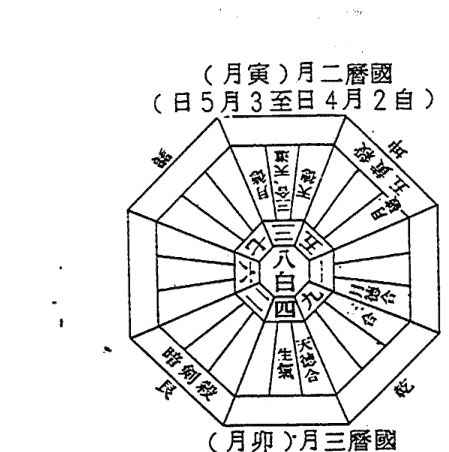

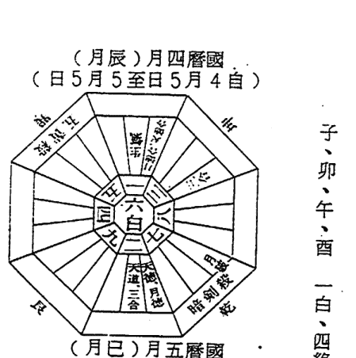

子、卯、午、酉 一白、四綠、七赤之年

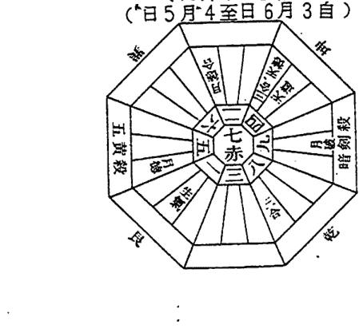

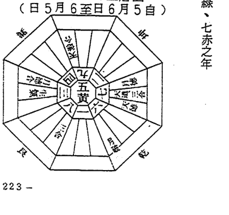

## （月申）月八曆國
（日7月9至日8月8自）

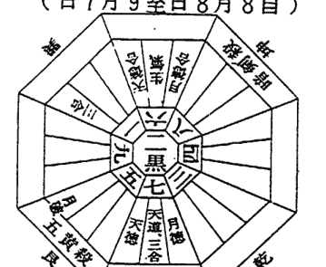

子、卯、午、酉 一白、四綠、七赤之年

## （月午）月六曆國
（日6月7至日6月6自）

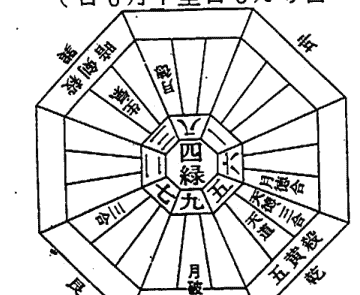

子、卯、午、酉 一白、四綠、七赤之年

## （月酉）月九曆國
（日8月10至日8月9自）

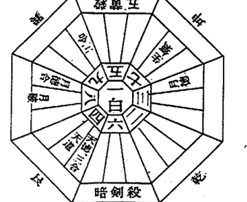

## （月未）月七曆國
（日7月8至日7月7自）

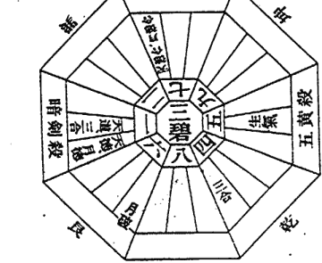

子、卯、午、酉 一白、四綠、七赤之年

子、卯、午、酉 一白、四綠、七赤之年

（月子）月二十曆國
（日5月1年癸至日7月12自）

（月戌）月十曆國
（日7月11至日9月10自）

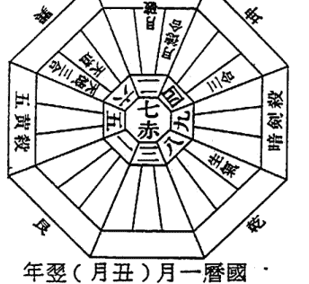

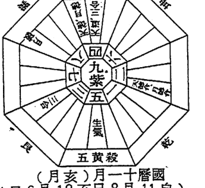

年癸（月丑）月一曆國
（日3月2至日6月1自）

（月亥）月十曆國
（日6月12至日8月11自）

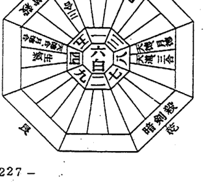

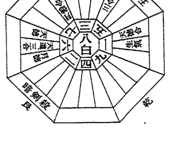

## （月辰）月四曆國
（日5月5至日5月4自）

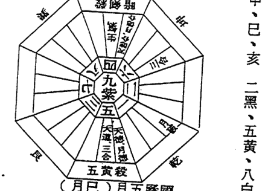

寅、申、巳、亥 二黑、五黃、八白之年

## （月寅）月二曆國
（日5月3至日4月2自）

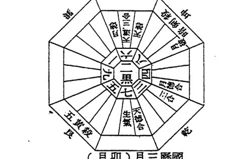

寅、申、巳、亥 二黑、五黃、八白之年

## （月巳）月五曆國
（日5月6至日6月5自）

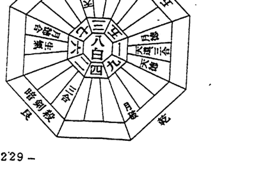

## （月卯）月三曆國
（日5月4至日6月3自）

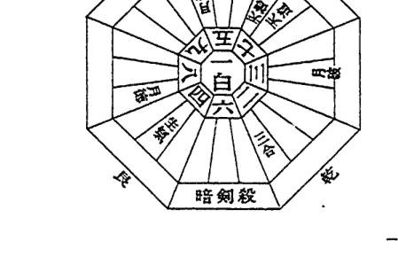

## （月申）月八曆國
（日7月9至日8月8自）

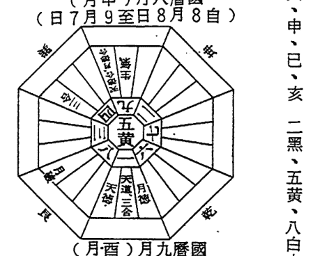

寅、申、巳、亥 二黑、五黃、八白之年

## （月午）月六曆國
（日6月7至日6月6自）

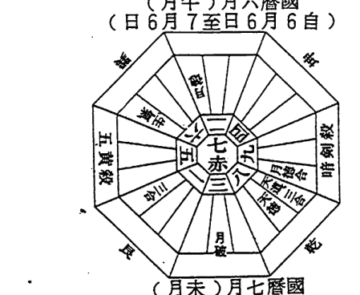

寅、申、巳、亥 二黑、五黃、八白之年

## （月酉）月九曆國
（日8月10至日8月9自）

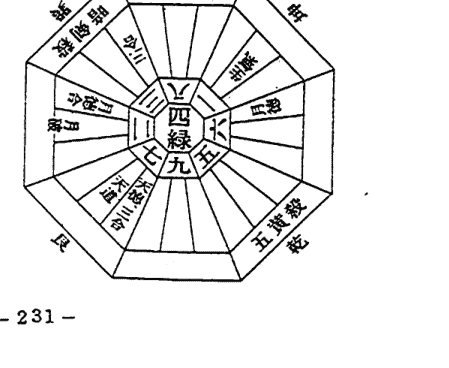

## （月未）月七曆國
（日7月8至日7月7自）

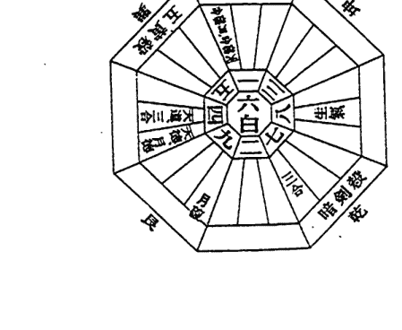

寅、申、巳、亥 二黑、五黃、八白之年

寅、申、巳、亥 二黑、五黃、八白之年

（月子）月二十曆國
（日5月1年至日7月12自）

（月戌）月十曆國
（日7月11至日9月10自）

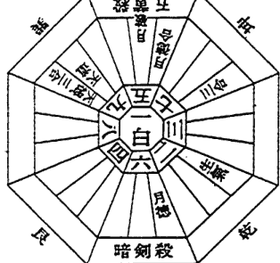

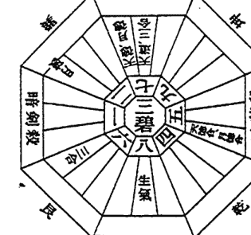

年癸（月丑）月一曆國
（日3月2至日6月1自）

（月亥）月十一曆國
（日6月12至日8月11自）

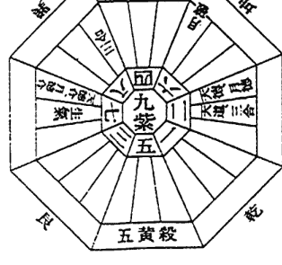

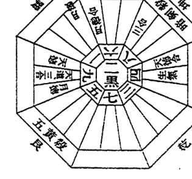

丑、辰、未、戌 三碧、六白、九紫之年

（月辰）月四曆國
（日5月5至日5月4自）

（月寅）月二曆國
（日5月3至日4月2自）

（月巳）月五曆國
（日5月6至日6月5自）

（月卯）月三曆國
（日4月4至日6月3自）

## （月申）月八曆國
（日7月9至日8月8自）

丑、辰、未、戌 三碧、六白、九紫之年

## （月酉）月九曆國
（日8月10至日8月9自）

## （月午）月六曆國
（日6月7至日6月6自）

丑、辰、未、戌 三碧、六白、九紫之年

## （月未）月七曆國
（日7月8至日7月7自）

## （月子）月12曆國
（日5月1年癸至日7月12自）

丑、辰、未、戌 三碧、六白、九紫之年

## （月戌）月十曆國
（日7月11至日9月10自）

丑、辰、未、戌 三碧、六白、九紫之年

## 年癸（月丑）月一曆國
（日3月2至日6月1自）

## （月亥）月11曆國
（日6月12至日8月11自）

# ◎日的九氣一覽表

民國六十七年 山陰水縣性

| 日期 | 1 | 2 | 3 | 4 | 5 | 6 | 7 | 8 | 9 | 10 | 11 | 12 | 13 | 14 | 15 | 16 | 17 | 18 | 19 | 20 | 21 | 22 | 23 | 24 | 25 | 26 | 27 | 28 | 29 | 30 | 31 |
|---|---|---|---|---|---|---|---|---|---|---|---|---|---|---|---|---|---|---|---|---|---|---|---|---|---|---|---|---|---|---|---|
| 1 | 甲子 | 乙丑 | 丙寅 | 丁卯 | 戊辰 | 己巳 | 庚午 | 辛未 | 壬申 | 癸酉 | 甲戌 | 乙亥 | 丙子 | 丁丑 | 戊寅 | 己卯 | 庚辰 | 辛巳 | 壬午 | 癸未 | 甲申 | 乙酉 | 丙戌 | 丁亥 | 戊子 | 己丑 | 庚寅 | 辛卯 | 壬辰 | 癸巳 | 甲午 |
| 2 | 乙未 | 丙申 | 丁酉 | 戊戌 | 己亥 | 庚子 | 辛丑 | 壬寅 | 癸卯 | 甲辰 | 乙巳 | 丙午 | 丁未 | 戊申 | 己酉 | 庚戌 | 辛亥 | 壬子 | 癸丑 | 甲寅 | 乙卯 | 丙辰 | 丁巳 | 戊午 | 己未 | 庚申 | 辛酉 | 壬戌 | 癸亥 | 甲子 | 乙丑 |
| 3 | 丙寅 | 丁卯 | 戊辰 | 己巳 | 庚午 | 辛未 | 壬申 | 癸酉 | 甲戌 | 乙亥 | 丙子 | 丁丑 | 戊寅 | 己卯 | 庚辰 | 辛巳 | 壬午 | 癸未 | 甲申 | 乙酉 | 丙戌 | 丁亥 | 戊子 | 己丑 | 庚寅 | 辛卯 | 壬辰 | 癸巳 | 甲午 | 乙未 | 丙申 |
| 4 | 丁酉 | 戊戌 | 己亥 | 庚子 | 辛丑 | 壬寅 | 癸卯 | 甲辰 | 乙巳 | 丙午 | 丁未 | 戊申 | 己酉 | 庚戌 | 辛亥 | 壬子 | 癸丑 | 甲寅 | 乙卯 | 丙辰 | 丁巳 | 戊午 | 己未 | 庚申 | 辛酉 | 壬戌 | 癸亥 | 甲子 | 乙丑 | 丙寅 | 丁卯 |
| 5 | 戊辰 | 己巳 | 庚午 | 辛未 | 壬申 | 癸酉 | 甲戌 | 乙亥 | 丙子 | 丁丑 | 戊寅 | 己卯 | 庚辰 | 辛巳 | 壬午 | 癸未 | 甲申 | 乙酉 | 丙戌 | 丁亥 | 戊子 | 己丑 | 庚寅 | 辛卯 | 壬辰 | 癸巳 | 甲午 | 乙未 | 丙申 | 丁酉 | 戊戌 |
| 6 | 己亥 | 庚子 | 辛丑 | 壬寅 | 癸卯 | 甲辰 | 乙巳 | 丙午 | 丁未 | 戊申 | 己酉 | 庚戌 | 辛亥 | 壬子 | 癸丑 | 甲寅 | 乙卯 | 丙辰 | 丁巳 | 戊午 | 己未 | 庚申 | 辛酉 | 壬戌 | 癸亥 | 甲子 | 乙丑 | 丙寅 | 丁卯 | 戊辰 | 己巳 |
| 7 | 庚午 | 辛未 | 壬申 | 癸酉 | 甲戌 | 乙亥 | 丙子 | 丁丑 | 戊寅 | 己卯 | 庚辰 | 辛巳 | 壬午 | 癸未 | 甲申 | 乙酉 | 丙戌 | 丁亥 | 戊子 | 己丑 | 庚寅 | 辛卯 | 壬辰 | 癸巳 | 甲午 | 乙未 | 丙申 | 丁酉 | 戊戌 | 己亥 | 庚子 |
| 8 | 辛丑 | 壬寅 | 癸卯 | 甲辰 | 乙巳 | 丙午 | 丁未 | 戊申 | 己酉 | 庚戌 | 辛亥 | 壬子 | 癸丑 | 甲寅 | 乙卯 | 丙辰 | 丁巳 | 戊午 | 己未 | 庚申 | 辛酉 | 壬戌 | 癸亥 | 甲子 | 乙丑 | 丙寅 | 丁卯 | 戊辰 | 己巳 | 庚午 | 辛未 |
| 9 | 壬申 | 癸酉 | 甲戌 | 乙亥 | 丙子 | 丁丑 | 戊寅 | 己卯 | 庚辰 | 辛巳 | 壬午 | 癸未 | 甲申 | 乙酉 | 丙戌 | 丁亥 | 戊子 | 己丑 | 庚寅 | 辛卯 | 壬辰 | 癸巳 | 甲午 | 乙未 | 丙申 | 丁酉 | 戊戌 | 己亥 | 庚子 | 辛丑 | 壬寅 |
| 10 | 癸卯 | 甲辰 | 乙巳 | 丙午 | 丁未 | 戊申 | 己酉 | 庚戌 | 辛亥 | 壬子 | 癸丑 | 甲寅 | 乙卯 | 丙辰 | 丁巳 | 戊午 | 己未 | 庚申 | 辛酉 | 壬戌 | 癸亥 | 甲子 | 乙丑 | 丙寅 | 丁卯 | 戊辰 | 己巳 | 庚午 | 辛未 | 壬申 | 癸酉 |
| 11 | 甲戌 | 乙亥 | 丙子 | 丁丑 | 戊寅 | 己卯 | 庚辰 | 辛巳 | 壬午 | 癸未 | 甲申 | 乙酉 | 丙戌 | 丁亥 | 戊子 | 己丑 | 庚寅 | 辛卯 | 壬辰 | 癸巳 | 甲午 | 乙未 | 丙申 | 丁酉 | 戊戌 | 己亥 | 庚子 | 辛丑 | 壬寅 | 癸卯 | 甲辰 |
| 12 | 乙巳 | 丙午 | 丁未 | 戊申 | 己酉 | 庚戌 | 辛亥 | 壬子 | 癸丑 | 甲寅 | 乙卯 | 丙辰 | 丁巳 | 戊午 | 己未 | 庚申 | 辛酉 | 壬戌 | 癸亥 | 甲子 | 乙丑 | 丙寅 | 丁卯 | 戊辰 | 己巳 | 庚午 | 辛未 | 壬申 | 癸酉 | 甲戌 | 乙亥 |
| 13 | 丙子 | 丁丑 | 戊寅 | 己卯 | 庚辰 | 辛巳 | 壬午 | 癸未 | 甲申 | 乙酉 | 丙戌 | 丁亥 | 戊子 | 己丑 | 庚寅 | 辛卯 | 壬辰 | 癸巳 | 甲午 | 乙未 | 丙申 | 丁酉 | 戊戌 | 己亥 | 庚子 | 辛丑 | 壬寅 | 癸卯 | 甲辰 | 乙巳 | 丙午 |
| 14 | 丁未 | 戊申 | 己酉 | 庚戌 | 辛亥 | 壬子 | 癸丑 | 甲寅 | 乙卯 | 丙辰 | 丁巳 | 戊午 | 己未 | 庚申 | 辛酉 | 壬戌 | 癸亥 | 甲子 | 乙丑 | 丙寅 | 丁卯 | 戊辰 | 己巳 | 庚午 | 辛未 | 壬申 | 癸酉 | 甲戌 | 乙亥 | 丙子 | 丁丑 |
| 15 | 戊寅 | 己卯 | 庚辰 | 辛巳 | 壬午 | 癸未 | 甲申 | 乙酉 | 丙戌 | 丁亥 | 戊子 | 己丑 | 庚寅 | 辛卯 | 壬辰 | 癸巳 | 甲午 | 乙未 | 丙申 | 丁酉 | 戊戌 | 己亥 | 庚子 | 辛丑 | 壬寅 | 癸卯 | 甲辰 | 乙巳 | 丙午 | 丁未 | 戊申 |
| 16 | 己酉 | 庚戌 | 辛亥 | 壬子 | 癸丑 | 甲寅 | 乙卯 | 丙辰 | 丁巳 | 戊午 | 己未 | 庚申 | 辛酉 | 壬戌 | 癸亥 | 甲子 | 乙丑 | 丙寅 | 丁卯 | 戊辰 | 己巳 | 庚午 | 辛未 | 壬申 | 癸酉 | 甲戌 | 乙亥 | 丙子 | 丁丑 | 戊寅 | 己卯 |
| 17 | 庚辰 | 辛巳 | 壬午 | 癸未 | 甲申 | 乙酉 | 丙戌 | 丁亥 | 戊子 | 己丑 | 庚寅 | 辛卯 | 壬辰 | 癸巳 | 甲午 | 乙未 | 丙申 | 丁酉 | 戊戌 | 己亥 | 庚子 | 辛丑 | 壬寅 | 癸卯 | 甲辰 | 乙巳 | 丙午 | 丁未 | 戊申 | 己酉 | 庚戌 |
| 18 | 辛亥 | 壬子 | 癸丑 | 甲寅 | 乙卯 | 丙辰 | 丁巳 | 戊午 | 己未 | 庚申 | 辛酉 | 壬戌 | 癸亥 | 甲子 | 乙丑 | 丙寅 | 丁卯 | 戊辰 | 己巳 | 庚午 | 辛未 | 壬申 | 癸酉 | 甲戌 | 乙亥 | 丙子 | 丁丑 | 戊寅 | 己卯 | 庚辰 | 辛巳 |
| 19 | 壬午 | 癸未 | 甲申 | 乙酉 | 丙戌 | 丁亥 | 戊子 | 己丑 | 庚寅 | 辛卯 | 壬辰 | 癸巳 | 甲午 | 乙未 | 丙申 | 丁酉 | 戊戌 | 己亥 | 庚子 | 辛丑 | 壬寅 | 癸卯 | 甲辰 | 乙巳 | 丙午 | 丁未 | 戊申 | 己酉 | 庚戌 | 辛亥 | 壬子 |
| 20 | 癸丑 | 甲寅 | 乙卯 | 丙辰 | 丁巳 | 戊午 | 己未 | 庚申 | 辛酉 | 壬戌 | 癸亥 | 甲子 | 乙丑 | 丙寅 | 丁卯 | 戊辰 | 己巳 | 庚午 | 辛未 | 壬申 | 癸酉 | 甲戌 | 乙亥 | 丙子 | 丁丑 | 戊寅 | 己卯 | 庚辰 | 辛巳 | 壬午 | 癸未 |
| 21 | 甲申 | 乙酉 | 丙戌 | 丁亥 | 戊子 | 己丑 | 庚寅 | 辛卯 | 壬辰 | 癸巳 | 甲午 | 乙未 | 丙申 | 丁酉 | 戊戌 | 己亥 | 庚子 | 辛丑 | 壬寅 | 癸卯 | 甲辰 | 乙巳 | 丙午 | 丁未 | 戊申 | 己酉 | 庚戌 | 辛亥 | 壬子 | 癸丑 | 甲寅 |
| 22 | 乙卯 | 丙辰 | 丁巳 | 戊午 | 己未 | 庚申 | 辛酉 | 壬戌 | 癸亥 | 甲子 | 乙丑 | 丙寅 | 丁卯 | 戊辰 | 己巳 | 庚午 | 辛未 | 壬申 | 癸酉 | 甲戌 | 乙亥 | 丙子 | 丁丑 | 戊寅 | 己卯 | 庚辰 | 辛巳 | 壬午 | 癸未 | 甲申 | 乙酉 |
| 23 | 丙戌 | 丁亥 | 戊子 | 己丑 | 庚寅 | 辛卯 | 壬辰 | 癸巳 | 甲午 | 乙未 | 丙申 | 丁酉 | 戊戌 | 己亥 | 庚子 | 辛丑 | 壬寅 | 癸卯 | 甲辰 | 乙巳 | 丙午 | 丁未 | 戊申 | 己酉 | 庚戌 | 辛亥 | 壬子 | 癸丑 | 甲寅 | 乙卯 | 丙辰 |
| 24 | 丁巳 | 戊午 | 己未 | 庚申 | 辛酉 | 壬戌 | 癸亥 | 甲子 | 乙丑 | 丙寅 | 丁卯 | 戊辰 | 己巳 | 庚午 | 辛未 | 壬申 | 癸酉 | 甲戌 | 乙亥 | 丙子 | 丁丑 | 戊寅 | 己卯 | 庚辰 | 辛巳 | 壬午 | 癸未 | 甲申 | 乙酉 | 丙戌 | 丁亥 |
| 25 | 戊子 | 己丑 | 庚寅 | 辛卯 | 壬辰 | 癸巳 | 甲午 | 乙未 | 丙申 | 丁酉 | 戊戌 | 己亥 | 庚子 | 辛丑 | 壬寅 | 癸卯 | 甲辰 | 乙巳 | 丙午 | 丁未 | 戊申 | 己酉 | 庚戌 | 辛亥 | 壬子 | 癸丑 | 甲寅 | 乙卯 | 丙辰 | 丁巳 | 戊午 |
| 26 | 己未 | 庚申 | 辛酉 | 壬戌 | 癸亥 | 甲子 | 乙丑 | 丙寅 | 丁卯 | 戊辰 | 己巳 | 庚午 | 辛未 | 壬申 | 癸酉 | 甲戌 | 乙亥 | 丙子 | 丁丑 | 戊寅 | 己卯 | 庚辰 | 辛巳 | 壬午 | 癸未 | 甲申 | 乙酉 | 丙戌 | 丁亥 | 戊子 | 己丑 |
| 27 | 庚寅 | 辛卯 | 壬辰 | 癸巳 | 甲午 | 乙未 | 丙申 | 丁酉 | 戊戌 | 己亥 | 庚子 | 辛丑 | 壬寅 | 癸卯 | 甲辰 | 乙巳 | 丙午 | 丁未 | 戊申 | 己酉 | 庚戌 | 辛亥 | 壬子 | 癸丑 | 甲寅 | 乙卯 | 丙辰 | 丁巳 | 戊午 | 己未 | 庚申 |
| 28 | 辛酉 | 壬戌 | 癸亥 | 甲子 | 乙丑 | 丙寅 | 丁卯 | 戊辰 | 己巳 | 庚午 | 辛未 | 壬申 | 癸酉 | 甲戌 | 乙亥 | 丙子 | 丁丑 | 戊寅 | 己卯 | 庚辰 | 辛巳 | 壬午 | 癸未 | 甲申 | 乙酉 | 丙戌 | 丁亥 | 戊子 | 己丑 | 庚寅 | 辛卯 |
| 29 | 壬辰 | 癸巳 | 甲午 | 乙未 | 丙申 | 丁酉 | 戊戌 | 己亥 | 庚子 | 辛丑 | 壬寅 | 癸卯 | 甲辰 | 乙巳 | 丙午 | 丁未 | 戊申 | 己酉 | 庚戌 | 辛亥 | 壬子 | 癸丑 | 甲寅 | 乙卯 | 丙辰 | 丁巳 | 戊午 | 己未 | 庚申 | 辛酉 | 壬戌 |
| 30 | 癸亥 | 甲子 | 乙丑 | 丙寅 | 丁卯 | 戊辰 | 己巳 | 庚午 | 辛未 | 壬申 | 癸酉 | 甲戌 | 乙亥 | 丙子 | 丁丑 | 戊寅 | 己卯 | 庚辰 | 辛巳 | 壬午 | 癸未 | 甲申 | 乙酉 | 丙戌 | 丁亥 | 戊子 | 己丑 | 庚寅 | 辛卯 | 壬辰 | 癸巳 |
| 31 | 甲午 | 乙未 | 丙申 | 丁酉 | 戊戌 | 己亥 | 庚子 | 辛丑 | 壬寅 | 癸卯 | 甲辰 | 乙巳 | 丙午 | 丁未 | 戊申 | 己酉 | 庚戌 | 辛亥 | 壬子 | 癸丑 | 甲寅 | 乙卯 | 丙辰 | 丁巳 | 戊午 | 己未 | 庚申 | 辛酉 | 壬戌 | 癸亥 | 甲子 |

民國六十九年 二黑土氣性

| 日期 | 1 | 2 | 3 | 4 | 5 | 6 | 7 | 8 | 9 | 10 | 11 | 12 | 13 | 14 | 15 | 16 | 17 | 18 | 19 | 20 | 21 | 22 | 23 | 24 | 25 | 26 | 27 | 28 | 29 | 30 | 31 |
|---|---|---|---|---|---|---|---|---|---|---|---|---|---|---|---|---|---|---|---|---|---|---|---|---|---|---|---|---|---|---|---|
| 1 | 甲子 | 乙丑 | 丙寅 | 丁卯 | 戊辰 | 己巳 | 庚午 | 辛未 | 壬申 | 癸酉 | 甲戌 | 乙亥 | 丙子 | 丁丑 | 戊寅 | 己卯 | 庚辰 | 辛巳 | 壬午 | 癸未 | 甲申 | 乙酉 | 丙戌 | 丁亥 | 戊子 | 己丑 | 庚寅 | 辛卯 | 壬辰 | 癸巳 | 甲午 |
| 2 | 乙未 | 丙申 | 丁酉 | 戊戌 | 己亥 | 庚子 | 辛丑 | 壬寅 | 癸卯 | 甲辰 | 乙巳 | 丙午 | 丁未 | 戊申 | 己酉 | 庚戌 | 辛亥 | 壬子 | 癸丑 | 甲寅 | 乙卯 | 丙辰 | 丁巳 | 戊午 | 己未 | 庚申 | 辛酉 | 壬戌 | 癸亥 | 甲子 | 乙丑 |
| 3 | 丙寅 | 丁卯 | 戊辰 | 己巳 | 庚午 | 辛未 | 壬申 | 癸酉 | 甲戌 | 乙亥 | 丙子 | 丁丑 | 戊寅 | 己卯 | 庚辰 | 辛巳 | 壬午 | 癸未 | 甲申 | 乙酉 | 丙戌 | 丁亥 | 戊子 | 己丑 | 庚寅 | 辛卯 | 壬辰 | 癸巳 | 甲午 | 乙未 | 丙申 |
| 4 | 丁酉 | 戊戌 | 己亥 | 庚子 | 辛丑 | 壬寅 | 癸卯 | 甲辰 | 乙巳 | 丙午 | 丁未 | 戊申 | 己酉 | 庚戌 | 辛亥 | 壬子 | 癸丑 | 甲寅 | 乙卯 | 丙辰 | 丁巳 | 戊午 | 己未 | 庚申 | 辛酉 | 壬戌 | 癸亥 | 甲子 | 乙丑 | 丙寅 | 丁卯 |
| 5 | 戊辰 | 己巳 | 庚午 | 辛未 | 壬申 | 癸酉 | 甲戌 | 乙亥 | 丙子 | 丁丑 | 戊寅 | 己卯 | 庚辰 | 辛巳 | 壬午 | 癸未 | 甲申 | 乙酉 | 丙戌 | 丁亥 | 戊子 | 己丑 | 庚寅 | 辛卯 | 壬辰 | 癸巳 | 甲午 | 乙未 | 丙申 | 丁酉 | 戊戌 |
| 6 | 己亥 | 庚子 | 辛丑 | 壬寅 | 癸卯 | 甲辰 | 乙巳 | 丙午 | 丁未 | 戊申 | 己酉 | 庚戌 | 辛亥 | 壬子 | 癸丑 | 甲寅 | 乙卯 | 丙辰 | 丁巳 | 戊午 | 己未 | 庚申 | 辛酉 | 壬戌 | 癸亥 | 甲子 | 乙丑 | 丙寅 | 丁卯 | 戊辰 | 己巳 |
| 7 | 庚午 | 辛未 | 壬申 | 癸酉 | 甲戌 | 乙亥 | 丙子 | 丁丑 | 戊寅 | 己卯 | 庚辰 | 辛巳 | 壬午 | 癸未 | 甲申 | 乙酉 | 丙戌 | 丁亥 | 戊子 | 己丑 | 庚寅 | 辛卯 | 壬辰 | 癸巳 | 甲午 | 乙未 | 丙申 | 丁酉 | 戊戌 | 己亥 | 庚子 |
| 8 | 辛丑 | 壬寅 | 癸卯 | 甲辰 | 乙巳 | 丙午 | 丁未 | 戊申 | 己酉 | 庚戌 | 辛亥 | 壬子 | 癸丑 | 甲寅 | 乙卯 | 丙辰 | 丁巳 | 戊午 | 己未 | 庚申 | 辛酉 | 壬戌 | 癸亥 | 甲子 | 乙丑 | 丙寅 | 丁卯 | 戊辰 | 己巳 | 庚午 | 辛未 |
| 9 | 壬申 | 癸酉 | 甲戌 | 乙亥 | 丙子 | 丁丑 | 戊寅 | 己卯 | 庚辰 | 辛巳 | 壬午 | 癸未 | 甲申 | 乙酉 | 丙戌 | 丁亥 | 戊子 | 己丑 | 庚寅 | 辛卯 | 壬辰 | 癸巳 | 甲午 | 乙未 | 丙申 | 丁酉 | 戊戌 | 己亥 | 庚子 | 辛丑 | 壬寅 |
| 10 | 癸卯 | 甲辰 | 乙巳 | 丙午 | 丁未 | 戊申 | 己酉 | 庚戌 | 辛亥 | 壬子 | 癸丑 | 甲寅 | 乙卯 | 丙辰 | 丁巳 | 戊午 | 己未 | 庚申 | 辛酉 | 壬戌 | 癸亥 | 甲子 | 乙丑 | 丙寅 | 丁卯 | 戊辰 | 己巳 | 庚午 | 辛未 | 壬申 | 癸酉 |
| 11 | 甲戌 | 乙亥 | 丙子 | 丁丑 | 戊寅 | 己卯 | 庚辰 | 辛巳 | 壬午 | 癸未 | 甲申 | 乙酉 | 丙戌 | 丁亥 | 戊子 | 己丑 | 庚寅 | 辛卯 | 壬辰 | 癸巳 | 甲午 | 乙未 | 丙申 | 丁酉 | 戊戌 | 己亥 | 庚子 | 辛丑 | 壬寅 | 癸卯 | 甲辰 |
| 12 | 乙巳 | 丙午 | 丁未 | 戊申 | 己酉 | 庚戌 | 辛亥 | 壬子 | 癸丑 | 甲寅 | 乙卯 | 丙辰 | 丁巳 | 戊午 | 己未 | 庚申 | 辛酉 | 壬戌 | 癸亥 | 甲子 | 乙丑 | 丙寅 | 丁卯 | 戊辰 | 己巳 | 庚午 | 辛未 | 壬申 | 癸酉 | 甲戌 | 乙亥 |
| 13 | 丙子 | 丁丑 | 戊寅 | 己卯 | 庚辰 | 辛巳 | 壬午 | 癸未 | 甲申 | 乙酉 | 丙戌 | 丁亥 | 戊子 | 己丑 | 庚寅 | 辛卯 | 壬辰 | 癸巳 | 甲午 | 乙未 | 丙申 | 丁酉 | 戊戌 | 己亥 | 庚子 | 辛丑 | 壬寅 | 癸卯 | 甲辰 | 乙巳 | 丙午 |
| 14 | 丁未 | 戊申 | 己酉 | 庚戌 | 辛亥 | 壬子 | 癸丑 | 甲寅 | 乙卯 | 丙辰 | 丁巳 | 戊午 | 己未 | 庚申 | 辛酉 | 壬戌 | 癸亥 | 甲子 | 乙丑 | 丙寅 | 丁卯 | 戊辰 | 己巳 | 庚午 | 辛未 | 壬申 | 癸酉 | 甲戌 | 乙亥 | 丙子 | 丁丑 |
| 15 | 戊寅 | 己卯 | 庚辰 | 辛巳 | 壬午 | 癸未 | 甲申 | 乙酉 | 丙戌 | 丁亥 | 戊子 | 己丑 | 庚寅 | 辛卯 | 壬辰 | 癸巳 | 甲午 | 乙未 | 丙申 | 丁酉 | 戊戌 | 己亥 | 庚子 | 辛丑 | 壬寅 | 癸卯 | 甲辰 | 乙巳 | 丙午 | 丁未 | 戊申 |
| 16 | 己酉 | 庚戌 | 辛亥 | 壬子 | 癸丑 | 甲寅 | 乙卯 | 丙辰 | 丁巳 | 戊午 | 己未 | 庚申 | 辛酉 | 壬戌 | 癸亥 | 甲子 | 乙丑 | 丙寅 | 丁卯 | 戊辰 | 己巳 | 庚午 | 辛未 | 壬申 | 癸酉 | 甲戌 | 乙亥 | 丙子 | 丁丑 | 戊寅 | 己卯 |
| 17 | 庚辰 | 辛巳 | 壬午 | 癸未 | 甲申 | 乙酉 | 丙戌 | 丁亥 | 戊子 | 己丑 | 庚寅 | 辛卯 | 壬辰 | 癸巳 | 甲午 | 乙未 | 丙申 | 丁酉 | 戊戌 | 己亥 | 庚子 | 辛丑 | 壬寅 | 癸卯 | 甲辰 | 乙巳 | 丙午 | 丁未 | 戊申 | 己酉 | 庚戌 |
| 18 | 辛亥 | 壬子 | 癸丑 | 甲寅 | 乙卯 | 丙辰 | 丁巳 | 戊午 | 己未 | 庚申 | 辛酉 | 壬戌 | 癸亥 | 甲子 | 乙丑 | 丙寅 | 丁卯 | 戊辰 | 己巳 | 庚午 | 辛未 | 壬申 | 癸酉 | 甲戌 | 乙亥 | 丙子 | 丁丑 | 戊寅 | 己卯 | 庚辰 | 辛巳 |
| 19 | 壬午 | 癸未 | 甲申 | 乙酉 | 丙戌 | 丁亥 | 戊子 | 己丑 | 庚寅 | 辛卯 | 壬辰 | 癸巳 | 甲午 | 乙未 | 丙申 | 丁酉 | 戊戌 | 己亥 | 庚子 | 辛丑 | 壬寅 | 癸卯 | 甲辰 | 乙巳 | 丙午 | 丁未 | 戊申 | 己酉 | 庚戌 | 辛亥 | 壬子 |
| 20 | 癸丑 | 甲寅 | 乙卯 | 丙辰 | 丁巳 | 戊午 | 己未 | 庚申 | 辛酉 | 壬戌 | 癸亥 | 甲子 | 乙丑 | 丙寅 | 丁卯 | 戊辰 | 己巳 | 庚午 | 辛未 | 壬申 | 癸酉 | 甲戌 | 乙亥 | 丙子 | 丁丑 | 戊寅 | 己卯 | 庚辰 | 辛巳 | 壬午 | 癸未 |
| 21 | 甲申 | 乙酉 | 丙戌 | 丁亥 | 戊子 | 己丑 | 庚寅 | 辛卯 | 壬辰 | 癸巳 | 甲午 | 乙未 | 丙申 | 丁酉 | 戊戌 | 己亥 | 庚子 | 辛丑 | 壬寅 | 癸卯 | 甲辰 | 乙巳 | 丙午 | 丁未 | 戊申 | 己酉 | 庚戌 | 辛亥 | 壬子 | 癸丑 | 甲寅 |
| 22 | 乙卯 | 丙辰 | 丁巳 | 戊午 | 己未 | 庚申 | 辛酉 | 壬戌 | 癸亥 | 甲子 | 乙丑 | 丙寅 | 丁卯 | 戊辰 | 己巳 | 庚午 | 辛未 | 壬申 | 癸酉 | 甲戌 | 乙亥 | 丙子 | 丁丑 | 戊寅 | 己卯 | 庚辰 | 辛巳 | 壬午 | 癸未 | 甲申 | 乙酉 |
| 23 | 丙戌 | 丁亥 | 戊子 | 己丑 | 庚寅 | 辛卯 | 壬辰 | 癸巳 | 甲午 | 乙未 | 丙申 | 丁酉 | 戊戌 | 己亥 | 庚子 | 辛丑 | 壬寅 | 癸卯 | 甲辰 | 乙巳 | 丙午 | 丁未 | 戊申 | 己酉 | 庚戌 | 辛亥 | 壬子 | 癸丑 | 甲寅 | 乙卯 | 丙辰 |
| 24 | 丁巳 | 戊午 | 己未 | 庚申 | 辛酉 | 壬戌 | 癸亥 | 甲子 | 乙丑 | 丙寅 | 丁卯 | 戊辰 | 己巳 | 庚午 | 辛未 | 壬申 | 癸酉 | 甲戌 | 乙亥 | 丙子 | 丁丑 | 戊寅 | 己卯 | 庚辰 | 辛巳 | 壬午 | 癸未 | 甲申 | 乙酉 | 丙戌 | 丁亥 |
| 25 | 戊子 | 己丑 | 庚寅 | 辛卯 | 壬辰 | 癸巳 | 甲午 | 乙未 | 丙申 | 丁酉 | 戊戌 | 己亥 | 庚子 | 辛丑 | 壬寅 | 癸卯 | 甲辰 | 乙巳 | 丙午 | 丁未 | 戊申 | 己酉 | 庚戌 | 辛亥 | 壬子 | 癸丑 | 甲寅 | 乙卯 | 丙辰 | 丁巳 | 戊午 |
| 26 | 己未 | 庚申 | 辛酉 | 壬戌 | 癸亥 | 甲子 | 乙丑 | 丙寅 | 丁卯 | 戊辰 | 己巳 | 庚午 | 辛未 | 壬申 | 癸酉 | 甲戌 | 乙亥 | 丙子 | 丁丑 | 戊寅 | 己卯 | 庚辰 | 辛巳 | 壬午 | 癸未 | 甲申 | 乙酉 | 丙戌 | 丁亥 | 戊子 | 己丑 |
| 27 | 庚寅 | 辛卯 | 壬辰 | 癸巳 | 甲午 | 乙未 | 丙申 | 丁酉 | 戊戌 | 己亥 | 庚子 | 辛丑 | 壬寅 | 癸卯 | 甲辰 | 乙巳 | 丙午 | 丁未 | 戊申 | 己酉 | 庚戌 | 辛亥 | 壬子 | 癸丑 | 甲寅 | 乙卯 | 丙辰 | 丁巳 | 戊午 | 己未 | 庚申 |
| 28 | 辛酉 | 壬戌 | 癸亥 | 甲子 | 乙丑 | 丙寅 | 丁卯 | 戊辰 | 己巳 | 庚午 | 辛未 | 壬申 | 癸酉 | 甲戌 | 乙亥 | 丙子 | 丁丑 | 戊寅 | 己卯 | 庚辰 | 辛巳 | 壬午 | 癸未 | 甲申 | 乙酉 | 丙戌 | 丁亥 | 戊子 | 己丑 | 庚寅 | 辛卯 |
| 29 | 壬辰 | 癸巳 | 甲午 | 乙未 | 丙申 | 丁酉 | 戊戌 | 己亥 | 庚子 | 辛丑 | 壬寅 | 癸卯 | 甲辰 | 乙巳 | 丙午 | 丁未 | 戊申 | 己酉 | 庚戌 | 辛亥 | 壬子 | 癸丑 | 甲寅 | 乙卯 | 丙辰 | 丁巳 | 戊午 | 己未 | 庚申 | 辛酉 | 壬戌 |
| 30 | 癸亥 | 甲子 | 乙丑 | 丙寅 | 丁卯 | 戊辰 | 己巳 | 庚午 | 辛未 | 壬申 | 癸酉 | 甲戌 | 乙亥 | 丙子 | 丁丑 | 戊寅 | 己卯 | 庚辰 | 辛巳 | 壬午 | 癸未 | 甲申 | 乙酉 | 丙戌 | 丁亥 | 戊子 | 己丑 | 庚寅 | 辛卯 | 壬辰 | 癸巳 |
| 31 | 甲午 | 乙未 | 丙申 | 丁酉 | 戊戌 | 己亥 | 庚子 | 辛丑 | 壬寅 | 癸卯 | 甲辰 | 乙巳 | 丙午 | 丁未 | 戊申 | 己酉 | 庚戌 | 辛亥 | 壬子 | 癸丑 | 甲寅 | 乙卯 | 丙辰 | 丁巳 | 戊午 | 己未 | 庚申 | 辛酉 | 壬戌 | 癸亥 | 甲子 |

## 民國七十一年九紫火氣性

| 日 | 一 | 二 | 三 | 四 | 五 | 六 |
|---|---|---|---|---|---|---|
| 1 | 2 | 3 | 4 | 5 | 6 | 7 |
| 8 | 9 | 10 | 11 | 12 | 13 | 14 |
| 15 | 16 | 17 | 18 | 19 | 20 | 21 |
| 22 | 23 | 24 | 25 | 26 | 27 | 28 |
| 29 | 30 | 31 | | | | |

## 民國七十一年白水氣性

| 日 | 一 | 二 | 三 | 四 | 五 | 六 |
|---|---|---|---|---|---|---|
| 1 | 2 | 3 | 4 | 5 | 6 | 7 |
| 8 | 9 | 10 | 11 | 12 | 13 | 14 |
| 15 | 16 | 17 | 18 | 19 | 20 | 21 |
| 22 | 23 | 24 | 25 | 26 | 27 | 28 |
| 29 | 30 | 31 | | | | |

## 民國二十三年 七赤金氣性

| 月\日 | 1 | 2 | 3 | 4 | 5 | 6 | 7 | 8 | 9 | 10 | 11 | 12 | 13 | 14 | 15 | 16 | 17 | 18 | 19 | 20 | 21 | 22 | 23 | 24 | 25 | 26 | 27 | 28 | 29 | 30 | 31 |
|---|---|---|---|---|---|---|---|---|---|---|---|---|---|---|---|---|---|---|---|---|---|---|---|---|---|---|---|---|---|---|---|
| 1月 | 丙子 | 丁丑 | 戊寅 | 己卯 | 庚辰 | 辛巳 | 壬午 | 癸未 | 甲申 | 乙酉 | 丙戌 | 丁亥 | 戊子 | 己丑 | 庚寅 | 辛卯 | 壬辰 | 癸巳 | 甲午 | 乙未 | 丙申 | 丁酉 | 戊戌 | 己亥 | 庚子 | 辛丑 | 壬寅 | 癸卯 | 甲辰 | 乙巳 | 丙午 |
| 2月 | 丁未 | 戊申 | 己酉 | 庚戌 | 辛亥 | 壬子 | 癸丑 | 甲寅 | 乙卯 | 丙辰 | 丁巳 | 戊午 | 己未 | 庚申 | 辛酉 | 壬戌 | 癸亥 | 甲子 | 乙丑 | 丙寅 | 丁卯 | 戊辰 | 己巳 | 庚午 | 辛未 | 壬申 | 癸酉 | 甲戌 | 乙亥 | 丙子 | 丁丑 |
| 3月 | 戊寅 | 己卯 | 庚辰 | 辛巳 | 壬午 | 癸未 | 甲申 | 乙酉 | 丙戌 | 丁亥 | 戊子 | 己丑 | 庚寅 | 辛卯 | 壬辰 | 癸巳 | 甲午 | 乙未 | 丙申 | 丁酉 | 戊戌 | 己亥 | 庚子 | 辛丑 | 壬寅 | 癸卯 | 甲辰 | 乙巳 | 丙午 | 丁未 | 戊申 |
| 4月 | 己酉 | 庚戌 | 辛亥 | 壬子 | 癸丑 | 甲寅 | 乙卯 | 丙辰 | 丁巳 | 戊午 | 己未 | 庚申 | 辛酉 | 壬戌 | 癸亥 | 甲子 | 乙丑 | 丙寅 | 丁卯 | 戊辰 | 己巳 | 庚午 | 辛未 | 壬申 | 癸酉 | 甲戌 | 乙亥 | 丙子 | 丁丑 | 戊寅 | 己卯 |
| 5月 | 庚辰 | 辛巳 | 壬午 | 癸未 | 甲申 | 乙酉 | 丙戌 | 丁亥 | 戊子 | 己丑 | 庚寅 | 辛卯 | 壬辰 | 癸巳 | 甲午 | 乙未 | 丙申 | 丁酉 | 戊戌 | 己亥 | 庚子 | 辛丑 | 壬寅 | 癸卯 | 甲辰 | 乙巳 | 丙午 | 丁未 | 戊申 | 己酉 | 庚戌 |
| 6月 | 辛亥 | 壬子 | 癸丑 | 甲寅 | 乙卯 | 丙辰 | 丁巳 | 戊午 | 己未 | 庚申 | 辛酉 | 壬戌 | 癸亥 | 甲子 | 乙丑 | 丙寅 | 丁卯 | 戊辰 | 己巳 | 庚午 | 辛未 | 壬申 | 癸酉 | 甲戌 | 乙亥 | 丙子 | 丁丑 | 戊寅 | 己卯 | 庚辰 | 辛巳 |
| 7月 | 壬午 | 癸未 | 甲申 | 乙酉 | 丙戌 | 丁亥 | 戊子 | 己丑 | 庚寅 | 辛卯 | 壬辰 | 癸巳 | 甲午 | 乙未 | 丙申 | 丁酉 | 戊戌 | 己亥 | 庚子 | 辛丑 | 壬寅 | 癸卯 | 甲辰 | 乙巳 | 丙午 | 丁未 | 戊申 | 己酉 | 庚戌 | 辛亥 | 壬子 |
| 8月 | 癸丑 | 甲寅 | 乙卯 | 丙辰 | 丁巳 | 戊午 | 己未 | 庚申 | 辛酉 | 壬戌 | 癸亥 | 甲子 | 乙丑 | 丙寅 | 丁卯 | 戊辰 | 己巳 | 庚午 | 辛未 | 壬申 | 癸酉 | 甲戌 | 乙亥 | 丙子 | 丁丑 | 戊寅 | 己卯 | 庚辰 | 辛巳 | 壬午 | 癸未 |
| 9月 | 甲申 | 乙酉 | 丙戌 | 丁亥 | 戊子 | 己丑 | 庚寅 | 辛卯 | 壬辰 | 癸巳 | 甲午 | 乙未 | 丙申 | 丁酉 | 戊戌 | 己亥 | 庚子 | 辛丑 | 壬寅 | 癸卯 | 甲辰 | 乙巳 | 丙午 | 丁未 | 戊申 | 己酉 | 庚戌 | 辛亥 | 壬子 | 癸丑 | 甲寅 |
| 10月 | 乙卯 | 丙辰 | 丁巳 | 戊午 | 己未 | 庚申 | 辛酉 | 壬戌 | 癸亥 | 甲子 | 乙丑 | 丙寅 | 丁卯 | 戊辰 | 己巳 | 庚午 | 辛未 | 壬申 | 癸酉 | 甲戌 | 乙亥 | 丙子 | 丁丑 | 戊寅 | 己卯 | 庚辰 | 辛巳 | 壬午 | 癸未 | 甲申 | 乙酉 |
| 11月 | 丙戌 | 丁亥 | 戊子 | 己丑 | 庚寅 | 辛卯 | 壬辰 | 癸巳 | 甲午 | 乙未 | 丙申 | 丁酉 | 戊戌 | 己亥 | 庚子 | 辛丑 | 壬寅 | 癸卯 | 甲辰 | 乙巳 | 丙午 | 丁未 | 戊申 | 己酉 | 庚戌 | 辛亥 | 壬子 | 癸丑 | 甲寅 | 乙卯 | 丙辰 |
| 12月 | 丁巳 | 戊午 | 己未 | 庚申 | 辛酉 | 壬戌 | 癸亥 | 甲子 | 乙丑 | 丙寅 | 丁卯 | 戊辰 | 己巳 | 庚午 | 辛未 | 壬申 | 癸酉 | 甲戌 | 乙亥 | 丙子 | 丁丑 | 戊寅 | 己卯 | 庚辰 | 辛巳 | 壬午 | 癸未 | 甲申 | 乙酉 | 丙戌 | 丁亥 |

## 民國二十一年 八白土氣性

| 月\日 | 1 | 2 | 3 | 4 | 5 | 6 | 7 | 8 | 9 | 10 | 11 | 12 | 13 | 14 | 15 | 16 | 17 | 18 | 19 | 20 | 21 | 22 | 23 | 24 | 25 | 26 | 27 | 28 | 29 | 30 | 31 |
|---|---|---|---|---|---|---|---|---|---|---|---|---|---|---|---|---|---|---|---|---|---|---|---|---|---|---|---|---|---|---|---|
| 1月 | 壬子 | 癸丑 | 甲寅 | 乙卯 | 丙辰 | 丁巳 | 戊午 | 己未 | 庚申 | 辛酉 | 壬戌 | 癸亥 | 甲子 | 乙丑 | 丙寅 | 丁卯 | 戊辰 | 己巳 | 庚午 | 辛未 | 壬申 | 癸酉 | 甲戌 | 乙亥 | 丙子 | 丁丑 | 戊寅 | 己卯 | 庚辰 | 辛巳 | 壬午 |
| 2月 | 癸未 | 甲申 | 乙酉 | 丙戌 | 丁亥 | 戊子 | 己丑 | 庚寅 | 辛卯 | 壬辰 | 癸巳 | 甲午 | 乙未 | 丙申 | 丁酉 | 戊戌 | 己亥 | 庚子 | 辛丑 | 壬寅 | 癸卯 | 甲辰 | 乙巳 | 丙午 | 丁未 | 戊申 | 己酉 | 庚戌 | 辛亥 | 壬子 | 癸丑 |
| 3月 | 甲寅 | 乙卯 | 丙辰 | 丁巳 | 戊午 | 己未 | 庚申 | 辛酉 | 壬戌 | 癸亥 | 甲子 | 乙丑 | 丙寅 | 丁卯 | 戊辰 | 己巳 | 庚午 | 辛未 | 壬申 | 癸酉 | 甲戌 | 乙亥 | 丙子 | 丁丑 | 戊寅 | 己卯 | 庚辰 | 辛巳 | 壬午 | 癸未 | 甲申 |
| 4月 | 乙酉 | 丙戌 | 丁亥 | 戊子 | 己丑 | 庚寅 | 辛卯 | 壬辰 | 癸巳 | 甲午 | 乙未 | 丙申 | 丁酉 | 戊戌 | 己亥 | 庚子 | 辛丑 | 壬寅 | 癸卯 | 甲辰 | 乙巳 | 丙午 | 丁未 | 戊申 | 己酉 | 庚戌 | 辛亥 | 壬子 | 癸丑 | 甲寅 | 乙卯 |
| 5月 | 丙辰 | 丁巳 | 戊午 | 己未 | 庚申 | 辛酉 | 壬戌 | 癸亥 | 甲子 | 乙丑 | 丙寅 | 丁卯 | 戊辰 | 己巳 | 庚午 | 辛未 | 壬申 | 癸酉 | 甲戌 | 乙亥 | 丙子 | 丁丑 | 戊寅 | 己卯 | 庚辰 | 辛巳 | 壬午 | 癸未 | 甲申 | 乙酉 | 丙戌 |
| 6月 | 丁亥 | 戊子 | 己丑 | 庚寅 | 辛卯 | 壬辰 | 癸巳 | 甲午 | 乙未 | 丙申 | 丁酉 | 戊戌 | 己亥 | 庚子 | 辛丑 | 壬寅 | 癸卯 | 甲辰 | 乙巳 | 丙午 | 丁未 | 戊申 | 己酉 | 庚戌 | 辛亥 | 壬子 | 癸丑 | 甲寅 | 乙卯 | 丙辰 | 丁巳 |
| 7月 | 戊午 | 己未 | 庚申 | 辛酉 | 壬戌 | 癸亥 | 甲子 | 乙丑 | 丙寅 | 丁卯 | 戊辰 | 己巳 | 庚午 | 辛未 | 壬申 | 癸酉 | 甲戌 | 乙亥 | 丙子 | 丁丑 | 戊寅 | 己卯 | 庚辰 | 辛巳 | 壬午 | 癸未 | 甲申 | 乙酉 | 丙戌 | 丁亥 | 戊子 |
| 8月 | 己丑 | 庚寅 | 辛卯 | 壬辰 | 癸巳 | 甲午 | 乙未 | 丙申 | 丁酉 | 戊戌 | 己亥 | 庚子 | 辛丑 | 壬寅 | 癸卯 | 甲辰 | 乙巳 | 丙午 | 丁未 | 戊申 | 己酉 | 庚戌 | 辛亥 | 壬子 | 癸丑 | 甲寅 | 乙卯 | 丙辰 | 丁巳 | 戊午 | 己未 |
| 9月 | 庚申 | 辛酉 | 壬戌 | 癸亥 | 甲子 | 乙丑 | 丙寅 | 丁卯 | 戊辰 | 己巳 | 庚午 | 辛未 | 壬申 | 癸酉 | 甲戌 | 乙亥 | 丙子 | 丁丑 | 戊寅 | 己卯 | 庚辰 | 辛巳 | 壬午 | 癸未 | 甲申 | 乙酉 | 丙戌 | 丁亥 | 戊子 | 己丑 | 庚寅 |
| 10月 | 辛卯 | 壬辰 | 癸巳 | 甲午 | 乙未 | 丙申 | 丁酉 | 戊戌 | 己亥 | 庚子 | 辛丑 | 壬寅 | 癸卯 | 甲辰 | 乙巳 | 丙午 | 丁未 | 戊申 | 己酉 | 庚戌 | 辛亥 | 壬子 | 癸丑 | 甲寅 | 乙卯 | 丙辰 | 丁巳 | 戊午 | 己未 | 庚申 | 辛酉 |
| 11月 | 壬戌 | 癸亥 | 甲子 | 乙丑 | 丙寅 | 丁卯 | 戊辰 | 己巳 | 庚午 | 辛未 | 壬申 | 癸酉 | 甲戌 | 乙亥 | 丙子 | 丁丑 | 戊寅 | 己卯 | 庚辰 | 辛巳 | 壬午 | 癸未 | 甲申 | 乙酉 | 丙戌 | 丁亥 | 戊子 | 己丑 | 庚寅 | 辛卯 | 壬辰 |
| 12月 | 癸巳 | 甲午 | 乙未 | 丙申 | 丁酉 | 戊戌 | 己亥 | 庚子 | 辛丑 | 壬寅 | 癸卯 | 甲辰 | 乙巳 | 丙午 | 丁未 | 戊申 | 己酉 | 庚戌 | 辛亥 | 壬子 | 癸丑 | 甲寅 | 乙卯 | 丙辰 | 丁巳 | 戊午 | 己未 | 庚申 | 辛酉 | 壬戌 | 癸亥 |

## 民國七十四年　六壬會篡表

| 月令 | 一 | 二 | 三 | 四 | 五 | 六 | 七 | 八 | 九 | 十 | 十一 | 十二 |
|---|---|---|---|---|---|---|---|---|---|---|---|---|
| 一 |  |  |  |  |  |  |  |  |  |  |  |  |
| 二 |  |  |  |  |  |  |  |  |  |  |  |  |
| 三 |  |  |  |  |  |  |  |  |  |  |  |  |
| 四 |  |  |  |  |  |  |  |  |  |  |  |  |
| 五 |  |  |  |  |  |  |  |  |  |  |  |  |
| 六 |  |  |  |  |  |  |  |  |  |  |  |  |
| 七 |  |  |  |  |  |  |  |  |  |  |  |  |
| 八 |  |  |  |  |  |  |  |  |  |  |  |  |
| 九 |  |  |  |  |  |  |  |  |  |  |  |  |
| 十 |  |  |  |  |  |  |  |  |  |  |  |  |
| 十一 |  |  |  |  |  |  |  |  |  |  |  |  |
| 十二 |  |  |  |  |  |  |  |  |  |  |  |  |

## 民國七十五年　五黃飛星表

| 月令 | 一 | 二 | 三 | 四 | 五 | 六 | 七 | 八 | 九 | 十 | 十一 | 十二 |
|---|---|---|---|---|---|---|---|---|---|---|---|---|
| 一 |  |  |  |  |  |  |  |  |  |  |  |  |
| 二 |  |  |  |  |  |  |  |  |  |  |  |  |
| 三 |  |  |  |  |  |  |  |  |  |  |  |  |
| 四 |  |  |  |  |  |  |  |  |  |  |  |  |
| 五 |  |  |  |  |  |  |  |  |  |  |  |  |
| 六 |  |  |  |  |  |  |  |  |  |  |  |  |
| 七 |  |  |  |  |  |  |  |  |  |  |  |  |
| 八 |  |  |  |  |  |  |  |  |  |  |  |  |
| 九 |  |  |  |  |  |  |  |  |  |  |  |  |
| 十 |  |  |  |  |  |  |  |  |  |  |  |  |
| 十一 |  |  |  |  |  |  |  |  |  |  |  |  |
| 十二 |  |  |  |  |  |  |  |  |  |  |  |  |

## 民國七十六年 四季天干地支

| 月份 | 1 | 2 | 3 | 4 | 5 | 6 | 7 | 8 | 9 | 10 | 11 | 12 |
|---|---|---|---|---|---|---|---|---|---|---|---|---|
| 1 | 丙寅 | 丁卯 | 戊辰 | 己巳 | 庚午 | 辛未 | 壬申 | 癸酉 | 甲戌 | 乙亥 | 丙子 | 丁丑 |
| 2 | 戊寅 | 己卯 | 庚辰 | 辛巳 | 壬午 | 癸未 | 甲申 | 乙酉 | 丙戌 | 丁亥 | 戊子 | 己丑 |
| 3 | 庚寅 | 辛卯 | 壬辰 | 癸巳 | 甲午 | 乙未 | 丙申 | 丁酉 | 戊戌 | 己亥 | 庚子 | 辛丑 |
| 4 | 壬寅 | 癸卯 | 甲辰 | 乙巳 | 丙午 | 丁未 | 戊申 | 己酉 | 庚戌 | 辛亥 | 壬子 | 癸丑 |
| 5 | 甲寅 | 乙卯 | 丙辰 | 丁巳 | 戊午 | 己未 | 庚申 | 辛酉 | 壬戌 | 癸亥 | 甲子 | 乙丑 |
| 6 | 丙寅 | 丁卯 | 戊辰 | 己巳 | 庚午 | 辛未 | 壬申 | 癸酉 | 甲戌 | 乙亥 | 丙子 | 丁丑 |
| 7 | 戊寅 | 己卯 | 庚辰 | 辛巳 | 壬午 | 癸未 | 甲申 | 乙酉 | 丙戌 | 丁亥 | 戊子 | 己丑 |
| 8 | 庚寅 | 辛卯 | 壬辰 | 癸巳 | 甲午 | 乙未 | 丙申 | 丁酉 | 戊戌 | 己亥 | 庚子 | 辛丑 |
| 9 | 壬寅 | 癸卯 | 甲辰 | 乙巳 | 丙午 | 丁未 | 戊申 | 己酉 | 庚戌 | 辛亥 | 壬子 | 癸丑 |
| 10 | 甲寅 | 乙卯 | 丙辰 | 丁巳 | 戊午 | 己未 | 庚申 | 辛酉 | 壬戌 | 癸亥 | 甲子 | 乙丑 |
| 11 | 丙寅 | 丁卯 | 戊辰 | 己巳 | 庚午 | 辛未 | 壬申 | 癸酉 | 甲戌 | 乙亥 | 丙子 | 丁丑 |
| 12 | 戊寅 | 己卯 | 庚辰 | 辛巳 | 壬午 | 癸未 | 甲申 | 乙酉 | 丙戌 | 丁亥 | 戊子 | 己丑 |

## 民國七十七年 三元九運

| 月份 | 1 | 2 | 3 | 4 | 5 | 6 | 7 | 8 | 9 | 10 | 11 | 12 |
|---|---|---|---|---|---|---|---|---|---|---|---|---|
| 1 | 戊辰 | 己巳 | 庚午 | 辛未 | 壬申 | 癸酉 | 甲戌 | 乙亥 | 丙子 | 丁丑 | 戊寅 | 己卯 |
| 2 | 庚辰 | 辛巳 | 壬午 | 癸未 | 甲申 | 乙酉 | 丙戌 | 丁亥 | 戊子 | 己丑 | 庚寅 | 辛卯 |
| 3 | 壬辰 | 癸巳 | 甲午 | 乙未 | 丙申 | 丁酉 | 戊戌 | 己亥 | 庚子 | 辛丑 | 壬寅 | 癸卯 |
| 4 | 甲辰 | 乙巳 | 丙午 | 丁未 | 戊申 | 己酉 | 庚戌 | 辛亥 | 壬子 | 癸丑 | 甲寅 | 乙卯 |
| 5 | 丙辰 | 丁巳 | 戊午 | 己未 | 庚申 | 辛酉 | 壬戌 | 癸亥 | 甲子 | 乙丑 | 丙寅 | 丁卯 |
| 6 | 戊辰 | 己巳 | 庚午 | 辛未 | 壬申 | 癸酉 | 甲戌 | 乙亥 | 丙子 | 丁丑 | 戊寅 | 己卯 |
| 7 | 庚辰 | 辛巳 | 壬午 | 癸未 | 甲申 | 乙酉 | 丙戌 | 丁亥 | 戊子 | 己丑 | 庚寅 | 辛卯 |
| 8 | 壬辰 | 癸巳 | 甲午 | 乙未 | 丙申 | 丁酉 | 戊戌 | 己亥 | 庚子 | 辛丑 | 壬寅 | 癸卯 |
| 9 | 甲辰 | 乙巳 | 丙午 | 丁未 | 戊申 | 己酉 | 庚戌 | 辛亥 | 壬子 | 癸丑 | 甲寅 | 乙卯 |
| 10 | 丙辰 | 丁巳 | 戊午 | 己未 | 庚申 | 辛酉 | 壬戌 | 癸亥 | 甲子 | 乙丑 | 丙寅 | 丁卯 |
| 11 | 戊辰 | 己巳 | 庚午 | 辛未 | 壬申 | 癸酉 | 甲戌 | 乙亥 | 丙子 | 丁丑 | 戊寅 | 己卯 |
| 12 | 庚辰 | 辛巳 | 壬午 | 癸未 | 甲申 | 乙酉 | 丙戌 | 丁亥 | 戊子 | 己丑 | 庚寅 | 辛卯 |

# 民國十七年 二十四節氣

| 節氣 | 1月 | 2月 | 3月 | 4月 | 5月 | 6月 | 7月 | 8月 | 9月 | 10月 | 11月 | 12月 |
|---|---|---|---|---|---|---|---|---|---|---|---|---|
| 小寒 | 六日 | 五日 | 五日 | 四日 | 三日 | 二日 | 一日 | 三十日 | 二十九日 | 二十八日 | 二十七日 | 二十六日 |
| 大寒 | 二十一日 | 二十日 | 二十日 | 十九日 | 十八日 | 十七日 | 十六日 | 十五日 | 十四日 | 十三日 | 十二日 | 十一日 |
| 立春 | 五日 | 四日 | 四日 | 三日 | 二日 | 一日 | 三十日 | 二十九日 | 二十八日 | 二十七日 | 二十六日 | 二十五日 |
| 雨水 | 二十日 | 十九日 | 十九日 | 十八日 | 十七日 | 十六日 | 十五日 | 十四日 | 十三日 | 十二日 | 十一日 | 十日 |
| 驚蟄 | 六日 | 五日 | 五日 | 四日 | 三日 | 二日 | 一日 | 三十日 | 二十九日 | 二十八日 | 二十七日 | 二十六日 |
| 春分 | 二十一日 | 二十日 | 二十日 | 十九日 | 十八日 | 十七日 | 十六日 | 十五日 | 十四日 | 十三日 | 十二日 | 十一日 |
| 清明 | 五日 | 四日 | 四日 | 三日 | 二日 | 一日 | 三十日 | 二十九日 | 二十八日 | 二十七日 | 二十六日 | 二十五日 |
| 穀雨 | 二十日 | 十九日 | 十九日 | 十八日 | 十七日 | 十六日 | 十五日 | 十四日 | 十三日 | 十二日 | 十一日 | 十日 |
| 立夏 | 六日 | 五日 | 五日 | 四日 | 三日 | 二日 | 一日 | 三十日 | 二十九日 | 二十八日 | 二十七日 | 二十六日 |
| 小滿 | 二十一日 | 二十日 | 二十日 | 十九日 | 十八日 | 十七日 | 十六日 | 十五日 | 十四日 | 十三日 | 十二日 | 十一日 |
| 芒種 | 六日 | 五日 | 五日 | 四日 | 三日 | 二日 | 一日 | 三十日 | 二十九日 | 二十八日 | 二十七日 | 二十六日 |
| 夏至 | 二十二日 | 二十一日 | 二十一日 | 二十日 | 十九日 | 十八日 | 十七日 | 十六日 | 十五日 | 十四日 | 十三日 | 十二日 |
| 小暑 | 七日 | 六日 | 六日 | 五日 | 四日 | 三日 | 二日 | 一日 | 三十日 | 二十九日 | 二十八日 | 二十七日 |
| 大暑 | 二十三日 | 二十二日 | 二十二日 | 二十一日 | 二十日 | 十九日 | 十八日 | 十七日 | 十六日 | 十五日 | 十四日 | 十三日 |
| 立秋 | 八日 | 七日 | 七日 | 六日 | 五日 | 四日 | 三日 | 二日 | 一日 | 三十日 | 二十九日 | 二十八日 |
| 處暑 | 二十三日 | 二十二日 | 二十二日 | 二十一日 | 二十日 | 十九日 | 十八日 | 十七日 | 十六日 | 十五日 | 十四日 | 十三日 |
| 白露 | 八日 | 七日 | 七日 | 六日 | 五日 | 四日 | 三日 | 二日 | 一日 | 三十日 | 二十九日 | 二十八日 |
| 秋分 | 二十三日 | 二十二日 | 二十二日 | 二十一日 | 二十日 | 十九日 | 十八日 | 十七日 | 十六日 | 十五日 | 十四日 | 十三日 |
| 寒露 | 九日 | 八日 | 八日 | 七日 | 六日 | 五日 | 四日 | 三日 | 二日 | 一日 | 三十日 | 二十九日 |
| 霜降 | 二十四日 | 二十三日 | 二十三日 | 二十二日 | 二十一日 | 二十日 | 十九日 | 十八日 | 十七日 | 十六日 | 十五日 | 十四日 |
| 立冬 | 九日 | 八日 | 八日 | 七日 | 六日 | 五日 | 四日 | 三日 | 二日 | 一日 | 三十日 | 二十九日 |
| 小雪 | 二十三日 | 二十二日 | 二十二日 | 二十一日 | 二十日 | 十九日 | 十八日 | 十七日 | 十六日 | 十五日 | 十四日 | 十三日 |
| 大雪 | 八日 | 七日 | 七日 | 六日 | 五日 | 四日 | 三日 | 二日 | 一日 | 三十日 | 二十九日 | 二十八日 |
| 冬至 | 二十三日 | 二十二日 | 二十二日 | 二十一日 | 二十日 | 十九日 | 十八日 | 十七日 | 十六日 | 十五日 | 十四日 | 十三日 |

# 民國七十九年 一百水難性

| 月份 | 1 | 2 | 3 | 4 | 5 | 6 | 7 | 8 | 9 | 10 | 11 | 12 |
|---|---|---|---|---|---|---|---|---|---|---|---|---|
| 1 | 一 | 二 | 三 | 四 | 五 | 六 | 七 | 八 | 九 | 十 | 十一 | 十二 |
| 2 | 十三 | 十四 | 十五 | 十六 | 十七 | 十八 | 十九 | 二十 | 二十一 | 二十二 | 二十三 | 二十四 |
| 3 | 二十五 | 二十六 | 二十七 | 二十八 | 二十九 | 三十 | 三十一 | | | | | |
| 4 | 一 | 二 | 三 | 四 | 五 | 六 | 七 | 八 | 九 | 十 | 十一 | 十二 |
| 5 | 十三 | 十四 | 十五 | 十六 | 十七 | 十八 | 十九 | 二十 | 二十一 | 二十二 | 二十三 | 二十四 |
| 6 | 二十五 | 二十六 | 二十七 | 二十八 | 二十九 | 三十 | | | | | | |
| 7 | 一 | 二 | 三 | 四 | 五 | 六 | 七 | 八 | 九 | 十 | 十一 | 十二 |
| 8 | 十三 | 十四 | 十五 | 十六 | 十七 | 十八 | 十九 | 二十 | 二十一 | 二十二 | 二十三 | 二十四 |
| 9 | 二十五 | 二十六 | 二十七 | 二十八 | 二十九 | 三十 | 三十一 | | | | | |
| 10 | 一 | 二 | 三 | 四 | 五 | 六 | 七 | 八 | 九 | 十 | 十一 | 十二 |
| 11 | 十三 | 十四 | 十五 | 十六 | 十七 | 十八 | 十九 | 二十 | 二十一 | 二十二 | 二十三 | 二十四 |
| 12 | 二十五 | 二十六 | 二十七 | 二十八 | 二十九 | 三十 | 三十一 | | | | | |

# 民國八十一年八月壬午年

| 月\日 | 1 | 2 | 3 | 4 | 5 | 6 | 7 | 8 | 9 | 10 | 11 | 12 | 13 | 14 | 15 | 16 | 17 | 18 | 19 | 20 | 21 | 22 | 23 | 24 | 25 | 26 | 27 | 28 | 29 | 30 | 31 |
|---|---|---|---|---|---|---|---|---|---|---|---|---|---|---|---|---|---|---|---|---|---|---|---|---|---|---|---|---|---|---|---|
| 1 | 丁未 | 戊申 | 己酉 | 庚戌 | 辛亥 | 壬子 | 癸丑 | 甲寅 | 乙卯 | 丙辰 | 丁巳 | 戊午 | 己未 | 庚申 | 辛酉 | 壬戌 | 癸亥 | 甲子 | 乙丑 | 丙寅 | 丁卯 | 戊辰 | 己巳 | 庚午 | 辛未 | 壬申 | 癸酉 | 甲戌 | 乙亥 | 丙子 | 丁丑 |
| 2 | 戊寅 | 己卯 | 庚辰 | 辛巳 | 壬午 | 癸未 | 甲申 | 乙酉 | 丙戌 | 丁亥 | 戊子 | 己丑 | 庚寅 | 辛卯 | 壬辰 | 癸巳 | 甲午 | 乙未 | 丙申 | 丁酉 | 戊戌 | 己亥 | 庚子 | 辛丑 | 壬寅 | 癸卯 | 甲辰 | 乙巳 | 丙午 | 丁未 | 戊申 |
| 3 | 己酉 | 庚戌 | 辛亥 | 壬子 | 癸丑 | 甲寅 | 乙卯 | 丙辰 | 丁巳 | 戊午 | 己未 | 庚申 | 辛酉 | 壬戌 | 癸亥 | 甲子 | 乙丑 | 丙寅 | 丁卯 | 戊辰 | 己巳 | 庚午 | 辛未 | 壬申 | 癸酉 | 甲戌 | 乙亥 | 丙子 | 丁丑 | 戊寅 | 己卯 |
| 4 | 庚辰 | 辛巳 | 壬午 | 癸未 | 甲申 | 乙酉 | 丙戌 | 丁亥 | 戊子 | 己丑 | 庚寅 | 辛卯 | 壬辰 | 癸巳 | 甲午 | 乙未 | 丙申 | 丁酉 | 戊戌 | 己亥 | 庚子 | 辛丑 | 壬寅 | 癸卯 | 甲辰 | 乙巳 | 丙午 | 丁未 | 戊申 | 己酉 | 庚戌 |
| 5 | 辛亥 | 壬子 | 癸丑 | 甲寅 | 乙卯 | 丙辰 | 丁巳 | 戊午 | 己未 | 庚申 | 辛酉 | 壬戌 | 癸亥 | 甲子 | 乙丑 | 丙寅 | 丁卯 | 戊辰 | 己巳 | 庚午 | 辛未 | 壬申 | 癸酉 | 甲戌 | 乙亥 | 丙子 | 丁丑 | 戊寅 | 己卯 | 庚辰 | 辛巳 |
| 6 | 壬午 | 癸未 | 甲申 | 乙酉 | 丙戌 | 丁亥 | 戊子 | 己丑 | 庚寅 | 辛卯 | 壬辰 | 癸巳 | 甲午 | 乙未 | 丙申 | 丁酉 | 戊戌 | 己亥 | 庚子 | 辛丑 | 壬寅 | 癸卯 | 甲辰 | 乙巳 | 丙午 | 丁未 | 戊申 | 己酉 | 庚戌 | 辛亥 | 壬子 |
| 7 | 癸丑 | 甲寅 | 乙卯 | 丙辰 | 丁巳 | 戊午 | 己未 | 庚申 | 辛酉 | 壬戌 | 癸亥 | 甲子 | 乙丑 | 丙寅 | 丁卯 | 戊辰 | 己巳 | 庚午 | 辛未 | 壬申 | 癸酉 | 甲戌 | 乙亥 | 丙子 | 丁丑 | 戊寅 | 己卯 | 庚辰 | 辛巳 | 壬午 | 癸未 |
| 8 | 甲申 | 乙酉 | 丙戌 | 丁亥 | 戊子 | 己丑 | 庚寅 | 辛卯 | 壬辰 | 癸巳 | 甲午 | 乙未 | 丙申 | 丁酉 | 戊戌 | 己亥 | 庚子 | 辛丑 | 壬寅 | 癸卯 | 甲辰 | 乙巳 | 丙午 | 丁未 | 戊申 | 己酉 | 庚戌 | 辛亥 | 壬子 | 癸丑 | 甲寅 |
| 9 | 乙卯 | 丙辰 | 丁巳 | 戊午 | 己未 | 庚申 | 辛酉 | 壬戌 | 癸亥 | 甲子 | 乙丑 | 丙寅 | 丁卯 | 戊辰 | 己巳 | 庚午 | 辛未 | 壬申 | 癸酉 | 甲戌 | 乙亥 | 丙子 | 丁丑 | 戊寅 | 己卯 | 庚辰 | 辛巳 | 壬午 | 癸未 | 甲申 | 乙酉 |
| 10 | 丙戌 | 丁亥 | 戊子 | 己丑 | 庚寅 | 辛卯 | 壬辰 | 癸巳 | 甲午 | 乙未 | 丙申 | 丁酉 | 戊戌 | 己亥 | 庚子 | 辛丑 | 壬寅 | 癸卯 | 甲辰 | 乙巳 | 丙午 | 丁未 | 戊申 | 己酉 | 庚戌 | 辛亥 | 壬子 | 癸丑 | 甲寅 | 乙卯 | 丙辰 |
| 11 | 丁巳 | 戊午 | 己未 | 庚申 | 辛酉 | 壬戌 | 癸亥 | 甲子 | 乙丑 | 丙寅 | 丁卯 | 戊辰 | 己巳 | 庚午 | 辛未 | 壬申 | 癸酉 | 甲戌 | 乙亥 | 丙子 | 丁丑 | 戊寅 | 己卯 | 庚辰 | 辛巳 | 壬午 | 癸未 | 甲申 | 乙酉 | 丙戌 | 丁亥 |
| 12 | 戊子 | 己丑 | 庚寅 | 辛卯 | 壬辰 | 癸巳 | 甲午 | 乙未 | 丙申 | 丁酉 | 戊戌 | 己亥 | 庚子 | 辛丑 | 壬寅 | 癸卯 | 甲辰 | 乙巳 | 丙午 | 丁未 | 戊申 | 己酉 | 庚戌 | 辛亥 | 壬子 | 癸丑 | 甲寅 | 乙卯 | 丙辰 | 丁巳 | 戊午 |

# 民國八十一年九月癸未年

| 月\日 | 1 | 2 | 3 | 4 | 5 | 6 | 7 | 8 | 9 | 10 | 11 | 12 | 13 | 14 | 15 | 16 | 17 | 18 | 19 | 20 | 21 | 22 | 23 | 24 | 25 | 26 | 27 | 28 | 29 | 30 |
|---|---|---|---|---|---|---|---|---|---|---|---|---|---|---|---|---|---|---|---|---|---|---|---|---|---|---|---|---|---|---|
| 1 | 己未 | 庚申 | 辛酉 | 壬戌 | 癸亥 | 甲子 | 乙丑 | 丙寅 | 丁卯 | 戊辰 | 己巳 | 庚午 | 辛未 | 壬申 | 癸酉 | 甲戌 | 乙亥 | 丙子 | 丁丑 | 戊寅 | 己卯 | 庚辰 | 辛巳 | 壬午 | 癸未 | 甲申 | 乙酉 | 丙戌 | 丁亥 | 戊子 |
| 2 | 己丑 | 庚寅 | 辛卯 | 壬辰 | 癸巳 | 甲午 | 乙未 | 丙申 | 丁酉 | 戊戌 | 己亥 | 庚子 | 辛丑 | 壬寅 | 癸卯 | 甲辰 | 乙巳 | 丙午 | 丁未 | 戊申 | 己酉 | 庚戌 | 辛亥 | 壬子 | 癸丑 | 甲寅 | 乙卯 | 丙辰 | 丁巳 | 戊午 |
| 3 | 己未 | 庚申 | 辛酉 | 壬戌 | 癸亥 | 甲子 | 乙丑 | 丙寅 | 丁卯 | 戊辰 | 己巳 | 庚午 | 辛未 | 壬申 | 癸酉 | 甲戌 | 乙亥 | 丙子 | 丁丑 | 戊寅 | 己卯 | 庚辰 | 辛巳 | 壬午 | 癸未 | 甲申 | 乙酉 | 丙戌 | 丁亥 | 戊子 |
| 4 | 己丑 | 庚寅 | 辛卯 | 壬辰 | 癸巳 | 甲午 | 乙未 | 丙申 | 丁酉 | 戊戌 | 己亥 | 庚子 | 辛丑 | 壬寅 | 癸卯 | 甲辰 | 乙巳 | 丙午 | 丁未 | 戊申 | 己酉 | 庚戌 | 辛亥 | 壬子 | 癸丑 | 甲寅 | 乙卯 | 丙辰 | 丁巳 | 戊午 |
| 5 | 己未 | 庚申 | 辛酉 | 壬戌 | 癸亥 | 甲子 | 乙丑 | 丙寅 | 丁卯 | 戊辰 | 己巳 | 庚午 | 辛未 | 壬申 | 癸酉 | 甲戌 | 乙亥 | 丙子 | 丁丑 | 戊寅 | 己卯 | 庚辰 | 辛巳 | 壬午 | 癸未 | 甲申 | 乙酉 | 丙戌 | 丁亥 | 戊子 |
| 6 | 己丑 | 庚寅 | 辛卯 | 壬辰 | 癸巳 | 甲午 | 乙未 | 丙申 | 丁酉 | 戊戌 | 己亥 | 庚子 | 辛丑 | 壬寅 | 癸卯 | 甲辰 | 乙巳 | 丙午 | 丁未 | 戊申 | 己酉 | 庚戌 | 辛亥 | 壬子 | 癸丑 | 甲寅 | 乙卯 | 丙辰 | 丁巳 | 戊午 |
| 7 | 己未 | 庚申 | 辛酉 | 壬戌 | 癸亥 | 甲子 | 乙丑 | 丙寅 | 丁卯 | 戊辰 | 己巳 | 庚午 | 辛未 | 壬申 | 癸酉 | 甲戌 | 乙亥 | 丙子 | 丁丑 | 戊寅 | 己卯 | 庚辰 | 辛巳 | 壬午 | 癸未 | 甲申 | 乙酉 | 丙戌 | 丁亥 | 戊子 |
| 8 | 己丑 | 庚寅 | 辛卯 | 壬辰 | 癸巳 | 甲午 | 乙未 | 丙申 | 丁酉 | 戊戌 | 己亥 | 庚子 | 辛丑 | 壬寅 | 癸卯 | 甲辰 | 乙巳 | 丙午 | 丁未 | 戊申 | 己酉 | 庚戌 | 辛亥 | 壬子 | 癸丑 | 甲寅 | 乙卯 | 丙辰 | 丁巳 | 戊午 |
| 9 | 己未 | 庚申 | 辛酉 | 壬戌 | 癸亥 | 甲子 | 乙丑 | 丙寅 | 丁卯 | 戊辰 | 己巳 | 庚午 | 辛未 | 壬申 | 癸酉 | 甲戌 | 乙亥 | 丙子 | 丁丑 | 戊寅 | 己卯 | 庚辰 | 辛巳 | 壬午 | 癸未 | 甲申 | 乙酉 | 丙戌 | 丁亥 | 戊子 |
| 10 | 己丑 | 庚寅 | 辛卯 | 壬辰 | 癸巳 | 甲午 | 乙未 | 丙申 | 丁酉 | 戊戌 | 己亥 | 庚子 | 辛丑 | 壬寅 | 癸卯 | 甲辰 | 乙巳 | 丙午 | 丁未 | 戊申 | 己酉 | 庚戌 | 辛亥 | 壬子 | 癸丑 | 甲寅 | 乙卯 | 丙辰 | 丁巳 | 戊午 |
| 11 | 己未 | 庚申 | 辛酉 | 壬戌 | 癸亥 | 甲子 | 乙丑 | 丙寅 | 丁卯 | 戊辰 | 己巳 | 庚午 | 辛未 | 壬申 | 癸酉 | 甲戌 | 乙亥 | 丙子 | 丁丑 | 戊寅 | 己卯 | 庚辰 | 辛巳 | 壬午 | 癸未 | 甲申 | 乙酉 | 丙戌 | 丁亥 | 戊子 |
| 12 | 己丑 | 庚寅 | 辛卯 | 壬辰 | 癸巳 | 甲午 | 乙未 | 丙申 | 丁酉 | 戊戌 | 己亥 | 庚子 | 辛丑 | 壬寅 | 癸卯 | 甲辰 | 乙巳 | 丙午 | 丁未 | 戊申 | 己酉 | 庚戌 | 辛亥 | 壬子 | 癸丑 | 甲寅 | 乙卯 | 丙辰 | 丁巳 | 戊午 |

# 民國八十二年
七赤金祿性

| 月\日 | 一 | 二 | 三 | 四 | 五 | 六 | 七 | 八 | 九 | 十 | 十一 | 十二 | 十三 | 十四 | 十五 | 十六 | 十七 | 十八 | 十九 | 二十 | 廿一 | 廿二 | 廿三 | 廿四 | 廿五 | 廿六 | 廿七 | 廿八 | 廿九 | 三十 |
|---|---|---|---|---|---|---|---|---|---|---|---|---|---|---|---|---|---|---|---|---|---|---|---|---|---|---|---|---|---|---|
| 一月 | 二 | 三 | 四 | 五 | 六 | 七 | 八 | 九 | 十 | 十一 | 十二 | 十三 | 十四 | 十五 | 十六 | 十七 | 十八 | 十九 | 二十 | 廿一 | 廿二 | 廿三 | 廿四 | 廿五 | 廿六 | 廿七 | 廿八 | 廿九 | 三十 | 三十一 |
| 二月 | 一 | 二 | 三 | 四 | 五 | 六 | 七 | 八 | 九 | 十 | 十一 | 十二 | 十三 | 十四 | 十五 | 十六 | 十七 | 十八 | 十九 | 二十 | 廿一 | 廿二 | 廿三 | 廿四 | 廿五 | 廿六 | 廿七 | 廿八 | 廿九 | 三十 |
| 三月 | 一 | 二 | 三 | 四 | 五 | 六 | 七 | 八 | 九 | 十 | 十一 | 十二 | 十三 | 十四 | 十五 | 十六 | 十七 | 十八 | 十九 | 二十 | 廿一 | 廿二 | 廿三 | 廿四 | 廿五 | 廿六 | 廿七 | 廿八 | 廿九 | 三十 | 三十一 |
| 四月 | 一 | 二 | 三 | 四 | 五 | 六 | 七 | 八 | 九 | 十 | 十一 | 十二 | 十三 | 十四 | 十五 | 十六 | 十七 | 十八 | 十九 | 二十 | 廿一 | 廿二 | 廿三 | 廿四 | 廿五 | 廿六 | 廿七 | 廿八 | 廿九 | 三十 |
| 五月 | 一 | 二 | 三 | 四 | 五 | 六 | 七 | 八 | 九 | 十 | 十一 | 十二 | 十三 | 十四 | 十五 | 十六 | 十七 | 十八 | 十九 | 二十 | 廿一 | 廿二 | 廿三 | 廿四 | 廿五 | 廿六 | 廿七 | 廿八 | 廿九 | 三十 | 三十一 |
| 六月 | 一 | 二 | 三 | 四 | 五 | 六 | 七 | 八 | 九 | 十 | 十一 | 十二 | 十三 | 十四 | 十五 | 十六 | 十七 | 十八 | 十九 | 二十 | 廿一 | 廿二 | 廿三 | 廿四 | 廿五 | 廿六 | 廿七 | 廿八 | 廿九 | 三十 |
| 七月 | 一 | 二 | 三 | 四 | 五 | 六 | 七 | 八 | 九 | 十 | 十一 | 十二 | 十三 | 十四 | 十五 | 十六 | 十七 | 十八 | 十九 | 二十 | 廿一 | 廿二 | 廿三 | 廿四 | 廿五 | 廿六 | 廿七 | 廿八 | 廿九 | 三十 | 三十一 |
| 八月 | 一 | 二 | 三 | 四 | 五 | 六 | 七 | 八 | 九 | 十 | 十一 | 十二 | 十三 | 十四 | 十五 | 十六 | 十七 | 十八 | 十九 | 二十 | 廿一 | 廿二 | 廿三 | 廿四 | 廿五 | 廿六 | 廿七 | 廿八 | 廿九 | 三十 |
| 九月 | 一 | 二 | 三 | 四 | 五 | 六 | 七 | 八 | 九 | 十 | 十一 | 十二 | 十三 | 十四 | 十五 | 十六 | 十七 | 十八 | 十九 | 二十 | 廿一 | 廿二 | 廿三 | 廿四 | 廿五 | 廿六 | 廿七 | 廿八 | 廿九 | 三十 |
| 十月 | 一 | 二 | 三 | 四 | 五 | 六 | 七 | 八 | 九 | 十 | 十一 | 十二 | 十三 | 十四 | 十五 | 十六 | 十七 | 十八 | 十九 | 二十 | 廿一 | 廿二 | 廿三 | 廿四 | 廿五 | 廿六 | 廿七 | 廿八 | 廿九 | 三十 | 三十一 |
| 十一月 | 一 | 二 | 三 | 四 | 五 | 六 | 七 | 八 | 九 | 十 | 十一 | 十二 | 十三 | 十四 | 十五 | 十六 | 十七 | 十八 | 十九 | 二十 | 廿一 | 廿二 | 廿三 | 廿四 | 廿五 | 廿六 | 廿七 | 廿八 | 廿九 | 三十 |
| 十二月 | 一 | 二 | 三 | 四 | 五 | 六 | 七 | 八 | 九 | 十 | 十一 | 十二 | 十三 | 十四 | 十五 | 十六 | 十七 | 十八 | 十九 | 二十 | 廿一 | 廿二 | 廿三 | 廿四 | 廿五 | 廿六 | 廿七 | 廿八 | 廿九 | 三十 | 三十一 |

# 民國八十三年
六白金祿性

| 月\日 | 一 | 二 | 三 | 四 | 五 | 六 | 七 | 八 | 九 | 十 | 十一 | 十二 | 十三 | 十四 | 十五 | 十六 | 十七 | 十八 | 十九 | 二十 | 廿一 | 廿二 | 廿三 | 廿四 | 廿五 | 廿六 | 廿七 | 廿八 | 廿九 | 三十 |
|---|---|---|---|---|---|---|---|---|---|---|---|---|---|---|---|---|---|---|---|---|---|---|---|---|---|---|---|---|---|---|
| 一月 | 一 | 二 | 三 | 四 | 五 | 六 | 七 | 八 | 九 | 十 | 十一 | 十二 | 十三 | 十四 | 十五 | 十六 | 十七 | 十八 | 十九 | 二十 | 廿一 | 廿二 | 廿三 | 廿四 | 廿五 | 廿六 | 廿七 | 廿八 | 廿九 | 三十 | 三十一 |
| 二月 | 一 | 二 | 三 | 四 | 五 | 六 | 七 | 八 | 九 | 十 | 十一 | 十二 | 十三 | 十四 | 十五 | 十六 | 十七 | 十八 | 十九 | 二十 | 廿一 | 廿二 | 廿三 | 廿四 | 廿五 | 廿六 | 廿七 | 廿八 | 廿九 | 三十 |
| 三月 | 一 | 二 | 三 | 四 | 五 | 六 | 七 | 八 | 九 | 十 | 十一 | 十二 | 十三 | 十四 | 十五 | 十六 | 十七 | 十八 | 十九 | 二十 | 廿一 | 廿二 | 廿三 | 廿四 | 廿五 | 廿六 | 廿七 | 廿八 | 廿九 | 三十 | 三十一 |
| 四月 | 一 | 二 | 三 | 四 | 五 | 六 | 七 | 八 | 九 | 十 | 十一 | 十二 | 十三 | 十四 | 十五 | 十六 | 十七 | 十八 | 十九 | 二十 | 廿一 | 廿二 | 廿三 | 廿四 | 廿五 | 廿六 | 廿七 | 廿八 | 廿九 | 三十 |
| 五月 | 一 | 二 | 三 | 四 | 五 | 六 | 七 | 八 | 九 | 十 | 十一 | 十二 | 十三 | 十四 | 十五 | 十六 | 十七 | 十八 | 十九 | 二十 | 廿一 | 廿二 | 廿三 | 廿四 | 廿五 | 廿六 | 廿七 | 廿八 | 廿九 | 三十 | 三十一 |
| 六月 | 一 | 二 | 三 | 四 | 五 | 六 | 七 | 八 | 九 | 十 | 十一 | 十二 | 十三 | 十四 | 十五 | 十六 | 十七 | 十八 | 十九 | 二十 | 廿一 | 廿二 | 廿三 | 廿四 | 廿五 | 廿六 | 廿七 | 廿八 | 廿九 | 三十 |
| 七月 | 一 | 二 | 三 | 四 | 五 | 六 | 七 | 八 | 九 | 十 | 十一 | 十二 | 十三 | 十四 | 十五 | 十六 | 十七 | 十八 | 十九 | 二十 | 廿一 | 廿二 | 廿三 | 廿四 | 廿五 | 廿六 | 廿七 | 廿八 | 廿九 | 三十 | 三十一 |
| 八月 | 一 | 二 | 三 | 四 | 五 | 六 | 七 | 八 | 九 | 十 | 十一 | 十二 | 十三 | 十四 | 十五 | 十六 | 十七 | 十八 | 十九 | 二十 | 廿一 | 廿二 | 廿三 | 廿四 | 廿五 | 廿六 | 廿七 | 廿八 | 廿九 | 三十 |
| 九月 | 一 | 二 | 三 | 四 | 五 | 六 | 七 | 八 | 九 | 十 | 十一 | 十二 | 十三 | 十四 | 十五 | 十六 | 十七 | 十八 | 十九 | 二十 | 廿一 | 廿二 | 廿三 | 廿四 | 廿五 | 廿六 | 廿七 | 廿八 | 廿九 | 三十 |
| 十月 | 一 | 二 | 三 | 四 | 五 | 六 | 七 | 八 | 九 | 十 | 十一 | 十二 | 十三 | 十四 | 十五 | 十六 | 十七 | 十八 | 十九 | 二十 | 廿一 | 廿二 | 廿三 | 廿四 | 廿五 | 廿六 | 廿七 | 廿八 | 廿九 | 三十 | 三十一 |
| 十一月 | 一 | 二 | 三 | 四 | 五 | 六 | 七 | 八 | 九 | 十 | 十一 | 十二 | 十三 | 十四 | 十五 | 十六 | 十七 | 十八 | 十九 | 二十 | 廿一 | 廿二 | 廿三 | 廿四 | 廿五 | 廿六 | 廿七 | 廿八 | 廿九 | 三十 |
| 十二月 | 一 | 二 | 三 | 四 | 五 | 六 | 七 | 八 | 九 | 十 | 十一 | 十二 | 十三 | 十四 | 十五 | 十六 | 十七 | 十八 | 十九 | 二十 | 廿一 | 廿二 | 廿三 | 廿四 | 廿五 | 廿六 | 廿七 | 廿八 | 廿九 | 三十 | 三十一 |

## 民國八十四年 五黃土德社

| 月份 | 1 | 2 | 3 | 4 | 5 | 6 | 7 | 8 | 9 | 10 | 11 | 12 |
|---|---|---|---|---|---|---|---|---|---|---|---|---|
| 1 | 二 | 三 | 四 | 五 | 六 | 七 | 八 | 九 | 十 | 十一 | 十二 | 十三 |
| 2 | 三 | 四 | 五 | 六 | 七 | 八 | 九 | 十 | 十一 | 十二 | 十三 | 十四 |
| 3 | 四 | 五 | 六 | 七 | 八 | 九 | 十 | 十一 | 十二 | 十三 | 十四 | 十五 |
| 4 | 五 | 六 | 七 | 八 | 九 | 十 | 十一 | 十二 | 十三 | 十四 | 十五 | 十六 |
| 5 | 六 | 七 | 八 | 九 | 十 | 十一 | 十二 | 十三 | 十四 | 十五 | 十六 | 十七 |
| 6 | 七 | 八 | 九 | 十 | 十一 | 十二 | 十三 | 十四 | 十五 | 十六 | 十七 | 十八 |
| 7 | 八 | 九 | 十 | 十一 | 十二 | 十三 | 十四 | 十五 | 十六 | 十七 | 十八 | 十九 |
| 8 | 九 | 十 | 十一 | 十二 | 十三 | 十四 | 十五 | 十六 | 十七 | 十八 | 十九 | 二十 |
| 9 | 十 | 十一 | 十二 | 十三 | 十四 | 十五 | 十六 | 十七 | 十八 | 十九 | 二十 | 二一 |
| 10 | 十一 | 十二 | 十三 | 十四 | 十五 | 十六 | 十七 | 十八 | 十九 | 二十 | 二一 | 二二 |
| 11 | 十二 | 十三 | 十四 | 十五 | 十六 | 十七 | 十八 | 十九 | 二十 | 二一 | 二二 | 二三 |
| 12 | 十三 | 十四 | 十五 | 十六 | 十七 | 十八 | 十九 | 二十 | 二一 | 二二 | 二三 | 二四 |

## 民國八十五年 四綠木德社

| 月份 | 1 | 2 | 3 | 4 | 5 | 6 | 7 | 8 | 9 | 10 | 11 | 12 |
|---|---|---|---|---|---|---|---|---|---|---|---|---|
| 1 | 二 | 三 | 四 | 五 | 六 | 七 | 八 | 九 | 十 | 十一 | 十二 | 十三 |
| 2 | 三 | 四 | 五 | 六 | 七 | 八 | 九 | 十 | 十一 | 十二 | 十三 | 十四 |
| 3 | 四 | 五 | 六 | 七 | 八 | 九 | 十 | 十一 | 十二 | 十三 | 十四 | 十五 |
| 4 | 五 | 六 | 七 | 八 | 九 | 十 | 十一 | 十二 | 十三 | 十四 | 十五 | 十六 |
| 5 | 六 | 七 | 八 | 九 | 十 | 十一 | 十二 | 十三 | 十四 | 十五 | 十六 | 十七 |
| 6 | 七 | 八 | 九 | 十 | 十一 | 十二 | 十三 | 十四 | 十五 | 十六 | 十七 | 十八 |
| 7 | 八 | 九 | 十 | 十一 | 十二 | 十三 | 十四 | 十五 | 十六 | 十七 | 十八 | 十九 |
| 8 | 九 | 十 | 十一 | 十二 | 十三 | 十四 | 十五 | 十六 | 十七 | 十八 | 十九 | 二十 |
| 9 | 十 | 十一 | 十二 | 十三 | 十四 | 十五 | 十六 | 十七 | 十八 | 十九 | 二十 | 二一 |
| 10 | 十一 | 十二 | 十三 | 十四 | 十五 | 十六 | 十七 | 十八 | 十九 | 二十 | 二一 | 二二 |
| 11 | 十二 | 十三 | 十四 | 十五 | 十六 | 十七 | 十八 | 十九 | 二十 | 二一 | 二二 | 二三 |
| 12 | 十三 | 十四 | 十五 | 十六 | 十七 | 十八 | 十九 | 二十 | 二一 | 二二 | 二三 | 二四 |

## 更多资料

↓↓↓

## 【中华古籍库】

↓ 点击链接 ↓

https://www.fozhu920.com/list/

珍版刻印 / 海外流传 / 家传手抄 / 民间失传

【易】【医】【道】【武】【文】【奇】【画】【书】

1000000+高清古书籍

## 打包下载

微信：mbook86

## # 中华古籍库

1000000 册 高清影印古籍

珍版刻印 / 海外流传 / 家传手抄 / 民间失传

古籍善本、经史子集、史料笔记、古人文集、
民间收藏、传世家谱、各地方志、中医典籍、
四库全书、古禁毁书、内阁文库、图书集成、
丛书集成、四部丛刊、万有文库、四部备要、
二十四史、三国六朝文、明清和民国古籍史料
……

