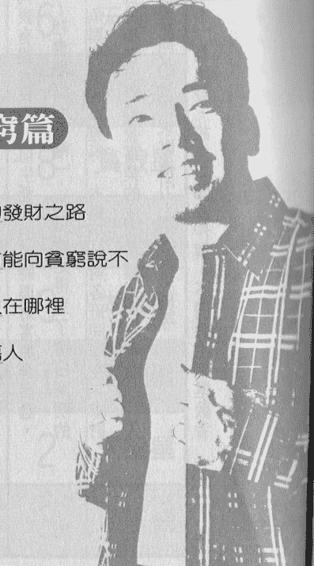

# 同班同學誰命好

# 向貧窮說不

一個命理神算師的數字管理人生法則

【知名命理專欄作家】詹惟中◎著

# 目次

【自序】

擺脫困境、遠離貧窮

005

# 輯一 同班同學篇

- 為何要學習命理

010

- 為何班級理論優於星座生肖

013

- 誰跟你是同班同學

021

- 同班同學為何成敗不一

024

# 輯二 告別貧窮篇

- 找出生命起源的發財之路

030

- 唯有遠離災難方能向貧窮說不

049

- 神啊！我的貴人在哪裡

074

- 誰在背後暗箭傷人

124

# 輯三 流年篇

- 九十三流年運勢預言 150

- 從流年斷名人運勢 166

- 打破傳統犯太歲招致不幸的迷思 171

- 打破孤鸞年不宜婚與龍年生龍子的迷思 174

# 輯四 生活印證篇

- 生活中的命理印證 178

- 總統大選鹿死誰手 186

# 【自序】

# 擺脫困境、遠離貧窮

癡人愛夢想，總望一步登天平步青雲，但大富大貴卻如鳳毛麟角。現今的環境也許稍嫌艱難，社會蕭條經濟低迷，但那只是生命中短暫的低潮罷了，花開花會謝，月也會時圓時缺，沒有苦的滋味又怎能感受甜美的感覺。然而真正的甘苦並非眼前之景，生命中最大的貧窮是不知不覺與後知後覺所帶來的傷痛，如能藉由先知先覺來參悟人生，體認生命哲理即可遠離貧窮。真聰明是看穿別人，有智慧是了解自己，要走出貧窮首先要知己知彼，方能百戰百勝！

在斗數世界中，最高境界莫過於「十八飛星四化論」，這已經流傳三千餘年，是先人累積的經驗與智慧傳承。但由於博大精深之故，想一探究竟者少之又少，筆者深研其中二十餘載，以淺薄的文學造詣參悟其中道理，進而簡化為一般白話解說，其內容並非空穴來風更不是想像捏造。

有感於目前星座學與生肖學雖廣泛流行，但卻謬誤百出，因而竭誠與世人共享此一斗數精華，並以時下所稱幾年幾班同學（如民國五十五年次，即五年五班）概念，將難懂的天干順序轉為易解的生年尾數，用數字來改變經營一生，使你更了解自己天生的優勢與缺憾，趨吉避凶，創造出更美好的生命，並對社會有所奉獻。

在各班同學之互動方面，筆者提供諸多參考實例，或許與讀者的生活背景及職業相左，但是各班同學間的交往不外乎相輔相成的絕妙組合，也可能是你情我願的結為連理，亦有可能是逆來順受的怨偶成雙；也可能是形同陌路的兄弟姐妹，更可能是反目成仇的競爭對手。無論是貴人來還債提攜或者是小人討債陷害，最重要是別讓對方有機會去傷害你，更別失去機會拒絕了幫助自己的貴人，若能讓貴人心甘情願勇於付出而不傷及對方，不也是順理成章，順應自然法則嗎？

透過本書條理分明的概念與清晰的表格，並附帶簡單舉例說明，你將深感應到生命的哲理如此奇妙而有趣，且了解人生的真實百態，如將書中訊息和常識應用在生活之中，不管與人交往合夥，情感交流互動，親情間的愛恨交織，甚至在選生貴子以及選嫁良人都有著重大而實際的助益與參考價值，至於流年流月的吉凶更能掌握一二，穩操勝算絕非難事，想脫離貧窮更是易如反掌！

# 輯一 同班同學篇

- 為何要學習命理
- 為何班級理論優於星座生肖
- 誰跟你是同班同學
- 同班同學為何成敗不一

# 為何要學習命理

喜歡算命的人，不外乎是富貴雙全或達官顯貴，當然也有想鹹魚翻身的貧窮落泊人，誰不想官封三代，豐衣足食？誰又願意三餐不繼，一貧如洗呢？古今中外，命理星相，各門各派各有所得，論調不一，但是目標和目的是一致，至於準確與否，則各憑本事。若是能趨吉避凶，轉禍為福，豈不是喜事一樁。其實準確與否固然重要，但是最可怕的是「明知山有虎，偏向虎山行」的愚勇，觀念的錯誤造成不可抹滅的遺憾。除了有知的機會，更要有覺悟的感受，否則也是前功盡棄，一敗塗地。

命運可信但不可迷，運好時勇往直前，一飛衝天，運差時守成艱難，戰戰兢兢，一念之差，終生悔恨。研究命理的真諦最可貴在於預防災難，常云「平安就是福，平凡就是美」，不難想像其中的哲理。

宇宙萬物絕對無法超脫時空的束縛，時空是時間與空間的簡稱，時間亦正是古人常說的生辰，生辰進而推衍出四柱與紫微，四柱八字則是藉由木火土金水五行的氣理來論命，原則上較難學卻易精，又稱肉骨學，不容易深刻拿捏其中玄妙。但是對運勢起落，親情緣分，壽命長短確是比較能掌握其精確性，但是對木火土金水的特性要有某種的領悟方能有所發揮，時常讓人摸不著頭緒而前功盡棄，半途而廢，甚為可惜。

而斗數則是皮毛學，在此必須說明此皮毛並非簡單之意，而是它比較容易感受、吸收，其實也是星相學的一種，但又比星座更上一層樓，因為它摻入了中國的天干地支，遠遠超越了西洋星座初級的命學。紫微雖淺顯易懂，各星曜的名稱卻涵義深刻，易背易解，由淺入深循序漸進地學習，絕對能有所成，且其影響將超越西洋星座。

紫微斗數中有一百零八顆主副星曜，代表著封神榜中一百零八條英雄好漢，也代表著佛祖佛珠一百零八個智慧，其中十四顆南北斗數星較為常用，各象徵著不同生命特資，配合命盤命宮沙盤推演並作生涯規劃。

命和運的關係極為抽象，也有很多不同的解讀方法，基本上是密不可分，但又相輔相成，彼此有輝映的功能，就像車子的結構是固定的，設計與引擎馬力也是各有規劃，但不同車型與車種應加以利用其特長，發揮適得其所的作用。車是命，運代表就是路況與環境，寒帶車跑赤道一定提前壽終正寢，越野車奔馳於北極未必能發揮性能，山路崎嶇若是老舊車型則可能中途拋錨，代表著命好也怕運來磨。積善必有庇蔭，保養汽車不也是一種預防車禍、防患未然的好方法？命的根基固然重要，知命行善還是不可或缺的。

# 為何班級理論優於星座生肖

坊間的命理叢書，總把人分為生肖、星座或血型來作推論，似乎已成為主流趨勢。不容置疑，愈複雜精算，準確性也相對提高，但金字塔頂端畢竟是高不可測，誰又有耐性去鑽研更高段的命理呢？這正是曲高和寡的悲哀。

宇宙萬物總是一物剋一物，就像食物鏈一般，弱肉強食、適者生存。從另一個角度來看，亦是相生相剋的五行觀念。

有些人一見鍾情、相互吸引，有些人交往數年卻形同陌路、毫無交集，更有人含辛茹苦、任勞任怨苦守對方，這種緣起緣滅的巧妙造化，在筆者的研究中，其實是可以用紫微斗數四化論來作比照核對的。

將甲乙丙丁的生年對照流年的天干，可推論出個人該年的運氣；也可以運用在人與人之間的生年尾數作喜怒哀樂四種變化的衝撞分析，除了精準之外，更可改善人際關係，並懂得進退有序，明辨是非，小人與君子或是貴人都可在本書中一探究竟，是來討債要錢的「相剋」，還是來還債報恩的「相生」。

其實「責難並非厭惡，吹捧並非尊重」，君子之交淡如水，幫助事業學業的人，也很可能是競爭的對手。唯有超越對方才能成長，這也是一種「相生」。「筷子下出逆子」，為人父母對下一代呵護備至、逆來順受，最後竟家門不幸盡出敗家子，這則是另一種的「相剋」。所以在印證「四化理論」時，要理性而持平去看事物，不可以偏概全而自誤誤人。

陰陽五行易理是由天干、地支逐步推演而成，地支也就是俗稱的十二生肖，雖然有其各自的木火土金水屬性，但卻沒更深入的微妙變化。紫微斗數把十天干（甲乙丙丁……）賦予四種巧妙的變化，把春生、夏長、秋收、冬藏的大自然變化融入了其中的十八顆星曜，各自代表著化祿（財）、化權（仕）、化科（貴）、化忌（厄）不同的吉凶運勢，並分別給予十種不同生年者（如甲年生、乙年生等）以上四種無法超脫的宿命靈動。

由於星曜有重複的牽連的作用，於是產生了愛恨情仇、悲歡離合、喜怒哀樂的互動。筆者將抽絲剝繭、循序漸進地簡化整理再分析，讓閱讀後情場得意、商場順心、學業有成，並遠離疾病，更廣結善緣。

九十三年是命理所稱的甲申年，其中的申是地支的稱謂，俗稱猴年，在陰陽五行的分界是屬於金的代表，但是談到甲年則暗藏玄機，筆者極力反對江湖術士的故弄玄虛，希望藉由最簡捷的論調來闡述命理與生活的關聯，發揚尾數的精髓，生年尾數是三的人（亦即西元生年個位數四的人）我們都稱之為甲年人，例如四十三年（四年三班）生的屬馬，五十三年（五年三班）生的屬龍，六十三年（六年三班）生的屬虎，雖然生肖不同，但是攸關其個人成敗的重要關鍵則是該年的天干，而絕非僅是生肖或星座。

以幾年幾班的「班級理論」來詮釋命理，其基礎是依據三千年前古人留下的紫微斗數命理古文詩賦中最莫測高深的「十八飛星四化論」，也是一種既定的論命依據，將十八顆星曜特性歸納整合，以生命中的喜怒哀樂加以演繹，藉「春生」、「夏長」、「秋收」、「冬藏」的四季變化推論出運勢及彼此互動關係，可信度絕對是無容置疑，不但言之有物，更加無不言。

簡單來說人是無法脫離空氣、陽光、水而自存自在，相對的人是要活在時間與空間之中，其實時間與空間是對等一致的，某一個生命的誕生，稱為生長，某一節目的開播，某一建築的破土，某一企業的開張，在那一瞬間早已注定了成敗，俗稱為「壽命」不是嗎？但是無論如何都無法超脫數字的影響與牽動。

除了時間、空間外，收視率的高低、用地的坪數、集數的多寡都是在數字的計算下，人類自從有文明、文化，生活中就難逃對數字的依賴——牛羊的數量、家族的人數，房舍的多寡等。且再怎麼樣的精算都難逃十進法，也就是十加一將回歸到一，這正是甲到癸的十個天干的化身，只是用不同的符號來表達，生年尾數一至零就是把甲乙丙丁轉換為現代人熟悉的數字，例如二○○四年是民國九十三年，也就是甲申年，西元二○○五年是民國九十四年，命學上稱乙酉年，一般人記不得甲乙丙丁，故筆者用簡單的個位數來方便學習，做平實而中肯推論及建議，以達趨吉避凶之功效。

在生活中總是有訴不完的無奈，也一直活在問號之中，為什麼有人相見恨晚？也有人一見如故或形同陌路？更有人相互陷害？但是如何預防反目成仇，又如何藉人際關係來相輔相成才是最重要的，大家在追求一種以具體理論作依據的理性命運，而不是馬後砲的人生哲理。

但研讀本書切記不可斷章取義，以偏概全，要細心去體驗生活，應用其中，更要心存善念與人交往，相信任何一種理論都會有正反兩面不同的評價，重要是要去適應而不是強迫別人改變。「班級理論」雖無法像八字學或斗數論命，用生辰作個人的精細批命，但其準確度，比起全民教育的星座學則過無不及，若是與生肖論命相比則更是客觀合理，尤其是生年之間以及生年與流年的四化互動，將值得推廣以及研究。

紫微斗數中最高段、最精深的理論是「十八飛星四化論命」，由於星曜的變化將隨天干（甲乙到壬癸）而產生微妙轉化，故令初學者或偏愛者望之卻步，而宇宙乾坤神秘的精髓正暗藏其中。本書將陸續揭露其中奧妙，除告知求財的方向外，更把陰陽五行的顏色數字方位作建議。補足生命所欠缺的「氣」，讓您意氣風發，不可一世，配合陽宅中的「聚風納氣」而財源滾滾。

斗數是星象文學，其中目前比較常用的星曜大約四十幾顆，分別散布在命盤中作不同的特性發揮，並配合十天干巧妙的變化，遇到了某生年天干或宮位天干（甲乙丙丁到壬癸等天干）之時，則其中會有十八顆星產生變化，轉換為財富的「化祿」、權勢的「化權」以及桃花科甲的「化科」與令人傷透腦筋、肝腸寸斷的災難「化忌」，亦即喜怒哀樂。

也由於甲到癸有十項，其中又有四種變化，故總共會有產生四十組的特性排列，而星曜又只有十八顆，所以會有重複碰撞的機會。也許A君甲年生的好星是「廉貞星」化祿，生了一個丙年的小孩，而丙年是「廉貞星」化忌，但由於彼此是父子關係密不可分，故此A君注定是該小孩的「救世主」，這種關係只是簡單舉例，其實也可以推行到親朋好友或是左鄰右舍，甚至是合夥夥伴以及終身伴侶。

除了精確可行之外，更可以作生涯規劃的指南，想求財的就依「化祿」是何星曜，以該星曜來作方向的指標，雖然不是絕對能功成名就，但由於星曜特性的相佐，一定是事半功倍。故筆者將作系統的歸納，讓讀者融入其中，深受其惠，並陸續將作相關的系列書，除遠離貧窮之外，更要教您如何佳偶成雙，永浴愛河，否則代表桃花的「化科」不就被埋沒了。更要告知讀者成在何處，敗在何時，令人痛恨不已的「化忌星」正是生命中的老鼠屎，而真正的敵人往往是自己，要相信命理而不迷信，若三十能知天命，又何必等到五十？

六十年為一甲子，起源為甲子年，第二年則順排為乙丑年，一般論命主流就是子年為鼠，丑年為牛來作十二生肖的區分，更以十二生肖來論相生相剋，命起運落，其實都忽略了排在前頭的甲乙丙丁戊己庚辛壬癸的十天干。同樣生肖的人有時候成敗不一，性格相左，但是同樣是甲年生的人則有許多觀念思想相同之處，但是由於甲年有四顆星代表不同的職場以及不同的特性，故同樣是甲年生的人，也就各自創造出自己的生涯空間。

首先要先了解自己的生年年干，方能為自身作長遠的成功規劃，最簡易的方法是民國五十三年與西元一九六四年是甲辰年，也就是民國生年尾數是三的為甲年生，生年尾數四的就是乙年；同理，西元生年尾數四的為甲年生，西元生年尾數五的人就是乙年生人。

舉例來說，二○○三年是民國九十二年，民國九十二年是癸年，所有的年干都是依序排列的。但現代人沒有人願意去記十天干的順序，所以筆者用簡化的陳述，統統按照民國或西元生年尾數來作說明，並附上簡易表格以便查閱。

有人想深入研究則一定要了解十八飛星各自的屬性，並把代表春生的「化祿」之財以及夏長的「化權」之權與貴人桃花的秋收「化科」徹底領悟，方能學有所成，以上三種變化原則是「相生」，代表吉祥富貴、相輔相成，針對疑惑敗亡的「化忌」，也就是四季中的冬藏，草木枯萎萬念俱灰，毫無生機的冰天雪地是絕路也是殊途，生涯規劃，求學之路，求財之道，婚嫁擇偶都要避而遠之。

# 誰跟你是同班同學

在簡易的論命方式之中，有以生日區分成十二個星座，稍嫌簡單了些；也有人用十二地支的生年區隔成十二生肖來評論運勢；在報章雜誌或是電視電台，常以傳統的農民曆立春、仲夏、秋分、冬至等節氣，作為大眾生活中換季調整農作或衣物更替的參考。事實上若要論個人運勢與人際關係是不能忽視天干的重要性，也就是甲乙丙丁戊己庚辛壬癸的順序，給予每一個年，每一個月，每一天所帶來的巧妙變化，這正是人類起源無法超脫的十進位數字之軌則，由甲到癸是十個數字的代號，與阿拉伯數字一體二面，但卻包含了另一種更神秘的意義。

我們常問別人是幾年幾班的同學，甚至以七年級、六年級來作比較，包括生活背景、意識觀念以及價值觀等等的分析。比如：五年三班就是民國五十三年出生的人，亦即一九六四年，以農曆而言即是甲辰年，這個辰就是地支中的屬龍。五年四班就是五十四年次出生的人，順推為一九六五年，若以農曆來論就是甲的下一位乙、辰的下一位巳（蛇），合稱為乙巳年。但一般人沒有人願意去算那複雜的六十甲子推算，也就錯失了許多寶貴的命學正確觀念，包括逢有閏月的孤鸞年則斷章取義為不宜婚娶，甚至以相差六歲命相沖不宜匹配，例如屬馬不能配屬牛、屬龍不宜配屬狗，以訛傳訛，斷送無數千古美好姻緣之結合，更離譜的是龍年會生龍子，真是無稽之談。

言歸正傳，所謂的幾班同學就是生年尾數的數字，例如民國九十二年的二班同學就是癸年生者（西元二〇〇三年），那麼九年三班的同學又回到了甲年生，所以無論你是幾年級都沒關係，最重要是六年三班也好，五年三班也好，三年三班也好，這些人都是三班同學，也都是甲年生者，都有相同的四顆斗數星曜終身相伴，有代表財運的廉貞星化祿、權力的破軍星化權、享有功名的武曲星化科以及走入敗亡的太陽星化忌。在生涯的規劃、親緣的互動以及小人的判斷，將藉由四顆星與其他班同學所產生的交集碰撞重疊來延伸；也因為所有三班同學都具有以上四顆星的人格特性及性格潛能，若是及早規劃事業財富等或作某種程度的修正改變，可避免走入敗亡的太陽星化忌之路。班級理論可適用於歐美及亞洲日韓等人士，但有一點務必留意、也就是陽曆或西元或日本平成年等都一樣，如果是年頭出生但陰曆尚未過春節正月初一的話，那麼還是要以舊曆生年來論，例如九十三年一月二十一日春節屬於甲申猴年，但是在九十三年國曆一月一日至一月二十日出生的人，仍是癸未羊年的二班同學，除非是國曆一月二十一日以後出生者，方能定義為三班同學，包括論流年國運亦是從春節開始啟運，也就是二〇〇四年一月二十一日前均屬於二班同學，故在年關交替之際出生者務必要查詢萬年曆以慎重確認。

# 同班同學為何成敗不一

上述說到十天干之中，每一個天干都有固定四顆星產生巧妙的變化，除了四顆星的特質屬性可以推論諸事外，藉由它轉化為代表富貴的「化祿」以及尊貴的「化權」和高雅的「化科」，甚至是惡耗的「化忌」，去作更精準的推算，亦可藉由四星的變化來深論生年尾數相異者相互間的互動情況，乃至找到愛情、事業、財富、逢凶化吉的貴人，但也有讀者問說，同樣生年尾數的人，為什麼各人遭遇及造化都不同？

舉例而言：有朋友問我同樣是生年尾數五的朋友中，有人是兒童玩具的總代理，也有人是大學教授，有的是室內裝潢設計師，更有的已經淪為階下囚，其原因為何？

這其實可以理解的，在生涯的規劃中，如果方向各有所好，在瞭解自己興趣的前提下，如能閱讀書中陳述的理論，就能一目了然，找出合宜的職業別及工作內容。

首先要知道生年尾數五的人是丙年生者，而丙年生者固定的有哪些星曜會產生轉換變化，丙年生者的四化星分別是——

「天同星化祿」：天同星是安逸享樂之星，也象徵天真無邪的俏皮小孩，更代表與水相關聯的事物。由於轉化為財祿，所以是追求錢財的指標，故從事幼教、幼保、兒童刊物以及嬰兒用品等販賣都是機不可失的好工作，甚至娛樂方面亦是好選擇。在醫學界工作的人，不妨選擇小兒科去發揮，貿易進出口商則以玩具或童裝等用品，在學術上則以幼教文化去拓展，都是開拓財源的最佳契機。

「天機星化權」：天機星為智慧之稱，代表分析、規劃、設計等有所專精，也是會計、精算、謀略能人，故廣告設計、劇情編寫、行銷策劃、行程安排乃至於數字的精算都是學有專長。雖然不見得有財，但卻是掌握權力的重要來源，也許是一呼百諾，卻不見得日進斗金，畢竟有財未必有權，有一得必有一失。在校園可任數理老師，在建築界可從事室內或庭院設計，在服裝界是名設計師，在公家機關是機要秘書，真是不勝枚舉，重要的是自己如何來掌握。

「文昌星化科」：文昌星是指正規的學歷以及執照，也由於轉化為科甲，不難理解是考運亨通的人，有志就學者唸個碩士、博士並非難事。不愛讀書者考運也不差，外再貴人幫忙專科應該沒問題，是唸書的材料，甚至沒有學費也有貴人幫忙，在校園也頗得人緣，許多丙年生者真的是隨便考試，隨便過關，包括駕照、律師、會計師等相關的考試，都能輕易過關。

「廉貞星化忌」：廉貞星是囚星也是半桃花星，官司訴訟纏身不斷，有的是家族或朋友牽連，也有是交友不慎，有的是家人入獄等，總是離不開與警局或法院的糾纏，同樣是作奸犯科，被捕的總是生年尾數五的人。

例如舞廳臨檢未成年人或是掃蕩色情按摩時，或是交通違規拍照等，丙年生者是機率最高的被捕者，也由於廉貞星與交通有相牽連的關係，更不宜單獨乘車或是與人奔馳賽車，輪下冤魂的不好遭遇千萬要避。

要想在黑道與人一較長短、一決勝負的話，丙年生人不是被害入獄便是死於非命，或當代罪羔羊，行騙被揭，行竊被捕，若是較善良的丙年生者，雖然不貪贓枉法，卻是歹徒下手的第一人選，簡單來說不義之財勿取，不正之道勿行，萬般皆下品，唯有讀書高，不像生年尾數三的甲年生者廉貞星化祿以及生年尾數二的癸年生者破軍星化祿，一個是行騙天下無敵手，另一個是叱吒風雲的黑道大哥。

所以同樣是丙年生者並非絕對功成名就，也並非一定慘遭禍運，重要是方向要確定，講句玩笑的話，明明是小狗卻訓練去捉老鼠，明明是貓卻教他看門，明明是飛鴿傳書，卻叫鴨子去送信，是不是貽笑大方呢？

## 輯二 告別貧窮篇

- 找出生命起源的發財之路
- 唯有遠離災難方能向貧窮說不
- 神啊！我的貴人在哪裡
- 誰在背後暗箭傷人

瞭解自己的小孩潛能就從本書開始，再去瞭解自己，本理論更可以演繹到婚姻擇偶的判斷以及災難的預防，進而追求掌握上天賦予自己的才華而出人頭地。

## 各班同學財運特質表

| 年別天干 | 班級同學 | 西元尾數 | 化祿星 |
| :---: | :---: | :---: | :---: |
| 甲 | 3 | 4 | 廉貞星 |
| 乙 | 4 | 5 | 天機星 |
| 丙 | 5 | 6 | 天同星 |
| 丁 | 6 | 7 | 太陰星 |
| 戊 | 7 | 8 | 貪狼星 |
| 己 | 8 | 9 | 武曲星 |
| 庚 | 9 | 0 | 太陽星 |
| 辛 | 0 | 1 | 巨門星 |
| 壬 | 1 | 2 | 天梁星 |
| 癸 | 2 | 3 | 破軍星 |

## 找出生命周期的發財之路

人各有志，但不代表絕對有志竟成，但是可以從下面的簡敘作為「求財」方向，名利是很難雙收的，權貴更難兩全，在追求財富時，想遠離貧窮，就必定要立志做生意，而不是做大官或做大事。在閱完之後可能發現跟你現職學毫無關聯，它並不代表有誤，只是之前生涯規劃暫時與財富擦身而過，或許在別的領域中得到了社會地位的「權」，也可能是得到了清白廉明的「科」，但是有捨必有得，魚與熊掌難以兼得，本篇是針對各班同學在「求財祿」方面的剖析，作為自己獨當一面經營事業的成功指標，在培育後代，入學選系填科，或工作上轉換部門的一種求財指引，不妨深思參考。

本書是以「向貧窮說不」為出發，故先以開源作撰，不同的生年尾數者有先天不同的發財潛能。

## 三班同學甲年生者（民國尾數二以及三元尾數四）

### 廉貞星化祿

中規中矩、按部就班地慢慢賺錢，對甲年生者而言並不能完全滿足他先天發財的夢。有的人是積沙成塔，日積月累去蓄儲財富，用血汗一點一滴創造突破銀行的數字，比較沒有耐心又愛多管閒事的甲年基本上是被除名的，也許是有少許的好高騖遠、求好心切，更想一步登天的潛在意識，也就造就了鋌而走險的求敗之路。

用「利自險中求」來形容甲年生人是非常恰當不過，由於先天代表「春生」的廉貞星轉化為財星「祿」，故它冒險犯難、勇往直前，不怕苦不怕難地求金追財，更增添變化莫測、起伏難定的變數。也由「廉貞」可以看出該財源來自於「橫財」，簡單來說，「橫財」之義包括突如其來的意外之財，一般會以為狹隘的中獎、六合彩等，其實也並非完全如此，例如投機性的投資，

例如以此馬路消息作大膽的股票或土地或公司的入股等，除了消息來源帶點爭議之外，更因「廉貞星」是一顆狂妄而不行正道的星曜，針對投資的屬性，將會有賭場、俱樂部、酒家、舞廳等類型，這也是來得突然走得離奇，一定要抓住那寶貝的瞬間，收放能否自如也是成敗的關鍵。

換個角度來看，若是從事正常投資的甲年生者，在商場一定要有所競爭與割捨，意志不夠堅定，沒有視死如歸的戰鬥力或有所猶豫不決，將是失敗的開始。開標綁標、高利吸金、賭博抽頭或在相關的單位工作等，都是甲年生者求財的方向，並不是教你不行正道，而是要瞭解自己先天的求財特性。

當然多行不義必自斃，除了偷搶拐騙之外，好像一事無成，但那倒也不至於。「廉貞星」的財是屬於南方的火財，也就是說從事相關火的事業都是可以博命一賭，舉例來說，在餐廳擔任主廚的老王，在生涯規劃時，對讀書就毫無興趣，可是聊及烹飪卻判若兩人，除了津津樂道外，並不時眉開眼笑談火候、器皿，說到材料、刀法更是口沫橫飛，五十三年次的他，由於就業方向能夠明確，造就他在美食界應有的地位，至少是年收入六百萬的名廚。

生年尾數是三的甲年生人，可以從事所有與火有關的工作，並提醒紅色是求財的幸運色。無論制服也好，或外出的汽車也好，甚至公司行號的裝潢色系，不妨可以考慮加入少許紅色，都是財源廣進的致勝顏色。包括廣得人緣的成龍，也只能以武打巨星揚名國際，猴年太陽星化忌對其不利，車禍、外傷或遭人陷害難免，最重要好心沒好報的事少做為妙。

## 四班同學乙年生者（民國尾數四以及西元尾數五）

### 天機星化祿

天機星乃智慧之神，有著驅動的熱情與活力，更有隨機應變的潛能，無論是待人處事或與人溝通總是給彼此最大的彈性，並努力創造雙贏的局面，建立互蒙其利，共生共存的和諧互動。

所謂精算家包括了室內裝潢設計師等。你將運用巧思去開拓異於常人的設計模式，創造出另類的建築美感。除了客戶耳目一新之外，更為完美細心的構圖規劃而心甘情願支付費用，可謂名利雙收。

換個角度來看，若是從事會計事務者，更能精打細算為客戶規劃稅賦等雜務，而深獲好評並口碑相傳；在廣告行銷方面，聰明的乙年生人稱他「一點子王」當之無愧，突如其來的異想天開，竟也能如願以償開創新局，當掌聲如雷之時，你早已在胸有成竹去推動另一項計畫。很多偉大的發明家幾乎都是四班同學，如果你想立志成為發明家，可透過專利法保護智慧財產權而致力於新產品研究，是絕對可以大發利市的，美好的生活正期待乙年生人去創造。

設計行銷、企劃等相關行業，是四班同學求財的不二法門，舉凡服裝設計師、產品行銷員、專案企劃員、程式設計師等不勝枚舉。

## 五班同學丙年生者（民國尾數五以及西元尾數六）

### 天同星化祿

有一位五十五年次的朋友A君，本身是幼保科系的高材生，平日從事一些幼教文書編撰工作，也由於充滿慈母的歡喜，所以在事業上能相得益彰，相對也接觸到許多托兒所的朋友，在偶然的機會下有位四十九年次B君想頂讓幼稚園給她，讓她陷入長思難以抉擇，最後還是來與筆者研究，基本上四十九年次的人本身天同星化忌，所以是不適其職，而A君五十五年次則為天同星化祿，可謂適得其所，再經過園內園外的陽宅風水建言、財位鑑定，兩年後不出所料，搖身一變竟成五家幼教連鎖店的負責人。重點並不是A君比B君聰明能幹，也不是B君智不如人，若是在政治之路或公益之路上去相比，太陽星化祿的B君是無往不利的，A君則不堪一擊，短暫失敗非永遠，重要的是能懸崖勒馬，知命用命。

五班同學你想成為育樂大亨嗎？想造就幼教天才？或想建造一所歡樂兒童迪士尼樂園？還是對娛樂事業上非常眷戀？充滿愛心的丙年生者，在娛樂相關事業方面是可以出類拔萃、脫穎而出的，包括嬰兒用品的進出口買賣或就是職於類似玩具反斗城都是最佳財富選擇。如果不小心被你考上了醫學院，更別忘了圈選小兒科，親切和善的你除了有莫名的孩子緣之外，在創辦合夥幼教事業的同時，身為「孩子王」的你，不要猶豫而錯失良機。

在從事進出口貿易的工作中，玩具、嬰兒用品、少年運動器材乃至牛乳果糖等相關產品，都是財源廣進的不二選擇，甚至兒童書籍的出版，幼教文化的拓展也會帶來不錯的成績。

## 六班同學丁年生者（民國尾數六以及西元尾數七）

### 太陰星化祿

陳太太生了一個八十六年次的小孩，迫不及待想知道小朋友長大以後的發展，天下父母心總是為孩子牽腸掛肚，若想望子成龍的話，不妨朝土木建築去發展，相關國有土地的規劃與參與會有所成就，有關土地開發、林務開拓都值得去發揮，像是國際型的重大交通計畫工程，捷運也好，國鐵也好，都非常需要此類人才！

若是好動活潑的個性，則是遠渡重洋、雲遊四海的好機會，考個飛行機長或是船務首長是輕而易舉的事。也由於太陰星化祿，母系家長的親人呵護備加，甚至有繼承祖產家業的契機，也可能得到雙親的傳家獨門技藝等，是相當有年長女性的緣分，在求財的路上是值得把握的。

太陰星也是醫學之星，在成長學習的過程中，生年尾數六的人在習醫方面有得天獨厚的特性，天賦異稟又加上考運亨通之時，自然要成為再世華佗是值得鼓勵的，像是藥劑醫療等也是非常好的事業依循方向。護理復健的研習，生化科技的研究，都是上天賦予的潛能，若是借力使力，加以努力學習，又怎會無法出頭天呢？

換個角度來看，有人已經年過五十，事業財富雖然略有所成，但面臨二次就業或再次投資的考量之時，藥局連鎖經營、診所入股開設，藥品進出口貿易何嘗不是好選擇。筆者曾經結識某桃園的某醫院負責人夫婦，除了保有鄉下人的和藹可親之外，怎麼看都沒有醫生的氣質，經過交談才恍然大悟，三十六年次的他繼承祖業土地，並與數位醫生合建醫院，一方有才，另一方有財，又有土庫相輔相成，日進斗金，無憂無慮閒逸度日，真是福澤造化。

相對於苦讀有成的醫者，十年寒窗無人問，一舉成名後卻依舊任勞任怨，戰戰兢兢在崗位上努力不懈，面對如此的大股東除了感激之外，也只能說羨慕！

## 七班同學戊年生者（民國尾數七以及西元尾數八）

### 貪狼星化祿

講到情字總是讓人淚流滿襟，難道自古多情真的空遺恨嗎？多情一定會被無情惱嗎？

那誰又是那位始作俑者呢？身為男性的戊年生者，在情場上常常是春風得意，雖不敢說左擁右抱，但紅粉知己卻是接二連三，無論情感交流或實質交往，彼此總是那麼心甘情願、無怨無悔，帶一點愛心的你所散發的魅力更是無人能擋！

並不是勸你當舞男去搔首弄姿，也不是拉皮條作媒頭，但是開酒店，經營舞廳或情趣用品販賣卻是一條值得參考的路。由於桃花高照總是有那些異性願為你作牛作馬、甘之如飴，也確實令人不解。也有可能結識千金富家女，一躍龍門，成為少奮鬥二十年的乘龍快婿，可謂艷福不淺。若以較正規的行業來說，無論男女在經營婚友介紹以及婚紗寫真來看都是大發利市的職業，也就是說與喜慶的相關業務都是頗受好評的，包括喜餅喜宴的承辦或是蜜月旅行的安排，乃至於婚友交流活動舉辦，都是有口皆碑的箇中高手。

浪漫性感的內衣行銷或情趣商品的販賣都是貪狼星化祿的旺財指引，在職場的建議則是生年尾數是七的醫學系學生，不妨選擇泌尿科或婦產科投入研究，財運與患者的認同以及研究成效都是超乎預期的理想。

從事建築土木的人，可以朝蜜月小套房的行銷包裝去發揮，在保險業不如親近新婚的客戶，作生育保健的儲蓄險都是深受肯定的，雖然隔行如隔山，但是行行出狀元，相同的行業有不同的部門，適得其所方能大成。

生年尾數七的戊年生者，先天就是一顆明亮耀眼的星星，在演藝生涯中把握時機可以揚名立萬、名揚四海，在伸展台上風度翩翩、鶴立雞群。如能懂得應對進退，遇貴人提攜，自然可以麻雀變鳳凰，影帝梁朝偉就是其中代表人物。

多變的戊年生者，為官若過於清廉，為人過於正直的話，是難以在富字有所成就，人清則無友，並不是教你作貪官污吏，只是機會良多，要三思而後行，千萬別跟生年尾數二的癸年生者一起同流合污，不是被拖累帶衰，便是要幫對方收拾殘局。微妙的班級理論，道盡了命理玄奇。

## 八班同學己巳年生者（民國尾數八以及西元尾數九）

### 武曲星化祿

對於八班幼兒的培育可以從金融去發揮，國貿會統及經濟財務等，都是銀行證券期貨股票票界的佼佼者，針對理財也獨樹一格，借貸週轉、商務投資更是穩操勝算，天生就是理財高手，也可能是富商名流之輩。武曲星本身財星又逢化祿，可謂喜上加喜，有位友人雖然只有高商畢業，但是談到理財，她不但經營土地買賣又當組頭簽賭，外帶結匯黑市外幣，還在早期放貸小額高利吸金，不但是搶錢一族並生財有道。

## 九班同學庚午年生者（民國尾數九以及西元尾數〇者）

### 太陽星化祿

活潑好動的九班同學，可以從事與旅行相關的旅遊，或是空姐，如若冷靜沉著則可以做船員，個性上又熱心公益的話，不妨從政，會像陽光普照大地，讓選民如沐春風，選票自然像雪花般飄來，高票當選不在話下。

太陽星化祿是一種動中取財的特性，在貿易界工作的人，不能靜坐公司，出差公辦是成長進步的好方法，從事科技電腦工作者亦不能靜坐在電腦前，要儘量向戶外或國外，如此方能有更多的靈感與創意。

在機關或公司上班者，要參加相關的慈善公益活動，與廠商互動中也可能有意外的財源。該年生者不可參與夜晚工作，如小夜班、酒吧、夜市或是值勤等，是生財的一大阻礙，男性間的合夥會比女性好而穩定，公司行號中的福委會也是相當適合的兼職。

## 巨門星化祿

### ○班同學辛年生者（民國尾數○以及西元尾數一）

在幼兒時期，該生年尾數的小孩並不見得口齒伶俐，但長大後卻是以口才生財的能人，除在傳播廣告界嶄露頭角，在電台或新聞傳播也是頗能發揮，他們在行銷商品時有一種莫名的魅力，能吸引眾人，強而有力的煽動力正是該年生者獨具的特質。

也由於巨門星是口福之星，針對不是很愛求學的人，不妨往餐飲廚藝方面拓展，「食神」的美譽將與你結下良緣。

巨門星有倉儲以及進出口交易，故從事貨櫃借放或運送亦是一條捷徑，想立志作公關或是教師，包括外交官等，都是頗受好評的職業。

## 一班同學壬年生者（民國尾數一以及西元尾數二）

### 天梁星化祿

此班同學往醫學界去發展是可以成功的，尤其是腦科或心臟科等老人相關疾病治療，都是學有所成。在保險業方面則要偏重壽險以及遺產規劃方面，有從事直銷者，從靈骨塔到生前契約等也都滿好發揮的方向。在老人復健器材或是安養中心的投資，也會因為有老人緣而得心應手。

天梁星是一顆長者之星，想發財的話，不妨多朝這方面去發現機會，也有一位朋友是五十一年次的，在老人成人紙尿片上的業務發展，竟然意外地豐收連連，超乎自己的想像；已經就業的社會人士，若能轉至老人福利部門也不失為一種好的轉變，在長青會老人大學任教，或是老人義診的投入都是發財加薪的好機會。

## 一班同學癸年生者（民國尾數二以及西元尾數三）

### 破軍星化祿

破軍星化祿最大的特性是先敗後成，要有破壞較能成功，沒有經歷失敗跌倒很難嘗到甜美的果實。在職業上，某些特技演員、冒險專家或是運動選手等，翻山越嶺、跋山涉水、歷經千辛萬苦的考驗，方能有成。衝浪也好，跳傘也好，都是要博命演出才能換得掌聲。

從另一個角度來看，職業是無貴賤的，只是教你遠離貧窮，畢竟行行出狀元。軍火商或是黑道教父以及討債公司，都是頗有賺錢機會。想行正道又想發財沒風險，從事微信社倒是值得一試的行業。也有人從事骨董以及當舖等投資，而擔任軍檢及情報特務都是不二人選。

## 唯有遠離災難方能向貧窮說不

在車禍之中有人劫後餘生，倖免於難。在逃亡之中有人不幸淪為槍下魂、階下囚，同樣是考試作弊，有人東窗事發，有人相安無事。一樣的立場發言，有人掌聲如雷，也有人嗤之以鼻。情場上有人得意，左擁右抱，也有人逢情必敗，談愛必哀。為什麼有人屢考屢敗？又為什麼有人痴迷宗教？一個叱吒風雲的商場大亨竟一夜間一敗塗地，一貧如洗？

所有的原因其實是有理可尋，在每一個不同的班級同學（從甲到癸），都有著一個不好的化忌星緊密相隨，在運差勢弱的時候，往往會莫名地步入敗亡之地。一旦身陷其中，不僅會貧窮，還會虛耗原有的成功的機緣，除了要避而遠之之外，更要告誡自我：那是一條不歸路。也許在分析之時，可能並沒有所說的那麼差，換個角度來看可能是一種隱憂，只是尚未惡化。生命之中想要攀龍附鳳、一躍龍門，必要多接近「化祿」的春生之道，方能欣欣向榮。若想轉換也要循序漸進，絕不可貪圖眼前之快而自得其滿。

在本篇將陳述各班不同生年者不適宜的升學科系以及工作部門，讓貧窮在生活中不得其門而入，搬除讓人困苦的「絆腳石」又何懼不富。

## 各班同學破財特質表

| 年別天干 | 班級同學 | 西元尾數 | 化忌星 |
| :---: | :---: | :---: | :---: |
| 甲 | 3 | 4 | 太陽星 |
| 乙 | 4 | 5 | 太陰星 |
| 丙 | 5 | 6 | 廉貞星 |
| 丁 | 6 | 7 | 巨門星 |
| 戊 | 7 | 8 | 天機星 |
| 己 | 8 | 9 | 文曲星 |
| 庚 | 9 | 0 | 天同星 |
| 辛 | 0 | 1 | 文昌星 |
| 壬 | 1 | 2 | 武曲星 |
| 癸 | 2 | 3 | 貪狼星 |

## 三班同學甲年生者（民國尾數三以及西元尾數四）

### 太陽星化忌

身為甲年生的人無論男女，總是與父系男性親屬較為無緣，所謂無緣也並非父不疼、子不愛，反倒是聚少離多的可能，若是跟男性家人相處，也並不是說一定不好，只是施比受更多，當然也由於孝親敬兄愛子的付出太多，所消耗己身能量，在錢運與事業上的成就自然會受影響。

在工作上也由於犯太陽星的沖，總是較容易犯男性的小人傷害。換句話說，想遠離貧窮的話，除了要遠離小人（男人）外，更要往較不造成傷害的女人相關事業去拓展，在同事相處方面，也不可鋒芒太露而招嫉妒，許多事並不是絕對但卻是相對，故不可不慎。

從事醫學工作者不宜眼科方面，除了埋沒才華之外，更是收入高薪的障礙，在照明業（燈飾方面）或是鏡子玻璃業也是倍感艱辛，畢竟太陽星是光的代表，也由於熱情與慈愛轉換為忌諱，故在服務人群的公益事業上想揚名立萬是遙不可及的，沒有遭人埋怨出口舌是非就已經是祖上積德，尤其是從政人員在選舉之中或許能有所表現，但別忘了成在此，敗亦可能在此。

有的媒體工作者在製作節目或撰寫新聞時，一樣是努力耕耘，若是跑社會寫實或是財經金融都是頗得好評，若是經營政治談話性節目或跑政黨新聞則大才小用，不適其所，相對的收視率以及錄取刊登的機會則相當不樂觀。

以上只是舉例，讀者有時要有少許的想像力，方能舉一反三，才有所獲。

太陽星是運轉不停的驛動星（古人如此認定），在航空業服務者或是火車的運輸者，包括旅遊的相關導遊，在甲年生者是成就有限，若是經營相關的旅遊網站或商品亦凶多吉少，也許某些三班同學樂在其中，也許正醉於政治的權力之中，但別忘了現在的得意絕非永遠的順心，莫讓冬藏的化忌害己誤人，要勇於超脫困境迎接財富。

## 四班同學乙年生者（民國尾數四以及酉元尾數五）

### 太陰星化忌

如果真的很「鐵齒」的話，那就去從事夜班工作，舞廳、酒家或是夜市販賣。學子在就學之時也跑去讀夜間部，加入連鎖事業加盟二十四小時的開店，以上都是相當不適合的投資，包括在電台的廣播時段以及夜間新聞都將力不從心，事倍功半，在電子工廠的加工代理若是逢大小夜班都是倍感辛勞。一樣是開計程車或是南來北往的運輸，千萬不要專排晚班行駛，就算收入再好，若是時運低落之時，車禍或被竊等麻煩，在劫難逃，先天的悲哀宿命，除了怕暗、怕水之外，夜晚的智慧以及判斷力會較差，小人亦容易來侵犯，是體質較弱，吸收力較差的階段，故不要硬闖虎穴，徒增困擾而延後成功。

太陰星轉換為忌諱更有另一層隱憂，先天有的是母不全或姐早逝或妻早離、女無緣，但並不是每一項遭遇都會碰到，只能用較白話的話來說，就是與女性的家屬較無緣。當然也有人會反映以上的情形都沒有發生，筆者亦進一步地追問，該年生的友人是長期旅居海外或求學國外或經商定居外地？是否也為了事親而背負莫名的債務？還是因為妻女的病痛，飽受折磨？突然間恍然大悟。在命理中的相沖或無緣其實是一體兩面的，有時相處一室，衝突不斷，但分隔兩地卻倍加思念，有時是相聚一堂，病痛加重，莫名的壓力與相沖很難去看清以及立即感受，但是若有不和之時，「小別」有時是勝新婚的！

太陰星也是田宅土地的代表，針對生年尾數是四者，若是經營土地買賣得意春風之時，千萬要懂得見好就收，畢竟在整個運勢來看房地產價，土地買賣是比較辛苦的職業，就算工作上沒有完全是房產，但是相關的裝潢、傢俱等都是有志難伸的，在住家方面更要留意提防宵小以及火焰的祝融之禍，有的人是遺產（來自母系親屬）糾紛橫生，不要魚肉沒吃到卻弄得一身腥！

## 五班同學丙年生者（民國尾數五以及西元尾數八）

### 廉貞星化忌

校園的醉漢亂槍狂射，地下道的扒手行竊，金光黨的行騙對象，戰爭之下的槍下戰俘，以及群架之中受傷最深者，在生年尾數五的丙年生者發生的機率是排行有名。對自身不自愛的該年生者千萬不要以身試法，失風被捕，遭友出賣，司法纏身的窘境總是困擾著你。筆者就曾經遇到過五十五年（丙年生者）生的女性友人在就學途中的公園被挾持輪暴，也算過兩位駕駛賓士六百的友人分別房車被竊。也許是巧合，但是向貧窮說不的重點是要預防萬一，而不是被意外掠奪財富而流於失敗。

廉貞星是囚星，本身就是一顆舛傲不馴的星曜，又帶少許的桃花，現在轉化為冬藏的「忌星」，自然是禍不單行，甚至許多丙年生者自己相當循規蹈矩，但卻常跑警局或法院看守所。經過詳加蒐證研究，原來是探親或是代為訴訟的律師，包括軍警、獄官等的丙年生者，為了要防止牢獄之災，不妨選擇牢房或法院的相關職務，管人總比被關好！更要提醒該年生者勿貪小失大，貪贓枉法，以及法務人員知法而犯法，往往被捕伏法的不幸兒總是該年生者，與牢房較有關聯的莫過於黑道以及偷搶拐騙的綠林好漢，除了勸君諸惡莫作之外，更要懂得明哲保身。

筆者另有位好友是生年尾數五的男性，曾詢問年少時是否有被判刑禁閉等處分？卻被認為是無稽之談，他說他雖然轉學，但也順利畢業，並沒有前科或不良紀錄。談起他的軍旅生涯卻得意洋洋，雖然僅是班長一職，但是在軍獄之中呼風喚雨，各路角頭在獄中對其無不敬畏三分，平安的光榮退伍可謂祖上積德，先人庇蔭。可惜事隔數年後，不幸因口角是非而遭人錄音控訴而敗，在碰到先天的弱點時，切記要謹慎提防，不可輕忽。

## 六班同學丁年生者（民國尾數六以及西元尾數七）

### 巨門星化忌

若是你的小孩是丁年生的，卻立志要靠嘴去吃飯，不如勸他要靠智慧會更成功。丁年生者半數以上都受女性的關照，可惜如果要想成為律師則容易敗訴連連，想當老師易辭不達意。去作民意代表口齒不清，想當外交官卻不擅辭令，聽起來好像滿慘的。其實也並非如此，天生我材必有用，人能盡其才方能事半功倍，潛能的發揮可以力大無窮，但是潛能的障礙卻也非同小可。向貧窮說不的第一首要工作就是認清自己，不是粉飾自我，而是用心去感覺自己的才能並加以利用。

巨門星是口舌是非之星，也是口慾美食之補，也由於轉變為忌諱之故，所以是病從口入，禍從口出。許多的丁年友人，不是腸胃疾病便是蛀牙連連，義齒滿滿，甚至經營美食連鎖行銷，別人荷包滿滿，而丁年的人卻是與餐飲無緣，若是想去當名廚大師更是難上加難。也由於巨門星也代表著傳播，故該年生的若從事出版事業、電台主播、節目製作也是難有大成，若擔任外交單位或當公關顧問代言更是雪上加霜，聰明的老闆選上了丁年的明星代言無事則已，一旦失言可能企業形象全毀於一旦。

丁年生者，行醫者則不宜腸胃科、牙科的投入研究，怕醫術難以發揮，也由於巨門星怕黑以及混沌不明，無論是居家或公司等，一定要求明亮的視線，方正的格局，採光的強度，方能改善所遭遇的苦難。除此之外，禍從口出之故，若果有遲到早退、愛打誑語等不良惡習，要儘早改除，嚴重的是言行不一、口蜜腹劍，而表裡不一、惡言相向，更是走向敗亡的徵兆。在吃的方面，不是挑食，便是零食亂吃或嚴重暴食，好美食進而貪杯中物，要有所節制，以免自誤誤人。

## 七班同學戊年生者（民國尾數七以及三元尾數八）

### 天機星化忌

天機星在斗數的星曜中是屬於智慧之神，同時也是精算設計的高手，可以用足智多謀的諸葛亮來比喻。但是因為轉為忌星，所以有一「聰明反被聰明誤」的可能。嚴重的甚至是杞人憂天的思考而誤導自己。想立志成為會計師或發明家或裝潢、服裝設計師，都是較難有所成的方向。很簡單的問題往往會造成你多慮而繞遠路，徒勞往返。也不是說完全不會成功，但是化忌的意思就是自我敗亡、走向辛勞之意。所以生涯規劃上不妨再三思而決定！

在公司行號中，若是戊年生者（民國尾數七）擔任廣告設計、平面設計、美工設計等都不太適宜。在旅行社工作者，則針對行程設計也是手忙腳亂的。在電子業方面，若專注在電路或網路設計也是成就有限。

該年生者個性比較敏感，也由於天機星主兄弟，所以交友要格外留意。

曾經在破獲吸毒集團的案例發現毒蟲中生年尾數七者佔百分之三十。天機星是惡習與錯誤思想觀念的始作俑者，很多酗酒、吸毒、偷竊習慣的人，也常常化忌是天機星而加深陷入。除此之外，精神錯亂，憂心症，失眠者也是該族群的特性。簡單來說要向貧窮說不之前，更要預防以上的惡習纏身，以免身敗名裂，為人父母者也不要太重視升學而造成戊年生的小孩精神崩潰。為人妻或為人夫者，若是配偶為該年生者更要相互安慰，平安度日，安享清福，過於勞累是病倒的主因。

戊年生者更不宜過度沉迷於宗教，只能信而不迷來研習宗教，否則身陷其中，難以自拔，有些巫師或法師便是如此的生年，若是立志想當牧師、神父、僧侶等一定要想清楚，否則不是信徒滿天下，反而會是苦行僧。從醫者則不宜心理重建方面的精神科或學習哲學等，都是會走火入魔的危險族群。

## 八班同學己年生者（民國生年尾數八以及西元尾數九）

### 文曲星化忌

該年生的人在財經貿易方面都能有所成長，財源廣進，商場得意。針對期貨股票借貸等也有自己獨到的見解，在大環境看好的情況之下是能發揮有成。若能走向公務人員或是律師、會計師及醫師等，雖不敢斷言財運亨通，但至少也是聲名大噪，口碑相傳。

己年生者，是什麼都想摸想學，可是沒有一樣精通，更談不上以此維生，鋼琴也只能按基本鍵，游泳也只會自由式，烹飪可能就只會蛋炒飯，樣樣都懂一些，但若想成為音樂大師、名畫家或是書法、插花大師可就要加倍努力。與其如此辛苦，不如完全投入正規的學術研究，筆者就認識幾位銀行經理以及醫院醫師，在各自學術領域中，金融業者從中獲利良多，醫學方面也有所成就，但是問他們是否有任何休閒或興趣專長，莫不搖頭以對，除了專注研究所學之外，並沒有太多時間消耗在其他方面。

所以己年生者想遠離貧窮的話，千萬不要期望自己在藝術、音樂或是旁門左道有所大成，更別指望能在琴棋書畫方面揚名立萬，那是一條艱辛而坎坷的路，若是不肯死心的話，除非家族或師友是辛年生者，或許能有所幫助。遇上癸年生者則玩心大動，心不在焉，碰到壬年生者則破財多端，財去還不見得人安樂！

## 九班同學庚年生者（民國尾數九以及酉元尾數○）

### 天同星化忌

天同星原本是一顆很安逸而舒適的星曜，也由於轉換成為禍害之源，故與其有關的工作以及事業則更是要小心謹慎。也由於該星是娛樂以及孩童幼教的化身，自然而然也就不適合去從事娛樂界。其範圍相當的廣，例如電動玩具的經營，網咖的投資等，甚至遊樂場所或是游泳池與溜滑雪場以及高爾夫球場的興建，都是相當艱辛的。也有人跑去經營幼稚園、托兒所、保育托嬰等服務，更是難上加難。

在校讀書學子千萬不要去選幼保相關科系，從醫的人更要避免小兒科系，並不是不能畢業，只是生活之中有莫名的阻力去妨礙成功或是遭遇突如其來的災難，像是兒童的校車火燒事件或是幼稚園遭歹徒恐嚇歇業，或是幼兒的手術醫療失敗次數過高，都是相關的不利實例。

在賀兄的幫忙下不也是頗得好評嗎？

同樣是三十九年次的阿扁以及小馬哥，阿扁是台北的掃黃英雄，更把賭博逐出台北的強勢市長，但卻無意間得罪了八大行業，並不是陳市長有任何的失當失職，只是屬於娛樂的區域是生命之中不宜涉入過深，就算是好心也未必得到良善的回應，就算一般民眾回以掌聲，但卻得罪了出門在外討生活的出外人，想想還是發展他本命較有幫助的整頓交通會更好（太陽星化祿），

同樣是九班同學的小馬哥，有一陣子也對網咖的設立及限制頗有微詞，業者自然反彈聲大，當然市長也是在保護學子的考量下作審慎的判斷，若是有所體悟的話，不妨完全交付屬下處理，少碰為妙，畢竟那是庚年生者先天的致命傷。

若是從流月去印證天同星化忌的可怕，將可立即發現二○○三年的農曆七月是庚月，正逢國曆八月前後，也由於天同星化忌之故，該月前前後後發生了卡車下滑撞死孩童，接二連三又是小孩不慎墜樓事件，後又捉到一名姦童色狼犯案累累，又在該月連續發生虐兒案，心狠的父母以及外傭用不同的手法傷害天真無邪的小孩，於心何忍，真是喪心病狂，令人髮指，這正是天同星化忌的可怕之處。

## ○班同學辛年生者（民國尾數○以及西元尾數一）

### 文昌星化忌

月考也好，聯考也好，期末考也好，千萬不要跟辛年生的人一起作弊，東窗事發機率最高的非他莫屬。有人會說他一生從不作偷雞摸狗的事，更別說是考試舞弊，對生年是辛年的人來說，也許不是公平的，但是也別大驚小怪的，凡事都是有程度上的差異，很多辛年生者拼命唸書，考運總是輸給丙年生者（文昌星化科），不得已只好重考或轉學，也有抱持懷疑的態度去否定，從小學到碩士班都未重考，經過仔細追問竟然有的是駕照重考或會計師、律師、醫師執照有過重考重修又東山再起的現象，但由於辛年生者是文昌星化科，故運動或音樂或藝術等總有一兩項不落人後，有的還曾獲殊榮，這也就不難體會，辛年生者想從事學術文化是比較艱辛，想在文教界出人頭地是要加倍努力，但是學有一技之長，倒是天賦異稟，自然可以出類拔萃。

文昌星也有文書造禍的隱憂，千萬不要有偽造文書或私自印製證券等違法行為，包括一生的簽字簽約都是險象環生，不是掉入陷阱，便是與人合作簽約事宜失利，這些都是辛年生者宿命中的悲哀。擔任代書或是律師以及會計師的人，包含書記官等，稍有不慎，輕則官場記過，重則賠錢道歉，甚至官災連連，所以有相關的事務，蓋章優於簽字，不蓋章更優於一切，如果有合夥人是丙年生者則請其代勞，會改善良多。

家中若有民國年尾數五的人，將可藉其文昌星化科之助，一起考試或學習或公司入股，都是可以化解以上麻煩的幫助。潔身自愛，多開口少動手是轉禍為福的好方法。

舉例來說，民國九十年、西元二〇〇一年，也就是辛巳年（蛇年）文昌星化忌。台灣有名的幾件事就是教育界的景文校園弊案轟動一時，接著又是南部校園地震重建貪污案，又接著是新台幣的偽鈔，最令人震撼的莫過於國師級的部長曾先生下台，這些都足以證明辛年流年的傷害是文昌星的轉換，生為○班同學者，又怎能不引以為戒。大陸首富牟先生也是辛年生者，因為出書批評中央而鋃鐺入獄，「文昌星化忌」的可怕更要三思而後書，否則遺憾終生，悔不當初！

## 一班同學壬年生者（民國尾數一以及酉元尾數一）

### 武曲星化忌

武曲星是斗數中的財神爺，也是一顆比較孤傲而執著的星曜，由於轉化為忌諱之故，不難理解將與金錢糾葛不斷，也許是倒會或跳票，嚴重的甚至因財持刀相向或是告上法庭，也有不幸者因親人負債累累，例如父母經商失敗而債留於子，也有的配偶在外積欠債務或是生下逆子好賭成性而造成財務危機，當然自身也有陷入擴大業務、轉投資失敗或用人不當被捲款潛逃的疑慮，並不是說注定沒有財運，只是財多也怕被劫，故要行事低調，否則被偷被搶被騙不無可能。

也可能因為飢寒起盜心，鋌而走險，例如銀樓、銀行的行搶行騙而被捕，君子愛財取之有道，壬年生者宿命之中總是被金錢所困惑，宋主席的「興票案」以及「散財童子」也就是相當無奈的事件，以及阿輝伯的「國安帳」、「軍售案」、「新瑞都案」總是脫離不了財務金錢的紛爭，相信這兩位當代政治名人自己也倍感無奈，誰叫他們都是一班同學，並不是壬年生的人沒有財運，只是說很容易敗在理財及金錢的誘惑方面。

武曲星也是一顆寡宿之星，有的人生意或許有所建樹，只可惜不是三嫁而寡的女人，便是三娶而躁的男人，故要避免厄運走向成功。除了理財之外，娶賢妻嫁良夫也是破除該星影響的方法之一。

若要找貴人，又不能不作生意，不妨從甲年生者（生年尾數三，武曲星化祿），己年生者（生年尾數八，武曲星化祿），以及庚年生者的武曲星化權（生年尾數九）中擇偶合夥，不敢說絕對完美，但是轉禍為福或減少損失是可以預見而肯定，像阿輝伯與庚年生的阿扁相互尊重推崇而成為貴人，若是轉為競爭的敵手則自求多福了，貴人與非貴人則在一念之間！

## 二班同學癸年生者（民國尾數二以及西元尾數三）

### 貪狼星化忌

人的一生之中，總不免為情傷神，為愛感冒，但這一切也都僅限於個人的年少愛情或成年的婚姻，一旦陣痛過後雨過天晴自然更上一層樓，也許這正是成長必經的路。

但是如果牽連到財富與事業可就非同小可，不可等閒視之，有的為情所苦難以自拔，甚至傾家蕩產，苦不堪言，再回頭時已後悔莫及。

如果你是癸年生的人，千萬不要從事婚姻仲介的工作，酒店的經營以及色情的媒介包括較浪漫的情趣商品的代理與販賣。請句直接點連風花雪月、紙醉金迷的歡場也別涉入其中，包括師生戀，不倫的婚外情以及遭受仙人跳等幾乎都是榜上有名，除了要避免被迫害外，自己也不能用情色加害於人，是生命財富的沉淪之象。

癸年生者情感生活愈單純，愈能潔身自愛，成就也就非凡，當有情色誘惑來臨時，那是一種警訊，就好比見到不祥黑貓或報憂烏鴉一般，可能有大禍臨頭。首先在工作環境的謹言慎行與人際交往的反思，不然就是常洗滌內在心靈，否則會有離婚分手，失業破財，身敗名裂的危機，明知山有虎，勿往虎山行！

癸年生者在軍公檢警方面能開創財運，在傳播事業可大權在握深獲肯定，在土地營造、室內裝潢或醫學醫療享譽海外，名揚四海。但是成功立業可能接踵而來的將是金錢情色的誘惑，飽暖易思淫慾之外，貪官污吏、行賄索利等貪瀆事件要嚴加防範，一樣是收受紅包大喝花酒，縱橫慾海，鋃鐺入獄，丟官罷職的倒楣鬼總是癸年生的人，一樣是桃色風波，橫刀奪愛，被殺毀容或衝動行凶的，往往是用情甚深的這群人，也包括深夜不歸，慘遭狼吻的不幸遭遇。

想要追求財富平安的癸年生者，除了潔身自愛，不妨多親近生年尾數七的戊年生者，藉由該人的「貪狼星化祿」來化解厄運。

## 神啊！我的貴人在哪裡

有人一生逢貴人相助平步青雲，仕途順暢，也有人一生總是屢犯小人命運乖舛，誰又不想處處或時時有人來提攜幫忙呢？

首先要瞭解什麼是貴人？其次是該貴人屬於財富或權勢或是功名的相助？再來就是如何趨近貴人、遠離小人？如此方能逐步向貧窮說不，雖不致大富大貴，至少也可避免一貧如洗，兩袖清風，也不致居無定所、一生蕭條！

達官顯貴之友見死不救亦是非友，所謂貴人並不是絕對的有財有勢之人，若能真心相待，以誠相對的普通朋友反而是不可多得的貴人，在跌倒前的瞬間能伸手攙扶者，就算是沿路行乞的貧困之人也是貴人，絕不可掉入有錢人就是貴人的迷思！

其次就是貴人的分類，在斗數四化論之中能幫助金錢或物質的人稱之為「化祿」貴人，能傾囊相助全力以赴，毫無保留的親友可謂財富貴人，有的甚至自己拮据度日，但為了相助一臂之力，毫不遺餘力。

在本篇中就會告知幾班同學要找幾班同學的貴人去「討債」，而且對方會無怨無悔地並甘之如飴，所謂討債並不是借據的欠款，而是先天生年尾數之中「相生」來相助的一種自然互動關係，有的是情侶的情債，有的是親子間的付出，也有的是兄弟朋友間過度信任而投資負債，若是能提早預防不是皆大歡喜，兩不相欠，避免反目成仇嗎？

針對權力的貴人則是用「化權」來討論，一般的讀者對權力的互動可能較抽象，舉例來說，在班上被欺負毆打，或在職場會議中被同事冷嘲熱諷，或是在球場比賽雙打的配合情況，包括民意代表在議會上的諮詢對答方面。

萬物總是一物剋一物，權代表著衝突與權力，故有激烈的爭議。從另一個角度來看，則是軍權與兵權，不想富可敵國，但想殺戮戰場、戰績輝煌，則一定要有化權的長官來相挺。

本篇亦會告知那些同學是權力貴人，若是周遭都沒有該班同學，那就要自己調整，可能是調整心態逆來順受，不然就是要調整部門或單位，不要太牽強，若是有外調的機會，不妨參考下一位長官或同事是幾班同學，或許真的是命中的權貴。有的是你一生的貴妻、貴夫，龍門一躍，鯉魚翻身，可謂攀龍附鳳，麻雀變鳳凰不是夢，但麻雀要潔身自愛方能有機可乘，否則與其擦身而過，甚至貴人轉為小人。討債與還債，往往是一念之間，一線之隔！

有人一生傲骨，瀟灑自若，不貪名利，這種能夠享受清譽的現象，在古書中稱之為「化科」，也是俗稱的誇獎以及讚美，也就是功成名就，包括高中狀元以及金榜題名之喜，像是律師、醫師、會計師、工程師等等的執照考試中，基本上是有某種程度的社會地位，但並不代表財富以及權力，若能轉為名醫等則有名利雙收之善果，或是選上律師公會理事長以及立委，則是科權守命，雙喜臨身。故對「科甲之貴」要有所認識，其重點應放於師生、同學之中較有實際的相助，若是交到狗肉朋友，則流於阿諛奉承，表裡不一的尊敬。在拜師學藝之路上，或是政壇的接班以及巧藝的研習，想增廣見聞，提升智慧的話，對於本篇中的「化科貴人」可就要恭敬有加，方能學有所成，要像麥穗一般彎腰謙卑，成果收穫也會愈大愈多，貴人將如過江之鯽地蜂擁相助！

◎以下各圖表為作者精心整理繪製，請勿抄襲翻印。

## 貴人尋救簡易表

| 互動班級 | 化祿班 | 化權班 | 化科班 |
| :--- | :--- | :--- | :--- |
| 該班同學 | | | |
| 3班同學 (甲年生者) | 8.9.2 | 9.0 | |
| 4班同學 (乙年生者) | 6.1 | 1.5.7 | 6.8.9.2 |
| 5班同學 (丙年生者) | 3.4 | 6 | 6 |
| 6班同學 (丁年生者) | 4.5.0 | 2.5.7 | 2.9 |
| 7班同學 (戊年生者) | 4.6 | 5.8 | 2.6.9 |
| 8班同學 (己年生者) | 1.7 | 4.9 | 3.0 |
| 9班同學 (庚年生者) | 5.6.8 | 6.7.0 | 3.2 |
| 0班同學 (辛年生者) | 9 | 2 | 5 |
| 1班同學 (壬年生者) | 8 | 4.9 | 3.4.8 |
| 2班同學 (癸年生者) | 6.0.7 | 3.7.8 | 9 |

## 三班同學（甲年生者）

### ◇ 求財貴人

### 八班同學武曲星化祿

三班同學先天是武曲星化科，所代表的是在金融貿易、經濟財務方面可以得到好名聲，也頗能得到信任與口碑，像俞國華先生一路在金融界叱吒風雲，逐漸平步青雲躍登丞相寶座；同樣是三班同學若是跟八班同學作密切的配合（除壬年外）都會有相輔相成的奇效，對八班同學肯定讚美愈多，旺財興盛的助力愈大！

### 九班同學太陽星化祿

前一個例子偏重財務互助，但是針對九班同學對三班的付出，除了有去無回，還包含了勞心傷心，亦即九班同學除了幫忙之外，自己還得以辛勞去換取物質來供給三班同學，比較有奔波之苦。三班同學受苦之時別忘了向九班同學哭訴一番，通常在向男性的父兄或情人丈夫去哭訴會更具效果，例如想旅遊、購車或是配眼鏡等需求，都是不難完成，或是加薪以及政治立場的聲援應該會有所回應！

### 二班同學破軍星化祿

在生意投資方面或是學業學費的求助，三班同學是破軍星化權，責任心很強，不愛墨守成規，好一反常態去突破困境甚至在同中求異，若是能跟二班同學結合的話，除了金援之外，也能緩和三班同學衝刺的殺傷力，是相互輝映的絕佳組合。

### 三班同學貴人對照表

| 年別天干 | 班級同學 | 西元尾數 | 化祿星 | 化權星 | 化科星 | 化忌星 |
| :---: | :---: | :---: | :---: | :---: | :---: | :---: |
| 甲 | 3班 | 4 | 廉貞星 | 破軍星 | 武曲星 | 太陽星 |
| 己 | 8 | 9 | 武曲星 | 貪狼星 | 天梁星 | 文曲星 |
| 庚 | 9 | 0 | 太陽星 | 武曲星 | 太陰星 | 天同星 |
| 辛 | 0 | 1 | 巨門星 | 太陽星 | 文曲星 | 文昌星 |
| 癸 | 2 | 3 | 破軍星 | 巨門星 | 太陰星 | 貪狼星 |

## 求財貴人

四班同學（乙年生者）

六班同學太陰星化祿

四班同學基本上是比較不適合土地或房地產經營的工作，包括在醫學方面也是艱辛的職場，而親情方面相當值得擔心的是與母系親人較緣薄，也可能少小離家求職求學而與母姐妻女較疏遠，這是先天太陰星化忌的惡因所致，甚至在晚遊或是航海方面也是頗為艱辛的行為。

但是天無絕人之路，若是家人、長官或是師友是六班同學，那麼他們可真是為你絕對付出，至少也是禮讓三分，但若四班同學太自以為是，則易將貴人趕走，自食惡果，自討苦吃！

## 四班同學貴人對照表

| 年別天干 | 班級同學 | 西元尾數 | 化祿星 | 化權星 | 化科星 | 化忌星 |
| :--- | :--- | :--- | :--- | :--- | :--- | :--- |
| 乙 | 4班 | 5 | 天機星 | 天梁星 | 紫微星 | 太陰星 |
| 丙 | 5 | 6 | 天同星 | 天機星 | 文昌星 | 廉貞星 |
| 丁 | 6 | 7 | 太陰星 | 天同星 | 天機星 | 巨門星 |
| 戊 | 7 | 8 | 貪狼星 | 太陰星 | 右弼星 | 天機星 |
| 己 | 8 | 9 | 武曲星 | 貪狼星 | 天梁星 | 文曲星 |
| 庚 | 9 | 0 | 太陽星 | 武曲星 | 太陰星 | 天同星 |
| 壬 | 1 | 2 | 天梁星 | 紫微星 | 左輔星 | 武曲星 |
| 癸 | 2 | 3 | 破軍星 | 巨門星 | 太陰星 | 貪狼星 |

## 求權貴人

九班同學武曲星化權

九班同學真是三班同學的超級貴人，除了有太陽星化祿來救助之外，另外又要以個人財力、金融人脈或職務去力保三班同學，也就是給予資金申請或週轉的最大方便，而三班同學千萬別忘了用自身的武曲星化科去感恩讚美九班同學，如此方能相得益彰！

## ○班同學太陽星化權

三班同學在事業工作學業或是公司之中，若是遭遇不平對待或是欺侮責罵時又哭訴無門，千萬別忘了去叨擾○班同學，不要說拋頭顱灑熱血，至少也會路見不平拔刀相助，用盡所有管道力挺到底，像太陽般的絢麗去照耀呵護，機不可失，要有所把握！

## 一班同學天梁星化祿

一班同學與四班的互動可以說是相互依賴，共同成長，就像海洋中的小丑魚躲在海葵身上一樣，一班同學的財氣可以造就四班同學能力的發揮，而四班同學的自信與專業素養也正是彼所欠缺的。舉一個最實際的例子，由於天梁星與慈善醫藥有關，而一班同學又不適合獨立經商，故可以考慮跟四班同學共同努力發揮，不動產用一班同學的名字，而公司執照用四班同學；若是夫妻間、父子兩代間或是兄弟關係，其實都是很不錯的組合！

## 求權貴人

### 五班同學天機星化權

在設計與發明之路，沒有人能與先天天機星化祿的四班同學相比，他們總是可以青出於藍勝於藍，簡單來說，除了生財有道之外，若是能有五班同學的天機星化權加持力挺之下是成功可望的，兩個「點子王」碰在一起將創造出難以想像的奇想，可以發揮在軟體設計，廣告編排、庭園裝潢以及美術音樂文學創作，不勝枚舉。

### 七班同學太陰星化權

在夜黑風高的夜晚，在午夜夢迴的寂夜中，在舉目無親的生活中，四班同學若是欠缺母愛或親人關懷的同時，真正能深入你心的人想必七班同學是可以親近的對象。傾訴心聲也好，信心打氣也好，精神喊話也好，不妨可以留意身邊的親友，可能是同學同事，也可能是不知名的網友，但可千萬不要誤入情網誤入歧途，正規相愛交往是可以值得贊同的！七班同學的化權星是太陰星，正好是四班同學最脆弱的太陰星化忌，善加利用將有助益！

### 一班同學紫微星化權

一班與四班同學有一顆相當特殊的紫微星產生了重複，而四班同學是紫微星化科，代表著口碑下的乖寶寶，也就是頗有兄長提攜拉拔的機會，或是因美言而升官。而一班同學是直接由長者賦予權力，談到權力相對也就是壓力，都是一班同學的權力會釋放給四班同學，或許是把長者交付的特權予四班同學，也因此能取悅四班同學並推崇有加，就這麼互推互拉中成長，難兄難弟也好，肝膽相照也好，倒是頗佳的拍檔。

## ◇求名貴人

### 六班同學天機星化科

在發明設計或是分析規劃方面，六班同學總是對四班同學讚不絕口，也可能人生哲理或是機智聰敏等，總是相互佩服，針對精算企業方面，也是推崇有加，相互加分並加油。

### 八班同學天梁星化科

在醫學或宗教有所研究或學有所專的四班同學，想揚名立萬、家喻戶曉，千萬別忘了八班同學的神奇人脈與助力，也因為有八班同學的從旁輔助，可以化解四班同學在事業上的執著與倔強。

### 九班、二班同學太陰星化科

所有的助益都比不上雪中送炭，在四班同學迷航之時，九班、二班同學的太陰星化科給予的鼓勵就像燈塔一般明亮而正確：就像迷途的羔羊沒有媽的呵護，怎能平安度日。在低潮缺乏鼓勵之時，九班、二班同學是一個可以信任與傾訴心事或求救的選擇之一，不妨參考！

## 五班同學（丙年生者）

## ◇ 求財貴人

### 三班同學廉貞星化祿

五班同學先天就是廉貞星化忌，簡單來說是行騙行搶的好對象，也是誤入歧途遭人陷害的代罪羔羊，總是與莫名的官司訴訟相牽連，不是自身也可能是親友或房產或刀傷醫療糾紛等。訟訴官司可大可小，一旦沾上就滿身腥，故平時的貴人則要接近律師、警務或民意代表的三班同學。養兵千日用在一時，或許跟三班同學常交往都是轉禍為福，遠離災難的方法！

有一位銀行副理是五班女同學，經過了解後並沒有任何官非，奉公守法，再一次確認其夫與二子竟然都是三班同學，在家貴為太后，左呼右應、夫疼子孝，全都是還債的，真是幸福美滿！

### 四班同學天機星化祿

在事業與工作上或是研發的路上，那一份勇往直前拼命三郎的衝勁是五班同學的執著，但是有時會因為設計的經費不足常會造成停滯中斷，此時此刻，親友之中若是有四班同學的幫忙，相信在研發的辛勤之路上可望突破，也可能藉由其引見或開導、傳授技術而有所建業，從另一個角度來看也可能修身養性的頓悟，雖然沒有豐富物質，但是卻富裕了精神層次。

## ◇求權、求名貴人

### 六班同學天同星化權、天機星化科

彼此相互之間都是貴人，六班同學可以從五班同學身上得到財源拓展上的相當支持，而五班同學在事業上想有所突破也可以藉由六班同學的職務與人脈去發揮，盡其所能地發展其原有的特殊權力相互支持，若在深夜中就算聽見兒女的哭啼聲，也能感受到那種天倫樂的幸福，更加勇於打拼努力工作，樂此不疲！

## 五班同學貴人對照表

| 年別天干 | 班級同學 | 西元尾數 | 化祿星 | 化權星 | 化科星 | 化忌星 |
| :---: | :---: | :---: | :---: | :---: | :---: | :---: |
| 甲 | 3 | 4 | 廉貞星 | 破軍星 | 武曲星 | 太陽星 |
| 乙 | 4 | 5 | 天機星 | 天梁星 | 紫微星 | 太陰星 |
| 丙 | 5班 | 6 | 天同星 | 天機星 | 文昌星 | 廉貞星 |
| 丁 | 6 | 7 | 太陰星 | 天同星 | 天機星 | 巨門星 |

## 六班同學（丁年生者）

## ◇ 求財貴人

### 四班同學天機星化祿

在學術研究或是宗教的學習也好，抑或設計行銷方面，光是得到讚美以及獎狀是沒有辦法填飽肚子的，六班同學有著莫名的完美主義，既想擁有功名，又想創造意外的財源，不妨可以參考配合四班同學，但彼此又有一顆太陰星碰撞，又是六班同學要有所犧牲，也就是可能先好後交惡，故要慎選四班同學來配合，女性較有口舌紛爭，記得天下沒有白吃的午餐，不如共享成功，不要獨吞好處！

### 五班同學天同星化祿

六班同學在事業或是幼兒教育方面會有一點自我的主觀意識，在休閒娛樂方面也是一板一眼，可能是釣魚、打球輸了或是電玩比賽不理想而生悶氣，也可能是弟妹子女未能順心如意而失望生氣等，若是能與五班同學來個雙打結合或是共乘協力車等都是頗好的組合，當然這只是作比喻，也可能是開設幼稚園或是幼兒美語等事業，都是頗為看好的，只可能是共創某種休閒娛樂中心或相關器材，因為天同星所產生的微妙特性是以上的相關事務，如有的交集包括節目製作配合或是大眾傳播等也都不錯，有的是打牌聚賭等也就不用多說了！

## 六班同學貴人對照表

| 年別天干 | 班級同學 | 西元尾數 | 化祿星 | 化權星 | 化科星 | 化忌星 |
| :---: | :---: | :---: | :---: | :---: | :---: | :---: |
| 乙 | 4 | 5 | 天機星 | 天梁星 | 紫微星 | 太陰星 |
| 丙 | 5 | 6 | 天同星 | 天機星 | 文昌星 | 廉貞星 |
| 丁 | 6班 | 7 | 太陰星 | 天同星 | 天機星 | 巨門星 |
| 戊 | 7 | 8 | 貪狼星 | 太陰星 | 右弼星 | 天機星 |
| 庚 | 9 | 0 | 太陽星 | 武曲星 | 太陰星 | 天同星 |
| 辛 | 0 | 1 | 巨門星 | 太陽星 | 文曲星 | 文昌星 |
| 癸 | 2 | 3 | 破軍星 | 巨門星 | 太陰星 | 貪狼星 |

### ○班同學巨門星化祿

六班同學的口才並不見得好，遇上行銷、推銷的時候，總會有以下幾種現象，例如言過其實、辭不達意、承諾過多、造謠撞騙等，或是花言巧語，一旦闖禍之後，總是像熱鍋上的螞蟻一般，臨時才討救兵，有緣的話○班同學是值得去乞求的貴人，也許能轉禍為福。

從另一個角度來看也可能六班同學的口福欠佳或腸胃不好，若是想結識名廚或名醫來相救，○班同學是不二人選！

## ◇求權貴人

### 二班同學巨門星化權

吵架輸了，或是罵錯人了，或是爭執不下，互不禮讓之時，總是想討救兵，更嚴重的是談判失利，或是訴訟答辯失敗的時候，很想找一支大鋼炮去對抗敵方，這個時候就是二班同學巨門星化權大顯神威的時機，就像五雷轟頂一般嚇退對方，如此強硬的背景與靠山，讓對手不戰而慄，知難而退！

### 五班同學天機星化權

這是一種互惠互助的結合，五班同學有自己學術專業或知識的知名度，但學無止境，山外有山，人外有人，當遭遇瓶頸之時，唯有結合五班同學的特殊才能或是特殊專長方能突破重圍，這個時候就可以共享成功之後的名利雙收，日本就有個節目叫《超級變變變》，大家齊力斷金，也可以比喻作詞與作曲或是編劇與導演，但這類的結合還是跟智慧發明較有關聯，可不要流於智慧犯罪，像電影中的行騙天下，瞞天過海！

### 七班同學太陰星化權

太陰星主田宅，也是女性的隱性表徵，除了與房地產有關事物外，通常是年長或平輩的女性前來支援，為六班同學聲援到底，也得到深深的認同與肯定，但是往往因為想法作法並未按部就班，反而會另外製造問題，畢竟七班同學的天機星化忌會造成六班同學某種程度的傷神。簡單舉例A小妹永遠是媽媽的支持者，無論媽媽如何地奔波勞苦，總是接送不斷，噓寒問暖，只可惜只要一旦離開母親的視線便奇裝異服，亂交朋友或酗酒吸菸，讓母親傷透腦筋，啼笑皆非！這兩班彼此間的關係是以六班的太陰星化祿（指財力的擴展）去輝映到七班同學的太陰星化權，七班同學可由六班同學處得到財務的幫忙，但是也要盡一臂之力，拔刀相助，若是以選舉來形容就像椿腳拿到了好處，就算是挑燈夜戰也要勇於遊行支持到底，這種關係有一點像共生狀態，並不是只出一張嘴，而且要有行動付出！

## ◇求名貴人

### 二班同學太陰星化科

從表格中不難理解丁年生的六班同學好結善緣，光是貴人就來自各路，包括二班同學以及五班同學還要對其多次的支持，真是人氣頗旺，不像三班同學沒有求名貴人，也不像○班同學貴人總數僅有三個，真是少得可憐；言歸正傳，還是要談談與二班同學的互動關係，只要嘴巴甜一點，針對六班同學，也許是直屬長官，也許是母姐，也可能是祖母婆婆等等，講到甜頭就一定要用動人的歌功頌德的崇拜方式來認同六班同學，相信嘴甜吃四方一定會屢奏奇功。

### 九班同學太陰星化科

情況基本上與二班同學的太陰星化科有異曲同功之妙用，但不能找他幫忙爭吵謾罵，因為二班同學的巨門星化權，會去解救六班同學巨門星化忌所造成的口舌是非，九班同學就純粹是彼此肯定，並於求學或創業亦有機會得到六班同學意外的金援等。

## 七班同學（戊年生者）

## ◇ 求財貴人

### 六班同學太陰星化祿

在事業與學業中，七班同學有太陰星化權，它代表的意義是絕對的完美主義，在責任心上也有絕對的擔當，尤其是醫學研究及土地開發建築等從事者，在家庭倫理中也有機會得到女性親屬的信任與依賴，若是有相關的六班同學之親友來相助，可謂如虎添翼，在經費或土地的開發與獲得，或是裝潢等贊助都能相互加分。

### 四班同學天機星化祿

天機星本身是智慧之星，故給予七班同學的旺財，基本上應該是建立在精神或是技術層面，常云「給他魚吃，不如教他釣魚」，也就是在智慧的開啟或是文憑執照取得的幫忙，情況較差的，則是七班同學不良嗜好必須依賴四班同學來滿足，如吃喝嫖賭等，儘量不要走到這一步。

## ◇ 求權貴人

### 五班同學天機星化權

前一篇是四班同學天機星化祿救七班同學的天機星化忌，那種互動是建立在消耗自己的財富或賺錢的機會，去幫助七班同學所遭遇到的困境，也可能是疾病的救援等；而五班同學是化權來相助，權就是拳頭或是腕力，也就是一種人脈或特權的力量，例如住院的病房插隊或是指定某些名醫，也可能是興建廟宇的土地取得、比賽的信心喊話等，反正五班同學總是對七班同學有某種程度的眷戀或不捨，尤其是先天有少許多慮的七班同學。

### 八班同學貪狼星化權

在情路上或是賺錢的路上，八班同學與七班同學可以說是肝膽相照，一個出錢一個出力，若走入歧途則是狼狽為奸，例如公事相關有權之人圖利商人，相互呼應，圍標綁標或銀行超貸都是這類的組合，也可能是詐賭行騙、裡應外合，在情場上的追求，七班同學如沐春風，若是有八班同學的相互臨門一腳，更是相得益彰，主要是碰撞的星是貪狼星所致，這就是星性要參悟，方能作更準確的推論！

## ◇求名貴人

### 二班同學太陰星化科

在各班同學之中，我們常發現太陰星的轉換時常出現，主要是人類無法超脫，一是從小到大的母愛，二是人與大地結合的默契，包括山田河川等之土地，三是夜以繼日的日月星辰相伴，而太陰星正是母系的母愛、土地田宅與完美無缺照亮大地之代表，故七班同學與二班同學針對上述諸事都是相互助益，不可錯失！

### 六班同學天機星化科

杞人憂天、憂國憂民是讚美七班同學，七班同學什麼都好，就是想法與觀念以及人生哲理異於常人，嚴重的是憂心症或精神緊張等，若家中親友間六班同學的鼓勵開導是可以化解的。有的則轉為發明設計，有的則是沉迷宗教、勸人為善，主要是精神要有所寄託，也可能轉為精算等，雖然無法有所大成，但是要走向正面，否則會流於不良嗜好。

### 九班同學太陰星化科

這種情形很類似二班同學的太陰星化科，身為九班也好或是二班也好，先天就是與七班同學有著莫名的宿命牽連，但是二班同學一定要主動去關心讚美七班同學，主要是七班同學先天的四化星之中是貪狼星化祿，可以化解二班同學情關的困惑，彼此共生的關係就像唇亡齒寒一般，可是九班同學可就沒有那麼主動與迫切，但是基本上相互的擁抱與支持是可以提升而有所助益。

## 七班同學貴人對照表

| 年別天干 | 班級同學 | 西元尾數 | 化祿星 | 化權星 | 化科星 | 化忌星 |
| :---: | :---: | :---: | :---: | :---: | :---: | :---: |
| 乙 | 4 | 5 | 天機星 | 天梁星 | 紫微星 | 太陰星 |
| 丙 | 5 | 6 | 天同星 | 天機星 | 文昌星 | 廉貞星 |
| 丁 | 6 | 7 | 太陰星 | 天同星 | 天機星 | 巨門星 |
| 戊 | 7班 | 8 | 貪狼星 | 太陰星 | 右弼星 | 天機星 |
| 己 | 8 | 9 | 武曲星 | 貪狼星 | 天梁星 | 文曲星 |
| 庚 | 9 | 0 | 太陽星 | 武曲星 | 太陰星 | 天同星 |
| 癸 | 2 | 3 | 破軍星 | 巨門星 | 太陰星 | 貪狼星 |

## 八班同學（己年生者）

## ◇求財貴人

### 一班同學天梁星化祿

八班同學是頗有老人緣，愈是誇獎愈是努力表現，自尊心也頑強，而一班同學則是要實質的回饋更能滿足，主因是八班是天梁化科，一班天梁星化祿則以禮物或現金為主，但這二位都是長者頗為器重的人，若是在結合的同時，除了彼此加分以外，和諧度相當高，有一對夫妻也是如此結成連理，女的嘴甜男的心愉，夜以繼日拼命工作，供養其富裕而安定的生活！

### 七班同學貪狼星化祿

七班同學貪狼星化祿，與八班貪狼星化權相互權財輝映，尤以異性的得助，更蒙其利。

## ◇求權貴人

### 四班同學天梁星化權

八班同學與四班同學有正面互助之外，同時還要留意彼此的個性以及觀念是否一致，而就兩者都擁有的天梁星而言，既是壽星也是慈善醫療之星，彼此科權輝映，所產生的意義以及想像的空間很廣，筆者只是概略的舉例，生活之中形態與環境千變萬化，不可能一語道盡，所謂「功夫引進門、修行在個人」。就本例說，也可以建立在重病臥床的八班同學遇上了四班德高望重的權威名醫，給予醫療治病，立刻藥到病除，也可能是教授或教學的結緣，一種啟蒙智慧的增進，故貴人無所不在，與人交往要謙遜有禮！

### 九班同學武曲星化權

這兩班同學若是在商場合作，可謂狼狽為奸，互蒙其利，彼此產生的火花可能還是放在利字為主，八班同學若先天能從商自然成就不低。但是空有經商的資金與人脈是不足的，若是結識了九班同學在政界或公家機關有權又有能，也許沒有啥錢，但相互熟識信任後一拍即合，就這麼裡應外合，讀者也不要一定拘泥公家機關等限制，也可能其他的商業行為，就是有錢大家賺，這兩班同學的合夥合資等都是頗看好的組合！

## ◇求名貴人

### 三班同學武曲星化科

所謂求名若是發生在三班與八班的武曲星化祿與武曲星化科則就是信用的擔保，而這種擔保單純來看就是口頭的稱讚；若是從家族關係來看，很可能是其一要考會計師、銀行家等資格求助功名，另一位則出錢供其補習就學，也是一種沒有辦法脫離金錢關係的互動。

## 八班同學貴人對照表

| 年別天干 | 班級同學 | 西元尾數 | 化祿星 | 化權星 | 化科星 | 化忌星 |
| :---: | :---: | :---: | :---: | :---: | :---: | :---: |
| 甲 | 3 | 4 | 廉貞星 | 破軍星 | 武曲星 | 太陽星 |
| 乙 | 4 | 5 | 天機星 | 天梁星 | 紫微星 | 太陰星 |
| 己 | 8班 | 9 | 武曲星 | 貪狼星 | 天梁星 | 文曲星 |
| 庚 | 9 | 0 | 太陽星 | 武曲星 | 太陰星 | 天同星 |
| 辛 | 0 | 1 | 巨門星 | 太陽星 | 文曲星 | 文昌星 |
| 壬 | 1 | 2 | 天梁星 | 紫微星 | 左輔星 | 武曲星 |
| 戊 | 7 | 8 | 貪狼星 | 太陰星 | 右弼星 | 天機星 |

## 九班同學（庚年生者）

## ◇ 求財貴人

往往總是會誤解求財就是對方要拿錢給你，天底下哪有不勞而獲，但是在沒有金錢交流之下是否也能旺財呢？有一位九班同學的媽媽是高薪職業婦女，嫁給了一位五班同學的先生，先天的五班是天同星化祿，注定來化解九班同學天同星化祿

## 九班同學貴人對照表

| 年別天干 | 班級同學 | 西元尾數 | 化祿星 | 化權星 | 化科星 | 化忌星 |
| :---: | :---: | :---: | :---: | :---: | :---: | :---: |
| 甲 | 3 | 4 | 廉貞星 | 破軍星 | 武曲星 | 太陽星 |
| 丙 | 5 | 6 | 天同星 | 天機星 | 文昌星 | 廉貞星 |
| 丁 | 6 | 7 | 太陰星 | 天同星 | 天機星 | 巨門星 |
| 戊 | 7 | 8 | 貪狼星 | 太陰星 | 右弼星 | 天機星 |
| 己 | 8 | 9 | 武曲星 | 貪狼星 | 天梁星 | 文曲星 |
| 庚 | 9班 | 0 | 太陽星 | 武曲星 | 太陰星 | 天同星 |
| 辛 | 0 | 1 | 巨門星 | 太陽星 | 文曲星 | 文昌星 |
| 癸 | 2 | 3 | 破軍星 | 巨門星 | 太陰星 | 貪狼星 |

### ○班同學文曲星化科

之前所敘述說明的相互加分的配合，現在則是○班同學有去無回的付出，但是與金錢情色等關聯較少，純粹以學習的角度來分析推論，針對多學多能、不學無術（指什麼巧藝都很會吸收，但是讀書文憑則興趣不高）的○班同學，無論美術、音樂、雕刻等總是不落人後，可是一旦碰上了八班同學，除了自己原地踏步之外，還要全心全意教授輔導該員，可說是得不償失；八班同學不適合巧藝維生難成大器，很容易半途而廢！除非是○班同學名師指點，或許還有一線生機，小販捆工、小吃地攤等很多都是如此！

## 六班同學太陰星化祿

九班同學若是想有一個家（住屋）或是想娶一個賢妻良母，或是考慮避免婆媳是否會失和，不妨去找六班同學作選擇是值得信任的，相互間有一種互相吹捧的互動，也就是你吹牛誇我，我摔錢送你，但是錢也可能是禮物或是有價證券等，針對姐妹、母女、母子、兄妹等，有牽扯到母系親屬的情誼都是有加分的作用。

## 八班同學武曲星化祿

九班同學對金錢的調度以及投資會有某種程度的偏激與執著，理財之時若是太過分自信則流於大成大敗的疑慮，一旦經商失敗要有萬劫不復之危，若是八班同學的入股或是八班同學的會計作提醒，將有機會減少損失，而武曲星是寡宿之星，姻緣上也有介紹牽線的機緣，不可錯過！

## ◇求權貴人

## 六班同學天同星化權

我們有時會誤以為兩肋插刀，力挺到底是打群架或是工作上絕對支持，但是針對六班同學則是在娛樂玩樂方面相當關照九班同學，例如九班同學在遊玩出國之時所擔心的問題，或是運動休閒所擔心受到的傷害，或是沉迷某些電玩不能自制自拔時，六班同學除了傾囊相授之外，也會適時給予制止！

## 七班同學太陰星化權，○班同學太陽星化權

日與月本屬父兄與母姐，九班同學先天就是日月祿科相照，頗得人緣之外更能環遊世界，周遊列國，若是有七班同學或是○班同學的權星相照，想必是呼風喚雨，無人能擋！若是母親是七班同學、父親是○班同學，那麼在家族之中所受到的重視將不可一世，讀者有時又會反問，若是長官或是兄長呢？其實「班級理論」的重點好就好，不宜就不宜，但是明明告訴你是貴人，你卻堅持己見，置之不理，不予理會，無奈空有機緣卻擦身而過！筆者也曾留意運差之人身邊盡是來討債的同學，就好像人體質衰敗病痛之時，總是讓細菌病毒有機可乘！

## ◇求名貴人

## 三班同學武曲星化科

求名之意有追逐名聲之意，但是從另一個角度來看是人氣的拓展，也是愛情的提升，跟愛情較有關聯的是貪狼星、文曲星等，但是此時的武曲星是財星，所代表的是經濟基礎穩定帶來信任以及感情昇華的催化作用，如美女為何常嫁野獸？家人常說該對象是擁有某種執照，一生不愁吃穿等，這就是武曲星化科等產生的效應！

## 二班同學太陰星化科

在斗數之中，有以太陽星論男太陰星論女，同樣是夫妻若都是二班同學或九班同學，則生女孩的機率較多，若是有女孩的話，也比較能承歡膝下，相對的三班同學是太陽星化忌，屬不宜也不易擁有太多的男孩，若是四班同學與二班同學或九班同學結合，則因先天太陰星化忌有減低生女兒的機率，在此供讀者純參考以及研究！

## ○班同學（辛年生者）

## ◇求財貴人

## 九班同學太陽星化祿

○班同學在工作上總是不辭辛勞地勇於付出，尤其是先天太陽星化權與驛動會有較深的淵源，但也因為是權星的轉換，故遇到了九班同學自然會軟化，謙和而有禮，也自然會意外產生某些財源，若是政治交往或是交通工程的互助互惠，更是相得益彰，若是在父子關係上，也是頗

## ○班同學貴人對照表

| 年別天干 | 班級同學 | 西元尾數 | 化祿星 | 化權星 | 化科星 | 化忌星 |
| :---: | :---: | :---: | :---: | :---: | :---: | :---: |
| 丙 | 5 | 6 | 天同星 | 天機星 | 文昌星 | 廉貞星 |
| 庚 | 9 | 0 | 太陽星 | 武曲星 | 太陰星 | 天同星 |
| 辛 | 0班 | 1 | 巨門星 | 太陽星 | 文曲星 | 文昌星 |
| 癸 | 2 | 3 | 破軍星 | 巨門星 | 太陰星 | 貪狼星 |

## 二班同學巨門星化權

有個A君朋友是溫文儒雅的○班同學，與二班同學相愛結婚了，已經五年，彼此都是巨門星權祿輝映，也就是飲食習慣、談話內容，以及興趣都情投意合。有一次車禍之中，被後面的車子直接撞上，A君下車以禮相待進行溝通，但是撞人的後面車內女主人竟然大喊：「別理他們，是他們的錯！」想來個先發制人，先聲奪人，但是被A君車內的二班同學聽到，竟一反常態地跳出大拍對方車子叫罵一陣，A君○班同學也嚇了一跳，經過閒聊才發現，○班同學與二班同學除了夫唱婦隨之外，竟然也有力挺到底的潛在助力！好的搭配，轉為運動的雙打組合也是相輔相成，因為太陽星總是較離不開上述的範圍。

## ◇求名貴人

## 五班同學文昌星化科

○班同學先天是文昌星化忌，除偽造文書，擅改文件勿作之外，有的是考運欠佳，成績與實力有所落差，有的是可以深造卻自動放棄，重考或轉學是難以避免的，在學習之路以及文憑的獲得難以滿足，但是天無絕人之路，若是五班同學的雙親，或是師長或是學長等，對方除了為你付出心力而教授，也同樣會影響自己的學識成長。貴人與小人是共存而對等的，也就是你的貴人相對地你也是他的討債小人，這裡所指的債並不單指金錢，而指的是以智慧的開啟為主，舉例來說，三班同學的爸爸娶了五班同學的媽媽生下一個○班同學的女兒，此時身在美國異鄉的五班同學媽媽原先想修讀博士班的晉升，如今則被這位○班同學的女兒先天的文昌星化忌給延誤了，沖破了媽媽先天的文昌星化科，簡單來說是五班同學將犧牲自己成長學習的機會去造就○班同學的先天天不愛讀書的缺點，若是心愛的親人為其付出又怎能說是小人呢？只要心甘情願又有何計較呢！

## 一班同學（壬年生者）

## ◇ 求財貴人

## 八班同學武曲星化祿

一班同學先天是天梁星化祿，在求財的方向可以從藥劑、醫學或年長的保健研究都是名利雙收，若是硬想成為商業鉅子功成名就是相當艱辛的，就算現在成功了也難逃尾數是一的流年（例如八十一或九十一），但是也有例外的時候，若是能跟八班同學結合，倒也並非如此慘烈，有兩位一班女性的朋友，天生有

## 一班同學貴人對照表

| 年別天干 | 班級同學 | 西元尾數 | 化祿星 | 化權星 | 化科星 | 化忌星 |
| :---: | :---: | :---: | :---: | :---: | :---: | :---: |
| 甲 | 3 | 4 | 廉貞星 | 破軍星 | 武曲星 | 太陽星 |
| 乙 | 4 | 5 | 天機星 | 天梁星 | 紫微星 | 太陰星 |
| 己 | 8 | 9 | 武曲星 | 貪狼星 | 天梁星 | 文曲星 |
| 庚 | 9 | 0 | 太陽星 | 武曲星 | 太陰星 | 天同星 |
| 壬 | 1班 | 2 | 天梁星 | 紫微星 | 左輔星 | 武曲星 |

## ◇ 求權貴人

## 四班同學天梁星化權

一班同學只要是配上了四班同學幾乎都是肝膽相照居多，一班同學是天梁星化祿、紫微星化權，遇上了四班同學是天梁星化權，紫微星化科，彼此之間的互動超乎一般想像，有一種相互提拔，「英雄惜英雄，好漢疼好漢」的感慨。這種關係若是建立在師生或是祖孫或是主僕之中，所產生的迴響與影響會更明顯，當然若是朋友、夫妻兄弟之間也是可以認同的。現金在身上就會很癢，總是很想花掉或是亂投資，可是嫁給疼她的八班老公，結婚之後就買了上千萬的房子給她們，除了來還債之外，這些老公們也願意逆來順受又有何不可！轉買不動產是可以接受，若是用一班老婆的名字投資股票或借貸等，可能就要留意會跟貧窮說Yes！

## 九班同學武曲星化權

武曲星是財星，也是一班同學的敗亡之星，除了代表錢之外，也有不婚或難以成婚的遺憾，若是一班同學遇上了九班同學的話，在金錢可能無法直接撥款供其花用，但是可以給個一官半職的權位予以自由發揮、生財的器具與權力給予，修行成敗在個人，但基本上確實也是一班同學的貴人，最明顯常見的就是早期的商務借貸融資等權力放送、超貸等！

## ◇求名貴人

## 三班同學武曲星化科

一班同學在財務危急，想借貸金錢找人擔保或美言時，若是能多發掘三班同學的存在，確實是一條可行之路。筆者是三班同學，長期跟一位楊姓木工師傅作裝潢配合，也幫他介紹許多生意，義務幫忙也就算了，對其他的人要求甚嚴，但碰到楊先生也就無話可說！售價明細照單全收之外，竟追加預算，很無奈地問他是幾班同學？他嘻皮笑臉地說「四年一班」，並又說「洗腎多年來都虧大家幫忙還活著，」又發毒誓說，「很辛苦沒有賺到錢！希望多給三至五萬！」除了答應之外另幫他介紹了兩件工程。真是注定欠一班同學的債，當你是別人的貴人之時，別忘了，他可能就是拖累你的人，難怪常聽說「能者多勞」，又常聽「傻人有傻福」，大智若愚也就會有數不完的貴人相助！

## 四班同學紫微星化科

在所有各班同學之中，只有四班同學及一班同學能得天獨厚地受到紫微星的庇佑與賞識，在古代保守封閉的社會中，受教育以及研究命理是帝王權貴的特權，而能夠受到城主或將軍召見者更是鳳毛麟角，而這兩位同學都有長者緣，若是能互相扶持，整合資源與實力，所產生的力量不但可以幫助長官打下一片可觀的江山，彼此間更是水漲船高地提升知名度，扶搖直上！

## 八班同學天梁星化科

其實一班同學雖不宜從商，但是長者緣是相當深的，換句話說，到年長的族群中去磨練一番，將會受到提攜，若是遇到了八班同學的老人家更有機會受到幫助，這裡所說的並非一班同學是較年少者，也可能是年長的人，我們用忘年之交，情深義重來形容，這也正是天梁星的特性。

## 二班同學（癸年生者）

## ◇ 求財貴人

## 六班同學太陰星化祿

有一位二班同學在家中總是受到外婆、媽媽、姐姐的照顧，主要原因是先天有太陰星化科，雖然很遺憾父親先行離去，但家中相互間都算和融，這位二班同學在姻緣聚會中娶到了一位六班同學，不但少奮鬥十年，而且由於對方是太陰星化祿，太陰星乃土地房產之象徵，因此意外地帶了三棟房子的嫁妝前來，這只是一個例子，如果沒有嫁妝的話，也可能是家事照料齊全，代侍父母雙親，故斗數推論與現實生活的印證，讀者要自行用心去體會感受。

## 二班同學貴人對照表

| 年別天干 | 班級同學 | 西元尾數 | 化祿星 | 化權星 | 化科星 | 化忌星 |
| :--- | :--- | :--- | :--- | :--- | :--- | :--- |
| 甲 | 3 | 4 | 廉貞星 | 破軍星 | 武曲星 | 太陽星 |
| 丁 | 6 | 7 | 太陰星 | 天同星 | 天機星 | 巨門星 |
| 戊 | 7 | 8 | 貪狼星 | 太陰星 | 右弼星 | 天機星 |
| 己 | 8 | 9 | 武曲星 | 貪狼星 | 天梁星 | 文曲星 |
| 庚 | 9 | 0 | 太陽星 | 武曲星 | 太陰星 | 天同星 |
| 辛 | 0 | 1 | 巨門星 | 太陽星 | 文曲星 | 文昌星 |
| 癸 | 2班 | 3 | 破軍星 | 巨門星 | 太陰星 | 貪狼星 |

## ○班同學巨門星化祿

二班同學在職場上有著莫名的責任感以及自我期許，有時無意間會出言傷人或造成壓力，同時也破壞了自己的仕途和財運，若是能有一位得力的好幫手又是○班同學，那麼將是不可多得的機會，尤其是傳播、公關、外交、新聞相關事務等從事者，更是有如此的感受與需求！

## 七班同學貪狼星化祿

二班同學在情感的世界之中，男的很容易濫情，女性則因專情受傷而流於縱情，無論任何情形，唯有單純而明朗的交往較不容易受傷。有一對夫妻，男的是二班同學外出是聲名狼藉，回到家卻被七班同學的妻子馴得乖巧似貓。又體貼溫馴，也只有七班同學的貪狼星化祿不但可以幫忙防止二班同學桃花闖禍，更可以藉自己的人氣來相助二班同學的人緣。

## ◇求權貴人

## 三班同學破軍星化權

二班同學與三班同學間的合作很奇妙，基本上是在較爭議的工作上產生互動，例如三班同學是高階軍警、結識了某派系的兄弟，相互間包賭包娼相互掩飾等，在命理中不能以道德來論誰對誰錯，只能說是一種能量的互用。在電影中獄官與犯人間的錢權互換或是保鑣保全的互動情形，都有某種類似的情況。簡單來說二班同學可以得到三班同學絕對的支持，尤其是事業方面相互間是相當正面而值得信任的！

## 七班同學太陰星化權

在醫學工作、航行旅行或是土地相關工作者，針對七班同學與二班同學之間的相互支援可謂前呼後應，彼此更是有如虎添翼之感，也由於是太陰星之故，所以貴人的方向不要拘泥於非要男性，反而女性的陰貴有更大的助力，若是能共處一室，齊購房產或合建住屋都是有大賣興旺的機會。

## 八班同學貪狼星化權

二班同學先天是比較感情多變，也常為情感傷神，但是在職場上若是結識了八班同學的長者，除了力挺之外，更是轉移特權給二班同學，也因此會被誤會彼此間是否有不可告人之隱情。這種情形在演藝界常見，演藝人員要紅，除了星運外，若是有經紀公司的支持，外加電視公司的主管欣賞，又有節目製作人的認同，真可說是一飛衝天，再加廣告廠商的指定代言，想不紅還真難，但是背後的隱情也就難以啟齒了！

## ◇求名貴人

## 九班同學太陰星化科

在所有各班同學的先天相關聯的星曜之中，唯有九班同學是太陰星化科，也同時與二班同學是一樣的，都同樣是太陰星化科。這兩種組合在一起的同學，除了觀念上有某種程度的相同之外，在競賽和成長有良性的互動與鼓勵，並且會求好心切、相互激勵，要求完美的標準也會有所不同。若是能把這種配合轉為醫學的研究，或是建築美學的創造，或是親子間的學習互動，將是相當成功而可觀的；尤其是醫學世家的學術傳承、母女間的音樂美術傳授等，都會有榮獲殊榮、揚名立萬的機會！

## 誰在背後暗箭傷人

老闆為了刺激業績，製造同仁的反目競爭，婆媳為了爭寵而失和，同事為了升官發財不惜賣友求榮，最可怕的不是敵人而是出賣自己的朋友！古今中外的名人雅士幾乎都是被親近之僕友所害所累，甚至出書撰寫詳細內幕，造成傷害無法言喻，例如英、日的皇親貴族，如美智子、黛安娜王妃以及貴為總統的柯林頓等。生活中怎能等閒視之，成功之路的艱辛無人問，一舉成名之時卻慘遭小人陷害，實在是冤枉有加，故不可不慎！但是小人還是要有所區分的，並不是單方面的金錢，有的是名譽，有的是精神的迫害，也有是情感上的欺騙，或是官司法訟的連累。本篇將作更詳細的推論以及建言，想遠離貧窮不一定能遇貴得財，有人白手起家亦能家財萬貴，但最後卻毀於損友而一敗塗地，潦倒落泊。如何能讓生命與事業的小人顯形，才是走向成功的密法。若是孝順的付出，或是夫妻同甘共苦，或是提攜弟妹，則只能用前世的情債來論，若以小人來論定，稍嫌失當而不雅。但相互付出關心、金錢、煩憂是不免的，有人則以遠走他鄉，避而遠之來相應，作法見仁見智，百善孝為先，父母絕不是以小人來論，要以孝順勇於反哺，方能順應因果善報之理。小人一詞雖然不是良言善語，但是有分真小人與假小人，以及主動小人與被動小人，其中的微妙盡在不言中，有時是熱臉貼冷屁股，有的是口蜜腹劍，阿諛奉承有所求，有的是臨陣脫逃，賣友求榮等，無論如何，讀者要客觀持平，平心靜氣去研讀，方能悟出其中真理！

## 三班同學（甲年生者）宿命天敵一班同學與五班同學

甲年生者的三班同學先天有三顆吉星在庇蔭，此三顆星為廉貞星化祿、破軍星化權以及武曲星化科。與一班同學先天的武曲星化忌有重複碰撞的交集，將可能由化科轉為化忌，簡單來說是一種付出，也由於武曲是財星，比較偏向於金錢的流失。有了此一了解之後，讀者將要有所選擇地去擇友、孝親或合夥等，建立有去無回的心態，自然能隨心所欲無所擔憂。更巧妙是三班同學的廉貞星化祿總是庇護五班同學的廉貞星化忌，簡言之，只要五班同學遭遇被欺侮凌辱毆打等事務，去找三班同學就沒錯，就算三班同學矮小瘦弱也赴湯蹈火在所不惜。有位五班同學就有如此經驗，在合夥公司的同時，那位三班同學總是任勞任怨，不斷辛勤打拚，另外兩位五班同學不但沒有出力，反而嫌東嫌西的，這樣的組合對三班同學是吃力不討好，而且其中一位五班同學不行正道，為接生意偽造一些電話及承諾，險些吃上官司，所幸三班同學與對方有所熟識，化解了一場不必要的訴訟。三班與五班、一班互動的差異，主要還是要注意廉貞星是囚星，與財星武曲星是有區隔的！

## 三班同學小人對照表

| 年別天干 | 民國尾數 | 西元尾數 | 化祿星 | 化權星 | 化科星 | 化忌星 |
| :---: | :---: | :---: | :---: | :---: | :---: | :---: |
| 甲 | 3班 | 4 | 廉貞星 | 破軍星 | 武曲星 | 太陽星 |
| 丙 | 5 | 6 | 天同星 | 天機星 | 文昌星 | 廉貞星 |
| 壬 | 1 | 2 | 天梁星 | 紫微星 | 左輔星 | 武曲星 |

## 小人預防簡易表

| 該班同學 | 互動班級 | 化忌班 |
| :--- | :---: | :---: |
| 3班同學（甲年生者） | | 1.5 |
| 4班同學（乙年生者） | | 7 |
| 5班同學（丙年生者） | | 7.9.0 |
| 6班同學（丁年生者） | | 4.7.9 |
| 7班同學（戊年生者） | | 2.4 |
| 8班同學（己年生者） | | 1.2 |
| 9班同學（庚年生者） | | 3.4.1 |
| 0班同學（辛年生者） | | 3.6.8 |
| 1班同學（壬年生者） | | |
| 2班同學（癸年生者） | | 4.6 |

## 四班同學（乙年生者）宿命天敵七班同學

乙年生者的四班同學是天機星化科，先天就具有分析判斷的特殊潛能，在親友同事間總是能免費熱心地作某種事務或自己專長的講解，也就是在面臨企劃行銷，創作發明的阻礙之時，不妨找四班同學共同教學相長，將有所獲，當然別忘了給予四班同學期盼的掌聲與讚美！但是針對七班同學的思想層面較異於常人，或許是宗教信仰，可能會因為佛教與天主教的相左而不歡而散，也可能男女是否平等的觀念，兩位同學可能會意見相歧反目成仇，甚至婚姻的想法或是養兒育女方式，也是造成四班的公公與七班的媳婦怒目相視，兒孫自有兒孫福，享享清福不是人生一大樂事。重點還是要告知讀者四班同學與七班同學最大的分歧是觀念，無論是共事也好，結婚也好，信仰也好，那位令你傷透腦筋的人絕對是七班同學。再一次提醒，也可能是嗜好與興趣的不合，道不同不相為謀是最好的寫照。有的是四班的父母針對兒女的電玩沉迷而傷神，有的是為人夫或為人妻擔心對方沉迷宗教無法自拔，不勝枚舉。

## 四班同學小人對照表

| 年別天干 | 民國尾數 | 西元尾數 | 化祿星 | 化權星 | 化科星 | 化忌星 |
| :---: | :---: | :---: | :---: | :---: | :---: | :---: |
| 乙 | 4班 | 5 | 天機星 | 天梁星 | 紫微星 | 太陰星 |
| 戊 | 7 | 8 | 貪狼星 | 太陰星 | 右弼星 | 天機星 |

## 五班同學（丙年生者）宿命天敵七班同學、九班同學、〇班同學

五班同學先天就有吃喝玩樂的好根基，娛樂也好，享福也好，只要是合乎情理的享受，也就是正規的享福，都能有所領悟，例如按摩、聽音樂、看電影、吃美食等都比別班同學較多機會，包括較刺激的衝浪、泛舟、滑雪、溜冰等，甚至賽車、賽馬等，都是享樂的休閒，若是交到了九班同學為友可能淪為抽菸、酗酒、賭博等較爭議的活動，若是夫妻間針對幼教問題、生育問題起衝突，在校則可能是師生反目、觀念不一。

## 五班同學小人對照表

| 年別天干 | 民國尾數 | 西元尾數 | 化祿星 | 化權星 | 化科星 | 化忌星 |
| :---: | :---: | :---: | :---: | :---: | :---: | :---: |
| 丙 | 5班 | 6 | 天同星 | 天機星 | 文昌星 | 廉貞星 |
| 戊 | 7 | 8 | 貪狼星 | 太陰星 | 右弼星 | 天機星 |
| 庚 | 9 | 0 | 太陽星 | 武曲星 | 太陰星 | 天同星 |
| 辛 | 0 | 1 | 巨門星 | 太陽星 | 文曲星 | 文昌星 |

的窘境，這是五班同學面對九班同學容易發生的摩擦問題，也是天同星由化祿轉為化忌的隱憂。

五班同學碰上七班同學又是如何呢？簡單來看是五班同學的天機星化權，在工作上深謀遠慮又帶著些少霸氣與執著，碰上了七班同學的天機星化忌，則變得緊張多慮，多愁善感，常會故步自封，裹足難前，說好聽是保守按部就班，在不景氣下是可以採信的，也可能因此而錯失良機。就有一對從事電子事業的夫婦，先生是五班同學，太太是七班同學在公司管帳，總是幫先生踩煞車，當然十幾年來也就平穩成長，漸入佳境其實並非壞事，只是五班同學自覺自憐大器晚成，並有綁手綁腳之感。

五班同學的考運總是不落人後，主要是文昌星化科，就算貧苦無依也能順利完成學業，筆者有許多留日的朋友根本是家境清寒、學費拮据，竟然也能一一完成學士以及碩士學位，身為五班同學有心從事文化文教是不可多得的天才，但是，自結識了○班同學就將走上兩條辛苦之路，一是無悔無怨地傾囊相授而耗盡自己的精力與時間，二則是為其作弊被捉，或是受其誘惑易中斷學習，不能說是損友，至少那種付出會讓旁人覺得不可思議，若是轉為父教育子，或老師教學子，則是理所當然，水到渠成！也就是長者的五班同學遇到○班晚輩同學毫無保留地勇於傳授之其中的微妙處！

## 六班同學（丁年生者）宿命天敵
四班同學、九班同學、七班同學

六班同學先天的福星是太陰星化祿、天同星化權、天機星化科，在一次喝茶的聚會中，有位六班女同學相當無奈地嘆了一口長氣，顧影自憐中流露出幾分憔悴滄桑，大家總是勸她要為自己著想，但是該同學卻喃喃自語地說，「他們是我的家人，我也只能付出。」
於是筆者好奇又提問她關於家人們的班級數，希望一解其心中疑惑，經過查證得知母親是四班同學，為太陰星化忌沖破六班同學太陰星化祿的財運，孝順的她只要母親有求必應，財去無回；而其妹妹是九班同學，為天同星化忌，除了代表幼童幼教有所瑕疵外，也因為六班同學的蘇小姐是天同星化權，在工作上具有正義感，針對妹夫的始亂終棄相當不以為然，甚至力挺妹妹與丈夫分手（彼也未結婚），最後繼承了養育的重責大任；偏偏又碰到一位七班同學的胞弟，先天就有一些憂心煩心的個性，蘇姓姊姊又是天機星化科，專門來化解七班同學天機星化忌的痛苦，作姊姊的已經一個頭兩個大，光是母親與妹妹就已經傷透腦筋，又來一個多愁的弟弟，可真是情債還不完。

但是好心終究有好報，有一位○班同學是警官想娶她已經多年了，問筆者兩人是否合適？他對她總是逆來順受，百依百順，經過一番思考，○班同學的先天巨門星化祿正好化解蘇小姐六班同學先天的巨門星化忌，真是天作之合，更能永浴愛河，對方雖然稍有年歲，但是孝順父母的心始終不減，沒有反哺，何來善報，百善孝為先！

這個真人真事的故事不妨提供給六班同學作參考，應對的人可能是親友或同事等，方向是明確定的，互動的巧妙在於自身去體會！

### 六班同學小人對照表

| 年別天干 | 民國尾數 | 西元尾數 | 化祿星 | 化權星 | 化科星 | 化忌星 |
| :---: | :---: | :---: | :---: | :---: | :---: | :---: |
| 乙 | 4 | 5 | 天機星 | 天梁星 | 紫微星 | 太陰星 |
| 丁 | 6班 | 7 | 太陰星 | 天同星 | 天機星 | 巨門星 |
| 戊 | 7 | 8 | 貪狼星 | 太陰星 | 右弼星 | 天機星 |
| 庚 | 9 | 0 | 太陽星 | 武曲星 | 太陰星 | 天同星 |

## 七班同學（戊年生者）宿命天敵二班同學、四班同學

在情感的世界中七班同學由於是貪狼星化祿，所以是春風得意愈挫愈勇，也頗能深得異性的信任與關愛，在傳播、娛樂界更是得心應手，像麥可傑克森與梁朝偉都是星光大道上的知名巨星，而梁兄深情款款只鍾情劉嘉玲，讓無數影迷為之感動，事業如日中天，平步青雲，專情的付出是針對七班同學所必要的作為。

有一對年輕的新婚夫婦，女的是七班同學，在事業學校中總是左右逢源，深受異性喜好與追求，原來也可因此而躍進侯門，可惜沒有慎選對象，竟然嫁給了二班同學，對方是貪狼星化忌，先天就是感情常敗軍，想不到抱得美人歸，整天就是要七班同學為他絕對付出，不得走私變心等，若是七班同學能心悅臣服、甘之如飴倒也是互補互助，不過從此也就毫無自由可言。所謂一個願打一個願挨，否則是危險的組合！

在此要補述一點，七班同學最怕二班同學以外，針對九十二年的貪狼星流年化忌也是一個可怕的變數，傑克森在九十二年就是一個低潮運勢，又偏偏是天機星化忌，容易有不良的偏好或興趣，戀童的傳聞無論是事實與否，至少他都是輸家！

在工作上七班同學有一種完美主義的堅持，主要是由於太陰星化權，要絕對的信任與授權，絕不可動搖或打擊其威信，也由於太專注與執著也得罪了不少的共事者，在那麼多的埋怨者之中，尤其是要留意四班同學，重則權力被剝奪，輕則暗箭傷人，打小報告或發幾封黑函檢舉，事態傷害可大可小，但是筆者還是建議冤家宜解不宜結，除了包容與體諒外，寬恕是美德，給別人路走就是給自己路走，更不可藉本書去誤判別人的想法，一切要以善念出發，防人之心不可無，而害人之心絕對不可有！

### 七班同學小人對照表

| 年別天干 | 民國尾數 | 西元尾數 | 化祿星 | 化權星 | 化科星 | 化忌星 |
| :--- | :--- | :--- | :--- | :--- | :--- | :--- |
| 乙 | 4 | 5 | 天機星 | 天梁星 | 紫微星 | 太陰星 |
| 戊 | 7班 | 8 | 貪狼星 | 太陰星 | 右弼星 | 天機星 |
| 癸 | 2 | 3 | 破軍星 | 巨門星 | 太陰星 | 貪狼星 |

## 八班同學（己年生者）宿命天敵一班同學、二班同學

八班同學先天就有武曲財星的庇蔭，是經貿理財的強人，若是從事商務的努力自然是有所建樹，就算不能跟八班的榜首統一企業的老闆相提並論，至少也是商場小亨，在金錢調度以及管理支配方面，都是比其他班同學略勝一籌，主要也是因為武曲星化祿之故，但逢九十一年的壬午年，如果沒有以退為進、以保守為重，該年必定是豬羊變色的慘痛年。相對的若是娶了一個一班同學或是請了個一班同學擔任合夥人、會計或業務收帳員等，事態則有所不妙，過去不提，未來可就要小心預防！

有位八班的女同學在旅行社上班，最近總是心神不寧，耳語相傳可能是婚姻有變，身為普通朋友的筆者也不忍提其傷痛之事，但該朋友卻自己告知回復自由身的甘與苦，筆者提醒她最好不要和一班同學交往（武曲星化忌）小心會破財，也不宜和二班同學過從甚密，以免對方貪狼星化忌衝破先天貪狼星化權，八班同學坦承前夫正是一班同學，而為了達成離婚協議自願放棄兩千萬合買的豪宅以換回自由身，「清官難斷家務事」，男的也傷心地負起養育獨子的責任，但是該八班同學破財離婚是不爭的事實，也就是說無論是夫妻也好，父子也好，親友也好，八班同學與一班同學的交往，施總是過於受，尤其是金錢的借貸更是有去難回，針對感情的話，在工作或同事等千萬不要陷入與二班同學的相戀，而造成個人學業、事業被貼上重色輕友、見色忘友的商標。

### 八班同學小人對照表

| 年別天干 | 民國尾數 | 西元尾數 | 化祿星 | 化權星 | 化科星 | 化忌星 |
|---|---|---|---|---|---|---|
| 己 | 8班 | 9 | 武曲星 | 貪狼星 | 天梁星 | 文曲星 |
| 壬 | 1 | 2 | 天梁星 | 紫微星 | 左輔星 | 武曲星 |
| 癸 | 2 | 3 | 破軍星 | 巨門星 | 太陰星 | 貪狼星 |

## 九班同學（庚年生者）宿命天敵三班同學、一班同學、四班同學

九班同學與三班同學有著愛恨交織、吉凶參半的奧妙，重複碰撞的兩顆星，一個是太陽星化祿的九班同學碰太陽星化忌的三班同學，另一個是武曲星化權的九班同學碰上三班同學的武曲星化科，基本上武曲星是財星，故兩班同學是科權輝映、相互提攜，在金錢融資調度借貸是相輔相成的。

但是九班同學面對太陽星的互動關係則有被三班拖累的情形，九班同學在公益、政治、文教或交通事務，總是要幫三班同學背負某種程度的辛勞，但也要九班同學的付出，方能解危！就像九班同學的阿扁對同樣是三班同學的馬兄與連妹，可以說是仁至義盡，無微不至，其二位亦頗能知恩圖報、點滴心頭，種種的事件之中，不宜也不便重提，都是台灣史上的重要人物！

九班同學與一班同學之間的問題，雖然是屬於金錢方面，摩擦通常是九班同學給予一班同學的幫助，也絕非完全用現金贊助來完成託付，反而是用職務工作之便與權力來給予一班同學方便，例如銀行借貸簽字批示或是介紹金主投資幫忙等。

而九班同學面對想建立個人良好形象的同時，若是遇上四班同學的太陰星化忌，則完全難以施展、綁手綁腳、力不從心，也由於太陰星有田宅以及母性的特質，針對上述的說明，若是在處理親子關係，或是土地買賣、家產轉移或繼承等，都是未來潛在的隱憂！

### 九班同學小人對照表

| 年別 | 民國尾數 | 西元尾數 | 化祿星 | 化權星 | 化科星 | 化忌星 |
|---|---|---|---|---|---|---|
| 甲 | 3 | 4 | 廉貞星 | 破軍星 | 武曲星 | 太陽星 |
| 乙 | 4 | 5 | 天機星 | 天梁星 | 紫微星 | 太陰星 |
| 庚 | 9班 | 0 | 太陽星 | 武曲星 | 太陰星 | 天同星 |
| 壬 | 1 | 2 | 天梁星 | 紫微星 | 左輔星 | 武曲星 |

## ○班同學（辛年生者）宿命天敵三班同學、六班同學、八班同學

首先要了解○班同學有那三顆吉星在守護著他，再由其他同學的化忌星中找出與其三顆星曜重複之處，而產生各種摩擦碰撞的互動關係，即是其宿命天敵。

○班同學巨門星化祿，碰上了六班同學巨門星化忌，除了要容忍他之外，甚至是六班同學無理取鬧或惡言相向，總是要相忍共處，以免禍從口出；此外，○班同學的事業上是太陽星化權，在政治、公益慈善或運輸交通方面頗能有所表現，善盡其才，但一旦遇上三班同學的太陽星化忌，則會可能發生去官降職或力挺對方而自己身受其害，尤其是政治理念的相左等更是要有所避免；而○班同學的文曲星化科所代表的是有學習巧藝的潛能，例如，繪畫、音樂、雕刻、下棋、舞蹈等總是慧根超強，並有機會獲獎賞，但一旦碰上了八班同學的文曲星化忌便產生為其輟學或幫助教授對方讓自己成長受阻等，是學習之路的阻礙，換一個角度來看也就是會無所保留地被八班同學吸收，助長其成功的學習。

陳姓少婦是○班同學嫁給先生是三班同學，對方的姐姐亦是三班同學，她對先生的事業永遠力挺，但也因為結婚之後而辭去了工作不再就業，遇到其姐在事業學業亦全力支持，並遠赴重洋陪伴就學；而母親和女兒則是八班同學，文曲星化忌的她們兩位真是有些麻煩，老的任何事都找她討論，小的什麼都不懂，任何的課程以及學習一定要○班同學媽媽相伴，雖然總是在付出，但能逆來順受，無非是種肯定，想想也滿有成就感，重點是要心甘情願！

另則故事則是○班同學是從事建築工程的男子，愛上了位八班同學的高中美少女，除了全心全意付出外，並早晚接送及午餐便當專送，並於假日前往女方家中打掃，是八班女同學的母親當女兒面前告訴筆者，最後還加了一句，「怎麼會有這麼醜的男生？」可是○班同學的文曲星化忌在付出，這是不爭的事實，只是八班同學接受與否。後來女生漸行漸遠，有意要分手，但是那位天生來還債的○班醜男生便出怪招，一下子病稱得了癌症，一下子又康復，一下子又簡訊要永別了，一下子又想開了，搞得八班同學啼笑皆非，愛情也好，婚姻也好，無論是討債或還債都不重要，重要是雙方要有共識，一個要還得情願、另一個要討得讓人心服口服，要有理智切莫強求！

○班同學總是有某種演說魅力，雖不是口若懸河，但信服力與真誠的態度是深深感動人心的，只可惜在暢所欲言的同時，千萬要留意六班的大唱反調，或是背後傷人、顛倒是非，有意無意間，莫名的破財就會發生，也可能是口舌爭議之反目，而錯失了商機，不可不防。

### ○班同學貴人對照表

| 年別天干 | 民國尾數 | 西元尾數 | 化祿星 | 化權星 | 化科星 | 化忌星 |
| :---: | :---: | :---: | :---: | :---: | :---: | :---: |
| 甲 | 3 | 4 | 廉貞星 | 破軍星 | 武曲星 | 太陽星 |
| 丁 | 6 | 7 | 太陰星 | 天同星 | 天機星 | 巨門星 |
| 己 | 8 | 9 | 武曲星 | 貪狼星 | 天梁星 | 文曲星 |
| 辛 | 0班 | 1 | 巨門星 | 太陽星 | 文曲星 | 文昌星 |

## 一班同學（壬年生者）宿命天敵目前沒有

首先讀者一定要知道，這些所謂討債的各班同學的起源以及由來，方能加以融會貫通，並舉一反三，千萬不要以偏概全而斷章取義，有些事的發生是要配合流年的年干才會更加激化成為事實，有些事的互動感受則是見仁見智，往往有人總誤為給錢或送禮物就是好，這是膚淺的定義，要研究本書的理論除了客觀持平之外，更要細心去觀察入微，很難一語道盡愛恨情仇，更難恩怨過於分明，最主要是要用心去感受。

所有的貴人表格或是小人表格都源自四化總表，只要加以整理簡化，便能立即查證，例如一班同學都是壬年生者，其福星是天梁星、紫微星、左輔星三顆星曜，若是與其他班同學的化忌星有重複，那麼在交往的同時就有可能受到拖累或是阻礙，事實上各班同學的化忌星之中均沒有天梁星、紫微星以及左輔星，既然沒有不好的化忌星來影響，也就沒有被陷害的可能，但並不是解釋絕對沒有小人，像是八班同學是武曲星化祿或是三班同學是武曲星化科，九班同學是武曲星化權，以上都是一班同學天生武曲星化忌的貴人，但各班同學卻未必要對一班同學加薪借貸給予方便，此時一班同學可能認為對方見死不救，而懷恨在心，均把別人視為小人，卻忘了其實是自己沒有量力而為！

小人是主動的，自動來索債或討糖吃，拿了用了不該屬於他們的東西，但是沒有責任要付出而去拒絕他人的人，並不是所謂的小人！就像阿扁是武曲星化權，他有資格去救阿輝的武曲星化忌，確實是他的貴人，他也可以拒絕幫助與阿輝同樣是一班同學的宋兄，但不能直接說是誰是小人誰不是小人。

### 一班同學小人對照表

| 年別天干 | 民國尾數 | 西元尾數 | 化祿星 | 化權星 | 化科星 | 化忌星 |
| :---: | :---: | :---: | :---: | :---: | :---: | :---: |
| 壬 | 1班 | 2 | 天梁星 | 紫微星 | 左輔星 | 武曲星 |

## 二班同學（癸年生者）宿命天敵四班同學、六班同學

二班同學在先天所屬的星曜之中，有一顆象徵化權的巨門星，其涵義是在學界與事業工作之中，頗有發言的權威，也許是學有所專能在其有成的領域中深受推崇，也可能集大權於一身，譬如掌握升遷大權的人事主管，或負責預算的主導，或操作某些企業合併、行銷的重大主控權，也可能是法官、律師以及民意代表的某種特殊權力，也就是說二班同學若是從事口才生財的行業，包括教師等也算，至少也是教務主任的缺。但一旦碰上了六班同學，可能就是唱反調，挑骨頭、發牢騷的對手，若自身還在升遷之路上，可能就是被六班落井下石，打小報告的言詞中傷，若是發生在親子關係中，則可能是針對飲食習慣等較有意見，或是怕長輩責罵而流於欺騙，基本上二班同學是比較吃虧的一方，也就是要花上更多的包容去化解六班同學種種的不足或不滿。

而二班同學在求取好名聲的同時，是以太陰星化科的美滿想法去完成任務、學業等，並能得到親友兄長的讚美，而太陰星主女性為重，故得到女性的支持與認同是可以期待的，可是事情總是有不同的變化，若是面對四班同學的太陰星化忌則是傷透腦筋，付出得再多也並非完全能讓對方感受，尤其是親子關係上更是明顯，二班同學面四班同學無論學業或工作上，總是吃力不討好，逆來順受，假以時日，或許四班同學會有所感動！

### 二班同學小人對照表

| 年別天干 | 民國尾數 | 西元尾數 | 化祿星 | 化權星 | 化科星 | 化忌星 |
| :--- | :--- | :--- | :--- | :--- | :--- | :--- |
| 乙 | 4 | 5 | 天機星 | 天梁星 | 紫微星 | 太陰星 |
| 丁 | 6 | 7 | 太陰星 | 天同星 | 天機星 | 巨門星 |
| 癸 | 2班 | 3 | 破軍星 | 巨門星 | 太陰星 | 貪狼星 |

## 輯三 流年篇

- 九十三流年運勢預言
- 從流年斷名人運勢
- 打破傳統犯太歲招致不幸的迷思
- 打破孤鸞年不宜婚與龍年生龍子的迷思

## 九十三流年運勢預言

知己知彼百戰百勝，「己」當然是指個人的實力、財力、學歷以及能力，還有社會中所佔有的地位與立足點，最重要是想追求什麼。「彼」也就是周遭的環境、人際關係、對手的實力以及整年度中運勢的起落優劣，評估分析之後讓自己進可攻、退可守，自然財源滾滾。這也就是好運來開源，運善要節流，諸如股票高賣低買、利不可擋，房地產掌握時機買賣得宜，自可高枕無憂、財源廣進，針對無法預知的未來若是有所領悟並加以趨吉避凶，又怎會與財富擦身而過，更不會與貧窮相伴！

每一個年或是月或日都有一個固定的天干附於該時段作為代表，故中國人以論流年來決定主要大運，並由流月的天干來加以判斷吉凶，再以流日的天干作精準推論；至於西洋星座則以星期來論其實是背道而馳，也毫無深厚理論作依據，倒是中國的八字與紫微斗數總是堅持著六十甲子的推演作論命說運，喜好算命論運者千萬不要本末倒置，捨本逐末，漢人文化的博大精深，非西洋星術可以相比。

二○○四年為民國九十三年，農曆上稱為甲申年，也就是眾所熟知的猴年，該年出生者稱之為九年三班同學，大家總是以猴年來論運勢，而真正的精髓卻是甲這個天干，在高段「斗數四化論」中，甲有四顆星產生了神奇而奧妙的變化，如廉貞星化祿、破軍星化權、武曲星化科、太陽星化忌等固定轉換，其他班級的同學生年星曜之中，總是會有機率重複到，例如九班同學先天的四顆星是太陽星化祿、武曲星化權、太陰星化科、天同星化忌，也由於九十三年是太陽星化忌，原先的化祿則轉福為禍，而原先的武曲星化權將轉為貴人相助的武曲星化科，所以除了吉凶參半之外，更要藉筆者對星曜的特性來作詳細陳述，以便趨吉避凶！

也可以藉流月的天干以及流日的天干來作每月或每日的各班同學喜怒哀樂、財權科忌的分析，亦即某月或某日哪一班有財，哪一班有地位權力提升，或是哪班同學考運亨通、有桃花可摘等，至於災禍也可提醒預言，就好象報氣象一般有風和日麗，晴空萬里，也有烏雲密布，傾盆大雨，更有狂風巨浪，水災連連，颱風來襲。星相與氣象大同小異有著異曲同工的作用，天氣陰晴與人氣盛衰不也是與生命息息相關、存亡與共，天災與人禍不可不慎，機運與幸福稍縱即逝！

### 各班同學流年流月表

| 流年流月 | 旺財班 | 得權班 | 功名班 | 留級班 |
| :--- | :--- | :--- | :--- | :--- |
| 甲年or甲月 | 5 | 2 | 8.9.1 | 3.9.0 |
| 乙年or乙月 | 5.6.7 | 1 | 1 | 4.6.7.9 |
| 丙年or丙月 | 6.9 | 4.6.7 | 0 | 5.3 |
| 丁年or丁月 | 2.7.9 | 5.9 | 4.5.7 | 6.0 |
| 戊年or戊月 | 2.8 | 2.6.9 | 7 | 7.4.5.6 |
| 己年or己月 | 3.9.1 | 7.2 | 1.4 | 8.0 |
| 庚年or庚月 | 3.0 | 1.3.8 | 2.4.6.7 | 9.5.6 |
| 辛年or辛月 | 6.2 | 3.9 | 8 | 0.5 |
| 壬年or壬月 | 4 | 4 | 1 | 1.3.8.9 |
| 癸年or癸月 | 3 | 6.0 | 4.6.7.9 | 2.7.8 |

財運方面「廉貞化祿」

廉貞星化祿財照五班同學（廉貞星化忌）

在九十三年（甲申年）中有那些斗數星曜會作固定的變化呢？它又隱藏何種玄機？這樣的改變所造成的局勢是利於何方呢？我們可用甲年來預言許多相關社會、財經、政治、外交等事務，更可以從其中將發生的吉凶國事來自推，誰是下屆的真命天子？無論是貧富對峙或省籍對立都不重要，更不要為獨統或南北地緣而擔憂，除了輕鬆度日外，更要對自己好一點，雖然不是今朝有酒今朝醉，但總是要樂觀開懷面對所有的結局，告訴自己一天要比一天好，歷史會證明一切。

九十三年（甲申年）的財星是「廉貞星化祿」，廉貞星屬火，亦為囚星，也是一顆是非不斷、懷才不遇的星曜，更有犯罪之星的稱謂，通常是發不義之財或是賭博投機之財，在九十三年中轉換為祿（財星）勢必會有幾件重要的事會發生，例如外島的賭場保法開闘，無論澎湖或金馬或小琉球都好，但應以南部為主是不容置疑的，其他公益彩券等，也是為該星的轉換，造成城鄉市鎮各地大運其行，一片賭風合法化，稅收的提升是可預見的，但是否人民之福則見仁見智。

其次，廉貞星是囚星的化身，簡言之，獄政會從善如流，犯人應有的尊重與權益將會提高，也許是受刑人的花錢制度會修正還原，更值得重視的是九十二年的交互詰問制度下，除了律師的工作加重外，脫罪減刑的人將直接受益，釋放重獲自由的可能性很大。

若以政府官員的角度而言，廉貞星代表軍警檢調單位，除了意外調薪有望，法務局、調查局或國安局等局長將因該星化祿而在待遇上或加薪方面有所指望，其中又以監管獄政的官員升遷機會頗高。

若是從黑暗面來看，黑道的猖獗如狂風巨浪般反撲，圍標綁標高利吸血，威市抽成，討債勒索等大發利市，並非鼓勵犯罪，各行各業起運落，各領風騷又幾年？是多行不義必自斃，勸君勿貪小失大，害人害己，還是潔身自愛，以免因小失大！

廉貞星也是顆驛動之星，從事汽車買賣或相關材料貿易等是一個開創新局、屢創佳績的好年份，但由於太陽星化忌，故僅限硬體設備為主，而並非交通運輸方面，針對往南方行銷或是該市之南區去發揮是可以預見有好的成就，若是以生年尾數來論財運，「壬年與癸年生人」（生年尾數一及二者）有貴人提攜，成功可望，而生月是農曆正月以及七月生者，一呼百諾、氣勢如虹，如果是子時（晚上十一至一時）或午時（中午十一至十三時）生者，學有所成，考取執照、功成名就。

而五班同學先天廉貞化忌在九十三年轉為化祿，財運亨通之外，主要該廉貞星的特性也要加以陳述少許，由於本身是囚星又屬金，故往西的方向是較有利的財方，並利用白色的裝飾包裝都是好的發財色，就算非五班同學亦可共同來加以利用吸金納財，有錢大家賺！

除了五班同學之外，生肖是猴以及雞的人也是財運亨達，務必要尊敬有加，或許託其福而分一杯羹！若是職業的角度來看，從事司法、軍警等是加薪發小財的好年，也由於廉貞星是偏財，也就是意外之財，而且帶一點爭議性，例如討債、詐賭、保全圍勢或是司法黃牛等，再由另一個角度來論可能有減刑大赦的機會，若是沒有的話至少獄所福利也會有所改善。由於交互詰問審理，也可能有機會提高受刑人提早出獄的機會！

在數字方面四與九都是猴年的吉祥旺財數字，包括鄉鎮的購屋或投資，若是該地區部首有金字邊或是有數字結合等，都頗值得去遊玩或採購物品，不妨一試！例如金瓜石或是金華街等，像九份或四維路等，這只是舉例說明，數字與木火土金水的五行結合沒有絕對的成功，但有相對的助益！

## 事業方面『破軍星化權』

### 破軍星化權加持二班同學（破軍星化祿）

九十二年是癸年，所有各班同學只有命中星曜有貪狼星的人都會因為貪狼星化忌而帶衰，例如二班同學的陳長文律師以及柯受良飛人和殺人魔機車行老闆等，包括七班同學的麥可傑克森以及蔣夫人都是貪狼星化祿轉為化忌所害而災禍難躲！

除了犯人和過世之人無法作太多的轉變外，反倒是甲申年是破軍星化權，針對九十二年若能安份守己，清心寡慾潔身自愛的二班同學倒是個否極泰來的好運年，陳長文律師的權力運勢將有所提升，也由於破軍星有先敗後成、大落大起的特性，將周某繩之於法，應該是大有希望，也因為該星化權之故，二班同學從事軍警檢調方面工作者將是呼風喚雨的掌權之年。

向北發展是掌權的好方向，武職勝於文職，也就是派兵遣將的軍警更有升職機會。破軍星具有破壞的特性，外加廉貞星化祿，從報憂的角度來看，是否會黑道崛起，更加猖狂呢？恐怖份子的行徑是否會變本加厲？避免流於危言聳聽，還是靜觀其變。

以方位來論，北方的水氣帶有權貴之氣，故濁水溪以北似乎是較佔上風，又帶太陽星化忌屬南，南方的運勢較弱，有待加強的必要。數字方面是一與六較有權貴之氣，在有所抉擇之時，不妨參考該數字可以有所提升，例如門牌、電話、車牌號碼等，都是可以研究參考：顏色方面則以藍色或黑色為主，是升官跳級的幸運顏色。

## 功名方面「武曲星化科」

### 武曲星化科造就八班同學（財運）九班同學（官運）與一班同學（災禍）

九十一年是壬午年，除了股票一蹶不振之外，更是失業率創新高，尤其是百業蕭條，怪政府怪世界金融都是各說各話，要怪只能說是自己先天守護星曜之中有武曲星者，例如禍不單行的一班同學，或是期盼過高摔得愈重的八班同學，至於九班同學，則是金錢的調度與借貸出現週轉不靈的危機。

但是九十三年的甲申年是武曲星化科，用白話解釋，就是經濟日漸復甦、金融股票有熱絡交易之象，但可千萬不要太沉迷其中，該現象是有貴人相助並非本身開花結果，貴人沒有永遠的支持，等貴人抽身一走可能就是回歸原點，在原地踏步！尤其是投機事業或股市期貨等，雖然一片看好，但是該年是太陽星化忌，政局穩定與否，國家建設以及勞資雙方罷工等事務都是產生變數的可怕原因！

八班同學先天武曲星化祿，又逢流年武曲星化科，所謂雙喜臨門、名利雙收：九班同學是武曲星化科來支援公司的戰鬥力，也就是產品的口碑已日漸推展，頗受好評，該是收網捕漁，有所回收之時；針對一班同學的早期虧損或是債務將有貴人相助得以舒緩，漸入佳境，有撥雲見日之機會！

## 厄運方面「太陽星化忌」

### 太陽星化忌不利三班同學（太陽星化忌）、九班同學（太陽星化祿）與○班同學（太陽星化權）

由於九十三年正是三班同學的誕生年，但最令人擔憂的也就是太陽星化忌，所有的各班同學中僅有三班同學是太陽星化忌，針對交通、眼疾、父系親緣或從政者都是不和之年；相對的三班同學若是從商或者是軍警檢調，以及從事投機橫財者倒也是頗為順心如意之年。

此外先天擁有太陽星而產生變化的，還有九班同學的太陽星化祿，除了破財之外，也可能因上述種種原因擴大敗財之傷害，而化祿是春生代表又逢化忌，所以有親人生離死別之憂！

而○班同學先天太陽星化權，在家中撐腰的男性親屬恐有災難而自身難保，並無法再給予應有的權力支持，在工作中幫忙支持的盟友也可能落難或多管閒事而招致禍害等，造成○班同學職務官位、學業受挫，要防運動傷害或車關而延誤工作仕途。

## 歷年流年印證

民國九十年（辛巳年）文昌星化忌，文昌星是教育的主要化身，也是學術文憑的替代品，更加是金融中的現金之意，所以那年教育部長曾先生下台，假鈔滿天飛，景文科案的揭發以及南部校園重建的舞弊，還引發了中國學籍認同的爭議以及漢語拼音等爭端，可是不謀而合。

## 歷年流年吉凶對照表

| 年別天干 | 民國年數 | 西元尾數 | 化祿星 | 化權星 | 化科星 | 化忌星 |
| :--- | :--- | :--- | :--- | :--- | :--- | :--- |
| 甲 | 93 | 4 | 廉貞星 | 破軍星 | 武曲星 | 太陽星 |
| 辛 | 90 | 1 | 巨門星 | 太陽星 | 文曲星 | 文昌星 |
| 壬 | 91 | 2 | 天梁星 | 紫微星 | 左輔星 | 武曲星 |
| 癸 | 92 | 3 | 破軍星 | 巨門星 | 太陰星 | 貪狼星 |

民國九十一年（壬午年）武曲財星轉化為忌諱之神，除了股票暴跌外，經濟部長及財政部長相繼下台一鞠躬，其實並非完全是能力問題，除了要有官運之外，升官發財也是要天時、地利、人和的，而經濟的蕭條也就毋庸多談了。

九十二年是貪狼星化忌的癸未年，筆者曾在電視或雜誌書報中於該年初就「斗數四化論」，提醒所有貪官污吏要浪子回頭，懸崖勒馬，金盆洗手，否則後患無窮。針對從事色情或婚姻仲介的工作者也是艱辛的一年，高雄的賄選造成轟動，以及泰公的銀鐺入獄都是社會上茶餘飯後的話題，當然並不是說諸公就一定是貪官等，只是這類問題也確實是令人費解，包括人蛇集團的海中殺人事件，無論是否率扯賣春，至少也八九不離十。

再以九十二年為例深入探討，該年是癸未年，癸年也就是尾數二，其產生的四化星是「破軍星化祿」、「巨門星化權」、「太陰星化科」、「貪狼星化忌」。在報章雜誌中及東森「大生活家」節目中，筆者早就作了詳盡預言，現以回顧的方式來印證。

### 破軍星化祿

從報紙中得知上海市於該年有十數萬人突然投入骨董的研究與買賣，全球的骨董拍賣也進入另一個空前高潮，包括鑽石大盜橫掃瑞士以及劉偉杰的珠寶收購等，都是破軍星的劣質性轉化財富的表現！

### 巨門星化權

巨門星是外交、新聞代言的表徵，也是口福口慾的化身，許多的新聞不當發言亦能平安度日，甚至某發言人針對市長的文革說也能隨時掌握得到同黨人仕的意外掌聲，伊拉克的戰役中，已經城毀人亡了，但是軍方的發言人卻勇於表達護國得到不少的讚美，而廣告代言人或代理商，在如此的環境與大運中，積極拓展市場與人脈，增進個人魅力與實力，也會奠定成功的財富。

### 太陰星化科

太陰星是女性的化身，也是國家土地田宅的代表，更具有醫學醫藥的特性，於該年更印證了「化科」轉禍為福的特性，例如增值稅的減半及明星演員的代言售屋特別盛行，造成房地產稍見轉佳。若是能早些洞察先機，並利用此刻代銷轉售土地或房產、房屋仲介工作，相信在羊年之中中小有收穫。但畢竟「化科」好看並不見得好用，也就是獲利有限，但是面子都能顧及，包括可怕的「非典」SARS，筆者曾預言五月底趨於緩和，無人相信，包括醫界斥為無等無稽之談；農曆四月為丁月，也是國曆五月，丁是「太陰星化祿」，是醫學醫藥的絕處逢生，加上羊年（九十二年）本身也是「太陰星化祿」，應該是虛驚一場，事實也證明SARS並不致長久延續禍害到年底。這正是流年尾數以及流月天干的巧妙之處。

### 貪狼星化忌

九十二年因貪狼星化忌，是肅貪掃黃的好年，朱安雄以劉掌櫃等中箭落馬，也許是無辜，也許是遭人誣陷，但從命理角度來看是無奈的，包括來台賣春的大陸妹被丟入海中，還沒被掃黃竟命喪黃泉，癸年是桃花犯沖之年。農曆十月（國曆十一月，癸月）大肆掃蕩幫派，日本人的大陸買春也流傳國際，老娼被判無期徒刑。

也由於破軍星化祿，該年是見木星，若加以利用或接近都是添財興旺的加分，名廚陳鴻經筆者指點之後，在外景拍攝上均以古舊老屋、名勝古蹟為背景，或是以基層市場作為主題來發揮；而節目製作方面，整年度幾乎都是揭發內幕為主題的談話性節目創收視新高，甚至以家人、情人對立反目成仇等情節來炒作；當舖業也生意興旺，這就是破軍星生的結果，有破壞方能重生的真諦！

## 從流年斷名人運勢

前述九十二年是癸年，癸年所發生的星曜變化有「破軍星化祿」「巨門星化權」「太陰星化科」「貪狼星化忌」，破軍星有先敗後成之特性，也有衝突與爭議特點，由於轉為財星的化祿，故骨董業在上海大為興盛，世界的名品拍賣會也大有斬獲，傢俱行也因為購屋樂紛紛除舊迎新更換裝潢，針對媒體方面，家族當面反目爭吵的節目，收視率均創新高，連帶有少許暴力的《霹靂火》也聲名大噪，名利雙收！能說不是拜破軍星轉為財星之賜嗎？

巨門星是口才之星，也是外交、新聞傳播代表，更是口福之星，在癸年中讓廣電制度更形健全，包括新聞局長的發言也能平安無事，避除了對手往日的強大攻擊，而某高層發言人在「文革」質疑下，深獲黨內口碑，這些都是癸未年巨門星化權的強勢助力。從事公關、發言、廣播等權力有所提升！

太陰星是田宅土地屋舍之代表，或許是增值稅減半之故，又有眾星來拉抬市場，故癸年太陰星化科自然是一片掌聲，但並不是化祿，所以不是土地會增值，至九十四年太陰星化忌則是轉福為禍的一年，故不可不慎。

癸未年是貪狼星化忌，針對各班同學的守護星之中，只要有貪狼星的都要步步為營，例如七班同學的貪狼星化祿，將轉財為破，八班同學的貪狼星化權，將是職場學業受挫之年，可能是情感牽絆，也可能是貪污被捕，東窗事發革職去官等，其次是一班同學的貪狼星化忌，可謂禍不單行，險象叢生，包括婚變離異、性病纏身以及不義之舉被捕入獄、訴訟纏身，甚至也有可能美色被劫，人財兩失等，當然不可能都照單全收，於其中一兩項中箭落馬就已經相當壯烈了，故對財色糾紛要提高警覺！

## 流年論名人運勢

| 年別天干 | 民國生年 | 西元尾數 | 化祿星 | 化權星 | 化科星 | 化忌星 |
| :--- | :--- | :--- | :--- | :--- | :--- | :--- |
| 麥克 | 47 | 8 | 貪狼星 | 太陰星 | 右弼星 | 天機星 |
| 羊年 | 92 | 3 | 破軍星 | 巨門星 | 太陰星 | 貪狼星 |
| 柯君 | 42 | 3 | 破軍星 | 巨門星 | 太陰星 | 貪狼星 |
| 梅姑 | 52 | 3 | 破軍星 | 巨門星 | 太陰星 | 貪狼星 |
| 陳律師 | 32 | 3 | 破軍星 | 巨門星 | 太陰星 | 貪狼星 |

## 名人實例

演藝界頗具盛名的柯受良先生，在報紙得知突然去世，年方五十歲，經推算是一班同學，二班同學是破軍星化祿，貪狼星化忌，先天就有冒險犯難的過人膽識與衝勁。破軍星是一顆勇於冒險開創新局，衝破重圍的神勇之星。柯受良以特技演員聞名影壇，可說是選對了行業，破軍星化祿可從事的行業還包括拆船業、徵信社、警調人員或是屠宰業等都是頗能發揮的，甚至是保全警衛、黑道討債、槍枝販賣或舞廳圍市等都是相關聯的行業！

但九十二年為貪狼星化忌，對柯先生而言，可說是運勢欠佳的一年，報上寫可能是因飲酒過度而過世，筆者不敢妄加另言是否有情緒或情感的少許介入。至少這位台灣的冒險王也是國際知名人士，於公於私都是可敬可佩，不但為國爭光，更是代表台灣人不怕苦肯上進的勇者。

另位紅透全球的麥可傑克森，身為七班同學能歌擅舞，風靡全世界，主要也是拜先天貪狼星化祿之賜，只可惜天機星化忌，有的七班同學只是杞人憂天，有的是多慮憂心，也有的是嚴重敏感而流於精神崩潰，甚至轉為不良嗜好與習慣。而麥可的戀童疑案或疑似雲重重，又逢癸未羊年是貪狼星化忌沖破其先天財星貪狼星化祿，除了唱片出不逢時之外，更是官司不斷，愁雲慘霧密布，九十三年又沒有吉星相救，若能拖至九十四年，藉乙年的天機星化祿來化解，或許可以金蟬脫殼，破繭而出，期盼能日漸順心，並遠離敏感之事物與嗜好！

再驚聞梅姑惡耗的同時，筆者又好奇地自問難道她也是二班同學，而二班同學的貪狼星化忌遇九十二年流年化忌可謂禍上加禍。

在九十二年中貪狼星化忌針對八班同學或是七班同學以及二班同學而言，較不幸而坎坷的一年，尤其是有情感、婚姻糾葛或泌尿系統有疾病者，如從事情色工作者將更是雪上加霜，從另一個角度來論貪狼星則有貪財貪官之含義，奉公守法、安份守己之人，又怎會有厄運相隨呢？

## 打破傳統犯太歲招致不幸的迷思

九十二年是羊年，傳統認為屬羊及牛是多災多難的一年，務必要去廟宇祈福解厄，基本上常去寺廟尋求心靈的寧靜與沉思是無可厚非，心中有佛亦能自我警惕也不是不可，若是只因為犯太歲而去捐款，則就有待商榷了！

年尾比較有名的重大事故中，有柯受良的逝世，陳長文的理律事件以及傑克森的訴訟與車行殺人魔等，包括被害的施姓女生在內，以及蔣夫人的與世長辭，經過仔細查驗，僅有一位剛剛六十歲生日的陳律師，可能是三年二班的屬羊生肖之人，其他被害或是加害者均不是屬牛及羊，但是以上各人物中不是二班同學貪狼星雙化忌，便是七班同學由貪狼星化祿遇九十二年貪狼星化忌沖破轉為禍，故事實可以證明斗數四化論所推演出的「班級理論」，假以時日可以逐步超越生肖學與星座學的盲點。

同樣是九十二年的犯太歲生肖之中，屬羊的民國八年、民國二十年、民國三十二年、民國四十四年以及民國五十六年和民國六十八年等，其中就有來自各班同學，包括屬牛的犯太歲者有民國十四年、二十六年、三十八年、五十年及民國六十二年，而這些同學中真正被貪狼星化忌重複碰撞的生年者而轉為禍害的人，僅有七班同學的先天貪狼星化祿轉化忌，有破財與病痛等不幸，以及八班同學先天貪狼星化權轉為化忌，有更換職業或重考轉學的困擾，包括二班同學的婚姻情感雜務處理不當招致麻煩。其他犯太歲者則並沒有想像中那麼危急可怕，其中的五年○班是屬牛的，有癸年的巨門星化權庇佑，言行更具權威，發言更有力量去主導決定事務；而四十四年次的羊，有太險星化科來化解紛爭或醫療疾病之苦痛，亦有流年巨門星化權去解除五十六年次的羊的口角風波或言辭是非；民國十四年及民國二十六年的牛也同樣是科權照守、平安順心，連五年○班的牛也是巨門星化祿，與流年巨門星化權裡應外合，好運連連。

故讀者若是以上犯太歲的生肖，不妨去印證一下，反倒是筆者的客戶與朋友之中，在九十二年沒有犯太歲的二班同學、七班同學和八班同學卻楣事連連，禍不單行。如果你是以上二班、七班、八班同學，但是確很平順，那代表你是感情單純，婚姻專一，又不貪圖金錢的老實族群，自然災難與小人難以為害於你！

## 打破孤鸞年不宜婚與龍年生龍子的迷思

只要有閏月就是孤鸞年，在民國九十三年的農曆二月便是閏二月，也就是重複有一個農曆二月，很多情侶藉孤鸞年不宜結婚而提前於九十二年完成終身大事，在某些角度來看，君子有成人之美，其實有情人終成眷屬，在生活哲理與善念的考量，總是勸和不勸離，想想也無非不是一件好事。

但是從命理星相的專業來論，則是相差甚遠，從斗數的觀念來論，九十二年是癸未羊年，基本是貪狼星化忌的一年，除了貪官污吏現形之外，也是情變離婚偷情不倫的惡化時期，更是掃黃除暴的重要年，故在九十二年結婚開啟婚嫁的新人，是比平常時日結合的姻緣反而較辛苦經營。

反觀傳統中所論的九十三年是孤鸞年卻只是太陽星化忌，若要預言不好，也只能針對交通政治、公益環保等議題而言是多事之秋，在親屬關係父系親人身體運勢較差，這跟結婚來論吉凶其實是毫無關聯，故有情有愛，想託付終身完成大事的相繼者，不要有太大的顧忌與壓力，除了順其自然，別再被傳統錯誤觀念所誤導。至於九十二年結婚的新人，除了斗數命盤中夫妻宮有貪狼星之外，應該沒有太可怕的惡化現象，倒是要留意三角戀的不良互動。

再論誰是龍子，民國二十九年是庚辰年：民國四十一年是壬辰年，民國五十三年是甲辰年，民國六十五年是丙辰年，以上都只是抽樣列舉龍年的各班同學，龍年在地支中是屬於辰，但同樣都是辰的年配上不同的天干，自然造就不同成就的人才。

傳統中國相術論命較偏重四柱論命，也就是子平八字命學，而子平在論命的同時則會以地支為重，故生肖方面的地支就受到某種重視，而六十甲子正是由天干與地支配合而成，以農立國的中國藉節氣來論天氣是無可厚非的，但是談人際關係、親緣互動及個人特性則應以斗數的星曜來論，現今已有衛星偵測氣候，預報天候，但是衛星卻無法看透人性與心性，所以斗數的

## 輯四 生活印證篇

- 生活中的命理印證
- 總統大選鹿死誰手

十八飛星論經簡化為「班級理論」之後，相信可以完全回饋給現今人際關係複雜的族群互動。

二年九班是雲遊四海，廣結善緣的龍；四年一班是醫術高明，但經商不宜的龍；五年三班是司法先鋒，出將入相的龍，但不宜女性，易遇人不淑感情多變；六年五班則是娛樂之神，幼教之母都能有所發揮，但是親友或自身易有訴訟官司之苦。一樣都是龍年生的各班同學，其實都各自有成、各具潛力，成是一條龍，敗是一條蟲，勿再以訛傳訛。

## 生活中的命理印證

生活中想研究某些事物並不難，但是要投入則就不易，生命與生活是息息相關、休戚與共的，而生命正是生活與命理的結合代名詞，故想把生活過得舒適不難，有人精神生活滿足飽讀詩書，知書達禮享受音樂藝術，也有人物質富裕日擲千金，毫無痛癢面不改色，這些都是從專業中研究有成的人用辛勞和智慧換來的，但是一旦面對生老病死，愛恨分離之時，往往就一籌莫展，任命運宰割，幾乎由主動爭取轉為被動消極。無奈之餘也只能無語問蒼天，人定如何能勝天，難道天算一定勝人算嗎？非耶！

很多事是知難行易的，光是研究是不足的，還要有一份癡迷去投入，從生活與生命無時無刻去明察秋毫，自然出類拔萃，常曰：「於不疑處有疑方是進矣」。現代的社會訊息開放，從古書到報紙，從歷史到政局，從和平到戰爭，甚至是天災到人禍都是可以配流年流月流日的天干來作研習，唯有印證再印證，統計再統計，方是走向學有所獲的不二法門！

## 實例一

九十二年是癸未年，亦是貪狼星化忌的厄運年，貪狼顧名思義就是貪得無厭的官吏以及好色無情之狼藉人士的顯形惡年，故該年全球百餘國家在墨西哥簽署全世界第一次的反貪污轉帳匯款等預防條例；國內新聞方面於十二月十日更公布了九十二年離婚比率較去年高出了百分之五，這提升比率，應該比九十三年的孤鸞年更可怕，而九十三年可怕並非婚姻事件而是交通事故，故，故可放心戀愛結婚，君子有成人之美，盼有情人終成眷屬！

九十二年十二月十三日公布機車行老闆的惡行分屍女保險員命案，陳姓機車行老闆是二班同學，先天就是貪狼星化忌，沉迷於情色誘惑，變態而反常，而讓自己走入難以回頭之路。所有的二班同學並非如此，只是要情感簡單，婚姻單純，自然就不會被傷害或傷人，那是弱點也是缺點，對自我要有警惕，有的是被仙人跳或婚外情所苦，除了避免之外，也只能自求多福及多接近貴人來耳提面命、糾正觀念！

施姓無辜的好女孩，有的報紙寫二十七歲，那麼就是六年五班同學，五班同學文昌星化科，故讀書獎狀林立，但是廉貞星化忌，卻是歹徒最愛下毒手的該班同學，重則喪命半路，客死異鄉，戰死疆場，輕則外出被竊，遭扒被搶等，或許先天就有一份善良的心，或是少許迷糊的判斷力，讓歹徒有機可乘！

又為何十二年前的許姓女子命案卻未破案，如果是陳老闆所為，而該年是辛年（民國八十年）流年四化星是巨門星化祿，與陳老闆生年的（癸年生者）巨門星化權相互輝映，有所庇佑，但是法網恢恢疏而不漏，天道運行自有天理，願這些可愛而無辜的小天使們能早日投胎轉世，命案能早日破解，以免含冤未白的家人傷慟欲絕，情何以堪！

## 實例三

總統大選前夕，意外公布各黨的五虎將出生年，對筆者來說是資料增加，如獲至寶，看到台北縣蘇縣長是三年六班的同學，也就是丙亥年出生者，該年生的六班同學最害怕的是旦門星化忌，除了牙齒與腸胃到年老時要謹慎外，發言與承諾要再三思而後行，以免落人口實得不償失，想登上至尊寶座務必要有一口齊密整合的牙，常云「貴人無賤齒」，而並非單單的縣府的風水陽宅，要放眼天下，而非僅是百里之侯。

在九十年的縣長大選之中，對手是前王部長七班同學，該年是巨門星化祿，針對其先天的巨門星化忌有補救化福之作用，而對手是天機星化忌，蘇仔則是天機星化科，足智多謀，身為六班同學是七班同學的貴人，怎麼可能去救競爭的對方呢？結論是不要跟貴人有太多的衝突與競爭，不是吃虧便是支援贊助變少了，本書之中有附貴人與小人表格，並作詳細說明陳述，遇到小人要避而遠之，遇貴人要謙和有禮，讓能者多為你付出辛勞和關懷，也別讓弱者造成生活太多的負擔！

### 九○年北縣長大選比照表

| 年別姓名 | 民國尾數 | 西元尾數 | 化祿星 | 化權星 | 化科星 | 化忌星 |
| :--- | :--- | :--- | :--- | :--- | :--- | :--- |
| 蘇 | 6 | 7 | 太陰星 | 天同星 | 天機星 | 巨門星 |
| 王 | 7 | 8 | 貪狼星 | 太陰星 | 右弼星 | 天機星 |
| 流年 | 0 | 1 | 巨門星 | 太陽星 | 文曲星 | 文昌星 |

## 實例四

命理的研究並非一定要達官顯貴去著手，反而在販夫走卒的愛恨情仇中能增長更快，因為那是沒有包裝的真情而又真實的故事：於報中看到了一則前夫持刀砍殺前妻男友致死的新聞，由報導三名主角年齡的推算，前夫是○班同學，前妻是六班同學，而後任男友被殺死者是四班同學，故事的重點是前夫是巨門星化祿可以解除六班同學的巨門星化忌所造成的危機與困擾，一段原本你情我願，順來逆受的婚姻，若是該女能有所接受倒也是平順之姻，可是該六班女同學卻愛上了四班同學的男友，該女是太陰星化忌，注定是比較喜歡四班同學，不旦離婚了也為了與四班的相愛而造成更大負擔，造成○班同學醋海生波去殺了四班的男生。

## 實例五

某藥商自我炫耀而慘遭一位司機夥同人將其殺害，從報紙中的年齡公布得知竟然是九班同學的藥商，遇上了三班同學的司機（太陽星化忌），又夥同了三班同學好友與四班同學友人（太陰星化忌）一起謀財害命，將九班同學藥商先天的太陽星化祿與太陰星化科沖破，真是遇人不淑交友不慎。

## 實例六

藍鷹高球老闆無辜被一位少年殺死，社會人士紛紛都在討論在行車中不要跟人發生衝突，以和為貴，以免招致禍害。但是筆者觀察到那位年滿二十歲的血氣方剛少年，雖然有前科但並不是一定注定永遠失敗。浪子回頭金不換，該少年是七年二班的同學，在九十二年多事之秋的貪狼星化忌年，正沖二班、七班、八班之時，他也成了階下囚的悲劇人物！

以上六個故事結論是期盼所有讀者能從生活去深刻體驗，由理論轉為實際的應用，以實際經驗結合著古人的智慧，貴人有能力相助，但也要因緣際會，不可強求，應順其自然、隨遇而安，小人雖然是討債相害，若非親緣關係，則應有所迴避。同一個人有時是好先生好父親，但卻是壞同事，也有的好長官好部屬，返家之後判若二人，拋妻棄子，毫無家庭觀念，所以沒有絕對的貴人與小人，只有相對的好人與壞人，勿斷章取義，錯估情勢，並告訴自己，想要的是什麼才是重點！

## 總統大選鹿死誰手

### 回顧八十九年大選並展望九十三年選情

命好真怕運來磨，除了要有天子相外，也要有當皇帝的運，方能相得益彰，相輔相成。若是沒有總統臉，又失去了掌權的機緣，那將淪為功敗垂成，徒留遺憾。時勢造英雄，但是英年早逝卻時有所聞，唯有路遙知馬力，疾風知勁草。

大選當前，攸關全民福祉，除了全民參與投入之外，參選團隊無不摩拳擦掌以便大展身手，也藉由民調、輿論等各種方式來一探自我潛力與虛實，常謂兵不厭詐，各家花招百出，讓人眼花撩亂。

其實天命是不可違的，古人觀天象派兵宣戰，除了要良辰吉時之外，針對旗幟戰袍的五行色系亦相當講究，現今的選舉又何異於古代的兵戎相交，只是轉武為文，轉手為口，唇槍舌戰打得如火如荼，最後傷痕累累、鍛羽而歸的人更是比比皆是，慘不忍睹。

唯有知己知彼，方能百戰百勝，若是藉由陰陽五行，宇宙乾坤的奧妙理論來推論，其實是有跡可尋的，絕非無中生有、空穴來風。或許一念之差轉危為安，轉敗為勝，「時也，運也命也」，誰能先知先覺，則可先馳得點，馬到成功。

九十三年是命理所稱的甲申年（民國尾數是三的話就是甲年），其中的申是地支的稱謂，俗稱猴年也是總統大選年，若是能藉由該年的「四化星」來推論整年國運走向，不難可以於選前作出真命天子的預言，當然在比賽的同時更有著其他的複雜因素會影響結果，例如參選的組合、人數以及搭配的情形，其中跟命理能夠相契而談論的重點就是搭配者的生辰及相互的相生相剋，外加該年的流年年干也是主因，其次就是對手的勝算與實力。

甲申年依「斗數十八飛星四化表」確認為「廉貞星化祿」、「破軍星化權」、「武曲星化科」以及「太陽星化忌」，再把正副總統候選人是哪班同學所產生的四化星來作碰撞交集的推算，在作推論之前絕不能摻入個人喜好及黨派色彩，更以公正持平無私的心做論述，當然，除了天助之外還要自助人助，畢竟勝敗榮辱操之在己。

### 八九年總統選後分析

| 年別天干 | 民國尾數 | 人物姓名 | 化祿星 | 化權星 | 化科星 | 化忌星 |
| :--- | :--- | :--- | :--- | :--- | :--- | :--- |
| 甲 | 3 | 蓮 | 廉貞星 | 破軍星 | 武曲星 | 太陽星 |
| 丙 | 5 | 連 | 天同星 | 天機星 | 文昌星 | 廉貞星 |
| 庚 | 9 | 庚辰年次 | 太陽星 | 武曲星 | 太陰星 | 天同星 |
| 庚 | 9 | 扁 | 太陽星 | 武曲星 | 太陰星 | 天同星 |
| 壬 | 1 | 宋 | 天梁星 | 紫微星 | 左輔星 | 武曲星 |

### 九三年總統大選預言

| 年別天干 | 民國尾數 | 人物姓名 | 化祿星 | 化權星 | 化科星 | 化忌星 |
| :--- | :--- | :--- | :--- | :--- | :--- | :--- |
| 甲 | 3 | 甲申年次 | 廉貞星 | 破軍星 | 武曲星 | 太陽星 |
| 甲 | 3 | 蓮 | 廉貞星 | 破軍星 | 武曲星 | 太陽星 |
| 丙 | 5 | 連 | 天同星 | 天機星 | 文昌星 | 廉貞星 |
| 庚 | 9 | 扁 | 太陽星 | 武曲星 | 太陰星 | 天同星 |
| 壬 | 1 | 宋 | 天梁星 | 紫微星 | 左輔星 | 武曲星 |

## 陳水扁

八十九年是庚辰年，是太陽星轉化為祿（春生），武曲星轉化為權（夏長），太陰星轉化為科（秋收），天同星轉化為忌（冬藏），該年尾數是九的人，包括三十九年次的阿扁總統亦無法跳脫此四星附諸於先天宿命的枷鎖。以太陽星來論，是屬火的系列星曜，火代表是南方，由於轉化為充滿希望的春天之景，大地一片生氣蓬勃，不難理解南方正是庚年（生年尾數九者）發揮之處，「太陽星」除了是阿扁的福星之外，「太陽星」也代表著生生不息，日出日落的驛動，生年尾數九的人，往交通運輸方面去發展也是一個很好的選擇，若能交到相關的良師益友自然會攀龍附鳳，平步青雲，由於代表「春生」，故有起步的意義，太陽星另有政治的涵義，由於化祿故從政是適得其所，太陽普照大地，給予萬物火與熱，轉為選民服務則是貼心而溫馨。庚年的選舉又逢庚年生的阿扁總統，外加火型臉，在命理上可謂錦上添花，如虎添翼。

阿扁三十九年次屬庚寅年，該年為「太陽星化祿」、「武曲星化權」、「太陰星化科」、「天同星化忌」，在八十九年大選時，因流年太陽星化祿之故，與自身的太陽星化祿相互輝映，可謂錦上添花、財官雙美；但九十三年是甲申年，甲年是「太陽星化忌」救世主的龍天護法將由福轉化為禍，勢必要倍感艱辛，該無力感以及挫敗感將於立春或大年初一之後浮顯於檯面。基於立場要超然持平，不要被誤為惡意中傷，故在眾多生年尾數不同文武百官也好或民間摯友亦好，不妨儘可能多憑藉五班同學的朋友（該年生者是天同星化祿，可化解阿扁先天同星化忌的障礙，像謝市長、羅立委都是值得信任的丙年生者吉星貴人）；其次是尋找生年尾數八的己年生者，因為該年生者是武曲星化祿，其次在形象文宣方面，則可借力於六班同學丁年生的蘇縣長，若是女性尤其更佳，該年是「太陰星化祿」可助「太陰星化科」的阿扁一臂之力，將來擔任要職或左右手都是不可多得的第一人選！筆者乃一介草民，只能淺談至此，雖然命運天注定，努力亦能勤能補拙，力挽狂瀾！

## 呂秀蓮

生年是三年三班的甲子年，先天是「廉貞星化祿」、「破軍星化權」、「武曲星化科」、「太陽星化忌」，廉貞星本屬囚星也由於化祿之故，在三八事件中該女士的英勇不懼強權，雖入獄服刑，但是愈挫愈勇，意志堅定，更是造就日後的開花結果，但也由於「太陽星化忌」則與男性屬較無緣，雖孝順可人，但卻與父緣薄弱，雖柔情似水卻孤家寡人，雖有慈母的笑容卻後繼無子，全力全心投入人權自由的奮鬥，可敬可佩。

在八十九年庚年時，因為是「太陽星化祿」故先天的「太陽星化忌」轉禍為福，並且也由於阿扁是庚年生太陰星化科，有女性的從旁配合，確實有加油加分的正面助益；但是九十三年是甲申年，該流年是「太陽星化忌」，針對阿扁本身的狀況可謂泥菩薩過江，又帶了一位甲年生的蓮妹共赴戰場，可謂雪上如霜，並不是呂某不肯幫阿扁，只是甲年對他們二位都是流年不順的險境，就像職棒打擊失常或是考生考運欠佳，並不是球員們不和，反倒是時運不濟。

但由於呂先天「武曲星化科」，針對阿扁先天的「武曲星化權」，反倒是在財經募款方面有相輔相成的正面助益，在選前藉呂之力從企業財團方面的募款拉票哄抬其聲勢，借力使力都有絕對的意外驚喜！

在命理的角度來看，阿扁先天的「太陽星化祿」正是呂副座先天甲年生者「太陽星化忌」的福星貴人，若是轉為合夥關係或夫妻關係則可解為庚年（尾數九者），相生甲年生者（民國尾數三者），所謂相生有報恩、包容疼惜、贊助之者，而甲年生者就是要多接近庚年生者，比較不致被倒會、跳票，反而能雪中送炭。

## 連戰

連戰先生是生年尾數五的人（民國二十五年次）該年是丙年，分別是天同星轉化為祿，天機星轉化為權，文昌星轉化為科，廉貞星轉化為忌，顧名思義不難理解，天同星是他的龍天護法，該星除了代表享福之外更是娛樂之神，由於是春生之故有天之驕子的福分，好的開始正是生年尾數五的人不可或缺的福報，福星若高照自可望成功，若是烏雲密布則流於災禍纏身，有志難展的遺憾與隱憂。仔細再推敲，八十九年是天同星轉化為忌，在命學上是指敗亡失和，彷彿身陷寒冬，除了草木皆枯萎，毫無生機之外，庇蔭連主席的福星天同星，亦暗淡無光，飽受波及，摸黑的瞎子如何能殺敵致勝呢？

溫文儒雅的天之驕子，氣宇之間有著貴族德川氣息的連主席，中箭落馬，卻留下一句「東山再起」的豪語，確實有大將之風，代表土型臉的他，方形的輪廓，除了有承受大地壓力的氣度與隱忍之外，土中所蘊藏的資源與礦產正是智慧與涵養的內在，寬厚待人，不出惡言也正是屬土之人的標準典範！

民國二十五年次是丙子年，該年四化星是天同星化祿，天機星化權，文昌星化科，廉貞星化忌，該年五班同學是文昌星化科，先天就是讀書的好材料，若是能從事文化學術去專研會功成名就，主因是「文昌星化科」，所以貴人提攜、師生融洽，考運亨通是在所難免。「歹路不可走」更是丙年生者廉貞星化忌的最佳寫照，也是被歹徒迫害，司法訴訟的牽扯者，也由於「天同星化祿」，安逸享福之星又轉為財星，故人稱「天之驕子」的連主席，除了走正途之外也能安享年年，但是「天機星化權」思慮過於周密而敏感，又化權則是在官運不可太執著與堅持己見，故想法作法有傳統士大夫的氣度節操，也由於有所分寸，未貪贓枉法，故走入敗亡的廉貞星對其毫髮未傷。晚年更要潔身自愛，以便名垂千秋，切勿與黑道為伍而受累，更要把掃黃除暴交於他人（馬市長的法務部長時的工作），因為廉貞星是囚星，轉換為忌之故，還是少碰少惹為妙，貼身保鑣是終生不可疏忽的重要一環！

八十九年（庚辰年）的大選，時也運也命也，該年是天同星化忌，而連主席先天生年最重要的福星正是天同星化祿，化祿是春生代表草木茂盛，生機無限，只可惜八十九年的流年轉化為忌諱，就好像卜到一支好卦可惜走到變卦的險境，除了轉福為禍之外，在選情上自然阻礙叢生，從經商的角度來看，想遠離破財貧窮，自然就要以退為進方能減少損失，在愛情婚姻來論則要以忍為重、以小離別來化解口角不和！

九十三年甲年流年對連主席所造成的影響為何？甲年的廉貞星化祿，代表這顆自大狂妄的自信星曜轉化為吉星，而連主席先天最怕也最弱的丙年生者廉貞星化忌，將是轉禍為福，除了政見要成立廉政公署之外，肅貪掃黃將是九十三年較吃香的話題，以及獄政的重整。與早時期的黑金貪污錯誤形象要絕對地劃分界線，徹底遠離洗清黑金的污名，治安與均富是九十三年的最大訴求與教育，婦幼主題更為討好，也由於九十三年武曲星化科，財經的話題是掌聲四起的好時機，千萬方向要強而明顯，把握時運方能旗開得勝。

## 宋楚瑜

依照坊間流傳的生長資料，李宋二人都是生年尾數是一的人，雖然生肖相左，但生年均是壬年出生者，壬年生的人，分別天梁星化祿，紫微星化權，左輔星化科，相當遺憾是代表財富金融的武曲星轉為化忌。生年尾數是一的人，注定是因財惹禍，因錢受累居多，包括借貸簽約承諾等，宋省長不幸被冠上「散財童子」之名，又為「興票案」造成無法挽回的遺憾，那為什麼麼「台灣之父」能高枕無憂呢？其實也未必，不是不報只是時辰未到，或許時間與歷史會還人清白，但是別忘了九十四年是太陰星轉為化忌，沖破天梁星的祿，也就是說這兩位在九十四年之時，勢必有一場激戰要走，願彼此相安無事相敬如賓，否則將增添更多不必要的糾葛與是非爭端！

宋省長是三年一班的同學，身為一班的壬年生人是天梁星化祿，紫微星化權，左輔星化科，武曲星化忌，雖然與曾經情同父子的阿輝伯是同班卻不同年級，由於天梁星化祿故該二員均有長輩的助力緣分，又外加紫微星的化權加持更是威震八方，兩位是經國先總統的得力助手，故貴人相當強盛，又有左輔星化科更是一呼百諾，深得民心。只可惜均是武曲星化忌，因財惹禍，所謂財則是指金錢的收受借貸、贊助等都比較會處理不當，否則又怎麼會有「興票案」以及美國購屋等誤解，另一位老兄則是軍售、密帳等疑案纏身。

在命理中是無法去論是非對錯，只能建議任何年級的一班同學，就算現在生意興隆，商場得意，也千萬不要得意忘形，除非身邊或家人有八班同學在旁「武曲星化祿」，或是有四班的貴人「天梁星化權」來鼎力相助，否則真的是會破財多端，在經商之路難成大器。

八十九年的大選宋就是敗在財務處理有欠妥當，相當遺憾之外更要引以為戒，否則就連天皇老子也一樣，一旦東窗事發，可就會發配邊疆或遠走他鄉，若是有九班同學用自身的武曲星化權來相挺，或許會暫時脫離險境，也由於是化權，故是用權力來相助，但也要對方與你投緣，像阿扁就是三年九班的高材生，就是生年武曲星化權，水可載舟，亦可覆舟，同樣是一班學生宋省長卻得不到九班同學的禮遇，真正的好同學是三班同學（甲年生者）武曲星化科，除護主心切之外，更是奮不顧身為其辯護，八班同學（己年生者）武曲星化祿則是出錢來代替出力！

九十三年甲年，所產生變化的星曜是廉貞星化祿、破軍星化權、武曲星化科、太陽星化忌，流年星與一班宋同學重複碰撞的星是武曲財星，也由於化科是貴人的表徵，故農曆年春節或立春之後，針對宋的興票案會撥雲見日、轉暗為明，年度商場或股市的市場反應也是漸入佳境，同時別忘了掃除黑金、打擊犯罪，重整治安是九十三年最討好的話題，廉政清明是絕對加分的主軸，不可錯失良機，主因是九十三年是廉貞星化祿，外帶武曲星化科，對經濟復甦，商務興隆有莫大助益，更是全民的心中之願！

九十三年的大選充滿詭譎多變的氣氛，選情瞬息萬變，雖然不見刀光劍影，而唇槍舌戰之際，絕對不亞於槍林彈雨，但勝利永遠站在肯等待的一方，德川家康曾言：「人生如負重荷，不徐不緩，如臨深淵，如履薄冰，唯有等待與忍耐方能成功。」誰是台灣的德川家康呢？那就請候選人認真踏實、努力以赴了。

## 向貧窮說不——同班同學誰命好

國家圖書館出版品預行編目資料

向貧窮說不：同班同學誰命好／詹惟中著.--
初版.--臺北市：聯合文學，2004 [民93]
面：公分.--（聯合文學；061）
ISBN 957-522-462-0（平裝）
1.命書

293.1

93001627

作　者／詹惟中
發行人／張寶琴
總　編　輯／許悔之
執行副總編輯／鄭栗兒
編　輯／郭慧玲　劉韻韶
美術副總編輯／周玉卿
美術編輯／鄭子瑀
校　對／魚　蘭　辜輝龍
法律顧問／理律法律事務所
　　　　　陳長文律師、蔣大中律師

出　版　者／聯合文學出版社有限公司
地　　　址／臺北市基隆路一段180號10樓
電　　　話／（02）27666759、27634300轉5107
傳　　　真／（02）27491208（編輯部）、27567914（業務部）
郵撥帳號／17623526 聯合文學出版社有限公司
登　記　證／行政院新聞局版臺業字第6109號
網　　　址／http://unitas.udngroup.com.tw
　　　　　E-mail:unitas@ms4.hinet.net

印　刷　廠／世和印製企業有限公司
總　經　銷／聯經出版事業公司
地　　　址／新北市汐止市大同路一段367號三樓
電　　　話／（02）26422629
版權所有・翻版必究
出版日期／2004年2月　　初版
　　　　　2004年4月30日　初版四刷
定　價／200元

copyright © 2004 by Wei-chung, Zhan
Published by Unitas Publishing Co., Ltd.
All Rights Reserved
Printed in Taiwan

ISBN 957-522-462-0（平裝）

〈本書如有缺頁、破損、裝幀錯誤，請寄回調換〉

## 更多资料

↓↓↓

## 【中华古籍库】

↓ 点击链接 ↓

https://www.fozhu920.com/list/

珍版刻印 / 海外流传 / 家传手抄 / 民间失传

【易】【医】【道】【武】【文】【奇】【画】【书】

1000000+高清古书籍

## 打包下载

微信：mbook86

## 中华古籍库

1000000 册 高清影印古籍
珍版刻印 / 海外流传 / 家传手抄 / 民间失传

古籍善本、经史子集、史料笔记、古人文集、
民间收藏、传世家谱、各地方志、中医典籍、
四库全书、古禁毁书、内阁文库、图书集成、
丛书集成、四部丛刊、万有文库、四部备要、
二十四史、三国六朝文、明清和民国古籍史料
……

