# 神相觀人術 2

# 面相宮位格局

十二宮位 五岳四瀆 五星六曜 八卦九州

阿克蘇仁◎著

台北 經史子集出版社印行

經史子集出版社(02) 2996-9333 郵撥帳號 19457601

- W01 作文修辭引證……280
- W02. 修辭作文技巧……280
- W03. 學生作文經典……500
- W04. 作文故事引證……280
- W05. 作文雋語格言……280
- W06. 作文幽默小品……280
- W07. 中國愛情詩詞……350
- W08. 世界愛情詩詞……350
- W09. 作文名聯對句……280
- W10. 作文文思泉湧……280
- W11. 作文金玉良言……280
- W12. 改變命運的一句話 280
- W13. 作文靈感神思……280
- W14. 修辭學……………600

# 《文史哲學經典》

- F01. 易經六十四卦... 380
- F02. 白話易經……… 380
- F03. 易傳與易學…… 380
- F04. 文學概論……… 600
- F05. 國學導讀……… 600
- F06 史學導讀……… 380
- F07. 中國思想史…… 600
- F08. 中國大歷史…… 600
- F09. 周易經傳註譯... 600
- F10 中國文學批評史 600
- F11. 白話老子註譯... 350

# 《企業理財投資》

- B01 用錢賺錢致富……250
- B02 看報紙選股票……250
- B03 台灣股票市場……280
- B04 股票線路圖形……250
- B05 小型績優成長股...280
- B06 K 線圖小解讀……350
- B07. K 線圖大趨勢……350
- B08. 股票勝券在握… 250
- B09. 股票贏的策略… 250
- B10. 選擇共同基金 … 250
- B11. K 線圖技術指標...380
- B12. K 線波浪理論……380
- B13. K 線價量關係……380
- B14. 四季股票 K 線……380
- B15. 股票技術分析… 600
- B16. 股票基本分析… 600
- B17. 融資與融券…… 380
- B18. 期貨與 K 線圖……600
- B19. 高級 K 線分析……380
- B20. 股票投資學…… 580
- B21. 股票易經學…… 600
- B22. 外匯與 K 線圖……600
- B23. 酒田戰法 K 線圖... 380
- B24. 移動平均線……… 380
- B25. 股票贏家語錄……350
- B26. 股票期貨大師……380
- B27. 道氏理論 K 線……380
- B28. 股票買賣百科全書 600
- B29. 艾略特波浪理論 380
- B30. 日本陰陽線…… 600
- B31. 華爾街股市…… 380
- B32. 技術分析大師... 380
- B33. 動能 K 線指標... 380
- B34. 套牢轉敗為勝... 380
- B35. 績優股 K 線…… 380
- B36. 全球經濟指標... 380
- B37. 財務報表解讀... 380
- B38. 普通股賺大錢... 380
- B39. 股票與房地產... 380
- B40. 亞洲金融風暴... 380
- B41. 金融股服務業... 380

中國

經史子集出版社

古籍库 www.fozhu920.com

請告訴我誰是中國人，
啟示我，如何把記憶抱緊，
請告訴我這民族的偉大，
輕輕的告訴我，不要喧嘩！
請告訴我誰是中國人，
誰的心裡有堯舜的心，
誰的血是荊軻聶政的血，
誰是神農黃帝的遺孽。
告訴我那智慧來的離奇，
說是河馬獻來的饋禮，
還告訴我這歌聲的節奏，
原是九苞鳳凰的傳授。
誰告訴我戈壁的沉默，
和五嶽的莊嚴？又告訴我
泰山的石霤還滴著忍耐，
大江黃河又流著和諧？
再告訴我，那一滴清淚
是孔子弔唁死麟的傷悲？
那狂笑也得告訴我才好，——
莊周、淳于髡、東方朔的笑。
請告訴我誰是中國人，
啟示我，如何把記憶抱緊，
請告訴我這民族的偉大，
輕輕的告訴我，不要喧嘩！

> ——聞一多的〈祈禱〉收於《死水》

# 神相觀人術 2

# 面相宮位格局

十二宮位 五岳四瀆 五星六曜 八卦九州

阿克蘇仁◎著

台北 經史子集出版社印行

# 《面相宮位格局》目錄

- 神相鐵口直斷…………………………………………………1
- 意識形態與命相…………………………………………………5
- 著名的意識形態的人物……………………………………………9
- 面相宮位格局…………………………………………………11
- 面相………………………………………………………13
- 面二儀（額與頦）………………………………………………15
- 兩府格………………………………………………………17
- 兩制格………………………………………………………19

## 十二宮

- 十二宮………………………………………………………23
- 1.命宮（印堂）…………………………………………………25
- 2.財帛宮………………………………………………………29
- 3.兄弟宮（兩眉）………………………………………………31
- 4.田宅宮（雙目）………………………………………………33
- 5.男女宮（子息宮）………………………………………………35
- 6.奴僕宮………………………………………………………39
- 7.妻妾宮………………………………………………………41
- 8.疾厄宮（山根）………………………………………………45
- 9.遷移宮………………………………………………………49
- 10.官祿宮………………………………………………………51
- 11.福德宮………………………………………………………55
- 12.相貌宮………………………………………………………57
- 12.父母宮………………………………………………………59

## 三停與三主

- 三停與三主………………………………………………………63
- 面上停………………………………………………………65
- 面中停………………………………………………………67
- 面下停………………………………………………………69
- 古書論三主、三停…………………………………………………71

## 五岳四瀆

- 五岳四瀆………………………………………………………75
- 五岳………………………………………………………79
- 五岳須要相朝……………………………………………………83
- 四瀆………………………………………………………85
- 江瀆（兩耳）……………………………………………………89
- 河瀆（雙目）……………………………………………………90
- 淮瀆（口）………………………………………………………91
- 濟瀆（鼻）………………………………………………………92

## 五星六曜

- 五星六曜………………………………………………………95
- 金星木星（耳）……………………………………………………99
- 水星（口）………………………………………………………103
- 火星（額）………………………………………………………105
- 土星（土宿·鼻）…………………………………………………107
- 太陰太陽（目）…………………………………………………109
- 月孛星（山根）…………………………………………………111
- 羅喉計都（眉）…………………………………………………113
- 紫氣星（印堂）…………………………………………………115

**六府三才**

- 六府三才…………………………………………………119
- 六府…………………………………………………123
- 三才…………………………………………………127

**四學堂與八學堂**

- 四學堂…………………………………………………133
- 官學堂（眼）…………………………………………………135
- 祿學堂（額）…………………………………………………137
- 內學堂（當門二齒）…………………………………………………139
- 外學堂（耳門前）…………………………………………………141
- 八學堂有成與無成…………………………………………………143
- 八學堂分論…………………………………………………145
- 1.高明部學堂（額頂）…………………………………………………146
- 2.高廣部學堂（額角）…………………………………………………147
- 3.光大部學堂（印堂）…………………………………………………148
- 4.明秀部學堂（眼光）…………………………………………………149
- 5.聰明部學堂（耳色）…………………………………………………150
- 6.忠信部學堂（口唇及牙齒）…………………………………………………151
- 7.廣德部學堂（舌）…………………………………………………153
- 8.班笋部學堂（眉毛）…………………………………………………154

**面相八卦**

- 八極…………………………………………………157
- 面相八卦…………………………………………………159
- 八卦…………………………………………………163
- 八卦干支相面…………………………………………………171

**九州八卦干支說**

- 九州八卦干支說…………………………………………………177
- 雍州在乾…………………………………………………181
- 冀州在坎中…………………………………………………183
- 兗州在艮…………………………………………………185
- 青州在震（右顴骨上）…………………………………………………187
- 徐州在巽…………………………………………………189
- 揚州在離…………………………………………………191
- 荊州在坤…………………………………………………193
- 梁州在兌（左顴骨上）…………………………………………………195
- 豫州在中央…………………………………………………197
- 九州黃色…………………………………………………199
- 風土刻應…………………………………………………201

# 神相鐵口直斷

> 實事求是、自認不受任何思想影響的人，往往是死去經濟學者的奴隸。他們是有權的狂人，傾聽冥冥之中的聲音，從昔日三流學者那兒汲取狂熱！
——凱因斯

命理相士平日一見知人，預見未來，憑著面相宮位格局：十二宮位，五嶽四瀆、五星六曜、六府三才，就能鐵口直斷，了然人們生死命運。不過，作者建議——在妙語如珠，舌燦蓮花之際，也應深入瞭解命理意識形態及其所產生的力量，對於命運的影響；這樣才能幫人於無形，化解凶禍；那麼，什麼是意識形態呢？

在許多觀念一旦形成之後，往往就是根深柢固；這是我們對意識形態初步的印象。許多的命定法則，在廣為流傳之後，也容易產生「意識形態」——這也代表著一種先入為主的觀念，及其強烈的實踐訴求！

意識形態（ideology）本是一個外來語；它盛行在政治的、宗教的、神秘學的、命理的領域當中；如果仔細的分析，還可以超出以上這些領域，這意思是說，意識形態幾乎是無所不在的。

不論如何，意識形態在政治的領域中，是最早被人們注意的。卡爾.馬克斯（Karl Marx）首先指出：統治階級為了維護得利益，都有一套精神世界的說詞，而且根深柢固。

後來，卡爾.滿漢（Karl Mainheim）著有《意識形態與烏托邦》（*ideology & Utopia*）一書，指出統治階級是有它的意識形態在；而相對的，在野的反對勢力也未嘗沒有它的意識形態。大部份的社會的特殊團體，也都有它們特別的意識形態的堅持。依照作者的理解，賣瓜的老王，在自賣自誇之餘，也常常有他一套的工作謀利的意識形態。

德國的學者韋伯（Max Weber）指出：人是懸掛在自我編織的意義之網中。這句話，就值得人們的深思了！中國人說的「作繭自縛」、情結、框框、網羅等等，其實是把意識形態描寫得非常貼切的！清末的譚嗣同有「衝決網羅」的思想，但他本人卻衝不出網羅，並且為網羅獻身——這就是所謂的「殉道」！

在許多方面，人們知命是可以有益於自己的；但如果不幸的將命運弄成一個羅網式的「繭」的意識形態，凡事聽任命理，失去了個人的主觀能動性，那麽反而是本末倒置，拘束了個人突破命局圍限的能力。

托爾斯泰：「人，是有思想的蘆葦。蘆葦，是脆弱的；思想，卻是無比的堅強。」這其中，有相當的力量是來自於意識形態。

人們對意識形態的涉獵，最容易在政治的與宗教的領域中理解。尤其是很多激進的團體，都有它的意識形態的堅持。筆者要指出的是，命理五術學中多的是意識形態的網羅，不可不慎！

過去，台灣的殷海光把意識形態翻譯成「意締牢結」，倒是點出了意識形態的頑固性與僵硬性。頑固性與僵硬性的意識形態，往往是害人害己，自欺欺人！

意識形態也可以理解為是種種的「主義」（-isms）。

# 意識形態與命相

命相是很容易產生意識形態（-isms）的；而意識形態具有強烈的力量；一來一往，命運就有很大的差別。被說富貴的，往往一生秉持信念，必將富貴騰達！被說貧賤的人，往往頹然而廢，不再努力！因此，筆者以為命理人士應該接受深刻的口才訓練，以及心理學的素養。

# 形成意識形態的原因

至於，是什麼原因促成意識形態呢？依照筆者的理解，有下列幾個比較值得注意的因素：

# 宗教信仰

人們最容易因為宗教信仰產生意識形態。在各種宗教中，釋迦牟尼強調因緣、強調無我、破除我報，它的意識形態是可以不存在的。尤其是《金剛經》上說的「應無所住，而生其心」，更是無上妙法。

學習命相，但必須注意到不「著相」，著相的結果，常常是所言不中，而時常誤人誤己！

# 民族主義

國家主義與民族主義的意識形態，是最為人們所熟悉的意識形態；另外，鄉土的地域意識也不能疏忽。

有人認為：在未來的時代裡，員工對企業的忠誠會超過國家；經濟學家余羅對這種說法嗤之以鼻：「群眾會為國家效死，但沒有多少人真正會為公司而亡。」這裡的重點差距是在，國家與民族的領域中，充滿著意識形態；在在高場中，儘是謀利的成份。

# 學術思想

韓愈的「道統意識」，以道統的維護者自居。

讀書多的人，有時會中了所謂的「文字障」，身在文字的烏托邦中而不自知。

學術思想多少帶有意識形態在。孟子就說過：「盡信書，不如無書。」有的人買賣股票，過度的迷信某些學術理論，是不妥當的。古代的相書，都喜歡斷生斷死，一字來回，命運就差了許多！

宋明理學上所謂的「餓死事小，失節事大」，過度的引伸，神然造成許多無知女子的貞節牌坊的意識形態。

Amitai Etzioni 是美國的著名的政治社會學者。他說：「愈好的思想家，將會是愈差的政治人物」，可以從意識形態的角度去理解。

# 偉人典範

人們都有崇拜的偉人，或是有長青流傳的典範，也是人們所心儀的對象。在股市中，也有很多名人在指引大眾。

# 社會階級

階級的意識形態的深刻，自古已然。即使是到了今天，在二十一世紀，還是容易看得到的是有的人充滿了階級的優越感或其它的意識存在。

世俗有所謂的門當戶對就是一種階級的觀念作祟。

# 命相或預言

算命、看相或預言，最容易產生意識形態。算命先生的「鐵口直斷」，最容易「危言聳聽」。有時相士的一句斷言，聽算的人是憂煩一生。

輕易斷人「剋夫害子」、「雙夫命」、「夭壽不永」等都屬危言聳聽，也不營養。一般說，命理中涉及到「六親」——父母、兄弟、妻子的領域，最容易產生傷人的意識形態，離間人的六親。因此，相師必須謹言慎行，以免傷及無辜，增加無謂的困擾！

《四庫全書·分門古今類事·相兆門》中說：

大抵富貴貧賤，皆注定於稟生之初，而形於相貌之外，惟精於術者始得而知之。許劭賞云：「懸絲於牖，望之百日則其絲久而愈大，又懸五彩絲，望之百日而顏色愈明，然後可以觀人之形氣。今之佞妄輩，求衣食，妄言人之形神禍福，安足信哉？」

許劭賞直接批評江湖術士，為了求取衣食，「妄言人之形神禍福」，而慣用一種恐嚇取財法；愚夫愚婦如墮入五里霧中不能自拔。

# 既得利益

既得利益，是屬於金錢利益、經濟利益的部份！部份的人們活著，滿腦子所想的，嘴巴所說的話，常常都只是為了既得利益服務而已！

# 經驗與教訓

經驗與教訓也是很容易造成意識形態。尤其是過去成功的例子，投資人最是迷信，屢試再試。對於過去失敗的例子，人們是持著「一朝被蛇咬，十年怕草繩」的心態。

# 著名的意識形態的人物

中國歷史上著名的意識形態人物有：屈原、王莽、諸葛亮、洪秀全、譚嗣同等人。

屈原的意識形態，在《楚辭》中多所表露。

王莽明白的說：「天生德於予」，一生行事，充满意識形態。王莽成功於意識形態，同時也失敗於意識形態。

諸葛亮善長計劃，不善長臨機應變。

洪秀全篤信天主，但自欺而不能欺人。

譚嗣同是一個基本教義派的人物，他的名言是：「我自橫刀向天笑，去留肝膽兩崑崙」。

意識形態的人格特質，是充滿理想，常常不顧現實；在現實社會的詭譎世界中，自然是處於不擅應變的局面。至聖先師孔子指出：「毋意、毋必、毋固、毋我」，就點出了破除意識形態的關鍵！

中國現代化的總設計師，鄧小平在 1962 年，引用劉伯承打仗時講過的一句四川話：

> 「黃貓、黑貓，只要捉住老鼠就是好貓。」

摸著石頭過河，隨機應變，就是破除意識形態的做法。

美國的威爾森（Robert Wilson）認為：任何成功的投資方法，都有失敗的一天；這是因為事情在改變，「便捷的技巧固然不錯，但它們最後會在你面前爆破；於是是你得用不同的方法做事！」Bertrand Russel 指出：「大多數的人寧死也不願意改變，往往因此而喪生！」美國的股神華倫.巴菲特的意見是「我們從來沒有坐下來寫公式，我們用腦筋做判斷。我們喜歡明顯、不需要運算數字的決定！」

作者以為意識形態的執著，有時並非一無是處，尤其是在政治上的反對帝國主義方面，是有所獻。但在其它的領域內，卻是成功的少，失敗的多！

# 善相者無相

真正高明的相士，並不死搬教條，照相書講；而是一方面似依命相法則，另一方面又似不依命相法則，其實是融會貫通，瞭然於心，靈活運用；因此說「善相者無相」，這是相士的最高境界。清代的趙廷禮《懋耕堂集》中說：「相家相人，以形相為主者下士，故以獸喻人之形相，乃人行之學也，高明者必棄之不顧。」所謂棄之不顧，就是超然於法則之上，出神入化的意思。

# 面相宮位格局

面相大部位是學相的基礎。許多古相書談到的部位，其實並非小部位，而常常是大部位。
中國古代的面相理論，大約可以分成兩個體系：(1) 系統組合相法；(2) 顏面分部相法。

## 系統組合相法

這部份必須組織門類，比類取象的，像是三停三主、五岳四瀆、五星六曜、六府三才、四學堂八學堂、八卦九州等等。

## 顏面分部相法

顏面分部相法，基本上是沿用臉部原來的部位名稱，像是額頭相、髮相、眉相、口相、顴骨、臉頰等等。
經史子集出版社根據「組合系統相法」編寫的書，有《面相宮位格局》、專門討論五官相學的有《達摩五官總論》。根據「顏面分部相法」的原來部位——如頭額下頦等部位，並且結合傳統的氣色部位的書，是《中國相術要訣》。
另外，《面相大部位》、《面相小部位》則是一對姊妹書，《面相大部位》是宏觀的著作，探討顏面上的較大的區域部位；《面相小部位》則是探討更小的部位，也就是專論面相 135 位的著作。

## 面相

面相是指根據人面五官的眼、耳、鼻、舌、顴、頰等相來觀測人的命運吉凶的相術。面相術又稱為「姑布子卿之術」，姑布子卿是我國古代著名的相術家。

面相在人相學中，佔有相當重要的地位。《神相全編》卷三〈論面〉中說：

> 列百部之靈居，通五臟之神路，惟三才之成象，定一身之得失者，面也。故五岳四瀆，欲得相朝；三停諸部欲得豐滿，貌端神靜氣和者，乃富貴之基也。

漢代王符《潛夫論·相列篇》中說：「夫骨法為祿相表，氣色為吉凶候，部位為年時，德行為三者招。」這是說相術中的骨法決定一個人的福祿，氣色代表一個人的吉凶，部位表示一個人運氣吉凶發生的年代。

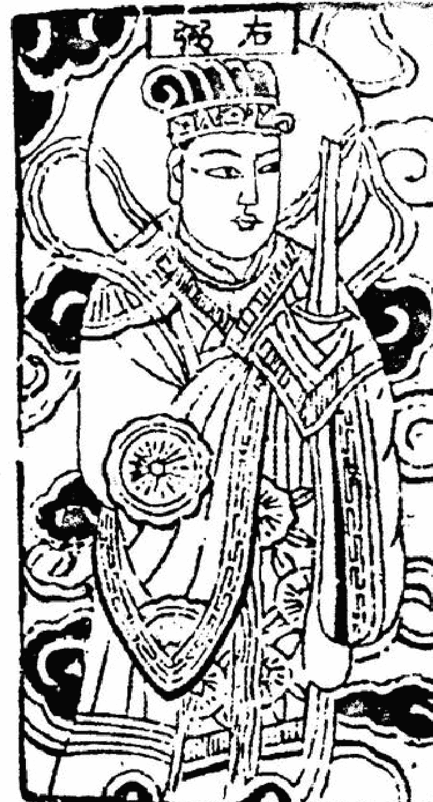

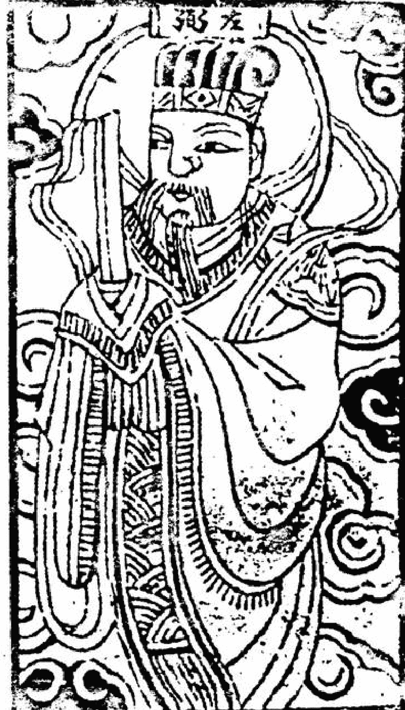

## 面二儀（額與頦）

面二儀，是指額與頦。
傳統相術家以為，額在面的最高處，象乾、象天；頦在面的最下處，象坤、象地。額要圓而聳，頦要豐滿朝上，似天地之相應方佳。

> 舊題南唐宋齊丘撰《玉管神照局》卷上〈呂洞賓賦〉中說：「乾須壯大，欲象蓋貧；坤若寬停，必須朝口。」注：「乾乃天庭，欲圓而聳；地角用朝上也。」

## 二儀相應

舊題後周王朴撰《太清神鑒》卷二〈二儀相應〉中說：
肅肅出乎天，赫赫發乎地，兩者交通已成，和而萬物生焉。此乾坤二儀之應也，故能富萬物，盛德大業無所不至矣。且人之二儀者亦肖像焉，以頭為天，以頦為地，又以天庭像天，地角像地，此兩位欲得豐滿相朝，上下相應，故亦能富貴福祿多。

## 頭足相應

二儀相應，另有一說，是頭與足的相應。儀，是指法度，或準則。頭圓響象天，足方厚象地；分別具備「天」、「地」的準則。

> 《照膽經·二儀》中說：「頭圓法天，天欲富；足方象地，地欲厚。」

## 兩府格

兩府格，是指可以位至兩府的相格；這是因爲漢代時稱丞相、御史爲兩府；宋代稱中書省、樞密院爲兩府，都是極高級的官府。

兩府格是十分尊貴的相格。

舊題後周王樸撰《太清神鑒》卷六〈男兒貴格、兩府格〉中說：

> 額廣而平，天庭不陷；鼻隆而直，地閣不尖。瘦人有肩背，肥人神愈清。邊廣地廣，龍骨與虎骨相成。肉光滑，眉秀輕完滿，蘭臺廷尉分明，耳貼肉而生。分明爲五嶽朝正。口傍有肉起。不論肥瘦，天倉不陷。骨隆而肉稱，色正而光。聲不論大小，清圓不破，肩隆有背有胸，上長下短。手足龍虎相吞。目不論大小，神藏而不露，眼囊大而藏睛，神貴不亂，厚而不俗。坐穩行輕。此乃兩府格也。

這實在是寫盡了男兒貴格的好相。

## 【圖：面相大部位】

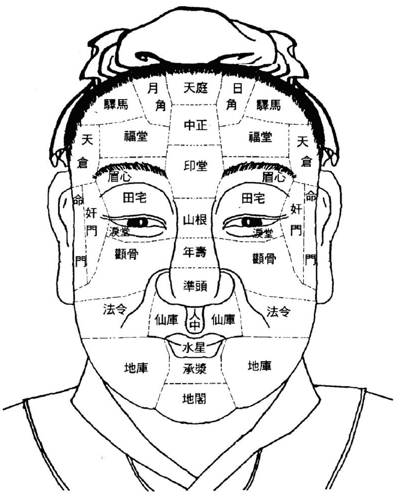

## 兩制格

兩制格，是指可以位至兩制的相格。宋設內制、外制二官，翰林學士掌內制，中書舍人掌外制，級別也相當高。兩制格雖稍遜於兩府格，但也是屬於十分尊貴的相格。

舊題後周王樸撰《太清神鑒》卷六〈男兒貴格·兩制格〉：「瘦人額廣，肥人額平。色正肉滑，髮細鬢清。目藏神而遠，天倉不陷。鼻隆而直，地閣不尖。瘦人肩背厚，肥人神愈清，邊廣地廣，龍骨與虎骨相成，君臣相稱。耳聳金匱平，眉輕清秀，色正而明。」

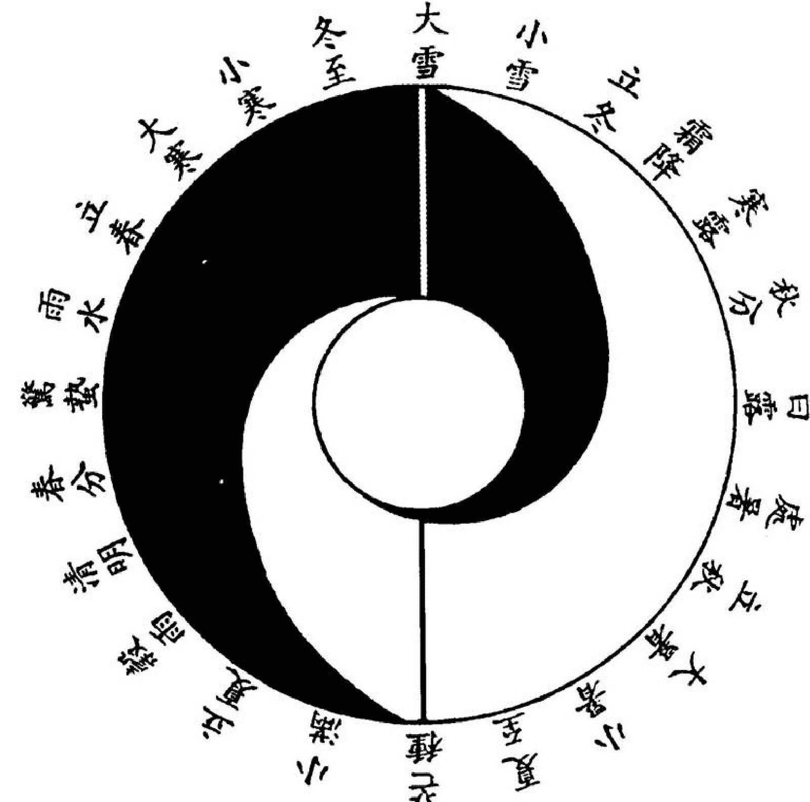

## 十二宫

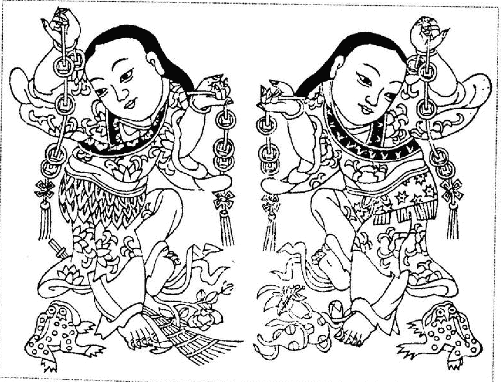

## 十二宮

十二宮是中國相術的特出的一面，簡單易懂，一見即明；它把個人經歷中可能發生的事，以及所可能牽涉到的命運因素，分為十二項，也就是：

1. 命宮：印堂
2. 財帛宮：鼻
3. 兄弟宮：眉
4. 田宅宮：眼
5. 男女宮：淚堂
6. 奴僕宮：地閣
7. 妻妾宮：又稱為夫妻宮，指奸門。
8. 疾厄宮：山根年壽。
9. 遷移宮：天倉、邊地、山林。
10. 官祿宮：中正
11. 福德宮：天倉、地庫。
12. 相貌宮：綜合顏面之相。

也有相術家把日月角定為父母宮，並且作爲是十二宮，而把相貌宮摒除在十二宮之外；這也是有道理的。

十二宮本是天文的術語，用來表示太陽與月亮沿著黃道運行一周，每年會合十二次的規律位置。顏面五官本是生理與政治的術語；人相學引用十二宮來區分顏面的不同部位，是反映了中國文化的「天人合一」的思想。

## 【十二宮圖】

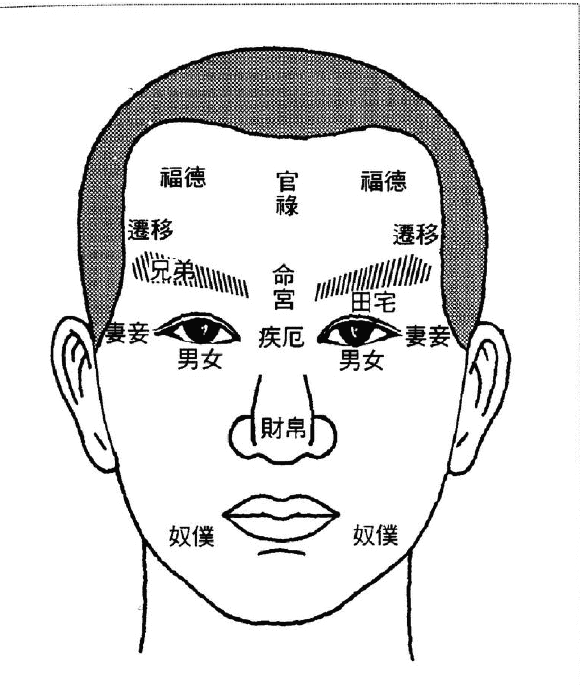

## 1.命宮（印堂）

命宮，位於兩眉之間，山根之上，就是「印堂」的位置，也是相術家所說的「十二宮」之一。一般是以平直明潤或有川字紋者為佳；而以紋交、凹陷或惡痣偏側為凶；命宮可以測斷人們的福壽與運氣。

傳統相術家以為，命宮，是首宮之統，位居印堂，光明如鏡，學問皆通，福壽雙全。凹陷多紋，貧賤迍滯，破盡家財。

《神相全編》卷一〈十二宮訣注〉中說：

> 一命宮。命宮者，居兩眉之間，山根之上。光明如鏡，學問皆通。山根平滿，乃主福壽。土星聳直，扶拱財星，眼若分明，財帛豐盈。額如川字，命逢驛馬官星。果若如斯，必保雙全富貴。凹沉必定貧寒。眉接交相成下賤，亂理離鄉又剋妻。額窄眉枯，破財迍邅。詩曰：
眉眼中央是命宮，光明瑩淨學須通。
若還紋理多迍滯，破盡家財及祖宗。

命宮論曰：「印堂要明闊，主壽長久。眉交者，身命早傾。懸針主破，剋妻害子。山岳不宜昏暗。有川字紋者，為將相。平正明潤，身常吉，得貴人之力。氣色青黃，虛驚；赤主刑傷；白主喪服哭悲；黑主身亡；紅黃主壽安，終身吉兆。」

清代陳釗《相理衡真》卷二〈十二宮總訣·一命宮〉中說：

> 命宮居兩眉之間，山根之上，印堂是也。此宮為首宮之統要；明潤主壽長。紋交者身命早傾。懸針主剋妻害子。山岳不宜昏暗。有川字紋者，主宰相，平直明潤者，身常吉。賦曰：
印堂光明如鏡，學問皆通之士；山根平滿似玉，福壽安享之人。富榮者眼若澄波映帶，位尊者眉如新月照耀。印堂紋穿，當成六害之相。命宮凹陷，空負八斗之才。亂紋交加，終必受其桎梏。惡痣偏側，身必遭其囹圄。

一般說，天庭高爽，印堂平闊，鼻直貫天中，鼻翼準頭朝拱，可掌八方之印綬。印堂傾陷，額角尖塌，眉頭交錯，腮短少髯，定主多業多破，常憂常慮。印堂側而山根斷，魚尾低而倉庫陷，妻子難為。印堂寬廣，兩目秀長，定應功名顯達。

印堂顴開，可得呼聚喝散之權柄。印堂圓滿，早有騰升。

印堂大忌紋沖痣破，主一生刑傷破敗無休。

印堂又為「紫氣星」，一身氣色之聚處，福堂印堂準頭三光氣運明亮，定主名利兩通。

唐代趙蕤《長短經·察相》中說：「天中豐隆，印堂端正者，六品之侯也。」

《神相全編》卷四〈相印堂〉中指出：「印堂為紫氣星，在眉中間，要豐闊平正，兩眉舒展，……印堂中有骨隆起者貴，尖狹者貧乏。」

傳統相術家以為，印堂寬隆是佳相；並且認為印堂寬隆的人官運亨通。

《神相全編》卷六〈神異賦〉中說：「印堂接中正，終須利官。……若印堂寬隆，上接中正肺光潤者，必利乎官也。」

## 福堂

「福堂」，就是相術家對印堂的別稱。張行簡《人倫大統賦・上》有「福堂之上氣黯慘，幼歲多迍。」薛延年注：「福堂，印堂也。」

《神異賦》中說：「福堂潤澤，蓋緣頻遇吉祥。」

## 闕庭

「闕庭」是相術家對印堂的別稱。袁柳莊〈人象賦〉中說：

> 唯印堂之於闕庭兮，中正司空之上連。
欲豐正而明潤兮，懼促陷而髮侵邊。

## 印堂寬隆

印堂寬隆，是指印堂位置豐滿寬闊的相格。

## 2.財帛宮

財帛宮，是相術家所說的「十二宮」之二，在鼻的位置上。財帛宮，在鼻準，包括兩井灶（鼻孔），左右甲匧；可以測斷人的衣食錢財。

傳統相術家以為，財帛宮是以聳直豐隆，中正不偏為佳相，一生財旺、富足；而以鷹嘴尖峰，孔仰為凶，偏窄枯削，財帛消乏。

《神相全編》卷一〈十二宮訣〉中說：

> 二財帛。鼻乃財星，位居上宿，截筒懸膽，千倉萬箱，聳直豐隆，一生財旺富貴。中正不偏，須知永遠滔滔；鷹嘴尖峰，破財貧寒，莫教孔仰，主無隔宿之糧；廚灶若空，必是家無所積。詩曰：
鼻主財星瑩若隆，兩邊廚灶莫教空；
仰露家無財與粟，地閣相朝甲匧豐。

財帛宮論曰：天倉、地庫、金甲匧；井灶，總曰財帛宮。須要豐滿明潤，財帛有餘，忽然枯削，財帛消乏，有天無地，先富後貧，天薄地豐，始貧終富，天高地厚，富貴滿足，蔭及子孫。額尖狹窄，一生貧寒，井灶破露，廚無宿食，金甲匧豐，富貴不窮，氣色昏黑，主破失敗祿。紅黃色現，主進財祿；青黃貫鼻，主得橫財；二匧豐厚，明潤清和，居官而受賞賜。赤主口舌。

清代陳釗《相理衡真》卷二〈十二宮總訣·二財帛宮〉又說：

> 財帛宮。天倉地庫金甲匧、井灶是也。總宜豐滿，鼻又為財帛之宮；更要隆厚明潤；圓而有肉，齊截如筒者，此為財星得地。

> 賦曰：鼻乃財星，位居土宿，似截筒者，倉箱之儲可滿；如懸膽者，金谷之富可求。豐厚有勞，定知財自天來；尖薄無肉，焉得囊有餘貯；井灶昂露，中年甌釜生塵，蘭庭缺小，晚景爨火久虛，必要申匧盈滿，休教倉庫傾欹。

## 3.兄弟宮（兩眉）

兄弟宮，就是指兩眉，是相術家所說的「十二宮」的第三宮。主兄弟的多寡與情分的親疏。

傳統相術家以為，兄弟宮以豐蔚、長秀、光明潤澤為佳相，而以短疏旋結為凶；它可以測斷人們兄弟之間的情誼。一般說，眉秀而疏，形如新月，兄弟眾多。眉短粗逆散，主仇兄賊弟，互相妒嫉、殘害。

《神相全編》卷一〈十二宮訣〉中說：

> （第）三兄弟，兄弟位居兩眉。眉長過目，三四兄弟，無刑。眉秀而疏，枝幹自然端正，有如新月和同，永遠超群。若是短粗，同氣連枝見別，眉環塞眼，雁行必疏。兩樣眉毛，定須異母。交連黃薄，自喪他鄉。旋結回毛，兄弟蛇鼠。詩曰：
眉為兄弟軟徑長，兄弟生成四五強。
兩角不齊須異母，交連黃薄送他鄉。

兄弟宮論曰：兄弟羅計，須要豐蔚，不宜虧陷。長秀則兄弟和睦。短促不足，則有分離孤獨。眉有旋毛，兄弟眾多，狠性不常，眉毛散者，錢財不聚。眉毛逆生，仇兄賊弟，互相妒害，或是異姓同居。眉清有形，孤騰清高之士。眉毛過目，兄弟和睦。眉毛中斷，中弟分散。濃淡豐盈，義友弟兄。氣色青，主兄弟鬥爭口舌。黑白兄弟傷亡。紅黃之氣，榮貴喜慶。

清代陳釗《相理衡真》卷二〈十二宮總訣・三兄弟宮〉又說：

> 兄弟宮在兩眉，左為羅睺，右為計都，須要豐蔚，不宜虧陷，長秀則兄弟和睦，短促則分離隔角。眉有旋毛，兄弟眾多，眉毛散亂，錢財不聚。眉毛逆生，兄仇弟害。眉清有彩，騰達清高。

> 賦曰：眉長過目，五六兄弟和順。短不及目，二三雁行欠和。稀疏遠映，真如手足之情。短促交加，難免參商之變。眉環塞眼，嗟堂棣之必疏。眉豎插天，羡獨（獨本猴類能食，猿猴其行無雙，故曰獨）。行之果敢，交連黃薄，幹杖消縮復何疑。痕斷疏散，骨肉蛇鼠事堪嗟。

## 4.田宅宮（雙目）

田宅宮，指雙目，是相術家所說的「十二宮」的第四宮；是主田舍產業，以清秀明澈為佳；可以測斷人的田舍產業。

傳統相術家以為，田宅宮在兩眼，以黑白分明，眼如點漆為佳相；這是說，雙眼如同陰陽，清秀分明，產業榮榮。如果赤脈侵睛，火眼冰輪，家園傾盡。

《神相全編》卷一〈十二宮訣〉中說：

> 四田宅。田宅者，位居兩眼。最怕赤脈侵睛，初年破盡家園，到老無糧作孽。眼如點漆，終身產業榮榮。鳳目高眉，置稅三州五縣。陰陽枯骨，莫保田園。火眼冰輪，家財傾盡。詩曰：眼為田宅主其宮，清秀分明一樣同；若是陰陽枯更露，父母家家宅總是空。

田宅宮論曰：「土星為田宅，主地閣要朝，天庭豐滿明潤，主田宅進益。低塌昏暗傾欹，主破田宅。若飛走不朝，田宅俱無。

氣色青，主官非，田宅無成。黑，主杖責。白，主丁憂。紅，主成田宅，喜重重。黃明，吉昌，謀無不遂，君子加官，即日得升，小人得寵，利見貴人，武職或領兵馬。殺氣旺者，即行師主官財賦，或入運司等處。五品至三品，三品至二品，如是詳看六品以下者，另作區處。

清代陳釗《相理衡真》卷二〈十二宮總訣・四田宅宮〉又說：

> 田宅宮在天倉地庫之上。又云：兩眼為田宅，要清秀黑白分明。又曰土星為田宅，地閣要朝天庭。豐滿明潤，主田宅進益。若低塌昏暗，主田宅破敗。若飛走不明，則田宅俱無。

> 賦曰：田宅位居眼目，有無斷憑倉庫，最怕赤脈侵瞳，更嫌火輪怒視。神藏有威，定主田園廣闊。睛實不露，可斷阡陌綿長。天倉缺陷，初年破盡家資；地閣尖虧，晚景難留祖業。

依據現代相學的理解，眉眼之間的田宅宮，如果寬厚，是可以投資房地產的。至於說應多寬呢？部份相術家以為應以能容一指為準。

## 5.男女宫（子息宫）

男女宫，又名「淚堂」、「陰鷲」；是相術家所說的「十二宮」的第五宮，在眼下淚堂的位置上。

傳統相術家以為，男女宮，居於兩眼之下，左為三陽，右為三陰，為人精血之表徵。以豐滿明潤為佳相，以枯陷紋亂為凶，可以測斷兒孫的福祿榮昌。一般說，精寒血竭，色彩暗淡，主男不旺，女不育；左枯損男，右枯損女。豐厚光彩，多有貴子。

《神相全編》卷一〈十二宮訣〉中說：

> 五男女。男女者，位居兩眼下，名曰淚堂。三陽平滿，兒孫福祿榮昌，隱隱臥蠶，子息還須清貴。淚堂深陷，定為男女無緣，黑痣斜紋，到老兒孫有剋。口如吹火，獨坐蘭房。若是平滿人中，難得兒孫送老。

詩曰：

> 男女三陽起臥起臥蠶，瑩然光彩好兒郎。
懸針理亂來侵位，宿債平生不可當。

男女宮論曰：三陰三陽，位須豐厚，不宜枯陷。左三陽枯，剋損男。右三陰枯，剋損女。左眼下有臥蠶紋，生貴子。凡男女眼下無肉者，妨害男女。臥蠶陷者，陰鷲少，當絕嗣也。亂紋侵者，主假子及招義女。魚尾及龍宮黃色環繞，主為陰鷲紋見，曾懷陰德濟於人，必有果報。又云：精寒血竭不華色，男不旺，女不育。若陰陽調和，精血敷暢，男女交合，故生成之道不絕。宜推於形象外，當以理言，元妙自見也。氣色青，主產厄。黑白，主男女悲哀。紅黃，主喜至。三陽位紅，生兒，三陰位青，生女。

清代陳釗《相理衡真》卷二〈十二宮總訣〉又說：

> 男女宮者，在眼下臥蠶之位是也。須要豐厚，不宜空陷。紅潤平滿者多男。左枯損男，右枯損女，左眼下有臥蠶紋者，主生貴子。凡男女眼下無肉者，妨害男女。臥蠶陷者，陰鷲少，多絕嗣。亂紋侵者，主假子及招義女。魚尾及龍宮黃色環繞，為陰鷲紋見，曾見陰德濟人，必有果報。

> 賦曰：位居臥蠶，名曰淚堂。臥蠶平滿，兒孫福祿榮昌。陰鷲紋見，子富貴清高。深陷者，定於男女無緣。紋痣者必是兒孫有剋。豐滿明潤攜子攜孫之榮。氣色青紅，弄璋弄瓦之喜；龍宮低陷。嗣續何由而得。臥蠶平起，後人必然可昌。

## 金櫃

中國相術家稱呼下眼瞼豐滿如橫指者，爲「金櫃」。

《玉管神照局·上》有「金櫃滿者主有厚祿。」注說：「眼下有肉如橫指。」

金櫃一名「臥蠶」，是主子息。

## 子孫宮

子孫宮，是指兩眼之間的部位。傳統相術家以爲這一部位關乎嗣息。

《麻衣相法》卷二〈相目〉中說：「兩目之間名子孫宮，欲豐滿，不欲缺陷。」

## 陰陽明潤

陰陽明潤，是指三陽三陰（子息宮）的光明潤澤而不枯陷的形相。

傳統相術家以爲，陰陽明潤是一種佳相，是主子女易養而聰明的象徵。

> 《神相全編》卷六〈神異賦〉中說：「陰陽明潤，男女易養而聰明。」注：「陰陽，即三陰三陽，亦子息宮也。若光明潤澤而不枯陷者，必主男女易養而聰明。」

## 6.奴僕宮

奴僕宮，是相術家所說的「十二宮」的第六宮，奴僕宮，位居地閣，在兩嘴角之下。

傳統相術家以為，奴僕宮以頰圓豐滿為佳相，是主侍者成群，一呼百應。陷斜多紋，僕馬俱無。

《神相全編》卷一〈十二宮訣〉中說：

> （第）六奴僕。奴僕者，位居地閣，重接水星，頰圓豐滿，侍立成群。輔弼星朝，一呼百諾。口如四字，主呼聚喝散之權。地閣尖斜，受恩深而反成怨恨。絞紋敗陷，奴僕不周。牆壁低傾，恩成仇隙。詩曰：
奴僕還須地閣豐，水星兩角不相容。
若言三處都無應，傾陷紋痕總不同。

奴僕宮論曰：懸壁無虧，奴僕不少。如是枯陷，僕馬俱無。氣色青，主奴馬損傷。白黑，主奴馬墜墮，不宜遠行。赤，主僕馬口舌，損馬失敗。黃色勝，牛馬奴僕自旺；左門右戶，排立成行。

清代陳釗《相理衡真》卷二〈十二宮總訣·六奴僕宮〉又說：

> 奴僕宮者，在地閣之位。又云：懸壁無虧，奴僕不少。如是枯陷，奴僕俱無。賦曰：位居地閣，重接水星。頰圓頤滿，呼則諾而聚則群。嘴尖地削，饑則附而飽則颺。水星方大，主呼聚喝散之權。地角尖虧，招受恩反仇之怨。

氣色青，主牛馬六畜損傷，奴僕走失，兼有疾病。赤，主奴僕口舌，是非疫癘。圓厚光明，主進牛馬之喜。紅黃，主進奴僕，六畜大旺，左門右戶，排立成行。白，主奴僕牛馬，六畜損傷；黑，主牛馬不利。

## 更多资料

↓↓↓

## 【中华古籍库】

↓ 点击链接 ↓

https://www.fozhu920.com/list/

珍版刻印 / 海外流传 / 家传手抄 / 民间失传

【易】【医】【道】【武】【文】【奇】【画】【书】

1000000+高清古书籍

## 打包下载

微信：mbook86

## 7.妻妾宮

妻妾宮，是相術家所說的「十二宮」的第七宮；它的中心點在魚尾的位置上。相書都說這部位是主夫妻感情，以魚尾紋多，奸門黯黲為凶，可以測斷夫妻的感情。

傳統相術家以為，妻妾宮位居魚尾，光潤無紋，必保妻全，財帛盈箱。深陷多紋，妻多惡死。黑痣斜紋，必好淫慾。

《神相全編》卷一〈十二宮訣〉中說：

> 七妻妾。妻妾者，位居魚尾，號曰奸門，光潤無紋，必保妻全四德。豐隆平滿，聚妻財帛盈箱。顴星侵天，因妻得祿，奸門深陷，長作新郎。魚尾紋多，妻防惡死。奸門黯黲，自號生離。黑痣斜紋，外情好而心多淫慾。

詩曰：

> 奸門光澤保妻宮，財帛盈箱見始終。
若是奸門生黯黲，斜紋黑痣蕩淫奔。

妻妾宮論曰：魚尾限要平滿，不宜剋陷。豐滿則夫貴妻榮，奴僕成行。婦女魚尾奸門明潤，得貴人為夫。女人鼻如懸膽，則主富貴。缺陷則主妨夫，淫亂敗家放蕩，不旺夫。婦人面如滿月，下頦豐滿，至國母之貴。氣色青，則主妻妾憂愁思慮。赤，主夫妻口舌。黑白，主夫妻男女之悲。紅黃色見，主夫妻男女和諧之喜。如有暗昧，主夫妻分離，不然隔角少情。

清代陳釗《相理衡真》卷二〈十二宮總訣〉又說：

> 妻妾宮者魚尾奸門之位。光潤無紋，必保妻全；須要平滿，不宜凹陷。豐滿則夫貴妻榮。明潤得貴人女為妻。女人缺陷，則主妨夫淫亂，敗家放蕩。若女人面如滿月，下額白滿，國母之貴。

> 賦曰：位居魚尾，號曰奸門。光潤無紋，必保妻全四德。豐隆平滿，更主財帛千箱。顴骨侵天，因妻得祿。奸門亂理，乃號生離。黑痣斜紋，外情好而中饋多怨。豐潤明淨，應妻賢而內助堪誇。

又有現代相術家以為，男性的妻妾宮右邊是主自己，左邊代表太太。如果是女性則正好相反。男性的右妻妾宮有痣，一見具有姿色的女性就跟著心猿意馬起來；如果生在左妻妾宮的痣，則是主被動的被女性所糾纏——這是男性的一種「色難」的相，必須謹慎從事。

## 奸門白氣

奸門白氣，是指在奸門的位置上生起白氣。
傳統相術家以為，奸門白氣是主妻有私通而傷及自身。
《月波洞中記》卷下〈面部氣色〉上說：「奸門有白氣者，主妻有私通及傷害自身也。」

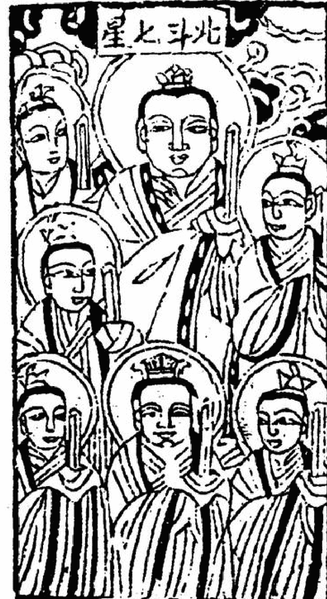

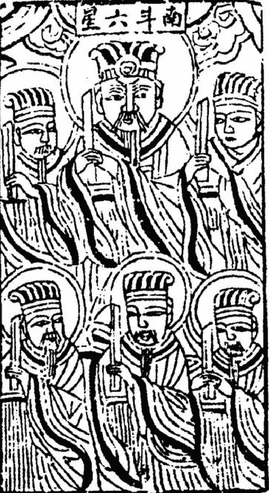

## 8. 疾厄宮（山根）

疾厄宮，就是相當於「山根」的部位，是中國相術家所說的「十二宮」之八。廣義的疾厄宮，中心落在「山根」與「年壽」的位置上。

傳統相術家以為，疾厄宮是以豐滿明淨為佳相，以紋痕低陷，枯骨尖斜為凶；可以測斷人們的健康。

疾厄宮在印堂下，隆而豐滿，福祿無窮，一生無災。低陷尖斜，疾病連年，一生辛苦。

《神相全編》卷一〈十二宮訣〉中說：

> 八疾厄。疾厄者，印堂之下，位居山根，隆如豐滿，福祿無窮；連接伏犀，定主文章，瑩然光彩，五福俱全，年壽高平，和鳴相守，紋如低陷，連年連疾沉疴；枯骨尖斜，未免終身受苦；氣如煙霧，災厄纏身。詩曰：
> 山根疾厄起平平，一世無災禍不生；
> 若值紋痕並枯骨，平生辛苦卻難成。

疾厄宮論曰：年壽明潤康泰，昏暗疾病至，氣色青，主憂驚；赤防重災；白主妻子之悲；黑主身死；紅黃紫主喜氣之兆也。

> 清代陳釗《相理衡真》卷二〈十二宮總訣〉又說：「疾厄宮者，在山根年壽之位。豐滿無病，深陷多災，若年壽明淨者，主康泰。劍脊者，主凶災。賦曰：印堂之下，山根之位，皎皎豐隆，災病何染；亭亭伏羲，文章可誇，瑩然光彩，定主五福俱全。年壽相扶，乃為百災難入。紋痕低陷，連年宿疾沉疴；枯陷尖斜，終身災厄病苦。氣色青，主憂驚，主淹滯不脫，或犯神鬼之災。赤防重災，主虛驚卒哭。白色主妻子之悲，又防手足跌傷。黑主自身暴卒，百不稱心，舉家防瘟疫之患，水火之災。紅黃紫，主喜氣之吉兆。」

## 山根斷

山根斷，是指山根的部位折斷。中國傳統相術以為山根斷乃下相；主其人少喪父母，疾厄、刑剋、孤貧、破家。

> 舊題南唐宋齊丘撰《玉管照神局》卷上〈神壐楊先生神部論〉中說：「山根位斷，僕馬多憂。」卷下〈獅形〉又說：「山根斷，口闊，髭鬢，頻高，難知心腹之人也。」

> 《麻衣相法》卷五〈論中下二停凶氣〉說：「山根斷或偏，孤貧疾厄。」又卷五〈金鎖賦〉說：「山根斷兮早虛花，祖業飄零必破家。」

《神相全編》卷十一〈麻衣秋潭月論女人〉說：

> 山根斷盡準頭偏，短促人中更露齦；
> 眼長黑白神如水，初主艱難貴晚年。

> 懸針入印山根斷，相貌全虧額不平；
> 夫災莫問三掌位，歲歲生男定是空。

> 《靈臺秘訣》上說：「……眼三角，鼻鉤紋，山根斷。此女中之至孤也。」

> 《陳希夷洞元經》中說：「更兼耳小山根斷，死盡兒夫賣卻田。」

> 《柳莊相法》上卷〈十二件刑妻之格〉中說：「天倉陷，山根斷。」

## 心經受病

> 《神相金較剪·論五官》中說：「少年剋母者，多主山根斷也。」《神相金較剪·相骨最貴格》指出：「或問一生為官屢勝屢降，相從何辨？答曰：山根位斷，面色唇色不鮮，兩耳欠聳，印堂晏暗沖陷故也。」《神相金較剪·察疾病心法》又說：「或問，心經受病，相從何見？答曰：眉心皺，懸針破，山根斷，……皆主心經受病或心痛病。」

## 山根斷剋妻

> 清代陳劍《相理衡真》卷二〈各圖總論〉中說：「（鼻）最怕薄削，狹小歪斜，……山根斷，鷹嘴鼻，……」卷三〈山根部位捷徑橫列八位〉上說：「（山根）斷絕主多厄，無兄弟。」卷七〈窮蹇捷徑〉中說：「山根斷而幼遭病苦。」卷八〈刑剋捷徑〉上說：「山根斷剋妻。」卷九〈婦女刑剋詩〉指出：「斷卻山根光卻鼻，刑夫未了又刑兒。」

## 9. 遷移宮

遷移宮，是相術家所說的「十二宮」之一，是十二宮的第九宮，可以測斷人們的出入遭遇的順逆。它的中心在眉角的位置上；包括天倉、邊地、驛馬、山林、髮際等範圍。

傳統相術家以為，遷移宮又名「天倉」，位在眉角，明潤潔淨利運行，昏暗缺角不宜出入。又以豐盈隆滿潔淨為佳相，而以額角低陷、眉連、天地偏斜為凶相。

《神相全編》卷一〈十二宮〉中說：

> 九遷移。遷移者，位居眉角，號曰天倉，豐盈隆滿，華彩無憂，魚尾位平，到老得人欽羨，騰騰驛馬，須貴遊宦四方，額角低陷，到老住場難覓。眉連交接，此人破祖離家。天地偏斜。十居九變，生相如此，不在移門，必當改墓。詩曰：
> 遷移宮分在天倉，低陷平生少住場；
> 魚尾末年不相應，定因遊宦卻尋常。

遷移宮論曰：邊地驛馬，山林髮際，乃為出入之所。宜明潤潔淨。利遠行。若昏暗缺陷及有黑子，不宜出入，被虎狼驚。氣色青，遠行主驚、失財。白，主馬僕有失。黑，主道路身亡。紅黃紫，宜獲財喜。

清代陳釗《相理衡真》卷二〈十二宮總訣·九遷移宮〉又說：

> 遷移宮者。在天倉邊地驛馬山林髮際，乃為出入之所。宜明潤潔淨，利遠行。若昏暗缺陷，及有黑子，不宜出入，多主不利。
> 賦曰：位居眉角，號曰天倉；其位豐盈，外出無憂，各部華彩，到處欽羨，騰騰驛馬，貴官威鎮九邊；靄靄山林，俠客遨遊四海。額角低陷，到老住場難覓。眉連交接，此人破祖無家。天地偏斜，十居九移之人。倉庫陷前，三反四覆之漢。
> 氣色。諸宮黃色如珠，主出外獲財，貴人和順。遊宦者，文書旺相得拔薦，百事稱心，庶民多利。赤色，出外防是非驚恐，公訟干擾。白，主馬僕有失，手足折傷。黑，主道路身亡，百事不能稱遂。出外者防死亡水厄之患，紅黃無往不利。

依據現代相學的經驗談，額角遷移宮部位有痣或是疤痕的人，影響到他遷居在外的順適，大多勞碌不安。

## 10. 官祿宮

官祿宮，是相術家所說的「十二宮」的第十宮。官祿宮位居「中正」的位置上，居印堂部位之上，相當於頭部額頭的中央部位。

傳統相術家以為，官祿宮光明瑩淨，顯達超群。如果缺陷有疾，常招禍事；宮痕理破，眼如赤鯉為凶。官祿宮可用來測斷人的全途功名的順逆。

《神相全編》卷一〈十二宮訣〉中說：

> 十官祿。官祿者位居中正，上合離宮，伏犀貫頂，一生不到訟庭。驛馬朝歸，官司退擾。光明瑩淨，顯達超群。額角堂堂，犯著官事貴解。宮痕理破，常招橫事，眼如赤鯉，實死徒刑。

詩曰：

> 官祿榮宮仔細詳，山根倉庫要相當；
> 忽然瑩淨無痕點，定主官榮貴久長。

官祿宮論曰：「兩眼神光如曙星，龍目鳳睛，主貴。印堂明潤，兩眼色白過面，聲聞天下，福祿榮顯。如陷缺飛走，而無名譽。氣色青，主憂疑。赤，主口舌是非；白，主孝服至。紅黃上下，有詔書加官進職之喜。」

清代陳釗《相理衡真》卷二〈十二宮總訣·十官祿官〉又說：

> 官祿宮居天庭之下，中正之位，光潤平滿，功名順暢。假若兩目神清，閃如曙星，龍睛鳳目，皆主貴。印堂明潤，兩耳色白過面，聲聞天下，官祿榮顯。如若缺陷，諸部有差，則無名譽。

> 賦曰：「位居中正，上合離宮。伏犀貫頂，早羨功名顯達。額角崢嶸，定主超凡志氣。紋痕來破，定招非橫之事。傾陷若欹，實死徒刑之人。駟馬朝歸，必因官而致富。印堂拱扶，亦籍貴而得名。

> 氣色紅黃在宮，為官者主有詔書加官進爵之喜。庶民大利，公訟得理，僧道章服。青主憂疑，公訟悠悠牽連。在官者，百事俱不如意。赤主刑獄公訟，囚禁枷鎖，筍厄口舌，又主因訟破家兵傷。黑主為官降職，囚禁瘟疫，人口不安破財。百不稱心。黑如磚色者，主死，於牢獄囚禁枷鎖之罪。」

廣義的官祿宮，包括額頂到印堂的部份，包括天中、天庭、司空、中正等部位，合稱官祿宮。在現代相學的理解中，這裡是看升官的部位。

如果官祿宮飽滿不暗，氣色明潤，是表示得自雙親的遺傳良好，一生功名順遂，個性不屈不撓，被長官們所重視與提拔。

《麻衣相法》中有「伏犀貫頂」的貴相，是指鼻樑骨直上貫連印堂、天庭、一直到額頂，這是大貴的相。

如果官祿宮凹陷暗淡，則不適合從事公司，或是具有官僚金字塔組織的職業，因為升官沒有份，裁員卻有自己的名字；這時應捨名取實，或考慮自由業，憑著技術的長才努力出頭天；過多的人事包袱反而是本身的約束，並且會惹來官司與衝突。

能夠看得到明天的人，才會成功！

## 【圖：荀子】

## 荀子

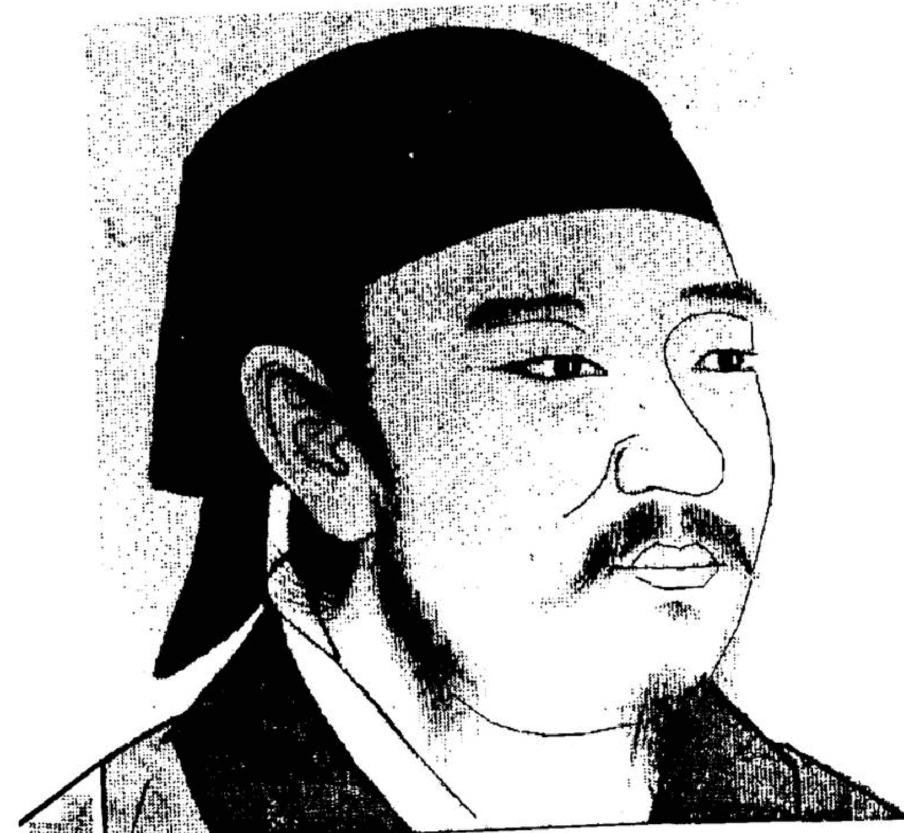

## 11. 福德宮

福德宮，是相術家所說的「十二宮」之一。
傳統相術家以為，福德宮位居「天倉」、「地庫」兩個部位，豐滿明潤，福祿永享；陷塌昏暗，災厄常見。福德宮是以額闊頤尖、耳壓耳掀為凶相，可以測斷人的福祿功德。

> 《神相全編》卷一〈論十二宮〉中說：
> 十一福德。福德者，位居天倉，牽連地閣，五星朝拱，平生福祿滔滔，天地相朝，德行須全五福，頦圓額窄，須知苦在初年，額闊頤尖，迍否還從晚景，眉目高聳，尤且平平，眉壓耳掀，休言福德。詩曰：
> 福德天倉地閣圓，五星光照福綿綿；
> 若還缺陷並小破，衣食平平更不全。

福德宮論曰：天倉地庫為福德宮，須要豐滿明潤相朝揖，重重祖蔭，福德永崇。若陷缺不利，淺窄昏暗，災厄常見，人亡家破，蓋因心術損了陰騭，終是勉強神情，氣色青，主憂疑；赤主酒肉，忌口舌；白主災疾，紅黃吉兆。

> 清代陳釗《相理衡真》卷二〈十二宮總訣・十一福德宮〉又說：
> 福德宮，居天倉地庫之位，要豐滿明潤，主人坐享富貴，若相朝揖，重重祖蔭，福祿來崇；若尖削缺陷，到老貧窮，諸凡不利。賦曰：
> 福德位居天倉，兼連地閣，天地相朝，功名早馳於金關，倉庫扶拱。富有已播於鄰邦。岳瀆清明，此人必行功德而全五福。精神爽徹，其人定有前程而獲遐齡。頦圓額窄，困頓必有初年；額闊頤尖，迍否還從晚景，眉高耳聳，名成利遂之士；背圓腰肥，席厚履豐之人，五岳傾欹，難言美相；六府充盈，可云福澤。
> 氣色。倉庫青，主憂疑，家宅不安，赤主口舌是非，又主酒肉；白主災疾，暗慘退耗，黑主進退憂疑，滿面紅黃者吉。

## 12. 相貌宮

相貌宮，是相術家所說的「十二宮」之一。傳統相術家以為，相貌宮是指整個相貌，五岳朝拱，三停平均，官祿榮遷。如果有剋陷，就是凶惡之相。《神相全編》卷一〈十二宮〉中說：

> 相貌宮先觀五岳，次辨三停盈滿，此人富貴多榮。三停俱等，永保平生顯達；五岳朝聳，官祿榮遷，行坐威嚴，為人尊重。額主初運，鼻管中年；地閣水星，是為末主；若有剋陷，斷為凶惡。

詩曰：

> 相貌須教上下停，三停平等更相生；
> 若還一處無均等，好惡中間有改更。

相貌宮論曰：骨法精神，骨肉相稱氣相和；精神清秀，如桂林一枝；崑山片玉，如珠藏淵，如玉隱石，貴顯名流，翰苑吉士；暗慘而薄者凶；氣色滿面，紅黃明潤，大吉之兆。

相貌宮是一種面相的三停五岳的整體觀感，要骨肉相稱，精神清秀；如果氣色紅黃明潤，是一種大吉的徵兆。

## 迦葉

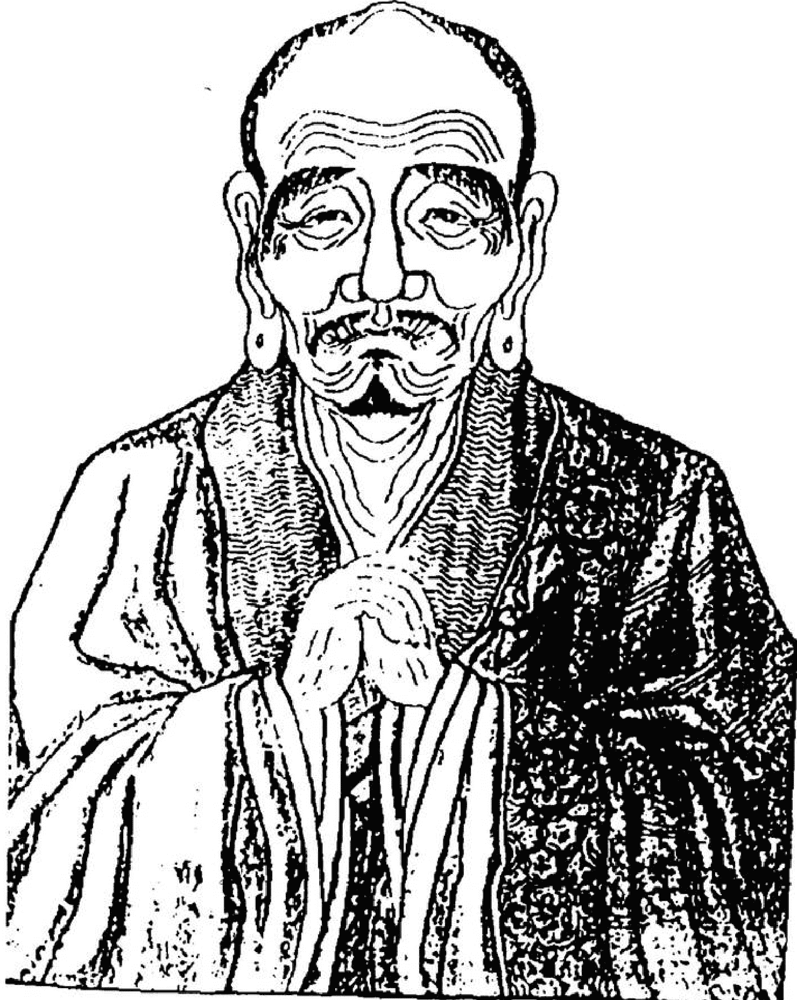

## 12. 父母宮

清代陳釗《相理衡真》卷二〈十二宮總訣〉將父母宮列為第十二宮，中心在日月角。

傳統相術家以為，父母宮可以測斷父母的福壽吉凶。

《神相全編》卷一在十二宮之後，另闢有父母宮作專門的論述：

父母宮論曰：日月角須要高明淨，則父母長壽康寧。低塌則幼失雙親。暗昧，主父母有疾。左角偏，妨父；右角偏，妨母，或同父異母，或隨母嫁父，出祖成家，重重災注，只宜假養，方免刑傷。又云：重羅疊計，父母重拜，或父亂母淫，與外奸通，又主妨父害母。頭側額窄，多是庶出，或因奸而得。又云：左眉高，右眉低，父在母先歸；左眉上，右眉下，父亡母再嫁。額削眉交者，主父母早拋，是為隔角，反面無情。兩角入頂，父母雙榮，更受祖蔭，父母聞名。氣色青，主父母憂疑，又有口舌相傷。黑白，主父母喪亡。紅黃，主雙親喜慶。

清代陳釗《相理衡真》卷二〈十二宮總訣〉又說：

額塌眉交，父母早拋。嘴尖髮低，父母早歸。眉耳眼鼻，有高下厚薄之分。頂額蘭廷，有偏正削小之別。左右何限，刑剋無疑；兩角朝天，父母必主榮封。雙鬢入頂，高堂定登壽籍。髮濃低壓，愚魯而早別雙親。頭尖撮聚，凶頑而侵剋二人。俱宜部位平正，不可重羅疊計。

氣色：日月角青色，主父母憂疑，有口舌相傷。黑白，主父母喪亡。紅黃，主雙親喜慶。更觀其各部氣色，可以知父母之吉凶必矣。

## 白氣如粉，父母刑傷

《神異賦》上說：「白氣如粉，父母刑傷；青色侵顴，兄弟唇舌。」〔原註〕又說：「白氣主喪亡；若在父母宮見者，必主刑傷。顴位正面者，青色侵此位者，主兄弟唇舌之憂。」

日角與月角合稱父母宮。這是說，面上日月角有白氣如粉的氣色，是主父母刑傷。

## 三停與三主

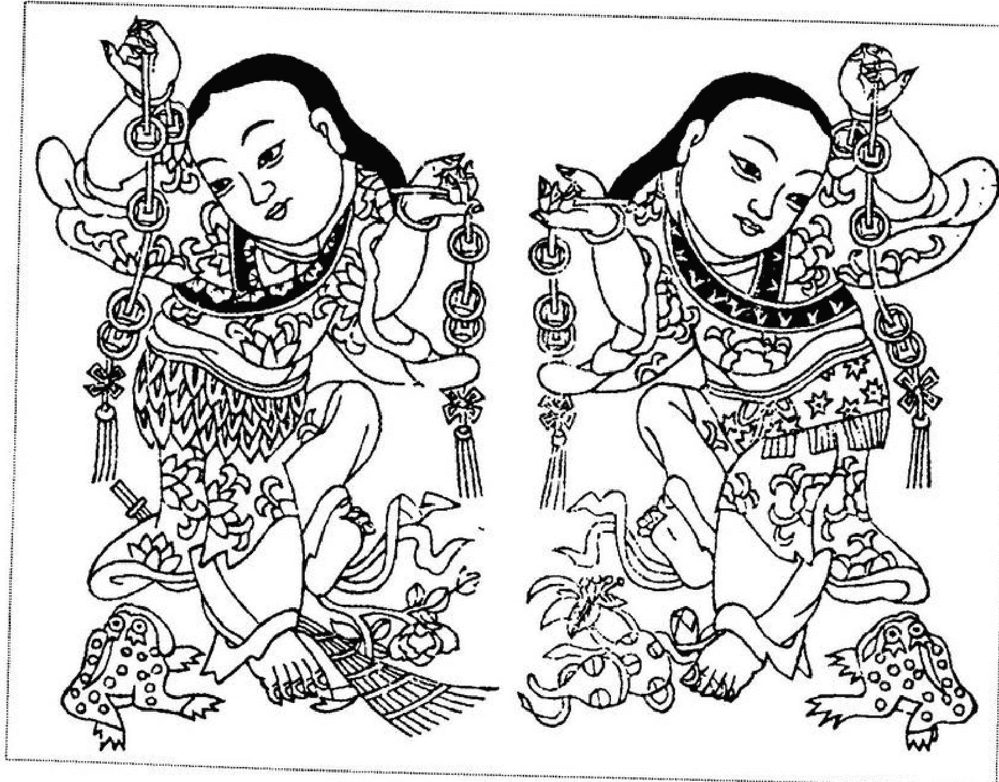

## 三停與三主

> 三停平等，一生衣祿無虧。
> ——〈神異賦〉

「三停」與「三主」是論流年的另一種方式。三停的主要論斷標準在平等、均稱、對稱。三主的論斷標準在它的構勢，有無高起相應。
三停就是上停、中停、下停。
上停就是從髮際到兩眉之間，主初年，是人的少年與青年時代；如果上停長得特別長大豐隆，那可能就容易少年得志。
中停就是從兩眉下到準頭，主中年，代表一個人中年的命運；中停長得長大高聳，是表示這人的福緣比較厚。
下停就是從準頭下到地閣之間，主晚年；如果單單是下停長的話，是不吉利的。
三停平等，就是良好的面相。
傳統相術家將面部分成上、中、下三停，對應著天、地、人。面部的三停要互相呼應，保持均衡。如果三停勻稱，就是「上相之人」。
如果三停生得長短大小不一，那是主其人貧苦而不得志。
《照膽經·三停所主》中說：「眉上至髮為上停，眉下至準頭為中停，鼻下至地閣為下停。上停為天，主父母貴賤；中停為人，主兄弟妻子；下停為地，主田宅六畜。」

## 三主

三主所領的各部位中，額、鼻、地閣與人的命祿關係最大。因此《麻衣相法》有「額尖初主災，鼻歪中主逃，欲知晚景事，地閣喜方高。」
《神異賦》上說：「頭先過步初主好，晚景貧窮；灶仰撩天中限敗，田園耗散。」〔原註〕又說：「行若頭低向前過步者，其人必然初年有餘，末年不足者。井灶，乃鼻竅也，不宜仰露；若仰露而撩天，主中年破散。」

## 面上停

「面上停」是指眉、額二部，是顏面由髮際到眉上的部分，包括天中、天庭、司空、中正、印堂五部。它是中國相術家測斷「初運」——少年運程的部位。

傳統相術家以為，面相上停可以測斷人的貴賤、父母的情況、早年的運程。

> 《神相全編》卷二〈三才三停論〉中說：「自髮際至眉為上停。」

> 《麻衣相法》卷五〈相形氣色賦〉中說：「上停法天，主貴，自天中至於印堂。……上停天中、天庭、司空、中正、印堂，凡五部，旁連目之上下，眉之左右，並主貴、主父母、主君上、主早年。」

依筆者的修行經驗，面上停是相當於瑜伽的「頂輪」的位置。

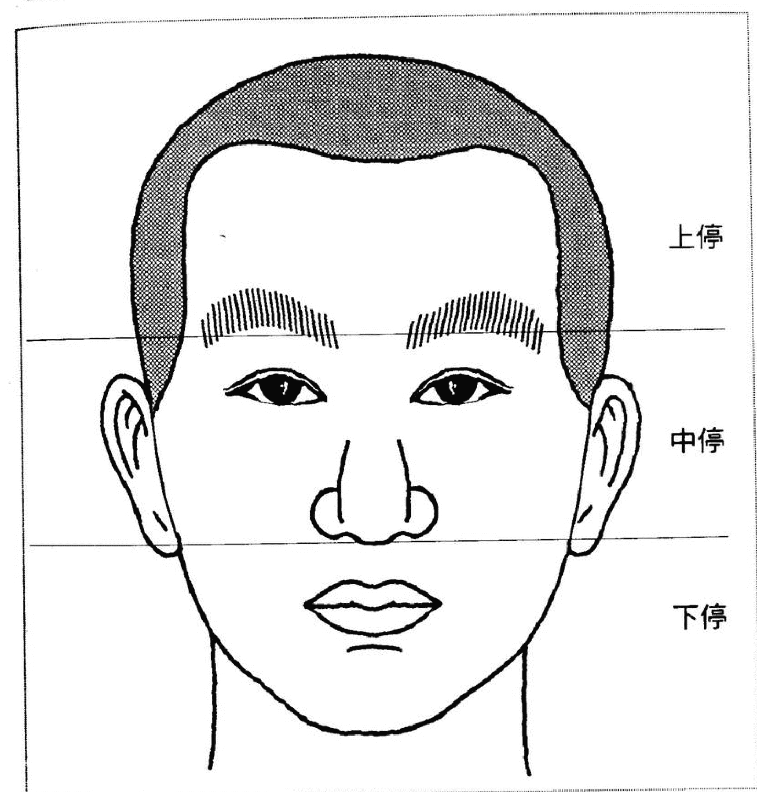

## 面中停

「面中停」包括眼、鼻、顴三部，是顏面中由眉到準頭的部位，包括山根、年上、壽上、準頭等四部。也是中國相術家用以推斷中年命運的部位。

傳統相術家以為，面相中停可以測斷人的壽命、財富、妻子兄弟、以及中年的運氣。

> 《神相全編》卷二〈三才三停論〉：「眉至準頭為中停。」

> 《麻衣相法》卷五〈相形氣色賦〉中說：「中停法人，主壽，自山根至準。……中停山根、年上、壽上、準頭、凡四部，旁連目下顴面、耳前，並主壽，主財，主妻子兄弟，主中年。」

依筆者的修行經驗，面上停是相當於瑜伽的「眉間輪」的區位。

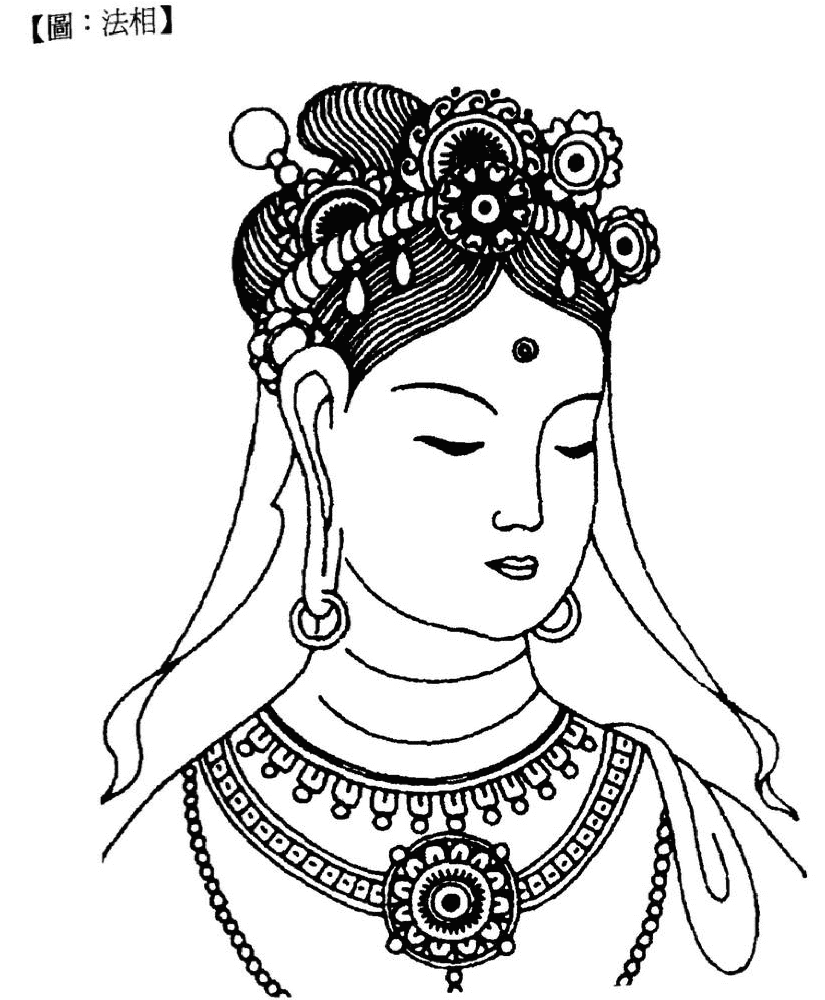

## 面下停

面下停包括口、頦、頰三部，是顏面的人中到地閣的位置，包括人中、水星、承漿、地閣四部，它是中國相術家用以測斷晚年命運的部位。

傳統相術家以為，面下停掌管人的福祿、田宅、奴僕、畜牧與晚年的運氣。

> 《神相全編》卷二〈三才三停論〉中說：「準頭至地閣為下停。」

> 《麻衣相法》卷五〈相形氣色賦〉中說：「下停法地，主祿，自人中至於地閣。……下停人中、水星、承漿、地閣，凡四部，連口中上下，左右腮頤，並主祿，主田宅，主奴僕，主畜，主末年。」

依筆者的修行經驗，面上停是相當於瑜伽的「喉輪」的位置。

## 古書論三主、三停
——三停平等，富貴榮顯

我國古書對於三停流年的相法，十分深入，論列有許多價值的論述，值得細細品味。《神相全編》卷二〈三才三停論〉中說：

> 三停者，髮際至印堂為上府，是初主；自山根至準頭為中府，是中主；自人中至地閣為下府，是末主。

自髮際至眉為上停，眉至準頭為中停，準頭至地閣為下停。訣曰：上停長，老吉昌。中停長，近君王。下停長，少吉祥。三停平等，富貴榮顯；三停不均，孤天貧賤。

清代范文園《水鏡集》卷一〈三才三停論〉中說：

> 三停者，髮際至印堂為上輔，是「初主」；山根到準頭為中輔，是「中主」；人中至地閣為下輔，是「末主」。髮際到眉為上停，眉至準頭為中停，準頭至地閣為下停。

訣曰：上停長，老吉昌。中停長，近君王。下停長，少吉祥。三停平等，富貴榮顯；三停不均，孤天貧賤。

吉祥。三停平等，富貴榮顯；三停不均，孤天貧賤。

詩曰：

> 面上三停仔細看，額高須得耳門寬。
> 學堂三部奚堪足，空有文章恐不官。
> 鼻樑隆起好懸膽，促者中年壽不長。
> 地閣滿來田地盛，天停平闊子孫昌。

## 三停平等，富貴綿綿。

> 《神異賦》上說：「富貴多生勞漉，為下停長。」〔原註〕又說：「中停長，遇君王；上停長，幼善祥；下停長，老吉昌。三停平等，富貴綿綿。若下停長者，未須富貴，未免平生勞漉者也。」

這意思是說，富貴如果是生自勞動汗出，大多是印證著下停長的關係。

## 五岳四瀆

人相術與風水術的結合

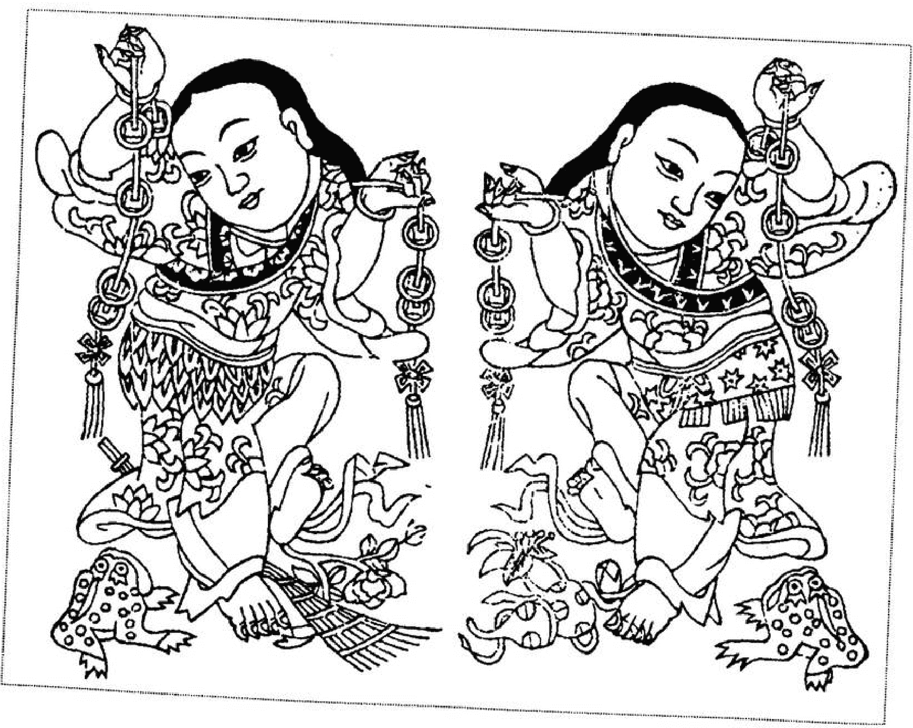

## 五岳四瀆

——人相術與風水術的結合

中國人是世界上最擅長觀察風水的民族，風水術早已傳揚到全球各地。風水術主要是觀察山河大地的形態趨勢，相人術主要是觀察個人的體貌五官；兩者是有一些共同的交集，互通有無。

五岳象徵「山」，四瀆象徵「水」，要山明水秀才是好的相格；如果只是山高但四水不秀，是一種「清中帶濁」的相，主其人在事業光輝之後，終將回歸平淡。如果五岳朝起，四瀆明秀，不是大貴，就是大富。

## 相地一似相人

> 《儒門崇理折衷堪輿完孝錄·論氣運通塞》中說：
> 卜氏曰：相地一似相人，此善喻相地之法也。余觀風鑒之流，每每以形體觀人之貴賤，以氣色辨人之窮通，二者兼盡，然後相法無近情也。何今之相地者，徒知相形體而不知觀氣色？卒不能如相人之驗矣。

這點明的是，看風水就像看相一樣。風水師只知觀地之形狀，而不能察地之氣色的結果，就很難像相術家那麼的神準！

其中最值得人們注目的是，部份相術家將顏面五官劃分成「五嶽四瀆」，這是借重於風水的經驗與類比。《神相全編》卷二〈五嶽〉中說：

> 額為衡山，頦為恆山，鼻為嵩山，左顴為泰山，右顴為華山。中嶽要得高隆，東嶽須聳而朝應。不隆不峻，則無勢，為小人，亦無高壽。中嶽薄而無勢，則四嶽無主，縱別有好處，不至大貴。無威嚴重權，壽不甚遠。中嶽不及且長者，止中壽，如尖薄，晚年見破，到頭少稱意。南嶽傾側，則主見破，不宜長家。北嶽尖陷，末主無成，終亦不貴。東西傾側無勢，則心惡毒，無慈愛。五嶽須要相朝。
> 耳為江，目為河，口為准，鼻為濟。

## 五岳

五岳的內容是：衡山為南岳，恆山為北岳，嵩山為中岳，泰山為東岳，華山為西岳。中國相術學拿它們來分別代表額、頦、鼻、左顴、右顴。其中，額是南岳，頦為北岳，鼻為中岳，左顴為東岳，右顴為西岳。

## 四瀆

四瀆是指長江、黃河、淮河、濟水。

「瀆」的本義是大川。《爾雅·釋水》中說：「江淮河濟為四瀆。四瀆者，發源注海者也。」中國相術借用它們來代表耳、目、口、鼻。其中分別是：

- 1. 耳是江瀆
- 2. 目是河瀆
- 3. 口是淮瀆
- 4. 鼻是濟瀆。

風水與面相交集之後，雙方各取所需，互相引證比喻。《神相水鏡集》卷三〈流業〉中說：

> 耳為江水，目為河水，鼻為濟水，口為海水，四水最難得者，連接流通也。比如耳高聳其勢能接南山之河水，鼻有梁能通北海之長流，目有倉能令江水之疊朝，面起重域能使四瀆盤旋流通於五嶽，可斷其一路功名無阻也。

> 如其耳高而梁塌，為「江水不接河道」。目長鼻斷，為「河水不通濟峽」，鼻直而準尖，為「濟水不通大海」；口方而地薄，焉能承載其長流？主功名來而速退也。

這主要是說，耳目口鼻要生得勻稱，特別是目要深沉，耳要高聳，鼻要挺直，口要闊大；四瀆像是四條江河水蜿蜒曲折，這樣的相才能大富大貴，是所謂的「一路功名到白頭」。

相對的，如果耳目口鼻生得不勻稱，耳朵高聳而鼻樑低塌，就是所謂的「江水不接河道」；如果眼睛細長而鼻樑彎曲，就是「河水不通濟峽」；鼻筆直而準頭尖細，就是「濟水不通大海」；假如口形闊大而嘴唇薄，則是不能承受耳、目、鼻三條江河的流通。這樣的相貌，即使偶有一點功名，還是難以保持長久的。

## 五岳

五岳是指東岳泰山、西岳華山、南岳嵩山、北岳恆山、中岳嵩山。

人面的左顴、右顴、額、下頦、鼻子合稱「五岳」。中國相術家常常根據它們的形狀、隆陷、正歪、厚薄，來推斷人的福壽休咎。五岳應朝拱相應，這樣祿、財、福自來；如果低陷尖偏，那麼福祿財就難到。

五岳之中，中岳的鼻相最為重要。其貴在隆聳；如果得東西二岳的呼應，就成佳相。中岳不隆不峻就無氣勢；中岳如果陷薄無勢，那就成了「四岳無主」之相，即使四岳再好，也不能大富大貴。

金代張行簡《人倫大統賦》卷上「五岳必要穹與隆」，元代薛延年注說：「五岳者，額為南岳衡山，鼻為中岳嵩山，頦為北岳恆山，左顴為東岳泰山，右顴為西岳華山。五岳俱要豐隆有峻極之勢。」

《神相全編》卷二〈達摩五官總論〉上說：「額為衡山，頦為恆山，鼻為嵩山，左顴為泰山，右顴為華山。」注：「中岳要得高隆，東岳須聳而朝應。不隆不峻則無勢，為小人，亦無高壽。中岳薄而無勢，則四岳無主，縱別有好處，不至大貴，無威嚴重權，聲不遠甚。中岳不及且長者，止中壽，如尖薄，晚年見破，到頭少稱意。南岳傾側，則主見破，不宜長家。北岳尖陷，末主無成，終亦不貴。東岳傾側，無勢，則心惡毒，無慈愛。五岳須要相朝。」

清代劉學誠輯《太乙照神經》卷一〈五岳論〉有更進一步的說明：

> 額為衡山，頦為恆山，鼻為嵩山，左顴為泰山，右顴為華山。五岳取中岳為主，要聳直高隆，東西二岳朝應為妙；不隆不直則無權勢，反覆無常，亦無高壽。

> 中岳低曲尖小，則四岳無主，縱然別有好處，無有權威。即四水相從，亦無勢矣，不至大貴。中岳薄削，壯年破敗。

> 東西二岳傾側尖斜，亦主中年不詳。南岳要廣平高闊，少年有成。低凸尖露，早歲孤窮。北岳豐滿，老主榮華，尖削獨長，勞苦不孝。」

在五岳中，前額為南岳衡山，下頦為北岳恆山，左顴為東岳泰山，右顴為西岳華山，鼻子為中岳嵩山。

山，右顴爲西岳華山，鼻爲中岳嵩山。中國相學家以爲，人面的五岳都要高高的聳起，尤其是中岳要高隆，先賢說：「五岳最怕無主」；這是說，西岳與東岳要向中岳（鼻子）靠攏，相呼應；如果不能相呼應，那麼一生也不能富貴發達。

在五岳中，中岳的鼻子最爲重要；鼻相代表人體相當重要的脊椎骨的外在表現。但也要其它四岳來朝拱，否則就變成了「孤峰獨聳」——這並非吉相。

如果中岳生得單薄扁平，那其它四岳就失了支撐；這樣，即使四岳生得好，也不會大富大貴，同時壽命也不會很長。如果中岳不豐隆，但生得長，會有中等壽命。如果中岳尖小，晚年時家業破敗，少有善終的。

如果南岳傾斜，一生不會發達。
如果北岳低陷，是主到老一事無成。
東西兩岳傾斜而低平，是主該人性格惡毒，不具同情心。

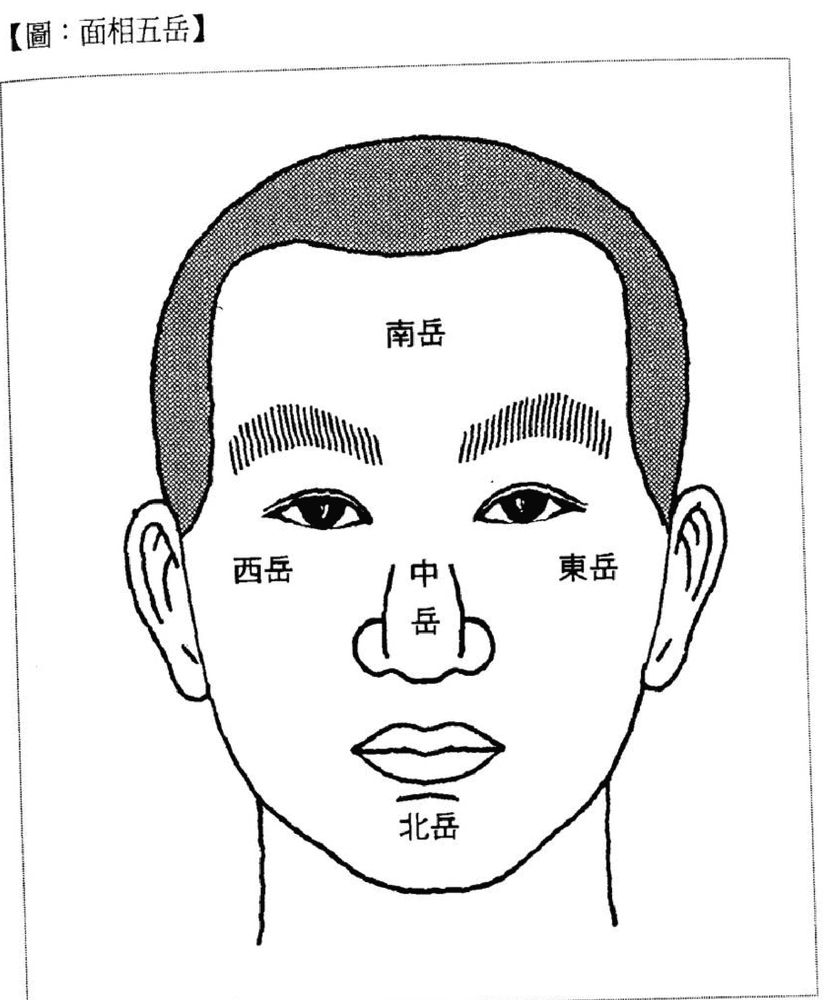

## 五岳須要相朝

五岳如果相互朝拱，構置均衡、對稱；額高廣豐隆；鼻直聳方正豐隆，左右顴高圓向上；頦方闊高起，爲有秩序有勢，是爲有成。

相反的，如果五岳不相朝應，構置不均衡對稱，顯得尖、斜、高、低、陷，額低陷窄斜，鼻尖薄偏斜，不聳不隆或是削如峰脊，左右顴低平而孤立無援，頦尖禿不起，主無秩序或無勢，是爲五岳不成。

## 五岳朝歸

五岳朝歸就是「五岳朝天」，是指面部五岳（兩顴、鼻、額、下頦）豐隆，齊拱天庭（額中央的部位）。傳統相術家以爲，五岳朝歸是主富貴。

陳搏《神異賦》指出：「五岳朝歸，今世錢財自旺。」注：「五岳欲其朝拱豐隆，不宜缺陷傷破。」

《麻衣相法》卷四〈麻衣先生石室神異賦（上）〉說：「五岳朝歸，今世錢財自旺。」注：「五岳欲其朝拱豐隆，不宜缺陷傷破。」

## 五岳朝天

五岳朝天又稱爲「五岳朝歸」。是指面部五岳豐隆，齊拱天庭（額的中央部位）。傳統相術家以爲，五岳朝天是富貴之相。

《神異賦》上說：「五岳朝天，一世資財足用。」

《神相全編》卷九〈驚神賦〉也說：「五岳朝天，一世資財足用。」

## 四瀆

四瀆的「瀆」，就是水的意思。四瀆就是指長江、黃河、淮河、濟河等等。傳統相術家用來代喻耳、目、口、鼻。

- 耳是江瀆
- 目是河瀆
- 口是淮瀆
- 鼻是濟瀆。

中國相術家常常根據四瀆形狀、大小、深淺，用以測斷人的貧富、福壽。

四瀆的重點在，眼竅（黃河）、耳竅（長江）、鼻竅（濟水）、口竅（淮河）的能量，要寬廣暢流，然後經過「人中」匯入大海（口），這樣人們才能富貴到老。

金代張行簡《人倫大統賦・上》有「四瀆宜深且闊」，元代薛延年注說：「四瀆者，耳為江，口為河，眼為淮，鼻為濟。四瀆須宜深闊崖岸，有川流之形，不欲汙漫破缺。」

《神相全編》卷二〈達摩五官總論〉中說：「耳為江、目為河、口為淮、鼻為濟。」注：「四瀆要深遠成就，而涯岸不走，則財穀有成，財物不耗，多蓄積。……」

《太乙照神經》卷一〈四瀆論〉中說：「耳為江瀆，目為河瀆，口為淮瀆，鼻為濟瀆。四瀆取深藏清潔。涯岸不走，財積祿豐。即五山高峻，無水不秀。」

四瀆主要是代表人的財勢與家業。四瀆都是以寬、深、長大為佳。

## 四瀆有成

四瀆的均衡對稱，氣色明潤；雙眼深長清秀，黑白分明，灼然有神。兩耳竅闊而深；嘴則紅潤方正，合小並大，上下唇吻合而薄厚一致，兩鼻孔圓深不露，兩鼻翼厚而有收，是謂有成。

四瀆有成，神盈氣足，生命力旺盛，天賦聰明，富貴有餘，一生幸福。

## 四瀆無成

如果四瀆構置不均衡與對稱，氣色枯暗，眼睛圓短，加上赤脈侵睛，昏濁無神。兩耳竅窄而淺，嘴唇上下不相稱，嘴巴過大或過小，偏斜無棱起；兩鼻孔淺露而大，兩鼻翼薄而短小，是為無成。

四瀆無成是為貧賤夭的象徵。

四瀆之中，以兩眼最為重要。眼為神所居，有神無神，神足神短，神蓄神流，神藏神散，主要是從兩眼來觀察的。眼有神而盈足蓄藏，是為神有餘，可補別的部位的不足。眼無神或神虛流散，即使是別的部位生得再好，也難以補救。

## 【圖：四瀆】

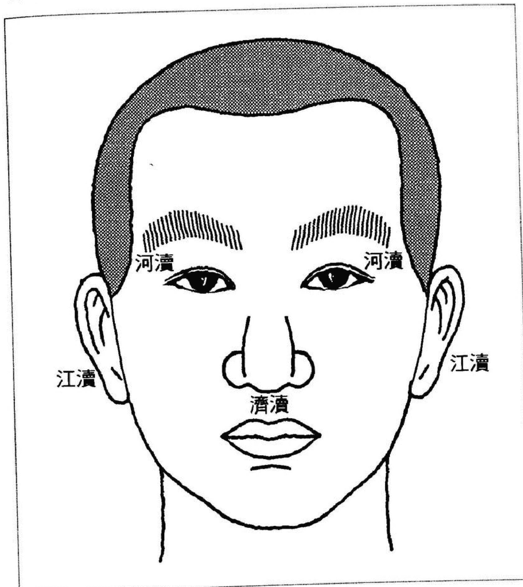

## 江瀆（兩耳）

江瀆就是長江，指兩耳，也是相術家所說的四瀆之一。
耳孔要深而闊，出口處又要緊縮，容量大而不外漏，這樣走表示其人聰明，家境好。

> 《麻衣相法》卷一指出：「耳為江瀆，竅要闊而深，有重城之副，緊則聰明，家業不破。」

> 《神相全編》卷二〈四瀆〉中說：「耳為江瀆，竅要闊而深，有重城之副，緊則聰明，家業不破。」

> 清代劉學誠輯《太乙照神經》卷一〈四瀆論〉中說：「耳為江瀆，竅要闊而深，或有重城之副，潔白聰明，家業興旺也。」

## 河瀆（雙目）

河瀆，就是指黃河，是相術家所說的「四瀆」之一。指的是雙目。
目，要深長有光彩，表示該人靈秀而長壽；相對的，如果該人眼睛長得淺而昏濁，是表示其人告命而告慧不高。

> 《麻衣相法》卷一指出：「目為河瀆，深而壽，小長則貴，光則聰明，淺則短命，昏則多滯，圓則多夭，不大不小，貴。」

> 《神相全編》卷二〈四瀆〉中說：「目為河瀆，深為壽，小長則貴，光則聰明，淺則短命，昏濁多滯，圓則多夭，不大不小者貴。」

> 清代劉學誠輯《太乙照神經》卷一〈四瀆論〉中說：「目為河瀆，取黑白深長，眉清目秀，聰明富貴，淺短而露，昏濁愚頑，貧賤無壽也。」

## 淮瀆（口）

淮瀆，就是淮河，也是相術家所說的「四瀆」之一，指口。口以方而闊爲佳，並且要求上唇與下唇的厚薄長短一致；要不然的話，就容易短壽，或是家業破敗。

> 《麻衣相法》卷一指出：「口爲淮瀆，要方闊，而唇吻相覆載。上薄則不覆，下薄則不載，不覆不載則無壽，無晚福，不覆則家必覆。」

> 《神相全編》卷二〈四瀆〉中說：「口爲淮瀆，要方闊而唇吻相覆載。」

> 清代劉學誠輯《太乙照神經》卷一〈四瀆論〉中說：「口爲淮瀆，唇吻方闊，覆載停勻，食祿豐盛，上薄下覆，下薄不載，無晚福，而少祿也。」

## 濟瀆（鼻）

濟瀆，就是濟水。就是相術家所說的「四瀆」之一。就是指鼻。

鼻要豐隆圓厚；如果沒有破損，鼻孔不大不小，不朝天，代表的是家業富厚，能積財。

> 《麻衣相法》卷一指出：「鼻爲濟瀆，要豐隆光圓，不破不露，其家必富。」

> 《神相全編》卷二〈四瀆〉中說：「鼻爲濟瀆，要豐隆光圓，不破不露，則家必富。」

> 清代劉學誠輯《太乙照神經》卷一〈四瀆論〉中說：「鼻爲濟瀆，豐隆光潤，庫圓收藏，年壽無節，不破不露，家富祿也。」

## 五星六曜

## 五星六曜

> 星辰失陷，部位偏虧；無隔宿之儲糧，有終身之勞苦。
——《神異賦》

五岳四瀆是相術借鑒地理風水的概念；而五星六曜則是借鑒於天文學上的認識；兩者都建立在天人合一的基礎上。

## 五星

五星本是指金、水、木、火、土五星；中國相術家借用來作兩耳、口、鼻、額的別稱。其中，額為火星，鼻為土星，左耳為木星，右耳為金星，口為水星。

傳統相術認為：金星左耳要白，木星右耳要朝，水星要紅，火星要高，土星要厚，綜合起來就是佳相；五星並可測斷人的官祿、權勢、壽命等等。

清代劉學誠輯《太乙照神經》卷一〈五星論〉中說：

> 金星須要白，官位終須獲。木星須要朝，五福並相饒。
水星須要紅，紅者食祿終。火星須要高，高者是權豪。
土星須要厚，厚者得長壽。

## 六曜

「六曜」是指左眉為羅喉，右眉為計都，山根為月孛，印堂是為紫氣，右眼是為太陰，左眼是為太陽。

中國相術家根據五星六曜來測斷人們的官祿、貴賤、吉凶命運等等。

清代劉學誠輯《太乙照神經》卷一〈六曜論〉中說：

> 左眼為太陽，須要真光，真光者福祿。右眼為太陰，須要黑亮，黑亮者為官宦。山根為月孛，須要高直，高直者豐衣食。左眉為羅喉，須要秀長，秀長者名遠揚。右眉為計都，須要整齊，整齊者賢兄弟。印堂為紫氣，須要圓明，圓明者升高職。

## 星辰失陷

星辰失陷，是指眼、耳、口、鼻、額不合相法。星辰是指雙目日月，兩耳是金星與木星，口是水星，額是火星，鼻是土星。

> 《神異賦》上說：「星辰失陷，部位偏虧，無隔宿之儲糧。」注：「如眼為日月而不明，鼻為土星而不隆，此星之失陷也；額位乎天，宜高而反低，頦位乎地，宜厚而反薄，此部位之偏虧也。」

【圖：北斗星君】

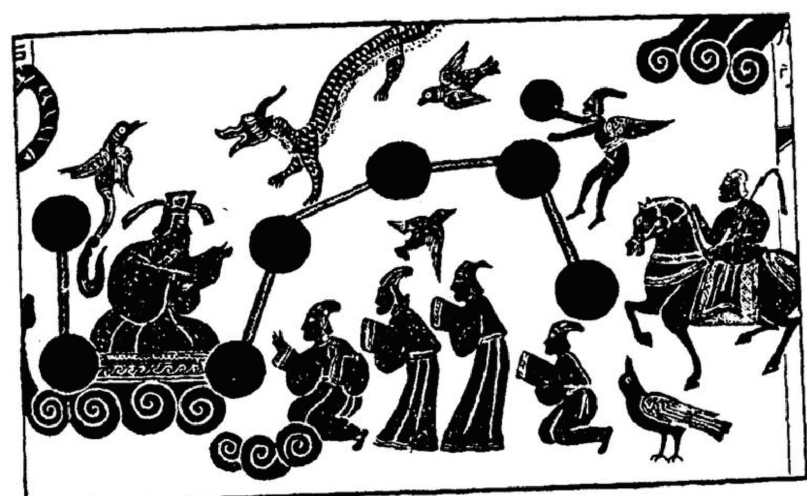

北斗星君

## 金星木星（耳）

金星木星爲耳；金星是指左耳，木星是指右耳。耳的輪廓分明，色白如銀，大小均等爲富貴聰明之人；耳的輪廓翻反側窄，大小不均爲損田破財、愚蠢無知之人。
傳統相術家以爲，金木星要輪廓分明，端正方爲佳相，以尖反側窄、低薄乾黑爲凶，可以測斷人的官位福祿。

## 金星（左耳）

金星，是中國相術家所說的「五星」之一。《神相全編》卷二〈五星六曜說〉有「金星須要白」注：「左耳」。

## 木星（右耳）

木星，是中國相術家所說的「五星」之一。
《神相全編・二・五星六曜訣斷》中說：「木星須要朝，五福並相饒。」

## 金木星

《神相全編》卷二〈五星六曜說〉上說：
金木星是耳。貴要輪廓分明，其位紅白色，不均大小，如門闊生得端正，不反，不尖，不小，一般更是高過眉眼。白色如銀樣，大好。其人當生得金木二星照命，發祿早定。翻反側窄，或大或小，爲陷了金木二星，其人損田宅，破財帛，無學識也，詩曰：金木成雙廓有輪，風門容指主聰明，端聳直朝羅計上，富貴榮華日日新。金木開花一世貧，輪翻廓反有艱辛。於中若有爲官者，終是區區不出塵。

清代劉學誠《太乙照神經》卷一〈五星論〉中說：「金木星是耳。輪廓分明。紅白色瑩、端正，孔闊不反不尖，不小不薄，耳高過眉，聰明顯貴。其人得金木二星照命，發祿受福。尖反側窄，低薄干黑，爲金木二星失陷。損田宅，破財帛，無學識，命不長。」

## 壽星

壽星，就是耳的別稱。傳統相術家以爲耳厚長貼腦者主壽。《神相全編・三・壽相格》中說：「耳是木星，又為壽星。」

## 【圖：五星六曜】

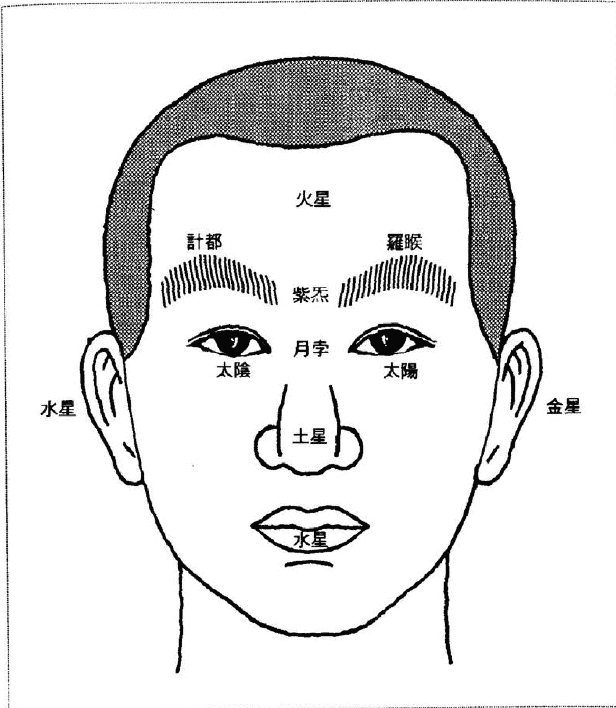

## 水星（口）

水星，是面相的五星之一。是指以口为中心，包括人中在内的部位，详见五星六曜图。

水星为口，口型方正，唇色红润，人中深阔端直通畅，为文章俊秀，少年及第之相。口的两头垂尖，薄而无棱者乞食一生。

传统相术家以为，水星以唇红齿白，人中深，端正为佳，以尖薄偏斜，角垂色黄者为凶，可以测断人的文才、官禄。

《神相全编》卷二〈五星六曜诀断〉上说：

> 水星是口，名为内学堂。须要唇红、阔四角、人中深，口齿端正，有文章，为官食禄。若唇齿粗，口角垂，色黄，主贫贱。诗曰：
口含四字似朱红，两角生棱向上宫；
定是文章聪俊士，少年及第作三公。
水星略绰两头垂，尖薄无棱是乞儿。
若是偏将居左右，是非奸诈爱便宜。

清代刘学诚辑《太乙照神经》卷一〈五星论〉中说：

> 水星是口，唇红齿白，上下有纹，方阔端厚，其人得水星照命。隐恶扬善，为官食禄。尖薄偏斜，唇掀露齿，口角下垂，是水星失陷。讲是说非，贫贱无缘。

## 火星（額）

火星，是面相的五星之一，是指額部，詳見五星六曜圖。傳統相術家以為，火星是以廣闊為好，以尖陷多紋為凶，可測斷人的福祿與子息。

火星為額，額頭廣闊者高貴富足，兒孫滿堂；額尖陷又多紋理者，一生潦倒，損妻破財。

《神相全編》卷二〈五星六曜訣斷〉上說：「火星是額。」

《神相全編》卷二〈五星六曜說〉指出：

火星是額。如額廣闊，髮際深者，有祿位衣食及子息四五人，其人有學藝、父母尊貴。當生命宮得火星之力入，命有田宅，壽九十九。如尖陷有多紋理者，是陷了火星，乃不貴，無子息一二，至老不得力，衣食平常，又不得兄弟力，三方無主，損妻破財。詩曰：
火星宮分潤方平，潤澤無紋氣色斷。
骨聳三條川字樣，少年及第作公卿。

火星尖狹是常流，紋亂縱橫生配囚。
赤脈兩條侵日月，刀兵赴法死他州。

清代劉學誠輯《太乙照神經》卷一〈五星論〉中說：

火星是額。髮際高深，豐滿廣闊，幼年受福，早得官祿，父母尊崇，兒孫賢貴。尖凸亂紋，髮低壓眉，為陷了南岳火星。早年不利，功名蹇滯，衣食缺少，子女不成，兄弟無情，損妻破財。

## 土星（土宿·鼻）

土星為鼻。

傳統相術家以為，鼻準豐厚，鼻樑端正，隆峻貫頂，兩孔不露者為福祿壽俱全的人。鼻準尖薄，鼻樑歪斜，起節，兩孔張露者，則可能一生孤獨貧窮。

土星又名「土宿」。《神相全編》卷二〈五星六曜訣斷〉上說：

> 土星是鼻。須要準頭豐厚，兩孔不露，年上壽上平滿，直滿聳不偏，其人當不陷了土星，入命並滿三分，主有福、祿、壽。如中岳土星不正，準頭尖露，更準頭高，其人陷了中嶽土星，主貧賤，少家業，主心性不直。

詩曰：

> 土宿端圓似截筒，門孔大即三公。
蘭臺廷尉來相應，必主聲名達聖聰。
土宿歪斜受苦辛，準頭尖薄主孤貧。
傍觀勾曲如鷹嘴，心裡姦謀必害人。

清代劉學誠《太乙照神經》卷一〈五星論〉上也說：

> 土星是鼻，隆峻豐厚，準大無毒，兩孔不露，年壽紅黃，鼻直貫頂。其人得土星照命，福祿壽全。

> 偏斜歪曲，年壽起節，準頭尖露，為陷了中嶽土星，家破多災，貧賤短命，為人險毒。

## 土宿

土星，是指鼻。《廣鑒集》：「鼻為土宿，萬物生於土，歸於土，象乎山岳。山不厭高，土不厭厚。」

## 太陰太陽（目）

右眼是爲太陰，左眼是爲太陽；太陰太陽就是左、右眼的統稱。

太陰、太陽爲目，黑白分明，光彩奪人者地位顯貴，做事俱順；目光黃赤，枯暗無神者損父母，害妻子，多災短命。

《神相全編》卷二〈五星六曜說〉指出：

> 太陰太陽是眼。要黑白分明，長細雙分入鬢者，黑睛多，白睛少，光彩者，其人當生得陰陽二星照命，作事俱順，骨肉俱貴。如黑少白多，黃赤色，其人陷了二星。損二星，損父母，害妻子，破田宅，多災短命。

詩曰：

> 日月分明是太陽，精神光彩一般強。
爲官不拜當朝相，也合高遷作侍郎。
日月斜窺赤貫瞳，更嫌孤露又無神。
陰陽枯暗因刀死，莫待長年主惡疾。

清代劉學誠《太乙照神經》卷一〈六曜論〉中說：

> 太陰太陽是兩眼，黑白分明，長細入鬢大貴。黑多白少，神光射人，爲得陰陽二星照命，諸事吉祥，骨肉俱貴。黑昏白乾，赤脈侵睛，爲陷了陰陽二星，主貧賤，害妻子，破田宅，災多命短。

## 太陰（右眼）

太陰是中國相術所說的「六曜」之一，就是指右眼。

《神相全編》卷二〈五星六曜說〉有「太陰須要黑」注：「右眼」又：「太陰太陽是眼。」

## 太陽（左眼）

太陽是指左眼。

《神相全編》卷二〈五星六曜說〉有「太陽須要光」注：「左眼」；又說：「太陰太陽是眼。」

## 月孛星（山根）

月孛，是六曜之一，又名月孛星，是指山根，詳見五星六曜圖。月孛星位在山根，貴在端直，晶瑩光彩，這是忠臣利家之相；狹而尖者為多災敗家之相。

傳統相術家以為，月孛以直貫印堂，紅黃光彩為佳，斷紋低陷、麻破痣傷為凶，可以測斷衣食、事業、家庭諸事。

《神相全編》卷二〈五星六曜訣斷〉中說：「月孛星是山根。」《神相全編》卷二〈五星六曜說〉又說：

> 月孛是山根，從印堂直下。分破者，其人當遭厄；月孛星不照命，陷了山根，主子孫不吉，定多災厄，修讀無成，破祖業，妻害子息。
詩曰：
月孛宜高不宜低，瑩然光彩似琉璃；
為官必定忠臣相，末主高官有好妻。
月孛宮中狹又尖，家財早破事相煎；
為官豈得榮高祿，孛位當生困歲年。

清代劉學誠《太乙照神經》卷一〈六曜論〉中說：

> 月孛是山根，直貫印堂，黃紅光彩為吉。紋斷低陷，麻破痣傷，為陷了月孛星，子孫不昌，災害不離，刑妻剋子，一世無成。

總之，山根要平直，忌彎曲不平；有痣、黑斑、紋，也是以凶論。

## 一說月孛星是年壽

> 《神異賦》上說：「平生少疾，皆因月孛光隆；到老無災，大抵年宮潤澤。」〔原註〕：「年壽即月孛星，此位豐隆有光，平生必少疾病也。」

## 羅喉計都（眉）

羅喉計都，簡稱「羅計」，就是左右二眉的總稱。眉粗過目者，衣食豐足，父母皆貴；眉毛連橫且又短者，骨肉多惡死。

傳統相術家以為，羅喉計都是以粗黑過目入鬢際為佳，以散亂監逆，橫連命宮為凶；可以測斷人的貴賤與秉性。

## 羅喉星（左眉）

羅喉星是指左眉。

《神相全編》卷二〈五星六曜說〉指出：「羅喉須要長……」注：「左眉」。

## 計都星（右眉）

計都星就是指右眉。

《神相全編》卷二〈五星六曜說〉指出：「計都須要齊，齊者有妻兒。」注「右眉」。

## 羅計星

羅計星，就是羅喉計都的合稱。

《神相全編》卷二〈五星六曜說〉指出：

羅計星是眉。二星粗黑過目入鬢際者，此衣祿之相，子息父母皆貴，親眷亦貴，此二星入命，如眉相橫，赤色更短，主骨肉子息多犯惡死。詩曰：

> 羅計星君秀且長，分明貼肉應三陽；
不惟此貌居官職，恩義彰名播遠方。
羅喉稀疏骨聳高，為人性急愛凶豪；
奸邪狀似垂楊柳，兄弟同胞有旋毛。

清代劉學誠《太乙照神經》卷一〈六曜論〉中說：「羅計星是兩眉，過眼入髮，毫連鼻骨，豐厚是祿。光前裕後，兄弟繁華；散亂監逆，橫連命宮，財破人離，骨肉成仇，志量淺狹，犯法惡死。」

## 紫氣星（印堂）

紫氣，又名紫氣星，是六曜之一，居印堂；印堂分明如珠者，大富貴；狹小者而又有紋者，依食蕭條。

傳統相術家以為，紫氣是以闊大豐滿，白色如銀為好，而以窄小不平均，有隱紋者為凶；紫氣星可以測斷人們的貴賤官祿事。

《神相全編》卷二〈五星六曜說〉指出：

紫氣須得圓，圓者有高官。紫氣星，印堂下是。印堂分明無直紋，圓如珠，主人必貴。白色如銀樣，主大富貴；黃者，有衣食。如窄不平勻，有隱紋者，不吉。子息二三人，不得力。無厚祿，損田宅。詩曰：

> 紫氣宮中闊又圓，拱朝帝主是英賢；
蘭台廷尉來相應；末主官榮盛有錢；
紫氣宮中窄又尖，小短無腮更少髯；
自小為人無實學，衣食蕭條更沒添。

清代劉學誠《太乙照神經》卷一〈六曜論〉中說：

紫氣星是印堂，又為命宮。兩眉中間闊大豐滿，圓明色潤，紅黃光彩，大顯功名；紋穿痣破，眉毛相連，低凹無勢，祖德全無，心地不明，貧賤無壽。

## 六府三才

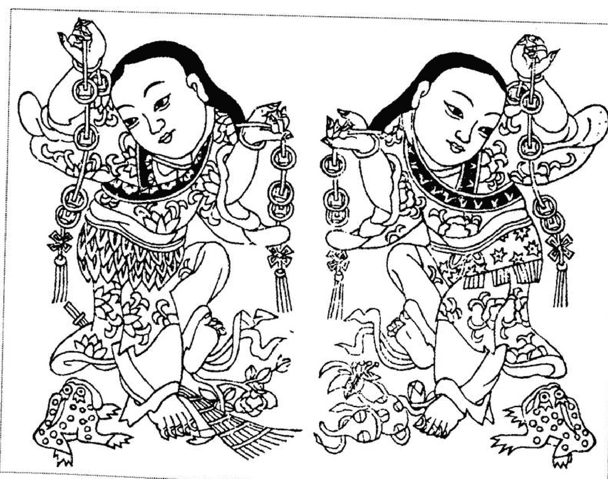

「六府」一詞，源出於《尚書・大禹謨》：「地平天成，六府三事允治，萬事永賴。」這是說水火木金土穀等六者為財貨聚斂之所。古人以為這六者是人的養生之本；後來被引入相學中來，做為面相中的六個部位的系統名稱。

我國古代相術家以為，以六府形相論人命祿，還應繫到其它關涉財帛的部位，特別是得聯繫到「三才」的額、鼻、頦來判斷。

## 六府

「六府」是天倉上二府、顴骨中二府、頦位下二府的總稱。中國相術家把輔角到天倉的部位稱作是「天倉上二府」，而以兩輔骨為標誌；把命門到虎耳的部位稱作是「顴骨中二府」，而以兩顴骨為標誌；把肩骨到地閣的部位，稱作是「頦位下二府」，而以兩頦骨為標誌。

- 1. 兩輔骨：輔骨就是額骨。上二府，又稱天府，它是從輔角到天倉為上二府。
- 2. 兩顴骨：中二府，又稱人府，從命門到虎耳是中二府。
- 3. 兩頦骨：下二府，又稱地府，從頦骨至地閣是下二府。

可以說，五岳是引喻人體主要骨骼的良否；六府則是引喻人體的次要的骨骼的良否。

> 《神相全編》一〈十觀〉上有「六取五官六府」注曰：「六府者，天庭、日月二角為天府，……兩顴為人府，……地閣邊腮為地府。」

> 金代張行簡《人倫大統賦》卷上「六府欲其實而充」，薛延年注說：「六府者，兩輔骨、兩顴骨、兩頦骨，欲其充實相輔，不欲支離孤露。」

> 清代劉學誠輯《太乙照神經》卷一〈六府論〉上說：「天倉為上二府，兩顴為中二府，兩頦為下二府。秘訣云：六府者，欲其充實相輔，不欲支離孤露。上二府自輔角至天倉，中二府自命門至虎耳，下二府自肩骨至地角。六府充滿無缺陷尖露者，富貴祿旺，財積人興，瘢痕紋破，諸事不利矣。」

如果六府生得尖削凹陷，或是有瘢痕亂紋，是主其人遇事不利，難以發達。

### 三才（三表）

三才，又名「三表」，就是額對應著天、鼻對應著人、頦對應著地。

三才之說，源出於《易・繫辭下》的「有天道焉，有人道焉，有地道焉，兼三材（才）而兩之。」這大意是說，古人以為天地人三者，是構成宇宙的最基本的內容，天地人三者的和諧，才能安泰。

劉學誠輯《太乙照神經》卷一〈三才論〉有進一步的說明：「額為天，欲闊而圓，名曰有天者貴；忌獨凸。鼻為人，欲旺而齊，名曰有人者壽；忌獨高。頦為地，欲方而闊，名曰有地者富；忌獨長。」

【圖：六府三才】

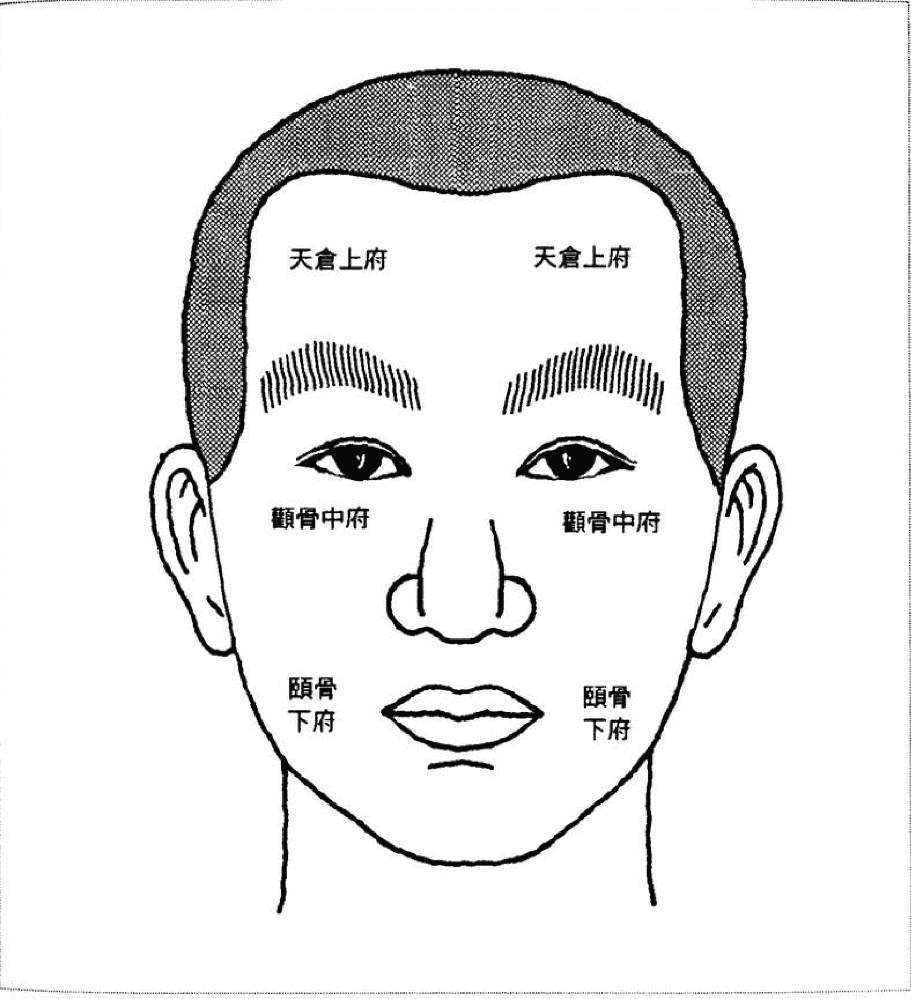

## 六府

> 三光明旺，財自天來；六府高強，一生富足。
——《神異賦》

「六府」豐滿、充實、光潤、無瑕斑，是爲「六府有成」。六府缺陷，或是支離孤露、枯暗多瑕斑的是爲「六府無成」。

六府主要是看金錢、財物與不動產的狀況。「六府有成」，一生錢財豐盈；有經濟頭腦，可以享受富貴；即使地位不顯赫，也不會妨害福富。「六府無成」，一生拮据，財路不廣，受飢寒之苦。

《神相全編》卷二〈六府論〉中說：
六府者，兩輔骨、兩顴骨、兩頤骨，欲其充實相輔，不欲支離孤露。《靈臺秘訣》云：上二府自輔角至天倉，中二府自命門至虎耳，下二府自肩骨至地閣。六府充直無缺陷瘢痕者，主財旺。天倉峻起多財祿，地閣方停萬頃田。缺者不合。

《照膽經・五官六府》中說：「目爲監察官，在六府上。口爲出納官，在六府前；鼻爲審辨官，在六府中；耳爲採聽官，在六府中；人中保壽官，在六府中；人中一作眉。兩眉上爲二府，兩輔角爲四府，兩顴上爲六府。一官好，貴十年；一府好，富十年。官府俱好，富貴終老；左爲文，右爲武。」

### 天府：天倉上二府

兩輔骨（上二府）。
天府，是相術家所稱的六府中的上二府。是指天庭與日月二角，就是整個額部。
天府主初年運氣，宜方圓明淨，不宜低塌黯淡。

### 三台

三台是相術家稱爲兩輔骨與額角的部位；他們認爲這裡可以推斷人們的功名與成敗。《神異賦注》上說：「三台在兩輔及額角，此位有黃氣者名成利達。」

### 人府：顴骨中二府

人府，就是相術家所說的六府中的「二府」，又稱「顴部中二府」，或是簡稱「中二府」，是指命門到虎耳的部位，而以兩顴爲標誌。

兩顴人府，是主人的中年運氣。

傳統相術家以爲，人府應方正入鬢，不粗不露，齊揖方拱爲佳。以粗露、繃鼓、過高、過低爲凶。

> 《神相全編》卷一〈十顴〉中說：「兩顴爲人府，宜方正插鬢，不粗不露，齊揖方拱，此人府成也。若粗露、高低、尖圓、繃鼓，此人府不成也，主中年運否。」

> 范文園《神相水鏡集全編》卷一〈面相總論〉中說：「兩顴骨爲中二府，管中年福壽。」

### 地府：頤位下二府

地府是指兩頤與下頦，就是中國相術家所說的「六府」的下二府，又名「頤部下二府」、「下二府」。

傳統相術家以爲，地府是以不昏、不慘、不尖、不歪、不粗、不大爲佳相；以高低、粗露、尖削、耳後見重腮爲凶相。下二府可以測斷人晚年的運氣。

> 《神相全編》卷一〈十觀〉中有「六取五官六府」，注說：「地閣邊腮，爲末景地府。喜輔地閣、懸壁；不昏、不慘、不尖、不歪、不粗、不大，地府成也。若高低、粗露、尖削、耳後見重腮，地府不成也。書云：一府就，掌十年之富盛；相反者，主十年之凶敗。」

> 清代范文園《神相水鏡集》卷一〈面相總論〉指出：「兩頤骨爲下二府，管晚景榮昌。」

## 三才

三才，就是天、地、人三者的統稱。《易・說卦》上說：「是以立天之道，曰陰與陽；立地之道，曰柔與剛；立人之道，曰仁與義。兼三才而兩之，故《易》六畫而成卦。」

漢代王符《潛夫論・本訓》上說：「是故天本諸陽，地本諸陰，人本中和。三才異務，相待而成。」相術家將三才之說引入手面相的領域中；因此有手相三才與面相三才的兩種說法。

「三才」就是額（天）、鼻（人）、頦（地）。《神相全編》卷一〈三才三停論〉上說：

> 三才者，額為天，欲闊而圓，名曰有天者貴。鼻為人，欲旺而齊，名曰有人者壽。頦為地，欲方而闊，名曰有地者富。

古代相書借用天地人三才的說法，來闡釋人的命相；例如《麻衣相法》卷一〈六府三才三停〉中說：

> 三才者，額為天，欲闊而圓，名曰有天者貴。鼻為人，欲正而齊，名曰有人者壽。頦為地，欲方而闊，名曰有地者富。

這大意是說，額以開闊圓潤為貴，鼻以端直者為壽，頦以豐隆者為富。

傳統相術家以為，作為「天才」的額是以圓而闊為佳，以獨凸為凶；額可斷定人的社會地位。作為「人才」的鼻，是以豐而齊為佳相，而以獨高為凶，鼻可斷定人的壽命。作為「地才」的是頦，是以寬厚為佳相，以獨長為凶。

### 三才有成

三才有成者，額或闊而平，飽滿光潤，或厚而圓，豐隆而光潤。頦隆起而朝向鼻準，方而寬，豐滿潤澤。鼻渾然直聳，鼻孔不露，準頭或豐隆或方正。

### 三才無成

三才無成者，是指鼻準無勢薄弱；額尖窄凹陷，多陷，多癩痕。頦缺陷後縮或是尖小無肉，鼻孔太露，準頭不隆。

三才主要是看命根的貴賤（額）、壽命的長短（鼻）與錢財的多少（頦）。三才有成，既富且貴而又長壽。三才無成，又無相關部位的補救，那麼通常一生是不會顯赫，也不容易擁有豐厚的錢財，不能享高壽。

## 三才日月

傳統相術家以為：額為天，頦為地，鼻為人；左目是為日，右目是為月。基本上，天勢欲張，地勢欲方，人相欲深廣，日月欲有光。如果有天者貴，有地者富，有人者壽，日月好者茂。

> 《照膽經・三才日月》上說：「額為天，頦為地，鼻為人；左目為日，右目為月；天欲張，地欲方，人欲深廣，日月欲光。有天者貴，有地者富，有人者壽，日月好者茂。」

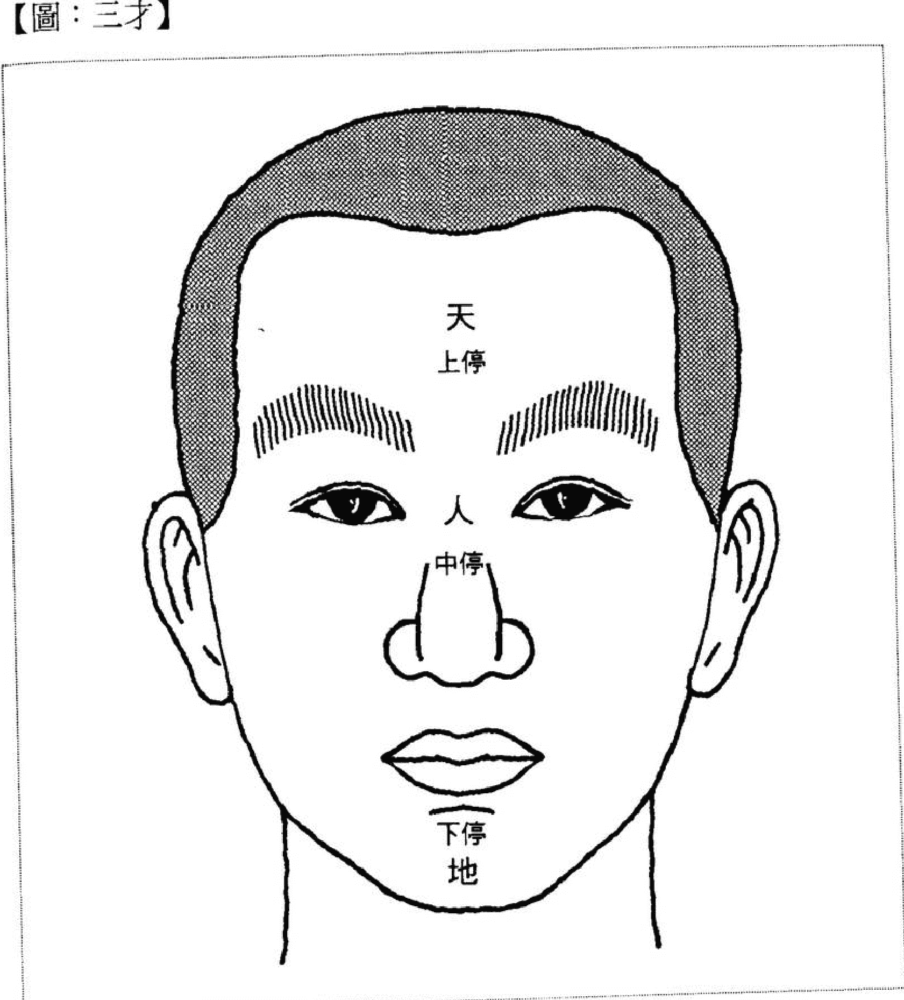

## 四學堂與八學堂

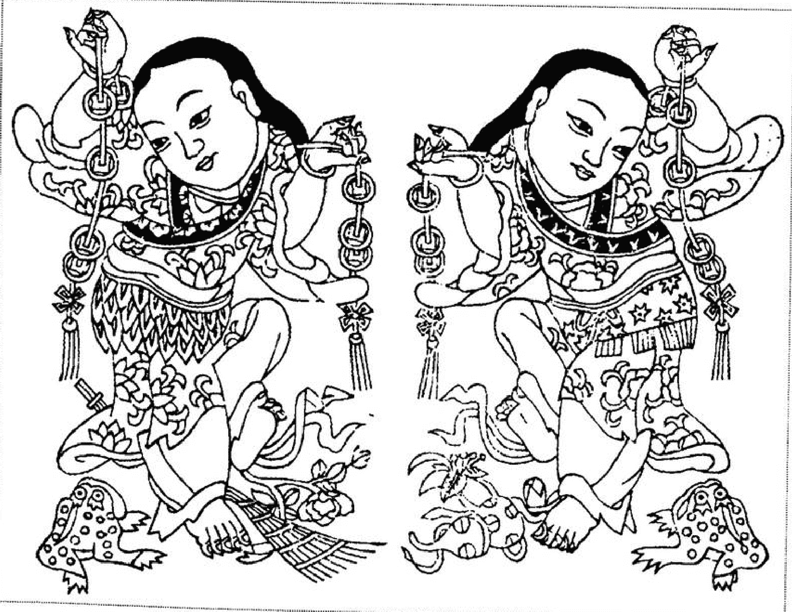

### 四學堂

——官學堂(眼) 祿學堂(額) 內學堂(門牙) 外學堂(耳門)

中國古代相術家為了更方便的觀察人的聰明才識，而把人面有關才識的部位稱為「學堂」。一般有兩種分類法，所謂的「四學堂」與「八學堂」是也。

四學堂是指官學堂（眼）、祿學堂（額）、內學堂（門牙——就是當門的二齒）、外學堂（耳門及耳前的部份）。

傳統相術家以為，根據四學堂的部位形狀、氣色，可以測斷人們的賢愚禍福。

金代張行簡《人倫大統賦》中有「欲察人倫先從額相」，元代薛延年注說：

> 郭林宗觀人有四學堂，一曰「官學堂」，謂眼，長而清為官貴。二曰「祿學堂」，謂額，廣闊而豐者富貴；三曰「內學堂」，當門二齒周正而密者主忠信，疏缺而小者主狂妄。四曰「外學堂」，耳門之前豐滿明潤，主文章聲譽，昏塵者下愚。

古代相學家以為，眼要長而清，主有官職；額要長而闊，有官有壽；門齒要長得周正嚴密，是主忠信孝敬；如果長得稀疏斜小，是主狂妄無禮。耳前的部位要豐滿光潤，是主聰明；如果昏暗晦淡，則是主愚笨。

### 官學堂（眼）

官學堂（眼），就是指雙目，為四學堂之一。
傳統相術家以為，官學堂要長而清，是測斷官職的相位。

> 《神相全編》卷一〈四學堂論〉中說：「一曰眼為官學堂，要長而清，主官職之位。」

> 清代范文園《水鏡集》卷一〈四學堂〉中說：「眼為官學堂，須得黑白分明，秀長有神，主文章聲譽高貴也。」

> 清代劉學誠《太乙照神經》卷一〈四學堂論〉中說：「眼為官學堂，眼明聲譽飛揚。」

綜合的來看，眼睛混濁、神滯、神痴、鬥眼、瞎眼等，是破壞了人的文昌。

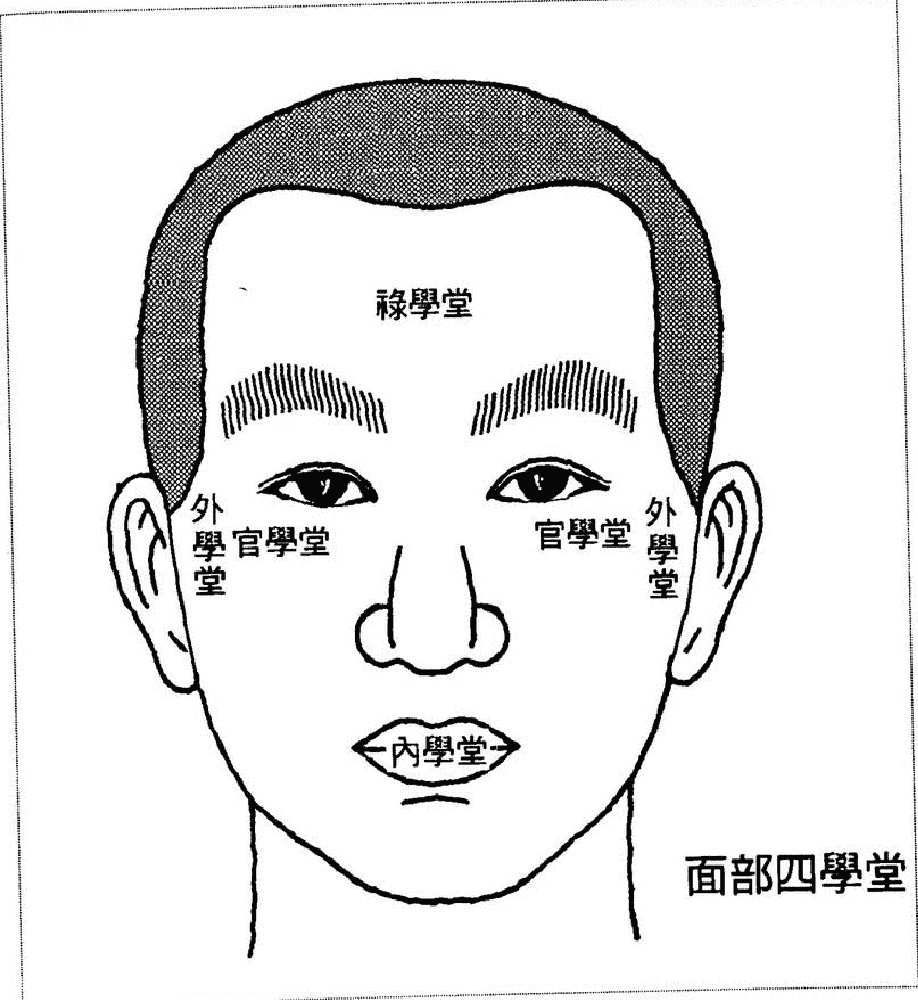

### 祿學堂（額）

祿學堂就是額部，為四學堂之一。
傳統相術家以為，祿學堂是以長闊為佳，可以測斷人們的官壽。

> 《神相全編》卷一〈四學堂〉中說：「二曰額，為祿學堂。額闊而長，主官壽。」

> 清代范文園《水鏡集》卷一〈四學堂〉中說：「額為祿學堂。額闊頂平中正滿，有官有祿少年成。」

> 清代劉學誠《太乙照神經》卷一〈四學堂論〉中說：「額為祿學堂，印豐官高量寬。」

綜合的來看，額窄、額低、額偏、額飛、額陷，是破壞了人的文昌。

### 內學堂（當門二齒）

內學堂是中國相術家所說的「四學堂」之一，是指當門二齒。

傳統相術家以為，當門兩齒以大而明者為好，可以測斷人的忠信孝敬事。

金代張行簡《人倫大統賦》卷下說：「當門二齒缺，則命蹇於沒世，學堂一官全，則聲聞於普天。」薛延年注：「當門二齒為內學堂，若大而明者主多聞四海。」《人倫大統賦》卷下又說：「班馬文章，白若瓠犀之美。」都是指出牙齒與人的讀書功名的關係。

《神相全編》卷一〈四學堂論〉中說：「三曰當門兩齒為內學堂，要周正而密，主忠信孝敬；疏缺而小，主多狂妄。」

清代范文園《水鏡集》卷一〈四學堂〉中說：「當門兩齒為內學堂，又為祿食學堂，要周正而密，瑩靜如銀，主忠信孝敬多祿食。」

清代劉學誠《太乙照神經》卷一〈四學堂論〉中說：「門牙內學堂。齒齊食祿異常。」

中醫以為，耳是「聰」的門竅，耳與腎密切關連；腎氣實，耳清而通；腎氣虛，耳昏而濁。

綜合的來看，耳缺、耳薄、昏沉、尖小、耳洞等，是破壞了文昌。

### 外學堂（耳門前）

外學堂是相術家所說的「四學堂」之一，也可以單稱為「學堂」。通常是指耳門前的部位。

傳統相術家以為，外學堂是主聰明才智，以豐滿光潤為佳。

《舊唐書・袁天綱傳》記載：

> 天綱謂（杜）淹曰：「公蘭台成就，學堂寬博，必得親糾察之官，以文藻見知。」

《神相全編》卷一〈四學堂論〉中說：「四曰耳門之前為外學堂，要耳豐滿光潤，主聰明，若昏沉，愚鹵之人也。」

清代范文園《水鏡集》卷一〈四學堂〉中說：「耳為聰明學堂，又為聞名學堂，須得紅潤色白於面，圓如巽桃，主爵祿豐厚，富貴非常。」

清代劉學誠《太乙照神經》卷一〈四學堂論〉中說：「耳門外學堂，耳厚福大壽長。」

綜合的來看，齒疏、齒缺、齒小、齒黑等，是破壞了文昌。

### 八學堂有成與無成

「八學堂」是相術家根據用以測斷吉凶貴賤的八個部位，分別分佈於頭面的各部。八學堂是指：

- 1. 高明部學堂（額頂），主富。
- 2. 高廣部學堂（額角），主福。
- 3. 光大部學堂（印堂），主官。
- 4. 明秀部學堂（眼光），主貴。
- 5. 聰明部學堂（耳色），主名。
- 6. 忠信部學堂（口唇及牙齒），主祿。
- 7. 廣德部學堂（舌），主德。
- 8. 班筍部學堂（眉毛），主壽。

> 清代范文園《水鏡集》卷一〈八學堂〉中說：「眉為班筍學堂，耳色聰明學堂，眼為明秀學堂，額上高明學堂，額中高廣學堂，印堂光大學堂，口唇忠信學堂，舌相廣德學堂。」

### 八學堂有成

如果人的眼睛黑白分明，清秀細長，睛如點漆，光潤有神；印堂光潤明潔；額與額角寬大飽滿，明潤方正；耳前部位豐滿光潤，耳圓厚高眉，雙眉高居額上，清長秀彎，黑高如漆；唇紅潤方正，厚而多豐理；舌大致可抵準頭，方長鮮豔；牙齒周正而齊密，瑩潔如銀，謂之「四學堂、八學堂有成」。

### 八學堂無成

相對的，如果眼睛昏濁，圓露無神；雙眉壓眼，濁亂色枯；印堂昏暗，理亂多痕；額與額角尖窄偏斜，枯暗色邪；耳門前部位低陷色暗，耳薄低反；口唇偏斜焦乾，色邪無紋；舌或尖細如蛇，或短禿厚大；牙齒函缺不正，小而雜亂者為「四學堂、八學堂無成」。

### 八學堂分論

高明部學堂（頭或額頂）、高廣部學堂（額角）、光大部學堂（印堂）、明秀部學堂（眼光）等部位主管頭腦、智慧及官祿。

外學堂（耳門及耳前的部份）主管聰明與名聲。

四學堂與八學堂主要是用來看一個人的先天稟賦、性質、氣質與社會規範，以及自我價值實現方式的吻合度等等。

學堂有成，富貴雙全，福壽兼享，德行高邁，聲名遠達。學堂無成，倘若又無其他相關部位的補救，可能就會一生艱辛。

### 1. 高明部學堂（額頂）

高明部學堂，就是指額上。

傳統相術家以為，高明學堂是以頭圓或有異骨昂起為佳，可以測斷人的貧富。

> 《神相全編》卷一〈八學堂論〉中說：「第一高明部學堂，頭圓或有異骨昂。」

> 清代范文園《神相水鏡集全編》卷一〈八學堂〉指出：「額上高明學堂，問富在額。……第一高明部學堂，頭圓或有異骨昂。」

> 清代劉學誠輯《太乙照神經》卷一〈八學堂論〉中說：「額上高明學堂，頭圓或有異骨昂，問富在額。」

### 2. 高廣部學堂（額角）

高廣部學堂（額角）是指額部或額角，一說是指額中。
傳統相術家以為，高廣學堂是以額闊明潤有骨起者為佳。
《神相全編》卷一〈八學堂論〉中說：「第二高廣部學堂，額勇明潤骨起方。」
清代范文園《神相水鏡集全編》卷一〈八學堂〉指出：「額中高廣學堂，問福在兩角。……第二高廣部學堂，額湧明潤骨起方。」
清代劉學誠輯《太乙照神經》卷一〈八學堂論〉中說：「額中高廣學堂，額湧明潤骨起方，問福在角。」

### 3. 光大部學堂（印堂）

光大部學堂，簡稱「光大學堂」，就是指「印堂」。
傳統相術家以為，光大部學堂是以平明無紋傷為好，可以測斷人的官職。
《神相全編》卷一〈八學堂論〉中說：「第三光大部學堂，印堂平明無痕傷。」
清代范文園《神相水鏡集全編》卷一〈八學堂〉指出：「印堂光大學堂，問官在印。……第三光大部學堂，部堂平明無痕傷。」
清代劉學誠輯《太乙照神經》卷一〈八學堂論〉中說：「印上光大部學堂，印滿平明無紋傷，問官在印。」

### 4. 明秀部學堂（眼光）

官學堂（眼）、明秀部學堂（眼光）主管人的官位高低與大小。

傳統相術家以為，明秀學堂以光亮有神為佳，可以測斷人的貴賤。

> 《神相全編》卷一〈八學堂論〉中說：「第四明秀部學堂，眼光黑多入隱藏。」

> 清代范文園《神相水鏡集全編》卷一〈八學堂〉指出：「眼光明秀學堂，問貴在目，……第四明秀部學堂，眼光黑多神隱藏。」

> 清代劉學誠輯《太乙照神經》卷一〈八學堂論〉中說：「眼為明秀部學堂，眼光黑多神隱藏，問貴在眼。」

### 5. 聰明部學堂（耳色）

聰明部學堂，是指兩耳，可以測斷人們的知名度。

傳統相術家以為，聰明部學堂要有輪廓，顯露紅白色為佳。

> 《神相全編》卷一〈八學堂論〉中說：「第五聰明部學堂，耳有輪廓紅白黃。」

> 清代范文園《神相水鏡集全編》卷一〈八學堂〉指出：「耳為聰明學堂，問名在耳。……第五聰明部學堂，耳有輪廓紅而白。」

> 清代劉學誠輯《太乙照神經》卷一〈八學堂論〉中說：「耳為聰明學堂，耳有輪廓色紅白，問名在耳。」

### 6. 忠信部學堂（口唇及牙齒）

忠信部學堂（口唇及牙齒）與內學堂（門牙——就是當門的二齒）主管忠孝與口才。這主要是因為齒相潔白整齊，是主忠信慈孝。

傳統相術家以為，忠信學堂是以唇齊牙密為好，可以測斷人的食祿。

> 《神相全編》卷一〈八學堂論〉中說：「第六忠信部學堂，齒齊周密白如霜。」

> 清代范文園《神相水鏡集全編》卷一〈八學堂〉指出：「口唇忠信學堂，問祿在口。……第六忠信學堂，牙齊周密白如霜。」

> 清代劉學誠輯《太乙照神經》卷一〈八學堂論〉中說：「口唇忠信學堂，唇齊牙密白如霜，問祿在口。」

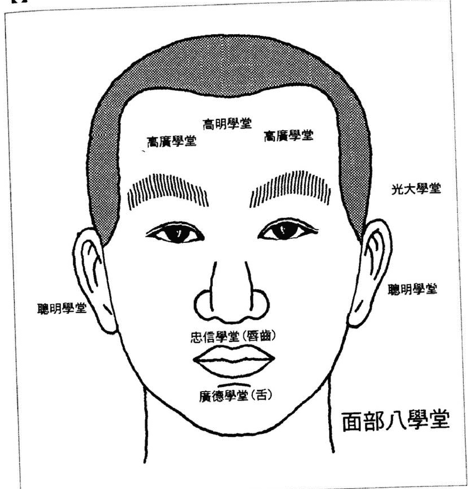

### 7. 廣德部學堂（舌）

### 8. 班笋部學堂（眉毛）

廣德部學堂（舌）主管人的道德與操行，舌以長及色紅爲好。

班笋部學堂（眉毛）主管人的壽命的長短。
另有一說是指額部的紋痕，說是應暢順不宜紊亂。

> 《神相全編》卷一〈八學堂論〉中說：「第七廣德部學堂，舌長至準紅紋長。」

> 《神相全編》卷一〈八學堂論〉中說：「第八班笋部學堂，橫紋中節停合雙。八位學堂如有此，人生富貴多吉祥。」

> 清代范文園《神相水鏡集全編》卷一〈八學堂〉指出：「舌相廣德學堂，問德在舌。……第七廣德部學堂，舌長至準紅紋長。」

> 清代范文園《神相水鏡集全編》卷一〈八學堂〉指出：「眉爲班笋學堂，問壽在眉……第八班笋部學堂，橫起天中細秀長。」

> 清代劉學誠輯《太乙照神經》卷一〈八學堂論〉中說：「舌相廣德學堂，舌長至準紅紋長，問德在舌。」

> 清代劉學誠輯《太乙照神經》卷一〈八學堂論〉中說：「眉爲班笋學堂，橫起天中細長揚，問壽在眉。」

## 面相八卦

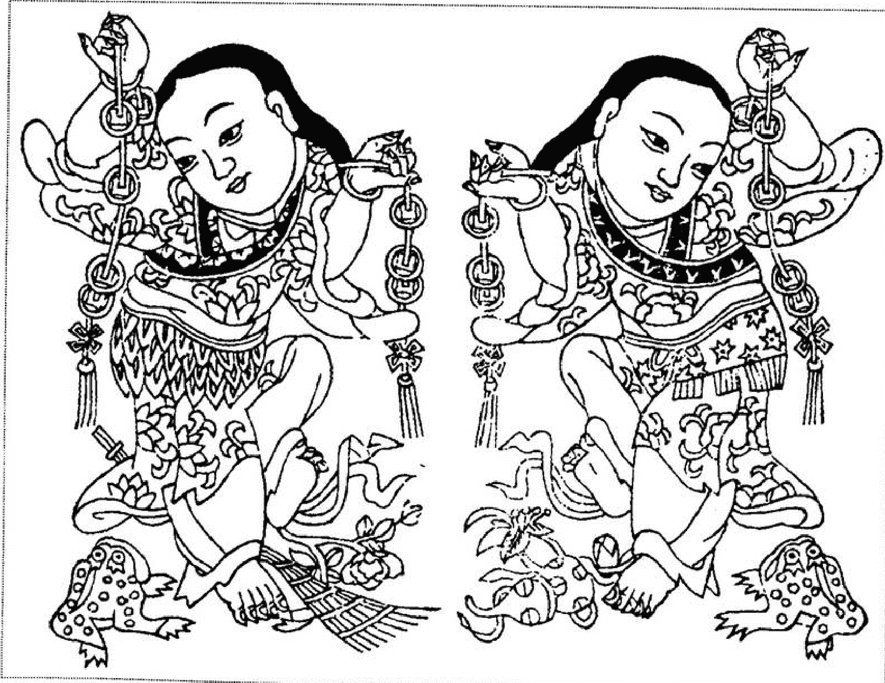

## 八極

八極，是指人的面部，從鼻而望，八方都成規模而不相傾擔的格局。傳統相術家以為八極是一種佳相。

> 《照膽經·八極》上說：「自鼻而望，八方成形而不相傾者良。」

## 形法

《漢書·藝文志》在論「形法」時就說：

> 形法者，大舉九州之勢，以立城郭室舍，形人及六畜骨法之度數，器物之形象，以求其聲氣貴賤吉凶。猶律有長短，而各徵其聲，非有鬼神，數自然也。

這是一種以「形氣」為理論基礎的相術。

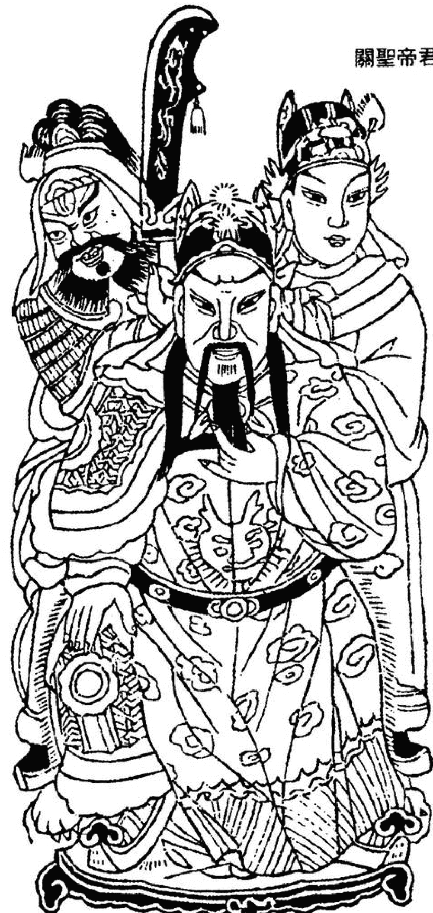

## 面相八卦

> 五嶽不正，相君終始薄寒，八卦高隆，須是多招財祿。
——〈神異賦〉註引混儀云

面八卦，是相術家以《易》的八卦名稱，分別指位於面部上下左右及四角的八個部位。如果是依「文王後天八卦」的分配法，其中乾位在右頤下，坎位在唇下，艮位在左頤下，震位在右耳前，巽位在右額旁，離位在額頂，坤位在左額旁，兌位在左耳前。

「面八卦」在相法中的用途是附會以五行，並且根據所在的部位氣色推斷吉凶休咎。詳細的說：

第一個部位是右耳，右耳是屬東方；東方甲卯七都屬木，稱為「木星」，是屬於文王八卦的震位，所以稱「震宮」。

第二個部位是右額角，右額角是屬東南方；東南方的辰巽巳都屬木，稱為「木星」，是屬於文王八卦的巽位，所以稱「巽宮」。

第三個部位是前額正中，前額正中屬南方；南方的丙午丁都屬火，稱為「火星」，是屬於文王八卦的離位，所以稱「離宮」。

第四個部位是左額角，左額角是屬西南方；西南方的未、坤、申都屬土，稱為「土星」，是屬於文王八卦的坤位，所以稱「坤宮」。

第五個部位是左耳，左耳是屬西方；西方的庚酉辛都屬金，稱為「金星」，是屬於文王八卦的兌位，所以稱「兌宮」。

第六個部位是左腮，左腮是屬於西北方；西北方的戌乾亥都屬金，稱為「金星」，是屬於文王八卦的震位，所以稱「震宮」。

第七個部位是下頦（下巴），下頦是屬北方；北方壬癸亥子均屬水，稱為「水星」，是屬於文王八卦的坎位，所以稱「坎宮」。

第八個部位是右腮，右腮是屬東北方；東北方的丑艮寅都屬土，稱為「土星」，是屬於文王八卦的艮位，所以稱「艮宮」。

## 八卦的吉凶論斷

乾宮高聳，長生子之權豪。坎位高堆，受前人之庇蔭。艮宮剋陷，損子父於初年。震上高朝，置田宅於一世。巽宮散亂，多為游蕩之徒。離位突高，必作功名之士。坤宮帶破，招兒女以凋零。兌位有傷，主夫妻之鰥寡。

## 先天八卦配法

如果是依先天八卦配法，額爲乾，頰爲坤，口爲坎，眉爲震，兩顴爲離兌，兩耳不貼爲巽，鼻爲艮。
這是一種較不通行的配法。

## 【圖：面相八卦】

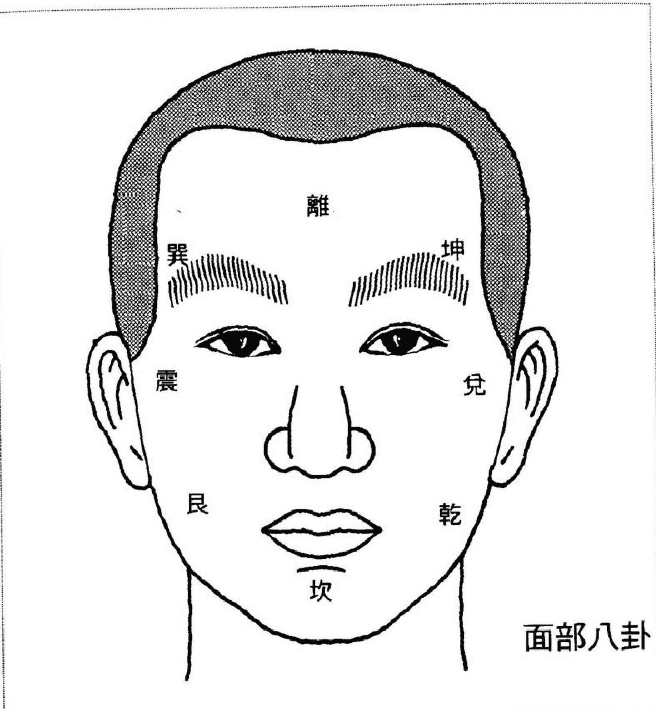

## 八卦
——古代中國的神秘智慧

【表：八卦屬性表】

| | 自然物象 | 人倫人事 | 屬性德性 | 動物 | 身體 | 方位 | 四時季節 |
|---|---|---|---|---|---|---|---|
| ☰ 乾 | 天 | 父 | 健 | 馬 | 首 | 西北 | 秋冬間 |
| ☷ 坤 | 地 | 母 | 順 | 牛 | 腹 | 西南 | 夏秋間 |
| ☳ 震 | 雷 | 長男 | 動 | 龍 | 足 | 東 | 春 |
| ☴ 巽 | 風 | 長女 | 入 | 雞 | 股 | 東南 | 春夏間 |
| ☵ 坎 | 水 | 中男 | 陷 | 豕 | 耳 | 北 | 冬 |
| ☲ 離 | 火 | 中女 | 麗 | 雉 | 目 | 南 | 夏 |
| ☶ 艮 | 山 | 少男 | 止 | 狗 | 手 | 東北 | 冬春間 |
| ☱ 兌 | 澤 | 少女 | 說 | 羊 | 口 | 西 | 秋 |

八卦：也稱「經卦」、「單卦」、「三爻卦」、「小成之卦」。

八純卦：指內卦和外卦爲同一經卦所構成的別卦。共有八個，它的名稱与組成它的經卦的名稱相同。它們分別是☰乾、☷坤、☳震、☶艮、☲離、☵坎、☱兌、☴巽。

朱熹《周易本義》載有〈八卦取象歌〉：

> ☰乾三連，☷坤六斷；
☳震仰盂，☶艮覆盌；
☲離中虛，☵坎中滿；
☱兌上缺，☴巽下斷。

八卦的由來，是個複雜而久遠的問題。甚至可能牽涉到神秘主義。筆者以爲：創造的歷史上，的確發生不可思議的夢境。例如有機化學家克古拉（Kekule）研究 Benzene 的分子結構，百思不得其解。有一天，他坐在火爐邊睡著了！他做了一個夢：夢中有六個大人，各帶著一個小人，大人互相牽著手跳舞，跳著跳著，就圍成一個六元環狀的圈子來。當他一覺醒來之後，就想出了 Benzene 的平面六元環的結構！知識有時就是這樣來，充滿了神秘！八卦如果不是帶有神秘的密碼與作用，它在中國的影響是不會這麼大的！對於八卦所演生出的各種現象與作用，不能完全把它看成是迷信！

八卦，是《周易》中象徵天道運行與人事變化的八種不同性質類型的基本單位。一個單位稱爲是一個卦；每卦分別由陰陽組合不同的三個爻所構成。

卦是占筮者判斷事物吉凶、休咎的基本依據，傳說是由伏羲氏所創制。

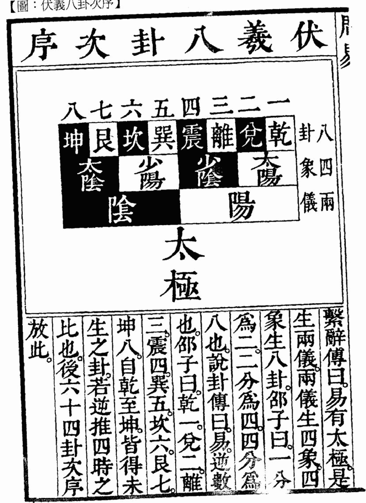

## 【圖：伏羲八卦方位圖】

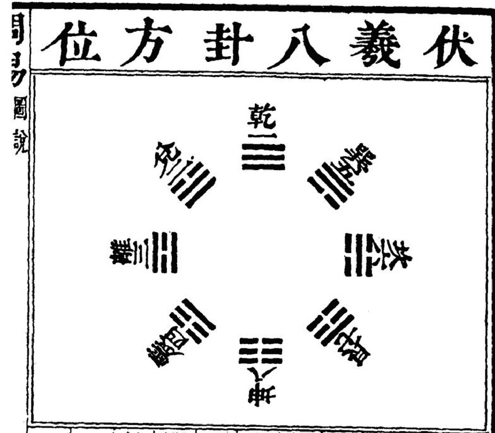

說卦傳曰。天地定位。山澤通氣。雷風相薄。水火不相射。八卦相錯。數往者順。知來者逆。邵子曰。乾南坤北。離東坎西。震東北。兌東南。巽西南。艮西北。自震至乾為順。自巽至坤為逆。後六十四卦方位放此。

## 【圖：文王八卦次序】

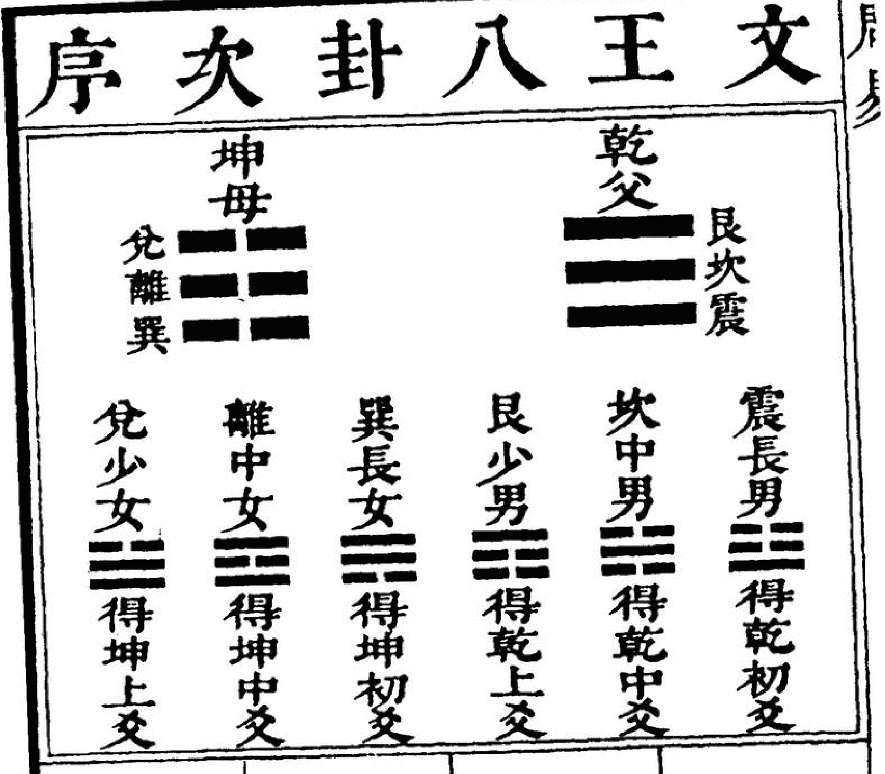

## 【圖：文王八卦方位】

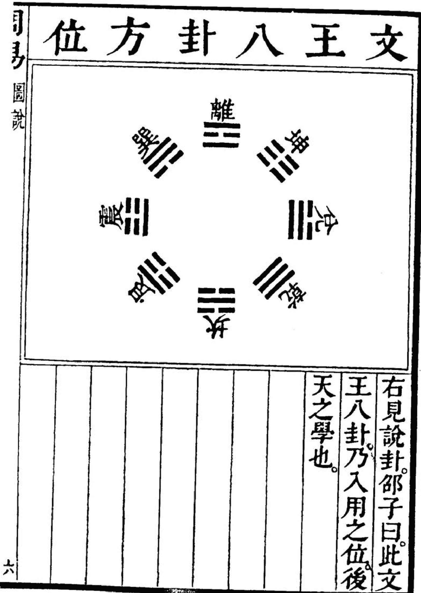

## 八卦干支相面

八卦與干支相面時，要考慮到季節、五色。例如：

### 春季見青色

右顴骨屬東，屬木，在天干是為甲乙，在季節為春。
如果春季三個月中見青氣，是為旺相，主先憂驚，後喜慶。如果顯赤色，為相生；不過，雖為相生，亦是先生口舌，後成大喜。顯白色，屬囚象，為金剋木，為牢獄。顯黃紫色，為死相，為木剋土。
春季以木為正色，所以宜見青色。

### 夏季見赤色

額為南，屬火，在天干為丙丁，在季節為夏，在色為赤。
在夏季的三個月中，額部如果見赤色，是為旺相，是主先有官司口舌，而後喜。顯黃白二氣色，為相生；白色先吉後凶；黃色先凶後吉。顯黑色，為囚象，主疾病。顯青色，為死相。

夏為火，正色為赤，所以見赤色無妨，最怕的是黑色太重，這是北方壬癸水來澆熄火的關係。

### 秋季見白色

左顴骨為西，屬金，在天干為庚辛，在季節為秋，在色為白。
所以秋季三個月中，此處見白色，旺相，主先號哭，後大笑，吉。顯黑色，相生，先病後吉。顯青色，為囚相。顯赤色，為死相。
秋季是以白色為正色。最怕的是赤色太重，火來剋金。

### 冬季見黑色

頦為北，屬水，在天干為壬癸，在季節為冬，在顏色為黑色。
如果在冬季的三個月內，這下頦顯黑色，是為旺相；不過，雖然旺相，是先凶後吉。如果是顯青色，為相生，主先驚後喜。顯黃赤色，為囚相。顯白色，為死相。

冬以黑色爲正色，最怕土來剋水。

【圖：孟子】

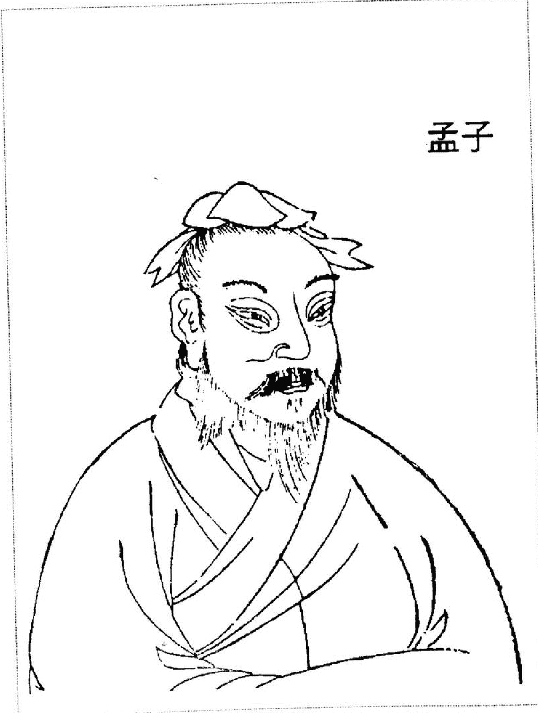

## 九州八卦干支說

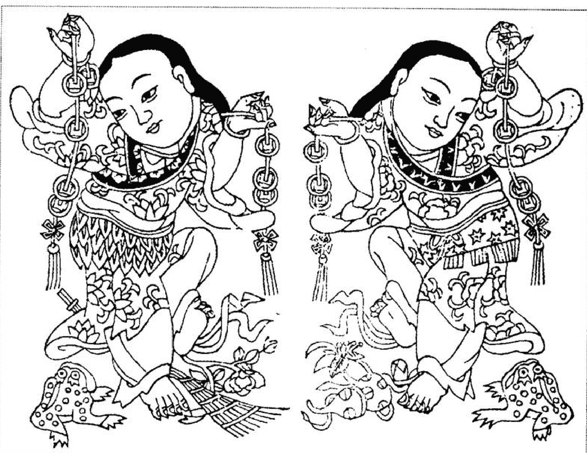

## 九州八卦干支說

九州八卦干支說是以氣色的不同，來分辨吉凶的主屬。九州八卦可以觀察人們的出外貴人。

「九州」是古代中國設置的九個州。《尚書·禹貢》上說：「禹別九州，隨山浚川，任土作貢。」〈禹貢〉所說的九州分別是：冀州、揚州、青州、雍州、豫州、荊州、徐州、梁州、兗州。中國相術家分別用來代表面上的特定部位：

- 1. 冀州：指唇下，下唇正北
- 2. 揚州：印堂上
- 3. 青州：右顴上
- 4. 雍州：左笑靨下
- 5. 豫州：鼻樑
- 6. 荊州：左眼尾上
- 7. 徐州：右眼尾上
- 8. 梁州：左顴上
- 9. 兗州：右笑靨下

清代陳釗《相理衡真》卷二〈八卦九州總斷詩〉中說：

> 八卦九州部位隆，平生到處總相通。其間若有為官者，氣色開時向此中。

中相術家以各部位的豐脊、氣色的不同，而冠以或吉或凶的主屬。

《神相全編》指出：

- 冀州豐滿多田宅，缺陷多災禍。
- 揚州豐滿足衣食，缺陷多進退。
- 青州豐滿足金帛，缺陷多成敗。
- 雍州豐滿足官祿，缺陷多是非。
- 豫州豐滿多福壽，缺陷不長久。
- 荊州豐滿多文章，缺陷少知見。
- 徐州豐滿多兒女，缺陷多傷悲。
- 梁州豐滿足信義，缺陷人情少。
- 兗州豐滿長安泰，缺陷多貧賤。

《敦煌相書·相色髮面圖看吉凶厄法》（伯3389號）上說：

> 九州圖，面部，用看色髮應何地部分；當此部分處，若有好色黃氣，光澤滋潤，流行在部分中，即宜往彼。若有惡色髮處，擬往，不吉，必有禍害，宜令不行。亦言食祿之處。

《麻衣相法》卷五〈論上停吉氣〉中說：

揚州：額。冀州：頦。豫州：準。荊州：左太陽。徐州：右太陰。青州：左顴。梁州：右顴。兗州：口左。雍州：口右。

可以說，八卦九州各部位的良否，關係到其人在家發展，或是出外謀生的創發機會。如果八卦九州的各部位生得尖削、凸露、凹陷、傷痕、惡痣，是主其人先天稟賦不良，祖蔭不厚；大多是勞作技藝之人，一生勞多而功少，憂苦多快樂少；常常是在家困頓，出外無貴人提攜；並且很少有做官與大富的機運。

筆者建議，如果有以上的八卦九州均不吉祥的相，應吃素學佛，跟隨釋迦牟尼的腳步，足以改變命運，扭轉乾坤。

## 【圖：面部九州】

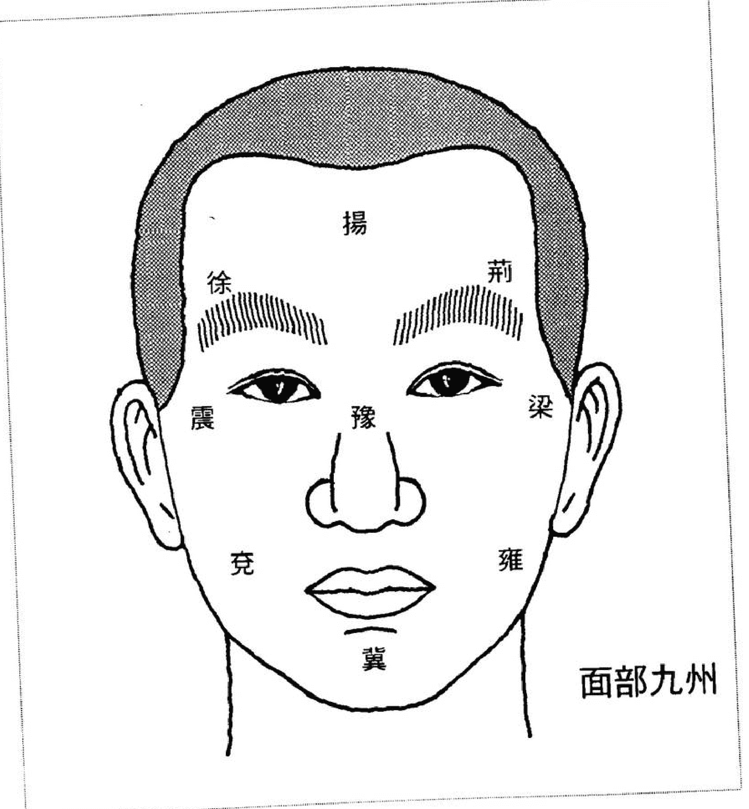

## 雍州在乾

雍州，九州之一，是指面相上左笑靨下的部位。
傳統相術家以為，雍州以豐滿為吉，缺陷為凶；它的氣色是以黃、紫為吉；黑、碧、青為凶。

> 《神相全編》卷十二〈定九州氣色吉凶〉中說：
雍州豐滿，足官祿；缺陷，多是非。
雍州在乾，左笑靨下。乾位起於西北角，乃天門也。黃，宜求官，得橫財。白，主遠出。黑，欲行不仁之事及憂病。碧，主陰，人被凌辱，遠行吉。紫，宜稱心事，天神有福。青，大患官符；缺陷，多憂苦，兄弟弱。

> 《照膽經》卷下〈九州災祥〉中說：「乾，左笑靨下，乾位起於西北角，天門也，朝西北面數之。雍州位。黃色，宜求祿。白、黑、青皆凶。紫，宜事天神；若陷，主多憂；枯，主兄弟弱。」

> 清代劉學誠《太乙照神經》卷三〈論九州八卦氣色訣法〉中說：
雍州在乾方，左笑靨下西北角，天門之位。黃色光明者，官任內加祿，庶人得橫財。白色明淨者，利出門遠行，宜動不宜靜。黑色入此宮，欲行不仁之事，或陰謀人，反以害己；碧色現此部，主被陰人陵辱，遠出且吉。紫色者，主天神默佑，祈禱誠求，諸事如意。若有缺陷，苦累生災，子弟招禍。

## 冀州在坎中

冀州，九州之一，是指面相中軸上的唇下部位。
傳統相術家以為，冀州豐滿，是主多田宅，缺陷主多災禍；氣色則是以紫、青為吉，黃、白、赤、黑為凶。

> 《神相全編》卷十二〈定九州氣色吉凶〉中說：
冀州豐滿，多田宅；缺陷，多災禍。
冀州在坎中，下唇正北。紫進財與奴婢及生良馬。青，主加官，小人宜得財物。黃，主宅不安，宜修禳。碧，君子吉，小人凶。白，主陰司事。赤欲鼻陷他人。黑，主牢獄。

> 《照膽經》卷下〈九州災祥〉中說：「坎，口唇下，正北。冀州位。青，加職，小人得財；紫潤，喜至；黃，主家不寧；白，陰事，凶；赤，陷人，主下獄。」

> 清代劉學誠《太乙照神經》卷三〈論九州八卦氣色訣法〉中說：
冀州在坎方下唇正北之位。紫色，進財寶及奴僕、良馬。青色，官員升遷，庶人得財。黃色，家宅不安，宜積德修禳。碧色，君子吉，小人凶。白色，主陰司之事。赤色，欲謀陷他人之心。黑色，主刑獄之災。

## 兗州在艮

兗州，九州之一，是指面相上右笑靨下的部位。

傳統相術家以為，兗州豐滿是主長外安泰；缺陷則主多貧賤。氣色則是以白、紫為吉，青、赤、碧、黑為凶。

> 《神相全編》卷十二〈定九州氣色吉凶〉中說：「兗州豐滿，長安泰；缺陷，多貧賤。」「兗州在艮，右笑靨下東北。黃，正月見之則吉，秋夏見之則憂父母。白，主加官，小人獲利。紫，主婚親事，或宜求事，小人酒食；青，主非橫事相干；赤，主因歡樂有口舌；碧，則主刑獄；黑，主盜賊。」

> 《照膽經》卷下〈九州災祥〉中說：「艮，右笑靨下，東北。兗州位，黃，正月見者吉，秋夏憂父母；白，加官，常人喜財；青，防橫災；赤，主先悅後悲，主姻事；黑，防盜賊。」

> 清代劉學誠《太乙照神經》卷三〈論九州八卦氣色訣法〉中說：「兗州在艮方，右笑靨下東北之位。黃色，正月見之則吉，秋見之則憂父母。白色，為官加職，庶人得財物。紫色，主婚姻喜慶，宜求謀事，小人得酒食；青色，主非橫事相干；赤色，主因歡樂生口舌；碧色，主刑獄之災；黑色，主盜賊脫失。」

## 青州在震（右顴骨上）

青州，九州之一，是指面相上的右顴上的部位。
傳統相術家以為，青州豐滿主財帛足，缺陷主多成敗，氣色則以白為吉，赤之遇事宜忍，黃黑青碧紫都主凶。

> 《神相全編》卷十二〈定九州氣色吉凶〉中說：「青州豐滿，足金帛；缺陷，多成敗。」「青州在震，右顴骨上，正東。白，宜出入，動作必得財。赤，宜忍事，主啾唧。黃，不出旬中有喪服。黑，主宅舍不寧。青，宜守分。碧，主生災。紫，主重病，宜禳之，僧道則吉。」

> 《照膽經》卷下〈九州災祥〉中說：「震，右顴骨上，正東。青州位，白宜出入，得財。赤，宜含忍事。黃，十日內見喪服。黑，主宅不安。青，宜守舊。碧，防水厄。紫，主橫疾。」

> 清代劉學誠《太乙照神經》卷三〈論九州八卦氣色訣法〉中說：「青州在震方，右顴骨上正東之位。白色，宜出入，動作必得財，喜。赤色，遇事宜忍耐，又主啾唧。黃色，主旬日內有喪服。黑色，主兄弟生禍敗，家宅不安。青色，主招禍，宜守分。碧色，主生災害。紫色如豬肝，主大厄、重病，僧道不忌。」

## 徐州在巽

徐州，九州之一，是指面相上右眼尾的部位。
傳統相術家以為，徐州豐滿是主多兒女；缺陷則是主悲傷；氣色以赤、碧為吉；青、黃、黑為凶。

《神相全編》卷十二〈定九州氣色吉凶〉中說：

> 徐州豐滿，多兒女；缺陷，多悲傷。
徐州在巽，右眼尾東。青主陰人，至防口舌，赤宜作事。碧主生貴子。黃主百事不稱心。黑主病生事，宜速和之。

《照膽經》卷下〈九州災祥〉中說：「徐州位。白宜出入得財，赤宜含忍事，黃十日內見喪服，黑主宅不安，青宜守舊，碧防水厄，紫主橫疾。」

清代劉學誠《太乙照神經》卷三〈論九州八卦氣色訣法〉中說：

> 徐州在巽方，右眼尾東南之位。青色，主陰謀、口舌是非；赤色，求謀事利。碧色，主生貴子。黃色，主百事不稱心。黑色，主大病生災。

## 揚州在離

揚州，九州之一，是指面相上的印堂的部位。
傳統相術家以為，揚州豐滿主衣食足，缺陷主多進退，而氣色則以黃潤與紫色為吉，青、黑、碧為凶。

> 《神相全編》卷十二〈定九州氣色吉凶〉中說：
揚州豐滿，足衣食；缺陷，多進退。
揚州在離，印堂上正南。黃忽潤，大人加官，小人吉慶。赤，君子吉，小人凶。紫或日月角紅潤，主有吉祥。青男主離別，或主刑獄。白，道術人宜。黑災患生，碧主別妻子極應。

> 《照膽經》卷下〈九州災祥〉中說：「揚州位。忽黃潤，大人除拜，小人吉慶。赤，大人吉，小人凶。青，主男哭別；白，宜道術。」

> 清代劉學誠《太乙照神經》卷三〈論九州八卦氣色訣法〉中說：
揚州在離方印堂上正南之位。黃色潤澤，大人除拜，小人吉慶。赤色，君子吉，小人凶。紫色，日月角配合紅潤，主有大吉祥事。青色，主離別或刑獄。白色，惟道術人宜；黑色，即生災難；碧色，主別離妻子。甚驗。

## 荊州在坤

荊州，九州之一，是指面相上左眼尾下的部位。

傳統相術家以為，荊州豐滿主多文章，缺陷主少知見，氣色則以黃為吉。青、白、碧、黑、紫為凶。

《神相全編》卷十二〈定九州氣色吉凶〉中說：

荊州豐滿，多文章；缺陷，少知見。

荊州在坤，左眼尾下西南。黃相次入梁州，主有喜慶之事。青主憂疑。白主人剉辱。碧主災厄至。赤防盜賊至。黑主心腹有疾，宜早治。紫主女人有私通之事。

《照膽經》卷下〈九州災祥〉中說：「坤，左眼尾下，西南。荊州位。黃喜青憂；白辱碧災。赤，失物。黑，心疾。紫，喜陰人私通。凡色光圓即吉；成橫紋者，凶。」

清代劉學誠《太乙照神經》卷三〈論九州八卦氣色訣法〉中說：

荊州在坤，左眼尾下西南之位。黃色相接入梁州，主有喜慶之事。青色主憂心驚疑。色白，主受人挫辱。碧色，主有災殃立至。赤色，主盜賊火災。黑色，主有心腹之疾，紫色，主有婦女私通之事。

## 梁州在兌（左顴骨上）

梁州，九州之一，是指面相上的左顴骨上的部位。
傳統相術家以為，梁州豐滿是主足信義，缺陷主人情少，氣色則以黃黑為吉；赤青碧紫為凶。白色一說主吉，一說主凶。

> 《神相全編》卷十二〈定九州氣色吉凶〉中說：「梁州豐滿，足信義；缺陷，人情少。」「梁州在兌，左顴骨上正西。黃，主得橫財。白，主子孫賢。赤，主文事相干，又主病。黑，主加官，或飲宴。青，主謀他人女子。碧，主謀事不成。紫，主竊盜之事。」

> 《照膽經》卷下〈九州災祥〉中說：「兌，左顴骨上，正西。梁州位。黃，得橫財；白，子孫災。赤，主文字相干。青，謀陰人，凶。」

> 清代劉學誠《太乙照神經》卷三〈論九州八卦氣色訣法〉中說：「梁州在兌方，左顴骨之位。黃色，主得橫財。白色，主子孫災難。赤色，主文字干連是非，又主招病。黑色，官主安穩，或宴會飲酒。青色，主謀他人婦女。碧色，主謀為不遂意。」

## 豫州在中央

豫州，九州之一，是指面相上鼻樑的部位。
傳統相術家以為，豫州豐滿主多福壽，缺陷主不長久；氣色則以白、紫、黃為吉，黑、碧、赤、青為凶。

> 《神相全編》卷十二〈定九州氣色吉凶〉中說：
豫州豐滿，多福壽；陷缺，不長久。
豫州中央在鼻樑上。白主吉。黑，家不和而成疾病。碧，主憂擾。紫，主有歡宴。赤，煩惱。青，心主憂驚。
黃常滿中宮，喜樂之相。其色忽見左右，君子加官，小人進財。

> 《照膽經》卷下〈九州災祥〉中說：「鼻樑中，豫州位。黃喜青驚，白赤災，紫，主酒食；黑，主家不睦。」

> 清代劉學誠《太乙照神經》卷三〈論九州八卦氣色訣法〉中說：「豫州在中央，鼻樑之位。白色主吉祥。黑色主災疾，又主家不和。碧色，主有憂擾之事。紫色，主喜慶歡樂。赤色主煩惱驚心。青色主驚憂不安。黃色常滿中岳，主百事吉慶，左右俱有黃光，君子加官，小人得財。」

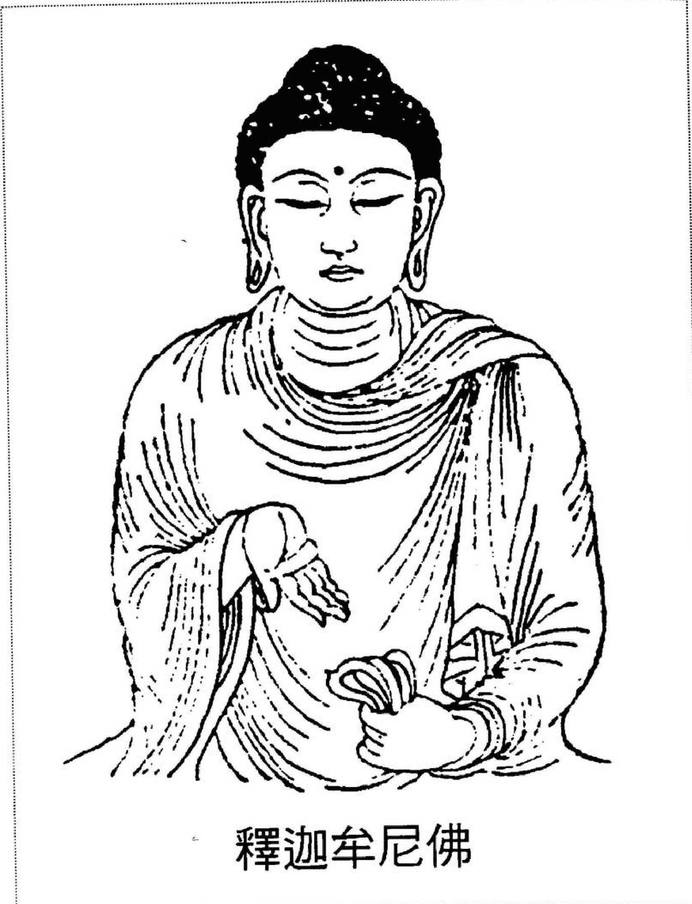

## 九州黃色

九州黃色，是指九州位置都發起黃瑩的氣色。傳統相術家以為是主升官、進財；如果黃中還紫紅與玉紋，那麼是主高升，得大財，是為非常之相。

《麻衣相法》卷之五〈論上停吉氣〉中說：

> 九州黃色，喜自外來……滿面黃瑩，必遷官、登科、進財，若黃點如桂花粟豆，祥雲中有玉紋者，必超升高第，常人獲珍寶大財，白衣僧道皆得官，非常之相也。

## 風土刻應

風土刻應，是指地理環境、風俗習慣等因素對人的性情、形相的影響與作用。

傳統相術家以為：地理環境與風俗習慣對人的性情、形相的厚薄、輕重、清濁等特徵的形成，都有重要的影響。因此，生活在同一地域的人，他們的性情、形貌往往會受到環境與習俗的影響，而形成某些共同的特徵。

因此，看相時必須考慮這些因素，以免將地域共性當作其人的個性進行測斷。

> 《照膽經》卷上〈論風土刻應篇〉中說：
山川粗秀，百里不同。此人生形性所以有厚薄、重輕、清濁之異也。故閩山清聳，人俗於骨；浙水平而土薄，人俗於清；胡土厚重，人俗於鼻；淮水泛，人俗於重。若宋人俗於口，蜀人俗於眼，魯人俗於軒昂，江西人俗於色，如此類者，皆風土之異故也。

重點在「山川粗秀，百里不同」。

## 經史子集出版社圖書目錄

電話(02) 2996-9333 傳真(02) 2279-7360
郵撥帳號：19457601 經史子集出版社
台灣省台北縣新莊市中正路 300 巷 10 弄 2 號 5 樓。

> 請告訴我誰是中國人，啟示我，如何把記憶抱緊；
請告訴我這民族的偉大，輕輕的告訴我，不要喧嘩！
——聞一多〈祈禱〉

## 【考試作文修辭】

- W01 作文修辭引證........280 元
- W02.修辭作文技巧........280 元
- W03.學生作文經典........500 元
- W04.作文故事引證........280 元
- W05.作文雋語格言........280 元
- W06.作文幽默小品........280 元
- W07.中國愛情詩詞........350 元
- W08.世界愛情詩詞........350 元
- W09.作文名聯對句........280 元
- W10.作文文思泉湧........280 元
- W11.作文金玉良言........280 元
- W12.改變命運的一句話 280 元
- W13.作文靈感神思........280 元
- W14.修辭學..............280 元

## 【景觀建築風水】

- U01 宇宙氣功風水........350 元
- U02 景觀建築風水........350 元
- U03 買房子看風水........350 元
- U04 風水室內設計........350 元
- U05 風水紫白飛星........600 元
- U06 羅盤白話解說........600 元
- U07 中國風水學..........600 元
- U08 中國風水大改造......350 元
- U09 風水開運術..........350 元
- U10.易經陽宅風水........350 元
- U11.羅盤看陽宅..........350 元
- U12.羅盤看風水..........350 元
- U13.科學陽宅風水........350 元
- U14.風水大宗師..........350 元
- U15.祕傳風水要訣........350 元
- U16.高明風水要訣........350 元

## 【祖國文學史】

- L01 先秦文學史..........250 元
- L02 秦漢文學史..........250 元
- L03 魏晉南北朝文學史...250 元
- L04 隋唐文學史..........300 元
- L05 兩宋文學史..........350 元
- L06 遼金元文學史........350 元
- L07 明代文學史..........350 元
- L08 清代文學史..........350 元
- L09 近代文學史..........350 元
- L10 現代文學史..........600 元
- L11 中國文學史（下）....500 元
- L12 中國文學史（下）....500 元

## 【文史哲學經典】

- F01 易經六十四卦........380 元
- F02 白話易經............380 元
- F03 易傳與易學..........350 元
- F04 文學概論............380 元
- F05 國學導讀............480 元
- F06 史學導讀............380 元
- F07.中國思想史..........600 元
- F08.中國大歷史..........600 元
- F09.周易經傳註譯........600 元
- F10 中國文學批評史......600 元
- F11.白話老子註譯........350 元
- F12.白話詩經註譯........600 元
- F13 中國道教史...........600 元
- F14 印度文化史...........600 元
- F15 論語註解............600 元
- F16 孟子註解............600 元
- F17 莊子註解............600 元
- F18 荀子註解............600 元
- F19 世界文明史..........600 元
- F20 唐詩四百首..........600 元

## 【美學與藝術】

- A01.美學概論...........350 元
- A02.中國美學史...........350 元
- A03.西洋美學史...........350 元
- A04.美的原理...........350 元
- A05 顏色的奧秘...........350 元
- A06.藝術的故事...........600 元

## 【企業理財投資】

- B01 用錢賺錢致富........250 元
- B02 看報紙選股票........250 元
- B03 台灣股票市場........280 元
- B04 股票線路圖形........250 元
- B05 小型績優成長股........280 元
- B06 K 線圖小解讀........350 元
- B07.K 線圖大趨勢........350 元
- B08 股票勝券在握........250 元
- B09 股票贏的策略........250 元
- B10 選擇共同基金........250 元
- B11.K 線圖技術指標........380 元
- B12.K 線波浪理論........380 元
- B13.K 線價量關係........380 元
- B14.四季股票 K 線........380 元
- B15.股票技術分析........600 元
- B16.股票基本分析........600 元
- B17.融資與融券........380 元
- B18.期貨 K 線圖........600 元
- B19.高級 K 線分析........380 元
- B20.股票投資學........580 元
- B21.股票易經學........600 元
- B22.外匯與 K 線圖........600 元
- B23.酒田戰法 K 線圖........380 元
- B24.移動平均線........380 元
- B25.股票贏家語錄........350 元
- B26.股票期貨大師........380 元
- B27.道氏理論 K 線........380 元
- B28.股票買賣百科全書........600 元
- B29.艾略特波浪理論........380 元
- B30.日本陰陽線........600 元
- B31.華爾街股市........380 元
- B32.技術分析大師........380 元
- B33.動能 K 線指標........380 元
- B34.套牢轉敗為勝........380 元
- B35.績優股 K 線........380 元
- B36.全球經濟指標........380 元
- B37.財務報表解讀........380 元
- B38.普通股賺大錢........380 元
- B39.股票與房地產........380 元
- B40.亞洲金融風暴........380 元
- B41.金融股服務業........380 元
- B42.產業股製造業........380 元
- B43.高科技概念股........380 元

## 【玉器珠寶鑽石】

- G01 寶石的合成與鑑定........350 元
- G02 鑲石與黃金........350 元
- G03 紅寶石藍寶石........350 元
- G04 祖母綠與水晶........350 元
- G05 翡翠與古玉........350 元
- G06 珍珠珊瑚琥珀........350 元
- G07 天珠印章石........350 元
- G08 古玉紋飾器形........350 元
- G09 翡翠玉石鑑賞........350 元
- G10 變石與貓眼石........350 元
- G11 最新寶石學........600 元
- G12.鑽石的切磨與設計........600 元
- G13 珠寶的設計........380 元
- G14.珠寶繪圖設計........380 元
- G15.印章石........350 元
- G16.珠寶設計圖案........600 元
- G17.珠寶神祕學........380 元
- C18.寶石學新知........600 元
- C19.中國古玉器........600 元
- C20.西藏天珠........600 元

## 【佛教與禪學】

- R01.佛法與佛學........350 元
- R02.禪修靜坐氣功........350 元
- R03.佛教養生學........350 元
- R04 禪的腦內革命........350 元
- R05.世界佛教史........350 元
- R06 佛教典籍介紹........350 元
- R07.印度佛教史...........350 元
- R08 中國佛教史...........350 元
- R09.大藏經導讀...........350 元
- R10.如何修證佛法...........350 元
- R11.佛教密宗密法........350 元
- R12.西藏的歷史與文化........350 元
- R13.西藏佛教史........350 元
- R14.密教史........600 元

## 【佛經導讀註譯】

- D01 中阿含經註解...........350 元
- D02 長阿含經註解...........350 元
- D03 增一阿含經註解...........350 元
- D04.雜阿含經註解...........350 元
- D05 金剛經註解...........350 元
- D06 阿彌陀經註解...........350 元
- D07 般若心經註解...........350 元
- D08.圓覺經註解...........350 元
- D09.楞嚴經註解...........350 元
- D10.維摩詰經註解...........350 元
- D11 六祖壇經註解...........350 元
- D12 妙法蓮華經註解...........350 元
- D13.楞伽經註解...........350 元
- D14.華嚴經註解...........350 元
- R15.金剛頂經註解...........350 元
- R16.安般守意經註解...........350 元
- R17.摩訶止觀註解...........350 元
- R18.大日經註解...........350 元

## 【氣功禪密瑜伽】

- C01.小周天氣功...........350 元
- C02.大周天氣功...........350 元
- C03.氣功煉形調身...........350 元
- C04.氣功呼吸調息...........350 元
- C05.氣功靜坐調心...........350 元
- C06.百病氣功療法...........600 元
- C07.氣功房中術...........380 元
- C08.止漏睡禪臥功...........350 元
- C09.氣功男女丹法...........350 元
- C10.道家房中術...........380 元
- C11.中國內丹功...........350 元
- C12.中醫治病氣功...........350 元
- C13.氣功導引按摩...........350 元
- C14.中國氣功學...........350 元
- C15.食療養生斷食...........350 元
- C16.丹鼎氣功...........350 元
- C17.如何修證神通...........380 元
- C18.道教養生氣功...........600 元
- C19.西藏密宗氣功...........600 元
- C20.藏密六成就法...........380 元
- C21.藏密大圓滿...........380 元
- C22.藏密道果法...........380 元
- C23.藏密大手印氣功...........380 元
- C24.無上瑜伽密...........380 元
- C25.藏密氣脈明點...........380 元
- C26.勝王八部瑜伽...........350 元
- C27.拙火氣功瑜伽...........350 元
- C28.印度教瑜伽...........350 元
- C29 印度瑜伽密法...........350 元
- C30.高級瑜伽祕法...........380 元
- C31.瑜伽鎖印呼吸...........350 元
- C32.瑜伽腦內革命...........350 元
- C33.夢 瑜伽 催眠...........350 元
- C34.印度氣功瑜伽...........600 元
- C35.怎樣吃最健康...........350 元
- C36.醫學房中術...........380 元
- C37.古代房中術...........380 元
- C38.成佛之道在瑜伽...........350 元
- C39.醫學氣功瑜伽...........350 元
- C40.佛教禪修氣功...........350 元

## 【中醫針灸經絡】

- M01.經絡與穴道...........350 元
- M02.中醫經絡學...........600 元
- M03.奇穴奇經八脈.....350 元
- M04.經絡穴道組配........350 元
- M05.經穴指壓按摩....380 元
- M06.中醫基礎理論........380 元
- M07.中醫學概論........600 元
- M08.中醫針灸學...........600 元
- M09.百病指壓療法........350 元
- M10.整脊推拿保健........600 元
- M11 中醫推拿學........600 元
- M12.中醫養生學........600 元

## 【命理神秘學】

- H01.八字的緣與命........600 元
- H02.星座萬年曆........280 元
- H03.八字看排列........350 元
- H04.八字看十神事業....350 元
- H05.八字看富貴........350 元
- H06.八字看格局........350 元
- H07.八字看生肖流年....350 元
- H08.八字看男女姻緣....350 元
- H09.八字面相參照........350 元
- H10.八字命理哲學........350 元
- H11.如何看懂農民曆....350 元
- H12.改變命運的密法....350 元
- H13.天星紫微斗數........350 元
- H14.易經卜卦入門........350 元
- H15.數字靈動密碼........350 元
- H16.中國八字學........600 元
- H17.八字古今實例........350 元
- H18.八字命相故事........350 元

## 【血型與星座】

- X01.星海羅盤........350 元
- X02.星座萬年曆........350 元
- X03.星座論一生........350 元
- X04.星座談情說愛........350 元
- X05.非常速配星座........350 元
- X06.星座談就業........350 元
- X07.巴比倫占星術........350 元
- X08.星座談相位........350 元
- X09.A 型的人相........350 元
- X10.B 型的人相........350 元
- X11.AB 型的人相........350 元
- X12.O 型的人相........350 元

## 【手相與面相】

- Z01.中國相術要訣........600 元
- Z02.面相宮位格局........350 元
- Z03.祕傳面相口訣........250 元
- Z04.知人知面又知心........350 元
- Z05.女相觀破術........350 元
- Z06.摸骨神相要訣........350 元
- Z07.人心觀破術........350 元
- Z08.中國手相學........500 元
- Z09.高明相術口訣........250 元
- Z10 五官相法要訣........350 元
- Z11.斑痣紋痕髮相........350 元
- Z12.中國人相學........600 元
- Z13.富貴福壽妻財子祿...350 元
- Z14.達摩五官總論........350 元
- Z15.觀相次序要訣........350 元
- Z16.陰陽五行相法........350 元
- Z17 人像禽獸形........350 元
- Z18.面相小部位........350 元
- Z19.面相大部位........350 元
- Z20.氣色與天羅........350 元
- Z21.祕傳頭面十字........350 元
- Z22.體相身形要訣........350 元
- Z23.人不可貌相........350 元
- Z24.神異賦註解........350 元
- Z25.手相生命之書........280 元
- Z26.西醫手面相........350 元
- Z27.流年運限口訣........280 元
- Z28.手面相命運訣........350 元
- Z29.月波洞中記註解........350 元
- Z30.中醫手面相........350 元
- Z31.手相密碼全書........280 元
- Z32.面相開運術........350 元
- Z33.手掌治療術........350 元
- Z34.相法十六篇註解........350 元
- Z35.神相水鏡集註解........350 元
- Z36.玉管照神局註解........350 元
- Z37.人倫大統賦註解....380 元
- Z38.麻衣相法註解........380 元
- Z39.柳莊相法註解........350 元
- Z40.照膽經註解........350 元
- Z41.太清神鑑註解........350 元
- Z42.神相鐵關刀註解....350 元
- Z43.神相金較剪註解....350 元
- Z44.神相全編註解(上)...450 元
- Z45.神相全編註解(下)...450 元
- Z46.相理衡真註解........600 元
- Z47.神骨冰鑑註解........350 元
- Z48.瑜伽人相學........350 元
- Z49.管輅神相註解........350 元
- Z50 太乙照神經註解....350 元

## 【品牌與姓名學】

- N01.姓名學大革命……350 元
- N02.怎樣取個好名字……350 元
- N03.華夏姓名學……350 元
- N04.易經姓名學……350 元
- N05.生肖姓名學……350 元
- N06.百家姓名學……350 元
- N07.品牌與姓名學……350 元
- N08.音靈姓名學……350 元
- N09.筆跡姓名學……350 元
- N10.八字姓名學……350 元

## 【口才人際關係】

- E01.口才演說思辨……350 元
- E02.人際關係妙論……350 元
- E03.口才的訓練……350 元
- E04.說話的藝術……350 元
- E05.談判……350 元
- E06.口才演說思辨(2)…280 元
- E07.口才演說思辨(3)……280 元
- E08.口才演說思辨(4)…280 元
- E09.理性與感性的對話…280 元
- E08.口才演說思辨(5)……280 元
- E09.理性與感性的對話…280 元
- E10.人格解析學……280 元

## 【政治軍事科技】

- V01.冷戰與新冷戰……350 元
- V02.英語帝國主義……350 元
- V03.中國人民解放軍……350 元
- V04.國際反華勢力……350 元
- V05.中國人的世紀……350 元
- V06.新中國的崛起……350 元
- V07.中國民族主義……350 元
- V08.人權與主權……350 元
- V09.抗美援朝戰爭……350 元
- V10.紅星照耀中國……350 元
- V11.諾貝爾獎……350 元

## 【珍貴美工圖解】

- P01.中國吉祥圖解……350 元
- P02.人物仕女圖解……350 元
- P03.花紋邊飾圖解……350 元
- P04.宗教神聖圖解……350 元
- P05.建築傢俱圖解……350 元
- P06.龍鳳瑞獸圖解……350 元
- P07.文字符咒圖解……350 元
- P08.陶瓷紋飾圖解……350 元
- P09.珠寶飾品圖解……350 元
- P10.男歡女愛圖解……350 元
- P11.地理歷史圖解……350 元
- P12.古典情色圖解……350 元

與書為友
天長地久
經史子集
歷久彌新

> 培根《論文集.論學問》Essays “Of Studies” ：「 歷史令人聰明，詩歌令人聰慧，數學令人精明，自然科學令人深入，倫理學令人沈著，邏輯與修辭學令人善辯。」（Histories make men wise; poets, witty; the mathematics, subtle; natural philosophy,deep; moral, grave; logic and rhetoric, able to contend.）

> 《紅樓夢》第一回，曹雪芹題《紅樓夢》：「滿紙荒唐言，一把辛酸淚；都云作者癡，誰解其中味！」

## 相學參考文獻目錄

坊間人士的相書，未經時代考驗，粗製濫造；有的只是部份個案，卻吹噓爲驚世祕談，以偏概全，危言聳聽。有的只是個人經驗，偶而中的，就誇稱是神相之一，祕訣獨傳。長期以來，學相的朋友，苦無參考之書，下列是值得深入理解的相學典範之書：

- 漢代許負撰《相法十六篇》
- 原題漢代許負等撰《敦煌遺書·相書》
- 唐代無名氏撰《月波洞中記》
- 舊題南唐宋齊邱撰《玉管照神局》
- 金代張行簡撰，元代薛延年注《人倫大統賦》
- 舊題後周王樸撰《太清神鑑》
- 明代鮑栗之撰《麻衣相法》
- 托名北宋陳搏撰《心相編》
- 托名宋陳搏撰，明代袁忠徹訂正《神相全編》
- 舊題張太素撰《太素脈祕訣》
- 明代無名氏撰《照膽經》
- 明代李廷湘撰《人相篇》
- 托名明代袁柳莊撰《柳莊相法》
- 托名陳搏撰《神相鐵關刀》
- 清代棲霞山人撰《神相金較剪》
- 清代曾國藩撰《冰鑑》，或稱《神骨冰鑑》
- 清代王仁俊輯《相經》
- 托名漢代嚴助撰《相兒經》
- 托名三國時代管輅的《管輅神相》
- 清代高鼎玉撰《神相彙編》
- 清代范文園《水鏡集》
- 清代宋瑾撰《古觀人法》
- 清代劉學誠輯《太乙照神經》
- 清代陳釗撰《相理衡真》

以上各書，是中國神相的高度成就，是人類觀人術中的精華。有心研究相學的人，應多涉獵研讀，去其糟粕，得其精華，深入淺出，分享大眾；並且以古證今，以今律古，以免學藝不精，只是一學舌鸚鵡而已！

許多人沒有讀過經典著作，心虛不實，卻對外號稱大師，是有不當！

感謝您——購買這本書！

西諺：「沒有知識的人，很快就重覆他的舉動行爲。」培根說：「知識就是力量！」中國人說：「貧者因書而富，富者因書而貴！」

書名：面相宮位格局
著者：阿克蘇仁
發行人：黃素珍
編輯：經史子集編輯群
校稿：張于珍 張順喬
封面設計：黃秋燕 特約顧問：汪治平 李宗文
出版者：經史子集出版社
登記證：行政院新聞局局版台業字第 758 號
台北縣新莊市中正路 300 巷 10 弄 2 號 5 樓
電話：（02）2996-9333 傳真：（02）2279-7360
郵撥帳號：19457601 經史子集出版社
印刷者：優彩印刷股份有限公司
版次：2000 年 10 月第一版第一刷
定價：350 元

版權所有 翻印必究

面相宮位格局 ISBN 957-0306-47-5

經史子集出版社(02) 2996-9333 郵撥帳號 19457601

- Z01. 中國相術要訣... 600
- Z02. 面相宮位格局..... 350
- Z03. 祕傳面相口訣..... 250
- Z04. 知人知面又知心... 350
- Z05. 女相觀破術........ 350
- Z06. 摸骨神相要訣..... 350
- Z07. 人心觀破術..... 350
- Z08. 中國手相學........ 500
- Z09. 高明相術口訣..... 250
- Z10. 五官相法要訣..... 350
- Z11. 斑痣紋痕髮相..... 350
- Z12. 中國人相學........ 600
- Z13. 富貴福壽妻財子祿 350
- Z14. 達摩五官總論..... 350
- Z15. 觀相次序要訣..... 350
- Z16. 陰陽五行相法..... 350
- Z17. 人像禽獸形........ 350
- Z18. 面相小部位........ 350
- Z19. 面相大部位........ 350
- Z20. 氣色與天羅........ 350
- Z21. 祕傳頭面十字..... 350
- Z22. 體相身形要訣..... 350
- Z23. 人不可貌相........ 350
- Z24. 神異賦註解 ..... 350
- Z25. 手相生命之書..... 280
- Z26. 西醫手面相........ 350
- Z27. 流年運限口訣..... 280
- Z28. 手面相命運訣..... 350
- Z29. 月波洞中記註解... 350
- Z30. 中醫手面相........ 350
- Z31. 手相密碼全書..... 280
- Z32. 面相開運術........ 350
- Z33. 手掌治療術........ 350
- Z34. 相法十六篇註解... 350
- Z35. 神相水鏡集註解... 350
- Z36. 玉管照神局註解... 350
- Z37. 人倫大統賦註解... 380
- Z38. 麻衣相法註解..... 380
- Z39. 柳莊相法註解..... 350
- Z40. 照膽經註解........ 350
- Z41. 太清神鑒註解..... 350
- Z42. 神相鐵關刀註解... 350
- Z43. 神相金較剪註解... 350
- Z44. 神相全編註解 (上) 450
- Z45. 神相全編註解 (下) 450
- Z46. 相理衡真註解..... 600
- Z47. 神骨冰鑒註解..... 350
- Z48. 瑜伽人相學........ 350
- Z49. 管輅神相註解..... 350
- Z50. 太乙照神經註解... 350

### 【瑜伽與印度系列】

- Y01. 印度瑜伽氣功...... 350
- Y02. 印度瑜伽祕法...... 350
- Y03. 高級瑜伽祕法...... 350
- Y04. 食療養生斷食...... 350
- Y05. 百病瑜伽療法...... 600
- Y06. 瑜伽治百病......... 350
- Y07. 瑜伽靜坐瞑想...... 350
- Y08. 瑜伽與氣功......... 350

### 【西藏與密宗系列】

- T01. 西藏密宗氣功...... 350
- T02. 西藏的歷史與文化 350
- T03. 西藏佛教史......... 350
- T04. 藏密六成就法...... 350
- T05. 密宗密法........... 350
- T06. 密宗大手印氣功... 350
- Y09. 印度佛教史......... 350

一沙一世界 一花現天國 掌中含無限 一辰繫永恆

## 企業神相觀人術課程——(02) 2279-7360

| | 基礎班 | 中級班 | 高級班 |
|---|---|---|---|
| 第一週 | 1. 手面相命運訣 手相掌紋記號 手相的掌丘 | 9. 手相生命全書 中國手相學 天紋人紋地紋 | 17. 手相密碼全書 西洋手相學 命運線與婚姻線 |
| 第二週 | 2. 眼相：觀眸子 鼻相：伏羲貫頂 人心觀破術 | 10. 三停與三主 早年中年晚年 星辰失陷部位偏虧 | 18. 神相鐵關刀 太清神相註解 高明相術口訣 |
| 第三週 | 3. 耳相看福報 面相大部位 面相 135 小部位 | 11. 五岳四瀆 十二宮位 知人知面又知心 | 19. 神相全編 神異賦註解 中國人相學 |
| 第四週 | 4. 口唇人中相法 上下唇金載金覆 法令紋 膝蛇入口 | 12. 五星六曜 秘傳頭面十字 氣色與天羅 | 20. 人倫大統賦 神相金較剪 管輅神相註解 |
| 第五週 | 5. 額相主貴 四肢手腳相 陰陽五行相法 | 13. 六府三才 人像禽獸形 天庭高闊地閣方圓 | 21. 月波洞中記 照膽經註解 相法十六篇註解 |
| 第六週 | 6. 齒舌相主口業 慢性病氣功療法 達摩五官總論 | 14. 四學堂與八學堂 聲相定榮衰 先聲次氣後形骨 | 22. 神骨冰鑑 柳莊相法註解 神相水鏡集 |
| 第七週 | 7. 頦相下巴地閣 瑜伽人相學 人不可貌相 | 15. 面相八卦 西醫手面相 體相身形要訣 | 23. 相理衡真 玉管照神局 形分十相 |
| 第八週 | 8. 斑痣毛髮紋痕 手掌治療術 秘傳相術口訣 | 16. 面相九州 中醫手面相 面相開運術 | 24. 太乙照神經 麻衣相法註解 企業神相觀人術 |

## 中华古籍库

1000000 册 高清影印古籍
珍版刻印 / 海外流传 / 家传手抄 / 民间失传

古籍善本、经史子集、史料笔记、古人文集、
民间收藏、传世家谱、各地方志、中医典籍、
四库全书、古禁毁书、内阁文库、图书集成、
丛书集成、四部丛刊、万有文库、四部备要、
二十四史、三国六朝文、明清和民国古籍史料
……