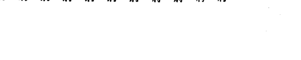
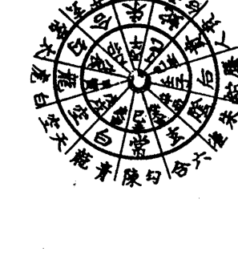
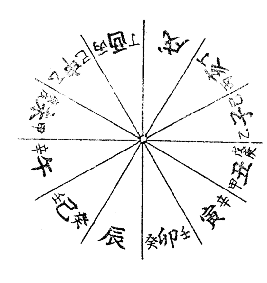
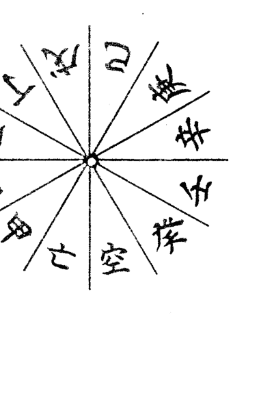
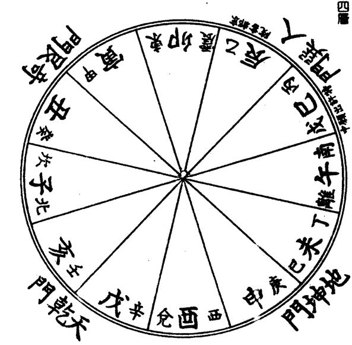

珍藏本

中国神秘文化精粹

# 六壬神課

# 吉凶正斷法

阿部泰山 著

易學精粹

占卜正確推斷法

趨吉避凶觀占法

中国古籍出版社

# 人事占卜最正確之推斷法

# 六壬神課吉凶正斷

阿部泰山著

# 自序

六壬學始於九天玄女、黃帝，至今已有五千餘年，根據陰陽五行相生相剋之理法構成，天下之正斷法相信無出其右者。六壬神課以人事正斷法來說，有其最古老的歷史，但日本在三十年前才由不才我不顧學淺而作首次的研究發表，而於民國三十、卅一兩年，將六壬神課詳細解說發表，再以泰山全集呈獻給所有同好之士。

卻說六壬占課祇要翻閱「吳越春秋」及「越絕書」中所記載，即知其乃最古老的觀占法，古聖賢人之愛玩亦可由各種文獻窺知。凡天下之事物複雜多端，難決吉凶善惡，即使智力財力過人，亦不可能預測禍福成敗榮枯，因此古人也認為，除以占卜決疑外別無他法。話說觀占法雖有各種，但無一出六壬課學之右者。

由於此正斷之法則化而使占斷事項易如反掌，加上其簡易明了，故而對每件事得以即斷即解。開啟中國原書中之樞機乃我平日所願，即使歷經常年實驗亦無所誤。本著畢生研究之儔心，相償任何讀者以六壬之推演法正斷，皆能覽得天下之萬事、萬物、吉凶、悔吝、是非、成敗；禍轍榮枯，若因此

六壬神課吉凶正斷

而開啟易學界新生命，更是我個人極感驕傲之事。透過本書將斯學活用乃是我個人的榮耀，況此秘笈將從未見諸於世的正宗正斷法納入書中，望各位能多加研修。

泰山識

# 目 錄

- 自序
- 緒言
- 一 六壬神課七百二十課式表
  - 1 求課適用法
  - 2 十二局速算法
  - 3 天地十二盤表
- 二 七百二十課式一覽表
- 三 七百二十課速查表
  - 自甲子日十二局至癸亥日十二局止
- 四 神殺表
  - 1 六十花甲子表
  - 2 十干寄宫表
  - 3 天乙陰陽貴神
  - 4 月將圖表
  - 5 天將十二貴神表
  - 6 千支與五行數表
  - 7 太歲神殺表
  - 8 月建神殺表
  - 9 四季神殺表
  - 10 三合神殺(月支、日支共用)
  - 11 日干神殺表
  - 12 日支神殺表
- 五 六壬神課總論
  - 六神授、觀占靈法
  - 1 正斷的祈禱諦況
- 七 四課三傳組織構法
  - 1 六壬課式測定器解說
  - 2 六壬神課的意義
  - 3 六壬占時法
  - 4 次客法
  - 5 關於地盤
  - 6 月將的解說
  - 7 天地盤構法
  - 8 中氣推演算法
  - 9 另一法
  - 10 月將名的解釋
  - 11 四課造式法
  - 12 定三傳
  - 13 千支的說法
  - 14 必須使用『神』字
  - 15 遁干法
  - 16 旬丁法
  - 17 九處三層五種之解
  - 18 八殺九寶之解
  - 19 九寶
  - 20 八殺
  - 21 用神與五旺法
  - 22 用神
  - 23 課式八法則
  - 24 五事觀法
  - 25 空亡之動向
  - 26 空亡之論
  - 27 三傳定爻之法
  - 28 五行旺相之解
  - 29 旺衰的活用法
  - 30 四課的陰陽
  - 31 雜格及其他之解
- 八 壬學課體構成法
  - 1 元首課
  - 2 重審課
  - 3 比用課
  - 4 涉害課
  - 5 返吟課
  - 6 別責課
  - 7 昴星課
  - 8 八專課
  - 9 伏吟課
  - 10 不備格陰陽的取法
  - 11 陰陽十二天將貴神之解
  - 1 天將十二貴神程序
  - 2 天將布演逆行順行法則
  - 3 天乙貴神起例的秘解
  - 4 十二貴神順逆之理
  - 5 天乙前五後六之解
  - 6 神藏殺沒之事
  - 7 初傳與乘神天將所引起的變化
  - 8 關夾魁
  - 9 關日辰
  - 10 陰神之解
  - 11 相乘和相臨的區別
- 十、類神之解
  - 1 類神不明顯則勿用
  - 2 類神陰陽外
  - 3 課格與類神
  - 4 看吉凶優劣
  - 5 求類神於方位
  - 6 吉格反應的厚薄
  - 7 凶災已過
  - 8 凶事結絕
  - 9 吉凶的變化
  - 10 類神秘集
  - 11 天將貴人的類神
  - 12 人的類神
  - 13 人身的類神
  - 14 關於類聚
  - 15 應期之解
- 十一 一日辰四課三傳法
  - 2 發用法
  - 3 因初傳遁干而起的吉凶
  - 4 三傳總括了解
- 十二 占斷總論
  - 1 占斷八門
  - 2 觀占的信條
  - 3 正斷的主示
  - 4 吉凶正斷須知
- 十三 正斷法總論
  - 1 吉凶正斷法
  - 8 三者之分
  - 9 鬼殺
  - 2 觀占法十條
  - 3 正斷須知三條項
  - 4 六壬斷課活用法
- 十四 正斷的法則
  - 1 正斷的要法
  - 2 占時吉凶觀法
  - 3 日干吉凶正斷
  - 4 論他人
- 十五 天將貴神吉凶解
  - 1 十二天將五行和干支
  - 2 日干對初傳天將吉凶
- 十六 十二天將活用能力的解說
  - 1 天乙貴人之解
  - 2 螣蛇之解
  - 3 朱雀之解
  - 4 六合之解
  - 5 勾陳之解
  - 6 青龍之解
  - 7 天空之解
  - 8 白虎之解
  - 9 太常之解
  - 10 玄武之解
  - 11 太陰之解
  - 12 天后之解
- 十七 来情法
  - 根据十二天将的来情法
- 终辞

# 緒 言

吉凶正斷之術始於易學，有各種類的術數，而六壬神課的吉凶預斷是以太陽為基素，並以其日之干支組織於四課三傳以得神示的一種秘占。根據古人君子預知災害以綢繆的教訓，當我們計劃事情時，預知其結果是不容忽視的。防禍患於未然，籌事預知其成否，實為吉凶正斷之大義。

世人往往祇渴望吉事來臨而忽略防範災害的重要，待凶災發生時才四處求救已於事無補了。

故而作者為與諸彥共享未卜先知的樂趣，特將所學公諸於世，並祈望能將諸君命數導向有利方向。

六壬神課之術乃始於中國太古黃帝，傳於姜術（姜子牙）之最古老術數，雖然日本民間無人研究此術，而我於斯學的研修卻已達四十餘年。

壬學比起其他占斷術是較為合理合法的，它是一門能預斷吉凶的學問。自古來，中國便有許多占星術數，但於明代時因遭禁，凡有關陰陽學的書籍皆焚燒殆盡，惟壬學、奇門、遁甲術僥幸留存下來，時至今曰，中國上下信仰壬學并皈依者甚多。

凡預知人事之吉凶非神明無法得知，因神明方能抵達幽支微妙之域。然萬不可因此便認為其學是

一種迷信、邪法；科學雖萬能，尚無法預知許多事物，而我所知實為一能知并能行的學問。若謂這種有意義且有利的學術為啟發尊電之神示寶典亦不為過。

# 一 六壬神課七百二十課式表

六壬神課以九原則十格為主，分六十日間——七百二十課。當鑑定吉凶時，以其時造課式，在未詳細講解這種造式方法及其他以前，因「七百二十課式表」運用極為方便，且至為重要，故先示表於後。

因一日有十二時刻，故幹支的演課為十二局，遍六十干支而為七百二十課式，課以九原則為根本，重要的格分為六十四格，而有神殺四十餘種。不僅天地間的吉凶，連我們日常生活的吉凶也可以用神示的占斷學，這種以演布課式的原則今術將嘗試詳細解說於本文。為避免一一演式的麻煩，將全課式表列舉於左，並將後記的適用法置於腦中，行占斷時可依本表必不致有誤。

## 1 求課適用法

將其適用法設各條項解說於左：

- （二）求斷時必先知其日的干支，而後再求其日干支之部。
- (2)因月將要放在占時地支之上，故占時地支即是地盤地支。地盤靜而不動，即如左圖配列。

孟子曰：惻隱之心，人皆有之。我們人類於日常生活上，逢事必有成敗之論，有成釐有禍福，有禍福即有榮枯盛衰，故而是非之心、禍福之心、成敗之心、榮辱之心必伴人而相隨，雖為賢公字亦不能免。有句俗語說，天無口而以人代言之，聖人設法，以稟神示之靈驗，以預知事之成敗，以解厭世上之各種疑難。此受神示之道非依卜筮不可，然卜筮之道不一而足，但日本之六壬神課在中國十四聖中為數之始祖軒轅氏所創始，具有最古老的歷史。

六壬神課其推演法以太陽所行位置為月將，加以占時使無極生太極；用月將與干支乃是太極生兩儀之意。以其日干支為配列基礎定四課，四課定而後作發用，三才俱定金木水火土五行而布演神將，神將定而握其樞機以窺知吉凶、悔吝、是非、成敗、禍福與榮枯。

於今科技掛帥之世，認為占卜術乃是一種迷信，輕視者多憑恃一己之果斷，視其為愚蠢之物而不究其成敗、不明其禍福、不顧其榮枯、一意獨立以孤行，終至害人又害己。

大凡占課之術乃是敬天窮理而為天之所命的一種神術，絕非迷信妄術。它教人進時則進，退時乃退的學問，以順行天理為處世之大原則，是真是非的啟蒙，並取用個人之智力，以為生活之指針。如此當能轉禍為福，防災害於未然。賢明諸彥絕不得將其視為迷惑人心之妄術，而必須卜有意義之活用。今試將六壬天文易學依序解說於後。

| 巳 | 午 | 未 | 申 |
|---|---|---|---|
| 辰 | 地 | 時 | 酉 |
| 卯 | 支 | 刻 | 戌 |
| 寅 | 丑 | 子 | 亥 |

上圖是時刻的地支循環圖稱十二地支鑑定。

- (3) 於此地盤地支時刻加以其月的月將地支而成為天地盤，天盤配以月將的地支而順行，故常移動之後再與日將、占時組合，其方法即如後記一般循環。
- (4) 為求該當何課式，是將正斷時刻地支加以月將地支即能得知。譬如假定占時是辰時，月將為未而在前圖地盤辰上加以未，即如左圖。

| 申 | 酉 | 戌 | 亥 |
|---|---|---|---|
| 巳 | 午 | 未 | 申 |
| 未 | 天 | 十 | 子 |
| 辰 | 地 | 局 | 酉 |
| 午 | 卯 | 盤 | 表 |
| 巳 | 辰 | 卯 | 寅 |
| 巳 | 寅 | 丑 | 子 |

如表中十局，所以看其日干支十二局中的十局即可明了該當何課式。譬如民國四十四年七月十日將未，試造壬申日辰刻的課式，即成為如左的課式表，即是該當壬申日的第十局。

## 2 十二局速算法

想立即得知該當十二局中的何局，須先布演天地盤，然後觀天盤之「子」，而天盤「子」下的地盤地支數即相當於局數，但須先預知如左表的地支數。

| 子 | 丑 | 寅 | 卯 | 辰 | 巳 | 午 | 未 | 申 | 酉 | 戌 | 亥 |
|---|---|---|---|---|---|---|---|---|---|---|---|
| 一 | 二 | 三 | 四 | 五 | 六 | 七 | 八 | 九 | 十 | 十一 | 十二 |

記取以上之數，如果地盤酉上有子即知為十局，若辰上有子而知為五局。換句話說，看子字之下即能明了天盤地支。

## 3 天地十二盤表

為了往後講述的方便，茲將第一局至第十二局的天地盤列舉於左，參考本圖便能知曉天盤子之下，地盤地支數該當的局號，七百二十課式即能自由自在的適用。

| 卯 巳 | 辰 午 | 巳 未 | 午 申 |
|---|---|---|---|
| 寅 辰 | 第三局 天地盤 | 未 酉 |
| 丑 卯 | 申 戌 |
| 子 寅 | 亥 丑 | 戌 子 | 酉 亥 |

| 巳 巳 | 午 午 | 未 未 | 申 申 |
|---|---|---|---|
| 辰 辰 | 第一局 天地盤 | 酉 酉 |
| 卯 卯 | 戌 戌 |
| 寅 寅 | 丑 丑 | 子 子 | 亥 亥 |

| 寅 巳 | 卯 午 | 辰 未 | 巳 申 |
|---|---|---|---|
| 丑 辰 | 第四局 天地盤 | 午 酉 |
| 子 卯 | 未 戌 |
| 亥 寅 | 戌 丑 | 酉 子 | 申 亥 |

| 辰 巳 | 巳 午 | 午 未 | 未 申 |
|---|---|---|---|
| 卯 辰 | 第二局 天地盤 | 申 酉 |
| 寅 卯 | 酉 戌 |
| 丑 寅 | 子 丑 | 亥 子 | 戌 亥 |

| 亥巳 | 子午 | 丑未 | 寅申 |
|---|---|---|---|
| 戌辰 | 第七局 天地盤 | 卯酉 | 辰戌 |
| 酉卯 | | | |
| 申寅 | 未丑 | 午子 | 巳亥 |

| 丑巳 | 寅午 | 卯未 | 辰申 |
|---|---|---|---|
| 子辰 | 第五局 天地盤 | 巳酉 | 午戌 |
| 亥卯 | | | |
| 戌寅 | 酉丑 | 申子 | 未亥 |

| 戌巳 | 亥午 | 子未 | 丑申 |
|---|---|---|---|
| 酉辰 | 第八局 天地盤 | 寅酉 | 卯戌 |
| 申卯 | | | |
| 未寅 | 午丑 | 巳子 | 辰亥 |

| 子巳 | 丑午 | 寅未 | 卯申 |
|---|---|---|---|
| 亥辰 | 第六局 天地盤 | 辰酉 | 巳戌 |
| 戌卯 | | | |
| 酉寅 | 申丑 | 未子 | 午亥 |

| 未巳 | 申午 | 酉未 | 戌申 |
|---|---|---|---|
| 午辰 | 第十一局 天地盤 | 亥酉 | 亥酉 |
| 巳卯 | 子戌 | 子戌 |
| 辰寅 | 卯丑 | 寅子 | 丑亥 |

| 酉巳 | 戌午 | 亥未 | 子申 |
|---|---|---|---|
| 申辰 | 第九局 天地盤 | 丑酉 | 丑酉 |
| 未卯 | 寅戌 | 寅戌 |
| 午寅 | 巳丑 | 辰子 | 卯亥 |

| 午巳 | 未午 | 申未 | 酉申 |
|---|---|---|---|
| 巳辰 | 第十二局 天地盤 | 戌酉 | 戌酉 |
| 辰卯 | 亥戌 | 亥戌 |
| 卯寅 | 寅丑 | 丑子 | 子亥 |

| 申巳 | 酉午 | 戌未 | 亥申 |
|---|---|---|---|
| 未辰 | 第十局 天地盤 | 子酉 | 子酉 |
| 午卯 | 丑戌 | 丑戌 |
| 巳寅 | 辰丑 | 卯子 | 寅亥 |

事先制作十二局的天地盤，加臨月將或時的方法皆能適用，譬如四月辰月中氣後，辰支合於酉的月將，若假定卯為占時，就須適用第七號天地盤的酉加以卯者。

又五月中氣後，已支合於申的月將，而假定醜為占時，則適用第六號天地盤申加以醜者即可。因此，將任一個月將加以任一個占時就能立刻預知該當何局，所以，尤應制作好十二天地盤表以應求課之用。

# 二 七百二十課式一覽表

左記一覽表中，甲子日和乙醜日的三傳中記有（1）（2）（3）即初傳，即中傳，（3）即末傳。

又三傳地支左側有記入地支者即為地盤地支，須參照前記十二天地盤而記入，乙醜日以下皆按本法記。

自甲子日十二局至癸亥日十二局止

| (一) 甲子日十二局 | (二) 乙丑日十二局 |
|---|---|
| 一局 元伏胎課 | 從乙元首課 革奇課 |
| 二局 逢比用茹課 | 勵德德茹課 |
| 三局 勵德關比用課 | 時間重審課 遲停課 |
| 四局 天高三元首課 | 遊勵贅祿重審課 子德增橋課 |
| 五局 沃發炎上課 女童上關課 | 斬稼伏吟課 關橋課 |
| 六局 度知厄課 | 勵德德茹課 |
| 七局 元涉害課 胎害課 | 斬稼伏吟課 關橋課 |
| 八局 度乘鑄印課 | 遊勵贅祿重審課 子德增橋課 |
| 九局 勵德口關下課 | 從乙元首課 革奇課 |
| 十局 苟元重審課 察胎課 | 勵德德茹課 |
| 十一局 狡童關備課 | 時間重審課 遲停課 |
| 十二局 進重審茹課 | 遊勵贅祿重審課 子德增橋課 |

| (四) 丁卯日十二局 | (三) 丙寅日十二局 |
|---|---|
| 未亥卯 亥未卯亥丁 回不曲正 環備直課 | 酉巳巳 戊午寅巳酉丙 龍地從重 德網革課 |
| 未卯亥 未亥亥卯丁 四不曲元 墓備直首課 | 戊午寅 午戊寅酉丑丙 亥斬炎重 童關上課 |
| 卯子午 卯卯未未丁 自奇龍伏 信化戲吟課 | 巳申寅 寅寅巳巳丙 勵臨自元 德官任胎課 |
| 酉子卯 酉午丑戊丁 地六三重 煩儀交課 | 申亥寅 申巳亥申丙 不重 備課 |
| 戊巳子 巳戊酉寅丁 傳天地重 墓獄網課 | 子未寅 辰酉未子丙 度四知 厄絕課 |
| 丑子亥 丑寅巳午丁 三退重 奇茹課 | 子亥戌 子丑寅辰丙 天退新知 網茹關課 |
| 酉亥丑 未巳卯酉丁 龍勵問重 戰德傳課 | 辰午申 午辰酉未丙 勵斬問重 德關傳課 |
| 卯酉卯 卯酉未丑丁 斷二三返 輪煩交課 | 寅申寅 寅申巳亥丙 察比元無 微用胎依課 |
| 亥酉未 亥丑卯巳丁 極察問涉 陰微傳課 | 丑亥酉 戊子丑卯丙 隔龍問重 角戰傳課 |
| 辰巳午 巳辰酉申丁 龍斬順見 戰關機課 | 辰巳午 辰卯未午丙 鮑六逆重 臨化茹課 |
| 巳戊卯 丑申巳子丁 乘鑄重 軒印課 | 子巳戌 子未卯戊丙 蔡鑄乘比 微印軒課 |
| 子酉午 酉子丑辰丁 三天二涉 交網剋課 | 亥申巳 丑亥亥寅丙 不龍元噶 備德胎課 |

夜貴 酉

日貴 亥

戊亥空

夜貴 酉

日貴 亥

戊亥空

| (六) 巳 巳 日 十 二 局 | | |
|---|---|---|
| 西丑巳 丑酉卯亥 酉巳亥巳 決察從 女微革課 | 卯亥未 酉丑丑卯 丑丑卯巳 天決曲 網女直課 | 巳申寅 巳巳未未 巳巳未巳 元自 胎信課 |
| 申亥寅 亥申丑戌 亥申巳戌巳 勛斬元 德關胎課 | 西辰亥 未子酉寅 子巳寅巳 見伏無 機殃祿課 | 卯寅丑 卯辰巳午 辰巳午巳 三斬退 奇關茹課 |
| 亥丑卯 酉未亥酉 未巳酉巳 寡進不 宿間備課 | 巳亥巳 巳亥未丑 亥巳丑巳 孤重元 寡壽胎依課 | 丑亥西 丑卯卯巳 卯巳巳巳 不極間 備陰傳課 |
| 申申午 未午酉申 午巳申巳 掩虎天 目視羅課 | 巳戌卯 卯戌巳子 戌巳子己 勛乘元 德軒關印課 | 寅亥申 亥寅丑辰 寅巳辰巳 勛斬元 德關胎課 |

| (五) 戊 辰 日 十 二 局 | | |
|---|---|---|
| 子辰申 子申辰 子申辰 勛斬泗 德關下課 | 子申辰 甲子辰 子子辰 旬泗重 化下蕃課 | 巳申寅 辰辰巳 辰辰巳 自元決 任胎女離課 |
| 亥寅巳 戊未亥申 未辰申戌 孤元彈 寡胎射課 | 子未寅 午亥辰未 亥辰子戊 度四緩 厄絕殺課 | 卯寅丑 寅卯辰 卯辰辰 天退不 罡茹備課 |
| 申戌子 申午辰 午辰未戌 涉決問 三女傳課 | 巳亥巳 辰戌巳亥 戌巳亥戌 斬見元 關機胎課 | 丑亥酉 子寅丑卯 子寅丑卯 龍極問 德陰傳課 |
| 寅午午 午巳未午 巳辰午戌 不別資 備課 | 寅未子 寅酉卯戌 酉辰戌戌 飛天斬 魂離關課 | 寅亥申 戊丑辰亥 丑辰寅戊 地元奇 結胎化課 |

戊 亥 空

戊 亥 空

# 六壬神課吉凶正斷

## （七）庚午日十二局

| 申寅巳 | 戊午寅 | 辰申子 |
|---|---|---|
| 午午午 申申申 戌戌 | 戊寅午 子辰戌 戌庚 | 寅戊午 辰子子 子庚 |
| 自元伏 任胎課 | 斬炎知 關上課 | 斬勳閉 潤涉 德口下害課 |
| 午巳辰 | 戊巳子 | 酉子卯 |
| 辰巳午 未未未 未庚 | 申丑戊 卯卯卯 戌庚 | 子酉午 寅亥亥 亥庚 |
| 退鳴遂 茹矢課 | 官龍比 用戰課 | 二伏三 重煩殃交課 |
| 午辰寅 | 寅申寅 | 申戊子 |
| 寅辰辰 午午午 午庚 | 午子子 申寅寅 戌庚 | 戊申午 子戊戊 戌庚 |
| 不同顧 問比 備壞租傳用課 | 元涉返 胎害課 | 魄斬燕 涉害 首課 |
| 巳寅亥 | 辰酉寅 | 戊未酉 |
| 子卯卯 午巳巳 巳庚 | 辰亥亥 午丑丑 丑庚 | 申未午 戊酉酉 西庚 |
| 元首 胎課 | 用閉驚 比用 墓口越課 | 羅卦星 網課 |
| 日貴 未丑 | | |
| 夜貴 未丑 | | |
| 戊亥空 | | |

## （八）辛未日十二局

| 未丑戊 | 卯亥未 | 亥卯未 |
|---|---|---|
| 未未未 戊戊戊 戊辛 | 亥卯卯 寅午午 午辛 | 卯亥亥 午寅寅 寅辛 |
| 自遊稼 伏吟 信子機課 | 狡伏曲 知童殃直課 | 寡曲知 一宿直課 |
| 巳辰卯 | 酉辰亥 | 亥丑丑 |
| 巳午未 申酉酉 酉辛 | 酉寅未 子巳巳 巳辛 | 丑戊未 辰丑丑 丑辛 |
| 天退鳴 罡矢茹課 | 四無涉 害絕緣課 | 不蕉勸 別責 備淫德課 |
| 午辰寅 | 巳丑辰 | 寅辰午 |
| 卯巳未 午申申 申辛 | 未丑未 戊辰辰 辰辛 | 亥酉未 寅子子 子辛 |
| 龍天亨 元首 德罡通課 | 井災無 返吟 關剛依課 | 周彈射 偏課 |
| 亥未未 | 巳戊卯 | 申亥申 |
| 丑辰未 辰未未 未辛 | 巳子未 申卯卯 卯辛 | 酉申未 子亥亥 亥辛 |
| 寡不蕉 別責 宿備淫課 | 度勳乘 鑄涉 厄德軒印害課 | 天掩昴 羅星目課 |
| 日貴 寅 | | |
| 夜貴 午 | | |
| 戊亥空 | | |

三六

三七

## （九）壬申日十二局

| 夜貴 卯 | 日貴 巳 | 戌亥空 |
|---|---|---|
| 丑戌未 | 巳丑酉 | 酉丑巳 |
| 酉酉丑丑 | 巳巳酉酉 | 巳丑酉巳 |
| 酉酉丑癸 | 巳巳酉癸 | 巳丑酉癸 |
| 伏吟課 | 元首課 | 涉害課 |
| 自信 | 從革 | 從革 |
| 天獄 | 不備 | 不備 |
| 三豫 | 同 | 盤不從 |
| 奇檣 | 環備 | 珠備 |
| 未午巳 | 卯戌巳 | 辰未戌 |
| 未申亥子 | 亥辰卯申 | 卯子未辰 |
| 未申亥癸 | 亥辰卯癸 | 卯子未癸 |
| 遙剋課 | 見機課 | 元首課 |
| 逐剋 | 四絕 | 斬關 |
| 退茹 | 斷輪 | 積橋 |
| 未巳卯 | 卯酉卯 | 丑卯巳 |
| 巳未酉亥 | 酉卯丑未 | 丑亥巳卯 |
| 巳未酉癸 | 酉卯丑癸 | 丑亥巳癸 |
| 嗚矢課 | 無依課 | 元首課 |
| 回明 | 三交 | 間傳 |
| 傳 | 龍戰 | 出戶 |
| 午卯子 | 未子巳 | 亥子丑 |
| 卯午未戌 | 未寅亥午 | 亥戌卯寅 |
| 卯午未癸 | 未寅亥癸 | 亥戌卯癸 |
| 涉害課 | 知一課 | 重審課 |
| 軒蓋 | 度厄 | 遞茹 |
| 三交 | | 旬儀 |
| 二煩 | | 孤寡 |
| 亥申寅 | 子申辰 | 未亥卯 |
| 申申亥亥 | 子辰卯未 | 辰子未卯 |
| 申申亥癸 | 子辰卯癸 | 辰子未癸 |
| 伏吟課 | 重審課 | 曲直課 |
| 自任 | 潤下 | 亥卯 |
| 杜傳 | 六儀 | 亥卯 |
| 元胎 | 斬關 | 亥卯 |
| 蔡宿 | 狡童 | 亥卯 |
| 戌酉申 | 午丑申 | 巳申亥 |
| 戌未酉戌 | 戌卯丑午 | 寅亥申寅 |
| 戌未酉癸 | 戌卯丑癸 | 寅亥申癸 |
| 元首課 | 涉害課 | 元射課 |
| 退茹 | 四度 | 不備 |
| 斬關 | 絕厄 | 備胎 |
| 午辰寅 | 寅申寅 | 子寅辰 |
| 辰午未酉 | 申寅亥巳 | 子戌卯丑 |
| 辰午未癸 | 申寅亥癸 | 子戌卯癸 |
| 元首課 | 知一課 | 重審課 |
| 顧祖 | 無依 | 向陽 |
| 決女 | 勵德 | 間傳 |
| 巳寅亥 | 辰酉寅 | 丑寅卯 |
| 寅巳申申 | 午丑酉辰 | 戌酉丑子 |
| 寅巳申癸 | 午丑酉癸 | 戌酉丑癸 |
| 元首課 | 元首課 | 元首課 |
| 不備 | 斬關 | 進茹 |
| 備胎 | 天罡 | 天三奇 |
| | | 綱 |

## （十）癸酉日十二局

| 夜貴 卯 | 日貴 巳 | 戌亥空 |
|---|---|---|
| 丑戌未 | 巳丑酉 | 酉丑巳 |
| 酉酉丑丑 | 巳巳酉酉 | 巳丑酉巳 |
| 酉酉丑癸 | 巳巳酉癸 | 巳丑酉癸 |
| 伏吟課 | 元首課 | 涉害課 |
| 自信 | 從革 | 從革 |
| 天獄 | 不備 | 不備 |
| 三豫 | 同 | 盤不從 |
| 奇檣 | 環備 | 珠備 |
| 未午巳 | 卯戌巳 | 辰未戌 |
| 未申亥子 | 亥辰卯申 | 卯子未辰 |
| 未申亥癸 | 亥辰卯癸 | 卯子未癸 |
| 遙剋課 | 見機課 | 元首課 |
| 逐剋 | 四絕 | 斬關 |
| 退茹 | 斷輪 | 積橋 |
| 未巳卯 | 卯酉卯 | 丑卯巳 |
| 巳未酉亥 | 酉卯丑未 | 丑亥巳卯 |
| 巳未酉癸 | 酉卯丑癸 | 丑亥巳癸 |
| 嗚矢課 | 無依課 | 元首課 |
| 回明 | 三交 | 間傳 |
| 傳 | 龍戰 | 出戶 |
| 午卯子 | 未子巳 | 亥子丑 |
| 卯午未戌 | 未寅亥午 | 亥戌卯寅 |
| 卯午未癸 | 未寅亥癸 | 亥戌卯癸 |
| 涉害課 | 知一課 | 重審課 |
| 軒蓋 | 度厄 | 遞茹 |
| 三交 | | 旬儀 |
| 二煩 | | 孤寡 |
| 亥申寅 | 子申辰 | 未亥卯 |
| 申申亥亥 | 子辰卯未 | 辰子未卯 |
| 申申亥癸 | 子辰卯癸 | 辰子未癸 |
| 伏吟課 | 重審課 | 曲直課 |
| 自任 | 潤下 | 亥卯 |
| 杜傳 | 六儀 | 亥卯 |
| 元胎 | 斬關 | 亥卯 |
| 蔡宿 | 狡童 | 亥卯 |
| 戌酉申 | 午丑申 | 巳申亥 |
| 戌未酉戌 | 戌卯丑午 | 寅亥申寅 |
| 戌未酉癸 | 戌卯丑癸 | 寅亥申癸 |
| 元首課 | 涉害課 | 元射課 |
| 退茹 | 四度 | 不備 |
| 斬關 | 絕厄 | 備胎 |
| 午辰寅 | 寅申寅 | 子寅辰 |
| 辰午未酉 | 申寅亥巳 | 子戌卯丑 |
| 辰午未癸 | 申寅亥癸 | 子戌卯癸 |
| 元首課 | 知一課 | 重審課 |
| 顧祖 | 無依 | 向陽 |
| 決女 | 勵德 | 間傳 |
| 巳寅亥 | 辰酉寅 | 丑寅卯 |
| 寅巳申申 | 午丑酉辰 | 戌酉丑子 |
| 寅巳申癸 | 午丑酉癸 | 戌酉丑癸 |
| 元首課 | 元首課 | 元首課 |
| 不備 | 斬關 | 進茹 |
| 備胎 | 天罡 | 天三奇 |
| | | 綱 |

三九

三八

## （十一）乙亥日十二局

| 未亥卯 | 未卯亥 | 辰亥巳 |
|---|---|---|
| 未卯子申乙 | 卯未子申乙 | 辰亥辰辰乙 |
| 乘決曲重 | 決曲涉害 | 杜斬伏吟 |
| 門女直課 | 女直課 | 傳關課 |
| 未戊丑 | 午丑申 | 戌酉申 |
| 巳寅戌未乙 | 丑午亥午乙 | 酉戌寅卯乙 |
| 遊飛稼重 | 不重 | 閉勳斬元 |
| 子魂穑課 | 備課 | 口德關課 |
| 申戊子 | 巳亥巳 | 酉未巳 |
| 卯丑申午乙 | 亥巳辰戌乙 | 未酉子寅乙 |
| 寡涉間重 | 元返 | 寡決鳴逐 |
| 宿三訟停課 | 胎課 | 宿女矢課 |
| 丑寅卯 | 寅未子 | 丑戌未 |
| 丑子午巳乙 | 酉辰寅酉乙 | 巳申戌丑乙 |
| 三速元 | 勳不斬重 | 勳燕稼重 |
| 奇茹首課 | 德備關課 | 德淫穑課 |

## （十二）甲戌日十二局

| 寅午戌 | 戌午寅 | 寅巳申 |
|---|---|---|
| 午寅戌午甲 | 寅午戌午甲 | 戌戌寅寅甲 |
| 不決勳炎元 | 不斬贅炎重 | 自斬元伏 |
| 備女德上課 | 備關場上課 | 任關胎課 |
| 申亥寅 | 子未寅 | 子亥戌 |
| 辰丑申巳甲 | 子巳辰酉甲 | 申酉子丑甲 |
| 元重 | 四知 | 退知 |
| 胎課 | 絕一課 | 茹一課 |
| 辰午申 | 寅申寅 | 午辰寅 |
| 寅子午辰甲 | 戌辰寅申甲 | 午申戌子甲 |
| 決間新涉 | 新元返 | 顧勳間見 |
| 女傳關課 | 關胎課 | 祖德傳機課 |
| 辰巳午 | 子巳戌 | 申巳寅 |
| 子亥辰卯甲 | 申卯戌未甲 | 辰未戌申甲 |
| 遲知 | 鬼閉知 | 元鳴逐 |
| 茹一課 | 墓口一課 | 胎矢課 |

## （十三）丙子日十二局

| 巳申寅 | 丑戊未 |
|---|---|
| 子子子 巳巳 巳丙 | 丑丑未 未未 未丁 |
| 元自胎任課 | 三遊稼自伏奇子檻信課 |
| 申辰子 | 巳丑酉 |
| 辰申子 酉丑 酉丙 | 巳酉丑 卯丁 |
| 伏斬從重關革課 | 從元首革課 |
| 酉丑巳 | 酉丑巳 |
| 申辰子 酉丙 | 酉巳丑 卯亥 亥丁 |
| 伏斬從重關革課 | 嘉從重越革課 |
| 戊酉申 | 子亥戊 |
| 戊亥子 卯辰 卯丙 | 子子丑 午丁 |
| 知一退茹課 | 重審課 |
| 子未寅 | 卯戊巳 |
| 寅未子 未子 未丙 | 卯申丑 寅丁 |
| 涉害課 | 斷四重絕課 |
| 申亥寅 | 午戊辰 |
| 午卯子 申丙 | 未辰丑 戊丁 |
| 元胎課 | 虎掩昴星課 |
| 丑亥酉 | 亥酉未 |
| 申戊子 卯丙 | 酉亥丑 卯巳 巳丁 |
| 重審課 | 重審課 |
| 午子午 | 亥未丑 |
| 子午子 巳亥 巳丙 | 丑未丑 未丁 |
| 返吟課 | 返吟課 |
| 辰午申 | 酉亥丑 |
| 辰寅子 酉未 未丙 | 巳卯丑 酉丁 |
| 重審課 | 重審課 |
| 午卯子 | 申酉戌 |
| 午酉子 亥丙 | 卯寅酉 申丁 |
| 元首課 | 重審課 |
| 巳戊卯 | 巳戊卯 |
| 戊巳子 卯戊 丙 | 亥午丑 巳子 丁 |
| 重審課 | 重審課 |
| 寅卯辰 | 子辰戊 |
| 寅丑未 午丙 | 未戊丑 辰丁 |
| 知一課 | 重審課 |

四三

四二

## （十四）丁丑日十二局

| 丑戊未 | 巳丑酉 |
|---|---|
| 丑丑未 未未 未丁 | 巳酉丑 卯丁 |
| 三遊稼自伏奇子檻信課 | 從元首革課 |
| 巳丑酉 | 酉丑巳 |
| 巳酉丑 卯丁 | 酉巳丑 卯亥 亥丁 |
| 從元首革課 | 嘉從重越革課 |
| 子亥戊 | 卯戊巳 |
| 子子丑 午丁 | 卯申丑 寅丁 |
| 重審課 | 斷四重絕課 |
| 午戊辰 | 亥酉未 |
| 未辰丑 戊丁 | 酉亥丑 卯巳 巳丁 |
| 虎掩昴星課 | 重審課 |
| 亥未丑 | 酉亥丑 |
| 丑未丑 未丁 | 巳卯丑 酉丁 |
| 返吟課 | 重審課 |
| 申酉戌 | 巳戊卯 |
| 卯寅酉 申丁 | 亥午丑 巳子 丁 |
| 重審課 | 重審課 |
| 子辰戊 | |
| 未戊丑 辰丁 | |
| 重審課 | |

## （十五）戊寅日十二局

| 巳申寅 | 戊午寅 |
|---|---|
| 寅寅巳巳戊 | 午戊酉丑戊 |
| 元自伏胎任課 | 斬決重關女上課 |
| 子未寅 | 丑亥酉 |
| 辰酉未子戊 | 戊子丑卯戊 |
| 四重絕課 | 三重斬退知奇險關茹課 |
| 寅亥申 | |
| 申亥亥寅戊 | |
| 亂不元元首德胎課 | |

## （十六）己卯日十二局

| 卯子午 | 未卯亥 |
|---|---|
| 卯卯未未己 | 未亥亥卯己 |
| 三自伏交信課 | 乘不曲涉魂備直害課 |
| 丑子亥 | 亥丑卯 |
| 丑寅巳午己 | 未巳亥酉己 |
| 薄勳三退重害課 | 純間彈遂射課 |
| 子酉午 | |
| 酉子丑辰己 | |
| 勳二三彈一德項交射課 | |

## （十七）庚辰日十二局

| 辰申子 | 子申辰 | 申寅巳 |
|---|---|---|
| 子申辰子庚 | 申子辰子庚 | 辰辰申申庚 |
| 閉動不洞元 | 斬不洞重 | 元自伏 |
| 口德備下首 | 關備下害 | 胎任吟 |
| 課 | 課 | 課 |
| 寅巳申 | 午丑申 | 卯寅丑 |
| 戊未寅亥庚 | 午亥戊卯庚 | 寅卯辰未庚 |
| 元彈 | 墓絕涉 | 聯退元 |
| 胎射課 | 越害課 | 芳茹首 |
| 課 | 課 | 課 |
| 申戊子 | 寅申寅 | 午辰寅 |
| 申午子戊庚 | 辰戊申寅庚 | 子寅辰午庚 |
| 涉斬間涉 | 元無返 | 顧間見涉 |
| 三害傳課 | 胎依課 | 祖害機 |
| 課 | 課 | 課 |
| 午未申 | 寅未子 | 巳寅亥 |
| 午巳辰酉庚 | 寅酉午丑庚 | 戊壬寅巳庚 |
| 咫進鳴 | 引慈重 | 元元 |
| 明茹矢 | 從越害 | 胎課 |
| 課 | 課 | 課 |

## （十八）辛巳日十二局

| 酉丑巳 | 午寅戌 | 巳申寅 |
|---|---|---|
| 丑酉巳午寅辛 | 酉丑巳寅午辛 | 巳巳巳戊辛 |
| 發從知一 | 炎元首 | 自斬元伏 |
| 童革課 | 上課 | 信關胎課 |
| 申亥寅 | 未寅酉 | 卯寅丑 |
| 亥申辰丑辛 | 未子子巳辛 | 卯辰申酉辛 |
| 元重 | 亂不無涉 | 勛斬退元 |
| 胎課 | 首備害課 | 德關茹課 |
| 課 | 課 | 課 |
| 寅辰午 | 巳亥巳 | 丑亥酉 |
| 酉未寅子辛 | 巳亥戊辰辛 | 丑卯午申辛 |
| 間出彈涉 | 無返 | 墓極問重 |
| 傳三勝害 | 佐吟課 | 越陰傳課 |
| 射課 | | 課 |
| 午未申 | 卯申丑 | 寅亥申 |
| 未午子亥辛 | 卯戊申卯辛 | 亥寅辰未辛 |
| 進鳴遙 | 亂斷勛不 | 彈元遙 |
| 茹矢課 | 首輪德備 | 射胎課 |
| | 課 | 課 |

四七

四六

## （十九）壬午日十二局

| 亥午子 | 戌午寅 | 未亥卯 |
|---|---|---|
| 午午 亥亥 壬壬 | 戌寅 卯未 壬壬 | 寅戌 未卯 壬壬 |
| 杜自伏吟課 | 勳六炎重課 | 斬曲重課 |
| 傳任課 | 德儀上課 | 關直課 |
| 戌酉申 | 午丑申 | 酉子卯 |
| 辰巳午 戌壬 | 申丑午 午壬 | 子酉午 巳寅 壬壬 |
| 斬六退元首課 | 贊不重課 | 寡二三重課 |
| 關俠茹課 | 墙備課 | 宿須交課 |
| 寅子戌 | 午子午 | 申戌子 |
| 寅辰未 酉壬 | 午子亥 巳壬 | 戌申卯 丑壬 |
| 間斬元首課 | 勳度三比返課 | 九勳間重課 |
| 傳關課 | 德厄交用課 | 龍德傳課 |
| 巳寅亥 | 辰酉寅 | 丑寅卯 |
| 子卯巳 申壬 | 辰亥酉 辰壬 | 申未丑 子壬 |
| 元元首課 | 不斬知一課 | 三燕進元首課 |
| 胎課 | 候關課 | 奇淫茹課 |

## （二十）癸未日十二局

| 丑戌未 | 巳丑酉 | 酉丑巳 |
|---|---|---|
| 未未丑丑 癸癸 | 亥未巳酉 癸癸 | 卯亥未巳 癸癸 |
| 自伏吟課 | 勳從涉害課 | 從涉害課 |
| 任課 | 德革課 | 稼課 |
| 巳辰卯 | 卯戌巳 | 辰未戌 |
| 巳午未 子癸 | 酉寅卯 申癸 | 丑戌未 辰癸 |
| 象退彈射課 | 勳凝斷重課 | 斬稼元首課 |
| 越茹課 | 德綱輪課 | 關播課 |
| 巳卯丑 | 未丑未 | 巳未酉 |
| 卯巳未 亥癸 | 未丑丑未 癸癸 | 亥酉巳卯 癸癸 |
| 解問彈射課 | 游鹿稼課 | 間勳彈射課 |
| 雕傳課 | 子首播課 | 傳德課 |
| 戌未辰 | 巳戌卯 | 申寅申 |
| 丑辰未 戌癸 | 巳子未 午癸 | 酉申卯 寅癸 |
| 游稼斬元首課 | 度鑄知一課 | 掩昴星課 |
| 子播關課 | 厄印課 | 目課 |

日貴 卯巳

夜貴 丑未

申酉空

日貴 卯巳

夜貴 丑未

申酉空

四九

四八

## （二一）甲申日十二局

| 寅巳申 | 戊午寅 | 辰申子 |
|---|---|---|
| 申申 寅寅 寅甲 | 子辰 午戊 戊甲 | 辰子 子申 午甲 |
| 自元伏吟課 | 斬狡炎涉客課 | 墓勳閉淵元首課 |
| 任胎課 | 關童上課 | 起德口下課 |
| 子亥戊 | 戊巳子 | 申亥寅 |
| 午未 子丑 丑甲 | 戊卯 辰酉 酉甲 | 寅亥 申巳 巳甲 |
| 重退知一課 | 雜鑄知一課 | 元重胎課 |
| 陰茹課 | 綢印課 | |
| 午辰寅 | 寅申寅 | 辰午申 |
| 辰午 戊子 子甲 | 申寅 寅申 申甲 | 子戊 戊午 辰甲 |
| 勘顯問涉雪課 | 亂返吟首課 | 登間斬涉害課 |
| 德祖傳課 | | 三天傳關 |
| 巳寅亥 | 子巳戊 | 辰巳午 |
| 寅巳 申亥 亥甲 | 午丑 子未 未甲 | 戊酉 辰卯 卯甲 |
| 元元首胎課 | 鑄比知一課 | 昇躍進重胎課 |
| | 印用課 | 階綱茹課 |

## （二二）乙酉日十二局

| 辰酉卯 | 巳丑酉 | 申子辰 |
|---|---|---|
| 酉酉 辰辰 辰乙 | 丑巳 申子 子乙 | 巳丑 子申 申乙 |
| 杜斬自伏吟課 | 從元首革課 | 關元首課 |
| 休關信課 | | 綱下課 |
| 申未午 | 亥午丑 | 未戌丑 |
| 未申 寅卯 卯乙 | 亥辰 辰酉 亥乙 | 卯子 戊未 未乙 |
| 退囑逐茹課 | 四不知一課 | 祿重春課 |
| 茹矢課 | 絕備課 | 橋課 |
| 未巳卯 | 卯酉卯 | 申戊子 |
| 巳未 子寅 寅乙 | 酉卯 辰戊 戊乙 | 丑亥 申午 午乙 |
| 同間彈射課 | 龍無返吟課 | 涉間重春課 |
| 明傳課 | 戰依課 | 淵傳課 |
| 丑戊未 | 未子巳 | 亥子丑 |
| 卯午 戊丑 丑乙 | 未寅 寅酉 酉乙 | 亥戊 午巳 巳乙 |
| 九稼重春課 | 鑄不亂知一課 | 鑄進重春課 |
| 隨橋課 | 起備首課 | 潛茹課 |

日貴 夜貴 子 申

日貴 夜貴 丑 未

午未空

午未空

五〇

五一

## （二三）丙戌日十二局

| 酉丑巳 | 午寅戌 | 巳申寅 |
|---|---|---|
| 酉巳丑 | 午寅丑酉丙 | 寅午酉丑丙 | 巳午巳巳丙 |
| 從重審課 | 從彈射課 | 元斬關伏吟課 |
| 申亥寅 | 子未寅 | 卯寅丑 |
| 辰丑亥申丙 | 子巳未子丙 | 申酉卯辰丙 |
| 元重審課 | 四不知一課 | 退斬元首課 |
| 子寅辰 | 巳亥巳 | 丑亥酉 |
| 寅子酉未丙 | 戌辰巳亥丙 | 午申丑卯丙 |
| 閱重審課 | 元斬返吟課 | 閱重審課 |
| 亥子丑 | 申丑午 | 亥申巳 |
| 子亥戌未午丙 | 申卯卯戌丙 | 辰未亥寅丙 |
| 進三重審課 | 不斬知一課 | 元鳴失胎課 |

## （二四）丁亥日十二局

| 未亥卯 | 未卯亥 | 亥未丑 |
|---|---|---|
| 未卯亥卯亥丁 | 卯未亥卯丁 | 亥未未未丁 |
| 囚不曲重審課 | 不曲涉害課 | 杜伏吟課 |
| 午戌寅 | 午丑申 | 戌酉申 |
| 巳寅丑戌丁 | 丑午酉寅丁 | 酉戌巳午丁 |
| 虎斬炎昂星課 | 四重審課 | 斬元首課 |
| 酉亥丑 | 巳亥巳 | 酉未巳 |
| 卯丑亥酉丁 | 亥巳未丑丁 | 未酉卯巳丁 |
| 極間重審課 | 元斬返吟課 | 閱彈射課 |
| 申酉戌 | 巳戌卯 | 巳寅亥 |
| 丑子酉申丁 | 酉辰巳子丁 | 巳申丑辰丁 |
| 進重審課 | 斬鑄重審課 | 斬元元首課 |

日貴 夜貴 酉 亥

日貴 夜貴 酉 亥

午未空

午未空

五三

五一

## （二五）戊子日十二局

| 巳申寅 | 巳申丑 | 辰申子 |
|---|---|---|
| 子子子 巳巳巳 巳戊 | 辰申子 酉丑丑 戊 | 申辰子 酉戊戊 |
| 元伏胎吟課 | 龍昂星課 | 洞元首下課 |
| 戊酉申 | 子未寅 | 卯午酉 |
| 戊亥子卯辰戊 | 寅未未子戊 | 午卯子申戊 |
| 迎斬知一課茹關 | 不贅同重審課備場 | 三喀矢交課 |
| 丑亥酉 | 午子午 | 辰午申 |
| 申戊子丑卯戊 | 子午子巳亥戊 | 辰寅子未戊 |
| 極問勳重審課陰傳德 | 高返吟課 | 登洗重三天女課 |
| 寅亥申 | 巳戊卯 | 寅卯辰 |
| 午酉子亥寅戊 | 戊巳子卯戊戊 | 寅丑子未午戊 |
| 元涉害胎課 | 斬鑄重審課陽印課 | 進知一茹課 |

## （二六）己丑日十二局

| 丑戊未 | 巳丑酉 | 酉丑巳 |
|---|---|---|
| 丑丑丑 未未未 巳 | 巳酉丑 亥卯卯 巳 | 酉巳丑 卯亥亥 巳 |
| 自伏吟信課 | 慕涉害課越革課 | 從涉害課革課 |
| 子亥戊 | 卯戊巳 | 午戊辰 |
| 亥子丑巳午巳 | 卯申酉寅巳 | 未辰丑戊己 |
| 動退重審課德茹課 | 羅四斷重審課網絕輪課 | 動二昂星課德煩課 |
| 亥酉未 | 亥未丑 | 卯巳未 |
| 酉亥丑巳巳 | 丑未未丑巳 | 巳卯丑酉己 |
| 時間重審課遁傳課 | 無返吟親課 | 迎間元首課陽傳課 |
| 子辰戊 | 巳戊卯 | 寅卯辰 |
| 未戊丑辰巳 | 亥午丑巳子己 | 卯寅酉申己 |
| 天掩昂星課煩目課 | 動鑄知一德印課 | 羅正進元首課綱和茹課 |

日貴 申子

夜貴 未丑

午未空

日貴 未丑

夜貴 申子

午未空

五五

五四

# 六壬神課吉凶正斷

## （二八）辛卯日十二局

| 未亥卯 | 未卯亥 | 卯子午 |
|---|---|---|
| 亥未卯午寅辛 | 未亥寅午辛 | 卯卯戌戌辛 |
| 墓伏龍涉 | 墓伏曲比 | 斬三龍伏 |
| 宿女戰害 | 宿女直觀 | 關交戰課 |

| 酉子卯 | 戊巳子 | 丑子亥 |
|---|---|---|
| 酉午辰丑辛 | 巳戊子巳辛 | 丑寅申酉辛 |
| 動九天重 | 不龍斯重 | 動天重 |
| 德龍害課 | 備取關課 | 德獄課 |

| 巳未酉 | 卯酉卯 | 亥酉未 |
|---|---|---|
| 未巳寅子辛 | 卯酉戌辰辛 | 亥丑午申辛 |
| 間伏龍噬 | 龍斯返 | 間涉 |
| 休女戰害 | 戰輪課 | 休害課 |

| 辰巳午 | 卯申丑 | 子未子 |
|---|---|---|
| 巳辰子亥辛 | 丑申申卯辛 | 酉子辰未辛 |
| 龍斯重 | 不發斯重 | 動龍昂 |
| 戰關課 | 德輪德課 | 德星課 |

日貴 夜貴 午

午未空

## （二七）庚寅日十二局

| 辰申子 | 戊午寅 | 申寅巳 |
|---|---|---|
| 戊午辰子庚 | 午戊子辰庚 | 寅寅申申庚 |
| 動閉潤元 | 狡斯炎涉 | 六元自伏 |
| 德口下課 | 害關上課 | 儀胎任課 |

| 申亥寅 | 戊巳子 | 子亥戌 |
|---|---|---|
| 申巳寅亥庚 | 辰酉戌卯庚 | 子丑午未庚 |
| 元六重 | 繼斯知 | 退知 |
| 胎儀課 | 關輪一課 | 茹一課 |

| 辰午申 | 寅申寅 | 午辰寅 |
|---|---|---|
| 午辰子戊庚 | 寅申申寅庚 | 戊子辰午庚 |
| 登斯間涉 | 贊元返 | 動顧間涉 |
| 天關停課 | 場胎課 | 德祖停課 |

| 辰巳午 | 子巳戌 | 巳寅亥 |
|---|---|---|
| 辰卯戌酉庚 | 子未午丑庚 | 申亥寅巳庚 |
| 墓異進重 | 墓歸知一 | 元元 |
| 越階茹課 | 越印課 | 首胎課 |

日貴 夜貴 未 丑

午未空

# 六壬神課吉凶正斷

五七

五六

# 六壬神課吉凶正斷

## （三〇）癸巳日十二局

| 酉丑巳 | 巳丑酉 | 丑戌未 |
|---|---|---|
| 丑酉酉巳巳癸 | 酉丑巳酉巳癸 | 巳巳丑丑丑癸 |
| 篡不從涉害 | 從元首 | 稼勳伏吟 |
| 場備革觀 | 革課 | 橋德觀 |

| 申亥寅 | 卯戌巳 | 卯寅丑 |
|---|---|---|
| 亥申巳未辰癸 | 未子卯申癸 | 卯辰巳子癸 |
| 斬元六重 | 獅重 | 解退元 |
| 賜胎儀課 | 蕃課 | 離茹課 |

| 未酉亥 | 巳亥巳 | 丑亥酉 |
|---|---|---|
| 酉未巳卯癸 | 巳亥丑未癸 | 丑卯酉亥癸 |
| 寡入勳鳴逐 | 歸返 | 極問重 |
| 宿其德矢課 | 德觀 | 陰傳課 |

| 未申酉 | 午亥辰 | 戌未辰 |
|---|---|---|
| 未午卯寅癸 | 卯戌巳午癸 | 亥寅巳戌癸 |
| 寡進鳴逐 | 孤斬重 | 閉稼元 |
| 宿茹矢課 | 辰關課 | 口德課 |

## （二九）壬辰日十二局

| 未亥卯 | 子申辰 | 亥辰戌 |
|---|---|---|
| 子申辰未卯壬 | 申子辰卯未壬 | 辰辰亥亥亥壬 |
| 寡曲重 | 狡勳重 | 斬杜伏 |
| 宿直蕃課 | 童德課 | 關傳觀 |

| 戌丑辰 | 午丑申 | 戌酉申 |
|---|---|---|
| 戌未辰巳寅壬 | 午亥辰丑午壬 | 寅卯辰酉戌壬 |
| 鳴稼逐 | 孤不知 | 魄斬知 |
| 矢德課 | 辰德課 | 化關課 |

| 申戌子 | 巳亥巳 | 寅子戌 |
|---|---|---|
| 申午辰卯丑壬 | 辰戌亥巳壬 | 子寅辰未酉壬 |
| 涉六重 | 閉斬勳返 | 問元 |
| 三儀課 | 口關德課 | 傳首課 |

| 丑寅卯 | 寅未子 | 巳寅亥 |
|---|---|---|
| 午巳辰丑子壬 | 寅酉辰辰辰壬 | 戌丑辰巳申壬 |
| 進元首 | 亂不重 | 元元 |
| 茹課 | 首備課 | 胎課 |

日貴 卯 巳

夜貴 未 空

日貴 巳 卯

夜貴 未 空

五九

五八

# 六壬神課吉凶正斷

## （三二）甲午日十二局

| 寅午戌 | 戌午寅 | 寅巳申 |
|---|---|---|
| 寅戌午午甲 | 戌寅午戌甲 | 午午寅寅甲 |
| 淡勳亥元首課 | 殺斬亥重審課 | 元自伏吟課 |
| 女德上 | 童關上 | 胎任 |

| 申亥寅 | 酉辰亥 | 子亥戌 |
|---|---|---|
| 子酉申巳甲 | 申丑辰酉甲 | 辰巳子丑甲 |
| 元知一胎課 | 四元首絕課 | 三退知一奇茹課 |

| 辰午申 | 寅申寅 | 戌申午 |
|---|---|---|
| 戌申午辰甲 | 午子寅申甲 | 寅辰戌子甲 |
| 登斬殺問涉害課 | 元無涉返吟課 | 勵斬間涉害課 |
| 三天關童傳 | 胎依害 | 德關 |

| 辰巳午 | 子巳戌 | 申巳寅 |
|---|---|---|
| 申未辰卯甲 | 辰亥子未甲 | 子卯午亥甲 |
| 孤遊重審課 | 引鑄三知一從印奇課 | 元鳴逐對課 |
| 辰茹 | | 胎矢 |

## （三一）乙未日十二局

| 亥卯未 | 卯亥未 | 辰未丑 |
|---|---|---|
| 卯亥子申乙 | 亥卯申子乙 | 未未辰辰乙 |
| 狡曲重審課 | 曲元首課 | 遊稼斬自伏吟課 |
| 童直 | 直 | 子播弱信 |

| 未戌丑 | 午丑申 | 戌卯午 |
|---|---|---|
| 丑戌未未乙 | 酉寅午亥乙 | 巳午未卯乙 |
| 賢不稼重審課 | 四六重審課 | 勵掩昴星課 |
| 瑣備播 | 絕儀 | 德目 |

| 申戌子 | 戌辰戌 | 亥寅巳 |
|---|---|---|
| 亥酉未午乙 | 未丑辰戌乙 | 卯巳子寅乙 |
| 涉伺重審課 | 斬稼無返吟課 | 元掩昴星課 |
| 三關傳 | 關播佐 | 胎目 |

| 酉戌亥 | 巳戌卯 | 丑戌未 |
|---|---|---|
| 酉申午巳乙 | 巳子寅酉乙 | 丑辰戌丑乙 |
| 進鳴逐對課 | 勵度鑄知一德厄印課 | 勵遊稼重審德子播課 |

日貴 夜貴 子 申

日貴 夜貴 丑 未

辰巳空

辰巳空

六一

六〇

# 六壬神課吉凶正斷

## （三四）丁酉日十二局

| 亥卯未 | 巳丑酉 | 酉未丑 |
|---|---|---|
| 巳丑卯亥丁 | 丑巳卯丁 | 酉酉未未丁 |
| 曲直課 | 元首課 | 從革課 |
| 勾陳課 | 伏吟課 | |

| 子卯午 | 亥午丑 | 申未午 |
|---|---|---|
| 卯子酉丑戊丁 | 亥辰酉寅丁 | 未申巳午丁 |
| 高蓋乘軒課 | 斬關課 | 嘯聚課 |
| 重審課 | 退茹課 | 遙克課 |

| 酉亥丑 | 卯酉卯 | 丑巳巳 |
|---|---|---|
| 丑亥亥酉丁 | 酉卯未丑丁 | 巳未卯巳丁 |
| 變元首課 | 不備課 | 重審課 |
| 勾陳課 | 無依課 | 返吟課 |
| 別責課 | 不備課 | |

| 亥子丑 | 未子巳 | 午卯子 |
|---|---|---|
| 亥戊酉申丁 | 未寅巳子丁 | 卯午丑辰丁 |
| 斬關課 | 知一課 | 退茹課 |
| 度厄課 | 涉害課 | 元首課 |
| 三交課 | | |

## （三三）丙申日十二局

| 酉丑巳 | 子申辰 | 巳申寅 |
|---|---|---|
| 辰子申丑酉丙 | 子辰酉丑丙 | 申申巳巳丙 |
| 從革課 | 重審課 | 涸下課 |
| 寡宿課 | 勾陳課 | 元首課 |
| 伏吟課 | | |

| 申亥寅 | 戊巳子 | 卯寅丑 |
|---|---|---|
| 寅亥申申丙 | 戊卯未子丙 | 午未卯辰丙 |
| 變元首課 | 不備課 | 重審課 |
| 四絕課 | 知一課 | 斬關課 |
| 退茹課 | | |

| 子寅辰 | 寅申寅 | 丑亥酉 |
|---|---|---|
| 子戊申未丙 | 申寅巳亥丙 | 辰午丑卯丙 |
| 三陽課 | 間傳課 | 斬關課 |
| 重審課 | 元首課 | 返吟課 |
| 極陰課 | 重審課 | |

| 酉戊亥 | 卯申丑 | 巳寅亥 |
|---|---|---|
| 戊酉申未午丙 | 午丑申卯戊丙 | 寅巳申亥丙 |
| 進茹課 | 遙克課 | 斬關課 |
| 元首課 | 不備課 | 寡宿課 |
| 元首課 | 伏吟課 | |

夜貴 酉

日貴 亥

夜貴 酉

日貴 亥

辰巳空

辰巳空

古籍库 www.fozhu920.com

# 六壬神課吉凶正斷

## （三六）己亥日十二局

| 未亥卯 | 未卯亥 | 亥未丑 |
|---|---|---|
| 未卯卯亥亥巳 | 卯未未亥卯巳 | 亥亥未未未巳 |
| 亂不度曲涉害課 | 首備厄直課 | |

| 賁巳申 | 巳寅丑戌己 | 寅亥丑戌己 |
|---|---|---|
| 斬勳元遙元課 | 關德胎矢課 | |

| 丑卯巳 | 卯丑亥酉己 | 丑亥亥酉己 |
|---|---|---|
| 出見間涉害課 | 戶機傳課 | |

| 丑寅卯 | 丑子酉申己 | 子亥申己 |
|---|---|---|
| 連三元首課 | 茹奇課 | |

| 戌酉申 | 戌酉巳午己 | 酉戌巳午己 |
|---|---|---|
| 四六重審課 | 絕儀課 | |

| 巳亥巳 | 亥巳未丑己 | 巳亥未丑己 |
|---|---|---|
| 寡元遙元課 | 宿胎課 | |

| 巳戌卯 | 酉辰巳子己 | 辰亥子己 |
|---|---|---|
| 勳斬鑄知一課 | 德關印課 | |

| 巳寅亥 | 巳申丑辰己 | 申亥辰己 |
|---|---|---|
| 寡勳斬元首課 | 宿德關課 | |

## （三五）戊戌日十二局

| 寅午戌 | 寅戌午 | 巳申寅 |
|---|---|---|
| 午寅丑酉戌 | 寅午酉丑戌 | 戌戌巳巳巳戌 |
| 洪勳元首課 | 女德 | |

| 亥寅巳 | 辰丑亥申戌 | 丑戌申 |
|---|---|---|
| 元彈遙元課 | 胎射 | |

| 子寅辰 | 寅子戌未戌 | 子戌未戌 |
|---|---|---|
| 向洪間重審課 | 陽女傳 | |

| 亥子丑 | 子亥戌未午 | 亥戌未午戌 |
|---|---|---|
| 連三重審課 | 茹奇課 | |

| 子未寅 | 子巳未子戌 | 巳巳子戌 |
|---|---|---|
| 不重審課 | 備 | |

| 巳亥巳 | 戌辰巳亥戌 | 辰戌巳亥戌 |
|---|---|---|
| 寡斬無元返吟課 | 宿依胎課 | |

| 申丑午 | 申卯卯戌戌 | 卯戌戌戌 |
|---|---|---|
| 不斬元首課 | 備關 | |

| 寅亥申 | 辰未亥寅戌 | 辰未亥寅戌 |
|---|---|---|
| 元元首課 | 胎課 | |

日貴 夜貴

日貴 夜貴

申 子

未 丑

辰巳空

辰巳空

六五

六四

# 六壬神課吉凶正斷

## （三八）辛丑日十二局

| 酉丑巳 | 巳丑酉 | 丑戌未 |
|---|---|---|
| 酉巳午寅辛 | 巳酉寅午辛 | 丑丑戌戌辛 |
| 狡童從知 | 寡天從知 | 斬稼伏 |
| 童淫革課 | 宿網革課 | 關橋吟課 |

| 辰申子 | 子申辰 | 申寅巳 |
|---|---|---|
| 申辰子子庚 | 辰申子辰庚 | 子子申申庚 |
| 勁斬潤元 | 不斬潤重 | 元伏 |
| 德關下首課 | 備關下番課 | 胎吟課 |

| 巳丑丑 | 卯戌巳 | 子亥戌 |
|---|---|---|
| 未辰辰丑辛 | 卯申子巳辛 | 亥子申酉辛 |
| 寡不斬別 | 決斷鑄重 | 勁退重 |
| 宿備關課 | 女輪印課 | 德茹課 |

| 午酉子 | 戌巳子 | 戌酉申 |
|---|---|---|
| 午卯丑亥庚 | 寅未戌卯庚 | 戌亥午未庚 |
| 龍三六噶逐 | 比知 | 退元 |
| 戰交侯矢課 | 用課 | 茹課 |

| 卯巳未 | 亥未辰 | 亥酉未 |
|---|---|---|
| 巳卯寅子辛 | 丑未戌辰辛 | 酉亥午申辛 |
| 燕元 | 井孤斬返 | 時間重 |
| 淫首課 | 懶辰吟關課 | 遁傳番課 |

| 辰午申 | 寅申寅 | 午辰寅 |
|---|---|---|
| 辰寅子戌庚 | 子午子申庚 | 申戌子午庚 |
| 登寡新涉 | 元迈 | 天六新涉 |
| 三天宿關害課 | 胎吟課 | 網侯傳關課 |

| 寅卯辰 | 卯申丑 | 巳未未 |
|---|---|---|
| 卯寅子亥辛 | 亥午申卯辛 | 未戌辰未辛 |
| 進元 | 燕勵重 | 不斬別 |
| 茹首課 | 淫德番課 | 備關 |

| 寅卯辰 | 巳戌卯 | 午卯子 |
|---|---|---|
| 寅丑戌酉庚 | 戌巳午丑庚 | 午酉寅巳庚 |
| 進知 | 寡燕鑄重 | 六高知 |
| 茹一課 | 宿淫印課 | 侯查一課 |

夜貴 午

日貴 寅

夜貴 未

日貴 丑

辰巳

辰巳空

六七

六六

# 六壬神課吉凶正斷

六九

六八

## （三九）壬寅日十二局

| 亥寅巳 | 戌午寅 | 未亥卯 |
|---|---|---|
| 寅寅 亥亥 亥壬 | 午戌 卯未 未壬 | 戌午 午卯 卯壬 |
| 勛元伏 重吟課 | 勛斬炎 重上課 | 曲重番 直課 |
| 德胎課 | 德關課 | |

| 丑戌未 | 未卯亥 | 酉丑巳 |
|---|---|---|
| 卯卯 丑丑 丑癸 | 未支 巳酉 酉癸 | 亥未 巳酉 巳癸 |
| 勛祿伏 重德課 | 勛曲涉 客直課 | 孤絕從 涉害課 |
| 德極課 | 德直課 | 辰剛革 |

| 子亥戌 | 午丑申 | 申亥寅 |
|---|---|---|
| 子丑 寅戌 戌壬 | 辰酉 丑午 午壬 | 申巳 寅寅 寅壬 |
| 退斬知 死六重 賢不元 | | |
| 茹關課 絕儀課 塔備胎 | | |
| 重套課 | | |

| 壬子亥 | 卯戌巳 | 酉子卯 |
|---|---|---|
| 丑寅 亥子 子癸 | 巳戌 卯申 申癸 | 酉午 未辰 辰癸 |
| 重套課 | 燕斷斬知 三退重 | |
| | 淫輪關一 奇茹課 | |

| 戌申午 | 寅申寅 | 辰午申 |
|---|---|---|
| 戊子 未酉 酉壬 | 寅申 亥巳 巳壬 | 午辰 卯丑 丑壬 |
| 慕間元 勛元返 德天決問 | | |
| 越停課 德胎課 門女停 | | |
| 重套課 | | |

| 丑亥酉 | 卯酉卯 | 未酉亥 |
|---|---|---|
| 亥丑 酉亥 亥癸 | 卯酉 丑未 未癸 | 未巳 巳卯 卯癸 |
| 重套課 | 龍勛遲 循極問涉 | |
| | 戰德德 環陰傳客 | |

| 巳寅亥 | 子巳戌 | 辰巳午 |
|---|---|---|
| 申亥 巳申 申壬 | 子未 西辰 辰壬 | 辰卯 丑子 子壬 |
| 寡不元元 斬知一 寡進重 | | |
| 宿備胎課 脩一課 宿茹課 | | |
| 重套課 | | |

| 戊未辰 | 午亥辰 | 辰巳午 |
|---|---|---|
| 酉子 未戌 戊癸 | 丑申 亥未 未癸 | 巳辰 卯寅 寅癸 |
| 重套課 | 六重套 斬祿元 | |
| | 侯課 | 騙德課 |

辰巳空

辰巳空

辰巳空

辰巳空

辰巳空

辰巳空

# 六壬神課吉凶正斷

## （四二）乙巳日十二局

| 酉丑巳 | 酉巳丑 | 辰巳申 |
|---|---|---|
| 丑酉巳子申乙 | 酉丑巳子子乙 | 巳巳辰辰乙 |
| 從革課 | 從革課 | 六儀課 |

| 未戌丑 | 午丑申 | 卯寅丑 |
|---|---|---|
| 亥申巳戌未乙 | 未子巳午亥乙 | 卯辰巳寅卯乙 |
| 知一課 | 重審課 | 元首課 |

| 申戌子 | 巳亥巳 | 丑亥酉 |
|---|---|---|
| 酉未申午乙 | 巳亥辰戌乙 | 丑卯巳子寅乙 |
| 重審課 | 元胎課 | 重審課 |

| 未申酉 | 寅未子 | 丑戌未 |
|---|---|---|
| 未午巳午巳乙 | 卯戌巳酉乙 | 亥寅巳丑乙 |
| 重審課 | 重審課 | 重審課 |

## （四一）甲辰日十二局

| 申子辰 | 戌午寅 | 寅巳申 |
|---|---|---|
| 子申辰午甲 | 申子辰戌甲 | 辰辰寅寅甲 |
| 遜剋課 | 涉害課 | 伏吟課 |

| 申亥寅 | 午丑申 | 子亥戌 |
|---|---|---|
| 戌未申巳甲 | 午亥辰酉甲 | 寅卯辰子丑甲 |
| 重審課 | 知一課 | 知一課 |

| 辰午申 | 寅申寅 | 戌申午 |
|---|---|---|
| 申午辰辰甲 | 辰戌寅申甲 | 子寅辰子甲 |
| 涉害課 | 四絕課 | 涉害課 |

| 辰巳午 | 寅未子 | 申巳寅 |
|---|---|---|
| 午巳辰卯甲 | 寅酉子未甲 | 戌丑申亥甲 |
| 重審課 | 涉害課 | 嘟矢課 |

日貴 丑未

夜貴 子申

日貴 丑未

夜貴 子申

寅卯空

寅卯空

七

七〇

# 六壬神課吉凶正斷

## （四三）丙午日十二局

| 巳申寅 | 午午 巳巳 巳丙 |
|---|---|
| 勳元伏 德胎課 | |

| 戌午寅 | 戌寅 酉丑 丑丙 |
|---|---|
| 三決炎 重審 奇女上課 | |

| 子未寅 | 申丑 未子 子丙 |
|---|---|
| 四知二 絕課 | |

| 午子午 | 午子 巳亥 亥丙 |
|---|---|
| 三返 吟課 | |

| 辰酉寅 | 辰亥 卯戌 戌丙 |
|---|---|
| 斬六比 用儀 關課 | |

| 申酉戌 | 申未 未午 午丙 |
|---|---|
| 不進彈 備茹 射課 | |

| 酉丑巳 | 寅戌 丑酉 酉丙 |
|---|---|
| 斬從重 關革課 | |

| 申亥寅 | 子酉 亥申 申丙 |
|---|---|
| 元比用 胎課 | |

| 申戌子 | 戌申 酉未 未丙 |
|---|---|
| 涉死間 重審 三淵奇傳課 | |

| 申酉戌 | 申未 未午 午丙 |
|---|---|
| 不進彈 備茹 射課 | |

## （四四）丁未日十二局

| 未丑戌 | 未未 未未 未丁 |
|---|---|
| 祿伏吟 橋課 | |

| 卯亥未 | 亥卯 亥卯 丁 |
|---|---|
| 曲元首 直課 | |

| 卯午午 | 巳午 巳午 丁 |
|---|---|
| 惟八專 筮課 | |

| 丑巳巳 | 卯巳 卯巳 丁 |
|---|---|
| 惟八專 筮課 | |

| 亥辰辰 | 丑辰 丑辰 丁 |
|---|---|
| 斬惟八 專等 關課 | |

| 申酉戌 | 酉申 酉申 丁 |
|---|---|
| 進重審 茹課 | |

| 亥卯未 | 卯亥 卯亥 丁 |
|---|---|
| 回曲重 環直課 | |

| 酉辰亥 | 酉寅 酉寅 丁 |
|---|---|
| 孤比用 辰課 | |

| 巳丑丑 | 未丑 未丑 丁 |
|---|---|
| 勳井欄 返八 專德射吟課 | |

| 巳戌卯 | 巳子 巳子 丁 |
|---|---|
| 鑄比用 印課 | |

日貴 夜貴

日貴 夜貴

亥 酉

酉 亥

寅卯空

寅卯空

# 六壬神課吉凶正斷

## （四五）戊申日十二局

| 巳申寅 | 子申辰 | 辰申子 |
|---|---|---|
| 巳申 巳申 巳戊 | 子辰 子辰 酉丑 戊 | 辰子 子申 丑酉 酉戊 |
| 元伏吟課 | 新涇始入課 | 勛六涇元首課 |

| 卯寅丑 | 子未寅 | 寅巳申 |
|---|---|---|
| 午未 卯辰 辰戊 | 戊卯 戊卯 未子 戊 | 寅亥 亥申 申戊 |
| 斬退元首課 | 度涉害厄課 | 不元嘆矢備胎課 |

| 丑亥酉 | 寅申寅 | 子寅辰 |
|---|---|---|
| 辰午 丑卯 卯戊 | 申寅 巳亥 亥戊 | 子戊 戊酉 未戊 |
| 勛極重德隆課 | 元返吟胎課 | 向決間重 |

| 寅亥申 | 卯申丑 | 戊酉午 |
|---|---|---|
| 寅巳 已申 亥寅 戊 | 午丑 卯戊 戊戊 | 戊酉 未午 午戊 |
| 不元比用備胎課 | 斬元首課 | 轉昂星課 |

日貴 未丑

夜貴 申子

寅卯空

# 六壬神課吉凶正斷

## （四六）己酉日十二局

| 酉未丑 | 巳丑酉 | 亥卯未 |
|---|---|---|
| 酉未 未未 未己 | 丑巳 巳酉 卯己 | 巳丑 卯酉 亥己 |
| 龍伏吟戰課 | 從涉害革課 | 狡曲重童直課 |

| 戊午申 | 亥午丑 | 卯午酉 |
|---|---|---|
| 未申 巳午 午己 | 亥辰 酉寅 寅己 | 卯子 子酉 戊己 |
| 勛昂星德課 | 羁新涉害課 | 斬三嘆矢關交課 |

| 卯丑亥 | 卯酉卯 | 丑卯巳 |
|---|---|---|
| 巳未 卯巳 己己 | 酉卯 未丑 丑己 | 丑亥 酉酉 酉己 |
| 不狡嘆矢備童課 | 龍返吟戰課 | 出閉間不元首課 |

| 午卯子 | 未子巳 | 亥子丑 |
|---|---|---|
| 卯午 丑辰 辰己 | 未寅 巳子 子己 | 亥戊 酉申 申己 |
| 高元首課 | 絕涉害課 | 三進重奇茹課 |

日貴 申子

夜貴 未丑

寅卯空

七四

七五

# 六壬神課吉凶正斷

## （四七）庚戌日十二局

| | | |
|---|---|---|
| 申寅巳 戊戊申 申庚 元胎課 | 子申亥 寅午子 子辰庚 重審課 涉害課 | 辰申子 午寅辰 子庚 六儀課 涉害課 德下 |

| | | |
|---|---|---|
| 午巳辰 酉戌未 未庚 退茹課 鳴矢課 | 戌巳子 子巳戌 卯庚 比用課 蕪淫課 | 寅巳申 辰丑戌 亥庚 彈射課 元胎課 |

| | | |
|---|---|---|
| 午辰寅 子申戌 午庚 元首課 不備課 德 | 寅申寅 戊辰戌 申庚 元首課 返吟課 閉口 | 子寅辰 寅子戌 戊庚 重審課 不備課 閉口 |

| | | |
|---|---|---|
| 巳寅亥 辰未戌 未庚 元首課 元胎課 | 申丑午 卯午丑 丑庚 知一課 旬尾課 | 亥子丑 子亥戌 酉庚 重審課 三奇課 進茹 |

# 日貴 未丑

# 夜貴 未丑

# 寅卯空

## （四八）辛亥日十二局

| | | |
|---|---|---|
| 未亥卯 未卯亥 卯辛 曲直課 知一課 | 未卯亥 卯未亥 午辛 涉害課 曲直課 厄 | 亥戌未 亥戌戌 戌辛 伏吟課 斬關課 |

| | | |
|---|---|---|
| 巳申亥 巳寅辰 丑辛 元首課 勛德課 | 午丑申 丑午子 巳辛 重審課 四絕課 | 戌酉申 酉戌申 酉辛 元首課 退茹課 不備課 |

| | | |
|---|---|---|
| 丑卯巳 卯丑亥 子辛 涉害課 閉口 出戶 | 巳亥巳 亥巳辰 辰辛 返吟課 元胎課 斬關 | 午辰寅 未酉午 申辛 元首課 顧祖課 間傳 |

| | | |
|---|---|---|
| 丑寅卯 丑子亥 亥辛 元首課 不備課 閉口 | 卯申丑 酉辰申 卯辛 重審課 勛德課 弧辰 | 巳寅亥 巳申辰 未辛 元首課 勛德課 越胎 |

# 日貴 午寅

# 夜貴 午寅

# 寅卯空

## （四九）壬子日十二局

| 亥子卯 | 未卯亥 | 未亥卯 |
|---|---|---|
| 子子子 亥亥壬 | 辰申卯未壬 | 申辰未卯壬 |
| 勅三杜伏吟課 | 勅曲涉害課 | 斬曲重審課 |
| 德奇傳 | 德直課 | 關直課 |
| 戌酉申 | 午丑申 | 午酉子 |
| 戌亥酉戌壬 | 寅未丑午壬 | 午卯巳寅壬 |
| 不斬退元首課 | 決四重審課 | 三彈射課 |
| 備關茹 | 女絕 | 交課 |
| 戌申午 | 午子午 | 辰午申 |
| 申戌未酉壬 | 子午亥巳壬 | 辰寅卯丑壬 |
| 斬問元首課 | 勅返吟課 | 登決六重審課 |
| 關傳 | 德課 | 天女侯傳課 |
| 午卯子 | 巳戌卯 | 寅卯辰 |
| 午酉巳申壬 | 戌巳酉辰壬 | 寅丑丑子壬 |
| 高三比用課 | 斬鑄重審課 | 不進知一課 |
| 益交 | 關印課 | 備茹課 |

## （五〇）癸丑日十二局

| 丑戌未 | 巳丑酉 | 酉丑巳 |
|---|---|---|
| 丑丑丑丑癸 | 巳酉巳酉癸 | 酉巳酉巳癸 |
| 勅遊稼亂伏吟課 | 勅從元首課 | 從涉害課 |
| 德子權首課 | 德革課 | 革課 |
| 子亥戌 | 卯戌巳 | 辰未戌 |
| 亥子丑癸 | 卯申卯申癸 | 未辰未辰癸 |
| 退重審課 | 四斷重審課 | 遊斬稼元首課 |
| 茹課 | 絕輪課 | 子關儀權課 |
| 亥酉未 | 未丑未 | 卯巳未 |
| 酉亥丑癸 | 丑未丑未癸 | 巳卯丑卯癸 |
| 時三重審課 | 勅遊稼返吟課 | 盈勅間不元首課 |
| 遁奇課 | 德子權課 | 關德傳備課 |
| 戌未辰 | 午亥辰 | 寅卯辰 |
| 未戌丑戌癸 | 亥午丑午癸 | 卯寅卯寅癸 |
| 斬遊稼元首課 | 八重審課 | 孤進元首課 |
| 關子權課 | 專課 | 辰茹課 |

# 日貴 卯 巳

# 夜貴 卯 巳

# 寅卯空

## （五一）甲寅日十二局

| 申亥寅 | 酉辰亥 | 子亥戌 |
|---|---|---|
| 申巳申巳甲 | 辰酉辰酉甲 | 子丑子丑甲 |
| 元重審胎課 | 八四元首害絕課 | 孤退知一辰茹課 |

| 申戌子 | 卯酉卯 | 亥酉未 |
|---|---|---|
| 未巳申午乙 | 卯酉辰戌乙 | 亥丑子寅乙 |
| 涉間重審三淵傳課 | 龍三無返吟戰交依課 | 九極間涉害醜陸傳課 |

| 辰午申 | 寅申寅 | 戌申午 |
|---|---|---|
| 午辰午辰甲 | 寅申寅申甲 | 戊子戊子甲 |
| 斬登間重審開三天傳課 | 六元返吟儀胎課 | 勳陰悖間元首德口辰傳課 |

| 辰巳午 | 寅未子 | 丑戌未 |
|---|---|---|
| 己辰午巳乙 | 丑申寅酉乙 | 酉子戌丑乙 |
| 亂斬進重審首開茹課 | 勳六重審德儀課 | 勳祿重審德權課 |

| 辰巳午 | 子巳戌 | 丑亥亥 |
|---|---|---|
| 辰卯辰卯甲 | 子未子未甲 | 申亥申亥甲 |
| 昇進重審陸茹課 | 孤鑄度知一辰印厄課 | 寡閉八專宿口課 |

## （五二）乙卯日十二局

| 未亥卯 | 未卯亥 | 辰卯子 |
|---|---|---|
| 亥未子申乙 | 未亥卯子乙 | 卯卯辰辰乙 |
| 曲涉害直課 | 洪曲元首女直課 | 新杜伏關傳課 |

| 酉子卯 | 午丑申 | 丑子亥 |
|---|---|---|
| 酉午戌未乙 | 巳戌午亥乙 | 丑寅卯卯乙 |
| 勳三涉害德交課 | 四涉害絕課 | 三退重審奇茹課 |

## （五三）丙辰日十二局

| 巳申寅 | 子申辰 | 酉丑巳 |
|---|---|---|
| 辰辰巳巳 巳丙 | 子辰酉丑 丑丙 | 子申丑酉 酉丙 |
| 勛元伏 德胎課 | 勛勛重 德德審 課 | 從重革 華課 |

| 卯寅丑 | 午丑申 | 申亥寅 |
|---|---|---|
| 寅卯辰辰 辰丙 | 午亥未子 子丙 | 戌未亥申 申丙 |
| 不斬退元 備關茹課 | 四知 絕課 | 元重 胎審 課 |

| 丑亥酉 | 巳亥巳 | 申戊子 |
|---|---|---|
| 子寅丑卯 卯丙 | 辰戌巳亥 亥丙 | 申午酉未 未丙 |
| 察極間不 宿陰傳備 重審課 | 元勛斬 胎德關 返吟課 | 天涉勛 三間德 傳 課 |

| 亥申巳 | 寅未子 | 亥午午 |
|---|---|---|
| 戊丑亥寅 寅丙 | 寅酉卯戌 戌丙 | 午巳辰午 午丙 |
| 元三鳴 胎奇矢 課 | 六斬重 儀關審 課 | 三不別 奇備 課 |

# 日貴 亥 酉

# 子 丑 空

## （五四）丁巳日十二局

| 巳申寅 | 亥未卯 | 酉丑巳 |
|---|---|---|
| 巳巳未未 未丁 | 酉丑亥卯 卯丁 | 丑酉卯亥 亥丁 |
| 勛元伏 德胎課 | 勛曲鳴 德直矢課 | 從重革 華課 |

| 卯寅丑 | 酉辰亥 | 申亥寅 |
|---|---|---|
| 卯辰巳午 午丁 | 未子酉寅 寅丁 | 亥申巳戌 戌丁 |
| 斬退元 關茹課 | 四度涉 絕厄課 | 斬元重 關胎課 |

| 丑亥酉 | 巳亥巳 | 酉亥丑 |
|---|---|---|
| 丑卯巳巳 巳丁 | 巳亥未丑 丑丁 | 酉未亥酉 酉丁 |
| 贊極間不 瑤陰傳備 重審課 | 勛元返 德胎課 | 不問勛 備傳德 重審課 |

| 亥申巳 | 巳戌卯 | 申酉戌 |
|---|---|---|
| 亥寅丑辰 辰丁 | 卯戌巳子 子丁 | 未午酉申 申丁 |
| 元閉鳴 胎口矢課 | 斬鑄重 關印課 | 進重 茹審 課 |

# 日貴 酉 亥

# 子 丑 空

## （五五）戊午日十二局

| 寅午戌 | 寅午戌 | 寅午戌 | 寅午戌 |
|---|---|---|---|
| 寅戌 | 寅戌 | 寅戌 | 寅戌 |
| 戌午 | 戌午 | 戌午 | 戌午 |
| 丑酉 | 丑酉 | 丑酉 | 丑酉 |
| 戌戌 | 戌戌 | 戌戌 | 戌戌 |
| 戌午 | 戌午 | 戌午 | 戌午 |
| 丑酉 | 丑酉 | 丑酉 | 丑酉 |
| 戌戌 | 戌戌 | 戌戌 | 戌戌 |
| 戌午 | 戌午 | 戌午 | 戌午 |
| 丑酉 | 丑酉 | 丑酉 | 丑酉 |
| 戌戌 | 戌戌 | 戌戌 | 戌戌 |
| 戌午 | 戌午 | 戌午 | 戌午 |
| 丑酉 | 丑酉 | 丑酉 | 丑酉 |
| 戌戌 | 戌戌 | 戌戌 | 戌戌 |
| 戌午 | 戌午 | 戌午 | 戌午 |
| 丑酉 | 丑酉 | 丑酉 | 丑酉 |
| 戌戌 | 戌戌 | 戌戌 | 戌戌 |
| 戌午 | 戌午 | 戌午 | 戌午 |
| 丑酉 | 丑酉 | 丑酉 | 丑酉 |
| 戌戌 | 戌戌 | 戌戌 | 戌戌 |
| 戌午 | 戌午 | 戌午 | 戌午 |
| 丑酉 | 丑酉 | 丑酉 | 丑酉 |
| 戌戌 | 戌戌 | 戌戌 | 戌戌 |
| 戌午 | 戌午 | 戌午 | 戌午 |
| 丑酉 | 丑酉 | 丑酉 | 丑酉 |
| 戌戌 | 戌戌 | 戌戌 | 戌戌 |
| 戌午 | 戌午 | 戌午 | 戌午 |
| 丑酉 | 丑酉 | 丑酉 | 丑酉 |
| 戌戌 | 戌戌 | 戌戌 | 戌戌 |
| 戌午 | 戌午 | 戌午 | 戌午 |
| 丑酉 | 丑酉 | 丑酉 | 丑酉 |
| 戌戌 | 戌戌 | 戌戌 | 戌戌 |
| 戌午 | 戌午 | 戌午 | 戌午 |
| 丑酉 | 丑酉 | 丑酉 | 丑酉 |
| 戌戌 | 戌戌 | 戌戌 | 戌戌 |
| 戌午 | 戌午 | 戌午 | 戌午 |
| 丑酉 | 丑酉 | 丑酉 | 丑酉 |
| 戌戌 | 戌戌 | 戌戌 | 戌戌 |
| 戌午 | 戌午 | 戌午 | 戌午 |
| 丑酉 | 丑酉 | 丑酉 | 丑酉 |
| 戌戌 | 戌戌 | 戌戌 | 戌戌 |
| 戌午 | 戌午 | 戌午 | 戌午 |
| 丑酉 | 丑酉 | 丑酉 | 丑酉 |
| 戌戌 | 戌戌 | 戌戌 | 戌戌 |
| 戌午 | 戌午 | 戌午 | 戌午 |
| 丑酉 | 丑酉 | 丑酉 | 丑酉 |
| 戌戌 | 戌戌 | 戌戌 | 戌戌 |
| 戌午 | 戌午 | 戌午 | 戌午 |
| 丑酉 | 丑酉 | 丑酉 | 丑酉 |
| 戌戌 | 戌戌 | 戌戌 | 戌戌 |
| 戌午 | 戌午 | 戌午 | 戌午 |
| 丑酉 | 丑酉 | 丑酉 | 丑酉 |
| 戌戌 | 戌戌 | 戌戌 | 戌戌 |
| 戌午 | 戌午 | 戌午 | 戌午 |
| 丑酉 | 丑酉 | 丑酉 | 丑酉 |
| 戌戌 | 戌戌 | 戌戌 | 戌戌 |
| 戌午 | 戌午 | 戌午 | 戌午 |
| 丑酉 | 丑酉 | 丑酉 | 丑酉 |
| 戌戌 | 戌戌 | 戌戌 | 戌戌 |
| 戌午 | 戌午 | 戌午 | 戌午 |
| 丑酉 | 丑酉 | 丑酉 | 丑酉 |
| 戌戌 | 戌戌 | 戌戌 | 戌戌 |
| 戌午 | 戌午 | 戌午 | 戌午 |
| 丑酉 | 丑酉 | 丑酉 | 丑酉 |
| 戌戌 | 戌戌 | 戌戌 | 戌戌 |
| 戌午 | 戌午 | 戌午 | 戌午 |
| 丑酉 | 丑酉 | 丑酉 | 丑酉 |
| 戌戌 | 戌戌 | 戌戌 | 戌戌 |
| 戌午 | 戌午 | 戌午 | 戌午 |
| 丑酉 | 丑酉 | 丑酉 | 丑酉 |
| 戌戌 | 戌戌 | 戌戌 | 戌戌 |
| 戌午 | 戌午 | 戌午 | 戌午 |
| 丑酉 | 丑酉 | 丑酉 | 丑酉 |
| 戌戌 | 戌戌 | 戌戌 | 戌戌 |
| 戌午 | 戌午 | 戌午 | 戌午 |
| 丑酉 | 丑酉 | 丑酉 | 丑酉 |
| 戌戌 | 戌戌 | 戌戌 | 戌戌 |
| 戌午 | 戌午 | 戌午 | 戌午 |
| 丑酉 | 丑酉 | 丑酉 | 丑酉 |
| 戌戌 | 戌戌 | 戌戌 | 戌戌 |
| 戌午 | 戌午 | 戌午 | 戌午 |
| 丑酉 | 丑酉 | 丑酉 | 丑酉 |
| 戌戌 | 戌戌 | 戌戌 | 戌戌 |
| 戌午 | 戌午 | 戌午 | 戌午 |
| 丑酉 | 丑酉 | 丑酉 | 丑酉 |
| 戌戌 | 戌戌 | 戌戌 | 戌戌 |
| 戌午 | 戌午 | 戌午 | 戌午 |
| 丑酉 | 丑酉 | 丑酉 | 丑酉 |
| 戌戌 | 戌戌 | 戌戌 | 戌戌 |
| 戌午 | 戌午 | 戌午 | 戌午 |
| 丑酉 | 丑酉 | 丑酉 | 丑酉 |
| 戌戌 | 戌戌 | 戌戌 | 戌戌 |
| 戌午 | 戌午 | 戌午 | 戌午 |
| 丑酉 | 丑酉 | 丑酉 | 丑酉 |
| 戌戌 | 戌戌 | 戌戌 | 戌戌 |
| 戌午 | 戌午 | 戌午 | 戌午 |
| 丑酉 | 丑酉 | 丑酉 | 丑酉 |
| 戌戌 | 戌戌 | 戌戌 | 戌戌 |
| 戌午 | 戌午 | 戌午 | 戌午 |
| 丑酉 | 丑酉 | 丑酉 | 丑酉 |
| 戌戌 | 戌戌 | 戌戌 | 戌戌 |
| 戌午 | 戌午 | 戌午 | 戌午 |
| 丑酉 | 丑酉 | 丑酉 | 丑酉 |
| 戌戌 | 戌戌 | 戌戌 | 戌戌 |
| 戌午 | 戌午 | 戌午 | 戌午 |
| 丑酉 | 丑酉 | 丑酉 | 丑酉 |
| 戌戌 | 戌戌 | 戌戌 | 戌戌 |
| 戌午 | 戌午 | 戌午 | 戌午 |
| 丑酉 | 丑酉 | 丑酉 | 丑酉 |
| 戌戌 | 戌戌 | 戌戌 | 戌戌 |
| 戌午 | 戌午 | 戌午 | 戌午 |
| 丑酉 | 丑酉 | 丑酉 | 丑酉 |
| 戌戌 | 戌戌 | 戌戌 | 戌戌 |
| 戌午 | 戌午 | 戌午 | 戌午 |
| 丑酉 | 丑酉 | 丑酉 | 丑酉 |
| 戌戌 | 戌戌 | 戌戌 | 戌戌 |
| 戌午 | 戌午 | 戌午 | 戌午 |
| 丑酉 | 丑酉 | 丑酉 | 丑酉 |
| 戌戌 | 戌戌 | 戌戌 | 戌戌 |
| 戌午 | 戌午 | 戌午 | 戌午 |
| 丑酉 | 丑酉 | 丑酉 | 丑酉 |
| 戌戌 | 戌戌 | 戌戌 | 戌戌 |
| 戌午 | 戌午 | 戌午 | 戌午 |
| 丑酉 | 丑酉 | 丑酉 | 丑酉 |
| 戌戌 | 戌戌 | 戌戌 | 戌戌 |
| 戌午 | 戌午 | 戌午 | 戌午 |
| 丑酉 | 丑酉 | 丑酉 | 丑酉 |
| 戌戌 | 戌戌 | 戌戌 | 戌戌 |
| 戌午 | 戌午 | 戌午 | 戌午 |
| 丑酉 | 丑酉 | 丑酉 | 丑酉 |
| 戌戌 | 戌戌 | 戌戌 | 戌戌 |
| 戌午 | 戌午 | 戌午 | 戌午 |
| 丑酉 | 丑酉 | 丑酉 | 丑酉 |
| 戌戌 | 戌戌 | 戌戌 | 戌戌 |
| 戌午 | 戌午 | 戌午 | 戌午 |
| 丑酉 | 丑酉 | 丑酉 | 丑酉 |
| 戌戌 | 戌戌 | 戌戌 | 戌戌 |
| 戌午 | 戌午 | 戌午 | 戌午 |
| 丑酉 | 丑酉 | 丑酉 | 丑酉 |
| 戌戌 | 戌戌 | 戌戌 | 戌戌 |
| 戌午 | 戌午 | 戌午 | 戌午 |
| 丑酉 | 丑酉 | 丑酉 | 丑酉 |
| 戌戌 | 戌戌 | 戌戌 | 戌戌 |
| 戌午 | 戌午 | 戌午 | 戌午 |
| 丑酉 | 丑酉 | 丑酉 | 丑酉 |
| 戌戌 | 戌戌 | 戌戌 | 戌戌 |
| 戌午 | 戌午 | 戌午 | 戌午 |
| 丑酉 | 丑酉 | 丑酉 | 丑酉 |
| 戌戌 | 戌戌 | 戌戌 | 戌戌 |
| 戌午 | 戌午 | 戌午 | 戌午 |
| 丑酉 | 丑酉 | 丑酉 | 丑酉 |
| 戌戌 | 戌戌 | 戌戌 | 戌戌 |
| 戌午 | 戌午 | 戌午 | 戌午 |
| 丑酉 | 丑酉 | 丑酉 | 丑酉 |
| 戌戌 | 戌戌 | 戌戌 | 戌戌 |
| 戌午 | 戌午 | 戌午 | 戌午 |
| 丑酉 | 丑酉 | 丑酉 | 丑酉 |
| 戌戌 | 戌戌 | 戌戌 | 戌戌 |
| 戌午 | 戌午 | 戌午 | 戌午 |
| 丑酉 | 丑酉 | 丑酉 | 丑酉 |
| 戌戌 | 戌戌 | 戌戌 | 戌戌 |
| 戌午 | 戌午 | 戌午 | 戌午 |
| 丑酉 | 丑酉 | 丑酉 | 丑酉 |
| 戌戌 | 戌戌 | 戌戌 | 戌戌 |
| 戌午 | 戌午 | 戌午 | 戌午 |
| 丑酉 | 丑酉 | 丑酉 | 丑酉 |
| 戌戌 | 戌戌 | 戌戌 | 戌戌 |
| 戌午 | 戌午 | 戌午 | 戌午 |
| 丑酉 | 丑酉 | 丑酉 | 丑酉 |
| 戌戌 | 戌戌 | 戌戌 | 戌戌 |
| 戌午 | 戌午 | 戌午 | 戌午 |
| 丑酉 | 丑酉 | 丑酉 | 丑酉 |
| 戌戌 | 戌戌 | 戌戌 | 戌戌 |
| 戌午 | 戌午 | 戌午 | 戌午 |
| 丑酉 | 丑酉 | 丑酉 | 丑酉 |
| 戌戌 | 戌戌 | 戌戌 | 戌戌 |
| 戌午 | 戌午 | 戌午 | 戌午 |
| 丑酉 | 丑酉 | 丑酉 | 丑酉 |
| 戌戌 | 戌戌 | 戌戌 | 戌戌 |
| 戌午 | 戌午 | 戌午 | 戌午 |
| 丑酉 | 丑酉 | 丑酉 | 丑酉 |
| 戌戌 | 戌戌 | 戌戌 | 戌戌 |
| 戌午 | 戌午 | 戌午 | 戌午 |
| 丑酉 | 丑酉 | 丑酉 | 丑酉 |
| 戌戌 | 戌戌 | 戌戌 | 戌戌 |
| 戌午 | 戌午 | 戌午 | 戌午 |
| 丑酉 | 丑酉 | 丑酉 | 丑酉 |
| 戌戌 | 戌戌 | 戌戌 | 戌戌 |
| 戌午 | 戌午 | 戌午 | 戌午 |
| 丑酉 | 丑酉 | 丑酉 | 丑酉 |
| 戌戌 | 戌戌 | 戌戌 | 戌戌 |
| 戌午 | 戌午 | 戌午 | 戌午 |
| 丑酉 | 丑酉 | 丑酉 | 丑酉 |
| 戌戌 | 戌戌 | 戌戌 | 戌戌 |
| 戌午 | 戌午 | 戌午 | 戌午 |
| 丑酉 | 丑酉 | 丑酉 | 丑酉 |
| 戌戌 | 戌戌 | 戌戌 | 戌戌 |
| 戌午 | 戌午 | 戌午 | 戌午 |
| 丑酉 | 丑酉 | 丑酉 | 丑酉 |
| 戌戌 | 戌戌 | 戌戌 | 戌戌 |
| 戌午 | 戌午 | 戌午 | 戌午 |
| 丑酉 | 丑酉 | 丑酉 | 丑酉 |
| 戌戌 | 戌戌 | 戌戌 | 戌戌 |
| 戌午 | 戌午 | 戌午 | 戌午 |
| 丑酉 | 丑酉 | 丑酉 | 丑酉 |
| 戌戌 | 戌戌 | 戌戌 | 戌戌 |
| 戌午 | 戌午 | 戌午 | 戌午 |
| 丑酉 | 丑酉 | 丑酉 | 丑酉 |
| 戌戌 | 戌戌 | 戌戌 | 戌戌 |
| 戌午 | 戌午 | 戌午 | 戌午 |
| 丑酉 | 丑酉 | 丑酉 | 丑酉 |
| 戌戌 | 戌戌 | 戌戌 | 戌戌 |
| 戌午 | 戌午 | 戌午 | 戌午 |
| 丑酉 | 丑酉 | 丑酉 | 丑酉 |
| 戌戌 | 戌戌 | 戌戌 | 戌戌 |
| 戌午 | 戌午 | 戌午 | 戌午 |
| 丑酉 | 丑酉 | 丑酉 | 丑酉 |
| 戌戌 | 戌戌 | 戌戌 | 戌戌 |
| 戌午 | 戌午 | 戌午 | 戌午 |
| 丑酉 | 丑酉 | 丑酉 | 丑酉 |
| 戌戌 | 戌戌 | 戌戌 | 戌戌 |
| 戌午 | 戌午 | 戌午 | 戌午 |
| 丑酉 | 丑酉 | 丑酉 | 丑酉 |
| 戌戌 | 戌戌 | 戌戌 | 戌戌 |
| 戌午 | 戌午 | 戌午 | 戌午 |
| 丑酉 | 丑酉 | 丑酉 | 丑酉 |
| 戌戌 | 戌戌 | 戌戌 | 戌戌 |
| 戌午 | 戌午 | 戌午 | 戌午 |
| 丑酉 | 丑酉 | 丑酉 | 丑酉 |
| 戌戌 | 戌戌 | 戌戌 | 戌戌 |
| 戌午 | 戌午 | 戌午 | 戌午 |
| 丑酉 | 丑酉 | 丑酉 | 丑酉 |
| 戌戌 | 戌戌 | 戌戌 | 戌戌 |
| 戌午 | 戌午 | 戌午 | 戌午 |
| 丑酉 | 丑酉 | 丑酉 | 丑酉 |
| 戌戌 | 戌戌 | 戌戌 | 戌戌 |
| 戌午 | 戌午 | 戌午 | 戌午 |
| 丑酉 | 丑酉 | 丑酉 | 丑酉 |
| 戌戌 | 戌戌 | 戌戌 | 戌戌 |
| 戌午 | 戌午 | 戌午 | 戌午 |
| 丑酉 | 丑酉 | 丑酉 | 丑酉 |
| 戌戌 | 戌戌 | 戌戌 | 戌戌 |
| 戌午 | 戌午 | 戌午 | 戌午 |
| 丑酉 | 丑酉 | 丑酉 | 丑酉 |
| 戌戌 | 戌戌 | 戌戌 | 戌戌 |
| 戌午 | 戌午 | 戌午 | 戌午 |
| 丑酉 | 丑酉 | 丑酉 | 丑酉 |
| 戌戌 | 戌戌 | 戌戌 | 戌戌 |
| 戌午 | 戌午 | 戌午 | 戌午 |
| 丑酉 | 丑酉 | 丑酉 | 丑酉 |
| 戌戌 | 戌戌 | 戌戌 | 戌戌 |
| 戌午 | 戌午 | 戌午 | 戌午 |
| 丑酉 | 丑酉 | 丑酉 | 丑酉 |
| 戌戌 | 戌戌 | 戌戌 | 戌戌 |
| 戌午 | 戌午 | 戌午 | 戌午 |
| 丑酉 | 丑酉 | 丑酉 | 丑酉 |
| 戌戌 | 戌戌 | 戌戌 | 戌戌 |
| 戌午 | 戌午 | 戌午 | 戌午 |
| 丑酉 | 丑酉 | 丑酉 | 丑酉 |
| 戌戌 | 戌戌 | 戌戌 | 戌戌 |
| 戌午 | 戌午 | 戌午 | 戌午 |
| 丑酉 | 丑酉 | 丑酉 | 丑酉 |
| 戌戌 | 戌戌 | 戌戌 | 戌戌 |
| 戌午 | 戌午 | 戌午 | 戌午 |
| 丑酉 | 丑酉 | 丑酉 | 丑酉 |
| 戌戌 | 戌戌 | 戌戌 | 戌戌 |
| 戌午 | 戌午 | 戌午 | 戌午 |
| 丑酉 | 丑酉 | 丑酉 | 丑酉 |
| 戌戌 | 戌戌 | 戌戌 | 戌戌 |
| 戌午 | 戌午 | 戌午 | 戌午 |
| 丑酉 | 丑酉 | 丑酉 | 丑酉 |
| 戌戌 | 戌戌 | 戌戌 | 戌戌 |
| 戌午 | 戌午 | 戌午 | 戌午 |
| 丑酉 | 丑酉 | 丑酉 | 丑酉 |
| 戌戌 | 戌戌 | 戌戌 | 戌戌 |
| 戌午 | 戌午 | 戌午 | 戌午 |
| 丑酉 | 丑酉 | 丑酉 | 丑酉 |
| 戌戌 | 戌戌 | 戌戌 | 戌戌 |
| 戌午 | 戌午 | 戌午 | 戌午 |
| 丑酉 | 丑酉 | 丑酉 | 丑酉 |
| 戌戌 | 戌戌 | 戌戌 | 戌戌 |
| 戌午 | 戌午 | 戌午 | 戌午 |
| 丑酉 | 丑酉 | 丑酉 | 丑酉 |
| 戌戌 | 戌戌 | 戌戌 | 戌戌 |
| 戌午 | 戌午 | 戌午 | 戌午 |
| 丑酉 | 丑酉 | 丑酉 | 丑酉 |
| 戌戌 | 戌戌 | 戌戌 | 戌戌 |
| 戌午 | 戌午 | 戌午 | 戌午 |
| 丑酉 | 丑酉 | 丑酉 | 丑酉 |
| 戌戌 | 戌戌 | 戌戌 | 戌戌 |
| 戌午 | 戌午 | 戌午 | 戌午 |
| 丑酉 | 丑酉 | 丑酉 | 丑酉 |
| 戌戌 | 戌戌 | 戌戌 | 戌戌 |
| 戌午 | 戌午 | 戌午 | 戌午 |
| 丑酉 | 丑酉 | 丑酉 | 丑酉 |
| 戌戌 | 戌戌 | 戌戌 | 戌戌 |
| 戌午 | 戌午 | 戌午 | 戌午 |
| 丑酉 | 丑酉 | 丑酉 | 丑酉 |
| 戌戌 | 戌戌 | 戌戌 | 戌戌 |
| 戌午 | 戌午 | 戌午 | 戌午 |
| 丑酉 | 丑酉 | 丑酉 | 丑酉 |
| 戌戌 | 戌戌 | 戌戌 | 戌戌 |
| 戌午 | 戌午 | 戌午 | 戌午 |
| 丑酉 | 丑酉 | 丑酉 | 丑酉 |
| 戌戌 | 戌戌 | 戌戌 | 戌戌 |
| 戌午 | 戌午 | 戌午 | 戌午 |
| 丑酉 | 丑酉 | 丑酉 | 丑酉 |
| 戌戌 | 戌戌 | 戌戌 | 戌戌 |
| 戌午 | 戌午 | 戌午 | 戌午 |
| 丑酉 | 丑酉 | 丑酉 | 丑酉 |
| 戌戌 | 戌戌 | 戌戌 | 戌戌 |
| 戌午 | 戌午 | 戌午 | 戌午 |
| 丑酉 | 丑酉 | 丑酉 | 丑酉 |
| 戌戌 | 戌戌 | 戌戌 | 戌戌 |
| 戌午 | 戌午 | 戌午 | 戌午 |
| 丑酉 | 丑酉 | 丑酉 | 丑酉 |
| 戌戌 | 戌戌 | 戌戌 | 戌戌 |
| 戌午 | 戌午 | 戌午 | 戌午 |
| 丑酉 | 丑酉 | 丑酉 | 丑酉 |
| 戌戌 | 戌戌 | 戌戌 | 戌戌 |
| 戌午 | 戌午 | 戌午 | 戌午 |
| 丑酉 | 丑酉 | 丑酉 | 丑酉 |
| 戌戌 | 戌戌 | 戌戌 | 戌戌 |
| 戌午 | 戌午 | 戌午 | 戌午 |
| 丑酉 | 丑酉 | 丑酉 | 丑酉 |
| 戌戌 | 戌戌 | 戌戌 | 戌戌 |
| 戌午 | 戌午 | 戌午 | 戌午 |
| 丑酉 | 丑酉 | 丑酉 | 丑酉 |
| 戌戌 | 戌戌 | 戌戌 | 戌戌 |
| 戌午 | 戌午 | 戌午 | 戌午 |
| 丑酉 | 丑酉 | 丑酉 | 丑酉 |
| 戌戌 | 戌戌 | 戌戌 | 戌戌 |
| 戌午 | 戌午 | 戌午 | 戌午 |
| 丑酉 | 丑酉 | 丑酉 | 丑酉 |
| 戌戌 | 戌戌 | 戌戌 | 戌戌 |
| 戌午 | 戌午 | 戌午 | 戌午 |
| 丑酉 | 丑酉 | 丑酉 | 丑酉 |
| 戌戌 | 戌戌 | 戌戌 | 戌戌 |
| 戌午 | 戌午 | 戌午 | 戌午 |
| 丑酉 | 丑酉 | 丑酉 | 丑酉 |
| 戌戌 | 戌戌 | 戌戌 | 戌戌 |
| 戌午 | 戌午 | 戌午 | 戌午 |
| 丑酉 | 丑酉 | 丑酉 | 丑酉 |
| 戌戌 | 戌戌 | 戌戌 | 戌戌 |
| 戌午 | 戌午 | 戌午 | 戌午 |
| 丑酉 | 丑酉 | 丑酉 | 丑酉 |
| 戌戌 | 戌戌 | 戌戌 | 戌戌 |
| 戌午 | 戌午 | 戌午 | 戌午 |
| 丑酉 | 丑酉 | 丑酉 | 丑酉 |
| 戌戌 | 戌戌 | 戌戌 | 戌戌 |
| 戌午 | 戌午 | 戌午 | 戌午 |
| 丑酉 | 丑酉 | 丑酉 | 丑酉 |
| 戌戌 | 戌戌 | 戌戌 | 戌戌 |
| 戌午 | 戌午 | 戌午 | 戌午 |
| 丑酉 | 丑酉 | 丑酉 | 丑酉 |
| 戌戌 | 戌戌 | 戌戌 | 戌戌 |
| 戌午 | 戌午 | 戌午 | 戌午 |
| 丑酉 | 丑酉 | 丑酉 | 丑酉 |
| 戌戌 | 戌戌 | 戌戌 | 戌戌 |
| 戌午 | 戌午 | 戌午 | 戌午 |
| 丑酉 | 丑酉 | 丑酉 | 丑酉 |
| 戌戌 | 戌戌 | 戌戌 | 戌戌 |
| 戌午 | 戌午 | 戌午 | 戌午 |
| 丑酉 | 丑酉 | 丑酉 | 丑酉 |
| 戌戌 | 戌戌 | 戌戌 | 戌戌 |
| 戌午 | 戌午 | 戌午 | 戌午 |
| 丑酉 | 丑酉 | 丑酉 | 丑酉 |
| 戌戌 | 戌戌 | 戌戌 | 戌戌 |
| 戌午 | 戌午 | 戌午 | 戌午 |
| 丑酉 | 丑酉 | 丑酉 | 丑酉 |
| 戌戌 | 戌戌 | 戌戌 | 戌戌 |
| 戌午 | 戌午 | 戌午 | 戌午 |
| 丑酉 | 丑酉 | 丑酉 | 丑酉 |
| 戌戌 | 戌戌 | 戌戌 | 戌戌 |
| 戌午 | 戌午 | 戌午 | 戌午 |
| 丑酉 | 丑酉 | 丑酉 | 丑酉 |
| 戌戌 | 戌戌 | 戌戌 | 戌戌 |
| 戌午 | 戌午 | 戌午 | 戌午 |
| 丑酉 | 丑酉 | 丑酉 | 丑酉 |
| 戌戌 | 戌戌 | 戌戌 | 戌戌 |
| 戌午 | 戌午 | 戌午 | 戌午 |
| 丑酉 | 丑酉 | 丑酉 | 丑酉 |
| 戌戌 | 戌戌 | 戌戌 | 戌戌 |
| 戌午 | 戌午 | 戌午 | 戌午 |
| 丑酉 | 丑酉 | 丑酉 | 丑酉 |
| 戌戌 | 戌戌 | 戌戌 | 戌戌 |
| 戌午 | 戌午 | 戌午 | 戌午 |
| 丑酉 | 丑酉 | 丑酉 | 丑酉 |
| 戌戌 | 戌戌 | 戌戌 | 戌戌 |
| 戌午 | 戌午 | 戌午 | 戌午 |
| 丑酉 | 丑酉 | 丑酉 | 丑酉 |
| 戌戌 | 戌戌 | 戌戌 | 戌戌 |
| 戌午 | 戌午 | 戌午 | 戌午 |
| 丑酉 | 丑酉 | 丑酉 | 丑酉 |
| 戌戌 | 戌戌 | 戌戌 | 戌戌 |
| 戌午 | 戌午 | 戌午 | 戌午 |
| 丑酉 | 丑酉 | 丑酉 | 丑酉 |
| 戌戌 | 戌戌 | 戌戌 | 戌戌 |
| 戌午 | 戌午 | 戌午 | 戌午 |
| 丑酉 | 丑酉 | 丑酉 | 丑酉 |
| 戌戌 | 戌戌 | 戌戌 | 戌戌 |
| 戌午 | 戌午 | 戌午 | 戌午 |
| 丑酉 | 丑酉 | 丑酉 | 丑酉 |
| 戌戌 | 戌戌 | 戌戌 | 戌戌 |
| 戌午 | 戌午 | 戌午 | 戌午 |
| 丑酉 | 丑酉 | 丑酉 | 丑酉 |
| 戌戌 | 戌戌 | 戌戌 | 戌戌 |
| 戌午 | 戌午 | 戌午 | 戌午 |
| 丑酉 | 丑酉 | 丑酉 | 丑酉 |
| 戌戌 | 戌戌 | 戌戌 | 戌戌 |
| 戌午 | 戌午 | 戌午 | 戌午 |
| 丑酉 | 丑酉 | 丑酉 | 丑酉 |
| 戌戌 | 戌戌 | 戌戌 | 戌戌 |
| 戌午 | 戌午 | 戌午 | 戌午 |
| 丑酉 | 丑酉 | 丑酉 | 丑酉 |
| 戌戌 | 戌戌 | 戌戌 | 戌戌 |
| 戌午 | 戌午 | 戌午 | 戌午 |
| 丑酉 | 丑酉 | 丑酉 | 丑酉 |
| 戌戌 | 戌戌 | 戌戌 | 戌戌 |
| 戌午 | 戌午 | 戌午 | 戌午 |
| 丑酉 | 丑酉 | 丑酉 | 丑酉 |
| 戌戌 | 戌戌 | 戌戌 | 戌戌 |
| 戌午 | 戌午 | 戌午 | 戌午 |
| 丑酉 | 丑酉 | 丑酉 | 丑酉 |
| 戌戌 | 戌戌 | 戌戌 | 戌戌 |
| 戌午 | 戌午 | 戌午 | 戌午 |
| 丑酉 | 丑酉 | 丑酉 | 丑酉 |
| 戌戌 | 戌戌 | 戌戌 | 戌戌 |
| 戌午 | 戌午 | 戌午 | 戌午 |
| 丑酉 | 丑酉 | 丑酉 | 丑酉 |
| 戌戌 | 戌戌 | 戌戌 | 戌戌 |
| 戌午 | 戌午 | 戌午 | 戌午 |
| 丑酉 | 丑酉 | 丑酉 | 丑酉 |
| 戌戌 | 戌戌 | 戌戌 | 戌戌 |
| 戌午 | 戌午 | 戌午 | 戌午 |
| 丑酉 | 丑酉 | 丑酉 | 丑酉 |
| 戌戌 | 戌戌 | 戌戌 | 戌戌 |
| 戌午 | 戌午 | 戌午 | 戌午 |
| 丑酉 | 丑酉 | 丑酉 | 丑酉 |
| 戌戌 | 戌戌 | 戌戌 | 戌戌 |
| 戌午 | 戌午 | 戌午 | 戌午 |
| 丑酉 | 丑酉 | 丑酉 | 丑酉 |
| 戌戌 | 戌戌 | 戌戌 | 戌戌 |
| 戌午 | 戌午 | 戌午 | 戌午 |
| 丑酉 | 丑酉 | 丑酉 | 丑酉 |
| 戌戌 | 戌戌 | 戌戌 | 戌戌 |
| 戌午 | 戌午 | 戌午 | 戌午 |
| 丑酉 | 丑酉 | 丑酉 | 丑酉 |
| 戌戌 | 戌戌 | 戌戌 | 戌戌 |
| 戌午 | 戌午 | 戌午 | 戌午 |
| 丑酉 | 丑酉 | 丑酉 | 丑酉 |
| 戌戌 | 戌戌 | 戌戌 | 戌戌 |
| 戌午 | 戌午 | 戌午 | 戌午 |
| 丑酉 | 丑酉 | 丑酉 | 丑酉 |
| 戌戌 | 戌戌 | 戌戌 | 戌戌 |
| 戌午 | 戌午 | 戌午 | 戌午 |
| 丑酉 | 丑酉 | 丑酉 | 丑酉 |
| 戌戌 | 戌戌 | 戌戌 | 戌戌 |
| 戌午 | 戌午 | 戌午 | 戌午 |
| 丑酉 | 丑酉 | 丑酉 | 丑酉 |
| 戌戌 | 戌戌 | 戌戌 | 戌戌 |
| 戌午 | 戌午 | 戌午 | 戌午 |
| 丑酉 | 丑酉 | 丑酉 | 丑酉 |
| 戌戌 | 戌戌 | 戌戌 | 戌戌 |
| 戌午 | 戌午 | 戌午 | 戌午 |
| 丑酉 | 丑酉 | 丑酉 | 丑酉 |
| 戌戌 | 戌戌 | 戌戌 | 戌戌 |
| 戌午 | 戌午 | 戌午 | 戌午 |
| 丑酉 | 丑酉 | 丑酉 | 丑酉 |
| 戌戌 | 戌戌 | 戌戌 | 戌戌 |
| 戌午 | 戌午 | 戌午 | 戌午 |
| 丑酉 | 丑酉 | 丑酉 | 丑酉 |
| 戌戌 | 戌戌 | 戌戌 | 戌戌 |
| 戌午 | 戌午 | 戌午 | 戌午 |
| 丑酉 | 丑酉 | 丑酉 | 丑酉 |
| 戌戌 | 戌戌 | 戌戌 | 戌戌 |
| 戌午 | 戌午 | 戌午 | 戌午 |
| 丑酉 | 丑酉 | 丑酉 | 丑酉 |
| 戌戌 | 戌戌 | 戌戌 | 戌戌 |
| 戌午 | 戌午 | 戌午 | 戌午 |
| 丑酉 | 丑酉 | 丑酉 | 丑酉 |
| 戌戌 | 戌戌 | 戌戌 | 戌戌 |
| 戌午 | 戌午 | 戌午 | 戌午 |
| 丑酉 | 丑酉 | 丑酉 | 丑酉 |
| 戌戌 | 戌戌 | 戌戌 | 戌戌 |
| 戌午 | 戌午 | 戌午 | 戌午 |
| 丑酉 | 丑酉 | 丑酉 | 丑酉 |
| 戌戌 | 戌戌 | 戌戌 | 戌戌 |
| 戌午 | 戌午 | 戌午 | 戌午 |
| 丑酉 | 丑酉 | 丑酉 | 丑酉 |
| 戌戌 | 戌戌 | 戌戌 | 戌戌 |
| 戌午 | 戌午 | 戌午 | 戌午 |
| 丑酉 | 丑酉 | 丑酉 | 丑酉 |
| 戌戌 | 戌戌 | 戌戌 | 戌戌 |
| 戌午 | 戌午 | 戌午 | 戌午 |
| 丑酉 | 丑酉 | 丑酉 | 丑酉 |
| 戌戌 | 戌戌 | 戌戌 | 戌戌 |
| 戌午 | 戌午 | 戌午 | 戌午 |
| 丑酉 | 丑酉 | 丑酉 | 丑酉 |
| 戌戌 | 戌戌 | 戌戌 | 戌戌 |
| 戌午 | 戌午 | 戌午 | 戌午 |
| 丑酉 | 丑酉 | 丑酉 | 丑酉 |
| 戌戌 | 戌戌 | 戌戌 | 戌戌 |
| 戌午 | 戌午 | 戌午 | 戌午 |
| 丑酉 | 丑酉 | 丑酉 | 丑酉 |
| 戌戌 | 戌戌 | 戌戌 | 戌戌 |
| 戌午 | 戌午 | 戌午 | 戌午 |
| 丑酉 | 丑酉 | 丑酉 | 丑酉 |
| 戌戌 | 戌戌 | 戌戌 | 戌戌 |
| 戌午 | 戌午 | 戌午 | 戌午 |
| 丑酉 | 丑酉 | 丑酉 | 丑酉 |
| 戌戌 | 戌戌 | 戌戌 | 戌戌 |
| 戌午 | 戌午 | 戌午 | 戌午 |
| 丑酉 | 丑酉 | 丑酉 | 丑酉 |
| 戌戌 | 戌戌 | 戌戌 | 戌戌 |
| 戌午 | 戌午 | 戌午 | 戌午 |
| 丑酉 | 丑酉 | 丑酉 | 丑酉 |
| 戌戌 | 戌戌 | 戌戌 | 戌戌 |
| 戌午 | 戌午 | 戌午 | 戌午 |
| 丑酉 | 丑酉 | 丑酉 | 丑酉 |
| 戌戌 | 戌戌 | 戌戌 | 戌戌 |
| 戌午 | 戌午 | 戌午 | 戌午 |
| 丑酉 | 丑酉 | 丑酉 | 丑酉 |
| 戌戌 | 戌戌 | 戌戌 | 戌戌 |
| 戌午 | 戌午 | 戌午 | 戌午 |
| 丑酉 | 丑酉 | 丑酉 | 丑酉 |
| 戌戌 | 戌戌 | 戌戌 | 戌戌 |
| 戌午 | 戌午 | 戌午 | 戌午 |
| 丑酉 | 丑酉 | 丑酉 | 丑酉 |
| 戌戌 | 戌戌 | 戌戌 | 戌戌 |
| 戌午 | 戌午 | 戌午 | 戌午 |
| 丑酉 | 丑酉 | 丑酉 | 丑酉 |
| 戌戌 | 戌戌 | 戌戌 | 戌戌 |
| 戌午 | 戌午 | 戌午 | 戌午 |
| 丑酉 | 丑酉 | 丑酉 | 丑酉 |
| 戌戌 | 戌戌 | 戌戌 | 戌戌 |
| 戌午 | 戌午 | 戌午 | 戌午 |
| 丑酉 | 丑酉 | 丑酉 | 丑酉 |
| 戌戌 | 戌戌 | 戌戌 | 戌戌 |
| 戌午 | 戌午 | 戌午 | 戌午 |
| 丑酉 | 丑酉 | 丑酉 | 丑酉 |
| 戌戌 | 戌戌 | 戌戌 | 戌戌 |
| 戌午 | 戌午 | 戌午 | 戌午 |
| 丑酉 | 丑酉 | 丑酉 | 丑酉 |
| 戌戌 | 戌戌 | 戌戌 | 戌戌 |
| 戌午 | 戌午 | 戌午 | 戌午 |
| 丑酉 | 丑酉 | 丑酉 | 丑酉 |
| 戌戌 | 戌戌 | 戌戌 | 戌戌 |
| 戌午 | 戌午 | 戌午 | 戌午 |
| 丑酉 | 丑酉 | 丑酉 | 丑酉 |
| 戌戌 | 戌戌 | 戌戌 | 戌戌 |
| 戌午 | 戌午 | 戌午 | 戌午 |
| 丑酉 | 丑酉 | 丑酉 | 丑酉 |
| 戌戌 | 戌戌 | 戌戌 | 戌戌 |
| 戌午 | 戌午 | 戌午 | 戌午 |
| 丑酉 | 丑酉 | 丑酉 | 丑酉 |
| 戌戌 | 戌戌 | 戌戌 | 戌戌 |
| 戌午 | 戌午 | 戌午 | 戌午 |
| 丑酉 | 丑酉 | 丑酉 | 丑酉 |
| 戌戌 | 戌戌 | 戌戌 | 戌戌 |
| 戌午 | 戌午 | 戌午 | 戌午 |
| 丑酉 | 丑酉 | 丑酉 | 丑酉 |
| 戌戌 | 戌戌 | 戌戌 | 戌戌 |
| 戌午 | 戌午 | 戌午 | 戌午 |
| 丑酉 | 丑酉 | 丑酉 | 丑酉 |
| 戌戌 | 戌戌 | 戌戌 | 戌戌 |
| 戌午 | 戌午 | 戌午 | 戌午 |
| 丑酉 | 丑酉 | 丑酉 | 丑酉 |
| 戌戌 | 戌戌 | 戌戌 | 戌戌 |
| 戌午 | 戌午 | 戌午 | 戌午 |
| 丑酉 | 丑酉 | 丑酉 | 丑酉 |
| 戌戌 | 戌戌 | 戌戌 | 戌戌 |
| 戌午 | 戌午 | 戌午 | 戌午 |
| 丑酉 | 丑酉 | 丑酉 | 丑酉 |
| 戌戌 | 戌戌 | 戌戌 | 戌戌 |
| 戌午 | 戌午 | 戌午 | 戌午 |
| 丑酉 | 丑酉 | 丑酉 | 丑酉 |
| 戌戌 | 戌戌 | 戌戌 | 戌戌 |
| 戌午 | 戌午 | 戌午 | 戌午 |
| 丑酉 | 丑酉 | 丑酉 | 丑酉 |
| 戌戌 | 戌戌 | 戌戌 | 戌戌 |
| 戌午 | 戌午 | 戌午 | 戌午 |
| 丑酉 | 丑酉 | 丑酉 | 丑酉 |
| 戌戌 | 戌戌 | 戌戌 | 戌戌 |
| 戌午 | 戌午 | 戌午 | 戌午 |
| 丑酉 | 丑酉 | 丑酉 | 丑酉 |
| 戌戌 | 戌戌 | 戌戌 | 戌戌 |
| 戌午 | 戌午 | 戌午 | 戌午 |
| 丑酉 | 丑酉 | 丑酉 | 丑酉 |
| 戌戌 | 戌戌 | 戌戌 | 戌戌 |
| 戌午 | 戌午 | 戌午 | 戌午 |
| 丑酉 | 丑酉 | 丑酉 | 丑酉 |
| 戌戌 | 戌戌 | 戌戌 | 戌戌 |
| 戌午 | 戌午 | 戌午 | 戌午 |
| 丑酉 | 丑酉 | 丑酉 | 丑酉 |
| 戌戌 | 戌戌 | 戌戌 | 戌戌 |
| 戌午 | 戌午 | 戌午 | 戌午 |
| 丑酉 | 丑酉 | 丑酉 | 丑酉 |
| 戌戌 | 戌戌 | 戌戌 | 戌戌 |
| 戌午 | 戌午 | 戌午 | 戌午 |
| 丑酉 | 丑酉 | 丑酉 | 丑酉 |
| 戌戌 | 戌戌 | 戌戌 | 戌戌 |
| 戌午 | 戌午 | 戌午 | 戌午 |
| 丑酉 | 丑酉 | 丑酉 | 丑酉 |
| 戌戌 | 戌戌 | 戌戌 | 戌戌 |
| 戌午 | 戌午 | 戌午 | 戌午 |
| 丑酉 | 丑酉 | 丑酉 | 丑酉 |
| 戌戌 | 戌戌 | 戌戌 | 戌戌 |
| 戌午 | 戌午 | 戌午 | 戌午 |
| 丑酉 | 丑酉 | 丑酉 | 丑酉 |
| 戌戌 | 戌戌 | 戌戌 | 戌戌 |
| 戌午 | 戌午 | 戌午 | 戌午 |
| 丑酉 | 丑酉 | 丑酉 | 丑酉 |
| 戌戌 | 戌戌 | 戌戌 | 戌戌 |
| 戌午 | 戌午 | 戌午 | 戌午 |
| 丑酉 | 丑酉 | 丑酉 | 丑酉 |
| 戌戌 | 戌戌 | 戌戌 | 戌戌 |
| 戌午 | 戌午 | 戌午 | 戌午 |
| 丑酉 | 丑酉 | 丑酉 | 丑酉 |
| 戌戌 | 戌戌 | 戌戌 | 戌戌 |
| 戌午 | 戌午 | 戌午 | 戌午 |
| 丑酉 | 丑酉 | 丑酉 | 丑酉 |
| 戌戌 | 戌戌 | 戌戌 | 戌戌 |
| 戌午 | 戌午 | 戌午 | 戌午 |
| 丑酉 | 丑酉 | 丑酉 | 丑酉 |
| 戌戌 | 戌戌 | 戌戌 | 戌戌 |
| 戌午 | 戌午 | 戌午 | 戌午 |
| 丑酉 | 丑酉 | 丑酉 | 丑酉 |
| 戌戌 | 戌戌 | 戌戌 | 戌戌 |
| 戌午 | 戌午 | 戌午 | 戌午 |
| 丑酉 | 丑酉 | 丑酉 | 丑酉 |
| 戌戌 | 戌戌 | 戌戌 | 戌戌 |
| 戌午 | 戌午 | 戌午 | 戌午 |
| 丑酉 | 丑酉 | 丑酉 | 丑酉 |
| 戌戌 | 戌戌 | 戌戌 | 戌戌 |
| 戌午 | 戌午 | 戌午 | 戌午 |
| 丑酉 | 丑酉 | 丑酉 | 丑酉 |
| 戌戌 | 戌戌 | 戌戌 | 戌戌 |
| 戌午 | 戌午 | 戌午 | 戌午 |
| 丑酉 | 丑酉 | 丑酉 | 丑酉 |
| 戌戌 | 戌戌 | 戌戌 | 戌戌 |
| 戌午 | 戌午 | 戌午 | 戌午 |
| 丑酉 | 丑酉 | 丑酉 | 丑酉 |
| 戌戌 | 戌戌 | 戌戌 | 戌戌 |
| 戌午 | 戌午 | 戌午 | 戌午 |
| 丑酉 | 丑酉 | 丑酉 | 丑酉 |
| 戌戌 | 戌戌 | 戌戌 | 戌戌 |
| 戌午 | 戌午 | 戌午 | 戌午 |
| 丑酉 | 丑酉 | 丑酉 | 丑酉 |
| 戌戌 | 戌戌 | 戌戌 | 戌戌 |
| 戌午 | 戌午 | 戌午 | 戌午 |
| 丑酉 | 丑酉 | 丑酉 | 丑酉 |
| 戌戌 | 戌戌 | 戌戌 | 戌戌 |
| 戌午 | 戌午 | 戌午 | 戌午 |
| 丑酉 | 丑酉 | 丑酉 | 丑酉 |
| 戌戌 | 戌戌 | 戌戌 | 戌戌 |
| 戌午 | 戌午 | 戌午 | 戌午 |
| 丑酉 | 丑酉 | 丑酉 | 丑酉 |
| 戌戌 | 戌戌 | 戌戌 | 戌戌 |
| 戌午 | 戌午 | 戌午 | 戌午 |
| 丑酉 | 丑酉 | 丑酉 | 丑酉 |
| 戌戌 | 戌戌 | 戌戌 | 戌戌 |
| 戌午 | 戌午 | 戌午 | 戌午 |
| 丑酉 | 丑酉 | 丑酉 | 丑酉 |
| 戌戌 | 戌戌 | 戌戌 | 戌戌 |
| 戌午 | 戌午 | 戌午 | 戌午 |
| 丑酉 | 丑酉 | 丑酉 | 丑酉 |
| 戌戌 | 戌戌 | 戌戌 | 戌戌 |
| 戌午 | 戌午 | 戌午 | 戌午 |
| 丑酉 | 丑酉 | 丑酉 | 丑酉 |
| 戌戌 | 戌戌 | 戌戌 | 戌戌 |
| 戌午 | 戌午 | 戌午 | 戌午 |
| 丑酉 | 丑酉 | 丑酉 | 丑酉 |
| 戌戌 | 戌戌 | 戌戌 | 戌戌 |
| 戌午 | 戌午 | 戌午 | 戌午 |
| 丑酉 | 丑酉 | 丑酉 | 丑酉 |
| 戌戌 | 戌戌 | 戌戌 | 戌戌 |
| 戌午 | 戌午 | 戌午 | 戌午 |
| 丑酉 | 丑酉 | 丑酉 | 丑酉 |
| 戌戌 | 戌戌 | 戌戌 | 戌戌 |
| 戌午 | 戌午 | 戌午 | 戌午 |
| 丑酉 | 丑酉 | 丑酉 | 丑酉 |
| 戌戌 | 戌戌 | 戌戌 | 戌戌 |
| 戌午 | 戌午 | 戌午 | 戌午 |
| 丑酉 | 丑酉 | 丑酉 | 丑酉 |
| 戌戌 | 戌戌 | 戌戌 | 戌戌 |
| 戌午 | 戌午 | 戌午 | 戌午 |
| 丑酉 | 丑酉 | 丑酉 | 丑酉 |
| 戌戌 | 戌戌 | 戌戌 | 戌戌 |
| 戌午 | 戌午 | 戌午 | 戌午 |
| 丑酉 | 丑酉 | 丑酉 | 丑酉 |
| 戌戌 | 戌戌 | 戌戌 | 戌戌 |
| 戌午 | 戌午 | 戌午 | 戌午 |
| 丑酉 | 丑酉 | 丑酉 | 丑酉 |
| 戌戌 | 戌戌 | 戌戌 | 戌戌 |
| 戌午 | 戌午 | 戌午 | 戌午 |
| 丑酉 | 丑酉 | 丑酉 | 丑酉 |
| 戌戌 | 戌戌 | 戌戌 | 戌戌 |
| 戌午 | 戌午 | 戌午 | 戌午 |
| 丑酉 | 丑酉 | 丑酉 | 丑酉 |
| 戌戌 | 戌戌 | 戌戌 | 戌戌 |
| 戌午 | 戌午 | 戌午 | 戌午 |
| 丑酉 | 丑酉 | 丑酉 | 丑酉 |
| 戌戌 | 戌戌 | 戌戌 | 戌戌 |
| 戌午 | 戌午 | 戌午 | 戌午 |
| 丑酉 | 丑酉 | 丑酉 | 丑酉 |
| 戌戌 | 戌戌 | 戌戌 | 戌戌 |
| 戌午 | 戌午 | 戌午 | 戌午 |
| 丑酉 | 丑酉 | 丑酉 | 丑酉 |
| 戌戌 | 戌戌 | 戌戌 | 戌戌 |
| 戌午 | 戌午 | 戌午 | 戌午 |
| 丑酉 | 丑酉 | 丑酉 | 丑酉 |
| 戌戌 | 戌戌 | 戌戌 | 戌戌 |
| 戌午 | 戌午 | 戌午 | 戌午 |
| 丑酉 | 丑酉 | 丑酉 | 丑酉 |
| 戌戌 | 戌戌 | 戌戌 | 戌戌 |
| 戌午 | 戌午 | 戌午 | 戌午 |
| 丑酉 | 丑酉 | 丑酉 | 丑酉 |
| 戌戌 | 戌戌 | 戌戌 | 戌戌 |
| 戌午 | 戌午 | 戌午 | 戌午 |
| 丑酉 | 丑酉 | 丑酉 | 丑酉 |
| 戌戌 | 戌戌 | 戌戌 | 戌戌 |
| 戌午 | 戌午 | 戌午 | 戌午 |
| 丑酉 | 丑酉 | 丑酉 | 丑酉 |
| 戌戌 | 戌戌 | 戌戌 | 戌戌 |
| 戌午 | 戌午 | 戌午 | 戌午 |
| 丑酉 | 丑酉 | 丑酉 | 丑酉 |
| 戌戌 | 戌戌 | 戌戌 | 戌戌 |
| 戌午 | 戌午 | 戌午 | 戌午 |
| 丑酉 | 丑酉 | 丑酉 | 丑酉 |
| 戌戌 | 戌戌 | 戌戌 | 戌戌 |
| 戌午 | 戌午 | 戌午 | 戌午 |
| 丑酉 | 丑酉 | 丑酉 | 丑酉 |
| 戌戌 | 戌戌 | 戌戌 | 戌戌 |
| 戌午 | 戌午 | 戌午 | 戌午 |
| 丑酉 | 丑酉 | 丑酉 | 丑酉 |
| 戌戌 | 戌戌 | 戌戌 | 戌戌 |
| 戌午 | 戌午 | 戌午 | 戌午 |
| 丑酉 | 丑酉 | 丑酉 | 丑酉 |
| 戌戌 | 戌戌 | 戌戌 | 戌戌 |
| 戌午 | 戌午 | 戌午 | 戌午 |
| 丑酉 | 丑酉 | 丑酉 | 丑酉 |
| 戌戌 | 戌戌 | 戌戌 | 戌戌 |
| 戌午 | 戌午 | 戌午 | 戌午 |
| 丑酉 | 丑酉 | 丑酉 | 丑酉 |
| 戌戌 | 戌戌 | 戌戌 | 戌戌 |
| 戌午 | 戌午 | 戌午 | 戌午 |
| 丑酉 | 丑酉 | 丑酉 | 丑酉 |
| 戌戌 | 戌戌 | 戌戌 | 戌戌 |
| 戌午 | 戌午 | 戌午 | 戌午 |
| 丑酉 | 丑酉 | 丑酉 | 丑酉 |
| 戌戌 | 戌戌 | 戌戌 | 戌戌 |
| 戌午 | 戌午 | 戌午 | 戌午 |
| 丑酉 | 丑酉 | 丑酉 | 丑酉 |
| 戌戌 | 戌戌 | 戌戌 | 戌戌 |
| 戌午 | 戌午 | 戌午 | 戌午 |
| 丑酉 | 丑酉 | 丑酉 | 丑酉 |
| 戌戌 | 戌戌 | 戌戌 | 戌戌 |
| 戌午 | 戌午 | 戌午 | 戌午 |
| 丑酉 | 丑酉 | 丑酉 | 丑酉 |
| 戌戌 | 戌戌 | 戌戌 | 戌戌 |
| 戌午 | 戌午 | 戌午 | 戌午 |
| 丑酉 | 丑酉 | 丑酉 | 丑酉 |
| 戌戌 | 戌戌 | 戌戌 | 戌戌 |
| 戌午 | 戌午 | 戌午 | 戌午 |
| 丑酉 | 丑酉 | 丑酉 | 丑酉 |
| 戌戌 | 戌戌 | 戌戌 | 戌戌 |
| 戌午 | 戌午 | 戌午 | 戌午 |
| 丑酉 | 丑酉 | 丑酉 | 丑酉 |
| 戌戌 | 戌戌 | 戌戌 | 戌戌 |
| 戌午 | 戌午 | 戌午 | 戌午 |
| 丑酉 | 丑酉 | 丑酉 | 丑酉 |
| 戌戌 | 戌戌 | 戌戌 | 戌戌 |
| 戌午 | 戌午 | 戌午 | 戌午 |
| 丑酉 | 丑酉 | 丑酉 | 丑酉 |
| 戌戌 | 戌戌 | 戌戌 | 戌戌 |
| 戌午 | 戌午 | 戌午 | 戌午 |
| 丑酉 | 丑酉 | 丑酉 | 丑酉 |
| 戌戌 | 戌戌 | 戌戌 | 戌戌 |
| 戌午 | 戌午 | 戌午 | 戌午 |
| 丑酉 | 丑酉 | 丑酉 | 丑酉 |
| 戌戌 | 戌戌 | 戌戌 | 戌戌 |
| 戌午 | 戌午 | 戌午 | 戌午 |
| 丑酉 | 丑酉 | 丑酉 | 丑酉 |
| 戌戌 | 戌戌 | 戌戌 | 戌戌 |
| 戌午 | 戌午 | 戌午 | 戌午 |
| 丑酉 | 丑酉 | 丑酉 | 丑酉 |
| 戌戌 | 戌戌 | 戌戌 | 戌戌 |
| 戌午 | 戌午 | 戌午 | 戌午 |
| 丑酉 | 丑酉 | 丑酉 | 丑酉 |
| 戌戌 | 戌戌 | 戌戌 | 戌戌 |
| 戌午 | 戌午 | 戌午 | 戌午 |
| 丑酉 | 丑酉 | 丑酉 | 丑酉 |
| 戌戌 | 戌戌 | 戌戌 | 戌戌 |
| 戌午 | 戌午 | 戌午 | 戌午 |
| 丑酉 | 丑酉 | 丑酉 | 丑酉 |
| 戌戌 | 戌戌 | 戌戌 | 戌戌 |
| 戌午 | 戌午 | 戌午 | 戌午 |
| 丑酉 | 丑酉 | 丑酉 | 丑酉 |
| 戌戌 | 戌戌 | 戌戌 | 戌戌 |
| 戌午 | 戌午 | 戌午 | 戌午 |
| 丑酉 | 丑酉 | 丑酉 | 丑酉 |
| 戌戌 | 戌戌 | 戌戌 | 戌戌 |
| 戌午 | 戌午 | 戌午 | 戌午 |
| 丑酉 | 丑酉 | 丑酉 | 丑酉 |
| 戌戌 | 戌戌 | 戌戌 | 戌戌 |
| 戌午 | 戌午 | 戌午 | 戌午 |
| 丑酉 | 丑酉 | 丑酉 | 丑酉 |
| 戌戌 | 戌戌 | 戌戌 | 戌戌 |
| 戌午 | 戌午 | 戌午 | 戌午 |
| 丑酉 | 丑酉 | 丑酉 | 丑酉 |
| 戌戌 | 戌戌 | 戌戌 | 戌戌 |
| 戌午 | 戌午 | 戌午 | 戌午 |
| 丑酉 | 丑酉 | 丑酉 | 丑酉 |
| 戌戌 | 戌戌 | 戌戌 | 戌戌 |
| 戌午 | 戌午 | 戌午 | 戌午 |
| 丑酉 | 丑酉 | 丑酉 | 丑酉 |
| 戌戌 | 戌戌 | 戌戌 | 戌戌 |
| 戌午 | 戌午 | 戌午 | 戌午 |
| 丑酉 | 丑酉 | 丑酉 | 丑酉 |
| 戌戌 | 戌戌 | 戌戌 | 戌戌 |
| 戌午 | 戌午 | 戌午 | 戌午 |
| 丑酉 | 丑酉 | 丑酉 | 丑酉 |
| 戌戌 | 戌戌 | 戌戌 | 戌戌 |
| 戌午 | 戌午 | 戌午 | 戌午 |
| 丑酉 | 丑酉 | 丑酉 | 丑酉 |
| 戌戌 | 戌戌 | 戌戌 | 戌戌 |
| 戌午 | 戌午 | 戌午 | 戌午 |
| 丑酉 | 丑酉 | 丑酉 | 丑酉 |
| 戌戌 | 戌戌 | 戌戌 | 戌戌 |
| 戌午 | 戌午 | 戌午 | 戌午 |
| 丑酉 | 丑酉 | 丑酉 | 丑酉 |
| 戌戌 | 戌戌 | 戌戌 | 戌戌 |
| 戌午 | 戌午 | 戌午 | 戌午 |
| 丑酉 | 丑酉 | 丑酉 | 丑酉 |
| 戌戌 | 戌戌 | 戌戌 | 戌戌 |
| 戌午 | 戌午 | 戌午 | 戌午 |
| 丑酉 | 丑酉 | 丑酉 | 丑酉 |
| 戌戌 | 戌戌 | 戌戌 | 戌戌 |
| 戌午 | 戌午 | 戌午 | 戌午 |
| 丑酉 | 丑酉 | 丑酉 | 丑酉 |
| 戌戌 | 戌戌 | 戌戌 | 戌戌 |
| 戌午 | 戌午 | 戌午 | 戌午 |
| 丑酉 | 丑酉 | 丑酉 | 丑酉 |
| 戌戌 | 戌戌 | 戌戌 | 戌戌 |
| 戌午 | 戌午 | 戌午 | 戌午 |
| 丑酉 | 丑酉 | 丑酉 | 丑酉 |
| 戌戌 | 戌戌 | 戌戌 | 戌戌 |
| 戌午 | 戌午 | 戌午 | 戌午 |
| 丑酉 | 丑酉 | 丑酉 | 丑酉 |
| 戌戌 | 戌戌 | 戌戌 | 戌戌 |
| 戌午 | 戌午 | 戌午 | 戌午 |
| 丑酉 | 丑酉 | 丑酉 | 丑酉 |
| 戌戌 | 戌戌 | 戌戌 | 戌戌 |
| 戌午 | 戌午 | 戌午 | 戌午 |
| 丑酉 | 丑酉 | 丑酉 | 丑酉 |
| 戌戌 | 戌戌 | 戌戌 | 戌戌 |
| 戌午 | 戌午 | 戌午 | 戌午 |
| 丑酉 | 丑酉 | 丑酉 | 丑酉 |
| 戌戌 | 戌戌 | 戌戌 | 戌戌 |
| 戌午 | 戌午 | 戌午 | 戌午 |
| 丑酉 | 丑酉 | 丑酉 | 丑酉 |
| 戌戌 | 戌戌 | 戌戌 | 戌戌 |
| 戌午 | 戌午 | 戌午 | 戌午 |
| 丑酉 | 丑酉 | 丑酉 | 丑酉 |
| 戌戌 | 戌戌 | 戌戌 | 戌戌 |
| 戌午 | 戌午 | 戌午 | 戌午 |
| 丑酉 | 丑酉 | 丑酉 | 丑酉 |
| 戌戌 | 戌戌 | 戌戌 | 戌戌 |
| 戌午 | 戌午 | 戌午 | 戌午 |
| 丑酉 | 丑酉 | 丑酉 | 丑酉 |
| 戌戌 | 戌戌 | 戌戌 | 戌戌 |
| 戌午 | 戌午 | 戌午 | 戌午 |
| 丑酉 | 丑酉 | 丑酉 | 丑酉 |
| 戌戌 | 戌戌 | 戌戌 | 戌戌 |
| 戌午 | 戌午 | 戌午 | 戌午 |
| 丑酉 | 丑酉 | 丑酉 | 丑酉 |
| 戌戌 | 戌戌 | 戌戌 | 戌戌 |
| 戌午 | 戌午 | 戌午 | 戌午 |
| 丑酉 | 丑酉 | 丑酉 | 丑酉 |
| 戌戌 | 戌戌 | 戌戌 | 戌戌 |
| 戌午 | 戌午 | 戌午 | 戌午 |
| 丑酉 | 丑酉 | 丑酉 | 丑酉 |
| 戌戌 | 戌戌 | 戌戌 | 戌戌 |
| 戌午 | 戌午 | 戌午 | 戌午 |
| 丑酉 | 丑酉 | 丑酉 | 丑酉 |
| 戌戌 | 戌戌 | 戌戌 | 戌戌 |
| 戌午 | 戌午 | 戌午 | 戌午 |
| 丑酉 | 丑酉 | 丑酉 | 丑酉 |
| 戌戌 | 戌戌 | 戌戌 | 戌戌 |
| 戌午 | 戌午 | 戌午 | 戌午 |
| 丑酉 | 丑酉 | 丑酉 | 丑酉 |
| 戌戌 | 戌戌 | 戌戌 | 戌戌 |
| 戌午 | 戌午 | 戌午 | 戌午 |
| 丑酉 | 丑酉 | 丑酉 | 丑酉 |
| 戌戌 | 戌戌 | 戌戌 | 戌戌 |
| 戌午 | 戌午 | 戌午 | 戌午 |
| 丑酉 | 丑酉 | 丑酉 | 丑酉 |
| 戌戌 | 戌戌 | 戌戌 | 戌戌 |
| 戌午 | 戌午 | 戌午 | 戌午 |
| 丑酉 | 丑酉 | 丑酉 | 丑酉 |
| 戌戌 | 戌戌 | 戌戌 | 戌戌 |
| 戌午 | 戌午 | 戌午 | 戌午 |
| 丑酉 | 丑酉 | 丑酉 | 丑酉 |
| 戌戌 | 戌戌 | 戌戌 | 戌戌 |
| 戌午 | 戌午 | 戌午 | 戌午 |
| 丑酉 | 丑酉 | 丑酉 | 丑酉 |
| 戌戌 | 戌戌 | 戌戌 | 戌戌 |
| 戌午 | 戌午 | 戌午 | 戌午 |
| 丑酉 | 丑酉 | 丑酉 | 丑酉 |
| 戌戌 | 戌戌 | 戌戌 | 戌戌 |
| 戌午 | 戌午 | 戌午 | 戌午 |
| 丑酉 | 丑酉 | 丑酉 | 丑酉 |
| 戌戌 | 戌戌 | 戌戌 | 戌戌 |
| 戌午 | 戌午 | 戌午 | 戌午 |
| 丑酉 | 丑酉 | 丑酉 | 丑酉 |
| 戌戌 | 戌戌 | 戌戌 | 戌戌 |
| 戌午 | 戌午 | 戌午 | 戌午 |
| 丑酉 | 丑酉 | 丑酉 | 丑酉 |
| 戌戌 | 戌戌 | 戌戌 | 戌戌 |
| 戌午 | 戌午 | 戌午 | 戌午 |
| 丑酉 | 丑酉 | 丑酉 | 丑酉 |
| 戌戌 | 戌戌 | 戌戌 | 戌戌 |
| 戌午 | 戌午 | 戌午 | 戌午 |
| 丑酉 | 丑酉 | 丑酉 | 丑酉 |
| 戌戌 | 戌戌 | 戌戌 | 戌戌 |
| 戌午 | 戌午 | 戌午 | 戌午 |
| 丑酉 | 丑酉 | 丑酉 | 丑酉 |
| 戌戌 | 戌戌 | 戌戌 | 戌戌 |
| 戌午 | 戌午 | 戌午 | 戌午 |
| 丑酉 | 丑酉 | 丑酉 | 丑酉 |
| 戌戌 | 戌戌 | 戌戌 | 戌戌 |
| 戌午 | 戌午 | 戌午 | 戌午 |
| 丑酉 | 丑酉 | 丑酉 | 丑酉 |
| 戌戌 | 戌戌 | 戌戌 | 戌戌 |
| 戌午 | 戌午 | 戌午 | 戌午 |
| 丑酉 | 丑酉 | 丑酉 | 丑酉 |
| 戌戌 | 戌戌 | 戌戌 | 戌戌 |
| 戌午 | 戌午 | 戌午 | 戌午 |
| 丑酉 | 丑酉 | 丑酉 | 丑酉 |
| 戌戌 | 戌戌 | 戌戌 | 戌戌 |
| 戌午 | 戌午 | 戌午 | 戌午 |
| 丑酉 | 丑酉 | 丑酉 | 丑酉 |
| 戌戌 | 戌戌 | 戌戌 | 戌戌 |
| 戌午 | 戌午 | 戌午 | 戌午 |
| 丑酉 | 丑酉 | 丑酉 | 丑酉 |
| 戌戌 | 戌戌 | 戌戌 | 戌戌 |
| 戌午 | 戌午 | 戌午 | 戌午 |
| 丑酉 | 丑酉 | 丑酉 | 丑酉 |
| 戌戌 | 戌戌 | 戌戌 | 戌戌 |
| 戌午 | 戌午 | 戌午 | 戌午 |
| 丑酉 | 丑酉 | 丑酉 | 丑酉 |
| 戌戌 | 戌戌 | 戌戌 | 戌戌 |
| 戌午 | 戌午 | 戌午 | 戌午 |
| 丑酉 | 丑酉 | 丑酉 | 丑酉 |
| 戌戌 | 戌戌 | 戌戌 | 戌戌 |
| 戌午 | 戌午 | 戌午 | 戌午 |
| 丑酉 | 丑酉 | 丑酉 | 丑酉 |
| 戌戌 | 戌戌 | 戌戌 | 戌戌 |
| 戌午 | 戌午 | 戌午 | 戌午 |
| 丑酉 | 丑酉 | 丑酉 | 丑酉 |
| 戌戌 | 戌戌 | 戌戌 | 戌戌 |
| 戌午 | 戌午 | 戌午 | 戌午 |
| 丑酉 | 丑酉 | 丑酉 | 丑酉 |
| 戌戌 | 戌戌 | 戌戌 | 戌戌 |
| 戌午 | 戌午 | 戌午 | 戌午 |
| 丑酉 | 丑酉 | 丑酉 | 丑酉 |
| 戌戌 | 戌戌 | 戌戌 | 戌戌 |
| 戌午 | 戌午 | 戌午 | 戌午 |
| 丑酉 | 丑酉 | 丑酉 | 丑酉 |
| 戌戌 | 戌戌 | 戌戌 | 戌戌 |
| 戌午 | 戌午 | 戌午 | 戌午 |
| 丑酉 | 丑酉 | 丑酉 | 丑酉 |
| 戌戌 | 戌戌 | 戌戌 | 戌戌 |
| 戌午 | 戌午 | 戌午 | 戌午 |
| 丑酉 | 丑酉 | 丑酉 | 丑酉 |
| 戌戌 | 戌戌 | 戌戌 | 戌戌 |
| 戌午 | 戌午 | 戌午 | 戌午 |
| 丑酉 | 丑酉 | 丑酉 | 丑酉 |
| 戌戌 | 戌戌 | 戌戌 | 戌戌 |
| 戌午 | 戌午 | 戌午 | 戌午 |
| 丑酉 | 丑酉 | 丑酉 | 丑酉 |
| 戌戌 | 戌戌 | 戌戌 | 戌戌 |
| 戌午 | 戌午 | 戌午 | 戌午 |
| 丑酉 | 丑酉 | 丑酉 | 丑酉 |
| 戌戌 | 戌戌 | 戌戌 | 戌戌 |
| 戌午 | 戌午 | 戌午 | 戌午 |
| 丑酉 | 丑酉 | 丑酉 | 丑酉 |
| 戌戌 | 戌戌 | 戌戌 | 戌戌 |
| 戌午 | 戌午 | 戌午 | 戌午 |
| 丑酉 | 丑酉 | 丑酉 | 丑酉 |
| 戌戌 | 戌戌 | 戌戌 | 戌戌 |
| 戌午 | 戌午 | 戌午 | 戌午 |
| 丑酉 | 丑酉 | 丑酉 | 丑酉 |
| 戌戌 | 戌戌 | 戌戌 | 戌戌 |
| 戌午 | 戌午 | 戌午 | 戌午 |
| 丑酉 | 丑酉 | 丑酉 | 丑酉 |
| 戌戌 | 戌戌 | 戌戌 | 戌戌 |
| 戌午 | 戌午 | 戌午 | 戌午 |
| 丑酉 | 丑酉 | 丑酉 | 丑酉 |
| 戌戌 | 戌戌 | 戌戌 | 戌戌 |
| 戌午 | 戌午 | 戌午 | 戌午 |
| 丑酉 | 丑酉 | 丑酉 | 丑酉 |
| 戌戌 | 戌戌 | 戌戌 | 戌戌 |
| 戌午 | 戌午 | 戌午 | 戌午 |
| 丑酉 | 丑酉 | 丑酉 | 丑酉 |
| 戌戌 | 戌戌 | 戌戌 | 戌戌 |
| 戌午 | 戌午 | 戌午 | 戌午 |
| 丑酉 | 丑酉 | 丑酉 | 丑酉 |
| 戌戌 | 戌戌 | 戌戌 | 戌戌 |
| 戌午 | 戌午 | 戌午 | 戌午 |
| 丑酉 | 丑酉 | 丑酉 | 丑酉 |
| 戌戌 | 戌戌 | 戌戌 | 戌戌 |
| 戌午 | 戌午 | 戌午 | 戌午 |
| 丑酉 | 丑酉 | 丑酉 | 丑酉 |
| 戌戌 | 戌戌 | 戌戌 | 戌戌 |
| 戌午 | 戌午 | 戌午 | 戌午 |
| 丑酉 | 丑酉 | 丑酉 | 丑酉 |
| 戌戌 | 戌戌 | 戌戌 | 戌戌 |
| 戌午 | 戌午 | 戌午 | 戌午 |
| 丑酉 | 丑酉 | 丑酉 | 丑酉 |
| 戌戌 | 戌戌 | 戌戌 | 戌戌 |
| 戌午 | 戌午 | 戌午 | 戌午 |
| 丑酉 | 丑酉 | 丑酉 | 丑酉 |
| 戌戌 | 戌戌 | 戌戌 | 戌戌 |
| 戌午 | 戌午 | 戌午 | 戌午 |
| 丑酉 | 丑酉 | 丑酉 | 丑酉 |
| 戌戌 | 戌戌 | 戌戌 | 戌戌 |
| 戌午 | 戌午 | 戌午 | 戌午 |
| 丑酉 | 丑酉 | 丑酉 | 丑酉 |
| 戌戌 | 戌戌 | 戌戌 | 戌戌 |
| 戌午 | 戌午 | 戌午 | 戌午 |
| 丑酉 | 丑酉 | 丑酉 | 丑酉 |
| 戌戌 | 戌戌 | 戌戌 | 戌戌 |
| 戌午 | 戌午 | 戌午 | 戌午 |
| 丑酉 | 丑酉 | 丑酉 | 丑酉 |
| 戌戌 | 戌戌 | 戌戌 | 戌戌 |
| 戌午 | 戌午 | 戌午 | 戌午 |
| 丑酉 | 丑酉 | 丑酉 | 丑酉 |
| 戌戌 | 戌戌 | 戌戌 | 戌戌 |
| 戌午 | 戌午 | 戌午 | 戌午 |
| 丑酉 | 丑酉 | 丑酉 | 丑酉 |
| 戌戌 | 戌戌 | 戌戌 | 戌戌 |
| 戌午 | 戌午 | 戌午 | 戌午 |
| 丑酉 | 丑酉 | 丑酉 | 丑酉 |
| 戌戌 | 戌戌 | 戌戌 | 戌戌 |
| 戌午 | 戌午 | 戌午 | 戌午 |
| 丑酉 | 丑酉 | 丑酉 | 丑酉 |
| 戌戌 | 戌戌 | 戌戌 | 戌戌 |
| 戌午 | 戌午 | 戌午 | 戌午 |
| 丑酉 | 丑酉 | 丑酉 | 丑酉 |
| 戌戌 | 戌戌 | 戌戌 | 戌戌 |
| 戌午 | 戌午 | 戌午 | 戌午 |
| 丑酉 | 丑酉 | 丑酉 | 丑酉 |
| 戌戌 | 戌戌 | 戌戌 | 戌戌 |
| 戌午 | 戌午 | 戌午 | 戌午 |
| 丑酉 | 丑酉 | 丑酉 | 丑酉 |
| 戌戌 | 戌戌 | 戌戌 | 戌戌 |
| 戌午 | 戌午 | 戌午 | 戌午 |
| 丑酉 | 丑酉 | 丑酉 | 丑酉 |
| 戌戌 | 戌戌 | 戌戌 | 戌戌 |
| 戌午 | 戌午 | 戌午 | 戌午 |
| 丑酉 | 丑酉 | 丑酉 | 丑酉 |
| 戌戌 | 戌戌 | 戌戌 | 戌戌 |
| 戌午 | 戌午 | 戌午 | 戌午 |
| 丑酉 | 丑酉 | 丑酉 | 丑酉 |
| 戌戌 | 戌戌 | 戌戌 | 戌戌 |
| 戌午 | 戌午 | 戌午 | 戌午 |
| 丑酉 | 丑酉 | 丑酉 | 丑酉 |
| 戌戌 | 戌戌 | 戌戌 | 戌戌 |
| 戌午 | 戌午 | 戌午 | 戌午 |
| 丑酉 | 丑酉 | 丑酉 | 丑酉 |
| 戌戌 | 戌戌 | 戌戌 | 戌戌 |
| 戌午 | 戌午 | 戌午 | 戌午 |
| 丑酉 | 丑酉 | 丑酉 | 丑酉 |
| 戌戌 | 戌戌 | 戌戌 | 戌戌 |
| 戌午 | 戌午 | 戌午 | 戌午 |
| 丑酉 | 丑酉 | 丑酉 | 丑酉 |
| 戌戌 | 戌戌 | 戌戌 | 戌戌 |
| 戌午 | 戌午 | 戌午 | 戌午 |
| 丑酉 | 丑酉 | 丑酉 | 丑酉 |
| 戌戌 | 戌戌 | 戌戌 | 戌戌 |
| 戌午 | 戌午 | 戌午 | 戌午 |
| 丑酉 | 丑酉 | 丑酉 | 丑酉 |
| 戌戌 | 戌戌 | 戌戌 | 戌戌 |
| 戌午 | 戌午 | 戌午 | 戌午 |
| 丑酉 | 丑酉 | 丑酉 | 丑酉 |
| 戌戌 | 戌戌 | 戌戌 | 戌戌 |
| 戌午 | 戌午 | 戌午 | 戌午 |
| 丑酉 | 丑酉 | 丑酉 | 丑酉 |
| 戌戌 | 戌戌 | 戌戌 | 戌戌 |
| 戌午 | 戌午 | 戌午 | 戌午 |
| 丑酉 | 丑酉 | 丑酉 | 丑酉 |
| 戌戌 | 戌戌 | 戌戌 | 戌戌 |
| 戌午 | 戌午 | 戌午 | 戌午 |
| 丑酉 | 丑酉 | 丑酉 | 丑酉 |
| 戌戌 | 戌戌 | 戌戌 | 戌戌 |
| 戌午 | 戌午 | 戌午 | 戌午 |
| 丑酉 | 丑酉 | 丑酉 | 丑酉 |
| 戌戌 | 戌戌 | 戌戌 | 戌戌 |
| 戌午 | 戌午 | 戌午 | 戌午 |
| 丑酉 | 丑酉 | 丑酉 | 丑酉 |
| 戌戌 | 戌戌 | 戌戌 | 戌戌 |
| 戌午 | 戌午 | 戌午 | 戌午 |
| 丑酉 | 丑酉 | 丑酉 | 丑酉 |
| 戌戌 | 戌戌 | 戌戌 | 戌戌 |
| 戌午 | 戌午 | 戌午 | 戌午 |
| 丑酉 | 丑酉 | 丑酉 | 丑酉 |
| 戌戌 | 戌戌 | 戌戌 | 戌戌 |
| 戌午 | 戌午 | 戌午 | 戌午 |
| 丑酉 | 丑酉 | 丑酉 | 丑酉 |
| 戌戌 | 戌戌 | 戌戌 | 戌戌 |
| 戌午 | 戌午 | 戌午 | 戌午 |
| 丑酉 | 丑酉 | 丑酉 | 丑酉 |
| 戌戌 | 戌戌 | 戌戌 | 戌戌 |
| 戌午 | 戌午 | 戌午 | 戌午 |
| 丑酉 | 丑酉 | 丑酉 | 丑酉 |
| 戌戌 | 戌戌 | 戌戌 | 戌戌 |
| 戌午 | 戌午 | 戌午 | 戌午 |
| 丑酉 | 丑酉 | 丑酉 | 丑酉 |
| 戌戌 | 戌戌 | 戌戌 | 戌戌 |
| 戌午 | 戌午 | 戌午 | 戌午 |
| 丑酉 | 丑酉 | 丑酉 | 丑酉 |
| 戌戌 | 戌戌 | 戌戌 | 戌戌 |
| 戌午 | 戌午 | 戌午 | 戌午 |
| 丑酉 | 丑酉 | 丑酉 | 丑酉 |
| 戌戌 | 戌戌 | 戌戌 | 戌戌 |
| 戌午 | 戌午 | 戌午 | 戌午 |
| 丑酉 | 丑酉 | 丑酉 | 丑酉 |
| 戌戌 | 戌戌 | 戌戌 | 戌戌 |
| 戌午 | 戌午 | 戌午 | 戌午 |
| 丑酉 | 丑酉 | 丑酉 | 丑酉 |
| 戌戌 | 戌戌 | 戌戌 | 戌戌 |
| 戌午 | 戌午 | 戌午 | 戌午 |
| 丑酉 | 丑酉 | 丑酉 | 丑酉 |
| 戌戌 | 戌戌 | 戌戌 | 戌戌 |
| 戌午 | 戌午 | 戌午 | 戌午 |
| 丑酉 | 丑酉 | 丑酉 | 丑酉 |
| 戌戌 | 戌戌 | 戌戌 | 戌戌 |
| 戌午 | 戌午 | 戌午 | 戌午 |
| 丑酉 | 丑酉 | 丑酉 | 丑酉 |
| 戌戌 | 戌戌 | 戌戌 | 戌戌 |
| 戌午 | 戌午 | 戌午 | 戌午 |
| 丑酉 | 丑酉 | 丑酉 | 丑酉 |
| 戌戌 | 戌戌 | 戌戌 | 戌戌 |
| 戌午 | 戌午 | 戌午 | 戌午 |
| 丑酉 | 丑酉 | 丑酉 | 丑酉 |
| 戌戌 | 戌戌 | 戌戌 | 戌戌 |
| 戌午 | 戌午 | 戌午 | 戌午 |
| 丑酉 | 丑酉 | 丑酉 | 丑酉 |
| 戌戌 | 戌戌 | 戌戌 | 戌戌 |
| 戌午 | 戌午 | 戌午 | 戌午 |
| 丑酉 | 丑酉 | 丑酉 | 丑酉 |
| 戌戌 | 戌戌 | 戌戌 | 戌戌 |
| 戌午 | 戌午 | 戌午 | 戌午 |
| 丑酉 | 丑酉 | 丑酉 | 丑酉 |
| 戌戌 | 戌戌 | 戌戌 | 戌戌 |
| 戌午 | 戌午 | 戌午 | 戌午 |
| 丑酉 | 丑酉 | 丑酉 | 丑酉 |
| 戌戌 | 戌戌 | 戌戌 | 戌戌 |
| 戌午 | 戌午 | 戌午 | 戌午 |
| 丑酉 | 丑酉 | 丑酉 | 丑酉 |
| 戌戌 | 戌戌 | 戌戌 | 戌戌 |
| 戌午 | 戌午 | 戌午 | 戌午 |
| 丑酉 | 丑酉 | 丑酉 | 丑酉 |
| 戌戌 | 戌戌 | 戌戌 | 戌戌 |
| 戌午 | 戌午 | 戌午 | 戌午 |
| 丑酉 | 丑酉 | 丑酉 | 丑酉 |
| 戌戌 | 戌戌 | 戌戌 | 戌戌 |
| 戌午 | 戌午 | 戌午 | 戌午 |
| 丑酉 | 丑酉 | 丑酉 | 丑酉 |
| 戌戌 | 戌戌 | 戌戌 | 戌戌 |
| 戌午 | 戌午 | 戌午 | 戌午 |
| 丑酉 | 丑酉 | 丑酉 | 丑酉 |
| 戌戌 | 戌戌 | 戌戌 | 戌戌 |
| 戌午 | 戌午 | 戌午 | 戌午 |
| 丑酉 | 丑酉 | 丑酉 | 丑酉 |
| 戌戌 | 戌戌 | 戌戌 | 戌戌 |
| 戌午 | 戌午 | 戌午 | 戌午 |
| 丑酉 | 丑酉 | 丑酉 | 丑酉 |
| 戌戌 | 戌戌 | 戌戌 | 戌戌 |
| 戌午 | 戌午 | 戌午 | 戌午 |
| 丑酉 | 丑酉 | 丑酉 | 丑酉 |
| 戌戌 | 戌戌 | 戌戌 | 戌戌 |
| 戌午 | 戌午 | 戌午 | 戌午 |
| 丑酉 | 丑酉 | 丑酉 | 丑酉 |
| 戌戌 | 戌戌 | 戌戌 | 戌戌 |
| 戌午 | 戌午 | 戌午 | 戌午 |
| 丑酉 | 丑酉 | 丑酉 | 丑酉 |
| 戌戌 | 戌戌 | 戌戌 | 戌戌 |
| 戌午 | 戌午 | 戌午 | 戌午 |
| 丑酉 | 丑酉 | 丑酉 | 丑酉 |
| 戌戌 | 戌戌 | 戌戌 | 戌戌 |
| 戌午 | 戌午 | 戌午 | 戌午 |
| 丑酉 | 丑酉 | 丑酉 | 丑酉 |
| 戌戌 | 戌戌 | 戌戌 | 戌戌 |
| 戌午 | 戌午 | 戌午 | 戌午 |
| 丑酉 | 丑酉 | 丑酉 | 丑酉 |
| 戌戌 | 戌戌 | 戌戌 | 戌戌 |
| 戌午 | 戌午 | 戌午 | 戌午 |
| 丑酉 | 丑酉 | 丑酉 | 丑酉 |
| 戌戌 | 戌戌 | 戌戌 | 戌戌 |
| 戌午 | 戌午 | 戌午 | 戌午 |
| 丑酉 | 丑酉 | 丑酉 | 丑酉 |
| 戌戌 | 戌戌 | 戌戌 | 戌戌 |
| 戌午 | 戌午 | 戌午 | 戌午 |
| 丑酉 | 丑酉 | 丑酉 | 丑酉 |
| 戌戌 | 戌戌 | 戌戌 | 戌戌 |
| 戌午 | 戌午 | 戌午 | 戌午 |
| 丑酉 | 丑酉 | 丑酉 | 丑酉 |
| 戌戌 | 戌戌 | 戌戌 | 戌戌 |
| 戌午 | 戌午 | 戌午 | 戌午 |
| 丑酉 | 丑酉 | 丑酉 | 丑酉 |
| 戌戌 | 戌戌 | 戌戌 | 戌戌 |
| 戌午 | 戌午 | 戌午 | 戌午 |
| 丑酉 | 丑酉 | 丑酉 | 丑酉 |
| 戌戌 | 戌戌 | 戌戌 | 戌戌 |
| 戌午 | 戌午 | 戌午 | 戌午 |
| 丑酉 | 丑酉 | 丑酉 | 丑酉 |
| 戌戌 | 戌戌 | 戌戌 | 戌戌 |
| 戌午 | 戌午 | 戌午 | 戌午 |
| 丑酉 | 丑酉 | 丑酉 | 丑酉 |
| 戌戌 | 戌戌 | 戌戌 | 戌戌 |
| 戌午 | 戌午 | 戌午 | 戌午 |
| 丑酉 | 丑酉 | 丑酉 | 丑酉 |
| 戌戌 | 戌戌 | 戌戌 | 戌戌 |
| 戌午 | 戌午 | 戌午 | 戌午 |
| 丑酉 | 丑酉 | 丑酉 | 丑酉 |
| 戌戌 | 戌戌 | 戌戌 | 戌戌 |
| 戌午 | 戌午 | 戌午 | 戌午 |
| 丑酉 | 丑酉 | 丑酉 | 丑酉 |
| 戌戌 | 戌戌 | 戌戌 | 戌戌 |
| 戌午 | 戌午 | 戌午 | 戌午 |
| 丑酉 | 丑酉 | 丑酉 | 丑酉 |
| 戌戌 | 戌戌 | 戌戌 | 戌戌 |
| 戌午 | 戌午 | 戌午 | 戌午 |
| 丑酉 | 丑酉 | 丑酉 | 丑酉 |
| 戌戌 | 戌戌 | 戌戌 | 戌戌 |
| 戌午 | 戌午 | 戌午 | 戌午 |
| 丑酉 | 丑酉 | 丑酉 | 丑酉 |
| 戌戌 | 戌戌 | 戌戌 | 戌戌 |
| 戌午 | 戌午 | 戌午 | 戌午 |
| 丑酉 | 丑酉 | 丑酉 | 丑酉 |
| 戌戌 | 戌戌 | 戌戌 | 戌戌 |
| 戌午 | 戌午 | 戌午 | 戌午 |
| 丑酉 | 丑酉 | 丑酉 | 丑酉 |
| 戌戌 | 戌戌 | 戌戌 | 戌戌 |
| 戌午 | 戌午 | 戌午 | 戌午 |
| 丑酉 | 丑酉 | 丑酉 | 丑酉 |
| 戌戌 | 戌戌 | 戌戌 | 戌戌 |
| 戌午 | 戌午 | 戌午 | 戌午 |
| 丑酉 | 丑酉 | 丑酉 | 丑酉 |
| 戌戌 | 戌戌 | 戌戌 | 戌戌 |
| 戌午 | 戌午 | 戌午 | 戌午 |
| 丑酉 | 丑酉 | 丑酉 | 丑酉 |
| 戌戌 | 戌戌 | 戌戌 | 戌戌 |
| 戌午 | 戌午 | 戌午 | 戌午 |
| 丑酉 | 丑酉 | 丑酉 | 丑酉 |
| 戌戌 | 戌戌 | 戌戌 | 戌戌 |
| 戌午 | 戌午 | 戌午 | 戌午 |
| 丑酉 | 丑酉 | 丑酉 | 丑酉 |
| 戌戌 | 戌戌 | 戌戌 | 戌戌 |
| 戌午 | 戌午 | 戌午 | 戌午 |
| 丑酉 | 丑酉 | 丑酉 | 丑酉 |
| 戌戌 | 戌戌 | 戌戌 | 戌戌 |
| 戌午 | 戌午 | 戌午 | 戌午 |
| 丑酉 | 丑酉 | 丑酉 | 丑酉 |
| 戌戌 | 戌戌 | 戌戌 | 戌戌 |
| 戌午 | 戌午 | 戌午 | 戌午 |
| 丑酉 | 丑酉 | 丑酉 | 丑酉 |
| 戌戌 | 戌戌 | 戌戌 | 戌戌 |
| 戌午 | 戌午 | 戌午 | 戌午 |
| 丑酉 | 丑酉 | 丑酉 | 丑酉 |
| 戌戌 | 戌戌 | 戌戌 | 戌戌 |
| 戌午 | 戌午 | 戌午 | 戌午 |
| 丑酉 | 丑酉 | 丑酉 | 丑酉 |
| 戌戌 | 戌戌 | 戌戌 | 戌戌 |
| 戌午 | 戌午 | 戌午 | 戌午 |
| 丑酉 | 丑酉 | 丑酉 | 丑酉 |
| 戌戌 | 戌戌 | 戌戌 | 戌戌 |
| 戌午 | 戌午 | 戌午 | 戌午 |
| 丑酉 | 丑酉 | 丑酉 | 丑酉 |
| 戌戌 | 戌戌 | 戌戌 | 戌戌 |
| 戌午 | 戌午 | 戌午 | 戌午 |
| 丑酉 | 丑酉 | 丑酉 | 丑酉 |
| 戌戌 | 戌戌 | 戌戌 | 戌戌 |
| 戌午 | 戌午 | 戌午 | 戌午 |
| 丑酉 | 丑酉 | 丑酉 | 丑酉 |
| 戌戌 | 戌戌 | 戌戌 | 戌戌 |
| 戌午 | 戌午 | 戌午 | 戌午 |
| 丑酉 | 丑酉 | 丑酉 | 丑酉 |
| 戌戌 | 戌戌 | 戌戌 | 戌戌 |
| 戌午 | 戌午 | 戌午 | 戌午 |
| 丑酉 | 丑酉 | 丑酉 | 丑酉 |
| 戌戌 | 戌戌 | 戌戌 | 戌戌 |
| 戌午 | 戌午 | 戌午 | 戌午 |
| 丑酉 | 丑酉 | 丑酉 | 丑酉 |
| 戌戌 | 戌戌 | 戌戌 | 戌戌 |
| 戌午 | 戌午 | 戌午 | 戌午 |
| 丑酉 | 丑酉 | 丑酉 | 丑酉 |
| 戌戌 | 戌戌 | 戌戌 | 戌戌 |
| 戌午 | 戌午 | 戌午 | 戌午 |
| 丑酉 | 丑酉 | 丑酉 | 丑酉 |
| 戌戌 | 戌戌 | 戌戌 | 戌戌 |
| 戌午 | 戌午 | 戌午 | 戌午 |
| 丑酉 | 丑酉 | 丑酉 | 丑酉 |
| 戌戌 | 戌戌 | 戌戌 | 戌戌 |
| 戌午 | 戌午 | 戌午 | 戌午 |
| 丑酉 | 丑酉 | 丑酉 | 丑酉 |
| 戌戌 | 戌戌 | 戌戌 | 戌戌 |
| 戌午 | 戌午 | 戌午 | 戌午 |
| 丑酉 | 丑酉 | 丑酉 | 丑酉 |
| 戌戌 | 戌戌 | 戌戌 | 戌戌 |
| 戌午 | 戌午 | 戌午 | 戌午 |
| 丑酉 | 丑酉 | 丑酉 | 丑酉 |
| 戌戌 | 戌戌 | 戌戌 | 戌戌 |
| 戌午 | 戌午 | 戌午 | 戌午 |
| 丑酉 | 丑酉 | 丑酉 | 丑酉 |
| 戌戌 | 戌戌 | 戌戌 | 戌戌 |
| 戌午 | 戌午 | 戌午 | 戌午 |
| 丑酉 | 丑酉 | 丑酉 | 丑酉 |
| 戌戌 | 戌戌 | 戌戌 | 戌戌 |
| 戌午 | 戌午 | 戌午 | 戌午 |
| 丑酉 | 丑酉 | 丑酉 | 丑酉 |
| 戌戌 | 戌戌 | 戌戌 | 戌戌 |
| 戌午 | 戌午 | 戌午 | 戌午 |
| 丑酉 | 丑酉 | 丑酉 | 丑酉 |
| 戌戌 | 戌戌 | 戌戌 | 戌戌 |
| 戌午 | 戌午 | 戌午 | 戌午 |
| 丑酉 | 丑酉 | 丑酉 | 丑酉 |
| 戌戌 | 戌戌 | 戌戌 | 戌戌 |
| 戌午 | 戌午 | 戌午 | 戌午 |
| 丑酉 | 丑酉 | 丑酉 | 丑酉 |
| 戌戌 | 戌戌 | 戌戌 | 戌戌 |
| 戌午 | 戌午 | 戌午 | 戌午 |
| 丑酉 | 丑酉 | 丑酉 | 丑酉 |
| 戌戌 | 戌戌 | 戌戌 | 戌戌 |
| 戌午 | 戌午 | 戌午 | 戌午 |
| 丑酉 | 丑酉 | 丑酉 | 丑酉 |
| 戌戌 | 戌戌 | 戌戌 | 戌戌 |
| 戌午 | 戌午 | 戌午 | 戌午 |
| 丑酉 | 丑酉 | 丑酉 | 丑酉 |
| 戌戌 | 戌戌 | 戌戌 | 戌戌 |
| 戌午 | 戌午 | 戌午 | 戌午 |
| 丑酉 | 丑酉 | 丑酉 | 丑酉 |
| 戌戌 | 戌戌 | 戌戌 | 戌戌 |
| 戌午 | 戌午 | 戌午 | 戌午 |
| 丑酉 | 丑酉 | 丑酉 | 丑酉 |
| 戌戌 | 戌戌 | 戌戌 | 戌戌 |
| 戌午 | 戌午 | 戌午 | 戌午 |
| 丑酉 | 丑酉 | 丑酉 | 丑酉 |
| 戌戌 | 戌戌 | 戌戌 | 戌戌 |
| 戌午 | 戌午 | 戌午 | 戌午 |
| 丑酉 | 丑酉 | 丑酉 | 丑酉 |
| 戌戌 | 戌戌 | 戌戌 | 戌戌 |
| 戌午 | 戌午 | 戌午 | 戌午 |
| 丑酉 | 丑酉 | 丑酉 | 丑酉 |
| 戌戌 | 戌戌 | 戌戌 | 戌戌 |
| 戌午 | 戌午 | 戌午 | 戌午 |
| 丑酉 | 丑酉 | 丑酉 | 丑酉 |
| 戌戌 | 戌戌 | 戌戌 | 戌戌 |
| 戌午 | 戌午 | 戌午 | 戌午 |
| 丑酉 | 丑酉 | 丑酉 | 丑酉 |
| 戌戌 | 戌戌 | 戌戌 | 戌戌 |
| 戌午 | 戌午 | 戌午 | 戌午 |
| 丑酉 | 丑酉 | 丑酉 | 丑酉 |
| 戌戌 | 戌戌 | 戌戌 | 戌戌 |
| 戌午 | 戌午 | 戌午 | 戌午 |
| 丑酉 | 丑酉 | 丑酉 | 丑酉 |
| 戌戌 | 戌戌 | 戌戌 | 戌戌 |
| 戌午 | 戌午 | 戌午 | 戌午 |
| 丑酉 | 丑酉 | 丑酉 | 丑酉 |
| 戌戌 | 戌戌 | 戌戌 | 戌戌 |
| 戌午 | 戌午 | 戌午 | 戌午 |
| 丑酉 | 丑酉 | 丑酉 | 丑酉 |
| 戌戌 | 戌戌 | 戌戌 | 戌戌 |
| 戌午 | 戌午 | 戌午 | 戌午 |
| 丑酉 | 丑酉 | 丑酉 | 丑酉 |
| 戌戌 | 戌戌 | 戌戌 | 戌戌 |
| 戌午 | 戌午 | 戌午 | 戌午 |
| 丑酉 | 丑酉 | 丑酉 | 丑酉 |
| 戌戌 | 戌戌 | 戌戌 | 戌戌 |
| 戌午 | 戌午 | 戌午 | 戌午 |
| 丑酉 | 丑酉 | 丑酉 | 丑酉 |
| 戌戌 | 戌戌 | 戌戌 | 戌戌 |
| 戌午 | 戌午 | 戌午 | 戌午 |
| 丑酉 | 丑酉 | 丑酉 | 丑酉 |
| 戌戌 | 戌戌 | 戌戌 | 戌戌 |
| 戌午 | 戌午 | 戌午 | 戌午 |
| 丑酉 | 丑酉 | 丑酉 | 丑酉 |
| 戌戌 | 戌戌 | 戌戌 | 戌戌 |
| 戌午 | 戌午 | 戌午 | 戌午 |
| 丑酉 | 丑酉 | 丑酉 | 丑酉 |
| 戌戌 | 戌戌 | 戌戌 | 戌戌 |
| 戌午 | 戌午 | 戌午 | 戌午 |
| 丑酉 | 丑酉 | 丑酉 | 丑酉 |
| 戌戌 | 戌戌 | 戌戌 | 戌戌 |
| 戌午 | 戌午 | 戌午 | 戌午 |
| 丑酉 | 丑酉 | 丑酉 | 丑酉 |
| 戌戌 | 戌戌 | 戌戌 | 戌戌 |
| 戌午 | 戌午 | 戌午 | 戌午 |
| 丑酉 | 丑酉 | 丑酉 | 丑酉 |
| 戌戌 | 戌戌 | 戌戌 | 戌戌 |
| 戌午 | 戌午 | 戌午 | 戌午 |
| 丑酉 | 丑酉 | 丑酉 | 丑酉 |
| 戌戌 | 戌戌 | 戌戌 | 戌戌 |
| 戌午 | 戌午 | 戌午 | 戌午 |
| 丑酉 | 丑酉 | 丑酉 | 丑酉 |
| 戌戌 | 戌戌 | 戌戌 | 戌戌 |
| 戌午 | 戌午 | 戌午 | 戌午 |
| 丑酉 | 丑酉 | 丑酉 | 丑酉 |
| 戌戌 | 戌戌 | 戌戌 | 戌戌 |
| 戌午 | 戌午 | 戌午 | 戌午 |
| 丑酉 | 丑酉 | 丑酉 | 丑酉 |
| 戌戌 | 戌戌 | 戌戌 | 戌戌 |
| 戌午 | 戌午 | 戌午 | 戌午 |
| 丑酉 | 丑酉 | 丑酉 | 丑酉 |
| 戌戌 | 戌戌 | 戌戌 | 戌戌 |
| 戌午 | 戌午 | 戌午 | 戌午 |
| 丑酉 | 丑酉 | 丑酉 | 丑酉 |
| 戌戌 | 戌戌 | 戌戌 | 戌戌 |
| 戌午 | 戌午 | 戌午 | 戌午 |
| 丑酉 | 丑酉 | 丑酉 | 丑酉 |
| 戌戌 | 戌戌 | 戌戌 | 戌戌 |
| 戌午 | 戌午 | 戌午 | 戌午 |
| 丑酉 | 丑酉 | 丑酉 | 丑酉 |
| 戌戌 | 戌戌 | 戌戌 | 戌戌 |
| 戌午 | 戌午 | 戌午 | 戌午 |
| 丑酉 | 丑酉 | 丑酉 | 丑酉 |
| 戌戌 | 戌戌 | 戌戌 | 戌戌 |
| 戌午 | 戌午 | 戌午 | 戌午 |
| 丑酉 | 丑酉 | 丑酉 | 丑酉 |
| 戌戌 | 戌戌 | 戌戌 | 戌戌 |
| 戌午 | 戌午 | 戌午 | 戌午 |
| 丑酉 | 丑酉 | 丑酉 | 丑酉 |
| 戌戌 | 戌戌 | 戌戌 | 戌戌 |
| 戌午 | 戌午 | 戌午 | 戌午 |
| 丑酉 | 丑酉 | 丑酉 | 丑酉 |
| 戌戌 | 戌戌 | 戌戌 | 戌戌 |
| 戌午 | 戌午 | 戌午 | 戌午 |
| 丑酉 | 丑酉 | 丑酉 | 丑酉 |
| 戌戌 | 戌戌 | 戌戌 | 戌戌 |
| 戌午 | 戌午 | 戌午 | 戌午 |
| 丑酉 | 丑酉 | 丑酉 | 丑酉 |
| 戌戌 | 戌戌 | 戌戌 | 戌戌 |
| 戌午 | 戌午 | 戌午 | 戌午 |
| 丑酉 | 丑酉 | 丑酉 | 丑酉 |
| 戌戌 | 戌戌 | 戌戌 | 戌戌 |
| 戌午 | 戌午 | 戌午 | 戌午 |
| 丑酉 | 丑酉 | 丑酉 | 丑酉 |
| 戌戌 | 戌戌 | 戌戌 | 戌戌 |
| 戌午 | 戌午 | 戌午 | 戌午 |
| 丑酉 | 丑酉 | 丑酉 | 丑酉 |
| 戌戌 | 戌戌 | 戌戌 | 戌戌 |
| 戌午 | 戌午 | 戌午 | 戌午 |
| 丑酉 | 丑酉 | 丑酉 | 丑酉 |
| 戌戌 | 戌戌 | 戌戌 | 戌戌 |
| 戌午 | 戌午 | 戌午 | 戌午 |
| 丑酉 | 丑酉 | 丑酉 | 丑酉 |
| 戌戌 | 戌戌 | 戌戌 | 戌戌 |
| 戌午 | 戌午 | 戌午 | 戌午 |
| 丑酉 | 丑酉 | 丑酉 | 丑酉 |
| 戌戌 | 戌戌 | 戌戌 | 戌戌 |
| 戌午 | 戌午 | 戌午 | 戌午 |
| 丑酉 | 丑酉 | 丑酉 | 丑酉 |
| 戌戌 | 戌戌 | 戌戌 | 戌戌 |
| 戌午 | 戌午 | 戌午 | 戌午 |
| 丑酉 | 丑酉 | 丑酉 | 丑酉 |
| 戌戌 | 戌戌 | 戌戌 | 戌戌 |
| 戌午 | 戌午 | 戌午 | 戌午 |
| 丑酉 | 丑酉 | 丑酉 | 丑酉 |
| 戌戌 | 戌戌 | 戌戌 | 戌戌 |
| 戌午 | 戌午 | 戌午 | 戌午 |
| 丑酉 | 丑酉 | 丑酉 | 丑酉 |
| 戌戌 | 戌戌 | 戌戌 | 戌戌 |
| 戌午 | 戌午 | 戌午 | 戌午 |
| 丑酉 | 丑酉 | 丑酉 | 丑酉 |
| 戌戌 | 戌戌 | 戌戌 | 戌戌 |
| 戌午 | 戌午 | 戌午 | 戌午 |
| 丑酉 | 丑酉 | 丑酉 | 丑酉 |
| 戌戌 | 戌戌 | 戌戌 | 戌戌 |
| 戌午 | 戌午 | 戌午 | 戌午 |
| 丑酉 | 丑酉 | 丑酉 | 丑酉 |
| 戌戌 | 戌戌 | 戌戌 | 戌戌 |
| 戌午 | 戌午 | 戌午 | 戌午 |
| 丑酉 | 丑酉 | 丑酉 | 丑酉 |
| 戌戌 | 戌戌 | 戌戌 | 戌戌 |
| 戌午 | 戌午 | 戌午 | 戌午 |
| 丑酉 | 丑酉 | 丑酉 | 丑酉 |
| 戌戌 | 戌戌 | 戌戌 | 戌戌 |
| 戌午 | 戌午 | 戌午 | 戌午 |
| 丑酉 | 丑酉 | 丑酉 | 丑酉 |
| 戌戌 | 戌戌 | 戌戌 | 戌戌 |
| 戌午 | 戌午 | 戌午 | 戌午 |
| 丑酉 | 丑酉 | 丑酉 | 丑酉 |
| 戌戌 | 戌戌 | 戌戌 | 戌戌 |
| 戌午 | 戌午 | 戌午 | 戌午 |
| 丑酉 | 丑酉 | 丑酉 | 丑酉 |
| 戌戌 | 戌戌 | 戌戌 | 戌戌 |
| 戌午 | 戌午 | 戌午 | 戌午 |
| 丑酉 | 丑酉 | 丑酉 | 丑酉 |
| 戌戌 | 戌戌 | 戌戌 | 戌戌 |
| 戌午 | 戌午 | 戌午 | 戌午 |
| 丑酉 | 丑酉 | 丑酉 | 丑酉 |
| 戌戌 | 戌戌 | 戌戌 | 戌戌 |
| 戌午 | 戌午 | 戌午 | 戌午 |
| 丑酉 | 丑酉 | 丑酉 | 丑酉 |
| 戌戌 | 戌戌 | 戌戌 | 戌戌 |
| 戌午 | 戌午 | 戌午 | 戌午 |
| 丑酉 | 丑酉 | 丑酉 | 丑酉 |
| 戌戌 | 戌戌 | 戌戌 | 戌戌 |
| 戌午 | 戌午 | 戌午 | 戌午 |
| 丑酉 | 丑酉 | 丑酉 | 丑酉 |
| 戌戌 | 戌戌 | 戌戌 | 戌戌 |
| 戌午 | 戌午 | 戌午 | 戌午 |
| 丑酉 | 丑酉 | 丑酉 | 丑酉 |
| 戌戌 | 戌戌 | 戌戌 | 戌戌 |
| 戌午 | 戌午 | 戌午 | 戌午 |
| 丑酉 | 丑酉 | 丑酉 | 丑酉 |
| 戌戌 | 戌戌 | 戌戌 | 戌戌 |
| 戌午 | 戌午 | 戌午 | 戌午 |
| 丑酉 | 丑酉 | 丑酉 | 丑酉 |
| 戌戌 | 戌戌 | 戌戌 | 戌戌 |
| 戌午 | 戌午 | 戌午 | 戌午 |
| 丑酉 | 丑酉 | 丑酉 | 丑酉 |
| 戌戌 | 戌戌 | 戌戌 | 戌戌 |
| 戌午 | 戌午 | 戌午 | 戌午 |
| 丑酉 | 丑酉 | 丑酉 | 丑酉 |
| 戌戌 | 戌戌 | 戌戌 | 戌戌 |
| 戌午 | 戌午 | 戌午 | 戌午 |
| 丑酉 | 丑酉 | 丑酉 | 丑酉 |
| 戌戌 | 戌戌 | 戌戌 | 戌戌 |
| 戌午 | 戌午 | 戌午 | 戌午 |
| 丑酉 | 丑酉 | 丑酉 | 丑酉 |
| 戌戌 | 戌戌 | 戌戌 | 戌戌 |
| 戌午 | 戌午 | 戌午 | 戌午 |
| 丑酉 | 丑酉 | 丑酉 | 丑酉 |
| 戌戌 | 戌戌 | 戌戌 | 戌戌 |
| 戌午 | 戌午 | 戌午 | 戌午 |
| 丑酉 | 丑酉 | 丑酉 | 丑酉 |
| 戌戌 | 戌戌 | 戌戌 | 戌戌 |
| 戌午 | 戌午 | 戌午 | 戌午 |
| 丑酉 | 丑酉 | 丑酉 | 丑酉 |
| 戌戌 | 戌戌 | 戌戌 | 戌戌 |
| 戌午 | 戌午 | 戌午 | 戌午 |
| 丑酉 | 丑酉 | 丑酉 | 丑酉 |
| 戌戌 | 戌戌 | 戌戌 | 戌戌 |
| 戌午 | 戌午 | 戌午 | 戌午 |
| 丑酉 | 丑酉 | 丑酉 | 丑酉 |
| 戌戌 | 戌戌 | 戌戌 | 戌戌 |
| 戌午 | 戌午 | 戌午 | 戌午 |
| 丑酉 | 丑酉 | 丑酉 | 丑酉 |
| 戌戌 | 戌戌 | 戌戌 | 戌戌 |
| 戌午 | 戌午 | 戌午 | 戌午 |
| 丑酉 | 丑酉 | 丑酉 | 丑酉 |
| 戌戌 | 戌戌 | 戌戌 | 戌戌 |
| 戌午 | 戌午 | 戌午 | 戌午 |
| 丑酉 | 丑酉 | 丑酉 | 丑酉 |
| 戌戌 | 戌戌 | 戌戌 | 戌戌 |
| 戌午 | 戌午 | 戌午 | 戌午 |
| 丑酉 | 丑酉 | 丑酉 | 丑酉 |
| 戌戌 | 戌戌 | 戌戌 | 戌戌 |
| 戌午 | 戌午 | 戌午 | 戌午 |
| 丑酉 | 丑酉 | 丑酉 | 丑酉 |
| 戌戌 | 戌戌 | 戌戌 | 戌戌 |
| 戌午 | 戌午 | 戌午 | 戌午 |
| 丑酉 | 丑酉 | 丑酉 | 丑酉 |
| 戌戌 | 戌戌 | 戌戌 | 戌戌 |
| 戌午 | 戌午 | 戌午 | 戌午 |
| 丑酉 | 丑酉 | 丑酉 | 丑酉 |
| 戌戌 | 戌戌 | 戌戌 | 戌戌 |
| 戌午 | 戌午 | 戌午 | 戌午 |
| 丑酉 | 丑酉 | 丑酉 | 丑酉 |
| 戌戌 | 戌戌 | 戌戌 | 戌戌 |
| 戌午 | 戌午 | 戌午 | 戌午 |
| 丑酉 | 丑酉 | 丑酉 | 丑酉 |
| 戌戌 | 戌戌 | 戌戌 | 戌戌 |
| 戌午 | 戌午 | 戌午 | 戌午 |
| 丑酉 | 丑酉 | 丑酉 | 丑酉 |
| 戌戌 | 戌戌 | 戌戌 | 戌戌 |
| 戌午 | 戌午 | 戌午 | 戌午 |
| 丑酉 | 丑酉 | 丑酉 | 丑酉 |
| 戌戌 | 戌戌 | 戌戌 | 戌戌 |
| 戌午 | 戌午 | 戌午 | 戌午 |
| 丑酉 | 丑酉 | 丑酉 | 丑酉 |
| 戌戌 | 戌戌 | 戌戌 | 戌戌 |
| 戌午 | 戌午 | 戌午 | 戌午 |
| 丑酉 | 丑酉 | 丑酉 | 丑酉 |
| 戌戌 | 戌戌 | 戌戌 | 戌戌 |
| 戌午 | 戌午 | 戌午 | 戌午 |
| 丑酉 | 丑酉 | 丑酉 | 丑酉 |
| 戌戌 | 戌戌 | 戌戌 | 戌戌 |
| 戌午 | 戌午 | 戌午 | 戌午 |
| 丑酉 | 丑酉 | 丑酉 | 丑酉 |
| 戌戌 | 戌戌 | 戌戌 | 戌戌 |
| 戌午 | 戌午 | 戌午 | 戌午 |
| 丑酉 | 丑酉 | 丑酉 | 丑酉 |
| 戌戌 | 戌戌 | 戌戌 | 戌戌 |
| 戌午 | 戌午 | 戌午 | 戌午 |
| 丑酉 | 丑酉 | 丑酉 | 丑酉 |
| 戌戌 | 戌戌 | 戌戌 | 戌戌 |
| 戌午 | 戌午 | 戌午 | 戌午 |
| 丑酉 | 丑酉 | 丑酉 | 丑酉 |
| 戌戌 | 戌戌 | 戌戌 | 戌戌 |
| 戌午 | 戌午 | 戌午 | 戌午 |
| 丑酉 | 丑酉 | 丑酉 | 丑酉 |
| 戌戌 | 戌戌 | 戌戌 | 戌戌 |
| 戌午 | 戌午 | 戌午 | 戌午 |
| 丑酉 | 丑酉 | 丑酉 | 丑酉 |
| 戌戌 | 戌戌 | 戌戌 | 戌戌 |
| 戌午 | 戌午 | 戌午 | 戌午 |
| 丑酉 | 丑酉 | 丑酉 | 丑酉 |
| 戌戌 | 戌戌 | 戌戌 | 戌戌 |
| 戌午 | 戌午 | 戌午 | 戌午 |
| 丑酉 | 丑酉 | 丑酉 | 丑酉 |
| 戌戌 | 戌戌 | 戌戌 | 戌戌 |
| 戌午 | 戌午 | 戌午 | 戌午 |
| 丑酉 | 丑酉 | 丑酉 | 丑酉 |
| 戌戌 | 戌戌 | 戌戌 | 戌戌 |
| 戌午 | 戌午 | 戌午 | 戌午 |
| 丑酉 | 丑酉 | 丑酉 | 丑酉 |
| 戌戌 | 戌戌 | 戌戌 | 戌戌 |
| 戌午 | 戌午 | 戌午 | 戌午 |
| 丑酉 | 丑酉 | 丑酉 | 丑酉 |
| 戌戌 | 戌戌 | 戌戌 | 戌戌 |
| 戌午 | 戌午 | 戌午 | 戌午 |
| 丑酉 | 丑酉 | 丑酉 | 丑酉 |
| 戌戌 | 戌戌 | 戌戌 | 戌戌 |
| 戌午 | 戌午 | 戌午 | 戌午 |
| 丑酉 | 丑酉 | 丑酉 | 丑酉 |
| 戌戌 | 戌戌 | 戌戌 | 戌戌 |
| 戌午 | 戌午 | 戌午 | 戌午 |
| 丑酉 | 丑酉 | 丑酉 | 丑酉 |
| 戌戌 | 戌戌 | 戌戌 | 戌戌 |
| 戌午 | 戌午 | 戌午 | 戌午 |
| 丑酉 | 丑酉 | 丑酉 | 丑酉 |
| 戌戌 | 戌戌 | 戌戌 | 戌戌 |
| 戌午 | 戌午 | 戌午 | 戌午 |
| 丑酉 | 丑酉 | 丑酉 | 丑酉 |
| 戌戌 | 戌戌 | 戌戌 | 戌戌 |
| 戌午 | 戌午 | 戌午 | 戌午 |
| 丑酉 | 丑酉 | 丑酉 | 丑酉 |
| 戌戌 | 戌戌 | 戌戌 | 戌戌 |
| 戌午 | 戌午 | 戌午 | 戌午 |
| 丑酉 | 丑酉 | 丑酉 | 丑酉 |
| 戌戌 | 戌戌 | 戌戌 | 戌戌 |
| 戌午 | 戌午 | 戌午 | 戌午 |
| 丑酉 | 丑酉 | 丑酉 | 丑酉 |
| 戌戌 | 戌戌 | 戌戌 | 戌戌 |
| 戌午 | 戌午 | 戌午 | 戌午 |
| 丑酉 | 丑酉 | 丑酉 | 丑酉 |
| 戌戌 | 戌戌 | 戌戌 | 戌戌 |
| 戌午 | 戌午 | 戌午 | 戌午 |
| 丑酉 | 丑酉 | 丑酉 | 丑酉 |
| 戌戌 | 戌戌 | 戌戌 | 戌戌 |
| 戌午 | 戌午 | 戌午 | 戌午 |
| 丑酉 | 丑酉 | 丑酉 | 丑酉 |
| 戌戌 | 戌戌 | 戌戌 | 戌戌 |
| 戌午 | 戌午 | 戌午 | 戌午 |
| 丑酉 | 丑酉 | 丑酉 | 丑酉 |
| 戌戌 | 戌戌 | 戌戌 | 戌戌 |
| 戌午 | 戌午 | 戌午 | 戌午 |
| 丑酉 | 丑酉 | 丑酉 | 丑酉 |
| 戌戌 | 戌戌 | 戌戌 | 戌戌 |
| 戌午 | 戌午 | 戌午 | 戌午 |
| 丑酉 | 丑酉 | 丑酉 | 丑酉 |
| 戌戌 | 戌戌 | 戌戌 | 戌戌 |
| 戌午 | 戌午 | 戌午 | 戌午 |
| 丑酉 | 丑酉 | 丑酉 | 丑酉 |
| 戌戌 | 戌戌 | 戌戌 | 戌戌 |
| 戌午 | 戌午 | 戌午 | 戌午 |
| 丑酉 | 丑酉 | 丑酉 | 丑酉 |
| 戌戌 | 戌戌 | 戌戌 | 戌戌 |
| 戌午 | 戌午 | 戌午 | 戌午 |
| 丑酉 | 丑酉 | 丑酉 | 丑酉 |
| 戌戌 | 戌戌 | 戌戌 | 戌戌 |
| 戌午 | 戌午 | 戌午 | 戌午 |
| 丑酉 | 丑酉 | 丑酉 | 丑酉 |
| 戌戌 | 戌戌 | 戌戌 | 戌戌 |
| 戌午 | 戌午 | 戌午 | 戌午 |
| 丑酉 | 丑酉 | 丑酉 | 丑酉 |
| 戌戌 | 戌戌 | 戌戌 | 戌戌 |
| 戌午 | 戌午 | 戌午 | 戌午 |
| 丑酉 | 丑酉 | 丑酉 | 丑酉 |
| 戌戌 | 戌戌 | 戌戌 | 戌戌 |
| 戌午 | 戌午 | 戌午 | 戌午 |
| 丑酉 | 丑酉 | 丑酉 | 丑酉 |
| 戌戌 | 戌戌 | 戌戌 | 戌戌 |
| 戌午 | 戌午 | 戌午 | 戌午 |
| 丑酉 | 丑酉 | 丑酉 | 丑酉 |
| 戌戌 | 戌戌 | 戌戌 | 戌戌 |
| 戌午 | 戌午 | 戌午 | 戌午 |
| 丑酉 | 丑酉 | 丑酉 | 丑酉 |
| 戌戌 | 戌戌 | 戌戌 | 戌戌 |
| 戌午 | 戌午 | 戌午 | 戌午 |
| 丑酉 | 丑酉 | 丑酉 | 丑酉 |
| 戌戌 | 戌戌 | 戌戌 | 戌戌 |
| 戌午 | 戌午 | 戌午 | 戌午 |
| 丑酉 | 丑酉 | 丑酉 | 丑酉 |
| 戌戌 | 戌戌 | 戌戌 | 戌戌 |
| 戌午 | 戌午 | 戌午 | 戌午 |
| 丑酉 | 丑酉 | 丑酉 | 丑酉 |
| 戌戌 | 戌戌 | 戌戌 | 戌戌 |
| 戌午 | 戌午 | 戌午 | 戌午 |
| 丑酉 | 丑酉 | 丑酉 | 丑酉 |
| 戌戌 | 戌戌 | 戌戌 | 戌戌 |
| 戌午 | 戌午 | 戌午 | 戌午 |
| 丑酉 | 丑酉 | 丑酉 | 丑酉 |
| 戌戌 | 戌戌 | 戌戌 | 戌戌 |
| 戌午 | 戌午 | 戌午 | 戌午 |
| 丑酉 | 丑酉 | 丑酉 | 丑酉 |
| 戌戌 | 戌戌 | 戌戌 | 戌戌 |
| 戌午 | 戌午 | 戌午 | 戌午 |
| 丑酉 | 丑酉 | 丑酉 | 丑酉 |
| 戌戌 | 戌戌 | 戌戌 | 戌戌 |
| 戌午 | 戌午 | 戌午 | 戌午 |
| 丑酉 | 丑酉 | 丑酉 | 丑酉 |
| 戌戌 | 戌戌 | 戌戌 | 戌戌 |
| 戌午 | 戌午 | 戌午 | 戌午 |
| 丑酉 | 丑酉 | 丑酉 | 丑酉 |
| 戌戌 | 戌戌 | 戌戌 | 戌戌 |
| 戌午 | 戌午 | 戌午 | 戌午 |
| 丑酉 | 丑酉 | 丑酉 | 丑酉 |
| 戌戌 | 戌戌 | 戌戌 | 戌戌 |
| 戌午 | 戌午 | 戌午 | 戌午 |
| 丑酉 | 丑酉 | 丑酉 | 丑酉 |
| 戌戌 | 戌戌 | 戌戌 | 戌戌 |
| 戌午 | 戌午 | 戌午 | 戌午 |
| 丑酉 | 丑酉 | 丑酉 | 丑酉 |
| 戌戌 | 戌戌 | 戌戌 | 戌戌 |
| 戌午 | 戌午 | 戌午 | 戌午 |
| 丑酉 | 丑酉 | 丑酉 | 丑酉 |
| 戌戌 | 戌戌 | 戌戌 | 戌戌 |
| 戌午 | 戌午 | 戌午 | 戌午 |
| 丑酉 | 丑酉 | 丑酉 | 丑酉 |
| 戌戌 | 戌戌 | 戌戌 | 戌戌 |
| 戌午 | 戌午 | 戌午 | 戌午 |
| 丑酉 | 丑酉 | 丑酉 | 丑酉 |
| 戌戌 | 戌戌 | 戌戌 | 戌戌 |
| 戌午 | 戌午 | 戌午 | 戌午 |
| 丑酉 | 丑酉 | 丑酉 | 丑酉 |
| 戌戌 | 戌戌 | 戌戌 | 戌戌 |
| 戌午 | 戌午 | 戌午 | 戌午 |
| 丑酉 | 丑酉 | 丑酉 | 丑酉 |
| 戌戌 | 戌戌 | 戌戌 | 戌戌 |
| 戌午 | 戌午 | 戌午 | 戌午 |
| 丑酉 | 丑酉 | 丑酉 | 丑酉 |
| 戌戌 | 戌戌 | 戌戌 | 戌戌 |
| 戌午 | 戌午 | 戌午 | 戌午 |
| 丑酉 | 丑酉 | 丑酉 | 丑酉 |
| 戌戌 | 戌戌 | 戌戌 | 戌戌 |
| 戌午 | 戌午 | 戌午 | 戌午 |
| 丑酉 | 丑酉 | 丑酉 | 丑酉 |
| 戌戌 | 戌戌 | 戌戌 | 戌戌 |
| 戌午 | 戌午 | 戌午 | 戌午 |
| 丑酉 | 丑酉 | 丑酉 | 丑酉 |
| 戌戌 | 戌戌 | 戌戌 | 戌戌 |
| 戌午 | 戌午 | 戌午 | 戌午 |
| 丑酉 | 丑酉 | 丑酉 | 丑酉 |
| 戌戌 | 戌戌 | 戌戌 | 戌戌 |
| 戌午 | 戌午 | 戌午 | 戌午 |
| 丑酉 | 丑酉 | 丑酉 | 丑酉 |
| 戌戌 | 戌戌 | 戌戌 | 戌戌 |
| 戌午 | 戌午 | 戌午 | 戌午 |
| 丑酉 | 丑酉 | 丑酉 | 丑酉 |
| 戌戌 | 戌戌 | 戌戌 | 戌戌 |
| 戌午 | 戌午 | 戌午 | 戌午 |
| 丑酉 | 丑酉 | 丑酉 | 丑酉 |
| 戌戌 | 戌戌 | 戌戌 | 戌戌 |
| 戌午 | 戌午 | 戌午 | 戌午 |
| 丑酉 | 丑酉 | 丑酉 | 丑酉 |
| 戌戌 | 戌戌 | 戌戌 | 戌戌 |
| 戌午 | 戌午 | 戌午 | 戌午 |
| 丑酉 | 丑酉 | 丑酉 | 丑酉 |
| 戌戌 | 戌戌 | 戌戌 | 戌戌 |
| 戌午 | 戌午 | 戌午 | 戌午 |
| 丑酉 | 丑酉 | 丑酉 | 丑酉 |
| 戌戌 | 戌戌 | 戌戌 | 戌戌 |
| 戌午 | 戌午 | 戌午 | 戌午 |
| 丑酉 | 丑酉 | 丑酉 | 丑酉 |
| 戌戌 | 戌戌 | 戌戌 | 戌戌 |
| 戌午 | 戌午 | 戌午 | 戌午 |
| 丑酉 | 丑酉 | 丑酉 | 丑酉 |
| 戌戌 | 戌戌 | 戌戌 | 戌戌 |
| 戌午 | 戌午 | 戌午 | 戌午 |
| 丑酉 | 丑酉 | 丑酉 | 丑酉 |
| 戌戌 | 戌戌 | 戌戌 | 戌戌 |
| 戌午 | 戌午 | 戌午 | 戌午 |
| 丑酉 | 丑酉 | 丑酉 | 丑酉 |
| 戌戌 | 戌戌 | 戌戌 | 戌戌 |
| 戌午 | 戌午 | 戌午 | 戌午 |
| 丑酉 | 丑酉 | 丑酉 | 丑酉 |
| 戌戌 | 戌戌 | 戌戌 | 戌戌 |
| 戌午 | 戌午 | 戌午 | 戌午 |
| 丑酉 | 丑酉 | 丑酉 | 丑酉 |
| 戌戌 | 戌戌 | 戌戌 | 戌戌 |
| 戌午 | 戌午 | 戌午 | 戌午 |
| 丑酉 | 丑酉 | 丑酉 | 丑酉 |
| 戌戌 | 戌戌 | 戌戌 | 戌戌 |
| 戌午 | 戌午 | 戌午 | 戌午 |
| 丑酉 | 丑酉 | 丑酉 | 丑酉 |
| 戌戌 | 戌戌 | 戌戌 | 戌戌 |
| 戌午 | 戌午 | 戌午 | 戌午 |
| 丑酉 | 丑酉 | 丑酉 | 丑酉 |
| 戌戌 | 戌戌 | 戌戌 | 戌戌 |
| 戌午 | 戌午 | 戌午 | 戌午 |
| 丑酉 | 丑酉 | 丑酉 | 丑酉 |
| 戌戌 | 戌戌 | 戌戌 | 戌戌 |
| 戌午 | 戌午 | 戌午 | 戌午 |
| 丑酉 | 丑酉 | 丑酉 | 丑酉 |
| 戌戌 | 戌戌 | 戌戌 | 戌戌 |
| 戌午 | 戌午 | 戌午 | 戌午 |
| 丑酉 | 丑酉 | 丑酉 | 丑酉 |
| 戌戌 | 戌戌 | 戌戌 | 戌戌 |
| 戌午 | 戌午 | 戌午 | 戌午 |
| 丑酉 | 丑酉 | 丑酉 | 丑酉 |
| 戌戌 | 戌戌 | 戌戌 | 戌戌 |
| 戌午 | 戌午 | 戌午 | 戌午 |
| 丑酉 | 丑酉 | 丑酉 | 丑酉 |
| 戌戌 | 戌戌 | 戌戌 | 戌戌 |
| 戌午 | 戌午 | 戌午 | 戌午 |
| 丑酉 | 丑酉 | 丑酉 | 丑酉 |
| 戌戌 | 戌戌 | 戌戌 | 戌戌 |
| 戌午 | 戌午 | 戌午 | 戌午 |
| 丑酉 | 丑酉 | 丑酉 | 丑酉 |
| 戌戌 | 戌戌 | 戌戌 | 戌戌 |
| 戌午 | 戌午 | 戌午 | 戌午 |
| 丑酉 | 丑酉 | 丑酉 | 丑酉 |
| 戌戌 | 戌戌 | 戌戌 | 戌戌 |
| 戌午 | 戌午 | 戌午 | 戌午 |
| 丑酉 | 丑酉 | 丑酉 | 丑酉 |
| 戌戌 | 戌戌 | 戌戌 | 戌戌 |
| 戌午 | 戌午 | 戌午 | 戌午 |
| 丑酉 | 丑酉 | 丑酉 | 丑酉 |
| 戌戌 | 戌戌 | 戌戌 | 戌戌 |
| 戌午 | 戌午 | 戌午 | 戌午 |
| 丑酉 | 丑酉 | 丑酉 | 丑酉 |
| 戌戌 | 戌戌 | 戌戌 | 戌戌 |
| 戌午 | 戌午 | 戌午 | 戌午 |
| 丑酉 | 丑酉 | 丑酉 | 丑酉 |
| 戌戌 | 戌戌 | 戌戌 | 戌戌 |
| 戌午 | 戌午 | 戌午 | 戌午 |
| 丑酉 | 丑酉 | 丑酉 | 丑酉 |
| 戌戌 | 戌戌 | 戌戌 | 戌戌 |
| 戌午 | 戌午 | 戌午 | 戌午 |
| 丑酉 | 丑酉 | 丑酉 | 丑酉 |
| 戌戌 | 戌戌 | 戌戌 | 戌戌 |
| 戌午 | 戌午 | 戌午 | 戌午 |
| 丑酉 | 丑酉 | 丑酉 | 丑酉 |
| 戌戌 | 戌戌 | 戌戌 | 戌戌 |
| 戌午 | 戌午 | 戌午 | 戌午 |
| 丑酉 | 丑酉 | 丑酉 | 丑酉 |
| 戌戌 | 戌戌 | 戌戌 | 戌戌 |
| 戌午 | 戌午 | 戌午 | 戌午 |
| 丑酉 | 丑酉 | 丑酉 | 丑酉 |
| 戌戌 | 戌戌 | 戌戌 | 戌戌 |
| 戌午 | 戌午 | 戌午 | 戌午 |
| 丑酉 | 丑酉 | 丑酉 | 丑酉 |
| 戌戌 | 戌戌 | 戌戌 | 戌戌 |
| 戌午 | 戌午 | 戌午 | 戌午 |
| 丑酉 | 丑酉 | 丑酉 | 丑酉 |
| 戌戌 | 戌戌 | 戌戌 | 戌戌 |
| 戌午 | 戌午 | 戌午 | 戌午 |
| 丑酉 | 丑酉 | 丑酉 | 丑酉 |
| 戌戌 | 戌戌 | 戌戌 | 戌戌 |
| 戌午 | 戌午 | 戌午 | 戌午 |
| 丑酉 | 丑酉 | 丑酉 | 丑酉 |
| 戌戌 | 戌戌 | 戌戌 | 戌戌 |
| 戌午 | 戌午 | 戌午 | 戌午 |
| 丑酉 | 丑酉 | 丑酉 | 丑酉 |
| 戌戌 | 戌戌 | 戌戌 | 戌戌 |
| 戌午 | 戌午 | 戌午 | 戌午 |
| 丑酉 | 丑酉 | 丑酉 | 丑酉 |
| 戌戌 | 戌戌 | 戌戌 | 戌戌 |
| 戌午 | 戌午 | 戌午 | 戌午 |
| 丑酉 | 丑酉 | 丑酉 | 丑酉 |
| 戌戌 | 戌戌 | 戌戌 | 戌戌 |
| 戌午 | 戌午 | 戌午 | 戌午 |
| 丑酉 | 丑酉 | 丑酉 | 丑酉 |
| 戌戌 | 戌戌 | 戌戌 | 戌戌 |
| 戌午 | 戌午 | 戌午 | 戌午 |
| 丑酉 | 丑酉 | 丑酉 | 丑酉 |
| 戌戌 | 戌戌 | 戌戌 | 戌戌 |
| 戌午 | 戌午 | 戌午 | 戌午 |
| 丑酉 | 丑酉 | 丑酉 | 丑酉 |
| 戌戌 | 戌戌 | 戌戌 | 戌戌 |
| 戌午 | 戌午 | 戌午 | 戌午 |
| 丑酉 | 丑酉 | 丑酉 | 丑酉 |
| 戌戌 | 戌戌 | 戌戌 | 戌戌 |
| 戌午 | 戌午 | 戌午

# 六壬神課吉凶正斷

八七

八六

| (五八) 辛酉日 十二局 | | |
|---|---|---|
| 寅午戌 | 巳丑酉 | 酉戌未 |
| 巳丑午寅辛 | 丑巳午辛 | 酉戌辛 |
| 六炎重 | 從知一 | 龍斷伏 |
| 儀上課 | 革課 | 脫關課 |
| 卯午酉 | 亥午丑 | 丑酉酉 |
| 卯子辰丑辛 | 亥辰子巳辛 | 未申酉辛 |
| 寡宿德 | 四新重 | 不別 |
| 宿德交 | 絕關奇課 | 備德課 |
| 丑卯巳 | 卯酉卯 | 午辰寅 |
| 丑亥寅子辛 | 西卯戌辰辛 | 巳未午申辛 |
| 寡決元 | 斷新龍 | 關同元 |
| 宿女首課 | 輪關戰課 | 祖傳課 |
| 亥子丑 | 未子巳 | 午卯子 |
| 亥戌酉子辛 | 未寅申卯辛 | 卯午酉辰未辛 |
| 斯不三 | 勘度知 | 勘高三 |
| 開備奇茹 | 德厄課 | 德查交課 |

| (五七) 庚申日 十二局 | | |
|---|---|---|
| 辰申子 | 子申辰 | 申寅巳 |
| 辰子辰子庚 | 子辰子辰庚 | 申申申庚 |
| 勘淵元 | 斬淵重 | 元伏 |
| 德下課 | 關下課 | 胎吟課 |
| 丑亥亥 | 戌巳子 | 酉未未 |
| 寅亥亥庚 | 戌卯戌卯庚 | 午未未庚 |
| 寡惟八 | 龍知一 | 八亨 |
| 宿情課 | 戰課 | 課 |
| 子寅辰 | 寅申寅 | 午辰寅 |
| 子戌子戌庚 | 申寅申寅庚 | 辰午辰午庚 |
| 洪向間重 | 六元返 | 勘顧間元 |
| 女三隔吟 | 儀胎課 | 德祖傳課 |
| 亥酉酉 | 卯丑丑 | 巳寅亥 |
| 戌酉戌酉庚 | 午丑午丑庚 | 寅巳寅巳庚 |
| 三惟八 | 惟八亨 | 元元首 |
| 奇情課 | 情課 | 胎課 |

夜貴 午

日貴 未

子丑空

子丑空

| (五九) 壬戌日 十二局 | | |
|---|---|---|
| 亥戌未 | 未卯亥 | 未亥卯 |
| 戌戌亥亥亥壬 | 卯未卯未卯壬 | 午寅未卯寅壬 |
| 三勳斬伏 | 勳曲涉害 | 曲重審 |
| 奇德關課 | 德直課 | 直課 |
| 戌酉申 | 午丑申 | 辰未戌 |
| 申酉戌戌戌壬 | 子巳丑午子壬 | 辰丑巳寅辰壬 |
| 不亂斬退元 | 沃四重審 | 勳祿鳴逐 |
| 備首關茹 | 女絕課 | 德樁矢課 |
| 午辰寅 | 巳亥巳 | 子寅辰 |
| 午申未酉午壬 | 戌辰亥巳戌壬 | 寅子戌丑寅壬 |
| 勳順元首 | 勳斬元返 | 勳向三元 |
| 德祖課 | 德關胎課 | 德屬傳課 |
| 巳寅亥 | 辰酉寅 | 亥子丑 |
| 辰未巳申辰壬 | 申卯酉辰申壬 | 子亥戌丑子壬 |
| 元元胎 | 斬涉害 | 三亂進重 |
| 首課 | 關課 | 奇首茹課 |

| (六〇) 癸亥日 十二局 | | |
|---|---|---|
| 丑戌未 | 未卯亥 | 酉丑巳 |
| 亥亥丑丑丑癸 | 巳未巳酉巳癸 | 未卯酉巳未癸 |
| 勳祿伏吟 | 勳度曲涉害 | 變從涉害 |
| 德樁課 | 德厄直課 | 厄革課 |
| 戌酉申 | 卯戌巳 | 辰未戌 |
| 酉戌亥子子癸 | 丑午支卯申癸 | 巳寅未辰巳癸 |
| 斬退元首 | 鑄四斷知一 | 斬祿元首 |
| 潤茹課 | 即絕輪課 | 弱樁課 |
| 未卯 | 巳亥巳 | 丑卯巳 |
| 未酉酉亥亥癸 | 亥巳丑未未癸 | 卯丑巳卯卯癸 |
| 不問鳴逐 | 勳元返吟 | 出勳不問涉害 |
| 備傳矢課 | 德胎課 | 戶德備傳課 |
| 巳寅亥 | 午亥辰 | 丑寅卯 |
| 巳申未戌戌癸 | 酉辰亥午午癸 | 丑子卯寅寅癸 |
| 斬元知一 | 斬重審 | 進元首 |
| 開胎課 | 關課 | 茹課 |

日貴 巳
夜貴 卯
子丑空

日貴 卯
夜貴 巳
子丑空

八九

八八

# 三 七百二十課速查表

上列中把甲子日到癸亥日六十干支按照每一個干支一日十二局排成一表。為方便攜帶起見，前述七百二十課式中第一局到第十二局，每一局列一張表。茲列舉於左：

使用方法
各表之上段右端為甲丙戊庚壬等陽日，下段所記為乙丁己辛癸等陰日。
各日干上的兩個地支相當於第一課和第二課的地支。表中上段所列者為日支，該行下面為參照日干所得的三傳。把日干和日支對應比照。日干之行就是三傳的地支。例如：假定就第一局表的庚午日來看，庚和午二行相對比之下，其三傳為「申寅巳」，又就丁卯日來看，丁行和卯行對顧比照，其三傳為「卯子午」。而日干上的地支相當於第一課和第二課，日支上的地支相當於第三課和第四課。由此可知查知表的巧妙用途。

| 課四三 | 戊戊 | 申申 | 午午 | 辰辰 | 寅寅 | 子子 |
|---|---|---|---|---|---|---|
| 支日 | 戊 | 申 | 午 | 辰 | 寅 | 子 |
| 三傳 | 寅巳申 | 寅巳申 | 寅巳申 | 寅巳申 | 寅巳申 | 寅巳申 |
| 同 | 巳申寅 | 巳申寅 | 巳申寅 | 巳申寅 | 巳申寅 | 巳申寅 |
| 同 | 巳申寅 | 巳申寅 | 巳申寅 | 巳申寅 | 巳申寅 | 巳申寅 |
| 同 | 申寅巳 | 申寅巳 | 申寅巳 | 申寅巳 | 申寅巳 | 申寅巳 |
| 同 | 亥戌未 | 亥申寅 | 亥午子 | 亥辰戌 | 亥寅巳 | 亥子卯 |
| 課四三 | 亥亥 | 酉酉 | 未未 | 巳巳 | 卯卯 | 丑丑 |
| 支日 | 亥 | 酉 | 未 | 巳 | 卯 | 丑 |
| 三傳 | 辰亥巳 | 辰酉卯 | 辰未丑 | 辰巳申 | 辰卯子 | 辰丑戌 |
| 同 | 亥未丑 | 酉未丑 | 未丑戌 | 巳申寅 | 卯子午 | 丑戌未 |
| 同 | 亥未丑 | 酉未丑 | 未丑戌 | 巳申寅 | 卯子午 | 丑戌未 |
| 同 | 亥戌未 | 酉戌未 | 未丑戌 | 巳申寅 | 卯子午 | 丑戌未 |
| 同 | 丑戌未 | 丑戌未 | 丑戌未 | 丑戌未 | 丑戌未 | 丑戌未 |

| 午申 | 辰午 | 寅辰 | 子寅 | 戊子 | 申戊 |
|---|---|---|---|---|---|
| 戊 | 申 | 午 | 辰 | 寅 | 子 |
| 午辰寅 | 午辰寅 | 寅子戊 | 寅子戊 | 戊申午 | 戊申午 |
| 丑亥酉 | 丑亥酉 | 丑亥酉 | 丑亥酉 | 丑亥酉 | 丑亥酉 |
| 丑亥酉 | 丑亥酉 | 丑亥酉 | 丑亥酉 | 丑亥酉 | 丑亥酉 |
| 午辰寅 | 午辰寅 | 午辰寅 | 午辰寅 | 午辰寅 | 戊申午 |
| 午辰寅 | 午辰寅 | 寅子戊 | 寅子戊 | 戊申午 | 戊申午 |
| 未酉 | 巳未 | 卯巳 | 丑卯 | 亥丑 | 酉亥 |
| 亥 | 酉 | 未 | 巳 | 卯 | 丑 |
| 酉未巳 | 未巳卯 | 亥寅巳 | 丑亥酉 | 亥酉未 | 亥酉未 |
| 酉未巳 | 丑巳巳 | 丑巳巳 | 丑亥酉 | 亥酉未 | 亥酉未 |
| 卯丑亥 | 卯丑亥 | 丑巳 | 丑亥酉 | 亥酉未 | 亥酉未 |
| 午辰寅 | 午辰寅 | 午辰寅 | 丑亥酉 | 亥酉未 | 亥酉未 |
| 未巳卯 | 未巳卯 | 巳卯丑 | 丑亥酉 | 亥酉未 | 亥酉未 |

| 申酉 | 午未 | 辰巳 | 寅卯 | 子丑 | 戊亥 |
|---|---|---|---|---|---|
| 戊 | 申 | 午 | 辰 | 寅 | 子 |
| 子亥戊 | 子亥戊 | 子亥戊 | 子亥戊 | 子亥戊 | 子亥戊 |
| 卯寅丑 | 卯寅丑 | 卯寅丑 | 卯寅丑 | 子亥戊 | 戊酉申 |
| 卯寅丑 | 卯寅丑 | 卯寅丑 | 卯寅丑 | 子亥戊 | 戊酉申 |
| 午巳辰 | 酉未未 | 午巳辰 | 卯寅丑 | 子亥戊 | 戊酉申 |
| 戊酉申 | 戊酉申 | 戊酉申 | 戊酉申 | 子亥戊 | 戊酉申 |
| 酉戊 | 未申 | 巳午 | 卯辰 | 丑寅 | 亥子 |
| 亥 | 酉 | 未 | 巳 | 卯 | 丑 |
| 戊酉申 | 申未午 | 戊卯午 | 卯寅丑 | 丑子亥 | 子亥戊 |
| 戊酉申 | 申未午 | 卯午午 | 卯寅丑 | 丑子亥 | 子亥戊 |
| 戊酉申 | 戊午申 | 卯午午 | 卯寅丑 | 丑子亥 | 子亥戊 |
| 戊酉申 | 丑酉酉 | 巳辰卯 | 卯寅丑 | 丑子亥 | 子亥戊 |
| 戊酉申 | 未午巳 | 巳辰卯 | 卯寅丑 | 丑子亥 | 子亥戊 |

| 寅午 | 子辰 | 戌寅 | 申子 | 午戌 | 辰申 |
|---|---|---|---|---|---|
| 戌 | 申 | 午 | 辰 | 寅 | 子 |
| 戌午寅 | 戌午寅 | 戌午寅 | 子申辰 | 戌午寅 | 戌午寅 |
| 酉巳丑 | 子申辰 | 戌午寅 | 子申辰 | 戌午寅 | 申辰子 |
| 寅戌午 | 子申辰 | 戌午寅 | 子申辰 | 戌午寅 | 巳申丑 |
| 子申辰 | 子申辰 | 戌午寅 | 子申辰 | 戌午寅 | 子申辰 |
| 卯亥未 | 子申辰 | 戌午寅 | 子申辰 | 戌午寅 | 卯亥未 |
| 卯未 | 丑巳 | 亥卯 | 酉丑 | 未亥 | 巳酉 |
| 亥 | 酉 | 未 | 巳 | 卯 | 丑 |
| 未卯亥 | 巳丑酉 | 卯亥未 | 酉巳丑 | 未卯亥 | 巳丑酉 |
| 未卯亥 | 巳丑酉 | 卯亥未 | 亥未卯 | 未卯亥 | 巳丑酉 |
| 未卯亥 | 巳丑酉 | 卯亥未 | 卯亥未 | 未卯亥 | 巳丑酉 |
| 未卯亥 | 巳丑酉 | 卯亥未 | 午寅戌 | 未卯亥 | 巳丑酉 |
| 未卯亥 | 巳丑酉 | 巳丑酉 | 巳丑酉 | 未卯亥 | 巳丑酉 |

| 辰未 | 寅巳 | 子卯 | 戌丑 | 申亥 | 午酉 |
|---|---|---|---|---|---|
| 戌 | 申 | 午 | 辰 | 寅 | 子 |
| 申巳寅 | 巳寅亥 | 申巳寅 | 申巳寅 | 丑亥亥 | 午卯子 |
| 亥申巳 | 巳寅亥 | 子酉午 | 亥申巳 | 亥申巳 | 午卯子 |
| 寅亥申 | 寅亥申 | 寅亥申 | 寅亥申 | 寅亥申 | 寅亥申 |
| 巳寅亥 | 巳寅亥 | 巳寅亥 | 巳寅亥 | 巳寅亥 | 午卯子 |
| 巳寅亥 | 巳寅亥 | 巳寅亥 | 巳寅亥 | 巳寅亥 | 午卯子 |
| 巳申 | 卯午 | 丑辰 | 亥寅 | 酉子 | 未戌 |
| 亥 | 酉 | 未 | 巳 | 卯 | 丑 |
| 丑戌未 | 丑戌未 | 丑戌未 | 丑戌未 | 丑戌未 | 丑戌未 |
| 巳寅亥 | 午卯子 | 亥辰辰 | 亥申巳 | 子酉午 | 子辰戌 |
| 巳寅亥 | 午卯子 | 亥辰辰 | 寅亥申 | 子酉午 | 子辰戌 |
| 巳寅亥 | 午卯子 | 亥未未 | 寅亥申 | 子未子 | 巳未未 |
| 巳寅亥 | 午卯子 | 戌未辰 | 戌未辰 | 戌未辰 | 戌未辰 |

九五

九四

| 戊辰 | 申寅 | 午子 | 辰戊 | 寅申 | 子午 |
|---|---|---|---|---|---|
| 戊 | 申 | 午 | 辰 | 寅 | 子 |
| 寅申寅 | 寅申寅 | 寅申寅 | 寅申寅 | 寅申寅 | 寅申寅 |
| 巳亥巳 | 寅申寅 | 午子午 | 巳亥巳 | 寅申寅 | 午子午 |
| 巳亥巳 | 寅申寅 | 午子午 | 巳亥巳 | 寅申寅 | 午子午 |
| 寅申寅 | 寅申寅 | 寅申寅 | 寅申寅 | 寅申寅 | 寅申寅 |
| 巳亥巳 | 寅申寅 | 午子午 | 巳亥巳 | 寅申寅 | 午子午 |
| 亥巳 | 酉卯 | 未丑 | 巳亥 | 卯酉 | 丑未 |
| 亥 | 酉 | 未 | 巳 | 卯 | 丑 |
| 巳亥巳 | 卯酉卯 | 戊辰戊 | 巳亥巳 | 卯酉卯 | 戊辰戊 |
| 巳亥巳 | 卯酉卯 | 巳丑丑 | 巳亥巳 | 卯酉卯 | 亥未丑 |
| 巳亥巳 | 卯酉卯 | 巳丑丑 | 巳亥巳 | 卯酉卯 | 亥未丑 |
| 巳亥巳 | 卯酉卯 | 巳丑丑 | 巳亥巳 | 卯酉卯 | 亥未丑 |
| 巳亥巳 | 卯酉卯 | 巳丑丑 | 巳亥巳 | 卯酉卯 | 亥未丑 |
| 巳亥巳 | 卯酉卯 | 未丑未 | 巳亥巳 | 卯酉卯 | 未丑未 |

| 寅申 | 甲 |
|---|---|
| 巳亥 | 丙 |
| 巳亥 | 戊 |
| 申寅 | 庚 |
| 亥巳 | 壬 |
| 辰戊 | 乙 |
| 未丑 | 丁 |
| 未丑 | 己 |
| 戊辰 | 辛 |
| 丑未 | 癸 |

| 子巳 | 戊卯 | 申丑 | 午亥 | 辰酉 | 寅未 |
|---|---|---|---|---|---|
| 戊 | 申 | 午 | 辰 | 寅 | 子 |
| 子未寅 | 戊巳子 | 酉辰亥 | 午丑申 | 酉辰寅 | 寅辰酉 |
| 子未寅 | 戊巳子 | 子未寅 | 午丑申 | 子未寅 | 子未寅 |
| 子未寅 | 戊巳子 | 子未寅 | 子未寅 | 子未寅 | 子未寅 |
| 戊巳子 | 戊巳子 | 戊巳子 | 午丑申 | 戊巳子 | 戊巳子 |
| 午丑申 | 午丑申 | 午丑申 | 午丑申 | 午丑申 | 午丑申 |
| 丑午 | 亥辰 | 酉寅 | 未子 | 巳戊 | 卯申 |
| 亥 | 酉 | 未 | 巳 | 卯 | 丑 |
| 午丑申 | 亥午丑 | 午丑申 | 午丑申 | 午丑申 | 卯戊巳 |
| 午丑申 | 亥午丑 | 酉辰亥 | 酉辰亥 | 酉辰亥 | 卯戊巳 |
| 午丑申 | 亥午丑 | 酉辰亥 | 酉辰亥 | 戊巳子 | 卯戊巳 |
| 午丑申 | 亥午丑 | 酉辰亥 | 未寅酉 | 戊巳子 | 卯戊巳 |
| 卯戊巳 | 卯戊巳 | 卯戊巳 | 卯戊巳 | 卯戊巳 | 卯戊巳 |

| 辰酉 | 甲 |
|---|---|
| 未子 | 丙 |
| 戊 | 戊 |
| 戊卯 | 庚 |
| 丑午 | 壬 |
| 午亥 | 乙 |
| 酉寅 | 丁 |
| 酉寅 | 己 |
| 子巳 | 辛 |
| 卯申 | 癸 |

九七

九六

| 午寅 | 辰子 | 寅戌 | 子申 | 戌午 | 申辰 |
|---|---|---|---|---|---|
| 戌 | 申 | 午 | 辰 | 寅 | 子 |
| 寅午戌 | 辰申子 | 寅午戌 | 申子辰 | 申午午 | 辰申子 |
| 酉丑巳 | 酉丑巳 | 酉丑巳 | 酉丑巳 | 酉丑巳 | 酉丑巳 |
| 寅午戌 | 辰申子 | 寅午戌 | 子辰申 | 丑午酉 | 辰申子 |
| 辰申子 | 辰申子 | 辰申子 | 辰申子 | 辰申子 | 辰申子 |
| 未亥卯 | 未亥卯 | 未亥卯 | 未亥卯 | 未亥卯 | 未亥卯 |
| 未卯 | 巳丑 | 卯亥 | 丑酉 | 亥未 | 酉巳 |
| 亥 | 酉 | 未 | 巳 | 卯 | 丑 |
| 未亥卯 | 申子辰 | 亥卯未 | 酉丑巳 | 未亥卯 | 酉丑巳 |
| 未亥卯 | 亥卯未 | 亥卯未 | 酉丑巳 | 未亥卯 | 酉丑巳 |
| 未亥卯 | 亥卯未 | 亥卯未 | 酉丑巳 | 未亥卯 | 酉丑巳 |
| 未亥卯 | 寅午戌 | 亥卯未 | 酉丑巳 | 未亥卯 | 酉丑巳 |
| 酉丑巳 | 酉丑巳 | 酉丑巳 | 酉丑巳 | 酉丑巳 | 酉丑巳 |

| 戌午 | 甲 | 丑酉 | 丙 | 丑酉 | 戌 | 辰子 | 庚 | 未卯 | 壬 | 子申 | 乙 | 卯亥 | 丁 | 卯亥 | 己 | 午寅 | 辛 | 酉巳 | 癸 |
|---|---|---|---|---|---|---|---|---|---|---|---|---|---|---|---|---|---|---|---|
| | | | | | | | | | | | | | | | | | | | |

| 申卯 | 午丑 | 辰亥 | 寅酉 | 子未 | 戌巳 |
|---|---|---|---|---|---|
| 戌 | 申 | 午 | 辰 | 寅 | 子 |
| 子巳戌 | 子巳戌 | 子巳戌 | 寅未子 | 子巳戌 | 子巳戌 |
| 申丑午 | 卯申丑 | 辰酉寅 | 寅未子 | 子巳戌 | 巳戌卯 |
| 申丑午 | 卯申丑 | 辰酉寅 | 寅未子 | 子巳戌 | 巳戌卯 |
| 申丑午 | 卯丑丑 | 辰酉寅 | 寅未子 | 子巳戌 | 巳戌卯 |
| 申丑午 | 辰酉寅 | 辰酉寅 | 寅未子 | 子巳戌 | 巳戌卯 |
| 酉辰 | 未寅 | 巳子 | 卯戌 | 丑申 | 亥午 |
| 亥 | 酉 | 未 | 巳 | 卯 | 丑 |
| 寅未子 | 未子巳 | 巳戌卯 | 寅未子 | 寅未子 | 寅未子 |
| 巳戌卯 | 未子巳 | 巳戌卯 | 巳戌卯 | 巳戌卯 | 巳戌卯 |
| 巳戌卯 | 未子巳 | 巳戌卯 | 巳戌卯 | 巳戌卯 | 巳戌卯 |
| 卯申丑 | 未子巳 | 巳戌卯 | 卯申丑 | 卯申丑 | 卯申丑 |
| 午亥辰 | 未子巳 | 巳戌卯 | 午亥辰 | 午亥辰 | 午亥辰 |

| 子未 | 甲 | 卯戌 | 丙 | 卯戌 | 戌 | 丑 | 庚 | 酉辰 | 壬 | 寅酉 | 乙 | 巳子 | 丁 | 巳子 | 己 | 申卯 | 辛 | 亥午 | 癸 |
|---|---|---|---|---|---|---|---|---|---|---|---|---|---|---|---|---|---|---|---|
| | | | | | | | | | | | | | | | | | | | |

| 寅子 | 子戊 | 戊申 | 申午 | 午辰 | 辰寅 |
|---|---|---|---|---|---|
| 戊 | 申 | 午 | 辰 | 寅 | 子 |
| 辰午申 | 辰午申 | 辰午申 | 申戊子 | 辰午申 | 辰午申 |
| 子寅辰 | 子寅辰 | 申戊子 | 申戊子 | 辰午申 | 辰午申 |
| 子寅辰 | 子寅辰 | 申戊子 | 申戊子 | 辰午申 | 辰午申 |
| 子寅辰 | 子寅辰 | 申戊子 | 申戊子 | 辰午申 | 辰午申 |
| 子寅辰 | 子寅辰 | 申戊子 | 申戊子 | 辰午申 | 辰午申 |
| 卯丑 | 丑亥 | 亥酉 | 酉未 | 未巳 | 巳卯 |
| 亥 | 酉 | 未 | 巳 | 卯 | 丑 |
| 申戊子 | 申戊子 | 申戊子 | 申戊子 | 申戊子 | 申戊子 |
| 酉亥丑 | 酉亥丑 | 酉亥丑 | 酉亥丑 | 酉亥丑 | 酉亥丑 |
| 丑卯巳 | 丑卯巳 | 酉酉酉 | 亥丑卯 | 亥丑卯 | 卯巳未 |
| 丑卯巳 | 丑卯巳 | 寅辰午 | 寅辰午 | 巳未酉 | 卯巳未 |
| 丑卯巳 | 丑卯巳 | 巳未酉 | 未酉亥 | 未酉亥 | 卯巳未 |

| 辰丑 | 寅亥 | 子酉 | 戊未 | 申巳 | 午卯 |
|---|---|---|---|---|---|
| 戊 | 申 | 午 | 辰 | 寅 | 子 |
| 申亥寅 | 申亥寅 | 申亥寅 | 申亥寅 | 申亥寅 | 申亥寅 |
| 申亥寅 | 申亥寅 | 申亥寅 | 申亥寅 | 申亥寅 | 申亥寅 |
| 亥寅巳 | 寅巳申 | 酉子卯 | 亥寅巳 | 申亥寅 | 卯午酉 |
| 寅巳申 | 丑亥亥 | 酉子卯 | 寅巳申 | 申亥寅 | 午酉子 |
| 辰未戊 | 巳申亥 | 酉子卯 | 戊丑辰 | 申亥寅 | 午酉子 |
| 巳寅 | 卯子 | 丑戊 | 亥申 | 酉午 | 未辰 |
| 亥 | 酉 | 未 | 巳 | 卯 | 丑 |
| 未戊丑 | 未戊丑 | 未戊丑 | 未戊丑 | 酉子卯 | 未戊丑 |
| 午戊寅 | 子卯午 | 亥戊戊 | 申亥寅 | 酉子卯 | 午戊辰 |
| 寅巳申 | 卯午酉 | 亥戊戊 | 申亥寅 | 酉子卯 | 午戊辰 |
| 巳申亥 | 卯午酉 | 亥丑丑 | 申亥寅 | 酉子卯 | 巳丑丑 |
| 辰未戊 | 辰未戊 | 辰未戊 | 申亥寅 | 酉子卯 | 辰未戊 |

# 六壬神課吉凶正斷

## 天盤第十二局表

| 酉 | 戌 | 亥 | 子 | 丑 | 寅 | 卯 | 辰 | 巳 | 午 | 未 | 申 |
|---|---|---|---|---|---|---|---|---|---|---|---|
| 申 | 九 | 丑 | 子 | 五 | 巳 | 辰 | 一 | 酉 | 戌 | 亥 | 子 |
| 未 | 局 | 寅 | 亥 | 局 | 午 | 卯 | 局 | 戌 | 亥 | 子 | 丑 |
| 午 | 巳 | 辰 | 卯 | 戌 | 酉 | 申 | 未 | 寅 | 丑 | 子 | 亥 |
| 申 | 酉 | 戌 | 亥 | 子 | 丑 | 寅 | 卯 | 辰 | 巳 | 午 | 未 |
| 未 | 十 | 子 | 亥 | 六 | 辰 | 卯 | 二 | 申 | 酉 | 戌 | 亥 |
| 午 | 局 | 丑 | 戌 | 局 | 巳 | 寅 | 局 | 酉 | 戌 | 亥 | 子 |
| 巳 | 辰 | 卯 | 寅 | 酉 | 申 | 未 | 午 | 丑 | 子 | 亥 | 戌 |
| 未 | 申 | 酉 | 戌 | 亥 | 子 | 丑 | 寅 | 卯 | 辰 | 巳 | 午 |
| 午 | 十一 | 亥 | 戌 | 七 | 卯 | 寅 | 三 | 未 | 申 | 酉 | 戌 |
| 巳 | 局 | 子 | 酉 | 局 | 辰 | 丑 | 局 | 申 | 酉 | 戌 | 亥 |
| 辰 | 卯 | 寅 | 丑 | 申 | 未 | 午 | 巳 | 子 | 亥 | 戌 | 酉 |
| 午 | 未 | 申 | 酉 | 戌 | 亥 | 子 | 丑 | 寅 | 卯 | 辰 | 巳 |
| 巳 | 十二 | 戌 | 酉 | 八 | 寅 | 丑 | 四 | 午 | 未 | 申 | 酉 |
| 辰 | 局 | 亥 | 申 | 局 | 卯 | 子 | 局 | 未 | 申 | 酉 | 戌 |
| 卯 | 寅 | 丑 | 子 | 未 | 午 | 巳 | 辰 | 亥 | 戌 | 酉 | 申 |

# 六壬神課吉凶正斷

| 子亥 | 戌酉 | 申未 | 午巳 | 辰卯 | 寅丑 |
|---|---|---|---|---|---|
| 戌 | 申 | 午 | 辰 | 寅 | 子 |
| 辰巳午 | 辰巳午 | 辰巳午 | 辰巳午 | 辰巳午 | 辰巳午 |
| 亥子丑 | 酉戌亥 | 申酉戌 | 亥午午 | 辰巳午 | 寅卯辰 |
| 亥子丑 | 戌酉午 | 寅午午 | 寅午午 | 辰巳午 | 寅卯辰 |
| 亥子丑 | 亥酉酉 | 戌未酉 | 午未申 | 辰巳午 | 寅卯辰 |
| 亥子丑 | 丑寅卯 | 丑寅卯 | 丑寅卯 | 辰巳午 | 寅卯辰 |
| 丑子 | 亥戌 | 酉申 | 未午 | 三辰 | 卯寅 |
| 亥 | 酉 | 未 | 巳 | 卯 | 丑 |
| 丑寅卯 | 亥子丑 | 酉戌亥 | 未申酉 | 辰巳午 | 寅卯辰 |
| 申酉戌 | 亥子丑 | 申酉戌 | 申酉戌 | 辰巳午 | 申酉戌 |
| 丑寅卯 | 亥子丑 | 未申申 | 申午午 | 辰巳午 | 寅卯辰 |
| 丑寅卯 | 亥子丑 | 申亥申 | 午未申 | 辰巳午 | 寅卯辰 |
| 丑寅卯 | 亥子丑 | 申寅申 | 未申酉 | 辰巳午 | 寅卯辰 |

# 六壬神課吉凶正斷

# 四 神殺表

六壬課式排好以後，就要在四課三傳中布置十二貴神和神殺。所謂神就是吉神，殺就是凶神。再運用十干寄宮表列舉天乙貴神陰陽表，以及月將、天將等等其他的年月日干日支神殺表。列記於左，有關應用的方法另外再作說明，在此茲記述查表的方法。

## 1 六十花甲子表

| 甲子 | 甲戌 | 甲申 | 甲午 | 甲辰 | 甲寅 |
|---|---|---|---|---|---|
| 乙丑 | 乙亥 | 乙酉 | 乙未 | 乙巳 | 乙卯 |
| 丙寅 | 丙子 | 丙戌 | 丙申 | 丙午 | 丙辰 |
| 丁卯 | 丁丑 | 丁亥 | 丁酉 | 丁未 | 丁巳 |
| 戊辰 | 戊寅 | 戊子 | 戊戌 | 戊申 | 戊午 |
| 己巳 | 己卯 | 己丑 | 己亥 | 己酉 | 己未 |
| 庚午 | 庚辰 | 庚寅 | 庚子 | 庚戌 | 庚申 |
| 辛未 | 辛巳 | 辛卯 | 辛丑 | 辛亥 | 辛酉 |
| 壬申 | 壬午 | 壬辰 | 壬寅 | 壬子 | 壬戌 |
| 癸酉 | 癸未 | 癸巳 | 癸卯 | 癸丑 | 癸亥 |
| 旬空亡 | 戌亥 | 申酉 | 午未 | 辰巳 | 寅卯 | 子丑 |

## 2 十干寄宮表

| 日干 | 陽貴 | 陰貴 |
|---|---|---|
| 甲 | 未 | 丑 |
| 乙 | 申 | 子 |
| 丙 | 酉 | 亥 |
| 丁 | 亥 | 酉 |
| 戊 | 丑 | 未 |
| 己 | 子 | 申 |
| 庚 | 丑 | 未 |
| 辛 | 寅 | 午 |
| 壬 | 卯 | 巳 |
| 癸 | 巳 | 卯 |

## 3 天乙陰陽貴神

## 4 月將圖表

| 新曆 | 月支 | 中氣與下個中氣之間 |
|---|---|---|
| 一月 | 丑 | 子 |
| 二月 | 寅 | 亥 |
| 三月 | 卯 | 戌 |
| 四月 | 辰 | 酉 |
| 五月 | 巳 | 申 |
| 六月 | 午 | 未 |
| 七月 | 未 | 午 |
| 八月 | 申 | 巳 |
| 九月 | 酉 | 辰 |
| 十月 | 戌 | 卯 |
| 十一月 | 亥 | 寅 |
| 十二月 | 子 | 丑 |

# 六壬神課吉凶正斷

月將被稱作天將，和月建地支六合的支就是月將。使用時要從該月的中氣開始算到下一個月的中氣為止。

## 5 天將十二貴神表

| 吉凶 | 五行 | 天將 | 地支 |
|---|---|---|---|
| 吉 | 土 | 貴神 | 己丑 |
| 凶 | 火 | 蛇螣 | 丁巳 |
| 凶 | 火 | 朱雀 | 丙午 |
| 吉 | 木 | 六合 | 乙卯 |
| 凶 | 土 | 勾陳 | 戊辰 |
| 吉 | 木 | 青龍 | 甲寅 |
| 凶 | 土 | 天空 | 戊戌 |
| 凶 | 金 | 白虎 | 庚申 |
| 吉 | 土 | 太常 | 己未 |
| 凶 | 水 | 玄武 | 癸亥 |
| 和 | 金 | 太陰 | 辛酉 |
| 和 | 水 | 天后 | 壬子 |

## 6 干支與五行數表

| 五行 | 數 | 干支 |
|---|---|---|
| 水 | 一 | 甲子、己午 |
| 火 | 二 | 乙丑、庚未 |
| 金 | 三 | 丙寅、辛申 |
| 木 | 四 | 丁卯、壬酉 |
| 土 | 五 | 戊辰、癸戌 |
| 四 | | 巳亥 |

## 7 太歲神殺表

| 太歲 | 歲君 | 神殺 |
|---|---|---|
| 丑 | 子 | 子 |
| 寅 | 丑 | 丑 |
| 卯 | 寅 | 寅 |
| 辰 | 卯 | 卯 |
| 巳 | 辰 | 辰 |
| 午 | 巳 | 巳 |
| 未 | 午 | 午 |
| 申 | 未 | 未 |
| 酉 | 申 | 申 |
| 戌 | 酉 | 酉 |
| 亥 | 戌 | 戌 |
| 子 | 亥 | 亥 |

# 六壬神課吉凶正斷

| 歲宅 | 金神 | 三殺 | 歲墓 | 吊客 | 喪門 | 小耗 | 大耗 | 歲煞 | 歲破 |
|---|---|---|---|---|---|---|---|---|---|
| 巳 | 酉 | 未 | 未 | 戌 | 寅 | 巳 | 午 | 未 | 午 |
| 午 | 巳 | 辰 | 申 | 亥 | 卯 | 午 | 未 | 辰 | 未 |
| 未 | 丑 | 丑 | 酉 | 子 | 辰 | 未 | 申 | 丑 | 申 |
| 申 | 酉 | 戌 | 戌 | 丑 | 巳 | 申 | 酉 | 戌 | 酉 |
| 酉 | 巳 | 未 | 亥 | 寅 | 午 | 酉 | 戌 | 未 | 戌 |
| 戌 | 丑 | 辰 | 子 | 卯 | 未 | 戌 | 亥 | 辰 | 亥 |
| 亥 | 酉 | 丑 | 丑 | 辰 | 申 | 亥 | 子 | 丑 | 子 |
| 子 | 巳 | 戌 | 寅 | 巳 | 酉 | 子 | 丑 | 戌 | 丑 |
| 丑 | 丑 | 未 | 卯 | 午 | 戌 | 丑 | 寅 | 未 | 寅 |
| 寅 | 酉 | 辰 | 辰 | 未 | 亥 | 寅 | 卯 | 辰 | 卯 |
| 卯 | 巳 | 丑 | 巳 | 申 | 子 | 卯 | 辰 | 丑 | 辰 |
| 辰 | 丑 | 戌 | 午 | 酉 | 丑 | 辰 | 巳 | 戌 | 巳 |

# 六壬神課吉凶正斷

| 歲刑 | 將軍 | 病符 | 吊太客陰 | 福德 | 白虎 | 歲大破耗 | 死小符耗 | 官符 | 六合 |
|---|---|---|---|---|---|---|---|---|---|
| 卯 | 酉 | 亥 | 戌 | 酉 | 申 | 午 | 巳 | 辰 | 卯 |
| 戌 | 酉 | 子 | 亥 | 戌 | 酉 | 未 | 午 | 巳 | 辰 |
| 巳 | 子 | 丑 | 子 | 亥 | 戌 | 申 | 未 | 午 | 巳 |
| 子 | 子 | 寅 | 丑 | 子 | 亥 | 酉 | 申 | 未 | 午 |
| 辰 | 子 | 卯 | 寅 | 丑 | 子 | 戌 | 酉 | 申 | 未 |
| 申 | 卯 | 辰 | 卯 | 寅 | 丑 | 亥 | 戌 | 酉 | 申 |
| 午 | 卯 | 巳 | 辰 | 卯 | 寅 | 子 | 亥 | 戌 | 酉 |
| 丑 | 卯 | 午 | 巳 | 辰 | 卯 | 丑 | 子 | 亥 | 戌 |
| 寅 | 午 | 未 | 午 | 巳 | 辰 | 寅 | 丑 | 子 | 亥 |
| 酉 | 午 | 申 | 未 | 午 | 巳 | 卯 | 寅 | 丑 | 子 |
| 未 | 午 | 酉 | 申 | 未 | 午 | 辰 | 卯 | 寅 | 丑 |
| 亥 | 酉 | 戌 | 酉 | 申 | 未 | 巳 | 辰 | 卯 | 寅 |

# 六壬神課吉凶正斷

| 歲宅 | 金神 | 三殺 | 歲燕 | 甲客 | 喪門 | 小耗 | 大耗 | 歲煞 | 歲破 |
|---|---|---|---|---|---|---|---|---|---|
| 巳 | 酉 | 未 | 未 | 戌 | 貪 | 巳 | 午 | 未 | 午 |
| 午 | 巳 | 辰 | 申 | 亥 | 卯 | 午 | 未 | 辰 | 未 |
| 未 | 丑 | 丑 | 酉 | 子 | 辰 | 未 | 申 | 丑 | 申 |
| 申 | 酉 | 戌 | 戌 | 丑 | 巳 | 申 | 酉 | 戌 | 酉 |
| 酉 | 巳 | 未 | 亥 | 貪 | 午 | 酉 | 戌 | 未 | 戌 |
| 戌 | 丑 | 辰 | 子 | 卯 | 未 | 戌 | 亥 | 辰 | 亥 |
| 亥 | 酉 | 丑 | 丑 | 辰 | 申 | 亥 | 子 | 丑 | 子 |
| 子 | 巳 | 戌 | 貪 | 巳 | 酉 | 子 | 丑 | 戌 | 丑 |
| 丑 | 丑 | 未 | 卯 | 午 | 戌 | 丑 | 貪 | 未 | 貪 |
| 貪 | 酉 | 辰 | 辰 | 未 | 亥 | 貪 | 卯 | 辰 | 卯 |
| 卯 | 巳 | 丑 | 巳 | 申 | 子 | 卯 | 辰 | 丑 | 辰 |
| 辰 | 丑 | 戌 | 午 | 酉 | 丑 | 辰 | 巳 | 戌 | 巳 |

| 歲刑 | 將軍 | 病符 | 甲太客陰 | 福德 | 白虎 | 歲大破耗 | 死小符耗 | 官符 | 六合 |
|---|---|---|---|---|---|---|---|---|---|
| 卯 | 酉 | 亥 | 戌 | 酉 | 申 | 午 | 巳 | 辰 | 卯 |
| 戌 | 酉 | 子 | 亥 | 戌 | 酉 | 未 | 午 | 巳 | 辰 |
| 巳 | 子 | 丑 | 子 | 亥 | 戌 | 申 | 未 | 午 | 巳 |
| 子 | 子 | 貪 | 丑 | 子 | 亥 | 酉 | 申 | 未 | 午 |
| 辰 | 子 | 卯 | 貪 | 丑 | 子 | 戌 | 酉 | 申 | 未 |
| 申 | 卯 | 辰 | 卯 | 貪 | 丑 | 亥 | 戌 | 酉 | 申 |
| 午 | 卯 | 巳 | 辰 | 卯 | 貪 | 子 | 亥 | 戌 | 酉 |
| 丑 | 卯 | 午 | 巳 | 辰 | 卯 | 丑 | 子 | 亥 | 戌 |
| 貪 | 午 | 未 | 午 | 巳 | 辰 | 貪 | 丑 | 子 | 亥 |
| 酉 | 午 | 申 | 未 | 午 | 巳 | 卯 | 貪 | 丑 | 子 |
| 未 | 午 | 酉 | 申 | 未 | 午 | 辰 | 卯 | 貪 | 丑 |
| 亥 | 酉 | 戌 | 酉 | 申 | 未 | 巳 | 辰 | 卯 | 貪 |

# 六壬神課吉凶正斷

| 神殺 | 月支 | 滄盆 | 孤辰 | 寡宿 | 飛車 | 天天耳喜 | 遊神 | 天車 | 奸神 | 天赦 |
|---|---|---|---|---|---|---|---|---|---|---|
| 寅卯辰 春月 | 辰 | 巳 | 丑 | 酉 | 戌 | 丑 | 巳 | 寅 | 戊寅日 |
| 巳午未 夏月 | 未 | 申 | 辰 | 子 | 丑 | 子 | 辰 | 亥 | 甲午日 |
| 申酉戌 秋月 | 戌 | 亥 | 未 | 卯 | 辰 | 亥 | 未 | 申 | 戊申日 |
| 亥子丑 冬月 | 丑 | 寅 | 戌 | 午 | 未 | 戌 | 酉 | 巳 | 甲子日 |

## 9 四季神殺表

| 神殺 | 月支 | 賊神 |
|---|---|---|
| 寅卯辰 春月 | 卯 | 卯 |
| 巳午未 夏月 | 午 | 午 |
| 申酉戌 秋月 | 酉 | 酉 |
| 亥子丑 冬月 | 子 | 子 |

## 8 月建神殺表

| 神殺 | 月支 | 天德 | 月德 | 天馬 | 月德合 | 將星 |
|---|---|---|---|---|---|---|
| 寅 | 丁 | 丙 | 申 | 午 | 辛 | 亥 |
| 卯 | 甲 | 甲 | 申 | 己 | 戌 | 戌 |
| 辰 | 壬 | 壬 | 戌 | 丁 | 酉 | 酉 |
| 巳 | 辛 | 庚 | 子 | 乙 | 申 | 申 |
| 午 | 丙 | 丙 | 寅 | 辛 | 未 | 未 |
| 未 | 甲 | 甲 | 辰 | 己 | 午 | 午 |
| 申 | 壬 | 壬 | 午 | 丁 | 巳 | 巳 |
| 酉 | 庚 | 庚 | 申 | 乙 | 辰 | 辰 |
| 戌 | 丙 | 丙 | 戌 | 辛 | 卯 | 卯 |
| 亥 | 甲 | 甲 | 子 | 己 | 寅 | 寅 |
| 子 | 壬 | 壬 | 寅 | 丁 | 丑 | 丑 |
| 丑 | 庚 | 庚 | 辰 | 乙 | 子 | 子 |

# 六壬神課吉凶正斷

| 日干 | 神殺 | 日德 | 日祿 | 生氣 | 恩赦 | 羊刃 | 遊都 | 魯都 | 日祿 | 日醫 |
|---|---|---|---|---|---|---|---|---|---|---|
| 甲 | 甲 | 寅 | 寅 | 亥 | 寅 | 卯 | 丑 | 未 | 寅 | 卯 |
| 乙 | 乙 | 申 | 卯 | 午 | 辰 | 辰 | 子 | 午 | 卯 | 亥 |
| 丙 | 丙 | 巳 | 巳 | 寅 | 巳 | 午 | 寅 | 申 | 巳 | 丑 |
| 丁 | 丁 | 亥 | 午 | 酉 | 未 | 未 | 巳 | 亥 | 午 | 未 |
| 戊 | 戊 | 巳 | 巳 | 寅 | 巳 | 午 | 申 | 寅 | 巳 | 己 |
| 己 | 己 | 寅 | 午 | 酉 | 未 | 未 | 丑 | 未 | 午 | 卯 |
| 庚 | 庚 | 申 | 申 | 巳 | 申 | 酉 | 子 | 午 | 申 | 亥 |
| 辛 | 辛 | 巳 | 酉 | 子 | 戌 | 戌 | 寅 | 申 | 酉 | 丑 |
| 壬 | 壬 | 亥 | 亥 | 申 | 亥 | 亥 | 巳 | 亥 | 亥 | 未 |
| 癸 | 癸 | 巳 | 子 | 卯 | 丑 | 丑 | 申 | 寅 | 子 | 巳 |

## 日幹神殺表

## 10 三合神殺（月支、日支共用）

# 六壬神課吉凶正斷

| 神殺 | 三合 | 華蓋 | 劫殺 | 亡神 | 桃花 | 驛馬 | 戌神 |
|---|---|---|---|---|---|---|---|
| 巳酉丑 | 丑 | 丑 | 寅 | 申 | 午 | 亥 | 寅 |
| 申子辰 | 辰 | 辰 | 巳 | 亥 | 酉 | 寅 | 亥 |
| 亥卯未 | 未 | 未 | 申 | 寅 | 子 | 巳 | 申 |
| 寅午戌 | 戌 | 戌 | 亥 | 巳 | 卯 | 申 | 巳 |

# 六壬神課吉凶正斷

| 神殺\日支 | 金神 | 支儀 | 時煞 | 支害 | 支沖 | 支破 | 支刑 | 支馬 | 支德 |
|---|---|---|---|---|---|---|---|---|---|
| 子 | 巳 | 午 | 巳 | 未 | 午 | 酉 | 卯 | 寅 | 巳 |
| 丑 | 丑 | 巳 | 寅 | 午 | 未 | 辰 | 戌 | 亥 | 午 |
| 寅 | 酉 | 辰 | 亥 | 巳 | 申 | 亥 | 巳 | 申 | 未 |
| 卯 | 巳 | 卯 | 申 | 辰 | 酉 | 午 | 子 | 巳 | 申 |
| 辰 | 丑 | 寅 | 巳 | 卯 | 戌 | 丑 | 辰 | 寅 | 酉 |
| 巳 | 酉 | 丑 | 寅 | 寅 | 亥 | 申 | 申 | 亥 | 戌 |
| 午 | 巳 | 未 | 亥 | 丑 | 子 | 卯 | 午 | 申 | 亥 |
| 未 | 丑 | 申 | 申 | 子 | 丑 | 戌 | 丑 | 巳 | 子 |
| 申 | 酉 | 酉 | 巳 | 亥 | 寅 | 巳 | 寅 | 寅 | 丑 |
| 酉 | 巳 | 戌 | 寅 | 戌 | 卯 | 子 | 酉 | 亥 | 寅 |
| 戌 | 丑 | 亥 | 亥 | 酉 | 辰 | 未 | 未 | 申 | 卯 |
| 亥 | 酉 | 子 | 申 | 申 | 巳 | 寅 | 亥 | 巳 | 辰 |

## 12 日支神殺表

| 神煞\日干 | 直符 | 儀神 | 天盜 | 天賊 | 祿樑 | 羊刃 | 天罡 | 天解 |
|---|---|---|---|---|---|---|---|---|
| 甲 | 巳 | 午 | 子 | 辰 | 丑 | 卯 | 卯 | 亥 |
| 乙 | 辰 | 巳 | 亥 | 午 | 丑 | 辰 | 巳 | 申 |
| 丙 | 卯 | 辰 | 卯 | 申 | 辰 | 午 | 午 | 未 |
| 丁 | 寅 | 卯 | 申 | 亥 | 辰 | 未 | 申 | 丑 |
| 戊 | 丑 | 寅 | 巳 | 寅 | 未 | 午 | 午 | 酉 |
| 己 | 午 | 丑 | 子 | 辰 | 未 | 未 | 申 | 亥 |
| 庚 | 未 | 未 | 亥 | 午 | 戌 | 酉 | 酉 | 申 |
| 辛 | 申 | 申 | 卯 | 申 | 戌 | 戌 | 亥 | 未 |
| 壬 | 酉 | 酉 | 申 | 亥 | 戌 | 戌 | 子 | 丑 |
| 癸 | 戌 | 戌 | 巳 | 寅 | 戌 | 戌 | 寅 | 酉 |

# 六壬神課吉凶正斷

# 五六壬神課總論

黃帝龍首經曰：「黃帝召見他的三個兒子說，吾昔時經由玄女傳授六壬神課，其內容為六壬十二經，以口傳授之三十六用法，如今再豫給你們，若修得，於內可修身，於外可善政治民，此秘法非賢人不得告之。若未修得，即埋於名山三泉之下，萬不可宣洩。」

凡地有東、西、南、北、中央五方，天有日、月、星三光照耀，北門七星繞旋璣，而臨東西南北，四維八方。日辰之陰陽配以三陰三陽謂之六壬。利用六十干支、金木水火土上下相生之理，敬拜天一至維之神，依晝夜十二貴神之洞察萬機以定生死。

根據上文，六壬之始好似由玄女傳授給黃帝。所謂玄，即宇宙九天，女乃陰陽之意。九天玄女乃大宇宙創造之神所傳授之神話秘法是無庸置疑的。六壬起源於奇門、太乙、六壬三門之中，乃最古老之聖斷法。六壬課學雖是中國太古時代所傳之秘法。但在日本，三十年前才由我本人將其公諸於世，餘受我直接指導，或由本著書而得知內容者外，縱使是陰陽家，也不盡悉知曉本法。

相交接而不分離，以此觀天地交接來測吉凶之機的學問，乃六壬神課之大法。

聖人為給予我們日常生活一個指針，創建了天地交接窺理之法，即六壬課學。天體每一時過一宮即三十度，而為吉為凶皆隨之。應知天體之旋轉皆由太陽而發，太陽所在之宮位即能得知，故太陽所到之宮位即月將。加太陽宮在時的位置，而循序以求今日之吉凶神殺大將祿馬等，屬於天的哪一方，並求得天施者何位，以及施何方位才合適，如此方能窺之天意。人之吉凶、禍福、生死、壽夭等，皆由天定，故為天所支配。若不窺天不測地，即使百用亦無反應之理。天體如車輪，自東而西循序運轉，而吉凶也一樣隨著測術窺知萬事萬物的變化，故歷用而能屢應。總之，六壬神課是根據天地之理蘊育的唯一大法，不容他法追從。

生存於此善惡多端的社會，備嘗生活之橫逆，故聖人以大地陰陽五行之原理，致以趨避之道，也就是以太陽占時配合壬式所生變化，即能窺見吉凶。若不依此法則，單憑個人的見聞斷吉凶，是絕對行不通的。古人說：「壬式觀察，諸象皆可見吉凶，否則即便是智者，若無規壬式法則，亦難期事之正確，故常人更非其所能及，祇有靠靜明指點，才得以解迷津。大凡研修六壬課學者，皆為居安思危的智士，為顧及世人多沉緬享樂，乃能藉著六壬課學居安防危的秘術，向有危難的人們示警。話說陰陽之理與大地合其德，與日月合其明，造化妙用之機總於天地日月的法則中求得。六壬課學乃是聖人悟徹這支秘的天機，並以此適用於人事。若此千古之秘占準確我輩而不傳，即使法術再珍貴，終成為死法，豈不可惜。故而日夜鑽研，並將此書公諸於世，讓有心究此道之學者專家有跡可循。

本法乃日常處世不可或缺之法則，世人絕不可輕視，朝夕熟讀，必能除災危於未然。若視為日常生活之指針加以研摩，不但能敘自己，救社會，還能濟世敦貧，故應廣為推行。

聖人設神道以軟化世人，其目的即在於指示趨吉避凶之法，逢凶則避之。在人生諸難中，尤須以預防為先。

好人有好報，惡人有惡報，不是不報，時候來到。天就像一面大鏡子，世人百態盡收眼底，人能容忍的，天卻未必能忍。武田信玄逐父奪國，後為兵卒以鐵砲所擊，明智光秀殺君奪位，終為他人以竹劍刺死。善惡之報，天網之下無一能免，為此，神設下神道說教，藉聖人之口傳授神意。欲知吉凶之機，必假借於徵象，所謂徵象乃天、地、人三才之三傳，造式太陽、少陽、太陰、少陰之四課，來解疑複雜之人事諸相。六壬神課為一設象的神術趨避法。六壬課學對吉凶來說，雖為同課格，但看法不同，一為吉，另一則凶。如此相左乃因用神和類神相異的緣故。又同物件於其時季則利，否則不利，此因四季各月之勢有所不同，故有通曉諸種類神之必要。縱使胸藏離卷，口出千言，如果不明瞭各種變化，也斷不得準確。例如同樣的格局，人事卻互異，如此判斷出來的吉凶也有差異。這種現象是不以事類為目標，如此看來，生活上之茫茫諸事相皆可一一解明。

六壬課式有七百二十課，吉課少凶課多，這與人事世相多變有密切關係。正斷時，往往因時、人、地的不同而改變，這點不言而喻，不過六壬正斷，是達其妙境，掌握其變化之機微，以一斷郎中的幽玄學術。因為易學享日月之明，而壬學受太陽之神示，故易學與壬學雖有卦與課格之異，其道卻是一致的。故以至誠問天時，神心共通，必百斷百應，謹以此進言，但願能得讓者的共鳴而入其堂奧。

# 六壬神課吉凶正斷

# 六神授、観占霊法

本法對於欲修得四柱推命學亦或六壬神課者，皆為一必修之秘法。嘗試此法者，頭腦會愈明晰，且因通曉此學，在占卜的領域能比別人進步更快。

欲辨得吉凶成敗，取決於行為之善惡，此乃天理之昭然，亦即神明之公正。故善者降百祥，惡者降百殃，乃天理使然。聖人之學與德行，和天地之理法一致也。

凡正斷人事百般之機，開乎己則不論，而正斷他人之事，是代其人受神示，非至誠不得其真，所以一顆精心誠意的心是非具備不可的。積善成名、積惡滅身」乃古有名訓，故前列所述實必修之事。

又因是代他人受神示之學術，故還須學得自然心，誠意修得通曉既往、現在、未來之吉凶靈法。

此靈法須用玄女所授之靈符，修行此法恐被譏為迷信行為，但直到今天，仍產生許多以科學方法不得理解之神秘法術，此乃不容否認的事實。於此所傳之靈法亦屬神秘性，是否得到切實神示與明達十分緊要。作者再次強調，不但要相信本秘法，更應進一步提倡實行本靈法。

本靈法須依左記之法制作靈符，每日將一碗靈符燒成灰，以清水或乳香湯飲下，如此持續十八日即可。乳香能驅邪補精氣，亦能治癒不眠症。

## 1 靈符製作法

甲子日，清淨身心，面向西方端坐，向天地陰陽五行之神祈禱，叩齒七遍，閉氣一書。

## 2 行事法

甲子之日始，十八日間將靈符灰土乳吞湯或清水飲下，於其前後須念左記之靈咒。

## 神咒

九天玄女聖祖道母元君，自然心靈過去現在未來。

## 3 靈符

吉凶事務，一皆明通達，百邪閉戶急急如律令敕。

靈符畫法如另記，共十八道，以此為範本，誠意制作，修驗本法即忠實於正斷。

本恐修為我同志諸彥平素忠實以試，其效果之宏大亦得實驗，故熱心正斷之學者，務必篤實偕仰，深切實行。

# 六壬神課吉凶正斷

# 1 正斷的祈禱諦況

祈禱文
聖課之妙溢合於宇宙的氣運與天地神靈，以誠意觀占正斷即能感應神明。天乙乃太古之神、六壬之宗祖，感謝當光玄女軒轅帝及歷代賢聖儒者先師，今日正斷之事件謹向神明祈禱，願神驗靈示。九天玄女聖祖道母玄君萬福集百邪閉戶急急如律令。
唱和以上祈禱文，斷言必能百占百應。

# 2 正斷的心理準備

六壬學掌奧以前，先敘述一些正斷的態度及心理準備，這在順序上似有所差異，但研究本法之諸彥盼已體會推命學，故不能謂為無謂之嘗試。六壬占課百發百中萬無一失，雖說此道有堂奧入神之技，但觀者與被觀者兩者之心如非俱誠，不可能獲得占驗，尤其在閑談中做盲然的正斷，往往因雙方心意不誠而無有效果，這且不說。因與被占者有密切的利害關係，其行或止需向天領受神示，個人稱其為天文易。

這裏所謂的神並非幽冥之神，而我心即是神。神有正邪之分，心不正則神難以為正，此乃理所當然。能以眼看不見的事物來判斷其善惡，是上徹九天、下透重淵，亦即見未見之見，聞無聲之聲，此皆發自我心靈，故臨正斷時，須主生凝神，心中咒讀六壬祈禱文，去欲念，而入無我之心境，以遵式四課三傳。

凡無物則不見其形，依日月陰陽五行之理法而定物或形之課體。經課格而察隱微之義，以至誠心參藏而得其斷，如此必得神示之靈驗。似乎也必須以上述之心理準備以達人心教化之任務不可。如前道，奇門是詳地理，六壬學能察人事之變化莫測，亦能采天機，故占斷時能占即靈驗。

太乙及奇門涉及幽幻，然至後世竟成藝術之學，因專論數理而不通理，若被誤用易生千里之謬，故賢者多不加崇尚。反之六壬學能推斷五行之生剋，明吉凶消長之道，理義精明，乃古今第一之正斷法，故不論學者聖賢亦或實務家，皆以此法玩占，既益己且得教化他人。欲研修者，須尋數千年前玄女之源以入其堂奧。

如此神聖之占斷學術，臨正斷須以至誠占斷，而誠即一心。集中精神以誠意正斷，則神必教示呈祥，不誠則神必教以殃。換言之，遇事須求正斷，神必依其人之善惡示吉凶。

六壬占課乃神聖之法，若以遊戲或怠慢之心作正斷，則百占必無一驗。受他人之托作正斷時，切莫貪其禮金謝儀。反之，前來占斷者若失禮，亦會使占者懈怠，因精神之不得集中而無法靈驗，故占者與被占者皆須誠意，缺誠而不得神靈，如果正斷之事最後并无應驗或起變化時，不得再占，須用以前之占課造其善心正斷，必得神靈感應。正斷雖為一事一占，若疾病或危急災害迫在眉睫，屢次占斷亦可，此為神明之仁術以得靈驗。

# 七 四課三傳組織構法

用六壬課學來正斷各種人事頗有僭越之嫌，而我首次將其公諸於世，縱使專攻陰陽易學之學者亦未能得知。你可能會問，做正斷時，當用何種方法，不妨告訴你，準備造式四課三傳與天地盤吧！

- 第一、根據占時和月將以造天地盤。
- 第二、以其日的干支為基礎造四課。
- 第三、根據四課之生剋及其他而定三傳。

以上三項目可作為鑑定的基礎盤。解說之前，須先了解六壬名稱的意義。所謂天干，乃是甲、乙、丙、丁、戊、己、庚、辛、壬、癸十位，而用其中「壬」字的理由，是因壬乃陽水。以陰陽學來解說，天一生水，而一乃數之始。又亥是易的乾宮、易之首，而亥中有壬水，故以壬子立名。又十二月中氣之冬至以壬為始，故亦兼用此理。道生於一，一生二，二生三，三生萬物，乃古聖老子之言。壬字三畫，貫連其中者，通天地人之意。

又三以一貫通而為壬字，王者，一人居上也，王與壬是三畫，雖同時貫通其中，但字有異。

壬是天地人中唯貫通一人者，但壬可貫通天地人三才，亦可先見吉凶禍福，故察其與壬字並理。

而聖人不過取其義而已。即天一生水，天五能生土，而水是萬物之血脈，土乃萬物之根源，故水與土取同一之生長。依此理將一與五合而為六，故命之以六壬。壬學之上一劃所以斜，象徵水之巨流而東流；下一劃表地之厚載；中一劃長，則隨天地而顯水土生育之功。

# 1 六壬課式測定器解說

本書附有我個人考察之課式測定器，便於六壬學之用，其看法及活用法說明於左：本器以四層（四枚）為一組，可旋轉。并假設其為上下二盤、天地二盤。地盤配十二支而不動，記下坎離震兌乾坤巽艮八卦方位，地支旁之天干乃十干寄宮。天盤以紅色地支示之，旁之天干紅色字是陽貴神，黑色字是陰貴神。

以地盤為占時，天盤地支為月將，而將月將加於占時之上，即成天地盤。

下盤配列十干，於天盤地支上配天干，即能兼知十日之干支、空亡和遁干。上盤紅字乃陽貴神，黑字示陰貴，而十二貴神的干支以黑字顯示。然後將當日之貴神配於天盤地支，順行時須用紅字，逆行時用黑字，各個得以配於天盤上。

反覆研究一兩次，即能發現巧妙之測定方法。

# 2 六壬神課的意義

大凡人生存在複雜多端的環境中，遭遇困難常感彷徨，然指示前途解疑難，非依神示而不得。

但是求神示的占斷術不勝枚舉，而六壬學於諸多術數中最具歷史，為先賢依陰陽五行之理法章法構成，自古以來，德高望眾之賢人君子，皆以此學為日常生活的指針。

具有這般長久體驗與經驗之壬學，切望讀者能視其為社會教化之一，努力鑽研。

研修壬學之前，必先闡明「六壬」名稱的意義，而聖人必用以采天地之理，即天一生水、天生水是萬物之血脈，生活的根源，土乃是萬物的根基，生有之本源，水和土具成育之功，是至德的。一和五合為六數，故冠以六字名為六壬。壬水為陽水，夫一生水為數之始，而壬寄宮於亥。亥屬乾宮，於易理乃立名之宗首。道生於一，一生二，二生三，三生萬物。天地人者，宇宙之大義也。三劃之中，以一劃貫上下而成壬字，壬乃貫通天地人之至尊者。壬字雖與王的劃數同，但上之一劃為斜，斜意味水自高往低流，亦即水具趨東之象。中間一橫長表示人為萬物之靈，長居於天地之間，隨著天地以示延長之意。而數之根源為五行，水乃五行之始，水集於陰而起於陽，故稱壬。王者，一人於上也，雖與壬字字劃字體同，但壬之上劃斜，中劃長，下劃象徵地之厚載。因以上之理，故以六壬稱之。

中國開國以來，具有五千年悠久歷史之六壬神課至今不廢，世相雖變，其真理通古今而未變。正斷人事諸相，欲得百發百中雖難，一旦證得真理之要，至難的學問也變得容易了。古人於事物的研究，非面壁幾年而不得其真。如食物的清化以養全身，亦非短時日所能體得。有勞方有獲一如諺語所謂的「玉不琢不成器」。習六壬課學，初始感其繁複紛雜，但若假以時日，必能簡而化之，萬不可以為至難即半途而廢，切望能耐心研究、貫徹到底。

# 3 六壬占時法

六壬以占時為主，緊要的是，利用求正斷者前來的時刻，若同一時刻須觀占他事，則稱造時，而重定時刻即謂為次客法。其方法有多種，其中之一為將「子」至「亥」之十二支簽放入桶中，集中精神抽取一支，而以此定為時刻的地支。或於圓形物上書寫十二支，閉目旋轉，集中精神押注其盤，而將押注的地支定為時刻。此法在時刻上一點也不會出錯，須立即造時刻、造四課三傳，如此正斷，則所求必有神靈。然若猶疑，則精靈蔽塞難以命中。

占時地盤由子而亥，一定不變，加月將於時刻的地支上，隨時流轉，即構成大地盤，依照本法鑑定，人事萬象以占時為第一。若無占時，勿論大地盤或四課三傳的造式，皆無法構成。

以上所列皆可依占斷時間得知其時刻之地支，而求地盤。

六壬神課是以太陽在當月運行的支合地支，也就是將當月十二宮之星座地支命為月將，再加於時支之上，是一種將太陽的月將作為天盤，時支作為為地盤，而以當日的干支為其基準，演式四課三傳，而配布諸星諸神，以吉凶福敗間訟於神的神術。故於該占斷時刻地支上，加臨太陽宮的地支以為常規。為使法能靈活運用，並不是非以該占斷時刻，亦可以造得時刻的地支。除前示法則外，使用左記法則亦可；

## （一）口頭報時

口頭報時乃是求占斷的人以口頭由報時，而定此為時刻的支。例如求占斷者報午前九時十分，則定占時地支為巳，若報午前二時，則以醜時正斷。

另一法為，言數以代時刻。十二地支頭數為一子、二醜、三寅等以此類推，若為十二數以上，則除以十二，而定其餘數以為占時。例五十八，減去十二的倍數，即為十。以子為始，而十則為酉，故定占時為酉時。

## （二）盒器法

所謂盒器法，是制作一個直徑六寸、高三寸的盒子，中央刻「太極」文字，周圍再刻上如十二地支定盤的十二孔，右手持珊瑚珠一粒、左手旋轉，而以其玉落下的地支定為占時。必須心向太陽求神驗而旋轉珠。

## （三）擲簽法

本法為，制作一個如寺廟的籤箱，以香木或竹，制成六寸長的圓形籤十二支，置於闔箱內。

除以上方法外，亦有稱地分法者，以求占斷之人所來的方位定為占時的地支，但許多外行人都單告東西南北，而難以適用，故祇記下當作參考資料。

# 4 次客法

另有一法是，以日的干支為本而重新表示的壬學。於月將之上再加上占時，即同盤內有二人以上占斷時，因課體式相同，故須依據次客法。雖有述，於此再作說明。

先客是以當時的時刻，或以選時法所定的占時陰陽為準。若先客的占時為陽支，就以四位順行的支神定次客占時。若為陰支，則相反的以六位地支定為占時，以構成課式。譬如先客占時為午，順行四位即午（未→申→酉），而以第四位的酉刻為占時，若為巳時，則須逆行即巳→辰→卯→寅→醜→子，而來逆行第六位「子」為占時。若於進行中轉換時刻，則以該轉換的正時演出式。次客無論人數多寡，皆以本法則為準，定占時之神。此法十分簡易，本人亦常使用之。

# 5 關於地盤

地盤的位置固定不變。

如上圖，其他地支的配置始終不動，其效用為以已知時刻、定方位。如表一般定地勢之旺衰、年命、行年、太歲、月建等。

# 六壬神課吉凶正斷

假設本年太歲為未，月建八月為申，年命為子年，行年是辰，占時是午，如上圖般一一記下，判明地盤之後，加月將於占時之上順布而造天盤。於此，我們先將月將的解說敘述於後。

# 6月將的解說

月將為六壬課學之主，是太陽宮，太陽乃幽明之司、諸曜星之主。我們之所以有生命，乃因太陽之餘德，天地間至上之神。人類社會必有吉凶，吉凶非神不能得知，所以太陽為動靜之機，禍福之始、福德之神。每月中氣過太陽宮，因太陽普照地球，所以支會著天的十二宮，和月將、地支的十二支，即是取太陽循行的宮位。地球右轉而太陽左旋逆轉，如左列所示：

月建：寅 卯 辰 巳 午 未 申 酉 戌 亥 子 丑
太陽：亥 戌 酉 申 未 午 巳 辰 卯 寅 丑 子

如上列，自寅月新歷二月中氣開始，至三月中氣之日為止，以亥為卯月將；自辰月新歷四月中氣之日開始，至四月中氣之日為止，以戌為卯月將；自辰月新歷四月中氣之日開始，至五月中氣之日為止，合成酉的月將。以下類推即能得悉月將，月將亦可稱為幽明之神。

天地盤構成後就造式四課，四課定而造三傳。現在將話題轉移到四課編排法的說明，先由中氣過宮的使用月將來解釋節氣的日常計量法。

氣的三十度，即曆學所謂的節氣過宮。

春分與秋分介於彼岸的中間一日（彼岸意即，前後各三日共七日），乃是晝夜均等之時，是氣候的分界點及太陽旋轉度的分界點。由此理法可知，中氣過宮而月將之神更替的理由。

月將又稱太陽星，以太陽所臨之宮的地支而定，即是司這一中氣至下一中氣的三十餘日，故從節氣的交替又開始旋繞。天地之間即謂之六臺，六合就是支合當月十二地支的宮的太陽的旋繞，又稱天地六合。而太陽的旋繞是從當月的節氣開始，至次月節氣的交替時為止，而相當於月將的地支是不變的。今將中氣的名詞及月將圖示於左，將一年二十四節氣分類，而得如左所示的各月名詞及月將。

如上記，自中氣至次月的中氣，合月支的地支即是月將。

# 六壬神課吉凶正斷

一三六

一三七

# 7天地盤構法

天地盤制作法如前所述，先求占斷時刻的支於這一時支上，加上其月所用的月將循序布演。譬如，假定是午時酉的月將，而於地盤午之上配以酉字順布，如左圖所示。

| 申 | 酉(月將) | 戌 | 亥 |
|---|---|---|---|
| 巳 | 午刻 | 未 | 申 |
| 未 | 上列地支為天盤 | 下列地支為地盤 | 子 |
| 辰 | | | 酉 |
| 午 | | | 丑 |
| 卯 | | | 戌 |
| 巳 | 辰 | 卯 | 寅 |
| 寅 | 丑 | 子 | 亥 |

| 新曆 | 月建 | 月節名稱 | 中氣名稱與月將 |
|---|---|---|---|
| 子 | 十二月 | 大雪 | 冬至 |
| 亥 | 十一月 | 立冬 | 小雪 |
| 戌 | 十月 | 寒露 | 霜降 |
| 酉 | 九月 | 白露 | 秋分 |
| 申 | 八月 | 立秋 | 處暑 |
| 未 | 七月 | 小暑 | 大暑 |
| 午 | 六月 | 芒種 | 夏至 |
| 巳 | 五月 | 立夏 | 小滿 |
| 辰 | 四月 | 清明 | 穀雨 |
| 卯 | 三月 | 驚蟄 | 春分 |
| 寅 | 二月 | 立春 | 雨水 |
| 丑 | 一月 | 小寒 | 大寒 |

# 六壬神課吉凶正斷

上圖所舉為午時、月將為西之例。若假定月將為申，占時為辰，則於辰的地盤上加申的月將，而依地盤地支佈。其餘的仿此例即可。

欲明了中氣的常態，可依拙著「萬年曆」中，各月節、節氣、日時等，而將我所公開的歷術推演講座中所解說的，即是將這個節氣的「恆氣律十五日二四三三三三三三三三三三三三三三三三三三三三三三三三三三三三三三三三三三三三三三三三三三三三三三三三三三三三三三三三三三三三三三三三三三三三三三三三三三三三三三三三三三三三三三三三三三三三三三三三三三三三三三三三三三三三三三三三三三三三三三三三三三三三三三三三三三三三三三三三三三三三三三三三三三三三三三三三三三三三三三三三三三三三三三三三三三三三三三三三三三三三三三三三三三三三三三三三三三三三三三三三三三三三三三三三三三三三三三三三三三三三三三三三三三三三三三三三三三三三三三三三三三三三三三三三三三三三三三三三三三三三三三三三三三三三三三三三三三三三三三三三三三三三三三三三三三三三三三三三三三三三三三三三三三三三三三三三三三三三三三三三三三三三三三三三三三三三三三三三三三三三三三三三三三三三三三三三三三三三三三三三三三三三三三三三三三三三三三三三三三三三三三三三三三三三三三三三三三三三三三三三三三三三三三三三三三三三三三三三三三三三三三三三三三三三三三三三三三三三三三三三三三三三三三三三三三三三三三三三三三三三三三三三三三三三三三三三三三三三三三三三三三三三三三三三三三三三三三三三三三三三三三三三三三三三三三三三三三三三三三三三三三三三三三三三三三三三三三三三三三三三三三三三三三三三三三三三三三三三三三三三三三三三三三三三三三三三三三三三三三三三三三三三三三三三三三三三三三三三三三三三三三三三三三三三三三三三三三三三三三三三三三三三三三三三三三三三三三三三三三三三三三三三三三三三三三三三三三三三三三三三三三三三三三三三三三三三三三三三三三三三三三三三三三三三三三三三三三三三三三三三三三三三三三三三三三三三三三三三三三三三三三三三三三三三三三三三三三三三三三三三三三三三三三三三三三三三三三三三三三三三三三三三三三三三三三三三三三三三三三三三三三三三三三三三三三三三三三三三三三三三三三三三三三三三三三三三三三三三三三三三三三三三三三三三三三三三三三三三三三三三三三三三三三三三三三三三三三三三三三三三三三三三三三三三三三三三三三三三三三三三三三三三三三三三三三三三三三三三三三三三三三三三三三三三三三三三三三三三三三三三三三三三三三三三三三三三三三三三三三三三三三三三三三三三三三三三三三三三三三三三三三三三三三三三三三三三三三三三三三三三三三三三三三三三三三三三三三三三三三三三三三三三三三三三三三三三三三三三三三三三三三三三三三三三三三三三三三三三三三三三三三三三三三三三三三三三三三三三三三三三三三三三三三三三三三三三三三三三三三三三三三三三三三三三三三三三三三三三三三三三三三三三三三三三三三三三三三三三三三三三三三三三三三三三三三三三三三三三三三三三三三三三三三三三三三三三三三三三三三三三三三三三三三三三三三三三三三三三三三三三三三三三三三三三三三三三三三三三三三三三三三三三三三三三三三三三三三三三三三三三三三三三三三三三三三三三三三三三三三三三三三三三三三三三三三三三三三三三三三三三三三三三三三三三三三三三三三三三三三三三三三三三三三三三三三三三三三三三三三三三三三三三三三三三三三三三三三三三三三三三三三三三三三三三三三三三三三三三三三三三三三三三三三三三三三三三三三三三三三三三三三三三三三三三三三三三三三三三三三三三三三三三三三三三三三三三三三三三三三三三三三三三三三三三三三三三三三三三三三三三三三三三三三三三三三三三三三三三三三三三三三三三三三三三三三三三三三三三三三三三三三三三三三三三三三三三三三三三三三三三三三三三三三三三三三三三三三三三三三三三三三三三三三三三三三三三三三三三三三三三三三三三三三三三三三三三三三三三三三三三三三三三三三三三三三三三三三三三三三三三三三三三三三三三三三三三三三三三三三三三三三三三三三三三三三三三三三三三三三三三三三三三三三三三三三三三三三三三三三三三三三三三三三三三三三三三三三三三三三三三三三三三三三三三三三三三三三三三三三三三三三三三三三三三三三三三三三三三三三三三三三三三三三三三三三三三三三三三三三三三三三三三三三三三三三三三三三三三三三三三三三三三三三三三三三三三三三三三三三三三三三三三三三三三三三三三三三三三三三三三三三三三三三三三三三三三三三三三三三三三三三三三三三三三三三三三三三三三三三三三三三三三三三三三三三三三三三三三三三三三三三三三三三三三三三三三三三三三三三三三三三三三三三三三三三三三三三三三三三三三三三三三三三三三三三三三三三三三三三三三三三三三三三三三三三三三三三三三三三三三三三三三三三三三三三三三三三三三三三三三三三三三三三三三三三三三三三三三三三三三三三三三三三三三三三三三三三三三三三三三三三三三三三三三三三三三三三三三三三三三三三三三三三三三三三三三三三三三三三三三三三三三三三三三三三三三三三三三三三三三三三三三三三三三三三三三三三三三三三三三三三三三三三三三三三三三三三三三三三三三三三三三三三三三三三三三三三三三三三三三三三三三三三三三三三三三三三三三三三三三三三三三三三三三三三三三三三三三三三三三三三三三三三三三三三三三三三三三三三三三三三三三三三三三三三三三三三三三三三三三三三三三三三三三三三三三三三三三三三三三三三三三三三三三三三三三三三三三三三三三三三三三三三三三三三三三三三三三三三三三三三三三三三三三三三三三三三三三三三三三三三三三三三三三三三三三三三三三三三三三三三三三三三三三三三三三三三三三三三三三三三三三三三三三三三三三三三三三三三三三三三三三三三三三三三三三三三三三三三三三三三三三三三三三三三三三三三三三三三三三三三三三三三三三三三三三三三三三三三三三三三三三三三三三三三三三三三三三三三三三三三三三三三三三三三三三三三三三三三三三三三三三三三三三三三三三三三三三三三三三三三三三三三三三三三三三三三三三三三三三三三三三三三三三三三三三三三三三三三三三三三三三三三三三三三三三三三三三三三三三三三三三三三三三三三三三三三三三三三三三三三三三三三三三三三三三三三三三三三三三三三三三三三三三三三三三三三三三三三三三三三三三三三三三三三三三三三三三三三三三三三三三三三三三三三三三三三三三三三三三三三三三三三三三三三三三三三三三三三三三三三三三三三三三三三三三三三三三三三三三三三三三三三三三三三三三三三三三三三三三三三三三三三三三三三三三三三三三三三三三三三三三三三三三三三三三三三三三三三三三三三三三三三三三三三三三三三三三三三三三三三三三三三三三三三三三三三三三三三三三三三三三三三三三三三三三三三三三三三三三三三三三三三三三三三三三三三三三三三三三三三三三三三三三三三三三三三三三三三三三三三三三三三三三三三三三三三三三三三三三三三三三三三三三三三三三三三三三三三三三三三三三三三三三三三三三三三三三三三三三三三三三三三三三三三三三三三三三三三三三三三三三三三三三三三三三三三三三三三三三三三三三三三三三三三三三三三三三三三三三三三三三三三三三三三三三三三三三三三三三三三三三三三三三三三三三三三三三三三三三三三三三三三三三三三三三三三三三三三三三三三三三三三三三三三三三三三三三三三三三三三三三三三三三三三三三三三三三三三三三三三三三三三三三三三三三三三三三三三三三三三三三三三三三三三三三三三三三三三三三三三三三三三三三三三三三三三三三三三三三三三三三三三三三三三三三三三三三三三三三三三三三三三三三三三三三三三三三三三三三三三三三三三三三三三三三三三三三三三三三三三三三三三三三三三三三三三三三三三三三三三三三三三三三三三三三三三三三三三三三三三三三三三三三三三三三三三三三三三三三三三三三三三三三三三三三三三三三三三三三三三三三三三三三三三三三三三三三三三三三三三三三三三三三三三三三三三三三三三三三三三三三三三三三三三三三三三三三三三三三三三三三三三三三三三三三三三三三三三三三三三三三三三三三三三三三三三三三三三三三三三三三三三三三三三三三三三三三三三三三三三三三三三三三三三三三三三三三三三三三三三三三三三三三三三三三三三三三三三三三三三三三三三三三三三三三三三三三三三三三三三三三三三三三三三三三三三三三三三三三三三三三三三三三三三三三三三三三三三三三三三三三三三三三三三三三三三三三三三三三三三三三三三三三三三三三三三三三三三三三三三三三三三三三三三三三三三三三三三三三三三三三三三三三三三三三三三三三三三三三三三三三三三三三三三三三三三三三三三三三三三三三三三三三三三三三三三三三三三三三三三三三三三三三三三三三三三三三三三三三三三三三三三三三三三三三三三三三三三三三三三三三三三三三三三三三三三三三三三三三三三三三三三三三三三三三三三三三三三三三三三三三三三三三三三三三三三三三三三三三三三三三三三三三三三三三三三三三三三三三三三三三三三三三三三三三三三三三三三三三三三三三三三三三三三三三三三三三三三三三三三三三三三三三三三三三三三三三三三三三三三三三三三三三三三三三三三三三三三三三三三三三三三三三三三三三三三三三三三三三三三三三三三三三三三三三三三三三三三三三三三三三三三三三三三三三三三三三三三三三三三三三三三三三三三三三三三三三三三三三三三三三三三三三三三三三三三三三三三三三三三三三三三三三三三三三三三三三三三三三三三三三三三三三三三三三三三三三三三三三三三三三三三三三三三三三三三三三三三三三三三三三三三三三三三三三三三三三三三三三三三三三三三三三三三三三三三三三三三三三三三三三三三三三三三三三三三三三三三三三三三三三三三三三三三三三三三三三三三三三三三三三三三三三三三三三三三三三三三三三三三三三三三三三三三三三三三三三三三三三三三三三三三三三三三三三三三三三三三三三三三三三三三三三三三三三三三三三三三三三三三三三三三三三三三三三三三三三三三三三三三三三三三三三三三三三三三三三三三三三三三三三三三三三三三三三三三三三三三三三三三三三三三三三三三三三三三三三三三三三三三三三三三三三三三三三三三三三三三三三三三三三三三三三三三三三三三三三三三三三三三三三三三三三三三三三三三三三三三三三三三三三三三三三三三三三三三三三三三三三三三三三三三三三三三三三三三三三三三三三三三三三三三三三三三三三三三三三三三三三三三三三三三三三三三三三三三三三三三三三三三三三三三三三三三三三三三三三三三三三三三三三三三三三三三三三三三三三三三三三三三三三三三三三三三三三三三三三三三三三三三三三三三三三三三三三三三三三三三三三三三三三三三三三三三三三三三三三三三三三三三三三三三三三三三三三三三三三三三三三三三三三三三三三三三三三三三三三三三三三三三三三三三三三三三三三三三三三三三三三三三三三三三三三三三三三三三三三三三三三三三三三三三三三三三三三三三三三三三三三三三三三三三三三三三三三三三三三三三三三三三三三三三三三三三三三三三三三三三三三三三三三三三三三三三三三三三三三三三三三三三三三三三三三三三三三三三三三三三三三三三三三三三三三三三三三三三三三三三三三三三三三三三三三三三三三三三三三三三三三三三三三三三三三三三三三三三三三三三三三三三三三三三三三三三三三三三三三三三三三三三三三三三三三三三三三三三三三三三三三三三三三三三三三三三三三三三三三三三三三三三三三三三三三三三三三三三三三三三三三三三三三三三三三三三三三三三三三三三三三三三三三三三三三三三三三三三三三三三三三三三三三三三三三三三三三三三三三三三三三三三三三三三三三三三三三三三三三三三三三三三三三三三三三三三三三三三三三三三三三三三三三三三三三三三三三三三三三三三三三三三三三三三三三三三三三三三三三三三三三三三三三三三三三三三三三三三三三三三三三三三三三三三三三三三三三三三三三三三三三三三三三三三三三三三三三三三三三三三三三三三三三三三三三三三三三三三三三三三三三三三三三三三三三三三三三三三三三三三三三三三三三三三三三三三三三三三三三三三三三三三三三三三三三三三三三三三三三三三三三三三三三三三三三三三三三三三三三三三三三三三三三三三三三三三三三三三三三三三三三三三三三三三三三三三三三三三三三三三三三三三三三三三三三三三三三三三三三三三三三三三三三三三三三三三三三三三三三三三三三三三三三三三三三三三三三三三三三三三三三三三三三三三三三三三三三三三三三三三三三三三三三三三三三三三三三三三三三三三三三三三三三三三三三三三三三三三三三三三三三三三三三三三三三三三三三三三三三三三三三三三三三三三三三三三三三三三三三三三三三三三三三三三三三三三三三三三三三三三三三三三三三三三三三三三三三三三三三三三三三三三三三三三三三三三三三三三三三三三三三三三三三三三三三三三三三三三三三三三三三三三三三三三三三三三三三三三三三三三三三三三三三三三三三三三三三三三三三三三三三三三三三三三三三三三三三三三三三三三三三三三三三三三三三三三三三三三三三三三三三三三三三三三三三三三三三三三三三三三三三三三三三三三三三三三三三三三三三三三三三三三三三三三三三三三三三三三三三三三三三三三三三三三三三三三三三三三三三三三三三三三三三三三三三三三三三三三三三三三三三三三三三三三三三三三三三三三三三三三三三三三三三三三三三三三三三三三三三三三三三三三三三三三三三三三三三三三三三三三三三三三三三三三三三三三三三三三三三三三三三三三三三三三三三三三三三三三三三三三三三三三三三三三三三三三三三三三三三三三三三三三三三三三三三三三三三三三三三三三三三三三三三三三三三三三三三三三三三三三三三三三三三三三三三三三三三三三三三三三三三三三三三三三三三三三三三三三三三三三三三三三三三三三三三三三三三三三三三三三三三三三三三三三三三三三三三三三三三三三三三三三三三三三三三三三三三三三三三三三三三三三三三三三三三三三三三三三三三三三三三三三三三三三三三三三三三三三三三三三三三三三三三三三三三三三三三三三三三三三三三三三三三三三三三三三三三三三三三三三三三三三三三三三三三三三三三三三三三三三三三三三三三三三三三三三三三三三三三三三三三三三三三三三三三三三三三三三三三三三三三三三三三三三三三三三三三三三三三三三三三三三三三三三三三三三三三三三三三三三三三三三三三三三三三三三三三三三三三三三三三三三三三三三三三三三三三三三三三三三三三三三三三三三三三三三三三三三三三三三三三三三三三三三三三三三三三三三三三三三三三三三三三三三三三三三三三三三三三三三三三三三三三三三三三三三三三三三三三三三三三三三三三三三三三三三三三三三三三三三三三三三三三三三三三三三三三三三三三三三三三三三三三三三三三三三三三三三三三三三三三三三三三三三三三三三三三三三三三三三三三三三三三三三三三三三三三三三三三三三三三三三三三三三三三三三三三三三三三三三三三三三三三三三三三三三三三三三三三三三三三三三三三三三三三三三三三三三三三三三三三三三三三三三三三三三三三三三三三三三三三三三三三三三三三三三三三三三三三三三三三三三三三三三三三三三三三三三三三三三三三三三三三三三三三三三三三三三三三三三三三三三三三三三三三三三三三三三三三三三三三三三三三三三三三三三三三三三三三三三三三三三三三三三三三三三三三三三三三三三三三三三三三三三三三三三三三三三三三三三三三三三三三三三三三三三三三三三三三三三三三三三三三三三三三三三三三三三三三三三三三三三三三三三三三三三三三三三三三三三三三三三三三三三三三三三三三三三三三三三三三三三三三三三三三三三三三三三三三三三三三三三三三三三三三三三三三三三三三三三三三三三三三三三三三三三三三三三三三三三三三三三三三三三三三三三三三三三三三三三三三三三三三三三三三三三三三三三三三三三三三三三三三三三三三三三三三三三三三三三三三三三三三三三三三三三三三三三三三三三三三三三三三三三三三三三三三三三三三三三三三三三三三三三三三三三三三三三三三三三三三三三三三三三三三三三三三三三三三三三三三三三三三三三三三三三三三三三三三三三三三三三三三三三三三三三三三三三三三三三三三三三三三三三三三三三三三三三三三三三三三三三三三三三三三三三三三三三三三三三三三三三三三三三三三三三三三三三三三三三三三三三三三三三三三三三三三三三三三三三三三三三三三三三三三三三三三三三三三三三三三三三三三三三三三三三三三三三三三三三三三三三三三三三三三三三三三三三三三三三三三三三三三三三三三三三三三三三三三三三三三三三三三三三三三三三三三三三三三三三三三三三三三三三三三三三三三三三三三三三三三三三三三三三三三三三三三三三三三三三三三三三三三三三三三三三三三三三三三三三三三三三三三三三三三三三三三三三三三三三三三三三三三三三三三三三三三三三三三三三三三三三三三三三三三三三三三三三三三三三三三三三三三三三三三三三三三三三三三三三三三三三三三三三三三三三三三三三三三三三三三三三三三三三三三三三三三三三三三三三三三三三三三三三三三三三三三三三三三三三三三三三三三三三三三三三三三三三三三三三三三三三三三三三三三三三三三三三三三三三三三三三三三三三三三三三三三三三三三三三三三三三三三三三三三三三三三三三三三三三三三三三三三三三三三三三三三三三三三三三三三三三三三三三三三三三三三三三三三三三三三三三三三三三三三三三三三三三三三三三三三三三三三三三三三三三三三三三三三三三三三三三三三三三三三三三三三三三三三三三三三三三三三三三三三三三三三三三三三三三三三三三三三三三三三三三三三三三三三三三三三三三三三三三三三三三三三三三三三三三三三三三三三三三三三三三三三三三三三三三三三三三三三三三三三三三三三三三三三三三三三三三三三三三三三三三三三三三三三三三三三三三三三三三三三三三三三三三三三三三三三三三三三三三三三三三三三三三三三三三三三三三三三三三三三三三三三三三三三三三三三三三三三三三三三三三三三三三三三三三三三三三三三三三三三三三三三三三三三三三三三三三三三三三三三三三三三三三三三三三三三三三三三三三三三三三三三三三三三三三三三三三三三三三三三三三三三三三三三三三三三三三三三三三三三三三三三三三三三三三三三三三三三三三三三三三三三三三三三三三三三三三三三三三三三三三三三三三三三三三三三三三三三三三三三三三三三三三三三三三三三三三三三三三三三三三三三三三三三三三三三三三三三三三三三三三三三三三三三三三三三三三三三三三三三三三三三三三三三三三三三三三三三三三三三三三三三三三三三三三三三三三三三三三三三三三三三三三三三三三三三三三三三三三三三三三三三三三三三三三三三三三三三三三三三三三三三三三三三三三三三三三三三三三三三三三三三三三三三三三三三三三三三三三三三三三三三三三三三三三三三三三三三三三三三三三三三三三三三三三三三三三三三三三三三三三三三三三三三三三三三三三三三三三三三三三三三三三三三三三三三三三三三三三三三三三三三三三三三三三三三三三三三三三三三三三三三三三三三三三三三三三三三三三三三三三三三三三三三三三三三三三三三三三三三三三三三三三三三三三三三三三三三三三三三三三三三三三三三三三三三三三三三三三三三三三三三三三三三三三三三三三三三三三三三三三三三三三三三三三三三三三三三三三三三三三三三三三三三三三三三三三三三三三三三三三三三三三三三三三三三三三三三三三三三三三三三三三三三三三三三三三三三三三三三三三三三三三三三三三三三三三三三三三三三三三三三三三三三三三三三三三三三三三三三三三三三三三三三三三三三三三三三三三三三三三三三三三三三三三三三三三三三三三三三三三三三三三三三三三三三三三三三三三三三三三三三三三三三三三三三三三三三三三三三三三三三三三三三三三三三三三三三三三三三三三三三三三三三三三三三三三三三三三三三三三三三三三三三三三三三三三三三三三三三三三三三三三三三三三三三三三三三三三三三三三三三三三三三三三三三三三三三三三三三三三三三三三三三三三三三三三三三三三三三三三三三三三三三三三三三三三三三三三三三三三三三三三三三三三三三三三三三三三三三三三三三三三三三三三三三三三三三三三三三三三三三三三三三三三三三三三三三三三三三三三三三三三三三三三三三三三三三三三三三三三三三三三三三三三三三三三三三三三三三三三三三三三三三三三三三三三三三三三三三三三三三三三三三三三三三三三三三三三三三三三三三三三三三三三三三三三三三三三三三三三三三三三三三三三三三三三三三三三三三三三三三三三三三三三三三三三三三三三三三三三三三三三三三三三三三三三三三三三三三三三三三三三三三三三三三三三三三三三三三三三三三三三三三三三三三三三三三三三三三三三三三三三三三三三三三三三三三三三三三三三三三三三三三三三三三三三三三三三三三三三三三三三三三三三三三三三三三三三三三三三三三三三三三三三三三三三三三三三三三三三三三三三三三三三三三三三三三三三三三三三三三三三三三三三三三三三三三三三三三三三三三三三三三三三三三三三三三三三三三三三三三三三三三三三三三三三三三三三三三三三三三三三三三三三三三三三三三三三三三三三三三三三三三三三三三三三三三三三三三三三三三三三三三三三三三三三三三三三三三三三三三三三三三三三三三三三三三三三三三三三三三三三三三三三三三三三三三三三三三三三三三三三三三三三三三三三三三三三三三三三三三三三三三三三三三三三三三三三三三三三三三三三三三三三三三三三三三三三三三三三三三三三三三三三三三三三三三三三三三三三三三三三三三三三三三三三三三三三三三三三三三三三三三三三三三三三三三三三三三三三三三三三三三三三三三三三三三三三三三三三三三三三三三三三三三三三三三三三三三三三三三三三三三三三三三三三三三三三三三三三三三三三三三三三三三三三三三三三三三三三三三三三三三三三三三三三三三三三三三三三三三三三三三三三三三三三三三三三三三三三三三三三三三三三三三三三三三三三三三三三三三三三三三三三三三三三三三三三三三三三三三三三三三三三三三三三三三三三三三三三三三三三三三三三三三三三三三三三三三三三三三三三三三三三三三三三三三三三三三三三三三三三三三三三三三三三三三三三三三三三三三三三三三三三三三三三三三三三三三三三三三三三三三三三三三三三三三三三三三三三三三三三三三三三三三三三三三三三三三三三三三三三三三三三三三三三三三三三三三三三三三三三三三三三三三三三三三三三三三三三三三三三三三三三三三三三三三三三三三三三三三三三三三三三三三三三三三三三三三三三三三三三三三三三三三三三三三三三三三三三三三三三三三三三三三三三三三三三三三三三三三三三三三三三三三三三三三三三三三三三三三三三三三三三三三三三三三三三三三三三三三三三三三三三三三三三三三三三三三三三三三三三三三三三三三三三三三三三三三三三三三三三三三三三三三三三三三三三三三三三三三三三三三三三三三三三三三三三三三三三三三三三三三三三三三三三三三三三三三三三三三三三三三三三三三三三三三三三三三三三三三三三三三三三三三三三三三三三三三三三三三三三三三三三三三三三三三三三三三三三三三三三三三三三三三三三三三三三三三三三三三三三三三三三三三三三三三三三三三三三三三三三三三三三三三三三三三三三三三三三三三三三三三三三三三三三三三三三三三三三三三三三三三三三三三三三三三三三三三三三三三三三三三三三三三三三三三三三三三三三三三三三三三三三三三三三三三三三三三三三三三三三三三三三三三三三三三三三三三三三三三三三三三三三三三三三三三三三三三三三三三三三三三三三三三三三三三三三三三三三三三三三三三三三三三三三三三三三三三三三三三三三三三三三三三三三三三三三三三三三三三三三三三三三三三三三三三三三三三三三三三三三三三三三三三三三三三三三三三三三三三三三三三三三三三三三三三三三三三三三三三三三三三三三三三三三三三三三三三三三三三三三三三三三三三三三三三三三三三三三三三三三三三三三三三三三三三三三三三三三三三三三三三三三三三三三三三三三三三三三三三三三三三三三三三三三三三三三三三三三三三三三三三三三三三三三三三三三三三三三三三三三三三三三三三三三三三三三三三三三三三三三三三三三三三三三三三三三三三三三三三三三三三三三三三三三三三三三三三三三三三三三三三三三三三三三三三三三三三三三三三三三三三三三三三三三三三三三三三三三三三三三三三三三三三三三三三三三三三三三三三三三三三三三三三三三三三三三三三三三三三三三三三三三三三三三三三三三三三三三三三三三三三三三三三三三三三三三三三三三三三三三三三三三三三三三三三三三三三三三三三三三三三三三三三三三三三三三三三三三三三三三三三三三三三三三三三三三三三三三三三三三三三三三三三三三三三三三三三三三三三三三三三三三三三三三三三三三三三三三三三三三三三三三三三三三三三三三三三三三三三三三三三三三三三三三三三三三三三三三三三三三三三三三三三三三三三三三三三三三三三三三三三三三三三三三三三三三三三三三三三三三三三三三三三三三三三三三三三三三三三三三三三三三三三三三三三三三三三三三三三三三三三三三三三三三三三三三三三三三三三三三三三三三三三三三三三三三三三三三三三三三三三三三三三三三三三三三三三三三三三三三三三三三三三三三三三三三三三三三三三三三三三三三三三三三三三三三三三三三三三三三三三三三三三三三三三三三三三三三三三三三三三三三三三三三三三三三三三三三三三三三三三三三三三三三三三三三三三三三三三三三三三三三三三三三三三三三三三三三三三三三三三三三三三三三三三三三三三三三三三三三三三三三三三三三三三三三三三三三三三三三三三三三三三三三三三三三三三三三三三三三三三三三三三三三三三三三三三三三三三三三三三三三三三三三三三三三三三三三三三三三三三三三三三三三三三三三三三三三三三三三三三三三三三三三三三三三三三三三三三三三三三三三三三三三三三三三三三三三三三三三三三三三三三三三三三三三三三三三三三三三三三三三三三三三三三三三三三三三三三三三三三三三三三三三三三三三三三三三三三三三三三三三三三三三三三三三三三三三三三三三三三三三三三三三三三三三三三三三三三三三三三三三三三三三三三三三三三三三三三三三三三三三三三三三三三三三三三三三三三三三三三三三三三三三三三三三三三三三三三三三三三三三三三三三三三三三三三三三三三三三三三三三三三三三三三三三三三三三三三三三三三三三三三三三三三三三三三三三三三三三三三三三三三三三三三三三三三三三三三三三三三三三三三三三三三三三三三三三三三三三三三三三三三三三三三三三三三三三三三三三三三三三三三三三三三三三三三三三三三三三三三三三三三三三三三三三三三三三三三三三三三三三三三三三三三三三三三三三三三三三三三三三三三三三三三三三三三三三三三三三三三三三三三三三三三三三三三三三三三三三三三三三三三三三三三三三三三三三三三三三三三三三三三三三三三三三三三三三三三三三三三三三三三三三三三三三三三三三三三三三三三三三三三三三三三三三三三三三三三三三三三三三三三三三三三三三三三三三三三三三三三三三三三三三三三三三三三三三三三三三三三三三三三三三三三三三三三三三三三三三三三三三三三三三三三三三三三三三三三三三三三三三三三三三三三三三三三三三三三三三三三三三三三三三三三三三三三三三三三三三三三三三三三三三三三三三三三三三三三三三三三三三三三三三三三三三三三三三三三三三三三三三三三三三三三三三三三三三三三三三三三三三三三三三三三三三三三三三三三三三三三三三三三三三三三三三三三三三三三三三三三三三三三三三三三三三三三三三三三三三三三三三三三三三三三三三三三三三三三三三三三三三三三三三三三三三三三三三三三三三三三三三三三三三三三三三三三三三三三三三三三三三三三三三三三三三三三三三三三三三三三三三三三三三三三三三三三三三三三三三三三三三三三三三三三三三三三三三三三三三三三三三三三三三三三三三三三三三三三三三三三三三三三三三三三三三三三三三三三三三三三三三三三三三三三三三三三三三三三三三三三三三三三三三三三三三三三三三三三三三三三三三三三三三三三三三三三三三三三三三三三三三三三三三三三三三三三三三三三三三三三三三三三三三三三三三三三三三三三三三三三三三三三三三三三三三三三三三三三三三三三三三三三三三三三三三三三三三三三三三三三三三三三三三三三三三三三三三三三三三三三三三三三三三三三三三三三三三三三三三三三三三三三三三三三三三三三三三三三三三三三三三三三三三三三三三三三三三三三三三三三三三三三三三三三三三三三三三三三三三三三三三三三三三三三三三三三三三三三三三三三三三三三三三三三三三三三三三三三三三三三三三三三三三三三三三三三三三三三三三三三三三三三三三三三三三三三三三三三三三三三三三三三三三三三三三三三三三三三三三三三三三三三三三三三三三三三三三三三三三三三三三三三三三三三三三三三三三三三三三三三三三三三三三三三三三三三三三三三三三三三三三三三三三三三三三三三三三三三三三三三三三三三三三三三三三三三三三三三三三三三三三三三三三三三三三三三三三三三三三三三三三三三三三三三三三三三三三三三三三三三三三三三三三三三三三三三三三三三三三三三三三三三三三三三三三三三三三三三三三三三三三三三三三三三三三三三三三三三三三三三三三三三三三三三三三三三三三三三三三三三三三三三三三三三三三三三三三三三三三三三三三三三三三三三三三三三三三三三三三三三三三三三三三三三三三三三三三三三三三三三三三三三三三三三三三三三三三三三三三三三三三三三三三三三三三三三三三三三三三三三三三三三三三三三三三三三三三三三三三三三三三三三三三三三三三三三三三三三三三三三三三三三三三三三三三三三三三三三三三三三三三三三三三三三三三三三三三三三三三三三三三三三三三三三三三三三三三三三三三三三三三三三三三三三三三三三三三三三三三三三三三三三三三三三三三三三三三三三三三三三三三三三三三三三三三三三三三三三三三三三三三三三三三三三三三三三三三三三三三三三三三三三三三三三三三三三三三三三三三三三三三三三三三三三三三三三三三三三三三三三三三三三三三三三三三三三三三三三三三三三三三三三三三三三三三三三三三三三三三三三三三三三三三三三三三三三三三三三三三三三三三三三三三三三三三三三三三三三三三三三三三三三三三三三三三三三三三三三三三三三三三三三三三三三三三三三三三三三三三三三三三三三三三三三三三三三三三三三三三三三三三三三三三三三三三三三三三三三三三三三三三三三三三三三三三三三三三三三三三三三三三三三三三三三三三三三三三三三三三三三三三三三三三三三三三三三三三三三三三三三三三三三三三三三三三三三三三三三三三三三三三三三三三三三三三三三三三三三三三三三三三三三三三三三三三三三三三三三三三三三三三三三三三三三三三三三三三三三三三三三三三三三三三三三三三三三三三三三三三三三三三三三三三三三三三三三三三三三三三三三三三三三三三三三三三三三三三三三三三三三三三三三三三三三三三三三三三三三三三三三三三三三三三三三三三三三三三三三三三三三三三三三三三三三三三三三三三三三三三三三三三三三三三三三三三三三三三三三三三三三三三三三三三三三三三三三三三三三三三三三三三三三三三三三三三三三三三三三三三三三三三三三三三三三三三三三三三三三三三三三三三三三三三三三三三三三三三三三三三三三三三三三三三三三三三三三三三三三三三三三三三三三三三三三三三三三三三三三三三三三三三三三三三三三三三三三三三三三三三三三三三三三三三三三三三三三三三三三三三三三三三三三三三三三三三三三三三三三三三三三三三三三三三三三三三三三三三三三三三三三三三三三三三三三三三三三三三三三三三三三三三三三三三三三三三三三三三三三三三三三三三三三三三三三三三三三三三三三三三三三三三三三三三三三三三三三三三三三三三三三三三三三三三三三三三三三三三三三三三三三三三三三三三三三三三三三三三三三三三三三三三三三三三三三三三三三三三三三三三三三三三三三三三三三三三三三三三三三三三三三三三三三三三三三三三三三三三三三三三三三三三三三三三三三三三三三三三三三三三三三三三三三三三三三三三三三三三三三三三三三三三三三三三三三三三三三三三三三三三三三三三三三三三三三三三三三三三三三三三三三三三三三三三三三三三三三三三三三三三三三三三三三三三三三三三三三三三三三三三三三三三三三三三三三三三三三三三三三三三三三三三三三三三三三三三三三三三三三三三三三三三三三三三三三三三三三三三三三三三三三三三三三三三三三三三三三三三三三三三三三三三三三三三三三三三三三三三三三三三三三三三三三三三三三三三三三三三三三三三三三三三三三三三三三三三三三三三三三三三三三三三三三三三三三三三三三三三三三三三三三三三三三三三三三三三三三三三三三三三三三三三三三三三三三三三三三三三三三三三三三三三三三三三三三三三三三三三三三三三三三三三三三三三三三三三三三三三三三三三三三三三三三三三三三三三三三三三三三三三三三三三三三三三三三三三三三三三三三三三三三三三三三三三三三三三三三三三三三三三三三三三三三三三三三三三三三三三三三三三三三三三三三三三三三三三三三三三三三三三三三三三三三三三三三三三三三三三三三三三三三三三三三三三三三三三三三三三三三三三三三三三三三三三三三三三三三三三三三三三三三三三三三三三三三三三三三三三三三三三三三三三三三三三三三三三三三三三三三三三三三三三三三三三三三三三三三三三三三三三三三三三三三三三三三三三三三三三三三三三三三三三三三三三三三三三三三三三三三三三三三三三三三三三三三三三三三三三三三三三三三三三三三三三三三三三三三三三三三三三三三三三三三三三三三三三三三三三三三三三三三三三三三三三三三三三三三三三三三三三三三三三三三三三三三三三三三三三三三三三三三三三三三三三三三三三三三三三三三三三三三三三三三三三三三三三三三三三三三三三三三三三三三三三三三三三三三三三三三三三三三三三三三三三三三三三三三三三三三三三三三三三三三三三三三三三三三三三三三三三三三三三三三三三三三三三三三三三三三三三三三三三三三三三三三三三三三三三三三三三三三三三三三三三三三三三三三三三三三三三三三三三三三三三三三三三三三三三三三三三三三三三三三三三三三三三三三三三三三三三三三三三三三三三三三三三三三三三三三三三三三三三三三三三三三三三三三三三三三三三三三三三三三三三三三三三三三三三三三三三三三三三三三三三三三三三三三三三三三三三三三三三三三三三三三三三三三三三三三三三三三三三三三三三三三三三三三三三三三三三三三三三三三三三三三三三三三三三三三三三三三三三三三三三三三三三三三三三三三三三三三三三三三三三三三三三三三三三三三三三三三三三三三三三三三三三三三三三三三三三三三三三三三三三三三三三三三三三三三三三三三三三三三三三三三三三三三三三三三三三三三三三三三三三三三三三三三三三三三三三三三三三三三三三三三三三三三三三三三三三三三三三三三三三三三三三三三三三三三三三三三三三三三三三三三三三三三三三三三三三三三三三三三三三三三三三三三三三三三三三三三三三三三三三三三三三三三三三三三三三三三三三三三三三三三三三三三三三三三三三三三三三三三三三三三三三三三三三三三三三三三三三三三三三三三三三三三三三三三三三三三三三三三三三三三三三三三三三三三三三三三三三三三三三三三三三三三三三三三三三三三三三三三三三三三三三三三三三三三三三三三三三三三三三三三三三三三三三三三三三三三三三三三三三三三三三三三三三三三三三三三三三三三三三三三三三三三三三三三三三三三三三三三三三三三三三三三三三三三三三三三三三三三三三三三三三三三三三三三三三三三三三三三三三三三三三三三三三三三三三三三三三三三三三三三三三三三三三三三三三三三三三三三三三三三三三三三三三三三三三三三三三三三三三三三三三三三三三三三三三三三三三三三三三三三三三三三三三三三三三三三三三三三三三三三三三三三三三三三三三三三三三三三三三三三三三三三三三三三三三三三三三三三三三三三三三三三三三三三三三三三三三三三三三三三三三三三三三三三三三三三三三三三三三三三三三三三三三三三三三三三三三三三三三三三三三三三三三三三三三三三三三三三三三三三三三三三三三三三三三三三三三三三三三三三三三三三三三三三三三三三三三三三三三三三三三三三三三三三三三三三三三三三三三三三三三三三三三三三三三三三三三三三三三三三三三三三三三三三三三三三三三三三三三三三三三三三三三三三三三三三三三三三三三三三三三三三三三三三三三三三三三三三三三三三三三三三三三三三三三三三三三三三三三三三三三三三三三三三三三三三三三三三三三三三三三三三三三三三三三三三三三三三三三三三三三三三三三三三三三三三三三三三三三三三三三三三三三三三三三三三三三三三三三三三三三三三三三三三三三三三三三三三三三三三三三三三三三三三三三三三三三三三三三三三三三三三三三三三三三三三三三三三三三三三三三三三三三三三三三三三三三三三三三三三三三三三三三三三三三三三三三三三三三三三三三三三三三三三三三三三三三三三三三三三三三三三三三三三三三三三三三三三三三三三三三三三三三三三三三三三三三三三三三三三三三三三三三三三三三三三三三三三三三三三三三三三三三三三三三三三三三三三三三三三三三三三三三三三三三三三三三三三三三三三三三三三三三三三三三三三三三三三三三三三三三三三三三三三三三三三三三三三三三三三三三三三三三三三三三三三三三三三三三三三三三三三三三三三三三三三三三三三三三三三三三三三三三三三三三三三三三三三三三三三三三三三三三三三三三三三三三三三三三三三三三三三三三三三三三三三三三三三三三三三三三三三三三三三三三三三三三三三三三三三三三三三三三三三三三三三三三三三三三三三三三三三三三三三三三三三三三三三三三三三三三三三三三三三三三三三三三三三三三三三三三三三三三三三三三三三三三三三三三三三三三三三三三三三三三三三三三三三三三三三三三三三三三三三三三三三三三三三三三三三三三三三三三三三三三三三三三三三三三三三三三三三三三三三三三三三三三三三三三三三三三三三三三三三三三三三三三三三三三三三三三三三三三三三三三三三三三三三三三三三三三三三三三三三三三三三三三三三三三三三三三三三三三三三三三三三三三三三三三三三三三三三三三三三三三三三三三三三三三三三三三三三三三三三三三三三三三三三三三三三三三三三三三三三三三三三三三三三三三三三三三三三三三三三三三三三三三三三三三三三三三三三三三三三三三三三三三三三三三三三三三三三三三三三三三三三三三三三三三三三三三三三三三三三三三三三三三三三三三三三三三三三三三三三三三三三三三三三三三三三三三三三三三三三三三三三三三三三三三三三三三三三三三三三三三三三三三三三三三三三三三三三三三三三三三三三三三三三三三三三三三三三三三三三三三三三三三三三三三三三三三三三三三三三三三三三三三三三三三三三三三三三三三三三三三三三三三三三三三三三三三三三三三三三三三三三三三三三三三三三三三三三三三三三三三三三三三三三三三三三三三三三三三三三三三三三三三三三三三三三三三三三三三三三三三三三三三三三三三三三三三三三三三三三三三三三三三三三三三三三三三三三三三三三三三三三三三三三三三三三三三三三三三三三三三三三三三三三三三三三三三三三三三三三三三三三三三三三三三三三三三三三三三三三三三三三三三三三三三三三三三三三三三三三三三三三三三三三三三三三三三三三三三三三三三三三三三三三三三三三三三三三三三三三三三三三三三三三三三三三三三三三三三三三三三三三三三三三三三三三三三三三三三三三三三三三三三三三三三三三三三三三三三三三三三三三三三三三三三三三三三三三三三三三三三三三三三三三三三三三三三三三三三三三三三三三三三三三三三三三三三三三三三三三三三三三三三三三三三三三三三三三三三三三三三三三三三三三三三三三三三三三三三三三三三三三三三三三三三三三三三三三三三三三三三三三三三三三三三三三三三三三三三三三三三三三三三三三三三三三三三三三三三三三三三三三三三三三三三三三三三三三三三三三三三三三三三三三三三三三三三三三三三三三三三三三三三三三三三三三三三三三三三三三三三三三三三三三三三三三三三三三三三三三三三三三三三三三三三三三三三三三三三三三三三三三三三三三三三三三三三三三三三三三三三三三三三三三三三三三三三三三三三三三三三三三三三三三三三三三三三三三三三三三三三三三三三三三三三三三三三三三三三三三三三三三三三三三三三三三三三三三三三三三三三三三三三三三三三三三三三三三三三三三三三三三三三三三三三三三三三三三三三三三三三三三三三三三三三三三三三三三三三三三三三三三三三三三三三三三三三三三三三三三三三三三三三三三三三三三三三三三三三三三三三三三三三三三三三三三三三三三三三三三三三三三三三三三三三三三三三三三三三三三三三三三三三三三三三三三三三三三三三三三三三三三三三三三三三三三三三三三三三三三三三三三三三三三三三三三三三三三三三三三三三三三三三三三三三三三三三三三三三三三三三三三三三三三三三三三三三三三三三三三三三三三三三三三三三三三三三三三三三三三三三三三三三三三三三三三三三三三三三三三三三三三三三三三三三三三三三三三三三三三三三三三三三三三三三三三三三三三三三三三三三三三三三三三三三三三三三三三三三三三三三三三三三三三三三三三三三三三三三三三三三三三三三三三三三三三三三三三三三三三三三三三三三三三三三三三三三三三三三三三三三三三三三三三三三三三三三三三三三三三三三三三三三三三三三三三三三三三三三三三三三三三三三三三三三三三三三三三三三三三三三三三三三三三三三三三三三三三三三三三三三三三三三三三三三三三三三三三三三三三三三三三三三三三三三三三三三三三三三三三三三三三三三三三三三三三三三三三三三三三三三三三三三三三三三三三三三三三三三三三三三三三三三三三三三三三三三三三三三三三三三三三三三三三三三三三三三三三三三三三三三三三三三三三三三三三三三三三三三三三三三三三三三三三三三三三三三三三三三三三三三三三三三三三三三三三三三三三三三三三三三三三三三三三三三三三三三三三三三三三三三三三三三三三三三三三三三三三三三三三三三三三三三三三三三三三三三三三三三三三三三三三三三三三三三三三三三三三三三三三三三三三三三三三三三三三三三三三三三三三三三三三三三三三三三三三三三三三三三三三三三三三三三三三三三三三三三三三三三三三三三三三三三三三三三三三三三三三三三三三三三三三三三三三三三三三三三三三三三三三三三三三三三三三三三三三三三三三三三三三三三三三三三三三三三三三三三三三三三三三三三三三三三三三三三三三三三三三三三三三三三三三三三三三三三三三三三三三三三三三三三三三三三三三三三三三三三三三三三三三三三三三三三三三三三三三三三三三三三三三三三三三三三三三三三三三三三三三三三三三三三三三三三三三三三三三三三三三三三三三三三三三三三三三三三三三三三三三三三三三三三三三三三三三三三三三三三三三三三三三三三三三三三三三三三三三三三三三三三三三三三三三三三三三三三三三三三三三三三三三三三三三三三三三三三三三三三三三三三三三三三三三三三三三三三三三三三三三三三三三三三三三三三三三三三三三三三三三三三三三三三三三三三三三三三三三三三三三三三三三三三三三三三三三三三三三三三三三三三三三三三三三三三三三三三三三三三三三三三三三三三三三三三三三三三三三三三三三三三三三三三三三三三三三三三三三三三三三三三三三三三三三三三三三三三三三三三三三三三三三三三三三三三三三三三三三三三三三三三三三三三三三三三三三三三三三三三三三三三三三三三三三三三三三三三三三三三三三三三三三三三三三三三三三三三三三三三三三三三三三三三三三三三三三三三三三三三三三三三三三三三三三三三三三三三三三三三三三三三三三三三三三三三三三三三三三三三三三三三三三三三三三三三三三三三三三三三三三三三三三三三三三三三三三三三三三三三三三三三三三三三三三三三三三三三三三三三三三三三三三三三三三三三三三三三三三三三三三三三三三三三三三三三三三三三三三三三三三三三三三三三三三三三三三三三三三三三三三三三三三三三三三三三三三三三三三三三三三三三三三三三三三三三三三三三三三三三三三三三三三三三三三三三三三三三三三三三三三三三三三三三三三三三三三三三三三三三三三三三三三三三三三三三三三三三三三三三三三三三三三三三三三三三三三三三三三三三三三三三三三三三三三三三三三三三三三三三三三三三三三三三三三三三三三三三三三三三三三三三三三三三三三三三三三三三三三三三三三三三三三三三三三三三三三三三三三三三三三三三三三三三三三三三三三三三三三三三三三三三三三三三三三三三三三三三三三三三三三三三三三三三三三三三三三三三三三三三三三三三三三三三三三三三三三三三三三三三三三三三三三三三三三三三三三三三三三三三三三三三三三三三三三三三三三三三三三三三三三三三三三三三三三三三三三三三三三三三三三三三三三三三三三三三三三三三三三三三三三三三三三三三三三三三三三三三三三三三三三三三三三三三三三三三三三三三三三三三三三三三三三三三三三三三三三三三三三三三三三三三三三三三三三三三三三三三三三三三三三三三三三三三三三三三三三三三三三三三三三三三三三三三三三三三三三三三三三三三三三三三三三三三三三三三三三三三三三三三三三三三三三三三三三三三三三三三三三三三三三三三三三三三三三三三三三三三三三三三三三三三三三三三三三三三三三三三三三三三三三三三三三三三三三三三三三三三三三三三三三三三三三三三三三三三三三三三三三三三三三三三三三三三三三三三三三三三三三三三三三三三三三三三三三三三三三三三三三三三三三三三三三三三三三三三三三三三三三三三三三三三三三三三三三三三三三三三三三三三三三三三三三三三三三三三三三三三三三三三三三三三三三三三三三三三三三三三三三三三三三三三三三三三三三三三三三三三三三三三三三三三三三三三三三三三三三三三三三三三三三三三三三三三三三三三三三三三三三三三三三三三三三三三三三三三三三三三三三三三三三三三三三三三三三三三三三三三三三三三三三三三三三三三三三三三三三三三三三三三三三三三三三三三三三三三三三三三三三三三三三三三三三三三三三三三三三三三三三三三三三三三三三三三三三三三三三三三三三三三三三三三三三三三三三三三三三三三三三三三三三三三三三三三三三三三三三三三三三三三三三三三三三三三三三三三三三三三三三三三三三三三三三三三三三三三三三三三三三三三三三三三三三三三三三三三三三三三三三三三三三三三三三三三三三三三三三三三三三三三三三三三三三三三三三三三三三三三三三三三三三三三三三三三三三三三三三三三三三三三三三三三三三三三三三三三三三三三三三三三三三三三三三三三三三三三三三三三三三三三三三三三三三三三三三三三三三三三三三三三三三三三三三三三三三三三三三三三三三三三三三三三三三三三三三三三三三三三三三三三三三三三三三三三三三三三三三三三三三三三三三三三三三三三三三三三三三三三三三三三三三三三三三三三三三三三三三三三三三三三三三三三三三三三三三三三三三三三三三三三三三三三三三三三三三三三三三三三三三三三三三三三三三三三三三三三三三三三三三三三三三三三三三三三三三三三三三三三三三三三三三三三三三三三三三三三三三三三三三三三三三三三三三三三三三三三三三三三三三三三三三三三三三三三三三三三三三三三三三三三三三三三三三三三三三三三三三三三三三三三三三三三三三三三三三三三三三三三三三三三三三三三三三三三三三三三三三三三三三三三三三三三三三三三三三三三三三三三三三三三三三三三三三三三三三三三三三三三三三三三三三三三三三三三三三三三三三三三三三三三三三三三三三三三三三三三三三三三三三三三三三三三三三三三三三三三三三三三三三三三三三三三三三三三三三三三三三三三三三三三三三三三三三三三三三三三三三三三三三三三三三三三三三三三三三三三三三三三三三三三三三三三三三三三三三三三三三三三三三三三三三三三三三三三三三三三三三三三三三三三三三三三三三三三三三三三三三三三三三三三三三三三三三三三三三三三三三三三三三三三三三三三三三三三三三三三三三三三三三三三三三三三三三三三三三三三三三三三三三三三三三三三三三三三三三三三三三三三三三三三三三三三三三三三三三三三三三三三三三三三三三三三三三三三三三三三三三三三三三三三三三三三三三三三三三三三三三三三三三三三三三三三三三三三三三三三三三三三三三三三三三三三三三三三三三三三三三三三三三三三三三三三三三三三三三三三三三三三三三三三三三三三三三三三三三三三三三三三三三三三三三三三三三三三三三三三三三三三三三三三三三三三三三三三三三三三三三三三三三三三三三三三三三三三三三三三三三三三三三三三三三三三三三三三三三三三三三三三三三三三三三三三三三三三三三三三三三三三三三三三三三三三三三三三三三三三三三三三三三三三三三三三三三三三三三三三三三三三三三三三三三三三三三三三三三三三三三三三三三三三三三三三三三三三三三三三三三三三三三三三三三三三三三三三三三三三三三三三三三三三三三三三三三三三三三三三三三三三三三三三三三三三三三三三三三三三三三三三三三三三三三三三三三三三三三三三三三三三三三三三三三三三三三三三三三三三三三三三三三三三三三三三三三三三三三三三三三三三三三三三三三三三三三三三三三三三三三三三三三三三三三三三三三三三三三三三三三三三三三三三三三三三三三三三三三三三三三三三三三三三三三三三三三三三三三三三三三三三三三三三三三三三三三三三三三三三三三三三三三三三三三三三三三三三三三三三三三三三三三三三三三三三三三三三三三三三三三三三三三三三三三三三三三三三三三三三三三三三三三三三三三三三三三三三三三三三三三三三三三三三三三三三三三三三三三三三三三三三三三三三三三三三三三三三三三三三三三三三三三三三三三三三三三三三三三三三三三三三三三三三三三三三三三三三三三三三三三三三三三三三三三三三三三三三三三三三三三三三三三三三三三三三三三三三三三三三三三三三三三三三三三三三三三三三三三三三三三三三三三三三三三三三三三三三三三三三三三三三三三三三三三三三三三三三三三三三三三三三三三三三三三三三三三三三三三三三三三三三三三三三三三三三三三三三三三三三三三三三三三三三三三三三三三三三三三三三三三三三三三三三三三三三三三三三三三三三三三三三三三三三三三三三三三三三三三三三三三三三三三三三三三三三三三三三三三三三三三三三三三三三三三三三三三三三三三三三三三三三三三三三三三三三三三三三三三三三三三三三三三三三三三三三三三三三三三三三三三三三三三三三三三三三三三三三三三三三三三三三三三三三三三三三三三三三三三三三三三三三三三三三三三三三三三三三三三三三三三三三三三三三三三三三三三三三三三三三三三三三三三三三三三三三三三三三三三三三三三三三三三三三三三三三三三三三三三三三三三三三三三三三三三三三三三三三三三三三三三三三三三三三三三三三三三三三三三三三三三三三三三三三三三三三三三三三三三三三三三三三三三三三三三三三三三三三三三三三三三三三三三三三三三三三三三三三三三三三三三三三三三三三三三三三三三三三三三三三三三三三三三三三三三三三三三三三三三三三三三三三三三三三三三三三三三三三三三三三三三三三三三三三三三三三三三三三三三三三三三三三三三三三三三三三三三三三三三三三三三三三三三三三三三三三三三三三三三三三三三三三三三三三三三三三三三三三三三三三三三三三三三三三三三三三三三三三三三三三三三三三三三三三三三三三三三三三三三三三三三三三三三三三三三三三三三三三三三三三三三三三三三三三三三三三三三三三三三三三三三三三三三三三三三三三三三三三三三三三三三三三三三三三三三三三三三三三三三三三三三三三三三三三三三三三三三三三三三三三三三三三三三三三三三三三三三三三三三三三三三三三三三三三三三三三三三三三三三三三三三三三三三三三三三三三三三三三三三三三三三三三三三三三三三三三三三三三三三三三三三三三三三三三三三三三三三三三三三三三三三三三三三三三三三三三三三三三三三三三三三三三三三三三三三三三三三三三三三三三三三三三三三三三三三三三三三三三三三三三三三三三三三三三三三三三三三三三三三三三三三三三三三三三三三三三三三三三三三三三三三三三三三三三三三三三三三三三三三三三三三三三三三三三三三三三三三三三三三三三三三三三三三三三三三三三三三三三三三三三三三三三三三三三三三三三三三三三三三三三三三三三三三三三三三三三三三三三三三三三三三三三三三三三三三三三三三三三三三三三三三三三三三三三三三三三三三三三三三三三三三三三三三三三三三三三三三三三三三三三三三三三三三三三三三三三三三三三三三三三三三三三三三三三三三三三三三三三三三三三三三三三三三三三三三三三三三三三三三三三三三三三三三三三三三三三三三三三三三三三三三三三三三三三三三三三三三三三三三三三三三三三三三三三三三三三三三三三三三三三三三三三三三三三三三三三三三三三三三三三三三三三三三三三三三三三三三三三三三三三三三三三三三三三三三三三三三三三三三三三三三三三三三三三三三三三三三三三三三三三三三三三三三三三三三三三三三三三三三三三三三三三三三三三三三三三三三三三三三三三三三三三三三三三三三三三三三三三三三三三三三三三三三三三三三三三三三三三三三三三三三三三三三三三三三三三三三三三三三三三三三三三三三三三三三三三三三三三三三三三三三三三三三三三三三三三三三三三三三三三三三三三三三三三三三三三三三三三三三三三三三三三三三三三三三三三三三三三三三三三三三三三三三三三三三三三三三三三三三三三三三三三三三三三三三三三三三三三三三三三三三三三三三三三三三三三三三三三三三三三三三三三三三三三三三三三三三三三三三三三三三三三三三三三三三三三三三三三三三三三三三三三三三三三三三三三三三三三三三三三三三三三三三三三三三三三三三三三三三三三三三三三三三三三三三三三三三三三三三三三三三三三三三三三三三三三三三三三三三三三三三三三三三三三三三三三三三三三三三三三三三三三三三三三三三三三三三三三三三三三三三三三三三三三三三三三三三三三三三三三三三三三三三三三三三三三三三三三三三三三三三三三三三三三三三三三三三三三三三三三三三三三三三三三三三三三三三三三三三三三三三三三三三三三三三三三三三三三三三三三三三三三三三三三三三三三三三三三三三三三三三三三三三三三三三三三三三三三三三三三三三三三三三三三三三三三三三三三三三三三三三三三三三三三三三三三三三三三三三三三三三三三三三三三三三三三三三三三三三三三三三三三三三三三三三三三三三三三三三三三三三三三三三三三三三三三三三三三三三三三三三三三三三三三三三三三三三三三三三三三三三三三三三三三三三三三三三三三三三三三三三三三三三三三三三三三三三三三三三三三三三三三三三三三三三三三三三三三三三三三三三三三三三三三三三三三三三三三三三三三三三三三三三三三三三三三三三三三三三三三三三三三三三三三三三三三三三三三三三三三三三三三三三三三三三三三三三三三三三三三三三三三三三三三三三三三三三三三三三三三三三三三三三三三三三三三三三三三三三三三三三三三三三三三三三三三三三三三三三三三三三三三三三三三三三三三三三三三三三三三三三三三三三三三三三三三三三三三三三三三三三三三三三三三三三三三三三三三三三三三三三三三三三三三三三三三三三三三三三三三三三三三三三三三三三三三三三三三三三三三三三三三三三三三三三三三三三三三三三三三三三三三三三三三三三三三三三三三三三三三三三三三三三三三三三三三三三三三三三三三三三三三三三三三三三三三三三三三三三三三三三三三三三三三三三三三三三三三三三三三三三三三三三三三三三三三三三三三三三三三三三三三三三三三三三三三三三三三三三三三三三三三三三三三三三三三三三三三三三三三三三三三三三三三三三三三三三三三三三三三三三三三三三三三三三三三三三三三三三三三三三三三三三三三三三三三三三三三三三三三三三三三三三三三三三三三三三三三三三三三三三三三三三三三三三三三三三三三三三三三三三三三三三三三三三三三三三三三三三三三三三三三三三三三三三三三三三三三三三三三三三三三三三三三三三三三三三三三三三三三三三三三三三三三三三三三三三三三三三三三三三三三三三三三三三三三三三三三三三三三三三三三三三三三三三三三三三三三三三三三三三三三三三三三三三三三三三三三三三三三三三三三三三三三三三三三三三三三三三三三三三三三三三三三三三三三三三三三三三三三三三三三三三三三三三三三三三三三三三三三三三三三三三三三三三三三三三三三三三三三三三三三三三三三三三三三三三三三三三三三三三三三三三三三三三三三三三三三三三三三三三三三三三三三三三三三三三三三三三三三三三三三三三三三三三三三三三三三三三三三三三三三三三三三三三三三三三三三三三三三三三三三三三三三三三三三三三三三三三三三三三三三三三三三三三三三三三三三三三三三三三三三三三三三三三三三三三三三三三三三三三三三三三三三三三三三三三三三三三三三三三三三三三三三三三三三三三三三三三三三三三三三三三三三三三三三三三三三三三三三三三三三三三三三三三三三三三三三三三三三三三三三三三三三三三三三三三三三三三三三三三三三三三三三三三三三三三三三三三三三三三三三三三三三三三三三三三三三三三三三三三三三三三三三三三三三三三三三三三三三三三三三三三三三三三三三三三三三三三三三三三三三三三三三三三三三三三三三三三三三三三三三三三三三三三三三三三三三三三三三三三三三三三三三三三三三三三三三三三三三三三三三三三三三三三三三三三三三三三三三三三三三三三三三三三三三三三三三三三三三三三三三三三三三三三三三三三三三三三三三三三三三三三三三三三三三三三三三三三三三三三三三三三三三三三三三三三三三三三三三三三三三三三三三三三三三三三三三三三三三三三三三三三三三三三三三三三三三三三三三三三三三三三三三三三三三三三三三三三三三三三三三三三三三三三三三三三三三三三三三三三三三三三三三三三三三三三三三三三三三三三三三三三三三三三三三三三三三三三三三三三三三三三三三三三三三三三三三三三三三三三三三三三三三三三三三三三三三三三三三三三三三三三三三三三三三三三三三三三三三三三三三三三三三三三三三三三三三三三三三三三三三三三三三三三三三三三三三三三三三三三三三三三三三三三三三三三三三三三三三三三三三三三三三三三三三三三三三三三三三三三三三三三三三三三三三三三三三三三三三三三三三三三三三三三三三三三三三三三三三三三三三三三三三三三三三三三三三三三三三三三三三三三三三三三三三三三三三三三三三三三三三三三三三三三三三三三三三三三三三三三三三三三三三三三三三三三三三三三三三三三三三三三三三三三三三三三三三三三三三三三三三三三三三三三三三三三三三三三三三三三三三三三三三三三三三三三三三三三三三三三三三三三三三三三三三三三三三三三三三三三三三三三三三三三三三三三三三三三三三三三三三三三三三三三三三三三三三三三三三三三三三三三三三三三三三三三三三三三三三三三三三三三三三三三三三三三三三三三三三三三三三三三三三三三三三三三三三三三三三三三三三三三三三三三三三三三三三三三三三三三三三三三三三三三三三三三三三三三三三三三三三三三三三三三三三三三三三三三三三三三三三三三三三三三三三三三三三三三三三三三三三三三三三三三三三三三三三三三三三三三三三三三三三三三三三三三三三三三三三三三三三三三三三三三三三三三三三三三三三三三三三三三三三三三三三三三三三三三三三三三三三三三三三三三三三三三三三三三三三三三三三三三三三三三三三三三三三三三三三三三三三三三三三三三三三三三三三三三三三三三三三三三三三三三三三三三三三三三三三三三三三三三三三三三三三三三三三三三三三三三三三三三三三三三三三三三三三三三三三三三三三三三三三三三三三三三三三三三三三三三三三三三三三三三三三三三三三三三三三三三三三三三三三三三三三三三三三三三三三三三三三三三三三三三三三三三三三三三三三三三三三三三三三三三三三三三三三三三三三三三三三三三三三三三三三三三三三三三三三三三三三三三三三三三三三三三三三三三三三三三三三三三三三三三三三三三三三三三三三三三三三三三三三三三三三三三三三三三三三三三三三三三三三三三三三三三三三三三三三三三三三三三三三三三三三三三三三三三三三三三三三三三三三三三三三三三三三三三三三三三三三三三三三三三三三三三三三三三三三三三三三三三三三三三三三三三三三三三三三三三三三三三三三三三三三三三三三三三三三三三三三三三三三三三三三三三三三三三三三三三三三三三三三三三三三三三三三三三三三三三三三三三三三三三三三三三三三三三三三三三三三三三三三三三三三三三三三三三三三三三三三三三三三三三三三三三三三三三三三三三三三三三三三三三三三三三三三三三三三三三三三三三三三三三三三三三三三三三三三三三三三三三三三三三三三三三三三三三三三三三三三三三三三三三三三三三三三三三三三三三三三三三三三三三三三三三三三三三三三三三三三三三三三三三三三三三三三三三三三三三三三三三三三三三三三三三三三三三三三三三三三三三三三三三三三三三三三三三三三三三三三三三三三三三三三三三三三三三三三三三三三三三三三三三三三三三三三三三三三三三三三三三三三三三三三三三三三三三三三三三三三三三三三三三三三三三三三三三三三三三三三三三三三三三三三三三三三三三三三三三三三三三三三三三三三三三三三三三三三三三三三三三三三三三三三三三三三三三三三三三三三三三三三三三三三三三三三三三三三三三三三三三三三三三三三三三三三三三三三三三三三三三三三三三三三三三三三三三三三三三三三三三三三三三三三三三三三三三三三三三三三三三三三三三三三三三三三三三三三三三三三三三三三三三三三三三三三三三三三三三三三三三三三三三三三三三三三三三三三三三三三三三三三三三三三三三三三三三三三三三三三三三三三三三三三三三三三三三三三三三三三三三三三三三三三三三三三三三三三三三三三三三三三三三三三三三三三三三三三三三三三三三三三三三三三三三三三三三三三三三三三三三三三三三三三三三三三三三三三三三三三三三三三三三三三三三三三三三三三三三三三三三三三三三三三三三三三三三三三三三三三三三三三三三三三三三三三三三三三三三三三三三三三三三三三三三三三三三三三三三三三三三三三三三三三三三三三三三三三三三三三三三三三三三三三三三三三三三三三三三三三三三三三三三三三三三三三三三三三三三三三三三三三三三三三三三三三三三三三三三三三三三三三三三三三三三三三三三三三三三三三三三三三三三三三三三三三三三三三三三三三三三三三三三三三三三三三三三三三三三三三三三三三三三三三三三三三三三三三三三三三三三三三三三三三三三三三三三三三三三三三三三三三三三三三三三三三三三三三三三三三三三三三三三三三三三三三三三三三三三三三三三三三三三三三三三三三三三三三三三三三三三三三三三三三三三三三三三三三三三三三三三三三三三三三三三三三三三三三三三三三三三三三三三三三三三三三三三三三三三三三三三三三三三三三三三三三三三三三三三三三三三三三三三三三三三三三三三三三三三三三三三三三三三三三三三三三三三三三三三三三三三三三三三三三三三三三三三三三三三三三三三三三三三三三三三三三三三三三三三三三三三三三三三三三三三三三三三三三三三三三三三三三三三三三三三三三三三三三三三三三三三三三三三三三三三三三三三三三三三三三三三三三三三三三三三三三三三三三三三三三三三三三三三三三三三三三三三三三三三三三三三三三三三三三三三三三三三三三三三三三三三三三三三三三三三三三三三三三三三三三三三三三三三三三三三三三三三三三三三三三三三三三三三三三三三三三三三三三三三三三三三三三三三三三三三三三三三三三三三三三三三三三三三三三三三三三三三三三三三三三三三三三三三三三三三三三三三三三三三三三三三三三三三三三三三三三三三三三三三三三三三三三三三三三三三三三三三三三三三三三三三三三三三三三三三三三三三三三三三三三三三三三三三三三三三三三三三三三三三三三三三三三三三三三三三三三三三三三三三三三三三三三三三三三三三三三三三三三三三三三三三三三三三三三三三三三三三三三三三三三三三三三三三三三三三三三三三三三三三三三三三三三三三三三三三三三三三三三三三三三三三三三三三三三三三三三三三三三三三三三三三三三三三三三三三三三三三三三三三三三三三三三三三三三三三三三三三三三三三三三三三三三三三三三三三三三三三三三三三三三三三三三三三三三三三三三三三三三三三三三三三三三三三三三三三三三三三三三三三三三三三三三三三三三三三三三三三三三三三三三三三三三三三三三三三三三三三三三三三三三三三三三三三三三三三三三三三三三三三三三三三三三三三三三三三三三三三三三三三三三三三三三三三三三三三三三三三三三三三三三三三三三三三三三三三三三三三三三三三三三三三三三三三三三三三三三三三三三三三三三三三三三三三三三三三三三三三三三三三三三三三三三三三三三三三三三三三三三三三三三三三三三三三三三三三三三三三三三三三三三三三三三三三三三三三三三三三三三三三三三三三三三三三三三三三三三三三三三三三三三三三三三三三三三三三三三三三三三三三三三三三三三三三三三三三三三三三三三三三三三三三三三三三三三三三三三三三三三三三三三三三三三三三三三三三三三三三三三三三三三三三三三三三三三三三三三三三三三三三三三三三三三三三三三三三三三三三三三三三三三三三三三三三三三三三三三三三三三三三三三三三三三三三三三三三三三三三三三三三三三三三三三三三三三三三三三三三三三三三三三三三三三三三三三三三三三三三三三三三三三三三三三三三三三三三三三三三三三三三三三三三三三三三三三三三三三三三三三三三三三三三三三三三三三三三三三三三三三三三三三三三三三三三三三三三三三三三三三三三三三三三三三三三三三三三三三三三三三三三三三三三三三三三三三三三三三三三三三三三三三三三三三三三三三三三三三三三三三三三三三三三三三三三三三三三三三三三三三三三三三三三三三三三三三三三三三三三三三三三三三三三三三三三三三三三三三三三三三三三三三三三三三三三三三三三三三三三三三三三三三三三三三三三三三三三三三三三三三三三三三三三三三三三三三三三三三三三三三三三三三三三三三三三三三三三三三三三三三三三三三三三三三三三三三三三三三三三三三三三三三三三三三三三三三三三三三三三三三三三三三三三三三三三三三三三三三三三三三三三三三三三三三三三三三三三三三三三三三三三三三三三三三三三三三三三三三三三三三三三三三三三三三三三三三三三三三三三三三三三三三三三三三三三三三三三三三三三三三三三三三三三三三三三三三三三三三三三三三三三三三三三三三三三三三三三三三三三三三三三三三三三三三三三三三三三三三三三三三三三三三三三三三三三三三三三三三三三三三三三三三三三三三三三三三三三三三三三三三三三三三三三三三三三三三三三三三三三三三三三三三三三三三三三三三三三三三三三三三三三三三三三三三三三三三三三三三三三三三三三三三三三三三三三三三三三三三三三三三三三三三三三三三三三三三三三三三三三三三三三三三三三三三三三三三三三三三三三三三三三三三三三三三三三三三三三三三三三三三三三三三三三三三三三三三三三三三三三三三三三三三三三三三三三三三三三三三三三三三三三三三三三三三三三三三三三三三三三三三三三三三三三三三三三三三三三三三三三三三三三三三三三三三三三三三三三三三三三三三三三三三三三三三三三三三三三三三三三三三三三三三三三三三三三三三三三三三三三三三三三三三三三三三三三三三三三三三三三三三三三三三三三三三三三三三三三三三三三三三三三三三三三三三三三三三三三三三三三三三三三三三三三三三三三三三三三三三三三三三三三三三三三三三三三三三三三三三三三三三三三三三三三三三三三三三三三三三三三三三三三三三三三三三三三三三三三三三三三三三三三三三三三三三三三三三三三三三三三三三三三三三三三三三三三三三三三三三三三三三三三三三三三三三三三三三三三三三三三三三三三三三三三三三三三三三三三三三三三三三三三三三三三三三三三三三三三三三三三三三三三三三三三三三三三三三三三三三三三三三三三三三三三三三三三三三三三三三三三三三三三三三三三三三三三三三三三三三三三三三三三三三三三三三三三三三三三三三三三三三三三三三三三三三三三三三三三三三三三三三三三三三三三三三三三三三三三三三三三三三三三三三三三三三三三三三三三三三三三三三三三三三三三三三三三三三三三三三三三三三三三三三三三三三三三三三三三三三三三三三三三三三三三三三三三三三三三三三三三三三三三三三三三三三三三三三三三三三三三三三三三三三三三三三三三三三三三三三三三三三三三三三三三三三三三三三三三三三三三三三三三三三三三三三三三三三三三三三三三三三三三三三三三三三三三三三三三三三三三三三三三三三三三三三三三三三三三三三三三三三三三三三三三三三三三三三三三三三三三三三三三三三三三三三三三三三三三三三三三三三三三三三三三三三三三三三三三三三三三三三三三三三三三三三三三三三三三三三三三三三三三三三三三三三三三三三三三三三三三三三三三三三三三三三三三三三三三三三三三三三三三三三三三三三三三三三三三三三三三三三三三三三三三三三三三三三三三三三三三三三三三三三三三三三三三三三三三三三三三三三三三三三三三三三三三三三三三三三三三三三三三三三三三三三三三三三三三三三三三三三三三三三三三三三三三三三三三三三三三三三三三三三三三三三三三三三三三三三三三三三三三三三三三三三三三三三三三三三三三三三三三三三三三三三三三三三三三三三三三三三三三三三三三三三三三三三三三三三三三三三三三三三三三三三三三三三三三三三三三三三三三三三三三三三三三三三三三三三三三三三三三三三三三三三三三三三三三三三三三三三三三三三三三三三三三三三三三三三三三三三三三三三三三三三三三三三三三三三三三三三三三三三三三三三三三三三三三三三三三三三三三三三三三三三三三三三三三三三三三三三三三三三三三三三三三三三三三三三三三三三三三三三三三三三三三三三三三三三三三三三三三三三三三三三三三三三三三三三三三三三三三三三三三三三三三三三三三三三三三三三三三三三三三三三三三三三三三三三三三三三三三三三三三三三三三三三三三三三三三三三三三三三三三三三三三三三三三三三三三三三三三三三三三三三三三三三三三三三三三三三三三三三三三三三三三三三三三三三三三三三三三三三三三三三三三三三三三三三三三三三三三三三三三三三三三三三三三三三三三三三三三三三三三三三三三三三三三三三三三三三三三三三三三三三三三三三三三三三三三三三三三三三三三三三三三三三三三三三三三三三三三三三三三三三三三三三三三三三三三三三三三三三三三三三三三三三三三三三三三三三三三三三三三三三三三三三三三三三三三三三三三三三三三三三三三三三三三三三三三三三三三三三三三三三三三三三三三三三三三三三三三三三三三三三三三三三三三三三三三三三三三三三三三三三三三三三三三三三三三三三三三三三三三三三三三三三三三三三三三三三三三三三三三三三三三三三三三三三三三三三三三三三三三三三三三三三三三三三三三三三三三三三三三三三三三三三三三三三三三三三三三三三三三三三三三三三三三三三三三三三三三三三三三三三三三三三三三三三三三三三三三三三三三三三三三三三三三三三三三三三三三三三三三三三三三三三三三三三三三三三三三三三三三三三三三三三三三三三三三三三三三三三三三三三三三三三三三三三三三三三三三三三三三三三三三三三三三三三三三三三三三三三三三三三三三三三三三三三三三三三三三三三三三三三三三三三三三三三三三三三三三三三三三三三三三三三三三三三三三三三三三三三三三三三三三三三三三三三三三三三三三三三三三三三三三三三三三三三三三三三三三三三三三三三三三三三三三三三三三三三三三三三三三三三三三三三三三三三三三三三三三三三三三三三三三三三三三三三三三三三三三三三三三三三三三三三三三三三三三三三三三三三三三三三三三三三三三三三三三三三三三三三三三三三三三三三三三三三三三三三三三三三三三三三三三三三三三三三三三三三三三三三三三三三三三三三三三三三三三三三三三三三三三三三三三三三三三三三三三三三三三三三三三三三三三三三三三三三三三三三三三三三三三三三三三三三三三三三三三三三三三三三三三三三三三三三三三三三三三三三三三三三三三三三三三三三三三三三三三三三三三三三三三三三三三三三三三三三三三三三三三三三三三三三三三三三三三三三三三三三三三三三三三三三三三三三三三三三三三三三三三三三三三三三三三三三三三三三三三三三三三三三三三三三三三三三三三三三三三三三三三三三三三三三三三三三三三三三三三三三三三三三三三三三三三三三三三三三三三三三三三三三三三三三三三三三三三三三三三三三三三三三三三三三三三三三三三三三三三三三三三三三三三三三三三三三三三三三三三三三三三三三三三三三三三三三三三三三三三三三三三三三三三三三三三三三三三三三三三三三三三三三三三三三三三三三三三三三三三三三三三三三三三三三三三三三三三三三三三三三三三三三三三三三三三三三三三三三三三三三三三三三三三三三三三三三三三三三三三三三三三三三三三三三三三三三三三三三三三三三三三三三三三三三三三三三三三三三三三三三三三三三三三三三三三三三三三三三三三三三三三三三三三三三三三三三三三三三三三三三三三三三三三三三三三三三三三三三三三三三三三三三三三三三三三三三三三三三三三三三三三三三三三三三三三三三三三三三三三三三三三三三三三三三三三三三三三三三三三三三三三三三三三三三三三三三三三三三三三三三三三三三三三三三三三三三三三三三三三三三三三三三三三三三三三三三三三三三三三三三三三三三三三三三三三三三三三三三三三三三三三三三三三三三三三三三三三三三三三三三三三三三三三三三三三三三三三三三三三三三三三三三三三三三三三三三三三三三三三三三三三三三三三三三三三三三三三三三三三三三三三三三三三三三三三三三三三三三三三三三三三三三三三三三三三三三三三三三三三三三三三三三三三三三三三三三三三三三三三三三三三三三三三三三三三三三三三三三三三三三三三三三三三三三三三三三三三三三三三三三三三三三三三三三三三三三三三三三三三三三三三三三三三三三三三三三三三三三三三三三三三三三三三三三三三三三三三三三三三三三三三三三三三三三三三三三三三三三三三三三三三三三三三三三三三三三三三三三三三三三三三三三三三三三三三三三三三三三三三三三三三三三三三三三三三三三三三三三三三三三三三三三三三三三三三三三三三三三三三三三三三三三三三三三三三三三三三三三三三三三三三三三三三三三三三三三三三三三三三三三三三三三三三三三三三三三三三三三三三三三三三三三三三三三三三三三三三三三三三三三三三三三三三三三三三三三三三三三三三三三三三三三三三三三三三三三三三三三三三三三三三三三三三三三三三三三三三三三三三三三三三三三三三三三三三三三三三三三三三三三三三三三三三三三三三三三三三三三三三三三三三三三三三三三三三三三三三三三三三三三三三三三三三三三三三三三三三三三三三三三三三三三三三三三三三三三三三三三三三三三三三三三三三三三三三三三三三三三三三三三三三三三三三三三三三三三三三三三三三三三三三三三三三三三三三三三三三三三三三三三三三三三三三三三三三三三三三三三三三三三三三三三三三三三三三三三三三三三三三三三三三三三三三三三三三三三三三三三三三三三三三三三三三三三三三三三三三三三三三三三三三三三三三三三三三三三三三三三三三三三三三三三三三三三三三三三三三三三三三三三三三三三三三三三三三三三三三三三三三三三三三三三三三三三三三三三三三三三三三三三三三三三三三三三三三三三三三三三三三三三三三三三三三三三三三三三三三三三三三三三三三三三三三三三三三三三三三三三三三三三三三三三三三三三三三三三三三三三三三三三三三三三三三三三三三三三三三三三三三三三三三三三三三三三三三三三三三三三三三三三三三三三三三三三三三三三三三三三三三三三三三三三三三三三三三三三三三三三三三三三三三三三三三三三三三三三三三三三三三三三三三三三三三三三三三三三三三三三三三三三三三三三三三三三三三三三三三三三三三三三三三三三三三三三三三三三三三三三三三三三三三三三三三三三三三三三三三三三三三三三三三三三三三三三三三三三三三三三三三三三三三三三三三三三三三三三三三三三三三三三三三三三三三三三三三三三三三三三三三三三三三三三三三三三三三三三三三三三三三三三三三三三三三三三三三三三三三三三三三三三三三三三三三三三三三三三三三三三三三三三三三三三三三三三三三三三三三三三三三三三三三三三三三三三三三三三三三三三三三三三三三三三三三三三三三三三三三三三三三三三三三三三三三三三三三三三三三三三三三三三三三三三三三三三三三三三三三三三三三三三三三三三三三三三三三三三三三三三三三三三三三三三三三三三三三三三三三三三三三三三三三三三三三三三三三三三三三三三三三三三三三三三三三三三三三三三三三三三三三三三三三三三三三三三三三三三三三三三三三三三三三三三三三三三三三三三三三三三三三三三三三三三三三三三三三三三三三三三三三三三三三三三三三三三三三三三三三三三三三三三三三三三三三三三三三三三三三三三三三三三三三三三三三三三三三三三三三三三三三三三三三三三三三三三三三三三三三三三三三三三三三三三三三三三三三三三三三三三三三三三三三三三三三三三三三三三三三三三三三三三三三三三三三三三三三三三三三三三三三三三三三三三三三三三三三三三三三三三三三三三三三三三三三三三三三三三三三三三三三三三三三三三三三三三三三三三三三三三三三三三三三三三三三三三三三三三三三三三三三三三三三三三三三三三三三三三三三三三三三三三三三三三三三三三三三三三三三三三三三三三三三三三三三三三三三三三三三三三三三三三三三三三三三三三三三三三三三三三三三三三三三三三三三三三三三三三三三三三三三三三三三三三三三三三三三三三三三三三三三三三三三三三三三三三三三三三三三三三三三三三三三三三三三三三三三三三三三三三三三三三三三三三三三三三三三三三三三三三三三三三三三三三三三三三三三三三三三三三三三三三三三三三三三三三三三三三三三三三三三三三三三三三三三三三三三三三三三三三三三三三三三三三三三三三三三三三三三三三三三三三三三三三三三三三三三三三三三三三三三三三三三三三三三三三三三三三三三三三三三三三三三三三三三三三三三三三三三三三三三三三三三三三三三三三三三三三三三三三三三三三三三三三三三三三三三三三三三三三三三三三三三三三三三三三三三三三三三三三三三三三三三三三三三三三三三三三三三三三三三三三三三三三三三三三三三三三三三三三三三三三三三三三三三三三三三三三三三三三三三三三三三三三三三三三三三三三三三三三三三三三三三三三三三三三三三三三三三三三三三三三三三三三三三三三三三三三三三三三三三三三三三三三三三三三三三三三三三三三三三三三三三三三三三三三三三三三三三三三三三三三三三三三三三三三三三三三三三三三三三三三三三三三三三三三三三三三三三三三三三三三三三三三三三三三三三三三三三三三三三三三三三三三三三三三三三三三三三三三三三三三三三三三三三三三三三三三三三三三三三三三三三三三三三三三三三三三三三三三三三三三三三三三三三三三三三三三三三三三三三三三三三三三三三三三三三三三三三三三三三三三三三三三三三三三三三三三三三三三三三三三三三三三三三三三三三三三三三三三三三三三三三三三三三三三三三三三三三三三三三三三三三三三三三三三三三三三三三三三三三三三三三三三三三三三三三三三三三三三三三三三三三三三三三三三三三三三三三三三三三三三三三三三三三三三三三三三三三三三三三三三三三三三三三三三三三三三三三三三三三三三三三三三三三三三三三三三三三三三三三三三三三三三三三三三三三三三三三三三三三三三三三三三三三三三三三三三三三三三三三三三三三三三三三三三三三三三三三三三三三三三三三三三三三三三三三三三三三三三三三三三三三三三三三三三三三三三三三三三三三三三三三三三三三三三三三三三三三三三三三三三三三三三三三三三三三三三三三三三三三三三三三三三三三三三三三三三三三三三三三三三三三三三三三三三三三三三三三三三三三三三三三三三三三三三三三三三三三三三三三三三三三三三三三三三三三三三三三三三三三三三三三三三三三三三三三三三三三三三三三三三三三三三三三三三三三三三三三三三三三三三三三三三三三三三三三三三三三三三三三三三三三三三三三三三三三三三三三三三三三三三三三三三三三三三三三三三三三三三三三三三三三三三三三三三三三三三三三三三三三三三三三三三三三三三三三三三三三三三三三三三三三三三三三三三三三三三三三三三三三三三三三三三三三三三三三三三三三三三三三三三三三三三三三三三三三三三三三三三三三三三三三三三三三三三三三三三三三三三三三三三三三三三三三三三三三三三三三三三三三三三三三三三三三三三三三三三三三三三三三三三三三三三三三三三三三三三三三三三三三三三三三三三三三三三三三

# 六壬神課吉凶正斷

將以上各月表的核數日數加上去年的冬至門時，便能得悉任何一月的中氣。譬如民國二十八年十二月冬至為十二月二十三日甲午日上午三時六分，若要知道民國廿九年九月秋分，便將前記的冬至加上二百七十五日十時四十分即可。

答案為九月二十三日巳日午後二時四十六分。

欲求十月霜降中氣之日，可將前記冬至日時加上三百六十五日二十一時四十七分，即為十月二十四日庚子日午前零時五十三分。欲求十二月冬至，則將去年冬至加上三百六十五日五時四十九分，即可推算出為二十二日午前八時五十五分。

任何歷書都有明記上一年的冬至日時，可依此而自由推算出翌年各月的中氣。

# 9 另一法

以上是以前一年冬至為基準而遞加推算的法則，今要講述的另一法，是以明了前一年的各節與節氣時刻為基準，若將節氣或中氣的日時加上遞加律五日和五時四十九分四十秒，即可完全推算出本年節氣和中氣的日時。這也不失為一種簡便的方法。

今舉一例，如民國四十一年十二月中氣冬至為二十二日壬寅日午前六時四十四分，於此日時加上五日和五時四十九分四十秒，答案是四十二年十二月二十二日丁未日午后十二時三十三分四十秒。但如果加上五日，則以上一年的干支再加算第五日的干支為其父替日。若將此日時加上遞加律五日五時四十九分四十秒，當為民國四十三年十一月二十二日壬子日午后六時二十三分二十秒。

以上是以冬至為例，但是任何一年的節氣、中氣加上遞加律，即可自由無誤的推算出明年的節氣和中氣，是一種極為簡良的方法。大凡節和氣的日時在四百年後會與本年同一時分秒。

總之，前法祇是以前一年的冬至為基準，而後法則是將上一年的各節氣加上遞加律，而得以推算本年的各節氣，其時差僅數秒而已。

六壬神課吉凶正斷

一四三

# 10 月將名的解釋

月將是相當於月支上呈六合的天神，各具將名，今試解於左：

登明（亥）
寅月以亥為月將，寅因三陽開始顯兆而登明。其形為面長，色淡青，其味咸，其數四。

河魁（戌）
卯月以戌為月將，卯是反應事物而類聚之意。河魁是土神，其形凶悍，其色黃，味甘、數五。

從魁（酉）
辰月以酉為月將，草木隨之而出之意。從魁是金神，其形端正，色白、味辛，其數六。

傳送（申）
巳月以申為月將，傳陰送陽之意。傳送是金神，其形為項短、目僻、色黑白、味辛，其數七。

小吉（未）
午月以未為月將，萬物小成之意，故稱小吉。是土神，外形光澤，色黃、味甘，其數為八。

勝光（午）
未月以午為月將，焰火不息之象故名勝光。是火神，眼雖小，但顏面大，色紅、味苦，其數九。

太乙（巳）
申月以巳為月將，離寶成熟之意，故名太乙。是火神，外形為額高口大，面有斑點、味苦，其數四。

天罡（辰）
酉月以辰為月將，堅剛肅殺之意。天罡是土神，其形為面圓而須多，其色黃、味甘，其數五。

太衝（卯）
戌月以卯為月將，萬物衝剝而集，太衝非神，其形為長身而腰細、色青、味酸，其數六。

功曹（寅）
亥月以寅為月將，歲功會計之意。功曹是木神，其形為面圓而身大，色碧、味酸，其數七。

大吉（醜）
子月以醜為月將，一陽復始故謂之大吉。大吉是土神，其形為身短而醜，其色青黃，其味甘其數九。

神后（子）
以上的將名皆取其月建地支之意而命名，今後或有以將名為解說者，如子是神后、醜是大吉，寅是功曹等，都必須熟記。月將是太陽黃道宮之神，而現在所說的神是黃道宮的地支，是指月建地支的合神。月建是地之神，月將是太陽神，而天體逆行，地右轉、天左旋，故可預知為黃道宮，因為是太陽纏繞之宮，所以是月將神。即寅月循於亥宮，卯月循於戌宮，所以太陽纏繞之宮為月將。

# 11 四課造式法

造四課時，須以其日的干支為根本，所謂四課是第一課至第四課橫排後，依照法則而定。其日干支中，天干稱為寄宮法，能改變地支。依照前所定的天地盤定第一至第四課的天地盤，稱之為照常法。四課構成法是將第一課地盤放在其日的天干，然後將其日的地支放在第三課的地盤。茲假定干支是甲子日，月將酉、申時，試舉一例：

根據十干寄宮法，因為寅相當於寄宮寅，第三課下面就配以「子」字。故加申刻於月將酉以造天地盤，如左圖一般，若大盤子之下為亥，就成了十二局。

如上圖，在第一課下面記上其日的天干甲和寄宮的地支，故於申旁記下「寅」字。如前所述，四課的造法祇須參照其天地盤即可，若其寄宮為寅，就視該天地盤的地盤「寅」字，因為寅上的地支是卯，所以在第一課甲之上記入卯字，如此第二課就造成了。造第二課時，將第一的天盤「卯」字放在第二課下面，之後就參照天、地盤，因地盤卯之上是辰，故於卯上加辰即完成第二課。第三課就是在地盤子之上加醜即完成。將第三課的大盤醜降到第四課的下面，而在天地盤醜之上加寅，即構成第四課。引環天地盤，加上四課的上神：稱為照常法。於此後的說明中會出現許多「照常」的文字，故須詳記。照常法所造的第二、第四課大盤地支稱為陰神。

把根據前記的照常法構成的四課造式示於左表。

| 第一課 | 第二課 | 第三課 | 第四課 |
|---|---|---|---|
| 如上圖，四課造式中的上面稱天盤 | 盤與第二課地盤為同支，第三課大盤與第四課地盤亦屬同一，任一課式皆是如此。 | | |

# 12 定三傳

四課構成之後就得定三傳，所謂三傳即初傳、中傳、末傳。其方法是：若四課中的上與下相剋，或剋得多少，或與日干對照並無剋（即遙剋）時，就須以下述的方法由初、中、末三傳構成之。

三傳的認定有九法則，若要熟記並非容易，所以祇須參考卷首七百二十課式表，四課與三傳即立能得知。基本法以干支為基礎，所以在每日使用甲子至癸亥的六十干支之後，在占時的地支上加上月將，一日即能完成十二組。因十二組都有六十，故有七百二十課式。定三傳之法容後再作解說，雖有些複雜，但非適用七百二十課式表不可。一日十二局，而一至十二局各相當於何局，參考前述的速算法即可明白，若能同時一讀十干寄宮圖必更能明了，而後面三傳構法的解說可作為參考，但是對於三傳的構成三合、支合、刑衝、破害、生剋、空亡等，須先充份了解，在六十干支表中有各空亡的記載。

一四九

一四八

# 13 干支的說法

1. 甲乙丙丁戊己庚辛壬癸，以上是十天干。
   甲是陽木 丙是陽火 戊是陽土 庚是陽金 壬是陽水
   乙是陰木 丁是陰火 己是陰土 辛是陰金 癸是陰水

2. 子醜寅卯辰巳午未申酉戌亥，以上是十二支。
   子是陽水醜是陽土寅是陽木午是陽火申是陽金辰戌是陽土亥是陰水卯是陰木巳是陰火酉是陰金未是陰土。

3. 生、剋、合、刑、衝、破、害、相生等，列舉於左。

4. 相剋：木剋土、土剋水、水剋火、火剋金、金剋木。
5. 相生：金生水、水生木、木生火、火生土、土生金。

6. 十干合
7. 地支三合

8. 支合
9. 支刑
10. 支衝
11. 六害
12. 支破

寅刑巳、巳刑申、醜刑戌、戌刑未、子刑卯而卯刑子、辰、午、酉、亥皆自刑。

13. 寄宮之解
    甲是寅、乙是辰、丙和戊是巳、丁和己是未、庚是申、辛是戌、壬是亥、癸是醜。

# 14 必須使用「神」字

六壬學是一種預知人事吉凶的學問，人們無法預知即將面臨的災禍，然神無口，故藉聖人之口傳達神意。這種學問在任何方面都必須使用「神」字，譬如天盤地支稱為天神，地盤地支稱為地神，十二地支謂之支神。

但十二貴神稱為大將，這點必須留意。

# 15 遁干法

遁干是在每一個三傳支神上各附以天干，其方法是，占斷當日的干支相當於六十甲子的哪一句中，而將附於該句中地支上的天干移至三傳。譬如假定為庚午日，而庚午於甲子旬中，所以除了三傳的地支戊亥之外，余皆移去甲子旬中的天干。遁干法有二，一是上記法則，其二是占時遁干法，今暫時擱置不用，而採用前記之法，使用左記的圖則十分容易。

| 甲子 | 甲戌 | 甲申 | 甲午 | 甲辰 | 甲寅 |
|---|---|---|---|---|---|
| 乙丑 | 乙亥 | 乙酉 | 乙未 | 乙巳 | 乙卯 |
| 丙寅 | 丙子 | 丙戌 | 丙申 | 丙午 | 丙辰 |
| 丁卯 | 丁丑 | 丁亥 | 丁酉 | 丁未 | 丁巳 |
| 戊辰 | 戊寅 | 戊子 | 戊戌 | 戊申 | 戊午 |
| 己巳 | 己卯 | 己丑 | 己亥 | 己酉 | 己未 |
| 庚午 | 庚辰 | 庚寅 | 庚子 | 庚戌 | 庚申 |
| 辛未 | 辛巳 | 辛卯 | 辛丑 | 辛亥 | 辛酉 |
| 壬申 | 壬午 | 壬辰 | 壬寅 | 壬子 | 壬戌 |
| 癸酉 | 癸未 | 癸巳 | 癸卯 | 癸丑 | 癸亥 |

| 旬空亡 |
|---|
| 戌亥 |
| 申酉 |
| 午未 |
| 辰巳 |
| 寅卯 |
| 子丑 |

| 寅丙 | 丑乙 | 子甲 | 亥己 |
|---|---|---|---|
| 午 | 未 | 巳 | 巳 |
| 卯丁 | (第七局表) | 遁干例 | 戌癸 |
| 酉 | 酉 | 辰 | 辰 |
| 辰戊 | 戌 | 卯 | 卯 |
| 巳己 | 巳 | 申壬 | 未辛 |
| 亥 | 亥 | 寅 | 丑 |
| 午庚 | 子 | 子 | 子 |

| 初 | 己 | 巳 |
|---|---|---|
| 中 | 乙 | 丑 |
| 未 | 戊 | 辰 |
| 4 | 2 | 2 | 1 |
| 未 | 丑 | 戌 | 辰 |
| 丑 | 未 | 辰 | 辛 |
| | | | 戌 |

# 六十花甲子遁干空亡表

因辛未日為甲子的旬中，所以此旬中巳為己巳、醜是乙醜、辰是戊辰，所以各三傳成為己巳乙醜戊辰的遁干。

茲再舉課式遁干一例於左：

1. 因戊子日在甲申旬中，所以初傳醜遁干己、中傳亥遁干丁、未傳酉遁干己字等。
2. 將天地盤中的天干、遁干移至三傳支神，即知真象為何。大地盤表中記載的空亡相當於旬中的空亡，三傳中若有此地支，記下「空亡」字，即能得知空亡的存在。空亡時，如後例般附以下印，亦為一方便之法。

| 初 | 中 | 未 |
|---|---|---|
| 己丑 | 丁亥 | 乙酉 |
| 4 | 3 | 2 | 1 |
| 巳 | 酉 | 亥 | 卯 |
| 酉 | 丑 | 卯 | 丁未 |

| 初 | 中 | 未 |
|---|---|---|
| 己丑 | 丁亥 | 乙酉 |
| 4 | 3 | 2 | 1 |
| 申 | 戌 | 丑 | 卯 |
| 戌 | 子 | 卯 | 戊巳 |

| 卯辛 | 辰壬 | 巳癸 | 午壬 |
|---|---|---|---|
| 巳 | 午 | 未 | 申 |
| 寅庚 | | 遁干法 | 未亡 |
| 辰 | | | 酉 |
| 丑己 | | | 申甲 |
| 卯 | | | 戌 |
| 子戊 | 亥丁 | 戊丙 | 酉乙 |
| 寅 | 丑 | 子 | 亥 |

| 丑丁 | 寅戊 | 卯己 | 辰庚 |
|---|---|---|---|
| 巳 | 午 | 未 | 申 |
| 子丙 | | 遁干空亡 | 巳辛 |
| 辰 | | | 酉 |
| 亥乙 | | | 午壬 |
| 卯 | | | 戌 |
| 戊甲 | 酉亡 | 申空 | 未癸 |
| 寅 | 丑 | 子 | 戌 |

因丁醜日在甲戌旬中，所以初傳巳相當於辛巳，因中傳醜相當於丁醜，未傳酉相當於空亡，所以必須記入「空亡」字或「○」，如此即能判明未傳空亡的存在。

使用遁干是因為天干經常會像大地盤地支一般轉動的緣故，因動而觀占隱藏的用神，即觀占事件相之意。三傳之中若無類神而有相當於類神的，就取其遁干正斷吉凶。譬如當三傳中無財神，遁干後成為財神五行，即以其為類神用神正斷吉凶成敗。

四柱命學中的天干是顯現的，六壬的天盤亦是顯現的，而遁干是以隱藏而作正斷，就因如此未見的見法，所以遁干更須重視。譬如易學中有本爻、略爻，六壬課學亦有細密正斷與簡略正斷。細觀時，必須重視遁干，簡略而為時，祇須簡單的求類神事神即可。

# 16 旬丁法

所謂旬丁法，就是前記遁干法中，不管其「丁」字相當於三傳中的哪一支神，即為旬丁。就是在一旬之中，相當於丁的地支就稱為丁神。前述遁干一例中二元首課的三傳巳醜酉中，中傳醜是丁醜，故其中傳便相當於旬丁。旬丁與驛馬具有同樣的活動作用。旬丁的理法所涉多岐，容後再詳作解說。

# 17 九處三層五種之解

依上述的諸種法則，四課三傳的造式法於是完成。於此附上八殺九寶的神殺，乃採用九十餘種格式，之後再移轉至各種吉凶的推斷。未附神殺之前，先來講述九處、三層、五神之解。

1. 九處
   日干上神謂第一課天盤。
   日陰：日陰即指第二課。
   辰上：辰上是指日支的上神，即第三課天盤之意。
   辰陰：辰陰就是第四課。
   初傳
   中傳
   末傳
   年命：即本命地支的天盤。
   行年：即行年地支的天盤。

   綜合以上各部所，稱九處。

2. 三層：三層即天盤、地盤、地支藏干，即十干寄宮之意。地支藏干又名潛神。

3. 五神：五神即用神、事神、類神、陽神、陰神五部，茲分別說明於左：
   用神是三傳的初傳。
   事神是定推究事件、事相、目的之吉凶成敗之神。
   類神是把要推斷的種類索求於天地盤、四課三傳之中。
   陽神即第一課天盤地支之意。
   陰神即有關第二、第四課之事。

前記九處、三層、五神乃是壬學部位的名稱。

# 18 八殺九寶之解

八殺九寶乃是壬學神殺的總稱，自古來，壬學即附有各種神殺，但那并非真法，如果使用諸種神殺，吉凶混淆難以推斷。因壬學是解天地五行的理法，所以神殺祇為輔助，正法則是顯從五行的相生、相剋、地支刑衝、會合等，故能完全推測吉凶否泰。

所謂九寶即德、合、奇、儀、祿、馬、星、旺、貴之意。

八殺是凶殺，九寶是吉神的總稱。然八殺九寶都可像左列般分類，譬如德是大德、月德、千德等，茲說明於後。

# 19 九寶

1. 德：千德、大德、月德、大月德合。
2. 合：千合、支合、三合。
3. 奇：千奇、旬奇、三奇。
4. 儀：千儀、旬儀。
5. 祿：千祿。
6. 馬：驛馬、天馬。
7. 星：千壘，即長生。
8. 旺：五行強旺。
9. 貴：陰陽二貴神。

# 20 八殺

1. 衝：天衝、支衝。
2. 刑：地支三刑。
3. 破：地支相破。
4. 害：地支六害。
5. 墓：千墓支墓。
6. 鬼：千鬼支鬼。
7. 敗：十二運死、絕。
8. 空：空亡。

# 21 用神與五旺法

大凡壬學的妙用，第一以三傳中的初傳為主，然後非徹底探究九處演式的旺衰不可。原天地萬物的化育是得天時的旺氣而產生的。譬如，木不逢春就不繁茂，因此得天時的旺氣為第一，佳美得地則為第二善良，年月日五行比和、相生又得九寶之援神以為第三良好。今將以上所述項目作一具體說明。

一、何謂得天時之旺氣
就是得月令之意。譬如春月是木氣之候，若四課、神將、九處之任一具木氣或水火之相氣，即是。

二、何謂得地利
就是與地盤相乘的六層之神成旺相之意，比和旺相時，相乘的神力強大。而六層即是初、中、末三傳，第一課天盤、第三課天盤、及年命之謂。其次是以用神和日干相生比和，乘於一日之旺氣以助，或是九寶相乘，具解凶增吉的作用。九寶相乘就是援神之意。

以上三項目須予重用。當定了四課三傳、年命、行年中之任何一項時，就必須定事神。壬學以初傳的發用為用神，初傳乃是心之「萌」，即是動之始。但不可以初傳的一字為用神，必須加遁干，並順從前記六層的旺衰，定善惡的輕重。以初傳定心事和動機之萌，以中傳未傳給予中途的成敗和結論。

總之，以其日的天干為我，以初傳與遁干為用神，順從六層的旺衰，定善惡的輕重。以初傳定心事和動機之萌，以中傳未傳給予中途的成敗和結論。

一、與天時有關之事件采天遁。
二、與地理、家宅、墓相等有關之事，采地遁。
三、與人事有關則必采人遁。

壬學以十二天將為最大重用，因司人事，故以十二貴神和遁干為有關人事的主要。非切記前記的原則以推究，否則不得正斷，為了活用，就非觀「五旺法」不可。所謂五旺法即：

一、氣旺：就是得月令。譬如於春月推斷木，就相當於比和。

二、地旺：就是吉神天將居於生比之地。譬如青龍乃是甲寅之木，所以乘卯寅之上時，則與五行相比和而為旺，亦稱居廟。然若居於水地，因受水得生，故稱居樂地。

三、日旺：日旺就是甲乙的木日，當為神將、木神、水神時。

四、時旺：時旺就是占時與其日的日干成旺相之謂。

五、化旺：干合或三合六合成旺相，或遁干干合生旺之意，合則團結力強。

四課三傳演式後，觀其是否該當此五旺法，以明吉凶善惡成否遲速等，此乃壬學的秘要。

所謂旺相即得時之意，如樹木因春來而枝葉繁茂，不僅是樹木，觀天地間萬物，盡是得時而生成化育。

# 22 用神

所謂用神即發用之神，以三傳的初傳為發用的就是用神。初傳是心意的發動，及事相動靜的萌兆。真正的用神相當於前記五旺的遁干，其三傳四課以年命相乘者，方為真用神。而以得天時的旺氣為第一，得地的旺氣為第二，以成就年月日時的相生、比和、德祿、三合、六合為第三。以上各項目中，有關四課三傳演式的定則已全部講完，依序應為課傳格式的了解，但因尚有更重要的法則，故先予說明之。

# 23 課式八法則

四課三傳完備後，在觀占前必須依此八法以期演式的完整。

所謂八法即假、真、去、留、飛、伏、消、長。依此法則而設四課、三傳、年命、九處、六層以完整的規範。此原則乃源於四柱推命學，而命與事相正斷乃是同一的。

演式之後施八法可免遺漏。解說必須分類，但觀定諸事件時，單以四課三傳年命格式予以推斷，恐易生錯誤，譬如吉課時亦不可妄斷為吉，必須依此八原則以明課體的輕重變化。若依此八法則去認定，就不會有誤，今試區別以作了了解：

一、假
四課三傳格式齊備稱作「假」來究用神、事神等五神，再觀其相當於旺相破傷之何者，先以其日的日子於為我，為主體，而後與用神外的六處及五神相對照，以觀其傷或五神的吉凶作用。

二、真
假如單完成演式而四課、三傳、年命等、未受任何外來不良影響時，就稱之為「真」。

三、去
四課年命皆無破傷時，因得「真」，故為吉課，諸事件皆得吉祥。若破損，須選四課、三傳、九處之任一以援之。譬如當用神有七殺相乘時，若有其他食神傷官制之，即能去殺或化凶為吉。除用神外的重要之神若顯凶象時，即視為他動性之力，必須除去。原書曰：「凶神欲去乙如是也」。

四、飛
飛就是重要之神成為凶象，因他力而成為「去」的狀態者稱之為「飛」。凶神欲飛去，但若成吉象則不欲飛去。

五、留
留者，當四課、三傳、年命的要神得真時，不因他力而成為剋傷空亡等。原書曰：「吉神吉星要留」是也。

六、伏
伏者，四課、三傳、九處中，重要之神成為吉象，不因他動性作用而除去。若成為凶象而不能除去時，稱之為「伏」。吉神吉星欲伏，凶神凶星不喜伏。

七、消與長
消長是指，從日干來看四課、三傳、年命中重要之神的地支，而起十二運。相當於長生及旺運者謂之長，相當於弱十二運謂之消。若逢強十二運則謂之生，逢弱十二運則謂之死，就是依十二運以計算其神的強弱。然吉神吉星欲強不喜弱，凶神凶星忌強而欲弱。如以上設規範，而知演式的吉體、凶體，及正斷事的吉凶成敗與輕重。總之，吉神吉星喜「長」不喜「消」，凶神凶星則反之。

# 24 五事觀法

根據以上八法知道演斷的吉凶，同時也可能并用五事觀法。五事觀法就是知道欲占斷目的的成敗的法則，有成的五法及不成的五法，謂之五事觀法。依序應先講述五事觀法的活用法，但因與前述有關，因此將於此說明。在「成」的課傳年命中，若有目的的事神相乘，便是重要事。當其神為——

1. 居氣勢之地，必達目的。有遁干相乘的地支與成為旺相者，謂之有氣勢之地。
2. 事神與日相生、比和時，則成。
3. 事神不空亡時，必成。
4. 用神得真，必成。
5. 事神雖凶，但若制化成吉象，雖遲卻必定成就。

以上五項目若旺時，則成事速，若休衰時，則循月日之旺而成。目的不成即謂之否。若與左項相當時，則占事不成。

1. 用神、事神居於無氣勢之地，不成。
2. 日與比和不相生，不成。
3. 魁用神，不成。
4. 陰神相剋，不成。
5. 主要之神空亡不去而伏時，不成。

以上屬不成五事。主要之神為真，若空亡而出空亡如甲子之旬為戊亥空亡時，亦可視為成。出空亡者，譬如越甲子之順，過甲戌乙亥之日者，謂之出空亡。

# 六壬神課吉凶正斷

# 25 空亡之論

- 1 句空 六十干支一句中的空亡，又名天中殺。
- 2 漏空 相當於地盤空亡，又名漏底空。
- 3 截空 三傳空亡之謂。初傳稱斷首、中傳稱折腰或斷橋、末傳稱折足。
- 4 皆空 天地盤皆空亡。
- 5 無依空 第一課天盤空亡。
- 6 無家空 第三課天盤空亡。
- 7 孤鴻空 日干寄宮空亡。
- 8 虛聲空 占時空亡。

空亡的意義，特於此詳作解說。閒暇之時常研讀此學乃是一大樂事，不僅忘卻倦怠，亦能於不覺中得其真諦。所謂「法」者，一如算術之一加一而成倍之理，積學必得開其道。加一成倍之法，意味著學術的進步，凡事但求順遂，但若操之過急反而不成。望能體會此中道理，努力研習而不止。

為南方、戊己之上為中央，庚辛之金為西方，壬癸之水為北方，其雖有定位，但是若沒有地支便不得流行。加於地支之上，甲子至癸亥共有六十干支。年年、月月、日日、時時作六旬循環。

十干若附於生旺的地支則具活動性，附於死絕的地支則屈而不活潑。六十干支循環而顯新陳代謝之理，而天干附於地支乃天理自然之事不得存疑。如家宅、車馬之附於陸地，而船之乘於水上，凡事皆不得單獨存在。若無天干僅有地支，則謂空亡。就是天干不附於地支。所以稱空亡，就是因為干無所附之故。因宅地雖豐，若坐空亡，則自然衰退若於生旺之地則凡事活潑，此法極易觀之。譬如甲寅、乙卯是建祿，而自附強旺之地，於春月觀占時，得捨則更強。天地間的甲乙木氣因於春月，枝葉根幹活潑生長，因此而旺而成有用之理，是很明顯的現象若甲乙之木氣逢秋月，則枝葉盡枯、生氣歸根，而呈木氣衰退之勢。依此理，以月氣之令可觀旺相休囚死，得辨進退而明事理。六壬學的天盤與天干同一動向，依照與其相乘的地盤，而知旺衰與吉凶輕重的程度，此與天干附於地支的理法相同。

在青壯年代建旺而活潑，但至老幼而力衰。譬如同是行路，強壯者極腳健，老人弱者則步行困難，由此可知旺相強弱可由物之厚薄、動靜、多寡、老壯，及其他來判定，所以是觀占時不可忘的項目。

空亡的解說雖為題外話，但空亡本就是空虛，即干不循支而孤立無援，故稱空亡為無力。因此財神空亡時，則財力空虛，欲求財，卻感力之不足，故不能求得大財是無庸置疑的。求吉事若依此理則賺空亡，反之，我身剋日干的日鬼空亡，或日鬼坐空亡之地時，則力不足以剋傷我，所以不會發生凶目。

害。這乃是合理合法的看法，但世人皆恐空亡，故非作合法的正斷不可。一戊己對宮是成为空亡之理。

陰陽之義始於甲乙終於壬癸。丙丁之火陽氣上升，庚辛之金，陽氣降而成為陰，陰造物質故稱格。甲為十干之首，即萬機之始；癸乃十幹之尾，萬機之終。丙丁為南方高明之位，庚辛為西方肅殺之方位。戊己居中央，為天地的中心，謂之立極。而與戊己對峙者，皆空虛。戊己之上為地球，地球之對宮為宇宙，空虛即等於十二貴人的天空。試觀六十干支表，附於戊己地支的對宮就是七衝皆為空亡，此不外天理數。

# 2 空亡奇變法

空亡謂之「虛」。不空亡者謂之「實」。實時，聚而正；虛時，分散為奇。虛虛實實乃造化自然之數。由無生有謂之造，由有而無謂之化。天乃太歲而成象，天乃太虛而戊象，天氣之於地，而萬物成形。譬如天之氣下地而產生萬物，由無形之氣而成有形之理，就是虛乃會實之理《阪虛的對峙之體以應萬事，謂之奇變之法。譬如求財，其支神空亡反須採對神的方向。

返吟課中之戊辰、己醜、戊戌、己未等四日之第七局與課傳盡成空亡。因對峙者變成空亡，故須以正理之法則觀占。同時活用對峙之法須以至誠，乃是觀占的原則。

# 3 虛實錯綜之妙

四課三傳中，若戊空亡時，必須脫出空亡，但實物如入空亡之地，課傳之空亡即如上所述六壬課學雖論空亡對峙為實，但四柱命學稱空亡對峙為孤虛。孤謂幼時失父母，就是無援，所以力量微弱乃是無庸置疑的。然六壬四課三傳中，雖類神空亡而虛勢，但丟口、三合、千合，或為類神旺勢時，脫空亡而後成的原則，如此正斷的事物不夠充份。

# 26 空亡的動向

空亡乃是空虛之神，無力之物，所以有見空亡或喜或懼者。有些陰陽家盲然的為字義所拘而賺空亡，誠令人惋惜。

六壬神課謂天盤空亡為浮天空亡，亦謂遊行空亡。地盤的空亡則謂落地匠空亡。必要空亡之剋洩，墓神、天神遙剋日，以上皆須空亡。不須空亡者，由救神、援神、天德、財宮、生氣、日千遙剋天神，則不適於空亡。今將空亡區別為五等，其原則說明於左：

- 1 生我身日干者，是為印綬。正斷生我之父母、長輩、尊長，若成生神空亡，則凶不化。正斷父母、尊親、尊長的病若空亡，則生命將危。
- 2 對我者為官鬼而轉空亡時，不成害若鬼殺空亡，則必須有能制之的子孫爻，不制則消耗事多或生官事等。
- 3 被我剋者即財神，若財神空亡時，不是無謂的浪費多，便是收益或金錢的流通受阻。
- 5 洩氣是喜空亡，或居制地。若空亡時，別洩我之氣，便是收益或金錢的流通受阻。

傘鬼殺則必須有能制之的子孫爻，但制神空亡或於空亡之地時，不須救神的作用。

如以上為空亡五等的原則，吉神吉體雖懼空亡，凶神凶體卻喜空亡。空亡因有吉凶變化的作用，故無須盲目懼空亡。因空亡而吉凶顛倒變化時，須根據變化以正斷。

有關空亡的秘訣有許多，其原則完全歸於前記之五法則，為了研習者之便，而將空亡的活用方法詳解於後卷，謹列舉如下以供參考：

- 1. 日干上神及第三課謂之日辰，若日辰空亡則任何事皆無力，而事難成。
- 2. 四課三傳或天地盤中的凶神凶殺喜空亡，若凶神或刑衝剋害之處空亡時，可免生凶害。反之，三合、支合、吉神、吉星相乘空亡時，吉事不顯。
- 3. 三傳盡空亡時，於進茹格或退茹中者多。三傳之中有一神空亡，而不空亡之傳乘天空時，同樣視為三傳空亡。若三傳完全空亡，則凡事皆空論空虛，無實意。縱使計事求物，因空虛而不得，故無法達成目的。唯對解故事、憂心事，或疑事卻正斷良好。四課盡空亡稱四課全空格，譬如乙巳日第三局寅卯空亡，第二課是地底空亡，第三課支上神是卯空亡，第四課是卯之地底空亡等。四課全空格，則萬事不實而虛聲亦稱無形而有聲，凡事終有名無實。

生剋之定名大別為五，一為父母爻，二為兄弟爻，三為妻妾爻，四為子孫爻，五為官鬼爻。

我身即以日干為基礎，生我五行乃父母爻，與我身日干比和者乃兄弟爻，被我身日干剋者乃妻妾爻，被我身日干生者，乃子孫爻；剋我身日干者，則謂之官鬼爻。

凡造物之情，樂生而憂剋，乃世之常。然六壬課學之元首，重審等九法則，其課傳造式的根本，乃是取剋而定，此事法不易解，但吉凶善惡之道因動而生。動機即是剋戰，而剋之時常生憂慮，因憂遷而能防憂患。亦即吉凶的顯現始於動，剋而後，動機始明，故特之為取用神之要旨。於隱微之間，趁人不備或於不知之處發生者，而預知的學問即是六壬課學。開始所以剋，而後喜生，譬如巨木的生育於天地之間，即使歷經數百年亦難成大器物，一旦以斧鋸吹倒，會因損形而成良工，始成為有用的器物。；奸生憎剋即是居安忘危，取剋的動機將五行生剋比配的五項予以分類，其要領列舉於左：

相生相剋即四柱之印綬。即如三傳生日干，或三傳合局而生日干，或三傳與千支合局而生日千，或日干上神生日干，日支上神生日干，日支合生日干，千合生日干，初傳生中傳，中傳生末傳，末傳生日干，或日支上神等。萬事得助而有力，事須由父母或尊長。印綬因剋子孫，故有子孫之災難或驚駭。

蘭溪生洩勢相當四柱命學的食傷官，即初傳由日干生、三傳合局因日干而獲生、日干生日支、地支合局由日干生、千合而獲日支之生、日干生初傳、初傳生中傳、中傳生末傳、日干生末傳、中傳生初傳。如此謂之脫氣，亦稱為洩氣，有浪費、失財、勞力、消耗等災、有因子女而喪夫、或失職。

3 受剋

受剋稱官鬼，謂之四柱官殺如初傳剋日干、三傳合局而剋日干、三傳與千支合局而後日干受剋，由適干而剋日干、日支上神剋傷日支、日干上神剋日干、日干為日支上神所剋，日支一日干、支合而剋日干、千合而日干受剋，初傳進中傳、中傳剋未傳、未傳剋日干、同時未傳又剋中傳、中傳剋初傳、初傳剋日干等，官鬼得權而有官職或兄弟的災難，女命會成為夫星的類神。

4 相剋

相剋就是相當於四柱裏由我剋他的偏財和正財。譬如初傳為日干所剋、日支剋日干上神、日干剋日上神、日支剋日干上神、日干剋日支上神、日干剋日干初傳、初傳剋中傳、中傳剋未傳、而日干剋未傳、未傳剋中傳、中傳剋初傳等皆是。萬事辛勤努力而得財利，事由妻財剋、財剋印綬的父母，故父母有災驚。

5 比和

相同於四柱的比肩、卻財。初傳與日干同樣與三傳合局而成為日干、三傳干支合局成為相同「的日干、日支與支上神比和、日干與日干上神比和、日干剋日支、日支與日干上神比和、日干上神與日支比和、日干上神與日干同樣，在支合、千合後，都與日干相同，勢力相等所以能抗敵。比肩會破財，所以會與兄弟爭財，或有妻妾的災驚事故。

# 27 三傳定爻之法

這與前記的四課、三傳、相剋、洩勢、比和等五項的狀態大同小異，其名稱也是采自易理。

所謂五爻就是專、寶、茬、利、繁等的稱謂，茲分別解說於左：

- 1 專爻 與日干同一五行，又稱兄弟爻。
- 2 寶爻 生日干的五行，又稱子孫爻。
- 3 義爻 生日干的五行，又稱父母爻。
- 4 制爻 由日干而越的五行，又稱妻財爻。
- 5 繁爻 過日干的五行，又稱官鬼爻。

前記五爻乃是五行的代名詞，若是按四柱的通變星，郎該當如左：

- 1 兄弟爻相當於此肩、劫財。
- 2 子孫爻相當於食神、傷官。
- 3 父母爻相當於正印、偏印。
- 4 妻財爻相當於正財、偏財。
- 5 官鬼爻相當於正官、偏官。

再將其細別為用於四柱推命學的通變星如左：陽和陽干、陰和陰干的同性，謂之此肩。

陰和陽干、陽和陰干的異性，謂之叉財。

由陰干生陰、陽干生陽，謂之食神。

由陽干生陰、陰干生陽，謂之傷官。

由陽生陽干、陰生陰干，謂之偏印。

由陽生陰干、陰生陽干，謂之正印。

妻財由陽干剋陽、陰干剋陰，謂之偏財。

由陽剋陰干、陰剋陽干，謂之正財。

官鬼—由陽剋陽干、陰剋陰干，謂之偏官。

由陽剋陰干、陰剋陽干，謂之正官。

以上是將五爻區別為各陰陽的代名詞，而表示出通變星的名稱，都是按照日干乘三傳的地支天將、十二天神、及適干五行的陰陽、比和、相生、相剋等而定的名稱。

# 28 五行旺相之解

適用於六壬神課的五行旺相，會有大局觀和眼前觀的差異。大局觀是觀占遠大的目標，眼前觀乃是正斷日常生活中的各種事項。

然而先賢將聖人的奧妙秘而不宣，如此後人則永無開道之日。聖賢的奧妙即在於對六壬占課採五行旺相的方法。適用其日的旺、相、死、囚、休，但並不重用時令，即春夏秋冬的旺相，而單祇并用而已。祇是將有關旺相的稱之為口傳。

在五行中，每兩日就得到轉換陰陽，而以十日為一輪轉。配合四季的氣候來觀旺相死囚休，是用在大局的正斷。所有占課都是以其日日干在十天內五行的輪轉為主，以定旺衰，這乃是六壬用課的方法。

如甲乙日有木則木旺、見火則成相、逢土則變死、見金則成囚、逢水則成休。如此則其日的天干為我、我與三傳相對而定旺衰。茲將其列於左表，供每日參考慮用。

- 1 甲乙日是木旺、火相、土死、金囚、水休。
- 2 丙丁日是火旺、土相、金死、水囚、木休。
- 3 戊己日是土旺、金相、水死、木囚、火休。
- 4 庚辛日是金旺、水相、木死、火囚、土休。
- 5 壬癸日是水旺、木相、火死、土囚、金休。

效果旺時則顯活潑；相顯示將來與進步，郵進氣；死就是由我身所剋的財星，力將分散；囚乃是剋我身的過氣，即相當於七殺；休乃是生我父母，是退氣，是安全地帶。

將以上解說記在心中并子活用必生效果。而春夏秋冬時令的旺、相、死、囚、休的患用法也是相同，但適用於大局觀，所以四柱命學以時令為主，此已多所贅言矣。

- 6 得時令者為旺，就是與當時的氣候為同一五行。
- 1 春是木 春月中的木為旺。
- 2 夏是火 夏月中的火為旺。
- 3 秋是金 秋月中的金為旺。
- 4 冬是水 冬月中的水為旺。
- 5 季末是土 戊己的土為季末的旺。

左圖表為四季的旺衰表，以月合為其基礎。

以月令五行來看——

- 1 比和是旺。
- 2 洩氣是相。
- 3 相剋是死。
- 4 受剋是囚。
- 5 相生是休。

5 前記的旺、相、休、囚、死若以其日的日干為主，木日、火日、金日、水日等便求於表題，週五行而定旺衰。與春夏秋冬四季的看旺衰為同一觀法。

# 29 旺衰的活用法

旺衰有四種分別：一、旺於天時謂之時旺，也稱得天時。

- 2 生於旺地謂之地旺，也稱得地利。
- 3 五行成比和謂之比旺，又稱集強力而得。
- 4 三合而旺謂之合旺，團結協力而成旺勢。

逢天旺就是得天時之意，如船之遇到順風。逢地旺則稱為地利，如船的順水而行比旺就是與同伴協力同行遠路之意。合旺乃是團結協力之象，妻從夫或家族團樂之象。

右四者須重視天時與地旺。譬如逢順風順水時，船行如飛，就是得天時與地利。又青龍之木乘寅卯之木，占斷於春月就是得天時，是為時旺，亥子的水地坐有寅卯之木時會得地旺，所以大地皆得旺而為金吉；若寅卯加於申酉的地盤，逢刑衝而占於春月時，似得時卻不得，如魚之失水；若青龍的陰神是亥子的水，水生木助木，申酉的金是生水而洩於水，其精力會衰退。如此雖地是相反的，但天的風力猶勝。故能使行船容易。若能將此原則活用於各方面，便能推究各種吉凶的變化。

茲將得天時、地利的意義重作說明。天盤地支得天時謂之得天時，天盤在地盤生旺之上謂之得地時。旺相強弱的活用適用於各方面，充份了解這點并与各種解說相對照，以預測吉凶的多寡等。這個原則在四柱命學裏亦十分重要。

# 30 四課的陰陽

第一課是日之陽神、第二課是日之陰神、第三課是辰之陽神、第四課是辰之陰神。

陽神正斷出現的事，陰神正斷伏藏，即隱藏之事。都是以兩陽為主、兩陰次之。

四課全，凡事順而易；四課不全，凡事逆而雜，且事物多不完全。

# 31 雜格及其他之解

以在課傳構成法所說明的九法則十課式為根本，按照四課中的狀態，有稱為各種之格者格雖因理法而各有名稱，限於篇幅不得不省略說明，但其名稱即列於卷首之七百二十課式表中譬如甲子第一局是伏吟課，記載的是元胎格；第八局是於知一課上附記鑄印格、乘軒格、度厄格等，特為正斷之應用。至於其吉凶的作用，可參照後頁的格式吉凶解說，作為事相的正斷。

茲將應牢記的各種鑑定事項列舉於左：

- 一 正時：正時就是要鑑定的時刻，又稱占時。依日干與正時的作用可預測來情，就是求占斷事件的成敗與否等，也可以說是對於占時法及來情法方面的了解。
- 2 月將：月將是以太陽過宮旋繞度的地支來定太陽，因神無口，所以藉聖人以傳達。就是在正時加月將的地支來造天地盤，再配以其日的干支來造式四課三傳，所以月將乃是諸星曜之首。
- 3 四課的名稱：第一課稱日干的陽神，第二課稱日干的陰神，總稱為「日」。第三課稱日支的陽神，第四課稱日支的陰神，總稱為「辰」。今將四課稱之為日辰。

太歲：太歲就是其年的支。為眾神之主，司令四時的至尊之神，指示一年吉慶災禍之神。

月建：月建就是該月的地支，司一個月的事，顯示各種吉凶。

年命：年命乃是各人的生年地支。年命主宰我的一切吉凶，並顯出四課三傳的變化，又稱變化。

行年：行年乃是個人預測當年的命運，或是輔助課格的作用者。行年就是男命，是以地盤的寅為一歲、卯為兩歲、辰為三歲，如此依序數至其人的年齡為止，而以地支為行年，以其上神來測知吉凶女命則由地盤的申倒數至今年的年齡為止，其天神就是行年，男女須各自分開。

# 八 壬學課體構成法

前面已將三傳四課的組織解說過了，現在依序將其課體作進一步的研究，以專門性的講述為目的，並起草付梓問世。

大凡壬學是以占時和月將（太陽宮）與其日的干支為基礎以造四課三傳，演布各種神殺及預斷人事的法則。

四課就是表現太陽、少陽、太陰、少陰等四象；三傳即是以初傳為天、中傳為人、末傳為地，而將天下萬事萬物盡歸天人地三才的理法。

壬學以九法為根本，然後分歧成為課格。「以壬學卜吉凶，其應驗如神」，此乃吳越春秋一書中所記載，可見其秘法的幽玄但是，若欲以此學採究真的吉凶，非明了其課體而不得正斷。

課體於壬學中乃是一種格式，其與四柱推命學的格式同具重要性，可見壬學的課體也是極為重要。於此遂項作一專門性的講述，望能體會其意以研讀，而達此學之堂奧。以四課中的剋戰定三傳，謂之傳法，其課式有九法：一是乾坤、二是知一、三是涉害、四是遙剋、五是昴星、六是別責、

# 六壬神課吉凶正斷

七是八專、八是伏吟、九是返吟。
而乾坤法又分元首課與重審課，知一又謂比用。
七百二十課式中，必須要能數出如左的課式：
(一)元首課：一百一十九課。(二)重審課：二百一十八課。
(三)比用知一課：八十二課。涉害課：七十五課。
(四)遙剋課：八十五課。(五)昴星課：十六課。
(六)別責課：九課。(七)八專課：十六課。(八)返吟課：六十課。(九)伏吟課六十課。
而初傳也可稱之爲用神。

# 1 元首課

四課中，三課無剋，祇有一課由上剋下的地支成爲初傳，即是用神。

# 2 重審課

四課中，三課無剋，僅一課以下賊上者爲初傳，而以造常法定中、末傳。
月建：月建就是該月的地支，司一個月的事，顯示各種吉凶。年命：年命乃是各人的生年地支。年命主宰我的一切吉凶，並顯出四課三傳的變化，又稱變化。行年：行年乃是個人預測當年的命運，或是輔助課格的作用者。行年就是男命，是以地盤的寅爲一歲、卯爲兩歲、辰爲三歲，如此依序數至其人的年齡爲止，而以地支爲行年，以其上神來測知吉凶。女命則由地盤的申倒數至今年的年齡爲止，其天神就是行年，男女須各自分開。

# 3 比用課

四課中，陰陽與上下之剋重疊時，陽日取陽之剋爲初傳，陰日取陰之剋爲初傳。就是發用陰陽比者，故名比用課，又名知一課。示一例於左，例定爲壬辰日的巳時，而以辰爲月將：
戊 壬 第一課由下剋上。
戊 酉 申 酉 戊 第二課上下皆無剋。
卯 辰 第三課由上剋下。
寅 卯 第四課無剋。

右之第一課及第三課有剋，若今天爲陽日，所以第一課的陽剋成爲初傳、中、末傳即依照常法而定。

# 4 涉害課

與前述之比用課不同，並採用四課中剋最多者。如果剋相等，就以地盤四孟的上神爲用神；如果沒有四孟神，就取仲上神；如果都相等時，陽日就取干上神、陰日取支上神定爲初傳，中、末傳則依下表推算。

| | 午 | 巳(丙)(四) | 辰(乙)(三) | 卯 |
|---|---|---|---|---|
| 申 | 未 | 午 | 巳 | 寅 |
| (土剋水二) | (己)(五) | 亥酉未 | 六剋 二剋 | 辰 丑(一)(二) |
| 酉 | 申 | 酉 申 | 丑 卯 | 亥 丑 |
| 戌 | 酉 | 巳 丁 | 卯 巳 | 土剋水 |
| 亥 | 亥 | 無剋 無剋 | 木剋土 | 卯 |
| (土剋水) | (土剋水) | 戊 六 | 本家剋六位 | 子 |
| | | 子 | 丑 | 寅 |

本家 木剋土 剋二個

# 5 遙剋課

四課中，上下皆無剋，就取四課上神和日干的剋。由日干剋兩神或兩神剋日時，就取與日干相比者。

寅 壬
戊 酉
戊 辰
未 未
辰

沒有上下剋，就以第三、第四的天盤兩神遙剋日干。今天是陽日，所以取陽剋的戊爲初傳。

一由天神剋謂之嚆矢格。由日干剋謂之彈射格。

# 6 返吟課

返吟就是取天地所爲的衝剋，然而——
一如果有剋，就依照常法定初傳，以衝初傳者爲中傳，刑中傳者爲末傳，若中傳自刑則取衝。
二如果無剋，則發用驛馬，而中傳用支上神、末傳用干上神。

茲舉一例於後：
庚戌日寅時、申的月將

寅 申 寅 申 寅
辰 戌 辰 戌
如上記的課傳，天盤與地盤完全相剋。

# 7 別責課

四課不全，祇有三課，又無上下剋或遙剋者，就是別責課，采合神爲其初傳。
一陽日以干合上神爲初傳，中、末傳則皆取干上神。
二陰日以支前三合的支爲初傳，中、末傳則皆取干上神。三合即申子辰、亥卯未、寅午戌、巳酉丑。
干合即甲己、乙庚、丙辛、丁壬、戊癸。
今舉丙辰日卯時，辰的月將一例：

# 8 昴星課

四課齊備又無上下剋及遙剋，若祇有三課，就採取別責課。
一陽日就採地盤酉宮的上神爲初傳，中傳採支上神、末傳採干上神。
二陰日採天盤酉下的地盤地支爲發用，中傳採干上神、末傳採支上神。今舉戊申日卯時、辰的月將一例：

| 午 | 戌 | 戌 |
|---|---|---|
| 戌 | 酉 | 酉 |
| 巳 | 午 | 未 |

右課無上下剋亦無遙剋，故爲昴星課，因爲是陽日，故以地盤酉的上神成爲初傳，而中傳採支上神酉，末傳則採干上神午。

# 9 八專課

四課不全，祇有兩課，更無剋時，就是八專課。因爲是兩課，所以不成爲遙剋課。
陽日要從第一課上神起，採用順行三位的支；陰日則從第四課上神起，採逆行三數的支，中傳、末傳皆採用干上神。
右二例是八專課，依照造式法即可明了。

# 10 伏吟課

伏吟課就是天地伏而不動，因天地盤皆同，故謂之伏吟。若有剋賊則用，無剋賊時，陽日就初傳干上神，此時陽日須定支上神爲初傳，中傳、末傳則採用神的刑。如果初傳相當於自刑，陽日就須以支上神爲中傳，陰日就以干上神爲中傳。如果中傳再行自刑，就以衝中傳的地支爲末傳。

今舉癸醜日午時、午的月將一例：

醜 癸 壬
醜 戊 未
醜

以上略解九法則十課式，就是由元首課至伏吟課的課傳造法。本應將此造法解說得更詳細才對，但因本講以實地鑑定爲主要目標，所以祇作常識性的說明而已。參考卷首七百二十課式表就能立刻了解，至於詳細的課格造法，留待後卷再予詳解。

對於六壬學課體務必作詳盡的了解，課體不明則吉凶難測。所以學習壬學時，首先要認識當屬於何種課格，然後依照法則才能正斷吉凶。至於吉凶的正斷容後再解說。

# 11 不備格陰陽的取法

四課之中若有一課重覆，而祇剩三課時，就成爲不備格，不備就是要了解屬於三陽一陰或二陰一陽之者，而不是一般的陰陽，如第一課爲日之陽神、第二課爲日之陰神、第三課爲支之陽神、第四課爲支之陰神。故四課全備是二陽二陰，若陰陽各二課中，即使祇缺一課也會成爲不備格。如果缺陰神就成爲陰的不備格，如果缺陽神就成爲陽的不備格。

其辨別法爲：

一陽日是干上的陰陽二課不動。

二陰日是支上的陰陽二課不動。

以上爲基準而將重覆者取掉。譬如：

已 乙 （辰） （去掉）
午 已 以上爲陰日，故支上的陰不去動它，若取去干上的已乙重
辰 卯 覆者，就成爲二陰一陽。

酉 辛（戊）
申 酉（去掉）
以上爲陰日，故支上的陰陽兩神須不動，是干的陰神。取去
申 酉 第二課 就成爲二陽一陰。
未 申

一不備格是事物不完全、不齊備。二陽一陰是二男爭一女之象。三二陰一陽是二女爭一夫象故名無淫。

# 九 陰陽十二天將貴神之解

十二貴神就是指天將，在六壬課學中是最重要的，當四課三傳構成後，天地盤中的天盤及四課的大盤，其上神與三傳的三支都必須依法布演天將。天將的名稱如左，分爲陽貴神與陰貴神。

| 己 | 丁 | 丙 | 乙 |
| :--- | :--- | :--- | :--- |
| 丑、貴人 | 巳、騰蛇 | 午、朱雀 | 卯、六合 |
| 戊辰、勾陳 | 甲寅、青龍 | 戊戌、天空 | 庚申、白虎 |
| 己未、太常 | 癸亥、玄武 | 辛酉、太陰 | 壬子、天后 |

右圖是天將所屬的干支和將名，可參照七百二十課式表中的記載。
天將必須以其日的日干完全布演在大盤、四課、三傳中。布演時有順行逆行之分。當太陽在地平線上時，使用陽貴神，當太陽沒於地平線時，使用陰貴神。如前所述，須以其日日干觀支神圖示如左：

## 1 天將十二貴神程序

一、貴人、二、螣蛇、三、朱雀、四、六合、五、勾陳、六、青龍、七、天空、八、白虎、九、太常、十、玄武、十一、太陰、十二、天后。以上是一定不變的程序，順行須按天盤支神的順序演布，逆行則逆天盤支神依法則演布。

## 2 天將布演逆行順行法則

天將雖布演於天盤上，但並不爲前表所列的陽貴或陰貴所拘。地盤亥子醜寅卯辰六支天盤若臨貴人，天將就依法則順序布演；若貴人臨巳午未申酉戌六支的地盤上神時，天將就必須依法則逆天盤地支布演。
總之，順行逆行須以地盤爲其準，布演於天盤上，但施行時易生錯誤，故必須熟讀；然而當布演時，將天將名的兩字簡略爲一字使用較佳。譬如貴人爲貴、朱雀爲朱、天空爲空等簡略法；
見左所示：
貴、蛇、朱、合、勾、龍、空、白、常、玄、陰、后。
如此各個皆爲一字以便於記憶。其布演法見如後一例：

| 陰 | 后 | 貴 | 蛇 |
|---|---|---|---|
| 戌 | 月將酉 | 申 | 未 |
| 申 | 未刻 | 午 | 巳 |
| 玄 | 酉 | 朱午 | 辰 |
| 酉 | 常子 | 辰 | 合巳 |
| 戌 | 丑 | 卯 | 勾辰 |
| 白丑 | 空寅 | 龍卯 | 寅 |

上圖爲乙日未時，酉的月將。就是在占時未的地盤加上酉的月將，而順行於天地盤。未時因太陽於地平線上，故應使用陽貴神。乙日的申是陽貴人，因此貴人附在天盤中，然後參照貴人降臨的地盤部可知，無論巳、午、未、申、酉、戌、六支中的任何一支都會成爲逆行。上圖因地盤午之上有貴人相乘，而有申、未、午、巳、辰、卯、寅、子、亥、戌、酉等，及逆布、貴、蛇、朱、合、勾、龍、空、白、常、陰、后。但如果貴人臨亥、子、醜、寅、卯、辰地盤六支中的任何一支時，就必須順行布演。茲示一例說明之：

| 蛇 | 貴 | 月將 | 后 | 陰 |
|---|---|---|---|---|
| 未 | 申 | 酉 | 戌 | 亥 |
| 巳 | 午 | 未 | 申 | 酉 |
| 朱 | | | | 玄 |
| 午 | | | | 酉 |
| 辰 | | | | 常 |
| | | | | 子 |
| 合 | | | | 戌 |
| 巳 | | | | 白 |
| 卯 | | | | 丑 |
| 勾 | 龍 | 空 | | |
| 辰 | 卯 | 寅 | | |
| 寅 | 丑 | 子 | | 亥 |

上圖爲乙日未時，酉的月將。就是在占時未的地盤加上酉的月將，而順行於天盤。未時因太陽於地平線上，故應使用陽貴神。乙日的申是陽貴人，因此貴人附在天盤中，然後參照貴人降臨的地盤郎可知，無論巳、午、未、申、酉、戌、六支中的任何一支都會成爲逆行。上圖因地盤午之上有貴人相乘，而有申、未、午、巳、辰、卯、寅、子、亥、戌、酉等，及逆布、貴、蛇、朱、合、勾、龍、空、白、常、陰、后。但如果貴人臨亥、子、醜、寅、卯、辰地盤六支中的任何一支時，就必須順行布演。茲示一例說明之：

| | 白 | 空 | 龍 | 勾 |
|---|---|---|---|---|
| 未 | 申 | 午 | 巳 | 辰 |
| 申 | 常 | 未 | 午 | 巳 |
| 酉 | 例定爲同一日的戊刻 | | | 卯 |
| 戌 | 月將 | | | 辰 |
| 亥 | 陰 | 后 | 貴 | 蛇 |
| 子 | 戌 | 亥 | 子 | 丑 |
| 丑 | | | 丑 | 寅 |

右圖是太陽在地平線下的時刻，所以採用陰貴人。因爲乙日是子爲陰貴人，所以將貴人附在天盤子，若貴人臨亥、子、醜、寅、卯、辰六支地盤時，須採順行。上圖因醜地盤上的子有貴人相乘，所以必須以貴、蛇、朱、合、勾、龍按著天盤地支的順序布演。如先前所述，十二天將是最重要的，務必反覆精練才不致發生錯誤。以上將天地盤及十二天將的布演法講述完畢，四課造式法也已詳述過，接著依序爲三傳造式法的說明。

課造式。此三傳課式的造法極爲複雜，所以在卷首將七百二十課式表公開，以便於正斷。

## 3 天乙貴神起例的秘解

萬物生於天而成育於地，故以己醜的坤土爲天乙貴神。貴神有陽貴、陰貴二種。卜問開始施行時，常生錯誤，在四柱命學及其他占斷學中亦同，原因是不了解其原理原則。六壬神課就是十二貴神，也就是十二天將中最重要的，千萬不得發生陽貴陰貴之順行逆行等的絲毫誤差。所以以前項雖已了解，其原理尚須進一步說明。

大凡先天坤位是子，後天坤位是申，所以先天始於子而順行，後天始於申而逆行。然而造成十二貴神者，剛開始時的原則相當於日干的干合，而天干方爲其貴神。因爲甲是十干之首，所以陽貴神必須自甲依序至子，如此順數干合的宮爲其陽貴。但不論是陰是陽，因貴神不臨辰戌，所以棄辰戌而取干合爲其原則。

因爲子的先天坤位是以甲順數至子，所以原倒上千合的甲日以子起陽貴。甲之後爲乙，所以干合於乙的庚以醜爲陽貴；干合於丙的辛日以寅爲陽貴；丁的干合爲壬，故以卯爲壬日的陽貴。如此十干所配即爲陽貴，而把干合的日配以順行的地支即可。即干合甲的己是子。干合乙的庚是醜。干合丙的辛是寅。干合丁的壬是卯。干合戊的癸是巳。辰不登貴神，故必須除辰爲巳。干合己的甲是未。

不論陰陽如何，貴神乃是最貴之神，不會對衝。陽貴始於子，所以以子爲貴神的本宮就是對宮，越過午，而捨午用未。
一干合於庚的乙是申。二干合於辛的丙是酉。三干合於壬的丁是亥。四戊因爲不臨天乙，故捨戊爲亥。五干合於癸的戊是醜。亥之後雖爲子，但子乃是起例的本宮，因此越過子而以醜代之。把陽貴制成表如左：

根據上圖應可明了甲是始於子，並且順行於天干。表中沒有辰、戊、午三支，乃是依前記的理由。

又陰貴神是順從後天的申，而由申逆行地支的各干合者，相當於天乙貴神如陽貴神一般，辰是因爲貴神不臨而越過一位。又因爲寅是陽貴之初、申的對宮，所以必須越過。而癸必須越過申的本宮成爲未。即是利用陽貴相反步調的原則，將其制成圖表於左：

根據右記圖表應立可明了陽貴神、陰貴神是依照太陽的出沒，即太陽在地平線上時使用陽貴神，沒於地平線下則使用陰貴神。因冬至、夏至，故日有長短，乃是必須依從的理法。而十二貴神之附屬於天盤乃是無須贅言的。有時亦可配於天盤後再臨於地盤來作吉凶的解說，比方用於日運或月運時。

## 4 十二貴神順逆之理

天乙貴神依照地盤陰陽的境界，循於陽境時是爲順行謂之順治；臨於陰境時是爲逆行，謂之逆治。天地的方位，東北是陽境，西南是陰境，所以貴神臨亥、子、醜、寅、卯、辰的地盤時則順行，若臨巳、午、未、申、酉、戌六支之地時則逆行。亥稱天門、巳謂地戶，乃是陰陽變化的領域。以辰戌的前後爲境而順行或逆行時，貴人不臨辰戌。

上圖是十二神地盤，以此地盤爲基礎，如果亥至辰的天盤有貴神相乘，即采順行；巳至戌的天盤若有貴人相乘就采逆行。其理由如前所述，亥子醜是北方；寅卯辰是東方，東北是生，屬陽；巳、午、未是南方；申、酉、戌是西方，即西南爲刑屬陰。因此，如果貴神循陽位則順行，臨陰位則逆行，此乃陰陽自然的理法。

上圖○印之亥、子、醜、寅、卯、辰的六支地盤上，若有貴神行，則順行布演爲貴、蛇、朱、六、勾、龍、空、白、常、玄、陰、后。

印的巳、午、未、申、酉、戌等六支地盤上若臨天乙時，則逆行演布爲貴、后、陰、玄、常、白、空、龍、勾、合、朱、蛇。

## 5 天乙前五、後六之解

天乙神住在天的紫微垣，是君主之神。居於九重深中，而爲執政之神。所以天乙貴神位居中央，前五將是騰蛇、朱雀、六合、勾陳、青龍；後六將是天空、白虎、太常、玄武、太陰、天后。貴神之前是丁巳的騰蛇，及丙午朱雀的火神，火乃是文化文明之象，太陽即普照天下之意，而光明忌隱避。乙卯是太陽上升之地故爲六合，而太陽曰照六合。下一個勾陳是戊辰；辰乃是武將之神。青龍是甲寅，寅稱宮曹，是文官。貴神無對宮，而天空乃十二貴神中空亡之神，面對貴神，庚申乃是徒傳之神，好刑傷。太常是未，未即味，故司食祿衣料。玄武是匪賊之神。辛酉是太陰，酉是太陽沒而太陰顯，故以酉爲太陰，乃護衛之勇士。天后乃支合貴神的皇后，侍於君側。總之，以天乙貴神爲主，諸將諸神護衛天子巡行。文夫將乃是以貴神爲主將，其前有五將蛇、朱、合、勾、龍。木火之神在左方，即寅、卯、辰、巳、午。貴神之後有五將，即后、陰、玄、常、白，是金水之神，在右方，即申、酉、戌、亥、子。貴神無相對者，譬如因日在天，相對的星月會虧。五星皆相對則逆行而避之，貴神亦如此。唯與貴神相對者即爲天空，天空是宇宙，是空的，非有的，故不列於神將。

十一將是前二火，而二木之間有一土，後二金，二水，而三金之間有一土，譬如騰蛇是丁巳之火、朱雀是丙午之火，即二火相連，六合是乙卯之木、勾陳是戊辰之土、青龍是甲寅之木，即二木之間有一土。天空是戊戌與貴神對衝，不列於神將。後五將白虎庚申的金、太常己未的土、太陰辛酉的金，即二金之間有一土，及玄武癸亥的水和天后壬子的水。

## 6 神藏殺沒之事

神藏殺沒格是貴人登天門，百神俱護，故所謀皆佳良，神藏殺沒即甲、戊、庚三日有天乙貴神臨於地盤宮亥之意。他日即使有神藏卻無沒殺，或有沒殺卻無神藏，故甲、戊、庚日爲最適切者。若貴神臨於亥，稱貴登天門。一蛇臨於子時，因於水的制地，故稱墜水。二朱臨於醜地，是醜之藏于癸水，故稱朱雀投江。三勾陳臨於地盤卯，則名受制。四天空臨於地盤巳則謂投網。五白虎之金臨於地盤午之火，謂之燒身。六玄武臨於地盤申時會顯形，稱折足。以上六神謂之藏。所謂四殺沒就是辰、戌、醜、未四墓陷於四維之意。此時出行、逃亡、避罪、隱身、合藥、祈禱、畫靈符等皆去，雖是凶格卻可解凶。

# 六壬神課吉凶正斷

# 7 初傳與乘神天將所引起的變化

必須先看初傳的地支相當於官鬼、妻財、子孫、父母、兄弟之何者，而與相乘的天將并用以正斷吉凶。兄弟爻若有支爻相乘剋日干，會有手足之禍發生。此謂兄弟化財，故兄弟、同業者皆可得財。因此在看初傳發用的五種爻變之後，根據相乘天將所生的相生相剋來正斷事相的吉凶變化。已說明過的部分或有難以了解者，然其他可為心得者，列記二、三條項於左，望能研讀是幸。

# 8 關於夾剋

夾剋就是夾而剋之的意思。由天將剋乘神謂之外戰，此時若有地盤相剋，就是上下剋中間的天神。又初傳與未傳夾克中傳亦謂之夾剋，或稱剋日干上神、日支上神。若初傳或未傳相茲咻謂之夾剋。

# 9 關於日辰

以往解說中常用「日辰」的字眼，所謂日辰即如甲子日造式時，甲稱為日、子稱為辰。如果論及日辰相剋或其他時，皆為日干上神或日支上神，唯記述日干時，並非上神，而是日干本身。

# 10 陰神之解

凡神者，有陰必有陽，陽神顯而陰神隱，推究事物時，陰神必須兼而視之。陰神就是察知隱微之處。課學的查定陰神之貴陰神。十二天將中的貴人，在白天占卜時以夜貴為陰神，在夜裏占卜時，以晝貴為陰神。至於其他則必須將各個相乘的上神降於地盤，而以其天盤為陰神。以四課為例，日干上神乃是日干之陽神，如果將日干上神降於第二課的地盤，如於其上的地支盤為陰神，稱之為日干的陰神。日支上神乃是支的陽神，若將而將第四課的日支上神降下，並加以天神，即為日支的陰神。因此第一及第四課各相當於陰神。若將此法則引用於天地盤，即能求出陰神。看起來很困難，其實是一種最簡易的法則，今舉一例於左：一醜的貴神是以未為陰神。2 蛇在子而臨於辰時，在子地盤上神未的天空，就成為朱的陰神。常相乘於巳而臨於西地盤已的上神醜的貴人，就是常的陰神。其他如上記即可。

何謂貴陰神，譬如白虎是疾病的類神。根據上圖可以了解到白虎相乘於午而臨於戊，而午的地盤上神寅就成為白虎的陰神，所以若白虎的陰神寅剋日辰、年、等時，疾病無痊癒的希望。又占訴訟之事時，必須看勾陳的類神，如果此陰神剋日，則訴訟之事不利。占盜賊時，須尋類神玄武，而由玄武的陰神捕盜，陰神能知是否捕到或其藏匿之所。如以上所言，陽神見顯現的事物，陰神見隱微之事，乃是其原則。

陰陽乃是天地之道，六壬神課即依此理而有陽神與陰神。四課中，視第一課為日干的陽神、第二課為日子的陰神、第三課為辰的陽神、第四課為日支的陰神，即是有陽必有陰為其常道。陽神見顯於大眾之事物，陰神則知曉隱微之事，歸於陰以求結論乃是常法也。陰神乃是求事物的歸結，不得苟忽，所以務必徹解陰神以判定真的吉凶。

# 11 相乘和相臨的區別

逢天將的支神謂之「相乘」，所加的地盤謂之「相臨」。相乘以視天時的旺衰，相臨以觀利之得失。譬如申加於巳，天將逢申謂之相乘於申，而在地盤巳之地有其天將和申相臨，也就是申坐在巳的火地，被剋而不得地利，若天時是秋則旺，便是得天時。

# 十、類神之解

## 1 類神不明顯則勿用

先賢屢次教示過，根據六壬課學正斷事件事相時，必須將基礎置於其物的類神，其他則概不相關。譬如白虎乘於寅而在支上神成為初傳時，原則上，家中必發生破傷損害之驚，但是若非占斷家宅則不言此事。若為求財主事，則須以財的類神為基礎，依從規定正斷，但不言家屋的損傷破壞等。以上舉其一端以提醒對鑑定方面的注意。

## 2 類神陰內陽外

日辰的陽神主內、陰神主外。即日辰的陰神雖為我事，但卻依存於他，而日辰的陽神主我的行事。日辰的陰神暗動而陽神明動。吉凶乃是根據神將的相生相剋。

## 3 課格與類神

以課體為主乃是正斷的綱紀。決定事相的吉凶完全以一二傳的類神為主，而依據日干與相生相比和相合見其結果。譬如貴人尊長之事必須看天乙、求衣食則看印綬或太常、而財看青龍、婦女之事看天后、買賣看六合、朱雀乃是官訟、白虎乃是疾病、蛇乃是怪異、天空乃是詐欺、玄武乃是盜難、紛失等諸類神。

## 4 看吉凶優劣

大哉六壬神課乃是聖人之法，一斷郎能看出隱藏的吉凶。事物有優有劣，若欲知曉，則將與神可解疑惑。其看法決定於事的類神所立地盤的生剋相合，若得地，則福祿重而顯揚。若逢死囚衰病之地，會招致諸凶，不能當事。譬如類神所臨的地盤長生、冠帶、建祿、帝旺，而為氣勢之地時，若有吉神會將相乘乃是最吉幸是也。若類神臨死囚衰病之地時，會起凶厄。譬如神后臨醜就成休衰之地、寅卯病地、卯即死地、辰即墓地。如此天神五行見地神而起十二運。

## 5 求類神於方位

正斷事件的類神在於六處謂之類。吉事類神要顯，凶事類神要藏雖為原則，但若六處皆無類神，對於其物的正斷就要注意閑地的類神，此謂求類神於方位。由此可知頭六處者為重，不在六處而在方位者次之。

## 6 吉格反應的厚薄

如果占斷為龍德、鑄印、高蓋、乘軒、斷輪、官爵格等，是看官人的吉課，但對一般人少有吉的反應。於官人雖右遷官、榮升之喜，但於常人多無吉兆反應。就是不在官家做事、不是領薪著、繼得此格卻無反應，乃是理所當然身。正斷事件時，其物的性質和格值得斟酌並用。

## 7 凶災已過

若逢魄化、天禍、天罡、伏殃、天岳、天網、四張、天地二煩等是為凶格，但於病訟諸凶罹災之後逢此課格，災厄不會再重臨。所以正斷家務事若逢以上諸凶格而未顯出病訟或諸凶害時，之前必有凶害發生無疑。將此置於胸中以下斷定。

## 8 凶事結絕

時常苦於凶災，但如果在斷課時，由日干來看，日干上神相當於十二運絕時，表示凶災已近終了或已然結束。此時如果使用類貴神則更顯然。

## 9 吉凶的變化

有一件鮮為人知的重要事項，郵無論何正斷必須看年命及行年之上是否有辰字相乘。以辰稱為天罡神，天攪神若相乘於年命或行年時，靜時則動，動時反靜。又占事業時，若以往活潑則會趨向沈滯，沈衰則反之。如以上所言，會成為動靜反的狀態。如果下斷吉事會變化為凶，正斷凶事會變化為吉。

## 10 類神秘集

凡壬學有三要：用神類神。雖曰下上神。以上三要務必詳加明辨。尤以中的類神乃是事類的關鍵。譬如求宮須號口星、青龍或太卜，求名須貴文書、青龍或朱雀；求財則貴財星改青龍求婚貴犬后等。

求與鑒長見面，須貴貴人；求雨貴青龍；求詣貴天空；文書之事貴朱雀；衣服飲食貴太常，田地家屋之事貴勾陳；道路之事見白虎。

這些類神若類現於四課三傳即為旺相，不逢死亡而日辰成爲德臺相生，所求必成。若類神顯現於三傳而剋日辰年命，又相乘於旺相之地時，所求必敗，謀事不成。

若類神不在三傳而在閒地，更無氣勢或空亡時，稱為無類神，凡事難成，求事宜退。閒地即天地盤中之意。

類神有氣勢時，主勢迅速；須神無氣勢，則凡事遲滯。

凡占斷事件都取決於類神。譬如占斷盜難失脫，須以支武為類神，即使未入課傳，祇須觀天地盤中與玄武相乘的天盤支神以判定人相、姓氏、五行、地盤方位等。

若類神在陽神則顯象必大，而用陰神以察隱微之處。在類神和陽神相乘的支神中，除去三傳而將陽神地支降於地盤，其天盤就是陰神。譬如類神相乘於申而臨午，午的上神即陽神，相乘於申上的天盤天神即是陰神。譬如捕捉盜賊時，觀玄武乘神的陰神郎可察知盜人是勝是敗。

求妻時，看天后的陰神可斷女人的性情。求財時，看青龍陰神而知財的得失。訪人時，須求日德陰神可預見相生的長短。若類神顯於三傳中，凡事皆迅速發應。三傳中即使有氣亦甚遠，無氣時就緩滯。總之，即使不入三傳之中，也要根據占時作決定。譬如占失脫，而類神玄武即使不入局，觀所求的刑、剋、合、喜、忌郎可斷其方位，或著眼點。

無論占斷任何事，都須以類神之有無為主。譬如若類神顯現於三傳中，占斷事件立能發應。類神的發用郎在於相乘於初傳時，能確實迅速的發應。若是在中傳、末傳，其發應或有稍遲之嫌。

類神不入三傳，而臨日干上神或年命上神時，親近且易於發應，占吉事右喜，占凶事則不宜。

不臨日干上神及年命上神時，疏離且凡事遲滯，故不宜占喜事，占凶事即宜，須神不臨日干上神及年命上神，而上神互為相生相合，吉事有望，凶事能自然解消。凶害的類神是鬼爻，若胥鬼爻生日干上神或年命上神亦無妨。反之，若由日干上神或年命上神生鬼爻則不宜。

日干上神或年命上神互成剋、衝、刑、害、破時，占吉事不成。若由日干上神或年命上神制鬼殺，則變為吉。如果四課三傳中有類神二、三時，須以初傳為主，不取其他，無初傳時，孰取中、末傳，不紐其他。簡右二、三時，就必須先來天將的類神。

伺又類神不在四課三傳而居閒地時，若求類神，則主要以天將作正斷。類神即使不顯於四課三傳中，若有年命上神的類神亦能發動。譬如占斷結婚時，課傳內的類神不顯現，若天地盤的天后和年命上神相合，結婚能成功。又占斷旅行出差時，以驛馬、旬丁、辰戌白虎為類神，類神郎使不顯於課傳，而顯於年命上神時，可以行動。若不臨年命，出差旅行有防礙，不宜行動。

占斷災害疾病時，以日鬼、白虎為類神。人課傳，則必有災病，不顯於課傳而顯於年命上，亦有病災。若不臨年命上，則災病消。

闘煩神於三傳中有二位時，有相重之兆。譬如占財，若類神有二位，財會重發。占家庭時，妻妾皆有。若見官殺，官吏會重覆晉級，常人則官事重起。占胎產時，會產雙胞胎，若子孫爻疊疊，則男女皆有之。類神空亡時，若不出旬空，郎知無發應。

# 11 天將貴人的類神

貴人是乙醜，戰事能止。陰蛇乃是巳的火蛇，是火災、驚疑、憂恐、怪異的類神。朱雀乃是丙午的火神，是文書公所、口舌火驚、怪異的類神。

六合是乙卯的木神，為和合、成就、婚姻、媒介、宴會的類神。勾陳是戊辰的土神，為征戰爭鬥、訴訟、爭論、田地家宅的類神。青龍乃是甲寅的木神，為財帛、穀物、喜慶、通的類神。天空是戊戌的土神，為不實、詐欺的類神。白虎是庚辛的金神，為官災、疾病、死亡、劍難、血疾、道路的類神。

玄武是癸亥的水神，為盜賊、隱私、走失、兵視的類神。太陰是金神，為隱私、隱蔽、奸邪、淫亂、暗昧不明、及金錢的類神。后乃是壬子的水神，為隱私、曖昧、隱匿、污穢的類神。

# 12 人的類神

父母是父母爻，郎印綬及陰陽日貴。父即德神、母乃天后。妻取天后、財爻、及神后（子）。

兄弟姊妹是太陰及兄弟爻。子孫就必須尋六合或子孫爻、及太衝（卯）、登明（亥）。若為使用人，男以河魁（戌）及天空為類神；女則以從魁（酉）及太陰為其類神；朋友則以六合為其類神。

# 13 人身的類神

甲是膽、乙是肝、丙是小腸、丁是心、戊是胃、己是脾、庚是大腸、辛是肺、癸是腎臟、壬是膀胱。

子是膀胱、耳、腰、精液、陰部。醜是脾、腹部、兩足。寅是膽氣、風、關節、發毛、指。卯是肝、血行、目、手背。辰是皮膚、肩、背、項。巳是三焦、小腸、臉、股。午是心、目、神氣、舌。未是胃、腹、口、唇、齒。申是大腸、筋骨、陰毛。酉是肺、口、鼻、聲、血。戌是命門、膝臀、胸。亥是膀胱、二便、呼吸、陰處。以上受鏈者為病，太過則有病未愈，不及就是病至衰弱之境。焦就是熱，三焦是指上、中、下三位置之意。

# 14 關於類聚

六壬課學的占斷所涉繁雜，但是以看官鬼、子孫為最重要。譬如如有鬼殺則諸事必凶，若有子孫爻制之則不成凶害。

若占課的第一課中有數格，因吉凶混雜而使占者產生疑惑乃難免之事。欲辨明吉凶是類聚亦或群集，就非得其要領不可。吉凶會隨著各自的類神，而以課傳、日辰、年命、行年等六所的類神測出六吉凶及旺衰，而知吉凶的厚薄。如果在四課三傳中有吉凶混雜時，必須按其各論吉凶，此謂之類聚。譬如千支是吉，三傳為凶，或三傳為吉，年命是凶時，吉凶會相交；喜而成憂，或是由禍成福，其大多以類神為主，北他為輔來作正斷。總之，類聚和群集是指才有力量。譬如若是吉多，則隨吉以推究，凶多則隨凶以斷定。又如十二天將所屬之處多時，正斷事件就要雖個同的類神。譬如同一的青龍，欲占天候時，就是雨的類神；占功名時，是名利的類神；占病時就成為凶將等，各有區別。

# 15 應期之解

占事是要知其患期而得結論。無論事之大小皆有患期的長短，依占斷事項而子酌量適用。

1. 太歲乃是那一年的天子，一年中的宰相。而月建是損那一年中的權柄。因此若采太歲的支為用神，隱期就在那一年中；采月建為用神，應期會在那一月中。如果以旬首為初傳，應期會在那一句中，譬如於甲子旬中作正斷就以子為用神，以正時為其用神，應則速。
2. 欲知占斷吉事的結果，就要明了未傳合神的支所臨何宮，而以其地盤地支測知何年何月會成功。占斷凶事時，如果欲知何日會解凶，就必須把衝未傳地支的支神求於天盤，得其地盤地支部是解凶之日。
3. 初傳是事的開始，末傳是事的終結，就是屬於未來的，因此事的應期得知於初傳，終局則以末傳定。所謂應期乃是吉事已動、而凶事已萌。故萬不可將物之結果與應期相混淆。
4. 占吉事時，生日干的神臨於何宮，亦可自其所臨的地支得知禍發之日。
5. 正斷疾病時，若白虎乘神而剋日千成為鬼殺時，則助鬼殺之日會病重，制鬼殺之日病會輕。
6. 應期的遲速因用神、類神、日辰的旺衰而得知。旺相之時應期快速，衰廢時應遲。如果過遲則吉事不成、凶事不發，吉凶終無應期。用神及類神逢空亡時，旺相則脫空亡而應，如果衰敗而類神不顯就無應期。

總之，應期就是物開始發生事之謂，而非物主終局結束。所以占斷吉凶的事件事相開始被發現是為應期，而不是事件事相的終結，這點於觀占時不得有誤。

# 十一 日辰四課三傳法

## 1 日辰法

以日干為我，稱日；日支為上支，稱之辰，為我所附的物。壬課觀占法依序為先辨明日辰，再論及三傳。依照此意，先從日辰的項目依次解說：

1. 以日干為我身，日支為人、為宅。若由日干上神生我或相合時，身邊受吉；刑剋時，我身受災殃。
2. 由日干上神生合我身陽神時，陽神轉為吉。亦即由二課生一課之意。若由陰神制剋陽神，則不能對我生旺。
3. 由陽神剋陰神時，理勢不逆，稱吉。陽神主日干的吉凶，陰神支配陽神的吉凶。陰陽二神宜相比相生或陽神剋陰神時，會顯日干的吉凶；陰神制剋陽神時，吉會化凶，凶會變吉。陽神不能自主，卻主性情的好惡及品格的尊卑，而這些都決於陰神干支的變化。以上是有關日干的陽神與陰神。
4. 第三課是人與宅，人是他人，宅是我的居所。支上的陽神是主他人或宅屋之事及司吉凶。支上的陰神與支上的陽神和日上的陰神，在制合上要視為同一。如此即表明人身或人宅各個吉凶如以上四課吉凶的配列即可明了。
5. 日干上神生日干時，百事吉。若有貴人相乘，有友人相助，但忌空亡。日干上神剋日干時，對諸事不利。若由日干生日干上神，耗費百出。
6. 由日上生辰或由辰上生日，或日辰上各自受生，會交互相合，兩家順和而有生意，凡事都能協力。由日上剋辰或由辰上剋日，即表諸事離散，或日辰上神也相剋，則互有傷害。由日上脫辰，或由辰上脫日時，表示我會向他處浪費消耗。由他方脫離我，或日辰各個都受脫離，彼此都有損耗，如果辰上脫離日時，表示我會向他處浪費消耗。由他方脫離我，或日辰各個都受脫離，彼此都有損耗，如果辰上脫離日時，表示我會向他處浪費消耗。由他方脫離我，或日辰各個都受脫離，彼此都有損耗，如果辰上脫離日時，表示我會向他處浪費消耗。由他方脫離我，或日辰各個都受脫離，彼此都有損耗，如果辰上脫離日時，表示我會向他處浪費消耗。由他方脫離我，或日辰各個都受脫離，彼此都有損耗，如果辰上脫離日時，表示我會向他處浪費消耗。由他方脫離我，或日辰各個都受脫離，彼此都有損耗，如果辰上脫離日時，表示我會向他處浪費消耗。由他方脫離我，或日辰各個都受脫離，彼此都有損耗，如果辰上脫離日時，表示我會向他處浪費消耗。由他方脫離我，或日辰各個都受脫離，彼此都有損耗，如果辰上脫離日時，表示我會向他處浪費消耗。由他方脫離我，或日辰各個都受脫離，彼此都有損耗，如果辰上脫離日時，表示我會向他處浪費消耗。由他方脫離我，或日辰各個都受脫離，彼此都有損耗，如果辰上脫離日時，表示我會向他處浪費消耗。由他方脫離我，或日辰各個都受脫離，彼此都有損耗，如果辰上脫離日時，表示我會向他處浪費消耗。由他方脫離我，或日辰各個都受脫離，彼此都有損耗，如果辰上脫離日時，表示我會向他處浪費消耗。由他方脫離我，或日辰各個都受脫離，彼此都有損耗，如果辰上脫離日時，表示我會向他處浪費消耗。由他方脫離我，或日辰各個都受脫離，彼此都有損耗，如果辰上脫離日時，表示我會向他處浪費消耗。由他方脫離我，或日辰各個都受脫離，彼此都有損耗，如果辰上脫離日時，表示我會向他處浪費消耗。由他方脫離我，或日辰各個都受脫離，彼此都有損耗，如果辰上脫離日時，表示我會向他處浪費消耗。由他方脫離我，或日辰各個都受脫離，彼此都有損耗，如果辰上脫離日時，表示我會向他處浪費消耗。由他方脫離我，或日辰各個都受脫離，彼此都有損耗，如果辰上脫離日時，表示我會向他處浪費消耗。由他方脫離我，或日辰各個都受脫離，彼此都有損耗，如果辰上脫離日時，表示我會向他處浪費消耗。由他方脫離我，或日辰各個都受脫離，彼此都有損耗，如果辰上脫離日時，表示我會向他處浪費消耗。由他方脫離我，或日辰各個都受脫離，彼此都有損耗，如果辰上脫離日時，表示我會向他處浪費消耗。由他方脫離我，或日辰各個都受脫離，彼此都有損耗，如果辰上脫離日時，表示我會向他處浪費消耗。由他方脫離我，或日辰各個都受脫離，彼此都有損耗，如果辰上脫離日時，表示我會向他處浪費消耗。由他方脫離我，或日辰各個都受脫離，彼此都有損耗，如果辰上脫離日時，表示我會向他處浪費消耗。由他方脫離我，或日辰各個都受脫離，彼此都有損耗，如果辰上脫離日時，表示我會向他處浪費消耗。由他方脫離我，或日辰各個都受脫離，彼此都有損耗，如果辰上脫離日時，表示我會向他處浪費消耗。由他方脫離我，或日辰各個都受脫離，彼此都有損耗，如果辰上脫離日時，表示我會向他處浪費消耗。由他方脫離我，或日辰各個都受脫離，彼此都有損耗，如果辰上脫離日時，表示我會向他處浪費消耗。由他方脫離我，或日辰各個都受脫離，彼此都有損耗，如果辰上脫離日時，表示我會向他處浪費消耗。由他方脫離我，或日辰各個都受脫離，彼此都有損耗，如果辰上脫離日時，表示我會向他處浪費消耗。由他方脫離我，或日辰各個都受脫離，彼此都有損耗，如果辰上脫離日時，表示我會向他處浪費消耗。由他方脫離我，或日辰各個都受脫離，彼此都有損耗，如果辰上脫離日時，表示我會向他處浪費消耗。由他方脫離我，或日辰各個都受脫離，彼此都有損耗，如果辰上脫離日時，表示我會向他處浪費消耗。由他方脫離我，或日辰各個都受脫離，彼此都有損耗，如果辰上脫離日時，表示我會向他處浪費消耗。由他方脫離我，或日辰各個都受脫離，彼此都有損耗，如果辰上脫離日時，表示我會向他處浪費消耗。由他方脫離我，或日辰各個都受脫離，彼此都有損耗，如果辰上脫離日時，表示我會向他處浪費消耗。由他方脫離我，或日辰各個都受脫離，彼此都有損耗，如果辰上脫離日時，表示我會向他處浪費消耗。由他方脫離我，或日辰各個都受脫離，彼此都有損耗，如果辰上脫離日時，表示我會向他處浪費消耗。由他方脫離我，或日辰各個都受脫離，彼此都有損耗，如果辰上脫離日時，表示我會向他處浪費消耗。由他方脫離我，或日辰各個都受脫離，彼此都有損耗，如果辰上脫離日時，表示我會向他處浪費消耗。由他方脫離我，或日辰各個都受脫離，彼此都有損耗，如果辰上脫離日時，表示我會向他處浪費消耗。由他方脫離我，或日辰各個都受脫離，彼此都有損耗，如果辰上脫離日時，表示我會向他處浪費消耗。由他方脫離我，或日辰各個都受脫離，彼此都有損耗，如果辰上脫離日時，表示我會向他處浪費消耗。由他方脫離我，或日辰各個都受脫離，彼此都有損耗，如果辰上脫離日時，表示我會向他處浪費消耗。由他方脫離我，或日辰各個都受脫離，彼此都有損耗，如果辰上脫離日時，表示我會向他處浪費消耗。由他方脫離我，或日辰各個都受脫離，彼此都有損耗，如果辰上脫離日時，表示我會向他處浪費消耗。由他方脫離我，或日辰各個都受脫離，彼此都有損耗，如果辰上脫離日時，表示我會向他處浪費消耗。由他方脫離我，或日辰各個都受脫離，彼此都有損耗，如果辰上脫離日時，表示我會向他處浪費消耗。由他方脫離我，或日辰各個都受脫離，彼此都有損耗，如果辰上脫離日時，表示我會向他處浪費消耗。由他方脫離我，或日辰各個都受脫離，彼此都有損耗，如果辰上脫離日時，表示我會向他處浪費消耗。由他方脫離我，或日辰各個都受脫離，彼此都有損耗，如果辰上脫離日時，表示我會向他處浪費消耗。由他方脫離我，或日辰各個都受脫離，彼此都有損耗，如果辰上脫離日時，表示我會向他處浪費消耗。由他方脫離我，或日辰各個都受脫離，彼此都有損耗，如果辰上脫離日時，表示我會向他處浪費消耗。由他方脫離我，或日辰各個都受脫離，彼此都有損耗，如果辰上脫離日時，表示我會向他處浪費消耗。由他方脫離我，或日辰各個都受脫離，彼此都有損耗，如果辰上脫離日時，表示我會向他處浪費消耗。由他方脫離我，或日辰各個都受脫離，彼此都有損耗，如果辰上脫離日時，表示我會向他處浪費消耗。由他方脫離我，或日辰各個都受脫離，彼此都有損耗，如果辰上脫離日時，表示我會向他處浪費消耗。由他方脫離我，或日辰各個都受脫離，彼此都有損耗，如果辰上脫離日時，表示我會向他處浪費消耗。由他方脫離我，或日辰各個都受脫離，彼此都有損耗，如果辰上脫離日時，表示我會向他處浪費消耗。由他方脫離我，或日辰各個都受脫離，彼此都有損耗，如果辰上脫離日時，表示我會向他處浪費消耗。由他方脫離我，或日辰各個都受脫離，彼此都有損耗，如果辰上脫離日時，表示我會向他處浪費消耗。由他方脫離我，或日辰各個都受脫離，彼此都有損耗，如果辰上脫離日時，表示我會向他處浪費消耗。由他方脫離我，或日辰各個都受脫離，彼此都有損耗，如果辰上脫離日時，表示我會向他處浪費消耗。由他方脫離我，或日辰各個都受脫離，彼此都有損耗，如果辰上脫離日時，表示我會向他處浪費消耗。由他方脫離我，或日辰各個都受脫離，彼此都有損耗，如果辰上脫離日時，表示我會向他處浪費消耗。由他方脫離我，或日辰各個都受脫離，彼此都有損耗，如果辰上脫離日時，表示我會向他處浪費消耗。由他方脫離我，或日辰各個都受脫離，彼此都有損耗，如果辰上脫離日時，表示我會向他處浪費消耗。由他方脫離我，或日辰各個都受脫離，彼此都有損耗，如果辰上脫離日時，表示我會向他處浪費消耗。由他方脫離我，或日辰各個都受脫離，彼此都有損耗，如果辰上脫離日時，表示我會向他處浪費消耗。由他方脫離我，或日辰各個都受脫離，彼此都有損耗，如果辰上脫離日時，表示我會向他處浪費消耗。由他方脫離我，或日辰各個都受脫離，彼此都有損耗，如果辰上脫離日時，表示我會向他處浪費消耗。由他方脫離我，或日辰各個都受脫離，彼此都有損耗，如果辰上脫離日時，表示我會向他處浪費消耗。由他方脫離我，或日辰各個都受脫離，彼此都有損耗，如果辰上脫離日時，表示我會向他處浪費消耗。由他方脫離我，或日辰各個都受脫離，彼此都有損耗，如果辰上脫離日時，表示我會向他處浪費消耗。由他方脫離我，或日辰各個都受脫離，彼此都有損耗，如果辰上脫離日時，表示我會向他處浪費消耗。由他方脫離我，或日辰各個都受脫離，彼此都有損耗，如果辰上脫離日時，表示我會向他處浪費消耗。由他方脫離我，或日辰各個都受脫離，彼此都有損耗，如果辰上脫離日時，表示我會向他處浪費消耗。由他方脫離我，或日辰各個都受脫離，彼此都有損耗，如果辰上脫離日時，表示我會向他處浪費消耗。由他方脫離我，或日辰各個都受脫離，彼此都有損耗，如果辰上脫離日時，表示我會向他處浪費消耗。由他方脫離我，或日辰各個都受脫離，彼此都有損耗，如果辰上脫離日時，表示我會向他處浪費消耗。由他方脫離我，或日辰各個都受脫離，彼此都有損耗，如果辰上脫離日時，表示我會向他處浪費消耗。由他方脫離我，或日辰各個都受脫離，彼此都有損耗，如果辰上脫離日時，表示我會向他處浪費消耗。由他方脫離我，或日辰各個都受脫離，彼此都有損耗，如果辰上脫離日時，表示我會向他處浪費消耗。由他方脫離我，或日辰各個都受脫離，彼此都有損耗，如果辰上脫離日時，表示我會向他處浪費消耗。由他方脫離我，或日辰各個都受脫離，彼此都有損耗，如果辰上脫離日時，表示我會向他處浪費消耗。由他方脫離我，或日辰各個都受脫離，彼此都有損耗，如果辰上脫離日時，表示我會向他處浪費消耗。由他方脫離我，或日辰各個都受脫離，彼此都有損耗，如果辰上脫離日時，表示我會向他處浪費消耗。由他方脫離我，或日辰各個都受脫離，彼此都有損耗，如果辰上脫離日時，表示我會向他處浪費消耗。由他方脫離我，或日辰各個都受脫離，彼此都有損耗，如果辰上脫離日時，表示我會向他處浪費消耗。由他方脫離我，或日辰各個都受脫離，彼此都有損耗，如果辰上脫離日時，表示我會向他處浪費消耗。由他方脫離我，或日辰各個都受脫離，彼此都有損耗，如果辰上脫離日時，表示我會向他處浪費消耗。由他方脫離我，或日辰各個都受脫離，彼此都有損耗，如果辰上脫離日時，表示我會向他處浪費消耗。由他方脫離我，或日辰各個都受脫離，彼此都有損耗，如果辰上脫離日時，表示我會向他處浪費消耗。由他方脫離我，或日辰各個都受脫離，彼此都有損耗，如果辰上脫離日時，表示我會向他處浪費消耗。由他方脫離我，或日辰各個都受脫離，彼此都有損耗，如果辰上脫離日時，表示我會向他處浪費消耗。由他方脫離我，或日辰各個都受脫離，彼此都有損耗，如果辰上脫離日時，表示我會向他處浪費消耗。由他方脫離我，或日辰各個都受脫離，彼此都有損耗，如果辰上脫離日時，表示我會向他處浪費消耗。由他方脫離我，或日辰各個都受脫離，彼此都有損耗，如果辰上脫離日時，表示我會向他處浪費消耗。由他方脫離我，或日辰各個都受脫離，彼此都有損耗，如果辰上脫離日時，表示我會向他處浪費消耗。由他方脫離我，或日辰各個都受脫離，彼此都有損耗，如果辰上脫離日時，表示我會向他處浪費消耗。由他方脫離我，或日辰各個都受脫離，彼此都有損耗，如果辰上脫離日時，表示我會向他處浪費消耗。由他方脫離我，或日辰各個都受脫離，彼此都有損耗，如果辰上脫離日時，表示我會向他處浪費消耗。由他方脫離我，或日辰各個都受脫離，彼此都有損耗，如果辰上脫離日時，表示我會向他處浪費消耗。由他方脫離我，或日辰各個都受脫離，彼此都有損耗，如果辰上脫離日時，表示我會向他處浪費消耗。由他方脫離我，或日辰各個都受脫離，彼此都有損耗，如果辰上脫離日時，表示我會向他處浪費消耗。由他方脫離我，或日辰各個都受脫離，彼此都有損耗，如果辰上脫離日時，表示我會向他處浪費消耗。由他方脫離我，或日辰各個都受脫離，彼此都有損耗，如果辰上脫離日時，表示我會向他處浪費消耗。由他方脫離我，或日辰各個都受脫離，彼此都有損耗，如果辰上脫離日時，表示我會向他處浪費消耗。由他方脫離我，或日辰各個都受脫離，彼此都有損耗，如果辰上脫離日時，表示我會向他處浪費消耗。由他方脫離我，或日辰各個都受脫離，彼此都有損耗，如果辰上脫離日時，表示我會向他處浪費消耗。由他方脫離我，或日辰各個都受脫離，彼此都有損耗，如果辰上脫離日時，表示我會向他處浪費消耗。由他方脫離我，或日辰各個都受脫離，彼此都有損耗，如果辰上脫離日時，表示我會向他處浪費消耗。由他方脫離我，或日辰各個都受脫離，彼此都有損耗，如果辰上脫離日時，表示我會向他處浪費消耗。由他方脫離我，或日辰各個都受脫離，彼此都有損耗，如果辰上脫離日時，表示我會向他處浪費消耗。由他方脫離我，或日辰各個都受脫離，彼此都有損耗，如果辰上脫離日時，表示我會向他處浪費消耗。由他方脫離我，或日辰各個都受脫離，彼此都有損耗，如果辰上脫離日時，表示我會向他處浪費消耗。由他方脫離我，或日辰各個都受脫離，彼此都有損耗，如果辰上脫離日時，表示我會向他處浪費消耗。由他方脫離我，或日辰各個都受脫離，彼此都有損耗，如果辰上脫離日時，表示我會向他處浪費消耗。由他方脫離我，或日辰各個都受脫離，彼此都有損耗，如果辰上脫離日時，表示我會向他處浪費消耗。由他方脫離我，或日辰各個都受脫離，彼此都有損耗，如果辰上脫離日時，表示我會向他處浪費消耗。由他方脫離我，或日辰各個都受脫離，彼此都有損耗，如果辰上脫離日時，表示我會向他處浪費消耗。由他方脫離我，或日辰各個都受脫離，彼此都有損耗，如果辰上脫離日時，表示我會向他處浪費消耗。由他方脫離我，或日辰各個都受脫離，彼此都有損耗，如果辰上脫離日時，表示我會向他處浪費消耗。由他方脫離我，或日辰各個都受脫離，彼此都有損耗，如果辰上脫離日時，表示我會向他處浪費消耗。由他方脫離我，或日辰各個都受脫離，彼此都有損耗，如果辰上脫離日時，表示我會向他處浪費消耗。由他方脫離我，或日辰各個都受脫離，彼此都有損耗，如果辰上脫離日時，表示我會向他處浪費消耗。由他方脫離我，或日辰各個都受脫離，彼此都有損耗，如果辰上脫離日時，表示我會向他處浪費消耗。由他方脫離我，或日辰各個都受脫離，彼此都有損耗，如果辰上脫離日時，表示我會向他處浪費消耗。由他方脫離我，或日辰各個都受脫離，彼此都有損耗，如果辰上脫離日時，表示我會向他處浪費消耗。由他方脫離我，或日辰各個都受脫離，彼此都有損耗，如果辰上脫離日時，表示我會向他處浪費消耗。由他方脫離我，或日辰各個都受脫離，彼此都有損耗，如果辰上脫離日時，表示我會向他處浪費消耗。由他方脫離我，或日辰各個都受脫離，彼此都有損耗，如果辰上脫離日時，表示我會向他處浪費消耗。由他方脫離我，或日辰各個都受脫離，彼此都有損耗，如果辰上脫離日時，表示我會向他處浪費消耗。由他方脫離我，或日辰各個都受脫離，彼此都有損耗，如果辰上脫離日時，表示我會向他處浪費消耗。由他方脫離我，或日辰各個都受脫離，彼此都有損耗，如果辰上脫離日時，表示我會向他處浪費消耗。由他方脫離我，或日辰各個都受脫離，彼此都有損耗，如果辰上脫離日時，表示我會向他處浪費消耗。由他方脫離我，或日辰各個都受脫離，彼此都有損耗，如果辰上脫離日時，表示我會向他處浪費消耗。由他方脫離我，或日辰各個都受脫離，彼此都有損耗，如果辰上脫離日時，表示我會向他處浪費消耗。由他方脫離我，或日辰各個都受脫離，彼此都有損耗，如果辰上脫離日時，表示我會向他處浪費消耗。由他方脫離我，或日辰各個都受脫離，彼此都有損耗，如果辰上脫離日時，表示我會向他處浪費消耗。由他方脫離我，或日辰各個都受脫離，彼此都有損耗，如果辰上脫離日時，表示我會向他處浪費消耗。由他方脫離我，或日辰各個都受脫離，彼此都有損耗，如果辰上脫離日時，表示我會向他處浪費消耗。由他方脫離我，或日辰各個都受脫離，彼此都有損耗，如果辰上脫離日時，表示我會向他處浪費消耗。由他方脫離我，或日辰各個都受脫離，彼此都有損耗，如果辰上脫離日時，表示我會向他處浪費消耗。由他方脫離我，或日辰各個都受脫離，彼此都有損耗，如果辰上脫離日時，表示我會向他處浪費消耗。由他方脫離我，或日辰各個都受脫離，彼此都有損耗，如果辰上脫離日時，表示我會向他處浪費消耗。由他方脫離我，或日辰各個都受脫離，彼此都有損耗，如果辰上脫離日時，表示我會向他處浪費消耗。由他方脫離我，或日辰各個都受脫離，彼此都有損耗，如果辰上脫離日時，表示我會向他處浪費消耗。由他方脫離我，或日辰各個都受脫離，彼此都有損耗，如果辰上脫離日時，表示我會向他處浪費消耗。由他方脫離我，或日辰各個都受脫離，彼此都有損耗，如果辰上脫離日時，表示我會向他處浪費消耗。由他方脫離我，或日辰各個都受脫離，彼此都有損耗，如果辰上脫離日時，表示我會向他處浪費消耗。由他方脫離我，或日辰各個都受脫離，彼此都有損耗，如果辰上脫離日時，表示我會向他處浪費消耗。由他方脫離我，或日辰各個都受脫離，彼此都有損耗，如果辰上脫離日時，表示我會向他處浪費消耗。由他方脫離我，或日辰各個都受脫離，彼此都有損耗，如果辰上脫離日時，表示我會向他處浪費消耗。由他方脫離我，或日辰各個都受脫離，彼此都有損耗，如果辰上脫離日時，表示我會向他處浪費消耗。由他方脫離我，或日辰各個都受脫離，彼此都有損耗，如果辰上脫離日時，表示我會向他處浪費消耗。由他方脫離我，或日辰各個都受脫離，彼此都有損耗，如果辰上脫離日時，表示我會向他處浪費消耗。由他方脫離我，或日辰各個都受脫離，彼此都有損耗，如果辰上脫離日時，表示我會向他處浪費消耗。由他方脫離我，或日辰各個都受脫離，彼此都有損耗，如果辰上脫離日時，表示我會向他處浪費消耗。由他方脫離我，或日辰各個都受脫離，彼此都有損耗，如果辰上脫離日時，表示我會向他處浪費消耗。由他方脫離我，或日辰各個都受脫離，彼此都有損耗，如果辰上脫離日時，表示我會向他處浪費消耗。由他方脫離我，或日辰各個都受脫離，彼此都有損耗，如果辰上脫離日時，表示我會向他處浪費消耗。由他方脫離我，或日辰各個都受脫離，彼此都有損耗，如果辰上脫離日時，表示我會向他處浪費消耗。由他方脫離我，或日辰各個都受脫離，彼此都有損耗，如果辰上脫離日時，表示我會向他處浪費消耗。由他方脫離我，或日辰各個都受脫離，彼此都有損耗，如果辰上脫離日時，表示我會向他處浪費消耗。由他方脫離我，或日辰各個都受脫離，彼此都有損耗，如果辰上脫離日時，表示我會向他處浪費消耗。由他方脫離我，或日辰各個都受脫離，彼此都有損耗，如果辰上脫離日時，表示我會向他處浪費消耗。由他方脫離我，或日辰各個都受脫離，彼此都有損耗，如果辰上脫離日時，表示我會向他處浪費消耗。由他方脫離我，或日辰各個都受脫離，彼此都有損耗，如果辰上脫離日時，表示我會向他處浪費消耗。由他方脫離我，或日辰各個都受脫離，彼此都有損耗，如果辰上脫離日時，表示我會向他處浪費消耗。由他方脫離我，或日辰各個都受脫離，彼此都有損耗，如果辰上脫離日時，表示我會向他處浪費消耗。由他方脫離我，或日辰各個都受脫離，彼此都有損耗，如果辰上脫離日時，表示我會向他處浪費消耗。由他方脫離我，或日辰各個都受脫離，彼此都有損耗，如果辰上脫離日時，表示我會向他處浪費消耗。由他方脫離我，或日辰各個都受脫離，彼此都有損耗，如果辰上脫離日時，表示我會向他處浪費消耗。由他方脫離我，或日辰各個都受脫離，彼此都有損耗，如果辰上脫離日時，表示我會向他處浪費消耗。由他方脫離我，或日辰各個都受脫離，彼此都有損耗，如果辰上脫離日時，表示我會向他處浪費消耗。由他方脫離我，或日辰各個都受脫離，彼此都有損耗，如果辰上脫離日時，表示我會向他處浪費消耗。由他方脫離我，或日辰各個都受脫離，彼此都有損耗，如果辰上脫離日時，表示我會向他處浪費消耗。由他方脫離我，或日辰各個都受脫離，彼此都有損耗，如果辰上脫離日時，表示我會向他處浪費消耗。由他方脫離我，或日辰各個都受脫離，彼此都有損耗，如果辰上脫離日時，表示我會向他處浪費消耗。由他方脫離我，或日辰各個都受脫離，彼此都有損耗，如果辰上脫離日時，表示我會向他處浪費消耗。由他方脫離我，或日辰各個都受脫離，彼此都有損耗，如果辰上脫離日時，表示我會向他處浪費消耗。由他方脫離我，或日辰各個都受脫離，彼此都有損耗，如果辰上脫離日時，表示我會向他處浪費消耗。由他方脫離我，或日辰各個都受脫離，彼此都有損耗，如果辰上脫離日時，表示我會向他處浪費消耗。由他方脫離我，或日辰各個都受脫離，彼此都有損耗，如果辰上脫離日時，表示我會向他處浪費消耗。由他方脫離我，或日辰各個都受脫離，彼此都有損耗，如果辰上脫離日時，表示我會向他處浪費消耗。由他方脫離我，或日辰各個都受脫離，彼此都有損耗，如果辰上脫離日時，表示我會向他處浪費消耗。由他方脫離我，或日辰各個都受脫離，彼此都有損耗，如果辰上脫離日時，表示我會向他處浪費消耗。由他方脫離我，或日辰各個都受脫離，彼此都有損耗，如果辰上脫離日時，表示我會向他處浪費消耗。由他方脫離我，或日辰各個都受脫離，彼此都有損耗，如果辰上脫離日時，表示我會向他處浪費消耗。由他方脫離我，或日辰各個都受脫離，彼此都有損耗，如果辰上脫離日時，表示我會向他處浪費消耗。由他方脫離我，或日辰各個都受脫離，彼此都有損耗，如果辰上脫離日時，表示我會向他處浪費消耗。由他方脫離我，或日辰各個都受脫離，彼此都有損耗，如果辰上脫離日時，表示我會向他處浪費消耗。由他方脫離我，或日辰各個都受脫離，彼此都有損耗，如果辰上脫離日時，表示我會向他處浪費消耗。由他方脫離我，或日辰各個都受脫離，彼此都有損耗，如果辰上脫離日時，表示我會向他處浪費消耗。由他方脫離我，或日辰各個都受脫離，彼此都有損耗，如果辰上脫離日時，表示我會向他處浪費消耗。由他方脫離我，或日辰各個都受脫離，彼此都有損耗，如果辰上脫離日時，表示我會向他處浪費消耗。由他方脫離我，或日辰各個都受脫離，彼此都有損耗，如果辰上脫離日時，表示我會向他處浪費消耗。由他方脫離我，或日辰各個都受脫離，彼此都有損耗，如果辰上脫離日時，表示我會向他處浪費消耗。由他方脫離我，或日辰各個都受脫離，彼此都有損耗，如果辰上脫離日時，表示我會向他處浪費消耗。由他方脫離我，或日辰各個都受脫離，彼此都有損耗，如果辰上脫離日時，表示我會向他處浪費消耗。由他方脫離我，或日辰各個都受脫離，彼此都有損耗，如果辰上脫離日時，表示我會向他處浪費消耗。由他方脫離我，或日辰各個都受脫離，彼此都有損耗，如果辰上脫離日時，表示我會向他處浪費消耗。由他方脫離我，或日辰各個都受脫離，彼此都有損耗，如果辰上脫離日時，表示我會向他處浪費消耗。由他方脫離我，或日辰各個都受脫離，彼此都有損耗，如果辰上脫離日時，表示我會向他處浪費消耗。由他方脫離我，或日辰各個都受脫離，彼此都有損耗，如果辰上脫離日時，表示我會向他處浪費消耗。由他方脫離我，或日辰各個都受脫離，彼此都有損耗，如果辰上脫離日時，表示我會向他處浪費消耗。由他方脫離我，或日辰各個都受脫離，彼此都有損耗，如果辰上脫離日時，表示我會向他處浪費消耗。由他方脫離我，或日辰各個都受脫離，彼此都有損耗，如果辰上脫離日時，表示我會向他處浪費消耗。由他方脫離我，或日辰各個都受脫離，彼此都有損耗，如果辰上脫離日時，表示我會向他處浪費消耗。由他方脫離我，或日辰各個都受脫離，彼此都有損耗，如果辰上脫離日時，表示我會向他處浪費消耗。由他方脫離我，或日辰各個都受脫離，彼此都有損耗，如果辰上脫離日時，表示我會向他處浪費消耗。由他方脫離我，或日辰各個都受脫離，彼此都有損耗，如果辰上脫離日時，表示我會向他處浪費消耗。由他方脫離我，或日辰各個都受脫離，彼此都有損耗，如果辰上脫離日時，表示我會向他處浪費消耗。由他方脫離我，或日辰各個都受脫離，彼此都有損耗，如果辰上脫離日時，表示我會向他處浪費消耗。由他方脫離我，或日辰各個都受脫離，彼此都有損耗，如果辰上脫離日時，表示我會向他處浪費消耗。由他方脫離我，或日辰各個都受脫離，彼此都有損耗，如果辰上脫離日時，表示我會向他處浪費消耗。由他方脫離我，或日辰各個都受脫離，彼此都有損耗，如果辰上脫離日時，表示我會向他處浪費消耗。由他方脫離我，或日辰各個都受脫離，彼此都有損耗，如果辰上脫離日時，表示我會向他處浪費消耗。由他方脫離我，或日辰各個都受脫離，彼此都有損耗，如果辰上脫離日時，表示我會向他處浪費消耗。由他方脫離我，或日辰各個都受脫離，彼此都有損耗，如果辰上脫離日時，表示我會向他處浪費消耗。由他方脫離我，或日辰各個都受脫離，彼此都有損耗，如果辰上脫離日時，表示我會向他處浪費消耗。由他方脫離我，或日辰各個都受脫離，彼此都有損耗，如果辰上脫離日時，表示我會向他處浪費消耗。由他方脫離我，或日辰各個都受脫離，彼此都有損耗，如果辰上脫離日時，表示我會向他處浪費消耗。由他方脫離我，或日辰各個都受脫離，彼此都有損耗，如果辰上脫離日時，表示我會向他處浪費消耗。由他方脫離我，或日辰各個都受脫離，彼此都有損耗，如果辰上脫離日時，表示我會向他處浪費消耗。由他方脫離我，或日辰各個都受脫離，彼此都有損耗，如果辰上脫離日時，表示我會向他處浪費消耗。由他方脫離我，或日辰各個都受脫離，彼此都有損耗，如果辰上脫離日時，表示我會向他處浪費消耗。由他方脫離我，或日辰各個都受脫離，彼此都有損耗，如果辰上脫離日時，表示我會向他處浪費消耗。由他方脫離我，或日辰各個都受脫離，彼此都有損耗，如果辰上脫離日時，表示我會向他處浪費消耗。由他方脫離我，或日辰各個都受脫離，彼此都有損耗，如果辰上脫離日時，表示我會向他處浪費消耗。由他方脫離我，或日辰各個都受脫離，彼此都有損耗，如果辰上脫離日時，表示我會向他處浪費消耗。由他方脫離我，或日辰各個都受脫離，彼此都有損耗，如果辰上脫離日時，表示我會向他處浪費消耗。由他方脫離我，或日辰各個都受脫離，彼此都有損耗，如果辰上脫離日時，表示我會向他處浪費消耗。由他方脫離我，或日辰各個都受脫離，彼此都有損耗，如果辰上脫離日時，表示我會向他處浪費消耗。由他方脫離我，或日辰各個都受脫離，彼此都有損耗，如果辰上脫離日時，表示我會向他處浪費消耗。由他方脫離我，或日辰各個都受脫離，彼此都有損耗，如果辰上脫離日時，表示我會向他處浪費消耗。由他方脫離我，或日辰各個都受脫離，彼此都有損耗，如果辰上脫離日時，表示我會向他處浪費消耗。由他方脫離我，或日辰各個都受脫離，彼此都有損耗，如果辰上脫離日時，表示我會向他處浪費消耗。由他方脫離我，或日辰各個都受脫離，彼此都有損耗，如果辰上脫離日時，表示我會向他處浪費消耗。由他方脫離我，或日辰各個都受脫離，彼此都有損耗，如果辰上脫離日時，表示我會向他處浪費消耗。由他方脫離我，或日辰各個都受脫離，彼此都有損耗，如果辰上脫離日時，表示我會向他處浪費消耗。由他方脫離我，或日辰各個都受脫離，彼此都有損耗，如果辰上脫離日時，表示我會向他處浪費消耗。由他方脫離我，或日辰各個都受脫離，彼此都有損耗，如果辰上脫離日時，表示我會向他處浪費消耗。由他方脫離我，或日辰各個都受脫離，彼此都有損耗，如果辰上脫離日時，表示我會向他處浪費消耗。由他方脫離我，或日辰各個都受脫離，彼此都有損耗，如果辰上脫離日時，表示我會向他處浪費消耗。由他方脫離我，或日辰各個都受脫離，彼此都有損耗，如果辰上脫離日時，表示我會向他處浪費消耗。由他方脫離我，或日辰各個都受脫離，彼此都有損耗，如果辰上脫離日時，表示我會向他處浪費消耗。由他方脫離我，或日辰各個都受脫離，彼此都有損耗，如果辰上脫離日時，表示我會向他處浪費消耗。由他方脫離我，或日辰各個都受脫離，彼此都有損耗，如果辰上脫離日時，表示我會向他處浪費消耗。由他方脫離我，或日辰各個都受脫離，彼此都有損耗，如果辰上脫離日時，表示我會向他處浪費消耗。由他方脫離我，或日辰各個都受脫離，彼此都有損耗，如果辰上脫離日時，表示我會向他處浪費消耗。由他方脫離我，或日辰各個都受脫離，彼此都有損耗，如果辰上脫離日時，表示我會向他處浪費消耗。由他方脫離我，或日辰各個都受脫離，彼此都有損耗，如果辰上脫離日時，表示我會向他處浪費消耗。由他方脫離我，或日辰各個都受脫離，彼此都有損耗，如果辰上脫離日時，表示我會向他處浪費消耗。由他方脫離我，或日辰各個都受脫離，彼此都有損耗，如果辰上脫離日時，表示我會向他處浪費消耗。由他方脫離我，或日辰各個都受脫離，彼此都有損耗，如果辰上脫離日時，表示我會向他處浪費消耗。由他方脫離我，或日辰各個都受脫離，彼此都有損耗，如果辰上脫離日時，表示我會向他處浪費消耗。由他方脫離我，或日辰各個都受脫離，彼此都有損耗，如果辰上脫離日時，表示我會向他處浪費消耗。由他方脫離我，或日辰各個都受脫離，彼此都有損耗，如果辰上脫離日時，表示我會向他處浪費消耗。由他方脫離我，或日辰各個都受脫離，彼此都有損耗，如果辰上脫離日時，表示我會向他處浪費消耗。由他方脫離我，或日辰各個都受脫離，彼此都有損耗，如果辰上脫離日時，表示我會向他處浪費消耗。由他方脫離我，或日辰各個都受脫離，彼此都有損耗，如果辰上脫離日時，表示我會向他處浪費消耗。由他方脫離我，或日辰各個都受脫離，彼此都有損耗，如果辰上脫離日時，表示我會向他處浪費消耗。由他方脫離我，或日辰各個都受脫離，彼此都有損耗，如果辰上脫離日時，表示我會向他處浪費消耗。由他方脫離我，或日辰各個都受脫離，彼此都有損耗，如果辰上脫離日時，表示我會向他處浪費消耗。由他方脫離我，或日辰各個都受脫離，彼此都有損耗，如果辰上脫離日時，表示我會向他處浪費消耗。由他方脫離我，或日辰各個都受脫離，彼此都有損耗，如果辰上脫離日時，表示我會向他處浪費消耗。由他方脫離我，或日辰各個都受脫離，彼此都有損耗，如果辰上脫離日時，表示我會向他處浪費消耗。由他方脫離我，或日辰各個都受脫離，彼此都有損耗，如果辰上脫離日時，表示我會向他處浪費消耗。由他方脫離我，或日辰各個都受脫離，彼此都有損耗，如果辰上脫離日時，表示我會向他處浪費消耗。由他方脫離我，或日辰各個都受脫離，彼此都有損耗，如果辰上脫離日時，表示我會向他處浪費消耗。由他方脫離我，或日辰各個都受脫離，彼此都有損耗，如果辰上脫離日時，表示我會向他處浪費消耗。由他方脫離我，或日辰各個都受脫離，彼此都有損耗，如果辰上脫離日時，表示我會向他處浪費消耗。由他方脫離我，或日辰各個都受脫離，彼此都有損耗，如果辰上脫離日時，表示我會向他處浪費消耗。由他方脫離我，或日辰各個都受脫離，彼此都有損耗，如果辰上脫離日時，表示我會向他處浪費消耗。由他方脫離我，或日辰各個都受脫離，彼此都有損耗，如果辰上脫離日時，表示我會向他處浪費消耗。由他方脫離我，或日辰各個都受脫離，彼此都有損耗，如果辰上脫離日時，表示我會向他處浪費消耗。由他方脫離我，或日辰各個都受脫離，彼此都有損耗，如果辰上脫離日時，表示我會向他處浪費消耗。由他方脫離我，或日辰各個都受脫離，彼此都有損耗，如果辰上脫離日時，表示我會向他處浪費消耗。由他方脫離我，或日辰各個都受脫離，彼此都有損耗，如果辰上脫離日時，表示我會向他處浪費消耗。由他方脫離我，或日辰各個都受脫離，彼此都有損耗，如果辰上脫離日時，表示我會向他處浪費消耗。由他方脫離我，或日辰各個都受脫離，彼此都有損耗，如果辰上脫離日時，表示我會向他處浪費消耗。由他方脫離我，或日辰各個都受脫離，彼此都有損耗，如果辰上脫離日時，表示我會向他處浪費消耗。由他方脫離我，或日辰各個都受脫離，彼此都有損耗，如果辰上脫離日時，表示我會向他處浪費消耗。由他方脫離我，或日辰各個都受脫離，彼此都有損耗，如果辰上脫離日時，表示我會向他處浪費消耗。由他方脫離我，或日辰各個都受脫離，彼此都有損耗，如果辰上脫離日時，表示我會向他處浪費消耗。由他方脫離我，或日辰各個都受脫離，彼此都有損耗，如果辰上脫離日時，表示我會向他處浪費消耗。由他方脫離我，或日辰各個都受脫離，彼此都有損耗，如果辰上脫離日時，表示我會向他處浪費消耗。由他方脫離我，或日辰各個都受脫離，彼此都有損耗，如果辰上脫離日時，表示我會向他處浪費消耗。由他方脫離我，或日辰各個都受脫離，彼此都有損耗，如果辰上脫離日時，表示我會向他處浪費消耗。由他方脫離我，或日辰各個都受脫離，彼此都有損耗，如果辰上脫離日時，表示我會向他處浪費消耗。由他方脫離我，或日辰各個都受脫離，彼此都有損耗，如果辰上脫離日時，表示我會向他處浪費消耗。由他方脫離我，或日辰各個都受脫離，彼此都有損耗，如果辰上脫離日時，表示我會向他處浪費消耗。由他方脫離我，或日辰各個都受脫離，彼此都有損耗，如果辰上脫離日時，表示我會向他處浪費消耗。由他方脫離我，或日辰各個都受脫離，彼此都有損耗，如果辰上脫離日時，表示我會向他處浪費消耗。由他方脫離我，或日辰各個都受脫離，彼此都有損耗，如果辰上脫離日時，表示我會向他處浪費消耗。由他方脫離我，或日辰各個都受脫離，彼此都有損耗，如果辰上脫離日時，表示我會向他處浪費消耗。由他方脫離我，或日辰各個都受脫離，彼此都有損耗，如果辰上脫離日時，表示我會向他處浪費消耗。由他方脫離我，或日辰各個都受脫離，彼此都有損耗，如果辰上脫離日時，表示我會向他處浪費消耗。由他方脫離我，或日辰各個都受脫離，彼此都有損耗，如果辰上脫離日時，表示我會向他處浪費消耗。由他方脫離我，或日辰各個都受脫離，彼此都有損耗，如果辰上脫離日時，表示我會向他處浪費消耗。由他方脫離我，或日辰各個都受脫離，彼此都有損耗，如果辰上脫離日時，表示我會向他處浪費消耗。由他方脫離我，或日辰各個都受脫離，彼此都有損耗，如果辰上脫離日時，表示我會向他處浪費消耗。由他方脫離我，或日辰各個都受脫離，彼此都有損耗，如果辰上脫離日時，表示我會向他處浪費消耗。由他方脫離我，或日辰各個都受脫離，彼此都有損耗，如果辰上脫離日時，表示我會向他處浪費消耗。由他方脫離我，或日辰各個都受脫離，彼此都有損耗，如果辰上脫離日時，表示我會向他處浪費消耗。由他方脫離我，或日辰各個都受脫離，彼此都有損耗，如果辰上脫離日時，表示我會向他處浪費消耗。由他方脫離我，或日辰各個都受脫離，彼此都有損耗，如果辰上脫離日時，表示我會向他處浪費消耗。由他方脫離我，或日辰各個都受脫離，彼此都有損耗，如果辰上脫離日時，表示我會向他處浪費消耗。由他方脫離我，或日辰各個都受脫離，彼此都有損耗，如果辰上脫離日時，表示我會向他處浪費消耗。由他方脫離我，或日辰各個都受脫離，彼此都有損耗，如果辰上脫離日時，表示我會向他處浪費消耗。由他方脫離我，或日辰各個都受脫離，彼此都有損耗，如果辰上脫離日時，表示我會向他處浪費消耗。由他方脫離我，或日辰各個都受脫離，彼此都有損耗，如果辰上脫離日時，表示我會向他處浪費消耗。由他方脫離我，或日辰各個都受脫離，彼此都有損耗，如果辰上脫離日時，表示我會向他處浪費消耗。由他方脫離我，或日辰各個都受脫離，彼此都有損耗，如果辰上脫離日時，表示我會向他處浪費消耗。由他方脫離我，或日辰各個都受脫離，彼此都有損耗，如果辰上脫離日時，表示我會向他處浪費消耗。由他方脫離我，或日辰各個都受脫離，彼此都有損耗，如果辰上脫離日時，表示我會向他處浪費消耗。由他方脫離我，或日辰各個都受脫離，彼此都有損耗，如果辰上脫離日時，表示我會向他處浪費消耗。由他方脫離我，或日辰各個都受脫離，彼此都有損耗，如果辰上脫離日時，表示我會向他處浪費消耗。由他方脫離我，或日辰各個都受脫離，彼此都有損耗，如果辰上脫離日時，表示我會向他處浪費消耗。由他方脫離我，或日辰各個都受脫離，彼此都有損耗，如果辰上脫離日時，表示我會向他處浪費消耗。由他方脫離我，或日辰各個都受脫離，彼此都有損耗，如果辰上脫離日時，表示我會向他處浪費消耗。由他方脫離我，或日辰各個都受脫離，彼此都有損耗，如果辰上脫離日時，表示我會向他處浪費消耗。由他方脫離我，或日辰各個都受脫離，彼此都有損耗，如果辰上脫離日時，表示我會向他處浪費消耗。由他方脫離我，或日辰各個都受脫離，彼此都有損耗，如果辰上脫離日時，表示我會向他處浪費消耗。由他方脫離我，或日辰各個都受脫離，彼此都有損耗，如果辰上脫離日時，表示我會向他處浪費消耗。由他方脫離我，或日辰各個都受脫離，彼此都有損耗，如果辰上脫離日時，表示我會向他處浪費消耗。由他方脫離我，或日辰各個都受脫離，彼此都有損耗，如果辰上脫離日時，表示我會向他處浪費消耗。由他方脫離我，或日辰各個都受脫離，彼此都有損耗，如果辰上脫離日時，表示我會向他處浪費消耗。由他方脫離我，或日辰各個都受脫離，彼此都有損耗，如果辰上脫離日時，表示我會向他處浪費消耗。由他方脫離我，或日辰各個都受脫離，彼此都有損耗，如果辰上脫離日時，表示我會向他處浪費消耗。由他方脫離我，或日辰各個都受脫離，彼此都有損耗，如果辰上脫離日時，表示我會向他處浪費消耗。由他方脫離我，或日辰各個都受脫離，彼此都有損耗，如果辰上脫離日時，表示我會向他處浪費消耗。由他方脫離我，或日辰各個都受脫離，彼此都有損耗，如果辰上脫離日時，表示我會向他處浪費消耗。由他方脫離我，或日辰各個都受脫離，彼此都有損耗，如果辰上脫離日時，表示我會向他處浪費消耗。由他方脫離我，或日辰各個都受脫離，彼此都有損耗，如果辰上脫離日時，表示我會向他處浪費消耗。由他方脫離我，或日辰各個都受脫離，彼此都有損耗，如果辰上脫離日時，表示我會向他處浪費消耗。由他方脫離我，或日辰各個都受脫離，彼此都有損耗，如果辰上脫離日時，表示我會向他處浪費消耗。由他方脫離我，或日辰各個都受脫離，彼此都有損耗，如果辰上脫離日時，表示我會向他處浪費消耗。由他方脫離我，或日辰各個都受脫離，彼此都有損耗，如果辰上脫離日時，表示我會向他處浪費消耗。由他方脫離我，或日辰各個都受脫離，彼此都有損耗，如果辰上脫離日時，表示我會向他處浪費消耗。由他方脫離我，或日辰各個都受脫離，彼此都有損耗，如果辰上脫離日時，表示我會向他處浪費消耗。由他方脫離我，或日辰各個都受脫離，彼此都有損耗，如果辰上脫離日時，表示我會向他處浪費消耗。由他方脫離我，或日辰各個都受脫離，彼此都有損耗，如果辰上脫離日時，表示我會向他處浪費消耗。由他方脫離我，或日辰各個都受脫離，彼此都有損耗，如果辰上脫離日時，表示我會向他處浪費消耗。由他方脫離我，或日辰各個都受脫離，彼此都有損耗，如果辰上脫離日時，表示我會向他處浪費消耗。由他方脫離我，或日辰各個都受脫離，彼此都有損耗，如果辰上脫離日時，表示我會向他處浪費消耗。由他方脫離我，或日辰各個都受脫離，彼此都有損耗，如果辰上脫離日時，表示我會向他處浪費消耗。由他方脫離我，或日辰各個都受脫離，彼此都有損耗，如果辰上脫離日時，表示我會向他處浪費消耗。由他方脫離我，或日辰各個都受脫離，彼此都有損耗，如果辰上脫離日時，表示我會向他處浪費消耗。由他方脫離我，或日辰各個都受脫離，彼此都有損耗，如果辰上脫離日時，表示我會向他處浪費消耗。由他方脫離我，或日辰各個都受脫離，彼此都有損耗，如果辰上脫離日時，表示我會向他處浪費消耗。由他方脫離我，或日辰各個都受脫離，彼此都有損耗，如果辰上脫離日時，表示我會向他處浪費消耗。由他方脫離我，或日辰各個都受脫離，彼此都有損耗，如果辰上脫離日時，表示我會向他處浪費消耗。由他方脫離我，或日辰各個都受脫離，彼此都有損耗，如果辰上脫離日時，表示我會向他處浪費消耗。由他方脫離我，或日辰各個都受脫離，彼此都有損耗，如果辰上脫離日時，表示我會向他處浪費消耗。由他方脫離我，或日辰各個都受脫離，彼此都有損耗，如果辰上脫離日時，表示我會向他處浪費消耗。由他方脫離我，或日辰各個都受脫離，彼此都有損耗，如果辰上脫離日時，表示我會向他處浪費消耗。由他方脫離我，或日辰各個都受脫離，彼此都有損耗，如果辰上脫離日時，表示我會向他處浪費消耗。由他方脫離我，或日辰各個都受脫離，彼此都有損耗，如果辰上脫離日時，表示我會向他處浪費消耗。由他方脫離我，或日辰各個都受脫離，彼此都有損耗，如果辰上脫離日時，表示我會向他處浪費消耗。由他方脫離我，或日辰各個都受脫離，彼此都有損耗，如果辰上脫離日時，表示我會向他處浪費消耗。由他方脫離我，或日辰各個都受脫離，彼此都有損耗，如果辰上脫離日時，表示我會向他處浪費消耗。由他方脫離我，或日辰各個都受脫離，彼此都有損耗，如果辰上脫離日時，表示我會向他處浪費消耗。由他方脫離我，或日辰各個都受脫離，彼此都有損耗，如果辰上脫離日時，表示我會向他處浪費消耗。由他方脫離我，或日辰各個都受脫離，彼此都有損耗，如果辰上脫離日時，表示我會向他處浪費消耗。由他方脫離我，或日辰各個都受脫離，彼此都有損耗，如果辰上脫離日時，表示我會向他處浪費消耗。由他方脫離我，或日辰各個都受脫離，彼此都有損耗，如果辰上脫離日時，表示我會向他處浪費消耗。由他方脫離我，或日辰各個都受脫離，彼此都有損耗，如果辰上脫離日時，表示我會向他處浪費消耗。由他方脫離我，或日辰各個都受脫離，彼此都有損耗，如果辰上脫離日時，表示我會向他處浪費消耗。由他方脫離我，或日辰各個都受脫離，彼此都有損耗，如果辰上脫離日時，表示我會向他處浪費消耗。由他方脫離我，或日辰各個都受脫離，彼此都有損耗，如果辰上脫離日時，表示我會向他處浪費消耗。由他方脫離我，或日辰各個都受脫離，彼此都有損耗，如果辰上脫離日時，表示我會向他處浪費消耗。由他方脫離我，或日辰各個都受脫離，彼此都有損耗，如果辰上脫離日時，表示我會向他處浪費消耗。由他方脫離我，或日辰各個都受脫離，彼此都有損耗，如果辰上脫離日時，表示我會向他處浪費消耗。由他方脫離我，或日辰各個都受脫離，彼此都有損耗，如果辰上脫離日時，表示我會向他處浪費消耗。由他方脫離我，或日辰各個都受脫離，彼此都有損耗，如果辰上脫離日時，表示我會向他處浪費消耗。由他方脫離我，或日辰各個都受脫離，彼此都有損耗，如果辰上脫離日時，表示我會向他處浪費消耗。由他方脫離我，或日辰各個都受脫離，彼此都有損耗，如果辰上脫離日時，表示我會向他處浪費消耗。由他方脫離我，或日辰各個都受脫離，彼此都有損耗，如果辰上脫離日時，表示我會向他處浪費消耗。由他方脫離我，或日辰各個都受脫離，彼此都有損耗，如果辰上脫離日時，表示我會向他處浪費消耗。由他方脫離我，或日辰各個都受脫離，彼此都有損耗，如果辰上脫離日時，表示我會向他處浪費消耗。由他方脫離我，或日辰各個都受脫離，彼此都有損耗，如果辰上脫離日時，表示我會向他處浪費消耗。由他方脫離我，或日辰各個都受脫離，彼此都有損耗，如果辰上脫離日時，表示我會向他處浪費消耗。由他方脫離我，或日辰各個都受脫離，彼此都有損耗，如果辰上脫離日時，表示我會向他處浪費消耗。由他方脫離我，或日辰各個都受脫離，彼此都有損耗，如果辰上脫離日時，表示我會向他處浪費消耗。由他方脫離我，或日辰各個都受脫離，彼此都有損耗，如果辰上脫離日時，表示我會向他處浪費消耗。由他方脫離我，或日辰各個都受脫離，彼此都有損耗，如果辰上脫離日時，表示我會向他處浪費消耗。由他方脫離我，或日辰各個都受脫離，彼此都有損耗，如果辰上脫離日時，表示我會向他處浪費消耗。由他方脫離我，或日辰各個都受脫離，彼此都有損耗，如果辰上脫離日時，表示我會向他處浪費消耗。由他方脫離我，或日辰各個都受脫離，彼此都有損耗，如果辰上脫離日時，表示我會向他處浪費消耗。由他方脫離我，或日辰各個都受脫離，彼此都有損耗，如果辰上脫離日時，表示我會向他處浪費消耗。由他方脫離我，或日辰各個都受脫離，彼此都有損耗，如果辰上脫離日時，表示我會向他處浪費消耗。由他方脫離我，或日辰各個都受脫離，彼此都有損耗，如果辰上脫離日時，表示我會向他處浪費消耗。由他方脫離我，或日辰各個都受脫離，彼此都有損耗，如果辰上脫離日時，表示我會向他處浪費消耗。由他方脫離我，或日辰各個都受脫離，彼此都有損耗，如果辰上脫離日時，表示我會向他處浪費消耗。由他方脫離我，或日辰各個都受脫離，彼此都有損耗，如果辰上脫離日時，表示我會向他處浪費消耗。由他方脫離我，或日辰各個都受脫離，彼此都有損耗，如果辰上脫離日時，表示我會向他處浪費消耗。由他方脫離我，或日辰各個都受脫離，彼此都有損耗，如果辰上脫離日時，表示我會向他處浪費消耗。由他方脫離我，或日辰各個都受脫離，彼此都有損耗，如果辰上脫離日時，表示我會向他處浪費消耗。由他方脫離我，或日辰各個都受脫離，彼此都有損耗，如果辰上脫離日時，表示我會向他處浪費消耗。由他方脫離我，或日辰各個都受脫離，彼此都有損耗，如果辰上脫離日時，表示我會向他處浪費消耗。由他方脫離我，或日辰各個都受脫離，彼此都有損耗，如果辰上脫離日時，表示我會向他處浪費消耗。由他方脫離我，或日辰各個都受脫離，彼此都有損耗，如果辰上脫離日時，表示我會向他處浪費消耗。由他方脫離我，或日辰各個都受脫離，彼此都有損耗，如果辰上脫離日時，表示我會向他處浪費消耗。由他方脫離我，或日辰各個都受脫離，彼此都有損耗，如果辰上脫離日時，表示我會向他處浪費消耗。由他方脫離我，或日辰各個都受脫離，彼此都有損耗，如果辰上脫離日時，表示我會向他處浪費消耗。由他方脫離我，或日辰各個都受脫離，彼此都有損耗，如果辰上脫離日時，表示我會向他處浪費消耗。由他方脫離我，或日辰各個都受脫離，彼此都有損耗，如果辰上脫離日時，表示我會向他處浪費消耗。由他方脫離我，或日辰各個都受脫離，彼此都有損耗，如果辰上脫離日時，表示我會向他處浪費消耗。由他方脫離我，或日辰各個都受脫離，彼此都有損耗，如果辰上脫離日時，表示我會向他處浪費消耗。由他方脫離我，或日辰各個都受脫離，彼此都有損耗，如果辰上脫離日時，表示我會向他處浪費消耗。由他方脫離我，或日辰各個都受脫離，彼此都有損耗，如果辰上脫離日時，表示我會向他處浪費消耗。由他方脫離我，或日辰各個都受脫離，彼此都有損耗，如果辰上脫離日時，表示我會向他處浪費消耗。由他方脫離我，或日辰各個都受脫離，彼此都有損耗，如果辰上脫離日時，表示我會向他處浪費消耗。由他方脫離我，或日辰各個都受脫離，彼此都有損耗，如果辰上脫離日時，表示我會向他處浪費消耗。由他方脫離我，或日辰各個都受脫離，彼此都有損耗，如果辰上脫離日時，表示我會向他處浪費消耗。由他方脫離我，或日辰各個都受脫離，彼此都有損耗，如果辰上脫離日時，表示我會向他處浪費消耗。由他方脫離我，或日辰各個都受脫離，彼此都有損耗，如果辰上脫離日時，表示我會向他處浪費消耗。由他方脫離我，或日辰各個都受脫離，彼此都有損耗，如果辰上脫離日時，表示我會向他處浪費消耗。由他方脫離我，或日辰各個都受脫離，彼此都有損耗，如果辰上脫離日時，表示我會向他處浪費消耗。由他方脫離我，或日辰各個都受脫離，彼此都有損耗，如果辰上脫離日時，表示我會向他處浪費消耗。由他方脫離我，或日辰各個都受脫離，彼此都有損耗，如果辰上脫離日時，表示我會向他處浪費消耗。由他方脫離我，或日辰各個都受脫離，彼此都有損耗，如果辰上脫離日時，表示我會向他處浪費消耗。由他方脫離我，或日辰各個都受脫離，彼此都有損耗，如果辰上脫離日時，表示我會向他處浪費消耗。由他方脫離我，或日辰各個都受脫離，彼此都有損耗，如果辰上脫離日時，表示我會向他處浪費消耗。由他方脫離我，或日辰各個都受脫離，彼此都有損耗，如果辰上脫離日時，表示我會向他處浪費消耗。由他方脫離我，或日辰各個都受脫離，彼此都有損耗，如果辰上脫離日時，表示我會向他處浪費消耗。由他方脫離我，或日辰各個都受脫離，彼此都有損耗，如果辰上脫離日時，表示我會向他處浪費消耗。由他方脫離我，或日辰各個都受脫離，彼此都有損耗，如果辰上脫離日時，表示我會向他處浪費消耗。由他方脫離我，或日辰各個都受脫離，彼此都有損耗，如果辰上脫離日時，表示我會向他處浪費消耗。由他方脫離我，或日辰各個都受脫離，彼此都有損耗，如果辰上脫離日時，表示我會向他處浪費消耗。由他方脫離我，或日辰各個都受脫離，彼此都有損耗，如果辰上脫離日時，表示我會向他處浪費消耗。由他方脫離我，或日辰各個都受脫離，彼此都有損耗，如果辰上脫離日時，表示我會向他處浪費消耗。由他方脫離我，或日辰各個都受脫離，彼此都有損耗，如果辰上脫離日時，表示我會向他處浪費消耗。由他方脫離我，或日辰各個都受脫離，彼此都有損耗，如果辰上脫離日時，表示我會向他處浪費消耗。由他方脫離我，或日辰各個都受脫離，彼此都有損耗，如果辰上脫離日時，表示我會向他處浪費消耗。由他方脫離我，或日辰各個都受脫離，彼此都有損耗，如果辰上脫離日時，表示我會向他處浪費消耗。由他方脫離我，或日辰各個都受脫離，彼此都有損耗，如果辰上脫離日時，表示我會向他處浪費消耗。由他方脫離我，或日辰各個都受脫離，彼此都有損耗，如果辰上脫離日時，表示我會向他處浪費消耗。由他方脫離我，或日辰各個都受脫離，彼此都有損耗，如果辰上脫離日時，表示我會向他處浪費消耗。由他方脫離我，或日辰各個都受脫離，彼此都有損耗，如果辰上脫離日時，表示我會向他處浪費消耗。由他方脫離我，或日辰各個都受脫離，彼此都有損耗，如果辰上脫離日時，表示我會向他處浪費消耗。由他方脫離我，或日辰各個都受脫離，彼此都有損耗，如果辰上脫離日時，表示我會向他處浪費消耗。由他方脫離我，或日辰各個都受脫離，彼此都有損耗，如果辰上脫離日時，表示我會向他處浪費消耗。由他方脫離我，或日辰各個都受脫離，彼此都有損耗，如果辰上脫離日時，表示我會向他處浪費消耗。由他方脫離我，或日辰各個都受脫離，彼此都有損耗，如果辰上脫離日時，表示我會向他處浪費消耗。由他方脫離我，或日辰各個都受脫離，彼此都有損耗，如果辰上脫離日時，表示我會向他處浪費消耗。由他方脫離我，或日辰各個都受脫離，彼此都有損耗，如果辰上脫離日時，表示我會向他處浪費消耗。由他方脫離我，或日辰各個都受脫離，彼此都有損耗，如果辰上脫離日時，表示我會向他處浪費消耗。由他方脫離我，或日辰各個都受脫離，彼此都有損耗，如果辰上脫離日時，表示我會向他處浪費消耗。由他方脫離我，或日辰各個都受脫離，彼此都有損耗，如果辰上脫離日時，表示我會向他處浪費消耗。由他方脫離我，或日辰各個都受脫離，彼此都有損耗，如果辰上脫離日時，表示我會向他處浪費消耗。由他方脫離我，或日辰各個都受脫離，彼此都有損耗，如果辰上脫離日時，表示我會向他處浪費消耗。由他方脫離我，或日辰各個都受脫離，彼此都有損耗，如果辰上脫離日時，表示我會向他處浪費消耗。由他方脫離我，或日辰各個都受脫離，彼此都有損耗，如果辰上脫離日時，表示我會向他處浪費消耗。由他方脫離我，或日辰各個都受脫離，彼此都有損耗，如果辰上脫離日時，表示我會向他處浪費消耗。由他方脫離我，或日辰各個都受脫離，彼此都有損耗，如果辰上脫離日時，表示我會向他處浪費消耗。由他方脫離我，或日辰各個都受脫離，彼此都有損耗，如果辰上脫離日時，表示我會向他處浪費消耗。由他方脫離我，或日辰各個都受脫離，彼此都有損耗，如果辰上脫離日時，表示我會向他處浪費消耗。由他方脫離我，或日辰各個都受脫離，彼此都有損耗，如果辰上脫離日時，表示我會向他處浪費消耗。由他方脫離我，或日辰各個都受脫離，彼此都有損耗，如果辰上脫離日時，表示我會向他處浪費消耗。由他方脫離我，或日辰各個都受脫離，彼此都有損耗，如果辰上脫離日時，表示我會向他處浪費消耗。由他方脫離我，或日辰各個都受脫離，彼此都有損耗，如果辰上脫離日時，表示我會向他處浪費消耗。由他方脫離我，或日辰各個都受脫離，彼此都有損耗，如果辰上脫離日時，表示我會向他處浪費消耗。由他方脫離我，或日辰各個都受脫離，彼此都有損耗，如果辰上脫離日時，表示我會向他處浪費消耗。由他方脫離我，或日辰各個都受脫離，彼此都有損耗，如果辰上脫離日時，表示我會向他處浪費消耗。由他方脫離我，或日辰各個都受脫離，彼此都有損耗，如果辰上脫離日時，表示我會向他處浪費消耗。由他方脫離我，或日辰各個都受脫離，彼此都有損耗，如果辰上脫離日時，表示我會向他處浪費消耗。由他方脫離我，或日辰各個都受脫離，彼此都有損耗，如果辰上脫離日時，表示我會向他處浪費消耗。由他方脫離我，或日辰各個都受脫離，彼此都有損耗，如果辰上脫離日時，表示我會向他處浪費消耗。由他方脫離我，或日辰各個都受脫離，彼此都有損耗，如果辰上脫離日時，表示我會向他處浪費消耗。由他方脫離我，或日辰各個都受脫離，彼此都有損耗，如果辰上脫離日時，表示我會向他處浪費消耗。由他方脫離我，或日辰各個都受脫離，彼此都有損耗，如果辰上脫離日時，表示我會向他處浪費消耗。由他方脫離我，或日辰各個都受脫離，彼此都有損耗，如果辰上脫離日時，表示我會向他處浪費消耗。由他方脫離我，或日辰各個都受脫離，彼此都有損耗，如果辰上脫離日時，表示我會向他處浪費消耗。由他方脫離我，或日辰各個都受脫離，彼此都有損耗，如果辰上脫離日時，表示我會向他處浪費消耗。由他方脫離我，或日辰各個都受脫離，彼此都有損耗，如果辰上脫離日時，表示我會向他處浪費消耗。由他方脫離我，或日辰各個都受脫離，彼此都有損耗，如果辰上脫離日時，表示我會向他處浪費消耗。由他方脫離我，或日辰各個都受脫離，彼此都有損耗，如果辰上脫離日時，表示我會向他處浪費消耗。由他方脫離我，或日辰各個都受脫離，彼此都有損耗，如果辰上脫離日時，表示我會向他處浪費消耗。由他方脫離我，或日辰各個都受脫離，彼此都有損耗，如果辰上脫離日時，表示我會向他處浪費消耗。由他方脫離我，或日辰各個都受脫離，彼此都有損耗，如果辰上脫離日時，表示我會向他處浪費消耗。由他方脫離我，或日辰各個都受脫離，彼此都有損耗，如果辰上脫離日時，表示我會向他處浪費消耗。由他方脫離我，或日辰各個都受脫離，彼此都有損耗，如果辰上脫離日時，表示我會向他處浪費消耗。由他方脫離我，或日辰各個都受脫離，彼此都有損耗，如果辰上脫離日時，表示我會向他處浪費消耗。由他方脫離我，或日辰各個都受脫離，彼此都有損耗，如果辰上脫離日時，表示我會向他處浪費消耗。由他方脫離我，或日辰各個都受脫離，彼此都有損耗，如果辰上脫離日時，表示我會向他處浪費消耗。由他方脫離我，或日辰各個都受脫離，彼此都有損耗，如果辰上脫離日時，表示我會向他處浪費消耗。由他方脫離我，或日辰各個都受脫離，彼此都有損耗，如果辰上脫離日時，表示我會向他處浪費消耗。由他方脫離我，或日辰各個都受脫離，彼此都有損耗，如果辰上脫離日時，表示我會向他處浪費消耗。由他方脫離我，或日辰各個都受脫離，彼此都有損耗，如果辰上脫離日時，表示我會向他處浪費消耗。由他方脫離我，或日辰各個都受脫離，彼此都有損耗，如果辰上脫離日時，表示我會向他處浪費消耗。由他方脫離我，或日辰各個都受脫離，彼此都有損耗，如果辰上脫離日時，表示我會向他處浪費消耗。由他方脫離我，或日辰各個都受脫離，彼此都有損耗，如果辰上脫離日時，表示我會向他處浪費消耗。由他方脫離我，或日辰各個都受脫離，彼此都有損耗，如果辰上脫離日時，表示我會向他處浪費消耗。由他方脫離我，或日辰各個都受脫離，彼此都有損耗，如果辰上脫離日時，表示我會向他處浪費消耗。由他方脫離我，或日辰各個都受脫離，彼此都有損耗，如果辰上脫離日時，表示我會向他處浪費消耗。由他方脫離我，或日辰各個都受脫離，彼此都有損耗，如果辰上脫離日時，表示我會向他處浪費消耗。由他方脫離我，或日辰各個都受脫離，彼此都有損耗，如果辰上脫離日時，表示我會向他處浪費消耗。由他方脫離我，或日辰各個都受脫離，彼此都有損耗，如果辰上脫離日時，表示我會向他處浪費消耗。由他方脫離我，或日辰各個都受脫離，彼此都有損耗，如果辰上脫離日時，表示我會向他處浪費消耗。由他方脫離我，或日辰各個都受脫離，彼此都有損耗，如果辰上脫離日時，表示我會向他處浪費消耗。由他方脫離我，或日辰各個都受脫離，彼此都有損耗，如果辰上脫離日時，表示我會向他處浪費消耗。由他方脫離我，或日辰各個都受脫離，彼此都有損耗，如果辰上脫離日時，表示我會向他處浪費消耗。由他方脫離我，或日辰各個都受脫離，彼此都有損耗，如果辰上脫離日時，表示我會向他處浪費消耗。由他方脫離我，或日辰各個都受脫離，彼此都有損耗，如果辰上脫離日時，表示我會向他處浪費消耗。由他方脫離我，或日辰各個都受脫離，彼此都有損耗，如果辰上脫離日時，表示我會向他處浪費消耗。由他方脫離我，或日辰各個都受脫離，彼此都有損耗，如果辰上脫離日時，表示我會向他處浪費消耗。由他方脫離我，或日辰各個都受脫離，彼此都有損耗，如果辰上脫離日時，表示我會向他處浪費消耗。由他方脫離我，或日辰各個都受脫離，彼此都有損耗，如果辰上脫離日時，表示我會向他處浪費消耗。由他方脫離我，或日辰各個都受脫離，彼此都有損耗，如果辰上脫離日時，表示我會向他處浪費消耗。由他方脫離我，或日辰各個都受脫離，彼此都有損耗，如果辰上脫離日時，表示我會向他處浪費消耗。由他方脫離我，或日辰各個都受脫離，彼此都有損耗，如果辰上脫離日時，表示我會向他處浪費消耗。由他方脫離我，或日辰各個都受脫離，彼此都有損耗，如果辰上脫離日時，表示我會向他處浪費消耗。由他方脫離我，或日辰各個都受脫離，彼此都有損耗，如果辰上脫離日時，表示我會向他處浪費消耗。由他方脫離我，或日辰各個都受脫離，彼此都有損耗，如果辰上脫離日時，表示我會向他處浪費消耗。由他方脫離我，或日辰各個都受脫離，彼此都有損耗，如果辰上脫離日時，表示我會向他處浪費消耗。由他方脫離我，或日辰各個都受脫離，彼此都有損耗，如果辰上脫離日時，表示我會向他處浪費消耗。由他方脫離我，或日辰各個都受脫離，彼此都有損耗，如果辰上脫離日時，表示我會向他處浪費消耗。由他方脫離我，或日辰各個都受脫離，彼此都有損耗，如果辰上脫離日時，表示我會向他處浪費消耗。由他方脫離我，或日辰各個都受脫離，彼此都有損耗，如果辰上脫離日時，表示我會向他處浪費消耗。由他方脫離我，或日辰各個都受脫離，彼此都有損耗，如果辰上脫離日時，表示我會向他處浪費消耗。由他方脫離我，或日辰各個都受脫離，彼此都有損耗，如果辰上脫離日時，表示我會向他處浪費消耗。由他方脫離我，或日辰各個都受脫離，彼此都有損耗，如果辰上脫離日時，表示我會向他處浪費消耗。由他方脫離我，或日辰各個都受脫離，彼此都有損耗，如果辰上脫離日時，表示我會向他處浪費消耗。由他方脫離我，或日辰各個都受脫離，彼此都有損耗，如果辰上脫離日時，表示我會向他處浪費消耗。由他方脫離我，或日辰各個都受脫離，彼此都有損耗，如果辰上脫離日時，表示我會向他處浪費消耗。由他方脫離我，或日辰各個都受脫離，彼此都有損耗，如果辰上脫離日時，表示我會向他處浪費消耗。由他方脫離我，或日辰各個都受脫離，彼此都有損耗，如果辰上脫離日時，表示我會向他處浪費消耗。由他方脫離我，或日辰各個都受脫離，彼此都有損耗，如果辰上脫離日時，表示我會向他處浪費消耗。由他方脫離我，或日辰各個都受脫離，彼此都有損耗，如果辰上脫離日時，表示我會向他處浪費消耗。由他方脫離我，或日辰各個都受脫離，彼此都有損耗，如果辰上脫離日時，表示我會向他處浪費消耗。由他方脫離我，或日辰各個都受脫離，彼此都有損耗，如果辰上脫離日時，表示我會向他處浪費消耗。由他方脫離我，或日辰各個都受脫離，彼此都有損耗，如果辰上脫離日時，表示我會向他處浪費消耗。由他方脫離我，或日辰各個都受脫離，彼此都有損耗，如果辰上脫離日時，表示我會向他處浪費消耗。由他方脫離我，或日辰各個都受脫離，彼此都有損耗，如果辰上脫離日時，表示我會向他處浪費消耗。由他方脫離我，或日辰各個都受脫離，彼此都有損耗，如果辰上脫離日時，表示我會向他處浪費消耗。由他方脫離我，或日辰各個都受脫離，彼此都有損耗，如果辰上脫離日時，表示我會向他處浪費消耗。由他方脫離我，或日辰各個都受脫離，彼此都有損耗，如果辰上脫離日時，表示我會向他處浪費消耗。由他方脫離我，或日辰各個都受脫離，彼此都有損耗，如果辰上脫離日時，表示我會向他處浪費消耗。由他方脫離我，或日辰各個都受脫離，彼此都有損耗，如果辰上脫離日時，表示我會向他處浪費消耗。由他方脫離我，或日辰各個都受脫離，彼此都有損耗，如果辰上脫離日時，表示我會向他處浪費消耗。由他方脫離我，或日辰各個都受脫離，彼此都有損耗，如果辰上脫離日時，表示我會向他處浪費消耗。由他方脫離我，或日辰各個都受脫離，彼此都有損耗，如果辰上脫離日時，表示我會向他處浪費消耗。由他方脫離我，或日辰各個都受脫離，彼此都有損耗，如果辰上脫離日時，表示我會向他處浪費消耗。由他方脫離我，或日辰各個都受脫離，彼此都有損耗，如果辰上脫離日時，表示我會向他處浪費消耗。由他方脫離我，或日辰各個都受脫離，彼此都有損耗，如果辰上脫離日時，表示我會向他處浪費消耗。由他方脫離我，或日辰各個都受脫離，彼此都有損耗，如果辰上脫離日時，表示我會向他處浪費消耗。由他方脫離我，或日辰各個都受脫離，彼此都有損耗，如果辰上脫離日時，表示我會向他處浪費消耗。由他方脫離我，或日辰各個都受脫離，彼此都有損耗，如果辰上脫離日時，表示我會向他處浪費消耗。由他方脫離我，或日辰各個都受脫離，彼此都有損耗，如果辰上脫離日時，表示我會向他處浪費消耗。由他方脫離我，或日辰各個都受脫離，彼此都有損耗，如果辰上脫離日時，表示我會向他處浪費消耗。由他方脫離我，或日辰各個都受脫離，彼此都有損耗，如果辰上脫離日時，表示我會向他處浪費消耗。由他方脫離我，或日辰各個都受脫離，彼此都有損耗，如果辰上脫離日時，表示我會向他處浪費消耗。由他方脫離我，或日辰各個都受脫離，彼此都有損耗，如果辰上脫離日時，表示我會向他處浪費消耗。由他方脫離我，或日辰各個都受脫離，彼此都有損耗，如果辰上脫離日時，表示我會向他處浪費消耗。由他方脫離我，或日辰各個都受脫離，彼此都有損耗，如果辰上脫離日時，表示我會向他處浪費消耗。由他方脫離我，或日辰各個都受脫離，彼此都有損耗，如果辰上脫離日時，表示我會向他處浪費消耗。由他方脫離我，或日辰各個都受脫離，彼此都有損耗，如果辰上脫離日時，表示我會向他處浪費消耗。由他方脫離我，或日辰各個都受脫離，彼此都有損耗，如果辰上脫離日時，表示我會向他處浪費消耗。由他方脫離我，或日辰各個都受脫離，彼此都有損耗，如果辰上脫離日時，表示我會向他處浪費消耗。由他方脫離我，或日辰各個都受脫離，彼此都有損耗，如果辰上脫離日時，表示我會向他處浪費消耗。由他方脫離我，或日辰各個都受脫離，彼此都有損耗，如果辰上脫離日時，表示我會向他處浪費消耗。由他方脫離我，或日辰各個都受脫離，彼此都有損耗，如果辰上脫離日時，表示我會向他處浪費消耗。由他方脫離我，或日辰各個都受脫離，彼此都有損耗，如果辰上脫離日時，表示我會向他處浪費消耗。由他方脫離我，或日辰各個都受脫離，彼此都有損耗，如果辰上脫離日時，表示我會向他處浪費消耗。由他方脫離我，或日辰各個都受脫離，彼此都有損耗，如果辰上脫離日時，表示我會向他處浪費消耗。由他方脫離我，或日辰各個都受脫離，彼此都有損耗，如果辰上脫離日時，表示我會向他處浪費消耗。由他方脫離我，或日辰各個都受脫離，彼此都有損耗，如果辰上脫離日時，表示我會向他處浪費消耗。由他方脫離我，或日辰各個都受脫離，彼此都有損耗，如果辰上脫離日時，表示我會向他處浪費消耗。由他方脫離我，或日辰各個都受脫離，彼此都有損耗，如果辰上脫離日時，表示我會向他處浪費消耗。由他方脫離我，或日辰各個都受脫離，彼此都有損耗，如果辰上脫離日時，表示我會向他處浪費消耗。由他方脫離我，或日辰各個都受脫離，彼此都有損耗，如果辰上脫離日時，表示我會向他處浪費消耗。由他方脫離我，或日辰各個都受脫離，彼此都有損耗，如果辰上脫離日時，表示我會向他處浪費消耗。由他方脫離我，或日辰各個都受脫離，彼此都有損耗，如果辰上脫離日時，表示我會向他處浪費消耗。由他方脫離我，或日辰各個都受脫離，彼此都有損耗，如果辰上脫離日時，表示我會向他處浪費消耗。由他方脫離我，或日辰各個都受脫離，彼此都有損耗，如果辰上脫離日時，表示我會向他處浪費消耗。由他方脫離我，或日辰各個都受脫離，彼此都有損耗，如果辰上脫離日時，表示我會向他處浪費消耗。由他方脫離我，或日辰各個都受脫離，彼此都有損耗，如果辰上脫離日時，表示我會向他處浪費消耗。由他方脫離我，或日辰各個都受脫離，彼此都有損耗，如果辰上脫離日時，表示我會向他處浪費消耗。由他方脫離我，或日辰各個都受脫離，彼此都有損耗，如果辰上脫離日時，表示我會向他處浪費消耗。由他方脫離我，或日辰各個都受脫離，彼此都有損耗，如果辰上脫離日時，表示我會向他處浪費消耗。由他方脫離我，或日辰各個都受脫離，彼此都有損耗，如果辰上脫離日時，表示我會向他處浪費消耗。由他方脫離我，或日辰各個都受脫離，彼此都有損耗，如果辰上脫離日時，表示我會向他處浪費消耗。由他方脫離我，或日辰各個都受脫離，彼此都有損耗，如果辰上脫離日時，表示我會向他處浪費消耗。由他方脫離我，或日辰各個都受脫離，彼此都有損耗，如果辰上脫離日時，表示我會向他處浪費消耗。由他方脫離我，或日辰各個都受脫離，彼此都有損耗，如果辰上脫離日時，表示我會向他處浪費消耗。由他方脫離我，或日辰各個都受脫離，彼此都有損耗，如果辰上脫離日時，表示我會向他處浪費消耗。由他方脫離我，或日辰各個都受脫離，彼此都有損耗，如果辰上脫離日時，表示我會向他處浪費消耗。由他方脫離我，或日辰各個都受脫離，彼此都有損耗，如果辰上脫離日時，表示我會向他處浪費消耗。由他方脫離我，或日辰各個都受脫離，彼此都有損耗，如果辰上脫離日時，表示我會向他處浪費消耗。由他方脫離我，或日辰各個都受脫離，彼此都有損耗，如果辰上脫離日時，表示我會向他處浪費消耗。由他方脫離我，或日辰各個都受脫離，彼此都有損耗，如果辰上脫離日時，表示我會向他處浪費消耗。由他方脫離我，或日辰各個都受脫離，彼此都有損耗，如果辰上脫離日時，表示我會向他處浪費消耗。由他方脫離我，或日辰各個都受脫離，彼此都有損耗，如果辰上脫離日時，表示我會向他處浪費消耗。由他方脫離我，或日辰各個都受脫離，彼此都有損耗，如果辰上脫離日時，表示我會向他處浪費消耗。由他方脫離我，或日辰各個都受脫離，彼此都有損耗，如果辰上脫離日時，表示我會向他處浪費消耗。由他方脫離我，或日辰各個都受脫離，彼此都有損耗，如果辰上脫離日時，表示我會向他處浪費消耗。由他方脫離我，或日辰各個都受脫離，彼此都有損耗，如果辰上脫離日時，表示我會向他處浪費消耗。由他方脫離我，或日辰各個都受脫離，彼此都有損耗，如果辰上脫離日時，表示我會向他處浪費消耗。由他方脫離我，或日辰各個都受脫離，彼此都有損耗，如果辰上脫離日時，表示我會向他處浪費消耗。由他方脫離我，或日辰各個都受脫離，彼此都有損耗，如果辰上脫離日時，表示我會向他處浪費消耗。由他方脫離我，或日辰各個都受脫離，彼此都有損耗，如果辰上脫離日時，表示我會向他處浪費消耗。由他方脫離我，或日辰各個都受脫離，彼此都有損耗，如果辰上脫離日時，表示我會向他處浪費消耗。由他方脫離我，或日辰各個都受脫離，彼此都有損耗，如果辰上脫離日時，表示我會向他處浪費消耗。由他方脫離我，或日辰各個都受脫離，彼此都有損耗，如果辰上脫離日時，表示我會向他處浪費消耗。由他方脫離我，或日辰各個都受脫離，彼此都有損耗，如果辰上脫離日時，表示我會向他處浪費消耗。由他方脫離我，或日辰各個都受脫離，彼此都有損耗，如果辰上脫離日時，表示我會向他處浪費消耗。由他方脫離我，或日辰各個都受脫離，彼此都有損耗，如果辰上脫離日時，表示我會向他處浪費消耗。由他方脫離我，或日辰各個都受脫離，彼此都有損耗，如果辰上脫離日時，表示我會向他處浪費消耗。由他方脫離我，或日辰各個都受脫離，彼此都有損耗，如果辰上脫離日時，表示我會向他處浪費消耗。由他方脫離我，或日辰各個都受脫離，彼此都有損耗，如果辰上脫離日時，表示我會向他處浪費消耗。由他方脫離我，或日辰各個都受脫離，彼此都有損耗，如果辰上脫離日時，表示我會向他處浪費消耗。由他方脫離我，或日辰各個都受脫離，彼此都有損耗，如果辰上脫離日時，表示我會向他處浪費消耗。由他方脫離我，或日辰各個都受脫離，彼此都有損耗，如果辰上脫離日時，表示我會向他處浪費消耗。由他方脫離我，或日辰各個都受脫離，彼此都有損耗，如果辰上脫離日時，表示我會向他處浪費消耗。由他方脫離我，或日辰各個都受脫離，彼此都有損耗，如果辰上脫離日時，表示我會向他處浪費消耗。由他方脫離我，或日辰各個都受脫離，彼此都有損耗，如果辰上脫離日時，表示我會向他處浪費消耗。由他方脫離我，或日辰各個都受脫離，彼此都有損耗，如果辰上脫離日時，表示我會向他處浪費消耗。由他方脫離我，或日辰各個都受脫離，彼此都有損耗，如果辰上脫離日時，表示我會向他處浪費消耗。由他方脫離我，或日辰各個都受脫離，彼此都有損耗，如果辰上脫離日時，表示我會向他處浪費消耗。由他方脫離我，或日辰各個都受脫離，彼此都有損耗，如果辰上脫離日時，表示我會向他處浪費消耗。由他方脫離我，或日辰各個都受脫離，彼此都有損耗，如果辰上脫離日時，表示我會向他處浪費消耗。由他方脫離我，或日辰各個都受脫離，彼此都有損耗，如果辰上脫離日時，表示我會向他處浪費消耗。由他方脫離我，或日辰各個都受脫離，彼此都有損耗，如果辰上脫離日時，表示我會向他處浪費消耗。由他方脫離我，或日辰各個都受脫離，彼此都有損耗，如果辰上脫離日時，表示我會向他處浪費消耗。由他方脫離我，或日辰各個都受脫離，彼此都有損耗，如果辰上脫離日時，表示我會向他處浪費消耗。由他方脫離我，或日辰各個都受脫離，彼此都有損耗，如果辰上脫離日時，表示我會向他處浪費消耗。由他方脫離我，或日辰各個都受脫離，彼此都有損耗，如果辰上脫離日時，表示我會向他處浪費消耗。由他方脫離我，或日辰各個都受脫離，彼此都有損耗，如果辰上脫離日時，表示我會向他處浪費消耗。由他方脫離我，或日辰各個都受脫離，彼此都有損耗，如果辰上脫離日時，表示我會向他處浪費消耗。由他方脫離我，或日辰各個都受脫離，彼此都有損耗，如果辰上脫離日時，表示我會向他處浪費消耗。由他方脫離我，或日辰各個都受脫離，彼此都有損耗，如果辰上脫離日時，表示我會向他處浪費消耗。由他方脫離我，或日辰各個都受脫離，彼此都有損耗，如果辰上脫離日時，表示我會向他處浪費消耗。由他方脫離我，或日辰各個都受脫離，彼此都有損耗，如果辰上脫離日時，表示我會向他處浪費消耗。由他方脫離我，或日辰各個都受脫離，彼此都有損耗，如果辰上脫離日時，表示我會向他處浪費消耗。由他方脫離我，或日辰各個都受脫離，彼此都有損耗，如果辰上脫離日時，表示我會向他處浪費消耗。由他方脫離我，或日辰各個都受脫離，彼此都有損耗，如果辰上脫離日時，表示我會向他處浪費消耗。由他方脫離我，或日辰各個都受脫離，彼此都有損耗，如果辰上脫離日時，表示我會向他處浪費消耗。由他方脫離我，或日辰各個都受脫離，彼此都有損耗，如果辰上脫離日時，表示我會向他處浪費消耗。由他方脫離我，或日辰各個都受脫離，彼此都有損耗，如果辰上脫離日時，表示我會向他處浪費消耗。由他方脫離我，或日辰各個都受脫離，彼此都有損耗，如果辰上脫離日時，表示我會向他處浪費消耗。由他方脫離我，或日辰各個都受脫離，彼此都有損耗，如果辰上脫離日時，表示我會向他處浪費消耗。由他方脫離我，或日辰各個都受脫離，彼此都有損耗，如果辰上脫離日時，表示我會向他處浪費消耗。由他方脫離我，或日辰各個都受脫離，彼此都有損耗，如果辰上脫離日時，表示我會向他處浪費消耗。由他方脫離我，或日辰各個都受脫離，彼此都有損耗，如果辰上脫離日時，表示我會向他處浪費消耗。由他方脫離我，或日辰各個都受脫離，彼此都有損耗，如果辰上脫離日時，表示我會向他處浪費消耗。由他方脫離我，或日辰各個都受脫離，彼此都有損耗，如果辰上脫離日時，表示我會向他處浪費消耗。由他方脫離我，或日辰各個都受脫離，彼此都有損耗，如果辰上脫離日時，表示我會向他處浪費消耗。由他方脫離我，或日辰各個都受脫離，彼此都有損耗，如果辰上脫離日時，表示我會向他處浪費消耗。由他方脫離我，或日辰各個都受脫離，彼此都有損耗，如果辰上脫離日時，表示我會向他處浪費消耗。由他方脫離我，或日辰各個都受脫離，彼此都有損耗，如果辰上脫離日時，表示我會向他處浪費消耗。由他方脫離我，或日辰各個都受脫離，彼此都有損耗，如果辰上脫離日時，表示我會向他處浪費消耗。由他方脫離我，或日辰各個都受脫離，彼此都有損耗，如果辰上脫離日時，表示我會向他處浪費消耗。由他方脫離我，或日辰各個都受脫離，彼此都有損耗，如果辰上脫離日時，表示我會向他處浪費消耗。由他方脫離我，或日辰各個都受脫離，彼此都有損耗，如果辰上脫離日時，表示我會向他處浪費消耗。由他方脫離我，或日辰各個都受脫離，彼此都有損耗，如果辰上脫離日時，表示我會向他處浪費消耗。由他方脫離我，或日辰各個都受脫離，彼此都有損耗，如果辰上脫離日時，表示我會向他處浪費消耗。由他方脫離我，或日辰各個都受脫離，彼此都有損耗，如果辰上脫離日時，表示我會向他處浪費消耗。由他方脫離我，或日辰各個都受脫離，彼此都有損耗，如果辰上脫離日時，表示我會向他處浪費消耗。由他方脫離我，或日辰各個都受脫離，彼此都有損耗，如果辰上脫離日時，表示我會向他處浪費消耗。由他方脫離我，或日辰各個都受脫離，彼此都有損耗，如果辰上脫離日時，表示我會向他處浪費消耗。由他方脫離我，或日辰各個都受脫離，彼此都有損耗，如果辰上脫離日時，表示我會向他處浪費消耗。由他方脫離我，或日辰各個都受脫離，彼此都有損耗，如果辰上脫離日時，表示我會向他處浪費消耗。由他方脫離我，或日辰各個都受脫離，彼此都有損耗，如果辰上脫離日時，表示我會向他處浪費消耗。由他方脫離我，或日辰各個都受脫離，彼此都有損耗，如果辰上脫離日時，表示我會向他處浪費消耗。由他方脫離我，或日辰各個都受脫離，彼此都有損耗，如果辰上脫離日時，表示我會向他處浪費消耗。由他方脫離我，或日辰各個都受脫離，彼此都有損耗，如果辰上脫離日時，表示我會向他處浪費消耗。由他方脫離我，或日辰各個都受脫離，彼此都有損耗，如果辰上脫離日時，表示我會向他處浪費消耗。由他方脫離我，或日辰各個都受脫離，彼此都有損耗，如果辰上脫離日時，表示我會向他處浪費消耗。由他方脫離我，或日辰各個都受脫離，彼此都有損耗，如果辰上脫離日時，表示我會向他處浪費消耗。由他方脫離我，或日辰各個都受脫離，彼此都有損耗，如果辰上脫離日時，表示我會向他處浪費消耗。由他方脫離我，或日辰各個都受脫離，彼此都有損耗，如果辰上脫離日時，表示我會向他處浪費消耗。由他方脫離我，或日辰各個都受脫離，彼此都有損耗，如果辰上脫離日時，表示我會向他處浪費消耗。由他方脫離我，或日辰各個都受脫離，彼此都有損耗，如果辰上脫離日時，表示我會向他處浪費消耗。由他方脫離我，或日辰各個都受脫離，彼此都有損耗，如果辰上脫離日時，表示我會向他處浪費消耗。由他方脫離我，或日辰各個都受脫離，彼此都有損耗，如果辰上脫離日時，表示我會向他處浪費消耗。由他方脫離我，或日辰各個都受脫離，彼此都有損耗，如果辰上脫離日時，表示我會向他處浪費消耗。由他方脫離我，或日辰各個都受脫離，彼此都有損耗，如果辰上脫離日時，表示我會向他處浪費消耗。由他方脫離我，或日辰各個都受脫離，彼此都有損耗，如果辰上脫離日時，表示我會向他處浪費消耗。由他方脫離我，或日辰各個都受脫離，彼此都有損耗，如果辰上脫離日時，表示我會向他處浪費消耗。由他方脫離我，或日辰各個都受脫離，彼此都有損耗，如果辰上脫離日時，表示我會向他處浪費消耗。由他方脫離我，或日辰各個都受脫離，彼此都有損耗，如果辰上脫離日時，表示我會向他處浪費消耗。由他方脫離我，或日辰各個都受脫離，彼此都有損耗，如果辰上脫離日時，表示我會向他處浪費消耗。由他方脫離我，或日辰各個都受脫離，彼此都有損耗，如果辰上脫離日時，表示我會向他處浪費消耗。由他方脫離我，或日辰各個都受脫離，彼此都有損耗，如果辰上脫離日時，表示我會向他處浪費消耗。由他方脫離我，或日辰各個都受脫離，彼此都有損耗，如果辰上脫離日時，表示我會向他處浪費消耗。由他方脫離我，或日辰各個都受脫離，彼此都有損耗，如果辰上脫離日時，表示我會向他處浪費消耗。由他方脫離我，或日辰各個都受脫離，彼此都有損耗，如果辰上脫離日時，表示我會向他處浪費消耗。由他方脫離我，或日辰各個都受脫離，彼此都有損耗，如果辰上脫離日時，表示我會向他處浪費消耗。由他方脫離我，或日辰各個都受脫離，彼此都有損耗，如果辰上脫離日時，表示我會向他處浪費消耗。由他方脫離我，或日辰各個都受脫離，彼此都有損耗，如果辰上脫離日時，表示我會向他處浪費消耗。由他方脫離我，或日辰各個都受脫離，彼此都有損耗，如果辰上脫離日時，表示我會向他處浪費消耗。由他方脫離我，或日辰各個都受脫離，彼此都有損耗，如果辰上脫離日時，表示我會向他處浪費消耗。由他方脫離我，或日辰各個都受脫離，彼此都有損耗，如果辰上脫離日時，表示我會向他處浪費消耗。由他方脫離我，或日辰各個都受脫離，彼此都有損耗，如果辰上脫離日時，表示我會向他處浪費消耗。由他方脫離我，或日辰各個都受脫離，彼此都有損耗，如果辰上脫離日時，表示我會向他處浪費消耗。由他方脫離我，或日辰各個都受脫離，彼此都有損耗，如果辰上脫離日時，表示我會向他處浪費消耗。由他方脫離我，或日辰各個都受脫離，彼此都有損耗，如果辰上脫離日時，表示我會向他處浪費消耗。由他方脫離我，或日辰各個都受脫離，彼此都有損耗，如果辰上脫離日時，表示我會向他處浪費消耗。由他方脫離我，或日辰各個都受脫離，彼此都有損耗，如果辰上脫離日時，表示我會向他處浪費消耗。由他方脫離我，或日辰各個都受脫離，彼此都有損耗，如果辰上脫離日時，表示我會向他處浪費消耗。由他方脫離我，或日辰各個都受脫離，彼此都有損耗，如果辰上脫離日時，表示我會向他處浪費消耗。由他方脫離我，或日辰各個都受脫離，彼此都有損耗，如果辰上脫離日時，表示我會向他處浪費消耗。由他方脫離我，或日辰各個都受脫離，彼此都有損耗，如果辰上脫離日時，表示我會向他處浪費消耗。由他方脫離我，或日辰各個都受脫離，彼此都有損耗，如果辰上脫離日時，表示我會向他處浪費消耗。由他方脫離我，或日辰各個都受脫離，彼此都有損耗，如果辰上脫離日時，表示我會向他處浪費消耗。由他方脫離我，或日辰各個都受脫離，彼此都有損耗，如果辰上脫離日時，表示我會向他處浪費消耗。由他方脫離我，或日辰各個都受脫離，彼此都有損耗，如果辰上脫離日時，表示我會向他處浪費消耗。由他方脫離我，或日辰各個都受脫離，彼此都有損耗，如果辰上脫離日時，表示我會向他處浪費消耗。由他方脫離我，或日辰各個都受脫離，彼此都有損耗，如果辰上脫離日時，表示我會向他處浪費消耗。由他方脫離我，或日辰各個都受脫離，彼此都有損耗，如果辰上脫離日時，表示我會向他處浪費消耗。由他方脫離我，或日辰各個都受脫離，彼此都有損耗，如果辰上脫離日時，表示我會向他處浪費消耗。由他方脫離我，或日辰各個都受脫離，彼此都有損耗，如果辰上脫離日時，表示我會向他處浪費消耗。由他方脫離我，或日辰各個都受脫離，彼此都有損耗，如果辰上脫離日時，表示我會向他處浪費消耗。由他方脫離我，或日辰各個都受脫離，彼此都有損耗，如果辰上脫離日時，表示我會向他處浪費消耗。由他方脫離我，或日辰各個都受脫離，彼此都有損耗，如果辰上脫離日時，表示我會向他處浪費消耗。由他方脫離我，或日辰各個都受脫離，彼此都有損耗，如果辰上脫離日時，表示我會向他處浪費消耗。由他方脫離我，或日辰各個都受脫離，彼此都有損耗，如果辰上脫離日時，表示我會向他處浪費消耗。由他方脫離我，或日辰各個都受脫離，彼此都有損耗，如果辰上脫離日時，表示我會向他處浪費消耗。由他方脫離我，或日辰各個都受脫離，彼此都有損耗，如果辰上脫離日時，表示我會向他處浪費消耗。由他方脫離我，或日辰各個都受脫離，彼此都有損耗，如果辰上脫離日時，表示我會向他處浪費消耗。由他方脫離我，或日辰各個都受脫離，彼此都有損耗，如果辰上脫離日時，表示我會向他處浪費消耗。由他方脫離我，或日辰各個都受脫離，彼此都有損耗，如果辰上脫離日時，表示我會向他處浪費消耗。由他方脫離我，或日辰各個都受脫離，彼此都有損耗，如果辰上脫離日時，表示我會向他處浪費消耗。由他方脫離我，或日辰各個都受脫離，彼此都有損耗，如果辰上脫離日時，表示我會向他處浪費消耗。由他方脫離我，或日辰各個都受脫離，彼此都有損耗，如果辰上脫離日時，表示我會向他處浪費消耗。由他方脫離我，或日辰各個都受脫離，彼此都有損耗，如果辰上脫離日時，表示我會向他處浪費消耗。由他方脫離我，或日辰各個都受脫離，彼此都有損耗，如果辰上脫離日時，表示我會向他處浪費消耗。由他方脫離我，或日辰各個都受脫離，彼此都有損耗，如果辰上脫離日時，表示我會向他處浪費消耗。由他方脫離我，或日辰各個都受脫離，彼此都有損耗，如果辰上脫離日時，表示我會向他處浪費消耗。由他方脫離我，或日辰各個都受脫離，彼此都有損耗，如果辰上脫離日時，表示我會向他處浪費消耗。由他方脫離我，或日辰各個都受脫離，彼此都有損耗，如果辰上脫離日時，表示我會向他處浪費消耗。由他方脫離我，或日辰各個都受脫離，彼此都有損耗，如果辰上脫離日時，表示我會向他處浪費消耗。由他方脫離我，或日辰各個都受脫離，彼此都有損耗，如果辰上脫離日時，表示我會向他處浪費消耗。由他方脫離我，或日辰各個都受脫離，彼此都有損耗，如果辰上脫離日時，表示我會向他處浪費消耗。由他方脫離我，或日辰各個都受脫離，彼此都有損耗，如果辰上脫離日時，表示我會向他處浪費消耗。由他方脫離我，或日辰各個都受脫離，彼此都有損耗，如果辰上脫離日時，

# 六壬神課吉凶正斷

生，部下對我忠實，初雖艱難，後漸轉好。辰臨日而生辰，人衰但宅旺。他人來求我而我應此要求，或有浪費之事。辰臨日而脫日，虛耗遺失之象，人盛而宅衰。日干臨辰而剋支時，事物多消費，後卻得其財。辰臨日而受剋，尊長受財但下級人無刑。臨生辰上或都比和，之後吉神相乘時，皆吉。日干寄宮的支臨辰上，生曰之上神，可得屬下援助。

日支臨日上生曰千時，他人來而我受利益。日干的寄宮臨三課上神而生地支時，宅旺人衰，須生虛耗。辰臨日上而脫曰千，家中有失財消耗事。日干的寄宮臨辰上剋辰，凡事多消耗，另一方面卻又能得財。辰臨日上而受曰剋，尊長得財，屬下有悲。以上兩者稱贅婿格，若曰辰比和得吉將，吉。曰上見支馬，君子有遷官，庶人有家宅的遷動。曰辰互見刑與害，彼我意志不合，凡事生疑。

# 2 發用法

所謂發用即初傳之意，因為是用事的發端故以此名，而發用或稱用神，故初傳實至爲義須充份著意於研究。凡壬學以曰千爲主，所以了解曰干上神爲第一緊要事。先看千上神的生與比，及刑、衝、害、空、晚如何，再以曰支爲宅，以審查曰支上神的生、比、刑、衝、剋、空、脫等。

一吉神是貴、合、龍、常、陰、后六將；凶神是蛇、朱、勾、空、玄、白六將。吉神遇生旺之地更吉；凶神居所樂之地則不加凶於人。明了曰支上的吉凶，同時也要明了三傳之所主。發用即初傳，初傳乃心之所主、事物之所向，故稱用神。

2 發用不得損傷。初傳的神將與上下相生比和時爲吉；上下相剋入衰敗之地不爲吉。欲觀其他就必須將初傳的地支引到天盤，之後再看看是爲剋的地盤或生比的地盤等；才能推究出是強地亦或弱地。壬學注重事物的發端，發端印發用，發用即初傳之意。

3 凡是以第一、第二課爲初傳時，是主外事，當大乙順行而發用於貴人之前時，不問是吉是凶，事件事物發應極速。若以第三、第四課爲初傳，天乙逆運而發用的支在貴人之後時，吉凶主事皆遲。

緩。如果以第四課為初傳會成為墓越格，事件驚然而發。

初傳剋下，有卑幼之災事從外來，利於男子，凡事先行動有利。初傳若由地盤之下剋上時，有尊長之災，事由內起，利於女子，後應有利。若初用由上剋下又剋天盤大將時，謂之內戰（憂重，而嘩戌於後，但會受人陰害，剋上同時又剋天將或初傳時，是為夾剋，謂逼迫殺，我身不得自由，會由人計策或人所。）

歸於子孫。初傳與日干相比和，則顯元乎助友之事。

若初傳成為日干的財，宜於求財之烹。秘滄成爲日鬼，重必耗盡，初傳成為日干的脫氣時，凡事

初傳成爲印綬則生機勃發。若由初傳姓山哥身危；剋辰上則家宅不安；剋占時，憂驚會接踵而

至；剋末傳，有始而無終，先易而後難。寸革命上則百事難成。

初傳鬼殺時，行事皆不利；初傳若有墓神相乘，凡事遲滯；初傳逢墓加於生時，事宜再發再起；

若於初傳見相害，臥事件困難。刑初傳升早恩中無怨，但在喜中成仇；破初傳，若非暗裏生災即隱中

起阻隔；衝初傳則反覆聚散無定。

由初傳剋歲上支神，其年會有災，初傳與月建的上神互相衝剋，其月中會起禍，初傳成為日鬼，

會發生盜難、病災、訴訟、或尊長之災；初傳剋日支上神，家中有不安事；初傳剋占時，心會動搖而

生憂驚之事，或有用人之災病。

初傳剋末傳，有始而無終，先易而後難；初傳剋年命上神，命運會順利；初傳剋日干上神，凡事

會有咎；初傳加印綬，會受庇蔭行事宜。

初傳有了神生日干，初傳會得財；若有驛馬生日干亦同。初傳有二馬相乘剋年命上神時，家人

有災。初傳見月厭，凡事不成；初傳見喪弔，會發生不幸之事，若初傳臨四孟，萬事有生發之機。初

傳已占於春月、初傳申占於夏月、初傳亥於秋月正斷、初傳寅於多月正斷，此時的初傳皆為進氣，即

將進來之象若為春月占而初傳亥、夏月占而初傳寅、秋月占而初傳巳、多月占而初傳申時，會成為退

氣。因初傳在天時為休，功成而退，故為享樂之象。

初傳逢長生，謀事有功、百事如意。若長生臨墓，舊事難斷又發。初傳逢墓神，事多遲疑，占病

會死，失物會重現，等待之人會歸，占舊事不會起凶。初傳絕，凡事呈終了之象，等待之人會來，書

信亦來。初博遇刑衝破害時，會慣遭險惡。

初傳逢旺相，名利向上；初傳休囚時，非防災小可。初傳是年支，而中傳、末傳相當日月的地支

時，若棄遠就近，凡事順利而快速進行。用神在日干的陰神，主外事速行或動搖之事。日干的陰神就

是第二課天盤之意。若為日支陰神，即是以第四課的大盤為初傳，雖為內事但立即可見會右偶發或意

外之事，故稱墓越格。

初用為大將所剋，或為初傳的地盤所進時，稱夾剋。初傳被日干剋成為財而呈夾剋狀態時，即是

非屬自己所用之財。日干與同類夾剋，凡事身不由己之兆。日鬼夾剋時，反被視為吉。反之；天將

由初傳的天地盤的上下相剋，凡事相悖阻滯。臨死敗之

地，事多廢止。臨維地時，事體重疆，有通信之事，等待的人會來。若初傳的地支背；夫就成爲囚，凡事不能達成目的，事無可依靠。 初傳戊相就是進的意思，繁榮湊功之象。初傳的退氣既是無效而退，故宜益枝或根。

如果以日干的陰神與陽神兩課爲初傳，所占皆爲內事。以日上的兩噪爲初傳貴人會順布，若初傳在貴人之前，吉凶反應迅速。若以日支上神的兩課爲初傳，貴人爲逆布。若初傳在貴人之後，吉凶應驗遲緩。

帕由上剋下成爲初傳，事由外來，利於男子，不利於女子，凡事先利而後無益，利上不益下。下剋上成爲初傳時，事從內起，利於女而不益於男。先不利而後有益，下有益而上無利。由下剋上成爲初傳而逢內戰時，事成之後中途易生變化『逢外戰時，我身不得自由反爲人利用。如果上剋下成爲初傳達內戰時，會生阻礙，目的難以達成。

S初傳與日辰上神成爲刑、衝、破、害時，凡事阻滯不通。初傳逢空亡時／吉凶不實在，憂喜皆成空虛。初傳剋日干，身心俱不安。剋日支上神，家庭不安寧。剋年命上神，萬事生阻滯。剋行年上神，事皆悖情。 初傳有吉將相乘又乘廟旺時，喜上又添喜。初傳有凶將相乘居廟時，逢凶而不成凶。

以上爲有關初傳的詳細說明，文中或有大同小異或重複部份，但希望能爲熱心此學者所諒解，以爲實佔的參考。

# 3 因初傳遁干而起的吉凶

初傳乃是物的發端動機，故事物常以初傳顯示。濃初傳遁干的十干可預測吉凶事件，今列舉於左：

- 1甲是數之始、萬物之冠，而爲尊。占事須改舊換新，謀事會相重而起。乙是日精、丙是月精。乙丙所至，有妖邪伏匿，凶惡會消散，婚姻會成，正斷家宅會安寧盜賊失勢，利於明而不利於暗，利於正而不利於邪。
- 2丁就是星類。因爲能變化、能飛騰、能通窺，故逃亡之事能遠遁，盜賊得之部能潛逃。婚姻得之則暗裏好淫。病訟得之則幽暗難明，萬抵利暗而不利明。丁神主動，剩蛇主逃走。白虎和太常有憂，太陰、犬后是女人逃走，犬空是奴婢逃走。若爲玄武則賊遠去，朱雀則遠侶來，勾陳則兵動遠去，青龍則日隱萬裏，六合則子孫遠行。
- 3戊是陰伏、隱遁、逃亡、遠行；己乃是六陰之首，宜於靜，庚辛是肅殺之氣，不宜動。動則生災厄，正斷盜賊、漁獵可得。壬乃是大一生水，是五行之始，泣於乾，所以以六壬爲名，是萬物主、動之根，正斷能見其動機而萌芽。癸乃是數之終，大地須以靜、以隱遁而成，故以伏爲主事。

# 4 三傳總括了解

以四課爲體，以三傳爲用，若三傳吉而四課凶，凡事物之終是吉；若三傳凶、四課吉，事少成

立，即使成也不得完善之終，必須依三傳的初、中、末順序來看。譬如假定初傳是鬼爻，中傳是印星，末傳是財，會先有鬼爻，中途有救，而後得財。如果末傳是吉，初傳雖凶，但終於能成反之，若初傳是吉末傳凶，則初雖良好，後無結果。若初與末傳皆凶，中傳吉，結果終無益。

茲分別了解於左：

## 一 初傳

初傳乃是物的動機，稱發端門。即心之所主，事之所向，故稱用神或發用。初傳時，神將比和上下相生為吉。若逢德神或祿，凡事順利，逢危亦能得救。

## 2 中傳

中傳稱移易門，司事的中間。初傳生中傳亦稱母傳子而顯，中傳的鬼殺主事之破壞。若為墓神；事會中止；六害則生挫折或阻隔；破時，斷而中傳不續；空亡稱斷橋折腰，事不成。若初傳是凶，中傳吉，則凶變吉。若中傳鬼殺，事壞於中途；中傳為墓，則中途停止；中傳為六害，中途起阻隔；中傳為破，中途會有破壞；中傳空上，中途不成立。

## 3 末傳

末傳稱歸結門，占事皆應於終。初、中傳皆吉，末傳凶，凡事至終有悔。故凡事莫若三傳皆吉。然末傳乃物之結果，故以末傳為重。初傳的天地盤中即使受剋於下，若有末傳制之，則凶變吉。末傳就初傳，進行不致有大害。

發。若加剋害，會生阻隔，吉凶皆不成若逢空亡，無結果。

初傳長生而末傳墓，有始而無終。反之，初傳為墓而末傳長生，開始雖難而後安易。

凶而中，末傳吉，凶會解消。又初、中為凶，末傳吉，凶亦解。

即使三傳是凶，若行年或年命上神有一為吉，凶會解消。三傳、行年、或年命凶，則凶災難免。

若三傳的神將為外敗，楚輕，內戰，則閃重。雖是吉，但吉中亦不免凶；二、三傳皆凶，則占事不結實。

若初傳與中傳空亡，便以末傳為主。三傳神將皆吉，吉就是厚實。反之，神將俱凶，凶會快速發生。若三傳不離日干及日支上神，所求事物能得償，謀事會成，等待之人會來。三傳不離四課，謀事會成。三傳雖日遠，正斷事件不會成立。二、三傳生日為吉，剋則凶。

日干剋初傳、初傳剋中傳、中傳剋末傳時，求財必有所獲。

三傳的地支逢日辰上神而下纏上，且躁體毫無和氣的跡象，為官的招致刑罰、訴訟等官災，病人瀕死，家中會發生不幸。三傳與日辰互換三合，凡事都持續進行，占事結束後又再翻覆，無法妥協。

若三傳三合日干或全生、全鬼、全財、全洩、兄弟星時，也要看其大將的吉凶制化如何。譬如是全鬼，即表示凶兆。但若年命或日辰中有子孫爻制鬼，即使是凶，也吼以斷定沒有凶害。

如果三傳與日辰的上下聯，不宜妄動。日月衝破，則有求於他。看三傳的吉凶如何，吉時，宜合，衝破則不宜。逢凶，則喜剋破。由初傳生中傳、中傳生末傳，末傳生日干或日干上時，稱遯生，諸事調順。

# 十二 占斷總論

天地造物之情乃是樂相生而憂其剋，但六壬課式盡取剋以用之，似有悖造物之情，但吉凶悔吝之道，皆因動而生，故由剋而明動，動時屢遷，因遷而得防憂。

本來樂生而憂剋乃是天理常道，但如以剋為根本，似乎令人不解，祗因剋時，動機始萌，就是吉凶因生剋而得以明了。生時靜而安泰，隱而不露，剋時，因動而能預知吉凶，因顯而易於觀察司馬相如說：「禍藏於隱微之間，而發於人所不能覺。」所以沈溺於安逸乃是人情之常，但必須能居安而思危，以防凶於未然。壬學以剋為機，剋愈盛，愈能早發現，即禍福以迅雷不及掩耳之勢呈現眼前，然以剋來判定事物乃是天理也。譬如大樹生長於天地之間雖數百年，但如果任其自生自滅，其功能就無所顯，一旦砍伐而經良工製得各式良材，方成為有用之物。因此取用剋乃是五行生剋的妙法，好生而厭剋，就是居安而忘危，明生剋而吉凶開明乃是居安防危的法則。故而，六壬神課的占斷是因剋而知動機，因相生相合而求事的成果，是一種不得忽視的觀法，希望能充份玩味此原則。

## 1 占斷八門

六壬神謀何以附上「門」字，乃因人事吉凶禍福的去來出入，故以「門」字為用。所謂占斷八門即先鋒門、值事門、外事門、內事門、發端門、移易門、歸結門、變體門等，茲分別說明於下。

占時稱先鋒門，不待課式即能先知占斷的主事，突然相遇謂之機，自然符合謂之神，壬學即此機與神之謂，故占時的名稱是為先鋒門。月將是陷事門，值事郎臨於事之謂。每月中氣過後太陽會移繞至次宮，而正時加上月將作成天地盤乃是造式的根本。月將是太陽，乃幽明之神，正時與月將加臨方能值吉凶的端緒動機，故以此名，而非神不能決事之禍福與成敗，若月將之神臨於三傳中，吉增而凶散。所以太陽乃諸星之主，太陽顯，諸星的光俱滑。

日干是外事門。日干與日干上神為第一課，而以此為陽神；日支上神即第二課，稱日支陽神；第四課是為日支的陰神，而以第一、第二課上神為初傳地支，因事件、事相部為外事而影響於內，故稱外事門。

日支是內事門。第三課是日支的陽神、第四課是日支的陰神，此兩課的天盤若為初傳，事件事相就屬內事，是內之件而應外，故稱內事門。

初傳是發端門，吉凶禍福皆因動而生，動即過，故初傳中四課的剋而定，從而成為吉凶的動機端緒。因為是事之始，而初傳又是禍福的發端，故名發端門。

中傳是移易門，應驗於該正斷事件的中間。譬如初為吉而中途是凶，或初為凶而中間是吉等；如此吉凶的變化移動稱為移易門。

末傳是暗結門。由中傳移至末傳，而以末傳斷定事相的終結，故稱歸結門。

年命是變化門。年命乃是應於我身者。三傳各有一定的吉凶，人的年命也各有所異。因年命上神而使四謀二傳的吉凶變化，故稱變化門。如以上，將各個成為主事之所稱為門，乃鑑定時一定的規則，記取此八門的理法有所裨益，其活用法則留待後卷說明。

## 2 觀占的信條

人因動而生吉凶禍福，故聖人設術數，授神示之法，而於正時加以月將即能預示吉凶的趨避。

神無口而藉人以言之，切望能敬聽以究之，一旦體得法則，正斷吉凶時必以誠意為主、尊重人格、精神專一後再作觀占，如此必得神靈，非誠，神不致感應。神非幽明之神，而是吾人精神之神，精神不專一，則心神亂而不定，心若不定，絕無應驗之理。

能觀占者，如人生、生活事相、天文地理、風雨等，無一不得神驗。話雖如此，若為嘗試性觀占或賭博類，陰謀詐欺，奸邪等游性觀占，都不能得神驗。

觀占結果必有好壞。由已無法判斷吉凶者，可作觀占，但並非十分重要者如雜談等，不宜求占課作觀占。

如前所述，占者須以誠意觀占雖不容置疑，但求觀占之人若不信占者則不得神驗，故兩人之心若互不誠信，如事物之毫無目標，而無得驗之理。因此課體之茫然無端緒，觀占時，非神不能得知，非變亦不能顯，更遑論推測或妄斷的不得靈驗。總之，占者與被占者不外倡與誠。

占謀到底為何物，亦即可用來情法預知，但須將其伏於胸中靜聞求見占之人的言辭典目的、靜察其神色，而納我心於丹田，構成謀體，觸機以作正斷。

學習者常精進於學術，常養自己性情，當觀占時，雖有奇驗也不宜誇耀。人非神，亦難免有判定上的錯誤，若不幸並未中的，靜坐反省，於心中起深謝之念，發誓絕不再失敗，如此才不愧於己。

與人相交以謙和為貴，當判定時，少言語，簡明扼要將禍福之理及得失作一詳盡說明，即使求正斷之人為屬下，態度亦不得輕薄。對於權貴之人，若有阿諛之情乃最可恥。報酬的多寡也必須置之度外，即使受人侮蔑，亦持豁達胸襟，不妄發怒。行事時，以不脫常軌為要，成立論時，以人倫五常為主意，與人相交務必厚重，常利人而後益己，如此方為聖賢之道，亦為人心教化的信條。四柱推命的鑑定非嚴守此信條不可。

## 3 正斷的主示

占時為幾，幾就是理數，命運吉凶的司令是月令，遠而高則通月，近而低則通時，必兼以各種各局以知其變化。

### 山關於主客

日干與日支上神是主與客，主是我，客為對方目的物。而此吉凶的觀法就是觀主客的情勢。

郎客若生合於主時，必榮昌，主若生合於客時成牽引，主會成為占人而得祿。或得財神時，訴訟會和解、結婚會成、名利雙收。客來而傷主則名利失，訟爭彼勝、疾病不痊。主生客不宜、主剋客則佳。正斷家宅時，日剋辰則家庭起阻礙。

### 十二貴神

貴神乘於天神則喜相生而不宜相剋，不如以貴神剋地神較易，但忌天神剋夫將。所有觀法的原則乃是生便吉，剋則凶。

### 三傳

三傳也是喜生而憎剋，主要以干為主率，與支并觀。由三傳生日時，外事內事皆吉，由日生三傳時，內事外事皆宜；三傳皆日生支時，宜占名利或家宅，不宜占期望之事，由支生傳，傳又被日干生時，考試、求婚吉；居宅、謀事不佳。三傳遞生，即初傳生中傳、中傳生末傳，稱為生傳，凡事順調安榮。由未傳生中傳、中傳生初傳，稱循88相生，子孫繁衍之象，事物可長久守之循環相生又生曰與支，稱渾元，可得高位。此課雖借占小事，但欲占逃亡時，可不勞而獲。若三傳由下而上生稱逆生，由三傳生日乃是先迷而後得之象。即先難而後易。三傳中，隔一位而生謂之間傳生，中途有阻礙，即流中折損之象，凡事初雖隆大，但中途滯。占家宅時，土中有石或他物，考試中會受阻礙。求婚會有生離之事。若問傳中與日生合則概不為凶剋時，雖得意，但終有損傷，而剋其上的日與支稱寇侵，是凶，占事皆凶，結婚會傷夫。
若為女正慚男人，必犯生命或有降服之事，婚姻為凶，考試落榜，必破財。若帶火神，家起火難，帶水則生水難。若有三傳衝支神，有盜難之事。初傳生中傳相生而未傳相剋，未克完終三傳空亡坐卻殺時，會失脫遺洩，占家宅則有雜色等的破壞。被初傳剋而由中、未傳受相生，一開始會受阻礙，若三傳成爲四季的衰死之氣，病者重，凶害不能解，旺相多而休囚少。

### 內時外月

時是幾，為內，而月為外，幾先由內起，而後形於外，以內為本、以外為末，即為幾的程序。凡事物之情，以專得一而貫之。
「幾」難測而動於隱微之間，在人類臨存亡之際不覺時發生。壬學以日辰四課三傳為立法，而知內時外月之變遷，如由此而秘示內時外月之事。先觀占時的生剋及其所至之處，臨干支大者稱諸內，見歲月則為諸外，諸外於占時臨干支，日干因時而內變，或因月而遷外，此種內時外月。一換句話說就是時近而月遠。此一解說或難理解，若詳盡研究自能判明。

### 進退屈伸之論

人事的善惡否泰因時而屈伸，進時立業，退可守志。進退必有節義，乃因我們生活中的苦樂多受社會之影響，富強旺盛的國家，政治順適，人民安居樂業，一旦劫運來臨就變成暴政，導致國破家亡，人民流離失所，此乃天運的屈伸，其與人事的否泰、國運的盛衰為同一理法。「進

有二法，一是進茹格、二是退氣。譬如春月的木局旺盛，暮春得火時進氣，故必得興隆。退亦有二法，一是退茹格、二是退氣，譬如秋月巳午未之火，因以往成爲退氣，故仍以守勢爲方針。

壬學以日爲宗，譬如月建定月將，占時加月將而成天地盤且日在月與時中間亦可通內外幽明之變，因此由日干產生第一課，而四課得以成立，亦即四課的根源爲日干。故以日爲宗，而歲月由外應驗再應驗於上。「時」是機的發動，在下而由內發，因日在其中間立成課體，故稱爲日宗。

### 三吉

所謂三吉郎，一祿神、二驛馬、三天乙貴神祿神郎其日日干的建祿、驛馬即是由其日日支所見的驛馬，天乙郎是其日的晝貴、夜貴之意。求三吉之法，是指在占時加上月將，而以前三吉神相乘於天盤。年命或三傳中有三吉顯現，稱爲天機靈動，吉華會迎我身。該吉氣發生時，「機」合祿合馬是爲發福時期，故稱三吉觸發。

### 二忌

二忌郎，一鬼殺、二洩氣。

到山和方向把前記三吉求於二十四方位所衝的方向是爲山向，是吉處。衝吉時爲吉，但其他衝是凶。

## 4 吉凶正斷須知

六壬的正斷法已作過多方面詳盡的說明，然反復於正斷要項的了解，並非徒勞無益之事。雖四課三傳得以成立，但災禍往往未能明了，今將其正斷法依序列舉於左。

以日爲我，郎占斷者本人。支上神就是該占斷的事相，謂之事神，正斷時，先尋日辰的鬼殺，後再觀刑害。比較三傳與日干，先看三傳屬於父母、官鬼、妻財、兄弟、子孫之何者；再看日辰上神各屬於何種天將，之後對於旺、相、休、囚、死氣等消息再作一詳細調查。

然後再看課傳式中有無類神，譬如式中見官鬼，稱官式；若帶有旺氣得吉神良將，上下相生而不空亡，成爲三合六合千合時，觀占事件必有成果。郎爲官必有祿、權勢飛揚、職位晉升。

課式中見天馬，更見日馬、大吉、太歲、朱雀神等，並有大詔，有任權之喜。課武中見惡殺，更見凶時凶將時，逢涉害課，或刑害三傳和日，或雖爲貴人亦成刑害，或臨辰戌等，無喜可賀。如果就任會受人中傷，或因責任而有革職問題發生。若喜神上有刑害、空亡等，諸事不成。噪式中，相氣與日是鬼；若得吉神良將，上下相生而成爲三合、六合、幹合等，經營事會成，一求，官或就職必成。如果課式中見三刑、六害、朱雀，會有爭財或訴訟之事。如果空亡，吉凶無結果。

成爲日千的財就全屬於財，若見夫后、六合、太陰時，是妻之事見式中死氣動與日鬼，而將刑害、喪門、吊客、日墓合併，更見白虎、滕蛇、支武、不備格等，有喪事。課式中，若有相當因氣與

# 六壬神課吉凶正斷

今日之鬼，更有天地刑剋、墓中、天將、勾陳、朱雀、螣蛇等時，有官刑之事，如果空亡，反不會起官災。

課式中臨天馬、驛馬，及大殺之上見朱雀與天赦等，必為赦免。課式中，休氣動時，主疾病；日的墓神、死氣、死神、鬼、殺成為刑害剋時，必死亡。看日和類神，可知何人生病。系類是妻病，兄弟是兄弟病，父母為父母病，都是推初傳的類神。用神、官鬼會因官而生災病。如果女人來作正斷，夫會死，因為女人的鬼就是夫星。若於官星有吉神艮將上下相生，於三傳見進財卜是為吉。若見凶神凶將，又見刑害、空亡等，有失職之憂。

觀人事之件時，於式中見類神而不落空亡時，若帶有旺相之氣，三傳上下始終相生，或成為干支、三合、六合、三合時，占斷事件必成。課式中若無類神時，不會成功。雖見類神，若戊日之鬼殺，更帶有刑害時，所求不得。所以正斷必須尋求類神。

日干上神與日干的生剋此和，可知有關我身的吉凶。而由第二課的陰神，根據日干上神的生剋看出吉凶的厚薄大小及變化等。第三課是對象、是物，陰神即可自第四課與第三課的生剋比和得知對象的善惡。日干及日干上神、與第三課的相生相剋、比和、刑衝、——害等，可求彼與我、或目的物的吉凶作用。

由日干與初傳可知吉凶的動機，以中傳求吉凶的移轉，以末傳可知吉凶的結果。類神和成為事神的類神，與日干相對可測出類神的旺衰，可知其物所及於我的吉凶作用。若以類神法求四課與三傳的吉凶時，須先四課而後三傳。譬如四課吉而三傳凶，而知初為吉而後為凶，因此課體格，四課三傳須合而視之，此謂三方照觀。課體可知大略的吉凶，以四課三傳定吉凶，而格局用於吉凶的變化或輔佐，以上利用體格法，而以六吉六凶的原則來測知吉凶。隨著生剋而求吉凶的變化與厚薄大小。

# 十三 正斷法總論

現在起就要論及正斷法了，而有關正斷法的綜合性論說乃是研學上最有意義的，所以先從總論說起。凡壬學的原則則占時為太極、以日干為兩儀。四課即是陰陽大小的現象，日干寄宮若為陽干，就採用相當於建祿的地支，陰干則用相當於羊魁的地支。戊己之土因無位，所以必須寄宮於生我的地支，而以剋賊啟三傳，以九宗七體為主，使諸格完備。以問吉凶於神的天地之理，乃是人事前途觀占至理至妙的法則。

四課是知彼此現在的形象。
三傳是知道事相始終的形象。
以適千來捕捉變化的妙理。
凡是在四課三傳中採用適千者即是壬學。雖祗作地支五行的應用，而以地支為陰、天干為陽；陽即是用，而天干能制地支，與命學同樣配列地支，與地支中藏干的採用神道理相同。
地支以天干的旺衰作用，及刑衝、剋害、支合、三合、空亡、八殺、九寶為真正的法則。如此而成立真正的六壬學，而日千即我身、日支為彼、為家宅。以日干上神的地支為陽神，臨於我身而指示吉凶。如果成為刑過漏氣時，我身遭其殃。

第一課上神是承前記的作用而為陽神，而將陽神地支降於第二課地盤以定天盤地支，此即我之陰神。先觀第一課和第二課的生旺墓或刑衝害，譬如第一課雖凶，而第二課的陰神若為生、旺、合、德、祿等陰神時，就可幫助陽神轉凶為吉。反之，第一課陽神雖呈生、旺、合的吉兆，若第二課呈陰神凶兆，就會壓制陽神，使成為吉兆的成份變得極微小。原本陽神就不能自主，而須依賴陰神的力量。又曰上陽神可測知性情的美惡、品格的尊卑及數量，而依陰神的變化決定吉凶。

以上是第二課、第二課，即是推究我之興衰吉凶的原則，其次第三課的日支可見人宅。人即他人，宅是家宅，所以第三課乃是支上的陽神，觀家宅及他人事情等。第四課為日支的陰神、陽、神與陰神的作用及活動原理須採前述同一的應用法。因日千為我身，所以必須知曉日干的旺衰如何。然後看第一課天地盤的塵——即是了解我身與生剋的關係，進而測出陽神與陰神的生剋，而把十二貴神附於這兩神以定我身的吉凶，接著再看日支的旺衰如何。第三課天盤是日支的陽神，依從這個陽神和陰神的相生、相剋及日支的作用，以推定家宅及他人的吉凶。

雖然設定了四課三傳，但還不能明白吉凶，此種情況在於其為靜體之故。先觀初傳發用以知吉凶的兆候，以中傳測得事件相的變化，而以末傳推究其結果。這些前面已經說明過，於此再重新作一整理。又關於其他的順序列於左項說明之。

如果用第一課、第二課的上神成為初傳時，必須是自己主動與人接觸。如果以第三課、第四課的上神成為發用時，則是他人先主動以就我之態勢。

首先注意初傳的干支神將和日干的相生剋如何，以認識事情發端的吉凶善惡。中傳也是要看與日干支的生剋，而知共事的變化動態，而以末傳斷定結果。

看占法可以分為六吉、六凶。六吉就是相生。生扶。官星。建祿。德。合。六凶即是。鬼殺。脫漏（傷官）。支刑。害。衝。破。視其相當於以上六吉、六凶一之何者後，依日干支和三傳的作用分辨吉凶。

欲知對方、他人，和我的吉凶優劣，必須將他人與我的旺衰相對照，觀其陽神、陰神是否相助；以辨別是否為半吉、半凶亦或全吉、全凶。

看年命上有何干支天將、神殺等會相乘救助。年命是獨尊的，譬如四課三傳，若有年命干支的救助、凶會解消。

以日干為我，其餘四課三傳都屬於我之外而視為他人。日的陰陽兩神視為隨我者。日支的陰陽兩神則為跟隨他人者。所以第一、第三課乃是日的陰神和陽神，由與我的關係可以測出吉凶。

第三課、第四課是支的陽神、陰神，因與對方有關，故須依從他人推理吉凶。即是以我為主體，以他人為用，欲其相生比和而不欲剋脫。然後根據十二、天將以決定吉凶，以初傳分事相類的動靜，而以末傳決定成敗結果。

日干乃是我身，日支乃是我所在，三傳即是住處。因此如果日上是吉，可進行；支上吉宜自安；三傳吉時，居所必有利。

若為日上吉而辰上凶、或辰上吉而日上凶、或日辰吉而三傳凶時，諸事動則不利、靜則無凶害發生。

日辰皆凶而三傳吉時，靜則不良，動必招吉。以上為招吉避凶災的要法。

# 1 吉凶正斷法

在此先敘述總訣之後，再解說實地求斷法所須的課體格式及斷法。不過依序應先將此條項作一解析，但若能先將其刻入腦中，反更容易達到本學修得的目的。壬學中對於吉凶善惡人事百般的鑑定：

- 第一、要以日干為主、日干乃是其日的天干，而定此為我身
- 第二是把日支及上神的地支當成彼或對方、目的物或人品等。
- 第三是以三傳為目的的成否及其他事項認定之所在。

始終著重以上三處以推究正斷，然第一及第二的日干日支活用所屬涉及多端。譬如求斷家庭吉凶時，須以日干為主人、日支為家庭，結婚之事則視日干為男命、日支為女性；觀占主從時須以日干為時，須以日干為其人，日支為家庭，結婚之事則視日干為男命、日支為女性；觀占主從時須以日干為主人、日支為雇人；選舉事件須以日干為占人，日支見職位，訴訟事件須以日干為提訴人，日支以觀被告：疾病占斷則以日干為人，日支以觀病癥；求斷願望時，以日干為其當事；人，以日支為對象。凡此，任何事相皆以日干和日支的作用為重，雖在各事相的鑑定項目裏會依次解說，但始終得依據前記第一、第二、第三的要領。凡壬學乃是以日干上神，即第一課陽神、第二課陰神山陰陽神的生、剋、合日干是我，山日上神地支生我或合時，我身受吉。反之，受剋，我身受災殃。其次觀陽神和陰神天盤相互的作用如何。若由陰神上神生剋於我身時，可知對我有援助之象，是一吉兆。若由陰神上神剋制陽神上神時，我身的援軍呈破壞之象，不成吉事，吉會變化成凶。反之陽神剋制陰神時，可認定為不成凶而稍有吉，郎小吉之象。

性情的美惡、品質、尊卑第一課上神是觀性情的美惡、品質的奸壞，及人物的尊卑等的場所，而以第二課，郎日干的陰神、陰神，然而日支的陽神是第三課、陰神是第四課。

前已述及，日支上神是對方、是彼、是入宅。人當作他人、宅是我的住所，又是目的物。然而日支上神即是自己的表徵，第三第四課乃是認定目的事件的吉凶，所以相互間的生合剋制在正斷上具有密切的關係。如此而將第一課與第二課當作日的陽神陰神，當作我，然後構成第三第四課與陰陽神的相對作用。

# 觀占的要領

觀占四課的要領是先看日干的旺衰如何。旺即日干甲乙之木，其生與比和皆為旺，若即是受到相剋，而旺衰必須和其月的地支相對照。其次觀日干與日干上神的生剋如何，接著再看相乘於第四課中上神的十二天將的吉神凶神及生剋如何，以定我與目的物的吉凶。設四謀而知人與我的現狀，但尚未能斷定是吉或是凶。總之，依照四課認定吉凶，是靜而不動的態勢。而要決定，就得依照三傳的狀態觀占，這點須多留意。

# 三傳的作用

決定是否吉凶得先構成三傳，才能顯現發動的情形。前已說過，初傳又稱發用，乃事之始、物之萌，及表現吉凶的先見部位。中傳具有正斷事物變遷的作用，末傳則是暗示事件事相結果的部份。然而——第一、第二課上神如初、中、末三傳乃是九宗的基本，也是最重要，具有活動作用的部位。果或為初傳的地支，就是由我發動的事件。

首先對照初傳的千支神將與日千支，看何者為生、為剋，其次看中傳至末傳的生剋、比和、相生、相合、衝等，再看三傳中的相生相剋如何，就可察知情勢的變化，如此而由三傳中辨別是利於千或支等的利害關係。

# 6 六吉、八凶

在壬學三層、六處的相對作用的吉凶各有六吉和六凶，牢記這些對於吉凶的推究最有意義。

所謂六吉是第一生、第二扶、第三星官、第四祿神、第五德神、第六合；六凶即第一七殺、第一脫（即傷官）、第三刑、第四六害、第五支破、第六七衝，以上各應用于三傳、四課、遁干等，以辨士口凶。

# 7、我和對方的吉凶

我和對方的吉凶除了要看前記六吉、六凶的作用外，同時也要推測彼我的旺衰如何。以陰陽二神的生扶如何來分辨吉凶的厚薄，由神將而察知我和他的事類情形。年命上的千支具有它獨特的功用，譬如課傳雖凶，若由年命上千支旺相生助，凶會解消。又以日干為自己，而其他各處都視為他人來作正斷若將日干的陽神陰神當作順從我者，日支的陰陽兩神就認定為他人的事。

日支的陰陽兩神可知他人的吉凶，換言之，第一、第二課是有關于我的，第三第四課是有關于他人的。因它的生魁與比和、六吉六凶的應用及旺衰、和神將的吉凶，而推究彼此的勢力、情勢及吉凶成敗，同時因生魁與比和，亦可察知彼此的有情或無情，然後根據旺相休衰而決定彼此力量的厚薄，而以十二天將貴神分辨事類的善惡。

# 8 三者之分

三者即日千、日支、三傳。日千即我身、日支即我的居宅、三傳乃是決定我的目的之所。若日千上神吉，就須采取自守方針，因日支上神吉，若采自安方針，若三傳吉，則所向無不利。若日千吉而日支凶，或日支吉而日千凶，或日千日支吉而三傳凶，則靜而采取消極方針為妙，妄動則招凶。反之，如果日千支是凶，而三傳吉，目的會成，故以動的積極方針為有利、靜則凶。

# 9、鬼殺

鬼殺即是魁日千者，就是偏官七殺。壬學中，以魁我身日千的鬼殺為最凶惡。鬼乃是遁干的七殺，而以偏官為重用、地支的鬼次之，而地支的鬼祇具有地支和地支間的作用，即使姓日千也是輕而不重。遁干的鬼殺顯示吉凶的真相，而真的吉凶非遁干不能顯鬼殺顯時，是食神傷官，因子孫又能制鬼殺，馴駁而化凶為吉，這種作用與四柱推命學是一樣的。又印星見殺而化成殺印的原則也可以利用。

如果能將以上的正斷總訣充份運用、研修，對于壬學吉凶成敗的斷定便感到容易。而以嘆體九法式為主，依據格式作變化與輔助的活用。

# 2 觀占法十條

當壬學觀占時，列舉有關的要項，實有利於實地的研究，雖難免有重複繁贅之處，但仍分類設項說明於左，若能牢記這些項目當有益於占斷，望能精修研讀。

第一條：壬學的原理
壬學的原理乃是以數來占斷吉凶禍福，實與易學無異。易以陰陽消長而明進退存亡之道，壬學則以其日的天干地支為基礎，以生剋為端緒，察動靜以斷吉凶。數乃是大地自然之理，因數而造象，以象而明理。

第二條：求斷的辨別
從事占斷有時甚感複雜多端，譬如三傳發用之利用通變星、或課體格局等，極容易讓人產生疑惑，但依循其規則則容易觀取。譬如要正斷一事件事相時，首先須求之於類神，求類神時，參照四課、三傳、占時、年命等各處有何類神相乘即能得知。譬如推斷有無妊娠時，須先逢亥胎格，而在以上六層中若有二三胎財、長生、天喜、血支等神，即可占斷為有妊娠之喜，反之則正斷為無。因此首先一定要根據類神的所在與旺相休衰以決定。

第三條：吉凶混淆
四課三傳格式定而臨正斷時，如果三傳不吉而干支吉、或三傳吉而年命不吉、且吉凶互見，當決定時易生迷惑。這時就如占斷八門一般，根據各部位來推究各個吉凶。郎是以日干為我，以日支為彼、為目的物、三傳為發端的動機，末傳以推究結果，而以正斷目的的類神為主來決定即可。譬如正斷功名目的的成否，如果吉凶各個混淆，吉凶便交互而顯，然後根據初、中、末三傳分類觀占，而有始吉而後凶，或初憂而後化喜等。

第四條：吉凶的多少
每一項都要以類神觀占吉凶，如在四課、三傳、年命格式中分類吉凶，而吉多凶少、或凶多吉少，雖是吉凶互交，但要依其多少來決定。雖為凶處，但若為干支上神或年命所制，凶也會化吉。

第五條：正斷的次序
當要觀占時，或用課式、或格局、或類神、或天神天將、或干支乘神等，在斷定上常受到困擾，故應特別注意整理辨別。
課體就是以九課式為大局而認定，以格局為輔佐變化，以類神推測事件的主司，依照這種作法就不會發生迷惑。譬如得元首課時，大體應為吉課，然後依照格局、神殺、十二運、相刑剋衝而知吉的輕重與變化。依據類神的旺衰，而由三傳斷究占事的吉凶輕重。

# 第六條：吉中藏凶、凶中藏吉之論

要知道喜中有憂或禍中招福的變化，就必須牢記正斷的事件事相，而觀取四課三傳。譬如正斷功名事件時，必須將這些類神求之於六層中，而知旺相休衰與否，如果該類神被剋，雖得吉課見喜，但須認定為喜中右憂，類神逢刑剋，若有他處制之就可正斷為凶中招吉。

# 第七條：十二貴神所屬辨别

因十二貴神所屬甚多，而苦於取捨，所以要辨别時，必先依從正斷為何事，譬如青龍，在觀占天候時，是降雨之神；占斷病時，則視為忌神。又白虎驛馬同乘旺相而知有官事。總之，根據事件本身，按照十二貴神特有的類神運用即可。

# 第八條：十二貴神吉凶辨别

壬學雖極重視十二貴神，但也要留意正斷事相的變化，譬如天乙貴神乃是至貴之神又是吉星，但占斷疾病時則視為凶神。反之，白虎是凶神，但正斷官職時得以速決，所以在占病時適用衰，若為旺，則病患有趨嚴重之勢。其次關於吉凶的變化，必須依從天將所乘的天盤地支的旺衰，或生剋如何而予辨别。

# 第九條：占事的樣相預知法則

雖得了吉課、或凶課，但要知道是如何的吉兆或凶象，就必須依從相乘於初傳的十二貴神旺衰強弱以為斷定。譬如青龍相乘而無相剋，其上又有財神相乘，就是有金錢上之喜。太常會合，有婚媾之喜。若合於天之貴神或是旺相，能得貴人長輩的幫助，有功名發達之喜。如此根據各個十二貴神的樣生、此和、旺衰，而預知事件的輕重與樣相。

# 第十條：旺衰的辨别

壬學占斷的活用可以區別旺衰，和知道吉凶的成否與消長。然而旺衰有以時論者、以地論者，或因日千而知悉等。

時就是春夏秋冬土用之謂（土用即，立春立夏立秋立冬多的前十八日之謂，尤指立秋前十八日）。

地就是以十二地支天地盤來觀取。譬如春相乘於寅卯稱為得時，郎逢天時之意。乘申酉的地盤則謂失時。

得地稱坐於廟。青龍的木神乃是乘於寅卯木氣之上，若乘於申酉則謂坐失地。又合旺、合衰乃是合五行之變化，又稱比合或相剋。依照以上法則來觀測旺衰。若逢時就是船周順風，若逢地就是船順水而流。合旺乃氣勢團結而協調之意。將此三者置於心中以推究占事的吉凶輕重。

# 3 正斷須知三條項

## 第一條：正斷五項目

以上將觀占時的四課三傳適用法十項分類列舉了。接著將正斷須知三條項說示於後。

要正斷人事世相萬般事件，非具備有學、問、思、辨、斷五條項不可。夕一學指壬學智識的博修，鑽研以廣智識。

間詳細訊問求斷人所要正斷的事件。忌對壬學苦下功夫，與課式對照而後練成慎重思慮的習慣。

辨根據壬學方程式，辨別絲毫無誤的變通之道。

斷根據以上四項目來斷定吉凶及事情的成否、輕重，和引導此後該採取的方法。

## 第二條：正斷的信條

臨正斷時，須虛心坦懷、心無暗晦，將壬學神課的靈示迅速而信心的作正斷。心存暗晦則靈示不顯，集躁則凡事難以辨明。精神專注而冷靜，必得神驗靈應。不問求斷者的貴賤貧富，莫有的中求功名之心，亦不為毀譽多寡所左右，唯依照法理作正斷。

## 第三條：正斷的態度

人事的吉凶是天所賦予，且已成定數，即使無正斷的必要，其禍福仍在於天，而吉凶在於人根據進退，所有的吉凶禍福盡在於其人，故可因其人的行為而防凶於未然。所以非教導以正確的態度來臨正斷不可。

# 4 六壬斷課活用法

再次講述壬學斷課的活用法似有重複之嫌，但如此更能加強記憶，且在今後解說的各項目上，可作為實踐方面的參考，所以重複列舉，望能納其意進修研究。

凡謀是以日干為我身，以日支為人宅，而加於日干上的支會成為陽神。自天盤地支，即陽神生我身的日干或合時，我身會受吉。刑過時，我身會起災難。第二課上下的作用乃是直接受於我身。

其次把陽神的大盤降至地盤，然後在地盤上加以所定的地支成為第二課，稱之為日干的陰神。

而由陰神天盤見我身的陽神生臺時，陽神為吉。反之，陰神制剋陽神時，陽神不能生旺，這就是下從於上的道理。若為陽神——陰神卻變為吉。陽神主司日干的吉凶，陰神支配第一課陽神的吉凶而成為助力。若陰陽兩神相比相生，或陽神制剋陰神時，日干的吉凶會發生變化。由陰神制剋陽神，吉也會變凶，或凶會變吉。此因陰神會制殺陽神的殺，陽神不能自主而陰神是隨之而成為輔助的。陽神主司性格的美惡、品格或強卑等的效驗，而以陰神來決定變化和隱藏不聰的事件。以上乃是最為重要之項，就是以日干的陰神與陽神為主。

以第三課的支神為人為宅，人即他人，宅即居所。支上陽神亦主他人宅屋的吉凶。而支上陰神決定支上陽神作用的原則，與日上陰陽神的活用原則是相同的。

再一次論述觀課之法，首先要看日干的旺衰如何，其次再看日之陽神與日之生進如何，接著看陰陽兩神的相生相剋如何，同時再看其相乘於陰陽上神十二天將與陰陽二神有無相剋等，而以所乘天將的善惡決定人宅和事的吉凶。總之，必須參考與日干日支的交互生剋來定身、宅與人事的吉凶。

定四課而後知人與我的情勢，因靜而未動，所以一定要看發用的初傳，而知事的動機，即物之始萌，而得先辨吉凶。中傳測事物的變化，來傳觀事的結果。

以日的兩課為發用，表示我先動而依存於人。若以支的兩課為發用，則彼先動，而他人寄託於我。

看初傳的神將與日辰干支的生剋如何，再由中傳或辰引到日，或由日引到辰，以觀其相生相剋、同時又因初傳發用的相生相剋如何，而知事的開端；因中傳而知事情中途的變易；末傳之法兼行中傳，觀相生相剋之如何以決定人我的性情和吉凶。

由三傳中的利於日或利於辰、或一為利另一不為利、或兩者皆利、或兩者皆不利等，以決其動靜，知其趨避。

天神有六吉，即生、扶、官、祿、德、合。六凶即鬼、脫、刑、害、破、衝。是決定他人與我孰吉孰凶、或半吉半凶、或全吉全凶等。同時觀他人與我的旺衰如何，及陰陽兩神是否相助。

**六壬神課乃是以日干為我身為主神，但必得先明了干的上神，就是要了解生與比與刑衝、剋害及空亡、脫氣之如何其次以支為宅，故須明辨支上神，即是要調查生與比與刑衝、剋害、空亡、脫氣之如何。天將貴神的吉神是貴、臺、龍、常、陰、后。凶神是蛇、朱、勾、空、白、亥等。吉神喜生旺之地、凶神懼生旺之地。**

依據法則而了解四課就能簡單的活斷其吉凶。其次再詳細調查二傳二三傳所主為發用，即初傳，初傳乃心之所主，事件事相之所向，故稱為發用。上述為占課的活用法，須充份的玩鑒研讀。

# 六壬神課吉凶正斷

# 十四 正斷的法則

占課的法則是我和對方，求占的人與事物稱主客，主即是我，就是求占斷的人；客是對咱即求占斷的事物。譬如占斷交易時，以日干為人，以支上為物，為對方。譬如正斷飛時，以日干為我，以日支上神為目的，或水路或陸路。要正斷謀事時，就以日干為我，以日支為的。正斷動靜，就要依據動靜法，大體以日干為動、為來，以支上為靜而見反應。占斷漁獵時，如則先主客確立鑑定法的秩序，然後才言及其他事項。斷定吉凶得失時，須將四課、三傳、年命等的六處合而視之，以辨別萬事的終始。

天將，以天后、財星為女方的類神，而這四項類神在何處，與何神相乘，相當六吉六凶之何者，之再一審查旺、相、休、死、囚等，才得以輕易觀占。

所有占斷幾不離此原則，祇要依此原則下正斷就不覺困難，萬不可因占斷困難而視為畏途。

非有一般作氣將六壬占課溶入己身的心理不可。

# 1 正斷的要法

正斷要法有五則，一是正時、二是初用、三是日辰、四是類神、五是年命，以上五法則都是正斷時必須重視的。以日辰中的日干為人，以辰為宅、為物、為對象、為目的對照物。

譬如占斷婚姻時，以日為男、以辰為女；求事時，以日為我、以辰上為所求的目的物。

正斷選舉時，以日為占人、以辰上神為選舉種類。

正斷訴訟之事時，以日為我、以辰上神為對訟者。

正斷疾病時，以日干為病人，以辰上而知病癒。

正斷胎產時，以日干為子，以辰上為母位。

正斷貿易時，以日干為人、辰上是物、是相對者。

正斷墓相時，以日為人，以辰的陰神為墳墓。

正斷受雇人時，以日為主人，辰為雇人。

正斷旅行或外出時，以日干為我，以辰為目的物。

正斷期望的事時，以日干為我，以辰上神為所期望的目的物。正斷進退的動靜時，以日上為動或進，以辰上為靜或反應。吉神、生旺則進，凶神凶將顯靜。

正斷勝負之事時，以日為我，為我物，以辰為目的物、為他物。

正斷漁獵時，以日為人，以辰為物品。

如以上所說，所有的我和對照物必經常與日干和日支上神相對照以辨吉凶。之後又察日辰之所喜和所忌者。所喜者即日德、支德、月德、三合、支合、吉將、祿神、旺相、相生；所忌者即凶將、鬼爻、墓神、刑衝、破害等。

仔細了解日辰上的狀態後，就要推究初傳與日辰雙方的生剋制化如何，及天將的吉凶，接著再求類神是否出現或隱藏於課傳中，即是要運用類神隱顯法。其次便是了解時與日與初傳三處的狀態。

以上所列是有關占斷法最主要的五原則，與前述或有重覆之嫌，但請了解吾人的用心。

# 2 占時吉凶觀法

占時是六壬學之所發動，是禍福之源，即推測人的神是否合於自然的吉凶。占時受太陽的支配而變遷，又稱正時。時乃是太陽的象徵，因月將非時故無須加上，而在正時之上加以月將順行布演始造成天地盤，布演天地盤而後造四課，四課造後，三傳即完成，如此吉凶推究的課式於是完成。所以正時乃是禍福激發的根源，而正時亦可稱之為先鋒門。

正時極為重要，而我們稱正時和初傳為發用。在重要部份時，不可傷害到此發用與正時。譬如：甲乙日辰戌丑未時、丙丁日申酉時、戊己日亥子時、庚辛日寅卯時、壬癸日巳午時——以上皆由占時剋日干的我身，如此由正時剋日，其上發用來助占時，謀事皆凶。此謂天網四張，萬物盡傷。如上述造式四課三傳及課體，必須留意先鋒門即是占時。而與前記相反的——

甲乙日辰戌丑未時、丙丁日申酉時、戊己日亥子時、庚辛日寅卯時、壬癸日巳午時——以上都是由日干過而成為財星，即先鋒門會變成財，所以能預知求財的事、妻室的事，或商業的事等。假定占時的天盤有白虎相乘，因為白虎是道路，故為出入往來的求財；妻的事時，白虎是病神，而能知妻的疾病。此時如果發用為旺相便非妻病之事，祗有休衰方為疾病事。

又求財時，如果發用為旺相，可知為新財；若為休囚便是舊財。因此對於發用與占時的關係須加以留意。又占時為日干的驛馬，乃是出入之事，若為財，會有錢財出入之事。若相當於鬼殺，乃是官事的出入往來。若正時是日德、日祿、日貴、日之官鬼、日之比肩，即是兄弟或洩氣相當於子孫。若與日有關係，又該當刑衝破害墓絕等時，就隨之以下正斷。

六壬學以占時為最重要，在正時以外的占時造時，其占斷時刻謂之占時次客法。這點已經解說過，但也可以左記方式決定占時。

壬學的占時要以某事的發端動機為標準，譬如占斷疑惑時，以其時的標準為宜，或利用發生某事的時刻亦可，譬如久雨求晴，采其時的時，或用初雨的日時亦可。疾病正斷時，用發病的日時為宜，此謂占時的應候。又占斷書信時，采發信的日時或書信抵達的日時，或以正斷當時為正時皆可。

總之，必須祛雜念，以誠意集中精神謹慎的占課能得明。

十二地盤即是占時。在占時上加以天神即構成天盤，地盤千載不動，而天盤隨時流轉。占時亦謂之正時；而在正時的地盤加月將造大地盤定四課，在舉行課式之前必須先焚香，以誠意誦占課的祈禱文，神心一致以占斷。

占時變，而天機活潑，故不得有絲毫的遲疑逡巡。如果占時遲疑，則吉凶蒙蔽難以命中。

而占時的地支須以天地盤上的地支為主。

占時的天盤上神相乘於天將的吉凶，可知事的情勢，稱先鋒門。此吉凶乃是根據其上神而斷定的。於地盤。譬如求財時，根據占時的地支上神青龍或財爻等，此乃屬於六壬占課正時法之口傳。

遇到事物謂之機，自然符合之事謂之神。壬學的占時乃是神與機所發之處，故以占時的上神稱先鋒門，即是不待課式而知來情，亦即時以日干來看是為財爻，更相乘於旺地又得吉神吉將上下相生時，主財帛之事。占時成為為日之馬，又無天空相乘，同時又不落於空亡時，有出入之事有益。占時為日貴、日德、日祿等，並帶有財星時，有官貴之財，若依賴他人亦會得福。

占時與日干或與日干上神成為六合，即有外事和合，若合中帶財並有吉神吉將相乘，不是得外財就是與妻有和合之事。占時與日支成為三合或六合時，有內事和合之喜，若合中帶鬼殺，其上又見朱雀、勾陳、或亂首格，而四下剋四上時，就成為絕嗣格；若四上剋四下時，家庭或親族內有仇視爭端發生。同事間亦有不和睦之事。

占時與日及日支相合時，主兩動，內外合而非一事，若占時為日的空亡時，主虛訟，占觀無益。課式中見三合或六合，而帶后、合、龍、常之地縱有空亡之喜，喜亦空，事物終難成。

日支與六害會生內憂。若占時為日的空亡時，主虛訟，占觀無益。課式中見三合或六合，而帶后、合、龍、常之地縱有空亡之喜，喜亦空，事物終難成。

占病、占訴喜空亡就是吉，若新病逢空亡，病會消。舊病逢空亡則死亡。占事見空亡，會出空亡而事成。因空亡，而等待之人不來，依賴他人也不可靠。占失物逢類神空亡時，物難尋。鬼殺空亡，即有仇人亦不足畏。

如果占時遇到日的墓神，會有與土地之事或與佛事有關連之事發生。若占時與日干相衝時，主外動、與他人起爭端，占時與日支上神相衝，主內動，家宅內會起爭端。如果時為日之刑，出入之事迅速。若占時相當於破日，有走失逃亡之事，若占時剋日干，初傳為日鬼，凶甚；若中傳為日鬼，則凶稍緩。若占時為日破而吉將相乘，而玄武和日干相合時，財會失而復得。反之若有凶將相乘，與玄武成為相剋時，失物難尋。玄武乘神為日鬼，而鬼又旺相再成刑害，會受盜賊傷害。勾陳是警官，若被玄武所剋，會為盜人所擊。於日間占斷造時而得夜時，事多暗昧、病會重、訴訟會受屈辱。於夜間占斷造時而得晝時，非依據謀傳的吉凶占課不可。

# 3 日干吉凶正斷

六壬神課正斷法乃是占卜道中最神秘者，造式四課三傳時，必須在正時上加月將造天地盤，再配以其日的干支，而以天地盤為基礎造式。六壬神課就是自己，就是我身，也就是其日的日干，所以日就是求占課之人。而正斷法首先就是要尋出我身，即日干的鬼殺。鬼乃是剋我日干者，在推命學中，相當於七殺偏官。之後再尋刑衝害，其次再觀二馬與五行五氣。如果三傳或年命上見鬼，稱之為起發之處，而為推斷吉凶的根源。

求占課的人就是其日的天干。譬如甲日，而甲的寄宮為寅，看地盤寅上是否有何支或何天將相乘，而知今日的干氣即是對我有氣亦或無氣。若見白虎、死殺、惡殺、墓神，而又與日相乘剋日干時，會發生變事，即是有疾病死喪等事。如果月建為初傳，必定在其中發生。見勾陳與凶將相乘，就日而剋日，必有官訟之憂。玄武相乘於日而剋今日之財，必有損傷之憂。若不剋財而剋日干，會受惡人阻優，或有口舌爭鬥。譬如甲日以戊為財星，而庚金為玄武而剋日干，主損財。若三傳中無戊，唯主惡人之口舌。若庚的青龍、六合剋日時，會因財而起訟爭。或庚為太陰、天后、六合等而剋日時，有陰謀口舌之事發生。若於三傳有太陰、天后、六合等剋戰，妻的身邊必有災，或有財損。譬如甲日，己土相當於正財，在三傳中有己土、在日上神有太陰、天后、六合時，與妻相爭，或爭財。若為蛇、朱、常、空、會發生小孩之事。如果青龍乘旺氣剋日干時，會因財起爭訟，或因官司而破財。如果臨於天上日干的地方與地支上下不相剋傷時，謀事出入得宜；若由天上剋日干，而後天將又相剋，宜於守舊，不得活動。譬如天上日干為木，上神為金，後有勾陳相乘，而剋今日之木，會有官事之憂。

如果在三傳、行年、本命中有朱雀、天空、太陰、或辰寅二字時，得財之後，有官事之憂。若夫與地相剋，又有蛇、虎、勾等相乘，更有日干行於墓絕，死病、喪地，我身會犯病。如果六合相乘剋日干時，會至死。如果六合相乘剋日干時，集會中有口舌之爭！上或三傳內有白虎相乘，而適逢剋日干時，會至死。如果六合相乘剋日干時，集會中有口舌之爭！玄武、天空相乘剋日干時，主破財，若過制不成，宜求財。總之，忌上神剋日干。反之日干剋乘神，凡事變吉。以上是以日干為我身，年命為我命，其他皆為他人。而日干上神是對我反應最密切的一環。換句話說，就是以日干為基礎，其他皆為他人，是諸事正斷的對照，茲將他人之論敘述於左。

# 4 論他人

以日干為我身，其他皆為他人，故忌由三傳或第二課與第一課及年命等上神剋日干，剋時顯為凶，今將其分類解說於左。

以日干為我，日支為宅。首先要看是有無救援，亦或無力，或救神的有無。若由日干見有氣力的天盤而與其他地盤無上下剋時，為真吉，反之由下剋時會變為凶。三傳、年命、日辰中有青龍、太常剋日干時，因和合及酒食起凶事。若有天空、天后、太陰、朱雀等剋日干，會在虛詐中發生口角。若被勾陳、天乙所剋，主官事；玄武、天空剋日干，會逢盜難。

若為蛇、虎剋，身心不得安寧。若三傳、年命不為剋，雖舊事未成，求新事必吉。

以日干為我，其他皆為他人，最忌為他人所剋。若由六處制所剋的鬼殺，或成為六合、三合等時，就成為無路。無路狀態時，鬼殺欲接近而不得，故不足畏。旺衰強弱及無氣或得氣的辨別法說明於後。另有一法，就是成為日鬼之地乃是無氣之地，而日干上下皆有氣而不成鬼害。就是我強而無鬼殺之氣時，反易化吉。

剋日干的鬼殺本就是凶，雖有鬼，但因六處有吉將護門戶，可看作有救神而不成害。雖為鬼殺，若吉將子孫爻就是脫氣，或生日干時，鬼化而不成害。如以上所言，了解自己後，首先，要知道他人對我是否有害或有益。

（八）以四課為體，三傳為用，用乃是吉凶的決定。若三傳中有官鬼爻，即鬼殺時，正斷事件一斷即凶，若四課、三傳、年命上神有子孫爻的洩氣相制，見凶而凶解。

# 十五 天將貴神吉凶解

萬物生於天成育於地，以己醜之土為貴人，合醜之子稱神后，將名稱天后，乃是後宮之神。
十二貴神謂之天將。貴人是君，深居九重，社會因文化而逐漸發達，故貴人之前便以丁巳之火為蛇，丙午之火為朱雀。火乃是文明之象，日月普照天地以明，所以懼隱蔽。
若貴人的演布錯誤，則天將盡誤，故非求其正確性不可。貴人依從於坤母，而先天之坤在於子，後天之坤在於申，所以陽貴人是子，上配己土順行；陰貴是後天坤配以己土逆行。
子乃是陽貴的原宮，衡位之午無貴人行；申乃是陰貴的原宮，衡位之寅無貴人行。今圖示於左。天將就是貴人、騰蛇、朱雀、青龍等的十二將名，而六壬神課的吉凶乃是以天將為第一。因與四柱命學中通變自如的吉神凶神同樣，故與五行的相剋相合等并用，以正斷吉凶得失。天將可預知各方面的事相，故由此說明其活用法及其他。天將各具有五行，即如左：

# 1、十二天將五行和干支

貴人、己醜土。騰蛇、丁巳火。朱雀、丙午火。六合、乙卯木。勾陳、戊辰土。青龍、甲寅木。天空、戊戌土。白虎、庚申金。太常、己未土。玄武、癸亥水。太陰、辛酉金。天后、壬子水。
以上是十二天將的干支五行，如上述擁有天將的干支和五行，而天將的吉凶如左：天將吉凶的分別：
十二貴神中，以青龍和六合為最吉之神，太常次之。白虎、騰蛇是最凶之神，玄武次之。天乙貴神乃是當然的吉神，但亦有變化。
天后、太陰是和平之神、忌暗昧。朱雀是文字之神，但口角之事不可不防。天空無論吉凶票成立，但於官職有喜，考試最吉。吉將雖吉，被剋則不為吉。凶將雖凶，受制則不成凶。吉將若與日干生合，吉更增。凶時若與日干犯刑剋，凶更加。

# 3、十二天將五行的活用法

壬學的生剋很少論及天將所屬的五行，而以天將所乘的地支五行爲主來看生剋。譬如貴人雖爲己醜的土神，若相乘於申酉的金，就無須論土，視為金而采其他生剋。若相乘於亥子之水就當做水，相乘於巳午的火就成為火，郎是以所乘的支神五行爲標準。

十二支神不顯吉凶，生日干爲吉，剋日干爲凶。十二天將雖各主吉凶，若相乘支神剋日干，會成爲凶。因十二天將的吉凶並非完全受拘泥，對於支神的生剋務必仔細看清。

先辨明十二支神的生剋，然後以日干爲主，並與日支課傳，年命等相比較，看何者會相剋而定每部位的吉凶。如此則正斷事件成敗的推測就不難了，現在重再予解說。六壬神課特別會論及生剋，皆以天將所乘的天神五行爲主，而天神就是天盤地支。換言之，若天將相乘於天神就不采用天將五行，而以天神五行爲主。譬如貴人雖是土，若乘於申酉則不爲土，而以金論。故生剋須以金以論之。白虎雖爲金，若相乘於醜未之土，便不言金，而以土論生剋。天將五行與天神五行的相生相剋另有方法探視。譬如天神五行剋天將五行時稱內戰，而以天將爲外、天神爲內。內戰時，憂重；外戰時，憂輕。

化剋爲生時，先凶而後吉，即是由三傳剋日干，由天將五行爲相生。譬如辛酉日，三傳寅午戌的火剋我的日干，如果三傳中有貴、常、勾等土的十二天將，謂之生助日干。若由十二天神五行生日干會成爲吉，剋日干會成爲凶。

先辨明天神的生剋，然後再詳細了解相乘於何天神，郎是觀何天神屬於何五行之後，再將日干與日支課傳年命等概互較量，而取其相生補剋，朗可察知某人是福、某人是禍，某事會成，某事會敗等。

先從十二天將的相剋分別予以解說。貴人剋日，立受賞罰；日剋貴人，喜事相受。剋蛇剋日，諸事離背之兆；日剋騰蛇，怪事交相起。朱雀剋日，火厄災殃；日剋朱雀，有文書契約之事。六合剋日，有婦女之爭或生私情；日剋六合，有婚姻和合之喜。勾陳剋日，凡事不明；日剋勾陳，逢官事。青龍剋日，財物損失；日剋青龍，財利相重。天空剋日，虛詐不實；日剋天空，不義反成爲忠實。白虎剋日，有病者之災，日剋白虎，等待的人在中途。太常剋日，有酒食之事；日剋太常，酒食之事多。玄武剋日，立逢盜賊；日剋玄武，最宜捕捉。太陰剋日，有婦女的嫉妬；日剋天后，有因私情而起的酒食。以上皆是根據十二天將的管見，而祗論及日的剋，其與年命的應有大同小異的活動作用。

# 2 日干對初傳天將吉凶

該正斷之日與相乘於初傳的天將大略有如左的吉凶，皆爲相乘於初傳的吉凶。貴神之名皆用一字的略名。

## 1、甲乙日

貴是能得長輩尊長之財，蛇是有虛驚與不實，朱是被他人所咀咒，合是有六親骨肉之合，勾是吉中起爭怨，龍是求財而起害，空是凡生事虛疑，白是家庭會有不安，常是有酒食的爭門，玄是有盜難遺失或失脫之事，陰是有逃走、走失之事，后是陰暗不明。

## 2 丙丁日

有貴相乘，前輩尊長失和合，蛇是凡事含糊不安，朱是有口舌或火傷之兆，合是因財而易生憂苦，勾是有土地或爭財之兆，龍是有生財之喜，空是有雇人或屬下之盜，白是有家業不安定之憂，常是家庭有喜，玄是有盜難或受騙，陰是有難決的事物，后是有女人的爭端。

## 3 戊己日

貴是發生官事或盜難之事，蛇是有幼兒之喜，朱是有文書之事，合是先和合而後起爭端，勾是外出招諸災，龍是有財喜，空是家庭內會不安，白是有口舌或災害發生，常是發生不合理之事，玄是財被盜，陰是求事而不達目的，后是喜事由外來。

## 4、庚辛日

貴是會遇到前輩尊長，蛇是有文書之疑或有火難，朱是有文書官事的不安，合是求財不遂，勾是發生交通爭執的前兆，龍是有財喜，空是吉凶不成，白是有疾病的痛苦、玄是先損而後得，陰是因欲望而生憂，后是有逃走或叱責口角之事。

## 5、壬癸日

貴是有屬下的恩惠，蛇是有火難及其他 的憂患，朱是有文書官事訴訟之兆，合有財喜，勾是凡事遲滯不前，龍是因他人而招失敗，空是會遭遇詐欺不實或不誠意之事，白是外出逢虛偽，常是有家庭不合之兆，玄是途中逢盜難或遺失之兆，陰是出入有不實或曖昧之嫌，后是因子或私情而招災。

以上十二天將是依照正斷之事以采用，同時將本法與後章解說的來情法并而視之，可為有益的參考。

# 十六 十二天將活用能力的解說

十二天將是以天乙貴人為主將，壬學是起於天盤，隨地盤而定順布與逆布的順序。前已有述，壬學的吉凶相關於十二天將，天將雖各具五行，若相乘於天盤時，必須依照其天神的五行來決定。譬如貴神雖屬土，若與亥子之水脈相乘就屬水，因此要看生剋此合時，皆以水論。如果是為凶將，若生日干而成為吉，反之剋日干時，雖為吉將，亦以凶視之，所以凡緊要之事皆不離生剋兩字。吉將喜生扶而忌剋制，凶將忌生扶而喜生剋。然後要明了所乘之神的生剋、旺相、休囚等，若是喜時宜旺相，忌時宜休囚。

# 1天乙貴人之解

天乙貴人是己醜的土神，是吉將也為十二天將的主將。在天時，是紫微宮內外的右星，天帝之神，衡量玉衡，主世上之良好政治，而為壬學中的天子（玉衡即政治之意）。天乙貴人順布謂之順治，與日干相生時，雖前面有蛇或勾也不致有大害。逆布則謂之逆治，如果見六合、青龍於前也不致有大害。若兼而剋日干，必受貴人譴責，貴人因晝夜而有晝貴、夜貴之分，唯不經過辰。貴人分為曰貴與夜貴兩種，晝時正斷，曰貴顯而夜貴隱；夜時正斷，曰貴隱，謂之隱藏貴人又稱簾幙貴人，因隱事於簾幙中故以此名。

晝夜兩貴人都入三傳中，或一貴在曰干上神、一貴在曰支上神時，考試、選舉榜上有名。得簾幙貴人而與曰干相生時，考試、選舉榜上有名。曰貴與夜貴兩貴臨卯酉謂之關，臨子午謂之隔，如果在甲曰與戊曰則凡事閉塞不通。貴人於旺地，有官爵或賞賜。貴人於相地，貴人會賞賜財物。貴人於休地，貴人有憂。貴人於囚地，貴人有困惑。貴人於死地，貴人會逢君子的死喪。

# 4貴人相乘於十二天神之吉凶

貴人乘於子稱安息，可依囑雇用人或屬下。子是北方憂隱之地，婦人易患病，但諸災會解消。貴人乘於醜稱升堂（即接待室）。有跟貴人和尊長應接之喜，宜向官署提申請書，論文考察、升學等佳，醜乃是貴人本家，稱坐於廟堂，凡事宜守舊。貴人乘於寅，謁見、會面皆宜，有利。貴人乘於卯，宜官訴或官職、公司的辭職，有佛事或祭事等，占病為凶。如果相乘於卯或酉，因家宅的遷移而有不安，家中恐有疾病發生。貴人乘於辰戌，下會害上，發怒、恐懼、發長君子不安，有處罰事件發生，凡事物易生停滯。

# 六壬神課吉凶正斷

貴人乘於巳或午，以火生土的貴人，會受贊賞，上下皆逢喜。
乘於未則有飲食之喜或安樂、小惠等率。
乘於申時，在道路上有乞求之事，或有神佛事或財的損失，及列席集會等事。
乘於酉時，家庭不安之兆，因是日月入明之地，所以陰和不明，關隔不通，或有口角疾病等。
乘於戌時與辰相同。
與亥相乘謂之登天門，顧布時，諸事有進取之象。貴人的病徵寒熱往來、頭痛、目眩。

# 2 螣蛇之解

滕蛇乃丁巳的火神，九十日的凶將，喜太陰、白虎、青龍、玄武、天后，而畏武。此神為凶害的發端動機，主風火兵變、劫奪小偷、災厄、風水蟲害、流行病、道亂、睹人妊娠不明等事。蛇見文字、虛榮、公官書類、小財、水火之驚、火災、官事、口舌、見血等災。
蛇之應在丙丁巳午之間，若為旺相、相生、比和則吉，成休囚時，起凶災。若空亡、凶災減半。
若帶刑殺，災病立發。蛇附於旺相并相生時，有懷孕和婚姻之喜。蛇附於旺相之神，有氣勢，是古怪生氣之類，附於死凶忌與刑殺時，占胎兒有產厄，占土產會早產。蛇附於火神而坐火地，占時是死物，見右餐無形之惡夢任吳時，責蛇或蛇的陰神，日辰與三傳次之。蛇附於火神而坐火地，占時之下見人必有火災或有驚駭之事，或起口舌之爭。求財而財星與蛇旺相相生，因賤貨而得財，反之右驚恐之事發生。蛇鉗乘於日支上神，占物品則為粗晶下等之物。剩蛇是火神，柑子居官而失位，下殺人王爭門災病，吐相相生時，災未發。死囚刑剋則災禍連綿起。顎神是文化之神，金火之網，驚駭之神，狂婦、水木土神之祟，或為無緣佛、五穀是豆類、獸是一蛇類等，味甘、食物是紅赤色、數皿。（崇：惡報）

蛇旺，有縣官吏的爭。蛇相生，舊爭訟而失財。蛇為囚，右恐懼之事。蛇為休，有疾病怪異水件。蛇為死，有死傷之驚。

剩蛇相乘於十二天神的吉凶：
蛇相乘於子是火絕之地，稱墜水，小驚凶災，祇是一場虛驚或怪夢而已。
蛇乘於醜時，禍福皆因自身的行為，靜時憂事自然消散。
驚是火的長生，故蛇生角而變為龍，得大時，進亂有益；衰而失時則變成蟒，欲望大但連小事也不成。
相乘於卯，家庭內有傷或失和或災害，如大則有見血的災厄。
相乘於辰稱釋難，諸事宜遠避，近則不良，右凶怪之事及產婦會起公事。
相乘於巳，吉凶難辨，事主進展。
相乘於午稱乘霧飛空，吉凶皆不成。
相乘於未謂之入林，有口舌及官事發生。
卿相乘於申，家庭不和，甚者有傷害事件發生，須防範於未然。
相乘於酉，女子或小孩有災病，有口舌或怪異之事發生。
相乘於戌，諸事會散憂。
蛇相乘於亥稱掩目，霧傳時，右女人或使用人的走失，或有失財之件。

蛇神的疾病狂婦、水木土神之祟、頭目四肢之痛、物之怪異等。

# 2 五行旺相休囚死

# 3 朱雀之解

朱雀是丙午的火神，別名招鳳神，是旺於夏的凶將，亦為陽極而陰不足之神。愛白虎與太陰、畏天后與天空。朱雀若得地，文章、文學等會發福，失地則為凶，有火災、口舌病災或公訟文；字、財物損耗、家畜損傷等。若旺相而帶凶殺時，害最深，反之則淺。正斷選舉、考試、一、文學方面之事時，朱雀為必定之神，所以必須要尋此神。如果不入三傳中就得乘於年月或月將上神爾生；旺，若與日辰相合必定成功。朱雀乃是羽奸之長，是文書、書信、口角、刑戰之神，有峨公文、一（私偕、私書的正斷必須有朱雀顯現小若朱雀相乘於火神而臨於火鄉，占時又為火時，三傳或火星；旺就會發生火災。

一五行旺相休囚死

朱雀旺時，有官事之口舌。朱雀相時有金錢或婚姻問題。朱雀為死，關於死喪和發生口舌。朱雀為囚，凡事不得自由。朱雀牛時，對疾病或諸事不利

2 朱雀相乘於十二天神的吉凶

朱雀相乘於子稱投江，災禍自然消解或右官界的喜訊。
相乘於醜，凡事宜安靜守舊，有房地產事件發生。
相乘於寅稱安巢，有關於學問之喜或有遺信。
相乘於卯，凡事不動之象，文書通信等不來。
相乘於辰，右文字上之誤，沒有來信，或生口舌不祥事件的前兆。
相乘於巳是火旺之地，有關文書書信之事會達成目的。
相乘於午，有怪異、口舌、官事等事件發生，或為婚姻事件。
相乘於未，有佛事或悲哀之事，飲食、求財良戶。
相乘於申，晉杠會來，但於途中。
相乘於酉，非官事或口舌，便是疾病之兆。
相乘於戊，事物皆違，有遺失或失錯情事，但書信文章會來。
相乘於亥，凡事靜則無害，活躍則失財，稱朱雀入水。

類神羽毛、文章、咒咀、灶神、果物、谷物、飛鳥類、火氣類等，色赤黑、敗九。屯疾病吐血、睡病、心腹之傷等。若子、午、辰見於三傳，病必治。

# 4 六合之解

六合是乙卯的木神，旺於春天三個月之吉將，是柔順和合之神，能委曲通達人事，青帝五陰的長女。愛青龍與太常、畏太陰、白虎、天空六合喜得地而忌失地。流之人，失地即暗昧虛詐之人是婚姻喜慶之神，主音信及求望之事，及交易、胎產、媒妁、隱私、財物、契約等。若為凶象時，刑剋不明，先喜而後憂，有小人女子之過，或家畜的損傷等。六合主家屋門戶道路等改變之事。若相生於旺相，相生而成為順理。顯於三傳時，有結婚或胎產喜。（八合成為死囚或刑剋時，財物耗散或有口角發生，或起女人之爭等。六合相乘於酉戌，有使用人的走失，占盜時，六合懼入謀傳，若為逃亡則難捕。六合與太陰同時入三傳中稱狡童，俠女格，有不正奸邪色惰等事件發生。六合相乘於金謂之內戰，有女子或兄弟的口舌等。乘於土謂之外戰。謀事外揚則不安，事宜暗求。相乘於子午卯酉時謂之六合不成合，內懷陰私。

「六合的旺衰六合旺，有賞賜遷移套六合相，有結婚之事或有財喜六合為死，有財爭或死喪之事。六合逢囚，有破緣或陰匿陰謀之事。六合逢休，有疾病或陰私存在。

六合相乘於十二天神的吉凶：
六合乘於子，和平中反目又失禮。
乘於醜，有求婚之件或病臥狀態。
乘於寅，諸事遲；酉一男引淫奔，凡事不見進步。
乘於氐，因色惰或結婚問題而起爭訟。
乘於亥、主和平、吉祥、結婚及其他百事皆通。

和會、集會、結婚、吉事、升遷、增給、飲食、制產、技術、仕官、食物等，光彩、數六。

久疾病陰陽不調，心腹的痛癒。

# 5 勾陳之解

勾陳是呼雲之神，是戊辰的土神，是旺於四季之土的凶將。得地時是將官，失地則為一兵卒經一針則吉，衰則凶占訟時以勾陳為主，勾陳鮮日干，理難伸，日干剋勾陳，理由被聽採訴訟得勝。勾陳的陰神中，蛇、朱殺剋日干時最為凶；勾陳的陰神乘貴人而生曰上神為最吉，但須行年或年命上神非空亡。勾陳是警官、支武是盜賊，所以欲捕賊須有勾陳乘神制玄武陳神方能捕得。勾陳臨日干上剋玄武乘神，能捕盜賊及其他犯人。占晴雨時，勾陳人三傳或臨日辰制支武，犬會晴。勾陳臨辰戊剋未之任一，帶殺，災禍立即發生。辰戊重而醜未輕勾陳的旺衰剋勾陳旺，有貴人的爭鬥。勾陳相，有貴人的爭訟。勾陳逢死，有死人財物之事。八勾陳逢凶，有爭訟或發生官事。勾陳逢休，或病人之事或田宅之爭。

# 2 勾陳相乘於十二天神的吉凶

勾陳乘於子，暗中受辱，或有口舌，訴訟事件會拖延。
相乘於醜，功演被否定而落罪，易受凌辱。
乘於寅，刑剋迫身，危險，宜呈上申書。
乘於卯，於家族不利，有遷居會。
乘於辰，凡事拖延，諸事反目，有官公事。
乘於巳，凡事轉為有利，薪水階級者有加薪之；喜心乘於午，吉凶皆因他人起，因是出生之地故鄉為吉。
乘於未，有官公事件，諸事遲滯不前。
乘於申，改住宅或物、吉。
乘於酉，萬事會發生刑責，或種疾病。
乘於戊，有官公事件，諸事遲滯不前。
乘於亥，凡事拖延或右改革，宜求財。

是爭鬥之神，官吏、捕盜人、軍卒、醜婦、貧薄小人、五芒果實、獸魚水蟲類、瓦石金鐵等，色青黑數五。

右寒熱往來之苦、睡物見血，屬慢性病、丘陵或死人之祟、祈土神會變吉。

# 6 青龍之解

青龍是甘雨之神，甲寅的木神，旺於春三個月的吉將，為東方青帝、輔弼的大臣，為一高雅端正廉直之神。得地時，富貴榮華，失地時，財寶一散於外。畏太陰、白虎、愛天后、六合。主文字、書籍、財帛、舟車、木材、衣服、書類、官職、升遷、僧道、人格者、婚姻、喜慶、媒妁、胎產、宴會等。凶時司哭泣、疾病、公訴、失財、陷溺、舟車、翻覆等。凡占公事以青龍為喜神，若有刑殺而日干被剋時及成為凶。新婦入門，如果正斷為天后乘神剋青龍乘神，會損傷於夫。求財以青龍為主，乘旺相之氣，又臨旺相之地，且與日辰相生或成為三合時，最為吉，求財時，日辰不入三傳而在閉地時，求財困難，占斷婚姻、胎產亦同。青龍生年命上神可傳財，從命上神會失財。正斷盜難時，忌青龍顯於課傳。青龍是遠行之神，占待人時，必先轉於他方後再來。占病時若顯於三傳，會因酒食或親密會合而成為病源。占斷文官要親青龍，正斷武官則親太常。與日和合皆為吉，反之為凶，若青龍、太常乘於太歲時，有榮升之喜。青龍與殺合併加以日辰，喜中起爭端。

## 青龍的旺衰

青龍旺，有貴人的遷官。青龍為相，有結婚之喜。青龍為死，有死人的財物。青龍為囚，與下人的財物有緣。青龍為休，和舊友右酒食之緣。

# 2 青龍相乘於十二天神的吉凶

青龍乘於子，有舟車、財帛之喜，或妻妾懷胎等。
乘於醜，凡計畫謀事皆於中途、或家中有孕婦。
乘於寅，乃青龍坐於廟旺，所求皆吉而有親乘於卯，運營及活躍之事瞳而有利。
乘於辰，財物事有不測之憂。
乘於巳，諸事意味活動，雲行雨施之象，利於會面。
乘於午，損財，有官事之憂，若妻於妊娠中，遇驚亦不足畏。
乘於未，凡事安靜就無凶害，妄動凶事發生。
乘於申，稱龍傷麟，諸事憂，或有門訟之事。
乘於酉，謂之折足，萬事宜清極方針，進則成為凶害原因。
乘於戌，小人爭財之象，出入皆勞多，主凶。
帕相乘於亥，諸事於禮極方針下活動有利，有結婚和合之喜。

# 3 顯神

高位、貴族、錢財、結婚、儀禮、轉職、財物、離鄉、嗜好物、媒妁、以上是旺相或相生，若為死囚刑剋則是私通、病人、狐狸、豹變、棺桶之類、色黃赤、數七。

# 4、疾病心熱、心臟、腸癟、頭目心痛、四肢寒熱等。

# 7 天空之解

天空是黃埃塵霧之神，戊戌之土，旺於四季的凶將是陽土燥灰之土，即中央最卑賤之神，天地之雜氣，人世中的詐神。虛多而實少，妄為謀事愛支吾與夫后、畏青龍、六合、太陰、朱雀等。主奴婢、公吏、市井小人，財帛、公私、契約之事等，凶時成為奴婢、口舌、不實、虛偽、巧言、是非、損毀之神，為一空亡寂滅之神，其趣與空亡同一。乘於辰戌醜未四宮稱天空閉，大事不成，小事有成。若生於旺氣，有財帛之喜，小人同心而忠勤，帶財星或天喜，會因小人而得利，虛詐的技巧能奏效。相乘於火成為發用而旺相時，器物能小成。加於日干上神成為旺相，行商之營業有利。占婚時，天空乘發用臨日辰上，家有孤寡之人。占斷使用人須以天空為主星天空乘神與日干已支上神生合而無剋時為吉。剋賊時，右逃亡之事，否則即為不良不忠。占行動時，道路有損傷，入試、選舉吉。即天空乃奏書之神。謀事及其他若託於人會逢虛詐要警戒。

第四課上神若有墓神相乘，墓相或家相有故障。天空居旺地，主貴人的詐欺。天空於相地，因財物之事被欺。天空居死地，因死人之事被欺。天空臨囚地，會逢有關刑獄的詐欺。天空臨休地，受他人詐欺。

# 2 天空相乘於十二天神的吉凶

山相乘於子，有婦人或小人的災厄，或有沈溺於物之兆。S相乘於醜，受長輩言辭的詐欺。
相乘於寅，凡事易受欺侮，但小事會成。
相乘於卯，家有暴客而為剋傷，或為花言巧語所欺。
相乘於辰，無論公事私事，會發生口舌是非。
相乘於巳，若於發用，會罹血痢之疾。
相乘於午，諸事文化明朗，以文學文章為主。
相乘於未，有財和物質的利益，或有酒食之喜。
相乘於申，因苦為善惡真偽之判斷，故謂中為鼓舌，多為凶兆。
帆相乘於酉，凡事主隱蔽，有淫私、邪教之事相乘於戊，因天空於本家，故使用人忠良，任何小事皆成。
帕相乘於亥陷於好人的圈套，縱有小利，亦有遺失之事發生。

醜婦、貧人、奸作之神，君子遷轉、入試合格、奴婢之神、刑傷不合、井戶、灶戶、絕嗣異羹、命缺空虛之物、惡臭之物，數五。久病癱關節、疼痛、脅腹中氣、大便不通等癥。

# 8 白虎之解

白虎是庚辛的金神，旺於秋天三個月的凶將。白虎是西方白帝，損害骨肉好色情淫行，是川二操行不良之神。得地時氣勢雄大威力猛，失地則勢力盡失成為扒相，害萬物。主道路、通驛、兵禍、大眾、權威、財帛、犬馬、金銀、寶物，凶時則為疾病、死喪、哭泣、怪異、凶惡、殺伐、災害、口舌、仇怨、驚恐、刑戮等。帶殺時，禍立至。白虎若旺相相生，乃是占斷賀嘒之事，可因活躍而得財。白虎乃權威之將，占施大功之事，類於課傳事能成功。占官爵也需要白虎，因是權威之神，帶殺取為美。不成刑便不見發達。正斷病患時，切忌白虎。若白虎顥而斂日干，或帶殺剋日干，或相乘於辰剋日，或行年上神被剋，或白虎的陰神剋日辰年命時，皆為凶。白虎或大空附於德神時，凡事吉。若白虎落於空亡，或德神與日神相生時，不損傷於人。若有凶殺相重，事不可能有救。占斷公事時，勝蛇與白虎二將懼日干，是血光之神。占家宅或墓相，白虎所臨的方向表示岩石之象。占待人時，以白虎為其準。若在初傳會立即到，中傳是於半途，末傳即是不來而違約。白虎帶喪吊加於支上，家庭內有喪事，或逢外來之喪。占天候而白虎顯時，會發生大風。

## 白虎的旺衰

山白虎旺時主哭泣，逢官事。白虎相時，有仇怨相爭之事。白虎臨死，有疾病死傷之事。白虎為囚，會發生血光相爭或官事。白虎坐於休，有疾病。

## 白虎相乘於十二天神的吉凶

白虎鬥乘於子，音信不來，有溺水之事發生。
相乘於醜，右田七事件或家畜損失。
乘於卯，易生家庭損傷。
乘於辰，有官災及凶惡之事，夜間外出逢災害。
乘於巳，有災禍但化凶為吉，家庭臨喜事。
乘於午，有喪事，可得福份。
乘於未，主田土家畜的損失。
乘於申，先有爭訟後有喜。
乘於酉，因相爭而傷人，宜靜。
乘於戊，受他人中傷，皆信於中途。
乘於亥，家有孕婦，無昔信來。

# 9 太常之解

太常是己未之土，旺於四季土用十八日的吉將，是土，是四時的喜神，司禮樂地時，衣食財帛田園足，失地則成為退藏。愛貴人、六合及大后，畏蛇與大空。太印綬衣服，酒食、絹帛、田地、五穀、宴會等。凶時，失公私、竊盜衣服、哭泣、不美之事。占官喜此將，若見終始、太常、犬驛、犬馬、印綬之卦，所求必如意。

於三傳，印綬重覆。戊戌與太常皆為印綬，若太常於發用且臨日辰，乃是印綬星動，旺相而生，有遷官榮外：一般人會因媒妁而有結婚之事。休囚刑剋，會因財產事有物質不足之憂。若太常刑剋，百事生消耗。

## 太常旺衰

太常旺，有貴人的財物、酒食、婚禮之喜。太常相，有祭詞、衣服、婚姻等事。太常臨死，有遺產之喜。太常居囚，參與官事。舊太常臨休，有病人衣服、金錢之事

## 太常相乘於十二天神的吉凶

太常乘於子，因酒食而有賞罰事。
乘於醜，職位升，官吏有遷官之喜。
相乘於寅，受他人的中傷讒言，信用受阻。
相乘於卯，右財物損失或遺失事件發生。
相乘於辰，名望揚，職位向上。
相乘於巳，名利雙收，右向揚之喜。
相乘於午，稱乘軒，會再度受提拔與恩惠。
相乘於未，歸於本家稱列席，接受他人喜慶招待。
相乘於申，有山珍海味酒食之喜，和升職之喜。
相乘於酉，證券類之事雖順，但爾後會發生競爭、或逢女人之喜。
相乘於戌，上下不和之象，爭訟之兆。
相乘於亥，對上宜對下不宜，長輩有喜。

頤神田園、財政、絲帛、君子遷官、貴人榮爵、酒食、結婚喜慶，若為死囚刑剋則失財、疾貧、四肢頭目不安、耳限毛髮類之疾、新佛之祟等。

# 10 玄武之解

支武是癸亥的水神，旺於冬三個月的凶將。支武乃是純陰之水，倚乾輔坎，是陰位之極，邪氣之神，萬物之終。此神抱不正之氣，主奸盜、賊害、不祥、奸邪，有鬼氣逼進。愛青龍與騰蛇，畏天空與勾陳。玄武聰明多智，長於文章技巧，愛財物。喜與鋒長面接十凶作用時，司紛失、盜難、奸詐、女子、小人，隱私不明、失走、疾病、鬼魅、夢想、離別等事。玄武旺相而粗生，有交易的財物，占與財星共存，有財的集散、亡失、溢滯等事。成事少而敗事多。支武旺相而粗生，有交易的財物，占斷盜賊時，觀三傳中是否玄武顯，次觀支武的陰神，稱盜神，盜種乃蔽物潛伏之處。陰神有吉將相乘與陽神相生時，盜賊難捕。若神將凶而相剋即能捕盜。支武臨於三傳臨日辰或乘日上神而衝剋日辰時，須留意盜賊、遺失等，亦不可與小人交易。或女人人家會捂不，利，如果旺相相生則無此事。占人物走失須將玄武類神合併臨日辰即能尋獲。玄武臨日支上神，昂星噪必主遺失事件。官吏的家庭有牢獄、走失、刑害等自犯之事。玄武有亥子兩神時必有盜難玄武的旺裏

山玄武旺，有貴人財物亡失事件。支武相，因官而有失財事。玄武逢死，有盜難或死亡事件玄武因，有盜賊、刑事問題發生。支武休，病人有失財失事

## 支武乘於十二天神的吉凶

支武乘於子，有捕盜事件發生，出入亦多。
相乘於醜，於盜難、失物、良欺等事須注意。
相乘於寅，是和解之地故無害，若周盜則難以發現。
相乘於卯，家庭內有盜人相乘於辰，盜賊窺伺家宅，有官事之難，奴婢有逃亡之虞。
相乘於巳，有物虛之驚。
相乘於午，逢盜難、遺失之事。
舊相乘於未，萬事皆慎重，有轉職之意。
相乘於申，逢盜賊凶害，賊貪乙形。
相乘於酉，有官災，柔順郎生，攻則不宜，因抱怨而於他日受傷害。
相乘於戌是盜賊失風被捕。
相乘於亥稱伏藏，隱於地下，為官者會受損傷。

類神
盜賊、姦邪、獄訟、車馬、破家、傷財、水神、廁鬼、文章、女子之物等，色黑、數四。

久疾病
腰、脹滿、水蟲（香港腳）、祟災

# 11 太陰之解

太陰是辛酉的金神，旺於秋三個月的吉將：處人臣之位，握肅殺之權，嚴而有威貌。得地時，察直無私心、明是非，以信望為主旨；失地時就成為婢妾。愛青龍、太常、天后，畏朱雀剋蛇、天空。太陰主婦女、金銀、財帛、金錢、結婚、喜慶，及陰私、損害、謀事、遲滯、和遠信不來、疾病不愈。太陰的旺糊相生，因女子而右財盡一，或有胎產，若為死囚刑剋，有陰人或小人疾患，或有口舌不正之事。占公事時，太陰顯并与日相生，初罪減輕或為赦免占罪時，太陰頭而刑剋，宜向神佛祈祀。占盜賊時，切忌太陰顯現，若臨日辰賊難獲，稱大地的私門。占宅墓時，如果太陰顯，太陰所臨之處右佛寺。正斷婚姻時，須將太陰及酉、亥、未見於發用，加於日辰時，其女不正，或受神佛、婦人之阻等。相乘於日干上神剋日干，有色情淫亂事。太陰相乘於申稱拔劍，受陰人之害。

## 太陰的旺衰

太陰居旺地，結婚或隱藏事件有利。太陰居相地，有財物隱匿之事。太陰居休地，有巫醫、邪教事件。太陰居囚地，有陰私背信之事。太陰居死地，有陰私死喪事件。

## 太陰相乘於十二天神的吉凶

太陰乘於子，有婦人的嫉妒或侮蔑爭端之事。
相乘於醜，有鐐卑相聚開研究會或祭祀等事。
相乘於寅，凡事改觀，或有榮升、恩賜之喜。
相乘於卯，萬事清止。
相辰於授，有柑；爭之兆，或婦人墮胎傷身，有財動或文書之動。
相乘於巳，有婦女的口舌，因盜賊事件而發生驚憂之事。
相乘於午，因財物或文書之事而暗中活動，皆意味著憂。
相乘於未，因文化及風、雅事件，而有書籍或結婚之事。
相乘於申，君子有執政之象，宜於君子。不良於下人。媚相乘，於酉，有著書及書籍之件，若有使用人，則右疾病及其他水人憂事發生之兆。
相乘於戌，有怪；異之事發生，或有小人、婦女的色情事件。
相乘於亥，凡事顯示相反兆候，吉凶會相反。喜禽；變憂，悲中亦生喜。

# 3、類神

隱私、蔽匿、愛驚、婚禮、賤女、飛鳥類、金鐵線針等，色黃、數六。

# 4、病癥

足或腰的損傷，若心腹病苦，宜祈神。

# 12天后之解

天后乃壬子的水神，旺於冬大三個月的吉將，任用財物，是群候的慈母。得地則清廉潔白，人格崇高；失地則奸邪亂人倫。愛青龍、太常、貴人、六合、畏勾陳、天空。天后司宮中的陰私喜慶、婦人、財物、婚姻、胎產、恩澤等；凶作用時，陰私不明，詐欺不實、有口舌、走失之事。天后相乘於太歲臨日辰上神時，立有赦免、恩典等。正斷公事時此神宜於顯現，不入噪傳時，緩慢遲滯。忌於天后所乘而下剋上，否則必有小人凌辱。正斷結婚，若天后與日干相生及三合六合則宜，必成立，反之則不成。天后剋日干，又背於男，日干剋天后，男背於女。三傳有醜子，先阻而後成。以日支上神的天將定女子的性情及容貌則宜。天后乘於驛馬，有陰人的離別占若見支武於天后的陰神，表示模糊不明，見白虎是妻病。天后相乘於辰相當女人的年命時，若為懷孕中則有隨胎主事發生。天后相乘於酉而陰神是申，有色情事件發生。

## 天后的旺衰

山天后旺，右酒食或嫁娶之事。天后為相地，右女人的陰私。天后居死，有死喪財產之事發生。天后坐於囚，有奸邪之事。天后臨休，有陰私疾病之事。

## 天后相乘於十二天神的吉凶

、山天后相乘於子，萬事宜靜，有長上的結婚問題，或有遠信、盜賊之事。
相乘於醜，女人有結婚問題，男子有田宅之喜。
相乘於寅，男女互有交際，或有結婚問題。
相乘於卯，家庭內有奸邪之事，或家事不安。
相乘於辰，有憂愁之事，或有羞辱之事，或家中有惡疾。
相乘於巳，有衣服之件或有婦人主憂。
相乘於午，有呻吟嘆息之事，或孕婦有病患發生。
相乘於未，有衣服之件或有婦人主憂。
相乘於申，被偷窺而有驚慌之事，整裝出門可免於災害，此乃天后生地之故。
相乘於酉，家庭內有奸淫之羞。

# 六壬神課吉凶正斷

有色欲奸邪之事發生。相乘於戊，有失物或官事，或色情之件發生。相乘於亥，凡事迅速處理事後宜靜。

類神
君子遷官、賓客、結構、妻妾胎產、傷害、淫私、貴婦人、女子用物，金石草木煩，色潔白，數九。

久病瘥
下痢、肢之患、陰阮小調、大小便下利、臟腑之疾、水神之祟、溺死等。

# 十七 來情法

來情是不作課傳造式，而是課格決定後要求占課前，將求正斷之人的心情及要件或事相的吉凶作預先測知的一種法則。此適用方法第一就是要以正時和發用為基礎，然後再詳細予以研究。

第二就是以占時與日的生剋刑衝破害比和等來決定占斷事件。第三便是以發用的旺相休囚死來定吉凶，而推知過去，現在及未來。茲列舉於午：

若由時衝日就是要占斷動搖不定，或受他人侵擾的事件。時與日同樣，諸事遲滯，或因他人而有金鋒的暗損，或是占斷女人的事。時與日相生，受恩惠；時生日，受他人之惠；日生時乃我惠於人。

時成為日馬而臨日上，屬遠行移動之事；臨辰上，有轉宅或移動事件。時為日之祿，求祿位或職位或求榮升發達之事啟動。時為日之貴人，乃是開於貴人或受長提撥之事。時為日德即是有關獎賞之事。

時相當於日的空亡，郎謀事不成，或有失脫失財事件。時為日的劫殺，諸事急速或有盜難事。時為日的刑，占斷緊急事或官方的憂事。時相當於日之害，有損害或不測的災禍。時為日鬼，受敵入侵犯，或有災病失脫事件。時相當於日的墓神，有田土之爭或墳墓、佛事等。時成為日的破時，乃破財走失等事件。

再以發用的旺衰詳察過去、現在與未來，以窺知吉凶和來意。同一時刻作來人的正斷即為次客法，要以來客的上神代替時支而論。譬如山東方而來之人就要看卯的上神，西方的來人就用西的上神，而根據地盤求方位。若來人的方位無法判明，則以其人的年命上神知其來意。

時與日相臺乃是和合之事，或求財於外之事，或有旅行、通住之喜。天馬乘於午必有待入之事此乃根據四課組式後，所作各種來情法則的解說。

見魁罡於年命上神而有白虎相乘時。因災難而出行。若見戊於年命上神乃是使用人或盜難事件知一課是來意不安的狀態。丙日是子成為胎，醜加於子而成為大地盤，乃是妻妾懷孕之事。四墓覆於四生成為初傳，乃是舊事復發或事物停止又重新再起。

日干上神相當於父母爻，日支上神有丁馬、年命上神有生神時，屬於家庭上的正斷。日干上神有日支相乘生日干，或發用生年命上神、上神，或年命上帶有了馬，即有家屋的買—瓊改建，或有旅行出差等事。時與日支成為衝破，日支上神成為父母XX或空亡，有家庭的不安或居住問題。大耗小耕相乘於日支上神并受剋於三傳火神，會有火災事件。日干、日支上神有酉卯相乘；，有遷居之意，難以守舊，若見丁馬與劫合，必遷居。日辰上神若有驛馬相乘；，非出行即是有家庭內的紛爭。

八專、九醜與三交，獨定、度厄、亂首、弋獄、龍戰、刑德格等，皆為家宅正斷之用。若為嘯；矢、八專、九醜、三交、曲直、支胎格，而六合、財XX、青龍、太陰、天后等在三傳，或臺時，就是結婚問題。千干上神有墓相乘戊廠鈍傳，而在休囚之地時，乃是填墓或陰謀事件。占時與初傳有日墓相乘，而日支上神右死神相乘，乃是有關墳墓或佛事。在日支上神有了馬相乘，乃是改墓或有關神佛的買賣。如果占時是泉、三傳有日鬼，而凶將相乘時，乃是有土地或墳墓之爭。

年命上神有天喜并與三傳相合，或與日千成為三合六合時，乃是親善之事。日干的寄宮與占時相合，或日干與三傳成三合，或男女的年命上神相臺，且后、合相乘，婚姻成。觀財XX與子孫XX，若財爻戊為初傳，而辰戊有六合或支武相乘，就是有生產或家畜、土地事件。胎神、生神加以醜、酉、午、亥、戊、未，乃是六畜或農事之事。

比如是三交、六儀、龍德、斷輪、鑄印、乘軒等格，而太歲、月支、申三者中的任一在三傳時，就是官職之件。如果是察微、囑矢、轉蓬、度厄、燕淫、綴瑕、天綱、天煩、虎視、多蛇、亂首、天獄、龍戰、刑德、天禍等格，而濁下兼有祿檔，有官事之憂。如果是見機、度厄、地煩、掩目、二元胎等格，而四仲神為初傳，中未傳并有大后、白虎、天喜中的任一相乘，乃是妊娠之事。若為彈射、重審、稼檣、六儀、龍德等格而見財XX，就是求財之事。有財XX，而龍、合、丁馬相乘於生旺之地；亦為求財事件。日辰上神與年命上神相臺，而天地相生有財神，而已亥相衝，有貸借求財事。或相合，乃貿易求財事。占時與初傳為日鬼，而有丁神、死氣、死神、虎、蛇等相乘見於年命上神時，有災病。假定時與日支相同，或時與日支衝害，或時成為日墓而臨日干上神時，皆為災病的正斷。次日辰上神與年命上神相剋六害，並有勾、朱、白等相乘，有官事的來情。辰戌巳等字入三傳，而與日干上神或年命上神刑剋，即為官事。

鳳若為元首、無依、贅婿、重審，始入、彈射等課格的日干寄宮臨日支上神時，就是我訪他人之件。如果日支相乘於日干上神，乃是他人訪我之件。若九醜、三陰、魄化、天獄、察微、掩目、墓神、四殺、天煩、龍戰等格的日干上神或初傳兼有死氣時，乃是疾病之件。若為見機、游子、察微、彈射、斬關等格，而太常相乘於日干上神，乃是待人之件，如果日干上神和白虎相合或相衝時，猶人在中途。若占時與用神有驛馬相乘，而醜或未為丁神且不空亡時，是待人之件。日干與占時相衝，而在辰子午申的地盤有驛馬相加，在四季的丁神或年命上神有丁馬相乘，皆為待人之事。

驛馬在日支之前或為空亡時，是為尋人之件。若為無依、自任、三交、天綱／彈射、乘軒、游子、斬關、龍戰又兼稼檣格，或辰戌加於日干或日支上神成為初傳時，乃是旅行出行之件。晰輪格而未辰臨日辰上神，乃是外出旅行之件。

除若為知一、嚆矢、八專、虎視、亥胎等課格，而支武相乘於三傳，或六合是耕傳，未傳有天盾三傳中有玄武或天空時，右遺失或盜難事件。時與日相破乃是逃亡之事若三交、狡童、龍戰、游子、西子或太陰相乘，是色情事件。

玄胎、斬關、知一、魄化等相連。是為出家逃亡的占事。如果占時、初傳、年命上神為父母爻，乃是占筮親長輩之事。若有死神或墓神相乘，乃是筮長病災之件。：販由生時或初傳的天地盤可知來情的一端。若亥子之上有辰戌相乘，乃是妻妾懷胎之事。子上若有寅卯或青龍、六合相乘，乃是婦人之喜。醜上若有辰或申或勾陳、白虎相乘，有土地損失之事；若有未或太常相乘，乃是男女進財或物質上之件寅上若有寅卯或青龍、六合相乘，是為子孫喜慶之事。卯上若有辰申或勾陳、白虎相乘，乃是相爭之件。；已上若有未相乘，郎為婚姻之件辰上若有辰申或勾陳、白虎相乘，乃是疾病或天災之事；若有未或太常相乘，乃是子孫或失財損物之事。未上若有子或犬后相乘，是為情婦或色情之件。申上有寅或青龍相乘，乃是子孫或失財損物之事。酉上若有酉亥或太陰、支武相乘，乃是色情或家庭爭議之件。戌上若有辰亥或玄武相乘，是為使人逃亡之事。亥上若有酉或太陰相乘，有同僚酒食之事。以上說明中，若有犬將相乘，便視為相乘於墜時地支的犬將，是為察知來情的原則。譬如亥上若有酉或太陰，乃是亥的時支上有太陰相乘之意

午上若有午相乘，是待人或旅行之件。未卜若有酉或太陰相乘，乃是占朋友或酒食之件。未上若有子或犬后相乘，是為情婦或色情之件。申上有寅或青龍相乘，乃是子孫或失財損物之事。酉上若有酉亥或太陰、支武相乘，乃是色情或家庭爭議之件。戌上若有辰亥或玄武相乘，是為使人逃亡之事。亥上若有酉或太陰相乘，有同僚酒食之事。以上說明中，若有犬將相乘，便視為相乘於墜時地支的犬將，是為察知來情的原則。譬如亥上若有酉或太陰，乃是亥的時支上有太陰相乘之意

# 根據十二天將的來情法

茲將有關夫將的來情示於左。

前已有述，來情顯於占神或用神，此乃六壬學之靈奇。譬如甲日巳時而其巳相乘於朱雀，而巳因日干而成為子孫爻，因朱雀顯示文化，故來情是由有關子孫的學業文化而來又甲日卯時而其卯右勾陳相乘，因卯為比肩、勾陳是爭訟的類神，故正斷而能察知兄弟朋友之爭的來情由貴人所乘的神姓日，乃是挨奪長斥責，或有官事的失敗；由貴生日幹乃是萬事吉甜悍—由蛇蛇生日是為喜慶之事，由蛇蛇日，有小兒之驚，在初傳乃是是有迷惑事而心不定。在末傳乃；是有關火的災害。由朱雀相乘會有書信來剋日干，有口舌之事，欠安定。在初傳，官事突來。在末傳，書信及其他皆遲發生。由六合相生乃是和合之喜，被觸時，夫婦男女相互對立。在初傳而被進時，家庭內有拜私，在末傳則為遠信之事。勾陳相剋，右官事或缺德事若與驛馬同宮剋日干，在外地會蒙受損害。

勾陳在初、未中的任一而無救神都為凶事。

若由青龍受相生則萬事和合財利厚，艾杜則為疾病或失財損件。

若由天空的上下剋日干皆是凶，其中最怕是疾病。反之由上下生日時，雖凶亦輕。

白虎皆是凶，但占病妓為凶。相乘於卯時，非死亡之事即是道路上罹災厄。

太常而無過時是喜事，進日干乃是酒席上起爭端，或有破壞之事發生。若無日辰剋戰，雖凶但極輕微。

若有玄武相進，有盜傷之事，或為破財、官災、逃亡之件。若逢卯酉乃是最凶惡之件。

太陰剋日干是為奸邪事，若有亥子卯酉同位乃是色情之件。；貴人相乘於卯酉是為家庭動搖之事。若青龍支合又是子的日，又有申和辰而見青龍，是為結婚問題。寅卯有青龍、天喜相乘而成為三合、六合時，亦為結婚問題。甲加於巳而有六合相乘，乃是家屬眷族的占婚。有子孫爻又見太陰於三傳，，是為妊娠之件。

帕若由初傳生日干，而貴人相乘於占時，乃是官職之件若由占時生日干，而貴人乘於初傳，並與太歲、月建上神聯合，是為選舉或考試問題。官鬼爻若有勾陳或貴人相乘，並與三傳刑剋時，是為訴訟事件。占時為日鬼、貴人和勾陳相害，而與年命上神的戊或勾陳相乘成為天獄、天羅、地網時，是為官災爭鬥之事。時或初傳年命上神與財星或龍合相生，是為求財之事。在辰戊有勝蛇、白虎相乘加於日辰上，有家庭的災病或不安之事。六合在財上成為初傳，或在龍、陰、后的任一見六合於三傳中時，乃是婚姻之件。未與陰、后、合相逢成為初傳，是承繼父之件。已加於四孟上，同時又有大后或六合、青龍相乘，家庭內有孕婦。

日干的長生有蛇、虎、后相乘，山日干看占時相當於墓時，屬妊娠之事。時與日支相合而日支上神成為子孫爻，初傳的卯有龍、合相乘，或子午有龍相龍，或辰戌之合，后、支相兼，或初傳寅右白虎相乘，皆為生產事件。

占時帶有貴神、祿神、德神，而初傳成為鬼殺帶貴，龍、常、合成旺相，且年命上神有驛馬相乘，乃是有官職之喜。月支上神成為官XX，而有蛇、勾、白中的任一相乘，刑剋鄉時，乃是官事之事。

若占時、初傳、年命上神的任一右財神，又有白、勾、朱相乘，而天將剋日干時，會因財而起爭端。初傳有青龍相乘，而日辰上神中的任一成為財星時，乃是求財之事。玄武乘於財而與鬼合，是為失財之件。若於斬關、游子格見白虎與三傳時，乃是求外財之件。勾陳旺成為財星，乃營業上之件。

青龍、六合加於日辰上神，而初傳與日干比合，乃是買賣之件。朱、勾、；龍、合四將相乘於課傳年命上廣，乃是買賣的財物。若合併於初傳，乃是事業或買賣等之件。

貴人乘於卯酉，而辰戌成為日辰上神，乃是旅行或他人訪問會面之件。太常乘於四季之種，白虎乘於午、卯，乃出外旅行之件。玄武乘於句首乃是盜難變之件。天空乘於酉，是使用人走失之件。

玄武、六合、太陰、天后相乘於辰併加以卯或酉，盟妻賊逃亡之件。占時或初傳有玄武、天空相乘，是為逃亡之件。玄武旺而乘於日支上種，乃是逃亡之件。陰、后、空、玄加於卯酉，乃是離家逃走之事。六合、太陰兼而有之，而玄武乘掺；、酉、午，并與白辰同時，是為離家出走之件。

初傳成為財XX，而中、未傳右龍，合相乘乃是求財之件。若戊有玄武相乘而見於日辰上神乃是病占。辰戌有蛇、虎相乘而見於日辰上神時，乃是疾病之件。辰有太陰相乘見於日辰上神時，乃是疾病之件。

以天將為主的來情法已作過一番解說，因是多種混合，但請諸研究者整理以為實踐研究資料，乃我所願。

# 終辭

研究四柱推命學的人必也兼修六壬神課以相連貫，因四柱命學可為處世生活的指針，是一種能察知先天命運性格及後天活動之攻勢時期，或守勢方針的學問，然人生在日常生活上有大小要事發生，而預見並知悉其該行之道，端賴百問百驗之六壬課學六壬學雖為占斷學中最古老者，但於日本卻是一無人知曉的學術，不才如我於是將其公諸於世，除此並無其他研究文獻可資參考。此學問修習之前或感艱難，一旦入道卻覺意外的簡單，如得神示般祇有無比威力。

本書內有各種方式之解說，萬不可因不明或不可解而捨棄，希望能百尺竿頭、更進一步，以研究精進。

# 第一層(置於最上面)

# 作法

由小而大依
次重疊組合
，使能自由
轉動即可。

# 第三層

# 第一層

# 第四層

# 更多资料

↓↓↓

--------------------------------------------------

# 【中华古籍库】

↓ 点击链接 ↓

https://www.fozhu920.com/list/

珍版刻印 / 海外流传 / 家传手抄 / 民间失传

【易】【医】【道】【武】【文】【奇】【画】【书】

1000000+高清古书籍

# 打包下载

微信：mbook86

# 中华古籍库

1000000 册 高清影印古籍
珍版刻印 / 海外流传 / 家传手抄 / 民间失传

古籍善本、经史子集、史料笔记、古人文集、
民间收藏、传世家谱、各地方志、中医典籍、
四库全书、古禁毁书、内阁文库、图书集成、
丛书集成、四部丛刊、万有文库、四部备要、
二十四史、三国六朝文、明清和民国古籍史料
……

