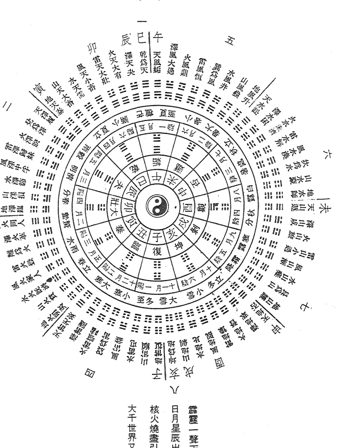

# 命理 | 星相叢書

# 飛星紫微斗數全書

顧祥弘 著

鼎文書局出版

命002

# 鼎文書局
www.ting-wen.com

# 命理 | 星相叢書

- 飛星紫微斗數
- 飛星紫微斗數全書
- 飛星紫微斗數命身十二宮詳解
- 飛星紫微斗數合集
- 紫微斗數考證
- 紫微斗數概論
- 紫微斗數精傳
- 紫微斗數全書
- 紫微斗數一二○法則
- 紫微斗數無字天書
- 紫微斗數流年提要
- 紫微斗數探源
- 中國萬年曆
- 中西對照萬年曆
- 中西萬年曆兩千年對照表
- 卜筮正宗
- 子平真詮評註
- 天星斗數秘笈
- 地理五訣
- 相學大觀
- 唐宋陰陽五行論集
- 麻衣相法
- 造化元鑰評註
- 陽宅三要
- 陽宅大全圖說
- 詳圖八宅明鏡

- 淵海子平評註
- 訂正滴天髓徵義
- 斷易天機
- 鐵版神數入門
- 三命通會
- 氣數命理寶鑑
- 初級命學講義
- 神相全編
- 柳莊相法
- 陽宅集成
- 剋擇講義
- 命學大辭淵
- 相理衡真
- 中國占星術入門
- 觀人於微
- 痣相術入門
- 精要圖解八字心理推命學
- 運命週期律
- 天運占星學
- 如何應用日景羅經
- 天中殺入門
- 氣學推命
- 中國二千年之預言
- 中國式算命法
- 神相鐵關刀
- 地學鐵骨秘
- 奇龍怪穴記

- 風水靈籤怪談
- 愛情事業掌上觀
- 命理尋源(附雜格一覽)
- 命理索隱
- 符咒秘典
- 命學新義
- 天運占星學
- 造化元鑰評註
- 河洛精蘊
- 河洛精蘊(精裝)
- 新住家風水入門
- 易卦占卜入門
- 六十四卦經解
- 四柱推命學
- 新人相學
- 樓宇寶鑑
- 中國七政四餘星圖析義
- 奇門遁甲全書
- 術數之科學原理(附易象射覆圖)
- 麻衣神相
- 太清神鑑
- 卜筮全書
- 星命全書
- 相術全書
- 堪輿全書
- 卜相叢書(四本)
- 觀人於微續集

ISBN 957-0458-29-1
鼎文書局股份有限公司

# 飛星紫微斗數全書

無師自通

鼎文書局印行

# 飛星紫微斗數 卷一

推命起例及安星要訣並附圖表

一、十天干陰陽：
甲、乙、丙、丁、戊、己、庚、辛、壬、癸，為十天干。
甲、丙、戊、庚、壬，屬陽。陽年生人，男為陽男，女為陽女。
乙、丁、己、辛、癸，屬陰。陰年生人，男為陰男，女為陰女。

二、十二地支所屬生肖及陰陽：
子、丑、寅、卯、辰、巳、午、未、申、酉、戌、亥，為十二地支。
子屬鼠，丑屬牛，寅屬虎，卯屬兔，辰屬龍，巳屬蛇，
午屬馬，未屬羊，申屬猴，酉屬雞，戌屬狗，亥屬豬。
子、寅、辰、午、申、戌，屬陽。
丑、卯、巳、未、酉、亥，屬陰。

三、天干五行方位：
甲乙屬木，丙丁屬火，戊己屬土，庚辛屬金，壬癸屬水。
甲乙為東方，丙丁為南方，庚辛為西方，壬癸為北方，戊己為中央。

四、地支五行四時方位：
子屬水、丑屬土、寅屬木、卯屬木、辰屬土、巳屬火、
午屬火、未屬土、申屬金、酉屬金、戌屬土、亥屬水。
寅、卯、辰，司春，為東方。巳、午、未，司夏，為南方。
申、酉、戌，司秋，為西方。亥、子、丑，司冬，為北方。
惟辰、戌、丑、未，四支單位言之，屬土，為四季，為中央。

# 鼎文書局國學叢書

| 編號 | 書籍名稱 | 編著者 | 定價 |
|---|---|---|---|
| 國017 | 諸子菁華錄十八種 | 張純一 | 600 |
| 國018 | 萬寶全書 | 萬寶全書編輯員 | 800 |
| 國019 | 歷代詩文撰注 | 鼎文書局編輯部 | 150 |
| 國020 | 最新漢英五用大辭典 | 鼎文書局編輯部 | 500 |
| 國021 | 備急千金要方 | 唐、孫思邈 | 500 |
| 國022 | 文心雕龍新書 | 王理器 | 200 |
| 國023 | 史記會注考證 | 瀧川龜太郎 | 1000 |
| 國024 | 乾隆甲戌脂硯齋重評石頭記(上)(下) | 曹雪芹 | 500 |
| 國025 | 中國點心大全 | 葉華 | 300 |
| 國026 | 中國文學史 | 西諦 | 700 |
| 國027 | 新校標點明通鑑 | 清夏燮 | 500 |
| 國028 | 中國歷代詩選 | 常君寶 | 500 |
| 國029 | 中國歷代詞選 | 常君寶 | 500 |
| 國030 | 天中殺入門 | 程義 | 260 |
| 國031 | 劉大白精選集 | 劉大白 | 250 |
| 國032 | 奇龍怪穴記 | 王建東 | 200 |
| 國033 | 解釋漢和大辭典 | 鼎文書局編輯部 | 600 |
| 國034 | 明人小品 | 鼎文書局編輯部 | 250 |
| 國035 | 唐宋文舉要(上)(下) | 高步瀛 | 1000 |
| 國036 | 經籍纂詁 | 清、阮元等撰 | 800 |

# 五 五行生剋：

金、木、水、火、土，為五行。
金生水，水生木，木生火，火生土，土生金。
金剋木，木剋土，土剋水，水剋火，火剋金。

# 六 五行旺相休囚絕：

春季：木旺，火相，水休，金囚，土絕。
夏季：火旺，土相，木休，水囚，金絕。
秋季：金旺，水相，土休，火囚，木絕。
冬季：水旺，木相，金休，土囚，火絕。
辰戌丑未四季：土旺，金相，火休，木囚，水絕。

# 七 天干化合：

甲己合，化土。乙庚合，化金。丙辛合，化水。丁壬合，化木。戊癸合，化火。

# 八 天干相沖：

甲庚相沖，乙辛相沖，壬丙相沖，癸丁相沖。

# 九 天干剋：

丙剋庚，丁剋辛。

# 十 地支三合：

寅午戌合成火局。申子辰合成水局。巳酉丑合成金局。亥卯未合成木局。

# 十一 地支六合：

子丑合，化土。寅亥合，化木。卯戌合，化火。辰酉合，化金。巳申合，化水。午未合，午為陽，未為陰。

# 十二 地支六沖：

子午相沖，丑未相沖，寅申相沖，卯酉相沖，辰戌相沖，巳亥相沖。

# 先天河圖

# 後天洛書

# 【數五十合橫縱】

數四十五
寄五於中
戴九履一
左三右七
二四為肩
六八為足

數五十五
一六居下
二七居上
三八居左
四九居右
五十居中

# 地盤圖

# 先天八卦

# 後天八卦

安命宮及身宮訣
按本生月及本生時。凡閏月生者作下月論。
寅正順數生月逢
生月起子兩頭通
逆至生時為命宮
順到生時即安身

安十二宮訣
男女俱從逆轉，切記莫順行。
一命宮
二兄弟
三夫妻
四子女
五財帛
六疾厄
七遷移
八僕役
九事業
十田宅
十一福德
十二父母

定五行局
按本生年干及命宮
五行局，即水二局、木三局、金四局、土五局、火六局是也。定法：在安妥十二宮之後，以人之本生年干，按五行冠蓋訣，求得命宮之干支；然後再按六十花甲納音歌，求得命宮干支之納音，納音為何，即為何局。

一、五行冠蓋訣
甲己之年起丙寅
乙庚之年起戊寅
丙辛之年起庚寅
丁壬之年起壬寅
戊癸之年起甲寅

二、六十花甲納音歌
甲子乙丑海中金
丙寅丁卯爐中火
戊辰己巳大林木
庚午辛未路旁土
壬申癸酉劍鋒金
甲戌乙亥山頭火
丙子丁丑澗下水
戊寅己卯城頭土
庚辰辛巳白蠟金
壬午癸未楊柳木
甲申乙酉泉中水
丙戌丁亥屋上土
戊子己丑霹靂火
庚寅辛卯松柏木
壬辰癸巳長流水
甲午乙未砂中金
丙申丁酉山下火
戊戌己亥平地木
庚子辛丑壁上土
壬寅癸卯金箔金
甲辰乙巳覆燈火
丙午丁未天河水
戊申己酉大驛土
庚戌辛亥釵釧金
壬子癸丑桑柘木
甲寅乙卯大溪水
丙辰丁巳砂中土
戊午己未天上火
庚申辛酉石榴木
壬戌癸亥大海水

起紫微
按命宮五行局及本生日。
一、水二局起紫微訣
水二局中初一丑
單雙不論順行流
順行一宮安一日
最末一天在於辰
二、木三局起紫微訣
木三局中初一辰
逆退一步安二天
順行四宮安一日
雙日初二丑宮尋
三、金四局起紫微訣
金局四數紫微宮
初一在亥初二辰
順二逆一安單日
逆二順三雙日逢
四、土五局起紫微訣
土五局中初一年
逆行二宮安一日
值九移向寅辰午
雙日初二在亥宮
五、火六局起紫微訣
火六局中初一酉
順二兩次逆三一
逆二兩次順五一
雙日初二午宮尋

安紫微諸星訣
隨紫微星而安之諸星。
紫微逆去天機星
隔一太陽武曲辰
連接天同空二宮
廉貞居處方是真

起天府訣 依紫微星而轉移。

天府南斗令 常對紫微君 丑卯相更迭 未酉互為根

往來午與戌 躍践子和辰 巳亥交馳驅 同位在寅申

安天府諸星訣 隨天府星而安之諸星。

天府順行有太陰 貪狼而後巨門臨 隨來天相天梁繼 七殺空三是破軍

安時系諸星訣 按本生時安之。

一、安文昌文曲訣
戌上起子安文昌 逆到生時是貴鄉
文曲星從辰上起 順到生時是本鄉

二、安火星鈴星訣
寅午戌年丑卯起 申子辰年寅戌揚
巳酉丑年卯戌始 亥卯未年酉戌揚

三、安地劫地空訣
亥上起子順安劫 逆去便是地空鄉

四、安台輔封誥諸訣
台輔星從午宮起 順至生時是貴鄉
封誥寅宮來起子 順到生時是貴方

安月系諸星訣 按本生月安之。

一、安左輔右弼訣
左輔正月起於辰 順逢生月是貴方
右弼正月戌宮尋 逆至生月便停留

二、安天刑天姚訣
天刑從酉起正月 順至生月便安之
天姚丑宮起正月 順到生月即停留

三、安天巫訣
寅午戌月在巳宮 申子辰月在寅宮
巳酉丑月在亥宮 亥卯未月在申宮

四、安天月訣
正月在戌 二月在巳 三月在辰
四月在寅 五月在未 六月在卯
七月在亥 八月在未 九月在寅
十月在午 十一月戌 十二月寅

五、安陰煞訣
正七月在寅 二八月在子 三九月在戌
四十月在申 五及十二午 六及十二辰

安日系諸星訣 按本生日安之。

一、安三台八座訣
三台從左輔上起初一，順行至本生日安之。
八座從右弼上起初一，逆行至本生日安之。

二、安恩光天貴訣
文昌順數到生日 退後一步是恩光
文曲順數到生日 退後一步天貴揚

# 安干系諸星訣 按本生年干安之。

一 安祿存訣
甲寅乙卯丙戊巳 丁己午分祿所至
庚祿居申辛祿酉 壬祿在亥癸祿子

二 安擎羊陀羅訣
安頓羊陀處 首先看祿存
祿前擎羊地 祿後陀羅村

三 安天魁天鉞訣
甲戊庚牛羊 乙己鼠猴鄉
丙丁豬雞位 壬癸兔蛇藏

四 安化祿化權化科化忌訣
甲廉破武陽 乙機梁紫陰
丙同機昌廉 丁陰同機巨
戊貪陰右機 己武貪梁曲
庚陽武陰同 辛巨陽曲昌
壬梁紫左武 癸破巨陰貪

五 安天官天福訣
天官：甲年在未 乙年在辰 丙年在巳 丁年在寅 戊年在卯 己年在酉 庚年在午 辛年在亥 壬年在戌 癸年在午
天福：甲年在酉 乙年在亥 丙年在子 丁年在亥 戊年在卯 己年在午 庚年在午 辛年在巳 壬年在午 癸年在巳

六 安天廚訣
甲丁年在巳 乙戊辛在午 丙年在子 己年在申 庚年在寅 壬年在酉 癸年在亥

七 安生年博士十二種訣
不論男女命，尋祿存星起博士，陽男陰女順行，陰男陽女逆行，其順序如下：
一 博士 二 力士 三 青龍 四 小耗 五 將軍 六 奏書 七 飛廉 八 喜神 九 病符 十 大耗 十一 伏兵 十二 官府

# 安支系諸星訣 按本生年支安之。

一 安天馬訣
寅午戌年馬在申 申子辰年馬在寅
巳酉丑年馬在亥 亥卯未年馬在巳

二 安解神訣
從戌宮起子，逆行至本生年支安之。

三 安天哭天虛訣
天哭天虛起午宮 午宮起子兩分蹤
哭逆行兮虛順轉 數到生年便停留

四 安龍池鳳閣訣
龍池從辰宮起子，順行至本生年支安之。
鳳閣從戌宮起子，逆行至本生年支安之。

五 安紅鸞天喜訣
卯上起子逆數之 數到當生太歲支
坐守此宮紅鸞位 對宮天喜不差移

六 安孤神寡宿訣
寅卯辰年生人安巳丑宮
巳午未年生人安申辰宮
申酉戌年生人安亥未宮
亥子丑年生人安寅戌宮

七 安破碎訣
子午卯酉年生安巳宮
寅申巳亥年生安酉宮
辰戌丑未年生安丑宮

# 九 安天空訣

從本生年支順行二位安之。

# 十 安月德訣

從巳宮起子，順行至本生年支安之。

# 十一 安天才天壽訣

天才星由命宮起子，順行至本生年支安之。
天壽星由身宮起子，順行至本生年支安之。

安五行局長生十二神訣 按命宮五行局安之。

十二神之順序為：長生、沐浴、冠帶、臨官、帝旺、衰、病、死、墓、絕、胎、養。

水二局長生在申 木三局長生在亥 金四局長生在巳 土五局長生在申 火六局長生在寅

安法：先按命宮所屬五行局定長生之宮位，再按十二神之順序依次安之。

陽男陰女順行，陰男陽女逆行。

# 安截路空亡訣

按本生年干安之。

甲己之年申酉空 乙庚之年午未空 丙辛之年辰巳空 丁壬之年寅卯空 戊癸之年子丑空

# 安旬中空亡訣

按本生年干支安之。

甲子旬中戌亥空 甲戌旬中申酉空 甲申旬中午未空 甲午旬中辰巳空 甲辰旬中寅卯空 甲寅旬中子丑空

# 安天傷天使訣

天傷永在僕役宮 天使永在疾厄宮

# 安命主訣

按命宮所坐宮位安之。

命子貪狼命主 丑亥巨門命主 寅戌祿存命主 卯酉文曲命主 辰申廉貞命主 巳未武曲命主 午破軍命主

# 安身主訣

按本生年支安之。

子午火星位 卯酉天同齊 辰戌文昌星 丑未天相宜 寅午戌人辰上起 巳酉丑人未宮始 亥卯未人起丑宮

# 起大限訣

從命宮起初行大限

大限初行起命宮 十年一度換行宮 陽男陰女順方轉 陰男陽女逆行通

# 起小限訣

按本生年支起一歲小限

小限一年一度逢 男順女逆不相同 寅午戌人辰上起 巳酉丑人未宮始 亥卯未人起丑宮

申子辰人自戌宮

一四

一五

# 安流年將前諸星訣

按流年地支起將星。

寅午戌年將星午
申子辰年子將星
巳酉丑將酉上駐
亥卯未將卯上停

攀鞍歲驛並息神
華蓋劫煞災煞經
天煞指背咸池経
月煞亡神次第行

# 安流年歲前諸星訣

按流年之地支起歲建。

太歲一年一替換
晦氣喪門貫索及官符
小耗大耗龍德繼
白虎天德連吊客
病符居後須當記

# 安流年斗君訣

按本生月及本生時。

# 流年歲建起正月

逆逢生月順回程
回程順至生時止
便是流年正月春

# 諸星在十二宮廟旺利陷

凡吉凶諸星，臨入其相宜之宮位皆曰廟，臨入其不相宜之宮位皆曰陷。察諸星明暗之度，定其得數強弱，分為：廟、旺、得地、利益、和平、不得地、陷。

詳見卷一末「諸星分屬五行及南北斗並化吉凶一覽表」。

# 諸星分屬五行及南北斗並化吉凶

正曜
紫微、天機、太陽、武曲、天同、廉貞、天府、太陰、貪狼、巨門、天相、天梁、七殺、破軍、

偏曜
擎羊、陀羅、火星、鈴星、天魁、天鉞，凡六辰，俱為甲級偏曜星。

# 化曜

化祿、化權、化科、化忌，凡四辰，俱為甲級化曜星。

雜曜
正偏化曜之外，尚有八十四辰皆為雜曜，分列為乙、丙、丁、戊級星。

# 四吉

祿、貴、權、科，為四吉。祿即祿存、化祿。貴即天魁、天鉞。權即化權。科即化科。

# 四凶

羊、陀、火、鈴，為四凶，亦稱四殺。

# 本方

主事宮日本方，亦稱本宮。例如命宮主終身全局，若問終身，則命宮即為本方也。

# 對方

本宮之六沖宮曰對方，亦稱對宮。或曰朝、沖。

# 合方

本宮之三合方曰合方，亦稱三合。或曰拱照，協、齊。

# 鄰方

本宮之前一位及後一位曰鄰方，亦稱夾。或曰輔。

# 四方

本方、對方、合方、鄰方，合稱曰四方。

中華民國五十一年歲次癸卯立春
道家修士顧祥弘編著

# 命盤全式（例一）

漢光武劉秀之命。權祿重逢，財官雙美。二十四歲後限行吉地，位登九五，直到五十四歲起，大限入於天傷之宮，六十二歲小限又逢天傷，流年丁巳不吉，故損壽也。

# 命盤全式（例二）

楚霸王項羽之命。科祿權加會，當至極富貴。祿存守命宮，被對宮忌星沖破，為吉處藏凶。三十二歲大限殺破狼，小限到申宮，地空值守，對宮地劫，流年戊戌又不吉，故自刎於烏江。

# 命盤全式（例三）

楊貴妃之命
坐貴向貴，得貴人龍愛。文昌文曲加會，女命不宜見之。經云：楊妃好色，三合文昌文曲。三十五歲起大限疾厄到亥化忌，四十一歲小限到午，子午相冲，流年甲辰又不吉，故損壽也。

# 命盤全式（例四）

婦婦之命
七殺臨身終不美，地空地劫再無良，雖有紫微天府守命宮，而夫君、子息二宮甚混雜，且天姚及化忌居於福德宮，其賤無疑矣。

# 飛星紫微斗數安星圖表

# 十干所屬表

| 所屬十干 | 陰陽 | 五行 |
| :--- | :--- | :--- |
| 甲 | 陽 | 木 |
| 乙 | 陰 | 木 |
| 丙 | 陽 | 火 |
| 丁 | 陰 | 火 |
| 戊 | 陽 | 土 |
| 己 | 陰 | 土 |
| 庚 | 陽 | 金 |
| 辛 | 陰 | 金 |
| 壬 | 陽 | 水 |
| 癸 | 陰 | 水 |

註：陽年生人，男為陽男，女為陽女。
陰年生人，男為陰男，女為陰女。

# 十二支所屬表

| 所屬十二支 | 陰陽 | 五行 | 生肖 |
| :--- | :--- | :--- | :--- |
| 子 | 陽 | 水 | 鼠 |
| 丑 | 陰 | 土 | 牛 |
| 寅 | 陽 | 木 | 虎 |
| 卯 | 陰 | 木 | 兔 |
| 辰 | 陽 | 土 | 龍 |
| 巳 | 陰 | 火 | 蛇 |
| 午 | 陽 | 火 | 馬 |
| 未 | 陰 | 土 | 羊 |
| 申 | 陽 | 金 | 猴 |
| 酉 | 陰 | 金 | 雞 |
| 戌 | 陽 | 土 | 狗 |
| 亥 | 陰 | 水 | 豬 |

# 安命宮及身宮表

按本生月及本生時

| 生時 | 正月 | 二月 | 三月 | 四月 | 五月 | 六月 | 七月 | 八月 | 九月 | 十月 | 十一月 | 十二月 |
|---|---|---|---|---|---|---|---|---|---|---|---|---|
| 子 | 命寅 | 命卯 | 命辰 | 命巳 | 命午 | 命未 | 命申 | 命酉 | 命戌 | 命亥 | 命子 | 命丑 |
| 丑 | 命丑 | 命寅 | 命卯 | 命辰 | 命巳 | 命午 | 命未 | 命申 | 命酉 | 命戌 | 命亥 | 命子 |
| 寅 | 命子 | 命丑 | 命寅 | 命卯 | 命辰 | 命巳 | 命午 | 命未 | 命申 | 命酉 | 命戌 | 命亥 |
| 卯 | 命亥 | 命子 | 命丑 | 命寅 | 命卯 | 命辰 | 命巳 | 命午 | 命未 | 命申 | 命酉 | 命戌 |
| 辰 | 命戌 | 命亥 | 命子 | 命丑 | 命寅 | 命卯 | 命辰 | 命巳 | 命午 | 命未 | 命申 | 命酉 |
| 巳 | 命酉 | 命戌 | 命亥 | 命子 | 命丑 | 命寅 | 命卯 | 命辰 | 命巳 | 命午 | 命未 | 命申 |
| 午 | 命申 | 命酉 | 命戌 | 命亥 | 命子 | 命丑 | 命寅 | 命卯 | 命辰 | 命巳 | 命午 | 命未 |
| 未 | 命未 | 命申 | 命酉 | 命戌 | 命亥 | 命子 | 命丑 | 命寅 | 命卯 | 命辰 | 命巳 | 命午 |
| 申 | 命午 | 命未 | 命申 | 命酉 | 命戌 | 命亥 | 命子 | 命丑 | 命寅 | 命卯 | 命辰 | 命巳 |
| 酉 | 命巳 | 命午 | 命未 | 命申 | 命酉 | 命戌 | 命亥 | 命子 | 命丑 | 命寅 | 命卯 | 命辰 |
| 戌 | 命辰 | 命巳 | 命午 | 命未 | 命申 | 命酉 | 命戌 | 命亥 | 命子 | 命丑 | 命寅 | 命卯 |
| 亥 | 命卯 | 命辰 | 命巳 | 命午 | 命未 | 命申 | 命酉 | 命戌 | 命亥 | 命子 | 命丑 | 命寅 |

附註：凡閏月生人，作下月論。

# 定十二宮表

按命宮，男女俱從逆轉，切記莫順行。

| 命宮 | 兄弟 | 夫妻 | 子女 | 財帛 | 疾厄 | 遷移 | 交友 | 事業 | 田宅 | 福德 | 父母 | 身宮 |
|---|---|---|---|---|---|---|---|---|---|---|---|---|
| 子 | 亥 | 戌 | 酉 | 申 | 未 | 午 | 巳 | 辰 | 卯 | 寅 | 丑 | 子 |
| 丑 | 子 | 亥 | 戌 | 酉 | 申 | 未 | 午 | 巳 | 辰 | 卯 | 寅 | 丑 |
| 寅 | 丑 | 子 | 亥 | 戌 | 酉 | 申 | 未 | 午 | 巳 | 辰 | 卯 | 寅 |
| 卯 | 寅 | 丑 | 子 | 亥 | 戌 | 酉 | 申 | 未 | 午 | 巳 | 辰 | 卯 |
| 辰 | 卯 | 寅 | 丑 | 子 | 亥 | 戌 | 酉 | 申 | 未 | 午 | 巳 | 辰 |
| 巳 | 辰 | 卯 | 寅 | 丑 | 子 | 亥 | 戌 | 酉 | 申 | 未 | 午 | 巳 |
| 午 | 巳 | 辰 | 卯 | 寅 | 丑 | 子 | 亥 | 戌 | 酉 | 申 | 未 | 午 |
| 未 | 午 | 巳 | 辰 | 卯 | 寅 | 丑 | 子 | 亥 | 戌 | 酉 | 申 | 未 |
| 申 | 未 | 午 | 巳 | 辰 | 卯 | 寅 | 丑 | 子 | 亥 | 戌 | 酉 | 申 |
| 酉 | 申 | 未 | 午 | 巳 | 辰 | 卯 | 寅 | 丑 | 子 | 亥 | 戌 | 酉 |
| 戌 | 酉 | 申 | 未 | 午 | 巳 | 辰 | 卯 | 寅 | 丑 | 子 | 亥 | 戌 |
| 亥 | 戌 | 酉 | 申 | 未 | 午 | 巳 | 辰 | 卯 | 寅 | 丑 | 子 | 亥 |

身宮常附於他宮之內，不一定身命同宮。

## 定十二宫天干表

按本生年干

| 本生年干 | 十二宫 | 寅 | 卯 | 辰 | 巳 | 午 | 未 | 申 | 酉 | 戌 | 亥 | 子 | 丑 |
|---|---|---|---|---|---|---|---|---|---|---|---|---|---|
| 甲 | | 丙 | 丁 | 戊 | 己 | 庚 | 辛 | 壬 | 癸 | 甲 | 乙 | 丙 | 丁 |
| 乙 | | 戊 | 己 | 庚 | 辛 | 壬 | 癸 | 甲 | 乙 | 丙 | 丁 | 戊 | 己 |
| 丙 | | 庚 | 辛 | 壬 | 癸 | 甲 | 乙 | 丙 | 丁 | 戊 | 己 | 庚 | 辛 |
| 丁 | | 壬 | 癸 | 甲 | 乙 | 丙 | 丁 | 戊 | 己 | 庚 | 辛 | 壬 | 癸 |
| 戊 | | 甲 | 乙 | 丙 | 丁 | 戊 | 己 | 庚 | 辛 | 壬 | 癸 | 甲 | 乙 |
| 己 | | 丙 | 丁 | 戊 | 己 | 庚 | 辛 | 壬 | 癸 | 甲 | 乙 | 丙 | 丁 |
| 庚 | | 戊 | 己 | 庚 | 辛 | 壬 | 癸 | 甲 | 乙 | 丙 | 丁 | 戊 | 己 |
| 辛 | | 庚 | 辛 | 壬 | 癸 | 甲 | 乙 | 丙 | 丁 | 戊 | 己 | 庚 | 辛 |
| 壬 | | 壬 | 癸 | 甲 | 乙 | 丙 | 丁 | 戊 | 己 | 庚 | 辛 | 壬 | 癸 |
| 癸 | | 甲 | 乙 | 丙 | 丁 | 戊 | 己 | 庚 | 辛 | 壬 | 癸 | 甲 | 乙 |

## 六十花甲子纳音

甲子乙丑海中金
丙寅丁卯炉中火
戊辰己巳大林木
庚午辛未路旁土
壬申癸酉剑锋金

甲戌乙亥山头火
丙子丁丑涧下水
戊寅己卯城头土
庚辰辛巳白蜡金
壬午癸未杨柳木

甲申乙酉泉中水
丙戌丁亥屋上土
戊子己丑霹雳火
庚寅辛卯松柏木
壬辰癸巳长流水

甲午乙未沙中金
丙申丁酉山下火
戊戌己亥平地木
庚子辛丑壁上土
壬寅癸卯金箔金

甲辰乙巳覆灯火
丙午丁未天河水
戊申己酉大驿土
庚戌辛亥钗钏金
壬子癸丑桑柘木

甲寅乙卯大溪水
丙辰丁巳沙中土
戊午己未天上火
庚申辛酉石榴木
壬戌癸亥大海水

二六

二七

## 十干年生人

五行纳音局
按本生年干及命宫
所临宫位而定局。

## 定五行局表

按本生年干及命宫

| 本生年干 | 甲 | 乙 | 丙 | 丁 | 戊 |
| :--- | :--- | :--- | :--- | :--- | :--- |
| 命宫 | | | | | |
| 子 | 水二局 | 火六局 | 土五局 | 木三局 | 金四局 |
| 丑 | 火六局 | 土五局 | 木三局 | 金四局 | 水二局 |
| 寅 | 土五局 | 木三局 | 金四局 | 水二局 | 火六局 |
| 卯 | 木三局 | 金四局 | 水二局 | 火六局 | 土五局 |
| 辰 | 金四局 | 水二局 | 火六局 | 土五局 | 木三局 |
| 巳 | 水二局 | 火六局 | 土五局 | 木三局 | 金四局 |
| 午 | 火六局 | 土五局 | 木三局 | 金四局 | 水二局 |
| 未 | 土五局 | 木三局 | 金四局 | 水二局 | 火六局 |
| 申 | 木三局 | 金四局 | 水二局 | 火六局 | 土五局 |
| 酉 | 金四局 | 水二局 | 火六局 | 土五局 | 木三局 |
| 戌 | 水二局 | 火六局 | 土五局 | 木三局 | 金四局 |
| 亥 | 火六局 | 土五局 | 木三局 | 金四局 | 水二局 |

| 丙辛之年 | | | | |
| :--- | :--- | :--- | :--- | :--- |
| | 沙中金 甲午 | 沙中金 乙未 | 山下火 丙申 | 山下火 丁酉 |
| | 长流水 癸巳 | 长流水 壬辰 | 松柏木 辛卯 | 松柏木 庚寅 |
| | 壁上土 辛丑 | 壁上土 庚子 | 平地木 己亥 | 平地木 戊戌 |

| 丁壬之年 | | | | |
| :--- | :--- | :--- | :--- | :--- |
| | 天河水 丙午 | 天河水 丁未 | 大驿土 戊申 | 大驿土 己酉 |
| | 覆灯火 乙巳 | 覆灯火 甲辰 | 钗钏金 癸亥 | 钗钏金 壬戌 |
| | 桑柘木 癸丑 | 桑柘木 壬子 | 钗钏金 辛亥 | 钗钏金 庚戌 |

| 甲己之年 | | | | |
| :--- | :--- | :--- | :--- | :--- |
| | 路旁土 庚午 | 路旁土 辛未 | 剑锋金 壬申 | 剑锋金 癸酉 |
| | 大林木 戊辰 | 大林木 己巳 | 山头火 甲戌 | 山头火 乙亥 |
| | 炉中火 丁卯 | 炉中火 丙寅 | 涧下水 丁丑 | 涧下水 丙子 |

| 戊癸之年 | | | | |
| :--- | :--- | :--- | :--- | :--- |
| | 天上火 戊午 | 天上火 己未 | 石榴木 庚申 | 石榴木 辛酉 |
| | 沙中土 丙辰 | 沙中土 丁巳 | 大海水 壬戌 | 大海水 癸亥 |
| | 大溪水 乙卯 | 大溪水 甲寅 | 海中金 乙丑 | 海中金 甲子 |

| 乙庚之年 | | | | |
| :--- | :--- | :--- | :--- | :--- |
| | 杨柳木 壬午 | 杨柳木 癸未 | 井泉水 甲申 | 井泉水 乙酉 |
| | 白蜡金 庚辰 | 白蜡金 辛巳 | 屋上土 丙戌 | 屋上土 丁亥 |
| | 城头土 己卯 | 城头土 戊寅 | 霹雳火 己丑 | 霹雳火 戊子 |

## 安紫微诸星表

随紫微星而安之诸星

| 星级 | 紫微 | 天机 | 太阳 | 武曲 | 天同 | 廉贞 |
|---|---|---|---|---|---|---|
| 甲 | 子 | 亥 | 酉 | 申 | 未 | 辰 |
| 乙 | 丑 | 子 | 戌 | 酉 | 申 | 巳 |
| 丙 | 寅 | 丑 | 亥 | 戌 | 酉 | 午 |
| 丁 | 卯 | 寅 | 子 | 亥 | 戌 | 未 |
| 戊 | 辰 | 卯 | 丑 | 子 | 亥 | 申 |
| 己 | 巳 | 辰 | 寅 | 丑 | 子 | 酉 |
| 庚 | 午 | 巳 | 卯 | 寅 | 丑 | 戌 |
| 辛 | 未 | 午 | 辰 | 卯 | 寅 | 亥 |
| 壬 | 申 | 未 | 巳 | 辰 | 卯 | 子 |
| 癸 | 酉 | 申 | 午 | 巳 | 辰 | 丑 |

## 起紫微表

按命宫五行局及本生日

| 五行局 | 水二局 | 木三局 | 金四局 | 土五局 | 火六局 |
|---|---|---|---|---|---|
| 初一 | 丑 | 辰 | 亥 | 午 | 酉 |
| 初二 | 寅 | 巳 | 子 | 未 | 戌 |
| 初三 | 卯 | 午 | 丑 | 申 | 亥 |
| 初四 | 辰 | 未 | 寅 | 酉 | 子 |
| 初五 | 巳 | 申 | 卯 | 戌 | 丑 |
| 初六 | 午 | 酉 | 辰 | 亥 | 寅 |
| 初七 | 未 | 戌 | 巳 | 子 | 卯 |
| 初八 | 申 | 亥 | 午 | 丑 | 辰 |
| 初九 | 酉 | 子 | 未 | 寅 | 巳 |
| 初十 | 戌 | 丑 | 申 | 卯 | 午 |
| 十一 | 亥 | 寅 | 酉 | 辰 | 未 |
| 十二 | 子 | 卯 | 戌 | 巳 | 申 |
| 十三 | 丑 | 辰 | 亥 | 午 | 酉 |
| 十四 | 寅 | 巳 | 子 | 未 | 戌 |
| 十五 | 卯 | 午 | 丑 | 申 | 亥 |
| 十六 | 辰 | 未 | 寅 | 酉 | 子 |
| 十七 | 巳 | 申 | 卯 | 戌 | 丑 |
| 十八 | 午 | 酉 | 辰 | 亥 | 寅 |
| 十九 | 未 | 戌 | 巳 | 子 | 卯 |
| 二十 | 申 | 亥 | 午 | 丑 | 辰 |
| 廿一 | 酉 | 子 | 未 | 寅 | 巳 |
| 廿二 | 戌 | 丑 | 申 | 卯 | 午 |
| 廿三 | 亥 | 寅 | 酉 | 辰 | 未 |
| 廿四 | 子 | 卯 | 戌 | 巳 | 申 |
| 廿五 | 丑 | 辰 | 亥 | 午 | 酉 |
| 廿六 | 寅 | 巳 | 子 | 未 | 戌 |
| 廿七 | 卯 | 午 | 丑 | 申 | 亥 |
| 廿八 | 辰 | 未 | 寅 | 酉 | 子 |
| 廿九 | 巳 | 申 | 卯 | 戌 | 丑 |
| 三十 | 午 | 酉 | 辰 | 亥 | 寅 |

## 安天府诸星表

随天府星而安之诸星

| 星级 | 诸星 | 天府 |
|---|---|---|
| 甲 | 太阴 | 子 |
| 甲 | 贪狼 | 丑 |
| 甲 | 巨门 | 寅 |
| 甲 | 天相 | 卯 |
| 甲 | 天梁 | 辰 |
| 甲 | 七杀 | 巳 |
| 甲 | 破军 | 午 |
| 乙 | 太阴 | 丑 |
| 乙 | 贪狼 | 寅 |
| 乙 | 巨门 | 卯 |
| 乙 | 天相 | 辰 |
| 乙 | 天梁 | 巳 |
| 乙 | 七杀 | 午 |
| 乙 | 破军 | 未 |
| 丙 | 太阴 | 寅 |
| 丙 | 贪狼 | 卯 |
| 丙 | 巨门 | 辰 |
| 丙 | 天相 | 巳 |
| 丙 | 天梁 | 午 |
| 丙 | 七杀 | 未 |
| 丙 | 破军 | 申 |
| 丁 | 太阴 | 卯 |
| 丁 | 贪狼 | 辰 |
| 丁 | 巨门 | 巳 |
| 丁 | 天相 | 午 |
| 丁 | 天梁 | 未 |
| 丁 | 七杀 | 申 |
| 丁 | 破军 | 酉 |
| 戊 | 太阴 | 辰 |
| 戊 | 贪狼 | 巳 |
| 戊 | 巨门 | 午 |
| 戊 | 天相 | 未 |
| 戊 | 天梁 | 申 |
| 戊 | 七杀 | 酉 |
| 戊 | 破军 | 戌 |
| 己 | 太阴 | 巳 |
| 己 | 贪狼 | 午 |
| 己 | 巨门 | 未 |
| 己 | 天相 | 申 |
| 己 | 天梁 | 酉 |
| 己 | 七杀 | 戌 |
| 己 | 破军 | 亥 |
| 庚 | 太阴 | 午 |
| 庚 | 贪狼 | 未 |
| 庚 | 巨门 | 申 |
| 庚 | 天相 | 酉 |
| 庚 | 天梁 | 戌 |
| 庚 | 七杀 | 亥 |
| 庚 | 破军 | 子 |
| 辛 | 太阴 | 未 |
| 辛 | 贪狼 | 申 |
| 辛 | 巨门 | 酉 |
| 辛 | 天相 | 戌 |
| 辛 | 天梁 | 亥 |
| 辛 | 七杀 | 子 |
| 辛 | 破军 | 丑 |
| 壬 | 太阴 | 申 |
| 壬 | 贪狼 | 酉 |
| 壬 | 巨门 | 戌 |
| 壬 | 天相 | 亥 |
| 壬 | 天梁 | 子 |
| 壬 | 七杀 | 丑 |
| 壬 | 破军 | 寅 |
| 癸 | 太阴 | 酉 |
| 癸 | 贪狼 | 戌 |
| 癸 | 巨门 | 亥 |
| 癸 | 天相 | 子 |
| 癸 | 天梁 | 丑 |
| 癸 | 七杀 | 寅 |
| 癸 | 破军 | 卯 |

## 定天府表

依紫微星而转移

| 星级 | 星名 | 紫微 |
|---|---|---|
| 甲 | 天府 | 辰 |
| 甲 | 天府 | 卯 |
| 甲 | 天府 | 寅 |
| 甲 | 天府 | 丑 |
| 甲 | 天府 | 子 |
| 甲 | 天府 | 亥 |
| 甲 | 天府 | 戌 |
| 甲 | 天府 | 酉 |
| 甲 | 天府 | 申 |
| 甲 | 天府 | 未 |
| 甲 | 天府 | 午 |
| 甲 | 天府 | 巳 |

## 安日系诸星表

按本生日安之

| 星级 | 诸星 | 乙 | 乙 |
|---|---|---|---|
| 三台 | 八座 | 恩光 | 天贵 |
| 从左辅上起初一，顺行，数到本日生。 | 从右弼上起初一，逆行，数到本日生。 | 从文昌上起初一，顺行，数到本日生再退后一步。 | 从文曲上起初一，顺行，数到本日生再退后一步。 |

## 安月系诸星表

按本生月安之

| 星级 | 诸星 | 甲 | 乙 | 乙 |
|---|---|---|---|---|
| 本生月 | 左辅 | 右弼 | 天刑 | 天姚 |
| 正月 | 辰 | 戌 | 酉 | 丑 |
| 二月 | 巳 | 酉 | 戌 | 寅 |
| 三月 | 午 | 申 | 亥 | 卯 |
| 四月 | 未 | 未 | 子 | 辰 |
| 五月 | 申 | 午 | 丑 | 巳 |
| 六月 | 酉 | 巳 | 寅 | 午 |
| 七月 | 戌 | 辰 | 卯 | 未 |
| 八月 | 亥 | 卯 | 辰 | 申 |
| 九月 | 子 | 寅 | 巳 | 酉 |
| 十月 | 丑 | 丑 | 午 | 戌 |
| 十一月 | 寅 | 子 | 未 | 亥 |
| 十二月 | 卯 | 亥 | 申 | 子 |

## 安时系诸星表

按本生时安之

| 星级 | 诸星 | 甲 | 甲 | 乙 | 乙 |
|---|---|---|---|---|---|
| 本生时 | 文昌 | 文曲 | 火星 | 铃星 | 地劫 |
| 子 | 戌 | 辰 | 卯 | 戌 | 亥 |
| 丑 | 酉 | 卯 | 寅 | 酉 | 子 |
| 寅 | 申 | 寅 | 丑 | 申 | 丑 |
| 卯 | 未 | 丑 | 子 | 未 | 寅 |
| 辰 | 午 | 子 | 亥 | 午 | 卯 |
| 巳 | 巳 | 亥 | 戌 | 巳 | 辰 |
| 午 | 辰 | 戌 | 酉 | 辰 | 巳 |
| 未 | 卯 | 酉 | 申 | 卯 | 午 |
| 申 | 寅 | 申 | 未 | 寅 | 未 |
| 酉 | 丑 | 未 | 午 | 丑 | 申 |
| 戌 | 子 | 午 | 巳 | 子 | 酉 |
| 亥 | 亥 | 巳 | 辰 | 亥 | 戌 |

## 安干系诸星表

按本生年干安之

| 星级 | 诸星 | 年干 |
|---|---|---|
| 禄存 | 禄存 | 甲 |
| 天魁 | 天魁 | 乙 |
| 天钺 | 天钺 | 丙 |
| 化禄 | 化禄 | 丁 |
| 化权 | 化权 | 戊 |
| 化科 | 化科 | 己 |
| 化忌 | 化忌 | 庚 |
| 天官 | 天官 | 辛 |
| 天福 | 天福 | 壬 |
| 天厨 | 天厨 | 癸 |

## 安生年博士十二星法

禄存星起博士，阳男阴女顺行，阴男阳女逆行。
不论男女命，寻禄存星起博士，丙级星。

| 博士 | 力士 | 青龙 | 小耗 | 将军 | 奏书 | 飞廉 | 喜神 | 病符 | 大耗 | 伏兵 | 官府 |
|---|---|---|---|---|---|---|---|---|---|---|---|
| 禄存 | | | | | | | | | | | |

## 安支系诸星表

按本生年支安之

| 星级 | 诸星 | 本生年支 |
|---|---|---|
| 天马 | 天马 | 子 |
| 天哭 | 天哭 | 丑 |
| 天虚 | 天虚 | 寅 |
| 龙池 | 龙池 | 卯 |
| 凤阁 | 凤阁 | 辰 |
| 红鸾 | 红鸾 | 巳 |
| 天喜 | 天喜 | 午 |
| 孤辰 | 孤辰 | 未 |
| 寡宿 | 寡宿 | 申 |
| 蜚廉 | 蜚廉 | 酉 |
| 破碎 | 破碎 | 戌 |
| 天空 | 天空 | 亥 |
| 月德 | 月德 | 子 |
| 天才 | 天才 | 丑 |
| 天寿 | 天寿 | 寅 |

由身宫起子，顺行，数至本生年支，即安天寿星。

## 安五行长生十二星表

按命宫五行局安之

| 星级 | 星名 | 顺逆 | 五行局 |
|---|---|---|---|
| 丙 | 养胎绝墓死病衰帝旺官带沐长生 | | |
| | 未午巳辰卯寅丑子亥戌酉 | 阴女阳男 | 水二局 |
| | 酉戌亥子丑寅卯辰巳午未 | 阳女阴男 | |
| | 戌酉申未午巳辰卯寅丑子 | 阴女阳男 | 木三局 |
| | 子丑寅卯辰巳午未申酉戌 | 阳女阴男 | |
| | 辰卯寅丑子亥戌酉申未午 | 阴女阳男 | 金四局 |
| | 午未申酉戌亥子丑寅卯辰 | 阳女阴男 | |
| | 未午巳辰卯寅丑子亥戌酉 | 阴女阳男 | 土五局 |
| | 酉戌亥子丑寅卯辰巳午未 | 阳女阴男 | |
| | 丑子亥戌酉申未午巳辰卯 | 阴女阳男 | 火六局 |
| | 卯辰巳午未申酉戌亥子丑 | 阳女阴男 | |

## 安截路空亡表（截空）

按本生年干安之
丙级星

| 星级 | 星名 | 本生年干 |
|---|---|---|
| 丙 | 截空 | 甲己 |
| | 申酉 | 乙庚 |
| | 午未 | 丙辛 |
| | 辰巳 | 丁壬 |
| | 寅卯 | 戊癸 |
| | 子丑 | |

## 安旬中空亡表（旬空）

按本生年干之干支
丙级星

| 旬空 | 年干 |
|---|---|
| 子丑 | 甲 |
| 寅卯 | 乙 |
| 辰巳 | 丙 |
| 午未 | 丁 |
| 申酉 | 戊 |
| 戌亥 | 己 |
| 子丑 | 庚 |
| 寅卯 | 辛 |
| 辰巳 | 壬 |
| 午未 | 癸 |

## 安身主表

按本生年支安之

| 身主 | 星名 | 本生年支 |
| :--- | :--- | :--- |
| 星火 | 子 | |
| 相天 | 丑 | |
| 梁天 | 寅 | |
| 同天 | 卯 | |
| 昌文 | 辰 | |
| 机天 | 巳 | |
| 星火 | 午 | |
| 相天 | 未 | |
| 梁天 | 申 | |
| 同天 | 酉 | |
| 昌文 | 戌 | |
| 机天 | 亥 | |

## 安命主表

按命宫所坐宫位安之

| 命主 | 星名 | 命宫 |
| :--- | :--- | :--- |
| 狼贪 | 子 | |
| 门巨 | 丑 | |
| 存禄 | 寅 | |
| 曲文 | 卯 | |
| 贞廉 | 辰 | |
| 曲武 | 巳 | |
| 军破 | 午 | |
| 曲武 | 未 | |
| 贞廉 | 申 | |
| 曲文 | 酉 | |
| 存禄 | 戌 | |
| 门巨 | 亥 | |

## 安天伤、天使表

按命宫所坐宫位安之

注：天伤永在友仆宫。天使永在疾厄宫。

| 丙 | 星级 | 星名 | 命宫 |
| :--- | :--- | :--- | :--- |
| 天使 | 天伤 | 未 | 巳 |
| 申 | 午 | 丑 | |
| 酉 | 未 | 寅 | |
| 戌 | 申 | 卯 | |
| 亥 | 酉 | 辰 | |
| 子 | 戌 | 巳 | |
| 丑 | 亥 | 午 | |
| 寅 | 子 | 未 | |
| 卯 | 丑 | 申 | |
| 辰 | 寅 | 酉 | |
| 巳 | 卯 | 戌 | |
| 午 | 辰 | 亥 | |

## 起小限表

按本生年支起一岁小限

| 小限之岁 | 本生年支 |
| :--- | :--- |
| 一 | 寅午戌 |
| 二 | 申子辰 |
| 三 | 巳酉丑 |
| 四 | 亥卯未 |

## 起大限表

从命宫起初行大限
阳男阴女顺行
阴男阳女逆行

| 大限 | 五行局 | 阴阳男女 | 命宫 | 兄弟 | 夫妻 | 子女 | 财帛 | 疾厄 | 迁移 | 交友 | 事业 | 田宅 | 福德 | 父母 |
| :--- | :--- | :--- | :--- | :--- | :--- | :--- | :--- | :--- | :--- | :--- | :--- | :--- | :--- | :--- |
| 1 | 水二局 | 阳男阴女 | 2 | 12 | 22 | 32 | 42 | 52 | 62 | 72 | 82 | 92 | 102 | 112 |
| 1 | 水二局 | 阴男阳女 | 11 | 21 | 31 | 41 | 51 | 61 | 71 | 81 | 91 | 101 | 111 | 121 |
| 2 | 木三局 | 阳男阴女 | 3 | 13 | 23 | 33 | 43 | 53 | 63 | 73 | 83 | 93 | 103 | 113 |
| 2 | 木三局 | 阴男阳女 | 12 | 22 | 32 | 42 | 52 | 62 | 72 | 82 | 92 | 102 | 112 | 122 |
| 3 | 金四局 | 阳男阴女 | 4 | 14 | 24 | 34 | 44 | 54 | 64 | 74 | 84 | 94 | 104 | 114 |
| 3 | 金四局 | 阴男阳女 | 13 | 23 | 33 | 43 | 53 | 63 | 73 | 83 | 93 | 103 | 113 | 123 |
| 4 | 土五局 | 阳男阴女 | 5 | 15 | 25 | 35 | 45 | 55 | 65 | 75 | 85 | 95 | 105 | 115 |
| 4 | 土五局 | 阴男阳女 | 14 | 24 | 34 | 44 | 54 | 64 | 74 | 84 | 94 | 104 | 114 | 124 |
| 5 | 火六局 | 阳男阴女 | 6 | 16 | 26 | 36 | 46 | 56 | 66 | 76 | 86 | 96 | 106 | 116 |
| 5 | 火六局 | 阴男阳女 | 15 | 25 | 35 | 45 | 55 | 65 | 75 | 85 | 95 | 105 | 115 | 125 |

## 安流年岁前诸星表

按流年之地支起岁建

| 星级 | 诸星 | 年支 |
|---|---|---|
| 丁 | 岁建 | 子 |
| 戊 | 晦气 | 丑 |
| 丁 | 丧门 | 寅 |
| 戊 | 贯索 | 卯 |
| 丁 | 官符 | 辰 |
| 戊 | 小耗 | 巳 |
| 丁 | 大耗 | 午 |
| 戊 | 龙德 | 未 |
| 丁 | 白虎 | 申 |
| 戊 | 天德 | 酉 |
| 丁 | 吊客 | 戌 |
| 戊 | 病符 | 亥 |

## 安流年将前诸星表

按流年地支起将星

| 星级 | 诸星 | 年支 |
|---|---|---|
| 丁 | 将星 | 子 |
| 戊 | 梁神 | 丑 |
| 丁 | 息神 | 寅 |
| 戊 | 华盖 | 卯 |
| 丁 | 劫煞 | 辰 |
| 戊 | 灾煞 | 巳 |
| 丁 | 天煞 | 午 |
| 戊 | 指背 | 未 |
| 丁 | 咸池 | 申 |
| 戊 | 月煞 | 酉 |
| 丁 | 亡神 | 戌 |
| 戊 | 将星 | 亥 |

## 更多资料

↓↓↓

--------------------------------------------------

## 【中华古籍库】

↓ 点击链接 ↓

https://www.fozhu920.com/list/

珍版刻印 / 海外流传 / 家传手抄 / 民间失传

【易】【医】【道】【武】【文】【奇】【画】【书】

1000000+高清古书籍

## 打包下载

微信：mbook86

## 安子年斗君表

按本生月及未生时

| 生月/生时 | 正月 | 二月 | 三月 | 四月 | 五月 | 六月 | 七月 | 八月 | 九月 | 十月 | 十一月 | 十二月 |
|---|---|---|---|---|---|---|---|---|---|---|---|---|
| 子 | 子 | 丑 | 寅 | 卯 | 辰 | 巳 | 午 | 未 | 申 | 酉 | 戌 | 亥 |
| 丑 | 丑 | 寅 | 卯 | 辰 | 巳 | 午 | 未 | 申 | 酉 | 戌 | 亥 | 子 |
| 寅 | 寅 | 卯 | 辰 | 巳 | 午 | 未 | 申 | 酉 | 戌 | 亥 | 子 | 丑 |
| 卯 | 卯 | 辰 | 巳 | 午 | 未 | 申 | 酉 | 戌 | 亥 | 子 | 丑 | 寅 |
| 辰 | 辰 | 巳 | 午 | 未 | 申 | 酉 | 戌 | 亥 | 子 | 丑 | 寅 | 卯 |
| 巳 | 巳 | 午 | 未 | 申 | 酉 | 戌 | 亥 | 子 | 丑 | 寅 | 卯 | 辰 |
| 午 | 午 | 未 | 申 | 酉 | 戌 | 亥 | 子 | 丑 | 寅 | 卯 | 辰 | 巳 |
| 未 | 未 | 申 | 酉 | 戌 | 亥 | 子 | 丑 | 寅 | 卯 | 辰 | 巳 | 午 |
| 申 | 申 | 酉 | 戌 | 亥 | 子 | 丑 | 寅 | 卯 | 辰 | 巳 | 午 | 未 |
| 酉 | 酉 | 戌 | 亥 | 子 | 丑 | 寅 | 卯 | 辰 | 巳 | 午 | 未 | 申 |
| 戌 | 戌 | 亥 | 子 | 丑 | 寅 | 卯 | 辰 | 巳 | 午 | 未 | 申 | 酉 |
| 亥 | 亥 | 子 | 丑 | 寅 | 卯 | 辰 | 巳 | 午 | 未 | 申 | 酉 | 戌 |

注：自子年斗君所落之宫位起子，顺数至流年年支，即为本流年之斗君。

## 诸星在十二宫庙旺利陷表

| 二十七度 | 子 | 丑 | 寅 | 卯 | 辰 | 巳 | 午 | 未 | 申 | 酉 | 戌 | 亥 |
|---|---|---|---|---|---|---|---|---|---|---|---|---|
| 庙 | 机府阴相梁破 | 禄武曲羊陀相 | 紫武曲羊陀相 | 阳巨梁禄 | 陀武府梁杀羊 | 同昌曲禄 | 火紫机相梁破禄 | 禄巨相杀禄 | 廉巨相杀禄 | 巨昌曲禄 | 陀武府贪梁杀羊 | 同阴禄 |
| 旺 | 巨武同贪 | 梁破 | 紫阳巨 | 曲紫机杀 | 紫阳阴 | 梁破 | 巨武同贪 | 阴紫机府 | 紫同 | 梁破曲 | 贪巨武杀 | 禄巨曲 |
| 得地 | 昌曲 | 火铃 | 机武破 | 府相昌曲 | 紫相火铃 | 阳相 | 机昌曲武府 | 破昌曲武府 | 梁火铃 | 紫相 | 府相 | 禄巨曲 |
| 利益 | 廉 | 武贪 | 机廉 | 火铃贪昌 | 同 | 廉 | 铃巨昌火 | 阴 | 武贪 | 机廉 | 昌火铃 | 禄巨曲 |
| 平和 | 紫康 | 贪 | 同 | 禄 | 破机武杀 | 同 | 廉 | 禄 | 同阴巨 | 阴 | 阳同巨 | 禄 |
| 不得地 | 阳羊火铃 | 机 | 陀 | 阴相破羊 | 陀巨火铃 | 陀廉阴贪梁 | 同昌曲羊 | 机 | 梁陀火铃 | 相破羊 | 巨昌曲 | 陀阳廉贪梁 |

四六

四七

## 斗杓：依出生之月及出生之时安之

## 斗数玄微（数外别传）安星图表

| 甲 | 十二月 | 十一月 | 十月 | 九月 | 八月 | 七月 | 六月 | 五月 | 四月 | 三月 | 二月 | 正月 |
|---|---|---|---|---|---|---|---|---|---|---|---|---|
| 卯 | 寅 | 丑 | 子 | 亥 | 戌 | 酉 | 申 | 未 | 午 | 巳 | 辰 | 子时 |
| 辰 | 卯 | 寅 | 丑 | 子 | 亥 | 戌 | 酉 | 申 | 未 | 午 | 巳 | 丑时 |
| 巳 | 辰 | 卯 | 寅 | 丑 | 子 | 亥 | 戌 | 酉 | 申 | 未 | 午 | 寅时 |
| 午 | 巳 | 辰 | 卯 | 寅 | 丑 | 子 | 亥 | 戌 | 酉 | 申 | 未 | 卯时 |
| 未 | 午 | 巳 | 辰 | 卯 | 寅 | 丑 | 子 | 亥 | 戌 | 酉 | 申 | 辰时 |
| 申 | 未 | 午 | 巳 | 辰 | 卯 | 寅 | 丑 | 子 | 亥 | 戌 | 酉 | 巳时 |
| 酉 | 申 | 未 | 午 | 巳 | 辰 | 卯 | 寅 | 丑 | 子 | 亥 | 戌 | 午时 |
| 戌 | 酉 | 申 | 未 | 午 | 巳 | 辰 | 卯 | 寅 | 丑 | 子 | 亥 | 未时 |
| 亥 | 戌 | 酉 | 申 | 未 | 午 | 巳 | 辰 | 卯 | 寅 | 丑 | 子 | 申时 |
| 子 | 亥 | 戌 | 酉 | 申 | 未 | 午 | 巳 | 辰 | 卯 | 寅 | 丑 | 酉时 |
| 丑 | 子 | 亥 | 戌 | 酉 | 申 | 未 | 午 | 巳 | 辰 | 卯 | 寅 | 戌时 |
| 寅 | 丑 | 子 | 亥 | 戌 | 酉 | 申 | 未 | 午 | 巳 | 辰 | 卯 | 亥时 |

## 诸星分属南北斗五行并化吉凶一览表

| 星名 | 紫微 | 天机 | 太阳 | 武曲 | 天同 | 廉贞 | 天府 | 太阴 | 贪狼 | 巨门 | 天相 | 天梁 | 七杀 | 破军 | 文昌 | 文曲 | 左辅 | 右弼 |
|---|---|---|---|---|---|---|---|---|---|---|---|---|---|---|---|---|---|---|
| 五行 | 土 | 木 | 火 | 金 | 水 | 火 | 土 | 水 | 木 | 水 | 木 | 土 | 火 | 水 | 金 | 水 | 土 | 土 |
| 分斗 | 南 | 南 | 南 | 南 | 南 | 北 | 南 | 北 | 北 | 北 | 北 | 北 | 北 | 北 | 北 | 北 | 北 | 北 |
| 主化 | 帝 | 相 | 贵 | 财 | 福 | 囚 | 能 | 富 | 桃 | 暗 | 印 | 阴 | 将 | 耗 | 科 | 甲 | 助 | 助 |
| 所主 | 尊 | 论 | 显 | 财 | 福 | 桃 | 能 | 富 | 花 | 暗 | 印 | 阴 | 星 | 耗 | 甲 | 甲 | 力 | 力 |

| 星名 | 天魁 | 天钺 | 禄存 | 擎羊 | 陀罗 | 火星 | 铃星 | 地空 | 地劫 | 天马 | 化禄 | 化权 | 化科 | 化忌 | 台辅 | 封诰 | 天刑 | 天姚 |
|---|---|---|---|---|---|---|---|---|---|---|---|---|---|---|---|---|---|---|
| 五行 | 火 | 火 | 土 | 金 | 火 | 火 | 火 | 火 | 火 | 火 | 水 | 木 | 木 | 水 | 土 | 土 | 火 | 水 |
| 分斗 | 北 | 北 | 北 | 北 | 北 | 南 | 南 | | | | | | | | | | | |
| 所主 | 贵 | 贵 | 财 | 刑 | 忌 | 杀 | 杀 | 失 | 失 | 动 | 财 | 官 | 名 | 多 | 主 | 主 | 刑 | 桃 |

| 星名 | 天巫 | 天月 | 阴煞 | 三台 | 八座 | 恩光 | 天官 | 天福 | 天寿 | 解神 | 力士 | 计都 | 小耗 | 将军 | 奏书 | 青龙 | 威池 | 台辅 |
|---|---|---|---|---|---|---|---|---|---|---|---|---|---|---|---|---|---|---|
| 五行 | 土 | 土 | 土 | 土 | 土 | 火 | 土 | 土 | 土 | 水 | 火 | 火 | 火 | 木 | 金 | 火 | 火 | 土 |
| 分斗 | | | | | | | | | | | | | | | | | | |
| 所主 | 阴 | 阴 | 刑 | 主 | 主 | 主 | 主 | 主 | 主 | 解 | 主 | 主 | 耗 | 主 | 主 | 主 | 桃 | 主 |

| 星名 | 病符 | 大耗 | 伏兵 | 官府 | 天哭 | 天虚 | 龙池 | 凤阁 | 红鸾 | 天喜 | 孤辰 | 寡宿 | 天德 | 破碎 | 天才 | 天寿 | 截空 | 旬空 |
|---|---|---|---|---|---|---|---|---|---|---|---|---|---|---|---|---|---|---|
| 五行 | 水 | 火 | 火 | 火 | 金 | 土 | 水 | 土 | 水 | 土 | 火 | 火 | 土 | 火 | 木 | 土 | 金 | 金 |
| 分斗 | | | | | | | | | | | | | | | | | | |
| 所主 | 病 | 退祖、破财 | 口舌、是非 | 口舌、是非 | 哀 | 哀 | 科甲 | 科甲 | 婚 | 婚 | 孤 | 孤 | 有 | 有 | 才 | 能 | 空 | 空 |

| 星名 | 天伤 | 天使 | 长生 | 沐浴 | 冠带 | 临官 | 帝旺 | 衰 | 病 | 死 | 墓 | 绝 | 胎 | 养 | 争 | 贯 | 紫微 | 息神 |
|---|---|---|---|---|---|---|---|---|---|---|---|---|---|---|---|---|---|---|
| 五行 | 水 | 水 | | | | | | | | | | | | | | | | |
| 分斗 | | | | | | | | | | | | | | | | | | |
| 所主 | 虚 | 虚 | 生 | 生 | 主 | 主 | 主 | 主 | 主 | 主 | 主 | 主 | 主 | 主 | 主 | 主 | 主 | 主 |

| 星名 | 依盖 | 劫煞 | 灾煞 | 天煞 | 指背 | 咸池 | 月煞 | 亡神 | 岁建 | 晦气 | 丧门 | 贯索 | 官符 | 小耗 | 大耗 | 白虎 | 天德 | 病符 |
|---|---|---|---|---|---|---|---|---|---|---|---|---|---|---|---|---|---|---|
| 五行 | 木 | 火 | 火 | 水 | | | | | | 火 | 木 | 金 | 火 | 火 | 火 | 金 | 土 | 水 |
| 分斗 | | | | | | | | | | | | | | | | | | |
| 所主 | 高 | 病 | 病 | 病 | 讼 | 讼 | 桃 | 桃 | 始 | 一年休咎 | 亡 | 亡 | 狱 | 失 | 失 | 病 | 化凶吉 | 化凶吉 |

岁殿：依出生年之干支安之

| 星曜 | 年支 |
|---|---|
| 岁殿 | 子 |
| | 丑 |
| | 寅 |
| | 卯 |
| | 辰 |
| | 巳 |
| | 午 |
| | 未 |
| | 申 |
| | 酉 |
| | 戌 |
| | 亥 |

| 年干 | 甲子 | 乙丑 | 丙寅 | 丁卯 | 戊辰 | 己巳 | 庚午 | 辛未 | 壬申 | 癸酉 | 甲戌 | 乙亥 |
|---|---|---|---|---|---|---|---|---|---|---|---|---|
| 岁殿 | 子 | 丑 | 寅 | 卯 | 辰 | 巳 | 午 | 未 | 申 | 酉 | 戌 | 亥 |

雷火、生气、注受、死神、飞符：依出生之月安之

| 星曜 | 甲 | 乙 | 乙 | 乙 |
|---|---|---|---|---|
| 雷火 | 生气 | 注受 | 死神 | 飞符 |
| 月 | 正月 | 二月 | 三月 | 四月 |
| | 五月 | 六月 | 七月 | 八月 |
| | 九月 | 十月 | 十一月 | 十二月 |

## 斗

斗数玄微（数外别传）

## 杓

立身安命，为富贵之良。

此星最尊，人命遇之，主为人钦崇。

诗云：「命主星斗杓宫，忌临煞位怕逢空，宜居禄贵并生旺，补衰终当立大功。」

斗杓不得位，虽身为一国元首，亦不为民钦服。

斗杓在命宫最上，迁移、官禄、福德次之。在夫妻宫，主夫妻品貌双全，迥迥绝众。在财帛宫，主攸发钱财，亲疏倾服。在官禄宫，主政声远播，青史留名。

## 雷

火主骤发，仕宦大吉，官讼消散。诗云：「如得雷火无重，代代为官受封爵。」

雷火遇吉，则一发如雷。遇凶，则一败如灰。在身命二宫者，主一生一鸣惊人，命宫尤验。

余宫亦然。遇限遇之，亦主骤发。

## 生

生气百事吉。

生气在命宫第一，在夫妻、子息等宫次之。

## 注

受身命逢之必当荣。

## 殿

身命逢之定显荣。

## 岁

神命限值死神，无吉化解，必危。但存心积德，善行感动人天，则叨天眷，每延寿一纪或二纪不等。

## 死

如专损人利己，怙恶不悛，则自然减其天年。故推断寿夭，往往不验者，以此。

## 飞

符诗云：「飞符方上谁逃避，独执意乘飞机、轮船、汽车等交通工具，途中便往往遭祸，轻则伤残，重则死亡，非细事也。达人知命，取消此行，心无窒碍，何虞之有哉。」

| 星 | 年 | 支 |
|---|---|---|
| 丙 | 极 | 星 |
| 血 | 罗 | 年 |
| 双 | | 支 |
| 戌 | 子 | |
| 酉 | 丑 | |
| 申 | 寅 | |
| 未 | 卯 | |
| 午 | 辰 | |
| 巳 | 巳 | |
| 辰 | 午 | |
| 卯 | 未 | |
| 寅 | 申 | |
| 丑 | 酉 | |
| 子 | 戌 | |
| 亥 | 亥 | |

血双：依出生年支安之

| 星 | 年 | 干 |
|---|---|---|
| 丙 | 极 | 星 |
| 国 | 唐 | |
| 印 | 符 | |
| 戌 | 酉 | 甲 |
| 亥 | 戌 | 乙 |
| 丑 | 子 | 丙 |
| 寅 | 丑 | 丁 |
| 丑 | 子 | 戊 |
| 寅 | 丑 | 己 |
| 辰 | 卯 | 庚 |
| 巳 | 辰 | 辛 |
| 未 | 午 | 壬 |
| 申 | 未 | 癸 |

唐符、国印：依出生年干安之

五二

五三

# 飛星紫微斗數 卷二

# 紫微斗數各論賦

### 一 紫微斗數總訣

希夷仰觀天上星，先安身命次定局。前羊後陀并四化，十二宮分詳細陷。大小二限若逢忌，紫府日月諸星聚。殺破廉貪俱作惡，倘有流羊陀等宿。若是生時準確者，此是希夷真口訣。若能依此推人命，作為斗數推人命。

紫微天府佈諸星，紅鸞天喜火鈴刑。流年禍福從此分，未免其人有災迍。富貴皆從天上生，廟而不陷掌三軍。此又太歲從流行，禍福何有不準平。學者須當仔細精，何用琴堂講五星。

不依五星要過節，劫空傷使天魁鉞。二主大限并小限，祿權科忌為四化。科名科甲看魁鉞，羊陀火鈴為四殺。魁鉞昌加無弗應，更加喪吊白虎湊。不準但用三時斷，時有差誤不可憑。其中剖決最分明，只論年月日時生。

天馬天祿帶煞神，流年太歲尋斗君。惟有忌星最可憎，文昌文曲主功名。沖命沖限不為榮，若還命限陷尤嗔。傷使可以斷生死。

### 二百字千金訣

樞庫坐命遇吉，殺遇祿須進退。祿存到處皆祿，魁鉞夾拱發達。富貴始終亨通，武破吉化崢嶸。最怕羊陀火鈴，一生近貴功名。

機月梁同福壽，貪貞守垣性劣。巨化吉宿富貴，局中最嫌空劫。日月左右長生，昌曲入廟科名。同凶也不昌榮，諸星不可同宮。

（千金斷訣，莫淺愚人。）

### 唐符

一名飛刃，即陽刃對沖星也。倘因為飛刃，主血光橫禍。倉吉為唐符，主握重權。武將若唐符不得地，亦難壓重權。

命坐唐符則吉。但落於空亡之地，不能以吉論。

唐符坐命，主有領導才能。坐夫妻、子女、父母等宮亦然。

### 國印

國印，府符在前一位是也。命坐國印則吉，主掌印、膺斷職。倘空亡則到任即死，或無正印。

詩云：「身命遇之膺顯爵，倘逢空陷主貧窮。」

國印，主掌正官、正印，坐命及官祿等宮，最為得位。

### 血刃

雙祿逢血刃，主流血或開刀動手術。惟亦有臨連限而祥和安泰，絕無此等跡象者。

### 三 太微賦

斗數至玄至微，理旨難明，雖設問於各篇之中，猶有言而未盡。至如星之分野，各有所屬，壽夭賢愚，富貴貧賤，不可一概論議，其星分佈一十二垣，數定乎三十六位，入廟為奇，失度為虛，大抵以身命為福德之本，加以根源為窮通之資，星有同壇，數有分定，須明其生剋之要，必詳乎得垣失度之分，觀乎紫微舍纏，司一天儀之象，卒列宿而成垣，土星苟居其垣，若可動移，金星專司財帛，最怕空亡，帝居動則列宿奔馳，貪守空而財源不聚。各司其職，不可參差，苟或不察其機，更忘其變，則數之造化遠矣。

例曰：祿逢沖破，吉處藏凶。馬遇空亡，終身奔走。生逢敗地，發也虛花。絕處逢生，生花而不敗。星臨廟旺，再觀生剋之機，命坐強宮，細察制化之理。日月最嫌反背。祿馬最喜交馳。倘居空亡，得失最為要緊。若逢敗絕，扶持大有奇功。紫微天府全依輔弼之功。七殺破軍專依羊鈴之虐。諸星吉，逢凶也吉。諸星凶，逢吉也凶。輔弼夾帝為上品。桃花犯主為至淫。君臣度會，才擅經邦。魁鉞同行，位至台輔。祿文拱命，富而且貴。日月夾財，不權則富。馬頭帶箭，威鎮邊疆。刑夾印，刑杖惟司。善蔭朝綱，仁慈之長。貴入貴鄉，逢之富貴。財居財位，遇者富奢。太陰居丑，號曰水澄桂萼，得清要之職。日月守照，不如照合。陰福聚，不怕凶危。貪居子午，謂之日麗中天，有專權之貴。帝遇凶徒，雖獲吉而無道。帝坐命庫，則曰金擎捧笏。祿安文曜，謂之玉袖天香。太陽會文昌於官祿，皇殿首班之貴。太陰同文曲於妻宮，蟾宮折桂之榮。祿存守於田財，堆金積玉。財星坐於遷移，巨商高賈。耗居祿位，沿途乞食。貪會旺宮，終身鼠竊。殺居絕地，天年夭似顏回。貪坐生鄉，壽考永如彭祖。忌暗同居命疾，沉困厄巔。凶星會於父母遷移，刑傷破祖。刑殺同廉貞於官祿，枷杻難逃。官府加刑殺於遷移，離鄉遭配。善蔭居空位，天竺生涯。輔弼單守命宮，離宗庶出。七殺臨於身位，逢羊戰陣而亡。羊鈴合於命宮，遇白虎須當刑戮。官府發於吉曜。流殺怕逢破軍。羊鈴憑太歲以引行。病符官府皆作禍。奏書博士與流祿，盡作吉祥。力士將軍同青龍，顯其權祿。童子限如水上之漪，老人限似風中之燭。遇殺無制，乃流年最忌。人生榮辱，限元必有休咎，處世孤貧，命限逢乎駁雜。學者至此，誠玄微矣。

### 四、增補太微賦

前後兩凶神為兩鄰，加侮尚可扶持。同室與謀，最難提防。劫空親戚無當。權祿行藏靡定。君子哉魁鉞。小人也羊鈴。凶不皆凶，吉無純吉。主強賓弱，可保無虞。主弱賓強，凶危立見。主賓得失兩相宜，限限命身當互見。身命最嫌羊陀七殺，遇之未免為凶。二限甚忌貪破巨廉，逢之定然作禍。命遇魁昌當得貴，限逢紫府定多財。凡觀女人之命，先觀夫子二宮，若值殺星定三嫁，而心不足，或逢羊陀須啼哭而淚不乾。若觀男命，始以福財為主，再審遷移何如。二限相因，吉凶同斷。限逢吉曜，平生動用和諧。命坐凶鄉，一世求謀齟齬。廉祿臨身，女得純陰貞潔之德。同梁守命，男得純陽中正之心。君子命中，亦有羊陀火鈴，小人命內，豈無科祿權星。要看得垣失垣，專論入廟失廟。若論小兒，詳推童限，小兒命坐凶鄉，三五歲必然夭折，更有限逢惡殺，五七歲必主凶亡。文昌文曲天魁秀，不讀詩書也可人。多學少成，只為擎羊逢劫殺。比極加凶殺，為僧為道。羊陀遇惡星，為奴為僕。如武破廉貞，固深謀而貴顯。加羊陀空劫，大小難行。卯酉二空，聰明發福。身限逢擎羊輔相，科權祿拱，定為紫府之高人。空劫羊鈴，作九流之術士。情懷暢舒，昌曲命身。詭詐浮虛，羊陀陷地。天機天梁擎羊會，早有刑而晚見孤。貪狼武曲廉貞逢，少受貧而後享福。此皆斗數之奧妙，學者宜熟思之。

### 五、斗数骨髓赋

太极星缠，乃群宿众星之主。天门运限，即扶身助命之原。在天则运用无常，在人则命有格局。先明格局，次看吉凶。要知一世之荣枯，定看五行之宫位。立命便知贵贱，安身即晓根基。第一先看福德，再三细考迁移，分对宫之体用，定三合之源流。命无正曜，殃折孤贫。吉有凶星，美玉瑕玷。既得根基坚固，须知合局相生，坚固则富贵延寿，相生则财官昭著。命好、身好、限好，到老荣昌。命衰、身衰、限衰，终身贫贱。夹贵、夹日，谁能遇。夹昌、夹曲，主贵兮。夹空、夹劫，主贫贱。夹羊、夹陀，为乞丐。廉贞七杀，反为积富之人。天梁太阴，却作飘蓬之客。廉贞主下贱之孤寒。太阴主一生之快乐。先贫后富，武杀同身命之宫。先富后贫，只为运限逢劫杀。出世荣华，权禄守财福之位。生来贫贱，劫空临财福之乡。文昌文曲，为人多学多能。左辅右弼，秉性克宽克厚。天府天相，乃为衣禄之神，为仕官，定主亨通之兆。苗而不秀，科名陷于凶神。发不主财，禄主缠于弱地。七杀朝斗，爵禄荣昌。紫府同宫，终身福厚。武曲庙垣，威名赫奕。科明禄暗，位列三台。日月同临，官居侯伯。巨机同宫，公卿之位。贪狼火星，庙旺名振诸邦。巨日同宫，官封三代。紫府朝垣，食禄万钟。科权对拱，跃三汲于禹门。日月居旺地，断定公侯器。三合明珠生旺地，稳步蟾宫。七杀破军宜出外。机月同梁作吏人。紫府府相同来会命宫，全家食禄。三合科禄生旺地，定是方伯公。天梁天马陷，飘荡无疑。廉贞杀不加，声名远播。日照雷门，富贵荣华。月朗天门，进爵封侯。寅逢府相，位登一品之荣。墓逢左右，尊居八座之贵。梁居午位，官资清显。曲遇梁星，位至台纲。科禄巡逢，周勃欣然入相。文星暗拱，贾谊允矣登科。擎羊火星，威权出众。同行贪武，威边夷。李广不封，擎羊逢大力士。颜回夭折，文昌陷于天伤。仲由猛烈，廉贞入庙遇将军。子羽才能，巨宿同梁冲且合。寅申最喜同梁会。辰戌应嫌陷巨门。禄倒马倒，忌太岁之合劫空。运衰限衰，喜紫微之解凶厄。孤贫多有寿，富貴即天亡。吊客丧门，绿珠有坠楼之危。官符太岁，公治有缧绁之忧。限至天罗地网，屈原溺水而亡。运遇地劫地空，阮籍有贫穷之苦。文昌文曲会廉贞，丧命英年。命限空无吉凑，功名蹭蹬。生逢地空，犹如半天折翅。命中遇劫，恰如浪里行船。项羽英雄，限至地空而丧国。石崇豪富，限行劫地以亡家。吕后专权，两重天禄天马。杨妃好色，三合文曲文昌。天梁遇马，女命贱而且淫。昌曲夹命，男命贵而显。禄逢破军，限至天伤之内。铃昌铃武，限至投河。巨火擎羊，终身缢死。命逢逢空，不飘流即主贫苦。马头带箭，非天折则主刑伤。子午破军，加官进禄。巨门居命，粉骨碎死。

### 六、女命骨髓賦

府相之星女命纏，必當子貴與夫賢。廉貞清白能相守。更有天同理亦然。端正紫微太陽星，早遇賢夫信可憑。太陽寅到午，遇吉終是福。左輔天魁為福壽，右弼天鉞福臨身。紫府巳亥相互輔，左右扶持福必生。巨門天機為破蕩。天梁月曜女淫貧。文昌文曲福不全。武曲之星為寡宿。破軍一曜性難明。貪狼嫉妒多淫佚。七殺沉吟福不榮。十干化祿最榮昌，女命逢之大吉祥，更得祿存相湊合，旺夫益子受恩光。火鈴羊陀及巨門，地空地劫又相臨，貪狼七殺廉貞宿，武曲加臨剋害侵。三方四正嫌逢殺，更在夫宮禍患深，若值本宮無正曜，必主生離剋害真。

### 七、形性賦

原夫紫微帝座，生為厚重之容。天機為不長不短之資，情懷好善。太陽相貌雄壯，面方圓滿，聰明慈愛，不較是非。武曲乃至剛至毅之操，心性果決。天同肥滿，目秀清奇。廉貞眉寬口闊面橫，為人性暴，好忿爭。天府尊星，當主純和之體，聰明清秀，多學多能。貪狼為善惡之星，入廟必應長聳，出垣必定頑囂。巨門乃是非之曜，在廟敦厚溫良。天梁精神，相貌持重。天相色難，玉潔冰清。七殺目大凶狠，性急喜怒不常。破軍不仁，背厚眉寬，行坐腰斜奸詐行無險。俊雅文昌，眉清目秀。祿存文曲，口舌便佞，在廟定生異痣，失陷必有疤痕。左輔右弼溫良，規模端莊高士。天魁天鉞具見威儀，重合三台則十全模範。性貌持重和藹，乃是祿存之盛德。擎羊陀羅，形貌陋，有矯詐之態。火星剛強出來，毛髮多異樣，唇齒四支有傷。鈴星性毒破相，膽大出眾。星論剛旺，最怕空亡。殺落空亡，竟無威力。權祿乃九驟之奇。耗劫散平生之福。祿逢梁蔭，抱私財益與他人。耗遇貪狼，逞淫情於井底。貪星入於馬垣，易善易惡。惡曜扶同善曜，稟性不常。財居空亡，巴三覓四。文曲旺宮，聞一知十。男居生旺，最要得地。女居死絕，專看福德。命最嫌立於敗位。財源卻怕逢空亡。機刑殺陰孤星，論嗣續之宮，加惡星忌耗，不為奇特。陀耗囚之星，守父母之纏，決然破剋，刑傷乘之。童格宜相，根基要察。

### 八、斗數準繩

紫微肥滿。天府精神。祿存祿主，也應厚重。日月曲相同梁機昌，皆為美俊之姿，乃是清奇之格，上長下短，目秀眉清。貪狼同武曲，形小聲高而量大。天同加陀忌，肥滿而目眇。擎羊身體遭傷，若遇火鈴巨暗，必生異痣，又值耗殺，定生醜貌。若居死絕之限，童子乳哺，徒勞其力。老者臨於死絕之地，亦然壽終。此數中之綱領，乃星緯之機關，玩味專精，以參玄妙。倘遇空亡，必須細察。精研於此，不患不神。

### 九、斗數發微論

命居生旺定富貴，各有所宜。身坐空亡論榮枯，專求其要。紫微帝座在南極，不能施功。天府令星居南地，專能為福。天機四殺同宮，也善三分。太陰火鈴同位，反成十惡。貪狼為惡宿，入廟不凶。巨門為惡曜，臨之尤美。諸凶在緊要之鄉，最宜制剋。擎羊在身命之位，卻受孤單。若見殺星倒限最凶，福蔭臨之庶幾可解。大抵在人之機變，更加作意之推詳。辨生剋制化以定綱通，看好惡正偏以言禍福。官星居於官位，卻成無用。身命得星為要，限度遇吉為榮。若言子媳有無，專在擎羊耗殺，逢之則害，妻妾亦然。相貌逢凶，必帶破相。疾厄逢忌，定主尪羸。須言定數以求玄，更在同年之相合。總為綱領，用作準繩。

紫微斗數與五星不同，按此星辰與諸術大異。四正吉星定為貴，三方殺拱少為奇。對照兮，詳凶詳吉。合照兮，觀賤觀榮。吉星入垣則為吉。凶星得地則為凶。命逢紫府，非特壽而且榮。身遇殺星，不但貧而且賤。左右會於紫府，極品之尊。科權陷於凶鄉，功名蹭蹬。行限逢乎弱地，未必為災。立命會在強宮，必能降福。羊陀七殺限運莫逢，逢之定有刑傷。天哭流年莫遇，遇之實防破害。南斗主限必生男。北斗加臨先得女。科星居於陷地，燈火辛勤。昌曲在於凶鄉，林泉冷淡。奸謀頻設。紫微遇破軍，淫奔大行。紅鸞差逢貪宿，殺臨。姚星三宮，則邪淫而耽酒。殺臨三位，定然妻妾不和。巨到二宮，必是兄弟無錢。刑殺守子宮，子難奉老。諸凶照財帛，聚散無常。羊陀疾厄，眼目昏盲。火星到遷移，長途寂寞。擎星列賤位，主人多勞。官祿遇紫府，富而且貴。田宅遇破軍，先破後成。福德遇劫空，奔走無力。相貌加刑殺，刑剋難免。學者執此推詳，萬無一失。

### 十、星垣論

紫微帝座以輔弼為佐貳，作敗中之主星，乃有用之源流。是以南北二斗集而成數，為萬物之靈。蓋以水陶溶，則陰陽既濟，水盛陽傷，火盛陰滅，二者不可偏廢，故得其中者，斯為美矣。寅乃木之垣，乃三陽交泰之時，草木萌芽之所主，於卯位其木愈旺矣，貪狼天機是樹樂，故得天相水到寅為之旺相，巨門水到卯為之疏通，木乃土栽培，加以水之澆灌，三方更得文曲水，破軍水相會，尤妙，又加祿存土極美矣。巨門水到丑，天梁土到未，陀羅金到於四墓之所，苟或得擎羊金相會，以土為金墓，則金遇不凝，加以天府土，天同水以生之。是為金趁土肥，順其德以生成。夫巳午乃火位，巳為水土所絕之地，更午宮之火餘氣流於巳，水則倒流，而文曲水入廟，若會紫府則魁星拱斗，加以天機木，貪狼木，謂之變景，愈加奇特。申酉屬金，乃西方太白之氣，武曲居申而好生，擎羊在酉而用殺，加以巨門祿存，陀羅而助之愈急，須得逆逢善化惡，是為妙用。亥水屬文曲、破軍之廟地，乃文明清高之星，萬里源流之急，如大川之澤，不為焦枯，居於亥位，將入天河，是故為妙。破軍水在子旺之鄉，如巨海之浪，澎湃洶湧，可遠觀而不可近傍，破軍是以居焉。若四墓之剋，充其闌漫，亥子上文曲必得武曲之金使其源流不絕，方為妙矣。其餘諸星以身命推之，無施不可至玄至妙者矣。

### 十一、論人生時要審的確

如人生子亥二時，最難定準，須要仔細推詳。如子時有八刻，上四刻屬昨夜亥時，下四刻屬今日子時。若時辰有差訛，則命不準矣。

### 十二、定生時訣

- (一) 按照頭上之髮旋決定生時訣：子午卯酉單頂門，或偏左邊二三分。寅申巳亥亦單頂，偏居右去始為真。辰戌丑未是雙頂，胞胎受定正時辰。
- (二) 按照小兒臨盆時睡相決定生時訣：子午卯酉面向天。寅申巳亥側身眠。辰戌丑未臉伏地。臨盆當試用心堅。

### 十三、談命要論

凡人立身安命之後，最宜先看身命。祿馬不落空亡，地空截空最緊，旬空次之。第一看命宮吉凶，廟旺化吉，化忌，生剋。次看身宮吉凶，生剋。三看遷移、財帛、官祿三宮星辰吉凶，廟陷。四看福德宮權、祿、劫、空、廟、陷，因福得官對財帛宮也。命宮、身宮、遷移、財帛、官祿、福德六宮，俱在成照，乘吉化吉，富貴高壽。六宮俱陷，聚凶化忌，孤寡夭壽。又看父母、夫妻、子女三宮，俱有劫、空房庶庶所。有吉星會合，上上之命。如無正曜吉星，財帛、官祿二宮有吉星拱照，富貴全美，或偏房庶庶所生。如命宮有正曜吉星，廟旺化吉，三方又有吉星會合，上上之命。如無正曜吉星，或二姓可延生，離祖可保成家。命宮星辰無吉無凶，或吉凶相伴，如三方亦有中等星辰，為中格。又命星辰廟旺，三方有吉，上上之命。命宮星辰陷背，加羊陀化忌，卻得化吉來相守，亦為中等之命。若命無吉星，返有凶殺、化忌、無緣、落陷，為下格之命。三方有吉星，亦可為中等，先小後大，不能久遠，終為成敗天折論。若安命星變陷地，又加凶殺、化忌，三方又會羊陀火鈴空劫，為下格、貧賤、二姓延生，僕役之命，否則天折壽促之命。

### 十四、論人命入格

如命入格，廟旺、聚吉、科權祿守，上上之命。不入廟、加吉、化科權祿，上次之命。不入廟，不加吉，雖化科權祿，為平常命，入廟、不加吉，亦為平常之命。若居陷地，又加殺化忌，為下等之命，不以入格而論也。又入格，不化吉，而化凶，則以本命星辰吉凶多寡而斷之。

### 十五、論格星數高下

紫府與數相合如何，紫微南北斗中天帝主，天府乃南斗主。又看陰陽相半者，如陰陽不相半，又數不相生，為下格。陰陽純駁為中格。又三方四正皆吉星，為上格。吉凶相半守照，為中格。凶星惡殺，為下格凶徒論。

凡星得上格，而數得上格，為第一，位至極品之貴。凡星得上格，而數得中格，為第二，位至三公。星得上格，而數得下格，為第三，位至六卿。星得中格，而數得上格，為第四，位至監司。星中，數下，為第五，位至縣令。星中，數中，為第六，異路前程貴顯。皆得中等享福之人也。又星得下格，而數得上格，為第七，衣祿豐足，富比陶朱，子孫蕃盛，壽享遐齡，因星雖凶而命入格合局故也。再否虛名虛利。星下，數中，為第八，衣食無虧。星下，數下，為第九，辛苦奔波，貧弱夭折。上中下三等，依理而斷，則上可以知祖宗之源，而下可以知子孫之盛衰也。

### 十六、論男女命異同

男女命不同，星辰亦異。男命先看身命。次看財帛，官祿、遷移、俱要廟旺為吉。落陷、聚凶、為凶。三看福德，祿權劫空廟陷吉忌。又看田宅、僕役、疾厄吉凶，其說另別章。又看父母，妻妾、子女三宮，俱有劫空殺忌，則僧道之命，否則貧窮孤獨。須要仔細推詳，方可斷人禍福榮辱。又看福德宮吉凶，若七殺單居福德，必為娼婢。三女命先看身命吉凶，如貪狼、七殺、擎羊，則不美。次看福德宮吉凶，若七殺單居福德，必為娼婢。三看夫君，子媳二宮吉凶廟陷，若值七殺、擎羊，則不吉。四看財帛、田宅、俱有劫空忌星諸凶，則不見。

### 十七、論人生時安命吉凶

凡男女生在寅午戌申子辰六陽時，安命在此六宮者吉。生在巳酉丑亥卯未六陰時，安命在此六宮者吉。反此則少遂。

### 十八、論小兒剋親

如子午卯酉生人，見辰戌丑未時最毒，寅申巳亥生人次之。若寅申巳亥生人，見子午卯酉時生者，主先剋母。

### 十九、論小兒命形

博士、力士，斷其上長短。青龍、將軍，決定腮小頭圓。小耗、大耗、鼻仰、唇縮。病符，主人聲高性雄。官府、奏書、逢凶曜，落地無聲。白虎、太歲、遇七殺，幼弱遭傷。須分生剋制化之垣，更看紫微盛衰之地，後觀刑殺，方知壽夭窮通。

小兒初生，命中星辰廟旺，大小二限未行，斷其災少，易養，父母無剋。若命坐惡殺及纏陷弱之地，大小二限未行，斷其災多，難養，刑剋父母。

### 二十、論命先富後貧及先貧後富之理由

人生於富貴之家，一生快樂享福，財官顯達，娶榮子貴，奴僕成行，聲名赫奕。及至中途，人丁遭傷，財帛耗散，官非水盜，身喪家亡，此等非關命也。卻係限步不扶，大小二限及太歲沖照，又逢凶殺守臨，故此破敗，不貧即損壽也。所謂先大後小，先富後貧者也。

又有人出身微賤，營謀為活，或農或工或商，或勞其心，或勞其力，初歷艱辛。及至中末，平地升騰，財祿遂心，威權出眾。蓋此等之命，雖生在中局，後因限步相扶，星辰逢吉曜兼廟旺得地，因此突然發達。所謂先小後大，先貧後富者也。

### 二十一、論大限十年禍福

如宮分星曜全吉，廟旺得地，無羊陀火鈴空劫忌星者，主十年安靜，人財全美。若限內有羊陀火鈴空劫忌星為伴，成敗不一。如宮分星曜陷地，值羊陀火鈴空劫忌星，又加流年惡殺湊合，及小限又逢凶殺，則官災死亡立見。大限將出，有吉眾者，悔少無災。殺眾者，災多，損人破財不利。凡行至寅申巳亥子午宮，遇紫微天府大同太陽太陰貪狼祿存祿主吉星，主人財興旺，添丁進口之慶。行至辰戌丑未卯酉宮，遇七殺廉貞天府武曲破軍巨門，主人酒色荒迷，貧乏死亡。遇左右昌曲，仕官遷官加職，士民子發財，婦人喜事，僧道亦吉，商賈得利。凡大小二限及太歲，怕羊陀沖，怕脫凶限，又怕傷使劫空羊陀併夾限。如天傷在子，天使在寅，歲限在丑宮，乃併夾也。羊陀守命，尚且為凶，況夾限乎，若逃得過，須看諸星紫微天府同天梁貪狼坐命可解。更須看月值惡殺，日值惡殺，加湊大小限歲月日時六者參詳吉凶推斷。太歲行至奏書將軍直符天使天傷羊陀火鈴空劫忌星，逢一二位，主人離財散，疾病哭泣之兆。若歲限殺重，月日又逢忌星合者，官吏遭謫，常人遭橫事，婦人損胎，病者死亡。若惡殺在不得地，如風雨暴過。若歲限臨無吉星，命中無救，其年難過，必主死亡。

### 二十二、論二限太歲吉凶

須詳大限獨守吉凶何如，小限獨守吉凶何如，太歲獨守吉凶何如。歲限俱吉則吉。歲限俱凶則凶。又看大限與小限相逢吉凶何如，大限逢太歲吉凶何如，小限逢太歲吉凶何如，禍福自定。又看太歲沖大限小限，太歲沖羊陀七殺，然後可斷吉凶。

### 二十三、論行限分南北斗

陽男陰女，南斗為福。陰男陽女，北斗為福。北斗諸星吉凶，大限斷上五年應，小限斷上五年應。南斗諸星吉凶，大限斷下五年應，小限斷下半年應。

### 二十四、論流年太歲逢吉凶星曜

凡太歲看三方對照星辰吉凶何如以定禍福，太歲在命宮行者禍福尤緊，在遷移宮行者禍福次之。在命宮為太歲坐命，在遷移宮為太歲沖命，皆主凶，然亦須看星辰何如耳。

### 二十五、論陰鶴延壽

陰陽延壽生百福，雖然倒限不為傷。假如有大小二限及太歲到凶陷地，有延壽過去不死者，乃是其人曾行陰鶴，平日利人物濟人，反身修德，以作善降福，雖凶不害。如宋郊編筏渡蟻是也。又如諸葛亮火燒藤甲軍，傷人太毒，減壽一紀。因以知陰鶴可以延壽，否則減壽也。吾人苟欲造命，可不慎之。

### 二十六、論羊陀迭併

假如庚年生人，命在卯宮，遷移在酉宮，庚祿居申，擎羊在酉，陀羅在未，是對宮有擎羊，三方有陀羅，流陀在未與陀羅合，謂之羊陀迭併，主凶。

### 二十七、論七殺重逢

如命中三合原有七殺守照，而流年太歲或大限或小限又逢七殺，謂之七殺重逢。以太歲到七殺之限為最凶。七殺逢吉曜眾者亦可轉凶化吉，不可一概論凶。擎羊陀羅七殺逢紫微相祿存三合拱照可解。

> 詩曰：羊陀迭併命難逃，七殺重逢禍必遭。太歲二限臨此地，十生九死不堅牢。

## 二十八、論大小二限星辰過十二宮遇十二支人所忌訣

人生子年忌寅申
丑午生人丑午嗔
寅卯之人防巳亥
辰巳切忌本身臨
申人鈴火災殃重
未遇亥酉墓患殷
戌亥羊陀須避忌
酉人陀刃亦非親
戊亥生人莫遇已
辰戌切忌到網羅
水遇艮宮應蹇滯
火來兌上禍難藏
未免生人唱挽歌
未免官災鬧一場

## 二十九、論立命行限宮歌

金人遇坎命須傷
木命逢離有禍殃
土到東南逢震巽
須防膿血及驚慌
縱然吉曜相逢照
未免官災鬧一場

## 三十、定富貴貧賤十等論

### 福壽論
如南人天同、天梁，坐命廟旺，主福壽雙全。如北人紫微、武曲、破軍、貪狼，坐命旺宮，主福壽。

### 聰明論
如文昌、文曲、左輔、右弼、三合拱照，主人極聰明。

### 威勇論
如武曲、文昌、擎羊、七殺，坐命旺宮，得權祿三方，又得紫微、天府、左輔、右弼拱照，主人威勇。

### 文職論
如文昌、文曲、左輔、右弼、三合拱照，主人極聰明。

### 武職論
如武曲、七殺，坐命廟旺宮，又得三台、八座，加化權祿，及天鉞天魁拱照，主為武職。

### 刑名論
如擎羊、陀羅、火星、鈴星、武曲、破軍，七殺加吉湊合，三方四正無凶，不陷，主刑名。

### 富貴論
如紫微、天府、天相、祿、權、科、太陰、太陽、文昌、文曲、左輔、右弼、天魁、天鉞、守照拱沖，主大富貴。

### 貧賤論
如擎羊、陀羅、廉貞、七殺、武曲、破軍、地空、地劫、忌星，三方四正守照拱沖，諸凶併犯，陷地，主貧賤。

### 疾夭論
如貪狼、廉貞、擎羊、陀羅、地空、地劫、火星、鈴星、忌星，三方守照，主疾夭。或臨疾厄宮，相貌宮，亦然。

### 僧道論
如天機、天梁、七殺、破軍、地空、地劫，併犯帝座紫微，又或耗殺加臨，主為僧道。

六八

六九

## 諸星分屬南北斗五行陰陽並化吉凶一覽表

| 星名 | 屬 | 五行 | 陰陽 | 主 | 吉凶喜忌 |
|---|---|---|---|---|---|
| 紫微 | 己 | 土 | 陰 | 母 | 為官祿主。解厄、制化。 |
| 天機 | 乙 | 木 | 陰 | 兄弟 | 為兄弟主。 |
| 太陽 | 丙 | 火 | 陽 | 父 | 為官祿主。為夫、為男。 |
| 武曲 | 辛 | 金 | 陰 | 財 | 為財帛主。 |
| 天同 | 壬 | 水 | 陽 | 福 | 為福德主。 |
| 廉貞 | 丁 | 火 | 陰 | 囚 | 在官祿為次桃花。 |
| 天府 | 戊 | 土 | 陽 | 財 | 為財帛、田宅主。 |
| 太陰 | 癸 | 水 | 陰 | 母 | 為母、為妻、為女。 |
| 貪狼 | 甲 | 木 | 陽 | 桃花 | 主禍福。 |
| 巨門 | 癸 | 水 | 陰 | 暗 | 主是非。 |
| 天相 | 壬 | 水 | 陽 | 印 | 為官祿主。 |
| 天梁 | 戊 | 土 | 陽 | 陰 | 主壽。 |
| 七殺 | 庚 | 金 | 陽 | 將星 | 在數主權。 |
| 破軍 | 癸 | 水 | 陰 | 耗 | 司夫、妻、子、女、役。 |

| 星名 | 屬 | 五行 | 陰陽 | 主 | 吉凶喜忌 |
|---|---|---|---|---|---|
| 文昌 | 庚 | 金 | 陽 | 科甲 | 司文，為能文之士。 |
| 文曲 | 癸 | 水 | 陰 | 科甲 | 司文，為舌辯之士。 |
| 左輔 | 戊 | 土 | 陽 | 助力 | 為紫微相佐之星。 |
| 右弼 | 丙 | 火 | 陰 | 助力 | 為紫微相佐之星。 |
| 天魁 | 丁 | 火 | 陽 | 貴 | 司才名之星。 |
| 天鉞 | 丙 | 火 | 陰 | 貴 | 司才名之星。 |
| 祿存 | 己 | 土 | 陰 | 祿 | 解厄、制化。 |
| 擎羊 | 庚 | 金 | 陽 | 刑 | 主刑傷。 |
| 陀羅 | 辛 | 金 | 陰 | 忌 | 主是非。 |
| 火星 | 丙 | 火 | 陽 | 殺 | 主性剛。 |
| 鈴星 | 丁 | 火 | 陰 | 殺 | 主性烈。 |
| 地空 | 丁 | 火 | 陰 | 空亡 | 主多災。 |
| 地劫 | 丙 | 火 | 陽 | 劫殺 | 主破失。 |
| 天馬 | 丙 | 火 | 陽 | 驛馬 | 司驛動之星。 |

| 星名 | 屬 | 五行 | 陰陽 | 主 | 吉凶喜忌 |
|---|---|---|---|---|---|
| 化祿 | 己 | 土 | 陰 | 財祿 | 喜會祿存。 |
| 化權 | 甲 | 木 | 陽 | 權勢 | 喜會巨門、武曲。 |
| 化科 | 壬 | 水 | 陽 | 聲名 | 應試、主文之星。 |
| 化忌 | 戊 | 土 | 陰 | 是非 | 主為奴婢之星。 |
| 台輔 | 戊 | 土 | 陽 | | 為封章之星。 |
| 封誥 | 己 | 土 | 陰 | | 為台閣之星。 |
| 天刑 | 丙 | 火 | 陽 | | 兵刑、天魁、武曲。 |
| 天姚 | 癸 | 水 | 陰 | | 陷入地為淫佚。 |
| 天巫 | | | 陽 | | 陸遷。 |
| 天月 | | | 陰 | | 病。 |
| 三台 | 戊 | 土 | 陽 | | 主有小人。 |
| 八座 | 己 | 土 | 陰 | | 主貧。 |
| 解神 | | | | | 為化吉凶。 |
| 恩光 | 丙 | 火 | 陽 | | 主受殊恩。 |
| 天貴 | 戊 | 土 | 陽 | | 主官爵貴顯。 |
| 天官 | 戊 | 土 | 陽 | | 主顯達大貴。 |
| 天福 | 戊 | 土 | 陽 | | 主福祿、福厚。 |
| 博士 | | | 陽 | | 有聰明。 |
| 力士 | | | 陽 | | 有權柄。 |
| 青龍 | | | 陽 | | 進財之機。 |
| 小耗 | | | 陽 | | 主耗損。 |
| 將軍 | | | 陽 | | 主威猛。 |
| 奏書 | | | 陽 | | 有文書之喜。 |
| 飛廉 | | | 陽 | | 主孤剋。 |
| 喜神 | | | 陽 | | 主延續吉慶事。 |
| 病符 | | | 陽 | | 主災病。 |
| 大耗 | | | 陽 | | 主退祖、破財。 |

| 星名 | 屬 | 五行 | 陰陽 | 主 | 吉凶喜忌 |
|---|---|---|---|---|---|
| 大耗 | | | 陽 | | 主退祖、破財。 |
| 病符 | | | 陽 | | 主災病。 |
| 喜神 | | | 陽 | | 主延續吉慶事。 |
| 飛廉 | | | 陽 | | 主孤剋。 |
| 奏書 | | | 陽 | | 有文書之喜。 |
| 將軍 | | | 陽 | | 主威猛。 |
| 小耗 | | | 陽 | | 主耗損。 |
| 青龍 | | | 陽 | | 進財之機。 |
| 力士 | | | 陽 | | 有權柄。 |
| 博士 | | | 陽 | | 有聰明。 |
| 天福 | 戊 | 土 | 陽 | | 主福祿、福厚。 |
| 天官 | 戊 | 土 | 陽 | | 主顯達大貴。 |
| 天貴 | 戊 | 土 | 陽 | | 主官爵貴顯。 |
| 恩光 | 丙 | 火 | 陽 | | 主受殊恩。 |

| 星名 | 胎 | 登 | 將星 | 鑫鞍 | 歲驛 | 息神 | 葬蓋 | 劫煞 | 災煞 | 天煞 | 指背 | 咸池 | 月煞 | 亡神 |
|---|---|---|---|---|---|---|---|---|---|---|---|---|---|---|
| 屬 | | | | | | | 甲 | 丁 | | | | 癸 | | |
| 五行 | | | | | | | 木 | 火 | | | | 水 | | |
| 陰陽 | | | | | | | 陽 | 陰 | | | | 陰 | | |
| 主 | 喜 | 福 | 傷官 | 功名 | 遭劫 | 消沉 | 孤商 | 盜 | 災患 | 災患 | 災患 | 桃花 | 劫煞 | 劫煞 |
| 吉凶喜忌 | 忌入夫妻宮、子女宮。 | 諸宮皆為福。 | 入命宮主武顯。 | 入命宮主武顯。 | 入命宮若無吉。 | 化解主人無生吉。 | 不入命宮官職通。 | 忌入命宮。 | 忌入命宮。 | 忌入命宮。 | 忌入命宮。 | 忌入命宮。 | 忌入命宮。 | 忌入命宮。 |

| 星名 | 伏兵 | 官府 | 天哭 | 天虛 | 龍池 | 鳳閣 | 紅鸞 | 天喜 | 孤辰 | 寡宿 | 破碎 | 天才 | 天壽 |
|---|---|---|---|---|---|---|---|---|---|---|---|---|---|
| 屬 | | | 庚 | 己 | 壬 | 戊 | 癸 | 壬 | 丙 | 丁 | 丁 | 乙 | 戊 |
| 五行 | 火 | 火 | 金 | 土 | 水 | 水 | 水 | 水 | 火 | 火 | 火 | 木 | 土 |
| 陰陽 | | | 陽 | 陰 | 陽 | 陽 | 陰 | 陽 | 陽 | 陰 | 陰 | 陰 | 陽 |
| 主 | 是非 | 松 | 刑克 | 空亡 | | | | | 孤 | 孤 | | | |
| 吉凶喜忌 | 主口舌是非。 | 主口舌、刑杖。 | 主哀傷。 | 主哀傷。 | 主科甲。 | 主科甲。 | 主婚姻喜慶。 | 主婚姻喜慶。 | 忌入命宮。 | 忌入命宮。 | 主孤。 | 主才。 | 主有壽。 |

| 星名 | 歲建 | 晦氣 | 喪門 | 貫索 | 官符 | 小耗 | 大耗 | 前德 | 白虎 | 天德 | 吊客 | 病符 | 小限 | 斗君 |
|---|---|---|---|---|---|---|---|---|---|---|---|---|---|---|
| 屬 | | | | | | | 丙 | | | | | | | |
| 五行 | 火 | 木 | | 火 | 火 | 火 | 火 | 金 | | 火 | | | | |
| 陰陽 | | | | | | | 陽 | | | | | | | |
| 主 | 休咎 | 喪 | 喪 | 獄 | 訟 | 小失 | 大敗 | 為化吉凶 | 為化吉凶 | 凶 | 孝服 | 災病 | 休咎 | 休咎 |
| 吉凶喜忌 | 忌與命限相沖。 | 忌入命宮。 | 忌入命宮。 | 忌入命宮。 | 忌入命宮。 | 忌入命宮。 | 忌入命宮。 | 忌入命宮。 | 忌入命宮。 | 忌入命宮。 | 忌入命宮。 | 忌入命宮。 | 忌入命宮。 | 忌入命宮。 |

| 星名 | 觀空 | 旬空 | 天傷 | 天使 | 長生 | 沐浴 | 冠帶 | 臨官 | 帝旺 | 衰 | 病 | 死 | 墓 | 絕 |
|---|---|---|---|---|---|---|---|---|---|---|---|---|---|---|
| 屬 | | | | 壬 | 癸 | | | | | | | | | |
| 五行 | | | | 水 | 水 | | | | | | | | | |
| 陰陽 | | | | 陽 | 陰 | | | | | | | | | |
| 主 | 諸空 | 諸空 | 虛耗 | 災禍 | 生發 | 桃花 | 喜慶 | 喜慶 | 旺壯 | 頹敗 | 疾厄 | 死亡 | 飲藏 | 絕滅 |
| 吉凶喜忌 | 忌入命宮。 | 忌入命宮。 | 忌入命宮。 | 忌入命宮。 | 忌入命宮。 | 忌入命宮。 | 忌入命宮。 | 忌入命宮。 | 忌入命宮。 | 忌入命宮。 | 忌入命宮。 | 忌入命宮。 | 忌入命宮。 | 忌入命宮。 |

| 卯 | 寅 |
|---|---|
| 破軍 地 | 羊火羊逢昌曲甲 陀同同馬羅格曲丁 己，明官庚 官疾疾浪 貴。荡， 財， 處求。 |

| 巳 | 太陰 陷 |
|---|---|
| 天府 廟 | 四逢化乙 殺惡吉戊 宮，殺科主 酒色反， 腔邪凶孤， 寒，出不 外耐久 折吉。 |

| 丑 | 在 子 |
|---|---|
| 昌曲同宮，出世榮華。 | 紫微 |

| 午 | 貪狼 旺 |
|---|---|
| 昌癸丁己 曲同同成庚生 宮官生人， 人，多丙，及福 虛戊祿寅厚 生身申。 貴人不生。 富能人， 而有官。 且為下 貴。局。 |

| 子 | 紫微 閒平 |
|---|---|
| 科壬丁 癸庚己 生庚人生， 四最不， 美加，人， 救為耐久 美。格。 玉瑕 玷， |

| 未 | 巨門 不得地 |
|---|---|
| 三次遇羊見一殺 會鈴火陀生為乙甲 同鈴同陀招下丙庚 辛，逢必遭男吉， 必惡生婚女是， 遭限異，邪非 惡目淫。 浴。 外道。 |

| 亥 | 天機 平 |
|---|---|
| 丙戊丁左主昌曲生 人，家巧生曲人， 好之好，截局， 孤主合不 富、耐 化久。 只， |

| 酉 | 天梁 閒地 |
|---|---|
| 會四火逢左祿甲 羊同沖曲昌右庚同 己，刑宮破財曲宮庚 生人，不財疾巧會相生 狀因疾明相生人， 免被。爵位遭福 公。主婚壽。 卿。 |

甲

七四

## 紫微在丑

| 寅 | 卯 | 辰 | 巳 | 午 | 未 | 申 | 酉 | 戌 | 亥 | 子 | 丑 |
|---|---|---|---|---|---|---|---|---|---|---|---|
| 天府 | 天府 | 太陰 | 貪狼 | 紫微 | 天相 | 天梁 | 天同 | 太陽 | 天機 | 天機 | 紫微 |
| 落羊祿昌左 | 空火昌同始庚人辛 | 鈴陀存曲輔有甲生己 | 主會，生人，人， | 立許之高策。 | 紫府 | 不怕凶厄命，主有貴格。 | 遇四逢惡吉化乙 | 殺同科生， | 色破權人， | 淫傷波， | 殘，下， | 險天折。 | 女命加會昌曲昌武祿遇甲 | 命陀陀李曲曲同破存戌 | 加丙孤貧同多犯主生 | 殺辛破，丙慮業富生 | 必汶相加而必貴人 | 屬生疾旺人少破 | 婚清有逃福。 | 白斑。 | 痘。 | 疤。 | 痣。 | 狼陷陷 | 廉貞 | 下巧流男 | 人，孤、天福 | 賤傷連女 | 不、道不多 | 福、純空 | 藥、不耐 | 久耐逃酒 | 家能旅遇色 | 人宜官轉 | 之別身。 | 三雖見，丁，科 | 合當羊孤 | 殺貴陀察生而權 | 族不，天人且守 | 必久女。 | 遭火厄。 | 巨門旺 | 丙戊生人上福格， | 辛癸中人主格， | 陷。 | 次左加 | 鈴右昌 | 沖昌星， | 破曲， | 疾財官 | 病掌雙 | 威美。 | 權。 | 天相地 | 女遇陀天見同 | 命羊馬羊梁 | 火同同陀守 | 作局，傷， | 偏，肥 | 房下滿 | 殿，目 | 孤激 | 暴。 | 天折。 | 申 | 天梁同 | 陷旺 | 甲 | 遇燒 | 左月乙 | 同丁 | 梁已 | 作庚 | 更生 | 貴人 | 福顯。 | 七殺 | 辛 | 旺 | 曲 | 利 | 武 | 申 | 酉 | 戌 | 亥 | 子 | 丑 |

| 寅 | 卯 | 辰 | 巳 |
|---|---|---|---|
| **紫微** 天府 旺 | **太陰** 陷 | **貪狼** 廟 | **巨門** 旺 |
| 女命逢化忌乙 四敗忌存丁甲 論空陀曲昌生人 ，亡火在左昌同人 ，次在右石昌宮且人 ，生主會，陀同人<br| 女命逢化忌乙 四敗忌存丁甲 論空陀曲昌生人 ，亡火在左昌同人 ，次在右石昌宮且人 ，生主會，陀同人<br| 女命逢化忌乙 四敗忌存丁甲 論空陀曲昌生人 ，亡火在左昌同人 ，次在右石昌宮且人 ，生主會，陀同人<br| 女命逢化忌乙 四敗忌存丁甲 論空陀曲昌生人 ，亡火在左昌同人 ，次在右石昌宮且人 ，生主會，陀同人<br|

| 丑 | 子 | 亥 | 戌 |
|---|---|---|---|
| **天機** 陷 | **破軍** 廟 | **太陽** 陷 | **武曲** 廟 |
| 女命逢化忌乙 四敗忌存丁甲 論空陀曲昌生人 ，亡火在左昌同人 ，次在右石昌宮且人 ，生主會，陀同人<br| 女命逢化忌乙 四敗忌存丁甲 論空陀曲昌生人 ，亡火在左昌同人 ，次在右石昌宮且人 ，生主會，陀同人<br| 女命逢化忌乙 四敗忌存丁甲 論空陀曲昌生人 ，亡火在左昌同人 ，次在右石昌宮且人 ，生主會，陀同人<br| 女命逢化忌乙 四敗忌存丁甲 論空陀曲昌生人 ，亡火在左昌同人 ，次在右石昌宮且人 ，生主會，陀同人<br|

在
紫
微

午
天相
廟平

未
天梁
旺

申
七殺
廟

酉
天同
平

戌
武曲
廟

亥
太陽
陷

子
破軍
廟

丑
天機
陷

寅
紫微
天府
旺

卯
太陰
陷

辰
貪狼
廟

巳
巨門
旺

四十九

四十八

| 天相
巳 | 天梁
午 | 七殺
未 | 廉貞
申 |
|---|---|---|---|
| 鈴右戊 破昌曲生 加會為 疾祿福 。 。 威 權 。 | 左天吉格壽 同相。星 會於平 曲身命福 出，壽 終不雙 人怕全 相合 。 。 危 | 逢火擎逢有不見無 四鈴羊鈴謀吉四 殺同同破殺 武曲是阻遇化武富 相背日必主發亦發加丙甲 祿曲加有應好歷反，財 存降殺陀會歷男發為生人 可中化忌同陀。天難官祿 解亡忌同陀。折辛當雙非 凶。 。 上血折 。 。 庖免。 | 府同未 相來 命宮 食祿 足。 |

| 天府
丑 | 太陽
子 | 天同
亥 | 破軍
戌 |
|---|---|---|---|
| 落羊昌左日乙 陀曲輔月丙 火左宮主辛戊 主鈴右宮或生 人會高奪人 孤合第居來人 立好因財加 詐樂乘加吉 。 。 權官則 富美。 | 對對加逢成敗敗主壬丁 宮宮凶惡敗祿不貪生丙己 梁梁來，一忙生人 主加恩化祿，眼人 有喜忌但出有各變 遷目波外慨 。 。 離琪 可招 吉非。 | 女羊遇庚丁丙 陀左癸丁 同身右生化生 人必文人 人體昌吉人 質遭福主 不實與貴 大逢 。 。 久。 | 勢四加宜難破 限用殺作貢祖 是東同身經商 因財 。 。 手而 成空。 |

紫微

在卯

八一

八〇

## 紫微在辰

| 巳 | 午 | 未 | 申 |
|---|---|---|---|
| 天梁 陷 | 七殺 旺 | | 紫微 廟 |
| 遇火遇左同富為甲 擎鈴羊若巨而臣乙 鈴羊陀右臣不不不 破，疾，曲淺貞忠 用，只，杖發宜瞭 不疾發宜瞭 免。 | 殺左不 右加吉七 昌四星殺亦 拱反合斗壓有 陣掌權格一庚丙 亡生富加生辛。成 殺之權。是紫 之人不瞭 富貴出 | 加昌 吉曲 化同 吉宮 丙出 丁世 生人 之材。 | 女火陀遇遇府不 命星羅逢昌同加 甲同同在昌朝四 己於腹主好垣 庚陷血喜福甲 癸空不實樂生為 人之免。四 清投 白河 人地 自縊。 |
| 辰 | | | 酉 |
| 天機 旺 | | | 廉貞 廟 |
| 巨門 廟旺 | | | 甲戊庚 丙丁己 戊生人 為 次吉 之格 |
| 寅 | 丑 | 子 | 亥 |
| 貪狼 平 | 太陰 廟 | 武曲 旺 | 天同 廟 |
| 陀昌庚 羅曲生 同人 ，， 風多 流官 少雙 杖貴 美。 | 加三昌見巳化加丁太 吉方曲詣酉科吉戊太 無來告二、星生陰 主吉命，富化，廟 生反貴且曲定官財 快馬且貴來是變官 樂凶頭。會方美雙 。 。伯。美 。 。 | 守兼四落會會加加加 財祿殺破空四祿存 吊，宮，孤奸財巨 為居，財因立詐富 之官富劫。 |
| 卯 | | | 戌 |
| 女女三雖見 命合當羊位 四雖發不 救富，耐男 貴必久女 不遭。宜 次。 |
| 女遇天加見男 命羊同陀羊浪 破宮殺，， 在局，疾，女 多欺 下裕。 |
| 羊火羊雖甲丙 陀煞陀得戊戊 同同同在昌人生 主主主生人 官奔發亦，富 在，曲非為 到，應 處官 求爭 門。 |

## 紫微在巳

| 午 | 未 |
|---|---|
| (空) | (空) |

| 巳 | 辰 |
|---|---|
| 女會會加擎羊左陀右鈴陀生不命四空權丙殺陀亡，戊加，反主四不只虛作殺貴宜名輪日曜商歷。後刑。不傷。 | 女逢會主不四陀右鈴凶殺或昌沖空曲合亡，文為刑道顯。 |

| 卯 | 寅 |
|---|---|
| 三難見無甲合當羊陀右庚殺實空己丁談不，四庚耐久女，殺必久女，邪遭火危。 | 火遇羊左甲合擎陀右庚殺實空己丁談不，四庚耐久女，殺必久女，邪遭火危。 |

| 丑 | 子 |
|---|---|
| 因居無火加昌加日辰才先財宰吉鈴魁曲殺月戊發賢被。送同弦同忌夾丑福後劫守花宅酒羊之將藝財人，以陀巨入之加西發身壓財，宜不生羊羊克財，邊常但同同貫之少。 | 女擎遇礙見守得命羊左存諸命清得，同右同吉身要離，文宮，官之美身皆，富，職丙而體，左且主，丁傷相。 |

| 酉 | 申 |
|---|---|
| 機會無月左空同右空梁科四作祿殺人，主有他才能。 | 女會會加擎羊左陀右鈴陀生不命四空權丙殺陀亡，戊加，反主四不只虛作殺貴宜名輪日曜商歷。後刑。不傷。 |

| 戌 | 亥 |
|---|---|
| 對商對宮高宮天梁，梁加，加主羊加有陀吉常靈。 | 落四祿左左甲己空殺祿存右庚生人會昌同同昌生人孤，合曲宮曲人貴立好巨會高之萬居第先資乘榮後小有始終。 |

八四

八五

## 紫微在午

| 巳 | 午 | 未 | 申 |
|---|---|---|---|
| 天機閒 | 紫微廟 | 明珠出海格，出世榮官財帛雙美。 | 破軍閒地 |
| 辰 | | | 酉 |
| 七殺廟 | | | 天梁加羊陀火鈴同同在官宮，官非破敗，到處求乞。 |
| 卯 | | | 戌 |
| 天梁廟 | | | 天同天梁加羊陀火鈴同同在官宮，官非破敗，到處求乞。 |
| 寅 | 丑 | 子 | 亥 |
| 太陽旺，相地 | 天機旺 | 貪狼旺 | 天同天梁加羊陀火鈴同同在官宮，官非破敗，到處求乞。 |

| 巳 | 辰 | 卯 | 寅 | 丑 | 子 | 亥 | 戌 | 酉 | 申 | 未 | 午 | 巳 |
|---|---|---|---|---|---|---|---|---|---|---|---|---|
| 府相來會命宮，吉。 | 太陽旺 | 天梁廟 | 七殺旺 | 天同利 | 武曲利 | 紫微 | 天機廟 | 破軍旺 | 天府旺 | 太陰旺 | 貪狼陷 | 巨門旺 |

| | | | |
|---|---|---|---|
| **女命巨門守身** 命宮曲吉守身， 端對照照命， 正錢，食， 早配設馳大雙 賢青雲之志。 | **四加昌曲在辰戌** 同宮不生人， 生財財之入， 拔官格之宮。 | **女擎遇乙庚丙甲** 命羊火辛壬癸丁 同鈴生身必生人， 略生遭異財官， 主生人體癘官， 逢加合， 四見此吉殺， 救諸吉格必， 亡左曲會， 右昌曲， 必為大將。 | **女火鈴擎逢遇遇** 命星鈴羊武祿存昌 遇甲，同破， 辛已於，是魁主好<br| **女落四祿左昌曲甲** 空殺破輔曲生庚<br| **祿昌加曲吉能辰生** 羊鈴曲吉能辰生<br| **三見雖並** 合能當發<br| **卯** | **辰** | **巳** | **午** | **未** | **申** | **酉** | **戌** | **亥** | **子** | **丑** | **寅** | **天同平** | **武曲廟** | **太陽旺** | **紫微** | **天機陷** | **天府地旺** | **太陰旺** | **貪狼廟** | **巨門旺** | **天相平** | **天梁旺** | **七殺廟** |

| 寅 | 卯 | 辰 | 巳 | 午 | 未 | 申 | 酉 | 戌 | 亥 | 子 | 丑 |
|---|---|---|---|---|---|---|---|---|---|---|---|
| 府相會食祿千鍾。 | 遇羊遇庚丙鈴同左癸丁文人，必發財，生遭貧不遂，悲傷頭耐。 | 臨守四逢加火羊昌昌二財殺祿祿鈴陀曲限官同馬，同同宮，手，宮，主東，男藝弄發，刑難破少戊是傾因安波疾一勸貧賤，非西財蕩身勞，之敗被，不生，到手而多淫，女，官非，破利人，作，棄，經勢財官，宗雙美。 | 女對命宮加封日諸權戊己丁天梁陀天照守貴生辛，正，則梁為奇，主平，早有常加格必國悔，大之吝，富貴。 | 無甲落四日左昌加己生庚空星月輔曲吉生人，亡會來同左星人，孤，合命宮右，不立好夾會高官貴，先，大後小始。 | 女女諱會紫微機守甲丁命存左府梁月命丁陰發同右來會同身已利，四難官合梁宮庚，殺富左曲為，作，合不相文格談人敗人，免逢為。兵，涉，清，他財，鄉官，雙美。 | 紫微旺 | 天同平 | 天梁廟 | 天相地 | 巨門陷 | 七殺貞利 |

| 卯 | 辰 | 巳 | 午 | 未 | 申 | 酉 | 戌 | 亥 | 子 | 丑 | 寅 |
|---|---|---|---|---|---|---|---|---|---|---|---|
| 女命遇祿交食府生丁甲丙辛乙不貴人命祿遇祿交食府生丁甲丙辛乙不貴人生免。人請白。 | 羊火羊昌雖性丙甲陀給祿會同同昌難生人同在，同同昌難生人官祿疾剋亦祿全到聽官非爭門。 | 女遇陀會遇丙戊命火難四左戌祿同殺右王祿同殺右王雖，女生美必肥發產與而孤疾。孤貧。雙美。 | 守奏落四加加左昌守財祿空亡會或就祿禍曲命宮，合，宮右宮居孤，財巨，，為助立好機萬高駁之居第官富萬財之富翁。 | 為三亥昌化加人方無二夾、星勸吉宮之化，祿勸吉宮之化，祿後，昌，祿財情反曲貴，官為來且定凶會顯是出世華。 | 陀昌庚祿生同同人為多屬虛寡少雙美。 | 女女三見加命合羊陀祿四雖強，男四雖強，男沖貴必女合不遇亦免火室官逢厄。也賤伏。不刑剋。 | 次遇左君當為甲祿羊吉臣而臣乙神陀昌不不不破，曲雖退忠已只。曲雖退忠已發疾宜聰有名不孝官美。 | 女加見天遇男命祿陀同火三祿陀同火三祿陀同火三偏多風發下欺弱房殘俗之無美。流。 | 加武加守四破吉命吉七殺會左官殺會左官天於右折宮昌有折宮昌有亡投會河大將。 | 昌加曲同宮出世榮華。 | 女陀遇祿命祿遇祿同存昌祿相人朝次之人生人位登一品。 |

九四

九五

## 紫微在亥

| 巳 | 午 | 未 | 申 |
|---|---|---|---|
| 天府 | 太陰同陷 | 紫微 | 巨門 |
| 天陰 | | | 太陽 |
| | | | 廟旺 |
| | | | 陷 |
| | | | 天相 |
| | | | 陷 |

| 辰 | 卯 | 寅 | 丑 |
|---|---|---|---|
| | | | |
| | | | |
| | | | |
| | | | |

| 戌 | 酉 | 申 | 未 |
|---|---|---|---|
| 天機 | 天梁 | 天同 | 天府 |
| | | | |
| | | | |
| | | | |

| 亥 | 子 | 丑 | 寅 |
|---|---|---|---|
| 七殺 | | | |
| | | | |
| | | | |
| | | | |

## 諸星在命身宮吉凶論

紫微
屬土，陰，乃南北斗中天之尊星，化帝座，為官祿主，有解厄、延壽、制化之功。喜輔弼為之相佐，天相昌曲為之部從，魁鉞為之傳令，日月為之分司，祿存為主爵之司，天府為帑藏之主。其威能制火鈴為善，能降七殺為權。於人之身命，主人形貌敦厚，謙恭耿直，面帶紫色。若得府相昌曲左右祿馬三合，食祿千鍾，巨富大貴。無左右為孤君，主僧道，亦清閒。與破軍同垣，無左右，定為胥吏。如落疾厄、兄弟、友侯、父母四陷宮，主人勞碌。與羊陀火鈴沖合，吉多亦主發財，蓋因紫微在諸宮能降禍消災，解諸星之惡故也。

天機
屬木，陰，南斗第三益壽之星，化善，為兄弟主。於人之身命，主不長不短，聰明秀麗，性急好善，機謀多變。廟旺化吉，富貴。陷地，平常，奸詐之論。與天梁昌曲左右交會，文為清顯，武為忠良，孝義六親，勸於禮佛，無不仁不義之行，有靈通變達之志。

太陽
屬火，陽，南北斗中天吉星，化貴，為官祿主。男為父星，女為夫主。於人之身命中，主人相貌雄壯，面方圓滿，聰明慈愛，不較是非。若會昌曲左右魁鉞太陰祿存，守照事業之宮，財官昭著，極品之論，文武皆宜。加四殺亦主溫飽。太陽司權貴，為文。遇天刑為武。在寅卯為初升，在辰巳為升殿，在午為日麗中天，主大富貴。在未申為偏坦，作事先勤後惰。在酉為西沒，貴而不顯，秀而不實。在戌亥子丑為失輝，一生勞碌奔忙，與人寡合，多招是非，若與四殺沖合，更主疾病。若與祿存同宮，雖主財帛，亦主辛苦不閒。

| 諸星同宮之順序及宮位表 |
|---|
| 紫微天府 | 天機太陰 | 太陽太陰 | 武曲天府 | 天同太陰 | 廉貞天府 | 天府紫微 | 太陰天機 | 貪狼紫微 | 巨門天機 | 天相紫微 | 天梁天機 | 七殺紫微 | 破軍紫微 |
| 申寅 | 申寅 | 未丑 | 午子 | 午子 | 戌辰 | 寅申 | 寅申 | 卯酉 | 卯酉 | 辰戌 | 辰戌 | 巳亥 | 丑未 |
| 紫微貪狼 | 天機巨門 | 太陽巨門 | 武曲貪狼 | 天同巨門 | 廉貞貪狼 | 天府武曲 | 太陰太陽 | 貪狼武曲 | 巨門太陽 | 天相武曲 | 天梁太陽 | 七殺武曲 | 破軍武曲 |
| 酉卯 | 酉卯 | 申寅 | 丑未 | 丑未 | 巳亥 | 子午 | 丑未 | 申寅 | 申寅 | 寅申 | 卯酉 | 卯酉 | 巳亥 |
| 紫微天相 | 天機天梁 | 太陽天梁 | 武曲天相 | 天同天梁 | 廉貞天相 | 天府廉貞 | 太陰天同 | 貪狼廉貞 | 巨門天同 | 天相廉貞 | 天梁天同 | 七殺廉貞 | 破軍廉貞 |
| 戌辰 | 戌辰 | 卯酉 | 寅申 | 寅申 | 午子 | 辰戌 | 子午 | 巳亥 | 丑未 | 丑未 | 申寅 | 未丑 | 酉卯 |
| 紫微七殺 | 武曲七殺 | 廉貞七殺 |
| 巳亥 | 酉卯 | 未丑 |
| 紫微破軍 | 武曲破軍 | 廉貞破軍 |
| 丑未 | 巳亥 | 酉卯 |

# 武曲

屬金，陰，北斗第六星，化財，為財帛主。於人之身命，主人性剛果決，心直無毒，形小聲高而量大。入廟與昌曲同行，則出將入相，武職最旺，文人多才多藝。陷地巧藝之人。若與破軍同於財鄉，財到手而成空。與貪狼同於財鄉，橫發資財。守於身命，與天府同宮，主有壽。與羊陀同宮，則主孤剋。與祿馬交馳，發財遠郡。在遷移為巨商。

# 天同

屬水，陽，南斗第四星，化福，為福德主，有解厄、制化之功。於人之身命，主為人謙遜，稟性溫和，心慈耿直，文墨精通，有奇志，無亢激。不怕劫殺相侵，不畏諸凶同度，十二宮中皆為福論。

# 廉貞

屬木火，陰，北斗第五星，化殺囚，在事業為官祿主，在身命為次桃花。於人之身命，主人身長體壯，眼露神光，不習禮義，心狠性狂。逢紫微執威權，遇祿存主富貴，遇文昌好禮樂，遇殺曜顯武職，在事業有威權，在身命好風流。

# 天府

屬土，陽，南斗第一星，化令星，為財帛、田宅主。於人之身命，主人心性溫和，聰明清秀，節行高致，多學多能。遇吉富貴。加殺巧藝安身。天府為福吉星，守於身命，皆主富足。其能力可制羊陀為善，能化火鈴為福。逢祿存武曲同宮，必有巨萬之資。若逢空亡，是為孤立，則不甚吉。若會羊陀火鈴，主人奸詐勞碌，雖無官貴，亦主富足。若逢紫微科權祿，富貴雙全之論。

# 太陰

屬水，陰，南北斗中天吉星，化富，為財帛、田宅主。於人之身命，主人聰明清秀，心性溫和，度量寬宏，博學多能。廟旺加吉富貴。陷地加殺貪天。太陰為母宿，又作妻星。在酉為西山之門，以酉戌亥子丑為得垣。在卯為東潛之所，以卯辰巳午未為陷地。身若逢之，則主隨娘繼拜，或離祖過房。若陷地化吉科權祿返凶，出外離祖則吉。更遇羊陀火鈴，則主酒色邪淫，下賤天折。

# 貪狼

屬水木，陽，北斗第一星，化桃花殺，主禍福。於人之身命，入廟主人長聰肥胖。陷地形小聲高而量大。性格不常，心多計較，好賭博，貪花酒。若與羊陀交併，必作風流之鬼。居卯酉遇火鈴星，武職權貴。昌曲同度，為人詔佞奸貪，每存肥己之心，並無濟人之意。與廉貞同宮，必定為人顯蕩，異鄉發跡。

# 巨門

屬水，陰，北斗第二星，化暗，主是非。於人之身命，入廟主人身長肥胖，敦厚清秀。不入廟五短瘦小，性好疑惑，作事進退，與人寡合，多是多非，一生有唇舌之撓，若無吉曜照臨，更主勞碌奔波。

# 天相

屬水，陽，南斗第五星，化印，為官祿主。於人之身命，主人相貌敦厚，語言誠實，性情溫和，衣食豐足，出仕既主飛騰，居家亦多財祿。若得紫府昌曲左右嘉會，財官雙美，位至三公。若逢羊陀火鈴沖破，羊陀巧藝，火鈴殘疾。蓋天相能化廉貞之惡。身命事業三宮得之而榮耀。子女得之而嗣續昌。十二宮中皆為福論。

# 天梁

屬土，陽，南斗第二星，化蔭，主壽星，有解厄、制化之功，乃父母之主宰。於人之身命，主人厚重清秀，聰明耿直，性情溫和，臨事果決，好施濟，主有壽。蔭於身命，福及子孫。遇昌曲於財宮，逢太陽於事業三方，乃萬全聲名，顯於王室，職位臨於風憲。若逢天機沖照，宜為僧道，亦受王家制誥。守身命與天機同行，居翰苑，善談兵，若更昌曲左右嘉會，則出將入相矣。

# 七殺

屬火金，陰，南斗第六星，為將星，遇紫微化為權，在數主肅殺。於人之身命，主人目大性急，喜怒不常。居於廟旺守命，主有謀略，遇紫微常生殺之權，武職最利。加昌曲左右魁鉞會合，位至極品。落空亡，無威力。若為四殺忌星沖破，巧藝平常之人。更在陷地，則主殘疾。守於身，定歷艱辛。在事業為得地，化禍為祥。

# 破軍

屬水，陰，北斗第七星，化耗，主禍福，司夫妻、子女、友僕。於人之身命，主人身材五短，背厚眉寬，性剛寡合，棄祖發福，且好搏禽捕獵。若與文曲同守於身，一生貧士。陷地加四殺沖破，巧藝殘疾，不守祖業，僧道宜之。喜紫微，主有威權。會祿存可解其狂。

# 文昌

屬金，陽，南北斗，司科甲，乃文魁之首。於人之身命，主人性情磊落，聰明清秀。若會太陽天梁祿存，財官昭著，福壽雙全。縱四殺沖破，不為下賤。旺有暗痣，陷有斑痕。

# 文曲

屬水，陰，北斗第四星，主科甲。於人之身命，主人聰明清秀，性情磊落，口舌便佞，博學多能。臨於身命，定作科第之客。居事業，面君顏而執政。單居身命，更逢凶曜，亦作舌辯之徒。與廉貞共處，必作公吏。居身，與太陰同行，定作九流術士。怕逢破軍，恐臨水以生災。嫌遇貪狼，滋政事而顛倒。忌入土宮，限臨蹭蹬。若與四殺會合，旺有暗痣，陷有斑痕，僧道宜之。

# 左輔

屬土，陽，南北斗助星，為紫微相佐之星，行善令，於人之身命，主人相貌敦厚，慷慨風流，若得紫府科權祿三合沖照，文武大貴。若逢四殺沖破，雖富貴不久，宜為僧道，亦主清閒。

# 右弼

屬水，陰，南北斗助星，為紫微相佐之星，司制令。於人之身命，主人厚重清秀，度量寬宏，好施濟，有機謀。若得紫府同垣，財官雙美。若逢四殺沖照，則福薄亦不為凶。僧道清閒。

## 天魁

屬火，陽，南斗助星，即天乙貴人，為司科甲之星，又為上界和合之神，在數主晝生貴。於人之身命，雖不富貴，亦主聰明，為人秀麗清白，有威可畏，有儀可象。身命逢之，更得紫府日月昌曲左右權祿相湊，少年必娶美妻，且主登科及第。逢凶忌，不為文童秀士，亦為弟子之師。若遇大難，必得貴人扶持。

## 天鉞

屬火，陰，南斗助星，即玉堂貴人，為司科甲之星，又為上界和合之神，在數主夜生貴。於人之身命，雖不富貴，亦主聰明，為人秀麗清白，有威可畏，有儀可象。身命逢之，更得紫府日月昌曲左右權祿相湊，少年必娶美妻，且主登科及第。逢凶忌，不為文童秀士，亦為弟子之師。若遇大難，必得貴人扶持。

# 祿存

屬土，陰，北斗第三星，為司爵祿貴壽之星，有解厄、制化之功。於人之身命，主人相貌持重，心慈耿直，性情磊落，聰明秀麗。居於身命、財帛、田宅各宮，主富。居於遷移亦佳。與紫微守於事業，宜子孫爵祿。若獨守命而無吉化，乃守財奴耳。若逢火鈴空劫沖照，巧藝多精之人也。

# 擎羊

屬火金，陽，北斗助星，化刑，主刑傷。於人之身命，主人破相剛強，性情粗暴，機謀狡詐，橫立功名。入廟主權貴，西北生人為福，四墓生人不忌。居卯酉作禍與殃，刑剋極甚，縱富貴亦不久，且不善終。會昌曲左右，有暗痣斑痕。

# 陀羅

屬火金，陰，北斗助星，化忌，主是非。於人之身命，主人身雄形粗，剛強破相，橫破橫成，不守祖業，為人飄蕩，不作本處居民。喜西北生人及四墓生人為福。遇紫府文昌會合，財官論，武職利。與貪狼同度，因酒色以亡身。若居陷地加殺，必傷妻子，背六親，且主傷殘帶疾。若獨守

一〇五

一〇四

# 火星

屬火，陽，南斗助星，為殺神，主性剛。於人之身命，主人剛強出眾，毛髮多異，唇齒四肢有傷。若與羊陀會合，必主橫禍多災，應過房延生。東南生人為福。若與貪狼會於廟旺之地，主貴。居於卯酉，位至公卿，限步逢之，財帛橫發。

# 鈴星

屬火，陰，南斗助星，為殺神，主性烈。於人之身命，主人性毒破相，膽大出眾。若與貪狼相會，指日立功邊庭。廟地財官雙美。陷地孤貧。若與羊陀湊合，則主孤單，棄祖殘疾。此星東南生人，限行福厚。西北生人，限行成敗，雖富貴不久。遇貪狼於卯酉，威振邊夷。若會紫府左右，不貴即富。逢七殺，主陣亡。遇破軍，則傾家。

# 化祿

屬土，陰，掌福德，主財祿，喜見祿存。守於身命、事業之位，科權相逢，必作大臣之職。大限十年吉慶，雖為諸殺沖照，亦不為害，小限逢之，主進財入仕之喜。

# 化權

屬木，陽，掌生殺，主權勢，喜會巨門武曲。守於身命，科祿相逢，出將入相。科權相逢，必定文章冠世，人皆欽敬。若會巨門武曲，必專大事，掌握兵符。小限相逢，無有不吉。大限十年，必然得志。逢凶亦不為災。如遇羊陀空劫耗使，則主官災貶謫。

# 化科

屬水，陽，掌文墨，主聲名。守於身命，主人聰明。權祿相逢，宰臣之貴。如遇惡星，亦為文童秀士，可作群英師範。但嫌截路空亡、旬空、地空，亦畏忌星。

# 化忌

屬水，陽，即妒忌星，為多咎之神，主是非。守於身命，一生不順，招是非。小限逢之，一年不足。大限相週，十年悔吝。二限並太歲交臨，斷然蹭蹬。文人不耐久，武人縱有官災口舌不妨。雖工商人亦到處不宜。如會紫府昌曲左右科權祿與忌同宮，又兼四殺共處，即發財亦不久，功名亦不成就。如單逢四殺劫空耗使，則主奔波波疾，僧道還俗。

## 地空

屬火，陰，乃上天空亡之神，主多災。守於身命，主人作事虛空，不行正道，成敗多端，不能聚財。退祖榮昌，空多不吉，名曰斷橋。有吉禍輕。四殺加少者，平等論。殺重者，下賤。雖僧道亦不正。大小二限逢之，定主破財刑傷。

## 地劫

屬火，陽，乃上天劫殺之神，主破失。守於身命，主人作事疏狂，動靜增惡，不行正道，好為邪。

## 天傷

屬水，陽，主破耗。太歲二限逢之，不問得地與否，只要吉多，方可獲善。若無吉星，更值羊陀火忌巨門天機，其年必主官災喪亡，橫事相侵。

## 天使

屬水，陰，乃上天傳使之神，主災禍。太歲二限逢之，只要吉星眾者禍輕。若無吉星，更值羊陀火忌巨門天機，其年必主官災喪亡破財，橫事破家。

# 天刑

屬火，陽，主孤剋。入廟掌兵刑，遇太陽主武貴。守於身命，主人性剛無毒。不為僧道定主孤刑，不天則貧，父母兄弟不得全。二限逢之，主出家、官事、牢獄、失財，尤忌火災。於寅卯酉戌入廟則吉。

# 天姚

屬水，陰，主風流。入廟為風雅艷福，陷地為淫佚。守於身命，主人性喜風流，多疑惑，美姿色。居戌卯酉廟旺地，主官貴多奴。居亥有學識。若會惡星，破家敗產，因色犯刑。若紫微星加，雖剛相濟，亦主風騷。加紅鸞愈淫。加擎羊則主夫。大小二限逢之，不用媒妁，招手成婚。尤須切忌水厄。於妻妾犯重婚。於財帛，因花酒賭博破財。於遷移，主得人扶持。於田宅破祖。於福德，主身忙心亂。

## 天哭

屬金，陽，主刑剋。哭虛為惡曜，臨命最非常。如臨父母內，破蕩貲田莊。若教身命陷，窮獨帶刑傷，六親多不足，煩惱過時光。東謀西不就，心事惚忙忙。丑卯申宮吉，遇祿名顯揚。二限若逢之，哀哀哭斷腸。哭虛於妻妾刑傷。於子息剋害，不然飄蕩。於財帛破耗進退。於疾厄不寧。於遷移出外離祖，多招口舌是非。於事業虛名。於福德祿薄，一生無福。

## 天虛

屬土，陰，主空亡。

# 紅鸞

屬水，陰，主婚姻喜慶。守於身命，主人稟性溫良，聰明秀麗。三合紫微，旌節廟堂，且主得吉慶之事，男招美妻，女配貴夫。於丑寅卯辰戌亥入廟則吉，失陷則凶。於兄弟主有情可招。於妻妾主得美貌之妻。於子息多招女。於財帛主財旺。於遷移主有外財。於事業少年登科及第。於田宅茂盛。於福德一生衣食安康。大小二限逢之，主財祿增添，男子招美婦，女子配良夫。於身命，主人容貌俊美，婚姻早發。

# 天喜

屬水，陽，主婚姻舊慶。守於身命，主人容貌俊美，婚姻早發。

## 八座

屬土，陰，主貴。

## 三台

屬土，陽，主貴。三台、八座乃紫微之輔佐，主北斗之權，掌清貴之宿，專主文章仕進，吉慶之事。守於身命，合之主吉利大貴。分之主孤。在妻妾宮則主生離剋害。限逢之主吉。

## 龍池

屬水，陽，乃天上文明之宿，主科甲。

## 鳳閣

屬土，陽，乃天上文明之宿，主科甲。

龍池、鳳閣居於人之身命，主人清秀俊俐，雅重溫良。男人逢之，主攀龍附鳳，功名顯達，財祿豐厚。女人逢之，則主相貌秀麗，多智多能，心志堅定。要以合之為美，分之則平常耳。

## 天廚

主俸祿，入命身宮或事業宮多為終身公職，並主擅烹調。

## 月德

入命身宮，主人仁慈敏慧，道德高尚，利物濟人，逢吉則錦上添花，逢煞星可化解其威力。

## 天空

入命身宮，主人有理想、有抱負，亦具思考能力，喜與有力主星同宮，可增其輝，亦能實現理想。無論男女命，皆主受人歡迎，不喜與落陷之天機星同宮，空有理想，較不實際。此星雖空，但對錢財不構成威脅，應為吉星。

# 天才

屬木，陰，即才能之星。於人之身命，主為人才能出眾，聲譽英揚。

# 天壽

屬土，陽，即壽星。於人之身命，主壽永亨通。酉戌亥宮尤佳，十二宮中皆為美論。大小二限逢之，凡事吉利。

# 恩光

屬火，陽。於人之身命事業，主受殊恩。限步逢之，亦屬吉利。

# 天貴

屬土，陽。於人之身命，主人秀氣豪爽，少年金榜題名，更主大貴。寅辰二宮，為人出眾，有高名，財旺名顯。三合若逢文昌，主人英傑聰明。於兄弟主成行清貴。於妻妾貴美。於子女三顯揚。於財帛富足。於遷移貴人扶持。於交友得力。於事業貴顯。於田宅祖業榮昌。於福德衣食豐富。大小二限逢之，喜氣非常，文人及第，官吏升遷，士庶發財，且多貴人，逢災有救。

# 天官

屬土，陽，主顯達大貴。守於身命、事業，主貴顯。大小二限逢之，官吏主升遷之喜，常人亦主發福。

# 天福

屬土，陽，主爵祿福厚。守於身命，壽高且貴。男子婚早子早，女人美貌端嚴。惡星不臨，多財多寶。寅申巳卯最好，父母兄弟雙全，夫妻白頭到老，更主天財幣藏，富貴聲揚。十二宮中無不全美。大小二限逢之，貴人面君，仕者遷官，庶人進業。

## 台輔

屬土，陽，為台閣之星，主貴。

## 封誥

屬土，陰，為封章之星，主貴。

## 孤辰

屬火，陽，主孤。忌入父母官。忌諸凶。喜諸吉化解。

## 寡宿

屬火，陰，主寡。忌入夫宮。忌諸凶。喜諸吉化解。

## 擎廉

屬火，主孤，剋害。忌入身命、父母宮。喜諸吉化解。

## 破碎

屬火，陰，主損耗不全。

## 解神

主化凶為吉，能解災危。

## 天巫

主升遷之宿。

## 天月

主有病。

## 陰煞

主有小人。

## 截空

主諸空。忌入身命、財帛、田宅宮。喜入疾厄宮。

## 旬空

主諸空。忌入身命、財帛、田宅宮。喜入疾厄宮。

## 博士

屬水，主聰明。有壽，有權。

## 力士

屬火，主權勢。有操持權柄。

## 青龍

屬水，主喜氣、進財。有機變。

## 小耗

屬火，主不聚財。半凶。

## 將軍

屬木，主威猛，性暴。半吉。

## 奏書

屬金，主福祿。有文書之喜。

## 飛廉

屬火，主孤，剋害。

## 喜神

屬火，主延續。吉慶喜事。

## 病符

屬水，主災病。

## 大耗

屬火，主退祖、破財。

## 伏兵

屬火，主口舌是非。

## 官府

屬火，主訟。口舌刑杖。

## 長生

主生發，諸宮皆吉。不畏諸凶，忌落空亡。

## 沐浴

主桃花。忌入身命、財帛、事、田宅諸宮。喜臨夫妻宮，喜空亡。

## 冠帶

主喜慶。諸宮皆吉。

## 臨官

主喜慶。諸宮皆吉。

## 帝旺

主旺壯。諸宮皆吉。

## 衰

主福敗。忌入少運，喜諸吉化解。

## 病

主疾厄。忌入少運，喜諸吉化解。

## 死

主死亡。忌入少中運，喜諸吉化解。

## 墓

主斂藏。忌入命身、子女諸宮。喜入疾厄宮。

## 絕

主絕滅。忌入命身、子女諸宮。喜入疾厄宮。

## 胎

主喜。喜臨妻妾宮。忌入疾厄宮，忌落空亡。

## 養

主福。諸宮皆吉。

## 將星

主化凶為吉，不忌諸凶。守於身命，主武貴。

## 攀鞍

利功名，不忌諸凶。守於身命，主武顯。

## 驛馬

主動，不忌諸凶。守於身命，主武顯。

## 息神

主消沉。忌諸凶，喜諸吉化解。守於身命，無吉化解，主人無生氣。

## 華蓋

主孤高。守於身命，宜僧道，不宜凡俗。

## 劫煞

主盜。喜諸吉化解，忌諸凶。

## 災煞

主災慮。喜諸吉化解，忌諸凶。

## 天煞

主剋父、剋夫。忌入命身、父母、夫妻諸宮。喜諸吉化解。

## 指背

主誹謗。守於身命，無吉化解，主遭誹謗。

## 咸池

主桃花。守於身命、財帛、福德諸宮，主好色。

## 月煞

主剋母、剋妻。忌入命身、父母、夫妻諸宮。喜諸吉化解。

## 亡神

主耗敗。

## 歲建

屬火，為多管之神，主一年休咎。喜諸吉，忌諸凶。

## 晦氣

主咎。喜諸吉化解，忌諸凶。丑未入廟災輕。

## 喪門

屬木，主喪亡。喜諸吉化解，忌諸凶。子午入廟禍輕。

## 貫索

主獄災。喜諸吉化解，忌諸凶。寅申入廟災輕。

## 官符

屬火，主訟。喜諸吉化解，忌諸凶。丑未入廟災輕。

## 小耗

屬火，主小失。喜諸吉化解，忌諸凶及空亡。寅午戌申子辰入廟災輕。

## 大耗

屬火，主大敗。喜諸吉化解，忌諸凶及空亡。寅午戌申子辰入廟災輕。

## 龍德

主化凶為吉，不忌諸凶。喜諸吉化解，忌諸凶。卯酉入廟災輕。

## 白虎

屬金，主凶。喜諸吉化解，忌諸凶。喜臨命身宮。

## 天德

主化凶為吉，不忌諸凶。喜臨命身宮。

守於身命、財帛、田宅諸宮，主破敗退祖。

## 平客

屬火，主孝服。喜諸吉化解，忌諸凶。辰戌入廟禍輕。

## 病符

主疾病。喜諸吉化解，忌諸凶。

## 大限

主十年休咎。以本宮星曜廟陷善惡、化吉化凶為主，依次逆行看兄弟、夫妻、子女、財帛、疾厄、遷移、奴僕、事業、田宅、福德、父母，各宮星曜廟陷，化吉化凶，十年禍福自明。

## 小限

主一年休咎。以本宮星曜廟陷善惡、化吉化凶為主，依次順行看兄弟、夫妻、子女、財帛、疾厄、遷移、奴僕、事業、田宅、福德、父母，各宮星曜廟陷，化吉化凶，禍福自明，但須兼看流年太歲宮位所主之各宮吉凶以為斷。

## 流年太歲

主本流年休咎。其吉凶禍福所主，比小限重要，看法與看大限或小限同，即以本流年所主宮位為主，依次逆行，看其他各宮，則本年禍福自明矣。

## 斗君

主一個月之吉凶。本流年斗君所主之宮位，即為本年正月所主之宮位，依次順行即為本年之一月、二月、三月、四月……十二月所主之宮位，其看法與看二限及流年太歲同，則本年逐月之吉凶瞭然矣。

每月，從月令之過宮起初一，順行，即能看逐日之吉凶。
每日，從今日之過宮起子時，順行，即能看時辰之吉凶。

看大小二限及流年斗君之化吉凶要訣：
(一)本生年干之化祿、化權、化科、化忌，其吉凶對十年大限較為重要。
(二)大限天干之化祿、化權、化科、化忌，其吉凶對本年流年較為重要。
(三)流年天干之化祿、化權、化科、化忌，其吉凶對月令休咎較為重要。
(四)月令天干之化祿、化權、化科、化忌，其吉凶對逐日休咎較為重要。
(五)逐日天干之化祿、化權、化科、化忌，其吉凶對時辰休咎較為重要。
(六)以上看法之外仍須兼看星曜善惡；廟旺利陷，及三合對照之吉凶，以斷禍福。
(七)命好，不如大運好。大運好，不如流年好。故身命、大限、小限、流年、斗君等之吉凶禍福，其重輕須悉心推求耳。
(八)命好，運不好，如巨輪行駛於大海，遇風浪，不致於沉沒。
(九)命不好，運好，如小船行駛於河泊，遇順風，亦安穩前進。
(十)看命運之法，至玄至微，學者宜細心融會貫通之。

## 女命各論

### 紫微

守於身命，厚重清秀。會吉星，旺夫益子。
在寅午申宮守命，加吉貴美，旺夫益子。
與天府同守於身命，或紫微守於夫宮，皆主封贈。
紫府已亥相互輔，得左右扶持，更乘化吉，定主富貴。
與貪狼同守於身命，則主墜落風塵；得左右則不拘此論。
逢四殺沖破，衣祿雎艱，必主淫佚。

### 天機

守於身命，入廟，性剛機巧，有權柄，旺夫益子。加權祿主封贈。加殺則平常。
陷地，羊陀火鈴忌星沖破，主刑剋、下賤、殘疾。
與太陰同在寅申宮安命，主人容貌美麗，衣祿雎豐，不免淫佚。
與巨門同在卯酉宮安命，雎富貴不免淫佚，福不全美。
與天梁同在辰戌宮安命，性巧亦必淫奔，或主刑夫剋子。

### 太陽

守於身命，入廟，旺夫益子。加權祿主封贈。加殺則平常。
太陽寅到午宮守命，加吉，定主富貴。陷地平常。
太陽在戌亥子守身命，夫星不美，宜作偏房。
陷地，加羊陀火鈴空劫忌，雎主貧賤殘疾，亦為貞節之婦。

# 武曲

守於身命，入廟，三方吉拱，為貴婦。
武曲之星為寡宿，宜男不宜女，若夫星柔弱，婦奪夫權，方免刑剋，若兩剛相敵必主刑剋生離。
陷地，遇昌曲，加殺，主孤貧，刑夫剋子，且不正。

# 天同

守於身命，廟旺，加吉化吉，不逢殺，定主富貴，作命婦，旺夫益子，聰明伶俐，極賢能。
子生人命坐寅，辛生人命坐卯，丁生人命坐戌，上格。
居巳亥守命，縱然化吉，雎美而淫。逢殺沖破，刑夫剋子。
與太陰同守於身命，衣祿雎豐，終不為美，宜作偏房侍妾。
與天梁同守於身命，宜作偏房。

# 廉貞

守於身命，入廟，逢化祿，性情剛烈，清秀機巧，旺夫益子。若三方吉拱，無殺破，主封贈。廉貞未申宮安命，甲生人上格。寅宮安命，甲己生人上格。甲己庚癸生人，安命申酉亥子宮。丙辛乙戊生人，安命寅卯巳午宮，能清白相守。若辰戌丑未反賤。

若與貪狼同守於身命，則主淫佚。

若與貪狼、破軍、文曲、陀羅、火星交加，則主刑夫剋子，只可為娼為婢。

# 天府

守於身命，清正機巧，旺夫益子。

安命於廟旺之地，再加化吉，不見忌，不加殺，必作命婦。

若得紫微三合拱照，主為貴夫人。

若與羊陀火鈴沖照，則主六親相背，子息難招。

# 太陰

守於身命，會太陽，入廟，封贈夫人。

陷地，加四殺，刑夫剋子，妾妓之輩。

太陰與天機同在寅申宮守命，主淫佚，縱使貞正，衣食不遂，宜作偏房侍妾。

太陰與天機昌曲同宮於寅，必為娼妓。

# 貪狼

守身命於辰戌丑未宮，吉利。逢左右為貴。餘宮平常。

貪狼在亥子遇羊陀多妖妒，逢祿馬不美。

己亥陷地，刑剋不潔，多為娼婢。經云：「貪狼入命必為娼」。又云：「貪狼三合相臨照，也學韓壽去偷香」。陷地加殺尤甚，必為娼妓。

貪狼為桃花，乃好色之星，心有嫉妬，因姦謀夫害子，縱不至此之甚，淫佚最驗。

# 巨門

守於身命，入廟，癸辛生人福厚。加左右，壽長。

陷地，刑夫剋子。丁人遇之極淫。

與天機同在卯酉宮守身命，雖主富貴，不免淫佚。

與羊陀同守於身命，必定為娼。經云：「巨門命陷主淫娼，侍女偏房始免殃，相貌清奇多近寵，不然壽夭主凶亡」。

# 天相

守於身命，聰明端莊，志過丈夫。三合吉拱，主封贈。

守命於廟旺之地，再加吉化吉，不見忌，不加殺，必作命婦。

守於身命，入廟，衣祿遂心。

癸生人子宮，甲己生人寅宮，甲庚癸生人申宮，俱是貴格。

# 天梁

守於身命，有男子之志。入廟，主富貴，旺夫益子。

天梁守命，昌曲左右扶持，主封贈。

天梁已亥守命，主淫佚下賤。

安身命於寅申巳亥，遇天馬坐守，而三方遇天梁合照，亦主淫賤。

天梁陷地守命，加四殺，則主刑剋淫賤。

# 七殺

守於身命，入廟，加權祿，財權歷眾，志過丈夫，旺夫益子。

女命嫌逢七殺，三方四正身命夫宮俱不宜見，見之若值本宮無正曜，必主生離剋害。

陷地，或四殺沖破，則刑剋不潔，偏房侍妾。

七殺獨守身宮，主夫。

七殺單居福德宮，賤無疑，必為娼婢。

# 破軍

守於身命，在子午宮，主福壽榮昌，才能出眾，旺夫益子。

陷地，加四殺沖破，淫蕩無恥，且剋丈夫。

破軍或貪狼與天馬同守身命於寅申巳亥宮，必然剋夫，性好淫佚。

破軍為孤獨淫佚之星，女人不宜，加四殺必因姦謀夫，因妒害子，不然則為妾婢娼尼可也。

# 文昌

守於身命，主人秀麗清奇。

紫府三合沖照，主富貴封贈。

加吉，得地，衣祿豐足。

陷地，四殺沖破，則為妾婢娼妓。

女命文昌，聰明富貴只多淫。

三合及對宮昌曲照，更會天機太陰，必主淫佚。

女人命逢文昌、擎羊、火星、鈴星、化忌，若不為娼，亦當夭折。

# 文曲

守於身命，居巳酉丑廟地，及亥卯未旺地，與天梁或天相加會，清秀、聰明、主貴。

女命文曲，聰明富貴只多淫。

與巨門同宮，則水性楊花。

文曲陷地，逢四殺沖破，及與貪狼、破軍同宮，淫而且賤，宜作偏房。

# 左輔

守於身命，溫良賢淑，加吉星福壽榮昌。

與紫府會合，主封贈，旺夫益子。

逢七殺、破軍，壽元不長。

遇火星、陀羅、忌星沖破，只可偏房得寵。

# 右弼

守於身命，賢良有志。加吉星福壽榮昌。

會吉星，旺夫益子。

四殺沖破，亦不為下賤。

# 天魁、天鉞

守於身命，吉多，主福祿榮昌，為宰輔之妻，命婦之論。

若加凶殺，亦主富貴，但不免私情淫佚。

# 天馬

守於身命，主淫奔。

加權祿照臨，主封贈。如呂后專權，兩重天祿天馬，即祿存又逢化祿，與天馬同守命宮是也。

天馬守命，三合遇天梁，賤而且淫。

天馬與破軍或貪狼同宮於寅申巳亥守命，必然剋夫，性好淫佚。

# 祿存

守於身命，主人清白秀麗，能幹能為，有男子之志。

紫府同臨，百事安寧，更遇廉貞或天同湊合，必是夫人。

天府天相三合守照，不富即貴。命安寅申，府相在財官二宮朝者上格，餘宮次之。

若火鈴空劫來湊，則主夫妻隔離。

# 擎羊

守於身命，入廟，權貴。但刑剋不免。

陷地，主下賤，不然刑天。

擎羊日月同宮，剋夫。

陷地，遇火鈴忌星，則主刑剋，淫佚下賤。

# 陀羅

守於身命，內狠外虛，凌夫剋子，雖遇吉亦淫蕩。

與巨門同守，必定為娼。

# 火星

守於身命，廟旺，貞潔。但刑剋不免。

遇貪狼，諸事遂懷。

陷地，心毒，內狠外虛，凌夫剋子，不守婦道，多是非，淫佚下賤。

# 鈴星

守於身命，主人性剛，背六親，傷夫剋子。

遇貪狼，財豐足。

陷地，無吉曜，終身不貞潔，又兼刑夫或貧困。

# 化祿

守於身命，吉湊，作命婦，內外威嚴。

命坐化祿或祿存同宮或沖合，皆主命婦之貴，不然亦主夫大富貴，必生貴子。

化祿守於身命，殺湊，平常。

# 化權

守於身命，內外稱意，可為命婦，主人性剛，喜奪夫權。

# 化科

守於身命，吉星權祿拱，主貴，有封贈。

雖四殺沖破，亦主富貴。

# 化忌

守於身命，更遇凶星，艱苦度日。

# 地空、地劫

單守於身命，只可為偏房婢妾，不然刑剋孤獨。

# 天傷、天使

太歲、二限逢之，吉多，禍輕。

若遇羊陀火忌巨門天機，其年必主災病、傷亡、破財。

# 天刑

守於身命，不為尼姑，定主孤刑，不夭則貧，父母兄弟不得全。

若居寅卯酉戌則吉。

二限逢之，主出家、破財。

# 天姚

守於身命，主人性喜風流，多疑惑，美姿容。

居戌卯酉主富貴，多僕役。

居亥，有學識。

若會惡星，破家敗產，因色犯刑。

若紫微吉星加，剛柔相濟，亦主風騷。若加紅鸞，愈淫。

加擎羊，主夭。

若居於福德，主貧賤。

若臨限，不用媒妁，招手成婚。

# 飛星紫微斗數 卷三

# 諸星在命身十二宮中吉凶論

### 一、諸星入命身宮所主形態性格

**紫微**
形貌敦厚，面色紫黃，為人忠厚老成，謙恭耿直。

**天機**
身材不長不短，聰明秀麗，性急心慈，好善。作事有操略，機謀多變。

**太陽**
相貌雄壯，面方圓滿，聰明慈愛，量寬忠耿，不較是非，有福有壽。加凶殺帶疾，化忌目疾。

**武曲**
形小、聲高、量大，性剛果決，心直無毒，至剛至殺之人也。

**天同**
相貌豐滿，目秀清奇，性情仁慈耿直，為人謙遜溫和，文墨精通，有奇志，無亢激。

**廉貞**
身長體壯，眼露光，眉露骨，眉寬、口闊、面橫。心狠性狂，不習禮儀，性硬浮蕩，為人性暴，好念好爭，且好風流賭博。

**天府**
面方圓，容紅齒白，相貌清奇，心性溫和，聰明清秀，節行高致，多學多能。此星惟天相祿存能制其惡。廟見相祿諸吉，主富貴好體。

**太陰**
面色白潤方圓，聰明清秀，端雅溫和，度量寬宏，博學多能，耿直好花酒。

**貪狼**
入廟長髮肥胖。陷宮形小聲高而量大。性剛威猛，機深謀遠，性格不常，心多計較，愛憎難定。作事急速，不耐靜，作巧成拙，好高務遠。奸詐陰狠，諸惡俱備，酒色賭博俱犯。

**天哭、天虛**
守於身命，位在沐、病、死、絕之鄉，則主孤獨刑傷，煩惱度日。
哭虛若在丑卯申宮，則吉，遇祿衣食豐足。
二限逢之，刑孝難免。

**歲君**
命宮逢之，須防難產之厄，若有救，可不死亡。

# 巨門

此星惟辰戌丑未生人，廟入辰戌丑未宮。或遇空亡，則反能習正。入廟，身長肥胖，敦厚清秀，秉性溫良，多學多能。陷宮，五短瘦小，性好疑惑，與人寡合，面是背非，作事進退，多學少精，多是多非，奔波勞碌。此星惟祿存能化其凶。

# 天相

相貌敦厚，清白持重，性情溫和，言語誠實，事不虛為。有惻隱心，抱不平氣。好飲食，多慷慨，生平不變志改行，衣祿豐足。

# 天梁

相貌厚重清秀，性情溫和，秉性穩重耿直，心地純潔，聰明磊落，循直無私，臨事果決，好施濟，有壽。

# 七殺

目大性急，個性暴躁，喜怒不常，作事疑恐無定。廟旺，有謀略。陷地殘疾。此星見紫微化權，加見諸吉，必為大將。

# 破軍

身材五短，背厚、眉寬、行坐腰斜。性剛不仁，寡合爭強。凶暴、狡詐、好滑、好行驚險，動輒損人，喜搏禽捕獵，助人惡不助人善。疏骨肉、仇六親。但棄祖發福。此星惟紫微能制其惡。廟見諸吉武貴。

# 文昌

眉目清秀分明，聰明機巧，多學多能。磊落大方。為人幽閒儒雅，清秀魁梧，見多識廣，機變異常。

# 文曲

聰明清秀，性情磊落，口舌伶俐，博學多能。入廟定生異痣，失陷必有斑痕。

# 左輔

相貌敦厚，溫良端莊，慷慨風流，精通文墨。

# 右弼

相貌敦厚清秀，個性耿直，心懷寬恕，文墨精通，有機謀，好施濟。

# 天魁、天鉞

聰明、秀麗，清白。有威儀，賢而威武，聲名遠播，與人和睦。

# 祿存

相貌厚重，聰明秀麗，心慈耿直，性情磊落，為人厚道，有機變，多學多能，利物濟人。

# 擎羊

形貌破相，性情粗暴，剛強果決，好勇鬥狠，機謀矯詐，橫立功名，能奪君子之權。行暴孤單，視親為疏，翻恩為怨。

# 陀羅

身雄形粗，破相。賦性剛強，心行不正，有矯詐體態，氣傲。橫成橫破，飄蕩不定，不守祖業，不作本處民。作事反悔，有始無終。

# 火星

性情猛烈，目大、凶狠、心毒，剛強出眾。毛髮有異，唇齒四肢有傷。

# 鈴星

相貌多異，形容破相，性情凶暴。目大、心毒、膽大出眾。性沉吟。

女命，性剛。背六親，傷夫剋子。

化祿
主財祿。喜見祿存。

化權
主權勢。喜會巨門、武曲。

化科
主聲名。守於身命，主人聰明。喜會天魁、天鉞。

化忌
主是非。守於身命，主一生不順遂，雖發不耐久。

地空
作事虛空，不行正道，成敗多端，不能聚財。

地劫
作事疏狂，動靜增惡，不行正道，好為邪僻之事。

天刑
主人性剛無毒。單守無吉會，不為僧道定主孤刑，或不天則貧，或父母兄弟不全。惟廟見文星成大業，掌邊疆兵權。

天姚
主人性喜風流。廟有學識。見諸吉主富貴。陷地主心性陰毒，多疑惑，善顏色，好淫。

天哭、天虛
守於身命，位於沐、病、死、絕之鄉，主窮獨刑傷，煩惱度日。

紅鸞
主人秉性溫良，聰明秀麗。三合紫微，旌節廟堂，且主得吉慶之事，男招美妻，女配貴夫。如入廟則吉，失陷則凶。

天喜
主人容貌俊美，婚姻早發。

三台、八座
乃紫微之輔佐星，掌清貴之宿。專主文章仕進，吉慶之事。守於身命，合之主吉利大貴，分之主孤。

龍池、鳳閣
主科甲。於人之身命，主人清秀俊俐，雅重溫良。男人逢之，主攀龍附鳳，功名顯達，財祿豐厚。女人逢之，主相貌秀麗，多智多能，心志堅定。要以合之為美，分之則平常耳。

天才
主人為人才能出眾，聲譽英揚。

天壽
主壽永亨通。在酉戌亥宮尤佳，十二宮中皆為美論。

恩光
主受殊恩。

天貴
主人秀氣豪爽，少年金榜題名，更主大貴。寅辰二宮，主為人出眾，有高名，財旺名盛。三合若逢文昌，主人英俊聰明。

天官
主貴顯。

天福
守於身命，壽高且貴。男子婚早子早，女人美貌端嚴。惡星不臨，多財多寶。此星在寅申巳卯宮最好，父母兄弟皆全，夫婦白頭到老。更主天財帑藏，富貴聲揚。十二宮中無不全美。

孤辰
入命宮或身宮，無吉解，主孤鰥。

寡宿
入命宮或身宮，無吉解，主寡。

驛馬
入命宮或身宮，無吉解，主孤鰥。

解神
臨命宮或身宮，主一生逢凶化吉，遇難成祥。

天巫
主陞遷之宿，加吉則佳，否則無用。

天月
主有病。

台輔、封誥
主貴。

陰煞
主遇小人。

將星
主武貴。

攀鞍
主武貴。

歲驛
主武貴。

息神
主人無生氣。有吉能化解。

華蓋
主孤高。此星宜僧道不宜凡俗。

天煞
主剋父、剋夫。有吉能化解。

指背
主遭誹謗。有吉能化解。

咸池
主風流好色。

月煞
主剋母、剋妻。有吉能化解。

大耗
主破敗退祖。有吉能化解。

龍德
能化凶為吉。

天德
能化凶為吉。

諸星在命身宮所主富貴貧賤、窮通壽夭，另見「諸星在命身宮吉凶論」。

## 二、兄弟宮各星吉凶論

紫微
三人有倚靠年長之兄。加羊陀火鈴空劫剋害，有則欠和。

天機
廟旺二人有貴。陷地相背不一心。加羊陀火鈴空劫雖有而剋害。

太陽
廟旺三人。陷地欠和。加羊陀火鈴空劫減半。

武曲
廟旺二人不和。陷地加殺只一人。加昌曲左右有三人。加羊陀火鈴空劫孤單。

天同
入廟四五人。陷地二人。加羊陀火鈴空劫忌兄弟少，宜分居，不和。

廉貞
入廟二人。陷地剋，加吉一人欠和。加羊陀火鈴空劫有剋且不和。

天府
五人。加羊陀火鈴空劫只二人。

太陰
廟旺五人。陷地三人欠和。科權同四五人。加羊陀火鈴空劫減半且剋，宜分居，相背。

貪狼
廟旺二人。陷地各胞。加羊陀火鈴空劫孤剋。

巨門
廟旺二人欠和。陷地各胞，有宜分居。加羊陀火鈴空劫孤剋。

天相
入廟四五人。和平二三人。陷地加殺全無。加羊陀火鈴空劫孤剋。

天梁
廟旺二人和順，或不同胞，多則不和。陷地加殺孤剋。加昌曲左右則佳。

七殺
主孤剋。在子午寅申宮方有三人也不和，宜各胞，加空劫全無。

破軍
入廟三人欠和。陷地孤單。加空劫全無。

文昌
諸宮皆有三人。見羊陀火鈴，廟旺不剋，陷宮孤單。加空劫全無。

文曲
諸宮皆有三人。見羊陀火鈴，廟旺不剋，陷宮孤單。加空劫全無。

左輔
三人。天同昌曲同宮有四五人。加羊陀火鈴二人。加空劫不和欠力。

右弼
三人。紫微府相昌曲同宮有四五人。加羊陀火鈴欠力不和睦。

祿存
相生有兄弟。見殺剋害招怨。

擎羊
剋害。入廟一人欠和，眾吉星加有二三人。陷地全無。

陀羅
剋害。入廟一人欠和，眾吉星加有二三人。陷地全無。

火星
入廟逢吉有二三人。加廉殺破鈴孤剋。陷地全無。

鈴星
入廟相生有二二人。陷地孤單。加羊陀火鈴空劫全無。

（紫微、天府）三人。加昌曲左右有六七人。

（紫微、貪狼）三人。

（紫微、天相）三四人。

（紫微、七殺）二人。

（紫微、破軍）三人，或異母生。

（天機、太陰）二三人。

（天機、巨門）二人，乖違不一心。

（天機、天梁）二人。

（太陽、太陰）五人。陷地不和。

（太陽、巨門）無殺加，三人欠和。加昌曲左右有三人。

（太陽、天梁）二人。

（武曲、天府）三人欠和。

（武曲、貪狼）二人。

（武曲、天相）二人。

（武曲、七殺）一人不和。

（武曲、破軍）二人不和。

（天同、太陰）四五人。

（天同、巨門）無殺加，二三人。

（天同、天梁）二三人。

（廉貞、天府）三人。加昌曲左右亦三人。

（廉貞、貪狼）有也招怨，不和睦。

（廉貞、天相）二人。

（廉貞、七殺）一人。

（廉貞、破軍）一人。

各星若遇羊陀火鈴空劫等宿，兄弟多者減少或欠和，少者未免孤單。

斗君在兄弟宮過度，逢吉星兄弟一年和睦，逢凶煞有刑剋，若不見刑剋主有兄弟鬥爭。

## 三、夫妻宮各星吉凶論

紫微
男主妻賢。女主夫榮，晚婚諸老，性剛。加羊陀火鈴主刑剋。

天機
男主妻年少、性剛、早婚。女主夫長。加巨門羊陀火鈴生離不和，晚婚吉。

太陽
廟旺，遲婚吉，早婚剋。男主因妻得貴。
陷地，主剋，遲婚吉，同年夫妻亦相當。加吉星因妻得財，加凶星因妻去產。女主夫貴。加羊陀火鈴空劫更剋。

武曲
遲婚諸老。男主妻年少、聰明俊秀。女主夫長。陷地剋。加羊陀火鈴主生離。

天同
男主妻年少、聰明。女主夫貴年長婚遲。加羊陀火鈴空劫，早婚剋，遲婚偕老。

廉貞
男主妻三妻。女妨三夫。加羊陀火鈴主生離。

天府
相生寵愛。男主妻年少聰明。女主夫貴年長婚遲。加羊陀火鈴空劫，早婚剋，遲婚偕老。

太陰
入廟男女皆貴美，加昌曲極美。男主妻多，聰明俊秀。女主夫長早嫁。加羊陀火鈴空劫忌不剋，但主生離。

貪狼
男主三度作新郎，入廟遲娶吉、早娶剋。女主夫長婚遲。加羊陀火鈴主生離。

巨門
男主剋妻，命硬可配。女宜夫長。加羊陀火鈴定剋二妻或主生離。

天相
貌美賢淑。夫宜年長，親上成親。加羊陀火鈴空劫主不和順。

天梁
妻宜大，美貌。加羊陀火鈴空劫剋三。

七殺
男女剋早，遲婚免剋。加羊陀火鈴空劫主刑剋。

破軍
男女俱剋，或主生離另婚。遲婚吉。

文昌
男主妻年少，內助聰明。女主夫貴。會文昌機月男主妾多。加羊陀火鈴空劫深忌。

文曲
男主妻賢早婚。女主夫長。會文昌機月男主妾多。加羊陀火鈴空劫忌星有剋。

左輔、右弼
男主妻年少，見昌曲美貌，見機月妻多。女主夫貴。加羊陀火鈴空劫，貪廉同，宜年長剛強之妻。羊陀入廟加吉星，遲婚免剋或欠和，陷地早剋。加日月巨機火鈴武殺主生離。（輔弼在夫妻宮主人定二婚）

魁、鉞、科、祿、權
男主臣家女，女主夫貴。

祿存
男女婚遲。男妻宜年少。女加四殺宜偏房。加火鈴空劫，見截空孤單。

天馬
男主得妻財。加吉男女貴美。

羊陀
入廟吉。不入廟剋。

火鈴
入廟加吉不剋。陷地剋。遲婚吉。

（紫微、天府）諧老。

（紫微、貪狼）有吉免剋。妻年長方可配。

（紫微、天相）諧老。妻宜年長。

（紫微、七殺）遲婚免剋。

（紫微、破軍）刑剋。宜年長之妻。

（天機、太陰）內助美容，妻宜年少。

（天機、巨門）生離不和。

（天機、天梁）美淑，宜年長。

（太陽、太陰）諧老得助。

（太陽、巨門）無羊陀火鈴空劫不剋。有四殺及空劫定剋。

（太陽、天梁）加左右招賢明之妻。

（武曲、天府）遲婚吉。

（武曲、貪狼）遲婚免剋。

（武曲、天相）欠和。

（武曲、七殺）剋害二三。遲婚免剋。

（武曲、破軍）剋三。

（天同、太陰）美容得助。

（天同、巨門）性聰之妻諧老。加羊陀火鈴空劫剋。

（天同、天梁）和美諧老。

（廉貞、天府）性剛無剋。

（廉貞、貪狼）愈剋。

（廉貞、天相）入廟免剋。

（廉貞、七殺）欠和生離。

（廉貞、破軍）刑剋欠和。

各星若遇羊陀火鈴空劫等宿，剋者愈剋，不剋者非刑剋即主生離或欠和。斗君在夫妻宮過度，逢吉星夫妻美好無剋，逢惡星夫妻有災。

## 四、子女宮各星吉凶論

紫微
廟旺男三女二。加左右昌曲有五人且有貴子。加羊陀火鈴空劫二人，不然偏室生者多，或招祀子居長。若獨守再加空劫孤單。

天機
廟旺二人或庶出多。加羊陀火鈴空劫無子。

太陽
入廟男三女二晚子貴。陷地有三子不成器。再加羊陀火鈴空劫只留一子沒終。

武曲
一子或庶出者多。加羊陀火鈴空劫絕祀。

天同
廟旺五人有貴。陷地減半。加羊陀火鈴空劫全無。

廉貞
一人。加羊陀火鈴空劫三人。

天府
五人。加羊陀火鈴空劫見刑剋，子少沒終。

太陰
女三男二，先女後男。廟旺有貴子。陷地減半招軟弱之子或虛花不成器。廟地無剋，陷宮有剋。加羊陀火鈴空劫子少。加空劫全無。

貪狼
廟旺二子早有刑剋，晚立為堅。陷地孤。

巨門
入廟一人，先難後易。加羊陀火鈴空劫子少。加空劫全無。

天相
無羊陀火鈴同有二子成器。有殺先招嗣子後再親生二三子。見羊陀火鈴空劫必剋，宜偏室生。

天梁
廟旺二人。加羊陀火鈴空劫早剋或全無。

七殺
主孤或一子之分。見羊陀火鈴空劫全無，縱有不成器，必為強橫敗家之子。

破軍
入廟三人剛強之子。見羊陀相生有制有子。見火鈴空劫少子。

文昌
三人。加吉星更多。加羊陀火鈴空劫一子之分。

文曲
廟旺四人。陷地二三。加羊陀火鈴空劫子少。

左輔
獨守男三女一。遇紫府諸星主有貴子。見七殺破軍羊陀火鈴空劫，只二人且不成器。

右弼
三人。加吉星有貴子。見羊陀火鈴空劫減半。

祿存
主孤。宜庶出一子。加吉星有一人。加火星諸殺孤剋。

魁、鉞、科、祿、權
主生貴子。

羊陀
廟旺加吉一人。陷宮孤單。如廟旺對宮有吉星多無殺沖，亦有三四人。見耗殺忌在本宮絕嗣。

火星
逢吉同不孤。陷宮加殺刑傷。

鈴星
獨守孤單。入廟加吉可許庶出，如對宮吉多有二三人。

（紫微、天府）加吉星四五人。加昌曲左右有三四人。

（紫微、貪狼）二人。

（紫微、天相）加昌曲左右有三四人。

（紫微、七殺）加吉三人。

（紫微、破軍）三人。

（天機、巨門）一人。有吉星同二人。

（天機、太陰）二人。

（天機、天梁）辰宮三。戌宮女多男少只一子。

（太陽、太陰）四五人。

（太陽、巨門）三人，居頭一二子易養。

（太陽、天梁）卯宮三人。酉宮二人。

（武曲、天府）二人。

（武曲、貪狼）先難後易，晚招一子。

（武曲、天相）二人，先招外子后親生一子。

（武曲、七殺）主孤或傷殘之子。

（武曲、破軍）一人。主刑，多者刑至一人。加昌曲左右有三人。

（天同、太陰）子宫五人。午宮二人。

（天同、巨門）三人。

（天同、天梁）先女后男，有二子。寅宮加昌曲左右有三子。申宮一子沒終。

（廉貞、天府）三人，更有貴子。

（廉貞、貪狼）子少。加吉二人。

（廉貞、天相）二人。

（廉貞、七殺）主孤。加吉二人。

（廉貞、破軍）一人。

各星若遇羊陀火鈴空劫忌等宿則多者減少，少者無。若善星貴星守子女宮必主生子貴顯。若惡星又同刑殺守子女宮不是刑剋定生破蕩之子。凡觀子女之有無專在擎羊耗殺逢之則害。並看三方四正若南斗星多主多生男，北斗星多主多生女。若太陽落在陽宮主先生男，太陰落在陰宮主先生女。

## 五、財帛宮各星吉凶論

紫微
豐足倉箱。加左右為財賦之官。加羊陀火鈴空劫不旺。

天機
勞心費力，白手生財，晚年成就。加羊陀火鈴空劫，一生有成有敗。

太陽
入廟財帛豐盛。陷地勞祿不遂。祿存同，操心得財致大富。

武曲
入廟豐足，化吉有百萬家資，無吉加閒中進財。陷地加羊陀火鈴財來財去。極怕空亡。

天同
白手生財，晚發。陷地破耗。加羊陀火鈴空劫，九流人生財成家。

廉貞
廟旺關中生財。陷宮先難後易。加耗劫地空，常在官府中破財。

天府
財帛豐盛。見羊陀火鈴空劫有成敗。

太陰
廟旺富足多財。陷地成敗不聚。祿存兼左右同宮大富。

貪狼
廟旺橫發。陷地貧窮。見火星三十歲前成敗、三十歲後橫發。

巨門
白手生財，鬧中求取，氣高橫破。加羊陀火鈴空劫，破財多端。

天相
財帛豐足。加羊陀火鈴空劫耗忌，成敗無積儲。

天梁
富足。入廟上等富貴。陷地辛勤求財。加羊陀火鈴空劫，先難後易，僅足度日。

七殺
寅申子午橫發。陷地努力生財。

破軍
子午宮多有金銀寶貝蓄積。辰戌旺宮亦財盛。陷宮破祖不聚。加空劫極貧窮。

文昌
廟旺富足，加吉星財氣旺。陷地破耗。巨門同宮。加羊陀火鈴空劫，寒儒難。

文曲
廟旺富足，加吉星得貴人財。陷地破耗。加羊陀火鈴空劫耗忌，東來西去，成敗不聚。

左輔、右弼
諸宮財帛富足，會吉得貴人財。加羊陀火鈴空劫耗忌成敗不聚。

祿存
富足倉箱，堆金積玉。加吉美不待勞而財自來。加羊陀火鈴空劫耗忌，先無後有。

魁、鉞、科、祿、權
清高中生財，一生遂意。

羊陀
入廟鬧中生財。陷地辛勤不聚。加空劫東來西去。

火鈴
入廟獨守，橫發橫破。陷地勞苦生財。

（紫微、天府）巨富聚積，終身保守。

（紫微、貪狼）守現成家計，後更豐盛。

（紫微、天相）財帛蓄積，財氣橫進。

（紫微、七殺）加吉，財帛橫發。

（紫微、破軍）先去後生，先難後易。

（天機、太陰）白手生財成家。

（天機、巨門）鬧中求取。財氣生身，所作不一。

（天機、天梁）機謀巧計生外財，勞心費力發財不多，更改方見成家。

（太陽、太陰）加左右吉星，發財不小，先少後多。

（太陽、巨門）早年成敗，中晚充盈。

（武曲、天府）一生富足。

（武曲、天梁）操心生財，大富。

（武曲、貪狼）三十歲後發財。

（武曲、天相）財帛豐盛，遇貴生財成家。加羊陀火鈴，百工生財。

（武曲、七殺）白手生財成家。

（武曲、破軍）東來西去，先無後有，晚年方遂。

（天同、太陰）財旺終身。

（天同、巨門）白手成家，九流人吉，否財主有進退。

（天同、天梁）白手生財，財大旺，勝祖。

（廉貞、天府）加吉富奢，無吉亦豐。

（廉貞、貪狼）橫發橫破，見火鈴橫發。

（廉貞、天相）商賈生財，富足。

（廉貞、七殺）鬧中進財。

（廉貞、破軍）勞碌生財，先難後遂。

各星若遇羊陀火鈴空劫耗忌等宿，則富足者不旺盛或不聚，或主辛勤生財。

斗君在財帛宮過度，遇吉發財。逢凶殺空耗忌則主破財，招口舌官非因財而起。

## 六、疾厄宮各星吉凶論

紫微
災少，若有疾必逢良醫。羊鈴同主有暗疾。加空劫主心氣疾。

天機
機樑多災，主熱毒濕氣疾。陷地頭面破相。加羊火陷宮有目疾，四肢無力。

太陽
頭風寒濕之疾。陷地目疾。

武曲
機樑多災，手足頭面有傷，或風痰之疾。羊陀同一生常有災。

天府
入廟災少。陷地加吉平吉，氣疾、寒熱、風邪之症。

廉貞
機樑災瘡，腰足之疾。入廟加吉平和。

天相
廟旺災少。陷地災多，加羊火酒色之疾。加忌有耳目之憂。

貪狼
廟旺無災。陷地災多，加羊火酒色之疾。加火鈴眼昏。

巨門
少年膿血之疾。加羊火酒色之疾。加火鈴殘疾。

天梁
災少。加火鈴殘疾。

七殺
幼年多災，長主痔疾。

破軍
幼年瘡疾、膿血漏黃。

文昌
獨守災少。同諸吉星一生無災。加羊陀火鈴空劫災多。

文曲
災少。加吉星一生無災。加羊陀火鈴空劫災多。

左輔
獨守平和。加吉星災少，逢災有救。見羊陀火鈴空劫常有災。

右弼
獨守平和。加吉星災少，逢災有救。見羊陀火鈴空劫常有災。

祿存
少年多災。加吉災少。見火鈴四肢必傷殘。加空劫致暗疾誕生。

擎羊
有頭痛之症或四肢欠力，頭面破相延壽。加吉星災少。

陀羅
幼年災磨，唇齒頭面有傷破相方可延壽。

火、鈴
一生災少，身體健旺，主有皮膚病。

（紫微、天府）災少。加羊陀火鈴空劫有癩疾。

（紫微、貪狼）災少。

（紫微、天相）災少，皮膚癩黃。

（紫微、七殺）災少。

（紫微、破軍）災少，血氣不和。

（天機、太陰）瘡疾。

（天機、巨門）血氣疾。

（天機、天梁）下部疾。

（太陽、太陰）加吉星一生災少。加化忌羊陀火鈴眼目疾。加空劫有癩疾。

（太陽、巨門）頭風疾。

（太陽、天梁）卯宮災少，酉宮目疾。

（武曲、天府）災少。

（武曲、貪狼）廟旺無疾。陷地加羊陀火鈴痔疾、癩瘡、手足疾、眼疾。

（武曲、天相）加羊陀火鈴，破相、暗疾。

（武曲、七殺）血氣疾。加羊陀火鈴，手足傷殘。

（武曲、破軍）目疾。

（天同、太陰）加火鈴多災。加羊陀陷宮主多病、血氣疾。

（天同、巨門）心氣疾、下部風疾。加羊火酒色疾。加忌耳目疾。

（天同、天梁）加羊陀火鈴，心氣疾。

（廉貞、天府）災少。加羊陀火鈴空劫，半途傷殘。

（廉貞、貪狼）陷地，眼疾、災多。

（廉貞、天相）災少。加羊陀火鈴，手足傷殘。

（廉貞、七殺）目疾。加羊陀火鈴空劫，四肢傷殘。

（廉貞、破軍）災少。加羊火主四肢傷殘。

各星若遇羊陀空劫等宿，則不免有疾。

斗君在疾厄宮過度，遇吉身心安寧，其年無災。遇凶殺，本生人有畏忌，其年災多。

## 七、遷移宮各星吉凶論

紫微
左右同，出外貴人扶持，發福。加羊陀火鈴空劫，在外不安靜。

天機
出外遇貴多忙，居家有是非。加羊陀火鈴在外多是非，身心不安靜。

太陽
宜出外發福，不耐靜守，貴人扶持。加羊陀火鈴空劫在外身心不清閒。

武曲
在外勞心，鬧中安身，不宜靜守。加羊陀火鈴空劫在外少遂志。

天同
出外近貴，發達。加羊陀火鈴空劫，在外少遂志。

廉貞
出外通達近貴，在家日少。加羊陀併三方有凶殺，死於外道。

天府
出外貴人扶持。

太陰
入廟，出外遇貴發財，收往咸宜。陷宮招是非。

貪狼
獨守在外勞碌，鬧中橫進財。加羊陀火鈴空劫，遇耗殺流年遭兵劫掠。

巨門
出外勞心不安，與人不足。陷地主多是非，加羊陀火鈴空劫愈甚。

天相
出外近貴，貴人成就。

七殺
在外日多，在家日少，忙中安身。加羊陀火鈴空劫，主操心不寧，或流蕩天涯。

破軍
入廟，在外崢嶸。陷地，勞心不寧。加羊陀火鈴奔馳，巧藝途中走。加昌曲、武曲相會，優俗之人。

文昌
出外遇貴發達，小人不足。加羊陀火鈴空劫，在外欠安寧。

文曲
出外遇貴發達，加吉星得財。加羊陀火鈴少遂志。

左輔
動中貴人扶持，發福。加羊陀火鈴，下人不足，多招是非。

右弼
動中貴人扶持，發達，不宜靜守。加羊陀火鈴空劫，在外與人有競爭。

祿存
出外衣祿遂心。會火鈴空劫，與人多不足意。

擎羊
入廟在外衣祿遂心。加吉星鬧中發財。陷地有成敗，與人多不足。

陀羅
會吉星在外遇貴得財。陷地加火鈴空劫，多招是非，與人不足。

火星
獨守，出外不安。加吉星鬧中進財。加羊陀空劫招是非，在外少遂志。

鈴星
有吉星同，出外吉。加羊陀空劫，與人不足，招是非。

（紫微、天府）出入通達，在外發福。

（紫微、貪狼）貴人提拔，努力生財。

（紫微、天相）在外發達，吉利。

（紫微、七殺）出外遂志。

（紫微、破軍）貴人見愛，小人不足。

（紫微、太陰）忙中則吉。

（天機、巨門）動中得吉。

（天機、天梁）出外稱意，藝術途中走。

## 八、友僕宮各星吉凶論

紫微
得力成行，旺主生財。加羊陀火鈴欠力。加空劫招怨逃走。

天機
入廟得力。陷地怨主。加羊陀火鈴空劫難招。

太陽
廟旺得力。陷地無分，有也招怨。加羊陀火鈴背主。

武曲
旺宮不少。陷地多怨。

天同
得力旺相。加羊陀火鈴有背主之僕。見空劫怨主會走。

廉貞
廟旺多得力。陷地背主，晚年方得招。加羊陀火鈴不旺會走。

天府
得力，一呼百諾。加羊陀火鈴空劫，多背主逃走。

太陰
廟旺得力成行。陷地全無。加羊陀火鈴空劫，雖有而走。

貪狼
廟旺有分，初難招，難免招怨。陷地全無。加羊陀火鈴空劫雖有難育。

巨門
入廟，早年不得力，招是非，不能久居。

天相
得力旺相。加羊陀火鈴空劫，欠力逃走。

天梁
友僕多，旺主。陷地無力。

七殺
欺主剛強之僕，多滋家財。加羊陀火鈴空劫難招。

破軍
入廟得力。陷地招怨背主。加羊陀火鈴空劫難招。

文昌
入廟獨守，得力助主。陷地無分。加羊陀火鈴空劫，雖有背主。

文曲
入廟得力。陷地無分。加羊陀火鈴空劫，怨主逃走。

左輔
獨守旺相，得力成行。加羊陀火鈴空劫耗忌，背主難招。

右弼
獨守旺相，得力成行。加羊陀火鈴空劫耗忌，背主盜財而走。

魁、鉞、科、祿、權
主得僕役之助。

祿存
友僕眾多。加吉星衛主起家。加火鈴耗忌欠力。

擎羊
入廟，晚年可招。陷地，背主招怨，有也不長久。

陀羅
入廟加吉星有分。陷地怨主欠力。

火星
入廟加吉星可招一二。獨守怨主不得力。加空劫耗忌欠力。

鈴星
入廟加吉星，助主衛家。獨守怨主不得力。加空劫耗忌欠力。

（紫微、天府）助主成家。
（紫微、貪狼）有友僕。
（紫微、天相）友僕多，得力。
（紫微、七殺）友僕有分。
（紫微、破軍）先難後有招，晚年得力。
（天機、太陰）欠力。
（天機、巨門）不一心。加吉星有分。
（天機、天梁）不一心，晚招。
（太陽、太陰）友僕多。
（太陽、巨門）雖多招怨。
（太陽、天梁）卯宮旺主。酉宮招怨。
（武曲、天府）友僕多。
（武曲、貪狼）不得力。
（武曲、天相）得力。
（武曲、七殺）背主。
（武曲、破軍）背主欠力，招怨會走，晚年有招。
（天同、太陰）得力旺主。
（天同、巨門）不一心，先難後易，晚年招得。
（天同、天梁）助主成家。
（廉貞、天府）友僕多。
（廉貞、貪狼）欠力。
（廉貞、天相）晚年可招。
（廉貞、七殺）背主。
（廉貞、破軍）欠力。

各星若遇羊陀火鈴等宿則主欠力，其廟旺始有者或竟無之，加空劫忌星則主背主或逃走。
斗君在友僕宮過度，遇吉則友僕服從。逢凶忌耗殺或背主而走，或因友僕而招是非。

## 九、事業宮各星吉凶論

紫微
廟旺遇昌曲左右魁鉞，位至極品。加羊陀火鈴平常。

天機
入廟權貴，會文曲為良臣，見羊陀火鈴吉。左右昌曲同更加科祿權，定居一品之貴。陷地貴而不顯。

太陽
入廟文武皆良，不見羊陀火鈴吉。左右昌曲同更加科祿權，定居一品之貴。陷地貴而不顯。

武曲
入廟，與昌曲左右同宮，武職崢嶸，常人發福。會科祿權為財賦之官。陷地平常。加陀鈴劫忌，功名無分。

天同
入廟文武皆吉。陷地更員。無羊陀火鈴吉。

廉貞
入廟，武職權貴不耐久。陷地平常。

天府
入廟文武權貴，無羊陀火鈴空耗全美。加空劫平常。

太陰
入廟權貴。陷地氣高橫破，難顯達。會太陽昌曲左右，三品之貴。

貪狼
入廟遇火鈴，武職掌大權。陷地貪污之官。加羊陀空劫平常。

巨門
入廟武職權貴，文人不耐久。陷地遭悔吝，加羊陀火鈴空劫更不美，退官卸職。

天相
入廟文武皆吉，食祿千鍾。昌曲左右同，權貴榮顯。陷地成敗。加羊陀火鈴空劫有貶謫。

天梁
廟午宮會左右魁鉞，文武之材。陷地更員。加羊陀火鈴空劫平常。

七殺
廟旺武職崢嶸，權貴不小，不宜文人。陷地不美。

破軍
廟旺武職軒昂，加羊陀火鈴空劫平常。

文昌
入廟，太陽同加吉科祿權，文武之材。同天府文曲，富貴雙全。

文曲
廟旺文武皆吉。陷地與天機太陰同宮，胥吏權貴。會紫府左右，近君顧而執政。加羊陀火鈴空劫平常。

左輔
文武之材，武職最旺，不利文人。會吉星，文武皆良。見羊陀火鈴空劫進退曆名。

右弼
武職最宜，不利文人。與紫府昌曲同，財官雙美。陷宮，成敗有貶謫。

魁、鉞、科、祿、權 皆主貴。

祿存
會吉文武皆良，財官雙美，子孫爵秩。

擎羊
入廟最利武職。同吉星權貴。陷地平常虛名而已。

陀羅
獨守平常。加吉星亦虛名而已。

火星
入廟，早年成敗，晚年功名遂心。會紫微貪狼吉。陷地不美。

鈴星
獨守旺宮吉。加諸吉星權貴。陷地不美。

（紫微、天府）文武權貴，名利雙全。
（紫微、貪狼）文武權貴非小。
（紫微、天相）權貴清正。
（紫微、七殺）武職崢嶸。
（紫微、破軍）鬧中安身，姓名顯揚。
（天機、太陰）名振邊夷，鬧中安身。吏員立腳。
（天機、巨門）卯宮吉美。西宮雖美無終始。
（天機、天梁）文武之材，崢嶸貴顯。
（太陽、太陰）未宮貴顯。加昌曲左右三品之貴。
（太陽、巨門）入廟久長。陷地有進有退。
（太陽、天梁）卯宮吉美。西宮平常。
（武曲、天府）權貴。加空劫平常。
（武曲、貪狼）貪污之官。
（武曲、天相）邊夷之職。
（武曲、七殺）權貴，橫立功名。
（武曲、破軍）軍旅出身。加權祿文昌文曲顯達。
（天同、太陰）子宮文武皆吉。午宮吏員。
（天同、巨門）先小後大，晚年發跡。
（天同、天梁）權貴不小。
（廉貞、天府）衣錦富貴。
（廉貞、貪狼）文職權貴，鬧中安身。
（廉貞、天相）崢嶸權貴。
（廉貞、七殺）軍旅出身，功名顯達。
（廉貞、破軍）文人不耐久，胥吏最吉。

各星若遇羊陀火鈴空劫忌等宿，其權貴者減其權勢，或降為吏，或主成敗。更看所遇者多寡及廟陷如何耳。
斗君在事業宮過度，遇吉事業旺盛。逢凶忌不顯達，更主勞祿奔波。

## 十、田宅宮各星吉凶論

紫微
田園茂盛，自置甚旺。加羊陀火鈴空劫，有置有去。

天機
退祖自置。

太陽
入廟有祖業，初旺未平。陷地加羊陀火鈴空劫全無。

武曲
廟旺得祖父大業。陷地退後方成。火鈴同極美，田產茂盛。空劫同，有進退。

天同
先少後多，自置甚旺。加羊陀火鈴空劫至無。

廉貞
破祖。

天府
田園茂盛，守祖業，自置尤旺。見羊陀火鈴空劫，田少，有成敗。

太陰
入廟田多。陷地，加羊陀火鈴空劫忌星全無。同左右權祿及祿存，主多田產。

貪狼
廟旺，有祖業也去，中未自置。陷地無分，因田產招非。加羊陀火鈴空劫，田宅全無。

巨門
廟旺橫發自置。陷地無分，因田產招非。加羊陀火鈴空劫，田宅全無。

天相
廟旺有祖業。

天梁
廟旺有祖業。

七殺
廟有祖業。旺地自置。陷地無分。

破軍
先破後成，在子午宮守祖業榮昌但有進退。加羊陀火鈴退祖田少。耗忌同全無。

文昌
有祖業，更自置。會諸吉，田園廣置。加羊陀火鈴空劫，敗祖。

文曲
旺地有分，守祖業。加吉星更自置。同羊陀火鈴空劫，有進有退。

左輔、右弼
主有祖業。會吉星田宅多。加羊陀火鈴空劫退祖，田地少。

祿存
田園茂盛，自置尤旺。會吉星承祖業榮昌。加火鈴空劫田宅少。

擎羊
入廟，先破後成。陷地加空劫，退祖業。

陀羅
退祖，辛勤度日。加吉星先無後有。加空劫全無。

火星
獨守，退祖業。同吉星先無後有。加空劫全無。

鈴星
退祖業。入廟加吉自置。見空劫全無。

（紫微、天府）田莊茂盛，大富。
（紫微、貪狼）有祖業。
（紫微、天相）有現成家業。加左右昌曲，有祖業更自置。
（紫微、七殺）自置。
（紫微、破軍）退祖自置。
（紫微、太陰）自置旺。
（天機、巨門）卯宮有田莊。酉宮不守祖業，先大後小。
（天機、天梁）有置，晚年富。見羊陀火鈴空劫，全無。
（太陽、太陰）加吉星，田園多。
（太陽、巨門）先無後有。寅宮旺盛。申宮退祖。
（太陽、天梁）卯宮旺。酉宮平。
（武曲、天府）守現成家業。
（武曲、貪狼）晚年自置。
（武曲、天相）先破後成。
（武曲、七殺）退祖。
（武曲、破軍）破蕩產業，有亦不耐久。
（天同、太陰）白手自置。子宮大富。午宮平。
（天同、巨門）田少。
（天同、天梁）先退後進。
（廉貞、天府）守現成家業，祖業榮昌。
（廉貞、貪狼）有祖業，不耐久。
（廉貞、天相）先無後有。加羊陀火鈴空劫，飄零祖業。
（廉貞、七殺）退祖自置。
（廉貞、破軍）先破後成。

各星若遇羊陀火鈴空劫耗忌等宿，祖業多者有成敗或減少。自置者全無。然亦須視凶星之多寡及落空亡否耳。
斗君在田宅宮過度，遇吉田宅倍進。逢凶殺耗忌則主退敗。

## 十一、福德宮各星吉凶論

紫微
福厚，享福安樂。加羊陀火鈴空劫，福薄。

天機
先勞後逸。加羊陀火鈴空劫，奔走不得寧靜。

太陽
忙中發福。女人會吉星，招賢明之夫享福。加羊陀火鈴空劫耗忌，終身不美。

武曲
入廟安然享福。陷地勞心費力。見火鈴星安逸。加羊陀操心費力。

天同
終身快樂，有福有壽。

廉貞
獨守忙中生福。加羊陀火鈴空劫勞苦終身，末年稍如意。

天府
安靜享福。加羊陀火鈴空劫耗忌，勞苦過日。

太陰
入廟享福快樂。加羊陀火鈴空劫，有憂有喜，不得安靜。

貪狼
勞心費力不安。加羊陀火鈴空劫，生平多憂。

巨門
安逸享福，有壽。加羊陀火鈴空劫，不得心靜。

天相
入廟享福。陷地加羊陀火鈴勞心費力。女人單居福德，則必為娼婢。

七殺
入廟享福。陷地加羊陀火鈴勞心費力。女人單居福德，則必為娼婢。

破軍
廟旺操心。陷地壽促。加羊陀火鈴空劫，勞心費力。

文昌
入廟加吉星，享福快樂。陷地遇羊陀火鈴空劫，身心俱不得安靜。

文曲
入廟加吉星，享福快樂。陷地遇羊陀火鈴空劫，身心俱不得安靜。

左輔
加吉星享福。獨守晚年安寧。加羊陀火鈴空劫，勞心欠安。

右弼
生平福祿全美。加吉星一生少憂。加羊陀火鈴空劫，勞心欠安。

魁、鉞、科、祿、權
與貴人為侶，一生享福快樂。

祿存
終身福厚，安靜處世。加吉星有善有福。見羊陀火鈴空劫，身心不得寧靜。

擎羊
入廟，動中有福。陷地，奔波勞碌。得吉星同減憂。獨守身心不安。

陀羅
獨守辛勞。入廟有福。陷地奔馳。加吉星晚年有福。

火星
獨守欠安，努力辛勞。加吉星晚年遂志。

鈴星
獨守勞苦辛勞。加吉星平和。

（紫微、天府）終身遂吉。
（紫微、貪狼）晚年快樂。
（紫微、天相）終身遂吉。
（紫微、七殺）先勞後逸，晚年方如意遂心。
（紫微、破軍）勞心費力不安，早年辛勞，晚年安樂。
（天機、太陰）享福心忙，快樂。
（天機、巨門）勞心欠安。
（天機、天梁）享福。
（太陽、巨門）安逸快樂。
（太陽、天梁）享福快樂。
（武曲、天府）早年甚辛苦，中晚安樂享福。
（武曲、貪狼）晚年安逸。
（武曲、天相）老境安康。
（武曲、七殺）身心不寧。
（武曲、破軍）東走西行，不寧靜，晚年安閒。
（天同、太陰）安靜無憂，享福。
（天同、巨門）多憂少喜，晚年快樂。
（天同、天梁）清閒快樂。
（廉貞、天府）身安心忙。
（廉貞、貪狼）身心欠安，福薄。
（廉貞、天相）有福有壽。
（廉貞、七殺）辛勤不靜。
（廉貞、破軍）不守靜，勞心費力，辛勤。

各星若遇羊陀火鈴劫忌等宿，則享福快樂者心亦不靜，或主辛勤，或主壽促。
斗君在福德宮過度，遇吉主享福快樂。逢凶則努力辛苦。

## 十二、父母宮各星吉凶論

紫微
不剋。加羊陀火鈴空劫亦剋。

天機
廟旺不剋。陷地逢羊陀火鈴空劫，早剋。

太陽
入廟不剋。陷地剋父。加羊陀火鈴空劫，剋父母早。

武曲
剋早，退祖業不剋。

天同
廟旺不剋。加羊陀火鈴空劫，父母不全。

廉貞
棄祖重拜。加羊陀火鈴空劫，主傷父母。

天府
父母雙全。加羊陀火鈴剋母，不然棄祖過房。

太陰
入廟不剋。陷地加羊陀火鈴空劫，父母不全。

貪狼
重拜過房入贅。陷地早剋祖。

巨門
入廟不剋。陷地剋祖過房。加羊陀火鈴空劫，父母不全。

天相
廟旺父母並吉。加羊陀火鈴空劫，二姓寄居，重拜父母，或過房入贅。

天梁
廟旺吉。陷地加羊陀火鈴空劫，棄祖入贅更名寄養免剋。

七殺
剋早，離祖，六親骨肉孤獨。

破軍
剋早，離祖更名寄養免剋。

文昌
入廟加吉不剋。加羊陀火鈴空劫，父母不全。

文曲
獨守入廟不剋。加羊陀火鈴空劫，父母不全。

左輔
獨守不剋。廉貞同早剋。加文昌相生不剋。加羊陀火鈴，離祖二姓安居。

右弼
獨守不剋。加吉星得父母庇蔭。加羊陀火鈴，刑傷退祖，二姓延生。

祿存
不剋。加火鈴空劫，早有破父財，且有刑傷，中晚自成家計。

擎羊
幼年刑剋。會日月重重退祖。加吉星眾免刑。

陀羅
幼年刑剋。會日月重重退祖。二姓安居，加吉星，入贅過房或重拜二姓延生。

火星
獨守孤剋，二姓延生。加吉星平和。

鈴星
刑剋孤單，二姓安居，重拜父母，入贅過房。

（紫微、天府）不剋。
（紫微、貪狼）宜重拜。無羊陀火鈴，父母雙全。
（紫微、天相）不剋。
（紫微、七殺）稍剋。加吉星不剋。加羊陀火鈴空劫，父母不全。
（紫微、破軍）稍剋。
（天機、太陰）不剋。
（天機、巨門）重拜。
（天機、天梁）不剋。
（太陽、太陰）無羊陀火鈴，父母雙全。
（太陽、巨門）欠和，稍剋。加羊陀火鈴空劫，早剋。
（太陽、天梁）卯宮不剋。酉宮剋父。加羊陀火鈴空劫，剋早。
（武曲、天府）廟旺不剋。
（武曲、貪狼）刑剋。
（武曲、天相）稍剋。加羊陀火鈴空劫，刑傷。
（武曲、七殺）剋早。
（武曲、破軍）剋早。
（天同、太陰）父母雙全。
（天同、巨門）欠和，稍主刑剋，繼拜為吉，退祖不剋。
（天同、天梁）無羊陀火鈴不剋，退祖業。加羊陀火鈴空劫，父母不全。
（廉貞、天府）廟旺不剋。
（廉貞、貪狼）剋早，主孤單。
（廉貞、天相）稍剋。
（廉貞、七殺）孤剋。
（廉貞、破軍）剋早。

各星若遇羊陀火鈴空劫刑忌，則主剋，或過房入贅重拜父母可免剋。又凡觀父母刑剋與否，以太陽為父、太陰為母，太陽落在陷宮主先喪父，太陰落在陷宮主先喪母。若二星俱不落陷地或俱落陷地，再以人之本生時論，日生者主父存，夜生者主母在。
斗君在父母宮過度，逢吉父母吉利，無災傷，得安逸，內外有喜。遇凶殺，則父母不利。

欲知命身十二宮詳細情形，請閱讀文源書局出版之：

## 飛星紫微斗數命身十二宮詳解

該書係由道家修士顧顧弘精心編著。

# 飛星紫微斗數 卷四

# 論命要訣

紫微
廟 丑未
旺 巳亥
寅申、卯酉
地辰
戊
平子
無陷
閑宮子辰、戊亥

紫微居子午，科權祿照最為奇。

紫微守命丑宮，前有吉曜來呼號，必當大權之職。

紫微居午，無羊陀，甲丁己生人，位至公卿。

紫微男亥女寅宮，壬申生人富貴同。

紫微居卯酉，遇劫空四殺，多為脫俗僧人。

紫微無輔弼同行，為孤君，美中不足。

紫微遇凶星，雖獲吉而無道。

紫微天府，全依輔弼之功。

紫微同官，無殺湊，甲生人享福終身。

紫微朝垣，食祿萬鍾。

紫微朝垣活祿逢，終身福厚至三公。

紫微與天府，左右、昌曲、祿馬、三合極吉，食祿千鍾，巨富大貴。

紫府日月居旺地，斷定公侯器。

紫府夾命為貴格。

紫微貪狼同宮於卯酉，不忠不義，暱近奸人。

紫微貪狼為至淫，男女邪淫。

女命，紫微與貪狼同宮，落風塵。

紫微守命，天相左右來夾拱，為君臣慶會，有治國經邦之才。

紫微七殺化權，反作禎祥。

紫微七殺加空亡，虛名受蔭。

紫微七殺同宮，會四殺、不貧、孤獨、刑傷。

紫微破命臨於丑未，再加吉曜，富貴堪期。

紫微破軍，無左右，無吉曜，凶惡胥吏之徒。

紫微辰戌遇破軍，富而不貴有虛名。

紫微昌曲，富貴可期。

紫微輔弼同宮，一呼百諾居上品。

輔弼夾帝為上品，桃花犯主為至淫。身命紫微與貪狼同宮，男女邪淫，奸詐巧語。

紫微祿存同宮，貴不可言。

紫微與諸殺同宮，諸吉合照，君子在野，小人在位，主人奸詐假善。

紫微祿權遇羊陀，雖獲吉而無道，主為人心術不正。

紫微居財帛，更兼化祿富奢翁。或遇祿存亦可。

紫微遇武曲破軍羊陀，欺公禍亂，只宜經商。

女命紫微在寅午申宮，吉貴美，旺夫益子。

女命紫微在子酉及巳亥，加四殺，美玉瑕玷，日後不美。

逆衰限衰，喜紫微之解凶惡。

天機
廟 子
旺 酉
地 寅
利 申
平 戌
已
陷 丑
未
閒宮 已

天機與天梁，左右、昌曲會合，文為清顯，武為忠良。

天機在丑未陷地守命，遇四殺沖破，下局，宜經商習藝。

太機已亥逢，好飲離宗奸狡重。

機月同梁作吏人。命在寅申方論，此四星必三合曲全為準，刀筆功名可就。加殺化忌下格，若無四星，三者難成。

天機與太陰同宮於寅申，難免跌涉他鄉。

天機與巨門同宮於卯酉，必退祖而自興。

天機與天梁同宮於辰戌，必有高藝隨身。

機巨酉上化吉者，縱遇財官也不榮。

機梁會合善談兵，居戌亦為美論。為機梁加會格。

機梁同在辰戌宮守命，加吉曜，富貴慈祥。加羊陀僧道。

機梁同在辰戌宮守命，逢空亡，偏官僧道。

天機加惡殺同宮，狗偷鼠竊。

女命，天機入廟，性剛機巧，有權柄、持家、旺夫益子，有福有壽。

女命，天機在寅申卯酉守命，雖富貴不免淫佚，寅申守照，福不全美。

女命，天機與太陰、巨門、天梁同宮，遇羊陀火鈴沖合，淫賤、偏房、娼妓，否則傷夫剋子。

太陽
廟 卯
旺 寅辰
巳午
地 未
申
平 酉
陷 戌亥
子丑

太陽守命於卯地，畫生人富貴榮華。為日照雷門格。

太陽居午，謂之日麗中天，有專權之貴，敵國之富。

太陽居午，庚辛丁己人富貴雙全。

太陽會文昌於官祿，皇殿朝班，富貴全美。

太陽化忌，是非日有，目還傷。

女命端正太陽星，早配賢夫信可憑。太陽守命，居卯辰巳午，無殺加，旺夫益子。陷地平常。

太陽守命，落陷，加凶殺，帶疾，化忌，目疾。

太陽在夫妻宮，男為諸吉聚，可因妻得貴。陷地加殺，傷妻不吉。

太陽在子女宮，入廟加吉，得八座，主生貴子，權柄不小。

太陽在財帛宮，廟旺，會吉相助，不怕巨門，無空劫，一生主富。

太陽在遷移宮，難招祖業，移根換葉，出祖為家。

太陽在田宅宮，廟旺，得祖父蔭澤。

太陽入限，廟旺，左右諸吉星皆至，大小二限俱到，必有驟興之喜。

太陽入限，陷地，羊陀鈴星集限，主目下有憂，或生剋父母。

太陽守命，落陷，勞心費力，雖化權祿亦凶，官祿不顯，先勤終情，成敗不一，但出外離祖可吉。

太陽守命於戊亥子，逢巨門，一生勞碌貧忙，更主眼目有傷，與人寡合招非。

太陽守命於酉，貴而不顯，秀而不實。

太陽守命於未申，為人先勤後惰。

太陽守命於卯辰巳午，見諸吉守照，必大貴，見諸凶，亦為公卿門下士。

# 太陽太陰拱照

日月夾命、夾財、加吉曜，不祿則富。加羊陀沖寺，宜僧道。

日月同丑，命安丑，侯伯之材。丙辛人吉。

日月同未，命安丑，侯伯之材。惟亦須化吉方佳。

日月同丑，命安未，侯伯之材。同上註解。

日巳、月酉，命安丑，佐九重於堯殿。為日月並明格，辛乙生人合格。丙生人主貴。

日卯、月亥，命安未，蟾宮折桂之榮。為明珠出海格，主財官雙美。

日辰月戌並爭耀，權祿非淺。日安命辰宮，月戊宮對照。

日月科祿丑未中，定是萬伯公。日安命辰宮，月戊宮對照。

日月會昌曲，出世榮華。

日月守命，不如照合並明。

日月最嫌反背，乃為失輝。太陽在申酉戌亥子，或夜生人，乃為失輝。太陰在卯辰巳午未，或晝生人，乃為失輝。

日月守命，吉多主吉，凶多主凶。若吉少亦不為美論。

日月命身居丑未，三方無吉反為凶。子午辰戌身命則佳。

日月左右合為佳。

日月羊陀多剋親。

日月陷宮逢惡殺，勞碌奔波。

日月在疾厄宮或命宮逢空亡，必主腰駝目瞽。

日月照壁。日月臨田宅宮是也，喜居墓庫。

| 武曲 | 廟 | 辰戌 | 旺 | 子 | 地 | 申 | 利 | 酉 | 平 | 巳 | 無陷 | 亥 | 閒宮 | 申 |
|---|---|---|---|---|---|---|---|---|---|---|---|---|---|---|
| 武曲守命，西北生人福厚，東南生人平常。 | | | | | | | | | | | | | | |
| 武曲廟垣，威名赫突。 | | | | | | | | | | | | | | |
| 武曲閒宮，多手藝。 | | | | | | | | | | | | | | |
| 武曲守於財帛，多為財賦之官。 | | | | | | | | | | | | | | |

為將星得地格，辰戌丑未生人，安命在辰戌丑未宮，主富貴。武曲在巳亥宮守命。如不在辰戌丑未者次之。加殺者，手藝安身。

武曲、紫微、天府，居於財帛宮，又兼化權祿及祿存，必主富奢。二限者逢之，主大發跡。

財居財位，遇者富奢。

# 武曲

武曲天府同宮於子午，主有壽。

武曲貪狼同宮於丑未，主少年不利，先貧後富，慳吝之人。

武曲戌亥上，最怕逢貪狼。武曲坐命戌亥，三方或對宮見貪狼，化忌加殺。

武曲守命，會貪狼，主少年不利。

武曲貪狼加殺忌，技藝之人。

武曲貪狼財宅位，橫發資財。

武曲天相同宮於寅申，逢昌曲，定主聰明巧藝。

武曲加吉坐遷移，巨商高賈。吉多方論。

武曲七殺會擎羊，因財持刀。

武曲與七殺火星同宮，因財被劫。

武曲破軍同宮於巳亥，難貴顯。

武曲破軍，破祖破家勞碌。

武曲破軍同於財宮，財到手而成空。

武曲會破軍廉貞於卯宮，必見木壓雷震。

武曲與破軍貪狼會於子宫，必主投河溺水。

武曲與廉貞貪狼會於卯宮，必主破敗。

武曲與廉貞貪狼及七殺會合，便作經商。

武曲入廟，與昌曲同宮，出將入相。

武曲魁鉞居廟旺，財賦之官。

武曲祿馬同宮，發財遠鄉。

武曲羊陀兼火宿，喪命因財。

武曲火鈴同宮，因財被劫。

武曲遇羊陀，主孤剋。

武曲守命，四殺沖破，孤貧不一，破相延壽。

武曲之星為寡宿。夫星柔弱，婦奪夫權，方免刑剋。

若兩剛相敵，必主刑剋生離。

武曲破軍同宮於巳亥，臨大小二限之中，主是非之撓。

# 天同

廟 巳
旺 子
利 申
平 卯
陷 丑未

天同守命，不怕劫殺相侵，不怕諸殺同宮。

天同會吉壽元長。

天同戌宮為反背，丁人化吉主大貴。

天同居巳亥守命，會四殺，殘疾孤剋。

天同太陰同在午宮守命，加殺重，肢體羸黃。

天同守命，遇巨門火鈴，必生異痣。

天同天梁同在寅申宮守命，甲乙丁生人福厚。

天同守命，遇左右昌梁，貴顯。

天同擎羊居午位，丙戊生人鎮禦邊疆。為馬頭帶箭格。

天同擎羊同宮，身體遭傷。

天同陀羅同宮，肥滿而目眇。

女命天同必是賢。子生人命坐寅，辛生人命坐卯，丁生人命坐戌，入格。

女命天同，聰明伶俐。逢殺沖破，刑夫剋子。

女命，天同太陰同宮，雖美而淫，偏房侍妾。

女命，天同天梁同宮，宜作偏房。

# 廉貞

利 丑未
平 卯酉
陷 亥

廉貞在命身宮為次桃花，若居旺宮，則賭博迷花而致訟。

廉貞寅申宮守命，無四殺，富貴聲揚播遠名。為雄宿朝元格。加殺平常。

廉貞巳亥宮守命，主下賤孤寒，棄祖離家。

廉貞卯酉宮守命，加四殺，公門胥吏。或巧藝人。

廉貞貪殺破軍逢，文曲遷移作吏戎。

廉貞七殺居廟旺，反為積富之人。廉貞七殺同宮在未，或七殺居午，廉貞在申。

廉貞會七殺，居巳亥，流蕩天涯。身命遇之是也。若陷地化忌，貧賤殘疾。

廉貞七殺會擎羊於官祿，枷杻難逃。

廉貞破軍會擎羊於遷移，死於外道。

廉貞破軍火鈴同宮，狼心狗肺。

廉貞破軍火星居陷地，自縊投河。

廉貞破軍與日月以濟行，目疾不免。

廉貞遇文昌，好禮樂。

廉貞遇七殺，顯武職。

廉貞遇祿存，主富貴。

廉貞遇羊陀，膿血不免。

廉貞擎羊同宮，是非日行。

廉貞同火星於陷空之地，主投河自縊。

廉貞逢武曲破軍，祖業必破。

廉貞遇武曲於受制之鄉，恐木壓蛇傷。

廉貞四殺同宮，遭刑戮或終身不能發達。

廉貞白虎，刑杖難逃。流年太歲併小限坐宮，又值白虎加臨，主官非，遭刑杖。

仲由威猛，廉貞入廟遇將軍。甲安命，二星同宮是也。

女命，廉貞清白能相守。甲己庚癸生人，安命申酉亥子宮。丙辛乙戊生人，安命寅卯巳午宮。

# 天府

辰戌丑未 旺
午 酉 地
巳亥 無陷
寅子

天府臨戌有星扶，腰金衣紫。甲己生人會吉，無殺湊。

天府戊宮無殺湊，甲己人腰金又且富。加四殺有抵。

天府居午，戊宮天相來朝，甲生人一品之貴。

府相同來會命宮，千鍾食祿。安命寅申宮，府相在財帛官祿宮輔者上格，為府相朝垣格。別宮次之。

安命寅宮，府午宮，相戌宮來朝，位登一品之榮。甲生人遇之益佳。

天府武曲居財宅，更兼權祿富奢翁。有左右祿存亦美。

天府武曲祿存，必有巨萬之富。

天府昌曲左右，高第恩榮。

左府同宮，尊居萬乘。

天府祿存昌曲，巨萬之資。

天府守命，羊陀火鈴會合，主人奸詐。

天府守命，忌落空亡，主人孤立。

天府、天相，乃為衣祿之神，為仕為官定主亨通之兆。

# 太陰

廟 亥子
旺 寅
利 酉戌
申 陷
午未 卯辰巳

太陰守命，廟見諸吉，富且貴。

太陰守命，夜生人最不宜陷，陷則剋母，男且剋妻。

太陰在命身宮逢之，主隨娘繼拜或離祖過房。

太陰在命身宮，廟旺，主一生快樂。

太陰守命，落陷，化吉科祿權返凶，出外離祖吉，更遇四殺，酒色邪淫，下賤夭折。

太陰守命，落陷，與羊陀火鈴同宮，肢體傷殘。

太陰居子，號曰水澄桂萼，得清要之職，忠諫之才。

太陰居子，丙丁生人，富貴忠良。夜生人合局。

月朗天門於亥地，進爵封侯。為月朗天門格。子年生人，夜生者合局，不貴則大富。

太陰與天機昌曲同宮於寅，男為僕從女為妓。

太陰在戌守命，太陽在辰對照，主富貴。

太陰祿同宮，左右相逢富貴翁。

太陰文曲同宮，定是九流術士。

陰陽會昌曲，出世榮華。命坐日月，財官二宮昌曲來會。或命坐昌曲，財官二宮日月來會。

太陰同文曲於妻宮，蟾宮折桂之榮。文昌同亦然。在命身宮則為巧藝之人。

太陰居財帛，多為財賦之官。

太陰居疾厄，遇陀羅，主目疾。遇火鈴，為災。

太陰羊陀，必主人離財散。

日月最嫌反背，乃為失輝。太陽在申酉戌亥子乃為失輝。太陰在卯辰巳午未乃為失輝。

月曜，天梁，女淫貧。太陰寅申宮，天梁巳亥宮，女命值之，多主淫貧，或偏房侍妾。

# 貪狼

廟 辰戌
旺 子
利 卯
平 寅
陷 巳
閒宮 寅申

貪狼入廟，辰戌丑未宮坐命，或落空亡，反能習正。

貪狼加吉坐長生，壽考永如彭祖。貪狼守命，加吉，坐長生於寅申巳亥四宮，主壽。

貪狼入廟壽元長。

貪狼子午卯酉宮守命，終身不能有為。寅午戌生人命坐午宮，申子辰生人命坐子宮。巳酉丑生人命坐酉宮，亥卯未生人命坐卯宮。

貪會旺宮，終身鼠竊。

貪狼紫微同宮，如無制，是無益之人。得輔弼昌曲夾制，則無此論。

貪狼武曲同宮，為人諂佞奸貪，自私自利，無公德心。

貪狼武曲同宮，先貧而後富。利己損人，命有紫微日月左右昌曲拱照。限逢祿權科，則貴顯論。

貪武墓中居，三十才發福。為貪武同行格。

貪狼武曲同守身，無吉命反不長。命無吉曜，身有貪武，孤貧。

貪武四生四墓宮，破軍忌殺百工通。或作手藝。

貪武破軍無吉曜，迷戀花酒以忘身。

貪武同行，威壓邊夷。貪武遇大旺地是也。

貪狼廉貞同宮，男浪蕩，女多淫，酒色喪身。

貪狼廉貞同宮於巳亥，不純潔且遭官刑。

貪狼陷地，加羊陀忌星，孤貧破相殘疾，有斑痕疙瘩。

貪狼巳亥陷地加殺，不為屠人亦遭刑。享福不久。

貪狼加殺同鄉，女偷香而男鼠竊。

貪狼會殺無吉曜，屠宰之人。

貪狼擎羊居午位，丙戊生人鎮邊疆。為馬頭帶箭格，富而且貴。

貪狼火星居廟旺，名振諸邦。辰戌丑未宮安命，加羊陀空劫不合此格。卯宮安命，無殺次之。

貪狼鈴星居四墓宮，發富家資侯伯貴。辰戌宮佳，丑未宮次之，若守照俱可論吉。

貪鈴並守，將相之名。辰戌丑未宮安命，加吉，戊己生人合格。

貪狼羊陀同宮，為屠宰。在午宮不是。

貪居亥子遇羊陀，名為泛水桃花。男女貪花迷酒喪身，有吉曜則吉。

貪狼陀羅在寅宮，號曰風流彩杖。

貪狼昌曲同宮，必多虛而少實。

女命，貪狼在亥子遇羊陀，多妖嬈。逢祿馬不美。

女命，貪狼巳亥陷地坐命，加殺，必為娼妓。

# 巨門

廟 寅申
旺 卯酉
子午
陷 巳亥
辰戌
丑未

巨門廟旺，雖富貴亦不耐久。

巨門守命身宮，一生招口舌是非。

巨門子午科祿權，石中隱玉福興隆。為石中隱玉格，富而且貴。辛癸生人上格。

巨門辰戌不得地，辛人命遇反為奇。丁己生人次之，丙戊生人主困。

辰戌應嫌陷巨門。辛生人命遇反為奇格。餘皆不吉。

巨門丑未陷地，為下格。

巨機居卯，公卿之位。巨機二星在卯同宮吉，在酉同宮則不美。為巨機同臨格。

巨機居卯，乙辛己丙生人，位至公卿。不貴即富。但甲生人平常，因甲祿在寅。卯宮有擎羊破格也。

巨機酉上化吉者，縱有財官也不終。如值孤貧多有壽，巨富即夭亡，加化忌尤凶。

女命巨機同宮於卯酉，雖富貴不免淫佚。

巨日同宮，官封三代。寅宮安命，無劫空四殺上格，申宮次之。

巨日寅宮守命，食祿馳名。為巨日同宮格。

巨日申宮，命立申，食祿馳名。

巨日申宮，命立寅，食祿馳名。

巨在亥宮，日命巳，食祿馳名。

巨在巳宮，日命亥，反為不美。

巨日拱照亦為奇。假如日宮，巨在戌宮是也，吉多方論，日忌陷。

子羽才能，巨宿同梁沖且合。申安命，天同子宮，巨門寅宮，天梁辰宮。又得科祿權左右拱沖。

巨門四殺陷而凶。

巨門羊陀於身命，疾厄，羸黃困弱。

巨門守命，見羊陀，男女邪淫。

巨門陀羅，必生異痣。

巨門陀羅同居身命，疾厄宮，主貧困，體弱，殘疾，祖業飄蕩，奔波勞碌。

巨火擎羊，終身縊死。此三星坐守身命，大小二限又逢惡殺，主終身縊死。

巨門火鈴，逢惡限，死於外道。為巨逢四殺格。

巨門火鈴，無紫微祿存壓制，決配千里，遭凶。

巨門守命，三合殺湊，必遭火厄。

巨門守命，見太陽，吉凶參半。

巨門在兄弟宮，骨肉參商。

巨門在夫妻宮，主生離死別，縱夫妻有對，不免汙名失節。

巨門在子女宮，損後方招，雖有而無。

巨門在財帛宮，有競爭。

巨門在疾厄宮，遇羊陀，眼目之疾。殺臨，主殘疾。

巨門在遷移宮，招是非。

巨門在交友宮，多怨逆。

巨門在事業宮，主招刑杖。

# 天相

子午丑 辰戌未
陷卯 闲宫辰戌
庙 寅申
地 巳亥
陷 酉
闲宫 巳酉

天相守命，若臨生旺之鄉，雖不逢紫微，若得左右，則職掌威權。

天相守命，左右昌曲相會，位至公卿。

天相守命，若居閒弱之地，也作吉利。

天相陷地，貪廉武破羊陀殺湊，巧藝安身。

天相守命，遇火鈴沖破，殘疾。

天相守命，廉貞擎羊夾，刑杖難逃。

天相之星女命躔，必當子貴及夫賢。

女命，天相右弼福來臨。

女命，昌曲沖破，侍妾。

女命天相右弼諸宮吉，癸生人子宮，甲生人午宮，庚生人午宮。

女命已生人子宮，癸已生人寅宮，甲庚癸生人申宮。

俱是貴格。丑未亥宮不貴，子午卯酉皆少福。

按天相不可能被廉羊所夾，恐是同宮或會合。

終身不美，招橫禍，只宜僧道。

# 天梁

子午辰戌 旺丑未
地 酉
陷 巳亥
闲宫巳酉
庙 寅卯

命宮或對宮有天梁，主有壽。

梁居午位，官資清顯。丁己癸人合格。

天梁守照，吉相逢，平生福壽。在午宮極佳。

天梁加吉坐遷移，巨商高賈。加羊陀平常。

天梁廟旺，與天機同宮，工翰墨，善談兵。

梁同機月寅申位，一生利業聰明。凶多不論。

天梁太陽昌祿會，臚傳第一名。

天梁天同聚於命身宮，不怕凶危。

梁同對居巳亥，男浪蕩，女多淫。加羊陀殺湊，多下賤。

梁酉，月巳，卻作飄蓬之客。

天梁文昌居廟旺，位至台綱。

天梁廟旺，左右昌曲嘉會，出將入相。為壽星入廟格。

天梁在田宅宮，破蕩祖業。

天梁在福德宮，勞心不安。

天梁在父母宮，遭棄擲。

天梁天馬陷，飄蕩無疑。己亥申宮安命，天梁失陷，天馬同宮是也。

天梁陷地，見羊陀，傷風敗俗之流。

天梁地陷，遇火羊破局，下賤孤寡天折。

天梁，月曜，女淫貧。梁巳亥，陰寅申，主淫佚。

不陷衣祿遂，如下賤。

# 七殺

| 七殺 | 廟 | 辰戌丑未 | 旺 | 子午 | 平 | 巳 | 無陷 | 閒宮 | 辰亥 |
|---|---|---|---|---|---|---|---|---|---|
| | | | | 卯酉 | | | | | |

七殺子午，一生爵祿榮昌。為七殺朝斗格。吉星湊合此格，加殺不是。

朝斗仰斗，爵祿榮昌。七殺守命，旺宮是也。如寅申子午為朝斗，三方為仰斗。

七殺臨身終是天。七殺臨身命，陷地加凶。依此斷。

七殺守命，廟旺，有謀略，見紫微加見諸吉，必為大將。

七殺守命，廟旺，得左右昌曲拱照，掌生殺之權，富貴出眾。

七殺入命身宮，見吉，亦必歷受艱辛。不見吉化必天折。

七殺陷地，巧藝謀生。

七殺廉貞同宮，主殘廢，又主癆病。

七殺廉貞同位，路上埋屍。為殺拱廉貞格，會破軍於遷移亦然。

七殺、破軍、官出外。此二星會身命於陷地，主諸般手藝能精，出外可也。

七殺、破軍，專依羊鈴之虐。殺寅申，破巳亥論。

殺臨絕地，會羊陀，天年天似顏回。

七殺羊陀會生鄉，屠宰之人。或主貧且賤。

七殺逢羊陀於疾厄，終身殘疾。縱使一身孤獨，也應壽年不長。

七殺單居福德，女人切忌，賤無疑。

女命，七殺沈吟福不榮。男有威權。女無所施。

七殺重逢四殺，腰陀背曲，陣中亡。殺與火鈴，主陣亡。

七殺臨身命，流年羊陀，主災傷。逢紫微、天相、祿存，可解。

七殺羊鈴，流年白虎，刑戮災迍。

七殺流羊遇官符，離鄉遭配。歲限俱到。

七殺守照，歲限擎羊，午生人命安卯酉宮，主凶亡。餘宮亦忌。命限三合七殺流羊照命，即七殺重逢。

# 破軍

廟 子
旺 辰戌
地 寅
平 巳
陷 卯
閑宮 巳申

破軍子午宮，無殺，甲癸生人，官資清顯，位至三公。為英星入廟格。丁己生人次之，丙戊生人主困。

破軍辰戌丑未宮，丙戊寅申生人，孤單殘疾，雖富貴不久，天折。

破軍一曜性難明。男女命論。

破軍廉貞於卯酉陷地，遇羊陀火鈴，主官非，爭門，疾病。

破軍武曲同宮，入財鄉，東傾西敗。

破軍昌曲同宮於寅，主貴。

破軍昌曲同宮，一生貧士。

破軍昌曲逢，刑剋多勞碌。

破軍在卯酉辰戌守命，雖得文昌文曲，亦非全吉。應主刑剋勞碌。

破軍，貪狼，逢祿馬，男浪蕩，女多淫。

破軍羊陀同宮，主有殘疾。

破軍羊陀官祿位，到處乞求。

破軍火鈴，奔波勞碌，官非爭門。

破軍在命身宮，陷地，棄祖離宗。

破軍在兄弟宮，骨肉參商。

破軍在夫妻宮，主不正，婚姻進退。

破軍在子女宮，先損後成。

破軍在財帛宮，如湯澆雪。

破軍在疾厄宮，致厄羸之疾。

破軍在遷移宮，奔走無力。

破軍在交友宮，謗怨逃走。

破軍在事業宮，主清貧。

破軍在田宅宮，祖基破蕩。

破軍在福德宮，多災。

破軍在父母宮，刑剋，破相。

# 文昌

廟 巳酉丑
地 申子辰
利 亥卯未
陷 寅午戌

文昌守命，廟旺見諸吉，文章蓋世，功名顯赫，尤喜與文曲同宮。

文昌喜金生人，富貴雙全，先難後易，中晚有聲名。

文昌守命，陷見諸凶，亦主舌辯，巧藝，本事宜人。

文昌會太陽，天梁，天同，祿存，主富貴。

文昌武曲於身命文武兼備。

文昌與廉貞七殺羊陀同宮，主詐偽。

文昌貪狼同宮，政事顛倒。

文昌貪狼於巳亥宮守命，加殺化忌，主粉骨碎屍，天亡。

文昌巨門同宮，喪志。

文昌破軍同宮，主有水災。

文昌左輔，位至三台。

文科拱照，賈誼年少登科。論三方。

文昌陷於天傷，顏回夭折。命有劫空羊陀，限至七殺羊陀迭併方論。

# 文曲

廟 巳酉丑
旺 亥卯未
地 申子辰
平 寅
陷 午 戌

文曲守命，與文昌同宮，協吉星，為科第之客，入仕無疑。

文曲單居命身宮，更逢凶曜，亦作無名舌辯之徒。

文曲武曲入廟，逢左右，將相之材。文曲宜子酉。

文曲武曲旺宮，威名赫奕。文曲子宮第一，卯酉宮次之。

文曲武曲貪狼於丑限，防溺水之憂。武曲辰宮第一，丑未宮次之。

文曲廉貞同宮，必作公吏。

文曲太陰同宮，九流術士。

文曲貪狼同宮，政事顛倒。

文曲巨門同宮，喪志。

文曲破軍同宮，水災。

文曲廉貞七殺羊陀同宮，詐偽。

文曲天梁同宮，位至台綱。二星同在午安命上格，寅宮次之。

曲子、梁午，拱沖者亦佳。

# 文昌、文曲

文昌文曲，為人多學多能。卯酉辰戌巳亥安命，遇昌曲二星是也。

昌曲夾命最為奇。假若命在丑宮，文昌在寅，文曲在子是也。

昌曲己亥臨，不貴即當大富。

昌曲臨於丑未，時逢卯酉，近天顏。賈誼卜商，昌曲未宮，命丑宮。

昌曲陷宮凶殺破，虛譽之隆。凶殺即羊陀空劫。在命兼化吉者方論。

昌曲己辛壬生人，限逢辰戌應投河。如入廟吉。大小限俱到，命坐辰戌者是也。

昌曲陷於天傷，顏回夭折。命有切空羊陀，限至七殺羊陀迭併方論。

女人昌曲，聰明富貴只多淫。

楊妃好色，三合文昌文曲。三合及對宮昌曲照，更會天機太陰，必主淫佚。

昌曲居於福德，必當大權之職。更得紫微居午宮妙。

日月安命丑未，前後有昌曲左右夾，男命貴而且顯。

# 左輔

左輔守命，紫府祿權三合拱照，主文武大貴。

左輔守命，紫府相機昌月日貞武會合，更有右弼同宮，富貴不小，火忌沖破則富貴不久。

左輔守命，羊陀火鈴湊合，加巨門七殺天機為下局。

左輔廉貞擎羊同宮，作盜賊且主遭傷。

左府同宮，尊居萬乘。二星同在辰戌安命，三方吉化拱沖，必居極品之貴。

昌曲廉貞於己亥，遭刑不善且虛誇。貪得，作事顛倒。子申二宮貴，吉多美。

文昌文曲會廉貞於巳亥，喪命夭折。巳亥二宮安命，值之是也。辛生人最忌。

昌曲破軍逢，刑剋多勞碌。

昌曲破軍臨寅卯，殺羊沖破定奔波。謂之眾水朝東。

昌曲左右會羊陀，當生異痣。

昌曲祿存，猶為奇特。

祿文拱命，富而且貴。祿存守命，三合得昌曲拱沖，無不富貴。

# 右弼

右弼守命，會紫微府相昌曲，終身福厚。

右弼紫府同宮，財官雙美，文武雙全。

右弼天相福來臨。諸宮遇福，丑未亥三宮不貴，縱貴不久遠，若卯酉二陷宮，少稱心遂意。

右弼廉貞擎羊同宮，作盜賊且主遭傷。

右弼與諸殺同宮，羊陀火忌沖合，福薄。

右弼在夫妻宮，主人定二婚。

# 左輔、右弼

左輔右弼，秉性克寬克厚。

左輔右弼，終身福厚。在命宮遷移是也，三方次之。

# 左輔

左輔文昌會吉星，尊居八座。二星坐守於身命，三方吉拱為諭。加殺不是。

左輔在夫妻宮，主人定二婚。

左右同宮，披羅衣紫。辰戌宮安命，正月七月生者。丑宮安命，九月生者。未宮安命，四月生者。卯酉宮安命，六月十二月生者。三方勿論。

墓逢左右，尊居八座之貴。

左右夾命為貴格。如安命在丑宮，左輔在子宮，右弼在寅宮。四、七、十一月生者是也，若不貴則大富。

輔弼夾帝為上品。紫微守命，左右夾之是也。

左右文昌，位至台輔。

左右魁鉞為福壽。三星同在命宮，福壽全美。

若女命逢之，旺夫益子。

左右單守照命宮，離宗庶出。身命無正曜是也。若三方合紫微天相天府吉。

輔弼遇財官，衣祿著紫。命宮有吉星，財官宮左右來朝是也。

左右財官兼夾拱，衣祿豐盛。如左右同在財帛宮。又或財帛宮在非，左在子，右在寅，乃是夾也。

左右貞羊，遭刑盜。

左右昌曲逢羊陀，當生暗疾。

# 天魁、天鉞

命宮坐貴向貴，或得左右吉夾，無不富貴。

魁臨命、鉞守身，更迭相守，再得吉星會合，少年必娶美妻，遇難必得貴人成就扶助。

天魁天鉞，蓋世文章。為天乙拱命格。

魁鉞同行，位至台輔。假如魁鉞守於身命，更兼吉化拱照，無不富貴。三方次之。

魁星臨命，位列三台。紫微守命在午宮，遇文昌天魁同宮是也。

魁鉞命身多折桂。加吉方論，在命身最妙，三方次之。

魁鉞夾命為奇格。如安命在辰宮，魁在卯，鉞在巳宮是也。

貴人貴鄉，逢之富貴。身命有魁鉞貴人，又兼吉曜權祿夾助是也。

魁鉞昌曲祿存扶，刑殺無沖台輔貴。命身妙，三方次之。見刑殺沖會者平常。

魁鉞輔星為福壽。二星在命身諸宮，福壽雙全。

魁鉞重逢羊鈴空劫湊，痼疾尤多。

# 天馬

天馬臨命身宮，謂之驛馬，主好動。喜祿存紫府昌曲守照為吉。

天馬祿存同宮，謂之祿馬交馳，主大吉利。忌見殺羊火截路空亡及死絕之鄉，多主勞苦。

天馬坐於妻宮，富貴還當封贈。

天馬遇空亡，終身奔走。

天馬逢空亡死絕，災病不利。

女命，天梁遇馬，賤而且淫。天馬坐命，三合遇天梁合照是也。

# 祿存

廟 子午卯酉
旺 寅申巳亥 無陷

祿存守命，皆紫微府相梁日月武曲同宮，主富貴。

祿存獨守命宮，無吉化，為守財奴。

祿存守命，落於空亡之地，不能為福。更湊火鈴空劫，巧藝安身。

祿存守於命身，財帛、田宅宮，主富。

祿存厚重多衣祿。諸宮降福起家富貴。

女人嫁夫招贅財旺。

# 天祿朝垣，身榮貴顯。寅申卯酉宮祿存守命，甲庚乙辛生人合格。

祿存子午位，遷移，身命逢之，利祿宜。

祿存及化祿夾身命，主富貴。

雙祿重逢，終身富貴。命宮有祿存，又有化祿，為祿合鴛鴦格。

祿存與化祿在三方朝合，為雙祿朝垣格。

祿存又逢化祿，天馬同守命宮是也。

呂后專權，兩重天祿天馬。祿存與化祿暗合是也，例如祿存在寅守命，化祿在亥六合是也。

明祿暗祿，位至公卿。祿存與化祿暗合是也，例如祿存在寅守命，化祿在亥六合是也。

合祿拱祿，定為巨擘之臣。

祿文拱命，富而且貴。祿存守命，三合得昌曲拱沖是也。

天祿天馬，驚人甲第。三合吉星守照，加殺不是。

祿存守於財帛、田宅宮，堆金積玉。化祿同科權更妙。

祿存或化祿居夫妻宮，有祿來合，主富貴。

祿居僕役宮，縱有官也奔馳。

祿逢沖破，吉也成凶。本宮或三合有祿，卻被忌來沖破，反為凶兆。

# 擎羊

擎羊居西北生人，辰戌丑未生人，及立命安身於辰戌丑未宮，必橫立功名，大權大貴。

擎羊居子午卯酉陷地，作禍與殃，刑剋極甚，甲戊寅申生人必有凶禍。

擎羊入廟加吉，富貴聲揚。丑未次之。

擎羊火星同在辰戌丑未宮守命，威權壓眾。辰戌人佳。

擎羊火星同在陷地守命，下格。

擎羊貪狼同在午宮守命，威鎮邊疆。為馬頭帶箭格。丙戊人逢之化吉，雖有羊及在命。亦為美論，富貴皆可許也，只不耐久。

擎羊天同同在午宮守命，威鎮邊疆。午宮最凶，卯宮次之，子酉又次之。

擎羊在子午卯酉守命，非天折則主刑傷。但午宮馬頭帶箭格吉多者例外論。

擎羊日月同宮，男剋妻而女剋夫。

擎羊昌曲左右同宮，有暗痣斑痕。

擎羊與廉貞或巨門，火星同宮，主暗疾或頭面手足有傷殘，且不善終，一生多招刑禍。

擎羊守命，火忌劫空沖破，主殘疾，離祖，刑剋六親。

擎羊守命，七殺或破軍沖破，主刑剋下局。

羊陀火鈴，逢吉發財，凶則忌。

羊陀火鈴守身命，腰駝背曲之人。

擎羊逢力士，李廣難封。甲生人命卯，丙生人命午，庚生人命酉，壬生人命子。

擎羊對守在酉宮，歲迭羊陀命凶。餘宮亦忌。守命宮有羊陀，流年又遇羊陀為迭併。

羊鈴坐命，流年白虎，災傷。流年白虎又到命宮是也。

羊陀夾忌為敗局。假如安命在申宮，又逢忌星，羊在酉，陀在未夾之，餘亦仿此為例。太歲二限行至此地亦凶，主孤貧刑剋，若單守祿存無吉星同，亦有災殃之凶。

擎羊重逢流年，西施殞命。歲限重逢。

羊陀流年鈴破，面有斑痕。

# 陀羅

陀羅喜西北生人，辰戌丑未生人，及立命安身於辰戌丑未宮，武人能橫發高遷，文人發不耐久。

陀羅獨守命者，孤單、棄祖、二姓延生，巧藝為活。

陀羅守命，會日月忌星，男剋妻而女剋夫。加忌且損目。

陀羅守命，會左右昌曲有暗痣。

陀羅陷宮守命，逢巨門或七殺，傷殘帶疾，剋妻子，背六親。

陀羅貪狼同宮，因酒色而成癆。主生人有破相。

陀羅貪狼同在辰戌丑未安命，三方吉拱，立功邊疆，將相之貴。卯安命無殺次之。

陀羅火鈴同宮，疥癩之疾死。

# 火星

火星利東南生人，及寅卯巳午生人，禍輕。

火星守命，廟見諸吉，對宮及三合不加凶，立武功，中年始興。

火星貪狼同在辰戌丑未安命，三方吉拱，立功邊疆，將相之貴。卯安命無殺次之。如羊陀空劫不是。

火鈴相過，入廟，名振諸邦。

火星陷地，羊陀同宮，極祿災深，宜過房出外，二姓誕生。

火鈴夾命為敗局。如安命在寅，火星在丑，鈴星在卯。吉多尚可，惟夾忌辰凶。

歲限巡遊至此地亦凶。

女命火星，心毒，內狠外虛，凌夫剋子，不守婦道，多是非，淫佚下賤。

# 鈴星

鈴星利東南生人，及寅午戌生人，禍輕。

鈴星守命，廟見諸吉，立武功。

鈴星守命，廟見紫府，不貴即富。

鈴星貪狼同在辰戌丑未宮守命，三方吉拱，立功邊徼。

鈴星陷地守命，孤貧，天折，破相延壽。

鈴星守命，廉貞擎羊會，主刀兵。

鈴星七殺同宮，主陣亡。

鈴星破軍同宮，財屋必傾。

鈴星火星旺宮，亦為福論。

鈴星火星同宮，加見廉貞七殺擎羊，主陣亡。

鈴星守命，羊陀湊合，孤單，棄祖，傷殘帶疾。

鈴昌陀武，限至投河。四星交會辰戌二宮，辛壬己生人，二限行至辰戌，定遭水厄。

女命，鈴火擎羊為下格。廟旺猶可，陷地下賤貧窮天折。

# 化祿

化祿守身命宮祿之位，科權相過，必作大臣之職。

化祿及祿存夾身命，主富貴。

明祿暗祿，錦上添花。

化祿子午位遷移，夫子文章冠世。遷移在子午宮，為對面朝天格。子命，太陽化祿在午合此格。餘祿主繩於弱地，發不主財。陷於劫空，或子午卯酉。官要看吉凶。

化祿還為好，休向墓中藏。辰戌丑未四宮，雖化吉無用。

祿逢沖破，吉也成凶。本宮或三合有化祿，卻被忌來沖破，反為凶兆。

# 化權

化權守身命，科祿相逢，出將入相。

化權守身命，化科相逢，必定文章冠世，人皆欽仰。

化權科夾身命，主貴。

權祿重逢，財官雙美。論三方，吉多方吉。

權祿守財福之位，出世榮華。

權祿重逢，殺湊，虛譽之隆。

權祿吉星奴僕位，縱然官貴也奔馳。

化祿遇羊陀耗使空劫，聽讒貽累，官災貶謫。

# 化科

化科守身命，權祿相逢，宰臣之貴。

化科守身命，逢惡曜，亦為文章秀士。

化科嫌逢，截空、旬空、地空。

科權祿合，富貴雙全。

祿存亦是祿，祿會祿存富貴，權會巨武英揚，科會魁鉞貴顯。

科權祿拱，名譽昭彰。在命宮極佳，三方次之，吉聚亦佳，凶多則不美，美玉瑕玷。

科權祿夾為貴格。如安命在子，祿在亥宮，權在丑宮，為夾貴。餘皆仿此。

科權夾身命，主貴。

科權對拱，躍三汲於禹門。

科祿命逢兼合吉，威權壓眾相王朝。為科名會祿格。

科明祿暗，位列三台。科守命，祿六合暗合是也。

科命權朝，登庸甲第。為官祿逢祿格。或權或祿全更佳。

科名陷於凶神，苗而不秀。陷於劫空羊陀或日月陷地。

# 化忌

化忌在命身宮，主一生不順。

諸星在廟旺地化忌，不忌。

水命人逢化忌不忌。

天同在戌化忌，丁人遇吉。

巨門在辰化忌，辛人返佳。

日月廟旺化忌，為福。

日月陷地化忌，大凶。

諸星在陷地化忌，甚忌。

廉貞在陷地化忌，更忌。

# 地空、地劫

劫空二星守身命，遇吉禍輕，遇凶則凶。

地劫守於身命，主人作事疏狂，不行正道，好為邪僻之事。

天空守於身命，主人作事虛空，不行正道，成敗多端，不聚財。

劫空夾身命，主貧賤。

劫空夾命為敗局。

生逢地空，猶如半天折翅。

命中遇劫，恰如浪裡行船。

命裡逢空，不飄流即主貧苦。

劫空臨財福之鄉，生來貧賤。

運限逢劫殺，先富後貧。

劫空臨限，楚王喪國，綠珠亡。

項羽英雄，限至地空而喪國。

石崇富豪，限行地劫以亡家。

運遇地劫地空，阮籍有貧窮之苦。

祿倒馬倒，忌太歲之合劫空。

祿存天馬臨敗絕空亡之地，而太歲流年復會地劫地空，主災悔。

假如安命在亥，劫在子，空在戌是也。

歲限行到亦凶，夾忌亦凶，孤貧刑傷。

為命裡逢空格。

為命裡逢劫格。

命宮不見正星，單值地空坐守，更三合加殺化忌，依此斷。

加吉星則不至甚凶。

# 天傷、天使

太歲、二限逢傷使，吉多，禍輕。

太歲、二限逢天傷或天使，或傷使夾地，若遇羊陀火鈴忌星巨門天機，其年必主災病、傷亡、破財。

天傷加惡曜，仲尼絕糧，鄧通亡。

# 天刑

天刑在寅卯酉戌廟旺地，昌曲吉星湊合，能成大業，掌邊疆兵權。

天刑陷地守命，主孤刑貧夭，父母兄弟不全，或為僧道。

天刑陷地，太歲、大小二限逢之，主出家，官事、牢獄、失財、尤忌火災。

# 天姚

天姚在卯酉戌亥廟旺地守命，主富貴多奴，有學識，福厚，耽酒色。

天姚陷地守命，主心性陰毒，多疑恐善，風流好淫。見諸凶，破家敗產，因色犯刑。

天姚守命，三合見貪狼廉貞、沐浴，主少年天折。

天姚擎羊同宮守命，愈淫。

天姚紅鸞同宮守命，主天折。

太歲、大小二限，逢天姚，不用媒妁、招手成婚。

天姚在夫妾宮，犯重婚。

天姚在財帛宮，因花酒賭博破財。

天姚在遷移宮，主得人扶持。

天姚在田宅宮，破祖。

天姚在福德宮，主身心忙亂。

# 天哭、天虛

天哭、天虛，在丑卯申宮守命吉，遇祿名顯揚。

天哭、天虛，在命身宮，陷地，窮獨刑傷，六親不足，東謀西不就，煩惱度日。

天哭、天虛，太歲、大小二限逢之，主不利。

天哭、天虛，在夫妻宮，刑傷。

天哭、天虛，在子女宮，剋害，不然飄蕩。

天哭、天虛，在財帛宮，破耗進退。

天哭、天虛，在疾厄宮，不寧。

天哭、天虛，在遷移宮，出外離祖，多招口舌是非。

天哭、天虛，在事業宮，虛名。

天哭、天虛，在福德宮，祿薄，一生無福。

天哭、天虛，在父母宮，破蕩貧田旺。

# 紅鸞

紅鸞守於身命，主人稟性溫良，聰明秀麗。三合紫微，旌節廟堂，且主得吉慶之事。男招美妻，女配貴夫。如入廟則吉，落陷則凶。

紅鸞在兄弟宮，主手足有情。

紅鸞在夫妻宮，主得美貌之妻。

紅鸞在子女宮，主多生女。

紅鸞在財帛宮，主財旺。

紅鸞在遷移宮，主有外財。

紅鸞在事業宮，主少年登科及第。

紅鸞在田宅宮，主旺盛。

紅鸞在福德宮，主一生衣祿安康。

太歲、大小二限，紅鸞逢之，主財祿增添，男子招美婦，女子配良夫。

# 天喜

天喜守命身宮，主人容貌俊美，婚姻早發。

# 三台、八座

三台、八座守命身宮，合之主吉利大貴，分之主孤。

三台、八座乃紫微之輔佐星，掌清貴之宿，專主文章仕進，吉慶之事。

三台、八座在夫妻宮，則主生離剋害。

太歲、二限逢三台八座，主吉。

# 龍池、鳳閣

龍池、鳳閣乃文明之宿，主科甲。要以合之為美，分之則平常。龍池、鳳閣守於身命，主人清秀伶俐，雅重溫良。男人逢之，主榮龍附鳳。功名頭達，財祿豐厚，女人逢之，主相貌秀麗，多智多能，心志堅定。

# 天才

天才，即才能之星，守於命身宮，主為人才能出眾，聲譽英揚。

# 天壽

天壽，即壽星，守於身命宮，主壽永亨通。酉戌亥宮尤佳。天壽在十二宮中皆為美論。太歲、二限逢天壽，凡事吉利。

# 恩光

恩光守命身宮，官祿宮，主受殊恩。太歲、二限逢恩光，主吉利。

# 天貴

天貴守命身宮，主人秀氣豪爽，少年金榜題名，更主大貴。天貴守命於寅辰，主為人出眾，財旺名盛。天貴守命，三合若逢文昌，主人英俊聰明。太歲、二限若逢天貴，喜氣非常，文人及第，官吏升遷，士庶發財，且多貴人，逢災有救。

- 天貴在兄弟宮，主成行清貴。
- 天貴在夫妻宮，主貴美。
- 天貴在子女宮，主二三顯揚。
- 天貴在財帛宮，主富足。
- 天貴在遷移宮，主貴人扶持。
- 天貴在疾厄宮，主得力。
- 天貴在交友宮，主貴顯。
- 天貴在事業宮，主祖業榮昌。
- 天貴在田宅宮，主衣食豐足。

# 天官

天官守於身命、官祿，主貴顯。太歲、二限逢天官，官吏主升遷之喜，常人亦主發福。

# 天福

天福守命身宮，壽高且貴。男子婚早子早，女人美貌端嚴，惡星不臨，多財多寶，在寅申己卯宮最好。十二宮中無不全美。

太歲、二限逢天福，貴人面君，仕者遷官，庶人進業。

孤辰 入命身宮，無吉解，主孤鰥。並忌入父母宮。

寡宿 入命身宮，無吉解，主寡。並忌入夫宮。

蜚廉 入命身宮，無吉解，主孤鰥。並忌入父母宮。

解神 臨命身宮，主一生逢凶化吉，遇難成祥。

天巫 主陞遷之宿，加吉則佳，否則無用。

華蓋 主孤高，此星宜僧道，不宜凡俗。

咸池 又名桃花煞，入命身宮，主風流好色。

# 命宮

命逢吉曜，松柏清秀以難凋。命身宮有吉星，太歲、大小二限不利，未必為凶。

命無正曜，二姓延生。為命無正曜格。過房出繼，隨母繼拜，或入贅，或是庶母所生者。

命逢凶曜，柳綠桃紅而易謝。命逢凶星，廟旺猶可發達。

命有吉星官殺重，縱有官也辛苦。

三夾命凶。三夾是：劫空、羊陀、火鈴，夾命宮是也。

六夾命吉。六夾是：紫府、左右、昌曲、魁鉞、日月、科祿權，夾命是也。

六夾在命，如吉多凶少，雖凶也吉。身命三方乃看廟旺。

命實運堅，如旱苗而得雨。如命身平常，三方有吉星。如限行美地為福。

命衰運弱，如嫩草而遭霜。如命坐陷忌，衰限又逢惡曜。必刑傷死亡。

# 身宮

三夾身凶。劫空夾，羊陀夾，火鈴夾。

六夾身吉。紫府夾、左右夾、昌曲夾、魁鉞夾、日月夾、科祿權夾。

身命俱吉。富貴雙全。

身吉命凶，亦為美論。

命吉身凶，財源不聚。

命強身弱，早歲亨通。

命弱身強，晚年遂志。

貪武守身無吉，命反不良。

# 命、身、限

命好、身好、限好，到老榮昌。

命衰、身衰、限衰，終身貧賤。

先富後貧，只為運限逢劫殺。

先貧後富，武貪同身命之宮。

陰陽延年增百福，至於陷地不遭傷。

心好命微亦主壽，心惡命困却天亡。

# 生剋制化

星臨廟旺，再觀生剋之機。金生水、水生木、木生火、火生土、土生金。

金剋木、木剋土、土剋水、水剋火、火剋金。

命坐強宮，細察制化之理。金入火鄉、火入水鄉、水入土鄉、土入木鄉、木入金鄉，俱為受制。吉凶星同垣，為吉抑或為凶，須細察生剋制化之理。

倘居空亡，得失最為要緊。如水局長生在申，申乃金星，為水官之主。

若逢敗絕，扶持大有奇功。如安命在酉，為敗地。

生逢敗地，發也虛花。如水局絕在巳，若安命在巳為絕地，却得金星在巳生水不絕，方為得祿。

諸星吉，逢凶也吉。如身命三方，吉多凶少則吉，仍看吉凶星得垣失陷，與夫生剋制化之理以定禍福。

諸星凶，逢吉也凶。如身命三方，凶多吉少則凶，仍看吉凶星得垣失陷，與夫生剋制化之理以定禍福。

# 財帛

日月夾財，加吉曜，不貴則富。如財帛宮在未，天府坐守，日在午，月在申，夾財是也。餘仿此例。

左右財宮，兼夾拱，衣祿豐隆。如左右同時財帛宮，坐在未宮，日在午，月在申，乃夾拱。餘仿此例。

紫微輔弼，多為財賦之官。

武曲太陰，多居財賦之任。不是武曲太陰同宮，取財帛宮遇武曲，或財帛宮遇太陰。

紫府武曲居財帛，更兼權祿富奢翁。

# 財帛、田宅

武曲貪狼財宅，橫發資財。忌空亡。

祿存守於財宅，堆金積玉。

# 財帛、福德

權祿守財福之位，出世榮華。

劫空臨財福之鄉，生來貧賤。

# 定生時訣

身命定要精求，恐差分數。欲安身命，先辨時辰，生時準確者，無不應驗。

寅申巳亥時生人，頭頂一個大髮旋，必偏右。

子午卯酉時生人，頭頂一個小髮旋，或正中或略偏左。

辰戌丑未時生人，頭頂二個淺髮旋，或左或右或前或後。

# 立命行限所忌

凡生人所屬之五行局，其大小行限及流年太歲，過宮所忌如後。

- 水二局生人，忌丑寅。（艮宮）
- 木三局生人，忌午。（離宮）
- 金四局生人，忌子。（坎宮）
- 土五局生人，忌卯辰巳。（震宮、巽宮）
- 火六局生人，忌酉。（兌宮）

十二支生人行限所忌。凡十二生肖生人，其大小行限及流年太岁，遇宫所忌如后。

子年生人，忌寅申。

丑年、午年生人，忌丑午。

寅年、卯年生人，忌巳亥。

辰年、巳年生人，忌辰巳。辰年生人亦忌戌。

申年生人，忌火星、鈴星。

未年生人，忌酉亥，辰戌丑未。

酉年、戌年、亥年生人，忌擎羊、陀羅。戌年生人亦忌辰巳戌。

亥年生人亦忌巳。

# 行限分南北斗

陽男、陰女、南斗為福，反之則少遂。

陰男、陽女、北斗為福，反之則少遂。

北斗諸星見大限，應上五年。

南斗諸星見大限，應下五年。

北斗諸星見小限及流年，應上半年。

南斗諸星見小限及流年，應下半年。

北斗諸星見斗君，應上半月。

南斗諸星見斗君，應下半月。

# 星煞翹度

依天體運行，察諸星明暗之度，其得數之強弱如后：

- 廟，星曜最明，得數最強，吉曜極吉，凶曜不凶。
- 旺，星曜光明，得數次強，吉曜吉，凶曜不凶。
- 得地，星曜光明，得數適度，吉曜仍吉，凶曜不凶。
- 利益，星曜尚明，得數漸弱，吉曜尚吉，凶曜漸凶。
- 和平，星光已低，得數已弱，吉曜力微，凶曜肆凶。
- 不得地，星光已暗，得數最弱，吉曜無力，凶曜愈凶。
- 落陷，星曜無光，無數可得，吉曜無用，凶曜最凶。

# 紫微斗數雜論

【雜論八則】

一、按經云：紫府武陰、雙祿主財。詳考其他，如擎羊、文昌、左輔、七殺、天刑、陀羅、子午破軍、紅鸞天喜等曜，皆為財星。然擎羊之財，或十年，或一年，或一月，或一日，或一時。七殺、擎羊、陀羅之財，來財必敗，或橫發之後散去，或非吾所享。左輔文昌之財，較久遠而不絕。破軍之財，過則必敗。紅鸞天喜之財，財來則不存。凡財宮財星，以單守為美，再加吉星相輔，三方吉宿照合為妙，若見凶星，得亦不聚，反出是非。巨門、太陽、天梁之財，必由口舌競爭而得，兩正星併列一宮者，皆如是。孤寡之星入財宮，財來財去，餘貧何有。魁鉞文曲之財為兼接。火鈴之財，到手成空。鈴星又為偏財。咸池主財，見財而後桃花也。是以人生世間，以財養命，來去各有不同耳。

二、男命太陰守命者，雖性急心直，其舉止間反有女子之狀態。女命太陽守命者，多性烈心快，動靜反有男子之志量。推求此理，可知星曜之性質，大與人合。如某男命丙戌年九月十五日巳時生，太陽守命，沖動太陰，便有水性楊花之實跡。雖然如是，亦必根據福德宮之星曜，為如何耳。蓋男子太陰守命，喜與女子接近者多，而女子太陽守命者，能與男子週旋者亦多。故男得女星有柔，女得男星有剛。其紫破守命者，多淫慾。

觀方十喻。本方、對方、合方、鄰方、諸方之為吉為凶，各有輕重，未可一律等量而觀，爰舉十喻以揭其精蘊。

- (一) 本方吉，謂之由內自強。
- (二) 本方凶，謂之從根自伐。
- (三) 對方吉，謂之迎面春風。
- (四) 對方凶，謂之當頭惡棒。
- (五) 合方吉，謂之左右逢源。
- (六) 合方凶，謂之左右受敵。
- (七) 鄰方吉，謂之兩鄰相扶。
- (八) 鄰方凶，謂之兩鄰相侮。
- (九) 方宮皆吉，謂之千祥雲集。
- (十) 方宮皆凶，謂之四面楚歌。

(附十喻歌)

吉凶最要細分明，本對合鄰有輕重。

四面楚歌終必敗，千祥雲集自然亨。

自強才是好人家，鄰舍惟添錦上花。

若到逢源真境地，春風只可感相嘉。

兩鄰相侮豈為災，自伐才教大可哀。

易躲當頭一棍棒，難防左右襲兵來。

(此二句乃反喻本方凶，雖鄰方吉，亦不能為助。)

(此二句乃反喻合方之吉，勝於對方之吉。)

(此二句乃反喻本方吉，鄰方雖凶，亦不能為侮。)

(此二句乃喻對方之凶，不若合方之凶。)

機梁守命者，多計較。巨日守命者，多爭競。同梁守命者，多奸偽。廉貞貪狼守命者，多好說。武破守命者，喜弄險。雖然天生人命，在乎所賦者，正與不正耳。是故排定紫府，便知此人之性體，佈齊星曜，則洞見斯人之肺腑矣。

三
斗數按五局定數目起大限，理宜水一、火二、木三、金四、土五五局，而今改為水二局，火六局者，乃先體之本能，改為後天之用也。按先天本位，乾南坤北，離東坎西中五。考後天乾卦乃屬六數，坤屬二數，是取先天乾卦火位，而用後天乾六之數，取先天坤卦水位，而用後天坤二之數，其餘仍依原數，並無變化。蓋斗數注重南北水火二方，聯合先後天體用，是以有此變更也。

四
斗數內以限遇七殺、破軍、貪狼，為竹籮三限，必流年凶煞相纏，巨暗相會，主不吉。詳考命盤，殺、破、狼分佈三方，為全盤關鍵，如逢吉曜驛馬等星來輔，或命垣遇之，多為開創之因，或為名利兼收之士。限運遇之，多為更新之機，強台直上，其他各宮得之，亦屬強強。對宮來合，亦必橫發一時。

五
女命巨門守命垣者，凌夫剋子。破家敗產，是非多端。若與太陽同宮，或天機同宮，或機梁纏，機月經，或七殺同度會合化忌，或四煞有一，尤烈。男落妻妾宮，終身困家不得安寧。二星並立一宮，非純性故也。太陽守垣，經云有早遇賢夫信可憑之說，然必忝夫祿，俟口進讖，牝雞司晨，可哀也夫。化忌為多咎之宿，男命落於妻宮，主問是問非，多疑多慮，監察男人，心多猜忌，故婚配之舉，不可不慎也。

六
太陽守命者，有孤獨苦淫之分，無論落陷與否，多剋父剋子，因無父星，並剋自己。太陰守命者，亦有孤獨苦淫之分，無論落陷與否，多剋母剋女，因無母宿并剋妻妾，身官亦同。會合於身命垣者，亦多如此。若太陽在申，太陰在午，反先剋父，其母自然孤獨矣。行日月限，或對宮亦然。再逢父母宮，或流年太歲沖身命以斷之，太陽在亥，行限遇之尤凶。大限限亦剋六親。查人生世間，無論貧富貴賤壽天，難逃於孤獨苦淫四字，有佔一字者，或二字三字，或四字俱備者，有詩於此，有天於此者，必待乎深求耳。

七
紫府寅申同宮守身命，或落於兄弟、妻妾夫君、子女、父母等官，皆以孤論。或繼娶，或孤子，或剋夫，或剋妻妾，或兄弟生離死別，或單傳，或父母早亡。若再加他星，另論他星，尤以紫府為宗，仍不離此意。太陰太陽入疾厄，加刑煞，主有眼目之疾。而日月守垣，見四煞之一，亦然，或吊眼羊角瘋，或疾症，或發現於中年，或發現於晚景。身宮若遇七殺或破軍之一，多主破面，相貌官亦然。羊陀火鈴四煞，入身垣有一，亦而傷難免。身垣之對宮見四煞之一來會，亦多破面。十二官中見羊陀火鈴，無論旺弱，即以有沖破論之。斗數之沖，不與子平之六沖法相同。無論何宮吉星見四煞之一，即謂沖破，對宮見之亦然。

八
命盤推出，即按命垣身官，便知此命之要領。如子午卯酉，為四敗之地，主惡，又為桃花地，此四宮安命者，為人必好玩酒色，多風流，喜交遊，而飄蕩難免。辰戌丑未為四墓之地，主刑，亦為孤獨地，此四宮安命者，必外表沉厚，而多游移，棄祖離宗，刑剋六親，離鄉遠處為美。寅申巳亥為四生四馬之地，主勞，又為辛勤地，此四宮安命者，為人必聰明流合，受制於人，辛勤勞碌，自尋苦惱者，居其多數。故安定命宮，不論其富貴貧賤，壽天賢愚，淫貧邪正，亦不能離此意也。

**********

【化祿】化祿屬土，為福德之神，主吉。化祿若居身命官祿之位，科權相遇，主大貴。大限逢之，主十年吉慶。小限遇之，亦主入任進財之喜。雖逢惡曜空劫相沖會，必不為害也。女命吉湊作命婦，加殺平常。此宿最喜會祿存，但化祿雖好，休向墓中藏。

【化權】化權屬木，在數主生殺之宿。此宿若守身命，科祿會合，主大貴，操權萬里，而為人古怪，易受人欽敬。大小二限逢之，無有不吉，遇凶亦不為災。此宿最喜與巨門或武曲同位。女命逢之，內外稱意，性剛烈能幹。入限多因鋒芒過露而遭忌。

【化科】化科屬水，在數為上界掌文墨之宿。此星主為人聰明豁達，最喜魁鉞，必中科第。權祿加會，主大貴。若遇惡曜，亦為文章秀士。最嫌空亡，畏化忌。女命無煞，賢良溫淑，旺夫益子。此星二限逢之，加文宿，主享譽，謀為遂意。科名祿暗，位至三台，甲人命亥化科，暗合寅宮之祿存。

【化忌】化忌屬水，嫉妒之星，主是非口舌。此宿為多咎之神，若守身命，主一生不順，招是非。大限逢之，主十年悔吝。小限逢之，一年不遂。文人主不耐久，武人縱有官災口舌不妨，若與紫微、天府、昌曲、四煞同宮，主橫發橫破，一生奔波勞碌，或帶疾貧天。此星水命人不忌。丁人天同戌宮遇忌同宮，及辛人巨門辰宮加化忌，反主吉。如廉貞在亥化忌，乃火入泉鄉，主大凶。化忌入女命，主貧賤淫慾，長舌利口，刑夫剋子。

【科、祿、權】

活祿子午遷移位，夫子文章冠世。（命宮太陽在子午合局。）科祿權合，富貴雙全。科名陷於凶神，苗而不秀。祿主繼於弱地，命不主財。權祿守財福之地，處世榮華。

權祿吉星奴僕位，縱富貴亦奔波。

權祿重逢殺湊，虛聲之隆。

科祿權夾為貴格。

紅鸞天喜主婚姻喜慶。

鸞喜亦為財，但來終不留。紅鸞主婚娶，天喜主喜慶，四十年為吉曜，晚行主喪妻，鸞喜入疾厄，逢擎羊、破軍、殺宿，主有血光之災。

天姚敗星，主愛風流好淫。

此星守身命，主心性陰毒多疑，善顏色，風流好淫。加紅鸞更甚。入廟亦主富貴，入亥主有學識。會惡星破敗家產，因色犯刑。若入限無媒自招。若加刑煞主夭，此星戌亥宮旺地。

天刑主刑天，入廟名天喜神。

天刑主刑天，入廟名天喜神。刑在數為醫藥，遇太陽主富貴，會文曲主掌握邊疆。逢天哭于命身，終有災疾。單居身命主孤為僧道，六親不全。寅、卯、酉、戌，為廟地，吉。

咸池主桃花，在數風流。

咸池為桃花煞，加吉主貴亦風流。會殺則因色犯刑，此星亦主財，但財來而桃花至也。

天哭天虛主憂傷，為惡曜。

二星入身命最惡，主破蕩家產。陷地更有刑傷，六親多不足，煩惱疊見，謀為不就，但丑卯申宮入廟遇祿，反揚名，二限臨之，亦主哀泣。

天傷天使，乃上天虛耗，為傳使之宿。屬水。

二星不問得地與否，只喜吉多為福，如無吉值，而加四煞忌星巨門天機，必主官災喪亡破敗。

天馬屬火，在數主奔馳。

命身臨之曰驛馬，最喜祿存同宮，紫府昌曲守照為吉，號「祿馬交馳」。不喜刑殺，曰「負尸馬」。火星同謂之「戰馬」。日月同謂之「雌雄馬」。逢空亡謂「空亡馬」。遇陀羅謂「折足馬」。犯之俱主災論。流年值之，亦依此論斷。

祿馬最喜交馳。馬遇空亡，終身奔走。
天馬四生妻宮，富貴還當封贈。

天巫主升遷之宿，加吉則佳。
正、五、九月在巳。二、六、十月在申。三、七、十一月在寅。四、八、十二臘月在未。

大耗主人乖張，入身命或田宅，主有破耗。
小限逢之，常易遭盜賊破財。

劫煞
乃小人入限，主招是非多不是。

龍池
入身命，主有耳疾。

鳳閣
入身命，主嘴或唇齒有病。

三台、八座
喜會太陽主增輝。

華蓋
入身命，主有藝術天才，帶孤。若入官祿宮，主有威儀。

孤辰
入身命，主孤獨，入財官，財來財去不易聚。

寡宿
入身命，主寡，亦忌入財官。

天德
主一生無災，逢凶化吉。若入命垣，他官無助。

解神
主有損耗不全。

破碎

道家修士顏祥弘研究黃老哲學三十餘年，山居清修道家哲理，考證校訂道家典籍，兼而研究命學及陽宅風水。尤對陳希夷先生之飛星紫微斗數，被歷代江湖術士擅自抄襲改寫，訛誤百出，謹予悉心訂正，以保存並發揚中華固有文化為本旨，
緣由「人心惟危，道心惟微，惟精惟一，允執厥中。」十六字真言立意。
有道之士如欲研究道家哲學、斗數命理、陽宅風水。祥弘可在山居個別傳授（無緣者不傳），費用面議。如欲詳批命運、流年，可將出生陰曆年月日時，並寫明姓名、性別、地址，附簽潤現金新台幣貳仟元保值函寄祥弘山居，批好後當即寄上。如欲以三元九宮飛星鑑定陽宅風水，可以來函並附電話號碼預約，（包括建築物測量、製圖及排列氣數命盤並鑑定，每棟住宅收費新台幣貳萬元。工廠、公司、行號，費用另議。）

中華民國七十二年歲次癸亥立夏日

顏 祥 弘 （ 簽 名 ） 謹啟

地址：台北縣新店市（大崎腳）北宜路二段四三一號

電話：（○二）九一一一九四○一

保值函寄以上地址，寫：顏王雅美女士收，即可。

讀者若欲深入研究紫微斗數之奧妙請參閱
文源書局出版、道家修士顧祥弘編著之：
【氣數命理寶鑑】。該書內容有：

+   無極 太極 河圖 洛書 陰陽 五行 易理
命理 奇門 陽宅 地理 斗數 八字 悟道

# 飛星紫微斗數 卷五

# 論六十花甲子納音取象

昔者黃帝將甲子分輕重而配成六十，號曰花甲子，其花字誠為奧妙，聖人借意而喻之，不可著意
執泥。夫自子至亥十二宮，各有金木水火土之屬，始起於子為一陽，終於亥為六陰。其五行所屬金木
水火土，在天為五星，於地為五岳，於德為五常，於人為五臟，其於命也為五行，是故甲子之屬乃應
之於命，命則一世之事，故甲子納音象，聖人喻之，亦如人一世之事也。何言乎……子丑二位，陰陽始
孕，人在胞胎，物藏荄根，未有涯際。寅卯二位，陰陽漸開，人漸生長，物以拆甲，羣葩漸剖，如人
將有立身也。辰巳二位，陰陽氣盛，物當華秀，如人三十、四十而有立身之地，始有進取之象。午未
二位，陰陽彰露，物已成齊，人至五十、六十，富貴貧賤可知，凡百興衰可見。申酉二位，陰陽肅殺
，物已收成，人已龜縮，各得其靜矣。戊亥二位，陰陽閉塞，物氣歸根，人當休息，各有歸著。詳此
十有二位，先後六十甲子，可以次第而曉。

# 甲子乙丑海中金

甲子、乙丑，子屬水，又為湖，又為水旺之地，兼金死於子，墓於丑，水旺而金死墓，故曰海中金。

甲子、乙丑，何以取象為海中之金，蓋氣在包藏，有名無形，猶人之在母腹也。

海中金者，寶藏龍宮，珠孕蛟室，出現雖假於空衝，成器無藉乎火力，可以蛤蚌名之。

甲子海中金，為從革之金，其氣常散。又為寶物，喜金木旺地。又云：甲子金為進神，稟沉潛虛中之德，四時皆吉。入貴格，承旺氣，則術業精微，主奪魁之榮。

乙丑海中金，為自庫之金，火不能剋，蓋退藏之金，苟無刑害衝破，未有不顯榮者。又為頑鑛，喜火及南方。又云：乙丑為正印，具大福德，秋冬富貴壽考，春夏吉中有凶。入格則建功享福，帶煞類為凶命。

甲子、乙丑，未成器金，見火則成，多見則吉。

# 壬寅癸卯金箔金

壬寅、癸卯，寅卯為木旺之地，木旺則金羸，又金絕於寅，胎於卯，金既無力，故曰金箔金。

壬寅、癸卯，絕地存金，氣尚柔弱，薄若繒繒，故取象為金箔金。

金箔金者，潤色盞盤，增光宮室，打薄須藉乎別金，描彩必假乎人力，此金甚微，非木則無所依。

壬寅金箔金，為自絕之金，若見眾火則喪氣，惟水土朝之則吉。又為金之華飾者，喜木及微火。

又云：壬寅金為虛薄之金，具仁柔義剛之德，秋冬剛健無凶，凶為吉兆；春夏則內凶外吉，吉乃先凶。入貴格，則志節英明；帶煞，則凶暴不能終也。

癸卯金箔金，為氣散之金，若見眾火則喪氣，惟水土朝之則吉。又為環紐鈴鐸，喜盛火及秋。又云：癸卯金為虛薄之金，具仁柔義剛之德，秋冬剛健無凶，凶為吉兆；春夏則內凶外吉，吉乃先凶。入貴格，則志節英明；帶煞，則凶暴不能終也。

# 庚辰辛巳白鑞金

庚辰、辛巳，金養於辰，生於巳，形質初成，未能堅利，故曰白鑞金。
庚辰、辛巳，何以取象為白鑞金，以金居火土之地，氣已發生，金尚在鑞，寄形生養之鄉，受西方之正色也。

白鑞金者，崑山片玉，洛浦遺珍，交棲日月之光，凝聚陰陽之氣，形明體潔，乃金之正色也，此金惟喜火煉。

庚辰白鑞金，為氣聚之金，不用火制，其器自成，火盛反傷其器，病絕火無害。又為錫鑞，喜秋及微木。又云：庚辰之金具剛健沉厚之德，稟聰明疏通之性，春夏禍福倚伏，秋冬秀穎充實。入格，則兼資文武；帶煞，則好弄兵權。

辛巳白鑞金，為自生之金，精神具足，體氣完備，炎烈熾化而不亡。又為金之生者雜砂石，喜火及秋天。又云：辛巳金為自生學堂，具英明瑰奇之德，秋冬得力十全，春夏七凶三吉。入貴格，則主學行英偉，致身清貴，常懷濟物之心。

庚辰、辛巳，未成器金，宜見火。

# 甲午乙未砂中金

甲午、乙未，午為火旺之地，火旺則金敗，未為火衰之地，火衰則金冠帶，敗而方冠帶，未能斫伐，故曰砂中金。

甲午、乙未，氣已成物，質自堅實，混於砂而別於砂，居於火而煉於火，故取象為砂中金。

砂中金者，剛形布地，寶質藏砂，直教淘洗為珍，必須因人始貴。

甲午砂中金，為自敗之金，亦曰強悍之金，遇火生旺，其器乃成。又為百煉精金，喜木水土。又云：甲午金為進神魁氣，具剛明之德，秋冬則吉，春夏或凶。入貴格，主科場建統秉之功。非時帶煞，則暴戾剋忍，寡恩少義。

乙未砂中金，為偏庫之金，亦火制而土生之，則福壯氣聚。又為爐炭餘金，喜大火及土。又云：乙未金在數為木庫，又為天將，具純仁厚義之德，無往不吉。貴格得之，是不世之英傑，魁鎮士倫。常格得之，帶煞衝犯，亦作小人中之君子，眉壽人也。

# 壬申癸酉劍鋒金

壬申、癸酉，申酉金之正位，兼臨官申，帝旺酉，金既生旺，則誠剛矣，剛則無踰於劍鋒，故曰劍鋒金。

壬申、癸酉，氣盛物極，當施收斂之功，穎脫鋒銳之刃，蓋申酉金之正位，干值壬癸，金水淬礪，故取象劍鋒，而金之功用極矣。

劍鋒金者，白帝司權，剛由百煉，紅光射於斗牛，白刃凝於霜雪，此金造化非水不能生。

壬申劍鋒金，為臨官之金，利見水土。又為戈戟，大喜子午卯酉。又云：壬申金持天將之威，資臨官之氣，秋冬掌生殺之權，春夏吉少凶多。入格，以功名自奮。帶煞，以刻剝為能。

癸酉劍鋒金，為堅成之金，火死於酉，見火何傷。又為金之樞鑿，喜木及寅卯。又云：癸酉自旺之金，稟純粹之氣，春夏為性英明，秋冬尤貴。入格，則功業節槩挺特出倫。帶煞，則少年剛勁，四十之後漸成純德。

壬申、癸酉，金旺之位，不可復旺，旺則傷物。不可見火，見火則自傷。

# 庚戌辛亥釵釧金

庚戌、辛亥，金至戌而衰，至亥而病，金既衰病，則誠柔矣，故曰釵釧金。

庚戌、辛亥，金氣藏伏，形體已殘，鍛鍊首飾，已成其狀，藏之閨閣，無所施為，而金之功用畢，故取象為釵釧金。

釵釧金者，美容首飾，增光膩肌，偎紅倚翠之珍，枕玉眠香之寶，此金藏之閨閣，惟宜靜水。

庚戌釵釧金，為堅成之金，不可見火，恐有所傷，若得水土相之為貴。又為刀劍之餘，喜微火及木。又云：庚戌火墓之金，有剛烈自恃之暴，秋冬庶幾沉厚，春夏動生悔吝。君子執兵刑之權，小人恣獷悍之性。

辛亥釵釧金，為乾健之金，不可見火，恐有所傷，若得水土相之為貴。又為鐘鼎寶物，喜木火及土。又云：辛亥金稟乾健純明中正之氣，春秋冬三時吉，夏七吉三凶。貴格乘之，體仁守義。若帶刑煞，肆暴貪功。

# 壬子癸丑桑柘木

壬子、癸丑，子屬水，丑屬金，水方生木，金則伐之，猶桑柘方生，人便以饞蠹，故曰桑柘木。

壬子、癸丑，氣居盤屈，形狀未伸，居於水地，蠶衰之月，桑柘受氣，取其時之生也，故取象為桑柘木。

桑柘木者，繒綵鉉基，綺羅根本，士民飄飄之袂，聖賢楚楚之衣，此木供蠶為弧，其用甚大。

壬子桑柘木，為專位之木，遇死絕則富貴，生旺則貧賤，水多則夭折，金多土盛為佳。又為傷水多之木，喜火土及夏。又云：壬子幽陰之木，陽弱陰盛，柔而無立，類仁水德用事。入貴格者，類入神仙異士標格，非常流也。燭神經云：壬子之木，失於優柔，其或揚之（得火土之氣益之），仁而高明。

癸丑桑柘木，為偏庫之木，遇死絕則富貴，生旺則貧賤，水多則夭折，金多土盛為佳。又為傷水之木，喜金水及秋。又云：癸丑之木，欲得火土之氣益之，則仁而高明。

# 庚寅辛卯松柏木

庚寅、辛卯，木臨官寅，帝旺卯，木既生旺，則非柔弱之比，故曰松柏木。

庚寅、辛卯，氣已乘陽，得栽培之勢力，其為狀也，奈居金下，凡金與霜素堅木居下，得其旺，歲寒後凋，取其性之堅也，故取象為松柏木。

松柏木者，潑雪湊霜，參天覆地，風撼笙簧之奏，雨餘旌旆之張，此木藏居金下，位列正東，乃為極旺，最喜山為根基，水為滋潤。

庚寅松柏木，為歲寒之木，雪霜無以改其操，況金能剋之乎，上有庚金，不假制治，自然成材。

又為松柏幹節，喜秋冬。又云：庚寅臨官之木，雖逢霜雪，能持節不改，土能生金時，可得成功。此亦為苦節之後能立業之命也。

辛卯松柏木，為歲寒之木，雪霜無以改其操，況金能剋之乎，上有辛金，不假制治，自然成材。

又為松柏之根，喜水土及宜春。又云：辛卯木自旺，春夏則氣節挺拔，能建功立業。生於秋，則狂狷折剉，勁氣不伸。

# 戊辰己巳大林木

戊辰、己巳，辰為原野，巳為六陽，木至此則枝榮葉茂，以茂盛之木而居原野之間，故曰大林木。

戊辰、己巳，氣不成量，物已及時，枝葉茂盛，鬱然成林，取其木之盛也，故取象為大林木。

大林木者，枝幹撼風，柯條撐月，聳壑昂霄之德，凌雲蔽日之功，此木生於東南，春夏之交，長養成林，全假艮山為源，命無破陷，最為福厚權貴，戊辰為上，己巳次之。

戊辰大林木，為兩土下木，眾金不能剋，蓋土生金者，有子母之道，得水生之為佳。又為山林山野處不材之木，喜水。

又云：戊辰挺木德清健之數，生於春夏，能特立獨奮，隨變成功，更乘旺氣，則有凌霄整壑之志，惟忌秋生，雖懷志節，屈而不伸。

己巳大林木，為近火之木，金自此生，於我無傷，忌見生旺之火。又為山頭花草，喜春及秋。又云：己巳在巽，為風動之木，根危易拔，和之以金土，運歸東南，方成材用。雖外陽內陰，別無輔助，則其氣虛散，乃不材之木也。

# 壬午癸未楊柳木

壬午、癸未，木死於午，墓於未，木既死墓，雖得天干壬癸水生，終是柔弱，故曰楊柳木。

壬午、癸未，木至午而死，至未而墓，故楊柳盛夏葉凋，枝幹微弱，取其性之柔也，故取象為楊柳木。

楊柳木者，隋堤裊娜，漢苑輕盈，萬縷不織之絲，千條不針之帶，午未木之死墓，壬癸水之滋潤，此木根基，惟喜砂土，見艮山則依倚搖金，遇寅卯則東方得地。

壬午楊柳木，為柔和之木，枝幹微弱，木能生火，卻忌見火多，多則爐矣，雖生旺之金，亦不能傷，蓋金就我敗，得金反貴，水土盛者亦貴。又為楊柳幹節，喜春夏。又云：壬午自死之木，木死絕則魂逝，而神氣靈秀，稟之者，挺靜明之德，抱仁者之勇，建立功行，可謂靜而有勇，延年益壽。

癸未楊柳木，為自庫之木，生旺則佳。又為楊柳根，喜冬及水，亦宜春。又云：癸未木為正印，挺文明吉會之德，稟之者，類抱間世之才，享清華之福。

壬午、癸未楊柳木，午死未墓，盛夏葉凋，得時則富壽，失時則貧夭。

# 庚申辛酉石榴木

庚申、辛酉，申為七月，酉為八月，此時木絕，惟石榴之木反結實，故曰石榴木。
庚申、辛酉，五行屬金，而納音屬木，以相剋取之，蓋木性辛者唯石榴木，申酉氣歸靜肅，物漸成實，木居金葉，其味成辛，故取象為石榴木。
石榴木者，性辛如薑，花紅如火，數顆枝頭，纍纍多子，房內瑩瑩，干支純金，而納音屬木，乃木之變者也，可以移盆內而粧做山，故喜成器之土以為根基。
庚申石榴木，為自絕之木，金居木上，因金以成器，忌再見金，致毀其器。又為榴花，喜夏，不宜秋冬。又云：庚申自絕木，為魂遊神變，遇此局生者，類非凡器。常格，主稟性穎異，家屬不羈。入貴格，則是英傑之才，立不世之功。又燭神經云：魂貴天遊，故庚申之木不嫌於死絕獨坐，挺拔出羣，決取巍科。又為榴子，喜秋及夏。又云：辛酉氣絕之木，欲生旺以為榮。

# 戊戌己亥平地木

戊戌、己亥，戊為原野，亥為木生之地，木生原野，則非一根一株之比，故曰平地木。
戊戌、己亥，氣歸藏伏，陰陽閉塞，木氣歸根，伏乎土中，故取象為平地木也。
平地木者，初生萌葉，始發枝條，惟資雨露之功，不喜雪霜之積，此乃地上之茂材，人間之屋木，戊戌為棟，己亥為樑，最宜互換見之，須以土為基。
戊戌平地木，為土中之木，忌重見土，若納音土多，一生屯蹇，金不能剋，蓋金氣至戊而散，遇金乃能致福，利見木多木盛，而為貴格。又為蒿艾之枯者，喜火及春夏。又云：戊戌之木，孤根獨立，和之以水火旺氣，則有英明秀實之德。入格，文章進達，福祿始終。然乘天將之氣，主備歷艱險，節操不移，方見晚福。
己亥平地木，為自生之木，根木繁盛，不忌眾金。又為蒿艾之茅，喜水及春夏。又云：己亥木，挺英才秀拔之德，得時則清貴，非時則辛苦。

## 丙子丁丑澗下水

丙子、丁丑，水旺於子，衰於丑，旺而反衰，則不能為江河，故曰澗下水。

丙子、丁丑，何以取象為澗下水，蓋氣未通濟，高段非水流之所，卑濕乃水就之鄉，由地中行。

澗下水者，山環細浪，雪湧飛湍，相連南北之流，對峙坎離之脈，此水清澄，喜見金養。

丙子澗下水，為流行之水，不忌眾土。又為江湖，喜木及土。又云：丙子自旺之水，陽上陰下，精神俱全，稟之者天資曠達，識量淵深，春夏為濟物之氣，多建利澤之功。

丁丑澗下水，為福聚之水，最愛金生，忌土。又為水之不流清徹處，喜木。又云：丁丑水，在數為渙弱之水，陰盛陽弱，稟之者器識清明，多慧少福，助以水木旺氣，則陰陽均協，為貴達崇顯之士。

## 甲寅乙卯大溪水

甲寅、乙卯，寅為東北，維卯為正東，水流正東，則其性順，而川澗池沼俱合而歸，故曰大溪水。

甲寅、乙卯，氣出陽明，水勢恃源，東流滔注，其勢浸大，故取象為大溪水也。

大溪水者，驚濤薄岸，駭浪浮天，光涵萬里之寬，碧倒千山之影，最喜有歸有養，遇坎則為有歸，得金則為有養。嫌申酉衝動，或辰巳風吹，主飄流。

甲寅大溪水，為自病之水，雖然自病，土不能剋，蓋支干二木，可以制土，若見金生，則為優裕。

又為雨水，喜夏及火。又云：甲寅水為伏逆，陰勝於陽，主姦邪害物，惟濟之以火土損益，方成大器。

乙卯大溪水，為自死之水，雖然自死，土不能剋，蓋支干二木，可以制土，若見金生，則為優裕。

又為露水，喜水及火。

## 壬辰癸巳長流水

壬辰、癸巳，辰為水庫，巳為金長生之地，金生之水旺，已存以庫，水而逢生金，則泉源不竭，故曰長流水。

壬辰、癸巳，勢極東南，氣傍離宮，火明勢盛，水得歸庫，盈科後進，故取象為長流水。

長流水者，混混無窮，滔滔不竭，就下必納於東南，順流乃歸於辰巳，此水喜金生養。

壬辰長流水，為自庫之水，若池沼水積之地，忌金來決破，喜多逢水土。又為龍水，喜雷電及春夏。又云：壬辰水為正印，含清明潤沃之德，稟之者含容宏大，心識如鏡。春夏得之做大福慧，如秋泉混混，盈科而進也。又為水之不息流入海，喜亥子乃變化。又云：癸巳自絕水，乃至陰退藏，真金蓄養，凝成貴氣，貴局乘之，類是妙道君子，夙體常德，有功及物。

冬得之好詐薄德。

## 丙午丁未天河水

丙午、丁未，丙丁屬火，午為火旺之地，而納音乃水，水自火出，非銀漢不能有，故曰天河水。

丙午、丁未，氣當升降，在高明火位，有水沛然作霖，以濟火中之水，惟天上乃有，故取象為天河水。

天河水者，亂灑六野，密沛千郊，淋淋瀉下銀河，細細飛來碧落，此乃天上雨露，發生萬物無不賴之。銀漢之水，土不能剋，故見土不忌，而且有滋潤之益。天上之水，地金難生，故見金難益，而有涵秀之情。生旺太過，則為淫潦，反傷於物。死絕太多，則為旱乾，又不能生物。要生三秋，得時為貴也。

丙午天河水，為至崇之水，土不能剋，天上之水，地金不能生也。生旺太過，反傷於萬物。死絕太多，又不能生萬物。又為月輪，喜夜及秋水旺也。又云：丙午水，體南方溫厚之氣，稟之者類有道氣虛變，穎異有為，魁眾出倫。

丁未天河水，為銀漢之水，土不能剋，地金又不能生。生旺太過，反傷於萬物。死絕太多，又不能生萬物。又為水光，喜夜及秋水旺也。又云：丁未水，具足三才全數，得沖正之氣，稟之者主精神氣全，性根高妙，盡變之道。

## 甲申乙酉井泉水

甲申、乙酉，金臨官申，帝旺酉，金既生旺，則水由是以生，力量未洪，故曰井泉水。

甲申、乙酉，氣息安靜，子母同位，出而不窮，汲而不竭，故取象為井泉水。

井泉水者，寒泉清冽，取養不窮，八家鑿之以同飲，萬民資之以生活，此水生於金而出於木，故喜見金為福。

甲申井泉水，為自生之水，其氣流行，宜有所歸，亦藉金生，不忌眾土。又為甘泉，喜春及夏。

又云：甲申水自生，含天貞學堂，得之入局，主智識聰慧，妙用無窮。

乙酉井泉水，為自敗之水，假眾金以相之，蓋我氣既弱，藉母以育，忌土，見土則天折窮賤。又為陰壑水，喜東方及南。又云：乙酉水自敗，忌被土剋，見土則人格低劣，為困苦之命，或為短命。

## 壬戌癸亥大海水

壬戌、癸亥，水冠帶戌，臨官亥，則力厚，兼亥為江，非他水比，故曰大海水。

壬戌、癸亥，天門之地，氣歸閉塞，水歷遍而不趨，勢歸乎寧謐之位，來之不窮，納之不溢，故取象為大海水。

大海水者，總納百川，汪洋無際，包括乾坤之大升沉，日月之光，此水原有清濁，以兩般分論，壬戌有土氣為濁，癸亥干支純水，而納音又水，故清。壬戌人嫌山，以土氣太重，有金清之方吉。癸亥最喜見山，然後海水之性始安。

壬戌大海水，為偏庫之水，忌見眾水，死絕則吉，生旺則泛濫，而無所歸也。又為海，喜春夏及木。又云：壬戌氣伏而不順，惟以火土損益之，乃成大器也。

癸亥大海水，為臨官之水，蓋干支納音皆水，忌見眾水，不畏土剋，死絕則吉，生旺則泛濫，而無所歸也。又為百川，喜金土火。又云：癸亥具純陽之數，內體至仁，稟之者天資夷曠，志氣浩然，發為功業利澤。帶煞則凶狡之流。

## 戊子己丑霹雳火

戊子、己丑，丑属土，子属水，水居正位，而纳音乃火，非神龙则无，故曰霹雳火。

戊子、己丑，何以取象为霹雳火，盖气在一阳，形居水位，水中之火，非神龙则无也。

霹雳火者，一数毫光，九天号令，电掣金蛇之势，云驱铁马之奔，此火须资风水雷方为变化，若五行得值一件，皆主亨通。

戊子霹雳火，为水中之火，又曰神龙之火，遇水方贵，为六气之君火也。又为雷，喜水及春夏。

又云：戊子含精神耀光全实之气，作四时保生之福。入贵格，则为大人君子，器宇含宏，富贵终吉。

己丑霹雳火，为天将之火，又为天乙本家，含威福光厚之气，发越俊猛，贵局乘之，为将德，为魁名，而建功。又为雷，喜水及春夏。又云：己丑胎养之火，其气渐隆，遇火助之，可成济物之功。

## 丙寅丁卯炉中火

丙寅、丁卯，寅为三阳，卯为四阳，火既得地，又得寅卯之木以生，此时天地开炉，万物始生，故曰炉中火。

丙寅、丁卯，气渐发辉，因薪而显，阴阳为治，天地为炉，故取象为炉中火也。

炉中火者，天地为炉，阴阳为炭，腾光耀于宇宙，成陶冶于乾坤，此火炎上，喜得木生。

丙寅炉中火，为赫曦之火，无水制之，则有燔灼炎烈之患，水不可遇，独爱甲寅大溪水就位济之，又名朝元禄。又为炉炭，喜冬及木。又云：丙寅火含灵明冲粹之气，四时生生之德。入贵格则文彩发应，主魁甲之贵。

丁卯炉中火，为伏明之火，气弱，宜木生之，遇水则凶。又为炉烟，喜巽地及秋冬。又云：丁卯沐浴之火，含雷动风作之气，水济则达，土载之则基厚，以木养之为文彩，遇金更逢夏令则凶。

丙寅、丁卯，秋冬宜以保持。

## 甲辰乙巳覆燈火

甲辰、乙巳，辰為食時，巳為禺中，日之將終，艷陽之勢，光於天下，故曰覆燈火。

甲辰、乙巳，氣形盛地，勢定高岡，傳明繼晦，子母相承，故取象為覆燈火。

覆燈火者，金盞銜光，玉臺吐艷，照日月不照之處，明天地未明之時，此火乃人間夜明之火，以木為心，以水為油，遇陰則吉，遇陽則不利。

甲辰覆燈火，為偏庫之火，多火助之吉，所謂同氣之求，以資其不足，見木生之為貴格，見水則凶。又為燈，喜夜，惡晝。又云：甲辰為天將之火，含敏速峻烈之氣，入貴格則特達，為文魁。利秋冬，不利春夏。

乙巳覆燈火，為臨官之火，水不能剋，蓋水絕於巳，得水濟之，則為純粹，若得二三火助之亦佳。又為燈光，喜夜及水，惡晝。尤喜申酉及秋。又云：乙巳火，含純陽巽發之氣，光輝充實，春冬向吉，夏秋向凶。

## 戊午己未天上火

戊午、己未，午為火旺之地，未中之木又復生之，火性炎上，及逢生地，故曰天上火。

戊午、己未，氣過陽宮，重離相會，炳靈交光，發輝炎上，故取象為天上火也。

天上火者，溫暖山河，輝火宇宙，陽德麗天之照，陰精離海之明。戊午為太陽，則剛。己未為太陰，則柔。

戊午天上火，為自旺之火，居離明之方，旺相之地，其氣極盛，他水無傷，忌丙午、丁未，天上之水。又為日輪，夏則人畏，冬則人愛。又云：戊午自旺火，含離明炎上之氣，無情治物，動達於眾，秋冬得之，濟以水土旺氣，則豁達高明，福力堅壯。春夏乘之以金木，雖騰光迅速，命非久常。

己未天上火，為偏庫之火，居離明之方，旺相之地，其氣極盛，他水無傷，忌丙午、丁未，天上之水。又為日光，忌夜。又云：己未衰火，含餘藏寶之氣，春夏之月，運入沉酒之鄉，則明達峻敏，福慶深遠。夏得之，非和氣也。秋得之，則先吉後凶。

## 丙申丁酉山下火

丙申、丁酉，申為地戶，酉為日入之門，日至此而藏光，故曰山下火。

丙申、丁酉，氣息形藏，勢力韜光，龜縮兌位，力微體弱，明不及遠，故取象為山下火也。

山下火者，草間熠耀，花裏熒煌，寒林綴葉之光，隔幔點衣之彩，可以螢火名之。遇秋生，則貴為鄉監。

丙申山下火，為自病之火，其氣極微，假木相助，其氣方生，忌井泉水及大溪水。又為白茅燒野，喜秋冬及木。又云：丙申病火，以木為文明之德，以水為曠達之性，以土為福慧之基，惟金為暴虐，縱有吉辰，革為不和之氣。

丁酉山下火，為自死之火，其氣極微，假木相助，其氣方生，忌井泉水及大溪水。又為鬼神之靈響，火之無形者，喜辰戌丑未。又云：丁酉火自死，含韜晦寂靜之氣，外和內剛。貴格乘之，類為有道君子，自然之德行。

## 甲戌乙亥山頭火

甲戌、乙亥，戌亥為天門，火照天門，其光至高，故曰山頭火。

甲戌、乙亥，山乃藏形，頭乃投光，內明外暗，隱而不顯，飛光投乾，歸於休息之中，故取象為山頭火。

山頭火者，野焚燎原，延燒極目，依稀天際斜輝，彷彿山頭落日，此乃九月燒荒，衰草盡爇之火也。

甲戌山頭火，為自庫之火，不嫌眾水，只忌壬戌大海水，所謂墓中受剋，其患難逃。又為火所宿處，喜春及夏。又云：甲戌火為印為庫，合至陽藏密之氣。貴格逢之，富貴光大。惟忌夏生，防吉中有凶。

乙亥山頭火，為伏明之火，其氣煙鬱而不發藉，木生之則精神旺相，遇大海水及天河則不吉。又為火之熱氣，喜土及夏。又云：乙亥火自絕，含明斂自靜之氣，葆光晦跡，寂然無形。稟之得數者，為妙道高人，吉德君子。

## 庚子辛丑壁上土

庚子、辛丑，丑雖土家正位，而子則水旺之地，土見水則為泥，故謂之曰壁上土。

庚子、辛丑，氣居閉塞，物尚包藏，掩形遮體，內外不交，故取象為壁上土也。

壁上土者，恃棟依樑，興門立戶，卻暑禦寒之德，遮霜護雪之功，此乃人間壁土，非平地何以為靠，子午天地正柱，逢之尤為吉慶，凡見木皆可為主。

庚子壁上土，為厚德之土，能剋眾水，不忌他木，蓋木至子無氣，若遇壬申劍鋒金，謂之明位祿，其貴必矣。又為土中空者，屋宇也，喜金木。又云：庚子土愛木而惡水，見木為官，見水不相宜。

辛丑壁上土，為福聚之土，眾木不能剋，蓋丑為金庫，丑中有金，見木何傷。又為墳墓，喜木火及春。又云：辛丑土愛木而惡水，見木為官，見水則不相宜。又辛丑土中含金數厚德，性剛，和而不同，上下濟以水火旺氣，則威名功烈，行為果敢。

## 戊寅己卯城頭土

戊寅、己卯，天干戊己屬土，寅為艮山，土積而為山，故曰城頭土。

戊寅、己卯，氣能成物，功以育物，發乎根莢，壯乎萼蕊，故取象為城頭土也。

城頭土者，天京玉壘，帝里金城，龍盤千里之形，虎踞四維之勢，此土有成，有未成，作兩般論。凡遇見路旁土，為已成之土，不必用火。若無路旁土，則為未成之土，必須用火。

戊寅城頭土，為受傷之土，最為無力，要生旺火以資其氣，忌木剋，主短折之凶。又為堤阜城郭，喜火。又云：戊寅乘土德厚氣，含生火，謂之陽靈襲中，福慶之辰。貴格得之，道德蓋世，貴極人臣，惟親王貴公子，多於此局生。常格得之，亦主福壽遐遠，始終安逸。

己卯城頭土，為自死之土，建於震位，風行雷動，散為和氣，德自沖虛。稟之者，類有道行，隨變而適，有養生自在之福壽。惟不利死絕，則為久假不歸之徒。又為破堤敗城，喜申酉及火。

## 丙辰丁巳砂中土

丙辰、丁巳，土庫辰、絕巳，而天干丙丁之火，至辰冠帶、巳臨官，土既庫絕，旺火復與生之，故曰砂中土。

丙辰、丁巳，氣以承陽，發生已過，成齊未來，故取象為砂中土。

砂中土者，浪回所積，波渚而成，龍蛇盤隱之宮，陵谷變遷之地，此土清秀，惟喜清金養之，更得清淨之土，主早貴。

丙辰砂中土，為自庫之土，厚且壯，喜甲辰覆燈火，惡戊辰大林木。此土凡木不能傷，蓋丙火也，辰為火偏庫，土已成器。又為堤岸，喜金及木。又云：丙辰土為正印，建五福吉會之德。稟之者，類皆亨大有為，不貴即富。惟犯沖者，多為僧道。

丁巳砂中土，為自絕之土，又不為絕，蓋一土居二火之下，在父母之鄉，乘天屬之恩，故不為絕。木不能剋，火多益佳。又為土之沮洳，喜火及西北。又云：丁巳含東南火德，旺數得之者，含容福壽。

## 庚午辛未路旁土

庚午、辛未，未中之木而生午位之旺火，火旺則土於斯而受形，土之始生，未能育物，猶路旁者也，故曰路旁土。

庚午、辛未，氣當承形，物以路彰，有形可質，有物可彰，故取象為路旁土也。

路旁土者，大地連途，平田萬頃，禾稼賴以資生，草木由之暢茂，此乃火暖土溫，長養萬物之土也，故須假水為先，乃灌溉滋潤之論，次第尤宜水化為妙，更得金來相助，則禾稼成實。

庚午路旁土，為始生之土，木不能剋，惟忌水多，反傷其氣，木多卻有歸，蓋木歸未也。又為含旁乾土，喜水及春。又云：庚午土為厚德之土，含容鎮靜，福祿優裕。入格則多歷方岳之任，有普惠博愛之功。

辛未路旁土，為始生之土，木不能剋，惟忌水多，反傷其氣，木多卻有歸，蓋木歸未也。又為含萬寶之土，待秋成，喜秋及火。又云：辛未土為厚德之土，含容鎮靜，和氣融洽，福祿優裕。入格則多歷方岳之任，有普惠博愛之功。

## 戊申己酉大驛土

戊申、己酉，申屬坤為地，酉屬兌為澤，戊己之土加於坤澤之上，非他浮薄之土比，故曰大驛土。

戊申、己酉，氣以歸息，物當收斂，龜縮退閉，美而無事，故取象為大驛土也。

大驛土者，堂堂大道，坦坦平途，九州無所不通，萬國無行不至，此乃位屬坤方，德乃厚載，輪天轉日，負海乘山之土也，發生萬物，以木為基。戊申長生之土，德厚無疆，見三四木皆能滋長。己酉自敗之土，木多則窮氣。

戊申大驛土，為重阜之土，水絕於申不能剋，若見金水多助，則富貴尊榮之格也。又為秋間田地，喜申酉及火。

己酉大驛土，為自敗之土，其氣不足藉火以相助之，見丁卯爐中火及丁酉山下火則吉，切忌死絕。畏辛卯松柏木及辛酉石榴木，災寒夭折。又為秋間禾稼，喜申酉及冬。

## 丙戊丁亥屋上土

丙戊、丁亥，丙丁屬火，戊亥為天門，火既炎上，則土非在下而生，故曰屋上土。

丙戊、丁亥，氣成物府，事以美圓，陰陽歷遍，勢得其間，故取象為屋上土也。

屋上土者，埏埴為林，水火既濟，蓋蔽雪霜之積，震凌風雨之功，此乃土瓦也，非木無以架之，故以木為根基。

丙戊屋上土，為福壯祿厚之土，木不能剋，忌見生旺之金，若遇火盛，則貴不可言。又為堆阜，喜春夏及水。

丁亥屋上土，為臨官之土，木不能剋，嫌金多，須得火生，救之乃吉，忌己亥平地木及辛卯松柏木。又為平原，喜火及木。又云：丁亥土中含金數，內剛外和，稟之者得有定力，上下濟之以水火旺氣，能建功立業，敢為威果之行。

## 六十四卦圓形圖

## 皇極經世按先天易數推論天下治亂與興衰法

【元】一二九，六○○年為一元（一元統十二會）。
【會】一○，八○○年為一會（一會統三十運）。
【運】三六○年為一運（一運統十二世）。
【世】三○年為一世（一世為半甲子）。

自民國七十三年（西元一九八四）甲子年為基準，距今...

六，四六一年前，伏羲作【甲曆】。
四，六八○年前，黃帝重訂【甲子】。即自黃帝建國（西元前二六九七年）為甲子年，至民國七十二年（西元一九八三）癸亥年，計四，六八○年。以四，六八○年除以一八○年（即上、中、下三元甲子），恰好除盡，計得二十六個三元甲子。故自民國七十三年起為一個新的【三元甲子】。

【三元甲子】分上、中、下三元，每元為六十年，但是：

皇極經世推論世運適用【天統曆】—（周曆）。
術家堪輿用【人統曆】—（夏曆）。

以上二者間之差異，按【天統曆】推算，民國十三年為【上元甲子】。按照【人統曆】推算，民國十三年則為【中元甲子】。

以年計算，日經天一周為【一元】，人間一二九，六○○年，僅相當於宇宙之二元。本乎此，【元】：可當宇宙之運行、可當年、可當月、可當日、可當時、可當刻。

霹靂一聲天地開
日月星辰出塵埃
核火燒盡引力在
大千世界又重來

自民國七十二年（西元一九八三）癸亥年，推到以往四，五六○年（甲子年）起，為【午會】開始，再過六，二四○年為【午會】之終，次年為【未會】開始。
自清乾隆九年（西元一七四四）甲子年起，至民國一九二年（西元二一○三）癸亥年止，計三六○年為【午會第十二運】—天風姤卦（ ）。
按【天統曆】：民國十三年至七十二年為【上元甲子】、民國一三三年至一九二年為【下元甲子】。
再按【午會第十二運】，天風姤卦（ ）主管三六○年，分為六爻，每爻六十年，主管二世（每世三十年）。茲將六爻之年份列下：
〔初爻〕乾隆九年至嘉慶八年（西元一七四四—一八○三）—乾為天卦（ ）即姤之乾卦。
〔二爻〕嘉慶九年至同治二年（西元一八○四—一八六三）—天山遯卦（ ）即姤之遯卦。
〔三爻〕同治三年至民國十二年（西元一八六四—一九二三）—天水訟卦（ ）即姤之訟卦。
〔四爻〕民國十三年至民國七十二年（西元一九二四—一九八三）—巽為風卦（ ）即姤之巽卦。
〔五爻〕民國七十三年至民國一三二年（西元一九八四—二○四三）—火風鼎卦（ ）即姤之鼎卦。
〔上爻〕民國一三三年至民國一九二年（西元二○四四—二一○三）—澤風大過（ ）即姤之大過。

簡釋【十二會】：天始於【子】，地闢於【丑】，人生當【寅】……【午會】是日麗中天，人類大發揮時代，百物巧出，爭名奪利。午會初期為男系社會，午會中期為男女平等，至【未會】轉變為女系社會，人類回到遠古時代生活……行至【亥會】，天數到此，則動植物全無，天地混濛而天地合，即天地終於一元之數矣。一切再由【子會】從新開始。
詳細推論須以易經及六十四卦圓形圖合參。

道家修士顧祥弘研究黃老哲學三十餘年，山居清修道家哲理，考證校訂道家典籍，兼而研究命學及陽宅風水。尤對陳希夷先生之星紫微斗數，被歷代江湖術士擅自抄襲改寫，訛誤百出，謹予悉心訂正，以保存並發揚中華固有文化為本旨，緣由「人心惟危，道心惟微，惟精惟一，允執厥中。」十六字真言立意。

有道之士如欲研究道家哲學、斗數命理、陽宅風水。祥弘可在山居個別傳授（無緣者不傳），費用面議。如欲詳批命運、流年，可將出生陰曆年月日時，並寫明姓名、性別、地址，附筆潤現金新台幣貳仟元保值函寄祥弘山居，批好後當即寄上。如欲以三元九宮飛星鑑定陽宅風水，可以來函並附電話號碼預約（包括建築物測量、製圖及排列氣數命盤並鑑定，每棟住宅收費新台幣貳萬元。工廠、公司、行號，費用另議）。

中華民國七十二年歲次癸亥立夏日

顧 祥 弘 （筆名） 謹啟

地址：台北縣新店市（大崎腳）北宜路二段四三一號
電話：（○二）九二一—九四○一
保值函寄以上地址，寫：顧王雅美女士收，即可。

## 中华古籍库

1000000 册 高清影印古籍
珍版刻印 / 海外流传 / 家传手抄 / 民间失传

古籍善本、经史子集、史料笔记、古人文集、
民间收藏、传世家谱、各地方志、中医典籍、
四库全书、古禁毁书、内阁文库、图书集成、
丛书集成、四部丛刊、万有文库、四部备要、
二十四史、三国六朝文、明清和民国古籍史料
……

