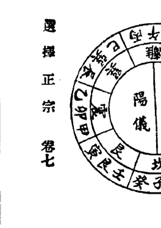

# 選擇正宗

集文書局印行

定價 39.80元

# 選擇正宗

中華民國八十四年四月

定價：三十九元八角

著者：華亭・顧 鍾 秀 鈞 庭

出版者：集 文 書 局

地址：台北市重慶南路一段六七號

電話：三三一七三三四號

郵政劃撥戶：0003144-7 號

發行人：黃 進 長

本書局登記證字號：行政院新聞局版台業字第1073號

版權所有 請勿翻印

## 選擇正宗序

易之為書也。廣大悉備。有天道焉。有地道焉。有人道焉。自太極分而陰陽立。四象成而八卦定。古聖人探賾索隱。以前民用。仰則觀象於天。俯則觀法於地。引伸觸類。參伍錯綜。河洛源流。悉見斯圖。則天文與地理。相為表裏者也。考禮則有辨圭測土之文。詩則有相其陰陽之語。淵源黃石公郭安農獨創新傳。精其學術。厥後如楊曾廖賴諸公。各分門戶。別為深文奧義。言人人殊。迄於今世。遠年湮。學者淺陋。於其精妙處。茫然不知。竊其皮毛。以為道在是矣。以致愈傳而愈失其真。愈傳而愈流於偽。為可慨已。雲間顧篤庭封翁。精於易者也。刪八卦之苞符。測五行之生剋。九宮變化。萬象包羅。溯厥淵源。無他謬巧。不過陰陽交互而已。先生之言。真以一人而通三才之秘者。而又博覽羣書。折衷一是。研究數十年。神而明之。竟採蔣氏真傳。先生亦人傑哉。丁丑春。先生光顧敝署。因病未能接見。且諄諄以選擇正宗一書囑序於余。不敢辭。四五兩月。悉心披閱。書凡八卷。總論則窮源竟委。利用則似佳咸宜。至於年月日表。又徧究乎七政四餘。以為之經緯。凡所宜忌。條分縷析。自成一家言。如暗室燈幃。開覺路。如寶筏渡。立出迷津。其嘉惠於後學者。豈淺鮮哉。余年已及耄。忽忽不知老之將至。及見此書。若有心領神會。頓開茅塞。敬先生其先得我心者歟。光緒三年丁丑夏至前三日。弇山閭維培拜序。

## 選擇正宗自序

婚葬為始終之大事。修造乃居家所必需。郭景純云。地吉葬凶。禍先發。名曰棄屍。福不來。是選擇不善。繼吉壤不能見效。楊筠松云。不得真龍。得年月。也應當富貴旺人家。苟選擇盡美。即頑山亦先發祥。盡地之美惡。應驗遲。而日之吉凶。應驗速。近來選擇家。能將年月日時。造成富貴格局。而又補龍山。相主命。制凶助吉者。不可多得。拘於俗忌。而不避大凶者。亦復不少。非時師之有心誤人。實緣其所習之書誤之也。選擇諸書。是非不一。苟非明師傳授。莫能折衷。求其盡美盡善。可為擇日之指南。選吉之正宗者。莫如協紀辨方一書。但協紀卷帙浩繁。購求非易。然三十六卷中。所當熟讀深思者。盡在二卷利用。謹敬全錄。其餘本原義例。年月日表。宜忌用事。附錄辨偽諸卷。擇其必不可少者。並錄一二。至添註數條。亦因協紀先舉一隅。而反其三隅耳。是編專為地師誤解荒謬起見。所祈勿害世人而設。雖造命制凶之法。未易精通。而當避當趨。不難共曉。某煞必不可犯。某煞猶可制化。何年無妨。何方有礙。自有定憑。則大凶山方。咸知勿造勿葬。而小煞無妨者。亦不得妄稱為礙矣。此摘錄協紀。名為選擇正宗之故也。倘高明之士。精是業者。更有匡其不逮。幸甚。光緒丙子日躔星紀之次。顧鍾秀筠庭氏記。

## 選擇正宗目錄

卷一
總論
嫁娶
辨偽

卷二
利用一
論造命補龍
用盤針
扶山相主
立向
修方

卷三
利用二
年月吉凶神煞
制煞要法
四柱法
用日法

卷四
年表

卷五
月表

卷六
二四五……二九二

卷七
二九三……三二四

卷八
三二五……三八八

日表

宜忌 用事 龍分山水論

立成

- 命貴人命祿命驛馬每年到方表
- 太陽每月到方表
- 太陽每時到方表
- 大將軍每月到方表
- 天官符每月到方表
- 地官符每月到方表
- 大月建每月到方表
- 小月建每月到方表
- 飛大煞每月到方表
- 飛天赦每月到方表
- 子平入門歌訣

# 選擇正宗卷一

華亭顧鍾秀筠庭述

## 總論

一世俗所最畏而不敢犯者。五黃三煞與大將軍。豈知必不可犯者。不在此三者。而在歲破與月破。此二者為最凶之神。不拘在山在方。俱不可犯。造葬犯之。主損財物及害家長。理無制法。即太陽到。亦不能制化。又為大耗。犯之當有寇賊驚恐之事。

五黃中宮屬土。如太歲月建之為土神。不宜動土。捲窩開渠穿井平地基定磉皮築牆腳下椿木。固不可犯。若不動地基而修造。不妨。安葬本不為動土。不忌五黃。若浮屠停柩。更不忌矣。

三煞在坐山。必不可犯。若在向方。猶可制化。欲修三煞方。先從吉方起工。連及三煞方。修造仍從吉方完工。亦佳。故曰三煞可向不可坐。又云若要發修三煞。惟單修三煞方不可。若有制化無妨。

大將軍。若黃申巳亥年。與太陰申客同位。名曰墓醜。略凶。必須真太陽到方到宮。乃可修。若他年。止忌還宮月內。不可修。飛出別卦之月。無妨。此修方神煞。安葬不忌。鼎新起造。名開山立向。亦不忌。若犯他煞。重害家長小口。輕主損畜傷財疾病口舌。至於犯大將軍與犯五黃。主何凶兆。協紀並不言及。可知大將軍五黃。皆非大凶煞。人所畏懼者。未親協紀耳。

一年表所載開山立向修方凶神。修方立向開山者。皆忌也。

太歲。歲破。三煞。坐煞向煞。浮天空亡。

太歲疊吉神則吉。疊凶神則凶。在山在方。皆大凶。若不疊凶煞。則坐太歲與修太歲。亦無傷也。惟太歲在向。即坐歲破。極凶。太歲方疊吉神。宜造葬。宜移徙。宜補葺。皆為修太歲。主吉。若挖窖開池拆毀。乃犯太歲。極凶。月建與太歲相闘。

歲破為最凶之神。無可制化。在山在方。皆不可犯。犯主死亡。且害家長。月歲亦同歲破。

三煞在山。亦不可坐。在向在方。待其休囚之月。用三合局剋之。可也。月三煞略輕。坐三煞之必不可坐也。

犯劫煞。主劫盜傷殺。犯災煞。主疾病。犯歲煞。傷子孫六畜。

伏兵大禍。名坐煞。對宮即向煞。坐煞較三煞次之。向伏兵大禍又次之。兵神無伏。

浮天空亡。乃年家小煞。用天德月德照之。或本命貴人祿馬制之。可用。

一年表所載開山凶神。止忌坐山。修方立向。俱不忌。

年剋山家。陰府太歲。六害。死符。灸退。

年剋。乃造葬年之納音。剋墓運納音。若得正五行八字。合成格局。補龍扶山。納音力輕。自可勿論。家次之。陰府。乃本年之化氣。剋山家之化氣。究之五行之義。當以正五行為本。擇日之道。以補龍造命為主。陰府其義迂遠。可勿拘忌。月陰府更次之。

六害。乃冲所合之辰。亦年家小煞。雖忌坐山。有吉星到。可用。而月害。止忌方。不忌山。

死符。舊歲破也。又為小耗。故忌開山。然亦小煞。取山向三合。用月吉星蓋照到向。照向。便自可用。惟忌營塚墓置死喪。及有穿鑿。犯之者。主有死亡。

灸退。乃不足之氣。主退敗。止忌坐山。不忌修方。宜補不宜尅。然坐山即非灸退。亦宜扶補。不宜尅倒。

一年表所載立向凶神。在山在方。俱不忌。

巡山羅睺。病符。

羅睺逼近太歲。病符為舊太歲。故立向忌之。然皆小煞。有吉星可用。

一修方凶神。不忌開山立向。不忌安葬。

歲破方。斷不可修。太歲有吉神。並可修。三煞起手。速及三煞。可修。

天官符。地官符。白虎。大煞。此四者。為歲三合。若疊凶煞。則為太歲所吊照。其凶有力。故以為忌。若疊吉星。則亦吉矣。或太陽到。或紫白。或於其死月。以天赦日解之。以修主命貴人祿馬臨之。反吉。若以三合局尅制之。則尤伏矣。但不喜其還宮月分耳。

大將軍。忌還宮月分。若飛出別宮。有吉同到。可用。

力士。惟辰戌丑未年。與巡山羅睺同位。太歲同宮。不宜抵向。修造餘年不忌。

蠶室。蠶宮。蠶命。為歲方長生之宮。皆無凶義。應忌於其方修作。蠶室恐傷生氣。若養蠶。則又應為吉方。餘當不忌。

歲刑。六害。太陽六德。可以化之。月刑同月害。對方即太陽。不忌。

黃幡。不可取土開門。豹尾不宜嫁娶。修造。黃幡為歲三合墓地。故忌取土。有天月德到方。不忌。豹尾尤輕。嫁娶上轎下轎忌向之。

喪門。弔客。乃歲破三合之小煞也。三合之沖破則凶。破之三合。未為凶也。如喪門弔客兩方同修。則與歲破合局。沖尅歲君。大忌。若單修一方。則止取吉星蓋照用之。

歲三合月日。惟忌歲破三合月日耳。

飛廉。亦小煞。子丑寅午未申年。同白虎。卯辰巳酉戌亥年。同喪門。當同各煞制之。

獨火。月游火。打頭火。以上火星。諸火同到。則忌。不與諸火會合。亦不忌也。

宜一白水星水德制之。做上制三煞法。用三合局剋制更妙。

金神。制金神之法。以火剋之而已。庚辛干者。為天金神。以丙丁干制之。納音金者。為地金神。以納音火制之。又八節之丙丁奇。或年家之九紫有氣。皆能制之。修作無害。非甚緊煞也。惟巳月金生。申酉月金旺。難制。金神在申西方。謂生旺得地。則必於火旺之月。以寅午戌三合制之。若在午未方。則火地剋之。即不待制。而自可修矣。

五鬼。子午年同官符。丑未年同喪門。寅申年同太歲。卯酉年同太陰。辰戌年同白虎。巳亥年同歲破。

破敗五鬼。以其方沖歲干所納之卦位。謂巽能破敗乾宮之氣。艮能破敗坤宮之氣。於理不可通也。今以舊曆所用。姑存之。實則無所關係。

一飛宮天地官符。飛太煞。大月建。小月建。惟忌還宮之月。餘月有吉星可用。

飛宮自較定位為輕。丙丁獨火。月遊火。諸火會合。則忌。

月厭。歷憲書與天道天德並載。用日兼用方也。惟子午卯酉月。與建破同方。必不可犯。餘月有吉可用。月建可坐不可向。月破可向不可坐。與太歲歲破同。

大月建。小月建。乃月家土煞。然惟子午卯酉年正七月。辰戌丑未年八九月。寅申巳亥年十一月。大月建與本月建同宮。謂之還位。及疊戊己五黃。或入中宮。則不可犯。餘月則有貴人祿馬六德三奇到方。便自可修。

一死符。小耗。歲枝德。此三者同位。而不同凶吉。其營塚墓置死喪及穿鑿。則主死亡。若興販修造。則主遺亡虛驚。偷造橋修堤。損己之財。以利衆人之事。則又主大吉。

一開山立向。與修山修向不同。凡新造為開山立向。不論修方神煞。若舊屋前為修向。則忌立向凶神。兼修方論。向上凶神。止忌太歲三煞。如往屋後為修山。則忌開山凶神。兼修方論。坐山凶神。止忌歲破三煞。若前後還有屋。又兼中宮論。

一修方忌歲破月破方。太歲方疊金神大煞。月建方帶凶煞。此必不可修也。其餘皆可制而修。

修方亦有分別。若屋後止造書房閒屋。則單論修方。若在屋後欲作正寢住房。則以開山立向為主。而兼修方。

一四圍有屋。則中間之屋。皆名中宮。太歲在向。及三煞占山占向。則中宮終年不可修。凡修中宮。忌戊己日。蓋中宮本屬土。又用戊己土日。則助起土煞。不吉也。若辰戌丑未月。尤忌戊己日。

一修造必身命年月方向皆利。則修作吉。如或不利。而不得不作者。則當選居自所遷之處。視所作之方為吉。可也。如年命利作兌。不利作震。則當遷居而東。既居於東。則自其所居。視所作之方。皆為震者。今為兌矣。自此修作。則無不可。此活變趨避之法也。

一作宅據方隅而作。方隅則當用作方法。若開新基立棟宇。或淨盡拆除舊屋而創新居。則當作山法。但論開山立向吉凶神。可勿論。然造作之事。以人家居處為本宮。所居在所作百步外。則新創者。始可用作山法。若所居在作百步內。則雖新創。亦當以作方法論之。如所居雖在所作百步外。但屋宇舊房門廊俱在其宅已定。不過補東而去西。除舊而換新。尚常用作方法。惟不在百步之內。禍福輕耳。

一論方道遠近神煞。京城府州縣。寸金之地。所作之方。但隔街路。作之不妨。如小修葺。並不問吉凶之方。但要吉日。餘即不畏。若是鄉村之地。修方道。或隔大溪水。人不得渡。四時常流。亦不問凶煞。若隔小水溪澗。常流不絕。小煞不妨。若居城市。隔一街巷。三五尺。非自己地者。亦不問方隅神煞。如欲屋近作樓臺廳館。雖是修方道。要有吉神。無凶煞。作之不妨。

一方道遭火後。築七日之內。擇日起工。半月內。擇日豎造。並不問吉凶方道。

大寒五日後。立春前十日內。豎造不忌諸凶神。謂之歲官交承。如已過立春。年月凶神方位已定。不可修作。如方位無凶煞。無妨。安葬亦然。

一清明寒食二日。修墓。或加土。或種樹。或砌祭臺。或破壞修整。宜於寒食清明之間。燭工修作。不論年月神煞。

一論凶葬法。凡人初死。乘凶葬之。雖值凶神。亦不為害。今人盡三日之內。或一旬之內。一太歲以下凶煞甚多。難以盡避。其各神所臨之地。惟奏書博士宜向之。餘各有所忌。須辨生旺休囚。制化得宜。如有破壞。須修營者。以天德歲德月德天德合月德合歲德合天恩天赦母倉所會之辰。併工修造。東則雖本屬空方。猶當有所忌。若本不空。則無論矣。諸皆從太歲而有。太歲既不居本位。則諸神煞皆無矣。甲子東。丙子南。戊子中。庚子西。壬子北。做此。出遊必五日者。天地之數五。已日還位者。蓋子至巳。乃陽氣健旺之辰。陰氣受制於陽。神不敢用事。故假言其出遊耳。

一論作方終始。凡所作止在一宮。選擇固易。如連跨數宮。有吉有凶。則當於吉宮起工。自此連及不利之宮。殊無害也。若興造月日利。而工作未辦。則略起造以應日時。自此接連以作之。固無不可也。及其畢工。須歸福德之方。吉。

一論取土方道。太歲歲破三煞官符大小月建等方。忌取土。若遠隔百步之外。目所不見。則不問方道。

一神煞有大小。故禍福有輕重。義例有云。犯歲破害家長。損物多驚恐。財劫煞劫盜疾。歲煞子孫。大煞刑喪室。不收靈官多病。靈命不收官符詞訟。病符死符修造犯之。主有死亡。金神目諸火星。火災白虎服。飛廉疾疾遺亡。喪門死喪。弔客醫病尋。黃幡豹尾小口。破敗五鬼耗散財物。以上所犯。主遭凶禍之說。協紀亦不以為非。惟洪範篇云。犯金神主兵戈喪亂水旱瘟疫。駁其未必若是之甚。兵戈喪亂水旱瘟疫。豈係一家之犯金神煞所致耶。又以宗鏡為大月建主傷宅長。小月建主傷小兒。此俗術之妄說。不可不信。俗本有云。年剋山家妨宅長。月剋妨宅母。日剋妨子孫。則無稽已甚。不足道也。獨犯太歲月建五黃大將軍。主何凶患。未見明文。蓋太歲君象。其方固上吉之方。而非下民之所敢用。猶月忌日為中宮五黃。民間須避是日者。同一義也。月建疊吉則吉。疊凶則凶。與太歲相同。若大將軍不會太陰。不疊凶煞。則有一二吉星。亦可修造。如安葬本不忌大將軍。若浮厝停柩。更可不忌。

一動土與破土略有不同。破土止宜嗚吠。嗚吠對。動土又宜德合赦願月恩四相時德。三合開日。

動破土忌閉日。重日。月害。月建。土府。月破。半日。收日。劫煞。災煞。月煞。月刑。月厭。四廢。五墓。符地。葬土王用事後。動土因安葬而斬草也。為凶事故忌重日復日。大時。天吏。死氣。松郡安葬破土不用斬草。但用道士祀土祝告。修造亦然。

一葬埋與修造動土亦異。故葬不忌土府。土符地。葬土王用事後。今人有以安葬為犯土礙人者。妄也。

一安葬擇日易。而修造擇日難。葬則不為動土。不忌土煞。又一切修方神煞。概可不論。止忌歲破三煞與死符方耳。且墳墓多在荒野。鄰居較稀。故日易。若修造房屋。神煞不一。先娶造主吉利。又須四鄰無恙為妙。故日難。

一太歲沖壓祭主之年。入殮安葬的呼之日。俗以被壓者避不到山為吉。或將葬而忽又停喪。被呼者畏而迴避。甚至孝子亦不親殯。不臨穴者有之。敗俗傷化。莫此為甚。

一考其所忌之故。又無義理。術士捏造。中之尤不通者。皆屬訛說。切勿拘忌。

一今人擇日。莫不喜黃道。而嫌黑道。然而當觀各神所臨。以定吉凶。神吉雖黑道。亦不為凶。神凶即黃道。亦不得以為吉也。且黃道無專宜之事。黑道亦無專忌之事。六神道。青龍明堂金匱寶光玉堂司命。黑道。天刑朱雀白虎天牢元武勾陳。與吉併。則從所宜。與凶併。則從所忌。黃黑道同。

一天赦日。赦罪宥過之辰也。今人莫不以為大吉。諸事皆宜。凡動土多取天赦。似乎犯土之罪。有天來救。仍若無罪也。豈知細查協紀月表。正月戊寅日。仍忌修造動土。修倉庫置產室開渠穿井安碓磑破土等事。五月甲午日。止宜祭祀。餘事皆忌。十一月甲子日。止宜祭祀沐浴。亦餘事皆忌。然則天赦日。非逐月盡吉也。蓋天赦若與天德月德天月德合天願併。則有宜無忌也。若與凶神併。即不吉。

一重日復日。俗則以為犯此。則致重喪。無是理也。蓋重日者。已亥日也。復日者。正月甲日。二月乙日也。已亥為陰陽盡日。故忌破土安葬。若復日。則皆合星孟仲月。又皆建祿。其吉自無可疑。乃惟此之忌。而不避刑厭三煞之凶。且所宜又止於嗚吠日。而含德赦六合之吉。而不知用。是與嫁娶之僅取不將。而不取德合。惟忌章光無翹。而不忌刑沖破害等也。婚葬爲人事之始終。而論拘忌若此。深爲不便。

一無祿日。星命家謂十惡大敗。甲辰乙巳丙申丁亥戊戌己丑庚辰辛巳。此九日。或天月德併。或歲月填實祿空。或太陽填實。或德合所會。皆不以無祿論。惟癸亥一日。干支俱盡。雖值天月二德。歲月太陽填實。德合所會。仍以無祿論。與上朔晦日同義。

一反支日。惡其將盡也。戊亥朔。本日地支已盡。故初一日即爲反支。申酉朔。初一。午未朔。初三。辰巳朔。初四。寅卯朔。初五。子丑朔。初六。此反支日。止忌上表章陳詞訟。與德合赦願雖併。仍忌。然結婚納財等事。亦屬不宜。以下諸日。皆每年不同。月表萬年書所不能載。臨時選用。

一上朔日。甲年癸亥。乙年己巳。丙年丁亥。丁年癸巳。戊年己亥。己年癸巳。庚年辛亥。辛年丁巳。壬年癸亥。癸年丁巳。按上朔為不吉者。惡其陰陽與德俱盡也。陽盡於亥。陰盡於巳。干盡於十。如甲年以甲為德。甲至癸而十。甲年之癸。而又臨於亥。則癸為德盡。亥為陽盡也。乙年以庚為德。庚至己而十。乙年之己。而又臨於巳。則己為德盡。巳為陰盡也。餘可類推。其以上朔名者。朔有始義。又有盡義。不止忌宴會嫁娶遠行上官。時忌書祭祀外。概不註宜。

一離者。陰陽分至前一辰也。四絕者。四立前一辰也。止不忌祭祀沐浴等事。餘事皆忌。與德合赦願併。猶忌。晦日亦然。晦日雖與上朔同凶。而亦諸事不宜。按上朔為陰陽與歲德俱盡之日。四離四絕為二氣五行分判之日。晦為月盡。故所忌諸事。止不忌祭祀解除。或以祀神而不敢禁。或以除舊而不爲嫌。

一冬至。夏至。春分。秋分。不註結婚納采嫁娶進人口搬移開市立券交易捕捉畋獵取魚。忌伐木。按二至二分之日。陰陽爭。二分之日脈建對。故雖吉日。亦不註此數事。

一土王用事。忌修造動土破土等事。義同土府。然土府止忌一日。而土王用事以後。共忌一十八日。蓋土各旺於四季之末。一十八日。每年共旺七十二日也。

一伏社日。忌沐浴。按沐浴宜申酉亥子日。伏為金伏。是申酉之反也。社為土旺。是亥子之反也。故忌沐浴。

一弦朔望日。忌求醫療病。按朔為日月同度。弦為近一遠三。望為日月相對。猶建破平收之義也。故忌療病。

一長星短星。忌裁衣貿易納財。

一月忌日。每月初五。十四。二十三。此三日。即河圖之中宮。五宮五數。五為君象。故民庶不敢用。又以太歲為堆黃煞。皆避尊也。以卑犯尊。則凶。國家亦不用是日者。國有事。必及臣民。故亦不用也。然而世俗不知避忌。而嫁娶造葬。誤選月忌者甚多。大抵選擇家。不看協紀辨方。但看讜吉便覽耳。盡讜吉凡例云。一俗忌之楊公忌日。紅沙日。月忌日。上元下元四不祥日。九良星日。概屬不經。已奉刪除。不必拘忌。豈知楊公忌等日。果奉刪除。錄入偽卷中。惟月忌日中宮五黃之說。協紀稱其有理。並未刪除。此實讜吉之誤。於是訛傳訛。在選擇家。亦不自知其差誤矣。然而有協紀書為憑。時憲書為證也。協紀雖人家有者甚少。而時憲無處不備。蓋觀時憲於初五十四念三日。有宜嫁娶豎造安葬者乎。不獨一月忌此三日。即月月無不如是。不獨一年忌此三日。即年年亦無不如是。蓋時憲頒行天下。原為便民擇吉而設。今於時憲書所宜者不選。選者不宜。豈不謬哉。

一上朔日。亦不註宜嫁娶造葬等事。月晦日亦然。

一土王用事後。十八日內。不註宜動土等事。

一日食月食日。及前後七日。皆不宜造葬。然日月食。時憲所不載。須買福建繼成堂通書可查。或廣東羅傳烈通書亦可查也。七政四餘在京難買。若用天星擇日。此書必不可少。然福建廣東兩歷書。亦可用也。

一喜神者。見丙也。其日之力。與其時並取利用。然亦須與其他神煞參論。甲己日之得丙寅。固為喜神時矣。而在申。則為日破。又不得以其為喜神而用之也。餘做此。今人嫁娶修造。用喜神方與喜神時者。十有八九。然貴人較喜神尤吉也。蓋貴人為吉神之首。至靜而能制蠢動。至尊而能鍊飛浮。晝用陽貴。夜用陰貴。晝夜之分。自當以日出爲晝。日入爲夜也。若貴人登天門時。乃時之最善者也。四大吉時次之。日祿日合日建時吉。日破最凶。日刑日害次之。總之日時吉凶。皆以生旺為主。當與宜忌參看。至以年時合成八字。則又非宜忌之所能盡也。

### 嫁娶

從來選擇造葬之日難。嫁娶之日易。蓋造葬要補龍扶山相主造命。又要不犯神煞無礙。八方至於嫁娶。但論日時。不重年月。惟周堂不值夫婦。迎娶往來。不可抵向太白而已。然近時人家迎娶。誤用凶日者不少。皆由時師只知大利月為吉。陰陽將為凶。合德合赦願之真吉。而不知用。惟忌章光無翹之假煞。反不避刑沖破害之大凶。豈知大利月及章光等。皆術士所捏造。不足憑信。協紀已奉刪除也。今將協紀所論真吉真凶。彙錄於左。俾嫁娶者盡得趨吉避凶。而選日者不致自誤誤人矣。

### 結婚姻

宜天德月德天德合月德合天赦天願月恩四相時德民日三合天喜六合五合。

忌月建月破平日收日滿日閉日劫煞災煞月煞月刑月害月厭大時天吏四廢四忌四窮四窮第五墓五離八專。

### 納采問名

行聘云。

宜天德月德天德合月德合天赦天願月恩四相時德民日三合天喜。

忌月建月破平日收日滿日閉日劫煞災煞月煞月刑月害月厭大時天吏四廢四忌四窮。

忌同結婚姻。

### 嫁娶

宜天德月德天德合月德合天赦天願月恩四相時德民日三合天喜六合不將。

忌月破平日收日閉日劫煞災煞月煞月刑月害月厭厭對大時天吏四廢四忌四窮五墓往亡八專亥日。

又忌每月初五日十四日二十三日。此三日乃月忌也。諸事不宜。不獨結婚嫁娶納采問名。無宜造葬婚嫁等事。故時憲書於此三日下。並大月三十日。小月二十九日為月晦。諸事不宜。

### 周堂

## 選擇正宗 卷一

欲避太白游方，須問男女兩家居住何處。如居東西，則初一、十一、廿一與初五、十五、廿五此數日不可用。

乾隆五年七月二十五日，大學士伯鄂爾泰等會議題奏云：嫁娶周堂、太白游方爲是，請刪去之處無庸議。婚嫁擇吉之用，雖無甚義理，而歲在時憲書，民俗便安，難行已久，應將莊親王等奏是請刪去之處無庸議。

太白逐日遊方，迎婚嫁娶往來不宜抵向。

廿八北，廿九中，三十天，初八東，初九中，初十在，十一東，十二南，十三南，十四南，十五西，十六西，十七北，初一正，初二東，初三正，初四西，初五正，初六西，初七正。

附錄云：周堂如值翁姑，新人入門時俗有從權出外稻避，候新入坐牀後，翁姑方可回家。帝出乎震，齊乎巽，相見乎離，同此義也。

### 周堂

每月：

初一、初二、初三、初四、初五、初六、初七、初八

十一、十二、十三、十四、十五、十六、十七、十八

廿一、廿二、廿三、廿四、廿五、廿六、廿七、廿八

三十一、三十二、三十三、三十四、三十五、三十六、三十七、三十八

大月值夫，小月值婦，此七日不用。

大月值婦，小月值夫，此三日有翁者不用。

大月值姑，小月值翁，無姑者可用。

大月值翁，小月值姑，無翁者可用。

大月值堂，小月值第，無堂者可用。

大月值第，小月值堂，無第者可用。

大月值竈，小月值廚，無竈者可用。

大月值廚，小月值竈，無廚者可用。

擇第堂廚竈日用之，如值翁而無翁者可用，姑者亦可用。

夫、婦、翁、姑、堂、第、竈、廚

婦、夫、姑、翁、第、堂、竈、廚

二〇

## 選擇正宗 卷一

豹尾所在方，嫁娶往來不宜抵向。

申子辰年方戊，巳酉丑年方未，寅午戌年方辰，亥卯未年方丑。

嫁娶非忌其方，惟上轎下轎忌向之。如男女宅南北向與東西屋，則不忌。惟乾巽艮坤向之屋，則不可向。新人登轎出轎時，將絲轎稍偏可也，然亦小煞不甚忌也。

冬至、夏至、春分、秋分，二至之日陰陽爭，二分之。

四離：秋分前一日，冬至前一日，夏至前一日，春分前一日。

四絕：立春前一日，立夏前一日，立秋前一日，立冬前一日。

上朔：庚甲年己亥，辛年乙巳，壬年丙午，癸年丁未，戊年癸亥，己年丁巳。

按：上朔為陰陽與歲德俱盡之日，四離四絕為二氣五行分判之日，晦為月盡之日，故諸事不宜。

氣往亡：立春後七日，小寒後十二日，大寒後十四日，立春後七日。驚蟄十四日，清明二十一日，立夏後八日，芒種十一日。白露十八日，寒露二十七日，立冬後十六日。

按：上朔日，陽年以年干加寅順數至亥，陰年以年干加丑順數至巳。按年不同，二分二至四離四絕氣往亡日，隨節氣月朔而起，不能定局，臨時查明避用。大雪二十位，小寒三十沉，立春初七日，皆自交節日數之。如正月初一日立春，初七日即氣往亡。

日游神所在之方，不宜安產室設牀帳。

每遇癸巳、甲午、乙未、丙申、丁酉日，在房內北。戊戌在房內中。己亥在房內東。庚子在房內北。辛丑在房內中。壬寅在房內東。癸卯在房內北。甲辰在房內中。乙巳在房內東。丙午在房內北。丁未在房內中。戊申在房內東。己酉在房內北。庚戌在房內中。辛亥在房內東。壬子在房內北。癸丑在房內中。甲寅在房內東。乙卯在房內北。丙辰在房內中。丁巳在房內東。戊午在房內北。己未在房內中。庚申在房內東。辛酉在房內北。壬戌在房內中。癸亥在房內東。

以上十六日不宜安產室設牀帳。若日游在房內北，則房之南尚屬不妨。

惟子、乙丑、丙寅、丁卯、戊辰、己巳、庚午、辛未、壬申、癸酉、甲戌、乙亥、丙子、丁丑、戊寅、己卯、庚辰、辛巳、壬午、癸未、甲申、乙酉、丙戌、丁亥、戊子、己丑、庚寅、辛卯、壬辰、癸巳、甲午、乙未、丙申、丁酉、戊戌、己亥、庚子、辛丑、壬寅、癸卯、甲辰、乙巳、丙午、丁未、戊申、己酉、庚戌、辛亥、壬子、癸丑、甲寅、乙卯、丙辰、丁巳、戊午、己未、庚申、辛酉、壬戌、癸亥，此四十四日，在室猶鶴神之在天，亦此四十四日。庚考其意，確有至理，蓋即天罡煞氣之游行耳。以上數條為嫁娶所忌者，時憑書上一一載明。

安牀：宜危日（非危宿），忌月破、平日、收日、閉日、劫煞、災煞、月煞、月刑、月厭、大時、天吏、四廢、五墓、申日。

## 選擇正宗 卷一

嫁娶必穿吉服作樂，應避國忌日。忌辰須穿素服，禁止作樂。（按現在民國並無國忌，可以不避）

| 月份 | 日期 |
|---|---|
| 正月 | 初七、十四、廿三、廿九 |
| 二月 | 初七、廿一、廿六 |
| 三月 | 初十、廿七 |
| 四月 | 廿九 |
| 五月 | 初三、十三 |
| 七月 | 初九、十七、廿五 |
| 八月 | 初九、廿三 |
| 九月 | 廿七 |
| 十一月 | 十三 |
| 十二月 | 初五、廿五 |

此國忌日，時憲書不註嫁娶，欲人避選忌辰耳。照禮而論，考妣忌日、祔考妣忌日，謂之家忌，亦宜避用爲是。

男女開面，俗體要向喜神方（寅人方尤吉，亦可用）。

| 日干 | 方位 |
|---|---|
| 甲日 | 東北寅 |
| 乙日 | 西北戌 |
| 丙日 | 西南申 |
| 丁日 | 正南午 |
| 戊日 | 東南辰 |
| 己日 | 東北寅 |
| 庚日 | 西北戌 |
| 辛日 | 西南申 |
| 壬日 | 正南午 |
| 癸日 | 東南辰 |

迎花燭，人生年要與夫婦生年不沖。挑方巾，人生年要與新人生年不沖。嫁娶日要與夫婦生年不沖。嫁娶年月日時四課亦不宜沖。以上皆喜合嫌沖，合者聚也，沖者散也。婚姻欲其和合爲妙，故忌相沖。貪合忘沖，若其日甚吉，而與男女命相沖，要年月時或與命三合六合，即爲貪合忘沖。或與沖命之地支三合六合亦可。凡生命最忌年沖，月沖次之，時沖日沖略輕。今人但論沖日而不論沖年者，未見協紀耳。

男婚女嫁忌年。男厄年。女產年。此男起未順行，女起卯逆行，何以爲忌，實無意義。又以季分日爲吉，以天纂地纂反。

| 生命 | 地支 |
|---|---|
| 子午丑未寅申卯酉辰戌巳亥 | 未丑申寅酉卯戌辰亥巳子午 | 卯酉寅申丑未子午亥巳戌辰 |

## 選擇正宗 卷一

二五

## 選擇正宗 卷一

自殺同床煞日爲凶。協紀云：術士好奇而嗜利，譫言繁興，其謬說流傳民間者，耳目難周，即所親聞，亦難盡駁。

## 辨男女合婚大利月之偽

陰陽家言多病迂泥，術士捏造益屬荒唐，而惑世誣民，則未有如合婚大利月之尤甚者。夫婦之道，人倫之始，書載釐降，詩詠關雎，未嘗有合婚之說也。詩曰：士如歸妻，迨冰未泮。禮曰：仲春之月，令民會男女。未嘗有大利月之說也。即祿命之法，以人生年月日時去留舒配，推人壽夭窮通，亦未嘗有以男女年月定妨妻妨夫之說也。爲是說者，不知其所自起，而皆託於呂才。觀呂書，呂才傳其於陰陽術數辨駁甚詳，則其爲術士之偽託無疑也。今取其說而論之。

三元九宮者，乃年九星入中之一星，非謂其年之生命即在是宮也。由年而衍之於人，由男而衍之於女，已屬展轉支離。而又以地理家游年變卦之法，兩宮相配以定吉凶，無論比擬非倫，且地理專取淨陰淨陽，而婚姻則取陰陽配耦，是葬之所謂吉，正婚之所謂凶，更屬顯然背謬。又況世傳九星，誤以上元爲中元，至康熙五十六年改正，則宮已非其宮，而卦亦非其卦。然則世之恫恫焉據以爲拘忌者，誠不啻謬以千里也。

孤辰寡宿者，乃由奇門孤虛之法而推衍之，而荒誕無義理。奇門以旬空爲孤，其對爲虛。又有年孤、月孤、日孤、時孤，乃年月日時後二辰。如子年月日時，則戌亥爲孤辰，已爲虛，皆以方位言也。通書以孤辰寡宿日，以前一辰爲孤辰，令後一辰爲寡宿。如寅卯辰春令，已爲孤辰，丑爲寡宿，即孤意孤即虛意，已屬無稽。然一月止忌一日，其害猶小。而合婚者乃謂亥子丑年正月生男命爲孤辰，主妨妻；九月生女命爲寡宿，主妨夫。蓋因兵書有云：背孤擊虛，一女可敵十夫。術士遂捏爲寡孤之名，而以妨夫妨妻爲說。夫以三年而生一月之內，合諸日時命以干計，而謂其皆妨夫妨妻，雖三尺童子亦不信也。

胞胎相衝者，寅申年忌巳亥月，卯酉年忌子午月。蓋術家以隔三爲破，猶建除之平收也。夫隔三之義，月日則然，而亦非盡以爲忌。況男年與女月，女年與男月，了不相干，何破之有？俗術因產厄之可畏，而捏此名以嚇人，誠可惡也。骨髓破取本生年月與胞胎同，而或平或收，又非魁罡之義。鐵掃帚既取三合，而水局取衰病月，金局取冠帶與衰月，火局取臨官與死月，木局取帝旺與胎月，參差不倫，此必傳寫之訛。無端而加以掃破之名，當亦不能自爲之說也。

年月六害，祿命不忌，且年月非夫婦，何以遂爲不和之占？假令年月相衝，又當作何論斷？此不待辨而知其非也。

四敗生命，既非本於五行，又無取於三合，其月分更無例可推，而謂男女生月犯之多啾唧，殊無謂也。

至於男命以干剋者爲妻，女命以剋干者爲夫，乃祿命之法，論日干非論年納音也。術士從而衍之，以男女生命納音爲主，男取剋音之所剋爲妻，女取剋音者爲夫。自長生至衰爲益財，自病至養爲退財，絕爲醮寡，死墓爲多厄，死墓絕爲妨妻妨夫。如水命男以火爲妻，火生於寅而衰於未，故正月至六月生爲益財；病於申而養於丑，故七月至十二月生爲退財；絕於亥，故十月生爲望門鰥；死於酉，墓於戌，故八九月生爲妻多厄，而八九十月生又爲死墓絕妨妻。又如水命女以土爲夫，土長生於申而衰於丑，故七月至十二月生爲益財；病於寅而養於未，故正月至六月生爲退財；絕於巳，故四月生爲望門寡；死於卯，墓於辰，故二三月生爲夫多厄，而二三四月生又爲死墓絕妨夫。五音之命名，十二年三月之中計二萬五千九百二十命，六月之中計五萬一千八百四十四命，無論何日何時，而謂生此三月之內皆妨妻妨夫，此六月之內皆退財，固萬萬無是理也。至於男之益財，金命十月誤起七月，土命七月誤起五月；女之益財，火木金命皆差早一月，死墓絕妨夫誤與男命同，則傳寫之訛更不足辨。世人不察其所以然之故，惟聽術士之說，一一求其悉合，多至逾時不得婚嫁。噫！俗術之害何至此極耶？然合婚之說，北方世俗用之，士大夫及南方皆不深信。

行嫁大利月，舉世用而不辨其非，而不知其所謂大利月者，固術士之捏造而無理之甚者也。其法以女命爲主，子寅辰午申戌六陽年，自本命前一月向前順數；丑卯巳未酉亥六陰年，自本命後一月向後逆數。第一月爲大利，第二月妨媒氏首子，第三月妨翁姑，第四月妨女父母，第五月妨夫，第六月妨本身。至第七月又復一轉。夫第十二月爲女本命，第六月爲本命之衝，雖選擇無忌地支一字之理，而猶有可言。陽前陰後一月，又何取以爲大利耶？且第一利矣，以次而推，何由而妨媒氏？何由而妨翁姑？何由而妨父母？何由而妨夫婿？求之陰陽五行、九宮八卦、堪輿建除、叢辰之說，無一可通。此時者比比皆然，故曰惑世誣民之尤甚者也。今已奏准刪除，觀者當自知辨。

## 辨四不祥

通書以每月初四、初七、十六、十九、廿八此五日，謂之四不祥，忌嫁娶。蓋以隔三爲破，對七爲衝，乃月朔地支衝破之日，猶建除家之平破日也。古者以月朔爲吉月，故術士遂以沖破之日爲不祥。然日統於月，月建當令，氣旺故以沖破爲凶。若月朔亦月中之一日耳，餘日干支無與月朔沖破之理，則四不祥之名亦附會支離之甚者也。今刪去不用。

## 辨紅沙

孟月酉，仲月巳，季月丑，爲紅沙日，忌嫁娶。按紅沙即身壬煞，儲華谷以爲極數，然驛馬亦是極數，是不得以極爲凶也。今已刪不用。

## 辨章光無翹

月厭前一辰爲章光，後一辰爲無翹，亦是後人附會耳。無翹即太陽，且日辰非同方位，比連無前後並忌之理。別本又以厭後爲金烏，厭前爲玉兔，並爲歲神吉方。然方且不忌，何況於日？曹震圭謂章光者，能爲月厭章顯其光，故凶。將又謂月厭能太陽章顯其光，而以爲吉也耶？

## 辨天狗

嫁娶最忌月厭，月厭正從戌起，戌爲狗，術士遂以爲天狗命之。夫月厭寅月起戌，戌則屬狗；若卯月即居酉位，而爲難。以此遂以天狗命之，已屬可笑。又以此硬配頭尾口腹，背是成一天狗，而定生子之年分妨夫妨小姑之占斷，謬妄極矣。且小姑無子與新婦無涉，蓋里巷小民之情，小姑者老婦之所鍾愛，而春月行嫁，臘月生子，新婦有越禮之疑，故以小姑無子爲凶，而以當年無子爲吉也。術士苦心侮弄鄉愚，良可悲歎。

# 選擇正宗卷二

華亭顧鍾秀筠庭述

## 利用一

選擇之道，有體有用。龍山方向之一定者，體也；年月日時之無定者，用也。補龍扶山，制凶助吉，以無定而合有定者，用之體也；吊替飛宮，合局相主，以無定而合無定者，用之用也。錯綜參伍，精義入神，庶足前民而利用。

### 選擇要論

選擇宗鏡曰：楊筠松曰：年月要妙人知，少年月無如造命法。吳景鸞曰：選擇之法，莫如造命，體用之妙，可奪神工。郭景純曰：天光下臨，地德上載，藏神合朔，神迎鬼避。此十六字至精至微，即造命體用之謂也。蓋藏神者，收藏地中元神，其法選成四柱八字，支干純粹，成格成局，於以扶補龍氣，則地脈旺盛而上騰於墳宅之中，所謂藏神，所謂地德上載，造命之體也。合朔者，取初一日太陽太陰合照之義，舉一以該百也。其法取三奇三德、金水紫白、貴人祿馬到山到向，自然吉慶。所謂合朔，所謂天光下臨，造命之用也。然使犯動凶煞，則禍且隨之，亦屬無益。又必於年月之內，推求山向吉神相迎，一切歲破、三煞、陰府等項盡行退避，不相干犯，乃爲全吉。則神迎鬼避之說也。此又體中之最緊者。體用兼全，上也；不然，寧舍用而取體。每年之中，有吉神凶神焉，有吉星凶星焉，二者不同，不可不辨。

神隸於地，或吉或凶，隨太歲之所指揮而已。蓋太歲君也，其分最尊，其力最大。二十四山，其與太歲相喜相合，及爲太歲之所生扶者，即爲吉神。故凡歲德、歲德合、歲祿、歲馬，總之與歲君相得，故吉也。其與太歲相衝相闘，及爲太歲之所剋制者，則爲凶神。故歲破者，太歲所對衝而破也；三煞者，太歲所殺之三方也；陰府者，太歲之化氣剋山化氣也；年剋者，太歲納音剋坐山本墓納音也。此皆受剋於太歲，而不可犯之者也。臨官方爲天官符，主官訟；帝旺方爲打頭火，主火災。此太歲有餘之氣也，故宜三合局剋之。死方爲六害，爲災煞，主退敗。此太歲不足之氣也，故宜三合局補之。又以歲干起五虎，遁至戊己方爲戊己煞，庚辛方爲天金神，丙丁方爲獨火。以上神煞，總之隨歲君而轉移。其餘紛紛神煞，不從太歲而起者，皆後人之所添設者也。內惟歲破最凶，例無制法；三煞亦大凶，不可輕犯。其餘凶煞，俟其休囚之月，而以四柱制化之可也。若不知制化之法，則寧避之。此神迎鬼避之大略也。

星運於天，七政中之日月金水，四餘中之紫氣月孛，及八節之三奇、紫白祿馬，皆吉星也。丙中日最尊，月與三奇紫白祿馬次之。月令爲權要之官，其所沖者爲月破，所剋者爲月陰府，爲月剋山家，與年家之歲破、陰府、年剋同也。月家之土煞爲大月建，小兒煞與年家戊己同也。惟六月建更凶，此月家真凶神也。本月之旺方爲金匱星，臨官帝旺之間爲月德，相合之方爲月德合。正丁二坤之類爲天德，相合之方爲天德合。此月家真吉神也。

天星可以降地曜，然天星清，地煞力猛。若犯三煞、陰府及月家之大月建、小兒煞，則太陽到亦不能制，況他星乎？大煞避之，中煞制之，小煞不必論也。但得八字停當，照臨自然貞吉。

修凶禍猛，不如修吉之穩。然修吉如修太歲方、三德方、本命貴祿方、食祿方，必取吉方旺相之月，而以四柱扶補之，則吉者愈吉矣。修凶如修三煞方、官符方、金神方，必俟凶方休囚之月，而以八字剋制之，則凶者亦吉矣。修吉要扶得旺，制凶要制得伏。如本命祿馬貴人飛到山向，最吉，亦可降中下等煞。

二十四山無吉凶，聽太歲以吉凶而已。不從太歲起者，皆偽造也。六十日亦無吉凶，聽月令以吉凶而已。日統於月，爲月之所合所生者，及與月令同旺者，乃真吉日，如旺日、相日、月德日之類也。日支干爲月之所剋所衝，及休囚而不當月令者，乃真凶日，如破日、四廢之類是也。其不從月令起者，皆偽也。

楊筠松《疑龍經》已及造命體用之繁，而《千金歌》言言名理，愈說愈佳，真千古日家之指南車也。嗣是曾文辿、陳希夷、吳景鸞、廖金精以及後來名術，一切葬課皆以扶龍相主爲宗。其修吉方，則曲盡扶吉之法；其修凶方，則曲盡制凶之法。取而玩之，無不鑿鑿有理。通書未有及此者也。造命之法：一來龍何局以補之；二看山向何煞宜避，何煞可制，以何法制之，取何吉星照之；三看主人本命宜何如以扶之。三者俱得，而後舉事，吉無不利矣。至於修吉方，則擇吉方旺相之月而扶持之，如培植善類也；修凶方，則擇凶方休囚之月而剋制之，如收降盜賊，必我強而彼弱，乃爲我用也。彼選定八字，不問龍山主命而概施之，乃假造命也，於古法天淵矣。

### 楊筠松造命歌 又名千金歌

天機妙訣值千金，不用行年與姓音。但看山頭併命位，五行生旺好推尋。

此造命之綱領也。行年如幾十歲之類，姓音即五姓修宅也。世俗以二者分吉凶，謬甚，故不用也。山頭乃來龍入首一節及坐山也，命位即五虎遁納音是也。山命所屬五行，合年月日時有生旺，如併取天干合格局，合局大吉。

一要陰陽不溷雜，二要坐向逢三合，三要明星入向來，四要帝星當六甲。四中失一還無妨，若是平分便非法。

一論龍之淨陰淨陽。先龍單指入首結穴一節之脈，非坐山也。乾坤乙坎癸申辰、離壬寅戌十二來龍屬陽，宜立陽向，用申子丑寅卯辰巳午未申酉戌亥陰陽日時也。反此則爲混雜不吉。然古人丁巳丑十二來龍屬陰，宜立向用申子辰者。

丙辛亥未見丁巳丑十二來龍屬陰，宜立向用申子辰者。

庚亥未見丁巳丑十二來龍屬陰，宜立向用申子辰者。

震庚亥未見丁巳丑十二來龍屬陰，宜立向用申子辰者。

辛亥未見丁巳丑十二來龍屬陰，宜立向用申子辰者。

丙亥未見丁巳丑十二來龍屬陰，宜立向用申子辰者。

乙亥未見丁巳丑十二來龍屬陰，宜立向用申子辰者。

甲亥未見丁巳丑十二來龍屬陰，宜立向用申子辰者。

癸亥未見丁巳丑十二來龍屬陰，宜立向用申子辰者。

壬亥未見丁巳丑十二來龍屬陰，宜立向用申子辰者。

辛亥未見丁巳丑十二來龍屬陰，宜立向用申子辰者。

庚亥未見丁巳丑十二來龍屬陰，宜立向用申子辰者。

己亥未見丁巳丑十二來龍屬陰，宜立向用申子辰者。

戊亥未見丁巳丑十二來龍屬陰，宜立向用申子辰者。

丁亥未見丁巳丑十二來龍屬陰，宜立向用申子辰者。

丙亥未見丁巳丑十二來龍屬陰，宜立向用申子辰者。

乙亥未見丁巳丑十二來龍屬陰，宜立向用申子辰者。

甲亥未見丁巳丑十二來龍屬陰，宜立向用申子辰者。

癸亥未見丁巳丑十二來龍屬陰，宜立向用申子辰者。

壬亥未見丁巳丑十二來龍屬陰，宜立向用申子辰者。

辛亥未見丁巳丑十二來龍屬陰，宜立向用申子辰者。

庚亥未見丁巳丑十二來龍屬陰，宜立向用申子辰者。

己亥未見丁巳丑十二來龍屬陰，宜立向用申子辰者。

戊亥未見丁巳丑十二來龍屬陰，宜立向用申子辰者。

丁亥未見丁巳丑十二來龍屬陰，宜立向用申子辰者。

丙亥未見丁巳丑十二來龍屬陰，宜立向用申子辰者。

乙亥未見丁巳丑十二來龍屬陰，宜立向用申子辰者。

甲亥未見丁巳丑十二來龍屬陰，宜立向用申子辰者。

癸亥未見丁巳丑十二來龍屬陰，宜立向用申子辰者。

## 選擇正宗 卷二

三九

子丑寅卯辰巳午未申酉戌亥陰陽日時也。反此則爲混雜不吉。然古人丁巳丑十二來龍屬陰，宜立向用申子辰者。

丙辛亥未見丁巳丑十二來龍屬陰，宜立向用申子辰者。

庚亥未見丁巳丑十二來龍屬陰，宜立向用申子辰者。

震庚亥未見丁巳丑十二來龍屬陰，宜立向用申子辰者。

辛亥未見丁巳丑十二來龍屬陰，宜立向用申子辰者。

丙亥未見丁巳丑十二來龍屬陰，宜立向用申子辰者。

乙亥未見丁巳丑十二來龍屬陰，宜立向用申子辰者。

甲亥未見丁巳丑十二來龍屬陰，宜立向用申子辰者。

癸亥未見丁巳丑十二來龍屬陰，宜立向用申子辰者。

壬亥未見丁巳丑十二來龍屬陰，宜立向用申子辰者。

辛亥未見丁巳丑十二來龍屬陰，宜立向用申子辰者。

庚亥未見丁巳丑十二來龍屬陰，宜立向用申子辰者。

己亥未見丁巳丑十二來龍屬陰，宜立向用申子辰者。

戊亥未見丁巳丑十二來龍屬陰，宜立向用申子辰者。

丁亥未見丁巳丑十二來龍屬陰，宜立向用申子辰者。

丙亥未見丁巳丑十二來龍屬陰，宜立向用申子辰者。

乙亥未見丁巳丑十二來龍屬陰，宜立向用申子辰者。

甲亥未見丁巳丑十二來龍屬陰，宜立向用申子辰者。

癸亥未見丁巳丑十二來龍屬陰，宜立向用申子辰者。

壬亥未見丁巳丑十二來龍屬陰，宜立向用申子辰者。

辛亥未見丁巳丑十二來龍屬陰，宜立向用申子辰者。

庚亥未見丁巳丑十二來龍屬陰，宜立向用申子辰者。

己亥未見丁巳丑十二來龍屬陰，宜立向用申子辰者。

戊亥未見丁巳丑十二來龍屬陰，宜立向用申子辰者。

丁亥未見丁巳丑十二來龍屬陰，宜立向用申子辰者。

丙亥未見丁巳丑十二來龍屬陰，宜立向用申子辰者。

乙亥未見丁巳丑十二來龍屬陰，宜立向用申子辰者。

甲亥未見丁巳丑十二來龍屬陰，宜立向用申子辰者。

癸亥未見丁巳丑十二來龍屬陰，宜立向用申子辰者。

## 選擇正宗 卷二

人沾福澤。既解天機字字金精微選擇可追尋。不然背理庸士術執著浮文枉用心。字如金真可誇。會使天機錦上花。不得真龍得年月。也應富貴旺人家。此申結上文以補造。法為主也。因龍山屬何五行。而以四柱補之。則可以擊神功改天命。此之謂山家造命之法。全在合格局矣。龍為主也。蓋從山脈而造富貴。非四柱之能自造也。則能以上所云。如金水二星亦喜到山到向。蓋天之明。故不可用金清水秀。二星獨若與日月同到山向。謂之金水扶日月。大。藏山向之兆也。此惟臺曆可查。太陽照臨謠言之首。必以臺曆日曜宮度為真。得太陽矣。吉凶之兆。此日月金水奇德祿馬貴人。皆助福之星。非發福機。又得真太陰同山向福澤尤厚。然此日月金水相則發休囚則不發。此星在吉課以生扶之。本也。隔之太陰本在坐下山脈山脈旺相則補脈不起。雖不發。亦無蓋明體無為重用。天干地支得純人扶不起。不可大支干無缺。蓋明體無為重用。之人輕也。人悟得此義。故再丁寧曰。不可坐下支干缺。蓋明體無為重用。論年月之生龍妙。古人云。某山宜某年。又云某日大葬。某日大葬。龍山受剋主命休囚。美何登之有。末四句復深自警。

### 又歌

方方位位煞神臨。避得山過向又侵。只有山家自旺處。天機妙訣好留心。支如不合干。中取迎福消凶旺處尋。任是羅喉陰府煞。也須藏伏九泉陰。二十四方位神煞。占犯最多。避得年煞。又有月煞。

### 疑龍經

大凡修造與葬埋。須將年月星辰排。地吉葬凶禍先發。名曰棄屍福不來。此是前賢景。純說景純雖說無年月。後來年月數十家。一半有頭無尾結。大抵此文無十全。一半都。是俗人傳不是青囊起鬼卦。便是三元通甲鈐祿馬騰兼氣耀六壬局與通天竅裝。成圖局號飛天飛天名出何人造云是祖師口訣傳金盤圖是左仙錄雷霆九劫號昇。元坤鑑黃羅并武曲催官使者大單于鼓角喧傳為第一統例一百二十家九十六家。年月要問之一一皆通曉飛度星辰說元妙試令選擇作宅墳福未到時禍先到不知。年月有元機年月要妙少人知年月無如造命法裝成好命令人為吉人生時得好命。一生享福兼富盛不獨己身富貴高奕世雲礽沾餘慶我因歷數攷諸天元象幽微萬。萬千星到曉時次第沒只有陽烏萬古全太陰因日有盈缺不比太陽常麗天請君專。

得月煞。又有日煞。且山利向又不利。向利山又不利。難得全吉。只取本山來脈自旺處。得合有氣更四柱干支乘時旺相。如坐山得干。取天干一氣。或堆祿堆干。坐山得支取。和地支一氣。或三合月日時。此旺處。彼衰。凶煞自伏。是為天機妙訣。

用太陽照三合對宮福祿堅更看素曜在何處福力却與太陽兼金水二星并紫氣月字同用又無嫌周天本是十一曜只嫌逆伏災災右經詳言諸家挑起無如造命之格成局扶龍相主所謂裝成好命也八字既好乃取吉星以照臨之日最宜到向也三合亦吉或與山三合或與向三合也月次之五星中金水二星吉土木二星掩蔽光明火星燥烈皆凶也四餘中惟紫氣最吉月孛柔星遇吉則吉遇逆伏則凶故曰同用無嫌蓋與日月金水同用也火羅土計皆凶七政四餘共十一曜若過逆伏則凶者愈凶吉者亦凶矣

### 論造葬

造葬二者乃選擇之大端不可不慎重之如何曰合造命之體用而已然豎造與葬地亦略不同葬以補龍為主而山向亡命次之造以山向主命為重而補龍次之蓋葬乘生氣生氣旺而體自煖雖山向與亡命不甚全利亦無妨也若修造則斧斤震動且曠日持久偷山向不空主命受剋不敢妄議興舉况入宅禍福皆論坐山乎

### 論正五行生旺取用

五行生旺各有其時惟土三等有陰有陽有半陰半陽艮土屬陽坤土屬陰辰戌丑未隸中宮辰戌屬半陽丑未屬半陰艮旺立春之先坤旺立秋之後四墓於四季之下各旺一十八日此土之墓也

木山春旺。除土旺一十八日之外。惟七十二日。又以冬至後一陽生處互論。自冬至至春分為正氣得令。自立春至清明為旺氣化令。自立春至穀雨為進氣向令。自立春至立夏為正氣得令。自立夏至芒種為旺氣化令。自立夏至小暑為進氣向令。自立夏至夏至為正氣得令。自夏至至處暑為旺氣化令。自夏至至秋分為進氣向令。自夏至至立秋為正氣得令。自立秋至霜降為旺氣化令。自立秋至立冬為進氣向令。自立秋至冬至為正氣得令。自冬至至大寒為旺氣化令。自冬至至立春為進氣向令。

火山夏旺。金山秋旺。水山冬旺。為正氣得令。自立春至穀雨為進氣向令。自立夏至大暑為旺氣化令。自立秋至霜降為進氣向令。自立冬至大寒為旺氣化令。自立春至立夏為正氣得令。自立夏至立秋為旺氣化令。自立秋至立冬為進氣向令。自立冬至立春為旺氣化令。自立春至清明為正氣得令。自立夏至小暑為旺氣化令。自立秋至立冬為進氣向令。自立冬至立春為旺氣化令。

凡化令乃他山進氣之時剋擇之法務以財祿培根乃為中和若以官旺加之則太旺而反危矣

用日之法向令取其生氣得令用其胎養氣化令取其財源便自妙理如春月清明前後作寅山為化令取甲日用之為甲祿在寅財者四墓并納音土也又如得令向令不同進氣化令有異如春震山甲乙輔之甲向冬至而生旺震向春分而正旺乙向清明而化旺剋擇之法取其將化者補以財祿正旺者培以根元向旺者益以胎息損益得

### 論補龍 造葬同

邱平甫曰先觀風水定其蹤次看年月要相同吉凶合理參元妙好向山家覓旺龍

先擇吉地次擇吉年月日時以補龍千古不易之論

凡入其鄉而星峰奇特龍神秀拔富貴無疑入其鄉而山岡撩亂龍神卑弱貧賤無疑

禍福之本總屬之龍擇日而不補龍又何必擇知補龍之說而此道之元樞得矣

凡補龍不論單以到穴之小脈為主以正五行論生剋日時四柱生扶之則吉剋洩之則凶

不問陽宅陰地至結穴處必有一線小脈細細察定即以羅經格之屬木則用亥卯未局屬水土則用申子辰局屬金則用巳酉丑局屬火則用寅午戌局或印局生之亦可

龍雄帶煞者宜用財局

山谷陰地聳起開窩者近穴止有圓氈無小脈圓氈若厚非脈也宜於山後蜂腰處審

而補之

凡省城府縣非午向則丙丁向其午向者必壬子癸龍也其丙丁向必亥艮龍也俱宜申子辰局但正脈已結衙署矣民居或東或西皆脈上枝分橫來者不知屬何五行只以補山為主自此以外則皆補脈而陰地尤緊蓋乘一線之生氣也

龍之衰旺全看月令故補龍者必於三合月或臨官月墓月亦作旺月非衰病死之例也蓋丑宮有辛金未宮有乙木辰宮有癸水戌宮有丁火固知四墓之旺而非衰也故三合局用之

凡補龍全在四柱地支蓋天干氣輕地支力重也有以地支一氣補者如卯龍用四卯之類極妙但難取十餘年始一遇而又或月家日家山向不空其可強為乎不若三合局之活動易取也三合局只要在三合月內生月旺月墓月皆可如此三月內凶神占方則臨官月亦可名曰三合兼臨官地支一氣局或四生或四旺不用四墓三合字不必全二字亦可

古人造葬八字多以地支補龍以天干補主命或與命比肩一氣或合官或合財或合祿馬貴人又或天干合命而祿馬貴人到山到向而地支又補龍脈則八字之上上局也。

唐一行禪師宋託長老皆以四柱納音補龍本年之納音亦甚應驗但不知地支之力耳又有論納音者其法不論本龍之納音而於龍之墓上起納音論生剋如庚寅年作戊山戊龍正五行屬土水土墓辰亦用五虎遁得庚辰金音八字宜土音金音吉火音為剋龍墓凶此蓋本洪範變運而論者與一行禪師託長老之旨有異亦宜參看。

凡以三合水局補水龍以木局補木龍者為旺局上吉以金局生水龍以水局生木龍者為相局又為印局次吉水龍用火局者為財局龍雄帶煞者不必再補則用財局不補亦不洩也。

### 補龍古課 俱以正五行論

亥壬子癸四龍屬水生申旺子墓辰申子辰三合旺局上吉臨官在亥吉巳酉丑為印局亦吉金局洩木局剋皆凶喜丙丁戊己干然難盡拘。

局亦吉寅午戌為財局次吉亥卯未為洩局凶辰戌丑未為鬼煞局尤凶得壬癸庚辛干尤妙然難盡拘。

| 龍 | 旺 | 墓 | 臨官 | 吉 | 凶 |
|---|---|---|---|---|---|
| 亥壬子癸 | 申 | 辰 | 亥 | 巳酉丑 | 寅午戌 |
| 寅甲卯乙 | 午 | 戌 | 寅 | 亥卯未 | 巳酉丑 |
| 巳丙午丁 | 酉 | 丑 | 巳 | 寅午戌 | 亥卯未 |
| 申庚酉辛 | 子 | 辰 | 申 | 巳酉丑 | 寅午戌 |
| 辰戌丑未 | 申 | 辰 | 亥 | 巳酉丑 | 寅午戌 |

艮坤辰戌丑未六龍屬土亦生申旺子墓辰臨官亥以申子辰為旺局亦土剋水財局也上吉以寅午戌為印局亦吉金局洩木局剋皆凶喜丙丁戊己干然難盡拘。

- 良龍壬山丙向楊公取丙申時天貴庚金精取庚申年庚子月丙申日丙申時三合局
- 良龍丙山庚向楊公取庚申年庚子月丙申日庚辰時三合局
- 良龍庚山甲向楊公取庚申年庚子月丙申日庚辰時三合局
- 良龍甲山庚向楊公取庚申年庚子月丙申日庚辰時三合局
- 良龍乙山辛向楊公取庚申年庚子月丙申日庚辰時三合局
- 良龍辛山乙向楊公取庚申年庚子月丙申日庚辰時三合局
- 良龍丁山癸向楊公取庚申年庚子月丙申日庚辰時三合局
- 良龍癸山丁向楊公取庚申年庚子月丙申日庚辰時三合局
- 良龍壬山丙向楊公取庚申年庚子月丙申日庚辰時三合局
- 良龍丙山庚向楊公取庚申年庚子月丙申日庚辰時三合局
- 良龍庚山甲向楊公取庚申年庚子月丙申日庚辰時三合局
- 良龍甲山庚向楊公取庚申年庚子月丙申日庚辰時三合局
- 良龍乙山辛向楊公取庚申年庚子月丙申日庚辰時三合局
- 良龍辛山乙向楊公取庚申年庚子月丙申日庚辰時三合局
- 良龍丁山癸向楊公取庚申年庚子月丙申日庚辰時三合局
- 良龍癸山丁向楊公取庚申年庚子月丙申日庚辰時三合局

- 良龍壬山丙向楊公取丙申時天貴庚金精取庚申年庚子月丙申日丙申時三合局
- 良龍丙山庚向楊公取庚申年庚子月丙申日庚辰時三合局
- 良龍庚山甲向楊公取庚申年庚子月丙申日庚辰時三合局
- 良龍甲山庚向楊公取庚申年庚子月丙申日庚辰時三合局
- 良龍乙山辛向楊公取庚申年庚子月丙申日庚辰時三合局
- 良龍辛山乙向楊公取庚申年庚子月丙申日庚辰時三合局
- 良龍丁山癸向楊公取庚申年庚子月丙申日庚辰時三合局
- 良龍癸山丁向楊公取庚申年庚子月丙申日庚辰時三合局
- 良龍壬山丙向楊公取庚申年庚子月丙申日庚辰時三合局
- 良龍丙山庚向楊公取庚申年庚子月丙申日庚辰時三合局
- 良龍庚山甲向楊公取庚申年庚子月丙申日庚辰時三合局
- 良龍甲山庚向楊公取庚申年庚子月丙申日庚辰時三合局
- 良龍乙山辛向楊公取庚申年庚子月丙申日庚辰時三合局
- 良龍辛山乙向楊公取庚申年庚子月丙申日庚辰時三合局
- 良龍丁山癸向楊公取庚申年庚子月丙申日庚辰時三合局
- 良龍癸山丁向楊公取庚申年庚子月丙申日庚辰時三合局

- 良龍壬山丙向楊公取丙申時天貴庚金精取庚申年庚子月丙申日丙申時三合局
- 良龍丙山庚向楊公取庚申年庚子月丙申日庚辰時三合局
- 良龍庚山甲向楊公取庚申年庚子月丙申日庚辰時三合局
- 良龍甲山庚向楊公取庚申年庚子月丙申日庚辰時三合局
- 良龍乙山辛向楊公取庚申年庚子月丙申日庚辰時三合局
- 良龍辛山乙向楊公取庚申年庚子月丙申日庚辰時三合局
- 良龍丁山癸向楊公取庚申年庚子月丙申日庚辰時三合局
- 良龍癸山丁向楊公取庚申年庚子月丙申日庚辰時三合局
- 良龍壬山丙向楊公取庚申年庚子月丙申日庚辰時三合局
- 良龍丙山庚向楊公取庚申年庚子月丙申日庚辰時三合局
- 良龍庚山甲向楊公取庚申年庚子月丙申日庚辰時三合局
- 良龍甲山庚向楊公取庚申年庚子月丙申日庚辰時三合局
- 良龍乙山辛向楊公取庚申年庚子月丙申日庚辰時三合局
- 良龍辛山乙向楊公取庚申年庚子月丙申日庚辰時三合局
- 良龍丁山癸向楊公取庚申年庚子月丙申日庚辰時三合局
- 良龍癸山丁向楊公取庚申年庚子月丙申日庚辰時三合局

- 良龍壬山丙向楊公取丙申時天貴庚金精取庚申年庚子月丙申日丙申時三合局
- 良龍丙山庚向楊公取庚申年庚子月丙申日庚辰時三合局
- 良龍庚山甲向楊公取庚申年庚子月丙申日庚辰時三合局
- 良龍甲山庚向楊公取庚申年庚子月丙申日庚辰時三合局
- 良龍乙山辛向楊公取庚申年庚子月丙申日庚辰時三合局
- 良龍辛山乙向楊公取庚申年庚子月丙申日庚辰時三合局
- 良龍丁山癸向楊公取庚申年庚子月丙申日庚辰時三合局
- 良龍癸山丁向楊公取庚申年庚子月丙申日庚辰時三合局
- 良龍壬山丙向楊公取庚申年庚子月丙申日庚辰時三合局
- 良龍丙山庚向楊公取庚申年庚子月丙申日庚辰時三合局
- 良龍庚山甲向楊公取庚申年庚子月丙申日庚辰時三合局
- 良龍甲山庚向楊公取庚申年庚子月丙申日庚辰時三合局
- 良龍乙山辛向楊公取庚申年庚子月丙申日庚辰時三合局
- 良龍辛山乙向楊公取庚申年庚子月丙申日庚辰時三合局
- 良龍丁山癸向楊公取庚申年庚子月丙申日庚辰時三合局
- 良龍癸山丁向楊公取庚申年庚子月丙申日庚辰時三合局

- 良龍壬山丙向楊公取丙申時天貴庚金精取庚申年庚子月丙申日丙申時三合局
- 良龍丙山庚向楊公取庚申年庚子月丙申日庚辰時三合局
- 良龍庚山甲向楊公取庚申年庚子月丙申日庚辰時三合局
- 良龍甲山庚向楊公取庚申年庚子月丙申日庚辰時三合局
- 良龍乙山辛向楊公取庚申年庚子月丙申日庚辰時三合局
- 良龍辛山乙向楊公取庚申年庚子月丙申日庚辰時三合局
- 良龍丁山癸向楊公取庚申年庚子月丙申日庚辰時三合局
- 良龍癸山丁向楊公取庚申年庚子月丙申日庚辰時三合局
- 良龍壬山丙向楊公取庚申年庚子月丙申日庚辰時三合局
- 良龍丙山庚向楊公取庚申年庚子月丙申日庚辰時三合局
- 良龍庚山甲向楊公取庚申年庚子月丙申日庚辰時三合局
- 良龍甲山庚向楊公取庚申年庚子月丙申日庚辰時三合局
- 良龍乙山辛向楊公取庚申年庚子月丙申日庚辰時三合局
- 良龍辛山乙向楊公取庚申年庚子月丙申日庚辰時三合局
- 良龍丁山癸向楊公取庚申年庚子月丙申日庚辰時三合局
- 良龍癸山丁向楊公取庚申年庚子月丙申日庚辰時三合局

壬午月。戊午日。己未時。下葬。又曰造葬八字取用全在納音不可分毫爭差。福應如響以前法參之亦相合爲戊龍屬土又與寅午同三合火局今託長老用寅午火局以生戊土則非徒納音之屬木屬火能助甲戊火龍也故補龍者必以前三合局或一氣局爲主而參以納音之說訖不補辛山而單補戊龍之納音因知古人重龍不重山也今人不問龍而單問山豈不謬哉。

### 論扶山

又有一法謂之占奪一方秀氣亦甚吉如木龍則四柱用寅卯辰三字全謂之占奪東方秀氣火龍則用巳午未三字全謂之占奪南方秀氣金龍則用申酉戌三字全謂之占奪西方秀氣水土龍則用亥子丑三字全謂之占奪北方秀氣與官旺局同但多一字耳以三字湊作四柱擇一字空利者多用一字以成四柱也三字外不可參一別字參一別字則亂格矣楊公與人修方用壬寅甲辰丁卯此必寅甲卯乙龍又坐寅卯山方也寅卯辰全秀占東方格。

坐山不必補但宜扶起不宜剋倒剋倒則凶何謂扶起坐山有吉星照之無大凶煞占之而又八字相合不衝不剋即扶也如坐山與龍同氣則補龍即以補山如壬癸龍坐亥子山用申子辰局可也倘龍與山不同氣則止以補龍爲主而坐山吉星無凶煞即妙。

何謂剋倒太歲沖山則倒日月時忌衝三煞陰府年剋及伏兵大禍占山則倒此開山之緊要凶神勿造勿葬可也年家天地官符占山俟其飛出別卦之月以吉星照之或太陽或紫白或三奇此中一二吉星到反能發福蓋天官乃臨官方又名歲德吉方地官乃顯星方又爲歲位合皆可吉可凶非大凶煞也但要吉星到耳忌還宮忌本月忌旺月占向同此其餘神煞置之勿論。

凡太歲占山疊戊己陰府年剋打頭火則大凶疊金神次凶若不疊此數凶而以八字比之或三合之又八節之三奇同到上吉其福最久。

凡日月金水紫白三奇驛馬得二三件到山大吉。

凡八字四柱祿馬貴人到山到向大吉如寅山多用甲字申山多用寅字名堆祿格餘倣此推

凡主命之真祿真馬真貴人以太歲入中宮遁到山向上吉

凡歲貴歲祿歲馬以月建入中宮遁到山向次吉

凡八字宜扶山合山或與山比肩一氣或印綬生山或祿貴到山皆吉切忌地支沖山

次忌天干剋山惟辰戌丑未山不甚忌沖然歲沖亦凶日月時內止一字沖之可也沖多亦破而凶矣

凡四柱中有納音剋山者若年剋月剋忌修造不能制也葬則以月日納音制之制者當令剋者休囚乃穩

凡陽居原有屋而修山者兼方論忌大將軍大月建小兒煞破敗五鬼及金神煞此五者惟金神可制而秋月難制大將軍飛出別卦無妨還宮則凶吉多無妨此俱忌修山修方不忌葬

### 論立向

年家打頭火及月家飛宮打頭火丙丁火占山占向忌修造不忌葬

月家天地官符占山占向中宮得月家紫白同到又有氣不忌

居城市者龍遠難測宜補坐山與補龍法同陽居坐山頗重與陰地不同也

向不必補但有吉星而無凶煞可也何謂凶煞太歲也戊己煞也地支三煞也浮天空亡也此造葬同忌者也內惟太歲戊己尤凶蓋太歲可坐不可向而戊己在向猛於在山三煞可制亦宜斟酌俟其休囚之月以三合剋之吉星照之然葬可而造險蓋葬暫而造久也浮天空亡略輕主退財耳伏兵大禍占向次凶然修造亦忌葬不忌也巡山羅喉占向一白到則吉古人有補向者所求補龍扶山也不然則坐山之財局也如艮龍作丙丁向或用四丙或用寅午戌火局者生艮土也又如子山午向用寅午戌火局者子山剋火為財也然止用寅戌二字切忌午字沖山餘倣此推

### 論相主

相主者何以四柱八字輔相主人之命也從來皆論生年不論生日有論生日者非古法也

修造以宅長一人之命為主葬以亡命為主祭主止忌沖壓餘可勿拘即沖壓祭主亦無妨故協紀不立表

古人皆論生年之天干或合官或合財或比肩或印綬或四長生或取祿馬貴人不衝命剋命而又補龍扶山則上上吉課也

昔楊公為俞侍御修陽宅俞係乙亥生用庚寅庚辰庚寅庚辰取乙與庚合合官格也乙祿到卯寅辰拱之拱祿格也四柱又名天干一氣兩支不雜上吉格也課曰行年七十六歲自乙亥至庚寅年正七十六歲此論生年不論生日之證也

又一戊午年生人於丙子造葬是非不停皆衝生年也故知生年為重用合財合祿格者如曾公為壬午修主楊公葬壬午亡命皆取四丁未蓋丁與壬合合財格也又午與未合天地合格也四點丁祿到午命聚祿格也故其課曰支干合命愈為奇上上格也

今人以支干合命者為晦氣煞何其謬歟

昔楊公為乙巳主命修艮山坤向屋取丁丑庚戌庚申庚辰蓋取乙與庚合合官格也又庚祿居申坤向驛馬到艮寅山故其課曰三合馬進山三祿向上頒又三庚名三合格

一印綬格宜正印忌梟印如甲命宜四癸乙命宜四壬之類梟印亦能生我多見則忌

二二點不忌也若傷官食神洩氣多見則忌

一比肩格如乙巳巳亡命楊公取四巳巳比肩格也今人忌本日何歟比肩上吉如己命見三巳四巳是也劫財凶如己命多見戊字是也

一四長生格如壬生人用四申丙生人用四寅是也官不相合不宜多見多則剋身一二點可也合官則四點愈妙七煞大能剋命忌用或年月利而干係七煞一點可也得四柱中干食神制之為妙若至二點必凶況多乎昔有乙卯生人造屋用辛丑年辛卯月後大不吉乙以辛為七煞也若用庚字則合官大吉矣合官者貴格合財者富格

也不合則無情財與官俱宜一點二點。

祿馬貴人宜四柱活動取之如甲以寅為祿甲命人疊見寅字乃自家之現財祿也寅命人疊見甲字乃財祿自外而來也皆聚祿吉格貴人與馬倣此

命祿與貴人最吉馬次之乃病地也馬有必不可用者如寅以申為馬四柱若用申字則沖寅命凶

查古人造葬課所云祿馬貴人皆四柱中之顯然可見者如上數課是也然難逢難遇蓋成格成局之難也又有本命飛祿飛貴飛馬取造葬之年飛到山向中宮俱大吉此稍易取。

一本命地支切忌四柱地支沖之若又天干剋命干者名天剋地沖最凶

一太歲沖命最凶月次之日又一次之時為輕

如辰戌丑未命遇沖不吉但略輕土沖土也然太歲沖之亦凶

又曰東衝西不動南衝北不移謂木不傷金火不能剋水也亦略輕如申酉命遇寅卯

沖亥子命遇巳午沖是也止主是非若北沖南命西沖東命則凶莫堪矣然亦以太歲為重月次之蓋歲君力大而月乃司令也凡本命羊刃四柱切忌多見如甲命忌卯字之類

本命煞惟天罡四煞最凶造葬皆忌

天罡四煞即歲煞也修忌宅長葬忌化命及祭主吉不能制

寅午戌年生人屬火忌於丑年月日時內作甲乙庚辛四向凶

申子辰年生人屬水忌於未年月日時內作丙丁壬癸四向凶

亥卯未年生人屬木忌於戌年月日時內作丙丁壬癸四向凶

巳酉丑年生人屬金忌於辰年月日時內作甲乙庚辛四向凶

命食祿最吉能催官祿乃本命食神之祿也八字用三四點俱吉或修食祿方亦妙如甲命以丙為食神丙祿在巳四柱多用巳字是也或修巳方亦吉

## 選擇正宗 卷一

凡三合之力勝於六合，但主命喜與八字六合，而三合次之。惟用三合降煞者，得主命於八字共成三合爲妙。山向又喜與八字三合，而六合輕矣。

凡坐山及來龍與命干命支同推，但二十四山向少戊己二字，而多乾坤艮巽四字。用祿馬貴人，則乾與亥同，坤與申同，艮與寅同，巽與巳同。如四柱用壬字，則爲祿到乾亥；用丙丁，則貴人到乾亥；用巳，則馬到乾亥也。坤艮巽做此推。

如乾坤艮巽山用長生印綬者，則乾金與庚金同，坤土與戊土同，艮土與己土同，巽木與乙木同。

馬有沖山者，則取到向。如寅山馬在申，忌申字沖寅山，則四柱多用寅字，又助起寅山，又馬到申向也。祿貴到向俱吉，宜活法取之，無執一也。又有本命飛遁真祿、真貴、真馬，則支干俱全之謂也。以太歲入中宮，遁到山向中宮，造葬安林入宅俱大吉。修方者宜到方。如甲子年生人，寅爲祿馬，丑未爲貴人。用甲午五虎遁，則寅爲丙寅，丑爲丁丑，未爲己未。二則坤爲陽貴人，乾爲陰貴人，坤艮三方大吉。

按通書云，本命日不宜用事，諸曆皆無明說，惟見道藏經。今選擇家通忌天尅地沖年月日時，如甲子忌甲午之類；並忌天比地沖，如甲子忌壬子之類；又忌葬年月日納音尅化命納音，而地支相沖者。與舊丙午日化命納音屬金日者相合，具表於後。

| 化命 | 葬日 | 化命 | 葬日 | 化命 | 葬日 |
|---|---|---|---|---|---|
| 甲子 | 乙丑 | 乙丑 | 丙寅 | 丙寅 | 丁卯 |
| 丁卯 | 戊辰 | 戊辰 | 己巳 | 己巳 | 庚午 |
| 庚午 | 辛未 | 辛未 | 壬申 | 壬申 | 癸酉 |
| 癸酉 | 甲戌 | 甲戌 | 乙亥 | 乙亥 | 丙子 |
| 丙子 | 丁丑 | 丁丑 | 戊寅 | 戊寅 | 己卯 |
| 己卯 | 庚辰 | 庚辰 | 辛巳 | 辛巳 | 壬午 |
| 壬午 | 癸未 | 癸未 | 甲申 | 甲申 | 乙酉 |
| 乙酉 | 丙戌 | 丙戌 | 丁亥 | 丁亥 | 戊子 |
| 戊子 | 己丑 | 己丑 | 庚寅 | 庚寅 | 辛卯 |
| 辛卯 | 壬辰 | 壬辰 | 癸巳 | 癸巳 | 甲午 |
| 甲午 | 乙未 | 乙未 | 丙申 | 丙申 | 丁酉 |
| 丁酉 | 戊戌 | 戊戌 | 己亥 | 己亥 | 庚子 |
| 庚子 | 辛丑 | 辛丑 | 壬寅 | 壬寅 | 癸卯 |
| 癸卯 | 甲辰 | 甲辰 | 乙巳 | 乙巳 | 丙午 |
| 丙午 | 丁未 | 丁未 | 戊申 | 戊申 | 己酉 |
| 己酉 | 庚戌 | 庚戌 | 辛亥 | 辛亥 | 壬子 |
| 壬子 | 癸丑 | 癸丑 | 甲寅 | 甲寅 | 乙卯 |
| 乙卯 | 丙辰 | 丙辰 | 丁巳 | 丁巳 | 戊午 |
| 戊午 | 己未 | 己未 | 庚申 | 庚申 | 辛酉 |
| 辛酉 | 壬戌 | 壬戌 | 癸亥 | 癸亥 | 甲子 |

壬子。癸丑。甲寅。乙卯。丙辰。丁巳。戊午。己未。庚申。辛酉。壬戌。癸亥。

木，忌甲。金，忌庚。水，忌壬。火，忌丙。土，忌戊。

忌：戊、己、庚、辛、壬、癸、甲、乙、丙、丁。

### 論開山立向與修山修向不同

凡新開居倒堂豎造，皆謂開山立向，則畢論開山立向吉凶神。至年與月之修方凶神俱不必論。修主原有住屋，欲於屋後修造，謂之修山，不名開山，則忌開山凶神，兼忌修方凶神也。向上凶神除太歲、三煞二者外，其餘不必論矣。住屋前修造，謂之修向，不名立向，則忌立向凶神，兼忌修方凶神也。坐山凶神除歲破、三煞二者外，其餘不必忌矣。若所修之處前後還有屋，則又兼中宮凶神論。

修山、修向、修方，看與修主住屋利否。如與住屋不利，又欲急修，則宜避宅別居，俟工完後入新宅可也。既避宅而去，則止論山向空利，而方道與中宮神煞皆可不拘。修方神煞，年家則以三煞、歲破為最，打頭火、天地官符次之；月家以大月建、小兒煞為最，飛宮官符、獨火次之。凡修山修向者，必兼避方煞；惟新開山立向者，不論方煞也。修山而忌三煞在向者，蓋三煞在向亦凶，必俟休囚之月乃可修山也。修向而忌三煞、歲破在山者，蓋山既大不利，則向亦不利也。

### 論修方

凡修方，必須先定中宮。於中宮下羅經，格定所修之方屬何字。先查此字何年可修，次查何月可修，然後擇吉日與方生合，則吉。

方之必不可修者，歲破方也。太歲到方而帶戊己、打頭火、金神也。月家則大建、小兒煞也。此皆必不可犯者也。至月家丙丁火及飛宮之打頭火、天地官符次之，有制可修。

方之可修者有三種：一曰空利方，本年無甚大凶煞占方，亦無甚吉神到方，但擇吉月吉日以修之，亦自平穩。二曰修吉神方，或太歲方而帶吉不帶凶也。必要八字或三德方，如甲年六月，則歲德、天德、月德會於甲方也。年天喜方也。子年酉年、丑年寅年、卯年辰年、巳年午年、未年申年、酉年戌年、亥年次之。則年月之三合土曲方也，即平青龍官國方也，即開極富谷將方也，即通天竅。此皆年方也。字即定月家之金匱方也，本年之驛馬方也，字即危魁罡顯星方也。

月之吉方也。又或本命之祿馬貴人方也，本命食祿方也。又或本命之貴人祿馬飛到此方也。此三者乃本命之吉方也。必年月之吉方又合命之吉方，擇吉日修之，則無不吉也。

擇吉日之法如何？曰：吉方宜扶不宜剋，扶則福大，剋則無福。年家與此方或三合局，或一氣局，又必此方旺相之月，則諸吉當權，修之自然發福。然修吉方必不疊緊要煞，乃可。蓋吉不宜剋，而煞又要剋，二者不可並行也。若不緊要之煞，則不必論也。方吉命吉，自然降伏矣。

三曰修凶煞方。除歲破及太歲之帶凶者不修外，其餘皆可制而修也。其制之之法，詳見後。

### 論修方兼山向及中宮

修方亦有分別。不問正向橫向，但在後不作住房而止作書室下房者，則止論修方，而開山立向之吉凶不必論也。若在後欲作住房，則以開山立向為主，而兼修方論。必山向利，方向又利，乃可修也。此論甚確。蓋雖修方，欲作正寢，則是其宅以所修之屋為主房，故即同開山論。今人修方不論後面是住房閒屋，一概論方不論山向，大失古人之旨。

四圍有屋，則中間之屋皆名中宮。太歲在向及三煞占山占向，則中宮終年不吉，不可修。月家大月建、小兒煞、打頭火占中宮，亦不可修也。

月家飛宮天地官符入中宮，若年月紫白三奇在中宮，或本命祿馬貴人飛入中宮，則可修也。

凡修中宮，忌戊己日。蓋中宮本屬土，又用戊己土日，則助起土煞，不吉也。若辰戌丑未月，尤忌戊己日。

### 論用盤針

羅經體制不一，多者至三十餘層，然其用總不離乎三針者近是。今約取十二層：內一層天池，以受指南針者也；二層八卦，正方隅也；三層二十四山，一卦三山也；四層坐山九星變卦也；五層淨陰淨陽配龍向也；六層穿山七十二龍正針分金也；七層中針二十四山；八層二十四天星；九層六十龍，皆屬中針，所以格龍者也；十層縫針二十四山；十一層六十龍；十二層一百二十分金，皆屬縫針，所以消砂納水者也。其餘配宿配卦，皆由此推，故約舉之而其義已備也。若定方向，則用正針。

### 定方隅法

中宮下羅經，中宮定而後方隅定。如直進有幾層者，必自山下第一層之後簷起，量至大門之前簷水止，共幾丈，折半為中宮，下羅經以定二十四字，而方隅始確。通書有論層數者，如只有一層者，以棟柱之中為中宮；若有前廊，前深後淺，又以簷下為中宮；若前有廊，後有披廈，前後相等，則又以棟柱為中宮也。如有二層，則前層之後、後層之前，中間天井為中宮也。如有三層，則以中層為中宮也。四層則以二層後天井為中宮，與二層同也。五層則以第三層為中宮，與三層同也。此其說似是而非，蓋棟數有淺深，而羅經二十四方位無伸縮也。近時有以祖堂為中宮者，亦非是，古並無此說。羅經二十四字乃一定之方位，如一居周圍有二十四丈，則一字管一丈；有十二丈，則一字管五尺，此定理也。如子山午向，則卯酉當腰。若必以祖堂為中宮，則祖堂在山下者，卯酉前長後短；祖堂近大門者，卯酉前短後長，有是理乎？

修方忌於祖堂不利，則合家不利。然相離稍遠者，猶之可也。若於祖堂利而修，修主之住屋不利，則修主不利，而合家亦不得受福矣。大抵修主之住屋若與祖堂共一棟，則吉凶同論；若異棟，則必兼論，必俱利乃可。今人有單論祖堂利否者，非古人之旨也。古人云：祖堂不利，則移香火於吉方；如修主住房不利，必要遷住吉方，乃可修作。其義甚明。凡徙而修者，必待修完後，方可擇吉入宅，或歲官交承亦可。如主命本年利作不利作震，則當遷居於東，使所修之方昔視之為震者，今則視之為兌矣。此活變之法也。

按定中宮之法，論層數固未精，而論丈尺亦未甚確。蓋方位皆以目之所見為定，如大門則以廳事為中可也，如廳後則以正廳為中可也，如墳塋則以祖穴為中可也。移步換形，惟變所適，要在相其形勢，取其尊者為主，以臨四方，庶義精而理得矣。

## 選擇正宗 卷三

華亭顧鍾秀筠庭述

## 利用二

### 年神總論

選擇宗鏡曰：年家吉凶神起例有八：一曰本年天干；二曰三合五行；三曰本年十二建星；四曰本年五虎遁；五曰本年納音；六曰四方；七曰納卦；八曰羊刃。凡吉凶神從此八者而起，則為真。於真凶之中，又分輕重，大者避之，中者制之，小者以吉星照之而已。

歲德、歲德合、歲祿馬貴人山方皆吉，能制諸凶煞。○歲干化氣剋坐山化氣為正陰府，凶；帶卦者為傍陰府，亦凶。俗術丙辛陰府用甲己二干化土制之，乙庚陰府用戊癸二干化火制之，切不可信。傍陰府有吉星制，或年月吉，則不妨。楊筠松開乾山用壬申、壬子、壬辰、壬寅，又用壬子、壬子、壬子、庚子，合天地一氣格，又取壬祿到乾亥為吉也。如附葬及修造，正傍俱不忌。○以上從歲干起例。

三煞大凶，伏兵、大禍夾三煞亦凶。止忌單修，先從吉方起手，連及修之無害。惟歲餘不可犯。伏兵亦凶，大禍與吉星會不為害，與凶煞會凶。○臨官為天官符，忌單修，若從吉方起手，連及修之無害。月家飛宮同到，小凶。○地官符於吉方起手，連及修之無害，單修凶。或用太陽、紫白、命貴祿馬制之吉。○帝旺為金匱星，吉；又為打頭火，主火燭，凶。若疊太歲尤凶。○打頭火大忌，不可犯。或年獨火、月游火、月家丙丁火，但有一火會合，其火即發。如月日得一白水星到方有氣，或有壬癸水星到，能壓制，不妨。○三煞最凶，伏兵、大禍次之，天官符、打頭火又次之。○以上從三合起例。

建星如子年子上起建，丑為除是也。建為歲君，為元神，為吉凶眾神之主，可坐不可向。在山在方，疊吉星則大吉，疊凶星則大凶。在方為堆黃煞，亦疊吉則吉，疊凶則凶。除為四利太陽，小吉。滿為土瘟，為四利喪門，又為天富，小吉。平為三合，又為土曲，又為四利太陰，大吉。定為歲三合，為顯星，吉；又為地官符，為畜官，次凶。執為四利死符，又為小耗，凶。破為歲破，為大耗，大凶。危為極富星，為谷將星，為四利龍德，吉。成為三合，為天喜，吉；又為飛廉，又為四利白虎，小凶。收為四利福德，小吉。開為青龍、太陰，為生氣、華蓋，又為官國星，上吉；又為四利弔客，小凶。閉為病符，凶。○平、成、開、危最吉，除次吉，破大凶，建可吉可凶。○以上從十二建星起例。

五虎遁干，戊己為都天，丙丁為獨火，庚辛為天金神。○天金神一名游天暗曜，犯之患眼疾，用丙丁九紫火星制之無害。○以上從五虎遁起例。

本年納音剋坐山墓上納音者，為年剋山家，凶；屬金者為地金神，次凶。○以上從納音起例。

奏書、博士吉，鑾室、力士小凶，有吉星可用。大將軍有吉星吉，年月不利亦主凶，又忌與太陰會，尤凶。○以上從四方起例。

太歲天干納在何卦，其衝破對卦名曰破敗五鬼，忌修方，吉多不忌。○以上從納卦起例。

本年祿前一位為羊刃，對沖為飛刃，名李廣箭，凶。惟八干山有之，忌坐山，不忌方與向。乾坤艮巽山無祿，亦無刃。古人葬課犯陰府、年剋者甚多，而八干山絕無犯李廣箭者，其犯衝者皆四維山，原無箭故也。○以上從羊刃起例。

按年神總論，宗鏡自為一家之言，大體醇正，故備錄之。然惟太歲、歲破不可犯，三煞猶可制化，況其他乎？陰府以納甲為正，卦為傍，與通書不合，而亦有理。然其義迂遠，輕於年剋山家。十二建星不足為憑，當兼諸神參看。天干臨官為祿，帝旺為刃，刃固不如祿之吉，然其凶亦不過如大煞止耳。大抵大煞、羊刃皆不為凶，疊凶星則凶，猶疊太歲、月建也。且其起例既從年干，又曰乾坤艮巽四山無刃，則必年與山同。夫甲山卯月日，正為扶山，何凶之有？故今不用。然本條內云神煞不忌新宅，而忌舊宅；又云年剋山家傷祖父，無祖父則不忌。種種支離，概刪不錄。

### 月吉神總論

天德方即天道方，月德方即三合月官旺之間，大吉。天德合、月德合方次吉。此四德到方，大能制此方之煞。併歲德、歲德合，共名六德，俱起天干，不能制地支方煞也。

月金匱方吉，即三合月分之旺方也。修之發丁。修年金匱不如修月金匱，比月德後一步，吉與月德同。

月天赦方吉。春戊寅，夏甲午，秋戊申，冬甲子，此天赦也。然原無定在，故以月建入中宮遁之，遁得天赦落在何方，此方宜修造，可制官符等煞。天月德三合周轉，已有飛宮之義，不宜再飛；天赦必飛乃現。

### 月凶神總論

月破山方皆凶，坐山尤凶，造葬皆不可犯。

月陰府山凶。月天干剋坐山所納之甲，為正陰府；帶卦者為傍陰府。

月剋山家凶。月之納音剋山墓音也，以年日納音制之。

大月建乃月家土煞，占山、占向、占方、占中宮，皆凶，動土尤凶，吉不能制。

小月建占方凶，占山占向亦凶，忌修不忌葬。

月家打頭火小凶，與丙丁火併，不可修造，用一白、壬癸制之。月游火不足忌。

飛宮天地官符小凶，有吉星可用。

### 諸家年月日吉凶神附論

曾文辿曰：太歲坐山留福德，卻將年月更加臨，還須四柱無冲剋，共轉天河福愈深。楊筠松曰：太歲可坐不可向。又曰：吉莫吉於修太歲，凶莫凶於犯太歲。又曰：太歲疊吉星則貢福，疊凶星則降禍。俱言坐太歲之法也。造葬者坐太歲極吉，向太歲極凶。然坐之有數端焉：一查太歲不疊戊己、陰府、年剋、打頭火，乃可坐；二要八節三奇照之；三要月日時與太歲一氣，或與太歲三合，乃吉。若支沖之，干剋之，則犯歲君而大凶。四要太陽、紫白諸吉同到，則尤妙，福大而久，非別吉之可比也。

太歲祿馬貴人能壓一切凶星，貴人為上，祿馬次之。要與造主本命祿馬同行，乃能致福。用命貴祿馬而歲貴祿馬不至者，命主無管攝；用歲貴祿馬而命貴祿馬不值者，歲君不依歸。歲命交會，方為全美。選擇務令有氣得時，如木向春生、金逢秋旺之類。飛宮亦有六合之法，合貴為上，合祿次之。如甲命祿在寅，十二月作艮，以月建丑入中宮，遁得寅字到乾，乾中有亥，合艮中之寅也。餘倣此。

邱平甫曰：諸家年月多差舛，惟有紫白卻可憑。曾文辿曰：祿到山頭主進財，從外壓將來；馬到山頭進官職，要合三元白。貴人與白同旺相，貴子入朝堂。六白屬金秋月旺，紫火春夏強，一六水土旺三冬，立見福祿崇。此言紫白之貴，且宜與貴人祿馬同到。又紫白喜旺相，則愈有力，皆不二之論也。桑道茂及一行禪師皆云：紫白所到之方，不避太歲、將軍、官符諸凶，惟不能制大月建而已；不避宅長一切凶年，並不能為害，惟不能制天罡四旺煞而已。則紫白之吉，古所共宗。通書有謂飛宮吊替多有不合，故紫白雖用者妄也。

凡月家吉星吊替飛宮，不犯衝伏為美。如一白到坎，八白到艮，為星伏之地；九紫到坎，八白到坤，為星衝之地，其吉減力。

## 理擇正宗 卷三

右論三篇，亦出選擇宗鏡。其中飛天赦為今所不用，然亦不背於理，錄之以備一義也。金匱星今亦不用，蓋金匱即大煞，以其旺為吉，又以其旺為凶，未免自相矛盾。大抵金匱、大煞本無吉凶，疊吉星則吉，疊凶星則凶，亦猶疊太歲、月建耳。其曰六德不能制支煞，非是。夫支之凶者，正當以干制之，方見制化之理。如乙酉年歲煞在辰，用庚辰月日時，則天干一氣皆金，與乙作合為歲德，而辰亦不以煞論矣。故精於造命之法，則建除與山方猶屬第二義，所謂天光下臨也。烏有重支而輕干者乎？若曰大月建吉不能制，亦非。夫月建謂之土煞，自較太歲為輕，況又不論定位而論飛宮，無山方中宮無往不忌之理。其論坐太歲之法，慎重周詳，體用兼備，非惟術者之用，實亦君子之存心。俗術並不論此，漫曰太歲可坐，何孟浪也。其中太歲不疊戊己可坐一語，則又可以明戊己煞之誤，兼可以證大小月建之僞破，誠的之論。其論祿馬貴人歲命同到，與古課脗合，而語義尤備。其甲曰命丑月寅祿到乾，則亦止用地支一字，可與真祿參觀。各神制諸化說不同，詳見後。

### 制煞要法

宗鏡曰：坐三煞，向太歲，此不能制者也，不可犯也。三煞在方在向，及陰府在山，此可制而不易制者也，不可輕也。其餘紛紛神煞，中煞制之，小煞不必制，有吉星同到，自能壓伏。除太歲在山在方宜合不宜沖，灸退在山在方宜補不宜剋，此外則四法而已：干犯干制，如陰府、天金神，皆以干制干也；支犯支制，如地官符之類，擇其死月死日修之可也；三合犯三合制，如三煞、打頭火、天官符，以三合局剋之可也；納音犯納音制，如年剋地金神，以納音制之可也。今通書制三煞等法，皆用納音，不知納音力輕，仍當兼地支三合取用方是。

千金曰：煞在山頭更若何？貴人祿馬喜相過。三奇諸德能降煞，吉制凶神變福多。此言山頭之中煞、小煞，不用剋制，而止以諸吉星照之者也。蓋剋則剋倒坐山矣，山值休囚月亦不吉。

又曰：吉星有氣小成大，惡曜休囚不降災。則剋制修方法也，勿作一例看。剋制者，剋制得法為主，吉星為用。若小煞則不必制，憑吉星自伏。

太陽、三奇能降諸煞，紫白、貪狼能制地官符、大將軍以下諸煞。祿制空亡，貴人降諸煞。以本命飛到者最為上，太歲飛到者次之，同到者尤吉。

制煞之法，宜用四柱剋之，而不宜衝。剋之則伏，衝之則起，而反為禍。除太歲、陰府在坐山不宜剋外，其餘諸煞如三煞、官符、大將軍、伏兵、大禍等項，在坐則重而難制，在向在方則輕而可降。

方上有煞可制者，先從吉方起手，連及修作，又從吉方住手，亦佳。

凶方怕疊太歲，怕太歲對衝，怕太歲三合，其方則皆大凶。次之怕月建相疊、相衝、相合，則亦為禍。不然不甚為禍也。蓋歲君與月建之力極大，吉星必藉其力方能作福，凶星必藉其力方能作禍。吉方宜動，不修動決不作禍；凶方宜靜，不修動亦不作禍。惟年納音所剋之方，雖凶亦無害，已為太歲所制故也。

歲君月建衝破吉方，則不吉，無力故也。若沖破凶方，則又凶。蓋煞如虎如火，合之固起，衝之亦起。惟浮天空亡占向，可以八字沖之。

太歲可坐不可向，三煞可向不可坐，不易之論也。

凡制神煞，先令其星失時無氣，更泊死絕休廢之鄉，得祿馬貴人當旺之令，修之化煞為權，較之剋制尤穩。恐壓伏太過，或遇衝合，反為禍也。書曰：若要貴，修太歲；若要發，修三煞；要大興，修火星；要小興，修金神；要發富，修官符；救冷退，修灸退。又曰：制煞修方，反獲吉福。此言修，非言葬；言修方，非言修山也。蓋煞必須剋，而坐山宜補。剋之則山傷，補之則煞旺。故單云制煞修方者，以方可用剋故也。惟太歲或在山或在方，皆可修。蓋太歲者，可合而不可剋，不剋則不傷山也。陰府與山分而為二，亦可修，剋陰府不剋坐山也。其餘諸煞皆與山方合而為一，故剋制此方，即所以剋制此煞。惟方不怕剋也，故皆指修方言。此皆修年家坐宮煞，非修月家飛宮煞。

太歲必疊吉星，不疊凶星，而後修之。君明臣良，其吉可知，故曰大富大貴。

三煞逢占一方，其力極大，剋制之得法，自然發福。然此煞最凶，剋制不得法，必至為禍。修主孱弱，亦難駕御，不可輕試。

火星乃三合旺方，即打頭火也。剋而修之，旺氣發越，大發人丁，故曰大興。

火剋金神，則為財。以丙丁奇制之，則旺田產，故曰小興。

地官符為歲三合，修之得法，亦主旺財，故曰發富。

三合死方為災退，以月日旺相補之，則無氣而有氣矣，故曰救冷退。

制煞之法，古云：干犯干制，支犯支制，三合犯三合制，納音犯納音制。此確論也。又有化氣犯者，化氣制；坐宮犯者，坐宮制；飛宮犯者，飛宮制。如陰府甲己屬土，則以丁壬木制之；乙庚屬金，則以戊癸火制之。此化氣制化氣也。如病符、小耗，年家之不飛者，以年月日吉星照之，此坐宮制坐宮也。如月家打頭火，則以月家一白或壬癸水德制之，此飛宮制飛宮也。又有陰府甲乙屬木，戊己屬土；三煞、打頭火、官符等項在寅卯辰巳屬木，巳午未則屬火。本煞又自分五行剋制者，倣此。辨衰旺者，亦倣此。

制煞全看月令，必本煞衰月，制神旺月，乃可。惟太歲、災退另論。若諸煞聚會，或與太歲同宮，則不可制，勿犯可也。

通書曰：太歲以下凶煞甚多，難以盡避。其各神所臨之地，惟奏書、博士宜向之，餘各有忌。須辨生旺休囚，制化得宜。如有破壞須修營者，以天德、歲德、月德、天德合、歲德合、月德合、天恩、天赦、母倉所會之辰，或各神出遊日，併工修之無妨。

凡制凶神，宜酌其輕重，不可用煞之生旺。如煞屬木者，忌春令，並忌亥卯未日時。如用午字，則木煞死；申字，則木煞絕。餘可類推。

按宗鏡裁制煞之法甚詳，醇多疵少，故節取而錄之。其曰吉方不動不作福，凶方不動不作禍，即洪範龜著共違靜吉作凶之理。原文有曰戊己煞不動亦凶，則李謬已甚矣。陰府制法似是而非，辨見後。通書一則言略而意該，時憲書載於年神之下，制煞之大要也。今為逐條詳具於左。

### 太歲 歲破

宗鏡曰：太歲，君也。坐之吉，向之凶，衝破坐山故也。四柱八字合之吉，沖之剋之凶，以臣犯君故也。紫白、三奇、祿馬、貴人等吉星，則極吉，得君行道，膏澤及民也。疊戊己、年剋、大煞等凶星，則又極凶，眾凶有藉，倚勢作尊也。故太歲或在山或在方，藉其疊吉而不疊凶，則以四柱合之，或一氣或三合局，造葬移徙，其福大而且久，非諸吉星可比也。必要八節三奇、太陽、紫白諸吉同到，本命貴祿臨之尤妙。曾文迪曰：吉莫吉於修太歲，凶莫凶於犯太歲。太歲所在，宜造葬，宜移徙，宜補葺，皆修也；不可拆毀，不可挖害開池，皆犯也。

按太歲為歲君，吉星會於坐山，乘旺固吉。然不得已而修作及葬事，則可矣。若與造之事本屬可緩，行險傲倖，未必得福，不如其勿犯也。通書有用月日納音剋太歲納音之說，益屬無理。至可坐不可向，則不易之論。蓋向太歲，則坐於歲破矣，雖有吉星不能解也。又按坐太歲固吉，而亦有不同。如子午卯酉年，太歲與大煞同位，三煞與歲破同方，則坐之亦不吉。宗鏡因飛宮大煞名打頭火，遂謂太歲疊打頭火凶，失其義矣。今改正。

### 三煞 伏兵 大禍

通書曰：三煞止忌修方，先從吉方起手，連及修之無害。如子年三煞在巳午未，若巽坤方有吉星，則從巽方起工，連及巳午未方，至坤方止工亦可。止忌單修巳午未方是也。

宗鏡曰：三煞乃極猛之煞，伏兵、大禍次之。要制伏得倒，占山造葬皆忌，惟占方可以制而修也。制法有三：一要三合局以勝之；二要三合得令之月，三煞休囚之月；三要本命貴人祿馬及八節三奇，或日月以照臨之。小修則或月或日之納音剋三煞方之納音，得一吉星到方可也。三煞在南方巳午未，則屬火，用申子辰月日時；在東方寅卯辰，則屬木，用巳酉丑月日時；在西方申酉戌，則屬金，用寅午戌月日時；在北方亥子丑，則屬水，三合無土局不能制，忌用辰戌丑未相沖。曾文迪為壬申宅主修午未三煞方，取甲辰年戊辰月壬子日庚子時堅柱，與壬午生人命成申子辰水局，以剋火煞，一吉也；甲戊庚天干三奇，又辰子兩支不雜，二吉也；穀雨前太陽在戌，與午方三合，而甲戊庚貴人在未，三吉也；甲午年午未方為庚午辛未，納音屬土，而戊辰月壬子日納音皆木，以木剋土，四吉也；命馬壬寅，歲祿馬丙寅，俱到離，五吉也；八白在坎照離，九紫正在未坤，六吉也。

## 選擇正宗 卷三

吉也古人之妙用如此。

按三煞為太歲三合之衝，可向不可坐。故占山則造葬皆忌，占方則可制而修也。然各年不可概論。寅申巳亥年，煞在生我之方，為收閉之位，又當休氣；辰戌丑未年，煞在我生之方，為除滿平之位，又當相氣。制化之法，雖輕重亦有不同，而要可制之化之，變凶而為吉也。若子午卯酉年，則三煞與歲破同方，對方太歲又與大煞同位，雖有制伏，亦難以吉論矣。故子午卯酉年，災煞最凶，劫煞、災煞次之。辰戌丑未年，災煞與太歲為六合，其凶尤小。如壬寅年用壬寅月日時修亥方，則四祿聚亥；乙酉年用庚辰月日時修辰方，則一氣皆金，並不以歲煞論矣。又寅午戌、亥卯未年為煞剋歲，巳酉丑、申子辰年為歲剋煞。剋歲者，俟其休囚之令用之；歲剋煞者，則惟忌子午卯酉四旺月，餘月皆可用，只取吉神到方、八字成格而已。又化煞變剋為生，與制煞之義有別。煞剋歲者，用煞之子，如金煞剋木歲，用水局月日時，則洩金以生木；歲剋煞者，用煞之財，如水歲剋火煞，用金局月日時，則洩火以生水矣。用子煞休，用財煞囚，具有妙義。惟木煞無土局，則不用化而用制可也；水煞無土局，則不用制而用化可也。曾文辿取用甚精，夫亦舉一隅耳。引而伸之，觸類而長之，選擇之能事畢矣。月三煞倣此。

### 年月剋山家

通書曰：山家以得氣運為妙。如月分與山運生旺比和，宜用之；月分衰病，亦可用。惟忌年月日時剋山運耳。然止忌開山，凡新立宅舍、修造動土、逾月安葬論之。旬日之內不忌。耐葬祖塋、到堂豎造，或現成基址不動地基，亦不忌。又本曰剋山家者，如甲子年作水土山家，納音屬金，剋山家木運，當取火月日時生旺，兼作主火命，併祿馬貴人制之。吉月日剋者亦然。

按洪範五行專論山運，自為一家之言。年剋山家，世俗避之惟謹，雖有月日剋制之說，用者絕少。惟旬日內不忌，世多用之，深以為便。夫葬之吉凶，不因日之近久。旬日無咎，踰月何傷。荀悅曰：非吉凶所從生。洵知言矣。然以五行生剋之理而論，則以月日剋年納音，不如以年納音生月日，化剋為生，於理為順。再得正五音補龍扶山，自應吉無不利。月剋較輕，日時尤輕。八字成局，納音自可勿論。俗本又云：年剋妨宅長，月剋妨母，日剋妨子孫。則無稽已甚，不足道矣。

### 陰府太歲

通書曰：此煞惟忌山頭，不忌作向修方。惟安葬不可犯。又曰：正陰府忌修陽宅，安葬不忌；傍陰府忌坐山，修造不妨。用天月德、太陽到山制之。

宗鏡曰：舊說陰府單占坐山，以正五行之七煞剋之。必陰府衰月，七煞旺相得令之月。如甲乙陰府屬木，宜以庚剋甲，以辛剋乙。然必七月八月金旺木衰，乃可制也。又陰府生山者，可制；為坐山所剋者，可制。若與坐山同類，則不可制，制則剋倒坐山。如震金山，戊癸為陰府，癸生震，戊受剋於震，可制而修也。若兌木山，乙庚為陰府，乙可制也。若以丙剋庚，則兌山傷矣。此皆指修山而言。若葬地，決不可犯。且剋陰府即剋歲君，歲君不可剋也。

按陰府之義，本屬迂遠。術士不知其義，又以訛傳訛，各為臆說，而不可解。如甲山丁壬年為陰府，以丁壬屬木，剋甲己之土也；丙辛山甲己年為陰府，以甲己屬土，剋丙辛之水也。宗鏡引舊說，乃曰甲陰府屬木，宜以庚剋之。將謂丁壬年用庚剋甲山，則山已受太歲化氣之剋，何堪又受月日正五行之剋？將謂丙辛山用庚剋甲年，何論歲干不宜剋而剋，又非其所剋。夫甲年之所以剋丙辛山者，在土不在木，而欲以金剋之，誠不解其何謂也。若其與坐山同類，不可制之說，則專指剋太歲而言，而五行亦不合。如兌山乙庚年為陰府，乃以兌為屬木，而謂以丙剋庚，傷兌山，則又以兌為屬金。夫五行各有專屬，理之自然。雖諸家取義不同，亦必自成一說，斷無忽命為木，忽命為金之理。然曰剋陰府即剋歲君，猶知陰府之義在年不在山。若諸家通書從年起例，所列陰府皆山，則所謂制陰府者，皆剋山耳，並未有知剋歲君者也。至其曰正曰傍，諸說不一。大抵天干略近，卦義尤遠。然觀臺官所傳及展轉遺誤之故，又似卦係正文，詳見義例本節。究之五行之義，當以正五行為本。其有取化氣者，必實有合化之義而後取之。茲乃舍正攻化，又非逐年遞變，與五運之義亦不合，良不可為典要。世人不察，以其名為太歲也，而即謂不可犯；以其名為陰府也，而即謂安葬凶。又無確切制化之法為之解說，多致疑畏誤事。宗鏡補龍篇載曾文辿開乾山，一用丁酉年己酉月甲申日丁巳時，謂陰府有金制；一用丁酉年己酉月壬申日丁巳時；一用己酉年癸酉月壬申日丁巳時，一氣皆金，則丁壬不得化木，非但制之已也。且安知其非以金局扶乾納甲乎？若甲山陰府，不可用金制。蓋甲己之化土，其理曲；而甲木屬木，其理直。苟以金剋丁壬，丁壬未必受剋，而甲木已傷矣。毋寧丁年用火局，壬年用水局。用水以生甲之本行，用火以生甲之化氣，而丁壬各從其論，自不能化木而剋土，乃為得之。做此類推，則制之可也，化之亦可也。使各從其類而不剋我，亦無不可也。總之以補龍扶山為主，太歲而外，各從其義以為化裁，則不惑於俗術之曲說也。

### 灸退

通書曰：灸退為三合死地，可向而不可坐。取天道、天德、月德、歲祿、貴人制之。

宗鏡曰：凡煞皆強梁有餘，故宜剋。灸退乃太歲死地，山方無氣，冷淡休囚，故宜補。蓋二十四方位之氣，皆隨太歲轉移。灸退乃太歲死地，山方無氣，冷淡休囚，故宜補。蓋二十四方位之氣，皆隨太歲轉移。灸退乃太歲死地，山方無氣，冷淡休囚，故宜補。蓋二十四方位之氣，皆隨太歲轉移。灸退乃太歲死地，山方無氣，冷淡休囚，故宜補。蓋二十四方位之氣，皆隨太歲轉移。日時三合補之，則不退而反盛旺也。若再加剋制，則愈休囚愈退敗矣。如申子辰年屬水，水死於卯，卯為火退。曾文辿取丙申年辛卯月乙卯日己卯時修卯方，則三卯一氣同局也。或亥卯未三合亦可，餘倣此。再得命祿、歲祿同到，或天干堆祿尤妙。假如修卯方灸退，用三乙字，乙祿到卯也。然以一氣局、三合局為主，而祿亦不必甚拘。通書有用六合者，有準取堆祿者，非是。以上補法，雖係修方，然修山亦可。按補灸退之法，宗鏡得之通書，用德祿亦是，貴人則差輕耳。

### 大將軍 太陰

通書曰：大將軍，方伯之神，其方忌興造。若不會諸凶，用真太陽制之吉。太陰、弔客同方，歲后也，其方忌興造，宜太陽、歲德、三合制之。

宗鏡曰：大將軍占方，不可修。然有輕重。如巳午未年將軍在卯，甲乙年則卯乃丁卯也。再以月建入中宮，順數九宮，惟乙亥月丁卯仍在卯上，謂之將軍還位，修造犯之凶。餘月則丁卯飛出別方，卯上得年家、月家之紫白，或太陽、三奇，亦可修也。

按蓬瀛書曰：歲在四孟，太陰與大將軍合於四仲，名曰羣醜。必須太陽到方。如申年太陰、大將軍合於午，必六月太陽到午宮，又用午時修之，所謂真太陽到方也，大吉。若寅月太陽與大將軍合於子，子時太陽無光，兼取丙丁奇、九紫到方為吉。若不會太陰，不疊凶煞，則有一二吉星，亦可修也。

### 官符 白虎 大煞

通書曰：官符有天官符、地官符，用年月日時納音剋之。如甲子年天官符在亥，通得乙亥納音屬火，以水納音制之，又用一白水星、水德制之，餘做此。又曰：官符一年止占一字，三奇、紫白、祿馬、貴人一吉星到方，即從吉方起工，連及修之吉。

宗鏡曰：官符本非大凶，遇祿馬吉，或太陽到，或紫白到，或於其死月以天赦日解之，以修主命貴人祿馬臨之，反吉。曾文辿曰：紛紛神煞不須求，但逢剋應便堪修。吉星若照官符位，為官職位顯皇州。此言官符之可修也。地官符遇祿馬即吉，遇紫白亦吉，不必剋也。楊筠松為人解訟，以命貴解官符。癸亥年地官符在卯，修主乙亥生命，陰貴人戊子，以太歲癸亥入中宮，戊子到震卯方也。月午月，卯木死於午也，用甲午日，天赦也。詮果解，所謂支犯支制也。天官符乃三合中煞，或做上制三煞例，以三合局制之。然此三煞輕矣，年月納音剋之，亦可修也。巳未年天官符在寅，十一月有葬寅山申向者，小雪後太陽到山，平安迪吉。至月家飛宮官符，尤無妨礙。謂必不可犯者，謬也。又曰：天官符以年月納音剋之，或日納音亦可，再得太陽照之，三奇、紫白亦吉。以三合局剋之，則尤伏矣。但不喜其還宮月分耳。

按官符、白虎、大煞為歲三合，若疊凶煞，則為太歲所吊照，其凶有力，故以為忌；若疊吉星，則亦吉矣。故當以吉星照臨為取用之法，納音剋制次之。其曰三合制之尤伏，似亦以為太過之意。月家飛宮復臨本位，謂之還宮。飛伏同到，嫌其過旺，則以三合周剋之也。天官符為歲臨官之方，亦略與地官符同義。大煞疊太歲，則凶。

### 喪門 吊客

紀歲曆曰：喪門所理之地，不可興舉；弔客所理之地，不可興造，及問病醫、弔孝送喪。

按喪門、弔客為歲破三合小煞也。三合之衝破則凶，破之三合未為凶也。如兩方同修，則與歲破合局衝剋歲君，大忌。若單修一方，則止取吉星照。蓋用歲三合月日，惟忌歲破三合月日耳。如子年喪門在寅，弔客在戌。修寅方，宜用子辰月日時合太歲；忌用寅午戌月日時合歲破，亦不用申衝寅方也。問病醫、弔孝送喪，應不忌。且如太歲在南方，將終年不向南行乎？

### 黃幡 豹尾

乾坤寶典曰：黃幡所理之地，不可取土開門；豹尾所在之方，不宜嫁娶興造。

按子午卯酉年，黃幡即官符，豹尾即弔客；寅申巳亥年，黃幡即白虎，豹尾即喪門；辰戌丑未年，黃幡即太歲，豹尾即歲破。當從各神以為制化。黃幡為歲三合墓地，忌取土開門，亦屬有理。如不得已而用之，則取天道、天德、月德到方可矣。豹尾尤輕，嫁娶非忌其方，惟上轎下轎忌向之，凡凶煞皆然。豹尾却不足忌也。

### 巡山羅喉 病符 死符 小耗

宗鏡曰：巡山羅喉忌立向，不忌開山修方。通書曰：以一白水星制之。明原曰：病符主災病，死符、小耗同方，忌塚墓、置死喪及穿掘造作。

按巡山羅喉為太歲前一位，逼近太歲，故立向忌之。寅年在甲，巳年在丙，申年在庚，亥年在壬，雖近而不同宮。對宮雙山之月，有吉星到山到向，坐山乘旺，尤可擇吉取用。若子年在癸，丑年在艮，卯年在乙，辰年在巽，午年在丁，未年在坤，酉年在辛，戌年在乾，則與太歲同宮，勿犯可也。通書謂以一白水星制之，則誤作四餘之羅喉，以為屬火，謬矣。病符為舊太歲，故亦忌立向；死符為舊歲破，故亦忌開山。然皆小煞，子午卯酉年猶與太歲、歲破同行，餘年則性情迥別。各取山向三合月，吉星蓋照，便自可用。但日時勿干犯本年太歲、歲破耳。

### 歲刑 六害 月刑月害附

通書曰：歲刑忌修方，六害忌開山，月刑月害止忌修方。宜取太陽、三奇、紫白、祿馬、貴人制之。

按辰午酉亥年，歲刑即太歲；未申年，歲刑即歲破。開山、立向、修方皆忌，吉不能制也。餘年止忌修方，太陽六德可以化之。月刑亦然。六害為六合之衝，故忌開山。然惟辰戌年疊灸退，巳亥年疊劫煞，子午年疊歲煞，當兼補制之法，而以太陽六德化之。餘年則凡有吉星到山，三合月、六合六德日即吉。惟六合月不可用，蓋歲之六合月，則六害為月破；六害之六合月，則月刑又為歲破，皆不吉也。若月害對方即是太陽，但擇吉日即可修，惟忌刑衝耳。

### 竈室 竈官 竈命

堪輿經曰：竈室所理之方，不可修動。歷例曰：竈官所理之地，忌營構宮室；竈命所理之地，不可舉動百事。犯之皆絲蘿不收。

按竈室、竈官、竈命為歲方長生之官，皆無凶義。而堪輿經歷例以為絲蘿之占，亦恐傷生氣耳，非凶煞也。應忌於其方修作竈室，若養竈，則又應為吉方，餘當不忌。

### 力士 飛廉

堪輿經曰：力士所居之方，不宜抵向。神樞經曰：飛廉所理之方，不可興工動土。

按力士恒居太歲前維，惟辰戌丑未年與巡山羅喉同位，太歲同官，不惟不宜抵向修造，亦不可犯。餘年不忌也。飛廉亦小煞，子丑寅午未申年同白虎，卯辰巳酉戌亥年同喪門，當同各煞制之。

### 火星

通書曰：獨火、打頭火、月遊火，忌修造，不忌葬。然必與年遁丙丁，或月家丙丁獨火會合方忌，不會不忌。丙丁獨火不與諸火會合，亦不忌也。宜用一白水星、水德制之。又本曰忌用丙丁寅午戌月日時，並丙丁奇、九紫助其火氣。

宗鏡曰：打頭火即大煞，為太歲三合旺方，又為金匱星。書云：人家衰弱修金匱，獨火將星原同位是也。蓋大旺則亢，亢則屬火。然制化得宜，修動旺方，則發丁旺家。惟子午卯酉年疊歲君，不可犯。其餘年分，做上制三煞法，以三合局制之。通書忌用寅午戌局，非是。若巳酉丑年打頭火在酉，不用寅午戌火局，何以制金之旺氣乎？此煞與天官符俱可吉可凶，不與三煞比。三合制矣，再得年月一白水星，或年月壬癸水德、本命貴祿尤妙。四柱忌用丙丁，至八節之丙丁奇，則又吉而不忌也。年金匱不空，則修月金匱尤穩。月金匱又不必剋，但諸吉星同到則吉。寅午戌月在午，巳酉丑月在酉，申子辰月在子，亥卯未月在卯。擇吉日修之，主發人丁。亦要無別緊煞，乃可。

### 金神

通書曰：金神遇天干庚辛者，宜用天干丙丁制之；遇納音屬金者，宜用地支巳午制之。

按制火星之法，諸說皆同。水德壬癸也。年家用年干起五虎遁，月家用月建入中宮，順數至壬癸是也。四柱忌丙丁，不忌寅午戌。宗鏡說是。三奇丙丁、三元九紫，雖不忌，亦不取耳。月家金匱方，今通書不載，然亦有理。四仲月會月建，亦須避忌，與太歲同。更宜丙丁奇、太陽、羅星、九紫及寅午戌火局制之。

宗鏡曰：金神忌修方動土，犯之主目疾。蓋目屬肝，肝屬木，金能剋木也。葬事不忌。制之之法，以火剋之而已。庚辛干者為天金神，以丙丁干制之；納音金者為地金神，以納音火制之。又八節之丙丁奇，或年家之九紫有氣，皆能制之，修作無害，非甚緊煞也。巳月金生，申酉月金旺，則不可犯。金神在申西方，謂生旺得地，則必於火旺之月，以寅午戌三合制之。若在午未方，則火地剋之，不待制而自可修矣。

### 浮天空亡

通書曰：浮天空亡，乃年干納卦絕命破軍之位。用天德、月德照之，本命貴人祿馬制之。

按浮天空亡，以年干取納甲之卦，又以卦變絕命，兼取所納之干。較之陰府太歲，取義更為迂遠。各本通書俱用之，然亦年家小煞耳。當以六德照之，非但天月二德而已。絕命破軍於九曜屬金，取三奇、九紫到方，於義為切。貴人祿馬，則通例也。一說用月日刑沖之，大謬。夫以月刑沖之，則其方係月刑月破矣；以日刑沖之，則其方係日刑日破矣。二者皆選擇之所忌，欲以制凶而反召凶，可乎？

### 破敗五鬼

通書曰：修造犯之，主虛耗。宜用太陽、三奇、歲月德合、歲命貴人祿馬制之。

按破敗五鬼為年干納卦之衝，較之浮天空亡尤為小煞。歲月德合制之，固為親切。然太陽、三奇、紫白有一吉星到方，亦自可修矣。

### 月厭 五鬼

月厭為堪輿宗旨，董仲舒言之極詳。今時憲書與天道、天德並載於逐月之下。天道、天德用日而兼用方，則月厭當亦兼方論也。子午卯酉月與建破同方，必不可犯；巳亥月次之；寅申辰戌為月三合，丑未月為生氣，太陽丙丁照之可用。又按古有歲厭之說，子年起子逆行，與月厭同義。五鬼子年起辰逆行，常居歲厭三合前辰。今以方位考之，則五鬼乃月厭之白虎，厭所謂前，猶歲所謂後也。為厭月之後，從陰中之陰，故曰五鬼。然亦小煞，太陽、三奇、紫白、祿馬、貴人蓋照，皆可用也。

### 月建 月破

天寶歷曰：月建所理之方，戰鬭攻伐宜背之，不可坐。與太歲、歲破同。太白經曰：五帝所在，出軍不可向之。

按月建司坐，不可向；月破可向，不可坐。與太歲、歲破同。歲尊而月親也。通書建破論日而論方，大小月建止論飛宮而不論定位，殊失其旨。世俗春不開東門，夏不開南門，秋不開西門，冬不開北門，則太白經五帝之義也。

### 大月建 小月建

通書曰：大月建忌修方動土，小月建即小兒煞，止忌修方。用祿馬、太陽、紫白制之。

宗鏡曰：月家土煞為大月建，小兒煞與年家戊己煞同。小月建忌修方，不安葬。修方占山、占向、占中宮亦凶。大月建尤凶，不可制，選造葬皆忌。通書選葬不載者，非。

按小月建，陽年以正月寅建入中宮，陰年以正月戊厭入中宮，皆順數至本建。則小月建者，乃月支飛宮耳。大月建，子年正月起艮，逆飛九宮，三年一周，十五年三元周而復始。則大月建者，乃月干支飛宮，即其月入中宮一星之本宮也。以理而論，自較月建之定位為輕。通書說是。宗鏡據俗術之妄說，謂大月建主傷宅長，小月建主傷小兒，占山、占向、占方、占中宮皆忌，而反貶通書不忌安葬為非，實為過當。且太歲、三煞亦或止忌山，或止忌向，或止忌方，安有山方中宮只占一處，遂無往不忌之理乎？其曰月家土煞，則是。然亦惟子午卯酉年正七月，辰戌丑未年八九月，寅申巳亥年十一月，大月與本月建同宮，謂之巡位，及疊戊己五黃或入中宮，則不可犯。餘月則有貴人、祿馬、六德、三奇到方，便自可修。如太歲疊吉星，則吉是也。大抵術士之說，多自相矛盾而不可通。如謂月建為吉凶眾神之主，疊吉星則吉，疊凶星則凶，而又謂大月建凶不可制，其不可從明矣。以上各條，各隨其義以為制化。若煞多而大凶，則不可犯；若二三小煞，則參互取義可也。

### 四柱法

四柱以年為君，月為相，日為有司，時為胥吏。所貴支干純粹，成格成局，扶龍相主，如君臣合德，官吏奉法，而人民實受其福也。年為君，故四柱切忌衝動太歲。月為相，當時故扶龍山、相主命，必擇龍山主命旺相之月；而制煞修方，必擇煞神休囚之月。日為有司，君相之德，賴以承宣，故日之吉凶較年月尤切。用日之法，又以日干為君，日支為臣，干重而支輕。日干必要旺相，切忌休囚。總看月令以辨衰旺。如寅卯月遇甲乙日為旺，丙丁日為相，皆吉；如庚辛日為廢，壬癸日為洩，戊己日為受剋，皆不吉也。然此不當令之日干，如四干三十一氣，則此助身強。如二月用四辛卯，此大八字也，難逢難遇。則取小八字，如五月甲日休囚，楊筠松亥年修卯方地官符，用癸亥年戊午月甲午日丙寅時。蓋甲日生在亥，祿在寅，又有年干癸水、亥宮壬水以生之，此古人扶持日干之法也。此之謂小八字，以四柱支干不純，將就取用也。楊公曰：取干最宜逢健旺，即日干也。造命書曰：日干休囚，非貧夭天，皆名言也。若日休囚，而又無比肩、無印綬，立見退敗。用時有一法，或與本日干一類，或日干之祿時而已矣。時神吉凶，不必拘也。

四柱最忌地支相衝，大凶。沖龍、沖山、沖主命，亦大凶。天干剋龍山，凶。惟辰戌丑未四庫自沖，可沖山，亦可沖主命，則凶。

凡四柱得天干一氣，或地支一氣，或兩干兩支不雜，或三合，或三奇三德，謂之成格；皆三合局，謂之成局。皆吉格也。然必扶龍山、相主命，乃吉。如是則體立矣。再得日月奇白臨山向，又四柱之貴人祿馬到山到命，則用行矣。體用兼全，上也。然有體而後求用，切不可貪用而失體。

按宗鏡四柱法，造葬皆然。其上取大八字，其次亦取小八字。謂用時止有一法，則其義未備。三合、六合、貴人皆吉，不專取祿。如申年月甲日，則祿為破，要在合年月以取耳。小修止擇吉日吉時，與山方年命生合，則吉。蓋選擇所以利民，過拘則廢事。篇中所謂難逢難遇是也。

### 用日法

日貴旺相得令，忌休囚無氣。而日干尤重。日之吉凶，全看衰旺；日之衰旺，全看月令。當令者旺，受生者相，皆大吉；剋月令者囚，受剋於月令者死，皆凶；日生月者休，亦不為吉。故母倉非上吉日。

寅卯月，甲乙寅卯為旺，丙丁巳午為相；巳午月，丙丁巳午為旺，戊己辰戌丑未為相；申酉月，庚辛申酉為旺，壬癸亥子為相；亥子月，壬癸亥子為旺，甲乙寅卯為相；辰戌丑未月，戊己為旺，庚辛申酉為相。此內惟戊己日忌動土，亦忌修中宮。天干旺相者吉，支旺者有轉煞之疑。二月卯、五月午、八月酉、十一月子，乃謂轉煞。然古人葬課四卯、四午、四酉，是不忌葬也。楊公取午月甲午日修官符方，是不忌造也。古人用四辛卯，亦天干四廢，四辛相扶，故不忌也。

日干休囚，四柱又無印綬比肩，貧賤夭折之課也，切忌勿用。

寅月甲日，卯月乙日，巳月丙日，午月丁日，申月庚日，酉月辛日，亥月壬日，子月癸日，既得令而又得祿，吉而又吉者也。辰戌月戊日，丑未月己日，雖不得祿，實得令，中吉。

日干為君，支為臣。與月令同氣，或與月三合，或月建相生，及天德、歲德、月德，為上吉。三德合日，天恩、天赦日，為次吉。通書忌天吏日，與年灸退同。寅午戌月忌酉日，亥卯未月忌午日，申子辰月忌卯日，巳酉丑月忌子日，即三合死地也，甚有理，亦主退氣，不致傷人。

破日大凶，與日相衝。日衝歲亦大凶。

正四廢大凶，謂支干俱無氣也。傍四廢亦凶，或支或干無氣也。書云傍四廢吉多可用。荒燕日次凶，與四廢大同小異，亦是失令休囚之日。春巳酉丑，夏申子辰，秋亥卯未，冬寅午戌。然正月止忌巳日，二月止忌酉日，三月止忌丑日，為準。三季倣此。有謂百事皆忌者，謬也。

四廢荒燕相兼日尤凶。春酉，夏子，秋卯，冬午。

建破平收，俗之所忌。然惟破日最凶，必不可犯。建日吉多可用，平日甚吉，收日吉多無妨。書云其日與黃道、天月德併可用。

凡辰戌丑未月修作中宮，決不可用戊己日。蓋中宮與四季月皆屬土，再見土日，必不吉。

按宗鏡用日法，專取旺相，自為一家之言，而與建除叢辰諸家亦不相背，甚為可取。然其論戊己日，則謂辰戌丑未月忌修中宮者，是謂動土最忌者，非論四廢日，則以正四廢為凶者，是謂傷四廢為凶者，非荒燕日，即五虛日，以忌百事為謬者，是謂一月止忌一字者，非。蓋古人造葬四柱取全局，故春月巳酉丑及庚辛申酉年月日時，卯月酉衝，故尤忌，非謂見一字之即為荒廢也。且又有此肩相扶之法，亦非概以荒廢為凶。觀其謂子午卯酉為轉煞，而又載古人之不忌以為明徵，其義可見。至其以寅月甲日、卯月乙日為得令得祿，則醇乎其醇，勝於復日之義遠矣。總之日神吉凶，皆以生旺為主。四時五行，至為活變，當與宜忌參看，則輕重取舍甚明。至以年神合成八字，則又非宜忌之所能盡。神而明之，存乎其人矣。

### 用時法

時者日之用也，全在帮扶日辰。或與日支干比和，或與日支干三合六合，即吉。時家吉凶神不必盡拘，惟貴人祿馬為吉。如甲戊庚日以丑未時為貴人，甲日祿到寅時，子辰日祿到巳時，丑巳酉日祿到午時，寅午戌日祿到申時，卯未亥日祿到酉時，此一定之祿也。惟甲日到寅時，則為日祿朝元，最吉。又如貴人，甲戊庚日以丑未時為貴人，乙己日以子申時為貴人，丙丁日以亥酉時為貴人，壬癸日以卯巳時為貴人，辛日以寅午時為貴人，此亦一定之貴人也。惟甲日到丑未時，則為貴人朝元，最吉。又如驛馬，申子辰日以寅時為驛馬，寅午戌日以申時為驛馬，巳酉丑日以亥時為驛馬，亥卯未日以巳時為驛馬，此亦一定之驛馬也。惟甲日到寅時，則為驛馬朝元，最吉。又如長生，甲日長生在亥，乙日長生在午，丙戊日長生在寅，丁己日長生在酉，庚日長生在巳，辛日長生在子，壬日長生在申，癸日長生在卯，此亦一定之長生也。惟甲日到亥時，則為長生朝元，最吉。又如帝旺，甲日帝旺在卯，乙日帝旺在寅，丙戊日帝旺在午，丁己日帝旺在巳，庚日帝旺在酉，辛日帝旺在申，壬日帝旺在子，癸日帝旺在亥，此亦一定之帝旺也。惟甲日到卯時，則為帝旺朝元，最吉。又如墓庫，甲日墓庫在未，乙日墓庫在戌，丙戊日墓庫在戌，丁己日墓庫在丑，庚日墓庫在丑，辛日墓庫在辰，壬日墓庫在辰，癸日墓庫在未，此亦一定之墓庫也。惟甲日到未時，則為墓庫朝元，最吉。又如絕，甲日絕在申，乙日絕在酉，丙戊日絕在亥，丁己日絕在子，庚日絕在寅，辛日絕在卯，壬日絕在巳，癸日絕在午，此亦一定之絕也。惟甲日到申時，則為絕處逢生，最吉。又如胎，甲日胎在酉，乙日胎在申，丙戊日胎在子，丁己日胎在亥，庚日胎在卯，辛日胎在寅，壬日胎在午，癸日胎在巳，此亦一定之胎也。惟甲日到酉時，則為胎元朝元，最吉。又如養，甲日養在戌，乙日養在未，丙戊日養在丑，丁己日養在戌，庚日養在辰，辛日養在丑，壬日養在未，癸日養在辰，此亦一定之養也。惟甲日到戌時，則為養元朝元，最吉。又如建，甲日建在寅，乙日建在卯，丙戊日建在巳，丁己日建在午，庚日建在申，辛日建在酉，壬日建在亥，癸日建在子，此亦一定之建也。惟甲日到寅時，則為建祿朝元，最吉。又如除，甲日除在卯，乙日除在辰，丙戊日除在午，丁己日除在未，庚日除在酉，辛日除在戌，壬日除在亥，癸日除在丑，此亦一定之除也。惟甲日到卯時，則為除旺朝元，最吉。又如滿，甲日滿在辰，乙日滿在巳，丙戊日滿在未，丁己日滿在申，庚日滿在戌，辛日滿在亥，壬日滿在子，癸日滿在寅，此亦一定之滿也。惟甲日到辰時，則為滿德朝元，最吉。又如平，甲日平在巳，乙日平在午，丙戊日平在申，丁己日平在酉，庚日平在亥，辛日平在子，壬日平在寅，癸日平在卯，此亦一定之平也。惟甲日到巳時，則為平和朝元，最吉。又如定，甲日定在午，乙日定在未，丙戊日定在酉，丁己日定在戌，庚日定在子，辛日定在丑，壬日定在卯，癸日定在辰，此亦一定之定也。惟甲日到午時，則為定福朝元，最吉。又如執，甲日執在未，乙日執在申，丙戊日執在戌，丁己日執在亥，庚日執在丑，辛日執在寅，壬日執在辰，癸日執在巳，此亦一定之執也。惟甲日到未時，則為執印朝元，最吉。又如破，甲日破在申，乙日破在酉，丙戊日破在亥，丁己日破在子，庚日破在寅，辛日破在卯，壬日破在巳，癸日破在午，此亦一定之破也。惟甲日到申時，則為破軍朝元，最吉。又如危，甲日危在酉，乙日危在戌，丙戊日危在子，丁己日危在丑，庚日危在卯，辛日危在辰，壬日危在午，癸日危在未，此亦一定之危也。惟甲日到酉時，則為危機朝元，最吉。又如成，甲日成在戌，乙日成在亥，丙戊日成在丑，丁己日成在寅，庚日成在辰，辛日成在巳，壬日成在未，癸日成在申，此亦一定之成也。惟甲日到戌時，則為成就朝元，最吉。又如收，甲日收在亥，乙日收在子，丙戊日收在寅，丁己日收在卯，庚日收在巳，辛日收在午，壬日收在申，癸日收在酉，此亦一定之收也。惟甲日到亥時，則為收成朝元，最吉。又如開，甲日開在子，乙日開在丑，丙戊日開在卯，丁己日開在辰，庚日開在午，辛日開在未，壬日開在酉，癸日開在戌，此亦一定之開也。惟甲日到子時，則為開通朝元，最吉。又如閉，甲日閉在丑，乙日閉在寅，丙戊日閉在辰，丁己日閉在巳，庚日閉在未，辛日閉在申，壬日閉在戌，癸日閉在亥，此亦一定之閉也。惟甲日到丑時，則為閉藏朝元，最吉。又如天德，正月丁，二月申，三月壬，四月辛，五月亥，六月甲，七月癸，八月寅，九月丙，十月乙，十一月巳，十二月庚，此亦一定之天德也。惟甲日到丁時，則為天德朝元，最吉。又如月德，正月丙，二月甲，三月壬，四月庚，五月丙，六月甲，七月壬，八月庚，九月丙，十月甲，十一月壬，十二月庚，此亦一定之月德也。惟甲日到丙時，則為月德朝元，最吉。又如天赦，春戊寅，夏甲午，秋戊申，冬甲子，此亦一定之天赦也。惟甲日到戊寅時，則為天赦朝元，最吉。又如天願，春甲寅，夏乙卯，秋甲辰，冬乙巳，此亦一定之天願也。惟甲日到甲寅時，則為天願朝元，最吉。又如天恩，甲子、乙丑、丙寅、丁卯、戊辰、己卯、庚辰、辛巳、壬午、癸未、甲申、乙酉、丙戌、丁亥、戊子、己丑、庚寅、辛卯、壬辰、癸巳、甲午、乙未、丙申、丁酉、戊戌、己亥、庚子、辛丑、壬寅、癸卯、甲辰、乙巳、丙午、丁未、戊申、己酉、庚戌、辛亥、壬子、癸丑、甲寅、乙卯、丙辰、丁巳、戊午、己未、庚申、辛酉、壬戌、癸亥，此亦一定之天恩也。惟甲日到甲子時，則為天恩朝元，最吉。又如天巫，正月辰，二月巳，三月午，四月未，五月申，六月酉，七月戌，八月亥，九月子，十月丑，十一月寅，十二月卯，此亦一定之天巫也。惟甲日到辰時，則為天巫朝元，最吉。又如天醫，正月戌，二月亥，三月子，四月丑，五月寅，六月卯，七月辰，八月巳，九月午，十月未，十一月申，十二月酉，此亦一定之天醫也。惟甲日到戌時，則為天醫朝元，最吉。又如天馬，正月寅，二月卯，三月辰，四月巳，五月午，六月未，七月申，八月酉，九月戌，十月亥，十一月子，十二月丑，此亦一定之天馬也。惟甲日到寅時，則為天馬朝元，最吉。又如天喜，春戌，夏丑，秋辰，冬未，此亦一定之天喜也。惟甲日到戌時，則為天喜朝元，最吉。又如天德合，正月壬，二月巳，三月丁，四月丙，五月寅，六月亥，七月戊，八月申，九月辛，十月庚，十一月巳，十二月乙，此亦一定之天德合也。惟甲日到壬時，則為天德合朝元，最吉。又如月德合，正月辛，二月己，三月丁，四月乙，五月辛，六月己，七月丁，八月乙，九月辛，十月己，十一月丁，十二月乙，此亦一定之月德合也。惟甲日到辛時，則為月德合朝元，最吉。

## 選擇正宗 卷三

馬到寅時是也。

時衝月令衝歲君皆凶。大事則忌。小事可勿論。

時破大凶。日支沖時支也。如子日午時之類。

時刑次凶。日支刑時支也。如子日卯時之類。

五不遇時次凶。時干剋日干也。如甲日庚午時之類。

三元歌曰。縱得三奇與三門。五不遇兮損光明。可知其凶切忌之。

旬中空亡截路空亡。忌出行。不忌葬事。

時建吉。與日比和也。但犯五不遇則凶。古人多用建時。決不用破時。用五不遇者亦少。

楊筠松葬丁巳亡命。子山午向。用壬申戊申壬申戊申。建時五不遇。然取兩干不雜。地支一氣。又戊祿到巳。申與巳合。且戊壬同生於申。故不以不遇為嫌也。凡用時。小修則只取幫扶日主。大修與埋葬。則要幫扶四柱。使四柱純粹。以補龍山相主命。乃千古不易之法也。

孟月甲丙庚壬時。仲月艮巽坤乾時。季月乙辛丁癸時。謂之四大吉時。又為神藏煞沒。

但學者不明歸垣入局之理。以取吉耳。如正月雨水後亥將用事。子時上四刻作壬子山向。為神藏煞沒。其他甲庚丙山向亦做此推。每一日只有一時。諸星歸垣入局。如太陽在子。則壬子時吉。太陽在午。則丙午時吉。此即歸垣入局之妙也。吉莫大焉。元經曰。善用時者。常令朱雀鍛羽。勾陳登陛。白虎燒身。元武折足。螣蛇落水。天空投匭。所謂六神悉伏也。如不得六神悉伏。則得吉時亦吉。

日干不旺。用祿時則旺。如甲日寅時。乙日卯時。皆吉。時能幫日干。及幫四柱者。真吉神也。時家亦有三奇紫白。做月例推。

遁甲奇門時。乃行兵之用。非為造葬也。然造葬修方嫁娶上官出行等事。用之皆吉。

凡選時用奇門之法。先以超接為定。次看祿馬貴人到局。與奇相合。斯為上吉。能解一切凶煞。召吉致福。如奇到而祿不到。為獨腳奇。祿到而奇不到。為空亡祿。不能為制煞之用也。

漢擇正宗 卷三

一〇四

一〇五

按宗鏡用時之法甚為切當惟四大吉時一條誤以四煞沒時為神藏煞沒元經六神悉伏則神藏煞沒之正義也其曰太陽在子則壬子時吉太陽在午則丙午時吉專取太陽當自為一義其以壬時為子時上四刻於義尤精見義例貴人登天門條下其曰壬時作壬子山乃取真太陽到山到向之法但時刻係天常赤道度山向係地平方位度惟北極之下赤道與地平合十二支占時之中四刻八十四維占前後時各二刻合之亦為四刻如已正二刻至午初二刻屬丙方午初二刻至午正二刻屬午方之類自是以南則北極漸低偏度漸多又夏至日行北極距地平遠則偏度多冬至日行南陸距地平近則偏度少術家不明白天學乃以二十四方位為二十四時既與六壬之法不合又不與山向相應今按京師北極之地推得各節氣太陽到方時刻列為表

### 造葬權法

通書曰凡造葬必身命年月方向皆利則修作吉如或不利而又不得不作者則當遷居自所遷之處視所作之方為吉可也如年命利作兌利作震則當遷居而東既居於東則自其居視所作之方昔為震者今為兌矣自此作之則無不可論作方終始凡所作止在一宮選擇固易如連跨數宮有吉有凶則當於吉宮起工自此連及不利之宮殊無害也若與造月日利而工作未辦則略起造以應日時自此接連以作之固無不可也及其畢工須歸福德之方吉

### 問方道

論取土方道太歲三煞官符大小月建等方忌取土若遠隔百步之外目所不見則不論清明前後修墓法凡已葬墓塋或加土或種樹或砌祭臺或破壞修整宜於寒食清明之間鳩工修作不論山向年月日時按荊楚記寒食係冬至後一百零五日以古歷平氣計之清明在冬至後一百零六日半寒食乃清明前一日也魏時寒食亦是三日論豎造宅舍大寒五日後擇日拆屋起手立春前擇日豎造完工不忌開山立向年月剋山家及歲月諸凶神謂之歲官交承如已過立春後年月凶神方位已定不可修作

如方位無凶神修作不妨

論安葬擇大寒五日後立春前先擇日破土又擇日安葬不忌開山立向年月日時剋山家歲月諸凶神要於立春前依時謝墓或於來年寒食清明節加土謝墓

論凶葬法凡人初死乘凶葬之雖值凶神亦不為害今人盡三日之內或一旬之內並不問開山立向年月但擇吉日破土盡一日之內成墳俟凶神過方加土謝墓

右種法世多用之雖屬變通而亦有理利用之道備矣

# 選擇正宗卷四

華亭顧鍾秀筠庭述

## 年表

六十花甲周而復始神煞隨年轉換今照協紀逐年推排分而列之按年展視瞭如指掌惟協紀甲子至癸亥年分作六十項茲用十干十二支但分二十四項取其簡易如甲子年欲造葬先查甲年吉凶神煞再查子年吉凶神煞其吉方用之凶方避之再查年表以配四課蓋造葬有龍山方向故年月與日時並重非比嫁娶之但取日吉時良而不論年神月煞也然月之神煞只管一月而年之神煞要管一年且神煞有大小之分大者必不可犯申者俟其休囚之月制之可也化之亦可也小者以吉星照之而已若捏造之假煞一概刪除

### 甲年

#### 開山立向修方吉

歲德甲。歲德合巳。陽貴人未。陰貴人丑。歲祿寅。

飛陽貴
飛陰貴
飛天祿
天道
天德合
月德
月德合
月空

| 月正 | 二 | 三 | 四 | 五 | 六 | 七 | 八 | 九 | 十 | 十一 | 十二 |
|---|---|---|---|---|---|---|---|---|---|---|---|
| 坎離艮兌乾中坎離艮兌乾中 | 兌乾中巽震坤坎離艮兌乾中 | 中坎離艮兌乾中巽震坤坎離 | 南南西北西北東北東南東南東 | 丁坤壬辛乾甲癸艮丙乙巽庚 | 壬丁丙己戊辛庚乙 | 丙甲壬庚丙甲壬庚丙甲壬庚 | 辛己丁乙辛己丁乙辛己丁乙 | 壬庚丙甲壬庚丙甲壬庚丙甲 |

#### 開山立向修方凶

月破
月建
劫煞
災煞
月煞
修方凶 金神午未申酉 破敗五鬼巽

丙丁獨火
月刑
月害

選擇正宗 卷四

| 正 | 二 | 三 | 四 | 五 | 六 | 七 | 八 | 九 | 十 | 十一 | 十二 |
|---|---|---|---|---|---|---|---|---|---|---|---|
| 申酉戌亥子丑寅卯辰巳午未 | 寅卯辰巳午未申酉戌亥子丑 | 亥申巳寅亥申巳寅亥申巳寅 | 子酉午卯子酉午卯子酉午卯 | 丑戌未辰丑戌未辰丑戌未辰 | 巳子辰申午丑寅酉未亥卯戌 | 乾中中巽震坤坎離艮兌乾中 | 中中中巽震坤坎離艮兌乾中 |

### 乙年

月厭
開山立向修方吉
歲德庚。歲德合乙。陽貴人申。陰貴人子。歲祿卯。

飛陽貴
飛陰貴
飛天祿
天道
天德
天德合
月德

月德合
月空
開山立向修方凶
月破
月建
劫煞
災煞
月煞

修方凶
金神辰巳
破敗五鬼艮

丙丁獨火

選擇正宗 卷四

戊酉申未午巳辰卯寅丑子亥
正二三四五六七八九十十一十二
坤坎離艮兌乾中坎離艮兌坤
乾中巽震坤坎離艮兌乾中坎
乾中坎離艮兌乾中巽震坤坎
南西北西北東北東南東南東南
丁坤壬辛乾甲癸艮丙乙巽庚
壬丁丙己戊辛癸乙
丙甲壬庚丙甲壬庚丙甲壬庚

辛己丁乙辛己丁乙辛己丁乙
壬庚丙甲壬庚丙甲壬庚丙甲
正二三四五六七八九十十一十二
申酉戌亥子丑寅卯辰巳午未
寅卯辰巳午未申酉戌亥子丑
亥申巳寅亥申巳寅亥申巳寅
子酉午卯子酉午卯子酉午卯
丑戌未辰丑戌未辰丑戌未辰

正二三四五六七八九十十一十二
巽震坤坎離艮兌乾中巽震坤
坎離艮兌乾中坎離艮兌乾中
中巽震坤坎離艮兌乾中巽震
坤坎離艮兌乾中坎離艮兌乾

一一三

### 丙年

月刑
月害
月厭

開山立向修方吉
歲德丙。歲德合辛。陽貴人酉。陰貴人亥。歲祿巳。

飛陽貴
飛陰貴
飛天祿
天道
天德

天德合
月德
月德合
月空

開山立向修方凶

月破
月建
劫煞
災煞
月煞

修方凶
金神 子丑午未
破敗五鬼 坤

選擇正宗 卷四

巳子辰申午丑寅酉未亥卯戌
巳辰卯寅丑子亥戌申未午巳
戊酉申未午巳辰卯寅丑子亥

正二三四五六七八九十十一十二
震坤坎離艮兌乾中坎離艮兌
中巽震坤坎離艮兌乾中坎離
艮兌乾中坎離艮兌乾中巽震
南南 西西 東北 東北 南東 南西
北西 北西 東北 東北 南東 南西

壬 丁丙 己戊 辛庚 乙
丙甲壬庚丙甲壬庚丙甲壬庚
辛己丁乙辛己丁乙辛己丁乙
壬庚丙甲壬庚丙甲壬庚丙甲

正二三四五六七八九十十一十二
申酉戌亥子丑寅卯辰巳午未
寅卯辰巳午未申酉戌亥子丑
亥申巳寅申巳寅亥申巳寅申
子酉午卯子酉午卯子酉午卯
丑戌未辰丑戌未辰丑戌未辰

一一四

一一五

丙丁獨火

月刑

月害

月厭

### 丁年

開山立向修方吉

歲德壬。歲德合丁。陽貴人亥。陰貴人酉。歲祿午。

飛陽貴

飛陰貴

飛天祿

天道

天德

天德合

月德

月德合

月空

開山立向修方凶

月破

月建

月厭

劫煞

災煞

選擇正宗 卷四

| 一 | 二 | 三 | 四 | 五 | 六 | 七 | 八 | 九 | 十 | 十一 | 十二 |
|---|---|---|---|---|---|---|---|---|---|---|---|
| 坤 | 坎 | 離 | 艮 | 兌 | 乾 | 中 | 巽 | 震 | 坤 | 坎 | 離 |
| 震 | 坤 | 坎 | 離 | 艮 | 兌 | 乾 | 中 | 巽 | 震 | 坤 | 坎 |
| 巳 | 子 | 辰 | 申 | 午 | 丑 | 寅 | 酉 | 未 | 亥 | 卯 | 戌 |
| 巳 | 子 | 辰 | 申 | 午 | 丑 | 寅 | 酉 | 未 | 亥 | 卯 | 戌 |
| 戌 | 酉 | 申 | 未 | 午 | 巳 | 辰 | 卯 | 寅 | 丑 | 子 | 亥 |

| 一 | 二 | 三 | 四 | 五 | 六 | 七 | 八 | 九 | 十 | 十一 | 十二 |
|---|---|---|---|---|---|---|---|---|---|---|---|
| 中 | 巽 | 震 | 坤 | 坎 | 離 | 艮 | 兌 | 乾 | 中 | 巽 | 震 |
| 離 | 艮 | 兌 | 乾 | 中 | 巽 | 震 | 坤 | 坎 | 離 | 艮 | 兌 |

| 南 | 南 | 北 | 西 | 北 | 西 | 東 | 北 | 東 | 北 | 南 | 東 | 南 | 東 | 西 |
|---|---|---|---|---|---|---|---|---|---|---|---|---|---|---|
| 丁 | 坤 | 壬 | 辛 | 乾 | 甲 | 癸 | 艮 | 丙 | 乙 | 巽 | 庚 | 壬 | 丁 | 丙 |
| 己 | 戊 | 辛 | 庚 | 乙 | 丙 | 甲 | 壬 | 庚 | 丙 | 甲 | 壬 | 庚 | 丙 | 甲 |
| 壬 | 庚 | 丙 | 甲 | 壬 | 庚 | 丙 | 甲 | 壬 | 庚 | 丙 | 甲 | 壬 | 庚 | 丙 |
| 辛 | 己 | 丁 | 乙 | 辛 | 己 | 丁 | 乙 | 辛 | 己 | 丁 | 乙 | 辛 | 己 | 丁 |
| 壬 | 庚 | 丙 | 甲 | 壬 | 庚 | 丙 | 甲 | 壬 | 庚 | 丙 | 甲 | 壬 | 庚 | 丙 |

| 正 | 二 | 三 | 四 | 五 | 六 | 七 | 八 | 九 | 十 | 十一 | 十二 |
|---|---|---|---|---|---|---|---|---|---|---|---|
| 申 | 酉 | 戌 | 亥 | 子 | 丑 | 寅 | 卯 | 辰 | 巳 | 午 | 未 |
| 寅 | 卯 | 辰 | 巳 | 午 | 未 | 申 | 酉 | 戌 | 亥 | 子 | 丑 |
| 亥 | 子 | 丑 | 寅 | 卯 | 辰 | 巳 | 午 | 未 | 申 | 酉 | 戌 |
| 申 | 酉 | 戌 | 亥 | 子 | 丑 | 寅 | 卯 | 辰 | 巳 | 午 | 未 |
| 子 | 酉 | 午 | 卯 | 子 | 酉 | 午 | 卯 | 子 | 酉 | 午 | 卯 |

一二六

一二七

月煞
修方凶 金神寅卯戌亥
破敗五鬼震

丙丁獨火

月刑

月害

月厭

### 戊年

開山立向修方吉
歲德戊。歲德合癸。陽貴人丑。陰貴人未。歲祿巳。

飛陽貴

飛陰貴

飛天祿

天道

天德

天德合

月德

月德合

月空

開山立向修方凶

月破

月建

選擇正宗 卷四

丑戌未辰丑戌未辰壬戌未辰

正二三四五六七八九十十一十二

離艮兌乾中巽震坤坎離艮兌乾中

坎離艮兌乾中巽震坤坎離艮兌乾中

巳子辰申午丑寅酉未亥卯戌

戊酉申未午巳辰卯寅丑子亥

正二三四五六七八九十十一十二

兌乾中巽震坤坎離艮兌乾中

坎離艮兌乾中坎離艮兌乾中

艮兌乾中坎離艮兌乾中巽震

南西北比東北北南東南東南西

丁坤壬辛乾甲癸艮丙乙庚巽

壬丁丙 己戊 辛庚 乙

丙甲壬庚丙甲壬庚丙甲壬庚

辛己丁乙辛己丁乙辛己丁乙

壬庚丙甲壬庚丙甲壬庚丙甲

正三四五六七八九十十一十二

申酉戌亥子丑寅卯辰巳午未

寅卯辰巳午未申酉戌亥子丑

一一九

劫煞
災煞
月煞
修方凶 金神申酉子丑 破敗五鬼離

丙丁獨火
月刑
月害
月厭

### 己年

開山立向修方吉
歲德甲。歲德合巳。陽貴人子。陰貴人申。歲祿午。

飛陽貴
飛陰貴
飛天祿
天道
天德
天德合
月德
月德合
月空
開山立向修方凶

選擇正宗 卷四

亥申巳寅亥申巳寅
子酉午卯子酉午卯
丑戌未辰丑戌未辰
正二三四五六七八九十十一十二
艮乾中巽震坤坎離艮兌乾中坎
艮兌乾中中巽震坤坎離艮兌乾
巳子辰申午丑寅酉午亥卯戌
戊酉申未午巳辰卯寅丑子亥

正二三四五六七八九十十一十二
乾中巽震坤坎離艮兌乾中坎
坤坎離艮兌乾中坎離艮兌乾中
離艮兌乾中坎離艮兌乾中巽
南西北西北東北東南東南
丁坤壬辛乾甲癸艮丙乙巽庚
壬丁 丁丙 己戊 辛庚 乙
丙甲壬庚丙甲壬庚丙甲壬庚
辛己丁乙辛己丁乙辛己丁乙
壬庚丙甲壬庚丙甲壬庚丙甲

正二三四五六七八九十十一十二

一一〇

一一一

### 庚年

月破
月建
劫煞
災煞
月煞
修方凶 金神午未申酉
破敗五鬼坎
丙丁獨火
月刑
月害
月厭

開山立向修方吉
歲德庚 歲德合乙 陽貴人丑。陰貴人未。歲祿申。
飛陽貴
飛陰貴
飛天祿
天道
天德
天德合
月德
月德合
月空

選擇正宗 卷四

| 申酉戌亥子丑寅卯辰巳午未 |
| 寅卯辰巳午未申酉戌亥子丑 |
| 亥申巳寅亥申巳寅亥申巳寅 |
| 子酉午卯子酉午卯子酉午卯 |
| 丑戌未辰丑戌未辰丑戌未辰 |
| 巳辰卯寅丑子亥戌酉申未午 |
| 戊酉申未午巳辰卯寅丑子亥 |

| 正二三四五六七八九十十一十二 |
| 中中中中中中中中中中中中 |
| 乾中巽震坤坎離艮兌乾中巽震 |
| 坎離艮兌乾中坎離艮兌乾中 |
| 坤坎離艮兌乾中坎離艮兌乾 |
| 南西北西南東北東南東北東南 |
| 丁坤壬辛乾甲癸艮丙乙巽庚 |
| 壬丁丙 己戊 辛庚 乙 |
| 丙甲壬庚丙甲壬庚丙甲壬庚 |
| 辛己丁乙辛己丁乙辛己丁乙 |
| 壬庚丙甲壬庚丙甲壬庚丙甲 |

#### 開山立向修方凶

月破
月建
劫煞
災煞
月煞
修方凶 金神辰巳 破敗五鬼兌
丙丁獨火
月刑
月害

## 選擇正宗 卷四

#### 開山立向修方吉

### 辛年
歲德丙。歲德合辛。陽貴人寅。陰貴人午。歲祿酉。
月厭
飛陽貴
飛陰貴
飛天祿
天道
天德
天德合
月德

| 正 | 一 | 二 | 三 | 四 | 五 | 六 | 七 | 八 | 九 | 十 | 十一 | 十二 |
|---|---|---|---|---|---|---|---|---|---|---|---|---|
| 巽 | 震 | 坤 | 坎 | 離 | 艮 | 兌 | 乾 | 中 | 巽 | 震 | 坤 | 坎 |
| 中 | 巽 | 震 | 坤 | 坎 | 離 | 艮 | 兌 | 乾 | 中 | 巽 | 震 | 坤 |
| 巳 | 子 | 辰 | 申 | 午 | 丑 | 寅 | 酉 | 未 | 亥 | 卯 | 戌 | 巳 |
| 巳 | 辰 | 卯 | 寅 | 丑 | 子 | 亥 | 戌 | 酉 | 申 | 未 | 午 | 巳 |

| 正 | 一 | 二 | 三 | 四 | 五 | 六 | 七 | 八 | 九 | 十 | 十一 | 十二 |
|---|---|---|---|---|---|---|---|---|---|---|---|---|
| 中 | 坎 | 離 | 艮 | 兌 | 乾 | 中 | 巽 | 震 | 坤 | 坎 | 離 | 艮 |
| 離 | 艮 | 兌 | 乾 | 中 | 巽 | 震 | 坤 | 坎 | 離 | 艮 | 兌 | 乾 |
| 震 | 坤 | 坎 | 離 | 艮 | 兌 | 乾 | 中 | 巽 | 震 | 坤 | 坎 | 離 |
| 南 | 西 | 北 | 西 | 北 | 東 | 北 | 東 | 南 | 東 | 南 | 西 | 南 |

戊酉申未午巳辰卯寅丑子亥

丁坤壬辛乾甲癸艮丙乙巽庚
壬 丁 丙 己 戊 辛 庚 乙
丙甲壬庚丙甲壬庚丙甲壬庚

一二五

一二四

### 壬年

開山立向修方吉
歲德壬。歲德合丁。陽貴人卯。陰貴人巳。歲祿亥

月刑
月害
月厭

飛陽貴
飛陰貴
飛天祿
天道
天德

正二三四五六七八九十十一十二
乾中坎離艮兌乾中巽震坤坎
艮兌乾中坎離艮兌乾中巽震
中巽震坤坎離艮兌乾中巽震
南西北西北東北東南東南東南
丁坤壬辛乾甲癸艮丙乙巽庚

巳子辰申午丑寅酉未亥卯戌
巳辰卯寅丑子亥戌酉申未午
戌酉申未午巳辰卯寅丑子亥

## 選擇正宗 卷四

開山立向修方凶
丙丁獨火
修方凶 金神
子寅丑卯午未
破敗五鬼

月德合
月空
月破
月建
劫煞
災煞
月煞

正二三四五六七八九十十一十二
坤坎離艮兌乾中巽震坤坎
震坤坎離艮兌乾中巽震坤坎
中巽震坤坎離艮兌乾中巽震
坤坎離艮兌乾中巽震坤坎

丑戌未辰丑戌未辰丑戌未辰
子酉午卯子酉午卯子酉午卯
亥申巳寅亥申巳寅亥申巳寅
戌酉申未午巳辰卯寅丑子亥

辛己丁乙辛己丁乙辛己丁乙
壬庚丙甲壬庚丙甲壬庚丙甲

申酉戌亥子丑寅卯辰巳午未
寅卯辰巳午未申酉戌亥子丑
亥申巳寅亥申巳寅亥申巳寅
子酉午卯子酉午卯子酉午卯
丑戌未辰丑戌未辰丑戌未辰

壬 丁丙 己戊 辛庚 乙

丙甲壬庚丙甲壬庚丙甲壬庚

辛己丁乙辛己丁乙辛己丁乙

壬庚丙甲壬庚丙甲壬庚丙甲

正三四五六七八九十十一十二

申酉戌亥子丑寅卯辰巳午未

寅卯辰巳午未申酉戌亥子丑

亥申巳寅申巳寅亥申巳寅申

子酉午卯子酉午卯子酉午卯

丑戌未辰丑戌未辰丑戌未辰

天德合 月德 月德合 月空 開山立向修方凶

月破 月建 劫煞 災煞 月煞

修方凶 金神寅卯戌亥 破敗五鬼巽

丙丁獨火

月刑 月害 月厭

### 癸年

開山立向修方吉

歲德戊 歲德合癸 陽貴人巳 陰貴人卯 歲祿子

飛陽貴 飛陰貴 飛天祿

選擇正宗 卷四

正三四五六七八九十十一十二

離艮兌乾中巽震坤坎離艮

坎離艮兌乾中巽震坤坎離

艮兌乾中坎離艮兌乾中巽震

乾中坎離艮兌乾中巽震坤坎

乾中巽震坤坎離艮兌乾中坎

一二九

戊酉申未午巳辰卯寅丑子亥

巳辰卯寅丑子亥戌酉申未午

子辰申午丑寅酉未亥卯戌

天道
天德
天德合
月德
月德合
月空
月破
月建
月煞
灾煞

開山立向修方凶

南西
南
北西
北
北東
南東
南西

丁坤壬辛乾甲癸艮丙乙巽庚
壬 丁丙 己戊 辛庚乙
丙甲壬庚丙甲壬庚丙甲壬庚
辛己丁乙辛己丁乙辛己丁乙
壬庚丙甲壬庚丙甲壬庚丙甲

正二三四五六七八九十十一十二
申酉戌亥子丑寅卯辰巳午未
寅卯辰巳午未申酉戌亥子丑
亥申巳寅亥申巳寅亥申巳寅
子酉午卯子酉午卯子酉午卯

月煞
修方凶 金神申酉子丑 破敗五鬼艮
丙丁獨火
月刑
月害
月厭

### 子年

丑戌未辰丑戌未辰丑戌未辰

正二三四五六七八九十十一十二
艮兌乾中中巽震坤坎離艮兌乾
艮兌乾中中巽震坤坎離艮兌乾
巳子辰申午丑寅酉未亥卯午
戌酉申未午巳辰卯寅丑子亥

開山立向修方吉 奏書乾 博士巽 歲馬寅 枝德巳

年紫白
上元
中元
下元

庚甲
子子
年中坎震巽
坤兌離坎
艮巽乾兌

白一
白六
白八
紫九

白一
白六
白八
紫九

白一
白六
白八
紫九

## 選擇正宗 卷四

丙子年 艮巽乾兌
壬子年 艮巽乾兌
戊子年 坤兌離坎
艮巽乾兌
中坎震巽
坤兌離坎

月紫白

飛天馬

三奇八節
立春春分立夏夏至立秋秋分立冬冬至

年甲子
丁丙乙
離
巽
中
艮
坎
乾
中
坤

年丙子
丙乙
艮兌
震坤
巽震
離坎
坤震
兌艮
乾兌
坎離

年戊子
丁丙乙
艮兌乾
震坤坎
巽震坤
離坎坤
坤震巽
兌艮離
乾兌艮
坎離艮

年庚子
丁丙乙
艮兌乾
震坤坎
巽震坤
離坎坤
坤震巽
兌艮離
乾兌艮
坎離艮

年壬子
丁丙乙
兌乾中
坤坎離
震坤坎
坎坤震
震巽中
艮離坎
兌艮離
離艮兌

開山立向修方凶

太歲子。歲破午。劫煞巳。災煞午。歲煞未。

伏兵丙。大禍丁。坐煞丙丁。向煞壬癸。

開山凶
六害未。死符巳。灸退卯。

年剋山家
甲子年
丑癸坤庚未戊五坎土辛申八水山

一白
兌艮離坎坤震巽中乾兌艮離
正二三四五六七八九十一十二

六白
震巽中乾兌艮離坎坤震巽中
乾兌

八白
中乾兌艮離坎坤震巽中乾兌
艮

九紫
乾兌艮離坎坤震巽中乾兌艮
離

中坎離艮兌乾中巽震坤坎離

一三三

一三三三

戊子年 冬至後剋乾亥兌丁四金山

庚丙戊 子年 乾亥兌丁

立向凶 巡山羅睺癸 病符亥

修方凶 天官符亥 地官符辰 大煞子 力士艮

歲刑卯 黃幡辰 豹尾戌 飛廉申 喪門寅 弔客戌 太陰戌

白虎申 五鬼辰 大將軍酉

飛天官符
飛地官符
飛大煞
飛小月建
飛大月建

正三四五六七八九十一十二
中巽震坤坎離艮兌乾中兌乾
兌乾中兌乾中巽震坤坎離艮
乾中巽震坤坎離艮兌乾中兌
中乾兌艮離坎坤震巽中乾兌
艮兌乾中巽震坤坎離艮兌乾

艮離坎坤震巽中乾兌艮離坎

月游火 丑年

開山立向修方吉 奏書乾 博士巽 歲馬亥 枝德午

年紫白 上元 中元 下元
一六八九 一六八九 一六八九
白白白紫 白白白紫 白白白紫

乙丑年乾坤巽中 震艮坎坤 離中兌艮
辛丑年乾坤巽中 震艮坎坤 離中兌艮
癸丑年乾坤巽中 震艮坎坤 離中兌艮
己丑年震艮坎坤 離中兌艮 乾坤巽中

月紫白

一白 坎坤震巽中乾兌艮離坎坤震
六白 乾兌艮離坎坤震巽中乾兌艮
八白 艮離坎坤震巽中乾兌艮離坎
正三四五六七八九十一十二

一三四

一三五

飛天馬

三奇

立春春分立夏夏至立秋秋分立冬冬至

| 年乙丑 | 年丁丑 | 年己丑 | 年辛丑 | 年癸丑 |
|---|---|---|---|---|
| 丁丙乙 | 丁丙乙 | 丁丙乙 | 丁丙乙 | 丁丙乙 |
| 離艮兌 | 艮兌乾 | 兌乾中 | 乾中巽 | 中巽震 |
| 巽震坤 | 震坤坎 | 坤坎離 | 坎離艮 | 離艮兌 |
| 中巽震 | 巽震坤 | 震坤坎 | 坤坎離 | 坎離艮 |
| 艮離坎 | 離坎坤 | 坎坤震 | 坤震巽 | 震巽中 |
| 坎坤震 | 坤震巽 | 震巽中 | 巽中乾 | 中乾兌 |
| 乾兌艮 | 兌艮離 | 艮離坎 | 離坎坤 | 坎坤震 |
| 中乾兌 | 乾兌艮 | 兌艮離 | 艮離坎 | 離坎坤 |
| 坤坎離 | 坎離艮 | 離艮兌 | 艮兌乾 | 兌乾中 |

九紫

離坎坤震巽中乾兌艮離坎坤
中巽震坤坎離艮兌乾中坎離

開山立向修方凶

太歲丑。歲破未。劫煞寅。災煞卯。歲煞辰。

伏兵甲。大禍乙。坐煞甲乙。向煞庚辛。

開山凶 六害年。死符午。灸退子。

年剋山家 乙丑年 震艮巳三木山
己丑年 乾亥兌丁四金山

立向凶 巡山羅喉艮。病符子。

修方凶 天官符申。地官符巳。大煞酉。力士艮。

歲刑戊。黃幡丑。豹尾未。飛廉酉。喪門卯。弔客亥。太陰亥。

白虎酉。五鬼卯。大將軍酉。

正二三四五六七八九十十一十二

一三七

一三六

一三八

坤坎離艮兌乾中兌乾中巽震
艮兌乾中兌乾中巽震坤坎離
震坤坎離艮兌乾中兌乾中巽
離坎坤震巽中乾兌艮離坎坤
中巽震坤坎離艮兌乾中兌乾
艮離坎坤震巽中乾兌艮離坎

天官符
地官符
飛大煞
小月建
大月建
月遊火

寅年
開山立向修方吉
奏書·艮
博士·坤
歲馬·申
枝德·未

年紫白
上元
一白
六白
八白
九紫

中元
一白
六白
八白
九紫

下元
一白
六白
八白
九紫

丙寅
壬寅
甲寅
戊寅
年兌震中乾
年坎乾艮離
兌震中乾
巽離坤震
坎乾艮離
巽離坤震

庚寅年巽離坤震
坎乾艮離
兌震中乾

月紫白

飛天馬

三奇
立春春分立夏夏至立秋秋分立冬冬至

年甲
年丙
戊寅
乙
丁丙乙
丁丙乙
中
離
坎
震
中
坎
離
兌

艮兌乾
震坤坎
巽震坤
離坎坤
坤震巽
兌艮離
乾兌艮
坎離艮

中巽巽
離艮艮
坎離離
震巽巽
中乾乾
坎坤坤
離坎坎
兌乾乾

正二三四五六七八九十十一十二
一白
六白
八白
九紫
巽中乾兌艮離坎坤震巽中乾
離坎坤震巽中乾兌艮離坎坤
坤震巽中乾兌艮離坎坤震巽
震巽中乾兌艮離坎坤震巽中
坤坎離艮兌乾中坎離艮兌乾

| 年 | 年庚寅 | 年壬寅 |
|---|---|---|
| 丁丙乙 | 丁丙乙 | 丁丙乙 |
| 兌乾 | 兌乾中 | 乾中巽 |
| 坤坎 | 坤坎離 | 坎離艮 |
| 震坤 | 震坤坎 | 坤坎離 |
| 坎坤 | 坎坤震 | 坤震巽 |
| 震巽 | 震巽中 | 巽中乾 |
| 艮離 | 艮離坎 | 離坎坤 |
| 兌艮 | 兌艮離 | 艮離坎 |
| 離艮 | 離艮兌 | 艮兌乾 |

開山立向修方凶
太歲寅。歲破申。劫亥。災煞子。歲煞丑。
伏兵壬。大禍癸。坐煞壬癸。向煞丙丁。
開山凶 六害巳。死符未。灸退酉。

年剋山家
庚戌年 甲子年
丙寅年 離壬丙乙四火山
壬寅年 冬至後剋乾亥兌丁

立向凶 巡山羅喉甲。病符丑。
修方凶 天官符巳。地官符午。大煞午。力土巽
歲刑巳。黃幡戌。豹尾辰。飛廉戌。喪門辰。弔客子。
白虎戌。五鬼寅。大將軍子。
太陰子。

天官符
地官符
飛大煞
小月建
大月建
月遊火

卯年

正 二 三 四 五 六 七 八 九 十 十一 十二
艮兌乾中兌乾中巽震坤坎離
離艮兌乾中兌乾中巽震坤坎
離艮兌乾中兌乾中巽震坤坎
中乾兌艮離坎坤震巽中乾兌
坤坎離艮兌乾中巽震坤坎離
震巽中乾兌艮離坎坤震巽中

一四〇

一四一

開山立向修方吉 奏書艮。博士坤。歲馬巳。枝德申。

年紫白 上元 中元 下元

癸丁卯卯 一六八九 白白紫紫
己卯年艮巽乾兌 一六八九 日白白紫
乙卯年坤兌離坎 一六八九 白白白紫
辛卯年中坎震巽 坤兌離坎
艮巽乾兌 中坎震巽

月紫白

飛天馬

三奇 立春春分立夏夏至立秋秋分立冬冬至

年丁卯 丁丙乙 兌乾中 坤坎離 震坤坎 坎坤震 震巽中 中乾兌 坎坤震 離坎坤 兌乾中
年己卯 丁丙乙 乾中巽 坎離離 坤坎坎 坤震震 巽中中 離坎坤 坤離坎 艮離離 艮兌兌
年辛卯 丁丙乙 乾中巽 坎離離 坤坎坎 坤震震 巽中中 離坎坤 坤離坎 艮離離 艮兌兌
年癸卯 丁丙乙 中巽震 離艮兌 坎離艮 震巽中 中乾兌 坎坤震 離坎坤 兌乾中
年乙卯 丁丙乙 中巽震 離艮兌 坎離艮 震巽中 中乾兌 坎坤震 離坎坤 兌乾中

開山立向修方凶

太歲卯。歲破酉。劫煞申。災煞酉。歲煞戌。

一白 兌艮離坎坤震巽中乾兌艮離
六白 震巽中乾兌艮離坎坤震巽中
八白 中乾兌艮離坎坤震巽中乾兌
九紫 乾兌艮離坎坤震巽中乾兌艮
艮兌乾中坎離艮兌乾中巽震

正二三四五六七八九十十一十二

一四三

伏兵庚。大禍辛。坐煞庚辛。向煞甲乙。

開山凶 六害辰。死符申。災退午。

年剋山家 丁卯年 離壬丙乙

癸卯年 乾亥兌丁

辛乙 卯年 冬至後剋乾亥兌丁

立向凶 巡山羅喉乙。病符寅。

修方凶 天官符寅。地官符未。大煞卯。力士巽。

歲刑子。黃幡未。豹尾丑。飛廉巳。喪門巳。

白虎亥。五鬼丑。大將軍子。

天官符

地官符

飛大煞

小月建

大月建

月遊火

辰年

開山立向修方吉 奏書艮。博士坤。歲馬寅。枝德酉。

年紫白 上元

戊辰年 離中兌艮

甲辰年 乾坤巽中

庚辰年 震艮坎坤

丙辰年 離中兌艮

壬辰年 乾坤巽中

中元

下元

月紫白

正三四五六七八九十十一十二

乾中兌乾中巽震坤坎離艮兌

離坎坤震巽中乾兌艮離坎坤

艮兌乾中巽震坤坎離艮兌乾

巽中乾兌艮離坎坤震巽中乾

正三四五六七八九十十一十二

中兌乾中巽震坤坎離艮兌乾

坎離艮兌乾中兌乾中巽震坤

飛天馬

三奇

| 年戊辰 | 年庚辰 | 年壬辰 | 年甲辰 |
|---|---|---|---|
| 丁丙乙 | 丁丙乙 | 丁丙乙 | 丁丙乙 |
| 乾中巽 | 乾中巽 | 中巽震 | 震震 |
| 坎離艮 | 坎離艮 | 離艮兌 | 兌兌 |
| 坤坎離 | 坤坎離 | 坎離艮 | 艮艮 |
| 坤震巽 | 坤震巽 | 震巽中 | 中中 |
| 巽中乾 | 巽中乾 | 中乾兌 | 兌兌 |
| 離坎坤 | 離坎坤 | 坎坤震 | 震震 |
| 艮離坎 | 艮離坎 | 離坎坤 | 坤坤 |
| 艮兌乾 | 艮兌乾 | 兌乾中 | 中中 |

立春春分立夏夏至立秋秋分立冬冬至

一白

坎坤震巽中乾兌艮離坎坤震

六白

乾兌艮離坎坤震巽中乾兌艮

八白

艮離坎坤震巽中乾兌艮離坎

九紫

離坎坤震巽中乾兌艮離坎坤

中坎離艮兌中乾巽震坤坎離

開山立向修方凶

| 年丙辰 | 丁丙乙 | 丁 |
|---|---|---|
| 巽震坤 | 巽 | 巽 |
| 艮兌乾 | 艮 | 艮 |
| 離艮兌 | 離 | 離 |
| 巽中乾 | 巽 | 巽 |
| 乾兌艮 | 乾 | 乾 |
| 坤震巽 | 坤 | 坤 |
| 坎坤震 | 坎 | 坎 |
| 乾中巽 | 乾 | 乾 |

太歲辰。歲破戌。劫煞巳。災煞午。歲煞未。

伏兵丙。大禍丁。坐煞丙丁。向煞壬癸。

開山凶

六害卯。死符酉。災退卯。

年剋山家

甲辰年 乾亥兌丁

立向凶

庚辰年 震艮巳

丙辰年 丑癸坤庚巽戌 坎辛申

修方凶

巡山羅喉巽。病符卯。

天官符亥。地官符申。大煞子。力士巽

歲刑辰。黃幡辰。豹尾戌。飛廉午。喪門午吊客。太陰寅

白虎子。五鬼子。大將軍子。

天官符
地官符
飛大煞
小月建
大月建
月遊火

巳年

開山立向修方吉
奏書巽。博士乾。歲馬亥。枝德戌。

年紫白
上元
中元
下元

正二三四五六七八九十十一十二
中巽震坤坎離艮兌乾中兌乾
坤坎離艮兌乾中兌乾中巽震
乾中巽震坤坎離艮兌乾中兌
中乾兌艮離坎坤震巽中乾
中巽震坤坎離艮兌乾中巽震
巽中乾兌艮離坎坤震巽中乾

月紫白
己巳
乙巳
丁巳
癸巳年兌震中乾
坎乾艮離
巽離坤震
坎乾艮離

一六八九
白白紫九
一六八九
白白紫九
一六八九
白白紫九

一白
六白
八白
九紫
正二三四五六七八九十十一十二
巽中乾兌艮離坎坤震巽中乾
離坎坤震巽中乾兌艮離坎坤
坤震巽中乾兌艮離坎坤震巽
震巽中乾兌艮離坎坤震巽中
中巽震坤坎離艮兌乾中坎離

飛天馬
三奇
己巳乙
立春春分立夏夏至立秋秋分立冬冬至
巽艮離巽乾坤坎乾

小月建
飛大煞
地官符
天官符

白虎丑
五鬼亥。大將軍卯
太陰卯

歲刑申
黃幡丑。豹尾未。飛廉未。喪門未。弔客卯

修方凶
天官符申。地官符酉。大煞酉。力士坤。

立向凶
巡山羅喉丙。病符辰。

年剋山家
乙巳年
甲寅辰巽戌坎辛申
辛巳年
離壬丙乙
癸巳年
丑癸坤庚未
丁巳年
震艮巳

開山立向修方凶
太歲巳。歲破亥。劫煞寅。災煞卯。歲煞辰。
伏兵甲。大禍乙。坐煞甲。向煞庚辛。
開山凶
六害寅。死符戊。災退子。

| 年 | 年辛巳 | 年癸巳 | 年乙巳 | 年丁巳 |
|---|---|---|---|---|
| 丁丙 | 丁丙乙 | 丁丙乙 | 丁丙乙 | 丁丙乙 |
| 中 | 中巽震 | 巽震坤 | 巽震坤 | 震坤坎 |
| 離 | 離艮兑 | 艮兑乾 | 艮兑乾 | 兑乾中 |
| 坎 | 坎離艮 | 離艮兑 | 離艮兑 | 艮兑乾 |
| 震 | 震巽中 | 巽中乾 | 巽中乾 | 中乾兑 |
| 中 | 中乾兑 | 乾兑艮 | 乾兑艮 | 兑艮離 |
| 坎 | 坎坤震 | 坤震巽 | 坤震巽 | 震巽中 |
| 離 | 離坎坤 | 坎坤震 | 坎坤震 | 坤震巽 |
| 兑 | 兑乾中 | 乾中巽 | 乾中巽 | 中巽震 |

正二三四五六七八九十十一十二
坤坎離艮兑乾中兑乾中巽震
震坤坎離艮兑乾中兑乾中巽
震坤坎離艮兑乾中兑乾中巽
離坎坤震巽中乾兑艮離坎坤

一五一

一五〇

大月建

月遊火

午年

開山立向修方吉 奏書巽 博士乾 歲馬申 枝德亥

年紫白

上元

中元

下元

丙庚午年 坤兌離坎 一白六白八白九紫

戊壬午年 中坎震巽 一白六白八白九紫

甲午年 艮巽乾兌 一白六白八白九紫

坤兌離坎 艮巽乾兌 中坎震巽 坤兌離坎

坤兌離坎 艮巽乾兌 中坎震巽 坤兌離坎

坤兌離坎 艮巽乾兌 中坎震巽 坤兌離坎

月紫白

一白

六白

兌艮離坎坤震巽中乾兌艮離

震巽中乾兌艮離坎坤震巽中

八白

九紫

中乾兌艮離坎坤震巽中乾兌

坤坎離艮兌乾中坎離艮兌乾

飛天馬

三奇

立春春分立夏夏至立秋秋分立冬冬至

年庚午 丁丙乙

年壬午 丁丙乙

年甲午 丁丙乙

年丙午 丁丙乙

年戊午 丙乙

中巽震 離艮兌 坎離艮 震巽中 中乾兌

艮兌乾 離艮兌 坎離艮 震巽中 中乾兌

坤 坤 震 坤 震

坎離 坤 坤 坤 坤

申巽 兌乾中 兌 乾 艮 兌 乾

乾中 艮兌乾 艮 兌 離艮兌 坎離艮

兌艮 中乾兌 中 乾 巽中乾 震巽中

離坎 兌艮離 兌 艮 乾兌艮 中乾兌

中乾 震巽中 震 巽 坤震巽 坎坤震

巽中 坤震巽 坤 震 坎坤震 離坎坤

震坤 中巽震 中 巽 乾中巽 兌乾中

坤坎離艮兌乾中坎離艮兌乾

坤坎離艮兌乾中坎離艮兌乾

坤坎離艮兌乾中坎離艮兌乾

坤坎離艮兌乾中坎離艮兌乾

正二三四五六七八九十一十二

坤坎離艮兌乾中坎離艮兌乾

離坎坤艮巽中乾兌艮離坎坤

一五二

一五三

丁 坤 乾 兌 乾 艮 巽 震 巽

開山立向修方凶

太歲午。歲破子。劫煞亥。災煞子。歲煞丑。

伏兵壬。大禍癸。坐煞壬癸。向煞丙丁。

開山凶 六害丑。死符亥。災退酉。

年剋山家 甲午年 丑癸坤庚未坎辛申

戊午年 冬至後剋乾亥兌丁

壬午年 乾亥兌丁

立向凶 巡山羅喉丁。病符巳。

修方凶 天官符巳。地官符戊。大煞午。力土坤。

歲刑午。黃幡戌。豹尾辰。飛廉寅。喪門申。吊客。太陰。辰

白虎寅。五鬼戌。大將軍卯。

天官符 地官符 飛大煞 小月建 大月建 月游火

未年

開山立向修方吉 奏書巽。博士乾。歲馬巳。枝德子。

年紫白 上元 中元 下元

丁未年震艮坎坤 離巾兌艮 乾坤巽中

辛未年 一六八九 一六八九 一六八九

白白白紫 白白白紫 白白白紫

正二三四五六七八九十一十二

艮兌乾中兌乾中巽震坤坎離

巽震坤坎離艮兌乾中兌乾中

離艮兌乾中兌乾中巽震坤坎

中乾兌艮離坎坤震巽中乾兌

艮兌乾中巽震坤坎離艮兌乾

坤震巽中乾兌艮離坎坤震巽

一五四

月紫白
乙未年離中兌艮
乾坤巽中
震艮坎坤

癸未年
丁丙乙
坤坎
乾中
兌乾
乾兌
艮離
巽中
震巽
巽震

辛未年
丁丙乙
巽震坤
艮兌乾
離艮兌
巽中乾
乾兌艮
坤震巽
坎坤震
乾中巽

三奇
立春春分立夏夏至立秋秋分立冬冬至

飛天馬

一白
坎坤震巽中乾兌艮離坎坤震
正二三四五六七八九十十一十二

六白
乾兌艮離坎坤震巽中乾兌艮離坎

八白
艮離坎坤震巽中乾兌艮離坎坤

九紫
離坎坤震巽中乾兌艮離坎坤

艮兌乾中坎離艮兌乾中巽震

年乙未
丁丙乙
震坤坎
兌乾中
艮兌乾
中乾兌
兌艮離
震巽中
坤震巽
中巽震

年丁未
丁丙乙
坤坎離
乾中巽
兌乾中
乾兌艮
艮離坎
巽中乾
震巽中
坤震巽

年己未
丁丙乙
坎離
中巽
乾中
兌艮
離坎
乾中
中坤
坤中

開山立向修方凶

太歲未。歲破丑。劫煞申。災煞酉。歲煞戌。

伏兵庚。大禍辛。坐煞庚。向煞甲。乙。

開山凶
六害子。死符子。災退午。

年剋山家
乙未年
震艮巳

己未年
乾亥兌丁

癸丁未年 甲寅辰 丑癸坤 庚巽戊坎辛申

立向凶 巡山羅喉坤。病符午。

修方凶 大官符寅。地官符亥。大煞卯。力士坤。

歲刑壬。黃幡未。豹尾丑。飛廉卯。喪門酉。吊客。太陰巳

白虎卯。五鬼酉。大將軍卯。

天官符

地官符

飛大煞

小月建

大月建

月遊火

申年

開山立向修方吉 奏書坤。博士艮。歲馬寅。枝德丑。

年紫白 上元 中元 下元

壬申年 一六八九 白白紫白

甲申年 一六八九 白白紫白

戊申年 一六八九 白白紫白

庚申年 一六八九 白白紫白

丙申年 一六八九 白白紫白

月紫白

一白 巽中乾兌艮離坎坤震巽中乾

六白 離坎坤震巽中乾兌艮離坎坤震巽

八白 坤震巽中乾兌艮離坎坤震巽中乾

九紫 震巽中乾兌艮離坎坤震巽中乾

正二三四五六七八九十十一十二

一五九

一五八

正二三四五六七八九十十一十二

中兌乾中巽震坤坎離艮兌乾

中巽震坤坎離艮兌乾中兌乾

乾中兌乾中巽震坤坎離艮兌

離坎坤震巽中乾兌艮離坎坤

中巽震坤坎離艮兌乾中巽震

坤震巽中乾兌艮離坎坤震巽

飛天馬

三奇

立春春分立夏夏至立秋秋分立冬冬至

| 年壬 | 年甲 | 年丙 | 年庚 | 年戊 |
| --- | --- | --- | --- | --- |
| 申 | 申 | 申 | 申 | 申 |
| 丁丙乙 | 丁丙乙 | 丁丙乙 | 丁丙乙 | 丁丙乙 |
| 坎坤坎 | 坤 | 坤坎離 | 坎離艮 | 坎離艮 |
| 兌乾中 | 乾 | 乾中巽 | 中巽震 | 中巽震 |
| 艮兌乾 | 兌 | 兌乾中 | 乾中巽 | 乾中巽 |
| 中乾兌 | 乾 | 乾兌艮 | 兌艮離 | 兌艮離 |
| 兌艮離 | 離 | 艮離坎 | 離坎坤 | 離坎坤 |
| 震巽中 | 中 | 巽中乾 | 中乾兌 | 中乾兌 |
| 坤震巽 | 巽 | 震巽中 | 巽中乾 | 巽中乾 |
| 中巽震 | 震 | 巽震坤 | 震坤坎 | 震坤坎 |

開山立向修方凶

太歲申。歲破寅。劫煞巳。災煞午。歲煞未。

伏兵丙。大禍丁。坐煞丙丁。向煞壬癸

開山凶

六害亥。死符丑。災退卯。

年剋山家

丙申年 震艮巳

立向凶

壬申年 冬至後剋乾亥兌丁

修方凶

巡山羅喉庚 病符未。

天官符亥。地官符子。大煞子。力士乾。

歲刑寅。黃幡辰。豹尾戌。飛廉辰。喪門戌。吊客午。

白虎辰。五鬼申。大將軍午。

太陰午。

天官符

地官符

正 三四五六七八九十十一十二

中巽震坤坎離艮兌乾中兌乾

乾中巽震坤坎離艮兌乾中兌

中坎離艮兌乾中巽震坤坎離

#### 飛天馬

#### 三奇

年乙癸
酉酉
丁丙乙

年丁
酉
丁丙乙

年己
酉
丁丙乙

離
巽
中
艮
坎
乾
中
坤

艮
震
巽
離
坤
兌
乾
坎

坎離艮
中巽震
乾中巽
兌乾中
乾兌艮
艮離坎
巽中乾
震巽中
巽震坤

坤坎離
乾中巽
兌乾中
乾兌艮
艮離坎
巽中乾
震巽中
巽震坤

立春春分立夏夏至立秋秋分立冬冬至

#### 飛大煞

#### 小月建

#### 大月建

#### 月遊火

### 酉年

#### 開山立向修方吉

癸書坤·博士艮·歲馬亥·枝德寅

#### 年紫白

上元
一六八九
白白白紫

中元
一六八九
白白白紫

下元
一六八九
白白白紫

#### 月紫白

癸酉年中坎震巽
坤兌離坎
艮巽乾兌

己酉年中坎震巽
坤兌離坎
艮巽乾兌

乙酉年艮巽乾兌
中坎震巽
坤兌離坎

辛酉年艮巽乾兌
中坎震巽
坤兌離坎

丁酉年坤兌離坎
艮巽乾兌
中坎震巽

##### 一白

兌艮離坎坤震巽中乾兌艮離

##### 六白

震巽中乾兌艮離坎坤震巽中

##### 八白

中乾兌艮離坎坤震巽中乾兌

##### 九紫

乾兌艮離坎坤震巽中乾兌艮

中巽震坤坎離艮兌乾中坎離

正三三四五六七八九十十一十二

乾中巽震坤坎離艮兌乾中兌

中乾兌艮離坎坤震巽中乾兌

坤坎離艮兌乾中巽震坤坎離

兌艮離坎坤震巽中乾兌艮離

一六二

一六三

## 選擇正宗 卷四

辛酉 丙乙
年 丁丙乙
兌 坤 震 坎 震 艮 兌 離
巽 中 艮 坎 乾 中 坤

#### 開山立向修方凶

太歲酉。歲破卯。劫煞寅。災煞卯。歲刑巳。

伏兵甲。大禍乙。坐煞甲乙。向煞庚辛。

開山凶
六害戌。死符寅。灸退子。

年剋山家
丁酉年 離壬丙乙
癸酉年 乾亥兑丁

立向凶
巡山羅喉辛。病符申。

修方凶
天官符申。地官符丑。大煞酉。力士乾。

歲刑酉。黃幡丑。豹尾未。飛廉亥。喪門亥。吊客。太陰。未。

辛乙
酉年 冬至後剋乾亥兑丁

白虎巳。五鬼未。大將軍午。

天官符
地官符
飛大煞
小月建
大月建
月遊火

戊

開山立向修方
年紫白
上元
中元
下元

一六八九
白白紫九
一六八九
白白紫九
一六八九
白白紫九

奏書坤。博士艮。歲馬申。枝德卯。

## 選擇正宗 卷四

正一二三四五六七八九十十一十二
坤坎離艮兌乾中兌乾中巽震
兌乾中巽震坤坎離艮兌乾中
震坤坎離艮兌乾中兌乾中巽
離坎坤震巽中乾兌艮離坎坤
艮兌乾中巽震坤坎離艮兌乾
乾兌艮離坎坤震巽中乾兌艮

一六四

一六五

## 選擇正宗 卷四

一六六

| 甲 | 丙 | 壬 | 庚 |
|---|---|---|---|
| 戌年 | 戌年 | 戌年 | 戌年 |
| 乾坤巽中 | 離中兌艮 | 震艮坎坤 | 離中兌艮 |
| 震艮坎坤 | 乾坤巽中 | 離中兌艮 | 乾坤巽中 |
| 離中兌艮 | 乾坤巽中 | 震艮坎坤 | 離中兌艮 |
| 乾坤巽中 | 震艮坎坤 | 離中兌艮 | 乾坤巽中 |

#### 月紫白

| 一白 | 六白 | 八白 | 九紫 |
|---|---|---|---|
| 坎坤震巽中乾兌艮離坎坤震 | 乾兌艮離坎坤震巽中乾兌艮離坎 | 艮離坎坤震巽中乾兌艮離坎坤 | 離坎坤震巽中乾兌艮離坎坤震 |
| 坤坎離艮兌乾中坎離艮兌乾 | 坤坎離艮兌乾中坎離艮兌乾 | 坤坎離艮兌乾中坎離艮兌乾 | 坤坎離艮兌乾中坎離艮兌乾 |

正二三四五六七八九十十一十二

#### 飛天馬

#### 三奇

立春春分立夏夏至立秋秋分立冬冬至

| 甲 | 丙 | 壬 | 庚 |
|---|---|---|---|
| 戌年 | 戌年 | 戌年 | 戌年 |
| 丁丙乙 | 丁丙乙 | 丁丙乙 | 丁丙乙 |
| 坎離艮 | 坎離艮 | 坎離艮 | 坎離艮 |
| 中巽震 | 中巽震 | 中巽震 | 中巽震 |
| 乾中巽 | 乾中巽 | 乾中巽 | 乾中巽 |
| 兌艮離 | 兌艮離 | 兌艮離 | 兌艮離 |
| 離坎坤 | 離坎坤 | 離坎坤 | 離坎坤 |
| 坤震巽 | 坤震巽 | 坤震巽 | 坤震巽 |
| 兌艮離 | 兌艮離 | 兌艮離 | 兌艮離 |
| 乾兌艮 | 乾兌艮 | 乾兌艮 | 乾兌艮 |
| 坎離艮 | 坎離艮 | 坎離艮 | 坎離艮 |

#### 開山立向修方凶

太歲戊。歲破辰。劫煞亥。災煞子。歲煞丑。

伏兵壬。大禍癸。坐煞壬癸。向煞丙丁。

開山凶 六害酉。死符卯。災退酉。

#### 年剋山家

甲戌年 乾亥兌丁

庚戌年 震艮巳

壬戌年 震艮巳

選擇正宗 卷四

一六七

## 選擇正宗 卷四

飛天馬

月紫白

年紫白

開山立向修方吉

癸舊乾。博士巽。歲馬巳。枝德辰。

上元

一白六白八白九紫

乙亥年兌震中乾

辛亥年巽離坤震

癸亥年坎乾艮離

丁亥年兌震中乾

己亥年巽離坤震

坎乾艮離

中元

一白六白八白九紫

乙亥年兌震中乾

辛亥年巽離坤震

癸亥年坎乾艮離

丁亥年兌震中乾

己亥年巽離坤震

坎乾艮離

下元

一白六白八白九紫

乙亥年兌震中乾

辛亥年巽離坤震

癸亥年坎乾艮離

丁亥年兌震中乾

己亥年巽離坤震

坎乾艮離

月遊火

大月建

小月建

飛大煞

堆官符

天官符

亥年

立向凶

巡山羅喉乾。病符酉。

修方凶

天官符巳。地官符寅。大煞午。力士乾。

歲刑未。黃幡戌。豹尾辰。飛廉子。喪門子。吊客申。

白虎午。五鬼午。大將軍午。

正二三四五六七八九十十一十二

艮兌乾中兌乾中巽震坤坎離

中兌乾中巽震坤坎離艮兌乾

離艮兌乾中兌乾中巽震坤坎

中乾兌艮離坎坤震巽中乾兌

中巽震坤坎離艮兌乾中巽震

乾兌艮離坎坤震巽中乾兌艮

一白

六白

八白

九紫

正二三四五六七八九十十一十二

巽中乾兌艮離坎坤震巽中乾

離坎坤震巽中乾兌艮離坎坤

坤震巽中乾兌艮離坎坤震巽

震巽中乾兌艮離坎坤震巽中

艮兌乾中坎離坤震巽中乾兌

一六九

## 選擇正宗 卷四

天官符
地官符

白虎未。五鬼巳。大將軍酉。

歲刑亥。黃幡未。豹尾丑。飛廉丑。喪門丑。吊客酉。

修方凶
巡山羅喉壬。病符戌。
天官符寅。地官符卯。大煞卯。力士艮。

立向凶

辛亥年
乙亥年
癸亥年
丁亥年
甲寅辰
癸坤庚
丑癸坤庚
未坎辛申
離壬丙乙
震艮巳

年剋山家

開山凶
六害申。死符辰。災退午。

伏兵庚。大禍辛。坐煞庚。辛。向煞甲。乙。

太歲亥。歲破巳。劫煞申。災煞酉。歲煞戌。

開山立向修方凶

| 年乙亥 | 年丁亥 | 年己亥 | 年辛亥 | 年癸亥 |
|---|---|---|---|---|
| 丁丙乙 | 丁丙乙 | 丁丙乙 | 丁丙乙 | 丁丙乙 |
| 坎離艮 | 離艮兌 | 艮兌乾 | 兌乾中 | 坤坎離 |
| 中巽震 | 乾中巽 | 巽中乾 | 坤坎離 | 震坤坎 |
| 乾中巽 | 巽中乾 | 坤坎離 | 震坤坎 | 坎坤震 |
| 兌艮離 | 坎坤震 | 震坤坎 | 坎坤震 | 離坎坤 |
| 離坎坤 | 震坤坎 | 坎坤震 | 離坎坤 | 震巽中 |
| 坎坤震 | 離坎坤 | 震巽中 | 坤坎離 | 艮離坎 |
| 震巽中 | 坤坎離 | 艮離坎 | 兌艮離 | 兌艮離 |
| 艮離坎 | 兌艮離 | 兌艮離 | 震兌艮 | 離艮兌 |
| 兌艮離 | 震兌艮 | 離艮兌 | 坎離艮 | 坎離艮 |
| 離艮兌 | 坎離艮 | 坎離艮 | 坤坎離 | 震坤坎 |

#### 三奇
立春春分立夏夏至立秋秋分立冬冬至

正二三四五六七八九十十一十二
中兌乾中巽震坤坎離艮兌乾
乾中兌乾中巽震坤坎離艮兌

一七〇

一七一

## 選擇正宗 卷四

#### 通天絞

#### 走馬六壬

#### 四利三元

飛大煞
小月建
大月建
月游火
協紀年表開山立向修方吉神倘有四利三元走馬六壬通天絞蓋山黃道其所謂吉者未必年年盡吉故附錄於年表之後

## 選擇正宗 卷四

一七二

| 功曹 | 天罡 | 勝光 | 傳送 | 河魁 |
|---|---|---|---|---|
| 寅丑子亥戌酉申未午巳辰卯 | 辰卯寅丑子亥戌酉申未午巳 | 午巳辰卯寅丑子亥戌酉申未 | 申未午巳辰卯寅丑子亥戌酉 | 戌酉申未午巳辰卯寅丑子亥 |

#### 三合前方

#### 三合後方

| 太陽 | 太陰 | 龍德 | 福德 | 神后 |
|---|---|---|---|---|
| 丑寅卯辰巳午未申酉戌亥子 | 卯辰巳午未申酉戌亥子丑寅 | 未申酉戌亥子丑寅卯辰巳午 | 亥子丑寅卯辰巳午未申酉戌 | 亥戌酉申未午巳辰卯寅丑子 |

一七三

#### 蓋山黃道

## 選擇正宗 卷四

| 支 | 貪狼 | 巨門 | 武曲 | 文曲 |
|---|---|---|---|---|
| 子 | 丙艮 | 辛巽 | 己丑丁 | 寅離戊壬 |
| 丑 | 丙艮 | 辛巽 | 己丑丁 | 寅離戊壬 |
| 寅 | 丙艮 | 辛巽 | 己丑丁 | 寅離戊壬 |
| 卯 | 丙艮 | 辛巽 | 己丑丁 | 寅離戊壬 |
| 辰 | 丙艮 | 辛巽 | 己丑丁 | 寅離戊壬 |
| 巳 | 丙艮 | 辛巽 | 己丑丁 | 寅離戊壬 |
| 午 | 丙艮 | 辛巽 | 己丑丁 | 寅離戊壬 |
| 未 | 丙艮 | 辛巽 | 己丑丁 | 寅離戊壬 |
| 申 | 丙艮 | 辛巽 | 己丑丁 | 寅離戊壬 |
| 酉 | 丙艮 | 辛巽 | 己丑丁 | 寅離戊壬 |
| 戌 | 丙艮 | 辛巽 | 己丑丁 | 寅離戊壬 |
| 亥 | 丙艮 | 辛巽 | 己丑丁 | 寅離戊壬 |

按蓋山黃道取納甲卦變以破軍爲浮天空亡廉貞爲獨火歷來通書避忌用之已久既以彼破軍廉貞爲凶則以貪狼巨門武曲文曲爲吉宜也

按通天竅用本年三合月日時自不犯三煞諸凶然惟子午卯酉年爲然餘年不可概論此宗鏡所以貶其不足爲據也但與走馬六壬並傳已久世俗稱爲驛馬而亦不害於理故存之

按走馬六壬其義與黃黑二道彷彿相同非有深意大抵其方疊吉神則吉無吉神

則不爲禍此宗鏡諸書所以貶其不足爲據也然相傳已久其說亦不害於理故存之

按三元之義未詳而四利方則載於通書年表八凶方皆載於時憲書其以太陽太陰龍德福德爲吉餘皆爲凶其說亦自有理然辰戌丑未年之太陽又爲劫煞寅申巳亥年之福德亦爲劫煞太陰又爲天官符子午卯酉年之龍德又爲歲煞不可以

吉凶矣故須兼看各神未可執一而論也

一卦三山 乾戌亥 坎子壬 艮丑寅 震甲卯 巽辰巳 離丙午 坤未申 兌庚酉

協紀年表飛宮天地官符大小月建俱用一卦三字今止錄一卦而三山包在其中矣

## 選擇正宗 卷四

#### 一七四

#### 一七五

# 選擇正宗卷五

華亭顧鍾秀筠庭述

## 月表

歲有十二月月有六十日神煞隨月轉換協紀每日上列吉凶諸神下註宜忌各事隨事選用展卷瞭然茲編僅錄婚嫁造葬啟攢動破土而已所有上冊受封上表章上官赴任臨政親民乃官家之事與民無涉故刪不錄至於伐木捕捉畋獵取魚進人口會親友剃頭沐浴求醫療病入學開市立券交易栽種牧養納財納畜經絡醞釀鼓鑄等事臨時選用自有時憲書可查非比造葬婚嫁之大事必須隔年預擇故亦不錄即吉凶神煞名目甚多茲欲簡但擇其吉凶之重大者聊錄一二焉

- 一結婚姻
- 納采問名
- 嫁娶止註婚嫁
- 一結婚
- 姻娶止攢
- 止攢葬攢
- 一安葬
- 啟攢
- 止攢葬攢
- 一豎柱上梁
- 止攢
- 一豎造
- 事皆忌
- 最凶之日
- 則註諸事不宜
- 如德合赦願併
- 則註有宜無忌
- 大吉日

選擇正宗 卷五

一七七

選擇正宗卷四終

選擇正宗 卷四

一七六

## 選擇正宗 卷五

### 正月

立春節天

道南行

| 年孟 | 白 | 白 | 白 |
| --- | --- | --- | --- |
| | 紫 | 黑 | 綠 |
| | 黃 | 赤 | 碧 |
| 年仲 | 赤 | 碧 | 黃 |
| | 白 | 白 | 白 |
| | 黑 | 綠 | 紫 |
| 年季 | 綠 | 紫 | 黑 |
| | 碧 | 黃 | 赤 |
| | 白 | 白 | 白 |

一七八

天德合 丁
月德 丙
正月壬
雨水將
月建 寅
劫煞 亥
立春前七日長星
初一日短星
忌 月刑
修造 取土
宜 修造動土

甲子日 災煞四忌 復日
忌 婚聘嫁娶破土葬攢
宜 婚聘嫁娶破土葬攢

乙丑日 諸事不宜
忌 婚聘嫁娶破土葬攢
宜 婚聘嫁娶破土葬攢

丙寅日 月德
忌 婚聘嫁娶破土葬攢
宜 婚聘嫁娶破土葬攢

丁卯日 天德
忌 婚聘嫁娶破土葬攢
宜 婚聘嫁娶破土葬攢

戊辰日 厭對
忌 婚聘嫁娶破土葬攢
宜 婚聘嫁娶破土葬攢

己巳日
忌 婚聘嫁娶破土葬攢
宜 婚聘嫁娶破土葬攢

庚午日 鳴吠
忌 婚聘嫁娶破土葬攢
宜 婚聘嫁娶破土葬攢

辛未日 月德合
忌 婚聘嫁娶破土葬攢
宜 婚聘嫁娶破土葬攢

壬申日 天德合
忌 婚聘嫁娶破土葬攢
宜 婚聘嫁娶破土葬攢

癸酉日 天德
忌 婚聘嫁娶破土葬攢
宜 婚聘嫁娶破土葬攢

甲戌日 大會
忌 婚聘嫁娶破土葬攢
宜 婚聘嫁娶破土葬攢

乙亥日 天德
忌 婚聘嫁娶破土葬攢
宜 婚聘嫁娶破土葬攢

丙子日 天德
忌 婚聘嫁娶破土葬攢
宜 婚聘嫁娶破土葬攢

丁丑日 天德
忌 婚聘嫁娶破土葬攢
宜 婚聘嫁娶破土葬攢

戊寅日 天德
忌 婚聘嫁娶破土葬攢
宜 婚聘嫁娶破土葬攢

己卯日 不將
忌 婚聘嫁娶破土葬攢
宜 婚聘嫁娶破土葬攢

庚辰日 厭對
忌 婚聘嫁娶破土葬攢
宜 婚聘嫁娶破土葬攢

選擇正宗 卷五

一七九

## 選擇正宗 卷五

辛巳日 月德合 刑害 大事無宜忌 宜婚嫁造葬動土破土

壬午日 天德合 鳴吠 大事無宜忌 宜婚嫁造葬動土破土

癸未日 月破 大事無宜忌

甲申日 月德 大事皆忌 忌婚嫁造葬動土破土

乙酉日 天德合 鳴吠 大事皆忌 忌婚嫁造葬動土破土

丙戌日 月德 大事皆忌 忌婚嫁造葬動土破土

丁亥日 天德合 劫煞 大事皆忌 忌婚嫁造葬動土破土

戊子日 災煞 諸事不宜

己丑日 大事皆忌 宜婚嫁造葬動土破土

庚寅日 月德合 大事皆忌 宜婚嫁造葬動土破土

辛卯日 月德合 大事皆忌 宜婚嫁造葬動土破土

壬辰日 天德合 大事皆忌 宜婚嫁造葬動土破土

## 選擇正宗 卷五

癸巳日 死氣 鳴吠 大事皆忌 忌婚嫁造葬動土破土

甲午日 天德合 大事皆忌 忌婚嫁造葬動土破土

乙未日 月德合 大事皆忌 忌婚嫁造葬動土破土

丙申日 月德 大事皆忌 忌婚嫁造葬動土破土

丁酉日 天德合 大事皆忌 忌婚嫁造葬動土破土

戊戌日 大事皆忌 忌婚嫁造葬動土破土

己亥日 劫煞 大事皆忌 忌婚嫁造葬動土破土

庚子日 災煞 大事皆忌 忌婚嫁造葬動土破土

辛丑日 月德合 大事皆忌 宜婚嫁造葬動土破土

壬寅日 天德合 大事皆忌 宜婚嫁造葬動土破土

癸卯日 鳴吠 大事皆忌 宜婚嫁造葬動土破土

甲辰日 天德合 大事皆忌 宜婚嫁造葬動土破土

乙巳日 天德合 大事皆忌 宜婚嫁造葬動土破土

丙午日 天德合 大事皆忌 宜婚嫁造葬動土破土

丁未日 天德合 大事皆忌 宜婚嫁造葬動土破土

戊申日 天德合 大事皆忌 宜婚嫁造葬動土破土

己酉日 天德合 大事皆忌 宜婚嫁造葬動土破土

庚戌日 天德合 大事皆忌 宜婚嫁造葬動土破土

辛亥日 天德合 大事皆忌 宜婚嫁造葬動土破土

壬子日 天德合 大事皆忌 宜婚嫁造葬動土破土

癸丑日 天德合 大事皆忌 宜婚嫁造葬動土破土

甲寅日 天德合 大事皆忌 宜婚嫁造葬動土破土

乙卯日 天德合 大事皆忌 宜婚嫁造葬動土破土

丙辰日 天德合 大事皆忌 宜婚嫁造葬動土破土

丁巳日 天德合 大事皆忌 宜婚嫁造葬動土破土

戊午日 天德合 大事皆忌 宜婚嫁造葬動土破土

己未日 天德合 大事皆忌 宜婚嫁造葬動土破土

庚申日 天德合 大事皆忌 宜婚嫁造葬動土破土

辛酉日 天德合 大事皆忌 宜婚嫁造葬動土破土

壬戌日 天德合 大事皆忌 宜婚嫁造葬動土破土

癸亥日 天德合 大事皆忌 宜婚嫁造葬動土破土

甲子日 天德合 大事皆忌 宜婚嫁造葬動土破土

乙丑日 天德合 大事皆忌 宜婚嫁造葬動土破土

丙寅日 天德合 大事皆忌 宜婚嫁造葬動土破土

丁卯日 天德合 大事皆忌 宜婚嫁造葬動土破土

戊辰日 天德合 大事皆忌 宜婚嫁造葬動土破土

己巳日 天德合 大事皆忌 宜婚嫁造葬動土破土

庚午日 天德合 大事皆忌 宜婚嫁造葬動土破土

辛未日 天德合 大事皆忌 宜婚嫁造葬動土破土

## 選擇正宗 卷五

乙巳日 月德鳴吠 大事皆忌 宜婚嫁造葬動破土

丙午日 月德 大事皆忌 宜造葬動土

丁未日 天德 大事皆忌 宜造葬動土

戊申日 月破 大事皆忌 宜破土安葬堅遠

己酉日 天德合 大事皆忌 宜破土安葬堅遠

庚戌日 大事皆忌 宜破土安葬堅遠

辛亥日 天德合 大事皆忌 宜破土安葬堅遠

壬子日 天德合 大事皆忌 宜破土安葬堅遠

癸丑日 大事皆忌 宜破土安葬堅遠

甲寅日 大事皆忌 宜破土安葬堅遠

乙卯日 鳴吠 大事皆忌 宜破土安葬堅遠

丙辰日 月德 大事皆忌 宜破土安葬堅遠

### 二月

丁巳日 天德 大事無宜忌 宜婚嫁造葬動土

戊午日 諸事不宜 忌婚嫁娶

己未日 諸事不宜 忌婚嫁娶

庚申日 諸事不宜 忌婚嫁娶

辛酉日 諸事不宜 忌婚嫁娶

壬戌日 月德合 諸事不宜 忌婚嫁娶

癸亥日 諸事不宜 忌婚嫁娶

| 年孟 | 赤碧黑 | 黃白白 | 紫白綠 |
| 年仲 | 綠紫白 | 黑赤碧 | 白黃白 |
| 年季 | 白白黃 | 碧白紫 | 黑綠赤 |

驚蟄節天 道西南行

孟月德合 坤月德合 二月將宜用艮巽坤乾時宮為

天德合 天德合

選擇正宗 卷五

宜修造取土

一八三

一八二

## 選擇正宗 卷五

月建卯 月破酉 初四日後長星四日 往亡月利子 春風前一日四離

甲子日 月德 天恩 大事皆忌 宜嫁娶 破土 動土 豎造

乙丑日 復日 天恩 大事皆忌 宜嫁娶 破土 動土 豎造

丙寅日 天恩 大事皆忌 宜嫁娶 破土 動土 豎造

丁卯日 天恩 大事皆忌 宜嫁娶 破土 動土 豎造

戊辰日 月德 天恩 大事皆忌 宜嫁娶 破土 動土 豎造

己巳日 月德 天恩 大事皆忌 宜嫁娶 破土 動土 豎造

庚午日 河魁 大事皆忌 宜嫁娶 破土 動土 豎造

辛未日 陰德 大事皆忌 宜嫁娶 破土 動土 豎造

壬申日 大事皆忌 宜嫁娶 破土 動土 豎造

癸酉日 大事皆忌 宜嫁娶 破土 動土 豎造

甲戌日 月德 天恩 大事咸宜 宜動土 豎造 嫁娶 破土

乙亥日 三合 大事咸宜 宜動土 豎造 嫁娶 破土

丙子日 月恩 大事咸宜 宜動土 豎造 嫁娶 破土

丁丑日 月恩 大事咸宜 宜動土 豎造 嫁娶 破土

戊寅日 天赦 大事咸宜 宜動土 豎造 嫁娶 破土

己卯日 大事皆忌 宜安葬

庚辰日 月害 大事皆忌 忌嫁娶 葬 破土

辛巳日 天恩 大事皆忌 忌嫁娶 葬 破土

壬午日 天恩 大事皆忌 忌嫁娶 葬 破土

癸未日 天恩 大事皆忌 忌嫁娶 葬 破土

甲申日 月德 大事無宜忌

乙酉日 諸事不宜

選擇正宗 卷五

一八四

一八五

# 選擇正宗 卷五

丙戌日
母倉
大事無宜
忌宜
嫁婚
娶聘
破豎
土造
葬動
攢土

丁亥日
月德合
諸事不宜
忌宜
嫁婚
娶聘
破豎
土造
葬動
攢土

戊子日
月德合
諸事不宜
忌宜
嫁婚
娶聘
破豎
土造
葬動
攢土

己丑日
月德合
諸事不宜
忌宜
嫁婚
娶聘
破豎
土造
葬動
攢土

庚寅日
月空
鳴吠對
忌宜
嫁婚
娶聘
破豎
土造
葬動
攢土

辛卯日
月建
厭對
大事皆忌
忌宜
嫁婚
娶聘
破豎
土造
葬動
攢土

壬辰日
月害
大事皆忌
忌宜
嫁婚
娶聘
破豎
土造
葬動
攢土

癸巳日
河魁
大事皆忌
忌宜
嫁婚
娶聘
破豎
土造
葬動
攢土

甲午日
月德
大事無宜忌
忌宜
嫁婚
娶聘
破豎
土造
葬動
攢土

乙未日
大事皆忌
忌宜
嫁婚
娶聘
破豎
土造
葬動
攢土

丙申日
大事皆忌
忌宜
嫁婚
娶聘
破豎
土造
葬動
攢土

丁酉日
諸事不宜
忌宜
嫁婚
娶聘
破豎
土造
葬動
攢土

戊戌日
月德
諸事不宜
忌宜
嫁婚
娶聘
破豎
土造
葬動
攢土

己亥日
月德
諸事不宜
忌宜
嫁婚
娶聘
破豎
土造
葬動
攢土

庚子日
諸事不宜
忌宜
嫁婚
娶聘
破豎
土造
葬動
攢土

辛丑日
諸事不宜
忌宜
嫁婚
娶聘
破豎
土造
葬動
攢土

壬寅日
諸事不宜
忌宜
嫁婚
娶聘
破豎
土造
葬動
攢土

癸卯日
月德
大事皆忌
忌宜
嫁婚
娶聘
破豎
土造
葬動
攢土

甲辰日
月德
大事皆忌
忌宜
嫁婚
娶聘
破豎
土造
葬動
攢土

乙巳日
大事皆忌
忌宜
嫁婚
娶聘
破豎
土造
葬動
攢土

丙午日
月德
大事皆忌
忌宜
嫁婚
娶聘
破豎
土造
葬動
攢土

丁未日
月恩
大事皆忌
忌宜
嫁婚
娶聘
破豎
土造
葬動
攢土

戊申日
大事皆忌
忌宜
嫁婚
娶聘
破豎
土造
葬動
攢土

己酉日
諸事不宜
忌宜
嫁婚
娶聘
破豎
土造
葬動
攢土

### 三月

壬戌日 月煞
癸亥日

天德合
天德
三煞
月雨
丁壬
月月
德德
合丁壬
月月
德德
月空
丙
宜修造取土

月建
月破
戊辰
土清
明
巳後
午二
日十
添一
母日
倉往
亡

甲子日
天恩
四忌
忌
宜
婚
嫁
娶
動
土
破
土
安
葬

乙丑日
天恩
河魁
忌
宜
婚
嫁
娶
動
土
破
土
安
葬

丙寅日
月厭
對空
忌
宜
婚
嫁
娶
動
土
破
土
安
葬

選擇正宗
卷五

清明節天
道北行

忌嫁娶
破土
安葬
啟攢

忌豎造
動土

大事皆忌

天恩

大事皆忌

| 年孟 | 白 | 綠 | 白 |
| --- | --- | --- | --- |
| | 赤 | 紫 | 黑 |
| | 碧 | 黃 | 白 |

| 年仲 | 黃 | 白 | 碧 |
| --- | --- | --- | --- |
| | 綠 | 白 | 白 |
| | 紫 | 黑 | 赤 |

| 年季 | 黑 | 赤 | 紫 |
| --- | --- | --- | --- |
| | 白 | 碧 | 黃 |
| | 白 | 白 | 綠 |

庚戌日
天恩
忌
宜
婚
嫁
娶
動
土
破
土
安
葬

辛亥日
天恩
忌
宜
婚
嫁
娶
動
土
破
土
安
葬

壬子日
天恩
忌
宜
婚
嫁
娶
動
土
破
土
安
葬

癸丑日
月德
忌
宜
婚
嫁
娶
動
土
破
土
安
葬

甲寅日
月建
忌
宜
婚
嫁
娶
動
土
破
土
安
葬

乙卯日
月害
忌
宜
婚
嫁
娶
動
土
破
土
安
葬

丙辰日
月相
忌
宜
婚
嫁
娶
動
土
破
土
安
葬

丁巳日
月德
忌
宜
婚
嫁
娶
動
土
破
土
安
葬

戊午日
河魁
忌
宜
婚
嫁
娶
動
土
破
土
安
葬

己未日
死氣
忌
宜
婚
嫁
娶
動
土
破
土
安
葬

庚申日
忌
宜
婚
嫁
娶
動
土
破
土
安
葬

辛酉日
忌
宜
婚
嫁
娶
動
土
破
土
安
葬

諸事不宜

大事皆忌

大事皆忌

諸事不宜

選擇正宗
卷五

一八八

一八九

丁卯日 天德合
大事無宜忌

戊辰日
諸事不宜

己巳日 陰德
大事皆忌

庚午日 天煞
大事皆忌

辛未日
諸事不宜

壬申日 孤辰
大事皆忌

癸酉日 天德
大事皆忌

甲戌日 月破
大事皆忌

乙亥日 游禍
大事皆忌

丙子日 月空
大事皆忌

丁丑日 天德
大事皆忌

戊寅日 天赦
大事皆忌

己卯日
大事皆忌

庚辰日
諸事不宜

辛巳日 天德
大事皆忌

壬午日 天德
大事皆忌

癸未日
諸事不宜

甲申日
大事皆忌

乙酉日 天德
大事皆忌

丙戌日 月德
大事皆忌

丁亥日 天德
大事皆忌

戊子日
諸事不宜

己丑日 河魁
大事皆忌

庚寅日 天德
大事皆忌

辛卯日
天月德
大事皆忌
忌動破土

壬辰日
天月建
大事皆忌
忌動破土

癸巳日
劫煞
大事皆忌

甲午日
災煞
諸事不宜

乙未日
諸事不宜

丙申日
月德合
大事皆忌

丁酉日
天月德合
大事皆忌

戊戌日
月破
大事皆忌

己亥日
游禍
宜嫁娶
豎造
破土
葬
啟攢

庚子日
母倉
宜嫁娶
豎造
破土
葬
啟攢

辛丑日
天月德
大事皆忌
宜婚嫁
豎造
動土

壬寅日
天月德
大事皆忌

癸卯日
陽錯
大事皆忌

甲辰日
陽錯
諸事不宜

乙巳日
劫煞
大事皆忌

丙午日
災煞
大事皆忌

丁未日
天月德合
大事皆忌

戊申日
孤辰
大事皆忌

己酉日
天恩
時德
忌動破土
宜結婚
嫁娶
安葬

庚戌日
月破
大事皆忌

辛亥日
游禍
忌嫁娶
破土
葬
啟攢
宜婚嫁
豎造
動土

壬子日
天月德
忌嫁娶
破土
葬
啟攢
宜婚嫁
豎造
動土

癸丑日
天月德
忌嫁娶
破土
葬
啟攢
宜婚嫁
豎造
動土

甲寅日
厭對
河魁
忌婚嫁
豎造
動土

### 四月

立夏節天
道西行

| 年孟 | 黃白紫 | 碧白綠 | 赤白黑 |
| --- | --- | --- | --- |
| 年仲 | 黑赤白 | 紫黃白 | 綠碧白 |
| 年季 | 白綠碧 | 白黑赤 | 白紫黃 |

癸亥日 游禍

壬戌日 月天破德

辛酉日 大時

庚申日 孤辰陰錯

己未日

戊午日

丁巳日 天月德合

丙辰日 月建

乙卯日 月害

大事皆忌

大事皆忌

大事皆忌

諸事不宜

大事皆忌

大事皆忌

大事皆忌

大事皆忌

大事皆忌

忌破土安葬啟攢

宜婚嫁豎造動土

選擇正宗 卷五

一九四

天德 天德

月建 四小合丙辛

月將 丙辛

月德 月德

月德合 乙庚

月空甲

宜修造取土

立亥巳 初春九日一 長星四 絕廿五日入短星往亡

劫月厭宜月月 甲太合

煞厌用中德德 丙陽壬申時宮為

灾月煞利卯申

月害辰寅

忌修造取土

甲子日 天恩

乙丑日 天月德合

丙寅日 天德合

丁卯日

戊辰日

己巳日

庚午日 月德

辛未日 天德

忌婚嫁

宜婚嫁豎造動土破土

忌婚嫁豎造動土

宜婚嫁豎造動土

忌動土破土

大事無宜忌

諸事不宜

諸事不宜

選擇正宗 卷五

一九五

壬申日 河魁
民日
鳴吠

癸酉日
民日
鳴吠

甲戌日

乙亥日 月破

丙子日 天德
天吏
合

丁丑日 三合
厭對

戊寅日 天罡

己卯日 災煞

庚辰日 月德
天煞

辛巳日 月建
天德

壬午日 天恩
鳴吠

癸未日 孤辰

大事無宜忌

大事皆忌

大事皆忌

大事皆忌

大事皆忌

忌
豎造
動土
破土

宜
婚嫁
造葬
動土
破土

忌
婚嫁
造葬
動土
破土

宜
婚嫁
造葬
動土
破土

忌
動土
破土
葬埋

忌
動土
破土
葬埋

宜
破土
安葬

忌
動土
破土
造

宜
婚嫁
造葬
動土
破土

甲申日 河魁
月德
合

乙酉日 月德
合

丙戌日 天德
小耗

丁亥日 月破

戊子日

己丑日 月厭
天德

庚寅日 天德
天恩

辛卯日 天德
災煞

壬辰日

癸巳日 月空
月建

甲午日 月德
合

乙未日 行狠
狼德
合

大事皆忌

大事皆忌

諸事不宜

忌
婚嫁
造葬
動土
破土

宜
婚嫁
造葬
動土
破土

忌
婚嫁
造葬
動土
破土

宜
婚嫁
造葬
動土
破土

忌
婚嫁
造葬
動土
破土

忌
婚嫁

一九六

一九七

丙申日 河魁 合天願
忌無婚嫁
宜婚嫁豎造動土

丁酉日 民日
宜婚嫁造葬動土破土

戊戌日 四相
宜婚嫁豎造動土

己亥日 月破
大事皆忌

庚子日 天月德
宜婚嫁造葬動土破土啟攢

辛丑日 天德對德
宜婚嫁造葬動土

壬寅日 天罡
大事無宜忌

癸卯日
諸事不宜

甲辰日
大事皆忌

乙巳日 月德合
忌動破土
宜婚嫁豎造

丙午日 天德合
大事皆忌

丁未日 丁艮陰錯
大事皆忌

戊申日 河魁
大事無宜忌

己酉日 天恩
忌動破土
宜婚嫁豎造葬

庚戌日 月德
宜婚嫁造葬動土

辛亥日 月破
大事皆忌

壬子日 四廢
大事皆忌

癸丑日 天恩對恩
忌婚嫁
宜豎造動土

甲寅日 天罡
大事皆忌

乙卯日 月德合
宜婚嫁豎造動土

丙辰日 月德
大事皆忌

丁巳日 陰錯
大事皆忌

戊午日 歲薄
忌婚嫁豎造動土

己未日 孤辰陰錯
大事皆忌

一九八

一九九

### 五月

芒種節天
道西北行

| 年孟 | 年仲 | 年季 |
| --- | --- | --- |
| 綠紫白 | 白白白 | 赤碧黑 |
| 黑赤碧 | 白綠白 | 黃白白 |
| 白黃白 | 碧黑赤 | 紫白綠 |

庚申日
月德
鳴吠
宜造葬
動破土

辛酉日
天德
鳴吠
忌造葬
動破土

壬戌日
大事無宜忌

癸亥日
諸事不宜

天德合
月德合
五合
乾
月德
月合
辛
丙
月空壬
宜修造取土

天德
月德
夏至
五月
將月
宜中
用合
良太
巽陽
坤離
乾未
時宮
為
忌修造取土

月建
月破
芒種
四離
後
十
五
日
長
星
二
十
五
日
短
星

甲子日
月破
諸事不宜

乙丑日
月煞
鳴吠對
大事皆忌
宜婚嫁造葬動破土啟攢

丙寅日
月德
鳴吠
大事皆忌
宜婚嫁造葬動破土啟攢

丁卯日
河魁
大事皆忌
宜婚嫁豎造動土

戊辰日
天恩
諸事不宜
忌婚嫁造葬動破土啟攢

己巳日
游禍
諸事不宜
忌婚嫁造葬動破土啟攢

庚午日
月德合
諸事不宜
忌婚嫁造葬動破土啟攢

辛未日
月德合
諸事不宜
忌婚嫁造葬動破土啟攢

壬申日
鳴吠
諸事不宜
忌婚嫁造葬動破土啟攢

癸酉日
天德
諸事不宜
忌婚嫁造葬動破土啟攢

甲戌日
三合
諸事不宜
忌婚嫁造葬動破土啟攢

乙亥日
劫煞
大事皆忌
宜婚嫁豎造動土

丙子日
月破
大事皆忌
宜婚嫁豎造動土

丁丑日 月煞
大事皆忌
宜婚嫁豎造動土

戊寅日 母倉
大事皆忌
宜婚嫁豎造動土

己卯日 河魁
諸事不宜

庚辰日 天恩
宜結婚嫁娶安葬

辛巳日
忌宜嫁娶破土安葬

壬午日
諸事不宜

癸未日 天恩
大事皆忌
宜婚嫁豎造動土

甲申日 鳴吠
大事皆忌
宜婚嫁豎造動土

乙酉日 天罡
大事皆忌
宜婚嫁豎造動土

丙戌日 月德
大事皆忌
宜婚嫁豎造動土

丁亥日 劫煞
諸事不宜

戊子日
大事皆忌
宜婚嫁豎造動土

己丑日 月煞
大事皆忌
宜婚嫁豎造動土

庚寅日 母倉
大事皆忌
宜婚嫁豎造動土

辛卯日 河魁
忌嫁娶

壬辰日 月空
宜婚嫁豎造動土

癸巳日 游禍
大事皆忌

甲午日 天赦
宜結婚嫁娶安葬

乙未日 守日
大事皆忌

丙申日 月德
宜婚嫁豎造動土

丁酉日 天罡
大事皆忌
宜婚嫁豎造動土

戊戌日 月恩
大事皆忌
宜婚嫁豎造動土

己亥日 劫煞
諸事不宜

庚子日
大事皆忌
宜婚嫁豎造動土

辛丑日 月煞
大事無宜忌
宜婚嫁豎造動破土啟攢

壬寅日 月空
大事皆忌
忌動婚破土
宜嫁娶豎造

癸卯日 河魁
大事皆忌
宜婚嫁豎造動破土

甲辰日 五時虛德
諸事不宜
忌結婚嫁娶納采

乙巳日 游禍
大事皆忌
宜婚嫁豎造動土

丙午日 天願
大事無宜忌
宜婚嫁豎造動土

丁未日 五虛
諸事不宜

戊申日 天恩
大事皆忌
忌結婚嫁娶納采

己酉日 天恩
大事無宜忌
宜婚嫁豎造動土

庚戌日 劫煞
諸事不宜

辛亥日 劫煞
大事皆忌
忌動婚破土
宜嫁娶豎造

癸丑日 月煞
大事皆忌
宜婚嫁豎造動破土啟攢

甲寅日 大時倉
大事皆忌
忌婚嫁豎造動破土啟攢

乙卯日 河魁
大事皆忌
宜婚嫁豎造動土

丙辰日 月德
諸事不宜

丁巳日 游禍
大事皆忌
宜婚嫁豎造動土

戊午日
大事無宜忌
忌動婚破土
宜嫁娶豎造

己未日 八專
諸事不宜
忌婚嫁娶安葬

庚申日 五相
大事皆忌
忌婚嫁娶安葬

辛酉日 天空
大事無宜忌
忌動婚破土
宜嫁娶豎造

壬戌日 地囊
大事皆忌
忌動婚破土
宜嫁娶豎造

癸亥日 劫煞
大事皆忌
忌動婚破土
宜嫁娶豎造

### 六月

小暑節天
道東行

| 年孟 | 年仲 | 年季 |
| --- | --- | --- |
| 碧白黃 | 紫赤黑 | 白綠白 |
| 白白綠 | 黃碧白 | 赤紫黑 |
| 赤黑紫 | 綠白白 | 碧黃白 |

宜修造取土

甲子日 天恩

乙丑日 天恩

丙寅日 天恩

丁卯日 天恩

戊辰日 天罡

諸事不宜

大事皆忌

宜結婚破土啟攢

宜婚嫁豎造動土啟攢

己巳日 陰錯

庚午日 鳴吠

辛未日 月恩

壬申日 劫煞

癸酉日 災煞

甲戌日 天月德

乙亥日 陰德

丙子日

丁丑日

戊寅日 母倉

己卯日 天月德合

庚辰日 天罡

大事皆忌

大事皆忌

大事皆忌

大事皆忌

諸事不宜

大事皆忌

忌動土安葬

忌動土豎造

忌破土豎造

忌婚嫁豎造動土

忌嫁娶豎造動土

宜婚嫁豎造動土

宜婚嫁豎造動土

選擇正宗 卷五

甲辰日 天罡 天月德
癸卯日 母倉
壬寅日 母倉
辛丑日 月害
庚子日 月害
己亥日 天月德合
戊戌日 天月德合
丁酉日 災煞
丙申日 劫煞
乙未日 月建將
甲午日 天月德天赦
癸巳日 月厭

大事皆忌

宜婚嫁造葬動土

壬辰日 天罡
辛卯日 母倉
庚寅日 月空
己丑日 月破
戊子日 月四害
丁亥日 陰德
丙戌日 月厭
乙酉日 災煞
甲申日 劫煞
癸未日 月建
壬午日 天恩
辛巳日 天恩

大事皆忌

宜婚嫁造葬動土

乙巳日 月厭
大事皆忌

丙午日 逐陣
大事皆忌無宜

丁未日 月建陽德合
大事皆忌

戊申日 劫煞
忌婚嫁破土葬攢

己酉日 天月德合
宜婚嫁豎造動土

庚戌日
諸事不宜

辛亥日 天恩對
忌宜婚嫁娶葬攢破土啟攢

壬子日 天月害
大事皆忌

癸丑日
諸事不宜

甲寅日 天月德
宜造葬動破土啟攢

乙卯日 母倉
宜婚嫁豎造動破土啟攢

丙辰日 天罡
大事皆忌

### 七月

丁巳日
諸事不宜

戊午日 逐天陣孤
大事皆忌

己未日 天月建陽德合
大事皆忌

庚申日 劫煞
忌婚嫁豎造動土

辛酉日 天德合
諸事不宜

壬戌日
大事皆忌

癸亥日 厭對
大事皆忌

立秋節天
道北行

| 年孟 | 黑 | 紫 | 綠 |
| --- | --- | --- | --- |
| | 赤 | 黃 | 碧 |
| | 白 | 白 | 白 |

| 年仲 | 白 | 白 | 白 |
| --- | --- | --- | --- |
| | 紫 | 黑 | 綠 |
| | 黃 | 赤 | 碧 |

| 年季 | 黃 | 碧 | 赤 |
| --- | --- | --- | --- |
| | 白 | 白 | 白 |
| | 紫 | 綠 | 黑 |

天德合
七處
月暑
婚宜
用中
甲太
丙陽
庚應
壬巳
時宮
為
月空丙

宜修造取土

選擇正宗 卷五

二二〇

月建 月破 立秋 切月 前一日 長星 四絕 災煞 月刑 午寅
月害 月煞 未亥
忌修造取土

甲子日 天恩 天德
乙丑日 天恩 天德
丙寅日 天德 天德
丁卯日 天德 天德
戊辰日 天德 天德
己巳日 天德 天德
庚午日 天德 天德
辛未日 天德 天德
壬申日 天德 天德
癸酉日 天德 天德

大事無宜忌
諸事不宜
忌 婚嫁 破土 葬
宜 婚嫁 豎造 動土
忌 婚嫁 破土 葬
宜 婚嫁 豎造 動土
忌 婚嫁 破土 葬
宜 婚嫁 豎造 動土
忌 婚嫁 破土 葬
宜 婚嫁 豎造 動土
忌 婚嫁 破土 葬
宜 婚嫁 豎造 動土

甲戌日 脈母 對倉
乙亥日 天恩 天德
丙子日 天恩 天德
丁丑日 天恩 天德
戊寅日 天恩 天德
己卯日 天恩 天德
庚辰日 天恩 天德
辛巳日 天恩 天德
壬午日 天恩 天德
癸未日 天恩 天德

大事皆忌
諸事不宜
大事皆忌
大事皆忌
宜 婚嫁 豎造 動土
忌 婚嫁 破土 葬
宜 婚嫁 豎造 動土
忌 婚嫁 破土 葬
宜 婚嫁 豎造 動土
忌 婚嫁 破土 葬

甲申日 天恩 天德
乙酉日 天恩 天德
丙戌日 天恩 天德
丁亥日 天恩 天德
戊子日 天恩 天德
己丑日 天恩 天德
庚寅日 天恩 天德
辛卯日 天恩 天德
壬辰日 天恩 天德
癸巳日 天恩 天德

大事皆忌
宜 婚嫁 豎造 動土
忌 婚嫁 破土 葬
宜 婚嫁 豎造 動土
忌 婚嫁 破土 葬
宜 婚嫁 豎造 動土
忌 婚嫁 破土 葬
宜 婚嫁 豎造 動土
忌 婚嫁 破土 葬
宜 婚嫁 豎造 動土

選擇正宗 卷五

二二二

二二三

丙戌日
月厭 空
忌 婚嫁 動土 豎造

丁亥日
天德合
宜 婚嫁 動土 豎造

戊子日
天德合
宜 婚嫁 動土 豎造

己丑日
母倉
大事無宜忌

庚寅日
天德
諸事不宜

辛卯日
天德
忌 婚嫁 動土 豎造

壬辰日
月德
忌 婚嫁 動土 豎造

癸巳日
天德
忌 婚嫁 動土 豎造

甲午日
天德
忌 婚嫁 動土 豎造

乙未日
天德
忌 婚嫁 動土 豎造

丙申日
月德
忌 婚嫁 動土 豎造

丁酉日
天德
忌 婚嫁 動土 豎造

戊戌日
天德合
宜 婚嫁 動土 豎造

己亥日
天德
大事皆忌

庚子日
天德
大事皆忌

辛丑日
天德
大事皆忌

壬寅日
天德
大事皆忌

癸卯日
天德
大事皆忌

甲辰日
天德
大事皆忌

乙巳日
天德
大事皆忌

丙午日
天德
大事皆忌

丁未日
天德
大事皆忌

戊申日
天德
大事皆忌

己酉日
天德
大事皆忌

庚戌日
天德
大事皆忌

辛亥日
天德
大事皆忌

壬子日
天德
大事皆忌

癸丑日
天德
大事皆忌

甲寅日
天德
大事皆忌

乙卯日
天德
大事皆忌

丙辰日
天德
大事皆忌

丁巳日
天德
大事皆忌

戊午日
天德
大事皆忌

己未日
天德
大事皆忌

庚申日
天德
大事皆忌

辛酉日
天德
大事皆忌

壬戌日
天德
大事皆忌

癸亥日
天德
大事皆忌

### 八月

| 年孟 | 白露節天 | 道東北行 |
| --- | --- | --- |
| 碧白白 | 碧白白 | 碧白白 |
| 黑綠白 | 黑綠白 | 黑綠白 |
| 赤紫黃 | 赤紫黃 | 赤紫黃 |
| 年仲 | 紫黃赤 | 紫黃赤 |
| 白白碧 | 白白碧 | 白白碧 |
| 綠白黑 | 綠白黑 | 綠白黑 |
| 年季 | 白黑綠 | 白黑綠 |
| 黃赤紫 | 黃赤紫 | 黃赤紫 |
| 白碧白 | 白碧白 | 白碧白 |

壬戌日 月德
癸亥日 天德 天恩
庚戌日 天恩 脈天
辛亥日 天恩 脈天
壬子日 月德
癸丑日 天德
甲寅日
乙卯日
丙辰日 月德 月空
丁巳日 月德
戊午日 天德
己未日
庚申日 月建
辛酉日 大時 鳴吠

諸事不宜
諸事不宜
諸事不宜
大事皆忌
大事皆忌
大事皆忌
大事皆忌
大事皆忌
大事皆忌
大事皆忌
大事皆忌
大事皆忌

宜婚嫁造葬動土
忌婚嫁破土葬殮
宜婚嫁造葬動土
忌婚嫁破土葬殮
宜婚嫁造葬動土
忌婚嫁破土葬殮
宜婚嫁造葬動土
忌婚嫁破土葬殮
宜婚嫁造葬動土
忌婚嫁破土葬殮
宜婚嫁造葬動土
忌婚嫁破土葬殮

天德在艮
月德在庚
月德合乙
月空甲
忌嫁娶
宜婚嫁造葬動土
宜修造取土

月建破
月破卯
白露節後十日長星
秋分前九日短星
月害辰
月煞戌
忌修造取土

甲子日 河魁
乙丑日 月德合
丙寅日 切煞
丁卯日

大事皆忌
諸事不宜

宜婚嫁造葬動土

選擇正宗 卷五

二十六

二十七

## 選擇正宗 卷五

戊辰日
己巳日 三合
庚午日 天月德
辛未日 天恩
壬申日 鳴吠
癸酉日 月建
甲戌日 月害
乙亥日 五合
丙子日 河魁
丁丑日 母倉
戊寅日 劫煞
己卯日

諸事不宜
忌 宜
破 婚
土 嫁
葬 豎
擇 造
動
土

大事無宜忌
忌 宜
破 婚
土 嫁
葬 豎
擇 造
動
土

大事皆忌
忌 宜
婚 嫁
嫁 豎
娶 造
動
土
堅
造

大事皆忌
宜
婚
嫁
娶
堅
造
動
土

諸事不宜

## 選擇正宗 卷五

辛卯日
庚寅日 劫煞
己丑日 母倉
戊子日 河魁
丁亥日 五虛
丙戌日 月害
乙酉日 月建
甲申日 游禍
癸未日 天恩
壬午日 天恩
辛巳日 天恩
庚辰日 月德 天願

諸事不宜
大事無宜忌
宜
婚
嫁
娶
堅
造
動
土

大事皆忌
忌
婚
嫁
娶
堅
造
動
土

大事皆忌
忌
婚
嫁
娶
堅
造
動
土

大事皆忌
忌
婚
嫁
娶
堅
造
動
土

大事皆忌
忌
婚
嫁
娶
堅
造
動
土

## 選擇正宗 卷五

乙卯日
甲寅日 劫煞
癸丑日 天恩 河魁 天恩 死氣
壬子日 四窮
辛亥日 天恩 河魁
庚戌日 月德
己酉日
戊申日 天赦
丁未日 八專 母倉
丙午日 天罡
乙巳日 月德 月德合
甲辰日 月德 月煞

諸事不宜
大事皆忌
大事皆忌
忌 婚嫁 葬 撥破 土
忌 婚嫁 葬 撥破 土
諸事不宜
宜 婚嫁 葬 撥破 土
宜 婚嫁 葬 撥破 土
宜 婚嫁 葬 撥破 土
有忌無宜
宜 婚嫁 葬 撥破 土

## 選擇正宗 卷五

癸卯日
壬寅日 劫煞
辛丑日 死神
庚子日 河魁 月德
己亥日 五虛
戊戌日 月害
丁酉日 月建
丙申日 游禍 鳴吠
乙未日 月德 月德合
甲午日 天罡
癸巳日 重日 月恩

諸事不宜
大事皆忌
大事皆忌
忌 婚嫁 葬 撥破 土
忌 婚嫁 葬 撥破 土
忌 婚嫁 葬 撥破 土
忌 婚嫁 葬 撥破 土
忌 婚嫁 葬 撥破 土
忌 婚嫁 葬 撥破 土
忌 婚嫁 葬 撥破 土
忌 婚嫁 葬 撥破 土

## 選擇正宗 卷五

丙辰日 月煞 三合 月德 有忌無宜 宜婚嫁 豎造 動土 忌葬 撥破

丁巳日 重日 月德 有忌無宜 宜婚嫁 豎造 動土 忌葬 撥破

戊午日 天罡 月德 大事皆忌 宜婚嫁 豎造 動土 忌葬 撥破

己未日 母倉 五虛 大事皆忌 宜婚嫁 豎造 動土 忌葬 撥破

庚申日 月陽 鎖 大事皆忌 宜婚嫁 豎造 動土 忌葬 撥破

辛酉日 月害 食 大事皆忌 宜婚嫁 豎造 動土 忌葬 撥破

壬戌日 母倉 大事皆忌 宜婚嫁 豎造 動土 忌葬 撥破

癸亥日 重日 大事皆忌 宜婚嫁 豎造 動土 忌葬 撥破

### 九月

天德合丙 辛 月德合丙 辛 月德合丙 辛 月德合丙 辛 月德合丙 辛 月德合丙 辛 月德合丙 辛 月德合丙 辛

九月將 月德合丙 辛 月德合丙 辛 月德合丙 辛 月德合丙 辛 月德合丙 辛 月德合丙 辛 月德合丙 辛

宜用癸乙丁辛時

寒露節天 道南行

月空壬

孟年

| 紫 | 赤 | 黑 |
|---|---|---|
| 黃 | 碧 | 白 |
| 綠 | 白 | 白 |

仲年

| 白 | 綠 | 白 |
|---|---|---|
| 赤 | 紫 | 黑 |
| 碧 | 黃 | 白 |

季年

| 碧 | 白 | 黃 |
|---|---|---|
| 白 | 白 | 綠 |
| 赤 | 黑 | 紫 |

宜修造取土

忌嫁娶 葬 撥破

月建戌 月破辰 月害酉 月煞丑 忌修造動土

午寒辰戌 日露後二劫月 劫月脈亥寅 母二十亥 七日往初亡三 初四日土月月 長王煞害 王用丑酉 忌修造動土

甲子日 天恩 大事皆忌 宜結婚嫁娶 葬 撥破土

乙丑日 天恩 諸事不宜

丙寅日 天恩 孤辰 有忌無宜 宜結婚嫁娶 葬 撥破土

丁卯日 天恩 大事皆忌

戊辰日 月破 大事皆忌

己巳日 游禍 宜婚嫁 豎造 葬 撥破土

庚午日 月恩 宜婚嫁 豎造 葬 撥破土

辛未日 天德合 宜婚嫁 豎造 葬 撥破土

壬申日 月德合 宜婚嫁 豎造 葬 撥破土

癸酉日 天恩 宜婚嫁 豎造 葬 撥破土

選擇正宗 卷五

大事皆忌

## 選擇正宗 卷五

甲戌日
諸事不宜
宜婚嫁造葬動土啟攢

乙亥日
天月德
大事皆忌
宜婚嫁造葬動土啟攢

丙子日
天月德
諸事不宜

丁丑日
有忌無宜

戊寅日
孤辰
諸事不宜

己卯日
天恩
宜安葬

庚辰日
月破
大事皆忌

辛巳日
天月德合
宜婚嫁

壬午日
月空
宜婚嫁造葬動土

癸未日
河魁
大事皆忌
忌婚嫁
宜豎造動土

甲申日
厭對
大事皆忌

乙酉日
月害

## 選擇正宗 卷五

丙戌日
天月德
大事皆忌
忌動破土
宜婚嫁造葬

丁亥日
劫煞
大事皆忌

戊子日
災煞
諸事不宜

己丑日
有忌無宜

庚寅日
月狼恩
有忌無宜

辛卯日
天願德合
有宜無忌

壬辰日
月破
大事皆忌

癸巳日
游禍四相
忌婚嫁
宜豎造動土破土

甲午日
三合
宜婚嫁
忌葬
宜豎造動土破土

乙未日
天月德
大事皆忌
宜婚嫁
忌葬
宜豎造動土破土

丙申日
天月德
大事皆忌
宜婚嫁
忌葬
宜豎造動土破土

丁酉日
月害
大事皆忌

## 選擇正宗 卷五

戊戌日
諸事不宜

己亥日
劫煞
大事皆忌

庚子日
災煞
大事皆忌

辛丑日
天罡
大事皆忌

壬寅日
了艮
有忌無宜
宜婚嫁
造葬
動土
破土
啟攢

癸卯日
大敗
相
大事皆忌

甲辰日
月破
大事皆忌

乙巳日
游禍
除德
宜婚嫁
造葬
動土
破土

丙午日
二德
大事皆忌

丁未日
河魁
大事皆忌

戊申日
天赦
宜婚嫁
造葬
動土

己酉日
月害
大事皆忌

## 選擇正宗 卷五

庚戌日
月建
二德
合
大事皆忌
宜登造
安葬
動土
破土

辛亥日
劫煞
二德
合
大事皆忌

壬子日
災煞
諸事不宜

癸丑日
有忌無宜

甲寅日
孤辰
險錯
大事皆忌

乙卯日
大事皆忌

丙辰日
月破
二德
大事皆忌

丁巳日
游禍
忌婚嫁
造葬
動土
破土

戊午日
河魁
忌婚嫁
造葬
動土
破土

己未日
四三
耗合
忌婚嫁
造葬
動土
破土

庚申日
月恩
服對
大事皆忌

辛酉日
月德
害合
大事無宜忌

### 十月

壬戌日 月空 四相 劫煞
癸亥日 月德 月德合 天德 天德合
乙庚合 己月德合 月德甲
立冬節天
道東行
一孟年
白紫黄
白黑赤
白绿碧
一仲年
赤碧黄
白白白
黑绿紫
一季年
绿紫黑
碧黄赤
白白白

忌宜
動婚
破嫁
土造
啟葬
撥

忌宜
動婚
破嫁
土造
啟葬
撥

忌宜
動婚
破嫁
土造
啟葬
撥

甲子日 月德 天赦 大事咸宜無忌
乙丑日 天德 天恩
丙寅日 河魁 天恩
忌婚嫁
宜婚嫁 造葬 啟撥 動破土

丁卯日 鳴吠對
宜婚嫁 豎造 動破土 啟撥

戊辰日 小耗
忌動破土

己巳日 月破
大事皆忌

庚午日 天德 天德合
宜婚嫁 豎造 葬動破土

辛未日 厭對 三合
忌婚嫁 豎造 動土

壬申日 天罡
大事皆忌

癸酉日 天罡
忌婚嫁

甲戌日 月德 天德
忌嫁娶 動破土 啟撥

乙亥日 天德 天德合
宜破土 啟撥 動破土

丙子日 大時 天德
忌嫁娶 動破土 啟撥

丁丑日 孤辰
大事皆忌

戊寅日 河魁 時德
忌宜
動婚
破嫁
土造
啟葬
撥

選擇正宗 卷五

二二九

二二八

## 選擇正宗 卷五

壬寅日 河魁 天驅
辛丑日 行狠
庚子日 天德合
己亥日
戊戌日
丁酉日 炎煞
丙申日 天罡
乙未日 天德 月德
甲午日 月破
癸巳日 天恩
壬辰日 小耗 陽德
辛卯日 陰德

大事皆忌
諸事不宜
諸事不宜
大事皆忌
大事皆忌
大事皆忌

宜婚嫁暨造動土啟攢
宜婚嫁造葬動土
忌婚嫁
宜婚嫁造葬動土
宜婚嫁造葬動土啟攢

## 選擇正宗 卷五

己卯日 月德合
庚辰日 天德合 小耗
辛巳日 月破
壬午日 天恩
癸未日 天恩 天德
甲申日 天德 月德
乙酉日 天德
丙戌日
丁亥日 月建
戊子日 歲薄
己丑日 孤辰
庚寅日 天德合

大事皆忌
大事皆忌
諸事不宜
大事皆忌
大事皆忌

宜婚嫁造葬動土
忌婚嫁
宜婚嫁造葬動土
宜婚嫁造葬動土
宜婚嫁造葬動土啟攢

### 十一月

大雪節天 道東南行

| 年 孟 | 赤 | 黃 | 紫 |
|---|---|---|---|
| | 碧 | 白 | 白 |
| | 黑 | 白 | 綠 |

| 年 仲 | 綠 | 黑 | 白 |
|---|---|---|---|
| | 紫 | 赤 | 黃 |
| | 白 | 碧 | 白 |

| 年 季 | 白 | 白 | 碧 |
|---|---|---|---|
| | 白 | 綠 | 黑 |
| | 黃 | 紫 | 赤 |

癸亥日陽錯
大事皆忌

壬戌日
諸事不宜

辛酉日災煞
忌婚嫁

庚申日天罡
忌宜婚造
嫁葬動
動破
破土

己未日月德合
忌宜婚造
嫁葬動
動破
破土

戊午日天德合
忌宜婚造
嫁葬動
動破
破土

丁巳日
忌動破土

丙辰日小耗
諸事不宜

乙卯日天德
宜婚嫁造
葬動破
破土啟攢

甲寅日月德
忌宜婚造
嫁葬動
動破
破土啟攢

癸丑日了
辰
陰錯
大事皆忌

壬子日歲德
大事皆忌

辛亥日月德
大事皆忌

庚戌日
大事皆忌

己酉日
大事皆忌

戊申日天罡
大事皆忌

丁未日三合
忌宜動
破造
破土動
土

丙午日天德
大事皆忌

乙巳日
大事皆忌

甲辰日小耗
忌宜婚造
嫁葬動
動破
破土啟攢

癸卯日
宜婚嫁造
葬動破
破土啟攢

## 選擇正宗 卷五

天德巽 月德丁 壬合 月空丙 宜修造取土

月建午 月將巳 月害未 忌修造取土

月破子 月厭子 月刑卯 月害未

冬至十一月將 太陽丑宮為 乾 坤 巽 離 坎 艮 震 兌

大雪後十二月將 太陽丑宮為 乾 坤 巽 離 坎 艮 震 兌

四離雪後十二月將 太陽丑宮為 乾 坤 巽 離 坎 艮 震 兌

甲子日 月天赦 大事皆忌 宜婚嫁 豎造 動土

乙丑日 月天恩 大事皆忌 宜婚嫁 豎造 動土

丙寅日 月天恩 大事皆忌 宜婚嫁 豎造 動土

丁卯日 月天恩 大事皆忌 宜婚嫁 豎造 動土

戊辰日 月天恩 大事皆忌 宜婚嫁 豎造 動土

己巳日 月劫煞 大事皆忌 宜婚嫁 豎造 動土

庚午日 月破 大事皆忌 宜婚嫁 豎造 動土

辛未日 月煞 大事皆忌 宜婚嫁 豎造 動土

壬申日 月坎德 大事皆忌 宜婚嫁 豎造 動土

癸酉日 月河魁 大事皆忌 宜婚嫁 豎造 動土

甲戌日 月天恩 大事皆忌 宜婚嫁 豎造 動土

乙亥日 月游禍 大事皆忌 宜婚嫁 豎造 動土

丙子日 月德合 大事皆忌 宜婚嫁 豎造 動土

丁丑日 月德 大事皆忌 宜婚嫁 豎造 動土

戊寅日 月德 大事皆忌 宜婚嫁 豎造 動土

己卯日 月德 大事皆忌 宜婚嫁 豎造 動土

庚辰日 月德 大事皆忌 宜婚嫁 豎造 動土

辛巳日 月劫煞 大事皆忌 宜婚嫁 豎造 動土

壬午日 月破 大事皆忌 宜婚嫁 豎造 動土

癸未日 月煞 大事皆忌 宜婚嫁 豎造 動土

甲申日 月坎德 大事皆忌 宜婚嫁 豎造 動土

乙酉日 月河魁 大事皆忌 宜婚嫁 豎造 動土

丙戌日 月天恩 大事皆忌 宜婚嫁 豎造 動土

丁亥日 月游禍 大事皆忌 宜婚嫁 豎造 動土

戊子日 月德合 大事皆忌 宜婚嫁 豎造 動土

己丑日 月德 大事皆忌 宜婚嫁 豎造 動土

庚寅日 月德 大事皆忌 宜婚嫁 豎造 動土

辛卯日 月德 大事皆忌 宜婚嫁 豎造 動土

壬辰日 月德 大事皆忌 宜婚嫁 豎造 動土

癸巳日 月劫煞 大事皆忌 宜婚嫁 豎造 動土

甲午日 月破 大事皆忌 宜婚嫁 豎造 動土

乙未日 月煞 大事皆忌 宜婚嫁 豎造 動土

丙申日 月坎德 大事皆忌 宜婚嫁 豎造 動土

丁酉日 月河魁 大事皆忌 宜婚嫁 豎造 動土

戊戌日 月天恩 大事皆忌 宜婚嫁 豎造 動土

己亥日 月游禍 大事皆忌 宜婚嫁 豎造 動土

庚子日 月德合 大事皆忌 宜婚嫁 豎造 動土

辛丑日 月德 大事皆忌 宜婚嫁 豎造 動土

壬寅日 月德 大事皆忌 宜婚嫁 豎造 動土

癸卯日 月德 大事皆忌 宜婚嫁 豎造 動土

甲辰日 月德 大事皆忌 宜婚嫁 豎造 動土

乙巳日 月劫煞 大事皆忌 宜婚嫁 豎造 動土

丙午日 月破 大事皆忌 宜婚嫁 豎造 動土

丁未日 月煞 大事皆忌 宜婚嫁 豎造 動土

戊申日 月坎德 大事皆忌 宜婚嫁 豎造 動土

己酉日 月河魁 大事皆忌 宜婚嫁 豎造 動土

庚戌日 月天恩 大事皆忌 宜婚嫁 豎造 動土

辛亥日 月游禍 大事皆忌 宜婚嫁 豎造 動土

壬子日 月德合 大事皆忌 宜婚嫁 豎造 動土

癸丑日 月德 大事皆忌 宜婚嫁 豎造 動土

甲寅日 月德 大事皆忌 宜婚嫁 豎造 動土

乙卯日 月德 大事皆忌 宜婚嫁 豎造 動土

丙辰日 月德 大事皆忌 宜婚嫁 豎造 動土

丁巳日 月劫煞 大事皆忌 宜婚嫁 豎造 動土

戊午日 月破 大事皆忌 宜婚嫁 豎造 動土

己未日 月煞 大事皆忌 宜婚嫁 豎造 動土

庚申日 月坎德 大事皆忌 宜婚嫁 豎造 動土

辛酉日 月河魁 大事皆忌 宜婚嫁 豎造 動土

壬戌日 月天恩 大事皆忌 宜婚嫁 豎造 動土

癸亥日 月游禍 大事皆忌 宜婚嫁 豎造 動土

甲子日 月德合 大事皆忌 宜婚嫁 豎造 動土

乙丑日 月德 大事皆忌 宜婚嫁 豎造 動土

丙寅日 月德 大事皆忌 宜婚嫁 豎造 動土

丁卯日 月德 大事皆忌 宜婚嫁 豎造 動土

戊辰日 月德 大事皆忌 宜婚嫁 豎造 動土

己巳日 月劫煞 大事皆忌 宜婚嫁 豎造 動土

庚午日 月破 大事皆忌 宜婚嫁 豎造 動土

## 選擇正宗 卷五

甲申日 九母 坎倉
乙酉日 九月 河魁
丙戌日 九月 空空
丁亥日 游 禍
戊子日
己丑日 陰 德
庚寅日 五時 盧德
辛卯日
壬辰日 月 德
癸巳日 劫 煞
甲午日
乙未日 月 煞

大事皆忌
諸事不宜
諸事不宜
大事皆忌
諸事不宜
大事皆忌
諸事不宜
大事皆忌

宜婚嫁造葬
忌動破土
忌嫁娶
忌嫁娶
宜結婚嫁娶安葬
宜嫁娶豎造動破土啟攢
宜婚嫁造葬動土

## 選擇正宗 卷五

丙申日 九月 坎空
丁酉日 九月 河魁
戊戌日 五時 虛陽
己亥日 游 禍
庚子日
辛丑日 陰 德
壬寅日 月 德
癸卯日
甲辰日 月 恩
乙巳日 劫 煞
丙午日
丁未日 月 煞

大事無宜忌
大事皆忌
諸事不宜
諸事不宜
大事皆忌
諸事不宜
大事皆忌
諸事不宜
大事皆忌

宜婚嫁造葬
忌動破土
忌嫁娶
宜結婚嫁娶安葬
宜婚嫁造動破土啟攢
宜婚嫁豎造動土

### 十二月

小寒節天 道西行

月空甲

宜修造取土

| 年孟 | 白 | 綠 | 白 |
| --- | --- | --- | --- |
| | 赤 | 紫 | 黑 |
| | 碧 | 黃 | 白 |

| 年仲 | 黃 | 白 | 碧 |
| --- | --- | --- | --- |
| | 綠 | 白 | 白 |
| | 紫 | 黑 | 赤 |

| 年季 | 黑 | 赤 | 紫 |
| --- | --- | --- | --- |
| | 白 | 碧 | 黃 |
| | 白 | 白 | 綠 |

庚申日 九母 坎倉
忌宜 婚嫁 動破 土造

辛酉日 河魁
忌宜 婚嫁 動破 土造

壬戌日 五天 虛恩
忌宜 婚嫁 動破 土造

癸亥日 游禍
忌宜 婚嫁 動破 土造

大事皆忌

大事皆忌

大事皆忌

大事皆忌

戊申日 九母 坎倉
忌宜 婚嫁 動破 土造

己酉日 河魁
忌宜 婚嫁 動破 土造

庚戌日 五天 虛恩
忌宜 婚嫁 動破 土造

辛亥日 游禍
忌宜 婚嫁 動破 土造

大事皆忌

大事皆忌

大事皆忌

大事皆忌

壬子日
諸事不宜

癸丑日 復天
忌宜 婚嫁 動破 土造

甲寅日 五天 虛恩
忌宜 婚嫁 動破 土造

乙卯日
諸事不宜

丙辰日 月空
宜婚嫁 動破 土造

丁巳日 劫煞
諸事不宜

戊午日
大事皆忌

己未日 月煞
大事皆忌

甲子日 天德 天德
月建 月破
天赦 天刑
天願 天倉
往亡
初九日
宜安葬

月月 天天
破建 德德
巳小 未丑 十大 合
天午 寒 二寒 乙庚
天後 劫月 月十
添三 煞服 将二 月月
母十 寅亥 宜月 德德
倉日 用中 合
往癸 月癸 乙庚
初亡 煞刑 乙陰
九日 卯戊 丁曜
宜土 辛子
安長 月月 時宮
葬星 用煞 當 為
事辰午
二後
十忌
五修
日造
短取
動土
星土

選擇正宗 卷五

選擇正宗 卷五

二三九

二三八

## 選擇正宗 卷五

乙丑日 月德合
忌宜
嫁婚
娶聘
動造
破葬
土

丙寅日 天恩
忌宜
嫁婚
娶聘
動造
破葬
土

丁卯日 天恩
忌宜
嫁婚
娶聘
動造
破葬
土

戊辰日
諸事不宜

己巳日 三合
大事皆忌

庚午日 月德
大事皆忌

辛未日 月破
大事皆忌

癸申日 母倉
忌宜
安葬
破土

壬酉日 地三合
忌宜
動婚
破嫁
土造
葬

甲戌日 天德
忌宜
婚嫁
娶造
動土

乙亥日 二德
忌宜
婚嫁
娶造
動土

丙子日 天恩
忌宜
婚嫁
娶造
動土

## 選擇正宗 卷五

丁丑日 月建
大事皆忌

戊寅日 劫煞
忌宜
葬嫁
娶造
破土

己卯日 天德
大事皆忌

庚辰日 河魁
大事皆忌

辛巳日 天恩
大事皆忌

壬午日 天恩
忌宜
婚嫁
娶造
動土

癸未日 月破
忌宜
婚嫁
娶造
動土

甲申日 游禍
忌宜
婚嫁
娶造
動土

乙酉日 大煞
忌宜
婚嫁
娶造
動土

丙戌日 天德
大事皆忌

丁亥日 月德
大事皆忌

戊子日 逐陣
大事皆忌

選擇正宗 卷五

## 選擇正宗 卷五

己丑日 月建
庚寅日 月德 劫煞
辛卯日 灾煞
壬辰日
癸巳日 三合 对
甲午日 月害
乙未日 月破
丙申日 母仓 游祸
丁酉日 三合
戊戌日 天罡
己亥日 月厌
庚子日 天德 天吏

大事皆忌
诸事不宜
大事皆忌
大事皆忌
大事皆忌
大事皆忌
大事皆忌

宜 婚嫁 造葬 动土 破土 启攒
忌 嫁娶 竖造 动土
宜 婚嫁 破土 安葬
忌 婚嫁 竖造 动土
宜 婚嫁 造葬 动土 破土
忌 动土 破土

## 選擇正宗 卷五

辛丑日 月恩 月建
壬寅日 劫煞
癸卯日 灾煞
甲辰日 二德合
乙巳日 敬安
丙午日 月害
丁未日
戊申日 游祸
己酉日 天恩 天煞
庚戌日 天德 天罡
辛亥日 月厌
壬子日 逐阵

大事无宜忌
大事皆忌
诸事不宜
大事皆忌
大事无宜忌
大事皆忌
大事皆忌

宜 嫁娶 竖造 动土 破土
忌 嫁娶 竖造 动土
宜 婚嫁 竖造 动土
忌 婚嫁 竖造 动土
宜 婚嫁 竖造 动土
忌 婚嫁 竖造 动土

# 選擇正宗卷五

| 日 | 神煞 | 大事 | 宜忌 |
|---|---|---|---|
| 癸丑日 | 陽錯 | 大事皆忌 | 忌：嫁娶、造葬、動土、破土、啟攢 |
| 甲寅日 | 劫煞 | 大事皆忌 | 忌：嫁娶、造葬、動土、破土、啟攢 |
| 乙卯日 | 災煞、二德合 | 大事皆忌 | 忌：嫁娶、造葬、動土、破土、啟攢 |
| 丙辰日 | 三合 | 大事皆忌 | 忌：嫁娶、造葬、動土、破土、啟攢 |
| 丁巳日 | 月害 | 大事皆忌 | 忌：嫁娶、造葬、動土、破土、啟攢 |
| 戊午日 | 大普護 | 大事皆忌 | 忌：嫁娶、造葬、動土、破土、啟攢 |
| 己未日 | 天德 | 大事皆忌 | 忌：嫁娶、造葬、動土、破土、啟攢 |
| 庚申日 | 游禍 | 大事皆忌 | 忌：嫁娶、造葬、動土、破土、啟攢 |
| 辛酉日 | 四耗 | 大事皆忌 | 忌：嫁娶、造葬、動土、破土、啟攢 |
| 壬戌日 | 天空、星心 | 大事皆忌 | 忌：嫁娶、造葬、動土、破土、啟攢 |
| 癸亥日 | | 諸事不宜 | |

# 選擇正宗卷六

華亭顧鍾秀筠庭述

日表

由年而月而日神煞備矣吉日既得而樞機之發必審乎時也時由日管選時必根乎日。

## 逐日吉時

| 日 | 吉時 |
|---|---|
| 甲子日 | 子丑時吉 |
| 乙丑日 | 寅卯時吉 |
| 丙寅日 | 子丑時吉 |
| 丁卯日 | 子丑時吉 |
| 戊辰日 | 巳申時吉 |
| 己巳日 | 辰午時吉 |
| 庚午日 | 卯申時吉 |
| 辛未日 | 寅卯時吉 |
| 壬申日 | 子丑時吉 |
| 癸酉日 | 寅卯時吉 |
| 甲戌日 | 丑未時吉 |
| 乙亥日 | 子丑時吉 |
| 丙子日 | 寅卯時吉 |
| 丁丑日 | 寅卯時吉 |
| 戊寅日 | 辰巳時吉 |
| 己卯日 | 子丑時吉 |
| 庚辰日 | 丑未時吉 |
| 辛巳日 | 辰午時吉 |
| 壬午日 | 卯申時吉 |
| 癸未日 | 寅卯時吉 |

## 選擇正宗 卷六

以上吉時有吉神無凶煞其餘則有吉有凶焉。

| 壬戌日 | 庚申日 | 戊午日 | 丙辰日 | 甲寅日 | 壬子日 | 庚戌日 | 戊申日 | 丙午日 | 甲辰日 | 壬寅日 | 庚子日 | 戊戌日 | 丙申日 | 甲午日 | 壬辰日 | 庚寅日 | 戊子日 | 丙戌日 | 甲申日 |
|---|---|---|---|---|---|---|---|---|---|---|---|---|---|---|---|---|---|---|---|
| 巳時吉 | 巳時吉 | 巳時吉 | 巳時吉 | 巳時吉 | 巳時吉 | 巳時吉 | 巳時吉 | 巳時吉 | 巳時吉 | 巳時吉 | 巳時吉 | 巳時吉 | 巳時吉 | 巳時吉 | 巳時吉 | 巳時吉 | 巳時吉 | 巳時吉 | 巳時吉 |

| 癸亥日 | 辛酉日 | 己未日 | 丁巳日 | 乙卯日 | 癸丑日 | 辛亥日 | 己酉日 | 丁未日 | 乙巳日 | 癸卯日 | 辛丑日 | 己亥日 | 丁酉日 | 乙未日 | 癸巳日 | 辛卯日 | 己丑日 | 丁亥日 | 乙酉日 |
|---|---|---|---|---|---|---|---|---|---|---|---|---|---|---|---|---|---|---|---|
| 辰時吉 | 辰時吉 | 辰時吉 | 辰時吉 | 辰時吉 | 辰時吉 | 辰時吉 | 辰時吉 | 辰時吉 | 辰時吉 | 辰時吉 | 辰時吉 | 辰時吉 | 辰時吉 | 辰時吉 | 辰時吉 | 辰時吉 | 辰時吉 | 辰時吉 | 辰時吉 |

### 甲子日

右吉神 左凶神 以下同

| 甲子時吉 | 丙寅吉 | 戊辰凶 | 庚午凶吉 | 壬申凶吉 | 甲戌凶 | 丙子時凶吉 | 戊寅吉 | 庚辰凶 | 壬午凶 |
|---|---|---|---|---|---|---|---|---|---|
| 日建 | 白虎 日喜神 福星貴人 日馬 | 天牢 | 司命 日破 | 青龍 路空 | 天刑 旬空 | 金匱 天乙貴人 | 白虎 | 路空 害 | 天牢 |

### 乙丑日

| 乙丑時吉 | 丁卯凶吉 | 己巳凶 | 辛未凶吉 | 癸酉凶吉 | 乙亥凶 | 丁丑時凶吉 | 己卯吉 | 辛巳凶吉 | 癸未凶 |
|---|---|---|---|---|---|---|---|---|---|
| 天乙貴人 日合 寶光 | 玉堂 日刑 | 元武 | 天乙貴人 勾陳 | 日害 天官貴人 明堂 | 路空 朱雀 旬空 | 星貴人 朱雀 寶光 | 祿神 | 五不遇 玉堂 | 路空 破 元武 |

## 選擇正宗 卷六

### 己巳日

| 壬戌 | 庚申 | 戊午 | 丙辰 | 甲寅 | 壬子 時凶吉 | 戊辰日 |
|---|---|---|---|---|---|---|
| 破 | 白虎 | 路空 | 旬空 | 星天 | 貴刑 | 金匱 |
| 刑喜 | 神不 | 遇 | 建 | 五馬 | 不空 | 過司 |
| 命 | 路 | 空 | 天 | 牢 | 青龍 | |

| 天合 | 白虎 | 句空 | 祿害 | 喜天 | 神刑 | 金匱 |
|---|---|---|---|---|---|---|

### 丁卯日

| 壬寅 | 庚子 時凶吉 | 戊戌 | 丙申 | 甲午 | 壬辰 | 庚寅 | 戊子 時凶吉 | 丙寅日 |
|---|---|---|---|---|---|---|---|---|
| 路青 | 刑司 | 空龍 | 命 | 旬星 | 空貴 | 破喜 | 神虎 | 白 |
| 天 | 司 | 命 | 五 | 金 | 不 | 遇 | 路空 | 官 |
| 貴 | 星 | 貴 | 青龍 | | | | | |

| 刑喜 | 神 | 句 | 空 | 官 | 貴 | 司 | 命 |
|---|---|---|---|---|---|---|---|

| 癸亥 | 辛酉 | 己未 | 丁巳 | 乙卯 | 癸丑 時凶吉 | 辛亥 | 己酉 | 丁未 | 乙巳 |
|---|---|---|---|---|---|---|---|---|---|
| 路玉 | 空堂 | 句空 | 合 | 朱乙 | 雀貴 | 寶光 | 藤害 | 明勾 | 堂陳 |
| 官 | 貴 | 路乙 | 空貴 | 元 | 武 | | | | |

| 元乙 | 武貴 | 句 | 官 | 空貴 | 破乙 | 貴 | 星 | 貴 | 玉 | 堂 | 寶 | 朱 | 馬 | 雀 | 光 |
|---|---|---|---|---|---|---|---|---|---|---|---|---|---|---|---|

| 癸卯 | 辛丑 時凶吉 | 己亥 | 丁酉 | 乙未 | 癸巳 | 辛卯 | 己丑 時凶吉 | 丁亥 | 乙酉 |
|---|---|---|---|---|---|---|---|---|---|
| 五建 | 不勾 | 過陳 | 明 | 堂 | 路 | 空 | 勾乙 | 陳貴 | 元乙 |
| 武貴 | 句 | 合 | 空 | | | | | | |

| 玉 | 堂 | 路 | 空 | 藤 | 寶 | 光 | 刑 |
|---|---|---|---|---|---|---|---|

| 明 | 堂 | 句星 | 空貴 | 勾陳 | 馬 | 明 | 堂 |
|---|---|---|---|---|---|---|---|

## 選擇正宗 卷六

### 壬申日

| 庚子時 凶吉 | 壬寅 | 甲辰 | 戊戌 | 丙申 | 甲午 | 壬辰 | 庚寅 | 戊子時 凶吉 |
|---|---|---|---|---|---|---|---|---|
| 星貴 | 刑 | 金匱 | 路空 | 天刑 | | | | |

| 破馬 | 青龍 | 句青 | 空龍 | 喜天乙 | 神牢貴 | 司合白 | 命虎 | 路空 |
|---|---|---|---|---|---|---|---|---|

| 乙貴 | 害 | 天刑 | 金匱 | 五喜 | 不遇 | 天刑 | 旬空 |
|---|---|---|---|---|---|---|---|

### 辛未日

| 丙戌 | 乙巳 | 癸卯 | 辛丑時 凶吉 | 己亥 | 丁酉 | 乙未 | 癸巳 | 辛卯 | 己丑時 凶吉 | 丁亥 | 乙酉 |
|---|---|---|---|---|---|---|---|---|---|---|---|
| 乙路乙 | 貴空貴 | 合 | 寶光 | 官貴 | 朱雀 | 明堂 | 句明 | 空堂 | 五不 | 過 | 勾陳 |
| 元建 | 武 | 星貴 | 馬 | 玉堂 | 路官 | 空貴 | 寶光 | 朱雀 | 破 | 刑 | 朱雀 |
| 朱雀 | 旬空 | | | | | | | | | | |

## 選擇正宗 卷六

### 庚午日

| 丙子時 凶吉 | 戊寅 | 庚辰 | 壬午 | 甲申 | 甲戌 | 壬申 | 庚午 | 戊辰 | 丙寅 | 甲子時 凶吉 |
|---|---|---|---|---|---|---|---|---|---|---|
| 祿路官天 | 空貴牢 | 馬 | 刑星 | 貴 | 建 | 司命 | 白馬 | 虎 | 五不 | 過 |
| 破 | 句金 | 空匱 | 天刑 | 祿 | 青龍 | 司害喜白乙 | 命神虎貴 | 天 | 官 | 貴 |

| 乙酉 | 癸未 | 辛巳 | 己卯 | 丁丑時 凶吉 | 乙亥 | 癸酉 | 辛未 | 己巳 | 丁卯 | 乙丑時 凶吉 |
|---|---|---|---|---|---|---|---|---|---|---|
| 明路乙元 | 堂空貴武 | 勾合 | 陳限 | 玉害乙 | 堂貴 | 寶光 | 五馬路 | 不遇空 | 寶光 | 朱雀 |
| 破 | 旬空 | 星勾建 | 貴陳 | 元武 | 明堂 | 五玉 | 不堂 | 過 | | |

## 選擇正宗 卷六

### 乙亥日

| 丙戌 | 甲申 | 壬午 | 庚辰 | 戊寅 | 丙子時 凶吉 |
|---|---|---|---|---|---|
| 喜神 | 乙貴 | 天刑 | 官貴 | 旬空 | |
| 路空 | 青龍 | 司天合 | 白乙虎黃 | | |
| 白建 | 路馬 | 五不 | 破青 | 麟 | |
| 虎空 | 遇 | 龍 | | | |
| 金天合 | 青路祿 | 司 | | | |
| 匱刑 | 喜 | 龍空 | 命 | | |
| 喜神 | 星貴 | 司命 | | | |

### 癸酉日

| 甲戌 | 壬戌 | 庚申 | 戊午 | 丙辰 | 甲寅 | 壬子時 凶吉 |
|---|---|---|---|---|---|---|
| 害官 | 白虎 | 路空 | 天牢 | 旬空 | | |
| 金天合 | 青路祿 | 司 | | | | |
| 匱刑 | 喜 | 龍空 | 命 | | | |

| 庚戌 | 戊申 | 丙午 |
|---|---|---|
| 五建 | 不過 | 白喜神 |
| 司遇 | 天牢 | |

## 選擇正宗 卷六

### 乙亥

| 丁亥 | 乙酉 | 癸未 | 辛巳 | 己卯 | 丁丑時 凶吉 |
|---|---|---|---|---|---|
| 刑建 | 朱雀 | 星貴 | 旬空 | 賀光 | |
| 路明 | 破馬 | 五不 | 遇 | 勾陳 | |
| 元祿 | 武 | | | | |
| 星貴 | 玉堂 | | | | |

| 癸酉 | 辛未 | 己巳 | 丁卯 |
|---|---|---|---|
| 玉堂 | 官貴 | 刑乙 | 明堂 |
| 勾合 | 陳 | | |
| 路空 | 朱雀 | 光 | 旬空 |

| 乙丑時 凶吉 | 元乙 | 武貴 |
|---|---|---|

| 癸亥 | 辛酉 | 己未 | 丁巳 | 乙卯 | 癸丑時 凶吉 |
|---|---|---|---|---|---|
| 路馬 | 刑建 | 五不 | 寶 | 朱乙 | 破乙 |
| 空 | 遇 | 光 | 雀貴 | 貴 | |
| 元武 | 旬空 | | | | |
| 星貴 | 勾陳 | 明堂 | | | |

| 辛亥 | 己酉 | 丁未 |
|---|---|---|
| 害祿 | 元武 | 官貴 |
| 玉堂 | | |
| 勾陳 | 旬空 | |

## 選擇正宗 卷六

### 丙子日

| 戊子時 吉凶 | 庚寅 | 壬辰 | 甲午 | 丙申 | 戊戌 | 庚子時 吉凶 | 丁丑日 |
|---|---|---|---|---|---|---|---|
| 建 | 官貴 | 星貴 | 金匱 | 白虎 | 五不遇 | 破司命 | 喜神 |
| 旬空 | 天星 | 刑黃 | 天合 | 路金 | 空匱 | 白虎 | 祿空 |
| 天喜 | 牢神 | | | | | | |

### 己卯日

| 戊戌 | 庚申 | 壬子時 吉凶 | 甲寅 | 丙辰 | 戊午 | 庚申 | 壬戌 |
|---|---|---|---|---|---|---|---|
| 司命 | 勾空 | 青龍 | 刑青 | 路空 | 建五不遇 | 喜神 | 金匱 |
| 天刑 | 白虎 | 破馬 | 天星 | 路司 | 空命 | 乙貴 | 喜神 |
| 官貴 | 青龍 | | | | | | |

## 選擇正宗 卷六

| 甲子時 吉凶 | 丙寅 | 己丑時 吉凶 | 辛卯 | 癸巳 | 乙未 | 丁酉 | 己亥 | 辛丑時 吉凶 | 癸卯 | 乙巳 | 丁未 |
|---|---|---|---|---|---|---|---|---|---|---|---|
| 合 | 寶光 | 玉堂 | 刑祿 | 路空 | 害 | 旬空 | 乙貴 | 朱雀 | 勾陳 | 元武 | 路空 |
| 明堂 | 朱建 | 五不遇 | 玉堂 | 破 | 元武 | | | | | | |

| 己酉 | 辛亥 | 癸丑時 吉凶 | 乙卯 | 丁巳 | 己未 | 辛酉 | 癸亥 | 乙丑時 吉凶 | 丁卯 |
|---|---|---|---|---|---|---|---|---|---|
| 乙貴 | 勾陳 | 馬 | 乙貴 | 星貴 | 官貴 | 明堂 | 路乙 | 空貴 | 朱官 |
| 雀貴 | 害祿 | 乙貴 | 刑寶 | 玉堂 | 元武 | 合 | 路空 | 勾陳 | 旬空 |
| 建五不遇 | 明堂 | 勾陳 | | | | | | | |

## 選擇正宗 卷六

### 壬午日

| 庚子時 吉凶 | 戊申 | 丙午 | 甲辰 | 壬寅 | 庚子時 吉凶 |
|---|---|---|---|---|---|
| 五馬刑建天星路破金 | 不遇青牢貴空匯 | 句空 | 喜神 | 司命 | 白虎 |

| 戊戌 | 丙申 | 甲午 | 壬辰 | 庚寅 | 戊子時 吉凶 |
|---|---|---|---|---|---|
| 金匱 | 天喜 | 刑神 | 句空 | | |

| 辛巳日 |
|---|
| 丙戌 | 甲申 | 壬午 | 庚辰 | 戊寅 | 丙子時 吉凶 |
| 乙路司害乙白 | 貴空命貴虎 | 天牢 | | | |

| 甲戌 | 壬申 | 庚午 | 戊辰 |
|---|---|---|---|
| 破喜旬路官刑建 | 神空空貴建 | 五不遇 | 天牢 |
| 白虎 | | | |

| 馬五不遇 | 司命 | 青龍 | 天牢 |
|---|---|---|---|

| 天合路乙 | 牢空貴 | 旬空 | 白虎 |
|---|---|---|---|

## 選擇正宗 卷六

| 己酉 | 丁未 | 乙巳 | 癸卯 | 辛丑時 吉凶 |
|---|---|---|---|---|
| 旬明勾合元乙路乙害官 | 空堂陳武貴空貴貴 | 官貴 | 玉堂 | 寶光 |

| 己亥 | 丁酉 | 乙未 | 癸巳 | 辛卯 | 己丑時 吉凶 |
|---|---|---|---|---|---|
| 破馬五祿明路建元 | 寶光不遇堂空建武 | 朱雀 | 句空 | 星貴 | 玉堂 |

| 丁亥 | 乙酉 | 癸未 | 辛巳 | 己卯 | 丁丑時 吉凶 |
|---|---|---|---|---|---|
| 玉旬合路乙明害元乙 | 堂空空貴貴堂武貴 | 寶光 | 朱雀 | 五不遇 | 元武 |

| 乙亥 | 癸酉 | 辛未 | 己巳 |
|---|---|---|---|
| 破玉星朱馬 | 玉堂貴雀 | 路空 | 句空 |
| 寶光 | | | |

## 選擇正宗 卷六

### 丙戌日

| 戊子時 凶吉 | 天官貴 星貴 |
|---|---|
| 丙戌 | 害喜 | 神 | 天牢 |
| 甲申 | 白虎 | 官貴 | 旬空 |
| 壬午 | 路空 | 金匱 |
| 庚辰 | 天合 | 刑 |
| 戊寅 | 青龍 | |

### 乙酉日

| 丙子時 凶吉 | 乙貴 | 司命 |
|---|---|---|
| 壬申 | 司命 | 路空 | 天牢 |
| 庚午 | 五不過 | 白虎 | 旬空 |

### 甲申日

| 戊辰 | 金匱 | 破祿 | 喜神 | 天刑 | 星貴 |
|---|---|---|---|---|---|
| 丙寅 | 青龍 | | | | |

| 甲子時 凶吉 | 路空 | 官貴 | 司空 | 天牢 | 青龍 |
|---|---|---|---|---|---|

| 壬戌 | 司空 | 天牢 | 白虎 | 喜神 | 官貴 |
|---|---|---|---|---|---|

| 庚申 | 金匱 | | | | |
|---|---|---|---|---|---|

| 戊午 | 白虎 | 官貴 | | | |
|---|---|---|---|---|---|

| 丙辰 | 天合 | 路空 | 天刑 | | |
|---|---|---|---|---|---|

| 甲寅 | 天刑 | | | | |
|---|---|---|---|---|---|

### 癸未日

| 壬子時 凶吉 | 害祿 | 路空 | 天刑 |
|---|---|---|---|

### 庚戌

## 選擇正宗 卷六

| 己丑時 凶吉 | 元武 |
|---|---|
| 丁亥 | 元武 | 星貴 |
| 乙酉 | 刑 | 玉堂 |
| 癸未 | 路空 | 旬空 |
| 辛巳 | 五不過 | 朱雀 |
| 己卯 | 破祿 | 明堂 |

| 丁丑時 凶吉 | 勾陳 | 星貴 |
|---|---|---|
| 乙亥 | 害 | 勾陳 |
| 癸酉 | 路空 | 元武 |
| 辛未 | 官貴 | 玉堂 |
| 己巳 | 合 | 寶光 |
| 丁卯 | 朱雀 | |

| 乙丑時 凶吉 | 乙貴 | 明堂 |
|---|---|---|
| 癸亥 | 路空 | 明堂 |
| 辛酉 | 勾陳 | 旬空 |
| 己未 | 五不過 | 元武 |
| 丁巳 | 馬 | 乙貴 | 玉堂 |
| 乙卯 | 破祿 | 星貴 | 寶光 | 朱雀 |

| 癸丑時 凶吉 | 路空 | 朱雀 |
|---|---|---|
| 辛亥 | 朱雀 | |

## 選擇正宗 卷六

### 戊子日

| 壬子時 吉凶 | 路空 | 金匱 |
|---|---|---|
| 甲寅 | 五不遇 | 白虎 |
| 丙辰 | 天喜神 | 司命 | 青龍 |
| 戊午 | 星貴 | 句空 |
| 庚申 | 路空 | 天刑 |
| 壬戌 | | |

### 己丑日

| 甲子時 吉凶 | 天合 | 乙貴 | 官貴 | 金匱 |
|---|---|---|---|---|
| 丙寅 | 喜神 | 白虎 | | |
| 戊辰 | 天牢 | 旬空 | | |
| 庚午 | 害祿 | 天牢 | 旬空 | |

## 選擇正宗 卷六

### 丁亥日

| 庚子時 吉凶 | 白虎 |
|---|---|
| 壬寅 | 路合 | 司命 | 天牢 |
| 甲辰 | 喜神 | 祿 | 青龍 |
| 丙午 | 句空 | 天刑 |
| 戊申 | 害 | 天刑 |
| 庚戌 | 金匱 | |

### 庚寅

| 壬辰 | 破 | 青龍 | 五不遇 | 路空 |
|---|---|---|---|---|
| 甲午 | 天刑 | 五不遇 | 金匱 | |
| 丙申 | 司命 | | | |
| 戊戌 | 白虎 | 星貴 | | |

## 選擇正宗 卷六

| 癸丑時 吉凶 | 路空 | 乙貴 | 寶光 |
|---|---|---|---|
| 乙卯 | 官貴 | 玉堂 | |
| 丁巳 | 祿 | 元武 | |
| 己未 | 乙貴 | 勾陳 | 句空 |
| 辛酉 | 害 | 明堂 | |
| 癸亥 | 路空 | 朱雀 | |

### 乙丑時 吉凶

| 丁卯 | 寶光 | 五不遇 | 朱雀 |
|---|---|---|---|
| 己巳 | 玉堂 | | |
| 辛未 | 星貴 | 元武 | 句空 |

## 選擇正宗 卷六

| 辛丑時 吉凶 | 玉堂 |
|---|---|
| 癸卯 | 破 | 勾陳 | 五不遇 | 路空 | 元武 |
| 乙巳 | 明堂 | 句空 | | | |
| 丁未 | 朱雀 | 星貴 | | | |
| 己酉 | 乙貴 | 官貴 | 寶光 | | |
| 辛亥 | 刑 | 乙貴 | 玉堂 | | |

| 乙未 | 害 | 乙貴 | 寶光 | 句空 |
|---|---|---|---|---|
| 丁酉 | 刑 | 朱雀 | 寶光 | 句空 |
| 己亥 | 祿 | 明堂 | | |
| 癸巳 | 路空 | 勾陳 | | |
| 辛卯 | 合 | 明堂 | | |

## 選擇正宗 卷六

### 癸巳日

| 庚戌 | 戊申 | 丙午 | 甲辰 | 壬寅 | 庚子時 吉凶 |
|---|---|---|---|---|---|
| 破 | 五金不遇 | 天喜刑神 | 刑建 | 路空 | 馬空 | 天牢 |
| 白虎 | 旬空 | 星貴 | 司命 | 青龍 | | |

### 壬辰日

| 戊戌 | 丙申 | 甲午 | 壬辰 |
|---|---|---|---|
| 天合 | 白虎 | 旬空 | 乙貴 | 害 | 路空 | 天刑 |
| 牢 | 神 | 金匱 | | | | |

### 辛卯日

| 庚寅 | 戊子時 吉凶 | 丙戌 | 甲申 | 壬午 | 庚辰 | 戊寅 | 丙子時 吉凶 |
|---|---|---|---|---|---|---|---|
| 乙貴 | 刑司命 | 五喜不遇 | 祕神 | 天馬 | 白虎 | 官貴 | 金匱 | 天刑 | 建 | 五不遇 | 青龍 |
| 青龍 | 司命 | 路星空貴 | 旬空 | | | | | | | | |

### 庚寅日

| 甲戌 | 壬申 |
|---|---|
| 刑青龍 | 路空 | 乙貴 | 司命 |

### 辛亥

| 己酉 | 丁未 | 乙巳 | 癸卯 | 辛丑時 吉凶 |
|---|---|---|---|---|
| 祿 | 合朱雀 | 官貴 | 乙貴 | 乙害 | 路空 | 元武 | 官貴 |
| 玉堂 | 寶光 | 旬空 | 明堂 | 勾陳 | | | |

### 己亥

| 丁酉 | 乙未 | 癸巳 |
|---|---|---|
| 元武 | 破祿 | 旬空 | 寶光 | 路空 | 官貴 | 朱雀 | 星貴 |
| 五不遇 | 玉堂 | | | | | | |

### 辛卯

| 己丑時 吉凶 |
|---|
| 建 | 勾陳 | 明堂 |

### 丁亥

| 乙酉 | 癸未 | 辛巳 | 己卯 | 丁丑時 吉凶 |
|---|---|---|---|---|
| 勾陳 | 元武 | 路空 | 乙貴 | 害寶光 | 朱雀 | 乙貴 | 明堂 |
| 旬空 | 玉堂 | | | | | | |

### 乙亥

| 癸酉 |
|---|
| 五不遇 | 馬空 | 路空 | 明堂 | 勾陳 |

## 選擇正宗 卷六

### 丙申日

| 戊子時 凶吉 | 庚寅 | 壬辰 | 丙戌 | 甲申 | 壬午 | 庚辰 | 戊寅 | 丙子時 凶吉 |
|---|---|---|---|---|---|---|---|---|
| 天刑 | 乙貴 | 害 | 金匱 | 白虎 | 合空 | 路空 | 乙貴 | 喜神 |
| 官貴 | 星貴 | 青龍 | 馬 | 破 | 金匱 | 不遇 | 路空 | 旬空 |
| 天刑 | 司命 | 天牢 | 旬空 | 天刑 | | | | |

### 乙未日

| 甲戌 | 乙亥 | 丁丑時 凶吉 | 己卯 | 辛巳 | 癸未 | 乙酉 | 丁亥 | 己丑時 凶吉 | 辛卯 | 癸巳 |
|---|---|---|---|---|---|---|---|---|---|---|
| 朱雀 | 星貴 | 勾陳 | 明堂 | 路空 | 元武 | 五不遇 | 玉堂 | 旬空 | 祿 | 寶光 | 朱雀 |
| 破 | 星貴 | 刑 | 明堂 | 路空 | 合 | 旬空 | 寶光 | 朱雀 | 祿 | 合 | |

## 選擇正宗 卷六

### 甲午日

| 甲子時 凶吉 | 丙寅 | 戊辰 | 庚午 | 壬申 | 壬戌 | 庚申 | 戊午 | 丙辰 | 甲寅 | 壬子時 凶吉 |
|---|---|---|---|---|---|---|---|---|---|---|
| 祿 | 白虎 | 司命 | 喜神 | 天牢 | 官貴 | 害 | 青龍 | 旬空 | 刑合 | 路空 |
| 官貴 | 天刑 | 金匱 | 祿 | 破 | 金匱 | 白虎 | 喜神 | 星貴 | 天牢 | 旬空 |
| 司命 | 五不遇 | 青龍 | 路空 | 刑 | 建 | | | | | |

| 癸丑時 凶吉 | 乙卯 | 丁巳 | 己未 | 辛酉 | 癸亥 | 乙丑時 凶吉 | 丁卯 | 己巳 | 辛酉 | 癸酉 |
|---|---|---|---|---|---|---|---|---|---|---|
| 路空 | 祿 | 合 | 旬空 | 寶光 | 元武 | 乙貴 | 旬空 | 勾陳 | 合 | 明堂 |
| 玉堂 | 害 | 乙貴 | 寶光 | 破 | 馬 | 路空 | 寶光 | 朱雀 | 五不遇 | 旬空 |
| 勾陳 | 建 | 乙貴 | 星貴 | 路空 | 祿 | 合 | 旬空 | 寶光 | | |

## 選擇正宗 卷六

### 己亥日

| 甲子時 凶吉 | 白虎 | 乙貴 | 司命 | 天喜 | 天牢 | 句空 | 祿空 | 青龍 | 合 | 官貴 |
|---|---|---|---|---|---|---|---|---|---|---|
| 丙寅 | 五不遇 | 司命 | 破喜神 | 旬空 | 青龍 | | | | | |
| 戊辰 | 天刑 | 星貴 | 金匱 | | | | | | | |
| 庚午 | 馬 | 空 | 白虎 | | | | | | | |
| 壬申 | 路空 | | | | | | | | | |
| 甲戌 | 金匱 | 乙貴 | 路空 | 天刑 | | | | | | |
| 壬申 | 乙貴 | 路空 | 天刑 | | | | | | | |
| 庚午 | 祿空 | 青龍 | | | | | | | | |
| 戊辰 | 句空 | 司命 | 天喜 | 天牢 | 合 | 官貴 | | | | |
| 丙寅 | 白虎 | 乙貴 | | | | | | | | |

### 丁酉日

| 甲午 | 白虎 | 建 | 害神 | 天牢 | 星貴 | 司命 |
|---|---|---|---|---|---|---|
| 丙申 | 司命 | | | | | |
| 戊戌 | 路空 | 青龍 | 合 | 天刑 | 喜神 | 祿空 | 金匱 |
| 庚子時 凶吉 | 白虎 | | | | | | |
| 壬寅 | 路空 | 青龍 | | | | | |
| 甲辰 | 天刑 | 喜神 | 祿空 | 金匱 | | | |
| 丙午 | 白虎 | | | | | | |
| 戊申 | 害 | 天牢 | | | | | |
| 庚戌 | 路空 | 天牢 | | | | | |

### 戊戌日

| 壬子時 凶吉 | 路空 | 天牢 |
|---|---|---|
| 乙未 | 玉堂 | 乙貴 | 元武 | 害 | 勾陳 |
| 丁酉 | 元武 | 乙貴 | | | |
| 己亥 | 害 | 乙貴 | 勾陳 | | |

| 辛丑時 凶吉 | 勾陳 | 明堂 | 破 | 五不遇 | 祿空 | 玉堂 |
|---|---|---|---|---|---|---|
| 癸卯 | 朱雀 | 寶光 | 旬空 | | | |
| 乙巳 | 建 | 害 | 乙貴 | | | |
| 丁未 | 刑 | 乙貴 | 星貴 | 旬空 | | |
| 己酉 | 馬 | 元武 | 乙貴 | 官貴 | | |
| 辛亥 | 路空 | 乙貴 | 元武 | | | |

| 癸丑時 凶吉 | 路空 | 乙貴 | 元武 |
|---|---|---|---|
| 乙卯 | 合 | 官貴 | 勾陳 | 祿空 | 明堂 | 朱雀 |
| 丁巳 | 祿空 | 明堂 | 朱雀 | | | |
| 己未 | 害 | 寶光 | 刑 | 乙貴 | 旬空 | |
| 辛酉 | 路空 | 玉堂 | | | | |
| 癸亥 | 路空 | 玉堂 | | | | |

| 乙丑時 凶吉 | 玉堂 | 五不遇 | 元武 |
|---|---|---|---|
| 丁卯 | 元武 | | | | | |
| 己巳 | 星貴 | 破 | 馬 | 勾陳 | 旬空 | |
| 辛未 | 路空 | 朱雀 | | | | |
| 癸酉 | 路空 | 朱雀 | | | | |
| 乙亥 | 刑 | 建 | 五不遇 | 朱雀 | | |

## 選擇正宗 卷六

### 癸卯日

| 甲寅 | 壬子時 凶吉 | 青龍 | 刑祿 | 路司 | 空命 |
|---|---|---|---|---|---|

### 壬寅日

| 庚戌 | 庚戌 | 丙午 | 甲辰 | 壬寅 | 庚子時 凶吉 |
|---|---|---|---|---|---|
| 司破馬 | 命 | 白喜 | 虎神 | 句星 | 空貴 |
| 路建 | 空 | 五不遇 | 天牢 | 金天 | 匪刑 |

| 戊戌 | 丙申 | 青龍 | 刑青 | 龍 | 喜神 | 司命 |
|---|---|---|---|---|---|---|

| 甲午 | 壬辰 | 庚寅 | 戊子時 凶吉 | 辛丑日 |
|---|---|---|---|---|
| 害乙 | 貴 | 天牢 | 路空 | 句空 | 白虎 | 乙 | 貴 | 天合 | 刑 | 金匱 |

| 丙戌 | 甲申 | 壬午 | 庚辰 | 戊寅 | 丙子時 凶吉 | 庚子日 |
|---|---|---|---|---|---|---|
| 五喜 | 不神 | 遇 | 天刑 | 祿 | 破官 | 貴 | 青路 | 龍空 | 天 | 星 | 司 | 命 |

| 戊寅 | 丙子時 凶吉 | 庚子日 |
|---|---|---|
| 白馬 | 虎 | 五建 | 不金 | 遇匪 |

## 選擇正宗 卷六

| 乙卯 | 癸丑時 凶吉 | 建路 | 空 | 乙貴 | 勾陳 | 星貴 | 明堂 |
|---|---|---|---|---|---|---|---|

| 辛亥 | 己酉 | 丁未 | 乙巳 | 癸卯 | 辛丑時 凶吉 |
|---|---|---|---|---|---|
| 勾藏 | 陳 | 元武 | 合 | 官害 | 貴乙 | 刑 | 玉 | 堂 | 寶 | 朱 | 光 | 雀 | 空 |

| 己亥 | 丁酉 | 官貴 | 明堂 | 馬五 | 不藏 | 過 | 明堂 | 勾陳 |
|---|---|---|---|---|---|---|---|---|

| 乙未 | 癸巳 | 辛卯 | 己丑時 凶吉 |
|---|---|---|---|
| 破 | 元武 | 路官 | 空貴 | 句星 | 空貴 | 寶 | 朱 | 光 | 雀 | 玉堂 |

| 丁亥 | 乙酉 | 癸未 | 辛巳 | 己卯 | 丁丑時 凶吉 |
|---|---|---|---|---|---|
| 朱 | 雀 | 明 | 堂 | 害乙 | 貴 | 路空 | 勾陳 | 元武 | 句空 | 利玉 | 堂 | 合 | 乙貴 | 寶光 |

選擇正宗 卷六

丙午日

丙子時 凶吉
白虎
貴人
戊寅
司命
天牢
庚辰
青龍
路空
壬午
合神
空
甲申
天刑
乙貴
金匱
丙戌
各神

戊子時 凶吉
破官
貴星
金匱

庚寅
白虎
旬空

壬辰
五不遇
路空
天牢

甲午
建
司命

丙申
喜神
馬
青龍

甲辰日

甲子時 凶吉
天牢
星貴
司命
喜神

丙寅
旬空
馬
青龍

戊辰
建
刑
青龍

庚午
五不遇
天刑

壬申
金匱
路空

甲戌
破
白虎

乙巳日

丙辰
害
喜神
官貴
旬空

戊午
金匱

庚申
白虎
合空
官貴
天牢

壬戌
路空

丁酉
乙未
癸巳
辛卯
己丑時 凶吉
戊光
害
玉堂
旬空
祿空
合陳
乙貴
明堂

丁亥
乙酉
癸未
辛巳
己卯
丑時 凶吉
星貴
玉堂
元武
勾空
建
五不遇
路空
明堂
朱雀
破馬
星貴
寶光

乙亥
癸酉
辛未
己巳
丁卯
乙丑時 凶吉
元武
乙貴
害
勾陳
旬空
明堂
朱雀
乙貴
合空
路空
官貴
寶光

癸亥
辛酉
己未
丁巳
路空
元武
破玉堂
五不遇
寶光
朱雀
馬
乙貴
旬空

戊戌
丁未日
庚子時 凶吉
壬寅
甲辰
丙午
戊申
庚戌
戊申日
壬子時 凶吉
甲寅
丙辰

害 天刑
路空
金匱
白虎
司命
天祿
合
青龍
路空
青龍
馬
破
喜神
金匱
五不遇
天刑
旬空
乙卯
癸丑時 凶吉
丁未
己酉
辛亥
癸卯
辛丑時 凶吉
己亥

庚戌日
丙子時 凶吉
甲戌
壬申
庚午
戊辰
丙寅
甲子時 凶吉
己酉日
壬戌
庚申
戊午

害 天牢
路空
乙貴
黃
祿
合
金匱
白虎
司命
青龍
路空
司命
天牢
白虎
星黃
丁丑時 凶吉
乙亥
癸酉
辛未
己巳
丁卯
乙丑時 凶吉
癸亥
辛酉
己未

元武
乙貴
黃
五不遇
馬
刑
建
路空
玉堂
元武
星貴
朱雀
寶光
破
明堂
五不遇
勾陳
害
路空
勾陳
元武
乙貴
玉堂

朱雀
乙貴
黃

壬子日

庚子時 凶吉
建
金匱
馬
白虎
星
天貴
天牢
喜神
破
龍
五不遇
天刑

壬寅
白虎
天貴
路空
旬空

甲辰
天牢
司命

丙午
喜神
司命

戊申
破
龍
五不遇

庚戌
天刑

癸丑日

壬子時 凶吉
祿空
路空
合
天刑

甲寅
金匱
旬空
喜神
白虎

丙辰
官貴

戊午
害
天牢

辛丑時 凶吉
合
官貴
寶光

癸卯
乙貴
路空
旬空
星貴
朱雀

乙巳
元武
路空
旬空

丁未
害
官貴
勾陳

己酉
明堂

辛亥
朱雀

乙卯
路空
建
星貴
朱雀

丁巳
旬空
乙貴
玉堂

己未
破
五不遇
元武

辛亥日

戊子時 凶吉
白虎
合
牢
司命
路空
乙貴
青龍

庚寅
天星
金匱

壬辰
司命
路空
乙貴

甲午
路空
乙貴
青龍

丙申
害
刑
天刑

戊戌
金匱

戊寅
司命
旬空
青龍
破
官貴
路空
祿馬
喜神
五不遇
建
白虎

庚辰
天星
金匱

壬午
路空
官貴

甲申
祿馬

丙戌
喜神
五不遇
建
白虎

己丑時 凶吉
玉堂

辛卯
元武
路空
旬空
勾陳
星貴

癸巳
明堂
破
馬
路空
官貴
勾陳

乙未
祿
不遇
建
寶光
朱雀

丁酉
明堂

己亥
刑
建
寶光
朱雀

己卯
勾陳
旬空

辛巳
明堂

癸未
刑
乙貴
路空
朱雀

乙酉
害
寶光

丁亥
玉堂

丁巳日

戊戌
丙申
甲午
壬辰
庚寅
戊子時 凶吉

破
星貴
白虎
喜神
天刑
金匱
刑
建
五不遇
青龍
馬
司命
天牢
官貴
旬空
星貴

丙辰日

丙戌
甲申
壬午
庚辰

天合
白虎
乙貴
路空
金匱
害
合
牢
喜神
天刑

乙卯日

戊寅
丙子時 凶吉
甲戌
壬申
庚午
戊辰
丙寅
甲子時 凶吉

青龍
刑
乙貴
司命
破
馬
五不遇
白虎
金匱
天刑
建
祿
旬空
青龍
喜神
星貴

甲寅日

壬戌
庚申

刑
官貴
司命
路空
青龍

己亥
丁酉
乙未
癸巳
辛卯
己丑時 凶吉

乙貴
玉堂
合
乙貴
寶光
朱雀
路空
明堂
害
勾陳
元武
旬空

丁亥
乙酉
癸未
辛巳

元武
星貴
破
玉堂
路空
寶光
五不遇
朱雀

己卯
丁丑時 凶吉

祿
勾陳
星貴
旬空
建
明堂

乙亥
癸酉
辛未
己巳
丁卯
乙丑時 凶吉

勾陳
合
路空
官貴
乙貴
害
朱雀
旬空
乙貴
寶光
刑
明堂

癸亥
辛酉

路空
馬
勾陳
明堂

庚申日

庚辰
戊寅
丙子時 凶吉
選擇正宗
卷六

金匱
破
馬
五不遇
青龍
天刑
旬空

甲戌
壬申
庚午
戊辰
丙寅
甲子時 凶吉

青龍
路空
乙貴
天祿
白虎
喜神
乙貴
官貴
天刑
金匱
旬空

己未日

壬戌
路空
天刑

戊午日

庚申
戊午
丙辰
甲寅
壬子時 凶吉

馬
刑
建
天喜
五不遇
白虎
金匱
路空
旬空

庚戌
戊申
丙午
甲辰
壬寅
庚子時 凶吉
選擇正宗
卷六

金匱
合
天刑
祿
喜神
青龍
司命
路空
天牢
白虎
旬空

癸亥

辛巳
己卯
丁丑時 凶吉

合
朱雀
旬空
乙貴
明堂

乙亥
癸酉
辛未
己巳
丁卯
乙丑時 凶吉

五不遇
明堂
路空
勾陳
元武
建
星貴
馬
玉堂
寶光
破
刑
五不遇
朱雀
旬空

路空
朱雀

辛酉
己未
丁巳
乙卯
癸丑時 凶吉

明堂
勾陳
元武
官貴
乙貴
路空
寶光
旬空

辛亥
己酉
丁未
乙巳
癸卯
辛丑時 凶吉

破
馬
乙貴
官貴
寶光
朱雀
乙貴
星貴
明堂
勾陳
五不遇
路空
元武
旬空
玉堂

壬戌
庚申
戊午
丙辰
甲寅
壬子時 凶吉

癸亥日

庚戌
戊申
丙午
甲辰
壬寅

庚子時 凶吉
壬戌日

戊戌
丙申
甲午
壬辰
庚寅
戊子時 凶吉

辛酉日

丙戌
甲申
壬午

選擇正宗 卷六

癸亥
辛酉
己未
丁巳
乙卯
癸丑時 凶吉

辛亥
己酉
丁未
乙巳
癸卯

辛丑時 凶吉

己亥
丁酉
乙未
癸巳
辛卯
己丑時 凶吉

丁亥
乙酉
癸未

# 選擇正宗 卷六

## 黃黑道

青龍 明堂 金匱 寶光 玉堂 司命 黃道吉
天刑 朱雀 白虎 天牢 元武 勾陳 黑道凶

一青龍。二明堂。三天刑。四朱雀。五金匱。六寶光。七白虎。八玉堂。九天牢。十元武。十一司命。十二勾陳。
其法寅申子午月起青龍。卯酉辰戌月起明堂。巳亥丑未月起天刑。子日申時起青龍。丑日酉時起明堂。寅日戌時起天刑。卯日亥時起朱雀。辰日子時起金匱。巳日丑時起寶光。午日寅時起白虎。未日卯時起玉堂。申日辰時起天牢。酉日巳時起元武。戌日午時起司命。亥日未時起勾陳。

按黃道雖吉。若帶刑沖破害及凶神難以吉論。黑道雖凶。若帶貴合德祿及吉神。以凶論仍當視各神所臨。以定吉凶。與建除同義。

## 天乙貴人

甲戊庚牛羊 乙己鼠猴鄉 丙丁豬雞位 壬癸兔蛇藏 六辛逢馬虎 此是貴人方

## 隨干官星曰天官貴人

甲日 乙日 丙日 丁日 戊日 己日 庚日 辛日 壬日 癸日
日干生時干曰福星貴人

## 喜神

甲乙日 艮方 丙丁日 乾方 戊日 己日 庚日 辛日 壬日 癸日
寅時 乙庚日 乾方 丙辛日 坤方 丁壬日 離方 戊癸日 巽方
卯時 丙辛日 坤方 丁壬日 離方 戊癸日 巽方 甲乙日 艮方 乙庚日 乾方
辰時 丁壬日 離方 戊癸日 巽方 甲乙日 艮方 乙庚日 乾方 丙辛日 坤方
巳時 戊癸日 巽方 甲乙日 艮方 乙庚日 乾方 丙辛日 坤方 丁壬日 離方
午時 甲乙日 艮方 乙庚日 乾方 丙辛日 坤方 丁壬日 離方 戊癸日 巽方
未時 乙庚日 乾方 丙辛日 坤方 丁壬日 離方 戊癸日 巽方 甲乙日 艮方
申時 丙辛日 坤方 丁壬日 離方 戊癸日 巽方 甲乙日 艮方 乙庚日 乾方
酉時 丁壬日 離方 戊癸日 巽方 甲乙日 艮方 乙庚日 乾方 丙辛日 坤方
戌時 戊癸日 巽方 甲乙日 艮方 乙庚日 乾方 丙辛日 坤方 丁壬日 離方
亥時 甲乙日 艮方 乙庚日 乾方 丙辛日 坤方 丁壬日 離方 戊癸日 巽方

喜神者。見丙也。丙為日見。故為喜神。假令甲己之干用五虎元起丙寅。寅為艮。故在艮也。乙庚之干得丙戌。戌為乾。故在乾也。丙辛之干得丙申。申為坤。故在坤也。丁壬之干得丙午。午為離。故在離也。戊癸之干得丙辰。辰為巽。故在巽也。然亦須與其他神煞參論。如甲己之日得丙寅時。固為喜神。時矣而在申日則為日破。又不得以其為喜神而用之也。

## 八祿

甲寅 乙卯 丙辰 丁巳 戊午 己未 庚申 辛酉 壬戌 癸亥 子

祿為臨官能扶日辰且能制空亡故吉也惟甲日祿在寅若申年則寅為歲破申月則寅為月破不能以祿為祿故不吉也
祿與天乙貴人最吉官貴人次之
祿與天月德方為吉也天赦方亦與喜神方為吉而能制凶煞者莫如太陽到方極凶蓋太陽為諸吉之首若太陽到山惟國朝修宮殿宜之士庶人不能制
可有太陽為諸吉之首若太陽到山惟國朝修宮殿宜之士庶人不能制
查無可制化三煞方亦凶此可制而不易制者也太陽到宮到方

## 建破合刑害

凡造葬年月日時八字謂之四課大忌衝刑害衝即破也刑相刑也害沖我合神也
然衝最凶刑害次之時與年沖為海底沖日與年沖為龍爭虎鬭此四柱中自相刑沖有六合略輕蓋五行之性有貪生忘剋貪合忘沖之理若沖來龍坐山主命則斷斷不可刑龍山主命亦凶較衝稍輕日月時沖刑龍山主命小凶若太歲沖刑龍山主命大凶

## 年月日

建合則吉破沖刑害則凶其年月日時亦必有此五者遠大之事亦須參觀近小之事則勿論也

今有取巧一法凡四課中用三合之三字或加一臨官字或加一六合字自無刑沖破害之患倘三合中有一字與龍山主命刑沖則將刑沖字減去不用即二字亦為三合局也況選擇莫妙於合局如木局能補木龍山能扶木山又能生助火龍火山其餘金水火局亦然惟以土局補土龍山生金龍山則不宜蓋土局不能無沖故也

子丑寅卯辰巳午未申酉戌亥

子丑寅卯辰巳午未申酉戌亥

午未申酉戌亥子丑寅卯辰巳

丑子亥戌酉申未午巳辰卯寅

未午巳辰卯寅丑子亥戌酉申

卯戌巳子辰申午丑寅酉未亥

三合兼臨官。仍合一局最妙兼三合。雖免沖破刑。又嫌混局。

木局 亥卯未 加寅官為臨 加寅午戌為合 未合亥 不合卯

水局 申子辰 加亥官為臨 加巳酉丑為合 辰合子 合申子辰 巳合酉

金局 巳酉丑 加申官為臨 加申子辰為合 酉合巳 合丑

火局 寅午戌 加巳官為臨 加亥卯未為合 戌合寅 午合卯

土局 辰戌丑未在星命卜筮家雖有墓庫喜忌之說而選擇日則不宜沖也

貴人登天門時

夏至未將 小滿申將 穀雨酉將 春分戌將 雨水亥將

大暑午將 處暑巳將 秋分辰將 霜降卯將 小雪寅將 冬至丑將 大寒子將

經云年之善不如月之善。月之善不如日之善。日之善不如時之善。貴人登天門。乃時之最善者也。其法以月將加用時書用陽貴夜用陰貴以天乙貴人為主。丑吉而

元武癸亥 太陰金吉 天后水吉 隨之故貴人臨乾亥登天門則螣蛇臨壬子而落水

朱雀臨癸丑而鍛羽六合臨艮寅而乘軒勾陳臨甲卯而登陸青龍臨乙辰而游海

| 日干 | 甲 | 乙 | 丙 | 丁 | 戊 | 己 | 庚 | 辛 | 壬 | 癸 |
|---|---|---|---|---|---|---|---|---|---|---|
| 旦 | 酉 | 卯 | 戌 | 亥 | 丑 | 未 | 申 | 寅 | 巳 | 午 |
| 夕 | 戌 | 亥 | 丑 | 未 | 申 | 寅 | 巳 | 午 | 酉 | 卯 |
| 旦 | 戌 | 亥 | 丑 | 未 | 申 | 寅 | 巳 | 午 | 酉 | 卯 |
| 夕 | 戌 | 亥 | 丑 | 未 | 申 | 寅 | 巳 | 午 | 酉 | 卯 |
| 旦 | 戌 | 亥 | 丑 | 未 | 申 | 寅 | 巳 | 午 | 酉 | 卯 |
| 夕 | 戌 | 亥 | 丑 | 未 | 申 | 寅 | 巳 | 午 | 酉 | 卯 |
| 旦 | 戌 | 亥 | 丑 | 未 | 申 | 寅 | 巳 | 午 | 酉 | 卯 |
| 夕 | 戌 | 亥 | 丑 | 未 | 申 | 寅 | 巳 | 午 | 酉 | 卯 |
| 旦 | 戌 | 亥 | 丑 | 未 | 申 | 寅 | 巳 | 午 | 酉 | 卯 |
| 夕 | 戌 | 亥 | 丑 | 未 | 申 | 寅 | 巳 | 午 | 酉 | 卯 |

| 旦 | 夕 | 旦 | 夕 | 旦 | 夕 | 旦 | 夕 | 旦 | 夕 |
|---|---|---|---|---|---|---|---|---|---|
| 酉 | 戌 | 亥 | 子 | 丑 | 寅 | 卯 | 辰 | 巳 | 午 |
| 申 | 酉 | 戌 | 亥 | 子 | 丑 | 寅 | 卯 | 辰 | 巳 |
| 未 | 申 | 酉 | 戌 | 亥 | 子 | 丑 | 寅 | 卯 | 辰 |
| 午 | 未 | 申 | 酉 | 戌 | 亥 | 子 | 丑 | 寅 | 卯 |
| 巳 | 午 | 未 | 申 | 酉 | 戌 | 亥 | 子 | 丑 | 寅 |
| 辰 | 巳 | 午 | 未 | 申 | 酉 | 戌 | 亥 | 子 | 丑 |
| 卯 | 辰 | 巳 | 午 | 未 | 申 | 酉 | 戌 | 亥 | 子 |
| 寅 | 卯 | 辰 | 巳 | 午 | 未 | 申 | 酉 | 戌 | 亥 |
| 丑 | 寅 | 卯 | 辰 | 巳 | 午 | 未 | 申 | 酉 | 戌 |
| 子 | 丑 | 寅 | 卯 | 辰 | 巳 | 午 | 未 | 申 | 酉 |

天空臨巽巳而投匱。白虎臨丙午而燒身。太常臨丁未而登筵。元武臨坤申而折足。太陰臨庚酉而回宮。天后臨辛戌而入帷。六合將得地。而六凶神斂威。故曰神藏煞沒。又為六神惡伏。此擇時之妙用也。

按貴人登天門。為選時第一義。六壬法也。郭璞所謂藏神合朔。宗鏡所謂歸垣入局也。

## 四大吉時

寅申巳亥四孟月 用甲丙庚壬時
辰戌丑未四季月 用癸乙丁辛時
子午卯酉四仲月 用艮巽坤乾時
艮同寅 巽同巳 坤同申 乾同亥

火煞在丑。木煞在戌。水煞在未。金煞在辰。以月將加時。使四煞臨乾坤艮巽之位。為四煞沒於四維。故曰四大吉時。

## 五不遇時

甲日庚午時 乙日辛巳時 丙日壬辰時 丁日癸卯時 戊日甲寅時 己日乙丑時 庚日丙子時 辛日丁酉時 壬日戊申時 癸日己未時

按五不遇時。以五鼠遁得本時所臨之干。剋本日之干。則為凶。又 時支剋日支。亦為五不遇。然天干五行氣純。地支五行氣雜。如寅中有火。則遇土日有相生之理。五行之性。逢生即生。而見剋不剋。此天地之性也。故干剋干斯純而不雜。然尚須論其所臨之支。是否與日干日支相生。如其相生。則又不為五不遇也。焉得以土日寅卯時即為五不遇耶。

## 旬中空亡時

甲子旬中戌亥時 甲戌旬中申酉時 甲申旬中午未時 甲午旬中辰巳時 甲辰旬中寅卯時 甲寅旬中子丑時 一連十日

空亡固不利矣。然猶有火空則發。金空則鳴之義。隨五行之性。與所遇之事。以為斷。未可盡為凶也。

## 截路空亡時

春土夏金秋令木。三冬逢火是真空。當令不忌空亡。又祿制空亡。有祿亦不忌也。

甲己申酉最為愁。乙庚午未不須求。丙辛辰巳何勞問。丁壬寅卯一場空。戊癸子丑戌酉申未午巳辰。

癸二日誰截路。子丑戌亥四時憂。時干遇水。則不可行也。

按截路空亡之義。謂十干至此而極。其下二支即是旬空。便如下臨無地。故曰截路空亡也。以五鼠遁取日干遁支。得甲乙則無吉無凶。得丙丁則為喜神。得戊己則為五鬼。得庚辛則為金神。得壬癸則為截路空亡。今推其義。蓋由奇門最重丙丁。故忌壬癸剋之也。若以行路遇水為截。則方之舟之可矣。何截之有也。

九醜時

壬子日戊子日
壬午日戊午日
辛卯日乙卯日己卯日

雨春穀小夏大處秋霜小冬大
水分雨滿至暑暑分降雪至寒

子亥戌酉申未午巳辰卯寅丑
午巳辰卯寅丑子亥戌酉申未
酉申未午巳辰卯寅丑子亥戌

辛酉日乙酉日己酉日

卯酉為日月出入之門。子午為陰陽交爭之界。乙為六合。辛為太陰。壬為元武。己為六賊。戊為勾陳。故此五干加此四辰。名曰醜。九陽數。九醜言陽之醜也。其日不可出軍嫁娶移徙築室。

卯寅丑子亥戌酉申未午巳辰

# 選擇正宗卷七

華亭顧鍾秀筠庭述

## 宜忌

天德。天之福德也。
月德。月之德神也。
天德合。合德之神也。
月德合。五行之精符會為合也。
以上皆上吉之日。無一不宜。惟忌畋獵取魚者。恐傷生氣也。

月空。月中之陽辰也。宜上表章。
天恩。施德寬下之辰也。宜覃恩肆赦。
天赦。赦過宥罪之辰也。為天地合德。又為四時旺辰。其力甚大。故所宜與二德同。止

母倉。宜納財畜牧養栽種日併宜修倉庫。

天願。為太陽加合星其吉最大故所宜與二德同惟不用以解除療病出師耳。

三合。三合之全氣發於天干德合為其合氣天赦天願皆合干支取義其氣純其力大乃日之最吉者能解諸凶故二月甲戌四月丙申六月甲午七月戊申八月乙亥九月辛卯十月甲子十一月癸酉十二月庚辰月甲子德合與赦願所會之辰諸事不忌。

月恩。生建所之干四相之辰也時德四序中宜祭祀求嗣納婚姻納采問名般移解除求醫療病裁製修造動土豎柱上梁納財開倉庫出貨財栽種牧養納畜。

陽德。陰德。止宜施恩惠等事。

王日。宜恩赦裁製等事。

官日。守日。相日。宜襲爵等事。

民日。宜宴會結婚姻納采進人口搬移開市立券交易納財栽種牧養納畜。

三合。宜宴會納婚姻納采嫁娶進人口裁製修造動土豎柱上梁修倉庫經絡醞釀立券交易納財安碓磑納畜按日之吉者莫如三合天月二德者從三合生也。

驛馬。天后。宜陳詞訟。

天馬。兵福。宜搬移求醫。

建日。兵。宜國事。

除日。兵吉期。宜解除沐浴整容剃頭整手足甲求醫掃舍宇取除舊取新之義。

滿日。天巫福德。宜進人口裁製修倉庫經絡開市立券交易納財開倉庫出貨財補垣塞穴。

平日。宜修飾垣牆平治道塗喪葬平取。

定日。時陰。宜冠帶。

執日。宜捕捉。霜降後立春前宜畋獵。雨水後立夏前宜取魚。養取諸執且順時也。

破日。宜求醫療病破屋壞垣義取破。

祭祀祈福之義。取豐豫。

危日。宜安牀立冬後立春前宜伐木。霜降後立春前宜畋獵。雨水後立夏前宜取魚。危安不忘取魚之義。

成日。天喜。宜入學搬移築隄防開市又為天喜宜結婚納采嫁娶。

收日。天賢。宜進人口納財捕捉納畜義取收。

開日。生時陽。宜祭祀祈福求嗣宴會入學搬移解除求醫裁製興造動土豎柱上梁開市。修置產室開渠穿井安碓磑栽種牧養。忌破土安葬啟攢伐木畋獵取魚。

閉日。宜築隄防補垣塞穴義取諸閉。

兵吉。止宜出師之吉辰。

六合。宜宴會結婚嫁娶進人口經絡醞釀立券交易納財納畜安葬。

六儀。宜臨政親民。

五富。宜經絡醞釀開市立券交易納財開倉庫出貨財栽種牧養納畜。富盛之神固天倉之神也。

天倉。宜進人口納財納畜。五福之一。

不將。宜嫁娶。

要安。吉神。敬安。恭順。宜安神。

玉宇。貴人。金堂。善神。宜修祠宇。

普護。乃月中普護萬物無偏私之神也。福生。月內祈求福。聖心。聖人之心也。益後。益於子嗣有補。續世。又為血忌之神。

以上九神俱宜祭祀祈福求嗣要安言徼福於鬼神也金堂玉宇神所居也修祠立廟之類用之內神以金堂外神以玉宇也敬安安神位之日也普護福生聖心汎濫之日益後續世祠高禖之日也。

解神。月中善。宜陳詞訟解除沐浴整容剃頭整手足甲求醫。除神。除日義同宜同解除。

五合。月內良。宜宴會結婚姻立券交易。寶義。制專。伐此五日其義太汎故不駐宜忌。

## 選擇正宗 卷七

青龍、明堂、金匱、寶光、玉堂、司命，為六黃道日。與吉神併，則從所忌。

鳴吠，宜破土安葬。鳴吠對，宜破土啟攢。

玉犬吠，五姓安葬之辰也。用之者得金雞鳴、玉犬吠，上下相呼，亡靈安穩，子孫富昌。

亥子日，宜沐浴。

午申日，立冬後立春前，宜伐木。午木死，申木絕也。

### 以上所宜

月建，小時候。忌祈福求嗣、結婚納采、解除、整容、剃頭、整手足甲、求醫、興造動土、豎柱上梁、修倉開倉、出貨、修置產室、破屋壞垣、伐木、栽種、破土、安葬、啟攢。

又為土府。專忌動土、築隄防、開渠穿井、安碓磑、修補垣牆、平治道塗。與天德、月德、天德合、月德合、天赦、月恩、四相併，止忌動土，餘即不忌。然惟破日最凶，俗之所忌。建日多可用。

又曰：月建為吉凶眾神之主。疊吉星則吉，疊凶星則凶。蓋月建本非凶日，第以其益為一月令氣之主，故又名小時，如太歲之不可犯耳。若與德合、天赦、月恩、四相併，則益為吉神之力。故動土伐木之外，一切皆不忌。遇刑助，則從刑。厥論者，刑服之凶，甚於月建故也。

月破，大耗。諸事皆忌。即與德合併，猶忌。止不忌祭祀、覃恩、肆赦、施恩、入學、解除、沐浴、求醫、掃舍宇、平治道塗、破屋壞垣、捕捉、畋獵、取魚。按月破為月建之所沖，又為月建之死氣，絕能為禍。故與併猶忌。光無愆伏，斷無忌紅沙。若再忌月破等日，恐致無日可用。今按章光無忌等，皆俗說。拘於俗忌，而不知大凶。其所以謂權宜者，殊為未當。然辰全日吉，無不將亦可用，無需乎權宜之術耳。

平日，死神。止不忌祭祀、恩赦、入學、沐浴、整容、剃頭、整手足甲、安碓磑、補垣塞穴、掃舍宇、修飾垣牆、平治道塗、破屋壞垣、伐木、捕捉、畋獵、取魚。餘事皆忌。按平日為月建陰氣既盛之地，其凶次於月破。又按宗鏡曰：平收日與修倉、納財、當者收日為月建陽氣既盛之地，故所忌與平日同。不忌栽種、收養者，平為死神，收有生意故也。雖死神收有生意，故雖不忌，亦不忌也。

收日，宜忌略與平日同。按收日為月建陽氣既盛之地，故所忌與平日同。不忌栽種、收養者，平為死神，收有生意故也。雖死神收有生意，故雖不忌，亦不忌也。

滿日，天狗。忌施恩、結婚、納采、求醫。申月，又為天狗。忌祭祀，與德合併亦忌。按滿為盈氣，故所忌如此。寅申子午卯酉月與德合併，則不忌。

閉日，血支。忌結婚、納采、嫁娶、進人口、搬移、安床、求醫、療目、興造動土、豎柱、上梁、開市、開倉出貨、修置產室、開渠穿井。又為血支，專忌針刺。

劫煞，止不忌祭祀、恩赦、入學、沐浴、掃舍宇、平治道塗、伐木、捕捉、畋獵、取魚。餘事皆忌。又按三煞為三合對敵，故煞為絕地，災煞為正沖，月煞為墓地，故忌同月破。又忌解除、求醫、破屋壞垣。但三煞緩於月建，不若月破之必不可解耳。

災煞，止不忌祭祀、恩赦、入學、沐浴、掃舍宇、平治道塗、伐木、捕捉、畋獵、取魚。餘事皆忌。又按三煞為三合對敵，故煞為絕地，災煞為正沖，月煞為墓地，故忌同月破。又忌解除、求醫、破屋壞垣。但三煞緩於月建，不若月破之必不可解耳。

月煞，止不忌祭祀、恩赦、入學、沐浴、掃舍宇、平治道塗、伐木、捕捉、畋獵、取魚。餘事皆忌。又按三煞為三合對敵，故煞為絕地，災煞為正沖，月煞為墓地，故忌同月破。又忌解除、求醫、破屋壞垣。但三煞緩於月建，不若月破之必不可解耳。

月害，忌祈福求嗣、宴會、結婚、納采、嫁娶、進人口、求醫、修倉、經絡、釀醞、開市、立券交易、納財、開倉出貨、修置產室、牧養、納畜、破土、安葬、啟攢。

月刑，止不忌祭祀、恩赦、入學、沐浴、掃舍宇、平治道塗、伐木、捕捉、畋獵、取魚。餘事皆忌。又按三煞為三合對敵，故煞為絕地，災煞為正沖，月煞為墓地，故忌同月破。又忌解除、求醫、破屋壞垣。但三煞緩於月建，不若月破之必不可解耳。

月虛，忌同劫煞。又為月虛，忌修開倉庫、出貨財。

月厭，忌祈福求嗣、宴會、結婚、納采、嫁娶、進人口、求醫、修倉、經絡、釀醞、開市、立券交易、納財、開倉出貨、修置產室、牧養、納畜、破土、安葬、啟攢。

四廢，止不忌祭祀、恩赦、入學、沐浴、整容、剃頭、整手足甲、掃舍宇、平治道塗、破屋壞垣、伐木、捕捉、畋獵、取魚。與德合併猶忌。

四窮、四窮八龍九醜七鳥六蛇，忌結婚、納采、嫁娶、安葬。四窮又忌進人口、修倉、開市、立券交易、納財、開倉出貨。與月德、天德合、月德合併猶忌。惟正月乙亥與天願併，止忌軍事，餘皆不忌。按四窮八龍九醜七鳥六蛇，義例陰陽首尾全數，盡在於人事之終，故並忌之。四窮以令干居辰尾，故又忌進人口等事。此八日皆以旺極為凶，故德神不能解化。

五虛，忌修倉、開倉出貨。與德合、六合併，則不忌。

八風，忌取魚、乘船渡水。與德合、六合併，則不忌。

五墓，忌冠帶、結婚、納采、嫁娶、進人口、搬移、安牀、解除、求醫、興造動土、豎柱上梁、開市、立券交易、修置產室、栽種、牧養、納畜、破土、安葬、啟攢。與月德併，則不忌。

九空，忌進人口、修倉、開市、立券交易、納財、開倉出貨。按九空為三合庫地之沖，與德合併，則支以干合而忌沖，故不忌。

九坎、九焦，忌補垣塞穴、取魚、乘船渡水。又為九焦，忌鼓鑄、栽種、修築園圃。與德合併。

土符、地囊，忌築隄防、興造動土、修倉、修置產室、開渠穿井、安碓磑、補垣、修飾垣牆、平治道塗、破屋壞垣、栽種、破土。與德合併猶忌。

兵禁、大煞，忌選將訓兵、出師。與德合併猶忌。

歸忌，忌搬移遠迴。與德合併猶忌。

血忌，忌針刺。與德合併猶忌。

往亡、氣往亡，忌嫁娶、進人口、搬移、求醫、捕捉、畋獵、取魚、出師。與德合併猶忌。

復日、重日，忌破土、安葬、啟攢。與德合、天赦、六合併，則不忌。

本無義例，亦泛矣。夫葬乘生氣，經有明文。今選擇家亦以無義例為凶事利，為吉事則皆令畢孟仲月，又皆建祿，其自無可疑。已亥為陰陽盡刑，四廢為凶日。若復日，則皆合畢孟仲月，又皆建祿，其自無可疑。

## 選擇正宗 卷七

娶之僅取不將而不取德合惟忌章光無翹而忌刑衝破害等也婚葬爲人之事始終而俗論拘忌若此深爲不便

五離 忌宴會結婚納采立券交易 與德合天赦三合六合併則不忌

八專 忌結婚納采嫁娶 與德合天願併則不忌

觸水龍 忌取魚乘船渡水 與德合天願併則不忌

專日 伐日 忌安撫邊境選將訓兵出師 與德合赦願併猶忌

天利 朱雀 白虎 天牢 元武 勾陳 爲六黑 與凶神併則從所忌 與吉神併則從所宜

無祿日 以干落旬空故諸事不宜惟祭祀解除等事不嫌其空故遇有所宜之神則不忌與天月德併及月建太陽填實歲德會合不以無祿論惟癸亥日爲干支俱盡仍以無祿論與上朔晦日同義諸事皆忌

反支 忌陳詞訟

上朔 四離 四絕 晦日 止忌祭祀沐浴整容補垣塞穴修飾垣牆平治道塗

破屋壞垣 伐木餘事雖與德合赦願併猶忌 按上朔爲陰陽與歲德俱盡之日四離四絕以節氣取義皆與德合赦願義不相屬故與併猶忌也以下做此

土王用事 忌築隄防興造動土修倉修置產室開渠穿井安碓磑補垣修飾垣牆平治道塗破屋壞垣栽種破土 義同土府故於四立之前十八日忌動土

伏社日 忌沐浴 按沐浴宜申酉亥子日伏爲金伏是亥子之反

朔弦望 忌求醫療病 按朔爲日月同度弦爲近一遙三望爲日月相對猶建破乎收

月忌日 止註祭祀宴會沐浴整容剃頭整手足甲求醫療病補垣掃舍宇修飾垣牆平治道塗餘事不註按月忌之義即河圖之中宮五黃耳五爲君象故庶民不可用

黃煞 皆遊方也以卑犯尊則凶故家亦不用

是日國君有事則用又以太歲爲堆

吉近來擇日誤用初五十四二十三日者甚多因世沿觀過協紀舊書者寡惟看楊公忌

便覽者乘訛襲謬雖亦協紀中錄出而凡例內所云月忌日誤認爲不經與楊公

如不信請觀時憲書可益時憲書與協紀相表裏是以每年每月初五十四

不拿光無翹紅沙上下兀等一併刪除不足爲忌豈知月忌日協紀並不刪除

忌

三〇五

三〇四

## 選擇正宗 卷七

二十三。此三日下。並無宜結婚。納采。嫁娶。修造。動土。安葬。移徙。等事也。

### 十五日

忌求醫療病。義同望日。

人神所在日。十二日在髮際。十五日在遍身。忌剃頭。一日在足大指。六日在手。十五日在偏身。十九日在足。二十一日在手小指。二十三日在肝及足。忌整手足甲。

長星。短星。忌進人口。裁製經絡。開市。立券。交易。納財。納畜。

百忌日。甲忌開倉出貨財。乙忌栽種。丁忌剃頭。庚忌經絡。辛忌醞釀。壬。

忌開渠。丑忌冠帶。寅忌祭祀。卯忌穿井。巳忌出行。午忌苫蓋。未忌求醫療病。

申忌安床。酉忌宴會。亥忌嫁娶。

### 用事

選擇用事。宜忌備矣。然協紀則以事爲經。以神爲緯。選擇吉日時。則以神爲目。以事爲綱。蓋選擇由事起也。今分列宜忌於事下。依事之次第。察其所宜之日而分

註之。則輕重去取可辨矣。

### 祭祀

宜天德。月德。天德合。月德合。天赦。天願。月恩。四相。時德。天巫。開日。普護。福生。聖心。益後。續世。

### 祈福

求嗣。宜德合。赦願。月恩。四相。時德。開日。益後。續世。新福。加普護。福生。聖心。

### 忌天狗黃日

忌月建。月破。平日。收日。劫煞。災煞。月煞。月刑。月害。月厭。大時。游禍。天吏。四廢。又忌上朔。

### 宴會

會親友。宜德合。赦願。天恩。月恩。四相。時德。福德。天喜。開日。壬日。民日。三合。六合。五合。

### 入學

宜成日。開日。忌無。

### 冠帶

宜定日。忌破。平。收。三煞。月厭。刑害。四廢。五離。酉日。

### 結婚姻

宜德合。赦願。月恩。四相。時德。民日。五六三。合。天喜。

忌建。破。平。收。滿。閉。三煞。即害刑。

大

三〇七

三〇六

## 選擇正宗 卷七

時天吏四 離墓 八專

納采問名 宜德合赦願月恩四相時德民日三合天喜 忌同結婚

嫁娶 宜德合赦願三合天喜不將

忌月破 三煞月恩四相時德民日三合天喜

進人口 宜天願民日收日六合天倉

忌破平閉日死神三煞月恩四相時德民日天馬開日

搬移 宜德合赦願月恩四相時德民日天馬開日

忌月破 三煞月恩四相時德民日天馬開日

遠回 忌月厭歸忌

安床 宜危日 忌破平收閉三煞

解除 宜德合天赦月恩四相時德開日除神

忌月厭 三煞收日死神大時遊禍天吏四廢五墓

沐浴 宜除神解神亥子日 忌伏社日

整容剃頭 宜除日除神 忌建破刑厭三煞丁日每月十二日

整手足甲 宜除日除神

忌建破刑厭三煞每月六日十九日二十一日

求醫療病 宜德合赦願月恩四相時德天醫 除破開日除神

忌建平收滿閉日三煞月厭大時遊禍死神天吏四廢五墓往亡未日每月十五朔

弦望日

療目 忌閉日

針刺 忌血忌

裁製同裁衣 宜德合赦願月恩四相時德王日 復閉滿

忌月破收日三煞月厭四廢

築隄防 宜閉成日

選擇正宗 卷七

三〇九

三〇八

## 選擇正宗 卷七

忌破平收日三煞刑厭大時天吏四廢土符地囊土王用事後十八日內皆忌動土

興造動土 宜德合赦願月恩四相時德王日開日三合

忌建破平收閉日三煞月厭大時天吏四廢五墓地囊土符土王用事後季之末十四日故四立之前八日皆忌動土

豎柱上梁 宜德合赦願月恩四相時德三合開日

忌建破平收閉日三煞月厭大時天吏四廢五墓

修倉庫 宜德合赦願三合滿日又收日母倉六合五富天倉與月恩四相時德開日

忌建破平收日三煞月厭月害月刑天吏小耗大時四廢五虛九空土府

鼓鑄 忌月破平收三煞月厭四廢九焦

苫蓋 以草加屋曰苫 忌天火午日

經絡 宜天願六合滿日五富 忌月刑破平收日三煞月厭四廢庚日

土符地囊土王用事後

開市 宜天願五富民日成日 忌月破月害三煞收日四廢辛日

墓九空

立券交易 宜天願滿日六合五富 忌月刑月害三煞收日大時天吏小耗四耗四窮五

離墓 九空

納財 宜天願月恩四相時德日六合五富母倉 忌同立券

開倉庫出貨財 宜月恩四相時德滿日五富 忌建破平收三煞大耗小耗月刑

厭害 大時天吏四廢五虛九空甲日

修置產室 婦人產生之室 宜開日 忌建破平收閉日死氣神三煞月厭大時天吏四廢五墓

土符地囊土王用事後

開渠穿井 宜開日 忌月破日三煞月厭四廢土符地囊土王用事後

止忌穿井

選擇正宗 卷七

三二一

三二〇

## 選擇正宗 卷七

安碓磑。春。物。宜三合開日。忌月破三煞月厭四廢地囊土王用事後。

補垣塞穴。宜閉日。忌月破三煞月厭四廢九坎土府土符地囊土王用事後。止忌

補垣。宜除日除神。忌無。

掃舍宇。宜除日除神。忌無。

修飾垣牆。曰垣牆。宜平日。忌土符三煞月厭四廢地囊土王用事後。

平治道塗。宜平日。忌土符月厭地囊土王用事後。

破屋壞垣。曰壞垣。宜月破。忌月建土府三煞月厭土符地囊土王用事後。

伐木。宜立冬後立春前執日危日午日申日忌月厭生氣。

捕捉。宜執日收日。忌往亡。

畋獵。宜霜降後立春前執日危日收日忌天德月德天德合月德合天赦生氣招搖咸池八風九坎往亡觸水龍。

取魚。宜雨水後立夏前執日危日收日忌德合天赦生氣招搖咸池八風九坎往亡觸水龍。

乘船渡水。忌招搖咸池八風九坎觸水龍。

栽種。宜德合赦願母倉月恩四相時德開民日五富。忌月破土府死神死氣三煞月厭四廢五墓地囊土王用事後。

牧養。宜同栽種。忌月破月害三煞平日死神大時天吏四廢五墓。

納畜。宜德合赦願母倉收日六合五富天倉。忌月破月害死神三煞平日大時天吏四廢五墓。

破土。宜鳴吠鳴吠對。忌建破平收三煞月厭月害四廢四忌四窮五墓復日。

安葬。宜德合赦願六合鳴吠。忌建破平收三煞月厭月害四廢五墓。

啟攢。不葬而掩其柩曰攢。或用磚瓦砌。或用柴草包。宜鳴吠對。忌建破平收三煞月厭月害四廢五墓。

重複日。

右用事與宜忌相為經緯。療目針刺無宜日。與療病同也。鼓鑄苫蓋無宜日。與修造

三二三

### 龍分山水論

夫龍穴砂水地理書言之甚詳堪輿家無不盡知茲書專論選擇龍本無煩贅述然而選擇最重補龍既重補龍必須識龍協紀補龍篇所論止言山龍而未言水龍也然天下大勢山多平少若蘇松嘉湖水鄉山少當論水龍而不可混雜乎山龍也

山龍真穴則取蜂腰鶴膝為過峽平洋則不論後龍來脈山看樹形洋察水勢山龍之

住結忌被風吹洋龍之結穴喜於得水山取博換轉變乃為脫煞就生洋取曲折活動乃為生氣融結況山龍石骨有脈可尋平洋一片無脈可尋但取水神朝繞便為真龍憩息之鄉凡龍腹穴水於此處轉氣必於彼處入龍頭穴水自此而止於彼則地氣必自彼而止於此故曰一到平洋莫問蹤但觀水總是真龍龍純陽之物變化莫測易曰

乾為龍乾屬金乃指先天真陽之氣無形可見者也地理取義於龍正為此耳然氣不可見而形可見不可見之氣即寓於有可見之形也氣之來為龍氣之止而住者為穴砂者所以衛穴砂抱而後穴真水者所以驗氣水界而後氣止然但言止而不申明所

以止之義恐世之習氣者茫然無所措手故舉氣之最大而流行無間者曰風曰水夾風有氣而無形秉乎陽者也水有形而兼有氣秉乎陰者也氣之陽者從風而行氣之陰者從水而行風原不能散氣所以噬之使散者病在乎乘水原不能止氣所以吸之

使止者妙在乎界故曰氣乘風則散界水則止若遠水安坟則死氣侵矣

龍不空時非活龍龍若空時氣不空空則水活而氣來融結實則障蔽而生氣阻塞蓋

同也遠回乘船渡水無宜日除所忌之外無日不宜也

五行旺符有時惟土居無所定乃於四立之前各旺一十八日觀時憲書所註土王

用事惟在辰戌丑未四季月中每居立春立夏立秋立冬之前一十八日此一十八日內

無一日註宜動土蓋土王用事日起至四立前一日止共十有八日皆忌動土然立

春前十日即大寒五日後謂之歲官交承不避開山立向年月日時剋山家諸凶神

惟此十日內俗名臘底故雖土王用事後亦不忌動土、再安葬雖亦入土不為動

土故協紀月表有同此一日宜安葬忌動土有之宜動土忌破土安葬亦有之

選擇正宗 卷七

三一四

三一五

## 選擇正宗 卷七

後空不但無來脈而已。并重坐下有水乃謂之活龍蓋實處為死空處為生實為地空為天地上空處無非天也故一山上葬地之上人於天一河下陷天之下人於地世人但見為空不知是天故不明空中有氣空之為龍矣凡空抱實實抱空打成一大極圈即是陰陽之交結為龍之動也山高則四旁之空多故宜實而後與左右喜包裹地低則入地之空少故宜空而後與左右喜低曠故曰山穴後高丁祿旺水穴後高人絕蹤且平洋左高絕長房右高絕小房陰地如是陽基亦然

地有吉氣土隨而起隱隱隆隆吉在其中故平洋以一突為奇也若漸低漸下處葬之必絕

龍與水相對水來當面是真龍江南龍來江北望江西龍去望江東此四句乃尋龍之要訣也蓋龍與水俱要卦爻配合始為真龍而可貴也如龍在江東水必在江西也龍在江北水必在江南也倘在前四運一二三四收龍則必六七八九收水如在後四運六七八九收龍又須一二三四收水也

龍乘生旺水取衰敗是來龍出向以旺為妙而水口坐山以衰為妙若龍不當旺運而水能合元則以水制之如水不含元而龍當旺運則以龍化之龍水皆不合運則禍難免矣所謂氣乘生旺方無煞也

作者求失元之大地不如擇及時之小地人壽幾何待其去衰就旺身與家全弊矣故幕講師教人小小開塞以就本元之旺蓋幹水難於移改而枝水可用人力剪裁應濬則濬應塞則壞非若山骨先天所生不能補修削也惟恐開塞者之不得其法耳

上元一統。一白坎。黑碧佐治。三碧震。
中元四統。四綠巽。五六鼎峙。五黃中。
下元七統。七赤兌。八九迭制。九紫離。

所謂元運者三元九運也上元甲子以一白坎為統龍二黑坤三碧震輔之共主六十年坎先管二十年甲申入坤甲辰入震各管二十年然雖有未來過去發福先後輕重之不同而同在一元之中亦無凶禍

選擇正宗 卷七

三一七

## 選擇正宗 卷七

天元龍法。定如何。即上元。仲女南回望北夫。離中女。故曰夫。居南坎中男。居北。更有八。耶朝二母。艮八。水來配坎。中男居北。汝人元法。人元者。四六交朝生意確。中元前二十年。乾六龍配巽四水也。若然。一八兩頭。關。或艮水。坤龍。或坤水。艮待。五耶從此投胎着。即中宮五黃。地元何處覓佳音。下元也。一。望元空。攤紫神。九紫離龍。一白坎水。老母開廂私少子。艮八少男。坤二老母。水配。兌七少女。震三。兄。西兌少女。震三。水配。兌七龍也。

以上隱語。皆上中下三元。認水尋龍之訣也。然此亦不過言其大略耳。若大鴻蔣氏。所謂元空大卦之法者。不用後天八卦。而用先天八卦也。不用二十四山。而用六十。四卦也。

後天八卦。坎一。坤二。震三。巽四。乾六。兌七。艮八。離九。
先天八卦。乾兌。離震。巽坎。艮坤。九四金。三八木。二七火。一六水。合五。十。土。

坤巽離兌主一二三四運。艮坎震乾主六七八九運。欲悟大元空。須讀地理辨正疏。

欲識平洋形象。須觀水龍經水鉗等圖爲妙。

### 龍須收清一卦

龍水旣配卦矣。三元又合運矣。然而格龍不清。倘逢八宮交界之處。或在兩儀分界之。間。謂之兩宮雜亂。兩儀差錯。則災禍無不立至。世之求福而得禍者。未始非收龍誤犯。混雜之病耳。至於收水立向。何獨不然。故曰收龍與收水立向。斷斷不可兩宮雜亂。兩。儀差錯也。

如半午由丙至半子爲陽儀。若半午由丁至。半子爲陰儀。犯子午中線。即謂兩儀差錯。如。丙午丁同在離卦一宮。犯丙巳之間。或丁未。之間。則離巽兩宮。離坤兩宮矣。餘類推。

三二九

## 選擇正宗 卷七

更有淨陰淨陽法。前後八尺不宜雜。三節四節不須拘。此淨陰淨陽。非陽龍陽向水流陽之淨陰淨陽也。蓋龍脈只從一卦來。則謂之淨。若雜他卦。則謂之不淨。而辨淨與不淨。尤在貼身一節。須極清純。不得混雜。八尺其言最近也。一節以後。則稍寬矣。須審其起頂出脈。一二節之近。要得龍神生旺之氣。此以知來脈求生旺。而尤重在到頭一節。學者不可不慎也。

水法之地。先看大江纏繞。為上。小江纏繞為次。小浦纏繞又為次。凡大江纏繞。必結省郡州縣。小江纏繞。必出公卿世族。凡斷峽起伏。界合處。只看水城纏繞。彎轉圍住。則氣便鍾聚矣。故曰百里直來臨有曲。此間必定隱真龍。

平陽尋龍。先取大水。則知幹龍所鍾。可以明大勢。取大地。後取小水。則知真龍所聚。可以決定所取真穴。不明大勢。則地之大小不分。不知定所。則穴之真假罔決。

水法先取諸近。後取諸遠。近者有情。遠者可得而用。若近不佳。遠者雖好。只是過水往來不足道也。有情之水。來朝最喜聚澄。無情之水。直沖須用鎖斷。大江交會。不屈曲環抱纏繞者。中取小水。鉤轉圍住有情。即真氣所聚也。故曰外水直須內水之鉤轉。內水直要外水之彎纏。內外同情。尤為上地。

平洋之穴。得水為先。但宜水抱穴後。卻忌水在穴前。穴前橫過之水無害。若當面直朝之水沖蕩。大凶。有蓋砂無妨。葬坐水城。取土星為上。方為土。金星次之。圓為金。不嫌後狹前寬。高山穴取水為財。平洋穴取砂為財。故穴前取高地。高田為砂。主發富貴。總之後與左右三方。喜水忌砂。穴前一方。喜砂忌水也。去水之方。要交鎖關閉。水不直去為美。

近水者要有餘氣。否則割腳矣。涼水者。明堂要低。否則氣散矣。近大水者。穴宜退後。否則蕩胸矣。近小水者。穴宜點出。否則水下見矣。逆水者要有近案。否則直沖矣。順水者要有交牙。否則雌雄不交矣。故逆水常朝。欲其之玄轉折而來射。如箭者非也。大水奔逐向前。不匯聚者非也。小水紆縈如索。不纏繞者非也。至於十字交劍。反弓拗逆。斜飛。捲簾。來小去大。分流析派。眾深獨淺。內聚外散。色濁味臭。穿胸射脅。蕩背割肩。諸般凶格。皆宜檢點。一有差誤。如墮阱中。

三三一

## 選擇正宗 卷七

人知尋龍為認穴之根本不知認水乃尋龍之捷徑故水源有淺有深可推龍勢之大小水局有總有走即知穴法之假真然而取于頭之汪洋匯諸案外不若取一勺之靈秀聚於堂中以小者真而易受大者眾而難居或自起祖分來而到頭乃合於龍虎或自少祖疏判而開肘復向於毯簷是以傍合不如正合之為妙前合不如後合之為難水能之玄而入口龍雖卑弱也堪扦穴縱窩鉗而有情水若斜飛終不吉順水之局貴有近案橫攔逆水之龍不妨大河遠注總之分水龍來合水龍住也平洋周正穴其角角乃止處周圓穴其頂頂乃聚處半圓穴其弦弦乃佳處楊公言空龍龍遇空則活幕師言水龍龍界水則止非以空為水為龍也夫蟠乎空際行乎水中固皆有氣然則扦葬必竟乘實地之生氣地為主水為應耳若高矣無水穴後低平即空即水也後人執山法而作平洋殺人多矣楊公以地實天空地必得天而始結非舍實而竟言空也幕師以空則水人以水言龍猶楊公之言空也平洋寬地有二法一從實地上尋至水邊曰順求一乘舟從水中尋至地上曰逆求順求則見地難逆求則得穴易一從實處求

空一從空處求實幕師以水分枝幹尋龍非實以水為龍況幕師扦穴俱在高起之地不在低平之所若誤認水即為龍而土氣非龍似穴宜下於水中不得扦於岸上矣即幕師定局辨卦之法以南邊有水則曰坎局明明是以地為體以水為用若水即是龍則南方之水當言是離龍不言坎局豈不誤哉通潮近海之地六時潮入六時潮去來口即其去口去口即其來口故曰東南之地去水非所論當就潮而迎之可也蓋水有三奇欲其潮欲其聚欲其繞又曰地寬廣而水不稱者有他顧之憂水大盛而砂不及者有覆宗之禍小水欲緊大水欲圓大水近邊莫尋穴下後令人絕小水亂處有奇蹤扦著出三公此龍不離水水不離穴也

天下之物以少者為尊為貴土多水少則當以水為主於水之生動處求之水多土少則當以土為主於土之厚重處求之至於水之向抱砂之環朝無二理也高山煞氣重故結作少平洋脫卸多故結作多又曰江南無大地只要年月日時利是選擇不可不慎也

選擇正宗 卷七

# 選擇正宗卷八

華亭顧鍾秀筠庭述

## 立成

神煞之所由起例義備矣然各爲一篇不能一覽而盡其條理且年神方位通書時憲取用各有不同而月家吉凶神又合建除叢辰諸家以輕重爲次第則義例猶未盡爲今將時憲書及月表所用吉凶神彙列成表各分起例以類相從庶其例益明而其義亦從可知矣

- 年神從歲干起者
歲德○吉神用圓圈
歲德合○
歲祿○

- 歲干甲乙丙丁戊己庚辛壬癸
甲庚丙壬戊甲庚丙壬戊
己乙辛丁癸己乙辛丁癸
寅卯巳午巳午申酉亥子

## 選擇正宗 卷八

陽貴○
陰貴○
金神
破敗五鬼
陰府太歲
浮天空亡
取納甲卦變
隨歲支順行四方
力士
博士○
奏書○

蠶室
蠶官
蠶命
大將軍
太歲
太陽○
喪門
太陰○
官符
枝德○
歲破
大小死
耗耗符
畜官

三二六

未申酉亥丑子丑寅卯巳
丑子亥酉未申未午巳卯
午辰寅申午酉未辰卯寅
申巳子丑亥丑酉巳子丑
未戌子申午未戌子
酉巳子丑亥丑酉巳子丑

歲干甲乙丙丁戊己庚辛壬癸

巽艮坤震離坎兌乾巽艮
艮兌坎乾坤艮兌坎乾坤
巽乾坤艮兌坎乾坤艮兌
壬癸辛庚乙甲丁丙甲乙
離坎巽震坤乾兌艮坤乾
震坤乾兌艮坤乾兌艮坤

歲支子丑寅卯辰巳午未申酉戌亥
乾乾艮艮艮巽巽坤坤坤乾乾艮
巽巽坤坤坤乾乾艮艮艮巽巽坤
坤坤乾乾艮艮艮巽巽坤坤乾乾

坤坤乾乾乾乾艮艮艮巽巽巽坤
未未戌戌戌戌丑丑丑辰辰辰未
申申亥亥亥亥寅寅寅巳巳巳申
酉酉子子子子卯卯卯午午午酉
戌戌丑丑丑丑辰辰辰未未未戌
亥亥寅寅寅寅巳巳巳申申申亥

歲支子丑寅卯辰巳午未申酉戌亥
子丑寅卯辰巳午未申酉戌亥
丑寅卯辰巳午未申酉戌亥子
寅卯辰巳午未申酉戌亥子丑
卯辰巳午未申酉戌亥子丑寅
辰巳午未申酉戌亥子丑寅卯
巳午未申酉戌亥子丑寅卯辰
午未申酉戌亥子丑寅卯辰巳
未申酉戌亥子丑寅卯辰巳午
申酉戌亥子丑寅卯辰巳午未
酉戌亥子丑寅卯辰巳午未申
戌亥子丑寅卯辰巳午未申酉
亥子丑寅卯辰巳午未申酉戌

三二七

## 選擇正宗 卷八

龍德
白虎
福德○
太陰
吊客
病符
巡山羅睺
六害
五鬼
咸馬○
歲刑
劫煞
災煞

歲煞
伏兵
大禍
天官符
大煞
黃幡
豹尾
灸退
飛廉
獨火
月神取月建三合
天道○

選擇正宗 卷八

三二八

未申酉戌亥子丑寅卯辰巳午
申酉戌亥子丑寅卯辰巳午未
酉戌亥子丑寅卯辰巳午未申
戌亥子丑寅卯辰巳午未申酉
亥子丑寅卯辰巳午未申酉戌
子丑寅卯辰巳午未申酉戌亥
丑寅卯辰巳午未申酉戌亥子
寅卯辰巳午未申酉戌亥子丑
卯辰巳午未申酉戌亥子丑寅
辰巳午未申酉戌亥子丑寅卯
巳午未申酉戌亥子丑寅卯辰
午未申酉戌亥子丑寅卯辰巳

癸艮甲乙巽丙丁坤庚辛乾壬
未午巳辰卯寅丑子亥戌酉申
辰卯寅丑子亥戌酉申未午巳
寅丑子亥戌酉申未午巳辰卯
戌酉申未午巳辰卯寅丑子亥
申未午巳辰卯寅丑子亥戌酉
午巳辰卯寅丑子亥戌酉申未
辰卯寅丑子亥戌酉申未午巳
寅丑子亥戌酉申未午巳辰卯
戌酉申未午巳辰卯寅丑子亥
申未午巳辰卯寅丑子亥戌酉
午巳辰卯寅丑子亥戌酉申未

丁乙癸辛丁乙癸辛丁乙癸辛
亥申巳寅亥申巳寅亥申巳寅
子酉午卯子酉午卯子酉午卯
丑戌未辰丑戌未辰丑戌未辰
寅亥申巳寅亥申巳寅亥申巳
卯子酉午卯子酉午卯子酉午
辰丑戌未辰丑戌未辰丑戌未
巳寅亥申巳寅亥申巳寅亥申
午卯子酉午卯子酉午卯子酉
未辰丑戌未辰丑戌未辰丑戌
申巳寅亥申巳寅亥申巳寅亥
酉午卯子酉午卯子酉午卯子

丙甲壬庚丙甲壬庚丙甲壬庚
子酉午卯子酉午卯子酉午卯
丑戌未辰丑戌未辰丑戌未辰
寅亥申巳寅亥申巳寅亥申巳
卯子酉午卯子酉午卯子酉午
辰丑戌未辰丑戌未辰丑戌未
巳寅亥申巳寅亥申巳寅亥申
午卯子酉午卯子酉午卯子酉
未辰丑戌未辰丑戌未辰丑戌
申巳寅亥申巳寅亥申巳寅亥
酉午卯子酉午卯子酉午卯子
戌未辰丑戌未辰丑戌未辰丑

未辰丑戌未辰丑戌未辰丑戌
申巳寅亥申巳寅亥申巳寅亥
酉午卯子酉午卯子酉午卯子
戌未辰丑戌未辰丑戌未辰丑
亥申巳寅亥申巳寅亥申巳寅
子酉午卯子酉午卯子酉午卯
丑戌未辰丑戌未辰丑戌未辰
寅亥申巳寅亥申巳寅亥申巳
卯子酉午卯子酉午卯子酉午
辰丑戌未辰丑戌未辰丑戌未
巳寅亥申巳寅亥申巳寅亥申
午卯子酉午卯子酉午卯子酉

月正二三四五六七八九十十一十二
艮震震坎巽巽離離坤乾乾
南西
北西
北西
東北
北東
南東
南東
西

三元

## 選擇正宗 卷八

天德○
月德○
天德合○
月德合○
月空○
三合○
五富○
臨日○
驛馬○
天后○
劫煞
災煞
月煞
月虛
天火

大時
遊禍
天吏
九空
月刑
五墓
九坎
土符
地囊
陽德○

咸池
大敗
致死
九焦

丁坤壬辛乾甲癸艮丙乙巽庚
丙甲壬庚丙甲壬庚丙甲壬庚
壬丁己戊辛庚乙
辛己丁乙辛己丁乙
壬庚丙甲壬庚丙甲壬庚丙甲
戊未子丑寅卯子丑寅卯辰巳
午未子丑寅卯子丑寅卯辰巳
亥寅巳申亥寅巳申亥寅巳申
午亥申丑戌卯子巳寅未辰酉
申巳寅亥申巳寅亥申巳寅亥
亥申巳寅亥申巳寅亥申巳寅
子酉午卯子酉午卯子酉午卯
丑戌未辰丑戌未辰丑戌未辰

月正 三四五六七八九十十一十二
卯子酉午卯子酉午卯子酉午
巳寅亥申巳寅亥申巳寅亥申
酉午卯子酉午卯子酉午卯子
辰丑戌未辰丑戌未辰丑戌未
乙乙戊丙丙戊辛辛戊壬壬戊
未未辰戌戌辰丑丑辰戌戌辰
辰丑戌未辰丑戌未辰丑戌未
巳子辰申午丑寅酉未亥卯戌
丑巳酉寅午戌卯未亥辰申子
庚乙甲己甲丙丁丙辛辛戊乙
子未子卯辰巳甲丙辛戊癸乙
庚癸壬寅寅戊戌癸辛癸辛乙
午癸壬寅寅戊戌癸辛癸辛乙
庚癸壬寅寅戊戌癸辛癸辛乙
午癸壬寅寅戊戌癸辛癸辛乙
戊子寅辰午申戊子寅辰午申

三三〇

三三一

## 選擇正宗 卷八

月害
天倉○
六儀○ 招厥 搭對
兵吉○
天願○
六合○
續世○ 血忌
益後○
聖心○
福生○

陰德○
天馬○
兵禁
大煞
往亡
歸忌
要安○
玉宇○
金堂○
敬安○
普護○

## 選擇正宗 卷八

月正二三四五六七八九十十一十二
乙甲乙丙丁戊己庚辛壬癸甲子
亥戌酉申未午巳辰卯寅丑子亥
子亥戌酉申未午巳辰卯寅丑子
丑子亥戌酉申未午巳辰卯寅丑
寅丑子亥戌酉申未午巳辰卯寅
卯寅丑子亥戌酉申未午巳辰卯
辰卯寅丑子亥戌酉申未午巳辰
巳辰卯寅丑子亥戌酉申未午巳
午巳辰卯寅丑子亥戌酉申未午
未午巳辰卯寅丑子亥戌酉申未
申未午巳辰卯寅丑子亥戌酉申
酉申未午巳辰卯寅丑子亥戌酉

月正二三四五六七八九十十一十二
戊巳午未申酉戌亥子丑寅卯辰
寅巳申亥卯午酉子辰未戌丑申
丑寅卯辰巳午未申酉戌亥子丑
子丑寅卯辰巳午未申酉戌亥子
亥子丑寅卯辰巳午未申酉戌亥
戌亥子丑寅卯辰巳午未申酉戌
酉戌亥子丑寅卯辰巳午未申酉
申酉戌亥子丑寅卯辰巳午未申
未申酉戌亥子丑寅卯辰巳午未
午未申酉戌亥子丑寅卯辰巳午
巳午未申酉戌亥子丑寅卯辰巳

選擇正宗 卷八

除○
建○
月神隨月建順行
八風
五虛
四廢
四窮
四忌
四擊
民日○
相日○

守日○
官日○
王日○
時德○
四相○
母倉○
天赦○
月神隨四序
復日
月恩○
天賊
月厭

選擇正宗 卷八

三三四

戊酉申未午巳辰卯寅丑子亥
丑子亥戌酉申未午巳辰卯寅
丙丁庚己戊辛壬癸庚乙甲辛
甲乙戊丙丁己庚辛戊壬癸己
春 夏 秋 冬

戊 寅甲 午戊 申甲 子
丙 丁戊 己壬 癸甲 乙
午 卯 寅 辰 巳 未 戌 丑
子 亥 寅 申 酉 子

已 申 亥 寅
午 酉 子 卯
戊 丑 辰 未
戌 子 卯 午
壬 子 己 卯 戊 午 辛 酉
乙亥 丁亥 辛亥 癸亥
八龍 七鳥 九虎 六蛇
甲子 丙子 庚子 壬子

庚申辛酉壬子癸亥甲寅乙卯丙午丁巳
已酉丑申子辰亥卯未寅午戌
丁丑丁巳甲辰甲申丁未丁亥甲戌甲寅
月正二三四五六七八九十十一十二
寅卯辰巳午未申酉戌亥子丑
卯辰巳午未申酉戌亥子丑寅

三三五

選擇正宗 卷八

解神○ 勾陳 司命○ 玄武 天牢 玉堂○ 白虎 寶光○ 金匱○ 朱雀 天刑 明堂○

青龍○ 黃黑道日

閉 開 收 成 危 破 執 定 平 滿
血 生時 陰陽 天天 大 小 死時 死 禍天
支 氣陽 月月 鬱喜 耗 耗 氣陰 神 德巫
○○ 天河 ○○ 陰湯 ○○
罡魁 月月
河天
魁罡

選擇正宗 卷八

三三六

辰巳午未申酉戌亥子丑寅卯
巳午未申酉戌亥子丑寅卯辰
午未申酉戌亥子丑寅卯辰巳
未申酉戌亥子丑寅卯辰巳午
申酉戌亥子丑寅卯辰巳午未
酉戌亥子丑寅卯辰巳午未申
戌亥子丑寅卯辰巳午未申酉
亥子丑寅卯辰巳午未申酉戌
子丑寅卯辰巳午未申酉戌亥
丑寅卯辰巳午未申酉戌亥子
寅卯辰巳午未申酉戌亥子丑
卯辰巳午未申酉戌亥子丑寅
正二三四五六七八九十十一十二

三三七

丑卯巳未酉亥丑卯巳未酉亥
寅辰午申戌子寅辰午申戌子
卯巳未酉亥丑卯巳未酉亥丑
辰午申戌子寅辰午申戌子寅
巳未酉亥丑卯巳未酉亥丑卯
午申戌子寅辰午申戌子寅辰
未酉亥丑卯巳未酉亥丑卯巳
申戌子寅辰午申戌子寅辰午
酉亥丑卯巳未酉亥丑卯巳未
戌子寅辰午申戌子寅辰午申
亥丑卯巳未酉亥丑卯巳未酉
子寅辰午申戌子寅辰午申戌

## 選擇正宗 卷八

### 月神從厭建起

不將○

| 正 | 二 | 三 | 四 | 五 | 六 | 七 | 八 | 九 | 十 | 十一 | 十二 |
|---|---|---|---|---|---|---|---|---|---|---|---|
| 丙寅 | 丁卯 | 戊辰 | 己巳 | 庚午 | 辛未 | 壬申 | 癸酉 | 甲戌 | 乙亥 | 丙子 | 丁丑 |
| 乙丑 | 丙寅 | 丁卯 | 戊辰 | 己巳 | 庚午 | 辛未 | 壬申 | 癸酉 | 甲戌 | 乙亥 | 丙子 |
| 甲子 | 乙丑 | 丙寅 | 丁卯 | 戊辰 | 己巳 | 庚午 | 辛未 | 壬申 | 癸酉 | 甲戌 | 乙亥 |
| 癸亥 | 甲子 | 乙丑 | 丙寅 | 丁卯 | 戊辰 | 己巳 | 庚午 | 辛未 | 壬申 | 癸酉 | 甲戌 |
| 壬戌 | 癸亥 | 甲子 | 乙丑 | 丙寅 | 丁卯 | 戊辰 | 己巳 | 庚午 | 辛未 | 壬申 | 癸酉 |
| 辛酉 | 壬戌 | 癸亥 | 甲子 | 乙丑 | 丙寅 | 丁卯 | 戊辰 | 己巳 | 庚午 | 辛未 | 壬申 |
| 庚申 | 辛酉 | 壬戌 | 癸亥 | 甲子 | 乙丑 | 丙寅 | 丁卯 | 戊辰 | 己巳 | 庚午 | 辛未 |
| 己未 | 庚申 | 辛酉 | 壬戌 | 癸亥 | 甲子 | 乙丑 | 丙寅 | 丁卯 | 戊辰 | 己巳 | 庚午 |
| 戊午 | 己未 | 庚申 | 辛酉 | 壬戌 | 癸亥 | 甲子 | 乙丑 | 丙寅 | 丁卯 | 戊辰 | 己巳 |
| 丁巳 | 戊午 | 己未 | 庚申 | 辛酉 | 壬戌 | 癸亥 | 甲子 | 乙丑 | 丙寅 | 丁卯 | 戊辰 |
| 丙辰 | 丁巳 | 戊午 | 己未 | 庚申 | 辛酉 | 壬戌 | 癸亥 | 甲子 | 乙丑 | 丙寅 | 丁卯 |
| 乙卯 | 丙辰 | 丁巳 | 戊午 | 己未 | 庚申 | 辛酉 | 壬戌 | 癸亥 | 甲子 | 乙丑 | 丙寅 |

大會等日最凶

大會
小會
行狠

了戾
孤辰
單陰
純陽
孤陽
純陰
歲薄
逐陣
陰陽交破
陰陽擊衡
陽破陰衝

選擇正宗 卷八

正二三四五六七八九十十一十二

丙申丁未
戊申己未
庚申辛未
壬申癸未
甲申乙未
戊辰
己巳

戊丙
午午
戊丙
午午

癸亥
壬子

癸丑
三三九

丁巳
丙午
丁未

戊壬
子子

戊子
己丑

戊辰

壬寅癸丑
甲寅乙丑
丙寅丁丑
戊寅己丑
庚寅辛丑

甲戊乙酉
丙午丁巳庚辰辛卯
壬子癸亥

己卯戊寅己丑戊子

甲申乙未

庚寅辛丑

正二三四五六七八九十十一十二

三三八

## 選擇正宗 卷八

陰位
陰道衝陽
三陰
陽錯
陰錯
陰陽俱錯
絕陰
絕陽
日神取一定干支
天恩○
五合○

| 月份 | 干支 |
|---|---|
| 正月 | 甲子 癸未 寅日 |
| 二月 | 乙丑 己酉 卯日 |
| 三月 | 丙寅 庚戌 |
| 四月 | 丁卯 辛亥 |
| 五月 | 戊辰 壬子 |
| 六月 | 己巳 癸丑 |
| 七月 | 庚午 甲寅 |
| 八月 | 辛未 乙卯 |
| 九月 | 壬申 丙辰 |
| 十月 | 癸酉 丁巳 |
| 十一月 | 甲戌 戊午 |
| 十二月 | 乙亥 己未 |

除神○
五離
申日
酉日
鳴吠○
鳴吠對○
寶日○
義日○
制日○
專日
伐日
八專
觸水龍
重日

| 日干支 | 甲午 乙未 丙申 丁酉 戊戌 己亥 庚子 辛丑 壬寅 癸卯 |
|---|---|
| 甲子 | 丁卯 戊辰 己巳 庚午 辛未 壬申 癸酉 甲戌 乙亥 丙子 |
| 乙丑 | 戊寅 己卯 庚辰 辛巳 壬午 癸未 甲申 乙酉 丙戌 丁亥 |
| 丙寅 | 己卯 庚辰 辛巳 壬午 癸未 甲申 乙酉 丙戌 丁亥 戊子 |
| 丁卯 | 庚辰 辛巳 壬午 癸未 甲申 乙酉 丙戌 丁亥 戊子 己丑 |
| 戊辰 | 辛巳 壬午 癸未 甲申 乙酉 丙戌 丁亥 戊子 己丑 庚寅 |
| 己巳 | 壬午 癸未 甲申 乙酉 丙戌 丁亥 戊子 己丑 庚寅 辛卯 |
| 庚午 | 癸未 甲申 乙酉 丙戌 丁亥 戊子 己丑 庚寅 辛卯 壬辰 |
| 辛未 | 甲申 乙酉 丙戌 丁亥 戊子 己丑 庚寅 辛卯 壬辰 癸巳 |
| 壬申 | 乙酉 丙戌 丁亥 戊子 己丑 庚寅 辛卯 壬辰 癸巳 甲午 |
| 癸酉 | 丙戌 丁亥 戊子 己丑 庚寅 辛卯 壬辰 癸巳 甲午 乙未 |

有宜無忌大吉日。惟德合赦願所會之辰。

選擇正宗 卷八

三四一

三四○

## 選擇正宗 卷八

二月甲戌天德合 四月丙申天德合 六月甲午天德合 七月戊申天德合 八月庚辰天德合 九月辛卯天德合 十月甲子天德合 十一月甲子天德合 十二月甲子天德合

此八日固吉。偷值二分二至四離四絕月忌月晦日日食月食沖歲沖命沖坐山。亦當不用。

時神從日干起

- 日祿○
- 天乙貴人○
- 喜神○
- 天官貴人○
- 福星貴人○
- 五不遇時

時神從日支起

- 路空
- 日合○
- 日馬○
- 日破
- 日害
- 日刑
- 日建○
- 青龍○
- 明堂○
- 天刑
- 朱雀

| 日干 | 甲 | 乙 | 丙 | 丁 | 戊 | 己 | 庚 | 辛 | 壬 | 癸 |
|---|---|---|---|---|---|---|---|---|---|---|
| 日祿 | 寅 | 卯 | 巳 | 午 | 巳 | 午 | 申 | 酉 | 亥 | 子 |
| 天乙貴人 | 未申 | 子申 | 酉亥 | 酉亥 | 丑未 | 子申 | 丑未 | 寅午 | 卯巳 | 卯巳 |
| 喜神 | 甲 | 乙 | 丙 | 丁 | 戊 | 己 | 庚 | 辛 | 壬 | 癸 |
| 天官貴人 | 辰 | 巳 | 午 | 未 | 申 | 酉 | 戌 | 亥 | 子 | 丑 |
| 福星貴人 | 丑 | 子 | 亥 | 戌 | 酉 | 申 | 未 | 午 | 巳 | 辰 |

| 日支 | 子 | 丑 | 寅 | 卯 | 辰 | 巳 | 午 | 未 | 申 | 酉 | 戌 | 亥 |
|---|---|---|---|---|---|---|---|---|---|---|---|---|
| 日祿 | 子 | 丑 | 寅 | 卯 | 辰 | 巳 | 午 | 未 | 申 | 酉 | 戌 | 亥 |
| 天乙貴人 | 丑 | 子 | 亥 | 戌 | 酉 | 申 | 未 | 午 | 巳 | 辰 | 卯 | 寅 |
| 喜神 | 甲 | 乙 | 丙 | 丁 | 戊 | 己 | 庚 | 辛 | 壬 | 癸 | 甲 | 乙 |
| 天官貴人 | 辰 | 巳 | 午 | 未 | 申 | 酉 | 戌 | 亥 | 子 | 丑 | 寅 | 卯 |
| 福星貴人 | 丑 | 子 | 亥 | 戌 | 酉 | 申 | 未 | 午 | 巳 | 辰 | 卯 | 寅 |

三四三

## 選擇正宗 卷八

金匱○
寶光○
白虎
玉堂○
天牢
玄武
司命○
勾陳

此乃黃道黑道時其起法與黃道日不同。

旬空
甲子旬 戌 甲戌旬 申 甲申旬 午 甲午旬 辰
甲辰旬 寅 甲寅旬 子
一旬十位如甲子至癸酉為一句

協紀書吉神用紅字凶神黑字然紅字用套板非易是編惟將吉神下用一圓圈以

子寅辰午申戌
丑卯巳未酉亥
寅辰午申戌子
卯巳未酉亥丑
辰午申戌子寅
巳未酉亥丑卯
午申戌子寅辰
未酉亥丑卯巳

別之

年神從遁干起例

丙 丁 戊 己 庚 辛 壬 癸
獨火 都天 天金神 水德○

此皆論方不論日以水德制火星其義可取戊己屬土入中宮疊太歲為堆黃與月
建併忌動土猶土王用事之不宜動土今通書雖不用戊己於理亦不肯故另編在
附卷內。

年干甲乙丙丁戊己庚辛壬癸
寅子戌申午辰寅子戌申午辰
卯丑亥酉未巳卯丑亥酉未巳
辰寅子戌申午辰寅子戌申午
巳卯丑亥酉未巳卯丑亥酉未
午辰寅子戌申午辰寅子戌申
未巳卯丑亥酉未巳卯丑亥酉
申午辰寅子戌申午辰寅子戌
酉未巳卯丑亥酉未巳卯丑亥

### 弔替飛宮

楊筠松造命歌云拱祿拱貴客到山飛馬臨方為懸吉即活祿活馬活貴人之謂也命
貴人祿馬者以太歲入中宮遁之歲貴人祿馬者以月建入中宮遁之或飛到山或飛

選擇正宗 卷八

三四五

三四四

### 飛九宮用手掌輪算

到向皆吉能制中下凶煞惟歲破月破與三煞不能制也。

坤 西南
庚午 丙午
己卯 丁卯
戊辰 甲辰
丁丑 乙丑

二

離 正南
戊午 丙午
丁巳 乙巳
丙辰 甲辰
乙卯 癸卯

九

巽 東南
壬申 庚申
辛未 己未
庚午 戊午
己巳 丁巳

四

兌 正西
丙寅 甲寅
乙丑 癸丑
甲子 壬子
癸亥 辛亥

七

中
甲子 壬子
癸亥 辛亥
壬戌 庚戌
辛酉 己酉

五

震 正東
辛未 己未
庚午 戊午
己巳 丁巳
戊辰 丙辰

三

乾 西北
乙丑 癸丑
甲子 壬子
癸亥 辛亥
壬戌 庚戌

六

坎 正北
丁卯 乙卯
丙寅 甲寅
乙丑 癸丑
甲子 壬子

一

艮 東北
丙子 甲子
乙亥 癸亥
甲戌 壬戌
癸酉 辛酉

八

甲子生命祿馬丙寅陽貴辛未陰貴丁丑如
甲子年造葬以甲子太歲入中順飛九宮則
丙寅祿馬到兌七造東西向屋謂之命祿馬
到山到向大吉辛未陽貴到震三謂之貴人
到山到向亦大吉。

乙丑生命祿己卯馬丁亥陽貴甲申陰貴戊子如甲子年造艮坤向屋以甲子太
歲入中宮順飛則己卯祿到坤宮大吉馬到坎宮陽貴到兌宮修
選擇正宗 卷八

## 選擇正宗 卷八

### 造坎方兌方均吉

六 乾
庚午 丙辰
己卯 乙卯
丁酉 甲子

七 兌
辛未 丁未
庚辰 丙辰
戊寅 乙丑

八 艮
壬申 戊申
辛巳 丁巳
己亥 丙寅

九 離
癸酉 己酉
壬午 戊午
庚子 丁卯

五 中
戊寅 甲辰
丁丑 癸丑
丙子 壬戌

如九宮飛遁未熟易於揀錯。
若用此天盤順數可免揀差。

四 巽
丙辰 壬辰
丁巳 癸巳
乙未 甲寅

三 震
丁卯 癸卯
丙寅 壬寅
乙酉 辛酉

二 坤
丙寅 壬寅
乙亥 辛亥
甲申 庚申

一 坎
乙丑 辛丑
甲戌 庚戌
癸未 己未

甲子生命己巳年修造以己巳太歲入中宮則丙寅祿馬到艮辛未陽貴到兌丁丑陰貴到巽如修此方命貴祿馬飛到大吉餘倣此飛。

| 選難 | 甲子 | 乙丑 | 丙寅 | 丁卯 | 戊辰 | 己巳 | 庚午 | 辛未 | 壬申 | 癸酉 | 甲戌 | 乙亥 | 丙子 | 丁丑 | 戊寅 | 己卯 | 庚辰 | 辛巳 | 壬午 | 癸未 | 甲申 | 乙酉 | 丙戌 | 丁亥 | 戊子 | 己丑 | 庚寅 | 辛卯 | 壬辰 | 癸巳 | 甲午 | 乙未 | 丙申 | 丁酉 | 戊戌 | 己亥 | 庚子 | 辛丑 | 壬寅 | 癸卯 | 甲辰 | 乙巳 | 丙午 | 丁未 | 戊申 | 己酉 | 庚戌 | 辛亥 | 壬子 | 癸丑 | 甲寅 | 乙卯 | 丙辰 | 丁巳 | 戊午 | 己未 | 庚申 | 辛酉 | 壬戌 | 癸亥 |
| --- | --- | --- | --- | --- | --- | --- | --- | --- | --- | --- | --- | --- | --- | --- | --- | --- | --- | --- | --- | --- | --- | --- | --- | --- | --- | --- | --- | --- | --- | --- | --- | --- | --- | --- | --- | --- | --- | --- | --- | --- | --- | --- | --- | --- | --- | --- | --- | --- | --- | --- | --- | --- | --- | --- | --- | --- | --- | --- | --- | --- | --- | --- | --- | --- | --- | --- | --- |
| 年入命 | 甲 | 乙 | 丙 | 丁 | 戊 | 己 | 庚 | 辛 | 壬 | 癸 | 甲 | 乙 | 丙 | 丁 | 戊 | 己 | 庚 | 辛 | 壬 | 癸 | 甲 | 乙 | 丙 | 丁 | 戊 | 己 | 庚 | 辛 | 壬 | 癸 | 甲 | 乙 | 丙 | 丁 | 戊 | 己 | 庚 | 辛 | 壬 | 癸 | 甲 | 乙 | 丙 | 丁 | 戊 | 己 | 庚 | 辛 | 壬 | 癸 | 甲 | 乙 | 丙 | 丁 | 戊 | 己 | 庚 | 辛 | 壬 | 癸 | 甲 | 乙 | 丙 | 丁 | 戊 | 己 | 庚 | 辛 | 壬 | 癸 |
| 命 | 甲 | 乙 | 丙 | 丁 | 戊 | 己 | 庚 | 辛 | 壬 | 癸 | 甲 | 乙 | 丙 | 丁 | 戊 | 己 | 庚 | 辛 | 壬 | 癸 | 甲 | 乙 | 丙 | 丁 | 戊 | 己 | 庚 | 辛 | 壬 | 癸 | 甲 | 乙 | 丙 | 丁 | 戊 | 己 | 庚 | 辛 | 壬 | 癸 | 甲 | 乙 | 丙 | 丁 | 戊 | 己 | 庚 | 辛 | 壬 | 癸 | 甲 | 乙 | 丙 | 丁 | 戊 | 己 | 庚 | 辛 | 壬 | 癸 | 甲 | 乙 | 丙 | 丁 | 戊 | 己 | 庚 | 辛 | 壬 | 癸 |
| 命 | 乙 | 丙 | 丁 | 戊 | 己 | 庚 | 辛 | 壬 | 癸 | 甲 | 乙 | 丙 | 丁 | 戊 | 己 | 庚 | 辛 | 壬 | 癸 | 甲 | 乙 | 丙 | 丁 | 戊 | 己 | 庚 | 辛 | 壬 | 癸 | 甲 | 乙 | 丙 | 丁 | 戊 | 己 | 庚 | 辛 | 壬 | 癸 | 甲 | 乙 | 丙 | 丁 | 戊 | 己 | 庚 | 辛 | 壬 | 癸 | 甲 | 乙 | 丙 | 丁 | 戊 | 己 | 庚 | 辛 | 壬 | 癸 | 甲 | 乙 | 丙 | 丁 | 戊 | 己 | 庚 | 辛 | 壬 | 癸 | 甲 |
| 命 | 丙 | 丁 | 戊 | 己 | 庚 | 辛 | 壬 | 癸 | 甲 | 乙 | 丙 | 丁 | 戊 | 己 | 庚 | 辛 | 壬 | 癸 | 甲 | 乙 | 丙 | 丁 | 戊 | 己 | 庚 | 辛 | 壬 | 癸 | 甲 | 乙 | 丙 | 丁 | 戊 | 己 | 庚 | 辛 | 壬 | 癸 | 甲 | 乙 | 丙 | 丁 | 戊 | 己 | 庚 | 辛 | 壬 | 癸 | 甲 | 乙 | 丙 | 丁 | 戊 | 己 | 庚 | 辛 | 壬 | 癸 | 甲 | 乙 | 丙 | 丁 | 戊 | 己 | 庚 | 辛 | 壬 | 癸 | 甲 | 乙 |
| 命 | 丁 | 戊 | 己 | 庚 | 辛 | 壬 | 癸 | 甲 | 乙 | 丙 | 丁 | 戊 | 己 | 庚 | 辛 | 壬 | 癸 | 甲 | 乙 | 丙 | 丁 | 戊 | 己 | 庚 | 辛 | 壬 | 癸 | 甲 | 乙 | 丙 | 丁 | 戊 | 己 | 庚 | 辛 | 壬 | 癸 | 甲 | 乙 | 丙 | 丁 | 戊 | 己 | 庚 | 辛 | 壬 | 癸 | 甲 | 乙 | 丙 | 丁 | 戊 | 己 | 庚 | 辛 | 壬 | 癸 | 甲 | 乙 | 丙 | 丁 | 戊 | 己 | 庚 | 辛 | 壬 | 癸 | 甲 | 乙 | 丙 |

三四八

三四九

## 選擇正宗 卷八

辛巳 壬午 癸未 甲申 乙酉 丙戌 丁亥 戊子 己丑 庚寅 辛卯 壬辰 癸巳 甲午 乙未 丙申 丁酉 戊戌 己亥 庚子 辛丑 壬寅
中中坤乾坎 巽巽坎乾離 震震坎中艮 坤坤艮中乾 兌兌艮離中 艮艮離坤乾 離離坤中兌 乾乾中坤艮 坎坎中艮震 巽巽艮中坤 震震艮中乾 坤坤艮中兌 兌兌艮中乾 艮艮中坤震 離離中坤乾 乾乾中坤艮 坎坎中艮震 巽巽艮中坤 震震艮中乾 坤坤艮中兌 兌兌艮中乾 艮艮中坤震 離離中坤乾

癸卯 甲辰 乙巳 丙午 丁未 戊申 己酉 庚戌 辛亥 壬子 癸丑 甲寅 乙卯 丙辰 丁巳 戊午 己未 庚申 辛酉 壬戌 癸亥
坎坎兌坤乾 離離乾坤中 艮艮中坤震 兌兌中坤乾 艮艮中坤震 離離中坤乾 乾乾中坤艮 坎坎中艮震 巽巽艮中坤 震震艮中乾 坤坤艮中兌 兌兌艮中乾 艮艮中坤震 離離中坤乾 乾乾中坤艮 坎坎中艮震 巽巽艮中坤 震震艮中乾 坤坤艮中兌 兌兌艮中乾 艮艮中坤震 離離中坤乾

坤艮中乾艮 震離中乾巽 兌坎中乾坤 艮坤中乾震 離震中乾兌 乾坎中乾艮 坎巽中乾離 巽坤中乾震 震艮中乾坤 坤離中乾兌 兌坎中乾坤 艮坤中乾震 離震中乾兌 乾坎中乾艮 坎巽中乾離 巽坤中乾震 震艮中乾坤 坤離中乾兌 兌坎中乾坤 艮坤中乾震 離震中乾兌 乾坎中乾艮

癸卯 甲辰 乙巳 丙午 丁未 戊申 己酉 庚戌 辛亥 壬子 癸丑 甲寅 乙卯 丙辰 丁巳 戊午 己未 庚申 辛酉 壬戌 癸亥
坎坎兌坤乾 離離乾坤中 艮艮中坤震 兌兌中坤乾 艮艮中坤震 離離中坤乾 乾乾中坤艮 坎坎中艮震 巽巽艮中坤 震震艮中乾 坤坤艮中兌 兌兌艮中乾 艮艮中坤震 離離中坤乾 乾乾中坤艮 坎坎中艮震 巽巽艮中坤 震震艮中乾 坤坤艮中兌 兌兌艮中乾 艮艮中坤震 離離中坤乾

辛巳 壬午 癸未 甲申 乙酉 丙戌 丁亥 戊子 己丑 庚寅 辛卯 壬辰 癸巳 甲午 乙未 丙申 丁酉 戊戌 己亥 庚子 辛丑 壬寅
中中坤乾坎 巽巽坎乾離 震震坎中艮 坤坤艮中乾 兌兌艮離中 艮艮離坤乾 離離坤中兌 乾乾中坤艮 坎坎中艮震 巽巽艮中坤 震震艮中乾 坤坤艮中兌 兌兌艮中乾 艮艮中坤震 離離中坤乾 乾乾中坤艮 坎坎中艮震 巽巽艮中坤 震震艮中乾 坤坤艮中兌 兌兌艮中乾 艮艮中坤震 離離中坤乾

坤艮中乾艮 震離中乾巽 兌坎中乾坤 艮坤中乾震 離震中乾兌 乾坎中乾艮 坎巽中乾離 巽坤中乾震 震艮中乾坤 坤離中乾兌 兌坎中乾坤 艮坤中乾震 離震中乾兌 乾坎中乾艮 坎巽中乾離 巽坤中乾震 震艮中乾坤 坤離中乾兌 兌坎中乾坤 艮坤中乾震 離震中乾兌 乾坎中乾艮

## 選擇正宗 卷八

### 戊命

### 己命

### 庚命

### 辛命

壬午 癸未 甲申 乙酉 丙戌 丁亥 戊子 己丑 庚寅 辛卯 壬辰 癸巳 甲午 乙未 丙申 丁酉 戊戌 己亥 庚子 辛丑 壬寅
癸卯 甲辰 乙巳 丙午 丁未 戊申 己酉 庚戌 辛亥 壬子 癸丑 甲寅 乙卯 丙辰 丁巳 戊午 己未 庚申 辛酉 壬戌 癸亥

甲子 乙丑 丙寅 丁卯 戊辰 己巳 庚午 辛未 壬申 癸酉 甲戌 乙亥 丙子 丁丑 戊寅 己卯 庚辰 辛巳 壬午 癸未 甲申 乙酉

坤坎兑震乾 巽坎兑震乾 坤坎兑震乾 巽坎兑震乾 坤坎兑震乾 巽坎兑震乾 坤坎兑震乾 巽坎兑震乾 坤坎兑震乾 巽坎兑震乾 坤坎兑震乾 巽坎兑震乾 坤坎兑震乾 巽坎兑震乾 坤坎兑震乾 巽坎兑震乾 坤坎兑震乾 巽坎兑震乾 坤坎兑震乾 巽坎兑震乾 坤坎兑震乾 巽坎兑震乾

坤坎兑震乾 巽坎兑震乾 坤坎兑震乾 巽坎兑震乾 坤坎兑震乾 巽坎兑震乾 坤坎兑震乾 巽坎兑震乾 坤坎兑震乾 巽坎兑震乾 坤坎兑震乾 巽坎兑震乾 坤坎兑震乾 巽坎兑震乾 坤坎兑震乾 巽坎兑震乾 坤坎兑震乾 巽坎兑震乾 坤坎兑震乾 巽坎兑震乾 坤坎兑震乾 巽坎兑震乾

艮兑巽中坎 乾离乾坤中 坎离乾坤中 艮兑巽中坎 乾离乾坤中 坎离乾坤中 艮兑巽中坎 乾离乾坤中 坎离乾坤中 艮兑巽中坎 乾离乾坤中 坎离乾坤中 艮兑巽中坎 乾离乾坤中 坎离乾坤中 艮兑巽中坎 乾离乾坤中 坎离乾坤中 艮兑巽中坎 乾离乾坤中 坎离乾坤中 艮兑巽中坎

艮兑巽中坎 乾离乾坤中 坎离乾坤中 艮兑巽中坎 乾离乾坤中 坎离乾坤中 艮兑巽中坎 乾离乾坤中 坎离乾坤中 艮兑巽中坎 乾离乾坤中 坎离乾坤中 艮兑巽中坎 乾离乾坤中 坎离乾坤中 艮兑巽中坎 乾离乾坤中 坎离乾坤中 艮兑巽中坎 乾离乾坤中 坎离乾坤中 艮兑巽中坎

兑坎兑震乾 坤坎兑震乾 巽坎兑震乾 坤坎兑震乾 巽坎兑震乾 坤坎兑震乾 巽坎兑震乾 坤坎兑震乾 巽坎兑震乾 坤坎兑震乾 巽坎兑震乾 坤坎兑震乾 巽坎兑震乾 坤坎兑震乾 巽坎兑震乾 坤坎兑震乾 巽坎兑震乾 坤坎兑震乾 巽坎兑震乾 坤坎兑震乾 巽坎兑震乾 坤坎兑震乾

兑坎兑震乾 坤坎兑震乾 巽坎兑震乾 坤坎兑震乾 巽坎兑震乾 坤坎兑震乾 巽坎兑震乾 坤坎兑震乾 巽坎兑震乾 坤坎兑震乾 巽坎兑震乾 坤坎兑震乾 巽坎兑震乾 坤坎兑震乾 巽坎兑震乾 坤坎兑震乾 巽坎兑震乾 坤坎兑震乾 巽坎兑震乾 坤坎兑震乾 巽坎兑震乾 坤坎兑震乾

坤兑巽乾艮 坤兑巽乾艮 坤兑巽乾艮 坤兑巽乾艮 坤兑巽乾艮 坤兑巽乾艮 坤兑巽乾艮 坤兑巽乾艮 坤兑巽乾艮 坤兑巽乾艮 坤兑巽乾艮 坤兑巽乾艮 坤兑巽乾艮 坤兑巽乾艮 坤兑巽乾艮 坤兑巽乾艮 坤兑巽乾艮 坤兑巽乾艮 坤兑巽乾艮 坤兑巽乾艮 坤兑巽乾艮 坤兑巽乾艮

坤兑巽乾艮 坤兑巽乾艮 坤兑巽乾艮 坤兑巽乾艮 坤兑巽乾艮 坤兑巽乾艮 坤兑巽乾艮 坤兑巽乾艮 坤兑巽乾艮 坤兑巽乾艮 坤兑巽乾艮 坤兑巽乾艮 坤兑巽乾艮 坤兑巽乾艮 坤兑巽乾艮 坤兑巽乾艮 坤兑巽乾艮 坤兑巽乾艮 坤兑巽乾艮 坤兑巽乾艮 坤兑巽乾艮 坤兑巽乾艮

乾离乾坤中 坎离乾坤中 艮兑巽中坎 乾离乾坤中 坎离乾坤中 艮兑巽中坎 乾离乾坤中 坎离乾坤中 艮兑巽中坎 乾离乾坤中 坎离乾坤中 艮兑巽中坎 乾离乾坤中 坎离乾坤中 艮兑巽中坎 乾离乾坤中 坎离乾坤中 艮兑巽中坎 乾离乾坤中 坎离乾坤中 艮兑巽中坎 乾离乾坤中

乾离乾坤中 坎离乾坤中 艮兑巽中坎 乾离乾坤中 坎离乾坤中 艮兑巽中坎 乾离乾坤中 坎离乾坤中 艮兑巽中坎 乾离乾坤中 坎离乾坤中 艮兑巽中坎 乾离乾坤中 坎离乾坤中 艮兑巽中坎 乾离乾坤中 坎离乾坤中 艮兑巽中坎 乾离乾坤中 坎离乾坤中 艮兑巽中坎 乾离乾坤中

坤坎兑震乾 巽坎兑震乾 坤坎兑震乾 巽坎兑震乾 坤坎兑震乾 巽坎兑震乾 坤坎兑震乾 巽坎兑震乾 坤坎兑震乾 巽坎兑震乾 坤坎兑震乾 巽坎兑震乾 坤坎兑震乾 巽坎兑震乾 坤坎兑震乾 巽坎兑震乾 坤坎兑震乾 巽坎兑震乾 坤坎兑震乾 巽坎兑震乾 坤坎兑震乾 巽坎兑震乾

坤坎兑震乾 巽坎兑震乾 坤坎兑震乾 巽坎兑震乾 坤坎兑震乾 巽坎兑震乾 坤坎兑震乾 巽坎兑震乾 坤坎兑震乾 巽坎兑震乾 坤坎兑震乾 巽坎兑震乾 坤坎兑震乾 巽坎兑震乾 坤坎兑震乾 巽坎兑震乾 坤坎兑震乾 巽坎兑震乾 坤坎兑震乾 巽坎兑震乾 坤坎兑震乾 巽坎兑震乾

三五三

三五二

## 選擇正宗 卷八

| 癸卯 | 甲辰 | 乙巳 | 丙午 | 丁未 | 戊申 | 己酉 | 庚戌 | 辛亥 | 壬子 | 癸丑 | 甲寅 | 乙卯 | 丙辰 | 丁巳 | 戊午 | 己未 | 庚申 | 辛酉 | 壬戌 | 癸亥 |
|---|---|---|---|---|---|---|---|---|---|---|---|---|---|---|---|---|---|---|---|---|
| 坎兌巽離震 | 離乾震艮坤 | 坎離乾坎中 | 兌巽坎乾中 | 坤中坤乾中 | 震離坤中良 | 坎兌中坎中 | 坤中坤乾中 | 震離坤中良 | 坎兌中坎中 | 坤中坤乾中 | 震離坤中良 | 坎兌中坎中 | 坤中坤乾中 | 震離坤中良 | 坎兌中坎中 | 坤中坤乾中 | 震離坤中良 | 坎兌中坎中 | 坤中坤乾中 | 震離坤中良 |
| 中坤良兌兌 | 良中坤兌坎 | 震離坤中良 | 坎兌中坎中 | 坤中坤乾中 | 震離坤中良 | 坎兌中坎中 | 坤中坤乾中 | 震離坤中良 | 坎兌中坎中 | 坤中坤乾中 | 震離坤中良 | 坎兌中坎中 | 坤中坤乾中 | 震離坤中良 | 坎兌中坎中 | 坤中坤乾中 | 震離坤中良 | 坎兌中坎中 | 坤中坤乾中 | 震離坤中良 |
| 坎離乾坎中 | 兌巽坎乾中 | 坤中坤乾中 | 震離坤中良 | 坎兌中坎中 | 坤中坤乾中 | 震離坤中良 | 坎兌中坎中 | 坤中坤乾中 | 震離坤中良 | 坎兌中坎中 | 坤中坤乾中 | 震離坤中良 | 坎兌中坎中 | 坤中坤乾中 | 震離坤中良 | 坎兌中坎中 | 坤中坤乾中 | 震離坤中良 | 坎兌中坎中 | 坤中坤乾中 |
| 震離坤中良 | 坎兌中坎中 | 坤中坤乾中 | 震離坤中良 | 坎兌中坎中 | 坤中坤乾中 | 震離坤中良 | 坎兌中坎中 | 坤中坤乾中 | 震離坤中良 | 坎兌中坎中 | 坤中坤乾中 | 震離坤中良 | 坎兌中坎中 | 坤中坤乾中 | 震離坤中良 | 坎兌中坎中 | 坤中坤乾中 | 震離坤中良 | 坎兌中坎中 | 坤中坤乾中 |
| 坎兌中坎中 | 坤中坤乾中 | 震離坤中良 | 坎兌中坎中 | 坤中坤乾中 | 震離坤中良 | 坎兌中坎中 | 坤中坤乾中 | 震離坤中良 | 坎兌中坎中 | 坤中坤乾中 | 震離坤中良 | 坎兌中坎中 | 坤中坤乾中 | 震離坤中良 | 坎兌中坎中 | 坤中坤乾中 | 震離坤中良 | 坎兌中坎中 | 坤中坤乾中 | 震離坤中良 |
| 坤中坤乾中 | 震離坤中良 | 坎兌中坎中 | 坤中坤乾中 | 震離坤中良 | 坎兌中坎中 | 坤中坤乾中 | 震離坤中良 | 坎兌中坎中 | 坤中坤乾中 | 震離坤中良 | 坎兌中坎中 | 坤中坤乾中 | 震離坤中良 | 坎兌中坎中 | 坤中坤乾中 | 震離坤中良 | 坎兌中坎中 | 坤中坤乾中 | 震離坤中良 | 坎兌中坎中 |
| 震離坤中良 | 坎兌中坎中 | 坤中坤乾中 | 震離坤中良 | 坎兌中坎中 | 坤中坤乾中 | 震離坤中良 | 坎兌中坎中 | 坤中坤乾中 | 震離坤中良 | 坎兌中坎中 | 坤中坤乾中 | 震離坤中良 | 坎兌中坎中 | 坤中坤乾中 | 震離坤中良 | 坎兌中坎中 | 坤中坤乾中 | 震離坤中良 | 坎兌中坎中 | 坤中坤乾中 |

### 壬命

| 甲子 | 乙丑 | 丙寅 | 丁卯 | 戊辰 | 己巳 | 庚午 | 辛未 | 壬申 | 癸酉 | 甲戌 | 乙亥 | 丙子 | 丁丑 | 戊寅 | 己卯 | 庚辰 | 辛巳 | 壬午 | 癸未 | 甲申 | 乙酉 | 丙戌 | 丁亥 | 戊子 | 己丑 | 庚寅 | 辛卯 | 壬辰 | 癸巳 |
|---|---|---|---|---|---|---|---|---|---|---|---|---|---|---|---|---|---|---|---|---|---|---|---|---|---|---|---|---|---|
| 兌乾巽良坎 | 乾乾震兌離 | 中中坤乾良 | 坎坎艮中兌 | 離離坤中乾 | 坎坤艮中乾 | 震震離兌離 | 坤坤艮中乾 | 離離坤中乾 | 坎坤艮中乾 | 震震離兌離 | 坤坤艮中乾 | 離離坤中乾 | 坎坤艮中乾 | 震震離兌離 | 坤坤艮中乾 | 離離坤中乾 | 坎坤艮中乾 | 震震離兌離 | 坤坤艮中乾 | 離離坤中乾 | 坎坤艮中乾 | 震震離兌離 | 坤坤艮中乾 | 離離坤中乾 | 坎坤艮中乾 | 震震離兌離 | 坤坤艮中乾 | 離離坤中乾 | 坎坤艮中乾 |
| 中中坤乾良 | 坎坎艮中兌 | 離離坤中乾 | 坎坤艮中乾 | 震震離兌離 | 坤坤艮中乾 | 離離坤中乾 | 坎坤艮中乾 | 震震離兌離 | 坤坤艮中乾 | 離離坤中乾 | 坎坤艮中乾 | 震震離兌離 | 坤坤艮中乾 | 離離坤中乾 | 坎坤艮中乾 | 震震離兌離 | 坤坤艮中乾 | 離離坤中乾 | 坎坤艮中乾 | 震震離兌離 | 坤坤艮中乾 | 離離坤中乾 | 坎坤艮中乾 | 震震離兌離 | 坤坤艮中乾 | 離離坤中乾 | 坎坤艮中乾 | 震震離兌離 | 坤坤艮中乾 |
| 坎坎艮中兌 | 離離坤中乾 | 坎坤艮中乾 | 震震離兌離 | 坤坤艮中乾 | 離離坤中乾 | 坎坤艮中乾 | 震震離兌離 | 坤坤艮中乾 | 離離坤中乾 | 坎坤艮中乾 | 震震離兌離 | 坤坤艮中乾 | 離離坤中乾 | 坎坤艮中乾 | 震震離兌離 | 坤坤艮中乾 | 離離坤中乾 | 坎坤艮中乾 | 震震離兌離 | 坤坤艮中乾 | 離離坤中乾 | 坎坤艮中乾 | 震震離兌離 | 坤坤艮中乾 | 離離坤中乾 | 坎坤艮中乾 | 震震離兌離 | 坤坤艮中乾 | 離離坤中乾 |
| 離離坤中乾 | 坎坤艮中乾 | 震震離兌離 | 坤坤艮中乾 | 離離坤中乾 | 坎坤艮中乾 | 震震離兌離 | 坤坤艮中乾 | 離離坤中乾 | 坎坤艮中乾 | 震震離兌離 | 坤坤艮中乾 | 離離坤中乾 | 坎坤艮中乾 | 震震離兌離 | 坤坤艮中乾 | 離離坤中乾 | 坎坤艮中乾 | 震震離兌離 | 坤坤艮中乾 | 離離坤中乾 | 坎坤艮中乾 | 震震離兌離 | 坤坤艮中乾 | 離離坤中乾 | 坎坤艮中乾 | 震震離兌離 | 坤坤艮中乾 | 離離坤中乾 | 坎坤艮中乾 |
| 坎坤艮中乾 | 震震離兌離 | 坤坤艮中乾 | 離離坤中乾 | 坎坤艮中乾 | 震震離兌離 | 坤坤艮中乾 | 離離坤中乾 | 坎坤艮中乾 | 震震離兌離 | 坤坤艮中乾 | 離離坤中乾 | 坎坤艮中乾 | 震震離兌離 | 坤坤艮中乾 | 離離坤中乾 | 坎坤艮中乾 | 震震離兌離 | 坤坤艮中乾 | 離離坤中乾 | 坎坤艮中乾 | 震震離兌離 | 坤坤艮中乾 | 離離坤中乾 | 坎坤艮中乾 | 震震離兌離 | 坤坤艮中乾 | 離離坤中乾 | 坎坤艮中乾 | 震震離兌離 |
| 震震離兌離 | 坤坤艮中乾 | 離離坤中乾 | 坎坤艮中乾 | 震震離兌離 | 坤坤艮中乾 | 離離坤中乾 | 坎坤艮中乾 | 震震離兌離 | 坤坤艮中乾 | 離離坤中乾 | 坎坤艮中乾 | 震震離兌離 | 坤坤艮中乾 | 離離坤中乾 | 坎坤艮中乾 | 震震離兌離 | 坤坤艮中乾 | 離離坤中乾 | 坎坤艮中乾 | 震震離兌離 | 坤坤艮中乾 | 離離坤中乾 | 坎坤艮中乾 | 震震離兌離 | 坤坤艮中乾 | 離離坤中乾 | 坎坤艮中乾 | 震震離兌離 | 坤坤艮中乾 |
| 坤坤艮中乾 | 離離坤中乾 | 坎坤艮中乾 | 震震離兌離 | 坤坤艮中乾 | 離離坤中乾 | 坎坤艮中乾 | 震震離兌離 | 坤坤艮中乾 | 離離坤中乾 | 坎坤艮中乾 | 震震離兌離 | 坤坤艮中乾 | 離離坤中乾 | 坎坤艮中乾 | 震震離兌離 | 坤坤艮中乾 | 離離坤中乾 | 坎坤艮中乾 | 震震離兌離 | 坤坤艮中乾 | 離離坤中乾 | 坎坤艮中乾 | 震震離兌離 | 坤坤艮中乾 | 離離坤中乾 | 坎坤艮中乾 | 震震離兌離 | 坤坤艮中乾 | 離離坤中乾 |
| 離離坤中乾 | 坎坤艮中乾 | 震震離兌離 | 坤坤艮中乾 | 離離坤中乾 | 坎坤艮中乾 | 震震離兌離 | 坤坤艮中乾 | 離離坤中乾 | 坎坤艮中乾 | 震震離兌離 | 坤坤艮中乾 | 離離坤中乾 | 坎坤艮中乾 | 震震離兌離 | 坤坤艮中乾 | 離離坤中乾 | 坎坤艮中乾 | 震震離兌離 | 坤坤艮中乾 | 離離坤中乾 | 坎坤艮中乾 | 震震離兌離 | 坤坤艮中乾 | 離離坤中乾 | 坎坤艮中乾 | 震震離兌離 | 坤坤艮中乾 | 離離坤中乾 | 坎坤艮中乾 |

### 癸命

| 甲子 | 乙丑 | 丙寅 | 丁卯 | 戊辰 | 己巳 | 庚午 | 辛未 | 壬申 | 癸酉 | 甲戌 | 乙亥 | 丙子 | 丁丑 | 戊寅 | 己卯 | 庚辰 | 辛巳 | 壬午 | 癸未 | 甲申 | 乙酉 | 丙戌 | 丁亥 | 戊子 | 己丑 | 庚寅 | 辛卯 | 壬辰 | 癸巳 |
|---|---|---|---|---|---|---|---|---|---|---|---|---|---|---|---|---|---|---|---|---|---|---|---|---|---|---|---|---|---|
| 中巽坎坤兌 | 巽離乾坎中 | 離震離坎中 | 坎坤艮中兌 | 離離坤中乾 | 坎坤艮中乾 | 震震離兌離 | 坤坤艮中乾 | 離離坤中乾 | 坎坤艮中乾 | 震震離兌離 | 坤坤艮中乾 | 離離坤中乾 | 坎坤艮中乾 | 震震離兌離 | 坤坤艮中乾 | 離離坤中乾 | 坎坤艮中乾 | 震震離兌離 | 坤坤艮中乾 | 離離坤中乾 | 坎坤艮中乾 | 震震離兌離 | 坤坤艮中乾 | 離離坤中乾 | 坎坤艮中乾 | 震震離兌離 | 坤坤艮中乾 | 離離坤中乾 | 坎坤艮中乾 |
| 坎坤艮中兌 | 離離坤中乾 | 坎坤艮中乾 | 震震離兌離 | 坤坤艮中乾 | 離離坤中乾 | 坎坤艮中乾 | 震震離兌離 | 坤坤艮中乾 | 離離坤中乾 | 坎坤艮中乾 | 震震離兌離 | 坤坤艮中乾 | 離離坤中乾 | 坎坤艮中乾 | 震震離兌離 | 坤坤艮中乾 | 離離坤中乾 | 坎坤艮中乾 | 震震離兌離 | 坤坤艮中乾 | 離離坤中乾 | 坎坤艮中乾 | 震震離兌離 | 坤坤艮中乾 | 離離坤中乾 | 坎坤艮中乾 | 震震離兌離 | 坤坤艮中乾 | 離離坤中乾 |
| 離離坤中乾 | 坎坤艮中乾 | 震震離兌離 | 坤坤艮中乾 | 離離坤中乾 | 坎坤艮中乾 | 震震離兌離 | 坤坤艮中乾 | 離離坤中乾 | 坎坤艮中乾 | 震震離兌離 | 坤坤艮中乾 | 離離坤中乾 | 坎坤艮中乾 | 震震離兌離 | 坤坤艮中乾 | 離離坤中乾 | 坎坤艮中乾 | 震震離兌離 | 坤坤艮中乾 | 離離坤中乾 | 坎坤艮中乾 | 震震離兌離 | 坤坤艮中乾 | 離離坤中乾 | 坎坤艮中乾 | 震震離兌離 | 坤坤艮中乾 | 離離坤中乾 | 坎坤艮中乾 |
| 坎坤艮中乾 | 震震離兌離 | 坤坤艮中乾 | 離離坤中乾 | 坎坤艮中乾 | 震震離兌離 | 坤坤艮中乾 | 離離坤中乾 | 坎坤艮中乾 | 震震離兌離 | 坤坤艮中乾 | 離離坤中乾 | 坎坤艮中乾 | 震震離兌離 | 坤坤艮中乾 | 離離坤中乾 | 坎坤艮中乾 | 震震離兌離 | 坤坤艮中乾 | 離離坤中乾 | 坎坤艮中乾 | 震震離兌離 | 坤坤艮中乾 | 離離坤中乾 | 坎坤艮中乾 | 震震離兌離 | 坤坤艮中乾 | 離離坤中乾 | 坎坤艮中乾 | 震震離兌離 |
| 震震離兌離 | 坤坤艮中乾 | 離離坤中乾 | 坎坤艮中乾 | 震震離兌離 | 坤坤艮中乾 | 離離坤中乾 | 坎坤艮中乾 | 震震離兌離 | 坤坤艮中乾 | 離離坤中乾 | 坎坤艮中乾 | 震震離兌離 | 坤坤艮中乾 | 離離坤中乾 | 坎坤艮中乾 | 震震離兌離 | 坤坤艮中乾 | 離離坤中乾 | 坎坤艮中乾 | 震震離兌離 | 坤坤艮中乾 | 離離坤中乾 | 坎坤艮中乾 | 震震離兌離 | 坤坤艮中乾 | 離離坤中乾 | 坎坤艮中乾 | 震震離兌離 | 坤坤艮中乾 |
| 坤坤艮中乾 | 離離坤中乾 | 坎坤艮中乾 | 震震離兌離 | 坤坤艮中乾 | 離離坤中乾 | 坎坤艮中乾 | 震震離兌離 | 坤坤艮中乾 | 離離坤中乾 | 坎坤艮中乾 | 震震離兌離 | 坤坤艮中乾 | 離離坤中乾 | 坎坤艮中乾 | 震震離兌離 | 坤坤艮中乾 | 離離坤中乾 | 坎坤艮中乾 | 震震離兌離 | 坤坤艮中乾 | 離離坤中乾 | 坎坤艮中乾 | 震震離兌離 | 坤坤艮中乾 | 離離坤中乾 | 坎坤艮中乾 | 震震離兌離 | 坤坤艮中乾 | 離離坤中乾 |
| 離離坤中乾 | 坎坤艮中乾 | 震震離兌離 | 坤坤艮中乾 | 離離坤中乾 | 坎坤艮中乾 | 震震離兌離 | 坤坤艮中乾 | 離離坤中乾 | 坎坤艮中乾 | 震震離兌離 | 坤坤艮中乾 | 離離坤中乾 | 坎坤艮中乾 | 震震離兌離 | 坤坤艮中乾 | 離離坤中乾 | 坎坤艮中乾 | 震震離兌離 | 坤坤艮中乾 | 離離坤中乾 | 坎坤艮中乾 | 震震離兌離 | 坤坤艮中乾 | 離離坤中乾 | 坎坤艮中乾 | 震震離兌離 | 坤坤艮中乾 | 離離坤中乾 | 坎坤艮中乾 |
| 坎坤艮中乾 | 震震離兌離 | 坤坤艮中乾 | 離離坤中乾 | 坎坤艮中乾 | 震震離兌離 | 坤坤艮中乾 | 離離坤中乾 | 坎坤艮中乾 | 震震離兌離 | 坤坤艮中乾 | 離離坤中乾 | 坎坤艮中乾 | 震震離兌離 | 坤坤艮中乾 | 離離坤中乾 | 坎坤艮中乾 | 震震離兌離 | 坤坤艮中乾 | 離離坤中乾 | 坎坤艮中乾 | 震震離兌離 | 坤坤艮中乾 | 離離坤中乾 | 坎坤艮中乾 | 震震離兌離 | 坤坤艮中乾 | 離離坤中乾 | 坎坤艮中乾 | 震震離兌離 |

通書曰馬到山頭人富貴祿到山頭旺子孫若逢祿馬一同到千祥百福自駢臻選擇宗鏡曰祿馬貴人山方皆吉在本遁內者有力適外次之

## 選擇正宗 卷八

三五五

三五四

# 選擇正宗

## 卷八

## 太陽到宮

即日蹠十二宮

| 甲辰 | 乙巳 | 丙午 | 丁未 | 戊申 | 己酉 | 庚戌 | 辛亥 | 壬子 | 癸丑 | 甲寅 | 乙卯 | 丙辰 | 丁巳 | 戊午 | 己未 | 庚申 | 辛酉 | 壬戌 | 癸亥 |
|---|---|---|---|---|---|---|---|---|---|---|---|---|---|---|---|---|---|---|---|
| 震離離坎乾 | 坤艮艮離坎 | 坎兌兌艮離 | 離乾乾兌艮 | 兌巽巽乾兌 | 艮中中巽乾 | 乾坎坎中巽 | 巽坤坤坎中 | 中艮艮坤坎 | 坎離離艮坤 | 震兌兌離艮 | 坤乾乾兌離 | 坎巽巽乾兌 | 離中中巽乾 | 兌坎坎中巽 | 艮坤坤坎中 | 乾艮艮坤坎 | 巽離離艮坤 | 中兌兌離艮 | 坤乾乾兌離 |

| 壬午 | 癸未 | 甲申 | 乙酉 | 丙戌 | 丁亥 | 戊子 | 己丑 | 庚寅 | 辛卯 | 壬辰 | 癸巳 | 甲午 | 乙未 | 丙申 | 丁酉 | 戊戌 | 己亥 | 庚子 | 辛丑 |
|---|---|---|---|---|---|---|---|---|---|---|---|---|---|---|---|---|---|---|---|
| 坤巽坎坤震 | 坎艮離坎震 | 離兌兌離坎 | 兌乾乾兌離 | 艮巽巽乾兌 | 中中中巽乾 | 乾坎坎中巽 | 巽坤坤坎中 | 中艮艮坤坎 | 坎離離艮坤 | 震兌兌離艮 | 坤乾乾兌離 | 坎巽巽乾兌 | 離中中巽乾 | 兌坎坎中巽 | 艮坤坤坎中 | 乾艮艮坤坎 | 巽離離艮坤 | 中兌兌離艮 | 坤乾乾兌離 |

三五七

二十四山分屬二

三五六

## 選擇正宗 卷八

冬至日躔箕初度十四分入丑宮
大寒日躔斗二十一度三十九分子宮
雨水日躔虛八度十六分入亥宮
春分日躔奎八度十二分入戌宮
穀雨日躔奎九度十四分入酉宮
小滿日躔昴二度十四分入申宮
夏至日躔參七度○一分入未宮
大暑日躔井二十六度十四分入午宮
處暑日躔星四度十五分入巳宮
秋分日躔翼七度五十四分入辰宮
霜降日躔角八度五十九分入卯宮
小雪日躔氐十六度三十分入寅宮

以上太陽過宮宿度照七政四餘不差以下到十四維照蔣盤錄出其宿度照七政四餘尚差二度西洋曆法早到二度非蔣盤之誤蓋大鴻蔣公係順治時人其造盤時與西法無二實由太陽行度每歲所躔每差五十一秒積至七十年間方差一度順治到今幾二百年故差二度有餘是為歲差若三合盤宿度已差七八度與今欽天監所頒七政四餘大不相同少有若購福建曆亦可查閱

星運於天七政中之日月金水四餘中之紫氣月孛及八節之三奇紫白發馬皆吉星也內中日最尊太陽一照諸煞迴避惟歲破月破年月三煞即太陽到亦不能制陳希夷云太陽到山惟國家修宮殿宜之士庶人不能當也故楊筠松屢言三合對宮福祿堅或與山三合或與向三合對宮即到向也若太陰金水則山向皆可或日在向月在山前後夾照尤妙

立春到子 申辰元枵
雨水到壬帛照坤乙
立秋到午 寅戊鶉火

處暑到丙帛照艮辛

| 節氣 | 日期 | 方位 |
|---|---|---|
| 冬至 | 第七日 | 到半癸艮 |
| 小寒 | 第七日 | 到半癸艮 |
| 大寒 | 第七日 | 到半癸艮 |
| 立春 | 第七日 | 到半癸艮 |
| 雨水 | 第七日 | 到半癸艮 |
| 驚蟄 | 第七日 | 到半癸艮 |
| 春分 | 第七日 | 到半癸艮 |
| 清明 | 第七日 | 到半癸艮 |
| 穀雨 | 第七日 | 到半癸艮 |
| 立夏 | 第七日 | 到半癸艮 |
| 小滿 | 第七日 | 到半癸艮 |
| 芒種 | 第七日 | 到半癸艮 |
| 夏至 | 第七日 | 到半癸艮 |
| 小暑 | 第七日 | 到半癸艮 |
| 大暑 | 第七日 | 到半癸艮 |
| 立秋 | 第七日 | 到半癸艮 |
| 處暑 | 第七日 | 到半癸艮 |
| 白露 | 第七日 | 到半癸艮 |
| 秋分 | 第七日 | 到半癸艮 |
| 寒露 | 第七日 | 到半癸艮 |
| 霜降 | 第七日 | 到半癸艮 |
| 立冬 | 第七日 | 到半癸艮 |
| 小雪 | 第七日 | 到半癸艮 |
| 大雪 | 第七日 | 到半癸艮 |

三五八

三五九

## 太陽到方時刻表

| 節氣 | 方位 | 節氣 | 方位 |
|---|---|---|---|
| 大寒到癸 | 巽庚 | 大暑到丁 | 甲乾 |
| 小寒到丑 | 巳酉星紀 | 小暑到未 | 卯乙鵓首 |
| 冬至到艮 | 丙辛 | 夏至到坤 | 壬乙 |
| 大雪到壬 | 午戌析木 | 芒種到申 | 子辰寔沈 |
| 小雪到甲 | 丁乾 | 小滿到酉 | 丑巳大梁 |
| 立冬到卯 | 亥未大火 | 立夏到庚 | 艮丙 |
| 霜降到乙 | 壬坤 | 穀雨到辛 | 寅午降婁 |
| 寒露到辰 | 子申壽星 | 清明到戊 | 甲丁 |
| 秋分到巽 | 癸庚 | 春分到乾 | 卯未鶉火 |
| 白露到巳 | 丑酉鶉尾 | 驚蟄到亥 | 卯未鶉火 |

### 地平方位

| 方位 | 子 | 丑 | 艮 | 寅 | 甲 | 卯 | 乙 | 辰 | 巽 | 巳 | 丙 | 午 | 丁 | 未 | 坤 | 申 | 庚 | 酉 | 辛 | 戌 | 乾 | 亥 | 壬 |
|---|---|---|---|---|---|---|---|---|---|---|---|---|---|---|---|---|---|---|---|---|---|---|---|
| 冬分 | 初 | 初 | 初 | 初 | 初 | 初 | 初 | 初 | 初 | 初 | 初 | 初 | 初 | 初 | 初 | 初 | 初 | 初 | 初 | 初 | 初 | 初 | 初 |
| 刻 | 三 | 三 | 三 | 三 | 三 | 三 | 三 | 三 | 三 | 三 | 三 | 三 | 三 | 三 | 三 | 三 | 三 | 三 | 三 | 三 | 三 | 三 | 三 |
| 分 | 五 | 五 | 五 | 五 | 五 | 五 | 五 | 五 | 五 | 五 | 五 | 五 | 五 | 五 | 五 | 五 | 五 | 五 | 五 | 五 | 五 | 五 | 五 |
| 至 | 初 | 初 | 初 | 初 | 初 | 初 | 初 | 初 | 初 | 初 | 初 | 初 | 初 | 初 | 初 | 初 | 初 | 初 | 初 | 初 | 初 | 初 | 初 |
| 刻 | 三 | 三 | 三 | 三 | 三 | 三 | 三 | 三 | 三 | 三 | 三 | 三 | 三 | 三 | 三 | 三 | 三 | 三 | 三 | 三 | 三 | 三 | 三 |
| 分 | 五 | 五 | 五 | 五 | 五 | 五 | 五 | 五 | 五 | 五 | 五 | 五 | 五 | 五 | 五 | 五 | 五 | 五 | 五 | 五 | 五 | 五 | 五 |
| 小大 | 初 | 初 | 初 | 初 | 初 | 初 | 初 | 初 | 初 | 初 | 初 | 初 | 初 | 初 | 初 | 初 | 初 | 初 | 初 | 初 | 初 | 初 | 初 |
| 刻 | 三 | 三 | 三 | 三 | 三 | 三 | 三 | 三 | 三 | 三 | 三 | 三 | 三 | 三 | 三 | 三 | 三 | 三 | 三 | 三 | 三 | 三 | 三 |
| 分 | 五 | 五 | 五 | 五 | 五 | 五 | 五 | 五 | 五 | 五 | 五 | 五 | 五 | 五 | 五 | 五 | 五 | 五 | 五 | 五 | 五 | 五 | 五 |
| 寒雪 | 初 | 初 | 初 | 初 | 初 | 初 | 初 | 初 | 初 | 初 | 初 | 初 | 初 | 初 | 初 | 初 | 初 | 初 | 初 | 初 | 初 | 初 | 初 |
| 刻 | 三 | 三 | 三 | 三 | 三 | 三 | 三 | 三 | 三 | 三 | 三 | 三 | 三 | 三 | 三 | 三 | 三 | 三 | 三 | 三 | 三 | 三 | 三 |
| 分 | 五 | 五 | 五 | 五 | 五 | 五 | 五 | 五 | 五 | 五 | 五 | 五 | 五 | 五 | 五 | 五 | 五 | 五 | 五 | 五 | 五 | 五 | 五 |

選擇正宗 卷八

三六〇

三六一

## 選擇正宗 卷八

### 地平方位

子癸丑艮寅甲卯乙辰巽巳丙午丁未坤申庚酉辛戌乾亥壬

| 節氣 | 時刻 | 分 |
|---|---|---|
| 立春 | 初 | 三 |
| | 正 | 二 |
| 雨水 | 初 | 三 |
| | 正 | 二 |
| 驚蟄 | 初 | 三 |
| | 正 | 二 |
| 春分 | 初 | 三 |
| | 正 | 二 |
| 清明 | 初 | 三 |
| | 正 | 二 |
| 穀雨 | 初 | 三 |
| | 正 | 二 |
| 立夏 | 初 | 三 |
| | 正 | 二 |
| 小滿 | 初 | 三 |
| | 正 | 二 |
| 芒種 | 初 | 三 |
| | 正 | 二 |
| 夏至 | 初 | 三 |
| | 正 | 二 |
| 小暑 | 初 | 三 |
| | 正 | 二 |
| 大暑 | 初 | 三 |
| | 正 | 二 |
| 立秋 | 初 | 三 |
| | 正 | 二 |
| 處暑 | 初 | 三 |
| | 正 | 二 |
| 白露 | 初 | 三 |
| | 正 | 二 |
| 秋分 | 初 | 三 |
| | 正 | 二 |
| 寒露 | 初 | 三 |
| | 正 | 二 |
| 霜降 | 初 | 三 |
| | 正 | 二 |
| 立冬 | 初 | 三 |
| | 正 | 二 |
| 小雪 | 初 | 三 |
| | 正 | 二 |
| 大雪 | 初 | 三 |
| | 正 | 二 |
| 冬至 | 初 | 三 |
| | 正 | 二 |
| 小寒 | 初 | 三 |
| | 正 | 二 |
| 大寒 | 初 | 三 |
| | 正 | 二 |

### 地平方位

子癸丑艮寅甲卯乙辰巽巳丙午丁未坤申庚酉辛戌乾亥壬

## 選擇正宗 卷八

## 選擇正宗 卷八

三六四

| 立秋 | 夏至 | 地平方位 |
|---|---|---|
| 時刻 | 時刻 | 子癸丑艮寅甲卯乙辰巽巳丙午丁未坤申庚酉辛戌乾亥壬 |
| 初 | 初 | 二三六七一七四四二一五六三一九〇四二一八四八九 |
| 正 | 正 | 一一一一一一一一一一一一一一一一一一一一一一 |
| 初 | 初 | 二二二二二二二二二二二二二二二二二二二二二二 |
| 正 | 正 | 三三三三三三三三三三三三三三三三三三三三三三 |
| 初 | 初 | 四四四四四四四四四四四四四四四四四四四四四四 |
| 正 | 正 | 五五五五五五五五五五五五五五五五五五五五五五 |
| 初 | 初 | 六六六六六六六六六六六六六六六六六六六六六六 |
| 正 | 正 | 七七七七七七七七七七七七七七七七七七七七七七 |
| 初 | 初 | 八八八八八八八八八八八八八八八八八八八八八八 |
| 正 | 正 | 九九九九九九九九九九九九九九九九九九九九九九 |

| 小暑 | 大暑 | 滿暑 | 芒種 | 種暑 | 地平方位 |
|---|---|---|---|---|---|
| 時刻 | 時刻 | 時刻 | 時刻 | 時刻 | 子癸丑艮寅甲卯乙辰巽巳丙午丁未坤申庚酉辛戌乾亥壬 |
| 初 | 初 | 初 | 初 | 初 | 二三六七一七四四二一五六三一九〇四二一八四八九 |
| 正 | 正 | 正 | 正 | 正 | 一一一一一一一一一一一一一一一一一一一一一一 |
| 初 | 初 | 初 | 初 | 初 | 二二二二二二二二二二二二二二二二二二二二二二 |
| 正 | 正 | 正 | 正 | 正 | 三三三三三三三三三三三三三三三三三三三三三三 |
| 初 | 初 | 初 | 初 | 初 | 四四四四四四四四四四四四四四四四四四四四四四 |
| 正 | 正 | 正 | 正 | 正 | 五五五五五五五五五五五五五五五五五五五五五五 |
| 初 | 初 | 初 | 初 | 初 | 六六六六六六六六六六六六六六六六六六六六六六 |
| 正 | 正 | 正 | 正 | 正 | 七七七七七七七七七七七七七七七七七七七七七七 |
| 初 | 初 | 初 | 初 | 初 | 八八八八八八八八八八八八八八八八八八八八八八 |
| 正 | 正 | 正 | 正 | 正 | 九九九九九九九九九九九九九九九九九九九九九九 |

| 夏至 | 分 | 刻 | 時 |
|---|---|---|---|
| 子 | 初 | 二 | 〇〇 |
| 子 | 正 | 二 | 〇〇 |
| 丑 | 初 | 二 | 〇〇 |
| 丑 | 正 | 二 | 〇〇 |
| 寅 | 初 | 二 | 〇〇 |
| 寅 | 正 | 二 | 〇〇 |
| 卯 | 初 | 二 | 〇〇 |
| 卯 | 正 | 二 | 〇〇 |
| 辰 | 初 | 二 | 〇〇 |
| 辰 | 正 | 二 | 〇〇 |
| 巳 | 初 | 二 | 〇〇 |
| 巳 | 正 | 二 | 〇〇 |
| 午 | 初 | 二 | 〇〇 |
| 午 | 正 | 二 | 〇〇 |
| 未 | 初 | 二 | 〇〇 |
| 未 | 正 | 二 | 〇〇 |
| 申 | 初 | 二 | 〇〇 |
| 申 | 正 | 二 | 〇〇 |
| 酉 | 初 | 二 | 〇〇 |
| 酉 | 正 | 二 | 〇〇 |
| 戌 | 初 | 二 | 〇〇 |
| 戌 | 正 | 二 | 〇〇 |
| 亥 | 初 | 二 | 〇〇 |
| 亥 | 正 | 二 | 〇〇 |

地平方位。子癸丑艮寅甲卯乙辰巽巳丙午丁未坤申庚酉辛戌乾亥壬
地平二十四方位。每方十五度。子正初刻到子中。午正初刻到午中。則是午正前七度半已交午而午正後七度半方盡午而交丁也。前後遞加十五度算用表之法。如夏至節作午方宜用午初三刻五分至午正初刻十分皆為太陽到方餘倣此。

大將軍還宮表 開山及葬事不論大將軍
亥子丑年大將軍在西六月還位秋
寅卯辰年大將軍在子十二月還位冬
忌修北方
忌修西方
忌修西方

選擇正宗 卷八

## 選擇正宗 卷八

三六六

巳午未年大將軍在卯十月還位春旺
忌修正東方

申酉戌年大將軍在午七月還位夏旺
忌修正南方

如甲子年大將軍在酉五甲年用
虎遁則西乃癸酉也再以月建入中宮順數九宮惟六月
辛未入中宮順輪則癸酉仍到兌宮兌即酉也謂之還位十二月丁丑入中宮順輪則癸
酉亦到兌宮亦謂將軍還位修造犯之凶餘月則癸酉飛在別宮酉上若得年月
家之紫白或太陽三奇到西方亦可修也惟寅申巳亥年太陰與大將軍同位名曰
擎醁必須太陽同到修之大吉若不會太陰不疊凶煞則有一二吉星同到大將軍
方亦可修也

### 真太陽到宮到方

霜降立冬到卯宮立霜
冬寅初正
三一
刻刻
六六
分分
到卯方

穀雨立夏到酉宮立穀
夏申初正
三一
刻刻
六六
分分
到西方

大寒立春到子宮立大
春子初正
三三
刻刻
二四
分分
到子方

大暑立秋到午宮立大
秋午初正
三三
刻刻
四四
分分
到午方

惟子時太陽無光須兼取丙丁奇九紫到方爲吉。

### 天官符

申子辰年在亥
九還位冬十本
月旺月

巳酉丑年在申
正還位秋七本
月旺月

寅午戌年在巳
月還位夏四本
月旺月

亥卯未年在寅
月還位春正本
月旺月

### 地官符

選擇正宗 卷八

三六七

正二三四五六七八九十十一十二

中兌乾中巽震坤坎離
位還 巳巽辰
震坤坎離

艮兌乾中兌乾中巽震
位還 亥乾戌
中兌

坎離艮兌乾中兌乾中巽震
位還 申坤未

中巽震坤坎離艮兌乾中兌乾中巽震
位還 亥乾戌
中兌

正二三四五六七八九十十一十二

## 選擇正宗 卷八

大月建
子午卯酉年正月建位
辰戌丑未年七月建位
寅申巳亥年十一月建位

小月建
陽年
七月建位
陰年
十一月建位

飛大煞
忌打頭火
疊太歲

申子辰年在子六月建位
巳酉丑年在酉九月建位
寅午戌年在午正月建位
亥卯未年在卯七月建位

選擇正宗 卷八

子年在辰月七位遷
丑年在巳月八位遷
寅年在午月九位遷
卯年在未月十位遷
辰年在申月十一位遷
巳年在酉月十二位遷
午年在戌月正月遷
未年在亥月二月遷
申年在子月三月遷
酉年在丑月四月遷
戌年在寅月五月遷
亥年在卯月六月遷

旺本月月
旺本月月
旺本月月
旺本月月
旺本月月
旺本月月
旺本月月
旺本月月
旺本月月
旺本月月
旺本月月
旺本月月

三六八

兌乾中兌乾中
艮兌乾中兌乾中
坎離艮兌乾中
震坤坎離艮兌
中巽震坤坎離
乾中巽震坤坎
中兌乾中巽震
乾中兌乾中巽
中兌乾中巽震
乾中兌乾中巽
中兌乾中巽震
乾中兌乾中巽

月正二三四五六七八九十十一十二
艮兌乾中巽震坤坎離艮兌乾
中乾兌艮離坎坤震巽中乾兌
離坎坤震巽中乾兌艮離坎
坤坎離艮兌乾中巽震坤坎
月正二三四五六七八九十十一十二
中乾兌艮離坎坤震巽中乾兌
離坎坤震巽中乾兌艮離坎
坤坎離艮兌乾中巽震坤坎
乾中兌乾中巽震坤坎離艮
離艮兌乾中兌乾中巽震坤坎
震艮兌乾中兌乾中巽震坤坎
乾中兌乾中巽震坤坎離艮

三六九

## 選擇正宗 卷八

子寅辰午申戌為陽 亥酉未巳卯丑為陰

地支陰陽

甲丙戊庚壬為陽 乙丁己辛癸為陰

天干陰陽

辛金 克甲乙木

甲乙木 克戊己土 戊己土 克壬癸水 壬癸水 克丙丁火 丙丁火 克庚辛金 庚辛金 克甲乙木

天干相克

甲乙木 生丙丁火 丙丁火 生戊己土 戊己土 生庚辛金 庚辛金 生壬癸水 壬癸水 生甲乙木

天干相生

亥壬子癸皆屬水 甲寅乙卯巽木宮 巳丙午丁俱是火 庚辛申酉乾金逢 辰戌丑未坤艮土 戊己二土藏於中

此天赦飛到之方能解天地官符大小月建大煞等之凶。選擇之妙莫如造命既欲造命須曉子平故將子平入門歌訣聊述一二於左。

正五行

冬甲子

秋戊申

夏甲午

春戊寅

飛天赦○

選擇正宗 卷八

| 甲己年 | 乙庚年 | 丙辛年 | 丁壬年 | 戊癸年 |
|---|---|---|---|---|
| 正月艮 | 正月艮 | 正月艮 | 正月艮 | 正月艮 |
| 二月巽 | 二月巽 | 二月巽 | 二月巽 | 二月巽 |
| 三月坤 | 三月坤 | 三月坤 | 三月坤 | 三月坤 |
| 四月乾 | 四月乾 | 四月乾 | 四月乾 | 四月乾 |
| 五月坎 | 五月坎 | 五月坎 | 五月坎 | 五月坎 |
| 六月離 | 六月離 | 六月離 | 六月離 | 六月離 |
| 七月艮 | 七月艮 | 七月艮 | 七月艮 | 七月艮 |
| 八月巽 | 八月巽 | 八月巽 | 八月巽 | 八月巽 |
| 九月坤 | 九月坤 | 九月坤 | 九月坤 | 九月坤 |
| 十月乾 | 十月乾 | 十月乾 | 十月乾 | 十月乾 |
| 十一月坎 | 十一月坎 | 十一月坎 | 十一月坎 | 十一月坎 |
| 十二月離 | 十二月離 | 十二月離 | 十二月離 | 十二月離 |

三七〇

三七一

## 選擇正宗 卷八

年遁月寅起正月寅屬虎故名五虎遁
甲己 丙寅 乙庚 戊寅 丙辛 庚寅 丁壬 壬寅 戊癸 甲寅
正月起 歲干五虎此遁真 如甲
年己年正月丙寅二月丁卯

日遁時子起時子屬鼠故名五鼠遁
甲己 甲子 乙庚 丙子 丙辛 戊子 丁壬 庚子 戊癸 壬子
日己日子時甲子丑時乙丑

天干八長生
陽生陰死陰生陽死順行陰逆行
甲木生亥 乙生午 丙戊生寅 丁己生酉 庚金生巳 辛金子 壬水生申 癸在卯

五行四長生今用四長生
木長生亥 火長生寅 金長生巳 水土長生申

長生序次
長生 沐浴 冠帶 臨官 帝旺 衰 病 死 墓 絕 胎 養
順行

天干祿位
甲祿在寅 乙在卯 丙戊祿巳 丁己午 庚祿居申 辛祿酉 壬祿在亥 癸祿子

天干陽刃
甲刃在卯 乙刃辰 丙戊刃午 丁己未 庚刃在酉 辛刃戌 壬刃在子 癸刃丑

十二支所屬生肖
子 鼠 丑 牛 寅 虎 卯 兔 辰 龍 巳 蛇 午 馬 未 羊 申 猴 酉 雞 戌 犬 亥 豬

陽貴人
天乙貴人
甲貴在丑 乙貴在子 丙貴在亥 丁貴在酉 戊貴在丑 己貴在子 庚貴在丑 辛貴在寅 壬貴在卯 癸貴在巳

陰貴人
甲貴在未 乙貴在申 丙貴在酉 丁貴在亥 戊貴在未 己貴在申 庚貴在未 辛貴在午 壬貴在巳 癸貴在卯

文昌貴人
甲貴在巳 乙貴在午 丙貴在申 丁貴在酉 戊貴在申 己貴在酉 庚貴在亥 辛貴在子 壬貴在寅 癸貴在卯

庚戊見牛 甲見羊 乙猴 己鼠 丙雞 丁豬 癸蛇 壬逐兔
六辛逢虎 貴為陽

子 鼠 丑 牛 寅 虎 卯 兔 辰 龍 巳 蛇 午 馬 未 羊 申 猴 酉 雞 戌 犬 亥 豬

午為馬 今未為羊
申 猴 戌 犬 亥 豬

甲巳 乙午 丙戊申 丁己酉 位庚亥 辛戊壬寅 癸兔卯

天官貴人
甲逢未土乙尋辰 丙巳丁寅戊卯榮 己干子戊庚丑亥 辛申壬酉癸午真

地支六合
子丑化合土 寅亥化合木 卯戌合化火 辰酉合化金 巳申合化水 午未合

日月

天干五合
甲己化土乙庚金 丁壬化木盡成林 丙辛化水滔滔去 戊癸南方火焰侵

地支三合局 土無局寄於水亦生申旺子墓於辰
申子辰合水局 寅午戌合火局 巳酉丑合金局 亥卯未合木局

地支驛馬
申子辰馬居寅 寅午戌馬居申 巳酉丑馬在亥 亥卯未馬在巳

地支相衝
子午卯酉沖 寅申巳亥沖 辰戌丑未沖

地支相刑
寅刑巳上巳刑申 丑戌相刑未戌嗔 子刑卯位卯刑子 辰午酉亥自相刑

地支六害
六害子未不相侵 丑害午兮寅巳嗔 卯害辰兮申害亥 酉戌相穿禍見深

地支相破
子酉相破卯與午 寅亥相破巳與申 丑辰相破戌與未

地支三煞
申子辰煞在巳午未 巳酉丑煞在寅卯辰 寅午戌煞在亥子丑 亥卯未煞在申

乘一方秀氣
巳午未南方一片火
寅卯辰東方一片木
亥子丑北方一片水
申酉戌西方一片金

片金不可混一他字

四柱中要三字全

洪範五行
甲寅辰巽大江水
戊坎辛申水一同
艮震巳山原屬木
離壬丙乙火為宗
兌丁乾亥金生處
丑癸坤庚未土中

八卦五行
乾甲
兌丁巳金
離戊壬寅火
燒林
巽辛
震庚亥木
坎癸申
活水深
艮丙坤乙四
庫土

大衍先天數
甲己子午數屬九
乙庚丑未八當首
丙辛寅申歸七數
丁壬卯酉六數週
戊癸辰戌成五位
己亥四數教君求

納音五行
甲子乙丑海中金
丙寅丁卯爐中火
戊辰己巳大林木
庚午辛未路傍土
壬申癸酉劍鋒金
甲戌乙亥山頭火
丙子丁丑澗下水
戊寅己卯城頭土
庚辰辛巳白蠟金
壬午癸未楊柳木
甲申乙酉泉中水
丙戌丁亥屋上土
戊子己丑霹靂火
庚寅辛卯松柏木
壬辰癸巳長流水
甲午乙未沙中金
丙申丁酉山頭火
戊戌己亥平地木
庚子辛丑壁上土
壬寅癸卯金箔金
甲辰乙巳覆燈火
丙午丁未天河火
戊申己酉大驛土
庚戌辛亥釵釧金
壬子癸丑桑柘木
甲寅乙卯大溪水
丙辰丁巳沙中土
戊午己未天上火
庚申辛酉石榴木
壬戌癸亥大海水

天乙貴人
甲戊庚牛羊
乙己鼠猴鄉
丙丁豬雞位
壬癸兔蛇藏
六辛逢馬虎
此是貴人方

三奇
天上三奇甲戊庚 地下三奇乙丙丁 人中三奇壬癸辛

今奇門與八節三元同用乙丙丁

天德
正丁 二坤 三壬 四辛 五乾 六甲 七癸 八艮 九丙 十歸乙

丑庚中 子月在巽方

地支所藏
子中單癸水 丑己癸同 寅宮甲戊丙 卯宮乙木藏 辰有癸戊乙 巳內丙戊庚 午宮丁己土 未宮乙己丁 申內戊庚壬 酉宮獨辛金 戌藏戊丁辛 亥藏壬甲木

日主橫推
比和者為兄弟

起財官印食煞傷梟劫法
甲 丙 戊 庚 壬
寅 巳 申 亥
辰 戌
子 壬 比肩 陽見陽

日主橫推
為同類者為兄弟 為比和者為比肩 為生我者為正印 為生我者為梟神 為我生者為食神 為我生者為傷官 為克我者為正官 為克我者為七煞 為我克者為正財 為我克者為偏財 為同類者為劫財

乙 丁 己 辛 癸
卯 午 酉 子
丑 未 辰 戌
癸 比肩 陰見陰

我生者為傷官
我生者為食神
我生者為正財
我生者為偏財
我生者為正官
我生者為七煞
我生者為正印
我生者為梟神

五行生旺死墓
木
火
金
亥卯未
寅午戌
巳酉丑

水土
申子辰

春月令
夏月令
秋月令
冬月令
四季月

### 論命喜忌

官星切忌見刑傷
神印殺怕死絕
最怕刑沖破
強定主弱
運行制伏反興隆
煞多運又行財地
難免無常一夢中
官煞重逢

七煞逢財怕旺鄉
劫怕見財財怕劫
財官俱怕落空亡
食

七煞傷官忌墓藏
入格見官官有害
逢財壞印印遭傷
用食

逢若沖提總未良
刃煞沖刑皆有害
身衰遇此亦難當
身弱煞

| 命當旺 | 木 | 火 | 金 | 水 | 土 |
|---|---|---|---|---|---|
| 生命相 | 火 | 土 | 水 | 木 | 金 |
| 令生休 | 水 | 木 | 土 | 金 | 火 |
| 令剋囚 | 金 | 水 | 火 | 土 | 木 |
| 剋令死 | 土 | 金 | 木 | 火 | 水 |

申酉戌亥子丑寅卯辰巳午未

丙丁戊己庚辛壬癸
巳午未申酉戌亥子
甲乙丙丁戊己庚辛壬癸
寅卯辰巳午未申酉戌亥子
甲乙丙丁戊己庚辛壬癸
寅卯辰巳午未申酉戌亥子
甲乙丙丁戊己庚辛壬癸
寅卯辰巳午未申酉戌亥子

生長
沐浴
冠帶
臨官
帝旺
衰
病
死
墓
絕
胎
養

甲傷官
乙食神
丙偏財
丁正財
戊偏官
己正官
庚偏印
辛正印
壬偏官
癸正官

陰見陽
陽見陰
陰見陽
陽見陰
陰見陽
陽見陰
陰見陽
陽見陰
陰見陽
陽見陰

最不宜 有官有煞必寒微 除非官印身還旺 若不成名富可期

用神所忌
用之為官不可傷 用之為財不可劫 用之為印不可壞 用之食神不可奪 用之為祿不可衝 若用七煞須要制 制伏太過反為凶 若遇傷官須傷盡 此是子平萬法宗 傷官最怕行官運 正官尤喜見財星 印綬好煞嫌財位 羊刃怕沖喜合迎 比肩要逢七煞至 七煞喜見食神臨 有祿怕見官星到 食神最喜偏財星 初學造命仔細明

### 論格局 三合成局也

正官格 喜身旺日干 相印綬 食神 以財為引
忌身弱 瘦弱日干 偏官 傷官 刑沖 洩氣 食合 入墓

偏官格即七 喜身旺 印綬 合煞 食制 羊刃 比肩
忌身弱 財星 正官 刑沖 入墓

正財偏財格 喜身旺 印綬 食神 以逢財有官
忌身弱 比肩 羊刃 空絕 沖合

印綬格 喜食神 天月德 七煞 以逢印看煞 為引神
忌刑沖 傷官 死墓

雜氣格 辰戌丑未月生此格喜身旺透露刑沖 忌身弱無財弱 財星 逢食看財 忌比肩弱

傷官格 喜財星旺 傷盡 忌無身弱 入刑 為沖 惡神

食神格 喜財星旺 逢食看財 忌比肩弱

建祿格 喜財官透露 忌印綬比劫刑沖

專食合祿 戊日庚申時 忌歲月犯甲丙卯寅

井欄斜叉 庚日逢申子辰全三庚干忌丙丁巳午火局

壬騎龍背 壬辰日辰多則貴 寅多則貴忌戊己

子遙巳祿 甲子日子時 忌庚辛申酉丑午

丑遙巳祿
辛丑日
癸丑日
日地支丑多
再見申酉合巳為妙
忌巳時填實
辛巳時
癸巳時
丙巳時
戊巳時
己巳時
辛嫌戊己
丙嫌戊己
丁嫌戊己
戊嫌戊己
己嫌戊己
庚嫌戊己
壬嫌戊己
癸嫌戊己
歲月怕見戊己庚申

刑合得祿
癸日寅時
忌丙丁丑午

六陰朝陽
辛日子時
忌午破卯沖申酉丑

六甲鼠貴
乙日子時
忌午破卯沖申酉丑

日祿歸時
甲日寅時
乙日卯時
丙日巳時
丁日午時
戊日巳時
己日午時
庚日申時
辛日酉時
壬日亥時
癸日子時

喜日干坐旺印生傷食天月德
忌刑沖破害空亡死絕梟刃官煞
歸祿最喜見財

拱祿
癸亥日
癸丑時
拱子祿
癸卯日
癸亥時
拱子祿
丁巳日
丁未時
拱午祿
己未日
己巳時
拱午祿
戊辰日
戊午時
拱巳祿
戊申日
戊辰時
拱巳祿
辛丑日
辛卯時
拱寅祿
辛未日
辛丑時
拱寅祿
乙卯日
乙未時
拱寅祿
乙未日
乙卯時
拱寅祿

拱貴
甲子時
甲寅時
拱丑貴
乙丑時
乙卯時
拱寅貴
庚申時
庚午時
拱未貴
辛未時
辛卯時
拱寅貴

忌填實祿貴刑沖破害羊刃煞七煞空亡

沖祿
庚日寅多
甲日申多
辛日卯多
忌官煞

六壬趨艮
壬日寅時
忌亥填實
怕刑沖剋破

六甲趨乾
甲日亥時
忌寅填實

財官雙美
壬午日
癸巳日

金神
甲日巳酉丑時
喜火制

日貴
丁酉日
丁亥日
癸卯日
癸巳日
喜三合忌刑沖破空

日德
甲寅日
丙辰日
戊辰日
庚辰日
壬戌日
喜重逢
忌刑沖

魁罡
庚辰日
庚戌日
戊戌日
戊辰日
喜重逢
忌刑沖

曲直格
甲乙日生亥卯未
局全曲直須榮貴
柱中無亥宜金土
自是生來向福地

炎上格
丙丁日生寅午戌
又名仁壽兩堪憑
亥卯未全嫌白帝
若逢坎位必榮身

稼穡格
戊己日生辰戌丑未
四柱土多無木火
忌東方木運
喜火土金運

從革格
庚辛日生巳酉丑
格呼從革名偏厚
丙丁巳午少逢之
貴氣煉成官

濁下格 壬癸日逢申子辰 同名濁下最為真 必須巳午并辰戌 申字當權貴

絕倫之忌引卯巳死絕 地刑神之鄉

稼穡格 戊己日生宜四季 多防丑戌壞金氣 生來見木怕逢癸 個中消息真

榮貴

四位純全 寅申巳亥全 子午卯酉全 辰戌丑未全 男逢富貴 女犯淫賤

一氣生成 天元一氣地物相同人命得此位列三公

四壬寅 四辛卯 四庚辰 四己巳 四戊午
四丁未 四丙申 四乙酉 四甲戌 四癸亥

兩干不雜 或二甲二乙或甲乙甲乙 地支不雜同

一氣為根 或四柱納音純金純木純水純火純土

三台聚集 或干神三位一同或地支三位一同

命理甚微難以細述茲因選擇貴於造命故將推命之法聊錄數語。

選擇正宗卷八終