# 目录

- 一、序论
- 二、入门及起例
    - 甲 安星法
    - 乙 闰月推算法
    - 丙 星盘推断法
- 三、诸星曜及星系显示的面貌身型性格特征
    - 甲 形性赋注释
    - 乙 [中州派]诸星形性
- 四、诸星曜及星系坐十二宫吉凶推断
    - 甲 诸星曜基本性质
    - 乙 诸星曜入十二宫性质
    - (附) 辅佐煞曜对兄弟宫的影响
    - (附) 辅佐煞曜对子女宫的影响
    - (附) 辅佐煞曜对财帛宫的影响
    - (附) 辅佐煞曜对迁移宫的影响
    - (附) 辅佐煞曜对交友宫的影响
- 五、年限推断法
    - 甲 大限与流年的推断
    - 乙 流月的推断
    - 丙 流日流时的推断
- 后记

##### 中州派紫微斗数初级讲义

王亭之编著

## 一、序论

紫微斗数是由北宋年代开始发展的一门术数，它的前身是[十八飞星]。刺激起这门术数兴起的背景，是由于当时[五星]与[子平]的竞争。

原来我国古代推算禄命之术，最成功的是[五星]。它根据人的出生年、月、日、时，先排成干支八字，然后由八字据公式计算，水、火、木、金、土五星，及太阴太阳的行度，分布于十二宫位，总称之为[七政]；此外，另据公式布二十八宿，及紫气、月孛、 罗喉、计都等[四余]的宫度，并由此推断人的禄命。这种算命术，因此也就称为[七政四余]。

但由于古代天文学的计算公式不精密，时间一久，即变成错宫失度， 因此后 来虽然有[琴堂派]兴起，另行厘定[量天尺]，以及创立星曜会合的新推断法，但依 然无济于事，结果仍让[子平家]取得优势。

[子平]可以说是截取[五星]推命术的上半截而革命 发展出来的术数。一般相 信，它兴创于唐代。它的推算方法是，仍然据人的生年、月、 日、时起干支八字， 称为[四柱]，然后根据八字的阴阳五行、生 克制化、刑冲破害、三合六合、丛辰诸 煞等等来推断禄命，再不理会[七政四余]在十二宫的分布了。

[子平]之学，由宋代起，经历代文人学士的发展，至今已获得很大的成就，尤 其是明代传为刘伯温所注的[滴天髓]，更将这门算命术发扬成为哲理，清代陈素庵 相国启后承先，撰成[命理约言]，由是确立了所谓[书房派]的地位，与[江湖派]分 成子平学的两大壁垒。

其实，[江湖派]也不是没有优点，他们比[书房派]多实际经验，因此理论虽有 所不如，却依然能够推断准确。一些历代相传的口诀，如[日坐比肩逢比劫、必然三 度作新郎]；[癸水生人用戊官，少年定嫁白头夫]等，的确有一定的准确性。这些口 诀，不少 即由实际经验积累总结而成。所以，[书房派]虽有文人学士宣扬，而[江 湖派]却依然可以屹立不倒。这 等于科学的发展，理论日日翻新，但实验却依然是 理论的基础。

本讲义保留一切版权利益，如有任何人士翻印、抄录、复制、翻译该讲义，或 未得著作人书面许可而引用该讲义部分或全部内容者，将进行法律诉讼并追究一切 责任。

紫微文化服务社有限公司谨启

紫微斗数前身[十八飞星]的兴起，则是另一种 以实验为主的推算禄命术。它的原始构思，是针对[五星]宫度不准的缺点，选择北极星作为主星，以此计算坐标。这样做的好处，是因为北极星对地球 的相对运动为零，亦即对地面的观察方来说，北极星恒常不动，只有斗柄随着春、夏、秋、冬四季而指向东、南、西、北的方位，等于绕着北极星旋转， 每转一个圈，大致上即是一年。

北极星的名称在通俗称谓上很混淆，有称之为紫微、有称之为太乙，虽然以今日天文学的观点来看，这些称谓都不正确，但在宋元之际，这些俗称却一直流行。所以由北极星触发而成的术，既有推 算地运的[太乙数]，亦有推算人命的[紫微斗数]。而初具规模的[十八飞星]，则是以紫微为主星，然后设立十八颗虚星，制订一套安星的程式，并用之推断禄命。

这十八颗虚星是：天虚、天贵、天印、天寿、天空、红鸾、天库、天贯、文昌、天福、天禄，天杖、天异、旋头、天刃、天姚、天刑、天哭。它们有些源[五星]，有些袭取择日家的“丛辰”，有些则是假借星名。

由于除紫微之外，十八颗飞星均属虚构出来的符号，所以[十八飞星]这门算命术便缺乏理论，全 凭实践，并且在实践中不断根据统计来修正自己的推断法则。这就有如[子平]的[江湖派]一样，不得不重视实践与统计。

[十八飞星]的创立非常之粗糙， 虽然后来在实践中创立了兼顾[三方四正]的推算法，但有两个局限性，使这门术数不得不起革命。这两个局限性是：

- 第一[十八飞星]的十二宫沿袭[五星]，其排列次序为命宫、财帛、兄弟、田宅，子女、奴仆、妻妾、疾厄、迁移、官禄、福德、相貌。这样一来，[三方四正]的结构便非常之不合理。例如命宫与妻妾宫相对，与子女宫及迁移宫在三方相会，即过分重视了家族的关系；至于兄弟宫与迁移宫相对，与妻妾宫及福德宫相会，则更难说明彼此的关系。
- 第二，[十八飞星]分布宫位的程式，规定得欠灵动性，使星盘成为一个呆板的结构，这样就令到统计与原则脱节。即是在说，无论怎样修正原则，总难应用有限的原则以及呆板的星盘结构，来解释社会的现象与人际关系。

紫微斗数的创立，是对[十八飞星]的重大革新。它改变了十二宫排列顺序，重新订定宫位名称，如取消相貌宫之名，而正名为父母宫，这就使星盘中六亲齐备，同时每一个[三方四正]都是一个关系密切的有机组合(关于这点，我们在讨论到诸星八十二宫的性质时，将会详细论及)，再加上将星曜系列重组，并且扩大，特别是[四化曜]建立于一个非常灵活的程式之上，于是使整个星盘能随着每个大限、每年、每月、每日，甚至每个时辰的天干而产生质的变化。由南宋启蒙，经元代，至明初，便已发展成熟，变成一个足以与[子平]抗衡的推算禄命体系。甚至可以说，在运势的细节推断方面，斗数远比[子平]更胜一筹。举例来说，[子平]可以算出财运好，但斗数却远可以推断所获者是什么性质的财，可以看出得财之年还有什么用钱的途径，由是判断财帛积聚与否。

这种细节的推断，基础在于统计，由大量统计定出各种星系组合在十二宫的基本性质，再加上辅、佐、煞、化诸曜的会合，使基本性质加强、削弱或改变，然后便可以据此推理，判断将会有什么事件发生，从而定出趋避之方。

所以中州派从来不承认宿命，决不会说，某年你一定会怎样怎样，只会说，某年会发生一些什么性质的事。以婚姻而言，中州派不会说某年你一定离婚，只会说，某年夫妻感情有变，原因是什么，可能发展到离婚， 离婚之后，其演变会怎么样，如果加以容忍，又会出现如何如何的变化。这样就可以容许后天人事的安排， 因而才能达到所谓趋吉避凶的目的。研究紫微斗数，绝对不是迷信， 因为它筑基于统计与推理。我们只可以说，这门术数带点目前科学所未能解释的神秘。

亦正由于星系的基本性质由统计而来，所以可塑性便相当大。 由于社会文化背景不同，星系性质亦应随之而变异。例如古人认为[武曲之男为寡星]，不利妇女婚姻，那是由于古代妇女没有生财的能力，所以便不将武曲看成是财星之故，现代社会对此推断便应改变。笔者统计过近百个武曲星系坐守夫妻宫的女命，只要其人有职业，至少有百分之六十以上婚姻美满，而家庭主妇则有百分之八十以上婚姻出现问题。

学习紫微斗数，亦一定要统计、发展，然后才可以适应时代，笔者所能提供给读者的，仅属于中州派所传的星系基本性质，以及各种变化，加上笔者统计发展而修订如关于血癌、鼻咽癌的预示，即为师传所无。但可以说，这些修订一定仍然不够全面，甚至可以说，只要目前的社会文化改变，笔者的意见便亦应随之改变，这样才能保持紫微斗数的灵活性与准确度。

所以各位不必将笔者的观点视为金科玉律，只能视之为入门的指导，入门之后，任何人都可以根据统计与实践，补充甚至修正笔者的说法。

正由于这样，笔者也就无须藏私，不将自己的知识与心得公开。因为这根本不是秘密。倘若能发展到用电脑来帮助统计， 同时有更多人提供多方面的资料，笔者相信，紫微斗数的准确性便应该更高。

笔者公开自己的知识与心得，有两个目的，一个是纠正一般[伪科学]的看法，认为谈论紫微斗数即是宣扬迷信。另一目的，则是想将已知的知识成为后来者发展的基础。倘若认为这些知识已无发展的余地，那便反而是固执与迷信了。

## 二、入门及起例

#### 前言

学习紫微斗数，其实应该对起例(安星法)有深刻的认识，然后在飞行星盘推算时，才能觉得轻而易举，不必将精神分散在查星方面。——例如[天梁、擎羊、天刑]是一个重要星系，往往可以预示生病动手术，或者涉及官司诉讼，倘若不熟[安星法]的话，在推算流年或流月时，见到天梁之后，满盘去找天刑或擎羊，和流运擎羊、流年擎羊、以至流月擎羊，那就往往会使精神分散，因而影响推断的精微与准确。

由于熟悉[安星]是研究紫微斗数的基础，同时也是认识各星系组合必须具备的知识，所以前人的斗数著作，都特别注意[安星法]的传授。

北派斗数名家张开卷先生在撰写[紫微斗数命理研究]一书时，用了差不多一半的篇幅来谈[安星]；名家陆斌兆先生撰[紫微斗数讲义]，上册亦全部讨论[安星法]，下册才论及十二宫的性质，由此可见[安星]传授的重要。

但目前由于流行用查表的方法起星盘，学者便往往贪图简便，因而忽视了学习[安星法]的重要，以致在实际推断时茫然不知所措，无法将星系加以灵活组合。

据笔者所知，张开卷先生是第一位将各星曜分年干、年支、月、日、时各系加以表列的人，其目的当然是为了便利后学。然而由此引起的副作用，却非张先生当时意料所及。

照中州派的观点，靠查表来安星，除了上述无法熟悉星系组合的缺点外，还有一个弊病，那就是容易因[甲级星]、[乙级星]……以至[戊级星]的分类，影响推断的准确性。因为有时整个星系，往往会因为会合了一颗所谓[戊级星]而改变了星系的性质，而学者常则容易因星曜级数太低引起错觉，对这[戊级星]不够重视。

陆斌兆先生传授[安星]，不分级数，即属于中州派的传统，与张开卷先生截然不同。希望学者能打破将星曜分级的观念，潜心学习[安星法]，勿因民间表列流行而认为安星的举例多余。这是一个很重要的概念。

笔者所据的[安星法]，跟民间各本固有差异，即与陆先生介绍的[安星法]亦微有不同，希学者加以注意。尤其是在[年干四化]方面，戊、庚、壬三干的[四化]都与各派不同，此外[解神]分为[年解]与[月解]等，均属本派的传授，学者可以比较。

如前所述，本派不分甲级乙级星，起星时亦不按年系、月系等次序，看似紊乱，但优点在于按照次序起星时，可以一面安星一面依次序观察，星盘起妥，已有大致的印象。例如安[紫微系]及[天府系]十四颗正曜后，立即安[辅弼、昌曲、空劫]六曜，然后立即安[四化曜]，整个星盘的架构便已成形。以后一路安星，便只是基本性质的加强或削弱，如安魁、钺之后，立刻起禄存及四煞(即火星、铃星、擎羊及陀罗)，然后起天官、天福，便可以大致对其人的[官]及[禄]有大致印象。所以，熟悉本派安星的次序，对认识星盘应有相当帮助。

为了方便初学的读者，本篇于安星诀之前，仍附检查简表以便应用，但仍希望学者能熟读安星举例。熟悉之后，固可以随时随地起盘推算，同时在飞星推算流年、流月时，不易出现错误。可以说，检表起星只是为方便初学，但要进步到意与盘会、灵机发动的境界，则非熟安星诀不可。

### 甲 安星法

- (一)定出生年\月\日\时
- (二)对命盘的基本认识
- (三)安星简表
- (四)安星口诀\图表及掌诀

推算紫微斗数，首先要知道正确的出生年、月、日、时，然后才可以排出正确的命盘。由于历史原因，紫微斗数是以古代中州洛阳地区时间作为基准。洛阳正确时间是以相对地球公转的经线而言，不是各国自定之标准时间，因此洛阳时间与上海时间，在现行标准时间中没有分别，但在推算紫微斗数时，便有三十五分钟的时差。一般来说，因为我国历法一天分十二个时辰，一个时辰相等于现行历法的两个小时，除了少数特别例子外，大部分华东、华中时区出生的人都可用标准时辰来算。但有很多情形下，读者推算不准命盘，却是因为出生时间在时头或时尾，加上与洛阳有时差，因而也就导致时辰错误。中州派有一套用来认明命盘中人形相貌的方法，以确定命盘的正确与否。此法留待后章详述。

根据现代历法，如果出生地点在中国以外，或只知道西历生辰等等，可以以下述方法来加以换算——首先，如果读者已知道自己的阴历出生资料，可把它分列如下：

例如某女士出生于一九三八年农历十一月初六日上午八时，出生地为香港，因其时没有夏令时间引起的时差，所以可将资料填写如下：

| 项目 | 内容 |
| :--- | :--- |
| 1985 现行乙丑年四十八岁 大限 | 1938年 戊寅年十一月初六日辰时 |
| 身主 命主 | 阳女 |
| 局 | 香港 |

注：女阴历岁数以西历岁数加一便可。依干支历可定男女属阳属阴，详见第二章。如果只知道八字干支、西历生年、月、日、时，或出生地点太远及只知道岁数及其所属生肖等等，可用下篇之换算方法计算。

#### 1、出生年换算

推算斗数，必须知道生年干支，这可以在万年历中找到；知道出生年干支后，如甲、丙、戊、庚、壬年出生人属阳，男命为阳男，女命为阳女。乙、丁、巳、辛、癸年出生属阴命，男命为阴男，女命为阴女。

#### 2、出生月、日换算法

如果出生的资料是西历或干支的月和日，可翻查一般民间[万年历]。民间[万年历]有一些是不正确的，所以最好相对两本以上来定出生年月和日。或按中国紫金山天文台编的[1901—2000 一百年日历表](科学出版社)二书为准。
例：某甲出生为西历一九三八年十二月二十七日，万年历得知为戊寅年十一月初六日。

#### 3、出生时换算法

紫微斗数起例，最重要是决定出生时间，本派起出生时是以洛阳地区作为绝对标准，每与洛阳相差十五度经线便有一个小时之时差。
香港标准时间与洛阳时间相差七分半钟，除特别命外。

例如，如时头时尾生人外，一般可以作为标准时间来推算。
香港有一段时间使用夏令时间，比标准时早一小时，
其施行时期分列于下表：

| 年份 | 开始 | 终结 |
| :--- | :--- | :--- |
| 1941 | 1/4 | 30/9 |
| 1942至1945 | 全年标准时间 | 全年标准时间 |
| 1946 | 20/4 | 1/12 |
| 1947 | 13/4 | 30/12 |
| 1948 | 2/5 | 31/10 |
| 1949 | 3/4 | 30/10 |
| 1950 | 2/4 | 29/10 |
| 1951 | 1/4 | 28/10 |
| 1952 | 6/4 | 25/10 |
| 1953 | 5/4 | 1/11 |
| 1954 | 21/3 | 31/10 |
| 1955 | 20/3 | 6/11 |
| 1956 | 18/3 | 4/11 |
| 1957 | 24/3 | 3/11 |
| 1958 | 23/3 | 2/11 |
| 1959 | 22/3 | 1/11 |
| 1960 | 20/3 | 6/11 |
| 1961 | 19/3 | 5/11 |
| 1962 | 18/3 | 4/11 |
| 1963 | 24/3 | 3/11 |
| 1964 | 22/3 | 1/11 |
| 1965 | 18/4 | 17/10 |
| 1966 | 17/4 | 16/10 |
| 1967 | 16/4 | 22/10 |
| 1968 | 21/4 | 20/10 |
| 1969 | 20/4 | 19/10 |
| 1970 | 19/4 | 18/10 |
| 1971 | 18/4 | 17/10 |
| 1972 | 16/4 | 22/10 |
| 1973 | 22/4 | 21/10 |
| 1974 | 30/12 | 20/10 |
| 1975 | 20/4 | 19/10 |
| 1976 | 18/4 | 17/10 |
| 1977 | 全年标准时间 | 全年标准时间 |
| 1978 | 全年标准时间 | 全年标准时间 |
| 1979 | 13/5 | 21/10 |

例如：一九五八年西历五月十日下午八时（左右生人），本来八时应为戌时，因有夏令时间，应改为下午七时生人，作酉时算。

### 台湾应用[日光节约时间]及[夏令时间]历年起迄日期

| 年份 | 名称 | 起迄日期 |
| :--- | :--- | :--- |
| 民国三十四年至四十年 | 夏令时间 | 五月一日至九月三十日 |
| 民国四十一年 | 日光节约时间 | 三月一日至十月三十一日 |
| 民国四十二年至四十三年 | 日光节约时间 | 四月一日至十月三十一日 |
| 民国四十四年至四十五年 | 日光节约时间 | 四月一日至九月三十日 |
| 民国四十六年至四十八年 | 夏令时间 | 四月一日至九月三十日 |
| 民国四十九年至五十年 | 夏令时间 | 六月一日至九月三十日 |
| 民国五十一年至六十二年 | 停止夏令时间 | 停止夏令时间 |
| 民国六十三年至六十四年 | 日光节约时间 | 四月一日至九月三十日 |
| 民国六十五年至六十七年 | 停止夏令时间 | 停止夏令时间 |
| 民国六十八年 | 日光节约时间 | 七月一日至九月三十日 |
| 民国六十九年 | 停止夏令时间 | 停止夏令时间 |
| 民国七十年 | 停止夏令时间 | 停止夏令时间 |

注：关于[子时]的分割，尚有争论。有以由下午十一时至午夜一时，统归属为当日之子时者。即一交入十一时便作为新一日的开始。但笔者经验，仍以表列的分割为宜。即交入十二时（零时），才是一天新的开始。

其他地方出生可以从出生地的经线相差而定出其时差，折算方法是以每十五度相差一小时，现把世界一些城市与洛阳相差举例如下：

| 时差 | 城市 |
|---|---|
| -17分钟 | 北京 (Peking) |
| -37分钟 | 上海 (Shanghai) |
| -22分钟 | 重庆 (Chungking) |
| -5分钟 | 广州 (Kwong Chow) |
| -7.5分钟 | 香港 (Hong Kong) |
| -37.5分钟 | 台北 (Taipei) |
| -18分钟 | 汕头 (Swatow) |
| -22分钟 | 厦门 (Amoy) |
| +22分钟 | 越南西贡 (Vietnam-Saigon) |
| -35.5分钟 | 马尼拉 (Manila) |
| +31分钟 | 新加坡 (Singapore) |
| -15分钟 | 沙巴 (Sabak) |
| +7.5小时 | 伦敦 (London) |
| +15.5小时 | 三藩市 (San Francisco) |
| +16小时 | 温哥华 (Vancouver) |
| +15小时 | 埃德蒙顿 (Edmonton) |
| +12.5小时 | 渥太华 (Ottawa) |
| +12.5小时 | 纽约 (New York) |
| +14小时 | 侯斯敦 (Houston) |
| +48分钟 | 槟城 (Penang) |
| +47分钟 | 泰国曼谷 (Thailand Bangkok) |
| -10分钟 | 文莱 (Brunei) |

注：图表所列举之地方时差，是以当地时间作加或减，而求出洛阳之正确时间。

### 过节气之分别及闰月推算法

#### 甲 过节气

知道洛阳标准时间后，便可依下列表换算十二时辰：

#### 时辰换算表

| 时辰 | 标准洛阳时间 |
|---|---|
| 早子 | 凌晨12:00-上午1:00 |
| 丑 | 上午1:00-上午3:00 |
| 寅 | 上午3:00-上午5:00 |
| 卯 | 上午5:00-上午7:00 |
| 辰 | 上午7:00-上午9:00 |
| 巳 | 上午9:00-上午11:00 |
| 午 | 上午11:00-下午1:00 |
| 未 | 下午1:00-下午3:00 |
| 申 | 下午3:00-下午5:00 |
| 酉 | 下午5:00-下午7:00 |
| 戌 | 下午7:00-下午9:00 |
| 亥 | 下午9:00-下午11:00 |
| 夜子 | 下午11:00-凌晨12:00 |

我国计算年月日的历法：是阴历(以月亮为标准)和阳历(以太阳为标准)的混合农历。太阳和月亮在天上运行转换，有一个固定的差数，每年是十月二十一小时十二秒，因为有了这个差数，所以就增加闰月来弥补，每三年一闰，及每十九年七个闰月来计算。中国夏历分十二个月，每个月分别有一个节和一个气。闰月即是沒有中气的一个月。[子平]推算八字，是要以生日是否过了节来决定是前一个月或后一个月，所以不产生闰月的问题，例如某人出生于丁年农历正月的某日，但因那天未过[立春]，所以便以丙年农历十二月(亥月)来算，但是紫微斗数却是以阴历作为基础，而且星曜排列已包括这个因素在内，所以以夏历来直接推算便可。如农历正月出生，便作为正月推算，不管是否已经交节。因此每逢闰月，就产生作为那一个月份推算的问题。

#### 乙 闰月推算法

闰月的推算，是以前半个月属前一个月份、后半个月属后一个月份，例如闰三月，闰三月一日至十五日亥时，照三月来推算，闰三月十六日子时至闰三月底，作四月来推算，出生日及时则保持不变。

### (二) 对命盘之基本认识

本篇专为一些中国术数基础不足之初学者而设，内容涉及的干支五行，会局合局，非加以熟悉不可，否则既无法熟悉[安星]，甚至将来在研究推算时亦有麻烦。

- 1、十天干、十二地支及其阴阳

天干地支乃术数之基本符号，如英文的基本字母，天干及地支两大系统互不相同，但亦有一定的相关。每系统又有阴阳之别。

天干有十、而地支则数十二。通常干支并提，也就是说，一个天干通常有一个关连的地支。干数十而支数十二，因此一个循环的干支数便为六十了。(L. C. M. 10, 12=60)，中国术数中的六十甲子也就是因此而产生。

#### 2、十天干

十天干分别

| 甲、乙 | 丙、丁 | 戊、己 | 庚、辛 | 壬、癸 |
|--------|--------|--------|--------|--------|
| 木     | 火     | 土     | 金     | 水     |

甲、丙、戊、庚、壬属阳。属该天千年出生之人属阳命。故此男命为阳男、女命为阳女，如甲子年、庚辰年等等。

乙、丁、己、辛、癸属阴。该年出生之人属阴命。男命为阴男，女命为阴女，如丁巳年、乙未年等等。

#### 3、十二地支

地支共十二个，分属金、木、水、火、土五行，只有土占四，即辰、戌、丑、未称为四墓库，而其中辰称为天罗，戌称地网，地支又以十二生肖代表，其分别如下：

| 地支 | 子 | 丑 | 寅 | 卯 | 辰 | 巳 | 午 | 未 | 申 | 酉 | 戌 | 亥 |
|---|---|---|---|---|---|---|---|---|---|---|---|---|
| 生肖属 | 鼠 | 牛 | 虎 | 兔 | 龙 | 蛇 | 马 | 羊 | 猴 | 鸡 | 犬 | 猪 |
| 五行属 | 水 | 土 | 木 | 木 | 土 | 火 | 火 | 土 | 金 | 金 | 土 | 水 |
| 阴阳 | 阳 | 阴 | 阳 | 阴 | 阳 | 阴 | 阳 | 阴 | 阳 | 阴 | 阳 | 阴 |

#### 4、地支六合

十二地支分成六组，每组有两个不同五行的地支，合而为一化气属另一五行，只有[午]与[未]二个地支化合之后不属五行，以[午]为太阳，[未]为太阴。这样的组合，即称为[地支六合]。(见图1)

| 地支 | 子丑 | 寅亥 | 卯戌 | 辰酉 | 巳申 | 午 | 未 |
|---|---|---|---|---|---|---|---|
| 化合 | 土 | 木 | 火 | 金 | 水 | 太阳 | 太阴 |

#### 5、地支六冲

十二地支有六合，也有六冲，紫微斗数中之六冲和[子平]不同。子平术中，凡对宫必相冲，如子午、丑未之类，六冲有破坏的意义。

斗数推查命盘的吉凶，要看查三方四正，所谓三方就是地支三会局，(后详)。而四正便是本宫和对宫。当星曜于[三方四正]会合之时，都称之为[冲]，不限于本宫和对宫的相冲而已。斗数中无论吉星或凶星，于推算流运时，不冲不动，即吉星不成其吉，凶星亦不成其凶。(见图)

| 六冲 | 子午 | 丑未 | 寅申 | 卯酉 | 辰戌 | 巳亥 |
|---|---|---|---|---|---|---|
|  |  |  |  |  |  |  |

#### 图一 六合

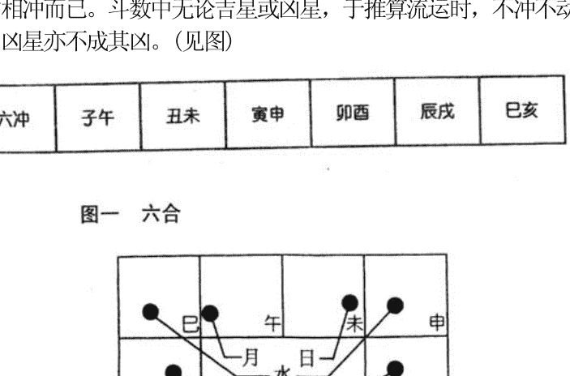

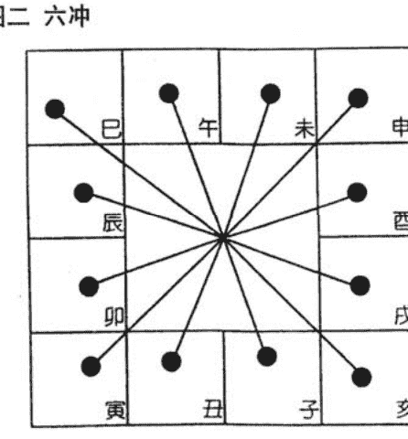

#### 6、地支三会局

十二地支相隔三宫位置会合，可组成一局，全盘共四局，每局亦即是紫微斗数中所谓三方四正的[三方]。[三方]组成一局，亦即是[生旺墓]的组合，如水局申为长生、子为帝旺、辰为墓库之类。

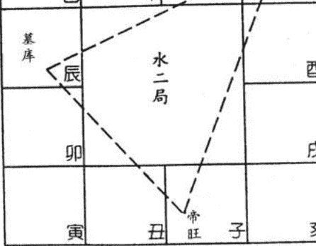

- 申子辰 合 水局
- 寅午戌 合 火局
- 亥卯未 合 木局
- 巳酉丑 合 金局

#### 7、六十甲子

十天干以甲为首，十二地支以子为首，一天干配一地支，而排成六十个干支数，周而复始，即成为六十甲子。

| 甲子 | 乙丑 | 丙寅 | 丁卯 | 戊辰 | 己巳 | 庚午 | 辛未 | 壬申 | 癸酉 |
|---|---|---|---|---|---|---|---|---|---|
| 甲戌 | 乙亥 | 丙子 | 丁丑 | 戊寅 | 己卯 | 庚辰 | 辛巳 | 壬午 | 癸未 |
| 甲申 | 乙酉 | 丙戌 | 丁亥 | 戊子 | 己丑 | 庚寅 | 辛卯 | 壬辰 | 癸巳 |
| 甲午 | 乙未 | 丙申 | 丁酉 | 戊戌 | 己亥 | 庚子 | 辛丑 | 壬寅 | 癸卯 |
| 甲辰 | 乙巳 | 丙午 | 丁未 | 戊申 | 己酉 | 庚戌 | 辛亥 | 壬子 | 癸丑 |
| 甲寅 | 乙卯 | 丙辰 | 丁巳 | 戊午 | 己未 | 庚申 | 辛酉 | 壬戌 | 癸亥 |

因甲为天干之首、子为地支之首，故简称六十甲子、或六十花甲子。

又干支组成六十花甲，每组合又另成五行，其五行之性，称为纳音：

**六十花甲纳音**

甲子乙丑海中金、丙寅丁卯炉中火、戊辰己巳大林木。庚午辛未路旁土、壬申癸酉剑锋金。

甲戌乙亥山头火、丙子丁丑涧下水。戊寅己卯城头土。庚辰辛巳白蜡金，壬午癸未杨柳木。

甲申乙酉泉中水，丙戌丁亥屋上土。戊子己丑霹雳火。庚寅辛卯松柏木，壬辰癸巳长流水。

甲午乙未沙中金，丙申丁酉山下火，戊戌己亥平地木。庚子辛丑壁上土，壬寅癸卯金泊金。

甲辰乙巳覆灯火，丙午丁未天河水。戊申己酉大泽土，庚戌辛亥钗钏金，壬子癸丑桑拓木。

甲寅乙卯大溪水，丙辰丁巳沙中土，戊午己未天上火，庚申辛酉石榴木，壬戌癸亥大海水。

算六十纳音，可用一简诀来决定：

甲乙锦江灯(金水火) 丙丁没谷田(水火土)

戊己营堤柳(火土木) 庚辛挂丈钱(土金水)

壬癸林钟满(木金水) 花甲纳音全

(注：子寅辰、午申戌配第一字；丑卯巳、未酉亥配第二、三字)

例如算丙辰纳音，依丙丁没谷田诀：[没谷田]的偏旁即水火土。以子丑配水、寅卯配火、辰巳配土。故丙辰纳音土。

又如推壬申纳音，依壬癸林钟满诀：[林钟满]的偏旁即木金水，以午未配木、申酉配金、戌亥配水。故壬申纳音金。

#### 8 五行长生

金、木、水、火、土，五行五种元素在十二宫中都有一定生长，壮旺而至衰死的过程，有如春天的草木萌芽，夏天开花，秋天结果，冬天衰死而果实埋藏，到春天后又再发芽，五行的变化，术数中便以下列十二个阶段来形容：

| 意义 | 解释 |
| :--- | :--- |
| 长生 | 初生之时 |
| 沐浴 | 生后沐浴穿衣 |
| 冠带 | 长成整冠束带 |
| 临官 | 学校毕业后出仕之时 |
| 帝旺 | 中年事业鼎盛 |
| 衰 | 中年体弱转衰 |
| 病 | 衰而至病 |
| 死 | 无生气之象 |
| 墓 | 死后入墓为潜伏之期 |
| 绝 | 息灭之象 |
| 胚胎 | 胚胎始生 |
| 养 | 怀胎再生之时 |

五行十二宫，各有不同的生旺衰绝期，现将之分列如下：

| | 长生 | 沐浴 | 冠带 | 临官 | 帝旺 | 衰 | 病 | 死 | 墓 | 绝 | 胎 | 养 |
| :--- | :--- | :--- | :--- | :--- | :--- | :--- | :--- | :--- | :--- | :--- | :--- | :--- |
| 木 | 亥 | 子 | 丑 | 寅 | 卯 | 辰 | 巳 | 午 | 未 | 申 | 酉 | 戌 |
| 火 | 寅 | 卯 | 辰 | 巳 | 午 | 未 | 申 | 酉 | 戌 | 亥 | 子 | 丑 |
| 土 | 申 | 酉 | 戌 | 亥 | 子 | 丑 | 寅 | 卯 | 辰 | 巳 | 午 | 未 |
| 金 | 巳 | 午 | 未 | 申 | 酉 | 戌 | 亥 | 子 | 丑 | 寅 | 卯 | 辰 |
| 水 | 申 | 酉 | 戌 | 亥 | 子 | 丑 | 寅 | 卯 | 辰 | 巳 | 午 | 未 |

以上排列是以阳男阴女之顺行为准，阴男阳女之排法详见后附便检表。

五行十二宫中，又以长生、帝旺(或沐浴)及墓库三者为变化的主要阶段，因此三者便可组成一局：

| 地支 | 寅申巳亥 | 子午卯酉 | 辰戌丑未 |
| :--- | :--- | :--- | :--- |
| | 四长生 | 四帝旺 (四沐浴) | 四墓库 |

#### 9 基本之命盘

算紫微斗数，先预备一个空白的命盘，其结构如图三：命盘中子丑寅卯……等十二宫的位置永恒不变。

命盘由顺时针方向轮转为[顺]。如子、丑、寅 ...至亥。
命盘反时针方向轮转称为[逆]。如子、亥、戌、酉……至丑。

#### 10 三方四正

推算命盘时，除看本宫外，并需参看其[三方四正]，三方是指本宫之三合宫，也就是本宫左右隔三宫的宫位，四正则是加上本宫与对宫而言。对宫也就是本宫之六冲宫位。例如以子宫位为本宫，三方便是申、辰两宫，四正便是午宫，看星之时，以子宫为主，参看辰、午、申三宫之星曜影响，决定吉凶。(见图四)

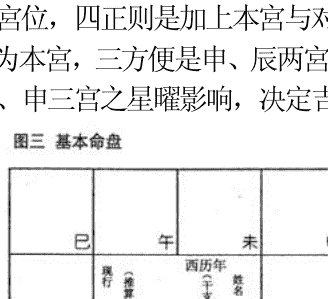

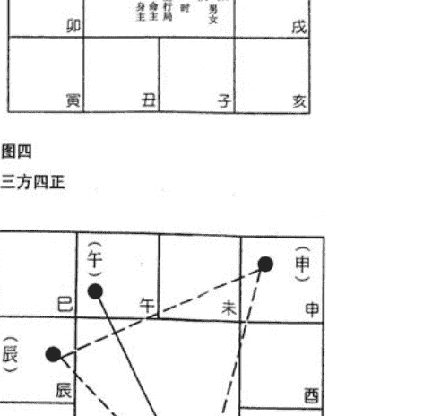

#### 11 命盘排盘的格式

于天盘中排出星曜，有一定的格式。为方便[飞星]起见，最好是将[正曜]写在一格的上方中央位置；辅、佐、煞、化诸曜写在正曜的右方，并低一格，杂曜流曜写在正曜下方，由左至右顺列。(详细格式见附图)。这样排列，对观察命盘最为方便。

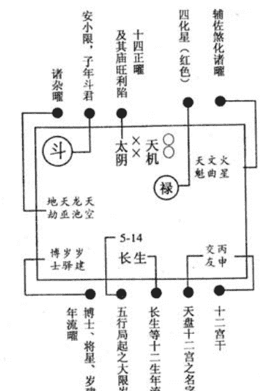

注一 十四正曜：紫微、天机、太阳、武曲、天同、廉贞、天府、太阴、贪狼、巨门、天相、天梁、七杀、破军等。

四煞曜：火星、铃星、擎羊、陀罗，这四星之上加上[△]黑三角符号作分别。

辅、佐曜：左辅、右弼；天魁、天钺；文昌、文曲；禄存、天马。

杂、煞、空曜：地劫、地空、龙池、凤阁、天哭、天虚、红鸾、天喜、孤辰、寡宿、天德、月德、华盖、天才、天寿、破碎、咸池、大耗、蜚廉、天空、旬空、截空、天厨、天月、天刑、天姚、天巫、解神、阴煞、台辅、封诰、三台、八座、恩光、天贵等。

注二 所有流年星曜，如流昌、流曲、流羊、流陀及流四化都不写入命盘上，要记于心中推算。

### (三) 安星简表

为方便初学排定命盘，特将安星简表先行介绍，以便应用。但仍应熟读下章[安星曜口诀、图表及掌诀]。熟习之后，不但可以随时随地起盘，而且于[飞星]推断流运、流年、流月时，更为方便。因为当实际推算时，根本没可能一一查表，以致妨碍思路。

#### 1 命宫及身宫

| 生月\生时 | 正月 | 二月 | 三月 | 四月 | 五月 | 六月 | 七月 | 八月 | 九月 | 十月 | 十一月 | 十二月 |
| :--- | :--- | :--- | :--- | :--- | :--- | :--- | :--- | :--- | :--- | :--- | :--- | :--- |
| 子 (命宫) | 寅 | 卯 | 辰 | 巳 | 午 | 未 | 申 | 酉 | 戌 | 亥 | 子 | 丑 |
| 子 (身宫) | 卯 | 辰 | 巳 | 午 | 未 | 申 | 酉 | 戌 | 亥 | 子 | 丑 | 寅 |
| 丑 (命宫) | 丑 | 寅 | 卯 | 辰 | 巳 | 午 | 未 | 申 | 酉 | 戌 | 亥 | 子 |
| 丑 (身宫) | 寅 | 卯 | 辰 | 巳 | 午 | 未 | 申 | 酉 | 戌 | 亥 | 子 | 丑 |
| 寅 (命宫) | 子 | 丑 | 寅 | 卯 | 辰 | 巳 | 午 | 未 | 申 | 酉 | 戌 | 亥 |
| 寅 (身宫) | 丑 | 寅 | 卯 | 辰 | 巳 | 午 | 未 | 申 | 酉 | 戌 | 亥 | 子 |
| 卯 (命宫) | 亥 | 子 | 丑 | 寅 | 卯 | 辰 | 巳 | 午 | 未 | 申 | 酉 | 戌 |
| 卯 (身宫) | 子 | 丑 | 寅 | 卯 | 辰 | 巳 | 午 | 未 | 申 | 酉 | 戌 | 亥 |
| 辰 (命宫) | 戌 | 亥 | 子 | 丑 | 寅 | 卯 | 辰 | 巳 | 午 | 未 | 申 | 酉 |
| 辰 (身宫) | 亥 | 子 | 丑 | 寅 | 卯 | 辰 | 巳 | 午 | 未 | 申 | 酉 | 戌 |
| 巳 (命宫) | 酉 | 戌 | 亥 | 子 | 丑 | 寅 | 卯 | 辰 | 巳 | 午 | 未 | 申 |
| 巳 (身宫) | 戌 | 亥 | 子 | 丑 | 寅 | 卯 | 辰 | 巳 | 午 | 未 | 申 | 酉 |
| 午 (命宫) | 申 | 酉 | 戌 | 亥 | 子 | 丑 | 寅 | 卯 | 辰 | 巳 | 午 | 未 |
| 午 (身宫) | 酉 | 戌 | 亥 | 子 | 丑 | 寅 | 卯 | 辰 | 巳 | 午 | 未 | 申 |
| 未 (命宫) | 未 | 申 | 酉 | 戌 | 亥 | 子 | 丑 | 寅 | 卯 | 辰 | 巳 | 午 |
| 未 (身宫) | 申 | 酉 | 戌 | 亥 | 子 | 丑 | 寅 | 卯 | 辰 | 巳 | 午 | 未 |
| 申 (命宫) | 午 | 未 | 申 | 酉 | 戌 | 亥 | 子 | 丑 | 寅 | 卯 | 辰 | 巳 |
| 申 (身宫) | 未 | 申 | 酉 | 戌 | 亥 | 子 | 丑 | 寅 | 卯 | 辰 | 巳 | 午 |
| 酉 (命宫) | 巳 | 午 | 未 | 申 | 酉 | 戌 | 亥 | 子 | 丑 | 寅 | 卯 | 辰 |
| 酉 (身宫) | 午 | 未 | 申 | 酉 | 戌 | 亥 | 子 | 丑 | 寅 | 卯 | 辰 | 巳 |
| 戌 (命宫) | 辰 | 巳 | 午 | 未 | 申 | 酉 | 戌 | 亥 | 子 | 丑 | 寅 | 卯 |
| 戌 (身宫) | 巳 | 午 | 未 | 申 | 酉 | 戌 | 亥 | 子 | 丑 | 寅 | 卯 | 辰 |
| 亥 (命宫) | 卯 | 辰 | 巳 | 午 | 未 | 申 | 酉 | 戌 | 亥 | 子 | 丑 | 寅 |
| 亥 (身宫) | 辰 | 巳 | 午 | 未 | 申 | 酉 | 戌 | 亥 | 子 | 丑 | 寅 | 卯 |

#### 2 安十二宫表

| | 子 | 丑 | 寅 | 卯 | 辰 | 巳 | 午 | 未 | 申 | 酉 | 戌 | 亥 |
| :--- | :--- | :--- | :--- | :--- | :--- | :--- | :--- | :--- | :--- | :--- | :--- | :--- |
| 命宫 | 子 | 丑 | 寅 | 卯 | 辰 | 巳 | 午 | 未 | 申 | 酉 | 戌 | 亥 |
| 兄弟 | 亥 | 子 | 丑 | 寅 | 卯 | 辰 | 巳 | 午 | 未 | 申 | 酉 | 戌 |
| 夫妻 | 戌 | 亥 | 子 | 丑 | 寅 | 卯 | 辰 | 巳 | 午 | 未 | 申 | 酉 |
| 子女 | 酉 | 戌 | 亥 | 子 | 丑 | 寅 | 卯 | 辰 | 巳 | 午 | 未 | 申 |
| 财帛 | 申 | 酉 | 戌 | 亥 | 子 | 丑 | 寅 | 卯 | 辰 | 巳 | 午 | 未 |
| 疾厄 | 未 | 申 | 酉 | 戌 | 亥 | 子 | 丑 | 寅 | 卯 | 辰 | 巳 | 午 |
| 迁移 | 午 | 未 | 申 | 酉 | 戌 | 亥 | 子 | 丑 | 寅 | 卯 | 辰 | 巳 |
| 交友 | 巳 | 午 | 未 | 申 | 酉 | 戌 | 亥 | 子 | 丑 | 寅 | 卯 | 辰 |
| 事业 | 辰 | 巳 | 午 | 未 | 申 | 酉 | 戌 | 亥 | 子 | 丑 | 寅 | 卯 |
| 田宅 | 卯 | 辰 | 巳 | 午 | 未 | 申 | 酉 | 戌 | 亥 | 子 | 丑 | 寅 |
| 福德 | 寅 | 卯 | 辰 | 巳 | 午 | 未 | 申 | 酉 | 戌 | 亥 | 子 | 丑 |
| 父母 | 丑 | 寅 | 卯 | 辰 | 巳 | 午 | 未 | 申 | 酉 | 戌 | 亥 | 子 |

#### 3 安十二宫天干表

| 生年干支 | 寅 | 卯 | 辰 | 巳 | 午 | 未 | 申 | 酉 | 戌 | 亥 | 子 | 丑 |
|----------|----|----|----|----|----|----|----|----|----|----|----|----|
| 甲己 | 丙 | 丁 | 戊 | 己 | 庚 | 辛 | 壬 | 癸 | 甲 | 乙 | 丙 | 丁 |
| 乙庚 | 戊 | 己 | 庚 | 辛 | 壬 | 癸 | 甲 | 乙 | 丙 | 丁 | 戊 | 己 |
| 丙辛 | 庚 | 辛 | 壬 | 癸 | 甲 | 乙 | 丙 | 丁 | 戊 | 己 | 庚 | 辛 |
| 丁壬 | 壬 | 癸 | 甲 | 乙 | 丙 | 丁 | 戊 | 己 | 庚 | 辛 | 壬 | 癸 |
| 戊癸 | 甲 | 乙 | 丙 | 丁 | 戊 | 己 | 庚 | 辛 | 壬 | 癸 | 甲 | 乙 |

#### 4 定五行局表

| 本生年干 | 子丑 | 寅卯 | 辰巳 | 午未 | 申酉 | 戌亥 |
|----------|------|------|------|------|------|------|
| 甲己 | 水二局 | 火六局 | 木三局 | 土五局 | 金四局 | 火六局 |
| 乙庚 | 火六局 | 土五局 | 金四局 | 木三局 | 水二局 | 土五局 |
| 丙辛 | 土五局 | 木三局 | 水二局 | 金四局 | 火六局 | 木三局 |
| 丁壬 | 木三局 | 金四局 | 火六局 | 水二局 | 土五局 | 金四局 |
| 戊癸 | 金四局 | 水二局 | 土五局 | 火六局 | 木三局 | 水二局 |

例：乙未年生人，命宫在戊寅。查[本生年干]乙庚栏，对照[命宫地支]寅卯栏，即得土五局。

#### 5 起大限表

| 大限五行局 | 阴阳男女 | 命宫 | 兄弟宫 | 夫妻宫 | 子女宫 | 财帛宫 | 疾厄宫 | 迁移宫 | 交友宫 | 事业宫 | 田宅宫 | 福德宫 | 父母宫 |
|------------|----------|------|--------|--------|--------|--------|--------|--------|--------|--------|--------|--------|--------|
| 水二局 | 阳男阴女 | 2-11 | 112-121 | 102-111 | 92-101 | 82-91 | 72-81 | 62-71 | 52-61 | 42-51 | 32-41 | 22-31 | 12-21 |
| 水二局 | 阴男阳女 | 2-11 | 12-21 | 22-31 | 32-41 | 42-51 | 52-61 | 62-71 | 72-81 | 82-91 | 92-101 | 102-111 | 112-121 |
| 木三局 | 阳男阴女 | 3-12 | 113-122 | 103-112 | 93-102 | 83-92 | 73-82 | 63-72 | 53-62 | 43-52 | 33-42 | 23-32 | 13-22 |
| 木三局 | 阴男阳女 | 3-12 | 13-22 | 23-32 | 33-42 | 43-52 | 53-62 | 63-72 | 73-82 | 83-92 | 93-102 | 103-112 | 113-122 |
| 金四局 | 阳男阴女 | 4-13 | 114-123 | 104-113 | 94-103 | 84-93 | 74-83 | 64-73 | 54-63 | 44-53 | 34-43 | 24-33 | 14-23 |
| 金四局 | 阴男阳女 | 4-13 | 14-23 | 24-33 | 34-43 | 44-53 | 54-63 | 64-73 | 74-83 | 84-93 | 94-103 | 104-113 | 114-123 |
| 土五局 | 阳男阴女 | 5-14 | 115-124 | 105-114 | 95-104 | 85-94 | 75-84 | 65-74 | 55-64 | 45-54 | 35-44 | 25-34 | 15-24 |
| 土五局 | 阴男阳女 | 5-14 | 15-24 | 25-34 | 35-44 | 45-54 | 55-64 | 65-74 | 75-84 | 85-94 | 95-104 | 105-114 | 115-124 |
| 火六局 | 阳男阴女 | 6-15 | 116-125 | 106-115 | 96-105 | 86-95 | 76-85 | 66-75 | 56-65 | 46-55 | 36-45 | 26-35 | 16-25 |
| 火六局 | 阴男阳女 | 6-15 | 16-25 | 26-35 | 36-45 | 46-55 | 56-65 | 66-75 | 76-85 | 86-95 | 96-105 | 106-115 | 116-125 |

#### 6 安紫微表

| 生日 | 水二局 | 木三局 | 金四局 | 土五局 | 火六局 |
|------|--------|--------|--------|--------|--------|
| 初一 | 丑     | 辰     | 亥     | 午     | 酉     |
| 初二 | 寅     | 丑     | 辰     | 亥     | 午     |
| 初三 | 寅     | 寅     | 丑     | 辰     | 亥     |
| 初四 | 卯     | 巳     | 寅     | 丑     | 辰     |
| 初五 | 卯     | 寅     | 子     | 寅     | 丑     |
| 初六 | 辰     | 卯     | 巳     | 未     | 寅     |
| 初七 | 辰     | 午     | 寅     | 子     | 戌     |
| 初八 | 巳     | 卯     | 卯     | 巳     | 未     |
| 初九 | 巳     | 辰     | 丑     | 寅     | 丑     |
| 初十 | 午     | 未     | 午     | 卯     | 巳     |
| 十一 | 午     | 辰     | 卯     | 寅     | 寅     |
| 十二 | 未     | 巳     | 辰     | 丑     | 卯     |
| 十三 | 未     | 申     | 寅     | 午     | 亥     |
| 十四 | 申     | 巳     | 未     | 卯     | 申     |
| 十五 | 申     | 午     | 辰     | 辰     | 丑     |
| 十六 | 酉     | 酉     | 巳     | 酉     | 午     |
| 十七 | 酉     | 午     | 卯     | 寅     | 卯     |
| 十八 | 戌     | 未     | 申     | 未     | 辰     |
| 十九 | 戌     | 戌     | 巳     | 辰     | 子     |
| 二十 | 亥     | 未     | 午     | 巳     | 酉     |
| 二一 | 亥     | 申     | 辰     | 戌     | 寅     |
| 二二 | 子     | 亥     | 酉     | 卯     | 未     |
| 二三 | 子     | 申     | 午     | 申     | 辰     |
| 二四 | 丑     | 酉     | 未     | 巳     | 巳     |
| 二五 | 丑     | 子     | 巳     | 午     | 丑     |
| 二六 | 寅     | 酉     | 戌     | 亥     | 戌     |
| 二七 | 寅     | 戌     | 未     | 辰     | 卯     |
| 二八 | 卯     | 丑     | 申     | 酉     | 申     |
| 二九 | 卯     | 戌     | 午     | 午     | 巳     |
| 三十 | 辰     | 亥     | 亥     | 未     | 午     |

#### 7 安紫微后诸曜表

| 紫微 | 子 | 丑 | 寅 | 卯 | 辰 | 巳 | 午 | 未 | 申 | 酉 | 戌 | 亥 |
|------|----|----|----|----|----|----|----|----|----|----|----|----|
| 诸曜 |    |    |    |    |    |    |    |    |    |    |    |    |
| 天机 | 亥 | 子 | 丑 | 寅 | 卯 | 辰 | 巳 | 午 | 未 | 申 | 酉 | 戌 |
| 太阳 | 酉 | 戌 | 亥 | 子 | 丑 | 寅 | 卯 | 辰 | 巳 | 午 | 未 | 申 |
| 武曲 | 申 | 酉 | 戌 | 亥 | 子 | 丑 | 寅 | 卯 | 辰 | 巳 | 午 | 未 |
| 天同 | 未 | 申 | 酉 | 戌 | 亥 | 子 | 丑 | 寅 | 卯 | 辰 | 巳 | 午 |
| 廉贞 | 辰 | 巳 | 午 | 未 | 申 | 酉 | 戌 | 亥 | 子 | 丑 | 寅 | 卯 |

#### 8 安天府星

| 紫微 | 子 | 丑 | 寅 | 卯 | 辰 | 巳 | 午 | 未 | 申 | 酉 | 戌 | 亥 |
|------|----|----|----|----|----|----|----|----|----|----|----|----|
| 天府 | 辰 | 卯 | 寅 | 丑 | 子 | 亥 | 戌 | 酉 | 申 | 未 | 午 | 巳 |

#### 9 安天府以下诸曜表

| 天府 | 子 | 丑 | 寅 | 卯 | 辰 | 巳 | 午 | 未 | 申 | 酉 | 戌 | 亥 |
|------|----|----|----|----|----|----|----|----|----|----|----|----|
| 诸曜 |    |    |    |    |    |    |    |    |    |    |    |    |
| 太阴 | 丑 | 寅 | 卯 | 辰 | 巳 | 午 | 未 | 申 | 酉 | 戌 | 亥 | 子 |
| 贪狼 | 寅 | 卯 | 辰 | 巳 | 午 | 未 | 申 | 酉 | 戌 | 亥 | 子 | 丑 |
| 巨门 | 卯 | 辰 | 巳 | 午 | 未 | 申 | 酉 | 戌 | 亥 | 子 | 丑 | 寅 |
| 天相 | 辰 | 巳 | 午 | 未 | 申 | 酉 | 戌 | 亥 | 子 | 丑 | 寅 | 卯 |
| 天梁 | 巳 | 午 | 未 | 申 | 酉 | 戌 | 亥 | 子 | 丑 | 寅 | 卯 | 辰 |
| 七杀 | 午 | 未 | 申 | 酉 | 戌 | 亥 | 子 | 丑 | 寅 | 卯 | 辰 | 巳 |
| 破军 | 戌 | 亥 | 子 | 丑 | 寅 | 卯 | 辰 | 巳 | 午 | 未 | 申 | 酉 |

#### 10 安干系诸星表

| 出生年月 | 甲 | 乙 | 丙 | 丁 | 戊 | 己 | 庚 | 辛 | 壬 | 癸 |
|----------|----|----|----|----|----|----|----|----|----|----|
| 诸星     |    |    |    |    |    |    |    |    |    |    |
| 禄存     | 寅 | 卯 | 辰 | 巳 | 午 | 未 | 申 | 酉 | 戌 | 亥 |
| 擎羊     | 卯 | 辰 | 巳 | 午 | 未 | 申 | 酉 | 戌 | 亥 | 子 |
| 陀罗     | 丑 | 寅 | 卯 | 辰 | 巳 | 午 | 未 | 申 | 酉 | 戌 |
| 天魁     | 丑 | 子 | 亥 | 戌 | 酉 | 申 | 未 | 午 | 巳 | 辰 |
| 天钺     | 未 | 申 | 酉 | 戌 | 亥 | 子 | 丑 | 寅 | 卯 | 辰 |
| 天官     | 未 | 辰 | 巳 | 寅 | 卯 | 申 | 酉 | 亥 | 戌 | 午 |
| 天福     | 酉 | 申 | 子 | 亥 | 卯 | 寅 | 午 | 巳 | 午 | 巳 |
| 天厨     | 巳 | 午 | 子 | 巳 | 午 | 申 | 寅 | 午 | 酉 | 亥 |
| 截空     | 申 | 午 | 辰 | 寅 | 子 | 申 | 午 | 辰 | 寅 | 子 |
|          | 酉 | 未 | 巳 | 卯 | 丑 | 酉 | 未 | 巳 | 卯 | 丑 |

#### 11 安支系诸星表

| 诸星 | 子 | 丑 | 寅 | 卯 | 辰 | 巳 | 午 | 未 | 申 | 酉 | 戌 | 亥 |
|------|----|----|----|----|----|----|----|----|----|----|----|----|
| 天马 | 寅 | 亥 | 申 | 巳 | 寅 | 亥 | 申 | 巳 | 寅 | 亥 | 申 | 巳 |
| 天空 | 丑 | 寅 | 卯 | 辰 | 巳 | 午 | 未 | 申 | 酉 | 戌 | 亥 | 子 |
| 天哭 | 午 | 巳 | 辰 | 卯 | 寅 | 丑 | 子 | 亥 | 戌 | 酉 | 申 | 未 |
| 天虚 | 午 | 未 | 申 | 酉 | 戌 | 亥 | 子 | 丑 | 寅 | 卯 | 辰 | 巳 |
| 龙池 | 辰 | 巳 | 午 | 未 | 申 | 酉 | 戌 | 亥 | 子 | 丑 | 寅 | 卯 |
| 凤阁 | 戌 | 酉 | 申 | 未 | 午 | 巳 | 辰 | 卯 | 寅 | 丑 | 子 | 亥 |
| 红鸾 | 卯 | 寅 | 丑 | 子 | 亥 | 戌 | 酉 | 申 | 未 | 午 | 巳 | 辰 |
| 天喜 | 酉 | 申 | 未 | 午 | 巳 | 辰 | 卯 | 寅 | 丑 | 子 | 亥 | 戌 |
| 孤辰 | 寅 | 寅 | 巳 | 巳 | 巳 | 申 | 申 | 申 | 亥 | 亥 | 亥 | 寅 |
| 寡宿 | 戌 | 戌 | 丑 | 丑 | 丑 | 辰 | 辰 | 辰 | 未 | 未 | 未 | 戌 |

#### 12 安月系诸星表

| 诸星 | 左辅 | 右弼 | 天刑 | 天姚 | 解神 | 天巫 | 天月 | 阴煞 |
|------|------|------|------|------|------|------|------|------|
| 正月 | 辰 | 戌 | 酉 | 丑 | 申 | 巳 | 戌 | 寅 |
| 二月 | 巳 | 酉 | 戌 | 寅 | 申 | 申 | 巳 | 子 |
| 三月 | 午 | 申 | 亥 | 卯 | 戌 | 寅 | 辰 | 戌 |
| 四月 | 未 | 未 | 子 | 辰 | 戌 | 亥 | 寅 | 申 |
| 五月 | 申 | 午 | 丑 | 巳 | 子 | 巳 | 未 | 午 |
| 六月 | 酉 | 巳 | 寅 | 午 | 子 | 申 | 卯 | 辰 |
| 七月 | 戌 | 辰 | 卯 | 未 | 寅 | 寅 | 亥 | 寅 |
| 八月 | 亥 | 卯 | 辰 | 申 | 寅 | 亥 | 未 | 子 |
| 九月 | 子 | 寅 | 巳 | 酉 | 辰 | 巳 | 寅 | 戌 |
| 十月 | 丑 | 丑 | 午 | 戌 | 辰 | 申 | 午 | 申 |
| 十一月 | 寅 | 子 | 未 | 亥 | 午 | 寅 | 戌 | 午 |
| 十二月 | 卯 | 亥 | 申 | 子 | 午 | 亥 | 寅 | 辰 |

| 诸星 | 子 | 丑 | 寅 | 卯 | 辰 | 巳 | 午 | 未 | 申 | 酉 | 戌 | 亥 |
|------|----|----|----|----|----|----|----|----|----|----|----|----|
| 天寿 | 由身宫起子，顺行，数至本生年支，即安大寿星。 |   |   |   |   |   |   |   |   |   |   |   |
| 天才 | 命宫 | 父母 | 福德 | 田宅 | 事业 | 交友 | 迁移 | 疾厄 | 财帛 | 子女 | 夫妻 | 兄弟 |
| 月德 | 巳 | 午 | 未 | 申 | 酉 | 戌 | 亥 | 子 | 丑 | 寅 | 卯 | 辰 |
| 天德 | 酉 | 戌 | 亥 | 子 | 丑 | 寅 | 卯 | 辰 | 巳 | 午 | 未 | 申 |
| 年解 | 戌 | 酉 | 申 | 未 | 午 | 巳 | 辰 | 卯 | 寅 | 丑 | 子 | 亥 |
| 劫煞 | 巳 | 寅 | 亥 | 申 | 巳 | 寅 | 亥 | 申 | 巳 | 寅 | 亥 | 申 |
| 大耗 | 午 | 未 | 酉 | 申 | 亥 | 戌 | 丑 | 子 | 卯 | 寅 | 巳 | 辰 |
| 咸池 | 酉 | 卯 | 子 | 酉 | 午 | 卯 | 子 | 酉 | 午 | 卯 | 子 |
| 华盖 | 辰 | 丑 | 戌 | 未 | 辰 | 丑 | 戌 | 未 | 辰 | 丑 | 戌 | 未 |
| 破碎 | 巳 | 丑 | 酉 | 巳 | 丑 | 酉 | 巳 | 丑 | 酉 | 巳 | 丑 | 酉 |
| 蜚廉 | 申 | 酉 | 戌 | 巳 | 午 | 未 | 寅 | 卯 | 辰 | 亥 | 子 | 丑 |

#### 13 安日系诸星表

| 星名 | 安星方法 |
|------|----------|
| 三台 | 由左辅所坐的宫位起初一，顺行，数到本生日。 |
| 八座 | 由右弼所坐的宫位起初一，逆行，数到本生日。 |
| 恩光 | 由文昌所坐的宫位起禄一，顺行，数到本生日再退后一步。 |
| 天贵 | 由文曲所坐的宫位起初一，顺行，数到本生日再退后一步。 |

#### 14 安时系诸星表

| 出生年干 | 本生时诸星 | 子 | 丑 | 寅 | 卯 | 辰 | 巳 | 午 | 未 | 申 | 酉 | 戌 | 亥 |
|----------|------------|----|----|----|----|----|----|----|----|----|----|----|----|
| 寅午戌   | 文昌       | 戊 | 酉 | 申 | 未 | 午 | 巳 | 辰 | 卯 | 寅 | 丑 | 子 | 亥 |
|          | 文曲       | 辰 | 巳 | 午 | 未 | 申 | 酉 | 戌 | 亥 | 子 | 丑 | 寅 | 卯 |
|          | 火星       | 丑 | 寅 | 卯 | 辰 | 巳 | 午 | 未 | 申 | 酉 | 戌 | 亥 | 子 |
|          | 铃星       | 卯 | 辰 | 巳 | 午 | 未 | 申 | 酉 | 戌 | 亥 | 子 | 丑 | 寅 |
| 申子辰   | 火星       | 寅 | 卯 | 辰 | 巳 | 午 | 未 | 申 | 酉 | 戌 | 亥 | 子 | 丑 |
|          | 铃星       | 戌 | 亥 | 子 | 丑 | 寅 | 卯 | 辰 | 巳 | 午 | 未 | 申 | 酉 |
| 巳酉丑   | 火星       | 卯 | 辰 | 巳 | 午 | 未 | 申 | 酉 | 戌 | 亥 | 子 | 丑 | 寅 |
|          | 铃星       | 戌 | 亥 | 子 | 丑 | 寅 | 卯 | 辰 | 巳 | 午 | 未 | 申 | 酉 |
| 亥卯未   | 火星       | 酉 | 戌 | 亥 | 子 | 丑 | 寅 | 卯 | 辰 | 巳 | 午 | 未 | 申 |
|          | 铃星       | 戌 | 亥 | 子 | 丑 | 寅 | 卯 | 辰 | 巳 | 午 | 未 | 申 | 酉 |
|          | 地劫       | 亥 | 子 | 丑 | 寅 | 卯 | 辰 | 巳 | 午 | 未 | 申 | 酉 | 戌 |
|          | 地空       | 亥 | 戌 | 酉 | 申 | 未 | 午 | 巳 | 辰 | 卯 | 寅 | 丑 | 子 |
|          | 台辅       | 午 | 未 | 申 | 酉 | 戌 | 亥 | 子 | 丑 | 寅 | 卯 | 辰 | 巳 |
|          | 封诰       | 寅 | 卯 | 辰 | 巳 | 午 | 未 | 申 | 酉 | 戌 | 亥 | 子 | 丑 |

#### 15 安四化星表

| 年干 | 甲 | 乙 | 丙 | 丁 | 戊 | 己 | 庚 | 辛 | 壬 | 癸 |
|------|----|----|----|----|----|----|----|----|----|----|
| 化禄 | 廉贞 | 天机 | 天同 | 太阴 | 贪狼 | 武曲 | 太阳 | 巨门 | 天梁 | 破军 |
| 化权 | 破军 | 天梁 | 天机 | 天同 | 太阴 | 贪狼 | 武曲 | 太阳 | 紫微 | 巨门 |
| 化科 | 武曲 | 紫微 | 文昌 | 天机 | 太阳 | 天梁 | 天府 | 文曲 | 天府 | 太阴 |
| 化忌 | 太阳 | 太阴 | 廉贞 | 巨门 | 天机 | 文曲 | 天同 | 文昌 | 武曲 | 贪狼 |

#### 16 安长生十二神表

| 五行局 | 水二局 | 木三局 | 金四局 | 土五局 | 火六局 |
|--------|--------|--------|--------|--------|--------|
| 长生   | 申     | 寅     | 巳     | 申     | 寅     |
| 沐浴   | 酉     | 卯     | 午     | 酉     | 卯     |
| 冠带   | 戌     | 辰     | 未     | 戌     | 辰     |
| 临官   | 亥     | 巳     | 申     | 亥     | 巳     |
| 帝旺   | 子     | 午     | 酉     | 子     | 午     |
| 衰     | 丑     | 未     | 戌     | 丑     | 未     |
| 病     | 寅     | 申     | 亥     | 寅     | 申     |
| 死     | 卯     | 酉     | 子     | 卯     | 酉     |
| 墓     | 辰     | 戌     | 丑     | 辰     | 戌     |
| 绝     | 巳     | 亥     | 寅     | 巳     | 亥     |
| 胎     | 午     | 子     | 卯     | 午     | 子     |
| 养     | 未     | 丑     | 辰     | 未     | 丑     |

#### 17 安博士十二星表

| 禄存 | 不分男女皆从禄存起，阳男阴女顺行，阴男阳女逆行。 |
|------|------------------------------------------------------|
| 博士 | 力士 | 青龙 | 小耗 | 将军 | 奏书 | 飞廉 | 喜神 | 病符 | 大耗 | 伏兵 | 官符 |

#### 18 流年岁前诸星表

| 岁支 | 子 | 丑 | 寅 | 卯 | 辰 | 巳 | 午 | 未 | 申 | 酉 | 戌 | 亥 |
|------|----|----|----|----|----|----|----|----|----|----|----|----|
| 岁建 | 子 | 丑 | 寅 | 卯 | 辰 | 巳 | 午 | 未 | 申 | 酉 | 戌 | 亥 |
| 嗨气 | 丑 | 寅 | 卯 | 辰 | 巳 | 午 | 未 | 申 | 酉 | 戌 | 亥 | 子 |
| 丧门 | 寅 | 卯 | 辰 | 巳 | 午 | 未 | 申 | 酉 | 戌 | 亥 | 子 | 丑 |
| 贯索 | 卯 | 辰 | 巳 | 午 | 未 | 申 | 酉 | 戌 | 亥 | 子 | 丑 | 寅 |
| 官符 | 辰 | 巳 | 午 | 未 | 申 | 酉 | 戌 | 亥 | 子 | 丑 | 寅 | 卯 |
| 小耗 | 巳 | 午 | 未 | 申 | 酉 | 戌 | 亥 | 子 | 丑 | 寅 | 卯 | 辰 |
| 岁破 | 午 | 未 | 申 | 酉 | 戌 | 亥 | 子 | 丑 | 寅 | 卯 | 辰 | 巳 |
| 龙德 | 未 | 申 | 酉 | 戌 | 亥 | 子 | 丑 | 寅 | 卯 | 辰 | 巳 | 午 |
| 白虎 | 申 | 酉 | 戌 | 亥 | 子 | 丑 | 寅 | 卯 | 辰 | 巳 | 午 | 未 |
| 天德 | 酉 | 戌 | 亥 | 子 | 丑 | 寅 | 卯 | 辰 | 巳 | 午 | 未 | 申 |
| 吊客 | 戌 | 亥 | 子 | 丑 | 寅 | 卯 | 辰 | 巳 | 午 | 未 | 申 | 酉 |
| 病符 | 亥 | 子 | 丑 | 寅 | 卯 | 辰 | 巳 | 午 | 未 | 申 | 酉 | 戌 |## 19 安流年将前诸星表

| 诸星 | 寅午戌 | 申子辰 | 巳酉丑 | 亥卯未 |
| :--- | :--- | :--- | :--- | :--- |
| 将星 | 午 | 子 | 酉 | 卯 |
| 攀鞍 | 未 | 丑 | 戌 | 辰 |
| 岁驿 | 申 | 寅 | 亥 | 巳 |
| 息神 | 酉 | 卯 | 子 | 午 |
| 华盖 | 戌 | 亥 | 丑 | 未 |
| 劫煞 | 亥 | 巳 | 寅 | 申 |
| 灾煞 | 子 | 午 | 卯 | 酉 |
| 天煞 | 丑 | 未 | 辰 | 戌 |
| 指背 | 寅 | 申 | 巳 | 亥 |
| 咸池 | 卯 | 酉 | 午 | 子 |
| 月煞 | 辰 | 戌 | 未 | 丑 |
| 亡神 | 巳 | 亥 | 申 | 寅 |

#### 20 安旬空表

| 年干 | 甲 | 乙 | 丙 | 丁 | 戊 | 己 | 庚 | 辛 | 壬 | 癸 | 旬空 | 旬空 |
| :--- | :--- | :--- | :--- | :--- | :--- | :--- | :--- | :--- | :--- | :--- | :--- | :--- |
| 年支 | 子 | 丑 | 寅 | 卯 | 辰 | 巳 | 午 | 未 | 申 | 酉 | 戌 | 亥 |
|  | 戌 | 亥 | 子 | 丑 | 寅 | 卯 | 辰 | 巳 | 午 | 未 | 申 | 酉 |
|  | 申 | 酉 | 戌 | 亥 | 子 | 丑 | 寅 | 卯 | 辰 | 巳 | 午 | 未 |
|  | 午 | 未 | 申 | 酉 | 戌 | 亥 | 子 | 丑 | 寅 | 卯 | 辰 | 巳 |
|  | 辰 | 巳 | 午 | 未 | 申 | 酉 | 戌 | 亥 | 子 | 丑 | 寅 | 卯 |
|  | 寅 | 卯 | 辰 | 巳 | 午 | 未 | 申 | 酉 | 戌 | 亥 | 子 | 丑 |

斗君 小限 命主 身主

斗君 此表只起子年斗君。由子年斗君所落之宫位起子，顺数至流年年支，所落宫位即为本流年之斗君。
如二月寅时生人，子年斗君在丑宫，丑流年斗君即为寅宫。

| 十二月 | 十一月 | 十月 | 九月 | 八月 | 七月 | 六月 | 五月 | 四月 | 三月 | 二月 | 正月 | 生月生时 |
| :--- | :--- | :--- | :--- | :--- | :--- | :--- | :--- | :--- | :--- | :--- | :--- | :--- |
| 丑 | 寅 | 卯 | 辰 | 巳 | 午 | 未 | 申 | 酉 | 戌 | 亥 | 子 | 子 |
| 寅 | 卯 | 辰 | 巳 | 午 | 未 | 申 | 酉 | 戌 | 亥 | 子 | 丑 | 丑 |
| 卯 | 辰 | 巳 | 午 | 未 | 申 | 酉 | 戌 | 亥 | 子 | 丑 | 寅 | 寅 |
| 辰 | 巳 | 午 | 未 | 申 | 酉 | 戌 | 亥 | 子 | 丑 | 寅 | 卯 | 卯 |
| 巳 | 午 | 未 | 申 | 酉 | 戌 | 亥 | 子 | 丑 | 寅 | 卯 | 辰 | 辰 |
| 午 | 未 | 申 | 酉 | 戌 | 亥 | 子 | 丑 | 寅 | 卯 | 辰 | 巳 | 巳 |
| 未 | 申 | 酉 | 戌 | 亥 | 子 | 丑 | 寅 | 卯 | 辰 | 巳 | 午 | 午 |
| 申 | 酉 | 戌 | 亥 | 子 | 丑 | 寅 | 卯 | 辰 | 巳 | 午 | 未 | 未 |
| 酉 | 戌 | 亥 | 子 | 丑 | 寅 | 卯 | 辰 | 巳 | 午 | 未 | 申 | 申 |
| 戌 | 亥 | 子 | 丑 | 寅 | 卯 | 辰 | 巳 | 午 | 未 | 申 | 酉 | 酉 |
| 亥 | 子 | 丑 | 寅 | 卯 | 辰 | 巳 | 午 | 未 | 申 | 酉 | 戌 | 戌 |
| 子 | 丑 | 寅 | 卯 | 辰 | 巳 | 午 | 未 | 申 | 酉 | 戌 | 亥 | 亥 |

斗君

小限 *不分阴阳，男顺行，女逆转

| 12 | 11 | 10 | 9 | 8 | 7 | 6 | 5 | 4 | 3 | 2 | 1 | 小限岁数 |
| :--- | :--- | :--- | :--- | :--- | :--- | :--- | :--- | :--- | :--- | :--- | :--- | :--- |
| 24 | 23 | 22 | 21 | 20 | 19 | 18 | 17 | 16 | 15 | 14 | 13 |  |
| 36 | 35 | 34 | 33 | 32 | 31 | 30 | 29 | 28 | 27 | 26 | 25 |  |
| 48 | 47 | 46 | 45 | 44 | 43 | 42 | 41 | 40 | 39 | 38 | 37 |  |
| 60 | 59 | 58 | 57 | 56 | 55 | 54 | 53 | 52 | 51 | 50 | 49 |  |
| 72 | 71 | 70 | 69 | 68 | 67 | 66 | 65 | 64 | 63 | 62 | 61 |  |
| 84 | 83 | 82 | 81 | 80 | 79 | 78 | 77 | 76 | 75 | 74 | 73 |  |
| 96 | 95 | 94 | 93 | 92 | 91 | 90 | 89 | 88 | 87 | 86 | 85 |  |
| 108 | 107 | 106 | 105 | 104 | 103 | 102 | 101 | 100 | 99 | 98 | 97 |  |
| 120 | 119 | 118 | 117 | 116 | 115 | 114 | 113 | 112 | 111 | 110 | 109 |  |
| 卯 | 寅 | 丑 | 子 | 亥 | 戌 | 酉 | 申 | 未 | 午 | 巳 | 辰 | 男女 |
| 巳 | 午 | 未 | 申 | 酉 | 戌 | 亥 | 子 | 丑 | 寅 | 卯 | 辰 | 寅午戌 |
| 酉 | 申 | 未 | 午 | 巳 | 辰 | 卯 | 寅 | 丑 | 子 | 亥 | 戌 | 男女 |
| 亥 | 子 | 丑 | 寅 | 卯 | 辰 | 巳 | 午 | 未 | 申 | 酉 | 戌 | 申子辰 |
| 午 | 巳 | 辰 | 卯 | 寅 | 丑 | 子 | 亥 | 戌 | 酉 | 申 | 未 | 男女 |
| 申 | 酉 | 戌 | 亥 | 子 | 丑 | 寅 | 卯 | 辰 | 巳 | 午 | 未 | 巳酉丑 |
| 子 | 亥 | 戌 | 酉 | 申 | 未 | 午 | 巳 | 辰 | 卯 | 寅 | 丑 | 男女 |
| 寅 | 卯 | 辰 | 巳 | 午 | 未 | 申 | 酉 | 戌 | 亥 | 子 | 丑 | 亥卯未 |

#### 命主

| 出生年支 | 子 | 丑 | 寅 | 卯 | 辰 | 巳 | 午 | 未 | 申 | 酉 | 戌 | 亥 |
| :--- | :--- | :--- | :--- | :--- | :--- | :--- | :--- | :--- | :--- | :--- | :--- | :--- |
| 命主 | 贪狼 | 巨门 | 禄存 | 文曲 | 廉贞 | 武曲 | 破军 | 武曲 | 廉贞 | 文曲 | 禄存 | 巨门 |

#### 身主

| 出生年支 | 子 | 丑 | 寅 | 卯 | 辰 | 巳 | 午 | 未 | 申 | 酉 | 戌 | 亥 |
| :--- | :--- | :--- | :--- | :--- | :--- | :--- | :--- | :--- | :--- | :--- | :--- | :--- |
| 身主 | 火星 | 天相 | 天梁 | 天同 | 文昌 | 天机 | 火星 | 天相 | 天梁 | 天同 | 文昌 | 天机 |

#### 诸星庙陷总表

#### 十四正曜

| 星名\宫位 | 子 | 丑 | 寅 | 卯 | 辰 | 巳 | 午 | 未 | 申 | 酉 | 戌 | 亥 |
| :--- | :--- | :--- | :--- | :--- | :--- | :--- | :--- | :--- | :--- | :--- | :--- | :--- |
| 紫微 | 平 | 庙 | 庙 | 旺 | 陷 | 旺 | 庙 | 庙 | 旺 | 平 | 闲 | 旺 |
| 天机 | 庙 | 陷 | 旺 | 旺 | 庙 | 平 | 庙 | 陷 | 平 | 旺 | 庙 | 平 |
| 太阳 | 陷 | 陷 | 旺 | 庙 | 旺 | 旺 | 庙 | 平 | 闲 | 闲 | 陷 | 陷 |
| 武曲 | 旺 | 庙 | 闲 | 陷 | 庙 | 平 | 旺 | 庙 | 平 | 旺 | 庙 | 平 |
| 天同 | 旺 | 陷 | 闲 | 庙 | 平 | 庙 | 陷 | 陷 | 旺 | 平 | 平 | 庙 |
| 廉贞 | 平 | 旺 | 庙 | 闲 | 旺 | 陷 | 平 | 庙 | 庙 | 平 | 旺 | 陷 |
| 天府 | 庙 | 庙 | 庙 | 平 | 庙 | 平 | 旺 | 庙 | 平 | 陷 | 庙 | 旺 |
| 太阴 | 庙 | 庙 | 闲 | 陷 | 闲 | 陷 | 陷 | 平 | 平 | 旺 | 旺 | 庙 |
| 贪狼 | 旺 | 庙 | 平 | 地 | 庙 | 陷 | 旺 | 庙 | 平 | 平 | 庙 | 陷 |
| 巨门 | 旺 | 旺 | 庙 | 庙 | 平 | 平 | 旺 | 陷 | 庙 | 庙 | 旺 | 旺 |
| 天相 | 庙 | 庙 | 庙 | 陷 | 旺 | 平 | 旺 | 闲 | 庙 | 陷 | 闲 | 平 |
| 天梁 | 庙 | 旺 | 庙 | 庙 | 旺 | 陷 | 庙 | 旺 | 陷 | 地 | 旺 | 陷 |
| 七杀 | 旺 | 庙 | 庙 | 陷 | 旺 | 平 | 旺 | 旺 | 庙 | 闲 | 庙 | 平 |
| 破军 | 庙 | 旺 | 陷 | 旺 | 旺 | 闲 | 庙 | 庙 | 陷 | 陷 | 旺 | 平 |

| 星名\宫位 | 子 | 丑 | 寅 | 卯 | 辰 | 巳 | 午 | 未 | 申 | 酉 | 戌 | 亥 |
| :--- | :--- | :--- | :--- | :--- | :--- | :--- | :--- | :--- | :--- | :--- | :--- | :--- |
| 化忌 | 旺 | 旺 | 闲 | 平 | 子 | 庙 | 旺 | 庙 | 平 | 庙 | 旺 | 平 |
| 化科 | 旺 | 旺 | 平 | 庙 | 丑 | 庙 | 旺 | 庙 | 平 | 庙 | 旺 | 平 |
| 化权 | 旺 | 旺 | 平 | 庙 | 寅 | 庙 | 旺 | 庙 | 平 | 庙 | 旺 | 平 |
| 化禄 | 旺 | 旺 | 平 | 庙 | 卯 | 庙 | 旺 | 庙 | 平 | 庙 | 旺 | 平 |

| 星名\宫位 | 子 | 丑 | 寅 | 卯 | 辰 | 巳 | 午 | 未 | 申 | 酉 | 戌 | 亥 |
| :--- | :--- | :--- | :--- | :--- | :--- | :--- | :--- | :--- | :--- | :--- | :--- | :--- |
| 地劫 | 陷 | 平 | 陷 | 平 | / | 陷 | 子 | 陷 | 平 | 陷 | 平 | / |
| 地空 | 陷 | 平 | 陷 | 平 | / | 陷 | 丑 | 陷 | 平 | 陷 | 平 | / |
| 铃星 | 陷 | 旺 | 旺 | 旺 | 陷 | 平 | 寅 | 陷 | 旺 | 旺 | 旺 | 陷 |
| 火星 | 陷 | 旺 | 旺 | 旺 | 陷 | 平 | 卯 | 陷 | 旺 | 旺 | 旺 | 陷 |
| 陀罗 | 旺 | 旺 | 旺 | 旺 | 旺 | 旺 | 辰 | 旺 | 旺 | 旺 | 旺 | 旺 |
| 擎羊 | 旺 | 旺 | 旺 | 旺 | 旺 | 旺 | 巳 | 旺 | 旺 | 旺 | 旺 | 旺 |

### (四) 安星口诀、图表及掌诀

上章安星简表，仅为帮助初学起盘之用。若求精通，仍应熟习安星法。本章特别重**口诀**及**掌诀**的介绍，尤其是**掌诀**，实用价值更大。所有口诀均经作者本人修订，而**掌诀**部分向来更被视为不传之秘，希读者留意。——所谓**掌诀**，即在手掌中固定排出十二宫位用以代替星盘，读者对此必需熟习。

#### 排十二宫掌

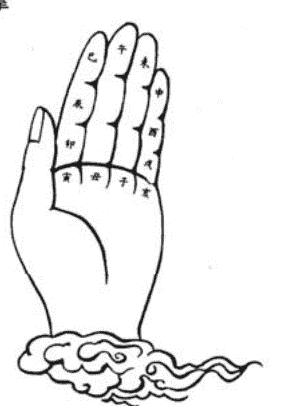

1 安命身宫诀以出生月时算
斗柄建寅起正月
数至生月顺流行
- 子时起数生时止
- 逆回安命顺安身

由寅宫起正月，顺数至本生月止。再从该宫起子时，逆数至本生时止，所至宫位即为命宫；由本生月所至宫位起顺数，至本生时止，即为身宫。（见图一）

- 例如三月巳时。
- 一月寅、二月卯、三月辰。
- 逆数：子时辰、丑时卯、寅时寅、卯时丑、辰时子、巳时亥。故命宫在亥宫。
- 顺数：子时辰、丑时巳、寅时午、卯时未、辰时申、巳时酉。故身宫在酉宫。

#### 2 定十二宫

由命宫逆数：兄弟、夫妻、子女、财帛、疾厄、迁移、交友(奴仆)、事业(官禄)、田宅、福德、父母。（见图二）

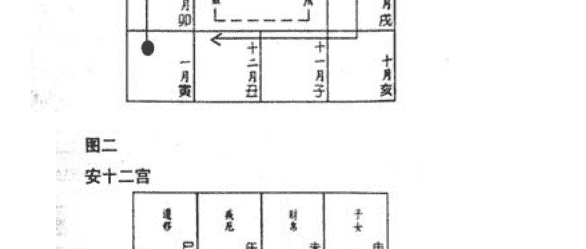

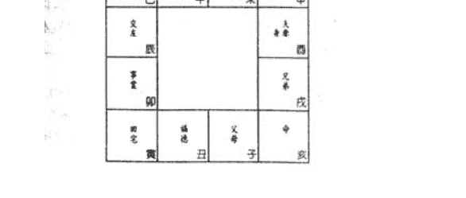

#### 3 安十二宫天干

由于生年不同，十二宫都有相对之天干，其法为用五虎遁诀来订定。

- 甲己之年丙遁寅
- 乙庚之岁戊先行
- 丙辛之年起庚寅
- 丁壬起壬戊癸甲 遁干化气必逢生(注)

例如甲年在寅宫起丙，为丙寅，顺排丁卯、戊辰、己巳、庚午、辛未、壬申、癸酉、甲戌、乙亥、丙子、丁丑。

> (见图三)
> (注) 甲己化土，寅支通丙，丙属火，火生土；乙庚化金，寅支通戊，戊属土，土生金；丙辛化水，寅支通庚，庚属金，金生水；丁壬化木，寅支通壬，壬属水，水生木；戊癸化火，寅支通甲，甲属木，木生火；由上可知**遁干化气必逢生**之义。

#### 4 定五行局

定了十二宫天干后，十二宫便都有了天干和地支。以命宫位的干支，用六十纳音来定五行局。分别为水二局、木三局、金四局、土五局及火六局。

#### 六十纳音诀

甲乙锦江烟 丙丁没谷田 戊己营堤柳(子寅辰 午申戌)庚辛挂杖钱 壬癸林钟满花甲纳音全(丑卯巳 未酉亥)

例一 命宫干支为[辛卯]、庚辛[挂杖钱]，依其偏旁即土、木、金。
子丑 寅卯 辰巳
土 木 金
午未 申酉 戌亥
故命宫在[辛卯]为木三局。
例二 命宫干支为[丙申]，丙丁[没谷田]，即水、火、土
子丑 寅卯 辰巳
水 火 土
午未 申酉 戌亥
故命宫在[丙申]为火六局。

如查简表，则不以命宫天干为准，不如以生年天干对照命宫地支查阅，反为便利：

#### 定五行局表

| 命宫 | 子丑 | 寅卯 | 辰巳 | 午未 | 申酉 | 戌亥 |
| :--- | :--- | :--- | :--- | :--- | :--- | :--- |
| 甲己 | 水二局 | 火六局 | 木三局 | 土五局 | 金四局 | 火六局 |
| 乙庚 | 火六局 | 土五局 | 金四局 | 木三局 | 水二局 | 土五局 |
| 丙辛 | 土五局 | 木三局 | 水二局 | 金四局 | 火六局 | 木三局 |
| 丁壬 | 木三局 | 金四局 | 火六局 | 水二局 | 土五局 | 金四局 |
| 戊癸 | 金四局 | 水二局 | 土五局 | 火六局 | 木三局 | 水二局 |

#### 5 起大限

大限由命宫起，阳男阴女顺行；阴男阳女逆行，每十年过一宫限。

起大限之岁，悉依局数。如水二局人，由二岁起限；火六局人，由六岁起限。

例：命宫在丑、金四局、阳男，大限排列如图四。

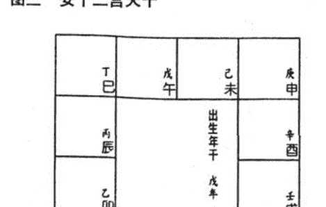

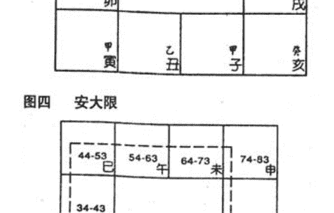

#### 6 起紫微星诀

起紫微星之法分三，可任用一法安立。

一 起紫微诀
- 六五四三二 酉午亥辰丑
- 局数除日数 商数宫前走
- 若见数无余 便要起虎口
- 日数小于局 迳直宫中守

酉宫起火六局；午宫起土五局；亥宫起金四局；辰宫起木三局；丑宫起水二局。

> (余详[掌诀注释])

二 起紫微掌诀(以出生日、五行局定)，其法以出生日数除以五行局数(即水二局除以2，木三局除以3，金四局除以4，土五局除以5，火六局除以6)，得余数及商数。先按五行局位置找余数，由此宫位之前一宫起，顺推至商数即得。

如生日数小于局数时，直接在余数宫(生日数)定紫微星位。倘生日除局数无余数时，一律从寅宫起算顺推至商数止。

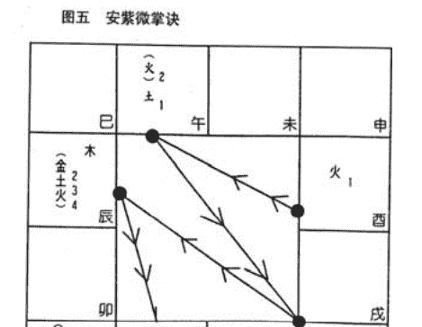

土 3 一食数

#### 图五 安紫微掌诀

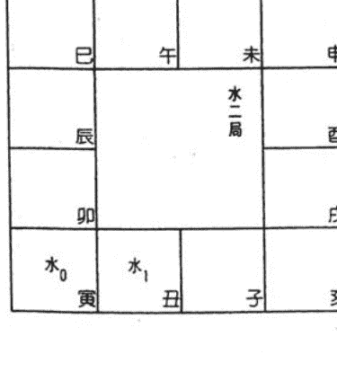

#### 图五 安紫微掌诀

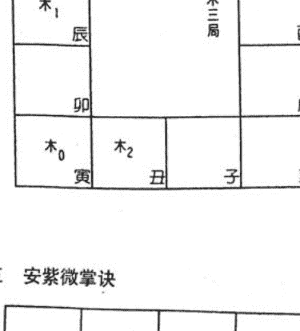

#### 图五 安紫微掌诀

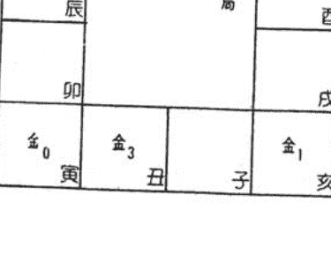

#### 图五 安紫微掌诀

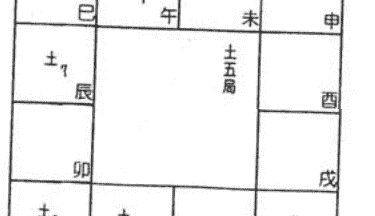

#### 图五 安紫微掌诀

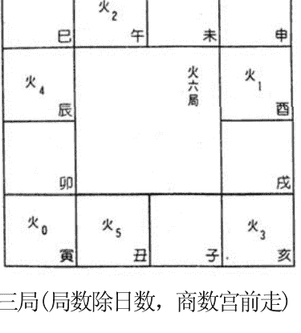

例一 二十二日出生 木三局(局数除日数，商数宫前走)

```
    7
3|2 2
  2 1
-----
    1
```

木三局余1在辰宫，商数为7，故于前一宫起(即巳宫)行步，巳、午、未、申、酉、戌、亥，即紫微定于亥宫。

例二 二十日出生 土五局(若见数无余，便要起虎口)因无余数，由寅宫起行，商数为4，故行四步，寅、卯、辰、巳。故紫微在巳。

例三 初三出生 火六局(日数小于局，迳直宫中守)以火局余3数算，故紫微在亥。此即火局三数之位。

#### 三 安紫微星表

读者可参看安星简表一章内的紫微星表。

#### 7 安天府诀

局定生日逆布紫 斜对天府顺流行 唯有寅申同一位 其余丑卯互安星(见图六)。

紫微和天府是由寅宫开始，分向相对，到申宫再聚同一宫，例如紫微在子，天府在辰。紫微在辰，则天府在子。

#### 8 十四正曜诀

- 紫微逆去宿天机 隔一太阳武曲移
- 天同隔二廉贞位 空三复见紫微池
- 天府顺行有太阴 贪狼而后巨门临
- 随来天相天梁继 七杀空三是破军(见图七)

#### 9 安辅弼昌曲空劫诀

- 辰上顺正寻左辅 戌上逆正右弼当(月)
- 辰上顺时文曲位 戌上逆时觅文昌(时)
- 亥上子时顺安劫 逆回便是地空亡(时)(见图八)

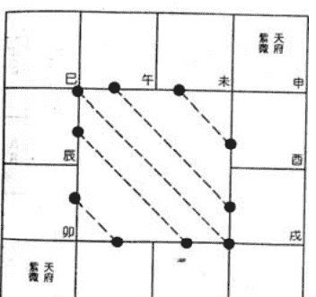

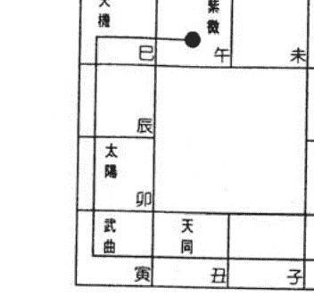

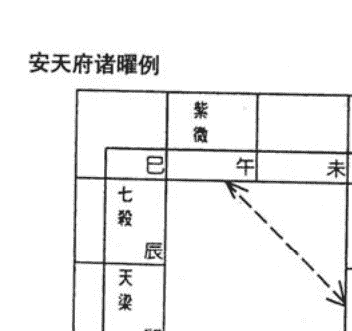

#### 图八甲 安左辅 右弼

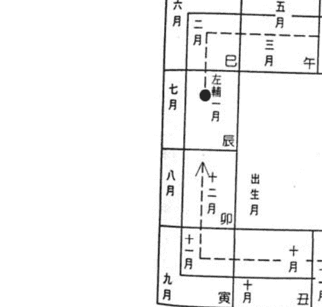

#### 图八乙 安文昌 文曲

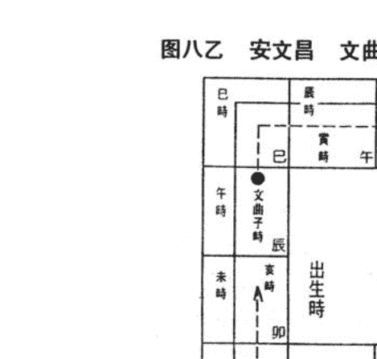## 图八丙 安地劫 地空

| 午时 | 巳时 | 辰时 | 卯时 |
| --- | --- | --- | --- |
| 午时 | 巳时 | 辰时 | 卯时 |
| 未时 | 午时 | 巳时 | 辰时 |
| 申时 | 未时 | 午时 | 巳时 |
| 酉时 | 申时 | 未时 | 午时 |
| 戌时 | 酉时 | 申时 | 未时 |
| 亥时 | 戌时 | 酉时 | 申时 |
| 子时 | 亥时 | 戌时 | 酉时 |
| 丑时 | 子时 | 亥时 | 戌时 |
| 寅时 | 丑时 | 子时 | 亥时 |
| 卯时 | 寅时 | 丑时 | 子时 |
| 辰时 | 卯时 | 寅时 | 丑时 |
| 巳时 | 辰时 | 卯时 | 寅时 |

#### 10 安四化星诀

甲廉破武阳 乙机梁紫阴
丙同机昌廉 丁阴同机巨
戊贪阴阳机 己武贪梁曲
庚阳武府同 辛巨阳曲昌
壬梁紫府武 癸破巨阴贪

#### 11 定魁钺诀(年干)

甲戊庚牛羊 乙己鼠猴乡 丙丁猪鸡位
壬癸兔蛇藏 六辛逢马虎 魁钺贵人方(见图九)

例如甲年生人，天魁在牛位，即丑宫，天钺在羊位即未宫，如此类推。

#### 12 定禄存、羊、陀诀(年干)

甲禄到寅宫乙禄居卯府
丙戊禄在巳 丁己禄在午
庚禄定居申 辛禄酉上补
壬禄亥中藏 癸禄居子户
禄前羊刃当 禄后陀罗府(见图十)

先依决定禄存位于何宫，即以禄前一宫安擎羊，禄后一宫安陀罗。

#### 图九 安天魁

| 蛇巳 | 马午 | 羊未 | 猴申 |
| --- | --- | --- | --- |
| 龙辰 | | | 鸡酉 |
| 兔卯 | | | 狗戌 |
| 虎寅 | 牛丑 | 鼠子 | 猪亥 |

#### 天钺

| 蛇巳 | 马午 | 羊未 | 猴申 |
| --- | --- | --- | --- |
| 龙辰 | | | 鸡酉 |
| 兔卯 | | | 狗戌 |
| 虎寅 | 牛丑 | 鼠子 | 猪亥 |

#### 图十 安禄存 擎羊 陀罗

| 巳 | 午 | 未 | 申 |
| --- | --- | --- | --- |
| 辰 | | | 酉 |
| 卯 | | | 戌 |
| 寅 | 丑 | 子 | 亥 |

例如己年禄存在午、擎羊安未、陀罗安巳。

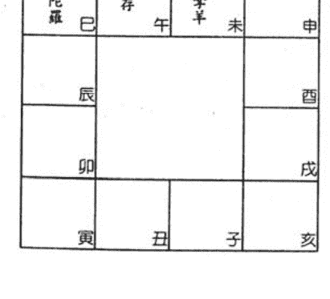

#### 13 安火铃诀(据年支依时起)

申子辰人寅戌扬　寅午戌人丑卯方
巳酉丑人卯戌位　亥卯未人酉戌房(见图十一)

起火铃二曜先据出生年支，依口诀定火铃起子时位。

例如壬辰年卯时生人，据[申子辰人寅戌扬]口诀，故火星在寅宫起子时，铃星在戌宫起子时，顺数至卯时，即火星在巳，铃星在丑。

#### 14 安天官天福贵人诀(年干)

甲喜羊鸡乙龙猴　丙年蛇鼠一窝谋
丁虎擒猪戊玉兔　己鸡居然与虎俦
庚猪马辛鸡蛇走　壬犬马癸马蛇游(见图十二)

例如己年出生人，鸡位为天官，即酉宫；天福为虎位，即为寅宫。(己鸡居然与虎俦)

#### 15 安天厨诀(年干)

甲丁食蛇口　乙戊辛马方　丙从鼠口得
己食子猴房　庚食虎头上　壬鸡癸猪堂(见图十三)

例如己年出生人，天厨在猴房，即申宫。

#### 图十一 安火星

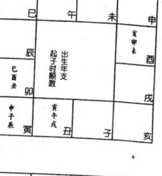

#### 铃星

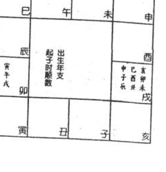

#### 图十二 安天官

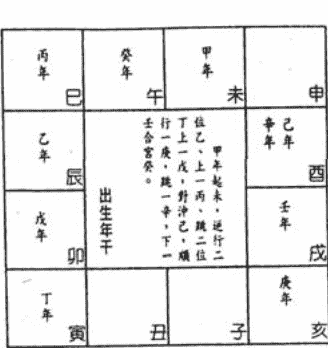

#### 天福

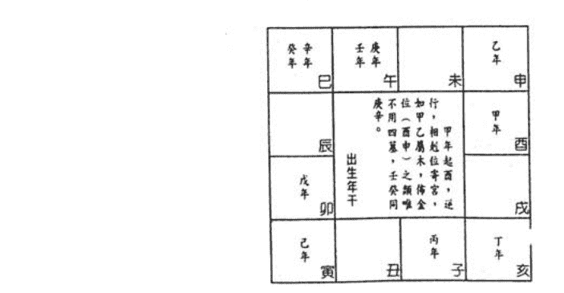

#### 16 安截空诀(出生年干)

戊癸子丑起 推至甲己止
申酉是截空 戌亥不论此(见图十四)

截空是一个星占居二个宫位，在应用时，分为一正一副，正称为正空，副称傍空，以别轻重。正空重傍空轻。如出生年干属阳，则阳宫便为正空，阴宫为傍空；反言之，若阴年生人，则阴宫为正空，阳宫为傍空。

#### 17 安旬空(出生年)

依年干年支顺数至癸后二位。

例如戊午年出生，于午宫起戊，未宫己，申宫庚，酉宫辛，戌宫壬，亥宫癸，天干至癸止。故旬空在子、丑二宫，亦分正空、傍空，同截空例。

#### 18 安天马天空诀(年支)

驾前一位是天空 身命原来不可逢寅申巳亥天马位 三合长生恰对冲(见图十五)

天空在出生年支前一宫，例如午年生人，天空在未宫。

天马以三合局为准，冲三合长生之宫位，即安天马。如申子辰年生人，长生在申，寅冲申，故此三年生人，天马在寅。

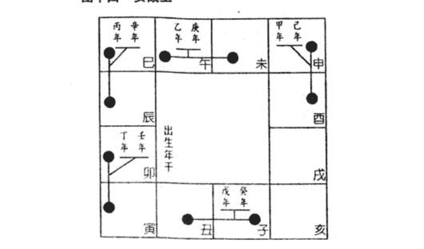

#### 四十五 安天马

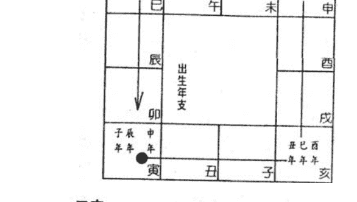

#### 天空

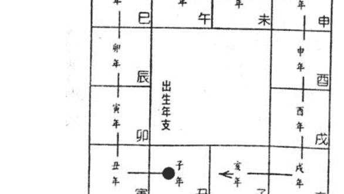

#### 19 安天哭天虚(年支)

天哭天虚起午宫　午宫起子两分踪
哭逆巳兮虚顺未　生年寻到便居中

由午宫起子年逆行，数至生年即是天哭；由午宫起子年顺行，数至生年即是天虚。如寅年生人，天哭在辰；天虚在申。(请参考图十六。)

#### 20 安红鸾天喜诀(年支)

卯上子年逆数之　数到当生太岁支
坐守此宫红鸾位　对宫天喜不差移(见图十七)

从卯宫上逆行起子年，至寅宫丑年，丑宫寅年……　如是安红鸾后，天喜一定在红鸾对宫。例如巳年出生，红鸾在戌宫，天喜在辰宫。

#### 21 安孤辰寡宿诀(年支)

寅卯辰方安巳丑　巳午未方怕申辰
申酉戌方属亥未　亥子丑方寅戌真(见图十八)

先以[方]中的旺神求冲，如寅卯辰年生人，卯为旺神，卯的六冲在酉。得酉之后，其[局]中余宫即是孤辰寡宿位，酉属[巳酉丑金局]，所以巳宫安孤辰，丑宫安寡宿。

> 图十六 安天哭 天虚

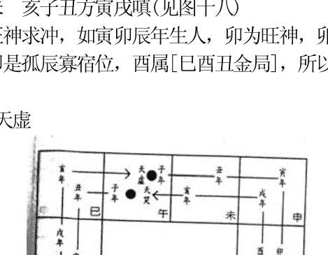

> 图十七 安红鸾 天喜

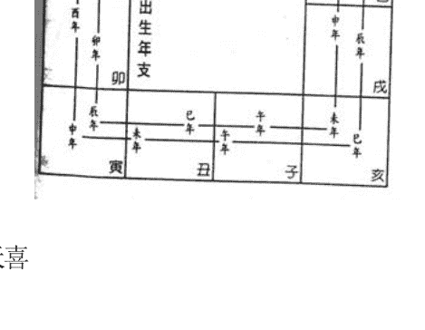

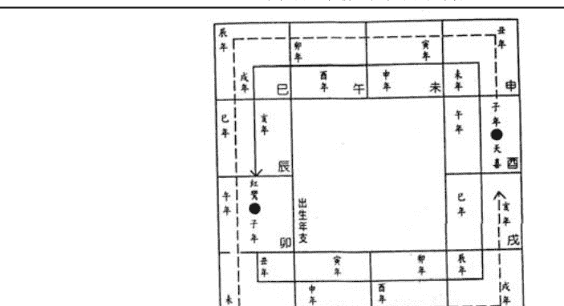

> 图十八 安孤辰 寡宿

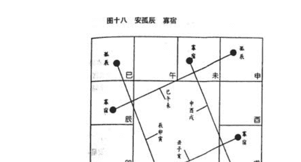

[亥子丑]中[子]冲[午]。[寅午戌]三合，找寅戌安星。

[寅卯辰]中[卯]冲[酉]。[巳酉丑]三合，找巳丑安星。

[巳午未]中[午]冲[子]。[申子辰]三合，找申辰安星。

[申酉戌]中[酉]冲[卯]。[亥卯未]三合，找亥未安星。

#### 22 安劫杀诀(年支)

申子辰人蛇开口　亥卯未人猴速走
寅午戌人猪面黑　巳酉丑人虎咆哮(见图十九)

劫杀以三合局来定位，例如申子辰三合水局，在水局之绝位，即巳位安劫杀，故寅午戌三合火局，绝位在亥宫，劫杀在亥。亥卯未三合木局，劫杀在申；巳酉丑三合金局，绝位在寅。另可记[简法]，即劫杀必在华盖前一位。

#### 23 安大耗诀(年支)

但用年支去对冲　阴阳移位过一宫
阳顺阴逆移其位　大耗原来不可逢(见图二十)

大耗安法，是在年支之对宫，前一位或后一位安星。阳支顺行前一位，阴支逆行后一位。

#### 24 安年支六曜诀(蜚廉、破碎、华盖、咸池、龙德、月德)

蜚廉分方顺年移 西南东北各轮之 破碎轮排巳丑酉不关生月与生时 辰丑戌未轮华盖 西午卯子布咸池龙德起羊月起巳 六星都起据年支(见图二十一)

蜚廉安星，子年由申宫起，十二年支顺序先在西方(申酉戌)，次在南方(巳午未)；继在东方(寅卯辰)，最后在北方(亥子丑)安立。

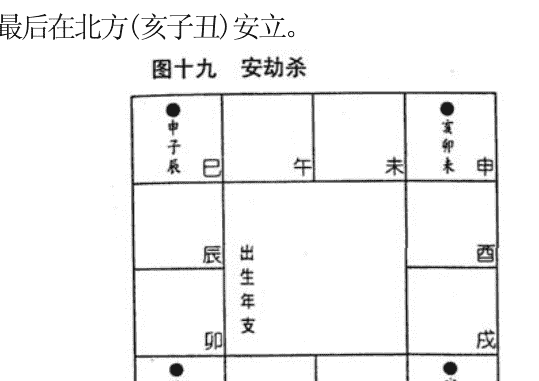

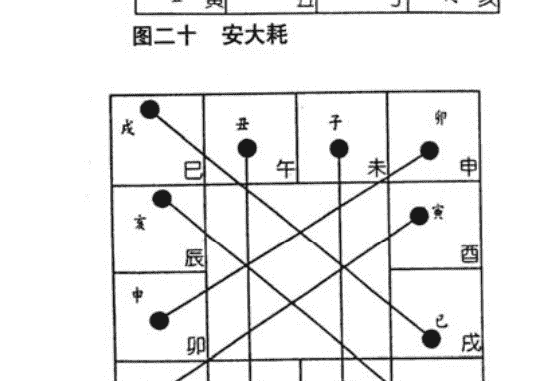

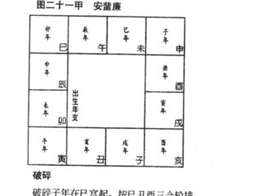

破碎

破碎子年在巳宫起，按巳丑酉三合轮排。

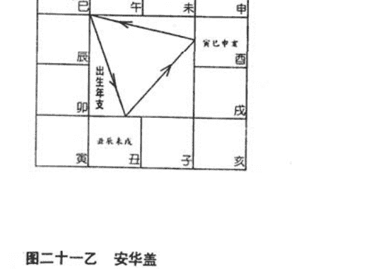

#### 图二十一乙 安华盖

华盖子年由辰宫起，按辰丑戌未轮排十二支。

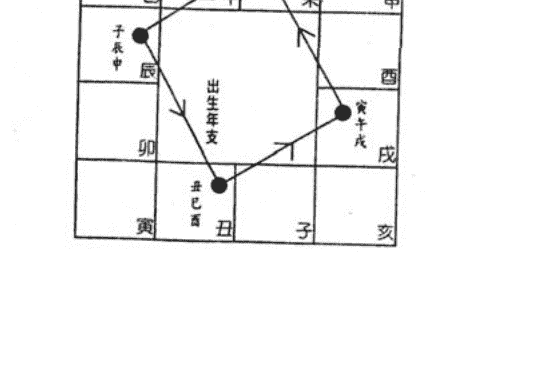

咸池

咸池由酉宫起，按酉午卯子轮排十二支。

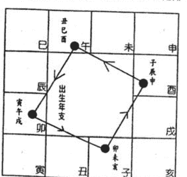

#### 图二十一丙 安龙德

龙德由未宫起子年，顺轮十二年支。

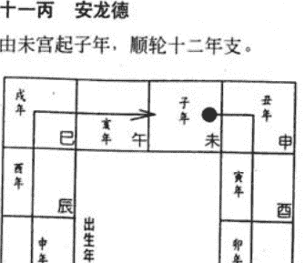

月德 月德由巳宫起子年，顺轮十二年支

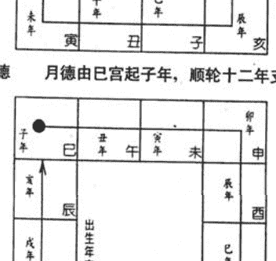

#### 25 天德、年解(生年解神)

天德星君起酉宫 顺至生年定其踪
年解戌宫逆行去 数至生年可解凶(见图廿二)

#### 26 安天才天寿诀(年支)

命宫起子天才顺 身宫起子天寿堂

#### 27 安龙池凤阁诀(年支)

龙池辰上子顺行 生年到处福元真
凤阁戌宫逆起子 遇到生年是此神(见图二十三)

#### 28 安台辅封诰(出生时)

曲前二位是台辅 曲后二位封诰乡(见图二十四)

文曲星前二位安台辅，文曲后二位安封诰。例如文曲在未，台辅在酉、封诰在巳。

#### 29 安刑姚诀(出生月)

天姚丑上顺正月 天刑酉上正月轮数至生月便住脚 即安刑姚两颗星(见图二十五)

#### 30 安解神天巫(生月)

单月冲宫见解神 双月还依单月辰巳申寅亥天巫位，分轮十二月星君(见图二十六)

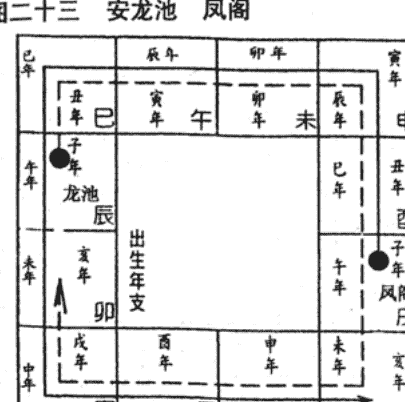

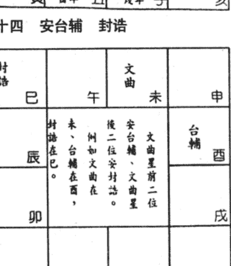

解神又名月解，与按生年所安的[年解]有别。月解的起法，按两个月起一宫，例如正月二月同宫，依正月建寅，所以正、二月的月解同在寅的对宫，即申宫。天巫同已宫起，单巳申寅亥四宫顺序，分排十二月的天巫星位。

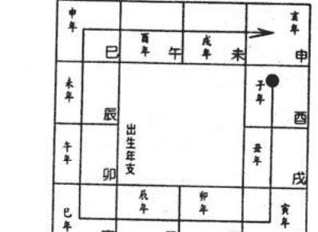

年解

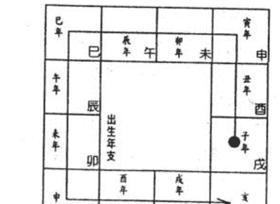

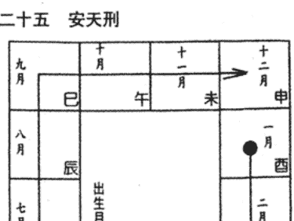

天姚

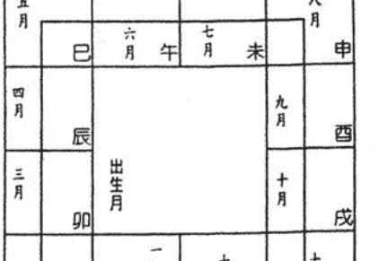

#### 31 安天月诀(生月)

一犬二蛇三在龙 四虎五羊六兔宫
七猪八羊九在虎 十马冬犬腊寅中(见图二十七)

#### 32 安阴煞诀(生月)

寅子戌 申午辰 分六月 阴煞临(见图二十八)

阴煞安法，正月由寅宫起，隔一宫安二月，如是逆行轮排十二月。

#### 33 安伤使诀

天伤奴仆 天使疾厄 夹遭移宫 最易寻得 (凡阳男阴女，皆依此诀，但若为阴男阳女，则改易天伤居疾厄、天使居奴仆。)

| 天伤 | 奴仆宫（交友宫） |
| :--- | :--- |
| 天使 | 疾厄宫 |

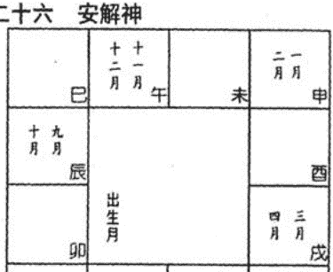

天巫

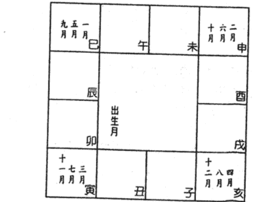

#### 图二十七 安天月


#### 34 安三台八座诀 (依辅弼)

三台左辅起初一 数至生日是台宫
八座右弼逆初一 数至生日定其踪

| 宫位 | 规则 |
| :--- | :--- |
| 三台 | 由左辅所坐的宫位起初一，顺行，数到本生日。 |
| 八座 | 由右弼所坐的宫位起初一，逆行，数到本生日。 |

#### 35 安恩光天贵诀(依昌曲)

文昌顺数至生日 退后一步是恩光
文曲顺数至生日 退后一步天贵方

| 宫位 | 规则 |
| :--- | :--- |
| 恩光 | 由文昌所坐的宫位起初一，顺行，数到本生日再退后一步。 |
| 天贵 | 由文曲所坐的宫位起初一，顺行，数到本生日再退后一步。 |

#### 36 安命主(年支)

子属贪狼丑亥门 寅戌生人属禄存
卯酉属文巳未武 辰申廉宿午破军

| 出生年支 | 子 | 丑 | 寅 | 卯 | 辰 | 巳 | 午 | 未 | 申 | 酉 | 戌 | 亥 |
| :--- | :--- | :--- | :--- | :--- | :--- | :--- | :--- | :--- | :--- | :--- | :--- | :--- |
| 命主 | 贪狼 | 巨门 | 禄存 | 文曲 | 廉贞 | 武曲 | 破军 | 武曲 | 廉贞 | 文曲 | 禄存 | 巨门 |

#### 37 安身主(年支)

子午安身铃火宿 丑未天相寅申梁
卯酉天同身主是 巳亥天机辰戌昌

| 出生年支 | 子 | 丑 | 寅 | 卯 | 辰 | 巳 | 午 | 未 | 申 | 酉 | 戌 | 亥 |
| :--- | :--- | :--- | :--- | :--- | :--- | :--- | :--- | :--- | :--- | :--- | :--- | :--- |
| 身主 | 火星 | 天相 | 天梁 | 天同 | 文昌 | 天机 | 火星 | 天相 | 天梁 | 天同 | 文昌 | 天机 |

#### 38 安长生十二神(五行局)

阳男阴女顺行，阴男阳女逆行。
十二神顺序: 长生、沐浴、冠带、临官、帝旺、衰、病、死、墓、绝、胎、养。
定五行长生诀
金生巳 木生亥 火生寅 水土生申(见图二十九)

#### 39 安太岁十二神(年支)

太岁晦气丧门起 贯索官符小耗比
岁破龙德白虎神 天德吊客病符止

#### 40 安将前诸星(年支)

将星三合起旺地 攀鞍岁驿息神方
华盖劫灾天三煞，指背咸池月煞亡(见图三十)

#### 41 安生年博士十二神(以出生年干定禄存起，分顺逆)

禄存 不分男女皆从禄存起，阳男阴女顺行，阴男阳女逆行。
博士 力士 青龙 小耗 将军 奏书 飞廉 喜神 病符 大耗 伏兵 官符


博士聪明力士权 青龙喜气小耗钱
将军威武奏书福 飞廉口舌喜神延
病符大耗皆非吉 伏兵官府相勾缠


#### 42 流昌流曲

流昌起巳位 甲乙顺流去 不用四墓宫 日月同年岁
流曲起酉位 甲乙逆行踪 亦不用四墓 年日月相同
（见图三十一）

两诀末句，谓流年流月流日流时之流昌流曲，均依天干取。
坊本无[年解]及[流曲]。此为中州派传授。

| 流年 | 甲 | 乙 | 丙 | 丁 | 戊 | 己 | 庚 | 辛 | 壬 | 癸 |
| :--- | :--- | :--- | :--- | :--- | :--- | :--- | :--- | :--- | :--- | :--- |
| 流昌 | 巳 | 午 | 申 | 酉 | 申 | 酉 | 亥 | 子 | 寅 | 卯 |
| 流曲 | 酉 | 申 | 午 | 巳 | 午 | 巳 | 卯 | 寅 | 子 | 亥 |

#### 43 流曜

中州派用于大限、流年、月、日、时的星曜有：
流魁、流钺、流禄、流羊、流陀、流昌、流曲、化流禄、化流权、化流科、化流忌。

其中流[魁钺羊陀禄存]、流[四化]的起法与起星盘的方法相同，但都不写在星盘之上，在推算时记在心中，因此，熟念四化，禄存、魁钺等诀为推算运限之必需过程，不可轻视。

例如某人丙年生，他命盘的魁钺禄等分别为：

| 命盘 | 魁钺 | 禄羊陀 | 化禄 化权 化科 化忌 |
| :--- | :--- | :--- | :--- |
| 星 | 亥 酉 | 已午辰 | 同 机 昌 廉 |

又如甲年，流年魁钺禄等分别为：

| 命盘 | 魁钺 | 禄羊陀 | 化禄 化权 化科 化忌 |
| :--- | :--- | :--- | :--- |
| 星 | 丑 未 | 寅卯丑 | 廉 破 武 阳 |

#### 44 定小限

先将生年分四局 墓库冲处小限起
男顺女逆一路行 不轮阴阳各排比(见图三十二)

寅午戌人，戌墓冲辰，小限一岁由辰宫起；亥卯未人，未墓冲丑，小限一岁由丑宫起；申子辰人，辰墓冲戌，小限一岁由戌宫起；巳酉丑人，丑墓冲未，小限一岁由未宫起。男命顺行，女命逆行，不分阴阳。

#### 图三十一 安流昌

甲年 乙年 丙戊年
巳 午 未 申
辰 流年年干 酉
癸年 卯 戌
壬年 寅 丑 子 亥

#### 流曲

丁己年 丙戊年 乙年
巳 午 未 申
辰 流年年干 酉
庚年 卯 戌
辛年 壬年 癸年
寅 丑 子 亥

#### 图三十二 安小限

巳酉未 亥
午 未 申
辰 卯 寅 丑 子 亥

#### 45 流年太岁

推算流年，应以流年太岁为主，流年太岁便是流年所行的宫度，例如甲子年以子宫为太岁位；丙申年则以申宫为太岁位之类，看一年吉凶，以当年太岁位的三方四正所逢星曜决定。流曜则仍依年干起，不用宫干。

要查这一年中详细的运程，以流年太岁宫作为本年的命宫，按兄弟、夫妻等十二宫逆行安排，则一年中夫妻、子女、财帛等运程便可以推算。

应用时，以大限的吉凶星曜作为参考。

#### 46 安斗君(年支月时)

> 太岁宫中便起正 逆回数至生月停
> 此宫顺流子时位 流于生时安斗君

安当年斗君以当年太岁宫位起，例如算子年五月卯时生人的斗君，于子宫起一月逆行，亥宫二月，戌宫三月，酉宫四月，申宫五月，于申宫起子时顺回，酉宫丑时，戌宫寅时，亥宫卯时，得子年斗君在亥宫。

得子年斗君宫位后，便可依次推出每年斗君，如丑年斗君在子、寅年斗君在丑等等。

#### (附)流月流日流时命宫定法

推算流月，系以当年斗君所在宫位为正月命宫，例如子年斗君在午，则丑年斗君顺排在未，因此丑年正月便以未宫起宫。又如寅年斗君在申、寅年正月在申宫，如此类推。

但是推流月时，流四化则以流月之天干来决定，例如某命流年乙丑年三月，子年斗君在午，则丑年斗君在未宫起正月，申二月，酉三月。但天干则以乙丑年(五虎遁月诀)起戊寅(正月)、己卯(二月)、庚辰(三月)。故推命时虽流月之命排在酉宫，但四化仍按庚辰月算，即庚——阳武府同。

闰月以前半月属上月，下半月属下月推算。

流日推算法是以流月宫位起初一，顺数回本宫为十三、二十五等。天干则以万年历中当日之天干来推四化星。闰月之推法，例如三月有闰月，则三月顺数卅日后加上闰月前半月之十五日，共四十五日顺推，四月也是以四十五日顺推。

例如三月在酉宫，则三月十五日在亥宫，因三月初一在酉、初二在戌、初三在亥……顺至十三在酉、十四在戌、十五在亥宫。

流时推法是以流日子宫起子时，顺数亥宫为亥时。流时命宫仍按流时的干支算。

### 乙 基本术语

- (一) 正曜: 指紫微、天机、太阳、武曲、天同、廉贞、天府、太阴、贪狼、巨门、天相、天梁、七杀、破军等十四曜。
- (二) 辅曜: 指左辅、右弼；天魁、天钺四曜。
- (三) 佐曜: 指文昌、文曲；禄存、天马四曜。
- (四) 煞曜: 指火星、铃星、擎羊、陀罗四曜，又称[四煞]。有时亦将地空、地劫包括在内，称为[六煞]。
- (五) 空劫: 指地空、地劫二曜。
- (六) 化曜: 指化禄、化权、化科、化忌四曜。
- (七) 空曜: 指空劫与天空。截空、旬空亦可算作空曜，但力量较弱。

### 丙 星盘推断法

#### 前 言

学习[紫微斗数]其实只需了解三件事：(一)安星法；(二)星系的基本性质；(三)如何根据星盘来推断运程。本节提前谈到最后一点，目的是提高学者的兴趣。因为有许多人读过一些有关斗数的书籍之后，面对一个星盘，依然无法推断。现在先介绍这方面知识，学者即使未学习过[中州派紫微斗数]的星系性质，至少亦可依本派的方法，对自己起出来的星盘作一初步的理解。

对星盘作综合观察

面对一个星盘，一般初学者的毛病，是太过着重[命宫]、[迁移宫]、[财帛宫]、[事业宫]这个[三方四正]的推断。因为现代人一般心理，首先是注重自己财帛与事业。可是，这种推断法却容易陷于支离破碎，使人很难全面理解整个星盘格局的高低。依照笔者的经验，应该循下述的步骤来观察，才可以对命运有一全盘的理解。

- 1. 先看父母宫、再看田宅宫
由父母及田宅这两个宫位，即可以推断其人的出身，以及受父母荫庇的程度。这样，当观察命宫之时，才可以决定其人适宜行[白手兴家]的创业运势，还是适宜行[克绍箕裘]的保守运势。这一点非常之重要，因为假如一个人的[父母宫]和[田宅宫]都很好，可是星盘中却明显出现一个[白手兴家]的运程时，就证明其人的家庭极可能出现过一次崩破。反之，如果[父母宫]和[田宅宫]都坏的人，连续走两三个毫无突破的保守性运程，便很难推断其人有扭转环境的佳遇。

- 2. [命宫]应与[福德宫]同时观察
一般来说，命宫[三方四正]星曜所显示的，是比较实质的运程，如物质享受、财富的多寡、事业的顺逆之类。福德宫[三方四正]所显示的，却是一个人的精神享受与思想活动。如果两个宫位的性质都好，其人自然无往不利，而且可以肯定，一定有一个良好的家庭；反之，如果命宫很好，可是福德宫却相当差，那么就需要注意，他的婚姻或者不如意；他可能是靠侥幸致富，所以他的精神享受并不高尚；又或者其人的境遇虽然相当好，但可能有宿疾缠身。

- 3. 根据以上两项的观察，便可以找出一些特别值得注意的宫位
如怀疑其人婚姻不利，便应检视[夫妻宫]；怀疑其人有难以痊愈的慢性病，便应该检视[疾厄宫]；必须从这些星系，足以解释[命宫]与[福德宫]互相配合来的性质，然后才可以作出推断。

下面，我们试举一个实例：

[图一]为一女命的星盘。[命宫]天机化科；太阴化禄，会财帛宫天同化权，是为[禄权科会]，在斗数中是一个良好的结构。可是[福德宫]巨门化忌，会合[夫妻宫]见红鸾、咸池两颗桃花杂曜，对宫(即[财帛宫])又见天姚。这样的星系结构、显示可能由婚姻生活导致精神痛苦，因此就必须详查其[夫妻宫]的星曜组合。

[夫妻宫]太阳、禄存坐守，丈夫并不贫穷。但会合巨门化忌，最坏的还是会合了对宫(即[事业宫])的天梁、天刑，加上一颗火星。这种星系组合，显示夫妻无缘。

不过，夫妻无缘可能有多种性质，例如夫妻志趣不相投；会少离多；丈夫有外宠；丈夫多病等等。要决定属于何种性质，光是看命盘的十二宫无法解决，还必须详查大运与流年。

所以，我们就进入到第四个步骤。

#### 4 根据宫位的观察，追查运限

追查大限与流年的运势，常常可以补充对星盘作综合观察的推断。如上例，我们只要追查她每个大限的[夫妻宫]，就可以作出更准确的推断。

在二十五至三十四岁的[庚戌大限]，戌宫变成[大限命宫]，所以戊申宫(原星盘的[命宫])就变成[夫妻宫]。

宫中飞入一颗大限的禄存(即[流禄]，因为庚戌大限的禄存在申)，可是亦同时惹来大运的[流羊]与[流陀]相夹。

(见图二)


图一


图二

参考原来的星盘(图一)，原局[夫妻宫]亦有羊陀相夹的现象，这可以视为一种巧合，但如此巧合，一定别有道理，而且[大运夫妻宫]还会合了天同化忌(原命盘化权)，加上[大限命宫]巨门化忌又与天同化忌遥遥相对，因而就可以肯定，在这个大限之中夫妻必有问题。

追查下去，就发现于癸亥年(一九八三年)流年夫妻宫大有问题。(图三)。

流年夫妻宫在酉宫，紫微、贪狼入守，可是贪狼于癸年化忌，同时有大运的流羊同宫。会合的煞曜是巳宫的陀罗，丑宫的[流年流羊]，以及武曲破军、廉贞七杀等星曜。这种星系结构，其性质为[无家室之乐]——最坏的是[流年流羊]冲动[大运流羊]，同时惹起[紫贪]星系的化忌。所以初步推断，其人的夫妻生活非常之不协调。询问的结果，是癸亥年结婚，婚后一个月丈夫即性无能。

再检视那位丈夫的星盘[疾厄宫]，天机太阴坐守，有铃星及陀罗同宫，会合天梁及文昌化忌。同时[三方四正]又有大耗、咸池、红鸾等桃花杂曜，加上还有阴煞。这样的星系组合，据笔者的微验，乃属于由纵欲引起的阴分亏损，可以推断，其人在婚前已经斫丧过甚。因此建议那位丈夫去找一位著名的中医诊治，从养阴培元着手，结果于乙丑年(一九八五年)初，那对夫妇就来道谢，总算挽回一段眼看就要破裂的婚姻。(见图四)


图三


图四

#### 5 观察宫垣吉凶的一些技巧

从上面几项观察步骤，以及通过一个实例，读者相信对依星盘推断的法则已有大致的轮廓，但在却还要熟悉一些技巧。

下面试将这些技巧罗列出来，读者必须紧记。

- 第一：借星安宫

当一个宫位没有[正曜]之时，必须要借对宫的星曜入本宫，称之为[借星安宫]。——关于这点，一般斗数书籍或有触及，但有两个关键，却从来没有人谈到。

当[借星安宫]之时，必须将所借宫垣的星系全部借入，不仅是借正曜安宫而已，这是关键之一。

例如[图五]为一男命的星盘，夫妻宫在辰宫，因无正曜，所以要借入对宫的星系，经[借星安宫]之后，夫妻宫的结构就变成是天梁、天机化忌、火星、陀罗、左辅、右弼。

然而这一点还关系不大，因为对宫的星系性质本来已经足以影响本宫。即使不[借星安宫]，本宫与对宫合起来的星系性质，亦大致上等于[借星安宫]后的性质。但另一个关键，却是使整个夫妻宫发生变化。

当找寻一个宫位的[三方四正]时，如果有任何一宫无[正曜]坐守，则这个宫位仍须向其对宫[借星安宫]，然后才与本宫会合。这是关键之二。——许多人熟读了大量斗数书籍之后，仍然无法推断得准确，即是由于不知道这一个关键的缘故。

仍以[图五]为例。在辰宫的[夫妻宫]与申、子两宫会合，又与对宫(戌宫)冲合，构成[三方四正]。申、戌两宫都有[正曜]，不发生问题。然而子宫却只有一颗文曲，不属于[正曜]，因此就必须向对宫(午宫)[借星安宫]，所借加入者为天同、太阴、铃星、擎羊。

这样一来，[夫妻宫]的全部星系，便变成是火星、铃星、擎羊、陀罗等[四煞并照]之局，再加上天机(化忌)、天梁；天同、太阴；太阳(化科)、巨门的正曜组合。可以判断婚姻生活一定极不完美，虽然不一定离婚，但却有貌合神离的可能。——太阳化科加巨门同会，主夫妻彼此维持面子，所以即使是怨偶，亦不一定轻易言离。

读者由以上的例子可以知道，[借星安宫]是推断斗数的一大法门，尤其是笔者提出的两点关键，更是古人历来不肯轻传的[秘法]。希望对此能细心加以体会。

- 第二：注意一组星系性质，常常可以破坏另一组星系的性质。——[星曜互涉]

关于这一点，可以举一个实例来说明。

[图六]为一位中学女生的命盘。她于甲子年(一九九四年) 参加中学学会考。目前正行[癸卯大运]。

照甲子年的流年来，看命宫在子宫，有天府、武曲坐守，而且武曲于甲年化科，在申、午两宫，会合到左辅、右弼；文昌、文曲，再加上午宫的禄存，有本宫[大运流禄]相叠，是禄星文星齐集，成为[禄文拱命]的格局。依一般的看法，是本年参加中学学会考应该不会失败。

但我们却不防注意到[流年命宫] (子宫)有咸池、大耗两颗杂曜，它们同居一宫，力量相当大，主带来不良后果的男女感情。

这时候，便应该去检视她的[流年福德宫]了(这即是命宫与福德宫同时视察的原则)。这个宫位落在寅宫，贪狼独守，但是在癸丑大运贪狼化忌；与廉贞相对，亦是红鸾、天喜这对杂曜遥遥相对。再看寅宫会合申、午两宫的辅佐诸曜，为左辅、右弼；文昌、文曲，可谓桃花遍集福德宫。

在这种情形之下，我们不妨推断，这位中学女生虽然读书的成绩不错，但可惜是年却陷入热恋之中，因而影响考试的成绩。——这位女生原来亦因为考试失败，所以才来求教于笔者。

从这个例子可以知道，只是因为[流年命宫]出现咸池、大耗这对杂曜，便可以使[禄文拱命]的星系性质发生了变化。这即是[星曜互涉]的一个好例子。

- 第三：凡[对星]出现，力量加强。

推断斗数，有一常易为人忽视的原则，即是[见星寻偶]。而这亦是[中州派]认为相当重要的推断技巧。

所谓[见星寻偶]，是因为斗数中有许多[对星]，一颗独见之时，力量有限，但成对出现，力量便大为增强。——古人对这点，其实亦已稍有透露。例如古人重视[逢府看相]、[逢相看府]，即是因为天府、天相是[对星]的缘故。然而古人爱守秘，所以便只示一例，不详举其余。

现在，让我们把这些[对星]一一详列出来，以供读者记忆。

- 正曜: [天府、天相]; [太阴、太阳]; [天同、天梁]; [廉贞、贪狼]
- 辅曜: [左辅、右弼]; [天魁、天钺]。
- 佐曜: [文昌、文曲]; [禄存、天马]。
- 杂曜: [红鸾、天喜]; [咸池、大耗]; [龙池、凤阁]; [恩光、天贵]; [三台、八座]; [孤辰、寡宿]; [天哭、天虚]; [天福、天寿]; [台辅、封诰]。

然则，怎样才可以称为[对星出现]呢？其力量大小的判别，可按下述原则来鉴定。
在[图七]中，举出四种[对星出现]的情况。

力量最重要的一种情况，是[对星同宫]。如图在丑宫，太阴太阳同守一宫，这种星系结构的力量绝不可忽视。

其次，力量相当重的一种情况，是[对星互照]，如图在辰、戌两宫，太阴太阳互相对照，其力量的发挥亦不可忽视。

再次，为[双飞蝴蝶]式的会合，即[对星]分居本宫左右两个[合宫]。如图，以午宫为本宫，逆隔三宫的寅宫见天哭；顺隔三宫的戌宫见天虚，即天哭天虚这对[对星]，以[双飞蝴蝶]的姿态跟午宫会合，对于午宫而言，力量亦重。但对于寅、戌两宫而言，哭虚的会合却比较上没那么重要，因为这不属于[双飞蝴蝶式]的会合。

最后，是所谓[偏斜式]会合。

如图，以子宫为本宫，与申宫的文曲及对宫(午宫)的文昌相会，但对子宫来说，与申、午两个宫位的相对位皆不平衡，因此这种[对星]出现的形式，力量就比较小。

总结一下，[对星]出现的力量，依下列次序递减：
同宫——相对——在三合会照——在三合宫、在对宫会照——各居三合宫相会(如寅戌宫的天哭天虚)。

以上所述，前人亦视为[不传之秘]。所以依旧籍学习斗数，往往会觉得一些星曜的会合作用很强，可是有时又觉得它们的会合，并未显示很大的作用，其故即在于不懂得按上述的会合形式来衡量其力量。

[借宫安星]; [星曜互涉]; [见星寻偶]，是笔者得传的，[中州派]推断星盘三大重要技巧。本派前辈曾撰写讲义，但对此亦不肯透露，由是可知其重要性。希望读者对此能加以重视。

## 三、诸星曜及星系显示的面貌身型性格特征

#### 前言

[中州派紫微斗数]有一套独特的方法，可以凭命宫的星曜及星系，来鉴别面貌、身型以及一些性格特征。

我们不可能见到一个人，便立即准确地说出他命宫的全部星系组合，但起出命盘以后，却可以根据其命宫的星系来鉴别。要鉴别的缘故，目的是检定起出来的命盘是否正确。

一般人推算[紫微斗数]，只凭来人所报的出生年、月、日、时起盘安星，命盘起出以后便立即加以推断，以致误判来人的运程，甚至有时因此造成悲剧。这种情形，令人痛心。所以凭面貌身型生理特征来检定命盘是否正确，实在是不容忽视的事。

命盘有误，原因可分为两种：

第一，来人误报出生资料。最常见的情形是误报生时。笔者有过多次的经验，来人的父母坚持所报的生时正确，对笔者花费时间推定的生时表示不满，但经过向接生的医院查询，却证明笔者的推定正确。希望读者于排定命盘之后，若发现有疑不妨改变一下生时，多排一个命盘来比较。

第二，依照笔者的师傅，每个生时有[天盘]、[地盘]、[人盘]的分别。大致上来说，于时头的十五分钟左右，用[地盘]推算；于时尾的十五分钟左右、用[人盘]推算；其余居于时中的约一小时三十分钟时间，则用[天盘]来推算。——然而，这只是大致的情况，由于出生地不同，以及可能涉及到[祖德]（祖先与父母的德泽），根据经验，很难机械化地划分时刻，规定天、地、人盘的时间。例如，于上午五时十三分出生的人，极可能要用[地盘]推算，因为属卯时头十五分钟之内生人，但有时经过鉴别，却可能要用[天盘]，不过有时对出生于五时十六分的人，却又需舍[天盘]而用[地盘]。

在这种情形之下，鉴别身型、面貌、生理特征，就变得更加重要。

用以鉴别的宫位，一般为[命宫]。但命宫的星曜却多仅主其人的先天形态。若后天形态有何重要的改变，应该兼视[身宫]。

所谓先天形态，是指基本面型；身段高矮；鼻与颧的高低；有无毛发异生；有无先天胎记以及异痣；眼神清浊以及眼型等等而言。这些特征，并不随人的年龄而有根本性的改变。

至于后天形态，则与人的年龄有关，最明显的改变是肥瘦，此外亦包括有无后天的破相，肤色因后天生活而改变，以及雀斑、暗疮、黑痣的滋生，甚至有无近视、散光等生理特征在内。诸如此类，皆可检视[身宫]的星曜。

但有些属于遗传性的特征，则宜检视[父母宫]，古人有称父母宫为[相貌宫]的，即是由于可以从此宫位，看出由父母遗传下来的基本形态（甚至包括遗传的疾病）。因此在鉴别命盘之时，亦应参考这个宫位。

关于星曜所显示的体态及性格，古人有一篇[形性赋]，提出许多特征，笔者一一加以注释，读者可以参看，但可惜这篇赋文只着重于星曜而不极于星系，所以应用起来便有局限。不过老实说，即使是[中州派]所传，其实亦偏重于星曜。关于由星系鉴别形性方面的资料，笔者做过一些记录，仍然不够详尽，希望将来能有所补充。

### 甲 形性赋注释

原夫紫微帝座，生为厚重之容。

（注）紫微主人形体肥胖饱满，圆长脸形，虽肥不臃肿，虽瘦不露骨，故称为[厚重之容]。

天府尊星也，作纯和之体。

（注）天府主人面型方或方长，眼神带清气，且多齿白唇红，故称[纯和之体]。

金乌圆满、玉兔清奇

（注）[金乌]指太阳，主人面型带圆；[玉兔]指太阴，虽亦为圆脸或微长之圆脸，但肤色不如太阳之红润。

天机为不长不短之资，情怀好善。

（注）天机多主中等身材，心软，但亦性急，面型多长瘦。入庙则为长脸带圆。

武曲乃至刚至毅之操，心性果决。

（注）武曲主人情性刚毅，处事果断，但时嫌眼光不远。

天同肥满，目秀清奇。

（注）天同主人长方面型，带圆。一般均微胖丰满。但虽丰满而仍眉清目秀，是其特征。

廉贞眉粗口阔而面横，为人性暴，好怒好争。

（注）廉贞主人形体粗壮，眉粗，口阔，颧露，肩背骨露，面型横圆而带骨节棱角。一般性格均带浮躁，唯常[文曜]者则反温婉纯和。

贪狼为善恶之星，入庙必应长耸，出垣必定顽嚣。

（注）贪狼生人，性情不常，爱恶无定。或工心计，或性急而好弄巧，或则手段圆滑，能施人以惠，故称为[善恶之星]。居于陷宫，形小声高多骨；倘入庙，则长耸高大，体态丰满。

巨门乃是非之曜，在庙敦厚温良。

（注）巨门入庙，体态肥胖，中高身材；若落陷宫，则主其人瘦小。凡落陷者，主其人多背面是非，且性多疑惑。唯无论入庙或落陷，均多长方面型。

天相精神，天梁稳重。

（注）天相主人形体持重温和，且眼神正大而清和；天梁主人，体态虽不算丰厚圆满，但行藏举止自然有一段厚重之气：稳重大方。

七杀如子路暴虎凭河

（注）[暴虎凭河]是不怒而威，主要是指七杀生人的眼神举止。子路是孔子的学生，其精神体貌具有威严。

火铃似豫让吞炭为哑。

（注）豫让计划刺杀吴王僚，化装变容，但仍恐自己的声音给人认出，所以吞下炭块，使声音嘶哑。命宫身宫若见火铃二曜，声带常易暗哑，且多毛发，甚至毛发自然弯曲。

暴虎凭河分目大凶狠；吞炭为哑兮暗声声沉。

（注）子路及豫让皆不得善终，故云。但须注意，这样的推断其实很概括，只是指一种基本倾向，不可作为定论。

俊雅文昌，磊落文曲。

（注）文昌文曲皆主人眉目清秀如画，但文昌则闲雅聪明，文曲则磊落大方。倘昌曲二曜同会命宫，主人面带圆型，即使[正曜]主人尖瘦，亦可变为下颚尖圆。

在庙定生异痣，失陷必有斑痕。

（注）文昌文曲主[斑点]，举凡墨、痣、斑痕、麻点、雀斑之类，皆属于[斑点]。大致上入庙者虽有[斑点]而不影响观瞻，若落陷则于容貌有损。唯以见煞忌始是。

左辅右弼，见温良规模。

（注）左辅右弼同会命宫，可令人身型转为清秀。左辅则较右弼为敦厚。

擎羊陀罗，有矫诈体态。

（八）刑曜: 指擎羊及天刑。
（九）忌曜: 指化忌及陀罗。
（十）桃花诸曜: 指红鸾、天喜; 咸池、大耗; 天姚; 沐浴六曜。廉贞贪狼虽有性质，但入正曜系列。
（十一）文曜: 指化科; 文昌、文曲; 天才; 龙池、凤阁六曜。
（十二）科名诸曜: 除上述文曜外，加上三台、八座; 恩光、天贵; 台辅、封诰; 天官、天福八曜。
（十三）本宫: 即主事的宫垣。如看财帛，视财帛宫。财帛宫即是本宫。
（十四）对宫: 与本宫相对的宫垣。其关系为[六冲]。如子午一冲，子宫与午宫即互成对宫。
（十五）合宫: 与本宫成三合关系的宫垣。如本宫为子垣，因为申子辰三合，所以申辰两宫垣便是子垣的合宫。
（十六）邻宫: 相夹本宫的两个宫垣。如本宫在子，则亥与丑两宫便为邻宫。
（十七）三方: 本宫及合宫，总称为三方。
（十八）四正: 三方加上对宫，称为四正。
（十九）坐守: 正曜入躔本宫，称为坐守。如命宫有七杀正曜，称为七杀坐守命宫，或简称七杀守命。
（二十）同度: 星曜同躔一宫。如除七杀坐守外，宫内又见禄存，则称为禄存同度。
（二十一）拱照: 星曜见于对宫。如七杀坐守，对宫紫微天府；称为紫微拱照。有时又称朝拱。
（二十二）会照: 星曜见于三合宫。如七杀在申宫坐守，贪狼坐辰，破军坐子，故称为贪破会照。
（二十三）相夹: 两星曜位于本宫的邻宫，称为相夹。如寅宫武曲化忌。擎羊在卯，陀罗在丑，即为羊陀夹忌。
（二十四）见: 凡星曜会合于三方四正，统称为见。
（二十五）冲: 凡煞忌诸曜见于三方四正，称为冲，斗数的冲，跟[子平]的六冲不同。有时亦称为冲破。
（二十六）垣: 即是宫的别名。有时又合称为宫垣。宫垣有两种，一按命盘地支来称谓，如子宫、子垣、丑宫、丑垣之类；一依主事来称谓，如命宫、命垣、父母宫、财帛宫之类。
（二十七）杀破狼: 指七杀、破军、贪狼三曜。这三颗星曜永远在三合宫(即三方)相会，成为命运转变的枢纽，故时合称为[杀破狼]。
（二十八）日月: 指太阳、太阴二正曜。
（二十九）入庙: 星曜处于最佳状态。有如星曜受人供奉，故称为[入庙]。
（三十）坐旺: 星曜状态虽不如入庙时之佳，但却坐临旺宫，星曜依然有力。
（三十一）落陷: 星曜处于最不适宜的环境，以致吉曜无力，凶曜增凶。
（三十二）平闲: 星曜所临的宫垣属于中性。
（三十三）借星: 凡本宫无正曜，则借对宫星曜入本宫推算，称为借星。无论推算命盘十二宫，或大限十二宫，以至流年、流月、流日、流时，皆需用借星法。

（注）陀罗入命宫，主人牙齿不齐；擎羊入命宫，则多主伤残。五官皆欠端正，陀罗虽略见体态粗壮，唯皆斗神情矫诈。

若逢魁钺，必具足威仪。

（注）天魁圆脸，天钺方脸，皆具威仪。

命会三台，则十全模范。

（注）关于[三台]有多种不同的说法，比较可信者，是[左右会紫微]、[左右夹天府]。皆主其人相貌体态威仪可观。

破军不仁，背厚眉宽，行坐腰斜

（注）破军主体态腰圆背厚。眉心宽广，但于行坐之时腰斜。圆长面型，肤色带青白。禀性不仁，喜助人恶不助人善。唯必见煞刑忌诸曜始是。

性态如春，乃禄存之盛德

（注）禄存主人脸圆长，多瘦，形孤。但对人则口角春风。

情怀似火，诚破耗之威权。

（注）[破耗]指破军，破军入命，亦主人性情刚烈，好行侥弄险。

禄逢梁荫，抱私财益于他人。

（注）天梁与禄存同度，或天梁化禄，古人认为反主损财，作事颠倒。

耗遇贪狼，逞淫情于井底。

（注）[耗]指破军。破军若与贪狼同会，古人认为主淫奔。

文曲暗合廉贞，为贪妄之曹吏。

（注）廉贞与文曲同宫，古人认为必作公门曹吏。

身命司数，实奸盗之妓儿。

（注）不详，疑赋文有缺漏。

紫微肥满，天府精神，禄主天梁，也应厚重。

以上已将[形性赋]中有关身型、面貌、性格的赋文摘出，并略加注解。其余无关部分，一概从略。

### 乙[中州派]诸星形性

为方便读者理解，兹将面型、面色先胪列说明如下：

面型分八种：

- 1. 圆脸：面短，额与地阁(即下巴两侧)均呈圆形。
- 2. 方脸：额部与地阁均呈方型。
- 3. 长圆脸：额与地阁虽圆，但面型长。
- 4. 长方脸：额与地阁虽方，但面型长。
- 5. 圆方脸：额与地阁虽圆，但两颧高，面有棱角。
- 6. 方圆脸：额与地阁虽方，但两颧圆。
- 7. 上圆下方：额圆，地阁方。
- 8. 下圆上方：额方，地阁圆。

面色分六种：

- 1. 紫膛色：肤色似黑非黑，似白非白，透赤。
- 2. 红黄色：肤色黄，但带红。
- 3. 黄白色：肤色白，但带黄。
- 4. 青白色：肤色白，但带青。
- 5. 青黄色：肤色黄，但带青。
- 6. 紫黑色：肤色黑，但带青。
- 7. 黄黑色：肤色黑，但带黄。
- 8. 红白色：肤色白，但带红。

诸星形性：

（一）紫微
面色为紫膛色，老年或转为红黄色。亦有因其他星曜影响而呈黄白色者。
面型长圆，或带瘦。腰背丰满。中等身材。
性情敦厚豪爽耿直，但多志高气傲，主观甚强。爱恶随心，而且爱憎强烈。唯每易欠决断力，虽有领导之才，却易耳软。
紫微破军同宫，若煞忌并见，则可能眼神游移不定。
紫微见辅、佐诸曜，主观强而主见少，唯体态相貌必丰厚大方，双目慈而有神。
紫微贪狼同宫，脸形带扁。
紫微禄存同宫，体态虽丰厚，但神孤。

（二）天机
面色青白，老年转为青黄色。
面型长圆带瘦，或长圆脸。入朝则身长肥胖，落陷主瘦及中高身材。
天机巨门同度，亦主瘦。
会合吉曜则心慈；会合凶煞则油滑。

#### （三）太阳

面色红白、红黄，或带紫红。

面型饱满，圆脸，或长圆脸。

于午宫，主身躯高大；落陷宫，中矮身材；旺宫则中高身材。

性大方洒脱，量宽忠耿，且禀性聪明。

太阳化忌，有眼疾，或时见赤丝侵白睛。

太阳居于庙旺，目光有神彩。但午宫太旺，反主有目疾。

太阳化忌再见煞曜，双目一大一小，或一高一低。

#### （四）武曲

面色青白、青黑，或青黄，总带点青色的调子。

面型长圆，多带瘦。

武曲居辰戌二宫，为人[天罗地网]，主身形瘦长。

武曲七杀同宫于卯宫，反主体态肥胖；同居于酉宫，亦有身长高大者。除上述宫位外，武曲的特征是[形小声高而量大]。

性果敢刚毅，心直无毒，有决断力，但多短见。

眼神正大者为多。但若武曲化忌而神色转衰惨者，多不寿。

武曲化忌再见煞曜，若掌纹变为平滑，主有癌症。

#### （五）天同

面色黄白。

面型长方，或长方面带微圆。

凡天同在命宫，皆主其人体态丰满，眉清目秀，眼神仁慈。

若天同化忌，则眼神柔弱；再会煞曜，则主破相。

性谦逊温和，禀性耿直，怕事。但思想高超，能学能成。

天同巨门同度，遇火星或铃星，主体有异痣或胎记。

天同太阴于午宫同度，见煞曜，肢体赢黄。

天同陀罗同度，肥满而目眇，或眼细。

女命天同太阴；在子宫同度，眼神流艳。

#### （六）廉贞

面色黄，或略带黄黑色。与贪狼同度，则面色黄白；

面型长圆而瘦，见煞忌则长尖(尖下巴)。眉宽，口阔，颧高。

与天府同度则主肥胖，但皮肤粗黑。

凡廉贞在命宫，皆主其人多言。

眼神露光，眼眉露骨，两颧露棱。如见煞忌刑曜，则鼻露孔，腮露横骨。

性不拘礼节，暴躁浮荡，易起忿争。唯见[科曜]、[文曜]，则好礼义。

与天府同度，则主内心宽厚。

与贪狼同度，外表圆滑。

与天相同度，眼神有光，但流于浮，或流于滑。

若与七杀同度，见煞忌刑曜，则眼神暴露，或赤丝侵睛。

廉贞破军同度，性欠忍耐，眼神散涣。

#### （七）天府

面色黄白。与廉贞同度则皮肤粗黑。

面型以方形为主，或方脸，或长方脸，或略带圆形之扁方脸。

身多微胖，老年则发胖。中高身材。

五官端正，心性温和忠厚，有毅力，但欠冲击力。为人多学多能，保守谨慎。

眼神秀俊，但不流为艳丽。

唯若会合煞忌凶曜，则目光流走不定。

女命天府，鼻多呈胆形。

#### （八）太阴

面色青白，或略带青黄，若落陷宫，则面色青黑。

面型以圆为主。或圆脸、或长圆而带微方。

性多内向，但聪明敏感，喜用心计，多思多虑。外表则端庄温和，神色闲雅。

若太阴会桃花诸曜，则眼神迷惆，或眼目常带艳光，即俗语之所谓[桃花眼]。

太阴与文昌曲会合，五官俊秀清奇，但眼神易流于浮荡。

#### （九）贪狼

面色青白，或青黄。

面型长圆，或圆方露骨。

入庙则身躯肥满高大，若居于陷宫，则形小声高而量大，但性情不常。

在性格方面，一般均主机深谋远，爱憎无定。作事性急，不耐宁静。好施小巧手段。

凡贪狼人命，多有嗜好，视所会合的星曜吉凶而定其性质。倘会文曜，则诗酒风流，酷爱文艺；若会桃花诸曜，则多贪花酒；若会煞曜，则有烟酒癖好。

眼神常带浮荡，女命则眼神流丽，多欠正大。

若会文昌文曲，眼神易流为狡诈。

若会空曜，眼神反见正直清明。

贪狼落陷，见羊陀，又化忌，主面有疤痕斑痣。

贪狼居子宫，见擎陀，男女皆眼有艳光。

#### **(十)巨门**

面色青黄，落陷宫则青黑。与入庙的太阳同度或会照，则面色红黄；若与落陷的太阳同度或会照，面色青黑带红。
面型长方，或长圆。
一般体态均主瘦小，或中等身材。唯与在巳午二宫的太阳相会时，始主肥胖。
心性忠厚，但多疑。面目清秀，口才流利，有正义感，唯多学少精，且常无事奔忙，作事心性无定。
若巨门化忌，则其人多背面是非，虽无恶意，却易使朋友纷争。
巨门与陀罗同宫，主身有异痣。

#### **(十一)天相**

面色青白，或青白带黄。
面型为方脸，或微带圆。
一般均中等身材，中年以后体态可能转为肥胖。
天相主相貌敦厚，五官端正，举止稳重。
禀性好抱不平，言语诚实，宽厚慨慷，故能济人之急，但感情容易冲动。
眼光清澈明朗，神色慈和。
但若与武曲、破军，或与七杀、擎羊、陀罗会照，更逢忌刑、空劫，则眼神常带忧戚迷惆。

#### **(十二)天梁**

面色黄白。
面型长方。鼻直、颧高，多身躯微胖，中矮身材。尤以天梁居午宫者多矮胖，但居巳宫者则身躯瘦长。
相貌稳重，洒脱大方。
性情耿直无私，临事果敢决断。
与太阳同度，又见文昌文曲，主聪明出众，但心做好胜。
与天机同度，博古通今，擅长词令。
眼神清朗，唯居午宫者带峻利，目光逼人。落于陷宫，又见桃花诸曜，则眼神亦有艳丽。
与天刑、擎羊同度，眼神迷惆。

#### **(十三)七杀**

面色红黄，或黄白。
面型长方，带瘦者居多。
身材中等，胖瘦不一。
目大，眼神多不怒而威。
性急。且外表果断，而内心则多犹疑。

会吉曜者，眼神威而和；会凶曜者，眼神威而锐。
若四煞并照，再逢刑忌，体态多有伤残。——古人认为主驼腰曲背。根据经验，亦易患小儿麻痹症而致残疾。

#### **(十四)破军**

面色青黄。
面型长圆。
凡破军人命，必主背厚、眉宽，行坐腰斜。或破相、或近视、或口吃、或产时难产，或不足月生。
身材中等，或中矮。胖瘦不一。
破军入庙则心地忠厚善良。
破军居于旺地，秉性耿直，处事有毅力，善于开创。
破军落陷，则性刚寡合，好强好争，甚至好行侥弄险。
入庙则眼神清朗，落陷则眼神浊。

#### **(十五)诸曜之影响**

- 文昌：主多雀斑，主胖，主黄白色。
- 文曲：主多墨痣，主嘴有棱角，主青黄或青黄色。
- 左辅：主瘦长，主黄白色。
- 右弼：主中矮身材，主有痣，或有斑点。主地阁尖方，或尖圆。
- 天魁：主地阁尖方，或尖圆而小。中矮身材。微瘦。
- 天钺：主地阁方形，微胖。
- 禄存：主微圆脸，地阁圆，会煞则形孤。会天马则额方而饱满。
- 天马：主中等身材，不瘦。主额角高耸饱满。
- 擎羊：与昌曲、左右同宫，主有暗痣或疤痕。面型上太下小或上圆下方而带尖。
- 陀罗：不瘦，牙齿不齐，或有伤残。面型上圆下方。
- 火星：主面型上小下大，或上方下圆而带棱角。毛发多异生。
- 铃星：主面型上尖圆而下方。毛发多异生。
- 地空：主面尖。地阁小，天庭(即额角)亦小，面呈元核形。
- 地劫：天庭不足，地阁不满，故从侧面视之，额斜，下巴斜。
- 天哭、天虚：主尖下巴。
- 孤辰、寡宿：宅头小。
- 劫杀：主天庭地阁不饱满。
- 桃花诸曜：地阁尖方，或尖圆。眼神带艳色。
- 破碎：主人形孤。
- 蜚廉：主人嘴形不佳。

## **四、诸星曜及星系坐十二宫吉凶推断**

## **甲 诸星曜基本性质**

#### 前言

在[紫微斗数]中，最重要的星曜有十四颗，它们都是北斗星系或南斗星系的正星主曜，加上太阳与太阴两个[中天星系]的主星，构成星盘中的[星系组合]，因此称为十四正曜。

这十四正曜的名称及分属如下：

北斗：
- 紫微 北斗星主 属土
- 贪狼 北斗第一星 属木
- 巨门 北斗第二星 属土
- 廉贞 北斗第五星 属火
- 武曲 北斗第六星 属金
- 破军 北斗第七星 属水
北斗第三星为禄存（属土）。第四星为文曲（属水），由于组成星系的条件特殊、所以不列为正曜。

南斗：
- 天府 南斗星主 属土
- 天机 南斗第一星 属木
- 天相 南斗第二星 属水
- 天梁 南斗第三星 属土
- 天同 南斗第四星 属水
- 七杀 南斗第五星 属金
此外尚有南斗第六星为文昌（属金），亦由于组成星系的条件特殊，不入正曜之列。

中天：
- 太阳 中天星主 属火
- 太阴 中天星主 属水

十四正曜在星盘中排列，因同宫的关系，构成一些最基本的组合，如[紫微贪狼]、[紫微天府]、[天机巨门]、[廉贞七杀]等，每个组合都有其独特的基本性质，因此也就成为最简单的[星系]。

由简单的星系再因会照的关系，互相联络起来，使成为复杂的星系，如天机、太阴、天同、天梁四曜的组合，即是著名的[机月同梁]格。七杀、破军、廉贞、贪狼的组合，即是[杀破狼廉]格。而事实上用斗数推算禄命，本就需要照顾到各简单星系会合的变化。因此不需将复杂的星系加以强记。也即是说，研究斗数，应先了解各简单星系的基本性质。

这些星系，与其他不属于正曜的星曜会合或同宫，一定会出现特殊的变化。如[太阳天梁]本来带刑忌灾难的性质，但遇文昌及禄存，却构成大利考试或选拔的[阳梁昌禄]格。[太阴天机]本主聪明机巧，但与文曲同宫及会照，反主性格浮荡，不利事业。推算斗数，留意这些变化，可以说是必须具备的条件。

换句话说，星系是本体，会合其他星系或星曜之后。本体则每产生性质的变化。学习斗数，其实也就是理解本体性质与变化在命身、兄弟、夫妻、子女、财帛、疾厄、迁移、交友、事业、田宅、福德、父母等十二宫度中的具体情况而已。如[天同太阴]于命身宫主内向，于兄弟宫主多有长姊之类。

在了解这些星系特质与变化之先，应详细组成基本星系的十四星曜，本篇即对十四正曜的性质，以及一些重要的基本星系加以介绍。有了这些基础，才可以理解其入十二宫度的意义。

#### （一）紫微（庙）丑午未 不喜辰戌

紫微属阴土，为北斗主星。在斗数十四正曜中，亦为领导群伦的星曜，所以古人称之为[帝曜]，比喻为从前的皇帝。

由皇帝的比喻，便容易记下紫微的如下特质：
有气派，有领导力，可心发号施令。至于领导才能是否完美，命令是否正确，则要视乎紫微所落的宫位，以及三方四正所会合的星曜吉凶而定。
有调解力，即是所谓善于制化。所以紫微能制火、铃、羊、陀、空、劫、化忌等星曜的凶焰，但却不能避免巨门暗曜的影响。因为帝曜所在，虽群小慑服，可是皇帝却不能避免进谗，巨门即有如谗臣，可以影响紫微的表现。
有克制力。这是指对七杀、破军二曜而言。比较上破军虽如将帅在外，不受君王的命令，没有七杀那么对紫微贴服，但[紫微破军]同宫，亦可将破军的破坏力变成开创力。
有竞争力。特别是对手愈强的时候，斗志愈强。倘若会合其他对竞争力有帮助的星曜，如天府、天相、化权、化科之类，则更不轻言让步。此有如君王之重视自己的国家主权。
有自尊心，而且性格强烈。有如皇帝一定要维持自己的尊严，所以性格上便容易表现得自高自大，好恶随心，倘若所会照的是煞曜而非吉曜，则有爱之欲其生、恶之欲其死的偏激。但处于逆境之时，却能忍受内心的痛苦，不肯表露。
由于紫微是帝曜的缘故，所以最喜百官朝拱，最忌群臣远离。
百官及群臣，是指左辅、右弼；文昌、文曲；三台、八座；恩光、天贵；禄存、天马；天魁、天钺等曜。虽亦喜天府、天相朝拱，但仍不如百官朝拱的格局。所以紫微坐命得百官朝拱，可以大富大贵，得[府相朝垣]者只是格局不低，能将紫微的特性一一发挥而已，未必能富贵。
如果没有百官朝拱，便是群臣远离，假如连[府相朝垣]都没有，那便如一位在野的孤君，表现得落落寡合，仍由于究竟是帝皇之尊，所以仍然有不同于俗流的思想。
在野孤君再逢空、劫、四煞，则只宜于发挥其超脱的思想，所以古人认为适宜僧道。但在现代，则可发展成为思想独特的人物，倘能见贪狼、天才，或会廉贞，

则可能是位艺术家或设计师。

但在野孤君若见煞空诸曜，却与太阴相会，则其超脱的思想反而不发挥。由于太阴的影响，会变成喜弄权术，好耍手段的人。

除了[三方四正]之外，紫微还受左右两宫的影响。最喜左辅、右弼相夹，其次为文曲、文昌相夹。

如果碰到火星、铃星夹：或者擎羊、陀罗夹，那么，就会有化为暴君的可能，亦即尽量发挥紫微坏性质的一面。

#### （二） 天机(庙)子午(陷) 丑未

天机为南斗第一星，五行属阴木，化气为善。

天机的基本性质是机变灵活，可以譬喻为谋士或军师。

从好的一方面来说，天机主聪明敏睿，处事有条理，所以可善于学习，成为多才多艺的人，而且由于敏睿的特性，其人对事则反应敏捷，对人则八面玲珑。

由于以上的特质，天机便有好动脑筋成为智囊的品格，而且也擅长分析与策划，兼且有专门技能，这都是谋士与军师的特性。

从缺点方面来说，天机却有过份思虑、好操心的特质。所以便表现得不能坚持一己的计划，因为计划进行到一个阶段，他于过虑的缘故，已经想到要变动计划。具体来说，天机坐命的人容易见异思迁，多学不实，欲望过高。

天机守命不宜经商，特别是不宜创业，只宜从事策划性的僚幕工作，否则经营开创之时，容易因脑筋动得太快，思虑走入牛角尖而患得患失，不能坚持方针招致失败。

天机不同紫微有帝皇的气派，所以抵抗以及化解煞、忌、刑诸凶曜的力量甚为薄弱。天机本身且甚嫌化忌，使本身优点不能发挥，而缺点则完全暴露。

可是亦恰与紫微相反，天机不忌巨门。巨门对天机的影响，只是易生背后的是非，尤其是语言上的误会。

#### （三） 太阳(庙)卯午(陷) 戌亥子丑

百官朝拱，反会四煞，或煞多吉少，则主横发横破，富贵不能耐久。倘吉多煞少，则主心高气傲。

太阳所忌，除火、铃、羊、陀四煞之外，尤忌巨门，因巨门为暗曜，可以掩盖阳光。亦不喜本身化忌，主对眼目不利。

太阳于戊、亥、子、丑四宫落陷。在戊宫，主有近视散光眼疾；在亥宫为[日月反背]的格局，若会禄存、化禄、天马诸曜，称为得[禄马交驰]，反能既富且贵。

太阳于卯、午二宫入庙。在卯宫为[旭日东升]，主人有朝气；在午宫为[日丽中天]，权禄虽重，但阳光过份猛烈，亦易患目疾。

在男命，太阳为父星及子星；在女命，太阳为父星、夫星及子星。凡太阳在命宫，总对六亲中的男性带点刑克的性质，刑克的程度则须依其所处的宫位，以及同宫或会照的星曜吉凶而定。

太阳在午宫，阳光猛烈，所以对男性六亲的刑克程度，一般来说亦较其他宫位为大。

此外，凡太阳在命者，宜日生人，不宜夜生人。夜生人而居于陷宫，即使不会刑煞诸曜，刑克男性六亲的程度亦大。若日生人，则程度一般减轻。

太阳普照万物，所以主慷慨、慈和，气量宽宏。但于陷宫则易华而不实。女命太阳，则主有丈夫之志，既贤淑且有主见，不易发生感情上的困扰。唯若与火星同宫，则反易感情用事。

#### （四） 武曲(庙)辰戌丑未(陷) 卯

武曲为北斗第六星，属阴金，化气为财。

在性格方面，武曲主决断明快，其缺点则为短虑。于人命中能发亦能败。

武曲性刚，所以不宜再见火铃同度，若见，必易因一时冲动而生灾厄，于化解灾难之时，要付很大的代价。

由于性刚的缘故，武曲亦不宜见[文曜]（文昌、文曲、化科），否则反主人优柔寡断，但外表却似很有主见，以致进退之间失去分寸这有如让有文才的人去管理军事，自然不觉得适合。

在斗数中，武曲虽然不是战将，像七杀和破军那样驰骋沙场，但从性刚的一点来说，却亦有如位列朝班的武臣，所以总带点孤克，不似文曜那么柔和。武刚文柔，是基本特性。

因此武曲比文曜更嫌化忌。若化忌星，主事业失败，钱财耗散，倘更会煞星，则必须宁静忍耐，否则易见崩散。但武曲却最喜化禄，主财源泉涌，若再见禄存、天马，则主发迹他乡。

由于性刚孤克，所以亦有不利婚姻，主迟婚或生离死别。轻则夫妻聚少离多，或夫妻不睦；重则夫妻离散。若见化忌、火星、孤辰、寡宿，则须由凶曜多寡，以及武曲所在的宫位，来判断其婚姻不利的程度。

女命武曲，主妇夺夫权，但亦主女子有丈夫气概。倘会照左辅、右弼、三台、

八座诸曜，则为女中强人，更逢科、禄、权及天刑，则权禄名誉均重，必为社会名媛、但不利婚姻。

但倘武曲临陷地属女命，逢四煞，则主刑克孤单，更逢化忌，有凶亡的危险。

无论男女，武曲守命得天魁、天钺，而无羊、陀、火、铃、空、劫冲会或同度，皆主可握经济大权，宜从事财经界工作。

#### （五） 天同(庙)卯巳亥(陷)丑午未

天同为南斗第四星，属阳水，化气为福。

在斗数中，天同比喻为照顾帝皇起居饮食，安排其宴乐享受的侍臣，所以他的特质是享受，缺点则为浪费及软弱。

有一个相当普遍的概念，认为[天同在十二宫中皆为福泽]，实则不然，我们甚至可以说，天同居十二宫皆有缺点。学者在以后的诠释中当可体会得到。

拿命宫来说，天同入命，吉则主人谦逊聪敏，格调高雅，但凶则主人耽于欲乐，优柔寡断，或只好计划而不务实。

天同畏火星、铃星的刚克，但却不畏擎羊。在午宫与擎羊同度或会合，称为[马头带箭]，反主可握军警大权。

天同仅于亥宫不喜化忌。若干亥宫化忌，再会四煞空劫及天刑，主刑克孤单，或灾病侵寿。

最喜坐戌宫，于对宫(即辰宫)见巨门化忌，称为[反背]。得禄存或化禄会合，为否极泰来反成大贵之命。

女命天同，衣禄丰足，唯易觉精神空虚。故古人称女命天同居巳亥人庙，虽美而淫。这种推断，即是由精神空虚的性质推断而来。若能充实精神生活，找点事业上或嗜好方面的寄托，则可以避免，仍主婚姻生活愉快。

凡天同坐命，或居福德宫，只要不化忌星，多主有音乐方面的才能，或喜爱优美的事物，因此并不难找精神方面的寄托。

无论男女，若天同守命，遇煞曜刑曜反而能有开创力，不致产生精神方面的苦闷。若只遇吉曜而不逢煞刑诸曜，则反易因耽于乐逸，流为放荡。这就有如古代的帝皇不遇诤臣，又不逢祸乱，即易因侍臣的谄媚而变得昏庸。

#### （六） 廉贞(庙)寅未申(陷)巳亥

廉贞为北斗第五星，于五行属阴火。为斗数中的[次桃花]，化气为囚。于性格主聪敏，败则为邪恶。

在性格方面，廉贞守命的人大多数重感情，欠理智，所以为人有风度，但是却可能任情放纵。这即是所谓[次桃花]的基本性质。

由于[桃花]性质，所以廉贞最喜文昌、文曲。因为当文星与桃花相会之时，桃花的性质即变得闲雅，不会沦为肉欲，便可能化解作诗酒风流，或转化为艺术的创造力。文学艺术多带爱情的色彩，此为化解之道。——事实上，凡廉贞守命宫的人，亦多有美术的爱好，特别倾向于书画；否则对色彩便有特殊的欣赏力，当与贪狼会合时尤为确切。

如果不文星，只与天魁、天铖、左辅、右弼会合，这类斗数中的[辅曜]，反易增加廉贞的困扰，以致进退不安。

对于火、铃、羊、陀四煞，廉贞的抵抗力非常之弱。所以凡廉贞坐命，必不见四煞然后才能有所建树。尤其是巳亥两宫，见四煞则主四海奔波，若再见天刑、大耗、化忌，更主客死他乡。

廉贞是一颗性质变化非常复杂的星曜，虽有[次桃花]的说法，但却未必代表廉贞守命的人即[命带桃花]，或性格淫荡。只有一点基本性质可以肯定，即其人必然带点轻佻与幽默，可是内心却主观极强，不易对人迁就。

贪狼属[正桃花]，廉贞属[次桃花]，同属桃花，可是贪狼守命的人却玲珑圆滑，跟廉贞的略带轻浮不同。对这不同的性格，最宜加以区别。

廉贞虽然轻松幽默，在交际场合中略带点小丑的味道，但由于同时有主观强的性质，所以不可见他轻松幽默就以为在公事上好说话，实际上他很可能有一派[公事公办]的脾气。当会合地空、地劫之时，这性质尤其显著，所以适合从事理工，作科技方面的研究，因为科技工程最宜一板一眼。

廉贞坐命亦宜从事建筑，因为建筑既是工程，又带艺术的意味。

廉贞最嫌化忌，主脓血之灾。居于命宫、疾厄宫及迁移宫，对人的运程都有影响。

#### （七） 天府(庙)子丑寅辰未戌(陷)酉

天府为南斗主星，属阳土，主贤能，为财帛的府库。

因为是主星的关系，所以天府亦具有领导能力，可是这种领导力却倾向于守成，缺乏开创性。这有如中央银行的行长，他的职责在于[理财]而不在于[生财]，所以便难免小心翼翼，办起事来，表现得有点[眉细眼小]，不如紫微的大方，亦不如太阳的豪迈。同属主星，各有不同的分别，学者应加注意。

因此天府从命的人，只宜就原有的局面发展，欠缺卓尔不群的表现，亦无独特的见解，较为随波逐流，其领导力只表现为一个称职的主管。由于具有府库的性质，所以天府坐命的人便比较爱惜金钱。谨慎、稳重，极力寻求安定。府库无生财之力，只能守财以及运用钱财，因此天府最喜见禄。无论与禄存或化禄会合，都可以增加格局的吉利，能成富格。

天府亦喜魁、钺、辅、弼、昌、曲会合，可以使其人有特殊的见解，同时亦增加了领导群伦的气势。

亦喜左辅右弼夹；龙池凤阁夹，主人厚重干练，谨慎善谋，足当大任。

天府人命不喜见四煞。如果不禄而只见四煞，很不适合[财库]的性质，难免诸般奸巧以求财。

假如天府与四煞会合，同时又会文昌文曲，却可能是豪门的清客，亦即是所谓[傍友]，因为昌曲主其人颇能文墨兼且能言善辩，虽嫌刁巧，亦不失为儒流文士。

倘若文昌或文曲化忌，则这种天府见煞会昌曲的星系结构便大为减色，其人容易流为三家村的寒儒。满腹牢骚，自以为怀才不遇。

一般来说，天府不宜独坐，因为守财库的官吏不宜孤单，孤单即易对财帛见财谋；若独坐无吉曜，会四煞，则变得凡事取巧，善谋好诈。亦不宜见空曜，主孤立无援。——若天府独坐，见空曜及天姚，主其人机术阴谋。

天府与天相，是斗数中一对重要的对星，所以古人有逢府寻相、逢相寻府的说法。

由于是对星的关系，所以府相朝垣可以成为格局，紫府朝垣便非常之牵强。这即是由于府相有对星的关系，而紫府则并非对星。——关于这点，可参看前面推断斗数的技巧中见星寻偶的论述。

女命天府，一般均主忠厚慈祥，聪明机巧，乐于助人。若会吉曜，特别是与左辅右弼会合，有男子之威仪，亦能富贵。见四煞刑劫诸曜，则夫子不全，或须再婚。

#### （八）太阴(庙) 亥子丑(陷) 卯巳午

太阴为中天星曜，于五行属阴水。化气为富。

太阴与太阳为斗数中重要的对星，因此彼此有相同的性质，亦有相异的性质。太阴主富，太阳主贵；太阴主女，太阳主男；太阴主柔，太阳主刚；太阴属水，太阳属火；太阴为母，太阳为父；太阴为女，太阳为子。

一般来说，无论男女命见太阴，都对女性的六亲不利，可据太阴所在的宫位，以及三方四正的星系组合，来推断女亲的命运。大致上主幼年母亲不利；若为女命，则幼年自身不利；若为男命，则太阴落陷是不利妻女。

男命身宫见太阴，容易与异性接近，亦上其人带女性化的温柔，倘若福德宫及夫妻宫不佳，便可能有同性恋的倾向。

女命身宫见太阴，不会煞曜，主为人端庄、聪明。若见煞刑诸曜，则有克夫伤子的倾向。若见桃花诸曜，而福德宫夫妻宫不佳者，亦可能发展成为同性恋。

太阴会合文昌文曲，主有才能且博学，可文章秀发。最喜与禄存、化禄会合，因为太阴主藏、主富、主静，与禄存及化禄气味相投。与化权、化科会合，则可刚柔相济。

#### （九）贪狼(庙) 辰戌丑未(陷) 巳亥

贪狼为北斗第一星，属阳木，其体则属水，化气为桃花。

在斗数中，贪狼与廉贞为对星，一廉一贪，性质彼此相同而互异。因此同为桃花，贪狼便较偏向于阳刚，廉贞则偏向于阴柔。也可以说，贪狼的桃花是明刀明枪的酒色财气，而廉贞则是比较自制的声色犬马。

贪狼在命身宫，主人擅长交际，且有多方面的才艺。好动圆滑，手段八面玲珑。但却常易沉溺于嗜好。

如果与文昌文曲会合，其嗜好为诗酒琴棋，从物欲方面来说，则为酒色财气。倘会华盖，则主其人爱好神秘的哲学。从物欲方面来说，则是喜欢神秘的事物。

不过，倘若贪狼会合火、铃、羊、陀、化忌诸曜，则物欲的性质很深，容易流为贪花好酒，服药赌博。

古人对于贪狼，有贪居旺宫，终身鼠窃的说法。所谓贪居旺宫，即是：

-   申子辰年生人，贪狼居于子宫。
-   寅午戌年生人，贪狼居于午宫。
-   亥卯未年生人，贪狼居于卯宫。
-   巳酉丑年生人，贪狼居于丑宫。

以上为中州派的秘传。尤其是巳酉丑年生人，贪狼居酉不为旺宫这点，从来未见有古籍刊载，亦为各派所不传。

古人的说法，是由于贪居旺宫的人，心理上容易执著。喜欢吃糖，便一定要吃到糖，代之以鱼翅燕窝都不可以，因此容易发展成为占有欲过深。由是便有终生鼠窃的推断。对于这个说法，须要很小心去处理，尤其是对于福德宫会合吉曜的人，千万不可贸然以鼠窃论定。若有儿女的命宫逢此格局，更宜善加管教，减少他的占有欲。

贪狼会合吉曜，主荣华富贵，甚至可掌握军警大权。

遇火、铃，是为火贪格或铃贪格，皆主财禄丰厚有突破性的发展。以火贪格为上格，铃贪次之。又以见于辰戌宫者为上格，丑未宫次之，其他宫位再次。但若同时见擎羊或陀罗则不合格。合格者见禄存或化禄，尤其有意外的财源，可成暴富。

贪狼最不喜擎羊、陀罗，亦畏化忌，但见空劫反可使人踏实。所以见空劫者，多主人有专门技艺，若不见化忌，可从事理工科技研究，若见化忌，则仅为工艺匠人。

贪狼遇羊陀，全增加人生的坎坷与辛劳。在亥子二宫，更称为泛水桃花，主人自命风流，因色招祸，有吉曜则可转化为风骚儒雅。在寅宫，贪狼遇陀罗，称为风滞采兰，亦主贪色遭灾。

女命贪狼，最大特点是容易染上嗜好，同时性喜神秘，易有宗教信仰。在唐宋，这种女人容易做女道士，但当时的女道士却等于高级娼妓。所以古人便有贪狼入命必为娼的说法。在现代，则可能成为公关、交际的人才，尤其是当有左辅、右弼、天魁、天钺、天福、天官、天贵会合时，女命亦能贵，或有相当社会地位；若会禄曜，且得火铃拱照者，皆主富厚。是为性情刚毅，旺夫益子的命造。

命宫或福德宫见贪狼廉贞会合，主其人有色彩感，亦主爱好艺术，尤喜运动或跳舞。若贪狼独坐，则有爱好运动的倾向。

#### (十) 巨门(庙) 寅卯申酉(陷) 辰戌

巨门为北斗第二星，属阴土，又属阴金。古人有土静金埋之故，所以将巨门作为暗曜，主是非口舌及明争暗斗。

但巨门在是非口舌之外，亦主口才，最喜化权，格局高固能富贵，否则亦可为人师表。与太阳会照，则光明磊落，能富能贵。

古代受社会条件限制，巨门守命的人，其发展作业有限，现时社会背景不同，则可为公关、播音人才，甚至可从事外交或律师。若见廉贞、贪狼、龙池、凤阁、天才等曜，更可从事表演艺术。

巨门的特性在于口才，但在交际方面不似贪狼之偏于逸乐及酒色才气，亦不如天机之特世故圆滑，因此较为实际。

文曲的口才，流于巧言令色，稍嫌浮滑，巨门则能以言辞取信于他人，所以当化权的时候，其言谈即具有权威性。若巨门化禄，则宜于表演人员，尤其是可成为优秀的司仪。见文昌文曲、红鸾天喜、天姚、咸池更佳。

若巨门化权或化禄，更与化科的正曜会合，主声名远播，必为社会闻人，不时公开发表言论。

巨门的最大特点是好表现自己，但如果学少精湛，其才不足以济其用，就变成不容易服人，因此招惹嫌忌，所以巨门最喜会昌曲、化科等文曜。命宫即使不见文曜，福德宫若文星毕集亦可补救。

巨门居子午二宫，称为石中隐玉。这个格局的好处，是令人减少了自我表现的欲望，其才华华而不露，是为美格。以见化禄、化权、化科者为上格；见禄存者为次格，皆主人社会地位崇高，且易致富。但此格局的人若一旦登上高峰，成为头号人物，则反易招嫌忌以致命身败名裂，——从这个格局，即可见巨门的表现欲应加节制，同时需要注意才学修养。

太阳与巨门会合，可解巨门之暗，从性质来说，是因为日巨守命的人，做事多光明磊落，容易为人理解。

太阳巨门的星系组合，又有异族的性质，所以当这星系会合吉曜的时候，视其所落宫位而定，有与异族通婚，受异族人推崇的性质。

巨门对火、铃、羊、陀、劫、刑、忌都有所畏。大致上来说，羊陀令人感情易起波澜；火铃令人生平添许多风波；空劫令人坎坷挫折，而且照古人的说法，可能幼年即遭父母弃掷；刑忌则生口舌是非。倘若四煞并照，又见天刑，逢疾厄宫不佳，则易夭折。

#### (十一) 天相(庙) 子丑寅(陷) 卯酉

天相为南斗第二星，属阳水，化气为印。

印星的特点为公正、谨慎。多终身从事一行职业，不易见异思迁，为最佳僚幕人才。

印的本身能善能恶，但善恶均由掌印者左右，譬如法堂上的印，使人富贵，骨肉团聚，亦能使人受刑罚，家破人散，此善恶之不同，即由掌印者之使用区别，所以相在命宫的人，虽多正义感，但亦可流为软弱。

天相在天星为宰相或军师之意。故忠于主人，为主人度计设谋，以主人之利害为自己之利害，所以逢吉则吉，逢凶则凶。故于十二宫中，天相仅随其所会合的星曜而分吉凶善恶。

天相守命的人，亦甚受社会环境的影响，凡社会文化背景不同，而命盘结构相同的人，命运的遭遇相差很大。

天相在命宫或身宫，见化禄及天梁夹持，为财荫夹印，主富贵荣华，快乐享受。

天相在命宫或身宫，见化忌及擎羊夹持，为刑忌夹印，主有牢狱之灾，并有刑伤。

天相守命，无强有力主星拱照，更见火铃冲破，易见残疾。

女命天相，忌昌曲同会，主情感波澜。

#### (十二) 天梁(庙) 子午寅卯(陷) 巳酉亥

天梁属阳土，为南斗第三星，司寿，化气为荫，有解厄制化之力，然宜会照不宜守命。即对照命宫亦有不宜，总多少带点孤克的意味。若守命宫，女命六亲均有缺点，其福不齐。

天梁在命身宫，主有高士风致，懒散、随便、拖延，人生欠积极。少年大限过宫，逢灾能解，然必逢灾病；老年大限照坐，虽有病灾危症，亦主带病延年。

天梁在福德宫者，思想清高，有名士风味而不得闲，盖必有待其排解之事发生，而致其人为虚名而奔忙。

若大限福德宫见天梁，而大限命宫不吉，疾厄宫又凶者，多为死限。盖唯死始可消解一切灾难痛苦，得大解脱。

天梁于人身命宫，主逢凶化吉，遇难呈祥，唯亦因之一生每多灾险，或非常之遭遇。故天梁临命者，必多灾多难、多是非、多病痛，唯亦能化灾化凶，延寿延年。

天梁临巳宫，最见多灾多难、消灾解难的情形。

凡天梁临命宫、身宫，或福德宫，都可有甚深之佛道信仰，谓之有善根。宜从事哲学方面的研究。若与天机同度，多出尘之想，可为看破红尘的僧道。若天梁、太阳、文昌，会禄存或化禄则为阳梁昌禄格，大利考试，尤利重要典试。或在选拔性的竞争中得胜。

天梁为清官御史，可直谏皇帝，所以最不宜见禄存或化禄。倘有禄星同躔，则不易为人敬服，多招怨恨是非。因此梁禄同躔，虽能发财却多困难忧虑。天梁亦

#### (十三) 七杀(庙) 丑寅申戌(陷) 卯酉

七杀为南斗第五星，属阴金，化气为权。亦为帝皇身边的将星，主肃杀，故人生寂寞，多无知己，不过亦可利用这个特点，发展掉臂独行的性格，成为出奇制胜的创业人才。

紫微与七杀相会，可藉帝星对七杀的驾驭，转化为权力，而肃杀之气因之亦可祥和。

七杀因为是大将星曜，所以最喜佐辅紫微、天府，主能得贵人提拔而平步青云。即使遇到煞曜，亦可从商致富。

若从商，仅宜从事实业，且能善任手下工作人员，不可投机，易生破败，且一蹶不振，无东山复起的机会。

凡七杀坐命的人，一生必有一次重大的挫折，命宫见空、劫、大耗者尤甚。倘从事实业，虽有挫折仍能得人信任，极易恢复元气，是故绝对不宜投机。

七杀与廉贞同度于未宫，或七杀在午宫守命，廉贞在申宫守福德，皆称为雄宿乾元格，主其人魄力雄厚。此乃七杀阴金为廉贞阴火锻炼，相制为用，若火炼矿苗，成为有用之才。若七杀在子宫守命者次之。

七杀居丑宫，虽亦有廉贞同度，但格局普通。若会照火、铃、羊、陀四煞，反主刑克颠沛伤害，重则终生残疾。

七杀最嫌落陷、化忌，亦不喜四煞、空劫、天虚、阴煞诸曜，主为人孤独，其福不全。每多解脱尘世的宗教人士。又主其人多幻想，时觉心灵空虚。

七杀居丑未二宫，迁移宫必为天府，主为人外刚强而内富情感，每易生出世之想，多悲天悯人之念，且对婚姻不利。

七杀会太阳巨门于帝旺之乡，谓之吉处藏凶。主人于顺境中忽生剧变，宜韬光养晦。

七杀既是将星，魁钺、昌曲等曜，以及化禄、化权、化科，对它来说都不重要，仅能增加其人的声势，倒不如将吉曜分配于命宫之外的其他宫位，命盘配置反觉均衡。——男命七杀，宜福德宫见诸吉；女命七杀，则宜夫妻宫见诸吉曜。

#### (十四) 破军(庙) 子午未(陷) 寅申酉

破军为北斗第七星，五行属阴水，化气为耗。

在斗数中，破军为开路先锋，逢山开路，遇水搭桥，且率先冲锋陷阵，所以他的基本性质便是能攻而不能守。这种性质，便令到破军守命的人，容易脾气暴躁，但却正直刚烈，于困难的局面中，反易表现出领导才能与开创的魄力。

由于擅开创而不擅守成的性格，倘福德宫见紫微天府，变得多能多劳而主观甚强，更不耐烦于既成的局面下发展。甚至于创业安定之际，亦时生改变局面之心。

破军冲锋陷阵，争城夺寨，先有破坏而后建设，所以自身的危难亦多，每易尾大不掉，陷于困境而不能自拔。于处事时，常易在转折点受到挫折。

所以破军最喜见禄，则有后援源源不绝补充，名为有根。与禄存或化禄同宫者最吉，会合其他正曜化禄者次之，会合禄存更次。

化权、魁钺、辅弼与破军会照或同度，可以增加创业的气势。若见空劫，则一生多障碍；见火、铃、羊、陀四煞，凡有变动，均先见不利；见天哭天虚，则主人心灵空虚。

由于破军有先破坏、后建设的意味，所以一生事业变动必大。唯所有变动，皆有去旧更新的性质，所以经商者多由旧事业翻出新的局面，亦主多双重事业；受薪者则主兼差兼职，或经常负担额外的工作。能者多劳正是破军坐命的写照。

女命破军，一般均以迟婚为宜。遇羊陀者更甚。若破军化禄，则有整容的倾向，这时须留意是否与煞忌刑曜相会，如是，则小心会留下疤痕。

#### 诸星阴阳五行喜忌一览

| 星曜 | 分类 | 五行 | 化气 | 主事 | 喜 | 忌 | 特性 |
| :--- | :--- | :--- | :--- | :--- | :--- | :--- | :--- |
| **紫微** | 正曜 | 阴土 | 尊 | 宫禄主 | 诸吉，尤喜府相。喜居丑未午。 | 诸凶，尤忌贪破。忌居辰戌。不忌火铃七杀。 | 吉则大度，凶则易染。能解厄制化。 |
| **天机** | 正曜 | 阴木 | 善 | 兄弟主 | 诸吉。喜居子午卯酉寅辰。 | 诸凶，尤忌巨门。忌居丑未。 | 吉则智慧，凶则梦想。善调和。 |
| **太阳** | 正曜 | 阳火 | 贵 | 官禄主 | 诸吉，尤喜太阴。喜居卯辰巳午。 | 诸凶，尤忌巨门。忌居酉戌亥子。 | 吉主魄力，凶主浮华。善包容。 |
| **武曲** | 正曜 | 阴金 | 财 | 财帛主 | 诸吉，尤喜府相昌曲。利四墓生人、西北生人。喜居辰戌丑未。 | 诸凶，尤忌破军火铃。不利东南生人。忌居巳亥。不畏羊陀。 | 吉主决断，凶主短虑。 |
| **天同** | 正曜 | 阳水 | 福 | 福德主 | 诸吉。喜居申寅巳亥。 | 诸凶。庙则可化凶不忌。忌居丑午未。 | 吉则享受，凶则软弱。善化凶。 |
| **廉贞** | 正曜 | 阴木火 | 囚 | 次桃花 | 诸吉，尤喜府相。喜居寅申垣。 | 诸凶，尤忌贪破。不喜居子午卯酉。忌居巳亥。 | 吉则风雅，凶则邪恶。 |
| **天府** | 正曜 | 阳土 | 贤能 | 田宅财帛主 | 诸吉，尤喜紫微、左辅、右弼。十二宫皆吉，最喜寅申。 | 诸凶，尤忌空亡。不忌火铃羊陀。若煞耗同会称为露库。居卯巳申平常，最不喜居酉垣。 | 吉则有才能，凶则奸诈。善助吉。 |
| **太阴** | 正曜 | 阴水 | 富 | 财帛田宅主 | 诸吉，尤喜太阳、天同。喜居酉戌亥子。 | 诸凶。忌居卯辰巳午。 | 吉则清明，凶则阴谋。 |
| **贪狼** | 正曜 | 阳木 | 桃花 | 主祸福 | 诸吉，尤喜刑空、四墓。喜居子午卯酉辰戌丑未。 | 诸凶，尤忌廉贞沐浴。忌居巳亥。 | 吉则现实，凶则多欲。 |
| **巨门** | 正曜 | 阴土 | 暗 | 主是非 | 诸吉，尤喜禄存、化禄。喜居子午卯酉寅申巳亥。 | 诸凶，尤忌羊陀。忌居辰戌丑未。 | 吉则仔细，凶则迟疑。 |
| **天相** | 正曜 | 阳水 | 印 | 官禄主 | 诸吉，尤喜紫微。喜居子午寅申辰戌丑未。 | 火铃。不忌诸凶，最解廉贞之恶。忌居卯酉。 | 吉则助人，凶则空虚。 |
| **天梁** | 正曜 | 阳土 | 荫 | 主寿，解厄制化 | 诸吉。喜居子午卯酉辰戌丑未。 | 诸凶，尤忌羊陀。忌居申寅巳亥。 | 吉则精明，凶则专制。 |
| **七杀** | 正曜 | 阴金火 | 权 | 主肃杀，遇紫化权 | 诸吉，尤喜紫微。喜居子午卯酉寅申巳亥丑未。 | 诸凶。忌居辰戌。 | 吉则权威，凶则激烈。 |
| **破军** | 正曜 | 阴水 | 耗 | 主祸福，司夫妻子女奴仆 | 诸吉，尤喜紫微。喜居辰戌丑未巳亥。 | 诸凶。忌居子午卯酉。 | 吉则刚毅，凶则耗散。 |
| **文昌** | 佐曜 | 阳金 | 科甲 | 主文 | 诸吉。喜居辰巳酉丑。 | 诸凶。忌居寅午戌。 | 吉则优雅，凶则粉饰。 |
| **文曲** | 佐曜 | 阴水 | 科甲 | 主舌辩 | 同文昌。 | 同文昌。 | 吉则能言，凶则舌辩。 |
| **左辅** | 佐曜 | 阳土 | 助力 | 行善令 | 诸吉。忌居卯酉，余宫皆吉。 | 不喜诸凶。 | 吉则助伴，凶则侵扰。 |
| **右弼** | 佐曜 | 阴水 | 助力 | 司制令 | 诸吉。忌居卯酉，余宫皆吉。 | 不喜诸凶。 | 吉则助力，凶则掠夺。 |
| **天魁** | 佐曜 | 阳火 | 阳贵 | 司才名 | 诸吉，十二宫皆喜。喜书生人。 | 不喜诸凶。 | 吉则得助，凶则得阻。 |
| **天钺** | 佐曜 | 阴火 | 阴贵 | 司才名 | 诸吉，十二宫皆庙。喜夜生人。 | 不喜诸凶。 | 吉则得助，凶则受扰。 |
| **禄存** | 杂曜 | 阴土 | 爵禄 | 司贵寿 | 诸吉，最喜禄马交驰。喜居子午卯酉寅申巳亥。 | 诸凶，唯忌空亡。不居四墓。 | 吉则财禄，凶则疾病。 |
| **天马** | 杂曜 | 阳火 | 驿马 | 司禄，主迁动 | 诸吉，尤喜禄存及生旺之地。 | 诸凶，尤忌空亡及病死绝之乡。 | 吉则灵动，凶则劳碌。 |
| **擎羊** | 煞曜 | 阳金 | 刑伤 | 主刑伤 | 诸吉，喜四墓。西北生人喜居四墓。 | 诸凶，忌子午卯酉。 | 吉则权威，凶则刑伤。 |
| **陀罗** | 煞曜 | 阴金 | 延缓 | 主延缓 | 诸吉，喜四墓生人。喜居辰戌丑未。 | 诸凶，忌寅申巳亥。 | 吉则暗生权力，凶则暗受挤排。 |
| **火星** | 煞曜 | 阳火 | 刚杀 | 主刚 | 诸吉，喜东南生人，喜寅卯巳午戌生人。喜居寅午戌。 | 诸凶，忌居申子辰。 | 吉则发越英华，凶则横招灾厄。 |
| **铃星** | 煞曜 | 阴火 | 烈杀 | 主烈 | 同火星。 | 同火星。 | 吉则暗中发福，凶则忌害暗侵。 |
| **化禄** | 四化 | 阴土 | 财禄 | 主财禄 | 诸吉，喜居寅申。尤喜见禄存、天马。 | 劫空，忌居子午卯酉。不忌诸凶。 | - |
| **化权** | 四化 | 阴木 | 权势 | 主权势 | 诸吉，尤喜巨门、武曲。最喜居丑。 | 不忌诸凶。唯居丑卯戌三宫外，均忌四煞。 | - |
| **化科** | 四化 | 阳水 | 声名 | 主声名 | 喜见魁钺。最喜丑午申三宫。 | 不忌诸凶，唯忌空劫及日月陷地。 | - |
| **化忌** | 四化 | 阳水 | 咎 | 主嫉妒及是非 | 诸吉，尤喜水局命及申子辰生人。喜居子丑。 | 诸凶，尤忌火局命及寅午戌生人。忌居寅午戌巳亥。 | - |
| **地空** | 杂曜 | 阴火 | 多灾 | 吉则为大度 | 诸吉，喜金火两行。庙火金二乡。 | 诸凶，唯不忌火铃。陷水木二乡。 | - |
| **地劫** | 杂曜 | 阳火 | 破失 | 主破失 | 诸吉，尤喜居辰戌。 | 诸凶。居余宫不吉。 | - |
| **天刑** | 杂曜 | 阳火 | 孤克 | 主刑罚，吉则为自律 | 诸吉，尤喜昌曲。喜居寅午戌、申子辰。 | 诸凶，尤忌丑未。 | - |
| **天姚** | 杂曜 | 阴水 | 桃花 | 主桃花 | 喜居寅申子午，庙辰戌。 | 忌入命身宫，主浮荡。 | - |
| **天哭** | 杂曜 | 阳金 | 刑克 | 主刑克受伤 | 唯庙丑卯申三宫。 | 陷地主忧愁。 | - |
| **天虚** | 杂曜 | 阴土 | 空虚 | 主空虚忧虑 | 唯庙丑卯申三宫。 | 陷地主虚耗。 | - |
| **红鸾** | 杂曜 | 阴水 | 婚姻 | 主婚姻，会凶主桃花 | 唯庙丑寅卯辰戌亥。 | - | - |
| **天喜** | 杂曜 | 阳水 | 喜庆 | 主喜庆，会凶主桃花 | 唯庙丑寅卯辰戌亥。 | - | - |
| **华盖** | 杂曜 | - | 孤高 | 主聪明才艺，亦主神秘 | - | - | - |
| **咸池** | 杂曜 | - | 好色 | 主好色 | 喜天德及空曜化解。 | - | - |
| **天德** | 杂曜 | - | 化凶 | 化凶，尤能化桃花 | - | - | - |
| **月德** | 杂曜 | - | 化凶 | 化凶助吉，仁慈 | - | - | - |-   **长生** 主生发，最喜天机同度，主才智。不畏诸煞。
-   **沐浴** 主桃花，入夫妻宫主和谐，忌居酉宫。
-   **冠带** 主喜庆。利官禄，喜居命身宫。
-   **临官** 主喜庆。十二宫皆吉。
-   **帝旺** 主魄力与体质。十二宫皆吉。
-   **衰** 主颓废及冷退。
-   **病** 主病弱。
-   **死** 主无生气，忌入命宫及命宫前后一宫。
-   **墓** 主暗力。喜财帛事业宫。不利化科化权。
-   **绝** 主孤独。
-   **胎** 主增荣。忌空亡，不喜入旺运。
-   **养** 主培育。十二宫皆利。

#### 诸流曜

-   **博士** 主聪明。喜辅佐诸曜，可助科名。
-   **力士** 主权势。喜化权同会。
-   **青龙** 主喜事。辰年最吉。
-   **小耗** 主耗财，见煞防遗失。
-   **将军** 主威福，流曰命宫逢之，主得意。
-   **奏书** 主文字喜庆。讼问逢之可胜。
-   **飞廉** 主谗忌。
-   **喜神** 主喜庆。亦主拖延。
-   **病符** 主灾病，带是非。
-   **大耗** 主破耗。难继祖业，亦主失物。会桃花则为色灾。
-   **伏兵** 主暗损拖延。
-   **官府** 主兴讼，忌与七杀白虎丧门吊客同会。
-   **将星** 主武贵，主得意。流日逢之主神采飞扬。
-   **攀鞍** 利功名，可解凶，喜坐命身宫。
-   **岁驿** 主动迁。流年命宫、迁移宫见天马主奔忙。
-   **息神** 主沉默。不喜与煞神同度。
-   **华盖** 主孤高。亦主才艺。流日逢之主解厄。
-   **劫杀** 主劫财。不喜与武杀火羊同度。
-   **灾杀** 主财帛有小人。
-   **天煞** 主女命不利父夫，远行或分离。
-   **指背** 主诽谤。
-   **咸池** 主桃花。会大耗主因色破财。
-   **月煞** 主男命不利妻母。远行或分居。
-   **亡神** 主耗财。流曰逢之主失物。
-   **岁建** 主一年吉凶，喜六吉，忌与煞星同度。
-   **晦气** 主波折不顺。
-   **丧门** 主不幸。
-   **贯索** 主束缚。
-   **官符** 主诉讼。
-   **小耗** 主遗失。
-   **大耗** 主耗财。
-   **龙德** 主逢凶化吉。
-   **白虎** 主不吉，忌会丧门吊客官符。
-   **天德** 主化凶。
-   **吊客** 主吊丧或不顺利。
-   **病符** 主小灾病小是非。

#### 诸星曜基本性质后记

在前面介绍[诸星曜基本性质]一节，有两点情形需要注意——

第一、[诸星曜基本性质]与[诸星阴阳五行喜忌一览]两篇，所据的材料不同，故其中略有阐歧异，然而歧异不大，学者不妨并存，于徵验时抉择。

第二、此二篇所述，有一个关键需加以了解。即假设所述星曜为命宫正曜，然后于行运时碰到什么星曜，会出现什么情形。如紫微坐命的人，命宫中原有煞空诸曜，则当运程行至太阴坐命的宫位，不能视为思想超脱，应视为玩弄权术。太阴坐命的大限，常为第二个大限（即十余岁至二十余岁的大限），为人生思想开始成型之时，故需视此为推断的关键。举此为例，余例可知。

[诸星曜基本性质]一节行文，仍遵守古人的惯例，于行文时有含混之处以求守秘，请学者细心体会此点。只需据上述原则加以留意，便当知其真相。

以下分述十二宫诸星性质，则仅述星盘中父母、子女等十二宫，并不考虑星盘流动的情形，故上述原则不必应用。

#### 诸星宫垣躔次喜忌歌

-   紫微宜午未，独忌居罗纲。
-   天机喜桃花，丑未入墓堂。
-   太阳喜寅宫，戊亥子失光。
-   武曲宜辰墓，巳宫则不良。
-   天同巳亥吉，午陷丑未伤。
-   廉贞喜寅宫，桃花犯嫌妨。
-   天府无陷地，卯巳申平常。
-   太阴喜亥子丑，卯辰巳无光。
-   贪狼宜入墓，申寅落陷方。
-   巨门喜金木，辰戌为凶常。
-   天相多庙地，唯嫌卯酉房。
-   天梁亦多庙，巳申亥陷伤。
-   七杀嫌巳亥，余宫皆吉祥。
-   破军忌卯酉，最喜子午方。
-   昌曲喜金局，陷于火炎乡。
-   火铃自宜火，水局见灾殃。
-   擎羊喜四墓，四仲气不扬。
-   陀罗亦宜墓，四孟则无良。
-   化禄忌四仲，喜居寅申堂。
-   化权宜丑戌，唯忌四煞乡。
-   化科喜申丑，劫空大不祥。
-   化忌喜子丑，火局添灾伤。
-   刑姚宜水火，丑未为墓堂。
-   鸾喜丑戌亥，又喜坐东方。
-   诸星知喜忌，断算自精详。

### 乙  诸星曜入十二宫性质

#### （一）命身宫

在斗数中，命宫用以推断人的命格高低，其所主者为实质运势。若星盘中命宫所显示的格局高，纵遇不佳的大限及流年，亦不会变得太坏；反之，若星盘中命宫所显示的格局低，则纵遇良好的大限及流年，亦不过一时顺遂而已。由此可知命宫的重要。

命宫必与迁移宫相对，与事业宫及财帛宫在三方相会（图一），也就是说，能影响人的实质运程，是其人出外的遭遇，与外国人或外埠人的关系；再加上事业的发展是否顺遂，财富的获得是否如意等等因素。

因此，斗数星盘中的命宫，是推断一个命造的主要关键。展视星盘，寻视命宫的星曜组合，几乎就可以判别人的一生运势大概。

至于身宫，一般的说法是用来推断其人的后天发展。如果命宫吉，身宫亦吉，当然一生多顺遂；如果命宫吉，身宫不吉，则有如一块美玉，可能在雕琢时出毛病，因此也就容易减色；如果命宫不吉，身宫吉，则虽有如顽石，但碰到一位巧匠，亦可以雕成器；如果命宫不吉，身宫亦不吉，则有如朽木不可雕，人生自然减色，只能利用好的大限与流年，加以人事上的努力来补救。

一般初学斗数的人，以为所述命宫星曜的性质，仅能用以观察星盘中所排定的命宫。其实不然，大限有大限的命宫，流年有流年的命宫。皆可根据本篇所述来加以推断。

##### 图一


如图二，星盘中的命宫落在丑垣，所守的星曜为[紫微破军]，于推断时，当然应按[紫破]会合三方四正星曜的性质，对命宫加以论定。于二至十一岁时，亦用同一宫垣的星曜来推断。但却需要加上属于此宫垣的[流曜]。如本宫的宫干为丁，所以[流禄]在午宫；[流羊]在未宫；[流陀]在巳宫；[流魁]在亥宫；[流钺]在酉宫；[流化禄]为太阴；[流化权]为天同；[流化科]为天机；[流化忌]为巨门。又因宫支为丑，所以[流马]在亥宫（以上皆可按[安星法]寻得，现亦是推断斗数必须熟习安星的缘故）。

当三十二岁至四十一岁时，大限走至甲戌宫垣，虽为星盘中的子女宫，但这时却不作子女看，而是将之借用作为[大限命宫]；申宫作为[大限兄弟宫]；酉宫作为[大限夫妻宫]；未宫作为[大限子女宫]……大限十二宫排定，便按[甲戌]宫垣的干支一一寻求[流曜]。如[流禄]在寅；[流羊]在卯；[流陀]在丑……。以至[流马]在申。并将[流曜]与星盘原来布下的星曜，联合起来推断。

推断流年亦如是。如甲子年流年，借用星盘中子宫的星曜，即以天机为[流年命宫]的正曜。同时亦由子宫逆排，以亥宫为[流年兄弟宫]……至丑宫为[流年父母宫]。

但在找寻[流曜]时，因为是[甲子]流年，所以仍按[甲干]去寻流曜，而不用星盘原来的[丙子]。这一点，须要特别注意。

总之，由于[命宫]可以飞动，因此当推断大限流年的运势时，仍须按本篇所述去认识经一飞动之后的命宫性质。

##### 图二


##### 1 紫微

###### 在子、午宫独坐

紫微独坐，子宫不如午宫，因为在午宫时入庙，领导力以及制化调和之力皆较子宫独坐为大，所以地位和财富均较优胜。

紫微独坐除喜[百官朝拱]外，更喜左辅右弼夹命，文昌文曲夹命；龙池凤阁夹命，可以增加气势，减少辛劳。

若为在野孤君，更见天空、地空等空曜，则宜追寻哲理，成为宗教人物，亦可成为领导人才。遇华盖，宗教信仰更深，且喜探索神秘事物。

紫微独坐而辅、佐、煞、化诸曜并见之时，须详各星曜的多寡以及力量而定其吉凶。一般来说，多主人理想高而行动力量不足，后天补救，注意努力寻求理想的实现。

倘若无吉曜会合，只逢煞曜，则容易觉得怀才不遇，宜于经商。只要煞曜入庙，而且碰到的煞曜不多，仍能经商致富。最好是能与化禄或禄存会合，则致富之外且有相当社会地位，尤其是在商业社会，更易发展。若从事政治、文教，则反多蹭蹬坎坷。

煞曜重，一般皆主纠纷是非。尤其是碰到落陷的擎羊，更主词讼，或外科手术。

紫微独坐，亦喜化权、化科。化权能增加人的领导力及竞争力，化科则有声誉，宜从事学术研究，可融汇百家而有所创造，但皆令人的主观更强，不易接受别人的意见。

唯紫微见一二点煞忌等曜，却主为人耳朵软，易听谗言是非。

凡紫微独坐，对宫必见贪狼，亦主人好色，见桃花诸曜会合更甚，唯同时会合天刑，则主人能自律；见陀罗，则亦可自制。

大限流年在紫微独坐的宫限，须详会合的星曜而定吉凶。见吉则职位升迁，商务发展，福禄皆厚，若逢空劫、刑忌则主经济困难或破财；见煞曜相会，主纠纷，在商或致停业，在职则有降黜之虞。

###### 紫微、破军

紫微坐丑、未两宫，皆有破军同度。这是一个很有开创力的星系结构。破军本已为先锋战将之材，得紫微能够驾驭，破坏力因之减少，创造力却相对增加。虽人生不免辛劳，但由于其人富领导力，有决断力，故亦主历辛劳而有成。

但当破军化权的时候，破军的变动力量增加，因而人生便更多变化。若见左辅、右弼会合，则能减少辛劳，倘遇四煞，则只宜经商，并须注意经营具创新性质的行业。

如果破军化禄，则于开创的同时亦有进财的机遇，使人的物质生活富足，以补偿所付出了的辛劳。可是与此同时，却易多感情困扰，而且使人偏于肉欲享受。因为这时在巳宫会合的廉贞贪狼，亦易因破军化禄的会合而发挥作用。

无论破军化权或化禄，均可令此格局的人富贵。但若同时会合四煞刑忌诸曜，则虽富足却招是非口舌。见擎羊、天刑、化忌，且易兴争讼。宜从事武职或法律界，及为适合。

紫微破军的星系既主变动，所以经商者须注意不时出现的机遇，而且有同时经营两三种关系行的可能。若是雇员，则主兼差、兼职，或多超时工作，但必独当一面。

紫破坐命，主人耿直。但若逢华盖，则宜研究宗教或哲理。

> 不过，由于其人多思虑、多变动，而且福德宫的天府又主思虑周密，所以当会煞曜空曜之时，有时又会表现得自私。——古人说：[紫微破军，为臣不忠，为子不孝]；又说[紫破同宫无左右，无吉曜，凶恶胥吏之徒]，即是指出其自私的本性，及其好思虑以自肥的倾向。但只须有吉曜会合，这些不良的性格就可得减轻甚至消除。

大限流年逢紫微破军，主去旧更新。得吉曜会合，自然变动吉利，若见煞曜，则宜三思，不可仓卒变动。倘吉曜煞曜并集，应视下一运限之吉以定行止。

###### 紫微、天府

紫微天府二曜，在寅、申二宫同度。紫微为北斗主星，性宜开创；天府为南斗主星，性利保守，所以两颗主星相遇，不但有[一山不能藏二虎]的冲突，而且性质互相牵制，反而难以发挥。一般来说，仅主其人清高。甚至有可能发展为孤芳自赏。这种星系结构，最宜教育事业，出任公职亦可，不宜从商，否则进退失据，常常坐失机缘，又或者弄巧反拙。

紫府同宫时，紫微若化权或化科，则紫微的力量转大，气派亦大；倘天府化科，则仅倾向于信诺，有一言九鼎的美德，可是反而显得过分恭俭纯良，欠缺领导与一切从实际开创的能力。

这种星系结构，最宜见[禄马交驰]来会，主富贵双全；其次为[禄文拱命]，即禄存或化禄，与文昌文曲同会，亦主富贵；再次则为辅、佐诸曜会合，主贵而不主富。

若辅佐诸曜不会，而火、铃、羊、陀四煞并见，则反主为人外忠诚而内刁诈，多兴背面是非。更逢空曜，或落空亡，则更为人孤独，庸碌度日。

女命紫微天府，若福德宫贪狼会合红鸾、天喜、咸池、天姚等桃花诸曜，宜重视感情生活；若命宫煞刑诸曜毕集，则只宜继室，或由于孤芳自赏而终身不婚。

大限流年命宫见紫微、天府，比较在星盘的命宫时为吉利，主得贵人助力，有突发性的表现。倘更见天魁、天钺，或流魁、流钺，则能因政制命令的改变，或企业制度的改变而得益。在商者亦多不求自得的幸运际遇。

###### 紫微、贪狼

紫微贪狼在卯、酉二宫同度，古人称这种格局为[桃花犯主]，认为主人淫乱。所以逢紫贪同宫，最不宜再见红鸾、天喜、咸池、大耗、天姚、沐浴等桃花诸曜，否则主人易吸引异性而不能自制，倘再逢煞曜，主因色致祸，即使不逢煞曜，亦影响事业。

若紫微化权，得[百官朝拱]，则有如太平盛世的风流天子，富贵多情；紫微化科会吉曜，则其人虽克享盛名，学而有成，但仍偏重于情欲及物欲。

如果贪狼化禄，则主多交际应酬，偏重物欲，但却主其人财运亨通；贪狼化权，物欲亦重，但主经历竞争而有成；贪狼化忌，虽桃花减色，可是人的才艺却亦较难发展。虽有物欲，却难如愿。

> 紫贪星系，喜左辅、右弼同宫，而不喜文昌文曲。若昌曲同宫，其人吸引异性的倾向更大，而且重视修饰以及事情的表面完美，所以做事便多虚少实。但如果左辅与文昌，或右弼与文曲夹命宫，则反易发挥才志，事业有成。——古人所说的[左右昌曲夹制]，依[中州派]的意见，是指[交叉夹命宫]而言，因为紫贪永无左右夹命、昌曲夹命的可能。

紫贪见煞，只宜经商，但煞重亦有是非纷争。若更见空曜及华盖，反宜宗教生涯。

女命紫微贪狼，见桃花及煞曜，易落风尘，尤其不喜见擎羊，若桃花诸曜咸集，堕落风尘的危险更大。同时有因追求物欲而堕落的倾向。但假如酉宫坐命，借入卯宫的紫贪（图三），此点宜加注意。

大限或流年命宫见紫微贪狼，桃花的性质较在星盘命宫时为轻。一般来说，会吉曜时，主小幅度的去旧更新，可得进步；但如果诸煞并集，又见刑忌，则可能因色破财招灾，又或者因应酬而招口舌是非。

##### 图三


###### 紫微、天相

紫微天相在辰、戌二宫同度。紫微为帝曜，天相为印星，看起来似是一个很理想的结构，但这两颗同宫的星曜却因对宫的破军而改变了性质。——[中州派]重视整个星系结构的特性，这即是一个明显的例子。

紫相星系，最喜得禄存会照，主人能富，唯主观成见极深，且好争权，易受人排挤。若无禄存，而紫微化权，则争权之心更为激烈；倘若化科，则争权之心虽然稍减，可是自尊心与名誉感却更重，仍易遭旁人之忌。

假如不遇禄、权、科，则此星系仍喜得[百官朝拱]，而不喜煞忌会合，得左辅、右弼、文昌、文曲会照，仍能事业有成，为领导人物，而且温和敦厚。但因破军在对宫的影响，人生中必仍须经过一次波折。

若不见吉曜，而四煞会合，则以擎羊、陀罗为较佳，适宜从商。若见火星、铃星，便因耗费紫微化解之力，而增加了辛劳与艰苦。假如见火铃再见空劫、天刑，则可能遭逢不幸，以致精神受刺激，或心脏有病患。——凡紫相守命，即使不遇煞曜，亦宜注意心脏，及保持精神修养。

若煞曜多会，主人横发横破，而且容易表现出无情无义。若有吉曜相会，则仍主人一生多经波折，或遇特殊变化，或遇逢意外的不幸，或有特殊幸运的机遇。唯仍然会在有意无意间偶然表现出情义的淡薄。

女命紫微天相，须注意感情生活，同时须留意此星系无情无义的特性，必须加以自制，则仍然有良好的归宿，但爱情生活则仍必多波澜。

大限或流年命宫见紫微天相，若逢煞忌，则必多掣肘，时生改变之心，如切望转工转业之类，但却未能如愿；见吉曜则仍主运途顺遂，事业有成。

###### 紫微、七杀

紫微七杀于巳、亥两宫同度。紫微为帝曜，七杀为将星，二者同宫，表现出无与伦比的威势。故主人富开创力，且思想独特。

一般来说，紫微七杀可以视为权力的表征，所以紫微不宜再化权，反主人权力欲过高，表现出一种令人难以忍受的霸气。

最宜得吉曜会照。如左辅、右弼；文昌、文曲；禄存、天马同会，则使七杀的刚勇有英雄用武之地，所谓[化杀为权]，即是这种格局。但假如无吉曜会照，则有如英雄落草为寇，便难免表现得强蛮霸道，主人横发横破。

倘无吉曜，反见煞曜会合，则刑伤克害不免。

女命紫微七杀，在婚姻生活方面尚无大碍，但假如诸煞照会，则主孤独。

大运或流年遇紫微七杀，若遇煞曜，则虽有变化的机遇，但却难以如愿；但若吉曜咸集，则主经过变化而得进益。

##### 2 天机

###### 在子、午宫独坐

天机在子、午宫皆为独坐，而且入庙，是比较上最能发挥天机特性的宫位。由于对宫巨门与之会合，只要巨门不化忌，便不会招惹是非口舌，反主办事有条理，反应敏锐且有口才机变。

一般来说，天机与巨门相对，若得左辅、右弼、文昌、文曲、化禄、化权、天魁、天钺会照，可职掌威权，成为大企业的领导人员，或政府部门首长。倘更遇禄存、天马拱照，则更财源丰厚。若文昌、文曲夹命，则主为人聪明优秀，可从事文艺事业，亦宜从事传播媒介的工作。

倘如有吉曜来会，但又见煞曜，若从事政治或商业，虽可富贵，但不耐久，不如利用煞曜的性质以作趋避。一般而言，会化忌者宜从事传播工作；遇擎羊则可从事科技工艺，更见天刑，可以作外科医生；遇火铃或羊陀，则宜专门技艺谋生。

女命天机独坐子午，聪明机巧，但性好弄权柄，唯亦持家有道。最嫌天机化忌，可能因受刺激而玩弄感情；若对宫巨门化忌，更会煞曜，宜迟婚，否则伤夫克子。

大限流年命宫见天机独坐子午，事业有变迁的趋势，须详所会星曜而定其吉凶。

###### 在丑、未独坐

天机在丑、未两宫为落陷独坐，其特点是对宫的天梁相对照。古人说：[机梁会合善谈兵]，并不表示其人有军事才能，只表示其人喜欢谈论一般人不熟悉的话题，而且表现出一种雄才伟略姿态，但必能言善辩，敏感机变。一般来说不宜从商，可成为僚幕人才。

天机化禄，仅主财来财去，很难积聚。不过却易有突如其来的进财幸运。若天机化权，则可增加权势，或有机会结识权要，对事业发展及本身地位有帮助。天机在丑末宫化科，必须得文星相夹或拱照，然后才能有所表现。但却主其人聪明出众，口才便捷，反应敏锐。

女命天机在丑未宫，化忌尤多感情上的忧虑与挫折，在爱憎方面游移多变，内心痛苦不足为外人道。

大限流年命宫逢此，不利见异思迁。若化忌及煞曜并临，则有不得不变之势，而且变动得不利。

###### 天机、太阴

天机太阴在寅、申二宫同度，财帛宫天同，事业宫天梁，是一个典型的[机月同梁]星系。古人说：[机月同梁作吏人]，本宫最为标准。

本宫星曜的特质，是处事有条理，而且一板一眼，能按既定方针与计划办事，所以宜于公职，或担任企业职务。现代社会重视企业管理，最宜于以本宫为命宫的人。

另一方面，[机月同梁]的格局，亦主人偏近于阴柔的一面，男性固易于接近异性，懂得女人的心理；女性亦主容貌美丽，感情丰富，易得男性追求。

但这种阴柔的性格，却亦可以发展为内怀权术，工心计，耍小手段。这亦是[作吏人]的基本因素。

所以无论男女命，不宜文昌文曲同度会照，因为加上文星的点缀，太过阴柔，不但易流为华而不实，抑且容易巧言令色以讨别人的欢心。

本宫的格局，最宜见左辅右弼及禄存，则能增加气势，兼且使心志高尚。若见化禄、化权、化科并照，则能富能贵，虽居僚幕，亦掌职权。唯天机化禄在本宫，于财帛有损后方招进财的迹象，见煞则入不敷支；见吉则出小财进大财。

女命天机太阴，外貌美好，内心则多困扰，天机再化忌星，则多愁善感，对异性忽冷忽热，若即若离。若四煞冲突，宜作继室，否则刑克不免。更遇桃花诸曜，则宜从事表演艺术，会天同主爱好音乐，故可考虑从事歌艺。但仍易为异性追求。

大限流年命宫天机太阴，亦主有变动，若会天马，则常出外工作，更见禄存，尤利出门求财。一般来说，见吉曜则变动如意，可添财福；见凶曜则受环境影响，欲变动而不如意，或被逼作不利的改变。

###### 天机、巨门

天机巨门在卯、酉二宫同度。这个组合有一个特点，即事业宫无正曜，必须借入夫妻宫的星曜（图四）。因此，三方四正就变成是天机巨门、太阴太阳以及天同的组合。——[中州派]所传，有一个[阴阳同机巨]的星系，本宫即是这种结构。

这个组合的特色，主人口舌便给，反应敏锐，但做事懒散，容易有头无尾。而且受太阴太阳的影响，人情亦忽冷忽热，兼且气量狭隘。

这种命局，最不宜见煞忌诸曜，虽富贵亦不耐久，尤忌见擎羊、陀罗，多背面是非，而且早运坎坷，败弃祖业。女命尤其不利婚姻，易逢感情挫折。

天机化禄，得财必费唇舌；若天机化权，则历艰辛而事业有成，最利从事公务，或服务于大企业，倘若经商，波折必大。若天机化科，则仍主艰辛，但有利于竞争，而且往往可因辛劳策划而得享名誉。

##### 图四


若巨门化禄，主人口舌进财，虽带浮滑，仍宜从事传播事业；巨门化权，具有说服力，增加在本宫守命者的社会地位，能因忠实工作而掌权。

但若天机化忌，或巨门化忌，则主人多无谓的思虑，并且作事犹豫，常易失机缘，以致感到怀才不遇。天机带来的机会常一瞬即逝，非注意把握，当机立断不可。

天机巨门同宫，见禄存或化禄，或对宫见禄存，若无煞曜，皆主事业有表现，受人提拔，地位崇高。若见煞曜则平常，唯仍有一定的地位。但如无吉曜，诸煞并凑，则生平必有险阻。

女命天机巨门，亦不宜化忌，否则容易失足，而且喜欢玩火。

若命宫在卯，借入酉宫的天机巨门；或命宫在酉，借入卯宫的天机巨门，则所会合者便不是太阴、太阳、天梁，性质便有变化。主要的分别，是更利口才的发挥；做事更有条理，但却更具内才，有权术，而感情方面则比较淡薄。

大限流年命宫见天机巨门，如无吉曜会合，主口舌是非纷扰。更见煞忌，则诸多不宁，处事多变，以致忧心忡忡。若见辅佐诸吉，则宜变动。见禄存天马，尤利变动以求财。

###### 天机、天梁

天机天梁在辰、戌二宫同度。财帛宫会天同太阴，所以亦属于[机月同梁格]。但天机天梁坐命，却与天机太阴坐命不同；机梁主好辩论，擅词令，故以外才为重，与天机太阴之内才不同。

但由于天梁的影响，本宫星曜便有一个特质，虽有吉星交会，但富贵不能两全。或富而不耐久享，或富而徒具虚名。

尤其天梁不宜化禄，若化禄则必成是非之挠，为众人所交责。即使同宫的天机化禄，亦足以发生影响；不但得财而不能守，而且易因钱财惹是非纷扰。

最宜天机化权、天梁化科同聚命宫，则可减少浮动，且增加天梁排难解纷的能力。

多忧多虑，虽有天梁排解，亦必饱受虚惊。

倘若事业宫借入的巨门太阳化为禄、权，则主事业上受异族人提拔，或可考虑从事与外国人有关的工作。倘见擎羊、天刑会照，则是法律人才，因为太阳巨门与天机天梁都主口才，尤其宜于引用条文律例(图五)。

天机主变化浮动，反应敏锐，天梁则守原则，依律例，二者结合，分析力特别高强。这是本宫星系的特点。但倘遇煞曜刑忌，则天梁反而显露出孤克的性质，无论男女命，皆对六亲少缘份。

天机天梁最吉会左辅、右弼、文昌、文曲，使人其才足以济其用，可以成为有社会地位的人物。

辰戌二宫比较，辰宫所会的天同太阴以及太阳巨门都入庙乘旺，而戌宫所会者则落陷，所以辰宫比戌宫大为优胜，格局较高。

女命最嫌天机化忌、或巨门化忌、或太阴化忌，倘遇合忌星，更见空劫刑煞，刑克夫子之力甚重。虽主长寿，但人生不免寂寞，所以最宜迟婚，子女亦宜迟得。

大限流年见天机天梁，主经历麻烦纠纷始变动有成。但若煞忌重重，则变动仍不如意。

###### 在巳、亥宫独坐

天机在巳、亥宫皆为独坐。但在巳宫时，对宫的太阴入庙；在亥宫时，对宫的太阴落陷，所以巳宫比亥宫的性质要好得多。

天机与太阴对照，受太阴的影响亦非常强烈，因而无论男女都表现得对异性温柔体贴，一生多感情发展。女命尤其易与异性滋生情愫。若天机化忌或太阴化忌，则更容易发生畸恋，但当事人却以感情的创伤作为美好的记忆，因此容易发展为玩弄感情。

天机与太阴相对，再见擎羊，主女子美艳不可方物，更易招惹异性。

天机化禄，则太阴必同时化忌。天机若在巳宫，太阴不畏化忌，反利于变动；天机若在亥宫，太阴不宜化忌，变动未必有利。

天机化权，不外增加变动时的主动性；若天机化科，则太阴必同时化禄，利于变动，财帛名誉同时增加，但必须辛苦耕耘而后有收获。

天机在巳、亥二宫，不宜见煞忌，主人多学无成，且一生易失机遇。于是便难免漂泊，而且牢骚满腹，时或借酒浇愁，潦倒时是好施小计以谋生活之资，故古人称之为“天机太阴巳亥逢，好饮离宗奸狡重。”趋避之道，在于精通一门巧艺以谋生。

女命逢此星系结构，最宜注意爱情生活。

大限流年命宫见天机独坐巳、亥，于变动时须加以小心。需详所会星曜以定吉凶。倘星曜不吉，不宜妄生改变。

依[中州派]所传，凡天机坐命，不论居任何宫垣，迁移宫均不宜见贪狼。主人日夜无事奔忙，多无谓应酬，且易染不良嗜好。若贪狼见煞忌，或命宫煞曜咸集，主人一出生即他迁，或离宗出祀，否则童年必遭虚惊。若七杀及破军会合在寅、卯、辰三宫的贪狼，再见煞曜，主生意外血光之灾。再见空劫刑忌而无吉化，寿夭。

##### 3 太阳

###### 在子、午宫独坐

太阳在子、午两宫皆为独坐，但在子宫落陷失辉，在午宫则日丽中天，所以两个宫垣的性质有所分别。

在子宫的太阳，包涵容忍的力量较大，但因失辉的缘故，光和热都不足以化解对宫天梁那种孤克的性质，亦不足以化解事业宫巨门暗曜的影响，因此内心便多痛苦，童年时更难得父亲的荫庇。然而由于其能包涵容忍，所以当会照吉曜之时，仍主事业有成，可凭服务而得名利。特别是当太阳化禄、化权、化科之时，或收入增加；或能发挥领导权力；或因服务公众而得名誉，若更见辅、佐诸曜，便可以由事业将内心的隐痛弥补。

但如果太阳在子宫化忌，更逢煞曜，则对眼目有损。

太阳在子宫的女性，感情内蕴，但外表则不显露。若内心的痛苦(例如童年不幸的遭遇，感情上的挫折等)且给人发掘，便容易感情崩溃，反易为人所乘，宜小心避免。

太阳在午宫时，阳光强烈，足以化解天梁及巨门的扰克刑忌。但无论男女，童年时仍对父亲不利，或与父亲无缘，或不得父荫，或父亲灾病以至死亡，应详所会煞忌刑曜的多寡及性质而定。

太阳在午宫无包涵容忍的力量，但不如意的遭遇却反成激发之力，开创的力量很大。若见太阳化禄，虽主幼年无父福或自身多灾病，但仍主财帛丰盈，能富能贵。若化权星，则能贵显，虽遇煞曜亦可为小局面的领导，不过午宫太阳已嫌猛烈，化权后便更加强了他的主观；若太阳化禄，虽主有名誉，却忌出锋头，恐因此招惹嫌忌。

太阳若在午宫化忌，早年与父母无缘，自身亦多灾病，然因天梁之力而逢凶化吉。

太阳在午嫌阳光猛烈，亦主有目疾，如近视散光之举。老年则宜提防血压及心脏病，尤其以大限顺行者（即阳男、阴女）为然。

女命太阳在午，有男子气概，秉性贞烈，虽对夫星不利，但自身却可创造命运。若逢煞曜刑忌空劫，反能激发其刚烈坚贞的赋性。若吉曜咸集，能如男子创业。

大限流年命宫太阳在子，作事多虚，逢煞曜更招小人骚扰。若太阳化禄，反主健康有损，易头痛头昏。

大限流年命宫太阳在午，遇吉星则平步青云，结婚生子；遇煞曜则多辛劳，亦有头痛头昏的症候。逢化忌、眼目有损，或多眼风。

###### 太阳、太阴

太阳太阴在丑、未二宫同度。太阳在丑宫落陷，太阴则在未宫落陷，两个宫位都有一颗落陷的正曜。所以古人虽有[日月并明]的格局，所指的其实不应该是日在丑、未同宫的情况，而是指太阳居卯、太阴居亥的会合。

当太阳太阴同度之时，最基本的性质便是令人有忽阴忽阳的表现。

具体来说，对人的态度忽冷忽热；对事业一时消极一时积极；对钱财一时大方一时吝啬，便即是忽阴忽阳的性格。

两个宫位比较，丑宫由于是太阳失辉的缘故，太阴的光辉不能将太阳照亮；但在未宫，失辉的太阴却可以得太阳照应，所以一般来说，丑宫不如未宫。丑宫安命的人，容易表现出作事虚浮的特色，而未宫安命时，则基本上有豪迈的个性。但当煞曜会照之时，则两宫安命都表现得吝啬，假如太阳化忌，则可能童年与父母都缺缘份，自身则多病或多虚惊。太阴化忌则多忧多虑，人生亦艰苦。

太阳在丑宫化禄、化权、化科，可以加强太阳的力量，得与入庙的太阴平衡，因此个性便比不得化曜时为开朗，人生的遇合亦较顺遂，从事服务性行业或公教职务亦可有成就。尤喜文昌文曲在巳酉两宫来会，则不但可增加人的社会地位，同时亦增强其领导能力。这即是太阳主贵的特色。

太阳在未宫化禄、化权、化科，使本来已经得地的太阳更加生色，所以个性就较偏向于积极，但却失去太阳的冷静。同时太阳主贵而不主富的特性，亦发挥得淋漓尽致，主人有地位而财禄未必丰厚。亦喜文昌文曲于亥、卯两宫来会，则未宫的太阳更加出色。

在丑未两宫，太阴化禄、化权、化科，不如太阳之得化曜。化禄一般不利感情，且多是非口舌；化权则常易感到力不从心，无法开展事业；化科则主可得虚名而少实际。

在这两个宫垣的太阴太阳亦不宜见火、铃、羊、陀四煞，女命尤忌与火星同宫，虽胸无城府，但易感情用事。

大限流年命宫见太阳、太阴，宜提防处事缺乏方针，而且不宜理想太高。

###### 太阳、巨门

太阳与巨门在寅、申二宫同度。巨门为暗曜，须要太阳的光辉加以照耀，然后可解其暗。在寅宫，太阳为旭日东升；在申宫，太阳已近日落西山，所以两个宫位的星系，也便有不同的性质。

在寅宫，阳光初露，所以虽然前程远大，但却难免要经过一番挣扎，尤其是受巨门的影响，所得利益以及名誉、事业，均有迟得迟发的现象，晚景比较优柔。

在申宫，阳光已开始转弱，受巨门的影响，便难免有无以为继的现象，所以人生虽有一段辉煌的时刻，所需要着重的却是如何持盈保泰，努力不懈。

从性格方面来说，寅宫安命的人有魄力，处事稳重，有理想而且能为理想而努力；在申宫安命的人，则比较上有头无尾，处事缺乏毅力，但为人随和，感情上也比较天真。所以寅宫安命的人可以从事法律、政治，或学术研究；而申宫安命的人，则宜从事公关、传播、推销、以及教育工作。

无论在寅宫抑或申宫，都喜太阳化禄，在申宫者虽较辛劳，但仍主财帛亨通，尤其利于藉口才以求财。

太阳化科则主名誉昭彰，寅宫比申宫尤为有利。巨门化权则可增加言语的权威性。

但太阳化忌及巨门化忌，则主人喜以下犯上，与男性的尊亲或上司不和。若加四煞，更主是非口舌。尤其是当会合天刑、擎羊之时，更恐牵涉词讼。

女命寅申二宫皆易有感情挫折，尤以坐申宫时有失足的可能，以迟婚姻为宜。

大限流年命宫见太阳巨门，见吉曜则事业发展，见凶曜则理想不能实现。

###### 太阳、天梁

太阳天梁在卯、酉二宫同度。但两宫的基本性质又有差异。

在卯宫，称为[日照雷门]。这有如黎明时份的太阳，光芒初露。——所谓[雷门]，则是指东方震宫。但在这宫位的太阳，其光与热却仍未足解除天梁星曜那种孤克刑忌的性质，因为阳光初露，前程虽然远大，但是光和热都有限，故在这宫位立命的人，必先经过艰难与险阻，然后才能在事业上有所成就。但本宫星曜仍然主贵而不主富，因而也就宜于从事公众服务行业；假如遇到文星，则适宜从事学术研究，或担任教职。

倘若命宫有禄存及文昌同度，则是所谓[阳梁昌禄]格。古人说：[阳梁昌禄，传胪第一名]，所以命宫逢此格局的人，最利参加国家典试，或参加资格考试，如建筑师、会计师之类。若参加学位考试，则更易获成功。无论参加什么考试，都可藉此踏上成功的阶梯。所以照[中州派]所传，太阳卯宫坐命，主人多艺多才，名显富裕。

假如在酉宫安命，命宫无正曜，须借卯宫太阳天梁入宫安星，则所会合者为天同巨门及天机，则不如原在卯宫者得天同巨门及亥宫的太阴之佳。因为卯宫太阳太阴的会合，主既富且贵，但借星入酉宫者，则因为有天梁天机的会合，故关于阐绎事理之外，特别适宜学术研究，亦宜从事法律工作，但社会地位虽高，富裕，则不如原卯宫安命者。

在酉宫安命，虽然星曜组合与卯宫相同，但由于酉宫的太阳已日落西山，晚景虽佳，只可惜黄昏已近。所以在本宫安命的人，命运一般不如卯宫安命的人。即使同样是[阳梁昌禄]的格局，其成就亦有所不如。大致上是晚景较为孤独，所以宜于中年时创立名声事业，注意积蓄。中年以后，宜研究哲理，寄托身心。

假如卯宫无正曜，须借酉宫的太阳天梁入宫安星，亦宜于从事学术研究或从事法律工作，或从事服务社会的行业。

太阳有天梁同宫，所以不喜化禄。若太阳化禄，无论卯宫或酉宫安命，都易招困扰，容易受人指责，或凡获财利必先经纷扰。但从事学术研究或文艺创作者则无妨，因为这类工作者必须先伤脑筋，然后才获名利，事业性质符合星曜的性质。

卯酉二宫的太阳最喜化权，可以增加权威，若会天魁天铖、恩光天贵、三台八座等曜，则可考虑从政，或成为大企业的高级管理人员。

卯宫太阳不怕化忌，称为[变景]；但在酉宫化忌则甚为不利，若再会煞刑等曜，主有牢狱之灾，唯有天梁同宫，终可逢凶化吉。

女命太阳天梁，于卯宫者，主婚前有波折，于酉宫者，则婚后仍多困扰波折，以晚婚为宜。

大限流年命宫见太阳天梁，若会文星，亦主年限之内利于参加考试、甄选，或在事业竞争中胜利。若辅、佐诸曜并照，主人平步青云。即使流年命宫太阳化权、化科，是年亦必有突发性进步。若火铃羊陀及忌星并照，则有小人侵害，遭意外纷扰，或致破财。中年以后尤须注意高血压。

###### 在辰、戌二宫独坐

太阳在辰宫安命，对宫太阴，二者皆入旺宫，为典型的[日月并明]格局；但在戌宫，则太阴太阳皆在陷宫，却是典型的[日月反背]格。

[日月并明]一般主少年得志，为人正直，而且处事练达机敏；若会辅、佐诸曜化禄、化权、化科，更主贵显。但若吉曜及煞曜并照，则宜从事法律，或担当监察职务，亦可从事传播界工作，若文星同时入命宫，则宜从事文教、文化工作。

[日月反背]，古人认为与父母无缘。但现代社会为小家庭制度，而且离乡背井已不算什么一回事，所以[父母无缘]所表现出来的具体事实，并不如古代那么严重。

在事业方面，则主名声难以显达，但当会照吉曜之时，特别是太阳化禄，则主可成巨富，唯必须经一番艰辛的挣扎。而[父母无缘]的性质亦表现为必须白手起家，难得父荫。适宜从事的职业，与在辰宫者相同。

太阳在辰、戌二宫化禄，均主财帛进益；若化权星，在辰宫者主权增加，在戌宫化权，令人主观加强，虽有权力，若见煞反招嫌忌是非，宜注意自我修养。

太阳在辰、戌二宫化科，名声均显，但在戌宫者不宜求名，名愈高即是非愈大。

若太阳化忌，在辰宫者宜注意与男性尊亲包括上司、老板的关系；在戌宫化忌，除注意人际关系外，并防眼目有病。若更会擎羊、天刑，主官非。

女命[日月并明]，古人认为可[早配贤夫]，这是因为古代妇女根本无事业可言；若在现代，则亦主自身可以发展事业。但若逢[日月反背]，则宜迟婚。若命宫更有火星铃星同度，早婚有失足之虞，且辛劳少人缘。

大限流年命宫在辰、戌，会吉曜仍主喜庆，若煞忌并会，则防意外破财，横招损失。

###### 在巳、亥二宫独坐

太阳在巳、亥二宫，对宫必为巨门。巨门暗曜须藉太阳化解，因此巳宫安命的人，以太阳居于旺宫的原故，化解巨门的力量，自比居于亥宫落陷的太阳为大。

所以巳宫安命的人容易少年得志，或得父母福荫，但忌得志后心高气傲，过露锋芒。若能收敛，或因气傲遭遇挫折之后仍不懈于事业，则仍主名高显达。

亥宫安命者，幼年不利父亲。若煞忌并照，则宜出祀外姓。自身则防眼目疾病。唯主其人思想独特，倘能奋斗，则自然卓立有成，不过其思想行为仍不易为一般人所理解。

太阳化禄，喜更会天马，能富。化权、化科则更易招忌，虽权力声誉均可增加；若化忌星，少年不利，亦不易服从上司。

女命巳亥二宫皆不宜见煞忌诸曜，主劳碌及招惹是非，此乃太阳巨门相会的通病。同时因会合天梁的缘故，不宜更见天刑来会，否则婚姻恐有挫折。若煞忌并临，虽主人性情端庄，但父福、夫福、子福均不如意。

大限流年命宫太阳在巳、亥，一般来说，在巳宫者得意，在亥宫者劳碌奔波然后有成，落空陷均主作事空虚不实，见煞忌重者防横得横破，不可妄图侥幸。

##### 4 武曲

###### 武曲、天府

武曲天府在子、午两宫同度，而且同居旺宫。武曲性刚，天府性柔；虽同为主财帛的星曜，可是武曲主创业理财；天府主守成，主守财；因此这两颗星曜会合，未免使易生矛盾，唯其矛盾冲突的程度则不如紫微天府之强烈。

碰到这种命宫的星系结构，应该先检视福德宫。福德宫贪狼独坐，若会火星铃星，则性情急躁，容易失去命宫天府那种谦厚的优点，但却增强了武曲的刚耿之气。若会擎羊、陀罗、地空、地劫、大耗等曜，则为人多争多气，且易染不良嗜好，亦失去命宫星曜那种擅于守财理财的特性，逢空劫主人孤立，更见天姚，则为权术阴谋之人。见吉曜会合，尤其是左辅、右弼、文昌、文曲、天福、天贵等曜，始主人温俭恭良，能攻能守。

又须检视其父母宫，若煞星并临，则幼年难得父母荫庇，教养可能不善，因此命宫星曜的性质冲突，可能变成进退失据。

武曲天府宜见化禄，主财源丰厚，但却不喜见禄存同宫，虽富亦主悭吝，性格略嫌自私；武曲化权，则武曲的力量增加，而天府的力量相对减少，因此利于开创，可以进财；武曲化科，虽主事业顺遂，但不宜好高骛远，只要略会一两点煞星，都易招失败。唯天府化科则主在钱财方面信誉甚好，不易跟人借债、透支，但却是信用非常好的债务人。

最嫌武曲化忌，主事业失败，钱财周转困难；若更见煞曜，可致一败涂地。

此外，更有一些特殊的星曜组合性质，读者应加留意——
武曲天府居于午，不会煞主有寿。
武曲居子，见天马，宜远涉重洋，于异国立业。
武曲天府守命，对宫必为七杀，若七杀与擎羊同宫，则主因财而持刀动武。
武曲天府与火星、铃星同度，更见大耗、劫煞，则易招盗贼抢劫。
武曲天府坐命，若夫妻宫破军所会的星曜不吉，夫妻刑克相当重，宜晚婚，婚后又有配偶出门外居等事。女命主妻夺夫权，早婚或配偶年龄相当者，易成怨偶。
女命最嫌武曲化忌坐命宫，会照煞星，主健康不佳，易患癌症，或对夫、子均有刑克。若会文昌、文曲；咸池、大耗；廉贞、天姚，则个性轻佻，对异性易生情愫，又易为有妇之夫追求，唯化禄、化权、化科等曜会福德宫者可以自制自律。
大限流年命宫为武曲天府，见化忌主事业失败，钱财困扰；不宜再见羊、陀，易因财兴讼，更见天刑，有牢狱之灾。若见地空、地劫，主突招困厄，财帛周转不灵；若见化禄，则财源茂盛，更逢辅、佐吉曜，机遇频频，宜勇往直前进取。

###### 武曲、贪狼

武曲贪狼在丑、未二宫同度，若福德宫星曜吉，则主人长寿。因为这两个宫位都同时会合财帛宫的廉贞破军（图八），所以最喜财帛宫的星曜吉利，如见化禄、化权，则命宫因之生色，主人精神物质生活都觉丰富。若廉贞化忌，则不宜强自出头，否则恐招烦恼。

对于武曲贪狼，古人认为[主少年不利，先贫后富]。其实这是专指[武曲贪狼火星同宫]的情况而言。若无火星或铃星，则反主少年享受，青年以后却必须力求进取，然后始可保福荫。

武曲贪狼见火、铃，即不同宫亦主暴发，但不宜再见化忌或羊、陀，否则即使暴发，亦有暴败，最宜及时引退，持盈保泰。

武曲贪狼同宫，擅长交际，且耿直豪爽的性格易为朋友欣赏。但若见煞曜化忌，及大耗、地空、地劫等曜，则切忌赌博，否则可以倾家，亦不宜流连花酒。

一般来说，武曲贪狼守命的人都有才艺，若见煞星，宜学习专门技术谋生，若不见煞，且有天魁天铖会合，则可手握经济重权；更见禄马交驰，在他邦可成巨富。

最喜武曲化科，会合廉贞化禄、破军化权，一生权重禄厚，可成财经界巨子，或在政府主掌财权。

女命见吉曜者，主为女中豪杰，若见天刑，虽婚姻不利，但自身事业财帛可比美男子。一般来说，武曲贪狼的女命，比武曲独坐的女性为佳，可以内外兼顾，不致专注于事业，对丈夫亦刚中有柔，见天姚或咸池同宫者，更富女性吸引力。

大限流年武曲贪狼，见吉曜者须留意事业机会。若贪狼化忌，则宜留意改变处事的方针或目标，不可坚持原定计划。若武曲化忌，以守成为宜，不可贸贸然盲目发展。若火铃同宫，则虽有意外的幸运，但亦有意料不到的挫折危机。

###### 武曲、天相

武曲天相于寅、申二宫同度。由于天相的影响，武曲刚直的性质得以调和，所以处事就比较随和。

不妨将前述两个星系的性质，跟本宫性质比较——武曲天府同宫，是靠天府的谨慎来调和武曲的刚直，所以为人刚中有柔；武曲贪狼同宫，是靠贪狼的圆滑来调和，所以物欲虽深而世故；武曲天相不如武曲贪狼的圆滑，但具正义感而非世故；不如武曲天府之刚柔并济，但却乐于为人服务。这是武曲性格受到不同星曜调和时，表现出来的差别。

但武曲天相的对宫为破军，因而对武曲天相星系亦有强烈的影响。假如有煞曜在命宫或与破军同宫，特别是当擎羊陀罗夹命宫的情况下，则主为人主观强烈，可能成为独夫，而随和性质便非常之弱，变成外表随和，内心激烈，而为人服务的性质亦变为统治欲的增加。由此可知评定这星系结构的要点。

若不遇煞忌，则武曲天相反喜会合昌曲，可从事政治、财经工作。遇煞则不过聪明巧艺。最忌见擎羊，若会天刑、化忌，主易有争讼。

关于女命及大限流年的性质，可参考前两种星系的叙述。唯关于婚姻方面，女命主夫有外遇，否则容易生离，这是本星系的特色。

###### 武曲、七杀

武曲七杀于卯、酉二宫同度，星曜结构非常之强烈，必须得左辅右弼拱照，更得会化禄或禄存，人生的际遇始得顺遂，否则容易孤立无援而破财。

本星系结构的特性，是敏锐而性急；有谋略但无远见；精明能干但易赶尽杀绝，亦必得左右昌曲的调和，然后才变成聪明精练而不流于短虑薄情。若更逢化禄、化科、天马会照，则福泽悠厚。

在卯宫安命，化忌或遇煞，古人说有木压雷惊之灾，在现代社会，则为遭遇土木压伤及触电。在酉宫安命，化忌或遇煞，主意外不测，易生癌症，或脑部疾患。卯酉二宫安命，火铃同度，则为财利之事而生意外，再见武曲化忌及劫杀、阴煞或大耗同度，则有盗劫之灾；擎羊同度，主因财利而动武。——若所会的廉贞化忌，则应提防血光之灾，或生病动手术。

由于星曜强烈，所以主其人作事有魄力有毅力，但亦主青少年时不利，必须经过奋斗然后有成，尤其不可投机，应从事公职，或经营实业，亦可在财经界工作。卯酉宫安命，财帛宫廉贞贪狼有禄存同度或在对宫冲照者，并有天马及吉曜会合，为英雄末路遇贵人之象（图九），主于困境中突然发迹变泰。

倘命宫会合火、铃、羊、陀、空、劫、刑曜，宜从事军警或保安工作。煞太多，则为屠夫。若有文星，或见禄权科会，则宜作外科医生；会廉贞化忌，则以妇产科为宜。

若然煞刑等曜，见禄马，反宜经商。

女命武曲七杀，配夫年长八年以上者为宜。

大限流年命宫武曲七杀，主有较大幅度的变动，吉凶须详所会合的星曜而定。

若化忌星，则有停职、倒闭的危险。见煞者更蹭蹬，且健康不佳。

###### 在辰、戌宫独坐

武曲在辰、戌二宫，对宫贪狼会照。主要星曜会合虽然与丑未的武曲贪狼同度相同，但因不会破军，所以性质有所改善。在性格方面容或相近，即同样有耿直而豪爽的个性，且有才艺，但在际遇方面却要顺遂一些，少经一些波折，同时所具的才艺较易受人欣赏，故成就亦较佳。

不过若武曲与禄存相会之时，则与丑未宫安命的人相同，反易变成自私自利。
武曲在辰戌宫为“天罗地网”，因此一般主迟发。古人云：[武曲会贪狼，少年不利。]又说：[武曲墓中居，三十才发福。]，所指的即是迟发。现代社会个人从事事业较古人为晚，因此迟发的年龄亦可能拖延，依照笔者的经验，有延迟至接近四十岁然后才卓然建树者，读者不妨参考。

武曲不喜在天罗地网中化禄，嫌其受化禄的羁縻，令人失去雄心壮志，因小名小利而不思进取。但却喜化权，使人生多一点表现。

在天罗地网中，化权及遇煞都可以刺激武曲守命的人奋发有为，可是性质却不相同。化权者是出于对权力争取的上进心，因而人生的途径便比较坦易；若遇火星、擎羊的刺激，则人生道路便较崎岖，必经一波三折然后有成。若陀罗同度，则反易变成因循苟且的人。所以武曲陀罗同宫，最宜以专门技艺安身立命。

武曲化科，在天罗地网中无甚利益，见煞曜同度，主有巧艺虚名。不见煞则宜从事财经工作。

在辰戌二宫的武曲，若有左辅、右弼、天魁、天钺、文昌、文曲拱会同度，更见化禄、化权、化科者，最为上格。若武曲化忌或对宫贪狼化忌，更见擎羊、陀罗者，无辅、佐、禄曜及天寿化解，少年时有灾病甚重，煞忌诸曜成集，福德宫所会星曜又不佳者，则有夭折的危险。若能延寿，则中晚运始觉顺遂。

女命武曲，不喜入天罗地网。虽诸吉并集，亦嫌夫妻感情欠温柔体贴，若煞集命宫，少年坎坷，且有堕落风尘之险。

**武曲在辰、戌宫独坐性质简表**

| 项目 | 辰宫（天罗） | 戌宫（地网） |
| :--- | :--- | :--- |
| **基本格局** | 对宫贪狼，与丑未宫武曲贪狼会合星曜类似，但不会破军，性质较佳。 | 同辰宫。 |
| **性格与才能** | 耿直豪爽，有才艺，较丑未宫同度者际遇顺遂，波折少，才艺易受欣赏。 | 同辰宫。 |
| **发展时机** | 一般主迟发，现代社会可能延迟至近四十岁方有建树。 | 同辰宫。 |
| **喜忌** | **不喜化禄**：易因小利失去进取心。<br>**喜化权**：激发上进心，途径较坦易。<br>**遇煞（火、羊）**：人生崎岖，一波三折方有成。<br>**遇陀罗**：易因循苟且，宜以专门技艺安身。<br>**化科**：无甚利益，见煞主巧艺虚名。 | 同辰宫。 |
| **上格组合** | 左辅、右弼、天魁、天钺、文昌、文曲拱会，更见化禄、权、科。 | 同辰宫。 |
| **凶兆** | 武曲或贪狼化忌，再见擎羊、陀罗，无吉曜化解，少年灾病重。煞忌云集且福德宫不佳，恐有夭折之险。 | 同辰宫。 |
| **女命** | 不喜入此二宫。诸吉并集亦主夫妻感情欠温柔。煞星集命宫，少年坎坷，有堕落风尘之险。 | 同辰宫。 |

大限流年命宫见武曲坐辰戌，一般来说，主经过困扰而后顺利，所以碰到不如意的事，不可灰心。见武曲化忌，提防有争财或财物被盗等。在商者主周转困难。

###### 武曲、破军

武曲破军于巳、亥二宫同度。古人对这结构甚不恭维，有“武曲破军难贵显”的说法，这个观点，可跟“武曲闲宫多手艺”的说法，彼此联系起来。

凡武曲破军坐命的人，多喜研究专门技能，即使会合禄存、化禄、文昌、文曲，亦主对财经事业有专门甚至冷门的知识，决不会大行大路，从事一般性工作。若命宫有煞曜同度，则更宜以巧艺安身。

在古代，具专门知识以及巧艺的人，一般社会地位不高，尤其是科举时代，所以便有“难贵显”的说法。在现在，若命宫会合辅佐诸曜，或见化禄、化权、化科，则可能是飞黄腾达的专业人才，如工程师、理工科教授、财经教授、财经主管之类。即使见煞，亦可凭技艺谋生。

一般来说，武曲破军守命者不宜经商，但若事业宫的紫微贪狼见禄马，或见火铃，则可有突发机会。

女命武曲破军，主有男子气概，若见诸吉更见天刑，必为社会知名人士，但不利婚姻。

女限流年武曲破军，有变动的机会。是否变动得好，应详所会星曜吉凶而定。最畏化忌，有停职失业的危险，更见擎羊天刑，或须动手术。

##### 5 天同

###### 天同、太阴

天同太阴在子、午二宫同度。但在子宫二曜皆入庙旺，在午宫则二曜失陷，所以性质亦有不同。

天同太阴在子宫，男女皆对异性有吸引力，而自身亦对异性温柔体贴。加上太阴感情丰富、天同温文有礼的本质，所以很容易惹起感情纷扰。尤其是女性，天同太阴坐命本已婚主擅长修饰美容，若有一二点煞星同度，则更觉容貌美艳夺目，肤色白皙，体态丰满，所以易吸引异性追求，若福德宫太阳巨门加羊、陀，则很容易失足，以致姻缘不利。

若干迁移宫有擎羊相照，因擎羊的激发，反主其人能以武职荣身，宜从事军警或保安工作。

天同太阴坐午宫，若逢煞曜，古人认为主“肢体赢黄”及“男女飘蓬”。此皆因二曜同时落陷的缘故，若日生人更甚。

但若同时有擎羊同度，则是“马头带箭”的大格，主掌握兵权，立战功于边域。但必须经历艰难险阻然后富贵。在现代，未必有立战功的机会，若从事工业，亦可白手兴家。但以不再会其他煞曜始为合格。若见煞忌，则人生更多坎坷，而成就亦不如合格者之大。

天同太阴安命，必会天机天梁，是为“机月同梁”格。由于财帛宫借会太阳巨门，

所以除利于服务公职，或参加大机构大企业工作外，尤特别利于从事与外国人有关的事，或受外国人提拔。若禄权科会命宫，而太阳巨门化忌见刑曜者，则可成为律师，或从事司法、立法。

天同化禄，主人生活安适，有生活情趣，但亦增加困扰的力量；若太阴化禄，则天同必同时化权，天机必同时化科，为“机月同梁”的大格，可成为政要或企业首脑。

天同化权比化禄更佳，使天同太阴受到激发，事业亦更易发展，人生亦多坦途。但若太阴化权，虽使人多内才，擅权变，可是一生的事业亦多变动。女命逢之，应较主动处理感情问题。

天同化忌，于子午二宫不妨。太阴亦不畏于子宫化忌，唯于午宫化忌时，男女皆对女亲不利，但却对数理科技有特殊天才。

天同不喜见化科，若更见文曜，一生易受爱情痛苦。但从另一方面来说，却亦甚宜从事文教、文化事业。从事学术研究，亦必有成就。

大限流年天同太阴命宫，主事业有良好变动，若会吉曜，则动静皆宜。见四煞、空劫，则先破后成。

###### 天同、巨门

天同巨门在丑、未二宫同度。巨门为是非口舌之挠，故天同与之同度，其优点便亦不能发挥，宜从事以口才为主的工作，女命则可教授化妆、发型、插花、烹饪，即以口传授一种享受的学问。若从事行业性质的不同，则一生易招口舌。

天同巨门必须会合文昌文曲，或天魁天钺，或左辅右弼；或左辅右弼在命宫左右相夹而魁钺会照，则可富可贵。宜任公职教职，或在大企业、服务性行业工作。亦可从事广告传播等业（尤其是播音、音乐行业）。唯少年不免坎坷，人生亦不免比较辛劳，须勤奋然后始可获致成就。

天同巨门坐命，有一个特殊的格局，是丁年生人，同宫地劫，因丁年生人擎羊在未，即有擎羊与地劫同宫或会照（图十及图十一）。由于财帛宫无正曜，须借入其对宫的太阳天梁，所以整个星系结构，便变成是天同巨门、太阳天梁、天机、擎羊、地劫的行业、社会工作、教育界、或传播界任事，可成为领导人物。若命宫有桃花或文曜，则

可从事音乐表演，或在文化界成名。

此外还有一个奇格。于未宫安命，无正曜，借丑宫的天同巨门为用，称为“明珠出海格”。（若丑宫无正曜，借未宫天同巨门者不入此格）古人认为“明珠出海，财官双美”。（图十二）此宫星曜，得太阴太阳会照，又有天梁影响巨门的性质，将是非口舌争讼化为对学术的深刻探

讨（探讨学问其实亦是口舌与争讼，古人称之为“自讼”，因要深入研究一门学问时，必须今日之我与昨日之我互相交诤，然后学问才有进步），将此星系性质妥为利用，可名誉彰显，为人赞颂。倘“明珠出海”更见左辅右弼夹丑宫或未宫，遇文昌文曲、天魁天钺，格局更佳；乙、丁、辛、癸年生人尤佳，事业局面甚大。

天同化禄，增加享受；巨门化禄，增加收入；若天同化权，则必会天机化科及巨门化忌，虽婚姻状态改善，男丰得贤美之妻，女主得才干之夫，但自身则多口舌是非；巨门化权，增加说服力，且是非口舌性质为之消减。若属“明珠出海格”而巨门化权，则为优秀的司仪或法律人才，甚宜对公众发表意见。天同化忌，增加人的辛劳。

大限流年命宫见天同巨门，亦主辛劳是非，见煞刑忌曜会照更甚。宜有辅佐吉曜扶持。若见“明珠出海”，则必有升迁之吉，或福禄喜庆重来。

###### 天同、天梁

天同天梁在寅、申二宫同度，亦属“机月同梁”的格局。但虽然“机月同梁作吏人”，“吏人”的性质却应属于“循吏”而非恶吏。因为二曜同宫，主为人品德高尚，内圆外方，心性温和善良，即使使恶曜煞曜相加，亦不过一生多遭遇需要化解的困难而已，并不主品格因之变坏。

喜遇辅、佐吉曜，但却不喜禄存、化禄及天马。无禄马者可从事文化、传播、广告事业，亦宜社会服务工作：有禄马者则可从事娱乐事业，唯易与异性发生刻骨铭心，但却不能结合的恋情。

天同化禄或天梁化禄，易增加感情上的无谓困扰，女命尤其不利，会终生近成苦恋，然而却主事业进展，经一番磨练，即有突发表现；天同化权或天梁化权亦主感情困扰，唯宜从事服务性工作，且无事忙碌；天梁化科，则宜从事文化工作，或电视艺员、电影明星，因易得知名度，且以露面为宜。但化科亦主增加感情困扰。

若天同化忌，再见刑曜，宜从事监察、纪律工作。唯男女皆婚姻不利。

大限流年见天同天梁，空劫、煞曜、刑耗并集者，主灾病或官非，或甚至有刑克六亲，企业破产之事；见辅佐吉曜，则多新机会，且主增添人口，财喜叠叠。若见桃花诸曜，则将产生畸恋。

###### 在卯、酉二宫独坐

天同在卯、酉二宫独坐，对宫为太阴，基本性质与天同太阴同度者相同，但不宜见擎羊同度，主身体伤残。

若见天魁、天钺、文昌、文曲，主人性好文艺，再会桃花诸曜，则更宜从事演艺，尤其适宜歌唱表演。

天同在卯、酉宫喜见禄，无论禄存或化禄，均主人的境遇平顺，可以悠闲享受。

女命虽喜美容打扮装饰，但感情不易受困扰。唯若桃花诸曜在命宫同度，则必惹游蜂浪蝶。

天同化禄，可增加财禄享受；化权则事业多表现；化科增加声誉，最宜表演工作者，女命天同在卯酉二宫化科，艳丽异常。

大限流年命宫天同独坐卯酉，主平淡而享受。若化忌星，则主住宅或办公室装修或搬迁。煞忌刑曜毕集，则因享乐懈怠而招尤怨；若更桃花遍集，防生殖系统疾病；无桃花者则防肝气疾患。

###### 在辰、戌二宫独坐

天同在辰、戌二宫独坐，对宫必有巨门来会，基本性质与天同巨门同度者相同。主要性质为是非口舌。化解之道，为从事口舌性质的工作，如教师、推销、公关、传播等行业。

可是此种星系结构，却是“机月同梁对巨门”的格局，仍然带有为社会服务及担任公职的色彩，所以虽然化禄会禄，仍然不宜从商。

最喜丁年生人，古人说“天同戊宫为反背，丁人化吉主大贵”，其实辰宫亦定。

在辰宫，丁年生人，为天同化权、太阴化禄、天机化科、巨门化忌的会合，若从事政治，或担任大企业职务，主历艰辛而有甚高成就，即使加煞，亦可从事教育、文化工作，必名利齐来。（图十三）

在戌宫，除了化禄、化权、化科、化忌毕集之外，天梁更得禄存同度，所以初期的人生境遇比辰宫安命者更艰苦，可是中年以后的成就却非辰宫所可比拟，此为否极泰来的命局。

女命在感情困扰上，不如天同巨门同度者之甚，即使遇煞，产生苦恋，最后亦终因种种变迁而得正式结合。

本宫其余性质，以及大限流年运程，可参考“天同巨门”一节。

###### 在巳、亥二宫独坐

天同在巳、亥二宫同度，对宫必为天梁。所以基本性质与“天同天梁”相同。

天同最喜居亥宫，其次为巳宫，可以使人一生多享受。但如果没有辅、佐吉曜来会照，又不见禄，则可能是事业平凡，收入平衡却讲求享受的人。财业不足以支持享乐，处顺境尚可，一见逆境，即便可能成为听天由命的人，影响一生事业。

所以“天同天梁”同宫者，由于享受心理没有天同独坐巳亥的人那么强，因此也就少了一点流离浪荡的色彩。

在本宫，不怕见煞。古人说：“福星独坐，见煞反为美”，指的即是这种星系结构，因煞星反能减少天同的享乐本质，使人生增添了进取之力。最佳的星系组合是：天魁钺、文昌、文曲、左辅、右弼会合，略见火、铃、羊、陀、空、劫一二点煞曜，则反可主贵显。天同再化禄星，则既贵且富。从事政府职务，或公用服务企业，可成行政主管。若对宫的天梁与天刑、擎羊会照命宫，则是很好的外科、儿科医师。

但天同在亥，却最怕化忌，若会煞、刑、空劫诸曜多于四点或以上者，古人称为奴婢之命，服务社会的性质转化为替人作嫁，或甚至成为专受别人差遣。古人说：“天同在亥，最畏忌星，男女奴婢”，这是指这种星系结构。

在巳宫安命者较吉，有辅、佐吉曜化解者亦吉。但无论巳亥两宫安命者，若见煞刑凶曜在四点以上者，则有终身残疾之处，或一生多主孤克。

女命天同坐巳、亥，主额高鼻直，体态丰盈适度，容貌美丽，所以易招异性追求，婚后仍多蜂蝶引诱，若失足，终身婚姻不幸。

其余见化曜的性质，以及大运流年吉凶，可参考“天同天梁”一节。

##### 6 廉贞

###### 廉贞、天相

廉贞天相在子、午二宫同度，会照事业宫的武曲、迁移宫的破军，以及财帛宫的紫微天府，星曜强烈。所以无论是否会照煞曜，皆主无父祖事业，纵有亦必因社会环境变迁而破败，但自身却有另寻出路的能力。

在性格上，则为负责任、重感情，处事谨慎，但亦畏首畏尾，所以开创性不强，仅能服务于他人。但若与禄存或化禄相会或同度，则能按部就班，逐渐升迁至主管首脑之职。但却只宜守成，不利破旧创新。若是经商，亦宜与人合股，不宜独资。

最嫌廉贞化忌，主人横发横破，富贵不耐久。尤其是当廉贞化忌又遇桃花诸曜之时，主人于境遇顺利，事业有成时流连风月，徵歌逐色，于是因酒色而招破败。见这种星系结构的人，宜于有成之后自律。

廉贞会文昌文曲，则主人能有自制力，反主好礼义，再见禄存或化禄则添星系的致富能力。

若廉贞与擎羊同度，主多招是非，更见天刑或空劫，主词讼或倾败。若擎羊与迁移宫的破军同度，不利出门远行。丙年生人廉贞化忌，更主客死异乡。若见吉曜化解，如辅、佐诸曜，及天德、解神、天寿、天福等曜会照，则仅主在异乡招惹纷扰。再逢天月，则主异乡染病。

廉贞天相若见四煞、空劫、刑曜咸集或会照，则有不测之祸，或因病动手术，多主肾石、胆石、膀胱结石，或瘤肿，且一生有内脏敏感、皮肤过敏的疾患。倘廉贞化忌，则有意外压伤，或蛇犬兽类咬伤，或受意外而有血光之灾。

女命不见禄存、化禄、文昌、文曲，即使不遇煞曜，亦主易受感情欺骗，倘见

煞曜，或见桃花诸曜重者，须防失足。

大限流年命宫见廉贞天相，喜见昌曲、或流昌流曲，化禄，或流禄入命或会照，则有升迁之吉，或事业扩展。若化忌与天刑同会，则主脓血之灾，或动手术。女命于是年生育则可免。倘然忌刑并临，无昌曲禄解救，则有性命之虞，或牢狱之灾。

###### 廉贞、七杀

廉贞七杀于丑、未二宫同度，会合武曲破军、紫微贪狼、迁移宫天府，虽星曜强烈，但受对宫天府影响，却主其人虽勇于开创，然而却仍小心谨慎，尤其擅长理财，不致因一时之意气风发而误事，唯贪溺于享乐则仍不免。

廉贞受七杀的影响，多改变之心，所以不宜在一机构任职过久，否则心情苦闷。亦不能克享祖业，或守父业，甚至不喜继承父亲所从事的行业。由于多变的缘故，所以人生也就难免须经历艰辛。

廉贞七杀喜变动的性质，使人适宜于从事行政职位；由于廉贞的桃花性质受七杀影响，亦使人对文艺有爱好，尤其喜欢诗词音乐，所以若见昌曲加会，则亦可从事文艺工作。倘如煞忌并集，则难免多不良嗜好，文艺的色彩化为风花雪月，易沉迷酒色。不过无论如何都仍有节制，不致因酒色倾败。

由于星系结构富改变性，虽擅理财，亦只宜与人合作创业经商，且不宜居领导地位，否则事业发展不顺。有一二煞曜会合，宜从事理工或工艺。

未宫安命，有昌曲，见禄，无煞忌诸曜，为“雄宿乾元格”，主经历艰辛而得富贵。若煞轻者，亦可储蓄勤俭致富。

廉贞七杀坐命宫主呼吸器官弱，若红鸾天喜同宫及对照，则易患哮喘。若化忌星且见陀罗同度，多脓血之灾；化忌更见四煞并照，而无化禄或禄存及昌曲解救，一生体弱，或竟致夭折。四煞并照且逢刑曜忌者，血疾，如白血球过多、先天贫血之类。

廉贞化忌且见四煞并照，古人有“路上埋尸”之说，于丙干大限（如丙子、丙寅之类）或丙年须特别小心，不宜远行。

女命廉贞七杀，必貌美，不易受异性引诱，夫妻宫必为天相，不见煞忌，婚姻幸福，且宜夫唱妇随，共同发展事业，但容易因无满意对象而迟婚。尤以丈夫年长八年以上者为宜。

大限流年廉贞七杀主有变动，会吉曜则升迁扩展，或加薪，主有积蓄，会煞曜则不宜变动。若刑忌并临，尤其是武曲化忌会廉贞化忌者，不见禄存化禄，尤须防血光之灾，不宜远行，切戒争讼。

###### 在寅、申宫独坐

廉贞在寅、申宫独坐，对宫必为贪狼。正次桃花星曜相会，无论男女，都主具有才华而且易受人欣赏。但却易有酒色财气的嗜好。

若在寅宫，丙、辛、乙、戊年生人，为“廉贞清白”的格局；在申宫，甲、己、庚、癸年生人，亦属此格。主要是利用擎羊或陀罗之力，克制桃花的性质；或利用

夫妻宫得禄，弥补七杀坐守的缺憾，所以女命虽主艰辛，但却为人贞烈，可以相夫教子，家庭幸福。

在申宫还有一个大格。当廉贞在申宫独坐之时，七杀必在午宫，则廉贞的阴火燃烧七杀的阴金，有如火炼矿苗，可先历艰辛而成大器，亦为“雄宿乾元格”（请与廉贞七杀坐未宫的“雄宿乾元格”参看）。有吉星而不见煞忌刑耗诸曜者乃富贵双全上上之局。

廉贞独坐申宫，最嫌火星同度，因火星落陷，与廉贞同宫之时，破坏了“雄宿乾元”的格局，反主人遭逢蹭蹬，有自杀之心。唯见禄可以化解，虽多是非，或逢逆境，仍能雨过天晴。

在寅宫安命，则无上述的格局。

无论男女，在命宫会禄存或化禄者，亦是“廉贞清白”的格局，可担任行政、财经工作，亦可经商，但以经营带艺术色彩，或美观的消费品为宜。若会文昌文曲，则其人爱好书画艺术，对色彩敏感，可经营艺术品行业，亦可学书画艺术为副业。但若不见化禄、禄存，而见地空地劫同度，则以从事工程、设计为宜，亦可学习专门技艺以谋生。

大限流年命宫见廉贞独坐寅、申二宫，不畏廉贞化忌，因有紫微天相在财帛宫会合，可以转化为小灾病，一些麻烦讨厌的毛病，如皮肤敏感暗疮之类。但若煞曜刑曜同临，则仍须注意避免纠纷，及生病动手术。

###### 廉贞、破军

廉贞破军在卯、酉二宫同度。三方四正星曜会合强烈，所以主不守祖业，亦无父母荫庇，白手兴家自立。

在性格方面，从好来说是坚毅刚忍，既有冲击力，但仍顾全公益与正义，而且有理想抱负，是良好的创业人才；但从坏的方面来说，则嫌人生不够安定，无法安生，一生为开创而劳心劳力。

由于星曜的性质主变动，所以不宜经商，否则容易见异思迁，不守一业，而且可能因理想太高而致投机倾败。但虽然作为雇员，却仍主受雇主指派，时时担任开创性的工作。如机构之内一时无开创性工作，则容易被派负担领导多个部门。亦主兼职兼差，以致劳精费力。

如命宫中桃花诸曜毕集，则容易成为领导异性工作的主管，或行业性质与异性有关。

但无论如何，凡命宫廉贞破军坐守者，幼年必多灾病，若父母宫会煞，则主幼年即与父母无缘，及至出身，亦必饱历变动艰险，然后有所成就。所以从享受方面来说，本宫星系并不主福泽。

最喜廉贞化禄或禄存会合，则虽辛劳仍能富贵。遇文昌文曲则更能表现出高尚的业余爱好，而且减少人生路途的崎岖。

如果四煞会照，则是政府机构的中下层行政人员，但亦宜学习技艺，古人说：“廉贞破军逢四煞，主巧艺以安身。”

但如果煞曜太多且落陷，则一生多是非争门，而且易患神经衰弱及心脏疾患，亦常易有皮肤敏感等症。若煞忌刑曜并照，则有倾家之官非。

丙年生人廉贞化忌且煞曜，若命宫有天刑同度，须防交通失事。廉贞化忌，遇破军天刑，这组星系结构即使不在命宫而在迁移宫，亦主在外地发生交通意外。若见擎羊于对宫（即星系在命宫时，迁移宫见擎羊；或星系在迁移宫时，于本宫或命宫见擎羊），则祸尤烈。此性质以廉破星系在酉宫时更准确，不可不防。趋避之道，反宜投身军警，或作验血液研究等工作。

廉贞破军在酉宫，火星同度，因火星落陷之故，成为截然不同的星系结构。其人性格固少亲情，而且反叛性格甚重。若廉贞化忌，更见天刑者，则容易因事业失败而生自杀之心。

女命廉贞破军，丈夫有外遇者，反可白头厮守。故宜以事业为重，否则徒然横生波折。如命宫或福德宫桃花咸集，则自身于婚后，亦易为人追求。

###### 廉贞、天府

廉贞天府于辰、戌二宫同度。二星同度，其性质就表现一种默默工作，承担重任的精神。最宜服务于财经机构，或担任企业行政工作，只需会禄存或化禄，即可藉年资升迁至领导地位。

但廉贞化禄却亦有一个缺点，当与天府同度之时，变得过份小心谨慎，因而开创力即嫌不足，人生的发展也就微嫌缓慢。最喜欢对宫的七杀带一点煞曜来照会，反可以产生激发的力量，可以使人早有成就。当然亦需要付出代价，那就是要费精神于交际应酬之上，同时要身心劳碌。

若见文昌文曲，廉贞天府守命的人亦可以成为一个学者，不过即使在学校任教，亦易同时兼任行政职务，如大学的系主任，中小学主任校长之类。

若天府化科，则其人在文艺方面，必有相当修养，同时容易成名。当科文诸曜齐集之时，其人宜从事文化文艺工作，名利双收。

在戌宫安命，若禄存科曜并集，亦不主从事文化文艺，反宜基于理想与抱负，在空中楼阁中成大事业，虽有成败，终有一层抱负。若同时会煞曜，则仍主于事业发展过程中有波折。在辰宫安命者不是，此乃由于辰宫会子宫的紫微，落于生地；而戌宫会合午宫的紫微，却为入庙之故。由这个结构的分别，可知星曜庙、旺、利、陷的影响。

女命廉贞天府，以迟婚为宜，早婚易受爱情打击。

大限流年命宫见廉贞天府，主收入有节余，事业有长足进步，会照吉曜则主升迁。见煞忌并临，则有灾病等凶事，或招是非官司，但终可转祸为福。此盖由于紫微及天相化解之力。

###### 廉贞、贪狼

廉贞贪狼在巳、亥二宫同度。二星落陷，但星曜性质变化繁杂，运势格局的高

低，往往相差一点即有天壤之别。

廉贞本喜会文曜，但在本宫，若见文昌文曲，反主人生性虚浮，更会一二点桃花，如红鸾、天喜、咸池、大耗、沐浴、天姚之类，则有可能成为浮华子弟；若廉贞化禄或会照禄存，则更浮荡不堪，多虚少实，有可能因此倾败家业。这时反喜见火星或铃星，构成“火贪”、“铃贪”的格局，其人虽风流自赏，却有奇才巧艺可以相济；更喜见贪狼化禄，则虽一生贫富无定，却可有丰足的享受。

廉贞贪狼又为艺术之星，令人对色彩有特殊敏感反应，所以可成为画家或设计家、摄影家。若文昌文曲与事业宫的武曲七杀同度，则可从事戏剧或表演。女命亦宜以化妆、时装、插花、烹饪为业。

在巳亥宫，廉贪二曜不逢煞曜者，主可成为政治人才，其人多政治见解，得经历艰苦而当重任。但若文昌与文曲及廉贞化忌齐会，则主人有飞灾横祸，以不从政为宜；若昌曲及廉贞化禄齐会，则反使人蹭蹬，或稍有成就即不思进取，终致牢骚潦倒。或勉强经商，但终疏忽业务而失败。

巳亥两宫的廉贞贪狼，主人外表圆滑，但内心则少实际，不易感情用事。若见廉贞化忌或贪狼化忌，再见羊陀（不忌火铃）、天马、禄存者，则主人四海奔波，艰辛劳碌。以出外经商者为宜。若从事军政，则难免雨露风霜之苦。但若煞忌并集，不见禄而见天刑、大耗，则主客死他乡。

若煞曜轻，无昌曲禄曜化解，见天月拱照，则主染病他乡。

本宫星系，不宜廉贞化禄，亦不喜廉贞化忌，但却喜贪狼化禄，主多文酒之会，或花酒应酬；且能在应酬中生财；再见火铃，财源丰茂；贪狼化权，则其人有从商的欲望与理想，且具竞争性，同时亦易迷恋风月；贪狼化忌则易生感情纷扰。

女命廉贞贪狼，精神与物质生活并重，若不见吉曜，且煞忌刑曜相加，则易因追求精神的满足或物质生活而失足。若命宫有火星、铃星，但桃花诸曜毕集，则易因物质享受充足但精神困扰，宜从事文艺以抒解精神苦闷。

大限流年命宫见廉贞贪狼，不宜变更事业，即遇吉曜亦宜守成。若见煞忌刑耗，主灾病。若贪狼或廉贞化忌，见桃花，女命防生殖器官疾病，男女皆防血疾及毒病。

##### 7 天府

###### 天府、武曲

天府武曲在子、午二宫同度，请参看“武曲天府”一节。

###### 在丑、未宫独坐

天府在丑未宫安命，必有太阳、太阴相夹。在丑宫时，太阳在子宫落陷，不如在未宫时，太阳在午宫乘旺。所以当在丑宫安命之时，则反能打破保守，寻求突破，虽人生因此增加了波动，但却能有较大成就，而且运用钱财的能力亦因此增加。

天府居丑未宫，所会合的是迁移宫廉贞七杀、事业宫天相，以及财帛宫借入的紫微贪狼（图十五）。比较起来，事业宫的星曜较弱，而财帛宫星曜则欠安定，所以## 天府、紫微

天府紫微在寅、申二宫同度，请参看[紫微天府]一节。

###### 在卯、酉二宫独坐

天府在卯酉二宫独坐，对宫为武曲七杀；财帛宫借入廉贞贪狼安星；事业宫为天相。于酉宫安命时，天府乘旺，所会的天相则入庙；而于卯宫安命时，天府天相不过得地。两宫垣性质比较，自以酉宫安命者为优。盖天府天相为斗数中的[对星]，当会合之时，彼此的力量可以互相影响。本宫星系，主人喜安定保守，爱享受，但缺乏独特的品味。不过由于对宫武曲七杀的影响，则时有难于安定，或无事奔忙的现象。天府化科，则主人有信用名誉，无论从商从政，均可在其行业及有关机构中享声誉。喜禄存同宫或会照，再得左辅、右弼、文昌、文曲、天魁、天钺在三方四正相会，无煞曜，则事业可如理想，从商者在保守中求发展，而从事财经、行政、企业工作者，卯酉宫守命的天府不足以担任高峰的重任，但却可为股肱辅弼人物的辅佐。

若煞曜并会，主人善权诈，且喜对比自己成就大的竞争者背后是非，若与地空地劫同度，则一生孤立，虽达致高位，终少援助。

女命天府坐卯酉宫，因喜保守安定，所以即使有本身事业，仍注重家庭的舒适，以及婚姻生活的稳定。但命宫若会桃花，则易先同居然后举行婚礼。若煞曜并集命宫，则易因种种原因而再婚。且主子息迟得。

###### 天府、廉贞

天府廉贞在辰戌二宫安命，请参考[廉贞天府]节。

###### 在巳、亥二宫独坐

天府在巳、亥两宫独坐，对宫为紫微七杀，同时亦会照在事业宫的天相，因此便造成本宫星曜的独特性质。

由于对照紫微七杀，为南斗主星与北斗主星的相会加上紫微驾杀化权，所以天府的保守力受到挑战，若会照辅、佐诸曜，或同度，主其人发展至一个阶段时，突遇上司或长辈提拔，于是从此飞黄腾达。

但由于天相落陷的缘故，基于[逢府看相]的原则，天相在事业宫无力，也就可能拖累命宫的天府，可使人感到烦忙，甚至在事业发展中遭遇意想不到的困扰。尤其是当天府独坐，魁钺、昌曲、辅弼无一同宫的时候，其人即使事业进展，仍然会感鼙孤独，当空劫同度时，孤独感更强。

所以本宫坐命的人，不喜事业宫的天相有煞曜同度，削弱天相的力量，以致限制了自己的地位。因即使对宫紫微七杀及命宫天府有辅佐吉曜同度或会照，碰到天相落陷逢煞制的情形，亦难以成为领导人物，一生以不取机构中的最高位置为宜。

天府化科，使人有清誉，若更会文星，则更主多才高艺。

女命宜在亥宫立命，男命则宜在巳宫，因为亥宫较谨慎保守，擅长理财而不擅长运用钱财；而已宫则较有发展力，较擅长对财帛加以运用。

###### 大限流年

凡天府独坐，无论在任何宫位，若为大限命宫或流年命宫，在年限之内，均主事业缓缓发展，在安定中突遇发达的机会。从商者扩展业务，成为行业中的标青人物，雇员则可获升职，受上司委以重任。或结婚生子、喜庆齐来。

若逢煞曜，则易失机遇，多空想，多计划，而迟疑不决，事事落后。且多无事奔忙，心情苦闷。

若再逢化忌及大耗，则有疾病困扰，如胃神经痛、胃寒、胃热之类；否则常遭是非口舌，若煞忌刑耗并逢，则有失业之处，以致无所事事，心情烦闷不安。

##### 8 太阴

在星盘十二宫中，太阴有六个宫位与其他星曜同度，在卯、辰、巳、酉、戌、亥六个宫位独坐。由于太阴在星盘中随宫度不同而生变化，所以宜于按宫度综合叙述。

[中州派]所传，太阴在十二宫度皆有特殊的名称与独特的性质，兹抄录如下，虽实际推断时有开合，但仍可供参考——

-   天姬——太阴在子宫躔度。主人深思熟虑，善谋略，有内才，多权变。一般而言，主男命富贵，女命荣华。
-   天库——太阴在丑宫躔度。在本宫太阳与太阴相会，主人性情豪爽，虽时有忽阴忽阳的表现，一时积极，一时消极，但仍得官禄。
-   天昧——太阴在寅宫躔度。此时旭日将升，太阴失辉，所以主人性多犹豫，进退失据。
-   反背——太阴在卯宫躔度，古人认为反主大富，唯必须见禄权科等吉化者始是。
-   天常——太阴在辰宫躔度，月失光辉，本主不利。唯若在本宫得与五行属金之星曜同度或相会，如陀罗、天哭，更得化禄、化权、化科会照，名为[阴精入土格]，可参赞枢机，握掌兵权。
-   天休——太阴在巳宫躔度，又名[失殿]，主有眼目疾，或近视散光。女命主丈夫有名无实，常远离家室；或丈夫为人谋而不为家室谋。如有化禄、化权、化科则主富厚。
-   天衣——太阴在午宫躔度，又名[寒月]。主人情感丰富，多幻想，或自作多情。不利结发配偶，或因结发而受刺激。
-   天圭——太阴在未宫躔度。虽忽阴忽阳，忽冷忽热，但性情豪爽。唯此宫生人不利母。
-   天潢——太阴在申宫躔度。主为人福厚禄重，善应变、有权术、富幻想、有雄心。事业发展伟大。
-   天祥——太阴在酉宫躔度，能富能贵，唯不利婚姻。
-   天助——太阴在戌宫躔度，又称为[月照寒潭格]，主人聪明机智，感情丰富而近于柔弱细嫩，可以富贵。
-   天朝——太阴在亥宫躔度，又称为[月朗天门]。主人多谋略，善计划，若化忌星，反多建树。

以上十二宫太阴的特性，属于一般性概括。以下为十二宫的通则——

凡太阴入命，尤其是太阴独坐，男女命皆对女亲不利。男命妨母，母死妨妻，妻死妨女；女命妨母，母死防自身（可能其实是对配偶不利），晚年妨女。日生人更甚，夜生人较佳。

太阴入命，男女皆易得异性青睐，于入庙宫位尤甚；陷宫则未必。夜生人尤甚，日生人较不易感情用事。所以一般来说，婚姻或恋爱均易生波折。

太阴在命宫，主人内向，但善用心计，温和耿直，聪明机敏；男命多优秀，女命多端庄。会文昌文曲者，必有特长或专门技艺。有凤阁及天才同度，则喜书画琴棋；得桃花诸曜会照，则博学多才，流连花酒风月，亦不失为风流文士。

太阴主富，太阳主贵。凡太阴入命，须详所会合的太阳，视其全合星系性质，而定其人的社会地位。另详命宫太阴，视其会合星系性质，而定其人的富裕程度。一般来说，太阴守命宜从事公教职务，或文化文艺事业。

太阴逢煞曜，落于陷宫者主背井离乡，或随娘过继。若落陷而四煞、化忌、天刑、咸池、天姚、地空、地劫、天月并照，主为人酒色淫邪，又多阴谋，心术欠正。更会化禄、化权、化科虽可富贵，但吉亦虚。

女命入庙会吉，聪明端庄，重情感，温和而多思虑，可以相夫教子，是为美格，若会文曜及桃花诸曜，则感情易起波折，甚且不安于室。若在陷地会四煞、空劫、刑忌，则刑夫克子。

以下为太阴独坐于各宫的特点——

-   在卯宫
少年不利父母，幼年即离乡背井，且可能过继异姓。见煞忌，男女皆易感情挫折。
-   在辰宫
男女命皆不利女亲，若见擎羊同度，对女亲尤其不利。见诸吉虽可致富，但只要有煞忌刑耗诸曜混杂，则婚姻波折及病患与财帛齐来。
-   在巳宫
主幼年不利，或自身灾病，或幼年父母不全(太阴化忌多主丧父，因父死母亲自然孤寡)。若会天机化忌或武曲化忌，更见蹇滞。男命易流连酒色，女命宜迟婚。
-   在酉宫
主为人可得富足，虽少年刑克女亲，但仍可得志。如命主美容，但招惹蜂蝶。
-   在戌宫
主为人重感情，倾向于文艺。宜早婚不宜晚婚，否则婚姻前必多感情困扰。
-   在亥宫
加会吉星，男女事业皆有成就。女命虽不免感情波折，但终能以家庭为重。男命则较外向，或不顾家室。

读者可综合研究以上的叙述，多详所在宫位而定。若太阴有其他正曜同度，则可参阅有关章节。

##### 9 贪狼

###### 在子、午宫独坐
贪狼在子、午宫独坐，对宫为紫微。由于午宫紫微入庙，所以对子宫贪狼的良好影响便较大。而子宫紫微落于闲地，因此对午宫贪狼的良好影响便较小。

紫微对贪狼的影响，主要是减少其浮荡的性格，使贪狼坐命的人能倾心于文艺或宗教哲理。但这种影响亦并不完全见得好，因为当贪狼受紫微钳制之后，亦同时失去他那种擅长交际的能力，因此虽然志趣较为高尚，但是人生却可能较多波折。

坐子宫的贪狼，既然受紫微的影响力较大，因此反而喜会火星或铃星。以[铃贪格]较佳，[火贪格]较次，只要不再会其他诸煞，则一生中必有一次暴发的机会，会禄星更佳。若会空劫、陀罗，则宜以专门技艺谋生，同时时能纸醉金迷，沉埋于酒色财气之中，而自鸣风雅。

坐午宫的贪狼，受紫微的影响小，若三方四正无煞曜恶曜，可掌财政大权，具雄才伟略，称为《木火通明格》。会禄存或化禄更佳。若有煞曜，是为破格，只宜经商。亦喜火铃同度，《火贪格》为上，《铃贪格》次之。亦主一生必有突发的机遇。但[木火通明格]则不必见火铃二曜。

若不入[火贪]、[铃贪]或[木火通明]诸格：虽遇禄曜，亦不宜经商，可任职于消费性行业，或从事文化文艺。倘见桃花诸曜，尤宜从事演艺、化妆、发型、衣饰等。

贪狼不必会吉曜，在子宫亦不嫌化忌，可以将桃花的性质转化为文艺方面的才能；在午宫化忌，则主为人夺爱，而且偏向于修饰及装饰方面的才艺。

贪狼化权需不遇煞曜，若逢四煞，反主应酬破财。贪狼化禄需同时见火星铃星，否则虽主进财但数量不大，却同时易惹桃花。

申子辰年生人，在子宫安命；寅午戌年生人，在午宫安命，谓之[贪狼]入旺乡，主人贪小利，且易受感情困扰。盖贪狼入旺，物质欲情欲均深，若煞忌并临，则人品不足称道。

###### 贪狼、武曲
贪狼武曲于丑、未二宫同度，请参看《武曲贪狼》一节。

###### 在寅、申宫独坐
贪狼在寅、申宫独坐，对宫必为廉贞，所以可以肌人的傲气与机敏，同时亦宜从事政治，或担任行政职务，此与独坐子午二宫时受紫微的影响不同。

贪狼在寅宫，若有煞曜会照，主人早年显达得志，聪明而志高气傲，但牢狱之灾常与事业并来，发不耐久，须抑隐心志，戒行侥弄险，始可持盈保泰。

贪狼在申宫，早年蹭蹬，一生事业由艰苦奋斗而成，但常易于成功后沉溺酒色，结果又归于失败。但若无煞曜、则由白手而成大业，虽受人指责，唯亦受另外一些人推崇；若煞忌刑劫并临，则亦有牢狱之灾，或辛霜酸露，流亡异地。

贪狼在寅申宫，喜火星，为[火贪格]，见铃星则不成格。[火贪格]亦主突发，见禄存、化禄最佳，不遇其余煞曜及化忌、空劫，可以经商，仍以美观及消费性行业为宜，看见羊陀，虽可突发，但不宜经商，宜以美观及消费性行业之技艺谋生。倘见空、劫，反不宜从事上述行业，可从事设计或理工。

贪狼不喜见昌曲，主作事多虚少实，不过为豪门清客。在寅宫见陀罗，名[风流彩杖]，主因色致祸。

寅申两宫贪狼化权，女命宜迟婚，否则难符理想；男命则得能干之妻，唯受妻子控制财权。亦喜见火星同度，则主有意外财益。从事多与异性接触的行业。

贪狼化忌，则桃花化为才艺，但仍主有诸般嗜好。若见廉贞化忌正照，又见煞，主幼年多病，一生多心情苦闷，于运限不吉时不宜出门远行。

###### 贪狼、紫微
贪狼紫微在卯、酉二宫同度，请参看《紫微贪狼》一节。

###### 在辰、戌宫独坐
贪狼在辰、戌宫独坐，对宫为武曲。武曲为财帛星主，所以最喜贪狼火星，或贪狼铃星同度，为[火贪格]及[铃贪格]的最佳宫次，可成巨富，或握经济重权。

但由于受武曲的影响，主迟发。由命宫起计大限始有作为，所以必须坚忍，抵受半生的挫折。

若贪狼化忌，则化桃花为才艺，但仍主有诸般嗜好。若见化禄与羊、陀会照，主因财纷争，年限命宫贪狼坐辰、戌，见流化禄及流羊流陀者亦然。

若不成[火贪]、[铃贪]格，有吉曜亦主先贫后富；无吉曜者平常，主技艺生涯；见煞刑忌曜，则幼年多灾病，或需带病延年。

本宫星系不宜女命，宜配年长之夫，始偕白首，虽心痛苦，仍有待时间冲刷。

###### 贪狼、廉贞
贪狼廉贞在巳、亥二宫同度，请参看[廉贞贪狼]一节。

凡贪狼在命，则身宫不宜见七杀或破军，否则易沉迷酒色，甚至贪花淫奔。即见吉曜，亦主浮荡。

女命贪狼独坐，多有嗜好。良好者为绘画、跳舞、美容、摄影、集邮，不良者则好烟酒赌博。但均必有宗教信仰，唯迁移宫有紫微对照，始能研究哲理。

女命贪狼独坐入庙，见左辅、右弼、天福、天贵、天官、天魁、天钺主贵；见禄存、化禄、火星、铃星主富。皆智比丈夫，性情刚毅。若落陷宫，宜为人继室。

大限流年命宫见贪狼独坐，无煞曜，主去旧更新，财业均有进益；遇化禄、化权、化科，则有职位升迁之喜，或结婚添人口；见火星铃星，更主得意外财喜，有突发表现；若见煞刑忌曜，又落陷宫，则主因交际而生灾；或赌博倾家；倘见咸池天姚，则因色生灾。如妻子生产，则灾化为祥。

##### 10 巨门

###### 在子、午宫独坐
巨门在子、午宫独坐，对宫为天机。名为[石中隐玉]格。

[石中隐玉]的意思，是指人的才华不外露，但却能于重要关头有所表现。若为女命，初视之不甚美，但久视之始觉美艳不可方物。盖古人重[男才女貌]，故[石中隐玉]的意义如此。

同样是[石中隐玉]的格局，亦有高低的分别。以巨门化禄或化权者为上；禄存同宫者次之；无化禄、化权、禄存但加会左辅、右弼、文昌、文曲、天魁、天钺者更次。

若吉化、禄存、吉曜皆不见，而反见羊、陀、火、铃、空、劫者，是为破格。

[石中隐玉]的上格，宜从事法律、外交、传播各界，能以口才博取富贵。次格及再次格局，亦利于从事发挥口才的工作，可以有所成就；若煞星混杂，并不影响事业的成功，不过在发展时多费周折，而成就亦较次而已。

破格者，主人生境遇多困，即富贵亦不耐久。更见巨门化忌，命宫在子者不忌，于发展时碰到周折，当解决后可更增光彩；但命宫在午则一生多口舌是非。

凡[石中隐玉]格，无论如何富贵，一生均以不走最高峰为宜。一旦坐上第一把交椅，立即成为众人指责的目标，勉强周旋，反招更严重是非。不如稍韬光养晦，反可保地位与财富。

###### 巨门、天同
巨门天同在丑、未二宫同度，请参看[天同巨门]一节。

###### 巨门、太阳
巨门太阳在寅、申二宫同度，请参看[太阳巨门]一节。

###### 巨门、天机
巨门天机在卯、酉二宫同度，请参看[天机巨门]一节。

###### 在辰、戌二宫独坐
巨门在辰、戌二宫独坐，对宫为天同。在这两个宫度，都各有一个奇格。

巨门坐辰，化禄；与文昌同度，但文昌化忌，此为大富大贵的奇格。此乃藉躔度戌宫的天同化解文昌忌星为用。——此格唯辛年生人有之。秘云：[巨门辰宫为陷地，辛人命遇反为奇]，所指的即是这个格局。

若巨门坐戌，有文昌同度，辛年生人亦各化禄、化忌，唯辰宫的天同，其化忌为用之力略弱，所以不如辰宫安命的人。

###### 在巳、亥二宫独坐
巨门在巳、亥二宫独坐，对宫为太阳。在巳宫时，太阳在亥宫为落陷；在亥宫时，太阳在巳宫为乘旺，巨门藉太阳化解阴暗，所以巳宫的巨门不如亥宫的巨门。

巳宫安命，由于对宫太阳落陷无力，所以童年即不利父母。见地空、地劫同度更甚，可能自出生即遭父母遗弃即不然，亦主幼年伤父，须过房出继始可避免；或自幼年多灾病，令父母担忧。

巳宫巨门守命的人，虽少年灾病或坎坷，但仍可学习专门技艺谋生，能耐辛劳，则仍可杀出一条血路。若有禄存同度，则主性情俭朴，亦可致富；倘化禄或化权，则主为人开创力大，凭专业知识创出伟大事业，社会地位亦高。

亥宫巨门守命者，若有化禄、化权或禄存同度，古人认为[名震他邦]，主迁异邦发福。在现代社会，由于交通发展，亦可以安居本土与异族人来往，得受异族人推崇及助力。唯亥宫巨门受巳宫太阳对照，阳光强烈，故主人锋芒太露，易招致是非尤怨。巨门为是非之挠，固在所难免。

巨门在巳亥两宫若见文昌文曲、左辅右弼、天魁天钺，可在广告、传播、公关界发展。倘再见红鸾、天喜、咸池、沐浴、天姚等桃花诸曜，则可从事演艺。若辅佐吉曜与煞曜刑忌并临，则宜学习理工，或专门技艺。

女命见巨门，入庙，得禄，及得化权、化科等吉化者，主富贵长寿。唯巳、亥巨门仍多爱情烦恼。若落陷、化忌，则多背后是非，且易流为长舌妇人。再见四煞、天刑会照，刑克甚重，以继室或不举行婚礼为宜，以避是非争夺。

大限流年巨门入命宫，见化禄、化权或禄存同度，主事业发展，若遇是非挫折，可以反击为胜，适足以助成名；若会照四煞，主官非或刑克。或遭火灾、盗劫，殆所谓易招无妄之灾。

##### 11 天相

###### 天相、廉贞
天相廉贞在子、午二宫同度，请参看[廉贞天相]一节。

###### 在丑、未二宫独坐
天相在丑、未二宫独坐，对宫为紫微破军。但财帛宫皆会照天府。

工作。亦宜担任秘书、僚幕。
凡天相坐丑未宫，邻宫必为天同天梁。若己年生人入在未宫安命，另一邻宫巨门与禄存同度，或辛年生人巨门化禄，即构成[财荫夹印]的格局，主为人一生享受，不逢波折，事业与财帛皆进步增益。

若天相在丑，则巨门在子，癸年生人禄存与巨门同度，或辛年生人巨门化禄，亦为[财荫夹印格]。

身宫遇[财荫夹印]，与命宫相同。

[财荫夹印]，以天梁为荫星，天相为印星，禄存或化禄为财。但禄存不及化禄，因若邻宫有禄存，命宫天相必与擎羊或陀罗同度，其吉较次。

###### 天相、武曲
天相武曲在寅、申二宫安命，请参看[武曲天相]一节。

###### 在卯、酉二宫独坐
天相在卯、酉二宫独坐，对宫为廉贞破军，天相皆落陷宫，所会财帛宫的天府仅为得地，所以不及在丑、未二宫安命的格局。主人过于保守谨慎，且多思多虑。

此种星系结构，命宫最喜见禄存或化禄，若会照廉贞化禄，则增强天相的理财能力；若会破军化禄，则增强天相的管理及开创能力，都可以帮助事业发展。但天相为佐贰之星，所以虽有发展，仍不宜独当一面。

本宫星系结构，亦可构成[财荫夹印]的格局，但由于天相落陷，所以成就较次。

###### 天相、紫微
天相紫微在辰、戌二宫同度，请参看[紫微天相]一节。在巳、亥二宫独坐

天相在巳、亥二宫独坐，对宫为武曲破军。由于武曲破军具开创力，所以本宫安命的人，有坚忍不拔的性格，富开创性，能打开局面而致事业有成。

但另一方面，天相会照财帛宫的天府，事业宫借入紫微贪狼来会，在紫微天府两颗主星的照会下，天相便较缺乏独立性，所以不宜自行创业，仅宜为人策划筹谋，为人开创。

但若会左辅右弼、文昌文曲，则虽为人作嫁，仍能独当一面。此时以不取最高位置为宜，宁可权力独立而名义则屈居人下。

若煞曜刑忌重重，则宜以工艺谋生。吉煞并临，亦以从事工艺为宜，若从文职，主多波折。

由于夫妻宫紫微贪狼借入事业宫会照的关系，女命婚姻不利，多感情困扰，宜配较自己年长的夫婿；但若见武曲化忌，则少闺房之乐；男命亦宜娶年长之妻。但男女皆主配偶能干。

凡天相入命身宫，都可能碰到两个特别的格局：前在丑未二宫举[财荫夹印]，仅为一例，事实上天相于十二宫皆可能成格。

另外的一个格局，亦十二宫皆可成格。即擎羊与化忌（绝大多数情形下为巨门化忌）在左右夹持天相，而天相入命身宫。此称为[刑忌夹印]，盖擎羊化气主刑。遇此格局，主人有牢狱之灾，或有刑克伤亡等事。

女命天相入命，一般均主人聪明持重，可以相夫教子。若见化禄、化权、化科、禄存、左辅、右弼、天马，则一生富贵双全；若会照文昌、文曲、化忌、擎羊，则主刑伤孤独，以同居或继室为宜，否则易招生离死别。

大限流年见天相在命宫，喜得左辅、右弼、化禄、化权、化科、禄存、天马会照，主有喜庆及财禄，亦有升迁之喜。若与破军、七杀、武曲、擎羊、陀罗会照，则主是非口舌及官非，或受人阴损，以致破财，或事业倾败。更遇火星、铃星、天刑、地空、地劫、大耗、天虚等恶曜，或有刑克，或主残疾。凶煞恶曜多会，则令人有自杀轻生之心。无吉化及辅佐吉曜解救，甚至可招死亡之祸。

##### 12 天梁

###### 在子、午宫独坐
天梁在子、午宫独坐，对宫必为太阳。天梁本身带孤克刑忌的性质，须藉太阳的光和热来化解，因此天梁在子的人，较天梁在午者人生多一点温暖。

所谓孤克刑忌，是指与六亲的关系都有缺陷，如与父母无缘，重则早失怙恃；兄弟少，或无助力，重则反目成仇；感情有波折，重则与妻子生离死别；子女缘份不佳，或受儿女拖累。

甚至在人际关系方面，亦易陷于落落寡合，甚或遭人指责。

天梁亦不喜化禄，或见禄存，所以不宜经商。但以太阳、天梁、禄存、文昌会合的情况下，得成[阳梁昌禄]的格局，利于典试，故宜从事公教、司法、会计等事业。

喜左辅右弼、文昌文曲同会，可以增加人的地位；若见煞曜，则多遭谗忌。见化禄同度或会照，则必因财而惹纷扰。幸而天梁有消灾解难的性质，所以终能雨过天晴。

##### 中州派紫微斗数初级讲义

曜或见禄的星系组合，则必多怨恨而致遭受报复，情况较佳亦主少人缘。惟若有吉星祥曜会集命宫，如与文昌或文曲，及天才同度，更见左辅右弼、天魁天铖、三台八座、恩光天贵、天福天官等吉星祥曜于三方四正，则主在官清廉，经商诚实，且得人望，于批评指责时始不招尤怨报复。

在丑、未宫独坐

天梁在丑、未宫独坐，对宫为天机，且与太阴太阳会合。这种星系结构，宜“日月并明”，而不宜“日月无光”。在丑宫安命，会巳宫的太阳及酉宫的太阴，日月都在旺宫，是为“日月并明”，若更见太阴太阳化禄权科者，主人社会地位高超。但亦不宜见煞忌同度或对照，主常无事生非，多招尤怨阴损。

在未宫安命，所会亥宫的太阳，以及卯宫的太阴皆落陷位，是为“日月无光”，虽见禄权科会，及吉曜祥曜，其地位亦较丑宫安命的人减等。更见煞忌恶曜，亦不可强自出头，或批评指责别人过失，否则是非阴损不免，须费尽心力始能化解。

所以在丑宫安命的人，若遇昌曲、魁钺、辅弼，尚可从事司法、审核、监察工作，若在未宫安命，则以文教或社会工作为宜。

若天梁与擎羊、天刑同躔，则可成外科、妇科或儿科医师。

- 天梁、天同
天梁天同在寅、申二宫同度，请参看“天同天梁”一节。

- 天梁、太阳
天梁太阳在卯、酉二宫同度，请参看“太阳天梁”一节。

- 天梁、天机
天梁天机在辰、戌二宫同度，请参看“天机天梁”一节。

在巳、亥二宫独坐

天梁在巳、亥二宫独坐，落入陷宫。对宫天同虽吉，但却增加了天梁的惰性。因为天同爱享受，而天梁本性是疏懒，因此两颗星曜相会，古人便有“男浪荡、女贪淫”的说法。

天梁在本宫所会合的是一明一暗的太阳，以及借入事业宫安星的天机巨门。这就更加增添了天梁的“浪荡”色彩。若会煞忌刑耗诸曜，则自然流离浪荡，不守一业。但若有魁钺、昌曲、辅弼、天贵、天福等吉星祥曜会合，则可转化为出国游历，游学外国，或因公出国。

若在命宫见天马，又见桃花诸曜，如红鸾、天喜、咸池、大耗、天姚、沐浴者，始主为人风流贪色，闲荡无所事事，甚至有不良嗜好。更遇擎羊、陀罗同度或会照，则有灾病，甚至牢狱之灾。与火星、铃星同度或会照，则有虚惊或火险。若煞忌刑伤并临，且或主人有生自杀轻生之念。

天梁在巳宫安命，主漂泊，多居无定所，宜从事海上工作，或受遣派长居海外。遇吉曜，则可从事医药或慈善工作。

但凡安命于巳宫者，每多特殊使命、特殊任务，且多属秘密工作。如会吉曜祥曜，则可成帮会领袖，或特工人员。若会羊陀及天刑，于丑年或酉年再会流羊流陀，则是军必有九死一生之凶险，但终能保全性命。

女命天梁居巳、亥宫，易受异性引诱，唯可以后天人事避免。

如命宫天梁入庙，会辅、佐、吉化者，主生活享受优游，且多宗教信仰。若落陷宫。全照四煞者，主人际关系欠佳，半生孤独；再会桃花及空劫、大耗，则宜戒浮荡之性，否则晚年可能漂泊无依；如会文昌、文曲、天才、凤阁，则必有特殊才艺。

大限流年命宫天梁，必须会吉曜，始主事业发展，职位升迁；与禄存或化禄同度，则防小人排挤；与四煞天刑会照，则主刑克、灾病，或甚至牢狱之灾；若与空劫、大耗会照，或与天同化忌会照，则可能破产，煞重者可能残废或遭人阴谋陷害。

##### 13 七杀

###### 在子、午二宫独坐

七杀在子、午二宫独坐，对宫为武曲天府。子宫的七杀，古人有“武破贪会于子宫，投河溺水”的说法，虽然这说法尚有待验证，但据笔者的经验，子宫七杀会武曲、破军、贪狼之时，抵抗煞曜的能力的确变弱，所以一般来说子宫独坐的七杀不如午宫独坐。

唯在子、午宫的七杀，仍属美格，主得人提拔，及得朋友协助。若有左辅右弼、文昌文曲会照，更得对宫武曲化禄或化权相照，宜任武职，或主管财经，古人称为文武全才。但若四煞并照，更兼天刑、阴煞、天哭、天虚会照，则主阵亡。

若不会吉曜，亦主为人有谋略，宜从事实业，虽一生不免遭遇一次风波，但亦必可重张旗鼓。

若在子、午宫见擎羊、天利，则可作外科、产科或牙科医师。见武曲化禄化权，必成名医。

- 七杀、廉贞
七杀廉贞在丑、未二宫同度，请参看“廉贞七杀”一节。

###### 在寅、申二宫独坐

七杀在寅、申二宫独坐，对宫为紫微天府。当七杀居寅宫时，称为“七杀仰斗”；若居申宫，则为“七杀朝斗”。二者比较，以申宫较寅宫者为佳。

凡“朝斗”“仰斗”，皆属美格，主为人管理能力甚强，可以独当一面。所以无论在何行业发展，皆为主管人员。尤其于命宫或迁移宫见禄存同度时，更主一生财帛不虞短缺。唯若见煞曜同度或会合，则主人生的路径有崎岖起伏。反正七杀坐命的人一生必有一次重大的波折，轻亦主事业发展停顿，性情苦闷，只要脚踏实地，则终能渡过难关，所以即使碰到不好的年运，亦不必心灰意冷。

七杀“朝斗”“仰斗”，一般皆宜出任政府职务，或大机构大企业人事管理、行政管理人员，亦可以管理工厂，但如会照文昌文曲，或见对宫紫微化科，则亦可以从事理工方面的学术研究；如见天府化科，则可研究经济或工商管理。只见文曜，则为人师表。

- 七杀、武曲
七杀武曲在卯、酉二宫同度，请参看“武曲七杀”一节。

###### 在辰、戌二宫独坐

七杀在辰、戌二宫独坐，入天罗地网，对宫为天府廉贞，星曜柔和，不能帮助七杀冲出罗网，七杀只得独力挣扎。因此这种星系结构，便使人必须历尽艰辛，终生以奋斗为人生目标；因而也就风波重重。

但虽然于艰苦中创业，其人却绝不满足已得的成就，不断追求理想，而理想却愈来愈高，新计划亦愈来愈多，所以终生无安适的日子，但其人却以此为乐。

在辰、戌二宫，七杀不甚畏煞曜，唯畏对宫廉贞化忌，更会重重煞曜，星盘命宫遇到这样的结构，便须逐一检视其他宫位，看那一宫是他的致命伤。如财帛宫不吉，则一生多钱财方面的困扰纷争；如事业宫不吉，则一生多停业或倒闭；如疾厄宫不吉，则一生健康不佳，多开刀手术，或多虚惊；如夫妻宫不佳，则生平自多感情上的波折，或配偶遭逢不幸；如子女宫不佳，则子女或有灾病、天折，或惹官非。

若财帛宫的贪狼化忌会煞曜，则生平多感财源缺乏，且收入永远追不上理想，但却是由于理想太高，事业扩展过份之故，并不主贫穷。

贪狼化忌，必同时见破军化禄于事业宫，更主其人一生唯从事开创，不肯守成。

若贪狼化禄于财帛宫，不会煞曜，其人则一生有财可供花用，但不事积蓄；若会煞曜，则主手段阔绰，饮宴游乐，交朋结友而不知节制。

七杀坐辰、戌二宫，皆主其人有所专长，且见解超卓。喜文昌文曲、左辅右弼；化禄、化权、化科会照或同度，则宜武职文做，或文职武做。或主其人性喜文艺。

- 七杀、紫微
七杀紫微在巳、亥二宫同度，请参看“紫微七杀”一节。凡七杀临命，若会煞曜，人生必有缺陷。或不能富贵，或富贵而配偶刑克分离，或婚姻无缺憾但无子女，或有女而无子，或有子而自身多疾病。若六亲无缺，身体健康，则又不能富贵。故应全面检视十二宫以定其缺憾。于“辰戌宫独坐”一节，已举其大略。

女命七杀入庙，会吉曜祥曜，如化禄、化权、化科、禄存、左辅右弼、天魁天钺、恩光、天巫、天寿者，主富贵长寿，但志过丈夫。若居陷地，见化忌，会凶星恶曜，如擎羊、陀罗、火星、铃星、地空、地劫、天刑、天虚、阴煞、天月等，则半生孤独，或且灾病缠身，以继室为宜，旧居亦可以减轻对丈夫及子女的刑克。

大限流年七杀入命宫，如入庙会吉星祥曜者，主事业有转变良好的机遇，受薪者则主升迁或转换更佳工作。若落陷者，会煞星凶曜，则有刑克破败，应详视十二宫而推断其事。倘会凶曜而见吉化，无论化禄、化权、化科，皆主先危后安。若既落陷地，四煞并照，又见空劫、天刑，则有性命之虞。

##### 14 破军

###### 在子、午二宫独坐

破军在子、午二宫独坐，对宫为廉贞天相。廉贞是利于从政的星曜，天相则主为人作嫁，所以两颗星曜同宫，对照破军，便亦令破军守命的人有政治手腕，但却为人谋而不为己谋。

这种性质，可以比喻为拥戴政治首领的军事将领。自己很少主动变革，为一些理想而奋争，但却因能受命中肩负重任，虽艰险亦可完成任务。

所以在子、午二宫安命的破军，人生虽少变动，而且不会主动去变，但一旦受环境影响，非变不可之时，其变动之剧却令旁人咋舌。

若无煞忌会照，命宫破军化禄、化权，或禄存在命宫同度（禄存在福德宫与紫微天府同度亦可），其人必宽宏大度，气魄雄伟。最宜武职，古人称之为“儒将”。现代除军警之外，亦可服务于实业界，并宜于主持具开创性的工作。

破军不喜文昌文曲，唯喜见天魁天钺，最喜左辅右弼同度会照，则主得朋友提携、相助之力。若见昌曲而不见禄曜，反主人不良不莠，但有空想而缺乏实际行动。宜加以后天人事补救，重视自己第一个念头，心念一动，即宜据此计划实行。

不喜见煞曜来会或同度，令人倍感孤寂，若再见天虚，则更主人精神空虚；再见天月，则一生必有慢性病缠身。

女命破军入命居子、午二宫，最嫌见地空地劫、孤辰寡宿，主半生孤寂，精神痛苦。若夫妻宫武曲化忌，见天刑，则极可能无夫妻之实。

- 破军、紫微
破军紫微在丑、未二宫同度，请参看“紫微破军”一节。

###### 在寅、申二宫独坐

破军在寅、申二宫独坐，对宫为武曲天相。武曲为寡宿星，带孤克的性质，所以宜注重星盘中父母宫的吉凶，若父母宫煞忌重重，或命宫禄马交驰而见煞曜，均主人自小离家，乃浪荡天涯之命。

唯受天相影响，亦主为人行侠仗义，好打不平，所以虽然性情刚烈，亦必受人拥戴。而且亦必有一技傍身，然后可以天涯流浪。

若见禄存及化禄、化权、化科会照，又有左辅右弼、天魁天钺，则虽然浮荡不安，但亦主事业有所建树，可远离出生地发展。——若在出生地，则浮荡的性质便变成不专一业，事业及职位时时变化，或至工作环境亦变动不居。

安命在这两个宫垣的破军，若见文昌文曲，则为落拓文士；若见重重煞曜会照，则一生孤独流浪。一见化忌、擎羊、陀罗全会于命宫，则主残疾在身，但好勇斗狠之性则不变。

女命易堕落风尘，尤以在申宫命时为甚，又多终身无正式婚姻关系。

- 破军、廉贞
破军廉贞在卯、酉二宫同度，请参看“廉贞破军”一节。

###### 在辰、戌二宫独坐

破军在辰、戌二宫独坐，对宫为紫微天相。破军一方面受制于天罗地网，另一方面又受制于紫微，再加上破军本身有“将在外，君命有所不受”的本质，对紫微的掣肘会加以反抗，所以这个星系结构，便多矛盾的性格。

所谓矛盾，可以具体表现为许多方面。志大才疏是其一；理想高而无实际行动是其二；好投机弄险而决断力不足是其三；当有昌曲会照时，好文艺而身居与文艺沾不上边的职位是其四；有一技之长，但却无法表现。到了应表现的时候，却又不肯表现，是其五。

这些矛盾，除非会化禄始可解救调和，次之者则为福德宫得化禄；更次者为福德宫会化禄；尤化者为福德宫见禄存，则主人吝啬，与破军的性格不合。

若无上述的调和，则主其人一生必有非常灾遇，或有慢性疾病缠身，如心脏病、脑病、肾病或肠胃病。若武曲化忌会夫妻宫，更见天月、阴煞、天刑等凶曜，则主不能人道，女命则嫁夫不能人道，或自身性冷感，或有同性恋的倾向。

- 破军、武曲
破军武曲在巳、亥二宫同度，请参看“武曲破军”一节。

女命破军，唯以居于子、午二宫时为佳，虽宜迟婚、二不见煞曜恶星，仍主白头偕老，夫子俱全。在寅、申二宫若非偏房继室，则离克必多，且早离父母，甚或祀出他姓，或落风尘无结局，唯亦多终身不嫁者，种种情形，须详各宫星系而定。在辰、戌二宫，则易流为文艺气质，以致驾丈夫性格不合。

大限流年命宫见破军，主有去旧换新的机会，是否良好，须详下一大限，或以后数年的流年而定。若破军化禄，则由旧业中生出新的机遇。若遇武曲化忌及煞曜来会，则主破败，甚至事业停顿。

唯破军独坐辰、戌宫为流年命宫之时，若会擎羊，是年主生育子女，否则即为血光、孝服之灾。

#### （二）兄弟宫

在现代社会，用紫微斗数推断兄弟宫。其实有很大的缺点。在古代，大家庭制度，兄弟不析产分居，所以斗数就能凭兄弟的星曜，推断出整个家族的命运。

所以在星盘之上，与兄弟宫相对的是“奴仆宫”（今改称“交友宫”），在三方相会的是“田宅宫”及“疾厄宫”。从兄弟的数目，以及奴仆多寡，是否得力，再参考田宅宫的星曜，推断有无恒产。家宅是否兴旺，则整个家族的命运便可知其大概。再由“疾厄宫”的星曜，观察是否有家族的遗传病，以及有无凶险灾难，则情形更了如指掌。——古代一人犯罪，整个家族受到牵连，所以疾厄宫的观察便非常之重要。

现代社会打破了大家庭制度，兄弟姐妹各自成家，而且又不会有犯罪牵连的情形出现。所以兄弟宫的观察便没有那么重要，古人所订下来的一些法则，亦可以说完全不合时宜。但是，我们却仍然可以利用兄弟宫的星曜组合，来推断与自己同一出身的人，跟自己的关系。（据古法，兄弟宫亦用以推断“同门”及“同年”。）下面，仅阐述若干依照笔者经验，仍然有实用价值的法则，希读者参考——

凡兄弟宫见左辅、右弼者，兄弟姊妹数目不比单凭正曜推断者为多（如“紫微天府”，主兄弟姐妹三人，但见左右，则见三人以上），但却有异胞的可能，须详视父母宫星曜，是否有另婚再婚的情形出现而定。

文昌文曲、天魁天钺、化禄、化权、化科，兄弟姐妹都可以比单凭正曜推断的数目为多，但须“对星”会开始有效力。或亦主同门及同出身的人众多。

兄弟宫不会辅、佐诸曜，但命宫见辅佐齐集者，亦主兄弟姐妹众多。

凡紫微、天府、天相、天同、天梁者，原则上主兄弟姐妹（或同门、同级的同事）和好；若见贪狼、武曲、七杀、破军、天机等流荡星曜，原则上主兄弟姐妹（或同门与同一阶层的同事）不同心，见煞则有纷争，见刑忌且主词讼。

凡兄弟宫见刑忌诸曜，再见天巫，主争产，或主同事争权利。天梁坐守，加擎羊，则主涉讼经年。

兄弟宫不宜见火、铃、羊、陀、空、劫，主兄弟姐妹分居异地，或不利（同事或同门则主有妒忌斗争）。煞重更见天刑、化忌，主有刑伤。

兄弟宫禄、权、科会，未必主兄弟姐妹富贵，有时仅主兄弟姐妹众多。但其中必有境遇较自身为佳者。或主同出一身的同事，升迁比自己快。

辅、佐、煞、化并临兄弟宫，吉凶交杂，或主和好而有刑伤；或主和好而不得力；或主兄弟姐妹众多而刑克、分居、纷争。（同事间虽有助力，但却结党对立的倾向。）

大限流年兄弟宫的吉凶，除参考本篇外，尚应查阅守兄弟宫的“正曜”星系性质，详见“诸星曜基本性质”一篇。至于推断同事间的情形，则需将以下推断灵活运用。

##### 1 紫微

有兄长可依靠（或主受同事提拔）。或兄长富裕宽厚。加四煞空劫，则克害或欠和，否则兄弟破败衰退落。

兄弟近贵。会魁钺、昌曲、辅弼尤贵。但若会四煞、空劫、刑忌者，则主刑克，或兄弟姐妹中有事业衰败。流煞及流忌入宫亦防大限或流年内兄弟姐妹刑伤破败。

见四煞，倘父母宫有鸳喜，则可能兄弟各胞，且不同心。

天马会照，兄弟姐妹各散东西。

见天府，兄弟姐妹三人。

遇天相，三至四人。

破军会照，亦主三人。然有刑克，或析产分居。或异母所生。若父母宫桃花遍集，又见右弼者。更可推断有异母兄弟。

##### 2 天机

主兄弟姐妹寡少。唯见辅佐吉曜则可增添数目。入庙二人，会吉有显贵者。巨门或天梁或太阴会照，二人。天机落陷守兄弟宫，兄弟不和，各有主见。见天梁天刑，有争讼。若会四煞天刑天马，主刑克，分离。落陷见煞忌，孤身。有刑克见。机月，二人。见煞分离。机巨，二人，有口舌纷争。机梁，二人，易因环境而分离，然可重逢。

##### 3 太阳

入庙兄弟姐妹三人以上，见吉会，兄弟主贵。落陷及夜生人，兄弟多争不和，乖违无靠。倘见四煞、空劫、天刑，主兄弟有刑克，或自身因兄弟而受意外的伤害。凡太阳落陷地居兄弟宫，宜异居，不同居一地者更佳。阳阴，五人以上。一般主感情融洽。阳巨，兄弟多出国，见吉，则为创立事业人才。三人。阳梁，二人。陷地欠和，见煞刑克。以上见左辅右弼、文昌文曲、天魁天钺者亦可增加兄弟姐妹数目。

##### 4 武曲

武曲入兄弟宫，主不和睦，无助。入庙二人。见吉得一人力。落陷一人。逢昌曲，三人以上。见辅弼，亦主三人以上。见七杀破军，仅一人，见煞孤身，或各胞。四煞空劫会，孤身。武府，三人。见煞忌有克，或二人欠和。武贪二人，见煞一人。

##### 5 天同

入庙，四人以上。和睦但少助力。落陷，二人。兄弟软弱。逢四煞、天府、空劫，兄弟姐妹刑克不和，以异居为宜。独居辰戌，有异胞兄弟，见辅弼昌曲，共六人以上。同巨，兄弟姐妹三人，有口舌是非。同梁，三人，有暗争。若在寅申宫遇煞，则多无兄弟。同月，五人。

##### 6 廉贞

入庙，兄弟姐妹二人。一般主感情和洽。会左辅、右弼、文昌、文曲、天魁、天铖、天贵、天府等吉曜，兄弟姐妹五人留三人。遇四煞空劫天刑，主刑克、灾病或不和。常见分居离居。廉相，二人。廉府，二至三人，见昌曲左右三人。廉贪，稀少，有兄弟亦招怨，加煞则主孤身。廉杀，一人。廉破，一人。感情易生反复。

##### 7 天府

守兄弟宫主兄弟众多，五人以上。见昌曲、魁钺、辅弼，兄弟多才能，且彼此有助力。与武曲、廉贞会，有伤克。再见文曲则主兄弟姐妹多虚伪。见四煞、化忌、天刑、空劫、大耗者，刑克不和，或兄弟姐妹仅得一二人，需自身予以资助。见七杀破军会合，招怨。再见四煞、空劫，兄弟只余二人。

##### 8 太阴

入庙兄弟姐妹五人。陷地三人不同心。天机同度二人。遇化禄、化权、化科者，兄弟富贵多才。遇四煞、空劫，刑克不和，或分居不和。太阴化忌，会合天梁，见煞，主兄弟有阴谋。太阴与天同相对，兄弟中以女居长者为佳。否则易见刑克。

##### 9 贪狼

会辅弼、魁钺，兄弟和睦，互相帮助。能保持生活水平上的来往，主有兄弟三人。

紫微同度者二人。

廉贞同度者一人，或不和。

会照武曲者孤单，或异母所生。

贪狼落陷守兄弟宫，亦主有异母兄弟。

会照火铃、羊陀、天刑者，孤单，或刑克不和；主兄弟有物质方面的争夺。

##### 10 巨门

入庙二人。

与太阳同度，兄弟姐妹三人。再与辅弼、魁钺、昌曲、恩光、天贵、天福等曜会合，并有化禄、化权、化科同踞者，主兄弟皆有创业之才。

巨机，二人，各有机心，东西离散。

巨同，有结拜兄弟，但凶终隙末。

凡巨门守兄弟宫，与空劫、大耗会照者，多受兄弟之剥削。与四煞、阴煞、孤辰、寡宿会照者，刑克是非纷争。化忌者，亦主是非口舌，且主灾病破耗。见天月、刑耗则主因兄弟灾病耗而破财。

##### 11 天相

入庙有辅弼会照，五人以上。紫微同度，三人以上，且兄弟好强好高。

武曲或廉贞同度者，兄弟姐妹二人，而意见不合。

见化禄、化权、化科及禄存者，兄弟秀发，有财有势。

武曲破军拱照，有辅弼者，兄弟虽多，但有刑伤，或异母兄弟，及有年龄相差甚多之小兄弟，约为八年或十二年以上。

##### 12 天梁

入庙临兄弟宫，会辅弼、魁钺者，五人以上，且兄弟姐妹和气。若入庙而无辅弼，主有异母兄弟。

凡入庙见魁钺而无辅弼，同胞兄弟仅二三人，有暗争，倾挤，或且分离。

与太阳同度于卯酉宫者，主争夺家产，或互生误会妒忌。

与天机同度者或会照者，兄弟二人。

与太阴，红鸾、天喜会照，多姊妹。

与天同同度者，同居一地者二人，分居或居异地三人。

与四煞、天刑、空劫等星会合，主刑克不和，分离纠纷。

##### 13 七杀

入庙且会照禄、权、科辅弼者。兄弟众多唯有刑克。

七杀守兄弟宫，而会照辅弼，或命宫会照辅弼者，亦主兄弟多而有刑克分离。感情和洽，少实际助力。

寅申二宫，兄弟多才清高。

巳亥二宫，兄弟能贵。

辰戌二宫，兄弟能富。

若会照煞星化忌，仍有灾病、刑克、分离。

##### 14 破军

主兄弟分居或刑克。

凡破军守兄弟宫，自身常居长，或虽排行二三，但在各种情形下，虽非兄长而形同兄长，如兄长逝世或继出；或长姊出嫁，或自身继出等。否则亦自身肩负长子或长女之责任。

与六吉同度或会照，主兄弟有依靠。

破军守兄弟宫而与煞星会照者，刑克，孤独。

紫破，三人。但不和或各胞。同事则易结党。

武破，二人。见煞一人。欠和。

廉破，仅一人。

##### （附）辅佐煞曜对兄弟宫的影响

###### 禄存

宜人生旺之宫垣，若不逢四煞空劫，主兄弟姐妹中有贵显者。

若与长生同度，兄弟姐妹缘份好。

与天马会合，兄弟姐妹有人在异地发达。

###### 天马

见辅佐吉曜会合，兄弟姐妹虽各散东西，但彼此仍有助力。

如吉凶星曜并会，或主有异胞手足，或兄弟姐妹分成两党。吉曜有力，则仅主部分疏远，部分多来往。

###### 左辅

见吉曜，则主得力；若逢四煞、刑、忌则主受兄弟姐妹拖累。

见空劫，又会煞忌，主感情本佳，但突生变化；或兄弟姐妹顿生意外灾遇。

###### 右弼

见武曲七杀，见煞，主有刑克。如父母宫见桃花诸曜，则主异胞。

空劫、化忌、煞曜多见，孤单。

###### 文昌

见天府、左辅、右弼，兄弟姐妹得力。

逢羊陀，兄弟姐妹有纷争。

陷地见空劫、化忌，兄弟姐妹数目应较由兄弟宫推出者为少，且不和。

###### 文曲

逢七杀，又见煞曜，兄弟姐妹不和。

陷地见空劫，稀少，且有口舌。若擎羊，天刑同会，主争讼。

###### 天魁

主贵而不主富。

#### （三） 夫妻宫

跟夫妻宫会合的[三方四正]，为福德宫、事业宫与迁移宫。这种配置，非常之合逻辑，人的事业固然受婚姻生活的影响；迁移他乡是否即是夫妻的生离死别，抑或夫妻皆宜于外乡生活，亦是人生的一个重大问题；至于福德宫主人的精神生活，而婚姻关系对精神生活的影响，亦可谓不言而喻。

所以对夫妻宫的观察，须详福德、事业、与迁移的星曜，而该三宫星曜亦受夫妻宫星曜的影响，为非常合理的现象。

本篇所述，虽然将各星系的婚姻现象以简略的方式叙述，但已考虑到跟三方四正的关系。不过为了方便读者研究辅、佐、煞曜对正曜星系性质的影响，所以于叙述了十四正曜的星系性质之后，仍然写了一个附录，叙述了辅佐煞曜在夫妻宫中的性质，读者可藉此与正曜星系的性质融合，看其加强、削弱、或转化的情形如何。

举例来说，[天机巨门]主婚前有波折，且主飘泊；而禄存的性质则是夫妻恩爱，唯易受人欺负，因而双方离散。如此将性质融和，就可以参考大运流年，推断出许多故事。

唯推断婚姻，不宜专视夫妻宫，亦应兼视命宫的星曜，读者可参阅关于[命身宫]星系的篇章。

现代社会，夫妻间的婚姻生活，不外重视感情、才貌及财富的推断，但世事很难全美，才貌固难两全，亦不可能才貌与财富兼得，及至各方面都合理想时，又往往感情易生变化，所以夫妻之道贵乎适应，而本篇的叙述，则仅重指出重要的现象，如何针对现象，适应婚姻生活，属于后天努力的事。希望读者对此能有所体会。

以下是属于夫妻宫推断的一些通则——

推断婚姻是否美满，除了观察夫妻宫之外，还需要兼看命宫的星系，然后将两宫星曜的性质加以融和。

每个大限的夫妻宫都需加以注视，然后才可以看出婚姻关系及夫妻感情的变化。但通常不必再用大限命宫的星系来帮助推断，除非是看灾病之类。

要评定婚姻，最好是将男女双方的星盘一齐观察，只要细致推敲，即可看出一些细节。

推断夫妻宫时，要留意一个原则：吉星祥曜未必有利，如文昌文曲主配偶体贴，但却可能有外遇；凶星恶曜亦未必不吉，如陀罗主配偶背井离乡，但如见禄马，则主异乡发财，而且夫妻感情可能很好。所以必须仔细推敲。关于这些星曜的性质，请参考附录。

推断大限流年夫妻宫，除参考本篇外，仍应参考守夫妻宫的星系性质，可查阅[一诸星曜基本性质]一篇。

-   **1 紫微**
配偶有统治欲，亦有责任感，化权，主妻夺夫权。婚姻虽不如意亦不易言离。遇吉，女主夫荣，男主妻有丈夫气概。遇凶，仅内心痛苦，表面仍宽容。
独坐子午，无吉，或聚少离多，或貌合神离，或志趣不同，或配偶隐疾。坐子配偶内向，坐午则配偶从事特殊职业。宜妻小，女宜夫长。
紫破，多娶年长之妻，且主纳妾，或有外遇。女命夫宜年长。夫妻聚少离多，或有波折。紫府，内心常有隐衷。主婚迟。但能偕白首。
紫贪，妻有男子志，刑克不免，宜迟婚。配偶多才艺有情趣。遇煞则风月。见桃花，有外遇，终迷途知返。唯夫妻宫无正曜，对紫贪，而四煞并照夫妻宫，火星铃星又与紫贪同度，则反无家室之乐。
紫相，为辰戌罗网，易突生意外之变。妻子虽可相夫事业，唯配偶薄情。利迟婚，男命宜小配。
紫杀，配偶御夫有术，具开创力，健谈。

-   **2 天机**
配偶易适应环境。感情则起变化，不宜见左右火铃。其变化常由任性而来，见吉限吉年，可以复合。唯配偶多才，男命宜小配，须相差三岁以上。妻子性情机巧，持家有道。
亲家易不和，遇煞忌尤的确。
常有无正式仪式的婚礼。或主配偶好投机。

-   **3 太阳**
太阳会羊陀，初热终冷，非正式结婚为宜；
女主配贵显。落陷平常，但亦热情。
日陷化忌，妻多疑，夫多灾病。或易离。
遇吉，男主因妻得贵。日破遇则非礼成婚。
子午宫，宜迟婚，男主得妻坚贞，持家有道；夫年长，淡泊自甘。纵有感情波折终能化解。六吉多见，又见煞及桃花，则夫妻各有外遇。
在丑未宫与月同度，婚前婚后有变化，见六煞化忌辅弼尤甚，配偶自私。亲家不和。女命胜强，但宜作继室或偏房。
日巨于寅申最利，无化忌右弼则刑克皆轻，亦主异族通婚。
阳梁于卯酉，主离散重圆。或婚前有阻力；配偶险难，终能化解。女命，夫不宜经商。
太阳独坐辰戌见吉，配偶忍让；见煞大宜年长，妻宜年少，宜迟婚。
太阳独坐巳亥，巳宫优于亥宫。居巳宫，仅主婚姻无正式仪式。居亥，早婚者多主离异，一生欠完美。又主妻子性刚。

-   **4 武曲**
主孤克。遇杀破，三度姻缘。入庙者迟婚可免。
见昌曲化科，妻贤能。禄马遇，因妻得财。遇凶曜，则因妻破财。
最嫌化忌，常因贫而离异，不因感情。
会天姚，凭媒妁者必克离，主恋爱成亲。
女命会煞破忌，再婚或偏房，或丈夫不能人道。若武曲化忌见煞破，亦主有名无实。
武火遇，半生孤独。见化忌尤甚。
武曲化禄，夫为财经界人才；化权则主政要之荣；化科为名利双收之士，见煞减色。
武府，女孩子命易为有家室者追求。
武贪，妇夺夫权且带桃花，故妻宜年长。夫宜年长十岁以上。宜娱乐文艺事业。
武相，波折。男娶美女，竞争则大。女若与夫年相当，则聚少离多。
武杀，见左右文曲天钺，易生畸恋，或横刀夺爱。见陀罗，婚前波折。女命主夺夫权。若煞忌重者，配偶有意外伤心事。
武破，畏妻。女命则主会少离多。化忌或见空劫火铃左右，出墙红杏，或主丈夫患不治之症，或不能人道。主再婚，或继室。

-   **5 天同**
见六吉，配偶秀丽、潇洒。
女命夫妻宫天同会四煞化忌，有名无实，宜偏房，或离婚再嫁，或配偶病灾。会巨门，口舌连连。
男女皆须迟婚，已订婚者解约再娶为宜，或不举正式婚礼，否则三妻之命，小配可免。会四煞亦有名无实。
同巨，坎坷，婚前波折。女命本宫无煞可遇贵夫，但中年仍有风波，以无正式名份为宜。
同梁，新婚期间及老年吉，中年聚少离多，或再婚，亦主离婚后可配美貌之妻，或配多才之夫。男命主妻能持家；女命，主自身操劳。
独坐卯酉，卯宫宜早婚，酉宫宜迟婚女命夫缘不足，中年孤独。见桃花诸曜如咸池、红鸾、天喜，主移情别恋。
独坐辰戌，恋爱屡遭挫折。婚后异地而居，志趣不投。戌宫尤甚。
独坐巳亥，体型、贵贱、思想均不协调。亲家不和。易有外遇。同月，夫宜年长，妻则能干，女命易生感情变化，唯终谐佳配。

-   **6 廉贞**
主刑克，见煞三度克。
男命妻美，见忌，离而再娶美妻。见桃花，妻有外遇。见杀破，不和。见四煞刑克，因男女感事而有词讼。
女命会煞，徒有虚名。以不举行婚礼为宜。
见天府，配偶性刚免克。
廉相，见左右六煞昌曲化忌，主离，或配偶不贞，煞重，主纷争不和。无子，有女。
廉杀，妻媚而淫，见吉则可免祸。见辅弼六煞化忌，婚姻不利。女命主夫善理财。
独坐寅申，聚少离多。男主妻清白，遇煞忌，仍有波折。女命时嫌丈夫无情趣。
廉破，见煞不和，无煞美满。亦有外遇。
廉府，有感情纠纷，配偶善交际。见辅弼化忌六煞，主外遇。性刚无克。见桃花，恋有妇之夫。
廉贪，多艳遇。男主妻不淑，但善应酬。

-   **7 天府**
配偶有工作能力，亦善理财。
男主妻聪明年少，女主夫贵年长。
府陷见煞，宠妾减妻。会吉，但离而不离，仍藕断丝连。女命则多内心不满。
配偶家世或志趣相投。
武曲同度，为有家室者追求。见煞刑空劫，以继室为宜，否则生离死别。
独坐丑未，妻贤，但仍有可能有外遇。或主有妻再娶，第二妻聪明多才，持家有道，女命吉。
独坐卯酉，见煞，主外遇，无煞，配偶温柔体贴。
独坐巳亥，迟发、迟婚。见煞忌或命宫武曲化忌，婚变。见月马，生离死别。妇夺夫权难免，有吉亦然。

-   **8 太阴**
男主妻年少聪美。加昌曲极美。亦主妻多。女主夫长且早嫁。
见四煞空劫化忌不克，但主生离。
见吉，主配偶富裕。
女命夫妻宫太阴见三化，外则擅应酬，内则能怀柔丈夫。最嫌化忌，主配偶离乡背井，或与自身六亲无缘。
独坐卯酉，男优于女。主经多次爱情波折而后成亲。见辅弼化忌，夫有外宠。
独坐辰戌，婚前波折，婚后美满。
独坐巳亥，宜男不宜女，亥优于巳。见煞忌辅弼，夫长十年以上可偕老，否则波折。于亥宫入庙，得贤妻，见魁钺，因妻得财。女命则不宜见左辅右弼同坐，主夫有外宠，且貌不如己。

-   **9 贪狼**
见煞，男主三度新郎。入庙，迟娶免克。
女命，夫宜年长婚迟。加四煞，主生离。
贪会廉贞，见桃花诸星，男命主有桃色纠纷，或宠妾减妻。贪狼独坐，见桃花，亦主妻为风尘中人出身。
女命夫宫贪狼，夫有外遇免刑。
男女皆主配偶有才艺。
见火铃，配偶发迹变泰。化忌，少桃花。见空曜，配偶沉实。
见擎羊，配偶有特殊技能。
见陀罗，主配偶貌寝。
独坐子午，最喜见禄，主配偶富裕。妻宜小配。唯[泛水桃花]主有外遇。
独坐寅申，见擎羊空劫化忌，配偶为专门技术人才。见左右魁钺，配偶俊秀或美艳，但恐有外遇。
独坐辰戌，罗网，桃花减色。不逢煞忌，清白。女命则婚前多周折。

-   **10 巨门**
主常有口舌，妻以长配为宜。
天机同宫，见化禄、化权、化科主敏丽。
天同同度，美而刑克生离。
喜见禄权左右。夫富贵多才，事业广大。
太阳同宫，作事明朗。
见羊陀火铃，男克二妻或生离。又见天刑，女主三嫁，以不举行婚礼为宜。
化忌，多无谓争吵。
女宜夫长，否则移情别恋。
男女婚前皆易与已婚者恋爱。
初恋者必不能结合。
独坐子午，妻有男子之志，见魁钺左右禄科权，配偶名气胜己。女命有感情困扰。见左辅右弼，一坐夫妻宫一坐命宫，主生离。见吉则聚少离多，异地分居，但感情和睦。
独坐辰戌，见化忌，配偶幼年坎坷，且多惹是非。见左右，感情不佳。无煞，配偶任劳。
独坐巳亥，命宫必会太阳天梁，与岳家或夫家不和。逢六煞，婚前婚后皆有感情变化。男命，主妻贤美。

-   **11 天相**
主配偶为谋而不为家室谋。或聚少离多。
男女皆主亲上加亲，或旧情复燃，或旧相识重逢而恋爱。
女宜长配，会吉，夫体贴温柔。
紫微同躔，妻志高，宜迟婚。
见武破，有灾，口舌。二婚之命，曾解婚约者可免。
见化禄及禄存同宫，得妻财。
独坐丑未，得内助。男命，稍嫌妻夺夫权。若命宫武曲化忌，主离。女得年长佳配。
独坐卯酉，迟婚。夫妻志趣不投。妻主贤淑而性刚。
夫主内向，无煞可偕老。
独坐巳亥，男利于女，主有内助之妻，顺从夫意。
女命则嫌夫星不振，命带桃花，常怀外向之心。

-   **12 天梁**
男命，主妻子美容，但宜比自己年长三岁以上。
天同同宫而化忌，则恐离而再克，克后再离。
太阴天梁同拱照，妻美丽生离，但仍藕断丝连。
男女命皆主婚前婚后有变化，或曾解除婚约，或遇尊长阻力，或因灾乱及环境关系致延误婚期，唯有情人终成眷属。婚后遇挫折，或祸乱，或误会而分离。不遇煞则复合。
独坐子午，主妻夺夫权，或妻年长，视夫如弟。女命主配偶有名士风度。见陀罗空劫，命宫左右独守，或梁与左右同宫，主生离。
独坐丑未，妻年长，有名士风。女命，夫清贵。丑宫优于未宫。
独坐巳亥，男女皆主困扰重重，婚前曾单恋，或失恋，或婚姻受家长反对。婚后会少离多。女命或婆媳妯娌不和，或丈夫困滞，病患。男命则妻子体弱。见煞多离，限吉则离而复合。

-   **13 七杀**
主异族通婚。见太阳、巨门于命宫者尤为的确。
见四煞空劫，克三度。无煞，孤而不克。
男女皆主表面和谐，内心不满，有卡青无缘。女命，主夫有成，且责任心重。
独坐子午，婚前多波折，婚后和谐。见六煞，异地而居，或夫妻志趣不投。
独坐寅申，必迟婚。婚前花多眼乱。男宜妻小五岁以上，女宜夫长五至十年。配偶忙碌。
独坐辰戌，为罗网，主不和谐。婚前有波折。见煞同，配偶有专门技能，尤宜医药。会煞曜则宜军警。见廉贞化忌尤的确。

-   **14 破军**
男女命俱克，或生离另婚，宜迟婚。
波折大，聚少离多，兴趣不合。
易因意气用事而离，限吉可复合。
不过六吉，欠情趣。
或主妻较夫年长，或同居试婚，或婚后即分居异地。武曲同度主生离，再化忌星，配偶有灾病；廉贞同度，则防有外遇；紫微同度，宜长配；若见禄存化禄，反主家庭不利。
妻御夫，夫亦主有支配欲。
独坐子午，配偶性刚。妻夺夫权。化权，年龄相若。
独坐寅申，女命，婚前或解除婚约，或恋有妇之夫。主配偶忙碌。男命则可行贤妻。唯无论男女，皆主夫妻聚少离多。
独坐辰戌，妻性刚，命宫或本宫见忌空左右易离。女命宜协助丈夫事业，配夫有家庭责任感。

##### (附)辅佐煞曜对夫妻宫的影响

-   **禄存**
女加四煞，宜偏房继室。加火铃空劫见截空，孤单。喜三方有化禄，或会同天马，则可解孤，且主进财。
夫妻恩爱，但易受人欺。又主配偶善理财。
见六煞、左右、破碎、劫煞、空忌，感情不和。

-   **天马**
男得妻助，主得妻财，或妻有帮夫运。
会禄，财气旺，富足。
喜紫府杀府相贪狼日巨武曲，尤喜府相。

-   **左辅**
主配偶婚姻曾经波折，或婚姻无正式婚礼。然若不见煞，主夫妻恩爱。见三化，有成。加日月巨机火铃武杀，生离。右弼亦然。

-   **右弼**
带桃花，主第三者介入；独坐尤甚。
主两女共事一夫。见机月尤甚。
见忌空劫，主离。

-   **文昌**
主配偶心细如尘。机月同度，美容。
喜与紫府阴相曲左右魁钺同宫。见三化富贵。不喜右弼廉破四煞空劫化忌。
见廉贞有外遇。见破军，配偶劳碌。化忌，学识不足。
有多次恋爱机会。见煞同，或命宫福德宫不吉，红杏出墙，男则有外宠。

-   **文曲**
有口才。但带桃花。解同文昌。
文昌文曲同，闺房多情趣。
昌曲分居夫妻及迁移宫，配偶于海外扬名，但见煞则主外遇。
辰宫见昌曲，易离。曲独坐亦易招桃花。

-   **天魁**
配偶家世不俗。喜府相紫武贪破曰月左右昌曲三化禄马。

-   **天钺**
带桃花，主得异性贵人。
嫌昌曲桃花诸曜，易有外遇。

-   **火星**
最喜见擎羊。配偶命宫见之最吉，夫妻宫见次之。落陷，配偶辛劳。
入庙，聚少离多，或配偶事业有变。最喜见贪狼，主得财。无贪狼亦则必有一段光辉。

-   **铃星**
最喜见化禄及贪狼。
火铃分居福德及夫妻宫，主仓卒成婚，或与料想不到的人结婚。
分坐夫妻宫及迁移宫，夫妇性刚。

-   **擎羊**
男英俊，女冷艳。
独坐夫妻宫，配偶宜军警、或技术人员，或与异族通婚。
独坐，配偶有一闪外伤，或动手术。
见廉贞太阴桃花大耗，主离家出走。

-   **陀罗**
主配偶孤独，离乡背井。
主迟婚，拖延。婚后家务是非。

-   **地空**
主婚后感情日淡。
若与杀破同宫，无桃花，结识异性机会少，宜媒妁。
与旬空、天空会，知音难求。
独坐午宫，于意料外成婚。
宜与火羊独坐命宫或夫妻宫者配合。

-   **地劫**
独坐，感情及钱财均不利。
见劫，未婚者恋爱中途意外之变。分离有反复纠缠。婚后仍多难言之隐。
宜与陀罗入庙居命宫或夫妻宫者婚配。
空劫同坐，对婚姻反少破坏力，唯特殊之处增多。
夹夫妻宫不利，唯夹武曲化忌者吉。

#### （四） 子女宫

在斗数命盘中，子女宫与田宅宫相对，与父母宫及奴仆宫(交友宫)相会。这种结构，即明显是一个大家族的制度。

在封建大家族中，子女由奴仆服侍，因此奴仆宫对子女宫便有一定的影响；同时由父母宫与子女宫的星曜组合，亦可以看出所谓[克绍箕裘]的关系；至于田宅宫，斗数用来观察家宅，自然更与子女宫息息相关。

因此如果说兄弟宫的星系组合，是整个大家族横剖面，用来观察自己一代的情况，则子女宫的组合，便是一个纵切面，用来观察由祖至父，由父至孙，那种一脉相传的裔系。

现代封建家族的制度已经崩溃，子女宫三方四正的结构当然已经失去意义。尤其是奴仆宫除了看雇员与下属的关系外，还用来观察与朋友的关系，则跟子女宫自然觉得隔涉。在实际应用上，便应该另行订定一些原则。

最合理的对待，便是将从前的家族关系，改变成为对社会地位的观察。因为从个人的父母、雇员与朋友，以及子女的情况，应该可以推断出个人的社会地位。譬如说，若三宫俱吉，则其人应该便是少年得父母的荫庇，自己亦能与友人互相提携，同时得到雇员的助力，在中年发展事业，而晚年则有子女可以克绍箕裘。其人是典型的[少年公子老封君]，社会地位可知。

若父母宫及交友宫皆不吉，可是子女宫则吉星祥曜并集，据此便可以推断其人极可能是经辛勤劳力而后白手成家，中年以后至少已能跻身于中产阶级的地位。

凭这点推断，固然可以帮助我们推断其人自身的运程。相反，由其人自身运程，亦可以推断子女是否有成就。

譬如说，若父母宫吉，命宫亦吉，交友宫不坏，但子女宫却大坏，那么便可能是后继无人，亦可能是儿孙不肖。

由此便可以据星盘给人作出一些指导。例如可根据子女宫所显示的子女性格，提出忠告。

也就是说，由子女宫的三方四正，所应观察的除了子女多寡之外，还应该推断子女对父母的感情，以及其主要性格。但关于这些推断，以及从大运流年子女宫窥测子女的命运，是否有成，则除参考本篇外，还应翻查[诸星曜基本性质]一篇，参考坐子女宫的星系性质而定。

-   **1 紫微**
得子女必性刚，志高气傲，但多秀发。
会化禄、化权、化科必得佳儿。但以迟得为宜，主贵禄。
会左辅右弼，五胎以上。同时会照四煞，则有刑克，虚花少实。或主子女因气高而横破。
会文昌文曲或化科、子女聪明；会辅弼，子女忠厚。
会天马，子女远离；会禄存或化禄，子女能富；擎羊同度，子女破相或父子不和，或不能享子女福。会魁钺，子女贵。
紫微独坐，庙旺男三女二；加吉星如辅弼昌曲五人；加羊陀火铃空劫，二人，或偏室或继室生子，或招祀子。空劫尤主庶出。
紫府，三人，加左右昌曲五人，且贵。再见破军刑忌，见多得少。
紫贪，二人迟得，贪化忌防子倾家。加四煞刑忌则一二月，且主难产或小产。
紫相，二人，加昌曲辅弼三四人且贵。父子感情始吉终凶，或煞忌并见，一则有志高倔强倾家之子。见吉，子得父荫。
紫杀，一二月，加吉三人。遇煞，子强横，加吉则可成大器，但亦先劳后逸。

-   **2 天机**
天机入庙，主子女聪明机巧。
天机入子女宫，主子女少。或迟生。
天机落陷，最忌见煞忌空劫，无子，有亦不和，或子女品格不佳，多心机巧诈，或克害。
天机守子女宫，亦主庶出，或女招外子。
天机独坐，庙旺二人。或庶出多。唯独坐酉宫，会红鸾天喜及大耗等，主女多子少。
机阴，二女一子，若太阴落陷，则以先招祀子为宜。
若坐寅宫会照天梁，则子三人。
机巨，一人，加诸吉者二人。唯须过继或分居，否则难养。
机梁，辰宫二三人，戌宫一人但多女。主小产。

-   **3 太阳**
太阳坐子女宫，巨门会照而太阳庙旺，子聪明能创业，见禄权科或昌曲，有语言天才或辩才。
太阳落陷于子女宫，不利长子。
太阳化忌，子多病痛。见四煞空劫刑，子多克，只一子送终。
太阳独坐，庙旺无煞，八胎以上。
阳阴，四五人。见煞余二三人。
阳巨，三人。季子难养。化禄子贵显，巨门化禄而太阳化权，反宜小心教养，否则子女气高横破。
阳梁，卯宫三人，酉宫二人。见煞主小产流产。子女易与父母分离。见昌禄，子女学业均佳，且原则性极强。

-   **4 武曲**
武曲入子女宫，宜继室偏房产子，结发者多虚花。子女刚烈，但落落寡合。
武曲主克，见七杀及化忌，主流产。
凡子女宫会照武曲七杀，均主开刀生子。
武曲入子女宫亦主外子得力，或贤婿佳。
四煞刑忌空劫迭见，绝嗣。
武曲见辅弼昌曲、独坐，子聪明，仍主子少。若遇鸾喜耗等，有女。
武府，二人。加煞一人。
武贪，四十后得子，可见二人。
武相，先招外子，后亲生一子。
武杀，无子。有一子亦防伤残，见煞尤甚。宜继室或偏室生子。见吉得子极迟。
武破，主有破相之子。亦主刑，刑至一二人。加昌曲辅弼则三人。

-   **5 天同**
凡天同坐子女宫，首胎以见女为佳。
天同坐巳独守，对宫天梁，得子可能弱智，唯以见煞忌始是。
天同主子女软弱怕事，且易安于逸乐，少斗志，难经风浪。为人情绪化。
天同坐子女宫，会天机，有子女二人，但迟得。
天同化禄，不宜见煞，否则子女破家。此盖由于耽于享乐之故。
天同落陷见煞，一子送终。
同巨，三人，加四煞、空劫则一人。再加化忌、大耗，得子多病多灾，破耗钱财后仍见刑克。宜祀出或分居。
同梁，以先女后子为顺，子女二人。
同阴，子宫五人，女多子少为贵；午宫二人，亦宜先见女，有天刑同，破相或远离。见煞，以祀子为宜。且主子女内向。

-   **6 廉贞**
最喜与天府相会，主得贵子三人。
廉贞化忌，子女多灾病，或破相。
廉贞会杀破狼，子女有刑伤。
会四煞空劫刑，主招祀子。
廉贞落陷守子女宫，见吉亦有刑伤。
廉贞独坐庙旺，一子独秀，平宫一人，苗而不秀，陷宫主克。
廉府，三人且有贵者。子谨慎忠厚文秀，见昌曲益增其秀发。但不主富。唯曲府同度则刑克。
廉贪，子少，加吉亦仅二人。见昌曲，聪明敏感。见煞体弱。
廉相，二人。子女忠厚，可以守成。
廉杀，主孤，化忌加吉，得一人亦多灾病。
廉破，一人，见煞有克。

-   **7 天府**
一般情形下主子女多。
会昌曲魁钺，得聪明且多才之子。子孝。
天府坐子女宫见煞刑忌，子女倔强，或破相。
天府独坐庙旺，五人见四煞空劫，三人。会左右，五胎以上。
天府廉贞文曲同度，必有刑克。

-   **8 太阴**
庙旺，一般情形下主子女富有。先女后子为宜，否则女多子少。
落陷得子软弱，或刑克。先招祀子为宜。
加四煞空劫子少，会鸾喜则多女。
天机同度，加吉，亦仅二子女送终。太阴落陷，则先招外子为宜，则亲子可免刑克。
太阴庙旺独坐，女三男二，加煞劫二人，见昌曲聪明，见辅弼能克家守成，见魁钺则子女贵。见禄存化禄主子女富。

##### 9 贪狼

贪狼会咸池天姚，主女多子少。亦主先女后子，否则偏房继室生子。

贪狼入庙，会左右、魁钺、天贵，子女二三人，且有贵显者。

贪狼化禄居子女宫，见吉，子善经营，见煞主子女骄奢。

贪狼化忌，子女坎坷，或浪费。有理想而不能成就。

贪狼见四煞，主小产或难产。见天刑，子女难养。

紫贪同度，子必迟得。

武贪同度，见左右昌曲三人。否则迟得二人。

廉贪，子女二人。子则一人。

##### 10 巨门

巨门守子女宫，以迟得子为宜，否则长子难养。巨门主孤独，必见太阳始解其暗；得化禄、化权、化科或禄存，方有祥和之气。

天同辅弼同宫，则主亲子得力，庶子送终。

巨门独坐，入庙二人，落陷或见煞一人，再见空劫绝嗣，唯可有女。

巨阳，见左右、魁钺、三化者，主三人以上，且必属佳儿，能富能贵，聪明多才。见诸吉拥护，可为外交人才。见昌曲同度，宜法律界。

##### 11 天相

天相坐子女宫，见武曲破军拱照，主刑克，迟得为宜。首胎有小产流产，或有损伤。以先生女为佳。否则主偏房继室生子。

天相与四煞会，又见辅弼，前三胎有损，须偏房继室生子，唯第一胎仍小产。

天相见权禄科三吉化，及魁钺、辅弼及天府会照，则五胎以上，且子女仁慈孝顺。

天相最怕见煞，招祀子或庶出为宜，先招外子后裔生一二。

##### 12 天梁

天梁入庙居子女宫，会照辅弼、三吉化曜、天巫、恩光、昌曲、魁钺者，主子女聪明多才，做事有原则，且耿直心慈，能富能贵。

梁机，必小产，主二人。

七杀唯喜与紫微同度，子女三人，且佳。

七杀守子女宫，父子感情有代沟。

七杀独守，见四煞空劫刑忌者无子，亦不宜招外子，主不得力。

化忌会照，煞少者，有子女，唯多灾病。

空劫会照，钱财因子女而破耗。

##### 14 破军

破军入子女宫，首胎刑伤，多流产小产。须偏房继室生子，先立祀子亦可。

入庙三子，性刚强。见禄则为兴家之才。

破军守子女宫见四煞，一子，且不得力。

见羊陀相生有制则有一子，难依靠。

见火铃空劫，一子，难依靠。

破军入子女宫，长子易破相，或口吃，或不足月生。

##### (附) 辅佐煞曜对子女宫的影响

###### 禄存

主庶室继室生子始得力，且可成器。

子女性情谨慎，善守财。见煞则主吝啬。

###### 天马

主子女远离。会化禄、禄存，宜出国发展。再见三化吉曜，子女必秀发。

会四煞刑忌，子女不顾父母。再见天刑，多灾病。

###### 左辅、右弼

主子女得力，可以兴家。

亦主子女数目比正曜星系所显示者为多。

###### 文昌、文曲

主子女聪明秀发。学业成绩佳。

会吉曜，化禄化权化科，主贵显。

遇四煞，主子女易为虚浮。

###### 天魁、天钺

主子女可贵。

性格忠厚，老年可靠。若会煞刑，则子女好走偏锋。

###### 火星、铃星

主孤独。

性急。但入庙则主忠厚。

刑忌重恐伤残身体。

###### 擎羊、陀罗

主刑、主孤。与浮荡的星曜会合，主性格易流于虚诈。

煞忌重主不孝。

###### 地空、地劫

若地空、地劫与化忌同会子女宫，恐绝嗣。有吉解，有子亦恐夭折。偏房或继室生子吉，亦宜先招祀子。

#### （五） 财帛宫

财帛为养命之资，尤其是商业社会，笑贫不笑娼，人的社会地位几乎由财富来决定，因此推断财帛的有无，以及主要从事何种职业以求财，便成为相当重要的事。关于从事何种行业，已在讨论命宫星系组合时详述，因此在研究财帛宫时，主要便是看财气如何，宜缓得抑或可暴发，得到财之后又能否保守。

与财帛宫会照的三方四正，是对宫福德宫，与命宫及事业宫。福德宫主人的思想活动及精神享受。谋财需依靠思虑，而贫富则可影响到一个人的精神，足见福德宫与财帛宫彼此影响的性质。

至于命宫，人的运势及格局主要由此决定，当然与财帛有关。而事业与财帛的关系，当然亦互为枢纽。而命宫、事业宫与财帛宫三宫会合，便恰恰是所谓“势位利禄”的象征。

但单凭星盘中的财帛宫来推断财帛的得失，往往并不确实，因为它所显示出来的性质毕竟有限。如果要推断精确，一定还要将逐个大限的财帛宫加以推断，然后才可以知道其人一生的财运发展，而星盘中的财帛宫，所主者不过是财运的总趋势。

本篇所述，虽以星盘中的财帛宫为主，但读者却仍可据此对大限的财帛宫加以推断。所须注意的是，凡篇中述及化禄、化权、化科、禄存、天马、擎羊、陀罗等，于推断大限财帛宫时，见“流化禄”、“流化权”、“流化科”、“流禄”、“流马”、“流羊”、“流陀”等，亦主有同一作用。

##### 1 紫微

紫微守财帛宫，一般情形下主富厚。

会照破军，须先经波折然后得财，唯得财后仍有波折。会煞则防得后破败。

横发暴发的情形，是紫微会照七杀，且有吉祥星曜会合，最喜会左辅右弼，则财源由多方面而来。

另一种情形则是，紫微会照擎羊或陀罗；紫微会照火星或铃星。尤其是当紫微或火铃羊陀入庙时，更主横发，唯恐不耐久。但若见刑忌、空劫，则纵然横发，但恐破后更贫。

紫微守财帛宫，不喜地空、地劫、大耗冲迁或会照，主受人欺凌侵剥以致破耗。纵有吉曜同时会照，亦主财来财去无法积蓄。

紫微喜与禄存或化禄同度或会照，则主财帛能储蓄，亦主人擅长理财。

紫府，主财帛充盈，一生富裕，唯善积财未必善于运用钱财。

紫贪，宜以本身才艺求财，虽经历艰难一不会煞忌亦能富裕。见火、铃，因有紫微克制火铃的力量，反不如“火贪格”、“铃贪格”之能骤发。

紫相，如命宫为七杀之“雄宿乾元格”，不会恶煞，主财帛丰盈。若会恶煞，则财帛有成亦有破。须详每大限财帛宫而定。唯一生必有意外财源，因之骤发。

紫破，见煞反能横发，但恐不久。不见煞，主可得财，但仍有成败。见吉亦主可得意外之财，或财源极其特殊，但以未宫较丑宫为佳。

紫杀，有吉星祥曜扶持可以横发。但晚年仍防破败。

##### 2 天机

天机守财帛宫，主有财难储。即使入庙，亦不过财来财去，无缺乏之虞。

入庙，与禄存、天马、化禄会合：定富裕，财帛丰足。若天机化禄，则主由旧业中生出新业得财。单见禄存，小人觊觎。

若落陷地，则财源多变化周折，且主人劳心劳力。再会煞曜，历艰辛而后得财。

唯最嫌与巨门会照，必须费尽唇舌，劳神思虑然后得财，尤主凡事引起竞争。

与天梁会照，则主人计巧谋财，临事多机变。

最忌四煞、空劫、大耗会照，则难多发财机缘，唯聚而后散。

机月，主白手兴家，或不藉父母余荫而自身创业得财。

机巨，劳神费力，竞争多端。凡事未插手时，则无人注意，一旦进行，则引起别人追随争夺。且凡得财必须费尽唇舌。

机梁，主机巧计以谋求。若会煞忌，则机关算尽亦主贫穷。

##### 3 太阳

太阳入庙，通常皆主财帛丰盈。但太阳本身有一特性，即是“施而不受”，因为阳光普照是施出，太阳从未向任何物体接受过光和热。由于具有这种本质，所以太阳坐财帛宫即使入庙，亦主一生的负担极重，或因家累，或因资助兄弟、朋友甚至下属，而致开支甚大。

如果太阳落陷，由于太阳本身不发光，所以不会像入庙的太阳那样有沉重的负担，亦不如其有乐善好施的品格，故主人一生劳心费力，然而亦不过财来财去始终难以积蓄。

最喜会照禄存天马，则虽劳心思虑，仍亦可成大富。若会煞刑忌耗诸曜，则劳而无功，为人作嫁；或甚至自己掘井，别人饮水。

若见巨门会合，财必由竞争而来，主劳心费力。但其人必能因创业得财。

日月，财帛先散后聚。喜见左辅右弼会照，与太阴太阳各成“对星”，扶助有力，主得人提携带挈以发财。更见化禄、禄存及诸吉，发财万金。

日巨，太阳巨门于寅申二宫同度，寅宫为庙旺之乡，自比申宫为佳，所以在寅宫者可以白手创业，虽劳碌竞争，中年以后仍有所获，又主得人信任。在已成基业下扩充发展；或主受外国人提拔推崇。

阳梁，在卯宫太阳为旭日初升，可以消解天梁的孤忌性质，所以虽在财帛方面常起争夺，但仍主可以丰足，唯必须加诸吉曜者始是。在酉宫太阳西沉，争夺更重。见擎羊、天刑，主因财生讼。

##### 4 武曲

武曲为司财帛的主星，入庙主财帛丰足，而且得财顺利。亦主其人有管理财帛的能力。

如入庙更会化禄、禄存、天马者，更为巨富之格。唯如无其他吉曜会合，仅得禄能上能下，则主在劳心劳力中进财，或在竞争中得利。

武曲不喜会照破军。虽会吉曜，亦主财来财去，有波浪起伏，唯终能积蓄；如凶星恶曜并会，则终无积财之望。

武曲亦喜紫微、天相同时会照，主财源丰足。

见“火贪”或“铃贪”会照，主有意外之财。但若同宫，则反不如拱会。

最不喜擎羊、陀罗同度，主因财生灾。

见化忌，主周转困难。武曲自身化忌，周转更加困难。

见地空地劫，主人忙碌求财，且少成多破。

武府，武曲财星，遇天府财库，若会照左辅右弼、禄存化禄，更为大富者的格局。倘见煞忌，亦主温饱。格平常者，则主富足。

武贪，会照火星或铃星，见禄存、化禄，主暴发；唯不见火星而见桃花诸曜，则主因色破财；倘见羊陀、空劫、大耗，主因赌博或投机而破产。独见武贪，主中年始可发达。

武相，二曜同宫，必与紫微会照。以寅宫者为优，申宫较次，因寅宫所会紫微在午，较申宫所会在子者庙旺。武相紫三曜相会，财源茂盛。唯见煞曜，则主巧艺或专门知识生财。

武杀，如不见煞曜，主白手兴家生财。见禄或禄存，主富足，晚年亦有积蓄。但有煞曜，则主横得横失，暴发暴破。倘煞曜、天刑会照，主因财生灾。擎羊同度，或火星同度，则主有争夺、劫掠、偷盗等情，更不宜见阴煞或劫煞。

武破，主财来财去，虽有禄存、化禄、天马，亦难积储。但天府坐夫妻宫，故夫妻宫会合众吉者，可藉配偶之力储财。

##### 5 天同

凡天同在财帛宫，必主白手兴家，或以微资发家。所以多主人中年以后安定，晚年始有积聚。

与禄存、化禄、天马会照者，定主富足。

若见擎羊、陀罗、火星、铃星、地劫、地空等煞曜会照，而见龙池凤阁，则主艺术巧技兴家，且为人有名士风致，但不能富有。

同月，二曜同宫，见吉曜，虽白手兴家，但主有意外收获。这种意外收获跟“火贪”、“铃贪”不同，少竞争或暴发的意味，仅主有意料之外的机遇。倘见煞曜，则难积聚。

同巨，一般情形下主财源得失无定，难积聚。若见吉星祥曜，则仍主丰裕，唯仍主以专门知识技能致富，尤宜医药、法律。

同梁，二曜会太阴天机，若再见诸吉，仍主一生衣禄丰足。见擎羊、天刑，则有纷争，唯从事医药、法律或社会工作者可免。见煞，亦主技艺谋生；无煞，可担任公职。

##### 6 廉贞

廉贞入庙居财帛宫，主竞争中生财。

若入陷宫，则主于艰难中得财，且财来财去聚散无常。

廉贞化忌，主因财而致生烦恼纠纷，或因感情困扰而破财。煞曜刑忌并见，主因财生灾。遇空劫、大耗，防遭贼窥劫。

最坏的结构是化忌、羊陀、空劫并遇，主因官非而破财。

廉相，得紫微天府、武曲会照，最宜从商，见吉曜，主富足。逢擎羊或火星同宫，反主可成巨富。但再见煞曜，则反有破财。

廉杀，二曜同宫于丑未，以居未宫者可成大富，丑宫次之。唯均主于竞争中生财。若见煞忌，则主贫寒。

廉破，喜见命宫武曲贪狼会合本宫的火星铃星，则可横发，但恐发后横破。若见禄存、化禄诸吉，亦主劳碌中生财，但亦有破败。但若见煞忌会合，则主人破败多端，一生穷困。再见大耗，贫无立锥。

廉府，若见禄马，更见昌曲、魁钺，主一生富足，若无吉曜，中人之产，见煞忌则有倾败。

廉贪，最喜火星或铃星同度，会照者亦吉，主有意外财源。否则亦主横发横破。再见煞则破败尤甚。但若见化忌，从事军警、或以外科手术为业，或作牙医，下格者宜作屠宰，则可免凶危，见吉会且主富裕。唯一生不宜投机，亦须防因色破败。

##### 7 天府

天府为财库，守财帛宫，主人可积聚，故多一生富足。

若会左辅右弼、禄存、化禄，更见紫微、武曲者，则为巨富之格。

天府居于平闲宫度，先经艰难而后得财。

见地空、地劫、大耗，亦不主破败，仅主每进财必同时有损耗。

若会照羊陀、火铃、天刑，始主因财招惹纷争，或且牵涉争讼。

##### 8 太阴

太阴主富，守财帛宫主富裕。

入庙宫，与禄存、化禄、左辅右弼、文昌文曲相会，为富奢之命。

入陷宫，有吉曜，富足；无吉曜，则须凭运限而定其财帛聚散。

若会照四煞，劳心劳力而求财。否则主因财而生纠纷。

##### 9 贪狼

贪狼守财帛宫，最喜火星或铃星同度，则主横发，或主得意外之财。

亦喜禄存、化禄会照，则主财禄丰盈。

若见煞再与咸池、大耗、天刑、天姚、红鸾、天喜、阴煞同会，则主因争倾家。

廉贞会照，亦不宜见煞，否则亦主因色而财帛耗损。会照四煞，再见空劫，主因赌博投机破家；或主染不良嗜好而至破败。

##### 10 巨门

巨门守财帛宫，主劳心费力，于竞争中生财。或主凭脑力思虑，或主凭口才，费尽唇舌而得财。巨门在财帛宫，亦主人白手兴家。巨门会照吉曜，或化禄、化权、禄存同度，皆主富裕。唯防发财后气焰逼人，或理想太高，不量力而为，则主受人排挤。凡巨门守财帛宫，皆伏破败之机。若自身能收敛锋芒，不生破败，则须教育子女，防子女败散。若见擎羊、陀罗同度，主因财纠纷涉讼。倘火铃、空劫、大耗同度或会照，则主有盗劫或火灾。天同巨门，白手创业，且宜以专业谋生。巨门太阳，利与外国人交往，可受推重，因而致富。

##### 11 天相

天相在财帛宫必与天府会照，印星与财库相会，若得禄存、化禄等吉星照会，自主财帛丰足，即居陷地，亦主人可以白手成家。——如与廉贞同度，则可从商，主长袖善舞；若与武曲同度，则以专门技艺兴家。与紫微会照，一生必有突然发达的机遇。与武曲破军拱会，则主得失无定，或主破尽祖业而后生财。武曲破军会拱、再逢空劫、大耗，则家无恒产，或甚至透支，若与煞曜、天刑会合，则因财纷争，煞重且见化忌者，可至倾家，否则即为牢狱之灾。无吉星解救，且或有性命之虞。

无武曲破军拱照而见煞曜刑忌，则主忽得忽失，财难积聚。

##### 12 天梁

天梁最喜与太阴会合。若入庙会照太阴、化禄、禄存，则主可以发达。再见天巫，则主可以承受遗产，或垂手而得现成财帛。与化禄、化权、化科会合，古人称为“白屋公卿”，即富裕而无功名。天梁不喜居子宫为财帛宫，主虽有财源，但耗散亦多。若与化忌照会，主因财而生是非口舌纷争。或因财而致精神痛苦。若与羊陀、火铃、空劫、大耗、天刑会照，则主有破产的危险，或因财而生巨变，或涉讼而招巨大破损。得吉星祥曜，如魁钺、昌曲、辅弼化解，则主历尽艰辛而后得财，但仍不免有支绌之苦。

天梁在财帛宫，若有煞忌刑耗，亦主得财之前必生麻烦有待化解。

##### 13 七杀

七杀入庙，会照化禄、化权、化科、禄存者，主财源丰厚，能得意外财源。喜居辰、戌二宫，入天罗地网反能发达致富。较居卯、酉二宫之武曲七杀为优，盖武杀难能暴发，亦能暴败。七杀居财帛，若与煞曜、天刑会照，主因财生灾，或遭抢劫偷盗。与空劫、大耗会照，则常感困乏，须凭劳力求财而多感不足。且破耗机会极多。七杀居财帛宫，无论在何宫度，皆主一生必须经过一次危机，轻则周转困难，重则倾家破产，但见化禄、禄存及诸吉者，可以于短期内翻身。落陷，再见煞曜、空劫、大耗会照而吉曜全无，则时感穷困。再见刑忌，一生奇贫。

##### 14 破军

破军在子、午宫独坐，会化禄、化权、化科，主富贵。在辰、戌天罗地网者次之。破军与紫微在丑、未二宫，主得意外之财，或生财之道非常特异。未宫为胜、丑宫次之。唯流年再行丑、未宫，则虑有破耗。破军不喜独坐寅、申宫，主人祖业倾败。破军与地空、地劫同度，入不敷支。擎羊、火星同度，暴得暴失。陀罗、大耗同度，则生纠纷烦扰，破耗极重。

##### (附) 辅佐煞曜对财帛宫的影响

###### 禄存

加众吉，财源丰茂。加煞曜，劳中生财，终可积聚。遇空劫同度，会煞忌，虽有亦如无。或一生多钱财争讼。

###### 天马

与禄存或化禄会合，可以增加财帛收益。

###### 文昌

最喜与巨门同度，主富。
入庙见诸吉，可得贵人财。
若煞忌刑耗并见，一生寒士。

###### 文曲

亦喜与巨门同度，主费口舌可以生财。余如文昌。

###### 天魁、天钺

主人近贵得财。亦主人因政府条例或公司企业规例原则之改变而得财。

###### 左辅、右弼

主得人助力，或得人提拔推崇而生财。

###### 擎羊、陀罗

一般均主竞争。
加天刑、化忌、大耗，主因财耗散，而至一生奇贫。唯擎羊遇火星，反主有得有失。

###### 火星、铃星

一般主是非。
入庙，亦主横发横破。落陷，则主劳苦求财。
再见煞曜会合，更见空劫刑忌，贫无立锥。

#### （六）疾厄宫

与疾厄宫会合的“三方四正”，为父母宫、兄弟宫与田宅宫。这样的星系组合，固然因为在大家庭制度中，疾病常易传染，兼且古代封建社会，家族成员犯罪，常常可以牵连亲友，因之这个三方四正的组成，便有特殊的意义。
现代社会环境虽然变迁，但疾厄宫与父母宫会合看遗传病，与田宅宫会合看家庭成员的身体状况，甚至由兄弟宫的会合观察人生有没有凶危，根据经验，依然有效。
疾厄宫所主，为疾病与灾厄。但关于灾厄之有无，疾厄宫其实只能加以参考。因为由命宫的星系组合对灾厄加以推断，常常比利用疾厄宫星系还要直接，但对于疾病的观察，则宜将命宫星系与疾厄宫星系并重，如廉贞七杀，一般主呼吸器官病，若疾厄宫见者，当然有这种意义，但若疾厄宫见恶曜，而命宫为廉贞七杀，则亦主呼吸器官有病。
有时甚至要将命宫星系与疾厄宫星系联合来推断一种疾病。如疾厄宫见廉贞七杀，而有煞会照，命宫见红鸾天喜，根据笔者的研究，便有发哮喘的可能。或暂时不发作，至大限流年命宫见红鸾天喜，再有流煞冲会，然后始告发病。
由上述举例，可知凭星曜推断疾病之难。本篇虽然尽量将一些经笔者发现，或经笔者研究认为准确的星系性质罗列，但读者仍宜活用，不可拘泥。有时应将命宫星曜与疾厄宫三方四正所会星曜同时参看，甚至要将大限及流年的“流曜”联合起来推断，然后才可以推断准确。
例如鼻咽癌的发病，其主要星系仍为廉贞七杀，行运至天同与巨门相对的宫限，若大限煞忌并照，且见龙池与命宫同度或对照，而廉贞七杀又会合火铃或天刑者，则该大限则为发病之期。
以此为例，对于疾病的推断法则可见一斑。
斗数推断疾病，完全以中医的五脏六腑及五行为根据，所以很难将其推断与现代西医所订定的疾病名称结合。笔者对此虽曾做过一些努力，但由于资料有限，仍然做得非常之不够，这则有待于跟读者共同努力，以期能突破障碍。
现在，且将一些有关五行生克及五脏六腑的知识，简单介绍如下：

| 五行 | 对应器官 | 对应系统 | 对应五官 |
| :--- | :--- | :--- | :--- |
| 火 | 心、小肠 | 循环系统、神经系统 | 舌 |
| 木 | 肝、胆 | 内分泌系统 | 眼 |
| 土 | 脾、胃 | 消化系统 | 口 |
| 金 | 肺、大肠 | 呼吸系统 | 鼻 |
| 水 | 肾、膀胱 | 排泄及生殖系统 | 耳 |

根据这些五行所属，固然可知疾患之所在，如见武曲在疾厄宫，有煞曜，因武曲属阴金，主阴金受损，所以其病在肺或大肠；但因金克木的缘故，若武曲会合的星曜太强，如得会化禄、化权、化科及诸吉，则金盛伤木，可能得肝胆病或眼病，因此亦有两目发黄、肝炎等疾。倘如命宫见煞刑忌曜者，尤可据此推定。

根据五行相克的原则，可以知道一些由星曜观察疾病的基本规律：

| 受克五行 | 对应疾病 |
| :--- | :--- |
| 火受水克 | 心与小肠、循环系统及神经系统、或舌头口腔生病 |
| 木受金克 | 肝胆、内分泌系统、或眼目有病 |
| 土受木克 | 脾胃、消化系统、或口腔食道有病 |
| 金受火克 | 肺及大肠、呼吸系统、或鼻腔、气管有病 |
| 水受土克 | 肾及膀胱、排泄系统、或耳腔、外耳有病 |

除此以外，又有“母慈子减”的说法。如火太盛，火虽可生土，但生之太过则反生土病，所以据此又可订定一些原则。

| 所生五行 | 受生太过所致疾病 |
| :--- | :--- |
| 火受木生 | 心病之类 |
| 木受水生 | 肝病之类 |
| 土受火生 | 胃病之类 |
| 金受土生 | 肺病之类 |
| 水受金生 | 肾病之类 |

由此可见凭星曜推断疾病，非常之困难，的确需要一些经验。但一个总的原则却是，见疾厄宫星曜先详其五行阴阳，如金弱，先怀疑是金病；如金强，则应怀疑是其所克的木有病；如金星林立，则应怀疑是水病。

现将斗数星曜的五行阴阳，及其主要症候一一罗列如下，以便参看。

- 紫微  阴土，主脾胃、消化器官病。
- 天机  阴木，主肝胆、内分泌病。
- 太阳  阳火，主心、目、循环及神经系统病。
- 武曲  阴金，主肺、气管、呼吸系统病。
- 天同  阳水，主膀胱、排泄系统病。
- 廉贞  阴火，主心火、妇科、循环系统病。
- 天府  阳土，主胃病、口腔病。
- 太阴  阴水，主阴虚、肾病、生殖系统病。
- 贪狼  阳木，主肝胆、内分泌系统病。
- 巨门  阴土，主脾病。
- 天相  阳水，主胆病、或主排泄系统病。
- 天梁  阳土，主胃及乳房病。
- 七杀  阴金，主呼吸系统病。
- 破军  阴水，主阴亏及生殖系统病。
- 左辅  阳土，主痛风。
- 右弼  阴水，主肾弱。
- 文昌  阳金，主大肠病，及三焦病。
- 文曲  阴水，主斑痣、主生殖器官病。
- 天魁  阳火，主阳明病。
- 天钺  阴火，主痰病。
- 禄存  阴土，主脾胃病。
- 天马  阳火，主流行瘟疫、血不养筋、湿火留筋等病。
- 擎羊  阳金，主大肠病、虫伤、外伤。
- 陀罗  阴金，主肺病、外伤。
- 火星  阳火，主湿火疮毒。
- 铃星  阴火，主虚火上升。
- 地空  阴火，主血虚、血压低。
- 地劫  阳火，主胃痛。
- 化禄  阴土，主脾胃病。
- 化权  阳木，主肝胆病、内分泌系统病。
- 化科  阳水，主肾亏。
- 化忌  阳水，主生殖系统病，又主聚积痞块、气分不行病。
- 天伤  阳水，主遗精、痨瘵。
- 天使  阴水，主怔忡、妇科病。
- 天刑  阳火，主心肺病，又主时疫、外伤。
- 天姚  阴水，主阴虚、膀胱病、生殖系统病。
- 天哭  阳金，主痨瘵、百日咳。
- 天虚  阴土，主亏损、妇女阴虚。
- 红鸾  阴水，主肾寒肾亏、妇女暗病。
- 天喜  阳水，主肾病、子宫病。
- 三台  阳土，主因消化不良而生粉刺。
- 八座  阴土，主因营养过多脂肪积聚。
- 龙池  阳水，主耳病、耳聋、耳鸣。
- 凤阁  阳土，主雀斑、脂肪瘤。
- 天才  阴木，主内分泌病。
- 天寿  阳土，主消化器官病。
- 天官  阳土，皮肤湿病、消化不良。
- 天福  阳土，主脾胃病。
- 恩光  阳火，主阳明病、虚火。
- 天贵  阳土，主脾胃病、消化不良。
- 台辅  阳土，主脾胃病。
- 封诰  阴土，主食道病、亦主打膈。
- 孤辰  阳火，主热病、血压高。
- 寡宿  阴火，主风症。

由斗数推断疾厄，不可专视星盘疾厄宫，应该将逐个大限的疾厄宫加以观察，然后始能推定其人一生的主要疾病。有时还要再查流年的疾厄宫，然后才能看到病情的发展。这是推断疾病的重要技巧，读者须加注意。

##### 1  紫微

紫微守疾厄宫，一般均主脾胃病。常见的情形，是腹泻、呕吐、气痛、气胀。脾胃有病，有时亦表现为脾土不运化而致吸收不良，或胃纳不佳而致胃寒。见属土的星曜多，如天府、左辅、禄存、化禄、三台、八座、恩光、天贵、天官、天福、台辅、封诰，则主有肾病，或主生殖系统病。亦主患色痨。与火星铃星同度会照，主湿火、湿疹、皮肤病、胃热、消化不良。与空劫同度会照，主眼目昏花、青光眼、胃痛胃寒、胃神经痛。紫微天府同度或会照，亦主胃病。紫微破军，主妇女暗病。会擎羊，主手术或破相。亦主口吃、神经紧张。见属火的星曜重，防神经系统有疾患。再加四煞并照，或为神经过敏、心肾不交、血气不和。若煞忌刑曜重重，则主神经分裂。紫微贪狼，主好色。会照天姚、咸池等，有手淫、遗精、色痨等病。若会擎羊，男主包皮过长；女主外阴皮长，或有妇女暗病。会红鸾、天喜者，经期不准、赤白带、子宫暗病。

紫微七杀，主大肠乾结或虚泻。气虚阴亏、气痛。见煞曜，则主外伤。若会廉贞化忌，防意外伤损。

紫微天相，主患皮肤过敏、或者胆石、肾石、膀胱结石。加煞则为盲肠炎，加火铃，营养吸收不佳。

凡紫微入疾厄宫，见煞曜会照，又见天刑，主因病动手术。

紫微会桃花诸曜，再会廉贞化忌，主性病。尤以紫微破军同居丑未，会廉贞贪狼者，患性病的可能更大。疾厄宫有此结构的人，宜戒沾花惹草。

##### 2 天机

天机守疾厄宫，一般主患肝病、胆病。或主人于婴儿时多灾病，易患惊风。——风属木，故天机亦主惊风。

肝胆有病，表现出来为肝气胃痛；肝旺脾虚以致吸收营养的机能欠佳；或主肝阳上亢，出现头晕目眩、眼风等现象，女命则主经血枯少，此乃阴分亏损之故。

女命天机守疾厄宫，更见太阴、红鸾天喜、咸池、天姚同度，主经期不准、经痛，或子宫有暗病如子宫不正之类。

天机与擎羊、天刑、大耗同度，主需动手术。

天机若与属水的星曜会合众者，如太阴、天同、文曲、右弼、化忌、天姚、红鸾、天喜等，谓之[母慈灭子]，木受水生太过，反主木病，可影响至内分泌失调，或致有热毒、湿火、筋骨之疾。于病理上，皆谓由阴虚引起。

天机巨门同度，为肝木克脾土的疾患，表现为肝气郁痛，或肠胃多气。见煞曜、天虚、阴煞，则主患阴疽。若煞、忌、刑、耗并照或同度，则有患胃癌的可能。

天机天梁同度，亦为木克脾土，主胃纳不和、消化不良。见羊陀，则湿火伤筋，再见天刑，则主盲肠炎。若见火星、铃星、化忌、天刑并照，再与阴煞、劫杀会合或同度，则有乳癌、胃癌的可能。

天机与煞曜会合，蜚廉同度，肝虫。

天机与属火的星曜，如天魁、天铖、地空、地劫、孤辰、寡宿等会合，主眼炎。

##### 3 太阳

太阳守疾厄宫，一般均主血压心脏有病，如血压高、血糖高，或血管栓塞。故亦有头痛、头晕、眼花等现象。太阳在午宫守疾厄宫，或落陷遇羊陀，主患目疾，或眼睛常露红筋。更逢化忌，则眼目伤损。

太阳守命或疾厄宫，一般均主患近视、散光。亦主易中风。

太阳亦主肝阳上亢、大肠燥结等一切阳明疾患。亦主便血、痔漏等。

太阳守疾厄宫，与属木的星曜会合，反主内分泌系统有病。

太阳太阴同宫，主心肾不交，阴阳不和，故主易得神经系统疾患，轻者为失眠，见煞忌星曜会合，防胁痛、心脏病。再见天刑、天伤、空劫，则易见破伤风。

太阳巨门同宫，主血压病，但陀罗同度，则主半身不遂。亦主患偏头痛、头风。

太阳天梁同宫，为火土星曜会合，故亦主内分泌系统及循环器官疾病。见火铃，[母慈灭子]，天梁反主因受生太过而致病，再见刑忌，主患乳癌、胃癌。内分泌疾患，则为甲状腺分泌亢进之类。亦主易生湿疹、风斑等疾。独见天刑，亦主吸毒。

##### 4 武曲

武曲守疾厄宫，一般均主肺部及呼吸器官疾病。

若见天马及火铃，为属火的星曜，伤克武曲阴金，咳嗽、吐血。为肺结核的现象。更见天刑、化忌，则主有肺癌的危险。

武曲亦主鼻衄、声哑。或支气管炎、气管炎等疾患。

由于武曲亦主小肠痛症，故可表现为大便燥结，或阳明喉痛。

武曲与文曲同度，见火、铃，主白喉、鹅喉。

倘武曲守疾厄宫，见火、铃、羊、陀、空、劫、天刑，则一生多灾病，且主开刀手术。武曲天府同度，一般情形下灾病轻。但武曲化忌，再见煞曜，则有胃病；武曲化忌，防胃癌、或肺癌。

武曲贪狼同度，或会合照，主手足易伤。若煞、忌、刑曜会照，武曲更化为忌星，则主易患肝癌、肝硬化。

武曲天相同宫，有破军拱照，主易破相，或面上有癞疮。破军化禄拱照，主整容。若见煞刑诸曜重者，则有暗病，或主受损害，须动植皮、重植等手术。

武曲七杀，一般均主损伤，若会陀罗则手足相残；见空劫，金受火克，则有呼吸系统敏感诸疾。

武曲破军，一般情形下主牙痛拔牙、补牙、牙周痛等。若武曲化忌，更见诸煞，则为瘤肿癌症之灾。

##### 5 天同

天同入疾厄宫，一般情形下主灾难少。在疾病方面，则表现为肾脏、膀胱、尿道、输精管或输卵管的疾病。

天同见煞曜，则主子宫病、前列腺病。或主淋病、疝气、痔疮。

天同见天虚、凤阁、天月，则主寒热风邪，或见腹痛水泻。

天同巨门同度，或会照见煞，主骨质增生、骨刺、骨膜退化等症，以致影响手足神经，而生麻痹、疼痛。煞忌多会，易因骨病或小儿麻痹、骨痨等得残疾，可致瘫痪。天同太阴同度，则主胸膈胀闷、水肿、鼓胀、脚气、维生素乙缺乏，及四肢无力、身体怠倦等湿气疾患。若煞忌多会，亦可主人瘫痪麻木。亦主眼目疾。亦主神经衰弱。

天同天梁同度，主肝胃气痛。若见煞曜，则主心气痛、心肌栓塞或血管疾患。落陷更见煞忌刑耗，女命肾病或妇科缠绵；男子亦主肾病，或生殖能力不足。

##### 6 廉贞

廉贞在疾厄宫，多主虚火上升或心火急躁，此乃廉贞为阴火之故。

廉贞在斗数中又为[血星]，故主便血、咯血、心血、亏损、心肾不交而致血份亏少失眠、贫血等疾。女命亦主经血不足，经期不准。化忌者，见煞曜刑主血癌，或先天性贫血。

廉贞为次桃花，守疾厄宫，故又主手淫、意淫、遗精、淋病、梅毒，及诸般性病。

廉贞守疾厄宫，亦主人易患流行性感冒。见天月，则感冒缠绵，以致鼻过敏、气管过敏。

若廉贞化忌，见煞曜、空劫，则有血光之灾，见天刑者尤确；若无天刑，恐亦主有脓血之病，轻者为易生暗疮。

廉贞贪狼同度，男命主梦遗，女命主经痛，或子宫疾患。见煞忌刑耗及空劫，则可能生殖器官患癌病。煞忌轻者，女命则子宫倾斜，或妇女暗病。独见火星，男女皆主腰痛、肝气痛。

廉贞天相同度，主糖尿病，或膀胱、肾脏结石。若见桃花诸曜，如红鸾、天喜、咸池、天姚等，则有淋病、白浊等性病。男子亦主遗精，女子则有阴虚诸病。

廉贞七杀同度，主人幼年多病，有肺痨、咳嗽、咳血等疾。若会擎羊，则主便血，见化忌、天刑、煞重，或肠癌，或意外受伤而有血灾。

廉贞破军同度，亦主有肾石、膀胱结石等症。若遇化忌及见煞，则可能须动手术，或主面上多瘢痕。

##### 7 天府

天府守疾厄宫，一般主胃病，及有脚气浮肿、湿气麻痹，以及鼓胀等疾。

若会照华盖、天才，则为土被木伤，主有反胃、怔忡等病。

由于胃痛，若见属火星曜，主胃热，亦主口臭牙疳、舌疮等症。若见属水星曜，则主胃寒、胃下垂。

天府与廉贞会照，主湿火。

天府与天相、右弼会照，主胃寒、胃痛。

天府与七杀、天刑会照，则主有伤损。

##### 8 太阴

太阴守疾厄宫，一般皆主阴虚亏损。表现为泻痢、脚肿、阴痿、或脾胃及小肠湿热。

见桃花诸曜，如红鸾、天喜、咸池、大耗、阴煞、天虚，男子主肾虚精冷。女子主冷感。若见煞曜、刑忌，则阴分极亏，可致因气血不和而生之诸般恶疾，如糖尿、水肿、恶疾、鼓胀以及瘫痪。

太阴会天同，主眼病，如飞蚊症之类。亦主任何有斑点之疾患，更会文曲化忌，则主麻疹。

太阴会天机，亦主妇女暗病。若太阴化忌，则反主肝旺致成痼疾。若天机化忌，更见煞曜及天虚、阴煞，男主阳痿，女则阴痿。一般情况下，亦主神经过敏。

##### 9 贪狼

贪狼在疾厄宫，一般均主有肝胆病。主肝旺、脾虚、胆汁失调。幼年则主肝风抽搐。

贪狼与擎羊、陀罗、火星，主有痔疮。若更会廉贞，则主肝气痛，或头晕、头风、贫血等症。

贪狼与紫微同度，见煞曜，主多欲。贪狼化忌，则主手淫，并主阴亏损、虚阳上亢。中晚年则主阳痿。

贪狼独坐于寅、申宫时，必与廉贞相对，主阴虚、腰痛。见煞忌刑曜，及天虚，则主亏损、肾病、生殖机能病。

廉贞与贪狼同度于巳、亥宫，则主梦遗，性欲亢进。女命更主经痛、腰痛、子宫不正、赤白带、及妇女暗病。

##### 10 巨门

巨门守疾厄宫，主脾胃病及消化机能病。但由于土能生金，若脾土虚弱，则金亦少生助，故亦可能牵连致呼吸器官疾病。

故巨门在疾厄宫，见禄存或化禄，则主暴饮暴食而致生胃病。

若见擎羊、陀罗、化忌、天刑，则主有生胃癌、食道癌的可能。

由于胃病，或消化机能不佳，亦主人消瘦、阴损。更见天虚、大耗，则为阴疽或肺病，再若煞曜刑忌并见则为肺癌。

巨门与天机同度，主肝胃不和，表征为暖气、嗳酸、反胃等。或心气郁结、胸膈闷积。

巨门与太阳同度，则为高血压。

巨门与天同同度，则为坐骨神经痛之类骨病；或为湿疮、癣疮、汗癣。若煞忌刑耗并会，且天刑、擎羊与天梁同度于卯酉宫，则为食道癌，或骨癌。亦主盲肠炎，或急性肠炎。火星、铃星同度主疮瘤肿毒。亦主乳腺癌、胃癌。见化忌、天刑者尤确。

天梁与地劫、地空、大耗同度或会照，则主风湿痹痛。与天月、阴煞同度，则易患时疫、流行性感冒、虚亏性之晕眩等。太阳天梁同度，见煞耗，亦主内分泌失调。

##### 13 七杀

七杀临疾厄宫，主人幼年多灾病，且易暴怒，伤致肝肺。与廉贞同度，多主跌打扭伤、撞伤。煞曜及化忌会照，则为瘤肿之灾，或为血疾。廉贞同度，亦主肺痨，咳血。若更见红鸾、天喜，则为哮喘。有紫微或天府拱照，主肠胃不和，胃纳不佳。紫府同时拱会，又见擎羊，亦主瘤肿之灾。轻则为盲肠炎，肠胃炎。见天马、天刑、天魁、天铖，则主便血、咯血。武曲七杀同度，主受伤，会陀罗则主手足受伤，煞重则可致残疾。七杀火星同度，主目疾，为阴虚所致。七杀龙池同度，主耳聋，为金不生水，肾阳受损所致。

##### 14 破军

破军守疾厄宫，主人幼年多脓血之灾。见天虚、大耗、阴煞，主人不足月生，需受特殊照料。破军与擎羊同度，主开刀或手术。破军为阴水，故主人有生殖机能疾患，如遗精、阳痿、女子经痛、赤白带。紫微破军，主腹泻。武曲同度，主牙痛亦如牙周病，故主牙科手术及拔牙。并主目疾，及亏损诸般疾患。武曲同度而化忌，主癌症，亦发病于生殖器官。

#### （七）迁移宫

在斗数中，迁移宫用来推断个人由出生地移至外地定居的命运；同时亦可用来推断其人生出外经营时的状况。——由流年迁移宫，亦可推断个人旅行时的遭遇，如是否愉快、会不会被盗、会不会遭遇意外之类。

由于迁移宫与命宫对照，因此迁移宫的星曜便亦影响到个人的性格，特别是社交能力、人际关系等等。

迁移宫亦与福德宫相会，所以一个人的精神享受，实与其人的人际关系、社交活动有关。至于徙居外地，精神享受是好是坏，当然更可由此推断。

最合理的是迁移宫必与夫妻宫会合，因为即使是在古代，个人离家发展或株守故乡，当然关系到夫妻生活；而个人的社交，亦不能不受到配偶的影响。至于举家迁徙，当然更与配偶关系密切了。

由此可见迁移宫的星曜组合，在斗数中非常之重要，甚至可以说仅次于命身宫。

而且在推断人的命运趋势时，有一点不可不知，即当人由出生地至外地定居之时，其最初一年的命运趋势，是由迁移宫来决定，而不是命宫，因此应该将迁移宫当作命宫来看——但其他宫位则依然不变。在这种情况下，读者可以参看关于命身宫的讨论。

假如一个人不断地迁移（如海员与行商），永不株守一地，则亦应将迁移宫作为命宫来推断。

##### 1 紫微

紫微守迁移宫，主出外得人敬重。更会照左辅、右弼，出外得人助力。亦主交游广阔，或所交多益友。若会天魁、天铖或化禄、化权、化科，则主有贵人助力而得益。倘命宫星曜不吉者，应考虑离开出生地发展。紫微会照禄存、化禄、天马，则主出门得财，亦宜外出。但若同时会照煞曜、空劫，则虽出外得财，但却与人竞争及交恶。倘紫微与禄存同度，虽主能出外发财唯主受人排挤。应避免出锋头。擎羊、陀罗与紫微会照，主少人缘，亦主心绪不宁。火星、铃星、地空、地劫、大耗、天刑会照，则在外多是非口舌，煞重者更主官非、破财。紫府，出外得人尊重或提拔。离出生地经营或就业，可以得利，且提高社会地位。见禄存、天马、化禄者，出外财气尤丰。紫破，出处可得人扶助，但同时亦必有小人妒忌是非。紫相，有煞则成败参半，得人助力，亦遭人破；若无煞曜会照，则在外如愿，亦主可发。紫贪，无煞会照，出门常受人欢迎尊敬，且交际应酬愉快。有煞，仅主劳心劳力而成事业；倘煞曜、化忌、空劫、天刑多见，则主被盗窃或抢劫。紫杀，出门得人敬畏，或出门遇贵人。但煞曜与天刑同会，则主在外受人连累或陷害。

##### 2 天机

天机为浮动的星曜，主活动，主变化。所以凡天机坐迁移宫的人，离开出生地发展反而有利。若居于出生地，反主心志动摇不定，见异思迁，且易生是非口舌。

但若天机在迁移宫会照擎羊、陀罗、火星、铃星、空劫者，则出门不利，主有是非口舌、破财、惊险以及意外之灾。

倘天机在迁移宫与太阴拱照，则主出门可以得财，与禄存、化禄会照者，亦主出门有财气，同会天马者更主于远方发达。但若禄马交驰而遇煞曜，则主一生奔忙，煞重者甚至流浪天涯，虽然可以得利，但劳碌奔波异常。

机月，与天机、太阴对拱相会，亦主出门得财，加吉曜者尤佳。若禄马交驰，更主出门或徙移可成巨富。

机巨，天机无论会照巨门，或与巨门同度，均宜出外创业。唯主费尽唇舌。但若同时会照煞曜，则主在外有是非口舌侵扰，若见化忌及天刑，则主有意外或官非。

机梁，主出外有机缘，且多为现成的机会，垂手可得。或主贵人助力。见煞曜仅一两点，又见文昌文曲，则为落拓江湖的文士。

##### 3 太阳

太阳亦不是宁静的星曜，虽浮动性不如天机，但亦利动不利静。故凡太阳坐命宫的人，不宜静守，宜出外发展。若出门或徙居外地，可以得近贵人以成事业。

唯若太阳落于陷地，则主出外奔忙，劳心费力。虽近贵人，亦仅主受贵人差遣。

若太阳化忌，则东奔西走终无成就。倘化忌又见煞曜，则在外且主有灾或有病。

太阳在迁移宫见羊、陀、火、铃四煞及空劫者，出门必有是非破耗。

日月，出外必忙碌奔波。见文昌、文曲、左辅、右弼、天魁、天铖则必多贵人助力，可以发达，但千万不能与人争斗，否则虽不逢煞曜，亦主破耗。

日巨，太阳巨门同度，在寅宫者优于申宫。见化禄、化权、化科或禄存者，主出门事业可以大成，且能以言词取信于他人。又主得异方人欣赏及提携，有意外收获。若巨门化忌则主口舌；太阳化忌，则奔波劳碌而无成。

阳梁，太阳天梁居迁移宫，最利出外求名，宜出门求学。若阳、梁、昌、禄四曜同会于迁移宫，定主在异地名成利就。太阳化忌，则仍多是非口舌。唯若干异地教学，从事学术研究，或执业律师，或从事推销，则虽化忌亦无妨。

##### 4 武曲

武曲守迁移宫，在一般情况下不利出门或徙移。因武曲为财帛星主，宜静不宜动。

所以凡武曲居迁移宫，出外必劳心费力，即有吉曜扶持，亦主劳碌奔忙然后发财。若会照擎羊、陀罗、火星、铃星、地空、地劫、天刑、天虚等恶煞诸曜，则在外虽奔波仍无结果，到头一场春梦，故引起悲观消极；又或诸事多咎多吝，时生纠纷，往往功败垂成，亦足令人悲观失望。

倘武曲化忌，更遇刑忌诸煞，则主于异乡有灾病，破耗甚大。

武府，主出门发财致富，远涉重洋者更佳。但逢陀罗、火星、阴煞，则防遇小人阴谋，更见天刑、空劫，因阴谋而生灾病，更会擎羊，主有词讼官非。

武贪，武曲贪狼同度，主在异邦发富，但不宜更见火星、铃星，不主暴发，只主是非及纠纷。喜见禄存、化禄、化权、化科，名利双收。

武相，主在外名利双收，得意外财。唯见四煞及天刑会照，反主在外乡孤独。煞曜刑忌重者，则主遭小人陷害以至遭祸。

武杀，武曲七杀同度，主人在异乡有甚强活动能力，交游广阔，并因此而获财利。但若武曲化忌，在异乡有灾病，或事业失败。若在外邦定居，则一生中必有官司，煞曜及刑忌多见者，且主有牢狱之灾。

武破，武曲破军同度，主在异邦以技艺或专门知识，或以艺术谋生。见吉亦有成，但主人心神不宁。

##### 5 天同

天同在迁移宫，主人动静咸宜。若见禄马交驰于迁移宫，主在他乡可以致富。否则亦主出门得福。

唯天同落陷会照擎羊、陀罗，主在外多纷扰及灾祸。火星、铃星及天刑会照，在外有斗争。地空、地劫会照，主旅途财物失窃，或因事破耗以致滞留于异乡。

若天同入庙，见四煞、空劫，仍主不宁。

同月，主远涉重洋，出门致富，唯奔波难免。若太阴落陷，则主艰辛。

同巨，最喜禄存、化禄、化权同度，远涉重洋，白手创业，唯多烦恼是非口舌。

同梁，出门发展稳定。见左辅右弼、天魁天铖、文昌文曲则多逢助力提携。唯天同化忌则多口舌纷扰，不得安宁。见煞，主小人阴谋侵害。

##### 6 廉贞

廉贞坐迁移宫，不宜在出生地留恋，以外走他乡为宜。喜得诸吉会照。最嫌化忌，次则嫌见煞。

廉贞为次桃花，故若廉贞化忌，主在外因酒色招灾。更见煞曜、天刑、大耗于三方四正，无吉星祥曜化解，则主客死他乡。若煞刑轻，有吉曜扶持，但见天月，则主于他乡染病。

廉贞最喜见紫微、天相，则可化解其凶，且主在外乡得贵人助力。

廉相，得天相同度，气质转为祥和，主人出外坚忍刚毅，终能创业，尤喜见三吉化及禄存，则终有名利，即遇煞忌刑耗，亦可转危为安。但亦主在外少人缘，即得左辅右弼扶持，仍难免孤独。

廉杀，此两星曜同度，吉凶变化甚大，有禄存、化禄会照，则主在外发达；但若会照煞星、化忌，则主在外因财生灾，或因酒色而生祸，或有血光之灾。故遇此等星曜结构居大限流年迁移宫者，不宜于此年限外出远游。若已离出生地者，则安处异邦，不再作远行。待此年限过去，始可移动。

廉破，星曜结构与廉贞七杀同度者相同，故可参考前节所述。唯廉破守迁移宫者，遇吉曜，虽可发达，亦主凡事劳心费力，不如廉贞七杀者成就大。

廉贪，廉贞贪狼于迁移宫同度，主人在外交际，人际关系甚佳，多应酬，见吉曜，则能因此发福，见火、铃同度，更主异乡暴发，若见贪狼化忌，则凡事不如理想；若廉贞化忌，则主在外因酒色而生灾危。

廉府，在外交游广阔，遇吉，可作富商巨贾；遇煞曜，则作事多费精神。

##### 7 天府

天府坐迁移宫，主人动静皆宜。若出外或徙居，可以遂心，且得人尊重，有助势，创业或经商，皆可富裕。尤以会照武曲或武曲同度者为宜，利远涉重洋致富。

##### 8 太阴

太阴在迁移宫入庙，主为人缘极佳，在异乡有贵人扶持。若落陷地，则多招是非口舌阴谋。更见擎羊、陀罗、天刑、阴煞，则更多小人阴损。即有吉星祥曜会合解救，亦主奔波而无结果。太阴化忌于庙旺之宫，主人犹豫不决。或受引诱投资而招致损失。见煞更主多是非口舌。太阴与地劫、地空同度，在外必有破耗。凡太阴坐迁移宫，无论在何宫度，即使吉星遍集，亦不宜与人争强斗胜。凡事退让三分，反成福泽。

##### 9 贪狼

贪狼为正桃花，主酒色财气。故凡贪狼在迁移宫，会化禄、化权、化科或禄存，主在异乡多酒色的应酬。多赌友、饮友，或花酒风月之友。最佳者则为有宗教信仰的人，多宗教中的朋友。若会文昌文曲，则多诗酒应酬之乐。唯与廉贞同度，则应酬固多，为人却主无事劳碌，但却无法偷闲。见煞，主因色招灾。贪狼在迁移宫会照擎羊、陀罗、大耗、空劫，主出门遭盗贼窃掠。加会咸池、天姚，主因色致祸。凡与廉贞同度而遇煞，落陷或化忌，除酒色生灾外又主遭人陷害。倘吉星祥曜同时会照，则虽有灾祸，但仍主其人能在外享乐。贪狼化忌，主为人夺爱。廉贞化忌，防脓血之灾。

##### 10 巨门

巨门守迁移宫，最喜有化禄、化权，或禄存同度。若巨门入庙，则主其人以讲学、辩论名扬异域。故宜为外交人员。倘巨门化忌，则出门多是非口舌纷扰，令人心神不宁，且劳碌奔波而少成。若太阳在巳宫或午宫照会，由于阳光强烈，反易遭小人所忌。巨门在迁移宫遇擎羊、陀罗、火星、铃星、天刑、大耗会照，出外易遭灾厄。且主人缘不佳，多是非。更遇流年化忌及流煞并临，则有牢狱之灾，或六亲刑克。故巨门在迁移宫会合星曜不吉者，以不离出生地方为宜。

##### 11 天相

天相守迁移宫，最喜化禄、化权、化科、禄存、左辅、右弼、天魁、天钺、天马等吉星祥曜会照。主人在外有意料不及之机遇，一旦得贵人提拔，友人助力，及当地人士推崇拥护，可以发富或发福。

##### 12 天梁

天梁守迁移宫，在外为人敬畏。若在巳、亥二宫独坐，或在申宫有天同同度，在出生地仅主奔波劳碌，不如远涉他乡反为发福。更喜得化禄、化权、化科会照，在异邦可以成名立业。在午宫的天梁守迁移宫，亦喜远渡重洋，唯在此宫会的天梁，容易招小人妒忌；以不强自出头，及不批评别人错误为宜。天机天梁同守迁移宫者，多出门的机会，但在外多受化，令人不安，不如株守家乡为宜。太阳与天梁同度，主人在异帮成名。尤宜从事医药、法律、会计、或理科研究。若天梁与化忌同度，则出外主多是非口舌，更见四煞会照，出外有灾，且主遭小人阴损。

##### 13 七杀

七杀在迁移宫，一般均主人在外乡有权势，可以威福，及令当地人士敬畏。若与天刑同度，则主人在异乡有灾。若七杀落陷，则主受人连累。或在外受人压力。再见煞曜，则主受威胁。擎羊、陀罗同度，最宜在异乡担任武职。或从事工程、技艺，否则主少人缘，且必须历尽艰辛然后始能安定。喜火星独与七杀同宫，则主有意外之财。若铃星独与七杀同度，财主人以武职，或技艺立身，且事业可得成就。七杀若与地空、地劫同度，则以投资工业为宜，否则主流荡无依。武曲化忌与七杀同度，则在外乡有灾，或事业失败，且主牵涉官非。廉贞七杀在丑宫同度，出外难吉亦主必生是非口舌。唯紫微七杀同守迁移宫，出外主为当地人士推重敬畏，最为吉祥。

##### 14 破军

破军守迁移宫，若离出生地。皆主以技艺谋生，或靠专门知识、专门技能以兴家。若会吉星祥曜，则技艺为人敬服景仰。破军在子、午两宫守迁移，最宜出外远游，或定居异域。会吉曜则能发达。最喜紫微破军同守迁移宫，主得人助力，可以创兴事业。若武曲与破军同度，则其人必有能文能武之技艺才能，可以在异邦立足。

擎羊、陀罗、火星、铃星同度，出外多破败，不如在出生地发展，否则徒然奔波劳碌。

凡破军在迁移宫，皆主出外人缘不足，唯紫微破军为例。

破军亦不喜与文昌文曲会合，主为天涯寒士。若与文昌武曲同时照会，则主其为优伶，穿州过府，远涉重洋以谋生。

若破军与廉贞天相拱照，见文昌文曲，则主在外邦以曲艺或文艺求财。

##### (附) 辅佐煞曜对迁移宫的影响

-   文昌、文曲：遇吉曜则发达，加煞曜则欠安宁。文昌、文曲化忌于迁移宫，有可能失窃，或在外破财。
-   左辅、右弼：遇吉曜则主多助力。加煞曜刑忌，则反主小人竞争，是非口舌。
-   天魁、天钺：在外主遇贵人扶助。或主因异乡风俗、异乡法例适能投入之宜而致发福。遇煞忌刑耗诸曜，反主凡事费力。且宜入境问禁。
-   禄存、天马：遇吉曜，则在外可以经营致富。若见恶煞凶曜，则少人缘。
-   擎羊：主招竞争，主人缘不佳。亦主是非，更见天刑、大耗，注灾病，或主官非词讼。
-   陀罗：主拖延，以致虽有良机出外亦不成行。见恶曜凶星会合，主少人缘，遭人妒忌。
-   火星、铃星：一般主出门是非，见化忌、天刑则主出门有官非口舌。若见诸吉，则反主在异乡发迹，唯仍劳心劳力奔波。
-   地空、地劫：一般均主挫折。见擎羊、天刑、化忌，则在异乡倾败。

#### （八） 交友宫

[交友宫]古人称为[奴仆宫]。在古代，[奴仆]是家庭的成员。一代为奴，世世为奴，所以奴仆宫的好坏，实耀以由此窥睹家族的盛衰。古代的斗数家因而对此宫位，也就着重于推断奴仆是否得力，是否众多，会不会背主、欺主，抑或能对主人有所扶植。现在将[奴仆宫]改为[交友宫]，是一项很大胆的革新。从理论上来说，现代已无主仆关系，因此根本无须从[奴仆]来窥测家族的命运。可是人际关系的好坏，对现代人来说非常之重要，是则[交友宫]的创立，实在是将斗数这门古老术数赋予了新的涵义。

读者或会怀疑：古人传下来的法门，怎能随便更改呢?其实斗数本身代代相传，一直就在变动，由[十八飞星]发展为[紫微斗数]，就是非常大的变动。以后由南宋以迄明、清，代代有能人，传下不少相当有用的口诀，便即是对斗数的变革。因此问题不在于应不应该将之改变，而是在于变革得好不好。

但观在民间许多斗数书刊，却只是人云亦云，将[奴仆宫]的名称更改为了[交友宫]就了事，并未随着名称的改变，将其三方四正所涉的其他宫位，也作意义方面的改变。

试看原来[奴仆宫]的三方四正，其对宫为兄弟宫，所会合者为父母宫与子女宫，这简直就是一个祖孙三代与奴仆的组合，亦即是一个典型的古老家族模式。

现在将[奴仆宫]各星系的性质，改变为入际关系的性质，照笔者所知，亦应该将[兄弟]视为人际关系中的平辈；[父母]视为人际关系中的长辈；[子女]视为入际关系中的晚辈。这三个宫位的星曜跟[交友宫]会照，因而也就能将人际关系作一整体反映。

当我们作斗数推断，将[交友宫]用来推断跟雇员或下属的关系时，便应该同时将[父母]视为自己的老板、上司，或行业中的前辈；将[子女]视为自己的直属助手，或行业中的晚辈；将[兄弟]视为自己的平辈，而[交友宫]则是一个总的反映。

初学斗数的人，往往有一个毛病，即是不将有关宫位全面观察。以观察[奴仆宫]为例，古人以[父母宫]及[奴仆宫]各自的三方四正来衡量，然后再看[父母宫]与[奴仆宫]的星系如何互相交涉，因此就可以比较出[父母]一代的奴仆状况：如是将[兄弟宫]及[子女宫]亦一一观察，再看它们与[奴仆宫]的交涉，则三代人的奴仆状况便可了如指掌。

现在观察[交友宫]亦可以用相同的办法，倘如将[父母宫]与[交友宫]比较，同时加以联系研究，就可以看出自己的上司与下属的关系。例如[父母宫]天梁独坐午宫，[交友宫]为天同独坐戌宫，而[兄弟宫]巨门在辰宫带煞曜照射，那么我们就不妨作一个假定：上司是很喜欢挑剔的人；同事中却有人喜搬弄是非，因而自己在工作机构中的人际关系，变就得很尴尬，会有被牵连入纠纷漩涡的可能。这一点，可以从在戌宫的天同性质看出。

但若天梁有禄、权、科会，则天梁的性质变得决决大度，[交友宫]的天同亦受禄、权、科会照的影响而改善。

笔者建议读者照此方法试试，相信便可以找出自己的一生，以及人生每个阶段的人际关系。

##### 1 紫微

紫微守交友宫，星曜太强，一般情形下，主下属难以控制。

若入庙，且有左辅、右弼等辅佐诸曜同度或会照，则星曜更强，虽在平辈交游中主可得益友，但朋友必胜于己，而下属则必更难控制。但若自己能心胸宽广，提携后辈，则可将人际关系改善，而且能得朋友及晚辈的拥护。

若紫微落陷，无辅、佐吉曜会照，则主虚有其表，可能朋友众多，但却少知己；又或主虽得结交有社会地位人士，但却关系疏远。亦主下属众多，但各有主见。

紫微最不喜于交友宫会照破军，若会照，又见空劫，则主受手下人连累，或因朋友而破财。

若紫微既会破军，又会陀罗，则主自己为手下人出头而招惹纠纷是非。

紫微若会照四煞，则主手下人容易误事。在交游方面，则主难交益友，易近小人，或为有地位人士所误。

紫微若与化忌及擎羊相会，则主手下人薄情无义，得自己提携反以怨报，又或受其出卖。在交游方面则主替人卖力，或予以帮助，但反受怨报。

紫破，主下属无情无义，以致自己遭受损失。或事业受到打击，或钱财受到损失，或地位受到动摇。在朋友方面，主得能以忠言相谏之友，但若会照煞曜，则主因友破财。倘煞忌刑耗并照，则主因朋友或下属连累而遭官非横祸。但若有吉星祥曜会合，则因得交畏友而受益；下属虽无情义，但下属众多，且亦有一个时期可成助力。又或主受有社会地位人士关照的机遇。唯关系易趋平淡。

紫府，一般情况下主可结交有社会地位人士；下属众多，但意见不一。若紫微化权、化科，则下属多主见，能成为得力助手，若加以提携扶掖，则将来可成益友。若天府化科则不宜更见禄存同宫，主下属虽可守财，但却不善经营，仅可守成。吉曜会集，怨恨；或主下属有阴谋；若见空劫、大耗，则因友破财，或为下属偷盗。若会武曲似忌，则主自己的上司为自己的下属所欺；若会廉贞化忌，则提拔下属反为所累。

紫贪，主为人交游广阔。若见左辅右弼、天魁天铖、天巫、恩光、天贵、天福会照，则到处得友人欢迎；若会化禄、化权、化科者，则因财富、权力，或名誉受友人拥护；倘若见桃花诸曜，又见陀罗、阴煞，则受友人陷害，或为下属连累；或因在风月场所交游而惹是非口舌。若禄存同度而见煞曜，删主与友人争财，或友人多财而吝啬。

紫相，主下属及友人有助力，若见吉曜及吉化会照，更主受有地位人士提携助力。唯多为畏友，或友人与下属多正义之士。但若会煞曜，则主因友人或下属而破财，更见空劫、大耗，则主代人受过。四煞、天刑、大耗会照，则多交损友，或受下属盗窃。

紫杀，最嫌紫杀同度，主受友人与下属排挤，纵会吉星祥曜，亦主受剥夺财帛或权力。更见空劫、天刑、大耗，则主友人及下属以怨报德。火星、天刑同度，则友人与下属多刚暴之人。

##### 2 天机

天机守交友宫，会吉曜则主交游广阔，入庙亦然。但下属虽佳，却主时时变换。得力助手难以长久。友人亦时更换。所人生虽不孤寂，但却难得下属长期助力。若落陷，或会煞曜，则友人虽多，结怨者亦多；下属流动大，而且心怀不满。

以煞曜的性质来区分，擎羊、陀罗同度者一般主受友夫或下属之累，更见天刑，则主受陷害。火星铃星同度，则主多争多夺，若天机化禄，更主因财争夺。见空劫、大耗，随友破财，或凶更变下属而致财帛受损，或惹纷争而破耗。

天机化禄见煞者，为交友而钱财耗散。更见化忌、天刑同会，主与友人或下属争讼。

机月，若入庙则交友广阔；但若落陷者，则须防友人或下属阴谋。若会天同化禄，于大机构工作或担任公职者，主下属众多。交友宫同时会煞曜者，则防下属侵吞，更见天刑，主受手下人累。

机巨，一般情形下主与友人多无谓的是非口舌，或虽宽厚而仍受下属埋怨，亦主交浮滑之人。巨门化忌，不宜更见天刑，若见者则因纷争而致官非口舌。见煞曜、羊陀主受累、争吵；见火铃主受陷害；见空、劫，主因意气是争而破财。

机梁，主能交益友、畏友，但友谊关系不长。若见吉曜者，则得友人助力，或主得耿直之下属。唯下属亦多更换。所以交友宫若见天机天梁同度，必须善待下属，始能扭转先天运势。若命富有禄存同度者，更宜注意调整下属的待遇。见煞忌刑曜，因友人或下属而受拖累，或至裔官非，更见空劫、大耗，则主因拖累或官非破财。但若有吉曜同会，则仅属虚惊。

##### 3 太阳

太阳居交友宫，一般情形均主受友人或下属埋怨，若父母宫星曜不吉，更主时受上司责成。这是因为太阳将光和热贡献普施，万物因而得益，但万物却不没有反报太阳，往往反而对太阳多所埋怨之故。

若太阳化忌，则上述的情形更甚，常常代别人受过。

若太阳与巨门会照，巨门化忌，则主更多冤枉的纷争。甚至为下属出头，反而招到上司与下属两方面的埋怨。所以交友宫若值此星曜组合，必须凡事开诚布公，而且绝不牵入任何交涉或纷争的漩涡。——例如代员工争取福利，或代老板调解工潮等，皆有所不宜。

会文昌、文曲、天魁、天钺、左辅、右弼者，若太阳入庙，则主可交有助且豪爽之友，下属亦多助力，但受埋怨责成的性质则不变，若会四煞、空劫者，下属必以怨报德。化解之道为坚持原则，而且预早订定制度，交打专人负责执行，自己尽量置身事外。

日月，此为太阳入交友宫最吉利的星曜组合，主人缘佳，时得益友，下属助力亦大。仅会煞刑诸曜，然后才有受下属、友人埋怨或受上司责成的性质，但人缘仍好。太阳化忌主是非，太阳化忌见擎羊陀罗，则防手下有阴谋。

##### 4 武曲

武曲入交友宫，一般情形下主朋友少，下属亦不多。人缘亦欠佳。

但若会左辅右弼、文昌文曲、及化禄、化权、化科者，始主友人及下属众多及有助力，但仍难得心腹朋友或心腹下属。

最忌见桃花诸曜，又会贪狼，则一生多酒肉朋友；亦不宜会破军再见化忌、大耗、天巫、阴煞，主为友破财，资助别人，反受别人怨恨；亦不宜会照七杀，又见煞曜，主受友人或下属出卖。总之，武曲居交友宫，与[杀破狼]会合者皆有所不宜。

武曲唯喜与天府相会，若武曲入庙，见吉曜会照，则不唯朋友众多，且主受朋友及下属拥护，而自身亦有豪爽结交的个性。

武府，主朋友或下属众多，而且得力。为武曲入交友宫之最佳星曜结构。即使会煞，亦不过主受小人怨恨。唯不宜武曲化忌，更见羊陀、天刑，则主自身财帛受友人下属克剥，甚至引起极大争端。

武贪，主交酒肉朋友。见桃花诸曜，主交色友；见空劫、大耗，则主交赌友。若更见煞忌诸曜，则受友人或下属之引诱，以致破耗倾家。惟吉星祥曜会合，或武曲化权、化禄者，始可将性质改善，但仍主需慎择交游、慎选下属。

武相，一般情形下主友人或下属无义，若见煞曜同度，则主于重要关头遭出卖。唯吉星祥曜同度，则仅主友人或下属与自身争财。逢此星曜结构，不宜与奉承自己的友人深交，亦不宜倚重甜言蜜语、唯唯诺诺的下属。

武杀，为武曲坐交友宫的最坏结构，主受友人或下属出卖。若见吉曜会攘。更见化禄、化权、化科者，则主友人及下属虽少，但尚可得力，若广事交游，或下属众广，则仍有受背弃的情形出观。武曲化忌，见煞耗空劫，则主因友人拖累而破产，程峦破财；或受下属所累而有破耗。禄存同度，则主受人排挤，以怨报德。

武破，武曲破军同居交复宫，主下属多阿谄谀媚者，友人亦口是心非。逢吉曜会合当可不受损失，或友人与下属尚可利嗣，但若逢大耗，必因友人或手下而破财。见地空、地劫，则主受友人或下属于重要关头背弃。化忌，更见煞、刑、阴煞，受出卖而惹官非。

##### 5 天同

天同守交友宫，交游广阔，且不拘于一个阶层。若左辅右弼、文昌文曲、天魁天钺并见者，更主其人广交五湖四海。在下属方面，亦主众多而且得力。

唯天问若落陷地，则朋复或下属陷害虽多，但益友或能助己者卸少。

喜与太阴或天梁会照，主得益友、畏友。下属能助己，或耿直刚介。

不喜与巨门会照，主易受友人或下属误会。

天同落陷更遇羊、陀，则遭友人拖累，或下属害。入庙则仅主不和，或下属无助力。

天同落陷而见火、铃，受友人间气，或为下属顶撞。入庙则程度减轻。

天同落陷与地空、地劫相会，主因友人或下属而破财。更见擎羊、陀罗、天刑、阴煞，则受拖累而牵涉官非，以致破耗。

同月，一般情形下主得交益友，或下属多助力。唯若四煞并见，又见天虚、阴煞，则主因友人而受害，或下属有阴谋，宜加提防。

同梁，主多耿介之友，或下属能忠于职守。若四煞、刑、耗并见，又见阴煞、蜚廉，则易遭手下人陷害，而致事入词讼，见空劫者，主破耗。

同巨，主跟友人或下属多误会，或且反目成仇。与羊陀会照更多是非争讼。见空劫、阴煞，则因友人或下属而破财。若四煞、刑忌、耗虚并见，则交友虽多，不过点头朋友；下属虽多，不过徒具名份。人生不免孤寂。

##### 6 廉贞

廉贞坐交友宫，主朋友或下属众多，但未必有助力，需详入庙落陷及会照星曜而定。

最喜见禄，无论为禄存或化禄，均主受友人助力而得财，或下属能生财。即使廉贞落陷，亦不过打折扣而已。

但若廉贞落陷化忌而又逢煞曜，则反主因友破财。会文曲化忌，主借债不还；会贪狼，主受友人或下属引诱，参加投机、赌博而致破财；若更见咸池、大耗、天姚，则受引诱而因色破财。

廉贞若与破军、七杀会照，更会羊、陀、火、铃、天刑、大耗、地劫、地空者，主受友人或下属拖累而生官非。廉贞若再化忌，易生牢狱之灾。见阴煞者，须防下属陷害。

廉相，若廉贞化禄，或禄存同度，更见吉曜在三方四正扶持，主得友人助力兴家，或下属可以助己生财。化忌者，虽见吉曜，亦防友人或下属虽可助己，但亦有破财牵累。

廉杀，主友人多刚暴，下属与自身感情不洽。廉贞化忌，更见恶煞，古人称之为[恶奴欺主]。亦主为下属偷敝侵吞。必得廉贞化禄，且左辅右弼、文昌文曲、天魁天钺并照，更喜见兄弟宫天府化科，廉贞七杀始化为祥和之气，主友人及下属刚毅。一一唯廉贞化忌，而不逢煞刑者，亦主易结交军警界与医生。

廉破，廉贞破军于交友宫中同度，若会煞曜，则易招下属反叛背弃，或主受友人陷害，或友人反目成仇。见天刑、大耗、空劫，更主因之牵涉官非。唯可借长辈

##### 7 天府

天府坐交友宫，主交游广阔，但慎于择交。唯此性质与天同之交游广阔不同，天同交友，不拘出身地位。亦与廉贞之交游广阔不刿，廉贞易交损友。

天府守交友宫，主下属众多但天同之下属众多，同时必有感情成份；廉贞之下属众多，则兼主自身常易跟下属打成一片，且多私人生活交往，而天府守交友宫，主得下属尊重，视自身为长辈父辈。

若天府化科，会化权、化科，或得吉星祥曜全照，则友人与下属皆对自己忠诚。

四煞同度或会照，则友人或下属聚散无定。或爱友人、下属欺凌。

倘天府所会之天相落陷无力，更见空劫刑忌耗煞者，主受友人或下属阴谋陷害，或吞夺、盗窃财物。

天府独坐，与地空、地劫同宫，无其他恶曜会照，则主有友人或下属无情无义，诚厚待人，反凶终隙末。

##### 8 太阴

太阴入庙守交友宫，主生平多益友，亦易得何助力之下属。

但不宜见天机会照，虽主交游广阔，下属众多，唯易时时改变，难得深交朋友，亦无永久得力助手。

太阳同度，则为人好广事交结，挥霍豪爽，唯亦主感情忽厚忽薄。

太阴落陷守交友宫，则易交损友，或易误信手下小人。见恶曜煞星会合，尤主受阴谋陷害、侵吞。

见空劫、大耗主为友人破财，或手下人犯错误而自身遭受损失。

见擎羊、陀罗，则易为自身引为知己者所害，或对下属施以恩惠，反受怨报。

见火星、铃星。主为人谋而劳碌。

见天刑同度，主受友人或下属威胁。

见阴煞、天巫，主受友人或下属阴损、侵吞财务、或下属对自己的上司进谗。

##### 9 贪狼

贪狼守交友宫、入庙，见左辅右弼、天魁天钺、天福、恩光、天巫会照者，主为人交游广阔，人际荧系活跃，深受友人欢迎，口碑宣传社交圈内。但实际动力则不足。

若更见化禄、化权、化科会照，则为社交界中锋头人物，受人尊敬。

在上述星曜组合情形下，却主下属少实干之士，而自身亦常易忽视实干派的属员。应加注意改善，否则对自身事业有妨碍。

一般情形下，贪狼守交友宫，必以嗜好结交，或书画琴棋、或医卜星相、或酒

##### 10 巨门

巨门守交友宫，最喜化禄、化权、化科、禄存、昌曲、魁钺、辅弼会照，主得交能言善辩、多智多谋之友，且得友人助力；下属亦有忠谏之士，能助自身兴家创业。

尤喜太阳同度，主得仗义之友。古人则认为[主招义仆报恩]。

唯虽值上述星系结构，仍主与友人或下属有口舌争吵，不过与善人交，不致反目。

唯天机巨门同度，则友人或下属多浮滑之士，难寄以心腹。

天同与巨门同度，多是非口舌，友人及下属心口不一。

若巨门化忌，则多是非口舌纷扰，且无友人及下属助力。更见四煞，则主友人或下属背信弃义。见阴煞、天月，则主阴谋陷害，或甜言蜜语施以诈骗。再见空劫、大耗，则破财耗损，或遭侵吞财物，或损害自己应得之利益。

##### 11 天相

天相守交友宫，一般情形下可视为最佳之星曜，因天相具有正义感，且主热心为人，所以主得交能助己兴家、为己效劳的真正朋友，同时亦主得下属支持，且忠诚可靠。

若见左辅右弼，亦主自身交游广阔，或下属众多。

若见化禄、化权、化科、禄存会照，因友人及下属可对自己有极大帮助。更见紫微会照，则主得畏友，及忠谏干练下属。见天府带吉曜会照，友人或下属诚朴，有助力，于自身出现困难时可加援手。

不宜与武曲同度或会照，主得无信无义之友，亦主为下属背弃。

与廉贞会照或同度，见煞曜刑忌者，反易交损友，或受亲信下属拖累、损害。

武曲破军同时拱照，则施恩反易遭怨。

空劫、大耗会照，则交游虽广，但无知己；下属虽多，但无得力。更见煞刑诸曜，则主自身代人受过。

若煞、刑、忌、耗诸恶曜多来会照，则友人或下属皆多居心不良之辈；或因友人、下属而致自身损耗甚大。

##### 12 天梁

天梁守交友宫，一般情况下主友人不多，下属不众。唯与天机同度，然后始主友人或下属众多，但仍时时哑换下属、换友人。

若得会左辅右弼、天魁天钺，或化禄、化权、化科会照或同度，始主下属拥护，且忠诚有助力，并得交耿商有助之友。更得天同同度，交游广阔，益友多，有助力

#### （九）事业宫

[事业宫]古人称为[官禄宫]，那是因为在古代，只问读书出仕然后才是人生的最佳出路。务工商务农者，社会地位甚低。

所以在紫微斗数的星盘中，[官禄宫]必与[夫妻宫]相对。那是因为人的官禄事业，可以影响到妻子的地位。

现在的社会结构已完全不同。商人的地位非常之高，一切以财帛为重，读书出仕有时反而是很不理想的出路；男子一般以事业为重，甚至有能以自身言行对社会发生影响者。所以[官禄宫]既宜改称为[事业宫]，而[事业宫]与[夫妻宫]的对照，亦不妨视为事业与家庭的矛盾，宜观察其是否调和。

在这种背景之下，古人所订定推断[官禄宫]的一些原则，便可谓不合时宜，如[太阳入庙得吉拱，一品当朝]；[天同入庙，文武三品之职]；[破军间宫宜手艺，见吉则可捐班]，这些推断，已与目前的社会脱节。

笔者曾试图根据[事业宫]的星曜，来推断人的职业，结果由于资料不足而放弃。因此目前所能提供的，只是一般原则。例如见天梁会财曜者，可以是核数师，也可以是建筑业中[计则]的人才，但亦可能是公司人事部门、总务部门的主管，一经道破，便知星曜组合性质与之相符，但却未能凭星曜道出其具体的职业。现代行业职业实在太多，希望读者能够谅解。此外，判断一个人的职业，亦应参考命宫及福德宫的星曜，此点亦应注意。

##### 1 紫微

紫微守事业宫，入庙者，若不见煞曜刑忌会合，而与天府、天相、左辅、右弼、天魁、天钺、三台、八座、恩光、天贵同度或会照，则可从事政治，当官高禄厚。即使从商亦由商入政。

若再与化禄、禄存、天马会合，则可予掌财权，或善审理财，宜为财经领袖、金融银子，或为财赋之官。

现代社会，未必人人皆有兴趣从事政治，若会吉曜、凭煞，如上述者，亦可从事实业或贸易，则必为社会闻人、商界领袖。会禄马者固宜从事金融，唯亦可经营外贸，可碍巨发。

凡紫微守事业宫，即使无吉星祥曜会照，有煞曜会合或同度，亦主其人有领导才能，擅长组织、策划。唯与破军会照，无论从政从工从商，则一生事业有成，多风波挫折。但破军化禄，则多才多能，可经营多种事业，或身兼数种行业，或亦政亦商，需经波折，而垮底有成。

若武曲在庙旺之地，与擎羊、天刑会照守事业真的紫微，则其人宜从军警立业，唯亦可经营军火、防盗器材、保安行业。

凡紫微在事业宫化科，则最宜在政界发展，否则亦必需参与公用事业、公共服务行业为宜。

紫微守事业宫不忌四煞，唯若与地空、地劫、大耗同度或会照，则多于发展中横生枝节，唯宜于幻想成就事业，不过仅宜从事工业，不宜从政从商。工业家将幻想付诸实行，变成新的产品，最为理想。

紫破，唯宜从事工业、商业，不宜从政。一生事业成中有败，事无全美。破军化禄，虽事业能成，唯仍未如理想。若禄存同度，则主招人妒忌，引起竞争。若紫微化科，则主名大于利。倘有昌曲文曜同会，不如从事文化艺术工作，反得其宜。

紫府，紫微天府同在事业宫，必须见辅佐诸曜及吉化，得[百官朝拱]然后可成伟大事业。若无吉曜朝拱，则仅为主管人才。若有禄存、化禄同度或会照，则宜主管财经机构。若有禄马交驰于对宫，女命则宜匡助丈夫发展商务。男命主得妻财，或经营岳家事业。若不然，则宜外贸。

紫贪，见化禄、化权、化科、魁钺、辅弼、昌曲，及百官朝拱者，必为政界红人，擅长交际，艺术，若有煞曜同时会合，则宜从商从工，亦必长袖善舞、八面玲珑。唯与空劫、大耗同度，则必须从事工业，若投机则必失败，唯事业发展仍生波折。

紫相，见吉曜及[百官朝拱]，亦宜晋身政界。唯若见空劫，则宜从事工业，见煞曜，则为工程人员，主有专门技能。若从事政治则必有颠覆，更不宜投机。

紫杀，二曜同居事业宫，若见煞曜，或廉贞化忌者，宜从事军警武职为宜。或可从事工业，或以特殊技艺起家，见龙池凤阁者更确。不宜从政从商，恐有风波。

##### 2 天机

天机入守事业宫，一生从事多种行业，不以专守一业发福。

若与左辅右弼、天魁天钺、三台入座等吉曜会照，更主事业有多方面的发展，或主身兼数职。见昌曲、化科会照，宜从事文化事业，或从事与公众有关的事业，利于成名。

唯与化禄、化权、化科会照，更见辅弼、昌曲、魁钺，若天机居于入庙宫位，则宜从事政治。但若天机落陷，或同时见煞曜者，则只宜在大企业、公用服务待业工作。

天机化禄、化科居事业宫见天巫、天梁、巨门者，可由星相起家。再见华盖，可从事宗教。

四煞会照者，增加天机的动荡性，主人常常转换一作或职业。或从事流动性行业，或工作岗位时时调动。

天机在事业宫与地空、地劫、大耗同会，宜从工业。投机必然倾家破产。

机阴，在事业宫，增加了天机的流动性，使人事业多变动。若[机月同梁]同会，则宜从事公职，或在大机构、大企业服务。倘见吉星祥曜同会，又见化禄、禄存者，则可组织财团，经营多项业务。见昌曲、龙池凤阁，则宜文化事业。唯[机月同梁]而见化禄、化权、化科齐备而无煞曜者，则以从事军警治安工作为宜，同时见煞，则亦宜工业。

机巨，凡天机巨门人事业宫，虽有吉星祥曜，或有天才、龙池、凤阁等星曜，仍主人虽有专门技能，而仍不守一业，或文或武，变动多端。但虽多幻想，倘能加以后天努力，则仍能由幻想变成事实。若煞忌并见，则流荡江湖。再见地劫、地空、天刑、大耗，则多官非口舌破耗。

机梁，凡天机天梁同守事业宫者，主人常身兼数职，但多变动。无论是否[机月同梁]格，均不宜自行经商，以任职于大机构，或从事社会工作、公众服务为宜，亦可从事医药行业工作。见煞忌刑耗，则易因事业而涉及官司争讼，可考虑从事法律、司法工作。煞曜太重，命宫不吉，则为江湖落拓文人。

##### 3 太阳

太阳在事业宫人庙，以在午宫者事业最为广大。但必需见左辅右弼、天魁天钺，或得文昌文曲，而不逢煞曜空刑者始为上格。若吉曜不见，而见空劫刑耗，则事业虽大，仍主空虚，易见崩败。

太阳入庙，见众吉拱照，不见煞星恶曜，可以从政，亦可以从商，均主事业鼎盛。或主其人地位崇高，或主其人桃李满天下。

太阳入庙，见吉星拱照，更见化禄、化权、化科会合，并有文昌同度，为最佳结构，主人无论从政从商，均为领袖人才，能富能贵。居午宫，无煞，有[百官朝拱]，则为国家栋梁，政界要员。有煞，则成中有败。太阳最喜与巨门会照，见吉曜为外交人才、司法人才。

若太阳落陷，虽会三化吉曜，或[百官朝拱]，事业则始终空虚，更见太阳化忌，则事业一有进展，是非尤怨随来。不宜从政，以从事司法、法律为宜。亦宜担任教职，见昌曲，可从事传播界工作。见龙池凤阁，则宜从事科学研究。若见空劫，更宜于空中楼阁起家，为发明人才。

太阳落陷，煞曜又重，则奔波劳碌而少成变。

日月，若见占星祥曜拱照会合，则其人能富能贵，可从事政治、商业。见煞曜则事业、职业多变。宜为僚幕人才，或从事公关、传播、社会服务工作。

日巨，二曜同宫，以居于寅宫者为宜，无煞星者大富大贵，为外交要员；有煞忌，宜从事法律、司法、教育。见禄马亦可从事外贸，主受外国人推崇。见禄马而同时见煞，则宜从事商业推销。若昌曲文曜会合，则为传播、文化工作人才。最喜无煞曜而化禄、化权、化科并见，则为国家高级政要。若同时见煞，从商亦为一行一业之领袖，或为社会知名人士。居申宫者较次。

日梁，太阳天梁同居事业宫，见诸吉，亦仅宜从事监察、审核工作。若有煞曜，则宜以技艺起家，或从事科学研究。见擎羊、天刑，可为医疗、医药人才。唯见太阳、天梁、禄存或化禄、文昌或文曲同会者，则宜参加资格典试，成为专业人才。若仅见文曜，或天梁化权、化科，则以从事社会公众事务为宜。但无论如何，均不宜独资经商。

##### 4 武曲

武曲入事业宫，古人认为宜从事[武职荣身]，其实于现代化社会，以武曲为财帛宫主星之故，亦可从事财政金融行业，经商亦利，则以带金属性质者为宜。

武曲入庙，更见化禄、化权、化科同会，或见禄存天马者，从政可为财经要员，在商亦事业发展。更见文昌文曲、龙池凤阁，则可成为经济分析人才。

唯武曲与破军会照，又见天刑，则艺、须由军警治安单位出身，然后始免波折是非。更见七杀会照，有左辅右弼、天魁天钺、文昌文曲同会，必为武职文做，或文职武做之要员。古人认为此乃[领百万雄师镇守边疆]的格局。

与贪狼同度，以从商为宜。若从政则多贪婪，不如经商，虽性近谋取暴利，亦不陷于凶险。火星铃星同度者，格局不如[火贪][铃贪]之纯，经商则主横发，但亦有横破的遭遇。

若武曲化忌，则经商必主一生多遇周转困难，故宜受雇为宜，唯在事业发展过程中，仍多波折，或进退失据。

若见四煞、空劫、刑耗，则主人一生多挫折，是有是非困扰，多谋少成，多劳少获。

武府，子宫较午宫为佳，可从事财经、会计工作，为理财专业人才。若吉星会照，又见三化吉曜，则为财经领袖，掌一方财权。见禄马亦宜经商。见煞曜会照，则可为设计、科技、艺术专门人才。有昌曲及龙池凤阁同度或会照者更主秀发。

武贪，武曲贪狼同度，见吉则宜从商，以经营消费性行业、装饰性行业为宜。若会命宫廉贞化忌，则一生事业财帛仍有挫折的机会。不宜投机；有谋取暴利的本性，亦宜审度形势，否则主破败。

武相，二曜同度，主人文职武做、威武职文做。盼从事政治，或从事军警保安工作为宜。若经商，则有理财不善之弊，于事业发展时进退失据。但若有众吉会合，刚可从事金融行业。

武杀，二曜同守事业富，若见天魁开钺、左辅右弼、三台八座、台辅封诰诸曜，宜军警治安人员出身，可横立功名。若见煞曜，则宜从事带金属性质的工业，见天府同度或会照，则可从事饮食、食品行业。

武破，古人认为此星系亦宜武职，在今日，则亦宜经营工厂，但所费入力必多。见天府会照，亦可经营饮食、食品业。但无论从武从商，一生必多风险挫折，故宜脚踏实地。煞忌刑曜重者，更不宜冒险扩展或投机。

##### 5 天同

天同守事业宫，主其人白手兴家。

一般情形下，天同守事业，一宜从事美观及享受性行业。如旅游业、首饰业、装修业，及化装、美容、烹饪之类。

与化禄、化权、化科会照，或禄马交驰者，则事业由小至大，逐渐亨通，以致成为行业中领袖人才。

天同落陷，不宜从商，只宜受雇，或任公职，或在大企业任职。

若与陀罗、天马会照，则一生事业多生变化，一或主职业多生变动。

若与擎羊、天刑会照，则多因事业引起的纠纷。或遭人恶性竞争。

若与火、铃同度，则主人事业多逆境，以受雇为宜，不宜自行经营。

若会地空、地劫，则主由才艺白手兴家。

同月，天同太阴同居事业宫，只宜在已成的局面发展。故最宣得人提拔，继承其工作事业。亦可考虑承顶别人的生意经营。唯必须会照禄马始可经商，若与昌曲文曜会合，则宜从事文艺。无昌曲亦可从事公职。

同巨，天同巨门守事业宫，纵见吉曜，亦必经艰苦奋斗然后成功。若无吉曜，三方四正见煞，则主人做事欠毅力，不能坚忍，以致事业中道而废。

同梁，天同天梁同守事业宫，无论从商、从政，均主宜为幕僚策划人才，见吉星祥曜，可担任机要秘书之职，或为财务监管人员二若见煞曜，则宜在医院、社会服务行业工作。若见天马及桃花诸曜，则宜从事流动性的行业，如航空、海员等业。但见吉曜，又见擎羊、天刑同会，则可担任医疗卫生工作，或海关关员、邮局职员。

##### 6 廉贞

廉贞守事业宫，入庙，一般均宜武职，化忌者尤宜。若从事其他行业，则挫折变化甚大。有昌曲、魁钺、辅弼拱照或同度，紫微会照，则由文职而掌武权。

若见武曲与文昌文曲同会，均宜从政从军，或纪律部队，主人文事武做，或武事文做。为文武兼资人才。

若从商，则宜详所会照星曜而定行业。如会照贪狼，可从事设计、公关、广告。

会照七杀，见天厨，可从事饮食、食品行业；会照天府，可从事金融；会照天相，则为商业策划人才或经济计划人才。昌曲同度，则从事艺术为宜。

廉相，见吉星祥曜者，宜从事军警、海关工作。从政也必文事武做。见煞刑忌耗诸恶曜会合，则有撤职或失业，倒闭的危险。见煞曜轻，从商从工者，可凭技术起家。

廉破，廉贞破军同守事业宫，是比较差的结构，若从商从工，均主人一生至少有一次失败与挫折，所以应详大限流年，踏实应付。若从政，则为文员之职，见吉星祥曜，亦可积资历而升迁。见煞则久处僚下。若从商，亦以血肉、饮食行业为宜，或从事带凶险性质的行业。从事军警、保安、海关工作亦可。

廉府，见吉星祥曜会合者，事业成局面。由于天府保守谨慎的性格影响，不宜从事武职，可从事金融、财经行业。若见煞曜，则事业多变迁波折。见化忌，则经营不顺，不宜投机。

廉贪，最宜从事交际应酬、或消费性行业，亦宜娱乐、艺术事业。见昌曲、天才同会，则以文艺工作为宜：若见咸池、天姚、红鸾、天喜，则宜从事演艺。见天马则为旅游业人才。

廉杀，廉贞七杀居事业宫，最宜纪律部队出身，如军警、海关、治安单位等。若见文昌、文曲，或龙池凤阁，亦宜为技艺人才。倘更见天月，有文科二曜拱照或同度，则为外科医师、跌打医生。若有天厨同度，则可从事饮食。若廉贞化忌，虽以军警为宜，但亦可从事与血液有关的工作。

##### 7 天府

天府守事业宫，得吉星祥曜拱照者，入庙主事业发展有成就。若居陷地，会昌曲，古人认为不过是[刀笔吏]，即主理文书的政府文员。

若天府在事业宫，见禄存、天马，可以经商致富，但不宜创新，仅宜在已有的局面下渐进。

天府化科，则宜在财政金融机构任职，或自行经营，至少亦独当一面。但不宜投机。

见煞，宜从事工业。空劫同度，则反主其人于工业发展中表现出惊人的毅力与魄力。

天府在事业富有两个高格——

+   一为武曲天府在午宫，紫微天相在戌宫相会，于寅宫得禄存。无煞忌，见吉星祥曜扶拱，主大贵，宜政界出身。
+   一为天府在丑宫，禄存在酉宫来会，无煞，见吉曜，亦主大贵。

##### 8 太阴

太阴守事业宫，性质变化多端，须详所会星曜而定。

【机月同梁】格者，不宜经商，以从事政府职务，或大企业机构职务为宜。最宜任职于公用事业。纵会化禄、禄存、天马，可以经商，亦必组织有限公司为佳，不宜独资经营。

[机月同梁]格见三吉化并照，无煞，则宜职掌军权，更见辅佐诸曜会照，则为军政两界要人。

得文昌文曲会照，宜从事文化工作，或传播界工作。

左辅右弼会照，以从政为宜，更见禄存，乃财经人员。从商亦宜从事财经行业。

若太阴与天梁相会，见大耗、一天巫、劫杀，宜为赋税官吏。

太阴与天同或天机同度，均宜从事无根本基础行业，否则事业多变。

有两个格局应该从事工业——

+   一为天机同度，得化禄、化权、化科会照。一为与地空、地劫同度。唯前者发展顺利，后者则多变动。但却宜从事科技发明，或凭专门技艺兴家。
+   太阴与文昌文曲、龙池凤阁、天才同度或会照，主为人有艺术天才。可在艺术行业发展。更见红鸾、天喜、咸池、天姚，可从事娱乐行业，或在演艺界成名。

##### 9 贪狼

贪狼守事业宫，宜外务工作。如营业、推销、公关等工作。必须以应酬交际为工作重点者为宜。

亦可从事娱乐、演艺工作。尤以见文科诸曜，或桃花诸曜者为宜。

但若于三方四正得化禄、化权、化科会照，无煞忌刑耗诸曜，而辅佐诸曜，更得天官、天福；恩光、天贵；三台、八座；台辅、封诰；天巫会照者，则可为政治圈中红人，为不同政治集团人物倚重，交际折冲，八面玲珑。

若有武曲同度或会照，更见火、铃同会，则宜从事武职荣身。

紫微同会，有辅曜，亦可从政。但如同时会煞，则仍以从商为宜。若地空、地劫同度，则应从事工业。唯地劫、大耗同度，则仍有风波挫折。

若贪狼与火星或铃星同度，更不见其余煞曜及刑忌劫耗者，可从事投机；或主一生必有特殊幸运遭遇。

若贪狼化忌，则事业发展不如理想，倘见吉曜，则主理想虽然失败，但却可获意外成就，犹之[无心插柳]。

但若化忌而更见煞曜群集，则横发横破，暴起暴跌，必注意持盈保泰，始可避免。[火贪]、[铃贪]二格，可得意外成就，虽不化忌，或不见其余煞曜，但亦应克己自勉。

若见煞忌，更见刑耗空劫，则易生突变而倾败。

##### 10 巨门

会文昌文曲，可从事艺术、或星相。巨门见化禄、化权、化科，及得辅佐诸曜会照，则必能以口才或专门知识成名。同时见煞曜、天刑者，则为帮会领袖；若见华盖，则为宗教宣传人才。无煞忌刑曜，则为军政要员、商界闻人。

若太阳同度，主名大于利。

若天机同度，则事业变动，不守一职一业。为人重物欲，多空想。

若与天同同度，则凡事有头无尾。

巨门守事业宫，煞忌重者，见天马，为江湖流浪之客，更见文曜，亦为落拓文人。

##### 11 天相

天相守事业宫，喜会照化禄、化权、化科、禄存，及辅、佐诸曜，必为政界要人、工商业巨子。

天相会照紫微，宜政界立身。

天相会照诸吉，而无煞曜会照者，立身政界亦利，但不宜谋取机构之最高位置，否则立成众矢之的，于年限运程不佳时倒台。所以天相是[二帮花旦]命。

武曲或廉贞同度，从事军警、海关为宜。从事工业亦可。

若有武曲破军拱照，则主人事业起跌无常，从政有所不宜，可由技艺发展。见龙池、凤阁、天才者更利。

四煞会照，主事业多纷扰，即使顺境也间中遭逢横逆。更见刑忌耗曜，从政者有撤职之虞，在商者则有破败，或至停业倒闭。

##### 12 天梁

天梁守事业宫，以独坐午宫者格局最大，不见煞忌，得天魁天钺、文昌文曲、左辅右弼、化禄、化权、化科、禄存拱照或同度，从商从政皆为领袖人物。

天梁会禄马，大利经商，主得异邦人士信任。

与太阳同度，必以才艺扬名，见禄马，则名传外国。见煞，宜服务社会。

天梁守事业宫，一般宜从事监察职位，亦可从事电脑、核数、设计等业。与天同会照，则为僚幕人才，从事计划工作。

天梁守事业宫而见煞刑诸曜，可从事医疗工作，若煞曜多见，又见地空地劫、天刑大耗，则宜从事危险工作。否则易生灾祸，或惹官非而致破耗。

天梁在巳宫者，多从事特殊行业。

##### 13 七杀

七杀守事业宫，现代社会宜从事工业，且宜以人力资源为主者。唯绝不宜投机。因为七杀在事业宫，一生人必有一次重大挫折，若投机则难东山再起。

武曲七杀同度，或廉贞七杀同度，会左辅右弼、天魁、天钺、三台八座、天巫天福者，权威出众，武职固可荣身，若从事工业，亦主声名为外国所知。

七杀不畏四煞。与四煞同度或会照，则主人于艰苦中立业，但一生仍多是非风波。

七杀与地空、地劫同度，必须从事工艺，以技术立身，否则立见破败。

凡七杀守事业宫，无论见吉见煞，皆不宜从事文教。因其人善于管理下属，只宜为军警或工厂领导。

##### 14 破军

破军入庙守事业宫，适宜管理或经营工厂，或宜从事武职。

若禄、权、科会，则为武职之权威人士。古人称之为[威镇华夷]。

破军守事业宫，不宜经商，否则必多波折，纵有吉星祥曜会合，亦时败时成，忽起忽跌。唯破军化禄，或与禄存同度，则主其人刚毅卓拔，屡败屡起，有吉曜会照者，终抵于成。若无吉曜，则压力甚重，更会空劫，一生中必有一次倒闭或破产。若从事工业，则能籍新产品挽回危机。

破军守事业宫，绝不可从事投机，否则必见倾败。

破军亦宜从事交通运输业，见禄马者尤佳。

#### （十）田宅宫

在紫微斗数中，[田宅宫]有两重意义：

第一，由星盘田宅宫的观察，可知其人一生的产业运势，如父母有无产业遗下，承继遗产后有无破败，以及自身的置业运势如何？

第二，由流年或大限的田宅宫观察，可以知道是年(或该大限)能否置业、有无迁居等情。

上述两点，是[田宅宫]最普遍的意义，亦即本篇所介绍的内容。

除此之外，[田宅宫]还可以用来帮助推断流年的家宅运。这时候，关于田宅宫中星曜组合的性质，可以参考[诸星曜基本性质]所述，以及诸星曜入命身宫的性质。本篇着重补充一些未于上述篇章提到的资料。

##### 1 紫微

紫微入田宅宫一般主有产业承继，及有自己增置的产业。尤喜见禄存或化禄会照，必主增购物业。(所以当大限或流年的田宅宫见紫微坐守，有流禄或流化禄同度或会照时，便应可做初步推断，其人在该大限或流年内有置业的可能。可参考其财帛运程来决定。以此为例，以下即不一一指出。)

紫微在田宅宫见化权或化科，而不见禄，不主置业，仅主产业的承继。

(所以当流年田宅宫见紫微与[流化权]或[流化科]相会时，便应同时观察父母宫的吉凶，以推定是年是否主父母弃世。以此为例，以下亦不一一指出。)

紫微守田宅宫者，古人认为宜置山地，因为紫微为帝星，有高高在上的性质，在香港应该改为宜置大厦的高层，或在高地(如半山区)的楼宇。

紫微会桃花，加咸池、天姚、沐浴、红鸾、天喜者，主住宅阴盛阳衰。即家中女口多，男口少。或主其人的住宅处于繁华的区域。若有贪狼同度或会照，则住宅临可能：为风化区，或为娱乐饮食场所集中之地。否则四邻多女性。

紫微与禄或化禄会照，见天马者宜在外国置业。与天府会合者，则宜在出生地

##### 13 七杀

七杀入交友宫，所结交者每少敦厚之士，下属亦多竞争是非。故凡值此星曜者，宜勿听闲言挑拨，凡事皆应慎重察察。兼听则明，偏听则暗。

若遇左辅右弼、天魁天钺、文昌文曲，不过主结交广泛，虽争斗是非之性质得以改善，但仍主不宜。若禄存与七杀同度，则更主受人排挤倾轧。

武曲化忌同度或会照，见煞曜虽轻，亦防因友人拖累，或下属倾陷而致破产。或因手下人误事而致事业失败。或如古人所言[强奴压主]。

七杀守交友宫，若无吉曜化解，即不遇煞，亦主有人妒忌、陷害，或遭下属背弃，或为下属偷盗、侵夺。

唯紫微同度，始可化解其不良性质，反主有助力。唯如无众吉拱照，又见煞忌刑耗，则终生受剥削侵夺拖累。

##### 14 破军

破军守交友宫，一般情况下亦主因友人而招破耗，或因下属之背弃而致事业受损、财帛破散。

若更见煞曜照会，则招怨背弃更甚，以致生灾祸。与擎羊、陀罗、火星、铃星、劫煞、阴煞、天刑、大耗会照，则主因友人而惹官非横祸。或受下属阴谋损害，或侵夺盗夺。

最嫌武曲同度，主友人及下属口是心非。

唯紫微同度最佳，主得益反，及耿直忠谏的下属吉星祥曜化解，则友人与下属仍不利，唯拖累较轻。

##### （附）辅佐煞曜对交友宫的影响

###### 文昌、文曲

一般主友人及下属众多。但文昌或文曲化忌，则主下属办事欠才干，友人少助力，不宜倚之以创立事业。

文昌化忌见煞，主因友人或下属而致文书失误。文曲化忌见煞，则主因受友人的影响，而致投资失误。

###### 左辅、右弼

一般主友人下属众多，且得力。唯必须遇吉曜会合者始是。

若与天虚、阴煞、天月会合，则虽多无益。宜远离小人。

###### 天魁、天钺

一般主友人助力，又为下属众多之兆。但见煞、忌、刑、耗及空劫同会，反主友人及下属寡情。

###### 化禄、化权、化科

一般主得交社会地位高尚人士；又主手下人众多得力，能助己兴家创业。若更加会吉霍祥曜，则彼此提携之力更大。

若见煞星恶曜，则虽交权势，亦防因之招损。或于下人反易凌驾于自己之上。

###### 禄存、天马

主出外可以得人助力生财。

若仅得禄存同度，且正曜不占，反主受人倾轧。更见煞曜尤凶。

###### 擎羊、陀罗

一般主受拖累。

见刑忌，则有官司连累之厄。

再见空劫、大耗，主受累破产。

###### 火星、铃星

一般主受人所误。

更见阴煞、劫煞、地空、地劫，主受人暗算而招损失。或主遭人偷盗、侵夺。

##### 2 天机

天机守田宅宫，主不能守持祖业，但能自置，化忌者尤确。
（将退去祖业，自置物业的性质稍加变换，即等于退去旧业，自置新业，故流年田宅宫见天机化忌者，应留意其人有搬迁住宅或办公室的可能。）

天机化忌于田宅宫，自置物业也不持久。无化忌，则主时时变换、搬迁。

天机太阴守田宅宫，星曜组合的性质亦嫌不稳定，故亦主物业时有增减，或时买时卖。见辅佐吉曜则虽变动仍有自己的物业，见煞耗空劫则无。

天机巨门同度，见煞曜、天刑、空劫、大耗，主有物业纠纷。居卯宫者有父母产业，居酉宫则无。

天机天梁同度，必晚年始能增加物业。晚运以前，不宜置物业收租。但若禄存天马与天梁同度，与天机对照，则宜于外国置业，可获巨利。

天机落陷守田宅宫者、住宅不宁静，四邻多闹离之一声。再化忌，家宅不宁，终日嘈吵。
（见家宅嘈吵，即应检视夫妻宫，看是否夫妻不和。）

天机在田宅宫，与四煞、空劫、大耗同度或会照，主物业有纠纷。

##### 3 太阳

太阳为浮动的星曜，不宜守田宅宫，主产业时进时退，且亦主祖业难守。

太阳入庙，有辅佐吉曜同度或会照，或得[百官朝拱]，则产业丰厚，但仍主时时变换。——利用这点性质，便知其人是否宜于经营地产物业。

太阳落陷，虽见吉曜，不宜经营地产，恐亏蚀。见煞耗者尤为不宜。

太阳化忌于田宅宫，一般防家中男口有损伤。若父母、兄弟子女诸宫（女命则再兼视夫妻宫）皆无凶星恶曜会照，守宫垣的正曜亦吉，则可能是男性尊亲（如外公、岳父或家翁之类）有疾恙。

太阳太阴同度；或太阳巨门同度，若无煞曜、刑耗、空劫会照，更见辅佐诸吉扶持，则主物业自置增多。但仍难免因置业而有是非纷争。

太阳太阴守田宅，宜于出生地或久居地置业；太阳巨门守田宅则宜于外国置业。见禄者尤佳。

太阳天梁同度，主有公产纷争。如兄弟争父业、股东争公司物业、夫妻争同名物业。

太阳天梁守田宅宫，亦宜入住公屋。

太阳天梁与擎羊、天刑、地空、地劫、大耗同度或会照，必因公产而与大讼。命盘田宅宫见这种星系组合，一生不宜经营物业地产，甚至连地产股都不宜沾手。

若上述星曜组合同时见禄及化禄，则主人因巧取豪夺公产而生大讼。

##### 4 武曲

武曲宜守田宅宫，一般情况下，可视为物业增加之兆。

武曲最喜与火星同度或会照，主增加产业。与铃星会照次之。

最嫌武曲化忌，主因产业而生破耗；或因经营物业地产而发生周转困难。亦主人一生多住旧宅。

以家宅运而言，武曲化忌再见羊陀，主物业变换，而旧宅胜于新宅；若见空劫、大耗，更与破军会照，则有家产破耗之厄。

武曲天府同度，既有现成物业或祖业，亦能自置。

武曲贪狼同度，主中年后产业增加。见化忌，有物业官司，若会桃花，住宅华而不实。即虽外表美观，而暗藏歉损。——流年田宅宫见此星系者，置业宜小心。

武曲破军，主破荡，亦主迁居入住旧宅；武曲七杀，主先退祖业然后晚年自置。流年田宅宫见武杀，则主迁较佳之新居。

武曲天相同度，中年以前不能保守物业，中年以后则可置业持久。

武曲天相守田宅宫，邻宫巨门化禄，或天同化禄，则为[财荫夹印]。命盘田宅宫见这种结构，必为地产业巨头。流年见者，主家宅兴旺进财。

但若逢邻宫一见擎羊、一见化忌，则为[刑忌夹印]，主因物业而兴讼倾家。流年见者，主家宅有讼事或凶事，或破财。

##### 5 天同

天同为白手兴家的星曜，守田宅宫，主必无祖业之份。天同化禄者，虽有祖业，亦因种种原因破耗净尽。天同化忌者，无祖业。

天同最不喜与天梁同度，或对拱。主一生飘荡，无自置物业。有亦不能耐守。

唯天同天梁于寅宫同度，见辅佐吉曜及禄存、化禄者，则有产业。唯仍时时变换。

天同巨门同度，不宜置业，防因此破耗，或生是非口舌。

天同太阴同度，以购置有园林、池沼的住宅为宜。古代有庄田，故古人认为遇天同太阴于田宅，养鱼栽花、培植果木可以大富。现代人亦宜经营农场。

天同太阴居田宅，亦主住宅宁静。

天同入田宅宫，见羊陀火铃、空劫大耗者，无产业。但若天同化禄，可为物业经纪。

流年田宅宫见天同独守，有三化吉曜及辅佐诸曜，家宅必有喜庆。若天同化忌，主装修、添置家私等。

##### 6 廉贞

廉贞在田宅宫为恶曜，入守田宅宫，主祖业破荡，或无祖业。——唯廉贞天府同度，始主有祖业且可守业。

廉贞七杀同度，有祖业者，必因客观原因破耗。然后于中年自置。见吉曜会合，物业加增。

廉贞贪狼同度，多主产业散耗。仅于火星、铃星同度的情形下始能置业。若与煞曜、空劫、咸池、天姚、大耗会照，则主因酒色财气或不良嗜好，致产业破荡倾败。若遇吉曜扶持而无煞，更见红鸾、天喜，则主人居住华宅。

廉贞天相，主搬业破荡。见三化、辅佐吉曜，则中晚年有自置物业。

廉贞破军同度，亦主祖业破荡。能否自置，须详中晚年大限田宅宫而定。

廉贞化忌入田宅宫，再见煞曜，一生必有因物业两致招灾祸的情形。应详备大限流年田宅宫而定其发生年份。

若流年田宅宫见廉贞化忌，须检视疾厄宫星曜，防有灾病。或家中人不安。

##### 7 天府

天府守田宅宫，一般均主有父母物业，且能守成，亦能自置。为田宅宫吉曜。

见文昌、文曲会照或同度，名为[文星入宅]，再见禄，主经营物业获利，不见禄，则主家中有饱学之士，可以光宗耀祖。

天府会红鸾、天喜、龙池、凤阁，主人居华丽旧厦。

天府会羊陀，主产业纷争。或主物蔓芝交易不成。

天府见火铃，住宅不宁静。再见煞曜、空劫、大耗，主火烛虚惊。

天府见地宅、地劫、大耗，主物业破耗。流年田宅宫见者，防家人有病破财。

##### 8 太阴

太阴守田宅宫，入庙者宜乡居。亦主住宅宁静，有花木之胜。

太阴入庙主有祖业；陷地则稀少，再见煞耗，或无祖业，或祖业有耗损。

太阴与天同同度，反无祖业，或虽有而耗散，然后白兴家自置。

太阴与天机同度，产业时时有变换，或主时多时少。流年田宅宫见二曜入守，主搬迁或外游。

太阴最喜与太阳同度，主产业丰厚。唯太阳化忌或太阴化忌，则主宅中多鳏寡。见煞刑耗曜并会，则主家宅不安，或牵连词讼，或多病痛，或多是非口舌，或见父母子女分离。

太阴与禄存、化禄同度或会照，主多置产业，尤以购置农场、池塘为宜。

太阴会照地空、地劫、大耗，主产业破耗。会羊、陀、火、铃，则物业火灾迭见。

太阴见煞，又见天刑、大耗，再见文曲化忌，防住宅被窃。若见劫煞，阴煞同度，防住宅被劫。

太阴见煞、耗，又与天月同度，宅中多疾病。

##### 9 贪狼

贪狼在田宅宫为恶曜，一般主散耗，或主聚散无常。故一般无祖业，或主难守。

贪狼人庙，与火星或铃星同度会照，则能自置物业。唯住宅必有缺陷，或曾经修补，倘再与地空、地劫、大耗、四煞会照或同度，则主火烛，或主兵灾、或主盗劫。见火星同度者尤确；见铃星同度者较轻。

若在上述情形下同时会照吉曜，则仅主虚惊，不波及自己的住宅。

贪狼化忌，则因物业而多是非口舌。

贪狼最喜与化禄、化权、化科、禄存会照，主人产业丰厚。

若与红鸾、天喜、龙池、凤阁会照，则住宅装修美观。火星铃星同躔，则为旧宅华厦。

若流年田宅宫见上述情况，则主家宅有婚姻喜庆，或主添人口。

##### 10 巨门

巨门守田宅宫，不宜有祖业，有则多争。见煞忌刑耗者，且因祖业而生争讼。

巨门入庙，见禄、权、科及禄存同度或会照，则能自置产业。但若见太阳同度，则有争扰，或因置业而生不快。

天同与巨门同度或会照，易因水沟、河道、洼地而起纠纷争讼。

巨门落陷，不宜置业，见大耗、空劫，主因置业而受损失。

巨门化忌，主家中多是非。若与擎羊、陀罗、火星、铃星、天刑同会，则因物业而与讼事。流年田宅宫见此星曜组合，主人口刑伤，或有灾祸。

流年田宅宫巨门与火星、铃星、地空、地劫、大耗、天月、阴煞会照，则住宅有火灾、偷盗、抢劫之祸。

若命盘田宅宫见上述情形，则主其人一生多飘荡。

##### 11 天相

天相守田宅宫，见化禄、化权、化科、禄存会照者，主其人产业丰厚。

与空劫、大耗会照，则主产业破荡。

武曲破军在对宫拱照者，则主其人祖业逐渐消磨，以致耗散破败。倘武曲更化忌，则主人家宅不宁，多争端口舌是非，多灾多病。

天相不喜与陀罗及天马同度，主其人虽时时搬迁，唯一生无称心如意之住宅。虽居华厦，亦有不满意之处。

若与擎羊、陀罗、火星、铃星同会，则主家业凋零，或因产兴讼。

##### 12 天梁

天梁为荫星，所以居田宅宫者主得祖业。更见天巫同度，可得丰厚遗产。

天梁与天机同度或会照，皆主住宅多搬迁，或房屋改建。

太阳天梁同度，主因产兴讼。

天梁会照禄存、化禄，凡置业必生麻烦。

天梁守田宅宫者，亦主一生多住旧宅。

天梁与四煞会照同度，主人家宅不安，多是非，多灾病。化忌会照，则多闲是非。

在巳亥申宫，均不宜与地空、地劫同度，否则主人一生飘流无固定居所。

天梁与天马同度，亦主飘荡。唯再与禄存会照，则主离乡背井安身。

##### 13 七杀

七杀入庙守田宅宫，主有祖业。陷地则虽有亦如无。

最喜得紫微拱照，则主一家得贵人荫庇。与廉贞同度，亦能增置产业。

七杀落陷守田宅宫，主产业有破败。若与化忌同会，则主家宅不安。多灾病、是非。

与火星、陀罗同度，主有虚惊。

与铃星、擎羊同度，家中多争吵。

与地劫、地空同度，家业破败。

##### 14 破军

破军在辰、戌二宫守田宅，为相当理想的组合，主人既有祖业，亦能自置，且产业丰厚。

在子、午二宫守田宅，则仅主自置丰厚。

破军与紫微同度，虽产业运势不佳，但却主意外得产业。

破军落陷，则主人所居住宅破旧。

破军与羊、陀、火、铃、空、劫会照，主祖业凋零耗败。

流年田宅宫见破军，入庙见吉，主迁新宅；落陷，见煞，则主家宅有破败。

#### （十一）福德宫

[福德宫]在斗数中的作用，是用以推断一个人的思想活动与精神享受。如果与命身宫相比，可以说，命身宫所主者为物质享受、实质运程，而福德宫所主者则比较带点抽象。

有些人从表面上看起来，名成利就，令人羡慕，但可能他的内心痛苦却非局外人所知，这便是因为他的命身宫好，而福德宫却有缺憾之故；或恰恰相反，有些人虽然仅堪温饱，但却内心充满快乐，此即由于其人命身宫欠佳，但福德宫却好。

[福德宫]与[财帛宫]对拱，可见精神生活仍然脱离不了财富；与[夫妻宫]会照，亦足见一个人的精神享受，与婚姻生活息息相关；亦与[迁移宫]相会，则是由于人的思想活动，可以影响到他个人的动向，或株守家园，或离家出外发展，时时决定于人的一念。

本篇所述，以精神享受的好坏为主。至于思想活动方面，由于每个人的教育程度不同，很难加以具体叙述，仅能提供一些要点。读者可参考星曜性质推断。

推断福德宫，以命盘福德宫的星曜为主，用以推断人的思想本质，及精神享受方面的主要趋势。大限及流年的福德宫，则用以视其随年龄变迁而起的变化。如命盘福德宫为紫微，紫微即为本质，下一个运程见天机坐大限福德宫，紫微厚重之性依然不变，但却主其人年长后增加了灵动机变。如此推断，切勿忽视了原局福德宫的主要性质。

##### 1 紫微

紫微守福德宫，一般均主人的人品敦厚，但主观甚强。因为紫微既为帝星，自然喜以自己的意见为意见。

有辅佐诸曜同会，或得[百官朝拱]，则其人的主见虽强，但仍可听取别人的意见加以考虑。若无诸吉会照，则成见极深。

若无诸吉，却与地空、地劫同度，则主其人好哲理，更见华盖同度，其人必好研究宗教。若与空劫同度再见煞曜，则可研究数理及工程科目。

一般来说，紫微守福德宫主人思想高尚，或有领导欲，但喜支配及左右别人行动。

便若与陀罗同度，则主自生困扰，无事烦恼。

若与四煞同会，更见空劫、刑耗，则精神多烦躁；再与化忌会照，则主多忧多虑。

紫微天府同度，或紫微天相同度，皆主人精神愉快开朗。有煞者则生烦扰。

紫微贪狼同度，会桃花诸曜，主人以嗜好为享受，或诗酒琴棋，或风月赌博，不一而定。会昌曲则必好文艺。若与空劫同度，则在文艺上必多灵感。

紫微七杀同度，会吉则好弄权柄，会凶煞则烦躁不安，或做事欠思虑。

紫微破军同度或会照，主人好亲力亲为，而且时时改变主意。会吉尚可，若会刑煞诸凶，则主人身心劳碌，朝令夕改。唯虽劳碌却易自觉满足。

##### 2 天机

天机坐福德宫，一般主人思想敏锐。唯亦正因此亦令其人心绪不宁。

若天机化忌，则更主人行事畏首畏尾，遇事喜钻牛角尖，以致进退失据，多虑多忧。

若天机与擎羊、陀罗会照，则主人自寻烦恼，无事找事，以致终日奔波。

若天机与火星、铃星、地空、地劫、天刑、大耗会照，则主人无精神享受，终日奔忙心烦，身心不得安静。

若天机与吉星祥曜照会或同度，则主人劳心而身不劳；而其心劳亦不致钻入牛角尖内致生无谓困扰。但其人为为了追求精神享受，或为了消磨时间，却喜学习多方面的知识与技术，然而却不喜深入。

天机巨门同度，主人浮滑、多疑、善辩、思想机敏而是非纷扰。若会吉曜则心多思虑而身安，会煞忌则劳心劳力。

天机太阴同度，主其人身心劳碌，表现出来是一个喜欢热闹的人物，可是其实内心却喜清静。而且当与昌曲文曜相会，或见红鸾天喜之时，其人必喜文艺。

天机与天梁同度，则虽见煞，仍主其人能忙里偷闲，寻求精神享受。但若天机化忌，则倾向于悲观消极，或时有悲天悯人的思想。

##### 3 太阳

太阳无时不在天空移动，因此当守福德宫时，主人奔忙不息。但身劳而心未必劳。

但若与辅佐吉曜会合，或得【百官朝拱】，则主在忙碌中成就事业。

若见四煞、空劫会照，则主人奔走不宁，而且往往白费气力。倘有吉曜同时会照，则仍主有成就。

太阳化忌，则主其人易惹是非困扰，劳而无功，更见煞曜，主常代人受过，以致心绪不宁。

太阳与太阴同度，称为[阴阳调和]，主其人虽然劳碌奔忙，但仍能享受生活情趣。有吉曜会合，则更能指挥若定，减少劳碌。

太阳与巨门同度，则除有太阳主身劳的特性之外，仍有巨门主心劳的特性，所以主人事事奔忙，劳心费神。化忌更主少精神享受。

太阳天梁同度，则不但不主奔忙，而且反主其人有独特的生活方式。且主其人作风有名士气派，表现得不在乎和疏懒。若太阳落陷，则可能因疏懒而致影响事业发展。

太阳守福德宫，入庙，主配偶热情，多婚姻生活乐趣。若见桃花诸曜，则须防自身不能与配偶配合。

##### 4 武曲

武曲在福德宫中为善曜，主人能享福。

但所谓享福，却可能意味其人缺乏远见，凡事见步行步，所以不伤脑筋。故必须得与吉星会合，且武曲入庙，始主其人善于决断，然后始为真正的享福。若武曲落陷，则可能导致须为物质生活伤神。

武曲化忌，则主时时为钱财担心，以致身心俱劳。

武曲与破军同度或会照，再见陀罗，则主人奔忙心烦。

若武曲与七杀同度或会照，再见天马，则主人碌碌无成，或少劳多成。再见煞曜，益主心焦。有吉会照，则劳而后成。

武曲天府同度，见吉曜则能享受，见煞忌凶曜，则主人迟疑不决，因而反增加处事的困难，以致心神不宁。

武曲与贪狼同度或会照，则主其人喜风花雪月的享受。见咸池、天姚，更易流为风月。若有火星或铃星同度，则其人多贪物欲，物质享受重于精神享受。

武曲天相同度，有吉曜会照者，可得享受，若见煞，则仅晚年能享清福。少年中年时，表现决断，而内心时时反复，以致劳心费神。

##### 5 天同

天同化气为福，所以最宜入守福德宫，亦为福德宫最为祥瑞的星曜，主人享福。

天同所主的享福，与武曲所主的享福不同。武曲为财星，所以其享福偏重于财帛与物质，精神享受亦多由物质享受而来。天同为福星，他的最大享受是觉得心境愉快。

武曲的享福，可能是由于少作思虑，但天同的享福，却是由于人能为自己代作安排，所以自己根本不必思虑。不过这样一来，也就容易造成天同的惰性。

天同的享福亦不同紫微、天府。紫府的享福是由于名成利就，所以生活优游。而天同虽为福星却不主名利，无论境遇如何，只是懂得享受生活情趣。

因此天同守福德宫的人，若入庙，心胸中常充满快乐情绪，是一个情绪化而且性近天真的入。即使在工作，亦寓工作于乐趣，能在工作中找出一些情趣出来。

天同守福德宫，常主其人喜好音乐。见文曜，则性喜文艺；见桃花诸曜，则性喜修饰，且有特殊生活品味。

天同与煞忌刑耗诸曜会合，仍主精神快乐，但物质生活则不丰裕。故可能为安贫乐道的人。

天同太阴同度，一般主享受。唯若太阴化忌，则主人外表享受而内心实多烦扰不安。

天同巨门同度，必须无煞曜会照，始能安享。若见煞曜，则多空幻不实之想。人的精神享受变成沉迷于白日梦之中。见天虚同度者尤确。

天同天梁同度，不宜再与天马会合，主人飘流无定。再见地空、地劫，则落陷流离，唯其人却以浪荡为乐。若无空劫天马，则主物质生活安定，精神生活丰富，全不见煞，更喜名士乐天的生活。

##### 6 廉贞

廉贞守福德宫，一般主人忙碌，或虽富裕，但仍多过虑，而且仍喜奔忙。或不注意住宅的布置与装饰，有紊乱的感觉。化忌者尤确。

廉贞得会吉曜，仍主忙碌，但多享受。

廉贞守福德宫的人，喜欢紧张生活，脑筋亦不平静，而且思想喜欢跑野马，不能专注于一个问题的思考。

廉贞与火铃同度，主为人浮躁。与羊陀同度，则常不能容忍别人，易起纷争困扰。

廉贞化忌守福德宫，则常见汲汲不可终日，多忧虑，又多无根之想、无稽之念。更与空劫同度，物质生活困乏，而精神又觉空虚。见煞刑忌重者，则无人生乐趣。

廉贞唯喜与天府或天相同度、会照。无凶曜，反主人宽厚、稳重。见吉曜，则一生快乐享受。唯仍热闹与奔忙。

廉贞贪狼同度，则主浮荡奔忙，思想偏向于追求物质享受。若更与桃花诸曜同会，则一生风流自赏。煞重者福薄。

廉贞七杀同度，则一生忙碌，虽加吉曜会照，仍见身心不安。且其人不擅长思考，往往流于武断的短见。

廉贞破军同度，主人不耐宁静，凡事举棋不定，因此举措时生变异，而增加了奔忙与忧虑。若化忌，则终生无安定享受之日，仅寄情工作，以从艰苦中获得成功，为最大的乐趣。

##### 7 天府

天府入福德宫，主人思想稳重、宽厚。人若犯错，常生原谅之心。

天府与禄存同度，则多花精神于理财之上。见陀罗同度，则主其人吝啬。

天府守福德宫的人，一生寻求生活安定。所以很重视眼前的利益。当有新的事业，或须变革旧业，便觉得紧张，多思多虑。

一般来说，会辅佐诸吉曜者，则主安宁；若与陀罗、火星同度会照，则常多无中生有的忧虑；若与擎羊、天刑同度会照，则心多烦闷；若与空劫、大耗同度，则主人不得安静，日夜奔忙。

天府与紫微同守于寅宫，则为真正能享福的人，一生少忧虑来困扰，能享清福。

天府与武曲七杀同时会照，则主身安心劳。

天府廉贞同度或会照，终觉精神享受不足，而物质享受则不虞。

##### 8 太阴

太阴守福德宫，入庙，主人倾向于享乐。但所谓享乐，却不纯是物质享受，而是利用时代的物质文明，以作精神方面的享受，所以便显得高雅，或令人觉得有格调。

太阴主静，主藏，所以太阴守福德宫的人，一般均不肯奔走忙碌，宁可劳心。故太阴化忌，多主其人外表安静，但内心则多思虑。

太阴守福德宫的人，思想不倾向于竞争，更不喜横生枝节，唯有时则偏向于理想。若地空地劫同度，则主其人易流于空想而不是理想，一线之隔，相差甚远。

若火星与陀罗同度，主人自寻忙碌。若擎羊与铃星同度，则其人追求理想永无满足之日，易令人多思多虑，感觉到人生疲累。

太阴与天机同度，主为人心忙。但思想则时易欠深思熟虑，然而却实在喜欢清静。

太阴太阳同度，最为福厚。但所谓福厚，有时却可能是人生欠积极。

太阴天同同度，其人有生活情趣。

##### 9 贪狼

贪狼守福德宫，入庙，主为人耽于物质享受，有嗜好，或耽于酒色，或耽于艺术，或耽于宗教哲理。

一般来说，与桃花诸曜会合者，耽于酒色；与文科诸曜会合者，耽于艺术；与空曜华盖会合者，耽于哲理。

贪狼守福德宫有吉曜会合，其人风趣，喜笑谈。若无吉、落陷，则主物质生活不足，唯风趣不改。

贪狼会照辅佐吉曜，仅主物质享受丰足。

若会照擎羊、陀罗、地空、地劫、大耗、天刑，则多气多争，物质生活与精神生活均有欠缺。其嗜好亦偏于世俗与欲乐。

若会照火星、铃星，则对于享乐并无影响，唯主其人性急，或脾气暴躁、性格刚烈。

##### 10 巨门

巨门为暗曜，所以守福德宫时，即使入庙及会照辅佐吉曜，亦主为人好生是非，且多疑多忌。所以便难免劳心费力去关照许多事务，事事亲力亲为。

若巨门化忌，则疑虑更重，进退犹豫，做事常半途而废。再见天机同度者，半途改变之心更生，每每前功尽弃，以致耗费精神。且易时生追悔之心，不守信诺。即使不化忌星，程度不过减轻。

巨门守福德宫有辅佐吉曜会照，仅主其人享受物质生活，精神仍时时难以畅快。必须有天同同度，始能觉心安神宁，无疑虑、改变、追悔之心。

与太阳同度，虽有太阳能化巨门之暗，唯太阳为浮动的星曜，所以虽能增加享受，但仍主事事操心。

巨门守福德宫，若与擎羊、陀罗、火星、铃星同度或会照，则是非疑忌之心更重，于是饱受精神压力。若见刑忌，则多口舌是非纷扰，令人心神俱疲。

##### 11 天相

天相守福德宫，入庙者为人正直坦荡，具正义感，富同情心。若落陷地，则易流为理想主义。当现实不如理想之时，则心绪不宁，或致偏激，由是多生是非枝节。

所以天相坐守福德宫，最不宜得武曲破军拱照，主人易生偏激情绪，或奔波劳碌以求达到理想。再加空劫同度，则理想更流为空想，久而久之，变成易发白日梦，多空想而少实际行动。

最喜得化禄、化权、化科（特别是天府化科会照），更得辅佐吉曜会照，则主人能面对现实，脚踏实地，以其宽厚坦诚的性格待人，终生精神生活丰满。

若天相守福德宫而见煞曜同会，仍主不够沉稳踏实，以致达不到理想目标。

##### 12 天梁

天梁为清贵之星，所以守福德宫时，一般均主其人精神生活重于物质生活。而且思想脱俗，不易为一般人所理解。

##### 13 七杀

七杀守福德宫，入庙者，品格高尚，但易流为理想太高，故虽会辅佐吉曜，仅主其人不易招嫌忌，仍因理想太高之故而少人缘。亦主妻子有刑克，妻宜迟娶、子亦宜迟。

若与紫微同度，理想更高，故更易感觉人生不得志。

七杀的理想偏高不同于天相。天相的理想有群体性质，例如有关整个社会制度，或公司制度，但七杀的理想则纯粹属于个人：因此天相可以说是理想主义者，而七杀则为个人主义者。

最嫌与武曲同度而武曲化忌，则多是非多忧虑，感到人生非常空虚。

与廉贞化忌同度，个人理想受到挫折，又往往不肯面对现实，于是仍多劳碌奔走，以及心烦不宁。廉贞不化忌，则仅主忙碌，感情上不会受到挫折。

七杀与羊、陀、火、铃、空、劫、大耗、天刑同度，则主人费尽心力，且奔波劳碌不安。同时人缘不佳，易招嫌忌。

女命七杀坐福德宫，以迟婚或同居为宜，否则恐有刑伤。

##### 14 破军

破军守福德宫，入庙者善于决断，因此也就少了辛劳。若破军落陷，则凡事劳心费力，且少决断，尤易生改变之心。亦正由于举棋不定，所以也就增加了人生的困扰。

若武曲化忌同度，主人易决断错误，昧于形势，因此凡事便多阻碍。

若廉贞化忌同度，主人[应断不断，反受其乱]，以致举措犹豫，进退失据。

若无化忌同度，破军守福德宫而会四煞，则仅主易招烦恼。但举措仍嫌不安定。

唯紫微同度者，始能有自我陶醉之心，精神生活反为满足，但若会照煞曜，有时亦易变为器小易盈。

#### (十二) 父母宫

斗数的[父母宫]，在推断上有三重意义——

+   第一，用以推断个人跟父母的缘份，父母的生死存亡病福等各种情况。
+   第二，个人跟上司、老板的关系如何？
+   第三，凡人立身社会，总有一些官吏或机构！可以在一段时期内主管个人的行动。这些主管官吏或主管机构跟个人的关系如何？

以上三点，命盘中的[父母宫]主要用来推断第一点。
推断得主要性质之后，仍应按每个大限及每个流年的父母宫来推断，以视父母在一时期的吉凶祸福。
至于第二、第三两点，则主要由大限或流年的[父母宫]来推断。但却需灵活应用本篇所列举的性质。

例如，天机守父母宫，与天马同度或对照时主其人幼年离家。——当在流年父母宫逢此星系结构时，便可能是一个离别提拔自己的上司的运程；或主离开自己出身的公司。

又如，天同巨门同度守父母宫，主父子不和。——当在流年父母宫见此星系结构，便可能是在这一年之内，主其人与主管他的机构不和。（若是建筑师，则可能与批图则的官吏不和；若是工业家，则可能与劳工部门不和之类）。

能够理解到[父母宫]的真正意义，在推断时才能发挥应有的作用，关于这一点，坊间斗数书刊很少将之和盘托出。

但在实际应用时，读者一定会产生一个困扰，即见到大限或流年的父母宫星曜组合之后，可能不知道星系的性质究竟应该用来代表父母，抑或代表上司，还是代表管辖自己的机关与官吏？

依照笔者的经验，一般可以用兼视其他宫位的办法来解决。如兼视事业宫，以推断跟上司关系的状况；兼视田宅宫，以推断父母为灾为福的种种状况；兼视福德宫，以推断与管辖机构的交涉状况；而三者皆应兼视命宫以作详细推断。

当然，有时有些实际情形根本没有这么复杂。例如一个中年过后的人，可能已经双亲逝世，自己又是老板，那么大限与流年父母宫的星曜性质，当然便专指其所涉的管辖单位而言。如流年父母宫天梁入守，天魁天钺同度会照，主人得父母荫庇。这时候，使变成能得所涉的机关益荫。

明白了这些推断的原则，对本篇所述便自能灵活应用。

##### 1 紫微

紫微守父母宫，入庙，且会诸吉，主其人父母富贵，且无刑克。
若落陷，则父母主见极强，易与自身发生意见。见煞曜则主不和。于大限流年则为父母有危险灾病。
凡父母宫有贪狼、红鸾、天喜、天姚等星曜同度，手有继母，或父亲有外遇、偏房。
倘命宫见火星、铃星独守，父母宫又有上述等情，则可能为过继出祀之命，主有两重父母。——所谓两重父母，包括自己跟随父亲、母亲另嫁；或母亲再婚自己……的生父等情形在内，不纯指出继过继而言。唯在此种复杂情形下，父母宫多有左辅右弼、文昌文曲同度。

（这种情形可用于其他星曜入守父母宫，不专指紫微入守而言。）

紫微守父母宫，有擎羊、陀罗、化忌、天刑同度会照，主刑克。父母或有意外之灾。或有重病。于命盘父母宫则主其人幼年跟父母关系疏远。一生亦少父母荫庇。

（我们当然可将这种性质扩大，视为一段时期不受上司倚重；或常跟有交涉的管辖机构发生龃龉。）

紫微天府同度，主父母富贵，且无刑克。

紫微与破军同度或会照；主其人自小离家，否则有刑克，或代沟极深。

紫微七杀同度，见吉曜会合者无刑克，唯主父母威权，或性格强烈。见煞刑及劫煞、孤辰等曜主刑克。

紫微天相同度，喜见天德、解神、天巫，主不克，见煞忌刑孤者主刑克。

紫微贪狼同度，一般主不克。

##### 2 天机

天机为浮荡星曜，入守父母宫，主人远离父母，否则有刑伤克害。

天机守父母宫，天马同度，或在对宫拱照，主人幼年离家；年长则入赘岳家。

——在现代社会，这点意义又可转变为为其人供养岳父岳母，但对亲生父母反而疏远。

天机守父母宫，与擎羊、陀罗、火星、铃星、地空、地劫、天刑、化忌、阴煞、劫煞、孤辰等曜（总称[煞忌刑孤]）同度或会照者，主幼年父母不全。或主重拜父母，出继他人，或有过房父母。

天机巨门同度，早年不利父母。命宫见火铃者亦主两重父母。

天机太阴同度会照；或天机天梁同度会照者，不主刑克。见三化吉曜，辅佐吉曜者且主得父母荫庇。见煞忌刑孤诸曜如上述者则主父母有灾病。

但天机天梁见煞忌刑孤多者，亦主父母主见极深，须小心调和代沟。

##### 3 太阳

太阳守父母宫，入庙，父母无刑克。更见三化、辅佐吉曜会照同度，则主受父母爱宠。又主父母富裕，事业掌权。

若落陷，则父亲不利。

倘落陷化忌，而逢四煞、空劫、天刑者，须检视命盘中的太阴是否有煞同度，如有煞，主克母。如无煞，反有吉星及天梁、天寿、解神、天福等星同度会照，则主先克父。

太阳太阴在丑宫同度，不利父。在未宫同度不利母。太阳化忌一般主父多灾病；太阴化忌一般主母多灾病。

太阳巨门同度，主与父亲不和，有代沟。

太阳天梁同度，有吉星会照而无煞者，父母无刑克。在卯宫同度且主得父母福荫；若与煞刑诸曜同会，则主刑克、或远离父母，或重拜父母。

##### 4 武曲

武曲带孤克刑忌性质，守父母宫，一般主刑克父母。

若入庙，且有吉星同会，则宜过继出祀。或远离父母，则可免刑克。由于武曲为财星，所以若干幼年或少年时，因自身灾病而破耗父母产业者，则亦无刑克。

武曲在父母宫喜见天府、天寿，可免刑克。

但武曲究竟带孤克的色彩，所以即使免刑克，亦主不受父母宠爱。

若武曲在父母宫会照四煞、空劫、天刑、孤辰者，则幼年父母刑克，或灾或病。

更见忌星，主父母死亡，或患绝症，或父母家业凋零，经济困难。

武曲七杀、武曲破军同度或会照，皆主刑伤克害。

武曲天相同度，见吉无刑克；见煞忌则有伤克。

##### 5 天同

天同为福星，但所谓[福]，有时则指其人少年艰辛，白手兴家立业。所以当入守父母宫时，仍须注意其是否有刑克伤害的性质。

天同入庙，主人少年父母双全，无克害刑伤。

天同落陷，见辅佐吉曜，及天德、月德、天寿、天福者无刑伤克害。否则宜远离父母或过继出祀。

天同在父母宫与火铃羊陀、空劫天刑同会者亦主刑克，须过继出祀。

天同太阴同度，太阴化忌或在午宫同度者见煞刑而无吉解救，主先克母；若有吉星解救而命盘中太阳落陷会照，则主先克父。若太阴天同在子宫同度，不见煞刑者，主父母无刑克伤害。再见众吉会拱或同度，且主得父母荫庇。

天同巨门同度，主父子不和，或父子年龄相差甚大。

天同天梁同度，不主刑克伤害，唯天同化忌，或会照四煞刑孤者，则仍主有克害。若吉凶星曜并照，则主父子不和。

##### 6 廉贞

廉贞守父母宫为恶曜，一般均不利父母，有刑伤克害，轻者亦主不受父母荫庇，或感情欠佳。

廉贞于父母宫落陷，或化忌，须出祀或过继，或重拜父母。若得天府、天相同度或会照，且见天福、天寿等吉曜者则为有解救，克害程度减轻，仅主感情不洽。

廉贞与天马、天虚同度或会照，则主幼年远离父母。

廉贞与七杀、破军、贪狼会照或同度者，皆主父母刑伤。更见四煞、空劫、天刑、孤辰、阴煞，则主刑克死亡，或遭重大灾祸，或有危症绝症。

若廉贞守父母宫，有红鸾、天喜、成池、天姚、天刑同度或会照，主其人为偏房继室所生。否则主父亲有外遇。在现代社会，亦可能主母亲有两次婚姻。

##### 7 天府

天府守父母宫一般均主父子感情和洽。亦主人幼年父母双全。

但若天府与擎羊同宫，则亦主父子意见不和。

##### 8 太阴

太阴守父母宫，入庙，有吉曜同会者，主父母双全，无刑克伤害。若太阴落陷，则无母亲福荫，或母亲早亡或母亲离婚再嫁，自身则跟随父亲；或母亲于自己幼年时多病能对自己照料。须详会合星曜而定。一般见桃花、天刑主再嫁；见天月、天虚、阴煞则主患病，见化忌及煞刑主死亡。

凡太阴化忌于父母宫，仍须检视命盘太阳，若落陷见煞刑者主父先死。父死则母寡，亦合太阴化忌的性质。

太阴会四煞、天刑、化忌、阴煞、孤辰、天虚者，幼年须过继。见天马则主远离，否则有刑伤克害。

太阴太阳同度，在丑宫者不利父；在未宫不利母。

##### 9 贪狼

贪狼守父母宫，入庙、化禄、化权、或会照吉曜者，父母无刑克。若贪狼化忌，会擎羊、陀罗、火星、铃星、天刑、地空、地劫者，宜早年远离父母或出祀，否则主有刑克。再见天月、阴煞同度，则父母有灾病。有天德、天寿、天福同度，则有解救。

贪狼入父母宫，一般主父母子女感情和洽，但有自私自利之心。

若贪狼与廉贞同度，或见红鸾、天喜、天刑、天姚、咸池者，主其人为偏房继室所生，否则主有刑克。大限流年见者，主父亲老尚风流，或仍多风花雪月的应酬，否则主父母沉溺于嗜好。

##### 10 巨门

巨门为暗曜，守父母宫不利，可视为恶曜。一般情形，均应过继出祀，重拜父母，否则主刑伤克害。

天机巨门同度，克害刑伤的性质更重。巨门化忌，则父子多是非口舌，天机化忌，两代各怀机心。

巨门太阳同度，两代多无谓争吵。

巨门天同同度，主祖产父业逐渐消磨，或祖业不守，为他人所夺。亦主不利父母，少年时父母难以两全。

巨门守父母宫，喜见化禄、化权、禄存同度或会照，无煞刑者，主父母富裕。更见天巫同度会照，主父母何遗产。

若会火、铃、羊、陀、空、劫、刑、忌，则主父母有刑伤克害，或多有是非词讼。

##### 11 天相

天相守父母宫，若逢[财荫夹印]者，主父母富贵长寿。若逢[刑忌夹印]者，则主父母有刑灾伤病祸。

一般情形下，天相入庙守父母宫，无刑克。若落陷，见吉者无克，见煞星恶曜则有刑伤灾病。

最不喜武曲同度，主有刑伤克害。武曲化忌者尤甚。若武曲化忌，主父母有灾病，煞刑诸曜重者，患绝症急病。

廉贞同度，亦主有刑伤灾病，化忌者，或两代感情决裂，或父母有血光危症。同会四煞者早年有克。更见刑忌克重，宜远离父母或重拜父母。

天相会魁钺、辅弼、解神、天德、天巫、天寿者，虽见煞忌亦主有解救。

##### 12 天梁

天梁化气为荫，入父母宫为祥曜。若化禄、化权、化科同度或会照，均主得父母荫庇，且主有遗产，见天巫同会者更确。唯不喜与禄存同度，主两代不和，更见煞刑等曜，则主遗产纷争。

天梁落陷，一般均主刑伤克害。

天梁会擎羊、天马，主人少年离家。煞重者则主再拜父母或入赘承桃。

天同同度，一般不主刑伤克害。无煞，见天马，则主父子缘份浅，或父亲常离家庭，或自身远离父母。唯天同若化忌，会煞，则亦主有刑伤。或两代不和，亦宜出祀重拜。

天梁同度，主幼年父母离家。

太阳天梁同度，会吉者无刑伤克害。在卯宫者更主得父母福荫；在酉宫则父业消磨。若见煞曜，仍主刑分离，重拜父母或入赘承桃。

##### 13 七杀

七杀守父母宫为恶曜。一般均主早年离家，或父母有刑伤克害。

七杀与廉贞、武曲同度，均对父母不利。化忌者灾病，更见煞刑诸曜，则或父母死亡，或父母事业崩败，或见重灾危症。

七杀唯与紫微同度，见吉星祥曜，始无刑克伤害。

七杀若会照擎羊、陀罗、火星、天刑、地空、地劫、劫杀、孤辰者，刑伤克害甚重。唯天德、月德、天福、天寿可作解救。见紫微及天相会照者尤确，可以化险为夷。

##### 14 破军

破军于父母宫亦为恶曜，性质略同七杀。

最嫌武曲、廉贞同度，尤不喜化忌。唯喜紫微同度且会吉曜，则可免刑伤克害。

一般情况下，破军守父母宫，均主刑伤父母，或感情不洽，无论父母存亡皆主孤独。宜远离父母，或出祀、入赘，或重拜父母。

若破军与辅、弼同度，见煞刑忌者，主有病重父母。破军守父母宫，主不守祖业，或祖业耗散。

## 五、年限推断法

### 序论

学习紫微斗数，如果只观察星盘十二宫，那么便只能推断出命造的基本格局。但格局好的人，未必个个年限都好，格局不好的人，未必个个年限都差，因此便需要将星盘[飞动]，来详细研究其人每个年限的运势，这才是斗数精华之所在。

斗数与[子平]相同，以十年为一大限。大限由命宫起，阳男阴女顺行，阴男阳女逆行，行至某个宫位为十年大限的命宫，亦应由大限命宫起逆排兄弟、夫妻等十二宫，不必再理会星盘中原来宫位的名称力(图一)。

图一假设为一阳男的命造，木三局。如图，当其在二十三至三十二岁之时，大限命宫在戊辰宫(即星盘原来的[福德宫])，于是由戊辰宫逆排，丁卯宫为大限兄弟宫，丙寅宫为大限夫妻宫……以至己巳宫为大限父母宫。读者可按各宫所躔、星曜组合性质，参考前论来推断，即可知其人在廿三至三十二岁时的各宫吉凶休咎。


但是，原来排定的星盘，只是固定不动的天盘或地盘，要推断大限十二宫时，还需要将星盘转动。要加上各种属于该大限的[流曜]。笔者所采用的流曜，有如下几种:

+   1. 按大限命宫之宫干所取流曜 流化禄、流化权、流化科、流化忌、流禄(禄存)、流羊(擎羊)、流陀(陀罗)、流魁(流天魁)、流铖(流天铖)、流昌(文昌)、流曲(文曲)。
+   2. 按大限命宫之宫支所取流曜 流马(天马)。

如[图一]例，二十三至三二岁大限命宫在戊辰宫，所以[戊]为大限命宫之宫干，故大限流化禄为贪狼、流化权为太阴、流化科为太阳、流化忌为天机、流禄在巳、流羊在午、流陀在……读者可参照[安星法]将各流曜安入各宫之内。又因[辰]为大限命宫之宫支，故流马便在寅宫。

初学斗数，不妨将大限流曜一一填入星盘，但其实只要熟悉了[安星法]，各流曜之所在一望而知，根本不必填入，以免花多眼乱。——尤其是当推断[流年]、[流月]、[流日]时，假如亦一一填入，整个星盘便花花绿绿，反而混淆了视线，同时影响到思考。由此即知熟悉[安星法]的重要。

当推断大限、流年、流月、流日时，有一些原则要知道——

+   1. 对于凡有[流曜]的星曜，以[流曜]为主，命盘原有星曜，不冲则不起作用。 如图二，原星盘禄存在巳，流禄在申，二者并不在[三方四正]的宫位，原擎羊在午，流羊在酉；原陀罗在辰，流陀在未，亦无[三方四正]的曜会关系，所以在推断时，原星盘的羊陀、禄存，虽对大限十二宫有影响，但作用不大；反而流禄、流羊、流陀的作用较大。
+   2. 若星盘中的星曜，跟流曜在[三方四正]冲会，则力量加强，彼此便发挥作用。 如图三，禄存在巳，流禄在亥，彼此对冲；擎羊在午、流羊在子；陀罗在辰，流陀在戌，亦彼此对冲，成为力量相加甚为强烈的组合，因此在推断大限十二宫时，全部六颗星曜都起作用。
+   3. 星曜与流曜的冲动，以同宫为力量最强；在对宫相冲次之；在三合宫会照又次之。
+   4. 在推断大限时，留意星盘跟大限流曜的冲会关系。 在推断流年时，则留意大限流曜与流年流曜的冲会关系；原星盘的相同星曜力量甚微，除非有两颗流曜同时冲动，否则根本可以不加理会。——如图四，在推断流年时，原星盘的禄存，既无大限禄存在[三方四正]照会，又无流年禄存照会，所以在推断流年时，可以不加理会；擎羊及陀罗亦如此。但大运的羊陀禄则与流年的羊陀禄各在对宫冲会，力量彼此加强，因此在推断流年时，只需看大运及流年的羊陀禄。 但如图五的情况，禄存在巳宫，虽不与在子宫的大限禄存会照，但却与在亥宫的流年禄存冲会，因此亦可发生力量。

不过，假如大限禄存在酉宫时，又跟巳宫的禄存相会，这颗禄存由于同时有大限流禄及流年流禄在三方冲会，其力量则绝不能忽视。

在推断流月时，只重视流月的流曜，及流年的流曜。大限流曜亦只有在被冲动的情况下才有力量；原星盘中相同的星曜，力量非常之微，可以不加理会。

在推断流日时，力量依次递减。一般来说，大限流曜及星盘中的相同星曜可以不加理会。

以上的原则，在推断大限、流年、流月、流日非常重要，不可忽视，否则花多眼乱，便无法加以推断，尤其是当推断流日之时，满盘流曜，而且一定吉凶混杂，若不知取舍原则，推断时便可能根本不知如何判定吉凶星曜同会的性质。

### 甲 大限与流年的推断

当明确了上述原则之后，初学者不妨由大限及流年开始，学习飞动星盘以及加入流曜之后的推断方法。 为了方便说明，不妨举一个实例。 [图六]为一位女士的命盘。最值得注意的是[夫妻宫]。天机与右弼、天马同度，会丑宫的天同与巨门化禄；亥宫的太阴；酉宫无正曜，所以要借卯宫的天梁及太阳化权入宫安星。——这样的星曜组合，看起来很好，化禄、化权、与禄存并照，似可许配偶富贵。 但夫妻宫的天机本已有浮荡的性质，加上与天马同度，浮荡的性质更增加。夫妻宫不喜见左辅右弼，但此两曜却在夫妻宫同会；此外，太阳天梁、天同巨门都并不是有利夫妻宫的组合(请参阅[夫妻宫]星曜性质一章)，所以命盘中的夫妻宫可谓吉凶并集。是吉是凶，大限的影响很大。 在十四至廿三岁丙申大限时，夫妻宫在甲午宫，紫微对照贪狼，又见红鸾、天喜、咸池、天姚等桃花诸曜，但可惜会照戊宫的文昌化忌，而这点忌星却给大限的廉贞化忌在同宫冲起；文昌为礼乐之星，廉贞主感情，现在同时化忌，故在这大限之中，找不到理想伴侣乃可想而知之事。更何况戊宫的擎羊铃星，又给甲午宫的大限流羊冲起，所以必有感情波折。 至于丁酉大限(廿四至卅三岁)，大限夫妻宫在乙未宫，宫中无正曜，借对宫天同巨门安星，在丁限中巨门化忌，与原来的化禄组成[忌冲禄]的星系，同时与己亥宫的太阴化禄、太阳化权及天梁会照。阴阳禄权会合，所以为结婚的运程。但夫妻富有大限的流羊，与巨门化忌同守，所以已暗伏危机；加上太阳天梁与天月同度，为神经系统慢性疾病的星系，而亥宫又有地劫，因此这段姻缘实在不敢恭维。 在一九七八年戊午，流年命宫及流年夫妻宫同会贪狼化禄，加上桃花诸曜同度，故主[非礼成婚]，我们不妨看一看流年夫妻宫(壬辰宫)的情况，有流年陀岁同度，与命盘的陀罗冲会，并不值得恭维。 所以于七九年己未年结婚之后，于八三年癸亥年，流年夫妻宫借入太阳天梁天月一组星曜；受丑宫的流年擎羊照会，引动巳宫大限流陀，于是夫妻感情破裂，原因是丈夫吸毒——吸毒应该是属于神经系统的慢性病。

再看丁酉大限的福德宫（己亥宫），受运羊、运陀会照，原来又有地空地劫。再加上会照天机、天马、右弼；以及借入未宫安星的天同巨门；和太阳天梁，皆为是非口舌的象征。

恰巧丁酉大限命宫所会，亦正是同样的星系，这就象征其人的精神困扰特别厉害。

在八四年甲子年，福德宫庚寅的武曲天相，受卯宫的太阳化忌及流年擎羊，与丑宫巨门化忌及流年陀罗相夹，为“刑忌夹印”、“双忌夹”、“羊陀夹”的三重组合，而且又是“铃昌陀武”的坏局，故是年曾经自杀。唯幸得流年的禄存同度，会照午宫大限禄存，所以得以不死。

由以上的分析，相信读者对推断命盘的观察方法，应已有一定的认识。

现在让我们再多看一个命例，同时学习几个观察的法则。

图七亦为一女命。命盘中最坏的宫位是丁巳宫（即交友宫）。这个宫位为擎羊、陀罗所夹，宫中天机化忌坐守，构成了“羊陀夹忌”的坏格局。与天机同度的火星，因同样受羊陀所夹，刚克之性亦因而加强。——打开命盘，先将最坏或最好的宫位找出，是观察法则之一。

受丁巳宫影响的宫位有三个，即辛酉、癸亥、乙丑三宫。其中以辛酉宫为最坏，因为它亦同时与乙丑的铃星相会，即被火铃二星以“双飞蝴蝶”式齐来照射。

这个辛酉宫，是三十四至四十三岁的大限命宫。——当找出最坏或最好的宫位之后，再找出受其影响的“三方”，即因其影响亦变得坏，或变得好的一宫。这是观察法则之二。

由于大限命宫有缺点，因此就需要继续找出大限那一个宫位比较坏。我们可以留意到丙辰宫。宫内原有七杀与陀罗坐守，在辛酉大限时，陀罗与在申宫的大限流陀相冲，因此刚克之性发动，而且还与在戌宫的大限流羊对拱，刚克之性更强。丙辰宫是辛酉宫大限的疾厄宫，所以我们便要留意到在该限之中有无疾厄宫方面的坏运。——

找出好、坏的运限之后，再找该限的好坏宫位，以决定该限为什么好、为什么坏，是观察法则之三。

再返回到原来所说最坏的丁巳宫，这个宫位应该是壬戌流年的命宫，廉贞天府与天刑同度，又有大限流羊及流年流陀飞入，这两颗流曜是分别与原来命盘的羊陀相照会，力量彼此加强。

更坏的是，在壬戌年武曲化忌，在甲寅宫来会照。流年命宫整个星系显示有金属刀伤。——在找到大限中最坏的宫位后，接着找寻坏的流年，是观察方法之四。

再追下去，看翌年癸亥年的疾厄宫。是年受到未宫的文昌流化忌，及巳宫的天机化忌会照。戌宫为流年疾厄宫，紫微擎羊同度，此擎羊为大限擎羊冲动，会合壬戌宫的廉贞天府与天刑，又为流年的贪狼化忌相冲，再加上天虚天哭同度，又会寅宫的地劫，故可以推断，她在癸亥年又需要动一次手术。——找出事件之后，继续追查翌年的状况，是观察方法之五。

下面我们再分析一个男命的星盘。

如图八，这个星盘最令人注意的是，命宫天机化忌与火星同度；但迁移宫（身宫）却是太阴化权与禄存同度。因此可以推断，其人利于赚远离出生地的钱财。

然而太阴落陷，会酉宫的太阳化科亦落弱地，加上太阳天梁天刑对照，所会的丑宫无正曜，要借未宫的天同巨门、铃星、天钺入宫安星，因而可以推断他在外地虽可发财，但是非口舌甚至官非亦会同时而来。

最精彩的运程是三十二至四十一岁，行甲寅大限。这个大限的迁移宫武曲化科，命宫则为天马与大限流禄同度，成为“禄马交驰”格局，兼且流禄冲动午宫的贪狼化禄，因而在这大限之中，在外地必能发财。

然而于此限中，大限父母宫即乙卯宫无正曜，借太阳化忌（原为化科）及天梁入宫安星，以致与流羊及天刑同度，所以不但主其父亲于此限内去世，而且流年逢卯、酉二宫还恐怕即会有官非。

一九八零庚申年，命宫为武曲（大限化科、流年化权）、天相及流年禄存同度，更加上流年迁移宫又飞入流年天马，成为两重“禄马交驰”，故主是年收获甚丰。

然而翌年命宫即为酉宫，太阳（大限化忌）及天梁，会丑宫文曲（流年化科）及文昌（流年化忌），又借入未宫的天同及巨门（流年化禄）同会，更会原星盘的太阴化权与禄存。还可以注意到，酉宫有大限的流羊、流陀并照，加上天刑、劫煞来会，所以是年虽仍有流年禄存冲起星盘的禄存，但却仍主是年有官讼及破财。

至乙丑年，命宫丑宫无正曜，借对宫天同巨门、铃星、天钺安星，又有大限的陀罗同度；所会者又为落陷的太阴（流年化忌）与太阳（大限化忌），因而又牵涉入是非纠纷之内。

将来丁卯年，改借太阳化忌安星，又会巨门（流年化禄）及天机化忌，且带流年陀罗，原局又有火星及铃星并照，更见天刑、大耗、天月等凶曜，至宜小心谨慎，必须避免纷争，且绝不可卷入是非漩涡，否则恐因官非而破大财。

### 乙 流月的推断

用斗数推算禄命，不宜常常连“流月”吉凶都加以推断，因为太过细微，无论吉凶都反容易影响情绪。但在有些情况下，例如是年可能有交通意外，则不妨用“流月”的推算来加以帮助，看在那几个月份有凶险，尽量避免出门驾车。因为事实上不可能全年不出门，所以流月的推算便有帮助。

图九为一女命。她于一九七五年（乙卯年）农历五月驾车失事，且因此断骨。

我们且按命盘来追查一下这宗事实。

一九七五年她的“大限命宫”在戊申，天同天梁同度，地空地劫对拱，会天机（大运化忌，原化科）、火星；及太阴（化禄）、天刑。

迁移宫无正曜，借戊申宫的星安入，变成地空地劫同宫。会巨门化忌（而且是“羊陀夹忌”）；再会戌宫落陷的太阳。

这样的星系结构，已显示该大限之中可能有凶险。因此需逐年追查。

她于一九七一年（辛亥年），及七三年（癸丑年）都曾撞车，但未受伤。（读者不妨自己推断其故）。可是到了一九七五年（乙卯年），流年命宫在卯垣，恰为流年擎羊及流年陀罗所夹（虽非“夹忌”，但由于天府必无化忌之理，所以亦属不吉）；会亥宫无正曜，借巳宫廉贞贪狼安星，此二曜又恰为大限的流羊、流陀所夹；此外对宫有武曲七杀；未宫为刑忌夹印的天相。

最坏的是流年疾厄宫飞至戌垣，太阳落陷守度，与太阴（流年化忌，原命盘化禄）、大限陀罗、流年擎羊、以及天刑相照，于寅宫会天同天梁、流年陀罗；于午宫巨门化忌（此化忌给大限的天机化忌冲起）及大限流羊，煞忌均重，所以是年主有疾厄。

然后才看“流月”。

卯年斗君在亥宫，即农历正月由亥宫起行，至农历五月，“流月命宫”在卯，即恰与“流年命宫”重叠。计算遁干，乙卯年起戊寅（正月），五月命宫的干支应为壬午，所以迁移宫武曲化忌；命宫再为流年羊陀相夹；而且流月的羊陀将年陀、年羊；运陀、运羊全数冲起，一齐射入流月的疾厄宫（戌宫），戌宫又有月陀与天刑相对，且正曜为太阴化忌拱照。由是推断，农历五月是一个出行凶险的月份——武曲化忌与七杀同度于迁移宫，所显示的性质为受金属创伤。

由上例可知，要推断流月，必须由大限查起，然后查流年，再查流月，才有实际的应用意义，因为推断流月，目的只是帮助趋避。倘若贸贸然去找一个月份来推断，则由于漫无目的，过于空泛，有时反而会陷入迷宫而不能自拔。

现在再举一例，见图十。

某女童于八二年壬戌年出生，翌年患病不退烧，请笔者为其推算，笔者认为可能是呼吸器官有瘤肿，应请专科医生详细检查。其父母依嘱送女童入院检查，经证实为器官有瘤，幸尚未恶化，有治愈之希望。

此命盘之疾厄宫太阴坐守，但火铃羊陀四煞并照，生而带疾自无疑问，问题是患何种疾病。太阴本主阴分亏损之疾，但命盘之疾厄宫有时并不显示童年所患的病，反而可见于命宫。

星盘中的酉宫，为未上运时一岁的童限，流年壬戌，武曲化忌于小限，所以推断为呼吸器官有瘤肿。

女童两岁的童限在财帛宫，是年为癸亥年，流年羊陀在三方会照小限，宫内贪狼又化为忌星，更会天刑、劫煞、大耗诸杂曜，主所患的病带损耗性质。按诸事实：是年该女童接受放射治疗，体质自然亏损。

三岁童限在疾厄宫，流年为甲子，限内太阴坐守而拱照太阳化忌，兼且四煞并照，病情反复之极，后幸能渡过，则赖天梁及华盖照会之力，而且天盘的羊陀未被流年羊陀冲起，力量未深而已。对四岁渐告有起色，得天寿拱照，未尝无灾。

这种命造很难确定是否夭折，因为与祖德有关。女童的父母皆温厚纯良，所以三岁的大灾能安然渡过，可谓侥天之幸。

### 丙 流日流时的推断

笔者不很主张研究斗数的人推断流日，因为“水太清则无鱼，人至察则无徒”，不宜将运程推断得太过仔细。但在个别情形之下，推断流日又似有必要，例如跟一个弥留状态的病人推断死期，以便家人有所准备。又如在可能发生交通意外的月份一定要出门，不得已而思其次，便非要拣日子出门不可。

流日的推断，是由流月的命宫起初一，至推断之日所落的宫位，即为“流日命宫”，然后参照日历（或万年历）找出要推算之日的干支来找“流日流曜”。

如图十一，假如四月命宫在戌，即在戌宫起初一，顺行。如果要找寻初四流日的命宫，则顺数至丑宫便是。查万年历，乙丑年四月初四日的干支是壬戌，因此便以“壬戌”干支来寻找流曜，如天梁化禄、紫微化权、天府化科、武曲化忌；禄存在亥……之类。

如有闰月，则以上半月属前一个月，下半月属后一个月。流日则仍顺轮。如甲子年闰十月，则由闰十月初一至十五日属十月；闰十月十六日至二十九日属十一月。

如图十二：若十月命宫在酉，即由该宫起初一，顺数至二十五日返回酉宫，至寅宫为三十日，仍应接着顺数下去，故闰十月初一以卯宫为命宫。流曜则应检查“万年历”，是日为辛酉日，故以“辛酉”干支找寻流曜。

至于闰十月十六日，则于十一月命宫（即戌宫）起顺行。流月用十一月的干支（即丙子月），流日当然仍用该日的干支。

#### 图十三

| 天机 (53-62) 病 己巳 | 紫微 (43-52) 衰 庚午 | 破军 (33-42) 旺 壬申 |
|:---:|:---:|:---:|
| 七杀 (63-72) 死 辛未 | 命主 贪狼<br>身主 文曲<br>木三局<br>年/月/日/时<br>19- 年<br>阳女<br> (63-72) 死 辛未 | 廉贞 (13-22) 带冠 癸酉 |
| 太阳 (73-82) 绝 癸酉 | 武曲 (73-82) 绝 甲戌 | 天府 (3-12) 沐浴 丙子 |
| 武曲 (73-82) 绝 甲戌 | 巨门 (3-12) 沐浴 丙子 | 贪狼 (3-12) 沐浴 丙子 |
| 天相 (73-82) 绝 甲戌 | 天同 (3-12) 沐浴 丙子 | 太阴 (3-12) 沐浴 丙子 |

现在且举一个“日盘”为例（已略去一些与例子无关的星曜）——

某女士，正行乙未大限。未宫无正曜，借丑宫星曜入宫安星，于是变成是天刑、天月同度；地劫地空相会。天同巨门主神经线疾病，尤其与骨殖的神经有关。所以在这个大限之内，她可以患上这种毛病，而且一定是慢性病，因为天刑、天月为疾病缠绵之兆，将病况拖延，以致患者有如受刑。会合太阳天梁，加强了这种性质。（见图十三）

再查流年，至壬戌年，流年命宫在戌，廉贞化忌会武曲流年化忌。流年陀罗飞入戌宫，冲动辰宫的陀罗及大限流羊；又冲动大限流陀。再适逢子宫的流年擎羊及寅宫的大限流陀，又冲起午宫的擎羊、铃星来会，所以可断定是年必有灾厄。

是什么性质的灾厄呢？由武曲化忌冲起廉贞化忌，一般均主血光之灾。唯是年迁移宫壬辰为七杀坐守，所以并非在外埠受血光灾厄。

血光灾厄有多种，女命可以是生育、落胎，亦可以是有脓疮之疾，当然亦可以是受金属创伤。于是追查流年的疾厄宫。

流年疾厄宫在巳，天机守度。为两颗皆冲动的擎羊所夹；与太阴化忌正照。擎羊主伤，太阴与天机会主神经系统疾患，又与天同巨门及天刑在丑宫相会；更在酉宫与由卯宫借入的太阳天梁会合，因此可以推定为受意外伤以致影响骨殖神经线。

现在追查流月了。壬戌年正月起壬寅，戊年斗君恰在寅宫，故以寅宫为流月命宫，壬寅月武曲再化一次忌，与年化忌相叠，力量甚大。再与戌宫的年陀、月陀相会；又与午宫的擎羊铃星相会（此两星的三方四正，受大限流陀、年陀、月陀、年羊、月羊冲起，所以虽为命盘的羊、铃，但对流月命宫依然有作用），故可推定这个月份的运程不妙。

追查流日，至初五日（壬子日），流日命宫在午宫；因日干为壬，寅宫的武曲再化二次忌，成为“武曲三化忌”，冲动戌宫的廉贞化忌。在三方四正一共会上八点羊陀及铃星，煞曜非常之重。再加上是日的疾厄宫为丑宫的天同巨门及天刑，又为流日化忌与流日擎羊所夹，因此难怪当日（一九八二年壬戌年农历正月初五）发生车祸，骨折，流血，医愈之后仍然骨病缠绵，盖乃骨殖神经受伤之故，变在终生疾患，至今仍作物理治疗。

该女士受伤之后，由于性生活受到影响，丈夫因而变心，至今年（八五年乙丑年）便有离婚的危险。读者不妨由八二年（壬戌年）起追追赶查她的夫妻宫，便会知道婚姻从此竖起红旗。

倘如是日静居家中，不驾车外游，则正月初九丙辰日及正月二五壬寅日仍主有灾（读者不妨自行飞星推断，追查缘故），但笔者相信，灾祸应该可以避免，除了那几天小心之外，若能修身立德，做点善事，并以济物利民为抱负，则身体的创伤固然最少亦可以减轻，同时婚姻生活应该亦不致如现时的恶化。这或许即是推查流日运程的作用了。

紫微斗数虽有推断“流时”之法，其法为在命盘的子垣起子时命宫；丑垣起丑时命宫……至亥垣起亥时命宫，但干支则用“五子遁”：

- 甲己日起甲子时
- 乙庚日起丙子时
- 丙辛日起戊子时
- 丁壬日起庚子时
- 戊癸日起壬子时

如图十三命例，壬子日起庚子时，至午时遁干为丙，流时命宫在午。流时廉贞化忌，会武曲三化忌，又有流时擎羊入命，故汽车失事为十二时二十分，仍属午时。

然而推算及时未免太过繁琐，笔者虽不得不略予介绍，实在并不推荐读者“察及润鱼”。无论吉凶，实在于自求多福，斗数的推断只不过显示出一种运程的趋势而已，这一点，尚祈读者善为体会。

### 后 记

《中州派紫微斗数讲义》至此已告一段落，内容虽不敢称为详尽，但至少已将主要精华和盘托出。读者如果能将内容记熟，加以融汇，应当已可对命造作出相当准确的推断。

但笔者于结束讲义之前，仍然要作两点交代——

第一，是关于“地盘”与“人盘”的起法。此法一向被视为“不传之秘”，其实方法非常之简单。

先依“安星法”排好命盘，这命盘即称为“天盘”。将天盘的“身宫”改作为命宫，并用身宫的“干支”来推定五行局，安紫微及安天府，如是得出来的命盘即称为“地盘”。

若不用身宫，而将天盘“福德宫”改作命宫，并用福德宫“干支”来推定五行局及安紫府，得出来的命盘即称为“人盘”。——更正确的叫法，是“地盘之人盘”。

若命宫与身宫同宫，则“天盘”与“地盘”完全相同；若身宫与福德宫同宫，则“地盘”与“人盘”完全相同。

注意“天盘”、“地盘”、“人盘”的分别，仅命宫宫垣不同、十四正曜的排列不同，其余各星曜所在的宫垣均不变。

读者可按上述方法，将天盘转为地盘或人盘观察。

第二，由于本讲义准备普及，所以在叙述时，有一些星曜结构性质不特别提点明白，但读者如果能将各章节反复推敲，则应该仍然能够悟出。

这样做，完全是考虑到道德问题。例如有些星系的性质，主与异性同事发生不正常性关系，笔者即不言，以免有些人见到这种星系结构便想入非非；又如有些星系结构涉及乱伦或同性恋，笔者对此亦不一一指出。紧接着本课程之后，还有一个高级课程作为深造。