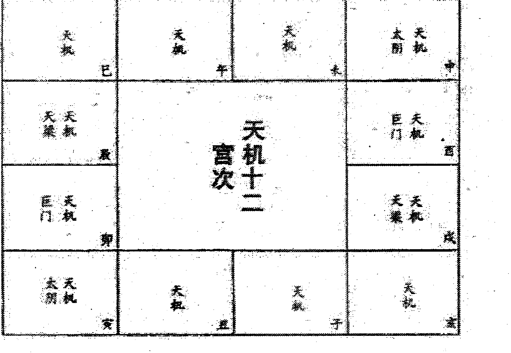
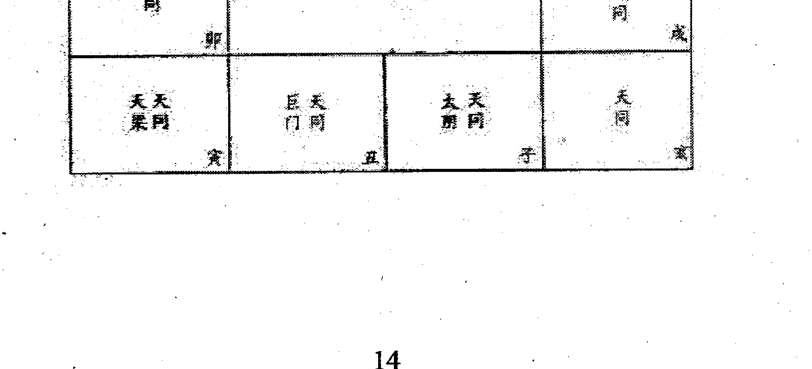
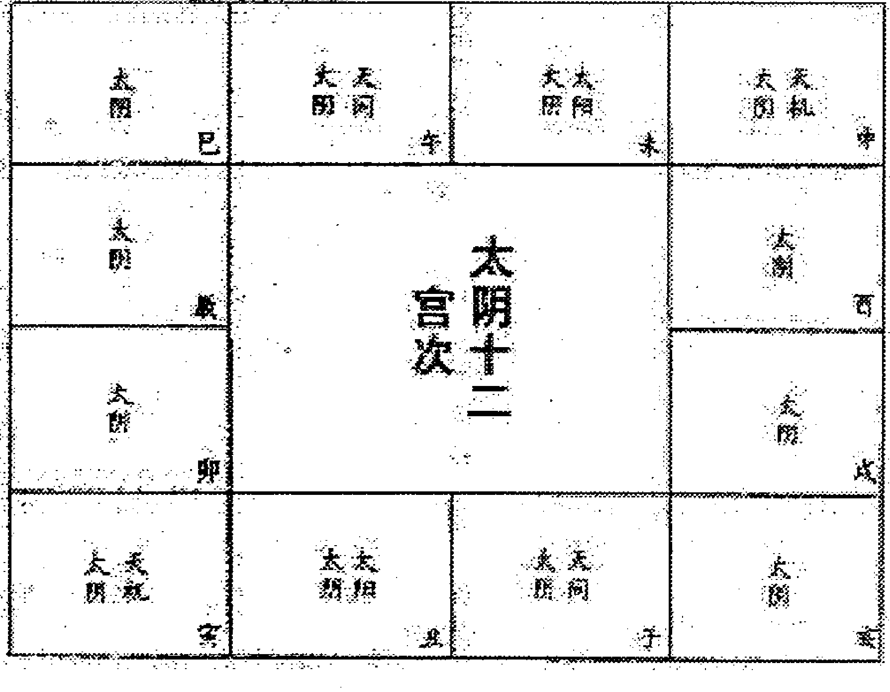
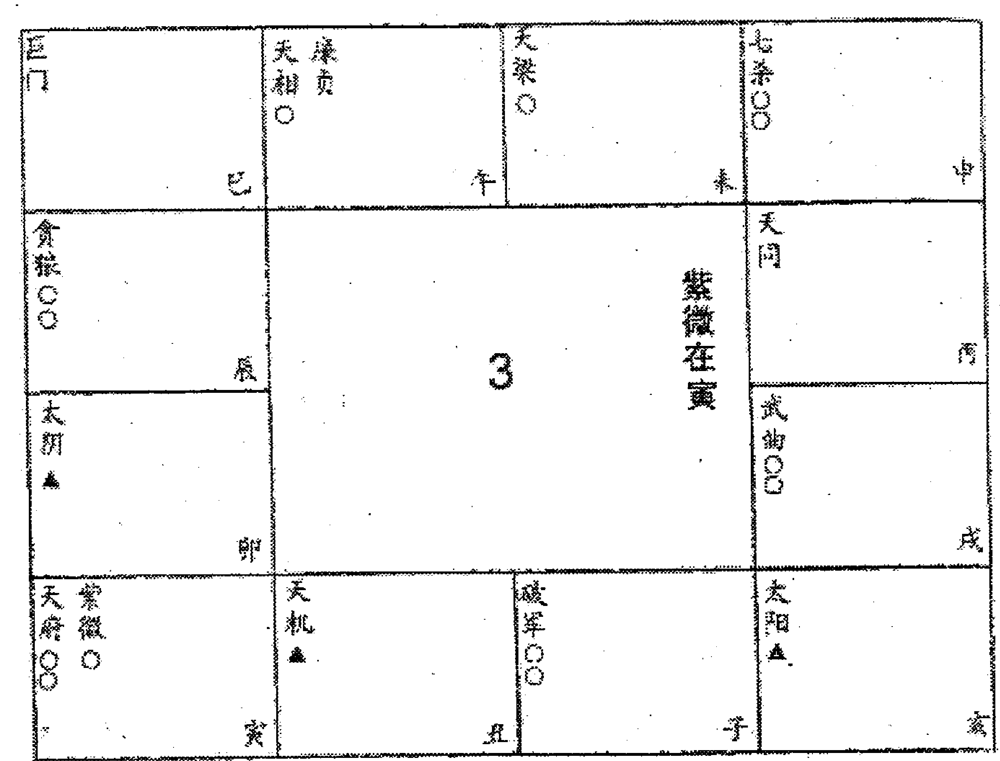
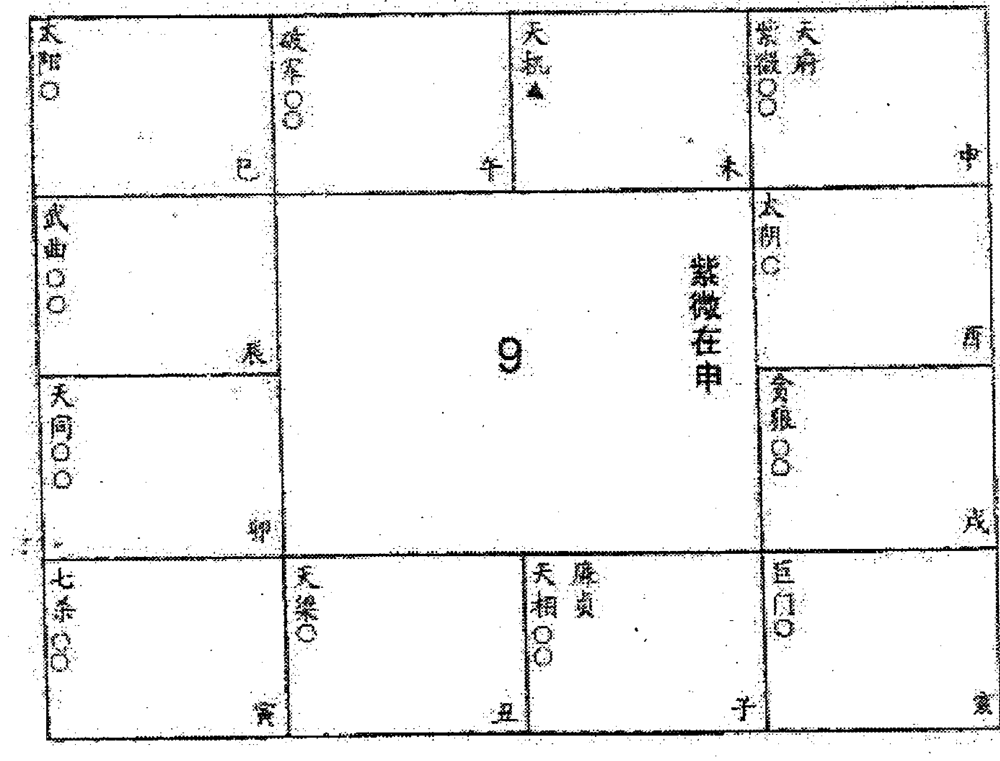
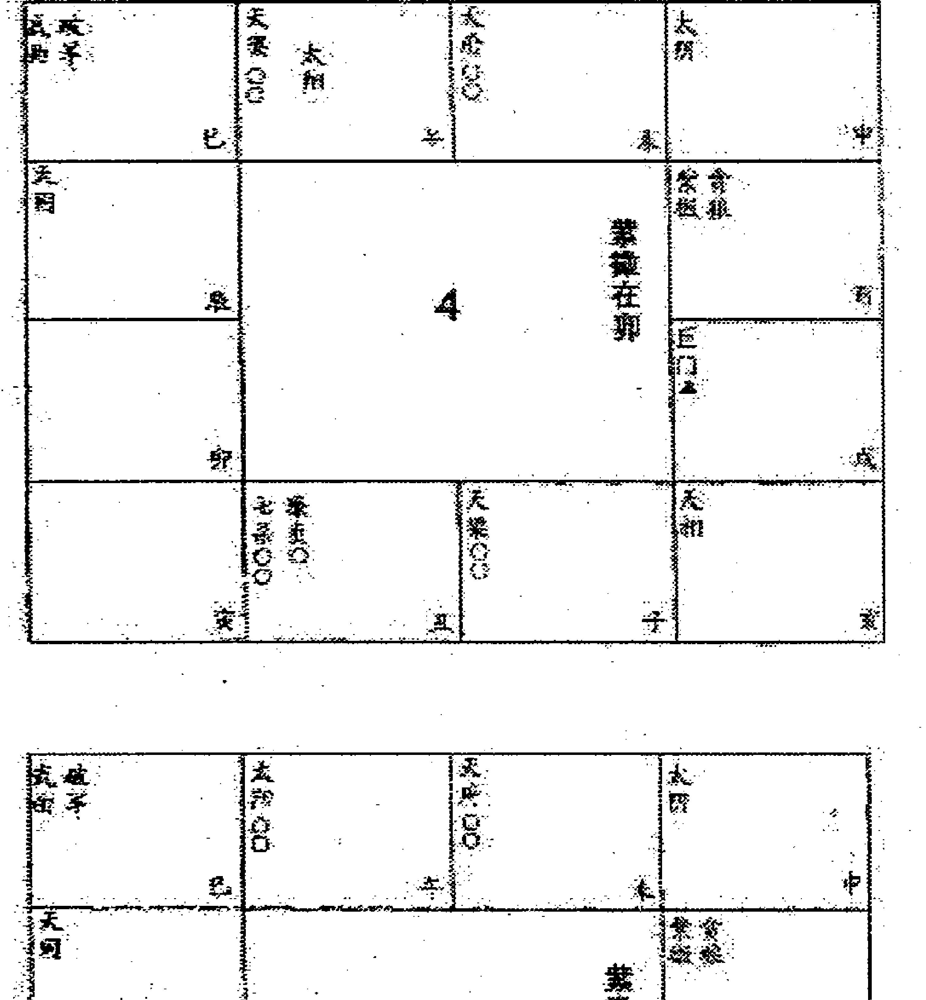
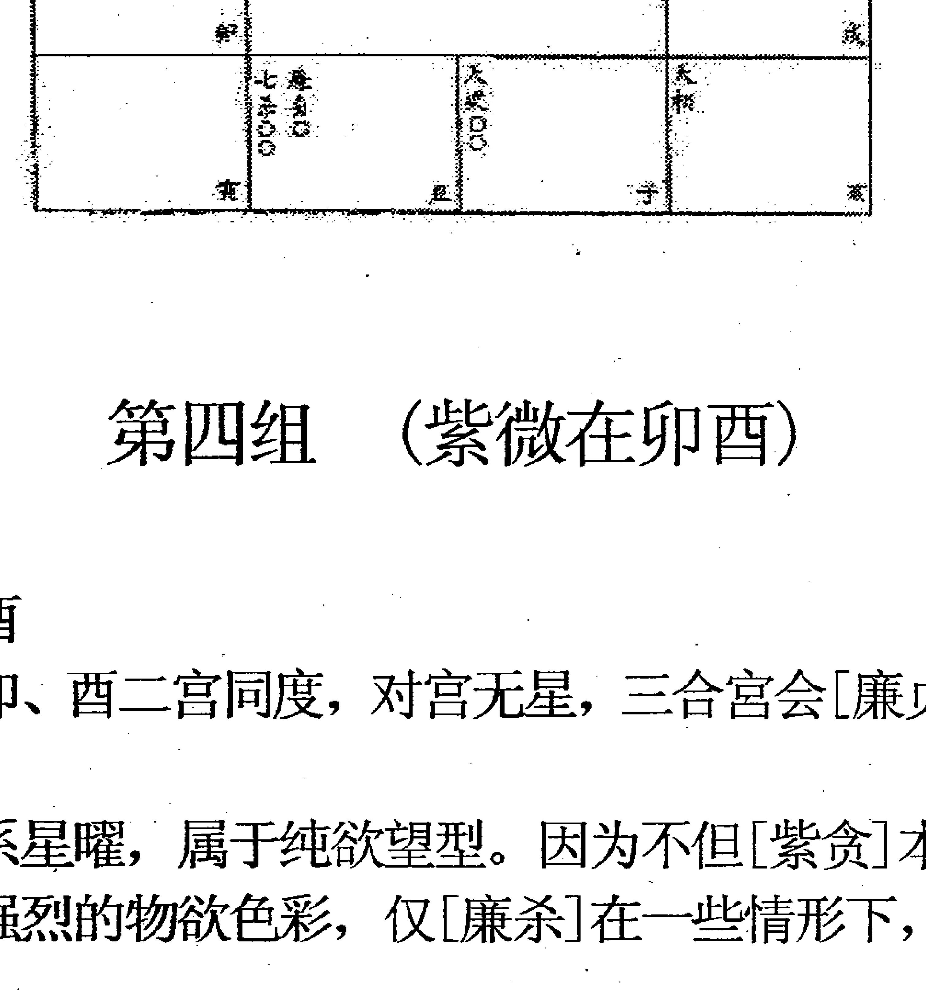

# 中州派紫微斗数深造进阶讲义

王亭之著

## 目录

## 上篇 星曜论

- 序论 ................... 1
- 前言 ................... 4
- 十四正曜 ............... 5
- 六十星系 ............... 33
- 辅佐煞曜总论 ......... 165
- 辅佐八曜 ............. 165
- 煞曜 ................. 172
- 化曜 ................. 176
- 杂曜总论 ............. 233
- 流曜总论 ............. 240
- 星曜庙陷 ............. 241

# 中州派紫微斗数深造讲义

王亭之编著

### 序 论

[紫微斗数]在目前依然是一种术数。术数与学数的最大分别，是缺乏有深度的理论。所以同样是推算禄命之术，[子平]的学术性就比[斗数]浓厚了许多。这是由于[子平]在明代经过万育吾尚书的整理，辑成[三命通会]一书行世，资料完备，然后于清代经陈素庵大学士加以理论上的提高，撰成[命理约言]，将儒家的[中庸]思想用之于命学，又再注释[滴天髓]一书，跟[命理约言]互相发挥，于是[子平]便由术数提高到成为学术。

反观[紫微斗数]，虽然有[紫微斗数全书]、[紫微阐微录]等古籍，但由于编辑的工夫做得不好，而且推断之语太过欠缺理论，所以明清两代编纂类书的人，除[道藏]外，根本不将[紫微斗数]收入。[道藏]肯收录斗数，恐怕还是因为相传其发明者为陈希夷，他在道家的名头太大，所以才多少有点[宁滥毋缺]的心理。

笔者起初研究[子平]，对[紫微斗数]亦非常之瞧不起。后来发现斗数并不是一种呆板的推算禄命之术，古人一些非常武断的论据，如[女人七杀坐福德宫必为娼婢]、[贪狼居旺宫终身鼠窝]之类，如果考虑到古代的社会文化背景，亦可以找得出这些论断的根源。尤其是研究斗数前身的[十八飞星]，更可以看得出这门术数的发展脉络，因此才改变初衷，对这门术数加以研究。

照笔者研究的结果，[紫微斗数]的精华，其实在于统计与征验。由统计征验，然后得出一些可靠的论断，但却仍缺乏理论基础。

譬如说，太阴本不喜落陷宫，但太阴在卯宫落陷守命，却称为[反背]，只要与辅佐诸曜在[三方四正]会合，则为大富命格。这个论断相当准确，有一位地产商就是这种命局，但为什么称为[反背]，为何[反背]见吉则成富命，则从来没有人加以解说。知其然而不知其所以然，可以说是[紫微斗数]的缺憾。

所以笔者会试图建立[紫微斗数]的理论基础，但是在建立过程中却发现，现代社会背景跟古代大不相同，许多论断，需要大量研究资料来加以修改或补充，个人能力有限，建立维艰，所以曾经打算过放弃。然而因缘凑会，笔者在一个很偶然的机会为人用斗数推断一场官司，被惊为神算，于是宣扬出来，以致不得不受友人所托，在他创办的杂志上笔谈斗数，相信建立斗数的理论已经不难，至少亦已具备了初步的条件。

但既然需要集思广益，又需要大量研究资料，就必须为参加者提供一些必须具备的征验知识，因此笔者才决定将一己所知，撰成篇章以广传播。前撰[中州派紫微斗数讲义]，所提供的是些实用基础知识，目的是使读者能据之对命盘作出较准确的推断。当然，这亦牵涉到融会贯通的问题，如不能融会，则推断时便难以发现一些细节。至于本篇撰写目的，则是将笔者一己的研究心得，包括实用与理论，和盘托出，希望能使研究者以之作为踏脚石，通过更多资料的分析，发现更多星曜性质，配合现代社会背景，为[紫微斗数]提供一些适合现代的详实推断，同时建立分析的理论。

然而必须注意，[紫微斗数]所能推断的，只是一个人的先天运势趋向，决定一个人的实际遭遇还有[地运]与人运。所谓[地运]，关系到社会背景，这一点，个人无法控制。但[人运]则不然。每个人受父母师友的影响，当临事之时，会有不同的反应，反应引起的后果因而亦有所不同。所谓[趋吉避凶]，其实即是控制一己的反应与决定，务求其后果较为对自己有利。因此后天人事常常可以改变先天运势。

所以研究者必须了解到[紫微斗数]这点局限性，于推断时千万不可完全沉溺于先天运势的显示，而忽略了社会背景与后天人事的主张。曾经有人写信给笔者，提出一点质疑，若说命运可以由后天人事去改变，那么，怎么可以证明命运已经改变呢？譬如说，用[紫微斗数]推算出一个人某年有牢狱之灾，于是劝这个人不要做违法的事，结果其人没有做违法的事，结果其人是年平安渡过，但怎样证明他不听劝告，就一定有牢狱之灾呢？

这个问题的确提出得有深度，特别是对[紫微斗数]一无所知的人，的确容易产生这个疑问。但笔者却可以举出一个例子来证明[趋吉避凶]的事实。

于一九八四年，笔者为一个银行秘书推算，发现她于一九八六年会碰到一组子宫癌病发的星，于是劝她去检查，结果经三次检查才发现有癌细胞初步滋生，立即予以割除。笔者相信，如果她不在八五年初割除，则八六年病发必无疑问，而现在，她则应该可以避过子宫癌病发的凶。

也许，这即是研究[紫微斗数]的积极意义了。希望读者能对此加以体会，则不致导出人生宿命的结论，同时亦知道自己所研究，确能裨益个人及社会。亦唯有抱着这种态度来研究，才不致使[紫微斗数]永远居于术数的地位。

倘若一定要追究，关于官非、破财等厄运避免的确实例证，当然难以像疾病避免的信而有微，但当事人恐怕亦不一定觉得无迹象可寻。

笔者甚至有一个理想，企图通过斗数星系的研究，来推断一对夫妻的[子女宫]，在什么年份可以避免诞生弱智的婴孩，或有先天性疾患的子女，目前正展开这方面的工作，而且已略有眉目，当然希望理想能够实现，相信对社会裨益必大。——这种趋势，亦跟官非、破财之类的厄运的避免一样，很难提出避免成功的证据。但假如从相反处着想，能指出某些厄运组合会影响到父母诞生弱能及有先天性疾患的儿童，而且有征验与统计为证，那么，即使我们提不出来正面证据，证明叫一对夫妇于那一年避孕，结果就避免了弱能儿童的诞生，但亦应该令人信服。

因此目前研究[紫微斗数]的方向，实在应该由统计与征验着手，先行扩大星系组合的性质，然后才去建立斗数的理论。若随便以架空之谈，将斗数的一些术语神秘化，便认为是理论的建立，那便未免流于玄学，忽视了[紫微斗数]本身的特色。

是故研究斗数再无他径，唯一的坦途是发挥集体的力量去做统计与征验的工作，则知自矜[秘传]、[秘本]者为非，亦知将斗数引为玄谈者之非。因此本篇能提供给读者的，决不是[紫微斗数]的极致，只是一些曾经征验与统计的资料记录，以及一些很初步的理论，若希望从中发掘[秘传]，那则决不是笔者所能提供。

## 上篇 星曜论

### 前言

[紫微斗数]的组成，分星曜与宫垣两大部分。各星曜分布于各宫垣之内，相聚相会，相离相散，即可以大致上显示出一个人的基本先天运势。

所以论断斗数可以分成两个步骤——

第一，先研究各宫的星曜组合，以及跟[三方四正]星曜组合的干涉，由此构成一个[星系]。

第二，再根据星系的性质，研究各宫垣干涉的情况。这时候，应该打破[三方四正]的限制。譬如研究一个人的事业，当然应该理会及[事业宫]的[三方四正]，即[命宫]、[夫妻宫]、[财帛宫]。但除此之外，从一个人的[福德宫]亦应该可以帮助推断其人的事业，因为[福德宫]所主，乃一个人的思想，思想是否保守，抑或流于偏激，自然亦可影响到个人事业的进退。

上述两个步骤，以星曜及星系为纲，以宫垣为目。因此先须熟悉星曜、星系的性质，然后才可以对宫垣的关涉灵活推断。

[紫微斗数]所用，为十四正曜、四辅曜、四佐曜、六煞曜、四化曜，加上若干杂曜与流曜，下文将一一予以详述。

各星曜组合，以十四正曜为基础，共成三十八种，但分配于十二宫垣，加上各星的独坐，却可以组成一百二十星系，约一正一反而言（即如紫微在子，与紫微在午）则为六十基本星系，各有不同的特性，读者对此最宜细心研究。

至于辅佐煞化诸曜，以及杂曜、流曜对六十基本星系性质的影响，无非起一（1）加强；（2）削弱；（3）转化等作用，但在推断时却相当重要。

本篇尽量采纳古人及笔者所有征验的资料，先述十四正曜性质，是为基础；再述六十基本星系性质，是为发展；继述其余诸曜的性质，是为变用。读者循序渐进，即能掌握[紫微斗数]的大纲。

### 十四正曜

#### 1 紫微

紫微为北斗主星，属阴土。

在斗数中，紫微至尊至贵，所以古人喻之为[帝座]，即是以紫微喻为一国之君。一国之君虽然尊贵，但却未必一定事事如意。因此要推断命盘中紫微的性质，便需要根据其所会合或同度的星曜而定。

紫微不宜为[孤君]，所以最喜[百官朝拱]。所谓[百官]，亦分成两系，一系为正曜，一系为辅、佐、杂曜。

朝拱紫微的正曜，须天府天相始为合格。天府为财库、天相为印绶。君王无财库则不能立国，无印绶则不能行使命令。

然而虽得[府相朝垣]，却仍须研究天府及天相在星盘中的性质。

朝拱紫微的天府最喜见禄，以见武曲化禄为上格，廉贞化禄次之，禄存又次之。得禄则为财库充盈。不宜与地空、天空同度，亦不喜截空与旬空之[正空]。空曜同宫即成空库，虽会合紫微亦不起作用。

朝拱紫微的天相，最喜见[财荫夹印]（即为天同化禄，或巨门化禄，与天梁相夹）；最忌见[刑忌夹印]（即为天同化忌，或巨门化忌与天梁相夹）；为羊陀相夹亦性质不良。

朝拱紫微的辅曜，最喜左辅右弼相夹；这种情形仅见于丑未二宫，被夹者为紫微破军。可以改善紫微破二星的险阻际遇。若见左辅右弼于三方会合，亦主其人一生多助力，或属下众多。

亦喜天魁天钺会合三方四正，既能增强其人的领导力，同时亦主其人一生多逢良好的际遇。

朝拱紫微的佐曜，最喜文昌文曲。可以增加其人的思想优雅，部分抵消了紫微那种独断独行、自高自大的缺点。唯紫贪见昌曲，则加强了桃花色彩。

亦喜见禄存天马。这对佐曜，一般易令人思想游移，但对紫微坐命的人来说，却可以中和其求名不求利，甚至求气不求财的缺点。

能称为[朝拱]的杂曜开列如下——

- 三台八座，能增加人的地位，因为这两颗杂曜为随从。
- 恩光天贵，能增加人的名誉，因为这两颗杂曜主荣耀。
- 台辅封诰，能增加人的声价，因为这两颗杂曜主恩荣。
- 龙池凤阁，能增加人的灵巧，因为这两颗杂曜主才艺。
- 天福天寿，能增加人的通达，因为这两颗杂曜主福寿。

至于化禄、化权、化科，则不称为朝拱，仅主运势方面的改善。

紫微入庙，无[百官朝拱]尚可，若落陷又无[百官朝拱]，则为[在野孤君]。

它的性质，又可分为见空曜与不见空曜两种。

见空曜，则主其人虽成见甚深，但却思想超脱。所以再见华盖、天刑，则可能倾向于哲理或宗教方面的研究。更宜见天德、博士二曜，若同时见文昌或文曲，则主磊落不羁。

不见空曜，则其人可能进退失据，既不能命，又不能令，可是却不肯低头服小，因而造成自己的坎坷。

[在野孤君]不宜见煞、忌。见空曜者见煞、忌，主人六亲无靠，古代即当僧道之命。不见空曜者见煞、忌，则一生多是非纷扰。运限逢之，亦主词讼或手术开刀。

最常见的情形，是紫微坐命而三方四正吉凶星曜交集。推算时宜详各星曜的性质作个别推断，不能将之抵消。

例如紫微破军在丑宫坐命，得左辅右弼相夹，但在酉宫见擎羊，未宫见陀罗。这种星系结构，主因左右夹而多得助力，但却不能避免其在事业上受到意外竞争，以及少年时易破相等不利。

不过在一般情形之下，凡吉星凶曜交集之时，见禄则仍利于经商；见昌曲而有煞忌会合，则可成专业人才。

诸煞曜中，紫微唯畏见羊陀，不畏火铃。但亦不喜羊陀与火铃同时会合。四煞并照，则紫微成为暴君。其人喜恶成见过深，且心志卑弱而主观高傲。

若为羊陀相夹，则主易于招怨；火铃夹仅主辛劳。二者皆主事事亲力亲为。

紫微分布于十二宫，可以分成[独坐]、[紫破]、[紫府]、[紫贪]、[紫相]、[紫杀]六个结构，其对宫亦为杀、破狼与天府，可见紫微跟这四颗星曜关系甚大。其基本性质，另详述于[六十星系]一节。大致而言，于紫微十二星系之中，以丑未二宫的紫微破军；午宫的紫微独坐；巳亥二宫的紫微七杀较易成为良好格局。较嫌辰戌二宫的紫微天相。

于运限中见紫微坐命宫，亦应与上述的性质参看，因为大限流年的命宫，紫微虽无独断独行等基本性格，但却亦为发挥领导力的表示。见吉星咸集，往往即为独当一面的运程。其详细性质，将于后章述及。

| 宫位 | 星曜组合 |
| :--- | :------- |
| 巳   | 紫微七杀 |
| 午   | 紫微独坐 |
| 未   | 紫微破军 |
| 申   | 紫微天府 |
| 酉   | 紫微贪狼 |
| 戌   | 紫微天相 |
| 亥   | 紫微七杀 |
| 子   | 紫微独坐 |
| 丑   | 紫微破军 |
| 寅   | 紫微天府 |
| 卯   | 紫微贪狼 |
| 辰   | 紫微天相 |

#### 2 天机

天机为南斗第一星，属阴木。

在斗数中，天机被喻为谋士或军师。因此他并不需要[百官朝拱]，但却需要带聪明才艺性质的星曜会合。如文昌、文曲、天才、龙池、凤阁、博士等。最畏化忌，或遇天虚、阴煞。——亦喜文昌文曲在左右两宫相夹，但却不喜火星、铃星夹制。前者增加了天机的聪敏，后者则今天机心思不定，多劳多虑而少实际效果。

由于天机有谋臣的性质，所以他便喜欢依附权贵。在寅申两宫，得紫贪与天府相夹，一般情形下对天机有利。亦喜见天魁天钺同宫或对拱，则谓之[一生近贵]。

能得庙旺太阳照射的巨门，对天机来说，称为[天阙]。若天机与[天阙]相朝冲，便有如谋臣得用，可登天阙以朝天子，亦主人能得志，为世所用。

所以评断天机一星的大纲，先要看其聪明机敏的程度，然后看其是否近贵，能有用世的机会。

在[四化]当中，天机最喜化权，则表示能用于世；亦喜化科，表示聪敏且归于正道；化禄则比较弱，只是普通经商者的聪明才智与机变。化忌见煞空动曜则可能流为奸僻。

流年或大运遇天机，与本命遇天机不同。本命所主者为人的本质，运限只是人的际遇，所以并无谋臣军师的性质，只是表示一种变化。因此并不需要科文诸曜会合，盖有这些星曜会合时，亦不能突然之间在一年或一运之内使人变得聪明。

可是，依附权势以发挥自己才能的性质，却依然存在。因此流魁、流钺对居于运限命宫的天机来说，便有其重要的价值。若流魁流钺在三方四正冲起原局的魁钺，在此运限之内便主其人的才智得以发挥，由发挥而生变动。

运限的天机亦喜化权，即是同样的道理；化禄亦变得重要，主于运限内因变化或机缘而得财禄；反而化科就没那么重要了，因为充其量只代表一时的名誉，并不牵涉到天机的本质。

在斗数中，亦有一些对天机发生坏影响的星曜。它们是羊陀、火铃、天刑、空劫、天虚、阴煞、破碎、空曜、咸池、大耗。

擎羊易生竞争；陀罗使计划延缓甚至因此出错；火铃使人多虑以致失机；天刑则令人于谋求变动时生掣肘；空动令人的变动易流为空想；天虚阴煞等杂曜，则易令人心术不正，于运限之中则为空想或阴谋权术。

在十二星系中，天机永远与太阴、巨门、天梁同宫或相对。可见这三颗星曜对天机影响的重要。

在子午两宫，天机巨门相对；在卯酉两宫，[天机巨门]同度。故子午卯酉四垣为[机巨]的组合。

在辰戌两宫，天机天梁相对；在丑未两宫，[天机天梁]同度。故辰戌丑未四垣为[机梁]的组合。

在巳亥两宫，天机太阴相对；在寅申两宫，[天机太阴]同度。故寅申巳亥四垣为[机阴]的组合。

一般情形下，最喜卯宫的天机巨门。
于天机独坐的情形下，较不喜巳亥二宫。
以上的各种性质，将于[六十星系]中加以详述。

#### 3 太阳

太阳为中天星曜。日生人（寅卯辰巳午未时生人）以太阳为中天主星。属阳火。由于太阳为主星的关系，所以亦喜[百官朝拱]。

太阳最重要的特性，是发射光和热，因而光华夺目，故在人生中即主声名与贵显。除非与财富的星曜会合，如太阴、化禄、禄存等，否则便主贵而不主富。

既然主贵为太阳的特性，因此亦喜与带贵显性质的星曜同度或会合，如天梁、魁钺等。甚至太阳坐命的人，行运限至贵显星曜坐守的宫度：如紫微、天府、天梁、太阴等，亦应特别注意，可能为开运的年限。倘更得流魁、流钺冲照原局的魁钺，则主多机遇。

然而太阳既有发射的特性，所以当入庙之时，就不宜过多碰到带发射性质的星曜，如天马、铃星、火星、天伤、天使、孤辰、寡宿、蜚廉、破碎等。否则太阳的光与热扩散太过，更易流为空虚而欠沉实。

同样的道理，命宫的太阳坐午，便反不如坐落巳宫为佳。因为午宫的太阳已属[日丽中天]，再过一步便开始日落西山，而且其时阳光最为猛烈，不如巳宫的太阳，反而有发展的余地。

所以要判断太阳的好坏，便应遵循四个原则来分析——

（一）先研究太阳坐落宫位的庙旺利陷。大致而言，宜庙旺不宜落陷，夜生人（申酉戌亥子丑时生人）尤其不宜。
（二）由有无财星会合，判断其属于清贵，抑或属于富贵，或转化成为富而不贵。——当然，最坏的情况则是变成既不富亦不贵。
（三）如属运限的推断，则需留意运限命宫的太阳是否有开运的机遇。
（四）无论推断天盘命宫，抑或运限的命宫，都应注意[中和]。宫中太阳过份强烈，则宜见收敛性的星曜；太阳的光与热不足（如在申宫，已呈日落西山之象），则可靠放射性的星曜来帮助。总之，一切须归于中和。

太阳化禄主富贵。

但于运限命宫见太阳化禄时，其富贵程度，则仍应据原来天盘命宫的星曜来衡量。如果星曜太弱，如命无正曜，借入化忌的天同太阴安星，或为落陷的巨门、天机等曜，则富贵程度大为减轻。

太阳化权、化科不如化禄，因为权科二化曜仅能增加太阳的贵显，而不能使之得富。在封建时代毛病尚少，目前为商业社会，重富多于重贵，因而就嫌化权化科的太阳，性质稍偏。无论命盘的命宫，或运限命宫，性质皆属如此。

夜生人不宜太阳坐命。落陷的太阳尤其有所不宜。

所谓不宜，有两种性质——

（一）不利男性的六亲。男则不利父兄或长子；女则父亲、丈夫及长子。

然而其所不利，并不一定是死亡，可能只是生离，或缘份欠缺，或形成代沟。有时则为六亲的灾病。

这种情形，对女性来说，则较易感到空虚。尤其是当在中年以后，夫子缘缺，总不能不说是人生的缺憾。

（二）自身易有灾病。尤其主患循环系统、神经系统的疾病。若阳光过盛过弱，则易患目疾，尤其易患散光。

太阳在十二宫中的星系结构，永远与太阴、巨门、天梁三曜同度或对拱。所以这三颗星曜，对太阳的影响很大。

在子午两宫，太阳与天梁相拱；在卯酉两宫，[太阳天梁]同度。故子午卯酉四垣为[阳梁]的组合。

在辰戌两宫，太阳与太阴相拱；在丑未两宫，[太阳太阴]同度。故辰戌丑未四垣为[阴阳]的组合。

在巳亥两宫，太阳与巨门相拱；在寅申两宫，[太阳巨门]同度。故寅申巳亥四垣为[阳巨]的组合。

一般情形之下，最喜寅宫的太阳巨门；卯、辰、巳宫的太阳独坐。较嫌在申宫见煞忌刑的太阳巨门及在酉宫遇煞忌刑的太阳天梁。

太阳又为词讼及是非口舌之星，所以不宜见过多的刑曜，如擎羊、天刑、官符、白虎等。尤其化忌的太阳，遇刑曜更易招灾怨。

许多时词讼是非，都由福德宫招惹，不尽属命宫，所以推断命盘时，遇太阳坐守福德宫亦应予以注意。

| 宫位与组合         |                 |
| :----------------- | :-------------- |
| 太阳 (巳)          | 太阳 (午)       |
| 太阴太阳 (未)      | 巨门太阳 (申)   |
| 太阳 (辰)          | 太阳十二宫次    |
| 太阳天梁 (酉)      |                 |
| 天梁太阳 (卯)      |                 |
| 太阳 (戌)          |                 |
| 巨门太阳 (寅)      | 太阴太阳 (丑)   |
| 太阳 (子)          | 太阳 (亥)       |

#### 4 武曲

武曲为北斗第六星，属阴金。

在斗数中，武曲为财星。他跟太阴不同。太阴偏重于[性]；而武曲则偏重于[质]。所以太阴主计划，比较抽象，武曲则主行动，非常之具体。因此二者比较，太阴就显得柔和，武曲则显得刚烈。

凡刚烈之星，一定不利六亲，盖刚烈必同时带孤克之性。所以推断武曲在命盘中的吉凶，常因宫垣不同而评价不同。在财帛宫、事业宫，甚至在福德宫，都不忌武曲之刚烈。可是在命宫、父母宫、兄弟宫、夫妻宫、子女宫，以及交友宫，却嫌武曲的孤克。

特别是夫妻宫，倘如有孤克的性质，人生便多缺憾。古代社会女子无事业，嫁夫之后即以丈夫的事业为事业，因此便最嫌武曲坐夫妻宫，古人称之为[寡宿]。至于男命，则不过嫌其[妇夺夫权]而已。

擎羊、陀罗，最易加强武曲的刚烈与孤克。因此武曲不宜受其会照。当武曲化忌，或跟武曲同度之星化忌时，则甚畏羊陀相夹。——羊陀夹武曲之忌，为斗数中相当坏的结构。

但当坐财帛宫与事业宫之时，武曲却又不忌羊陀。因为刚烈之性，正好促使武曲积极进取，顶多发展到不择手段而已，并不代表他的进取失败，所谓[武曲会羊陀，奸诈]，正好代表这种性质。

即使是武曲化忌，羊陀来夹，亦不一定代表事业失败，可能只是因为过份积极进取，不自量力，投资太大，以致无以为继(如俗语说的[十个堀，九个盖])，因而引起挫折与经济困难而已。

武曲真正畏惧的是火星与铃星，同度或会照，主恶性竞争，主剥削掠夺，主侵吞盗窃。古人说[武曲火铃同宫，因财被劫]，即是这个道理。所谓[被劫]，不一定是抢劫，只是竞争掠夺之意。

古人又说: [武曲羊陀兼火宿，丧命因财。]这是说火星同度，羊陀照会的情形。羊陀固非善类，但弄到[丧命因财]，则主要还是因为火星同度(其实铃星同度亦然)。

有什么星曜可以调和武曲的刚烈孤克呢?

首先是文昌、文曲。这对星曜，如果成对会入武曲坐守的宫度(特别是武曲独守的宫度)。会使武曲变得柔和一点。但与此同时，却会使武曲变得优柔寡断。

其次是天府。天府有库藏之性，又属阳土，因此就可以收敛武曲的刚烈之性(正如诸葛亮之收服张飞)，并同时减少了它的孤克。所以六亲的宫垣，于武曲诸星系中，最喜[武曲天府]。古人甚至说: [武曲天府同宫于子午，主有寿。]即是这个道理。

再其次，能调和武曲刚克之性者，为禄存或化禄。最喜武曲化禄，其次为贪狼化禄及廉贞化禄，再其次为破军化禄。武曲化禄多发达的机缘，贪廉二宿化禄主得财不甚费神，破军化禄便劳心劳力了。

## 中州派紫薇斗数深造讲义（上）

武曲司财帛，得禄则为同气，又为[见禄羁縻]，于是顿改其刚烈之性。

在星系组合方面，武曲与天府、贪狼、天相、七杀、破军五曜组成同度的星系。然而[武府]必对七杀；[武杀]必对天府；[武相]必对破军；[武破]必对天相；[武贪]对宫无星，但武曲独坐之时，又必与贪狼相对。

因此可以说,在子午卯酉宫的[武府杀]是一个系统;在寅申巳亥宫的[武破相]又是一个系统; 在辰戌丑未宫的[武贪]自成一个系统。

三个系统之中，以[武破相]一系，最具刚烈孤克之性，因为武曲不喜破军，见破军，便使原来刚烈的武曲变成躁决。常易因欠考虑或欠长远计划，因一时的冲动而导致失败。古人说: [武曲破军难贵显]，即是这道理。

武曲喜会禄存，不喜禄存同度。因为禄存同度之时，必有羊陀来夹。在命宫，主人自私自利，在财帛宫与事业宫则主受掣肘。在六亲的宫度则主缘份不深厚。

武曲喜化禄，主可发富；亦喜化权，主有财帛可以运用，或主独当一面；化科较次，不过主得声誉而已。化忌则为孤克、拮据，以致挫折破败。

于推断大限流年时，武曲的四化，常常影响全局甚大，尤其是化忌，即当详细检视在何宫垣化忌来作为推断的重点。

| 破军 武曲 巳 | 天府 武曲 午 | 贪狼 武曲 未 | 天相 武曲 申 |
|----------------|----------------|----------------|----------------|
| 武曲 辰     | 武曲十二宫次   | 七杀 武曲 酉 |                |
| 七杀 武曲 卯 | 武曲 戌     |                |                |
| 天相 武曲 寅 | 贪狼 武曲 丑 | 天府 武曲 子 | 破军 武曲 亥 |

#### 5 天同

天同为南斗第四星，属阳水。

道家历来相传，[南斗主生，北斗主死]，所以南斗的星曜多带和气，而北斗星曜则较为肃杀。天同为南斗之星，而且还是南斗中最和气的一颗星曜，所以古人称之为[益福保生之星]。

天同化气为福。但所谓福，却并非自天而降，往往是经过一番挫折之后得来的安定与享受。所以天同跟天梁相似，天梁主[荫]，但必须有灾难发生，然后化解于无形；或将重大的灾祸转化为轻微物灾厄，乃称之为[荫]。天同的[福]，亦有先贫后福，先无后有之类的色彩，因此往往亦象征人生的一段艰辛。

古人说：[天同十二宫中皆为福]，对[为福]的定义，必须如此理解。

前人论天同，譬喻之为安排皇帝饮宴游乐的[光禄寺卿]。因此天同的另一特质便是享受。

在斗数中，主享受的星曜，计有天同、廉贞、贪狼、天梁四星。廉贞贪狼是一对，比较上廉贞重精神、贪狼重物质。天同天梁是一对，比较上天梁重精神，天同重物质。

但[廉贪]与[同梁]却又有分别。[廉贪]带桃花的色彩，因此偏重于酒色财气；[同梁]较为优雅，因此偏重于风花雪月。

亦正由于此，天同虽有偏于物质享受之性，却不像贪狼那样，能够主动积极去争取，因而便表现得颇为软弱，同时带点浪费。

古人不喜天同坐女命，即是由于这个缘故。盖古代女子虽不喜性刚，但却必须贞烈，天同既耽享受，又浪费，但却软弱，于是变为精神空虚，在古代便恰恰是妾侍的本质。[虽美而淫]，则是古人对天同坐女命的普遍评价。

由于天同软弱，但却有[化福]的本能，因此在适当情形下，宜见煞星加以刺激；或见[化忌]加以激发。——请注意，必须是在适当情形下，并不是凡天同见煞忌都成为良好的星曜结构。

古人有[天同擎羊同宫，身体遭伤。][天同太阴同在午宫守命，会四煞，残疾孤克]的说法，这即是并非凡天同都喜见煞的证明。由于近人推算斗数，过份偏注于[天同喜煞曜刺激]的想法，因此这里才特别提醒一下。

在什么情形下，天同喜欢煞曜呢？

天同带禄，便不怕煞曜来侵。尤其喜欢化禄。其实古人对此已有论定，[化禄为善，逢吉为祥]。若不化禄见禄，四煞并照同躔，则亦不为美格。有禄羁縻，然后始喜激发。

天同会诸吉，亦不怕煞曜同会。最宜带文昌文曲而见煞曜。因为昌曲增加了天同的聪明才智。喜欢享受而具聪明才智的人，性格愈容易流为软弱(广府人所谓[走精边])，精神亦愈容易空虚(几时见有庸庸碌碌的人会精神空虚的?)，这时便喜欢煞曜的激发。

所以在天同诸星系中的[马头带剑]格，即[天同太阴]在午宫与擎羊同度，丙戊年生人始为合局。在丙年，天同化禄；在戊年，太阴财星化权，皆有带财禄见煞的意味。

除了喜煞之外，在适当情形下天同亦忌星。此即天同星系的[反背]格局。它的星系结构是——

天同独坐戌宫，丁年生人化权；会事业宫的太阴化禄、天机化科。禄权科会，使耽于享受的天同变得更软弱，但在对宫却恰有巨门化忌来冲，成为激发的力量，此乃否极泰来，反成大贵的格局。

天同喜魁钺，因为主一生多逢机遇。左辅右弼同会，虽多助力，反而可增加其依赖性。见昌曲则宜同时见擎羊；见化禄则不怕煞星侵扰；见三吉化则反而喜化忌，这是天同的特性。

对于天马，天同天梁同度，或天同对拱天梁的情形下则不喜。因为[同梁]已带有人生观欠积极的色彩，再见天马，便嫌浮荡无根，变成纯理想而欠实际。

天同亦不喜火星，尤其不喜铃星。这两颗煞曜带刚烈之性，恰与天同之优柔相反，气质冲突，故遇之多主逆境。

在十二宫分布中，天同必与太阴、巨门、天梁三曜，同度或对拱。

- 在子午卯酉四垣，为[同阴]的组合
- 在辰戌丑未四垣，为[同巨]的组合
- 在寅申巳亥四垣，为[同梁]的组合

除了上述[马头带剑]及[反背]两个特殊格局之外？一般来说，以寅申宫[天同天梁]最为平稳，只须见到吉化(无论为化禄、化权或化科)，或与禄存同度、相对，即主一生平稳发展，无大风波险恶。

反而在天同见煞忌的情形下，即使构成良好格局，亦必主人先历艰危然后发福，或一生少坐享其成的机遇。

#### 6 廉贞

廉贞为北斗第五星，属阴火。

在斗数中，廉贞具有两种不同的性格，常易为研究斗数的人忽视。

廉贞为[次桃花]，所以带有阴柔的一面，但廉贞亦可以化气为囚、为杀，因而亦带有阳刚的一面。这是廉贞本身的性格冲突。

在星系结构中，不宜加强这种冲突，只宜调和。若冲突加强，则反主其人不良不莠。

古人对此其实已有提纲挈领的论述：[遇帝坐则主执威权；遇禄存则主大富；遇昌曲则主施礼乐；遇七杀则施武功。即是说，逢紫微、七杀则发挥其阳刚的本能，逢禄存、昌曲则能发挥其阴柔的一面。阳刚主贵、阴柔则主富。于判断命盘之时，对这性质不能不加区别。

兼且，凡阳刚必主理智，凡阴柔则较重感情，若能使理智与感情调和，当然人生便多吉利，但若感情与理智冲突，人生便多由自己一手造成的痛苦。

廉贞这种复杂的性格，必须掌握，然后由星系组合来加以评判，实为推算的关键。

前面已经说过，紫微、七杀，可以加强廉贞的阳刚，禄存、昌曲则可加强他的阴柔。除此以外，当须留意一些其他星曜会合的性质。

天府有禄，可以加强廉贞阴柔之气，使他的情感更深。

带和善性质的天相，亦可以加强廉贞的阴柔，使他的阳刚之性内蕴而不表露。

破军则可以加强廉贞阳刚之性，变得行为带点决绝。

武曲则增加了廉贞追求物欲的色彩，因而发挥其囚杀之气，变成自私自利。

所以廉贞在十二宫的分布，其基本结构相当复杂。他跟七杀、破军、贪狼、天府、天相，五曜关系最深，或同度，或互对，而亦能会上紫微及武曲。

在子午宫，[廉贞天相]同度，对破军；在卯酉宫，[廉贞破军]同度，对天相。成为[廉破相]的基本组合。

在丑未宫，[廉贞七杀]同度，对天府；在辰戌宫，[廉贞天府]同度，对七杀。成为[廉杀府]的基本组合。

在寅申宫，廉贞与贪狼相对；在巳亥宫，则[廉贞贪狼]同度，成为[廉贪]的基本组合。

[廉破相]与[廉杀府]的组合，本身已具有冲突的性质，所以见煞曜则增加其阳刚，见文禄诸曜则增加其阴柔，对此最宜仔细分别。

[廉贪]的组合，可谓最具阳刚之性。当廉贞与贪狼相对之时，所会照的为[紫微天相]、[武曲天府]，贪狼的物欲色彩非常强烈，如果[武曲天府]不与禄同度，[紫微天相]又带煞曜，则使到廉贞阳刚之性得以发挥，再有煞曜同躔，不但孤克，而且决绝。

[廉贞]同度，所会的星系为[紫微破军]、[武曲七杀]星曜组合非常强烈，反而得一偏之气，虽主六亲无靠，少年奔波劳碌，但终能以武职显贵。——这种组合，宜见左辅右弼、天魁天钺，却不宜见昌曲。见禄存同度：则增加了早岁的奔波，但终能富裕。亦不宜再多见煞曜，否则过刚则折。

廉贞一般不宜见煞。古人对此，有很强烈的评价——
[廉贞擎羊同宫，是非日有。]
[廉贞遇羊陀，脓血不免。]
[廉贞同火星于陷空之地，主投河自缢。]
这种推断，即是由于不喜煞曜对廉贞的两面性加以困扰；当廉贞偏向阳刚之时，又不喜煞曜加强其恶性。
所以当[廉贪]同度之时，见火星，亦不构成[火贪]上格。
只有当化禄、禄存并见，又见昌曲，兼且廉贞在三方所会的星曜组合不强烈刚克时，见火铃然后无妨。

若见地空地劫，则不宜廉贞阳刚。倘有禄同会之时，廉贞的阴柔尚可因空劫而变成理想，若廉贞无禄，其阳刚则易因空劫而变成盲目行动，或者变成固执。
廉贞的主要格局，为[雄宿乾元格]。其结构有两种——
[廉贞七杀]于未宫同度，见化禄、化权、化科，无煞忌冲会。
廉贞在申宫独坐守命，七杀守夫妻宫于午垣，又为身宫。命身宫见禄、权、科，无煞忌刑曜会合。

这两个格局，喜见禄，喜见文昌文曲，因为是廉贞的阴火锻炼七杀的阴金，所以不喜阳刚之曜困扰。更怕火星同躔，是为破格。古人譬喻为炼金之火，火候失调。

| | | | |
|---|---|---|---|
| 贪狼 廉贞 巳 | 天相 紫微 午 | 七杀 廉贞 未 | 廉贞 申 |
| 天府 廉贞 辰 | | 廉贞 酉 |
| 破军 廉贞 卯 | 宫次 十二 | 天府 廉贞 戌 |
| 廉贞 寅 | 七杀 廉贞 丑 | 天相 紫微 子 | 贪狼 廉贞 亥 |

#### 7 天府

天府为南斗主星，属阳土。

由于天府为主星，所以亦喜得[百官朝拱]。唯紫微的[百官朝拱]，以天府天相为最有力，天地府本身会天相，则不得谓天相为朝拱；紫微天相同会，亦不能称为朝拱。

紫微与天府两相比较，虽然同为主星，可是斗数以北斗为主，所以天府亦只是紫微的臣佐而已。

当[紫微天府]于寅申两宫同度之时，得天魁、天钺；文昌、文曲；左辅、右弼会照，称为[君臣庆会]，古人称道: [君臣庆会, 才擅经邦]，在此格局之中，作为君主的仍是紫微而不是天府。

天府所执掌的是财权，本身并不是财星，占人譬喻之为财库；即如今日之中央银行行长。因此他只有运用财帛、储藏财帛的能力，而缺乏生财的能力。

所以同样是主星，他跟紫微比较，便少了制衡全局的才能，权偏于财权的领导。亦正由于此，天府的决断力、领导力便也逊于紫微。但同时亦没有紫微那样，具有强烈的主观色彩。

紫微可以开创，天府却利于守成。因此紫微可以开创新业，天府则只宜在现成局面下从事兴革。也即是说，天府宜安定，不宜在逆境中打开局面。天府偏向于享乐，缺少在艰苦中建立事业的能耐。

由于天府宜安定、耽享乐的特性，所以不宜见煞。煞曜增加了奔波劳碌，带来了逆境，使天府难以在安定的环境下，从容从事兴利革弊。

由于天府只是财库，所以最宜见禄，禄存与化禄均可。有禄则财库充盈，能够发挥其运用财权的能力。

但当运用财权之时，却便牵涉了天相。天相永远跟天府在三方会合，在斗数中为[印星]，无印则无权，印星不佳即权力发挥不宜，因此古人便有[逢府看相]的说法。天相吉，逢财荫夹，或有辅佐诸曜同会，便使天府的权力亦因之得过以发挥，于兴革之时进退得宜；若天相为刑忌所夹，或被四煞刑忌冲破，便使天府的权力亦受动制，以致虽守成亦进退失据。

一般术者只重视府相二曜的入庙与落陷，忽视了天相被什么星曜相夹的宜忌，因此在这里特别提出，请诸者注意。

当无禄同会之时，天府称为[空库]；天相不吉，或甚至带煞来会时，则天府称为[露库]。天府与地空、天空同躔之时，亦称为[空库]；四煞刑忌交会，天府亦称为[露库]。

[空库]使天府发展为巧取豪夺，有如一个政府的库房空虚，便必税吏横行，税法苛难，因此天府的性质便变得善用手段，外表圆融，而内心则多权术，究竟成为孤立。

[露库]使天府平添许多困扰，必须设法弥缝暴露出来的缺陷。有如一家中央银行缺点暴露，便非由财政要员出来表示信心不可。所以天府的性质，亦因此而变得奸刁虚伪，究竟容易倾败。

以上所论，为天府的本质。所以当大限流年命宫天府躔度之时，则无[空库]、[露库]之说，因为不可能在年限中将人的本质改变，故未可视为奸刁。

年限逢天府坐命，当然喜欢见禄；若无禄而见四煞刑忌，仅主困难挫折，不主宫非词讼。当空劫并照之时，天府孤立之性则转变成为寂寞，故有无所事事的空虚。

天府在十二宫中的分布，必与七杀相对，此为天府激发力的源头。若七杀会合的星曜不吉，如会见刑忌之星，且各见天虚、阴煞同度，则对天府的激发力不足。这时候，假如天府又为空库，便易产生人生空幻的感觉。这是经过一番营谋而仍无所得的心理状态，偏向于消极，跟佛家之所谓[空]绝不相同。

与天府有密切关系的星曜，除七杀外，尚有武曲、紫微、廉贞三曜。

在子午宫，[武曲天府]同度；在卯酉宫，则天府独坐，对[武曲七杀]，构成[武府杀]的星系。

在丑未宫，天府独坐，对宫为[廉贞七杀]；在辰戌宫，[廉贞天府]同度。构成[廉府杀]的星系。

在寅申宫，[紫微天府]同度；在巳亥宫，天府独坐，对宫为[紫微七杀]。

此中以天府廉贞坐戌宫，在寅宫或午宫得禄存，更逢廉贞化禄，或武曲化禄，称为上格。

其余星系，一般喜寅申宫的[紫府]，及巳亥宫的天府独坐。此将在[六十星系]中详论。

| 宫 | 宫 | 宫 |
| --- | --- | --- |
| 宫 | **天府十二宫次** | 宫 |
| 宫 | 宫 | 宫 |

#### 8 太阴

太阴属中天星系，夜生人(申酉戌亥子丑时生人)以之为主星。属阴水。

由于太阳为主星的关系，所以亦喜[百宫朝拱]。一般情形下，最喜文昌文曲同会，则增加其光彩，且必赋性聪明，气质优雅。单见昌曲则不是，反化为权术，古人称之为假斯文。见煞更为伪君子。

太阴虽亦具光华，但性质则与太阳不同。太阳的性质是扩散发射，太阴的性质则是潜藏与收敛。所以评价太阳的命，常嫌其光芒毕露，以为不详，评介太阴的命，则嫌其过份收敛，以为不和。

因此太阴的不和，常需要籍太阳的救济。当太阴落陷、化忌之时，或与主潜藏收敛的星曜，如陀罗、铃星、天刑、咸池、大耗、天虚、阴煞等会合之时，能得入庙或化禄的太阳与之在三方四正同会，即能将过份收敛的太阴性质改善，发越其英华，不致才无所用，化为权术阴谋。

反之，当太阴入庙、吉化之时，便反而喜欢适度的收敛，是之谓[英华内敛]。若遇天马、火星、天伤、天使、孤辰、寡宿、蜚廉、破碎诸曜，则不为英华内敛，反主内涵空虚不实，脚跟动摇。

太阳主贵，太阴主富。因此太阴见化禄及禄存即成为富格。

有禄的太阴，喜昌曲，无禄而见昌曲，则宜星曜的性质稳重，如[太阳太阴]同度。所以古人论命，有[阴阳会昌曲，出世荣华]的说法。倘如星系浮动，则不宜更见昌曲，古人说：[太阴与天机昌曲同宫于寅，男为仆从女为妓。]即是因为[太阴天机]星系过于轻浮动荡之故。

聪明与机巧，原是一线之隔。于会合昌曲的场合，须详加分别。

至于见昌曲[单星]，尤其单见文曲，对太阴最为不宜。所谓[文曲太阴，九流术士。]格局卑弱。

见禄存是否同时宜见天马，亦视太阴为入庙或落陷，星系为稳定或浮动而定。略同文昌文曲。

左辅右弼同会，可以增加太阴守命者的地位；天魁天钺会照，则有利于竞争。但这些辅曜却只能踵事增华，以本质而论，太阴一般仍喜见佐曜，即昌曲、禄马。

辅曜主他力，即由别人提供的助力与机遇，佐曜主自力，仅为经自己努力然后可以发挥的潜质。太阴既喜佐曜多于辅曜，因此后天努力便变得很重要。太阴坐命的格局从佳，亦主经过一番奋斗然后有成。推断斗数，必须对此有通透的体会。

太阴跟太阳一样，不喜擎羊、陀罗。所谓[日月羊陀多克亲]；[日月陷宫逢恶煞，劳碌奔波]。然而太阴却较太阳更畏羊陀，古人说：[太阴羊陀，必生人离财散。]

对于火铃，其喜忌则须视太阴光华的敛射不同而定。

当空劫同度之时，太阴每多幻想，不满现状，于是每易成为人生挫败的根源。

女命尤须防因此影响感情生活。

太阴守命，福德宫对他的影响甚为重要。

推断紫微斗数，命宫与福德宫本来就应同时参阅，只不过对太阴坐命的人来说，福德宫尤为吃紧而已。

若太阴在命宫宁静，而福德宫却动荡不安，如命宫为[天同太阴]，太阴化禄，但福德宫却为[太阳巨门]，巨门化忌，倘再加刑煞之曜，则其人便会因精神上的困扰，以致影响实质的安宁。

若太阴在命宫英华发越恰如其份，而福德宫却阴暗浮荡，如命宫太阴化权在戌，光芒吐露，但福德宫的巨门却与天机化忌对拱，倘再见刑煞，其人必多精神上的阴暗面，且主背面是非，机心百出，因而亦影响到命宫的太阴。

举此二例，余例可知，盖太阴的福德宫必有巨门，是故实宜注意。

曰生人不宜太阴坐命，落陷的太阴尤其不宜。

这跟夜生人太阳坐命一样，其所不宜亦有两方面——

（一）不利女性的六亲。男则不利母、妻、女；女则不利母亲及长女。
所谓不利亦不一定是死亡，可能只属感情不交融，或六亲多灾病。

（二）自身亦常多灾病，尤其是肾脏及生死机能病患。遇陀罗亦生目疾，尤以天同太阴星系为然。

太阴在十二宫中的星系结构，必与天同、太阳、天机同度或相对。

于子午卯酉四垣为[同阴]的组合；于辰戌丑未四垣为[阴阳]的组合；于寅申巳亥四垣为[机阴]的组合。

一般情形之下，较喜子宫的[天同太阴]，喜戌亥二宫的太阴独坐；较嫌巳宫的太阴独坐、午宫的[天同太阴]。

此将在[六十星系]中予以详述。

#### 9 贪狼

贪狼为北斗第一星，属阳木，其气则属水。

在斗数中，贪狼为物欲之星，同时亦追求情欲，因此化气为桃花。

评断贪狼，许多时候即是对其偏重于物欲，抑或偏重于情欲，作出一整体的评价，不能笼统称之为“桃花”了事。

许多人都知道贪狼主变化，“杀破狼”为变化的枢纽，但却每每忽视了他“变”的动机，其实亦出于对物欲或情欲的追求。

当贪狼星系不佳，物欲过深之时，他的改变，用广府人所说的“过档”来形容，可谓贴切不过。亦即常常因一己的私利，容易改变社交关系，以及喜欢装饰自己。

> 古人说：“主其性则机关，必多计较，随波逐浪，爱恶无定，奸诈瞒人。”

所说的即是其改变的本质与动机，绝对跟七杀、破军之变不同。

但当贪狼星系结构良好之时，则是主人积极的变化，甚至可视为才艺的表现。他的改变，并不是“过档”，而是以圆滑的手段，将事件于无形中引导至对自己有利的方向；或者是发挥才艺的改变，使自己更能受人欢迎。

贪狼的星系结构，在什么情形下主物欲，什么情形下主情欲呢？

贪狼居于四旺之乡，即子午卯酉四个宫度，是物欲甚深的结构（但必须寅午戌年生人，命宫在午；申子辰年生人，命宫在子；巳酉丑年生人，命宫在丑；亥卯未年生人，命宫在卯始是，否则为“桃花犯主”，又为情欲的组合了。）

在这些宫度，或为贪狼独坐与紫微相对，或为“紫微贪狼”同度。

> 古人说：“食居旺宫，终身鼠窃。”“食狼紫微同宫，如无制是为无益之人。”

即指其物欲甚深而言。所谓“制”，即是百宫朝拱。

贪狼武曲同宫或对拱，亦主其人物欲深。

> 古人说：“贪狼武曲同宫，为人谄佞好贪，自私自利。”

如禄存同度，则加强了贪狼的自私；贪狼化禄，则更加深他的物欲。必须以火星或铃星制化，然后贪狼才能显其才华，不只耽于物欲。

“廉贞贪狼”同度于巳亥二宫，则基本上是情欲的结构。见桃花诸曜会合，即成情欲的组合。

> 古人说：“廉贞贪狼同宫，男浪荡，女贪淫，酒色丧身。”“贪狼廉贞同巳亥，不纯洁且遭刑。”

凡贪狼守命，无论独坐或有其他星曜同度，有擎羊或陀罗同躔，或在三方交会，亦主加深他的情欲，火铃次之。

> 古人说：“贪狼加煞同乡，女偷香而男鼠窃。”“羊陀交并，必作风流之鬼。”

制化之道，唯喜见天刑及空曜。

明白这些分别，然后才会知道，在什么情形下贪狼喜见刑煞，什么情形下不喜见刑煞；在什么情形下喜见禄，什么情形下不喜见禄。

在子午二宫，贪狼独坐，对拱紫微；在卯酉二宫，则为“紫微贪狼”同度。所以在子午卯酉四旺宫，都为“紫贪”一系。

在辰戌二宫，贪狼独坐，对拱武曲；在丑未二宫，则为“贪狼武曲”同度。所以在辰戌丑未四墓位，都为“武贪”一系。

在申寅二宫，贪狼独坐，对拱廉贞；在巳亥二宫，则为“廉贞贪狼”同度。所以在寅申巳亥四生地，都为“廉贪”一系。

在斗数中，最著名的格局是“火贪格”及“铃贪格”，主横发。这两个格局最高者，属于“武贪”一系。其余宫度次之。

此外又有“桃花犯主”的格局，以“紫贪”同度为正格；紫微贪狼对拱次之。这个格局，除了“贪坐旺乡”主物欲之外，其他情形则属于情欲的格局。必须见天刑空曜才为“清白”格。

此外，还有一些特殊的结构。

贪狼在午宫，称为“木火通明”。

贪狼在申宫，称为“木逢金制”。

贪狼在子宫擎羊同度；或在亥宫，陀罗同度，称为“泛水桃花”。

贪狼在寅宫，陀罗同度；或会天刑、擎羊，称为“风流采杖”。

这些格局将于“六十星系”中加以详述。

对于辅佐诸曜，贪狼最不喜文昌文曲。因为贪狼本身已经具有聪明才智，再见昌曲，便易流为浮滑。——贪狼不化科亦是同样的道理。

所以古人说：“昌曲同度，必多虚而少实。”甚至说：“昌贪居命，粉身碎骨。”

凡推断贪狼之命，必须同时兼视身宫。

贪狼守命，七杀守身，同时会煞；或者贪狼守命，破军守身，同时会煞，都属不吉的结构。主好酒好赌好色，为情欲与物欲皆深的星系组织。若不见空刑诸曜，更见文昌文曲，情形很难逆料。

| 宫位 | 星曜 |
|------|------|
| 巳 | 紫微贪狼 |
| 午 | 贪狼 |
| 未 | 武曲贪狼 |
| 申 | 贪狼 |
| 酉 | 紫微贪狼 |
| 戌 | 贪狼 |
| 亥 | 廉贞贪狼 |
| 子 | 贪狼 |
| 丑 | 贪狼武曲 |
| 寅 | 廉贞贪狼 |
| 卯 | 紫微贪狼 |
| 辰 | 贪狼 |

#### 10 巨门

巨门为北斗第二星，属阴土，其气则属阴金。
在斗数中，巨门为暗曜。所谓“暗曜”，并不是说巨门自己本身没有光辉，而是他善于遮蔽别人的光辉，故称为“暗”。
所谓遮蔽别人的光辉，最大的特色是多言。在社会场合，议论滔滔。别人都变成听众，这种自我表现，即是巨门的特色。而且巨门更喜欢揭发别人的阴私，故古人说，巨门的特性是“背面是非”。
巨门的另一特色是多疑。古人说他“于人主暗昧，疑是多非”。此乃由于巨门对人的评价，多着重于阴暗面，既专看人的一面，自然多所疑猜。
由于这两种性格，所以巨门的人际关系不佳，所谓“六亲寡合，交人初善终恶。”即为此论。
所以常评价巨门的命局时，必须注意，所会合的星曜，是加强这两种特性，还是削减这两种特性，抑或能将这两种特性转化。
最能化解巨门阴暗的星曜，是居庙旺宫的太阳。古人说：“巨日同宫，宫封三代。”以“太阳巨门”居寅宫为是，即由于在寅宫的太阳日出扶桑，光华正盛，恰可以解巨门之暗。
若太阳居午，会戌宫守命的巨门，亦堪化解巨门的阴暗是非之性，所以亦称为佳构。除了太阳化解之外，便唯有用权禄来化解。巨门化禄之后，其气质变得圆滑；化权之后，减少了疑忌之心，因此亦可将巨门的特性加以改善。
凡巨门的美格，皆喜化禄、化权，即是这个缘故。
天机同度或对拱，则加强了巨门的缺点，因为天机虽使巨门变得浮滑，但反而增加了他多疑的特性，亦使他的“背面是非”，因言词的机变更能取信于他人。必须化禄、化权，更会诸吉，然后才能称为美格。若有煞星同宫，格局破败。
凡煞曜亦能增巨门的不良特性。辰戌陷地尤甚。所以说，“辰戌应嫌陷巨门”；“巨门四煞陷而凶”；“巨火擎羊，终身缢死”；“巨门火铃，无紫微禄存压制，决配千里”。
左辅右弼、文昌文曲，则能将巨门的不良性格，转化得变为优美。
辅弼主助力，昌曲主才华。当有了才华之后，其言词虽多，亦不会专事对别人遮蔽；当得到助力之后，亦应减少了一些疑忌之心，且可将疑忌化为有益的思虑。
所以巨门绝不宜见煞，最喜禄存、化禄、化权，及辅弼昌曲。
性质转化为善的巨门，最宜从事以口才为重要因素的职业。高格者可为律师及外交人才，此即将多言转化为善辩，将疑忌转化为思虑。亦宜从事推销及教学，或以艺术表演谋生。
于十二宫分布，巨门与天同、太阳、天机三曜，或同度，或对拱，所以关系甚深。

在子午二宫，巨门独坐，对拱天机；在卯酉二宫，“巨门天机”同度。所以在子午卯酉四垣，为“机巨”的结构。
在辰戌二宫，巨门独坐，对拱天同；在丑未二宫，“天同巨门”同度，所以在辰戌丑未四垣，为“同巨”的结构。
在巳亥二宫，巨门独坐，对宫为太阳；在申寅二宫，“太阳巨门”同度，所以在寅申巳亥四垣，为“日巨”的结构。
天机浮滑，对巨门不利；天同则能和巨门之气，但却能使巨门的阴暗深藏于情绪；太阳则能藉其光华解巨门的暗蔽。一般而言，当以“日巨”的结构为佳。但其中亦有变格。
巨门守命有一些著名的格局——巨门独坐子午、化禄、化权，称为“石中隐玉”。主其人英华内敛。
巨门独坐辰宫，化禄，得文昌化忌同躔，对宫天同，且会太阳化权。化权的太阳能调和巨门之性，且巨门本身已化禄，性质转化，而天同又能化文昌之忌，于是恰恰成为“奇格”——古人说：“巨门辰戌不得地，辛人命遇反为奇。”即是指此，唯未指出，必须文昌化忌同度。
“天机巨门”在卯宫，化禄，会禄存，无煞曜加临，更得辅弼、昌曲、魁钺会照，名“机巨同临格”。但有煞即为破格。尤忌擎羊、火星。
大限流年命宫逢巨门，不主有巨门的特性，但却主为巨门暗蔽人生的一段际遇。若无庙旺的太阳化解，又无权禄，反而见煞忌诸曜，则为不吉之凶，是非口舌重重，且主官非词讼。必须见诸吉及吉化，然后始主兴隆。巨门是非之挠，不可不慎。

| 宫位 | 星曜 |
| :--- | :--- |
| 巳 | 巨门 |
| 午 | 巨门 |
| 未 | 巨门天同 |
| 申 | 巨门太阳 |
| 酉 | 巨门天机 |
| 戌 | 巨门 |
| 亥 | 巨门 |
| 子 | 巨门 |
| 丑 | 巨门天同 |
| 寅 | 巨门太阳 |
| 卯 | 巨门天机 |
| 辰 | 巨门 |

#### 11 天相

天相为南斗第二星，属阳水。

在斗数中，天相化气为印。前人譬喻之为掌印官。凡行使权力无印绶则命令不行，所以天相便成为权威的象征。紫微既喜“府相朝垣”；天府亦须逢府看相，天相不能相助，府库便失威权。

然而天相本身却缺乏特质。掌印玺的人，本身没有权力，仅属权力的象征而已，所以天相的性格，完全受环境支配。见善则善，遇恶则恶。

推断紫微斗数，最重视三方四正，夹宫比较上没有那么重要。但于推断天相之地则相反，必须先看夹宫，观察是否能成格局，然后才观察他的三方四正。

天相重视夹宫，即是他易受环境支配的表征。是“两邻相侮”，抑或是“左右逢源”，非常影响天相的性质。

有两个很著名的“夹局”——

一个是“财荫夹印”。凡天相，其相邻两宫必分别为巨门及天梁坐守。天梁为“荫星”，假如巨门得以为禄，便成为“财荫夹印”的正格。

若巨门不化禄，跟巨门同度的星曜，如太阳、天同、天机等化禄亦可以合格，不过格局较次。其中又以入庙的太阳化禄，及天机化禄为佳。——当天机化禄之时，天梁亦必同时化权，增加了荫星的力量，亦成为有力的格局。

禄存与天梁相夹则不成格，因为必同时有擎羊与天相同度，是为破格。

另一个格局是“刑忌夹印”。

天相相邻两宫，一见擎羊躔守、一见化忌躔守，即成为正格。不过碰到这种情形的场合不多。至少居于辰戌丑未四宫的天相，就不会构成这个格局。

但天梁本身亦为刑法之星，所以即使没有擎羊，只要另一邻宫有化忌，则天梁便可起刑星的作用，形成“刑忌夹印”的另一种组合，天梁化禄不能解救，刑宫得财，可能情况更坏；天梁化权则增加了刑宫的权势；必须天梁化科，且天相的三方四正不见煞曜，且见魁钺、辅弼、昌曲诸吉，然后才能藉刑宫的清明来解化。

当羊陀相夹之时，禄存必与天相同度。若天相的三方四正再见煞忌刑曜，亦可以成格，但带来的灾祸则没有前二者之大。

凡“财荫夹印”之局，必须看是什么星曜化禄；凡“刑忌夹印”之局，必须看是什么星曜化忌，然后才可推论吉凶克应的具体性质。

天相在十二宫的组合，有两个必须注意。一为永被巨门、天梁相夹，可以影响天相的性质，此点已见前论。一为必与破军相对，亦足以发生影响。

如果破军化禄、化权，而天相则为刑忌所夹，其人则家业飘荡，宜离开出生地发展。

但如果破军在合宫见煞忌，而天相则为财荫所夹，则其人世间便只宜株守家园。

举这两个极端情况为例，其余可见一斑。

天相在十二宫中分布，跟廉贞、武曲、紫微三曜关系很大，或同度，或相对，

倘逢化成禄权科之时，则可使天相的格局变佳。特别是紫微化科之时，天梁化权来夹，虽有擎羊与“紫相”同度，但天机化禄来夹，以权星禄星来夹紫微的科星，乃声名显赫之局。

但若廉贞或武曲化忌，无论同度或拱照，都易使天相的性质变得不良，只宜凭技艺谋生。古人说：“贪廉武破羊陀凑，巧艺安身。”即是此论。

其星系结构则如下述——

天相在卯酉二宫独坐，对宫为廉贞破军；在子午二宫，“廉贞天相”同度。所以在子午卯酉四垣，为“廉破相”的组合。

在丑未二宫，天相独坐，对宫为“紫微破军”；在辰戌二宫，“紫微天相”同度。所以在辰戌丑未四垣，为“紫破相”的组合。

在巳亥二宫，天相独坐，对宫为“武曲破军”；在寅申二宫，“武曲天相”同度。所以在寅申巳亥四宫，为“武破相”的组合。

一般情形之下，以巳亥宫的天相独坐较为安定。喜天梁在子入庙来夹，又得会在丑宫入庙的天府；或天梁在子入庙来夹，又得会在未宫入庙的天府，格局较为平衡。

天相不甚怕煞曜，唯畏火星铃星。古人说：“天相守命，遇火铃冲破，残疾。”即是指此。

所以即使逢“火贪”之冲，对天相守命的人来说，亦加强横发之后的“横破”，富贵不能耐久。

#### 12 天梁

天梁为南斗第三星，属阳土。

在斗数中，天梁被喻为监察御史。所谓“显声名于王室，职位临于风宪。”风宪之官，所主为“闻风奏事”，谏皇帝，弹大臣，虽不主管刑法，而实际上则带刑法，纪律，原则的意味。

所以天梁虽称为“荫星”，本质上却带孤忌。

掉臂独行，个性强烈，原则性强，是孤忌的一面；另一方面，则是喜欢根据自己的原则去排解纠纷，判定是非，因此常常卷入困难的漩涡之中，以致不安全。——亦正因此，凡天梁坐命的人，最宜从事医药、保险、社会工作。称之为“荫”，亦与此有关。

天梁不喜化禄，或与禄存同度。否则主因财而受妒忌，由是惹生是非。或其财纯粹由于化解困难而来。所以只适宜其职业本身即带排难解纷色彩的人。同样是天梁化禄，对医生来说是吉曜，对商人来说则不甚吉，因为替病人“排难”，是医生的职责，商人则主必须经历困难然后得财。

不过无论如何，天梁一见禄，就必然削弱他那种个性强烈的本质。所以“天同天梁”本来主个人有特殊风格，见禄则易随波逐流。

是故推断天梁，须从两方面来观察——

（一） 星曜会合，如何影响其孤忌之性，是加强抑或削弱？
（二） 天梁的个性，因星曜会合，其变化如何？

“机月同梁”是一个著名的格局。古人说：“机月同梁作吏人”。

但是，“天同天梁”同度、“天机天梁”同度、天梁独坐、天同独坐、“天机太阴”同度……命宫种种情形的“机月同梁”实际上仍有分别。大致上来说，以天梁在命宫的格局为较佳，因为比较上少了一些心计。

然而无论如何，“机月同梁”的组合，天梁必有孤忌之性，逢四煞，则孤忌愈甚，必须会文昌文曲然后才能调和。

> 古人说：“梁同机月寅申位，一生利业聪明。”所谓“利业聪明”，即是广府人所说的“醒目仔”，其孤忌乃属必然的事。

除了煞曜之外，天梁亦不喜见天马、空劫。

天梁本有掉臂独行的色彩，见天马便变成不羁、浪荡。

> 古人说：“天梁天马陷，飘荡无疑。”

凡地空地劫在命宫，本来已有疏狂、不羁、理想主义，不肯和光同尘的色彩，若天梁与之同度，则其人之思想便更难为他人所理解。

> “中州派”的口诀是：“天梁空劫，其人阮籍、嵇康。”——阮籍、嵇康是晋代的名士，为“竹林七贤”中人，饮酒服药，又对世事多所议评，以致被杀。其人的心情，完全是世纪末的思想。

天刑同度，则加强了天梁的原则，有时可变为其心如铁，更见擎羊，其性愈孤。“中州派”的口诀是：“天梁天刑，其人铁面包拯。”喻之为宋代铁面无私的龙图阁直学士包拯，不畏权贵，崇尚法治。在午未两宫尤甚。

当“太阳天梁”同度，更有文昌、禄存同会之时，则为著名的“阳梁昌禄”格。

古人说：“阳梁昌禄，胪传第一名”，为利于典试的星系结构。这个结构，主要是因为太阳能解天梁之孤，而且将天梁的原则性，转化为学术上的原则。所以在现代社会，“阳梁昌禄”便成为利于学术研究的星系。——学术研究要讲究“自讼”，即是自己跟自己过不去，不断否定自己的结论，然后才有学术进步，所以不畏刑煞同度，但如果从竞争的顺逆来着眼，则刑煞有所不宜。

一般情形下，天梁不利于见煞。古人说“若四煞冲破则苗而不秀”。“天梁陷地见羊陀，伤风败俗”。“天梁陷地遇火羊破局，下贱孤寡天折”。

喜见左辅右弼、文昌、文曲，所谓“昌曲左右嘉会，出将入相”。

在十二宫中的分布，天梁跟天同、太阳、天机三曜，或同度，或相对，关系深切。

在子午二宫，天梁与太阳相对，在卯酉二宫，“天梁太阳”同度，所以在子午卯酉四垣，为“阳梁”的组合。

在丑未二宫，天梁与天机相对；在辰戌二宫，“天梁天机”同度，所以在辰戌丑未四垣，为“机梁”的组合。

在巳亥二宫，为天梁与天同相对，在寅申二宫，为“天同天梁”同度。所以在寅申巳亥四垣，为“同梁”的组合。

一般而言，以丑、午二宫的天梁独坐较易构成美格；而已亥二宫的天梁独坐则易成破格。此将于后文详述。

天梁十二宫次

| 巳 | 午 | 未 | 申 |
| :--- | :--- | :--- | :--- |
| 辰 |   |   | 酉 |
| 卯 |   |   | 戌 |
| 寅 | 丑 | 子 | 亥 |

#### 13 七杀

七杀为南斗第五星，属阴金。

在斗数中，七杀为将星。斗数中的将星有二，七杀与破军皆是，且永远在三方相会，彼此加强声势。

但七杀与破军却有不同的特性，前人譬喻破军为军中的先锋，七杀则为军中主帅，所以两相比较，七杀较为劳心，破军则较为劳力。然而七杀则可掉臂独行，破军则仍有顾忌，必须受命于主帅。

但在与紫微同度的情形下，“紫微破军”反而有权力的冲突，因为紫微以帝座之尊临军，破军受制而他又担当先锋的重任，有时便难免出现攻守进退的矛盾。

七杀则不然，当“紫微七杀”同度之时，七杀受命于君王，权力更大，因此便有“化杀为权”的说法。他本来已是大将，所以并不发生掣肘与冲突的情况。

然而七杀刚克之性，却成为他的特色。由于刚克，即不喜文昌文曲，彼此气质不投。除非是左辅、右弼，或天魁、天钺同时嘉会。特别是“紫杀”同宫时，辅佐诸吉朝拱紫微则易成为大局。

> 古人说：“七杀守命，庙旺，有谋略。见紫微加见诸吉，必为大将。”又说：“七杀守命，庙旺得左右昌曲拱照，掌生杀之权，富贵出众。”即为此论。

若七杀更见煞忌刑诸曜，则更加强了他的刚克之性，因此就加强了人生际遇的艰难。

> 古人说：“七杀破军，专依羊铃之虐。”“七杀重逢四煞，腰驼背曲阵中亡。”

甚至当大限流年见流煞之时，亦主不吉。

> 古人说：“七杀流羊遇官符，离乡遭配。”又说：“七杀临身命，流年羊陀，主灾伤。”又说：“七杀羊铃，流年白虎，刑戮灾边。”最凶险的结构是“七杀守照岁限擎羊，午生人安卯酉宫，主凶亡。”是谓“羊陀迭并”。

凡此种种关于见煞曜的说法，皆足以见七杀之不宜再见四煞空劫。

七杀的格局，最著名的为“雄宿乾元格”，即“廉贞七杀”在未宫同度。或廉贞居申，七杀居午分别为命身二宫。此格已见前述。

当七杀在寅宫独坐，对宫为“紫微天府”，则为“七杀仰斗”；若七杀在申宫独坐，对宫“紫微天府”，则为“七杀朝斗”。主一生多机遇。且其人的管理能力甚强。见吉化，及诸吉，主大贵；若同时见煞，则可从事工业，或管理才能得以发挥的行业。

但无论入不入格，七杀独坐守命的人，一生波折必重，即使与其他正曜同度，亦必有一个时期的困难，若见煞曜，波折困难更重，所以必须脚踏实地稳守，不宜投机侥幸。

若见左辅右弼、天魁天钺、禄存化禄，则主一生得友人助力，可以因此渡过难关。

因此评定七杀坐命的吉凶休咎，须注意其刚克的程度如何，尤其是女命，太刚克则必刑夫克子，人生未免孤寂。

七杀最忌羊陀，亦不喜居绝地、陷地。所谓[杀临绝地，会羊陀，天年不永似颜回。]其所指的[绝地]，即五行长生十二神中绝曜所临之位。这说法虽未免太严重，但却主人一生多忧患灾病。

而且这种星系结构，亦主人的格局不高，只宜从事工艺、工程或一般专业。古人说：[七杀陷地，巧艺谋生。]这时便宜见文昌文曲、龙池凤阁、天才等曜，可增加技艺上的聪明才智。

若见煞，则宜从事武职，或带[杀气]的行业，即以金属利器为谋生工具的行业。

古人说：[七杀羊陀会生乡，屠宰之人。]即是指此。

但如果见文昌、文曲；化禄、化权、化科，则其人社会地位高尚，可以从事外科手术或以机械工程立业。

[廉贞七杀]同位，居命宫或迁移宫，会羊陀及化忌，且有流羊、流陀、流忌冲起，为著名的[杀拱廉贞格]，主出门有意外。古人说：[廉贞七杀同位，路上埋尸。]见武曲化忌及廉贞化忌尤确。

若七杀会破军、廉贞，见四煞刑忌于命宫或迁移宫，亦主交通意外。

七杀在十二宫中的组合，必与天府相对，天府之稳重与七杀的冲刺，形成冲突。于推算时必须详其互相的影响。

在子午二宫，七杀独坐，对拱[武曲天府]，在卯酉二宫，[武曲七杀]同度，故子午卯酉四垣，为[武杀府]的组合。

在辰戌二宫，七杀独坐，对拱[廉贞天府]；在丑未二宫，[廉贞七杀]同度，故辰戌丑未四垣，为[廉杀府]的组合。

在寅申二宫，七杀独坐，对拱[紫微天府]，在巳亥二宫，[紫微七杀]同度，故寅申巳亥四宫，为[紫杀府]的组合。

一般而言，喜申子午宫的独坐，巳宫的[紫杀]同度；但仍应详吉煞会合情况而定。

##### 七杀十二宫次

| 宫位 | 星曜组合 |
|------|----------|
| 巳   | 七杀紫微 |
| 子   | 七杀     |
| 未   | 七杀廉贞 |
| 申   | 七杀     |
| 辰   | 七杀     |
| 酉   | 七杀武曲 |
| 卯   | 七杀武曲 |
| 丑   | 七杀廉贞 |
| 戌   | 七杀     |
| 寅   | 七杀     |
| 午   | 七杀     |
| 亥   | 七杀紫微 |

#### 14 破军

破军为北斗第七星，属阳水。

前已说过，破军在斗数中为先锋，所以便只主冲锋，而不主退守。亦即是说，凡破军守命的人，能攻不能守，而且攻下的城池堡垒，亦必留下给他人固守，自己又须再去冲锋。

在具体表现方面，凡破军守命的人，一定不能安于现状，如果是受职的话，则东主一定将困难的任务派给他，待困难解决，便另行派调，从无坐享其成之福，甚至不能享受自己的努力成果。

所以推断破军的吉凶，必须详察其安定性之有无，以及开创能力的大小。同时尤应注意，其人是否可以自己创业，抑或只宜为人作嫁。

破军最喜见禄存及化禄，尤喜自身化禄。得禄则主开创有收获，否则便一生徒然为人作嫁，自己的实益甚少。

所以逢破军化禄，其人便多兼行兼业、兼职、兼差，或负担额外职责。

逢破军化权，亦有上述的情况，但比化禄远为辛劳，只不过声势更为显赫矣。

若破军不见禄，又不见权，则必须见左辅右弼，然后始主有助力，可以减少其辛劳与忧患。

倘不见吉化，又不见辅佐吉曜，反而见煞忌交侵，则其人一生只能破坏，欠缺开创。

古人说：[破军火铃，奔波劳碌，官非争讼。]

又说：[破军羊陀同宫，主有残疾。]

又说：[刑忌同宫，主有残疾。]

即是指此。

甚至居事业宫亦有所不宜。

古人说：[破军羊陀官禄位，到处求乞。]

于吉曜中，亦不喜文昌文曲，以气质不同之故。

古人说：[破军昌曲同宫，一生贫士。]

唯寅宫的破军独坐有吉曜时喜见昌曲，

古人说：[破军昌曲同宫于寅，主贵。]

至于天马，有些组合亦不为美。因为破军的破坏力已无安定的意味，更见天马，则主人意志不定，于是反为流离浪荡，不务正业，更见桃花，女命尤主意意志薄弱，见异思迁。

[中州派]的口诀是：

而且，七杀、贪狼于变化之后，尚能安享其成，但破军却主攻而不主守，守成反为苦闷，居福德宫者尤其如此。

破军只有在一种星系组合下，主其人能攻能守，即所谓[英星入庙]格。这种格局的结构是，破军独坐子午二宫，对拱[廉贞天相]。本宫的破军化权，对宫廉贞化禄来照，再见辅佐诸曜来会，无煞忌诸曜会照，是为上上格局。

古人说：[英星入庙，位至三公]，即指此而言。

唯此格不宜丙年生人，嫌破军无禄，兼且有廉贞化忌对拱，反主人一生多忧患、是非。

此外还有一个凶格。

当破军守命，单见文曲化忌同度，不见文昌来会，或虽见文昌，但同时见煞忌刑诸曜之时，则称为[破军暗曜。]盖文曲化忌即成[暗曜]，不指巨门为暗。

古人说：[破军暗曜共乡水中，作家。]今人误解为指水厄，其实非是，乃指[破军暗曜]，在亥子丑三宫，有如入了坟墓，主困滞，并不指意外。盖亥子丑三宫属水，故称为[水中]而已。至于误解[暗曜]为巨门，于是辩驳发生，更属无谓。偶知者则视为绝大秘密，不肯告人，甚为妨碍一门术数的发展。

在十二宫中的组织，破军必永与天相对拱，天相属于[财荫夹印]，或者属于[刑忌夹印]，对于破军的影响甚为重要。

在子午二宫，破军独坐，对宫为[廉贞天相]；在卯酉二宫，[廉贞破军]同度；故子午卯酉四垣，为[廉破相]的组合。

在辰戌二宫，破军独坐，对宫为[紫微天相]；在丑未二宫，[紫微破军]同度，故辰戌丑未四垣，为[紫破相]的组合。

在寅申二宫，破军独坐，对宫为[武曲天相]；在巳亥二宫，[武曲破军]同度；故寅申巳亥四垣，为[武破相]的组合。

大致而言，以巳亥二宫的[武破]较佳；寅申二宫破军独坐陷地，最为不利。

## 六十星系

[紫微斗数]只有十二个基本盘，一正一反（如紫微在子、紫微在午）则可视为有六种基本结构。

将十四正曜依安星规律组合，共得三十八组，分布于六个基本结构之中，即成六十星系。

推算[紫微斗数]，除了要了解十二正曜的基本性质外，还要了解六十星系的基本性质。——例如紫微在子宫独坐，已与紫微在午宫独坐性质略有不同，[紫杀]、[紫贪]、[紫破]、[紫府]、[紫相]，更各具不同的特性，完全与紫微独坐不同。必须对此有通盘的理解，然后才可谈斗数的推断。

除此以外，还必须了解各组星系互相交涉的性质。这即是[中州派]推断斗数的最大秘密。

关于斗数的推断，坊本只介绍[三方四正]的推断，根本未考虑到各组星系的交涉。例如[太阴独坐巳宫]，作为一个大限的命宫或流年命宫，一般只凭太阴在巳宫的性质，以及在[三方四正]所会合的星曜，来推断此大限或流年的吉凶。但[中州派]则不同，除了太阴的[三方四正]之外，还必须注意到——

(一)此人原来的命宫性质如何？

例如，[天同巨门]在未宫坐命的人，行[太阴在巳]的大限、流年，绝对跟原来[武曲天相]在申宫坐命的人不同。

因为[天同巨门]坐命的人，有他自己的本质，[武曲天相]坐命的人，亦有他自己的本质，彼此本质不同，经行[太阴在巳]的流年或大限，亦有不同的反应。

由此可知，坊本只重视各个宫垣的[三方四正]而作出推断，实在非常之疏漏，不及[中州派]重视原来各宫特质，视年限为星系交涉的推断法精密。

(二)于推断流年时，并须注意大运宫垣的星系性质。

例如，[武曲天相]在申宫坐命，[贪狼在午宫]为大限命宫，行[廉贞天府]流年。跟[武曲天相]在申宫坐命，[太阳天梁]为大限命宫，同样行[廉贞天府]流年，运程即有不同。此乃由于原来命宫虽同，流年命宫虽同，而大运命宫星系却不同之故。

这种推断特色，唯[中州派]始有。[中州派]有口传的[紫微星诀]，即详论此点。笔者可以说，此[紫微星诀]目前唯笔者得到传授，现于叙述[六十星系]时，已将此星诀融汇。——当然，这还不算是[紫微星诀]的系统叙述。若系统叙述，则篇幅太巨。笔者在[紫微斗数学会]讲授[紫微星诀]，每诀须讲授三小时，共六百余诀，讲时非五年不能讲毕，由此可知其内容之丰富。

由于[紫微星诀]历代一向单传（每代只传一位弟子）故知者不多，甚至可谓无人知此。所以，当谈到[紫微会天同巨门]，或[破军会太阳天梁]之时，若不识[紫微星诀]，可能当成笑话，若知[紫微星诀]，则便会将之当成最严肃的讨论。必须明白此点，然后才能研读下面关于[六十星系]的叙述。

### 第一组（紫微独坐子、午）

此组共包含十个星系：紫微独坐；破军独坐；廉贞天府；太阴独坐；贪狼独坐；天同巨门；武曲天相；太阳天梁；七杀独坐；天机独坐。

十个星系互相交涉，而且十二宫交涉的性质不同。下文将择重要的交涉性质说明。

紫微独坐子、午。对宫为贪狼独坐；与[武曲天相]、[廉贞天府]相会。

要评断紫微独坐的本性，除参阅前面关于[十四正曜]的叙述之外，并需注意一个要点：精神与物质的平衡。

紫微本身，既有属于精神方面的本质(如主观强，在爱恶方面有特殊个性，必有精神方面的消遣与爱好，有决断力等等)；亦有属于物质方面的性质(如爱好物质享受，有领导力，有组织力等等)，会合不同的星曜，究竟是加强精神方面的性质，抑或是加强物质方面的性质，还是对二者之一有所削弱，甚至转化为另一特性，于推断时实宜重视。

贪狼、武曲、天府是属于物质性的星。廉贞、天相是属于精神性的星。

如果贪狼化禄化权、武曲化禄化权、天府化科等都加强紫微的物质性；[百官朝拱]，特别是左辅右弼，亦加强紫微的物质性。

如果廉贞化禄、天相成[财荫夹印]格，则削弱了紫微的精神性，因此物质性可能相对加强。

如果贪狼化忌、武曲化忌，则削弱了紫微的物质性，因此精神性可能相对加强。

如果贪狼与天刑同度、或与空曜同度；廉贞与桃花诸曜、或与昌曲同躔；[刑忌夹印]的天相；以及与紫微同度的空曜，暨华盖、桃花等杂曜，则加强紫微的精神性。

以紫微本身而言，[百官朝拱]的紫微、化权的紫微物质性重；[在野孤君]的紫微、化科的紫微，精神性重。

必须如此衡量紫微在子、午二宫的本质，然后才能推断其经行十二宫时，与各星系交涉的性质。

一般而言，物质性重的紫微独坐，喜行下列各星系踞度的宫垣——破军、廉贞天府、武曲天相、七杀、天机。若此等宫垣亦物质性重，则正可配合，必为得志或发财的大运或流年。

所谓物质性重，如破军化禄、破军化权；廉贞化禄天府；武曲化禄天相、七杀会见化禄或禄存；天机化禄见辅弼。

精神性重的紫微则喜行下列各星系躔度的宫垣——太阴、太阳天梁。若此二宫垣亦精神性重，亦正堪配合，必为得名、得声誉的大运或流年。

所谓精神性重，是指太阴化禄、权、科；太阳化禄、权、科；天梁化科而言。

天府化科廉贞、[刑忌夹印]的天相武曲、天机化科等结构，若更见昌曲文曜，亦为精神性重的星系。若能了解上述的推断原则，亦不难由是了解辅、佐、煞、化、杂曜会合的变化，不需一一细述。

物质性重的紫微行经精神性重的贪狼，则转化为色欲。贪狼为命宫、福德宫、夫妻宫时，都为跟配偶以外的人发生感情的征兆。若贪狼为疾厄宫时，则主患生殖器官及肾脏疾患。

物质性重的紫微行经物质性重的贪狼，反不主色欲，若干疾厄宫，则为肝病，肠胃病。

精神性的紫微行经物质性重的贪狼，亦有可能转化为色欲。

精神性重的紫微，行经精神性重的贪狼，反而可能遁世，或成为艺术创作，精神享受发挥的运程。若贪狼为疾厄宫，主患机能失调，神经亢奋或神经衰弱，因内分泌不平衡导致器官敏感等无实质的病患。

（如何判别贪狼的物质性与精神性，将详后论。这里姑且举一个例子：化禄的贪狼为物质性重；化忌的贪狼为精神性重。）

精神性重的紫微行经[天同巨门]流年大限，必产生感情上的困扰，或失意于事业，或发生情形特殊的感受，视辅、佐、煞、化的会合而定。

物质性重的紫微行经[天同巨门]，若天同化禄，往往为收获的年份或运程；若天同化忌，亦有收获，仅主收获的过程有挫折。最嫌巨门化忌，反为失败、损失的运限流年。

物质性重的紫微，行经七杀，立即发生转变；精神性重的紫微，行经七杀，主拖延时日始生转变(如七杀为流年命宫，主下半年转变；七杀为大运命宫，主后五年转变)。

而且，二者转变的性质亦不同。前者主要为物质生活的转变；后者仅为精神生活的转变。

破军略同七杀，只转变的幅度较大。

以上略举数例，已摄[紫微星诀]的精要。以下举出一些具体推断例子。

(一)[廉贞天府]星系，廉贞化忌，原局紫微精神性质较重，则主精神生活有所欠缺。这时便需立即检视原局福德宫的破军，若见咸池、大耗、沐浴、天姚，则主精神空虚，所以行经[廉府]运限时，会发生感情困扰。(若[廉府]为兄弟宫，主兄弟、伙伴间感情挫折；[廉府]为夫妻宫，主自身有外遇等。于疾厄宫普遍为糖尿病。学者可根据基本性质，推断[廉府]入十二宫的克应。举一反三，端在学者)。

(二)[武曲天相]星系，若武曲化忌，原局紫微物质性重，则主物质生活有所欠缺。这时便需立刻检视原局事业宫[廉府]，若[廉府]得禄，则物质生活的欠缺系由于过份扩展事业而来；如[廉府]无禄，且为[空库]或[露库]，则行经[武曲天相]守命的年运，有失业、破败之虞。

举此两个实例，学者可详以下[星系]性质的叙述，融汇贯通，即能作出较详细的推断。

#### 2 破军独坐寅申

破军独坐寅、申。对宫为[武曲天相]；与七杀独坐、贪狼独坐相会。

要判断此宫垣破军的性质，要注意一个推断上的特点，即此破军的叛逆性与顺从性。必须掌握此特点，然后才可知命宫的本质。

一般情况下，破军的叛逆性愈强，人生的变动幅度愈大；破军的顺从性愈强，人生的变动幅度愈小。

凡破军守命宫的人，运势如马鞍形，即必须经过反复。当其运势上升之时，忽然会遭受挫折，转而向下，然后又再次上升。所以，判断破军的叛逆性与顺从性，即可判断此[马鞍形]运势的升降度。

这一点，于推断时非常重要。因为同样是破军独坐于寅、申二宫守命的人，有些人频频变换工作，有些人可以在一个机构服务终身，即是由于[马鞍形]的高低不同。

低幅度有大小分别之故。

以破军本身而言，得禄、不见煞忌刑的破军。顺从性较大；反之，若不得禄，或见煞忌刑曜重的破军，叛逆性较大。

见左辅、右弼、天魁、天铖，不能改变破军的特性，相反，只有更加强烈，即顺从者愈顺从，叛逆者愈叛逆。

文昌、文曲二曜，同时会合破军，可以增加顺从性；若单见者不是。倘若单见昌、曲化忌，反而增加叛逆性。

对宫的[武曲天相]，凡武曲化禄、[财荫夹印]的天相，皆能加强破军的顺从性。若武曲化忌，[刑忌夹印]的天相，则能增加破军的叛逆性。

三合宫的贪狼，化禄、与禄存同度；增加破军的顺从性；若化权，则须视有无煞忌刑同时会合，有者增加叛逆性，无者增加顺从性。若贪狼化忌，亦增加顺从性。

三合宫的七杀，与火、铃、擎羊、陀罗同度时，增加破军的叛逆性；与辅弼同度时，只加强破军的本性；与科文诸曜同度（如与文昌化科同度，或见龙池、凤阁对星），则加强破军的顺从性。

顺从性的破军。喜行经以上各宫垣——

廉贞天府（化禄、化科）；太阴（化禄、权、科）；贪狼，（化禄、权）；武曲天相（化禄、权、科；财荫夹印）；太阳天梁（化科）；紫微（化科）。

叛逆性重的破军，喜行经以下各宫垣——

廉贞天府（见辅弼、魁钺）；贪狼（火铃同度）；天同巨门（化禄）；武曲天相（刑忌夹印）；太阳天梁（化禄、权）；七杀（会化禄或禄存）；紫微（化权）。

顺从性的破军，行经喜宜的宫垣，虽有变动，必非根本性的改变（如转变行业），而且变动顺利，或为因利导势的改变。若行经不宜的宫垣，变动幅度才觉得大，而且变动得辛苦。

叛逆性的破军，行经喜宜的宫垣，必有不得不变之势，而且多属根本性的改变，而且改变时历尽艰辛。若行经不宜的宫垣，则表现为进退失据，或坐失良机。

大致上来说，叛逆性破军所喜的宫垣，即顺从性破军所不喜的宫垣；反之，顺从性破军所喜的宫垣，亦即叛逆性破军所不喜的宫垣。

顺从性的破军，行经无煞忌刑耗（或仅见一二），但有禄、权、辅、佐的宫垣，必少突破性的发展。虽可减少人生的波动，但若寒微之辈遇之，反而难以因突破而突发。

叛逆性的破军，行经少禄、权、科，又只一二辅、佐诸曜的宫垣，必生突发性的变动，原已富贵者不宜，但寒微之辈遇之，反而可因变动而获吉，或成否极泰来的变动运程（如武曲天相，天相与刑忌所夹）。——只是煞忌刑耗诸曜过多会合时，亦为艰辛、破败之兆。

了解上述原则，便可以知趋避之道，变或不变，行止之间甚为重要。

顺从性的破军见煞、刑诸曜众多者，主其人稍有成就，便踌躇志满，所以最不宜见铃星、陀罗，见则更停滞不前，难以上达。最宜略见火星、擎羊，反主可以激发向上。

叛逆性的破军见煞、刑诸曜众多者，有时反主其人因人生太过坎坷而丧志。此时即检视其人的福德宫及迁移宫。福德宫佳者，宜发扬蹈厉，寻求改变命运的机遇(所以要留意好的大运或流年)，利用其精神力量，来改变人生的际遇。若迁移宫佳者，宜谋求出外发展的机会(所以要留意得迁移的大运或流年)，利用转变环境，来改善自己的命运。

这里且举一例，以便作实际推断的参考——

破军守命于庚寅宫(即丙年生人)，贪狼、擎羊同度来会。迁移宫[武曲天相]为天同化禄及天梁相夹，成[财荫夹印]之局。另一三合宫的七杀，被羊陀同时照射。

这个基本结构，由于煞曜影响本宫及三合宫的缘故，基本上属于叛逆性的破军。当行经壬辰大运时，[廉贞天府]躔度，廉贞巳化忌，大运又会武曲化忌，而且大运羊陀又同时会照辰宫，看起来非常之不利。

此时检视原局的福德宫，廉贞化忌; 原局的迁移宫，[财荫夹印]，显然迁移宫较福德宫为优。

因此当行经[廉贞天府]的十年大运时，便必须留意大运中有那一年的迁移宫较好，主动留意迁移的机会(或离原地发展，或转换行业至少亦转变工作机构)，则际遇便可改善。

由这个例子，可见将[紫微星诀]灵活运用，往往便能趋吉避凶。因为命运无非只是机会的把握、行止的决断而已，若能掌握，至少可以使“马鞍形”走势顺滑。

#### 3 廉贞天府坐辰戌

廉贞天府于辰、戌二宫同度，对宫必为七杀独坐; 三合宫会紫微独坐、[武曲天相]。

要推断[廉府]星系在此宫垣的特性，须注意感情与理智的冲突与调和。

廉贞本身，已经是带有感情与理智冲突矛盾的星曜，它是[次桃花]，但是它亦[贞]，而且[廉]，因此便难为[桃花]亦不淫滥，在古代，有许多贞烈的侍婢妾室，情形便可以拿来譬喻。她们的际遇，亦可以说是充满感情与理智冲突的结果。

当天府同垣时，并不能使感情或理智定向，因为天府本身虽然偏重于理智，但它有[行其位，素其位]，安于现状，保持既有人际关系等等特点，所以并不能用理智来解决廉贞本身的矛盾。

天府得禄，或者有昌曲会合，反而加深廉贞的感情色彩; 以致人生的遇合，往往循着一条固定的轨迹来发展。

[露库]或[空库]的天府，则可削弱廉贞的感情，大致人际关系容易改变。

对宫七杀，可以影响[廉府]一系的理智。有煞曜会合，或碰到化权的星曜，# 中州派紫微斗数深造讲义（上）

七杀的理智更强，因此影响对宫的[廉贞天府]亦充满理智色彩。但假如七杀与空曜同度，则此七杀反而多人 生的哲思，感到人生的空幻，这时便可能反而增加[廉贞天府]的矛盾本性。

所会合的紫微若是[百官朝拱]，或化权，则影响[廉贞天府]增加理智。若为[在野孤君]，或化科，则影响[廉贞天府]增加感情。

所会合的[武曲天相]，若是武曲化禄、化权、或天相[财荫夹印]，可增加[廉贞天府]的理智；若武曲化科，天相与曲昌同躔交会，可增加[廉贞天府]的感情。

武曲化忌，而[廉贞天府]中的天府又为[空库]或[露库]，为此星系组合最劣的结构，象征容易感情决绝，而其理智亦仅作偏锋发展。

太执着于感情的[廉贞天府]，最大特色是忠于故主。历史上的贞妾、义仆，以及政坛派系的不二之臣，以至终身服务于一机构的职员，大部属于此类。

于经行十二宫时，他们不喜欢波动挫折的星系，所以不喜行经七杀、破军之地，亦不喜行经贪狼化忌的运限流年。最喜欢吉化的[太阳天梁]，化禄、权的贪狼，以及性质平衡中和的紫微则可脱颖而出，或提高自己的社会地位，或于运限之中发财致富。

感情太薄弱，而理智又不取正轨的[廉贞天府]，便容易时时选取对自己有利的方向，可是人际关系却因而尽失。广府人说某些人[一杯咖啡就过档]（饮别人一杯咖啡，就可以做出对朋友不利的事）即是这种星系结构的性格。

于经行十二宫时，他们喜见太阴化禄；贪狼化权；[天同巨门]化禄、权；天机化禄；紫微化权的运限。可以得意，因而养活感情上的反覆决绝，人际关系亦好一些。倘若经行七杀、破军、贪狼等不见吉化，又不见禄的年运，或[天同巨门]化忌；[太阳天梁]化忌；天机化忌的运限，便可能做出伤害感情的事。

感情薄弱，理智重于正道的[廉贞天府]，在星盘中，必然是紫微、七杀两垣有良好的星曜结构，于经行十二宫时，只要不碰到主感情困挠的星系，或主物质生活困乏的星系，大致都是好运。——[天同巨门]躔桃花诸曜；或天同化忌；[泛水桃花]的贪狼；与天机化忌相对的太阴，皆主引起感情困挠。太阴化忌；贪狼化忌；[武曲天相]化忌，或为[刑忌夹印]；见煞忌刑曜重重的天机、破军，皆主物质生活困乏。凡此皆详大运、流年的飞星而定。

[廉贞天府]星系，最重感情与理智的调和。若原局星系的感情与理智已平衡，便为良好的结构。若感情与理智不平衡，于经行十二宫时，便需要注意，这些宫垣的星曜，再不能加深感情与理智的矛盾，否则便会于运限之中发生事端。

这里可以举一个例子帮助理解——

[廉贞天府]于辰宫安命，乙年生人，有擎羊同度。即对宫的七杀亦有擎羊朝拱。三合宫紫微化科；[武曲天相]星系则为羊陀照射。

这个星系结构，理智的色彩偏重。

但如果[廉贞天府]星系又与红鸾、天喜；文昌、文曲等曜会合，同时见铃星、地空、阴煞、天虚之类杂曜，则引起感情与理智的冲突。具体表现为优悠寡断，想改变却不愿改变（例如有机会转换工作，但又有[做生不如做熟]的想法，想跟爱侣决绝，但却在感情上仍然藕断丝连之类。）

假如经行癸未大限，[天同巨门]守命，巨门化权，但有大限的羊陀会照，成为偏重于理智的结构。

可是，若经行丙戌流年，七杀守流年命宫，对宫廉贞化忌，引起桃花诸曜的力量，又受流年的羊陀照射，由是感情与理智将会发生冲突。在人生实际遭遇上，便可能出现因一时感情用事而遭受损失或挫折的运势。

此时，由于流年财帛宫贪狼化忌（癸运），又飞人流年的擎羊，因而便主出现伤害感情的财帛争夺。

再详视十二宫。流年夫妻宫受权星（巨门化权）及刑星（天梁）所夹，对破军化禄，有原局的羊陀照射；大运夫妻宫太阴，有大运羊陀照射，为流年羊陀所夹，又于大运化为科星，因此伤感情、分歧利益的对象，可能是自己的配偶或爱侣？或配偶的亲属（如妻室的兄弟之类）。

以上的举例，须再详视辅佐煞刑诸曜，及杂曜的会合，厘定发生的细节。而且仍须配合过去、未来的星系性质，追查事件发生的根源与结局。现在所举的仅为大概而已。唯知此一例，即可帮助推断。

#### 4 太阴独坐巳亥

太阴于巳亥二宫独坐，必与天机相对；会合[太阳天梁]；借星安宫的[天同巨门]。为便于记忆这个星系，可视为[机月同梁]加太阳巨门的组合。

要推断此二宫垣的太阴本质，须注意其发射性与收敛性二者，以何者较为偏重。——太阴以收敛为佳，所以发射性重的太阴，不如收敛性重的太阴，但亦不宜过份收敛，以致成为工心计，喜权术阴谋的人。

以太阴本身而言，化禄、化忌皆为收敛；化权、化科则为发射。

见铃星、陀罗则为收敛；见火星、擎羊则为发射。见左辅、右弼则为收敛；见文昌、文曲；龙池、凤阁；天才则为发越。

见临官则为发越；见病曜则为收敛。

在亥宫的太阴，夜生人即为发越；日生人发越的程度较小。在巳宫的太阴，无论日夜生人均为收敛，日生人收敛的程度更大。

以[三方四正]的会合而言，对宫的天机化权、化科即影响太阴使发射性增强；化禄、化忌即影响太阴使收敛性增强。

[太阳天梁]在酉宫，收敛性强；在卯宫，发射性强。化科，发射性强；化禄，又见文昌，发射性与收敛性平衡；化权则收敛性增强。

借会[天同巨门]，化禄、化忌均主收敛，见科文诸曜、桃花诸曜，则为发射。

太阴重收敛，但并非喜欢过度收敛，必须有适度的发射，然后始为[英华内敛]。同时见禄的内敛，又优于见忌的内敛。前者仅为性格上的沉潜，不事浮夸，后者则工心计，耍手段。

若太阴过份发射，即使邮吉星祥曜，亦仅主虚名，例如有富之名而无富之实，声名大而人生感到空虚之类。

所以最好的太阴结构，是收敛性略重，而又有适度的发射。如太阴化禄，会台是曲，又会天同化权、天机化科，巨门化忌，更见辅弼、魁钺、如是即为发射性与收敛性调和。

收敛发射适度的太阴，经行十二宫，只要煞忌刑曜不太重，又见吉化及辅佐诸曜，皆为祥瑞之争。唯不喜化忌的[天同巨门]；化忌的武曲；会廉贞化忌的七杀；[在野孤君]的紫微会武曲化忌的破军。若遇以上种种情形，为倾破、失败的征兆，疾厄宫不佳时(或太阴为疾厄宫)，主患由阴虚或内分泌不足的疾患，甚至为暗病潜伏之兆。

原局太阴过度收敛，喜行带发射性的星系宫垣。如贪八化权、禄；[太阳天梁]化科(太阳化科又优于天梁化科)；会化权的七杀；化权的紫微化禄、权的破军。不宜再见收敛性的星系宫垣；如化忌的贪狼；[天同巨门]而天同化忌；[武曲天相]而[刑忌夹印]；[太阳天梁]而太阳化忌；见廉贞化忌的七杀；化忌的天机；孤立的紫微见煞忌的破军；[廉贞天府]而[露库]、[空库]。其祥瑞凶吉，皆可详实际会合的星曜性质而定。

原局太阴过度发射，经行十二宫时，碰到收敛性的星曜亦不甚为害，有时且主吉祥。例如行经[刑忌夹印]的[武曲天相]流年命宫，倘辅佐诸曜吉会，反为受人赏识提拔因而导致佳运，这时[刑忌夹印]的意义’便只成为受上司控制，或受支持自己的财团企业左右等意义，并非不佳。

所以同样是原局太阴守命，同样是见[武曲天相]而刑忌夹的流年，际遇却有顺逆之别，即是由于守命的太阴本质不同之故。必须对于此分别心领神会，然后才能领略[中州派]推断斗数的特色。

太阴守命，必须兼顾福德宫，因为宫垣之内必有巨门，此巨门的性质(或巨门星系的性：质)，可以影响太阴的本质，此点已于叙述[十四正曜]时提到。当经行十二宫时，亦必须将此点估计在内。——即是说，要判断原局太阴的本质，必须磁针太阴所会的星曜，以及受福德宫的影响，一并加以考虑，然后才能明确判断此太阴的实际性质。

除此之外，与太阴对拱的天机，对太阴的影响如何，实在亦非常重要。

若太阴本身过度收敛，而天机却会合发射性的星曜，其人可以离开出生地而获吉，株守家园，则易变成不良不莠。

若太阴本身过份发射，而天机却会合收敛性的星曜，其人亦宜谋求外邦异域的人际关系，以使匡扶自己的事业财帛。

若太阴天机二者同时发射性重，则其人必流为浮夸，虚而不实；，反之，若太阴天机二者同时收敛性重，则其人必流为权术，阴沈多计。本质如此，即不宜行与本质过份违背的大运、流年。——例如，浮夸的太阴，行[太阳天梁]刑忌并见的运，亦易惹起宫非口舌，且招怨尤忌谤；阴沈的太阴，行[太阳天梁]、昌曲、化禄、化科的运，反而易碰到力不从心的机遇，以致进退失据。

[中州派]推断斗数的特色，学者至此已应有相当了解。但由于实际星曜组合过分繁复，不能一一举列，所以便只能提纲挈领加以论述，学者在实际推断时，可翻阅初级课程的资料及本讲义[十四正曜]的叙述，只要能掌握命宫星系的本质，即能明白各经行十二宫大运流年的际遇。

现在亦举出一个例子，帮助学者思考，以期能举一反三。

例如太阴在巳宫落陷守命，辛年生人，会太阴公权，文曲化科；福德宫巨门化禄；太阴本身又会酉宫的禄存，这种星曜结构，已将太阴落陷的收敛性改善，成为[英华内敛]的性质。

于经行丙申大限时，[武曲天相]守命，为[财荫夹印]的结构，本来嫌将太阴的本质过份发射，但喜见大运财帛宫[廉贞天府]的廉贞化忌，又有陀罗同度，以致发射收敛平衡。所以在这大限之中，其人必因 助有力之士而获吉(注意大限父母宫太阳天梁，而太阳化权．又见禄存及文曲化科，故主受人提拔)c 大运财帛宫的克应’仅为开去随收入而增加，而且赚到的钱不立刻到手(年终分花红即是一例)，并不主凶。

由是可知，不可一见大运财帛宫的煞忌，便立刻武断为财帛不佳。

在这大运之内，若王寅年破军在命宫，武曲化忌照射，则可能因此使太阴的本质失去平衡，因武曲化忌会廉贞化忌而收敛过度，且属性质不良的诈敛，因此在本年份内，便不宜出锋头，扩展事业，负担额外工作，或转移工作环境，否则便生挫折。若一切守旧，不作变动太大的决定(注意流年福德宫，为廉贞化忌会武曲化忌)，则仍可保持运势。进退之间，差别甚大．所以「一紫微斗数」始可成为趋吉避凶的指南。

#### 5 贪狼独坐子午

贪狼独坐子午，对宫为紫微独坐。三合宫为破军独坐、七杀独坐。

要评断此贪狼的本质，须分别它的欲望强弱。当欲望强烈时，又须分别为对物欲的强烈，抑或是对情欲的强烈。

贪狼坐旺宫，如申子辰年生人，贪狼在子；寅午戌年生人，贪狼在午为欲望强的结构。倘若相反，即申子辰年生人，贪狼在午寅午戌年生人，贪狼在子，为欲望弱的结构。

贪狼化权，增加欲望，偏向于物欲；贪狼化禄，见辅曜增加物欲见蜚廉、力士、将星、长生、帝旺等杂曜，亦增加物欲。见佐曜，增加情欲([禄马交驰]在这时亦主情欲)；见桃花诸曜，亦主增加情欲。

贪狼化忌，减低欲望，更见铃星、陀罗，及杂曜中的空曜；天哭、天虚、孤辰、寡宿、阴煞、华盖、大耗、息神、月煞、贯索等杂曜时，欲望更低，甚至可以变成畏惧竞争，一碰到阻力便退缩。

[百官朝拱]的紫微可以增加贪狼的欲望；[在野孤君]的紫微，则可减低贪狼的欲望。

在三合宫的七杀，见化权化禄化科会合，则主加强贪婪欲望。或者见煞忌刑耗来会者，则主减低贪狼的欲望。

人生不宜欲望过高，亦不宜欲望过低。所以当贪狼守子、午宫时，必须注意，喜得贪狼的性质中和，但仍须注意，是什么性质的[中和]。

例如欲望低的贪狼，与[百官朝拱]的紫微相对，可以视为基本上中和，但假如擎羊与贪狼同度，更会桃花诸曜，则此种[中和]，可能仅表现为情欲深而物欲弱，所以一生自寻烦恼，为情所困，事业上则一事无成。

『泛水桃花』的贪狼，是情欲强的结构。此时再不宜见情欲的星(如昌曲、桃花)：来会；亦不宜更行桃花重重的运限流年。

『木火通明』的贪狼，是物欲强的结构。再见物欲之星，则可能财禄事业亨通，而其人却感精神空虚。

心志插弱的贪狼未必便一定不吉，倘若不沉溺于不良嗜好，逢奋发图强的大运，仍然有所为。所以喜行[武曲天相]而[财荫夹印]；[太阳天梁]而化科；见禄权的七杀；见禄权的破军；见吉化的[廉贞天府]等运限流通年。主其人可以藉良好的际遇，’将人生观变得积极，因而变得有为。

物欲过份深的贪狼，虽然人生观积极，但却可能发展成为不择手段的人，或沉迷于投机赌博。因此，便不喜再行加深物欲色彩的运限，如[天同巨门]而巨门化禄；[太阳天梁]而太阳化权；天机化禄(不喜此天机有太阴化忌冲会)；否则人生虽积极，但际遇却未必如意，而且容易导致精神生活空虚。

总之，欲望贵科适度，过弱更逢弱限，则主孤贫或残疾；过强更逢强限，可能沉迷于不良嗜好，致误终身。

谈论[紫微斗数]，论述星系的性质，以及星系组合交涉的宜忌，均以命宫为主，这是因为命宫最能体现星系性质的缘故。

其实将这基本性质推广，即可普遍推断十二宫的性质。由本篇起，笔者试图对[推广十二宫]，作一解说，以引导学者，仅能举一反三，不致误会所述本质公能用于命宫。

例如兄弟宫中，贪狼过份欲望深，便主易交酒肉朋友，朋友众多但却无一知己，且易发生争权夺利之事；若贪狼本性心志过份冷退卑弱，则主兄弟、朋友缘分皆浅，事业上亦人缘不足。再详经行十二宫时，每大运流年的兄弟宫星系，即知是否会遇到不虞的竞争，或因性质调和而有人际关系上的改善。

又如夫妻宫中，守垣的贪狼的物欲过深，则配偶必重物欲，若情欲过深，则爱情姻缘皆呈反覆。倘若守垣的贪狼过人份冷退，则主配偶的际遇不佳，或者因客观环境、生理疾病等因素，影响婚姻生活不和谐。

又如疾厄宫中，守垣的贪狼的欲望过来，则易患[实性]的疾病，即器官有实际性病变的病，如肝炎、子宫炎、肠胃发炎等。如果守坦的贪狼冷退，则所患者为[虚性]的疾病，如肝分泌失调，如子宫冷症、肠胃虚寒、神经性痛症(如经痛、白带）。

以上所举仅属一般原则，但只要掌握了诸星系的本质，则于推断运限之时，便能由本质所生的变化、经宫度星列的影响，推知可能发生些什么事端。只须参开有关星系的基本资料，加以灵活运用，再加上一些经验，其推断便能准确。

这里且举一个夫妻宫的例。

女命，夫妻宫贪狼在午，擎羊同度，贪狼又化为星，这是情欲深而欲浅的结构。

行至壬戌大限，夫妻宫[武曲天相]，武曲化忌，主丈夫遇不佳。自己的福宫紫微独守，对宫为情欲深的贪狼，紫微又兴大运擎羊同度，加上亦会上武曲化忌。倘在子午二宫有桃花诸曜，如天姚、沐浴、咸池、大耗等，则可能会因婚姻生活不如意，导致自己红杏出墙。

若行至丁本酉流年，夫妻宫为[天同巨门]，巨门化忌，流年擎羊同度，主感情上有阴暗而出现，因此便亦成为婚姻发生氏发生危险的流年，须小心防范避免。

注意这个推断，完全基于夫妻宫贪狼的本质，若不是这种星曜性质，则难行同样的大运及流年，亦不出现感情发生变化，移情别变的事。由此可知[中州派]的推断，必以认识十二宫垣中曜的本质，为推断的要基础。笔者在此再三提及，是为了恐怕学者根深蒂固，误信坊本单凭[三方四正]来推断。

#### 6 天同巨门坐丑未

[天同巨门]坐丑未二宫，三合宫天机独坐。及借星安宫的[太阳天梁]。

要推断，[天同巨门]的本质，必须注意的是此星系的感情、色彩，是明明抑或阴暗，因为巨门为暗曜，天同为情绪之星，二曜同宫，即成情绪或感情上的阴暗面，证实其本质，便须注意其阴暗的程度。

借宫的[太阳天梁]入酉宫，会丑宫的[同巨]，由于犯宫太阳的光辉，因此[同巨]的阴暗便因而减少。

若未宫的[天同巨门]，借酉宫的[太阳天梁]会照，由于酉宫的太阳已属日落西山，光热不足，解暗的力量便不如宫的[阳梁]。

因此两相比较，丑宫的[同巨]，阴暗较小，未宫的[同巨]，阴暗较大。

若于未宫安命，无正曜，借丑宫[同臣]，安星，得卯宫的[太阳天梁]，亥宫的太阴会照。卯宫的太阳为[日照雷门]，亥宫的太阴为[月朗天门]，因此都能解[同臣]的阴暗，甚至可使之变为明朗。古人称此为[明珠出海格]，即是这保缘故。（在初级讲义中已提过这个格局，并且说，丑宫安命借未宫[同臣]者，不入[明珠出海格]，当时未说明其故，现在讲者大概已可知道原因。）

就[同臣]本身而言，天同化忌、臣门化忌，都是感情阴暗面的增加，是为[同臣]中较下的格局。

但若天同化禄、化权、则可减少[同臣]的阴暗。尤其巨门吉化，必经波折而后白手兴家，比较上下不有巨门吉化之佳。

明朗的[同臣]，比较上不畏煞曜，阴暗的[同臣]，则畏煞曜同时来跨。对于文昌文曲文曲亦然，阴暗的[同臣]倘如更见文曲化忌、文曲化忌，则感情困扰更大，有不足为外人道的人际关系，尤其是男女感情的困扰，可能成为内心痛苦。

所以[同臣]，格局的高低，可以说，应以太阳的朝陷而定。其次则视[同臣]的四化。

至于三合宫度中的天机，亦不宜化忌，化忌则影响阴暗面增加，此时便使[同臣]发展成为内心原意，以致计划失误，此亦为阴暗面的表现。

在第一组星系中(即紫微在子午的基本磐)，丑未二宫的[天同巨门]小比较上属于弱格，即先天上已不如其他星系，可以成为上格(借星安宫的[明珠出海格]自属例外)，虽见吉化，或太阳在卯宫照会，人生亦必有遗憾。所以这个格局，对煞忌刑曜特别敏感。

最不喜与擎羊同度，会照亦不吉，若更过文曲化忌、文昌化忌、阴煞、天虚、劫煞等同度，则易受人阴损压制。

在此情形之下，巨门虽化禄亦主精神空虚、天同虽化禄变主时时有命不如之感(例如明明可以造成的生意，忽然给人从旁插手压去)。

四煞、化忌、天刑等曜，当然便函会给[同巨]带来者般困挠。必须见化禄、权、科于[三方四正]来会，且不见煞忌刑耗诸曜，然后才能成为较佳的结构。

结构明朗，或阴暗面小的[天同巨门]，喜行三吉化并见的运限或流年。例如[武曲天相]，可构成廉贞化禄、天同化权、天机化科的组合，破军独坐，可化权星与武曲化科拱照。凡此种见吉化的星系，皆为[同臣]守命的人所喜。若不见煞忌同时来会，则可许为佳运。唯佳运一过，则仍防阴暗随来。

唯上述的星系，仍不用及经行[太阳天梁]在卯宫化禄、化权或化科，若不见煞，则巨门之阴气全消，以成为佳运。故[同臣]最喜走[阳梁]的运限。

阴暗面重的[天同巨门]，即使经行上述宫坦，碰到吉化的星系，际遇必无全美，或精神空虚，或精神生活尚算弃实，但物质生活则感困乏。若再见煞曜与吉化同路，更易感到压力，或多内心痛苦。

若阴暗面重的[天同巨门]，经行煞忌并集的运限，则甚至有受人威协的可能。若更肢化忌的[太阳天梁]，见天刑、擎羊、则为吸毒、服毒的星系结构。

较明朗的[天同巨门]，经行煞忌并集的宫限，虽不主受人威胁，亦主情绪不平衡、感情受到创伤。

凡[天同巨门]，皆不喜行文昌化忌、或文曲化忌的宫度。无论为大限或流年，皆为破财损失，受人拖累、或遭疾病、或见孝服临身的徵兆。

亦不喜行[太阳天梁]化为忌星的宫度，七产生是非口舌，见刑曜则有冤狱，轻易为人诽谤，或被人将责任推卸于自己身上，亦主感情上阴暗面的出现，成为苦恋、畸恋或单恋，以致内心痛苦。

现在举一个[天同巨门]在父母宫的例子，用以说明此星系的性质——

丙年生人，父母宫[天同巨门]，在未宫天同化禄，会对宫文昌文曲，文昌化为科星。

这组星系虽见吉化，唯卯宫无正曜，借入酉宫的[太阳天梁]安星，酉宫的太阳光度不足，因此父母宫的[同巨]虽见吉化，便仍然有阴暗面。

命宫经行至丁酉大限时，[太阳天梁]守命，借会[同巨]，而巨门化忌，为是非刑忌之兆。大限父母宫七杀在戌宫独坐，为原局的[廉贞天府]照射，而廉贞化忌，又有原局的陀罗照会。因此，便主兴[父母]，有感情上的冲突。

命磐的父母宫，常用来推断自己跟上司的人际关系，丁酉大限父母宫发生的情况，便亦宜用来推断上司而非父母。

于丁未年，命宫[天同巨门]，巨门再化一忌，流年父母宫[武曲天相]，为巨门双化忌及天梁所夹，形成况严重的[刑忌夹印]，又会廉贞化忌，结果心然会因[心病]而至上司不和，心理饱受威胁，加上双擎羊人守流年宫，终致与人际关系凶终隙末。

如果原来父母宫的[天同巨门]更阴暗(不见吉化)，情形不堪设想，可能被上司陷害。但如果原局父母宫不是会照落的太阳，而是会照卯宫的太阳，情形就会好得多，虽行同样性质的大限流年父母宫，所受的压力亦会较小。

#### 7 武曲天相坐寅申

[武曲天相]坐寅二宫，对宫必为破军。会照紫微独坐，及[廉贞天府]。

要推断这个星系的本质，须注意刚柔的配合与调和。武曲性刚，天相性柔，二者同在一个宫度，必须刚柔互济，然后始成佳构，若过刚过柔，都可能出现缺点，以致再现缺点，以致人生际遇坎坷，或难以得志。

就[武曲天相]本身而言。化禄的武曲，刚克之性得到调和，但化权化科的武曲，欲益增其刚烈之性，武曲化忌，则更为[过刚则折]的象徵。若化忌的武曲又为羊陀夹持，则其孤克刑忌的性质更大为增强。

天相为[财阴]所夹，本身的软弱性减少，更见得禄的天府，有辅左吉曜夹会，天相则化软弱为能力。然而天相为[刑忌]所夹，为羊陀夹夹，或火铃来夹之时，天相的性质便变得更加软弱。

由此可知，最坏的结构是武曲化忌、火铃夹[武相]的结构，虽有辅左吉曜同度，但武曲过刚，天相过柔(其实应该说是软弱)，结果就不但易生波折，且行藏出处亦感进退失据。

若天相为[刑忌]所夹，当天同化忌之时，主情绪上的波动与压力，或为感情上的挫败，当巨门化忌之时，则为招惹是非尤的徵兆。此时唯喜有禄存照会府相二曜，则人际遇尚不致坎坷，仅主精神困扰。

[武相]虽喜[财阴]来来。但天同化禄的[财印]，不如巨门化禄的[财印]。因为当天同化禄之时，[武相]必兴[廉府]相会，此时廉贞化忌。可能出现用化费游## 8 太阳天梁坐卯酉

[太阳天梁]同于卯酉二宫，必与太阴相会，并与借星安宫的[天同巨门]相会。对宫则无正曜。

要推断[太阳天梁]的本质，须分别其为祥和抑为孤忌。两种性质的分别很大，因此影响运程亦大。

一般来说，入朝的太阳祥和，落陷的太阳孤忌，化禄的太阳祥和，化忌的太阳孤忌，见辅佐吉曜交会的太阳祥和，见煞忌刑曜的太阳孤忌。

就天梁而言，化禄、化权的天梁孤忌，化科的天梁祥和，有煞刑诸曜同度的天梁孤忌，见辅佐诸曜的天梁祥和。

于辅佐诸曜，[太阳天梁]最喜文昌、文曲，尤喜文昌化科，[阳梁]倘在卯宫，不见煞忌，则为极祥和的星系组合。

另一个极端是太阳化忌，落陷，又见煞刑虚耗诸曜，则此[阳梁]星系，便呈现极其孤忌的色彩。

以会合的星曜而言，太阴化禄，可使[阳梁]的性质趋于祥和，若化为忌星，则[阳梁]的性质亦成为孤忌。入朝的太阴使[阳梁]祥和，落陷的太阴使[阳梁]孤忌。

[天同巨门]星系，亦不宜化忌，天同化忌特别令[阳梁]不利六亲，人际关系疏离，巨门化忌则令[阳梁]生事端，一生易受是非、纠纷困扰。但若天同化禄、化权，则仅主[阳梁]增加其独立性，巨门化禄来会，只要不见文昌化忌同时会合[阳梁]，则为掉臂独行，个性独特而已，虽仍然祥和之气不足，但却仅主竞争，而并非孤忌。

若[同巨]会[阳梁]之时，地空地劫亦时交会，纵见吉化及昌曲，仍然使[阳梁]带有一偏之性，欠缺圆融，但逻辑性强，而且能有独立思想，表现出特殊的风格。

[太阳天梁]本带有孤克忌的性质，所以对于六亲，[中州派]有“太阳天梁主别离”的说法。

然而同一别离，却仍有祥和与孤忌的分别。以离乡背井为例，祥和者可能因为到外国求学，孤忌者则可能是逼于环境。二者的吉凶截然不同。

孤忌的[太阳天梁]见刑曜，可以因纷争而与诉讼，但祥和的[太阳天梁]同样见刑曜，却只是事业上的竞争，或者是学术上的“自讼”（自己否定自己的见解以求进步）。二者的吉凶亦截然不同。

祥和的[太阳天梁]，喜行七杀、破军、贪狼独坐的宫垣。见辅佐吉曜；或见吉化，即主英华发越，可以得志。人生虽有变动，在变动时虽然同时出现人际关系的现象，但性质良好，而且变动得宜。

孤忌的[太阳天梁]，逢七杀、破军、贪狼独坐的宫垣，即使见辅佐吉曜，或见吉化，仅主有不得不变的变动。于变动的同时，人际关系亦随而不得不变。

二者的分别，可以举一个例子来说明——因为考到一个资格，谋求得更好职位，所以离开原来的工作机构，连原来的老朋友亦告疏远，这是祥和的变动与别离。
因为原来的工作机构停业，以致不得不另谋工作。原来同一机构的朋友亦因此疏远分离，这即是带点孤忌性质的变动。

祥和的[太阳天梁]，经行武曲天相宫垣，即使武曲化忌，刑忌夹印，所带来的困扰亦不如孤忌者之大。祥和者仅属挫折、失意。而孤忌者则为灾难。

[天同巨门]化禄，祥和的[太阳天梁]视之为开创性的运程，孤忌者则浑浑噩噩，白白虚耗了光阴。若天同化忌，或巨门化忌，则祥和者虽一波三折，但仍然可以在运限中有所建树，孤忌者则怨天尤人，情绪低落，于运限之内沉沦。

祥和的[太阳天梁]，经行紫微独守的宫垣，只要不见煞忌，即为独当一面的运程，但孤忌者则可能变成有令不行，表面上独立，实际上处处受人控制。

祥和的[太阳天梁]，经行天机独守的运限，见禄、权、科吉化，最利计划、研究，经商者可推广自己的商标。但孤忌的[太阳天梁]，虽遇吉亦多不切实际的浮想，时时像广府人所说的“煲无米粥”，若更遇煞，则为不守本业，以致浮荡无根。

当[廉贞天府]星系感情的性质重时，即使是祥和的[太阳天梁]经行此运限，亦可能发生情绪上的困扰，或与亲人离别，或与伙伴分手，若是孤忌的[太阳天梁]，则更多是非口舌纠纷。

当[廉贞天府]星系物质的性质重时，祥和的[太阳天梁]经行此宫度，每每为得到利益的流年，而孤忌者则难得益，亦有不愉快的事端随伴而来，或必须经过困难然后始得益。

所以综合来说，祥和的[太阳天梁]，其人生际遇比孤忌者要快乐得多。是故孤忌的[阳梁]，最宜从事带点孤独性质的工作，如医药、保险、机械工程、法律之类。

现在举一个例子说明[太阳天梁]在财帛宫的情况。
丑宫安命，无正曜，借未宫的[天同巨门]安星。会合巳宫落陷的太阴，以及酉宫的[太阳天梁]。由于日月失陷，所以不成[明珠出海格]。

丙年生人，天同化禄入命宫，事业宫有禄存同度。文昌在巳，文曲在酉。因此[太阳天梁]一系，构成[阳梁昌禄]的格局，可惜不在命宫而在财帛宫。

财帛宫既见[阳梁昌禄]的结构，气质自然祥和。然而顺行至天机在亥为财帛宫时，其时为辛卯大限，天机会落陷的太阴，及化忌的文昌对照，此文昌化忌又为原局的羊陀所夹，因此为失财的伏线。

己未年，财帛宫借入[阳梁]安星，同时借入文曲，而文曲由于己年化忌，且有流年的“流昌”同度，加强了文曲化忌的力量，故是年因与友人合作创业，在数目上发生纠纷，以致破财。

上弄得不愉快，结果破财损失。幸而原来[阳梁]的气质尚祥和，所以本身的职业并未动摇。
（此处仅讨论财帛宫，学者不妨研究其命宫本质，以及经行大限、流年命宫时的星曜交涉反应。）

## 9 七杀独坐辰戌

七杀独坐辰戌，对宫必为[廉贞天府]，三合宫会贪狼独坐，破军独坐。

要推断辰戌二宫的七杀，须注意其本质为理想或幻想，抑为庸陋。

但在实际运程方面，却示理想一定胜于幻想。因为理想太高，现实不配合，亦是人生际遇方面的缺憾，而流于幻想的人，虽所构想的事不能实现，但实际上却可能有良好的际遇，这时候，他亦以为自己是有理想而不能实现而已。

影响七杀最重要的星系是[廉贞天府]，这组星曜若性质优雅，这时候便容易产生理想，成为人生追求的目标。虽然劳苦，亦在所不辞。

若[廉贞天府]会合煞忌，虽同时有吉化、吉曜，亦可以影响七杀的气质较为庸俗，而且时时产生空想，不切实际。人生际遇多改变，亦多不必要的改变，有时甚至于将不必要的改变，视之为人生理想的追求，其实是文过饰非。

除了[廉府]之外，破军、贪狼二曜，亦可影响七杀的气质。贪狼化忌，使七杀容易流于空想，但所会的破军亦同时化禄，因此虽多空想而仍然肯面对现实。

若贪狼化禄，则七杀必见着陀罗照射，或与陀罗同度。倘七杀的宫度更见空劫，其人反而容易流于空想。

以七杀本身而言，根据[中州派]所传的历代徵验，辰宫的[廉府]多空想，戌宫的[廉府]多理想，影响所及，便变成辰宫的七杀多理想，戌宫的七杀多空想。此性质与星曜的朝旺利陷无关。

详订辰戌二宫七杀的本质，又须同时视福德宫的紫微。若为[百官朝拱]而不见煞忌刑曜，则七杀可因之成为理想，若见煞忌刑曜，则理想较为庸下，人生亦多拼搏，若紫微为[在野孤君]，则七杀的本质仅为空想，更见煞忌刑曜在福德宫，则有如战场上的伤兵，发梦做元帅。由于空想不能实现，人生又多艰苦，因此往往变成愤世嫉俗，或自视孤高。这种情形跟理想不能实现，只是人生鞭策的力量，有其极限，亦不过萧然遁世。

有理想的七杀，喜行七杀、破军、贪狼独坐的运限、流年，若见辅佐吉曜，可成理想的转变，即使略见一二点煞曜亦无妨，因为有时阻力可以成为奋发图强、追求理想的力量。对七杀坐辰宫而见吉化的人来说，情形则更加如此，有时可因煞曜带来的阻力，将空想转于现实，成为理想。

流于空想的七杀，则不喜行七杀、破军、贪狼独坐的运限流年。虽见吉化，亦易生不必要的变动。若更见煞刑忌曜，则变动频仍，由是对现实不满，多生尤怨。

辰宫的[廉贞天府]，对七杀不利。戌宫的[廉府]则较为有利。

若[廉府]见桃花诸曜，又带刑曜，流于空想的七杀经行至此宫度，会因盲目的举动而招惹事端，理想者则无妨。此外的桃花并不专指男女感情。

天府有禄，对七杀有利。[空库]、[露库]，使空想的七杀愈困扰愈多空想，有理想的七杀则多感到理想与现实冲突，但只需同时见到辅曜，特别是天魁天钺，则终能将理想与现实调和。

[天同巨门]这组星曜，无论吉凶，都对流于空想的七杀不利，或则愤世（巨门化忌），或则沉沦（天同化忌），最好的情形下亦滋生情绪上的不平衡，以致六亲冰炭，或落落寡合，心理上形成郁结。

对抱有理想的七杀而言，[天同巨门]则为凭空创造，实现理想的基础，为迎接未来佳运的准备。

[天同巨门]若有桃花同度，七杀守命者易生苦恋，流于空想者尤其。

对抱有空想的七杀来说，喜行入庙的[太阳天梁]，见吉即为理想实现的好运。若运行落陷的[阳梁]宫度，纵吉曜并集，理想亦难完全实现，必须改变以适应环境。

流于空想的七杀，经行落陷的[阳梁]宫度，为妄动生灾之兆。若见太阳化忌，则情形更加严重。经行入庙的[阳梁]宫度，更见吉曜，际遇则佳，但千万不可以为这是可以实现空想的机遇，否则徒自寻烦恼，破坏自己的运势。

紫微独坐的宫度，一般情形下，对抱理想的七杀有利，但却不利流为空想的七杀。不受牵制。但流为空想者，见紫微星曜吉会；反而容易胆大妄为，星曜不吉，则因为令人不理解的作为而受挫折。

天机化禄、权、科，对七杀有利。即使是流为空想者，亦可以适应环境。若天机化忌，更遇刑煞，则对七杀不利，即使是怀有理想者，亦易因一念之差而致理想挫折。

[紫微斗数]视七杀为变化的枢纽，因此在推断时容易误认，此为积极性的星曜，从而忽视了它消极的一面。

现在讲辰戌二宫的独坐的七杀，注意到它理想与空想的本质，即应同时注意到它消极的一面。因为理想未能实现时，会流为消极，当流为空想而不满现实时，亦易流为消极。

前面提到，辰戌二宫的七杀的本质，跟福德宫的紫微关系密切，即是注意到其消极一面之故。如果紫微星曜积极，则流为消极亦属一时的情况，倘紫微星系消极，便应注意到，消极亦可能成为七杀坐命者的本质。

消极的七杀不宜行吉曜会合太多的运限流年。因为不但不能改变为积极，反而因运途顺逆，误认消极为本份。亦不宜行凶曜会合太多的运限，因为人生的崎岖，更能增加他的消极。

[中和]对这类人来说，比什么都重要。

现在举一个交友宫的例子。（附注——于是推命宫以外其他十一宫时，辰戌二宫的七杀本质，与紫微无关。因为紫微这时已不是福德宫了。）

太阴在亥宫坐命，交友宫七杀独坐辰宫。癸年生人，七杀会破军化禄、贪狼化忌，以及与贪狼同度的禄存。这组星曜的本质，偏重于现实，但仍怀有空想。

所以其人对于朋友或下属的态度，重视现实利益，但亦时有太过利用的倾向。

行至庚申大运时，交友宫为[天同巨门]。受大运的羊陀照射，且有原局的擎羊同度，兼且天同化忌，凡此均主感情上的挫折。所以在此运限之内，其人得力的下属常常离去，以致缺乏助力。

若原局的交友宫能具有理想的本质，则行至同一运限，便变成下属跟自己一同苦拼，共同创造理想目标。忌煞诸曜，便变成是下属艰苦奋斗的征兆。纠纷与困扰，亦变成只是事业上的争论。

## 10 天机独坐巳亥

天机独坐于巳亥二宫，必与太阴相对。三合宫为[天同巨门]，有借星安宫的[太阳天梁]。

要推断此宫内天机的性质，须注意其机变与机谋。而且有计划的性质，便比机变要踏实得多。

以天机本身而言，独坐于巳亥二宫时，为不纯粹的[机月同梁]格，属于弱宫。影响它的星曜，以[天同巨门]较为重要，因为此组星曜同时借入福德宫，对命宫自然发生影响。

若[天同巨门]一组星曜，带感情色彩，若明朗者，则影响天机的本质亦明朗。反之若阴暗者，则影响天机的本质亦阴暗。决定天机坐命的人属于灵活机变，抑属于心计机谋，即凭此组星曜的性质而定。学者可参考前[同巨]一节。

[太阳天梁]对天机的影响，若祥和者，则必不流为奸诈。所以即使天机受[同巨]的影响，带暗晦的色彩，带心计机谋，这种心计机谋亦必带学术性、设计性，属于正道。但假如[太阳天梁]星系性质孤忌，则心计阴谋便变成奸诈或手段。

所以判断此宫垣的天机性质，先视[天同巨门]，然后视[太阳天梁]来加以修订。

对宫的太阴最嫌化忌，若落陷或更化忌时，亦使天机变成机诈阴谋的性质。
假如太阴入庙，又与祥瑞之星同度，则可对天机发生良好的影响。至少不会偏向于机诈。

擅机变的天机，以行七杀、破军、贪狼的运程，是否吉祥，须视煞忌多寡而定。若只见一二尚无妨，倘煞忌刑耗并集，则主机变而生挫败，不如不变，反可安定。见吉星祥曜，则有不得不变的际遇。

擅机谋的天机，经行七杀、破军、贪狼的运程诸吉毕集，亦不宜施权术计谋，仅宜用于正道，则可致吉祥。若太阳化禄，或天梁化禄来会，更见昌曲、魁钺，在设计或计划上可获成就。倘吉曜少而凶曜多，或诸凶咸集，则防因计划或设计而生是非。若更见刑曜，则可能导致官非口舌。倘施计谋手段，则更惹灾殃，招人尤怨，以致影响后运。

行[太阳天梁]运程，以卯宫者为宜，即使原来天机的性质不佳，亦可化阴霾为明朗，行酉宫者（或卯宫借酉宫[阳梁]安星），则不利权术阴谋。对于计划设计，或有尾大不掉之感。

对于具机变本质的天机，卯宫的[阳梁]，可视为机遇，酉宫的[阳梁]，则有力不从心之感。若见煞忌，则纵有机会亦易为人争夺。

[武曲天相]不宜化忌，亦不宜受刑忌夹印，碰到这两种情形，无论何种本质的天机都不利，唯擅机谋手段者易生灾患，或且为牢狱灾，擅设计或计划者，则宜将目标放得低一点，更不可盲目订定扩张计划，否则将导致损失。

若武曲化禄，或财荫夹印，擅计划者应订长远计划，或注意改变业务以适应环境，擅设计者可因而得财。擅长机变者，逢此运限必有良好机遇，即使遇煞，亦不过一时挫折。

[天同巨门]这组星曜，必须见辅弼、魁钺然后可以趋吉。否则即使见禄、权、科，亦有徒劳无功之感。尤其是计划、设计方面，更非有机遇配合不可。若擅机变，必须更多方面配合始可成功。这即是必须见辅曜的道理。

倘若不见辅曜，又不会吉化，甚至反而化忌，则为是非口舌之扰。无论任何性质的天机皆不为吉祥。

对于[廉贞天府]这组星系，善机变者，不宜见天府太过沉实（如禄存同度，百官朝拱之类），因为气机不相投，可能导致进退失据，欲变不变，不变又思变。擅机谋者则适宜。

如果[廉贞天府]这组星系，廉贞的性质增强（如廉贞化禄，又见天才、龙池凤阁等），则最宜计划或设计，唯不利机诈手段。擅机变者则适宜。

紫微独坐，一般情形下不利天机，无论何种本质的天机都感到缺憾。擅机变者，则无论如何腾挪变化，都感到不理想，无法领导全局。擅计划者，则感到计划远不到预期效果。至于在此运限之内施权术手段，更会从而横生挫折。

若紫微宫度所会的星曜吉祥，则虽有缺憾，问题尚小，倘若如是[在野孤君]的格局，更见煞刑忌曜，则只宜随时遇险随遇而安，不可勉强求全，否则愈思变化，挫折愈大。

现在举一个疾厄宫的例子。

[廉贞天府]在辰宫坐命，疾厄宫为天机坐亥宫。甲年生人，天机会酉宫借入的[阳梁]，太阳化忌，且卯宫有擎羊。

太阳的力量已不足，又见煞忌，因此影响天机的情质。其机谋手段的本质，变为多思多虑，以致影响健康。加上[太阳天梁]见煞忌主服毒。所以当行至庚午大限时，疾厄宫[天同巨门]、陀罗同度，冲起原局的陀罗，兼且天同化忌，即于此运限中染上毒瘾。

此例亦由于原局疾厄宫的天机，会[太阳天梁]而化忌之故。倘原来不是这种格局，则行至同一[三方四正]星曜的天同化忌，亦不主服毒，仅主神经衰弱。

| 中州派紫微斗数深造讲义（上） |          |          |          |
| ---------------------------- | -------- | -------- | -------- |
|                              |          |          |          |

### 第二组（紫微坐丑未）

此组包括十个星系：紫微破军，天府独坐，太阴独坐，廉贞贪狼，巨门独坐，天相独坐，天同天梁，武曲七杀，太阳独坐，天机独坐。

每组星系有其独特的本质，于经行十二宫时，与十个星系交涉，亦有截然不同的反应。

## 11 紫微在丑未

紫微破军于丑未二宫同度，对宫必为天相。三合宫为[廉贞贪狼]及[武曲七杀]。此星系组合由于兼涉及杀破狼三曜，星曜性质又强烈。因此对[四化]异常敏感。

要推断此系星曜的本质，须注意其动荡与安定的区别。

紫微破军二曜同度，本身已具有很强的叛逆性，不似第一组星系的破军在寅申宫独坐，尚有叛逆与顺从的分别。

但从另一角度说，叛逆性其实亦是开创力，因为必先去旧然后开始更新，所以——对现实的反叛其实亦等如开创。只是无论叛逆与开创，亦有动荡与安定的区别。动荡则牵涉人际关系极大的改变（所以古人有[紫微破军，为臣不忠，为子不孝]的说法）。安定则能避免，而且去旧更新于不知不觉之中，甚至面目焕然一新，而表面上依然稳定不惊。

[紫微破军]见煞忌刑曜，其有动荡的性质；若为左辅右弼所夹，或会文昌文曲、天魁天钺，尤喜会照辅弼，则具有安定的性质。

[紫微破军]二曜，紫微化权、破军化禄、权，基本上仍属动荡。只在当紫微化科之时，然后始觉安定。尤其是[百宫朝拱]的紫微，一旦化科，自然领导群伦，任何兴革，皆不费气力，因此性质也就觉安定。

对宫天相为刑忌所夹，增强了[紫破]的叛逆性，所以属于动荡，若为财荫所夹时，则可削弱[紫破]的叛逆性，本质也就较为安定。

三合宫的[武曲七杀]同度，星曜性质敏锐而且有力，若武曲化禄、权、科时，使[紫破]的兴革较为省力，因此性质亦比较安定；但若武曲化忌，擎羊同度，则使[紫破]须负担更重的任务，因而性质便比较动荡。

三合宫另一组星系为[廉贞贪狼]，恰与[武曲七杀]相对待。[廉贪]影响[紫破]的精神；[武杀]影响[紫破]的物质。若[廉贪]化忌，令[紫破]精神空虚，性质便亦动荡；但若[廉贪]化禄之时，[紫破]又易倾向肉欲，导致感情困扰，则虽表面安定而实未安定。必须有吉曜会合[廉贪]，而性质中和，然后始能令[紫破]安定。

[紫破]经行十二宫时，必须星系交涉，显其动静适宜之性，然后始为佳运。若过份动荡，则尽显其叛逆之性，人际关系便必恶劣，人生亦多艰苦；若具动荡性质的[紫破]经行过份安定的宫垣，或具安定性质的[紫破]经行动荡的宫垣，则为客观环境不配合的征兆。

原局动荡的[紫破]，不喜再经行[紫破]、[武杀]、[廉贪]三垣。因为这三个宫垣必定原来已具动荡的性质，不宜更加强其动荡。——所谓动荡，亦有感情与物质之别，须注意原局[武杀]与[廉贪]的结构而定。大致而言，宁原感情生活动荡，胜于物质生活动荡。但倘如[廉贪]一系，桃花遍集，又见虚、耗，则为染上不良嗜好，耽于酒色的征兆，此时亦能影响物质生活。

原局安定的[紫破]喜再经行[紫破]、[武杀]、[廉贪]三个宫度，除非大限流年飞星使这些宫度的性质变为动荡，如化为忌星，有流煞飞躔之类。

得禄的天府，或会[财荫夹印]天相星系的天府主安定，无论任何本质的[紫破]皆喜经行之。比较而言，以安定的[紫破]经行为佳。

若为[露库]、[空库]的天府，当动荡的[紫破]经行至此宫度时，无论为流年## 12 天府独坐卯酉

天府独坐卯酉，与[武曲七杀]相对。三合宫为天相独坐，及借星安宫的[廉贞贪狼]。

十二宫的天府，以独坐卯酉二宫时最为安定、保守。因为十二宫垣中，只有这两宫垣不与紫微在[三方四正]相会。没有紫微的干扰，天府的保守性格便比较完整。

因此要推断此二宫天府的本质，便需要注意其安定保守，是属于局面广大的老成持重，抑或只是细眉细眼的小心谨慎。

十二宫的天府，以巳亥、卯酉四个宫垣最喜[百官朝拱]。在卯酉二宫，天府能得[百官朝拱]，则格局便高，局面便大，基本上即属于能掌握广大事业的持重。若无[百官朝拱]，天府孤立，纵得一二吉曜同会，亦只不过是经营小局面的谨慎。倘无吉曜，更见煞忌，天府又不得禄，且主为人悭贪鄙吝，甚至流为奸刁。

天府得禄，仍未为局面大的持重，必须在事业宫的天相性质良好，如为[财荫夹印]；或文昌文曲同时聚于垣内；或左辅右弼同时聚于垣内之类，然后才使天府的局面广大。

若仅得禄，尤其是与禄存同垣的天府，只不过是小心谨慎而已。

天府与禄存同度，已有羊陀相夹，若再会照火铃二曜则为[露库]。主人奸诈。即使同时会集吉曜，亦主喜占别人的小便宜。

若天相为[刑忌夹印]；或四煞刑忌会合；或火铃夹印，则天府本身会合的星曜虽吉，局面亦小，表现为小心翼翼。

三合宫所会的[廉贞贪狼]不喜带禄，亦不喜带桃花诸曜，会削减天府的权力，使局面变小。因此若[廉贪]带禄同时带煞来会，天府的本质只是谨慎而已；必须[廉贪]化为权星，不带煞，且无昌曲同度，然后才不影响天府的局面。

与天府相对的[武曲七杀]，最喜与禄存同度，或武曲化禄，则天府局面广大而且老成持重。武曲化忌，则天府的本质充其量亦只是小局面的谨慎而已。

无论是那一种性质的天府，经行十二宫时，都喜性质安定的[紫破]。特别是十年大运经行这个宫度，可以将事业转变，而不需经过大风大浪，即有长足的进步。

若[紫破]宫垣的性质不安定，则对局面小而谨慎的天府不宜。持重者则虽经历风浪，终因应付得宜（见左辅右弼），或机缘巧合（见天魁天钺），成就大局。

带奸刁性质的天府，经行[紫破]宫垣，必生人事及事业上的反复。或局面虽大，而内在空虚。

天府喜行太阴运。太阳运与之比较，略嫌空虚不实。因天府为财库，太阴为财星，彼此气机相投。

入庙的太阴，对持重或谨慎的天府皆有利，化禄、权尤佳，最少于运限之内可掌财权。仅局面大者宜化科，局面小而走太阴化科的运限，稍有煞曜冲会，反而易受引诱投资损失。若太阴化忌，更见煞曜同度，无论何种性质的天府都不宜从事新的投资项目，固有的事业亦不宜扩充，否则必遭损失。

落陷的太阴即使会吉星祥曜，亦仅属守成的运限。倘天府[空库]、[露库]，行太阴落陷年运，更逢太阴化忌，主倾破、灾病，若更见刑煞，为官司诉讼纠纷。

入庙的太阳如不化禄或会禄存，天府经行至此宫度，仅属无名无实。必见禄然后始主富贵。落陷的太阳，局面小者尚无妨。局面大者，即使见太阳化禄，亦防入不敷支，因入息愈大，事业局面愈大，不虞之支出亦必随之增大。

太阳化忌，见煞刑诸曜，主纠纷、口舌、官非。（于经行[天同天梁]大运时，太阳于流年命宫化忌，见刑曜、擎羊，必主兴讼。）若本质不良的天府遇此运限，必饱受威胁，甚至逃亡。

[廉贞贪狼]化禄、化忌，均使天府起情绪上的变动。可能变得内心空虚，精神困挠，而外表风光。当贪狼化忌之时，[空库][露库]的天府应戒因贪念而致失败。若桃花诸曜毕集之时，无论如何小心谨慎，亦主因色致祸。

[武曲七杀]的运限，宜大不宜小。局面小的天府，即使稍带煞曜，亦有徒劳无功之感，不如不变。

[天同天梁]的运，无论吉化或化忌，对天府在卯酉二宫坐命的人来说，往往亦为改变性运程。而且其改变性质倾向不良，产生诸般纷扰。只有在大运为[紫破]守命、或为巨门化禄、权守命之时，行[同梁]守命的流年，又见吉会，然后才成为带根本性的发展运程，可以建立事业基础。——对局面小而谨慎的天府来说，性质尤其如此。

天机在运限命宫，倘有天马冲会，再无辅弼、魁钺会合，或反而更见火星、铃星同度冲会，对天府来说，为过份动荡的运程。在运限之内凡有新猷，均宜小心从事。即使天机化禄，亦不主聚财，倘更化为忌星，则必生是非谤怨。此时只宜处之泰然，不作任何澄清或反证，若一加理会，则麻烦将蜂拥而至。

尤其是当[空库][露库]之时，若稍用机心以求名利，则反会招致身败名裂。

巨门运限，不但更见擎羊，而运限禄、权、科会亦不吉利。因为[石中隐藏玉]的结构，最不宜天府，可以因畏惧竞争压力而导致冷退。

除非是巨门在大运命宫，而流年遇杀、破、狼且有吉化，然后始主有长足进步。

兹亦举一实例，说明天府在[事业宫]的情况——

[廉贞贪狼]在巳宫，借入亥宫安星。命宫在亥。壬年生人，事业宫天府独坐卯垣。天府化科，会亥宫之禄存。有天魁同度，借会巳宫的天钺，所以得魁钺双星照会。左辅右弼同时在未宫，与天相同度，照会天府。

这种星系结构，显示事业宫的天府格局颇大，尤其是天相宫垣结构优良，堪为助力。只可惜对宫[武曲七杀]而武曲化忌，则主事业虽大，但经济上仍须周转，并非裕如。

这种命局，假如采保守政策，则由于命宫有禄存的缘故，尚可称富足，周转头寸亦必不发生问题，因为事业宫的天府化科又见禄，在银行方面信用必好。

然而行至丁未大运，命宫天相已成[刑忌夹印]之局，且有大运流年同度，主受压力；大运事业宫在亥，即原来的命宫，亦为原局的羊陀所夹，且受大运的流羊流陀照会，若不持重，即易于运限内发生事端。

辛酉年命宫武曲化忌，为流年羊陀所夹；事业宫的[紫破]，所会的[武曲七杀]及天相均有缺憾，一为羊陀夹，一为刑忌夹。是年其人突然将投资重点转移（此即[紫破]的性质），其后遂因此导致事业倾败。

## 13 太阴独坐辰戌

太阴于辰戌二宫独坐，对宫为太阳。三合宫为天机及[天同天梁]。

由于与太阳相对的关系，辰戌二宫独坐的太阴基本有良好性质，古人称为[日月拱照]。但戌宫太阳落陷，因而辰宫的太阴亦较戌宫者为暗晦。这是一个重要的基本分别。

除此之外，要推断此二宫垣太阴的本质，则应该注意到它的动向，属于盲动，抑或具有目标。——此二宫为[天罗地网]，因此太阴的动向才特殊重要。有目的者，一举即可破罗网而出，有如游鱼脱网；但盲动者则愈挣扎愈受缠缚。

据[中州派]所传，辰戌二宫的太阴，喜金、忌火。若宫垣之内有五行之性属金的星曜（尤喜阴金）则人生自有目标；若多属火的星曜同躔（尤其不喜阴火），则会变成盲动。（王亭之按：此为师傅的口诀，亦为历代的征验。但据王亭之自己的经验，其盲动与否，亦与福德宫所躔的巨门有关。学者不妨加以研究。）

属金的星曜：文昌、擎羊、陀罗、天哭。
属火的星曜：魁钺、火铃、天马、空劫、天刑、孤辰、蜚廉、破碎。

然宫垣之内，无论有多属金的星曜，或多属火的星曜，早岁必定不利，尤主不利父母。

三合宫的天机，即使化禄、权、科，若同时多煞刑空劫诸曜，亦可使太阴变成盲动；无煞曜，但有吉化，然后才有目标。若天机化为忌星之时，则令太阴表面沉实，内心实多无益无聊的想法（留意此天机同时影响福德宫的巨门），于是亦多盲动。

三合宫的[天同天梁]，最不宜与天马同躔，否则变成盲动，除非同时有禄存同度，然后太阴才有人生目标。

天同化禄、化权；天梁化禄，皆令人生有目标的。若天同化为忌星之时，则又属于盲动了。——唯天同化忌，宫垣之内见禄马，则仅属早运不利，离乡背井以兴家的性质，不可视为盲动。

在辰戌二宫坐命的太阴，无论何种性质，均不喜经行[武曲七杀]的宫垣，化吉、见吉辅者尚可，仅主于运限内有波折，若煞忌刑凑合，则为重大灾变的年份（此时戌宫坐命者又优于辰宫）。此点亦为[中州派]的秘传。

当经行太阳躔度的宫垣时，辰宫的太阴亦一般不利。由于太阳为阳火，且戌宫的太阳落陷，主下属不得力，或与合作伙伴有纷争而致破财（古人谓此乃兄弟争财之运。）

戊宫的太阴经行太阳躔度的宫垣，原局太阴化禄者，必见太阳化忌，则主自身易招尤怨，且易受人拖累。若更见煞刑诸曜，主词讼。

总而言之，太阴坐命辰戌二宫，不宜经行太阳躔度的宫位。盖太阴主藏，太阳主散，气质不相投。此点亦为[中州派]所传。

[紫微破军]见吉，非盲动的太阴宜于经行，为开创性的运限。若盲动的太阴，虽见吉亦必生挫折，或旧业败坏然后更新。倘更见煞忌，则一事无成，劳碌奔波。

天府躔度的宫垣，盲动的太阴经行，不过浑浑噩噩。有人生目标的太阴经行此宫度，反而不利父母，亦主是非口舌，或为现代人所称的[代沟]。

[廉贞贪狼]守垣，无论化禄抑化忌，盲动的太阴经行之，均多感情困挠，以致影响学业或事业。有人生目标者则为创立基础的运程。只有在见煞刑诸曜重重的情况下，始为父业破败之兆。煞曜与吉曜并见，仅主背井离乡。见昌曲，主负笈他邦，但学成必不回乡。

太阴辰戌，喜行巨门躔度及子午的宫限。辰宫者喜行午宫巨门；戌宫者喜行子宫巨门。唯盲动的太阴行经此限（尤其是辰宫的太阴行经午；戌宫的太阴行经子），则主因盲动而招倾破，轻则招惹恶性竞争。

太阴喜行有文昌文曲同躔的天相宫限，有人生目标的太阴，亦喜天相见辅弼，辅弼同宫而不见煞曜更佳。若昌曲辅弼同躔一垣，有吉化，则于十年之间可创业致富。唯盲动的太阴行天相限，虽见吉亦仅虚名虚利。见煞刑耗曜，则不良不莠，多机会而少成就，或有无所事事的内心烦闷。

[天同天梁]运限或流年，仅非盲动的太阴喜行之。否则，虽见吉星祥曜咸集，亦不过外表悠闲，而内心则烦躁不安，受压力，或受人拖累。更见煞忌，则主受人胁制。

天机运限，化禄权为宜，化忌则不佳，可参考前述。

若原来化禄的天机于流年化为忌星，对戌宫的太阴最为不宜。若原来化忌的天机化为禄星，对辰宫的太阴最为不宜。这一点与庙旺利陷无关，乃由于气质是否相投之故。

现在举一个例子，说明太阴居辰戌垣，坐福德宫的情况——

甲年生人，申宫安命，借寅宫[天同天梁]入宫安星，禄存同度。福德宫太阴在戌，与太阳化忌相对。（注意财帛宫的太阳化忌，同时照射命宫、福德宫两个宫度。）

逆行至辛未大运，[紫破]为大运命宫，福德宫天府受流羊陀夹，又受原局羊陀照射，会合巳宫无正曜，借[廉贞]安星，原局廉贞化禄，又见桃花，于是失身于有妇之夫。（留意天府武曲的效应）。

若原局福德宫的太阴不拱照太阳化忌，则不致行此遭遇。

（此处仅就福德宫举例，学者可自行就其夫妻宫推断。）

## 14 [廉贞贪狼]坐巳亥

[廉贞贪狼]坐巳亥，对宫无正曜。三合宫会[武曲七杀]，及[紫微破军]。

要推断[廉贞贪狼]二曜同度的特质，须注意感情与物欲的区别。廉贞主感情，贪狼主物欲。若廉贞强（如廉贞化禄；或见文昌、文曲、红鸾、天喜；咸池、大耗；沐浴、天姚；三台、八座；台辅、诰封等曜），则此星系带感情性；如贪狼强（如贪狼化禄、化权；或见左辅、右弼；恩光、天贵；龙池、凤阁；天官、天福等曜），则此星系带物欲性。

若廉贞化忌，或见阴煞、劫煞、孤辰、寡宿等，则削弱此星系的感情；若贪狼化忌，见天虚、天哭、息神、华盖等，则削弱此星系的感情。

若贪狼化忌，见地空、地劫、破碎、亡神等，则削弱此星系的物欲。

三合宫的[武曲七杀]，物欲性很强。盖武曲为财星，七杀同度则主财权。若武曲化禄、化权，则可加强[廉贞]的物欲。但若昌曲同度，则[武曲七杀]又带感情色彩。

三合宫的[紫微破军]，并不带软性的感情，但当其带叛逆性时，则亦可视为带感情的星系，学者参考前面的论述，研究[紫破]在什么星曜组合的情形下，可影响[武杀]一系的感情。

[廉贞贪狼]星系会合三方四正，使星系的性质感情重、物欲亦重，便带有强烈追求肉欲的色彩，因此便成为桃花星系。这时候，宜福德宫坚强有力，则可有主张，不致随波逐流。

福德宫必为天相独守。此时不宜见刑忌夹，否则主易于丧志，或受人精神威胁，更易流为淫滥；亦不宜见财荫夹，否则主人软弱，惯于依赖别人，亦易受人利用指派。最喜见天相的对宫[紫破]受[百官朝拱]，或带天刑拱照，则可使桃花性质的[廉贪]归于正轨。

[廉贪]与空曜同宫，只在感情重于物欲的情形下，才可以化桃花为艺术，或为消费、娱乐事业。若物欲重于感情，有空曜同宫，反而可能追求刺激，不一定有艺术气质。

[廉贞贪狼]经行杀、破、狼运限，须注意有无改变原来[廉贪]的性质。

例如[紫破]一系，原来紫微化科，因此可使[廉贪]的不良性质，因名誉感而受到遏制，转化成为从事消费、娱乐待业的力量，但若经行[紫破]的宫度时，羊陀会照，又见文曲化忌与[紫破]同躔，此时便感情与物欲齐起冲突，因而情绪就不平衡，很可能只顾追求刺激，以致名誉受损。

又如[武杀]一系，原来武曲化忌，已不利于物欲，再行[武杀]宫垣，贪狼化忌来会，物欲更难满足，这时对于原来感情色彩重的[廉贪]，便易因情绪失去平衡而发生事端，或浪费感情以追求物欲。

必须如此推断，抽丝剥茧般比较原来的性质，以及加上流曜之后演变出来的性质，看是否由平衡变成不平衡，或由不平衡变成平衡，再看是感情方面起变化，或物欲方面起变化，变化的倾向是好坏，始能确定[廉贪]经行[廉贪]、[武杀]、[紫破]三宫垣的运限流年性质。

天府坐守的宫垣，若为[空库]、[露库]，则使[廉贪]有追求物欲不遂的痛苦；若原局的[廉贪]感情重，则防丧志失足。

若天府的库廪充盈，则[廉贪]带物欲重者，为得意的运限，至少物质生活丰足。唯带感情重者，行至这个运限，反觉精神空虚，若[廉贞]桃花本重，则易因精神空虚而跟有家室的人恋爱。

[廉贪]经行太阴独守的宫垣，若太阴的本质为盲动者，物欲重与感情重的[廉贪]皆有不宜，前者易事业挫折，后者易感情挫折。仅宜感情与物欲平衡的星系，彼此克制，则不致挫败。

若经行有理想有目标的太阴宫度，则感情过于丰富的[廉贪]，可能因专注于感情而妨碍事业，物欲太强的[廉贪]则可能专注于学业、事业，而致牺牲感情。所以仅对性质平衡的[廉贪]有利。

巨门躔度的宫垣，对[廉贪]不利。即使会吉曜，亦有奔波劳累，有福享不得之感。或因感情波折发生，以致精神受困。若更见煞忌，主是非纷扰，或精神痛楚。

若原局廉贞化忌，行至巨门运限，女命尤须防失足，受感情牵累。
若原局贪狼化忌，行至巨门运限，男命尤须防招惹官非，受物欲牵累。

[刑忌夹印]的天相，不利物欲色彩重的[廉贪]；[财荫夹印]的天相，则不利感情色彩重的[廉贪]。

若[廉贪]本质中和平衡，至天相运限，见辅弼、魁钺，则为开运之兆，为创立事业之基。

[天同天梁]运限，感情色彩重的[廉贪]，喜天同化禄、不喜化忌；物欲色彩重的[廉贪]，此宫垣见吉曜，纷扰则减少。

[廉贪]最不喜太阳落陷，或化为忌星的运限流年。若太阳入庙，或化为权禄，则本质中行平衡的[廉贪]有名成利就之兆，即使在流年，亦主受人提拔、推荐。

太阳主发射，廉贞贪狼亦本无收敛的特性，所以当太阳的星曜会合良好时，一般为得意的流年；当太阳星曜会合不吉，则因感情的流露，或对物欲的野心而招咎吝。煞忌刑曜同会之时，更主凶祸。

天机独守的宫垣，须详加上流曜之后的天机，带原则性抑或情绪化，然后始可详[廉贪]经行此宫度的吉凶。大致上物欲重的[廉贪]喜原则性的天机，于此流年之内最宜计划；感情重的[廉贪]亦喜原则性的天机，于此流年之内可定感情的取舍。若经行情绪化的天机流年，二者皆易作出错误决定。

现在且举一命宫的实例——

[廉贞贪狼]在巳宫坐命，癸年生人，贪狼化忌，但无桃花诸曜同茺。会[紫破]化禄，亦无感情困挠的色彩。

行丙辰大限，太阴独坐。大运陀罗同度福德宫，会巨门独坐，原局化权，流年同度，对宫天机化权，且原局桃花诸曜齐集，感情色彩突然加重，于是便有感情纷扰之征兆。

至己未年，天相守流年命宫，流年擎羊同度（注意运限命宫及流年命宫都有流羊），于是因感情问题而破财。

由此可知，[廉贪]在命宫，其吉凶固应详三方四正，而运限流年的星曜会合，尤足以改变本质，学者应善为推断。

## 15 巨门独坐子午

巨门独坐子午，必与天机相对。三合宫会太阳，及借星安宫的[天同天梁]。

这两个宫度的巨门，若见禄、权吉化，又不见煞，则称为[石中隐玉]，主其人英华内敛，可成大业。禄存同茺者次之；无吉化，但见煞曜则为破格。

其实要推断巨门在这个宫垣的特性，亦只需注意它是英华内敛，或是内心疑忌。二者都属于内心世界，而且只有一线之差。

巨门本为[暗曜]，即有遮蔽别人的本质。成[石中隐玉]格局的巨门，则将此种本质转化为收敛自己的才华。所以一生不能走最高峰，不能出锋头，否则即与收敛的本质相远，因而招惹是非横逆。

若有煞曜同度，特别是擎羊，则将收敛才华的本质，转为对别人的疑忌。表面上不动声色，实际上心目中无一好人，个个都对自己不利，一旦有了这种性格，人生便自多困境。

因此可以这样说，必须禄、权、科会的巨门，然后始为英华内敛；若有擎羊同度，则生暗蔽之力。无吉化，但见煞，则疑忌重重。

对宫的天机化忌，亦足以影响巨门具疑忌之性。若不化忌，仅有煞曜同度，照射巨门的宫度，则不生疑忌之性。

天机化禄，对巨门亦有良好影响，但不成格局。盖必须巨门本身化禄化权，然后暗蔽之性始改，巨门自身不吉化，只天机吉化，不过减少巨门的内心疑虑而已。

三合宫的太阳，喜入庙，不喜落陷。但对[石中隐玉]的巨门来说，即使会合落陷的太阳亦非破格，因为这时候不需太阳的光和热来解除阴暗（[石中隐玉]即非阴暗）。所以只有不成格局的子午巨门，或与擎羊同度时，才需要太阳的光辉。这时候，太阳在辰当然比在戌宫好，亦即子宫的巨门优于午宫的巨门。

另一组会合星曜为[天同天梁]。天同化忌，增添巨门的内心疑忌；天梁化禄，亦足以降低[石中隐玉]的格局，因为当天梁化禄之时，巨门很难压制不表现自己，跟格局的性质不合。

然而天同亦宜激发，所以天同最喜与龙池、凤阁及科文诸曜同度，则可由才华生激发之力。若有陀罗同度，则易生感情烦恼。

凡[石中隐玉]的巨门，经行天相独坐的年限，大致上良好，因为巨门吉化，[天相]虽为弱势星曜，但[石中隐玉]的巨门本质坚强，因此不畏天相的软弱。但若天相为[刑忌夹印]，则巨门将因内心疑忌而招惹是非；若天相为[财荫夹印]，则为发迹的好运。

[紫微破军]的运限，对[石中隐玉]的巨门有利，主其人能因应环境而生变化，且变化愈大，成就愈大。但若巨门不成格局，或带煞忌，则经行[紫破]宫垣，必生重大挫折。

[武曲七杀]的运限，喜武曲化禄，不喜武曲化忌。化禄则巨门可凭借[武杀]的财力，以成其[石中隐玉]的格局；化忌则因[武杀]的冲击力，使巨门的疑忌爆发，易生事端。

[天同天梁]的运限，天同化禄、天梁化权，则为巨门奠定基础的运程。若天同化忌，则主因疑虑而致事业破败。天梁化禄，则主因名誉而得利益，但亦易因此而招妒。

[廉贞贪狼]的运限，必须[廉贪]性质平衡，然后对巨门有利。若[廉贪]物欲过重，则巨门易因疑忌而破财；若感情过重，则易因疑忌而生感情纷扰。唯[石中隐玉]的巨门，可因[廉贪]的桃花性质，转化为利于交际应酬，从事消费、娱乐事业。

太阴独守的宫垣，对巨门甚为重要。若太阴化禄、权，巨门经行此运限，必主发扬光大。即使不成格局的巨门，亦可在此运限内获利。但若太阴化忌，则主招惹是非，尤主因计划不周而生破败。

太阳独守的宫垣，对巨门不利。除非太阳化禄、权，且入庙，然后始主得贵人扶持。若太阳落陷，更化忌星，则主因表现自己而招尤怨。

天机独守的宫垣，须视其为原则性或情绪化，然后始能判断吉凶。原则性的天机，对[石中隐玉]的巨门有利，主其人可凭计划得利；情绪化的天机，则对任何本质的巨门都不利，主其人因多疑而误事。

现在举一实例，说明巨门在[夫妻宫]的情况——

命宫在子，借午宫[天机太阴]安星。夫妻宫巨门在午，对宫天机，三合宫太阳在戌落陷，及[天同天梁]在寅，借入申宫安星。丁年生人，巨门化忌，又见擎羊同度，火星对照，此为[石中隐玉]破格，主其人对配偶疑忌。

行壬戌大运，命宫[天机太阴]，太阴化忌，大运夫妻宫天同化忌，冲起原局巨门化忌，于是夫妇感情恶化，终于离异。

由此可知，巨门在夫妻宫，化忌又见煞，主夫妻不能互信。

所夹的天相亦因而主质优良，所以青年时得受良好教育，出身际遇亦佳。

禄存同度的[石中隐玉]所以为次格者，因为这时天相必有擎羊同躔，青年时的运程不如化禄者之顺，出身亦有不如，因此人生便多了一些困阻。

若内心疑忌的巨门，经行天相躔度的宫限，则主内心反复多变，其疑忌之性便是在青年时养成。

[天同天梁]的运程，喜会禄存，则对任何性质的巨门均有利。如果煞忌诸曜并临，英华内敛的巨门则可视为开创运势，虽有崎岖，亦是人生应有的经历，而可以养成自己沉着的性格。但对内心疑忌的巨门来说，则由于运势反复，益增疑忌，便容易与六亲及伙伴决裂，人际关系变劣，影响后运。

[同梁]即使跟天马同度，亦并不太影响巨门的运势。因为背井离乡不影响事业的进取，但主运势反复的频度增加而已。

[武曲七杀]见吉化，对任何本质的巨门都有利，为进财的运程，若武曲化忌，英华内敛的巨门不忌，此时只需沉潜从事，仍可持盈保泰。但对疑忌重重的巨门来说，则为进退失据，妄作主张而招损失的运程。

英华内敛的巨门，行太阳入庙，且会禄权科诸吉的运限，须经受严峻的考验，因为若因此而改变性格，攀取高峰，则于流年运势欠佳时必生挫败。趋吉避凶之道，为仍然占取第二席位置，且不公开发表言论。

对内心疑忌的巨门而言，至此宫限，反可以吐气扬眉。

唯若太阳落陷，又见煞曜，则利[石中隐玉]的巨门，不利内心疑忌的巨门。

天机独坐的宫限，无论如何吉化，或会诸吉，对任何本质的巨门都不利，因为天机会巨门即带[破荡]的性质，仅于巨门化禄之时，才可以减少破荡之性。所以当流年命宫值天机化忌时，不宜生任何改变之心。若天机化忌，又见流煞会照，无论巨门本质如何优良，均以不竞争，多忍让为宜。

[紫微破军]所躔的宫度，大致上亦不利巨门。当吉化或会吉之时，英华内敛者亦可能受表面现象引诱，脱颖而出，结果受人差排攻击。疑忌重重者则易一起即跌。若此宫垣更会诸恶曜，对疑忌重者来说，更为妄作妄为，一败涂地的流年。

天府所躔的宫垣，只要不是[空库][露库]，对巨门皆有利。最利英华内敛的巨门，为收获的运程。若天府空露，则内心疑忌的巨门必生词讼纠纷。

[石中隐玉]的巨门，最喜行太阴躔度的宫垣，入庙见禄，且会诸吉，即为可以发财发身的佳运。落陷见吉，格局稍次。

若太阴化为忌星，又见煞曜，且宫垣落陷，则为内心疑忌的巨门之厄运。不但多是非困扰，而且动辄得咎，兼之内心感情不得宣泄，辛苦艰准备尝。

[廉贞贪狼]吉化，亦非巨门所宜。无论是大运或流年，巨门皆不喜经行[廉贪]躔度的宫位，见化忌及煞曜者尤为不利。若见化禄及诸吉，[石中隐玉]者会在运限之内减少英华内敛之气；而内心疑忌者则惹感情纷挠，易生畸恋及苦恋。流年遇之，英华内敛的人虽不致改变气质，但却易生不必要的改变。

现在且举一个巨门在命宫的实例——

丁年生人，巨门在午宫守命，有禄存同度，但巨门化忌，且为羊陀夹命，属于内心疑忌的本质。

行至丁未大运，天相守垣，为两重[刑忌夹印]，运程之不吉可知。夫妻宫[廉贪]，亦有两重陀罗同躔，主因婚姻而生困扰。

至甲子年，太阳于夫妻宫化忌，会两重巨门化忌，因多疑多虑而至婚姻败裂。

丙寅年，夫妻宫天机会两重巨门化忌，而致夺友人之爱，弄出很大的风波。

此即为内心疑忌的巨门，因心理不平衡，以致自寻烦恼之一例。若此为男命，则其倾败亦当表现于事业之上，不尽在感情。

## 16 天相独坐丑未

天相在丑未二宫独坐，对宫为[紫微破军]，三合宫为天府，及借星安宫的[廉贞贪狼]。

要推断天相在这两个宫垣的性质，必须注意其气质之优雅或庸俗。因为凡天相在命宫的人，必带僚幕的气质，若优雅则尚不失其独立性，若庸俗则不过为官场附庸，豪门走卒而已。

[财荫夹印]的天相未必优雅，因为附庸登龙，亦符合财荫相夹的意味；[刑忌夹印]的天相未必庸俗，因为个性独特，落落寡合，即是刑忌的意味，而此等人必不肯随波逐流。

要分别天相的气质，须视是否会文昌、文曲、化科、天才、龙池、凤阁、华盖等诸曜而定，若是则必气质优雅。

倘会阴煞、天虚、蜚廉、指背、息神、亡神诸恶曜，则为庸常鄙陋之辈。

气质优雅的天相，命运未必能及气质庸俗者，但社会地位则胜之。

从对宫的[紫微破军]来推断，若见禄权科会，则为天相见明主之兆，利于气质优雅者。倘[紫破]见煞，气质庸俗者易生反复，难免朝秦暮楚。

三合宫的天府，当然以得禄为佳，最喜得其对宫[武曲七杀]之禄，则无论何种本质的天相皆主财源顺遂。倘天府空露，则气质庸俗，擅于腾挪变化、跟红顶白，亦依然拍手无尘。

三合宫的[廉贞贪狼]，若有科文诸曜同度，或见空曜，则影响天相为气质优雅，桃花诸曜稍见一二无妨，不过为诗酒风流。若见恶曜刑煞同躔，或贪狼化禄与羊陀同度，则难免影响天相随波逐流，气质庸俗。倘廉贞化忌，则气质虽不佳亦反不致太庸下。

由于气质好的天相未必命运佳，气质差的天相未必命运坏，所以评断天相一曜的运程便相当困难，本讲义仅能提供一些基本原则。

[天同天梁]躔守的宫垣，若天同化禄，气质优雅的天相为内心愉快的好运，若天梁化禄，则利于吸收学养及人生经验。唯原局气质优雅者，却每于天梁化禄的运程中易惹桃花，风流自赏，因此影响后运。气质庸俗者则无论天同化禄或天梁化禄，均易沉迷于酒色财气之中。

最不宜见太阴化忌或天机化忌。若流年[同梁]见太阴天机齐化为忌星，则为倾败之年，后台冰山倒去。

[武曲七杀]的宫垣，化禄化权均宜，化科只不过虚名虚利。若擎羊同度，防受人排挤。天相最重人和，所以此点非常重要。尤其是气质庸俗者，更嫌恶煞并临宫限，常见服务机构倒闭，主管人员撤职以致自己受牵连等情形。

太阳独坐入庙，得优雅的天相表现自己，更见吉化吉曜，往往为脱颖而出，受人赏识的流年或大运。气质庸俗者于此亦为佳遇。

若太阳落陷，则赏识提拔不力。更会化忌星，则为因进反退，却得反失之运。原局天相若为刑忌所夹者，至此易惹宫非，否则主受人尤怨、牵连。

天机独坐，见禄、权、科吉化，且见辅佐诸曜会合三方四正，为原局天相坐命者所喜。气质优雅者固可掌重权，庸常者亦觉得意，财喜叠叠。流年遇之亦多顺遂，盖天机吉化，即与天相的气质相投。

若天机独坐而化忌，且多恶煞凶曜，气质优雅的天相宜退居闲食，反易受人知遇，若多方活动，则反损及令名。庸常者则招惹恶性竞争，以及人身攻击，愈图改变劣势愈陷劣势。

[紫微破军]同度，为天相的重要流年，每每于经行此宫垣为流年命宫时改变命运：吉化见吉曜，主改投明主；化忌见凶曜，则为后台提携者所弃。

天相经行[紫破]，往往为与人合作创业的年份。此时须同时检视[交友宫]及[兄弟宫]的得失。

天相经行[紫破]又往往为发生感情困扰的流年。此时须同时检视[夫妻宫]及[福德宫]的得失。

天府独坐，为原局天相坐命者的重要运程及年限。详其得禄与否而定吉凶。甚至可以说，是否能有收获，即视此年运的机遇而定。若空露的府库，会廉贞化忌，有煞耗刑曜同躔，则主有宫非或口舌。庸常的天相经行至此，更易招惹是非口舌，多生尤怨；或沉迷酒色财气而招破败损失。

入庙的太阴见吉曜，最宜气质优雅的天相，为财禄如心的吉运。庸常者稍次。

落陷的太阴见吉，不过得财辛苦而已，仍属佳运。若落陷又见煞忌诸曜，则反为破财失意的运程。庸常者更甚。

[廉贞贪狼]躔度的运限流年，若带科文诸曜，优雅者为得意之时。见贪狼化禄尤利（若贪狼于大运化禄，于[廉贪]流年，见流禄同度，主是年突发。）庸常者亦多吉遇，仅较不耐久。

然而若[廉贪]宫度内桃花重重，则天相守命者尤易惹桃花。碰到[廉贪]同时化忌的年份，则为桃花劫，更见刑煞，主因色倾败。

巨门躔度的宫垣，对天相守命的人来说非常重要。喜化权禄，若不见煞，则为十年吉庆之运。若巨门化忌，更见煞曜，则主六亲冰炭。——由于此为天相坐命者的第二个大运，所以影响出身及人际关系，必须小心推断。

现在且举一个天相守疾厄宫的实例——天机在子宫守命。天相在疾厄宫。戊年生人，天相会贪狼化禄，又见禄存。命宫则为天机化忌，羊陀并照。

天机的气质庸常，因不但多见禄，而且所见者为贪狼之禄，因此易生肝胆病患。天机主肝，贪狼又主肝，所以此星盘结构，显示其人易患肝病。

至壬戌大运，太阳落陷守命宫，流陀同度。疾厄宫为[廉贪]，原局有羊陀夹，被大运流年流陀冲起，又会[武曲七杀]而武曲化忌，于此大运之中乃患肝癌。

## 17 天同天梁坐寅申

[天同天梁]在寅申二宫同茺，对宫无正曜，会天机独坐、太阴独坐，成[机月同梁]格局而且纯粹。

要推断此二宫度的[同梁]本质，必须认识其为带浪漫色彩，抑或带原则纪律。二者有截然不同的分别，对行藏出处影响甚大。

天同化禄、权，或见科文诸曜，桃花诸曜，则为浪漫；若天梁化科，或见羊陀火铃、恩光天贵、三台八座、台辅封诰、华盖、天刑、阴煞、天虚等曜，则为原则。

当然亦有两种性格调和的[同梁]，可详所会合的辅佐煞化及诸杂曜的交参而定。

最坏的基本结构，是天同化忌，羊陀夹忌，则其人徘徊于浪漫及纪律原则之间，会变得悭贪鄙吝，自私自利！

三合宫所会的天机及太阴：均不宜化忌，否则必主机心自用，权诈百出。唯天机化禄及太阴化禄则增加其浪漫；天机化权、科及太阴化权，则增加其原则。

凡原则性强的[同梁]，喜行积极性的运限。但不喜见刑忌。在积极运程内，其气质相投，便可以从容发挥其聪明才智。若运程消极，则容易变成落落寡合，或反玩弄权柄而致招惹是非。

凡浪漫性强的[同梁]，喜行带悠间性质的宫度，亦不喜见刑忌，更不喜见重重桃花，见刑忌多则内心焦燥；见重重桃花则易成风流浪子，一事无成。最喜禄、权、科及吉曜来会，则精神愉快，且事业成就。

积极性强的宫垣，为武曲七杀见权禄；入庙的太阳；入庙的太阴带一二点煞；[紫微破军]见吉会；[廉贪]而贪狼化权。

带悠间性质的宫垣，为落陷的太阴、太阳，且会科文诸曜；化科的天机；带科文诸曜的[紫微破军]；[同梁]而天同化禄，或会科文诸曜；[廉贞贪狼]化禄；巨门独坐化禄、化权；[财荫夹印]的天相等。

带原则性的[同梁]，在太阳躔度的宫限中，见吉化及吉会，为开运的大限，影响人生至为重要。

浪漫色彩的[同梁]，则以巨门坐守的宫垣，为评价其能否开运的关键。二者于关键性的大限不吉，则将影响后来的运势。例如太阳运限不吉，则后运虽有[廉贪]吉化，亦不过主庸庸碌碌的享受；若干太阳坐守的宫垣已经开运，则于[廉贪]运内，已可有所建树，可以成为主管。

又如巨门的运限不吉，则于[廉贪]运限，见吉亦只是酒色财气的享受，见煞忌刑曜反而丧志。倘在巨门运限内已经开运，则[廉贪]大限虽不吉，亦只是消费大于入息，多作无谓的应酬而已，不主丧志。

但原则性的[天同天梁]，于刑忌并见的运限，每易招惹是非，甚至引起词讼；而浪漫色彩的[天同天梁]，即使刑忌并见，亦只是内心的忧虑，以及心理不平衡，谋求发泄而已，不易对外界生纠纷。

这里且举一个[天同天梁]在福德宫的例子，以说明[同梁]的本质——

巨门在子宫独坐守命垣，福德宫[天同天梁]同躔，乙年生人，太阴化忌，照会迁移宫之天机及福德宫之[同梁]，天刑同茺，因此基本上为原则性强的[天同天梁]。

行至己卯大限，[武曲七杀]守命，武曲化禄，命途精彩发达。然而福德宫无正曜，借对宫[廉贪]入宫安星，有流陀及文曲化忌同度。

如果原局福德宫[同梁]不为太阴化忌带擎羊所照会，则大运的福德宫仅为不利投机，不宜策划，现在则因一时运程得意，于是见异思迁，舍弃原来的合作伙伴，另谋自己发展，结果为客户倒账，以致事业周张，（注意此大运的财帛宫见文曲化忌、田宅宫会照太阴化忌，且见煞刑诸曜。）当时不如不变，反可藉武曲化禄之吉，守旧业而徐图进取。

唯原局的巨门命宫已多疑虑，福德宫的[同梁]带原则性亦即主观，因此对合作伙伴疑忌重重，愈疑愈似，终于引致麻烦，推断斗数须重全局，此即为一例。

## 18 武曲七杀坐卯酉

[武曲七杀]坐卯酉二宫，对宫天府。三合宫位为[紫微破军]、[廉贞贪狼]。

要推断此组星曜的性质，须注意其为决断，抑或短虑。——决断与短虑其实只一线之差，因为短虑的[武曲七杀]，表面上仍似英明果断，当内心犹豫不决时，仍然可作出明快的决定。只是往往决断错误，须要弥缝而已。所以这分别从外表很难看得出。

凡[武曲七杀]属决断者，多留有余地，而短虑者则多薄情，因此人生也就较为孤立。这亦可作为推断这组星系的区别。

要判断[武曲七杀]的性质，只须看此星系是否会禄，无论得化禄或禄存均可。若得禄同时见左辅、右弼会照，则其性质为决断；若无辅弼，又不见禄，反见有煞会照，则其本质为短虑。

以会合的宫垣星曜而言，[紫微破军]一系尚有煞星同度，尤其是陀罗，则加强[武曲七杀]的短虑，若无煞曜，而有辅佐诸曜同会，则可影响[武曲七杀]的本质变为决断。

另一组会合的星曜为[廉贞贪狼]，亦不宜与陀罗同度。尤其是这星曜借入[福德宫]安星，所以对[武曲七杀]的影响更加重要。

文昌文曲亦可以调和[武曲七杀]短虑的性质，唯喜与[武杀]对宫的天府同躔，则性质更佳，较与[廉贪]同躔为好。——主要是嫌[廉贪]有昌曲同躔，带有桃花的性质，以致影响[武曲七杀]的决断力。

太阳躔度的宫度，入庙者尚利[武曲七杀]，唯短虑者则易生尤怨，使人际关系变劣，以致影响后运。

若落陷的太阳，则对任何性质的[武曲七杀]皆不利。擅决断的[武杀]亦易于此运限惹是非尤怨。短虑的[武曲七杀]若有擎羊同度，则不易立足于所服务的机构，更见忌煞，主家业动摇。

天机独守的宫垣，若见化忌，尤其是当天同与太阴化忌会照的流年，短虑的[武曲七杀]为失机破财的年份。而擅决断者只需凡事守成，则可避免损失。

倘原局武曲化忌，则大忌行天机躔度的宫躔，纵有吉会，亦必多破败，且主招惹恶性竞争，人身攻击。

天府躔度的宫限，不宜短虑的[武曲七杀]经行，若更[露库]或[空库]，则往往为重大灾病，事业倾破的运限或流年。决断的[武曲七杀]经行至此，亦要防劫盗。

天府宫限，一般不利[武曲七杀]，若流年逢此宫度，有流禄或流化禄照射，然后始为吉兆。

[武曲七杀]喜行太阴躔度的宫限，入庙吉化者尤喜。若会刑忌诸曜：短虑的[武杀]则主因弥缝错误而招致重大损失。趋避之道，在于壮士断臂，一有失误立即停止计划。

落陷的太阴不利决断性的[武杀]，主因重大决定而事难两全，必招一方面不满。短虑者反而无此缺憾。但宜静不宜动，动则招致损失。当太阴化忌见陀罗同度之时，尤其不宜替人担保，否则必会代人偿债。

巨门坐守的宫垣，若为[石中隐玉]的结构，则善决断的[武曲七杀]最宜经行，更见吉化或吉曜，为成大事立大业的流年或运限。若巨门躔昌曲而无吉化，则为转变性的运程，须详星曜会合以定其转变后之宜忌。

短虑的[武曲七杀]行[石中隐玉]的巨门运限亦不吉，往往功亏一篑，或因决定错误而招受指责。

天相独守的宫垣，若为刑忌夹者，则[武曲七杀]会感到压力。原局擅决断者则较易从容应付。若短虑的[武杀]逢此运限流年，往往败事。

天相若为[财荫夹]者，则无论何种性质的[武曲七杀]均觉谋为省力。若天相宫垣有昌曲、辅弼同度，更为奠定一生事业的良机。

[天同天梁]星系踞守的宫限，不宜天梁化科见刑星，若宫垣性质过于孤克，[武曲七杀]逢之，多丧病孝服。但若与桃花诸曜齐会，天同化禄，则恐少年得志而变成丧志，从此耽于酒色财气。

[武曲七杀]、[廉贞贪狼]、以及[紫微破军]三个宫限，为原局[武曲七杀]坐命者具极大转变性的流年或运限。可详前论[武曲七杀]本质一节，以定吉凶休咎。

然而凡遇破军入禄，贪狼亦必同时化忌，此种情形，仅利决断性的[武杀]，对短虑者则不利。

现在且举一个[武曲七杀]在财帛宫的实例——

[紫微破军]在丑宫安命，戌年生人，财帛宫[廉贞]有禄存，且贪狼化禄；于是财帛宫的[武曲七杀]便得禄并照，全局气机和畅。

行至丙辰大运，太阴坐守而落陷，宫限之内有原局的陀罗，又有飞星躔度的流陀，财帛宫天机独坐；于原局为化忌，且有两重羊陀会照。

在此运限之内，起初是不满意外国的商行，对代理其货品时起纠葛，于是便试图找另一牌子的货品作代理。后来很容易找到，但为了打开新牌子，只好大量放账，数年之内，为人倒挞不少。

请参考前述，[武曲七杀]行天机运限利守成，即可知此例之重要。

## 19 太阳独坐辰戌

太阳独坐辰戌，对宫为太阴。三合宫为巨门独坐，及[天同天梁]。

要推断此宫太阳的特性，须注意其有无受拖累剥削。因为此宫度的太阳，既需照料巨门，解其暗蔽；又需照顾天梁，解其孤忌；后需与太阴对照，以光华照射太阴。此虽为太阳在十二宫的一般情况，惟辰戌二宫太阳与太阴正对，所以此本质尤为吃紧。

太阳入庙，则光华灿烂，较落陷者为佳。更见化禄、权、科，则不怕太阴、巨门、天梁的剥削拖累。若见煞忌，则虽入庙亦不为佳。倘[百宫朝拱]，则可以减轻压力。

太阴入庙，则不拖累太阳。更见化禄、权、科，自主不生剥削。若太阴落陷无辉，则要累太阳之照顾，太阴更化为忌星，或见煞曜重重，则对太阳拖累甚大。

巨门有禄、权、科，不见煞，则不需太阳的光度解暗，故不拖累太阳。若煞忌同躔，则太阳受拖累剥削。

[天同天梁]有辅弼、昌曲同度，浪漫色彩与原则纪律调和，则不需太阳解其孤忌；若属原则纪律性质，且有煞刑诸曜，则需太阳解其孤忌，故受拖累。

以上是太阳宫度的[三方四正]星系组合，来判断太阳的现实环境。若太阳不受拖累剥削，则人生际遇自然顺遂，否则便易见六亲冰炭，而且际遇多坎坷。

天机独坐的宫垣，因与巨门相对，有动荡的意味，所以只利不受拖累的太阳。若太阳负担已重，再行此宫度，则虽吉会吉亦感劳累。特别是原局太阳化科时，荣誉感重，则劳累更甚。若见煞曜同躔，更须防计划出错，或要负担能力所不胜的任务。

[紫微破军]宫度，太阳经行之时，无论有无拖累，均不宜与人合作经营，否则易生波折。不受拖累的太阳，喜见[紫破]与昌曲或辅弼同度，则为开创事业的流年或大限。若受拖累者，见同样的星曜结构，不过稍减辛劳而已。

倘[紫破]会武曲化忌、贪狼化忌，则受拖累的太阳，凡有举措皆易演变为力不从心。故凡事须仔细考虑，不可为表面现象所惑。若不受拖累者，则主负担额外责任，应付额外开销而已。

天府独坐的宫垣，得禄者，太阳皆宜经行；空露者，太阳皆不宜经行。若无拖累的太阳经行空露的天府，须注意肠胃疾病，易因之转为重症。有拖累的太阳，除须注意健康外，更需注意钱财方面计划，以防寅吃卯粮，入不敷支。

受拖累的太阳经行天府禄存同度的宫垣，若原局太阳化忌者，稍见煞曜即易引起纷争或官非，以致破财损失。

太阴独守的宫垣，是否利于太阳经行，须视其有无辅佐吉曜同度而定，若有，且于[三方四正]见[对星]者，再见吉化，即为财禄如心之年。若仅见[单星]则力量不足，受拖累的太阳经行，未易获福。

若太阴落陷，又见煞忌，为有拖累的太阳所最不喜。有时且为大倾败的流年，倾败程度须详太阳受累程度而定。无拖累者经行，亦多内心不安，或受累破财。

[廉贞贪狼]同度的宫垣，须见武曲化禄、廉贞化禄，然后始主聚财。若贪狼化禄，则受拖累的太阳反多浪费开支。无拖累的太阳亦多无谓应酬。

若[廉贪]与陀罗同度，受拖累的太阳必因强出头而受损失。无拖累者则受工作压力，觉得时间不够用。但若贪狼化忌，则主变生肘后，事机失于一旦。

[廉贪]化权不如化禄，化权则主劳累。

巨门独坐的宫垣，其性质已详前述。[石中隐玉]的格局，为太阳坐命者所最喜，主受人支持、提拔。本质受拖累与否，仅影响其获吉的程度。

如为疑忌性重的巨门，不受拖累的太阳经行尚无妨，受拖累者，是年必多无端而来的是非。若煞忌刑耗诸恶曜毕集，则防服毒，或中毒。恶曜轻者则防人阴损诽谤。

天相独坐的运限，只宜不受累的太阳经行，若受拖累的太阳行至此宫度，虽吉化会吉，亦不过为人作嫁。更见煞星恶曜，则绝不宜弃旧更新，否则必生破败。

[刑忌夹印]的天相，不宜原局化忌的太阳经行，稍见流煞，都为招惹宫非、或遭人陷害的运限及流年。

[天同天梁]宫度，带浪漫色彩者，宜不受累的太阳经行，则为白手兴家的运势，且宜凭服务业，传播业兴家。受累者则易惹桃花劫。

若[同梁]带原则纪律性者，不受累的太阳经行亦主劳累。受累者更防计划出错，增添麻烦。

[武曲七杀]同度的宫度，带决断性者，利不受累的太阳，为开运的年限。受累的太阳，则不利六亲，且必须离祖成家，或父业散尽而后自立。

倘[武曲七杀]本质短虑，无拖累的太阳经行亦主动摇，须转变环境、或改变投身的行业，然后始获安定。受累的太阳则东奔西跑，一事无成，内心苦闷。倘武曲化忌，更主时时失业。

现在且举一例，说明太阳在[子女宫]的情况。——

命宫[紫微破军]，子女宫太阳在戌。丁年生人，巨门化忌会太阳，主此太阳受累。
至庚戌大限，太阳守命，化禄。子女宫天相，流陀向度；原局则有擎羊同度。再加上对宫[紫破]带火星照射，故在此运限内主受子女拖累。

子女宫用以推断与下属的人际关系。于辛酉年，子女宫化忌的巨门于流年化为禄星。是年其人于年初提拔一位下属，至年中，却反遭此下属向董事局告状，以致调任闲职。

## 天机独坐子午 20

天机独坐子午，对宫为巨门。三合宫会太阴及[天同天梁]。

推断子午宫垣的天机本质，须分别其刚柔。性刚的天机，擅长机变，擅长计划，唯为公而不为私；若阴柔的天机，则擅长权变以谋私利。

福德宫的[天同天梁]，为影响天机本质之关键。若天梁化科，则天机具阳刚之气，倘天同化禄、或天同化忌，则能影响天机化为阴柔。天同化禄又优于化忌。化忌者常生内心困扰，缺乏安全感，因而谋私利之心更重。

太阴入庙，虽带阴柔亦优于落陷。落陷的太阴与天机相会，内心常有自卑感，而权术手段即由此而生。

巨门必于中性，不影响天机的刚柔。但当巨门化忌之时，则影响天机的安定，常因不满客观环境（如多是非口舌，受人排挤）而见异思迁，但转变环境之后，仍多际遇不佳，因此影响天机内心亦主权术。

巨门化禄、权、科，则对天机发生良好影响，愈变化愈多良好际遇，由是即能发挥天机的优良性质，能为事业作出良好计划。

阳刚的天机宜行开创性的运限或流年，不宜守成。
阴柔的天机则宜见利于守成的运限或流年。若经行的宫度多性质主变化的星曜，则反而动辄得咎。

主变化，利开创的宫度为——[紫微破军]见吉化；太阴入庙见辅弼；[廉贞贪狼]见吉化，巨门见吉化；[武曲七杀]见吉化；太阳入庙见吉化；天机独坐见汽化。

利守成的宫垣为——天府得禄；太阴落陷但见吉化；[廉贞贪狼]而贪狼化忌；[石中隐玉]的巨门见流煞；[刑忌夹印]的天相；[天同天梁]化禄、化科（若天同化权则倾向于变化及开创）；太阳落陷而见辅佐吉曜。

阴柔的天机，不利经行动荡的[紫微破军]运限。主因改变人际关系而生咎吝。
阳刚者不涉及私心，反主开创新局。

阳刚的天机经行天府宫垣，若有禄存同度，反有怀才不过，未能施展其所长的感觉。

天机喜英华内敛的巨门，阳刚者经行此宫度，必能有所表现，为受人赏识、提拔的流年，但阴柔的天机经行此，则容易私心自用，甫受人赏识却玩弄手段，以致影响后运。若疑忌重重的巨门，更为阴柔的天机所不喜，多内心顾虑，或竟因此愈玩弄权术而愈见困滞。阳刚者则主因计划而生焦虑。

## 中州派紫微斗数深造讲义（上）

若[天同天梁]，由原局的阳刚忽于年限化为阴柔；或由原局的阴柔忽化为阳刚，皆为天机守命的人所不喜，主横生障阻，以致进退失据。

天机基本上喜行天相守垣的宫度。天相气质优雅，大利阳刚的天机经行，可升迁至重要职位，商界亦主受人知遇，气质庸常的天相运限，阴柔的天机经行，以守旧待时为宜。若思腾挪变化，则反易受人排挤。

以上所述，为天机经行十二宫的重要克应。

现在且举一个例子，说明天机在田宅宫的情形——

[武曲七杀]守命，田宅宫天机在午。巳年生人，天机与禄存同度。

由于天机会[天同天梁]而天梁化科，所以天机带阳刚之气。虽有禄存和其气质，但有羊陀相夹，并不能作根本改变。

行于癸四大限，天府守命，田宅宫为巨门化权，与流禄同度且与原局禄存对拱。命宫天府又会原局[武杀]的武曲化禄，故命宫既库禀充盈，田宅宫亦为十年佳运。

然而命宫天府得禄权仅利守成；田宅宫巨门叠禄化权，亦非开创转变之星曜。

无如原局田宅宫多阳刚之气，所以亦主因主观决定而思变化。于此运限之内，其人屡屡兼营新的业务，均无收获，只是不赔累而已（此乃由于天府叠禄之故，否则必有损失），但原有经营的业务，则于不知不觉间大有起色。由是可知原局气质与运限宫垣的气质——不相投，即有徒劳无功之感。此所以论各宫运程，均需由本质着眼。

## 第三组 （紫微在寅申）

### 21 紫微天府坐寅申
[紫府天府]在寅申同度，对宫为七杀，三合宫会武曲独坐，及[廉贞天相]。要推断[紫微天府]这组星曜的物性，须注意其为主动，抑或被动。属于主动性质的[紫微天府]则攻守咸宜，若带被动色彩，则反易进退失据。
以[紫微天府]本身来说，其实已经是带矛盾性质的星系。紫微擅开创，天府擅守成，二曜同系，若性质平衡则自然可攻可守，但若带一偏之性，偏于紫微则嫌受天府的拖累，却进而不敢进，偏于天府则嫌受紫微的影响，却退而不肯退，这时就反而事事陷于被动，只能用全力来应付客观环境。

## 中州派紫微斗数深造讲义（上）

[三方四正]所会的七杀以及独坐的武曲，都带偏向于紫微的性质，处处争取主动，尤其是当武曲化科之时，易跟天府配合，则虽主动而不致使紫、府二曜矛盾太深，只要[廉贞天相]一系星曜，不受火星或铃星侵扰，则基本上可以算是[紫府]的性质平衡，宜攻宜守。

若武曲独坐化为权星，令紫微的主动色彩增加，虽然[紫府]星系未必就失去平衡，可是人生的波折始终比武曲化科时为大。无论男女，于三十前后多数要经过一次挫折，其为感情挫折，抑或物质挫折，须详大运之实际星曜组合而定其具体性质。

如果武曲化禄，性质与天府同气，但亦利于紫微的开创，所以基本上属于攻守咸宜。只是必须有禄存同时会入[紫府]的宫度，然后才能化解武曲的孤克之气。所以若无禄存，则其人童年较为艰苦。

[廉贞天相]星系，其性质基本偏向于天府。当[刑忌夹印]之时，则加强了天府的保守性，于中年以后，事业已有基础，则不宜于此时始思更变，否则易引起挫败之或于中年后忽生感情困扰，不利夫妻。

[廉贞天相]成[财荫夹印]的格局时，守成力量更重，同时感情变为用财富来衡量。当[紫府]更为煞曜困挠之时，若不安份守命，则感情物质都有受挫折的可能。尤其是童年生活太优越的人，挫折愈大。

[紫微天府]守六亲宫垣，均易带有缺憾。如两重父母、两次婚姻之类，若守交友宫，亦有时时更换朋友的意味。这是因为紫微与天府的性质不易绝对平衡，一失平衡，且稍见煞刑诸曜，即易变成性质不良——其具体情形，可参阅初级讲义。

天机独守的宫垣，当[紫府]经行之时，并不主实际变动，而是主思想的变化。若[紫府]性质不平衡的人经行此宫，天机的性质又加强不平衡的色彩，则容易变成根深蒂固，可能影响后运。例如女命原局的[紫府]会廉贞化忌，天府因此受到影响，容易稍受挫折即冷退。当经行天机独守的宫垣时，便很容易拣短暂或看来为顺遂的路走，即使有改变现实的念头，亦缺乏实际改变的勇气，十年之后行毕此运限，至下一运限时，便再无事业雄心。——有时见到一些女命，大运禄、权、科会，而本身却是家庭主妇，即是由于诸如此类的缘故。

又如男命原局[紫府]有羊陀照射，特别是当孤忌的武曲与陀罗同度；或不喜刺激的[廉相]与擎羊同度之时，则当行至天机独守的宫垣时，常易畏艰难而选错了人生的路向。

天机若于运限流年化禄，则宜主动的[紫府]；若化科则反宜被动的[紫府]。因为见禄利于争取，见科则宜于保持令誉。

破军化禄化权，都对主动的[紫府]有利，但不宜理想太高，一有佳遇以为即从此好运频来，否则必因理想高而又遭挫折。

若破军有羊陀会照，则反宜于被动的[紫府]，可以徐图缓进，慢慢扭转劣势。受人影响，急于改变则失败。因此经行此宫限时，要慎于选择合作创业的伙伴。

太阳入庙，宜主动的【紫府】；落陷则宜被动。但主动者亦主名大于利，或藉一己的名声以博取财禄。若太阳化忌，更宜慎于投资。喜太阳化为权、禄，则无论何种性质的【紫府】都为顺遂的运限流年。

武曲独守的宫垣，一般利主动的【紫府】。唯原局武曲化忌，紫微必同时化权，则【紫府】的主动力太强，此种结构，利男不利女，女命增加孤克，而且嫌太主动。男命则于经行武曲化忌的宫垣时，不作力不从心的改变，即仍可持盈保泰。

天同独守的宫垣，对【紫府】来说，属于中性。无论主动被动，均宜见禄、权、科吉化，则动静咸宜。若见刑忌诸曜，尤其是巨门化忌来会天同，则【紫府】易无事找事，自生困扰。于流年遇此，则为感情变化之年，见桃花诸曜尤其。倘煞刑曜重重，则因感情变影响财帛事业。倘更见文曲化忌来会，则为严重的桃花劫。

七杀独守的宫垣，不一定生变化，必须见禄马交会，始主有非变不可的客观环境。所以被动的【紫府】，必须七杀禄马同会。然后才主变动。变动的好坏，详运限流年的星曜会合而定。最喜会破军化权，则自然能处争取主动，那时即为具开创性的年份。

【紫府】一般不喜经行天梁躔度的宫限，因为天梁不带领导性质。若运限逢此尚无大碍，仅主退居幕后，而其时已为【紫府】的老运。倘流年经行天梁的宫度，有煞忌来会，主明升暗降。

但当太阳入庙，且见吉化之时，却利竞争，又非开退的征兆了。

【廉贞天相】不宜刑忌来，主动被动的【紫府】都有停滞、受制的遭遇。若【财荫】来，则仅宜退居副手的地位，即使实际上担任领导工作，亦不宜居领导之名。

见廉贞化禄，尤须注意不可出锋头。

巨门独坐的运限，只要不化忌，又有入庙的太阳的照会。则利任何性质的【紫府】。若禄权科会，更会受于族提拔、或利与兴族合作之年。女命则防受感情困扰。男命，若福德宫见桃花，则易移情别恋。

贪狼独坐的宫垣，若化为忌星，最利主动的【紫府】经行，此时变成追求理想的运程。若被动的【紫府】则反易失机。

若运限流年见贪狼火星；化禄，被动的【紫府】反易丧志，一旦交入好运，即不图进取，终致失取。

入庙的太阴宜【紫府】，落陷则不宜。利被动的【紫府】，主动稍次。唯若太阴化忌，则【紫府】经行至此运限流年，易因得意忘形，妄事投资而致失败。必太阴化为禄、权，然后才可大展鸿图。

现在且举一个【紫府】坐夫妻宫的例子。

命宫贪狼，夫妻宫【紫府】在申宫同度，己年生人，贪狼化权与武曲化禄相对。【紫府】得会武曲之禄而无禄存调和，带孤克之性。命宫的星则信积极。

行丁丑大运，夫妻宫巨门化忌独坐。而丙寅年，夫妻宫【廉贞天相】化忌，羊陀并照，又见铃星，丈夫于是年患肝病甚重。

### 22 太阳独坐卯酉
太阴于卯酉宫独坐，对宫为天同，于三合宫的太阳独坐，及天梁独坐相对。要推断此二宫垣的太阴特性，须注意其意志为坚强，抑为薄弱。尤其是女命，太阴坐酉，有招蜂惹蝶之性，倘如意志薄弱，则人生便多由自己一物造成的困扰。

太阴化禄或化忌，均影响意志薄弱，但性质不同，化禄者易对感情意志薄弱，化忌者对物质意志薄弱。太阴化权、化科，则可以增加意志力。

天梁有刑曜同度，入庙的太阴与其会照，增加其自我克制的力量，所以亦增强意志力，但未免易陷于孤立。落陷的太阴则嫌天梁天刑的力量太重，变为六亲冰炭，早年不利父母，且婚姻子女不如意。而且其意志力并不因此增加，反为变得薄弱。

天同化忌，影响太阴的意志力，其薄弱的具体表现为容易耽于欲乐或物欲。如命则易由于追求欲望而失足。

七杀、破军、贪狼独坐的三个宫垣，必须意志力坚强的太阴始宜经行。且喜见化禄、化权、化科，唯不喜化忌。见化忌则不宜不深思熟虑即图改变环境。

若意志力薄弱的太阴，于杀、破、狼运限或流年，一旦同时有煞会合，即为恶性转变的运程，所以一般而言，以守成为佳，亦不宜陷于感情困扰。

巨门独守的宫垣，对意志薄弱的太阴亦为险运，巨门化忌则更为感情更大的挫折的年限. 或惹是非口舌。意志坚强的太阴，则喜巨门化禄，或太阳化禄拱照，往往为开运的年限。

意志薄弱的太阴，以巨门化权. 或太阳化科为宜，则为开运的年限。

[廉贞天相]的宫垣，意志薄弱的太阴经行，不喜廉贞化忌，亦不喜[刑忌夹印]，倘更遇羊陀照射易因感情用事而生挫败，或因感情挫折而受重大打击。若更见文昌或文曲化忌，则常易与轻生之念。

意志力坚强的太阳经行[廉相]运限，若廉贞化禄，为得意运限，即使桃花诸曜同垣，亦不过徽歌逐色而已。但须防得意忘形以致倾败。若廉贞化忌，更见桃花及煞曜，则防因色生灾。

天梁独坐的运限，若见昌曲、魁钺、辅弼会照，则太阴宜于经行，即使意志薄弱者，亦主可因人成事。但若吉曜少而凶煞多，则意志坚强者慎事招非，意志薄弱者则多内心矛盾冲突，以致进退失据。倘更见太阳太阴变化忌会照命宫，是年主受拖累致破财损失。女命更防遇人不淑。

天同独坐的宫垣，其喜忌可参考前述。

若天同化忌，或天机化忌，更见煞曜，意志薄弱的太阴甚为不宜，主因感情用事而致失败，或受谣言诽谤影响斗志，变成冷退。意志坚强的太阴，则虽不主冷退，亦多生滋扰。

武曲独坐的宫垣，一般为积极性运程，对意志坚强的太阴有利。若武曲化禄、权、科，更见辅佐吉曜，主发足变泰之年。唯武曲不喜化忌，晚年大运逢之则有

危症。意志薄弱的太阴经行武曲宫垣化吉，亦生顺遂。唯化忌，则因决定错误而招损失之年。

太阳独守的宫垣，化禄、科均利，不宜化忌，可参考巨门独坐的一节。

意志坚强的太阴，即使行至太阳落陷的宫度亦无妨，只要不见忌星煞曜，仍可持盈保泰。唯意志薄弱者，即使行至太阳入庙的宫垣，亦不主发扬蹈厉。因气质不相伴，见吉亦仅主少困扰。

天机独坐的宫垣，对原局太阴守命的人来说非常重要，性质亦相当复杂。

若天机化禄，仅意志坚强者为宜，可因应客观形势而有所作为。若薄弱者则反易因机会太多而失机，但可脚踏实地，静心观察，把握时机。化权者，见吉曜，意志坚强者必有吉变，且可影响后运良好，薄弱者仅利以计划运吉。

天机化科，对太阴有利。原局天机化科，行天机变化科运限流年，往往为一生事业奠基的运程或流年。即使有煞曜同，亦不过有障碍而已。

最嫌天机化忌，无论任何性质的太阴均所不宜，煞曜重，则愈图变化愈陷困境。处此运限流年，只宜不理是非，亦不理恶性竞争，我行我素，以求保泰。

[紫微天府]同度的宫限，只对意志坚强的太阴有利，但只宜作为奠基的运限，不可心高气傲。薄弱者反觉心情矛盾，见刑忌尤其。

紫微化科优于天府化科，天府化科则化于紫微化权。但均为太阴坐命者独当一面、或受人信任的运限或流年，见魁钺尤吉，辅弼次之。唯若为大运，化科又见昌曲，仕人认为大利考试。

流年[紫府]见廉贞化忌及武曲化忌同时会照，是年须防感情重大挫折，及因此破财倾败。

且举一太阴在卯酉二垣守[子女宫]的实例——

[廉贞天相]在子垣守命，子女宫为太阴，太阴有擎羊同躔，又与天同化忌拱照。且天梁的宫度又见火星。

于戊寅大限，子女宫巨门守，会天机化忌及天同化忌，天机又与陀罗同度，是年妻子怀孕，翌年得子弱智。

此必须参照原局子女宫然后可作推断。若太阴不会天同化忌及擎羊、火星，则虽行不利的流年亦不主生子弱智，可能仅属出生后有惊风等症。

### 23 贪狼独坐辰戌
贪狼独坐辰戌二垣，对宫为武曲独坐，会七杀独坐及破军独坐。

此星曜组合，正曜单纯，纯粹带物质色彩，推断其本质，须注意其为坚忍，抑为躁进。

辰戌二宫的贪狼落于罗网，最喜火铃同度成格，则生必有突发的机遇。唯于机遇未来之时，躁进则必多倾败，以致影响突发的基础。突发后亦较易暴败。

贪狼坐辰戌，虽发迹亦必运。所以贪狼化禄，反易令其未发迹时受欲望推动，

以致躁进，贪狼化权，则较脚踏实地。

最喜破军化权、禄来会，可增加坚忍之性。武曲化权，虽不利早运，但亦能增贪狼坚忍之性。

贪狼化忌，易因失意而致躁进，其基因跟贪狼化禄者不同。

武曲化忌，不利早中运，须行至第四个宫限始主变为稳。有煞则令贪狼躁进，无煞见吉则为坚忍论。

若不见禄、权、科、忌化星，则见煞重者，特别是见铃星擎羊同会，为躁进，见火星陀罗同会，亦主躁进。以见火羊、或铃陀较佳，而铃陀同会则主外表从容，内心焦躁。

贪狼再经贪狼运程，则喜化禄、权、科会合三方四正。亦喜贪狼本身化禄、权。

大运及流年命宫的星曜组合性质，只代表所经历的环境，不代表其人的本质，因此喜行贪狼化禄的运程，不主其人躁进。

躁进的贪狼不宜行破军运限，即使破军化禄亦须防因躁进误事。有天魁天钺同会则吉，机会不寻自至，即使躁进亦无妨。

唯坚忍的贪狼宜行破军化权的运限。主须负担额外任务，或于旧业之外兼营新业。并因之发达。躁进者则反易失机。同时见煞，躁进者多难以宁耐初期的辛苦障碍。

七杀运程较宜躁进的贪狼经行。但若煞刑曜重者，则防因弄权而生祸端。

于破军化禄来会之时，贪狼必同时化忌来会。此时七杀守流年命宫，最不喜有流年的武曲化忌来冲大运或原局的贪狼化忌，或流年的廉贞化忌来冲大运或原局的破军化权、禄。前者主突生挫折，忽来竞争，以致破财失意，后者主因一时的佳遇，导致横逆忽来，以至人际关系改变，感情决裂。同时收入增加，开支亦大。更见桃花诸曜及刑煞，为因顺境而导致的桃花劫。

以上为贪狼守命者，经行杀、破、狼运限的大致情形。

躁进的贪狼不宜行巨门运限，即使巨门化为权禄，亦易横生事端。尤忌陷于苦恋，以致影响进取。巨门化忌更自主招感情烦恼，而不能自拔。

坚忍的贪狼喜行巨门运。经一段困难之后即能变泰。唯若于太阳太阴同时化忌来会的流年，亦必有重大挫折、是非横逆突来，引致破财。

[廉贞天相]运限，坚忍的贪狼最宜与人合作创业，跟进者则不宜，虽见廉贞化禄于流年命宫，亦仅属一时风光，得意忘形即生挫败。若廉贞化忌，则无论何种性质的贪狼，均宜视之为人生的考验。过这一阶段，即便受人赏识，因此可致享通。故躁进者尤须宁耐。

天梁独坐的运限，最嫌太阳化忌来会，贪狼经行至此宫限，主受压力或心理威胁，太阴化忌来会，则主因计划失误而破财。

天同独坐的宫限，如有吉星祥曜，往往为收敛的运程，坚忍的贪狼最宜。若躁进者，则须视前一两年的星曜组合有无破败而定。会太阴化忌或天机化忌者则

不宜投机。

一般来说，贪狼喜经行武曲独坐的宫垣，流年遇此，即使不见吉化吉曜，亦主有所作为。仅嫌武曲化忌，即使坚忍者遇之，亦不宜过份有所作为，若躁进者，更以守护为佳。

武曲与煞忌诸曜同会，贪狼经行，主意外或血光。

武曲化禄的流年，贪狼可视之为财运，武曲化禄的大限，因贪狼有晚年不喜见禄的特性，所以须防健康有问题。

太阳独坐入朝守流年命宫，贪狼喜行，唯化忌则不宜，躁进者多决裂、是非；而坚忍者则宜于此时建立声誉。

太阳独坐落陷守流年命宫，贪狼经行，加强是非尤怨的性质。但躁进者若能于此时退居幕后，则反导致以后数年的突发运势。

天机独坐的宫垣，对贪狼为一次考验，坚忍者亦必寻到突如其来的竞争。若天机化忌，压力更甚。原局已天机化忌，更冲会运限流年的巨门化忌，煞曜重者须防肝病，煞曜轻者亦主郁志。

[紫微天府]同度，坚忍者为创造性的大限，得天符化科、或武曲化权、或禄存同度、拱照，均为发迹变泰的运限。廉贞化禄来会亦吉，唯只宜受职或与人合作，不宜独立发展。

躁进的贪狼遇以上运限亦吉，但忌弄权，否则有严重不良后果。

现在且举一例，说明贪狼在[财帛宫]的性质。——

七杀在申宫守命，财帛宫贪狼在辰，一铃星同度。甲年生人。

于己巳大运时，巨门守命，天机守财帛宫，受大运之流羊流陀照射，已为考验性的运程。于乙丑年，天同守财帛宫，会太阴化忌，是年因投机失败，明明看准市势，但因时间配合不佳，而致进退失据。

[铃贪]守财帛宫本利投机，但大运流年不配合则[铃贪]的本质亦不能发挥，此为一值得注意的例子。

### 24 巨门独坐巳亥
巨门独坐巳亥，对宫为太阳，三合宫会天同独坐及天机独坐。

要推断此宫垣的巨门本质，须分别其为深沉，抑为冲动。然深沉者虽偏向于理智仍有感情色彩，冲动者偏向于感情，仍有理智色彩，此为巨门独坐巳亥的特色。

巨门化禄，或见禄存，最嫌火铃同度，表面圆滑，而内心狭隘。巨门化权，最嫌陀罗同度，易恃权瞒，因此均为深沉者，唯巨门化禄者，不易见其深沉的一面而已。

巨门化忌，必有天同化权及天机化科来会，虽外表冷静，但其实内心冲动。

巨门坐守命宫的人，外表与内心常不如一，所以难以表面观察。

巨门喜入庙的太阳，不喜落陷。落陷则多是非口舌，更化为忌，则多拖累尤怨。入庙而化权禄，只主口才，或受异族提拔，并不改变巨门深沉或冲动的本性。

中州派紫微斗数深造讲义（上）

天同化忌，增加巨门的狭隘与冲动。化禄则只增加其冲动。

天机化禄、化忌，增加巨门的深沉，且化禄比化忌更深沉，甚至可使巨门冷漠寡情。

[廉贞天相]同垣的宫度，一般为深沉巨门的厄运。太阳落陷者更主父母不利。冲动的巨门，太阳落陷者亦不利父星，全易因一时冲动以致人际关系恶劣、决裂。若太阳入庙者，不可受人唆摆，玩弄权柄，或不可恃才傲物，即可臻佳运。

天梁独守的宫垣，冲动的巨门经行，易招是非，太阳落陷者尤甚，必须和光同尘，不出锋头，不故意表现自己，然后始可获发展。深沉的巨门不宜玩弄手段权术，否则必因此而招破败。

巨门遇天梁守命宫的流年，忌挑剔或打击别人。遇太阳太阴化忌，则因挑剔打击别人，而自身反遭危困。

深沉的巨门喜行七杀独守的宫垣，主得权势，冲动者则反易受人掣肘，原局太阳落陷者尤甚。

贪狼独守的宫限，深沉的为突发性的大运或流年，但亦运酿暴破的因素，冲动者虽多是非，但却可主动求变。

破军化禄化权，然后利冲动的巨门经行，虽有人际关系决裂之象，亦为去旧更新的年份，深沉的巨门则易于此流结怨，吉运一过，即横逆频来。因此必须以不结怨为持盈保泰之道。

杀、破、狼的大运或流年，为巨门坐命者重大转变的关键，必须详其星曜会合情形，与巨门具的性质，合并研究，深沉者喜逢本身可机遇之运势，冲动者则喜逢别人提拔推荐的运程。此乃一般原则。

天同独坐的宫垣，对带冲动本质的巨门来说，不宜原局太阳落陷，入庙者则宜，若落陷则易因一时冲动而惹是非，或则堕入性质不良的情况。原太阳化忌的女命更防遇人不淑。

深沉者，太阳入庙为得财禄之年，原局太阳落陷亦易生感情困扰。

武曲独坐的宫垣，利深沉的巨门，但若武曲化忌，则愈多计谋，愈多腾挪变化，反愈易失败挫折。冲动的巨门经行此宫垣，原局太阳入庙者，切忌因一时际遇而得意忘形。原局太阳落陷者，则反少得意忘形的冲动。唯仍应凡事深思熟虑为宜，则可持盈保泰。

太阳独坐的宫垣，落陷者反宜冲动的巨门，入庙则宜深沉的巨门。盖太阳入庙于巳宫，光华荣耀，可以解深沉者之暗，但却可以令冲动者招非，太阳落陷于亥宫，深沉者更形暗晦，于是由内心困扰而招致种种横逆。冲动者则因逆境而生戒惧，反而可安然渡过危机。

天机独坐的宫垣，为巨门的重要大运。一般而言，机遇必佳，唯仍应详细分别其喜忌以作趋避。

原局太阳入庙，冲动的巨门行天机宫垣，虽有机遇，但却易因机遇而招惹重大是非。若能退居幕后，则可减轻是非压力。深沉的巨门经行此宫垣，亦宜从事计划管理，不宜上前台，否则亦易受人指责。

原局太阳落陷，冲动的巨门先经横逆而后因人成事，故见魁钺、辅弼者更佳，横逆之力亦少。深沉的巨门则易因弄权术阴谋而致事业动荡，必须以平常处事，然后始可安定。

[紫府]同躔的运限，太阳入庙，为巨门发迹之流年或大限，太阳落陷者，仅宜外表圆滑，内心深沉的巨门。

[紫府]往往为巨门发展独立事业的年运，所以宜见[百官朝拱]的格局。若无吉曜会合，又见煞曜来躔或会照，则巨门坐命者须防孤立招非。

太阴独坐的运限，无论何种性质的巨门经行，均不宜见太阳化忌，主绝大是非。太阴落陷，则主由内心阴暗所导致的横逆。仅喜吉化，及有吉曜会合，则为发运之年限，唯深沉者较利。发运后是非亦较少。

现在且举一个巨门坐夫妻宫的实例。

天梁在未宫坐命，夫妻宫巨门独守。癸年生人，巨门化权，对宫太阳落陷。此巨门又受羊陀照射，所以性质深沉。

行至癸亥大运，夫妻宫天同，为原局的擎羊及大运擎羊叠冲，所以易生感情困扰。

乙丑年，夫妻宫太阳在亥，太阴化忌在福德宫，又为羊陀所夹，夫妻宫太阳受其照射，以致背夫弃子。

学者可详原局巨门性质研究，即知本质之重要。

## 25 廉贞天相坐子午

[廉贞天相]同宫于子午，与破军相对。三合宫所会为[紫微天府]，及武曲独坐。

要推断『廉相』一系在本宫的本质，须详其为剛毅，抑为脆弱。

[廉贞天相]本身具有甚深之感情色彩，但在三方会合的却尽属物质性的星曜，因此为内心感情与外间环境的冲突，必须具刚毅之性，然后始能适应，若脆弱者，则于横逆忽来之时，或面临客观环境改变之际，内心感到困扰、痛苦，因而动辄得咎。其甚者，或至有轻生自杀之念，其轻者亦容易流为自暴自弃。

廉贞化禄，无火铃会照，又见文昌文曲同会，则为秉性刚毅，外表平和，外圆内方的佳格。虽多是非困扰，仍能应付得体。其中又以子宫的[廉相]较少是非。

若廉贞化忌则为另一极端，主内心脆弱，于顺境时犹只属一时苦闷，于逆境时则百般不足，又无可倾诉之人，倘更见火铃同会，或空劫同度，则可能走向自我毁灭的道路。

[廉相]与擎羊同度或拱照，均主内心脆弱。且易因内心脆弱而招惹是非。最喜禄存同度或拱照，则因禄存之力，化为祥和的情绪，因此虽少突破性发展，亦可因应客观环境。

此星系结构，不喜天府化科、紫微化科，嫌其因[廉相]之性，转为小信小诺，或化为妇人之仁，以致更受困扰。(但笔者却对[中州派]前人此说，觉得应附加一点存疑。壬年生人遇天府化科，武曲必同时化忌，此固如前人所说。若庚年的天府化科，应无此点性质。学者可加以参证。）

最喜破军化禄，带昌曲、魁钺、辅弼来会，则可使[廉相]得刚毅之性。

[廉相]经行十二宫，变化非常微妙，往往因一二流曜的不同，即产生极大变化。尤其是原局为[财荫夹印]或[刑忌夹印]者，其刚毅与脆弱的性质更难分别，于经行十二宫时便更多变化，因此下面仅能叙述一般原则。

刚毅的[廉贞天相]，不怕经行变化幅度大的运限或流年。即使煞忌刑曜并见，亦可得否极泰来的际遇。此等运程或流年为——

七杀独坐，吉化与煞曜同来相会。
武曲化忌，陀罗同度更主自招破败。
太阳落陷，陀罗同度为自招尤怨麻烦。
破军见煞，无吉化，又无禄存。
贪狼与羊陀同度，或为对宫武曲化忌拱照。

以上星曜组合，脆弱的[廉贞天相]不宜经行，运限流年之内，必因客观环境变化而招致逆境。自身难于应付，于是困扰更甚。唯[廉相]原与辅佐吉曜同宫者，境况较佳，可以静守等待，等候客观环境转变。

刚毅的[廉贞天相]，不宜更行过份阳刚的运限流年，易招惹尤怨，或因自身决定错误而招挫折。此等星曜组合为——

天梁独坐，见刑忌。天梁在未者尤甚。
七杀独坐，[紫微化权、天府化科]对拱。
[紫微天府]同垣，化权、化科，又见煞忌诸曜同会。

以上星曜组合，脆弱的[廉贞天相]遇之，切戒弄权，亦不宜过份急进以图改变现状，否则反受人排挤，或破财倾败。

脆弱的[廉贞天相]喜见星曜平和的宫度，则能安于现状，或持盈保泰。此等星曜为——

七杀与禄存同度，或禄存拱照。
天同与禄存同度，或太阴化禄拱照。
武曲化禄，有贪狼化权拱照。
太阳化禄，有辅佐诸曜同会。
或化权，得巨门化禄拱照，或化科，得流年巨门化禄冲会。
破军化权，廉贞化禄对拱。
太阴独坐，化禄、权、科。
贪狼化禄，得年运之吉化冲会。

若刚毅的[廉相]经行以上运程，尤为佳致。

且举一个[廉相]坐守[福德宫]的例子。贪狼在戌宫坐命，福德宫为[廉贞天相]。丙年生人，廉贞化忌，且为羊陀照射，[廉相]性质脆弱。

行经七杀大运。福德宫武曲与原局陀罗同度（请注意此陀罗的性质），于丙寅年，流年福德宫又为武曲；为廉贞化忌会照，两重陀罗同度。于是年因感

## 26 天梁独坐丑未

天梁在丑未二宫独坐，对宫为天机。三合宫所会为太阴独坐、太阳独坐。要推断此二宫垣的天梁本质，须注意分别其为正直，抑为精明。

正直与精明不同。正直是具有原则持以律人，兼亦用以律己。精明则只是善于观察别人的缺点。对自己则有不同的尺度。

就天梁本身而言，天梁化禄，则为精明，与禄存同亦然。唯天梁与禄同躔时，兼有擎羊或天刑同度，无火铃照射，或且有昌曲、魁钺同会，则本质亦为正直。

天梁化科，本质正直。化权而有吉曜同会，亦本质正直。倘无吉曜，但见煞曜会合，则仅较为精明。

以会合太阴太阳而言，日月入庙来会，则天梁本质正直，倘日月俱落陷地，则天梁仅为精明；此所以丑宫天梁优于未宫。

以对宫的天机而言，天机化禄、天机化忌拱照天梁，均为精明，化忌者则且沦为挑剔。若天机化科，则可影响天梁本质正直。天机化权，须无火铃同度始为正直。

天梁最不宜陀罗同度，即非精明，又非正直，缺点最多。亦不宜会天马，精明者飘荡，正直者亦难发挥才智。

天梁无论正直或精明皆喜辅佐诸曜同会，则不孤立，若煞忌刑耗并凑，正直者尚可，精明者易招怨恨，多受人指责，人生未免孤寂。

七杀独坐的宫垣，宜精明的天梁，不宜正直。精明者顺遂，正直者反易招非，除非诸吉齐拱。且正直的天梁于此流年或运限，父母宫见煞曜来会，则多不利父母，或远离膝下，或见孝服。

天同独坐的宫垣，宜正直的天梁，往往为奠定基础的运限，见辅佐诸曜则更精彩发达。精明的天梁则反需艰苦建立，即使见辅佐诸曜亦不过减少辛劳。倘见煞忌同会之年，则尤为是非、阴损所累。

武曲独坐的宫垣，见吉化而煞曜少者，则精明的天梁利于经行，可掌权柄，但易为上司所忌，因此必须善于韬光养晦，然后始称顺遂，否则反招逆境。

正直的天梁经行，则为受上峰倚重，得发展事业的运限或流年。见魁钺者尤吉。唯若于大限经行此垣，则易受由自己一手提拔的下属所累，甚或诽谤攻击。必善择人然后始寄倚重，始可免困扰。

太阳独坐的宫垣，若入庙，则不宜精明的天梁，主因一时得意，过弄权柄而招非，或因主持的计划顺利，得意忘形而反招损失。正直的天梁经行则为得声誉的运限或流年。见煞同躔[尤其是陀罗]，则须防肠胃重症。

太阳落陷独坐，一般不利天梁，流年遇此防是非尤怨，若原局太阳化忌，与流年巨门化忌冲起，则主受钱财拖累。唯本质正直的天梁凶险较小。若无化忌，则反较宜精明的天梁，主可获有力者之支持。

破军独坐的宫垣，一般利精明的天梁，有煞者，虽因挑剔别人而遭怨恨，亦只一时困扰，无煞曜往往为良好转变的开端。

若正直的天梁经行此宫度，仅须善保晚节，不求非分之财，即为佳运。流年行此宫度，亦宜守成。

天机独坐的宫限，仅利正直的天梁经行，为声誉日隆，职掌监察，或退居幕后策划的大运。精明者行经此限，则招是非尤怨，以致受人孤立。流年同此性质。

[紫微天府]同度的宫限，不利女命。无论为大运或流年，无论为精明或正直，均多灾祸侵寻。若为流年命宫，见煞曜重者，则防血光之灾。

男命经行至此宫度，见吉辅齐集者，则为独当一面的流年。若煞忌刑凑，则虽可独当一面，但不宜居高层名义，否则必遭嫉忌。

太阴独坐的运限，宜入庙，不宜落陷。

正直的天梁经行太阴入庙宫度的流年，见吉化，则必受人倚重，或职掌财政监核之职。精明者亦属吉运，但反主仅得虚名。

精明的天梁经行太阴落陷躔度的流年，则可职掌财权，或监察稽核，正直者则宜运用财权，为服务机构生财。

唯女命经行太阴落陷的宫度，防婚姻关系有变。

贪狼独坐的宫垣，为天梁所喜。无论为正直或精明，皆为佳运，流年遇之亦主良性变化。唯贪狼化忌冲会流年武曲化忌，则不宜变化，且宜凡事随和退让。若刑忌煞曜重者，则主有灾病。

巨门独坐的宫垣，宜正直的天梁经行，于大运主受人赏识而创立事业，于流年亦主任要职，唯不宜从事商业投资。

精明的天梁经行此限，则不过顺遂而已。若羊陀并照，或见巨门化忌，则因竞争而招困扰，但亦终能化解。

[廉贞天相]的宫限，为精明的天梁所不宜，必多的人际关系的困扰。见煞忌者尤主反复横逆。正直者则较轻。故于此流年，不宜妄生变化，亦不宜急进。

兹举一天梁坐迁移宫的例子作说明——

天机坐命丑宫，对宫天梁守迁移宫。己年生人，天梁化科，擎羊同度。

未宫天梁如此组合，则为本质正直的结构。

至乙亥大运，命宫太阳会太阴化忌，看似不吉，但其人得机缘出国，一路事业亨通，任职一大企业，不十年即位至高层，负责财务计划及市场拓展。

此种运程看似平淡，即大运迁移宫之巨门亦不过会大运天机化禄而已，不应有如是幸运之际遇。但若详其迁移宫，即知巨门对本质正直的天梁，实有意想不到的裨益。

## 27 七杀独坐寅申

七杀独坐寅申，必须[紫微天府]相对，三合宫会合贪狼独坐，及破军独坐。要推断此二宫限的七杀本质，须分别其为孤高，抑为威权。

孤高的七杀表面亦似威权。但却是故作崖岸，并不令人心服，而威权者虽不和光同尘，似落落寡合，但却受人敬畏。

七杀必须见禄，然后始可解孤高之性。以见贪狼化禄者最为随和，禄存同度或拱照者次之，破军化禄又次之。

若破军化禄且七杀有辅佐诸曜同会，亦为威权的组合，但随和则不足，仍带孤高之性。

若破军化权，七杀有辅佐诸曜同会，则为威权的组合，孤高之性亦减，但变为严格择友的性质。

若七杀有刑煞诸曜会照，无昌曲、辅弼会合，则为孤高之性。

若贪狼化权，七杀与刑煞同度，无昌曲、辅弼，则亦为孤高。

此二者，有昌曲、辅弼，孤高之性稍减，但未成威权之性。

对宫的[紫微天府]，以化科为宜，主威权，若紫微化权，则反主孤高。

七杀坐命，以威权为宜，孤高则多纷扰，女命则尤主婚姻不利。

七杀经行十二宫，性质非常复杂，稍有星曜变化即有不同的际遇，以下仅能提供一些判断的基本原则。

凡七杀威权重而孤高之性轻者，则宜行下述宫限——

- 天同独坐化权，对宫太阴化禄拱照。
- 天同独坐，会巨门化权、太阴化科。
- 武曲化禄独坐。
- 武曲独坐，会对宫贪狼化禄。
- 太阳入庙，不见忌星煞曜。
- 破军吉化，无煞曜，有辅佐。
- [紫府]同度，化为科星，或化科者。
- 太阴化禄、权、科，无煞曜。
- 贪狼化禄、权，无煞曜。
- 天梁化科，有辅佐吉曜同会。

威权的七杀经行此运限，可主独当一面，或负担重任，经[杀破狼]运限流年，又多主良好变化。其具体际遇，可详星曜会合性质而定。

若本质孤高的七杀，经行上述运限流年，并不主发迹变泰，仅为顺遂的年限。原局有煞忌会合者，则先经是非纷扰然后安定。当经行[杀破狼]运限流年时，即使运限星曜组合纯美，亦必有人际间的缺憾，须详六亲宫位的性质而推断。

本质威权的七杀，不喜行下列运限——

- 天同化忌，冲流年太阴化忌。
- 武曲化禄、权，而煞刑诸曜重重。
- 太阳落陷，有刑煞来会。
- 破军化禄，而所会的贪狼化忌宫度，有羊陀照射，或与陀罗同度。
- 天机化忌。
- 天机化禄，冲起巨门化忌。
- 太阴落陷，化忌。
- 太阴化禄，冲起原局太阳化忌。
- 巨门化忌，冲起太阳化忌尤劣。
- 巨门化禄，而与文昌化忌同躔，又见刑耗暗曜。
- [廉贞天相]为刑忌夹。
- 天梁化禄，遇煞耗诸曜。

当行至上述运限时，威权的七杀亦必生困滞。凡七杀坐命，一生必有一段时期逆境，因此于运限之内，当抱随遇而安之心，则自可减少横逆，若存挣扎之心，则反增加厄运。

至于不利的性质，亦可详各星曜组合性质而定。

若性质孤高的七杀，行上述运限流年，则多因人际关系而生横逆，故须同时参看[兄弟]、[父母]、[交友]数个宫度，以详实际境遇的细节。

兹举一命宫七杀独坐的例，以作说明——
七杀独坐寅宫，辛年生人。贪狼与擎羊同度来会，[紫府]与陀罗同度拱照。文昌亦与[紫府]同度，化为忌星。
由于陀罗及文昌化忌的影响，命宫七杀便带孤高之性。
注意[夫妻宫] [廉贞天相]同度，虽有[财荫夹印]但亦同时受陀罗及文昌化忌会照。
行至壬辰大限，武曲独坐，化为忌星，所会者为[廉相]带擎羊，贪狼带陀罗两组星曜，当然亦会上原局的羊陀及文昌化忌。
注意[夫妻宫]为七杀，除原局星曜组合外，并会照与贪狼同度的流年陀罗。
于甲子年，命宫[廉相]，夫妻宫在贪狼独守的宫度。对宫化忌的武曲于流年化科。是年虽廉贞化权，会对宫破军化权，但事业宫的武曲及财帛宫[紫府]均不佳，于是因与友人合作投资，结果被骗，且连丈夫亦为友人夺去。
是年[兄弟宫]为巨门，与太阳化忌会照，原局命宫及夫妻宫皆有缺憾，大运的命宫及夫妻亦有缺憾，难怪立生横逆。
倘如详细推断，则陀罗及文昌化忌与[紫府]同躔始终是致命伤，其性质为受骗。而流年命宫[廉相]对破军，易起与人合作之心，星曜性质符合。

(此例涉及的星曜复杂，学者必须按所述书成星盘，然后始易理解。)

## 28 天同独坐卯酉

天同独坐卯酉，对宫为太阴。三合宫为巨门独坐，及天机独坐。

要推断天同独坐此宫的本质，须注意其为精神空虚，抑为充实。

精神空虚为本星系的最大缺点。无论男女，皆可能因此沉沦，或至生疾病，能白手成家的天同，必定精神充实。

天同于卯酉二宫不宜见煞曜同度。若擎羊同度，又有火铃、空劫会照，则人生未免过于艰苦。此时则易流为精神空虚。

若天同化忌者，与煞曜会照，则更加深其空虚的程度。

此时即宜详视其[福德宫]的太阳，若又落陷之乡，煞曜同会，巨门所躔的宫垣又不吉，则可断命宫的天同不但坎坷，而且精神空虚了。(若太阳入庙，昌曲、辅弼拱会，则天同所遇的煞忌，无非只是实际生活的不足。)

卯宫的天同不宜与禄存同度，因此时对宫太阴化忌拱照，若天同更见火铃照会，空劫会合，杂曜又为天虚、阴煞之类，亦宜同时视福德宫的太阳。因太阳化忌亦会合太阳之故，所以很多时候都不能匡扶命宫的天同，致成精神空虚的星曜组合。

酉宫的天同不喜羊陀会照，福德宫太阳化忌，故不喜甲年生人。除非命宫有辅弼会照，福德宫有昌曲会照，则可匡助，否则易流为精神空虚。

天同喜化禄，则此时天机化权于事业宫，成为策动力，故无论如何亦不致沦为精神空虚。

天同化权，对宫太阴必化禄，但巨门同时化忌，且会合福德宫两个宫度。所以未必精神充实，须详视福德宫是否积极而定，否则为物质生活充足，而精神生活空虚之征兆。

卯宫的天同，喜对宫有禄存同度，则福德宫太阳化权，其对宫巨门化禄，为精神物质生活皆充足丰满之象。

酉宫天同却不喜对宫有禄存，因太阴必同时化忌。反而主精神空虚。

武曲独守的宫垣，最不宜陀罗同度。精神空虚的天同经行至此，烦恼纷扰更多。武曲为陀罗照定时，充实的天同尚无妨，空虚的天同则必生失落感，更增加其空虚的程度。

武曲化科对空虚的天同最有利，盖化科有安定及充足的性质。

武曲化禄、权，为充实的天同吉利之年。若武曲于大运化禄，于流年化权或化科，则是年更精彩发达。

武曲化忌？对充实的天同不利，但空虚的天同虽生活不如意，但却反易生满足之感。

太阳入庙见吉，天同喜行。空虚者亦能积极进取。但若太阳落陷、化忌，则精神空虚者便增觉空虚，女命易由是产生畸恋之情。精神充足者，只须慎于择交即可。

若太阳入庙又见[百官朝拱]，则无论任何性质的天同，均能于此运限流年发迹变泰。尤以太阳为大运命宫者为佳。

太阳落陷，又化忌，充实的天同亦感压力，易受到别人诱惑，或突生无端是非。

破军最喜化权，空虚的天同经行此宫垣，人生必感充实，精神物质皆如意。但不宜随便与人合作(天同守命，行破军运，往往倾向于与人合作)。防受骗，或受拖累。
充实的天同最喜行破军得禄的年限运限，主为发祥之基。
若破军与廉贞化忌相对，则主失意，理想不宜太高。空虚的天同尤不宜于运限期内，试图改变人际关系，否则必生挫折。
天同最喜天机化权。无论何种本质的天同经行此宫度，皆如机器得原动力，原局天机化权，运限天机化禄，则为天同坐命者一生之佳运。但精神空虚者，却可能于物质生活充足之后，招惹感情上的麻烦。
天机化忌，任何性质的天同均不喜。不可妄生变化，仍以守旧为宜。
一般来说，天机守垣，天同经行时，仅充实者为宜，空虚者则嫌浮荡无根。
[紫府]同垣的宫限，星曜性质虽有矛盾，但仍不失于沈稳，故为空虚的天同所喜。除非既无辅佐吉曜，反见煞忌刑凑，否则即为佳运。
天同行[紫府]流年，往往为创业之家，充实者尤宜。
太阴独坐，入庙见吉，往往为发财的年份。
但若太阴化忌，或诸煞并照，则不宜空虚的天同，或能因情绪的发泄而误事，或受引诱破财。
贪狼独坐的宫垣，一般仅宜充实的天同经行。精神空虚者即使于运限或流年，物质生活有丰富的收获，亦易因种种人际关系而生不快。常常为婚姻关系不吉的流年。
若对宫武曲化忌，贪狼又受恶煞相侵，则此为天同坐命者慎防破败之年，切忌妄生改变。而精神空虚者更易蹈危机。
巨门独坐，对宫太阳落陷，或更见刑煞相侵，天同经行至此宫垣，常易生重病。精神空虚者则更易滋生是非口舌，以至官司词讼。
若巨门为入庙的太阳拱照，更见吉化、吉曜，则为天同兴家的运限或流年。特别宜与异族交涉，精神空虚者则嫌易患神经衰弱。
一般而言，天同喜巨门得会入庙的太阳，不喜巨门会落陷的太阳，空虚者尤不喜，主因情绪不平衡而招惹是非。
[廉贞天相]守垣，恶煞刑忌相侵，空虚的天同经行此度，常易有轻生之念。充实者亦仅宜守旧。
若有吉化，且见辅佐诸曜，则即使空虚者亦仅内心矛盾，进退犹豫而已，实际亦为一人生变化的吉运。
天同欠领导力，[廉相]亦欠领导力，所以即使[廉相]的宫度诸吉并会，亦不宜自力开创事业，仅以与人合作或协助为宜。
天梁独守的宫垣，若为早年大运(一般为三十岁以前)，不喜化权，未宫的天梁尤然。天同守命的人遇之，易因才不足济其权，于是机心百出以为弥缝，因而影响后运。

## 中州派紫微斗数深造讲义（上）

空虚的天同于此运限，须特别注意自我修养，以免一手造成后运的不良。古人对女命遇此星系结构，更评为[淫奔]的命格，其不吉可知。

早运亦不宜天梁化科，虽比化权稍佳，但亦易名不符实。除非构成『阳梁昌禄』格，则主利考试竞争。充实的天同遇之，为人生得意之始。

七杀守垣，一般不利天同。少年愈享受的天同，至此愈为不利。若七杀更逢[紫府]之紫微化权，骄纵之性更重，往往因此发展成为精神空虚。许多物质生活充足，精神生活空虚的天同命，即由此阶段造成。

现在且举一天同守疾厄宫的例子——

[紫微天府]在申宫坐命，疾厄宫天同在卯。戊年生人，天同会天机化忌，为本质空虚。（注：命宫天同的性质要兼视福德宫，在其余宫垣皆不必，所以此处不需更视其太阳的庙陷。）

命宫经行至壬戌，贪狼独坐，陀罗同度，对宫武曲化忌。原来命宫的[紫府]已物质性重，尤其重物欲，此时便因物欲追求受到挫折而思腾挪变化，但愈变愈不利。

大运疾厄宫为太阳独坐，原局则火星躔巨门宫度，为大运羊陀所夹，太阳则为原局羊陀所夹。互相力量加强。竟致命主即患神经性偏头痛，影响至双眼疼痛，又患肠胃病。若不善于摄生，将来行巨门宫垣大致上应为吉运，但恐仍难免自寻烦恼，以致神经性疾病丛生。

## 29 武曲独坐辰戌

武曲独坐辰戌，对宫为贪狼，三合宫所会为[紫微天府]及[廉贞天相]。

要推断此宫度的武曲本质，系分别其为因循抑或进取。

武曲落天罗地网，所以刚克之性受到压抑。然而其人生奋斗之心如何，可谓影响其命运甚大。因循苟且者不过藉一艺谋生，而奋发进取却可以发迹变泰。

武曲化禄守命宫，很容易变成因循，尤其是同时见文曲化忌于命宫会合者，往往不良不莠。

武曲亦不宜化科，主少年不利，赖自己一技之长自立，薄得声誉（如受同行的长辈赏识），好因循苟且。

武曲于天罗地网最喜化权，只要不受恶煞侵扰，即可生夺门之心，本质变为进取。

武曲化忌则人生艰苦，且少年不利，但如无陀罗同度，则反主进取，只不过运程不如化权的武曲而已。

[紫微天府]喜化科，使武曲因自尊而进取。若紫微化权，亦可成进取的本质，但不出于自尊，却可能由权力欲而致。

[廉贞天相]为刑忌夹，武曲仍主进取，但廉贞化忌，则多因循。

太阳独守的宫垣，一般而言，喜入庙不喜落陷。『中州派』传授，凡武曲化忌者，却偏喜行太阳落陷的宫，为发迹之基础。此即所谓绝处逢生的大运。故武曲化忌能否发为进取的本质，与此运限的星曜会合关系甚大。太阳落陷即不宜更与刑煞诸曜同躔，必须有诸吉同拱者始是。

破军运限，亦为武曲守命于辰戌者之重要运限。如进取者，喜见破军化禄；因循者，不喜破军对宫见廉贞化忌。

一般而言，此运限见诸吉及吉化，则虽因循者亦必生夺发之心，应善为利用。

天机独守的宫垣，为进取的武曲所喜，因循者遇之虽有改变现状之心，但却时时缺少改变现状的勇气。因此喜见魁、钺同会，由机会产生激发力。若刑忌煞耗齐临，则更生因循苟且之心，以致影响后运。

[紫微天府]同度的运限年限，仅利进取的武曲，若因循者，虽诸吉齐拱，亦不过为一时得意而已，且可能因此影响进取，一切委诸命运，不生改变之心，而致影响际遇。

[紫府]得[百官朝拱]，往往为进取性的武曲一生最精彩的运限，不必见禄、权、科，已可精彩发达。唯若原局武曲有煞曜干扰者，则此时可能不利婚姻，主生变化。

太阴独坐，一般亦宜入庙不宜落陷，唯进取的武曲却偏不喜经行。流年遇此，防因过份进取而生横破。

一般来说，进取的武曲经行此宫度，无论庙陷均宜静守。而因循的武曲经行太阴入庙的宫垣，只须有吉化或会吉曜，则仍可因人成事，见魁钺尤吉，主此年得重大机遇，若能改变因循之心，即为趋吉；否则仅主一时际遇。

落陷的太阴年运，因循的武曲经行，多失机遇，须注意改变。

贪狼独坐的宫垣，若有火铃同度，为武曲守命者得意的流年，尤喜进取性的武曲经行。因循者则不过小利而已。所以同一[火贪]年份，有人成为发迹的基础，有人却不过小名小利，此与武曲的本质有关。尤其是原局武曲化禄的人，更须藉后天人事改变个性，[火贪]、[铃贪]即是改变的机遇。

一般而言，武曲喜行贪狼躔度的流年。

巨门独坐的宫垣，化忌、或为太阳化忌所照会，则不利进取的武曲。于此时若求进取，反生是非口舌，或且因过份进取，行险弄险而生官非词讼。因循者倾向于静守，反不生妨碍。

若巨门得禄权科吉化会合，则因循者须改变因循之心，起而斗争，然后始可获吉。对此流年际遇，不宜轻轻放过。

[廉贞天相]同垣的宫度，见吉，因循者宜与人合作；见凶，则不可因贪图安逸，将责任委于他人而合作，否则导致挫败。

进取的武曲经行[廉相]的宫垣，往往肩担重任，若无良好的星曜会合，或吉凶参半，则不宜过份进取自招挫折。

最不喜廉贞化忌，进取者主失意；亦不宜[刑忌]夹，进取者主受压力。因循者经行至此，则易灰心丧志，所以属于考验性的年运。

天梁独坐的宫垣，进取者喜化禄、权，则属于挑战性的运限流年。经历艰辛之后，人生已高进一步。

若因循的武曲，仅见天梁化科，大运流曜化科更利，胜于原局化科，则宜于此十年内创造声誉，可以影响后运吉利。但若不思创造，将天梁化科之力流为自高自大，则影响运程。

七杀独坐的宫垣，武曲经行皆宜主动寻求变化，尤其值行大限之际。若煞曜刑曜齐临，则变化时受挫折障碍，因循者可能变为冷退。

因循的武曲不喜七杀带孤高之性。若经行此大限，影响人生观甚大。所以有时见到一些人，仅得一门手艺却以此骗人，不思进取，即可能武曲守命的本质已属因循，于经行七杀大运时，七杀又具孤高之性，于是便形成其心理上的缺憾。

天同独坐的宫垣，无论流年或大运，均为武曲所喜。即使遇煞忌刑曜凑，进取的武曲亦可藉此奠基；因循的武曲若能藉此改变因循苟且之心，亦不为无益。所以可视为人生的关键。

若天同见吉化吉曜，进取的武曲固宜，因循的武曲却防因此养成因循的性格。

现在且举一武曲守[子女宫]的例子——

天机在未宫守命，子女宫为武曲独坐，己年生人，武曲化禄，对宫贪狼化权，文昌在戌、文曲在辰，即在子女宫化忌。

此子女宫虽权禄齐会，但因文曲化忌同躔，因此性质变为因循。倘父母不加溺爱，善加教导，尚未尝不可改变。无如其人早岁饱经忧患，近四十后始告发迹变泰。未免对儿子过份溺爱，甚至认为此子出生后自己境遇变佳，所以[旺父]，因此溺爱之心更重。

至丙寅大运，子女宫巨门独坐，虽为原局的羊陀会照，但得天同化禄及天机化权在三合宫相会，此时其子则大学毕业，正宜奋发有为，但其人却立即置其子于自己机构的高位，于是只知享受福泽，且不幸巨门的宫度桃花满布，更流为肉欲。

若能知子女宫的缺点，针对教育，则宜任由其子自行发展，藉天同之力，未尝不可创立事业，改变因循之性。

## 30 太阳独坐巳亥

太阳在巳亥宫独坐，对宫为巨门，三合宫为太阴独坐及天梁独坐。

巳宫的太阳较积极，亥宫的太阳较消极；巳宫的太阳不易招惹是非，亥宫者易招非；这些性质已详初级讲义。

要推断此二宫度的太阳本质，除注意其庙、陷之外，尚应注意因星曜会合而生的改变。二太阳受[百宫朝拱]，则虽落陷亦积极；见禄权科会者亦然。

太阳见煞刑忌耗诸曜侵扰，虽入庙亦易变为消极，万不喜太阳化忌，与天虚、阴煞、咸池、大耗、息神、劫煞等同度，则化为消极之力更重。

对宫的巨门化吉，亦可影响太阳积极，化忌则影响消极。

天梁化禄，反影响太阳消极；喜化权科，则太阳自生积极之心。

太阴化禄、权、科，均影响太阳积极，化忌亦无碍，唯不宜太阴化忌又为羊陀所夹，始使太阳变为消极。

凡本质积极的太阳，不但利进取，抵抗横逆的能力亦强，而消极者则往往愈冷退愈招是非尤怨。应注意藉大运或流年的良好运势，改变人生观，则为趋吉避凶的原则。

入庙的太阳本质既佳，虽星曜消极，改变尚易。落陷的太阳本质虽不佳，但仍有一些可以藉此进取的运限年限，能否趋吉，关键即在于此。

破军独坐的宫垣：为积极的太阳所喜，但如见吉化，或有辅弼、魁钺，则消极的太阳亦应把握时机，以求人生命运的改变，否则任由先天运势导引，则易失去改变的机会。然若无辅曜会合，消极的太阳须注意者不是失机之问题，而是当人生动荡之时的忍受力，不可因贪走近路而丧失人生的目标，受外界引诱。

天机独坐的宫垣，无论为流年抑为大限，消极的太阳皆易起随遇而安之心，更见煞曜，则反因之而受挫折。积极的太阳则能化解挫折之力而得良好际遇。

若天机化忌且见煞曜，消极者固易因之冷退，积极者亦不宜理会旁人之是非口舌，只宜我行我素。

最喜天机化禄，则太阳原落陷宫者，亦可藉此改变人生的命运。

[紫府]同躔的宫度，积极的太阳最宜经行，为人生大结穴，能否名成利就、建立事业，即视在此运限内的努力而定。平命逢之，亦主得负担重任的机会。

消极的太阳亦喜行『紫府』宫垣，若刑煞齐临者。则必须忍受此一段人生的逆境。只要不妄生是非，但求随遇而安却不丧志，则仍然不失为保持独立的运势。

太阴独坐的宫限，为太阳所喜，原局太阳落陷者即使经行落陷的太阴，亦为宁静的运势，正宜蓄养元气，若更逢吉化，则为应该注意把握的流年或运限。

积极的太阳经行太阴入庙的宫垣，见禄、权诸吉，即主财喜叠至。

贪狼独坐的宫垣，见贪狼化忌亦无妨，唯消极者可能因境遇虽佳而不理想（如嫌工作责任重之类），而不安生改变，致影响运势。

贪狼与火星或铃星同度，对积极的太阳较有利，消极者则可能由是酝酿暴败之机。

一般来说，贪狼守垣，对积极的太阳为佳运，主良好转变，而消极者则易因一时得意，反多患得患失之心。

巨门躔度的宫垣，即使在流年亦为太阳坐命者的重要运程。巨门化禄、化权，又有辅佐诸曜同会者，使消极的太阳遇之，亦为良好转变的机会。

最嫌巨门有陀罗同度，又与运限流年的陀罗迭并或交会，则无论太阳的本质如何，均易动辄得咎。

若巨门化忌，亦不为恶运，退居幕后，不出锋头，即可因此保持运势。

[廉贞天相]同度，必须见辅佐诸吉拱照同会，然后才为太阳守命者的良好流年或大运。消极的太阳正宜利用此运限改变运势。

若[廉相]为刑忌所夹，或羊陀迭射，则主受压力或横生阻碍，消极者抱随遇而安之心，反可使压力减轻。

[廉相]为[财荫]所夹，则无论积极或消极的太阳皆主受荫庇，得人扶助。消极者亦宜藉此改变命运。

天梁独坐的宫垣，宜入庙的太阳经行，积极者更佳，消极者亦主得意。

唯太阳原落陷宫，天梁在未，每行经此宫度，无论消极积极，均不宜得意忘形，或不宜察察为明。否则必主受人排挤。

天梁与天刑同度，刑杀之气太重，积极者亦宜凡事退让。

七杀独坐的宫垣，若见禄存同度，或对宫[紫府]化科、化权，均宜积极改变客观环境，所以消极的太阳最宜注意此运限流年。

若七杀为四煞空劫叠射，则亦不可由境遇不顺而生冷退之心。若运限逢此，必有利于改变的流年；若年限逢此，必有利于改变的月份，最宜加以掌握。

若原局破军化禄，贪狼化忌，运限或流年逢之，须注意禄、忌有无被冲起。冲起化禄，则利积极的太阳进取；冲起化忌，则利消极的太阳采取守势。

天同独坐的宫垣，消极的太阳最易因之丧志；积极者却为创立事业的运限。

天同化忌，积极的太阳喜行，不过主情绪或感情的困扰。消极者则易因困扰而更生冷退之心，且往往在此宫垣，其困扰的程度较积极者更大。

武曲独坐的宫垣，对积极的太阳为一考验，特别是太阳落陷而所会的星曜消极，常常在此运限年限，发生情绪动荡不安，进退失据的境遇，若因此改变积极之性，迁就命运，则后运亦受影响。

消极的太阳，喜武曲独坐见吉化的运限年限。则往往为改变人生的机遇。

且举一太阳在事业宫的例子以供参考。

命宫天梁在未，事业宫太阳在亥，丁年生人。太阳既会巨门化忌，又为羊陀照射（注意命宫天梁与擎羊同度，其精明可知）。

事业宫的太阳相当消极，而命宫的天梁却精明，综合而言，其人便喜走捷径。

至庚戌大运，武曲化权守命，事业宫[紫府]得禄存拱照，于是财权在握。

其人于癸亥年因上司赏识，加以提拔，但随即受人排挤（注意原局巨门化忌于流年变为权星的性质），事业宫太阴化科，冲照大运的天同化忌，自然符合这种运势。

其人由是生冷退之心，一切放任给手下，至甲子年，终于为人推卸责任而受累。

## 31 破军独坐子午

破军独坐子午两垣，对宫为[廉贞天相]，三合宫会七杀独坐，贪狼独坐。

破军在此二宫垣，可成[英星入庙]之格；亦可成[破军暗曜]之格，前已叙述。不必论这些格局的破军（其实这些格局亦可包括在里面），则有顽嚣与果敢的分别。

顽嚣的破军破坏力大，但创造力则弱，因此往往主动破坏，而其破坏又毫无目的；果敢者则不同，并不主动求变，然而因应客观形势非变不可之时，却能果敢行动，而且其变动又有人生的目标。

破军与廉贞化忌相对（子宫的破军必同时为羊陀照射；午宫的破军则有擎羊同度），已基本上成顽嚣之格。唯魁钺、辅弼、禄存可化解其性。最嫌此时有文曲同度，而文昌则不会，便益增顽嚣而已。

文曲化忌同躔或在对宫拱照，虽称[破军暗曜]，其实亦不过顽嚣而已。古人称为『作坟』，即受蒙蔽之性。

破军与对宫[廉相]受火铃冲破，则亦有冥顽之性。以同宫为重，对宫较轻。但若廉贞化忌与火铃同躔，拱冲破军，则破军顽嚣之性亦重。

破军化禄、化权，则主为人果敢。若更得辅弼、魁钺同会（最喜会见禄存），则为果敢之性，『英星入庙』亦即指此而言。

除此之外，破军即使不得吉化，但会贪狼化禄，或对宫[廉相]为[财荫]所夹，亦影响破军果敢。

不会吉化，仅会诸吉的破军，不宜单见火星（同时见禄存即非单见），虽不顽嚣，唯亦不果敢。

破军、七杀、贪狼独坐的运限，必须会诸吉，尤其是魁钺，始为顽嚣的破军所宜经行。此时利用吉曜祥和之气，化解破军的顽嚣，则其主动及无目的的破坏力不生。倘后天更能努力补救，凡事三思而后行，则亦未尝不可避去灾厄；若果敢的破军经行，则有多改变的机会，虽不逢吉化，亦可藉机改善客观环境。

对破军坐命的人来说，杀、破、狼运限年限，果敢者以经行七杀宫度为佳，顽嚣者既易失机，而且未必能善于利用运势，往往只限于表面的改变。

但若贪狼与禄存及化禄同会，且有吉星祥曜会合，则虽为本质顽嚣的破军，亦能将毫无目的的改变，转化为有目的的建设。这是纯属客观环境太好的缘故。

七杀的宫度有煞，则顽嚣者经行，往往只知除旧而不知布新。因此便需要利用后天的努力去补救。

天机独坐的宫垣，虽顽嚣的破军亦不忌，但却可能于运限之内，因目标错误而损失。现代人往往于第二运限为求学的年代，所以最宜于此运限慎于选择发展的目标。

若原局天机化忌，则更可称为顽嚣破军的佳运，然而能否利用这种运势，则成为其人今后运程发展的关键。果敢的破军，则由于其本质，自然有因利导势的趋向。

天机得吉化，自属佳运，无论任何性质的破军均宜。于流年，亦为易得机遇的运程。

[紫微天府]同垣，往往为顽嚣者破败之运，既缺乏目标，亦易因一时的得意而导致失败。唯果敢者则往往反为能于此运限中扭转劣势，在事业上有所建树。

若[紫微天府]的结构为精神重于物质者，顽嚣本质的破军更有所不宜。须防因得意而养成破坏的性格；或因挫败而愤世嫉俗。

太阴独坐的宫垣，若得吉化，又见魁钺、辅弼会合，任何本质的破军皆喜经行。但果敢者却不宜妄图作大幅度的改变，否则反而影响运势。而顽嚣者自亦不宜作无目标的改变。

若太阴化忌（太阴化忌冲会太阳化忌则更甚），则为破军倾败性的劣运。顽嚣者固易妄作生灾，而果敢者亦可能受引诱而致妄生举措，招惹损失。二者的情况虽同，但前者出于自发，后者则受怂恿。

巨门无吉曜照会，亦少煞曜来躔，则需对宫太阳入庙然后始为破军的佳运。唯顽嚣者仍易惹是生非。倘对宫太阳化忌，则破军经行至此，不宜作任何积极举措。

巨门见吉化，会吉曜，破军宜经行，为进取性的运程。但若巨门化忌，或又会天同化忌，则为易生破败的运势。

顽嚣本质的破军，不喜经行巨门化忌，会太阳化忌及天同化忌的流年，恐因重大官非而生破败；若疾厄宫又不佳，则为灾病之年。

[廉贞天相]同度，若廉贞化忌而无吉化会合，顽嚣的破军视之为情绪挫折的年运。倘煞忌刑曜并凑，廉贞化忌又会武曲化忌，则甚至可能萌自杀轻生之念。

有吉化，会吉曜，则为宜改变客观环境的流年。本质顽嚣者亦不忌。

天梁独坐的宫垣，无论流年或运限逢之，即使果敢的破军亦只宜退居策划；本质顽嚣者则更非退让不可。即使有吉曜、吉化，只增加本限的顺遂，并不改变此种性质。

天同独坐的宫垣，虽见禄、权、科会，即使果敢本质的破军亦不宜改革太速。否则往往惹起不必要的麻烦，而当真正机会来临之时，却感无余力去应付。

若天同化忌（更会巨门化忌者尤甚），则更必须小心利用机会去改变形势。

一般来说，只要天同不化忌，有吉曜，少煞曜，则为果敢本质的破军，能藉此创立事业的吉运。

武曲独坐的宫垣，若化禄、权，则为破军所喜，视之为立业的奠基。若本质带顽嚣之性，则往往自己破坏运势，一再弥缝，而若不思改变，仍恃运势而不确立发展目标，则运势过后便枉成辜负。

若武曲化忌，冲起贪狼化忌，则绝非佳运，无论何种性质的破军都不宜采取积极手段。

太阳独坐的运限，一般来说，宜入庙不宜落陷。最坏的情形是太阳落陷，又化忌曜，或与巨门化忌对拱，则破军守命的人必多艰辛，而本质顽嚣者，其破坏力亦由是而生，影响后运甚大。

[破军暗曜]格的人，碰到以上的情形，若不在后天修养方面加以补救，则于经历过艰辛之后，其人阴暗顽嚣之性已根深蒂固，将来便容易自己毁灭自己。

现在且举一破军坐命宫的例子——

破军于午宫独坐，丁年生人，与禄存同度，火星躔于[廉贞天相]同坐的宫度相照。本来得禄的破军主果敢，但火星冲照，却亦可致顽嚣；这种命局，有如一块未雕的璞玉，有待后天人事去琢磨。

于经行乙巳运限时，太阳入庙而有陀罗同度，会太阴化忌，天梁化权。因父母感情于本身童年时生变化，所以在乙巳运养成独立的性格，不靠父荫，虽屡经挫折而仍能完成学业。

于甲辰运得志。至癸卯大运，大限命宫虽为大运流陀及原局擎羊照射，并不甚劣。唯于癸亥年，原局巨门化忌，命宫有流年的陀罗，又与原局巳宫的陀罗相会，受友人怂恿（交友宫贪狼化忌），无端行侥弄险，结果于乙丑年大倾败（浪费了甲子年[廉相]遇三吉化的好运；但[廉贞]有火星同度，亦为吉处藏凶）。

由此例可知，后天趋避的重要。

## 32 天机独坐丑未

天机独坐丑未，与天梁相对。三合宫为巨门独坐，及天同独坐。

要推断天机在此二宫垣的本质，须分别其为上进，抑为下游。

天机于丑未宫本为弱垣，所以当对宫天梁星曜会合良好，有吉化吉会之时，古人才称为[天梁加吉坐迁移，高尚巨贾]，亦即须离开出生地以求发迹。由此可知天机本宫不利，须仗其他星曜扶持。

天机化禄、权、科之时，格局变佳；即无吉化而有禄存或化禄会合，格局亦变佳，关键在于此二宫垣的天机必须得禄，然后始为上进。

又喜巨门化禄，巨门又为入庙加吉的太阳拱照，则虽非[天阙]格局（天机对拱巨门始成[天阙]格），亦可扶助天机力争上游。

倘天同化权来会，则巨门同时化忌，此又格局不纯，未必能上游了。若然此时对宫天梁却得会吉化，则反宜离乡发展。

天同化禄来会，天机的性质亦由是得到良好的影响，但仍不如本身吉化之佳。

若无吉化，但有煞曜同躔，则此天机为下游。必须藉后天人事补救。

[紫府]同垣的大运或流年，即使下游的天机经行亦不俗。若紫微化科、天府化科，则更为佳运。若为流年，更有独当一面的机遇，则最宜用来作改变命运的机会。

上进的天机，逢[紫府]吉化的流年，是不适宜自选创业，必须参详以后几个流年而定。特别当紫微化权之时，武曲必同时化忌，非详视后运不宜冒进。因天机的气质，究竟与[紫府]不投。

太阴独坐入庙，宜天机经行，有吉化及吉曜会合固属吉运，即使无吉化，只要煞曜不同度，无刑忌同会，则仍为天机宁静顺遂的运限或流年。本质下游的天机亦宜于此运程内徐图发展，不急于名利，则可扭转后运。

太阴落陷，则稍带波折，须视有何种煞忌刑耗会入始可定其波折的性质。具下游本质的天机，即往往在这种运程中不堪挫折，而致形成不求上进的性格。

贪狼会吉，或[火贪]、[铃贪]格，天机经行，必有骤然而至的际遇，唯居下游的天机，往往不能持盈保泰，易暴起暴跌。

若贪狼有煞忌刑耗诸恶同躔，则易使天机失意，居下游者挫败程度更大。

巨门得对宫入庙的太阳拱照，又见诸吉或吉化（尤其是巨门化禄、权，或太阳化权），上进的天机为得人提拔，平步青云的运势。有魁钺，辅弼同会者更利。

而本质虽居下游的天机，则可视此为转变命运的枢纽，不可轻易失去机遇。

[廉贞天相]同垣的宫度，若廉贞化忌，则为天机却求变化而生破败的运势；若廉贞化禄，原局无刑忌来夹，或且有财荫相邻，则为发扬蹈厉的佳运。尤喜辅佐诸吉同会。具下游性质的天机，亦应视此为扭转命运的机会。

原局天机化忌的人，经行[廉相]宫垣，不甚吉，而疾厄宫不吉者，虽防有灾病，但必有惊无险。

天梁独坐的宫垣。若诸吉齐会，则为天机谋求发展而有成的运势。尤喜天梁化科。只须于计划时留有余地，则必可持盈保泰。唯具下游本质者。则于天梁会恶曜的年限，易惹是非纷争，或甚至官司词讼，视恶曜会合程度而定。

七杀独坐的宫垣。必须见吉化吉曜，然后天机始可求变化。稍见刑忌，即为倾败之运。所以居下游者不可不慎。

若破军化权来会，则必须转变工作环境，然后始可转变为良好运势。居下游者此时不宜因循苟且。

天同与天机的气质相投，所以见吉化，又能吉曜同会，即为天机具兴创性的运势。

唯嫌太阳化忌拱冲。则具下游性质的天机每每虽有自主心，往往受人指使利用。必须具上进的性质，然后始可稳守。

武曲化忌最不利天机，必生绝大的挫折。若武曲化权、化科，则为天机发迹之运势。即使具下游性质者亦然。

原局天机化忌，疾厄宫即不宜见文曲化忌冲照武曲化忌（命宫亦不宜），更见## 中州派紫薇斗数深造讲义（上）

诸恶，重病难免。唯若原局有天梁加吉拱照命宫者，则亦终能渡过。

太阳入庙，对具上进本质的天机已较有利。若落陷，则更利上进。落陷而见巨门化忌冲拱，倘更有煞曜刑曜，则为官非口舌之年。

太阳会诸吉，又见吉化，上进的天机最利进取。唯本质甘居下游者，却可能安于一技，或安于现状，失去力争上游的机会。

破军独坐的宫垣，只要会合吉化诸曜，成果断之性，则宜具上进之天机经行。纵有波澜，亦必有长足的进步。下游者则未必能把握运势。

若破军为廉贞化忌相冲，此运程更见艰辛挫折，居下游者若不图人事补救，任由运势发展，则后果堪虞。

下面是一个天机在命宫的例子——

天机在未宫坐命，丁年生人，事业宫巨门化忌，擎羊与命宫同度。初行丁未运，巨门双化忌，命宫双擎羊。接行丙午运，破军与流羊同度，对宫[廉相]既属刑忌夹，且廉贞又化忌星。继行乙巳运，太阳与原局陀罗同度，会事业宫太阴化忌冲化禄，又会对宫巨门化忌。连续三个大运了无佳境。至甲辰运，武曲独坐化科，会廉贞化禄，又为生平第一度大运不受羊陀困扰，且有辅弼会照，运势突然兴旺。甲子年，命宫廉贞双化禄，会破军双化权、武曲双化科，先一年受到鼓励，毅然放弃旧业（不必说旧业的性质），与人合作外贸，是年即大有斩获。

此等运势并不纯洁，因[廉相]始终为刑忌所夹，因此必须藉后天努力始能趋吉，否则运势一过，便依然故我。

### 第四组（紫微在卯酉）

### 33 紫微贪狼坐卯酉

[紫微贪狼]于卯、酉二宫同度，对宫无星，三合宫会[廉贞七杀]，及[武曲破军]。

[紫微贪狼]这系星曜，属于纯欲望型。因为不但[紫贪]本身具有欲望性质，所会的[武破]亦有强烈的物欲色彩，仅[廉杀]在一些情形下，可以比较偏向于感情。

因此要推断这组星系的本质，须分别其为物欲，抑或情欲。——古人所谓[桃花犯主为至淫]，即是强调其情欲的特性。

在紫微贪狼与天刑或空曜同度的情形下，主能够自律，但是所自律者往往仅为情欲，而主物欲强烈的性质依然不变。

这组星曜跟紫微在子、午二宫独坐的本质又有分别。紫微独坐，仅与贪狼相对，所会的星曜，用天相代替了破军，用天府代替了七杀，因而性质便比较柔和，同时紫微的特色亦能充分表现。譬如说，紫微独坐不喜欢粉饰自己，所以便多独行独断；但[紫贪]却带粉饰的意味，有领导欲，但却依旧有八面玲珑的手段。

拿情欲来说，紫微独坐的人，自尊心很强，所以除非异性有所暗示，否则不会盲目追求；但[紫贪]却相当主动，甚至不怕竞争。

因此紫微独坐与贪狼相对，与[紫微贪狼]同度的最大不同，就是前者的领导力与决断力较大，后者则主动性较强。也可以说：从另一角度来看，[紫贪]的人生观一般较为积极。有煞曜者，且常常可以为了目标不择手段。

[紫贪]喜[百官朝拱]一如紫微，但因为不能构成[府相朝垣]的格局，所以气派较小。唯如有辅佐杂曜吉星朝拱，则亦自有气象，不居庸下。

[紫贪]与火铃同度，亦构成[火贪铃贪]格。唯不如『武曲贪狼』之与火铃同度，则是由于其实际行动与决断，不如武曲之明快敏锐。——也可以说，[紫贪]是由于决策而得意外之财。

[紫贪]无吉拱，亦有[孤君]的意味，但却不同紫微独坐的[在野孤君]那么孤立。

当[紫贪]与桃花诸曜同会时，特别是天姚同度，为情欲甚深的星曜组合。有文昌文曲则更加强此种色彩。若煞曜又同时会合，则其人必风流自赏。

贪狼化禄，增加物欲；武曲化禄或破军化禄会合，物欲亦强，而更加主动。唯廉贞化禄之时，感情色彩略重。既重男女之情，又重朋友感情。

若廉贞化忌，则其人可能倾向于半偏门性质的事业，而且必须以交际应酬为主。这时的[紫贪]，仍带物欲色彩。

巨门独守的宫垣，[紫贪]经行之时，易引起情绪上的波动。带情欲的[紫贪]，在此运限或流年，常常有令情绪出现困扰的感情问题出现。尤其是当巨门化忌，或对宫天同化忌之时，困扰的程度更厉害。

假如巨门化禄，则对带物欲色彩的[紫贪]为一开展性的佳运。唯必须有流年的太阳化禄冲起始是。

一般而言，巨门宫度不利[紫贪]，常常为人生的困境，仅宜视为发轫的基础。

天相独坐的宫垣，若其对宫破军化禄，则为[紫贪]开展性的佳运或流年，唯仍不宜独立创业，仅宜襄助他人。若居于领导地位，则以不露头角为宜，否则必多波折。

天相为[财荫]所夹，物欲重的[紫贪]运势虽佳，但却不宜充分发挥自己的领导欲。若再见煞曜同会，则可因此而生极大的挫折。当为[刑忌]所夹之时，则重物欲者易生压力，而重情欲者则往往因色致祸，或为痛苦的恋爱所折磨。

天梁独坐的宫垣，大致而言不利[紫贪]经行，若煞忌刑重重，则甚至因此引起官非词讼。即使见吉化、吉曜，亦并非吐气扬眉的运势，有闲人成事的感觉。

唯[紫贪]原会廉贞化忌者，在此宫垣见财禄诸星，则宜半偏行业求财。但若见煞刑耗曜，则反主破财倾败、纷争词讼。

[廉贞七杀]同宫的宫垣，有禄、权、科会合，或原局为[火贪]、[铃贪]者，只要煞曜不多，又无流煞冲会，则为突然而兴的运势（尤利带物欲色彩的[紫贪]）。带情欲者虽亦利财帛事业，但却可能受情欲拖累而致运势打折扣。

最忌大运或流年的[廉杀]有廉贞化忌，常常为无端而致倾败的征兆。若会武曲化忌，则宜自行压抑欲望，以防妄作生非。

物欲重的[紫贪]逢武曲化忌，冲会廉贞化忌之年，若年星之煞忌刑又再冲会，则仅宜退居幕后，并须注意身体健康。情欲重者，则易因色致祸。

天同独坐的宫垣，情欲色彩重的[紫贪]经行，亦往往为感情波动困扰之年。物欲重的[紫贪]，则为享受，而且其享受亦带桃花的色彩。

仅于禄、权、科会，且见吉曜的情形下，[紫贪]经行天同宫垣，始为收获的季节。

若见忌星同度，且有煞曜来会，一般来说，为[紫贪]失败的运程。重情欲者败于情欲，重物欲者败于物欲。

[武曲破军]同度的宫垣，一般情形下，利物欲重的[紫贪]。化禄、化权的情形下尤然。情欲重者，虽见吉化亦多生感情上的挫折，煞耗诸曜齐集，则往往为桃花劫。然而除感情困扰之外，事业及财运均佳。

若武曲化忌，则物欲重的[紫贪]为事业及财帛挫败之年，必须稳守，随遇而安始可避免。情欲重者则宜克制感情。而二者皆可能因欲望的挫折，导致发生重大的纷争。所会的贪狼若同时化忌，则必出现争夺上的挫败。

太阳独坐的宫垣，除非化吉，且吉曜齐集，否则[紫贪]视之为恶运。特别易因情欲引起是非困扰。见忌星煞曜者尤甚；太阳落陷者尤甚。

天府独坐的宫垣，一般利[紫贪]经行。除非煞忌刑曜同会，否则多主为发展性的运程。在未宫的天府，受旺地的太阳太阴所夹，若在辛干，太阳化权夹命，则巨门化禄夹事业宫的天相，无论何种性质的[紫贪]皆视之为收获的运限。

[天机太阴]同度的宫垣，气质不利[紫贪]，见吉曜吉化尚可，否则多灾病，或多精神困扰。

现在且举一[紫贪]在福德宫的例子，以为说明——

命宫天府，福德宫为[紫微贪狼]，天姚同度，丁年生人。福德宫会未宫的文昌文曲，又会天魁、天钺。这组[紫贪]带感情性质。

行至癸卯大限，命宫为[紫贪]，福德宫为天相，受[刑忌]所夹，但又受破军化禄冲会，这种运势，往往易受引诱而妄动。所以在甲子年创业失败，其创业及失败均受感情影响。由此可见福德宫所显示的思想状况，可以预示命运的趋势。

### 34 巨门独坐辰戌

巨门独坐辰戌，对宫为天同，三合宫所会者为太阳独坐，及借宫安星的[天机太阴]。

巨门躔度于此两个宫度，为天罗地网，除了辰宫的巨门，辛年生人；戌宫的巨门，癸年、辛年生人为[奇格]之外，其余的巨门皆为不利。——这两个[奇格]，已详述于初级讲义，不赘。

要判别在罗网宫的巨门本质，须分别其为激发，抑或为遭忌。

遭忌乃辰戌宫巨门的特性，倘煞忌刑耗并会，则更一生之中必有一次重大灾厄。巨门化忌者尤甚。若对宫天同化忌照会，则主因感情波折而生灾厄。

昌曲、辅弼同会，并不能解巨门遭厄之性（昌曲且加强感情波折的色彩）。唯有天魁、天钺，可以将遭忌的性质减轻。

煞曜唯擎羊、火星可以产生激发力，陀罗同度则不宜，主是非困扰频仍。铃星亦不利。受激发者，于有吉曜同度的情形下更利。

换言之，巨门在辰戌宜见温和的刺激，所以喜昌曲、魁钺、辅弼，与火羊同会。

太阳入庙优于落陷。尤其是遭忌的巨门。

遭忌的巨门最怕与天机化忌相会，主招人背面是非诽谤，若太阴落陷，天机化忌，则为是非阴谋。倘见桃花诸曜同度，则往往陷于感情的泥沼而不能自拔。

太阴化禄，或天机化禄，反使巨门的激发力减少。当桃花诸曜同会时，此巨门反易丧志。无桃花诸曜始主财禄。

天相独坐的宫垣，仅宜受激发的巨门经行。无论为[刑忌]夹、抑或为[财荫]夹，遭忌者经行，皆多是非，[刑忌]夹者更横生压力，易于招非。

若受激发的巨门经行，见昌曲者，不宜耽于情困；见魁钺者，则为奠立基业的运限，流年遇之亦主易于进取。

天梁运限一般不利巨门，午宫的天梁尤甚。不但六亲冰炭，而且易招是非。原局遭忌者更防官非词讼，一切以和争为宜。

原局受激发的巨门，天梁宫垣即为激发性的运限。十年之内，必先历尽艰辛而后发越，其内心痛苦难为人言。于流年，亦先受困扰而后获吉。

[廉贞七杀]同度的运限，若干吉化、吉曜齐集的运限年限，即为遭忌的巨门改变客观环境的机遇，必须把握时机。在此运限内的成就程度，绝对影响后运。

受激发的巨门亦宜行[廉杀]宫垣，但不宜见武曲、廉贞二曜之化忌。当武曲化忌之时，恐过份进取而受挫折；当廉贞化忌之时，则往往进取必生阻碍，不如静守为宜。

天同独守的宫垣，见煞忌刑会合，不利受激发的巨门经行，除非静守，否则反易因妄动生灾。遭忌的巨门则无非遭尤怨是非而已，不致有祸。——巨门若于天同的运限生灾祸，常常可以变为毁灭性，所以应特别小心，绝不宜有所作为。

若天同见吉化及吉曜，且有辅佐诸曜同度，则宜巨门经行，为收获的季节。

[武曲破军]见吉化，无论何种性质的巨门均喜经行。唯武曲化忌则不宜。若会廉贞化忌而武曲化科，则遭忌的巨门必多是非口舌，见煞曜重重，则主受人暗害。

太阳入庙独坐，为巨门所喜行。落陷则不宜。遭忌的巨门经行太阳落陷的宫垣，即使太阳不化忌，亦主无故起风波是非。若星曜会合吉，则不可理会外人的谣谤。

女命巨门带遭忌的性质，行至太阳化忌且落陷的宫垣，必须提防受感情拖累。如何挥慧剑以断情丝，在于后天补救。

天府独坐的宫垣，只要见禄或吉化，即为巨门的佳运。受激发的巨门尤宜。遭忌的巨门，必须不同时会[刑忌]夹的天相始吉。

若会[紫贪]的贪狼化忌；或见文曲、文昌化忌，遭忌的巨门易生感情上的波折，尤其不利婚姻。

[天机太阴]同度的宫垣，见煞忌，特别不利遭忌的巨门。若二曜同时化忌，则必遭遇重大的阴谋陷害。这种星曜往往见于流年，其年宜藉长辈之力（如父母、上司、主管机构）化解。

[紫微贪狼]同度的宫垣，受激发的巨门宜行，即使有煞忌诸曜，亦仅不宜理想太高而已；但遭忌的巨门经行此宫，若贪狼化忌，则机会虽多，往往功败垂成。必须诸吉化吉曜齐会，然后始为佳运，但此时却又易受感情困扰，尤以桃花诸曜躔原局巨门，或躔[紫贪]宫垣者为甚。

现在且举一巨门交友宫的例子——

命宫[武曲破军]坐巳宫，交友宫为巨门在戌。巳年生人，巨门会午宫的太阳及禄存，所以交游广阔。

至丙寅大运，交友宫为天府独坐，有原局的擎羊同度，对宫[廉杀]而为廉贞化忌，借会[紫贪]，虽有铃星同度，成[铃贪]格。但此宫垣又见文曲化忌，故主感情上的挫折。

至庚申年，交友宫恰为[廉贞七杀]，因廉贞化忌冲起文曲化忌，且为流年羊陀照会（兼且流年财帛宫又为天同化忌冲化禄），故是年因贪图利息，借贷与友人而受到倒账的损失。

学者可参考初级讲义中，文曲化忌的资料，结合巨门经行[廉杀]，而廉贞化忌、文曲化忌的性质来推断。

### 35 天相独坐巳亥

天相独坐巳亥，对宫为[武曲破军]，三合宫会天府独坐，及借宫安星的[紫微贪狼]。

天相在这两个宫垣独坐，在十二宫中最为稳当。既具坚忍不拔的个性，又富开创力。只需不为[刑忌]所夹，一般均有优良性质。然由于天相本身缺乏独立性，所以很难独立作主。

要推断此二宫垣的天相本质，须分别其为具开创力，或仅因人成事。

凡天相为[财荫]所夹，反主开创力，但艰辛而已。若天相见禄，而禄不照天府者，即为具开创力的格局。具体而言，即为廉贞化禄在丑未二宫拱照天府。

凡天相为[刑忌]所夹，反主开创力，但艰辛而已。若天相见禄，而禄不照天府者，即为具开创力的格局。具体而言，即武曲化禄拱照天相，或破军化禄拱照天相。

若天府化科来会，天相属于因人成事的本质；若紫微化科来会者，则具有开创力。

凡因人成事的天相，喜魁钺同会；凡具开创力的天相，喜辅弼同会。此又为具普遍意义的性质。

天梁独坐的宫垣，午宫者宜具开创力的天相；子宫者宜因人成事的天相。若相反，则具开创力者不易得助力，而因人成事者，则易受人排挤。

天梁化科而值文曲化忌，则除学术研究外，无论从事任何职业皆有所不宜。其具开创力者，只宜于工业发展，并须创造商标信誉。若因人成事者，则防因受信任而为小人排挤嫉妒。

[廉贞七杀]同度的宫垣，无论何种性质的天相皆宜。唯具开创力者，于此运限之内往往有独立经营的行动，则由是而受挫折。具因人成事性质者，则以不出锋头为宜，否则亦必为人针对而致失败。

若[廉杀]而原局廉贞化忌者，最忌受运限之贪狼化忌冲起，否则此期间主失意。因人成事者尤其不宜。

天同独坐的宫限，只须不化忌，以及无陀罗同躔，一般为天相所喜行。即使在流年，亦为兴家之运。

但若化忌或躔陀罗，则为感情挫败的运限。无论何种本质皆不宜。尤其是因人成事者，更往往自己破坏自己的支持。

若天同化禄（最好是冲起太阴化禄），则财禄兴盛。唯桃花诸曜同躔者，则感情波折与财禄同来。

[武曲破军]同坐的宫垣，利具开创力的天相；因人成事者，反易引起人事上的波澜。尤其是当武曲化忌之时，具开创力的天相只须稳扎稳打，即可相安无事，只不宜开创新事业而已。唯因人成事的天相，则为人事关系破裂的征兆。

当[武破]遇吉化之时，无论何种性质的天相，皆可视之为良好转变的运势。

太阳独坐的宫限，若入庙，反为具开创力的天相所不宜，因为太阳在午宫光芒太显，往往使之有过份行动致破败。因人成事者，只须有吉星会合，则为得人提拔之兆。

落陷的太阳，为因人成事的天相所不宜，除非有魁钺会合，且有吉化，否则主助力不足。而具开创力的天相，只主开创费力。

太阳化忌，具开创力者招人妒忌；因人成事者则招怨受谤。

天府独坐的宫垣，只是不为[空库]或[露库]，均为天相所喜。

具开创力的天相，以此为收成的运限。因人成事者，则为得财力相助之运限。

[天机太阴]同坐的宫垣，仅为具开创力的天相所喜，唯不宜化忌。若因人成事者在此运限一般难得志，除非天机化禄、化权，为太阴化禄或天同化禄冲起，则主襄助他人而得利益。

有陀罗同度的[天机太阴]，则最为因人成事的天相所不喜，主蹉跎难伸。若更见化忌，则恐为人陷害，须兼视交友宫、兄弟宫及父母宫的吉凶，以视为何人陷害（如父母宫星曜不吉，即可能为上司或后台所拖累。）

[紫微贪狼]同坐的宫垣，具物欲色彩者对天相一般皆有利。即具因人成事性质者，亦主兴发。

如[紫贪]具情欲色彩者，对天相皆不宜，即使是具开创力的天相，亦主因色而影响事业。

现在举一[疾厄宫]天相独坐的例（用命宫的性质来推疾病，比较上困难，因此请对此种命例特别留意。）

命宫天同在戌，疾厄宫天相在巳，癸年生人。疾厄宫为羊陀照射，借会[紫贪]而贪狼化忌。

此疾厄宫又有天刑同度，且同时会照与[紫贪]同躔的火星，煞刑并照、当然不吉。疾厄宫的天相虽不入[刑忌]夹、[财荫]夹的格局，但邻宫巨门化权，亦影响其自主性，所以属于具开创性。

学者都知，天相主患肾石。其人于巳未大限，疾厄宫[天机太阴]，虽原局太阴化科，大运天梁化科，亦不主吉利，尤其是激发起天梁之力，稍见煞即主不吉。现在[机月]的宫垣有天月同度，又见铃星，所以不利。

于丙寅年，疾厄宫借『紫贪』入宫安星，会原局的天相，躔流陀，于是肾石病发。但开刀后发现肠脏有问题，病情因此迁延。

若天相具因人成事性质者，病患往往受其他器官脏腑的影响，而具开创力者，则往往因由天相所主的疾病，牵连及他种疾病。此命造之天相正对陀罗，又见空劫、天刑，所以除肾石外，尚惹起肠脏疾患。

### 36 天梁独坐子午

天梁独坐子午对宫为太阳，三合宫会『天机太阴』及天同独坐。

要分别此二宫垣的天梁本质，须注意其为孤克，抑为融合。

最基本的分别是，午宫的天梁必带孤克，因为对宫太阳落陷，子宫的天梁则为融合，因为对宫的太阳入庙。

除此之外，尚可留意以下的星曜会合具孤克之性——天梁化禄、化权；天机化忌；太阴化忌，擎羊同度；太阳化忌；羊陀并照；天同化忌与陀罗同度。

以下的星曜组合，则具有融和的本质——天梁化科（左辅右弼同会者更是）；太阴化科；天机化科；太阳化禄、天同化禄、化权；辅佐诸曜同会。

孤克的天梁，除六亲关系不吉外，人生亦落落寡合；融和的天梁则人际关系较佳，所以际遇亦较佳。

最好的星曜组合是——天梁在子化科，禄存在迁移宫拱照。三方四正有辅佐诸曜同会，且见三台八座；恩光天贵；台辅封诰诸杂曜，则融和之力最强。

带孤克性质的天梁只宜从事专业，或学术研究；具融和性质的天梁，始宜从政、从商，并以计划、监察、管理为宜；同时因为具有组织力，所以又往往为一行一业的领袖。

若天梁既带孤克之性，但又具融和力，则多为半偏行业，或纪律机构的领导人。

[廉贞七杀]同度的宫垣，不为孤克的天梁所喜，即使稍带煞曜，亦影响人际关系。若廉贞化忌者尤甚。

倘廉贞化忌同时会武曲化忌，则主有灾难。此年亦常为倾败性的运程。

融和的天梁较喜行[廉杀]运限。即使同样行廉贞化忌冲武曲化忌的流年，灾难亦轻，或仅属虚惊。虽然不利财运，但往往于困难时得力支援。

天同独坐的宫垣，天梁最喜经行，即使孤克者亦具生发之力，且可能为一生最佳大限。见吉化及吉曜当然更佳。

唯不喜天同化忌，冲起巨门化忌，则即使是具融和性质的天梁，亦必受情绪的困扰，须详六亲宫位以订定其具体现象。若天梁本具孤克之性者，更主是非纷扰频来。

[武曲破军]同度的宫垣，为融和性的天梁所喜。但除非有吉化及吉曜，否则孤克的天梁，必招一次相当痛苦的决裂。即使在流年，亦主计划多障碍，必费九牛二虎之力始能扭转局面。若煞忌刑曜重重者，则甚至牵涉重大纠纷。

太阳入庙的宫垣，始对天梁有利。落陷者不宜。

原局带孤克性质的天梁，所经行的太阳宫度必为陷宫，此时必须见吉化及吉曜，然后始能转性质为融和。否则即为六亲孤克的晚运。若更见太阳化忌，则蹇劣困厄皆兼而有之，甚为不宜。

原局具融和力的天梁，所经行的太阳宫度为入庙，虽见煞忌，弊病亦轻。若见吉化，则为吉利运限。但若干女命见昌曲同会，则往往亦主灾病。

天府独坐的宫垣，得辅佐诸曜同会者，无论任何性质的天梁均喜经行，为收获的运程。但若同时有煞曜会照，则仍主有困难阻滞。

天府若无吉曜，但见煞曜会合（尤其不喜铃星、陀罗、地空、地劫），则具融和力的天梁经行时，困扰必大，且主横生枝节。孤克者必多是非谣谤，愈应付愈进退失据。孤克者又不喜与擎羊或火星同度，主多横逆竞争。若六亲宫度不吉，则须视其与六亲的人际关系有何不虞之凶。

[天机太阴]同度的运限，孤克者只需守成，亦可渐渐进步。而具融和性质者，更为得意的运限。

但若有煞忌刑耗诸曜同会，则虽具融和力者亦感动荡不安。若[天机太阴]守大限，则须注意流年星曜有无倾败性质。

至于孤克者见煞忌刑曜，则或为灾病，或为事业财帛的动荡，甚或为六亲离散的运程。

# 中州派紫微斗数深造讲义（上）

[紫微贪狼]同度的运限，仅具融和本质的天梁始宜经行。具孤克之性者，易招人嫉忌排挤。

若有火铃同度，融和者可有意外之喜，而孤克者每因意外之喜而招灾，或因灾祸而得喜事补偿（如领保险金救济金等）。

巨门独坐的宫垣，一般利具融和力的天梁，不利孤克的天梁。其不利，乃由情绪不安而来。

巨门化禄，亦不利孤克的天梁，只要带煞，即主财禄与是非齐来。唯从事口舌行业者可免。若巨门化忌，为运限太阳化忌冲起，更主是非无端而至。

具融和力者，喜行巨门化禄、权会太阳化禄、权的运限，则主可独当一面，发挥所长。

天相独坐的宫垣，最喜有火铃同会。则孤克的天梁主与六亲离散，须详六亲宫垣而定。

原局[刑忌夹印]，运限又为[财荫夹印]者，主因六亲丧病而得财；或因凶事得财。又或虽宅得财而内心压力甚重。详各宫星曜会合而定其性质。

现在举一天梁坐[迁移宫]的例子以为说明——

命宫太阳在子，迁移宫天梁在午。壬年生人，天梁化禄，为命宫的擎羊，及戌宫（夫妻宫）的陀罗照射，铃星又在戌宫。

古人有[天梁加吉坐迁移，高商巨贾]的说法，现在此命虽有天梁化禄，但却三煞并照，又无吉曜会合，因此并非[加吉]。但天梁化禄，命宫又见天马，亦主迁移。

其人由大陆来港，辛苦经营，晚年至丙午大限，天梁坐命，流年同度，与原局擎羊冲会，由是事业遂陷于困境。

原局迁移宫不吉，往往经行至迁移宫为命宫的大限，发动其不吉的性质，此情形应予注意。

## 37 廉贞七杀坐丑未

[廉贞七杀]于丑未宫同度，对宫为天府，三合宫会[紫微贪狼]，及[武曲破军]，星曜组合的性质复杂。

要推断[廉杀]在此二宫垣的本质，须分别其为奋发，抑或刚戾。

[雄宿乾元格]的[廉杀]——即在未宫，见诸吉，特别是文昌、文曲，且同会禄存、化禄，而无四煞空劫会照，可以作为奋发的代表，一般均主历尽艰辛而成大业。

唯带刚戾性质的[廉杀]则不同。所谓刚戾，是指星曜的性质而不是指本人的气质，因此多表现为六亲冰炭，自身有灾病，人生多波折，或多奔波劳碌。须详十二宫星曜而定其性质。

[廉杀]最喜见禄、化禄。有禄而吉凶星曜并见，亦主奋发。这是基本条件。

若[廉杀]无禄，即使见辅佐诸曜，亦主奋发而不足，为有缺陷的命造。

若[廉杀]无禄，又在三方四正会合煞忌刑曜，则为刚戾之性。其刚戾程度则视煞忌多寡而定。

[廉杀]最不喜会武曲化忌，主增加其刚戾之性。贪狼化忌则无妨，仍可不失为奋发，仅增加人生波折的频度，而幅度则不增加。破军化权，亦为奋发的型格。

禄存不宜与[武破]同宫，宜与[紫贪]同度。前者纵使具奋发的本质，亦必多情绪上的困扰，以致影响事业。

对宫的天府，对[廉杀]本质有很大影响。若为[空库]、[露库]，则影响[廉杀]变为刚戾；若天府化科，而夹天府的太阳太阴不落空陷，则影响[廉杀]为奋发。

天同独坐的宫垣，奋发型的[廉杀]最宜经行，为发家的运限。若原局[廉杀]有桃花诸曜同度，则此宫垣易惹感情困扰。

带刚戾本质的[廉杀]，经行至天同独坐的宫垣，得吉星祥曜会合，亦为发家的运限。但若见煞忌刑耗，则易因贪而灾病而生挫折，或主婚姻反复。须详实际星曜组合而定。

天同化忌，刚戾的[廉杀]易起官非词讼。见刑耗尤劣。

[武曲破军]同度的宫垣，本质奋发的[廉杀]往往为一生至佳之运，即使流年经行至此宫度，亦主有机会可以创业。

但原局[廉杀]有桃花诸曜同宫者，至[武破]宫垣，易发生感情变化——表面现象似经行至天同独坐的宫限，但当事人自己知道，内心的感受完全不同。行天同宫限时，有爱情的意味；行[武破]运限，则纯粹出于肉欲。

刚戾本质的[廉杀]，往往于[武破]运限得人提拔。——古代亦视之为立功于边疆的运限，所以虽获吉，亦难负奔波劳碌。

倘[武破]与煞忌诸曜同会，刚戾本质的[廉杀]必主发生争财之事。于廉贞化忌及武曲化忌冲照的年份，争财且带感情破裂的色彩。煞曜重，又见天刑、阴煞同度，原局疾厄宫不佳者，则防意外。

太阳独坐的宫垣，刚戾的[廉杀]往往为六亲发生事端的年份，其甚者，且主生离死别。奋发的[廉杀]则主声誉日隆，或主事业扩张。

若太阳与忌星同躔，则为[廉杀]的恶限。无论何种本质的[廉杀]均不吉。须详视十二宫以定其不利的性质，尤须详视疾厄宫。

天府独坐的宫垣，对[廉杀]的性质非常之简单，刚戾则不利，奋发则吉昌。刚戾者主倾败，奋发者主收获。

若干天府独坐守命的年份，见禄存来会，而原局[廉杀]无禄者，则反不宜积极进取，否则不但白费气力，而且易受人排挤。煞刑重者，更主受人陷害。

[天机太阴]同度的宫垣，[廉杀]带刚戾本质者经行，会产生动荡。其动荡的后果吉凶，则须视实际星曜组合而定。一般而言，太阴居旺地，则为经动荡而致兴发的运程；若太阴落于闲地，则多麻烦；化忌者，动荡后果不吉。

[紫府贪狼]同度的宫垣，最喜原局化权，则[廉杀]经行时，为精彩发达的运限。若原局化权，被运限化忌冲起者尤见精彩，主权力斗争胜利，又主奠立事功，竞争得利。——倘原局化忌，则虽带奋发的本质，亦主事业上产生的压力甚大，必经艰苦始能化解。倘若[紫贪]为大限命宫星曜，则易产生疲累之感，甚至有人生空幻的感觉。

巨门独坐的宫垣，一般为[廉杀]所喜，仅对刚戾本质者不利感情，于事业及财帛则无碍。

刚戾的[廉杀]，最喜行辰宫巨门[反背]之局（即文昌化忌同在辰宫），若为大限，往往于运末数年突然勃兴，财禄名誉齐来，出入意表。

奋发本质的[廉杀]遇[反背]的巨门，虽亦必发生良好的转变，但往往于运限初年先经太大的挫折，令人难受。

天相独坐的宫垣，一般为[廉杀]奠定事业基础的运限。刚戾者事业基础薄弱，而奋发者则厚，且地位亦高。

于流年，刚戾者若遇[刑忌]夹，则必多自招的是非，因而不宜强出头，亦不宜改变事业。倘四煞并照，则有灾难，或为疾病，或为官非，详福德宫及疾厄宫而定。

天梁独坐的宫垣，具刚戾本质者，往往为六亲丧病离散的运限。女命万不宜于此运限内恋爱结婚，否则每多痛苦。（天梁在子较胜于在午。）

一般而言，具奋发本质的[廉杀]则喜行天梁运限，虽有挫折，反而在此时可建立人际关系，或为他日的助力。

女命一般不宜行天梁运限，即使具奋发本质，亦易六亲不利，如自小离家、兄姊丧病之类。

现在且举一[福德宫]的例子来说明——

命宫天相在亥；[福德宫]为[廉贞七杀]，丙年生人，廉贞化忌，为刚戾的本质。幸对宫天府为入庙的太阳所夹，故稍解其刚戾而已。

这种[福德宫]的人，其刚戾的表现为聚敛，即有不顾一切，唯求财是尚的狠劲，因此人生必缺少享受。

至辛丑大限，命宫为[廉贞七杀]，福德宫借[紫贪]安星，为[廉杀]所宜行，且拱会流禄，因此十年之内聚财不少，尤精于理财生财（即俗语所说[钱摇钱]），但亦为一生最疲累的运限。

期间波澜起伏甚大，则因为运限命宫廉贞化忌之故。

巳卯年，命宫借[紫贪]安星，福德宫为[武破]，原有禄存，会大运的禄存，武曲及所会的贪狼皆吉化，所会的[廉杀]虽有廉贞化忌，但无忌星冲起，所以能运筹帷幄，一举而致财产激增。唯亦因此与兄弟不和。

其所以能致富，不但由于命宫及福德宫皆财气重重，而亦由于[廉杀]行[紫贪]、[武破]之地，所以才能作出有利的决策，以及能把握时机。

## 38 天同独坐辰戌

天同独坐辰戌二宫，对宫为巨门独坐，三合宫为[天机太阴]及天梁独坐。

天同在辰戌宫都有[反背]的格局。除此之外，要推断天同在此二宫垣的本质，须分别其为豁达，抑为短志。

天同见化禄未必好豁达，必须同时见昌曲而不见桃花诸曜，然后始主豁达（成[反背]格局者则必豁达）。

天同化忌未必即为短志，必须有火、铃同会，又无吉曜，然后始为短志。

豁达的天同，韧力很强，而短志者则功败垂成，而且稍有寸进即停下脚步，因此发展的结果便有很大的分别。

以所会合的星曜言，不畏巨门化忌，反而为构成豁达本质的因素；若巨门化禄，反易令天同短志（一见火铃、空劫同会即是）。这是因为天同巨门二曜，彼此有本质冲突的缘故。所以凡巨门得吉化者，皆以离乡背井为宜。

三合宫所会的天梁，若在子宫，易短志，除非化科则始主豁达。在午宫，一般主豁达，但若煞刑耗曜齐凑，则影响天同短志。

[天机太阴]吉化，或见辅佐诸曜，影响天同豁达；若太阴化忌，则成为天同短志的主要影响因素。——天同不怕天机化忌，最畏太阴化忌。天机化忌为可以化解的波折，太阴化忌则易生内心痛苦，影响甚大。

在[天机太阴]的宫垣见禄存同度，主豁达。在天梁的宫垣见禄存，则多是非，若所会的星曜不吉，至少亦影响其豁达。

天同与擎羊同度，反主豁达。与陀罗同度，易短志。

[武曲破军]同度的宫垣，一般为天同的考验性运限。若在此运限内走好运，而不变成短志；或虽经忧患，而仍不失其豁达，则可影响后运变为光辉灿烂。反之，则后运星曜虽佳，亦必须打折扣。——[中州派]往往有这种推命的风格，即是趋吉避凶的依据。学者宜在实际推算时留意。

至于运程好坏，详星曜会合而定即可。

但在流年，则无上述的性质，见吉化吉会，则无论何种性质的天同都为突破性的运程；见煞忌刑曜，则为因企图改变现状而致破败之年。

太阳独坐的宫垣，一般不利天同，必生是非。其是非来源，详事业宫及兄弟宫、父母宫而定。一般现象为受谗言所累，或遭造谣诽谤，或精神上受压力。

但若见禄、权、科会，又无忌星煞曜，则为得意的运限，然而一般[发不主财]，仅为地位上的增进。

天府独坐的宫垣，为天同所喜行，只须星曜宁静，豁达者必于此运限内有所建树；而短志者则安逸。

但若会[刑忌]夹的天相，而天府本身又为落陷的太阳所夹，则豁达者宜采取保守的方针。短志者必须忍受横逆压力，倘能以超然态度处之，则不致挫败。

若原局天同有桃花诸曜同度，性质又为短志，则至天府运限往往易畸恋。女命尤不宜背弃配偶，与有家室的人恋爱，否则必凶终隙末，以致影响后运。

[天机太阴]同度的宫垣，在大限，为具豁达性质的天同所最喜。[反背]格局者于此为发扬蹈厉，白手振兴事业的运限。唯具短志本质者，则往往甫得佳遇，立即倾向于逸乐享受（原局有桃花诸曜者更甚），因而致事业冷退。

若太阴化忌，则任何性质的天同皆不宜，更见刑煞主是非生于无形；或主投机失败。女命则不利婚姻或主与配偶生离死别，须详夫妻宫星曜而定其事端。

[紫微贪狼]同度的宫垣，喜见辅佐吉曜及[百官朝拱]，则豁达的天同为一生最佳的运限。若无吉会，甚至反见煞忌，则仍主奔波劳累。

短志的天同，至[紫贪]运限亦易因逸乐享受而招失败，星曜不吉，则更为疾病缠身的运限。

流年见[紫贪]，具豁达本质的天同始宜谋求转变。短志者则有走近路的倾向，因而导致失望。

巨门独坐的宫垣，为天同所喜的流年，但却为天同所不喜的大运。

于大运，无论任何本质的天同皆主灾病。须详视福德宫以推断其有无慢性疾病；详视疾厄宫以推断其有无严重疾病。

于流年，豁达者常易获受人提拔的机会；短志者则必须自身努力，然后始获良机，不易因人成事。

天相独坐的宫垣，即使为[刑忌]所夹，豁达的天同亦不忌经行，只须不出锋头，不占取第一把交椅的地位，则自可化解压力而获突破性的发展。但具短志本质的天同，则易无端招惹排挤妒忌，因此事业遭受挫折。

在流年，则无论何种本质的天同，皆不喜[刑忌]夹，而喜[财荫]夹。

天梁独坐的宫垣，仅利具豁达性质的天同，在子宫者又优于午宫。若在午宫，则不宜强自出头或表现自己，否则必受人打击。

若天同具短志本质者，行经天梁宫垣，无论为流年或大限，均为扭转运势的机会，在子宫者尤佳。其扭转运势，亦必先经打击挫折，而后突生转变之机，所以必须对扭转运势有心理准备。

[廉贞七杀]同度的宫垣，一般为天同所喜。仅于见煞忌刑曜同会之时，始对短志的天同不利，无论为流年或大运，均易生反覆，愈不与环境斗争，则愈容易冷退沉沦。若太阳化忌，则须防受下属排挤，变生肘后。豁达的天同则因本身韧力强，一般可以应付，并化凶为吉，然此亦在于本身的努力。

现在举一天同坐[事业宫]的例子以为说明——

命宫天梁在子宫。事业宫为天同，坐辰宫，丁年生人，恰成[反背]的格局，但有火星同躔，影响格局的性质，又见地空同度，影响更甚。

这种情形的事业宫，是吉是凶，必须当事人擅于趋避。因此其人虽独手创业，局面极大，但发达后却沉溺于逸乐赌博，此即为事业宫虽吉，但同时却有缺憾之故。若能自制，发达后能安于本份，即可持盈保泰。

行至丁未大运，命宫天府，有原局擎羊同度，又与大运擎羊相叠，是为[露库]。事业宫天相，受两重羊陀照射，本身又为两重[刑忌]所夹。如果原局事业宫的天同，豁达的本质纯粹，则事业尚不致受影响；无奈本质不纯，有如白丝遭染，加上后天不知趋避，因此事业失败，为赌博及女色所累。

## 39 武曲破军坐巳亥

[武曲破军]在巳亥二宫同度，对宫为天相，三合宫为[紫微贪狼]及[廉贞七杀]。

要推断此二宫垣[武破]的特性，须详其为善于适应，抑或具反拗的本质而定。

具适应力的武曲，不但于客观环境顺逆时能开创，即使环境不利，亦能利用环境。倘具反拗本质的武曲，不但于客观顺遂时往往不安于命运，每每喜妄行妄作，以求达到过高的理想。结果招挫败，于环境不利时，则更注重眼前利益，以致人际关系恶劣，结果反招失败。

[武曲破军]必须见禄，然后始有适应性，若武曲化权，则星曜性质过份强烈，虽自身可以适应环境，但若干无助力配合，必须与辅、弼同会，然后才能改善。

[武曲破军]不见吉化，但无煞忌诸曜同度，而有辅佐诸曜会合，亦具有适应力，唯成就不如吉化者之大。

若[武曲破军]见廉贞化忌（仅主事业不如理想，多惹竞争），无论为武曲化忌，或廉贞化忌，皆带反拗之性，廉贞化忌者尤甚。

若无吉曜同度，又不见吉化，但见火铃、羊陀、空劫同会（尤忌空劫二星同度并入命宫），则亦具反拗之性，往往因自作主张，反潮流，逆趋势，因而招致打击。

[武曲破军]最嫌火铃同度。不但有反拗之性，而且客观形势往往逼人反拗（如接订单必须同时冒外汇风险，想守旧业，但却接到一张要添置生财设备的大额订单，在原业的服务机构虽安定，但却有一份待遇十分具吸引力的工作机会，其工作又以原来的服务机构为主要竞争对手），这却往往为挫败的原因。

太阳独坐的宫垣，只需不化忌，即为具适应力的[武破]所喜，往往易得机缘，奠定事业的基础。具反拗本质者，当是非尤怨来临之际，不可因之怀报复之心，即亦可顺利改变环境（若思改变环境来报复，则其改变反不良）。

若太阳化忌，又为羊陀所夹（会巨门化忌者尤甚），则于此运限或流年，绝不宜作任何改变，更不宜与人合作，否则必生是非纷扰。

天府独坐的宫垣，为具适应性的[武破]所喜，一般即为创业的运程。除非天府空露，始宜采保守方针。

具反拗性的[武破]，往往原来的环境不差，但却强行改变，于是受到挫折。若府库空露，无论为流年或大限，均为具反拗本质[武破]不利的运程，有所举措皆往往错误。

[天机太阴]同度的宫垣，对具适应力的[武破]来说，一般均为缓步发展得到利益的流年或大限。只需稍见吉曜躔度，又有吉化，往往即可创立家业。

但对具反拗之性的[武破]来说，则常常受到打击，甚至多是非谣谤，若企图扭转局面，则举措愈乖，外是非愈大，甚至招惹官非。见化忌，又常常是决策错误的运程。

[紫微贪狼]同度的运限，对具有适应力的[武破]来说，为佳运无疑。但对具反拗之性的[武破]而言，则为亲近小人，以致受小人拖累的运限。此时必须善于择交，且不可流连花天酒地的场所，而且采纳忠言，则可避免厄运。

最喜紫微于运限或流年化科，则无论何种本质的[武破]，皆为名利双收的运程，仅程度不同而已。

巨门独坐的宫垣，无论为流年或大运，均为[武破]所不喜行。即使具适应本质，亦易受下属（尤其是自己一手提拔者）所困扰。尤其不可与下属发生不正常的恋爱，否则身败名裂。具反拗本质者尤甚。

巨门吉化，则为具适应力的[武破]所喜，虽前述情形不变，但却为受人赏识、提拔，或得后台支持的运限。

天相坐度的宫垣，若为大运，见[财荫]夹，亦宜退居幕后，若为[刑忌]夹，则主灾病。具适应力者稍吉。

天相受四煞照射（不论空劫），具适应力的[武破]，防糖尿、肾病，具反拗本质的[武破]，则防心脏病，煞忌刑并见，又见天虚、阴煞、咸池、劫煞等杂曜，则有胃癌之虞。

天梁独坐的宫垣，利流年而不利大限。于大限主灾病。往往主患心力衰竭。

于流年，只需不见煞忌刑耗，具适应力的[武破]即可突破环境而致利益，具反拗本质的[武破]，则于不应突破的情形下突破，结果挫败。反拗者尤须防婚姻失败。

[廉贞天相]同度的宫垣，对具适应力的[武破]而言，一般均为吉运，无论在大限或流年，皆可突发。但对具反拗本质的[武破]来说，则常常受客观环境左右，以致进退失据。若原局廉贞化忌，则具反拗本质者尤防出现伤害感情的打击（如与合作伙伴决裂之类）。

天同独坐的宫垣，不为[武破]所喜，无论为流年或大运，具适应力的[武破]遇之，即使遇吉化吉曜，亦必产生心理压力，情绪受到打击，若见煞忌刑曜，则为实际环境的横逆。

具反拗本质的[武破]，则反而可为佳运。但往往由于佳运而致理想太高，人心不足，于是作出错误的判断，导致挫折失败。

现在举一[武曲破军]坐[迁移宫]的例子以作说明——

命宫天相在亥，[武曲破军]在巳，为迁移宫。庚年生人，武曲化权，所以虽不见反拗之性，其适应力亦不强。

行至戊寅大运，[天机太阴]守迁移宫，天机化忌，原局有禄存、天马、火星同度，会原局的天同化忌及流陀，又为原局的羊陀所夹。若图缓步发展，亦未尝不可趋吉避凶。

但其人却受潮流引诱，而且外埠有绝佳机会来临，于是企因向外埠发展。于甲子年，术者因其流年命宫会[禄马交驰]，对宫太阳在原局又化禄，因此鼓励其向外埠发展。无奈太阳为流年化忌所冲，并且有大限的流羊同度，又为流年的迁移宫，所会流年福德宫的星曜，为[天机太阴]而天机化忌，流年羊陀所夹。而且火铃并照，于是因往外埠接洽生意而遭意外。其发生意外的月份，迁移宫为巨门化忌，会太阳化忌，及借会天机化忌，火铃羊陀四煞并照，而且羊陀迭并。由此例可知，[武破]最忌见火铃同会的流年运限。若原局的[武破]星曜清纯，具适应力，则不致身罹大祸。

## 40 太阳独坐子午

太阳独坐子午，对宫为天梁。三合宫会巨门，及借星安宫的[天机太阴]。要推断这两个宫垣的太阳本质，须分别其为虚浮，抑为沉稳。太阳在午宫入庙，基本性质虽较在子宫者为佳，但却可能成为虚浮之性。必须得左辅右弼、天魁天钺、文昌文曲同会，更见三台八座等杂曜，并且必须见禄，然后始为沉稳。若太阳在午宫化科，辅佐诸曜不多，但却有煞曜会入，尤其是火铃、空劫，则具虚浮的本质。若太阳化权于午宫，不见火铃、空劫，即使吉曜少，甚至亦为沉稳。若太阳化忌于午宫，只要会合煞曜不多，反可变为沉稳。在子宫的太阳化禄化忌亦为沉稳。却不宜化权，反易带虚浮之性，化科则无妨，基本上为沉稳。此为子宫太阳与午宫不同之点。太阳一般喜巨门化权，因此为沉稳的组合。若天机化禄，太阴必同时化忌，此则为虚浮的组合。太阴化科，必同时巨门化权，因此为沉稳的组合。凡沉稳的太阳，易于致富，因此有财力支持其社会地位。而虚浮的太阳，则往往仅表面风光，内在则空虚，所以易于倾败。女命尤不宜虚浮，不但事业财帛不利，亦易招感情上的波折与痛苦。若太阳化忌之时，本质虽沉稳，但却不利婚姻，此又为女命与男命不同之点。

天府独坐的宫垣，一般不利虚浮的太阳，主受极大的压力，而影响一生的心理。对沉稳的太阳却为佳运，主受长辈提拔，因而心理便较虚浮者为平衡。这个大限对太阳守命的人来说，相当重要，推断时必须注意。天府有禄，自较空露者为佳。若为空露，则更对虚浮的太阳发生不良影响，运程亦反复波折。在流年，则但详天府所会流曜而定其吉凶便可，不必理会它对太阳的心理影响。

[天机太阴]同度的宫垣，对虚浮的太阳不利。易招忌怨，煞重者甚至可招诽谤，以及恶性竞争。必须脚步踏实地的发展，不理是非怨谤，然后始可改善。沉稳的太阳喜行[天机太阴]宫垣，无论流年或大运均为得财获利之年。但若原局带桃花者，则在此运限，女命防失足，受所欢者拖累。男命则易生感情上的痛苦。

# 中州派紫薇斗数深造讲义（上）

[紫微贪狼]同度的宫垣，对沉稳的太阳来说，为具竞争性的运限或流年。须详实际星曜会合而定竞争后果。

对虚浮的太阳来说，则往往有架空发展的趋势，由是导致实力空虚，左支右绌。若为大限，更可能因此影响一生无法脚踏实地，变成非浮即无以生存。

在此运限，唯[紫贪]得禄可解，见武曲化禄尤佳。若武曲化忌，则虚浮之性更甚，可能因之沉溺于不良嗜好。

女命虚浮者，在此运限内，常易受人引诱。原命宫或福德宫桃花重者更甚。

巨门独坐的运限，沉稳的太阳经行，原局巨门化禄者为勃然而兴的运势，原局化忌者则易招是非，唯仍主可因应客观环境而得进展。

虚浮的太阳，以不主动招惹是非，攻击他人为宜，则仍可视为进取性的运程。若招是非则事业、财帛皆受压力。

天相独坐的宫垣，虚浮的太阳经行，常易与不适当的伙伴合作，因而招致烦恼重重。若为[刑忌]夹者尤为凶险，甚至可致官非诉讼。

沉稳的太阳经行至此宫度，遇[财阴]夹者固佳，即使遇[刑忌]夹，亦不过为遭遇竞争而已。若会合的星曜吉，仍主发展进益。

女命虚浮的太阳，遇天相守命的流年，往往因贪慕虚荣而致沦落。

天梁独坐的宫垣，若为运限，对虚浮的太阳极为不利，煞忌并见，则往往发生灾难，或健康极度恶化。对于沉稳孤高的太阳，则仅为健康问题，不致有灾难性的运势。

若为流年，虚浮的太阳亦妨健康。见擎羊天刑，往往须开刀手术。

若在流年命宫的天梁得会吉曜及吉化，则为沉稳的太阳所喜，主受人赏识提拔，并酝酿良好运势的转变。虚浮者虽得吉化吉曜，如不能脚踏实地，改变作风，则反酝酿恶性的转变。

[廉贞七杀]同度的流年，一般利太阳经行。即使本质虚浮，只需得吉化，或吉曜会合，仍有良好的运势，但能否持盈保泰，则在于个人后天的修养。

本质沉稳者，即更为佳运，除非煞忌刑曜重重，始主一波三折，事业财帛倾败。此则宜采稳健的方针以趋避。

天同独坐的宫垣，为沉稳的太阳所喜，为一生事业发迹之始。在流年亦多遂意。然而本质虚浮的太阳，则视之为考验性的运势，若耽于安乐，习染不良嗜好，则为沉沦之肇因。在流年则视星曜会合而定吉凶的性质。

若天同成[反背]的格局，则沉稳的太阳最为有利，十年大限即可发迹变泰，唯不免先难后易而已。

[武曲破军]同度的宫垣，虚浮的太阳经行，往往有离乡背井的倾向，但仍应株守为宜，否则必铩羽而归。沉稳的太阳则为佳运，煞曜重重则辛苦艰难。

现在举一太阳在[夫妻宫]的例子以为说明——

命宫在寅，[天机太阴]同度，乙年生人。太阴化忌，陀罗同度，对宫有铃星。所会辅佐诸曜，得天钺而无天魁，得右弼而无左辅，得文曲而无文昌。此为六亲不利之兆。

夫妻宫太阳在子，借会[天机太阴]，对宫天梁化权，但同时会照擎羊、铃星。由于借星安宫的关系，昌曲、魁钺、辅弼齐会，显示其六亲不利的性质，以夫妻宫最值得注意。原局夫妻宫太阳虚浮本质，即为婚姻易生变化之兆。

行至庚辰大运，夫妻宫为[天机太阴]，会天同，在大运化忌，此为虚浮性质的太阳所最不宜。

至丙寅年，命宫为[机月]，夫妻宫行至原局太阳躔守之地，受流年羊陀照射，借会[机月]，铃星同度，煞忌重重，且桃花诸曜毕集（咸池、大耗、红鸾、天喜），尤其不利婚姻。故是年丈夫重病危殆。想见在此大运之年，难逃改嫁的命运。

## 41 天府独坐丑未

天府在丑未二宫独坐，对宫为[廉贞七杀]，三合宫为天相独坐，以及借星安宫的[紫微贪狼]。
天府在十二宫中，唯此二宫垣的天府须看夹宫，因为它必被太阳、太阴所夹，而且是天府独坐。
夹宫喜太阳庙旺，不喜空陷。因此一般而言，未宫的天府较丑宫为佳，能于保守中寻求突破，丑宫者则多为纯保守型。
此外，天府喜得禄，喜得朝拱，不喜空露，这些特点都已在前章讨论过。丑未二宫的天府自不例外。
但要推断天府在此二宫垣的本质，则须注意其为谦和，抑或怯懦。
谦和的天府，为人虽不露棱角，但外圆内方，做事依然有原则，所以表面不见其轰轰烈烈，但实际上却能因应环境而得发展。一般被午宫太阳所夹者，多具此本质。
怯懦的天府，则时时不敢改变环境，表面上为小心谨慎，实际上做事缺乏原则。因而事业往往于不知不觉中萎缩。一般被子宫太阳所夹者多具此本质。
但若天府有[百官朝拱]，或本身化科，则虽居丑垣亦不冷退怯懦，若煞忌刑曜会照过重，吉曜则少见，则虽居未垣亦不为谦和。
三方四正的影响，最嫌会上[刑忌]夹的天相，以及[紫微贪狼]而贪狼化忌。这两组星曜都可因后天环境的波折，而导致天府怯懦，凡事不敢改变进取，有如广府人所说的[船头慌鬼，船尾慌贼]。
对宫[廉贞七杀]，而廉贞化忌，亦影响天府怯懦。但却是由于自身的学识，不足以负担重任而造成，并不由于人生的挫折。所以只需天府有辅弼同会（二曜同度更佳），则可抵消廉贞化忌的缺点。
三方四正若见[财阴]夹的天相，以及[紫贪]而紫微化科、化权，或贪狼化禄、化权，这些星曜都因后天人事的顺遂，而导致天府有徐图发展的实力，因而便易形成谦和的本质。
对宫[廉贞七杀]而廉贞化禄，可以增加天府的谦和，但这种谦和却可能缺少诚意（[廉贞七杀]有天虚、阴煞、空曜同度者尤甚），所以事业难佳，往往缺少人缘。

至于天府得禄则易成谦和，无禄则易成怯懦，此又为一般通则，不必续述。

[天机太阴]同度的宫垣，只需不见化忌，即为谦和的天府所喜，无论为流年大限，均可在稳定的基础上发展，如春园之草，不见其长，日有所增。

怯懦本质的天府，虽无忌星困扰，但亦必多困扰。即使是在流年，亦往往有小纠纷，而本人又太过斤斤计较，因此情绪不佳。

只有当天机太阴见吉化（尤喜见天梁化科来会）之时，才能改善天府的怯懦，在是非竞争中依然有自己处事的原则。

[紫微贪狼]同度的宫垣，往往为谦和本质天府一生人的佳运，因为[紫贪]原已有改变能于无影无形的性质，所以跟此天府的本质便非常之吻合，只需见吉会、吉化，即可发挥其潜质。见魁钺者尤佳。

唯原局紫微化权，则武曲必化忌，倘为落陷太阳所夹的天府，则易一时冲动，妄求急剧扭转局面，反而招致挫败。唯入庙太阳所夹的天府却无妨。

怯懦的天府经行[紫贪]宫垣，最不喜见化忌。若火星铃星同度，在大限，必暴发暴败，因而更增其怯懦。须详察十年流年，找出成败的年份以为趋避。

巨门独坐的宫垣，一般不为天府所喜。谦和者易发生停滞不前的苦闷，而怯懦者更有进退失据之感。巨门化忌，或对宫天同化忌者尤甚。除非巨门原有吉化，为天同吉化冲起，则可平稳发展，日有进益。而怯懦者往往于此时又安于现状，于是进步便告停止。

天相独坐的宫垣，为[刑忌]夹，为火铃夹，空劫夹，皆为怯懦本质的天府所忌，进退皆有挫折失败的危机，谦和者仅主受压力，仍可将压力化解于无形。除非同时见流煞冲会，又无辅佐吉曜成为助力，始主于压力中退步。

天相若与禄存同度，则皆为天府极须保守的运限或流年。

天梁独坐的宫限，怯懦的天府常易招是非，除非辅佐齐会，天梁化科，然后可以成为获得却步的流年。谦和者较吉，但锋芒太露，亦易受人指责、排挤。见吉曜吉化，则名高利重。

天梁会天机化忌、太阴化忌，则无论何种本质的天府，皆为失败之运，怯懦者易中别人的陷阱，谦和者则易犹豫而失机会。

[廉贞七杀]躔度的宫垣，有化禄，则为天府所喜，为得意的运限，谦和者更指挥如意，无往不利。若化忌，则为凶险的运限，具怯懦本质者更易引起官非诉讼，或纠纷横逆，须详各宫垣星曜而定是非横逆之来源。

在流年，怯懦者往往视[廉杀]为有进取机遇的年份，只需见吉化、吉曜在三方四正，即须注意把握机会。

天同独坐的宫垣，若化忌，则为天府发生感情波折，情绪纷扰的运限年限。怯懦者更易从此陷入感情的罗网，形成终生内心痛苦。

若化禄，则无论何种性质的天府皆视之为佳运。本质怯懦者若只求逸乐，安于现状，即易因之渐告冷退。

天同往往又为天府不利婚姻的宫垣，无论流年或大运，皆宜对此留意，须视桃花诸曜的分布而定其不利程度。

[武曲破军]同度的宫垣，只需见吉化，即为天府所喜，怯懦者更视此为命运转变的机会。

最喜武曲化禄。若破军化禄则稍嫌强烈，与天府的气质不相投，反有劳累、担心的情绪出现。本质怯懦者更有力不从心之感。

太阳独坐的运限，一般喜入庙而不喜落陷。怯懦的天府往往以太阳为人生第二个运限，此时即易更因之形成怯懦的本质。故必须在此运限内加强修养，以免影响后运。

谦和的天府则喜行入庙的太阳，所以人生便多积极。最不喜欢太阳化忌，则是非尤怨齐来，又易不利父母，更主缺乏长辈提拔。于流年，影响尚小，于大运，则必须坚忍而不丧志，尽其在我，然后始可奠定人生的基础。

兹举一天府守[事业宫]的例子以说明——

安命酉宫，无正曜，借对宫[紫微贪狼]安星。事业宫在丑，天府独坐，为落陷的太阳所夹。甲年生人，事业宫见廉贞化禄，唯陀罗则与天府同度。[紫贪]带擎羊，亦因借星安宫的关系，同时照射天府。

此种性质的天府，仅赖廉贞化禄稍减其怯懦之性，本身并不积极。

至庚午大运，事业宫为天同化忌，有铃星同度，又躔桃花诸曜于大运命宫，于是便因生意上的交际应酬，渐而沉迷酒色赌博。至甲子年，事业宫巨门独守，会太阳化忌及天同化忌，于是事业突受竞争打击，其人尚不以为意，仍耽于逸乐，且思离婚再娶（读者可检视流年及大限的夫妻宫），于乙丑年即一败涂地。

此例与命宫[紫贪]亦有关系，可自行检视。

## 42 天机太阴坐寅申

[天机太阴]于寅申二宫同度，对宫无正曜，三合宫为天梁独坐，及天同独坐。

要推断此二宫垣[机月]的本质，须分别其为理智抑或情绪。

天梁主理智，在午宫者尤甚，化权、化科又更甚。

天同主情绪，化禄、化忌皆加重感情色彩。唯化禄则易迷溺嗜好，化忌则心志不扬，自卑感重。天同化忌更加强其情绪化的倾向。

昌曲可以加强情绪，但如天梁理智过甚（如午宫天梁化科，有羊陀照射），则宜昌曲调和。

辅弼、魁钺可以加强理智。如天同情绪太过（如在辰宫化忌），则宜辅弼、魁钺调和。

天机太阴本身，化禄、化权仅主格局高尚，并不代表为理智或为情绪。唯二者化忌，则影响理智为自私的行为，影响情绪为权术手段，二者皆不良倾向。若星曜不吉，又见陀罗同度，则为心志卑下。

理智型的[机月]，具僚幕的本质，于流年运限见煞忌则多是非斗争，见吉化吉曜则易得展所长。情绪型的[机月]，具艺术气质，于流年运限见煞忌，最不宜并见桃花，否则必生感情困扰，以至内心痛苦（福德宫巨门化忌者尤甚）。

[紫微贪狼]同度的宫垣，对情绪化的[天机太阴]，必须桃花不重，又不见化忌，始为有利的运限及年限，否则恐将精神转移于感情，影响对后运有影响。理智型者，最喜贪狼在大运化权，则为事业机遇。贪狼化忌亦无妨，不过较多失意，但仍为一生奠基的运限，年限遇之则防挫折。

[紫贪]有火铃同度，利流年不利大运，流年主多意外之喜，若在大运，则暴发必继之以暴败。理智者败于过份冷酷自利，情绪者败于得意忘形，贪图欲乐。

巨门独坐的宫垣，若见煞曜，则为[机月]是非之扰，尤不喜陀罗同度，为流陀冲会，则无论何种性质的[机月]皆多困扰，唯理智者多受排挤、谣谤，而情绪者则易生畸恋苦恋，或主机谋手段自食其果。

若巨门吉化，有吉曜同度，则为创建事业的运限或流年。情绪化的[机月]，见辅弼、魁钺，则主受人欢迎。

天相独坐的宫垣，一般不利理智型的[机月]，主不宜独当一面。唯于此运限，其人又往往有出露头角的冲动，所以流年尚易趋避，大运则每多困扰不安。

情绪型的[机月]，即使在天相大运，只需见吉曜，亦容易自得其乐度过。唯[刑忌]夹者则仍多内心困扰。

天相有昌曲、辅弼同度，虽四煞冲会，则无论何种性质的[机月]皆宜经行，原局有气势者，亦可独当一面，但不宜出锋头，尤忌卷入政治漩涡（企业内部的人事派系斗争亦为政治漩涡）。

天梁在午，宜情绪型的[机月]经行，在子，则宜理智型。是乃谓为调和。若相反，情绪型者易多灾病，理智型者则易兴诉讼。

无论在流年或大运，[机月]经行天梁躔度的宫垣，必须依正道而行，理智者不可用尽机心，找别人的缺点以打击，情绪者不可因一时失意和得意（详实际星曜组合而定得失）即运用阴谋手段，或盛气凌人而致招祸，则为自处之道。天梁宫垣，为[机月]的重要年运，对此须特别注意。

[廉贞七杀]同度的宫垣，吉化，见吉，则无论何种性质的[机月]均喜，理智者易掌权力，情绪者多吉利的机遇。若煞忌刑耗并照，则理智者宜守不宜攻，更不宜太过坚持原则，情绪者易受情绪打击，均以一种不如一静为宜。

在一般情形下，吉凶须兼视对宫的天府，有禄则吉，空露则凶。

天同独坐的宫垣，见吉化亦仅利于理智型的[机月]，情绪者有桃花诸曜并临，反为容易于稍有成就时即自招感情困扰，见煞忌刑耗重重，则易因畸恋而身败名裂。

天同有陀罗同度者尤其。若铃星与陀罗同躔，则纵有吉化，亦为任何性质的[机月]所不喜，主动辄得咎。

[武曲破军]同躔的宫垣，见吉化吉曜，利理智型的[机月]，于大运，为发展性的运程，于流年，则可以把握机会。情绪型者则有劳累之感，往往因之失去机遇。

最不喜运限贪狼化忌，冲起原局武曲化忌，则为[机月]的厄运，不但动辄得咎，而且可能有灾病。

太阳独坐的宫垣，一般喜入庙不喜落陷。理智的[机月]，于入庙的宫垣多奋发之机会，而于落陷的宫垣则反主屈辱难伸。情绪者于入庙宫垣亦多情绪开朗，于落陷的宫垣则主精神困扰。

天府独坐的宫垣，推断异常简单，只需不空露即可。若空露，则为任何本质的[机月]所不宜，理智者固难求名利，情绪化者则多内心压力。无论流年或大运皆如是。

女命尤嫌行空露的天府运限。于此限内以不谈论婚嫁为宜。若衍感情纷扰发生，则藕断丝连，非常影响后运。

现在举一[天机太阴]在[福德宫]的例子，以作说明——

命宫太阳在子，福德宫[天机太阴]，庚年生人，命宫太阳化禄，福德宫则会天同化忌，以对宫的禄存、天马，又有辅弼会照。这种组合，显示其福德宫有自卑感，相当情绪化。

至己卯大限，福德宫天相独坐，为羊铃照射，又躔流陀。更加地空、地劫同度，所以主因出头露角而招惹是非。

癸亥年，福德宫天府，为火铃羊陀四煞照射，加上[火陀]成为一组，在未宫，[羊铃]成为一组，在酉宫，其组合特别不良，于是乃发生滥用职权的事，以致是非诉讼丛生。这产事件，主要系由于自卑感与自尊心的冲突而致。由福德宫即可显示。

|       |       |       |       |
| :---- | :---- | :---- | :---- |
| 天梁△ | 七杀○ | 廉贞○○ |       |
| 巳    | 午    | 未    | 申    |
| 天机○ | 紫微▲ |       | 紫微在辰 |
| 辰    |       |       | 酉    |
| 巨门○○ | 天机○○ |       | 破军○ |
| 卯    |       |       | 戌    |
| 贪狼  | 太阳△ | 太阴○○ | 武曲○○ | 天府○○ | 天同○○ |
| 寅    | 丑    | 子    | 亥    |

|       |       |       |       |       |       |
| :---- | :---- | :---- | :---- | :---- | :---- |
| 天同○○ | 武曲○○ | 天府  | 太阳  | 太阴  | 贪狼  |
| 巳    | 午    | 未    | 申    |       |       |
| 破军○ |       |       | 巨门○○ | 天机○○ |       |
| 辰    |       |       | 酉    |       |       |
|       |       |       | 紫微▲ | 天相  |       |
| 卯    |       |       | 戌    |       |       |
| 廉贞○○ |       | 七杀○ | 天梁▲ |       |       |
| 寅    | 丑    | 子    | 亥    |       |       |

## 第五组 （紫微在辰戌）

### 43 紫微天相坐辰戌

[紫微天相]在辰戌二宫同度，对宫为破军，三合宫为[武曲天府]及廉贞独坐。

紫微于十二宫分布，以在辰、戌二宫为最弱，即使诸吉齐拱，人生必有缺憾（如婚姻不利，无子女，自身病患之类，可详十二宫而定）。若刑忌煞曜齐集，当然更增加人生的挫折与障碍。主要的缺点是[紫相]守命的人太过急功近利，不念人情，亦不作长远考虑，只图取眼前利益，以致招[无情无义]之讥。

所以要推断[紫相]在辰、戌二宫的本质，便需要分别其为有情，抑或无情。所谓有情无情，当然只是就紫相本身比较而言。譬如说，属于本质有情的[紫相]，其有情的程度，未必能及得上有情的[紫府]。

[紫相]必须得禄，然后才为有情，而且喜武曲化禄，因武曲天府同宫，当武曲化禄之时，天府的性质亦因而优良，故对[紫相]最为有利。

廉贞化禄可以使[紫相]变为有情，盖廉贞为感情的星曜，当化禄之时，便使[紫相]亦稍为感情丰富。

如果是破军化禄，则仅增加人生事业的声势，并不主令[紫相]有情。

如果会见禄存，亦以与[武曲天府]同度者为佳，与廉贞同度次之。前者本质较为敦厚，后者仅主一时的感情。

若廉贞化忌、武曲化忌，则可令[紫相]无情。廉贞化忌者的无情出于自卑感，武曲化忌者的无情则出于利益的冲突。当武曲化忌之时，紫微必同时化权，天府必同时化科，但无助于改变[紫相]的无情本质，而且恰恰相反，[紫相]星系的紫微化权，正是加强其无情与决绝的色彩。

不过需要注意的是，[紫相]的无情有时并非主动，而是当付出感情之后，受不到应有的回报，因此便有如心死一样，断然破裂彼此的关系。所以无情并非一定等于薄情。

煞曜会照，特别是在陀罗或铃星同度时，无情的意味更重。此外[刑忌]夹的[紫相]为无情，[财阴]夹者为有情。亦应留意。

天梁坐的宫垣，为无情的[紫相]所喜，却不对有情的[紫相]相宜。

无情的[紫相]在天梁宫垣，无论流年或运限均易受人赏识，而有情者则反为易生情绪波动。

有情的[紫相]，当天梁与煞忌刑曜会合过多时，则为人生的灾难，此时须详六亲宫位而定其灾难的性质。

七杀独会的宫垣，若见吉化吉曜，则为任何本质的[紫相]所喜，若见煞忌，尤其是当空劫同度之时，则无情者每生波折。若命宫见空劫之一曜，另一曜必见于夫妻宫，此时空劫必成对会入事业宫，故主事业生波折，同时感情亦多波折。

倘[紫相]原局吉化有情，又有辅佐诸曜同会，则七杀宫垣，更往往为人生的佳运，即使在流年亦主生吉利的变化。较诸无情者更为吉利。

廉贞独坐宫垣，若原局为化禄，虽使[紫相]有情，但于大运而言，反而易遭遇感情困扰。此时往往发生婚姻上的破裂。于流年，易与有家室者恋爱。

若廉贞在原局未化禄，则此运程喜有情的[紫相]而不喜无情，无情者易发生伤感情的事，须详各宫垣星曜而定事件发生的原因。

廉贞受两种羊陀照会（原局有羊陀，加上大运或流年的羊陀迭并），则无情的[紫相]当因人际关系的改变，而发生不幸的遭遇。

破军独坐的宫垣，原局化禄者，亦不为[紫相]所喜，有情者因过于积极改变人生的际遇，反而遭受厄运。无情者则为表现无情无义之时。以大运为重，流年较轻。

若非原局破军化禄，则此为有情[紫相]所喜的运限，反可在稳定中求发展，而无情的[紫相]，则可能愈寻求改变愈陷入人生困境。

天同独坐的宫垣，一般为[紫相]所喜。无情者仅财源较次，究竟亦为收藏的运限。

流年行经此宫垣，则需详有无吉曜吉化而定吉凶。若陀罗同度，为流陀叠会并冲，则无情的[紫相]常于此年份发生不愉快的人事破裂。

于煞刑并会的情形下，倘有天月同度，则无情的[紫相]恐有病患缠身，须事前予以预防。

[武曲天府]同度的宫垣，最不为无情的[紫相]所喜，常多破财、灾病发生。若遇煞忌刑耗诸曜，破败灾病程度更大。

有情的[紫相]则喜行[武府]宫度。此为有情无情二者的最大分别。

[太阳太阴]同度的宫垣，太阳落陷者不宜感情丰富的[紫相]，常易发生决绝而内心痛苦之事，落陷的太阴则为无情的[紫相]所不喜。往往为财帛损失，因而导致人际关系改变的运限。

于流年，则上述的性质较轻。

贪狼独坐的宫垣，为有情的[紫相]所喜，为进取的运程。（但为女命时，若贪狼与桃花诸曜同度，则易与有妇之夫发生情累。）

无情的[紫相]于贪狼宫垣，无论为流年或大运，均易失意，并因此导致表现无情。

[天机巨门]同坐的宫垣，当无情的[紫相]经行而为大运之时，十年间家庭最少必有一次重大变故，可详星曜而定其发生的年份以及性质，特别须注意六亲的宫垣。但对[紫相]本身而言，则为独立发展的运程。

有情的[紫相]经行此运限，为[退祖自兴]，原局破军化权禄者，宜离家发展，太阳化忌于田宅宫者尤确。其余星曜组合的有情[紫相]，则视此为美好的宫垣，一般均有生发之机。

现在举一[紫相]坐命宫的例子。

命宫[紫相]在辰，戊年生人，陀罗同度。廉贞在事业宫，与左辅、文曲同度，财帛宫武曲、天府同度。

行经戊午大运，命宫为七杀，与火星擎羊同度。财帛宫为贪狼化禄，铃星天马同度。至戊午年，是年中六合彩头奖，得四百馀万，但一年内散清奖金，且从此步入厄运。

[紫相]经行七杀的宫垣，往往主有吉利之事。此局流年财帛，贪狼叠原局化禄，又为大运化禄及流年化禄与铃星同度，故主得意外财。可惜流年命宫火铃会照，有二重擎羊同度，福德宫廉贞，受三重陀罗及铃星会照，因此不能守财。

若原局命宫[紫相]无陀罗同度，或流年福德宫不是同时被陀罗、铃星冲破，则得财之后，未必不能守财。这种大上大落的反复，为[紫相]坐命而无情者的特点。

## 44 天梁独坐巳亥

天梁独坐巳亥，对宫为天同，三合宫为太阳太阴，及借星安宫的天机巨门。所会的星曜皆多动荡，而天梁本身又落陷地，故对此二宫垣的星系组合，须特别留意。

要推断此二宫垣的天梁性质，须注意其为浮荡，抑为稳定。所谓稳定，当然乃相对而言，只是此二宫垣天梁本身的比较，并不代表比其他星系稳定，因为此二宫垣的天梁无论如何均带比较浮荡的色彩。

巳宫的天梁，一般比亥宫者为浮荡。所谓浮荡，不仅指人生的际遇，如离乡背井之类，同时亦指其波动程度之大。

见煞忌刑曜的天梁，一般亦比无煞忌刑曜者为浮荡。

无吉曜会合的天梁，一般又比见吉曜会合者为浮荡。天梁化禄，不如天梁与化禄的星曜会合。会合在庙旺宫度的太阳化禄最佳，会合庙旺宫度的太阴化禄次之，会合巨门化禄又次之，会合天机化禄更次。但无论如何，天梁得禄总比不得禄的天梁稳定。唯凡天梁得禄，亦必同时多是非困扰，不过终能化解而已。

巨门化忌，太阳必同时化禄，若太阴庙旺，则主经历一次绝大风波之后始得稳定。太阴落陷则终身浮荡难安。

最不喜太阳化忌或天机化忌会照，浮荡的性质增加。

亦不喜天同化忌，若有煞曜同度，亦主一生浮荡难安。天同化禄拱照，并不主稳定，人生最少经过三次大幅度的波折，然后才能立业兴家。这三次波折，往往出现于廉贞独坐，贪狼独坐，太阴落陷与太阳同度，或借星安居的天机巨门等运限或年限。

天梁最不喜欢火铃会照、陀罗会照，稳定程度大为减弱。

天梁与空曜同宫，增加动荡。

天梁若得左辅右弼、文昌文曲、天魁天钺同会，则稳定性亦大增加。

七杀独坐的宫垣，为稳定的天梁所喜，主可发生吉利的变动机遇；浮荡的天梁，看似变动吉利，实际上却隐藏危机。祸为福所倚，福为祸所伏，即是这种运程。

若为流年，仅须依会合星曜的吉凶而断，无上述性质。

廉贞独坐的宫垣，为稳定的天梁所喜，即使无吉化，亦为进财顺利的流年大运。

但浮荡的天梁，无论大运或流年，均主情绪不安，或竟因此而致事业失败。煞重者尤主浮荡无依，若煞忌刑照，则为官非诉讼。

## 中州派紫微斗数深造讲义（上）

命定者则情绪不安，以致进退失据。

若天同吉化，又见吉曜会照，为稳定的天梁所喜，即使在流年亦主发福，而浮荡的天梁，则往往得见良好的际遇。

天同陀罗火星同度，更见天刑，浮荡者主牢狱之灾。

武曲天府同度的宫垣则为天梁所喜，唯武曲化忌会廉贞化忌，则主手术开刀或交通意外等血光之灾，浮荡的天梁尤甚。

若得吉化、吉曜，常为稳定者得意之年，而浮荡者则获稳定之机，宜注意把握机会。

若星曜吉凶交集，则浮荡者主受挫折而后稳定，其挫折往往为破财。

太阳太阴同度的宫垣，稳定者喜太阴入庙、吉化，最畏太阳化忌；浮荡者喜太阳入庙、吉化，最畏太阳化忌。

太阴化忌仅主破财，太阳化忌则主牢狱之灾，即使煞刑曜不重，亦主重大的是非纷扰，须注意和解，切勿牵涉词讼。

若太阴太阳吉化，又见吉曜会合，始为吉庆之年。原局天梁浮荡者，只需稍见煞曜凑合，仍须防吉处藏凶。

贪狼独坐的宫垣，见吉化，则利稳定的天梁。见化忌，则浮荡者仍多争夺，必须经诸多磨难艰苦然后始告成功。

若贪狼与火铃同度，稳定者吉，浮荡者防得财后立即因财生灾，煞忌同会者尤确。

贪狼与廉贞化忌对拱，见煞，巳宫浮荡的天梁不宜于此运程的丑年出门，恐有交通意外。

贪狼化禄，一般不利天梁，多为动荡的运程，且须慎防因此沉迷酒色。女命则慎防于丑年失足，以致拖累终身。

天机巨门同度的宫垣，一般不为天梁所喜，即使吉化，见吉曜，亦主得失无定。本质稳定的天梁则较佳。

唯借星安宫的机巨，则动荡程度比较大，除非原来天梁的本质非常稳定，否则仍主浮荡不安。

机巨有煞忌刑曜同躔，天梁本质浮荡，只需见流煞冲会，即主重大灾病。

紫微天相同度的宫垣，若财荫夹则利天梁，刑忌夹则不利，唯利者必先经破败而后兴发，不利者先兴发而后破败。趋吉避凶之机即在于此。

一般情形下，紫相见吉会，则稳定的天梁喜行，可得奇遇；浮荡者或历尽艰难而后际遇，或本来稳定突生挫折。若煞忌刑凑，则无论何种本质的天梁，都觉六亲疏隔有如冰炭。

现在举一天梁守财帛宫的例子以为说明——

命宫在酉，无正曜，借对宫天机巨门安星。癸年生人，巨门化权，天魁同度。

财帛宫天梁在巳，与天马同度，有天钺（会合酉宫借星的天魁，为对星会照）。

但对宫天同，陀罗同度，太阳太阴在丑，太阴化科、擎羊、铃星同度，以致天梁三煞并照。

经行己未大运，昌曲同躔而文曲化忌，借对宫太阳太阴安星，同时借入擎羊、铃星，又会流羊同度，其财帛宫则为天机巨门，诸煞并会，且会天刑。

于壬子年，命宫武曲天府，武曲化忌。财帛宫廉贞既会武曲化忌，又会贪狼化忌，且地空地劫对冲，于是突生破败。

不过天梁守财帛宫的人，恢复力很强，经十年经营又稍有积蓄。至戊午大运，命宫七杀，事业宫破军化禄，财帛宫贪狼化禄冲化忌，流羊照射，地劫地空对拱。

于壬戌年，财帛宫七杀对武曲天府而武曲化忌，又会贪狼化忌，流羊流陀会照，于是又生重大破败。

若原局天梁不会天马，性质较为稳重，则此两年的破败当不致如斯严重。由此例子可知，认识原局宫垣星曜本质之重要。

## 45 七杀独坐子午

七杀在子、午二宫独坐，对宫为武曲天府同度，三合宫所会，为破军独坐及贪狼独坐。

子午的七杀，相对而言为强格，尤其是午宫的七杀，见吉即为雄宿乾元格，主人少年经历艰辛而后兴发。若子宫的七杀见煞曜会聚，则中年或晚年困顿，以致古人有投河溺水的说法。但若不见煞曜重重之时，仍主其人有所作为。

要判别此二宫垣的七杀本质，须分别其为权威，抑为克忌。

凡七杀得禄即不为克忌。最喜贪狼化禄，不但七杀之性得其调和，即福德宫的廉贞亦得调和，最合雄宿乾元格的需要。

武曲化禄亦佳，使天府同时得禄，会照七杀、廉贞，此亦为本质威权的高格。

破军化禄，则廉贞必与贪狼化忌相对，影响廉贞的性质，由是七杀亦变成多了许多焦虑，虽不影响其权威的本质，但人生则较为艰苦。

最嫌武曲化忌，或福德宫廉贞化忌，则七杀便带克忌之性。若更见煞曜刑星，则内心多焦虑，女命尤主感情空虚。

七杀最嫌与擎羊同度，克忌之性最重。亦不喜火星。若火星擎羊同时躔度，则其克忌之性可导致人生多滞以及灾难，且身体健康亦恐有问题。

最喜辅弼、昌曲同会，不见煞，纵使无吉化亦主威权。

太阳太阴同度的宫垣，克忌者喜太阳入庙化禄、化权，而威权者则喜太阴入庙化禄、化权。盖太阳入庙吉化，可减轻七杀克忌之性，而太阴入庙吉化，则可和七杀刚烈之气。若太阴太阳化忌，则克忌者甚为不宜，必生破败，甚至受人拖累。

借星安宫的太阴太阳，除前述的性质外，因为当太阴化禄时，财帛宫的巨门必同时化忌，所以反为有所不宜，主早运迍邅。

廉贞独坐的宫垣，喜得禄，则为七杀振发的运势。倘更见辅佐吉曜齐拱，而原局七杀本质威权者，在此运内可创业自兴。

倘廉贞化忌，更见煞刑耗曜，则任武职者防因公而生意外；原局克忌者尤甚。即不任武职，亦防意外血光之灾，原局武曲化忌者更为不利。趋避之道，为从事带血的职业，如牙医、外科医生、妇产科之类，或从事凶丧事业，亦可减轻克忌之性。

破军独坐的宫垣，一般为威权的七杀所喜。加吉化、吉曜者，必主性质良好的转变。克忌的七杀则不喜破军。纵使有吉曜会合，亦先经挫败而后转变。若会刑煞诸曜，则挫败甚重。原局七杀本质克忌本性太重者，于此更为险运。

天同独坐的宫垣，亦不为克忌的七杀所喜，主情绪不安，刑忌重者则主灾病。若七杀带威权本质，则以天同为佳运，且可能为一生收获的运限，见吉化者尤佳。

在流年，克忌的七杀多动荡不安，而威权者则为奠定事业的年份。

武曲天府同度的宫垣，无论在流年或大限，均为威权的七杀所喜，主财禄丰厚，或主建立功业。具克忌之性者，则需武曲天府有吉祥流曜同会始能化解，若更见煞曜或凶化，则主有甚大的灾难。

在此宫垣，最喜见流禄或化禄，则克忌之性便得调和矣。

贪狼独坐的宫垣，一般为七杀所喜，即使具克忌之性，亦主人生较为顺遂，倘见吉化及吉曜，更为财禄之期。无论流年或大运均是。

更具威权本质的七杀，更喜行贪狼运限或年限，每每为人生收获的季节。

即使贪狼化忌，因破军必同时化禄，所以仅增加人生的辛苦。

唯煞忌刑耗并临，则为失意的运限，亦不主灾难。

天机巨门同度的宫垣，只畏巨门化忌，会照借星安宫的太阳化忌，更见煞曜，而原局七杀具克忌本质者，则主为人拖累争夺，女命则防抱憾终身。若天机化忌，照会太阴化忌，克忌者主遭人阴损暗算。

原局具威权本质者，遇上述情形亦不利，主招是非口舌词讼，或主计划不周而受损失。

若见吉化，又会吉曜，克忌者事业虽顺，但却防因酒色而惹祸。威权者则为安定时期。

紫微天相同度的宫垣，一般为威权的七杀所喜，但稍见煞曜，即不宜自行创业，亦不可妄自居功。否则恐遭人攻击，或惹恶性竞争。

具克忌之性者，更见煞忌刑耗诸曜，为破败的征兆。若在大限，更往往于成功在望时突然发生挫折。

天梁独坐的宫垣，往往为七杀背井离乡的运程，否则亦主内心动荡不安。

最不宜会天同化忌，又有陀罗同度，则为克忌者六亲冰炭的运限。女命尤主感情困扰，与有家室者恋爱。

若天梁有吉化、吉曜，则克忌者亦可在此年限或运限自立。威权者更为奠定事业基础的年运，唯动荡则仍不免。

现在举一七杀在迁移宫的例子以为说明——

命宫武曲天府在子，丁年生人。迁移宫七杀与禄存同度；会贪狼独坐，有火星同躔。

迁移宫七杀得禄，性质转为威权，且属雄宿乾元格，故其人因时代关系离开出生地而得发迹。

行戊申大限，命宫廉贞，但迁移宫贪狼化禄，为火贪得禄的格局，于甲寅年，迁移宫廉贞化禄，会合贪狼化禄及流禄，于是住外埠得经营代理的机会，勃然而兴。

此局完全得力于迁移宫。现今社会，易与外埠联络，故可作为重要示例。

## 46 廉贞独坐寅申

廉贞在寅申二宫独坐，对宫必为贪狼，三合宫所会，为紫微天相及武曲天府。

廉贞在申宫独坐，无煞忌刑耗诸曜，而有吉化及吉曜者，称为雄宿乾元格，行至七杀独坐的宫垣发迹（或行至破军独坐的宫垣亦可）。此为特殊的格局。

一般而言，要推断此二宫垣的廉贞本质，须详其为敏感，抑为踏实。

敏感的廉贞一般带艺术气质，重视精神生活。与贪狼化忌拱照者，或廉贞化忌者，最具此种色彩。文昌文曲、天才、龙池凤阁、华盖，以及桃花诸曜，皆足以加强这种本质。

踏实的廉贞，即使重视精神生活，亦必以物质享受为基础。廉贞化禄，贪狼化禄、化权，均具此种本质；而辅佐诸曜，则足以使性质加强，尤其是左辅右弼。

廉贞与火星或铃星同度，不但破坏了雄宿乾元格，而且亦使之具有不良的敏感本质，如自作多情，或贪花恋酒；甚至最恶劣的结构，可以发展成为投机取巧，趋炎附势。踏实的廉贞不宜见地空地劫同度或对拱，若一在命宫一在迁移宫，则人生必至少有一次重大的挫折。此情形若见于敏感的廉贞，更为精神物质的双重困扰。

廉贞亦喜会禄存，最喜禄存与贪狼同度，则一生多顺遂的境遇，且往往于困境中突生意外之喜。火贪格与禄同居于迁移，无论何种性质的廉贞均喜。

破军独坐的宫垣，一般不为廉贞所喜行。除非见吉化，而破军又得天魁、天钺相夹，或相会，则为带创造性的运程。踏实的廉贞固可期建树，敏感的廉贞亦可得发挥一己的才智。

唯此时必须检查后运（或以后数年流年），如后运不继者，则以采取较保守的进取方针为宜。

又必须将星盘全局检视，若有太阳化忌会巨门化忌；太阴化忌会天机化忌的运限，则无论何种性质的廉贞，均以不从事政治为宜。否则恐有重大灾难。——因破军运限往往为用世立身之机，对此不可不善于趋避。

天同独坐的宫垣，为敏感的廉贞所喜，只需不见煞忌刑耗重重来会，一般为奠立基业的运限。

唯若见太阳巨门；天机太阴化忌会合，而又带煞者，则为是非词讼，或为权术阴谋，对敏感的廉贞较为不利。踏实者能小心应付，不积极采取反攻的方针，即可将伤害减至最小程度。

天同亦须见吉化及吉曜，然后始为踏实的廉贞所喜。主婚姻与事业齐来。

武曲天府同度的宫垣，有禄，为廉贞所喜；无禄，仅宜踏实的廉贞。

若煞忌耗并凑，敏感的廉贞多进退失据，凡事存改变之心，而每改变即遭困扰，以致精神耗损，作事颠倒。

最不喜武曲化忌，敏感的廉贞往往以此为灾病的运势。

女命廉贞具敏感本质者，凡经行至武府为命宫、或夫妻宫的年份，防为有妇之夫追求。

太阳太阴同度的宫垣，首须检视有无吉化，若化忌，或且化忌互相冲会；则多是非困扰。

具体言之，敏感的廉贞不喜太阴化忌冲会天机化忌，是年必主受阴谋陷害；踏实的廉贞则不喜太阳化忌冲巨门化忌，是年必有口舌是非。女命逢此二种情形，更主婚姻不利。

贪狼独坐的宫垣，只需见化禄，即为踏实的廉贞所喜，财喜叠叠而来。火贪格、铃贪格尤主勃然而兴。贪狼化权亦吉。

唯敏感的廉贞，见贪狼吉化，则发后防暴败，火贪格、铃贪格尤甚。

若贪狼化忌者，再见煞曜，敏感的廉贞视之为失意的运势，其失意又往往由自己一手造成。

天机巨门同度，凡吉化，则利敏感的廉贞；凡化忌，则对敏感的廉贞不利。踏实的廉贞，二者均不如敏感者强烈。

若化忌，无禄相济，且见煞刑诸曜，敏感的廉贞至此运限或年限，主有重大灾厄。踏实者只主挫折。

紫微天相同度的宫垣，若为刑忌夹，又若为在野孤君，则最不利踏实的廉贞，主实际运程遭受重大挫折。而敏感的廉贞则主受精神压力。

若为财荫夹，踏实的廉贞主受人扶持而居高位，最利从事政治的人。而敏感者则仅主心境愉快。

若煞忌刑凑，又兼刑忌相夹，则往往为倾覆性失败的运势。

天梁独坐的宫垣，亦不宜会太阳、太阴、天机、巨门的化忌，其具体意义如前述。

最喜天梁化科，则为廉贞所喜。敏感者多计划上的成功，踏实者则可赢得声望。

若天梁化禄，则敏感者须防健康不佳；踏实者则须防事业受到困扰，虽终可化解，亦不为吉利的运势。天梁在巳化禄：若在大运，则防酉、丑二年有重大灾变。宜检视此二年的流化流曜以作趋避。

## 中州派紫微斗数深造讲义（上）

七杀独坐的宫垣，为廉贞的重要运限。吉化吉曜来会，则为开创性运势；若武曲化忌，且煞刑耗曜并凑，则尤不利敏感的廉贞，尤其不宜离乡背井，出门恐有意外。踏实者则须采取保守态度，不可贸然生改变现状之心。

现在举一廉贞守福德宫的例子，以为说明——

命宫七杀在午，丁年出生，与禄存同度。福德宫廉贞独坐，同会咸池、大耗、天刑、地空、劫煞、阴煞诸曜。最不佳者为火星同度，因此使此廉贞具有不良的敏感特质。

行至癸卯大限，福德宫天梁独坐，原局有陀罗、天马同度，又会铃星，及借宫安星的天机巨门（原局天机化科，巨门化忌）。在癸运，流陀在亥。于是成双陀叠会福德宫之象。

此流运福德宫虽昌曲会照，又见天机化科、天才等诸曜，仅主在艺术界成名，并不能抵消天梁见煞叠陀罗的性质。所以其人每每见鬼，且至与鬼搏斗，甚为影响精神享受。

原局廉贞敏感之性者，至天梁守限即出事端，此可作为一例。

## 47 破军独坐辰戌

破军于辰戌二宫独坐，对宫为紫微天相，三合宫所会者为贪狼独坐，七杀独坐。

破军躔度于天罗地网，一般情形下不主吉利，此已详述于初级讲义。然而却仍可判别其本质偏枯，抑为调和。

偏枯本质的破军，多表现为志大才疏，人际关系不佳，自身有残疾缺憾影响心理；调和者始主有福泽，唯一波三折则仍在所不免。

破军必须得禄然后始主调和。破军化禄、贪狼化禄均可，其次为会禄存。福德宫得禄，有时亦可使破军具调和之性。

若无禄，则破军化权亦不主调和，仅增加人生际遇上的一些声势。

无禄的破军，偏枯之性已成，虽见辅弼、昌曲，及魁钺夹，亦不主全吉，六亲冰炭，以及人生的波折仍难避免；倘无吉曜会合，反有煞曜同度或会合，则不但事业易生破败，且自身亦有灾病。尤忌陀罗、火星同度。

所以在此二宫垣的破军，必须得禄始为佳，无其他解救之道。

天同独坐的宫垣，偏枯的破军经行，男命主流离，女命防失足。必须三方四正有吉曜吉化，然后始可免蹇滞；若煞忌刑凑合，更主破尽祖业，虽能立足，但回首前尘，已多改变。

武曲天府同度的宫垣，最忌武曲化忌，或天府空露，则偏枯的破军经行至此，为灾厄病难的运势。调和者至此宫垣，纵遇武曲化忌之年，仅须保守即可，灾病的意味减少。

若调和者见武曲化禄，或天府得禄的大限，皆主兴发，其中虽难免波折，亦易趋避，可详运限内各流年星曜而作决定。

一般情形下，星曜吉凶不强烈，则宜调和而不利偏枯。偏枯者最少亦主人际关系不佳，难以达成理想。

太阳太阴同度的宫垣，喜太阳入庙。若落陷，则太阳不足以化解天梁之孤克及巨门之暗忌，破军经行至此，不必有化忌及煞曜，偏枯者已主挫折困顿。而调和者亦必感孤立，助力不足，变迁频仍。

原局太阳化禄，为运限巨门化权冲起，为其调和本质之破军所最喜，即使在流年，亦主得人赏识提拔。

若煞忌刑凑，偏枯者主是非词讼破财。

贪狼独坐的运限，具调和本质的破军喜经行。但除非有流化吉曜同度或会合，否则不宜生改变之心，或于改变过程中发生挫折，或改变结果不佳，可详各流年星曜而定。

具偏枯之性者，见吉化则可勃然而兴（尤喜贪狼化禄，火铃同度），唯须防后运破败。若运限流年贪狼化忌，或冲会廉贞化忌，则主破败灾病，详十二宫星曜而定其际遇。

天机巨门同度的宫垣，不为偏枯的破军喜行，即使不遇煞忌，亦必多失意；倘更见煞忌刑凑，则必须采取极为谨慎的保守方针，然后始可减轻凶险。又须注意健康，尤防风痛、心脏等疾患。

必须巨门化禄、天机化禄，然后始利具调和本质的破军经行，但仍须防病患，可详疾厄宫而定。

紫微天相同度的宫垣，最不为破军所喜。一般情形下，具调和本质者遇此运限，亦主健康不利，尤须注意心脏，及神经疾患（如中风、瘫痪之类）。若具偏枯本质者，则更主六亲无缘，或自身灾病。

流年遇此，性质减轻，但除非有吉化及吉曜会合，否则仍不主作任何客观环境的变动，尤主人际关系发生重大变故。

天梁独坐的宫垣，在巳宫者较具灾难性，因会合的太阳落陷，偏枯的破军不宜经行。仅具调和本质者，始可藉保守而免咎。但仍须注意健康。

流年遇天梁吉化，且见吉曜，偏枯者不宜从事偏门行业，否则后运必生破败。而具调和本质者，亦不可因贪图眼前利益，牺牲亲友故旧的利益。

天梁在亥宫，得入庙的太阳会照，性质较佳，只要不逢煞忌刑耗诸曜，且有辅弼、魁钺同会，具调和本质的破军，视为佳运，且有人生的享受，只需持盈保泰即为佳运；而具偏枯之性者，不过多一点动荡，仍为吉利运势。唯无论何种情形，均须注意健康——天梁不利辰戌破军的健康，此为特质。

七杀独坐的宫垣，为破军重大变化的年运或大限。须详实际星曜组合而定其吉凶。调和者简单，见吉曜吉化即为佳运；原具偏枯本质者，则见凶曜自然不利，唯见吉曜亦未必全吉，往往经过一波三折然后始能成事，辛苦劳累难免。若为运限，务须详视流年而定进退的方针。

现在且举一破军在财帛宫的例子，以供探讨。

命宫贪狼在申，癸年生人，贪狼化忌。大耗、阴煞、劫煞、地劫同度。对宫廉贞，地空同度；会事业宫七杀，禄存、天刑、咸池、红鸾同度；财帛宫破军化禄、天姚、閎光、天贵同度。

检视命宫，事业宫及财帛宫，桃花诸曜满布，而除禄存外，辅佐诸曜皆不见，在此情形下，禄存亦化为桃花。

行至辛酉大限，命宫天机巨门得吉化，但亦会文昌化忌。财帛宫为天同、天马、天钺同度；对宫天梁、陀罗；丑宫无正曜，昌曲、擎羊同躔，借对宫太阳太阴安星，太阴化科，而铃星、辅弼亦同时借入。

原具调和本质的破军，在天同得吉曜会合的宫垣，主发生良好的改变，且为人生重大的改变。无奈原局桃花重重，而大运的天同会天梁、天马，于女命又主浮荡，所以在此运限内堕落风尘，收入虽十分丰厚，其际遇亦可谓符合星曜性质。

调和的破军有时未必优于偏枯者，此可作为一例。但就财帛而言，则确发生重大的改变。

## 48 天同独坐巳亥

天同在巳亥二宫独坐，对宫为天梁，三合宫为天机巨门同度；以及借星安宫的太阳太阴同度。

要推断在此二宫垣的天同本质，须详其为意志薄弱，抑为意志坚强。

天同化禄，会禄，或与禄存同度，必须稍见一二点煞曜，然后始主意志坚强，否则可能沦为意志薄弱。

见昌曲、辅弼、魁钺，不能改变意志薄弱的性质，若桃花诸曜重重者，辅佐吉曜会合，常常反主加强意志薄弱的本质。女命尤然。

天同化权，则不必见煞亦主意志坚强，此为情绪受到管束，因而得以发挥其天份的象征。倘化权而煞刑诸曜并见，则管束刺激太甚，往往又生反效果，可能反变为意志薄弱。

天同不喜天马、陀罗，皆为意志薄弱之兆，即使天同化禄、化权，至少亦主毅力不足。

倘天同受到火铃二曜的刺激，则六亲缘份不足，女命则须检视夫妻宫，以防失足，贻误终身。

所谓意志薄弱，亦须分性质而定，或甘居下流，或仅主毅力不足、魄力不足，须分清其本质推断。

意志坚强又与毅力不同。意志薄弱者往往亦可以有毅力，如堕落风尘的女子，误入歧途的男子，未必无毅力处事。

有时意志薄弱，亦仅主其人喜流浪天涯，则所谓意志，便仅指创兴事业的魄力。

力。
必须如此一一细致分别，然后始能作出准确的推断。
唯下面论述经行各宫度的反应时，很难一一具体指出。能给出一些原则，读者可参阅星系资料而推断。

[武曲天府]同度，坚强者喜行，往往为生发之运，而意志薄弱者，常常易入歧路。见吉化亦难避免。尤以天同与火铃同度，或[武府]与火铃者为甚。若二者分别各安一火、一铃，尤须特别注意。
若[武曲天府]会合星曜平淡，有火铃同度，而对宫七杀会合星曜精彩者，则可考虑[离祖成家]——但有时却主受异族提拔。

[太阴太阳]同度的宫垣，不喜太阴失地，若失地且化忌星，则往往不利意志薄弱的天同，主功败垂成，或主受人引诱而生横逆。
若太阳落陷、化忌，见煞，则意志坚强的天同宜离乡发展，见魁钺尤确。倘若株守出生地，则多是非灾磨。

贪狼独坐的宫垣，无论见吉化，吉曜与否，均为天同所喜，往往主出现良好转变的运势。但若贪狼化忌，则不利意志薄弱的天同，主挫折，或横生争夺障碍。
见吉化，又见吉曜，为坚强的天同所喜，无论流年大运均主良好变化。

[天机巨门]同度的宫垣，一般不利意志薄弱的天同。女命尤其不宜，主婚姻发生波折。男命则不宜投机取巧，行侥弄险。
若得吉化，且有辅佐诸曜同会，则意志坚强的天同，无论在运限或年限均主生发，但仍不免口舌是非。
倘化忌冲会(如太阳、太阴、天机、巨门之化忌互相冲会)，则意志薄弱者尤防受累，或主是非词讼，见煞曜者尤确。

[紫微天相]同度的宫垣，为意志薄弱者所不喜，往往六亲冰炭，或主人际关系发生不良改变。而意志坚强者，则不应动辄作客观环境之变迁。
在流年，必须见吉化或吉曜，然后始主有振发之力。唯若煞曜重重，则慎防误入歧途。若更有辅佐诸曜，则未必能免歧路，有时反主性质特别的行业。

天梁独坐的宫垣，最不宜见天马、陀罗、火星。若意志薄弱的天同经行至宫垣，虽为流年，亦主浮荡不安。
天梁见吉化、吉曜会合，为意志坚强的天同所喜，往往为开运之兆。但浮动依然难免。

七杀独坐的宫垣，为意志薄弱的天同所不喜，即使在流年，亦不主发生吉利的变化。在大运更防灾病。或突生空幻之想，人生变为消极。
意志坚强者则喜吉化、吉会，于流年可发生良好转变。唯不宜多超乎现实之空想。否则因追求理想而生挫折困顿。
见煞忌重重，意志薄弱的天同，不宜经行子宫的七杀，有时亦主意外。

廉贞独坐的宫垣，化忌者，绝不宜意志薄弱的天同经行，主发生感情困扰，女命尤须防发生畸恋，或为有妇之夫追求。
若廉贞化禄，或会贪狼化禄，则无论何种性质的天同皆宜经行，更见吉曜会合，为财喜叠叠之运。
廉贞为敏感之星，一般亦为敏感之星，故天同经行廉贞的宫垣，必发生异常敏感之反应，上述者仅属一般原则，于实际推算时，须详细推算以定其性质。

破军独坐的宫垣，为意志薄弱的天同所不喜，往往发生人生重大的变幻。意志坚强者则因能抗御变化，虽经波折而仍不失堕。
若破军化禄，为运限贪狼化禄冲合，则为天同最喜经行的运限，即使意志薄弱者亦主财源顺遂。
于流年，意志薄弱的天同经行此宫垣时，必须多检视以后数年运程，然后始决定行止，否则往往吉处藏凶，祸福倚伏。

现在且举一天同坐[福德宫]的例子以为说明——
安命卯宫，无正曜，借对宫[天机巨门]入宫安星，庚生人，福德宫天同化忌，又为擎羊照射，故主内心烦乱，属意志薄弱的天同。
行至戊寅大运，福德宫为破军，会贪狼化禄，流陀同度，又与火星同度。三方四正见昌曲会合，但亦同时见阴煞、劫煞，于是受人引诱，流落江湖，离家出走。
此造若为女命，常易因之堕落风尘。为男命亦多浮浪无依。幸命宫及福德宫不见天马，故将来或尚可有转变之机，戊子大运尤宜留意，可谓吉凶一线。

### 49 武曲天府坐子午
[武曲天府]同度于子午二宫，对宫为七杀。三合宫所会为廉贞独坐，及[紫微天相]。
武曲及天府均为财星，然而武曲主行动，天府则为府库，故武曲善生财，而天府则仅有储财之力而不善生财，二者性质不同。
故要推断此二宫垣[武曲天府]的特性，须分别其为仅擅生财，抑或擅长理财(即包括生财及储存的能力)。擅生财者行动力强，擅理财者则行动与领导力皆强。
[武曲天府]必须见禄，尤喜武曲化禄，则主其人必有生财的能力。但天府虽与之同度，却仍未必定其人擅长储财，必须不见煞曜，尤其不见地空、地劫，然后始为理财之全材。此则为武府最理想的结构，可称之为具『统筹』本质。
但若[武曲天府]不见禄(无论化禄或禄存)则虽不见煞曜，亦仅主有积财能力，却未必有生财之力，性质由是即带偏弊。
若[武府]与禄存同度，仍主积财之力大于生财之力，因禄存有保守的特性。统筹之力虽不足，亦不为躁决。
会合的廉贞化禄，或禄存与七杀同度，最为[武府]星系所喜。尤其是七杀禄存拱照，更增加武曲的生财能力。盖武曲主行动，得七杀及禄存之力，则必能因其决断力及行动而生财，是则为良性之偏。
[武府]会辅佐诸曜固吉，但所同会的杂曜亦关系重要，倘与天姚、天虚、破碎、阴煞、大耗、亡神、息神等同度，则储财之力亦必大减，此则为恶性的偏弊。不宜擎羊、陀罗同会，有争夺及障碍的意味。则生财及积财之力均为之减弱。若廉贞化忌，或[紫微天相]为[刑忌]所夹，则生财及积财之力均不足，属于偏弊。若[紫相]得[财荫]夹，则理财之力大增，本质属于统筹。
[太阴太阳]同度的宫垣，以太阴入庙较投[武府]之气质。若太阴化禄，则为具统筹本质之[武府]所宜。倘太阴落陷，反为积财之[武府]所喜，生财之力较弱，性宜保守而不宜统筹全局者。太阳化禄不如太阴化禄。气质不甚相投，擅生财者，但可能仅为虚名。若见太阳落陷而化禄者，尤主纯盗虚声。此亦为一偏之性所不喜。倘具不良偏弊之性的[武府]见太阳化忌，则为破财失运之限，且或主因词讼、是非而破财。
必须太阴入庙，见吉化，诸曜同会，则无论何种良性偏性的[武府]，均为佳运，属创造性运势。

贪狼独坐之宫垣，纵使化忌，亦为具理财力之[武府]所喜。虽劳碌，亦属能者多劳，倘贪狼化禄，则更为吉庆之年，此乃利具统筹本质的[武府]。若仅具行动力之[武府]，见贪狼化禄，即使吉曜齐庥，亦须注意持盈保泰，以防影响后运。倘属不良偏性者，行贪狼运(尤其是贪狼化禄，火铃同度)，须防横发横破。
[天机巨门]同度的宫垣。喜见巨门化禄，则为任何本质的[武曲天府]所喜，仅耐久程度不同，若属不良偏性则于运限内必多波折，唯仍有收获而已。最不适宜之结构，为太阳化忌冲会巨门化忌，则主是非口舌频仍。即使具统筹之力者，亦防倾败。天机化禄又不如巨门化禄，盖天机到底具浮动之性，除非[武府]保守之力特重，否则发不久长。倘天机化忌，则具行动本质之[武府]，须防计划失误。
[紫微天相]同度的宫垣，必需具统筹本质之[武府]经行，然后始主生发，可居领导地位，但却不宜强自出头，否则必生横逆。若本质不佳之[武府]，行[紫相]运，则器小易盈，佳运恐难持久。倘煞忌刑凑会，尤其是武曲化忌，则必为倾败之运程。倘廉贞化忌，则主感情困扰。
天梁独坐的宫限，仅为具统筹全局本质之[武府]所喜。无论大限或流年，只需稍见吉曜、吉化，即为得抱负的运势。若具一偏之性者，则以具保守力者为佳；仅具行动力者，每易招非惹怨。尤其是当天梁化科，与太阳或太阴化忌冲合时，每易动辄得咎，招口舌官非，或主受人排挤。若天梁具浮荡的本性(如见火星天马同度，陀罗天马同度)，为具不良偏弊之性的[武府]经行，则易动辄得咎，人生愈积极愈招破败，应审度时势，相机而动为宜。
七杀独坐的宫垣，一般不宜具偏弊本质的[武府]，常因急躁而生挫折。又主受感情困扰，即使在流年，亦往往因事可令人生观受刺激而致改变。
若具统筹全局之本质者，见辅佐吉曜组合，为人生重要的转折点，往往一年之内即可将客观环境改变。
一般而言，七杀宫垣，见化禄则利于行动；见煞忌则利于保守。前者每易令[武府]失机，后者每易因妄动而损失。
廉贞独坐的宫垣，化禄，利于具行动力的[武府]藉时势而多建立。若贪狼化禄来会，则非具统筹全局本质者，不能使运势持久。
廉贞化忌，仅具保守力者宜冷退；仅具行动力者易招竞争横逆。唯具统筹力者，于煞曜不重的情形下，可图渐进。贪狼化忌冲拱，则为仅具行动力者困厄的运势，主招恶性竞争。
破军独坐的宫垣，煞曜不重，亦不利仅具行动偏性的[武府]。若干此时急于进取，则反易受环境压力。仅宜具统筹全局本质者，于运限内相机行事。
破军化禄，又得吉曜同会，则尤为具统筹力者所喜，得破旧立新的机遇。
若煞忌刑凑，尤其是火铃同度，则具偏弊本质者，主招灾病。
天同独坐的宫垣，一般为[武府]破尽祖业的运势，除非天同吉化，又见吉曜，然后主少年享受。
于流年，天同利保守而不利行动。见煞忌重者，则不但招非，亦对健康不利。
女命武府具偏弊之性，行天同化忌的流年或大运，往往易生感情困扰，且易失足。

现在举一[武曲天府]在[子女宫]的例子，以供研究。
[天机巨门]坐命卯宫，辛年生人，巨门化禄，唯有火星同度。子女宫[武曲天府]会廉贞、陀罗及[财荫]夹的[紫相]，铃星同度。
[武府]见铃、陀而不见禄，具偏弊之性。虽得[财荫]夹，主受父母养育无亏，但其子女本人易进退失据。
子女宫见此等星曜组合，必须严加教养，且训练专门技能，使其将来能藉专业以谋生。无奈其人虽得[机巨同临]格局，却受火星破坏，浮荡之性难免，无心教育子女。
行戊子运，子女宫无正曜；借对宫[太阳太阴]安星，虽原局太阳化权、大运太阴化权、太阳化科，惜大运天机化忌。凡巨门化禄而于大运见化忌冲起，主因忌而散财，故在此运限内，为独子散尽家财。若太阳入庙，则情况不同，如今仅为浮华的表征而已，不主生财。此殆亦关原局子女宫[武府]具偏弊之性。

### 50 太阴太阳坐丑未
[太阴太阳]于丑未二宫同度，对宫无正曜，三合宫为天梁独坐，及借星安宫的[天机巨门]。
[太阴太阳]同度的宫垣，坐不如向。例如[日月]在丑、未宫安命，无正曜，借丑宫的[日月]入宫安星。古人所谓：[日月同未，命安丑，侯伯之材。日月同丑，命安未，侯伯之材]便是此意。
当[太阴太阳]被借入对宫之时，仍然得会[机巨]，但合宫另一边所会的却是天同而非天梁。天梁带孤克之性，天同则无，所以借星安宫比守本宫有利。
由于会合天梁的关系，未宫的[日月]又优于丑宫，因为未宫为太阳得地，而丑宫者落陷，因而未宫的太阳便可解天梁的孤忌，而丑宫则不能。
所以要推断[日月]坐此二宫垣的本质，便须分别其为开朗，抑为沉郁。
太阳的光热足以解天梁的孤忌，则此格局的『日月』便属于开朗；若相反，太阳的光热不足以解天梁的孤忌，便属于沉郁。介乎两者之间，即是忽阴忽阳的表现。
太阴化禄、权、科，不如太阳化禄、权、科，当太阴吉化之时，仍不足以解天梁的孤忌，只可以说，减少了太阴本身的沈潜收敛之性而已。若太阳吉化，增加了光华，然后始可以形成开朗的性质。
因此，太阳化忌，其缺点又严重过太阴化忌。当太阳化为忌星之时，与天梁的气质彼此相投，因而就加强了孤忌之性，变为外表不可捉摸，而内心痛苦亦不足为外人道的沉郁。
[日月]有诸吉拱会，如魁钺对拱；昌曲夹命；辅弼同躔之类，则可以增加它的开朗。反之，若煞忌刑耗交侵，则使它的本质更为沈郁。
所会的天梁有吉化，亦可以减少沉郁，即使天梁化禄，亦总比不化禄好。与陀罗同度之时，天梁孤忌之性最重，因而影响[日月]沉郁之性增加。
[天机巨门]二曜，天机化忌不影响沉郁，巨门化忌则有很大的影响。当天机吉化之时，不如巨门吉化，因为吉化后的巨门，去遮挡别人光彩的力量转为柔和，则可减少[日月]沉郁之性。

贪狼独坐的宫垣，一般仅对开朗的[日月]有利。如果本质沉郁者经行，则不宜见贪狼化忌，更不宜见对宫廉贞化忌，主人际遇颠沛流离，更易滋生内心的痛苦。
当贪狼吉化之时，又不适宜过份开朗的[日月]，若原局太阴有吉化，有适度的收敛，经行贪狼吉化的宫垣，才不会变成浮华。
一般情形下，贪狼较利开朗的[日月]而不利沉郁，沉郁者既易失去机会，又易因内心的阴暗面造成许多不必要的改变，人生也就多增波折。
当贪狼与陀罗同度之时，[日月]经行，只主内心感情的波动，不主行为浪漫。

[天机巨门]同度的宫垣，凡有煞忌刑曜，则无论何种性质的[日月]皆不利。大致上沉郁者较不喜巨门化忌，开朗者较不喜天机化忌。前者多烦恼困扰，后者多动荡不安。
天机吉化，则沉郁者仅主表面顺遂，并不能减少内心的忧虑；巨门吉化，则开朗者亦仅主表面风光，实际上脚跟仍未站稳。故必须二者同时吉化(一在原局，一在运限；或一在运限，一在流年)，然后始为最利。

[紫微天相]同度的宫垣，若为[刑忌]夹；而『日月』沉郁的本质又重时，则主灾难频仍，且有可能发生影响终生的疾病。
若为[财荫]夹，则具开朗本质者易受人支持、拥护；具沉郁本质者仅为顺遂的运势而已。
[紫相]会廉贞化忌，沉郁者往往于顺境中忽生打击；[紫相]会武曲化忌，则开朗者易发展太过而忽生困顿。宜详各流年加以进退趋避。

天梁独坐的宫垣，若原局孤忌之性太重者，沉郁本质的[日月]经行，反复挫折不免，自身亦多灾病；开朗本质的[日月]经行，则仅为人生的一种磨练，无实际损害。
所以天梁化权、化科，比化禄要好。化禄仍不能抵消其孤忌。化科又比化权好，孤忌之性全消。当天梁化科时，更得吉星祥曜拱会，开朗的[日月]经行，往往为鼎成的运势。

七杀独守的宫垣，亦仅利开朗的[日月]。则可因利导势，使客观环境发生良好的转变。若本质沉郁，则反主多动荡不安。这时若更见煞忌刑凑合，则往往发生绝大的倾败。本质沉郁太甚者且须防癌症，或其他绝症。
在流年，若武曲吉化、贪狼亦吉化，则虽本质沉郁的[日月]经行，亦主是年可以发越，导致一段时期的良好运势来临。

廉贞独坐的宫垣，虽廉贞化禄，对本质沉郁的[日月]亦不太有利，原局有陀罗同度时更不利，仍主滋生内心不安。化忌当然更坏。若化忌而又为羊陀所夹，本质太沉郁的[日月]，往往为大倾败之年。
开朗的[日月]喜廉贞化禄，但亦不喜廉贞化忌。

破军独坐的宫垣，无论何种本质的[日月]，经行皆有缺点，唯开朗者不利的程度较小。中州派有一句口诀：日月踞度破军，运无全美，可详十二宫来注定其不利的性质，或子女，或夫妻，或父母，或疾厄，在各宫垣一定找得出缺点，不可专注于财帛宫及事业宫的推断。
若破军吉化，见辅佐诸曜，则往往为[日月]开运之期。这与前述并无矛盾，因为运势有缺点不等于不能开运。

天同独坐的宫垣，若具稳定色彩者，始宜[日月]经行，而开朗者更为吉利。沉郁者经行不稳定的天同宫度，则不免先经挫折或破败，然后始告安定。
沉郁的[日月]，经行至天同化禄的宫度。女命尤须防失足。在流年化禄者重，原局化禄者轻。

[武曲天府]同度的宫垣，具统筹力者，利任何本质的[日月]经行。若具偏之性，则沉郁者喜具行动力的[武府]，开朗者喜具保守力的[武府]，可以弥补自身的缺憾。
若[武府]性质偏弊，则沉郁的[日月]经行，往往六亲冰炭，自身亦颠沛流离。

现在举一『日月』守[夫妻宫]的例子以为说明——
命宫[天机巨门]在卯，丁年生人，巨门化忌。夫妻宫[太阴太阳]，太阴化禄。但为羊陀并射，本质属于沉郁，只过于太阴吉化，所以沉郁之性不太恶劣。其人选婚，即妇于此。
至辛亥运，夫妻宫无正曜，借对宫[天机巨门]安星，有流禄同度，[机巨]为羊陀所夹。巨门原局化忌至此忽化为禄星，于是妻子不安于室，提出离异的要求。
若原局[太阴太阳]具开朗本质，至此运限，不应有同样事件发生。最坏的性质是原局为羊陀照射，至大运则为羊陀夹忌，更为巨门化禄挑起星曜性质的冲突，所以难免滋生事端。

### 51 贪狼独坐寅申
贪狼独坐寅申，与廉贞相对，三合宫为破军独坐，及七杀独坐。
寅申二宫贪狼的性质相反。一般而言，在寅宫主早发，但中年晚年须防破败；在申宫早年不利，中年发迹，发迹后亦须防破败。即是说，寅宫的贪狼发得早破得早，申宫的贪狼发得迟破得迟。
然而所谓[发]与[破]，固然可以趋避，其本身亦有程度的不同。因此仍须探讨此二宫垣贪狼的本质。
贪狼在寅申纯主欲望；但在寅宫者则倾向于色欲或情感，在申宫者则倾向于物欲或物质，这属于基本性质。物欲强的贪狼，人生多奋斗；色欲强的贪狼，亦可将之转化为事业上的交际应酬，或从事带声色犬马性质的事业，所以亦不为劣。
贪狼化禄，未可直接界定其为属于情感，抑或属于物质，须视同会诸曜而定。陀罗同宫，增加情感，因此有[风流浪彩]的格局；火星同宫，增加物欲，因此有[火贪]的格局。
昌曲、龙凤，以及桃花诸曜，增加情感；魁钺、辅弼，以及化权，则可以增加物欲。——本星系组合无化科之可能，古人对此有深意。所以本星系亦不宜经行星曜化科的宫垣，若经行则反主因出锋头而招挫败，或发生不名誉的事件而致[扬名]。此亦为一般通则。具体而言，若经行文曲化科，防因色而招损失；经行[紫相]而紫微化科，又有流化科冲起，则不宜出锋头，否则必招破败。
贪狼与空曜同度或化忌时，一般可减少其欲望，或利于将欲望转化。唯必须有吉星祥曜会合，然后始有转化之力。
破军化为权星，可以增加物欲。化禄时则贪狼亦必化忌，则为人生挣扎奋斗的征兆，物欲之念较强，色欲之念较弱。

[天机巨门]同度的宫垣，一般不宜贪狼经行，唯巨门化禄，然后始见吉利，但祸福倚伏，则此运虽吉亦未纯清。必须详视后运而事前即作趋避。
物欲重的贪狼，于[机巨]同度之年，必须慎于守成。若见煞忌，尤不可陷入情网，否则事业发生基本动摇。

[紫相]同度的宫垣，利重情感的贪狼，而不利重物欲者。一般而言，前者尚主兴发，而后者则易主动招惹横逆。
若为[刑忌]所夹，又无[百官朝拱]，或且有流煞化忌冲会，重情感者若流连风月，则必事业破败；重物欲者若不顾客观形势，妄图发展，则将招惹是非尤怨。
一般而言，贪狼经行[紫相]同度的宫垣，以不过份进取，及不沈溺嗜好为宜。

天梁独守的宫垣，对重情感的贪狼较不利，除非能藉后天人事将性质转化，否则易惹灾难横逆。尤其是当太阴化忌、或天机化忌会照之时，更须防变生肘后(此时须详视[兄弟宫]及[交友宫]，有时亦须视[子女宫])。
重物欲的贪狼经行，若见煞则主蹭蹬，必须在流年吉利时始可图进取。

七杀独坐的宫垣，为重物欲的贪狼所喜，为进取性的运限。若更见吉化、吉曜，定主十年人事一番新，将局面完全改变。
而重情感者则不为佳运，见吉化吉曜，亦仅主顺遂，不可贸贸然兴革。即使在流年，亦必须三方四正纯吉者，然后可图。

廉贞独坐的宫垣，带桃花性质行，极不利重物欲的贪狼，往往因征歌逐色而致倾败。即在流年，重情感者亦不宜。唯颓败的性质较轻。
在流年，喜廉贞化禄，冲会贪狼化禄；或廉贞叠禄、贪狼叠禄，则为财喜叠叠的运势，若能把握，则可影响一段时期的好运，不仅限于其年。重物欲者尤然。

破军独坐的宫垣，为重物欲者所喜行，即使不见吉化吉曜，亦自然能改变环境。唯重情感者经行则反不利，往往因倚赖别人而招损失挫折。见煞忌，更主风波。
在流年，亦不宜与有家室的人相恋，否则有重大变化。
破军在大运化禄，主事业有重大转变，性质良好，故为重物欲的贪狼所喜经行。

天同躔度的宫垣，化吉、见吉曜，则为重物欲者得意的运势，往往在此运限兴家。即使在流年亦为美运。唯重情感者，虽见吉亦非纯吉，防因得意忘形而招破败，在流年则性质较轻。
若煞忌刑凑合，尤忌廉贞与天同同度，则重物欲者先经破败而后兴；重情感者因安逸而招破败。

[武曲天府]躔度的宫限，若得禄，为重物欲的贪狼吉利的运势；但重情感者即主婚姻发生波折，因而影响事业。
倘煞忌刑躔度，重物欲者因财招非，重情感者因情惹祸。在流年亦有此性质，不可不谨慎提防。

[太阳太阴]躔度的宫垣，因阴阳之性不当，重物欲的贪狼经行，每易生挫折，对重情感者则反较有利，因无实质的波折发生。
唯太阴化忌，或太阳化忌，则对重情感的贪狼至为不利，必生重大的打击。女命尤防于此运限失身于匪人。
当吉化、吉会之时，无论何种性质的贪狼皆视之为佳运，唯仍对重情感的贪狼有利，主安逸享受，而重物欲者则奔波。

现在且举一贪狼在[夫妻宫]的例子，以便推广其性质。
命宫[紫微天相]在戌，丙年生人，有羊陀照会。夫妻宫贪狼在申，对宫廉贞。化忌，略带桃花而不重。

接续夫妻宫贪狼的本质，物欲重，而廉贞化忌骤削弱感情色彩。行至辛丑运，命宫得吉化，夫妻宫天梁在亥，得吉化，为巨门化禄，太阳化权，又会原局天同化禄，且此夫妻宫的吉化，又恰与命宫的吉化相同。故其入于此大运与一富孀结婚，婚后夫妻共同开创事业。此段结合，物欲色彩重于感情色彩。

这种际遇，亦与原来命宫紫相的性质有关。学者可自行加以研讨。

## 52 天机巨门坐卯酉

[天机巨门]于卯酉二宫同度，对宫无正曜、三合宫为天同独坐，及借星安宫的[太阴太阳]。

在此二宫垣的[机巨]，主要缺点为浮滑及多疑，必须得吉化、吉曜，然后始可减轻其缺点：若有煞曜同躔，则缺点增加。

因此要判别此二宫垣[机巨]的特性，须分别其为稳重，抑或为浮薄。

古人说的[机巨同临，位至三公]，是指本质稳重的[机巨]而言，所谓[天机巨门为破荡]，则是指浮薄的[机巨]而言。二者之间的分别很大，所以需要详细研究。

[机巨]喜得禄、权。本局唯辛年生人，可得巨门化禄、太阳化权，所以最为吉利。若天机化禄，则太阴必同时化忌，仍虽改变其浮薄的本质。巨门化权则稳重，因太阴必同时化科，但都不如天机化权，得会天同化禄，稳重中又有财禄。唯须注意，天同化禄则影响福德宫的天梁，使之带有自私的意味。

所以『机巨』同临，以得禄、权、科会者为稳重的结构。

若天机化忌，则增加浮荡；巨门化忌，则变为轻薄，最为此格所不宜。

除此忌外，不喜火铃同度，铃星同度最坏，火星同度次之。火铃二曜容易破坏[机巨]的稳重。所以[机巨]同巨门化禄者，一有火、铃同躔，则主带浮荡之性。

三合所会，以太阳得地为佳，则浮薄之性可减，故[机巨]以酉宫数为有利。但若太阳化忌，则浮薄之性又增。

天同化权则巨门必化忌，是故不吉，化禄则影响福德宫，化忌则更增浮薄之性。

[机巨]喜三方四正有辅佐诸曜会合，则稳重之性增加，唯禄马不能增加稳重。

[紫微天相]同度的宫垣，为稳重的[机巨]所不喜，因为实于此不相投，常易进退失据。而浮薄者则易得一时的际遇，而得意忘形，倘能持骄保泰，则为佳运。

若[紫相]得[百官朝拱]或[财荫夹]，则稳重者多主历进艰辛而后安定，对女命言，此为一考验性的运程。

在流年。则无上述性质，仅须视三方四正的吉凶而定，吉者反较利于本质稳重的[机巨]，狼于野心则较不利浮薄。然稳重者戒强头，浮薄者戒孟浪，则为一般原则。

天梁独坐的宫垣，一般利稳重而不利浮薄。稳重者往往为开创性的运势，而浮薄者则易飘荡无依，或事业无根。

若天梁在大运化权、化科，则尤利于稳重的[机巨]，浮薄者或易弄权生非，或恃虚名惹祸。在流年亦有此性质。

七杀独坐的宫垣，亦利稳重而不利浮薄。除非禄、权、科三吉化齐会，又见吉曜同会，然后浮薄者始易兴发，否则徒劳无功。然兴发之后仍须不存自利之心，然后始可持盈保泰。若煞忌刑凑，则为妄作招灾的运势，大限与流年同有此性质。盖本质浮薄者，于七杀年限，每易因顺境而思量自肥的计划，结果受损失的往往是自己。

廉贞独坐的宫垣，见吉化未必即对稳重的[机巨]有利，因往往易惹灾病。此乃由于廉贞化禄对[机巨]易起感情困扰，而因此招致灾病。必须同时见辅佐吉曜会合，始将感情转化为精神，然后事业始得发展。流年如是、大限亦如是。

上述情形，浮薄者性质较稳重者尤劣。

若煞忌刑耗诸曜齐凑，浮薄者更易招殃，或竞致事业倾败，身败名裂。稳重者较佳，亦必须戒酒色财气，不宜存竞争之心。

破军独坐的宫垣，仅为稳重的[机巨]所喜，而浮薄者则于破坏后不能建设，能革而不能兴，因此必须慎重从重，倘会合恶星凶曜，则浮薄者往往为倾家之运。

破军得吉化，又见吉曜。然后始利[机巨]的兴革，但仍以不招惹是非口舌为宜，否则虽一时得意，但却影响后运。故虽本质稳重的[机巨]，亦必须重视人际关系。

天同独坐的宫垣，一般为[机巨]的得意运势，虽其间必经过一些挫折，然而却亦必能扭转命运。稳重者利于浮薄者；见吉曜又利于见凶曜，此又为一般通则，不赘。

[机巨]往往在天同躔度的流年或大运兴家立业，稳重者尤佳。故对此运势绝对不可忽视，应注意把握良机。唯天同化忌则为厄运。

[武曲天府]同度的宫垣，唯本质极其稳重的[机巨]，然后始为发迹的运势，否则纵有吉化、吉曜，亦不过主浮沉；此盖由于[武府]乃属于纯物质的星曜，[机巨]乃属于纯精神的星曜，二者气质不相侔。

若[武府]有煞忌诸曜同度，则不利[机巨]，尤其不利本质浮薄者，往往发生灾病。在流年亦有此性质。

[太阴太阳]同度的宫垣，一般喜太阳入庙，则虽有波折亦轻。最不喜太阳落陷且化忌，则必兴重大灾难，本质浮薄者尤甚。

太阴入庙，仅为本质稳重的[机巨]所喜，主得财顺利。若本质浮薄，则得财之运亦不持久。

若见吉星吉化同会，则从本质轻浮的[机巨]亦能兴发，但却易因稍有财势即生是非，尤其不可沉溺酒色。

贪狼独坐的运限，往往为[机巨]发生人生重大改变之期。浮薄者，其动荡幅度亦往往更大，必须见贪狼化禄、化权，然后始可使变化的过程，不致发生不吉。

在流年，贪狼的宫度对稳重者亦较有利。此乃一般通则。

贪狼化忌，稳重的[机巨]不过劳累奔波，而浮薄者却易因而惹下祸胎，须详十二宫而定其致祸的根源。

一般情形下，[机巨]不宜更行[机巨]借星安宫的运限或流年。所以原坐卯宫者不宜行酉限；原坐酉宫者不易行卯限。此又为[中州派]的秘传。即所谓[机巨忌迁移]。

现在举一个[天机巨门]在[父母宫]的例子，以便读者将其性质推广——

命宫贪狼在寅独坐，丙年生人，廉贞化忌拱冲。父母宫天机化权，会天同化禄，又得魁钺及恩光天贵会照。——父母宫的[机巨]，本质相当稳重(此时与天梁受天同影响的性质无关，因天梁已非[福德宫])。所以主其人父母遗下余荫。

至癸巳大运，父母宫七杀，会破军化禄，贪狼化忌，擎羊同度，即为承受父母丰厚遗产的运限。注意到[机巨]经行七杀的反应性质，尤其是贪狼化忌而破军化禄，则可明白斗数星系本质之重要。

## 第六组 紫微在巳亥

## 53 紫微七杀坐巳亥

[紫微七杀]同度于巳亥二宫，对宫为天府，三合宫会[武曲贪狼]，以及[廉贞破军]。这组星系属于纯物质性的结构，星曜会合强烈，因此往往吉凶击于一线。

要推断[紫杀]在这两个宫垣的本质，从最极端来分别，可以区分为权威、及横霸。前者多正途发展，后者则往往易误入歧途。不过，[紫杀]在命的人通常无如此强烈的极端性质，所以只是两种性质中的倾向比较而已。

[紫微七杀]本身即有权力的性质，所以再不宜加强其权力，否则即易变成横霸。当紫微化权之时，必须与文昌文曲、左辅右弼、天魁天钺等同会，然后始可去其横霸之气。更无刑煞，则为权威。

若紫微不化权，有辅佐诸曜会合，则虽见火铃亦不为横霸，仅主权威。

若无辅佐诸曜同会，则绝不宜见煞，若见火星陀罗，或擎羊铃星同度会照，则[紫杀]化为横霸。人生亦必多挫折。

对宫天府最宜庚干化科，倘无煞曜同躔，则可消解[紫杀]的横霸，即使不能转化为权威，亦少了许多凶悍，人生的际遇因此亦多顺境。

三合宫会[武曲贪狼]，以贪狼化禄为佳、武曲化禄次之。因武曲化禄，使[紫杀]仍多劳累，不如贪狼化禄之主享受。

同理，『廉贞破军』亦喜廉贞化禄，胜于破军化禄。破军化禄更较武曲化禄为劳碌。

[紫杀]本身即使无横霸之性，亦不宜会其他晃曜化权。贪狼化权，影响较小；破军化权，因有廉贞化禄调和，亦不为患，若武曲化权，则不宜更带煞曜，带煞曜则影响[紫杀]横霸，虽天府化科亦难调和。是故壬干的天府不宜化科。

紫微本身化科，只要有一二点辅佐吉曜同会，即为权威而非横霸。同会者为文曜，更主彬彬儒雅，前人喻之为[儒将风流]。这时见火铃亦化为祥和之气，然后[火贪][铃贪]的格局才适用。否则横发之后，极易横破。

权威的[紫杀]容易出人头地，人生亦较顺遂，虽有挫折而无凶险；若成横霸之性，则易起易跌，灾病亦多。

[廉贞破军]同度的宫垣。权威者以有所树立，而气质横霸的『紫杀』，虽逢吉化，于运限见不吉利的流年，便立刻生挫折或破败。尤其是会『火贪』和[铃贪]之时，成败往往甚速，十年大运内可以发生多番反复。

若见煞忌刑凑合，或为[刑忌]夹的天相冲拱，则权威者主受竞争压力，此时即宜审度后运而订定进退之机。气质横霸者，绝不宜招惹是非，否则必牵连巨大风波。

若原局廉贞化忌冲大运武曲化忌；或原局武曲化忌冲运限贪狼化忌，再冲流年廉贞化忌，再见羊陀叠冲，又有刑耗，无禄解救或禄轻桃花重，则为危险之年，往往因失败而兴轻生之念。女命尤然。

天府独坐的宫垣，为空露者，则无论任何性质的[紫杀]皆不宜行，即使为流年亦多破败，横霸者更主暴败。

若天府的府库充实，又无煞凑会，权威者始主顺遂平和，而气质横霸的[紫杀]仅须守持盈之戒。

天府化科得禄，更见恩光天贵、台辅封诰、三台八座诸曜，权威者主受殊荣。

由于气质不相类，故一般原则，[紫杀]经行至天府独坐的流年，以宜于不进取为宜。

[天同太阴]同度的宫垣，一般为[紫杀]所喜。盖[紫杀]主劳，得[同阴]则可得宁静。故本质权威者，视此为享受的运程。唯不宜天同化忌，则主欲静而不得静，往往为身体健康不佳之兆，尤须注意，心脏血管疾患。

气质横霸者，行[同阴]大限，仍主一波三折，不过运势仍佳。亦不宜天同化忌，须防心病及神经系统疾患。

原局太阴化忌，若冲会大限天机化忌，则为[紫杀]所不喜，只宜静守，不宜有所作为。不过人在江湖，故亦时时招致诽谤尤怨，或为下属侵吞财物。

[武曲贪狼]同度的宫垣，宜权威不宜横霸。权威者往往运势鼎盛，见吉化吉会尤佳，只须不见煞忌诸曜，平淡中即饱含生意；唯横霸者经行至此宫垣，虽为流年，亦主多竞争是非困扰。[火贪]成格亦不须惊忧虑然后得财。

若见吉化吉曜，权威者发而耐久；横霸者却不耐久。

倘煞忌刑凑，权威者仅主竞争，收获不如理想，而横霸者则多倾败。陀罗同度，更主自身之举措招惹是非横逆。

若贪狼化忌冲起廉贞化忌，见煞曜同会，尤须注意因酒色财气招惹是非。

[太阳巨门]躔度的宫垣，横霸者不喜太阳过旺，所以经行寅宫的[巨阳]往往招非惹祸，经行申宫为佳。权威者则相反，喜寅宫不喜申宫，寅宫生发之力较大。

若煞忌刑凑，权威者多六亲刑克，尤不利与人合作，而横霸者则须防官非词讼。

对权威者言，巨门化禄则为号令，故优于太阳化禄；对横霸者言，太阳化禄则为声望，故优于巨门化禄，此又为一般通则。

天相独坐的宫垣，逢[刑忌]夹，则为横霸者受压力及挫折的运程。最嫌此时破军化禄来冲，则表现为机会多，挫折亦多，且往往功败垂成。权威者逢[刑忌]夹，亦多突破之力，往往为突破性之运程。于流年亦主吉利，唯多劳多怨而已。

逢[财荫]夹，横霸者须安分守己，则自然进步，倘用尽机心，反招是非，为后运发生破败之因素。

天相得禄为羊陀夹，倘再无吉曜相扶，[紫杀]皆宜静不宜动，动则招致损失。

[天机天梁]同度的宫垣，亦利权威不利横霸。但往往不利六亲，人生颇感孤立。

见吉化吉曜，权威者主自立，而横霸者则可能因此误入歧途。若煞忌刑耗同会，横霸者更易因于转变，而致人生颠沛流离。

天梁化禄，不利横霸，可能发展为巧取豪夺；权威者则喜天机化权，更见吉曜，则无往而不利。

天机化忌，无论何种本质的[紫杀]均不宜。权威者可视之为人生的锻炼，而横霸者则往往因心理影响，以致妄作生灾。

现在举一[紫微七杀]守[交友宫]的例子，以便研讨——

『天同太阴』坐命于子宫，壬年生人，会天梁化禄，擎羊同度。

交友宫[紫微七杀]，紫微化权而武曲化忌，铃星同度。性质属于横霸。

至乙巳大运，交友宫借辰宫[机梁]安星，天机化禄、天梁化权，会[太阳巨门]及借星安宫之『天同太阴』而太阴化忌。又有原局的陀罗。

在此运限内，被自己一手栽培的伙伴所累。不但侵吞财物，兼且私自与人合作，夺去自己的客户，此即由原局交友宫有横霸之气的缘故。[紫杀]经行[机梁]而误入歧途，此即为克应。

## 54 廉贞破军坐卯酉

[廉贞破军]于卯酉宫同度，对宫为天相，三合宫为[紫微七杀]，以及[武曲贪狼]，单曜组合非常强烈。

凡[廉破]守命，最宜从事公职。以服务为性质，以开创为职责。所以区别此系星曜的本质，宜注意其为奉公，抑或私利。

廉贞化禄，则为理想高，有政见；廉贞化忌则纯为私利。所以『廉破』守命而值廉贞化忌者，多横发横破，即因其私利之性所致。

破军化禄，不如廉贞化禄，因破军化禄往往辛劳，任公职者更出生入死。其奉公的性质一如廉贞化禄，而劳累则过之。

廉贞化忌固为私利，然而无煞刑诸曜同会，亦主私心不重，倘更有辅佐吉曜同会，未尝不可以发迹，但嫌容易随波逐流，只知攀附权势，所以运限不吉，破败亦随之而来。

武曲化忌，为不良的星系结构，从事武职较佳，但亦易生意外，于廉贞化忌的运限流年特别需要注意。由于武曲化忌亦主恃势得财，故亦为私利。

廉贞有煞曜同躔，则为私利；尤不喜见火铃，主巧取豪夺，但亦易倾败：即使昌曲同度亦不能改变此项本质。

廉贞与擎羊同会，主是非词讼。更会火铃、天刑同度则一生必经一次大讼，或血光之灾。女命稍轻，其危险程度较轻。

[武曲贪狼]与火铃同度主显赫，但除非[廉破]化吉，或辅佐诸曜咸集，否则仍主私利而非奉公。

『紫杀』不喜化权，主豪夺。为私利的结构。昌曲、辅弼同会者，则奉公的性质增加。

天府独坐的宫垣，一般为[廉破]所喜，为安定的运程，但若天府空露，则仅宜奉公的[廉破]经行，视为人生锻炼，若本质私利者，则于此运程往往影响后运。[紫微斗数]强调趋避，强调后天人事运程。

天府得禄，或于运限流年化科，则奉公者经行，必须奠定人生的路向。而私利者则往往因之结党营私，对后运造成不良影响。

[天同太阴]同度的运限，私利的[廉破]往往可因之暴发。若化吉、会吉曜，则暴发后能保泰的时间较长，若化忌，或会刑耗煞曜，则暴败将随暴发而来。在流年，则主因暴发而伏灾祸之机。

奉公的[廉破]，虽见吉化及吉曜，发迹变泰的程度亦不如私利者之大，但无后患，保持佳运的时间亦较长。若遇化忌及刑煞诸曜，女命须防婚姻变化，男命则为历尽辛霜露酸的运限。

原局[廉破]会煞忌刑耗重者，若逢太阳化忌，冲会太阴化忌，则为重大灾祸之年。冲会巨门化忌，则为重大词讼之年。

[武曲贪狼]同度的运限，利奉公而不利私利的[廉破]。奉公则可在此运限内建树，则财禄与声誉齐来。若私利者，则纵有武曲化禄亦不主财，只需有天刑及火铃照会，即将引起极大的是非，或因财而遭意外(如往外埠洽谈生意而发生交通意外)。必须详视其[吉处藏凶]之机。

[武曲贪狼]与火铃同会，无天刑，亦无其他煞忌在四方四正侵扰，均主突然而兴。唯私利者不耐久。须检视后运而视其破败的因素，预为防范。

[太阳巨门]同度，太阳入庙者利奉公的[廉破]，落陷则较利私利者，以经营半偏行业为宜。

私利者遇太阳吉化，又见吉曜，亦主发迹，但不耐久若见太阳化忌，会天刑。又见煞曜被流煞冲起，即主是非纷扰，或受长上拖累(如后台倾倒之类)。

奉公者遇太阳吉化，又见吉曜，富贵皆能持久。太阳化忌，又见煞曜，则宜洁身自爱，不可生竞争之心。

一般情况下，对[廉破]而言，[太阳巨门]已有是非的性质，故无论何种性质的[廉破]，均以不出锋头，不强出头为宜。

天相独坐的宫垣，若遇[刑忌]夹，则为私利[廉破]的重大厄运。奉公者亦宜冷退以存身。在流年亦有这种性质。

若为[财荫]夹，则奉公者可享长俸，或受终身优遇。私利者只需不图妄作，不出头，亦可优悠岁月。

若天相为两重羊陀所夹，又有流煞来冲，则无论何种性质的[廉破]，均有手术开刀之虞，在流年亦如是。

[天机天梁]独坐的宫垣，若有吉化及吉曜，奉公者不如私利者之佳，收获较小，仅为僚幕计划。私利者则可获横财。

但若有煞忌刑耗同躔,则私利者所获凶险亦远大于奉公者。主意外及惊险；而奉公者则仅为计划挫折，或因客观环境变迁，知遇者无法提拔扶持。

在流年，亦有同类性质。

[紫微七杀]同度的宫垣，仅利奉公而不利私利。见吉化、吉曜，奉公者主掌权柄；私利者则易滥权。若有煞曜同度则易因滥权惹祸。

原局紫微化权(武曲必同时化忌)，为大运破军化禄冲会，贪狼必同时化忌，私利者主贪污弄权渎职而致富，必须详其后运，以视有无不良影响。

一般情形下，[紫杀]仅利奉公的[廉破]，在流年尤甚如此。

现举一[廉贞破军]在[财帛宫]的例子，以便研讨——

命宫[武曲贪狼]在丑，铃星、陀罗、天魁同度；对宫天钺、昌曲。辅佐诸曜力量不轻，仅嫌陀罗同度。甲年生人，武曲又化科，财帛宫[廉破]，分别化禄化权，成禄权科会之局。惜对宫天相带擎羊来会，又会事业宫[紫杀]的火星，成四煞并照之局。而[廉破]性质亦化为私利。

于戊辰大运，[机梁]坐命，财帛宫[天同太阴]，太阴化权，而会太阳化忌及天机化忌。在此运限内谋勾结政要垄断，几乎因之破产。此即私利的[廉破]，经行[同阴]宫垣运，而适忌星的反应。幸[同阴]尚借会[巨阳]宫度的禄存、天马，所以出事后尚能在外地营运，不致彻底倾败。

## 55 天府独坐巳亥

天府在巳亥宫独坐，对宫为[紫微七杀]，三合宫会天相独坐，及借星安宫的[武曲贪狼]。所会者多为权力以及欲望之星，因而独坐的天府保守性亦较小。

要判别此二宫垣的天府性质，须视其为祥和抑为权术。

祥和的天府，表面视之无甚重大建树，其实不知不觉间已建立事功；权术者则每多腾挪变化，但结果却一无所得。所以气质祥和者安定，而本质权术者则多忧。

天相若为[刑忌]夹、羊陀夹、火铃夹，皆主多忧；若两重相夹，则更影响天府的本质，变为多思多虑，钻牛角尖，所得者小而所失者大。

若天相为[财荫]夹，辅弼会、魁钺会，则影响天府的气质祥和。所见者大，而且脚踏实地，因而发展亦大。

就天府本身而言，会化禄，或在会合的宫度见禄存，则气质祥和。天府本身庚干化科者亦然。若天府[空露]，则为权术。

天府与禄存同度，虽祥和而气魄不大，因同时必有羊陀相夹。倘更为火铃所夹，则本质便转为权术。

天府在壬干化科亦然。因同时武曲必化忌来会，天府在亥者，与禄存同度而为羊陀夹，必须得辅佐诸曜众多同会，然后始为祥和，否则仍主权术。无吉而见煞者更确。

武曲化禄，或贪狼化禄，均利于天府之祥和，贪狼化忌影响尚小，最不宜武曲化忌。但若武曲化禄、贪狼化权，而文曲化忌于命宫，则天府虽祥和，仍喜耍小手段。

[天同太阴]同度的宫垣，得吉化吉曜，则利祥和的天府经行，主享受。权术者虽有享受，但运限内仍有挫折。

若见忌星煞曜，则祥和者为困顿，权术者为人生重大的反复。

从另一方面来说，[天同太阴]又主自立，所以一般不利天府，若在少年，须详视父母宫而定吉凶。

在流年，亦利祥和不利权术。权术者易受反击，或发生深远的不良影响，见煞忌者尤甚。

『武曲贪狼』躔度的宫垣，若火铃同度，祥和的天府往往为发迹的运限；而权术者不过为一时之得。

若吉化、吉曜同会，祥和者主受提拔，或突得机遇而成进身之阶，从而奠定事业基础；而权术者则易生改变之心，以致基础动摇。

若见煞忌刑曜。祥和者灾小，不过为失意，甚至困顿；而权术者则往往滥权渎职，以致招惹灾祸。在流年亦有上述的性质。

[太阳巨门]躔度的宫垣，太阳入庙宜天府。落陷则不宜。当落陷之时，权术者尤易招尤怨。若太阳或巨门更化忌星，祥和者不过为口舌之劳；而权术者则易种祸根。

## 56 天同太阴坐子午

[天同太阴]于子午二宫同度，对宫无正曜，三合宫所会为[天机天梁]，及借星安宫的[太阳巨门]。

要推断此二宫垣的[天同太阴]本质，须分别其为积极，抑或消极（古人称为[志高]与[志卑]）。

[天同太阴]在午，较为积极，所以喜擎羊同度，称为[马头带剑]；主经过人生的奋斗而成富贵。在子则不喜擎羊同度，正因子宫的[同月]较为消极，经不起人生的磨练。

天同得吉化，即主积极，而太阴吉化者次之。倘天同或太阴化忌，则本质消极。亦不成[马头带剑]的格局。

天同喜会辅弼，较会昌曲者为积极。

积极的[同月]，为辅佐诸曜同会，亦有擎羊同会，则主受激发。不宜与空曜同度，否则虽积极而偏多空想。

消极的[同月]，为吉曜轻而煞曜重，尤不喜火铃、空劫同度。若桃花诸曜毕集，则更易流为风月，人生亦因此消极。

所会的[天机天梁]，以天机化权化科为佳，化禄则不宜会桃花，天梁以化科为佳，化禄化权亦不宜桃花，主人发迹后，易追求酒色财气的享受而致倾败。

所会的[太阳巨门]，化禄权主受异族推崇，古人所谓[威镇边疆]即有此意味，故影响积极。（[马头带剑]格者，戊年生人，[太阳巨门]必躔庚申，在大运太阳化禄。丙年生人虽富贵，唯[威镇边疆]的意味则轻，对此亦宜分别。）

若太阳化忌，则亦影响[同月]消极。

[武曲贪狼]同度的宫垣，一般为积极的[同月]所宜，主先经周折而能奠立事业基础，消极者则纵有享受，但却易于丧志。

若有吉化，会吉，消极者宜提高理想，积极者则为进取之运。无论大运或流年均如是。

倘有煞忌刑者为磨练，消极者则多灾难。流年亦如是。

最喜魁钺对照，则无论何种本质的[武贪]，均得受人赏识提拔。见煞忌则提拔之力减轻而已。

火铃同度，积极者易保持运势，消极者发不耐久。

[太阳巨门]同度的宫垣，太阳吉化，积极者一般为兴发的运程或流年，而消极者亦多顺遂。

若太阳化科，消极者仅得虚名，而积极者则实至名归。流年遇此，程度减轻。

太阳化忌，则更不宜与天刑及煞曜同度，否则主官非，或受拖累落职。

一般情形下，喜见辅佐诸曜，则无论流年大运均吉，消极者仅获吉的程度不如积极者。

天相独坐的宫垣，积极者即使遇[刑忌]夹，亦不过为安定而无发展的运势，消极者则易招压力。

若火铃同会，又见羊陀同会，则积极者主招是非失意，消极者易因愤怒而招惹官非横逆。

一般而言，[同月]以天相为弱宫，仅利沈潜，不宜奋进，在流年亦如是。

[天机天梁]同度的宫垣，宜[同月]经行，见吉化吉曜，积极者即以此为收获的运限，消极者程度较次，在流年亦有此意味。

若在大运天机化忌，积极者无妨，仅主名高招谤。消极者则多计划失败。在流年亦同，最不宜天梁化禄与天机化忌同度，则无论何种本质的[同月]，皆防因财禄而招非。更见煞曜刑星，则风波不小。

[紫微七杀]同度的宫垣，若威权太重，亦不为积极的[同月]所喜，恐反致孤立，而消极者则往往多人生空幻的感慨。

但流年则为[同月]得兴发之机，消极者更宜把握机会。

若刑煞之星太重，则无论何种性质的[同月]，皆为灾病之运。在流年仅程度减轻。

[廉贞破军]同度的宫垣，见破军化禄最为吉利，积极者可创立事功，而消极者则亦有突破的机会。

最宜见辅佐诸曜同会，则谋为省力，且可致地位提高。若见煞忌诸曜，消极者尤多是非横逆，更见刑耗，主官非。积极者亦宜安静而不宜进取。在流年亦同。

[廉破]最不宜与火铃同躔，主因财招祸，消极者尤甚。

天府独坐的宫垣，一般不为[同月]所宜，主停滞不前，若天府空露，则更主困顿。

若见吉化，又见[财荫夹印]来会，则主享受福荫，但亦同时暗生损耗，消极者尤甚。

大运见充实的天府，积极者主生财，消极者主享受。若见空露的天府，则积极者主败财，消极者主破财，尤主破败祖业。

流年天府，有同样意味。

现在且举一[天同太阴]在[财帛宫]的例子以为说明——

辰宫安命，无正曜，借[天机天梁]安星，戊年生人天机化忌，原命宫有陀罗。

财帛宫亦无正曜，借午宫[天同太阴]安星，太阴化权，与擎羊同度。当然亦会上[天机天梁]，有[太阳巨门]。

财帛宫成[马头带剑]的格局，所以自小贫困，至中年以后行至戊午大运，财运始勃然而兴，此时财帛宫借安[太阳巨门]，太阳化科，所以工作有名誉。唯亦会天机双化忌，幸原有财帛宫的星曜积极，所以无妨，仅主艰辛，同时招同业妒忌。

巳未大限，财帛宫为[廉贞破军]，为火铃照射，不宜进取。结果于运限中自行经营，唯损失甚重。[廉破]宜[同月]安静，所以不应勉力展拓事业。

## 57 武曲贪狼坐丑未

『武曲贪狼』于丑未二宫同度，对宫无正曜，三合宫会[廉贞破军]，及[紫微七杀]。

这组星系，性质亦非常强烈，权欲之心甚重，唯强烈程度则不如[紫杀]及[廉破]。要推断此二宫垣的[武贪]的本质，须分别其为欲望，抑为野心。

[武曲贪狼]可以视为人生观极为积极的星系，但积极而有节制，则只属欲望，欲望人人皆有，因为不伤害到别人，所以反成为人生鞭策的力量。

野心不同。往往损人利己。例如政客为了一己的野心，可以牺牲社会的利益，商人为了一己的野心，可以垄断市场，使市民受到损失。

[武曲贪狼]与[火星]同度，是[火贪]正格。但这星系组合并不代表野心，只属于欲望。因为其所得仅为[意外财]，意外财不同[横财]，它只是料想不到的收益，其来源非常之正派，因此根本与野心无关。

[武曲贪狼]必须得禄，然后始成良好的结构（[火贪]格亦必须贪狼化禄，所得意外之财丰厚），因此喜武曲化禄，或贪狼化禄，其中又以贪狼化禄的欲望较强。

若会廉贞化禄，仅主得财顺利，与欲望无关。但破军化禄则不但为欲望，而且可能成为野心。

破军化禄不喜羊陀、空劫，若与[廉破]同度，或与命宫的[武贪]同度，则皆化为野心，不徒为欲望而已。

[武贪]不喜与化忌同会，所以贪狼化忌，武曲化忌，廉贞化忌，皆是成为构成野心本质的主要因素。

化忌的贪狼不喜见火铃，见则已有野心的性质，贪狼化忌与擎羊同度，亦主野心。若擎羊更与铃星同躔，则野心更大（火羊同躔则仅主竞争心）。

武曲化忌则所会的紫微必化权：若无辅佐吉曜扶持，反有空曜同度，则为志大才疏，好弄权而才不足以济之，于是亦成为野心而已。

会廉贞化忌，若有擎羊同度，更见天虚，阴煞，则为屈志以求财，但自卑感愈重，往往野心反而愈大。

有权无禄的[武贪]，亦为野心星系的基本结构。贪狼化权则武曲必同时化禄，因此只为欲望；若武曲化权则为野心，见煞同躔更确。（所以[武贪]而成[火贪]格者，若武曲化权，虽有意外财可得，却未必能满足愿望。）

有野心本质的[武贪]，宜见昌曲、天才、龙凤，则有才相济，其野心尚有基础，否则徒自增烦恼。

[太阳巨门]同度的宫垣，为本质具欲望之[武贪]所喜行，除非太阳化忌不利父星，否则每主兴盛，其兴盛乃由按步就班，受人赏识而来，故最喜见魁钺。

若具野心本质的[武贪]，则行此运限必多腾挪变化，徒然增加人生的艰苦。原局巨门化权禄者，则在此运程更多动荡。

在流年，无论何种性质的[武贪]，均喜吉化吉曜，而不喜煞忌刑凑，此只属一般通则。

天相独坐的宫垣，不为具欲望本质的[武贪]所喜，除非有特殊吉化、吉曜同会之力扶持，否则为停滞不前之运。若逢[刑忌]夹，则更主冷退，然而这种冷退却往往为后运发迹的基础。即使逢[财荫]夹，亦不过利于守成而已，倘不满现状，妄图改变，往往反因此招非。

野心本质者亦不喜天相宫垣，逢[刑忌]夹，每易招灾。若桃花诸曜重重者，则更主因赌博投机或女色致祸。逢[财荫]夹，则不宜生改变之心，辜负别人的提拔与支持。

[天机天梁]同度的宫垣，具欲望者多机遇，而具野心者则反多动荡。最喜天机化禄、化权，不喜天梁化禄、化科，则具欲望者必能顺利乘时而兴。天梁化禄则反多困扰挫折，以致影响后运。

具野心者亦不喜天梁化禄、化科，困顿挫折更大，而所得者往往仅属虚名。于流年则无上述性质，但亦不宜轻信别人的意见，因而更张事业。若煞刑诸曜并凑，而天梁化禄，则具野心者往往因财而历尽波澜。

[紫微七杀]同度的宫垣，若权力之星过重，则具野心者极为不宜，往往反因之受到重大挫折。具欲望者则喜行，往往为得偿所愿的运限。喜见禄存同度或会照，若不见煞，则虽具野心者亦为勃然而兴的运势。在流年亦同。

若煞忌刑凑，则具野心者切不可弄权渎职，否则有极大是非。[紫杀]在巳，往往应于酉年、丑年；[紫杀]在亥，往往应于卯年、未年。

[廉贞破军]同度的宫垣，为具欲望者所喜经行，更见吉曜，即使在流年亦生兴利除弊，事业突飞猛进。若具野心者，除非三方四正尽为吉曜吉化，无煞忌冲破，始主称心如意，否则必致求全反缺，欲进反退。

[廉破]宫垣对[武贪]而言，往往又为人事关系剧变之年，所以切不可因野心而牺牲朋友利益，否则易因之破败，须检视后运星曜组合而定趋避之道。

天府独坐的宫垣，只需不空露，即为任何性质的[武贪]所喜，无论在流年或大运均主顺遂，但并非突发。所以具野心者往往易不满足现状，强求突破，此时即须检视天相的星曜组合，倘有煞曜同躔即不宜妄动，恐助力不足反而招咎。

天府空露，为具野心者大倾败的运程，无论年限运限均如是，故必须守成而不图创新，且以诚厚待人，然后始能避免。

[天同太阴]同度的宫垣，流年往往优于大限，见吉曜吉化，即为[武贪]喜行之年。但若见忌星，具欲望者主挫折，事与愿违，而具野心者则更易受潮流引诱，以致投资损失。在大限，性质要严重得多。即使见吉，亦不宜贪图安逸，具野心者更防因嗜好而影响事业，见煞忌，更可能损失重大，故必须小心从事，以受雇或帮助别人为宜，不宜自创事业，以便保存实力。

现在举一[武贪]在[事业宫]的例子，以便研讨——
命宫[廉贞破军]在丑，为羊陀并照。丁年生人，天钺同度，会照陀罗。事业宫[武曲贪狼]在丑，为羊陀并照。无吉化，亦无有力的吉曜，所以本质为具有野心。

行至辛亥运，天府坐大运命宫，会[财荫]夹的天相，故虽无禄亦不为空露，本为[廉破]坐命者所喜，主十年安定。

此时事业宫为[天相]，[财荫]夹，又得对宫流禄，若能保持安定，则固定入息可渐告增加。唯原局命宫[廉破]有私利之心，[武贪]又有野心，于是利用公司关系，自行经营私帮生意，起初尚算顺利（[财荫夹印]之应）。至甲子年，命宫[同月]会太阳化忌及巨门化忌，事业宫[机梁]亦会太阳化忌及巨门化忌，而此化忌乃为流年羊陀所夹者，加上天刑在事业宫，以致招惹服务机构不满，开除革职外尚提出诉讼，纷扰之极。

（留意太阳于大运化权，于流年则化为忌星，此乃滥权招忌之应。）

## 58 太阳巨门坐寅申

[太阳巨门]坐寅申二宫，对宫无正曜，三合宫亦无正曜，都要借星安宫，得会[天同太阴]与[天机天梁]。

此二宫垣的[太阳巨门]，由于三方均无正曜，故主孤立无援，古人界定其为异族（或外乡人），即有此种因素在内。

所以要推断此二宫垣[太阳巨门]的本质，须分别其为得助，抑为孤立。

寅宫太阳旭日东升，申宫太阳全乌西坠。只表示太阳的光度，用以推断人生的顺逆，并未因此而定其本质如何。

无论在寅宫或申宫，[巨阳]必须得化禄、权、科，或得辅佐诸曜及[百官朝拱]，然后始为得助。此种朝拱的诸星，必须成对会入，愈多愈妙。若多见单星，则亦为孤立之征。

若[巨阳]多见煞忌刑耗诸曜，以及天马（不见禄存）、天虚、孤辰、寡宿、劫煞、阴煞、绝神、息神及诸空曜等，则为孤立。

在实际星曜组合中，往往无如此绝对，多为吉凶交集的结构，则应视其多寡，以及力量大小而定其本质。

在丁干，[巨阳]之三方四正为太阳化禄，天同化权，天机化科及巨门化忌，单独评价此巨门则不主孤立，反而有特殊性质，称为口舌求财。

在甲干，兄弟宫得廉贞化禄，破军化权，武曲化科，而命宫太阳化忌，若命宫得禄存同度，则单独评价此太阳变不为孤立，反为社交关系广阔，相交非富则贵之兆。

最嫌天机化忌，太阴化忌来会，则为孤立的因素。

天相独坐的宫垣，非常容易推断，孤立的[巨阳]必须得[财荫]夹始为吉利，若逢[刑忌]夹，则更主孤立。即使流年逢此，亦主动辄得咎。

得助的[巨阳]自喜行[财荫]夹的宫垣，若行[刑忌]夹的运程，仍可藉助力徐图发展，可详六亲的宫度以视助力之所在。

最不喜[刑忌]夹而对宫破军化禄，则孤立的[巨阳]将欲静而不可，欲动则生非。在此环境下，往往因之而破败。

倘天相与辅佐诸曜同躔，则为任何本质的[巨阳]所喜，在流年更为吉利，虽孤立者亦主得助力，唯不持久。

[天机天梁]同度的宫垣，亦不喜孤立的[巨阳]，往往主计划多而成事者少，或在进行期间受人破坏。若得助者，即使无吉化，亦多成事的机遇。尤喜天梁在大运或流年化科，则为建立声望的运程。

孤立的太阳在天梁化禄的运限，除非得辅佐诸曜拱会，否则恐受人排挤，故以不现锋头为宜。

[紫微七杀]同度的宫垣，得助者喜行。若权力之星太重，则孤立者反易招灾或因烦恼忧煎而生疾病。

亦必须得辅佐诸曜同拱（原局[巨阳]或运限[紫杀]皆可），然后得助者始为立大事，立大功的运势。

亦喜会廉贞化禄，若与流年或大运之太阴化禄吉会，则虽孤立者亦主财源顺遂。

[廉贞破军]同度的宫垣，只利得助的[巨阳]而不利孤立。即使在流年，孤立者亦往往虎头蛇尾，因而损失和挫折。

得助的[巨阳]遇[廉破]守命的年份，稍得吉曜或吉化，即可遇生发机，往往由此改变客观环境。

唯若[廉破]与火铃同度，则事业虽佳，需防病患。廉贞化忌者更须防脓血之灾及交通意外。

天府独坐的宫垣，为得助的[巨阳]喜行，且往往为发迹变泰的运限，在流年则利益较小，唯天府必须不空露，又不会[刑忌]夹的天相。

倘孤立者经行，则必须寻求安定，徐图进展，若妄求改变，则往往受人攻击。

天府空露，孤立的[巨阳]经行，则主破财失败。见桃花诸曜同度，则主因婚姻变化而破财损失。

[天同太阴]同度的宫垣，一般性质为得人扶助或赏识的运势，故仅主得助的[巨阳]因此而获吉。若孤立者，则主因意图攀缘显贵，依附豪富，既一事无成，反受损失。

若太阳化禄，与流年天同化禄会，则即使孤立的[巨阳]亦主因人成事，得人赏识。得助者自更吉祥。

若太阳化禄，与流年天同化忌会，则唯得助的[巨阳]可受人提拔，孤立者则不能。

[武曲贪狼]同度的宫垣，仅利得助的[巨阳]，见吉化吉曜，则能建立事业。唯不宜于早年见[武贪]火铃的格局。

除非原局[巨阳]得百官朝拱，否则发迹过早，反不易持盈保泰。

孤立的[巨阳]行[武贪]火铃之局，更易因之人际关系变坏。故须以戒骄戒躁为宜。若仅见吉化，则防好运昙花一现。

一般而言，孤立的[巨阳]经行[武贪]宫垣，主辛劳。

现在举一[太阳巨门]在[夫妻宫]的例子以为说明——
命宫[天机天梁]在辰，丁年生人，命宫禄、权、科、忌并会。
夫妻宫[太阳巨门]在寅，巨门化忌，但由于三合宫借星安宫的关系，因此亦禄、权、科会。更得辅弼、昌曲会照，结构甚为良好，为得助的[巨阳]。
其人嫁一外国人。以推销为业，事业甚为成功，此皆符合宫垣星曜的性质。由于本人命宫的星曜与夫妻宫的星曜相同，所以她本人于婚后亦未放弃工作。于丁未大运，命宫[武贪]，夫妻宫合作创业。此又与[紫杀]的性质相符。

## 59 天相独坐卯酉

天相独坐卯酉，对宫为[廉贞破军]，三合相会为天府独坐，及借星安宫的[武曲贪狼]。

[廉破]对天相的影响，不如[武破]之强烈，因为[廉破]尚多少带点感情，[武破]主要为冲击力。

然而亦正因为[廉破]的影响，同时亦令天相较为情绪化，原则性不强，因此要推断天相在此宫垣的本质，须分别其为正直，抑为徇私。

天相可善可恶。其所以不成为恶曜，完全是因为受到天府的影响，因而在若干程度上，便亦有天府谨慎与保守的特性，唯与之相对的破军，其影响力亦不可忽视，[武破]有冲击力。徇私与私利不同，私利者只谋求个人的利益，而徇私者则是无原则地照顾友情，甚至有时只是为了[义气]，便可以协助朋友进行不正当的行业。

倘正直的天相，则虽照顾友谊亦有自己的原则，不会变成[老好人]，亦不会因而误人歧途。

在这两个宫垣，天相喜[财荫]夹，除了巨门化禄来夹之外，亦可为太阳化禄来夹。对卯酉宫的天相而言，太阳化禄来夹更佳，多了点原则，因此也就更易发挥天相正直之性。

若[刑忌]夹，则不喜太阳化忌，因为正直之性减弱，容易变作徇私。

所会的天府，若府廪充盈，则天相亦因而正直，如果天府空露，则天相难免有徇私之性。

借会的[武曲贪狼]，若化禄、权，则天相受其影响自有正直的本性，若武曲化忌，则尚性质难定，须视其他星曜配合。倘为贪狼化忌带陀罗来会，则天相变为徇私。

对宫的[廉破]亦必须得禄，天相始有正直之性，若廉贞化忌，则多感情拖累，因而变得徇私。

天相最不喜欢火铃冲会，冲则有徇私的色彩。亦不喜坐空劫之乡，亦主徇私。

若逢辅弼、魁钺、昌曲交会，则此二宫垣的天相便具正直之性。

[天机天梁]同度的宫垣，本身即具有不稳定的性质，所以必须化吉会吉然后始对正直的天相有利，可使人生际遇较为安定。

若机梁无吉会吉化，且见刑忌，则主得失无定，有时反利于徇私的天相。在大运之中碰到好的流年，具徇私之性者可能即因而大有收获。即使天同化忌，若无刑煞，徇私者反利半偏事业。但若刑煞并凑，则难免有倾败之虞。

在流年亦有类似的意味，唯性质较轻。

紫微七杀同度的宫垣，一般对正直的天相有利，只须有辅佐诸曜中任何一对同会，均为人生得意之时。唯若权力之星太重，则易招惹是非尤怨，而收获亦不丰。

但若为孤君，又见煞曜忌星，则正直的天相必招，而徇私者更多烦恼以致灾厄。

若破军化禄，贪狼化忌来会，只需不见煞曜(尤其是陀罗)，则正直者辛苦得财，收获不大，不足以补偿具辛劳的代价，而徇私者往往易投机取巧以生财(但有时，徇私者又往往因贪财而破财)。若廉贪化禄冲会，有煞同会又见桃花，主酒色财气招灾。

廉贞破军同度的宫垣。若廉贞化忌，又有煞忌刑诸曜，则徇私才显厄运，主血光或牢狱之灾。煞曜轻，且有吉曜同会，则仅主破败，流年亦有同样性质。

倘廉贞化禄，见煞，则徇私者亦不宜，主因徇私而招是非尤怨。

正直的天相喜廉贞化禄，主顺利得财，且事业有良好变化，若廉贞化忌又见煞忌刑诸曜。亦主官非诉讼，不过不主血光。

流年亦有同一意味。

天府独坐的宫垣，以是否空露为推断的标准。空露者则无论体积本质的天相皆不宜，正直者徒劳无功，甚至因而损失，而徇私者更竭力腾挪变化亦空无所得，故无论何种情形，均以不主变为主，尤不宜主动求变化。

若天府得禄，则宜正直的天相，而不宜徇私者。正直者可得居领导地位，而徇私者则每有滥权的倾向，而招挫败。

天同太阴同度的宫垣，若化忌，则徇私者不但招是非，且可能导致因争财而兴讼，或受人威胁。若天同、太阴原局有吉化，亦不能避免争财，必须被大限或流年之吉化冲起。然后始能免此克应。

若正直的天相，则喜太阴，天同化禄，权，科。遇化忌，且有煞，仅主波折。

徇私者行天同太阴运，再行天同太阴流年，见煞忌刑互冲，主重大灾病。

武曲贪狼同度的宫垣，若贪狼化忌与武曲化忌在运限流年互冲，则为带徇私本质的天相所最不喜，或弄权渎职招非，或因贪污舞弊而惹祸，或营私结党而致崩败，倘原局疾厄宫不佳者，且防病痛困扰。

正直者喜行武贪运限或流年，往往为事业开展时期。

女命天相带徇私性质者，防感情困扰失足，或与有妇之夫恋爱。

太阳巨门同度的宫限，化忌则凶，化禄则吉，此为天相经行的通则。

无论何种性质的天相，遇化忌主招非，但女命遇太阳化忌则须防遇人不淑。

太阳、巨门、天机、太阴、天同五曜，最怕化忌交叉冲会，徇私者必招怨忌，视交叉冲会之星曜性质而定(如太阳化忌冲天机化忌，主所谋不遂且进行期间招怨)。正直者灾祸较轻。

现在且举一天相在疾厄宫的例子以为说明——命宫在寅，无正曜，借对宫太阳巨门安星。甲年生人，太阳化忌。借入寅宫之后，太阳化忌为擎羊、陀罗所夹，又恰为火星、铃星所夹，四煞夹命，为全局最大缺点。

疾厄宫天相独坐酉宫，成刑忌夹印之局，是为丑宫火星，陀罗，及卯宫铃星，擎羊会照，成四煞并照之局。更兼天相与天刑同度，则成为徇私性质无疑。

戊辰大运，命宫无正曜借天机天梁安星，天机化忌。冲起申宫太阳巨门，而原局太阳化忌，于是主结党营私，所交匪人。

大运疾厄宫紫微七杀，会卯宫廉贞破军及羊铃，及未宫武曲贪狼，贪狼化禄，廉贞亦化禄，破军化权，若不知紫微星系原则，必以为结构良好，其实际贪狼之禄重，又见桃花(卯宫有咸池天喜)主酒色财气招灾。今在疾厄宫，所以亦为因酒色财气引起之疾厄。

原局太阳化忌会天梁，天月同度，见煞重。为吸毒或吸药之星系组合，故其人于此运限内染上毒癖。

原局疾厄宫天相之徇私，在此可解释为徇友人之情，受友人引诱。

## 60 天机天梁坐辰戌

天机天梁坐辰戌二宫，对宫无正曜，三合宫会同太阴，及借星安宫之太阳巨门。

要推断此二宫天机天梁的本质，须详其为尖刻，抑为明断。

天机主敏感变动，天梁则主原则纪律，若二者性格调和，则为明断的本质。所以天机天梁二者的力量，必须互平衡，然后始为良好的结构。

以三合宫的星曜而言，天同太阴性质偏向于敏感，太阳巨门的性质则偏向于原则，亦即前者性近天机，后者性近天梁。要分别机梁的特性，便亦须注意这两组星曜的平衡。

若天机化忌，或太阴，天同化忌，则增加天机的动荡不安，由是不能与天梁平衡，便难免有过份的反应，因而往往变为尖刻。若太阳化忌、巨门化忌，则加强天梁的孤克本质，与天机配合，亦易流为尖刻。若天机、太阴、天同吉化，则天机的敏感灵动得以发挥，与天梁配合，成为明断。若天梁化科、化权，太阳及巨门亦得吉化，则天梁孤克之性尽去，与天机配合亦可成为明断。当有文昌文曲，天魁天钺，左辅右弼同会之时，机梁的性质得以调和，因而亦成为明断，若相反，煞刑诸曜并凑，机梁的性质互相冲突，则星系性质化为尖刻。

尖刻者不宜见阴煞，天虚，天伤，天刑等杂曜同度，否则更增其尖刻之性。
明断者则宜见天才，华盖，龙池，凤阁等曜，则可增加其才华，有助于明断。

紫微七杀所坐的宫垣，一般利明断的机梁而不利尖刻。若紫杀已有横霸之性，权力太重，则尖刻者往往小事变为大事，而致波澜重重。又往往为不利六亲的宫垣，以致人生产生挫折。

明断者气质平和，虽经行权力过重的紫杀宫垣亦不为害，反可以于重要关头以适当行动配合。对六亲亦较为有利。

若紫杀平和，有威权之性，则更利明断者经行，必有创造性运程，而尖刻者若能随遇而安，亦可顺遂，倘走极端，则易招灾。

廉贞破军同度的宫垣，不宜见武曲化忌，廉贞化忌。尖刻的机梁经行至此，可招致重大灾病。应详原局疾厄，及运限年限疾厄宫而定其性质。明断者程度较轻。

若廉破见吉化，明断者必有重大获益，而尖刻者则劳累多端而获益甚小。

廉贞化忌，而对宫天相为财荫所夹，明断者宜于此年运离乡背井而获吉，尖刻者则不宜离开出生地，反主在外乡初则获人支持，继而引起尤怨。

天府独坐的宫垣，一般亦只利明断的机梁，且往往为占取人生最高的运限。尖刻者则易生反复。倘天府空露，或所会的天相为刑忌夹，则更始吉终凶。有时亦主甫登高峰即生疾患，须详各宫垣而定。

明断的机梁遇天府空露，仅主有名无利，遇天相为刑忌夹，仅主受工作压力。

天同太阴同度的宫垣，直接影响机梁的性质，所以当机梁经行时，须视有无流化。流煞加强原局天同太阴的性质而定吉凶休咎。倘能调和天机天梁二者的性质，则为吉运，若加强矛盾，则往往为坏运。须视实际星曜性质而定。

如原局太阴化禄，于大运为天同化禄，则为加强调和之性。余可类推。

若流化性质恰与原局性质相反，即视其冲会性质而定吉凶。

如原局天同化禄，大运天同化忌，则因太阳同时化禄，倾向于天梁，而天机浮动敏感之性增加则可初步推断为不宜妄动，坚持原则即可获吉，否则情绪不安。

武曲贪狼同度的宫垣，即使成火贪格亦不利尖刻的机梁，横发横破。

武曲性近天梁。贪狼性近天机，所以二者之化曜，影响此运限甚大。若原局天机化禄，天梁化权，性质调和，行运武曲化禄，贪狼化权，则加强调和的性质，而且禄权可主富贵。

若原局天机化科，性质调和（因同时必会天同太阴的吉化），行运贪狼化忌，引起冲突，则主因过份自恃而致引起争夺，蒙受损失。

太阳巨门同度的宫垣，亦为影响原局的结构，因此亦须详其性质，有无引起冲突，或因之而调和，然后始可推断吉凶。

举例而言，原局天机化禄，天梁化权，性质调和，行至大运太阳化忌，则引起冲突，因而可能过份坚持己见，或受人影响而下错误决定，以致失去灵活动机、因而导致麻烦。余例可由此类推。

天相独坐的宫垣，一般为尖刻的机梁不宜经行刑忌夹的宫度，明断者则宜经行财荫夹的宫度。前者主由自身的决定招惹压力阻力，后者则主因眼光明快而获得有力支持。

天相会吉化(尤喜破军化禄、武曲化禄)，则尖刻者亦主有所创建，此时即应善自持盈保泰。而明断者即为发迹的机遇。

现在且举一天机天梁在交友宫的例子，作为研讨——

命宫天府在亥宫独坐，壬年生人，天府化科，禄存同度。
交友宫天机天梁而天梁化禄，为羊陀照射。会文昌而无文曲。此组星系性质近于尖刻，因单星吉会无力，而羊陀并照则力量强，天梁化禄更缺乏调和的性质。
行癸卯大运，交友宫在申垣无正曜，有文昌，天马，天刑同躔，借太阳巨门安星，巨门化权。巨门吉化加强天梁的力量，于是又不能调和。
至乙丑年，命宫武曲化忌，贪狼化忌，兄弟宫天同太阴而太阴化忌，原局擎羊被流年擎羊冲起，同躔于宫垣，此组星曜借入交友宫安星。交友宫又会原局陀罗，而此陀罗同时为流年陀罗冲起，星曜冲突太甚。太阴化忌，会交友宫的文曲主偷盗，故是年因提出检点存库，其下属即因亏空而潜逃。
由是可见尖刻之性，一挑起冲突，立即有事端发生。

## 中州派紫微斗数深造讲义（上）

### 六十星系分布歌

左歌诀六首，系笔者初学斗数时所作，目的为便于记忆星系的分布情况。兹一并录供参考。学者将歌诀对照星表自明，当有助于初学——

- （一） 紫微在子午独坐
紫微机杀独星临，阳梁武相巨同心，
贪月二星皆独坐，廉府空邻驻破军。

- （二） 紫破在丑同度
紫破天机隔太阳，相随武杀继同梁，
独印孤门无伴侣，廉贪独月府孤乡。

- （三） 紫府在寅申同度
紫府天机独破军，阳武天同作对临，
七杀天梁廉相继，巨单狼独到孤阴。

- （四） 紫贪在卯酉同度
紫贪同坐说阴机，孤府孤阳武破悲，
天同隔二为廉杀，梁相唏嘘暗独扉。

- （五） 紫相在辰戌同度
紫相君臣到巨机，贪狼日月不相离，
武府天同破军位，廉贞隔杀荫单飞。

- （六） 紫杀在巳亥同度
紫杀机梁总作双，天相单行继巨阳，
武贪同月皆成对，孤府空邻廉破场。

### 六十星系后记

六十星系所介绍的，主要是各组星系经行十二宫的特殊反应。——请留意，介绍的只是特殊反应，因此就没能再将三方四正的一般情况加以说明。

所谓一般情况，只会合昌曲、魁钺、辅弼，禄马就好，会合火铃，羊陀，空劫就差，诸如此类，这些推断资料，已于初级讲义中谈过，在笔者补注的陆兆斌先生紫微斗数讲义亦有所补充，均可成为参考资料。

在叙述有关特殊反应时，只能作原则性的介绍，没可能将六十星系处于十二宫垣的不同反应一一说明。如果要这样做的话，便一共要叙述八千六百四十条原则，加上辅佐煞化及流曜、杂曜的会合，可谓不胜其烦。

因此，在叙述时仅限以命宫为主，如何将命宫的性质推广于其他宫垣，则只可以靠每星系的举例，以示其推广将于宫垣论中作比较详细的说明。

学者习紫微斗数其实有两方面要兼顾，一为讯号资料，这方面已深受学习的人重视，并且视为不传的秘密。

另一方则为反应原则，笔者相信；本章谈六十星系，实为此原则的第一次透露，亦为先师当日传授的精华所在。

倘若不知六十星系各有独特的反应原则，就可能滥用讯号资料。知道这些原则之后，往往可以补充讯号之不足。所以希望读者能对此珍惜，通过实例潜心体会，久而久之，就可以将讯号资料融会贯通，兼且可以不凭讯号亦能作准确推断。

本来在举例时，似附印各例的星盘以便阅读，但后来决取消，是因为想读者一面阅读，一面自行安写命盘的星曜，藉此加深印象，倘若不耐烦自行安星阅读，则当无法进入高一层的推断境界。

## 辅佐煞曜总论

### 前言

在紫微斗数中，辅、佐、煞、化杂曜的作用，是使由十四正曜构成的六十星系，能呈现更复杂的性质，以便反映复杂的人生。它们可以转化，或加强，削弱星系原来的本质，当配合运用之时，本来呆呆板板的十二个星盘（一正一反则为六组星系结构），就活跃起来，成为千变万化的组合，令人目迷五色。
要将所有的星系组合，加辅佐煞化杂曜的变化，一一罗列，根本是不可能的事，因此学者只能将它们的性质加以融和，以作推断。
紫微斗数最重要征验，所有星系以及星曜的性质，其实亦是前人征验的记录，学者应有发扬光大的精神，根据现代生活资料，将前人的征验扩充，则斗数的征验才能保持准确。
本篇所述，仅为辅、佐、煞曜，化曜性质复杂，杂曜自成系统，均另开专章讲述。

### 辅佐八曜

在中州派体系，辅佐八曜分成两组，一为辅曜，一为佐曜——

- 辅曜：天魁、天铖、左辅、右弼。
- 佐曜：文昌、文曲、禄存、天马。

辅曜带来的利益，属于他力，并非由个人努力即可获得，但佐曜的利益，则属于自力，必须经个人争取然后始成功。
举例来说，目前香港由于政制变动，所以造成许多人晋身政坛的机会，这些机会即可以说是天魁、天铖。得到好处的人，完全只是获得时机，并非有人为了他们的利益，特别为他们安排一次政制改革。如果不是时机适当，这些人便是多方努力追求，也决不能有今时今日的地位（譬如说，没有区议会的组织，何来区议员呢?）
佐曜带来的利益，一定要自己去努力争取，跟辅曜的性质恰恰相反。例如禄存，天马一般主出外经商致富，如果命宫或迁移宫见这组佐曜，但自己却不去经商，则一定不能得到财富。又如文昌、文曲主科名，但假如命宫或福德宫见到这组星曜，可是却不去求学，也就一定不能读取各级程度的学位。
必须明白辅曜与佐曜不同之点，然后于推断时才能了解自力与他力的发挥，可以使同一星系呈现不同的性质。

## 1 天魁 天铖

天魁属阳火，天铖属阴火，均属南斗星系，古人认为乃司才名之曜，但它的性质其实跟司科名的昌曲不同。在人命，昌曲、魁钺皆主聪明及利于求名，唯昌曲的聪明带风流儒雅的色彩，魁钺则朴实无华。故照中州派所传，魁钺有如官吏的推荐与征辟。

事实上，魁钺所主为典章文物制度带来的利益，或因改变政制而来的机会，由此引伸，现代可为企业政策改变带来的好处，或为适应上属的利益，因而产生的带挈。

天魁天钺必须成对在三方四正会合，然后始发生作用。倘如原局的魁钺，为运限魁钺或流年魁钺冲起，则力量更大。

倘魁钺仅以单星形式同度或会照，则需注意阴阳调和的问题——天魁属阳，故喜与阴性的星曜同度，如太阴、廉贞、七杀等。天铖属阴，故喜与阳性的星曜同度，如太阳、天同、贪狼、天相、天梁等。

天魁得阴曜调和，然后机会始不会稍纵即逝。天铖得阳曜调和，然后始容易发现机会，否则二者皆易错失。

所以天魁与火星同度，阳刚过甚，容易失去机会，稍一犹豫即有失。于疾病亦主来如烈火。

天铖铃星同度，阴柔过甚，机会易来而不觉，事后始知追悔。于疾病亦主缠绵拖延。

魁钺不必在命宫始有利，在田宅宫，有时亦主自己所服务的机构能给予自己以机会。

在父母宫，则主上司或主管机构对自己加以主动的提拔或推荐。在福德宫，最利带学术研究性质的星曜，如阳梁昌禄，则主学能致用。

凡六亲宫位，皆不喜魁钺以单星形式同会。若单星而又阴阳失调，兼见煞，则必有事端，一般为两重父母、两重兄弟、两次婚姻之类。见桃花诸曜同躔尤确。

天铖单星，与红鸾、天喜同度，或更见咸池大耗，称为糊涂桃花，易与异性发生情愫，则将助力化为阻力。

天魁天钺凑会，羊陀亦凑会，更加地空地劫凑会，若在命宫或疾厄宫，均主患痼疾。

魁钺凑会，昌曲亦凑会，又见禄(禄存或化禄均可)，主一生权禄丰厚。

天魁坐命宫，天铖坐身宫，二者在三方四正相会，更得命身宫正曜吉，煞曜不重，则主少年得美妻。无论男女，亦主一生每遇难必得人助力。

以下为种种魁钺结构——

一、坐贵向贵，魁钺分坐命宫及迁移宫，不论男女，主因典章文物之改变而得际遇。唯女命则较不宜，主感情迁移变化。若再得左辅，右弼同会，则感情较稳定，见辅弼单星，则主移情别恋。

二、魁钺分坐命身宫，在三合宫相会，主事业得意。倘逢紫微、天府、太阳（日生人）、太阴（夜生人）坐命，无煞忌诸曜，则易成为企业首脑，政治领袖。昌曲加会，又主因早发而受异性青睐，加禄存化禄，且早受妻家提携。

三、魁钺夹命，若命宫被夹，主一生多贵人助力，多获典章文物制度之益。
若夫妻宫被夹，主得力于妻族岳家。
分居命宫及夫妻宫，亦主因婚姻而得助力。女命主得配贤夫。

#### 2 左辅 右弼

左辅属阳土，右弼属阴水。其基本性质为助力，来自平辈或晚辈，如同事与下属、事业合作伙伴、同学、门生子弟等。这跟魁钺的性质，主助力来自长辈或主管机构不同。

辅弼亦喜以对星形式会入一个宫垣。于六亲宫位尤然。倘为单星，则或主离宗庶出；或主两重父母；或主两重兄弟；或主两重子女；或主两次婚姻。有桃花诸曜或四煞同会者始确。

左辅力量较右弼为强。所以命宫坐右弼，会左辅，往往不如左辅在命宫，会右弼，其助力较逊色。

辅弼皆主乐观、宽厚，所以即使命宫主星带尖刻或悲观消极色彩，倘有辅弼同会，则亦主能将此弱点减轻。

辅弼最喜夹辅主星，如紫微、天府、太阴、太阳。三方同会亦吉，则更能发挥其助力。

辅弼较不喜同、梁、机、巨、武诸正曜。天梁不羁，天同享受、天机善变、巨门是非、武曲决绝，跟辅弼的本质不相投，虽因同会辅弼而减轻其弱点，但助力亦因而减弱。

当星系本质与辅弼诚朴宽厚之性质冲突太甚时，则主内心生矛盾冲突，而起波折及困扰。

左辅右弼则主先天助力，如易结交益友，易得下属助力，无须刻意寻找。但若仅单星会入或同度，则即使下属众多，亦主助力不足。

利用此项性质，有时亦可助命宫推断。如七杀在寅、申宫安命，成七杀朝斗、仰斗之格，若见辅弼，则主下属众多，且有领导力。唯见辅弼单星，则可能仅为代人管理。

夫妻宫见辅弼，需决定为婚姻助力，或为第三者介入。通常的情形是见单星(尤其是右弼)，则主第三者。

若会火星、擎羊，则主婚姻变化，或于婚前婚后失足。倘正曜为廉贞落陷、或机巨、武曲等星系，更主爱情悲剧之波折，多苦衷或内心痛苦。倘更会昌曲，更主爱情悲剧，唯带诗意。

倘命宫及夫妻宫分见辅弼且见煞者，则主婚姻不吉，多成怨偶。若身宫为夫妻宫，又不见煞，则主得妻力。

兄弟宫见辅弼，有时仅主数目增加。如紫微贪狼同度，主兄弟三人，见辅弼则主五人，再会魁钺为七人。其具体增加数目，须视辅弼等辅曜之庙平陷而调节，入庙数目增加更多，落陷则应增之数减少。

子女宫单见辅弼者，主先生女而后有子。左辅属阳，性质尤为明显。

子女宫见辅弼，最难定夺者，为得子女或下属助力，抑仅主数目众多。一般情形下，以躔度宫垣的正曜星系为准。如子女宫星系为机巨，则多仅主属下众多，但时时变换；视本身子女，辅弼则主数目增多，不主助力，因机巨本身即无助力的意味。

火星与擎羊同会，本已互相抵消缺点，有如以明火冶炼金块，反因锻炼而成器。但若见左辅单星，则阴阳失调过甚，有如熔炼黄金的坩埚破裂，反生障碍。

铃星与陀罗同会，部分缺点亦可抵消，有如以阴火冶炼矿苗，反因陶冶而发英华。但若见右弼单星，则阴柔太甚，有如冶金的炉火失调，反使人生波折。

以下为辅弼各种结构的性质——
(一)辅弼夹丑未二宫。被夹的正曜星系因而得到较大的助力。即使煞忌被夹，即可部分转化其不利因素为有利因素。如武曲贪狼在丑宫，贪狼化忌，主易惹起利益争夺，但为左辅右弼相夹之时，则可能转化为利益被左右手分薄，性质大不相同。
紫破、天府、太阴太阳最喜辅弼夹，主社会地位增高，亦增加人生的稳定。最喜龙池、凤阁同时相夹，则力量更强，且主其人有才艺。
(二)辅弼同坐丑未宫，正曜星系功力大力增强。可参考前述相夹的性质。
(三)辅弼于辰戌二宫对拱，亦成为助力相当大的结构。一般情形下，星曜居辰、戌二宫为落天罗地网，有辅弼对拱则主有助力促成其突破。倘再加龙池、凤阁对拱，则亦其人有才艺，或主增高其社会地位。
(四)单见辅弼，若在命宫，又无正曜星系躔度，须借宫安星，所借者又为天同巨门、太阳天梁、天机太阴、天机巨门、天同太阴等星系，则主少年离家，背离父母，或则过继兼祧，或主庶出。
若廉贞化忌，擎羊同度，单见辅弼，则主有盗窃倾向，不论富贵贫贱皆如是，小则偷物，大则窃国。

#### 3 文昌 文曲

文昌属阳金，文曲属阴水，为南斗星曜。此二者均为礼乐之星。吉则主科甲、婚礼、喜庆；凶则主丧礼。

文昌为仪典，故古代认为主正途出身，由科举成名，亦主喜爱文艺，及多方面之才华，均偏向于学术或理论。

文曲则为辩智，故古代认为主异路功名，不由科甲起家。亦主文艺，及多方面之才华，唯偏向于技艺。

昌曲虽皆主聪明及才华，唯因属于[佐曜]，故必须自己努力而后有成，否则徒然为伶俐而已。

文昌的性质不吉，如正曜欠沉稳厚重，又见煞，则主性喜粉饰，唯文过饰非，性格轻浮。文曲的性质不吉，则流为舌辩之徒，不肯踏实工作。

昌曲不喜与廉贞、贪狼、巨门、破军等正曜同度，逢此等星系组合，必须小心评断。

古人说——

> “文昌文曲与廉贞七杀同度，见擎羊，主虚伪奸诈，为公门胥吏之徒。”

> “文曲廉贞，公门胥吏。”

> “昌曲与贪狼同宫，政事颠倒”

> “昌曲廉贪居巳亥，加煞忌，粉身碎骨或夭亡。”

> “破军暗曜共乡水中作家。” (昌曲化忌在亥子丑宫，破军同度，主暗晦沉沦。)

> “昌曲巨门为丧志。”

以上的组合，以见煞曜空劫为确，可供参考。

[中州派]所传的独特性质则如下——

- (一) 子宫贪狼，成泛水桃花格者不喜昌曲，嫌增强桃花的力量，使人成为风流浪子，多虚不实。
- (二) 巳宫太阴，单见文曲，主其人工于心计，见煞尤确。
- (三) 巳亥二宫[廉贪]，本已有任性的意味，见昌曲更主恃才傲物，更见煞忌则必因此惹祸。
- (四) 丑未二宫的天机，见昌曲又见煞，主小聪明，往往一知半解即自满。
- (五) 卯酉二宫的[紫贪]，单见昌曲不为朝拱，反主桃花或淫欲。
- (六) 丑未二宫的[日月]为父母宫，单见昌曲，主双重父母。
- (七) 卯酉二宫的[机巨]，单见昌曲，凡事喜持异见非虚心实学。
- (八) 子午二宫的[同阴]，见昌曲。女命主过份聪明机巧。
- (九) 丑宫[武贪]，与文曲同度，流年遇之主遇溺。若无煞忌，又无流曲冲会，则为类似[遇溺]性质的小事，如浴室漏水之类。
- (十) 太阴于陷宫单见文曲，又见煞忌，主被盗，或主遗失。见桃花主受骗。
- (十一) 禄存与文曲同宫，主得知名度。但未必皆为好事，若见煞忌，则为声名狼藉的[知名度]。更见桃花诸曜，主因色惹祸。
- (十二) 太阳、天梁、会合文昌、禄存，为[梁昌禄]格，主竞争得胜，考试夺魁。以卯宫的[太阳天梁]为最佳。
- (十三) 文曲坐命，无正曜，对宫为寅宫之[巨阳]，名为[桃花滚浪]，不断发生感情困扰。但更会文昌、禄存、天马。即四佐曜咸集，不见煞忌，主因桃花而得财。
- (十四) 武曲文昌同度，陀罗铃星同会，名[铃昌陀武]。

昌曲化忌均主[文书失误]，发作中作保，签订契约而受损失。将此性质引申，则为投资投机的失误，在商亦丰收受空头支票，对方毁约。唯文昌的损失，带感情色彩，文曲则往往兼有感情困扰。故女命文曲化忌于命宫、夫妻宫或福德宫，除金钱损失外，尚多难言之隐。

疾厄宫见昌曲化忌，正曜带桃花色彩(如[紫贪])，多为生殖系统疾患。与廉贞化忌同会者则主性病，或脓血之疾。与天月同宫，正曜为天机、天梁的组合，则为时行疫症(如霍乱、鼠疫)。

##### 以下为文昌文曲的几种结构性质——

- (一) 昌曲于丑宫同度，优于未宫，未宫可能仅为纯盗虚声。但更有辅弼同度或相夹，则必贵显。
- (二) 昌曲夹命亦主得助力，但此助力仍须视本身努力而定。如得到博士学位的人，其所得的助力即大于仅中学毕业的人。
- (三) 昌曲分别人命宫及福德宫、主其人富文艺气质。但煞则化为粉饰舌辩之徒。见火铃，则为意志薄弱。
- (四) 昌曲夹夫妻宫，主易生感情困扰。
- (五) 昌曲分别人命宫及夫妻宫，或入福德宫及夫妻宫，正曜星系佳者，主夫妻气质相投。
- (六) 昌曲对拱，即分居命宫、迁移宫，不必见[禄马交驰]，只须于此宫垣见禄，即大利外埠发展，或主得外埠之财。

#### 4 禄存 天马

禄存属阴土，天马属阳火。

禄存为北斗星曜，天马为中天浮曜，所以二者不必成对，只单独同会，亦有其分别的性质。

[中州派]所以称禄存、天马为佐曜，是因为若二者配合时，成[禄马交驰]的格局，则主无往而不利，尤利于赚外埠的钱财，或主迁移外埠而得财运。但这种财运仍然要本人努力然后获得，故属于[自力]。

[禄马交驰]最喜互叠，如原局的禄存(或化禄) 为运限流禄(或流化禄) 同会；原局的天马又与运限流马同会，则为[叠禄]、[叠马]，更加强得财的力量。

仅[叠禄]而不[叠马]，大利求财，但无出外的意味；仅[叠马]而不[叠禄]，则仅主旅行外出，或仅主奔波，无得财的意味。

事业宫叠[禄马]，仅主事业有吉利的变动。交友宫叠[禄马]，仅主下属变动。六亲宫位见[禄马]互叠，则为分离之象，再见煞忌，则性质带凶。

禄存虽为财星，但却仅主固定入息，必须与化禄同会(尤喜武曲、太阴等财星化禄，或主物欲的贪狼化禄)，然后始主财源丰足，更会天马，则财源持久而且财路广阔。

禄存永远为羊陀所夹，因此财路不广，但却细水长流。若与正曜化忌同度，则变成[羊陀夹忌]，反主因事破财。破财的因素，视正曜星系性质而定。

[火贪]格同会禄存，主意外财丰厚，唯亦易发易败。

禄存喜与紫微、天府、天相、天梁、武曲、天同、太阴、太阳等八曜同宫，缺点较少。如与其他星曜同宫，则易生较大的缺点。如天机浮滑，与禄存敦厚的本质冲突；廉贞易感情用事，亦与禄存的朴拙性质冲突。

禄存与化禄，可在[六合]宫位相合。即分居子丑、寅亥、卯戌、辰酉、巳申、午未等六组宫度，称为[暗合]，虽不及[叠禄]明合之佳，亦有良好作用。

禄存与化禄夹命，主一生近财。天相守命者尤主握财权。但若对宫[武曲破军]化忌来冲，则为因祸或因病破财。

破军与禄存同度，地空地劫同躔，财帛日渐消磨，或收入不增反减。

凡交友宫见禄存，则命宫必为羊陀照会，主劳碌。

夫妻宫见禄存，有化禄来会，称为禄合鸳鸯，主嫁有财势之夫，男命主得旺夫之妻，或得妻家带挈，或得妻子助力而兴家。

天马喜与禄会（禄存或化禄均可）然后始主财源，否则仅为变迁，或为奔波劳碌。若天马与空曜同度，更主劳而无功。地空最劣、天空次之。

天马与火星铃星同宫，流年有煞来躔，于六亲宫位主刑克。

天马与陀罗同宫，主出行受阻（流陀来躔，于流日，主班机误点之类）。

天马天刑同躔迁移宫、事业宫，主欲转换工作而不成事。再见煞曜，则有被迫转变的性质。

天马与绝神同躔，于命宫、迁移宫，主奔波而无收获，但一生难得在外发展的机会。

天马与陀罗会照，更见正曜星系不吉，则主迷途。一女命之命宫或夫妻宫见此组合，易错择夫婿；男命之命宫或福德宫见此组合，易错择行业。

天马遇解神、年解，被冲起，于流年命宫或夫妻宫，如原来夫妻宫不吉者，主离婚或分居。

天马喜与紫微同宫或照会，称为[銮舆]。可增加其气势。

天马与天梁同宫。主漂流不定。

## 煞 曜

在斗数中，擎羊、陀罗、火星、铃星，称为[四煞]。另外亦加上地空、地劫，则称为[六煞]。

四煞并非完全主凶，有时亦主成为激发的力量，如[石中隐玉格]，[火贪格]之类即是例子。

女人喜带点煞曜，然后始主面目姣好娇俏，或主缺憾美。如命宫有陀罗主牙不齐，有擎羊带昌曲主有雀斑或美人痣，皆属此类。

煞曜与辅佐诸曜配合，影响六十星系的性质，因此亦成为诸星组合的重要元素。本篇所述，为煞曜本身的基本性质。学者可用来配合星系，以视其本质的变化。

#### 1 擎羊 陀罗

擎羊属阳金，带阳火之性；陀罗则属阴金，带阴火之性。一星而具[火炼金]的性质，所以吉则为锻炼、凶则为熬煎。

擎羊称为[刑]，陀罗称为[忌]，这是形容它们的凶性。一般而言，擎羊见火星反主激发，陀罗见铃星亦主磨炼，这时便不为[刑忌]。因为擎羊遇火星有如冶炼金块而成器；陀罗遇铃星有如陶熔金苗而成物料，四煞的凶性便互相抵消，且衍化为利益。

从另一角度来看，擎羊与火星的结构，又主明争，因有明争然后有激发力。陀罗与铃星的结构，又主暗斗，因有暗斗然后始主磨炼。

但若交叉相会的情况与上述相反，擎羊会铃星，则阳火不足以冶熔金块；或陀罗会火星，烈火不能提炼金苗，则反主熬煎，成不良之性。

以上为四煞结合的特点。

擎羊基本上带有破坏力，而且往往主发生基础动摇的破坏，所以称之为[刑]。它的破坏，又为明面的横逆，当事人对横逆之来看得清清楚楚，能不能躲避是另一回事。

擎羊既带刑煞之气，所以宜军警、法律、外科医生，或为工程技术人员。不宜经商，亦不宜文职从政。

擎羊喜居[四墓](即辰、戌、丑、未四宫)，尤其是辰戌罗网，最喜擎羊激发。与火星同会，激发力更大。当大运行至此宫度时，须详宫垣正曜星系以定其际遇，一般先经坎坷而成大器，对后运发生良好影响。

擎羊不喜廉贞，亦不喜巨门，遇此二正曜的星系，则火星同度不为激发，反主是非或灾病。这是因为廉贞属囚，火星、擎羊本质冲突；巨门属阴土，足以埋藏阳金、化解阳火。所以男女命宫遇之，一生多灾祸病痛。

[火贪]或[铃贪]格亦不喜见擎羊，主暴发之后产生竞争，伏下暴败之机。故必须及时采取保守方针，放弃与对手竞争，然后始可趋吉避凶。

凡武曲星系与擎羊同度，反不宜武职，若擎羊仅在三方会合，则宜从事军警、保安等工作。

陀罗的基本性质为拖延、纠缠，所以主[作事进退]。其破坏力虽不及擎羊猛烈，但拖延的性质，却使人倍感困扰，而且有不利的后果，亦往往拖延一段时期。

陀罗亦喜居[四墓]宫垣，唯较喜丑未，在罗网宫垣无突破力。

陀罗最不喜与贪狼星系同度，对[火贪]、[铃贪]的破坏力相当大，因为可使突然变泰的性质变为延缓，跟星曜性质有很大矛盾，于是滋生破坏力。一般贪狼星系见陀罗，主因色患痼疾。

唯贪狼在寅宫与陀罗同度，称为[风流采杖]，主因沉迷酒色影响人生的进取，但在命宫，却主人聪明俊秀。

贪狼在亥宫与陀罗同度，亦称[泛水桃花]，不为美格。

陀罗不喜与巨门同度，主背地是非重重，或主生暗疾。

陀罗不喜与七杀同度，女命尤其不宜，主夫子离散，或主极迟始得论婚嫁。

凡陀罗守夫妻宫，主迟婚。守子女宫，主迟得子女。

陀罗同会事业宫或财帛宫，宜从事工艺、工程。不宜经商，常陷于胶着状态。

羊陀永远夹禄存，若与禄存同度的正曜星系不吉，则主吝啬、多疑。若正曜星系吉，则仅主多思虑。

天梁与禄存同度于巳宫，为羊陀夹，又有煞刑冲破，则于酉、丑年应防牢狱之灾。

[紫微七杀]在巳亥宫，亦不喜为羊陀夹，主甫得发展良机，即受人掣肘。所夹之正曜化忌，则为[羊陀夹忌]，主灾病，倾败；须详星曜结构性质。

若命宫陀罗同度，福德宫必见擎羊，一般主思想有激发力而行动往往犹豫不决。

若命宫与擎羊同度，夫妻宫必见陀罗，主夫妻性格各不相投。

男命太阴化忌，为羊陀夹，在命宫或夫妻宫，主婚姻失利，受妻子拖累。

女命太阳化忌，为羊陀夹，在命宫或夫妻宫，主遇人不淑，或主丈夫灾病。

#### 2 火星 铃星

火星属阳火，铃星属阴火。所以有[火明铃暗]的说法。亦即火星带来的坏处自明面而来，铃星的灾害则较为阴暗。

亦正由于这个本质，所以[火羊]主激发。而[铃陀]仅主磨炼。读者对于这些关键宜细心体会。两相比较，[铃陀]自然不及[火羊]。

凡火星或铃星在命宫，或在父母宫，主幼年离家或过继出祀。

火星守命，或守父母宫，见辅佐诸曜单星主两重父母，二姓廷生，或父亲早逝。

火星喜与贪狼同度。主人生积极进取。

[紫微七杀]亦喜躔火星，更会擎羊尤佳。亦主积极进取。唯不及[火贪]化禄之能暴发。(紫微坐命，行至七杀宫垣，亦主突然变泰。唯不及[火贪]之主得财。)

上述两种星曜结构，不宜更见陀罗同度，否则格局破坏。

火星与稳定的星系同躔(如紫微、紫府、天府、天梁等)，加会辅佐诸曜，则可使正曜星系偏向于刚性发展。例如[太阳天梁]只带主观，加火星则为顽固。

铃星威力较火星为弱，但阴火则较延绵，所以带来的灾难亦有永久性。例如火星多带来物质损失，仅属一时不幸，而铃星带来的灾难，则常常带有内心痛苦，当事人很难忘记。

铃星、文昌、陀罗、武曲四曜，于辰戌二宫，主倾败，且其倾败必由自招。若流陀、流昌冲起原局之[铃昌陀武]，则灾祸更剧。

廉贞化忌，擎羊同度，更见铃星，名[刑囚会铃]，主死于非命，或死于兵灾。原局[刑囚会铃]，流年有流羊冲起，为祸更烈，且往往即为克应之期。

廉贞七杀，有擎羊同度，会铃星，称为[廉杀羊铃]，主阵亡。

铃星亦不喜与破军同度，主经商挫败。然而却喜经营带[挫折]性的行业。如牙医、骨科、拆船、拆车等。

凡火铃相夹，被夹的宫垣往往为人生最弱的一环。如夹财帛宫，主虽劳碌奔波而财气仍弱；夹子女宫，主子女稀少或得子艰难。

火铃分居福德宫及命宫，主一生多起倒波折。分居命宫、夫妻宫，亦主柴米夫妻多起跌，人生决难顺遂。

不喜为火铃相夹之正曜，为天机、天同、巨门、天相、天梁。亦不喜同躔，易破格。如[天机巨门]在卯安命，巨门化禄，为[机巨同临格]主富贵，火铃躔度即仅主温饱。

夫妻宫见火铃相会，主仓卒成婚。

火铃相会于命宫，主先则[功败垂成]，经努力，则转为[功成垂败]。武职者逢之，主立功勋。

女命见火铃，古人认为凌夫克子，人缘不足，性格刚强，尤以火星为甚，谓为内心狠毒。此论仍应详命宫正曜星系而定，不可贸贸然推断。

福德宫见火铃，多内心暴躁，但二者仍有分别。火星主性刚，铃星主性烈。性刚故多火爆脾气，性烈者则口虽不言，但却用行动来反抗现实。

#### 3 地空 地劫

地空属阴火、地劫属阳火。

古人说，地空守命，主[作事虚空，成败多端]；地劫守命，主[作事疏空，不行正道]。这种说法，其实是因为地空守命的人喜幻想，其想法不为人理解；地劫守命的人喜反传统，反潮流，其行为亦不为人理解。

地空主精神，地劫主物质，所以地空带来的挫折，精神打击多于物质损失，而地劫带来的挫折，物质损失大于精神打击。

地空守命，喜见带行动色彩的正曜星系，如[武曲七杀]、贪狼居旺宫、破军化禄、[紫微七杀]等，更见吉曜，即主可将空想付诸行动，因而就可以抵消地空带来的缺点。

若地空与天机、巨门等曜同躔，则多空想，或理想太高，而不能付诸实际行动，于是便表现为[作事进退]、或[作事虚空]。火空则发，金空则鸣，所以地空喜遇火星于巳午宫，主突发；亦喜会属金的星曜于申酉宫，主声望。唯不宜更见其余的煞曜及忌星。疾厄宫有地空同躔，多主发生罕见之疾病。曾见一例，天梁守疾厄，火铃并会，地空同度，患痨病菌入脑。地劫虽主物质损失，但后遗症则比地空为轻。举例来说，地劫的失败有如高价夺得一件古玩，到手却打破，虽可谋修补，但已非旧观；而地空的失败则有如欲购一件古玩却被人捷足先登，一生当多追悔。从精神角度来看，地空的打击较重，从物质角度来看，地劫的损失较大。由是可知，地空较不宜入福德宫、夫妻宫、子女宫；地劫则较不宜入命宫、事业宫、财帛宫。地劫守命，宜脚踏实地，以工艺起家，则由于能创新，亦主可以发迹。地劫喜居辰戌二宫，则由于入罗网之故，比较倾向于现实。

空劫夹命，主一生多坎坷。空劫同度守命，或互相对冲，多主少年不利，或失父母荫庇，或病弱，或贫困、或多灾厄。或详各宫星曜组合而定其性质。

空劫守命或夹命者，古人认为利于出家。在现代，亦可研究冷门学问。——地空宜背学；地劫宜手工艺。

夫妻宫及命宫分见空劫，主夫妻性格不投，婚姻有隐衷，多内心痛苦。

### 化曜

[紫微斗数]的化曜，为通盘星曜变化的枢纽。尤其流年、大运，有各自的[流化曜]，与原局化曜互相交会，更使性质变得复杂，亦正因如此，才要以推断出比较具体的际遇。

化禄一般意义为财禄；化权一般意义为权势；化科意义为名誉；化忌一般意义为障碍。但各星曜变化仍多独特的意义，这些独特意义，往往即是推断的根据。

在推断命局时，只有生年的四化，所以简单，容易观察。推断要点只须视四化本身有无会合，在何宫度会合，便可知大略。在推断大限时，只有大限四化与生年四化，亦不复杂，视其会合亦不致茫无头绪。但在推断流年时，一共有三组四化，可能满盘宫度皆有化曜照会或同度，常令人目迷五色。其实通常只需视大限及流年两组化曜。当生年四化被冲会之时，然后始须注意，不冲起则作用甚小。生年四化所构成的，乃属各宫垣的本质。大运及流年化曜所形成的，乃属各时期的环境，因此生年四化对各时期的环境影响不大。这一点务须明白其理。唯当生年四化为大运四化冲会，或为流年四化冲会，则生年四化星亦起作用，其作用有如移植。

举例而言——

若命宫[天同太阴]在午，丙年生人，天同化禄。行至丙申宫垣，[太阳巨门]为大限命宫，会大运事业宫[天同太阴]，天同又化禄。则此时天同化禄的意义大为加强，便有白手兴家，并于此运限内致富的意味。如此推断，其实仍以丙申限的天同化禄为主，生年天同化禄仅有加强其性质的作用。

再详原命，事业宫为[天机天梁]，天机化权。经行至[天同太阴]的大限事业宫，即为化权的[机梁]，行至双化禄的[同阴]，因此只宜居策划地位，星曜虽佳亦不宜独当一面。

至于大运的财帛宫亦为[机梁]，在运限天机亦化权，更知其财由计划、策划、设计而来，而且财源稳定。

再举一例——

若命宫[太阳太阴]在未，庚年生人，太阳化禄。行至乙酉大限，命宫[机巨]而天机化禄，会[太阳太阴]而太阴化忌。

这时候，天机化禄冲起太阳化禄，便令到天机化禄带有[为公家服务而获益]的色彩。加上太阴化忌不利营私，所以这时只能利用计划为公司赚钱，个人则不宜投资。

原局化禄，在大运或流年化忌，意为[原来化禄的星，变成忌星] (例如原来化禄的武曲变为忌星)。所以可能因财而惹祸，或原来生财之力大减。

原局化忌，在大运或流年化禄，意为[原来化忌的星，变成禄星] (例如原来化忌的巨门变为禄星)。所以原来的不利因素，在这段时期可能转化为有利因素，从而获得财富。

举此两例，即可明白化星交会的变化意义。

化禄属阴土，司财禄。所以喜与禄存相会，称为[叠禄]；更喜见禄存天马，称为[禄马交驰]。

化禄不喜躔子午卯酉四宫垣，尤以卯宫为落陷。最喜居寅申巳亥宫。亦喜居辰、戌、丑、未四墓地，此四墓为禄存所不居，正喜化禄补足，唯必须有禄星冲起始能发挥。

化禄的意义，通常指财源，即生财的性质及能力。亦指进财的机遇。

一般情形下不喜空劫同躔。亦不喜居弱地(如子午卯酉四宫)，古云：[禄主躔于弱地，发不主财。] 即仅得虚名而无实际。

化禄最嫌为忌冲破，即古人所谓[禄逢冲破，吉处藏凶]。一般情形下主因进财而生祸事。例如因求财反生意外；投资大而无进益，以致后劲不继。须详实际星曜组合而定其性质。

化禄与化权、化科相会，一般为最佳结构，但仍宜详星曜性质，以厘定孰轻、孰重。

如命宫[廉贞天相]而廉贞化禄，对拱破军化权，会事业宫武曲化科。显然以廉贞化禄为主，因为[廉相]主从政或从事企业服务，此乃命宫本质，破军化权仅增加其权势范围与责任，武曲化科主可掌经济权柄，亦即化权化科仅助成命宫的吉利，不可以之为主体。

化权属阳木，即为乔木，所以防[树大招风]。亦正因此，斗数喜[叠禄]而不甚喜[叠权]，当化权与化权重会之时，反易招压制之力。

若化权而无化禄、化科相济，已易受倾轧排挤，更见煞曜，定主多困扰。

化权得化禄相济，须耐人寻味，或因权力而得禄，或因禄而得权。不可漫视为[权禄重逢]而忽视其本质。

一般书刊，强调化权不怕化忌，其意为当化忌来侵之时，权星可予以力抗压制。此论依[中州派]的意见，未免失诸片面。因原局化权之星，为运限化忌相冲，即可能为[树大招风]、[位高势危]之应。

尤其是当[叠权]之时，忌星冲破，主权权力斗争，尤不宜弄权误事。

若原局化忌，忽在运限化为权星，则需防压制之力量抬头，不为喜事。须详全局性质配合而定。

化科属阳水，主智、主流播，故为声誉。

一般认为化科即不宜见化忌。在古代，化科主科名，士子必须经科举出身始易显达，所以不喜化忌冲会化科。

在现代，不专主科名显贵，所以当化科与化忌冲会时，往往主名高招忌，故有时又反为知名度高的象征。笔者邮过一位大律师的命，即是巨门化忌在命宫，与天机化科冲会。其知名度即由于出庭辩论时之口才与机智而来。

就一般而言，科忌相冲为遭谤，须视星曜本质而定喜忌。若原命太阳化科，又入庙，主其人声誉必隆，行至运限流年见太阳化忌则不喜，主因声誉之隆而惹是非口舌，但若见天同化忌，则不过因声誉而烦心，因烦忙而少享受或至生病而已。

对于化科，[中州派]有一秘传——

命宫化科，日生人，行至太阳入庙吉化的宫垣，无论为流年抑大限，均主声名大噪。若行至太阳落陷的宫度，又见煞忌，则声名受损。夜生人，行至太阴入庙吉化的宫垣，亦主声誉隆。若行至太阴落陷见煞忌的宫垣，则亦主声名受损。

此为一般通则，可详实际星曜会合而定其细节。

化科守命宫，在六合宫度见化禄(例如化科在子，化禄在丑之类)，称为[科明禄暗]，主因科名声誉而致官禄，或提高社会地位。此乃因名而得利。(可以比较的是[明禄暗禄]，即禄存与化禄在六合宫，亦主贵显，却是因富而得贵，跟[科明禄暗]之因名而得贵不同。)

化科不喜与倾家荡产的劫空曜同躔，主浪得虚名，或主其声望仅限于极冷僻的范围。亦主为哲学宗教的研究。

科星与禄存同躔，而落陷于地空地劫所立之地，因同时一定为羊陀所夹，是故形虽好，却无声望，此所谓[苗而不秀，科星陷于凶乡]，所以许多星曜化科，# 中州派紫微斗数深造讲义（上）

结果声誉仅局限于一小范围之内，即是这个缘故。推算时要加以注意。

化忌属阳水，与化科同。此即因为赞誉与谣谤，具有同样的传播能力。

化忌主波折、主损失、主是非、主嫉妒。视各星曜会合的实际情形而定。

化忌多陷地，寅巳午申酉戌亥各垣皆落陷，仅在丑宫入庙。

唯原局太阳太阴入庙化忌，反主吉利，有如浮云掩日月，不过为瑕疵而已。

亥宫太阴化忌，卯宫太阳化忌，中州派称为“变景”，主愈加炫人眼目。唯太阳不如太阴。

太阳太阴在陷地化忌则不吉，加强是非、损失的负面影响。

属精神性质的星曜，在命宫化忌，亦主头脑冷静。不可一概而论，见化忌即视以为凶。

天同在戌宫化忌，巨门在辰宫化忌，均有“反背”之格，均宜参阅前述推断。

#### 化禄

##### 廉贞（甲干化禄）

廉贞是属于感性的星曜，所以并不代表物欲。当化禄之时，精神享受的性质仍多于物质享受的性质，因此生活必肯花费，以高水准的生活享受来支持精神享受，必然不会悭吝。

表面看来，廉贞跟贪狼一样喜欢花费，但其实本质却有不同。贪狼的花费纯属酒色财气，而廉贞则仅属风花雪月，性质比较优雅，较重视精神与感性。

廉贞往往带有政治色彩，在一般人则为手段，所以廉贞化禄，亦主凭手段以求进取。交际应酬是手段，结党结派亦属手段。

当廉贞化禄，却又凶煞刑凑合之时，则主酒色财气，往往手段多，应酬多，但毫无收获，反而事业出现支绌。若再见桃花诸曜，往往因色破财。可是，当廉贞化禄见桃花而无煞忌之时，却又主因风月应酬而得替身，或得财禄。

廉贞原局化忌，在运限年限化禄，往往为际遇。得带“半偏门”性质的财禄（如投机、赌博、政治贿赂等）。因得此等财禄而显得分外开心。

子午宫“廉相”化禄，对宫必为破军化权，事业宫武曲化科，主虽为副贰之职，但却往往身兼重任，掌握大权。

运限流年经行至此宫垣，往往主良好的转变，但太阳化忌在交友宫、会照兄弟宫“巨门”，所以亦常主人际关系同时起不良的改变。星曜配合垂意甚深，不可不注意。“廉相”带浓厚的政治色彩，所以人际关系与社交圈子更加重要。

寅申宫廉贞独坐化禄，禄存同躔或拱照，事业宫“紫府”而武曲化科，仅主财帛有信誉，或宜掌财权。但廉贞与贪狼相对，加深了廉贞的物欲，所以亦容易流为较重视物质享受。在事业上，反宜以艺术、娱乐、消费行业求财，从政或从事贸易更吉。

“太阳太阴”守交友宫，借入兄弟宫，主下属多动荡。

卯酉宫“廉破”，廉贞化禄与破军化权同度，擎羊同躔或拱会羊陀。权禄重逢主生际遇变化，事业宫“武贪”而武曲化科，更加强“廉破”的财势；财帛宫“紫杀”亦有力，三方权禄甚重。

独惜对宫天相，为“巨阳”之太阳化忌，及“机梁”之天梁所夹，影响所及，“廉破”亦易暗伏挫折的阴影。

此宫的挫折因素，主要为感情。尤其是福德宫天府会刑忌所夹的天相，主难保持慎重，故必须持盈保泰然后吉利。

辰戌宫“廉府”化禄，与“武相”事业宫之武曲化科相会，对宫七杀，财帛宫紫微独坐。全组星系，从政从商均可，因其人文武兼资，能攻能守，且擅长理财，不过事业宫缺乏坐最高位置之力而已。

这个星系又有一特点，少年运不利，至第三个大限方始起步。每个大限，亦是后五年优于前五年；甚至每年亦必下半年为佳，这是因为“廉府”居罗网之故，一切利益皆主拖慢。

这个宫度的缺点，在于兄弟宫、交友宫及夫妻宫，尤其女命，必须重视配偶的情绪。

巳亥宫“廉贪”化禄见煞，事业宫“武杀”化科，财帛宫“紫破”化权带陀罗或并会羊陀。有不守祖业，自立成家的性质。故在大限比在原局三方为好。

这组星系结构，宜以艺术、或工艺兴家。见桃花则宜从事艺术或娱乐事业，消费行业亦可。唯财帛宫“紫破”躔陀罗，得财有拖延现象且难积蓄。常常有自己不想的应酬而花费甚巨。

夫妻宫天府，若命宫或福德宫有桃花诸曜，亦主再婚，而夫妻仍保持藕断丝连。

太阳躔交友宫化忌，亦主不得力，且起暗争。

##### 天机（乙干化禄）

天机本质为机变灵动，且敏锐多智，所以当化禄之时必能主动发掘机会以成事业，因之获得利益。

然而机变灵动的人，却每每少开创大事业的魄力，往往便易流为投机取巧，所以仍不免有相当大的局限，影响到事业与财帛的成就。故天机化禄，仅为僚幕人才，主计划、设计，或从事为他人奔走效力的工作（如经纪）。

由于变动，因此亦每每不守一业，喜见异思迁。故凡天机化禄在命宫者，必须同时留意其福德宫星曜，及事业宫星曜，安定且具进取力者吉，不安定而又游移者，则将影响命宫天机化禄，使其成就更多局限。

天机化禄之财不易长保，所以田宅宫佳者，宜注意置业的机会；否则应视夫妻宫有无擅守财富的星曜。

子午宫天机独坐化禄，对宫巨门；财帛宫“同梁”而天梁化权；事业宫则为太阴独坐化忌或带擎羊。

这组星系，因成“机月同梁”格，所以不利经商。唯天机虽化禄，但“同梁”却并非富裕的组合，天梁化权只不过帮助天机能得较大成就。事业宫星曜不稳定，常易受诱惑即生改变，此即非靠天梁化权的力量来平衡不可。如何寻求安定，为这组星系所应留意的重点。

丑未宫天机化禄，与对宫天梁化权拱会事业宫巨门，财帛宫天同则与太阴化忌相对。

此组星曜组合的缺点完全在财帛宫，既主白手生财，又财源不广，财气不旺，兼且多消费浪费。

所以天机虽化禄，并不主财禄丰盈，仅主多生发展的机会，可以凭计划工作得到相当高的入息，或利于从事经纪业以求财，则其竞争力尚可以发挥。

寅申宫“天机太阴”同度，可能陀罗同躔或受羊陀会照，天机化禄，太阴化忌；会事业宫天梁独坐化权；财帛宫天同独坐有可能为羊陀照射或与羊陀同度。

这组星系亦为“机月同梁”格，命宫与财帛宫皆有缺点，很可能流为好耍小手段，喜用机谋以求财，缺乏负担大计划的气派。因此事业上多费周章，财帛亦多波折。

趋避之道，在于避免先使未来钱，而以得人和为主，则自可有进身发家的机缘。

卯酉宫“天机巨门”同度，天机化禄，又有禄存同躔或拱照，命宫财气甚旺。财帛宫天同；事业宫则借会“太阴太阳”，而太阴同时化忌。

“机巨”财禄旺，宜以口舌生财，尤以服务性行业为佳，如酒店、旅游，以至经纪业等。若有文星，则可负担传播工作。

事业宫星曜不稳定，易转行转业，或转换工作环境。但切忌投资投机，必遭损失，这是因为“太阳太阴”浮动，而太阴化忌则往往投资前少考虑。

财帛宫天同得禄主白手兴家，但对宫天梁化权，则可能因理想太高而反蒙损失，或主招惹尤怨，致惹竞争阻力。

辰戌宫“机梁”同度，或擎羊同会，或受羊陀并照，而天机化禄，天梁化权。事业宫借会“太阳巨门”又与煞曜同会；财帛宫“天同太阴”，太阴化忌而有陀罗或擎羊照射。

这组星系，命宫“机梁”化禄权，虽利于计划、管理、监察等工作，但有羊陀同会，则理想较难实现。因此机会虽多，往往难于把握，亦难以发挥。

财帛宫星曜浮动，且受陀罗或擎羊困挠，仅利取眼前之财，不可好高骛远。若作长远计划，则难免一波三折。若经商则且有负债的危机。

事业宫“巨阳”，主易得异族短暂支持。

巳亥宫天机独坐化禄，对宫却为太阴化忌。财帛宫“天同巨门”，事业宫借会“太阳天梁”，禄存同会。这组星系，财禄不旺，最宜以讲学求财，或进行学术研究，或继承祖业不事更张。否则便费心力，或费口舌。

天机受太阴化忌影响，可能将机遇视为等闲，平白放过。亦主受诱惑而投资，蒙受损失。或错认机会，妄行变动工作而致挫折。

“天同巨门”守财帛，虽有天机化禄会合，又有禄存叠会，仅主高薪高职，且必须费神。且每当财禄入益增加之时，是非困扰亦同时而来，颇难安逸。

##### 天同（丙干化禄）

天同主白手兴家。化禄，则一般主增加财禄，且往往有意外机缘。

然而若与科文诸曜同躔之时，则星曜组合过于风雅，则易迷溺于声韵或音乐，喜精神享受而反少进取的意志。

这种情形，不甚适合现代竞争激烈的社会。

倘如有桃花诸曜同度，多感精神空虚。所以反易惹感情纷扰。

天同不忌煞曜，有时反主成为激发力，所以有“反背”的格局，及“马头带剑”格。即使不成格局，两点煞曜实在无碍。唯多主中岁辛劳，至晚年始能享受。

化禄后的天同易耽欲乐，故在运限见之，反比在原局星盘见之为佳。因为在运限年限，耽欲乐的本质不重（此时亦无需煞曜激发）。

子午宫“天同太阴”化禄，会事业宫“天机天梁”而天机化权；财帛宫借会“太阳巨门”。

这组星系结构，以今日社会言，女命反易奋发，男命则易得异性垂青，未为良好，因过于安逸，且感情丰富，极可能因之影响事业。若文昌化科在命宫或福德宫，或有煞曜激发，然后始主成就。

这组星曜倘能奋发有为，则往往由服务行业（如律师，核数师），或任政府企业高职起家。进展不甚费力，仅费口舌之劳。文昌化科同会命宫者，更由名气带来机遇。

丑未宫“天同巨门”同度，天同化禄，或会禄存。事业宫天机化权，必与禄存同会；财帛宫借会“太阳天梁”。

见禄重，未必为“天同巨门”所喜，主贪安逸。若更见桃花，或辅佐单星（尤其是昌曲），则更主感情纷扰，常易陷于苦恋。

若命宫禄轻，然后始主财禄丰盈。唯一生仍有一段艰苦时期。

事业宫天机“叠禄”者，以从事财务计划，财经策划为宜。不然亦为多费心力的工作。

这个宫垣的缺点，是子女宫不佳，主易受自己一手提拔的人夺权。

寅申宫“天同天梁”同度，天同化禄，必受擎羊或陀罗照射。事业宫天机化权；财帛宫太阴独坐，有羊陀并照，或陀罗同度。

这个星系结构，喜擎羊不喜陀罗。陀罗照会反易闲适懒散，更会科文诸曜及桃花，则讲究生活情趣与格调，事业财帛因而冷退。

若有擎羊激发，则事业可稳步发展，而财源亦因之顺遂。唯若财帛宫太阴与陀罗同度，则得财费力，且财源时有障碍，多竞争、多奔波劳碌。如无陀罗同度，则进财甚费力。

“同梁”本质利于服务，亦主名气。若文昌化科同会者，更应注意培养自己的荣誉。

卯酉宫天同独坐化禄，对宫太阴。财帛宫巨门，与禄存同会；事业宫天机化权。

权禄会，所以事业光昌，但仍不宜命宫天同禄重，反主养成倚赖心理。女命则过份修饰仪容，贪图安逸，如此则机会虽多，往往亦易失去。

财帛宫巨门得禄，与太阳对照，故在亥宫优于巳宫。太阳庙旺，则主受异族提拔或扶持。以经营零售、带口舌色彩，或费尽心力之行业为宜。

子女宫虽廉贞化忌，但同躔天相。如成财荫夹印之局，亦主得下属助力。若无此格局，则下属往往易另起炉灶。

辰戌宫天同化禄，有陀罗同度，或受羊陀照会，事业宫“天机太阴”而天机化权，必受擎羊或陀罗照射；财帛宫天梁，或与擎羊同度，或受羊陀照射。

当天同在辰宫，与陀罗同度时，易蹉跎。财帛宫下趋廷争。

天同在戌宫，有羊陀照射激发，但财帛宫天梁躔擎羊，对宫太阳又落陷，化解之力不足，于是难得财却多困挠、挫折。主中年奋发，排除万难而后有成，且一生多弱，因财兴讼，或起暗争，下属之助力亦不足。

此种星系，不宜对财帛过分冷淡，亦不宜太过重视，否则必有不利。

巳亥宫天同化禄，带禄存，或与禄存拱会，成“叠禄”之格，常主承继父荫有现成产业。

财帛宫借会“太阳太阴”；借入丑宫者见禄存，较借入未宫者为利，动荡较少，故巳宫天同化禄较佳。

但巳宫天同“叠禄”，虽有父荫，却易变得因循苟且。唯事业有危机时（往往为下属侵凌），然后始生振奋改革。事业宫“天机巨门”，天机化权，亦有退祖自兴的意味。必须费尽心力，然后事业始得成就。若文昌化科同会，则增加事业的稳定。

命宫见桃花诸曜，主丧志。女命更易感空虚。见空曜则为名士闲适，女命更多花前月下的空虚感。

##### 太阴（丁干化禄）

太阴为财星，自然喜欢化禄。主富裕。但与武曲比较，则可以说，太阴欠缺生财的行动，缺乏竞争力。是否能富，仍须视其有无利于进展，或财气丰盈的大运而定。否则虽然化禄，仅主一般。

而且当化禄之时，巨门亦必同时在福德宫化忌。福德宫影响财帛宫（此二宫垣永远相对），太阴本有一种洒脱的气质，受巨门化忌的影响，却变成喜欢竞争，而且内心焦虑，以使原来的气质大为改变。又由于不善竞争而强行竞争，人生便自然多了许多遗憾。

所以太阴在命盘化禄，不如在大运化禄。由于大运不主本质，始主财源顺遂。太阴在陷宫化禄，仅为一种心理上的富足感；若无其他星曜配合，不主财禄丰盈。唯对于不利六亲者言，太阴化禄后可将性质改善。

原局太阴化禄，在流年大限化忌，可以譬喻为钱财露眼，招致垂涎，不宜受引诱投资，更应避免因感情而破财。

原局太阴化忌，在流年大限化禄，只需不受引诱投资，反可在是非纷挠的背景下顺利进财。

原命太阴化禄，福德宫巨门化忌，无论男女均必须重视感情问题，若不能以意志力克服感情的诱惑，则人生便多实际困扰，但却有如一首爱情的乐章。

子午宫“天同太阴”，太阴化禄，天同化权，又与禄存同度或对拱；禄重，则感情问题更加重要。不过此星系又常常象征与异族通婚姻，女性尤然。

事业宫“天机天梁”，天机化科，故以从事公职为宜，必有地位。财帛宫“太阳巨门”而巨门化忌，得与异族交涉，故亦宜任职外国人开设的企业机构，劳心劳力在所不免。

由于财帛宫及福德宫偏劳，而命宫偏逸，因此感情问题，更易成为当事人的藉口。

本组星系不为全美，除感情问题外，尚有是非口舌。

丑未宫“太阳太阴”，太阴化禄。事业宫天梁，或躔陀罗，或为羊陀照射。财帛宫“天机巨门”，天机化科而巨门化忌，或会擎羊，或会陀罗。

这组星系财禄不旺，且难以积蓄，因命宫、财帛宫（及福德宫）皆不稳定；且凡进财前必有麻烦，财气愈大，麻烦愈大；进财后亦多是非。

所以在流年大限见之，胜于在原来命局，不过即使在年运，亦主有感情困扰。

寅申宫“天机太阴”，太阴化禄、天机化科，在寅宫者叠遇禄存，在申宫者事业宫“叠禄”。其事业宫为天梁，财帛宫为天同化权。

这组星系，太阴化禄者比天机化禄为佳，结构较为堂堂正正。财帛宫天同化权，尤主财源较为稳定；白手自兴，晚年必得富裕。

事业宫天梁见化禄，或“叠禄”，最宜担任保险业、公证行等公开收取费用的职务；若从政，则反易受贿，故不喜为财务监察、计核之职。

唯福德宫巨门陷罗网，内心不宁。

卯酉宫太阴独坐化禄，会擎羊或陀罗；事业宫天梁独坐，躔擎羊，或受羊陀会照；财帛宫太阳独坐，对宫巨门化忌，躔陀罗，或受羊陀会照。

由于太阴化禄与天同化权相对，而三方独坐相会，为比较良好的结构，虽然奔波劳累，无法闲下来享受一下人生，但当事人却有荣誉感与满足感。晚年时常觉得不虚此生。

此组星系，男女皆主姿容美观、易受异性青睐。所以亦可担任以异性为顾客对象的行业或服务业。

福德宫在亥者，内心较在巳者为平静。

辰戌宫太阴化禄，在戌宫者更叠会禄存，而且为旺宫，所以远较在辰宫者为优。

事业宫“天同天梁”而天同化权；财帛宫天机化科，或与禄存同度，或对拱，唯必同时对拱巨门化忌。

三方四正禄权科及禄存配置匀称，因此实为佳构。进财优悠，即有竞争亦易应付（尤以戌宫太阴为然）。事业宫优于财帛宫，往往可继承父业而经商，且能发扬光大，仍以零售业、传播业及服务业为宜。亦可担任公职，则有传播的色彩。

福德宫巨门化忌，在午宫者必有羊陀相夹，则不但不得安宁，易招是非口舌排挤，且有官非压力。而婚姻亦常常不利。在子宫者较佳，不过程度大为减轻而已。

巳亥宫太阴化禄，与天机化科相对，在亥宫者吉，称往名利齐来，而在巳宫落陷者，则反奔波劳累，不守一业。

事业宫“太阳天梁”为权禄照，有文昌同度则宜学术研究，如无，则以担任政府、企业职务为宜。亦可从事医药、社会服务等工作，见文曲，尤以保险经纪业为宜。

财帛宫“天同巨门”，一化权，一化忌，进财必费心力，又费口舌。

感情问题亦为此星系的缺点。

##### 贪狼（戊干化禄）

贪狼本质已主物欲，当化禄时，物欲的意义大为增加。其本质亦擅长交际应酬。当化禄时，则主其人能藉酬酢而发展事业，并从而进财。

贪狼化禄，又具有投机的本质。火铃同度，投机尚可获利，唯亦需注意运限是否适宜。若羊陀同度或会照，则不宜投机。

倘有桃花诸曜同会，则贪狼化禄者，物欲及色欲皆重。留意运限，防因色破财。

若贪狼化禄而有羊陀，空劫同度，则主易因交际应酬而破财，所破者尚不只应酬费用，其损耗皆因酬酢而起，抑且易交损友。

贪狼化禄成“火贪铃贪”格者，必有大笔意外之财，但发后亦主易败。所以不应长期专注于意外财源。

子午宫贪狼独坐化禄，与紫微相对，财帛宫破军，事业宫七杀。

这个宫度，在子者有“泛水桃花”的意味。故以在午宫为佳，为“木火通明”的格局。所以虽同为化禄，在午者进财较丰，亦易积存，而在子者则常为异性花费、损耗。

破军守财帛宫，喜投机、冒险，富创业能力，或喜从事带点开创性或独立性的工作。守财能力不佳，是其缺点。

此星系天机化忌于交友宫，会照兄弟宫，故不宜与人合作事业，下属亦乏助力。

丑未宫“武曲贪狼”同度，贪狼化禄，在丑宫者且会禄存，较在未宫者为佳。事业宫“紫微七杀”，与禄存同会，气势磅礴。财帛宫“廉贞破军”，在酉宫为“叠禄”，故丑宫安命者财气必大于未宫。

这组星系，主人生变化多端，财运亦变动无常。但生财之力足，且每在交际应酬中即触发机会，所以必主富裕。在丑宫者不但局面大而且财禄厚。

此星系缺点，为常易疏忽子女教育。同时企业内部亦欠条理，往往有“人存政举、人亡政息”之患。

寅申宫贪狼化禄独坐。两个宫度的贪狼逢化禄皆有缺点，易暴起暴跌。所以在大运见之，反比原局命宫有利。

在寅宫较吉，起跌幅度较小。在申宫者白手创业，但成“木为金制”之格，往往经艰辛而得财之后，又复破败。贪狼化禄仅主破败后仍有局面而已。

财帛宫破军，亦主起落无常。躔陀罗则主财运迟来。

事业宫七杀，故不宜投机，以从事娱乐、享受、装饰、艺术、消费行业为宜。

卯酉宫“紫微贪狼”同度，贪狼化禄。财帛宫“武曲破军”必与禄存同度或对拱。这两个宫度，已足以象征其人的冲刺力、竞争力甚强，因此可以像一只八爪鱼一样，凡有创事业进财的机会，都不肯放过。

事业宫“廉贞七杀”，亦具备权力与手段互相配合的意味，正合“紫贪”的特性。“武破”守财帛，仅主用钱用在刀刃之上。唯对异性则极为豪爽。女命无此缺点，故女命较优于男命。

此星系宜防合作伙伴或下属侵吞。

辰戌宫贪狼独坐化禄，在辰宫必与陀罗同躔；在戌宫者则受羊陀会照。二者比较，辰宫早年多蹭蹬，戌宫则多进取心。

财帛宫破军，事业宫七杀，主其人不专守一业，多兼行兼职，或常兼负重要任务。唯除此之外，星系则较安定，为贪狼坐命者较安定的结构。

唯女命常易不满婚姻。仅因其事业每靠丈夫支持，成为维持婚姻的因素。

巳亥宫“廉贪”同度。贪狼化禄，且有禄存同度或对拱。财帛宫“紫破”不主储财。所以光是这两宫度会合，已形成一手面极大，非常注重外表风光的本质。

事业宫“武曲七杀”，三方四正桃花重重者，最宜从事娱乐、享受事业。酉宫“武杀”亦可从事饮食业。唯若见科文诸曜同会，又往往为专业人士，常为妇产科医生。

##### 武曲（己干化禄）

武曲为财星，且主行动，故喜化禄。因系主行动之故，所以必然易创建事业。

而且事业愈大，财禄愈厚。计算这类人的财富，不能只看他有无积蓄，他的财产往往即是企业的资产。

武曲化禄而与四煞同度，主以手艺、工艺求财。生意好，故财源不缺，唯退休后即无入息，因此必须注意积蓄。幸而武曲即有善理财的本质，除非财帛宫甚为不佳，否则一般多有储存。

武曲化禄最不喜与文曲化忌同会，则主其本业可以生财，但投资必受损失，因而储财的能力即因而大减。

女命不喜武曲化禄，主加强其独身的机会。

子午宫“武曲天府”而武曲化禄，为良好结构。且喜与禄存同度或对拱，“叠禄”财源更旺。

财帛宫廉贞独坐，会化禄，擅长理财，亦擅长利用财帛以生财（以财生财，最为安逸，而且每每丰厚）。在寅宫见“叠禄”较佳。

事业宫“紫相”喜与人合作，而自身则居领导地位，在戌宫者见“叠禄”较佳。（综合而言，即午宫“武府”较佳，唯此仅指其本身财帛而言）。

此星系须详文曲化忌于何宫度，即往往为其基本缺点所在。

丑未宫“武曲贪狼”同度，武曲化禄、贪狼化权，但必见擎羊或受羊陀照射。事业宫“紫杀”与陀罗同躔，或与羊陀交会。财帛宫“廉破”，或为陀罗会照，或为擎羊会照。

以见陀罗者较不利，主少年享受而反致蹉跎。否则主空拳打出江山。

这个星系，财帛与事业心均重，但却正因为这个缘故，却常有弄权、滥权的现象，而且手段阔绰，喜拉拢人际关系，但友情却不久长。故最嫌文曲化忌于交友、兄弟宫，则主反受友人或下属阴损。

评价其“人情味”，为推断这组星系的关键。

寅申宫“武曲天相”同度，武曲化禄，且在寅宫者更会禄存。财气不弱。

事业宫紫微在子午，有独立气势，得禄存同度或对拱，事业亦扎实而不浮夸。

财帛宫“廉府”，善理财，又擅长运用财帛以博取声誉。

所以整组星系，不失为一良好结构，主先襄助别人事业，但不久即自立门户致富。名利齐至。唯若文曲化忌在命宫或福德宫者，则每多失误，为人负累，绝不宜投机，亦不宜为人作钱财担保。

文曲化忌在兄弟宫，或主受友人威胁。

卯酉宫“武曲七杀”同度，武曲化禄。事业宫“紫破”或与擎羊同度，或为羊陀照会；财帛宫“廉贪”而贪狼化权，或躔陀罗，或为羊陀照会。

全组星系强烈。因“武杀”已有权力色彩，更逢贪狼化权，若命宫无火铃，最宜从事武职。见昌曲则可为外科医生或牙医。亦可从事饮食行业，或带“半偏”性质之行业。

此组星系，亦主人善于运用机会，有极强管理能力。亦擅长运用财帛作为拉拢手段，所以多得助力。

##### 太阳（庚干化禄）

太阳性主发散。化禄，并不增加其声望。而且恰恰相反，主因声望而得财，例如凭知名度而受聘请。

有时亦主得财禄不多，主要属于荣誉。例如奖金之类。

由于太阳本身已有贵而不富的性质，所以声誉的获益反而比钱财为大。当太阳落陷之时，化禄有时反主散财，例如得到一种荣誉，获颁赠奖金，因而宴请亲友，花费反而更大。单从金钱角度来衡量，可谓入不敷支。

当太阳庙旺时，化禄亦可能是管理一笔浮财，因而增加其人的身份地位。

上述即为[太阳主贵不主富]的原则。

子午宫太阳独坐，化禄。事业宫巨门，财帛宫借会天机太阴，禄存同度。

此为富局，但其富于财帛宫叠禄，而不在命宫太阳仆役得禄。唯其当仍由当事人本身的名誉地位而来。

[天机太阴]保存财帛之力不足，会禄却主得财顺利，因而易有满足感，盖其人的满足亦在贵而不在富。

午宫太阳比子宫者为佳。因午宫日月庙旺，子宫则日月皆陷。所以子宫太阳得财禄较少而过程亦比较费神。

唯午宫太阳化禄，光芒太盛，易受异性青睐而增感情困扰，兼且有过份支撑场面的空虚。

丑未宫[太阴太阳]同度，太阳化禄。事业宫天梁独坐，财帛宫借[天机巨门]，必有擎羊同度。

太阳化禄不及太阴化禄。所以只主名大于利，财帛宫[机巨]加擎羊，进财必费心力，或主口舌之劳。

太阳化禄以未宫较丑宫者为吉。因太阳在未可解天梁的孤克。使事业竞争较为顺利，入息增加。

寅申宫[太阳巨门]同度，太阳化禄，禄存同度或相对。事业宫[天同太阴]而天同化忌，财帛宫借[天机天梁]安星。

由于太阳化禄会禄存，因此主先有名然后有利，名气愈大，入息愈丰。但整组星系均为劳心力费口舌的结构，经商尤多竞争。

事业宫见[天同太阴]而天同化忌，主人开心不开，有福享不得，此正与命宫的星曜性质相应。

寅宫较申宫为优。因太阳居于旺地。

卯酉宫[太阳天梁]同度，太阳化禄，必见擎羊或羊陀会照，财帛宫太阴独坐；事业宫借[天同巨门]安星。

卯酉宫[太阳天梁]同度，同为化禄而相差颇远，主要在于财帛宫的太阴。太阴落陷财难聚，所以卯宫远不如亥宫。

然而整个星系，带服务色彩，而且名大，所以最宜藉[荫庇]而提高知名度。包括毕业于名校。服务于知名度的机构，以至受知名度高的人扶持带挈。否则易招妒忌。

若成[阳梁昌禄]格，最宜学术研究，则一生财源不断，细水长流。

辰戌宫太阳独坐化禄，财帛宫巨门，能会禄存，成[叠禄]之格。事业宫借[天同天梁]安星，天同化忌，禄存同度。

整组星系财禄甚旺，然太阳在罗网位，虽人生进展安定，但却未免劳心劳力。

财帛宫巨门[叠禄]虽主富。并主受异族人恩惠或支持，但劳心口舌仍难避免。此又与事业宫之天同化忌性质吻合。

两个宫位比较，辰宫优于戌宫，辰宫者太阳入庙，名利均优。

巳亥宫太阳独坐化禄，财帛宫天梁，事业宫太阴。

在巳宫化禄主享受，在亥宫落陷，则生活简朴，以名气论，亦以巳宫远胜于亥宫。唯太阳化禄，则无论如何能藉名度得进财。财帛宫天梁，最宜藉发明创造获利。或闯出商标名号，亦足以致富。否则仅能凭服务业赚钱，则以核数、监察、保险等业为宜。

##### 巨门(辛干化禄)

巨门主是非口舌，化禄，则转化为服务增加。所以基本意义，为利于教学，律师，经纪或传播。今日社会亦对演艺界有利，可使其表演才能(尤其是歌唱)受欢迎。

然巨门为暗曜，即使不化禄，亦喜遮掩别人的光芒。化禄之后，更有表现自己的倾向，由是而生是非，可以影响事业，前人认为巨门化禄富贵不耐久，即是由于这种性质而论定。

巨门化禄又不喜煞曜同度，有煞即成破格。尤不喜火铃，主平地风波，往往由自己招惹。

巨门化禄后即具有桃花色彩。若更会桃花诸曜，感情更易起波澜。

子午宫巨门独坐化禄，事业宫太阳化权，财帛宫借[天同天梁]，必带陀罗。

倘文曲化科同度和会合则为[石中隐玉]格，财禄将随声誉或地位而来，唯早年必先经艰辛。此时巨门化禄者，更以韬光养晦为宜，然后始合[石中隐玉]的性质。否则位愈高，势愈危，愈易受人排挤。

财帛宫[同梁]，亦主财帛自然随名誉地位而来。若着意求财，财禄反而难得。

丑未宫[天同巨门]同度，巨门化禄，在丑宫者更叠禄存。事业宫天机，财帛宫借[太阳天梁]安星，太阳化权，必带禄存。

若文昌化科同会命宫或财帛宫，则财帛宫形成良好的[阳梁昌禄]格，此格于本星系，有利于从政的意味。

若不成格，则由于太阳巨门吉化，亦可得异族人支持。故最宜代理外国商品，或在外国机构服务，否则仅宜从事服务性行业，或专业。——[天同巨门]于未宫者，则未免浮动，时时转换工作环境。

巨门化禄于本宫，亦主口腹之欲。亦主一生多苦恋。

寅申宫[太阳巨门]同度，太阳化权、巨门化禄。然必与陀罗同度，或会羊陀。财帛宫借[天机天梁]，事业宫借[天同太阴]。

此宫仅命宫强，余宫皆弱，虽免少助力，亦不利婚姻。在申宫者尤其。

财帛由名誉地位而来，积财亦不易。可参考子午宫巨门化禄的叙述。

唯女命见[巨阳]化禄权在命宫，往往主与异族通婚，无论男女，均主受异族人支持。

卯酉宫[天机巨门]同度，巨门化禄，必同会禄存，成[叠禄]之格。唯财帛宫天同过于逸乐。事业宫借会[太阳太阴]过于浮动，所以亦影响[机巨]的财禄徒具气魄，依然难免费力或费口舌。——亦以从事费神费口舌行业为宜。

若财帛宫在巳者，则得[叠禄]，财气较旺，主白手兴家而致富。——财帛宫叠禄胜于命宫叠禄，为本格局特点。

辰戌宫巨门独坐化禄，会羊陀，或与擎羊同躔。对宫天同。财帛宫太阳化权，事业宫借会[天同太阴]。

辰戌为巨门陷地，所以虽化禄亦不主财禄丰盈。若着意求财，反多艰难辛苦，倘能提高学识，藉社会地位或声誉求财，则更为适宜。

财帛宫太阳化权，亦主名大于利，或利禄随名誉而来，故宜专业人士，如教职、律师。亦宜推销工作，或以服务业为宜。

巳亥宫巨门独坐化禄，对宫太阳化权。财帛宫天机见煞，事业宫天同得禄存。

巨门难为禄权相会，在亥者远优于巳宫，因太阳庙旺化权在迁移宫，古人认为[名振他邦]最利出国讲学。

一般而言，此星系主变动，或频频转换工作，或须奔波异地，或工作本身即已有流动色彩，然后得利，则仍以专业为宜，带享受性的专业（如酒店管理、航空等）尤佳。

##### 天梁（壬干化禄）

天梁乃监察之星，主清贵，故不喜化禄。十干化禄中以此为最不宜。所以天梁化禄必增烦扰，更不利经商。皆宜注意交友宫的性质。为推断全局的关键。

凡天梁化禄，则必遭人排挤、指责，尤以巳午两宫天梁为然。只宜从事费用公开的服务性行业，如会计师，财务顾问，公共服务行业等，而且不应追求名气。

天梁主排难解纷，化禄后，排解的时间往往拖长，令当事人感到困扰多端。幸而纷扰化解结果完美，又无后遗症而已。此为天梁化禄的通病，以后不再提及。

子午宫天梁独坐化禄，对宫为太阳，擎羊同度，或会羊陀。此组星系已有是非困扰色彩。子宫较午宫为佳，此乃由于太阳庙陷之故。

事业宫天同，财帛宫[天机太阴]。并非带积极色彩的星曜，所以倘如经商，必主多困扰，不如以事业求财为宜。

唯本宫最大缺憾，乃在于交友宫[武曲破军]化忌。若本身受贿行私，必为下属指责。如何善于调处，对命运影响极大。

丑未宫天梁独坐化禄，与天机相对。事业宫的太阳，财帛宫太阴。

此组星系，喜天梁在丑。因此时太阳在巳，太阴在酉，并皆庙旺。且太阳主贵居事业宫，太阴主富居财帛宫，本质极为适宜。故其人地位与财帛均不虞缺乏。未宫则较差。

然而凡天梁化禄，每有一段时期困扰，须留意原局武曲化忌为吉化冲起的运限年限，即为财帛纠纷之期。

武曲化忌在田宅宫，经商者常易因周转困难而歇业。

寅申宫[天同天梁]同度，天梁化禄。或会擎羊，若会陀罗。

事业宫天机，财帛宫则为太阴独坐。

此组星系缺乏积极性，因此本属安逸宁静的结构。唯天梁化禄引起全局变化，平添许多关于钱财的困扰。

交友宫[紫破]而紫微化权，又会[武曲七杀]而武曲化忌，如见有煞曜同会，往往为[恶奴欺主]自己提拔出来的手下心腹，往往反变成心腹大患。若取财之道不正，即易为手下人所乘。

卯酉宫[太阳天梁]，天梁化禄，事业宫借[天同巨门]，财帛宫太阴独坐。

这组星系亦不宜经商，主其财帛凭地位或事业知识而来。

唯天梁化禄，仍不免受手下人拖累。

最不佳之大运流年，亦往往在武曲化忌的宫限，或为下属拖累，或主健康不佳，须详各有关宫垣而定。尤须留意[铃昌陀武]的格局。

此组星曜虽非[机月同梁]正格，亦宜担任公职。唯在十二宫垣中，以此二宫垣最不宜天梁化禄，除借重事业宫[太阳巨门]之力外，更无趋避之道。所以喜辰宫的[机梁]以[巨阳]在寅之故。

倘[巨阳]宫度见煞刑诸曜重重，则往往因财而与诉讼。

巳亥宫天梁独坐化禄，对宫天同，又叠会禄存。财帛宫[太阳太阴]，事业宫借会[天机巨门]。

此组星系以健康为最大问题，因武曲化忌于疾厄宫。

星系本身亦欠积极，仅凭事业服务以求财。唯当事人常易满足，所以并不易滋生困扰。

在此宫垣，又常主祖业破荡，以天梁在巳宫尤甚，则主背井离乡反吉。

##### 破军 (癸干化禄)

破军守命最喜得禄，谓之[有根]。因为凡破军守命或守财帛宫者，每多幅度变动，其变动常出入意表。得化禄或禄存，即可使变动较为稳定，在最坏的情况下亦不致发生彻底挫败。而且无论如何变动，结果一定比未变前为好。由于这些原因，破军最喜化禄。

凡破军化禄，事业宫必有贪狼化忌，此即事业变动的象徵。贪狼化忌往往有[无心插柳柳成阴]的现象，所以尤为破军化禄者所喜。

唯财帛宫必为七杀，亦主易成变动，一生必有一次困境，破军化禄仅能改善，而不能避免。

子午宫破军独坐化禄，又必同会禄存，在[叠禄]格局。

事业宫贪狼化忌，财帛宫七杀。全局星系因破军[叠禄]之故，性质变为优良。仅须留意福德宫[紫微天府]同度，若为[在野孤君]者，则守成之力过大，与破军[叠禄]不能适应，则反易进退失据。

若[紫府]为[在野孤君]，则破军虽[叠禄]却呈孤立，则未免不宜。

故本星系之推断，以福德宫中和为主。

丑未宫[紫微破军]，破军化禄。会事业宫[廉贞贪狼]，而贪狼化忌；财帛宫[武曲七杀]。

由于事业宫的本质，所以本星系每主事业过份扩张。特别是经营消费行业者，常有多开分店的现象，以致平添困扰。

除此之外，又常因事业心重，见利忘义，以致人际关系时生变化，缺乏助力，人生未免过劳。

财帛宫[武杀]亦精打细算，同时更有孤注一掷的豪气，则应细详运限以定行止。

寅申宫破军独坐化禄，对宫为[武曲天相]，财帛宫为七杀，事业宫为贪狼化忌。必与禄存同会。

本星系之发动力在于贪狼化忌，会禄存及破军化禄，因而常存进取改变之心而不知休止。七杀守财帛宫，在本星系有精于盘算，擅长使小钱拉交情的特性，因此破军化禄的性质便发露无遗。

疾厄宫太阳天梁见煞，为本星系致命伤。因此必须留意健康。

卯酉宫[廉贞破军]同度，破军化禄，会擎羊或陀罗。

本星系亦为野心相当大的组合，所以其事业亦局面大，且多与娱乐，艺术或消费，享受的行业有关。

由于财帛宫的性质，其运用资金常有韩信点兵，多多益善的情况，则宜留意运限流年以为趋避。

辰戌二宫破军独坐化禄，对宫[紫微天相]，财帛宫七杀见禄，事业宫贪狼化忌。

破军居罗网，变动力较少，所以人生亦相对安定，常常表现为负担额外工作，或主兼管数个岗位，一派[能者多劳]的现象。

财帛宫七杀见禄（在子宫者且为[叠禄]），收入必丰。

本星系缺点为于中年以后，往往喜与人合作事业，却常常隙末凶终。

巳亥宫[武曲破军]同度，破军化禄，必见煞曜。财帛宫[廉贞七杀]亦必见煞，事业宫[紫微贪狼]而贪狼化忌，又必见煞。

三个主要宫垣见煞，成为本星系的致命伤，因此一生之中每多挫折，变动得不如理想，兼且缺乏助力，以致辛劳不堪。

财帛宫过份动荡，资金不足以支持事业的变动，因此亦倍加精神上的压力。兼且困扰挫折每每发生于中年以后，则更使人生多遗憾。

唯破军化禄，虽事业挫折，仍不致失收入，成为本星系的优点。

## 2 化权

##### 破军(甲干化权)

破军化权不如化禄。化禄可以使变动过程顺利，结果良好，但化权之时，却并不能保证避免挫败。

破军化权的特色，在于声势方面。然而声势浩大，有时却只能震摄旁人的心目，令人容易倾向于听从自己的意见，却仍不能避免挫折与困扰。

有时候，甚至会出现这种情况，破军化权的人有一个意念去改变客观环境(譬如说，想兼营一种行业)，他本人并无实际把握，但当他将自己的想法告诉别人之后，别人却以为他已胸有成竹，反而不断加以怂恿，甚至具体从旁协助，终于弄到骑虎难下，非进行不可。

所以即使当大运见到破军化权守命宫、事业宫、财帛宫时，亦须留意，不可在流年不佳时冒昧提出自己的主意，以免阴差阳错，终于逼出一场挫折的变动。

凡破军化权，廉贞必化禄，但廉贞所化之禄，财气不大，不足依赖。

只有在星曜结构良好之时，破军化权的声势，才有利于事情的进行。

子午宫破军化权，对宫[廉相]而廉贞化禄，事业宫贪狼独坐，财帛宫七杀亦为独坐，与禄存同度或对拱。三方四正均不见羊陀。

这个星系结构相当良好，有利于事业的开展，财禄亦随之而增加。只须不见空劫，火铃与破军会照；在命盘可称为佳格。即使大运流年见此结构，亦主变动吉祥。

但这个星系古人却认为对女命不宜，主要是在于婚姻。夫妻宫武曲化科会[紫府]，又会[廉相]化禄（破军在子者则武曲更会禄存），这种结构常易生感情变化，不满丈夫，由是影响婚姻。

丑未宫[紫微破军]，破军化权（与陀罗同度，或会羊陀），事业宫[廉贞贪狼]，廉贞化禄，财帛宫[武曲七杀]，武曲化科。三方皆见煞曜。

虽然见羊陀，但在命宫见到这组星系，依然可视为高格，盖三方禄权科会，配搭平均，羊陀仅主周张而已。人生无十全十美，不可能事事顺利，故不足以视为重大缺点。

这组星系，表徵为具有主动击力，而且擅长交际应酬，可以利用人际关系来协助自己的事业财运，往往喜欢投巨资于新事业。头脑灵活而精明。

唯一重大的缺点在下属不得力，所以不免劳累且不利远离出生地发展。

寅申宫破军独坐化权，与禄存同度或对拱。

财帛宫七杀，事业宫贪狼。对宫为[武曲天相]而武曲化科。

破军得禄，得权，所以冲击力非常大，声势亦浩大，可以说是多变化，多突破的人生，往往不守一业，喜欢跨行跨业。

迁移宫[武曲天相]而武曲化科，且禄存同会，又成禄权科会之局，因此最利破军化权守命的人变动迁移。往往可以离开出生地发展，或主动改换客观环境，常常得到比原来更佳的结果。

唯一的毛病只是七杀会禄于财帛宫，财禄旺而不擅理财，加上兄弟宫及交友宫皆不稳定，在理财方面又无可托之人，所以常易财政上出现尾大不掉的现象。

卯酉宫[廉贞破军]同度，廉贞化禄与破军化权同度。请参考[廉贞化禄]一段的叙述。

辰戌宫破军独坐化权。事业宫贪狼独坐，与禄存同度或拱照；同时亦必拱廉贞化禄。财帛宫七杀独坐（仅坐午宫的七杀会见禄存）。

事业宫禄重，财帛宫禄轻，所以破军化权的意义，转变成能掌财权而不能积存财帛。若经商，则往往善攻击不善守，甚至尾大不掉。必须于积蓄到相当财力时，然后始发动一次突破，反而比屡生变动为佳。这即是改善人生命运的趋避。

在大运或流年见此星系结构，必须参考后运，谋定而动。

这个星系擅长决策，所以服务于财经机构最佳。

迁移宫禄权科会，所以亦利于迁移。

唯一的缺点，在不擅长处理公司制度，所以往往有紊乱的感觉。

巳亥宫[武曲破军]，武曲化科，破军化权，事业宫[紫微贪狼]，必有陀罗并照或与擎羊同度，财帛宫[廉贞七杀]，廉贞化禄，亦必有羊陀或与陀罗同躔。

这组星系，古人称为[武破科权，军需之任]。由此可见其特色。

擅理财，擅生财，是这星系的最大特点，若经商，则未免因野心太大而增加劳累，但却易一鸣惊人，这组星系同时带有易病的危机，过于劳累，则易影响健康。

以经营服务行业为宜，带消费性质尤佳(参考[军需之任]的基本性质)。

若任职，则须防与上司关系不佳，因太阳化忌于父母宫，亦易生挑剔。[武破]在亥宫者尤其。

##### 天梁(乙干化权)

天梁有清贵的性质，化禄形成本质上的矛盾，但化权则不生影响，反而加强清贵的程度。

例如，天梁可以胜任监督管理工作，若化权，则可能为有专业地位的监管人才，如核数师，测量师，以至律师之类。

天梁化权而多辅佐诸曜照会或同度，不但是权力的象征，而且是地位的象征。所谓地位不指由财富所伴生的地位（现时社会风气重富，现时不重贵，因此才会产生这种特殊现象的分别），而是指受人尊重，推崇的地位。例如名教授、名作家，或在本行中受推许的专业人士等。

在大运或流年见到天梁化权，则无上述的意义，因为不可能在一个大运或流年之内，忽然成为专业人士，但却仍主在本行内有威信。例如一个商人，大运见天梁化权，便可能在十年之内，培养出良好的商誉。在流年，亦主有声名之时。

但天梁带来困扰的性质，并不因化权而消解，仅主化解时比较少一点阻力，或者当麻烦来临之时，当事人立即知道化解的方向，同时所获的助力亦很有用。

子午宫天梁化权独坐，对宫为太阳。会[天机太阴]而天机化禄、太阴化忌；又会天同独坐，这两组星曜必同时见羊陀。

若原局见这种结构，则有可能为藉[偏门]行业来以求财，又或者其人所从事的行业，必须带点孤克刑忌的性质(如药物、医疗、跌打、刑法之类)，同时其财禄之来必带有伤神的意味，而且即使承继长上的事业，亦必经过彻底的变动，以致面目全非，等如白手创业。

古代不喜女命见到这种结构，因为容易因客观环境的压力而堕落。

如在流年、大运见到这种星曜组合，则有不同的意义，见吉曜，为事业竞争的象征；见诸煞并集，则可能为词讼，亦可能在财源方面受人阻挠，以致不得不伤脑筋应付。但麻烦终于能够化解。

一般情况下，天梁化权在子优于在午宫。

丑未宫天梁化权独坐（在未宫的天梁可得会禄存），对宫天机同时化禄；会合太阳独坐及太阴化忌独坐。

这组星系的性质不利财帛，基本上可定义为[名大于利]。因为太阴化忌于财帛宫，至少财帛难以积蓄。而机梁二曜化为禄权，则不影响其人的成就及地位。

有时，在煞曜及吉曜并见的情形下，往往又主其行业性质特殊，须与钱财纷扰有关。笔者见过一个实例，其人曾从事破产拍卖行业，有地位，但仅入息普通。

流年大限见到这组星系，绝对不利财帛，倘煞曜重，亦往往不利健康。不利财帛的基本性质，是由于眼光过高，或过份自信，因而受引诱投资而失败。于健康，则为事业钱财的忧虑引致神经性疾患。

寅申二宫，[天同天梁]同度，当天梁化权时，事业宫天机亦必同时化禄，财帛宫太阴同时化忌。三组星曜亦必会见羊陀。

[同梁]本为情绪化极重的星曜，当天梁化权后，情绪可以增加稳定，但却易惹起感情困扰，以致影响成就，但其人却往往以此为乐，即喜在感情困扰中寻求乐趣，并归之于空幻的哲理。

倘会合的星曜浮动不安，如见天虚诸曜，天马、火星等，则主浪荡江湖。

流年大运见这种星曜组合，则主事业及财帛均动荡。

卯酉二宫[太阳天梁]与禄存同度或对拱，天梁化权，则所会太阴必同时化忌（以化忌于亥宫者为佳）；另外又借会[天同巨门]。

若成[阳梁昌禄]格，则利于考试及竞争，同时亦适宜建立名誉或商誉。

但若会见煞刑诸曜，这组星系带来的困扰则属暗藏性。例如本来有一项有利的计划，因某种原因而决定取消，取消之后亦不自觉有损失。必待事后相当时间然后才知失策。——于大运流年见这组星系结构，上述性质尤其明显。

若煞刑诸曜重，又见大耗、对煞，于年限则为官司词讼。天梁化权仅主终能化解、或得直。

辰戌二宫[天机天梁]同度，天梁化权则天机必同时化禄，可参考[天机化禄]所述。

巳亥宫天梁独坐化权，对宫天同。三合宫借会[天机巨门]而天机化禄见禄存；又会[太阳太阴]而太阴化忌。

天梁在此宫度化权，虽有消解灾难之力，但同时亦增加其一生的灾难。尤其是在巳宫安命时，惊险更大，天梁化权只不过使人在灾难发生时知道化解之道而已。

女命则多感情困扰，且带主观色彩。因此困扰往往由自己一手造成。

天梁在巳宫化权，亦加强职务的神秘色彩。

##### 天机(丙干化权)

天机本质浮动，化权之后，使之变得较为稳定；天机本质灵动，化权之后，使其灵动更为有效率。——但增加效率，并不等于一定能改善其处事的效果。

所在一般情况下，天机喜欢化权。在原局命宫，往往所以使人变通、圆活、具进取心，而不会人生漫无目的。

# 中州派紫微斗数深造讲义（上）

天机本不主权力，唯有在于化权的十种情况下，却可适度表现出其权力，但仍不主实权。例如自己的意见受人重视，以致产生效果，便实际命令却不由自己发出。

天机带来的变动，有是看起来属于主动，但实际上却是被动。化为权星之后，主动的力量大为增加。因此也就较能控制事态的发展。

假如本来化忌的天机化为权星，则为性质相当坏的组合，在流年或大运之内，常常主动招惹不必要的改变，或主滥权弄权而惹麻烦。往往欲进反退，求荣得辱。

子午宫天机独坐，化权之时，会合[天同天梁]而天同亦必化禄：此外尚会太阴独坐，则以居戌宫的太阴为宜；对宫为巨门独坐，且必会见擎羊陀罗，或与擎羊同度。

这组星曜的天机化权：性质相当良好，可以加强[权富]的意味。尤以天机在午宫时，更为权高禄重的[机月同梁]格。

但天机化权亦同时带来浮滑的性质。主其人常能轻易推卸责任，擅长支配他人，或借助他人之力而成事。

在大运或流年见此星系，则无上述性质，一般仅主有良好的变助。

丑未宫天机化权，对宫天梁，会合巨门独坐及天同独坐化禄。丑宫的天机则同时会照禄存。

这组星曜主容易发生人生的改变，而且往往经一再变化之后，改变到面目全非，完全不为始料所及。所以应逐一大运加以详细检视，然后始能推断其优劣。

一般性质，丑未宫的天机化权主奔波劳累，只不过其劳累有人生的短暂目标而已。

寅申宫[太阴天机]同度，或见擎羊或见陀罗；会天梁，及天同化禄。

原来本宫垣的[机月向梁]主进取力不足，当天机化权与天同化禄相会之时，改善了这种性质，不但加强了进取，同时亦加强了策划的能力及效率。

当文昌化科同时来会之时，便构成性质良好的[机月同梁]为较佳的天机化权星系，可以白手以成事业，虽仍不脱离服务他人的性质，不宜自行经商，但极属富贵佳局。

若大运流年逢此组星系，亦主事业进取。

卯酉二宫[天机巨门]同度，会天同，及借会[太阴太阳]。天机化权则天同必同时化禄，在酉宫的天机，且同时会见天同同度的禄存，或[叠禄]之格。

但尽管权禄叠叠，然而天机化权的[机巨同临]，一般缺乏进取力，所以化权亦只能发挥具机变，机动、救增加其活动的效率。

评断此组星曜的格局高低，须同时视福德宫的天梁而定。若天梁所会的星曜不佳，则人生缺少目标。更且要视太阳躔度的宫垣而定。其较优之处为可以荣身；否则虽主富裕但较浮滑。

辰戌二二宫[天机天梁]同度，会[天同太阴]借会太阳巨门]。天机化权则天同必同时化禄，然天机亦必与煞曜同会。

这组星曜结构，比较上喜欢天机化权，常常能因正确的决定，减少人生变化时所受的压力．、同时增加本身的策划能力，以及领导能力。

若文昌化科同时来会，则更可以说是性质最佳的月同梁]格。本来有富贵不耐久的本质，至此完全必观一一[富贵不耐久]是源于许多不必要的变动. 但当天机化权．且成[禄权科会]之时，却无不必要的变动. 仅拦经大幅度的变动而成功。

巳亥二宫天机独坐，太阳相对. 全[天同巨门]及借会[太阳天梁．]。天机化权亦必同时与禄存同度或对拱，财帛宫的天同则同时化禄。

但这组星曜，由于天机本身在巳亥，二宫缺乏进取力，所以虽然权禄交尊，亦不见得能积极进取，只不过人生轻为安定，同时有相当地位而已。一旦达到某程度的地位，可能耽于既有的成就; 若见火铃、空劫与天机同度，则前者可能发展为弄权，后者则易生无端的挫折。

唯大运与流年见此组星曜，则无上述性质，仍主变动吉利。

##### 天同(丁干化权)

天同化权的基本性质比较上难以确定，需视所会合的; 辅佐煞曜，以及杂曜而作具体推断，以下为一般原则——

天同本身缺乏开创力，化权则能增加其力量。但[破祖成家]，[离祖自兴]的情形则仍难避免。

天同带有享乐的色彩，化权之时，却有可能变成追求享乐的能力，变为终日沉迷于欲乐之中，不思进取。

天同化权，有时亦会发展成为喜欢依附权势，走捷径以求成就。

女命天同化权更难判断，因为在恶曜煞曜交集之时，化权反易促使其堕落，享受糜烂的生活，而且不受客观环境影响，其堕落往往出于一己的决定。但当吉曜祥曜会台时，则为享清福的命，唯却易终日无所事事，唯求消遣用以打发时间。只有在吉煞二曜配合适宜的情形下，然后开始自己的事业，人生亦有目标。

- 子午宫[天同太阴]同度。天同化权则太阴必同时化撩详见[太阴化禄]条。
- 未宫[天同巨门]同度。天同化权则巨门必同时化為，且会天机独坐化科，及借会[太阳天梁]羊陀亦同时同会或与擎羊同垣。
- 本组星系的特色为[夫妻宫]太阴化禄独坐，在亥宫者尤吉，且为[禄权科忌]四化并见，所以虽主有婚外情，但婚姻方面却有得娶美妻，得妻子助力的倾向。女命则主丈夫有良好事业，但亦有外遇。
- 大运或流年见这组星系，则主易生带有隐衷的感情困挠。天同化权且加强自身的冲动。
- 寅申二宫[天同天梁]同度，天同化权(寅宫[同梁]则同时会见禄存)，且必同时会太阴独坐化禄，及天机独坐化科，成为[禄权科会]的格局。一般而言，格局良好。
- 然而这组星系，却完全倾向于加强天梁的特质所以一般均主热心公益，或喜为人效劳。同时自身亦有颇为良好的生活享受。本星系的缺点，在于夫妻宫巨门化忌，所以常生不必要的争吵，而致发展为婚外的感情。但并不因此而影响事业。在大运或流年见本星系无婚外情及夫妻争吵心司彩。所以仅主创立事功。至少亦主发生良好的转变。

卯酉二宫天同独坐化权或见会擎羊或陀罗，对宫太阳?化禄，会天机化科及巨门化忌。这是[禄权科忌]四化并卯的格局，若从事[口舌以求财]．的服务性行业，则为最佳的发展方向。命宫天同化权，不主突发，仅主事业稳步发展，而生活亦一般皆主优悠。

在现代，这亦是适宜零售业的星系。[机月同梁]一般虽不宜经商．但若见本星系结构，则零售业亦可考虑。唯不宜投机，亦不宜与人合作。辰戌宫天同独坐化权。；喜对宫巨门化忌激发。会合天梁。及[太阴天机]化禄化科。在戌宫者，尤喜会到午宫的禄存，称为[反背]主否极泰来。即使在辰宫亦发越。

所以就一般情况而言：，这可算是天同最喜化权的宫垣。尤其须注意[福德宫]，太阳独坐与天梁相以，主适宜学术研究+一从深一层意义来说，则为劳心多于劳力。唯大运流年见此星系结构则无上述性质，反嫌巨门化忌带来困扰，一般主感情困扰。

巳亥宫天同独坐化权，见会羊陀或与陀罗同度，对宫天梁独坐，借会[太阳太阴]而太阴化禄，及[天机巨门]而化科化忌。此亦是[禄权科忌]四化并见的格局，但由于殂合位置不同，所３性质亦不同，比较而言，为最不利婚姻的结构，[天机巨广]在夫妻宫，巨忌加强[破荡]的意味。

以本身事业言，则仍然可推断为良好，仅事业不易招妒忌、易招是非尤怨，仍宜[口舌以求财则可生趋避之效。喜走近路，本得系表现得最为具体、外延易招惹尤怨的因素。

##### 太阴(戊干化权)

太阴化权一般可带来吉利的性质。最直移的意义、为加强财权的控制。但须注意，太阴为财早不同武曲之为财星，比较上带抽象的意义，所以[财权]产东等于富有，只是有一笔钱财可供自己运用(在现代财经界人士往往即有这种性质。）

对落陷的太阴而言，化权时柯助于改善其下良性质．例如有利母亲、姊妹、或妻子，但当化权之时，所以减轻不利的情况、如生离变为会少离多之类．可干各运限尽体情形而定。唯原局太阴落陷化忌．于大运流了却化为权星之时，却往往成为不利的触发，男命太阴化枚，上对异性：有特80吸引力．但对异性的感情仍有理智，较化禄的太阴过份偏重于感情者不同。

女命太阴化权，主御夫有术，虽驾御丈夫，而在他人]眼中尚不觉其驾御，只觉其贤淑。女命福德宫太阴化权亦不同一性质，但夫妻感情较差，不同太阴化权在命宫者之佳。

子午二宫[天同太阴]同度而本阴化权，会[天机天梁]而天机化忌，及借会[太阳巨门]而太阳化科。命宫会见羊陀或与擎羊同度。

这组星系，日月科权会照，一般主带来表现良好。事业宫的天机化忌，仅主事业多变动，即使在同一机构服务，亦主频频调动工作岗位。而且在大多数情况之下，其人不会专于一业，然而亦正由于变动太频，所以即使善于腾挪变化，其实际收益亦不会太大。只有在有辅佐诸曜同会的情形下，事业才会较为稳定，收获亦较大，但仍属名大于利。

流年大运见此星系，往往转变为创造性的运程。有时反比原局见此星系为佳。

丑未二宫的[太阴太阳]同度，分别化权、化科，会天梁独坐，及借会[天机巨门]而天机化忌。仅在丑宫之[太阴太阳]可会见禄存。

太阴太阳同度本已有[忽阴忽阳]的意义，亦即一时积一时消极?有矛盾的意味。太阴化权增加其收获一太化科则增加发散’两种性质同时也就更容易引起情绪上的矛盾冲突片面。

由于事业宫为天梁，因此也就容易出现事业方面的变动与困挠；财帛宫天机化忌与巨门同度，表现为极度劳心萌神。即使在大运或流年，亦往往有同样的们：随。

寅申宫天机太阴同度，分别化忌、化种则沱罗所会者为天梁独坐，及天同独坐。

由于[机月]二星所化的性质互相冲突，太阴化权虽主稳定，天机化忌却主变迁，因此往往演化为不安于正常工作，喜欢走偏锋以求变化。尤其容易追求虚名，以致影响本身的成就。

本星系又主不利感情，尤其是妇命，虽擅长驾御丈夫，但夫妻感情却异常隔膜。只在别人眼中仍觉得彼此恩爱而已。这种性质，尤以[机月]在申宫者为甚。

大运流年见此星系组合，往往为失机的变化。

卯酉二宫太阴独坐化权(在酉宫之太阴可会得巳宫之禄存)，对宫天同，会太阳化科及天梁独坐。

太阴太阳分居二宫，冲突较少，因此动荡亦较少。但却容易变成安于现状，不能贯彻自己的计划，因而也便影响自己的成就。

§ 实际推断命格的高低，须详各个大运而定，然后才能论断其得失之机，加以趋避。

但本星系却不利婚姻感情，常有再婚的倾向。原配妻妻易性不投，格格不入，迟婚为唯一趋避之道。

大运流上逢此星系，宜把握发展的机会。

辰戌：宫太阴独坐化权，与对宫太阳化科相对或见羊陀或与陀罗同会。会[天同天梁]，及财帛宫天机化忌。

这两个宫度的太阴落罗网，而且亦有与太阳本质不调和，引起冲突的意味，略同丑未二宫之同垣者，唯一的不同，是冲突较为没有那么直接。因此在丑未二宫太阴化权的人，可以忽然创建一项计划，亦可以忽然放弃一项计划，但在辰戌二宫者，却只会将一项计划放缓而不会放弃。这种放缓，也就等于虎头蛇尾。加上财帛宫天机化忌，主财来极费心力。此又不同丑未二宫[机巨]在财帛宫之费唇舌。这即是在罗网的太阴化权的特点、。运限中见此星系，无上述本质，须详实际会合的辅佐煞化以定吉凶。已亥二宫太阴化权独坐，必见禄存，与天机化忌相对。借会[天同巨门]，会合[太阳天梁]而太阳化科。文两个宫垣的星系，以太阴在亥者，远胜广大阴在口。唯无沦在已在亥，均为[禄二太阴，表现为多感情困扰。但善理财，事业稳定之后，则感1青、事业均不稳定，唯财源却非常旺盛。其事业不稳定亦未必是缺点，因为主动寻求变化，往往可以促进事业。流年大运亦有良好改变的意味。

## 贪狼 (巳干化权)

贪狼化权的基本意义，是增加厂它的欲望'无论物欲或情欲皆如此。世上无垂手可得的事物，因此化权的贪狼，便必须在各个领域竞争。而且有时会表现为不扞厂段，当然因此亦增加了身心的劳累。贪狼有交际应酬的意味，化权后，变成动亦即喜以交际)立酬为手段来进行竞争. 因此便海各扑入风花雪月的场所。由于本身情欲亦重，故亦往往由此滋生事端。女命贪狼化权，若本年缺乏修养昔，则易牺牲色相以追求目的.，倘辅佐诸曜会台，而且福德声义不带桃花诸曜则容易全力追求事业，愈碰到竞争反愈起劲. 以致可以置家庭于不顾、、所以不宜见[田宅宫]、[夫妻宫]、或[子女宫]见天机化忌。那一个宫垣见到，便会在那一方面表现一生的缺憾。——男命虽有同一性质，但由于社会环境，赶]具体表现常常较为缓和。贪狼化权与火铃同度，亦主突发，但却往往只是事上的突发，但却往往只是事业上的突发，发不主财，而白也隐含暴发暴败的危机。从政者尤宜小心谨慎，往往易千身败名裂。

子午二宫的贪狼化权，与破军、七杀会照，对宫为紫微独坐。贪狼或与禄存同度，或受禄存照射。在子宫的贪狼化权，情欲较重于物欲，在午宫则物欲较情欲为重。由于化权而又见禄存的关系，更加强其欲望的追求，故只宜独立营运，亦不定与人合作，更不主为人服务。最不宜与文曲化忌同度，则主虽极力周旋，结果徒然花费精神或钱财，所追求的目标则不能如愿。若福德宫或夫妻宫见桃花诸曜，同时见煞刑空劫者，则其人转化为一生受情所误，财帛亦由是破耗。

丑未二宫贪狼化权，必与武曲化禄同度，请参考[武曲化禄]条。

寅申二宫贪狼独坐化权，与廉贞相对，会七杀独坐及破军独坐。寅宫贪狼且得会见禄存。这两个宫垣的贪狼化权，特点在于夫妻宫得禄太重，[武曲天府]而武曲化禄，同时又必见禄存，故其人生牲?往往表征于配偶。

男命贪狼化权虽然有自己的事业，但[妻夺夫权]的意味太重。当夫妻宫同时见文曜时，虽有得妻财的倾向，仍难避免被夺权的意味。

女命主一生易受富有的已婚人士追求，对化权的贪狼而言，往往由此改变人生的命运。

卯酉二宫[紫微贪狼]同度，而贪狼化权会[武曲破军]而武曲化禄；及[廉贞七杀]。[廉杀!见羊陀或与擎羊同度。

这是一组追求物欲最为强烈的星系。由于财帛宫[武破]化禄，财气不弱，因此便往往表现为带浪费及装饰意味的人生，多姿多采，但内心却可能空虚。

[紫贪]化权，又表征为喜玩政治手段，不必从事政治，即使在商业机构亦有此种倾向。若文曲化忌同度或对拱，则常常因玩政治手段而自身反遭遇失败。

辰戌二宫贪狼独坐化权，对宫为武曲化禄，会七杀独坐与破军独坐。

由于权禄相会的力量，使处于天罗地网宫垣的贪狼，能打破困境，突然出人头池。见火星或铃星同度者尤主暴发。

亦正因如此，必须同时留意其暴败的运势，以为趋灣之方。同时每个运限必须留意其[福德宫]之吉凶.. 原局[祖德宫]为[廉贞天相]对破军，结构上有缺陷，若运限之[挖德宫]为煞忌刑困挠，有时即为暴败之兆，一一其暴败往往由感情问题引发。

巳亥二宫[廉贞贪狼]同度，贪狼化权，必同时会[武曲七杀]而武曲化禄，以及财帛宫之[紫微破军]。

这组星系的性质变化非常之大，由于必与羊陀同会或与陀罗同垣。所以若更见空劫刑耗以及化忌之时，则主因贪污而招惹牢狱之灾。

若见文曜及桃花诸曜，表征为艺术、娱乐、设计，则贪狼化权可增加其美观程度。

以上所举仅为两个极端的例子。

大运流年见此星系结构，则主突然出现良好转变之机遇。但文曲化忌若同在命宫，则应防受骗。亦主因色惹祸。

##### 武曲(庚干化权)

武曲为财星，化权之后，增加其显赫的声势。由于武曲主行动，亦即为求献策的具体表现，所以化权之后尤主行动果敢决断。

但与此同时，武曲又表现为薄情，所以于化权之后，云往会不择手段。这早跟贪狼化权之玩政治手段不同，武曲化权的人根本不理会别人的反应，行其所行,因此便没有政治意味。——在现代社会，这性质往往适合从事财经界，则可发挥其决断之力，而巳少了许多人事上的顾忌。
由于武曲带孤克之性，所以女命较不喜化权，妨碍婚姻，或易与子女无缘，只表征为事业型的女性。

子午宫[武曲天府]同度，武曲化权，天府化科，在子宫者更会见中宫的禄存。三合宫会廉贞独坐 及[紫微天相]，对宫为七杀独坐。

这两组星系为武曲化权之较佳宫垣，表征为财气甚旺，有进财能力，而且常常有一笔金钱可借自己运用。其缺点为[兄弟宫]天同化忌，因此缺乏得力的助手——当交由助手处理事务之时，自己常常不满意，因此便变成无人可以减轻自己的辛劳。

见此星系的人，宜在大机构服务，则名誉地位与权力同时增长，且易受上峰赏识。

女命婚姻不利，与丈夫的关系常易变为藕断丝连同时又易受有家室的人追求。

丑未二宫[武曲贪狼]同度，武曲化权，必同会羊陀或与陀罗同度。三合宫会[廉贞破军]及[紫微七杀]。

武曲化权与贪狼同度，主增加财帛上的欲望。这不只指进财而言，而是指支配钱财的欲驾所以财权在握，具此命宫星系结构的人之最大心愿，亦以此为最大成就。

通常经过竞争与努力(包括手段)，可获财权支配，也因此渐渐改变自己的事业。有时却为藉财权之助，可以改变自己的职业。即时以他人之财，为自己进身的踏脚石。

女命若无职业，则为管家之征 b 有职业，亦为机构内的[管家婆]。

大运流年见此星系，亦为进取之兆。亦主由不明显的竞争而导致转变。

寅申二宫[武曲天相同度，武曲化权，与破军相对。三合宫会[廉贞天府]而天府化科，及紫微独坐。[武相]与禄存同度或对拱。

这组星系看似全美，禄权科会合，声势显赫。但却须注意，[武相]永远为天同化忌及天梁所夹，在申宫者，更加为羊陀所夹，因此必须屈志以求合，不若子宫[武府]之佳。

所谓屈志求全，即是必须甘心居于佐二的地位，且避免与同僚发生是非竞争。行至煞忌刑重的大运或流年，更须留意趋避。

女命虽有事业，亦宜偏房继室。

大运流年逢此组星系，为与人合作而进财之兆，亦主发生有进益的转变。

卯酉二宫武曲七杀同度，武曲化权，命宫与擎羊同度或同会羊陀，对宫天府必同时化科。三合宫会紫微[破军]及[廉贞贪狼]。

本组星系，女命则不利婚朔。一生多感情困扰，且于中年之后容易导致人生空幻的感觉。常常易与有家室的人相恋，但却不能结合，由是事业最生。却多隐痛。

以事业言，则为权力过份强烈的结构，往往可以发展为弄权或滥权，而且下属亦因之而离散。

有一个明显的特点，即是必因事业的改变而后进财。大运流上亦有此意味。

辰戌二宫武曲独坐化权，在辰宫者且会禄存，对宫贪狼独坐，三合宫会[紫微天府]而天府化科，及[廉贞天相]。

这组星系的特色，为经过艰难之后，由于名誉信用的建立，有突破性的发展，因而进入人生的佳运。对宫见[火贪]、[铃贪]者突发尤大。

大运流年见此星系亦主突发。

女命宜配年长之夫，且以迟婚为宜，否则易生离。

巳亥二宫[武曲破军]同度，武曲化权，会照擎羊或陀，对宫天相。三合宫紫微贪狼及廉贞七杀。

由于破军同度，所以武曲化权往往因之发生过份的变动，而致影响武曲本来应该具有的理财能力。所以可改为从事带消费性质的行业(尤宜饮食、娱乐事业)。倘在事业、财帛一宫见煞，而[武破]本身不带煞的情形下，则主任军警治安之职，若带煞，则为操刀的行业。

大运流上值此，则为剧烈的变动，往往后果良好。

##### 太阳(辛干化权)

太阳化权主增加一创力及领导力，但仅主地位的提高，并不主财禄上有突发性的转变，因为其财禄的增加，仅随地位的增加而来。

太阳的[庙旺利陷对化权的影响相当大。处于落陷宫度的太阳,往往有职无权,即俗语说[升上神楼]。倘极力争取权势,不知进退之机,则反易因此招致破败。

命宫太阳化权，双往往为主观的表征。所以最不宜见文昌化忌同度，主易因自己的主观处事而引致损失。由于太阳化权的人常过份自信，故损失可能愈来愈大。

太阳化权于命宫者，必须同时检视[兄弟宫]及[交友宫]，以视其与同僚及下属的关系。这方面，影响其人生甚大。

当太阳化权与巨门化禄会合之时，主受异族提拔。亦主[口舌以求财]。星曜会合显赫，但若见煞忌刑曜同时会合，则仍防产生突然破败。

女命命宫：太阳化权，若文昌化忌同度，主婚女闺不以无婚礼为宜。

子午二宫太阳化权独坐，与巨门化禄相会，借会[天机太阴]，对宫为天梁。

这组星系，午宫较佳，但必须注意不可过份扩展自己的声势，否则反易生空虚的感觉，若能务实，兢兢业业于一定的范围之内(例如从事法律待业者不可改而从政)，则易得人和，人生亦不会过份劳苦。

在子宫化权者，易有名无实。倘有文曲化科同度或在对宫，以从事服务行业为宜，只需踏实发展，则声势虽不显赫，但却可事业与财帛同时俱增。

## 中州派紫微斗数深造讲义（上）

丑未宫[太阴太阳]同度，太阳化权，会合天梁独坐，借会天机巨门而巨门同时化禄及会见禄存。
由于[天机巨门]亦为[福德宫]，当巨门化禄之时，往往表现为言词动听，手段圆滑，为谋臣说客的特征。因此太阳化权仅表征为地位（丑宫尤其如此），才宜积极参与台前的工作，尤其不宜争取实际领导地位，否则必因此而生破败。
大运流年见此星系，则主地位的升转，不主创业。

寅申二宫[太阳巨门]同度，太阳化权则巨门必同时化禄，请参阅[巨门化禄]条。

卯酉二宫为[太阳天梁]同度，太阳化权必同会禄存，会太阴独坐，以及[天同巨门]而巨门化禄。
这组星系权禄甚重，所以常常居于清显的领导地位（卯宫者尤佳）。所谓[清显]，包括学术机构，或[清水衙门]。
必须注意，财帛增益乃随地位增高而来，而其地位增高又必须以实际贡献为基础。由是确定人生的发展方向，即是趋吉避凶之道。
大运流年逢此星系结构，以确立信誉（包括商标与信用）为最佳选择。

辰戌二宫太阳独坐，与太阴相对。三合宫会巨门独坐化禄，及[天同天梁]。命宫同时会见羊陀或与擎羊同度。
在此二宫度化权的太阳，虽有突破罗网的能力，但却往往因此牺牲婚姻幸福。太阴太阳相对，譬如平等的婚姻。太阳一旦化权，立即引起冲突。女命尤须留意此种意味。
辰宫太阳化权多朝气，人生观较为开朗而且积极，同时亦易适应潮流；戌宫的太阳化权则表现为暮气，主观极重，不易适应环境转变，所以于运限不吉时，每每有[失遇]的感觉，且易变为消极。
流年大运逢此星曜结构，在现代社会，宜借异族之力以求进取。学术界则宜发表演讲，以求增加地位。

巳亥二宫太阳独坐化权，与巨门独坐化禄相对，三合宫会天梁独坐，及太阴独坐。在巳宫者且必会禄存，因此远较亥宫落陷的太阳为优。
在巳宫，主有很强的领导力，同时其命令亦令人必悦诚服。在亥宫，则仅宜利用天梁的力量，退居幕后参赞，或守现成局面，不作大幅度的变更。
经商者宜注意商标商誉的建立；任学术机构或专业机构者，则宜注意本行本业的贡献。大运流年亦有同一意味。

##### 紫微（壬干化权）

紫微化权，有如帝皇亲自主持处理一件具体政事，所以常易令旁人觉得非小心翼翼不可，从另一个角度来说，亦可视为咄咄逼人。这是紫微化权的最大特点。
由于这个特点，令到命宫紫微化权的人虽辛劳而少人缘，因为他所在之处即产生压力，无论上司或下属都不会感到轻松，只有置身事外的人才能加以欣赏。
紫微化权者往往怨自己劳而无功，原因即在于此。
化权主实际权力，所以紫微化权者最宜负担实务工作，其人亦必然具有独当一面的能力。只是凡命宫紫微化权，其财帛宫必同时见武曲化忌，因此不宜独立经商，这是紫微化权的最大缺点，因为自己任劳任怨，却只能服务于他人，而不能将聪明才智来为自己谋求利益。
紫微本身已带主观的色彩，其喜好与厌恶均带偏激，化权之后，偏激增加，因此往往影响其领导力。因为凡擅长发挥领导力的人，都不宜偏激与任性。
紫微本身带有包涵容忍的特质，化权之后，这特质更能发挥，所以往往吃了亏仍能原谅对方，令人觉得出乎意料之外。

子午二宫紫微独坐化权，必同时见羊陀或与擎羊同度，对宫贪狼独坐。会[廉贞天府]而天府化科，[武曲天相]而武曲化忌。所以其人除了紫微化权的特点外，事业上还具有天府化科的特色，亦即重视信誉，在一定程度上相当保守，因而也就减少了武曲化忌带来的危害，只表现为个人生活上的开支浪费。
然而在午宫化权者，却有不利婚姻的特点，女命尤然，此乃受对宫贪狼成[泛水桃花]格局影响之故，易有情无缘，有缘无情。
流年大限见这组星系，可视为权力发展的表征，但须注意财政上的调度，否则容易困绌。

丑未二宫[紫微破军]同度，紫微化权（在未宫者且会见禄存），对宫天相。三合宫[廉贞贪狼]以及[武曲七杀]而武曲化忌。
由于破军同度的影响，因此与子午二宫的紫微化权比较，便少了许多慎重。故其人往往由于作过份大幅度的改变，以致财政上发生困难，但却仍然支撑了下去，以致心力交瘁。趋避之道，在于不求表现，只踏实营运，则反而令旁人激赏。
由于有激发的特质，所以是否有辅弼同宫，或辅弼相夹，对本宫度的影响甚大。
流年大运一般为增加权力的转变，但仍须量力而为。尤其需要注意[兄弟宫]及[交友宫]的性质。

寅申二宫[紫微天府]同度，紫微化权则天府必同时化科，三合宫会[廉贞天相]，及武曲独坐而化忌；对宫则为七杀。命宫会见擎羊陀罗。
[紫府]同宫，虽有天府化科的影响，但对宫七杀却使紫微化权的权力加重，因此容易因权力行动而忘记了谨慎，使天府化科的力量不能发挥。
而且，紫微化权与天府化科同度，一攻一守的矛盾太大，所以有时反而表现为进退失据，不为全美。
流年大运过之，亦往往于进退之间多疑虑，必须详视后运以定行止。

卯酉二宫[紫微贪狼]同度，紫微化权于卯宫者，必同时得会禄存，三合宫[武曲破军]而武曲化忌，及会[廉贞七杀]。
[紫贪]见权禄，主极力追求物欲，亦同时追求权力，所以容易令到人生表面积极，而实际上却感到空虚。尤其是[武曲破军]化忌的组合，往往令到其人的理想不能实现，一生受财政制肘，因而便更多内心的挫折感，虽表面维持尊严，保持乐观，反易成为精神上的困扰。

辰戌二宫[紫微天相]同度，受羊陀会照或与陀罗同垣。对宫为破军，会[武曲天府]分别化忌化科，又会廉贞独坐。
这组星系，受[武府]的影响甚大，一般情况下，主其人自尊心极重，但为了维持自尊，却往往以实际上不必要的浪费为代价。
在运程上，又时时多突发的挫折，紫微化权的力量可以忍受挫折，但却发为内心的痛苦，所以又有极力表现自己的冲动，由是造成人生的变化，其变化常出人意料之外。
大运流年亦须留意，不可于运限内过份独立，或出锋头，否则必生挫折。

巳亥二宫[紫微七杀]与禄存同度或对拱。[紫杀]本已具有权力的意味，紫微化权之后，权力更重。但财帛[武贪]一组星曜，因武曲化忌而使其权力受到制压，事业宫的[廉破]却又常生改变之心。幸有对宫天府化科可以起调和作用。
由是可知这组星曜充满矛盾色彩，后天人事影响甚大。会合星曜吉者，可从事易出锋头的行业，俾使易生满足感；而星曜会合不吉者，则可能发展为寅吃卯粮，或甚至亏空公款。
大运流年见此，往往为转变之机，局面不可搞得太大。

##### 巨门（癸干化权）

巨门为是非口舌之星，化为权星之后，使口舌变成说服力，故巨门化权优于巨门化禄，化禄只不过口甜舌滑，言词动听而已。巨门不化科亦是这样的道理，因为口舌之辩，始终无信誉可言。
巨门化权，必须从事[口舌]的事业，如政治事师、外交、教育、推销、零售等行业，亦宜考虑当今社会状态，司仪、演唱之类的表征。
女命本不喜巨门，因易生感情波折，化禄不能改善这种特质，但化为权星之后，却能将波折减少，因为可以成为情绪上的自我控制。
巨门为暗曜，常有自我表现的倾向，但化权之后，其自我表现则易使人接受，或者可以说，容易为人接受他的光彩。由于这个缘故，所以巨门化权所增加者为一己的影响力，以及社会地位。其财富收益乃随其影响力之扩大，社会地位之增高而来。
巨门化权会太阳，未必主受异族扶助，此与太阳化权会巨门化禄不同，仅主增加其自我表现受接受的程度。

子午宫巨门独坐化权，且必与禄存同度或对拱。对宫天机，会太阳独坐及借会[天同天梁]。
这组星系，已构成[石中隐玉]格，尤以巨门在子宫者得禄存同度，会合的太阳又在旺地，故较午宫者为佳。——午宫者往往宜离乡发福。关于星系的性质，已详述于[石中隐玉]条内，请参考初级讲义。需要重复强调的是，凡[石中隐玉]，一生以不取高峰为宜。
流年大运见此星系，亦主取得表现的机会，且必为人接受，但却不可因此沾沾自喜。

丑未宫[天同巨门]同度，巨门化权，会合天机，及借会[太阳天梁]。命宫必见擎羊，或为羊陀所照会。
这组星系，主白手兴家，必历尽艰辛而后有成，其成功亦必伴随个人的表现而来。因此默默耕耘，突然发露光华，为这星系性质的特点——注意丑宫的[同巨]，其[兄弟宫]为贪狼化忌，而且为羊陀所夹，因此亦主其人发越之后，必同时招来妒忌，以致与同僚或合作伙伴不和。
女命见这组星曜，常主易为人夺爱，故须留意婚姻生活。

寅申宫[太阳巨门]同度，巨门化权，借会[天机天梁]，及天同太阴而太阴必同时化科及禄存来会照。
这组星曜，特别利于发挥口才。本来女命不利婚姻，因巨门化权之力，却使婚姻转为良好，且减少自身感情困扰，唯仍以迟婚为宜，即不宜于早年错误选择对象。
若男命夫妻宫见昌曲及禄存者，则主得妻财，或受岳家提拔而发展事业。
[太阳巨门]这组星系，基本意思为口才，又为异族，所以最利从事外交。若见桃花诸曜，则可视为演艺；见科文诸曜则适宜传播界，星系的性质变化甚大。

卯酉二宫为[天机巨门]同度，巨门化权必会见擎羊或陀罗；借会[太阳太阴]而太阴亦必同时化科，又会天同独坐。
这组星系特别利于升职及竞争，化权后，甚至可以跟[阳梁昌禄]格比拟，但却少了沉潜研究的本质，因而也就没有学术竞争的意味。
巨门于此宫度化权，女命亦可使婚姻变为稳定，但仍不利早婚。
大运流年逢此星系，往往为因暗力而生良好转变，故以不求登高峰位置为宜，否则吉不久长。

辰戌二宫巨门独坐落陷（仅在辰宫的巨门会见禄存），对宫天同，会合太阳独坐，以及借会[天机太阴]而太阴化科。
巨门最不喜坐辰戌宫，往往自我忧煎而少人助力。化权之后，可改善其在罗网中落陷的性质，故必历尽艰辛而后有成，而且必须个人加以努力。倘只妄追求突发性的机遇，则佳境绝不耐久。
值得注意的是[夫妻宫]，[天机太阴]同度而太阴化科，有形成[丹墀桂墀]格局的可能，即宫垣内见昌曲，主受岳家提拔。

巳亥二宫巨门独坐，与太阳相对。会合天机独坐及天同独坐。命宫必见羊陀或与陀罗同躔。
这种星曜结构，亦主口才发挥，但不及[巨日]同宫之吉。巨门化权，仅改善其不利父星的性质，使童年少了许多坎坷。——但有时却又表征为跟父亲生离死别，但仍受父亲的财产抚养。
大运流年见巨门化权于巳亥二宫，未有特殊吉利，同时只为表现的机会。

## 3 化 科

##### 武曲（甲干化科）

武曲化科并不主科名，与文昌、文曲之化科不同。它的化科，仅主一种声誉，而且局限于一行一业，或一范围之内，未必为社会大众所知。
所以武曲化科无张扬的意味，而且一旦张扬，反易陷于尴尬的地位，如给人打主意、受人妒忌等，女命尤易因此引起感情困扰，如受有家室者追求。
武曲化科的最大优点，为增加人的决断力，而且向良好的方向增加，并不流为武断或短虑。

子午宫[武曲天府]同度而武曲化科，对宫七杀，会廉贞独坐化禄及[紫微天相]。在午宫者则会见禄存，故午宫较子宫为有利。
[武府]星系最喜见禄，所以科禄交照，堪称为良好的星系结构，一般情形下主处事顺利，宜从事财经行业，易受银行信任。而且亦容易在行业内表现得有声有色。
唯因会照廉贞化禄的关系，倘见桃花诸曜，亦主易惹感情困扰。

丑未宫[武曲贪狼]同度，武曲化科；同时必会羊陀或与擎羊同曜！会[廉贞破军]而化禄、化权，又会[紫微七杀]亦为权力的结构。
这种星系结构，除非有火铃同度，然后始主能发挥[武贪]的特性，得以突发。若不成[火贪][铃贪]之格，则为[禄权科会]的格局，其发越无突发意味，但却悠久。
大运流年见这组星曜，亦为佳运，主悠然而得佳遇，令人感到意外，唯易跟上司及长辈不和，往往出于上司妒才。

寅申二宫[武曲天相]同度，武曲化科必与禄存同会或对拱。同时会[廉贞天府]而廉贞化禄，及紫微独坐。对宫破军亦必化权。
此组星曜亦为科禄权的结构，由于紫微居事业宫，所以很容易因一己的声名而擢居领导地位，亦宜自己发展经营。唯与禄存同度时，必为羊陀所夹，因此不宜过早即独立发展，否则易生破败。
此组星曜往往亦形成为从政的结构，则必须以见辅佐诸曜为宜，但却不宜占据领导地位。对宫破军化权的影响，仅主能掌实权。
大运或流年最喜见此组星系，主弃旧更新而得佳遇。

卯酉二宫[武曲七杀]同度，武曲化科，虽然会见羊陀或与擎羊同度，亦必同时会见[紫微破军]之破军化权，及[廉贞贪狼]之廉贞化禄。不但成科禄权的良好结构，而且刚柔配置合宜。
唯一的缺点为不利父星，或无父荫，或主与父亲聚少离多，然反主因此激励而开创事业。以从事财经、娱乐、艺术等业，尤以富竞争性者为宜。
大运流年逢此星系结构，则主有创造性的改变，惹起竞争者则尤为有利。

辰戌宫武曲独坐化科，对宫贪狼。三合宫会[紫微天府]，及[廉贞天相]而廉贞化禄。在戌宫者则更会见禄存。
粗视之，本星系亦为科禄相会的结构，但除非能成[火贪铃贪]之格，否则嫌[紫府]本身具有矛盾，[廉相]具被动的意味，虽因武曲化科，亦仅主一时的表现受人赏识，但却无实际的助力。
倘武曲化科见火铃同度，亦主突发；唯不如[火贪][铃贪]之大，且更容易破败。

巳亥宫[武曲破军]，武曲化科而破军必同时化权，可参考[破军化权]条。

##### 紫微（乙干化科）

紫微最喜化科，因为帝座之星，名誉比权力还要来得重要。当化科之后，紫微可以改善一些缺点，如固执、主观、爱恶随心等等。
化科后的紫微主增加声望，而且其范围较广，且具有公众色彩，远非带局限性的武曲化科可比。
只要不是[在野孤君]，紫微化科的影响力常具有权威性，易为他人信服。
紫微本来有以耳作目的的特性，但化科之后，却较能明辨是非，但处事却仍有强烈的个人风格。
化科后的紫微，即使无昌曲同会，亦主容易吸收知识，并能加以表达。故于[科星]当中，较为踏实而且性质良好。
紫微化科若更见辅佐诸曜，则宜从事政治，古人称为[儒臣]，必为地位崇高的政治人物。若见煞曜，则仅能呈现一局限范围。
然而凡紫微化科，则无论在何种星系结构，均易招人妒，只是不伤脾胃。

子午宫紫微独坐化科见擎羊或陀罗。对宫贪狼。三合宫为[廉贞天府]及[武曲天相]。
紫微独坐已具独立意味，单见化科，而无其他吉化会照，且不见禄存，所以仅主其人有独立思考的能力，而且擅长发挥个人风格。在人生际遇上，易得人拥护（午宫者尤然，子宫则嫌[交友宫]太阴在巳化忌），但仍为名大于利的组合，并不困乏，但亦不主富裕。
比较子午二宫的特质，在子宫者宜精，午宫者宜博。
大运流年无上述性质，但却往往为得表现机会之兆。

丑未宫[紫微破军]同度而紫微化科，对宫天相，财帛宫会[武曲七杀]必带禄存或对拱，及事业宫[廉贞贪狼]。
这星系的紫微化科，主要为加强了破军的声势，同时有因追求名气而主动变化的意味。若会合吉星祥曜，则因名求变，变后名声更大，因此再求变化。如是不断追求，不断变化，人生虽未免劳累，但当事人却觉得风光而生满足。
若在变化途中忽然止步，则反易因进退失据而致损失破败。正由于常不断求变，以致人际关系亦不断同时变化，所以紫微化科不能改善其[无情无义]的性质。
大运流年见此星系，亦主有光彩的表现及变化。

寅申二宫[紫微天府]同度，对宫七杀；三合宫会武曲独坐及[廉贞天相]，三方四正皆见会煞曜。
[紫府]本来具有主动被动，进攻保守等矛盾，紫微化科则加强了紫微的力量，因而也就等于将[紫府]的矛盾解决。矛盾一旦解决，会七杀化为权力的性质也就得到发挥。所以本星系具有进取性，决断力，均为原来[紫府]星系所不具。
但本星系的特点，却为喜出锋头，因而惹来攻击——须特留意行至[廉贞天相]大限或流年，时因强出头而招祸。
大限或流年则无此本质，仅主表现。仍须留意不温不火的道理。

卯酉二宫[紫微贪狼]同度，紫微化科必有禄存同度或对拱。会[武曲破军]及[廉贞七杀]。
这个星系原具动荡的色彩，但紫微化科却具有因变动改革而得知名度的性质。甚至在大运或流年也有这种意味。

辰戌二宫[紫微天相]同度，紫微化科，必同时见擎羊同度，或为羊陀交会。与破军独坐相对，三合宫会[武曲天府]及廉贞独坐。
这组星系喜得紫微化科，因与紫微同度的天相，必同时为天机化禄及天梁化权所夹，主其人有特殊才华。除紫微独居子午之外，此亦为一组利于学问研究的星曜。
至于才华的倾向，则视会合星曜的强弱性质而定。若[武府]力强，则擅长理财；若[廉贞]力强，则具有文艺才华，但有时亦主从政，则以折衷调衡为特长，未必有一定政见。

巳亥宫[紫微七杀]同度，对宫天府，会合[武曲贪狼]及[廉贞破军]。
[紫杀]本具权力的色彩，紫微化科使权力与名誉可相得益彰，因此亦为性质优良的结构。
但缺点却在于名誉与权力齐彰之时，人生理想却未免过高，于是终生追求理想而不自休，人生未免劳累。于晚年则可能忽生空幻之感，变成喜欢探讨人生的哲理。
此外夫妻感情亦有瑕疵，但当事人却喜欢设法弥缝，不为外界所知。
大运流年见此星系，往往主有得权力的变化，一般属于吉运。

##### 文昌（丙干化科）

文昌喜化科，若与文曲比较，文昌化科比较踏实。由于文昌可以飞躔十二宫，所以只能论述其一般性质，以利学者配合正曜星系作出推断。
一般情形下，文昌化科利典试，亦利在文艺或学术方面研究，主因此带来名誉，甚至因而带来利禄。
在入庙的宫垣化科，则主可增加其学习的能力，擅长理解，并能深入发挥，因而并非浪得虚名。
唯在落陷的宫垣化科（即在寅、午、戌三宫）则仅主精神上自我满足，有流为纯盗虚声的意味。
文昌化科主典试成名，在现代亦可表彰为考试竞争或文艺学术方面的竞争得利。倘更见天魁、天钺，而正曜又纯清者，则利于参加国家级的考试，或取高级专业资格的考试。魁钺二曜往往能助其成，故文昌化科最喜得其配合。
大运流年见文昌化科，有时仅主作品得到发表，作家则有作品出版。亦主利于考试，或考试前作研习工作能有特殊心得，所以重要的典试，不必文昌化科见于典试之年，于试前一年得之亦属有利。

##### 天机（丁干化科）

天机化科不主学术研究，除非是会合昌曲、魁钺，然后才有学术研究的意味。否则可能只因为一些无关学术的表现，而令人赏识；例如赛车奕棋得胜之类。只是由于现代亦重视专业竞赛，所以天机化科的本质便亦能得到较大的发挥。
天机属于浮动的星曜，虽好学却不踏实，甚至有稍得一技，便炫耀为其基本的缺点，经不起考验。但化科之后，却能使其学习变为踏实，且有偏向于理工、术数的趋势。但无论如何，天机化科只利计划，不利实行，所以只能成为僚幕。
天机化科亦有[附骥]的性质。例如时常有机会跟知名度高的人过往，因此自身便亦具有相当知名度。
天机化科与四煞同度时，研习数理、理工较为适合，且往往喜欢追随潮流，如近代，即可能倾向于学习电脑。
天机化科与文曜或空曜同度，则倾向于神秘的事物。故适宜研究宗教哲学、术数，以及一空依傍的学术部门。

子午二宫天机独坐化科，会见禄存或见对拱，对宫巨门必同时化忌，三合宫太阴独坐同时化禄，[天同天梁]而天同亦必同时化权，此为四化毕集的星曜结构。
由于巨门化忌的影响，所以利于[口舌以求财]，则禄权科会的性质便得以发挥。——巨门在午，则太阳在戌，解暗无力；巨门在子，则太阳在辰，解暗之力较佳，因此也可以说子宫的天机化科较惹是非，午宫者是非较少。但[口舌以求财]的意味，则两个宫垣都一样。
凡天机在子午二宫化科，必须详视其[福德宫]的[天同天梁]，究竟是带创造力，抑带散漫流离的色彩，此影响命宫天机化科的性质甚大。

丑未二宫天机化科，与天梁相对，擎羊同度，或见羊陀交射。会巨门化忌，及天同化权。
由于巨门化忌及煞曜的影响，天机在此二宫垣化科，仅利于工艺，或专于传## 中州派紫微斗数深造讲义（上）

策划方面的计划与设计。唯始终欠缺独当一面的气派。

大运流年遇此星系，有时仅表现为得附骥尾而出点小锋头。——子午二宫的天机化科亦有此性质，但表现较佳，而且多点实际利益。

寅申二宫[天机太阴]同度，天机化科则太阴必同时化禄，请参阅[太阴化禄]条。

卯酉二宫[天机巨门]同度，天机化科则巨门必同时化忌，且必会见煞曜。三合宫会天同化权，及借会[太阴太阳]而太阴化禄。

这个星系结构亦为[四化]毕集，但由于[机巨]同度，化科化忌同躔，因此便亦跟子午宫的天机化科有分别。除了必须强调[口舌以求财]的性质之外，是非劳累则仍难避免，费心神费口舌亦为其特征。

本星系亦具有浮滑的色彩，故女命尤其有所不宜。

大运流年见此星曜组合，防是非口舌，而且锋头与口舌齐来，尤其是带[附骥]性质的锋头，常惹旁人指责。

辰戌二宫[天机天梁]同度，天机化科，会[天同太阴]则同时化为权禄，借会[太阳巨门]而巨门化忌。

这组星曜亦为[四化]毕集，但由于事业宫[日巨]化忌，所以[口舌以求财]的意味最为浓厚。甚利于从事传播、法律行业，反主得声望。若从事学术研究，则仅宜工程工艺之类，过分专门则难深入。

由于天机化科，亦可从事计划，则仍以带『口舌』色彩为宜，如传播、公关、演艺之策划等。

本星系不利婚姻，往往主异族通婚，或男女双方家世不相称。配偶亦以[口舌求财]者较合。

大运流年见此星系，须注意[日巨]的宫度有无刑耗诸曜，如有，则有可能会因计划失误而惹重大是非口舌。

巳亥二宫天机独坐化科，必同时见陀罗同度或与羊陀交会，对宫太阴化禄，会[天同巨门]而分别化权、化忌，又会[太阳天梁]。

本星系之格局高低，以[太阳天梁]之性质决定。在卯宫者较佳，在酉宫者较次。故影响所及，亦以巳宫之天机化科为佳。

两个宫度比较，亥宫仅主得虚名，巳宫则较为踏实。所会[天同巨门]星曜，不主[口舌求财]，仅为感情上易生难言之隐。

本星系有迟发的表征，尤以亥宫者为然。主要关键在破军运程。因天机带浮荡，而破军则主开创，能否开创成功，端视辅佐诸曜之会合而定。

大运流年见此星系，一般主财禄名誉双收，唯以不见煞刑诸曜为确。

##### 太阳(戊干化科)

太阳主贵，故喜化科。唯必须于庙旺之地，然后始主有名誉及社会地位，若化科于陷地、则仅主虚名，且易因虚名而受累。

化科增加太阳发射之力，因此往往受人注视，而妒忌亦同时而来。故宜视其[兄弟宫]及[交友宫]而订定吉凶。

若太阳化科，会天梁，且煞忌刑曜并照，古人厘订为[服毒]的星系组合。在现代则可能转化为吸毒、贩毒，或因病而误服药。甚或接受错误的医疗。应详视全局订定其性质。

命宫太阳化科，[福德宫]必为天机化忌，由是可知求名亦必同时带来精神上的困扰。于推断时。宜详视其困扰的性质。最佳的结构为学术研究的困扰，最不良者为由口舌是非带来的困扰。

只有当见昌曲交会时，太阳化科然后始利典试。即古人所谓[丹犀]之格。然而即使不见昌曲，太阳化科一般亦主聪明。至于其人生之得意，则乃由成就感及知名度而来。

子午宫太阳独坐化科，见擎羊同度或对拱，对宫天梁，会巨门独坐，及借会[天机太阴]而天机必同时化忌，太阴化权。

太阳化科后，加强其化解巨门暗忌、天梁孤克的能力，同时亦可带来声誉。但对上述作用，子午二宫却有不同。

太阳在子宫化科，最大的作用仅为减少是非及孤克。原来不利父星，有可能属于硬克(即死别)；但化科之后，却变为软克(生离)，即是一例。至于带来声誉这种作用，则仅限于一小范围之内。

太阳在午宫化科，亦可减少是非孤克，但最大的作用却是带来声誉，且有公众的性质。唯有时为了声誉却致事业表面广大，其实内在空虚，这即是太阳发射太过的缺点。

丑未二宫[太阴太阳]同度，太阳化科则太阴必同时化权，请参阅[太阴化权]条。

寅申二宫[太阳巨门]同度，太阳化科，借会[太阴天同]而太阴同时化权；借会[天机天梁]而天机同时化忌。三方四正皆见会煞曜。

这两个宫垣的太阳化科，主要作用仅在于增强言词的说服力，并可将[天机天梁]的化忌，改变为劳心费神，而不主是非、失误。亦因此加强了[口舌以求财]的性质。

本星系有时又为语言天才的表征，主其人容易学习外国及外乡的语言(仅属语言，不是外国文字)。

流年大运见本星系，须注意说服他人以取得机会的性质。有时往往因此步入佳境。

卯酉宫[太阳天梁]同度，太阳化科，(仅酉宫的[阳梁]可会巳宫之禄存，)会太阴化权，及借会[天同巨门]。这组星系结构，仅主增加知名度，并使声名的范围扩大。

例如一位名教授，其声名本来只及于行内，充其量亦只及于学术界，但化科的太阳，却可使其声名及于社会，即使不是本行的人，甚至不是学术界，亦知道有这个人的存在。这即是太阳化科的作用。

命宫太阳化科与太阴化权相会，则太阴并不主财仅属由声名带来的收益，化权只增加其稳定。

大运流年见此星系，往往利于考试、竞争，并由此带来利益（如奖金之类）。

辰戌二宫太阳独坐化科与陀罗同度或为羊陀交会，对宫为太阴化权，会独坐的巨门，及借会[天同天梁]。

辰戌二宫本为罗网，太阳化科则不必突破，其光芒已非罗网所可笼罩。因此常常有脱颖而出的际遇。

辰宫太阳为旭日东升，化科更加耀眼，故易有表现，但却容易招忌。戌宫太阳为日落西山，即使化科，表现亦小，而且只属虚名。因而亦只能利用虚名来谋求发展。

大运流年见此星系，仅主表现，及由此带来的利益。

巳亥二宫太阳独坐化科，必与禄存同拱，对宫为巨门，三合宫会天梁独坐，及太阴化权独坐。

由于与巨门相对的关系，太阳化科亦主有语言天才，但却不主言词有说服力，仅表现为能言善辩。若见桃花诸曜，则可能发展为歌唱、司仪等演艺方面的口才。

巳宫化科，声名较为实际；亥宫化科则仅属虚名（如资深的教师，其声名仅源于资历，而不是有特别的表现）。

巨门亦同时带来是非口舌，则亦以太阳在巳宫化科者较易化解。

大运流年见此星系，亦主表现理想，及得到由此而来的收益。

##### 天梁（己干化科）

天梁为清贵的星曜，化科当较合其气质。因此可以加强其掉臂独行的个性，其表现绝不会随波逐流。

天梁化科，亦可以增加其人的智慧，使其人的领悟力增加，由是亦增加了观察力，所以亦利于考试，尤其是专业范围的考试。

然而天梁化科之后，却有沦为孤芳自赏的危险，因而并不能带来实际收益，或其收益有局限性。

天梁本有消灾难的本质，化科之后，这种本质更明显，而且于转危为安之后，使问题得到根本解决，从而清理了过往一直拖延的困扰。便如常常胃痛的人，因一场胃出血，得到彻底的医治，因而也就根除了宿疾。

天梁消解灾难时，往往难免雷霆手段，因而使当事人感到痛苦，但化科之后，其手段便较温和，痛苦亦少。如上例，本来胃出血要开刀，化科后则为物理治疗。

命宫天梁化科的人，以医疗、教育、社会工作等职业最为适合，此为藉替人消灾解难来谋生，因而减少了自身的危难。

子午宫天梁化科的人，与太阳对拱，会天同独坐及[天机太阴]。天梁必与禄存同度或对拱。因而也就有可能成为[阳梁昌禄]格。

成格的人，由于天梁化科，加强了[阳梁昌禄]的本质。所以甚利于考试，竞争。即使不见昌曲而不成格，考试竞争亦利，仅程度不及成格的人。

本星系亦属于[机月同梁]格，唯天梁化科守命，虽仍有服务的本质，可是社会地位却比较高尚而且必然爱惜名誉，唯嫌原则过强。

丑未宫天梁独坐化科，与天机相对，会太阴独坐与太阳独坐。天梁的宫度必见擎羊。

天梁受对宫天机的影响，情绪本不稳定，化科之后，情绪则变为稳定。

由于日月并照的原因，有时会使天梁变成犹疑。

但由于擎羊的影响，天梁化科有时会变为过分拘执原则，故不及在子午二宫化科之佳。

寅申宫[天同天梁]同度，天梁化科，会天机独坐。此为纯粹的[机月同梁]格。寅宫者得会禄存。

由于天同同度之故，天梁化科便更增加了个人风格，或有名士的洒脱，所以最宜担任顾问之类有地位而不需实际负责的工作。或宜自由职业，则上有专业的名气。

若见文曲化忌同躔，则为江湖文士，或为豪门清客。

卯酉二宫[太阳天梁]同度，天梁化科，会太阴独坐及借会[天同巨门]。但三方四正皆见会煞曜，本星系不必成[阳梁昌禄]的格局，已利竞争，同时由于天梁化科之后，孤克的性质减少，因而太阳的力量就更加得以发挥，更有助于名气及表现。

本星系最宜从事学术研究，因为[太阳天梁]本身具有原则的色彩，学术研究即是原则或定义的确立，所以[阳梁]必不偏向于文艺，即使见昌曲亦仅提高理解力及思考力。

若文曲化忌同度，则宜研究冷僻的学问，否则必多争论。

辰戌宫[天机天梁]同度，天梁化科，会[天同太阴]及借会[太阳巨门]。戌宫者得会禄存。

由于天机同度，带有游移动荡的性质，所以本星系跟[阳梁]星系恰好相反，宜外向不宜内向。因此适合传播，公关，外务等工作，化科主有名气，有助于工作表现。

若从事内务，管理，设计等工作，则必须充分发挥个人风格然后有成。

巳亥二宫天梁独坐化科，与天同相对，会[太阴太阳]，及借会[天机巨门]。命宫必见陀罗。

本星系结构复杂，所以传播及文艺的色彩大为减少，天梁转化为带冒险性质。化科仅增加其内部的声望，不宜在外界扬名，否则必带来灾难与危险。

然而由于化科的缘故，虽有灾危，其过程尚易忍受，而且必能转危为安。

##### 天府(庚干化科)

中州派定天府化科，而三派则太阳，天府不化科，而代之以左辅、右弼的传授均有历史渊源，因此亦不妨两说并存以待解决。

天府化科等于一家银行有信誉，信誉通常是一家银行的生命，所以[中州派]认为天府有化科，实在不为无理。

因此天府化科的意义实在非常简单，它并不像其他星曜，通常于化科后即具有改善缺点，及增加表现两重本质，它的本质只有一个，增加信誉。这其实亦已包括了上述的两重本质在内，因为有信誉的[财库]自然缺点少，同时主必因其表现良好然后信誉才能建立。

所以空库露库的天府本主[奸刁]，但化科者即使空露，亦无奸刁的应验。

子午宫武曲天府同度，天府化科则武曲必同时化权，请阅[武曲化权]条。

丑未宫天府独坐化科，对宫[廉贞七杀]，会天相独坐，及借会[紫微贪狼]。丑宫天府必受羊陀照射，未宫者则有陀罗同度，又不见禄存，化禄，是为[空露]。

但本星系由于天府化科的关系，所以仍主循良。仅因[紫贪]的影响（[紫贪]义为[福德宫]），有时产生矛盾。其表征为有进取心，肯为交际花费适当的金钱，但其进取却仍然具有保守的作风，尤其重视信用。

重要的抉择，往往表现于行经[紫贪]、[武破]、[廉杀]几个宫位，后天人事在此时往往可以影响实际情况的演变。

大运流年见本星系无上述的本质，仅主为一段顺遂而保守的运势。

寅申二宫[紫微天府]同度，天府化科，必与禄存同拱，对宫七杀，会武曲独坐化权，及会[廉贞天相]。

[紫微天府]同度，天府的力量通常难以发挥，有时反成为拖累。但本星系天府的力量相当强，即得禄，又化科，以致可以影响紫微，进取力及决断力虽因之降低，但却能于稳定发展中求取进步，而且擅长谈笑用兵，发挥武曲化权的力量。

本星系所不利者为婚姻，主与配偶格格不入，但却表面上加以维持，形成隐痛。

大运流年见此星系，亦主于不知不觉间权力增加，收益亦因之增进。

卯酉宫天府独坐化科见煞曜，对宫[武曲七杀]而武曲化权，会天相独坐，及借会[廉贞贪狼]。

此组星系以离开出生地发展为佳，易见突发性的良好运程。

若株守于出生地，则其信誉所达之范围受到限制，发展较小，而且可能由于小圈子的声誉，被逼参加自己不愿意的交际应酬，甚至需要捐献，因此造成内心困扰。

流年大运见此星系，主锦上添花。

辰戌二宫[廉贞天府]同度，天府化科，在辰宫者与禄存会照。对宫七杀，三合宫会[武曲天相]而武曲化权，又会紫微独坐。

本星系的特点，是行动保守，而且擅长量入为出，然而由于天府化科的关系，所以在周转方面异常顺利，常受到别人委托。表现为一循良的商人，或宜担任处理金钱信托的业务。

在处理金钱方面，注意生活保持优裕而礼节，为其人最大的特点。

大运流年经行至此星系，须注意得掌财权的机会，这种机会通常只利于增加社会地位。

巳亥宫天府独坐化科，必会见擎羊或陀罗，对宫[紫微七杀]，会天相独坐，及借会[武曲贪狼]而武曲化权。此组星系结构，须注意[紫杀]亦有权力的意味。

由于权力的星曜较重，因此本星系以擅长运用金钱为最大的特色，天府化科不怕财源缺乏，因而也就加强了其佳遇之机。

天府化科最擅理财的组合，因此进取力也便更强。若[武贪]星系更见火铃同度，必主突发，而且不易暴败，此即由于天府化科之力。

大运流年见此星系，亦为财帛进益的机遇。

##### 文曲(辛干化科)

辛干文曲化科文昌化忌，二星时时在一盘中相会，因此须留意其相会时的独特本质——一般来说，可以表征为读书聪明，但处事则易聪明自用。在求学阶段，则表征为对数理的兴趣较大，或对外语的兴趣较大。

文曲化科的基本性质略同文昌，已见前述。下述则为其独特之处——增加舌辩能力，常易以言词取悦他人。易以言词吸引异性。若与桃花诸曜同度，则有[女人汤丸]的性格。学习[杂学]特别容易上手。

寅申宫[太阳巨门]同时化为权禄，与文曲化科同度，为最佳结构，大利[口舌以求财]，可详辅佐煞杂诸曜，订其适宜于法律，外交或演艺。

文曲以寅午戌三宫为陷弱之地，即使化科，亦主苗而不秀。

其余性质参考[文曲化科]条。

##### 天府(壬干化科)

天府化科之理，以及其特质，已见于庚干化科时的叙述，读者可以参考。以下只叙述其于十二宫化科的反应——

子午宫[武曲天府]同度，天府化科，武曲必同时化忌，且必与擎羊同度，或为陀罗会照，对宫七杀，三合宫会廉贞独坐，及[紫微天相]而紫微化权。

本星系组合，一般不宜经商。武曲化忌主财政支出，天府化科则主受人信任，因此经商往往易受客观环境影响，变成负债。

若从事信贷，或服务于政界，则反为对本星系适合，主易受上层提拔。唯仍一生宜取最高层位置，否则倾败。除此之外，亦宜[凶事]以求财。

但女命婚姻不利，常少闺房乐趣。

丑未宫天府独坐化科，与[廉贞七杀]相对，会天相，及借会[紫微贪狼]而紫微化权。

本星系的天府化科，仅仍利属副贰地位。宜从事专业，则易在行业中创出名气。兼且多得助力。

唯本星系在婚姻方面亦呈现缺点，女命尤主易与配偶生离，或配偶有缺憾，则宜将心力转注于子女的教育。

大运流年见此星系，宜留意升转的机会，或财源有良好改变。

寅申宫[紫微天府]，天府化科则紫微必同时化权，请参阅[紫微化权]条。

卯酉宫天府独坐化科，对宫[武曲七杀]而武曲同时化忌，会天相独坐，及借会[廉贞贪狼]。卯宫天府得会见禄存。

本星系虽不利迁移，但[福德宫]之[廉贪]却往往会促使其人离乡背井，幸[迁移宫]有[紫微破军]而紫微化权，及天府化科相会，故可于外乡经艰辛而创事业，并可用信誉来补救头寸的周转。此外亦有[凶事以求财]的意味，宜在外乡经营带[凶事]性质的行业。

若株守出生地则仅为安份守己的企业人员，以服务公众为宜，不宜经商。

大运流年见此星系，不宜扩大经营。

辰戌宫[廉贞天府]同度，天府化科，对宫七杀，会[武曲天相]而武曲化忌，会紫微独坐而紫微化权。命宫见煞曜同拱。

本星系事业及婚姻皆有缺点。

事业方面不宜创业，尤不利从事金融业务，否则易投机而失败，若受职，则亦以不涉及金钱管理者为佳。

婚姻常主再婚，且再结亦常易藕断丝连。

大运流年见此星系，经商者须防周转困难，事业上挫折。

巳亥宫天府独坐化科，见禄存同度或对拱，对宫[紫微七杀]而紫微化权，会天相，借会[武曲贪狼]而武曲化忌。

本星系结构，人生较为顺遂，唯常外表声势浩大，而内在支出，幸凭信用支持，则仍可以稳步发展事业。

本星系最大缺点，为容易订错计划，趋避之道在于必须踏实经营，及适度节制。

流年大运见此星系，亦须留意上述缺点。

##### 太阴（癸干化科）

太阴化科，一般情形下表彰为文艺修养，气质闲雅，属于聪明才智的星曜。

太阴入庙化科，并且主名气，信誉，若与文星会合，则必由典试出身而得名，若与桃花诸曜会合，其名气则属于娱乐，演艺之类，若与财星会合，则在财经界有名望及信誉。

女命见太阴化科，较男命为宜，可增加其对家庭的责任感，以及对丈夫温柔体贴。男命则可减少性格上之内向。

太阴化科一般亦主婚姻有利，男命得配美妻，女命丈夫能干而体贴，或主才华耀目。

唯太阴化科者，[父母宫]贪狼必同时化忌，此为才高招妒的一般现象，故必须详视各大运有无受压制的情形，倘多见这种情况，则每每怀才不遇。

子午宫[天同太阴]同度，太阴化科必与禄存同拱，三合宫会[天机天梁]及借会[太阳巨门]，而巨门化权。

本星系太阴化科得禄，结构良好，若更得昌曲会照，则为禄文拱命，主得美妻，且科名顺遂，在现代，则适宜学术研究。

本星系在命的人，男主风采儒雅，女主修饰美容，故皆有风度得人好感，宜充实内在则为全美。

大运流年见此星系，则主财禄顺遂，然而却不为创建事业的表征。

丑未宫[太阴太阳]同度，太阴化科，必与陀罗同度，或会羊陀，三合宫会天梁独坐，及借会[天机巨门]而巨门化权。

由于太阴与太阳同度，故化科之力表现较小，远不如太阳化科之显赫；故仅主虚名；而未能实际获得所收获。

丑宫太阳影响力较小，因此丑宫之太阴化科亦较未宫为佳，较多实际，借会[机巨]而巨门化权，则亦宜[口舌以求财]，发挥其说服力。

唯女命婚姻不利，男命则可藉太阴化科之力以作弥补。

寅申宫[天机太阴]同度，太阴化科，会天同独坐及天梁独坐，申宫者且会禄存。

这个组合，如果太阴不化科，则为离乡背井的命，化科之后，使本来浮动的天机及太阴两星同时归于稳定，便可以在出生地发展，且主得声誉。唯财源仍有波折，申宫者较佳。

太阴化科，加强其人适用内务的色彩，宜在服务行业任行政工作。

无论男女，太阴化科之后，皆能改善原来不利的[夫妻宫]性质。

大运流年见此星系，仅主可得人欣赏自己的表现，甚或有发越机会。

卯酉宫太阴独坐化科，与天同相对。三合宫会太阳独坐，及天梁独坐。三方四正皆见会煞曜。

卯酉太阴化科不如酉宫，因在卯宫落陷，又不成[反背]之局(不见禄，亥宫太阳又躔陀罗)。所以在酉宫者，表现易受人赏识，而在卯宫则极可能流为孤芳自赏。

唯一的优点，是无论卯酉二宫，皆主增加其人的风采，有个人独特风格。但这组星曜，在现代又往往有同性恋的倾向，化科尤富吸力。

大运流年见此组星系，仅主心情愉快。

辰戌宫太阴独坐化科，对宫太阳独坐。三合宫会天机独坐，及[天同天梁]。

#### 化忌

##### 太阳(甲干化忌)
太阳太阴于化忌时，皆表现为人际关系的损害。太阳主男亲，太阴主女亲。
另一方面，由于太阳主贵，太阴主富。所以太阳化忌所影响者为地位，例如与上司不和，受上司压抑。太阴化忌所影响则为财禄，例如因跟太太离婚，损失金钱补偿。
人际关系方面的损害，包括离别，丧病，是非，妒忌，以及恶性竞争，人身攻击，官司诉讼等等。其在事业方面的具体表现，则为忧虑与争执。
太阳在落陷的宫垣，最嫌化忌，庙旺时则较佳。以对父亲的影响为例，前者可能表征为生离，后者则有可能表征为死别，或二姓延生。
由于太阳主贵，所以当化忌时亦主名誉受损。依古人的观点，女命以贞操为名誉，所以太阳化忌常主感情受骗，或遭强暴。
太阳亦代表自己的健康，化忌则健康不良，可详各星系组合而定其性质。
子宫化忌，为落陷化忌，性质不佳，宜韬光养晦，采取保守政策，稍露锋芒即将受挫。宜于未遇时暗自潜修（如自修到某种资格以获取升职，转业的机会）。
于健康防目疾，头眩，老年防心脏病。
丑宫[太阳太阴]同度，太阳化忌则人生多反复无常，少年缺少父爱，又较缺乏上司提拔的缘份。更嫌陀罗同度，容易变成消极，或易因循失机。
若父母宫见吉星祥曜，则防因受父母溺爱，养成依赖。
寅宫[太阳巨门]与禄存同度，太阳化忌主人生多是非口舌，宜从事[口舌以求财]的行业以求发展，则可趋避。

###### 太阳化忌

人生须经挫折然后安定。且一生必有一次重大灾遇。父母缘份较薄。

卯宫[太阳天梁]与擎羊同躔，太阳化忌稍为[变景]，主少年经历挫折，然后始成大器。唯仍与双亲无缘。流年大运见[变景]则反利竞争，可得最后胜利。

辰宫太阳化忌，又落罗网，主与父母的代沟甚深，且必须自立，无父母馀阴。于省年时再见昌曲化忌的流年大运，往往主辍学。

巳宫太阳化忌，会见陀罗，亦主[口舌以求财]。太阳于本宫化忌，为灾难最少的宫度，仅主易受人压制以致心情不快。男命要留意第二个大限，易带来小灾难。健康主心脏及眼疾。

午宫太阳化忌，不利父星。多生离死别，亦不易受长上提拔。又主内心空虚，易惹起感情痛苦。事业广大而空虚，趋避之道，在于踏实发展，尤防[太阳双化忌]的大运或流年，往往倾败。健康主目疾、高血压、血管栓塞、中风之类。

未宫[太阴太阳]同度，受羊陀交会，太阴落陷，太阳又化忌，则与父母缘份必薄。见火铃，易受父母遗弃。女命主长子夭折，或不足月生。且与丈夫会少离多。本宫垣太阳化忌，主人际关系特别多不如意之处，须自求多福，不可稍生倚赖之心。所谓不利，不一定是死亡疾病，有时仅可能表现为缘份不足，彼此难以沟通，或因客观环境而导致会少离多。须详实际星系会合的煞忌刑曜而定。

##### 太阴化忌

这亦是发生感情困扰的表征，且常常主内心有隐衷的困扰，若见火、铃；昌、曲，则为畸恋之兆，男命或主有同性恋的倾向。

太阴在庙旺的宫位化忌，影响利禄的情形，往往表现为人生有一段时期怀才不遇；若在落陷的宫垣化忌，则为不良不莠，反喜见煞曜刺激，则主可从事工艺，古人称为[巧匠]。在现代，亦主为工程、理工等业。与太阳化忌的化较，请参阅前条。

###### 子宫太阴化忌
子宫太阴化忌，与天同同度，女命主喜修饰美容，但格调不高，且易因刻意修饰而受同性批评。男命有内才，易得异性青睐，但缘份不足。于婚姻，男女皆宜凭人介绍，且宜迟婚，否则缘份不足。单见昌曲，为落拓文士，但亦有小声名。于健康，多斑点性的眼病，如飞蚊症。煞刑曜重，或且主失明。

###### 丑宫太阴化忌
丑宫太阴化忌，为[日月同临]，由于太阴化忌的缘故，往往亦因此拖累了太阳，使其倍加劳累，所以主与父母无缘。一生事业流动性颇大，易改变行业，且其职业往往较费心神。有时亦主当生活较佳即无心工作，以致影响事业发展。

###### 寅宫太阴化忌
寅宫太阴化忌，为天机太阴及陀罗同度，天机同时化禄、若见火铃，则先使未来钱的情形会相当严重、余详天机化禄条。

###### 卯宫太阴化忌
卯宫太阴化忌，较不利婚姻，尤主夫妻容易出现会少离多的情形，女命尤以迟婚为宜。男命则事业多波动。且往往有不宜经商，却去经商的情况，以致发生挫折。

###### 辰宫太阴化忌
辰宫太阴最不宜化忌，会煞曜，必须背井离乡发展，若株守家园，则多迍迍。但若煞刑渚曜同度，则反不利背井离乡。可凭工艺、手艺谋生于现代，亦可从事理工、工程等职业。男女婚姻皆主不利，以迟婚为宜。

###### 巳宫太阴化忌
巳宫太阴化忌，亦以主动离开出生地发展为宜。迁移宫天机化禄会天马，为[禄马交驰]，出外必精彩发达。无论男女，在此宫垣安命，主对女亲不利，故男命婚姻不吉．往往再婚始得同偕白首。

###### 午宫太阴化忌
午宫[太阴天同]同度，太阴化忌须视煞曜会合情况而定。若火铃同度，则主背井离乡，或主双重父母。本宫的太阴化忌，所影响者往往为事业，主一生事业，波动甚大，故以从事脚踏实地的工作为宜。亦有同性恋的倾向，一如太阴在子宫。

###### 未宫太阴化忌
未宫[日月同宫]，太阴化忌，而太阳亦呈落西山之态，所以对父母不利，尤不利女亲。若煞曜太重，亦主母亲孀寡。无论男女在此命宫，往往秉外刚内柔之性，所以多事业上的挫折，亦多感情上的挫折。

###### 申宫太阴化忌
申宫[太阴天机]同度，太阴化忌，亦有寅吃卯粮的情形。余详[天机化禄]条。

###### 酉宫太阴化忌
酉宫太阴化忌，最不利女命感情？往往须作偏房继室，然后始能同偕白首。男命则主跋涉他乡，然后白手成家。唯仍主名大于利，其收入仅随社会地位而来，不宜经商。唯易得女性青睐，故多感情困扰。

###### 戌宫太阴化忌
戌宫太阴化忌，并无不良影响，对宫太阳在辰，光华正露；太阴遥遥相对，格局优美。太阴化忌仅主父母余荫不足，但却为白手兴家的表征。

###### 亥宫太阴化忌
亥宫太阴最喜化忌，称为变景，太阴此时光华正耀，化忌仅主人生经历一度艰辛，却反因此而能成大业。唯三方四正会合的星曜多流动性，所以无论男女皆主感情困扰，且往往倾向于带诗意的恋爱。

##### 廉贞（丙干化忌）

在斗数中，廉贞化忌为影响力相当大的星曜，所具降质亦较为复杂。

- 廉贞化忌可以表徵为感情挫折，包括六亲及男女感情。而且，它所带来的挫折，含有永久的性质，并非事过境迁就可化解。
- 同时，廉贞化忌以为情绪上的忧愁，若会科文渚曜时，则为带文艺性的忧愁，往往衍化为艺术的深度。但当煞曜同躔之时，则可能为艺术上的不得意。
- 由上述性质衍化，又为受骗的征兆，特别为受六亲欺骗，因此表徵为感情挫折。其中又以[廉贞天相]对破军的星系，于廉贞化忌时主感情挫折更大，当煞刑诸曜并集时，当事人可以产生自杀倾向。
- 由感情挫折的性质引伸，又往往为替人谋事而反招人怨，或者由于自己不量力而为，引致自尊心受损。
- 廉贞化忌另一个重要性质，其意义为脓血，又为因发生意外，或开刀手术引致的血光之灾。于女命，则常常为生育或怀孕的表徵。在疾厄宫，则表徵为血病或性病。

###### 子午宫廉贞化忌
子午宫[廉贞天相]同度，廉贞化忌，与擎羊同度，或会羊陀。对宫破军，三合宫会[紫微天府]，及武曲独坐。本星系的廉贞化忌，主挫折，及受人牵制，极不宜强自出头，否则必因之遭遇损失或破败。最不宜火星同度，主其人常易起自杀之心，系因严重感情挫折而起。有时亦因自身错误而招致重大倾败。尤不宜与人合作。但本星系尚主财源顺遂，大致而言，不但能进财且能积财，故逢本星系坐命的人，最宜保守，不急于求成，同时必须自爱，然后始能持盈保泰。

###### 丑未宫廉贞化忌
丑未二宫[廉贞七杀]同度，廉贞化忌，在丑宫者会禄存。与天府相对，三合宫会[紫微贪狼]及[武曲破军]。由于廉贞化忌的关系，未宫的[廉杀]不可能成为[雄宿乾元格]，所以反而以丑宫者为佳，人生较为顺遂。亦由于廉贞化忌的关系，这两宫度的[廉杀]不宜从事[武职]，否则恐有意外。最不宜见煞刑诸曜，人生较多艰辛，以从事工业较为适宜，经商必反生破败。本星系亦主其人喜欢交际应酬，肯在这方面花费金钱，但却徒成浪费，得不到预期效果。多花[欢喜钱]，例如购置不必要的衣饰等，是其特点。

###### 寅申宫廉贞化忌
寅申二宫廉贞独坐化忌，见擎羊或陀罗，对宫贪狼，会[武曲天府]及[紫微天相]。由于廉贞化忌的关系，申宫的[廉杀]亦不成[雄宿乾元格]。本宫星系带有忧郁的色彩，但手面相当阔绰，乐于以金钱资助友人，反而不重视家庭的财帛存储，因而招配偶尤怨。婚姻不利，配偶性格与自己不相投，以及一生易与有家室的人相恋，有情无缘，为本星系的特点。

###### 酉宫廉贞化忌
酉宫[廉贞破军]同度，廉贞化忌，酉宫者得会禄存。对宫天相，三合宫会[紫微七杀]及[武曲贪狼]。本星系带有暴败的性质，尤以卯宫较酉宫为严重。故必须祥推流年，以视进退趋避之机。酉宫廉破有天刑同度，多交通意外，亦主受蛇兽所伤。在迁移宫见此星系，则于旅行时多生意外。视流年星曜以定其轻重。本星系有一特色，即一生必有一个时期有大量金钱经手，但运势一过，却又感手头困乏。因之人生观大受影响。

###### 辰戌宫廉贞化忌
辰戌二宫[廉贞天府]同度，廉贞化忌，必与陀罗同度，或受羊陀照会。对宫七杀，三合宫紫微独坐，及[武曲天相]。十二宫垣的廉贞化忌，以辰戌二宫较佳，因在罗网中化忌，反主能增加斗志，虽一生成败不一，但仍心境较能保持开朗，尤以戌宫者为佳，常易出人头地。由于对宫为七杀的缘故，所以亦需防交通意外。本星系不利者为感情，夫妻性格不投，故多有婚外的感情生活，唯不轻易言离。

###### 巳亥宫廉贞化忌
巳亥二宫[廉贞贪狼]同度，廉贞化忌，必有禄存同度或对拱，会[紫微破军]及[武曲七杀]。本星系带有甚深的忧郁色彩，如不见文曜转化为文艺上的情绪，则一生多自寻困扰，尤其是感情上的困扰，且以苦为乐，其气质及风格非常人所能认同。地空地劫同度者尤其。不擅长理财，为本星系的特色，因此往往有左手来、右手去的现象。廉贞星系，以本星系最具奔波流浪的色彩，故女命较为不宜。辛霜酸露，人生嫌太动荡。

##### 巨门(丁干化忌)

巨门不喜化忌，本来已经有是非口舌的性质，化忌之后大为加强，而且有是非不招自来的特质，使人生平添许多困扰。

化忌之后的巨门，亦影响感情，常易生不能预期的困扰及反覆。所以巨门化忌坐命的人，无论夫妻宫星曜如何完美，至少第一次婚姻或第一次恋爱，必然留下终身难忘的痛苦。

喜欢求全求美，但偏偏无论如何努力，事业的发展始终不能如理想。但是当事人却执着于完美的境界，于是时生失望，兼且于事件发展过程中每多忧煎，兼且劳累。当陀罗同度时，这种倾向更为显著。

###### 子午宫巨门化忌
子午宫巨门化忌独坐，对宫天机化科，必有禄存同度或对拱。三合宫会太阳独坐，及借会[天同天梁]而天同化权。本星系的巨门化忌，时时因[凶事]而反成激发力，或者事情发展过程挫折毕生，但每一次挫折其实都反使结局更为完美。所谓[视凶实吉]，即是其特点。所不利者在于婚姻，虽多异性交往，但感情以长久维持。或感情发展到深厚时，忽然发生变故，以致中道离散。在午宫者，较子宫易招是非口舌，然而却反成激发的力量。

###### 丑未宫巨门化忌
丑未宫[天同巨门]同度，巨门化忌，天同必同时化权，请参阅[天同化权]条。

###### 寅申宫巨门化忌
寅申宫[太阳巨门]同度，巨门化忌，在寅宫者会禄存。三合宫借会[天机天梁]而天机化科，及借会[太阴天同]化禄化权。本星系为[四化]同会的格局。但由于本宫的巨门化忌，所以最不利者为人际关系。一般对男亲不利，故女命最为不宜，中年与丈夫无缘，晚年与儿子有代沟。无论男女，皆主父缘不足，或易跟上司冲突。由于是非口舌的性质，最宜从事[口舌以求财]的职业，如律师等，则因禄、权、科会的关系，可以名誉与财禄并进。

###### 卯酉宫巨门化忌
卯酉宫[天机巨门]同度，巨门化忌，天机必同时化科，请参阅[天机化科]条。

###### 辰戌宫巨门化忌
辰戌宫巨门独坐化忌，在戌宫者必见禄存，对宫天同化权，三合宫会太阳独坐，及借会[天机太阴]而太阴化禄，天机化科。辰戌罗网，巨门化忌于此宫垣反主吉利，[视凶实吉]的实质最为明显，所以表面上虽挫折困扰，是非毕生但结局却往往非旁人所能料及。只是当事人排解辛苦，心思忧虑则仍难避免。更宜见火铃或空劫同度，则甚宜[口舌以求财]。唯一生喜为人排难解纷，所以事业虽佳，却难以宁静。婚姻亦主美满，无论男女，皆宜配偶有自己的事业。

###### 巳亥宫巨门化忌
巳亥宫巨门独坐化忌，与太阳相对。必见羊陀，或与陀罗同度，三合宫会天同独坐化权，天机独坐化科。本星系影响六亲的程度一般较轻，亥宫的巨门尤轻，但是非口舌，以及感情波折困扰的情形则相当重。男命必得娶美妻，女命必配夫有良好事业，旁人视为佳偶但当事人却多对配偶不满，中年后发生感情变化、易爱上上下级及原来配偶的人，旁人亦引以为奇。

##### 天机 (戊干化忌)

天机本具灵动之性，化忌后，灵动之力减少，表徵为受到障碍，或因种种客观、主观因素，导致丧失机遇。

天机本具计划的性质，化忌后，变成计划失误或延误。

天机本来有思考的性质，化忌后则变为思虑，甚至成为焦虑。因此表徵于疾厄宫时，便有失眠、神经衰弱、肝胃不和，心肾不交等特征。情形严重时则表徵为中风。

当天机化忌与煞曜同躔时，特别容易发生神经性的疾病，如面部神经痉挛、小儿惊风、羊吊癫痫等。

女命天机化忌，则往往表征为失足。每每因一时的情绪冲动造成。

天机化忌又表征为受人诽谤，人身攻击，恶性竞争等。当事人若费神去对付，则容易一波未平一波又起，最宜以不变应万变，则风波自易平息。

###### 子午宫天机化忌
子午宫天机独坐化忌，与巨门相对，子宫者受羊陀照射，午宫则与擎羊同度。三合宫会[天同天梁]，及太阴独坐化权。此二宫垣星系组合，主其人思想易钻牛角尖，一件简单的事情可能弄到局面复杂，因而导致计划错误。由此性质，又可引伸为无事奔忙，或工作忙乱欠条理。又常常表征为惊恐，或受恐吓，在商则为突如其来的恶性竞争。在政则为人身攻击。其普遍意义为压力。煞刑诸曜并照时，又为因疾病引起四肢伤残后遗症之兆。午宫较重于子宫。

###### 丑未宫天机化忌
丑未宫天机独坐化忌，丑宫者得见禄存，对宫为天梁。三合宫所会为天同独坐，及巨门独坐。由于与天梁相对的关系，所以本星系主特别容易招惹麻烦，虽然最后必能化解，但所花耗的精神则甚多。而且，事件突然出现的麻烦，往往跟计划失误，估计错误等情形有关。因此特多内心的焦虑。本星系又主婚姻感情困扰。男命配偶喜出锋头，女命则易与丈夫不和。

###### 寅申宫天机化忌
寅申宫[天机太阴]同度，天机化忌则太阴同时化权，请阅[太阴化权]条。

###### 卯酉宫天机化忌
卯酉宫[天机巨门]同度，在酉宫者必会禄存，会天同独坐，及借会[太阳太阴]而太阴化权及太阳化科。天机巨门同度本已具破荡的性质，天机化忌将之加强，因此每每主不守一业，见异思迁，当事人却会感到是怀才不遇。本星系又主语言失识，且常常失识于重要关头，即所谓一言丧邦。由于机巨同宫，所以仍宜从事口舌以求财性质的工作。

###### 辰戌宫天机化忌
辰戌二宫[天机天梁]同度，天机化忌，与陀罗同度或受羊陀会照。会[天同太阴]而太阴化权，借会[太阳巨门]而太阳化科。由于太阴太阳化吉会照，星曜会合不为无力(辰宫[机梁]会合的阴阳更佳)，所以本星系仅主因天机化忌而导致天梁时时要费力排解。具体表征为具有流离的色彩，思想浮动，举棋不定，处事反覆波折。[机梁]本来具预感力，天机化忌后，则容易由预感产生过虑，以致决断错误。尤以戌宫者为然。

###### 巳亥宫天机化忌
巳亥宫天机独坐化忌，必见禄存同度或对拱，对宫太阴化权，三合宫会[天同巨门]，及借会[太阳天梁]而太阳化科。本星系往往主[机关错用]，包括事业及感情。所以凡事以平常心处之，则不生波折困扰。否则波澜起伏，常常出人意料之外。天机在亥宫独坐者，又往往主虚名。且感情特别容易发生困扰。此星系又主易受惊，及受无形压力。若火铃与天机化忌同度，则防晚年中风。

##### 文曲(己干化忌)

文曲化忌，其基本意义为劣化文曲的本质，或由是非生挫折。
- 文曲表征为口才，化忌则为语言失误。
- 文曲表征为文书，契约，化忌则为文书失误，常因此引致麻烦，或甚至遭受损失。
- 文曲又常常表征为受异性欣赏，化忌则为因此引起风波，或在感情生活上易引起不必要的误会。煞重者，表征为难得与异性发展感情。
- 文曲为杂学才艺，化忌则反无关于这方面的才华。
- 文曲为语文天才，化忌则抵消了这方面的表征，煞重，且可表现为口吃。有时又为引起别人批评、指责的征兆。
- 文曲又带有金钱的色彩，化忌则为金钱损失。视所会合的星曜而定，或为收到有空头支票，或为受骗，或为被害。此种性质尤为文昌化忌者所无。
- 文曲化忌，又常常易发生感情与钱财互相牵连，困扰性质复杂的事端。
- 文曲化忌又主易流于幻想，且执著于幻想，由是产生怀才不遇的感觉。
以上所述为基本原则，可详其加会的星曜而未定具体事实。

##### 天同(庚干化忌)

天同的基本性质为情绪，所以化忌之时，其普通意义为情绪不安定，于入庙的宫位尤然，故不足为患。

天同主白手兴家，引伸为中年必有一段艰辛，化忌后加强这种意义，因此，往往表征为少年家境不俗，突生变化，由是必须独立生活，历尽人生的艰苦。

天同又为感情的星曜，化忌后，常主感情发生困扰。陷于苦恋，畸恋，当事人往往无法自拔。因而影响事业。

天同于陷宫化忌，则为心神不宁，情绪低落，因此无法专心发展自己的事业。又往往表征为理想超乎现实，因此人生的追求特别劳苦。若煞刑诸曜重重，则表现为心理不平衡，多疑多虑。天同化忌，往往表征为神经衰弱，亦即古人之所谓[阴虚]、[气虚]。

###### 子午宫天同化忌
子午宫[天同太阴]同度，天同化忌，子宫者会禄存，三合宫会[天机天梁]，及借会[太阳巨门]而太阳化禄。子宫旺地，优于午宫，天同不怕化忌缠扰。午宫天同太阴皆落陷，天同化忌，常表征为无原则的疑虑，且可能导致神经衰弱。又主感情上时自招困扰，以致发生不必要的麻烦。女命主喜打扮修饰，但品味不佳。无论男女命，虽皆表征为求财不顺利，时生不必要的挫折，有时且系因过敏的反应而导致，然而财禄仍不虞缺乏。

###### 丑未宫天同化忌
丑未宫[天同巨门]同度，天同化忌，未宫者与陀罗同度，丑宫者受羊陀会照。三合宫会天机独坐，及[太阳天梁]而太阳化禄。天同在此二宫垣落陷，化忌时，特别容易引起感情困扰与波折，并由是引发是非口舌。又主易患神经痛症，如骨殖退化引发的神经痛。当火铃同度时，则为风痛，或甚至半身不遂。由于有[太阳天梁]的星系会合（巳宫太阳化禄），所以亦宜从事学术研究，则天同化忌便表征为研究时的心思与焦虑。但仍须注意身体健康。

###### 寅申宫天同化忌
寅申宫[天同天梁]同度，天同化忌，但必须与禄存同度或对拱，三合宫会太阴独坐，及天机独坐。倘无火铃，空劫同度，则主白手生财，但费精神。若有煞，则表征为不安一业，时生变动。因此影响安定发展。特别于空劫同度之时，其人的思想必不为人理解，因此每落落寡合。申宫旺地，较寅宫者为佳。

###### 卯酉宫天同化忌
卯酉宫天同独坐化忌，对宫太阴。三合宫会巨门独坐，及天机独坐。酉宫者与擎羊同度，卯宫者受羊陀照射。此亦为一疑虑重重的宫度，所以亦主有神经衰弱的倾向。求财费神，事业多变动，为此星系的特点，而且易招妒忌。其是非口舌，往往系因刻意求避免是非口舌而来，所谓[愈怕事，愈多事]。然卯宫入庙，仅主因此情绪不安，较酉宫者为优。

###### 辰戌宫天同化忌
辰戌二宫天同独坐化忌，对宫巨门，居辰宫者得会禄存。三合宫所会为天梁独坐，及[太阴天机]同度。辰戌为罗网，化忌反成激发的力量，因此有[反背]的格局。天同化忌虽不成[反背]之格，但亦主人历诸多变动而成大器。辰宫优于戌宫，其人生变动较少，变动的幅度亦较少。而且往往踏实发展，却突生发达之机，颇有[无心插柳]的意味。在戌宫者亦主神经痛、风痛、风湿等疾。辰宫者则较轻。

###### 巳亥宫天同化忌
巳亥宫天同独坐化忌，对宫天梁，三合宫为[天机巨门]，及借会[太阳太阴]而太阳化禄。三方四正皆会见擎羊或陀罗。巳亥为天同入庙的宫垣，化忌仅主增加情绪不安。但有时这种情绪不安，却可引伸为配偶的不满，女命常易因虚荣心引发事端，以致感情上出现波折。倘煞曜诸曜重重，则以迟婚为宜，否则易于婚后发生感情变化。

##### 文昌(辛干化忌)

文昌化忌，最直接的意义为[文书失误]，所以考试、立约、以致文件往来时，皆应极力小心以免出现错误，增添不必要的麻烦。

文昌虽不牵涉金钱，但现代为商业社会，来往文书往往与商业有关，因此亦易造成金钱上的损失。——与文曲化忌的分别是，文昌化忌乃因他人的要求，或他人的失误而致自己承担责任，文曲化忌则每为自己应负的责任，即错误由自己造成。

所以文昌化忌常易因借贷或担保而引起损失。

文昌化忌、落陷，为办事不经心，常常因大意而生波折，又往往表征为善忘，有时又表征为怀才莫遇，学非所用。

文昌化忌亦可表征为学业中断。

从事传播，撰述工作者，文昌化忌为文字引起纷扰。

文昌化忌又为婚礼不安整之兆。煞曜重，则往往无婚礼。又主感情发生困扰。

文昌化忌主斑点，故表征为雀斑，麻疹等缺陷或疾病。

以上为文昌化忌的通则，宜详实际星曜会合而定其具体表征。

##### 武曲(壬干化忌)

武曲为财星，化忌时，表征为周转困难，或为收入中断。有时又表征因客观环境致扩大开销，非预算所及。

使财帛损失，为武曲化忌的基本意义，因此有时亦生疾病牵延，或进行一件事变得旷日持久，因此影响支出——例如武曲化忌于田宅宫，与贪狼同度，为因装修田宅失去预算，以致虚耗金钱。

武曲主决断，化忌时，往往转化为决裂，即解决困扰的手段过刚，由是引起挫折。这种情形，特别容易出现在感情问题上，所以不利婚姻。古人认为[无闺房乐趣]。现代人往往为婚姻破裂的先兆。

武曲化忌亦不利健康，主手术，会合星曜不佳时，则为瘤肿。于现代，有带虚耗性的杂曜会合，且见刑煞，则有时表征为癌症。

由于武曲化忌有决折的特性，因此又可视之为脱牙，牙痛的表征。

综合而言，武曲化忌于十二宫，皆有[引刀成一快]的意味，故不为吉祥。

###### 子午宫武曲化忌
子午宫，[武曲天府]同度，武曲化忌则天府必同时化科，请参阅壬干[天府化科]条。

## 中州派紫微斗数深造讲义（上）

丑未宫[武曲贪狼]同度，武曲化忌，在未宫者得见禄存，会[廉贞破军]，及[紫微七杀]而紫微化权。
本星系常主因理想过高，而力不从心(包括财力)，由时而发生挫败，故有时亦表现为功败垂成。
若桃花诸曜同度，则宜从事演艺，娱乐事业，反主有所发挥。若煞曜同度，则宜从事工程工艺；亦可化解武曲化忌之不良特性。唯感情纷扰则仍难避免。
若火星或铃星同度，则暴发之后更易暴败，须详流年星曜加以趋避。

寅申宫[武曲天相]同度，武曲化忌，对宫为破军，三合宫会[廉贞天府]而天府化科又会紫微化权。三方四正皆见会煞曜。
本星系不利之点有二：婚姻必有重大波折，喜与人合作创业，但往往急于求成而致失败受损。
趋避之道，在于迟婚，以便谨慎选择配偶。同时应详细考虑合作计划，并仔细订定合作条件，然后始可进行。
大致而言，本星系不宜经商，则反可独当一面，而挫败之机会亦较小。

卯酉二宫[武曲七杀]同度，在卯宫者可会禄存。与天府相对而天府化科，三合宫会[廉贞贪狼]，又会[紫微破军]而紫微化权。
本星系的基本性质为孤克，故女命最为不宜，婚姻及子女皆易离散。古代认为宜偏房继室，现代或主无正式婚礼。
人生波动大，亦为本星系特点，所以谋事特别费力，且精神压力甚重。卯宫者较佳。
有时为了舒减压力，又主其人喜欢消费，如女命尤甚。若有蜚廉同度，则更主购物狂热，而购回来的物品又往往无用。

辰戌二宫武曲独坐化忌，对宫为贪狼。三合宫所会者为[廉贞天相]，及[紫微天府]而紫微化权，天府化科。辰宫者受羊陀会照，戌宫者与陀罗同度。
辰戌为罗网，武曲化忌则易变为短虑，急于寻求突破，但却反生诸多困扰。
本星系又主因受挫折而感到进退失据，因此容易变为丧志。
喜欢浪费亦为本星系缺点。常常为朋友花耗金钱，但不见图报。
亦主两度婚姻，以迟婚为宜。女命尤然。

巳亥二宫[武曲破军]同度，武曲化忌，必与禄存同度或对拱，对宫天相，会廉贞七杀，又会[紫微贪狼]而紫微化权。此基本星曜组合，有决裂与挫折的性质，尤主与人合作会凶终隙末。
亥宫者若武曲壬干化忌，羊陀又必在相邻两宫，成为[羊陀夹忌]，性质比巳宫尤劣。除不宜与人合作外，更主一生多受经济压力，凡有举措，限于经济不能达致理想。倘更见火，铃同度，则为崩溃，往往功败垂成，见天月、天虚、阴煞，则为体弱病患。
凡武曲化忌，所会[紫贪]之紫微必化权，故经济困难往往由权力欲引起，即倾向于从事力不从心之事，或倾向浪费。

己亥宫武曲化忌，男命不利婚姻，主配偶弄权。

贪狼(癸干化忌)
贪狼化忌的基本意义为夺爱。因此，轻则为不如理想，重则为心理上的挫折感。但一般而言，并不发生物质上损失的意义。
贪狼化忌带来的不利，性质比较温和，时常仅主争吵，或心绪不宁。不宁的情绪有时可以久久而不能消散，因此便易追求刺激。
贪狼本有装饰的意味，化忌则为失仪，或品味不佳。有时亦为装饰不如理想？
田宅宫见贪狼化忌者，虽花费大量金钱：亦无法装修合意。或装修虽佳，但住所紊乱。
当交际应酬时，贪狼化忌带来的影响，为虚掷金钱，用钱不能用在刀眼上，不受友人注意，亦不受人称道的豪爽。
桃花诸曜或科文诸曜同度时，贪狼化忌为艺术、为演艺、为在交际场合出锋头，但并无桃花性质的事端出现。
贪狼化忌亦主辛劳。有无事奔忙的特性，而且事业心极重，往往不顾家室。亦喜从事多方面的经营，以致更加劳累，唯收获则时感不如理想。

子午宫贪狼化忌，禄存同度或对拱，对宫为紫微独坐，三合宫为破军化禄，及七杀独坐。
贪狼在此二宫垣化忌，其实反主才艺，唯所不利者为感情困扰。女命尤主易受有家室者的追求，唯婚姻虽有变化，但却倾向于藕断丝连，不能摆脱。
十二宫中，以子宫贪狼化忌最佳，午宫次之，事业及财帛均佳，仅当事人感到不如理想而已。

丑未宫[武曲贪狼]同度而贪狼化忌，必有擎羊同度，或会照羊陀。三合宫为[廉贞破军]而破军化禄，及紫微七杀。
本宫垣的贪狼化忌，于事业及财帛均无妨碍，仅主人人生难以达到理想。唯聪明才智仍能得到发挥。多主发挥为技艺。
唯感情困扰仍难避免，但可获圆满解决。

寅申二宫贪狼化忌独坐，对宫廉贞，三合宫为破军化禄独坐，及七杀独坐。在申宫者会禄存。
此二宫垣星系，若见火铃同度，亦主得意财帛，唯会羊陀，则古人认为系[刺配]之兆，古代的发配到黔州，所谓面上两行金印，因此又引申为破相或疤痕——有时又引伸为整容。
女命主为有家室者追求。

卯酉二宫[紫微贪狼]同度，贪狼化忌，三合宫会[武曲破军]而破军化禄；又会廉贞七杀，三方四正皆见会煞曜。
贪狼化忌，则[桃花犯主]的意味减少，反主增加事业发展能力。化忌仅为不如理想，有时亦主事业发展拖慢。
本星系又有多务多业的色彩，因此，时常兼营他种行业或喜欢脚踏两头船，但实际上则是增加人生的辛苦。
比较好的是，本星系感情困扰的色彩较少。

辰戌二宫贪狼独坐化忌，在辰宫者且会禄存。对宫为武曲，三合宫为破军独坐化禄，及七杀独坐。
本星系以辰宫叠禄者，可许为富格，除[火贪]、铃贪格局外，不主暴发，为以一己才智技能兴家之兆。戌宫虽不叠禄，但亦可成富格。无论哪一个宫垣，都难以避免辛劳的意义。
在感情方面，常易蹉跎以致错过良缘，尤以女命为然，盖精神往往易专注于事业之故。

巳亥宫[廉贞贪狼]同度，贪狼化忌，在亥宫者有陀罗同度，在巳宫者则为羊陀会照。三合宫会[紫微破军]而破军化禄，及[武曲七杀]。
本星系贪狼化忌，由于有廉贞同度的关系，故往往表征为感情痛苦，而本星系又为艺术的表现，两种性质同时表征，往往便成为艺术上痛苦的来源。又或者为艺人多感情困扰的象征。
本星系坐命的人，不宜经商，但偏多经商的冲动，每每由是产生挫折。
于投资时，往往倾向于孤注一掷，此尤易造成破败，须注意趋避。

## 杂曜总论

[紫微斗数]以星曜组合为主，所以十四正曜组成[六十星系]，各有不同的本质。然后加以辅佐诸曜，使其本质发生变化，形成一种特有的本质。在这方面，诸杂曜便亦起相当作用。
以下为各杂曜的基本性质——

### 天伤 天使

天伤属阳水，天使属阴水，为中天星曜。一般性质，天伤主虚耗，天使主灾病。
伤使必夹迁移宫。——阳男阴女顺行，安天伤于交友宫，天使于疾厄宫；阴男阳女逆行，则安天伤于疾厄宫，天使于交友宫。
(一) 伤使所夹的宫位，若正曜化忌，或四煞并照，为流年或大运之煞忌冲起，则主灾难疾厄。
(二) 天机或巨门，亦不喜伤使夹，主多病。见煞忌尤是。
(三) 伤使夹迁移宫，必同时会照兄弟宫及父母宫，若大运中遇小限落于伤使夹池(注意，为小限，不是流年命宫)，即须根查兄弟宫及父母宫是否机巨星系坐守，有无四煞化忌。如有，且煞忌重，主兄弟或父母伤病死亡。然因系用小限推断，故有一两年时差。
(四) 天伤天使有祸轻、祸紧之别。天伤喜金局(即巳酉丑宫)，不喜火方(午未)；天使喜子、午、未，不喜辰酉戌。
(五) 阳年生人不喜流禄与天伤天使同宫，主病。

### 天刑 天姚

天刑属阳火，天姚属阴水。天刑主自律，天姚主放纵，故为本质相反的[对星]。
天刑喜昌曲成对会照或同度，则其自律便不带肃杀之气。若天刑于寅卯酉戌入庙见昌曲，古人称为[职掌边疆]，但却非武将，多主武职文做，类似今日之海关及移民官员。
太阳、巨门、天刑同会，为司刑之星。
太阳、天梁、天刑同会，见煞忌，却主官司词讼。不主职司刑法，与[巨阳]有别。
紫微会贪狼于子午，或同贪狼于卯酉，喜见天刑，则不为[桃花犯主]，喜能自律。
武曲七杀，与擎羊同度，更有天刑同躔，古人说是持利器以求财，如理发匠、屠宰。现代亦可为外科医生、牙医。
天刑居丑未，总带点孤克的色彩，不利六亲。须详六亲宫度而定。
疾厄宫有天刑，更有煞忌冲会，防少年残疾，或胎生畸形。流年或大运之疾厄宫见天刑，流羊冲会，主动手术。
天姚所主的桃花，有偶遇，或一见钟情的性质。
咸池、大耗、沐浴，可加强天姚的毛病，如好色、重婚、性病等。红鸾、天喜则可减轻其毛病，有时仅主受异性欢迎。
天姚亦不喜在丑未宫守命，主其人易流连风花雪月之地。
昌曲与天姚同度，其人必风流自赏；与昌曲天刑同度之能脚踏实地不同。
天姚会煞忌，加强因色致祸的性质，须详正曜星系组合的性质为准，并须详所在的宫垣而定。若在财帛宫，主因酒色财气破财；在田宅宫，主祖业破散；在夫妻宫，主重婚再娶；在福德宫，主思想常易混乱。
天姚守迁移宫，有吉曜同躔，正曜星系组合又佳，主迁移多机遇，及得外乡人助力。
天姚所躔的宫垣，有沐浴，咸池、大耗同度，流年遇之，主有带苦衷性质之桃花。

### 天哭 天虚

天哭属阳金，主刑克忧伤；天虚属阴土，主空虚忧虑。
天哭为带感情的星曜，主内心痛苦，故不宜居福德宫。
天虚为物质性的星曜，主物质缺乏，故不宜居财帛宫。亦不喜居疾厄宫，主身体虚弱，或患带虚耗性的疾病。
哭虚与禄存或化禄同度，若卯申二宫，正曜星系财气旺，则主因财而增加名气。或可解释为凡得财，必为外人所知。
天同星系守兄弟宫，哭虚同躔，主与兄弟姊妹之配偶不和。

### 红鸾 天喜

红鸾属阴水，天喜属阳水。红鸾主婚姻，天喜主生育。然二星永远相对，所以其所生的性质亦晚互相影响。
女命宫见红鸾主俏艳，见天喜则为冷艳。
子女宫见鸾喜，主女多子少。
紫微与鸾喜同度，更见吉曜，少年主结婚，老年主有虚衔之勋名。
财帛宫正曜吉，见鸾喜，主获[欢喜财](如打麻将赢钱之类小财)。亦宜从事喜庆行业以求财(如经营结婚仪注行业等)。
判断婚期及得孕之期，以流年命宫或夫妻宫得鸾喜同躔之年为应期，但必须正曜星系吉利稳定始准，否则须推迟一两年，至命宫或夫妻宫星系组合吉利始克应。
鸾喜躔流年田宅宫，主添人口(古代为买婢、生子女之年)。若见左辅右弼，为有宾客借居。

### 三台 八座

三台属阳土，八座属阴土，均为仪仗之星，必须成对会照，然后才主增高地位。
所以台座喜与紫微、天府、太阳、太阴等主曜同会，主贵显。天梁同会亦宜。
若台座会父母宫，见正曜吉，主家世清贵，出身巨族簪缨之家。正曜星系不吉，又见辅佐单星，或更见桃花诸曜同躔，主两重父母。
台座不喜入夫妻宫，若原局星曜不吉，有加强其不利性质的色彩。

### 龙池 凤阁

龙池属阳水，凤阁属阳土，皆为文明之宿，成对会入，主才艺。
昌曲、魁钺与龙凤同会，可增加力量。古人称为[科文诸曜]利考试、竞争。
龙池凤阁夹财帛宫或事业宫，更不辅弼夹，或昌曲夹，主先得名而后得财，或其财帛由名气而来，或由才艺而得财。
龙池凤阁主清贵而非富贵，主艺术、建筑、营造等。
龙池凤阁喜夹府相，主增加风姿文采。
七杀与龙池同度于命宫或疾厄宫，老年主耳聋；与凤阁同度，主失嗅觉及味觉。必须为流煞冲起始确。

### 孤辰 寡宿

孤辰属阳火，寡宿属阴火。主孤寡，不喜躔父母宫及夫妻宫。
若正曜星系为武曲、天梁、天机、巨门、七杀、破军的组合，则孤辰、寡宿的性质最能发挥，主早孤或夫妻刑克，离乡背井，子女分离。——故夫妻宫见此等组合，必须迟婚始可避免生离死别，或貌合神离。
女命夫妻宫武曲化忌，孤辰寡宿同会，主无夫妻生活。
福德宫见孤辰、寡宿，主精神空虚。但亦主思想独立，视正曜星系组合本质而定。
财帛宫见吉曜，有孤辰，主早年即有独立家业，自立门户。
事业宫见吉曜，有寡宿，主早年即可自立，不袭父兄余荫。

### 恩光 天贵

恩光属阳火，天贵属阳土。主殊荣，爵禄，带受奖励的性质。不似三台八座之纯主地位，而系因得奖励而带来相应之地位增高。
恩光、天贵可带来实际利益，如帮助竞争得利，典试中式。
最喜与紫微、天府、太阴、太阳同会。或夹此等正曜星系组合的宫垣。
恩光天贵二曜夹事业宫，更得魁钺加夹，在古代主世袭，现代喜凭专利发展，亦利于专业人士。若夹财帛宫，则名利双收，且其利系由名而来。
恩光天贵会照夫妻宫，该宫垣[叠禄]，主得妻财。
恩光天贵与文昌文曲交会，利考试。

以上十对星曜，多需成对同会然后始有力量。以下杂曜则各有独立性，无[对星]配搭。

### 天才

天才属阴木。主聪明，亦主才艺，唯偏向于实用，与华盖之偏向于哲理不同。
天才最喜与天机同宫，则为思想敏捷，擅长策划，常多为人始料所不及的机谋。若见凶煞同躔，则主工心计，亦多人意料之外的手段。

### 天寿

天寿属阳土，主有寿。
天寿躔原局之命宫，主长命。若与天梁同躔命宫或疾厄宫，主历重病，惊险而无恙，唯必有灾病。
流年疾厄宫喜见天寿，虽有重病亦可痊愈。或主得病获良医及时医理，不致转危。
夫妻宫见紫微天府、天梁等星系，有天寿同度，主配偶较自己年长，或在女命，则有时为自己反较丈夫年长。
财帛宫见天寿，主性质延长。为吉为凶，须视星曜组合而定。

### 台辅 封诰

台辅属阳土，封诰属阴土。台辅带精神性质，封诰则较带物质性，所以台辅之贵主声望，封诰之贵主封赠。
喜见科文诸曜同会，利考试、竞争。
在事业宫，主有荣誉。在财帛宫，主因荣誉而得财。商誉亦同此意。
台辅封诰同会之宫垣，若为命宫及六亲宫垣，见煞忌刑耗诸曜重重，又有昌曲会合，则防死亡。因台辅封诰亦有墓碑之意。

### 天官 天福

天官属阳土，天福亦属阳土。天官主清贵，天福主福寿。
天官喜与天梁同度，则为声望清贵。天福喜与天同同度，主福厚享受。若福德宫见天同、天福，身宫见天官，星曜组合吉则为世家子弟，组合不吉则为世家浮浪之子。

### 蜚廉

蜚廉属阳火，主小人，亦主桃花。亦为蛇虫鼠蚁之宿。在桃花，主受人背后指责。在田宅宫见蜚廉，主家有白蚁。或多蛇鼠早蚁之类昆虫。天机化忌或巨门化忌，与蜚廉同度，易惹民事诉讼。官非不重，但易生枝节。有时亦为情绪的发泄，如购物狂，藉购物以平衡情绪。财帛宫见蜚廉，主虽得财但多枝节。

### 破碎

破碎属阴火，主财帛损耗，亦主失意。破碎与财星(如武曲、天府、太阴、禄存、化禄)同度，主削弱财气，得一笔钱财之同时，亦必损耗一部分。居命宫，与蜚廉会照，正曜星系带情绪化(如天同的组合)，或物欲性(如贪狼的组合)，主喜购物，财帛因而不聚。福德宫星曜不吉，破碎同度，喜充门面。

### 解神

分[年解]、[月解]，各由生年或生月起安星。[年解]亦有流年流曜，由戌宫起行，按年支逆行安星。(即与生年安星法同)。解神主排难解纷，但亦主离散，须详宫垣星曜组合而定。流年命宫(或财帛宫)遇年解；流月命宫(或财帛宫)遇月解，主可排解纷挠(或主得排解之力而获钱财)。星曜组合凶，则主因排解而破财，或事业受损。流年夫妻宫或命宫，见解神会天马，为构成离婚的部分星曜组合。

### 天巫

天巫主遗产，亦主升迁。天梁天巫同躔命宫或财帛宫，主接受父母长上的遗产。天巫与财星同度于子女宫，主有子女继承事业。天梁天巫擎羊会，往往主财帛纠纷。流年命宫或事业宫吉利，见天巫，主升职。

### 天月

天月主疾病，且多主流行病，或缠绵宿疾。迁移宫见天月，易患水土不服；星曜不吉，则主染病他乡。财帛宫天月见煞，主因病破财。交友宫天月见煞，主下属侵吞。事业宫天月见吉，可经营医药行业。

### 阴煞

阴煞主险损，故有小人阴害之意，于疾病亦主患阴虚损耗性的病；田宅宫廉贞与阴煞同躔，见煞忌，主阴物作祟。命宫星曜敏感，与阴煞同度，则对阴物易生感应。

### 华盖

华盖主孤高，见科文诸曜则主喜哲学、文艺，且有特别见解。见空曜则主喜宗教。华盖亦为天子或诸侯出巡的仪仗，即罗伞之类，所以亦喜与紫微同躔。重病者命宫不宜见华盖，往往为丧礼仪仗之意。

### 咸池

咸池主好色，喜天德同躔，则化为才艺，其才艺受异性欢迎。廉贞、贪狼与咸池同躔，见煞忌刑耗诸曜，主因色破财，且有是非纠纷。咸池与昌曲同会，又见禄存、化禄，主受异性青睐而得财。疾厄宫见咸池，主妇女暗病，男子生殖系统疾病，轻则为湿热。

### 大耗

大耗主损耗，会咸池则为色灾，主因色损财。会桃花诸曜见煞忌，主因色而招重祸。大耗亦主不继祖业；故不宜躔田宅宫、父母宫。太阴、文曲、大耗，逢化忌，主跌或被扒窃。

### 天空

天空性质与地空相近，主思想独特超脱，不易为人理解，但亦不与人抵触，故较地空为佳。但有时则未免沦为空想。天空喜与紫微同宫，则为自海阔天空中寻求得事业，由空想打天下。与贪狼同宫，可将其桃花转化为物欲。天空与红鸾、天喜同度，主平易近人，唯女命则可能因此人缘太好，惹起困扰。天梁与天空同度，坐言不能起行。天机与天空同度，主计划脱离现实。天府与天空同度，为空库，更忌居财帛宫。

### 截空 旬空

截空与旬空皆有[正空]与[旁空]之别。阳年出生，居阳宫者(子、寅、辰、午、申、戌六宫)为[正空]，居阴垣者(丑、卯、巳、未、酉、亥六宫)为[旁空]。阴年出生者则以居阳宫者为[旁空]，居阴垣者为[正空]。只论正空，旁空不论。
截空主障碍，凡事易节外生枝。不喜与禄存化禄同度，主阻力。但却喜躔福德宫，主其人量度大。
旬空主不实，亦主不就。

### 天德 月德

天德、月德皆主化解障碍，唯天德属阳，月德属阴，所以其化解亦有不同的机缘与性质。
除化解外，又有保护作用，故古人视为消灾增福之星。

### 龙德

龙德主由政府或行政机构所给予之利益或保障，有时亦主受褒奖。
龙德亦有化煞之力，以及使人生增加稳定，但仍由公众机构而来。

### 天厨

天厨主俸禄，躔命宫或田宅宫，主得政府或企业之恩惠、津贴。
与贪狼同度，主善烹饪；武曲七杀同会，化禄，主可经营饮食业。

### 长生十二神

- 长生——主生发，又有绵绵不绝之意。最喜与天机同度。凡长生所落的宫垣，皆有生命力。
- 沐浴——为桃花，又主夫妻感情和谐。
- 冠带——主喜庆，主利开创。
- 临官——主喜庆，主助力。
- 帝旺——主魄力与体质。在各宫垣皆有增强力量的意味。
- 衰——主颓废及冷退。
- 病——主病弱。在事业宫主事业有缺点。在财帛宫，主因病小破财。
- 死——主无生气，欠积极。
- 墓——主暗力。喜居财帛宫及事业宫，主得暗助，唯不利化科化权。
- 绝——主孤独、失望、消极。
- 胎——主增荣。
- 养——主培育。

### 流曜总论

[紫微斗数]有两套流曜，一套为[辅佐煞化]之流曜，主要用于推断大运或流年之十二宫。另一套则为专断小限之用。
[辅佐煞化]流曜，计有——流魁、流钺；流昌、流曲；流禄、流马；流四化；流羊、流陀(此外尚有一颗流年的[年解])。
这些流曜的意义与[辅佐煞化]本身的意义相同。若流曜冲起原局的[辅佐煞化]，则力量彼此加强。推断流年或大运十二宫，即以此为变动的枢纽。
推断小限用的流曜，则有[博士十二神]、[将前十二神]、[岁前十二神]三组。若小限逢之，即按其性质，检视流年十二宫以帮助推断。

#### 博士十二神

- 博士——主聪明，在流年小限，与辅佐诸曜同会，主名。又主心境佳。
- 力士——主权势，与化权同度主权力。
- 青龙——主进财，尤主因喜事进财。
- 小耗——主耗财，尤主遗失。
- 将军——主威福，又主得意。
- 奏书——主设计院喜庆，因文字进取。又主词讼胜利。
- 蜚廉——主小人，主桃花，主受谗。又主购物。
- 喜神——主喜庆。唯亦主拖延。又主喜事延续。
- 病符——主小灾病，又带是非性质。
- 大耗——主破耗，亦主失物。主祖业不守，与桃花诸曜同会为因色生灾。
- 伏兵——主暗算，主拖延受阻。
- 宫府——主官非词讼，与化忌的财星同度，主钱财纠纷。七杀擎羊同度又见白虎，则主刑杖。

#### 将前十二神

- 将星——主武贵，主得意。流日逢之主神采飞扬。又主竞争得助力。
- 攀鞍——利功名，又主近贵得势。
- 岁驿——利迁动，喜与流禄，流化禄同度，为[禄马交驰]。
- 息神——主消沉，主丧志，不喜与煞曜同度。
- 华盖——主孤高中又主才艺。流日遇之可解厄。亦主谈经论道。
- 劫煞——主劫财，不喜与武杀火羊同度，主被劫，或主争财。
- 灾煞——主财帛有小人，或因灾病破财。
- 天煞——女命不利父、夫；主远行或分离。男命主因父亲花钱。
- 指背——主诽谤，背后是非。
- 咸池——主桃花，会大耗主因色破财。
- 月煞——男命不利母、妻；主远行或分离。女命主因母亲花钱。
- 亡神——主耗财，见煞主失物。

#### 岁前十二神

- 岁建——所在的宫垣，主一年的吉凶，喜吉曜同躔，则多喜庆，凶曜同躔则多灾咎，视同躔星曜而定。亦即流年命宫之所在。
- 晦气——主波折，主暗晦。主情绪不稳定。
- 丧门——主孝服，见煞忌尤确。流日逢之或主吊丧。

- 贯索——主束缚，见煞忌主牢狱。在疾厄宫见煞忌主留医。
- 宫符——主讼事，主官府追索。
- 小耗——主耗财，主遗失。仅用于流月流日。
- 大耗——主耗财，带桃花性质。亦仅用于流月流日。比[博士十二神]之耗为轻。
- 龙德——主逢凶化吉，又主受赏。
- 白虎——主凶祸。忌会官符。主受刑杖。人流年父母宫为凶服。
- 天德——主化凶。主对喜事有增荣之力。
- 吊客——主吊丧，或主问病。凶则主孝服。
- 病符——主小灾病，小是非。

## 星曜庙陷

斗数各星曜，各有喜忌的宫垣。宫垣等于环境，当星曜加临之时，环境对它适合不适合，便影响到星曜力量的发挥。

对于星曜所处的环境，通常用[庙]、[旺]、[平]、[闲]、[陷]来代表。

所谓[入庙]，即星曜处于最适合它的宫度。因而吉星便能发挥它最大的力量，而凶煞亦减少它凶暴之性。这有如君子居庙堂，便得用于世；小人得酒食，亦无暇惹是生非。

所谓[落陷]，即星曜处于最不适宜它的宫度。因而吉星便不能发挥它的力量，而凶曜则更发挥其凶暴。这有如君子在野，受小人欺凌，自不能发挥其聪明才智；小人穷困，便自然挺而走险，惹是生非。

至于[旺地]，仅次[入庙]一等。[平宫]及[闲地]，对星曜影响不大，唯[平宫]略较[闲地]为佳。在有些斗数书籍中，又将[平宫]称为[得地]，[闲宫]称为[不得地]，甚至称为[失地]。

以下为星曜庙陷总表。

### 紫微天府伟星庙陷表

| 宫位\星名 | 破军 | 七杀 | 天梁 | 天相 | 巨门 | 贪狼 | 太阴 | 天府 | 廉贞 | 天同 | 武曲 | 太阳 | 天机 | 紫微 |
|-----------|------|------|------|------|------|------|------|------|------|------|------|------|------|------|
| 子        | 庙   | 旺   | 庙   | 庙   | 旺   | 旺   | 庙   | 庙   | 平   | 旺   | 旺   | 陷   | 庙   | 平   |
| 丑        | 旺   | 庙   | 旺   | 庙   | 旺   | 庙   | 庙   | 庙   | 旺   | 陷   | 庙   | 陷   | 陷   | 庙   |
| 寅        | 陷   | 庙   | 庙   | 庙   | 庙   | 平   | 庙   | 庙   | 庙   | 闲   | 闲   | 旺   | 旺   | 庙   |
| 卯        | 旺   | 陷   | 庙   | 陷   | 庙   | 地   | 陷   | 平   | 闲   | 庙   | 陷   | 庙   | 旺   | 旺   |
| 辰        | 旺   | 旺   | 旺   | 旺   | 平   | 庙   | 闲   | 庙   | 旺   | 平   | 庙   | 旺   | 庙   | 陷   |
| 巳        | 闲   | 平   | 陷   | 平   | 平   | 陷   | 陷   | 平   | 陷   | 庙   | 平   | 旺   | 平   | 旺   |
| 午        | 庙   | 旺   | 庙   | 旺   | 旺   | 旺   | 陷   | 旺   | 平   | 陷   | 旺   | 庙   | 庙   | 庙   |
| 未        | 庙   | 旺   | 旺   | 闲   | 陷   | 庙   | 平   | 庙   | 庙   | 陷   | 庙   | 平   | 陷   | 庙   |
| 申        | 陷   | 庙   | 陷   | 庙   | 庙   | 平   | 平   | 平   | 庙   | 旺   | 平   | 闲   | 平   | 旺   |
| 酉        | 陷   | 闲   | 地   | 陷   | 庙   | 平   | 旺   | 陷   | 平   | 平   | 旺   | 闲   | 旺   | 平   |
| 戌        | 旺   | 庙   | 旺   | 闲   | 旺   | 庙   | 旺   | 庙   | 旺   | 平   | 庙   | 陷   | 庙   | 闲   |
| 亥        | 平   | 平   | 陷   | 平   | 旺   | 陷   | 庙   | 旺   | 陷   | 庙   | 平   | 陷   | 平   | 旺   |

### 天干星曜庙陷表

| 星名\宫位 | 截空 | 化忌 | 化科 | 化权 | 化禄 | 天福 | 天官 | 陀罗 | 擎羊 | 禄存 | 天铖 | 天魁 |
| :---: | :---: | :---: | :---: | :---: | :---: | :---: | :---: | :---: | :---: | :---: | :---: | :---: |
| 子 | 陷 | 旺 | 旺 | 闲 | 平 | 平 |  | 陷 | 旺 |  | 旺 |  |
| 丑 | 闲 | 庙 | 旺 | 庙 | 庙 |  | 庙 | 庙 |  | 旺 |  |  |
| 寅 | 陷 | 陷 | 旺 | 旺 | 平 | 旺 | 平 | 陷 |  | 庙 | 旺 |  |
| 卯 | 平 | 旺 | 庙 | 旺 | 闲 | 平 | 旺 |  | 陷 | 旺 |  | 庙 |
| 辰 | 陷 | 闲 | 庙 | 平 | 庙 |  | 旺 | 庙 | 庙 |  |  |  |
| 巳 | 庙 | 陷 | 闲 | 平 | 地 | 旺 | 旺 | 陷 |  | 庙 | 旺 |  |
| 午 | 庙 | 陷 | 庙 | 庙 | 平 | 平 | 庙 |  | 平 | 旺 |  | 庙 |
| 未 | 庙 | 旺 | 旺 | 旺 | 庙 |  | 庙 | 庙 | 庙 |  | 旺 |  |
| 申 | 庙 | 陷 | 庙 | 旺 | 庙 | 庙 |  | 陷 |  | 庙 | 庙 |  |
| 酉 | 庙 | 陷 | 平 | 平 | 平 | 庙 | 平 |  | 陷 | 旺 | 庙 |  |
| 戌 |  | 陷 | 旺 | 庙 | 庙 |  | 平 | 庙 | 庙 |  |  |  |
| 亥 | 陷 | 旺 | 旺 | 庙 | 庙 | 旺 | 陷 |  | 庙 |  | 旺 |  |

### 地支星曜庙陷表

| 宫位 | 庙陷状态 |
|------|----------|
| 子 | 陷 平 旺 陷 陷 陷 平 庙 庙 庙 旺 旺 庙 |
| 丑 | 陷 旺 陷 平 平 陷 平 庙 庙 平 庙 平 平 陷 陷 |
| 寅 | 庙 庙 陷 陷 旺 平 平 旺 平 庙 平 庙 平 庙 旺 |
| 卯 | 庙 平 闲 平 平 庙 庙 庙 平 旺 庙 旺 庙 |
| 辰 | 旺 闲 平 庙 庙 陷 陷 平 庙 庙 陷 庙 陷 陷 |
| 巳 | 旺 旺 陷 陷 庙 平 陷 陷 旺 地 旺 旺 庙 陷 庙 旺 |
| 午 | 庙 庙 旺 庙 陷 平 陷 庙 旺 平 闲 庙 旺 |
| 未 | 旺 闲 平 陷 陷 闲 陷 平 平 庙 陷 庙 陷 陷 |
| 申 | 旺 陷 陷 旺 旺 平 平 庙 庙 闲 平 闲 平 旺 庙 |
| 酉 | 陷 陷 平 闲 旺 平 旺 闲 庙 庙 庙 庙 旺 |
| 戌 | 庙 庙 平 陷 平 陷 陷 平 庙 庙 庙 陷 陷 陷 |
| 亥 | 庙 平 陷 平 平 陷 陷 平 平 闲 平 旺 旺 旺 庙 |

### 生月星曜庙陷表

| 宫位 | 紫微 | 天机 | 太阳 | 武曲 | 天同 | 廉贞 | 天府 | 太阴 | 贪狼 | 巨门 | 天相 | 天梁 | 七杀 | 破军 |
|------|------|------|------|------|------|------|------|------|------|------|------|------|------|------|
| 子   | 平   | 庙   | 陷   | 庙   | 旺   | 平   | 庙   | 庙   | 庙   | 旺   | 庙   | 庙   | 旺   | 庙   |
| 丑   | 庙   | 陷   | 庙   | 陷   | 庙   | 旺   | 庙   | 庙   | 庙   | 旺   | 庙   | 庙   | 旺   | 庙   |
| 寅   | 庙   | 平   | 旺   | 旺   | 庙   | 闲   | 庙   | 庙   | 闲   | 闲   | 庙   | 庙   | 旺   | 庙   |
| 卯   | 旺   | 旺   | 旺   | 旺   | 平   | 庙   | 闲   | 庙   | 旺   | 平   | 庙   | 庙   | 陷   | 旺   |
| 辰   | 旺   | 旺   | 旺   | 旺   | 平   | 庙   | 闲   | 庙   | 旺   | 平   | 庙   | 庙   | 陷   | 旺   |
| 巳   | 平   | 陷   | 平   | 平   | 陷   | 陷   | 平   | 陷   | 庙   | 平   | 旺   | 平   | 旺   | 陷   |
| 午   | 庙   | 旺   | 庙   | 旺   | 旺   | 旺   | 陷   | 旺   | 平   | 陷   | 旺   | 庙   | 庙   | 庙   |
| 未   | 庙   | 旺   | 旺   | 闲   | 陷   | 庙   | 平   | 庙   | 庙   | 陷   | 庙   | 平   | 陷   | 庙   |
| 申   | 陷   | 庙   | 陷   | 庙   | 庙   | 平   | 平   | 平   | 庙   | 旺   | 平   | 闲   | 平   | 旺   |
| 酉   | 陷   | 闲   | 地   | 陷   | 庙   | 平   | 陷   | 陷   | 平   | 平   | 旺   | 闲   | 旺   | 平   |
| 戌   | 旺   | 庙   | 旺   | 闲   | 旺   | 庙   | 旺   | 庙   | 旺   | 平   | 庙   | 陷   | 庙   | 闲   |
| 亥   | 平   | 平   | 陷   | 平   | 旺   | 陷   | 庙   | 旺   | 陷   | 庙   | 平   | 陷   | 平   | 旺   |

### 生时星曜庙陷表

| 地支宫位 | 星曜组合 |
|----------|----------|
| 子 | 紫微 |
| 丑 | 破军、紫微 |
| 寅 | 天府、紫微 |
| 卯 | 贪狼、紫微 |
| 辰 | 天相、紫微 |
| 巳 | 七杀、紫微 |
| 午 | 紫微 |
| 未 | 破军、紫微 |
| 申 | 天府、紫微 |
| 酉 | 贪狼、紫微 |
| 戌 | 天相、紫微 |
| 亥 | 七杀、紫微 |

### 吉凶杂曜庙陷表

| 宫位\星名 | 天寿 | 天才 | 天使 | 天伤 | 天贵 | 恩光 | 八座 | 三台 | 旬空 |
|---|---|---|---|---|---|---|---|---|---|
| 子 | 平 | 旺 | 陷 | 陷 | 庙 | 平 | 陷 | 平 | 陷 |
| 丑 | 庙 | 平 | 陷 | 平 | 旺 | 庙 | 庙 | 庙 | 平 |
| 寅 | 旺 | 庙 | 平 | 平 | 平 | 平 | 庙 | 平 | 陷 |
| 卯 | 陷 | 旺 | 平 | 陷 | 旺 | 庙 | 平 | 陷 | 平 |
| 辰 | 庙 | 陷 | 陷 | 平 | 旺 | 庙 | 旺 | 庙 | 陷 |
| 巳 | 平 | 庙 | 平 | 平 | 平 | 平 | 庙 | 平 | 庙 |
| 午 | 平 | 旺 | 平 | 陷 | 庙 | 庙 | 旺 | 旺 | 庙 |
| 未 | 旺 | 平 | 平 | 陷 | 旺 | 旺 | 平 | 庙 | 陷 |
| 申 | 旺 | 庙 | 平 | 平 | 陷 | 平 | 庙 | 平 | 庙 |
| 酉 | 平 | 旺 | 陷 | 平 | 庙 | 陷 | 庙 | 庙 | 庙 |
| 戌 | 庙 | 陷 | 陷 | 平 | 旺 | 庙 | 平 | 旺 | 陷 |
| 亥 | 旺 | 庙 | 旺 | 旺 | 平 | 陷 | 庙 | 平 | 平 |