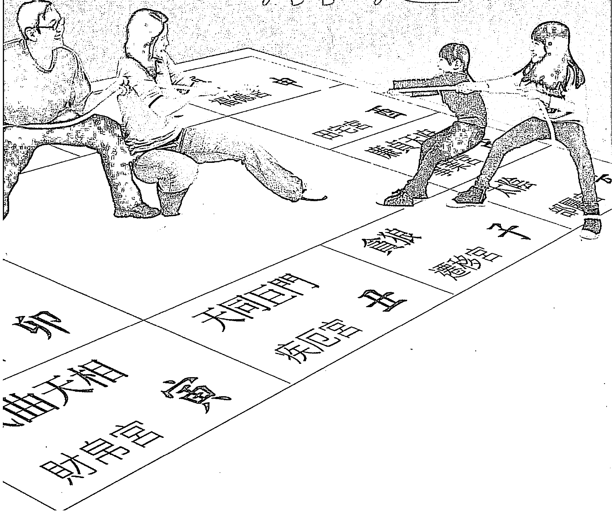

# 親子共創
好命關鍵
從做有解

# 張盛舒——著

紫微的教養智慧

# 用對方法，
與孩子共創一生好命

從親子的紫微命盤，
了解子女的本命性格和父母的教養風格，
從「十年大限」，
掌握孩子成長的情緒起伏和適合的教養方式，
為家庭關係打好根基。

為家庭關係打好根基

> 【紫微的教養智慧】

# 親子難題 紫微有解

用對方法，與孩子共創一生好命

張盛舒——著

> 謹以此書紀念終生愛我，卻不知如何愛我的父親。

# 目錄

# 推薦文1 在不停轉變的「命」中認識自己，也認識孩子 ——王偉忠

# 推薦文2 掌握命盤，就能掌握命運 ——宋惠華

# 推薦文3 搞定你的小孩或爸媽，命運當然好好玩！——何篤霖

# 推薦文4 親子關係要「星星」相惜 ——吳若權

# 推薦文5 每個媽媽都該擁有的育兒魔法書 ——郭靜純

# 推薦文6 親子關係不煩惱！——廖輝英

# 自序——都是為了孩子好？

## 第一篇 紫微斗數與親子關係

## 觀念一 親子難題——是父母的問題，還是孩子的問題？

## 第二篇

概念一 认识紫微斗数

概念二 命盘与六亲的关系

概念三 十年大限与亲子关系

概念四

主星一 七杀星

主星二 破军星

主星三 廉贞星

主星四 贪狼星

案例 开创型子女的教养难题：逢妈必反

## 第三篇 領導型主星：紫微、天府、武曲、天相

- 主星五：紫微星
- 主星六：天府星
- 主星七：武曲星
- 主星八：天相星

### 案例 領導型子女的教養難題：最熟悉的陌生人

## 第四篇 支援型主星：太陽、巨門、天機

- 主星九：太陽星
- 主星十：巨門星
- 主星十一 天機星

案例 支援型子女的教養難題：死不認錯

## 第五篇 合作型主星：太陰、天梁、天同

主星十二 太陰星

主星十三 天梁星

主星十四 天同星

案例 合作型子女的教養難題：彆扭的悶葫蘆

# 附錄 ─ 「九子七姓」的人生

## 在不停轉變的「命」中認識自己，也認識孩子

金星娛樂總經理／王偉忠

張盛舒和我是老友了，我們常聊天，他總說紫微絕非算命，而是老祖宗傳下來的性格統計，談多了、談久了，共同琢磨出「順著天賦做事，逆著個性做人」這兩句話。現在，他把這套說法放在親子教養上，也有幾分道理。
我三十八歲才當爸，等二女兒出生，已經四十。人到中年、工作較穩定，也較有時間陪伴她們長大。她們有著跟我相像的小動作、相似的喜怒哀樂，我經常在她們的小臉上讀到自己，但她們卻又如此的與眾不同。
相信很多家長都跟我有一樣的疑惑，「怎麼同一父、同一母，孩子們個性卻如此不同？」真不得不相信另一句話，「孩子只是在家裡借住個十幾年！」
雖然孩子與父母只有短短十多年相處的緣分，我相信小孩若與家人處得好，未來必然比較懂得與同事、伴侶互動，是良性的循環，反之亦然。因此父母能做的，就是磨合出彼此相處的方式，協助他們發展人格。紫微論命，常說十年一變，而我們的任務就是在不停轉變的「命」中認識自己，完成今生的使命。孩子也是如此，通常十一、二歲才開始展現真正的個性，學習對外溝通。父母千萬要記得孩子是另一個「命」，不需要用你自身的命理經驗，來讀他的命盤，套句紫微的說法：

> 「別用你的武曲貪狼、來影響他的天同太陰。」

得按孩子的想法，去接近他、了解他、幫助他。雖說該「逆著個性做人」，但這只能自我勉勵，千萬別奢望孩子會在瞬間改變天生個性，因為這將是他一輩子的功課。

人一輩子都在學習，學著與自己、家人、社會相處，往往還沒學完，就已經跟這個世界說bye bye，就算學不完，也應該每天學點新鮮的，接觸以前沒碰過的事，就像在心靈青草地上開出幾朵清新小花。

張盛舒的這本新書，就像草原上的新鮮小花，如果您想開個玩笑，喊他「張小花」，相信張盛舒也不會介意的！

## 推薦文2

## 掌握命盤，就能掌握命運

美商如新公司寰宇領袖暨禧達康資訊榮譽董事長 宋惠華

讀完張盛舒的這本新書，讓我想起龍應台的一篇文章，她說：「父母是有『有效期限』的，要在孩子最依賴的十年裡用心教養，提供依靠，一旦孩子長大，那時父母再怎麼努力，也無法改變他們的習性了。

在小孩子的心理中，父母是萬能的，也是完全可以依靠的，這就是父母對孩子教育的黃金時期。等孩子一到了青少年時期，父母的「有效期限」就快到了。

因此龍應台說：「如果在孩子需要的時候父母忽略了教養，將來孩子再怎麼叛逆，父母也只能搖頭嘆息了。

但是，有哪一個父母不想用心教養子女呢？問題只不過在於「自以為是」，把自己的愛惡，強加到子女身上，因此造成許多悲劇。

張盛舒的這本書，就是在討論小孩子的黃金教育時期——從零到二十歲（第一與第二個十年大限），掌握這段時間，就是掌握孩子一生的命運！

很多父母總是在孩子進入青少年時期，才驚覺管不動了，其實已經太晚。因為先天的性格，在後天環境的激盪下，會從量變到質變，性格一旦定型，就很難改變。因此，父母必須在孩子性格養成期，就用心觀察、耐心陪伴、細心引導，才能幫助孩子發揮天賦、創造好命。

這本書提供了非常實用的方法，教父母如何從紫微命盤了解孩子的先天性格，並配合不同的成長階段（大限），給予最適切的教養。尤其，張老師強調「命盤合參」，將父母與子女的命盤一起分析，找出互動的關鍵點，這更是突破傳統命理只看單一命盤的窠臼，真正落實到生活應用中。

我很佩服張老師的用心，他將深奧的紫微斗數，轉化為簡單易懂的工具，讓每個父母都能輕鬆上手。這本書不僅是命理書，更是現代父母必備的育兒指南。只要掌握命盤，就能掌握命運！這本書，是所有為人父母與為人子女者，都應該買來擺在床頭，隨時思考玩味的一本好書。

## 推薦文 3
搞定你的小孩或爸媽，命運當然好好玩！
「命運好好玩」節目主持人 何篤霖

由於長期主持命理節目，讓我認識非常多的命理老師。我觀察後發現，優秀的命理老師，都是洞察人性的高手，張盛舒老師就是如此。
張老師和其他老師最大的不同，在於他在電腦界工作二十餘年，因為創辦網站而進入命理行業。因此，他不受傳統束縛，用不同角度來審視紫微斗數。我最佩服的是，張老師既熟讀古書，再加上在企業界的經驗，學貫中西，花費很大力心力將紫微現代化、科學化和簡單化，讓現代人可以輕鬆應用紫微在生活中的人際關係。
而他首創「命盤合參」的觀念，認為先天的命沒有好或壞，要看後天的運，或者該說，是人與人之間的互動關係，才會產生好壞差別。因此他強調算命是為了「知命、造命」，改變人際關係之間的相處方式，就能改變命運。
張老師每次在節目中講解紫微斗數，簡單易懂，深受觀眾歡迎。尤其每次講到婆媳問題、親子關係時，他運用命盤之間的相生相剋，來解釋「命雖然不能變，但運可以改」的道理，鼓勵大家造命。妙語如珠而又意義深遠，透過媒體的力量，幫助了很多人。觀眾唯一不滿意的，可能就是節目時間太短，聽得不過癮。所以這次張老師出版這本書，將紫微所有主星的角色是父母或子女時，分別會有什麼互動，寫得清清楚楚。各位趕快把書買回去，下次看節目時，就可以拿著書和命盤按圖索驥，知道該用什麼方法搞定你的小孩或爸媽，命運當然就會好好玩喔！

## 親子關係要「星星」相惜

廣播主持人、作家、企管顧問 吳若權

從符合科學與合乎邏輯的角度分析個人命盤；從認識性格與改變行為的方式解決人生困境。父母與子女可以運用十四顆星的對應關係，找到最合適的溝通與相處方式，讓親子關係如魚得水，不再相濡以沫！

由於我在中廣流行網主持「媒事來哈啦」廣播節目，十幾年來長期關注教養議題，有機會向諸多親子教養專家請益，也很榮幸能夠與超過千百萬人次的家長聽眾互動，加上自己成長背景的深刻體認，十分瞭解大家在親子關係上的困境與期盼。

尤其最近這幾年，不時會發生幾宗轟動社會的悲劇新聞，凸顯嫌犯在成長過程中人格扭曲，令大家更加關注教養的議題。台灣的電視媒體很慣於在這個時候，去嫌犯家裡採訪父母或鄰居，得到的看法通常兩極：「他平常很乖巧，完全看不出來！」或「他從小叛逆，非常不受教。」儘管站在專業媒體人的立場，我不認為任何記者有權利在此刻打擾嫌犯的父母，甚至讓他們因為報導而有被羞辱的感覺；不過，確實有很多嫌犯的父母，感到愧疚自責，覺得自己沒有把小孩教好，導致他危害社會。

從「望子成龍，望女成鳳」的宏願，退守到「只要他不要危害社會就好！」這是為人父母在面對親子關係時，最大的恐懼與遺憾。

而相對地，當每個小孩慢慢長大，面對自己在人際關係、兩性關係，甚至職場需要的智慧與勇氣時，感覺自己有所不足或欠缺時，回頭審視自己與父母的關係，看到其中的缺憾時，恍然明白：必須療癒過往親子關係的傷痕，才能找回完美的自己。中年子女，如何接受並原諒，父母和自己成長過程中，共同犯的錯誤，進而與往事和解，就能夠跨越為生命裡最重要的課題。當我們可以接納與寬恕親子關係裡的種種缺憾，就能夠跨越人生的金錢、工作、朋友、感情、婚姻等障礙，重新擁有原本就該屬於自己的幸福。

如果你曾經嘗試過不同的管道，想要了解自己是誰、為什麼這一世會出生這個家庭、與父母的關係是怎麼一回事，以及要如何教養小孩，無論是透過心理諮商、靈性成長、人際溝通、塔羅占卜、前世今生……或任何方式，只要你還有一點疑惑未解，張盛舒老師的新作《親子難題，紫微有解》正好可以提供你另一個可能的機會，從科學命理的角度，讓你得到「原來如此」的答案。

對於人生的一切難題，「接納」是最簡單、也最艱難的解決方法。簡單在於，只要誠心地接納，不再與現實作困獸之鬥，就能理性地面對問題，找到轉逆境為順境的關鍵。

艱難在於，若不知其所以，懷著滿腔的疑惑，就很難說服自己心悅誠服地接納。

張盛舒老師精研科技紫微多年，他一貫的主張就是：不盲從迷信！而是從符合科學與合乎邏輯的角度分析個人命盤，從認識性格與改變行為的方式解決人生困境。在這本《親子難題，紫微有解》書中，他將已經透徹的紫微命理，聚焦應用於親子關係中，幫助讀者了解十四顆星不同的個性特質，父母與子女可以運用十四顆星的對應關係，找到最合適的溝通與相處方式，讓親子關係如魚得水，不再相濡以沫。

張盛舒老師還將自己深刻動人的成長故事，無私坦率地與讀者分享，對應到每一個人成長過程中或多或少的坎坷、或深或淺的滄桑，相信讀者在感動之餘，也會深有共鳴，並發願開始學會療癒自己和父母的關係。

當你讀完《親子難題，紫微有解》，就會了解如何應用十四顆主星，創造良好的親子關係，彼此「星星」相惜，就能幸福相依。

我也會邀請張盛舒老師錄製影音節目，製播於「媒事來哈啦影音頻道」（http://www.bwebshow.com），讓讀者可以透過廣播與網路，閱聽張盛舒老師現身說法，進而對《親子難題，紫微有解》書中的內容，有更深入的體會。

## 每個媽媽都該擁有的育兒魔法書

「命運好好玩」節目主持人 郭靜純

認識我的人都知道，我是一個虎媽，所以我要準備當母親時，就深知了解小孩的命盤有多重要，萬一命盤跟我 不合，他們痛苦，我也麻煩。因此，女兒和兒子出生的時辰，我都麻煩張老師看過，想先確定他們的命好，才能投胎到我家。但張老師說，命好還不夠，運好也很重要，運好，就是要用對方法。我這個虎媽，平常只要眼睛一瞪，他們就乖乖聽話。但是兩個小孩命盤不同，反應也大不同，愈了解他們的命盤，就愈能掌握和他們的相處方式。 像我的女兒是支援型，超級貼心。兒子則是開創型，年紀雖小，就已經霸氣十足，看到漂亮阿姨還會目不轉睛呢！兩人個性差別很大，而因為我自己是開創型，張老師就提醒我，我會無形中寬容兒子的個性，反倒對貼心的女兒要求較多，因此要多注意女兒的內心感受。

每個媽媽都是新手媽媽，照顧小孩生活就夠手忙腳亂了，更不用說還要照顧到小孩的個性與情緒。但張老師說的很有道理，「三歲看大，七歲看老」，我的寶貝目前都正在這個年齡，調整親子關係，愈早愈好，否則等到小孩定型，就來不及了。

大家都誇我把小孩教得很好，我歸功於節目主持久了，耳濡目染，自然會隨時提醒自己面對他們時，要克制自己的脾氣。就如張老師說的，我不只是虎媽，更是知道何時該放軟身段的「溫柔虎媽」！

每個媽媽都想擁有一本魔法書，可以提醒自己如何輕鬆搞定子女。張老師這本書，就是媽媽的最好幫手。各位媽媽們，趕快來了解自己和小孩的命盤唷！

## 推薦文 6

## 親子關係不煩惱！

## 知名作家
廖輝英

說起紫微斗數，我的心境實在錯綜複雜，既不是喜惡愛恨如此強烈的情緒，也非關什麼信或不信的問題，而是無緣；有好幾次，我已接近門檻，卻因各種因素過門不入。這種有違當年初衷的小小遺憾，現在玩味起來，或許只能說是合該如此吧。
我生在一個女性被要求必須「溫良恭儉讓」的傳統社會裡，開始讀書時，卻正逢國民教育施行，初中、高中及大學都有聯考可以做入場券。對於家境普通、食指浩繁，全憑父親一雙手打拚的家庭而言，身為長女的我，能夠一路讀到台大畢業，真是萬幸。因為考試基本上是公平的，只要考得好，就能進入自己的志願學校就讀。而省中和國立大學「平價」的學費，至少是父母拼命還負擔得起的。
好讀雜書的我，十三歲就成為到處投稿、屢被刊登的文藝少女。大學畢業時，利用暑假寫作已經九年，但我仍自知不足，放下文學，轉身投入職場，任職廣告業。

廣告固然有其專業，不過，我發現應對各行各業的老闆或 CEO，見識廣博似乎是更重要的一件事。如果懂得一些命理知識，至少能做為談話的素材——這雖然是現實考量，至少我發現了一般人對自己的命和運，其實是很關切且「願聞其詳」的。奈何那十一年間，忙工作、忙競逐、忙戀愛……停下來的時間少之又少，零零碎碎，根本失去專注研究一門與目前營生完全無涉的知識的熱忱。

職場奔馳多年後，再重新拿起小說創作之筆，心中多少有著「早些年，就該把紫微斗數納入雜學基礎」的遺憾。
主觀上，我對紫微斗數的「用世」價值是持肯定態度的。不過這幾十年，我也聽聞許多江湖術士恐嚇問命者的言論，像是命盤中出現會離婚、短命、有雙妻命必須兩頭大或娶冥婚、命中有巨大災厄神也難救、生子不肖來討債一輩子、命中有掃把星、夫妻相剋無解等等。我沒有算過命，但看到問命者被嚇到惶惶不安、不知所從的樣子，我從心底就懷疑：如果知命卻不能教人趨吉避凶，那人幹嘛花錢去算命？

這幾年，我讀了張盛舒老師的幾本大作，雖然沒有學會紫微斗數看盤解盤的基礎，但是，我發現張老師用相當科學的方法，不只看一個人的命盤，而是將親子、夫妻、父母的紫微斗數合參，從個性食物鏈、地位食物鏈開始討論；再從不同的個案中分析怎樣合適對應、如何良好互動。更分別就不同主星的親子關係，提出個別的教戰守則，意思是，所有讀者都可以在這本書中，找到張老師對您及您的孩子相處的正面建議，隨時隨地有困擾，都可以翻到您的那一頁溫習一下，好像特別為您量身訂做一般。 讀了這本《親子難題，紫微有解》，我覺得這是做功德的書。 作者殫精竭慮，以科學的方法，發揮算命、知命、造命的淑世功能。 它大大扭轉過去算命界某些錯誤解讀的疏陋，以一種不留一手、毫無藏私的方式出版面世，任何有親子困擾的讀者，都能在這裡找到可行的方向！

## 自序

## 都是為了孩子好？

自從二〇〇〇年創辦科技紫微網，想不到已經十五年了！這些年來，我收集了超過七百萬張命盤，出了十本書，詳細解讀紫微斗數的奧妙，不只推翻傳統命理對算命的誇大無知，也建立了紫微的科學觀，奠定算命、知命、造命的紫微應用模式，讓大家了解，原來真的有命運，而命運是可以改變的，想改變一點也不難，只要用對方法，就能事半功倍，創造一生的好命好運。

我研究命理，看了無數案例，發現人生之中帶給你最大痛苦的來源，往往是你的親人！不管是出於善意或是惡意，而善意往往比惡意來得更為可怕，因為，當親人理所當然認為「都是為了你好」，就更加毫無忌憚干涉你的未來。

現代人工作不順，可以選擇離職，感情不睦，可以選擇分手，但是你生在誰家、父母兄弟是誰、命盤相剋還是相合，是沒得選的。你一出生，血緣就註定了關係一輩子不變。所以，影響命運的最關鍵因素，是親子關係。對家人，既然躲不掉，藉由分析彼此命盤、合參，也就是了解雙方可能的互動，就更為重要了。找出癥結，發現病因，才能對症下藥。

很多來算命的人，對家人（不只父母子女、兄弟姊妹，還包含親家、姑舅叔甥等各種關係）極度不滿，但因傳統禮教包袱，不便明說，平常沒有對象、也沒有地方傾訴，壓抑的結果，心情更加鬱悶，爆發出來時，往往已經釀成悲劇。

很多夫妻、父子、母女、兄弟，到我這裡透過紫微命盤分析的結果，往往令他們震驚。認識幾十年的一家人，心的距離卻像火星離地球這麼遠！雙方從來不想了解對方，只希望對方了解自己；結果就是，不斷的互相傷害、彼此折磨。

因此，不論是父母子女之間的關懷、期待、責任，或是來自社會階級定義的上位者（父母、師長、老闆）過多自以為是的愛，常常帶給下位者壓力，也造成了傷害。所謂愛之適足以害之，愛恨相生，沒有愛也就不會有恨，這是千古難解的人生習題，也是每個人成長必須面對的關卡。

天下真無不是的父母嗎？我看了那麼多家庭案例，深深感覺，天下父母都不是！完美的父母根本就不存在。而父母最常犯的錯誤，是在物質上拚命滿足子女，卻在精神上不自覺的貶抑、甚至傷害子女。尤其現代社會，多元價值觀正在解構傳統家庭觀念，親子關係更為複雜多變。大部分的親子關係，問題都在父母，不在子女！所以，這本書我用了最多心力編寫，各位讀者絕對要一讀、二讀、不斷體會玩味。

你要了解的不只是你自己，還包括你身邊最親的家人——父母、子女，乃至祖父母、孫子女、公公、婆婆、岳父、岳母，有時綿延三、四代，家族影響都還存在，這些影響你一生的至親，豈能夠輕慢以對。

我在書的最後，寫出我對童年的回憶「九子七姓」的複雜人生。家中每個成員的互動，其實已種下非常多未來的命運。這中間的因果關係，是我研究紫微多年之後，才終於明白。

紫微真是一個了不起的親子關係工具，期望能透過這本書，讓讀者循序漸進，用最正確的方式來解讀命盤，知命、造命，給大家一生好命！

## 第一篇

## 紫微斗數與親子關係

## 觀念一
## 親子難題——是父母的問題，還是孩子的問題？

在我創辦的科技紫微網上，曾經有一名網友問說，天下無不是的父母，這句話到底是對，還是不對？

他的提問，讓我想起一個案例。曾經有一個年輕朋友，從南京到上海來找我。他大學畢業沒多久，由於本科讀的是會計，因此，畢業後就做會計。但是，他的心總定不下來，老是出錯，公司主管也覺得他不適合這份工作。

抑鬱不得志的他一直想轉行，可是父母不同意，認為他讀了四年，不好好發揮所長，是一種浪費。而且，會計工作穩定，為什麼不幹？於是，各種指責加諸到他身上，諸如沒定性、不認真、好高騖遠、易犯錯等等。我把他命盤一排出來，就知道是怎麼一回事了。他的命宮主星紫微七殺，是個性積極、行動力十足的兩顆星，優點是具有領導欲、有衝勁、有魄力，旁人往往還在猶豫方向，他已經先人一步，大步向前走去。
然而，這樣個性的人，在做靜態的工作如會計時，適合嗎？
紫微斗數的奧妙，就在於任何人只要稍微學過一點紫微，就可以判定一個人的天生性格，適不適合從事他正在做的事。
很不幸的，他在辦公室的靜態工作，讓優點都變成了缺點。所以，家人指責他的問題，其實並不是他的問題，而是他一開始就讀錯了書、入錯了行。
要注意的是，讀書無所謂，讀書不是為了學歷，而是為了汲取學問與能力，所以，讀書時期投入的心力，沒有浪費可言。但不了解自己適合什麼工作、入錯了行，就是浪費了。他做的工作太制式，多餘的精力無從發洩，就成了職場裡的麻煩製造者；加上家人忽視他的優點，一味把因為放錯環境而產生的衝突與麻煩，怪罪在他身上，甚至試圖把他的『缺點』改掉。
而想要真正解決親子問題，光看孩子的命盤、了解孩子的個性，是不夠的，還要和父母的命盤合參，也就是了解父母的個性，才能精準預測孩子和父母互動可能會產生的衝突，也才得以真正解決親子的問題。
於是，我也看了這名年輕人雙親的命盤，發現他的父母命盤主星，是個性溫和沉穩的合作型，與他的個性可說是天南地北。這類父母所謂的愛，往往只是來自本身保守穩重的宿命習慣，卻恰恰扼殺了開創型兒子積極進取的野心和抱負，親子之間，因此愈走愈遠。

遠，幾乎是可以預見的結果。
我告訴這位青年朋友，想辦法說服父母，是他的第一堂課。因為，依他的主星個性，充滿主見，根本不需要旁人告訴他該做什麼，他需要的，就是家人的支持與鼓勵而已。
尤其在人生的奮鬥旅途中，得不到家人的祝福與支持，是最苦的。他想走自己的路，只要父母不認同，這條路，就很難走得出來。

因為愛，反而麻煩一堆；因為愛，反而有憾。這樣的親子案例，我看過太多了。人生的命運，往往就在不試著了解自己，也不試著了解對方的親人之間循環，苦無轉捩點；
像是不贊成女兒結婚的媽媽，在婚後常常挑剔女婿，當女兒離婚了，媽媽只說：「你看吧，我早說過，他不可靠！你就是不聽我的話。」不贊成兒子當藝術家的爸爸，脫口而出：「學這個，以後有飯吃嗎？」在兒子遇到困難時，只用施捨的口氣說：「當初不聽我的話，才會這麼大了，還要伸手向家裡要錢。」
前些日子，新聞報導一位留美高材生，因為受不了女友離開他，開車衝撞女友。被捕之後，他竟然說：「都怪我的父母對我太好了，給我早早就買了房子，害我失去了為人生奮鬥的動力。」
給了孩子最好的環境和教育，卻換來孩子這樣的下場與回應，他的父母情何以堪？
父母在物質上滿足子女，卻在精神上不斷的打擊，以愛之名，其實卻是害了他們。但不也就是活生生的案例，讓我們開始反思，什麼才是真正的愛？

### 到底是谁剋谁？先从了解亲子的个性食物链、地位食物链开始

上述的父母，是爱？还是不爱孩子呢？会遇上这些冲突与困难，是父母的问题，还是孩子的问题呢？我们先简单了解一下，亲子之间的个性食物链、地位食物链，你自然会明白亲子互动为何会出现这么多问题。

大家都熟知的西洋星座，共有十二个，各有相应的人格特质，而紫微也同样有十四颗主星，只比星座多两个；十四颗主星又有分阳性的（个性外显），就像前面例子中前来的我的年轻人，也有阴性的（个性内敛），像是年轻人的父母。只要知道自己的出生时辰，就可以找出你的主星，了解自己天生是个什么个性的人（电脑排盘详见五〇页）。

研究命理二十多年，我发觉紫微各主星之间，存在非常微妙的相生相剋关系，我把这种关系，称为个性的食物链。

十四颗主星依照个性的强弱排列，从极阳的开创型七杀星，到极阴的合作型天同星，刚好形成一个个性食物链（详见第五三页），这也是我常描述的：开创型就像老虎，合作型则像绵羊，若在森林中相遇，极端不同个性的激荡之下，就会有必然发生的冲突与命运。

而人类构成社会，产生阶级结构，阶级又生地位，地位的高低与关系，也会形成地位食物链。

### 食物鏈。

上級命令下級，父母教訓子女，常是促進社會結構穩定的必要手段。只不過，一旦個性食物鏈與地位食物鏈產生了衝突，例如：個性食物鏈居上的開創型，卻當了人家的部屬或子女；個性居下的合作型，卻在地位上是上級或父母，這時會發生衝突，幾乎是必然的，即傳統命理所謂的「孤剋」。

但奇特的是，傳統命理將開創型的「七殺孤剋」視為理所當然，但合作型的太陰也稱為「剋」，古書稱為「剋母剋妻剋女」，這就很有趣了，代表人際社會的食物鏈關係，不是老虎吃綿羊。

例如：有兩對母子，一對的母親是陽性的七殺星，子女是陰性的太陰星，另一對則母親是太陰星，子女是七殺星。這兩對，哪個媽媽比較苦？哪個子女比較苦？是父母的問題，還是孩子的問題？到底是誰在剋誰？

我在上課時常問學員，結果毫不意外，每人的回答各有不同。陽性命盤傾向同情七殺的母親，也同情七殺的子女。陰性命盤的人，覺得太陰的媽媽很苦，太陰的子女也很苦。

不同命盤的人，各用各的角度來解讀，沒有交集，所以最後結論是：每個人都會互剋！

為什麼？

七殺的母親，個性強烈而主觀；太陰的子女，卻是優柔寡斷，欠缺自信。

如果七殺媽媽無法欣賞太陰的優點，眼中只看到太陰的缺點，那麼，她愈想逼子女有自信、有主見，她就愈痛苦，心生「虎父犬子」的感慨。相反的，太陰的母親，個性上有完美主義的傾向，很在意別人的眼光。偏偏七殺的子女，卻是我行我素，惹禍不斷。如果太陰媽媽無法喜歡七殺的優點，眼中只看到七殺的缺點，那麼，她愈想逼子女乖乖聽話、別惹麻煩，她就愈痛苦，心生「我的教育失敗」的感慨。

太陰子女又是怎麼想的呢？他們往往誤以為七殺母親不愛我，否則為何對我這麼兇？可能我不是她親生的吧？想要滿足母親的期望，卻四不像，本就缺少自信的太陰，最終只好躲進內在築起的心靈城堡，關自己禁閉。

而七殺子女又是怎麼想的呢？每當媽媽接到老師或家長的投訴電話，氣急敗壞、不論青紅皂白，先怪自己子女不對，不懂委曲求全、以和為貴。一次又一次的責罵時，七殺子女往往露出桀傲的神色；或當媽媽喃喃自責時，對媽媽的行為無法理解：「媽媽，人家欺負我，我為什麼要忍耐？你真的愛我嗎？還是只重視你自己的面子？我到底是不是你生的？你不喜歡我，沒關係，我走！」

此話一出，到底是在剋誰？人和人相處實在不容易，尤其親子關係，更是難解。現代人工作不順，可以選擇離職，夫妻不睦，可以選擇離婚，然而父母子女的血緣關係是命中注定，無法選擇的。

那麼，子女是來討債還是還債，是善緣還是孽緣？我們能不能改變，讓孽緣變善緣？
開創型就像老虎，合作型就像綿羊，在原始環境裡，老虎碰到綿羊，則誰剋誰是很清楚的，這是食物鏈的必然。跑得不夠快的綿羊，就要付出生命做為代價；跑得不夠快的老虎，也只能餓著肚子。

但在人類構築的社會裡，因為多了階級地位的上下關係，於是又產生了新的問題；社會固然讓人有免於死亡的恐懼，卻不能免除命盤個性相剋所產生的心理壓力，例如，老虎被強迫要做綿羊的子女，是很痛苦的，而綿羊被強迫做老虎的子女，也一樣痛苦。剋，在人類社會裡無所不在，任何人都逃不掉。

有一次，我在台中演講這套食物鏈的理論，一位媽媽站起來，很激動的說：「我是合作型的太陰，我的四個小孩都是開創型的殺破狼，我帶得好累啊；老公又不幫我，婆婆小姑都怪我不好，我快要得憂鬱症了！還好今天來聽您的演講，終於明白為什麼，心裡舒服一點了。」

我請現場觀眾給這位媽媽最熱烈的掌聲，慰問她的勞苦功高。大家聽了我的演講，都能感同身受她的痛苦，也能給她最大的祝福，但是她的家人呢？能不能在她最需要幫忙的時候，拉她一把，而不是落井下石？我暗自感嘆，如果她老公也可以一起來聽，那該有多好？

只有最愛你的人，才能傷你，也只有最愛你的人傷你，你才會痛苦。肉體的傷終會痊癒，心靈的傷口卻常愈割愈深。這不就是人生嗎？
如果能夠想通這些關係互動的來龍去脈，你會發現，命運的發展其實一點也不難預測，不過就是命盤的相生相剋而已。

這些年，我在網路上和許多網友互動，討論親子議題，眾網友不約而同表示，科技紫微的創新觀點，改變了他們對親子關係的看法，扭轉了傳統命理的刻板印象，稍後會陸續分享網友的例子。
傳統命理解讀命盤的說法千奇百怪，這固然是個亂象，但父母教養子女的態度，往往才是問題所在。以下是一個網友的例子：

> 網友「懶懶貓」：
我自小就飽受不負責任、沒有良心的算命師毒害，他跟我父母說，我會剋父母，與父母無緣，且淫蕩，從此我便生活在地獄之中。只要父母覺得我不聽話，沒照他們要的方向走，就對我說，算命師說過，我是生來剋父母、要把他們活活氣死的。上了高中更慘，只要跟男生講話，只是打招呼喔，就被叫妓女，因為算命師說我淫蕩。

我看她的例子發現，算命師只是父母的一個藉口，一個害怕自己管不好女兒，只好用「宿命論」來約束女兒的藉口。這個藉口背後掩藏的，是害怕自己不會做父母的深刻無奈。

當局者迷，事非經過不知難，人性中深刻痛恨婚姻失敗、事業失敗、為人父母失敗的潛意識作祟，促使我們常把失敗原因歸之天命，或者歸咎於別人的不配合，這不正是人生最深沉的矛盾之一？

現代很多教育理論認為，只要能發現子女的天賦，培養他們照著天賦不斷練習，就會成功。問題就出在這裡了，父母子女的命盤各異，思考模式也不同，父母能否真的肯定子女的天賦？反過來看，子女能否真的認同父母的肯定？

每天，都有許多朋友來找我，訴說人生困境。人雖不同，但場景類似，同樣命盤的人，永遠訴說著同樣的焦慮。我常常想，應該把他們放在一起，互相傾訴，就會知道，原來，這就是人生。

陰性的天梁媽媽坐在我面前，愁眉不展，他有個陽性的七殺子女。
「怎麼辦，我子女這麼叛逆？老是喜歡往外跑，定不下來。」
七殺子女坐在我面前，怒容滿面，他有個天梁媽媽。
「氣死人，我媽媽怎麼這麼嘮叨，沒有一點中心思想，人云亦云，煩死了！」
陽性的紫微媽媽坐在我面前，怒容滿面，她有個陰性的太陰子女。
「氣死人，我子女怎麼這麼沒有企圖心，一點大志都沒有。」

太陰子女坐在我面前，愁眉不展，他有個紫微媽媽。
「媽媽老是嫌我不夠努力，我要怎樣做她才會滿意？我是不是真的很差勁，什麼事都做不好？」

我告訴他們，每張命盤都一定有天生的優勢，問題在於，你能不能、願不願意接受，你生的子女，就是不像你？

> 「氣死人，我媳婦怎麼這麼凶，欺負我兒子，簡直就被她控制住了，她眼中還有我嗎？」
陽性的紫微媽媽坐在我面前，怒容滿面，她有個陰性的天機兒子和陽性的貪狼媳婦。

貪狼媳婦坐在我面前，怒容滿面，她有個天機老公和紫微婆婆。
> 「早知道我婆婆是這種德性，我一定不會嫁。她憑什麼介入我們夫妻的生活？」

天機兒子坐在我面前，愁眉不展，他有個紫微媽媽和貪狼老婆。
「我夾在兩人中間，簡直快崩潰了，她們都是我最愛的人，為什麼不能和平相處？」

為什麼？為什麼？為什麼？這麼多的為什麼，到底誰剋誰？你要用什麼態度來面對呢？

能不能把命定的剋，都轉化為前進的動力？讓命運不再是藉口，也不再是絆腳石？

### 命盤是死的，人是活的

有一位紫微媽媽來問我：「老師，我很信賴你，你的每一篇文章我都看，請你務必告訴我的小孩，他該走哪一條路最好？你說了，我就叫小孩照著做，最妥當。」

這也是許多家長來算命時，會問的問題。
讓我們一起來思考。首先，對媽媽的問話，身為算命師的我，該不該鐵口直斷，以解她的焦慮？

其次，媽媽這樣的問法，對不對？有沒有把責任推給算命師的嫌疑？

第三點，在第二大限的年輕兒女，各人不同，有沒有需要這麼早就把他們限定在特定的目標之內？

最後則是，兒女們會聽嗎？還是媽媽要用她的威嚴加上我的威嚴，來讓兒女接受，真的替他們選擇一條安穩的路？

一個看似小小的算命事件，其實是個大哉問，裡面牽涉到多少的人性面？是家長的問題大，還是孩子的問題大？

但是，這有可能嗎？

做父母的都希望兒女不要走冤枉路，最好都走直路，無災無難到公卿，愈穩愈好。但是，這有可能嗎？
當我把這位紫微媽媽的問題丟上網，看到網友的回應時，心里很震撼。親情無價，但太多的愛，常常會變成一種負擔與壓力，如何調整，真的是父母與子女的共同功課。

> 網友「小風」：有時候想想，所謂的好壞對錯，總是會因為時空而有所改變，那前進的路線，是不是應該也要跟著改道呢？其實走錯路也沒什麼不好的，得到的經驗畢竟是自己的。這讓我想起最近聽到的兩句話：「成功的失敗，失敗的成功。」回歸話題，如果我當家長的話，我會覺得讓小孩認識自己，比給小孩目標還有用吧！

> 網友「UUV」：我倒是覺得紫微給的是一個思考方向。我的孩子還小，我會希望從命盤中去瞭解他們的性格及對學習的影響，並思考我又該以何種心態去幫助、引導他們，並建立良好親子關係。我的想法很簡單，我能在他們成長路上參與的時間有限，只有盡力而已。

> 網友「』）：
我的深切感覺是，愈晚接觸命理愈好，要是我，會把小孩的命盤鎖起來，好好教導他，與他相處，而不是與他的命盤相處。等到他長大了，有了自己的判斷力，再讓他去接觸。不然，會產生無限迷思，畢竟命盤是死的，人是活的。

（我的回覆：不用那麼極端啦！可以參考網友『』的回應，從命盤中去瞭解子女的性格及其對學習的影響，並思考該以何種心態去幫助、引導他們，並建立良好親子關係。）

> 網友『西』：
我自己是個紫微七殺媽媽，個性急又沒耐心，本來還想，我的兒子怎麼個性這麼不像我——他溫柔敦厚，天性善良，極有愛心，就是有點漫不經心，又難做決定，不像我很衝動，凡事決定了，就是這樣！有時真會有點皇帝不急急太監的感覺，哈哈！我一直到排出他的命盤，才知道太陽太陰坐命的他，本來和我就不一樣，如果愈去『用力』推動，他會愈退縮。所以我從此改弦更張，一樣的愛，用不一樣的方式表達，不再是一『批判』的眼光，而是常感嘆於他怎麼如此貼心善良，即便偶爾還是會冒出我『兇狠』的本性『嚇到』他，但他已經會直接質疑：「媽媽你幹嘛這麼兇？」我馬上汗顏，呵呵。
相信天下的母親都是疼愛自己孩子的，但是人生的路只有靠自己走，別人急死都沒用，我們只能從旁看著，需要時幫著，但是沒法替他們走……
給他們足夠的愛，讓他們這一世都對自己有信心，知道自己值得愛，即使碰到再大的困難，都不會輕易放棄自己，甚至生命……
只要他們能好好愛自己、愛別人、尊重生命、好好過日子，當母親的應該也能放心了吧。
別忘了當我們年輕時，也受不了別人想主導或決定我們該怎麼走，才是所謂「正確」的路，不是嗎？我們當年不也是表面順從，心裡仍不以為然，甚至直接反叛？
要做父母的不出手控制，真的很難，但是學會放手，才是對母子都好吧，我想……
（我的回覆：感謝西的現身說法，是的，對紫微七殺媽媽而言，學會放手，就是造命。）

> 網友「大妞」：努力的教養一個孩子，教他如何選擇，但不能幫他選擇。孩子該受苦就要讓他受苦。這一點我很篤定。

> 網友「東東」：
紫微有強烈的主見，基本上已有定見，只希望經大師加持，更能說服子女照父母的希望去走。若只想賺紫微媽媽的錢，就照她的意思做。若希望保有良知，應告知讓子女順著天賦走，縱然是飽受挫折，依然是一帖良藥。但紫微媽媽應該聽不進去。
（我的回覆：有這麼多人協助，這時應該聽得進去了！）

> 網友「晴天喵」：
我覺得當父母的，真的只要在旁協助孩子看清楚自己的特質就好，絕對不要出手控制喔。
每個小孩都有自己的路要走，不管是平順的，還是崎嶇的，他會自己選擇；有時父母著急，也是無濟於事，還不如引導他們深耕出自己的興趣，有一天他會知道要怎麼運用自己的才能。一個不愛被管的廉貞天相準媽媽留。
（我的回覆：呵呵，你還是準媽媽，等你小孩長大，看能不能真的忍住不出手。知道易行難唷！）

> 網友「CC」：
那位媽媽原本想問：該如何填滿她兒女事業宮的缺口？但我想，她其實應該問的是：該如何填滿她自己子女宮的缺口？

（我的回覆：說的真好！頭兩句話真是經典！）
如果我是算命先生，我會先算媽媽的命，用她的命盤，試圖說服她算得太精準，反而是繞遠路，這樣「最不妥當」。

> 網友「小女孩」：
我也經常關注張老師的文章，也學了很多，特別欣賞「順著天賦做事，逆著個性做人」這句話。以前，我真是一個很任性的孩子，總是傷害了身邊的人，也吃了很多苦頭，失去不少機會。我的媽媽和提問的許多媽媽一樣，希望寶貝女兒生活幸福，工作穩定，人生的路上可以少走彎路，雖然她也會去算命（因為她這輩子受了很多苦啊，所以不希望她的孩子也受同樣的苦），但她不會逼迫我照她的想法去做。以前的我不會聽她的，慢慢長大了，也漸漸明白她的用心良苦，開始會聽一些了，畢竟她的人生經驗比我多很多，但還不能夠全部消化。

所以，我覺得還是要看人吧……關於「老師你說了，我就會叫小孩照著做，最妥當」這種想法，我覺得要三思啦。有時家長的善意，也會毀了一個孩子。一個未經歷多少世事的黃毛丫頭留。

> 網友『奔四』：人生最大的痛苦，就是有得選擇。所以佛家說：『一切都是最好的安排。』指點迷津，不如給一個正確的心態。用張老師的話來說，就是造命！你適合的工作是一個大的範圍，而不是單一工種。就算找到了工作，也會有困難，人生總是有變數的。跟著心的指引，再大的困難都能克服。

> 網友『如意』：『成也蕭何，敗也蕭何。』把張老師的話做為一種人生的指導，可能來得更妥當。媽們的心願是好的，但每個孩子卻都有天賦和個性，而人生的道路上又有很多變數，幫助他們建立面對生活的方法，可能比告訴他們生活的方向更重要，因為他們可能創造更好的生活。

（我的回覆：看了這麼多網友的意見，天下媽媽們，此中有真意，值得仔細推敲喔！）

看到這裡，再回過頭想想一開頭的網友提問，天下無不是的父母，這句話到底是對，還是不對？想必各位讀者，心中都有答案了。

普立茲獎得主美國詩人理查·維伯（Richard Wilbur）有首著名的詩『寫作者』（The Writer），精準描述了為人父母，對於子女的愛、焦慮、期待與忍耐，值得獻給天下正在徬徨的上位者（父母、師長、夫妻、老闆）欣賞。 詩的結尾說：「親愛的 我早已忘卻／這一直是件生死攸關的大事 我再度祝福／先 前祝福你的一切 只是更加濃烈。」 父母子女到底誰剋誰？能不能把剋，都轉化為前進的動力，讓命運不再是藉口，也不再是絆腳石，這正是我經營科技紫微網努力的目標，也是我在這本書裡，送給讀者的祝福。

### 寫作者

> > 在頂樓有如船首的斗室之內
> 燈光忽明忽滅
> 照映窗外
> 椴樹的影子婆娑
> 我的女兒正在寫故事
> 我在樓梯間佇足
> 屏息聆聽
> 緊閉的房門裡
> 傳來打字機鍵的騷動
> 像極了拖過船舷的鐵鏈聲
> 年輕如她
> 生命就像船上的巨大貨櫃
> 其中更有些沉重不堪
> 我希望她能安然度過風浪
> 但是 她忽然停止了所有動作
> 彷彿要拒絕我的關心 以及那失之過簡的比擬
> 靜寂的夜益發深沉 夜色中的屋子
> 似乎也在開始沉思
> 她又開始工作了 打字鍵的喧鬧再度出現
> 但緊接著又是沉寂無聲
> 我驀地想起那隻茫然失措的星椋鳥
> 兩年前 正是被困在同一間斗室之內
> 我們如何偷偷溜進去 拉開窗框
> 悄悄退出 生怕驚嚇到它
> 接下來的時間 我們只能無助的從門縫之中
> 看著這隻輕巧野性又帶著烏黑光澤的小可憐
> 不斷的朝向亮光撞去 像只手套般落在
> 堅硬的地板 或是書桌上
> 雖然它已鼻青臉腫 我們仍期待
> 它有再試一次的勇氣 而我們精神為之一振
> 是如何歡欣鼓舞啊
> 當它 突然拿定了主意
> 從椅背上振翅飛起
> 朝正確的窗戶筆直飛去
> 流暢的通過這世界
> 殘酷試煉的門檻
> 親愛的 我早已忘卻
> 這一直是件生死攸關的大事 我再度祝福
> 先前祝福你的一切 只是更加濃烈

## 觀念二

## 科技紫微鬥數

這是我的第十一本書，在前幾本著作中，已經針對紫微斗數命盤十二宮中的命宮、事業宮、夫妻宮等，做了詳盡的說明。這本書則要進入親子的領域，探討父母子女之間的關係。而我創辦科技紫微網以來，發覺大眾對紫微誤解最深的，是父母宮與子女宮的關係，在稍後會一一說明。因此，從古到今的算命師都錯誤解讀，不知道該如何正確應用父母宮與子女宮，以致誤人子弟，遺害眾生，把好命算成了壞命，令人浩嘆。

首先來了解紫微斗數的基本概念。紫微命盤看起來很像一個方型的時鐘，劃分為十二格，象徵時間的循環：一天有十二個時辰，一年有十二個月，每十二年就是一個地支等等。紫微公式則會根據出生年、月、日、時四個參數，在各個格子裡排列不同的宮位及主星（請見附圖「紫微命盤範例」，電腦排盤可上科技紫微網站http://www.click108.com.tw）。

| 天機 兄弟宮 平輩態度 | 紫微 命宮 人格特質 | 父母宮 長輩態度 | 破軍 福德宮 生活態度 |
| :--- | :--- | :--- | :--- |
| 七殺 夫妻宮 感情態度 | 紫微命盤範例 | | 田宅宮 不動產觀 |
| 太陽天梁 子女宮 晚輩態度 | | 廉貞天府 事業宮 工作傾向 |
| 武曲天相 財帛宮 理財模式 | 天同巨門 疾厄宮 健康態度 | 貪狼 遷移宮 人際關係 | 太陰 部屬宮 領導統御 |

### 十二宮：代表你人生各方面的重要指標

命盤就像人生的縮影，十二宮則代表人生的各種不同取向，包括生命、親子、事業、愛情婚姻、人際互動、財富等重要指標。命宮可在命盤中任何一個位置，由紫微公式決定。其餘各宮則依順時鐘方式填入，依次為：命宮、父母宮、福德宮、田宅宮、事業宮、交友宮、遷移宮、疾厄宮、財帛宮、子女宮、夫妻宮、兄弟宮。

命盤十二宮和主星的組合，能夠顯示一個人的個性特質，以及在人生不同面向的期望與偏好。例如：財帛宮，顯示一個人對金錢的態度與理財觀；夫妻宮，顯示一個人的感情模式與喜歡的類型；福德宮，顯示一個人對人生的態度與生活的價值觀；子女宮，顯示一個人對子女的態度與教育觀等等（請見附圖）。

這十二宮，與親子有關的宮位如下：

### 命宫：

「命宫」是十二宫中最重要的枢纽，犹如人体的头脑指挥全盘、组织思想、计划和发号施令。命宫本身没有好坏之分，它只显示个人先天个性与人格特质。

### 父母宫：

父母宫代表子女对父母的态度，并不代表父母。

### 子女宫：

子女宫代表父母对子女的态度，并不代表子女。

每个人都曾经为子女，也会为人父母，不同的角色扮演，心境就会随之改变。

很多夫妻的感情很好，婚姻也没有大问题，但却在孩子出生后，由于双方对管教、培育子女的价值观不同，产生很大的冲突，导致感情变质。因此，不只亲子合参，夫妻也要合参，也就是了解双方可能的互动，才得以正确改善亲子关系（有关夫妻合参的详细介绍，请参阅《爱情有方》「天下文化出版」一书）。

我从多年的命理经验发现，亲子关系往往是人生之中最难以解决的问题。因为你一旦出生，生在谁家，当谁的父母子女，一辈子都无法改变，根本毫无选择。如果不从命盘中了解亲子可能的互动模式，多少家庭悲剧会因此而生？多少好命会变成坏命？多少误会与痛苦，本来得以避免？

俗语说，家和万事兴，能把家庭关系处理好的人，会成为命运中当然的强者。又因为亲子问题牵涉到至少三个人（父、母、子女），因此，命盘合参就更为重要。而家中每增加一名新成员，产生新的相生相剋关系，就需要再合参一次，不能用同一个旧模式，永远套用下去。

知命還要造命，懂得紫微命盤（知命），並運用它推翻成見，就是造命。造命雖然困難，過程充滿挑戰，然而只要你能正確掌握命盤，知己知彼，則事半功倍，造命就會是充滿樂趣的生命發現之旅。

### 主星：代表你天生的人格特質

紫微斗數的星群眾多，高達一百零八顆，但是經過我的研究，已簡化成最重要的十四顆主星，只比十二星座多兩個。

這十四顆主星分別是七殺星、破軍星、廉貞星、貪狼星、紫微星、天府星、武曲星、天相星、太陽星、巨門星、天機星、太陰星、天梁星、天同星；其他九十四顆星則稱為輔星。

十四顆主星可以決定百分之八十的特質，其他九十四顆輔星則只能影響剩下的百分之二十，所以本書專注分析這十四顆最重要的主星，即十四種親子原型。

依照《易經》的觀念，這十四顆星可分為陰、陽兩種個性，依現代觀再分成四類，分別對應不同的個性特質，如下頁表所示。

| 動態（陽性） | 開創型（老陽） | 領導型（少陰） | 支援型（少陽） | 合作型（老陰） |
| :--- | :--- | :--- | :--- | :--- |
| | 七殺 破軍 廉貪 貪狼 | 紫微 天府 武曲 天相 | 太陽 巨門 天機 | 太陰 天梁 天同 |

#### 開創型個性 (Action)

包括七殺、破軍、廉貞、貪狼，這類人個性特質是做事情快速、直接，不拐彎抹角，也比較沒有耐性，人生的變化性特別大，是天生的冒險家與開拓者。開創型的小孩，可以稱為膽大型或冒險型，成長過程中往往比較外向叛逆，但只要教得好，長大後成就也很大，在各行各業都能有所表現。
開創型的名人例如蘋果電腦創辦人賈伯斯、鴻海創辦人郭台銘、旺旺創辦人蔡衍明、阿里巴巴創辦人馬雲等人。

#### 領導型個性 (Leadership)

包括紫微、天府、武曲、天相，這類人動靜搭配得宜，很有領導能力，也能帶頭行動，屬於天生的管理者。
領導型的小孩，可以稱為理智型或帶頭型，成長過程中往往比較成熟世故。長大後多能成為優秀的專業經理人、創業家等。領導型的名人例如台積電創辦人張忠謀、三一集團創辦人梁穩根等人。

#### 支援型個性 (Support)

包括太陽、巨門、天機，他們多熱情爽朗，很喜歡影響別人，發表高論，樂於當意見領袖，是很好的幕僚人才，所以稱之為支援型。
支援型的小孩，可以稱為愛秀型，很愛表現，成長過程中往往比較外向，好管閒事。
支援型的名人例如陳水扁、李敖等人。

#### 合作型個性 (Adapt)

包括太陰、天梁、天同，他們的個性溫和，很容易配合他人，也容易受人影響。因為穩重，思慮多，不太容易變動，生涯規劃也是按部就班，不太會有意外。
合作型的小孩，可以稱為順從型或保守型，成長過程中往往比較缺乏自信，畏縮內向，而這一類的人，後天的學習環境及過程會對他們造成很大的影響，因此，只要知道如何教育他們，長大後也會很有成就，多成為政治家、企業中堅幹部、文學家、哲學家、藝術家等。
合作型名人例如宏碁創辦人施振榮、蘋果電腦發明人沃茲尼克、馬英九、蔡英文、連戰、王金平等人。

| | | | |
| :--- | :--- | :--- | :--- |
| 天機天梁 | | | |
| 遷移宮 | | 到對宮，借主星 | |
| | | | 沒有主星 (空宮) |
| | | | 命宮 |
| | | | |
| | | | |

了解孩子的命宫主星，因材施教

你想要把你的子女培养成哪一种名人呢？你有没有了解孩子的天生性格，并量身打造、因材施教，用最适合子女的方式来教育他们呢？研究紫微斗数就会发现，每个人的成功模式不同，只有用适合子女的方式来教育，才能事半功倍，让每个小孩都能发挥天赋，造就好命。

遗憾的是，大部分父母是按照自己的成功模式来教育孩子，于是，父亲有父亲的教育理论，母亲有母亲的教育理论，乃至祖父母、师长都有自己的一套教育理论，小孩要听谁的？如此单方面的施教，不只容易产生冲突，更让小孩无所适从，不是太过压抑，就是太过放纵。

这十四颗主星，落入命宫就称为命宫主星。紫微命盘的排列方式，宫位里可能有一颗或二颗主星。例如命宫中有紫微星，就称为「紫微坐命」。如果是命宫中有一颗紫微星及天府星，则称为「紫微天府坐命」。比较特别的是，如果命宫中没有主星，称为「命无正曜」，也就是空宫，这时，就可以到命宫的对宫——迁移宫借主星，而这就是你的命中主星（请见附图）。

本书谈的是亲子，在以下章节，所谈的各种主星分类，就是以命宫、父母宫及子女宫三个宫位的主星为准；若为空宫，则以对宫的星曜为准。

- 命宮：代表先天個性特質（對宮是遷移宮）。
- 父母宮：代表你與父母的緣份與關係，對待父母的態度（對宮是疾厄宮）。
- 子女宮：代表你與子女的緣份與關係，管教子女的態度（對宮是田宅宮）。

這十四顆主星，落入不同宮位，就形成了完全不同的教育模式、價值觀與偏好。如果父母沒有用尊重子女命盤的方式來經營親子關係，很有可能出問題。

### 父母也要了解自己的主星，才能和孩子合參

在主星四大分類裡，不同命盤的人，會各自產生相生相剋的現象。某些命盤天生特別相合，相處很容易；某些命盤則特別相剋，話不投機。

◎主星速配表（合：○ 剋：★ 平：△）

| | 開創型 | 領導型 | 支援型 | 合作型 |
| :--- | :--- | :--- | :--- | :--- |
| 開創型 | ★ | ○ | △ | ★ |
| 領導型 | ○ | ★ | △ | ★ |
| 支援型 | ★ | △ | ○ | ○ |
| 合作型 | ★ | △ | ○ | ○ |

在此，有一二點需要特別注意：

#### 第一：每張命盤沒有好壞之分

如果我們單論某張命盤，則這張命盤根本沒有吉凶、好與壞的區別。原因在於，吉凶是一種相對的概念，也是主觀的認知，如果要從單一命盤去看吉凶，就必然產生以偏概全的謬論。關鍵在於，日後遇到了人，產生了關係，發生了事件，才開始有了好壞變化。也就是你人生的吉與凶，與你一路上遇到的人，大有關係。但是傳統宿命論太強調命的好與壞是先天注定，因此，每一張命盤都被限制住了，生為壞命者，就被鐵口直斷一輩子難有翻身的機會。這正是我大聲疾呼、全力反對的錯誤宿命論！學紫微的人，都該認知一個基本的原則，那就是：先天無罪！

再次強調，每張命盤都沒有好與壞之分。吉與凶，是由命盤與命盤之間的對應產生的現象，也就是我一再提醒的，與他人命盤「合參」的重要性。

#### 第二：相合不代表從此不用努力，相剋不代表以後一定會出問題

從合參的角度去看各命盤的相生相剋，就會發現，相合並不代表不用努力，相剋也不代表一定會出問題，重點仍在於，你是否掌握了對的方法造命。只要能用合參的方式來改善，進而調整雙方的互動關係，就能讓相剋變成相生，讓壞命變成好命。

天生相合的命盤，造命比較容易，事半功倍，但相對的，人生也比較平淡無波。天生相剋的命盤，雖然造命比較辛苦，但過程也充滿挑戰，高潮迭起。因此，相生相剋雖是宿命，但奇妙的是，你一旦發現這個宿命，宿命就會開始改變，而且改變永遠不嫌遲！

## 觀念三 命盤與六親的關係

每張命盤沒有好壞之分，都只代表自己，不可能顯示別人的訊息。傳統命理師的江湖訣對於六親宮（父母，兄弟，子女）往往錯誤解讀，只為了讓你對號入座，取得你的信任。

舉例來說，算命師一看到你的父母宮是廉貞貪狼（傳統稱為桃花的兩顆星），便說：「這代表你的父母很風流，其中之一有外遇，有可能會離婚。」

關於這樣的說法，請問你如何判斷？

又例如，你的子女宮是廉貞貪狼，算命師說：「這代表你的小孩很風流，未來會有外遇，有可能會離婚。」

關於這樣的說法，請問你如何判斷？

再例如，如果你的兄弟宮是廉貞貪狼，算命師說：「這代表你的兄弟姊妹之一很風流，會有外遇，有可能會離婚。」

關於這樣的說法，請問你如何判斷？

請問你又如何判斷？

### 錯誤的算命說法，誤人一生

以上三種說法，雖然都是錯的，但其中最惡劣的是第二種。第一和第三雖然有誤，但危害不致太大。

為什麼？因為談到父母宮和兄弟宮，你會用自己父母兄弟的現況去對照，有沒有發生算命師所說的事，不至於盡信他的說法。然而，第二種談的是子女的未來，未來的事還沒有發生，你無法確定準不準，但基於愛子女的心態，總會寧可信其有，這時，對子女的錯誤期望就發生了，悲劇因此上演。

值得注意的是，現代社會離婚率愈來愈高，所以算命師講的話，命中率是很高的。但這並不代表他對於命盤解讀的準確率高，這是統計上的迷思，必須分辨清楚。

這幾年，看盡傳統命理界的荒謬後，我早已見怪不怪，懶得再浪費筆墨去寫這些荒謬的算命怪象。但是，一位女性網友的真實案例，還是讓我瞠目結舌，這位大師簡直是以恐嚇為生的騙子。

這位大師批她的命盤是：

> 貪狼在命宮，一定會當酒家女，淪落風塵。七殺在夫妻宮，一定會打老公，也被老公打，不要結婚，結了也會離。天機在父母宮，一輩子為父母煩心，父母不愛。天梁在子女宮，小孩很難養，會出家。擎羊在父母宮，剋母，會為父母擋債，父母會橫死......

我實在無法再描述下去了，這麼荒謬的解盤，各位讀者有沒有碰過？如果是你，聽到這種說法，會不會相信真有這種命？他到底是算命還是恐嚇呢？但他卻是知名的大師，每天還有很多人排隊等著他算命......不，等著被他恐嚇。

悲慘的是，這是位媽媽拿著女兒的生辰八字，也就是這名女性網友的命盤，請大師解讀，而她媽媽看到自己的貪狼女兒如此活潑外向，真的認為她是酒家女命。

網友於是提到，當她年輕時，媽媽不准她減肥，怕她太漂亮會去當酒家女；又很早就逼她嫁人，結果不到兩年就離婚，讓媽媽更相信大師所言。她自己也因此自暴自棄，連我都覺得不忍。

錯誤的算命觀，不是只影響一個人，而是無數個家庭；不是影響一時，而是一輩子。

幾年前，我曾開闢一個專欄，揭發荒謬的大師說法。但開了不久，就不做了。原因是，來投訴的網友都很害怕，害怕這些大師可能有「神通」，會作法報復他們（這點實在悲哀，愈是騙人的傢伙，愈強調自己有神通）。而一堆大師們，出於嫉妒與恐懼，紛紛前來我的網頁謾罵、批鬥、擾亂視聽，讓工作人員不勝其擾。

這就是命理界的悲哀，命理既是中國的古老智慧結晶，卻又只能偷偷摸摸，上不了檯面，原因就是算命師自己限制了自己，不學無術，又怕他人揭穿，導致心理都不正常了。

我常常說：「傳統的算命師，有一半在騙人，另一半不知道自己在騙人！」真正害人不深的，就是這類不知道自己是在騙人的大師，還以為自己真能通靈，於是妄下斷語，讓人半信半疑之餘，毀了自己的人生。

我看著她快樂的走出去的背影，想像有多少人，人生已經很艱難了，還得被算命師恐嚇，心裡就很難過。孰無父母？孰無子女？這個大師自己相不相信自己的鬼話呢？他每嚇人一次，良心會有不安的時候嗎？

這位網友聽完我對命盤的全新詮釋，理解命盤的真正意義之後，激動的說，這解讀差別也太大了！她周圍有很多也受到這名大師所惑的朋友，她要找他們一起來上課。

如何還能替別人解惑？

### 命盤只能看出你的心態，而非狀態

上述三種六親宮的說法，到底錯在哪裡？

首先，各位讀者要有一種解盤的基本功，即命宮與六親宮的相對位置。

- 1. 父母宮是廉貞貪狼，則命宮一定是太陰。
- 2. 子女宮是廉貞貪狼，則命宮一定是天同天梁。
- 3. 兄弟宮是廉貞貪狼，則命宮一定是巨門。

因為這個組合是固定的，難道所有太陰的父母都很風流？所有天同天梁的兒女都很風流？所有巨門的兄弟都很風流？

試想，這有可能嗎？

從下表各宮位主星的關聯圖，可以更清楚看出，這些組合是固定不變的，怎麼可能指向固定的狀態或現象？

| 命宮 | 父母宮 | 子女宮 | 兄弟宮 |
| :--- | :--- | :--- | :--- |
| 貪狼 | 天同，巨門，天機 | 太陽，天梁，天同，天機 | 太陽，太陰 |
| 廉貞 | 巨門，天機 | 天梁 | 太陽，太陰 |
| 破軍 | 太陽，天梁，天同，天機 | 太陽，天機，天同，太陰 | 太陽，巨門，天機，天同 |
| 七殺 | 天機，太陽，天同，太陰 | 天機，天同，巨門 | 太陽，天梁 |

各位可以發覺，陽性命宮的人，六強宮（命、夫妻、財帛、遷移、事業、福德）都是陽性，六弱宮（父母、子女、田宅、兄弟、疾厄、交友）則都是陰性，反之亦然。為什麼對待在命盤中，六強宮代表對待自己的態度，六弱宮則代表對待別人的態度。

| 紫微 | 天府 | 武曲 | 天相 | 太陽 | 巨門 | 天機 | 太陰 | 天梁 | 天同 |
| :--- | :--- | :--- | :--- | :--- | :--- | :--- | :--- | :--- | :--- |
| 天同，巨門 | 太陰，天機，天同 | 太陽 | 天梁，天同，天機 | 破軍，天機，貪狼，廉貞 | 天相，廉貞 | 天府，破軍，紫微 | 廉貞，貪狼 | 七殺，廉貞 | 武曲，天府，破軍 |
| 太陽，天梁 | 天同，巨門，天機，太陽 | 天梁 | 太陰，天同，天機 | 七殺，紫微，貪狼，天相 | 天府，紫微 | 七殺，天相，武曲 | 破軍，紫微 | 紫微，貪狼 | 廉貞，七殺，天相 |
| 天機 | 天同，天梁，太陽，天機 | 天同 | 太陽，巨門 | 武曲，七殺，破軍 | 紫微，貪狼，廉貞 | 七殺，廉貞，貪狼，破軍 | 紫微，天府，廉貞 | 廉貞，天相，紫微 | 破軍，紫微，貪狼，七殺 |

### 六親（六弱宮）和對待自己（六強宮）的模式，會剛好陰陽相反？

這就是紫微命盤排列的奧妙，它把《易經》陰陽二元相對論巧妙的排列進去，闡述禍福相倚的人生道理。

以我的主星太陰為例，父母宮是廉貪狼，子女宮是紫微破軍。在全世界，不管黑人、白人、黃種人，只要命盤和我一樣是太陰的人，組合都一樣。那麼，應該如何正確解讀呢？

如果是傳統解讀，僅以字面解釋：「主星太陰的人，父母宮有廉貪狼，因此父母很風流。子女宮有紫微破軍，因此子女脾氣大，不孝順。」

但是，怎麼可能每一個太陰命格的人，現實生活的狀態都一樣？這種解讀的正確率太低，不可能放諸四海皆準。

我的解讀則是，命盤只能看出你看待人事物的心態（你是怎麼想的），而非狀態（你的父母兄弟一定會發生什麼事）：

太陰是合作型，缺少自信，行動力弱，因此，父母宮主星是開創型，表示非常需要家庭的支持力量，對父母倚賴很深，很尊敬父母，但對父母要求也很高。

子女宮是開創加領導型，對子女期望很高，因為行動力弱，自己做不到的事，會轉移到子女身上，害怕子女與自己一樣思多行少，所以會用高標準來要求子女。

相反的，以命宮七殺的人為例，七殺是開創型，自信十足，行動力強。其父母宮主星一定是陰性，表示七殺希望爸爸媽媽不要來管我，只要支持我就好，對父母不倚賴，甚至不怎麼尊敬父母。
子女宮也一定是陰性主星，兒女是自己的好，別人說他好不好不重要，自己覺得好就可以。因為不在乎別人看法，所以往往會縱容溺愛小孩。也因為行動力強，自己做得到的事，都會想要要求子女也行，常給子女太大的壓力。
而且因為開創型更重視自己的價值觀，所以對於親人，往往是以保護者和照顧者自居。
但因為每個家庭裡父母和子女的命盤有各種可能，因此產生了不同命盤的組合變化，所以即使同命，也會不同運，人生才會如此變化多端。
因此，從命盤看親子關係，最重要的就是找出命宮的個性特質，再輔以父母宮及子女宮，就能很快速的認識不同命盤相生相剋的關係，找出最佳的親子互動模式，這才是正確的解盤方式。

## 觀念四 十年大限與親子關係

我們常講「命運」，影響你一生的除了命盤的本命（命），還有運勢（運），即一般所謂流年運勢，顯示你在不同的人生階段，情緒的高低起伏，以及價值觀的轉變等等。

紫微命盤運勢，分為大限、小限及流年三種。
大限從命宮起算，每十年轉換一個宮位。根據出生時的不同，每人起大限的年齡也不同，分別從兩歲至六歲開始起大限。小限則是從生日起算，每一年轉換一個宮位。流年則是以陰曆一月一日起算，每一年轉換一個宮位。具體的大限、小限、流年時間，請參考自己命盤就可以得知。

命盤中的十二宮，每一個宮位代表一個「大限」，也就是十年的光陰。每一個十年大限的主星，會產生與本命相生或相剋的狀況，如果用車子來比喻人，命盤代表本命性格，決定了這輛車子的基本配備和性能。十年大限的流轉，就像是看不見的油門和剎車，決定了在人生的某段旅途中，這輛車的狀況。

陽性的人走到陰性大限，就像是個愛開快車的車手，偏偏大限把剎車給鎖住了，不管車手再怎麼猛踩油門，速度也快不了，愈踩愈衝不動，猛力加速的結果，最後反而磨損了剎車系統，就等著人生的失控。

陰性的人走到陽性大限，則像是個謹慎的司機，一向保守慣了，大限的力量卻全部壓在油門上，他愈想把車停住，車子衝得愈快，嚇得他不知所措。

對於這兩種狀況，喜歡超速的陽性人，是因為想快卻快不了而鬱悶？還是開始懂得欣賞路邊的風景？喜歡安穩的陰性人，會因為突然的加速而不安？還是開始懂得領略超車的樂趣？

相反的，陽性人走到陽性大限，往往如三國時《人物誌》作者劉邵形容的：「亢者越亢（偏激的人更偏激）」；陰性人走到陰性大限，則是「拘者越拘（拘束的人更拘束）」。

這時候，對陽性而言，得其所哉，他可以大踩油門，有可能一帆風順，直達終點，但也可能方向錯誤，車毀人傷，無法再起。對陰性而言，也得其所哉，一步一腳印，謹慎前行，卻可能行動太慢，喪失先機，徒呼負負，但已時不我與。

這就是「運」如何影響「命」，走在不同行運上的情緒起伏，它沒有好壞，只有自我。

| 第一大限 |      |
|----------|------|
| 順行     | 命宮 |
| 逆行     | 命宮 |

從命宮出發到對宮的遷移宮，十年大限有順時針和逆時針兩種前進方向，這兩種走法和出生年份有關，所以雖然是十二宮，其實順排和逆排都各是六個宮位，既符合卦的六爻，也符合孔夫子自述的人生六個階段：

> 十五而志學，三十而立，四十而不惑，五十而知天命，六十而耳順，七十而從心所欲。

這一段話，成為後世研究「命」與「運」的重要方式。

### 陽

陽男陰女順行，右轉的行運，第二大限是父母宮，代表受長輩影響較大，例如父母。

- 命宮
- 父母宮
- 福德宮
- 田宅宮
- 事業宮
- 部屬宮
- 遷移宮

### 陰

陰男陽女逆行，左轉的行運，第二大限是兄弟宮，代表受同輩影響較大，例如兄弟姊妹、同儕。

- 命宮
- 兄弟宮
- 夫妻宮
- 子女宮
- 財帛宮
- 疾厄宮
- 遷移宮

不管順行還是逆行，相鄰的宮位仍然符合主星一陰一陽的排列方式，絕不會混淆。

依照大限的排列方式，從出生開始的六個大限，依次是：

如果把大限的變化納入考慮，則十四主星的一四四張命盤乘以十二，總共有一七二八種性格組合（不包含輔星及小限流年），可以想見紫微斗數的複雜，老祖宗的智慧，令人嘆為觀止。

由於十年大限，對本我（本命）形成了增強或減弱的狀態，只要把本命配合十年大限綜合分析，再把當時的環境（人事地物）加進來評估，就很容易知命、造命。

若照著本性走，由於陰陽相生及相剋，十年大限會對本我產生「昇華」或「惡化」的兩種極端；造命，就是要產生人格昇華，而避免惡化。

簡單而言，陰陽互補，陽性人走到陰性大限，或陰性人走到陽性大限，都是陰陽調和的時機，也是「逆著個性做人」的最佳實踐。但因為陰陽顛倒，本我會抗拒不想改變，形成自我和本我的矛盾、敵對，甚至放棄。

| 第二大限 | 第三大限 | 第四大限 | 第五大限 | 第六大限 | 第七大限 |
|----------|----------|----------|----------|----------|----------|
| 父母宮   | 福德宮   | 田宅宮   | 事業宮   | 部屬宮   | 遷移宮   |
| 兄弟宮   | 夫妻宮   | 子女宮   | 財帛宮   | 疾厄宮   | 遷移宮   |

例如，七殺坐命的陽性主星人，第一大限是陰性主星天梁，正是求學時候。如果他讀書不順遂，意氣消沉，卻要這時的七殺，必須學習天梁的沉穩忍耐，合群共處，對七殺而言，是不是很難？如果他們做不到，就會逃避、歸咎，甚至叛逆。但只要守時待命，到了第三大限是陽性主星天相，開始工作後，行動力強，表現出極高的領導能力，又是好漢一條。

相反的，天梁坐命的人，第一大限是七殺，正是求學時候。如果他只想安分讀書，卻要這時的天梁，必須學習七殺的競爭對抗，對天梁而言，是不是也很難？如果他們做不到，也會逃避、歸咎，甚至叛逆。即使在這大限讀書順利、意氣風發、自信滿滿，但到第三大限是陰性主星太陽，開始投入職場了，抗壓能力不足，工作上表現不佳，就又會意氣消沉。

所以，每張命盤運勢高低的不同，我們要做的，就是在對的時間裡，去鼓勵他們做對的事。運勢不佳，就是在對的時間裡，沉住氣，等到運勢來了，才能一飛沖天。

所謂英雄，就是在對的時間裡，做對的事。很多人之所以怨嘆自己命不好，就是因為總是逆天而行，明明運勢不佳，非要撞個頭破血流。等到運勢對了，他卻又消沉喪志，無所作為；這不是很可惜嗎？

這本書談親子關係，所以接下來的內容，會把焦點放在第一大限到第二大限，大約是從出生到二十歲，這二十年是親子的黃金時期。

### 孩子的第一、第二大限是黃金教養期

人生的第一、第四和第六大限，都是陰陽顛倒的關鍵時期。第二大限是青春期，也是青少年的叛逆期；第四大限是中年危機期；第六大限則是交棒期。

第一大限，也就是人生的頭十年，是本我最明顯的時刻，「三歲看大，七歲看老」，在這一大限裡，家庭環境與父母的教育方式，早教固化，對人格的影響最大。第二大限進入青春期，則是受教育的時刻，這兩個大限，對本命產生的變化，就是本書的重點所在。

依照大限排列方式，每個人的第一大限和第二大限，最早的是兩歲到二十一歲（兩歲起大限），最晚的則是六歲到二十五歲（六歲起大限）。

第一個大限在命宮，代表本我的發展，每個人依照自己的性格特質成長，這時，本我最為強烈。我們可以觀察嬰兒，只要六個月以上，就能明顯看出嬰兒是內向還是外向，是膽大還是畏縮。這些就是本命，命格即性格，沒有好壞之分。

到了第二大限，依據順轉與逆轉的不同，這時我們可以觀察，影響小孩子最大的是父母或是兄弟同儕。如果順轉，父母影響最大；如果逆轉，則是兄弟，包括同學朋友的影響。

### 父母必須在不同階段，扮演不同角色

子女的第一大限，是人生發展奠基的關鍵時期，除了了解孩子的命盤，父母對待他們的方式，也要相應調整，因材施教，輔助他們渡過人生的第一個調整期。孩子如何面對挫折？如何面對壓力？調整得愈好，學到的經驗愈多，未來面臨第三、四大限的人生發展黃金二十年，就會更有助益。

在第二篇的十四主星，我會分別列出各主星的第一大限主星。各位在解讀時，只要分別套入四大類型的思維，與子女互動即可，例如：

1. 開創型的孩子自信十足，行動力強。父母宮主星是支援型，表示父母你們不要來管我，只要支持我就好，對父母不倚賴，甚至不怎麼尊敬父母。
2. 領導型的孩子有自己的理想，按部就班。父母宮主星是合作型，表示父母不要來逼迫我，只要認同及配合即可。
3. 支援型的孩子熱情積極，廣結人脈，但缺少方向。父母宮主星是領導型，父母要給意見，帶方向，但不過度干涉。
4. 合作型的孩子缺少自信，行動力弱，因此，父母宮主星是開創型，表示非常需要家庭的支持力量，對父母倚賴很深，尊敬父母，但對父母要求也高。

從這角度也可看到，父母不只要了解孩子的特質，還必須在不同時間扮演不同角色，這時的父母，就要扮演開創者。給他強力的倚靠，讓他習慣競爭，做他的後盾。有多難為呀！但是做為父母，自己不改變，只一味要求子女改變，是不可能的任務。也依命盤主星排列方式觀察，因為陰陽是輪流排列的，就像太極圖一樣，陰中有陽，陽中有陰，人生本就高低起伏，禍福相倚。所以每張命盤的第一大限（青春期），必然與第三大限相反，這就是孩子一生面臨的第一個功課，要調整自己的個性來順勢而為。如果配合不好，就會連帶影響未來運勢。因此，必須非常慎重以對。

所以許多父母認為孩子進入青春期，不再聽父母的了，朋友比較重要等等，為此大感痛苦。其實，犯不著和他的朋友吃醋，從命盤的角度觀察，那是一種必然。如果父母力量不足，藉由同儕的力量來開導，父母不是可以更省事？別因為空巢期提早來到，而太過焦慮。

### 紫微是親子相知相惜、知命造命的最佳工具

接下來，在介紹十四主星的章節裡，我都會列出這一顆星是什麼樣的子女，以及什麼樣的父母，以及不同類型之間的親子應該如何互動。我已經把命宮、父母宮、子女宮綜合描述，所以各位在閱讀時，只要以命宮主星為主，按圖索驥即可，簡單易懂。也會列出主星的優點和缺點，供讀者參考。由於優點和缺點是一體兩面，只因為觀察者的角度不同而產生差異。我們每一個人在看他人的命盤時，如果看到的都是優點，就叫命盤「相生」；如果看到的都是缺點，就叫命盤「相剋」。父母子女的命盤剛好相生的機率，遠比相剋的機率低很多。因此，命運的偶然性，就在於我們很難碰到相生的命盤，不造命，大部分的親子關係就會出現問題。

何謂造命？造命就是要讓相剋的命盤都能變成相生，換句話說：人與人之間，不相知不相惜就是互剋，相知相惜就是互補。想要相知相惜，通過紫微命盤就是最好的方法。舉個簡單的例子，子女是太陰，保守謹慎，按部就班。這類子女的父母如果是天同，同樣都是合作型，父母就很容易認同子女的優點，因為，這也是父母自己的優點。雖然親子相合，但問題也在於，父母如果也認為安穩最重要，不要冒險，則太陰的一生，是否也會因此更趨保守，不敢變化？雖然相生，但欠缺衝突的火花，於人生的禍福而言，禍雖不多，福也不深，這時的太陰子女，一生只能符合「機月同梁做吏人」的格局，也就是平庸之命而已，他的命盤雖然準，但卻沒有成就感。

但如果太陰的父母是七殺，就很容易把太陰的優點看成缺點，因為，從父母的角度來看，太陰膽小怕事，內向害羞，不敢冒險。這就是親子相剋，七殺如果不滿意，愈想逼太陰大膽，太陰就會愈退縮，愈沒有自信，這就是宿命的必然。但如果七殺父母懂得如何引導太陰，對自己更有自信，則太陰的一生，是否也會因此突破原有宿命的「吏人」格局？

所以各位讀者要仔細解讀主星分析，每一顆星，都有優點與缺點的比較表，留意自己的優點是什麼？你如何接受子女的優點，而不是把優點看成缺點？你又如何和你的另一半（夫、妻）乃至祖父母之間，協調各自的優點，去善待並培養子女的優點？再將十年大限運勢高低的影響考量進去，你會發現，命運不再是那麼神秘難測、無法捉摸。

還有一點需要特別注意，子女愈和你相剋，就代表他們的成功模式和你愈截然不同，也就是你教不了他們。千萬別逞英雄，認為父母就應該無所不能，給了錯誤的引導，反而誤了子女一生。

各位看了這本書，只要能做到「尊重」子女的命盤，讓他們順著自己天賦發展，就已經成功了一半。另一半，就要培養子女逆著個性做人，把缺點變成優點，那麼，每張命盤就都是好命盤。

## 第二篇

## 開創型主星

- 七殺
- 破軍
- 貪狼

### 開創型特質概論

開創型主星包括七殺、破軍、廉貞、貪狼這四顆星。只要命宮主星中有其中一顆，即為開創型。

開創型的小朋友膽子大，不怕生，對任何事都感到新鮮有趣，沒有耐性，任性衝動，好動坐不住，在青少年時期，是最難管教的類型。因此古書把命宮有這四顆主星的人，用偏頗的言論，描述為非孤即剋，不是說刑剋早天，就是說剋父剋母，讓大家望而生畏，視之為大凶之命。

對封建時期的社會價值觀而言，長幼有序，父慈子孝，兄友弟恭，是儒家知禮守禮的基本教養。所以，古人看小孩命盤，重視的是是否聽話，安分守己？是否努力讀書，不調皮搗蛋？開創型的小孩因為活潑好動，自我意識強烈，敢於頂撞長輩，非禮教條，對古人而言，要教育開創型的小孩是很困難的，因此稱為孤剋。

小孩子的主要責任是讀書學習，但開創型的小孩就是比較沒耐性、坐不住，只要讀書讓他沒有成就感，由於強烈的支配慾和好勝心，就會排斥讀書，甚至故意調皮搗蛋，影響別的小孩讀書。又由於膽大心粗，很容易受激之下，血氣方剛，受到損友影響，走向偏激之路。

> 古書說：「殺破廉貪俱作惡，廟而不陷掌三軍。」

意思就是開創型不甘平凡，小時候若不好好栽培，長大後不是大好，就是大壞，是流氓還是大將，環境與教育就非常重要，做父母者豈可不慎。

很多電影或小說裡，喜歡描述「七殺孤星」、「破軍耗星」、「廉貞囚星」、「貪狼殺星」等開創型的「孤」、「剋」、「囚」、「殺」的特質。事實上，孤與剋代表有主見，不隨波逐流；許多成大功、立大業的人，往往都需要忍受孤獨，堅持己見。因此，孤剋並沒有什麼不好，只是會影響身邊的親人。正如國父孫文說的：

> 「能力強的人，就要造千百人之福。」

而當你造千百人之福時，哪有時間照顧親人，身邊親人自然被犧牲掉了，這就是所謂的「刑剋六親」。因此，愈是大富大貴，愈是刑剋六親，這是宿命，卻合邏輯。

人是合群動物，不能遺世獨立，因此，父母在教育子女時，總教導他們要合群，要配合團隊，要犧牲小我，完成大我，但這與開創型的基本特質不合，導致他們在青少年時期，會令師長頭痛萬分，被列為頑劣份子。因此，孤與剋就與開創型主星畫上等號。對這樣的小孩，通才教育並不完全適合，學校生活和團體活動，對他是一種壓抑，為了滿足支配慾，膽子又大，敢冒險，如果在學校得不到成就感，常會走向好勇鬥狠之路，所以父母師長，對於這類型的小孩，必須付出更多的關注。

開創型小孩喜動不喜靜，想讓他乖乖坐在桌前寫功課並不容易，有時候，就讓他盡情去運動場發洩過多的精力，累到筋疲力竭反而好。等到長大成人，古書說：

> 「七殺破軍宜出外。」

這句話指的是具備獨立精神的七殺或破軍，出門在外，離家獨立，不受到家人的壓抑，反而更容易有所成就。因此，相對而言，六親緣薄，靠自己力量自立更生，也就是他們的必經之路了。

那麼，開創型的小孩要如何教最好呢？古人云：「易子而教。」找一個他聽得進話的長輩來教他，可能遠比父母自己教容易很多。因此，古書所謂七殺破軍「刑剋父母」，宜過堂拜繼之語，從現代教育理論而言，是很有道理的，但卻被不學無術的算命師給恐嚇成了「不拜神明做義父，就會刑剋早夭」等胡說八道的言論，人云亦云，到了最後就不知所云。

開創型的人有一些共同點，是善是惡，則端看你從哪一個角度觀察，以及你和他的關係而定。這時，合參就很重要了，命盤不只是父母子女雙方合參，而是家庭中每一個有關的人都必須一起面對。

開創型小孩的共同點如下：

- 膽子大，外向衝動，不怕生，喜歡變化，討厭一成不變的生活。
- 驕傲，任性，競爭性強，讓人感覺很自私，不顧他人感受。
- 喜歡操控一切，壓迫別人，在家庭中要當掌控者，容易與家庭其他成員產生衝突。
- 嫉妒心強，想要霸佔父母或師友的愛。
- 讀書和做事都沒耐性，三心二意，言語不服輸，喜歡強辯。

開創型主星屬於天生的開創者，開路先鋒，但在青少年時期，怎有能力與資源開創？因此開創型的最強大運，是在第三大限和第五大限。第二大限是最弱的時候，也因此在青少年時期最為叛逆。但到第三大限，力量會突然爆發出來，與第二大限表現截然相反。

### 開創型子女大限說明

#### 第一大限

父母如果能了解子女命盤，協助開創型在成長之路上造命，三歲看大，未來的人生基礎，在這個階段就會奠定。這階段的孩子：

- 他的耐性不足，倔強任性，情緒容易激動，不能耐煩，常因不願忍耐而放棄，這是成功的最大殺手。
- 他太過自我，缺少同理心，溝通不良，常因誤會而吵架。
- 他最怕不能由他掌控的情勢，所以喜歡居於主導地位。如果不能主導，情緒不安。
- 他容易得罪人而不自知，也聽不進別人的勸。因此，在家中或在學校常發生糾紛。
- 他太過驕傲自信，能力不足也不自知，會過度高估自己，導致失敗。

#### 第二大限

第二大限是開創型人生最易人格惡化的十年，因為陰性大限與開創型本質完全相反。而這段時間是青春期，正從小孩轉大人，又是求學時期，屬靜不屬動，開創型的優勢不易發揮，動能被綑綁，非常不容易調適，缺點往往在這個大限被激發出來。當學習讓他沒有成就感時，會故意表現出不在乎、漠視的態度。一旦師長父母逼迫，就擺出桀驁不馴、逞強衝動的行為，故意讓人難堪，以顯示他的優越感。

所以傳統紫微，會強調開創型落入第二大限時，要以大限陰性主星的模式來對待，以柔克剛，親子關係才不致出問題。接下來，我會列出各主星的第二大限管教模式。

很多朋友來問我，碰到開創型的子女要注意哪些問題？能不能早一點造命，規劃人生的路途？

我說：「可以，但是，我說的，你就能做得到嗎？」

每個人都有他的命，他的人生，當父母的人都希望子女平順安穩就好，但這是對的嗎？

尤其開創型的小孩，既名開創，就代表他敢為時代先，做開路先鋒，只是他現在年紀還小，做任何事當然看起來危險、草率、沒有經驗。但你愈限制他，愈壓抑他，就愈把他的能力給限制住了。事實上，他的成功模式，可能是個性截然不同的父母一輩子想像不出來的，如何能給他教導？因此，只要不學壞，其實應該多鼓勵他冒險，失敗愈早，成就愈大。

企業界的成功人士，開創型特別多，而且學歷往往不是關鍵因素，行動力與執行力才是。例如鴻海郭台銘、台塑王永慶、旺旺蔡衍明等，都是開創型的代表。高鐵董事長殷琪，年輕時極為叛逆，求學時更差一點放火燒了學校。還好她的父母願意包容她、培養她，終成為名企業家。

開創型之所謂孤剋，換個角度想，其實是父母沒有能力教育以致之。能力愈強，愈孤剋。因此，生了這樣的小孩，養出來的不是流氓，就是大將，能不戒慎恐懼嗎？

### 各類型父母與開創型子女的相處建議

| 父母類型 | 各類型父母與開創型子女的相處建議 |
|----------|-----------------------------------|
| 開創型   | 在子女心理，父母的角色是非常強勢的，比較少用理性的態度來考慮對子女該如何管教；偏偏子女也是這樣的性格，不輕易服人，很有自己的主張，即便是父母的話，他也未必聽從。父母與子女之間，有點像兩強相遇，當大家攏起來，彼此都會受到傷害。所幸父母與子女都有感性的一面，多用一分體諒的心來面對彼此的想法，才能維繫良好的關係。只要父母放下身段，把子女當朋友，願意傾聽，不要過度干涉，換個角度想，他和你小時候一個樣，你能寬容對他，親子關係就能融洽許多。 |
| 領導型   | 父母是屬於較具權威的人，與生俱來的理性特質，讓他們很難放鬆對子女的管教；子女卻不是那麼容易受人指揮，比較喜歡自由發展，如果父母比較強勢，子女也不會因而屈服。建議父母尋求較柔性的方式來對待孩子，另一方面，也不妨站在從旁協助的角度，只要他不走偏路，讓他自由發揮又何妨。 |
| 合作型   | 父母是比較溫和內斂的人，然而對子女有所要求時，也絕不放鬆，雖然態度是溫和的，卻很少能開誠佈公和子女溝通討論；偏偏子女是比較不受管束的，父母想以柔克剛，其實並不容易，因為子女的自我意識極高，不妨換個角度欣賞他和自己的截然不同。過去你對自己的種種規範與限制，做父母的會發現子女根本不在乎。其實，世上沒有什麼一定的規則可循，只要是是非觀念正確，其他不需要過度擔心。換個角度思考，你生了個比你強的子女，代表他的格局比你還大，你能限制得了他嗎？ |
| 支援型   | 父母是很樂於給別人意見的人，對子女而言可能會覺得比較囉唆，尤其是子女所追求的是自由發展的空間，如果父母說得太多，子女的牛脾氣一犯，可能就跑掉了。其實只要子女有正確的是非觀，父母也不必太為他擔心，因為他的獨立性很強，能夠找到讓自己快樂發展的路。不用擔心他找不到方向，而是你的擔心，是否限制了他的方向！ |

以下章節，將針對開創型各主星在成長之路上的優缺點，做詳細的分析，並提供與各類型的父母子女，在親子關係中的相處之道。

## 主星一

## 七殺星

#### 七殺的個性特質

「七殺星」古書稱之為「將星」，在十四顆主星之中，象徵「威勇」，是為「將星」，主「肅殺」。勇猛獨立、衝鋒陷陣、敢於冒險犯難。對朋友，不管如何，一定力挺到底，不管對錯，一定站在朋友這邊，這種義氣，總是讓許多人感動，是一個言出必行的人，說到做到。

#### 七殺小孩

膽子大，不怕生，眼神銳利，充滿自信，性格爽朗的他，總讓人覺得活力十足。坦蕩磊落，舉止大方。勇氣過人、反應快又靈敏，很有主見，有勇有謀，為了實現自己的理想，能忍受孤獨。個性獨立，有開創精神。

| 優點 | 個性中的一體兩面 | 缺點 |
|------|:---:|------|
| 行俠仗義 | ↔ | 不計後果 |
| 愛冒險 | ↔ | 賭性強 |
| 善於掌握 | ↔ | 喜歡掌控 |
| 胸襟磊落 | ↔ | 率性而為 |
| 行動力強 | ↔ | 過於衝動 |
| 忠誠 | ↔ | 善惡不明 |
| 充滿自信 | ↔ | 驕傲自大 |
| 反應快 | ↔ | 咄咄逼人 |
| 追求效率 | ↔ | 沒耐性 |
| 不畏人言 | ↔ | 孤獨自我 |

除了命宮七殺獨坐，七殺星的雙星同宮尚有下列三種組合：

##### 1. 紫微七殺小孩：

開創加領導型，眼神明亮銳利，性格外向，很有活力。個性獨立堅強、有鬥志，喜歡獨立思考問題，很有主見；聰慧、有勇氣。生性樂觀，上進心強，具有服務熱忱；小小年紀就義氣十足，很在乎朋友之間的友誼，從而獲得更多的尊重。很討厭別人管他，不喜歡被壓迫。

##### 2. 武曲七殺小孩：

開創加領導型，眼神嚴肅銳利，充滿活力。個性獨立，想法頗多，舉手投足間充滿氣勢；聰明好學，能吃苦耐勞，但不耐煩。為人爽朗，小小年紀就透露出領導風範。自信心強，充滿活力與鬥志，懂得如何善用能力來表現自己。但因性格剛直，據理力爭，人緣不好，在外容易吃虧。

##### 3. 廉貞七殺小孩：

活潑熱情，給人灑脫、豪爽、具有活力的印象。他個性明朗，積極樂觀，思想和觀念開明，喜歡獨立思考。有幽默感，能很快活絡氣氛；重情重義，很在乎朋友之間的情誼與承諾，常為朋友出頭。天性不信邪，愈困難愈想挑戰，乃至頭破血流也樂此不疲。

#### 七殺的第二大限

七殺小孩到此階段落入陰性主星，因此父母也要以大限陰性主星的模式來對待，以柔克剛，親子關係才不致出問題。

| 命宮主星   | 順轉父母宮可能組合 | 逆轉兄弟宮可能組合 |
|------------|--------------------|--------------------|
| 七殺       | 天機，天同，太陽太陰 | 太陽天梁，天梁 |
| 紫微七殺   | 天同太陰           | 天機天梁           |
| 武曲七殺   | 太陽               | 天同天梁           |
| 廉貞七殺   | 天機太陰           | 天梁               |

##### 七殺父母

他是個權威型的父母，容易讓小孩害怕，雖然很認真照顧子女，可是處罰的時候絕不手軟，在說教的時候聲色俱厲。雖然很喜歡小孩子跟他撒嬌，可是嚴肅的他無形中會讓子女畏懼。他雖管教嚴厲，但只許自己管教小孩，不太能接受別人責罵他的小孩。除了命宮七殺獨坐，七殺星的雙星同宮尚有下列三種組合：

##### 1. 紫微七殺父母 :

他是個事業心很強的父母，似乎不容易撥出時間好好跟小孩相處。內心很疼愛小孩，很捨得給小孩用最好的、吃最好的，但外表卻有點冷漠，不太顯露愛心。嚴厲時非常可怕，重罰重賞是他的基本原則，疼小孩卻不縱容。

##### 2. 武曲七殺父母 :

是個性格特殊的父母，對小孩的態度有點冷漠，有點距離，因為不太擅長用言語表達個人情感，所以他不喜歡用說的，較喜歡用實質的物質供應來表達他的愛。他會在暗中靜靜觀察小孩的行為，然後在適當時候教導他們。嚴厲時非常可怕，重罰重賞是他的基本原則，疼小孩卻不縱容。

##### 3. 廉貞七殺父母 :

是個情緒變化強烈的父母，脾氣不太好，也沒耐心，常有瞬間發火的跡象，生氣時罵小孩的功夫可是一流的，可是事過境遷之後，常常暗自後悔，但基於面子問題，很少會跟小孩解釋。相處上，最困難的地方就是「溝通」，因為他有堅持己見的傾向，容易忽略小孩的感受與喜好。

#### 七殺的親子互動

七殺坐命的你，要如何與其他類型的親人互動？接下來分別以七殺父母及七殺子女的立場，說明他們與各類型人的親子互動模式。

##### 七殺子女

- 父母是開創型：你們都是開創型個性，互相欣賞的時候居多，但是一言不合、嚴重衝突的場面也不少。
- 父母是領導型：你對父母的領導能力和管教風格都滿能接受的，但要注意，你的我行我素，常會造成父母很大的困擾。千萬不要一意孤行，記住要多溝通。如此一來即使犯了錯，才容易被原諒。
- 父母是支援型：你對支援型的父母很不爽，覺得他們管太多，又嘮叨，完全無法了解你的感受。但你愈不聽，他們就會唸得愈多，建議你不要逃避，而只要告訴父母你的決定，請他們支持即可。他們的方法並不適合你，你會尊重他們，也請他們尊重你。

##### 父母是合作型：

合作型的父母和你相處，他們會比你頭痛得多！千萬不要直接頂撞，他們會非常自責難過。最好常常裝可憐來讓他們幫你，而不要去挑釁。

##### 七殺父母

##### 子女是開創型：

他們和你是同類型，所以，想想看，你最不喜歡別人如何待你，就不要用同樣的方式來對待他們。雖然他們是小孩子，但你要少用下命令的口吻，多用詢問句，讓他們有被尊重的感覺。否則，他們和你一樣執拗！

要注意，由於你欣賞他們的個性，可別寵壞他們，讓他們無法無天，長大就麻煩了。

##### 子女是領導型：

領導型的人與你天生互補，子女會很崇拜你，所以只要你用心給他們建議，他們多會聽你的話去做，不用太擔心。但千萬不要強迫他們做你想做的事，否則他們發起脾氣，會讓你很難受。

### •子女是支援型：

支援型的人與你天生相剋，他們會認為你太過嚴厲急躁；你則認為他們話太多，理由一堆。要教育他們，你就要重視他們的感覺，多給予發表想法的機會。並且鼓勵他們言簡意駭，長話短說。注意常在公開場合讚揚他們的表現，製造機會讓他們感覺被父母認同。

### •子女是合作型：

合作型的人與你的思考模式南轅北轍，很容易造成誤解，所以一定要把你的想法充分讓他們知道，不要讓他們猜測，這樣會讓他們沒有安全感。因為缺乏自信，他們很需要你的鼓勵，只要有一點進步，你要不吝於稱讚他們。否則，他們會愈來愈退縮，產生隔閡，不敢與你親近。

## 破軍星

#### 破軍的個性特質

破軍星是一個事必躬親的星曜，象徵「耗」的現象，主禍福，行事往往在一念之間決定，具有我行我素的強烈主觀意識。個性急躁、衝動、勇敢，具有冒險性，也為破軍帶來波動的命格。然而也勇於任事，不畏橫暴，反應迅速敏捷，個性坦白直率。破軍因為喜歡變動，所以人生會歷經比別人更多的挫折與打擊，但是辛苦耕耘，也會有相對的成果。

#### 破軍小孩

眼神活潑，說話坦白直率，給人靈活多變的印象。個性樂觀豁達，我行我素，很有個性，但也非常倔強，反抗心重，喜歡辯駁，翻臉六親不認。他因為很有自信，不畏艱難，行動力強，即知即行，求新求變，勇往直前，容易適應多變的現代社會。

| 優點 | 個性中的一體兩面 | 缺點 |
| :--- | :---: | :--- |
| 求新求變 | ↔ | 喜新厭舊 |
| 很有主見 | ↔ | 反抗心強 |
| 坦白直率 | ↔ | 率性而為 |
| 善於掌握 | ↔ | 喜歡掌控 |
| 反應靈活 | ↔ | 沒有原則 |
| 追求效率 | ↔ | 沒耐性 |
| 我行我素 | ↔ | 任性而為 |
| 善於表達 | ↔ | 多言好辯 |
| 有所堅持 | ↔ | 壓迫 |
| 善於提問 | ↔ | 咄咄逼人 |

#### 破軍的第一大限

除了命宮破軍獨坐，破軍星的雙星同宮尚有下列三種組合：

##### 1. 紫微破軍小孩：

這個孩子具有獨特的風格，顯得成熟有魄力。他生性穩重，很有自己的想法；氣度佳，有自知之明。樂觀有度量，而且精力旺盛；對於一些小恩怨從不斤斤計較，容易交到朋友；適應力強，灑脫自如。

##### 2. 武曲破軍小孩：

這個孩子很有自己的個性，沉穩中帶有爆發力。他責任心強，熱愛生活，內心充滿希望；處事獨立自主，不喜歡依賴他人。他有自己的想法與做法，努力表現自我；行事快速，常有一些驚人舉動；非常重視成績與榮譽，希望獲得身邊人的讚揚。

##### 3. 廉貞破軍小孩：

他的眼神活潑而敏銳，是個機靈聰明的孩子。反應靈敏，遇到突發事件能快速做出決定，隨機應變。聰明好學、求新求變，只是反抗心強，處事較為衝動，人際關係上不夠圓融。

破軍小孩到此階段落入陰性主星，因此父母也要以大限陰性主星的模式來對待，以柔克剛，親子關係才不致出問題。

| 命宮主星 | 順轉父母宮可能組合 | 逆轉兄弟宮可能組合 |
|----------|-------------------|-------------------|
| 破軍 | 天機，天同，太陽天梁 | 天機巨門，太陽，天同巨門 |
| 紫微破軍 | 天機 | 天同天梁 |
| 武曲破軍 | 太陽 | 天同 |
| 廉貞破軍 | 天機天梁 | 太陽巨門 |

##### 破軍父母

是個很難理解的父母，心中常常充滿矛盾，疼小孩的時候非常的疼，可是凶起來也真的很可怕，管教小孩大多會依心情而定，心情好的時候，小孩怎樣胡鬧、爬到他頭頂都無所謂；心情不佳的時候，罵小孩格外嚴厲。

##### 1. 紫微破軍父母：

是個主觀強烈的父母，能拉低身段來與子女相處，因為子女對他而言是寶貝。基本上，他對子女的付出是不求回報的，很捨得給小孩吃好的、穿好的，不斷庇蔭孩子成長。由於主觀強烈，常會把自己的喜好灌輸給子女，也常會在子女的耳根子不停的嘮叨。

##### 2. 武曲破軍父母：

是個凶巴巴型的父母，欠缺耐心，可是對小孩卻很有責任感，為了小孩他即便吃盡苦頭，都甘之如飴，當小孩需要保護時，他會毫不考慮的勇敢站出來。通常他會給小孩寬廣的發展空間，因為他希望子女能夠養成獨立自主的精神，不要讓他太操心。

##### 3. 廉貞破軍父母：

他的情緒不太穩定，喜怒之間變化大，難免會令小孩無所適從。基本上，他很疼小孩，有溺愛小孩的跡象，甚至做牛做馬都甘願，然而，情緒不佳時，也有遷怒的傾向。管教上，他不會用傳統教條規範子女，能給予自由發揮的空間，當孩子有創意型的舉動時，他也頗能接受。

#### 破軍的親子互動

破軍坐命的你，要如何與其他類型的親人互動？接下來分別以破軍子女及破軍父母的立場，說明與各類型親人的互動模式。

##### 破軍子女

- 父母是開創型：你們都是開創型個性，互相欣賞的時候居多，但是一言不合、嚴重衝突的場面也不少。身為子女的你，認為就事論事，卻沒想到，有時候可能是太過主觀，所以，即使你真的認為父母有錯，也不要直截了當陳述。這時候，「Yes, But」技巧就很值得使用。所謂「Yes, But」技巧，就是對於你不贊成的事，不要直接說NO，而應該用委婉的語氣說：「是，但是……」，把你的反對意見用這樣方式表達，成功機會才高。別忘了，父母才是老大。
- 父母是領導型：你對父母的領導能力和管教風格，都還滿能接受的，但要注意，你的我行我素，常會造成父母很大的困擾。千萬不要一意孤行，記住要多溝通。即使犯了錯，才會被原諒。
- 父母是支援型：你與支援型的父母不太投緣，覺得他們瞻前顧後，又很嘮叨。所以就要更小心溝通，以免造成誤解。一旦你讓他們不安心，就會來干涉你。建議你不要逃避，而只要告訴父母你的決定，請他們支持即可。他們的方法並不適合你，你會尊重他們，也請他們尊重你。
- 父母是合作型：合作型的父母和你相處，他們較易產生壓力及信心危機，看不到你的優點，擔憂過度。

##### 破軍父母

- 子女是開創型：他們和你是同類型，所以，想想看，換做是你，是否也會做一樣的事？將心比心，不要嚴厲責罵，將你以前處理這種事的經驗與他分享，讓他感同身受。要注意，由於你欣賞他們的個性，可別寵壞他們，讓他們無法無天，長大就麻煩了。
- 子女是領導型：領導型的人與你天生互補，只是思慮較多，所以只要提醒他一些細節和經驗即可。注意你說話的方式，不要太強勢。
- 子女是支援型：支援型的人與你天生相剋，很容易因為觀念不同而產生言語衝突，所以在糾正錯誤時，注意他們的感受，如果不服氣，可以過些時候再機會教育，不要與他辯論。注意常在公開場合讚揚他們的表現，製造機會讓他們感覺被父母認同。
- 子女是合作型：合作型的人與你的思考模式南轅北轍，因為他們注重和諧，如果會有爭吵表示狀況特殊，你應該多加了解。把你的想法充分讓他們知道，不要讓他們猜測，這樣會讓他們沒有安全感。因為缺乏自信，他們很需要你的鼓勵，只要有一點進步，你要不吝於稱讚他們。否則，他們會愈來愈退縮，產生隔閡，不敢與你親近。

### 主星三 廉貞星

#### 廉貞的個性特質

廉貞星為北斗星系，是官祿主，古書稱之為「殺星」與「囚星」。「殺」與七殺的性質相同，代表個性衝動，「囚」則是代表傲氣，不願低頭。在十四主星中，最為高傲，個性也最暴烈。廉貞由於心高氣傲，常常有「只要我喜歡，有什麼不可以」的我行我素，為此愛恨分明，闖得頭破血流。在現代社會，廉貞的高行動力及意志力，就很有發揮的空間，很容易有所表現。

#### 廉貞小孩

語調、反應都比同齡孩子要快一些，口齒清晰，給人一種聰明、灑脫的印象。個性高傲，行事衝動，我行我素；因為個人主觀太強，愛恨極端，小的時候不易得人和。但由於積極進取，負責盡職，再加上高度的行動力和意志力，在團體中非常容易有所表現。因此，要特別重視青少年教育，多練習情緒控制。

##### 個性中的一體兩面

| 優點 | 個性中的一體兩面 | 缺點 |
|---|:---:|---|
| 自信心強 | ↔ | 心高氣傲 |
| 堅持 | ↔ | 壓迫 |
| 善於掌握 | ↔ | 操縱性強 |
| 有冒險精神 | ↔ | 賭性太強 |
| 反應快 | ↔ | 衝動 |
| 愛恨分明 | ↔ | 過度極端 |
| 積極進取 | ↔ | 逞強好勝 |
| 求新求變 | ↔ | 不安定 |
| 即知即行 | ↔ | 沒耐性 |
| 思想新穎 | ↔ | 主觀太強 |

除了命宮廉貞獨坐，廉貞星的雙星同宮尚有下列五種組合：

##### 1. 廉貞貪狼小孩：
眼神活潑而機敏，氣質灑脫大方。生性樂觀，待人真誠，喜歡新鮮事物，愛思考，頗具創意。獨立自主，能言善道，古靈精怪；擁有敏銳的洞察力，擅長學習別人的長處，常常能在細微處發現問題。因為主動不主靜，學習沒有恆心，喜歡雜學，多才多藝，但多不深入，要多培養他的耐心。

##### 2. 廉貞天府小孩：
眼神活潑帶有魅力，氣質親切灑脫，非常受歡迎。生性豁達開朗，不計較恩怨，喜歡四處散播自己的善心與愛心；自信心強、不甘人後。積極向上，求知慾強，也懂得享受生活，很能自得其樂；配合度高，慷慨大方，也有較強的企圖心。

##### 3. 廉貞天相小孩：
眼神活潑，優雅中帶著豪邁的氣質，非常迷人。個性率真，天資聰穎，很有理想，學習認真，思慮周詳。他很合群，也能凸顯自己的個性，喜歡在公眾場合展現親和魅力；生性樂觀開朗，常會製造笑果，讓生活更豐富多彩。

##### 4. 廉貞七殺小孩：
請見七殺一章。

##### 5. 廉貞破軍小孩：
請見破軍一章。

#### 廉貞的第一大限

廉貞小孩到此階段落入陰性主星，因此父母也要以大限陰性主星的模式來對待，以柔克剛，親子關係才不致出問題。

| 命宮主星 | 順轉父母宮可能組合 | 逆轉兄弟宮可能組合 |
|----------|-------------------|-------------------|
| 廉貞     | 天機巨門          | 太陽太陰          |
| 廉貞貪狼 | 巨門              | 太陰              |
| 廉貞天府 | 太陰              | 太陽天梁          |
| 廉貞天相 | 天梁              | 巨門              |
| 廉貞七殺 | 天機天梁          | 天梁              |
| 廉貞破軍 | 天機天梁          | 太陽巨門          |

##### 廉貞父母

是精明型的父母，很會暗中觀察子女的一舉一動，即便小孩子的一個小動作、小謊話，都難逃法眼，不過他不會立即拆穿孩子，而會慢慢的去發掘子女在耍什麼花樣，當無法再忍耐時，一發起怒來，責備的言詞往往很重。

除了命宮廉貞獨坐，廉貞星的雙星同宮尚有下列五種組合：

##### 1. 廉貞貪狼父母：
是不太有耐心的父母，對待子女的態度兩極，嚴厲的時候很嚴厲，溺愛的時候很寵溺。基本上，他不太擅長管教子女，多讓小孩自由發揮，不過也常被小孩搞得烏煙瘴氣。他也沒有固定喜歡某一型的小孩，因為無論子女聰明與否、長相如何，在他眼裡，自己的子女都是最棒的！

##### 2. 廉貞天府父母：
是大而化之型的父母，對小孩很有包容性。管教上不會給小孩太多的限制空間，喜歡讓他自由發揮，進而養成獨立性；他喜歡把子女打扮得很有特色，在裝扮過程中尋找樂趣，彷彿孩子是他的玩具。對子女沒有「養兒防老」的觀念，對他們最大的期許就是平安快樂的長大。

##### 3. 廉貞天相父母：
是沉穩內斂型的父母，相當疼愛及保護子女，表達關愛的方式屬於含蓄型，默默期許子女可以快快樂樂的成長。基本上，他跟子女的話並不多，當他擔憂孩子的發展時，也很少透露，只會在心中暗自憂慮。即便為人父母，他仍會存著牛脾氣，有時候被小孩惹火了，會故意不理會小孩，用冷戰對付小朋友。

##### 4. 廉貞七殺父母：
請見七殺一章。

##### 5. 廉貞破軍父母：
請見破軍一章。

#### 廉貞的親子互動

廉貞坐命的你，要如何與其他類型的親人互動？接下來分別以廉貞子女及廉貞父母的立場，說明他們與各類型人的親子互動模式。

##### 廉貞子女

- 父母是開創型：你們都是開創型個性，互相欣賞的時候居多，但是一言不合、嚴重衝突的場面也不少。所以碰到你不願意做的事，你可以直接拒絕，但態度必須婉轉，一定要注意尊重父母的尊嚴。若讓他們下不了台，倒楣的一定是你。
- 父母是領導型：父母常會不知不覺濫用權力，要你聽話，你只要適度點醒他們，你是獨立個體、有自己的行為模式就好，千萬別把小事化大，最後倒霉的仍是自己。
- 父母是支援型：你對支援型的父母很不爽，覺得他們管太多，又嘮叨，完全無法了解你的感受。但你愈不聽，他們就會唸得愈多，建議你不要逃避，而只要告訴父母你的決定，請他們支持即可。他們的方法並不適合你，你會尊重他們，也請他們尊重你。
- 父母是合作型：合作型的父母和你相處，他們會比你頭痛得多！千萬不要直接頂撞，他們會非常自責難過。最好常常裝可憐來讓他們幫你，而不要去挑釁。

##### 廉貞父母

- 子女是開創型：他們和你是同類型，行動力較強，不太有耐心坐在書桌前，所以將心比心，不要嚴厲責罵，幫助他調整自己。讓他們有被尊重的感覺，否則，他們和你一樣執拗！要注意，由於你欣賞他們的個性，可別寵壞他們，讓他們無法無天，長大就麻煩了！
- 子女是領導型：領導型的人與你天生互補，子女會很崇拜你，所以只要你用心給他們建議，他們多會聽你的話去做，不用太擔心。但千萬不要強迫他們做你想做的事，否則他們發起脾氣，會讓你很難受。
- 子女是支援型：支援型的人與你天生相剋，他們會認為你太過嚴厲急躁；你則認為他們話太多，理由一堆。要教育他們，你就要重視他們的感覺，多給予發表想法的機會。並且鼓勵他們言簡意駭，長話短說。注意常在公開場合讚揚他們的表現，製造機會讓他們感覺被父母認同。
- 子女是合作型：合作型的人與你的思考模式南轅北轍，很容易造成誤解，所以一定要把你的想法充分讓他們知道，不要讓他們猜測，這樣會讓他們沒有安全感。因為缺乏自信，他們很需要你的鼓勵，只要有一點進步，你要不吝於稱讚他們。否則，他們會愈來愈退縮，產生隔閡，不敢與你親近。

##### 子女是領導型

領導型的人可以接受責怪，但理由要充分，否則他會不肯接受，導致衝突，嚴重的話，會和你冷戰多日。所以你在責怪之前，應該先稱讚他的某些優點，用三分優點，一分缺點的方式，來讓他接受。

##### 子女是支援型

支援型的人與你天生相剋，很容易因誤解彼此的意思，而產生言語衝突，所以在糾正子女的錯誤時，注意他們的感受，如果子女不服，可以過些時候再機會教育，否則他們會口不擇言，讓你氣個半死。
要教育他們，就要重視他們的感覺，多給予發表想法的機會。並且鼓勵他們言簡意駭，長話短說。注意常在公開場合讚揚他們的表現，製造機會讓他們感覺被父母認同。

##### 子女是合作型

合作型的人與你的思考模式南轅北轍，因為他們太過要求完美，害怕失敗，所以，你在過程中要不斷給予鼓勵。
把你的想法充分讓他們知道，不要讓他們猜測，這樣會讓他們沒有安全感。因為缺乏自信，他們很需要你的鼓勵，只要有一點進步，你要不吝於稱讚他們。否則，他們會愈來愈退縮，產生隔閡，不敢與你親近。

## 主星四

## 贪狼星

#### 贪狼的个性特质

贪狼是一颗灵敏活跃的星曜，象征『桃花』，是第一大桃花星，主祸福、欲望，与七杀、破军成为固定的组合，称为『杀、破、狼』，多才多艺且带桃花的特质，喜好艺术，能言善道，勇于表现自我，生活多采多姿。因为人际关系频繁，交际手腕良好，生性热情活泼，常为身边的人带来活力。缺点是喜新厌旧，缺少耐性，多学少精。

#### 贪狼小孩

从小活泼不怕生，轻松的态度、幽默的谈吐及广泛的兴趣爱好，给人深刻的印象。个性乐观，灵巧聪慧；学习力极强，多才多艺，能带动团体的气氛。反应灵敏，有很强的洞察能力，懂得表现自己，喜欢与人群接触，交各种类型的朋友。

| 優點 | 個性中的一體兩面 | 缺點 |
| --- | --- | --- |
| 多才多藝 | ↔ | 貪多務得 |
| 靈巧機敏 | ↔ | 情緒多變、不安定 |
| 愛冒險 | ↔ | 賭性強 |
| 善於掌握 | ↔ | 喜歡操縱 |
| 反應快 | ↔ | 衝動 |
| 野心十足 | ↔ | 欲望太多 |
| 追求效率 | ↔ | 沒耐性 |
| 執行力強 | ↔ | 給人壓迫感 |
| 興趣廣泛 | ↔ | 過度圓滑 |
| 擅長交際 | ↔ | 主觀太強 |

除了命宫贪狼独坐，贪狼星的双星同宫尚有下列三种组合：

1. 紫微贪狼小孩：具有洒脱大方的气质，言谈优雅慧黠富机智，眼神明亮而活泼。生性优雅，亲切有礼，对自我要求很高，学习力强、学养丰富。落落大方的表现，常给人留下深刻的印象，也很有自己的想法，也很懂得享受生活，常有许多奇思妙想，极具创意，能带给他人欢笑。
2. 武曲贪狼小孩：眼神活泼机敏，又透着些许沉稳气质，带有洒脱的魅力。他天生亲和力强，对许多人、事、物都具有服务热忱；学习力强、点子颇多。他为人亲切，待人真诚，常常出鬼点子帮助身边的人；他很聪明机灵，很懂得在适当的时候表现自己，并把握机会。
3. 廉贞贪狼小孩：请见廉贞一章。

#### 贪狼的第一大限

贪狼小孩到此阶段落入阴性主星，因此父母也要以大限阴性主星的模式来对待，以柔克刚，亲子关系才不致出问题。

#### 貪狼父母

是變化多端的父母，情緒上略為不穩定，有時候很嚴肅，有時候會逗小孩子玩玩，有時候自己卻像個小孩一樣，會跟子女爭風吃醋。其實他們是很主觀型的父母，常有堅持己見的一面，長久累積之下，恐形成溝通不良。也要注意不要輕言承諾，答應小孩的事務必做到。

| 命宮主星 | 順轉父母宮可能組合 | 逆轉兄弟宮可能組合 |
| :--- | :--- | :--- |
| 貪狼 | 天同巨門，巨門，天機巨門 | 太陰，太陽太陰 |
| 紫微貪狼 | 巨門 | 天機太陰 |
| 武曲貪狼 | 太陽巨門 | 天同太陰 |
| 廉貞貪狼 | 巨門 | 太陰 |

除了命宮貪狼獨坐，貪狼星的雙星同宮尚有下列三種組合。

1. 紫微貪狼父母：
    權威型的父母，當小孩把他弄得大發雷霆時，就遭殃了。可是，他對小孩非常寬宏大量，脾氣發完後會感到內疚，暗中自責剛剛何必發這頓脾氣。基本上，他對子女的事情很喜歡參一腳，會在旁提供意見，當然他也希望小孩聽他的意見，如果不聽，他會自己動手去做。
    生悶氣。
2. 武曲貪狼父母：
    是個稱職的父母，對待子女很有責任感，可是天性有點貪玩，因為子女的出生影響他的生活，經常會埋怨失去自由。但埋怨歸埋怨，他還是持續的犧牲玩樂時間來照顧小孩。
3. 廉貞貪狼父母：請見廉貞一章。

### 貪狼的親子互動

貪狼坐命的你，要如何與其他類型的親人互動？接下來分別以貪狼子女及貪狼父母的立場，說明貪狼與各類型人的親子互動模式。

#### 貪狼子女

- 父母是開創型：
    你們都是開創型個性，互相欣賞的時候居多，但是一言不合、嚴重衝突的場面也不少。
- 父母是領導型：
    所以要小心，因為你是晚輩，不需要在家裡證明你的能力，何必挑戰父母的權威呢？
    你對父母的領導能力和管教風格都還滿能接受的，但要注意，你的我行我素，常會造成父母很大的困擾。他們比較重視形象，而你有時太過輕佻、不夠莊重，自然會引起他們不快。千萬不要一意孤行，記住要多溝通。如此一來即使犯了錯，才容易被原諒。
- 父母是支援型：
    你對支援型的父母很不爽，覺得他們管太多，又嘮叨，完全無法了解你的感受。但你愈不聽，他們就會唸得愈多，建議你不要逃避，而只要告訴父母你的決定，請他們支持即可。他們的方法並不適合你，你會尊重他們，也請他們尊重你。
- 父母是合作型：
    合作型的父母和你相處，他們會比你頭痛得多！千萬不要直接頂撞，他們會非常自責難過。最好常常裝可憐來讓他們幫你，而不要去挑釁。
    他們對你的活潑外向會很擔心，所以在他們面前，肢體語言不要太過分，會讓他們不快，忍不住唸你，發生衝突。

#### 貪狼父母

- 子女是開創型：
    他們和你是同類型，甚至行動力比你還強，所以不需要教他們怎麼做，而是言簡意賅的直接給予建議就好。注意不要把話說過頭，流於輕佻，會失去子女對你的尊重。讓他們有被尊重的感覺。否則，他們和你一樣執拗！要注意，由於你欣賞他們的個性，可別寵壞他們，讓他們無法無天，長大就麻煩了。
- 子女是領導型：
    領導型的人雖然會經過深思熟慮，才開始做事，但往往會沒找父母商量而做錯事，原是他對自己太有信心了。因此你不要責備，反而要鼓勵、讚美，讓他從錯誤中學習。
- 子女是支援型：
    支援型的人不喜歡做事沒有方向與程序，會打破砂鍋問到底，如果他沒有追問你細節部分，一定是害怕或不想受到你的責罵，沒想到反而因此錯得更多。所以你必須克制情緒，耐心的向他闡述你的想法，這時候你的神態應該輕鬆一些。
- 子女是合作型：
    合作型的人要求完美，會想盡力做好，但他可能會視與你溝通為畏途，因為他重視細膩度，你卻太過粗獷，兩人思考模式差別太大。你可以施加一些額外的壓力，來要求他對你說出內心話。因為缺乏自信，他們很需要你的鼓勵，只要有一點進步，你要不吝於稱讚他們。否則，他們會愈來愈退縮，產生隔閡，不敢與你親近。

## 案例

## 開創型子女的教養難題：逢媽必反

陳太太還不到四十歲，舉止優雅，顯示家教良好。第一次見面時，她很緊張，也很拘謹，好像開口問問題是一件很難的事。這種狀況我見多了，來算命的人往往不易啟齒，我必須要引導她把心中的話說出來，而紫微命盤就是最好的工具。擺在我面前的命盤有三張，陳太太命宮是天同天梁，兩顆星都是合作型。陳先生則是武曲貪狼，是開創型加領導型。陳小弟才九歲，是廉貞貪狼，兩顆都是開創型。我看著命盤，開口說：「你這個兒子很難帶，他天生跟你老公比較合，和你卻很容易不對盤喔。」

我話才說完，她眼淚就撲簌簌掉了下來，接下去不用我問，她告訴了我她的難題。她本來在外商高科技公司上班，先生是他的主管，兩人在事業上非常互補，默契十足，進一步情投意合結了婚，大家都覺得是郎才女貌的一對。

#### 和兒子不合，老公也不幫忙

原來，陳小弟非常頑皮好動，從上幼稚園開始，老師就常打電話給陳太太。上小學之後，由於老師嚴格，陳小弟出現了非常多反抗或惡劣的行為，包括作弄同學、上課時故意發出很大的聲音、用怪腔怪調引起同學大笑等等。

陳太太為此頭痛不已，想說是不是自己上班太忙，沒時間管教孩子，還因此辭掉工作，回家專心帶小孩，沒想到更頭痛了。生性嚴謹的她，往往被兒子氣得半死，惹得她火冒三丈，忍不住出手打小孩，但兒子不是嘻皮笑臉，就是大哭大鬧，還會到處搬救兵，婆婆看不下去，就會站出來唸她幾句，搞得全家不得安寧。她常常自責，是不是自己的問題，早知道就不辭職了，還不用面對那麼多狀況，現在連想逃避都沒辦法。

> 我說：「我完全瞭解你痛苦的來源，請相信我，很多跟你同命盤的人，也有過一模一樣的難題，而他們最後都解決了，你一定也可以。」

婚後先生出去創業，她則留在原來的公司。兒子出生，先生創立的公司也股票上櫃，所有人都在羨慕他們，事業與家庭兩得意，卻沒人知道陳太太得了憂鬱症。

> 她語帶哽咽：「張老師不瞞你說，他現在三年級了，我每天在家裡都很焦慮，只要聽到電話鈴響，我就會發抖，好怕又是哪個老師或是家長打電話來，說我兒子又闖禍了。

陳太太恨聲回答：「別提了，我老公根本不管，只會在旁邊看我笑話。每次我跟他抱怨，他就回答說：『他小時候一個樣，沒關係，長大就開竅了！』不幫忙就算了，還說風涼話；更過分的是，還直接在兒子前面說，助長他的驕氣，讓我完全管不下去。
婆婆也一起幫腔，站在他們父子那一邊來責怪我。我在家裡毫無尊嚴，又很孤單，一點成就感都沒有。」

我問說：「你認為，你老公是講真話呢？還是只是袖手旁觀，說風涼話？」

她氣憤說：「當然是說風涼話啊，沒有規矩也無所謂嗎？以後變壞了怎麼辦？還不是怪到我頭上？現在就無法無天，長大怎麼辦？我兒子會這樣，就是因為婆婆和他縱容出來的，責任卻要我來擔，公平嗎？」

我問她：「你和你老公是青梅竹馬嗎？」

「不是，我們是在公司認識的。

「那你怎麼知道，你老公小時候，和你兒子真的不一樣？由於命盤的差異，你已經習慣性否定他的話了。」

陳太太激動回答：「他們全家人，也都在否定我啊！我很孤單，沒人聽我講話，連想找朋友傾訴都不行，大家都說是我命太好，才會雞蛋裡挑骨頭，沒事找事。」

在陳太太諮詢完不久，我和知名電視製作人王偉忠一起在廣播節目聊紫微的應用。因為偉忠哥也是武曲貪狼，和陳先生一樣，所以當我把陳小弟的狀況描繪完時，偉忠哥在廣播中脫口而出的話，竟然和陳先生一模一樣：「他跟我小時候一個樣，沒關係，長大就開竅了！」

紫微的精準，可見一斑，真的令人驚嘆。同命盤的人，就會有同樣的思維，也常常有同樣的言行，這是可預測的行為科學。

#### 關係一旦改變，互動方式也跟著改變

回頭來看陳太太的人生歷程，她生在一個公務員家庭，父母管教嚴厲，她從小就謹言慎行，是個人人誇讚的乖寶寶。

陳先生則是在完全不同的環境長大，父母很早就離婚，母親自己做事業，與兒子的關係比較疏離。

兩個人的環境，對他們的先天命盤，都起了相乘效應，因此，合作型的陳太太更傾向合作型，在乎形象與規矩，長幼有序，一舉一動都很有教養，但頗為拘謹，習慣受人稱讚。開創型加領導型的陳先生則更傾向開創型，在乎效率與自我實現，表現風格就比較自在隨興，從小獨立，我行我素。

在工作上，兩種類型是非常好的互補，交際能力強又富行動力的陳先生，是公司的業務主管，謹慎細心的陳太太則是陳先生的秘書，兩人工作默契十足。但從職場走入婚姻，從工作關係變成婚姻關係，關係一旦改變了，互動方式也會跟著改變，就慢慢變質了。
因為，兩人命盤並不是相合的夫妻命盤（詳見《愛情有方》一書，天下文化出版），工作上的默契，更不能視為理所當然的延伸進家庭關係，尤其雙方的子女宮差異更大，
生完小孩後，在小孩的教養態度上的差異，讓衝突愈演愈烈。
加上家中其他成員，例如公公、婆婆、小姑等，如果沒有以同理心對待她時，一個幸福的新娘，進入完全陌生的環境，很快就會枯萎成孤立無援的女人。

#### 命盤不同，對子女的教養態度也會天差地別

我把他們家族成員的命盤關係，整理如下：

| 家族成員 | 命宮 | 子女宮 |
|----------|------|--------|
| 婆婆 | 廉貞天府（開創型＋領導型） | 天同巨門（支援型＋合作型） |
| 陳先生 | 武曲貪狼（開創型＋領導型） | 天機天梁（支援型＋合作型） |
| 陳太太 | 天同天梁（合作型） | 廉貞貪狼（開創型） |
| 陳小弟 | 廉貞貪狼（開創型） | |

抗。而婆婆這張一開始沒拿出來的命盤影響最大，因為婆媳關係不是因為血緣，也不是因為相知相惜，只是因為婚姻而產生的特殊關係，所以更容易因為缺少互信基礎而發生衝突。

婆婆和先生的命宮類型相似，都很獨立，也有自信。子女宮是支援合作混合型，代表他們對子女的態度比較開放支持，不會因為別人的評價，而改變對子女的喜好。就如同俗語說的：『癩痢頭的兒子，也是自己的好！』

陳太太的命宮則依賴性較重，非常需要別人的認同。子女宮是開創型，對小孩不放心，想要掌控他們的一舉一動。

如果陳小弟的命盤也是陰性的支援型或合作型，就會符合陳太太的期望，不會那麼難管教了，但相反的，就不符合祖母與父親的期望。因此，夫妻一旦命盤不合（傳統稱為相剋），子女必然只能滿足一方。所以相剋的命盤，加上教育小孩觀念產生歧異，常常成為壓倒婚姻的最後一根稻草，這是愛情的難題，也是婚姻的困難之處。而合作型命盤是個性食物鏈的最底層，她在家中沒有援手，大家都責怪她，往外也尋求不到幫助，久而久之，就崩潰了。

我問了她原生家庭的狀況，毫不意外，她的母親是天同，父親是天機太陰，都是陰性

#### 問題往往不在孩子，而在父母

看到情緒瀕臨失控的陳太太，我不作聲，等她稍微平靜下來。她羞愧說：「不好意思，我剛才失態了，真對不起。」

我笑著說：「沒關係，情緒發洩是很自然的事情，何必道歉？你一直想要維持形象、控制情緒，這正是你最大的痛苦來源！」

我接著為她解釋，她的問題在於，想當一個好女兒、好學生、好員工、好媽媽、好太太、好媳婦……卻從來沒想過，就是因為太在乎自己的表現，想扮演好每一個角色，到處逆來順受、忍辱負重，結果，她對自己的子女，反而無法忍耐。

並不是她當媽媽當得很失敗，而是總忍不住，把她受委屈的情緒，帶到小孩身上，孩子成為了她情緒發洩的代替品。偏偏她的兒子是開創型，絕不逆來順受，他的很多表現，其實是在故意反抗媽媽，讓她難堪，只是母子倆都不自覺而已。

完美的。合作型很在乎別人的看法，自我要求完美，連帶也希望自己的老公、小孩，通通都是完美的。也因為太過要求完美了，習慣將不公平的事往自己肚子裡吞，習慣一手攬下所有責任，卻無法達成，再去怪親人不肯伸出援手來幫她。她對子女的發怒，不等於在對自己發怒、也對老公發怒？因為，她既自責，也怪他們，反而讓大家關係陷入緊張，怕沒達到她的標準，又要被她念。尤其，她的子女宮是開創型，處處認為自己是為了孩子好，想讓孩子完美，但是，她的要求，其實只想達到她自以為的完美，卻沒有順著兒子的命盤思考，他真正需要的是什麼，而只有想著，媽媽要的是什麼。她的要求，只是對自己不滿的投射，自己負擔太重了，導致孩子的負擔也很重。

### 親子難題，紫微有解

透過紫微這個工具，看出了陳太太與家人關係問題所在，我也給她兩個努力方向：

1. 第一，先改善自己在意別人眼光、處處要求完美的做法。因為沒有人是完美的，她要想辦法接受他們（不只兒子，還包括婆婆及先生）和自己的不同，然後學會欣賞他們的優點，這比她想辦法控制自己的脾氣，發了脾氣又後悔，要容易多了。
2. 第二，學會尋求援助。兒子就是和你不對盤，和老公比較合，很多事，由老公來處理，就是比她適合。雖然傳統社會眼光，讓她想扮演好每一個角色，但這是不可能的任務。何不試試，做個不稱職的家庭主婦又如何？尋求援助，並非否定自我，何苦要把所有責任擔在自己身上？如果親人們不伸出援手，那問題在他們，不在她。

我常強調，人在逆境時，就要學習逆著個性做人，陳太太就是個好例子，先要解決自己的壓力來源，才有可能解決他們的壓力來源。而關鍵就在她能否逆著個性、敢於要求別人來協助她。而在沒人幫忙的狀況下，寧可讓自己表現得不夠好，別人會來挑剔你不夠完美嗎？不會的。就算挑剔，你也要當做不在意，這才叫逆著個性做人。

解決這個問題，再去面對子女，原來的問題就自然而然解決了。當陳太太不再用自己的子女宮特質，去掌控子女的一舉一動後，奇妙的事發生了。陳小弟不再事事逢媽必反，陳太太也開始放開心胸，去欣賞開創型兒子的特質，不再神經質的動不動就呵斥。

一年後，她很開心的告訴我，婆婆會常買票帶她去聽歌劇，老公就帶兒子去打棒球。改變心態就會改變狀態。她終於體悟心態決定命運的意義，只要心念一轉，人生到處是天堂。她解放，全家就解放了。

## 第二篇

## 领导型生涯

紫微 天府 武曲 天相

### 領導型特質概論

領導型主星包括紫微、天府、武曲、天相這四顆星。只要命宮主星中有其中一顆，即為領導型。

領導型的孩子在成長過程中，總是看起來比同齡的人成熟，能夠理智的分析事理，年紀雖小，見識卻不凡。而在一群孩子之間，領導型的人剛開始並不是最顯眼的，卻往往在最後做出結論，或是帶頭行動，自然而然讓大家口服心服，成為領頭羊。

中國傳統以儒術治國，所謂禮儀之邦，特別重視禮教。領導型的人有威嚴，行事穩重，不疾不徐，因此容易受到喜愛。所謂『紫府武相，位居人上』，像個小大人一樣的領導型，在一群兒女之中，往往最被父母疼愛與重視，古人之所以重視這四顆星，有其必然性。

但領導型也有許多缺點，喜歡享受而不肯下苦功，喜歡受人簇擁而難忍寂寞，眼高於頂而懶得動手，頤指氣使而無視自己缺點，這使得領導型的小孩，若非生在鐘鳴鼎食之家，提供他成長的許多資源，則心態常憤憤不平，強烈的嫉妒心導致不願痛下苦功學習，往往靠小聰明度日。因此，若家中資源不夠，年輕時的領導型反而辛苦，不容易有成就，多要到第四大限，才能出人頭地。

命運之所以有趣，就在於不同命盤的人，生在不同的家庭環境，結果是不一樣的。例如：開創型和領導型很適合生在大富人家，因為不怕競爭，資源愈多，他愈能夠揮灑自如；
反觀合作型，若生在大富之家，反而壓力很大，因為合作型本來恬淡自處，知足常樂，卻被逼得背負家庭責任，乃至與家人競爭，這時，就會不由自主生出「奈何生在帝王家」的感嘆了。

領導型的人有一些共同點，是善是惡，則端看你從哪一個角度觀察，以及你和他的關係而定。這時，合參就很重要了，命盤不只是父母子女雙方合參，而是家庭中每一個有關的人，都必須一起來面對。

- 領導型小孩的共同點如下：
    - 理性，不喜歡別人隨口敷衍他。
    - 自信心強，喜歡競爭，讓人感覺很自私，不顧他人感受。
    - 喜歡操控、命令別人，在家庭中要當掌控者，容易與家庭其他成員產生衝突，尤其是當弟弟或妹妹，會與兄姊爭父母的關愛。
    - 虛榮心重，喜愛奉承。眼高手低，自己不做，愛命令別人。
    - 嫉妒心強，想要霸占父母或師友的愛。

領導型主星的人是天生的領導者，但在青少年時期，怎有資格領導別人？因此，領導型主星的最強大運是在第三大限和第五大限。第二大限是最弱的時候，也因此在青少年時期容易好高騖遠，不懂腳踏實地。但到第三大限的力量會突然爆發出來，與第二大限的表現截然相反。

### 領導型子女大限說明

#### 第一大限

父母如果能了解此階段子女的命盤和心態，就能幫助領導型孩子在成長之路上造命：

- 他太重面子，愛好虛榮，眼高手低，愛批評，不愛動手，這是成功的最大殺手。
- 他太過自信，溝通不良，常因誤會而生悶氣。
- 他最怕不能由他掌控的情勢，所以喜歡居於主導地位。如果不能主導，情緒不安，會選擇逃避或批評。
- 他太過驕傲自信，能力不足也不自知，會過度高估自己，導致失敗。

求學這段時間，他很容易為了目標去努力，也能感受成功帶來的成就感。但相反的，如果學習讓他沒成就感時，會出現故步自封、維護自己尊嚴的態度。

#### 第二大限

第二大限是領導型最易產生人格變化並提升的十年，因為陰性大限與領導型本質完全相反。求學這段時間，他很容易為了目標去努力，也能感受成功帶來的成就感。但相反的，如果學習讓他沒成就感時，會出現故步自封、維護自己尊嚴的態度。

由於這時任何人位置都比他高，都能指揮他，領導型的優勢反倒不易發揮，自信心常受打擊，非常不容易調適，缺點往往也在這個大限被激發出來。一旦師長父母逼迫，就擺出驕傲、旁若無人的姿態，武裝自我，不接受任何的調整與規勸。所以傳統紫微，會強調領導型落入第二個大限時，要以大限陰性主星的模式來對待，讓他感受，現在的蹲低，是為了下個大限的高躍做準備。接下來，我會列出領導型各主星的第二個大限管教模式。

### 各類型父母與領導型子女的相處建議

| 父母類型 | 開創型 | 領導型 |
|----------|--------|--------|
| 各類型父母與領導型子女相處的建議 | 以子女的角度來看，父母是非常強勢的，比較少用理性的態度來考慮子女該如何管教；子女在性格上雖然不像父母一般強烈，但有自己的想法，很有原則，未必能接受父母的意見。其實子女的自律性頗高，父母不妨以信任尊重的態度來對待他，相信他能找到自己最適合的發展方向。 | 父母是屬於較具權威的人，與生俱來的理性特質，讓他們很難放鬆對子女的管教；而子女也承襲了父母這樣的性格，有自己的主見及想法。如果雙方都能站在理性角度來溝通，父母對子女會有很好的輔導效果；反之，若父母強迫子女接受自己的意見，結果可能只是陽奉陰違。切記，子女是非常需要被尊重的，事實上這種方法更能激起他的企圖心。 |
| 合作型 | 支援型 |
| 父母是個比較溫和內斂的人，然而對子女有所要求時，也絕不放鬆，雖然態度是溫和的，卻很少能開誠佈公和子女溝通討論；而子女的自主性極高，不輕易屈服，對於自己的一切自有主張，很難接受父母的建議，也未必認同父母的處事態度。此外，子女的個性謹慎，理性又務實，有時顯得相當無情。不要過度干預他的事情，反而能使彼此之間的關係更融洽。想要要求他們做事時，不妨示之以弱，激發他們的俠義心腸，那就容易成功。 | 父母是個很樂於給別人意見的人，對子女而言可能會覺得比較囉唆；尤其子女也喜歡當老大，希望得到別人絕對的尊重，再加上子女是個追求簡潔有力的人，諄諄教誨、循循善誘在他看來都有點婆婆媽媽。父母與子女的溝通狀況看起來會像是互相在指揮，甚至他比父母還強勢些。誰叫子女是個領導慾及領導力都頗強的人，或許做父母的該驕傲才對呢！因此，能以身作則的事才要求他。你自己也做不好的事若想要要求他，只能用鼓勵代替命令，或者撒點嬌，他才容易接受。 |

#### 紫微的個性特質

紫微星為北斗星系之首，故稱「北斗帝王星」，是為官祿主，具有非常強烈的領導慾，努力追求自我的成功。他們好勝心強，喜歡發號施令。如果能夠在人際關係上更圓融，察納雅言，博采眾議，成功的格局會更大。

#### 紫微小孩

他的自尊心很強，做事追求完美，求知慾強烈，有組織力，從小就容易成為領導者。他十分注重自己的行為表現，姿態端正，舉止優雅，也使他表現出一種優越感；然而鋒利的言詞，有時會帶給別人高傲又有點距離的感覺。如果能在人際關係上更為圓融，未來無可限量。

| 優點 | 個性中的一體兩面 | 缺點 |
|------|------------------|------|
| 踏實 | ←------------→ | 缺乏想像力 |
| 有原則 | ←------------→ | 固執 |
| 講求方法 | ←------------→ | 辛苦勞神 |
| 講求事實 | ←------------→ | 受資料所限 |
| 充滿自信 | ←------------→ | 剛愎自用 |
| 分析 | ←------------→ | 挑剔 |
| 周全 | ←------------→ | 古板 |
| 善於盤算 | ←------------→ | 吝嗇 |
| 重視氣勢 | ←------------→ | 虛榮心重 |
| 自尊心強 | ←------------→ | 過於高傲 |

除了命宮紫微獨坐，紫微星的雙星同宮尚有下列五種組合：

1. 紫微天府小孩：
眼神明亮活潑，喜愛新鮮事物，很有自己的想法。他有聰明過人的頭腦與風度翩翩的氣質，人緣很好；個性明朗、上進心強。注重生活品質，見識廣博，非常有責任感，而且待人和善，又熱心參加各種公益活動，具有領袖氣質。但因紫微、天府兩顆星都是帝王，如果身邊無人是為「孤君」，則成就不大，必須有團隊的力量才能成功。因此，要多培養他容人的雅量。

2. 紫微天相小孩：
大方優雅，待人真誠，給人親切隨和的印象。個性內斂，善於為他人排憂解難，與周圍的人維持良好的關係；心地善良、思慮周密。他親和力強，見多識廣，有所追求，也知道如何豐富自己的生活，而且，樂於為他人服務，因此，人際關係很好。但外和內剛，內心固執高傲，不易服人。

3. 紫微七殺小孩：請見七殺一章。
4. 紫微破軍小孩：請見破軍一章。
5. 紫微貪狼小孩：請見貪狼一章。

#### 紫微的第二大限

紫微小孩到此階段落入陰性主星，因此父母也要以大限陰性主星的模式來對待，以柔克剛，親子關係才不致出問題。

| 命宮主星 | 順轉父母宮可能組合 | 逆轉兄弟宮可能組合 |
|----------|-------------------|-------------------|
| 紫微     | 天同巨門          | 天機              |
| 紫微天府 | 太陰              | 天機巨門          |
| 紫微天相 | 天梁              | 天機天梁          |
| 紫微七殺 | 天同太陰          | 天同天梁          |
| 紫微破軍 | 天機              | 天機太陰          |
| 紫微貪狼 | 巨門              |                   |

##### 紫微父母

極具權威的父母，內心深愛小孩，但外表不易顯現，表情嚴肅，有威嚴，容易讓子女產生距離感，畏懼與他對談。親子之間欠缺溝通，應該要多敞開心胸，把子女當朋友一樣對待。

除了命宮紫微獨坐，紫微星的雙星同宮尚有下列兩種組合：

1. 紫微天府父母：
極具權威的父母，小孩多對他感到懼怕，不敢造次。或許他不會跟小孩講太多自己的事情，也常常投入自己的理想，而忽略經營親子關係，傾向用物質來滿足小孩的需求，但別忘了，在小孩的成長過程中，心靈溝通、被關心都是重要的課題。

2. 紫微天相父母：
是個很疼子女的父母，有縱容小孩的傾向，小孩胡作非為時，他會用先進的眼光來看待，甚至讚美和鼓勵他們。只要經濟許可，他對小孩很大方，能給他的都會盡量滿足，這種溺愛方式，可能會讓小孩養成浪費的習慣。

3. 紫微七殺父母：請見七殺一章。
4. 紫微破軍父母：請見破軍一章。
5. 紫微貪狼父母：請見貪狼一章。

#### 紫微的親子互動

紫微坐命的你，要如何與其他類型的親人互動？接下來分別以紫微子女及紫微父母的立場，說明與各類型親人的互動模式。

##### 紫微子女

- **父母是開創型：**
紫微子女要注意，不要太自以為是，也不要挑戰父母的權威。先想辦法把自己該做的事做好，再找機會和父母溝通。他們對你是很支持的，所以不用太在意枝節問題。

- **父母是領導型：**
你們既然是同一類型，做為子女的你，就得認命一點，該做的事就先去做。當然，做之前，你也可以先向父母要求更多的資源，只要他們認為你需要他們、依賴他們，絕對不吝於支持你。

- **父母是支援型：**
支援型的父母喜歡干涉孩子做事的過程與細節，或者說，喜歡指導你做事的方式。所以，試著把他們的干涉當作協助。同時要注意，別讓自己表現得太過強勢，這會讓父母不安，下次會干涉得更厲害。

##### 紫微父母

- 父母是合作型：
合作型的父母和你相處，他們會比你更弱勢。千萬不要直接頂撞他們，他們會非常自責難過。最好常常裝可憐來讓他們幫你，而不是去挑釁。他們對你的能力很有信心，所以在他們面前，不需要表現自己，才能多享受點親情。

- 子女是開創型：
紫微是很好的管理者，開創型則是很好的執行者，雙方溝通很容易，個性也非常互補，可以說是完美的親子組合。

- 子女是領導型：
要注意，由於你欣賞他們的個性，可別寵壞他們，讓他們無法無天，長大就麻煩了。

- 子女是支援型：
你們是同一類型，很多想法都很相似，你的成長經驗對他來說受益很多。因此你只要鼓勵、讚美，讓他多經驗失敗的教訓，從錯誤中學習就夠了。支援型的子女很喜歡與你報告生活中的細節，這和你喜歡抓大方向的個性不太相同，但是為了讓他有充分的信心做事，常常和他互動，使他有機會發揮創意是好事，你也能享受親情的快樂時光。你只要常提醒他，做好時間管理就好。所以你必須克制情緒，耐心傾聽，這時候你的神態應該輕鬆一些。注意常在公開場合讚揚他們的表現，製造機會讓他們感覺被父母認同。

- 子女是合作型：
合作型非常注意細節，有點神經質，會去反覆推敲你說的話，常會想過頭。又因要求完美，會想盡力做好。但他可能會視與你溝通為畏途，因為他重視細膩度，你卻太過嚴肅，兩人思考模式差別太大。要把你的想法充分讓子女知道；不要讓他們猜測，這樣會讓他們沒有安全感。也因為缺乏自信，他們很需要你的鼓勵，只要有一點進步，你要不吝於稱讚。否則，他們會愈來愈退縮，產生隔閡；不敢與你親近。

## 天府星

#### 天府的個性特質

天府星為南斗星系之首，故稱「南斗帝王星」。古人稱之為「福星」。主財帛、田宅。喜歡享受，稱為「衣食之星」，對於生活環境品質的好壞，要求很高。又稱為「令星」，喜歡發號施令。

天府是一顆具有群眾魅力的星，喜歡被簇擁及發號施令。也喜歡追求社會地位，又重視物質享受，領導方式是追求輕鬆又有效率的達成目標，不喜歡為小事煩心。大事精細，小事迷糊。

#### 天府小孩

天性樂觀，心地寬厚，不拘小節。由於態度親切，喜歡與人群接觸，大部分時候都能給別人留下好印象。但也由於個性不拘小節，有時容易粗心迷糊，行事較為大而化之。他比較缺乏耐心跟魄力，隨遇而安，缺少衝勁，看起來頗為懶散，如果可以修正這方面會更好。

| 優點 | 個性中的一體兩面 | 缺點 |
|------|------------------|------|
| 不拘小節 | <--> | 大而化之 |
| 喜歡享受 | <--> | 缺乏幹勁 |
| 多學多能 | <--> | 博而不精 |
| 踏實 | <--> | 缺乏想像力 |
| 講求效率 | <--> | 不夠仔細 |
| 重視品味 | <--> | 追求物質 |
| 有原則 | <--> | 固執 |
| 善於盤算 | <--> | 過度精明 |
| 自由愜意 | <--> | 缺乏耐性 |
| 追求地位 | <--> | 眼高手低 |

除了命宮天府獨坐，天府星的雙星同宮尚有以下三種組合：

1. 武曲天府小孩：
態度親切，舉手投足成熟穩重，很能照顧別人。個性懂事、體貼別人，言語應對得體；刻苦上進，也懂得享受生活，培養樂趣。天性樂觀，對人對事都有自己的獨特見解，身邊的親友有困難時，會表示關心，並盡心盡力幫助。對金錢很重視，也很有手段賺錢。

2. 紫微天府小孩：請見紫微一章。
3. 廉貞天府小孩：請見廉貞一章。

#### 天府的第一大限

天府小孩到此階段落入陰性主星，因此父母也要以大限陰性主星的模式來對待，以柔克剛，親子關係才不致出問題。

##### 天府父母

優雅穩重，喜歡替小孩打扮，很照顧子女，深恐他們受到丁點傷害。喜歡聽話的小孩，平常雖然個性隨和，但小孩頑皮，會給予嚴厲的處分，屬於賞罰分明，言出必行的父母。

除了命宮天府獨坐，天府星的雙星同宮尚有以下二種組合：

1. 武曲天府父母：
善於照顧小孩，而且會給予很大的空間，不會有過多的主觀介入，通常只有在子女表現不理想時，他才會以長者的姿態出面訓誡一番，不然他對小孩不太會大聲說話，而且也喜歡跟小孩閒話家常，展現親切的一面。

| 命宮主星 | 順轉父母宮可能組合 | 逆轉兄弟宮可能組合 |
|----------|-------------------|-------------------|
| 天府     | 太陰，天機太陰，天同太陰 | 天同天梁，太陽，天機天梁 |
| 武曲天府 | 太陽太陰 | 天同 |
| 紫微天府 | 太陰 | 天機 |
| 廉貞天府 | 太陰 | 太陽天梁 |

#### 天府的親子互動

天府坐命的你，要如何與其他類型的親人互動？接下來分別以天府子女及天府父母的立場，說明與各類型親人的互動模式。

##### 天府子女

- 父母是開創型：
開創型父母行動很快，想到一個念頭可能就去做了，於是他會認為你太懶散，常常要你改變生活方式。你要注意，不要太自以為是，也不要挑戰父母的權威。先想辦法把自己該做的事做好，再找機會和父母溝通。

- 父母是領導型：
你們既然是同一類型，做為子女的你，就得認命一點，該做的事就先去做。當然，做之前，你也可以先向父母要求更多的資源，只要你們認同你需要他們、依賴他們，絕對不吝於支持。

2. 紫微天府父母：請見紫微一章。
3. 廉貞天府父母：請見廉貞一章。

##### 天府父母

天府個性比較好逸惡勞，不爽時也挺愛嘮叨，先想想看後果，你能否因此而少做一點事呢？如果不能，趕快去做事吧！

- 父母是支援型：
支援型的父母，喜歡干涉你做事的過程與細節，或者說，喜歡指導你做事的方式。所以，試著把他們的干涉當作協助。同時要注意，別讓自己表現得太過強勢，這會讓父母不安，下次會干涉得更厲害。

- 父母是合作型：
你很受不了合作型的人，即使他們是你的父母。但合作型的父母和你相處，他們會比你弱勢！千萬不要直接頂撞，他們會非常自責難過。最好常常裝可憐來讓他們幫你，而不是去挑釁。

- 子女是開創型：
天府是很好的管理者，開創型則是很好的執行者，是極佳的組合。但天府父母要小心，因為天府比較粗心大意，和子女溝通時要多培養默契，如果沒有交代清楚，常會引起親子間的誤會，雙方都生悶氣。

- 子女是領導型：
你們是同一類型，很多想法都很相似，你的成長經驗對他來說受益良多。因此你只要鼓勵、讚美，讓他經歷幾次失敗的教訓，從錯誤中學習就夠了。

- 子女是支援型：
支援型的子女很喜歡與你報告生活中的細節，你卻比較不喜歡聽細節，只希望提綱挈領，然後讓他自由發揮，然而，這個方式對開創型子女很好，但支援型子女就會害怕做錯、被你責罵。 你可以在幾個關鍵問題上鼓勵他的創意與執行力，然後慢慢放開，讓他習慣獨立完成任務。為了讓他有充分的信心做事，常常和他互動，使他有機會發揮創意，就算天馬行空，也是好事。你只要常提醒他，做好時間管理。所以你必須克制情緒，耐心傾聽，這時候你的神態應該輕鬆一些。

- 子女是合作型：
合作型非常注意小節，有點神經質，會去反覆推敲你說的話，常會想過頭。又因要求完美，會想盡力做好。但他可能會視與你溝通為畏途，因為他重視細膩度，你卻太過嚴肅，兩人思考模式差別太大。要把你的想法充分讓他們知道，不要讓他們猜測，這樣會讓他們沒有安全感。 因為缺乏自信，他們很需要你的鼓勵，只要有一點進步，你要不吝於稱讚他們。否則，他們會愈來愈退縮，產生隔閡，不敢與你親近。

#### 武曲的個性特質

剛毅果決的武曲星，與財特別有緣，不過多於中年以後顯現。個性堅強，很能吃苦，毅力驚人，是十四主星之最。

#### 武曲小孩

個性較為嚴肅剛直，太有原則，所以人緣較弱。他很有責任心，做事很有計劃性；精力十足，默默做事，達成目標，成熟穩重，有領導能力，非常理性。

除了命宮武曲獨坐，武曲星的雙星同宮尚有下列五種組合：

1. 武曲天相小孩：
他是一個穩重謹慎的孩子，給人成熟、懂事的印象。他的個性敦厚善良，很安分，不會去貪求不屬於自己的東西。他有一顆仁慈的心，又具有服務熱忱，很喜歡幫助別人，說到做到，很有自己的想法，特別有號召力。

| 優點 | 個性中的一體兩面 | 缺點 |
|---|---|---|
| 剛毅果決 | ←───────→ | 過於嚴苛 |
| 穩健 | ←───────→ | 過於小心 |
| 堅持原則 | ←───────→ | 不知變通 |
| 講求方法 | ←───────→ | 缺乏彈性 |
| 自立自強 | ←───────→ | 孤僻 |
| 堅韌 | ←───────→ | 過於固執 |
| 保留 | ←───────→ | 難溝通 |
| 思慮周全 | ←───────→ | 過度謹慎 |
| 分析 | ←───────→ | 挑剔 |
| 不畏人言 | ←───────→ | 不夠圓融 |

| 命宮主星 | 順轉父母宮可能組合 | 逆轉兄弟宮可能組合 |
|----------|--------------------|--------------------|
| 武曲     | 太陽               | 天同               |
| 武曲天相 | 太陽天梁           | 天同巨門           |
| 武曲七殺 | 太陽               | 天同天梁           |
| 武曲破軍 | 太陽               | 天同               |

#### 武曲的第一大限

武曲小孩到此階段落入陰性主星，因此父母也要以大限陰性主星的模式來對待，以柔克剛，親子關係才不致出問題。

2. 武曲七殺小孩：請見七殺一章。
3. 武曲破軍小孩：請見破軍一章。
4. 武曲貪狼小孩：請見貪狼一章。
5. 武曲天府小孩：請見天府一章。

武曲父母

是個嚴肅的父母，很少有小孩敢爬到他頭上，光憑那雙嚴厲的眼神，就足以令子女退避三舍。在管教上，偏向大原則的指導，對於小細節不太囉唆，因為期望子女能夠自動自發。耐性比較差一點，要他耐著性子與子女來場心靈交流，有點困難，不過多會默默在旁觀察子女的變化，從中揣摩他們的心思。除了命宮武曲獨坐，武曲星的雙星同宮尚有下列五種組合：

- 武曲天相父母：
- 武曲七殺父母：請見七殺一章。
- 武曲破軍父母：請見破軍一章。
- 武曲貪狼父母：請見貪狼一章。
- 武曲天府父母：請見天府一章。

| 武曲貪狼 | 武曲天府 |
| :--- | :--- |
| 太陽巨門 | 太陽太陰 |
| 天同 | 天同太陰 |

武曲的親子互動

武曲坐命的你，要如何與其他類型的親人互動？接下來分別以武曲子女及武曲父母的立場，說明與各類型親人的互動模式。

武曲子女

- 父母是開創型：開創型父母和你的個性相投，很好溝通。只要注意，不要太固執，不要挑戰父母的權威。想要他們同意你，就先做給他們看。
- 父母是領導型：你們既然是同一類型，做為子女的你，就得認命一點，該做的事就先去做。武曲忍耐度不夠，容易口出怨言，應該加強控制自己情緒。
- 父母是支援型：武曲剛直木訥，對於常常言過其實的支援型父母，會表現出受不了的態度，常讓父母下不了台，只會讓自己挨罵。能認知人性的不同，才有辦法接受不同的風格。把父母視為老師吧，會讓你容易接受。
- 父母是合作型：你很受不了合作型的父母，你看他们每天都在應酬，好像沒什麼真本領。但是想想看，他們能將每個人應付得服服貼貼，這種本領是否也很難學會？何不試著改變自己，停止抱怨，學習他們的長處，讓人緣更好一點，會有意想不到的收穫。

武曲父母

- 子女是開創型：武曲和開創型子女性格互補，雙方容易相處。但要小心，因為武曲比較嚴厲剛直，和開創型子女溝通時要多培養默契，以免引起親子間的誤會，雙方都生悶氣。
- 子女是領導型：你們是同一類型，很多想法都很相似，你只要設身處地，感同身受，多從他的角度去體會他的想法，他就能接受你的教導。
- 子女是支援型：支援型的子女在和你溝通時，常會一肚子火，因為你不太有耐心聽他說，他會誤認你不關心他，這會澆熄他的熱情，讓他喪失做事的動力。你要常常和他互動，克制自己的情緒，耐心傾聽，這時候你的神態應該輕鬆一些，你是家人，不是同事，要多一分包容，少一分計較。
- 子女是合作型：由於你的嚴厲與一板一眼，合作型的子女會不太敢和你溝通，只能揣摩心意，做錯的機會也很大。在責罵他們之前，何不先想想，有沒有可能改變自己的溝通方式？因為缺乏自信，他們很需要你的鼓勵，只要有一點進步，你要不吝於稱讚。否則，他們會愈來愈退縮，產生隔閡，不敢與你親近。

## 主星八

## 天相星

#### 天相的個性特質

天相古來稱為「印星」，斯文有禮，思慮周全，是非常務實的人。在人際關係方面，由於注重人和，很容易博得眾人好感。個性謹慎踏實，應對得體，是良好的領導人才。可惜有時較為眼高手低，多說少做。但是由於謹慎踏實的個性，在企業中往往能穩紮穩打，最終獲得老闆垂青。

#### 天相小孩

從小舉止優雅，神態端莊，說起話來溫和而悅耳。他注重人和，應對得體，因此人際關係和諧。處事思慮周全、非常務實，溝通能力也很強。他會冷靜的觀察周遭環境與現實的狀況，用較為迂迴的方式爭取，是一個頗具謀略的孩子。

| 優點 | 個性中的一體兩面 | 缺點 |
| :--- | :---: | :--- |
| 謹慎 | ←→ | 過於小心 |
| 踏實 | ←→ | 缺乏想像力 |
| 思慮周全 | ←→ | 缺乏行動力 |
| 堅韌 | ←→ | 過於固執 |
| 人際關係和諧 | ←→ | 粉飾太平 |
| 講求方法 | ←→ | 辛苦勞神 |
| 分析力強 | ←→ | 挑剔 |
| 注重外表 | ←→ | 過度虛榮 |
| 講求事實 | ←→ | 受資料所限 |
| 理性務實 | ←→ | 善於盤算 |

- 1. 紫微天相小孩：請見紫微一章。
- 2. 武曲天相小孩：請見武曲一章。
- 3. 廉貞天相小孩：請見廉貞一章。

#### 天相的第二大限

天相小孩到此階段落入陰性主星，因此父母也要以大限陰性主星的模式來對待，以柔克剛，親子關係才不致出問題。

| 命宮主星 | 順轉父母宮可能組合 | 逆轉兄弟宮可能組合 |
| :--- | :--- | :--- |
| 天相 | 天同天梁，天梁，天機天梁 | 巨門，太陽巨門 |
| 紫微天相 | 天梁 | 天機巨門 |
| 武曲天相 | 太陽天梁 | 天同巨門 |
| 廉貞天相 | 天梁 | 巨門 |

##### 天相父母

是個理智，知道如何和子女溝通的好父母。對他而言，小孩是珍貴的資產，所以他可以是疼在心裡，但該有的規矩還是會要求他們遵守。手段高強，知道該用什麼方法來讓子女聽話。

- 1. 紫微天相父母：請見紫微一章。
- 2. 武曲天相父母：請見武曲一章。
- 3. 廉貞天相父母：請見廉貞一章。

#### 天相的親子互動

天相坐命的你，要如何與其他類型的親人互動？接下來分別以天相子女及天相父母的立場，說明與各類型親人的互動模式。

##### 天相子女

- 父母是開創型：開創型父母和你個性相投，很好溝通。他們是你最好的支持者，因此，你可以隨時向他們要求支援。
- 父母是領導型：你們既然是同一類型，做為子女的你，很容易得到他們的贊同，想法也很相似，你可借鏡父母的經驗，少走許多冤枉路。
- 父母是支援型：天相的謹慎務實，有時候會受不了支援型話太多，言過其實，會表現出受不了的態度，常讓父母下不了台，要小心這樣的態度，只會讓自己挨罵。
- 父母是合作型：合作型的父母和天相在本質上不太相同，因此，天相不用太在意父母的說法，照自己的方式做出成績，再告訴父母你的想法，溝通上並不困難。

##### 天相父母

- 子女是開創型：天相是外表溫和，內心嚴格的父母，和開創型子女性格互補，很知道如何引導子女，當他們背後的支持者，雙方容易相處。
- 子女是領導型：你們是同一類型，很多想法都很相似，你只要設身處地，感同身受，多從他的角度去體會他的想法，他就很能接受你的教導。
- 子女是支援型：天相頗能接受支援型子女的溝通模式，也有耐心聽他們說，雙方互動良好。
- 子女是合作型：合作型的子女和天相的相處不會有壓力，你多鼓勵他們，只要有一點進步，就不吝於稱讚。

## 案例

### 領導型子女的教養難題：最熟悉的陌生人

王小姐愁眉苦臉的來找我，談起十八歲的兒子，一臉茫然。

她二十五歲結婚，四十歲時，因為先生外遇離婚。離婚後，唯一的兒子跟著她，已經兩年了。

她在電信公司上班，準時上下班，與兒子的相處時間很多，但她不太了解兒子的想法。要升大學了，她每次問兒子，都只有「嗯」、「啊」等簡單的回應，再多問一點，兒子就不耐煩，擺出一副臭臉，甩門進臥房，留下不知所措的她。常常整個晚上，兩人連一句話都沒有，比室友還要陌生。久而久之，她有點害怕回家面對兒子，在公司愈待愈晚。

最近，她聽到兒子偷偷講電話，看到她來就掛掉，鬼鬼祟祟的似乎要做什麼壞事，把她嚇壞了，擔心兒子結交壞朋友、誤入歧途，卻又不敢問，問也問不出來，快把她逼瘋了。

#### 不了解兒子，父親又失職不在孩子身邊

我看了王小姐一家的命盤，她的命宮主星是天機，兒子命宮是武曲，我問了她前夫的命盤，命宮是紫微天府。三張命盤擺在一起，問題的答案已經浮現。

我先問王小姐，兒子是由她撫養，前夫有沒有常來探視？
她說，剛開始每個月會有兩天，但因為前夫在中國大陸上班，因此，現在是三個月才見一次。
我再問：「當年離婚，是你爭取兒子撫養權嗎？」
王小姐很難過的說，當時很多朋友都勸她放棄小孩，因為帶小孩的單身中年婦人，很難找對象。但是她捨不得兒子，又覺得先生長年不在台灣，很難照顧周全。她怕兒子被欺負冷落，決定為了愛兒子犧牲自己。沒想到，兒子跟著她這兩年，母子關係直線降到冰點。她自認以前和兒子相處還算融洽，為什麼後來會變成這樣？
「你提到，你因為愛兒子犧牲自己，指的是你因為要照顧他，所以不想再找對象？」
她點點頭。
我問：「你有和兒子討論過這一點嗎？」
她回答：「沒有，這還需要談嗎？我那麼為他著想，他應該懂我的意思吧？」
「那麼這兩年，他曾經和你談過父親嗎？」
「剛開始有，但是他們父子見面，不是去看電影就是吃飯，耽誤做功課的時間，我」

#### 那麼，你會在兒子面前罵他父親嗎？

「是啊，是他爸爸犯了錯，又不是我犯錯。他那麼不負責任，這個家都是我在扛，所以每次看到兒子站在他爸的立場替他辯護，我就怒不可遏，很氣兒子不站在我的角度想。氣完又覺得悲哀，好像一切努力都是徒勞，不知何去何從。」

#### 關係一旦改變，互動方式也跟著改變

我...可以從她的命盤中找出問題，以及解決的方法。但是有幾個觀念，必須請她先了解清楚：

- 第一，命盤的十二宮，代表我們各種面向的人際關係。但組合的模式顯示，每一種關係都不是單獨存在，而是互相影響的。例如，夫妻宮的對宮是事業宮，夫妻關係會受到事業的影響，事業的人際關係（客戶、同事）同樣會受到夫妻的影響。
子女宮的對宮是田宅宮，成家立業是每個人追求的目標，但子女與田宅（現代人則是買屋貸款）會給人帶來責任與壓力，追求經濟穩定的同時，也可能忽略了親子關係。而子女往往居於弱勢（要靠父母生活），或者沒有經驗完整表達他們的想法，導致親子關係生疏了。這並不是罪，也沒有錯，不需自責，做媽媽的要了解這一點，才能輕鬆改善關係。
- 第二，我分析命運，最重要的兩個原則，一個是競合原則，一個是個性食物鏈原則。人性的本能就是競爭，合作的目的是為了增加競爭力。家庭與社會的形成，都是為了強化競爭力。因此在社會中，人與人之間的合作不是出於本能，所以必須被不斷強化，否則社會無法維持。在家庭中，父母愛子女是生物繁衍的天性，子女孝順父母卻並非天性，因此，為了維持家庭，孝順也必須被不斷強化。所以親人之間強調和諧與合作，競爭關係反而被隱藏起來了，卻沒有真正消失，會在衝突發生時顯現出來，我稱之為人性的競合。從競合原則來看，夫妻是既競爭又合作，母子當然也是競爭又合作。但何時競爭？何時合作？紫微命盤會形成個性食物鏈，所謂一物剋一物，從個性食物鏈來看，不同命盤之間產生的競合，就稱為相生或相剋，這就是命運。當夫妻倆和兒子三張命盤相處，就會出現奇妙的競合關係：父親和兒子的命盤是同一類，因此，他們兩人想法相似，就容易相合，母親反而像外人；但他們兩人一旦意見不同，雙方主見都很強，不易妥協，母親則會扮演白臉來緩和，所以和兒子的關係還不錯。但離婚後，整個環境和互動方式，有了極大的轉變：第一，王小姐必須同時扮演黑臉和白臉，但她的命盤，天生難以強迫人，無法恩威並施，所以，黑臉會扮演得很失敗，兒子很快就不怕她了。而先生久久才見一次兒子，他只需要輕鬆扮演白臉，久而久之，就會讓兒子幼小的心靈困惑，誰才是壞人？
- 第三，夫妻離婚，子女遭此巨變，往往會把這個過錯投射到某個假想敵身上。假想敵通常有三個：沒自信的命盤，會認為是自己的錯，才會被父親遺棄；和母親比較合的命盤，會認為是第三者的錯，和父親比較合的命盤，就會把錯投射到母親身上了。
- 第四，兒子命盤的抗壓力很高，就事論事，他不會自怨自艾，反而想搞清楚為何父母會分手。他問父親，父親必然有他的理由，他想向媽媽求證，媽媽卻會認為他還小，很多事情，沒把他當大人一樣坦誠相告，兒子就容易誤解，以為媽媽不好而造成的。心中的愛一旦轉成恨，心結出現，更會錯誤解讀她的每一句話，於是他消極的反抗是不理媽媽，積極的反抗則會出現激烈言行，讓媽媽受傷，他也受傷。

#### 問題往往不在孩子，而在父母

我一一把告訴了她：「你的狀況就是如此，離婚後，兒子的情緒無從抒發，找不到出口；你則母兼父職，壓力加倍，和兒子溝通不易，選擇用工作來逃避溝通。你自認是個犧牲者，以為兒子應該能體諒你的苦心，但這是不可能的，他沒有太多社會經驗，只會以本性來推測事實，父親命盤又跟他比較容易溝通，他要選擇相信誰？單親家庭的競合關係，遠比正常家庭複雜，就因為這種心結難以正確處理。」

#### 的會恨我嗎？

她茫然問：「哪一句？」

#### 我怎麼這麼命苦。

她赧然說：「是的，我好像常把這句話掛在嘴邊。」

「你認為兒子會怎麼解讀這句話？」

她一臉慌亂：「我沒想過，我甚至沒意識到我講這句話，他應該沒什麼感覺吧。」

「是啊，這是你的口頭禪，但這句話不也投射你的心境？你命不好，所以遇到的人都不體諒你。兒子會不會覺得，他是你最親的人，你這句話就是在埋怨他？你因為生了他，所以命苦？你因為跟他在一起，所以命苦？你以前和先生在一起，和他溝通不佳時，這句話若也脫口而出，是否也會讓先生難堪，甚至勃然大怒？」

她茫然說：「有這麼嚴重嗎？」

我笑著說：「如果命盤相合，這句話不只不嚴重，還會引起共鳴。但若命盤不合，愈是你心中的固定思維，對方愈難接受。請你回想，你兒子最常脫口而出的是哪句話？」

她不假思索回答：「你很煩哎！」

「為什麼他覺得你煩？是不是因為你同樣的話反覆講？他不聽，你講一百遍就會聽嗎？從他來看，你對他無可奈何，只好一直嘮叨，用精神疲勞轟炸，但這可以感化他嗎？是不是把他推得離你愈遠？是不是讓他把內心對你的恨激發出來？於是你又證實果然你很命苦，碰到的每個人你都處理不了，陷入悲劇情緒裡無法自拔呢？別倒果為因喔。」

她想了又想，小心翼翼問：「老師，我應該怎麼做？」

我看著她，說：「不要把他當兒子，把他當朋友。」

「就這麼簡單？」她吃驚問。

「一點也不簡單喲，」我說：「你這張命盤，對愈親的人，要求愈多，對外人反而親切隨和。要求也就罷了，但你本就不嚴厲，黑臉不夠黑，就被看破手腳，我說你個性食物鏈下層，就是這個意思。所以你如果把兒子當朋友，他就能分享你的喜怒哀樂，你就不必在兒子面前假裝你是無所不能的萬能媽媽。他很務實，你要求的事，只要你不能以身作則，他就不會聽，所以你才要扮演強者，但你根本不是啊。為何不扮演你自己，讓他來幫你？想要改變和他的競合關係，就得改變你的態度。你很軟弱，你很無助，就讓他知道你很軟弱；你很無助，你肯示弱，他才有用武之地，才會來幫你。你看你的子女宮就是武曲，只要你信任他，他就是你最好的朋友。他的父母宮是太陰，他喜歡陽光開朗的媽媽，而不是陰鬱深沉的媽媽。」

#### 不可以請你幫我確定這件事？

她想了很久，很不好意思問：「老師，我懂了，但現在問題是很怕他交上壞朋友，可」

### 親子難題，紫微有解

王小姐於是帶著兒子再來找我。我先請她離席，留我單獨和她兒子私下談談，好了解兒子的想法。

兒子說，這兩年來，媽媽每天都對他說，她的犧牲有多大，如果不是為了孩子，她早就活不下去了。他卻覺得這種話，有必要天天掛在嘴邊嗎？他也覺得媽媽超級沒有安全感，老是想把孩子綁得緊緊的。媽媽也覺得他很難管、難溝通，問題很多。彼此互不欣賞，看不順眼。他眼中的媽媽成天悶悶不樂，好像是他害她的。他真是不懂，媽媽真的愛他嗎？還是把孩子當成報復爸爸外遇背叛的工具，才把他帶在身邊？

看著他激動的把積怨全都發洩出來，真相一一浮現。

我向他解釋，他與媽媽命盤的不同：領導型的他，是一個務實的人，認為有理走遍天下，真理愈辯愈明。但媽媽卻剛好相反，因為擔心衝突，無法「理直氣壯」，講話不夠強勢，做兒子的自然一口認定是她做錯事，因為心虛才會說不出話來。結果便是，缺乏經驗、心力交瘁的母親，從來沒有認真和兒子討論父母離婚的過程，反而選擇逃避問題，以為會自動解決，結果卻發展到難以收拾的地步。

我問兒子：「誰先提離婚，誰就是壞人嗎？」

他愣了一下，想一想道：「當然是。」

「那造成離婚原因的人呢？算不算壞人？」

他不甘願的回答：「是，都是！」

我說：「所以當年兩個都壞，是吧？但現在媽媽天天跟你在一起，既照顧你，又要逼你寫功課，所以她更壞？」

他說：「當然不是。喔，我怎麼會這樣想！」

「不是這樣想嗎？喔，我知道了，你是天天用媽媽犯過的錯，來提醒她：『你錯了，都是你一手造成的！』把過錯全推到她身上，讓她沒有心思管你的學業，你就可以逃避當學生的本份了。我必須說，你很聰明，只可惜用錯了地方。」

兒子罕見的臉紅了，立刻掩飾說：「我才沒有。」

他雖閉口不語，但我知道，他已經知道哪裡做錯了。到這個地步，其實不用再逼他把歉疚說出口。許多父母因為不理解領導型命盤對於尊嚴的重視，強逼他們認錯，這時就會出現反效果。

在我看來，他很聰明，因為不想被他無法心服口服的人管束，就會強化媽媽的某些弱點，來當作武器。而這招，對天機媽媽很有效，這才是兩人最大的衝突點。

問題本身並不大，兒子對於父母離婚一事，根本沒有那麼多愛與恨，只是單純不想被管而已。卻經過不斷的衝突，導致誤會愈來愈大，媽媽被引導到強烈的罪惡感裡，把自己塑造成悲劇人物，讓兒子愈來愈看不起她。

我請王小姐進來，跟她說：「你這個兒子太聰明了，他其實什麼都懂。離婚這種事，根本不需要去證明對與錯，他說你有錯，就有錯嘛，你已經在彌補，那就對了，何必細究當年是非。」

媽媽想不到我的立場改與兒子站在一起了，一時說不出話來。

我問兒子：「你說對嗎？當時誰對誰錯，有意義嗎？」

兒子接口：「我才不在乎呢！是她不管什麼事，都把話題導引到這裡，煩死了。」

「知不知道，媽媽為何要這麼做？」我問。

「知道啊，要證明我爸是壞人，她才是好人。」兒子沒好氣回答。

「這你就不懂了。你媽媽並不想證明誰是誰非，她其實只想獲得你的認同與鼓勵而已，只是她用錯方法了。」

兒子很獨立，媽媽卻需要倚靠；兒子很有主見，媽媽卻喜歡在溝通中找到支點，來撐起自己的觀點。媽媽愈怕，就愈渴望從溝通中尋求認同。愈得不到，就愈容易負面思考，害怕失去兒子。

「如果你能站在母親角度，輕聲回答：『媽媽，你辛苦了。』只要講一次就夠了，這句話的魔法，就能驅除她所有的負面情緒，只不過，你捨不得給而已，不是嗎？」

他臉色鐵青，手握得緊緊的。

我轉頭問媽媽：「知道為什麼他捨不得對你說這句話嗎？因為，他也要獲得你的認同。他需要的是充滿信心、果斷、有擔當的媽媽，而不是不斷認錯、可憐兮兮、像小媳婦一樣的媽媽。如果你是他女兒，你做這一切，都像在撒嬌，尋找保護，他的態度就不一樣了；但因為你是媽媽，他確實還小，還不想以保護者身分，為你挺身而出。

媽媽點點頭說：「我懂，老師，我真的都懂。還有一個問題。老師，我兒子是不是容易交到壞朋友……」

我看到兒子神情又變了，嘆了口氣：「你有沒有注意到，這句話又在貶抑兒子，你又對他沒信心了？」

她嚇了一跳，回說：「我沒這個意思……」

我指著命盤解釋，兒子正在走第二大限兄弟宮，主星是天同。天同代表他信心不足，需要他人倚靠，但倚靠的不是父母，而是兄弟。現代人兄弟不多，兄弟宮廣泛而言代表平輩。當他心中苦悶時，沒有兄弟的他就需要同學、朋友來取暖，在他心目中，朋友比什麼都重要。

我問兒子：「我說的對嗎？」

兒子點點頭。

我再問兒子：「你交了女朋友，要不要帶回家給媽媽看看？」

兒子大吃一驚，結結巴巴說：「老師，你……你怎麼知道？」

我笑笑：「行動鬼鬼祟祟不一定是交壞朋友，交女朋友不也會鬼鬼祟祟？讓妳媽也開心一下嘛，約女朋友和媽媽吃個飯。她還能教你幾招呢！」

兒子不屑的撇嘴說：「她那些招哪夠用！」

媽媽才恍然大悟，一臉不好意思。

一旦習慣凡事負面思考，人生就會是場悲劇。天機坐命宮的王小姐，太過要求完美，就會神經過敏，與武曲坐命嚴肅剛直的兒子在一起，真是上天的苦心安排，互相學習人生的功課。

## 第四篇

## 支援型主星

- 太陽
- 巨門
- 天機

### 支援型特質概論

支援型主星包括太陽、巨門、天機這三顆星。只要命宮主星中有其中一顆，即為支援型個性。

支援型的人熱情積極，愛交朋友，善於運用人際關係；喜歡研究新知，對自己不懂的事缺乏信心，等到研究清楚，則會好以專家身分出現，善於表達，有創意，喜歡運用知識幫助別人，因此稱為支援型，是當幕僚、軍師的人才。

這一型小孩的基本特質如下：

- 過度關心與投入，讓人困擾，其實他只是想幫忙。
- 會否定自己，有時也連帶否定別人，例如親人，但這代表他謙虛、不好強，並沒有惡意。
- 對陌生人有防範心，不善應對，一旦熟悉了，又熱情不已。
- 常常空想，思慮多變，讓你不知如何應對。
- 喜歡傳播消息，誇大宣傳，你若不適應，會以為他誇大不實。其實他只是想引起你的注意。
注意。

### 支援型子女大限說明

#### 第一大限

父母如何協助支援型子女造命？首先要知道這一型的小孩，最怕沒有影響力，熱情會迅速冷卻，必須讓他有參與感，雙方心靈與言語的交流非常重要。話不投機，則難生共鳴。他喜歡有人聽他說，是編織故事情節的能手。要注意，當他愈沒有信心，話會講得愈多，對他而言，言語是他驅除恐懼的方法，所以不要常制止他發言，只要在他過度誇大或炫耀時，用幽默的言詞讓他知道自己講過頭即可。培養自信心是支援型成功的關鍵，因此，讓他養成學習的能力，肚中有料，講話就有權威。支援型的孩子熱情積極，極具創意，喜歡與人交往，服務大眾，高談闊論，雄辯滔滔，是天生的演說家和教育家。

#### 第二大限

第二大限是支援型最易產生人格變化並提升的十年，因為陽性大限與支援型本質完全相反。求學時期，支援型喜歡研究和喜歡與人群交往的優勢，極易發揮，自信心強，優點往往在這個大限被激發出來，表現和第一大限判若兩人。

所以傳統紫微，會強調支援型落入第二大限時，要以大限陽性主星的模式來對待，鼓勵他積極發揮自我優勢。

由於第二大限和第四大限是最強的大限，所以求學時代的第二大限，多能認真讀書，努力取得好成績，讓家人感到放心。在校時，鼓勵孩子多參加社團活動，培養管理與被管理的經驗，對他的人生肯定加分不少。

看到這裡，各位會發覺陽性主星（開創型、領導型）和陰性主星（支援型、合作型）的大限會相差十年，陰性命盤平均起來，成就會比陽性命盤晚十年，是所謂大器晚成型。

在前三大限，陰性落後，但等到第四大限，陰性命盤急起直追，常常在這時追平甚至領先了。

所以各位父母別再斤斤計較，每天和別人小孩比來比去。在不同大限，每個人的發揮空間本就不同。

你領先一點，我領先一點，不到最後關頭，誰知輸贏呢？

接下來，我會列出各主星的第二大限管教模式。

### 各類型父母與支援型子女的相處建議

#### 父母類型

| 支援型 | 領導型 | 開創型 |
|--------|--------|--------|
| 父母是個很樂於給別人意見的人，對子女而言可能會覺得比較囉唆；不過父母的個性跟子女可說是不分軒輊，也是個擅長以口表達想法的人，如果大家的情緒都激動一些，容易讓父母覺得他愛頂嘴。其實要瞭解子女並不難，想一想自己年輕時候的想法，會發現父母與子女的思維模式很接近，子女猶如父母當年的影子，只要不勉強他接受父母的意見，父母會發現與子女還真是同一個德性呢！所以，把拌嘴當練習，把辯論當遊戲，訓練他的反應能力和表達能力，他能說贏你，你要欣慰才對喔。 | 父母是屬於較具權威的人，與生俱來的理性特質，讓他在管教子女時很難放鬆對子女的管教；而子女也具有想要表現影響力的特質，只不過子女的氣勢沒有父母強，在父母面前，無法完整說出自己的想法。做父母的應該要提醒自己，父母跟子女的思維模式未必相同，接受彼此的差異，會讓親子關係更進一步。 | 在子女心裡，父母的角色是絕對強勢的，比較少用理性的態度來考慮如何管教子女；其實子女也是非常有想法的人，也許在氣勢上不像父母豪邁，但是卻有一顆比父母還細膩的心，而且很願意為別人付出。在父母眼中，也許覺得子女不夠出眾，可是這個孩子可是常常擔任大哥大姊的角色唷！所以，你必須扮演傾聽、讚賞、鼓勵的保護者，而非苛責的管理者，才能讓他們不會疏遠你。 |

##### 合作型

父母是比較溫和內斂的人，然而對子女有所要求時，也絕不放鬆，雖然態度是溫和的，卻很少能開誠佈公和子女溝通討論；子女反而是個喜歡表達的人，有想法、有熱情，也會試著依循父母的建議發展。大體說來，父母與子女的關係並不需要太擔憂，彼此很容易就能像朋友一樣打成一片。注意他喜歡嘴上佔便宜，不要過度反應，那隻會讓他更以損你為樂。

以下章節，將針對支援型各主星在成長之路上的優缺點，做詳細的分析，並提供與其他類型的父母子女，在親子關係上的相處之道。

## 太陽星

#### 太陽的個性特質

太陽是一顆熱心積極的星曜，主「貴」。個性熱情積極，坦率直接，能言善道，樂於助人，到哪裡都是引人注目的巨星。

#### 太陽小孩

他熱情坦率，但因為喜歡強出頭，凡事據理力爭，容易獨攬責任，大小事都操心，是天生的勞碌命。要注意因為過分熱心得罪人，管太多導致撈過界。

除了命宮太陽獨坐，太陽星的雙星同宮尚有下列三種組合：

- 1. 太陽巨門小孩：
待人熱情誠懇，表達力強，讓人有種有話直說的明確與直接的感覺。他的個性剛強，很有自己的想法，對自己的意見會據理力爭，理解力強、坦率直接。為人坦誠，力爭上游，好交朋友，懂得運用智謀與人辯解，期望獲得他人贊同，喜歡發表意見。

- 2. 太陽太陰小孩：
這個孩子既有活潑的一面，也有文靜內斂的一面，心地純樸是他給人的印象。他熱情大方，待人溫和，不喜歡出風頭；自我要求甚高，默默努力。他為人隨和，與人為善，很尊重別人的想法，喜歡團體活動；他重視朋友間的情誼，與周圍的人友好相處。但個性自相矛盾，常處於極端之間難以平衡。

- 3. 太陽天梁小孩：
勤奮好學，樂於助人是他給人的印象。個性熱情，有自己的追求與理想，勤奮付出，不求回報。為人謙和，思想單純，對朋友的承諾有求必應；喜歡思考、分析，也喜歡給他人講道理，儼然是個小老師。

#### 太陽的第一大限

太陽小孩到此階段落入陽性主星，因此父母也要以大限陽性主星的模式，來鼓勵他積極發揮自我優勢。

包容性很強的父母，對小孩子算有耐性，心情好的時候，小孩胡作非為都能忍受，有時甚至有點縱容，可是情緒不穩定的時候，可能會拿小孩當出氣筒。但畢竟心腸軟，等到了事過境遷，會很後悔自己亂發脾氣，因而想盡辦法彌補小孩，甚至低聲下氣跟小孩認錯。

- 1. 太陽巨門父母：
是一個感性型的父母，脾氣時好時壞，晴天時，小孩就有福氣，吃香喝辣樣樣有，雨天時，就會覺得小孩很煩咧！忙碌的他，平時不太容易撥出時間跟小孩接觸，所以，他最擅長用利誘的方式，常買小孩喜歡的東西來活絡情感，當然，子女也挺容易受利誘。

除了命宮太陽獨坐，太陽星的雙星同宮尚有下列三種組合：

#### 太陽父母

| 命宮主星 | 順轉父母宮可能組合 | 逆轉兄弟宮可能組合 |
| :--- | :--- | :--- |
| 太陽 | 廉貞貪狼，破軍，天府 | 武曲七殺，武曲，武曲破軍 |
| 太陽巨門 | 天相 | 武曲貪狼 |
| 太陽太陰 | 貪狼 | 武曲天府 |
| 太陽天梁 | 七殺 | 武曲天相 |

### 太陽的親子互動

太陽坐命的你，要如何與其他類型的親人互動？接下來分別以太陽子女及太陽父母的立場，說明與各類型親人的互動模式。

- 2. 太陽太陰父母：
是個拿孩子一點辦法都沒有的父母，對子女只有雙手奉上的份，很單純的只想要照顧子女，盡為人父母的責任，即便燃燒自己，也無怨無悔。心腸軟，又感性，只要小孩撒嬌，他就舉雙手投降；當小孩撒野時，他也會想盡辦法來哄子女開心。

- 3. 太陽天梁父母：
是很有責任感又愛面子的父母，雖然不太懂得對子女噓寒問暖，看起來一板一眼，可是會付出實質的行動，給予子女更好的生活品質。對子女存著高度的期望，有明顯的望子成龍心態，所以在教育上特別用心，希望孩子有好的學歷背景，才有本錢光宗耀祖。
但可別慣壞了才好。

#### 太陽子女

- **父母是開創型**：
開創型的父母不太愛溝通，只愛命令，如此一來，太陽子女就不知如何做才對。因為父母不喜歡大言誇誇的人，太陽雖然說起話來頭頭是道，真的做起事來，並不容易得到父母歡心，雙方都要調整才行。

- **父母是領導型**：
太陽對領導型的父母多能服氣，聽從建議，但是領導型父母卻不喜歡太陽的多言，常讓太陽有心靈被刺傷的感覺，以為父母偏心。記住，在陽性主星前，太陽要多做少說，才是正確之道。

- **父母是支援型**：
太陽與支援型父母很容易溝通，打成一片，但是要注意，自己的事自己擔，不能老讓父母當參謀，久了就失去自己的方向。

- **父母是合作型**：
太陽與合作型父母互補，常會變成父母的對外發言人，很得父母歡心，是父母心中貼心的寶貝。

#### 太陽父母

- **子女是開創型**：
太陽父母熱情積極，很喜歡指導子女，不小心就會管得太多太細。開創型的子女則不喜歡被干擾，更不喜歡照著別人講的去做，所以父母最好只給目標與原則就好，但是賞罰要分明，讓子女知道，如果不喜歡被管，結果就要自己負責。

- **子女是領導型**：
太陽父母以為自己是諄諄告誡，領導型的子女卻認為你很嘮叨。雙方衝突不斷。太陽父母應該尊重子女的做事風格，畢竟，他們的成功模式和你不同，你只能從旁協助，不能干預，否則會有反效果。

- **子女是支援型**：
兩人特質相近，很容易溝通，在一起往往聊得很開心，不太會有心事。但注意別太寵他，要多訓練他自己下決定，能夠愈早獨立愈好。

- **子女是合作型**：
合作型子女與太陽父母非常互補，樂意聽從父母建議。要注意的是，如果你也樂於事事幫他，反而讓他失去成長與歷練的空間，你也因此忙得不可開交，你能幫多久呢？不想一輩子勞碌命，就要學會放手。

## 巨門星

#### 巨門的個性特質

巨門古來稱為「暗星」，多疑善辯，主口舌是非。他們通常口才佳、能言善辯，喜歡當意見領袖。但也由於個性耿直，說話直言不諱，因此容易得罪人。巨門的個性多疑，非常注重細節，適合投入研究的領域，與口有關的行業特別有緣。

#### 巨門小孩

目光誠懇，談吐簡潔有力，能言善道，從小就很會表達自己的想法。個性耿直，喜歡構思並發表意見，對事物的分析冷靜客觀，理解力強、善於分析研究。他非常重視自己的形象，保守規矩，也很能吃苦；勤奮好學，非常自覺，用踏實的態度一步步實現自己的理想。

| 優點 | 個性中的一體兩面 | 缺點 |
| :--- | :---: | :--- |
| 思慮周密 | ←—————→ | 過度謹慎 |
| 中規中矩 | ←—————→ | 不夠圓融 |
| 追求卓越 | ←—————→ | 完美主義 |
| 忠誠 | ←—————→ | 愚忠 |
| 坦率直接 | ←—————→ | 過度耿直 |
| 充滿理想 | ←—————→ | 不切實際 |
| 勤奮專注 | ←—————→ | 恃才傲物 |
| 觀察入微 | ←—————→ | 多疑 |
| 謙虛 | ←—————→ | 自貶 |
| 能言善道 | ←—————→ | 善辯 |

除了命宮巨門獨坐，巨門星的雙星同宮尚有下列三種組合：

- 1. 天機巨門小孩：
這個孩子聰明活潑，心思細密，有很多想法，也會直接說出來。他善於研究，常常突發奇想，喜歡創意思考，會有驚人的舉動，口才佳，能言善道。他擁有豐富的想像力，對新鮮的事物充滿好奇心，也有很高的理想，對自我要求甚高，喜歡推陳出新。

- 2. 天同巨門小孩：
這個孩子充滿自信，對人的態度誠懇穩重。他的個性溫和、不強求，思想保守、知足常樂，不喜歡與他人攀附交往。他喜歡安靜平穩的生活，平日甚少發表意見，但會不假思索將平日所見的不平之事說出；對自我要求甚高，希望自己每件事情都做得很好。

- 3. 太陽巨門小孩：
請見太陽一章。

#### 巨門的第二大限

巨門小孩到此階段落入陽性主星，因此父母也要以大限陽性主星的模式，來鼓勵他積極發揮自我優勢。

##### 巨門父母

| 命宮主星 | 順轉父母宮可能組合 | 逆轉兄弟宮可能組合 |
| :--- | :--- | :--- |
| 巨門 | 天相，廉貞天相 | 廉貞貪狼，貪狼，紫微貪狼 |
| 天機巨門 | 紫微天相 | 貪狼 |
| 天同巨門 | 武曲天相 | 貪狼 |
| 太陽巨門 | 天相 | 武曲貪狼 |

內心很疼小孩，可是教養小孩的方式有點權威，主觀性比較強，很多事情會先幫小孩過濾，也傾向用命令的口吻來帶小孩。雖然會想辦法滿足小孩的物質生活，可是有限制小孩發展的傾向。個性耿直的他，常會提出反對意見，別忘了適度的讚美與認同，對小孩是很重要的。除了命宮巨門獨坐，巨門星的雙星同宮尚有下列三種組合：

- 1. 天機巨門父母：

- 2. 天同巨門父母：
是個很有愛心的父母，對小孩很有耐心，把全部心思都放在孩子身上。會不由自主挑剔孩子的行為，總希望教育他們盡快成人，反而過於嘮叨，讓孩子心煩。

- 3. 太陽巨門父母：請見太陽一章。

#### 巨門的親子互動

巨門坐命的你，要如何與其他類型的親人互動？接下來分別以巨門子女及巨門父母的立場，說明與各類型親人的互動模式。

##### 巨門子女

- **父母是開創型**：
開創型的父母容易造成巨門子女很大的壓力。巨門外表看似堅強有魄力，但內心卻時常翻騰不已，害怕自己的想法有錯，只是不肯表現出來。所以如果兩人誤判對方的情緒，會導致嚴重的後果。巨門子女應該試著多向父母表達自己的焦慮感，以獲得父母的支持。

- **父母是領導型**：
巨門對領導型的父母多能服氣，聽從建議，但是領導型父母卻不喜歡巨門的誇大，多言，常讓巨門有心靈被刺傷的感覺，以為父母偏心。所以記得做了再說，而不是說了再做，父母會有不同的感受。

- **父母是支援型**：
巨門與支援型父母溝通很容易，但意見不同時，會各持己見，互不相讓。注意，立場不同，年齡不同，沒有對與錯，辯論是得不到真理的。『別想要辯贏他們，他們會下不了台，惱羞成怒，你可就有罪受了。』

- **父母是合作型**：
巨門與合作型父母互補，常會變成父母的對外發言人，很得父母歡心，是父母心中貼心的寶貝。但因覺得父母不夠強勢，有時會替父母強出頭，讓父母尷尬不已，自己還覺得為了保護家人反被嫌，感覺委屈。

##### 巨門父母

- **子女是開創型**：
巨門是明察秋毫的父母，很喜歡找問題，不小心就會管得太多太細。開創型的子女則不喜歡被干涉，更不喜歡照著別人講的去做，所以父母別太嘮叨，更別太挑剔細節，否則，開創型子女會故意造反，讓你頭痛萬分。

- **子女是領導型**：
巨門父母以為自己是大法官，什麼事都逃不過你的法眼，領導型子女卻無法忍受你的嘮叨，馬耳東風，你講你的，他做他的。不要氣餒，他會聽話才不正常，通常都是做錯事了才會乖。因此，把心放開，尊重子女與你的相異之處，學會欣賞他們的優點就對了。

- **子女是支援型**：
兩人特質相近，很容易溝通，在一起往往聊得很開心，不太會有心事。要記得多多聽聽子女的意見，別忘記你當子女時，也是這個樣子，所以，給他多一點發表意見的空間，別動不動嫌他思想不夠成熟。

- **子女是合作型**：
合作型子女與巨門父母非常互補，樂意聽從父母建議。但要注意他的情緒，不斷的糾正會讓他信心不足，以為你對他特別吹毛求疵，要常常鼓勵才行。

## 天機星

#### 天機的個性特質

天機是機謀權變的星曜，是一顆智多星，善於動腦、主智能和思想。由於思慮過人，創意又多，是很好的企劃和研究人才。但也由於理想太高，心思細膩，表面上高談闊論，心裡卻容易緊張，常常過度幻想，往往精神壓力過重，容易將心事悶在心裡。

#### 天機小孩

親切、機靈、聰明、態度大方，又有點古靈精怪，是天機孩子給人的第一印象。他的個性熱情，喜歡思考和動腦，對於新鮮、有興趣的事物富有研究心；口才佳，善於表達。他為人謙虛不張揚，有親和力及服務熱誠，樂於與人共事，重視團隊精神，頭腦靈活，顯得聰明。

| 優點 | 個性中的一體兩面 | 缺點 |
|------|------------------|------|
| 思慮周密 | ↔ | 神經過敏 |
| 追求卓越 | ↔ | 完美主義 |
| 為人著想 | ↔ | 否定自己 |
| 謙虛 | ↔ | 自貶、缺乏自信 |
| 忠誠 | ↔ | 愚忠 |
| 理想化 | ↔ | 不切實際 |
| 樂於助人 | ↔ | 過度關心 |
| 善於回應 | ↔ | 過度投入 |
| 接受性強 | ↔ | 被動 |
| 合作 | ↔ | 屈服 |

除了命宮天機獨坐，天機星的雙星同宮尚有下列三種組合：

- 1. 天機太陰小孩：
這個孩子細心體貼，態度溫和，喜歡出點子幫助別人。風采迷人，心地善良，喜歡分析研究；學習力強、反應靈敏。 他熱心公益，具有很高的服務熱忱，有鑽研精神；愛發問，學習能舉一反三，是個聰慧、反應快的鬼靈精。

- 2. 天機天梁小孩：
這個孩子態度溫和，舉止大方，給人很和善的感覺。個性正直，心胸寬大，喜歡思考，也很樂意幫助別人；口齒伶俐，心腸好。 為人謙虛、聽話懂事，好奇心強，心思細膩；很有主見，也很樂意接納他人的意見，容易與人相處。

- 3. 天機巨門小孩：請見巨門一章。

#### 天機的第二大限

天機小孩到此階段落入陽性主星，因此父母也要以大限陽性主星的模式，來鼓勵他積極發揮自我優勢。

### 天機父母

- 1. 天機太陰父母：
是一個心地善良、花樣多多的父母。基本上他很疼小孩，也很容易緊張，小孩子稍有風吹草動都會讓他神經兮兮！他喜歡用分析、講道理的方式去引導小孩。可是要記得以身作則，可別輕言承諾，卻開了一堆空頭支票。

除了命宮天機獨坐，天機星的雙星同宮尚有下列三種組合：

很顧家，尤其為人父母後，更會增加他的責任心，會為了子女不斷奮鬥，因為他期望能供應小孩更好的物質生活。可是他時常在外奔波，所以很少有時間與子女相處溝通，因此對於小孩的動向、心態，可能難深入了解。

| 命宮主星 | 順轉父母宮可能組合 | 逆轉兄弟宮可能組合 |
| :--- | :--- | :--- |
| 天機 | 紫微，紫微破軍，紫微天府 | 七殺，廉貞貪狼，破軍 |
| 天機太陰 | 紫微貪狼 | 天府 |
| 天機天梁 | 紫微七殺 | 天相 |
| 天機巨門 | 紫微天相 | 貪狼 |## 天機的親子互動

- 2. 天機天梁父母：
是個細心盡責的父母，子女就是他的最大資產，子女出生後，就立即變成他生活的重要指標，他的喜怒哀樂，深深受到子女的牽動。喜歡跟子女分析道理，跟子女分享生活瑣事，也會跟子女打成一片。不過，他是個需要有獨處空間的父母，所以記得每天都該留點時間給自己，輕鬆一下。

- 3. 天機巨門父母：請見巨門一章。

如果你是天機坐命，要如何與其他類型的人互動？本章分別天機子女以及天機父母的立場，說明天機與各類型人的互動模式。

### 天機子女

- 父母是開創型：
天機內心時常翻騰不已，害怕自己的思考不夠完善，所以常常改變做法。開創型的父母卻不太愛溝通。這時，要得到父母的了解就不容易。天機應該常以簡潔的方式，向父母說明自己的想法，以尋求支持。注意要「簡潔」，否則結果會適得其反，你還沒講到重點。

### 天機父母

- 父母是領導型：天機對領導型的父母多能服氣，聽從建議，但是領導型父母卻不喜歡天機的善變和神經過敏，常讓天機有不被重視的感覺，打擊信心。父母一定要尊重天機的內心世界，否則隔閡會愈來愈大。
- 父母是支援型：天機與支援型父母很容易溝通，打成一片，但是要注意，自己的事自己擔，不能老讓父母當參謀，久了難免失去自己的方向。
- 父母是合作型：天機與合作型父母互補，很得父母歡心，是父母心中的貼心寶貝。
- 子女是開創型：天機是善於分析規劃的父母，很喜歡替子女找方法、出主意、規劃未來方向。開創型的子女卻聽不進去，只覺得父母整天變來變去，沒有中心思想，還很嘮叨。所以，天機父母不只要長話短說，更要忍住情緒，尊重子女的發展方向。

- **子女是領導型：**
天機父母以為自己是諄諄告誡，領導型的子女卻認為你很嘮叨。雙方衝突不斷。天機應該要尊重子女的做事風格，畢竟，他們的成功模式和你不同。你只能從旁協助，不能干預，否則會有反效果。

- **子女是支援型：**
兩人特質相近，父母很像是大哥大姊一般，容易溝通，在一起往往聊得很開心，不太會有心事。

- **子女是合作型：**
合作型的子女與天機父母非常互補，樂意聽從父母建議。要注意的是，如果你也樂於事事幫他，反而讓他失去成長與歷練的空間，你也因此忙得不可開交，你能幫多久呢？不想永遠替子女擔心，就要愈早放手愈好。

## 案例

### 支援型子女的教養難題：死不認錯

林太太是來聽我演講「紫微領導學」時認識的，她是一家上市集團公司的副總經理，部門有一百多人，工作十分忙碌。先生在大學教書，兩人都是高知識份子，但她與兒子的關係卻長期緊張。

#### 兒子愛頂嘴，老公只會袖手旁觀

林小弟現在十四歲，國中三年級。她疑惑的問我，是不是因為進入青春期，兒子愈來愈叛逆，老跟她頂嘴，又愛狡辯，只要說他兩句，他就回個沒完，毫無內容，胡說八道。母子每天的溝通，幾乎都以媽媽氣到發抖、兒子哭哭啼啼收場。在此同時，先生只會在旁邊嘆氣，幫不上忙。

最近因為快考高中，兒子卻一副皇帝不急急死太監的樣子，每天渾渾噩噩，胸無大志，只會做白日夢。她要求兒子成績不好沒關係，但是不準說謊。結果他竟然篡改成績單，假冒媽媽的簽名。她又氣又擔心，這樣下去，兒子還有未來嗎？

聽完演講，她說：「老師，你剛才說在職場上的領導模式，我完全可以認同體會，我也覺得，我應該算是個還不錯的領導人。但為什麼在家裡，面對這麼一個小屁孩，我卻束手無策？」

- 林太太：紫微天相，領導型。
- 林先生：太陰，合作型。
- 林小弟：太陽巨門，支援型。

我把她家庭成員命盤排出來如下：

這對夫妻的命盤與他們的工作領域，非常契合；領導型的林太太在商場力爭上游，合作型的林先生則在學界做研究，各自發揮雙方的優勢，但為何面對支援型兒子的管教時，卻這麼無力？

> 「那誰比較有謀略？」
林太太不假思索回答：「當然是我。」

> 我問：「為什麼？」

> 林太太立即回答：「也是我。」

> 「我每天在商場打拚，面對複雜的情勢，怎能沒有謀略？我老公在學校，環境相對單純，他不爭名利，只愛研究學問，既不需要，也沒必要謀略。」
我回答：「所以這是環境造成的。但在你家，大事誰做主？」
她回答。
「我會問老公意見，但最後一定是我決定。」她回答。
「你會因此嫌老公不夠果斷嗎？還是要慶幸，老公不會和你爭該聽誰的話？你剛剛提到你比先生還有謀略，這些謀略，是不是因為你在公司，有一群智囊替你集思廣益，你只是做總結，下決策而已？」
她不好意思笑著說：「老師你說的對，我是把功勞都攬在自己身上了。」

#### 關係一旦不同，互動也會截然不同

這是每個領導者會自然而然產生的錯覺，自認天縱英明，也就對自己及團隊的個性判斷出現迷思，這也是我此番演講的重點之一。

部屬領人薪水，當然必須配合或討好老闆，就會強化自己的行為，來填補上位者的需求，這就叫互補。懂得做出配合別人行為的人，就是成熟的人，但是對青春期的小孩，意義卻完全不同。

若依紫微斗數的說法，青春期剛好走到第二大限，林小弟的大限走到武曲貪狼，正是造反期，他愈想證明他自己，就愈不能配合父母。但到了第三大限的天同太陰，他就會選擇配合他人了，只可惜這時大限是夫妻宮，他想配合的人是情人，而不是父母了。這在紫微運勢來看，就是時空位置不同，而產生的情緒變化。

所以命中註定，林小弟的命盤，如果做為林媽媽的部屬，可說是最佳互補，因為足智多謀的支援型，會秀出所有的優點來滿足她，但做為兒子，母子卻會互剋，因為他每天都會不由自主拿缺點來反抗媽媽的緊迫盯人。

我問她：「我方才問你，覺得謀略重要？還是決斷重要？你說，當然決斷重要啊。這也沒有錯，謀略再好，不斷也就無用，紙上談兵，不會成功。但無謀之斷，不也就是魯莽？貿然躁進，結局會更悲慘。林小弟是支援型，所以善於謀略，然而『善謀者寡斷』，喜歡思考的人，行動力必然不足，相反的，務實做事者，就很難有奇思妙想。因此善謀之人，必須碰到善決之主，才能互相成就大業。更重要的是，能斷者一人足矣，人多即不能斷。能謀者卻多多益善，因為從多種角度思考，可以減少盲點。從這角度來看，我請教妳，妳手下大將必然是善謀者多，對不對？」

林太太點頭同意，問說：「老師你說我兒子是支援型，那不是最適合我嗎？為何會相剋？」

重點來了，我笑著問：「妳身邊的謀士，有沒有學校剛畢業的新人？」她立即搖頭：「沒有，我不用沒經驗的。」

「那麼，你兒子是有經驗的支援型嗎？」

她張大了口，「啊」了一聲，說不出話。

> 「你是紫微天相，兩顆星都是行動力十足的領導型，太過追求效率了，新人要訓練一段時間才會好用，所以你寧可高薪挖角，找到馬上能跟你配合的人才。這在事業中完全可行，但在親子關係裡，可就成為殺手了。項羽的謀士范增說過：『善謀在才。』這句話的意思，就是善謀者的才能，來自於學習和歷練，光靠天賦特質，並不足夠。你既不知如何培養兒子的天賦才能，又想把善謀寡斷的他，塑造成和你一樣的決斷之士，這不是錯上加錯？」

> 我繼續說：「在妳眼中，兒子一堆缺點，如果今天角色互換，他當爸爸，妳當女兒，妳覺得，他會欣賞妳的哪個優點？」他大概會說：「我女兒固執倔強，非常主觀，很愛頂撞，又不守一般人都認同的規矩，很不聽話，氣死我了！」可是妳不是自認是一個自信堅強、擇善固執、就事論事、理智型的人嗎？如果妳的爸爸，把妳的這些優點，全看成缺點，妳會如何反應？因此，妳首先要放開的，是妳的支配慾與掌控慾，先接受一個觀念，兒子來自金星，妳來自火星，是不同世界的人。妳個性太過嚴肅，一就是一，二就是二，受不了天馬行空、好說大話的人，但偏偏妳兒子只要心中沒有安全感，就一定會找一堆理由來武裝自己。妳愈追求效率，兒子的壓力就愈大，於是更容易犯錯。如果他認錯，就會出現下次不能再犯的壓力，他只好打死不認錯，不然除此之外，他還能有其他選擇嗎？」

#### 問題往往不在孩子，而在父母

我把林太太剛才所說的兒子問題，歸納如下：

- 1. 頂嘴。愛狡辯。只要說他兩句，他就回個沒完，毫無內容，胡說八道。
- 2. 做白日夢，愛說謊。
- 3. 讀書渾渾噩噩，沒有大志。

我請教她：「支援型的人，最重要的能力是什麼？」
「配合度？思考能力？創意？忠心？」她想了半天，最後搖搖頭道：「是什麼呢？」
我笑著說：「老闆通常都會忽略員工的優點，習以為常了。」
我告訴她，支援型最重要的能力是「表達能力」。原因在於，支援型既然需要明主才能成功，如果無法完整而明快的表達自己所思所想，就不會被重用，就算一身武功，也無用武之地。依傳統紫微論命的說法，就是「靠嘴吃飯」。
林太太第一個看不慣兒子的地方是「頂嘴、愛狡辯」，然而換個角度想，這是不是代表他其實很愛表達，只是經驗不夠，才會詞不達意？那麼，應該要求他閉嘴，還是要多傾聽並鼓勵他，讓他表達能力愈來愈好？如果只會叫他閉嘴，不正扼殺了他的天賦能力？更嚴重的是，讀書就不會有成就感。
林太太沉默許久，終於點點頭：「我明白了。我和兒子永遠會為了幾點開始做功課吵架，他每次都說我在命令他。經過父親協調，為了避免我有隨時發號施令的嫌疑，我們訂了一個規則，叫兒子自己擬時程表，讓他照表操課。然後往往時間一到，他總有各種理由推拖，像是『你的手錶壞了，不准啦』、『現在才五十九分，還有一分鐘』，惹得我生氣暴怒……」

我回答：『這是當然，因為你不信任也不認同他，他就愈想證明自己。小小年紀，如何區分對與錯？從小他和你的相處模式，已經成為習慣，胡言亂語成為他打擊你的最佳武器，你反應愈大，他愈有快感。你有沒有想過，你和兒子之間可以輕易停戰？」

> 她急著問：『怎麼喊停？」

> 我建議她：『你何不從認同和讚賞他說的每一句話開始？」

> 「意思是說，兒子胡言亂語，我也要認同？」

> 「沒錯。因為你愈不認同，他就愈會胡說。你一旦認同，他就講不下去了。要他去做，才是你的目的，你就讓他嘴上滿足一下，有何關係？為何一定要兒子對你心服口服的聽令行事？」

接下來，我談到林太太提到的第二個問題：兒子愛做白日夢、愛說謊。試想，做白日夢真的是缺點嗎？沒有天馬行空的想像，就不會有《哈利波特》，也沒有《西遊記》了。喜愛幻想，才是善謀者的長處，壓抑他的幻想能力，他未來還能當成謀士嗎？做父母的可不可以、願意不願意，和這樣的孩子一起翱翔在他的幻想之旅？唯有父母認同了他，他才會認同父母。而他為什麼愛說謊？正是因為媽媽的態度。他是為了抵抗媽媽的侵略而自衛。

> 我提醒林媽媽：「你有發現自己的侵略性很強嗎？因為你的部屬位居下位，不敢明講，你的主管雖居上位，卻喜歡你的特質，也不會講。你自認管教孩子有理，但在太陽巨門的兒子看來，卻覺得媽媽樣樣針對他。所以，他只是在保護自己而已。要特別注意，他現在大限和小限都處在叛逆期，心中根本不認同你的說法，只因為你是媽媽，無法和你硬碰硬，會對你陽奉陰違，是必然的。他會認為說謊比說實話可以保護自己。對你而言，卻對此更加不可原諒。這是惡性循環。

> 「請你仔細看看兒子的命盤，強迫自己接受他的優點，並且要常常提醒自己，否則脾氣一來，一定會忘記。」

林太太嗯了一聲，咀嚼我的分析。我繼續說下去。

「他能言善道、與人為善，以後的貴人運一定比你強。我再來談到你提的第三個問題：沒有大志。如果人人都想當人上人，那麼誰來做事？沒有大志，才能忠心，只要遇上明主，有人欣賞，就能發揮，就像諸葛亮，隱居等待明主之餘，是不是看起來也閒賦在山中，沒有大志？沒有劉備，孔明也只能不求聞達。又好比陶淵明曾說，他自己好讀書，卻不求甚解。不為五斗米折腰，棄官歸隱，在你看來，這不就是沒有大志、逃避現實、不負責任？但這卻是支援型嚮往的最高境界。閒雲野鶴，耕讀自娛，還能當意見領袖，靠思想影響眾人，這是多麼快樂的事。權力與地位，對他反而是桎梏，是牢籠。」

### 親子難題，紫微有解

林太太點點頭說：『我都明白你說的，但很多人說視富貴如浮雲，其實只是藉口吧！』

『從來沒有努力過的人，講這句話就是藉口。但是嘗試過高處不勝寒的人，這句話也許就是解脫，是悟道。所以，同一句話，在不同的人、不同時空，解讀完全不同。』我笑著頓了一下，問她：『請你一想，如果不是你要求兒子胸懷大志，他有必要說謊嗎？』

林太太困惑說：『為什麼這麼說？』

『成績的要求沒有止境，好還要更好。他如何抵抗來你永不喊停的壓力？如果他的努力只是徒勞，沒有結束的一天，說謊，就成為他最不費力的優勢。』

也就是說，林太太所有的要求，林小弟不僅都達不到，反而在一次又一次的要求中，讓他不斷改進說謊的技巧。這正是親子關係相剋時，最微妙的命運變化，雙方都在努力強化自己的優勢，保護自己，反而形成了難解的結。

我建議她，應該學習用欣賞兒子編織故事的能力，來看待他愛說謊的問題。明明知道他又在說謊了，林太太應該做的，是拆穿得不著痕跡，才能讓兒子卸下心防，與媽媽開始真正的互動。因此，尊重他的命盤，而不是強迫他改變，才是幫他，而不是害他。

下一次再遇到他說謊，林太太的課題是在第一時間，試著控制自己的情緒，不要發火，一切都會改變。

「林太太，你就是太不會胡說八道了，何不跟兒子學學？」回他：「我這隻手錶有這麼弱嗎？不然，兒子你來幫我修修吧。」你可不可以做到，先不要馬上反對他，也不要不耐煩，和他一起演演戲，享受親子的時光呢？任他亂編理由，也只不過讓他再多偷懶三分鐘，但因此而精神愉快的他，後面的讀書效率，會不會比你打從一開頭就不認同他，還來得好呢？」

林太太仔細聽到這裡，苦笑著說：「好難唷，如果真的照老師的說法去做，我回到家裡，恐怕要手足無措了。」

「是的，你愈在公司呼風喚雨，回家就會愈手足無措，誰叫他不是你的部屬，而是你的兒子呢？我提議的對話模式，不是你們的天性和習慣的方式，所以需要再三練習。相信你會願意為了兒子這麼做的。」

我也提到一點，就是善用先生的力量。

林太太總覺得先生站在兒子那一邊，和她唱反調。其實，這只是因為先生和兒子的命盤是同一國的，林太太會有被孤立的感覺，再正常不過。

該如何善用先生的力量？我建議她，要求先生和他一起管教兒子，但必須和先生事先約定，以後輪到爸爸扮黑臉，媽媽扮白臉。

「先別急著告訴我，你先生的臉不夠黑、不夠嚴厲。這不是重點。重點在於，這樣才會有效。當親子衝突發生時，讓先生出來管，而你必須站在兒子這一方，試著看到他的優點，來替兒子說情。這的確很難，但為了兒子好，你要不要試試看？

林太太沒有回答。

我知道，這對她真的太難了。

在家裡，太陰的先生永遠不會與她爭。在公司，她更是成功的女強人，因此唯我獨尊。要她承認在兒子的管教上，她不如先生，對她自尊心的傷害，恐怕比兒子不開心，還要讓她難受。

林太太回去後，並沒有再來找我。有兩種可能：

- 1. 第一，是她了解兒子與她的不同點，於是努力改變自己，雙方的關係獲得改善。
- 2. 第二，是許多算過命的人，發覺問題來自於自己、要改變的也是自己時，不願承認，更害怕改變，於是放著不管，選擇讓兒女繼續受到傷害，這是多麼令人痛惜的結果，也是我想出版這本書的目的。

從宿命來看，自我愈強烈的命盤，就像林太太，事業的成功性愈高，然而相對的，家庭的失敗率也愈高，這是個兩難的問題。所以我觀察許多領導型的父母，對子女的傷害，遠高於其他類型。

我期望林太太與林小弟不是第一種情況，更期望天下父母，別再用自以為是的愛，傷害自己的子女。

## 第五篇 合作型生涯

- 天同
- 天梁
- 太陰

### 合作型特質概論

合作型主星包括太陰、天梁、天同這三顆星。只要命宮主星中有其中一顆，即為合作型個性。

合作型太過患得患失，行動力不足，競爭力不夠，太過隨緣。合作型的心胸寬大，本質是不想競爭，並不是不在意，只是不喜歡衝突，希望每個人都和平相處，所以才容易妥協忍讓。他自認為是個和平主義者，別人則認為他軟弱、好欺負。

放寬心胸的同時，其實就是在安慰自己。如同合作型的人喜歡算命，算命就是替不合理的事情尋求一個解釋，如果那個解釋是命，那就認命吧！擁有了外在的合理性，合作型的人就能稍微安心。

所以合作型多為哲學家，因為，他必須常為自己的行為找出答案，否則他會不知道該怎麼辦。

這一型小孩的基本特質如下：

- • 沒有原則，前後不一，事事遷就，但其實他是想要滿足你的期望。
- • 個性軟弱，容易妥協，但其實他只是不想引發爭端。
- • 阿諛奉承，太過輕佻，但其實他只想大家開心。
- • 對自己沒信心，缺乏大志，遇事逃避，抗壓力低。

### 合作型子女大限說明

#### 第一大限

父母如何協助合作型造命？首先要知道，合作型的人最怕衝突，處處妥協，就算只維持表面的和諧也沒關係。這在成長過程中，容易扭曲自己的人格來配合他人。誤以為委曲能夠求全，在與同伴相處時，就容易發生問題。因為對方會以為你已經接受了他的看法，等過了一段時間，同樣的狀況再次發生時，更大的衝突就會產生。
所以，必須讓他學習如何適度講求原則，實話實說，就事論事，不怕衝突，才是真正的人際相處之道。

合作型的女命比男命適合，原因在於傳統陽男陰女的觀念，女生應該陰柔婉約，男生必須陽剛積極，因此，合作型男生的成長過程比較坎坷。畢竟，社會價值觀總是要求男性必須主動，對於太過柔弱的男性，譏笑會比幫助多。而合作型本就缺少自信，要能走過低潮，比陽性主星困難，過程中也更需要別人的協助，也因此，求助算命的人當然也比較多。

#### 第二大限

第二大限是合作型人生最易產生人格惡化的十年，因為陽性大限與合作型本質完全相反。進入青春期，求學時的競爭增加了。成績贏別人，會沒朋友、被欺負；輸別人，會被嘲笑、被疏遠，合作型真的是進退兩難。到底該表現自己，還是不該？這時，父母、師長、同儕，每個人對他的影響都很大。所以傳統紫微，會強調合作型落入第二大限時，要以大限陽性主星的模式來對待，增加他對競爭的適應力。對合作型的人來說，要逆著個性做人，首先就得知認到這個世界是不完美的，不能把自己關在象牙塔裡。再者，『衝突』是絕對無法避免。合作型害怕衝突，凡事忍讓，看在他人眼中，反而成了無能軟弱，就更容易被欺負了。勇於表達自己的想法，對什麼事不滿就要表達出來，並且學習正確的表達方式，射出去的箭才能正中紅心，不至於傷到自己或誤傷他人。忍讓並不全是美德，忍耐到最後，別人也不見得欣賞這般退縮的態度。對四大類型而言，合作型的黃金大限來得最晚，最是大器晚成，第四大限到第五大限，才是合作型能充分發揮所長的時候，所以身為合作型子女的家長，必須忍耐，不要揠苗助長，恨鐵不成鋼，結果反而讓小孩更為退縮，不敢努力，不敢冒險。接下來，我會列出合作型各主星的第二大限管教模式。

### 各類型父母與合作型子女的相處建議

| 父母類型 | 開創型 | 領導型 | 支援型 |
| --- | --- | --- | --- |
| 相處建議 | 在子女心理，父母的角色是絕對強勢的，比較少用理性的態度來考慮該如何管教子女，好在子女很溫馴順從。只不過父母的期望，與子女自己的興趣有些差異，特別要提醒父母的是，子女屬於大器晚成型，需要花較久的時間摸索出自己的方向。只要找到自己感興趣的事物，就會相當投入，也能夠有所成就，父母不妨用心觀察，認真栽培。 | 父母屬於較具權威的人，與生俱來的理性特質，讓子女很難放鬆對子女的管教；同的是，如果父母的期望與子女的表現，與父母有很大的不同，如果父母想把子女變成另一個自己，那就難為他了。父母不妨從子女身上發現一些自己所沒有的優點，就能對他們達不到父母期望的部分比較釋懷。對子女的培養宜走專精的方向，尊重他的興趣，才不會讓他承受過多的壓力。 | 父母是個很樂於給別人意見的人，對子女而言可能會覺得比較囉唆；好在子女的接受度很強，配合性也高，父母說的話總會放在他的心裡。這麼乖的孩子讓人心安，也讓人疼，因為他總不太表達自己的真正想法，其實他有很強的堅持力，只要走了對的方向，就能有出人頭地的一天。多關心子女，多瞭解他，兩個人會是很好的朋友呢。 |

以下章節，將針對合作型各主星在成長之路上的優缺點，做詳細的分析，並提供與其他類型的父母子女，在親子關係上的相處之道。

父母是比較溫和內斂的人，然而對子女有所要求時，也絕不放鬆，雖然態度是溫和的，卻很少能開誠佈公和子女溝通討論，子女也是一個不太表達自己想法的人，兩個人都頗為固執，要是執拗起來，雖然不易有火爆場面，嘔氣卻是難免的，而且誰都不願意先開口示好，以致父母與孩子間常處在低溫狀態。如果彼此之間能有一個較活潑的人來緩和一下氣氛，倒是挺不錯的。

### 主星十二 太陰星

#### 太陰的個性特質

#### 太陰小孩

太陰古稱「富」星。和太陽相對，是月亮的別稱。太陰的個性細膩，要求完美，合群性強。非常顧慮別人的感受，因此往往委曲求全。也由於個性優柔寡斷、注重人和的關係，魄力不足，不敢冒險，很多地方都很難下決定，偏向守成。體貼溫柔的個性，加上配合性高，是團體生活中很容易被接受的人。

從小溫柔斯文，喜歡學習研究，通常很會讀書。他的個性謙虛，待人友善，能調和人與人之間的關係。由於心思非常細膩，常常會想太多而多愁善感。做事按部就班，要求完美，乖巧懂事，善解人意，有很強的合作精神，在群體中有很好的人緣。

| 優點 | 個性中的一體兩面 | 缺點 |
|------|------------------|------|
| 謙虛有禮 | ↔ | 自信心不足 |
| 按部就班 | ↔ | 不敢冒險 |
| 有實驗精神 | ↔ | 漫無目標 |
| 思慮謹慎 | ↔ | 行動力不足 |
| 合群 | ↔ | 容易妥協 |
| 適應性強 | ↔ | 沒有定見 |
| 愛好和平 | ↔ | 過度軟弱 |
| 感性細膩 | ↔ | 多愁善感 |
| 有理想 | ↔ | 不夠務實 |
| 擅長交際 | ↔ | 巧妙操弄 |

#### 太陰的第二大限

太陰小孩到此階段落入陽性主星，因此父母也要以大限陽性主星的模式來對待，增加他對競爭的適應力。

除了命宮太陰獨坐，太陰星的雙星同宮尚有下列三種組合：

1.  天同太陰小孩：
    這個孩子心思細膩，言語溫和，給人冷靜而且脾氣好的印象。他思想單純，為人和善，不喜歡出風頭；學習能力強、虛心不搶功。待人謙虛有禮，聰明好學，擁有多方面的才藝；常把微笑掛在臉上，喜靜不喜動，有錯就改，頗能獲得他人的信賴與疼愛。
2.  太陽太陰小孩：請見太陽一章。
3.  天機太陰小孩：請見天機一章。

#### 太陰的第一大限

這個孩子心思細膩，言語溫和，給人冷靜而且脾氣好的印象。他思想單純，為人和善，不喜歡出風頭；學習能力強、虛心不搶功。待人謙虛有禮，聰明好學，擁有多方面的才藝；常把微笑掛在臉上，喜靜不喜動，有錯就改，頗能獲得他人的信賴與疼愛。
壓力弱，遇事逃避，以和為貴，男生稍嫌軟弱，必須多培養他的獨立心與自信心。

| 命宮主星 | 順轉父母宮可能組合 | 逆轉兄弟宮可能組合 |
| :--- | :--- | :--- |
| 太陰 | 貪狼，廉貞貪狼，紫微貪狼 | 廉貞天府，天府，紫微天府 |
| 天同太陰 | 武曲貪狼 | 天府 |

##### 太陰父母

是個細膩的父母，小孩子稍有風吹草動，就會令他擔憂，他的情緒會隨著小孩子的喜怒哀樂而波動。

有個小孩對他而言，是自找罪受，雖然偶爾會埋怨小孩很麻煩，可是他卻依然心甘情願付出，有溺愛子女傾向，別忘了，該管教時還是要狠下心來管教。

除了命宮太陰獨坐，太陰星的雙星同宮尚有下列三種組合：

1.  天同太陰父母：
2.  太陽太陰父母：請見太陽一章。
3.  天機太陰父母：請見天機一章。

是個親情觀念很重的父母，在子女出生後，孩子就成為生活的重心，對小孩非常照顧與保護，深恐孩子受到傷害。然而有溺愛的傾向，即便孩子犯錯也不忍苛責，甚至還會懷疑自己不是一個好父母。所以說，「養個小孩來討債」最符合他為人父母的心情。

| 天機太陰 | 太陽太陰 |
| :--- | :--- |
| 紫微貪狼 | 貪狼 |
| 天府 | 武曲天府 |

#### 太陰的親子互動

太陰坐命的你，要如何與其他類型的親人互動？接下來分別以太陰子女及太陰父母的立場，說明與各類型親人的互動模式。

##### 太陰子女

-   父母是開創型：
    太陰的想法很多，內心時常翻騰不已，害怕自己的思慮不夠完善，所以常常不敢去做，開創型的父母卻不知道怎麼與太陰溝通。這時，要得到父母的支持就不容易。太陰應該練習以簡潔的方式向父母說明自己的想法，以尋求支持。注意要「簡潔」，否則結果會適得其反，你還沒講到重點，父母就已經不耐煩了。

-   父母是領導型：
    太陰對領導型的父母多能服氣，聽從建議，但是領導型父母卻不喜歡太陰的溫和與思慮過多，常讓太陰有不被重視的感覺，信心常受打擊。父母一定要尊重太陰的思考邏輯，否則隔閡會愈來愈大。

-   父母是支援型：
    太陰與支援型父母很容易溝通，打成一片，但是要注意，自己的事自己擔，不能老讓父母當參謀，久了難免失去自己的方向。

##### 太陰父母

-   父母是合作型：
    太陰與合作型父母是同一類型，很得父母歡心，是父母的貼心寶貝。自己多練習下決定，不一定要凡事問父母，有時，他們比你還要優柔寡斷。

-   子女是開創型：
    太陰個性溫和，在乎別人的看法，重視形象。開創型的子女會覺得你太看輕自己（包括你與他），沒有自信，不重視他，甚至壓抑他，所以親子之間衝突很大。你愈害怕他魯莽衝動，他就愈故意如此來氣你。所以你必須要能接受他與你是完全不同的人，想強迫他像你一樣，是不可能的任務，只能尊重他的想法，但不能放縱。最好找個他聽得進話的人來協助你管他。

-   子女是領導型：
    太陰父母太重細節，這會讓領導型的子女認為你很煩、很嘮叨。雙方衝突不斷。你應該要尊重子女的做事風格，畢竟，他們的成功模式和你不同。你只能從旁協助，不能干預，否則會有反效果。

-   子女是支援型：
    太陰與支援型子女互補性強烈，雙方合作默契高，注意別太寵他，給他太多方便，成了隨便。太過隨和，上下不分，騎到你頭上，就不重視你的話了。

-   子女是合作型：
    合作型的子女與太陰父母是同一類型的人，千萬別感同身受，捨不得給他壓力。如果你事事幫他，反而讓他失去成長與歷練的空間，你也因此忙得不可開交，你能幫多久呢？不想永遠替子女擔心，就要愈早放手愈好。

### 主星十三 天梁星

#### 天梁的個性特質

天梁是一顆慈悲為懷的星曜，古稱「蔭星」。由於公益心很強，見到弱小或不平之事，就會想要伸出援手。在職場上，由於熱心助人，人緣很好，但是有時候因為求好心切的個性，稍嫌囉唆。天梁具備犧牲奉獻的服務精神，在團體中是很好的後勤支援人才。

#### 天梁小孩

從小就很成熟懂事，和善誠懇的眼神，給人少年老成的印象。他在團體中的人緣很好，合群性佳，講求公平合理。他的個性敦厚善良，樂於助人且不求回報，很有俠義精神。除了命宮天梁獨坐，天梁星的雙星同宮尚有下列三種組合。

| 優點 | 個性中的一體兩面 | 缺點 |
|------|------------------|------|
| 成熟穩重 | ↔ | 老氣橫秋 |
| 慈悲為懷 | ↔ | 感情用事 |
| 善於應對 | ↔ | 阿諛奉承 |
| 體諒別人 | ↔ | 缺乏自信 |
| 適應性強 | ↔ | 沒有定見 |
| 熱心公益 | ↔ | 操心煩神 |
| 有實驗精神 | ↔ | 漫無目標 |
| 樂於助人 | ↔ | 過度熱心 |
| 善於變通 | ↔ | 缺乏原則 |
| 謙虛有禮 | ↔ | 自我貶抑 |

1.  天同天梁小孩：這個孩子眼神溫和，態度謙虛有禮，給人溫柔斯文的感覺。他天生喜愛幫助人，不喜歡與人爭執及計較，待人圓融、處事平和。他心腸很好，頗能容忍，虛心求教並向他人的長處看齊，在團體中人緣很好。
2.  天機天梁小孩：請見天機一章。
3.  太陽天梁小孩：請見太陽一章。

### 天梁的第一大限

天梁小孩到此階段落入陽性主星，因此父母也要以大限陽性主星的模式來對待，增加他對競爭的適應力。

| 命宮主星 | 順轉父母宮可能組合 | 逆轉兄弟宮可能組合 |
|----------|-------------------|-------------------|
| 天梁 | 七殺，廉貞七殺，七殺 | 廉貞天相，天相，紫微天相 |
| 天同天梁 | 武曲七殺 | 天相 |
| 天機天梁 | 紫微七殺 | 天相 |
| 太陽天梁 | 七殺 | 武曲天相 |

#### 天梁父母

是個很會照顧小孩的父母，會想盡辦法給小孩最多、最好的東西。讓小孩吃得白白胖胖、用補藥把他的身體調養得健健康康，在外面看到什麼新奇的東西，就會想弄一個來給小孩玩玩。在管教上是軟性專制型，會用盡口舌使小孩順從他的意思。別忘了多給子女一些自由做主的空間。

除了命宮天梁獨坐，天梁星的雙星同宮尚有下列三種組合：

1.  天同天梁父母：
    生性隨遇而安的他，在孩子出生後改變了他的一生，開始為子女忙進忙出。只要經濟許可，他會安排很好的學校，讓子女接受良好的教育。他相當疼愛子女，對子女非常保護，所以會主導孩子的發展，有時難免給予子女囉嗦的印象。
2.  天機天梁：請見天機一章。
3.  太陽天梁：請見太陽一章。

### 天梁的亲子互动

天梁坐命的你，要如何與其他類型的親人互動？接下來分別以天梁子女及天梁父母的立場，說明與各類型親人的互動模式。

#### 天梁子女

- **父母是開創型：**
  天梁的想法很多，內心時常翻騰不已，害怕自己的思慮不夠完善，所以常常不敢去做，開創型的父母卻不知道怎麼與你溝通。這時，要得到父母的支持就不容易。天梁應該練習以簡潔的方式向父母說明自己的想法，以尋求支持。注意要「簡潔」，否則結果會適得其反，你還沒講到重點，父母就已經不耐煩了。

- **父母是領導型：**
  天梁對領導型的父母多能服氣，聽從建議，但是領導型父母卻不喜歡天梁的軟弱和神經過敏，常讓天梁有不被重視的感覺，信心常受打擊。父母一定要尊重天梁的思考模式，否則隔閡會愈來愈大。

- **父母是支援型：**
  天梁與支援型父母很容易溝通，打成一片，只要提出要求，都能得到幫助，是很幸福的親子組合。

- **父母是合作型：**
  天梁與合作型父母互補，很得父母歡心，同質性高，容易有共鳴，是父母心中的貼心寶貝。

#### 天梁父母

- 子女是開創型：天梁是個好人，重視形象，對子女像個循循善誘的老師。開創型的子女容易不耐煩。會覺得你不重視他，甚至壓抑他，所以親子之間衝突很大。你越怕他魯莽衝動，他就越故意如此來氣你。所以你必須要能接受他與你是完全不同的人，想強迫他像你一樣是不可能的任務，只能尊重他的想法，但不能放縱。最好找個他聽得進話的人來協助你管他。
- 子女是領導型：天梁父母和領導型子女犯沖，天梁以為自己是諄諄告誡，領導型的子女卻認為你很嘮叨，雙方衝突不斷。應該尊重子女的做事風格，畢竟，他們的成功模式和你不同。你只能從旁協助，不能干預，否則會有反效果。
- 子女是支援型：兩人特質相近，父母就像子女的心靈導師，可以談心事，互補性很高。
- 子女是合作型：合作型的子女與天梁父母非常相似，樂意聽從父母建議。與人和睦，逆來順受。但你是他的父母，可要在他受到別人欺負時挺身而出，否則他會認為你不夠有擔當，保護不了他，期望愈高，失望愈大，反而會有反效果。

### 主星十四 天同星

#### 天同的個性特質

天同是一顆平易近人的星曜，個性最為平和，古稱「福星」，個性知足常樂，心地寬宏，不記仇怨，所以人緣很好。由於浪漫感性，感情豐富，是十足的人道主義者。在職場上由於個性隨和，喜歡迎合別人，因此容易失去原則。做事比較畏首畏尾，想多做少，缺乏幹勁。

#### 天同小孩

個性平易近人，知足常樂，心地寬宏，樂於付出。他度量大，不記仇，不喜歡引起衝突，注重和諧。由於能設身處地為別人著想，所以人緣很好，貴人很多。但是也因為避免衝突的個性，容易顧忌太多，導致做事時畏首畏尾，思多行少。

| 優點 | 個性中的一體兩面 | 缺點 |
| --- | --- | --- |
| 知足常樂 | ←——→ | 缺乏幹勁 |
| 愛好和平 | ←——→ | 軟弱 |
| 善於應對 | ←——→ | 阿諛奉承 |
| 善於變通 | ←——→ | 前後不一 |
| 不與人爭 | ←——→ | 缺少企圖心 |
| 適應性強 | ←——→ | 沒有定見 |
| 人緣佳 | ←——→ | 過度討好 |
| 隨機應變 | ←——→ | 沒有原則 |
| 浪漫感性 | ←——→ | 不切實際 |
| 善解人意 | ←——→ | 委屈自己 |

除了命宮天同獨坐，天同星的雙星同宮尚有下列三種組合：

1.  天同太陰小孩：請見太陰一章。
2.  天同天梁小孩：請見天梁一章。
3.  天同巨門小孩：請見巨門一章。

### 天同的第二大限

太陽小孩到此階段落入陽性主星，因此父母也要以大限陽性主星的模式來對待，增加他對競爭的適應力。

| 命宮主星 | 順轉父母宮可能組合 | 逆轉兄弟宮可能組合 |
|----------|--------------------|--------------------|
| 天同 | 武曲，武曲破軍，武曲天府 | 七殺，紫微貪狼，破軍 |
| 天同太陰 | 武曲貪狼 | 天府 |
| 天同天梁 | 武曲七殺 | 天相 |
| 天同巨門 | 武曲天相 | 貪狼 |

##### 天同父母

是個溫和又迷糊的父母，對小孩子一點辦法都沒有，因為自己都有些童心未泯呢！對子女的愛很深厚，喜歡跟小孩玩成一片，你哭，他跟著哭，你笑，他跟著笑，心思完全被緊緊牽動著；他並不喜歡與子女劃清界線，所以小孩子大多會跟他情同手足，不會有明顯的輩分關係。

除了命宮天同獨坐，天同星的雙星同宮尚有下列三種組合：

1.  天同太陰父母：請見太陰一章。
2.  天同天梁父母：請見天梁一章。
3.  天同巨門父母：請見巨門一章。

#### 天同的親子互動

天同坐命的你，要如何與其他類型的親人互動？接下來分別以天同子女及天同父母的立場，說明與各類型親人的互動模式。

##### 天同子女

父母是開創型：

天同很害怕開創型父母的急迫和壓力，如果因為無法直言說出內心看法，可能會變成習慣文過飾非，總是說謊，那就糟糕了。因為最後倒楣的一定是你，一定要強迫自己練習對父母有話直說的溝通技巧。否則失去父母的信任，只會打擊你的信心。

父母是領導型：

天同對領導型的父母多能服氣，聽從建議，但是領導型父母卻不喜歡天同的散漫和行動緩慢，常讓天同有被刺傷的感覺，信心常受打擊。父母一定要尊重天同的內心世界，否則隔閡會愈來愈大。

父母是支援型：

天同與支援型父母很容易溝通，打成一片，但是要注意，自己的事自己擔，不能習慣父母倚靠，久了就愈難獨立。

父母是合作型：

天同與合作型父母互補，很得父母歡心，是父母心中的貼心寶貝。但因為不夠獨立，獨立生活，是很重要的。

##### 天同父母

-   子女是開創型：
    天同是個好人，對子女像個親切的大哥大姊。但開創型的子女希望有個強悍的父母，容易不耐煩，常常頂撞父母，騎到父母頭上，很不聽話。所以親子之間衝突不斷，父母常覺得心力交瘁。所以你必須接受他與你是完全不同的人，想強迫他像你一樣，是不可能的任務，只能尊重他的想法，但不能放縱。最好找個他聽得進話的人來協助你管他。

- 子女是領導型：
  天同父母顧忌太多，不容易讓領導型的子女服氣，所以不用花心思去想如何讓他們滿意，否則親子衝突會很多。應該要尊重子女的做事風格，畢竟，他們的成功模式和你不同。你只能從旁協助，不能干預，否則會有反效果。

- 子女是支援型：
  兩人特質相近，父母很像是大哥大姊一般，很容易溝通，天同由於心軟，很容易變成支援型子女傾訴心事的對象。注意你的態度，不要過度溺愛，要讓他從挫敗中學習，而不是一味安慰他、寵他。

- 子女是合作型：
  合作型的子女與天同父母非常互補，樂意聽從父母建議。要注意的是，如果你也樂於事事幫他，反而讓他失去成長與歷練的空間，你也因此忙得不可開交，你能幫多久呢？不想讓子女成為討債鬼，就要愈早放手愈好。

### 案例 合作型子女的教養難題： 尷尬的問題與尷尬處

在一個企業家的聚會裡，我碰到一位多年不見的老朋友，他很開心的跟我說：「昨天小明才上飛機去了美國。真要多謝你當年的一席話。」「小明？」老朋友見我一時想不起來，連忙補充：「你忘啦？七年前，我兒子小明啊！他今年去美國讀生技，準備攻讀博士，是你當時的建議啊！」往事迅速湧向腦海，時間真快，七年了。我第一次見到小明的時候，他才十六歲，剛上高一。兩眼呆滯，雙唇緊閉，走在父母身後，像隻受驚的小白兔。小明的父親是位成功的企業家，掌管龐大事業。在一次朋友的聚會裡，聽說我會算命，躊躇許久，問我會不會驅邪？我碰到過很多這種情況，人們總把行為不正常的人稱為中邪，而又覺得自己迷信，諱疾忌醫。我當然回答說可以。

#### 儿子突然不去上学，封闭自己

老朋友说：「我儿子国中时成绩非常优秀，考上了理想的高中，哪知道读了三个月以后，突然就不去学校，也不再说话，问他什么话都不理人，自己关在家裡也不出门，已经一个月了。

这段时间他们夫妻俩心急如焚，求神拜佛，找心理医师，甚至改风水，找法师收惊，各种方法都用尽了，还是毫无效果。学校老师说他在校学习并无异状，也没有受到同学欺负，怎么会突然如此？是否要办休学，成为父母难以决断的问题。

我回答他：「不要急，这种状况，只要看他的命盘，找出问题在哪，就能对症下药。

他立刻打电话给他太太，询问儿子的出生时辰。我和他太太核对后，小明的命宫主星是天同，我问了他一些状况，包括小明的交友状况，与父母的应对等，他太太惊讶道：「张老师，你怎么好像亲眼见到一样，果然如此。

第二天，企业家夫妻就和小明到我办公室来了。

他们家的人口很简单，夫妻两人，小明是哥哥，还有个小两岁的妹妹。

我把四个人命盘排出来，父亲命宫是紫微天相，母亲是七杀，小明是天同，妹妹则是廉贞。紫微斗数的奥妙，就在当把家庭成员的命盘排列出来时，答案就已经出现了。

小明是合作型，父親是領導型，母親與妹妹都是開創型，家中的氛圍，自然就會形成陽性主星的父母與女兒之間較為契合，與陰性主星的兒子就會比較疏遠。小明在這種環境長大，就像一隻小綿羊在老虎窩裡長大一樣，一股無形的壓力讓他缺少安全感，渴望來自父母的肯定就會特別強烈，自我的驅動力不足，做任何事都覺得是為了家人，既找不到樂趣，也不知該如何調整自己，於是就崩潰了。
這種狀況，在紫微的說法，就是父母剋兒子，因此，該調整的是父母對待他的態度。

#### 問題往往不在孩子，而在父母

但是小明現在處在極度的恐懼之中，對每個人都抱有敵意，這也包括了我。
在他的意識裡，凡是父母找來的人，都是站在父母立場，試圖改變他，而不是幫助他。想要解開他的心結，是事倍功半，很難下手，最快解決的方式，是迂迴的從父母命盤著手，讓他知道了，我是站在他這邊的。

「從命盤來看，你們夫妻的命盤，都在剋他，他現在的狀況，你們要負責責任。」我開門見山，直接破題，除了父母的一臉驚愕，我也偷瞥了小明一眼，他明顯愣了一下。

媽媽苦笑道：「他可是我們的獨生子、心肝寶貝，一切都是為了他好，給他的東西都是最好的，連女兒都要吃醋。」

「是的，但你有沒有問過他，他想不想要？」

媽媽說：「有啊！但是他從不告訴我們他在想什麼？那該怎麼辦？我搖搖頭：「他一定講過，但是你有聽嗎？」媽媽看起來很委屈，我繼續說：「例如女兒，你若給了她不想要的東西，她會怎麼樣？

媽媽毫不思索回答：「我怎敢惹她，她脾氣比我還大。」我緊接著問：「所以你給了小明不想要的東西，他勉強接受了，這是優點，還是缺點？

媽媽說：「他不要就該明說啊！我又不會逼他，他這樣扭扭捏捏，從小就像個悶葫蘆，我只是想讓他學習獨立一點，才像個男子漢嘛！否則以後出社會怎麼辦？

看到小明的眼神又黯淡下來，我立刻對母親說：「你知道你在歧視你兒子嗎？」媽媽連忙否認：「我愛他都來不及了，怎麼會歧視他？

「但你剛才脫口而出的幾句話，句句都是歧視；首先，『他不要就該明說啊』，依你七殺的個性特質，有話直說，快人快語，不怕得罪人；但是小明的特質卻是寧可委屈自己，不願別人不快，因此會隱藏自我。依你來看，這是缺點，所以你不想接受，要求他改變，這就是歧視。

第二句，你說他『扭扭捏捏，不像個男子漢』，我問媽媽，你小時候，有沒有常常被人叫『男人婆』，『野丫頭』？

媽媽很認真的回答從來沒有。我笑答：「是因為敢這樣說你的人，下場會很慘，所以只敢在你背後講吧！

媽媽也笑了，『我記起來了，別人最常說我的是『女人身體裡住著一個男人』，同輩敢罵我的，我會撈回去！』

『你會不會擔心，兒子是男人的身體裡住個女人呢？你是否覺得這樣是不正常的？』

見母親開始沉思，我又說：『你女兒不也是女兒身、男兒心嗎？你有因為這樣責罵或嫌棄過她嗎？想想看，為何你會歧視『像女生的男人』，卻接受『像男生的女人』？照社會標準來看，男人應該陽剛，女性應該陰柔，而你的子女都不符社會期待，你為什麼會寬容女兒，卻嚴待兒子？這是不是雙重標準、是不是歧視？』

#### 除了性別分陰陽，性格也分陰陽

紫微斗數的命盤，會有陰陽之分，即陽男陰男，陽女陰女。在命理學裡，男女除了性別分陰陽，性格也分陰陽，這是個了不起的發現。在西方，要到二十世紀初，瑞士心理學家榮格才首先提出「Anima」和「Animus」的觀念，即男性具備的女性特質，和女性具備的男性特質。又因為社會價值觀或家庭成員的影響，陰男陽女會不自覺壓抑自己的性格，變得偏激叛逆（陽女）或沮喪憂鬱（陰男），這在行為科學中，是可以預測的結果。

我見母親陷入長考，便開始問父親，會想讓兒子未來接班嗎？

父親嘆口氣，遲疑道：『我還想不到那麼遠，我根本不要求他，但是他實在太不像我了，我在他這個年紀，已經在打工賺錢了......』

我抓緊機會問父親：『你心中是否閃過「虎父犬子」這個想法？』 父親有個驚愕，想搖頭，終於還是點了點頭，說：『我也跟他提過，不一定接我的班，自己創業也行。你知道他怎麼回答？他說：『每個人都去創業，誰幫你做事啊！』這... 麼沒企圖心，還要跟我頂嘴，這不是故意在氣我嗎？』

我笑著說：『你怎麼知道他是故意氣你？依我看他的命盤，他心裡真是這樣想的。 你不是希望聽到他講真話嗎？如果他講真話你更生氣，他是不是未來就更不敢講真話？ 那麼他在家就只剩兩個選擇：第一是沉默，第二是說謊，你希望是哪一個呢？不管哪一個，都是父母的態度造成的。』

談到這裡，問題已經很明顯了，命盤的相剋，導致這對父母歧視自己的親生兒子，因 此，不自覺在精神及言語上傷害他。 我看著他們，直截了當說道：『從進門到現在，你們每句話都在傷害小明，甚至是詛 咒他。你們曾經正視過他的優點嗎？你們真的是為他好嗎？你們曾經認真的聽過他的話 嗎？』

父母對望了一眼，母親遲疑道：『他的優點是什麼？』 『小明的心思細膩，善體人意，體貼有包容性，心地仁慈，對人和善，受人歡迎， 富研究精神。但這些在你們眼中，全都成了缺點；七殺的母親看他，心思細膩卻成了行 動力不夠；紫微的父親看他，善體人意就成了不夠有主見、不能堅持原則；心地仁慈，就會擔心他被人欺負，當研究精神，就擔心他只會紙上談兵，做白日夢。廉貞妹妹看哥哥，就只看到個性軟弱、不能讓她心服口服。他可能無法當一個了不起的領導者，卻能成為優秀的工程師，你們的錯誤期望，只會讓他無所適從。

陽性的家人們總是要求小明，走他最不擅長的路，又不能給他任何幫助。在他失敗時，得到的不是安慰與鼓勵，而是責備。在這樣的環境裡，最親的人，距離卻最遙遠，他被刺得遍體鱗傷，只能把自己封閉起來，無處可逃。

父母想要改變孩子，到底是為了他好？還是為了自己的期望？父母就是小明的壓力來源！

小明神色激動，卻還是沒有一句話，但我知道，他的心已經注入了一池活水，因為終於有人看到他的另一面，肯定他的存在價值。父親沉默了很久，終於開口：「兒子，對不起。」肯認錯的父母，是美好的第一步。

#### 你到底是不是我生的？

回去之後，父親打電話來向我道謝，並想和我約時間，因為回家的路上，一個月都不說話的兒子，終於開口了，他想單獨和我聊聊，知道自己適合讀什麼。小明第二次來時，是媽媽陪著來的，但他顯然還沒放下心防，而媽媽在旁邊，也讓他侷促不安，無法暢所欲言。
「你在學校裡的壓力大嗎？」
他不回答。
「有沒有同學欺負你？」
他還是不回答。
這時母親插話了，「對不起張老師，他就是這個樣子，不回話也不理人，急死人了。」
我笑著說道，「媽媽別著急，這我有經驗，我小時候和他一模一樣。」
母親以為我在安慰她：「他怎麼跟你比，您是名人哎。」
「他怎麼不能跟我比？媽媽只要有耐心等，就會看到不一樣的小明。」
我從小就活在家人的期許之中，家中又很窮困，常常困惑，不知為誰而活。我又很內向害羞，不知該如何發洩情緒。在考上大學的第一年，我就崩潰了。
說著說著，我把我寫過的文章〈自殺，我沒選擇的路！〉給他看〈張盛舒的人生故事，請參見「附錄：九子七姓的人生」〉。
之前有則新聞報導，一名十九歲的大學生，選擇自殺來結束自己的生命，遺書上說：「不知道讀那麼多書要幹什麼？」
我指輕生的念頭。
我請他看完文章，問他：「你心中曾經閃過跟我一樣的念頭嗎？」
他自覺看了一眼母親，還是沒有回答。我決定請媽媽暫時離開，有她在座，兒子是不可能敞開心胸的。

媽媽不在，他卻更加侷促不安。我心中嘆息，他太習慣一切都由父母主宰。失去自我的他，既離不開父母，又痛恨自己離不開父母，內心的矛盾煎熬可想而知。

我先和他聊聊家人的命盤，小明屬於合作型，和家中其他三人有很明顯的差異。我先問他對妹妹的看法。

他說，妹妹一直是學校裡的風雲人物，功課好，在演講和舞蹈方面特別有天賦，嘴巴又甜，很得人緣。由於妹妹對他的行為舉止常表現出不耐煩的表情，久而久之，兄妹互動愈來愈少。

「媽媽對妹妹，和對我完全是兩種態度，讓我感覺……感覺我在家裡就像個異類。」他眼泛淚光：「媽媽一生氣，總是說：『你到底是不是我生的？怎麼一點都聽不懂我說的話？』所以你想報復她們嗎？用自暴自棄來傷害她們？」小明愣住了：「當然不是，我怎麼會想報復？」我點點頭：「我了解，你心中知道不去上學這手段是不對的，但你又抗拒不了不去做。當年考進大學的我，和你想法一模一樣，只不過你比我早了三年。而我在大學行屍走肉了四年，你認為損失最大的，是我還是我的家人？」小明小聲說：「應該都有吧。你浪費了四年，你家人也一定很傷心。」

我笑著回答：「不，你錯了，我們不僅沒有損失，而且還獲得了人生最寶貴的禮物，你知道那是什麼？」

我成功引起了小明的興趣，他身體前傾，問道：「是什麼？」

「是信任。」我回憶起那一段：「當我退學回到家裡，心裡預期的是家人的狂風暴雨，但是我錯了，我進家門時，父親正在炒菜，他一句話也沒說，只叫我準備吃飯。接下來的幾天，我們沒有任何對話。後來才知道，父親當時也慌了，不知道如何開口。他壓根沒想過我敗壞門風或是不孝，就是不知道該如何安慰或鼓勵我，只好選擇沉默。在我退學後到去當兵那半年，我和父親說的話，比二十年來的父子對話，不知多了多少倍。心中的防護網一旦拿開，父子的溝通才沒有障礙，這就是信任。」

### 親子難題，紫微有解

我再問小明：「當你不再上學，是否成功引起了全家人的注意？」

小明侷促說：「那不是我想要的。」

「沒錯，但你不覺得，這才是你人生的第一次重大抉擇，選擇做你自己？他們不解、困惑，認為你出了問題，想要解決問題，才開始試著與你對話，這不就是很棒的開始？如果你沒使出霹靂手段，誰會真的聽你說話？誰會在乎你想要什麼？你就像當年的我，我不僅誤解了我父親，也長期封閉自己，不讓父親了解我，再陷入自以為是的悲劇情結「裡，以為我投錯了胎。」

小明笑了，這是我認識他後，見他露出的第一個笑容。他說：「老師，我也老是覺得我投錯胎。」

「所以今天的功課，就是先認識你自己，然後再讓父母認識你。只有互相信任，才不會恐懼。」我對小明說：「透過這次的激烈抗爭，你才有機會和家人真正認識，建立互信基礎，你說，這是不是最有價值的一件事？」

說完，我請小明的母親進來，我對母親只有一個要求，請她把天同星的優點和缺點列出來，隨身帶著，之後每當她講到小明的缺點，或她的話讓小明不開心時，母子兩人把表一起拿出來，要求母親把缺點當成優點，重新再講一遍。例如，當母親脫口而出「他真的很沒原則」，母親必須把這句話轉成優點，重講一遍，「他很善解人意，人緣比我好太多了」。

我請他們回去後，全家一同練習。

半個月後，小明回到學校繼續學業，我也就沒再聽到他的消息。七年後聽到了父親捎來的喜訊，我除了滿心歡喜，更感慨萬分。
個性來自命盤，而非遺傳，虎父犬子是很可能發生的組合。問題不在犬子，而在虎父施教，是每位父母都必須理解的關鍵。

## 附錄 ——「九子七姓」的人生

太陰坐命的我，曾經因為害羞、孤僻又膽怯，經歷了童年的寂寞、少年的苦悶、成年的挫折；又因緣際會讓我先遇上了電腦，繼而迷上紫微，再碰到網路興起，這三個歷程，改寫了原本只想閒雲野鶴度日的內向男子一生。

我被「逼」著當上董事長、創辦科技紫微網，並在研究了數百萬張命盤後，重塑紫微的全新運用。

### 開始鑽研紫微，是為了認識自己

小時候，父親原本斬釘截鐵告訴我，我是某月某日太陽下山時出生的。但是我長大自己排命盤後，總覺得怪怪的，不太像，就直覺認為算命是騙人的玩意。

一九八六年，我在宏碁電腦上班時，為了職務需要，加上個人興趣，花了七天時間編寫一個紫微斗數軟體，在輸入自己的時間測試時，發覺父親說的陰曆跟陽曆日期竟然差了一天，趕緊去問父親，卻得到一個「我也不是那麼確定」的答案。
別說差一天了，就算差一個時辰，也已經差了十萬八千里啊！
一般人可能就算了，然而我的本性喜歡研究及追根究柢，於是抱著懷疑的態度，把出生日期前後三天、共三十六張命盤，通通排出來，一一研究，這也奠定了現在科技紫微網上「定盤」技術的由來。我研究紫微斗數超過十年，才確定哪一張盤是我真正的命盤，其中所花的精神，實在不足為外人道，如果不是興趣，怎麼可能如此投入？
我的家庭環境特殊，上有同母異父及同父異母的九個兄弟姊妹，他們分散在大陸及台灣，為衣食發愁都來不及的母親，也記不起來這一大堆孩子究竟何年何月呱呱墜地。也因此，對自己的生辰產生疑惑，進而從電腦中解開謎底後，研究紫微，成了我讀書工作之外最大的興趣。
有人問我，為何知道把紫微斗數裡面一些不對的觀念移走，只留下對的？這是因為我拿自己來做研究；而我研究的原因，其實是想推翻它，所以方法非常嚴謹，只要是不符合邏輯的，就拿掉。在此之前，我從來不找任何人算命，自己也曾經非常排斥江湖術士所言。
在這個從排斥到鑽研的歷程中，也是因為遇上了必然的挫折，例如有些東西想不通、想不開，才找了很多科學的方法輔助，回頭再用命理來應證。

> > 古書有云：「太陰文曲，必為九流術士。」這句話，曾經讓三十年前的我感到疑惑、害怕。但現在回頭一看，所有的因果，都有其必然性。

由於太陰的優點就是客觀，喜歡觀察人性，所以會成為算命術士。其中很重要的一個特質，就是能放棄自己的主觀意識，設身處地為他人著想。

因此太陰適合當算命師，就是知命，是適性發展，也是宿命。但我不甘於此，試圖造命。什麼是造命？就是我不甘於只是「九流術士」之命，因此我立志要成為「超九流」。

### 到底我是誰？

我會從年輕就開始研究命理，與小時候的成長環境，有很大的關係。

我的父親是個「老芋仔」，他前半生生命很好，在湖南老家是個大少爺，後半生豬羊變色，來到台灣，成了一個窮軍人。悲慘的是，當時為了躲避國民黨的白色恐怖，逃到彰化濁水溪邊的小村莊溪洲鄉，淪落到以賣豆腐為生，生活困苦。

從我懂事開始，父親就不斷交代我，如果他被抓了，我要記得湖南老家裡還有誰誰誰，我要怎麼自己活下去等等。到最後，再長長的嘆口氣作結：「如果不是生了你，我早就不想活了。」導致我幼小的心靈，永遠是沉甸甸的，是不是我剋了爸爸，才會害他如此辛苦？總是活在這般恐懼裡，隨時隨地都怕父親不見了。

我媽媽則是個文盲，在鄉下土生土長。父親在湖南生有一兒一女，這兩個孩子，我媽媽從來沒有見過。母親原本有六個小孩，丈夫死後，因為家裡太窮，三個小的都送人。她和我父親再婚後，兩人也在年近半百時生下了我。媽媽在台灣總共七個小孩五個姓；在大陸的哥哥姊姊，相隔了四十年，到我三十二歲以後才找到，也都改了姓。所以我有九個兄弟姊妹，卻有七個姓，號稱「九子七姓」，這是時代的悲劇。從小，我心裡就已經複雜得要命，我以為自己是獨子，但總會突然出現一個人，說是我的哥哥或姊姊。我還清楚記得，排行第五的哥哥，在我十三歲那年突然出現，他已經找我媽媽很多年了，那天也是我二哥結婚的日子，在禮堂裡母子相擁痛哭，大喜與大悲同時出現，一般人很難碰得到吧！於是有的孩子種田，有的做工，有的送人，也沒有機會接受教育，離我很遠，讓我感覺全世界都很奇怪，沒有一樣是正常的，所以我很早熟，想太多不該想的事，就更封閉自己了。而我那一輩子好像沒笑過的可憐母親，在我十五歲的時候中風，在床上躺了八年才離開人世，我以為又是被我剋的！父親打工維生，收入菲薄，非常窮苦，又要照顧久病的母親，所以，我只能自己想辦法半工半讀，一直覺得很自卑，別人都瞧不起。有很長一段日子，我陷在自以為是的「剋父剋母」自責裡，無法自拔。我是誰？為什麼命這麼苦？會這麼年輕就開始研究命運，其實只不過是想找出一個「安身立命」的依賴而已。

我爸媽必須每天凌晨兩點起來磨豆子，才趕得及五點半推木板車出門去賣豆漿豆腐。因為噪音問題，豆腐廠只能座落在荒郊野外，離豆腐廠最近的，是間木工寮，除了我們這兩處破落的工廠，周圍渺無人煙，臥房就搭在豆腐廠邊，簡陋不堪。

### 所謂「窮」，不同世代的定義都不一樣，我只需形容三件事：

-   1. 第一，沒有浴室，和木工寮共用一間澡堂。
-   2. 第二，沒有廁所，上廁所要走五分鐘到野外的茅坑，底下萬蛆鑽動……
-   3. 第三，是我最害怕的，每到熱天，睡覺前爸都得把床單抖一抖，因為常常有蛇鑽到床上乘涼。

我爸總是說：「我屬蛇，蛇是來保護咱們家的，別怕。」長達幾十年，我的惡夢總是在床邊的雨傘節驚醒。難怪我會刻意遺忘童年，因為並沒有任何值得記憶之處。唯一的好處，恐怕只有夜晚要回家時，因為必須穿過長長的野草和墳場區，我小學時就能把「正氣歌」背得滾瓜爛熟，邊走邊背，以驅除暗夜的恐懼。這樣的環境，就是我童年的記憶。

### 年少飽受親子問題折磨

為什麼我會從小就研究命運，並且十幾年來大聲疾呼，紫微斗數是威力強大的親子關係工具，正是因為我理解，世界上所有的關係都會改變，只有親子關係是一輩子的。年少時的痛，對生命的扭曲與挫折，都是源自親子問題，不知道如何與親人相處而產生的。國中時期是我人生的重大轉折，我的價值觀自此開始混亂、失序，乃至瓦解；而這一切，就從祖父母和姑姑、叔叔，也從香港來到了台北開始說起。祖父在湖南是地主，又是黃埔四期的大將軍。姑姑則嫁入豪門，夫婿是袁世凱內閣財務大臣「交通系」掌門人，綽號「梁財神」，當過國務院總理的梁士詒後代。因此，當爸爸告訴十歲的我，姑姑要來看看我時，他那飛揚的神采，彷彿昔日的大少爺回來了。第一次見面，姑姑問了我幾分鐘的話，就結束會面了。我完全不知道怎麼回事，只記得和爸爸回家的路上，他嘴裡喃喃自語：「這麼有錢，只給美金四十元！」我年紀雖小，也知道爸爸在抱怨。當時美金一元，可以換台幣四十元，四十元美金是一千六百元台幣，應該等於爸爸一個月的收入。對爸爸的這個印象跟著我十幾年，和後來祖父眼中的父親形象，而交織投射出一個卑賤的父親模樣，讓我痛苦萬分。後來我才知道，姑姑是來考試的。因為我小學考試幾乎每科都是一百分，祖父聽說孫子還堪造就，於是趁寒暑假期間把我接來台北，住進陽明山的別墅豪宅裡。麻雀變鳳凰了嗎？才不！這開始了我童年的夢魘。祖父家世出眾，高大威武，父親則庸庸碌碌，一事無成，後來到台灣，又因為白色恐怖，被迫逃到彰化鄉村避難賣豆腐。在祖父眼裡，這個兒子是個不成材的傢伙，有辱門風。而我卻因為很會考試，遠在台北的祖父把我接過去。我本該成為他們父子緊張關係的潤滑劑，卻日日飽嘗祖父對父親的言語凌辱。各位可能很難想像，我的祖父不只在我面前罵我爸爸，還寫文章登在《傳記文學》裡，公開罵我父親是魔鬼。身為黃埔四期的大將軍，威風凜凜的祖父既看不慣也不喜歡父親的行事為人，在我幼小而早熟的心靈裡，形象莊嚴的祖父當然是對的，父親必然是壞人，埋下了這一份沉甸甸的陰影。我被送到台北祖父家中那段時期，幾乎是成長過程裡痛苦指數最高的一段時光。祖父大我一甲子六十年，與我隔得太遠，無話可談，我經常是一個人守著空屋，面對晨起與日落，內向的我更加孤僻了。我多期望能待在鄉下自由自在玩泥巴、睡大覺啊！那才是我那個年齡認為的幸福。因此，我開始痛恨父親、鄙視自己，甚至懷疑我不是親生的，父親才會忍心讓我一個小孩隻身上台北。久而久之，我甚至痛恨自己為什麼考試考這麼好，才會受這種苦！這個恨，不是來自他不愛我，而是來自親人之間的愛恨糾葛。父親當年是想讓我過更好的生活，還是想透過我來改善親子關係，已經不重要了。這個痛苦，間接導致我在大學畢業前夕，不參加畢業考，做下放棄台大文憑的草率決定，就是存心要看，能多傷我父親的心。恨所播下的種子，直到我大學沒能順利畢業之後，才慢慢消除，但我已為此付出慘痛代價。

### 天下事禍福相倚，有一弊就有一利

直到長大以後，我才終於悟出原因。祖父和爸爸都沒有錯，紫微坐命的祖父端莊嚴謹，不苟言笑，自然不喜歡口無遮攔、話出如風的巨門父親。但是當初童稚的心靈如何能懂？如果只是當事人的愛憎問題也就罷了，偏偏它深深影響了一顆幼小敏感的心。命運，就是如此無奈的互相影響與循環，來自親人之間自以為是的愛，造成了多少命運的無奈？

但命運的玄妙，就在於天下事禍福相倚，有一弊就有一利。國中三年的寒暑假我困在台北的豪宅裡，無事可做，雖然痛苦，幸好沒有虛耗青春，我利用假期獨自生吞活剝了很多書，增長我的智慧。祖父和姑姑家有一堆的書，大部分是古書，窮極無聊的我，又怕姑姑突然抽考，書拿來就背，為自己奠定了很好的文學根基，當然，也包括命理書籍。

反正我既不會坐公車，也不知能去哪裡，只好把屋裡能看到的書，從頭背到尾。背完了，就開始背英文唱片。當時的我，不知道唱片是可以播放的，因此，拿唱片歌詞背了很多英文，後來聽到旋律才恍然大悟。像Beatles、Bee Gees、Simon & Garfunkel，當時也不知道背了多少歌。

不知不覺中，我養成這輩子最重要的好習慣——閱讀，也造就了我國文和英文的基礎，和小鄉村裡大部分下課了還得回家種田的同學們相比，程度自然不可同日而語。

當時的我回到鄉下時，因為家裡無書可讀，就每天跑到當地唯一的書店去看書。又因為沒錢買書，怕被老闆趕，練就了讀免錢書的好本領——每本書看個兩、三頁，就放下換一本，這樣連續換個五、六本，再從第一本書繼續看，練就了一目十行、自動跳接不同內容的本領。

就這樣，國中三年讀了大量課外書的我，創下了溪州國中好幾個記錄：拿到彰化縣國語文競賽冠軍，第一個考上台中一中，後來又是第一個考上台大。

全鄉都沸騰了，怎麼窮工人人家裡養出了個天才？廢墟裡竟然開出了一朵花來。

人生是無法衡量的。很多時候，意料之外的事就像用磚頭打你的頭，讓你痛苦不堪，但只要熬過去了，回頭一望，得到的永遠比失去的多。

每個人算命的目的，都想著如何趨吉避凶，但人生豈能事事順利？凶險產生磨難，磨難能成人亦能毀人，成於堅毅心志，毀於乖戾猥瑣。我很幸運，由於對命理的研究體悟，讓我在經歷重重磨難之後，總能更上層樓。

四十五年前，台灣還沒有高速公路，彰化到台北要坐七個小時的車。北上是繁華城市與大富人家，南下則是窮鄉僻壤與家徒四壁。我年年在路上轉換人生場景，在奇特而巨大的矛盾中輾轉徘徊；原來，苦與樂只是心境，而不是環境。

他十年後就成了溪州第一名，以詩人吳晟聞名全台。他當年並不是帶我去比賽，而是他也是選手。老師是全縣演講比賽的冠軍，我則是閱讀測驗冠軍。當時比賽選手都出自大城市，我們這兩個土裡土氣的鄉下人，三十歲的老師滔滔不絕、口若懸河，十五歲的學生內向寡言、害羞膽怯，很有趣的組合！

幾年前，我曾回鄉去看老師，物換星移幾度秋，師生都是鬢已星星也。當我呈上我寫的書，他眉頭一皺說：「盛舒，你簽的名怎麼歪歪扭扭？不像話。」

看老師送我的詩集上，名字簽得一絲不苟，我羞愧之餘，脫口說道：「你是我國文老師啊！你要負責任吧！」

老師瞪我一眼，說：「胡說，我是教你化學，我這輩子從沒教過國文，別賴我！」

對的，老師是讀化學的，但卻以詩人揚名。我這個學數學的，卻轉而研究命理，還在大學裡教授國學。

我們相對大笑。這，不就是人生嗎？四十年來如一夢，人間正道是滄桑。命運真是永不停止的猜謎遊戲，何必太早就攤牌呢？

然而，童年記憶的陰影，因果循環，間接導致我在讀大學時，面對壓力而崩潰。

### 不想活了，卻又不甘心就這樣結束

三十八年前，十九歲的我，剛成為台大數學系的新鮮人。我站在台大綜合教室頂樓，望著樓底下青翠的綠地，在我眼裡卻是一片蒼白，我問自己：「不知道讀那麼多的書要幹什麼？」但我沒有跳下去，曾經身歷其境、試圖輕生的人都知道，站在那裡，想跳下去的感覺像一個魔咒，讓人無法抗拒。是什麼力量讓我選擇不跳？很多人誤以為，只有生活困難、久病厭世、心理不正常的人，才會不想活下去。我以一個過來人的經驗大聲疾呼，不是這樣的！愈聰明、愈優秀、能力愈強的人，愈容易想不開！早晚會碰到人生的關卡，需要認真抉擇，到底是跳，還是不跳？因為，我在彰化鄉下長大，讀國中時，是全校第一名畢業，聯考以幾乎滿分考進台中一中，是學校有史以來第一個考上台中一中的學生。在台中一中，我還是全班第一名，也是班上唯一考進台大的學生。進入數學系，只是因為我不喜歡物理，所以隨便選填幾個看起來像跟物理無關的系別。國中加高中六年，因為課程太簡單了，我上課幾乎都在打瞌睡，老師也只能偶爾對著我張開的嘴練習丟粉筆，因為，我總是考第一。

台大太自由了，尤其是數學系，連點名都不必。一進台大的我就像脫韁野馬，玩瘋了，價值觀開始混亂，也開始思考，到底讀書的目的是什麼？

高中之前不必想這個問題，因為答案很單一，讀書的目的就是為了考聯考。但是上了大學之後，舉目四顧，周圍都是和我一樣優秀、過五關斬六將的天才，讀書的目的是讓我來和這些怪胎競爭嗎？競爭的目的是什麼？我分數贏他一分會怎麼樣？輸他十分又如何？我想起國中成績最後一名的同學，念完國中以後，就很認命去當學徒，現在已經娶妻生子，每天開車上下班，生活似乎也很輕鬆愉快。

這個過去似乎不存在的問題，卻突然間佔滿了我的腦袋瓜子。不願意為了那幾分分數而苦讀的我，終於崩潰了。

換句話說，讀書不曾輸過的我，因為不敢去面對競爭所可能產生的失敗，選擇用崩潰來逃避。每天都覺得人生灰暗，毫無意義，未來充滿了恐懼，每天都想自殺。

我受過洗、施過戒、修過密宗、聽一貫道的前人講經、大讀存在主義與虛無主義，但都是對我產生不了任何救贖。民初郁達夫的詩說：「一生死中年兩不堪，生非容易死非甘。」

我很不幸，比他早了二十年體認這種感覺。

但我終究還是熬了過來。因為研究命理，尤其是紫微斗數，讓我開始不甘心這麼早就結束自己的生命，那會讓我沒有機會驗證，命盤中描述未來的我，究竟會不會發生？

> 「一生死中年兩不堪，生非容易死非甘。」

我站在大樓頂端思考：「如果我真的跳下去，命盤中的我，應該會如何顯示？」又想：「如果命盤中的我一定會跳下去，那麼，我選擇不跳，又會如何？」

我想了又想，想了四年，決心走下去，面對生命的風暴，並且讓它提早發生。

我坐在操場，決定讓自己徹徹底底失敗一次，為了怕它掉下來，反而讓我忘記如何走路。

我放棄了畢業考。一直到現在，我都只有高中文憑。

但是，因為這次的失敗，我終於開始享受成功的感覺，接下去，任何一個微小的進步，對我都是莫名的感動。我悟出了生命的價值，原來，生命沒有我想像的複雜。

### 父親一生最難忍受的挫折

孔子說：「四十而不惑，五十而知天命」，我很幸運，比他早了二十年。

我從對命理的體認與通達中，知曉天命，活出自己。我把外在的命運內化為自己的性格，把握性格，就是把握天命。所以，我知道自己應該做什麼及如何去做，創造自己的命運。

現在的我，對人生充滿了熱愛，盡情享受生命旅途中的一草一木。

我無法勸任何一個人不要糟蹋生命，因為不管是什麼命，那都是他的命，只有他自己能決定怎麼過，不是身歷其境的人，感受不了這種痛苦。

我只想真誠的分享，年輕的朋友們，好好看看你的命盤，生命裡還有你想不到的無限可能，蘊藏其中。沒有深入挖掘搞清楚以前，怎麼捨得死呢？我活下來了，所有的挫折都成了日後的養分，我選擇難走的路，卻使我的人生精彩百倍。但對我父親而言，我沒能從台大畢業，也許是他一輩子最難忍受的挫折，只因為兒子曾經是親友交相稱讚的天才，卻一夕淪為凡夫俗子。遙想三十四年前，我大學沒畢業，就註定是個不孝子！戰亂中苦出來的父親，畢生心願，一是希望我當醫生，二是當公務員，因為工作最穩定，人生最不會有波折。但沒有大學文憑，就註定了我的命不可能穩定，肯定波折不斷。在資訊業上班的我，幾乎每天加班，披星戴月。半夜回到家時，父親的第一句話一定是：「叫你當公務員你不當，每天這麼晚才回家！薪水才這麼一點點。你小學同班的某某某，以前成績比你差，現在在台電，薪水又高又準時下班，多好。」（當時的資訊業，除非外商，否則薪水普遍都不高，不如公務人員。）我知道他疼惜我，但這種疼惜，往往變成尖刺，刺得人渾身難過。又疲又累的我，只能頂一句回去：「不是我不想，是幹不了！」兩支刺在空中交會的結果，是各自帶著情緒回到床上，輾轉反側，睡不著覺。而一旦我抱怨資訊界的辛勞時，父親必然發言：「看吧，叫你當公務員你不當，現在知道苦了吧！」讓我只要看到父親，就不敢說出一聲苦，以免他借題發揮。過了十年，我當上總經理，父親很驕傲的在外面和朋友誇耀時，總不忘記加上一句：

## 附录——「九子七姓」的人生

「我當年叫他當公務員他都不要，每天這麼辛苦上班，太累了，還是當公務員好。你看某某，現在升到副科長了，薪水雖然不高，可是不累。」

我當然知道，父親其詞若有憾焉，其心實深喜之。但是我還是忍不住要頂一句：「不是我不想，是幹不了！」

十餘年來，「公務員」三個字已經變成我和父親溝通的圖騰與禁忌，透過這三個字，他把他的遺憾隨時投射給我，我只能頂著，不能退縮。

一直到他去世之前，看到我出的第一本書《造命》，他歡喜說道：「好啊，我們張家有人出書了！」接著又補了一句：「如果當年去當公務員……唉！」

再高的成就，也彌補不了他當年的遺憾吧。

### 科技紫微網

連續獲得數位時代雜誌評選台灣百大網站！

科技紫微網創辦人，享譽全球的命理大師張盛舒教授，研究命理超過三十年，為了破除迷信，由科學方法著手，在2000年成立科技紫微網，累積超過7百萬會員，現在是全世界最大專業命理占卜網站。

科技紫微網的最大特色是「四化」，也就是命理現代化、命理簡單化、命理科學化，與命理實用化。網站提供星座、命理、占卜等算命服務，內容包含運勢、命盤、感情、配對、事業、財運、親子、學業等，超過數百種、24小時全方位的專業分析。

張盛舒老師專欄：http://sam.click108.com.tw/blog/

科技紫微網：www.click108.com.tw

服務諮詢專線：(02)2698-0111（上班時間服務）

### 父母如何使用科技紫微網「子女命格簡批」，測算服務？

- 請上網連上科技紫微網 www.click108.com.tw，加入免費會員
- 點選網站首頁「張盛舒親算」，進入
- 點選「出版作品」選擇《親子難題，紫微有解》內容
- 按網頁說明步驟完成「子女命格簡批」兌換，即可免費使用一次
- （價值 $200 元，每位會員可兌換一次）
- 兌換密碼：kids108

國家圖書館出版品預行編目 (CIP) 資料

親子難題,紫微有解 : 用對方法,與孩子共創一生好命 / 張盛舒作. -- 第一版. -- 臺北市 : 遠見天下文化, 2015.07

面 ; 公分. -- (教育教養 ; BEP021)

ISBN 978-986-320-780-1(平裝)

1.紫微斗數 2.親職教育

293.11                 104011697

### 親子難題，紫微有解

#### 用對方法，與孩子共創一生好命

作者 — 張盛舒

- 事業群發行人／CEO／總編輯 — 王力行
- 副總編輯 — 周思芸
- 生活館副總監 — 丁希如
- 責任編輯 — 陳孟君

- 出版者 — 遠見天下文化出版股份有限公司
- 創辦人 — 高希均、王力行
- 遠見．天下文化．事業群 董事長 — 高希均
- 事業群發行人／CEO — 王力行
- 出版事業部副社長／總經理 — 林天來
- 版權部協理 — 張紫蘭
- 法律顧問 — 理律法律事務所陳長文律師
- 著作權顧問 — 魏啟翔律師
- 社址 — 台北市 104 松江路 93 巷 1 號 2 樓
- 讀者服務專線 — （02）2662-0012
- 傳 真 —（02）2662-0007；2662-0009
- 電子信箱 — cwpc@cwgv.com.tw
- 直接郵撥帳號 — 1326703-6 號 遠見天下文化出版股份有限公司

- 電腦排版／製版廠 — 立全電腦印前排版有限公司
- 印刷廠 — 祥峰印刷事業有限公司
- 裝訂廠 — 政春裝訂實業有限公司
- 登記證 — 局版台業字第 2517 號
- 總經銷 — 大和書報圖書股份有限公司 電話／ (02)8990-2588
- 出版日期 — 2015 年 7 月 23 日第一版第 1 次印行

定價 — NT300元

平裝版 ISBN — 978-986-320-780-1

書號 — BEP021

天下文化書坊 — www.bookzone.com.tw

本書如有缺頁、破損、裝訂錯誤，請寄回本公司調換。

本書僅代表作者言論，不代表本社立場。