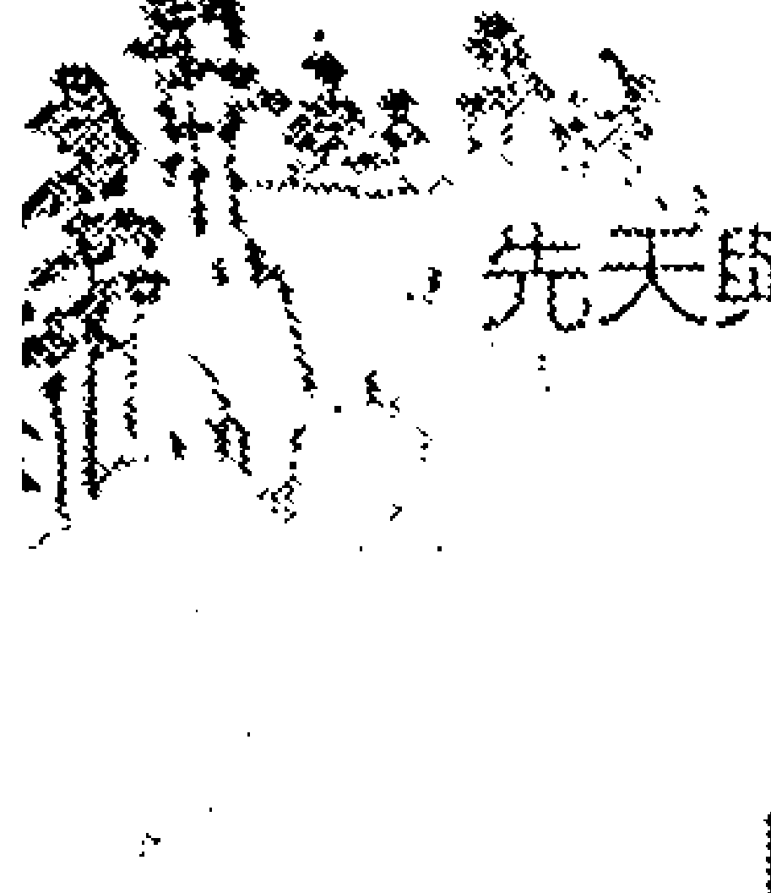
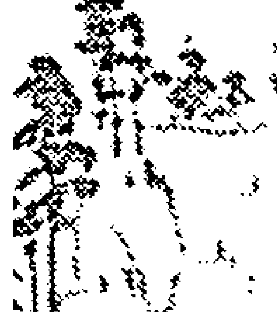
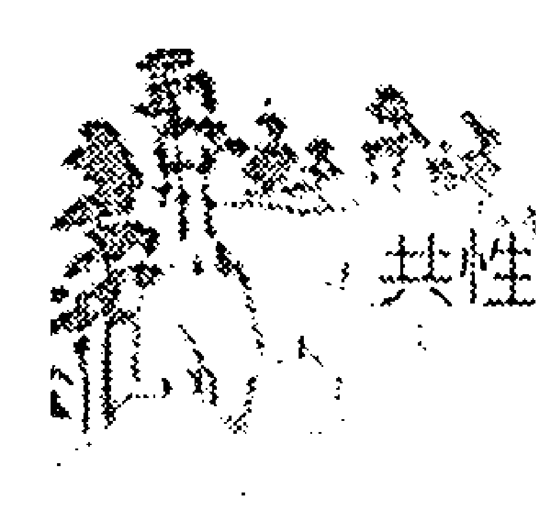

# 你不知道的斗数

## 自序

## 斗数研究的末竟之路

一
我认为学命者在探索命理之前都该认真思考一事，命运真的存在吗？以哪种方式存在？斗数能够揭露命运的轨迹，基于什么理由？这些问题都是迫切需要解决的，必须逐一揭示出来，学命才能成就，你说是吗？

这类问题还有很多，每项都深刻触及命理研究的核心，没有一个学命者能够忽视；我的看法是，每个人都感受到命运的存在，但这类超自然现象无法透过现有的经验加以证明，因此被一些泛科学论者斥为无稽，始终无力驳辩。

“证明命运的存在跟证明灵魂、转世……一样困难，因为那是一种哲学或玄学，形而上的概念，而完全不必证实（当想证实也证实不了），也许可以避开别人的追究，却永远进不了学术之门，你说该怎么办？”我说，命运存在在我们的身边，每个人都感觉得到，而非只有禅定者进入非想非非想天才感应到；进一步说，生老病死、喜怒哀乐都是命运来，透过电脑与53图谱的研究，得以隐约观测一些。这个世界发明过一种方法得以隐约观测命运的兴衰吗？那当然；这种方法就叫禄命式，而且不止一套，八字与紫微斗数都是，远在一千年前被创造出来，不但能够检测，而且可以学习，故能传承到今天。

有个朋友学命多年，功力已臻化境，他始终对下列之事耿耿于怀：“斗数要学到什么程度才能出师，由于一直缺乏一个标准，概由大师自己决定；既然如此，为什么不建立一套客观而正确的方法论呢？”大哉问也；他等于在问学画、学建筑甚至学做日本料理，何时才能出师；答案很简单，一辈子都出不了师；我说，工艺科目是学无止境的，没有人敢说他已经到顶了，譬如你问张大千、毕加索甚至林布兰、梵谷已经登峰造极了吗？”他们大概都会大摇其头。你问资讯工程系或财经系教授他从此不再学习了吗？”也会严词驳斥。就因为如此，“在学习的阶段中，考评一下也是必要的，不然斗数永远成不了一门学问，仍要继续躲在暗巷内苟延残喘。”我问他的老师怎么说，他说：“我是看书学命，因此没有人告诉我对错。”若是如此，就只能面询陈希夷了。传统工艺譬如木匠、铁匠、总铺师、土水师的修习时间三年半已足，现在的高职生照教科书操作，两个学期也能学完一门基础课程，三年保证可以领到一张毕业证书。命理被划归为传统工艺，也能比照办理吗？据我所知，恐怕很难。

### 二

在这些问题中，最严重的应该是缺乏课程，因此无法像我们在学校研读教材那样，按部就班，亦步亦趋，终于通过国家的认证，成为一个算命达人。有个我认识的大师曾经辩说：“怎么没有的！近三十年来，各方群雄总共开了至少三万个小时的课，编写了至少五百本的教材，我不信你没读过。”我倒是读了一些（不多就是了），但我认为那些讲义都是不合格的，盖东抄抄、西抄抄，尽在星曜的解释上发挥，一千本等于一本。台湾命理界近来出现许多高学历的大师，这是一个好现象，既然接受过高等教育，按理说应该懂得治学的方法，一目深入命理之中，预料能将命理研究提升到一个七彩缤纷的境界；讵料相反，他们继续在江湖算命中载浮载沉，说些妖言惑众的话，让不明就里的观众误以为那就是命理。有个经常在媒体露脸的大师打出的学历就是博士，但他从来不会告知哪所大学、哪个科系毕业，这就有混淆视听的嫌疑了。民众误以为博士、硕士学有专精，就算改行算命也很在行，其实根本不是那回事，这个世界向无一所大学或学院开设过命理系，所以他的学历与命理应该是不相干的。二〇一二周年间，有个博士大师曾在电视节目中口出狂言说，壬辰年有两个生肖犯太岁，一是属龙的，一是属狗的；我当时就在想，博士是何等崇高之人，他应该玩复杂的推论而不该跟着江湖大师起舞，我因此证明他读的……一定是野鸡大学。

“研究既是放任的，谁想探讨什么题材、使用什么方法都是他的自由，没有人管得着；对不对？既然如此，你还坚持方法有对错吗？——方法当然是有的，例如土法炼钢、某些师门秘传，问题是通不过逻辑检证的方法必然不成爲一种方法，这方面没有讨论价值的余地。

我认为主题一旦不明确，使用的方法一旦有误，就不可能获致客观而正确的答案；等而下之的只是故意渲染一些似是而非的观念，无端造谣、无事生非，让人误以为命理就是那副德性。例如，上有個大師擅長使用四化討論國是、財經、治安問題，例如甲午流年廉貞化祿、破軍化權、武曲化科、太陽化忌，其中廉貞祿、太陽忌的五行均火，因此屬火的行業今年不是大好，就是大壞；好，指 GUP 破 4，股市攻上萬點，壞，指失業率攀升，社會案件增加。他講得頭頭是道，我卻聽得一頭霧水。暫且不談推論方法，你若問他：「四化不該只化在台灣吧，那麼包括南非、肯亞、北歐瑞典、巴西亞馬遜河流域都感應得到，那些國家的政治環境、經濟狀況、社會治安跟台灣如出一轍嗎？」大師之所以縱橫電視媒體，當然不能沒有兩步七仔，他可能辯說：「我們現在就住台灣，當以台灣爲準，假設你搬到肯亞或巴西去住，才以那邊爲準。」

> ——方法當然是有的，例如土法煉鋼、某些師門秘傳，問題是通不過邏輯檢證的方法必然不成爲一種方法，這方面沒有討論價值的餘地。

這種話堪稱擲地作金石聲，我無論如何都輸給他。

### 三

「命運的內容千變萬化，等於說有多少人就有多少個命例，如何將這些命例統一起來然後歸納成一些簡單的公式，不也是一個當務之急嗎？」「那當然；此事當然是迫切的，遺憾的是仍未建立一套方法論，所以歸納，做起來卻很難。西方科學在探討大自然的奧秘時，通常會預設一個模式，使用歸納與演繹兩種技術，其中歸納從大到小，演繹從小到大，終於產生了西方的科學文明；方法學無分東西，就算探討命運的關係，照樣能夠觸及較高、較精深的層次。「祿命式志在探討命運的榮枯，可能被模式化（規格化）嗎？」「不但能，而且非做不可；據我所知，許多大師堅持傳統的學習方式而鄙視科學方法論，既然想要做中流砥柱，相信很快就會被淹沒。現在的學校都設有定期考評的制度，包括平時測驗、段考、期末考，藉以評量學生在某個階段的學習效果，最後一次總檢驗叫做畢業考，通過了才授予學位。「命理界顯然沒有這種評量的方式，不知何故？」我說，從斗數初創之日就採放牛吃草辦理，以前如此，以後預料也是如此。命相卜的業者在古代被歸為九流術士，顯然都是弱勢的一群，我們現在讀到的一些資料中，包括鬼谷子、孔明、劉伯溫等等都是五術界的古聖先賢，依我看只是一種「箭探式英雄「，他們有何功勳，我問過很多學命的朋友都像吃了搖頭丸一樣。現代的名師多半是媒體烘托出來的，懂得一些江湖算命的伎倆就能吃一輩子，幹嘛要費力去弄什麼方法論呢！有個朋友那天還說：『你還不是憑簡單的星宮結構就下一個斷語，論客觀度，跟那些大師仍是一丘之貉？』我說：『歹勢，我從來不曾對任何一個成敗下過斷語，我只做推論而不給結論，本來就是斗數論命的方式之一。』
若用西方社會的標準來評鑑大師或學命者的功力，恐怕沒幾個人通得過，你真的要把這個業界弄得雞飛狗跳嗎？』我說，『學術本來就是如此，命理何敢獨樹一幟！某大師曾說：『考評什麼？』我受到顧客熱烈的歡迎，隊伍排到一個月後，證明我的推論是神準的，我才不跟你一般見識呢！』他果然比我想象的還厲害。
有個學命者對下列之事百思不解，希望我告訴他原因，他問：『從上個世紀八○年代至今，台中港總共出版了至少一千本的斗數專書，堂而皇之擺在書店專櫃上販售，花兩三百元買一本回家拜讀，也算開卷有益；既然如此，你還說沒有一本夠格提升為教科書，為什麼？』我說，教科書的編寫重視理論與實際的運用，通常有個幾人小組的委員會專門負責撰寫、審定、校正的工作，他們都是此行的專家學者；在命理界，這種大師可能一個都找不到。

### 四

> > 「佛法共有八萬四千個法門，為了適應八萬四千種不同根性的信徒而說，斗數的學習列出不同的方法，也是一種正常的現象嗎？」

佛法屬於出世間法，講述解脫之道，也許可以針對不同的人講述不同的解脫法門，但命理屬於世間法，名利的追逐方式不多，一兩種已足；任何一種學習都是漫長而艱苦的，好像蠶寶寶吃桑葉吐絲，必須日積月累而無法一蹴有幾。目前還流傳一種說法，有人曾獲「陳希夷遺失的抄本」一冊，研讀三個月後學得精髓，從此論命如有神助，成為宇內第一高手而不遑多讓。究竟地說，學習的方式而且只有一種，就是透過觀察與實證，步亦步、趨亦趨，日時既久，就能獲致一些粗淺的概念。

大師排了近百顆的輔星，並使用單星、單宮論命、四化滿天飛，講的都是江湖算命那一套，對於能夠討論到什麼層次當然是悲觀的。有個拜師學命的朋友問道：

> > 「你知不知道古代大師怎麼研究嗎？他們擁有極其神秘的傳承，排幾顆輔星、使用四化，都是人家的自由，你憑什麼管人家的閒事！」

我說，學命是一件嚴肅的事，迄今為止，共性與特性不分、命理問題與現實問題不辨，他的功力一定鴉鴉烏。

我建議學命者使用科學方法探討命理，算是吃好相報，特色是說該說的話，研究的過程與結論有憑有據而非胡言亂語。此外所有的心得都要公布出來讓別人能夠檢證，

### 五

> 「你在講蝦米碗糕，那是我多年算命的心得，怎麼可能公佈，讓你白吃我的午餐！」我說：「你的午餐好不好吃，還別的行家吃過才取得共識。」他說：「我的顧客已經證明過了，犯不著你來瞎操心。」講這種話顯然昧於事實，自己過乾癮而已。

1.  經過識者的檢證，證實那是一個創見，雖然不能申請專利，但確定那是我首先提出的；
2.  若能形成一個共識，學命者按圖索驥，就能約透析命運的真相，從此不再受到傳統大師的迷惑，真的何樂不為。

五術界的頑冥不靈是有目共睹的，大師幾乎異口同聲說：「你在講蝦米碗糕，那是我多年算命的心得，怎麼可能公佈，讓你白吃我的午餐！」我說：「你的午餐好不好吃，還別的行家吃過才取得共識。」他說：「我的顧客已經證明過了，犯不著你來瞎操心。」講這種話顯然昧於事實，自己過乾癮而已。

這段期間，朋友堅持我提出的心得仍是一種私見，由於未獲眾多大師的認可，用了也不準，白白了憨工而已；我問：「那麼真正的法門在哪？」他說，「真法是隱密的，因此只能秘傳，不然每個學命者都是大師，這個社會非亂不可。我問：「你看過哪個大師使用方法論研究斗數沒有？」他說，研究命理跟一般學科不同，那是一種獨特的、與眾不同的秘法，由祖師爺傳給入室弟子，旁人縱然想學也難以入門。我思索一秒鐘後確定地說，若是如此，這種法門被掃地出門，指日可待。

我撰寫此書志在告訴讀者一事，斗數未知的領域還寬得很，不該滿足於目前的渺小成就，也不該再以準、精準、神準來迷惑眾生，而是依理推論、依理思考，只要能夠深入其境，大概就能親證一些命運發展的軌跡。我確定說，斗數推論只有合理而不可能準的，蓋只有特性準，問題是特性是無法討論的。誰還在迷信精準、神準，必然落入傳統的窠臼，就算再奮鬥兩個世紀，仍然難以超升。

「我是初學者，根本無力辨別大師或門派的說法，你說我該怎麼辦？」
就學習而言，這當然是個相當大的挫敗，相信不致那麼快就被解決；東方社會普遍缺乏邏輯的素養，對於開館大師、童乩、廟祝講的話多半信受而不願思辨，結果沉淪其間，終究難以自拔。台中的學命者迷信先師抄本、不傳之秘而始終不願接受方法論的薰陶，就不期待那些研究端得上檯面了。

此書還有一本姊妹作，叫做《我不知道的斗數》，從另外的角度探討斗數研究的困境，我試圖解答傳統意象中存在的一些現象，發現那種問題依舊盤根錯節。初稿已經完成，我預定一年之內問世。我素知台灣命理界不愛讀書、不想吸收新知，這類書籍能否受到青睞，仍然不敢寄予厚望。
是為序

## 斗數的對應關係

有个朋友学斗数二年余，对于命理能够推论那么多的人事物经由不可思议而心向往之，不过他仍有下列这些疑题待解：「父母宫就是父母的宫位吗？兄弟宫就是同胞的宫位吗？夫妻宫就是配偶的宫位吗？子女宫就是子女的宫位吗？当然必须是，不然干嘛换个名称？」他读过的命书与见过的大师均肯定的说法，应该不错。大师根据星宫考察顾客的亲情缘分，包括身世、婚姻、子女的成败，都是如响斯应。我若坚持那是一个特性，从命盘上推论不出，立刻被大师与学命者打枪，让我无地自容。斗数有个传承了至少八百年的观念，十二宫都有它固定的功用，无论算命或者研究都要分辨出来，顾客或听众才会给你掌声。这种说法当然见仁见智，青菜听聪就好，因为我会反诘说：「老张的父母宫坐七杀、文昌，他有四个兄弟姊妹，他们的父母宫都坐七杀、文昌吗？」假设玉皇大帝交代必须相同，就会累死陈希夷。这个朋友也许出于好奇，也许基于命理的不可侵犯性，他最后恳切地说：「我的父母宫坐太阳、太阴（命宫在子，天府、武曲坐守），不杂别的煞星，依照古赋所述，父母必享长寿，他们果然活到八十多岁还能到北海道坐破冰船、去吴哥窟看佛塔，古籍的记载果然不假；既然如此，你干嘛反对吗？「若是如此，我赞同都来不及，你说是吗？」此事的真伪极易分辨，你只要反诘说：「同命者还有很多，他们的父母都享高寿吗？」他也许就会瞪大眼睛，深觉不可思议。同样的事也发生在一个朋友身上，他是个汽车零件商，由于经营得法，的确赚了不少钱，他经常请我喝一杯一百八十的古坑咖啡，味道果然不同凡响；某日他问我一个奇怪的问题：「我这辈子过得还算马马虎虎，唯一的遗憾是常被兄弟姊妹拖累，五年来我光替大弟还债就耗散一千多万元；此外我还帮侄儿（姐姐的儿子）付出国留学的学费三百多万，那是我的化禄进入兄弟宫带来的效应吗？」我说，好像就是，又好像不是，他立刻抗议说：「是就是是，不是就说不是，如此模棱两可，简直不像一个客观的推论！」我说，是，指那些状况符合了，事事俱在，没有人能够反驳；不是，指其他的同命者未必就是如此，盖此事只降临于他一个人身上，属于一个特性，这样一来，就非推中而是猜中。无论兄弟宫的星曜结构如何，都是我的对待关系，我以怎样的态度对待他们而非他们的官位，看出同胞成就的高低、谁向我借钱。他老兄被拖累属于一个独立事件，等于他有而同命者没有，故不写在命盘上——只有当同命者都受累时，我们才能肯定那是禄忌或其他的作用进入兄弟宫所诱发的。
「依你所见，好像没有一事的吉凶能从命盘中发掘出来，更遑论获致……一些简单扼要的答案了；如此这般，我找大师算命岂非只能空谈……些虚无缥缈的抽象概念，完全接触不到我想接触的那些要项，难道就是斗数创造的旨意？」
他提出这样的质疑，重点应该在于揭发我的功力很菜，不足以谈命说运；我说，他老兄的目的已达，可以打道回府了。

## 禄命式来自玉虚宫吗？

回到那个朋友的问题：「命理创造的旨意是啥？」很简单，在于揭露一些命运发展的轨迹，提供生涯规划参考，不然你认为还有别的吗？当然不可能没有，朋友说：「我遇过一个大师，他预测我何时陞迁、何时破财，结果逐一应验了，简直非神仙莫属。」
这就更疑难重重了；据我所知，历史上没有一种禄命式具有预知的能力，也没有一个大师具有观测的本事，你说为什么？因为预知必须结合外境，但外境是掌握不到的。某学命者曾经信誓旦旦地说：「怎会掌握不到？明朝的《渊海子平》上记载说，『五行真假少人知，知时须是泄天机』，虽然点出揭露问题的困难处，却非不可能；《紫微斗数全书》也说，『极居卯酉遇空劫，十人之命九人僧』，由此可见一个人的出身是可以被掌握的，看你有没有那个本事。』这些古说倾向于定命论，说了比不说更让人糊涂。
前一个朋友确定我答不出来，因此舒了一口气说：『禄命式来自忉利天玉虚宫，由太上老君亲授，故非阿狗阿猫所能理解，他老人家要找到一个足以托付重责的人，必须具备灵性的体质，能跟天界圣真沟通，据此代天巡狩，我看你不该那个人。』
还好不是我，不然我的人生就毁啦。

许多朋友想要讨论亲缘的厚薄，我说此事具有个别差异，掌握不到什么蛛丝马迹，他们听得很不爽，纷纷反诘道：『别人到处都在谈，也都断验如神，只有你不谈，我看你这个人既执拗又不通人情，你写的书没有销路。』我说：『我再讲一件更气人的话，无论古今命书或者古今大师，他们说的断验其实都是猜的，不然也是事后的套合，因为没有人能够厉害到推论特性。』他说：『你如此厚诬大师，居心何在？』我问：『人家是个大师，自有龙天护法守卫，我告诉他说不定反而遭到天龙八部狙杀。』我问：『有人胡乱推算，我难道不该指责？』他说：『别人当然可以指责，你却不可以，因为你不够格。』讲这种话就太超过了，谁听了都会义愤填膺。
有些朋友想要预测何时遭灾，我说那是特性，只降临于少数人的身上而不发生在同命者身上，除非用猜的，他们当场拉下脸来并露出一副不屑的神情说：「你的研究跟我知道的有异，我只想告诉你，既然那么痛恨传统，为什么不另外创一套，也许还能成为祖师爷。」他以君子之心，度我的小人之腹，我请他喝酒吗？无论如何，只要想到台湾有那么多的同命者（平均九○人）共用一盘，他就能了解斗数究竟能够探讨哪些事项，无论研究或者算命，从此不再道听途说了。这个丙申男命武曲、天府在午宫坐命，算是一个绝配，大师确定那是古赋记载的天生富格；不过擎羊进来，终于冲破格局，万一真的富裕了，祸害接踵而来，让他疲于奔命。这个大师只瞧一眼就断定此人的出身原本很好，前半段的生涯包括读书顺遂、婚姻美满，三十六岁后开始变质，遭遇的横逆很多，终于被命运击垮。对吗？这就难说正确了；擎羊的问题还算正常，盖擎羊性刚，有所坚持，别人难以折服，空劫忌照入财，凶神恶煞现身，当下把那些财物一扫而空。他问：「我迄今赁屋而居，天有鉅款入帐，大师断他这辈子缺钱，只能苦哈哈度日，万一哪这方面的推论似乎神准，你问我相信命运吗？答案是肯定的。」财宫被定义为享受财福的方式，也是一个人处理他获得的财物的手段，也许还能观察花钱的手段（以哪种方式花钱），却非估算进财的难易与数量的多寡。此命先天财宫坐忌与后来的钱财匮乏无关，那只是一种心性的显现，他们随兴花钱，不知节制，该花| 文曲 右弼 天同 禄 | 擎羊 天府 武曲 | 太阴 太阳 | 贪狼 |
| --- | --- | --- | --- |
| 癸巳 | 甲午 命宫 | 乙未 | 丙申 |
| 陀罗 破军 | 男 | 丙申年6月×日丑时 | 文昌 天铖 左辅 巨门 天机 丁酉 |
| 火星 | 金四局 | 地空 | 天相 紫微 |
| 辛卯 |  |  | 戊戌 |
| 廉贞 忌 | 辛丑 | 庚子 | 己亥 |

## 斗数的对应关系

的不花，不该花的却乱花，导致物质耗损过度，一生被阿堵物所困。
有个学命的朋友获悉后大摇其头，他一脸正气地指出我的缺点说：「我的经验跟你不同，我认为财宫一旦见忌就不能参与投资理财，无论参与哪个项目（指金木水火土诸业）都是一样，盖搬石头填海，白白耗损福报，我才不干呢！」

福德宫被定义为投资理财之宫，讨论的是怎么赚钱、怎么广阔财路、怎么让资产无限增值，这种关系一旦弄不清楚，就会胡乱牵拖。无论先天或者行运，每个人照例有一个重心，也有一个障碍，端视禄忌的落宫而定；由于禄忌进入十二宫并非循着固定的路线，而是随兴的（概由生年干与大限宫干决定），学命者无法期待化禄一定要进共性之宫，而化忌只能进入特性之宫，这方面通常只能看着办。

## 福德宫当然可以化忌

禄忌的作用独立于星宫之外，也独立于动能之外，就算三方星祥、亲情不错，仍然可能见忌，而亲情荡然、骨肉相残，三方仍然可能见禄，颇让一些学命者大吃一惊。人生过程中既有功动，又有灾厄，导致许多事无法圆满，因此要求必须达到某个预期的目标（有个朋友要求存款一亿，他才从房地产的经营中缩手），就会

### 自讨苦吃

「禄命式应该可以深入命运的深层结构中，观测此生遭遇哪些灾厄，尤其掌握一些外境的得失，从此呼风有风，呼雨有雨，不是吗？」有个朋友问道；我说，无此可能。原来观测名利的有无或多寡也许可能，但探测灾福的有无就束手了；这种事好像经建会、国科会的主委虽然学有专长，仍然无法判别一年、半年甚至一季的景气冷热。
大师多半强调他们曾获祖师口诀，不但共性推论无碍，连特性也是手到擒来，凡有所推，无不神准，不然命相馆凭什么门庭若市！有个大师曾大言不惭地说：「我的推算离不开亲情的荣枯、遭遇的灾厄，以及妻财子禄等这一传统问题的兴衰，万一不准，我的命相馆还开得下去吗？」我说，难规很容易吹破，依然不能没有戒心。
无论如何，命理只能讨论共性，同命者都可能发生的事，一旦触及那些少数人独有的部分，譬如亲情的厚薄、对象的良窳、子女的成就，以及何时走运、何时达到颠峰，都叙述清楚，其实那是斗数的必杀秘技，只有极少数奉天承运的大师办得到。
上述多属个人的遭遇，从其盘中看不出才是正当的。
有个学命者十分关心他的健康，因此经常阅读这方面的书籍，他问：「我的疾厄宫坐巨门、铃星，书上说巨门、铃星的五行均火，故极易罹患心血管与心脏方面的疾病，我确实患有先天心律不整的问题，这难道不是命中注定？有个大师安慰我说，巨门化禄后，肝胆功能从此变好，就不虞因为心脏的宿疾而壮年猝死，就算如此，仍然害我紧张半天；你说能不能算，他们却言之凿凿，为什么？
我说我不知道，这种事最好去问大道公或药师如来；疾厄宫也许具有一些特殊的功能，却非拿来预知何时生病、生什么病以及治疗的情况。为什么？原来疾厄是个特性，盖同命者不可能同时罹患同样的症状，故不写在共盘上。我对「疾厄」一词倒是有此异见，疾不妨视为疾病，此事充分发生在每个人的身上，不分彼此，盖人吃五谷杂粮，难保没有病痛，因此我不反对设立一个宫位加以容纳。厄呢？指灾厄（意外事故）而言，现代社会颇不安宁，意外随时拖至，瞬间遭到毁灭，若能提前知道并加以趋避，这套缘命式就价值连城了。
不过灾厄来自四通八达，若要观察，非从三方四正不可。
这个辛酉男命的命宫虽空，却坐有一颗火星，事业宫则是有主无辅，都是最重的发缺，生命中难免出现一些无法弥补的遗憾；所幸福德宫见武曲、破军与文昌，动能仍然不错，致力于投资理财，多少可以获利，从此免于挨饿的危机。
他问：「你讲的道理我都清楚，问题是我不懂投资理财，我一旦涉足股票或房地产的领域，该怎么才能获利？」我说：「这个问题最好返回学校面询财经教授，不然向银行的理事请教也行；我只能这样说，既然什么都不懂，好像只有两条路可走，一条...

| 文曲 破军 武曲 忌 癸巳 | 天钺 地空 太阳 甲午 | 天府 乙未 | 铃星 陀罗 太阴 天机 丙申 |
| --- | --- | --- | --- |
| 右弼 地劫 天同 壬辰 | 男 | 辛酉年 7月 X日X时 | 文曲 贪狼 紫微 丁酉 |
| 火星 辛卯 命宫 | 土五局 |  | 左辅 擎羊 巨门 禄 戊戌 |
| 天魁 庚寅 | 七杀 廉贞 辛丑 | 天梁 庚子 | 天相 己亥 |

## 斗数的对应关系

是虚心向学，一条是放弃那些「投资」。他迟疑一下，似乎有点费解：「从事业宫看，我做哪行好？」我说：「既然进做哪行都不懂，还指望开店、开公司，把业绩做到欧美各国吗？」他一直都被我打枪，感觉有点气馁，他说：「几个大师都说我要做批发、国贸之类，轰情发挥火贪的特性，业绩蒸蒸日上，可望拓展到西伯利亚，万一做水的行业，旺水浇熄火星，半年内就会关门大吉，这件事难道不严重？」我说，成败属于外境的变数，没有人能够测知；他的土星概在外宫，尤其火贪武格利于动态行业，往外发展才算走对了路。他问：「命中只见两辅，可能太少吗？我只能吃头路吗？」我说：「辅星就是成就的必要条件，辅星照入愈少，愈不可能成就，上班听差仍不失为一条活路。」他的人生目标就是开一家公司来经营，我打醒了他的美梦，岂能放我甘休！他的疾厄宫坐巨门、擎羊，加上命宫的火星，恰好形成火羊，我在穷途末路时真的会去上吊吗？有些大师还预言我将罹患忧郁症，让我心生畏惧，我该怎么做才能避免症临身？」问题虽然不少，却无一属于命理，大师将命宫与疾厄宫连接起来，果然是个伟大的创举。我说，福德宫虽被定义为投资理财之位，仍然只具象征意义，讲的是一个人内心的臆想；别的大师不一定认同，他们坚持财帛才叫投资理财，福德宫最多称做福报宫或精神宫，谈的又是一种虚无缥缈的意象。执对执错，迄今仍有争议。我的经验是福德宫

大师坚持福德宫不能见忌，见忌后损及福报，瞬间破产跑路，从此不知所踪；他还说大限福德宫一旦遭忌挟煞侵入，十之八九都会呜呼哀哉！在他的印象中就有几个股市大户被控内线交易而坐牢，几个大老板在财积数十亿后猝死，故知所言不虚。

## 终于阮囊羞涩

上述之事言之凿凿，乍闻之下感觉神奇极了，等到深入其境后发现无一为真，简直情何以堪；我尝问：「所谓福德宫见忌，究指先天或大限而言？在某个阶段中，大限福德宫坐禄、先天福德宫坐忌，呈现福德宫禄忌交替的状态，你将如何判其吉凶？」他不曾接触过如此复杂的问题，也不曾想过斗数的学习这么麻烦，我纵然告诉他方法，他也会一脸茫然；福德宫坐忌指投资理财频出状况，导致该投资的不投资，不该投资的拚命加码，台湾话叫「撩龟走鳖」，不但浪费资源，而且耗损库存，日时既久，终于让他阮囊羞涩。
揭示赚钱的能力，财宫显示花钱的本事，两者绝不相等，也绝不能互换，不然就没有另外一宫的道理。

## 斗数的对应关系

异见，只不过对于各宫所象征的事项的认知就千差万别了，古典大师承认那些人事 物都是存在的，也都能如实推算出来，无分轻重缓急。由此观之，既无共性、特性的问题，也没有命理问题、现实问题的问题，等于所有的疑难杂症都算得出来，看你的本事高低而已。共性宫位（偶数之宫）所象征的事可以选择，当事人根据他的专长、兴趣与家族的期待挑拣一个适性的行业做，无论成就高低，概由自己负责而不能推给经济部长。假若那是一件特性，例如你问我「何时可以孕育一个壮丁」，就只能交给生娘娘了。有个朋友那天心血来潮地说：「我想探讨父母晚年的健康状况，包括医疗照顾、何时驾返瑶池、死后哀荣等等，你办得到吗？最重要的是留下多少遗产，若能预知出来我就更心安了。某大师说输入父母的生年干就看得出一些遗传概况，例如父亲的化禄入我的子女宫，化权入福德宫，化科入疾厄宫，化忌入事业宫，这些条件乍看即知欠佳；所幸母亲稍有力，她的化禄入我的夫妻宫，化权入财宫，化科入兄弟宫，化忌入我的田宅宫，我的事业与婚姻都将受到父母的感应，难怪命运不太顺遂。」这是目前盛行于台中的输入法，据说可以隐约窥探一些深层命运中的吉凶，大师被誉为天下第一神算，堪称实至名归；举个例说，阁下跟郭某、蔡某同命，但是成就千差万别，这种差异出在哪？依照一般的说法，当然是出身、经历、奋斗的方向不同，

| 辛巳 地劫 地空 | 壬午 | 天机禄 癸未 | 右弼 左辅 破军 紫微 甲申 天钺 |
| --- | --- | --- | --- |
| 庚辰 文曲 铃星 攀羊 太阳 | 男 | 乙卯年4月18日午时 | 乙酉 天府 | |
| 己卯 火星 七杀 武曲 | 土五局 | | 丙戌 文曲 太阴 忌 | |
| 戊寅 陀罗 天梁 天同 | 己丑 天相 | 戊子 | 丁亥 命宫 天魁 巨门 | 贪狼 廉贞 |

在大师慧眼的观照下，当与父母的遗传有关。这个乙卯男命是个现代中国人，替他算命的大师猛瞧一眼就断定此人一生穷困，三登离继，「无三小路用」啦！他果然就是如此，简单遇到神仙。此兄出身贫寒，两个妹妹陆续夭折，他从小就经常生病，长大后游手好闲，结过两女婿，迄今没有固定的工作而是靠太太打零工度日。上述状况……且从命盘上泄漏出来，证明人的命运随着命盘显示的轨迹在走，此事早在他诞生之刻就已注定毕，没有丝毫讨价还价的余地。
若非如此，斗数论命就不足为凭了。
若按一般方式推论，主星六颗，能量算强，得以承担各项灾福，辅星五颗，动力在中等之谱，假设能发，数量必然可观；当然啦，他必须能发，不然这种分析仍然虚有其表。

- 1) 紫微朝垣、右弼照入，格成君臣庆会文格，拥有领导统御的本事，随便到巷口吆喝一声，就有一票人过来响应然后据此缔创一些事功，堪称轻而易举。
- 2) 贪狼坐命、火星来照，形成火贪武格，这是一个战将格，勇于冒险犯难，在火中取粟，瞬间克敌致胜。
- 3) 我们将(1)与(2)结合起来，证实这是一个主帅格，既能攻击，又能领导，升为业务经理或副总指日可待。

## 二十年后终究千差万别

两种格局加持，堪称文武双全，理应拥有极佳的发展机会，虽然未必就能开公司做老板，改杀到一些大型公司任职，很快就能晋升为高级干部；有个学命者听后呛声说：「哈，你断错了，此人一事无成，唯靠太太打零工维持三餐，每天躲在家里观赏政论节目，看歌聊大赛以度日，还打电话进去投票，感觉非常过瘾，你的功力比不上那个中国大师。」我谈的是所有的同命者，你讲的是一个特定之人，出现差异并不足外：算命当然不能只针对一个特定之人而不涉及其他的同命者，那个大师算是「好胆的提去吃」，别人是学不来的。他居然又反击说：「谁要谈其他的同命者？我要你谈的是这个人目前的成就？未来还有哪些发展？你断不出来，就是算不准啦！」他要这样说，我也无权制止。另外的学命者好像不尽然赞同，他倒是问了一个值得思考的问题：「既然如此优秀，为什么不找个事做？只要持之以恒，未来创业当老板，十年内拥资上亿仍非梦想，不是吗？」这件事必须面询当事人或替他算命的那个大师。当然啦，并非成格之命就铁定发达，从此拥有傲人的战绩，不然也是一个死法，他必须开发其中之一并导向该格局的适性方向，时来运转，成就可望卓越。在这个过程中，有人游手好闲、不事生产，有人积极振奋、艰苦卓绝，二十年后成就千差万别，乃是一定之理。假设完全无差，那才让人深觉不可思议。如此推命虽然稍微客观公正，但仍无法获得共识，你知道为什么吗？原来关键出在「定命思想」上，大师坚持命盘怎么排，生命就怎么过，没有人能跟命运之神作对。我说若是如此，人不过是命运之神的傀儡，还奢谈什么尊严呢？

## 斗数的相与性

「命运的本质上是虚幻的、不可预测的，就算有人想透过各种仪器、程式或其他的工具深入其间，结果仍与想象、猜谜没什么两样；这种矛盾之所以出现，应该肇因于没人想像得出命运的本质是啥。我这样问好了，你讲得出命运的内涵吗？」
那天遇到一个哲学系高材生，他在大学时代就接触命理并参加这方面的社团，无论八字或者斗数都有一定程度的功力，除看书学命外，偶尔也会参访一些大师，走的路跟我稍有差异。他说，禄命式创造的旨意就在解说众生的命运，推论的方式相当神秘，故无法普传，后世大师发扬光大都来不及，岂能挑三拣四，试图贱灭它！我说，「哪有这款代志！」命理推论必然受到极多的限制，绝非世俗大师认定的足以飞天钻地，堪称无事不办，无远弗届。「相」并非命卜相的「相」，也非一个人特有的相貌，而是呈现在我们面前的各种相状，堪称瞬息万变，从无一事得以维持长久不变。
性质或本质而言，一种内在世界的躁动，既看不见，也触摸不着，就算使用各种尖端的仪器都侦测不出；由此观之，性只能隐约感受一下，仍未必定就是真实的。
我后又遇到一个朋友，当他在得知我研究命理时决定给我一个棒喝，他说：

> > 你说命运嘛，好极了，请告诉我它藏在哪里？表征为何？长相如何？周期多长（寿限止于哪年）？”你说得出来我才信服。

我弄不清楚，请他包涵；他说：

> > 我就知道，了解命运本来就非一件易事，你只读两本命书就能穷尽，我看还是免了。

他果然大获全胜，满载而归；有个朋友说得好：

> > 斗数十二宫揭示的现象包括事业、财物、父母、疾厄等，无一不是命运的具体显现，不但看得见，而且摸得到，谁说不能讨论，那是他的段数低，不能迁怒于命盘。

他聪明绝顶，我只能甘拜下风。
性讲的是深沉的、隐晦的心性，除非显露在一些行为上，不然不可能被人察知；心理学家称此为意识或潜意识；斗数将十二宫的作用定义为心识，仍是一种内在心性的作用，不过命宫与其他十一宫仍有一些差异，有如唯识学说的「能」、「所」的关系——能指动念的心，所指动念的对象，这是以「我」为中心看出「外境」的变数。所以父母宫绝非父母的宫位，而是我对待父母的心态；事业宫也非观察我做哪行、成败如何，而是我以哪种态度对待我的事业。
听了我的叙述后，他们可能遵行如仪吗？当然还在未定之天；朋友最后问道：

> > 大师连相或性都不清楚，对于能算与不能算的问题也一脸茫然，又如何指引顾客一条明路呢？「这个问题十分严肃，在目前的业界中，仍然束手无策。

### 火空为什么会发？

台湾每个命盘平均由九○人共用，假若坚持谈相，就有九○种不同的表相，大概没有人知道你在讲谁；举个例说，当我们讨论半导体制作公司老板郭氏的命运时，别人就会问道：「我与郭氏同命，我既不经商，也未参与半导体制作，你说的那些事情一概与我无关；所以你的推算明显有误，你算不准我的命啦！」
大师受到顾客挑衅，脑筋转不过来，就会跑出去骂……一条大街；症结很清楚，大师必须懂得辨别那张命盘并非郭氏所有而是隔壁卖蚵子煎的老张的，这件事看来十分迫切，问题是没一个大师能够胜任，你说为什么？
论命时分别谁才算正常，不作分别反而让人觉得怪怪的，我从来不做分别（我志在探讨所有同命者的命），因此被识者斥责我不懂命也就认了；有个研究斗数十年以上的旧识曾说：「我正在探索郭氏的命，当然就是郭氏本人，不然你认为我在讲郭子仪或郭子乾吗？」我问：「你怎么知道那是郭老板的命？」他说：「那是我从网络上取得的，应该错不了，我论断的结果有八成准，证明那是郭氏的命盘无疑。」他果然厉害，我完全输给他；应知命理讨论的都是一些共相，我的生辰与郭氏、蔡氏、尹氏这些富豪相同，我也该腰缠千亿、跟他们平起平坐了吗？问题是我们千差万别，为什么？答案应该不难，我们之间只有生辰相同，其他像出身、学历、从事的行业，后半段的人生几乎无一相似，他们拥资亿万而我三餐难继才是正常的，万一相同，那才不正常呢！现在假设那是一种「性」，某个时辰诞生者都具有相同的「性」，不管那是谁的命盘，从此一路追踪下来，就能隐约看出一些命运发展的得失。朋友又问：「我想单独讨论其中一人的命运，你办得到吗？」既然是个共盘，就不可能只对某个人或某几个人而论，现代学命者多少了解共性的界域，因此不敢跨越这条红线，古代大师办不到就不敢保证了。朋友问道：「我认为你的讲法有误，对于一些关键问题答不出来，只好到处设限，所谓的动见观瞻，难道不是？」大师依据师门传授的口诀推论，终于看出特性（相）的成败，似乎轻松愉快；我说：「在原始结构中发挥，等于忽视环境中的变数，论命会准，打死我都不信。」命宫坐火星，财宫坐地空，两星撞在一块，根据古赋记载，将应验「火空则发」，这个发当指发迹而言，既然古有明文，应该不会错，不然就不致流传至今了。按照命盘所示，我发财也是命中注定吗？」这个丁卯男命那天如此问道：「遗憾的是我只是一个上班族，精确地说是个月光族，我连发……百万都是奢谈，那是怎么一回事？」

## 斗数的相关性

| 乙巳 左辅 陀罗 | 丙午 命宫 火星 天机 | 丁未 铃星 擎羊 破军 紫微 | 戊申 地劫 |
| --- | --- | --- | --- |
| 甲辰 太阳 | 男 | 丁卯年2月×日酉时 | 己酉 天钺 右弼 天府 | |
| 癸卯 七杀 武曲 | 水二局 | | 庚戌 太阴 禄 | |
| 壬寅 地空 天梁 天同 | 癸丑 文曲 文昌 天相 | 壬子 | 辛亥 天魁 贪狼 廉贞 |

我说，火空则发只是一种错误的见解（火与空交叉后完全不具备发的条件），不该随之起舞；退一万步说，假设那是对的，凭他老兄的能耐，你认为武财神赵公明真的会夜驾临府，送来黄金二十万吨、欧元二千亿，让他享用不尽吗？他终于闭嘴，连气都不再吭一声。

### 古人只知相而不知性

八字古籍虽然记述过「火空则发」、「金空则鸣」、「土空则崩」这些概念，但已被后世学命者证明无效而扫地出门了，斗数大师引用，就会贻笑下方。我说，谁想享受财福带来的欢愉，首先他必须有钱，口袋没有几千万，也应该有几百万；万一穷兮兮的，当然就要去赚钱，上班族苦无机会另开财路，开销太大而成为一个月光族并无意。福德宫地劫坐守，有辅无主，有动力而无担当力，就可以收获，数量应该不大；此外就是投资理财的知识不足（不愿接触这方面的知识），就不指望能发百万以上。他听后大失所望，从此不承认我懂命。从结构看，他应该缺乏成就的要件，当然不指望获致极大的名利，如此这般，找个稳定的头路呷到退休就皇恩浩荡了；不过线入事业宫，重心在于事业的经营，将这他往## 斗數的相關性

此發揮，致力於追求社會地位甚至哪天跳出來創業都是可能的。他問：「我的動力雖賺不足，但我的勇氣十足，我想開一做道地日式拉麵店，使用日本進口的昆布、海帶與味噲素材，你看我賺得到錢嗎？」我說，我只做分析，無法保證一個人做了會怎麼樣，不然我自己早就下海了。斗數的排列組合近二十六萬種，什麼命局、哪種結構應有盡有，有人想安穩度日，他的命中只要見三輔星以下即可，有人想積極打拚，就非六輔以上不可。我這樣說吧，誰想發財，財宮須見一主三輔以上（尤其見煞）；誰想創業，事業宮也要一主三輔以上（尤其見煞）。這些現象被規範出來，用了一些準確度，大師以為那就是相，其實還性，透過命盤揭示出來，讓當事人隱約感受一下而已。他問：「命宮的火星與財宮的地空都是凶星，交織成一剛劫財的景像，從此財來財去，我之所以窮途潦倒，難道不是這些凶星害的？」財專指財物、金錢或不動產而言，既可計量，也能分配，例如老張年所得兩百萬與老許只得二十幾萬，這種數字非常清楚；如此這般，大師從命盤上掌握得到嗎？我說，一旦觸及相，就不可能真實，這是一個無法改變的原則。此命的高低從下列三種現象可以隱約解讀出來：(1)事業宮見祿，重心在於事業的經營與執行，成就指日可待；(2)遷移宮見忌，障礙出現在外緣、人際關係的互動，涉外事務的阻撓很大；(3)照入兩煞後，性質剛烈，仍非傳統大師說的破格，反而擁有一些攻擊火力。上述講的都是性，本來就很難轉化為現象界的事物，反而因為抽象度很高，沒幾個人知道我在說什麼，感覺有點洩氣。

他略為思索後說：「就算這樣好了，我仍有一個想法，大師還是要把天機、火星這兩種性轉化為現實中的相，當事人知道你在講什麼，你才能收受人家的潤金，不是嗎？」

我說，沒有一個大師有此能耐，不必懷疑。

## 五欲的本性難知了

我讀過的古今命書沒有百本，也有八十，從未發現哪個大師仔細分辨過「相」與「性」的差異，不知何故？我嘗聽某大師說：「哪有什麼性與相？應該只是一些吃飽飯沒事幹的傢伙掰出來迷惑學命者的名詞，簡直沒有水準；我的傳承十分特殊，發生在你身邊的萬事萬物概由星盤所造，在我的慧眼觀照下無所遁形，每項都是斷驗如神，讓你跌爛眼鏡。」若持此見，就不知天高地厚了。歷代大師概以「相」來描述命運，按理說沒有準的可能，詎料仍然神準，我要是堅持那是錯的，保證有稽可抬。

文明進步之後，世人的生命價值與生活態度也在努力調整，過去……此難知難解的問題大多被提出探討，經由學者（大學教授）、專家（科學家）的分析、比對，終于獲致一些客觀的答案，從此改變了我們的思想觀念。在探索的過程中，多數大師繼續故步自封，堅持使用一千年前的經驗，等於還活在那種年代，不被譏為食古不化者幾希！

有個朋友無事喜歡觀賞 CIA 的宗教頻道，對於異熟果、緣起性空以及前世今生之事琅琅上口，儼然一個佛學大師；他最近告訴我一件咄咄怪事，我居然完全懵懂：

> 「這個壬寅男命是好朋友老林的，他被一個朋友倒了兩千多萬，一夕之間，財務架構崩盤，幾乎要去跳樓；我從奴僕宮與財宮分別看出那是他前輩子欠人家的錢，我說此世週到債土還清舊欠就沒事了。老林執意提出告訴，聲言非叫對方把錢吐出來不可，這場官司拖了兩年多三個月前定讞，他果然輸了，剛好符合我先前的推斷，非常邪門。

我問：「你真的從命盤上揭發這個朋友被人倒錢並輸掉官司嗎？」他微笑一下說：「你認為我會那麼愚昧嗎？我只說他五年內有個劫數，必須破財才能消災，豈料依然神準。

我說：「那是你的第六感特別敏銳，五蘊中的「識」蘊較為敏銳，故能知人所未知、見人所未見，其實沒什麼了不起。」

他反而是信心滿滿地說：「我不是說過嗎？我從命盤上檢測出來，甲午年起大限到巳，先天奴僕宮與大限命宮重疊，兩相呼應的結果，太陰化忌進入財宮，將為奴僕出錢出力（或說被奴僕敗財），簡直就是劫數難逃！」

斗數可以這樣論，我選第一次聽到。

|          |          |              |                  |
|----------|----------|--------------|------------------|
| 天鉞     | 鈴星     | 太陰         | 乙巳大限        |
| 左輔     | 天府     | 廉貞         | 甲辰             |
| 火星     | 天魁     | 癸卯         |                  |
| 破軍     | 壬寅     | 地劫         | 癸丑             |
| 文曲     | 貪狼     | 丙午         |                  |
| 巨門     | 天同     | 丁未         |                  |
| 文昌     | 天相     | 武曲         | 戊申忌           |
|          |          |              | 老林的命盤       |
|          |          | 壬寅年1月×日寅時 |                  |
| 木三局   | 庚戌     |              |                  |
| 擎羊     | 紫微     | 壬子命宮     |                  |
|          |          |              | 地空             |
|          |          |              | 天梁             |
|          |          |              | 太陽祿           |
|          |          |              | 己酉             |
|          |          |              | 右弼             |
|          |          |              | 陀羅             |
|          |          |              | 七殺             |
|          | 天機     | 辛亥         |                  |

> 附註：乙巳大限天機化祿於亥，這是大限遷移宮，努力拓展自己的人際關係；太陰化忌於巳，這是大限命宮，坐宮不穩，凡事三心兩意。

他說，此事發生的機率很高，仍然不能小覷。我說，那是他剛好猜中而非斗數真的能夠推論這此身外之物。他一定看見老林的神色欠佳、衣著邋遢或談吐有點怨氣，於是脫口而出，豈料神準，連老林都嚇了一大跳。

前世的事很難說得清楚，除非他證得宿命通；世俗之人整天被五欲牽著鼻子走，連神通是啥都是茫然，他就不可能擁有那種神力。這類只發生於少數人身上的事必然都是特性，也是一種相，千差萬別的相，因為你永遠無法知道那是誰（同命者中哪個人），除非猜測，不然沒有準的可能。他問：「我認為癥結在這裏，既然猜測，為什麼還會準？」我說，他老兄不妨面詢陳希夷。

朋友思索甚久，最後決定堅持自己的理念，什麼新知、什麼新思維都撼他不動；他的說法倒是理直氣壯：「顧客花錢算命就想預知災厄何時降臨、嚴重性如何，尤其找到一個趨吉避凶之道，你堅持此事無法推算，顧客必然大失所望，不僅大師賺不到錢，命理也失去研究的價值，你不覺得事態嚴重嗎？」若是如此，當然很嚴重。

我講的是命理的功能問題，命盤有預知或推論災厄的裝置嗎？當然必須有，不然所無謂推論只是虛應一招，無論如何，祿命式與其他的程式或工具一樣，都有功能的局限，無法面面俱到；當然啦，在適用的範圍內發揮，可望獲致一些結論，離此就算交到神仙的手中，他也莫可奈何。

## 凡所有相，皆是虛妄

有個朋友勤奮好學，對於八字、斗數、文王卦、梅花易數、奇門遁甲、鐵板神數等都有過深入的涉獵，功力了得，斷驗如神，非我所能望其項背；我問他有什麼方法論的問題，他立刻露出一種神秘的微笑說：「我當然也懂，不然你認為我靠什麼斷準的；但我不用邏輯與方法論這些洋鬼子的技術，我用的都是東方玄學特有的秘訣，這是一種靈觸，現世中懂的人不超過三個。」我說：「你的秘訣是否有用，最好先讓我檢證一番。」你這個人很硬，光批評卻提不出什麼灼見，我幹嘛要跟你起舞！他說：「你呷卡歹咧！」我就算想要檢證也不會找你（他說他會找中研院的院士）；你這他存著頑強的封建時代的思維，著實讓我大吃一驚；他的話很清楚，我要是奉上三十萬現大洋，他就立刻把秘訣告訴我。不過他規定我不得公開討論，我當然不幹；我說：「兩百塊錢我還花得起，要不要？」他當場擺出臭臉，然後揚長而去。

> 《金剛經》說的「凡所有相，皆是虛妄」，這個相指外境而言，無論高矮胖瘦、富貴貧賤甚至所有的國土（山河大地）而言，而非命相大師說的「相貌」；這些外境經歷生住異滅四個階段然後灰飛煙滅，誰堅持有個不變的主體，非失不可。

現代科學已知物質概由原子組成，無論存在多久，最後都因半衰期而消失，放射性元素中的鈾238存在的時間高達四十七年，等於四十七億年後一半變成鉛，再過四十七億年，另一半的一半也變成鉛……如此這般，只要他活得過長（長達一大劫），就看得見鈾238變鉛的全部過程，問題是沒有人活那麼久。佛典描述的相包括我相、人相、眾生相與壽者相，涵攝三界九地的眾生兼及山河大地，都是我們用眼睛看得見、用手摸得到或用身體感受到的人事物，好像客觀存在，其實仍是因緣聚合下的產物，當因緣離散後就會灰飛湮滅，終歸於無。佛典《解深密經》記載說，「諸識所緣，唯識所現」，這句話夠深邃了吧，其實在講我與我所的關係；舉個淺例，人類所見、所接觸到的萬事萬物都經由心識變現出來的，沒有一件是獨立存在三界之中（等於說心外無法）。《唯識二十頌》還指出眾生受到各自的業識的作用，看到的外境不盡相同，例如人見一條清澈的河流，在魚蝦的眼中那是他們的家，天人看到的是富麗堂皇的宮殿，鬼道眾生目睹的是一條臭氣沖天的血臟大河。性指性質而言，勉強說是一種精神狀態、一種抽象概念，存在於我們的心識之中，很難被人發現；在世俗的觀念中，有些大師指出那是個性，有些大師認為那是氣勢，雖然不見得精準，也算八九不離十啦。古典命理的推論沒有界域，既不關性，也不關相，大師愛怎麼論就怎麼論，好像沒有人管得著。

## 你不知道的斗數

學命者想要研究命運的真相，首先必須確定命宮為祿命的樞紐，一個感受生老病死的機制，其餘十一宮也被賦予各種人事事物，仍由命宮加以統籌，無論揭示了什麼現象，概在相的範疇之內，大師神通再廣大，也弄不清楚同命者誰是誰。舉個例說，老張、小林兩人同命，你說哪張命盤是老張的？哪張命盤是小林的嗎？進一步說，老張有三個子女，這些孩子的父母宮的主輔星曜一致嗎？小林的哥哥是個人權律師，參加過太陽花學運，老張只有一個妹妹，在市府勞工局上班，這些為什麼都不準？總而言之，一旦談到相，必然狀況百出，有理說不清。

在這種差別待遇下，問題的虛妄性被突顯出來，等於算不準了，怎麼辦？大師不知思辨，誤以為那是他的功力不足所致；有個朋友曾說：「就算談性好了，仍由九○人所共用，基本性質仍然不致改變，由此觀之，性、相無差，你就算想談，仍然談不出什麼名堂，白費心思罷了。」我說，在能談的範圍內談，才有機率高低的問題。

我雖然仔細思索過，由於知識領域不夠寬廣，迄今依然無法釋疑；剛才講過，命理只能討論共性，同命者都會發生的事，這些共性是一致的、平等的，其中一人發生，同命者都要發生，萬一出現例外，這項方法論將被推翻。由此觀之，揪結出在哪裡為性、哪些為相上，由於古今命書不載，學命者只好自己摸索，算是艱苦卓絕。古代大師如此堅持，原因也許有一：(1)不知有性這種事，等於所有的事項都是相；(2)雖然明知相是千差萬别的，依舊不理會，就算想要理會，也不知該怎麼做。總而言之，性與相的問題只有我們這些吃飽換飯的探索者感到興趣，三不五時，拿出來獻寶。

## 親情、陽壽都是相

這個甲戊女命先天結構不錯，乍看即知能夠成就，她急想知道她唸財經系是否唸對了？最近兩年可能出國留學嗎？她可能到華爾街工作嗎？大師隨後確定地說，事業宮武曲為財星，財經科系堪稱適格，未來到美國華爾街上學，依舊做得輕鬆愉快。出國留學呢？這就要看遷移宮的狀況了，破軍主先破後立，假設已經破過，未來可望成就，假設未曾破過，出國留學勢必無法成行。

她問：『大師的說法可信嗎？』我說，那是他的胡言亂語，他要是相信，頭殼就會壞去；留學只是現實中的偶遇，必須考量自身的條件，包括有無需要、唸哪所大學、哪個科系，這方面命理無法給她任何的承諾，不必懷疑。

至於財經是否適格的問題，當然是肯定的，仍非大師說的事業宮武曲為財星之故，而是只見吉不見煞，攻擊火力稍嫌不足；眾所周知，命中見吉不見煞，靜性強於動性，因此選讀人文、社會這類學科顯然比理工醫要適性一些。」家父希望我留學後改唸電腦或工程管理，你看這個轉變吉祥嗎？我說，這就不是命理問題了（唸哪個科系未必要就是現實問題，但與稟賦有關），她要考量的是具備這方面的興趣與熱忱沒有。那個大師隨後指出：「先天命宮坐祿的人穩定，信心十足，幼魚安逸慣了，對於未來的發展比較不太關心；我們提供一些關於前程的指引，責任算是甚重，例如顧客能不成就、在哪個行業中成就，你必須如數洩漏出來，讓他們的心裏有個譜兒。」大師這回又犯了老毛病，誤以為他就是神仙，顧客的前程完全掌握到手。人活在世界上，除非家族擁有龐大的企業可以繼承外，所有的人都要努力經營事業，開拓人際關係。這個過程中，成敗與得失的心理甚強，堪稱如影相隨，萬一無力化解，可能腐觸一個人的鬥志。目前大限到戊，殺破狼的星群，土星四顆，輔星三顆，相對於先天仍未增強多少動力，不過廉貞祿入福德宮，對於開拓財源有助，一旦呼應，賺到錢的機率很高，也許真的荷包充滿。由此觀之，她直接投入錢財的追逐，算是一條明確的路。「古往今來，可能創造出一種完美無缺的祿命程式，學命者據此推論特性，包括妻財子祿以及意外事故都是知無不言、言無不盡嗎？」這個朋友曾樂觀地說：「我們已知現有的祿命式非常彆腳，完全達不到這種理想境界，希望多高，失望就多高。不過我認為現代人透過電腦的協助，重新設計一套新的祿命式，足以窺探更深邃的、更廣袤的命運，這件事應該不是夢想。」

我看這是一個空笑夢；因為沒有人那麼厲害，不然他早己不知發到哪裡去了。假設繼續使用生辰定位，依舊無法避免太多的同命者，故知共性、特性的問題如影相隨，跟相的問題就複雜了，包括舊門的方向、一生的功過以及親情、陽壽、災難等等，由於具有一些差別相，沒有人知道你在講誰（九○人之中哪個），無論推算或者研究都可以白費力氣。

「我的兄弟宮坐有陀羅、地劫，所有的命書都說我的同胞不全，不錯，我然不知道何故，但我知道同命者的哥哥未必都在童年夭折，你說為什麼？」我當問題的癥結很清楚，不過大師懵懂（或假裝不懂）而已；另外的學命者問道：「夫妻宮既不在共性之宮，也不在特性之宮，它的關係有點尷尬，依我看應在能算與不能算之間，由於牽涉的外境條件仍大於命理條件，命盤只能淺嘗即止，再講下去就是虛情假意。「他的說法對極了，我只能由衷佩服。

生命中的父母、同胞與子女都具有血緣關係，故具有強烈的排他性，同命者在這個部分絕不可能相同，沒有絲毫討價還價的餘地：這個朋友探問道：「假設我想探知那些差異性，我該提供哪些資料？」我問：「你探討它幹嘛？」他說：「有個朋友懷疑他並非現在的父母所生，希望我幫他找出答案，你看我該從哪邊著手？」我說，此事從DNA中也許檢測得出，從八字或從斗數只是白費心思。

## 性相糾纏不清

在傳統大師的觀念中，原始十二宮都在講相，例如父母宮在於探討父母的身世，兄弟宮在於觀測同胞的感情，子女宮在於觀測子女的賢愚，假若那是真的，證明斗數真的非。

合移宮的原始名稱叫做「奴僕宮」，古代大戶人家花錢買窮人的子女為奴婢，由放訂有賣身契，不但終生為下人，主人還能自由買賣，現在當然沒有這種社會階級了，不然將被控販賣人口，坐幾年牢是跑不了的。就算有人雇用菲傭、印傭照顧病患或年邁的雙親，時間到了就能任意去留。有些大師改稱交友宮，出門在外遇到的陌生人，未來說不定變成好友或伙伴；有個朋友堅持奴僕宮才合古法，論了也是神準，我問：「閣下的奴僕宮紫破坐守並形成君臣慶會，奴僕一定眾多，我估算了一下，你應該是個擁資幾十億的大富豪了，不是嗎？」他聳聳肩然後露出一陣苦笑，果然不再吭氣。

過去有個朋友曾問：「我雇用一個印傭來照顧我的母親，你從我的命盤上看得出這個傭人的勤惰嗎？」我說，他老兄還不如去媽祖宮那邊拈個米卦，聽說很準。

五屬書，足以窺破整個宇宙人生的奧秘，不讓現代科學專美於前。學命者投入探討之前，把不能算的「相」排除，而專注於共性問題，讓上帝的歸上帝、凱撒的歸凱撒，從此不再牽扯不清，學習起來就單純多了，成就也將指日可待。推算必須依據方法論而不能亂論，否則算準不知道為什麼會準，算不准也不知為什麼不准，算命云云，將淪為一場猜謎遊戲。古典大師始終不知相與性的分際，論命時將兩者捆一起，導致能論的也論，不能論的也論，如此糊裡糊塗，豈能指望論出什麼名堂！這個過程中最有名的就是「對時」（勘查某個時辰是否正確），誤以為命運的榮枯與生辰有關，其實未必如此。命理可能隱約分析一些命格的優劣、成就的高低以及行運的消長，無論何者，仍然只是一些模糊的概念（多數情況模糊到好像霧裡觀花），「可能獲得改善嗎？」恐怕很難，因為沒有一項屬於具體存在的事實，又如何插上手呢？在學習過程中遭遇的挫折感很強，仍要勇於克服，避免重蹈古人的覆轍。我說，知道哪些是相、哪些是性，學命才能指望成就；假設繼續在相上發揮，等於執迷不悟，就得拜託陳希夷降壇指導，他恐怕也不甚了了。

## 先天與後天的關係

大師推算一個命格高低使用的方法堪稱五花八門，結論當然就千奇百怪，不信邪的話找幾個大師當場試驗一下即知；其中有人引用古書，有人依照師承，有人根據自己的獨創，反正都說得出一套並宣稱他的才是真理。若是一個學術探討，真理應該只有一個而不可能有兩個以上，你說是嗎？

> 朋友老王曾去問命，其實他想去踢館，大師當場下馬威說：「握桑（王先生），我使用的口訣由元始天尊傳給太上老君，再傳我的祖師鬼谷子，一脈相傳，因此沒有解不開的難題；你有什麼疑難雜症，儘管放馬過來：：：」大師吹牛過度，居然不知斗數直開……。

光是命宮就形成鈴陀異格，應該能發，卻因走不到一步好運，至今仍是苦哈哈的，我想開一嚴店來顧，你看我開怎樣的店？何時開張？業績如何？「

大師聽後當場拍胸脯說：「開店的問題問我就問對人了，每年都有數百個客人問我開店、開公司的事，結果無不歡天喜地地離去。你的命宮坐太陰，五行屬水，因此做水的行業例如養殖、水產、海鮮熱炒之類才能發，在高雄北邊（後驛、凹仔底一帶）開店，包你財源滾滾……」老王說：「斗數的諸星與八字的五行真的有關嗎？」

大師見機不可失，立刻迎頭痛擊說：「當然有關，誰說無關，鐵定被顧客打臉。你會這樣講一定是受了某人的蠱惑，誤以為他講的都是聖旨，誰敢違逆，殺無赦！等到深入其境後，發現根本不是那回事，他寫了一堆不知所云的書，誤以為就是大師或作家，這種書只讀幾頁，就夠你破病了。」奇哉怪哉，我躺著都會中槍。

大師的講解精彩絕倫，每句都是金玉良言，老王歡喜信受，付了潤金跟蹤而去；兩天之後我問老王：「大師的論斷神準，究竟幾成準？還有什麼事準？」他說：「約在八成五之譜，其中一部分屬於未來式，不到最後關頭無法判其對錯；無論如何，比你什麼都算不出來要高明多了。」我說，大師果然就是大師。

再往深一層看，大限的消長仍不脫先天的範疇，蓋宮位重疊，祿忌就會相互感應，例如大限祿忌可能跑進先天宮位，造成兩邊顧、藕斷絲連的現象。不過先天祿忌對大限宮位沒有作用，進入大限時已被消除了。

先天與後天的關係

| 己巳 | 甲午 | 乙未 | 丙申 大限 |
| :--- | :--- | :--- | :--- |
| 文曲 貪狼 廉貞忌 | 攀羊 巨門 | 右弼 左輔 天相 | 天梁 天同 祿 |
| 鈴星 陀羅 太陰 | (空白) | 丙午年 4月 X日丑時 | 天鉞 文昌 七殺 武曲 |
| 壬辰 命宮 | 老王的命盤 | (空白) | 丁酉 |
| 天府 | (空白) | (空白) | 地空 太陽 |
| 辛卯 | 水二局 | (空白) | 戊戌 |
| 火星 | 破軍 紫微 | 天機 地劫 | 天魁 |
| 庚寅 | 辛丑 | 庚子 | 己亥 |

[附註]
丙申大限天同化祿於申，這是大限命宮，坐祿的人自信篤定；廉貞化忌於巳，這是大限子女宮，親子關係的互動有礙。

> 「何謂內感知？」「既然只能感受，誰又知道你講的是對是錯？」

> 「我說，當事人心知肚明就行了。」

二○○七年，老王的大限轉入申宮，這是先天事業宮，大師說此去的著眼點概與事業的經營有關；此話若真，走到田宅宮必與房地產有關，走到合夥宮必與合作事業有關，斗數應該沒有這種說法。進入行運之後，我們不再考慮那是先天何宮，等於所有的宮位都只是一個普通宮位，概以大限命宮為主軸而發展出另外的十一宮關係。

命運必須分開討論

那個大師算是斗數界的斷輪好手，學理精湛，闖人無數，他後來告訴老王說：「天限命宮原有先天同化祿（丙申年化出），這回再見天同化祿（丙申大限化出），等於雙重的祿涖臨，堪稱錦上添花，你的事業應該輝煌騰達，生意遍及世界五大洲，每年賺取外匯百億以上。」」

> 「老王說：「我不是說過嗎？我只是一個上班族，家無恆產，算是一個月光族。」大師說：「你才錯呢！我是說假若跳出來創業，憑你如此优异的命格，早就跟郭氏、蔡氏、尹氏這些大老闆平起平坐了。」老王終於無話可說；不過他仍有一個疑問待解：「我不是大老闆，也不是什麼富豪之類，你說那是甚麼緣故？」大師反問：「你開過店或開過公司嗎？」老王說從來沒有過；大師說：「這就對了，既然不想經營事業，怎麼可能變成一個老闆呢？」大師指出先天的遺憾，頗讓老王心有戚戚焉；他說：「我說出來你未必信，你的命該發卻不發，跟命盤無關而跟下列兩件事有關：(1)你家的祖墳或神主牌有敗，給後世子孫帶衰；(2)你做了什麼缺德之事，那些福祉被城隍爺收回去了。」老王仔細思索，他似乎沒什麼概念，只好選擇相信。過了一年之後，我問：「你真的做了什麼虧心事，那些財福被上天收回去了？」他說：「某些行為上的小瑕疵例如花錢不知節制，對人很慈悲，從未做過一件虧心事，不怕鬼在半夜敲門，這點我倒是非常篤定，我怕的是我的列祖列宗真的頹廢了，因而影響到我們後世子孫的成就。兩天後我抽空回老家一趟，發現神主牌上的灰塵足有一吋厚，我小心擦拭並備辦三牲酒醴致歉，還答應每年都會過來祭祀。如此這般，我的事業營運與財物營收應該恢復正常了，不然你認為還有別的妙方嗎？」他講得信心滿滿，我要是澆他冷水，他就會恨我一輩子；跟老王這種人談命其實是很累的，我一直往理性的方向走，他卻一直往非理性的方向拉，導致言者諄諄，聽者藐藐，討論過程的消長時，必然涉及一個叫做「命運分離」的概念，先天命與後天運是分離狀態，等於說先天的星宮與後天的星宮沒有關連。先天祿忌在命格解說完畢後將被消除，往後只用大限化出的祿忌，故無雙祿或雙忌入命、夾命這種事。學命者仍對事百思不解，他們動輒問道：「先天祿忌影響一生的成就，這種影響力如影相隨，至死方休，豈能說棄就棄！」當然啦，誰想保留，我沒有意見；不過在大限中迷戀先天的祿忌就會弄得糾纏不清，而斗數受到枝末細節的羈絆，也別想海闊天空地敘述了。就在前天，有個學命多年的朋友告訴我說：「我從前因為不知命與運必須分論，一直將兩者綁在一起，如此纏鬥了七、八年，辛苦異常，後來方知那是自尋煩惱，趕緊半途跳車，終於不再受惑。但我仍有一個疑問，假設先天於不願，我看到的將只是一運十年的部分，仍是見樹不見林，我好像無法面面俱到，你說那是什麼緣故？」這種顧慮算是多餘的，行運中只用大限的星宮論述而與先天命格脫離已成定論，也許會有一個例外，就是涉及重大抉擇時（例如上班族想要創業），必須回過頭來瞧瞧先天具備了沒有，具備了才做，不然就該放棄。古今命書缺乏這方面的指引，歷來都是學命者冒修瞎練，堪稱千辛萬苦，走錯路的機率高仍是一定的。

老王在丙申大限中因為坐天同雙祿，大師堅持此運大吉，凡所有動，都能獲利；換成老張，他想在新的一年中跟朋友合夥創業，李鐵嘴當場慫恿說：「此舉不做，更待何時！」老張信心十足，三個人合開了一家日式燒烤店，生意果然大好，計畫明年再開兩家連鎖店，你說這不是拜雙祿加持的賜福又是什麼？他如此堅持，我也無話可說；合夥事業屬於眾志成城，跟老張個人的命運的關係不大，除非他就是實際負責人。根據「命運分離」論，大限化祿進入先天宮位，屬於一種內感知，雖然帶來一些吉祥的作用，畢竟不會顯露出來；大限則是外感知，坐宮一旦鞏固，往後的行為傾向於樂觀進取，當其他的條件俱足時，小發一下也是可能的。

大師都是神機妙算

由於推論方法始終付之闕如，大師與學命者只好各自發揮，大致上講得通而顧客也不反對，就沒有人計較，站在探索的立場，任何一項疑難雜症都要講究一番。行運的事必須觀測大限的興衰，這個部份只要分析清楚，就繳得出一張亮麗的成績單。

> > 朋友問：「古書不曾記載命與限的關係，你要我去哪裡找到推論的方法？」

我說，後世大師都有一種奇觀異想，古書記載或古人用過，後世遵古炮製，論了才會準；現代的學術與知識到此不通，往後只能依照古典大師提供的方法辦理，可見傳統的意志有多頑強。推論方法一旦付之闕如，就不可能獲致客觀的答案，如此一來，該怎麼辦？依我看捨學命者自己設計一套外，此外別無他法。 這個戊辰男命走到乙卯大限時，相較於先天顯然有強有弱；主星四顆，能量中下，輔星六顆，動力就高了，算是一步不錯的運程。 古典大師往往認為，命理一旦無力預知某人在某限、某年或某月將做某事，以及做了之後的成敗，功能將大打折扣，因而遭到急於預知成敗的顧客打槍，算是咎由自取。有個學命者那天就問：「斗數應有預知一件事成敗的能力，因為古籍的記載就是如此，如今被你一提，好像小孩拆穿國王的新衣，預知變成謊言，這件事難道還不嚴重？」 我說，命理（八字、斗數）當初的設計並未涵蓋外境，其實也無力顧及各項外境，這是祿命功能的遺憾，跟創始人陳希夷的功力無關（我認為他應該知道命理的功能其實是有限的），不過好像只有我在計較，大師都是好整以暇地說：「我要是辦不到，還算大師嗎？我曾幫張董、李總裁與蔡處長、林主委算過命，他們紛紛送「神機妙算」匾額給我，就是掛在牆上這些，那是我的崇高的成就，絕非同行大師讒謗我，說我去求來的或花錢買來的。」說這種話證明他是個江湖大師；命理再神，最多只能分析命格的強弱與吉凶的關係，而無法給個成或敗、得或失的結論，蓋成敗與得失屬於外境的助阻，必須觀察外境而不能繼續在命盤內搜尋。從祿忌的落宮看，天機化祿於未，這個未為大限事業宮，重心放在階段性事業的經營上，從此全力以赴，獲利必多；太陰化忌於酉，這個酉為大限遷移宮，人際關係頻出狀況，與人交往、業務磋商，均有一些無形的阻隔橫亙在前。祿忌進入大限宮位後，吉凶出現在十年的運程之中，必然帶來一些重心與障礙的作用，辨別起來應該不難，只要觀察它們的落宮就行。有個朋友對這種說法仍有相當的疑惑，他問：「當祿忌穿插出現時，吉凶與福禍也會層出不窮，譬如事業宮坐祿、遷移宮坐忌，或財宮坐祿、命宮坐忌，既吉又凶、既凶又吉，我該如何讓它們各安其位而不是突然蹦出來？」大師通常指出這種關係吉凶參半，雖然沒什麼壞處，卻未免過度含混，不符現代社會的要求；其實吉凶是可以判分的，例如事業宮坐武曲祿對於事業的經營絕對有正面的作用，財宮坐文曲忌，對於賺錢來花這件事的困難度頗高。火鈴都是煞星，大師主張煞星照入後必然破壞命格的完整，生命從此潛藏了某些危機，好像火山隨時爆發，發出強大的毀滅力量，威脅自身的生命、戕害親族的感情，故不能等閑視之。某大師會對顧客說：「煞星的性質是殘暴的、絕情的，發出的伽瑪射線剋傷你周遭的人事物，導致生命財產一夕之間歸於無，你說我能視若無睹嗎？我告訴顧客驅避之道，那是我的慈悲心重，聽我的話準沒錯。
吉煞雖然具有一些不同的性質（吉星的性質較柔，煞星的性質較剛），仍然沒有特定的吉凶，不然就是在輔星中確定吉凶，將侵犯祿忌的功能。我嘗將輔星定義為動力，生命中的毅力與衝勁，說是成就的驅力也未嘗不可；準此而言，輔星會照太少，動力薄弱，恐怕難言成就。所幸羊陀充滿剛烈之氣，人與環境均難以屈服，他們仍要發揮在正面效應上，才能開疆闢地，打下美好的前景。

證明不是什麼咖

> 「先天結構一旦欠佳，唯賴後天補其不足，這是古典命理的主張（針對「命好不如運好」這個經驗而言）；萬一有誤，豈非讓顧客無不大失所望，斗數的準確度因此降到跟太陽星座、塔羅牌差不多，你還認為此事不嚴重嗎？」這個朋友問道。

這是沒辦法的事，學理探討本來就事事論事。
這個戊辰男命的大限走到卯宮時，事業宮在未，天機為先天忌，大師強調仍會影響這步運程的事業心，讓他繼續動盪不已；所幸天機由忌轉祿，這是一個吉祥的轉變，故知愈變愈好，對於創新行業、發展舊業的助力仍大。進一步說，這個天機祿在先天宮位為疾厄宮，大師曾斷化忌者必然罹患重症，不但侵襲健康，連事業也做得離離落落的。現在起變成生病迅速治療，事業依舊大有可爲。但依我看，疾厄宮都是一個特性之宮，由於具有個別差異性，沒有人能夠看出罹患什麼症狀。

這裏又出現了一個問題，太陰入大限遷移宮，也是先天子女宮，這兩個宮位應該沒什麼關連吧！「既然如此，仍以大限遷移宮爲準，先天子女宮只是虛晃一招嗎？」那當然；朋友堅持他的理念說：「從先天宮位看，內心對於親子關係感到厭煩，但不致顯露出來；從大限宮位看，那是外緣受到阻隔，人際關係的變數很多。」

不錯，就是如此，祿忌觸動先後天宮位後呈現兩種截然不同的連鎖反應，其中先天爲內感知，深層意識中的反射作用，內心深處覺得這段期間因爲無法照顧子女而鬱悶不已；所幸內感知不會顯露出來，大抵隱約感知一下而已。大限的外感知跟外境接觸後，多半產生一些吉凶的作用，不過都是接觸了之後的事，等於說接觸了才會肇致那些吉凶。

障礙出在大限人際關係的互動上，假設從事涉外事務，這個十年始終難以輕安。

某大師聽後甚不以爲然，當場露出鄙夷的神色說：「化忌侵入先天疾厄宮終於感受到病魔侵襲的凶險，不過這只是在深層意識中感受健康受損，阻隔了正常的代謝，導致身體經常處於不協調狀態中；你問爲什麼？先天命盤才是命運的主軸，忌代表破壞、挫敗與憂患，此刻正在摧殘你的健康，所以我判定這是大凶。」

「說這種話就有點不識抬舉了；有個朋友供認說：「我就因為無法判斷才來問你，希望你洩漏一些天機讓我趨吉避凶，不然我為什麼不去拜神、抽籤？」他當然可以去求神問卜，命理對於上述困境無法處理，這是設計上的缺陷，已經無力回天了。

大師若無一點見識，就會推三阻四，最後也許答說：「我幹嘛那麼麻煩！我只要告訴顧客某年吉、某年凶，某年犯太歲、某年注意血光之災，並指出貴人在何處，往哪個方向走可以獲財，我的任務就算完成了。」他果然厲害，我無論如何都贏不了他。大限中的吉凶概屬後天的偶遇，受到刺激（呼應）後產生的一種見聞覺知，在浮面意識中反應出來，當有一些吉凶的成分在內，必須如此才能取信於人。

有個朋友問道：「內外兩個部分都動了，也要分辨何者的作用較強嗎？假設分別出來，對於我的生命有何助益？」我說，「外感知」應該比較親密，因為大限會跟外境接觸，產生各種吉凶的連結。假設他從事業務、波動工作，就會充分呼應，感受到一些負面意識，出門在外、與人磋商，到處都是絆腳石、攔路虎之類。

這個朋友性喜到處拜神求佛、改造風水，他堅持這些行為都能改運，讓前途更加亮麗；他信誓旦旦地說：「祿忌進入命宮三方，吉凶概在我的重要宮位出現，無論好壞，我都只能概括承受，好像你的能力真的勝過那些神明，這點我完全不信。」我說，你老兄信或不信，與我何干！

祿忌突顯各項吉凶

避凶之道就是找到……一條逃避災厄的路，這也是古典命理的重頭戲，但依我看此事的內情相當繁複，絕非說到就辦得到，蓋災厄涉及一個人的業識，非大師所能理解；從佛典看，凶耗屬於惡業起現行，呈現出來就一定感受得到，世俗中的祭祀、放生、開法會都是一些糊塗的行為，對於生命的提升、痛苦的解脫毫無助益。理論上說，化祿屬於重心所在，當當然要在此發揮，不但做出佳績，而且做出成就感，那就好了；化忌則是障礙所在，呼應後只會感受到強烈的挫敗意識，凡事先戰先敗。所謂趨避，就是呼應祿吉而避免觸及忌凶，那些災厄將被隱藏起來。

癸酉男命那天就質疑道：「命運的發展可能這麼單純嗎？它帶來的吉凶只有這些嗎？我甚不以為然。」這個臨，為什麼？我看你的論法毫無道理，也是不負責任的、惑人耳目的，你難道沒有自知之明？」他講得很好，我沒有意見。

說到這裏，他深深嘆了一口氣說：「近八年來，我幫一家上市公司做業務，工作還算順遂，三十五歲之前堪稱風平浪靜，隨後開始動盪；我估算還會一直動盪下去，無法像過去那樣妥善控制業績，導致事業的營運起伏不定，簡直不知如何是好？事業宮與遷移宮唇齒相依，祿忌進入後這兩項都逃不掉，我的人際關係也會搞砸，可能因為樹敵太多而被解雇嗎？” 我說我看不出來，有負他的期待。

当祿忌分別進入命限時，吉凶被突顯出來，就會帶來一些正反面的作用，由於各人的感受程度不同，無法一概而論，例如祿在先天事業宮、忌入大限事業宮，或忌入先天事業宮、祿入大限事業宮，哪個的影響大？哪個只是虛有其表？仍有討論的餘地。

祿忌既無大小之分，也沒有強弱之別，不言可喻；某大師曾說武曲化祿大、文曲化忌小，殺破狼強、機月同梁弱，都是錯誤的見解。假設硬要劃分一下，只有宮位的主輔諸星多寡的問題，蓋主輔多者強，主輔少者弱，不應再胡亂擴充。祿忌在於描述某個階段、某事的吉凶，當祿忌進入先天三方，屬於內感知的作用，當祿忌進入大限三方，則是外感知的作用，內外分開清楚，絲毫不覺打格。

先天弱勢無比，早已不指望成就了，行運中就算遇到祿入三方，作用力仍然微不足道嗎？”他問：“我這個命只能幫人成事發財，而無法替自己謀到什麼福祉，你說我會甘心嗎？”我說：“你講這種話非常無聊；我們之中七成以上的人都是上班族，每天枯坐辦公桌、幫老闆跑腿，賺那點薪水度日，難道都要去跳樓？”他不知哪根筋盤錯了，繼續抱怨說：“我的大學同學不是大官就是大老闆，其實他們在學校成績都沒有我優異，但我現在只是一個私人公司的中級幹部，你說為什麼？我說：「那是你的事，你該自己找答案。」他問：「假若環境允許，我就跳出蠍幹，十年之內可能跟他們平起平坐嗎？嗎？」此事本來就很難有個答案，你要我怎麼說呢？

有個朋友喜歡到處拜神解惑，幾乎變成一個拜神達人，他說：「我拜神也是不得已的，我原先研究八字與斗數，發現此路不通，只好挑選一條捷徑，找那些冥冥之中神明的協助，終於獲得一些成果。我想弄清楚的是，我為什麼非經歷這麼多的苦難不可，我算過八字與斗數，大師都說不出來，不知何故？」

我說：「那只是降臨於他老兄一人身上的特性，從共盤中看不出來並不意外（看得出來才叫意外）。生命中的沖激無論強弱、行運中的刺激無論大小，都是一種情緒反應，蓋「人非草木，孰能無情」，只要人的情愫存在，必定出現一些喜怒哀樂、憂悲惱苦的現象。因為祿忌的落宮不同對於吉凶的感受自然有異，這方面似乎「強者恆強，弱者恆弱」，本來就是如此。

朋友思索甚久仍不得要領，最後只好幽幽地說：「我的事業是我老爸留下的，到我手上沒幾年就遇上經濟風暴，兩年之後垮得差不多，我乾脆收攤；我後來陸續創了兩家公司，都是功敗垂成，真是邪門得很！我幾乎把家裏的恒產都抵押光，營運狀況仍無起色，現在被銀行催債、遭到地下錢莊追殺，簡直生不如死。我想推算何時才能脫離苦海，你卻說這個甲寅大限仍無起色，我就有點惶恐，我還要頹廢下去嗎？我想做網購，先天與後天的關係

把我們庄腳那些經常滯銷的農產品推廣到亞洲各地，你看我辦得到嗎？我無力預知一個外境的得失，不該寄予厚望；不過他講的都是現實問題，從現實中考察比較妥當，交給命盤不過是推卸責任。例如你問我「我的債務何時可以還清？」端視存款足不足而定，再問我「何時可以發財？」端視做哪行而定。由此觀之，業績不佳，應從產品、客源以及成本會計著手，而非請大師過來修改灶向，在玄關放一個魚缸（當然還養了幾尾小丑魚）。有個朋友甚不以為然，他嚴詞駁斥道：「顧客找你算命，那是顧客有所期待，他們期待什麼？當然就是希望你說明他做某事的成敗、十年的財物營收狀況以及何時可以否極泰來？你一句話都說不上來，顯示你對此一無所知，既然如此，還敢說你在研究命理嗎？」這種話無論誰聽了都會感覺心有戚戚焉；從命格看，此見根本就不是經營的料子，事業潰敗、資金耗盡，將只是時間的問題。

廉頗已老，尚能飯否？

「行運呢？」經歷乙卯、甲寅到乙丑的二十年內，完全走不到一步好運（祿入人事、的劣運，甲寅大限太陽化忌侵入事業宮，帶來經營上的動盪，從此難安一事一業。晚年的乙丑大限算是一步強運，蓋主輔諸星匯聚不少，動能均高，可能鼓其餘勇，趁著落日餘暉那點微光攻獲一些名利重鎮嗎？當然有點疑問；他問：『我想找兩個朋友一起創業，專門販售二手舶來品，你看業績好嗎？』我說：『創業不是到超商購物，想買什麼，拿了就走，這個過程需要專心擘劃，決定經營的策略、產品的行銷方式，故非走到一步吉運就能心想事成；尤其創業屬於一個較大的變動，依例回歸先天結構，看出先天動能的高低後再來決定不遲。』

他思索後感覺有點棘手，一時之間不知該怎麼說才好。『晚年的甲子大限呢？我的環境可望獲得改善嗎？』他信心滿滿地說：『我一直有個信念，我只要辛勤奮鬥，就一定可以心想事成，不然你為什麼不去遊山玩水？』我認為他應該是個離開職場者，正在享受他的落日餘暉；我說：『你不是試過了二十年，結果應該如其所願吧！』

六十六歲起大限到子，機月同梁的星群，生長曲線緩慢階梯發展，起落的幅度不大，應該逐漸淡出紅塵了。主星五顆，可望承受一些重任，輔星只見二顆，動力仍然十分微弱，想要振衰起弊，必然感覺心餘力細。此外廉貞化祿於父母宮、太陽化忌於遷移宮，三方四正不見祿，人際關係的挫敗意識仍強，此刻還想奮戰，結局就不樂觀了。

癸亥大限的事業宮雖無主星，卻有火星、天魁坐守，學命者目睹此狀立刻面臨了一個困難的抉擇：「這個宮位還算空嗎？假設算，這一輔可能代替主星發號司令嗎？空當然是存在的，卻不必借星、填實，而輔星也無力代替主星作用；主星是主星、輔星是輔星，兩者的功能不同，沒有相互取代的事。

推論本命與推論大限使用的方式雖無不同，仍要循序漸進，確定結構的強弱與吉凶的位置，星宮結構的分析才是大限論述的重頭戲，我的經驗雖然微不足道，仍然只能提示一些概念性心得供學命者參考：

- (1) 從星宮結構中看出能量與動力的高低，據此判別某步運程的強弱，假設此刻正面臨著該衝或該守的抉擇，這種資訊就價值連城了。
- (2) 按著觀察祿忌的落宮，辨別吉凶的所在，除非那是乙己辛這三種年次，不然祿忌會在不同的宮位出現，帶來不同的吉凶作用。

> 「僅在這些星宮中發揮而不涉及某事的吉凶，乍看即知空泛無比，讓人想打哈欠；你不敢揭示我做某業的成敗、追逐某些財物的得失以及可能遭遇哪些災厄，我一點都不過癮，那是你學不到推論的訣竅嗎？」

我就是因為了解命理的侷限性，才會這樣答覆。其實我何嘗不願做更深入、更細膩的分析，尤其每項推論的結果都是如響斯應，從此博得當事人的歡心，但別忘了命盤是共用的，當你斷定某人怎麼樣，等於其他的同命者也是如此，必須能夠自圓其說，顧客才會信服。有關事業與財物的得失多半牽涉外境的興衰，但我無力探知他的外境，因此我隨便給個吉凶的結論，他會信受嗎？

「有些大師辦到了，那是什麼緣故？」他問：「我認識的某大師從某年坐某星看出業績的好壞，從子女宮的諸星看出孕育幾個子女，從財宮的四化看出累積多少財富，娓娓道來，都是神準，你認為他是神仙嗎？」上述多數屬於共性，少數屬於特性，尤其後者不可能出現在命盤中，其理甚明。

我們的社會已經進入十倍速時代，置身其間，自我心態、處世態度以及人生觀、價值觀都要一些適度的調整才能相互融入，不致因為打格而遭到這股洪流淹沒。在這種狀態下，有一事必須勇於面對，十年的漫長運程感覺有點緩不濟急，由於沒有人願意等那麼久，因此改在推算流年甚至流月中用心，也算順應時代的潮流。大限探討的是某個階段運勢的強弱，做為該衝或該守的參考，這種方式若是可信的，斗數就值錢了。一個人從出生到退休，經歷六到七個運程，水二局兩歲起運到第七運走完已是七十一歲，火六局第七運走完已是七十六歲，多半頤養天年去了，只有少數天賦異稟者還在跟名利搏鬥。最初兩運都在讀書求學，就算遭遇什麼困境自有師長協助排除，後面一、兩運多呈退休狀態，多半不管世事了；由此觀之，人生最多只有四個運、四十年時光可以自由發揮，藉此求名牟利，若不善加運用，真的死不瞑目。有個大師那天就說：「推算流月、流日的吉凶是這個業界的陋規，你要是不談，顧客憑什麼給你潤金！別人輕而易舉，你連碰都不敢碰，為什麼？啊，我知道了，你先天不足、後天失調，學不到命理的精髓，當然只能推拖拉。」

那是他的淺見，青菜聽聽就好。

斗數接不觸得到如此細微的部分，還有深入探討的必要；從研究的立場看，任何一種程式或工具都有它的功能極致，命理當不例外，現在的問題是：斗數的極致在哪？歹勢，一千來始終沒有人知道；古今大師應該堅持沒有功能的限制，凡事皆可算，不分菁華，看你獲得真傳沒有。

學命者在探討後天行運時，仍要花點時間思考這些宮位的關係，而非僅僅祈求算準了事；假設欠缺一種客觀的方法，所謂正確的推論仍是一個空花水月，研究云云，宛如在暗屋中捕捉一隻不存在的黑貓，當然白了憨工！

在原始設計上，後天行運只能談到大限乃止，推論流年或流月是後來出現的，雖然不乏一些創見，卻未未必能夠真正看出真相。有個朋友問道：「據我所知，斗數只能談到大限，而不像那樣能夠推論得淋漓盡致，為什麼？」說到八字，那就更狹隘了，它的原始設計中並無討論流年的裝置，究竟什麼因素使然，我們大概只能猜它一猜：

- 1. 古代社會大抵以農維生，生活步調緩慢，人也比較善良，就因為沒有幾件大事發生，命盤上反應出這種心性，十年一運已經綽綽有餘；假設硬要扯到一些生活細節，多半是吉運不吉、凶運不凶，讓人質疑祿命式的客觀性與可信度。
- (2) 斗數在創造之初原來就欠缺推論流年的方法，誰想推算就只能自己發明一個，也成為這個業界的普遍現象，別人看了也會嘖嘖稱奇。

命運是分析出來而非說出來的

在這個過程中，星曜組合與祿忌落宮堪稱變化莫測，很難完全掌握到手；幸好有個規則可循，仍在原來的命盤上發揮而不必另排一張（不像八字那樣必須弄出一組大運干支）。由於每步大限的強弱不同、祿忌的落宮互異，因此對於強弱與吉凶的辨識不算太難。所謂方法，當指科學方法而言，一種適用於所有命盤的普遍規則，學命者只要學到推論的方法就能如理敘述，客觀度與準確率當然沒有話講。

從時間看，大限屬於一個稍長時段的消長，流年則是操短時間內的誘導，兩者的關係跟討論本命與大限一樣，若即若離，很難切得一清二楚；如此這般，我應該如何分辨其間的關係，就非耗費一些心思不可。不過難以有效處理的事其實還在於推論中碰到的難題，通常找不到答案（或說沒有一個標準答案），不知如何是好。我們仍然會說，大限十年，必有一個「三方四正」，流年一年，也有一個「三方四正」，這兩個「三方四正」可能重疊，也可能不相涉；不重疊的還好，萬一重疊了，該怎麼論？去年與今年，今年與明年之間，究竟該如何分論？都要仔細分辨出來，而非像過去那樣一筆帶過，

這個癸丑男命目前大限在亥，機月同梁的星群，主四輔六，承擔力雖然不足，動力卻很強，一旦動起來，勢必劍及履及；二〇二四年流年在午，紫微與地空坐守，屬於紫府廉武相兼殺破狼，似乎弱限中遇到強年。不過輔星只見一顆，跟大限的六顆相較，顯然小巫見大巫。從輔星的角度看，動力低到不行，就不期待能夠攻獲什麼名利了。

他問：「我想要開一家烘熔店，你看成功率高嗎？」

我說，任何一項開創都要一個稍長時段的搏鬥，因此考慮癸亥大限才是正確的。此限破軍祿與貪狼忌概不入成限三方，沒有特殊的吉凶降臨，算是一個平靜之年，無論創多大的行業、開多麼輝煌的店，大概只能按部就班，一步一腳印而無法顯等。

他說：「我大師說我這個階段該有的沒有，不該有的一堆，我問他什麼是該有的，他說紫府朝垣，取輔弼的照耀，就因為不照，一個剛愎私用的孤若罷了；什麼事不該有，他說命宮坐陀羅、會火星，命局遭到沖破，敗績早已埋下。反正我無論怎麼踢騰，到頭來只是一場空，你說我還要辛苦打拚嗎？我說，這種話聽聽即可。

歲與限的關係

| 天文右天 | 地紫 | | 鈴破 |
| :--- | :--- | :--- | :--- |
| 鉞昌弼機 | 空微 | | 星軍 |
| 丁巳 | 戊午 流年 | 己未 | 庚申 祿 |
| 地七 | |癸丑年| 文左 |
| 劫殺 | 男 |6月X日| 曲輔 |
| 丙辰 | |巳時　| 辛酉 |
| 天火天太 | 水 | | 天廉 |
| 魁星梁陽 | 二 | | 府貞 |
| 乙卯 | 局 | | 壬戌 |
| 天武 | 擎巨天 | 貪狼 | 陀太 |
| 相曲 | 羊門同 | 忌 | 羅陰 |
| 甲寅 命宫 | 乙丑 | 甲子 | 癸亥 大限 |

【附註】
癸亥大限破軍化祿於申，這是大限子女宮，貪狼化忌於子，這是大限父母宮。
甲午流年廉貞化祿於戌，這是大限兄弟宮、甲午流年事業宮；太陽化忌於卯，這是大限事業宮、流年子女宮。

「成宮這顆廉貞祿的所在為先天財宮，在流年為事業宮，似乎名利兩相宜，我去追求名利可望順利過關嗎？」

這種關係有點繁複，最好分開討論才看得清事件發展的真相；大致上說，在推論流年的過程中，我們排除先天的星宮關係，僅在大限的宮位中發揮，流年忌必須牽引大限，藉此觀察今年對大限的吉凶關係。就癸亥大限而言，甲午流年這個廉貞祿入大限兄弟宮將幫兄弟忙，反而太陽忌侵入它的事業宮，今年感受到的將只感受忌的摧殘。

有個朋友在我初涉斗數時曾經一起探討過，他的天賦極高並受高人指點，功力突飛猛晉，論述之精湛、見解之高超，我始終望塵莫及。某日，他得意地告訴我一件他的重大發現：

> 「有個別家公司的同行要我預測他最近發生哪些大事，我隨便說了三件，居然全準，他於是叫我半仙，還讓他們公司的人給我算命，讓我受寵若驚。但是他沒講那三件是啥，我也不好意思問；無論如何，他已非吳下阿蒙，隨時歡迎別人的挑戰；他信心滿滿地說：「別人找你談命，一定是他家發生了什麼事，不然你認為他想討論下屆總統是誰嗎？股市何時攻上一萬點嗎？世界足球大賽哪國奪冠嗎？你只要說出他今年的運勢高低，做了某事後的成敗，敘述完畢，才能端茶送客。」」

就算如此，也不該忘記斗數的推論仍有功能的限制。

歲與限的關係

他聽後大搖其頭，並露出甚不以為然的神色說：「顧客算命就想算流年的吉凶，最好兼及每個月的收支狀況，我有個做批發生意的朋友說他極端重視一年的成敗，我要是算得出來他將在「財」上幫我宣傳。他其實想預知今年下半年的得失，可能被坑、被劫財嗎？你講得出來，才是一個如假包換的大師。」

這種問題經常被提出，卻得不到一個明確的答案；我說：「這些問題太艱深了，你如此淺薄，幾乎什麼都不懂，卻敢著書立說，我真服了你！」我果然被他打敗了；他似乎覺得無趣，於是改變話題說：「你們一天到晚在談論命運的吉凶，你有沒有想過人生苦短，……一個流年就過得如此艱辛，誰還願意苦等十年大限呢？我說，從事探索的人真的很多命，面對再棘手的、再繁複的命例都要照章行事，按照s.o.操課，而非大師可以不按牌理出牌，講兩句言不及義的話就能輕騎過關；這個朋友問道：「為什麼不給個簡短的答案？」我說，你給我兩千元，我就告訴你兩句話。他說：「你呼卡歹咧。

他仔細思案後感覺無計可施，只好踉蹌離去；臨去秋波還追問一事：「我究竟基於哪種理由而收攤，你看得出來嗎？我何時才能再創一業，你能夠預告一下嗎？若連當事人都不清楚，我怎麼可能知道！

你不知道的斗數

只能賣章魚燒

我當然沒他講的那麼厲害，不然我早就被聘為有給職國策顧問去了；我說，就算職的與命理有關，仍非一年中的事而是從幾年前延續過來，若要討論，必須回到那個起始點，如同風水大師說的「千里來龍，此處結穴」。由此觀之，光在某個流年中盤旋，保證不見樹不見林；他想要見林，必須考量大限的消長。

「推算流年既是現代的主流意識，你想逆逆它，不怕被淹沒嗎？」我當然怕；不過學理探討志在求真，堅持能做的就做，不能做的就不做，沒有跟著傳統大師起舞的理由，不然我什麼都得不到。江湖算命只說顧客愛聽的話，這個過程中不須顧及是非對錯，兩者不可同日而語。

這個癸卯女命目前關心的是她的命格優劣、行運得失，我從命盤中揭露出他一生的成就高低，我辦得到嗎？她問開創公司後的業績好壞，我預知得出嗎？其實命格高低自有判別的方法，從星宮結構就能隱約觀測出來；開店、開公司需要的條件就多了，除了主星是否強旺外，還一些涉外事務的配合，這個部分就非我的能力所及了。

三方所見，主星七顆，輔星六顆，動能均高，一旦付之行動，通常劍及履及，迅速攻城掠陣，獲致的成就必高；尤其形成朝垣式君臣慶會，擁有領導統御的本事，無論任職或者自創，都算適用，在短期內將業績拉到最高。

> > 她問：「我一直替一家人力銀行跑業務，你看適性嗎？」

我說，那當然；耽於安逸而改做內勤，才叫走了路。

開店或開公司的事可大可小，端視行業的性質與投注的資金而定，例如老張想把他的三陽富貴車改裝賣章魚燒，三十萬已足，假如他想開「台南擔仔麵」，就非準備八百萬以上不可。此外光說某限吉祥是不夠的，必須告知何事吉、何處吉（或做某事大吉、做某事小吉），有時還得返回本命考量先天動能的高低。

> > 「古籍記載，七殺廉貞同宮，路上埋屍，指的是肇致車禍或遭到兇殺的厄運，橫死馬路，這種經驗讓人擔驚受怕的，我真的會弄得屍骨無存嗎？

方法論指出，只要涉及任何一項災難，絕不可能寫在命盤上。

氣勢大弱什麼事都做不成

理論上說，推算流年與推算大限、本命使用的方法並無不同，台灣俗話叫做「一理通，萬理徹」，我們只須研擬出一套客觀的方法，就足以論盡天下人的命了，不是嗎？

歲與限的關係

此事說起來很簡單，做起來卻很難，蓋方法論方興未艾，既然缺乏一個推論的準則，就不可能獲致一個客觀的答案，斗數仍然無緣成爲一門學問。別的暫且不談，光從今年的動能看出比去年更強或更弱就眾說紛紜了，何況判斷業績的好壞、創業的成敗，就更糗花店掛了。推論是有步驟的，首先辨別事、財……宮主輔諸星的數量，了解今年的強弱狀況；接著觀察祿忌的落宮，看出吉凶盤踞的位置，重心與障礙從此了然於心。
這個戊申女命目前從事直銷，在同一家公司做了三年多，業績普通，她因此探問行業適性嗎？從六主六輔看出，當然適格；她還想觀察甲午流年的吉凶，這就簡單多了，我們只要從歲限的旺弱與祿忌的牽引中加以分析，就能隱約發現一些吉凶的軌跡：
(1) 三方所見，屬於紫府廉武星群（兼一顆貪狼），生長曲線呈緩慢拋物線發展，起落的幅度稍大，主星六顆，能量（流年的氣勢）算高，抗壓性也夠。
(2) 輔星只見七顆，動力依舊強旺，不動則已，一動必然劍及履及。
「相對於十年大限，今年算是一個強年，我可能據此開創一個事業嗎？」
創業並非一年的事，而要十年的聚教訓，方以致之；這步丁巳大限的主輔諸星均弱，似乎只能靜觀其變，貿然跳出來創業，多半嚐到苦頭。
「流年的推論必然觸及一些丁級以下的流星，你不排，難怪你無力揭露那些生活細節而只能大而化之，算不出吉凶也是必然的結果，假如你願意降貴紆尊，你很快就會成為一個大師。『這個朋友講到我困境，不過我對於成為一個大師的胃口缺缺。 所謂丁級以下的星曜，當指斗數無垠的星空中的那些神煞，包括病符、飛廉、力士、 奏書等等接近白顆，雖然沒什麼作用，仍被歷代大師與學命者愛用，據此推算流年的吉凶，據說仍有一定的準確率，不然就不可能存在。依我看研究星曜的吉凶不過是惑人耳目，故意讓顧客看不清命運的真相，因此沒有參考的價值。

歲限合論有個先決條件，必須有個長期經營的事業，往後還將持續下去；萬一賦開在家或被放無薪假一年，業績從此中斷，就無法比照辦理了。行業中斷之後由於感應不到大限的吉凶，我無論說什麼他都沒有反應，那就砸鍋了。

> 「我在四年前開了一家手機販售兼維修店，原先估定業績突飛猛進，誰料做了才發現平淡無奇，迄今仍然不知哪裏弄錯了？我想預知今年的營運狀況，你把每個月的收支提示出來，我心裏有個譜兒，我就送你一塊匾額。』

歲限的关系

| 丁巳 | 戊午 | 己未 | 庚申 |
| :--- | :--- | :--- | :--- |
| 武曲破军 右弼 天钺 地空 地禄劫 | 太阳 | 天府 | 太阴天机 |
| 丙辰 天同文昌铃星 大限 | (合并列) 女 | (合并列) 癸卯年 6月 X日 午时 | 辛酉 紫微贪狼 左辅忌 |
| 乙卯 天魁火星 金四局 | (合并列) | (合并列) | 壬戌 巨门文曲 |
| 甲寅 | 乙丑 廉贞七杀擎羊 命宫 | 甲子 | 癸亥 天相陀罗 |

[附注]
丙辰大限天同化禄于辰，这是大限命宫，坐禄的人稳定自信；廉贞化忌于丑，这是大限子女宫，亲子关系则乏善可陈。

- (1) 流年宮位看，廉貞祿在戌，這是事業宮，今年的重心在於事業的經營與執行，太陽忌在卯，這是子女宮，跟子女的相處時感困難，受到埋怨也是不得已的。
- (2) 從大限宮位看，廉貞祿的所在為合夥宮，與人合作事業不失為一條可行之路，太陽忌的所在則是夫妻宮，今年堪稱此限中婚姻維護最感困難的一年。
- (3) 無論歲限，似乎吉多凶少，仍算一個不錯的年份。

我從來不猜別人做哪行、業績如何，那是不可能的，就算猜中好了，不過是博得神算的美譽而對學理探討無助，我才不幹！大致上說，四年前的行業屬於延續性行業，便用大限的星宮推論，看來比較順理成章。
每次談命都要深入歲限三方，從結構講到祿忌，再從衝勁大小講到慾望強弱，感覺非常繁瑣，顧客也聽得呵欠連天，因此要求能夠化繁為簡，最好能在驚鴻一瞥間說出吉凶，顧客聽之下當場心知肚明，那就功德圓滿了。我當然希望如此，不過這件事有它的困難度，多半事與願違；為什麼？我思索過這個問題，發現下列三事必須堅持：(1) 我只是一個探索者而非開館大師，不急於揭露一個吉凶的結論；(2) 所有成敗都牽涉外境的助阻，沒有人能夠只據命盤就判定出來，除非猜測。

## 市場的供需原理

這是研究上的困境，迄今仍然無法解決，算是一件無奈的事；我認為他最好自己辨識而不能推給別人，不然將無力面對各項挫折。當一個人遭遇任職或創業的抉擇時，他考量的是事業宮的優劣而非財宮（獨立創業必須兼顧財務，過程比較繁瑣），當祿忌進入事業宮時，直接感應的是事業的經營與執行；當祿忌進入財宮時，直接感受到的是財物的收支與挹注，在某個層次上，兩者的關係依舊壁壘分明。學命者若無一些見識，保證看得霧煞煞的。我遇到的大師大抵主張流年比較重要，蓋流年跟一個人的生活最貼近，最能反映此時的心境；但我認為這只是擇肥而噬，事實未必就是如此。假設硬要分析一番，大限凶、流年吉嗎？大限既凶，可能遭遇哪些災厄？流年既吉，可能出現哪些吉祥？似乎都要推算出來，顧客心悅誠服，紅包一定很大包。

大限十年，屬於一個較長階段的消長，可望趁此發揮一些長才；流年一年，屬於一個稍短過程的得失，迅速成為過眼雲煙。假設他經營一個事業，希望祿入大限三方，那麼他要求的應該是大限的祿吉而非流年。三方只是一個統稱，祿忌進入哪個宮位的作用力較大，也該留意一番，一般而言，祿忌入大限或流年事、財二宮，屬於直接的感應。假若跟執掌的行業無關，等於欠缺呼應，好壞都會船過水無痕。

傳統大師指出，當一個人走了好運，多半心想事成，隨便一撈，就是一把，譬如大限事業宮見祿，無業者當下創業，有業者業績蒸蒸日上；大限財宮見祿，受到財神爺加持，賺錢有如打開水龍頭那麼容易。

> 「這種說法乍看即知天真，不符現代人的經驗，應該沒有人理會。」

> 「既然有人愛用，表示還有市場，根據供需平衡的原則，就不可能銷聲匿跡，你說是嗎？」

命理研究並非生意行為，似乎無法比照辦理。理論上說，祿入事業宮只是內心積振奮，想在事業上嶄露頭角，卻未必就能發揮什麼業績或建立什麼戰功；內心的想像與外境的顯現並不相等，不該強加註解，此事既牽涉個人的動惰，也牽涉環境的興衰，同命者不見得都具備，故成敗難以確認。
「假設我告知我目前的外境，你輸入命盤後就能判定一個成敗嗎？」我說我斷不出來，他問為什麼，我說我不懂輸入法。
眾所周知，星宮揭示的都是內心世界的臆想，行運中的遭遇可能成為一個客觀存在的事實，蓋呼應了就會帶來吉凶。此外環境均無法類化為星曜，或說沒有一種星曜能夠涵蓋全部的外境，故知輸入只是一個妄想。
這個辛丑男命在子坐命，四輔照入，助力雖然中等，其中三顆為煞，因此被視為一個貪殺破狼，沖勁增強了，就會冒險犯難，一日發動攻勢，多能克敵致勝。不僅如此，此命還形成鈴貪與鈴陀兩個格局，前者為武格，適於開疆闢地，後者為異格，適在技術業中立足；由於爆發力均強，不發則已，一發仍然如雷。
他問：「我在丙申大限中開了一家貿易公司，專門辦理農產品出口業務，把我們南部生產的一些水果例如金煌芒果、牛奶芭樂、黃金鳳梨、晶鑽蓮霧等等集中起來，銷到美日中這些國家，這段期間業績的起伏狀況，算得出來嗎？」

## 歲與限的關係

| 左輔 | 天鉞 | 鈴星 | 天府 | 武曲 | 文曲 | 文昌 | 太陰 | 太陽 | 忌 | 地空 | 陀羅 | 貪狼 |
|---|---|---|---|---|---|---|---|---|---|---|---|---|
| 癸巳 | 甲午 | 乙未 | 丙申 大限 | | | | | | | | | |
| 破軍 | 男 | 辛丑年2月×日卯時 | 右弼 | 巨門 | 天機 | 祿 | | | | | | |
| 壬辰 | 丁酉 | 紫微 | | | | | | | | | | |
| 辛卯 | 土五局 | 戊戌 | | | | | | | | | | |
| 天魁 | 地劫 | 廉貞 | 火星 | 七殺 | 天梁 | | | | | | | |
| 庚寅 | 辛丑 | 庚子 命宮 | 己亥 | | | | | | | | | |

**[ 附註 ]**
丙申大限天同化祿於巳，這是大限子女宮，志在增長親子關係；廉貞化忌於寅，這是大限遷移宮，人際關係的互動因此不良。

我問：「你是老闆，公司業績的好壞難道不清楚嗎？」
他說：「我當然清楚，但我要考考你，瞧瞧你的段數高低，假設你算得出來，我請你免費吃一個月芒果，並在網路上幫你宣傳，讓你聞名天下。」
我當然算不出來，因此吃不到他的水果；不過我的血糖偏高，每天吃那些高糖分的水果很快會掛掉。斗數雖然可以隱約分析一個人在某個階段運勢的強弱，卻無力判定所執掌的業務的順逆，很簡單，成敗涉及外境的條件，命盤掌握不到。

他後來透露說：「兩年前我在台北找某大師算過，他說我這十年的運勢最強，業績可望拉到最高點，行有餘力，再開另一家公司，業績依舊蒸蒸日上。你做研究卻無力辨出吉凶，那是你的功力不足，無緣領略高層次的斗數嗎？」
開館大師偶爾仍會受到一些不懷好意者的挑釁，萬一答不出來當場出醜，說不定就會借尿遁走。我的功力不高，許多問題仍在一片混沌之中，有負當年學命的期望。命理研究秉持一分證據說一分話的原則，絕不虛與委蛇，開館算命則盡量投其所好，說顧客愛聽的話；前者就事論事，不加褒貶，效果比較真實。若說差異，應該在此。

丙申大限為先天財宮，沒有特殊的作用，我們只說那是殺破狼命走殺破狼限，結構的氣勢相差不多，要是能發，中等而已。「在這個階段中，你認為吉凶是跟著先天命盤走或者跟著後天運跑？」當然就是後天，因為只有行運才會與環境接觸，產生各種不同的吉凶，由於後天諸運的強弱有異，導致有些階段想要衝刺，有些階段想要安逸，若說差異，當在此處。此限天同化祿於巳，這個巳為大限子女宮，重心在於照顧子女，協助他們成長；廉貞化忌於寅，這個寅為大限遷移宮，人際關係的互動屢遭險阻，萬一他做的就是波動行業，將感受到化忌的摧殘，憂患意識強烈，隨時腐蝕他的心智。

## 星曜結構不含五行性質

> 他說：「幾個大師都說生意的成敗與行業的屬性有關，我命宮七殺的五行屬金，事業宮的破軍屬水，金生水，證明事業的潛力不錯，果然就是如此；我還有幾個問題，廉貞為事業主，化忌後我的事業註定做不起來嗎？我不做波動行業就能避免受到廉貞忌的干擾嗎？此外天同祿入先天奴僕宮，我必須跟別人合作事業才能篤定嗎？」

問題很多，每項都是繁瑣不已；我思索一下，最後決定四兩撥千斤，我說，答案其實不難：（1）星曜本身沒有五行的概念，不必懷疑；（2）廉貞忌在遷移宮，障礙出現在現階段的涉外業務上，天同祿在先天宮位，牽動的是深層意識中的感覺，別人很難發現。

> 他問：「你說無關，就真的無關嗎？五行與八字都是符號，仍然只能詮體（解釋宇宙本體的成住壞空）而不得直接註用拿到現實人生來用，雖然將五行類化為行業，感覺愈走愈退步，萬一退到江湖算命的層次，學命就不指望成就了。斗數的遷移宮象徵外緣與人際關係的發展，化忌後遇到的都是一些阻隔，不致讓他們心想事成。殺破狼只是星群之一，火貪、鈴貪才叫特別格局，兩者的說法與作用迥異，仍然不能混著用；主星被定義為能量，它的功能有二：(1)顯示一個人擁有多高的承擔力，得以負載多大的重任；(2)描述生長曲線屬於哪種，據此判別一生運起落的幅度。假如僅憑星群就足以說明成敗，我們還要再找輔星與祿忌出來撐場面嗎？世間的行業總共有幾種，知道的人一定不多，古代有「三百六十行，行行出狀元」之說，現在當然很多很多；多少？根據人力資源專家的統計，高達兩萬多種，不信者不妨翻開電話簿瞧瞧。由此觀之，所謂做對行與做錯行，辨識起來還真不容易呢！我說，天同祿不入本限三方，必入上限三方，誰懂得如何推論，就知道沒有一種祿忌是不起作用的。理論上說，這個天同祿的所在恰好就是丁酉大限的財宮，因此延續丁酉的舊業，財物與旺無比，也許賺到他期待已久的財富；「我要是另外創個新業呢？」這就不行了，他只會感受廉貞化忌的摧殘，從此永無寧日。

## 空宮的作用

台灣的斗數研究從上個世紀七○年代肇始，匆匆已過四十年，堪稱光陰似箭，日月如梭，轉眼成為過去；從發展的時間看，半個世紀只是一個片段，依然沒什麼成就可言——歷史上的重大成就多半要奮鬥一個世紀以上，尤其還是一些環境的助勢，包括文化的、經濟的與社會的條件，命理研究欠缺這種契機，尤其一直停留在土法煉鋼的層次，想要登堂入室，就不知道要何年何月了。在這個過程中，學命者遇到的問題很多，一旦無力解決，想要就教於高明，偏偏台灣中港命理界沒有高明（只有高明的開館大師，賺錢無數）。有個問題存在已久，卻始終找不到答案：「斗數為什麼會出現空宮？它具有什麼特殊的作用？」我說，空宮的出現跟主星排列有關，它的作用無他，就是承擔力不足。當十四顆主星進入十二宮時，若是一個蘿蔔一個坑，每宮至少排到一顆，由於平均分配，星曜結構完美，堪稱一個吉命，紫府在寅申這兩張命盤就是如此；其他十張就有點參差了，尤其紫殺在巳亥各有四個空宮，其餘八張各有兩宮，都是有目共睹。所以空宮的情況並非罕見，遇到了仍要費力解說一番。

> >「既然無法避免出現空宮，我該如何面對呢？」

多數的學命者支持借宮，這是上個世紀八○年代以後出現的一種妙法，命宮空就向遷移宮借星，事業宮空就向夫妻宮借星，財宮空就向福德宮借星，反之亦然。甚至包括奇數宮位在內，父母宮空向疾厄宮借星，田宅宮空向子女宮借星，反之亦然；終於解決了空宮的難題；我說，這是一個偉大的發明，可以獲得內政部宗教司頒獎。

當然啦，若把輔星包含在內，空宮的情形將變成絕無僅有；由於輔星也不再是十二顆而是近百顆，每宮都至少排到七、八顆甚至更多，也就無所謂動力弱的問題了。缺乏主星的問題後來被排除了，大師主張向對宮借星，困境因此消失無蹤——借星的習慣何時肇始，我並不清楚，不過光借不還，好像向銀行借錢不還，提供的不動產可能遭到拍賣，就不能沒有戒心了。

某宮空虛，該宮所象徵的人事物的能量嫌有不足，無力承擔重任，也無法獲致較高的成就，這是一種因果關係；就算走到一步強運而擁有了，也會在強運過後迅速卸掉，還歸於無，故知空宮的負面作用很大，不宜等閒視之。

但我們也不該過度擴張，認為空就是無、什麼都沒有、什麼成就都做不成，不然變成一種定命思想，就不足以談論命運了。空只是弱勢，對於該宮所象徵的人事物欠缺承擔力，也沒有太大的雄心壯志，從此按部就班、亦步亦趨，就能安度。

## 煞星多者手段霹靂

> 「我的事業宮欠缺主星，似乎難以發跡，我倒是心知肚明，不過該宮尚有一顆地劫在焉，這還算一個空宮嗎？這顆地劫可能代主星發號司令嗎？」這個辛未男命問道。

剛才說過，空只針對主星而說，天魁為輔星，具有……一定程度的動力，讓他稍微起心動念，想要找此事來做而不致空過；至於做什麼、怎麼做，則要觀測整個星曜結構，看出命運發展的軌跡。台中的大師概指天魁為貴人，生命中普受貴人的提攜，從此逢凶化吉，但仍無力代替主星，藉以增強自己的事業心。

事業宮專門探索事業經營、執行或開創的態度，空宮的擔當力有所不足，既然不想承擔，就不指望能夠成就，這是一定之理；他該怎麼辦？大師左思右想，終於想出一個妙招，就是借星，把對宮的星曜借過來暫用，果然解決了眼前的困境。不過仍會出現一些窘狀，究竟只借天機、太陰呢？或連陀羅一起借呢？而合移宮空須向兄弟宮借星，紫微在酉與在卯從此沒有差別。這些問題一旦無力解脫，徒然增加困擾而已。

「煞星進入遷、財……宮必然帶來強烈的挫敗意識，讓我未戰先敗嗎？這對我累積財富、發展人際關係可能造成阻礙嗎？我們做業務的極端重視人際關係的互動，一旦出現狀況，我改去求財就一定無法如願嗎？」我說，求財能否得財並非一個命理問題，而是現實問題，必須考量環境的助阻。

上述二宮坐有主輔兩種星曜，既有承擔力，又有動力，一旦放手一搏，努力加上機緣，出門在外，發點小財並不意外。從整體結構看，主星三顆，承擔力不高，仍然不宜過度期待。輔星就不同了，三方共見六顆，攻勢凌厲，的確難以抵擋；尤其形成火羊異格，學習專業技術，潛能一旦釋出，可望迅速出類拔萃。

煞星的功能與吉星類似，都在描述一個人擁有什麼動力，煞星的性質比較剛烈，手段比較霹靂，故匯聚的煞星愈多，殺力與戰鬥力就愈強，據此攻城掠陣，堪稱所向披靡。從另外的角度說，人活著就得掙鬥，夙夜匪懈地幹活，這個過程絕非我想怎樣就能怎樣，至少要具備一些殺力與攻擊火力，足以克敵致勝、摧枯拉朽；這些力量無一不來自煞星，故煞星多見不但不為凶，反而吉祥得很呢。

「我的命宮雖無主星，卻有一顆火星在，我有兩個問題：(1) 這顆火星能夠變成主星嗎？(2) 我向遷移宮借星之後就可以不空嗎？」這個庚申男命那天問道。

## 巨火羊是惡格嗎？

我說，主輔兩種星曜各自行使它們的功能，不能互換也沒有互換的理由；空宮的決定權在主星而非輔星。命無主星，自我承擔的能力弱，就因為不想承擔，當然很難被昇以重任；主星概在外宮，因此普受外境的作用，比較沒有自己的堅持，隨波逐流甚至同流合污也是可能的。究竟地說，衡量一個命格優劣的方式不難，就是觀察匯聚的星曜數量，主星五顆、輔星六顆，動能還算不錯，可望積極奮起，追逐一些名利。主輔諸星概從外宮照入，顯示外境的作用頗強，隨時干預他的意志，比較沒有自己的堅持。

> >「命宮這顆火星摧殘我的意志，讓我一生飽受動盪、寢食難安嗎？」

恰恰相反，就因為這顆火球的存在，才得與事、遷二宮的羊陀形成火羊、火陀兩個異格，由於蘊藏的潛能無窮，一旦開發出來，足以崢嶸頭角。由此觀之，命格高低的衡量標準，除主輔星曜外還有特別格局，成格者高，不成格者低。潛能是否開發，仍有舉足輕重的作用，開發了，條件就高，不開發，條件就低，沒有討價還價的餘地。巨火羊是《斗數骨髓賦》登記有案的惡格，古代大師當然統計了無數的命例，終於獲得這項寶貴的經驗，隨後有人不幸遇到了，終究難逃死於非命的厄運。現代學命者認真思考斗數的功能，看出生死畢竟一個特性，不可能寫在命盤上，所以這個賦文並不成立，最後只能取火羊異格，肯定它蘊藏了一些特殊的潛能。

火星只是一顆煞星，雖被定義為助力，依舊不必驚凶，從吉凶的角度看待輔星，勢必遭到識者訶斥。此人之所以半生波瀾，癥結應該出在匯聚的煞星太多，乍看即知殺氣騰騰，慣採克服的心態面對來自外境的挑戰，萬一遇到挫折，也會意氣用事，試圖同歸於盡。成格後煞星受到轉化，終於鑄成一把利刀，助我攻獲各項名利重鎮。

這個問題經常被人提起，解答起來依舊大費周章；我說，命盤是我的，基於因緣相牽的理由，我能置之度外嗎？不過父母宮絕非描述我的家世欠佳或與尊親早歿（雖然有人如此，那是他有而非同命者所共有），而在於指出我對尊親缺乏孺慕之情；子女宮空，我對卑親屬疏於照顧（雖然有人的子女天折或不良，依舊不能一視同仁）。就因為具有這類個別差異在，你問空宮究竟有何劣跡，我一時也說不出來。
空宮落在偶數之內，那是我的宮位，其弱我感受得到，假設落在奇數宮內，對我的作用就微乎其微了。姑舉這個甲辰男命為例，按目前的情況看，似乎只見劣勢而不見優勢，大師就算想找此優點來描述，都覺得苦無下手之處：

-   (1) 主星總共兩顆，除命宮外，外在三方無主星，故知能量幾乎低到不行，幾乎無力承擔什麼重任，想在這個社會立足，困難度很高。
-   (2) 輔星三顆，動力依舊薄弱，無力振衰起敝，因而只能臣服於人、於環境。
-   (3) 命宮坐忌且被羊陀夾，受到的牽制必多，現況難以突破，讓人徒呼負負；化忌的障礙在己身，一旦充滿悲憤、挫敗意識強烈，慣以負面意識看待世相，活得很艱辛。

「所有的缺點聚集在我的身上，你說我該慶幸或該悲哀？」

他的說法有誤，不是一個人，而是一群人，光在台灣至少還有八十九人同命（台灣平均九〇人）共用一張命盤，既然生為世人，就有活下去的條件，有人想要活得更好，才要付出更多的心力。原則上將那些優點（總會找到一兩項優點）開發出來，從此積極奮起，就能獲致一些名利，而非繼續「死生活吃」。

缺點逐一顯現出來，一旦無力承受，就只能任它一瀉千里，偶爾會隨風轉舵、隨波逐流，被環境牽著鼻子走。斗數的經驗是命格一弱，命基不穩，加上照入的輔星不多，氣勢有所不足，想要發揮蓋世氣魄，據此突破困境，將頓感心餘力絀。他們只要找得到一份工作然後到退休，就算皇恩浩蕩了。

| 己巳 地劫 地空 七殺 紫微 | 庚午 | 辛未 天鉞 | 壬申 火星 |
| :--- | :--- | :--- | :--- |
| 戊辰 右弼 文昌 鈴星 天梁 天機 | 男 | 甲辰年7月×日午時 | 癸酉 破軍 廉貞 祿 |
| 丁卯 擎羊 天相 火六局 | | 甲戌 文曲 左輔 |
| 丙寅 巨門 太陽 忌 命宮 | 丁丑 天魁 陀羅 貪狼 武曲 | 丙子 太陰 天同 | 乙亥 天府 |

四個空宮有三個與己有關，其弱堪稱刻骨銘心！他於是關心地問：「我該怎麼做才能反敗為勝？」我說，我不是企業診斷師，無法給他什麼建議；我只能這樣說，弱命仍有弱命的生活方式，犯不著跟命比，不然就會每天生氣。弱命無力發動攻勢，也不想冒險犯難，想要屢建奇功，困難度很高，因此選擇內勤事務、開店做門市或一般行政工作，只要不是高度競爭的行業大概都能勝任，日時既久，依舊做得出一些佳績。許多大師都說，命宮坐忌、羊陀夾命，這種人終其一生脫離不了困頓、挫敗意識的糾纏；此事若真，不是定命論又是什麼！尤其悲劇性格突顯出來，慣以負面意識看待這個世界，未做就已輸了一半，他還混得下去嗎？此外性喜挑剔別人的成就，挑得天怒人怨，人生變得枯索無味，間接造成福澤有損，前程充滿荊棘。空宮之中仍以事、財二宮的作用最為顯著，蓋名利的追逐屬於世人的宿命，沒有人能夠拒絕；如此一來，「羊陀夾忌者既坐忌又受夾制，這樣的人生豈能無憾！我從此只能夠向環境、向人臣服嗎？假設我想抗拒，必然遭到命運之神殲滅嗎？」困境當然是存在的，前途無光則未必為真；當事人也許從小就習慣這種環境，不覺有什麼障礙在（有如債多不愁那樣）。不過對於偶爾出現的困境，他們排除得了嗎？萬一無力排除又將如何？這當然又是另外的問題。命格既弱，從此只能臣服於環境、接受別人的頤指氣使，就算偶爾掌到實權，多半蕭規曹隨，持盈保泰一番而已；萬一想要自我主張、獨立運作，多半感覺力不從心。無論參與哪種型態的事業，都只能贏而不能輸，輸了可能跑路，人生就玩完了。

## 輔星概為成就的驅力

> >「有個同學的父親是某大財團的董事，他安排我進入他們的公司當個中低幹部，這當然是一件好事，我要是答應了，豈非從此受人宰制？這對我未來的發展有礙嗎？進入某個階段後是否受到宰制是一定的，他該如何面對，則是他自己的問題；其實階段性的選擇應該沒有對錯，而要勇於接受，不接受怎麼成長呢？「這個壬午男命聽後不盡然同意，他對於斗數論命仍有自己一些不同的意見：「你把問題簡單化、把吉凶空洞化，本來就有失厚道，尤其一律丟給當事人自己承受，好像從此平安無事，其實難題依舊如影相隨，每年都會發生，你必須預測出來才算功德圓滿；問題是你預測得出嗎？我看很難。」他以為我是誰呀！另外的朋友說：「一家父開了一家原物料公司，已經做了二十幾年，他是白手起家的典型，只信自己的能力，你告訴他發跡必須靠運他也許相信，但說要靠管理哲學、拓展人際關係，他會當場斥為妖言惑眾；我知道觀念很難改變，命該如此我也認了，不然你認為我能怎麼樣？」」

### 空宫的作用

乙巳
天同
文昌
天钺

丙午
武曲忌
天府
火星
地空

丁未
太阴
太阳
命宫

戊申
贪狼
铃星

甲辰
破军
地劫

壬午年11月×日巳时
男

己酉
天机
巨门
文曲

癸卯
天魁
水二局

庚戌
紫微
天相
陀罗

壬寅
廉贞
左辅

癸丑

壬子
七杀
擎羊
右弼

辛亥
天梁
禄

這種人其實比較信命，你說什麼，他們多半遵行如儀而絕少反駁；假設大師後來加碼告知那是一個「上天特選的代理人，必須自我成就」，他就更信服，從此積極進取，說不定真的建立了龐大的事功。化忌入該宮算是一個缺陷，多少帶來一些障礙，在某個階段中完全不能改善；弱宮只是承受力不足，只要因緣聚合，仍有發跡的機會；萬一不小心發了許多，這些財物仍會逐漸耗散，直到自己能夠承擔為止，感覺非常奇特。

先天命盤內出現空宮，後天行運中再遇空宮，仍像吃一碗肉羹麵那麼簡單；既然無法避免踩空，過度重視空的負面意識或過度強調空的劣跡，就會深陷傳統祿命的泥濘中，終其一生，將無法活得自在。

由此觀之，將空定義成什麼才合乎實際的人生，就值得我們關心了；除紫府在寅申這兩張命盤之外，其他十張都會出現空宮，無論哪宮都有弱化之象，由於不想承擔，就不可能被託付重任。大限屬於十年的偶遇，日換星移，現在碰不到，未來必然碰得到；前十年與後十年接觸的外境不同，成敗的結局有差，自不待言。流年就更短了，年復一年，好像行雲流水，過度在意它的得失就會變成一個累贅。

「先天的缺失有恃後天補足，等後天走到主輔諸星環繞的過程，動能增強了，我就能振作起來，陞官發財必有我的一份，這是古典命理的慣說；你認為可信度高嗎？」當

## 空宮的作用

> > 財、遷二宮均空，其弱不言可喻，但是兩者的性質仍然略有差異，現代人概在財物上發揮而比較不管人際關係的得失，財宮的空就會變得十分嚴重。大師都說遷移宮坐有天魁，世俗稱為貴人，出門在外，普獲別人無私的協助，挫折感因而降到最低。他問：「既然有貴人加持，我獲得他們的協助後，發財的機率因此提高不少嗎？我說，當然辦不到。」

## 命基柔弱，先天不足

財宮不僅貼近命宮（在鐵三角之內），它還是人生追逐的要項之一，故比象徵外緣的遷移宮重要一些，它的得失仍應從下列兩個方向觀察：(1)財為養命之源，無財即無法苟活，除非他是個富二代，早已家財萬貫；(2)老張正在努力求財，財宮的重要性因此被突顯出來，得失心是必然的。強弱仍以主輔星曜為衡量的標準，四顆以下，動力不足、能量不高，無法大鳴大放，想發大財頓覺心餘力細。財、遷二宮的勢力不相上下，出外求財也是不得已而為之；祿入事業宮，重心改到此，求名才算名正言順。
從結構看，三主、一輔，命基薄弱，只能循規蹈矩，找個頭路呷到退休於願已足；認料事業宮見祿，這個祿將逼著他們往事業上發揮，鞠躬盡瘁，死而後已。這裏於是出

## 你不知道的斗數

現了一個難題，讓事情變得有點麻煩，他問：「按照常理我必須呼應在事業的經營與執行上，這種吉祥才算有用，但是辦不到，連我自己都無法預知，我該怎麼辦？」

我們無法期待每個人都走得到一步好運（祿入人事、財二宮），這方面通常只能看著辦；言下之意，有人遇到了，普天同慶，有人遇不到（甚至遇到忌入人事、財一宮），則是天地同悲。傳統大師就是如此看待命運，因此必為命運所乘，從此深陷吉與凶、成與敗的泥淖之中，難有解脫之日。

## 共性與特性之分

我們先談「標題」，八字也有類似的困境，有史以來，任何一種使用生辰定位的祿命式都無法避免觸及共性與特性的問題，沒有一個大師或學命者能夠迴避。在傳承過程中，他們幾乎都不承認這種困境的存在，反而確定所有的問題都是共性，妻財子祿，沒有解不開的難題，看你學到推論的訣竅沒有。

共性指啥而言？當然就是同命者都會發生的事，也是命盤能夠處理的問題；換句話說，無論使用什麼秘笈、口訣或先師手抄推論，必然獲致一個答案，這個答案對所有同命者而言都會符合。『萬一不符呢？』那種方式出了狀況，不然你認為還有別的嗎？

兩個小時內誕生的娃兒很多，無論使用八字或斗數推算，命運必然無差，對不對？其實差異才大呢！這些差別應該出在特性上，包括親情緣份、福澤厚薄、終生成就以及意外事故等等；特性當然是存在的，雖是生命的一部分，卻非命理的一部分。

歷來的大師都缺乏探討問題的決心，而只願取得一些秘訣，誤以為有了口訣，所有的疑惑當場迎刃而解，當然也可能是朋友老張說的：「命理無力推論所有的命（或說準確率無法達到七成五以上），這是祿命式的不足，無力回天矣。」我說，持此觀念等於把豬母牽到牛墟了。

我花了一點時間查閱現存的古今命書，完全找不到共性與特性的討論，難免疑惑叢生；古籍不載，表示當年就沒問題，或特性已被古聖先賢解決了嗎？他們可能不知有這種問題，或誤以為什麼事都能推算嗎？我常在想，大師或學命者一旦無力辨別共性與特性，他的功力就會烏鴉。

某知名八字大師三代都在開館算命，堪稱家學淵源，據說祖父獲高人傳授秘技，沒有一項疑難雜症難得倒他，這一代仍然不遑多讓，故能名震附近幾個城鎮，從此門庭若市。他說八字的推算有個神秘關卡，越過了才算英雄好漢；從干支的生剋算命只是雕蟲小技，就能神準，也是雞毛蒜皮的瑣事準，無關旨啦！他必須算出親情榮枯、福澤厚薄、意外事故甚至陽壽這些大事，才是一個如假包換的大師。

我問：「特性的難題無力解決，那是祿命式推論的極致，別說學命者瞠目無言，就算陳希夷、王禪老祖親自出馬，都要徒呼負負；你認為此事可能解決嗎？」

他說：「我們師門不承認有此問題（他堅持所有的問題都是命理問題），這些難題都已迎刃而解，只有學理不精的人才會在那裏設限，弄得雞飛狗跳。」

他講得很好，我由衷佩服。

斗數將兩個普通時化約為一個命理時，因此一個時辰平均幾個娃兒誕生是可以計算出來的，首先算出斗數的排列組合：60×12×29.5×12＝254880，再用台灣兩千三百萬去除排列組合數，其商為80.23。這個數字告訴我們一事，無論透過哪種法門『得出』一個結論，80人都要符合，萬一有個人不符，這個結論的適用性將受到質疑。

所謂『得出』，包括使用科學方法或八代祖傳、自己的心得等等，無論何者，通常只考慮推論是否合理而不管結論是否神準，這句話的深層涵義是，萬一通不過檢證，就算神準也將被斥為無稽。關於同命者眾多的問題，大師從根本上否認每個時辰有那麼多人誕生，他說：『有些時辰因為富貴雙全，若非皇親國戚，就是世界首富，玉皇大帝特地交代註生娘娘管制一下，不然那麼多的富貴之人出世，天下鐵定大亂……。』依我看這個世界並無天生的富貴之人，所有的富貴與貧賤都是後天環境造成的，所謂『已造而非他造：進一步說，命盤無力揭示環境的得失，因此大師確定某人富貴、某人貧賤，不過是他的淺見。

我後來遇到一個研究斗數的朋友，他對所有問題都曾經探討過，態度十分誠懇、方法十分堅定，他說：『特性就是既特殊又稀罕的性質，既然出現在命盤上一定有出現的理由，說得出來，才算一個大師。』

## 特性之事與命盤不共戴天

我說，那只是他老兄的想像。

爭論無用，我們最好訴諸思辨，大師或學命者不妨思索下列問題的存在：同命者包括父母、兄弟、子女這些親情宮位的星曜並無不同（萬一不同，鐵定排錯），親族的榮枯卻是千差萬別的，譬如小林的父親是高雄市議員，也是有名的田僑仔，小林從念國小起就受到無微不至的呵護，他的同學小李（兩人同命）的父母在菜市場賣菜，家無恆產，零用錢從未超過一百塊，靠助學貸款唸完大學。老張與鄰村的老楊同命，老楊開了一家模製作廠，坐擁幾億巨資，住豪宅、開名車，老張卻是一個靠栽芒果、鳳梨維生的老農，每年賺那麼一點錢度日。其間的差異在哪？講得出來，學命才能成就。

假設命宮為〇，往順時針方向走，父母宮為一，福德宮為二，田宅宮為三，事業宮為四，合夥宮為五，遷移宮為六，疾厄宮為七，財官為八，子女宮為九，夫妻宮十，兄弟宮十一；由此觀之，共性都在偶數宮位，其中四、六、八叫做外在三方，也就是論命的基本架構，二、十叫做間接宮位，依舊可以隱約推算一番，看出一些狀況的得失。

其他六宮都是連碰都碰不到的奇數宮位，由於具有個別差異（同命者不可能相同），就算

| 五 合夥宮 | 六 遷移宮 | 七 疾厄宮 | 八 財宮 |
|----------|----------|----------|----------|
| 四 事業宮 |  |  | 九 子女宮 |
| 三 田宅宮 |  |  | 十 夫妻宮 |
| 二 福德宮 | 一 父母宮 | 〇 命宮 | 十一 兄弟宮 |

“我的命盤出現兩個空宮，一為田宅，一為合夥，概在特性的範圍之內，既然與我無關，我可以忽略嗎？無論如何，斗數有一半的宮位被置之不論，或只有你不論，願客會放你甘休嗎？』我說，這件事絕非我論不出來的問題，而是牽涉命盤的功能問題，千萬不能一概而論。舉個例說，『田宅宮的功能是啥？』就人言人殊了，古典命理指為祖厝、住家、不動產，現代命理認為那是祖基或祖居，祖基約等於祖德門風，祖居約等於祖厝，無論何者，概由族親所共有，不因其中一人的田宅宮的變化而變化，其理甚明。合夥宮呢？古時代稱為奴僕宮，現代已無奴僕這種階級了，改為合夥宮仍算一個權宜之計，很多很多朋友一輩子從未與人合作過，就算諸星聚集，仍非開置不可。大師曾說若是如此，豈非可惜！我說，在行運過程中，可能變成事業宮，仍然不能沒有它們的存在。那是我的研究心得，不想敝帚自珍，敬請大師與學命者不吝指正；有個朋友只想一秒鐘就振振有詞說：『我的師門主張什麼事都能算，也都有一定的準確率，你未獲真傳才故意到處設限，等你哪天學到高級的法門，就知道我的話不假。』遇到這些頑冥不靈之輩，我就算法論拿給他看，照樣被他嗤之以鼻！田宅宮坐有破碎、白虎、劫煞，好幾個大師都斷他的祖墳頹敗了，其中一個還說祖厝已經改建為一般住宅，再也回不去了；大師無疑的就是如此，簡直神乎其技。『我算

## 共性與特性之分

是一個離鄉背井、在外成就的命，就算老了仍然不想落葉歸根，古人說的埋骨異鄉當與鬼。你說那是他們的妄斷，或命盤真的能夠顯示這種奇特的經驗？先天田宅宮講的是從高祖、曾祖以至兒孫共住的場所，傳到我這一代後由於時代變遷，有些兄弟、堂兄弟開始離鄉背井，自力更生，算是放牛吃草；但這只是一個現實中的偶遇，因此沒有大師能夠只據其中一人的命盤就軌斷它的興衰。他問：「我那個從祖父那代開始就很窮，族親都是勞苦的普羅階層，有些族親甚至失業十幾年，這些慳事從我的命盤應該看得出來，關鍵在於你學通了沒有？」我說，這種說詞顯然誤解了命理的功能，沒有認知的價值。他顯然把命理的功能標舉到最高，足以窺探玉皇大帝的堂奧；我說，世界上一直不曾發明過這類程式或儀器，不必懷疑。古人缺乏推論的觀念，誤以為只要弄懂某些關鍵名詞，所有的難題自然迎刃而解，癥結應該在此。某大師曾經自豪說：「我靠顧客給我的潤金過活，我要是不談，豈非斷了我的活路！我曾花二十年的時間研究特性，迄今已有一些成績，例如從父母宮看出尊親的出身與存殁，從田宅宮看得出獲得多少祖產，從夫妻宮看出幾歲成親、配偶美醜都是我的拿手絕活，你要是不信邪，儘管提錢來算。」我認為他在唬我，誤以為我是個笨蛋；我說：「我把生辰給你，幫我算，看看我有幾名子女、性別排列、賢愚狀況以及未來的發展？你算得出來，我給你五萬，」

萬一算不出來，賠我一萬就行。」他果然大搖其頭，大概覺得我這個人不可理喻。
我素知他的斤兩，別說論斷特性，就算共性部分都算得零零落落的。
共性與特性的問題在從前的社會（二十世紀八〇年代之前）是看不到的，既沒有人提出，也沒有人質疑，好像根本不存在似的，顧客與大師也誤以為不必分辨，等於凡事都能推算。就算問題隱藏下去，最後仍會被揭露出來，所以我認為結論為下列之一：
(1) 當然神準，例如斷出老張出身貧寒，父親是個清潔工，母親在菜市場打零工，斷準率高達九成九；
(2) 既然不論，就不可能有什麼準確度，何必自曝其短！我最近還聽到一種說法，一本專講特性的「陳希夷記事本」遺失了（或被人收藏起來），後世因此無力觸及特性，這是學命者福薄，只能浩嘆不已。

但我始終堅持沒有這種書冊，有的只是他們對

## 陳希夷記事本存在嗎？

這個丁卯男命天府、天魁在亥坐命，事業宮見天相、鈴星，暫且不管輔星的會照，這是《斗數骨髓賦》上說的「府相朝垣，食祿千鍾」結構，從一千年前流傳下來，應該不假。他說：「我的父親略諧斗數，他就常向左鄰右舍吹噓我的前程無限，我後來考上

研究所，他還辦桌宴請親朋好友。畢業後我到一家外商公司任職，朝九晚五，我完全感覺不出有何特殊之處；命運與現實的出入如此之大，你說為什麼？

若要深入探討，也許可以寫成一篇碩士論文；無論如何，命盤揭示的命運與實際的人生有差才是正常的，完全無誤等同於同命者一概如此，反而讓人覺得奇怪。至於為何有差、其差在哪，就不難理解了，同命者在後天環境的勤惰、打拼不同，終於造成成就不一。假設全然無差（與命盤揭示的結論相同），表示後天的努力沒有作用，我們只要相信有個命運之神在那裏喊起喊倒就可以了。

這類問題雖然奇特，大概難不倒我；我說，〈斗數骨髓賦〉的記載明顯有誤，那種說法只是昧於事實，一經推敲，當場崩潰。由於我並未強調定命思想，我只說那是他的尊翁的觀念偏差，大錯已經鑄成，回天乏力矣。朋友聽後甚不以為然，最後當然繼續堅持他的信念說：「我寧願相信古賦說的府相貴顯，畢竟是經歷一千多年的實證而得，萬一有假，豈能流傳至今！」那是他的主觀認定，我尊重就是了。

時至今日，貴顯的內容已有重大的變革，大致上擁有一些傲人的成績、一些頗為特殊的貢獻就行，譬如在奧運中獲得獎牌，在法國麵包比賽中拿到金牌，或被內政部頒贈神農獎、磐石獎之類都包含在內，而非傳統主張的官做多大、權勢多夯。有個朋友那天就問道：「我在鄉公所舉辦的作文比賽中獲得首獎，算嗎？」那種獎太寬鬆了，當然不

## 共性與特性之分

算；那是一個團隊的成就，很難說是誰的功勞。

> 「我是高中足球隊教練，我訓練的隊伍在台灣區運中奪得金牌，算嗎？」

朋友意猶未盡，他隨後又問：

> 「先天結構壯闊無比，成就一番事功並無問題，但因輔弼不照，這個天府充其量是個孤君，故知性格孤冷，只能打獨鬥、自肯自得，我確有此傾向；你認為同命者一概如此，還是只有我一個人如此？」

推論的過程必須堅守一個原則：命盤相同，結論無異，唯有如此，才稱得上一個客觀的推論；相反的命盤相同，結論千差萬別，乍看即知荒謬。

我後來遇到一個學命的朋友，功力之高、理論基礎之雄厚，非我所能想像，他問：我說我沒統計：

> 「你應該統計過許多同命者的命例，終於證明你的說法是對的，請問幾個？」

> 「他問我為什麼不統計？我說，我始終找不到第二個同命者；他果然笑得很開心案，你還早得很呢！」

我承認確有此事，但未必就是他講的那麼真實；過去曾有識者告訴我，我必須找到總人口萬分之一的命例證明，這種推論才有效。我稍微計算一下，萬分之一是2300，遠遠超過命盤的平均人口數（80.28），故知他的說法有訛。我不記得算過同命者沒有，既然連第一個都找不到，怎麼可能找到那麼多人呢！

斗數大師普遍認為，命盤上臚列的十二宮都是可算的，不然你認為陳希夷也會騙人## 既然列出，当然能算

福德與夫妻二宮雖然不在三方四正之內，它們的立場時變得有點尷尬，我每次被學命者提問都要費盡口舌，感覺有點不耐。他們的疑惑是，當這兩宮出現強弱與祿忌時，吉凶也像其他四宮那樣子算嗎？夫妻宮涉及另外的人（配偶），假設想要討論，就無法像自己的問題那麼輕而易舉了。

我將福德、夫妻二宮設定為間接宮位，不若三方四正那樣直接影響命運的興衰，但也非從此可以置之度外，不然就會掛萬漏一。大致上說，福德宮象徵投資理財的心態，簡稱財源，設定的目標應該很清楚，有些大師堅持財帛宮才叫財物之宮，福德宮只能探討一個人的精神狀態，他們振振有詞，我也姑妄信之。宋朝那種社會尚無投資與理財的事，因此劃歸一個間接宮位也是不得已的，同理，夫妻宮的討論就繁複多了，蓋牽涉另外的人（配偶與家族），依理必須把他們納入，因此放在間接宮位仍然不宜苛責。

### 共性與特性之分

古今的文化差異與社會背景不同，從命理的層次探討確實難有一個共識，由於顧客迫切需要獲得一些成敗的結論，大師於是主動將福德宮升格為直接宮位並納入三方，從此與事業、財物、遷移等量齊觀，你認為可行嗎？我說那當然，他隨後問道：「此事辦到了，等於問題解決了一半，剩下的問題就好辦了嗎？」依我看仍然很難。十二宮的關係既定，沒有改變的餘地了，誰想改變除非自創一套；究竟地說，命理討論的始終不出名與利的範疇，其中事業宮（或稱官祿宮）代表名、財帛宮（或財帛宮）代表利，宮位的關係十分清楚，後世學命者按圖索驥，一個蘿蔔一個坑，就能隱約獲致一些答案。若因時代的變遷而硬將福德宮推到三方，究竟擺在哪裡好（或與三方哪宮對調）呢？這個問題不但困難，還可能找不到答案，讓大師或學命者徒呼負負。這個壬寅男命廉府與陀空坐命，乍看即知不太優異，他說：「我記得從前向某大師問命，他說陀羅主刑剋，地空主天折翅，我的出身環境因而欠佳，國小畢業之前有一頓沒一頓的，狀況甚慘。踏入社會後雖然積極進取，換過許多行業，吃了許多同學不曾吃過的苦頭，終於厲揚豹變，開創了一些事業，只不過依舊經營得步罡踏斗，不知什麼地方弄錯了？」我還未來得及回話，他噱了一口口水後又說：「對了，我的夫妻宮坐破軍主破蕩，大師斷言我……婚難以到底，的確令人焦頭爛額啦。」我問：「準嗎？」

| 天文天钺曲机 乙巳 | 紫微 丙午 | 丁未 | 破军 戊申 |
| :--- | :--- | :--- | :--- |
| 铃星七杀 甲辰 | 男 壬寅年10月X日丑时 金四局 | | 文昌 己酉 |
| 天魁天梁太阳禄 癸卯 | 男 壬寅年10月X日丑时 金四局 | | 地空陀罗天府廉贞 庚戌 命宫 |
| 火星天相武曲忌 壬寅 | 右弼左辅巨门天同 癸丑 | 地劫擎羊贪狼 壬子 | 太阴 辛亥 |

## 巨門與姜子牙的太太無關

他說：「我目前的確跟太太分居中，這點倒是神準；我的出身已經無關緊要了，我想知道的是我是否如大師所斷，不離婚就會剋妻嗎？」

我再三強調，廉破只是十四主星之一，縱然有些不同的性質也是中性的，沒有任何吉凶內涵；婚後可能碰到什麼困境，屬於環境的問題，沒有一個大師掌握得到。總而言之，婚姻需要經營，成敗概由經營的結果而非命中註定。他老兄離不離婚，必須跟配偶討論後做個抉擇，交給大師仲裁或去廟裏求神指點，不過是推卸責任。

假若輸入配偶的條件加以區隔，結論當然客觀可信；那個大師提出的方法不少，包括對象的生肖、學經歷、姓名筆畫、成親之年以及住家的灶向、門牌號碼等等，當然愈多愈好，據此判定一個成敗，宛如桌上拿相。但我認為那是虛張聲勢的、不切實際的；為什麼？原來輸入的方法（從何處輸入、如何將上述轉換成星曜），迄今依舊只是一個概念。假設此兒未婚，也沒有對象，上述那些資訊將無法處理，大師面對夫妻宮仍像面

半年之後，我遇到一名自學有成的朋友，詳談之下，他當場指出我的困境說：「你

的講法犯了一個嚴重的錯誤，你知道嗎？「我說我不知道；他於是拉開嗓門說：「你果然擅長拖拉；有個朋友的婚姻狀況，離過兩次婚，我幫他排了命盤，發現他的夫妻宮坐巨門，果然不出我所料；這顆巨門星就是馬氏（姜子牙的悍妻）的化身，你知道這個周朝軍師是如何被他太太修理嗎？我這樣說好了，此人註定娶到悍妻，想逃都逃不了。「他的說法非常前衛，確實讓我茅塞頓開。

> 我問：「你認為巨門坐夫妻宮的人都註定娶到一個悍妻嗎？」

> 他說：「古籍這樣寫，大師這樣算，都是八九不離十，我不信又怎麼樣？」

命若有這麼好算，我們還要研究得辛苦幹嘛？

若按一般方式析論，日月星群娶到日日或機月同梁星群的對象，無論個性、生活方式以及價值觀、人生觀都算接近，這種情形叫做相契，可望鶼鰈情深；相反的娶到殺破狼或紫府廉武相則是不相契，很快就會同床異夢。無論如何，將這輩子的成敗歸咎於這顆巨門，好像把事業失敗、財產虧空一律歸咎於擎羊與地空一樣荒唐。

### 命理問題與現實問題

斗數的創造在于解決當事人遭遇的疑難雜症，凡所有推，都是神準，這也是開館大師標舉的理想境界；在這個前提下，並無所謂的命理問題與現實問題之分，等于所有的問題都是命理問題，大師宛如庖丁解牛，沒有他算不準的命。既然如此，「從何時開始出現所謂的命理問題與現實問題，你說得出來嗎？」

依我看這種問題從初創之日就存在了，堪稱淵遠流長；由于古今大師昧於事實，也忽視它的存在，後世沒有有學命者想要解決，終於持續到今天。古賦記載的諸多經驗，雖然被視為神蹟，在現代知識的檢證下發現早已破不堪了，誰還在愛用，將被譏為食

> 古不化：我特地抄錄幾條，證明古人如何面對這類現實問題：

- (1) 《太微賦》上說，「小兒命坐凶鄉，三五歲必然天折；限逢惡煞，五七歲比主災亡

而不發生在同命者身上，故與坐什麼星、入什麼宮無涉。

- (2) 《斗數發微論》上說，「巨門到二宮，兄弟無義，刑殺守子宮，子難奉老」，我說這類親情的厚薄仍然具有個別差異，同命者必然不同，從命盤上掌握不到。

- (3) 《諸星問答篇》上說，「若破軍在辰戌丑未，主為臣不忠、為子不孝之論」我說，這是一個嚴厲的指控，在封建時代誰觸犯了是要砍頭的，千萬別開玩笑。

談到這裏，有個學命者過來嗆聲道：「這種說法過度天真，你真的認為陳希夷跟歷代大師都朦在鼓裏，而要一千年的你來提醒嗎？」

我要聲明不是我要提醒，而是後世大師與學命者都有義務提醒，避免一錯再錯，到了二十八世紀還卡在那裏。有個朋友希望我能預知他今年參加會計師特考的成敗，假設我不知道那是一個現實問題而埋首命盤，結果變成猜測，一旦被他拆穿，就會前功盡棄；

我說，考試結果不是考上，就是考不上，沒有第三條路可走。但我不會答說：「命盤上絕不可能記載考試的成敗，此事絕無妥協的餘地；此事應由當事人根據他的實力與因緣加以認定，無所謂算命、占卦或看風水、姓名學都是推卸責任，將被鬼神竊笑。」

另外的學命者則說：「依古奧大師之見，所有的問題都是命理問題，答案隱藏在命盤之內，知斗數者猛瞧一眼就心知肚明，半桶師才會在那裏推拖拉，提出什麼命理與現實、什麼檢視與辯證，問題出在人的能力不足，而非命盤有何缺陷。」我當然希望所有的現實問題都是命理問題，從一張命盤就足以參透；問題是可能嗎？

## 分辦命理與現實

最近有個朋友要我預測他開的海鮮燒烤店的業績，我要是說得出來，啤酒可以喝通海的；我說：「這是一個現實問題，你要自己看著辦。」他說：「你講不出來就承認講不出來，別再扯什麼命理與現實、共性與特性，不然證明你並非一個理性探索者。」他的話有理，我完全同意；我還是要說：「你老兄適不適合開店？或這個階段可以創業嗎？這些都是命理問題，從命盤上可以隱約看出一些輪廓；但是問到業績如何，就要看你怎麼經營了，絕非命盤怎麼寫，你的業績就跑著跑。」他問：「別的大師看得出來，為什麼？」我說：「他不知命理問題與現實問題的分際，絕對學不好斗數。」他聽後感到十分詫異，蓋與他的觀念有悖，他似乎無法理解。推論一個現實問題仍然神準，這是學理探索者無法理解的事，也是存在命理界已久的老問題，迄今依舊無解。「民眾提出的疑問多屬現實中的偶遇，說迫切當然很迫切，你要是堅決主張無法推算，他們得不到命理的指引，就會質疑命理的價值，不是嗎？」這個朋友問道。我說，這種問題牽涉斗數的基本功能，必須先提出討論而非繼續把它隱藏起來，觀

以為不提就沒事；舉個例說，人明明不會飛，你卻叫他飛，他飛得上天嗎？汽車不會潛水，你卻要開車去澎湖，辦得到嗎？無論探討或者算命，判分命理問題與現實問題算是一個開始，往後的方向就是探討命理問題而棄置現實問題；倘若沒有一點兒見識，將被朦混而看不清問題的真相，學命當然不能夠成就。

下列這些問題經常被人提出，卻未必都有答案：

- (1) “「命宮坐北極紫微星，我這個命還算優異嗎？」”

（我說，紫微坐命也好，紫府同宮也好，都是單星、單宮算命，以如此簡陋的方式怎麼可能透析一個命格的優劣呢？衡量一個命格的高低必須結合三方四正的主輔諸星，形成一組星系、一群輔星，然後透過祿忌的牽引，終於看出一些優劣或吉凶，誰僅憑命宮的主星就斷一件涉外事情的成敗，不過是瞎子摸象。）

- (2) “「我目前做哪行，你算得出來嗎？」”

（我本來還想反問：「我做哪行，你又猜得出來嗎？」行業既然是可以選擇的，想做哪行，悉聽尊便，大概只有定命論者才會堅持做哪行是註定的。有些朋友天賦異稟，此生做了不止二十行，請問他做哪行？有個徐老闆開了一二三四家公司，請問他做哪行？斗數無力觸及這類可以選擇的問題，你要堅持我不懂命，我也認了。）

## 命理問題與現實問題

- (3)「某大師斷我此生孕育二女一男，我就是那樣，他真的是個神仙嗎？
（我說，子女的數目、性別、排行與賢愚均非一個孤立的事件，若要討論，起碼要先做一事，就是攤開夫妻的命盤一起觀察；不過斗數與八字並無討論生兒育女的裝置，所謂推中，其實只是猜中，你要是相信，頭殼就會壞去。）

- (4)「我去年在凹仔底那邊開了一家燒烤店，你算得出業績好壞嗎？
（我說，過去的業績如何、現在遭遇什麼困境，他老兄心裏有數，既然如此，幹嘛要我猜！我窮究命理三十年，居然落得要猜猜看，你說多悲哀！」

- (5)「這步大限的廉貞化祿，廉貞為事業主，我據此創業鐵定成就嗎？
（廉貞只是十二主星之一，並非什麼事業主，也非從此就能創業；祿入事業宮只是把經營事業、執行業務擺在這個階段的第一順位，從此全力以赴。至於要不要創業或創業後業績的好壞，端視經營的手段與一些外境條件而定，而非命中註定。）

- (6)「二〇一四甲午流年的廉貞祿進入我的流年財宮，算是一步扎實的財運，我去投資股票、債券或房地產，真的可以發點小財嗎？
（我說，先天也好，大限也好甚至流年都好，財宮見祿都是內心世界的臆想，此刻想要賺錢來花，也許積極投入求財的行列，卻未必就有大船入港；為什麼？顧客何曾想過，郭台銘這些大老闆的同命者還有很多，他們今年都會進帳數十億嗎？當然必須進帳

- (7)「我的先天夫妻宮煞忌全彰，這步大限又遇化忌侵襲，你看我會離婚嗎？」

了，上述結論才算有效。）上述除第一項外其實都是環境中的偶遇，從環境中考量才算適當，往命盤內找除非亂猜，不然沒人找得到答案；在探討的過程中，我三不五時就碰到有人提問，每次都要再三講解，講得口乾舌燥，對方仍然不領情，我只好去撞牆。這個朋友質疑道：「我遇到的大師都能談，命理與現實，不拘章素，都是如響斯應，你一句話都說不上來，為什麼？」坦白說我也不知何故。我的看法是，命理問題從命盤上可以隱約推算一下，也多少可以獲致一些答案；現實問題則牽涉了諸多的外境，每項都是難知難解，繼續在共盤上搜索不過是坐井觀天。有個學命者曾說，他遇到的大師都是超級好手，能夠凌駕共性與特性、命理與現實，沒有一事不在掌控之內；他曾堅定地說：「據我所知，那些大師都擁有一些通殺的不傳之秘，得以突破各種時空的障礙而直趨命理的神秘殿堂，我也有滿腹的疑惑，這個世界真的傳下這樣的秘訣嗎？」

我說沒那回事，不該如此作賤自己。

## 業績好壞看經營手段

總而言之，命理問題透過命盤的演算雖然可以獲致一些答案，其實相當狹隘，不如一般想像的凡事皆可算；朋友老陳就是這個壬子年命，他問：「我的財宮匯聚了——壬三輔，午看即知強旺得很，我走到一步發財不也是天經地義嗎？」

我說，這個問題涉及命理與非命理兩個問題：我們先談命理問題，財宮既有能量又有動力，要是能發，必然金光閃閃。但你認同命者都會發嗎？當然不可能，最多只有少數人發財，卻有更多的人苦哈哈的，為什麼？說得出來的沒幾個。

- 發財顯然只是一個現實問題，跟命盤的關係不大，原因出在下列這些事項上：(1)他們必須經商，上班族發財的斷無可能；(2)除努力求財外，還要一些機緣（譬如福報）的促成，這又逸出命理與現實之外。由此觀之，光在命盤上用心，就會用錯了心。

丁未、戊申這兩步大限的祿都化在事業宮，重心放在事業的經營與執行，勢必全力以赴；那麼老陳開店在顧或開公司在經營嗎？他只是一個單純的上班族嗎？若是前者，業務拓展的確可以事半功倍，貨物銷到哥本哈根沒啥問題；若是後者，業績一旦不錯，

獲得老闆的賞識而陞官也是必然的結果。我們仍不宜過度渲染化祿的吉祥作用，誤以為見祿就是心想事成，見忌則是屢遭險峻。
老陳說：「你這樣講是你的淺見，故意把斗數的功能窄化，窄到只剩這麼幾樣，尤其誤以為全天下的大師都會跟你起舞；歷代的大師都確定你走什麼運，鐵定獲致什麼成就，你跟著做，三年之內就能出師。」
老陳顯然高估了古人的智慧而低估命理的複雜性；命理的問題雖然十分龐雜，由於那是一個基本概念（學命者必須弄清楚的概念），仍然可以解說清楚，就是透過分辨命理與現實的差異性，釐清兩者之間的差異；萬一並非如此而是繼續糊裡糊塗，兩者的關係從此交錯，宛如霧裏觀花，就無力分析任何一張命盤的優劣了。
「我開了一家3C專賣兼維修店，你看我賺得到錢嗎？」
開店的事勉強算個命理問題，尤其對小本經營者而言，仍算一個較大的變動，必須回過頭來瞧瞧先天具備了沒有；此命為紫府廉武相，主輔都是六顆，動能均強，尤其形成一個文格、兩個異格，潛能堪稱無窮，故知第一個條件通過了。接著觀察行運的氣勢強弱，目前的丙午大限屬於紫府廉武相星群，事業宮的輔星最壯觀，可惜廉貞化忌，容易接觸到不安定的行業，導致功敗垂成。所幸開店算是小本經營，大概算難不倒他。賺不賺得到錢（或業績好壞）則是一個現實問題，斗數再厲害不可能給他答案。

## 命理問題與現實問題

| | 乙巳 | 丙午 大限 | 丁未 | 戊申 |
|---|---|---|---|---|
| **地空 地劫 天鉞 天機** | | **紫微** | | **火星 破軍** |
| **鈴星 文昌 右弼 七殺** | **甲辰** | **老陳的命盤** | **壬子年 7月×日午時** | **己酉** |
| **天魁 天梁 太陽祿** | **癸卯** | **金四局** | | **文曲 左輔 陀羅 天府 廉貞** |
| **天相 武曲忌** | **壬寅 命宮** | **巨門 天同** | **壬子** | **擎羊 貪狼** | **太陰** |
| | | **癸丑** | | **辛亥** |

[附註]
丙午大限天同化祿於丑，這是大限疾厄宮，志在維護自己的健康；
廉貞化忌於戌，這是大限事業宮，造成事業心動盪，少恆一志。

五十四歲起的丁未與戊申兩步大限屬於晚年之運，由于化祿（太陰與貪狼）均入人事業宮，成為此生遇到的最佳之運，連續二十年的好運降臨，若不鼓其餘勇往前衝去，當然心有未甘。問題是這麼晚的時刻還會積極奮鬥嗎？我想，這是我们必須深思的問題。

## 房地產與哪顆星無關

> 「你強調只有命理問題才能透過命盤揭示一些吉凶的結論，我就深不以為然。」有個學命的朋友如此說道：「根據我的師門認定，命盤中列出的所有人事物都是實質存在的，假設你懂得推算，就一定看得出那是什麼。」我問：「你老兄說得出陳老闆明年想再開發哪種產品嗎？」他說：「甲午流年紫微坐命宮，紫微土加上火星火，他一定想開火與土的店。」我說：「為什麼不乾脆說他會去賣土窯雞呢？」假設他真的了解命盤能談論什麼，應知斗數絕非什麼事都能算，也絕非都能給個答案；據我所知，他學到的法門就是什麼事都能推算，無分命理與現實。我一旦提出質疑，他就會氣急敗壞地反撲，試圖讓我屈服。有個女性朋友會問：「我的事業宮在未，內有太陽、太陰以及幾顆煞星（還包含……

此神煞），我是甲年生人太陽化忌，破耗的情形非常嚴重；有個大師還說太陽入廟、太陰落陷，故利男不利女，我無法成就算是命中注定。我問他不利女指什麼而言？他說事業、親情都無法圓滿，尤其嫁不到好丈夫，前途一片烏雲。我嚇了一大跳，不知為何如此？我說，那個大師胡言亂語，她要是信服，那是她的判斷力出了問題。廟旺利陷就更糾纏不清了，不知迷惑眾多的學命者，他們深陷其間，迄今仍不知今夕何夕；我說，斗數諸星沒有五行的屬性（星曜不含五行），硬將兩種不同領域的概念套在一起，不過是古代大師的無知。命理問題的部分多少可以議論一些，雖然無法確定能談到什麼程度，總要試試看嘛！這個丙午男命的命無主星，主觀意識薄弱，偶遇風吹草動就會見風轉舵，難以堅持自己的理念，卻有一顆地劫居中，這是一個缺點；不過空劫都是思考性星曜，他因此能夠博覽群籍，廣泛接受新知，成為一個博學多聞之人。三方共聚五主六輔，助能都算不錯，只要他願意奮起，成就不可限量。

> >「我大學唸的是資訊工程，畢業後在家裏做了兩年的SOHO族，隨後來到這家半導體公司任職，匆匆已過三年，工作環境還算不錯，薪水也是比上不足、比下有餘，因此短期內離職的機率不高，我想知道我何時可以陞上總工程師，你算得出來嗎？」

這是一個現實問題，依例必須觀察外境的興衰，從命盤看八成看得霧煞煞的；某大

| 右弼星同 禄 | 文曲贪狼 | 空 | 地铃星 | 太阴 阳 | 文曲 贪狼 |
| --- | --- | --- | --- | --- | --- |
| 癸巳 | 甲午 | 乙未 大限 | 丙申 | 丁酉 | 戊戌 |
| 陀罗 破军 | 壬辰 | 男 | 丙午年 6月X日辰时 | 天钺 左辅 巨门 天机 | 丁酉 |
| 辛卯 命宫 | 地劫 | 木三局 | 七杀 | 天相 紫微 | 己亥 |
| 庚寅 | 廉贞 忌 | 辛丑 | 庚子 | 天魁 天梁 |

## [ 附註 ]

乙未大限化禄於酉，这是大限福德宫，希望广开财路；太阴化忌於未，这是大限命宫，坐宫一旦不稳，就会常思变动。

师却说：“那是你的浅见，至少我就不信，目前大限到来，天机禄并来照入事业宫，反而大阴忌就在大限命宫（也是先天事业宫），必然打乱了他的人生布局，别说陞官，不被公司裁员就够皇恩浩荡了。”言下之意，走到事业吉运，玉皇大帝站到他这边，然后交代该公司老板陞他的官。

大致上对错比较容易判别，例如“我的财富见羊劫，可能破得一文莫名吗？”、“我想跳槽，目前的时机对吗”、“我想去越南那边发展，从迁移宫看得出成败吗”；凡此种种，虽然能够讨论一番，却未必有什么结论，盖上现实中的兴衰，从命盘看不出来，顾客仍想听大师的意见，他随便敷衍两句，顾客信以为真，润金就到手了。

那个大师似乎胸有成竹，他直接对顾客嗆说：“你有什么问题，尽管放马过来。” 顾客受到鼓舞，果然放胆问道：“我的问题只有两个，一是我做哪种行业好？二是假若我今年跳出来开店，哪个月开张好？”大师说：“事业宫的太阳五行属火、太阴的五行属水，水火相激的行业当以麻辣火锅为上选，不然做烘焙店、打铁店甚至做消防器材，应该不错。开店的事因为受到阴阳不协调的影响，凶多吉少，最好再等一年。”

顾客的反应如何，就很难说了；这种方法其实是误解了命理的功能，当然没什么准确度可言，就算乱猜一通，也是猜得离离落落的。不过顾客都是盲从的，大师怎么说，他们就怎么听，毫无抗拒的余地，被卖了还帮忙数钞票，说多悲哀就有多悲哀。

這種事要是問我，我大概只能這樣說：「你連做哪行都是一知半解，表示你根本不是經營一廠店、一家公司的料子，我勸你還是繼續做老實上班族算了。」

他問：「我一直想發點財來改善目前的窘狀，未來的乙未大限辦得到嗎？」我說，就算我分析了此限的興衰，仍然無法滿足他的要求；為什麼？道理其實不難，發財屬於現實中的得意，宜從外境中斟酌，沒有人能夠僅憑財宮的星曜就確定一個人發或敗。

乙未大限陰化忌坐命，坐忌的人悲觀意識強，內心十分忙亂，感覺此去的前程充滿不順與煩躁，十年之內沒有一事做得成；如此這般，他們只能困坐愁城嗎？

這是一個命理問題，可以大致討論一些：此限的命宮坐有一主二輔，主見頗強，別到，往這個方向發展，就別想獲致什麼成果。人很難跟他合作。三方見了兩個空宮，有關財物的支配、人際關係的互動都不太掌握得。

## 祭拜武財神趙公明

現實問題指現實中發生的各類事項，有大有小、有巨有細，甚至有的重要、有的稀鬆，由於涉及外境的興衰，故非命盤所能揭示；老張那天就問：「我想投資一個朋友開的機械零件製作，可能導致血本無歸嗎？」「你實際考察過那家公司的營運狀況沒有？」他說：「我哪有時間去看？何況我對製作根本就是外行，看什麼看！」我說，他的癥結應該在此；那是一個他不曾接觸過的行業，閉著眼睛投資卻想賺錢，對於這種怪咖，只好指引他去祭拜武財神趙公明。
他說：「我擲過杯，神明說我賺得到錢，你認為神明會騙人嗎？」我說，這種事最好告訴諸自己的智慧，交給神明就沒什麼尊嚴了；我當然不反對當所有的方法都用罄時，算命、卜卦或抽籤都是參考的方式，但他自己仍要所警惕。
這個己酉男命的星宮結構很強，乍看即知能富，只要稍微打拚一下，就有大筆金錢進賬；不過一個人能否富庶，條件在先天而非大限（暫時不管環境的因素），此命先天財富（卯）原本十分壯觀，化祿後重心放在賺錢來花，從此全力以赴，發財只是時間的問題。由此觀之，誰想致富，不見得財宮非坐武曲不可，就算巨門、太陰、天梁這些主星一旦化祿，就會把人生目標移到賺錢，不發億絕不肯罷休。
目前大限到卯，武曲、七殺與火星並守，大師都說武曲本為財星，化祿後等於擁有雙重的財勢，發財堪稱理所當然；不過屬金的武曲跟屬火的火星同宮，火剋金的結果造成財來財去，這就美中不足了。他問：「我努力求財，一定可以致富嗎？」當然沒那麼簡單；發財必須具備兩個要件，從命理中看，發財不能沒有財運的助勢；從現實中看，假若沒有環境的加持，他什麼都得不到。
「大限走到先天財位，整個方向轉到財物支配，我去求財就算名正言順嗎？」那種說法並不確實；根據命運分離的原則，大限走到先天哪宮已無作用。求財必須趁早立定志向，年輕時期廣學習投資理財的技術，然後實際參與金錢的徵逐，別寄望走到某運時終於茅塞頓開，既懂大線的操作，又知毛利、本益比的計算方法。我當然不否認有人天資聰慧，一踏入社會就接觸期貨交易，並在短短二年內獲利二十八億，這種事畢竟稀有。凡俗之輩大抵只能邊學邊做，逐步累積一些心得，用時間換取成就。

> 「我想投入法拍屋的買賣，這種求財方式跟斗數提示的方法有悖嗎？」

歹勢，我始終不知法拍屋、銀拍屋那種星曜或五行相干，有點孤陋寡聞；某大師曾對顧客說，房屋的五行屬於土金，先天財宮坐有武殺、輔弼，其中武殺的五行皆金、輔弼皆土，土生金，從事仲介甚至搞建築、做砂石業都能勝任，保證十年內賺進億萬財富。我問：「此宮倘有火星一顆，火將剋金，豈非大破其財？」他說：「五行火生土、土生金，如此循序相生，吉祥得很呢！你不讀書，難怪連五行的生剋都弄不清楚。」
根據大師推論的經驗，婚姻既是命理問題也是現實問題，它的關係有點複雜，學命者仍逐一分析出來，命理問題有了著落，現實問題有了吉凶，那就圓滿了。我說：他的講法勢必遇到一個瓶頸，蓋能談的與不能談的混在一起，誰敢說結論能夠客觀，我輸他。

## 命理問題與現實問題

有些現實問題夾著命理問題，例如有人問道：「我的命中構成陽梁昌祿，我參加高考考中榜的機率高嗎？」「前者屬於命理問題，可以隱約談論一些，後者只是一個現實問題，則要訴諸環境的助阻。所以我說，必須能夠談論，談了才有用，萬一談不了，你叫我怎麼說呢？」

這個辛酉女命迄今未婚，她想要預知對象是誰？何時成親？婚姻成敗？你認為大師辦得到嗎？她說：「好幾個大師都說我的命宮武貪是個晚發的人，誰要早婚，註定難以到底，最好拖過三十五歲，我快三十五歲了，我真的找得到一個良偶？」
這個問題很大也很複雜，三言兩語，說不清楚，我於是一兩撥千斤，指出這是一個現實問題，宜從環境中找答案，繼續在命盤上搜尋，宛如在地圖上發現新大陸，必然白搭工夫。大師為了潤金，通常會拼出一些答案，但我知道那是猜的，答案不是準就是不準，沒有第三條路可走；這是人的能力不足，還是命式達不到理想的境界？
我說，命理的探索必須就事論事，推論的過程則要公諸於眾讓別人檢證，所以……

| 癸巳 天府 | 甲午 天同太陰 右弼 天鉞 | 乙未 命宮 貪狼 武曲 | 丙申 太陽 巨門 陀羅 左輔 祿 |
| --- | --- | --- | --- |
| 壬辰 | 女 | 辛酉年5月×日亥時 | 丁酉 天相 火星 |
| 辛卯 廉貞 破軍 文曲 | 金四局 | 大限 | 戊戌 天機 天梁 地空 攀羊 |
| 庚寅 天魁 鈴星 | 辛丑 | 庚子 | 己亥 紫微 七殺 文昌 忌 |

> [附註]
> 戊戌大限貪狼化祿於未，這是大限子女宮，將致力於親子關係的互動；天機化忌於戌，這是大限命宮，坐宮一旦不穩，就會常思變動。

都神秘，大師說他擁有不傳之秘，一種來自三十三天的密碼，故無法普傳，除非他去天公壇那邊博杯，獲得玉皇大帝恩准。有關婚姻的推論將無法忽視下列這項公式：

## 我＋配偶＝婚姻（成或敗）

當對象尚未現身時，配偶為 x，屬於一個未知數，等對象現身了，x變成 a，才能談論嫁娶甚至討論適性與否的問題，對不對？準此而言，假定某人未婚，也沒有對象，那麼從命盤上預知某人的婚期、對象的良窳以及婚訊的遲速，都是想當然耳。

> 有個學命者說：『我認為從夫妻宮的坐星看得出你對婚姻的價值觀與相處之道，譬如祿吉相加，多半鵝蝶情深，和諧到老；煞忌全彰，每天吵吵鬧鬧，姻緣難以維持，你的婚姻失敗，通常八九不離十。』

這種說法跟推論無關，而是一種妄斷，『好膽的提去吃』而已。舉個例說，有個朋友三方匯聚的輔星眾多，動力堪稱無窮，他當然能夠主動攻擊，兩個月內就能認識一兩個異性；另外的朋友總共只見三輔，既然動不起來，就只能依賴姻緣或親朋好友的介紹了。無論如何，命盤僅僅提供做合婚之用，兩張命盤攤開，觀察命宮與夫妻宮的主星結構，假設對方也是殺破狼或紫府廉武相的星群，叫做相契，假設只是日日或機月同梁星群，則不相契，如此而已。」

「萬一像你講的那樣，斗數豈非太蹩腳了，辜負現代人的期望，民眾改去算太陽星座或到廟裏抽籤，你不覺得事態嚴重嗎？」就算如此，我也沒有辦法。

目前大限到戌，機梁與羊劫坐命，主星四顆，能量普通，輔星六顆，動力就高了，心有所動，必然說到做到；夫妻宮在申，巨日與陀左坐守，該宮的功能並不顯著，我無法僅憑這些主輔諸星就給她一個吉凶的答案。「天機、天梁與擎羊、地劫坐命，格局遭到沖破，一生屢遭險峻，勢必殃及婚姻，大師因此斷定婚姻有敗，隨後證實就是如此，你怎麼說？」
我說，這是亂懵了，也許懵對，也許懵錯，無論如何都是猜測；既然花錢請人猜，不如自己猜，說不定猜得更準。我不否認一個人的思想觀念與行為舉止都會影響婚姻的成敗，但是冤有頭、債有主，最好找到真因而不能濫殺無辜。

> 「大師從他的秘傳口訣中看出此女的婚姻有敗，事實就是如此，你能否認嗎？」

剛才說過，婚姻的問題都是現實中的偶遇，其成與敗跟命理的關係反而不太密切，寄望過高，失望也高。大致上說，嫁娶通常在第三運出現（第一運與第四運當然也有，不多就是），透過祿忌的牽引仍然無法確定可以認識異性或決定婚期，當然包括預測婚姻的成敗在內。我們不能說該宮見祿，婚姻幸福美滿，該宮見忌，婚姻分崩離析，斗數沒有這種簡便之法。

有個朋友那天曾問：『我的夫妻宮在第三、第四兩步大限均未受祿忌的牽引，依你之見，我遲至四十五歲還無法成家嗎？我在結婚就會生離死別嗎？你認為同命者都會遲婚或婚姻不幸嗎？』我說：婚期與走桃花運均非一個命理問題，當然無法給予什麼答案。

## 整合命理問題很難

『在學命的過程中，分辨命理問題與現實問題真的很重要嗎？』那當然，不然你認爲我說著玩嗎？有個學命者聽後露出不信邪的神色說：『台中的大師完全不做分辨，還不是論得嚇嚇叫的，他們的著作一銷就是幾十刷，反而你被人唾棄，你知道爲什麼嗎？』我說：『他於是斬釘截鐵地說：『你不知論命需要一些口訣與靈觸，誤以爲自己可以發明一套，你的問題就出在這裡。』

學命者願意挑選學理探究或者開館算命，那是他的自由，我沒什麼意見；我最多提一些心得，聽不聽得進去，但憑各人的取捨。站在學理探索的立場，將非命理因素逐一排除，就能多少看出一些命運發展的軌跡；站在開館大師的立場，能論的固然是論，不能論的也要論，不然沒有人給他潤金，那不是他開館的目的。「在諸多的現實問題中，我們可能透過廟旺利陷的轉化或祿權科忌的落宮而予以突破，在未來的時空中多少推論一些，讓斗數的功能更上層樓嗎？」依我觀察，恐怕很難；探索命運必須根據學術的規定辦理，而非異想天開，不然他什麼都得不到。論斷一個命格高低的方法其實不難，就是讓命理的歸命理，現實的歸現實，從此河水不犯井水。在這個過程中，就算有人想要整合，仍然難上加難，愛因斯坦晚年想把宇宙間四種力（電磁力、強核力、弱核力、重力）整合起來，卻壯志未酬，五十年後的今天依然是個懸案。我確定現實問題必須結合外境後才能觀測，由於外境十分繁複，這方面的障礙迄今仍未排除，就不指望獲致什麼真知灼見了。

## 該排幾顆輔星？

> 「斗數界對於究竟該排幾顆輔星才能算命，迄今仍然眾說紛紜，莫衷一是，既然連輔星都搞不定，卻堅持能夠推算精準，打死我都不信！無論如何，斗數想要成為一門學問，也許還要再奮鬥一個世紀！」

有個朋友學命三年，仍被輔星該排幾顆干擾著。我說，這是斗數一直無法成為一門學問的關鍵因素。

台中港的大師想排幾顆，那是他們的自由，不錯，這件事並非像輸入密碼、搭飛機那麼精準，但我告訴學命者排星之所以沒有硬性規定，顯然跟下例二事有關：

-   1. 在《陳希夷紫微斗數全集》中，明列了近百顆各種大小輔星，既然明列出來，當然都用得到；
-   2. 必與每個人的師承有關，師父排幾顆，徒弟就排幾顆，沿用至今，沒有人膽敢違逆。

在一千年的傳承中，好像只有我主張六吉、六煞，大師因此質疑我若非故弄玄虛，就是故意唱反調，簡直不識字兼沒衛生；我問：「你排那麼多顆星算命就會神準嗎？」

> 他說：「那是我的事，犯不著你來關心。」

其實研究學問跟研究下棋、煮菜一樣都是放任的，没人管說你怎樣。對錯的問題當然可以討論，只不過沒有人跟我討論罷了。李大師排八〇顆、陳鐵嘴排九〇顆，他們算命都是神準，假設你說那是包到的，屆時非打一架不可；這個朋友的結論是：「你要是向大師看齊，就能鐵口直斷。」坊間選購得到的斗數書籍中多半排到八十顆，從網路上 download 的命盤則高達百顆，堪稱滿天星斗，我接觸命理時電腦還不多見，更遑論際網路了，命盤全靠手寫，連續幾個命盤寫下來，手寫酸死了。西方哲學有個名詞叫做「奧康之刀」，把一些不相干的條件砍掉，看起來就清爽易懂了，我只用十二顆，算是拜奧康之刀之賜。有些朋友的三方四正共聚五輔，其中三煞一吉，三煞是陀鈴空、二吉是昌魁，煞顯然勝於吉，這些輔星將在生命中顯示什麼功用？煞多於吉或吉多於煞，也會帶來一些特殊的作用嗎？大師必須逐一解說出來，才能消化顧客致贈的潤金。斗數的星曜包括主星十四顆、輔星十二顆，共計二十六顆，不多也不少，雖然具備了一些性質，這些性質必然都是中性的，沒有任何吉凶的概念；準此而言，從吉凶的角度看待諸星，非看走眼不可。進一步說，輔星象徵動力，又稱欲望，一個人成就各項名利的驅力，輔星愈多，動力愈強，成就愈高，這是一定之理。至於會照幾顆算多，原則六顆以上為高，四與五中等，三顆以下為低，也是一種平均值，約略估算的結果，並非細膩到十分精準的地步。

### 該排幾顆輔星

學命者投入斗數的研究之後，首先碰到的難題應該是下列這件：「主輔兩種星曜的功能是啥？」在《陳希夷紫微斗數全集》，《星垣論》中有此一敘述，翻閱一下即知，由於無力辨其真偽，通常只能照單全收，譬如土星的天梁「南斗司壽之星，形神穩重，性情磊落」，七殺「主風憲，做金之靈，宜其僧道」，輔星的文昌「幽閒儒雅，博聞廣記，披緋衣紫」，擎羊「入廟性剛果決，居卯酉作禍興殃，刑剋極重」。如此這般，都是一言九鼎，在驚鴻一瞥間看出一事的成敗，堪稱乾淨俐落；後世學命者按圖索驥，就能當下判定一個命格的高低。凡事都要像我們必須分門別類，深入各種星宮中，才隱約獲致一個模糊的概念，那是智能不足，無力擔當研究的重任，最好趕緊離開。

## 動力高低決定成就高低

在探索的過程中，我考察了一些成功者的經營方式、生活態度與生命價值，發現了一個通性，他們的日子過得緊湊，每天工作十二小時以上，日以繼夜、持之以恆，終於締創龐大的事業、累積百億以上的財富；就算偶遇困境，仍然勇於面對而不退縮、不致落跑。相對於那些耽於安逸、重視享受者，宛如來自不同世界的人。

「前者是個怎樣的命格？後者又是一個什麼結構？最好敘述出來，別人才知道你想表達什麼。」有個學命者那天就問：『我對於輔星多照的問題仍有疑惑，所謂多，幾顆算多？所謂少，幾顆算少？我完全沒有概念，你要我怎麼說才好？』這個部分是可以計算出來的，一點都不神秘；另外的朋友則問：『主星多、輔星少，或主星少、輔星多，他們的人生結局會不同，哪些事項不同，可能訂出一個規則嗎？』別人想排幾顆，我沒有意見；我只講我的經驗，一般而言，三方匯聚的輔星最多八顆（九顆、十顆當然也有，但不多見），最少一顆（○顆也有，很稀罕就是了），八與一算常見的數字，將八加一除二，其商為四、五，換句話說超過五顆算高，少於五顆算低，弄錯的機率應該不高。我後來發現這種算法仍太粗糙，決定再分成三等分，就是六、七、八為高，四、五為中，三、二、一為低，也許就趨於完美了。關於能量與動力的比例，大致陳述如下：

-   1. 高能量 VS. 高動力
-   2. 高能量 VS. 中動力
-   3. 高能量 VS. 低動力
-   4. 中能量 VS. 高動力
-   5. 中能量 VS. 中動力
-   (6) 中能量 v.s. 低動力
-   (7) 低能量 v.s. 高動力
-   (8) 低能量 v.s. 中動力
-   (9) 低能量 v.s. 低動力

從上述統計看出，(1)(4)(7)屬於高動力，只要積極營運，獲致一些事功應無問題；(3)(6)(9)屬於低動力，大概只能耽於安逸，談不上什麼成就。剩下的(2)(4)(7)在中等之譜，介於發與不發之間，必須再斟酌是否形成特別格局，形成者高，不形成者維持現狀。

我對於該排幾顆輔星完全沒有意見，我關心的是你用得到嗎？萬一用不到，排出來一百顆不過像聾子的耳朵，擺在那裏好看而已。朋友聽後厲聲地說：「你說用得到是什麼意思？我們排了，終究用得到，今天不用，明天會用，明天不用，後天也會用，這點就犯不著你來操心了。」我說，那是當然的。

多數學命者開始時是很盲從的，一切照章行事，毫無抗拒之力，兩三年後是否變得精明一些，終於能夠辨識出來，當然不得而知；他們面對各種難題時仍會抗拒說：「我讀書學命是很辛苦的，蓋書上怎麼寫，我就跟著做，不然你說我怎麼辦？」

這是初學者的困境，短時間內無法有效處理，有些大師只是鸚鵡學舌地告訴顧客說：「本來就該排這麼多，這是古籍的記載，你照辦就行了；你要是聽某某的話只排一十六顆，導致許多事情斷不出而被顧客打臉，那是自取其辱！」

## 成中有敗的命格

好像跟著排是我的錯，哪有這款代誌！大師認為他已經把我折服了，於是得意洋洋地說：「我依照傳統的慣例排出八十幾顆，能論的事就多了，哪像你這個不能算，那個也不能算，歸咎起來應該是你排的輔星太少所致；跟我排鐵定沒錯，哪天你將成為一個大師。」他的話有理，我有空也排八十顆試試，也許真的能夠一窺命運的深層結構。輔星象徵動力，它的功能顯然在於協助主星攻城掠陣，獲取功名利祿，故知輔星匯聚愈多，名利心就愈強，一旦發動攻勢，堪稱所向披靡。我也想過，「古籍記載的輔星雖多，真正用得到的卻沒幾顆，那麼我該怎麼面對呢？」最後當然決定訴諸經驗；我統計過，庚的寅午戌年（包括庚寅、庚午、庚戌）六月午時誕生的人，三方共聚十輔，這是最高峰紀錄，再也沒有其他的狀況能夠超越。一般接觸的命例中，八輔算是常見的，九輔排過幾次，十顆是我推論出來的，一一○○庚寅年底我終於見識到了，有個年輕的父親要我幫他的新生兒算命，命盤排出後嚇了一大跳。此娃的命運是否如我所述，目前尚無緣見證，所以只能看辦。不過庚午（一九七九）、庚戌（一九七○）這兩種年份都已長大成人，隨便找一個當場推算一下，也許就能辨別我的講法是否合理。這個庚午年男命主星三顆，承擔力微不足道，但是輔星匯聚十顆，顯然超旺，幾乎所有的大師都會說：「他要是不發，沒有人敢發。」問題是命宮坐忌，大師因此判定那是一個成中有敗的結構，雖然可以獲致高位、擁有財富，但過此之後旋即恢復原狀，等於白忙一場。「大師堅持非如此析論不可，必有他的道理，你說那是啥？」他出了傳統的奶水長大，誤以為煞星就是凶星，沖破命格，當事人因此不得善終。其實高動力必然帶來高成就，從此勢如破竹，一改傳統堅持的理念。當然啦，這種命必須能發，才有討論的價值，也才能證明我們的推論是正確的，萬一不發（不發的命例很多），該如何自圓其說，也是一件迫切之事。大師要怎麼說，那是他的事；命理提供了一個方向、一些資訊給當事人的參考，好像媒婆幫一對青年男女作媒並送進洞房，任務就算完成，家屬不能要求一年之後生個寶貝兒子。此命聚集的羊陀、火鈴交叉之後形成四個異格，醞釀的爆發力是無窮的，仍要釋放出來，一旦學得一技之長，靠它養活應該沒有問題。

| 右弼 劫煞 地空 天機 辛巳 | 紫微 壬午 | 天鉞 火星 陀羅 癸未 | 破軍 甲申 | 文曲 七殺 庚辰 | 男 庚午年6月19日午時 乙酉 | 左輔 鈴星 擎羊 | 天梁 太陽 祿 己卯 | 火六局 丙戌 | 文曲 天府 廉貞 | 天相 武曲 戊寅 | 天魁 巨門 天同 忌 己丑 命宮 | 貪狼 戊子 | 太陰 丁亥 |

內情變得有點夾纏，簡直始料未及；某大師聽後甚不以為然，他當場駁斥說：「那是你的講法，我從來不信！方法應該不難，化忌入命後破壞了命格的完整，從此感受到生命的憂患意識，人生變成灰色的，怎會沒顧忌呢？當煞忌發出強大的挫敗意識時，身心必然飽受它的摧殘，活得沒什麼勁樣就不意外了。」這話顯然只是危言聳聽，完全欠缺認知的意義；化忌只是障礙之所在，忌入命宮破壞內心的安寧、弄亂他的思緒，引導他往負面意識思考，飽受憂患意識的煎熬，卻不能再胡亂擴充，誤以為將肇致什麼災厄，不然這筆帳就難算了。

煞忌坐命（煞星加上化忌）的人負面意識極強，慣以悲情的態度看待世間，感覺生命是灰暗的、索然無味的，性格因此變得很怪異；萬一屢遭挫敗，頓時感到心情鬱卒，乾脆縱情於聲色犬馬而不思精進，這樣的人生變成頹廢不堪，再也回不來了。

若是如此，那是一種定命論，根本不可取。

古人說的「過猶不及」，就是主輔諸星會照過多，有違傳統標榜的中庸之道；大師提出中庸志在證明有些人雖獲極高的成就，卻非一個世俗盛讚的好命人，蓋下場相當悲慘，若非被下獄、財產沒收，就是充軍邊疆，九死一生。朋友問：「由於差異是普遍存在的，通常涉及一些特殊的因素，又是啥？」我當然說出來；古代大師則認為照人的煞星（當然包括神煞）過多，也是一種病態；至於可能帶來哪些惡果？就沒有說明了。

依我觀察，輔星過多，動力超強，成就指日可待，這是優點；至於缺點，仍有下列兩項：

1. 隨時都在起心動念，一刻不得清閒，日時既久，難免造成精神緊張；
2. 當大限走到奇數宮時，前後兩運的強弱差異甚大，感覺起落不一、步履維艱。

# 能吃還能消化

「有些朋友的事、財二宮各聚集三輔，動力堪稱無窮，無論求名或者求利都是一舉成擒、一網兜收，問題是你能保證他的事業成功、財源滾滾嗎？」

我當然無法保證什麼，事實上也無須保證什麼；命理只能分析命格的優劣而無力預知一個外境的得失，這是功能的限制，也是五術業者的宿命。我們應知星盤具備不等於現實擁有，這個過程中尚須圓滿的事很多，其中現實問題又大於命理問題，古典大師通曉只知其一而不知其二，遭到後世質疑也是必然的。

輔星概由年月時這三種時間條件排出，其中羊陀、魁鉞由年，火鈴由年與時，輔弼由月，昌曲與空劫由時，堪稱壁壘分明，這也是斗數的特色之一。主星呢？主星由日決定，看似有點特殊，例如這個庚戌年命土五局，一十九日紫微在午，早一日（十八）紫微在辰，遲一日（二十日）紫微在酉，仍然有跡可尋。有個學命者曾問：「一十九日的紫微在午宮而不是其他宮位，為什麼？此事最好面詢陳希夷，那是他決定的；生日決定主星的落宮，一般的計算方法是用生日除納音局，例如十八日除木三局，其商為六，紫微在未；二十八日除金四局，其商為七，紫府在申，這天誕生的人一律如此。在我排過的命例中，主星四顆，能量中等，輔星八顆，助力超強，無與倫比，對這種擁有天賦異稟者難免另眼看待，蓋輔星多見，多半還形成幾個特別格局，潛能逐放出來，成就更是驚天動地。有個朋友問道：「你能保證他們的潛能都會如數開發嗎？」我說，那是他們的事，我不能保證什麼。

輔星總共十二顆，九顆佔了四分之三，論動力，當然可觀，要是能發，必然金光強滾。輔星多照還可能形成一些特別格局，若是紫府廉武相星群，必為君臣慶會，若是殺破狼星群，必為火貪或鈴貪。此外還有火羊、火陀、鈴羊、鈴陀這些異格，由於潛能無限，開發其中之二並據此攻城掠陣，可望迅速獲致戰功。輔星從三方諸宮照入，數量一旦過多，其他宮位（多屬奇數之宮）就只能排到少數幾顆，這些宮位在未來行運中仍會遇到（成為大限的三方），由於無輔就無動力，這種過程可能讓當事人頓感失焦，蓋氣勢一弱，衝勁不足，無論做什麼事都是有氣無力的，這是所謂的強命走弱運，就不指望藉此克敵致勝了。人生在世，苟延殘喘當無問題，想吃得好些才要付出代價，所謂代價，約指下列兩項而言：(1)積極奮起，夙夜匪解地打拼，時來運轉，真的賺到很多錢，從此吃喝拉撒毫無匱乏；(2)付出青春、健康與親情，等於拿這些事情來換，有時還不一定換得到。

多年以前，泰公擔任某黨大掌櫃時，手中的籌碼甚多，難免被一些有求於他者包圍，巴結、吹拍，無日無之，撈都撈不住。某日，我看他對著電視鏡頭抱怨說，那麼多的朋友請他吃鮑魚、魚翅、鵝肝之類高膽固醇的美食，等於要謀殺他。但我每次見他出現在螢光幕前都是一副「紅光滿面」的模樣，表示他的福報深厚，消化得了，換做是我，早就躺在病床上唉呀唉呀了。藝人石松生前曾說，「能吃就是福」，我認為未必就是如此，他還要能夠消受，不然就像他那樣吃出一身病來，就會得不償失了。

「哪種命格的福報較好，得以消受那些豐腴嗎？」

福報算是一種特性，從共盤中揭露出，應該沒有意外；這個世界有七十億人口，就有七十億種不同的福報，就算雙胞胎，福報仍然有異。我們從共盤中稍微分辨一下，動能強的人得以支配較多的社會資源，化祿入命的人能夠享用財福，如此而已。

有些朋友認為與其平平凡凡地過一生，不如轟轟烈烈地衝刺一番，就算粉身碎骨也是「早死早投胎」，十八年後又是一條好漢；如此這般，輔星就非六顆以上不可。我從未見過三顆以下的人深夜兩點還在寫企劃案，忙著準備與客戶開會的素材，清晨六點醒來準備起飛機到法蘭克福。

# 呼風有風，喚雨有雨

「我擁有一個能發的命，但你說這種命未必能發，為什麼？」

這個問題有點複雜，很難說得恰到好處，我們不妨分成兩個層次解析，首先必須能發，例如大限走到祿入財帛宮時，就有發的可能；其次在後天環境中積極奮起，時來運轉，終於發了。若不持此想而堅持命盤說發，他坐在家等著發，就非失落不可。

「此命九輔聚於三方，結構壯闊無比，從此呼風有風、喚雨有雨嗎？」那當然，不然就犯不著多此一舉了；但這種命格仍非傳統大師說的只吉不凶，蓋特性之宮幾乎排不到一顆，親情關係應該很弱；依照你的統計，就只有這區區幾項嗎？」那當然；若指別的災禍，命盤上依舊找不到，不必白費力氣；若指一種命理因素，譬如此運走到這些宮位時，可能只見一兩顆輔星，動力如此微弱，顯然無力攻城掠陣，獲致什麼戰功。

命盤上，主星六顆，能量頗高，得以承擔各種災禍，有別於前面那個十輔的命；輔星九顆，動力超群，仍然無事不辦，高能量加高動力，堪稱不發則已，一發必然如雷。

有個朋友聽後甚不以為然，他於是說了一個科學概念：「你的推論是否正確，取決於當事人在此生中的成就高低，這也是檢證推論是否客觀、結論是否神準的方式之一；他們必須能發，你的推論才叫準，對不對？由於你沒有膽識論斷，就只好到處設限，這個不能算、那個也不能算，依我看那不過是在掩飾你的無知，而非斗數真的那麼蹩腳！」

他講得很好，我由衷敬佩。

此兒的意思是高動力屆時必發，這種高才有價值，萬一不發，顯示命理無力反映此人的命運，何嘗不是我沒有能力論斷他的前程。算命算到必須包發，等於前面說的作媒包生男孩，有點走火入魔的樣子。我們別忘了所有的推論都在描述內心世界的臆想，等於一種心影，與現實之間尚有一段頗長的距離。由於傳統大師堅認兩者是相等的，據此輒斷一件外境的成敗，顧客不明就裏信了，那是他們被朦而不自知。

別說動力，光是格局就形成好幾個，隨便拿一個去當舖都當到好價錢；有個朋友對我的說法依舊疑竇叢生，他問：「爆發力既然無窮，按理都會釋放出來，據此攻城掠陣，獲致的名利必然可觀，不然上天又何必生給他們如此偉大的格局？」

我不知該怎麼回答，只好建議他去玉宮面詢玉皇大帝。

「不發則已」只是個假說，必須發了，方符假說的本質，而非屆時必發，命理沒有這種說法。形成格局者具有爆發力，潛能釋放出來，終於突破困境，成就卓越；但成格的命必須挑戰高難度的困境，藉此凸顯超高的衝勁與戰鬥力，而非跟著凡俗之輩追逐蠅頭小利，不然就枉費給他如此優質的命格了。特別格局大抵以不超過兩個為準，超過了（三個以上）就會相互干擾、相互抵銷，導致一個也沒開發，從此庸庸碌碌，只能在低層社會苟延殘喘。

> 「命理可能訂出一個規則，指出我開發哪個較優嗎？哪個獲致的成就較高嗎？」據我所知，應該沒有；為什麼沒有？原來這是一個選擇題，想走哪條路，自己可以決定，成就的高低端視選擇而定而非命定。古人重視功名，當以君臣慶會為先，現代的業務員機動性強，希望開發武格；在科學園區上班的朋友要求發揮專業技術，多半開發異格。

如此這般，概由當事人視他的需要而抉擇，因此很難有個統一的標準。

> 這些現象在環境中呈現出來，其成與敗、其得與失，未必就是有目共睹，大師秉持師門的秘傳，只瞧命盤一眼就洩漏殆盡，堪稱一個神算；但是命理能否接觸到這種層次，仍然無法掛保證，絕非大師這麼說我們就這麼信。據我所知，那是一個人的選擇，他願意怎麼選，那是他家的事，別人都會樂觀其成。朋友聽後當場面露難色說：「我算命就是想算這些事的成敗，既然你辦不到，我還不如去王爺廟那邊抽根籤！」

他想做什麼，那是他的自由。

> 『輔星被你定義為動力，這是一種新的見解，我在一時之間反應過來，只好暫時接受；但我要問為什麼是動力而非能量？難道不可以有別的情況嗎？有個朋友釧天質問道；他的說法有理，因為古籍記載的這些輔星都是有吉凶的，例如「羊陀火鈴三方照，總有財官非吉兆」、「人生若遇祿存星，性格剛強自事成」，古代大師用了神準，現代學命者比葫蘆畫瓢，仍有相當高的準確度。

# 高山滾鼓，不適不適

十四顆主星排成四組星群，包括殺破狼、紫府廉武相、日月同梁四組，固定在命宮三方出現，因此沒有人會說他找不到主星；輔星就不同了，一顆一顆出現，有就有，沒有就是沒有。假設有人把主輔兩種性質顛倒過來，那是他的自由，不過他仍要說明這種顛倒的目的何在，而非堅持只要我高興，沒有什麼不可以。

> 「萬一弄錯了，從此影響研究的方向，你還要迷戀嗎？」

當然棄若敝屣；我提出研究心得，歡迎大師與學命者指教，公開發表則是依循西方學術的標準辦理，希望獲得識者的認可，依舊不主張不經實證就照我的方式辦理。

> 那個朋友問道：「我的輔星五顆，與高等的六顆只差一顆，其實兩個命格的實力差不多；但在你的推論中，我的動力不高，無論怎麼踢騰，註定輸給那個六顆的嗎？」

只是一個探索者，絕非我說什麼，你就是什麼；例如五與六之間只差一顆，論動力，相當接近，成就應該相去不遠。若說有何差異，大概是有人成格，有人沒有，有者蘊藏了潛能，開發後得以異軍突起。假設均已成格或均未成格，論成就，仍然不致一個在天，一個在地，不然斗數的析論就太古怪了，不符實際的人生規格。

> 「你的說法過度一廂情願，乍聽之下，就像高山滾鼓，噗通噗通。有個學命者那天過來喻聲說：「我幫一些親朋好友排過命盤，他們有的四煞二吉，有的五吉二煞，有的一五煞二吉，當煞多於吉時，性格躁進，喜歡冒險犯難，比別人多了一些成就的契機，而不像你說的毫無機會。」

有些朋友見二吉三煞，衝勁儘管弱了一些，仍可趁機發揮一下，不致死坐活吃。有些人四煞二吉，攻擊火力強，明知不可為而為之，終於締創了龐大的事功，那就卯到了。

三煞譬如擎羊與空劫、火鈴與地劫，仍然無法成格，就因為欠缺這股爆發力，成就就難免遜色；假若改為羊陀之一與火鈴之一，異格形成後的潛能無窮，成就就不一樣了。

「命宮空虛，自主性弱，普受外界的作用而隨波逐流，我湊巧就是如此，只不過未同流合污而已。」一個丁巳年的朋友那天就說：「我的輔星高達八顆，尤其多數集中於事、財二宮，動力遠於顛峰，如此這般，你確定我會發嗎？何時可發？我目前幫一家物流公司做業務，每天在外奔波，也算一種必然的結果嗎？」

命宮為一個人感受生命中悲歡離合、春花秋月的宮位，不妨稱為「自我」，有些大師認為那是祿命的樞紐，據此承受生老病死的關鍵位置，當然也通。由此觀之，命宮空虛，自主性必弱，似乎無力抵抗外境的壓迫與衝擊，因而臣服於人、於環境。有個大師還說，這種人多半離祖外出，屬於一個外鄉成就的命格，好像也不錯。問題是遷移宮化忌，障礙出現在外緣與人際關係的互動上，離鄉之後的前程依然受阻，感覺一道看不見的高牆堵在前面，仍要勇於排除而不能自願往前衝去，不然小心撞得鼻青臉腫。

事業宮坐一主四輔、財宮坐二主三輔，動能都是強旺無比，該往哪個方向發展顯然難以抉擇：他說：「一連你都不知怎麼辦，我只能順其自然嗎？一切交給外境處理，外境叫我往東我就往東，外境叫我往西我就往西，我就能無咎嗎？」我說，從輔星的數量判斷的確如此，但從化祿的落宮看，他發展事業才是人生的目標。

一般而言，事、財二宮（暫時在此分辨而不涉其他宮位）的輔星接近到無法判斷其強弱時，可以暫且不管，而改由其他的條件辦理，包括祿忌的落宮、成格與否以及個人的專長、興趣、家族的期待等等；此命的事業宮坐祿，重心在此，求名比較名正言順。不過這也是一種平均值，有些人的父母都是生意人，希望孩子能夠接棒，在往後的歲月經商牟利，依舊可望擁資數十億。另外的人的父親在教育局奉公，母親是國小老師，就會要求孩子考個公職，不過是個中產階級。如此這般，我的論述有誤嗎？

事業宮坐空劫，根據古籍記載，地空為半天折翅、地劫為浪裏行舟，都在描述事業的動盪狀況，講明了就是凶多吉少；這個朋友確定地說：「這點倒是蠻準的，我確實經歷許多挫折，少恆一志，經常換業，每個行業都做得七顛八倒的，老闆氣瘋了，要我立刻打包回家吃自己，你說那不是空劫的負面作用，我就不信。」他大概忘記一事，少恆一志並非哪顆星曜害他的，而是他的生性如此，這種心性被命盤掃瞄出來，呈現於眼前，知斗數者猛一瞧即知怎麼一回事。大師與學命者仍有一個誤解，誤以為現實中各種吉凶禍福概由星曜所賜，誰想改變命運，須先處理這個難題，透過祭星、祈禳與修福都能起死回生。我說，恰好相反，那是誤解了星曜的功能。

# 不甘屈服又怎樣

我說，星宮是死的（只是觀測命運的工具），能夠改變的是我們自己的想法；八字與斗數根據定命論的原理而設計，你的八字或命盤是這樣，命運就是這樣，沒有討價還價的餘地，就算拜神求佛、修改祖墳也沒兩樣。……些具有唯物傾向的朋友譏諷命理蘊含了神道觀念與封建思想，只有腦筋不清楚的人才會相信；就算如此，也沒什麼害處，至少求個心安，它的功效仍然不容抹煞。古典命理將空劫被定義為掠奪、耗損甚至虧空，入命者功名受挫、財勢受創，只有百害而無一利；有個大師曾言：『在我算過的命例中，只要命宮坐空劫，我立刻斷定他無法成為一個好額人，堪稱百發百中；由此觀之，古人的定義是顛撲不破的，你的講法反而沒幾個人相信。』我說，大師因為所處環境的關係，碰到的都是凡俗之輩，因此算法是一種選擇取樣，這樣的數據的客觀度不夠，令人遺憾。空劫都是思維性輔星，蘊藏了聯想、虛構、模仿的性質，喜歡憑空想象，天馬行地遐思，而非古籍說的劫財、耗損福報。羊陀遇到鈴星，形成鈴羊、鈴陀兩個異格，學習專業技術，成就必然卓越。

輔星十二顆，假設一宮分配一顆，三方四正相加，最多四顆，動力不過中下，承擔力仍然不可能高到哪裡去。由於那是隨機排列，情況就大不相同了，但輔星會照過多或過少仍是時勢所趨，例如有人太多，有人太少，結局終於千差萬別。假設那是本命，動力的強弱肇致成就的高低；假設那是行運，若非遇到塞車，就是沒幾輛車，星宮結構的差異甚大；假若不排命盤，你永遠不可能知道那是一個怎樣的命。

關心輔星會照多少只是斗數論命的初步，後面的路途還遙遠得很呢！有個學命者問道：『我的主輔概在中等之譜，動能分配平均，這樣的人生應該不虞過思，就是古今大師盛讚的好命嗎？』我說：『古代大師的確以中庸為人生最高境界，時至今日，這個標準已經被修正了，中庸之命只能耽於安逸，得過且過，反而是坎坷之命才會積極振奮，歷創佳績；這是古今觀念不同，很難講得清楚。』

他問：「照你的說法，郭台銘這些大老闆擁資千億，二代專用不盡，卻非一個好命人，這種話虧你說得出口，那是你無知，還是在嫉妒人家的成就？」

我說，好命歹命、吉命凶命概屬二分法，的確流行了數百年，成為判別一個命格高低的準繩，不過現代學命者不甘於跟在古典大師的背後搖旗吶喊，因此提出不同的意見甚至完全相反的理由加以抨擊，在學理探討的層次是被允許的，終於把研究提升到一個比較客觀的層次，這是一種進步的象徵，當然值得信任。

我認識的一個很兩光的朋友，雖然學命多年，卻仍無力擺脫傳統的夢魘，他那天就質問道：「你看我這個命會發嗎？要是會發我才拚，萬一不發，我就半做半逃，不也是一種比較樂觀的人生態度嗎？」他一直想過平庸的日子，準時上班、準時下班，週末全家去大溪那邊賞花或殺到花東縱谷做兩日遊，做神仙也沒他愜意。由此觀之，他只要擁有四主、三輔以下就辦得到，哪天心血來潮想要積極振奮，才會感覺心餘力細。

有些朋友因為家庭因素使然，不得不從事某業或不得不放棄某業，例如上有高堂、下有妻兒要養，此外還有房貸、車貸、保險要付，就會逼他積極求財，做做發財夢也無可厚非。他們一旦發了財，煩惱緊跟著過來，帶來更多的心理壓力，終日悶悶不樂，五年後發現罹患絕症，你還說他是一個好命人嗎？

斗數的排列組合近二十六萬種，好命歹命、優命劣命，應有盡有，排出之後即知一此優劣的底細，不排則什麼都看不到。學命者面對這種問題依舊有他自己的主張，堪稱八風吹不動，他倒是反問我一個難題：「你統計過多少命，終於獲致那些經驗？」我說，三百個不到，五告歹勢；他聽後搖搖頭，露出一副不屑的神情；我問：「你呢？」他說：「我沒仔細算過，沒有十萬也有九萬八，這個數字講出來就夠你消化不良了。」他講得相當輕鬆，但我認為他在唬我。

## 紫微斗數
### 該排幾顆輔星

眾多的輔星擠進命宮，幾乎造成大塞車，乍看即知是個巨構，不發則已，一發必然如雷；我這樣說雖然還算持平，卻未必獲得知命者的認同。例如有個朋友就說：「某個宮位爆炸的情形並非罕見，我就經常遇到，例如庚年四月卯時生，未宮坐有輔弼、昌曲與陀羅、天鉞；甲年十月酉時生，這些輔星集中到丑宮，情況也是如此。假設那是紫破或武貪坐命，主輔七顆，宮位的主體意識必強，堪稱無事不辦。這種命何其多，隨便一撈就是一把，你別少見多怪好嗎？」他的講法有理，我無力反駁；但別忘了這類生辰仍不多見，許多大師算了一輩子命一個都瞧不到；你問輔星太多或太少有何作用，他也許就會一臉茫然。

| 乙巳 | 丙午 | 丁未 | 戊申 |
| --- | --- | --- | --- |
| 甲辰 | | 丁巳年6月X日午时 | 己酉 |
| 癸卯 | 本三局 | | 庚戌 |
| 壬寅 | 癸丑 命宫 | 壬子 | 辛亥 |命宮就是命運的主體意識，感受生老病死、憂悲惱苦的樞紐，此宮的輔星一旦過度集中，所謂過猶不及，造成我的思緒紊亂、判斷力出錯嗎？或我承受的苦難較多、命運從此坎坷不已？有個大師還說我感受不到幸福的喜悅，很快就會罹患憂鬱症。」前者的成分較大，應該可以理解；原則上說，發跡並非只要命理一個條件就行，相反的需要極多的外境條件配合，當這些條件聚集愈多時，發跡的機率相對愈高。眾所周知，外境非常繁複，與當事人的處境有密切的關係，例如老張當老師，他的環境就單純多了，老李替一家外商跑業務，他的環境就複雜多了。現在已知老張與老李同命，那麼「你辨識得出哪張命盤是老張的、哪張命盤是老李的嗎？」我說，雖辨識得出，他八成是個地這個甲寅男命的命宮一下子擠入二主進六輔，共計八顆，似乎半生探索命理僅見，堪稱猗歟盛哉！如此這般，他的內心感到的動能必然十分強烈，執著自我、堅持自己，外人完全難以撼動；如此的動能固然足以摧枯拉朽，仍要發揮出來，才能期待瞬間獲致戰果。輔星多數聚於命宮，這種動力雖然不假外求，可能變成一個宅男或SOHO族；由於我無法專論某個特定之人的命，我只能說他們隨時起心動念，腦筋不停地轉，連睡覺都作夢，精神壓力之大，實在難以想像。由於聯想力、虛擬實境的能力雖是一回事，能否實該排幾顆輔星現又是另一回事，必須能夠付之實現，才算英雄好漢。

命宮坐有主、六輔，共計八顆，堪稱空前絕後，其勢銳不可當，僅此一宮就形成兩個特別格局，並且各具特色：(1)君臣慶會，擁有領導統御的本事，得以號召天下英豪共創巨業；(2)鈴陀異格，學習專業技術，潛能一旦釋出，成就必然卓越。兩者概在命宮形成，算是與生俱來，不必經過社會的磨練就能臻於至境。不過管理與領導這種事仍要時間的歷練，久而久之，才能得心應手，而科技格也要技術的陶冶，久煉終於成鋼。

「格局在命宮形成與在事、財二宮形成，差別真的很大嗎？」

當然會有一些差異，不然就不必分了；大致上說，急於創業的人重視事業宮，急於賺錢的人重視財宮，急於往外發展的人重視遷移宮，仔細辨識出來，對於詮釋不同的命運得失堪稱手到擒來。命宮揭示的是此人的心性，不妨類化為自我，當星曜聚集愈多時，心性就愈複雜，遭遇的煩惱也愈多，足以讓他們焦頭爛額，所幸還形成幾個特別格局，算是一種天賦異稟，他有而別人沒有；據此開疆闢地，必然攻無不克。

「我的個性孤僻，難與人共事，假設我不想跟外境接觸而是躲在家裏做代工，或從事寫作、寫電腦程式、繪畫等等，我可能變成一個宅男嗎？」

那當然；現代社會已能接納這種異想天開的人與事了。

## 皇帝或孤鳥

有個大師那天鄭重指出，一個人能否成就端視主星的強弱而定，例如紫府廉武相五顆必強，巨日兩顆必弱，堪稱一翻兩瞪眼，毫無模糊地帶可言。「對嗎？」當然不對；為什麼？我說，主星無論多寡，概與成就的高低無關——成就高低的判別在於輔星，一旦弄錯對象，就會把豬母牽到牛欄。

就算如此，依舊無法說得清楚，譬如我問：「老張主星六顆、輔星四顆，老陳主星四顆、輔星六顆，你認為誰比較容易成就？」這種問題的分辨還不太容易呢！

除了少數英明的大師與學命者外，其他的人大概都會答說：「當然是老陳，不然還有誰呢！」我後來提示一張命盤請某大師指教，他只瞧一眼就當場斷定：「這是一個爛命，要什麼沒什麼（指劣事而言），不要什麼卻有一堆什麼（指好事而言），這種命我看多了，幾乎沒有一個能夠著談名利的。」一般的聽客聽後還能含笑退場的，普天之下就沒幾個了。大師有所不知，此命之——目前位高權重，堪稱一人之下、萬人之上，有個香港大師曾預言他將是一個「皇帝命」呢！

在中國兩千多年的封建制度史上，你看過幾個沒有輔弼拱襯的皇帝？有個學命者問道；我說，我沒有機會排他們的命盤（沒有人跟我討論），當然不得而知。我只能想像不但有，而且不少，例如明朝嘉靖皇帝二十五年不早朝，從不與群臣共謀國事，國勢從此頹廢，過了兩代就被滿族推翻而改朝換代了。這句話仍然有對有錯，對，指坐府會紫、輔弼不照，一個孤君而已，就因為欠缺團隊精神、性喜單打獨鬥，被指為「政壇孤鳥」並不意外。錯，指歷史上不乏孤君，剛愎自用、殘害忠良，無所不用其極，仍是一個如假包換的皇帝，他的王朝依舊屹立不搖。皇帝躲在紫禁城內自稱寡人，他稱孤道寡是正常的，庶民階級就有問題了。這個丁亥男命廉貞、天府在戌坐命，紫府廉武相兼一～三殺破狼，前為主導，整個星性傾向於治天下，從事政治活動還算適性；遺憾的是輔弼不照，一個孤君而已。承擔力既高，他就能承受各種災禍，要是能發，數量必大；所以撒結在於輔星只見一顆，助力低到不行，就不能奢談大成就了。但你也不能小看他的能耐，就憑這種承擔力，他屢次被執政黨拔擢，從此視為未來的接班人。究竟地說，輔星才是決定成就高低的條件，輔星只照一顆，動力嚴重不足，將無法冒險犯難，爭戰於各種領域，更別談締創豐功偉業了。假設那是封建時代，必須被選為東宮太子，由老爸傳給他皇位；若是一個將軍，必須調兵遣將，南征北討、出生入死，想當個將帥的機會都很渺茫，除非像王守仁、文天祥、曾國藩那樣幸運。

## 只能隨順因緣

「此公在政壇揚名立萬，賦水會堅凍，當與他那頑強的命格有關，不然你認為還有別的嗎？我發現一些無法解釋的現象，輔星那麼少，動力幾乎弱到不行，卻能過五關、斬六將，獲致如此之高的權柄，為什麼？」

我也知道為什麼，但我的功力輸給香港那個封他有「皇帝命」鐵板大師很多。

我大概只能這樣說，此公的崛起並非依靠己之力，例如開店、開公司逐步累積人脈與財勢，而是依賴各項選舉，有人投票給他，他就擁有一些權力，一遂他服務公眾的願望。由於命盤無力揭示所有的命運軌跡，更無力揭開一個特定之人的特定之事，所以他的成就將被列為一個特性。有個大師常說，輸入此人所獨具的條件加以區隔，就能揭發一些特性的真相。我說，就算輸入了，仍然看不出什麼名堂，犯不著多此一舉。

這個庚辰男命的特質仍在缺乏輔星一事上，甚至比前命還矮了一截，蓋命宮空虛，連自主性都嫌不足，「既然如此，他還敢奢談什麼成就嗎？」我說，成就高低不寫在命盤上，而由後天的努力方向與用功的程度決定，千萬不能弄錯對象。

助力如此之弱，大概只能盡力而為，做多少算多少，也許還能持盈保泰；萬一……

## 你不知道的斗數

標設得太高，每天夙夜匪懈、步步為營，長此以往，因為壓力太大而承受不住，過勞死必有他的一份。他說：「我最怕的就是走上這條不歸路。」

命宮淨空，外力充分作用，不過三方只見一煞，這是唯一的動力，碰到這種命局我也不知如何詮釋；有個朋友會說：「我的看法比較特殊，上天既然生給他這款命，他就該認命，萬一不認命而想搏看看，多半遭到五方揭帝神狙殺，導致屍骨無存！」我問：「你凡事都推給命運，既然如此，做人還有什麼尊嚴嗎？」他說：「你們論命使用的方式雖然推陳出新，不也是一切推給冥冥之中的定數嗎？」我說，我不該這麼頹頹吧！其實弱命也有弱命的生存方式，通常跟著環境走，一切隨順因緣，仍能活出自己。由於事業宮坐祿，重心在於事業的經營，往這個方向發揮，多少可以圓滿一些小願。

「我想透過經營事業來肯定自己的能力，有機會當然是開創一家公司，每年的業績上億，不然在市區開一家烘焙店，因為我很喜歡吃麵包；你看我能如願以償嗎？」

我問：「為什麼非開店、開公司不可？難道成為一個作家、一個電腦程式設計師或一個水電工就一千天怨嗎？」

他說：「啊，你母哉啦！我的父母與親族都希望我能開店、開公司，艱苦卓絕，汲汲營營，賺一點少得不能再少的薪資養家，然後娶妻生子，延續他們的宗祧，我連辦不辦得到都不敢保證。」

「這是起碼的要求，大概沒什麼問題。

「我那些親族一輩子都在出賣努力、努力工作，只想圓滿一個小小的願望，就是養家活口而不敢奢談什麼事功；我因此有個疑惑，你真的認為有個人完全沒有動力嗎？

「我不但相信，而且提得出命例加以佐證。

「在探索的過程中，可能遇到一個完全沒有輔星的命嗎？」

當然不大容易；前年某日下午，我一面寫稿、一面思考，突然靈機一動，想要探知有沒有人連一顆輔星都不照的，我停下來掐算一番，十分鐘後果然被我找到了，原來不僅一種年次，而是兩種，就是乙與辛年十二月某日的子時。既然很難遇到一個，最後可能變成紙上談兵，感覺有點遺憾。兩年之後的某日，有個朋友幫他的同事論命，命盤排出來嚇了一跳，居然連輔星都不見一顆。他打電話給我說：「真的耶，我想幫他弄一顆都弄不出來。」

## 從此一世人揀角

這類命格稍微罕見，許多大師窮其一生排不到一個，根本沒什麼了不起，就算偶爾遇到了，也不覺得有什麼了不起，原來他們排的輔星近萬顆，要什麼有什麼。

## 該排幾顆輔星

觀點看，完全缺乏動力的情況是不存在的。研究到這個層次後，學命者多半會碰到一些困境，說不定無能為力，例如有個朋友問道：「這個乙巳男命的三方見到七顆主星，能量之強，堪稱氣壯山河，問題是輔星悉數遁形，有承擔力卻無動力，既然動不起來，就不可能冒險犯難、克敵致勝，他們還敢奢求名利嗎？」這類說法仍有一些準確度，讓人無法漠視；不過許多命格與實際人生相差甚大，例如原本該發得金光燦爛的，卻只是私人公司的中階主管，原本什麼格都沒有，卻是三家上市公司的老闆，那是什麼地方弄錯了？眾所周知，外境十分繁複，由於沒有一個大師能夠充分掌握，這也是造成同命者的成就不同的主要因素。相對而言，「這個世界可能出現一種完全沒有動力的人嗎？萬一出現了，你將如何詮釋他的命運？」這個朋友問道：「命盤上有，現實未必有。此話何義？有，指在近二十萬個排列組合中，絕對找得到幾個這樣的命例（由於沒有人能夠窮盡所有的命例，才誤以為沒有）；沒有，指現實中每個人多少擁有一些動力，藉以追逐一些虛名、虛利，讓他們不虛此生。他問：「命盤上記載一個人動力無窮，他真的就會坐著不動嗎？」這是統計的結果，理論上是會準的；萬一不準，狀況也許出在特例上，那就另當別論了。剛才說過，斗數無力觸及任何形式的特性，這不是人力的問題，而是命盤自身的限制。準此而言，無論透過哪種神秘口訣，只要獲致一個結論，該結論必然符合所有的同命者而不能只符合少數幾個人，因此沒有一個大師或學命者能夠漠視。輔星太多（十顆）、太少（一顆都不見），畢竟是罕見，只做研究之用而無法成為一個普例，你說為什麼？原來命理推論只採平均值，在一到八顆之間發揮，超乎此，算是一種特例。我們應知祿命式探索的對象都是一般人，對於高官顯爵、富甲天下以及貧無立錐之地這類極端通常略而不論；大師就不這麼想了，他們堅認命理能夠探討所有的命例，堪稱童叟無欺，誰到處設限，將被識者唾棄。他倒是個問題：「假設那是一個三歲小兒，未來的日子還長得很，你將如何描述他的命運？」我說，按照我們平常論命的方式解說，採取迫近的方式處理，就能多少窺破一些命運的玄機；若不圖此想而要驟下一個高低的定論，可能變成妄斷。「依你之見，我這個命註定一事無成，一世都揀角嗎？」就算想變成這樣，也要一些天大的本事呢！斗數無力推算所有的人的成就，或說斗數的統計無法達到盡善盡美的境界，對於這些不五時就出現的特殊案例，我通常都以特例處之，不然我講解半天，他一概無動於衷，我還不如對牛彈琴。輔星進入十二宮係以不甚規則的狀況排列，因此照多、照少甚至照到哪顆都是無法期待的（排列組合太多，沒有人能夠充分掌握）；準此而言，前一個時辰照入七顆，後

## 成敗由注生娘娘決定

若按一般常法推斷，不見輔星的命例應該絕無僅有，如今出現兩種年次，共計一八〇人分散在台灣各地，這是怎麼一回事？有個學命者那天還問：「當初是怎麼弄的？難道陳希夷不知此事的嚴重性嗎？」據我所知，陳希夷應該不知道，他為什麼不知道？很簡單，他提出的輔星近百年，後世學命者跟著排，哪有排不到一顆之理。我問過一些學命的朋友，他們的頭都搖得像剛吃了一顆搖頭丸，其中一人供認說：「我沒排過，你要我怎麼說呢？」就算如此，他們也不像我們為輔星幾顆的事勞師動眾，倒也輕鬆愉快。「三方不見一輔，這種命格乍看即知欠佳，我註定一事無成嗎？」理論必須如此，這也是我始終堅持的原則。「缺乏輔星等於缺乏動力，這是一個經驗之談嗎？萬一我不甘於平庸度日而要放手一搏，我該怎麼做才能反敗為勝？」當然是加倍努力、夙夜匪懈地打拼，試圖衝破命運的藩籬，不然你說他幹嘛要那麼拚？假設註生娘娘臨時有事而遲一天送子，命宮的主星變成太陽、太陰，三方只見二顆土星，承擔力仍低，不足以言富貴；假設她因為嫁女兒而提早兩刻鐘送子，命宮變成廉貞、七殺，三方見到七顆主星，承擔力超高了，說不定就是一個高官富貴，兩個星宮結構判若天淵，讓人嗟嘆不已。由此觀之，選擇某個時辰誕生，也許真的有一些我們不知道的因緣在焉，「那個因緣是啥？」我說，此事的內情十分奧秘，必須面詢註生娘娘。「這個辛酉男命的夫妻宮坐二主二輔，子女宮坐一主三輔，都是壯闊無比，這在暗示他們多妻與多子嗎？「當然都不是；前者最多指出婚姻的承擔力強，自主性也高，別人難以撼動，後者指出他們對親子關係的處理極有定見，支配欲也高。有些大師還說，過猶不及，那是婚姻失敗與生育的元兇，仍要戒慎恐懼地面對，但我認為那是他的淺見，青菜聽聽就好。無論如何，婚姻與子息的問題都不可能寫在共盤上。「主輔諸星概在外宮，在外境的充分感應下，我往外發展才算呼應命中的優勢；問題是外在三方依舊不著一輔，由於缺乏一個著力點，此路看來也不通。如此這般，我好像進無步、退無路，這輩子還想混嗎？」假若勉強敘述一番，他們把多數時間耗在子女的培育上，用心計較，期待成材的心甚殷；但因障礙也在此，這種行為可能過猶不及，任何變數出現都足以讓他心力交瘁！從整體結構看，一旦欠缺成就事業的企圖心與行動力，就不可能成就，這是一定之理，因此找到一個穩定的工作做到退休，就心滿意足了。

「既無輔星又無祿忌，好像什麼都不是，這種命豈非多餘的？

一個沒什麼慾望的人當然不可能東奔西走、上山下海，追逐各項名利，反而耽於安逸，以過平庸的日子為滿足；在現代社會中，自我意識已經充分覺醒，每個人都找得到自己喜歡的工作做、自己喜歡的項目休閒，別人不必替他操心。

在我的觀念中，類此之事可能導致下列兩項結論：(1) 回歸自己的志向，做個老實上班族，從此淡泊名利，由於不與人爭，大概就能安度；(2) 由於無法突破現狀，凡事過，導致一生沒沒無聞，只堪與草木同朽。」

## 前後兩運的轉變

有個朋友的事業宮被羊空（當然還包括華蓋、劫煞、亡神、死絕這些神煞）盤踞，導致不確定因素與不安全感很強，動不動就想換業，十年之內換了四種以上行業，從此就像無根的浮萍那樣到處漂流。他問：「我的窘狀從命盤中看得出來，等於是星曜害我的嗎？」「當然不是；那是自己的心思不定、見異思遷的習性造成的，星曜不管這些雞毛蒜皮的瑣事呢！許多朋友窮其一生只做一行，譬如當老師、總舖師、水電工、鄉公所課員，請問：哪顆星曜賜的福？我說，沒有一顆主輔諸星擁有這種能耐。

老李就是這個戊申男命，他在一家食品工廠擔任品管與採購，工作還算順遂，二〇一二年底他問我說：「我受限於現階段性的條件，轉業的機率不大，我唯一的願望是四十六歲之前陞上經理，你看我有這個命嗎？」「我知道他沒什麼特殊專長，就算挨上司或老闆的責罵，他也不敢頂嘴，算是一個受制於環境、於別人的人。我說：「陞遷之事跟命格優劣或行運好壞無關，絕非你走了好運，老闆龍心大悅，立刻陞為經理，而走了壞運……運，老闆心情不好，立刻降為倉庫管理員，你知道為什麼嗎？」他當然不知道，所以我也問了也是自問；他說：「我要是知道，命理界還有你立足之地嗎？我認為你的說法只是一廂情願，枉費我們是好朋友！我記得去年找過某大師論命，他說我走到庚辰大限時，命宮坐陀羅、地空，不但讓我的希望落空，還可能因為業務過失而遭到解僱，讓他擔驚受怕的。他說得出我心中的恐懼，你卻一問三不知，為什麼？」我說，若要編撰這種驚險的故事嚇人，我也是高手。從大限宮位看，老李連續兩個大限都走事業好運，堪稱得天獨厚，蓋己卯大限武曲化祿、庚辰大限太陽祿均化在事業宮，這是俗稱的事業運，他是有職在身的人，業務從此做得赫赫叫，屢次獲得陞遷也是意料中事。現代學命者探索命理依循著方法論走，固然是件好事，但對於星宮結構的關係仍然不能節外生枝，蓋有就是有，沒有就是沒有，沒有胡牽亂扯的餘地。在不同階段中，經營的觀念與處事的手段稍有不同，前十年與後十年的業績因而有差，不明就裡者往往大惑不解，其實那是正常的。延續之後，由於銜接了新限化出的祿，舊業可望蓬勃發展，等於進入新運之後舊業終於開花結果；如此這般，舊業共有一二十年的好運可走。假設在這個階段另創新業，情況就大大不同了，新業由於子辰午申這四宮位構成，其中命、事二宮均無主星，顯呈弱勢，似乎掌握不到什麼契機而只能隨著環境走，環境大

| 戊午 | 己未 | 庚申 | 辛酉 |
|---|---|---|---|
| 地劫羊阴同 | 天钺武曲禄 | 巨门太阳 | 左辅火星天相 |
| 丙辰大限 | 老李的命盘 | 戊申年6月X日未时 | 天梁天机忌 |
| 文昌破军贞 | 金四局 | 甲子命宫 | 壬戌 |
| 甲寅 | 乙丑 | 天魁 | 文曲七杀紫微 |

[附註]

丙辰大限天同化禄於午，这是大限福德宫，将致力於财源的开闢；廉贞化忌於卯，这是大限兄弟宫，与同胞的感情时趋低潮。

## 鬼使神差地耗散財物

好，生意就大好，環境大差，生意就大差，被外境綁架而毫無改變之力。不僅如此，太陽化忌於申，這個申在新限為財宮，障礙出現在新業的財物收支上，證明求財不利，誰敢貿然挹注資金，多半遭到命運之神的摧殘，導致血本無歸。

有此命運的轉移非常特殊，先天結構原本適於追逐名位（祿人事業宮），後天當以此為奮鬥的目標，只待時機到來，締創一些事功不成問題；問題是第四大限的祿入財宮，重心移到賺錢來花這件事上，在唯利是圖的社會中算是順理成章。但是原來該求名的命忽然轉向求財，等於有人中途跳車，試圖從別的方向殺出萬重圍，他能如願嗎？這當然是個疑問；有個學命者那天就說：「大限財、福二宮一旦見祿，命運之神就會驅使你去呼應，一夕之間發了上億，這是傳統大師的共識，你不信是你家的事。」

他雖然講得很好，卻非一個事實，我說，外境與內識不能混為一談，不然鐵定看不清命運的真相。他說：「不對，在大師的殷切要求下，財神爺越界辦案不也是理所當然嗎？」

我說，此說堪稱石破天驚，星相協會應該頒獎給你。他搖搖頭說，算啦！仍是剛才那句老話，走財運而不呼應財而呼應別的，好像一個短跑健將不參加田徑賽而改去推鉛球、醫學院畢業生不做醫生而改行寫小說，就算能夠成就，恐怕不會高到哪裡去，這個過程涉及命格強弱的問題，弱命難以達到顛峰，也是一個不渝的事實。我們要提醒一事，絕非求了就有財，現實中沒有這麼好康之事，求財者必須注意下列二事：(1)錢財概由眾人所共逐，不是我想得就能得，過程還要具備一些外境條件的促成，故有幸與不幸之分；(2)一個人求財能否得財，關係到他的外境的興衰，走財運只是內心想要發財而非從此有錢。由此觀之，一個人究竟貧或富，關係到現世經驗的部分不多，佛典指出，那是前世布施的成果，他有而其他同命者不見得有。許多朋友明明沒什麼本事，卻賺進億萬的財富，而那些聰明絕頂之人反而貧無立錐之地，上帝待人不公，在此落人口實。假設確定不發（蓋缺乏福報），就算走到旺財之運也會鬼使神差地破耗殆盡，郭蔡尹的同命者何其多，卻只有他們三人發財，你就知道那是怎麼一回事。

究竟地說，走財運只是一種心影，幻真幻假、如假似真，這段期間想要花錢享受，假如存款好幾億，那就盡情地花，包括吃龍蝦大餐、買進口轎車、住高級豪宅甚至環遊世界一週都沒有人管你；萬一缺錢，當事人就會處心積慮地求財，成功率雖高，仍非必定，不然鐵定變成一個定命論。

假設大師的說法是對的，問題就會變得很荒謬，蓋無論做什麼事（或什麼事都不必做），只要走到一步旺財運，財神爺半夜蒞臨尊府送來二噸黃金、二十萬張績優股票，成為一個好鄰人，有個朋友說他最想做的一件事，就是購買一艘豪華遊艇，準備環遊世界一週。同命者雨露均霑，一夕之間從這塊土地上冒出近百位億萬富翁，你認為真的有這種好康的事嗎？

### 如墜五里霧中

下例這個戊申女命目前大限到午，天機與擎羊、文曲坐命，三方所見，主輔兩種星曜都是五顆，動能概在中上，與先天結構接近，仍算攻守俱佳；動能雖然無差，由於吉凶的位置不同，這方面的差異性很大，仍然不能忽視。

貪狼祿的所在為大限合夥宮，顯示利於合作事業，對自己能夠做主的事業或財物沒太大的作用；天機忌在命宮坐守，坐宮一旦不穩，做什麼事都不對勁。

『如此這般，我可以確定這是一步凶運嗎？』雖然未必大凶，但感受到一些阻礙是必然的。

我們換個角度說好了，戊午大限貪狼祿的所在恰好就是己未大限的事業宮，等於說延續己未大限的舊業後可望開花結果。不過有些人延續了，有些人沒有，自然造成一些差別待遇。

她問：『我進入戊午大限後才創業，依照你的說法，我將無緣獲得這個貪狼祿的庇蔭嗎？』須知新限自有新限的祿忌，當然有別於舊限：『斗數能夠揭露這種神秘的經驗嗎？若能，這套祿命式的功能就通天了，不是嗎？「不錯，斗數推論還有許多題有待解答，後世大師必須加倍努力。

| 丁巳 | 戊午 大限 | 己未 | 庚申 |
| :--- | :--- | :--- | :--- |
| 火星 陀罗 太阳 | 
丙辰 | 女 
戊申年 11月 ×日 寅时 | 天府 地空 
辛酉 |
| 七杀 武曲 | 
水二局 |  | 太阴 
壬戌 命宫 |
| 左辅 天梁 天同 
甲寅 | 天魁 地劫 天相 
乙丑 | 右弼 铃星 巨门 
甲子 | 贪狼 廉贞 禄 
癸亥 |
| 
文曲 擎羊 天机 忌 | 
天钺 破军 紫微 | 
文昌 |

[附注]
戊午大限贪狼化禄于亥，这是大限合伙宫，希望与人合作事业；
天机化忌于午，这是大限命宫，坐忌的人三心两意，常思变动。

丁巳大限也有類似的情況，仍要延續舊業才能獲利，蓋這個太陰祿的所在戊午大限的事業宮，利於舊業而不利新創，萬一在進入丁巳之前更換新業，這個新業將無法銜接，就得慘淡經營。不錯，由於天機忌辱命，他感受到的挫敗意識很強。

「我只是個老實上班族，朝九晚五，你說的吉凶對我沒有大作用，既然如此，這種前後運的轉變還存在嗎？那是暗示我在未來幾年內可以跳出來創業嗎？」我說，吉凶當然還在，只不過對他老兄沒用罷了；至於要不要創業、創哪種業，他要自己決定，不能讓我猜，何況我根本猜不中。

從大限宮位看，庚申、己未兩限的祿概入財宮，這是一個典型的旺財運，努力加上機緣，發點財不算苛求；戊午大限化忌入命，這個忌將讓她無法以平常心看待她所遭遇的環境。大師還說，坐忌的人將飽受命運的摧殘，福澤從此消耗殆盡，前面二十年的辛苦積累就此虧空，令人扼腕。我說，應該沒那麼嚴重，現在就讓前後兩運的事業銜接，情況將有些許不同，戊午大限的貪狼祿進入己未大限的事業宮亥，延續戊午的舊業，仍算一步上好運。

難題還是陸續出現，庚申、己未走的都是財運，戊午大限的貪狼祿卻讓己未大限的事業增長（貪狼祿進入己未大的事業宮而非財宮），突然轉到事業來；如此這般，還算銜接嗎？當不算，銜接當以相同的宮位為準，前後兩限都在事業或都在財富，比較沒有阻礙。在事業、在財富，就會變成觀前而不顧後了。

## 命好不如運好

先天祿忌在描述一生的吉凶，當事人了然於胸後，接著進入行運的評估，往後談... 個累贅（弄不清先後天祿忌的關係），尤其形成所謂的雙祿、雙忌人命，或一忌二祿、一祿二忌照命，甚至祿換忌、忌換祿或雙祿、雙忌夾命，造成星宮大亂，學命者從此墮入五里霧中，完全摸不清方向。大限中只用大限宮干化出的祿忌，據此發現一些吉凶轉變的軌跡，十年匆匆，時間過了又換新限，改用新限化出的祿忌，這是一種定則。

迄令為止，大師繼續四化滿天飛，包括本命、大限、流年各一種，總共十一顆化星 到處亂竄，你完全不知何事吉、何事凶，尤其星宮盤根錯節，三種時段的主輔星曜相互交錯，有關強弱與吉凶的判斷就會弄亂，你永遠搞不清那是什麼狀況。

## 你不知道的斗數

既有科又有忌、既有權又有祿，甚至包括三奇嘉會在內，簡直應有盡有；所以，誰想分辨一個大師的功力，看他如何運用化星就行，這件事應該沒有妥協的餘地。

分析至此，大師通常會做個成或敗、吉或凶的簡短結論，那是怎麼來的，卻未必告知。就算告知了，顧客未必想聽，就算想聽，也未必聽得懂。我看最大的問題還在大師不說，那畢竟是他吃飯的伎倆，怎肯輕易洩漏呢！若按一般的論法，這個天機化忌侵入舊業的遷移位，障礙出在舊業的拓展上，波動行業必然感受到一些挫敗意識，讓她們做得離離落落的，新舊業之間的差異必大，依舊不能忽視。

她問：「你們推論出來的吉凶，屆時必驗嗎？」我說，理論必須如此，不然就聊備一格了。她問：「你的講法與傳統大師的慣說有悖，顧客未必盡信；我要是聽你的，弄錯了怎麼辨？」無論是誰說的，仍要自我辨識而不能一律交給大師辦理。

有個業餘學命的朋友覺得事有蹊蹺，深思一個月居然不得要領，他問：「我去年的化忌就在事業宮內，原本以為我會被調職或被降級，擔心得要死，後來發現什麼事也沒發生，你說這是什麼緣故？我是有職在身的人，當然呼應化忌，屆時未必應驗，跟你一天到晚講的情形差異極大，又是為什麼？」他說的「忌入事業宮」有點含混，不知入哪個事業宮？他必須說出先天、大限抑或流年，由於宮位不同，影響的程度自然有別。此外還有一個重要概念，調職或降級概屬外境的得失，絕非命盤怎麼說，他的老闆跟著怎麼做。

傳統命理堅持「命好不如運好」，這句話曾被歷代大師奉為論運的準則，證明行運的重要性強於本命，「對嗎？」當然值得深究：現在就以這個戊申男命為例，除命宮的巨日外，三方不見一主，論承擔力，幾乎掉到谷底，顯然無力承受什麼重任。所幸輔星照不少，三吉一煞的動力雖在中下，可望稍微動一下，追逐一些名利，只不過不指望冒險犯難，獲致較大的事功。

多數大師的輔星排到一百顆，各宮都至少坐了近十顆，就沒有我說的那種困境，他

> 「我們算命不管什麼動能、主輔諸星這些有空無樁的事，我的師門堅持辰時的太陽旭日東升，足以壓過巨門的邪惡威力，尤其文曲貴人居中，就算處在險峻中，仍能獲得冥冥之中的助力，從此履險如夷。」

外在三宮概無主星，包括事業、財物、人際關係在內都只有動力而無承擔力，這是人生的一大遺憾，就算後天走到強運恐怕也彌補不了。他說：「我不認為你的說法是對的，反而感覺支離破碎的；台中港的大師都不理星曜的有無與多寡，而只據什麼星坐什麼宮就斷定發生什麼吉凶之事，堪稱矢矢矢中的。」

| 天府 | 文火擎太天昌星羊陰同 | 天地貪武鉞空狼曲祿 | 文巨太曲門陽 |  |
|------|------------------------|------------------------|--------------|----|
| 丁巳 | 戊午                   | 己未                   | 庚申 命宮    |  |
| 丙辰 | 陀羅                   |                        | 辛酉 天相    |  |
| 乙卯 | 地破廉劫軍貞           | 木三局                 | 壬戌 天梁天機忌 |  |
| 甲寅 | 鈴左星輔               | 天魁                   | 右弼         | 七殺紫微 |

[附注] 癸亥大限破軍化祿於卯，這是大限事業宮，俗稱走事業佳運；貪狼化忌於丑，這是大限財宮，俗稱走敗財運。

## 前後兩運的轉變

他的說法是否可信，好像不必經過大腦判斷。三十三歲起大限到亥，三方所見，主星七顆，承擔力超強，輔星六顆，動力仍然非同小可，相對於先天的弱勢，堪稱弱命走強運，要是能發，仍然雷公閃電。此外破軍化祿於事業宮，這是一步典型的事業旺運，根據「命好不如運好」的傳統觀念，藉此攻獲一些名利重鎮，堪稱心想事成。

## 成敗涉及外境的興衰

我們好像忽略了一事，先天的動能既弱，氣勢顯有不足，就不指望能夠積極振奮，獲致龐大的事功了，所以我堅持「運好」未必就能成就是有道理的，蓋先天弱勢，無力突破困境，凡事只能適可而止。接下來的甲子大限更慘，三方四正計有兩個空宮，弱限無疑，尤其太陽忌侵入財宮，一步典型的劣運，一旦求財，必然慘遭滑鐵盧，不信的話就「關二爺騎馬看春秋──走著瞧」。從前後運的關係看，這個廉貞祿的所在恰是癸亥大限的事業宮，延續舊業後可望開花結果，果實纍纍。

事業宮受到祿星的催化，無論經營或者執行都是吉祥的、一蹴可幾的；「我參加會計師特考中榜屢試不第，為什麼？」我說，考試並非一個命理問題（而是現實問題），從命盤看不出來才是正常的。他問：「我去抽了一個米卦，大師說我考不上，占卦比算命還準，你說又為什麼？」我說，非命理問題從卦中也許找得到答案。那個大師瞧了命盤一眼，隨即胸有成竹地說：「安啦！紫微坐命、天魁加持，等於獲得太上老君御賜免死金牌，中榜必有你一份。」若持此想，就太天真了；考試的成敗屬於現實中的偶遇，從環境中考量比較合理。朋友聽信大師的建議而對我的講解嗤之以鼻，他說：「大師說我癸巳年的事業宮見到破軍化祿（此年的化祿在先天夫妻宮然後照射事業宮），無論創業或者應考都是大吉大利，你卻無力分辨，那是你的功力菜嗎？」我問：「你真的在二〇一三年出來創業並且高考及格？」他說：「這步大限還沒走完，而我也不急著應考，這些都是未來式，我學瞎子吃湯圓，心裏有數；不過那個大師給了我信心，讓我感覺前程無限，我算命的目的達到了。像你光挑人家的毛病，挑得天怒人怨，想要成爲一個大師也難。」說這種話就太超過了，我發誓哪天會加倍奉還。祿入事業宮後將重心放在事業的經營、執行與開創上，從此全力以赴；至於能否創業、創業與業績如何，就非一個命理問題了，我當然無法給個明確的答案。對學命者而言，雖然猜中卻不知爲什麼會中，猜不中也不知爲什麼不中，這種學習心態當然是可議的。他們也許解釋推論本來就受到機率支配，沒有百分之百的準。

運程在轉移的過程中有時中斷、有時連續，不一而足；所謂中斷，指前後兩運完全不相涉，例如祿忌概入本限或概入前限，兩者的星盤分明，毫無扞格之處。所謂連續，則指祿在新限、忌在舊限，或者相反。這種狀況可能帶來什麼吉凶？向有討論的餘地；例如老張曾在前後兩運中各創一業，前運開店、此運開公司，他探問說：「哪個的業績較佳，你看得出嗎？」在這種情況下，大師就不能只說：「既然都是你在做，當然沒有不同。」不然準被老張笑死，然後到處宣傳你算命不準，讓你的信譽毀於一旦。朋友老陳做人阿莎力，花錢很怕手，更善待他的親族，那天也在問：「我這輩子只做一個行業，就是目前這家義式西餐廳，我已經做了十二年，你看我做對了嗎？我想再勞及一些新業，我該做哪行、哪個時機創業較好，你看得出來嗎？」老陳就是這個庚戌年命，先天星宮壯闊，乍看即知能發，他找我談命不過是要我證明他的氣勢非凡，未來的成就卓越；我說：「命理只能隱約判別一個命格的優劣，而無力衡斷一事的成敗，為什麼？原來成敗率涉外境的興衰，這個外境必然非常繁複，甚至連當事人都掌握不到，除非猜測。」這是實話，但是老陳不想聽實話；他說，創業牽涉的條件雖然很多，斗數的厲害是可以不管這些外境而直接給個成或敗的結論。我說那是陳希夷本人或他供奉的三太子的級數，我只是一個探索者，當然辦不到。他問：「既然如此，我為什麼要聽你說的？我要聽也會聽神明講的，至少他們不會亂舞。他當然可以自我主張，那是他的權利；我只能這樣說，任何一個推論都要仔細辨別然後決定取捨，被騙了還幫忙圓謊，就枉為一個現代知識份子。

三方所見，屬於殺破狼兼紫府廉武相的星群，主星七顆，能量超高，不發則已，一發必然如雷；所以關鍵很清楚，他必須能發，這種分析才算有用；老陳說道：「我這個命一定能發，屆時一定請你吃王品牛排。」我問：「你說你能發？你如此異想天開，為什麼？」他說：「不是我異想天開，而是古今命書都這樣記載，若是有錯，也是他們錯在先，我錯在後。」

他用這種心態觀測命理，我還是第一次聽到。

### 始終不動如山

這個世界迄今尚未發明一種儀器、一組程式或一種工具，得以檢測一個人的命運架構，包括若能發？何時發？發到什麼程度？甚至包括何時敗？敗到什麼程度？不然他絕對可以榮獲諾貝爾物理學獎，從此名利雙收。「發」是條件式的，必須具備某些條件始能發跡，這些條件也是嚴苛的，志在排那些阿狗阿貓，免得到處充斥著富貴之人，其次包含一些次要條件，每個的作用力都是舉足輕重。當內識與外境充分配合，終於有了一個著力點，從此進可攻、退可守，若是能發，當然金光強強滾。他執意投入經營的行列，那是他的自由，別人都管不著；投入之後發現過程並不順遂，不但受到同業的抵制，而且被客戶百般刁難，著實讓他焦頭爛額。這件事就像台灣俗諺說的「頭洗了，毋剉麥賽」。他那天就問：「假設歷史能夠重演，我將採取不動如山的姿態，面對任何沖擊都採老僧入定狀，你認為命運之神因為找不到人而班師回朝嗎？」

> 我說：「你不去呼應，吉凶就會躲在命盤內睡大頭覺。」

我說誰都可以做任何事，只要他的本事夠，原來事業是可以選擇的，想做哪行，悉聽尊便。不過創業是一回事，能否鴻圖大展又是另一回事，兩者不能同日而語。誰想創業成功，必須諸多的外境條件配合，舉凡資金的籌措、經營的策略、產品的競爭、危機的控管等等都要技高一籌，才能擊敗對手，在業界立足。若如大師所言，只要做了就能賺錢，老陳也許早就是幾家上市公司的頭家了。

> 朋友問：「你的說法有定命論的影子，將逃不過識者的慧眼，你說是嗎？」

恰恰相反，我承認問題不致那麼容易被淡化，因為命理的本身就多少蘊含著定命論的元素，命運照著命盤在發展，這條軌道早在誕生之刻就被鋪設完成了，往後所有的功過與吉凶禍福，只要觀察命盤的軌跡就能一目了然。

## 前後兩運的轉變

|  |  |  |  |
| :--- | :--- | :--- | :--- |
| 辛巳 文天相昌 | 壬午 天梁 | 癸未 命宫 陀羅 七殺 廉貞 | 甲申 鈴星 |
| 庚辰 地巨劫門 | | 老陳的命盤 庚戌年X月X日X時 | 乙酉 文曲 摩羊 |
| 己卯 貪紫狼微 | 木三局 | | 丙戌 天同忌 |
| 戊寅 左太天輔陰機 | 己丑 天魁 天府 | 戊子 右弼 太陽祿 | 丁亥 破軍 武曲 |丙戌、丁亥兩限在祿忌牽引下可能肇致哪些吉凶，大致分析如下：

1. 丙戌大限：天同化祿於戌，這是大限命宮，坐祿的人穩定自信，做任何事都相當篤定，但仍不涉及事業的成敗；廉貞化忌於未，這是大限子女宮，障礙出現在親子關係的互動上，不致那麼和諧。

2. 丁亥大限：太陰化祿於寅，這是大限田宅宮，財庫甚旺，他們將把賺進來的錢囤積起來；巨門化忌於辰，這個辰為合夥宮，對於合夥事業有著強烈的排斥感，因此能不做就不做。由於祿忌均不入三方，因此沒有特別的吉凶瀕臨，算是一步靜運。

這是一般論法，只要深入其間，多少看得出一些消長；假設改用我們提出的方法，一些深層意識中的吉凶關係仍然昭然若揭：

1. 相較之下，丙戌大限只適於穩紮穩打而無法積極奮起，若想力圖振作，必須等到丁亥大限，蓋丁亥大限的太陰祿所在正好就是丙戌大限的事業宮，對於從丙戌延續過來的舊業形成一個有利的牽引，可望開花結果。

2. 我們仍要注意一事，丙戌大限的事業在進入丁亥大限之前是不能改變（重組或放棄）的，不然就感應不到丁亥大限祿的庇蔭了。

> > 「萬一我不知道前後運的關係而讓好運平白溜走，豈非虧大了？」我說，這是沒辦法的事。

## 新舊兩業的差別很大

假設丙戌大限的舊業消失了，隨後無論是否再創業（不創業就會失業），他將感受不到丁亥大限化祿的義助，而這個太陰祿只要不去呼應，就會無聲無息地溜走，好像原本就不曾化祿似的。大師詳細研判過命盤後指出：「不對，太陰祿的所在為丁亥大限的田宅宮，此宮向稱財庫，化祿加持後，他們將賺來的錢存起來，累積到一個數量後改去投資債券、不動產，用錢滾錢，仍在別的項目中獲利，所謂功不唐捐也。」

他的說法是否合理，還有進一步確認的必要。

算命絕非解說清楚了OK，然後等待客人送上紅包，我們還要評估大師的解說是否合理，顧客接不接受，缺其一仍然無法圓滿。他說：「我才不管你呢！我只看顧客的反應，假設他點頭了，表示我的推論是正確的。」

我問：「萬一遇到溫柔敦厚的顧客不想當面拆穿，而改公佈在他的網上呢？」

他說：「那是顧客的事，他們只要不當場提出，就算默認。」

我算一個命講半個小時只收一千兩百元，你還要我講什麼？」他似乎不願承認有此一事，於是堅定地說：「我的論斷都有扎實的理論與實際論命的經驗支持，因此我說一是、二是，沒有討價還價的餘地，哪像你只會扯談那些五四三的瑣事，尤其提不出什麼真知灼見，聽進耳朵裏的人應該不多。我統計了許多命例（大概一千個），終於獲致這項結論，雖然談不上顛撲不破，但已夠你瞧了……。誰想公布他的心得報告，都在歡迎之列，命理探索最缺乏的就是公開討論，大師與學命者提出不同的觀點加以討論，可望斗數的研究日新月異，成績從此斐然，算是命理界之福。不過這種事仍非想辦就辦得到，蓋這個業界充斥不求甚解的人，你請什麼他們概不接受，看來只是我的一廂情願。

無論如何，我們仍要堅持學理推論的客觀性，而唾棄江湖大師的胡言亂語，不然就退回清朝以前的年代，就別想登堂入室了。我們再看丁亥、戊子兩運的情況，根據剛才提示的方式，從祿忌牽引的位置看得出一些吉凶發展的軌跡：

(1) 丁亥大限：太陰化祿於寅，這個寅在大限為田宅宮，剛才講過，祿入此宮最多只是財庫興旺或住所鞏固，對於事業與財物沒什麼感應，算是一個平靜的運程。
(2) 戊子大限：貪狼化祿於卯，這個卯仍是田宅宮，情況與丁亥大限類似：天機化忌於福德宮，重創了財源的開闢，仍然不能等閒視之。從前後運的關係看，這個卯恰為丁亥大限的事業宮，情況就不同了，它對丁亥大限延續過來的事業經營有推波助瀾之效，仍非好好關照一番不可。

## 陸運屬於現實問題

由此觀之，丙戌大限的事業要到丁亥大限才會蓬勃發展，而丁亥大限的事業要到戊子大限才會開花結果，這是他的命運轉移使然，雖然有點費解，事實就是如此。我們庄腳人常說，『戲棚腳站久人的』，無論開店或者開公司都要有永續經營的準備，才指望提升業績、拓展業務，把事業做大、做久；萬一無法支持那麼久（三年之內就換業或轉行），他將感應不到新限化祿的庇蔭，這個祿來即失，好像船過水無痕。『在你的提示下反敗為勝的實例多少，你統計過嗎？』我說，『我沒有統計，不得而知』，他問：『為什麼不統計？』我說，『統計的過程十分艱辛，我雖有時間，卻沒有人力，紙上作業是不得已的。假設有個大學教授指導三十名學生，畢業二十年後，你算得出幾人出類拔萃？一半嗎？八個嗎？或者連一個都沒有？』朋友問：『成就之所以出現差異，應該是奮鬥的方向不同，不然你認為還有別的嗎？』我說，『除方向向外，尚有環境的助阻、努力的程度、與所謂的機緣等等都要密切顧及。老闆創業後無不希望業績蒸蒸日上，獲得期盼已久的財利，尤其福澤綿遠，做到天長地久。在任何社會中，經營事業一直都艱苦卓絕的，不但存活率低，而是延續困難。』

因此沒有幾個人膽敢做非分之想。根據經濟部統計，每一種行業（公司或店面），第二年開週年慶的十趴不到，顯示行業的競爭力大、淘汰率高，沒有兩把刷子切勿染指。這個甲子女命太陰、右弼在辰坐命，機月同樑的星群，主星五顆，能量中上，可望承擔一些重責；但輔星三顆，助力極低，似乎動不起來，也就不能奢談什麼名利了。

1. 丁丑大限：巨門化忌於午，這個午在丙寅大限為事業宮，障礙出現在舊業的經營與執行，此去必有難以克服的困境，足以讓他們焦頭爛額。
2. 丙子大限：廉貞化忌於巳，這個巳在丁丑大限為事業宮，障礙仍在舊業的經營與執行，與前限一樣，將有難以克服的困境出現，難以有效處理。
3. 乙亥大限：太陰化忌於辰，這個辰在丙子大限為事業宮，障礙依然出現在舊業的經營與執行，困境如影相隨，一直伴隨著她們的事業運營。

紫微斗数命盘
女，甲子年7月X日辰时，木三局，丁丑大限。
宫位分布：
己巳：贪狼 祿 廉贞
庚午：文昌 火星 巨门
辛未：天钺 地空 天相
壬申：文曲 天梁 天同
戊辰（命宫）：右弼 太阴
癸酉：七杀 武曲
丁卯：地劫 擎羊 天府
甲戌：太阳 左辅 忌
丙寅：铃星
丁丑（大限）：天魁 陀罗 破军 紫微
丙子：天机
乙亥：（空）

[附註]
丁丑大限太陰化祿於辰，這是大限田宅宮，財庫生旺，可望囤積致富；巨門化忌於午，這是大限合夥宮，對於合作事業相當顧忌。

一般而言，人生能夠利用的時間只有區區四十年，藉此求名求利，完成一些宿願；萬一歲月蹉跎了、芳華虛度了，就會死不瞑目。在這幾個大限中，化忌一概進入前限的事業宮，等於排斥舊業，讓舊業做不下去，逼迫他非改弦易轍或另起爐灶不可。此事看來非常嚴重，蓋舊業無法延續，任何一個行業大概都很難永續經營。

> 「那是環境強迫我動，還是我的內心本來就動變不居？」

我說，運程的得失仍是內心世界的臆想，而非就是一個顯示在眼前的境遇；進一步說，內識不等於外境，她起心動念是一事，能否付之實現或能否成就又是一事，兩者絕對不等。我說，就算做了，也未必就能成就，不然這個世界就沒有窮無聊之人了。

二〇一三年，虛歲三十一，離開學校已經五年，就算唸研究所大概也畢業了；她到這家公司物流公司擔任會計員，月薪四萬整，算是比上不足、比下有餘啦。在先天結構中，土星四顆、輔星五顆，都在中等之譜，按部就班，安步當車。

> 「我們吃頭路的關心自己的前程，你能預知我何時升上經理嗎？」

我說，陸運屬於一個現實問題，必須從現實中考量，問我不過是問道於盲。

## 祿忌交替的問題

簡單地說，「命運」指一事而非一事，其中命為先天的結構，運為後天的行程，雖然成為一個連詞，兩者之間的關係仍要分辨出來。「命」是時間與空間交叉後形成的一個準點，該準點確定之後（生辰確定之後），命格高低也算形成了，我們分析它具有哪些性質與成分，藉此判別這個星宮的優劣。所以命只有一種形式而沒有兩種，譬如有人質疑剖腹產的時辰不可靠，那是多慮了。

運指從座標軸中間四十五度角延伸出去的一條線，到達七、八十歲後終戛然而止（雖非一個定論，這個世界大概沒有八十歲老人還在問命）；大師或學命者考察該線條的走勢，就能隱約看出運勢的起落狀況。由於運是活動的，每隔十年就遇到一個新的階段出現，帶來一些新的思潮或新的感受，令人萬分期待。

運程的推算志在了解下列二事的得失：(1)從這個階段的強弱中，評估一下該衝或該守；(2)從祿忌的落宮看出吉凶的位置，藉以趨吉避凶。前項經由匯聚的星曜多寡加以衡量，後項透過祿忌的牽引判定。不過在後項中，傳統大師使用四化，先天、大限、流年，總共十二顆化星在命盤上穿梭，著實令人眼花撩亂。

歷代以來，學命者透過自己認定的方法探討，推論結果因此千差萬別，感覺什麼地方弄錯了；大師擁有祖師爺留下的秘笈作爲依據，所有論斷都有一定的準確度，兩者不可同日而語。我用祿忌「二元論」，那是我參考科學方法獲致的結論，其中祿主吉、忌主凶，吉凶壁壘分明；由於理論基礎雄厚，不怕被人拆台。

是否如此，當然還有一些疑惑；某大師質疑說：「我用過你提示的一化論流，因爲過於簡陋，許多問題講不清楚而被顧客質問，我改回平常用的四化，能談的事就多了，這是我們堅持傳統方式的原因，你要體諒我們的苦衷！」若是如此，我無話可說；科學推崇「簡單就好」（simple is best），方法愈簡單，愈能讓真相浮現、讓劣跡無所遁形，命理以此爲馬首是瞻，別因爲暫時無法解釋就棄若敝屣。

斗數設置祿忌志在彰顯吉凶的作用與位置，由於進入的宮位只是隨興的（隨著生年干、大限宮干或流年天干而定），因此沒有一個人能夠期待他會遇到什麼狀況；譬如朋友老張嘗說：「我希望四十五歲後（他是十五局）走到一步上等好運，讓我累積數億資金，晚年就不虞匱乏了。」他辦得到嗎？此事不但看他走不走到一步旺財運，還要看他的事業能否成就。另外的朋友也說：「我的財富坐廉貞、貪狼，我希望走到甲、戊這幾種大限，當廉貪化祿了，我就能發財圓滿我住豪宅、開名車的宿願。「先天財宮化祿並不主財，而只是你的內心感受；你想發財，須待大限財、福一宮遇到大限化出的祿，尤其你還要經商，不然誰給你鉅款？」他說：「我跟你有仇嗎？不然你幹嘛一直在澆我冷水？」這種反應顯然太沉重了；命理談的都是內心世界的臆想，財宮坐祿（無論先天後天）不必然就會發財，而財富坐忌（無論先天後天）也未必然就會破財，蓋得失都是環境中的事，必須斟酌外境的興衰。有些主星像紫微、天府、天相、七殺既不化祿也不化忌，假設見祿才能見財，這種星曜結構的人人生豈非一世或一運無財。

「你幫我預測一下明年的財運，等我發了財，我請你吃龍蝦大餐好嗎？」這個朋友的要求其實也是許多人的要求，不過他還指定明年發財，你說我辦得到嗎？

我當然有能力推算流年的消長，但我沒有能力確定流年走了財運（流年祿進入流年財、福二宮），當事人就會發財，為什麼？原來發財是個外境的得意，跟走財運屬於兩碼子事（走財運是內在的，發財是外境的），學命者勇於辨識出來，才能無惑。

姑舉這個甲辰男命為例，二〇一四流年甲午，所有人的命宮都在午，除非你用小限（小限的命宫不定），廉贞、天相坐守，這兩顆主星究竟有何吉凶，大師之間就有一些歧異了。流行的算法概在星曜中賦予吉凶的內涵，其中廉貞為事業主、天相為輔佐之星，故知今年吉祥無比，尤其廉貞化祿，有職在身者必有陞遷的良機。
「這是古典斗數的慣例，千百年來都是如此，為什麼有錯？」
我說，無論探討本命或者觀測行運，都要結合三方主輔諸星一起斟酌，看出動能的高低，決定該衝或該守；接著透過祿忌的牽引確定何事吉、何事凶，了解歲限的興衰。
若非如此，任何一種創見都是偏頗的，絕不可能獲致客觀的結論。
就算如此好了，這個廉貞先天化祿、流年再度化祿，呈雙祿交馳之勢，顯示流年大吉大利，顧客聽後信心滿滿，也許準備開店、開公司去了。大師怎麼描述這種盛況，我當然不得而知，我說，廉貞化祿的所在包含了先天與流年，若不加以區別（指祿入先天命宮與流年命宮通常會被混著解說），雖然可以唬過一些不求甚解的顧客，卻無法獲得識者的認同，只算一個私見。
我說，開館大師志在賺錢，只要顧客心悅誠服，就能坐收潤金，做學問就不同了，就算提出的理由多麼冠冕堂皇，萬一其他的探索者不買帳，就會感覺白費心思；此外當然是累得半死又一毛錢都賺不到，確實讓人怯步。
「流年走到與本命同位，十一年才出現一次，論不凡，當然有點不凡，所幸此時的大限已經轉移了（大限只管十年的運程），你能從這種改變看出什麼玄機嗎？我說，什麼玄機也沒有，不必懷疑；我們正在討論流年，因此僅以流年命宮一方為準，假若因為要探討重大的改變而要回歸本命，才說那是先天命宮。

> 「當祿忌出現的宮位不同時，還算祿忌交替嗎？」

若是如此，當然不算；所謂交替，必須限定在祿在大限、忌在流年或忌在大限、祿在流年為之，尤須同屬一種宮位，假設一在事業，一在財宮，就不考慮了。此年匯聚的主星六顆，承擔力很強，就算被賦予重任，仍會努力扛起來。有關吉凶概由祿忌決定，我們考察廉貞與太陽的落宮後，才能隱約看出一些端倪：

(1) 廉貞化祿於午，這個午在流年為命宮，坐宮穩定，無論做什麼事都是信心十足；在大限為田宅宮，他們將把賺進來的錢存起來，以備不時之需，還可能投資不動產。
(2) 太陽化忌於亥，這個亥在流年為合伙宮，障礙出現在合伙事業上，與人合伙可能受到拖累；在大限為財宮，情況就很清楚了，今年賺錢困難，破財卻易。

祿忌交替等於吉凶穿插出現，既不致沒飯吃，也不會吃撐了；「既然如此，視為一個吉凶參半之年或之運可乎？」傳統大師一向如此，我貿然反對，立刻招來一些非議：朋友不知如何辯解，他只好滿腹狐疑地問：「大師使用吉凶參半或類似一正加一負等於零的方式解說，表示既沒什麼特殊的吉凶，也沒什麼待辦之事，一個平淡無奇的流年，後來證明就是如此，表示他的推論無誤嗎？我說不知道，還請他不吝指教。

## 豬八戒入盤絲洞

祿忌交替出現兩種情況，一種是祿忌同時在三方四正（非同一宮位）出現，吉凶穿插發生；一種是祿忌在先天、大限中出現，由於非同一組宮位，分辨起來比較困難。無論如何，將吉凶的關係判斷出來，顧客才知道你在講什麼。甲午大限廉貞化祿於寅，這個寅為大限財宮，原先的化忌變成化祿，將把這十年的重心，這裏仍有一個困境，「這個廉貞原本化忌，由於大師確定先天強於大限，如此一來，這還算一步財運嗎？」我說，根據命運分離論，進入行運後先天祿已被拔除，此去只用大限化出的祿忌，故知廉貞化祿才是名正言順的。

再往深一點看，「太陽化忌於未，這個未在先天為事業宮，因此祿在大限財宮、忌在先天事業宮，先天後天事、財二宮祿忌交替，算是利財而不利事業嗎？」這種現象不算交替而只算一般的祿忌落在不同的宮位，必須太陽忌入先天財宮方算。一般的觀念是，事業做不起來就不可能獲財，只能艱辛度日；我們仍要了解一事，

| 左輔 巨門 | 天相 廉貞 | 天鉞 天梁 | 地劫 七殺 |
| :--- | :--- | :--- | :--- |
| 己巳 | 庚午 流年 命宫 | 辛未 | 壬申 |
| 戊辰 貪狼 | 男 | 甲辰年2月×日酉時 | 右弼 天同 癸酉 |
| 擎羊 太陰 | 土五局 | 甲戌 | 武曲 |
| 丁卯 大限 | | | |
| 地空 天府 紫微 | 文曲 天魁 文昌 陀羅 天機 | 破軍 | 火星 太陽 忌 |
| 丙寅 | 丁丑 | 丙子 | 乙亥 |

> [附注]
丁卯大限太陰化祿於卯，這是大限命宮，巨門化忌於巳，這是大限福德宮。
甲午流年廉貞化祿於午，這是大限田宅宮，流年命宮；太陽化忌於亥，這是大限財宮、流年合夥宮。

## 何時可以發財？

先天宮位顯示的是一種內感知，潛在意識中的作用，大限才是外感知，由於會跟環境結合，揭示出來的吉凶才是真實的。在此之前，有個朋友會問：「我給許多大師算過，都說我這個命鐵定能發，因為大限祿入財宮，沒發個數千萬可以去找他們算帳；不過推算流年就語帶模糊了，他們幾乎不懂流年推論的方法，只好放任神煞滿天飛；既然亂嚷，為什麼還會神準？」我說，在不能推論的事項中根本就不可能獲致什麼結論，除非猜測；大師是在口舌是非、血光之災、小人敗財上發揮，這是典型的亂槍打鳥，偶爾確實有一兩隻倒楣的鳥被擊中；既然如此，你敢說那是推中的嗎？「祿忌的作用我有點概念，見祿必吉、見忌必凶，這種道理我稍懂，我不懂的是僅憑這兩顆化星就想描述如此繁複的人生，你不感到左支右絀嗎？」在學命者看來，當然是不足的；他們必須意識到祿命式只是一種粗糙的程式，原本就只能隱約觀測……一些模糊的意象，算是「無魚蝦也好」。「不足」指啥而言，我也不甚清楚；假若那是一個朋友說的：「我認為光用祿忌象徵一事的吉凶是不夠的，應該包括妻財子祿壽這些人生重大項目；總而言之，以如此有限的宮位去捕捉無限的命運內涵，當然左支右絀，找出問題的癥結然後加以解決，這種研究才算有用。」我說，他的任務恐怕很難達成。

談到這裏，還有幾件事急須處理，假設祿忌在下列宮位出現，吉凶該如何判定呢？

(1)先天夫妻宮見祿、大限田宅宮見忌；(2)大限疾厄宮見祿、流年事業宮見忌；(3)流年福德宮見祿、先天父母宮見忌。

這些宮位有的能算，有的不能算，一眼看即知糾纏不清，究竟如豬八戒掉入盤絲洞中。

誰弄得清楚，等於登堂入室，從此可以進入斗數的核心了；由於我對方法論相當重視，視為研究斗數成功與否的重要課題，沒有人能夠忽視，不然他只是一個江湖大師，那就前功盡棄了。我可以說，能算的宮位見祿，不能算的宮位見忌，算是吉多凶少，因為祿在我這邊，多少帶來一些吉祥的氣氛；萬一相反，那是處於凶險的邊緣。此限的事業宮遭流年忌侵入，那是三十五歲以來事業的營運最不安穩的一年，一旦呼應（創業或換業），由於負面意識高張，多半讓他焦頭爛額。

## 奇數宮位算不出來

如此論命，通不過經驗的檢驗當然大有疑問；由於未能評斷一個吉凶，那些想位發生的事不能算，我還是第一次聽說，你既然堅持那是真的，我也姑妄聽之，我就是...

| 列1 | 列2 | 列3 | 列4 |
| :--- | :--- | :--- | :--- |
| 文曲 天同 祿 癸巳 | 左輔 擎羊 天府 武曲 甲午 大限 | 太陰 太陽 乙未 | 右弼 貪狼 丙申 |
| 鈴星 陀羅 破軍 壬辰 | 男 | 丙午年3月X日丑時 | 天鉞 文昌 巨門 天機 丁酉 |
| 辛卯 命宮 | 木三局 | | 地空 天相 紫微 戊戌 |
| 火星 廉貞 忌 庚寅 | 辛丑 | 庚子 | 天魁 天梁 己亥 |

[附註] 甲午大限廉貞化祿於寅，這是大限財宮，賺錢來花的心甚殷；太陽化忌於未，這是大限父母宮，疏於對尊親的晨昏定省。

# 祿忌交替的問題

連續兩運的祿都化在兄弟宮內，結果被弟弟拖累，差點淒慘落魄。未來還有一次化忌入合夥宮，我可能遭到合夥人詐財，讓我損失慘重嗎？”我問：“你做合夥生意嗎？”他說：“我一直都是獨資。”

我說：“既然如此，還怕什麼？”

假若三個時段的吉凶都要照顧，就會有三個祿、三個忌在十二宮中飛來飛去，如何掌握並判其吉凶也許費心思了。在這個過程中，必然還會出現祿換忌、忌換祿或三祿二忌、二忌三祿等象，如此盤根錯節，陳希夷看了也要瞠目結舌。我認為流年祿忌只進大限而不進先天，誰堅持三個階段的消長都要照顧，他的腦袋一定很頑固。

祿忌揭示了吉凶的位置，指出重心與障礙的所在，據此趨吉避凶，人生從此就篤定了；大致上說，往化祿的方向發展等於呼應了優勢，台灣俗諺叫做「順風推倒牆」，不僅過程輕鬆愉快，獲利也水漲船高，何樂不為！萬一有人往化忌的方向發展，那是呼應了化忌的劣勢，有如逆水行舟，過程也是驚濤駭浪的。

這個朋友隨後還問：“祿忌的功能如此簡陋，勢必無法滿足現代社會大眾的需求，因此來個大改造或大增補後才能繼續上路，迄今為止沒有一個人願意做這類吃力不討好的工程，你說為什麼？”我當然不得而知；命盤既是固定的，能夠改造的部分堪稱微乎其微，仍然不宜寄望過高。我後來遇到一個學命者，他也確定地說：“祿忌由哪種星曜所化也很重要，學命者之所以看不出吉凶的真相，原來忽視了化星的五行屬性；你不知道化星的五行生剋現象，就無力透析深層命運的奧秘。

他如此堅持，八成受到古典祿命觀的感召，蓋武曲、七殺五行屬金，在申酉、辰戌丑未這些土金宮位坐守，旺度提高，化祿後獲利必然可觀；相反的在寅卯、巳午這些木火宮位坐守，實力頓感不足，化忌後所受的阻撓也就輕微了。此外天同、太陰屬水，在申酉、亥子這些金水宮位都算旺宮，既然受到化祿加持，發跡就有他的一份。

我的看法很簡單，八字自是八字、斗數自是斗數，兩者只能相提而不能並論；諸星沒有五行的屬性，不必懷疑。有些大師習慣於把八字的理念移植到斗數的領域，雖然講得頭頭是道，依舊難以服眾；他們往往辯解說：

> 命運的內涵本來就十分繁複，兩套祿命式結合後，斷準率終於提高不少，當然值得推廣。

反正準與不準，他們都有理；實在不能算的事項中發揮只是猜測，根本不涉機率高低的問題。

> 我偏偏就是殺破狼命，丁巳年生人太陰化祿、巨門化忌概不入命，我完全不受祿忌的牽引，證明我這輩子欠缺奮鬥的目標，只能像沒頭蒼蠅那樣亂飛亂撞嗎？我從此一事無成嗎？或者我只能受到命運的擺佈，終其一生，註定庸庸碌碌嗎？

我想，那是他的主觀意識作祟，學命者未必認同；祿忌必然牽引兩個宮位（除非同宮），帶來一些重心與障礙的現象，分辨出來並據此趨吉避凶，人生可望無礙。

> 我想他為什麼不說從此東奔西走、上山下海，毫無障礙？

# 宛如松鼠爬鐵籠

知道的是祿忌進入奇數之宮後，吉凶真的與我無關嗎？既然無關，幹嘛還要指引？當然不會無關，不然何必多此一舉；例如祿在父母宮、疾厄宮，必在親情、健康之事上牽腸掛肚，祿入田宅宮、忌入遷移宮，則對一些特殊的境遇有了牽扯。由於這些境遇無法充分掌握，無論研究或者算命，一筆帶過也是不得已的。

我後來遇到一個學命者，他對行運的推論頗有心得，驗證率也高；他說，推論流年完全不管大限而直接切入流年，概以流年命宮的諸星與四化做為判斷的標準，稍諳斗數者大抵知道他在講什麼。他堅持那是一個便捷之法，他探索斗數幾十年後獲致的寶貴經驗。

這種情形應該只有推算無業或者家庭主婦的命時用得到，你難道不懂？我問：『在流年宮位中盤旋，卻想看出流年與大限的吉凶，你認為我是笨仔嗎？這』他說：『我當然懂，我更懂得預知未來一年的吉凶，我斷定你將被小人敗財、遭到血光之災，你祇好到那邊等。』他如此嚇唬人，小心晚上被鬼壓身。

他意猶未盡，隨即透露一段秘辛說：『我還用一些丙級或丁級星曜，包括陰煞、貫索、龍德、驛馬、鳳閣等等，都是古籍登記有案的輔星，我不想說就是怕你公開而弄得舉世皆知。就因為有了這些輔星的協助，終於可以談到極細的層次，例如你跟大哥感情不睦，那是兄弟宮坐了劫煞、破碎之故；壬辰年離婚，那是武曲化忌挾喪門、天哭、劫煞後衝擊先天命宮，導致挫敗意識強烈，最後決定壯士斷腕。”我說，這些現象都在環境中發生，按理必須觀測外境的得失，結論才算客觀，問題可能是他始終在命盤上盤旋，繞來繞去，好像松鼠爬鐵籠，可能深入命理的深層結構嗎？誰知道他大概覺得我不可理喻，不再想跟我胡扯，當下揚長而去。流年雖是一年中的偶遇，仍非好好斟酌不可，有人掌握良機進行一個開創或一項改革，由於成功率高，說不定真的開了一家大公司。假設那是一個凶年，等於一個壞的開始，萬一不知吉凶的關係，往後的營運勢必步履維艱，做什麼事都無法順遂。我只說可能而不說一定，為什麼？原來成敗仍受環境的左右，不是我想做就一定做得成；時代畢竟不同了，現代人很少期待一運十年，上市公司的老闆都要提供季報或年報，就算我強調流年的功用，他也有遠水救不了近火的浩嘆。“祿忌交替的問題不載於斗數古籍中，我查過清末民初的命書均未發現這方面的記載，可想而知那是現代大師的習作，既然如此，一種未經現代大師檢證過的私見，我幹嘛要信！

# 你不知道的斗數

這個學命者講得理直氣壯，讓我十分敬佩。不過是一筆流水賬。推論的結果是否真實，坦白說我不敢掛保證，別的學命者不認同算是正常的；任何一項討論都能被反證，合乎邏輯的辯證才能取得共識，有個朋友曾說：“要我公佈，你呷卡歹咧！”既然如此，那就不留著自己過癮；面對歲運祿忌交替時，不僅要關心進入的時間（十年或一年），更要注意宮位的關係（哪個宮位），方免掛漏一。舉個例說，甲午流年廉貞祿進入大限父母宮，太陽忌進入流年父母宮，形成歲限父母宮祿忌交替之勢，究竟有何吉凶，仍要解說出來。推算流年屬於時勢所趨，開館大師要是拒絕推論，顧客拂袖而去，潤金賺不到，全都泡湯；既然如此，問題的症結就很清楚了，祿忌交替並不存在，你說是嗎？”這個學命者想要證明他的功力，也要懂得推論流年的方法，不然會被他人看扁，斗數的探索也就虛有其表了。現代學命者雖然能夠自由發揮，但仍無法避免眾說紛紜，似乎無法獲得一致的觀點。這個問題很好，不過我仍然不知該怎麼答覆，我大概只能說，在牛頓出生之前，

# 不過是一筆流水賬

（十八世紀中葉），沒有人知道重力是啥（就算知道，也不知如何計算），蘋果掉下來撿起來吃掉。

對於月亮為什麼懸在半空中，只會寫些像「千里共嬋娟」這類詩句，仍然不曾想過重力的問題。

我說，流年的應用堪稱舉足輕重，想要充分敘述，感覺艱鉅難耐；就算如此，大師與學命者仍然不能因噎廢食而讓它給過水無痕。

他停下來整理一下思緒，緊接著又說：「我們做零售業的十分重視流月的得失，你分析出來，我請你喝一斤兩千塊錢的阿里山冬茶；別說一年，就算一季、半年，都要掌握清楚，若能預知哪些大事降臨，我花一萬塊錢都值得，不是嗎？」

我說：「命理若有這麼厲害，大師早已飛天鑽地了，你找不到他啦！」

這個丙申男命走到辛丑大限巨門化祿、文昌化忌，志在描述此去十年的吉凶，描述後也就是進入流年之後巨祿、昌忌就會遭到棄置，此去改用流年祿忌敘述；例如甲午流年廉貞化祿於巳，這是大限事業宮，太陽化忌於戌，這是流年事業宮，歲限的事業宮形成祿忌交替的狀態，好壞同時出現在事業營運上，這裏面就有点名堂了。

「我若想趨吉避凶，究竟該以大限或流年為準？」

「這就要看他的目的何在了：假設他想探討其間的吉凶關係，當以大限為主、以流年為輔。」

「假定我把兩者的關係倒過來，你能說錯嗎？」

他當然可以這麼做，但我保證什麼？

# 禄忌交替的问题

| 宫位 (地支) | 星曜组合 | 宫位/大限/流年信息 |
| :--- | :--- | :--- |
| 癸巳 | 贪狼、廉贞忌 |  |
| 甲午 | 文曲、擎羊、巨门 | 流年 |
| 乙未 | 天相 |  |
| 丙申 | 天同、天梁、文昌、禄 |  |
| 壬辰 | 太阴、陀罗、火星 |  |
| (中央) | 男 | 丙申年 10月 X日寅时 |
| 丁酉 | 武曲、七杀、天铖、地空 | 命宫 |
| 辛卯 | 天府 | 火六局 |
| 戊戌 | 太阳 |  |
| 庚寅 |  |  |
| 辛丑 | 紫微、破军、左辅、地劫、右弼、禄 | 大限 |
| 庚子 | 天机、铃星 |  |
| 己亥 | 天魁 |  |

[附註] 辛丑大限巨門化祿於午，這是大限合夥宮，文昌化忌於申，這是大限疾厄宮。

甲午流年廉貞化祿於巳，這是大限事業宮、流年兄弟宮；太陽化忌於戌，這是大限子女宮、流年事業宮。

麼結論都得不到。大限屬於一個延續性行為，與外境接觸後產生各項吉凶，除非沒有延續性行業，才要一年一年地分析，好像掌櫃對老闆敘述那一筆筆的流水帳。

這個廉貞祿是流年化出的，按理只適用於甲午一年，相對於十年大限的氣勢應該無關痛癢；「既然如此，我該怎麼做才能獲得廉貞祿的庇蔭而避開太陽忌的摧殘？」一般而言，想在大限十年中享用祿吉，必須大限化出而不能只託流年之福，因為流年只是一年的偶遇，很快就成過眼雲煙。

## 推算並非毫無邊際

大師畢竟是個老江湖，所謂薑是老的辣，他只想半秒鐘就堅決地說：「你要推算十二個月幹嘛？你的流年欠佳，一年之內的運勢乏善可陳，堪稱走在衰字上，連吐痰給雞吃，雞都會死掉，走在路上也會被車撞、被高樓掉下的物件砸傷。準此而言，現在你只能做一件事，就是衷心等待，祈求好的年度趕快到來。」

他顯然誇大了凶厄的劣跡，也許志在嚇唬顧客，藉以凸顯他無上的功力（此刻慾念改運多半可以得逞），那是江湖算命慣用的伎倆。從吉凶的角度看，化祿入命，今年的意志十分堅定，無論做什麼都是篤定的；化忌入命，今年的意志有點渙散，無論做什麼事都是悲觀的。兩者堪稱壁壘分明，河水不犯井水。

推論的過程必然受到一些限制而非漫無邊際，這是一定的道理，問題是這些限制的內容是啥？傳統大師應該是個謎，他們最多只據師門傳授的秘技論述，說顧客喜歡聽的話，對於命運得失的分析就不太計較了。朋友反詰道：「強弱與吉凶每年都在變，假若只看祿忌的牽引而不再涉及廟旺利陷、星曜五行，似乎談不上準確度，這點應該心知肚明。」我說，不明事理的猜測，才是阻撓研究的元凶。

推算流年（甚而流月、流日）的吉凶既然已經成為時尚，誰敢拒絕將遭到顧客的抵制，命相館從此關門大吉，說多嚴重就有多嚴重。由於方法尚未建立，無論推算哪個階段的運程得失，只能在原始命盤上周旋，繞來繞去，好像松鼠爬鐵籠，當然不指望獲致什麼真知灼見。

# 強命走弱運

「我的三方共見六吉七輔，實力非常堅強，發跡的機率很高，不過三十五歲以後當我想跳出來闖蕩時，居然遇到一步弱運（主輔星概在四顆以下），就算想衝也衝不起來，我因此只能打消創業的念頭嗎？」有個朋友那天殷切問道。

共性宮位聚集的星曜過多，特性宮位就相對過少，在行運中遇到了，叫做強命走弱運，弱運的氣勢有所不足，難以一鼓作氣，凡事只宜按部就班而無法躁進，你說這是一個缺憾嗎？好像就是，不然還有別的說法嗎？

大老闆開了三家以上的公司、雇用了千名以上的員工，平常一言九鼎，說一是一、造成業績起落不一，此刻的心情宛如飛機正在兩萬公里的高空飛行，你叫他暫停一下喘一口氣，觀測環境的興衰後再走，他辦得到嗎？

這就講到重點了；由於沒有人能連走四十年好運，也沒有人連走四十年的衰運，運程顯然高低起伏狀，偶爾高、偶爾低或偶爾吉、偶爾凶，算是一種平均值，不過有些人比較特殊，起伏不甚明朗而已。假設公司的決策權概在老闆一個人的手中，他的事業就隨著起起落落，好像坐雲霄飛車那樣。朋友研究斗數多年，聽過幾位大師傳授各種課程，學到獨特而神奇的推算方法，從此左右逢源，凡所有推，無不奇中；他還是遇到一個難題，就是命格強弱的分辨仍在一片混沌之中。他問：「我翻閱古今命書都找不到隻字片紙，那是歷代大師不曾遇到，或者問題已被他們解決了？」我說，前者的機率應該較高。癥結應該出在方法論出現的時間太晚，似乎百廢待舉，迄今為止，幾乎沒什麼人關心過；從事學理研究的人仍然得過且過，反而到處充斥著土法煉鋼，令人感到遺憾；我說，方法一日不建立，就不可能有客觀與正確的推論，此事畢竟難以妥協。現在只據諸星匯聚的多寡，發現一些成就的高低，雖難不太客觀，算是無魚蝦也好。

- (1) 主輔兩種星曜匯聚愈多，衝勁就愈強，足以締創各項佳績，反之，衝勁愈弱，只能耽於安逸，這點應該沒有疑問。
- (2) 先天命格的強弱已註定好了，誰都無法改變，因此唯靠後天走到一兩步強勢之運，借力使力，也許改變了一些現狀，不過強命走到弱限，恐怕無力振衰起敝。

命盤按照生辰排出，生辰則是隨機出現的（我不相信有個天神預告閣下必須擇定某個時辰誕生），故知命運的發展也是隨機的（沒有人能夠預期他將走什麼運、遭遇哪些吉凶），命格的高低則要等命盤排出才看得出，強弱的運的關係也是如此。

這個丙午男命武府坐命，三方匯聚主星六顆，承擔力很高，輔星五顆，動力依舊不錯，尤其形成火羊、火陀兩個異格，將在專業技術中出類拔萃。他在一家半導體製作公司任職，算是學以致用了。

他問：「坐紫會府，輔弼不照，我確實是個喜歡孤獨、享受孤獨之人，但我深信孤獨者才會優異，這件事難道不是註定好的嗎？」我說，若是如此，世事就簡單了，只要排出命盤瞧瞧，一生的成就已經定型了，再不必煩師長的調教了。他問：「我唸電子科系，跟火羊、火陀有關嗎？」我說，「也許有關，也許無關；有關指科技格局導走向專業技術，潛能釋放出來，必能出類拔萃；無關指專業技術的行業很多，每項都值得學習，我們就從擁有的專業技術上判別成就的高低，堪稱十拿九穩。

由於同命者眾，從命盤上只能發現一些共性，看出一些性質的有無（這些性質被命盤描出來），這個部分對同命者而言算是普遍存在，但因未來的發展有異，屆時可能變成一個特性，關鍵應該出在他們後天的努力方向不同，導致成就千差萬別。退一步說，假使毫無差別，才讓人深覺不可思議。
「孤君加上煞多，可能變成孤剋嗎？我的親緣確實有點遺憾，依你觀察，究竟跟孤君有關？或與煞多有關？」

我說，孤君加上煞星多照（煞星四顆以上），當有孤剋之象，不過究竟如何孤、如何剋（孤剋的內容是啥），命理仍然無法有效規範，原因在他，命理只能推論共性，而親情的厚薄都是特性，當然力有未逮。
目前大限到辰，土星七顆、輔星四顆，動力稍微轉弱而已，但還不致弱到哪裏去，假如想要力圖振作，當然算是一個良機；問題是忌入財宮，對於賺錢來花這件事也許就困難重重了。

# 避免衝進暗溝內

在行運過程中，祿忌可能出現在共性之宮，也可能出現在特性之宮，無論何者，都會帶來一些吉凶的誘導，引起一些順逆的波瀾；由於我們掌控不到特性之事，這個部分看來有點不關痛癢，多半視為一步靜運，只能得過且過。
「祿忌的功能是啥？可能對命格的強弱帶來增減勢的作用嗎？」
原則上說祿忌必須獨立於星曜結構之外，也獨立於動能強弱之外，這是斗數推論的特質之一。從另外的角度說，祿表吉、忌表凶，吉凶的認定與命格的高低、行運的強弱無關，須持此見，方為正見。朋友堅持他的理念，我當然無話可說；他倒是問出了一個要點：『所謂弱運難以成就，那是古書記載或你統計出來的？我聽到一步弱運，從此只能坐以待斃嗎？你叫我十年不動，當然不可能，我不顧身地衝刺，鐵定會衝進暗溝裏嗎？』假設就是如此，不過是個定命論，斗數的功能難免遭到質疑。相對而言，『我走了一步強運，就能開疆闢地嗎？我一旦投入市議員選舉，當選率高嗎？』命理並未定出一些規則以便學命者依樣畫葫蘆，所以你向大師探詢，每人都說一套，問了比不問更讓人糊塗。

依我觀察，下列這幾項的說法應該是可以理解的：

- (1) 大限命宮空虛，自主性弱，此去的外境相當強勢，大抵只能隨著環境的變化走，
- (2) 二方遇到兩個空宮，假若那是財、事二宮（或之一），代表問題就大條了；既然不想承擔重任，又動不起來，就不能奢談什麼名利了。
- (3) 想到三方諸宮，感受到的只有負面的意識，人生變得有點黯淡，感覺有點失志；好處在別人那裏，我只有乾瞪眼的份。

當一個人處在弱運之中，等於氣勢衰竭、動靜失衡，蓋想動也動不起來，假設已經做了，可能導致半途而廢；從另外的角度看，弱運只能趁勢韜光養晦，以待來年走到強運時重新騰起，從此一飛沖天，當然是可能的。我們多數人屬於凡俗之輩，每天汲汲營營、孜孜矻矻，為稻粱謀，一刻不得清閒，那麼命格的旺度應在中等以下，行運的遭遇也是；如此一來，「我想借助運程的推波助瀾來完成一些宿願，豈非只是空思妄想？」好像就是如此；中和之命原本就只能與世無爭，過著安逸無爭的生活，假使建立了龐大的事功，這個世界就不公平了。

# 進財的管道不通

星宮架構相當繁複，該有的組合都有，不該有的組合也有，所以我才說「有多少種人就有多少種命格」；如此這般，學命者如何掌握命運過程中的變數，就考驗他的智慧了。由於問命者既眾，命盤掌握得到的命運有多少，就值得探究了。

我隨後問道：「依你之見，我必須統計多少個命才能獲致一個客觀的數據？」朋友說：「沒有十萬，也有九萬八吧！」我說：「這個數字很高，辦得到的大師應該不多。」朋友說：「民雄柳仔仙一生閱人無數，每天算三十個命，一年就有一千個，他開館五十年，至少算過五十萬個命，遠高於命理的排列組合，我認為他算過所有的命。」我說，他使用八字只是一個幌子，他根本是在說命而非算命。

## 強命走弱運

排列組合那麼那麼多，大師不太可能逐一檢視，那可能要耗費數十年的時間於茲，我確定沒有人辦得到。多年以前，某大師刊登廣告說，只要有人肯付錢，他會把那人的命盤託出，假設每個時辰都有人委託，我相信他會累死——我稍微計算一下，每張命盤寫五千字好了，25×80×5000=127400000，高達十一億多，就算英國推理作家克莉絲蒂、香港科幻作家倪匡三輩子也不可能寫那麼多。

斗數的排列組合講的是命盤的容積，雖然近二十六萬個，這個數字跟人口數比較仍然小巫見大巫，當我們用人口數去了解時，就會發現同命者很多（約九十人），故知傳統大師主張的一個人擁有一張命盤絕不可能成真。

這個戊辰男命主星六顆，能量算高，得以承受各種災福，一旦能發，數量必多，輔星四顆，助力中等，發的程度也在中等之譜。根據我長期探討的經驗，這種人想要獲致較高的成就雖然未必很難，卻要付出更多的心力。

- (1) 助力一旦不足，當然無法雷厲風行，也不太能劍及履及，成就降低不少；四輔中只有一煞（鈴星），手段柔弱，就只能在文職行業中發揮。
- (2) 所幸形成君臣慶會格局、火貪武格，這些格局均蘊藏了龐大的潛能，開發其中之一，足以攻城掠地，成就稍微可觀，足以讓他揚眉吐氣。

前面的丁巳大限算是一步稍強之運，相對於先天，仍然弱勢一些，尤其事業宮無主星。

## 你不知道的斗数

|  |  |  |  |  |
|---|---|---|---|---|
| 天相 地空 地劫 丁巳 | 天梁 擎羊 戊午 | 七杀 廉贞 天钺 己未 | 庚申 | 火星 |
| 巨门 陀罗 铃星 文曲 丙辰 | | 男 | 戊辰年8月×日午时 | 辛酉 |
| 紫微 贪狼 右弼 禄存 乙卯 命宫 | 水二局 | | | 天同 文曲 壬戌 |
| 天机 太阴 化忌 甲寅 | 天府 天魁 乙丑 | 甲子 | 太阳 | 武曲 破军 左辅 癸亥 |

## 强命走弱运

星，事业心疲软，初出茅庐找到一份工作应该就心满意足了。戊午大限四主三辅，则是一步弱运，多半动不起来，何况天机忌侵入财宫，赚钱花钱这件事恐怕难以达成。

“己未大限七主四辅，算是一步强运吗？”七星的承担力强没错，不过助力仍在中等之谱，只算稍强之运罢了。如此这般，发财的机率高吗？这当然又是一个问题；武曲禄入事业宫，一步典型的事业好运，发事业才是真的，发财就有点力不从心了。

庚申大限呢？命无主星，自主性弱，比较没有自己的坚持，主辅都在外宫，故普受外境的作用，概以外境的变数为马首是瞻。所幸太阳禄进入事业宫算是锦上添花，连续的好运降临，他不发，别人不敢发！

朋友想了半秒钟后才说：“我还有一个问题，此限的福德宫被化忌入侵，那是财路遭到层层的险阻？或我的精神状况出现异常？书上都说天同为福星，因此不能化忌，一旦见庚化忌，福泽必然有损，凡有所求，多半不应或只应一半。既然如此，你为什么还说这是一个吉凶参半之运？”

这种说法有点诡异，我还是第一次听到，不知真假对错；福德宫被忌侵入，进财的管道不甚畅通，难免影响获利的顺利度，想发大财，说不定反而大破其财，变成“偷鸡不着反蚀把米”。他问：“求财既然不顺，走这种好运不知还有什么意义？”我说，总比三方见忌优异吧。

理论上说，禄入大限事业宫，重心在于事业的经营、开创与执行上，只要呼应，大致上会有一些正面的反应，庇荫他经营得力、业绩蒸蒸日上；相反的忌入福德宫，障碍出来，在财源的开辟上，一旦涉及投资理财，障碍立刻呈现出来，弄乱步骤，导致该赚的没赚到，不该赔的却赔了，实在让人有气。

### 唯赖大限推波助澜

我们通常会说，弱命的命基已弱，不但无力主动攻击，遭到困境时还会一筹莫展，最好是守株待兔；既然如此，当事人盼望走到一步强势好运（运既强又见化禄），趁此积极振奋，圆满一些期盼已久的梦想，未必真的如此。他问：“我若是继续走弱势劣运（运既弱又见化忌）呢？”等于弱到底了，无论做什么都不带劲，等于徒劳无功。

我确定强命走弱运或弱命走强运，命运架构虽有一些转变，过程依旧不涉吉凶，因为我绝不能说运强即吉、运弱即凶，不然铁定被人看破手脚。

这个甲辰男命天府、武曲在子坐命，事业宫见紫微、天相（当然还有一干辅星），叫做“坐南帝向北帝”，仅凭这种异相仍然不足以确定命格的优劣；我说，辅弼照耀与否（形成君臣庆会与否），才具有举足轻重的地位。左辅从事业宫照入，文格形成了，拥有领导统御的本事，努力加上机缘，发迹只是迟早的事。

## 强命走弱运

“能量既然不低，就能承受各种灾祸，问题是你能确定我会发吗？”说到这里，他喝了一下口水后继续说道：“假若不发，你的分析不过是废话一堆，不但我不相信，读者读了也会给你嘘声，你的研究可以丢进垃圾桶了，不是吗？”

算命保证必发，好像信徒向神明求财必然获财、求官必然获官甚至求子嗣必然得子一样，大师一旦深信他跟济公、福德正神那样高明，就会累死他！运程虽有强弱之分，却无吉凶之别，走强运与走弱运之所以不同，关键在于动能的多寡，假设两者皆高，发起来自然不可限量；万一两者皆低，就只能乾瞪眼了。总而言之，他必须能发，这种高才算有用，对不对？所以症结很清楚，他必须发了，大师的推算方准，万一不发（不发的案例更多）呢？大师多半会说：“发，就做发粿；不发，就做甜粿。”

古典命理坚持谁想发，除先天具备发的条件外，大限的推波助澜仍不能少，两相扶持的结果，终究发得金光强强滚，乌鱼炒米粉。在这种共识下，不逢好运却想发，铁定变成一个梦魇；朋友听后不置可否，他仔细思索后问了一个重大问题：“你们一天到晚在讲好运歹运、吉运凶运，已经变成一个口头禅了，却对于所谓歹、吉凶的说法各执一词，叫我听谁的？此外好到什么程度才算好？歹到什么程度才叫歹？仍未解说清楚，我想那是传统的理念深植人心，抑或现代人无力辨识出来？”这些问题若有答案，恐怕也是人言人殊，有个学命者曾坦言道：“讲不清楚才是大师标榜的不二法门，盖浑水好摸鱼（这是相对‘水清无鱼’而说的）；万一顾客执意要提出证据，依我对他们的认识，要是真的找得到了，也许可以到大学开一门课了。”

这种话堪称石破天惊；我认为命理想要成为学问，对于运程的强弱与吉凶的判定标准，必须确立出来而不能继续和稀泥。

丁卯大限太阴禄与戊辰大限贪狼禄都化在夫妻宫内，感应的应该就是婚姻的事，为了维护婚姻于不坠而耗去不少时间与精力；所幸该禄仍会斜照事业宫，婚姻一旦美满，对于事业仍然有助，不然也是配偶协助我发展事业，我认为这两种说法都通。

假如没有太大的欲望，上班听差、帮人发财，善用朝垣式君臣庆会的优势，依旧可以建立一些事功。“我倒有个问题，当化禄进入夫妻宫后，终于保证婚姻于不坠吗？该禄斜照事业宫，我的婚姻一旦美满，就能庇荫事业发达，你说是吗？”婚姻的成败牵涉配偶的良窳，也牵涉婚后经营的得失，乍看即知有点复杂，故非共盘所能观测。

他说：“我这个人天生傲骨，只准我负人，不准人负我，环境想要屈服我，我一定强力反击，杀他一个片甲不留；古圣先贤说过，人必然无力摆脱命运的牵绊，我若不听命理的主张而要冲冲看，我将上干天怒，当场遭到天龙八部击毙吗？”

我说，天龙八部才不会闲闲没事，专门管起这类人间琐事。

### 仿佛对着虚空发拳

理智强的人面对外境的冲击都会考虑进退之道，盖能冲即冲、能止即止，不致一头栽进去，好像黄鹤飞上天，从此一去不复返。我的经验是就算顺应每个人的意愿，成就与否仍非只是命格优劣的问题，而要观察后天环境的助阻。有些朋友坚持有个主宰“命运之神”在背后喊起喊倒，只要把他老人家伺候得舒舒服服的，就能坐享功名利禄；也许基于这个理由，他们宁愿透过拜神祈福、改造风水以及努力捐输、到慈善机构做义工等等，借助神秘力量改变内在的命运，偶尔的确出现一些奇迹，不但逃过一劫，而且获得各项战果。这件事一直存在我们的内识中，令人不敢忽视。

总而言之，命理能够描述的范围极其有限，大抵生命中一些吉凶祸福的蛛丝马迹，而非古典大师宣称的森罗万象、山河大地，全在掌握之中。由于同命者众，其中有人际遇特殊，既没开过店，也没跑过业务，就有政府请他当旅游公司董事长，这毕竟是个特例，除非同命者一概如此，我们才能说那是受到星宫结构的赐福。

一般认为强命再遇强运，如虎添翼，从此坐收名利，堪称十拿九稳；若非如此，上天又何必生给他一个巨构加上一步吉运呢！此话乍听有理，仔细思索后发现并不见得，这个世界怀才不遇的人何其多，足足可以装满一列火车，那是什么原因造成的？谁说得出来？有个朋友是杀破狼加煞（尤其形成铃贪武格），目前走戊大限事业宫贪狼化禄，应该获得重用，但他只是私人的课长而非业务经理或副总，到他这里就不准了。从星宫结构看，强命的三方必然汇聚许多主辅诸星，其他诸宫（多属奇数宫）反而没几颗星，当他们走到这些宫位时（奇数宫变成偶数宫），说巧不巧，碰到他积极发挥或想跳出来闯荡，这个十年宛如对着虚空挥拳，感觉不痛不痒的，他们还想成就吗？

这种状况经常发生，的确带来论命与研究的困境，让人无法不去正视。我说，并非走到一个强势之运就可以大笑三声；在这个过程中，每个老板都要随时警惕，从此战战兢兢，不然很快就被后起之秀取代，再也没有反败为胜的契机了。命格强势的人拥有较多的本领，这个不做、做那个，这条路不走、走那条，都能异军突起，但因个性孤傲，极易招惹是非，导致众叛亲离，从此功亏一篑的应该不在少数。

这个戊申男命顺行，壬戌大限天梁禄入合伙宫，重点在于与人合作事业，遇到了就会蠢蠢欲动；他自己的事业呢？武曲忌入事业宫，负面的作用力出现了，那是一种挫败意识，迫使他这十年无法长久专注一事一业。如此这般，“这是一步大凶之运吗？事业可能在一夕崩盘吗？”当然没那么严重，忌入事业宫并非揭示事业经营必败，而是营运的过程中屡遭险峻，导致内心动荡难安，让人感觉寸步难行。不过他只要不在此限中创新或换业，即可保其无咎。在此之前的辛酉大限中，禄入事业宫、忌入命宫，固然有吉有凶，对事业而言仍算一步好运，唯一的要求是他要呼应在事业的营运上。“未来的癸亥大限呢？”这是一步静运，盖禄均不入命（破军禄入子女宫、贪狼忌入父母宫），既无重心，也没障碍，凡事只能按部就班，一步一脚印地前进。

“辛酉大限巨门化禄于事业宫，属于一步典型的事业好运，对于经营与开创应有一些正面的功用；只不过文昌化忌坐命，坐宫一旦不稳，做什么事都不称心，更别说获致什么事功了，反而是‘好好惊，杀到屎流’。既然如此，这算一步凶运？”

有个朋友的禄入事业宫、忌入命宫，吉凶全部出现，按理说他此生的功过应该起落不一；问题是他在市政府工务局上班，二十几年来不曾换过跑道，再过几年就要光荣引退，颐养天年去了。他曾问：“在这么漫长的奉公生涯中，我完全不受禄忌的作用，那是命运之神放我一马吗？还是我不会做亏心事，半夜不怕鬼来敲门？”我说，他老兄爱怎么感觉就怎么感觉，我完全没有意见。

上班听差，把老板或上司交办的事做好就万事OK，当然谈不上成就（就算做到工务局长、副县长仍是为人作嫁），在这个前提下，尽管坐忌者常感挫败意识强烈，遇到挫折仍会以不变应万变，丝毫不受外境的影响。

台湾进入高度竞争的社会后，各行各业的冲击都大到无限，有些朋友在商场打滚三十年，财富累积十亿以上，算是人中之龙，但是下一步该怎么走，他仍会犹豫不决；别说一运十年，你叫他休息一年，他就会抓狂。假设没一些好运支撑，他想气壮山河，想继续纵横天下，可能性高吗？

### 鞠躬尽瘁，死而后已

我的意思很清楚，一个人从三十五岁踏入社会起到六十五岁退休止，这珍贵的四十年该怎么利用？好好冲刺一下或守株待兔一番？也许就千差万别了。这个过程中有人孜孜矻矻、夙夜匪懈，终于打下了庞大的江山；有人耽于安逸，做个上班族于愿已足。这些都是他们的抉择，应该没有是非对错可言。

> 有個朋友谈到他的遭遇，纵然有点独特，仍非一个发生在同命者身上的普例，因此有参考的价值；他解释说：“家父开了一家运输公司，全盛时期我家拥有一二十几辆拖拉库，每天忙进忙出，连好好吃顿饭的时间都抽不出来，我毕业后帮他做业务，四十岁之前每天都像在打仗，剑拔弩张、艰苦卓绝，一刻也不得清闲。此时走到一步弱运，刚好可以舒一口气，你还说这是一步劣运吗？”

那是他的决定，我没有异议。

理论上说，运虽有强弱之分却无吉凶之别，我们首先必须认定吉凶概由禄忌决定而非主辅星曜，其次所谓的吉凶也非一成不变，而是视个人的需要而定。我要提醒一事，所谓离开职场，那是伙计的事，老板也许就办不到了。环顾台湾这些大财团、大公司，哪个“咸水会结冻”的老板不是在履行诸葛亮“鞠躬尽瘁，死而后已”这句名言呢！对他们而言，交出棒子遨游山水去，只有奇美公司许老板办得到。

这个癸卯女命廉破、弼魁在卯坐命，三方共见主星七颗，承担力与抗压性超强，辅星五颗，动力中上。目前大限到未，主星六颗、动力中上，与先天相较情况差不多。武曲化禄自坐，重心在己，力求方便，若能带动整个心思去完成一些名山事业，当然可以得心应手。某大师望了命盘一眼说：“武曲财星坐命本来就是大吉之兆，化禄后与先天破军禄形成双禄交驰之势，这是吉上加吉，等于有双重的财势临门，凡有所动，获利必高，发财必有你的一份。”我说，这种说法仍有讨论的必要。我问：“先天贪狼忌可能带衰，虽然未必会阻碍武曲禄的发挥，减分是免不了的，你说是吗？”他说：“铃贪形成武格后，它的邪恶性质已经产生质变，改邪归正啦！”我说，那是江湖大师的惯说，未必可信；其实动能不错，要是能发，数量必然可观；刚才讲过，发迹不只是命盘的事，而是牵涉外境的兴衰，仍要分辨出来才算无咎。有这些天才讲过，事业的发比较困难，不但要呼应事业，更要呼应行业的属性，缺其一就会像孔明万事具备，只欠东风，我在接触斗数不久就听一些大师说过，谅非一句假话。大师还说文职与武职的经营方式不同，金木水火土也有异，大概只要拚斗五年，就能看出其间的成就高低。

推算的结果仍无固定的吉凶，而是因人因事而异，这种说法立刻被学命者唾弃，他们抨击我只是见人说人话，见鬼说鬼话，没有认知的价值，其中一人还指出：

> 你这样说就言差了，算命一旦无法定义直断，就只好胡牵乱扯，说些五四三的琐事加以搪塞，你认为顾客会买账吗？就算投入研究，无力确定一个吉凶对错，也会变成猜谜游戏。我想，命理流传了至少一千年，仍然只能在低层社会中苟延残喘，当然无风不起浪。

他的说法有理，我无力驳斥。

先天命格是固定的，已经无法改变了，谁想改变，他必须返回出生点搬动坐标轴，该轴一动，运程的轨迹跟着改变。斗数与八字一样，坐标既定，从0度之间延伸出去的这条线也固定了，谁说能改，非妖即妄。不过环境是瞬息万变的，在时间的幻境中，人的思想行为随着环境在变化，从未有人能叫时间暂停。

### 星宫结构都是中性

行运中遭到无情命运的摧残，同命者中有人挺住了，随后逆境高飞仍然建立了庞大的企业王国，有人应声而倒，从此在地球上销声匿迹；这个差异出在哪？而那些垮台者是被外力击败或被自己的性格打倒，除化忌外还有一些我们不清楚的因素介入吗？若有，那是虾米碗糕？逐一揭示出来，顾客看了才会信服。有些朋友遭遇挫败想要反败为胜，他必须考量辅星（尤其煞星）的多寡，大抵六颗以上能，五颗以下不能，如此而已。

她问：“我可能瞬间从巅峰跌到谷底，从此一蹶不振吗？”

我说，当然有可能；她问为什么？我说，星宫结构强势，固然能在瞬间鹊起，但也可能在瞬间挫败，这是一体两面，没有人能够逃避。

她思索甚久，仍然没什么概念；她突然想到一件事：“有个大师说我目前的遭遇必须与祖坟风水、阳宅坐向什么家里的公妈牌（神主牌）有关，最好找人过去鉴定一下，你认为我该听他的话吗？”我说，把责任推给不相干的外境似乎干净利落，却非一个负责的人生观；假设真的受到上述现象的影响，其他的族亲应该同样受到波及，为什么只有她败而别人屹立不摇？若能思及于此，你就知道答案啦。

目前的己未大限命宫坐禄，重心在己，当然有点乐观，尤其重视自身的权益而不管别人的死活；既然如此，“化禄不入事、财二宫，应该不算一步好运，既然如此，我可以不重视吗？”就算如此，仍比忌吉祥，不是吗？

“大限命宫坐禄算是一步好运，足以庇荫名利；既然如此，为什么还会颠败？”

禄入三方虽然呈祥，其间仍有一些差异，由于我们一直都在名与利中发挥，因此确定禄入事、财二宫比命、迁、夫、福这些宫位的重要度高。若要再往下分辨，禄入命、迁二宫又比福、夫妻要强，都是一定之理。一般而言，直接感应的宫位比较强烈而真实，获致的禄吉也是有目共睹。

她问：“对于行运得失的判断，只能从强命走弱运或弱命走强运中着手吗？”

我说，似乎就是如此；虽然无力改变什么，偶尔开心一下也算人之常情；由于禄忌独立于星曜结构之外，无论哪种命走哪种运必然遇得到禄忌的牵引，从此带来一些不同的部分就得另外讨论。

## 弱命走强运

不久之前，有个学命多年的朋友问道：

> “强命走弱运可能发，也可能不发，显示发这件事是不准的，唯靠大师的自由心证，他怎么说，你就怎么听，没有你置喙的余地。就算如此，那些推论偶尔仍会神准，足以跌烂你的眼镜。假设这是一件能够充分讨论的事，我该如何判定注定发或注定不发呢？”

我说，我从来不会也无从命盘中断定某人发或败，为什么？原来这类成败概属外境的得失，与命盘的优劣无关；进一步说，只要环境助我一臂之力，我就能克敌致胜，拥有各项名利，举目所见，那些台面上的人不乏“吃乎肥肥，格乎魁魁”者，却仍拥有傲人的富贵，你说那是什么缘故？

他问：

> “强命走到强运，堪称如鱼得水，透过运势的推波助澜，可能发得金光强强滚，这点我是相信的；但是弱命走到……步强运，也能发光发热吗？”

我说，就算能够改变，仍在内盘中办理，跟走不走强运无关。

## 弱命走强运

他问：「既然关系到命格的强弱与成就高低的判别，大师与学者却一直都是众说纷纭，例如有人说先天命弱难以成就，这个弱命是如何界定出来的，就讲不清楚了；如此一来，还能取信于顾客，让斗数成为一门学问吗？」

命格强弱的判分虽然有点繁复、有点牵强，仍非做不可，不然命理研究将出现一个重大的缺口，结论就算如响斯应，依然无法取信于现代知识分子。大致上说，主辅两种星曜各以四、五颗为标准，不足算高，万一刚好四颗（主四、辅五、辅四）呢？这是世俗盛赞的中庸之造，也是古典大师咸认的吉祥之命，它的特色就是好命，与世无争，福泽深厚，但是谈不上大成就。

「我的命中见主四辅三，除能量与动力有所不足外，还有哪些缺陷？」

命理条件一弱，首先感受到的就是命基不稳，承受灾福的能力不足，偶遇挫折或打击就会摇摇欲坠；「既然如此不堪，我还指望被老板界以重任吗？」

那当然；其次动力一弱，无法积极振作，想在名利上发挥，就会感觉有所不足。

这个甲寅女命的主辅诸星都是三颗，动能均低，实在不指望发奋图强，获致较大的成就；其中财宫空虚，无力承受大量的财物，就算能发，数量也不致太多，她们想要发财，大约只能透过经营事业而得，这种情形叫做间接财。遗憾的是事业宫见忌，事业心并不稳定，少恒一志，等于两皆失准，既如此，还想创造什么事功吗？

| 巳 左辅 贪狼 廉贞 禄 | 庚午 命宫 巨门 | 辛未 天相 天钺 | 壬申 天同 天梁 地劫 |
| :--- | :--- | :--- | :--- |
| 戊辰 太阴 | 女 甲寅年2月×日酉时 | 癸酉 武曲 七杀 右弼 |  |
| 丁卯 天府 擎羊 | 土五局 | 甲戌 太阳 火星 忌 |  |
| 丙寅 地空 | 丁丑 紫微 破军 陀罗 天魁 文昌 文曲 | 丙子 天机 铃星 | 乙亥 |

「如此层层的困境下求生存，我这样的人生还想轻安吗？」

若是如此，当然就不指望了；这种星宫结构虽然有点特殊，还不致让她走投无路，从此困坐愁城，盖只要善用这二煞的冲劲与毅力，仍有反败为胜的契机。台湾俗语说得好，「一枝草一点露」，既然连草都有一滴露水可活，何况万物之灵的人！

「疾厄宫坐有二主四辅，堪称命中最强，我的体能从此强壮如牛吗？此生不虞罹患重症吗？」我高中时代还是三铁健将，近十年来感冒都不曾遇过一次，这些都是骗不了人的。「就算疾厄宫再弱势，只是揭示她对于健康有着坚定的意志而已。

「当我走到这些宫位时，或当这个宫位变成事、财二宫时，过程的气势转旺，名利也会顺利到手吗？」名利心一旦强旺，就会积极运作，试图攻获一些名闻利养；但能否到手，则要外境的配合，并非命盘怎么显示，命运就怎样发展。

### 某个秘笈依依旧三小路用

男命顺行，当他走到癸酉大限时，这个丑宫变成事业宫，破军化禄入此，显示事业的营运有了一个吉化，动能既强，一旦出手，获致的成果必丰；女命顺行，除五十五岁命宫坐丑稍微稳定外，其他诸运都感受不到化禄的协助，算是一个缺憾。

弱命注定不发或纵然可发也发不多，这是现代大师的认定，别人想驳斥多半感觉有点困难；这种说法含有定命论影子，恐难通过现代经验的检验。一般的说法是，「学理的规格就是如此，没有人能够否定，我要是不予以理会，反而可以自由发挥吗？」

大师统计了一些命例，发现某些事项重复的机率蛮高的，可望形成一个模式，这是一种难得的经验，于是写在笔记本或 iPad 内，别人因为得不到，就会误以为那是一个不传之秘，你要他公布，还要看他的酒喝过瘾了没有。我听某大师说：「这是我算命三十年累积的经验，只传给我的门徒，你想吃我的午餐，提钱过来拜师！」既然如此，就留着自己过瘾吧！

在探索的过程中，遇到不太优异的命格堪称司空见惯，假若执意用「烂命」一个「无三小路用」这种话予以概括，等于主观涉入，也是解说不清楚的那一种，就会胡扯一些五四三的琐事；命不该这样子论的，这样论命只是强不知以为知。

既然欠缺外境条件的加入，无论说发或者不发都是偏颇的，应该只是江湖大师的杰作；那天遇到一个学命的朋友，他力排众议地说：「古书记载的论例都是古人的经验，你参考一下又不会死，说不定还能帮你解答你那些陈年老案呢！」我当然参考过，就因为如此，我确定那种方法无效；大师始终认为，发与不发只要观察行运的消长，走到一步好运并经由化禄的催化就行。我说没那么简单，否则这个世界就没有穷困之人了。他说：「排出命盘后，猛瞧见命坐巨门，事业宫煞忌全彰，我就心知肚明了；这类命格我看多了，我说不会发，他就别想发。」我问：「你根据哪些统计数据，证明此人不发？」这番话堪称石破天惊，好像他就是太上老君，只瞧一眼就能泄漏世人命运的天机；在探讨的过程中，许多大小疑惑逐一浮上台面，每项几乎都是难知难解，让人泄气！有一个朋友曾问：「一个能发的命注定会发，此说必然真实，不然老张干嘛给大师一万元红包！老张要给多少润金，我没有意见；我说，那个大师弄错了一个关键问题，他的推论因此判为无效——能发指具备了发的条件，时来运转，真的发得金光强强滚；问题是一个人要发，不止命盘的事，它还牵涉一些条件，从「能发」到「会发」甚至「必发」的过程中，不能不考虑到环境的助阻，不然就只能猜測。」「你把发的条件弄成如此严苛，岂不是跟当初设计的旨意违逆？」这个问题依旧令人十分困惑，我也不知怎样回答才好；命理当然不可能厉害到解答所有的困境，不但不厉害，反而蹩脚得很，颇出世人的意料之外。在探讨之前，学命者必须厘清能算、不能算的分际在哪，核心一旦掌握不到，所有的努力将化为乌有。乍看之下，这个甲寅女命的发迹应该只是时间与环境的问题，但我考量的不只是何时可以走到一步好运，而是需要怎样的外境配合，才能心想事成。此命逆行，庚午大限太阳禄、巳巳大限武曲禄都化在事业宫内，算是两步货真价实的上等好运，经由禄星的催化，若把重心调整到事业的开创、经营与执行上，从此全力以赴，也许真的建立了庞大的事功，圆满了半生的宿愿。

命理的描述与实际的人生落差如此之大，的确让人百思不解，老鸟大师所知有限，就会质疑什么地方弄错了；老鸟大师阅人多矣，他反而质疑顾客必然触动了什么禁忌，譬如做了缺德之事、祖坟颓败、屋向遭冲或名字取坏了，终于让命运的轨迹改观，导致命算不準了。「真的如此吗？」这是我们该仔细思考的问题。

### 福报从此耗散殆尽

我们就命言命，一个不具备发达的命当然不可能发达，但是具备了的人仍然未必就会发跡；为什么？原来发达不仅仅是个命理问题，它还涉及诸多的现实问题，必须确实考量环境的变数，结论才算客观。

「戊辰大限的贪狼禄不入三方，天机忌入财宫，我一旦求财，铁定遭到横逆，我因此破得一文莫名吗？」她问，我说，若是如此，那是一个定命论，将被识者诟斥。大师主张财富宫见禄，发大财，财宫见忌，破大财，没有讨价还价的余地；我认为如此论述只是敷衍了事，没有参考的价值。禄忌进人事、财二宫主要在讲一件事，就是吉凶牵引我的宫位，这些都是人生大事，故好好斟酌不可。我的分析未必获得学命者的认同，反对者不一定更多，让我大吃一惊，某大师不以为然地说：「你这样子论难怪得不到掌声（反而都是嘘声震天）」；禄入父母宫后，将带给父母健康与衣食，从此博得孝女的美誉；化忌侵入财宫，铁定干扰财务收支，当劫财的诱因出现了，半生积攒的钱财被分夺殆尽，往后就得勒紧裤带。「对吗？」她好像就是如此，因此盛赞大师为神算；但我认为就算有人如此，也是一个个案，不能当做普例看待。大师算命不在探讨命运架构而在于获取润金，因此说出想，劫财则是现实中的偶遇，命见空劫忌与现实中大破其财未必等同。由于大师与顾客都期待那是一个实存的外境，等于命盘显示了，现实就是如此，真的这么简单吗？命理描述的内容无论强弱或者吉凶，都只是内心世界的臆想，绝无一事属于客观存在的外境；虽坚持两者相同，将被识者斥为无稽。由此观之，当我们听到大师断定某人做某事的成败时，立刻知道他犯规，当场予以举发，让他无地自容。传统大师偏偏不作此想而是自作主张，藉以凸显他们过人的智慧与超高的技术，学命者一旦缺乏辨识的能力，就会被朦混过关；那个朋友后来透露说：「大师还说一个人的运势走在卯字上，事业与财物的福报应该耗费殆尽了，此后经商会破产，吃头路被解雇，连走在路上都会踩到狗屎，好像全世界的灾厄都降临到他的身上似的；大师提醒顾客，让他们了解命运的真谛，那是他应尽的义务。」听到这种话，顾客感觉皮皮剉，付完润金，踉跄离去，出门时差点踢到门槛跌个狗吃屎，仍是刚才那句话，内心的臆想与外境的兴衰有时相同、有时不同，无论何者，由于无法切割清楚，学命者必须分辨出来而不能一语带过，不然他将无法客观叙述。过年之前遇到一个旧识，他对于我讲的弱命走强运有点异议，我们的讨论因此针锋相对，魑魅魍魎从此消失无踪；他说：「我就因为先天结构弱势，导致该有的都没有，这点我有自知之明，因而不敢横冲直撞，终于逃过一劫；所幸我在中年之后终于走到一步强运，我计画开创一个事业，获致企盼已久的名利，你认为可能性高吗？」我问：「你自己不是会算吗？」他说：「我当然会算，不然你认为我是谁？坦白说我是来考你的，我听说你很行，百闻不如一见，如今一见，发现不过尔尔，有点泄气。」我说，斗数不可能厉害到算得出命中发生的任何事，至少我还不会见过这种高人，推算之前，我们必须分辨命理问题或者现实问题，此事断无会混带过之理。此命的能量既弱，无论做什么事都是有气无力的，就算动得起来，不过像一辆三阳货车载了一个电冰箱、一台电视机就急着上路，恐怕不符成本。强运的情况好像开上高速公路，由于路途平稳，可以开足一○公里，尽情驰骋，毫无阻力。在传统观念中，命弱者虽然无力改变什么，只要走到一步强运，仍可力图振作，隐约获致一些功勋，这也是「命好不如运好」的另类註解吧！

## 你不知道的斗数

传统之说是否可信，仍要付之讨论而非继续得过且过，不然命理研究立刻变成徒托空言。弱势之命早已无力拥有大成就，就算走了一步强限，不过这个阶段的气势稍旺、精神稍微充沛，想要积极振奋，但未必真的跳出蛮幹，或就算蛮幹也未必就能成就。此兄近一二十年来都在一家贸易公司任职，老板交办的事做好就 OK 了，从未想要突破现况，财神爷纵然想要帮忙，也不知从何帮起。

他思索甚久，虽然深觉不可思议，却不知该怎么反駁才好；由于不太懂得推论的原理，随后才问：「我想陈经理，财宫化禄真的帮不上忙吗？」

不是不帮忙，而是我一直插不上手；既非一个命理问题，就无法给个什么答案，这件事没有妥协的余地。所以癥结很清楚，应该出在下列二事上：(1) 陞官之事属于外境的得意，跟走到好运无关（并非走好运就会陞官）；(2) 走财运却去求名，好像到日本料理店想点义大利面、到书店想买脚踏车一样，不被老板赶出去才怪！

强运指某个大限的主辅诸星概在六颗以上，尤其比本命略旺一些，从此借力使力，终于攻获一些名利头衔；但强运不见得就是好运，好运概指三方（尤其事、财二宫）见化禄，形成一个有利的气氛。两者有点差异，仍要分辨出来。若是如此，当然没有作用；不过运程的吉凶概由禄忌决定而非主辅诸星，这是一个共识。我们既确定吉凶与星曜的强弱无关，等于说处在强运也会惊凶，处在弱运中也会致吉，这种说法颠覆了传统的惯说，传统大师会放过你吗？我提示的这些方法……毛钱都不收，简直卯到了，这个乙卯命听后依旧嘘之以鼻，他说：「你的方法未必有用，我为什么要听你的？当一个人处在好运中，自有土地公、不动明王暗中保佑，魑魅魍魎从此逃得无影无踪，就算偶尔遭到挫败，也会逢凶化吉。」若持此见，就太天真了；不错，行运中三方见禄即吉、见忌即凶，其中的强运见凶，其凶更凶；弱运见吉呢？就算想要发挥，依旧心有余而力不足。从星宫结构看，此命计有三个特殊之处，每项都是举足轻重：

- (1) 命无主星，主见薄弱，普受外境的作用，多半跟着外境的变化走。
- (2) 事业宫坐忌，事业心动荡不已，难以长期经营一事一业。
- (3) 财宫见四辅，官位超强，往往发展才算笃定；何况化禄入此，求财颇成一生旧门的目标，势必全力以赴。

| 紫微 七杀 地空 地劫 | 壬午 | 癸未 | 天钺 甲申 命宫 |
| :--- | :--- | :--- | :--- |
| 辛巳 大限 | （男） | （空白） | 乙酉 |
| 左辅 文昌 擎羊 天梁 天机 禄存 铃星 | （空白） | （空白） | 破军 廉贞 |
| 火星 天相 | 水二局 | （空白） | 文曲 右弼 |
| 陀罗 巨门 太阳 | 贪狼 武曲 | 天同 太阴 天魁 忌 | 丁亥 天府 |
| 戊寅 | 己丑 | 戊子 | 丙戌 |

[附注] 辛巳大限巨门化禄于寅，这是大限子女宫，致力于增进亲子关系；文昌化忌于辰，这是大限兄弟宫，同胞之间难免出现龃龉。

当他走到辛巳大限时，紫微、七杀坐守，一步超强之限，按理应有一番作为才对；事实呢？当然未必；检讨原因后，他提出的答案就是『空劫挡进来，其中地空主半天折翅、地劫主浪里行舟，将那些功勋拦腰折断，我就算积极奋起，也会功败垂成吗？』
一个人能否成就或成就是否高超，或者怎么做才能发挥人生最高的价值，这些问题用讲的很容易，随说两句就足以概括，做起来却很难，有些朋友虽经五年辛苦擘划，该准备的都准备了，包括挑个吉时良辰开店在内，业绩始终拉不起来，为什么？大致说来，调整经营的策略、提高产品的品质都是必要条件；业绩拉不起来，千万以为那是大限逢空劫，劫去运程中的财势，必须透过祭星、祈禳或修改店里的风水，才能反败为胜，不然就会把猪母宰到牛栏。命理只能分析命格的得失，成败则涉及外境的兴衰，这些外境的内情十分繁复，非大师与学命者所能窥探，不必怀疑。

### 关于这步辛巳大限的强弱状况，特地分析一下：

- (1) 主星七颗，能量达到最高，得以承受各种灾祸并被委以重任，要是能发，必然发得金光强滚，乌鱼炒米粉。
- (2) 辅星只见两颗，动力如此微弱，既然动不起来，就不指望进行什么变革了。

此限的能量强、动力弱，当然有所不足，由于动力才是成就高低的条件，故知这种运程对于名利的加分不多。巨门化禄于寅，这个寅为子女宫，他们将把重心放在照顾子女身上，增强亲子关系；文昌化忌于辰，这个辰为兄弟宫，障碍出现在同胞的对待上，似乎无法坦诚相见。禄忌概入亲情之位而不入三方之宫，对我的助力似有实无，吉凶全部跑到别人那边，他因此只能望穿秋水。他问：「你说我的重心在于子女，这点就算不准了，因为我这今未婚，也不曾有过子女，依你所见，这是暗示我可能成亲并生育子女吗？」我说，子女具有个别差异性，故不写在命盘上，我从来不曾探讨任何人的亲子关系，辛勿误会。禄入子女宫的重心在于照顾子女，陪他们成长，但是有一个前提，他们必须成亲并生育子女，不然讲也是白讲。有个朋友是水一局，第一大限的禄就进入子女宫，你认为他们在十一岁之前就会孕有子女吗？有个朋友反驳说：「中部多瓜标的儿子十六岁就成亲，不就是一个明证吗？」我说，那是一个特例，他老兄如此而非同命者都是如此；同了，吹吹打打，送入洞房，不然找谁成亲呢？一般而言，弱命的气势攸弱，缺乏成就一番志业的雄心壮志，反而只想安逸度日，

### 运势仍在一片浑沌中

你要他奋图强，开疆闢地，可能把他逼上梁山；有个朋友无疑地面临了这样的困境，他问：「我目前正走强运（禄入事业宫），按理我可以跳出来创业，有个大师怂恿我筹设公司，保证业绩蒸蒸日上，但我怀疑我不是这块料子，万一做垮了而背了一屁股债，我的人生从此走入绝境，我还东山再起吗？」

弱命本来就欠缺发达的条件，就算走了好运（或强运），也不见得能够起而行，另外的朋友质问道：「你说这种话是什么意思？难道只有强命走强运才能发跡吗？假定那是肯定的，违逆所有的人都能创业的原则？我确实看过许多弱命者开创业，三十年来事业始终屹立不摇，等于推翻了先前的理论，让人迷惘不已。」

命理分析原本就要确定有个定数（命运）在，不然该如何讨论、又该向谁探查，都要一脸茫然，最后变成一个海市蜃楼。依我看癥结应该出在下列这些问题上：「命运的性质是啥？表征又是啥？藏在哪裹？如何显示于现实人生中？我相信没有一个人看过命运，也没有一个大师探索过，所以迄今仍在一片混沌状态中；既然如此，我们又如何确定透过命盘的詮释，能够协助当事人度過难关？

我们描述命格的优劣与行运的消长时，证据必然充分，让想挑毛病的人鏗羽而归；这个朋友确定地说：「我认为你的说理不清楚、客观度不够，造成信者恒信、不信者恒不信，这是必然的；学命者纵然投入时间与精力，结果愈学愈迷惑，白自了憨工。」

一个千年古董在收藏家眼里或在拍卖会场上也许值一亿美金以上，但做为一项实用的工具就难说优异了。我问：『相隔六十年的两个生辰，命盘完全相同，命运也会一致吗？『大概没有一个大师敢说一致，不然准被顾客打得满头包。由此观之，盖从共盘中推出不同的命运结局，这件事说多荒谬就有多荒谬。 三十五岁起大限到来，三方共聚主星七颗、辅星八颗，堪称一步超强之运，当事人问道：『面对这种强运，我要是继续不动如山铁定后悔，如此这般，我该怎么做才能获得我想要的名利？』我说我不知道；她问为什么知道？我说，那是一个抉择，仍由当事人自己决定。『我后来鼓足勇气，拿出十年来累积的资金开了一家店面，贩售一些时尚衣饰与皮件，那么你算得出我的业绩高低吗？』 她坚持让我猜，我当然猜不到。 己未大限共聚主星七颗、辅星六颗，动能超高，在这种强势运程下力图振作，凡事一蹶可几；问题是她仍然面了一个抉择：『我该往哪个方向发挥？我要做目前的行业或另开蹊径，才算呼应了强运的优势？』我说，当然是做自己熟悉的那行，我总不能建议她去做生物医学、电脑零件或发展电讯工程；遇到重大转变之前仍要返回先天，瞧瞧格局中具备了没有，具备了就做，不具备就该放弃，算是一翻两瞪眼。她听后依旧满腹疑云：『我的先天事业宫空，原本不指望成就，就算走到一步强运，仍然只是虚幻一场』

| 丁巳 右弼、天钺、天相 | 戊午 铃星、天梁 | 己未 文昌、文曲、七杀、廉贞 大限 | 庚申 地空 |
| :--- | :--- | :--- | :--- |
| 丙辰 巨门 命宫 | 女 | 癸丑年6月×日卯时 | 辛酉 左辅 |
| 乙卯 天魁、贪狼、紫微忌 | 土五局 | 壬戌 |  |
| 甲寅 地劫、太阴、天机 | 乙丑 火星、擎羊、天府 | 甲子 太阳 | 癸亥 陀罗、破军、武曲禄 |

[附注]
己未大限武曲化禄于亥，这是大限事业宫，俗称走事业好运；文曲化忌于未，这是大限命宫，坐宫一旦不稳，就会三心两意。

嗎？「她第一次聽到這種理論，心生疑惑算是正常的。學命者質疑其中尚蘊藏著我們無法探知的玄機，這個玄機必然逸出世人的想像；我說，玄機當然不會沒有，就是當所有的人都懂得命運三昧時，就不致被命運之神愚弄。進一步說，推論的過程必須公開，吉凶禍福的軌跡也察覺得，這其中並無玄機可言；退一步說，若有，不過是大師對於「發」的看法不同，這個部分迄今仍無共識。有些朋友堅持擁有一些巨業（得名），有些朋友認為擁有龐大資產（獲利），都從自己認識的角度去解讀，答案千差萬別就不意外了。

### 富豪致富的原因

假若先天強勢一些，得以承擔一些重任，那麼經歷己未、庚申這些好運的助勢，成就當然不可限量。有個大師還說，先天命格太弱，導致成就不過爾爾，若要怨嘆，應該怨嘆父母為什麼挑這個時辰讓她降臨人間。我說那是大師的淺見，青菜聽聽就好了。

我對於這類說詞始終不置一喙，理由無他，成就並非只要命理一個條件就行，相反的可要一堆要件，其中多數屬於環境的作用，足以讓你摸不清門路；大師往往只據命宮坐何星、行何運，就認定命格的優劣與成就的高低，當然通不過經驗的檢證。

十四顆主星象徵能量，星群低於四顆屬低，缺乏擔當的能力，將無緣被老闆或上司界以重任，想要發跡也難；他們多半想坐辦公室，做一些等因奉此的事務性工作，久而久之，氣勢變得更弱，也就忘記年輕時代的豪氣干雲了。

輔星被定義為助力，一種世間成就的驅力，有些朋友的輔星高達七顆，動力如此頑強，假若能發，必然金光閃閃；有些朋友三顆以下，就不期待發到天邊海角了。老林那天問道：「我發現這裏面有個矛盾，你的動能既強，你說的必然大發，但我只發一點點（迄今存款不足五百萬），而非像郭蔡尹他們開熱滾滾，為什麼？」

我當然無力猜出他將開幾家公司、積多少財，不但猜不出，事實也不可能，也非我學命的目的；我說，他弄錯了一個重要概念，發除動能高外，還有一個關鍵因素，就是外境的助勢，這也是同命者不是郭蔡尹的主因。

「某大師斷我就算能發，由於承受力不足，數量不多，開創一家五名員工的小公司或月績兩百萬的小店就該偷笑了；假設我弄得太大，由於受到發過旋即失敗的效用，一運勢走弱了就會死得很難看。他為什麼那樣說？」

為什麼要那樣說，最好面詢那個大師。

另外的學命者也面臨了一個困境，他受到古籍蠱惑的時間太長，尤其欠缺自我反省的能力，當然看不清命運的真相；他問：「財富見地空與劫煞，劫財之神林立，早已註定一生窮困了，我雖然積極求財，結果仍然一敗塗地，你說那是什麼緣故？」

我說，那是一個常態，不予苛責；古人會說「力不可使盡」，用力一旦過大，精神緊繃過度，時間既久，縱然不過勞死，也會弄得神經兮兮的，年紀輕輕就罹患躁鬱症，讓人無限惆悵。我不否認命式含有一定成分的定命思想，蓋必須具備某種條件，方能獲致某項成就，否則只是打鴨子上架，舉個例說，誰想發財，財、福二宮就不能空弱，萬一既空又弱，發財頓變成一個空笑夢。不過土星僅只是觀測承受財物多寡的一個關口，不能沒有輔星的加持，缺乏輔星等於缺乏動力，發財就會感到力不從心。

「我從踏入社會後都在同一家半導體零件製作公司任職，這個行業有人十年內燒掉幾十億鈔票，簡直燒得天怒人怨，卻突然在一年之中翻身並盈餘十數億；你看我的公司前程如何？何時可以發財，然後擠上台灣百大行業之列；這種事若從命盤中預知出來，這套祿命式就價值連城了，不是嗎？」我說不錯，就是如此。

公司營運的成敗別說從伙計的命盤推敲不出，就算老闆親自出馬，也不見得就能揭露無遺；原來發跡並非一個命理問題（而是現實問題），必須斟酌當事人所處的環境，大師繼續在命盤上周旋，縱來縱去，好像老驢拉磨，自以為日行千里，其實仍在原地踏步，那就白費心思了。

「我告知我的環境包括學經歷、工作性質、婚姻狀況，輸入後你判斷得出嗎？」

## 先盡人事，再聽天命

我說，這個世界尚未發明一套輸入人的方法，此事仍屬一個空中樓閣。

有些朋友胸無大志，寧做一輩子的上班族，唯一的希望就是累積一些現金，足夠他三不五時帶著太太到夏威夷或長崎豪斯敦堡旅遊；從命盤中觀察，財宮只見主輔各一就能如願；萬一成格而醞釀了龐大的爆發力，他八成想要發大財，最好累積上億，於是縱身投入經商的行列，時來運轉就有驟發的可能。有些朋友財宮坐主三輔（包括一煞），因此雄心萬丈，沒賺一億絕不縮手，就算目前已經擁資八千多萬，仍在艱苦奮戰之中。

無論如何，發的問題千頭萬緒，不如傳統大師想像的那麼簡單明瞭。

這個乙卯男命先天太陰、陀羅在巳宮坐命，事業宮遭忌侵入，大師指出：「文曲象徵文書、功名，化忌後官符接踵而來，干擾他經營與執行的意志，導致內心動盪難安，也許還會觸法，弄得人生秩序大亂，別說我沒有警告。」他問：「如此一來，我改去求財也是不得已的事，偏偏財宮空無一物，我可能偷雞不著反蝕把米嗎？我原本無力獲致大成就，如今兩皆落空，這輩子豈非要困坐愁城？」

傳統的理念是命格如此，命運必然如此，好像2+3=5那麼簡單；我說，一生的成敗絕非就是你的命運顯現，有個命運之神在那裏頤指氣使，逼你做這做那。財富空虛指承受財物的力道不足，就算能發，數量不多，所以不應在財物的追逐上耗費太多的時間與力氣；事業宮見忌就不同了，障礙出現於事業的經營與執行上，這方面的變數很大，通常難安一事一業，終其一生，難以改善。

他問：「我想依賴經營事業來發財，可能變成一個空笑夢嗎？」

我說我不知道，隔街那個朱府王爺也未必知道；空與忌的作用不同，仍在描述某個階段的命運得失，其中空只是弱，沒有吉凶的誘導，忌則隱約有點凶兆，分辨清楚，論命才能無礙。四十三歲起大限到丑，這是人生重要的階段之一，命宮空無一物，顯示這個十年的自主性弱，缺乏自我主張、自我承擔的氣派，通常不會衝鋒陷陣，克敵致勝，寶貴的青春一旦虛耗，就會悔不當初。所幸太陰化祿於巳，這是大限事業宮，此去將把重心放在事業的經營上，全力以赴，也許真的發揮了優勢，得以開創一些機先。

「一個人積極營運，該做的事都做了，依舊無法成就，你認為他被什麼卡住了嗎？」

古典命理常說，「先盡人事，再聽天命」，這是一句智慧的語言，他的問題有點麻煩，就算面詢經濟部長也無法獲致一個圓滿的答覆。我說，「你做了，未必會有成就（成就感），這是一句經驗之談。

先天結構弱勢，後天的營運必然受到層層的限制，絕非想到就辦得到；就算後天走到一步稍強之運（祿入事業、財帛宮），依然只是十年的偶遇，迅速成為過眼雲煙，等好運一過，一切恢復舊觀，證明古人說的『靠山山倒、靠人人跑』是對的。有個朋友說：『我這個朋友很容易滿足，只要發個十年，累積幾千萬資金，等好運過了，我立刻退出職場從此雲遊名山勝水去了……。』他講得很好，卻是一個不太容易實現的夢想。

朋友若想自我發揮，我都樂於幫他肯定；但問能夠發揮到什麼程度、財物累積多少，我就不得而知了；這個部分涉及外境，當然無力預測出來。

> 「他講得很好，卻是一個不太容易實現的夢想。」

## 羊陀夾的問題

夾宮指羊陀夾了某個宮位，被夾之宮因而形成一種壓擠、掣肘或牽制的作用，自古被視為一種災難，沒有人能夠克服；「這種劣跡星現了負面的意識，可能帶來哪些災厄？」「壓擠或掣制都是可能的，卻未必就有災難。因為羊陀夾我的宮位（命宮、事業、遷移、財帛宮以及福德、夫妻），作用力顯示出來，讓人牽腸掛肚；夾了別人的宮位（父母、兄弟、子女、田宅、合夥以及疾厄），那是別人受制，與我的關係就不那麼密切。我要特別聲明，羊陀夾命並非我發明的，<斗數骨髓賦>中就會明載，絕非空穴來風；有個學命者羊陀夾命宮，他因此感同身受地說：「我被下列兩事難倒，一直不知如何解答：(1)為什麼非羊陀夾不可，難道輔弼、火鈴甚至昌曲、空劫就不行？(2)為什麼非夾自己的宮位才算，難道夾田宅、合夥甚至兄弟就不行？」前一個問題的答案不難，蓋只有羊陀夾具有普遍性，其他的主輔諸星夾沒有，舉些例說，輔弼只夾未丑兩宮，因此要讓輔弼夾，必須三、五這兩個月（夾未宮）或九、十、一兩個月（夾丑宮）誕生，其他月份連想都別想。再如讓空劫夾，也要丑亥兩時（夾子宮）或巳未兩時（夾巳宮）誕生，若非如此，想夾也夾不到。羊陀屬於年系星，每一種年份都有羊陀，也會夾一個宮位，故具有普遍性。

後一個問題指羊陀夾了偶數宮位，這些宮位原本就與我密切有關，因此充分感受被夾之後的掙扎狀態；萬一夾奇數宮位（特性之宮），就沒這種憾事了，蓋這些宮位所象徵的人事物非我所能決定，也非命理所能推知，例如夾父母宮，絕非父母受制，導致他們受苦受難，而是我對待尊親的態度趨於保守、不擅表達。

某大師嘗說，主星夾當然也算，譬如紫府夾命叫做『探花格』，這是古賦記載的格局嗎？我說不是，那是大師掰出來的；紫府都是帝座，被帝星夾等於蒙皇帝欽點進士，前程一片亮麗，反而吉祥得很。這種說法是否可信，不妨探討看看。

探花是古代科舉制度的名詞，士子經歷五關斬六將，最後一場考試（殿試）結束後放榜，甲榜取三名，首名叫做狀元，第二名叫做榜眼，第三名叫做探花，隨後被皇帝賜進士及第，選入翰林院後成為宰輔的儲備人才。

命盤上，紫府只能夾寅申兩宮，當紫在卯、府在丑時，被夾的寅宮是個空宮。羊陀夾申宮的情形也是；假若閣下並非上述星曜坐命於寅申二宮，想要擁有如此的異象根本就是妄想，所以我確定這種說法不具普遍性。

有些大師還說，被太陽、太陰夾也算一種吉祥之兆，從此事業發達，財源廣招，證明古賦說的「夾日夾月誰能過」所言不虛。我說，從星宮的結構看，日月只能夾丑、未兩宮，該宮的主星必為武貪，古賦另外記載那是「武貪不發少年人」，似乎又是另一種狀況。無論如何，日月夾仍是排列的必然性，沒有特殊的吉凶可言。

## 日月夾命沒有佳績

這個壬寅男命曾被開館大師指為一個劣造，原因是命宮與田宅宮空無一物，導致缺乏主見，不得祖蔭；此外照煞太多，導致終生辛勞，物質匱乏，好像被上天拋棄的。我看此命不但不劣，反而優異得很，原因可以有下列二項：

-   1. 天府朝垣，左輔照入，格局成朝垣格君臣慶會，擁有領導統御的本事
-   2. 貪狼與火鈴會照後形成兩個武格，勇於冒險犯難，從事波動行業，能夠迅速建立戰功

「羊陀夾命之後，上述的優勢從此減分或者不見，我的命運註定悲慘嗎？」依我看兩者皆非；原來空宮主弱，欠缺一種自我承擔的力量，反而普受外在環境的作用，對於自己的意見反而沒有較多的堅持。所幸夾空宮好像夾空氣，感受的壓力反而不像主輔均見那麼嚴重，說是一種物極必反也未嘗不可（宮強者受創必烈，宮弱者受創...）就輕微多了。夾宮的主輔諸星多，壓迫感就大，掙扎起來非同小可。

「命宮雖空，會照的主輔諸星卻形成了二種格局，每種都具有強大的潛能，足以讓他們成就一番志業，如此這般，這個羊陀還夾得住嗎？」

這當然又是一個問題；剛才講過，星宮結構的強弱是一件事，羊陀夾又是一件事，此二事同時存在，分析時仍要分辨出來，別人才了解你在講什麼。

「羊陀夾命只是我的內心飽受牽制，對於命運的興衰可能帶來哪些劣跡？」

這點倒是可能的，誰說不能才有問題。若開發的先後順序，古代以朝垣式君臣慶會為第一優先，蓋考上進士後進入官僚系統，立刻成為一個統治階級；由於女性無緣參科舉，所以談歸談，結果還是枉然。現在三種格局都值得開發，生命的菁華逐一釋放出來，在波動行業中冒險犯難並淬勵自性，前途必然大有可為。

四十四歲起大限來到卯宮，天府與劫魁坐守，三方只見四土五輔，與先天相比似乎弱勢一些；亥這個宮位現在變成財帛宮，此宮空虛，承擔力就弱多了，下列兩個問題依舊存在，學命者仍然無法忽視：(1)亥這個宮位該算命宮、財帛宮或兩者皆是？(2)羊陀夾財帛宮，後可能帶來什麼災厄？進入行運之後，十二宮重新調整，這個亥成為財帛宮，財帛宮被夾，花錢享受財福的方式變得小心翼翼的，如此而已。

「財帛宮亥空無一物，我將無法順利獲財，這個十年豈非苦哈哈的？」我說，財帛宮空虛主承受財的力道不足，無力承擔大量的財而非無財可得，不該胡亂擴充。

假定勉強推論一番，大概就是下列這兩項得失：(1)亥這個宮位變成財帛宮，等於羊陀夾財帛宮，賺錢花的態度從此趨於保守；(2)破軍化祿於夫妻宮，此去十年的重心在於婚姻的維護，貪狼化忌於福德宮，財源的開闔受到一些無形的阻礙，仍然不宜小覷。

### 皇帝的皇帝

《斗數骨髓賦》中對於羊陀夾有一些敘述，包括「夾貴夾祿少人知，夾權夾科世所宜」、「夾日夾月誰能遇，夾昌夾曲主貴兮」、「夾空夾劫主貧賤，夾羊夾陀為乞丐」在內，雖然言之鑿鑿，卻是漏洞百出，尤其在講述一件無法討價還價的絕對值，當然不可能成真。古大師與學命者之所以看不清狀況，原因出在他們缺乏質疑的精神。

從星曜結構看，下列一事需要釐清：(1)該賦記載的文字多半語意暗晦，例如空劫夾貧賤、羊陀夾乞丐，多屬虛張聲勢，很難讓人盡信；(2)讀過該賦的人不多，因此沒幾個人關心夾宮的重要性，就算偶爾提起，多半視為無關緊要。

這個己卯男命紫微、文昌在午坐命，紫微為北斗帝座，隱然有股帝王將相的義氣與霸氣在，一旦受到夾制，他們的氣勢因此收斂一些嗎？當然不可能沒有；有個學命者質疑道：「皇帝位高權重，你說我會甘於屈居人下嗎？」「歷代的確有不少皇帝受到傳統禮教、外國勢力甚至皇太后、太監的控制，身不由己；既然如此，他還算一個統御群倫的皇帝嗎？」清朝光緒皇帝在慈禧太后垂簾聽政下治理國事，日子雖過得十分窩囊，他仍是一個如假包換的皇帝，後世史學家並未將他除名。

「命中匯集了主六輔五，實力勉強維持一個狀態，我當然希望有所作為，不然你以為我只是一個阿舍團，只知死生活吃嗎？」這個朋友問道：「兩個空宮一概與我無關，應該不算什麼大缺失；我這個人性喜搞怪、作弄別人，你才不用命運的規範呢！說的那種情況好像不太發生。我這個命好像不準了，為什麼？」

我說，斗數對這種慾望不高的人的命運無法充分反映出來。

紫微坐命不僅僅是紫微這顆主星的問題，它還牽動整個星群結構，其中又以輔弼的照耀決定命格的高低；此命不但照到輔弼，還照到鈴星、文昌，等於除君臣慶會外，還形成了兩個特別格局，同樣醞釀了龐大的潛能，其中鈴貪武格勇於冒險犯難，瞬間克敵致勝；昌貪讓人心猿意馬，終其一生，擺脫不了東成西就的命運。

「成格的命一旦被夾，掙扎起來更激烈嗎？可能變成玉石俱毀嗎？」

究竟地說，任何一個宮位、一顆主星都可能被羊陀夾，紫府兩顆帝星當不例外；夾的力量無分大小，仍是普遍的，仍然沒有差別待遇，不然將違背推論的一致性。在實際論命中，發現其中難免出現差異，為什麼？原來出在被夾之宮的主輔星曜多寡，大抵星曜愈多，掙扎之力愈強，受到的掣肘也愈強烈，隨時隨地處於一種被壓迫的狀態。

分析至此，朋友依舊沒什麼概念，他只好繼續說道：「紫府都是帝星，被夾後應該稱為守護或護衛，好像古代皇帝出巡，儀仗鹵簿，鳴鑼喝道，所到之處熱鬧無比；現代的總統出門，維安人員動輒百人，安全做到滴水不漏的境界。這種現象反而是一種吉祥的象徵，而非你講的那些壓迫感與挫敗意識。」

我想，那是一種世俗的見解，從命理的層次看就大不相同了；假設羊陀夾某宮確實具有一些吉凶的作用，這種作用必須普遍存在，不管那是一種象徵或者一種賤相，均無差別。一談到這裡，我倒是一種想法，被夾之宮坐何星、居何位既然無關緊要了，我可以置之不談嗎？——當然不可能如此，蓋所夾之宮與所坐之星仍然具有舉足輕重的地位，豈能漠視。

有些朋友寧願放棄君臣慶會而改以鈴貪為奮鬥目標，仍在許可的範疇之內；前者有領導統御的潛能，得以吆喝一群人共創巨業，被夾之後似乎無力掙脫，只能向環境妥協；後者勇於冒險犯難，衝激力甚大，也許夠能擺脫夾命的枷鎖。

他的說法不錯，問題是做了多少，依然沒有人敢掛保證。

依我多年探索斗數的經驗，羊陀夾雖然存在於所有的命例中，仍有一定命論的影子，例如你說只夾偶數宮就是一種限制，也許還會變成一個定命論，你說是嗎？」

我說，只要具有普遍的性質，就不虞變成定命論。

有個朋友覺得他做內勤不如跑業務刺激，半夜打電話給主管要求更換跑道，兩年之後果然因業績優異而陞上主管，這是他付出大代價所致，其他同事只能在旁流口水。另外的朋友覺得成天在外奔波，日曬雨淋，艱辛備嚐，若坐辦公室吹冷氣愜意，於是申請改調內勤，三年內職位如如不動。這些都是一種選擇，因此沒有對錯可言，學命者只要「站高樓看馬相場」就行，千萬別學一個朋友會冷言冷語抨擊他的同事說：「若非老爸是副議長，又是扶輪社的區域會長，不然憑他那塊料子陞得上業務經理的職位，我的名字就倒過來寫；哎呀，搖擺的沒落的久啦！」

那是詛咒人，君子不為也。

## 仍是一尾活龍

君臣慶會是個文格，求貴比較順理成章，就算無緣考上公職而改進一些大型公司任職也算適性；所以癥結很清楚，在於財官受到化祿的牽引，重心轉到求財的方向，因此要他們放棄社會地位而改以富庶為終生奮鬥的目標，大概不成問題。不過這裏仍然出現一個難題：「該求名的卻跑去求財，可能逆命嗎？羊陀夾命後，還想發財嗎？」

前者不算適性，就算能夠成就，仍然感覺有所不足；後者發不發財跟羊陀夾無關，那是一種外境的助阻。假若不排命盤，沒有人知道他適合往哪個方向發展、哪個階段將遭遇什麼困境，宛如矇著眼睛走暗路，隨時有撞車、跌入暗溝的危險。此命另外形成昌貪惡格，古籍指此為「政事顛倒」，政事就是政府機構的公務，他們可能花費較多的時間在別的事而忽略職守，例如上班時間摸魚、打電玩被人Po上網路，因而遭到降調或革職查辦。現在的說法是他們不太專心公事，反而喜歡東做做、西做做，結果弄得一事無成，徒然浪費青春。有些朋友乾脆改弦易轍（辭職另謀他途），果然殺出一條活路，只不過隔了一段時日之後故態復萌，又不務正業去了，讓親朋好友嘆息不已。

大限走到被夾之宮，運勢從此落入掙扎的狀態，好像來到一個怪獸狂號、飛砂走石的地界，從此進無步、退無路，再優異的命格都感覺無地用武。幸好此事發生的機率不算太高（仍非一個普遍發生的性質），基於各人的條件而不同，導致該發生的事並未發生。這個朋友開了兩家店，每年淨利四百多萬，他完全感應不到凶禍，他問：「到他這裡又不準了，你說為什麼？」

假若沒有問題，又何必去夾呢？我們又何必論夾呢？

他問：「先天命宮被夾，這是終生無法改善的窘狀，等於吉凶註定完畢，無力可回天了嗎？」

| 巳 命宮 文昌 陀羅 太陰 | 庚午 地空 貪狼 | 辛未 擎羊 巨門 天同 | 壬申 天鉞 天相 武曲 祿 |
| :--- | :--- | :--- | :--- |
| 戊辰 地劫 天府 廉貞 | 男 | 己卯年9月X日巳時 | 癸酉 文曲 天梁 太陽 忌 |
| 丁卯 鈴星 | 木三局 | | 甲戌 七殺 |
| 丙寅 右弼 火星 破軍 | 丁丑 大限 | 丙子 天魁 左輔 紫微 | 乙亥 天機 |

[附注]
丁丑大限太陰化祿於巳，這是大限事業宮，俗稱走事業好運；巨門化忌於未，這是大限遷移宮，人際關係的互動有礙。

| 左輔 天鉞 火星 貪狼 廉貞 乙巳 | 文曲 巨門 丙午 | 地空 鈴星 天相 丁未 | 文昌 天梁 天同 祿 戊申 |
| :--- | :--- | :--- | :--- |
| 太陰 甲辰 | 男 金四局 | 壬寅年2月×日辰時 | 右弼 七殺 武曲 忌 己酉 |
| 天魁 地劫 天府 癸卯 大限 |  |  | 陀羅 太陽 庚戌 |
| 壬寅 | 破軍 紫微 癸丑 | 擎羊 天機 王子 | 辛亥 命宮 |

[附注]
癸卯大限破軍化祿於丑，這是大限夫妻宮，致力維護婚姻的穩定；
貪狼化忌於巳，這是大限福德宮，投資理財終究有敗。

| 陀羅 天機 己巳 | 文昌 紫微 庚午 命宮 | 地空 擎羊 辛未 | 天鉞 文曲 破軍(忌) 壬申 |
| :--- | :--- | :--- | :--- |
| 七殺 戊辰 | 男 | 己卯年9月X日辰時 | 癸酉 |
| 地劫 天梁 太陽 丁卯 | 土五局 |  | 天府 廉貞 甲戌 |
| 右弼 鈴星 天相 武曲(祿) 丙寅 | 火星 巨門 天同 丁丑 | 天魁 左輔 貪狼 丙子 | 太陰 乙亥 |## 涉及內感知與外感知

總而言之，先天宮位被夾，那是一生的憾事，甫初生就已註定完畢，毫無改善的機會了；大限宮位被夾，則是十年過程的事，等運一過，恢復舊觀，又是一尾活龍。流年宮位被夾呢？一年之內出現的窘狀，轉眼間頓成過眼雲煙。時間有長有短，顯示愈長愈不利，但論重要性，當然以先天為大，大限與流年不過是萍水相逢。

天了；假設我想在後天中積極奮起，唯有努力學習知識與技術，經過一番歷練後終於能夠攻頂，獲致此戰果，你認為我的說法合理嗎？「我說，那當然。

「命宮坐忌兼羊陀夾，必定遭受兩重打擊，一是羊陀夾、二是坐忌，簡直一副屋漏偏逢連夜雨的淒慘景象，這樣的人生還值得期許嗎？」這個乙巳男問道。

若是如此，他好像被上天拋棄了，從此活在悲慘的世界裏；我認為命格的高低仍然不能只看坐忌或羊陀夾，而要從星宮結構中加以解析，才看得出命格的成敗。羊陀夾忌雖然罕見卻非不見，偶爾碰到一個，大師仍要描述出來，才能收受人家的潤金；朋友不知羊陀夾忌的機率不多，如今遇到了，不知該慶幸或該悲哀？

## 羊陀夾的問題

我的看法比較簡單，羊陀夾忌只是一種泛稱，應該包含命宮坐忌、羊陀夾命以及羊陀夾命並夾忌這三種狀況，其中有大有小、有輕有重，論命時必須分辨出來，而非只是籠統地說夾就拉倒，否則他的敘述依舊只是一個模糊的概念。羊陀夾命首先感受到的是心理受到掣肘，從此循規蹈矩，不敢橫衝直撞；假若連帶坐忌，這種心情就多樣了，蓋挫敗意識強烈、悲觀色彩濃厚簡直無以復加，多半讓人感到前途無亮。被夾的人多數有苦說不出，長此以往，不罹患躁鬱症者幾希！上述三事同時出現在命宮之內，似乎不妙，有個學命者因此問道：「處在這種狀態下，只有憂患沒有喜悅，你說那是什麼憂患？」假設指明那是一個憂患，這是一個特性，絕不可能出現在命盤上；由此觀之，羊陀夾忌絕非災難或憂患，而是一種適用於所有同命者的普遍現象，那是啥？端視被夾之宮所象徵的事項而定，例如父母宮，我對待尊親的態度難免有點拘束。「我有個同事就是羊陀夾祿，他的個性因此溫吞，要死不活的，但他至少還有一個優勢，就是有福可享、有官可做，縱然被夾也甘心：我卻羊陀夾忌，要什麼沒什麼，不改善），抵抗到最後無計可施，我真的會去跳樓嗎？」這個祿顯指化祿而非祿存，蓋祿存只是神煞（羊陀本來就夾祿存），早就被我們掃

| 辛巳 巨門 | 壬午 天廉相貞 | 癸未 火天星梁 | 甲申 天地七鐵劫煞 |
| :--- | :--- | :--- | :--- |
| 庚辰 擎羊貪狼 | 男 乙巳年II月X日酉時 | 乙酉 天同 | 丙戌 武曲 |
| 己卯 命宮 太陰忌 | 土五局 |  |  |
| 戊寅 左輔地空陀羅天羅府微 | 己丑 文文天曲昌機祿 | 戊子 天右鈴破魁弼星軍 | 丁亥 太陽 大限 |

[附注]
丁亥大限太陰化祿於卯，這是大限夫妻宮，致力於婚姻的維護；
巨門化忌於巳，這是大限福德宮，投資理財終究有礙。

地出門了，命宮坐祿的人性格穩定，樂觀進取，信心十足，羊陀夾制之後樂觀與信心仍在，只不過稍微收斂一些，變得有點小心謹慎、保守固執罷了。故知優缺點均有，千萬不能一面倒地認為只凶不吉或只吉不凶，不然遭到質疑就無法自圓其說了。

先天命宮坐忌，行運中可能變祿，例如丙年生人廉貞化忌，行甲大限時廉貞化祿，這十年算是吉祥如意，可望據此反敗為勝嗎？那當然，不然就犯不著多此一舉了。此外原本化祿的也可能變化忌，例如戊大限貪狼化祿，行癸大限時貪狼由祿轉忌，大師多半斷說那些財福一夕之間銷聲匿跡，從此只能艱辛度日。「當被夾之宮的吉凶產生質變，整體命運也會改變嗎？」依我觀察，確定會有一些吉凶出現，只不過沒有學命者想像的那麼嚴重罷了。

> > 「我該如何面對這種變局，日子才可能過得舒坦一些？」

這類問題不但十分繁瑣，而且造成公說公有理、婆說婆有理的窘狀，迄今仍未想出一個解決的方案，不知何故？我們不妨分成兩個層次討論，祿忌牽引先天宮位叫做「內感知」，深層意識中的作用，忌轉祿後潛意識內出現一個吉祥的牽引，心性變得十分達觀；化忌入此，仍是內感知，心性變得比較悲觀，慣以負面意識看待這個世界。祿忌牽引大限宮位則叫「外感知」，行運中偶而出現的心識變化，可能與外境接觸（呼應之後就有吉凶出現），化祿入此，感受到的都是吉祥的氣氛；

## 羊陀夾忌算是罕見

羊陀可能夾十二宮，等於有十一種人物被夾制，究竟呈現哪些劣跡，若要逐一敘述，必須耗費許多筆墨，也沒幾個讀者愛看，於是化繁為簡，只就共性的部分提出一些個人的見解。有個朋友曾問：『我是羊陀夾命沒錯，不過我的命宮空虛，羊陀夾不到什麼東西，這種夾還能作用嗎？假若沒有，我幹嘛要擔驚受怕的！』

化忌於此，感受到的都是挫敗意識，兩者仍然只能相提而不能並論。此命走到丁亥大限時，太陰化祿於卯，這個卯在先天為命宮、在大限為事業宮，都是能算之宮，當然可以解說那是什麼窘狀；羊陀原本夾命，現在變成夾事業宮，掙扎的狀態轉移到事業的經營與執行來，所幸太陰由忌轉祿，羊陀夾忌變成羊陀夾祿，這種轉變將讓事業營運的心境變得開朗一些，感覺此去希望無窮。對嗎？不錯，就是如此；大師指出，這種情形不妨稱做轉運，運勢改變了、心態調整了，就此否極泰來，算是人生一大樂事，若非陞官，就是發財，不然犯不著多此一舉。他問：『先天羊陀夾命與大限羊陀夾事業宮，哪個的作用力較大？』我說，當然是先天，這還要問嗎？

> 『先天羊陀夾命與大限羊陀夾事業宮，哪個的作用力較大？』

## 羊陀夾的問題

假若夾的作用從此消失無蹤，豈非太便宜他了！下列這個辛亥男命為紫府廉武相兼殺破狼星群，兩者都是殘缺的，先天缺乏一個完整的核心價值中心思想，隨時改變初衷，經常徘徊在動與靜、變與不變之間，難以下定決心。三方所見，主星四顆，能量中等，輔星兩顆，動力極低，由於動力才是成就的驅力，因此不指望攻獲什麼事功，大概找到一份穩定的工作做到退休就心滿意足了。

-   檢視出來，才算功德圓滿：
-   命宮空虛。
-   命宮坐忌。
-   羊陀夾命。
-   羊陀夾空宮。
-   羊陀夾空與忌。

斗數有個不成文規定，主星才會化祿，空宮缺乏主星，所以羊陀夾空宮是夾不到化祿的（有些大師說祿存也算，他們忘了羊陀原本就夾祿存）；輔星化忌唯文昌、文曲二顆，前者辛年化出、後者己年化出，假設要求必須這種年份方準，仍被局限於少數的年次，當然達不到我們強調的普遍性，所以這種夾的作用必須重新認定。

| 文天曲相 癸巳 | 天天空梁 甲午 | 七廉殺貞 乙未 | 陀羅 丙申 |
| :--- | :--- | :--- | :--- |
| 巨門祿 壬辰 | 男 辛亥年9月X日丑時 火六局 | 丁酉 命宮 | 文昌忌 |
| 貪紫狼微 辛卯 | | 戊戌 | 地火擎天空星羊同 |
| 天右太天魁弼陰機 庚寅 | 天府 辛丑 | 左地太輔劫陽 庚子 | 鈴破武星軍曲 己亥 |

上述每一項都是特殊的、糾纏的，很難只瞧一眼就看出底細；如此盤根錯節，吉凶

右，極易隨波逐流甚或同流合污；

世界，日子過得相當艱辛；(3)受到父兄的掣肘（父母與兄弟夾），優勢發揮不出，命

人無奈：(4)在結合(1)與(3)的性質之後，牽制的力量有點減弱，算是不幸中的大幸。

其中第(4)項比較特殊，既忌又夾，似乎遭到雙重的挫敗，命

出現生命中，當然不能沒有顧忌；這種現象均化現實中的人事物，導致許多事情追

求不到（想到卻做不到），因此物欲不應過高，不然到處碰壁，堪稱寸步難行。

「紫府朝垣只是一個古稱，載於《斗數骨髓賦》中，正確說法是命朝紫府，在帝制

時代能夠面君，等於獲得功名的保證，勉強算個佳構；既然如此，我可以據此開創一些

事業嗎？不然我去求財也能瞬間致富嗎？」那個朋友問道。

我說，沒那麼簡單吧！整體結構的主星四顆、輔星兩顆，很難說是一個巨構；尤其

輔弼悉數遁形，孤君罷了，他們遇到的上司或老闆多半私心自用，只能自求多福。遭到

如此多的限制，每項幾乎都是劣跡，感覺命運好像被凍結起來，就算擁有什麼特異功能

也施展不出，名利的追逐頓時成空，豈能沒有一點戒心。此命其實還形成一個惡格，就

是「昌貪」，讓他東做西成，窮其一生，難安一事一業。

究竟地說，格局無論文武異惡，都要獨立於星宮結構之外，換句話說，不管羊陀夾什麼，或不管那一個什麼星群，只要形成日月惡格，就會標新立異、旁門左道，窮其一生，難以改善。

## 仍有一些雪泥鴻爪

「上述之夾堪稱壯烈無比，內心必有一種不成功便成仁的悲憤，假設我無法抗拒，等於我必須乖乖受制，命運叫我往東我就往東，叫我往西我就往西，絲毫不敢違逆，我這輩子還想發揮自我，開發什麼潛能嗎？」

在命盤中顯現出來，等於在深層命運中烙下一些雪泥鴻爪，至死方休；誰不幸遇到，不想忍受或不能忍受又怎樣？所幸命理揭示的命運都是一種心影、一些內心世界的臆想，只是一個模糊的意象而非一個真正存在的實境，就算弄錯了，仍然不致遭到什麼災厄。

所以我們說，算不算得準其實無關緊要。命運受到冥冥之中的力量箝制，隨時處在掙扎的狀態中，嚴重時還可能造成寸步難行，無論走哪條路都是歪歪斜斜的，好像剛剛喝了兩瓶約翰走路；許多朋友都抱怨說：「我的人生過得並不順暢，應與羊陀忌有關，若非如此，我應該不是現在這個樣子。」

## 羊陀夾的問題

我問：『你可能變成什麼樣子？』他說：『別的不說，我應該開創兩家以上跨國公司，光是銀行存款就高達十幾億。』我說，『悶悶，麥罕眠』
『羊陀夾不只侷限於夾命宮，夾三方諸宮也有相同的效果嗎？』
不錯，羊陀夾由於具有普遍性，可以夾任何宮位（十二宮），不分結構的優劣與星
群的大小；不過夾三方四正屬於自己的事，感受起來必然深刻無比，夾別人的宮位（特
性之宮），受制的是別人，那種窘狀與我就不那麼密切了。
這個壬寅男命先天事業宮被羊陀夾，事業的經營與執行幾乎步履維艱，他做過幾個
行業都是無疾而終，目前在家待業中。有個大師洩漏天機說，廉貞本為事業主，事業應
該卓然有成，但因貪狼桃花同宮，這種均勢遭到破壞，早已不指望成就了。如今又必被
羊陀夾，導致諸事難成，只能困坐愁城。對嗎？當然不對，為什麼？
『羊陀夾事業宮後形成一種牽制的作用，我無論從事哪行都無法發揮專長，我乾脆
吃頭路算了，從此因循苟且，也許還能陞到一個滿意的職位；問題是我的動能均強，名
利心如此熾盛，你說我甘於蟄伏嗎？』
事業宮遭到夾制，那是事業的經營、執行甚至開創受到層層的掣肘，其實之中有一
股無形的力量在那裏牽制，導致做什麼事都覺得礙手礙腳的，意志難以施展、業績無法
拓展，但仍然不能擴充為注定功敗垂成甚至一事無成，不然就是膨脹羊陀夾的作用。

| 乙巳 天鉞鈴星 | 丙午 文天曲機 | 丁未 命宮 破紫軍微 | 戊申 文昌 |
| :--- | :--- | :--- | :--- |
| 甲辰 太陽 | 男 | 壬寅年 8月 ×日 寅時 | 己酉 地天空府 |
| 癸卯 天魁右弼火星七殺武曲忌 水二局 | | | 庚戌 陀羅太陰 |
| 壬寅 天梁天同祿 | 癸丑 地天劫相 | 壬子 擎巨羊門 | 辛亥 左輔貪狼廉貞 |

「我想開一家超商，專賣成衣、飾物、配件，卻一直沒有機會，你認為那是我的命運在作梗嗎？」他停頓一下，整理思緒後說道：「我自認我的能力很高，只不過我始終走不到一步好運，所以這是古人說的，時也，運有，命也，非我所能也。」他的問題相當棘手，我相信連企業診斷師看了都會頭痛；但我仍要聲明，我只是一個探索者，而非諮商師或理專那樣的專家，得以改變別人的命運。

## 孫悟空遇到如來佛

事業宮被夾並非無事可做、空耗生命或終將嚐到敗績；不然變成一個定命論，斗數推論將被人看破手腳。夾宮雖然不致帶來重大的災害，卻有個小小的缺陷在焉，就是過度小心而無法放手一搏，導致坐失良機，成就因此被侷限在某個程度之內。在打拚的過程中，艱辛備嚐是一定的，失敗者的哀怨更多，卻未必與羊陀夾有關。事業宮坐有廉貪、左輔，二主一輔，強而有力，就算被夾，大概不甘臣服而要奮力掙脫；他問：「掙扎的結果究竟跳出命運的藩籬，或只是讓人暗爽一下，於事依舊無補呢？依我對自己的了解，應該繼續受困其間，導致一事無成，終生毫無作為。」我說：「掙扎是難免的，但僅止於此，不宜再擴充為事業有敗、財物受損，不然就

變成亂搭，從此喪失了追逐的熱情，也許就輸到底了。他覺得有點新鮮，隨後又問：「假設我改去求財，可望順利獲財嗎？他當然可以改去求財，因為那是一個選擇；但能否發財，則牽涉下列二事的助阻：

-   (1)求財不見得獲財，蓋獲財屬於外境的得意，不致寫在命盤上；(2)轉往求財後呼應了財宮的化忌，障礙被突顯出來，此事遭遇的困境就多了。

被夾之宮有的有主無輔，有的無主有輔，有的主輔齊全，有的主輔均缺，這四種狀況分散在命盤上，算是一種機率分配。有個朋友質疑道：「我的命被你算定了，證明我這輩子如何騰躍，都像孫悟空跳不出如來佛的手掌心嗎？」我說：「愛滾笑！你的命運得失大概由你去創造，與我何干！」他聽後不知所措，八成感覺我的話太深奧，他無法認同；我說，主輔均見的宮位承擔力較足，比較可以承受重責，由於動力也夠，據此攻城掠陣，仍能克敵致勝，就算偶遇挫敗，仍能伺機東山再起。

「財宮坐祿，重心轉向財物的追逐，享受財福帶來的歡愉，我改去經商發財的機率高嗎？該宮被羊陀夾，原則上發財夢不易成真，這又與我的重心有悖，我因此必須放棄求財而改經營事業、追逐社會地位嗎？假若就是如此，我能鴻圖大展嗎？」

財或求不到財，而是處理財物的心態趨於保守，無法以小搏大，獲利因此大幅降低。如

此這般，「我改去開個店做門市呢？成就也會降低嗎？」他不但可以開店，也可以開公司，勝負仍非命盤所能決定，而要訴諸環境的興衰。

## 一個錢打二十四個結

化祿既為重心的所在，他們將把賺錢來花這件事當做一生追逐的目標，從此全力以赴；「該宮被羊陀夾，發財的目標還達得成嗎？」我說，發不發財概屬外境的得失，從命盤上得不出來，沒什麼好懷疑的；財宮被夾只是花錢的心態保守，能不花的打死都不花，也許把錢存在銀行生息，賺取那一點利息。古典命理指此為「守財奴」，過度重視錢財的價值，卻不知財物流通的意義，台灣也有「一個錢打二十四個結」的俗諺，無非貶詞。法把錢用在該用的地方，變成另一種形式的浪費。這個丁巳年命機梁坐戌，命宮沒什麼缺點，羊陀夾財宮有無作用不妨探討一番。他問：「古籍指出，祿存原本主財（向稱財祿），到了今天就不是了，為什麼？我說，那是古代大師的誤解；祿存在八字中叫做建祿或臨官，日主我獲得一年中次旺月之氣，在斗數的領域則被視為神煞，十二輔星中沒有它立足之地，不必懷疑。三方所見，主輔都是四顆，動能概在中下，憑此結構當然不指望冒險犯難，攻城掠

## 你不知道的斗數

| 乙巳 | 丙午 | 丁未 | 戊申 |
| :--- | :--- | :--- | :--- |
| 地劫 地空 陀羅 天府 | 左輔 太陰 天同 祿 | 擎羊 貪狼 武曲 | 右弼 巨門 太陽 忌 |
| 甲辰 | | 丁巳年3月×日午時 | 己酉 |
| 文昌 火星 | 男 | | 天鉞 鈴星 天相 |
| 癸卯 | 金四局 | | 庚戌 命宮 |
| 破軍 廉貞 | | | 文曲 天梁 天機 |
| 壬寅 | 癸丑 | 壬子 | 辛亥 |
| | | | 天魁 七殺 紫微 |

## 羊陀夾的問題

陣了：不過化祿入財，重心在於賺錢來花，仍將驅使他們積極求財，以發財為人生的目標。接下來的問題就清楚了，財宮被羊陀夾後財物支配變得有點保守，無法大鳴大放或大破大立，獲致的數量當然不會太輝煌；有些朋友隨便做點生意，就有鉅額款項入帳，有些朋友投注大量的時間與精力，卻只得一點點，這種差異令人無法漠視。

撇結應該在於動能均在中等之譜，就算能發，數量也不多；羊陀夾財宮表現在花錢享受上，謹慎節儉、刻苦耐勞，能不花的絕對不花，因此生活匱乏、為財所迫的窘狀不致發生，這點倒是可以掛保證。

> > 「算命的過程必須判定命格的優劣與福澤的厚薄，當事人終於了解自己的命運，這 種規則流傳了幾百年，大師都是賁無旁貸；不過遇到一些特殊命例，再也無法使用傳統 的方式討論，而要訴諸現代的詮釋方法，新法究竟是啥？你知道嗎？」

坦白說，我也不知那是什麼方法。

命格的優劣可以隱約分辨出來，福澤的厚薄就辦不到了；為什麼？原來福澤與福報 都是一種信仰，導致信者恆信，不信者恆不信，更何況形諸於筆墨之間；無論如何，那 都是一個特性，按理說是無法討論的，假若勉強說個好壞，就是另一句流行語：「你不理 財，財就不理你」；一旦無法用錢滾錢，想要大發，難度很高。

理論上說羊陀夾顯示的效應都是負面的，蓋內心飽受擠壓，挫敗意識高張，終生難

以改善，這種人多半憂患意識強烈，生命感到苦多於樂；有個朋友研究自己的命盤，發現遷移宮就是如此，他說：「那是我的外緣欠佳，或者我的人際關係極易出錯，導致犯小人、與人交惡的事層出不窮，我因此只能開店或做內勤嗎？」我說，兩者皆是。

## 飽受親友冷嘲熱諷

我在無意中發現羊陀夾有著掣肘、牽制的作用，透過一些命例的對比後證實那種夾力確實是存在的，因而確立下來。有個朋友甚不以為然，他因此駁斥說：「羊陀夾財富或夫妻宮有什麼劣跡嗎？我看沒有，為什麼沒有？就因為祿在居中，福祿疊增，應有盡有，所以我確定你的說法有誤，不足為訓。」夫妻宮雖在偶數宮內，卻非一個直接之宮（不在三方四正內），等於婚姻的問題雖然可以探討一二，仍不若名利那麼明朗；此宮一旦被夾，嚴重性也不如事、財二宮那麼強烈，足以讓人牽腸掛肚。有個朋友最近深陷婚姻挫敗的泥淖中，太太經常無理取鬧，讓他焦頭爛額，他說：「我來自苗栗客家莊一個窮困的家庭，家族意識卻意外強烈，我的婚姻一旦毀掉，就會飽受家族的冷嘲熱諷，從此生不如死，怎會不嚴重！」我說，那是他的問題，他要自己處理。

## 羊陀夾的問題

| 宮位1 | 宮位2 | 宮位3 | 宮位4 |
| :--- | :--- | :--- | :--- |
| 左輔 天同 己巳 | 天武 府曲 庚午 | 天太 太陰 陽忌 辛未 | 貪狼 壬申 |
| 破軍 戊辰 命宮 | 男 | 甲戌年2月×日亥時 | 天機 巨門 右弼 癸酉 |
| 文曲 攀羊 丁卯 | 木三局 | | 紫微 天相 地劫 甲戌 |
| 鈴星 廉貞 祿 丙寅 夫妻宮 | 天魁 陀羅 丁丑 | 地空 火星 七殺 丙子 | 文昌 天梁 乙亥 |

夫妻宮在寅，廉貞與鈴星坐守，這兩宮的旺度相去不遠，但在大師的眼中就不太一樣，他猛瞧一眼就慨然斷說：「廉貞為次桃花，坐命宮或坐夫妻宮都將遭遇色慾的困擾，難逃感情、桃花的摧殘，搞得不好還會弄得身敗名裂，別說我沒提醒。」 他講得跟真的一樣，令人十分惶恐，尤其鈴星將破壞婚姻的穩定，更讓人迷惘。 我想那只是不明就裡者的誤認，不能視為理所當然；廉貞何時、為何變成次桃花， 星（甚至其他煞星）絕非凶星，將六煞定義凶星，不過是江湖大師的私見。 我迄今依舊懵懂。這個「次」僅次於貪狼的正桃花，內容是啥，我依舊一無所知。鈴 夫妻宮被夾後，婚姻關係處於壓縮的狀態，負面意識一旦顯現出來，就會弄得緊張 兮兮的，大概常被柴米油鹽醬醋茶、三姑六婆的瑣事煩惱，弄得心情大壞，從此沮喪不 已。有些大師主張那是失婚、遲婚或離婚的原因，仍有幾分神準，因而沿用至今。 「離題那麼遠居然還會神準，為什麼？」我說，那是猜的，沒有認知的價值。 夫妻宮就算可以觀察婚姻的吉凶，仍然止於合婚一項，從兩張命盤中比對彼此的星 群是否相契，協助找到一個適性對象，此外無他。許多朋友想要探知婚姻的成敗，他們 殷切地問：「我未嘗，你能幫一下我何時可以成親、對方的身家優異嗎？還有我的婚姻 幸福嗎？」這是典型的異想天開，誤以為婚姻的成敗寫在命盤上，其實那是不可能 的。此宮被夾，擇偶的心態保守，不敢主動追求而是透過相親的方式認識對象，卻十分## 羊陀夹的问题

重视家庭伦理关系，就算婚姻发生状况，也不愿意轻易离婚。

### 阎罗使者

上述之夹概指偶数宫位而言，也就是能算、能被分析的部分，一旦涉及奇数宫就只能置之不论了；学命的朋友思索后仍然不得要领，他问：「我的羊陀夹兄弟宫，应该是我的同胞受制，饱受命运的摧残，不然你说还有别的吗？我还见过有人夹父母宫、有人夹合伙宫，虽然都有一些不适应的情形，但与夹偶数宫相比仍然轻微许多，由于非关我的事，我从此可以摆脱暴风半径吗？」我说，确实有可能。羊陀必须夹偶数宫位才会产生各种吉凶的效应，夹奇数宫位就算有，也是别人受苦受难，与我何干！当然啦，命盘是我的，任何一种得失仍然与我关系密切，只不过亲疏不同而已；不过这种情形不叫羊陀夹而改叫羊陀入命，作用因此翻转过来。羊陀夹命与羊陀入命的差异很大，前指羊陀夹偶数宫（能够推论之宫），该宫所象征的事物受到一些压挤，处理起来左支右绌；后指羊陀会照入命，我的辅星中汇聚了羊陀二星，攻击火力强，堪称无坚不摧。若不仔细分辨，还以为差不多呢！六煞中以羊陀最为刚烈，其一入命，性格顽强，目标既定，全力出击，得在瞬间克敌制胜。万一失败，后果也严重得多，可能导致玉石俱毁，仍不能掉以轻心。

有个朋友问道：「我的体能一直很弱，年轻时代因为吸烟过量，罹患过肺气肿，壮年后几乎小病不断；我研究命盘后发现，原来疾厄宫被羊陀夹、空劫夹，健康问题层出不穷，等于病因早伏，难以克服，不然我怎么会弄得百病缠身呢？」

我说：「把不能推算的事讲得跟真的一样，我始终望尘莫及。

这个丙午男命太阳在戌坐命，疾厄宫羊陀忌，仍非罹患绝症，治疗起来非常麻烦，不然同命者一概如此，就不在推论而在宣示一个来自阎罗殿的圣谕了。疾厄宫仍是我对应关系，我将以哪种心态对待健康的问题，该宫被夹后形成羊陀夹忌之局，健康万一出现状况，就会出现挣扎难堪，不知怎么办才好，说不定把病拖成沉疴。

五十二岁起的辛卯大限文昌化忌，与先天廉贞忌相互感应，情况好像很糟，其中昌主「粉身碎骨」，昌贞主「乱服成药」，显然都具有极端强烈的杀伤力，行运至此，岂能指望平安无事！有个大师断定寿限止于此，让他非常惊恐；他于是叹道：「大师言者无心，我听者有意，当场吓得皮皮剉；我的父母均死于绝症，我可能遗传他们的体质而步他们的后尘吗？这件事有多严重，你知道吗？」我说，我当然知道，但是又奈何！

我问：「那个大师是阎罗王的人间代理人吗？他有热线直通冥府吗？」

他说：「我不清楚；不过他讲得那么肯定，应该不假。」

| 文昌   | 贪狼   | 廉忌   |        |
| :----- | :----- | :----- | :----- |
| 癸巳 大限 |        |        |        |
| 地空   | 地劫   | 巨门   |        |
| 甲午   |        |        |        |
| 天相   |        |        |        |
| 乙未   |        |        |        |
| 铃星   | 天梁   | 天禄   |        |
| 丙申   |        |        |        |
| 陀罗   | 太阴   |        |        |
| 壬辰   | 男     | 丙午年2月×日巳时 | 右弼   |
|        |        |        | 天武   |
|        |        |        | 丁酉   |
| 天府   |        |        |        |
| 辛卯   | 木三局 |        | 太阳   |
|        |        |        | 戊戌 命宫 |
|        |        |        | 天魁   |
|        |        |        | 己亥   |
| 地劫   |        |        |        |
| 庚寅   | 破军   | 天机   | 庚子   |
|        | 辛丑   |        | 己亥   |

[ 附注 ]
癸巳大限破军化禄于丑，这是大限财宫，致力于赚钱来花；贪狼化忌于巳，这是大限命宫，坐宫不稳，常思变动。

我说：『就因为有你这种半票顾客，才有那种半票大师。』朋友的说法我完全无法理解，那是他欠缺基本素养，何尝不是我欠缺慧根，无论如何，这些现象绝非一朝一夕能够改变的事。不过这类文昌早在辛丑大限就化忌了，他应该在三十三岁之后的十年内就过劳死了，何以拖到今天。化忌是一事，羊陀夹忌又是一事，所以羊陀夹忌涉及两个劣迹，论命时分开而不能三一添做五，尤其不该只给一个简短的答案。我听某大师说：『此命的疾厄宫除原有的三煞外，还有一堆煞星例如丧门、阴煞、病符等等，在我的经验中，这种人虽不必感染恶疾，却逃不了罹患重症的侵袭，虽经长时间治疗仍无起色，令人不无遗憾。』我认为是他看菜讲讲的，因为斗数并不具备推论疾病的功能。

### 患病是人类的共同命运

不久之前，有个朋友曾经提出他的疑问说：『我的疾厄宫坐有天机、地劫与贯索、飞符，加上羊陀夹，故被宿疾缠身，四十岁以后健康频出状况，动过两次大刀，进出无数次医院；我想了解的是除了凶星作怪之外，是否涉及其他的因素譬如阳宅风水、卡阴姓名笔划？』

他的说词乍看即知失真，也不符逻辑经验，要别人相信也难。

健康的問題因人而異（同命者不可能罹患同樣的病，死於同樣的症狀），故非任何一宮、一星所能概括，更非斗數所能觀測；如此一來，誰說他能探討疾病的原因，應該是吹牛不納稅。從另外的角度說，羊陀照入之後與火鈴形成四種異格，透過專業技術的治煉，潛能一旦釋出，成就自然卓越，反而是一件可喜可賀的事。

> 「成格與擎羊夾忌可能並存嗎？在這種狀況下要如何判定哪個災禍較烈嗎？」

假設疾厄宮也有它的三方四正，這些宮位（巳酉丑）不曾照到一煞，根據大師一貫的主張，他應該不虞生病，或說儘管生病也會迅速痊癒。「對嗎？」

剛才講過，疾病

> 「既然如此，疾病記在哪裏？」

的事不記在命盤上，無論該宮如何凶險，都跟一個人的健康狀況無關。

很簡單，記在主治醫師寫的病歷表上。

## 推算流年的迷思之一

## 流水帳算命法

「你推算流年始終在祿忌的落宮上著墨，對於某星坐某宮、廟旺利陷以及一些丙丁級星曜絕少觸及，如此輕率卻能神準，打死我都不信！」有個學命的朋友如此質疑，其實他是想給我一個當頭棒喝；我說，世俗大師與一般學命者的方式就是如此，他們通常在神煞上打轉而絕少觸及結構的強弱，豈能指望深入命理的深層結構中。

顧客通常不會在意某年的星宮強弱，而只想知道某事吉、某事凶，大師順應他們的要求講述一番，可能準到從椅子上跳起來嗎？若是一個學理探討，就得大費周章了，蓋大限與流年都叫行運（或運程），行運只看兩件事的興衰，一是此時氣勢的強弱，由會照的主輔諸星決定；二是吉凶重新分配，由祿忌的落宮決定。

有一事午聞即知十分奇特，我提示出來不過是想做個討論的範本；現在假設張三、李四、王五三個人同命，這天下午聯袂來到市區一家命相館推算流年，南部名師趙鐵嘴使出渾身解數，果然知無不言，言無不準；問題來了，「大師的論斷真的禁得起經驗的檢證嗎？」我們不妨等著瞧。推算之前，趙鐵嘴多半會問：「你們要一起聽，或者一個一個聽？」張三問：「有何不同？」趙鐵嘴說：「一個一個聽，我收二份潤金，假若一起聽，我特地打八折優待。」三人思索結果，覺得一起聽比較划算。趙鐵嘴雖然只有高職畢業，但他天賦異稟並接受高人啓蒙，加上累積多年的功力顯然超強，在他的推算下，同命者三人的流年吉凶有些差異：
- (1) 張三：前年家有喜慶，去年被倒錢，今年清明之前有一筆鉅款進帳。
- (2) 李四：兩年前出國旅遊，去年摸彩中獎，今年初春與人發生口角。
- (3) 王五：四年前換業，前年五月間有血光之災，今年夏天家裏不太平安。

「準嗎？」張三說兩件準，就是他被朋友坑了十五萬元，後來收到兩百萬元貨款；李四說一件準，他在尾牙宴中摸到一瓶十二年約翰走路；王五承認一百趴準，盛讚鐵嘴真的厲害。我在上述全部涉及單獨發生的事故，等於那一個特性，不可能寫在命盤上；既然如此，趙鐵嘴又如何予以窺破？答案很簡單，「趙鐵嘴雖有先天訣竅，那是玉虛宮太上老君的赦令，好像民雄柳仔仙、關西摸骨，故能知人所未知。趙鐵嘴之所以那樣論，當有他紮實的經驗做基礎，他們家三代概以算命為業，累積了無數寶貴的經驗，因此沒有不能算的命，也沒有算不準的命，他只瞧命盤一眼就和盤托出，該死的活不了，該活的死不了，哪像你一再推敲，搞五分鐘還下不了決心，我看你連幫趙鐵嘴提皮包的資格都沒有。
我問：「你老兄有嗎？」他聳肩，完全不發一語；我說：「從相同的前提得出不同的結論，這個推論正確嗎？當然必須是正確的，不然將他的邏輯學教授打臉；不過如此一來將違背邏輯原理，我不相信你的邏輯學教授會讓你及格。」
他被我疲勞轟炸，感覺有點鬱卒：「東方玄學的奇妙之處就在這個關節眼上，不必動用什麼方法論、什麼邏輯學，只要具備一些靈明與觸機，就能臻至此境；人家趙鐵嘴辦到了，你卻辦不到，你難道不該懺悔嗎？我發現你缺乏趙鐵嘴的智能與師承，因此只能講些五四三的瑣事搪塞，當然無法成為一個大師。」他的說法代表一些傳統大師的主張，把一些非理性理由放進命理中，以為從此可以一了百了。
讀者多半讀過下列這個永的拆字故事：三個舉人聯袂赴京趕考，途中偶見有人擺攤拆字，決定前往占問考試的成敗，第一人寫了一個「因」字，大師斷說：「你將中狀元。」第二人也寫因字，大師改說：「你中的事恩科進士。」第三人心想個因字就能中舉，我也要如法炮製一番，這回大師說道：「你將名落孫山。」三人聽後，都是半信半疑；離開後繼續北上，兩個月後殿試放榜，果然如其所斷。在返家途中，他們又來到拆字攤子探問原因，大師解釋說：「第一個因字只是隨興而寫，我說這是國中一人，欽點狀元無疑；第二人有心而寫，因字下加一個心字，因此斷為恩科；第三人寫完後把筆放下，剛好壓在因字中間，不就是一個因字嗎？故事講得活龍活現，學命者讀了當場動容，畢竟只是一個接近虛幻的故事，跟命理使用方法論詮釋命運的方式有悖，尤其那種經驗不具普遍性，無法複製，也無法傳諸後代，最後只能帶進棺材裹，如同民間柳仔仙、關西摸骨師、泰國白龍王那樣。

## 歷史上沒有真的大師

算命、付過潤金後，顧客臨去秋波多半還會問道：「仙耶，你看我今年可能遭遇哪些災厄？嚴重性如何？除此之外，我還有什麼事要注意的？」大師知無不言，言無不盡，只要紅包到手，他自然樂意解說顧客的問題。究竟如何演算，大師當然三緘其口，因為那是他吃飯的傢伙，豈能洩漏半句！萬一堅持說：「災厄屬於特性，蓋只發生在少數人的身上，你算得出來，請問你的學理基礎在哪？」大師知道他碰到了不懷好意的顧客，若非左右而言他，就是乾脆答說：「不是我不說，而是你的八字輕，聽到這種天機可能承受不了，回家鐵定生一場大病。」民眾對算命大師普遍存有一個迷思，無論論述的結果多麼荒謬，多半信受而絕少質疑，好像一質疑，就會被大師供奉的神明五雷轟頂似的。大師有恃無恐，久而久之，就會誤以為他真的是一個大師，能夠飛天鑽地，無遠弗屆。某大師曾洋洋得意地說：「顧客都知道我算命有個壞習慣，沒有一百趴準我絕不說出口，等我一旦說出口，該活的死不了，該死的活不了。」他要是真的高手，應知推論必受機率支配，只有高低而不可能全準；別的不說，光是推算流年就缺乏一個標準，還敢談論準確度嗎？

有個學命多年的朋友自詡是個行家，他提出的問題應該切中時弊：「我研究兩套祿命式時就遇到一個問題，因為祿命式，八字能夠推算流年的興衰，斗數只能輕描淡寫，說些言不及義的話，那是基本結構的差異使然？抑或師承出了差錯所致？我讀過大師寫的紫平台參的書，內容雖然精彩，堪稱斷驗如神，卻因為講不出一番道理來（或講出的道理不合邏輯），我懷疑那是事後的套合，沒有認知的價值。」

我說，既然都視方法論，就不可能獲致一個客觀的結論。

許多朋友同時學過八字，知道八字論運有個先後順序，首先觀察大運的生剋，判別這個十年的喜忌，再來斟酌流年的得失。不過此時就會碰到一根軟釘子，由於有個大運干支擋在那裏，流年必須先與大運干支做刑沖剋合，問的是大運並非一組完整的干支結構，無法取代本命而給流年一些喜忌與吉凶的作用；「怎麼辦？辦法是人想出來的，」歷代大師紛紛越過大運而直趨本命，你要說他們錯，他們仍會振振有詞地辯說：「古代如此，現在當然不敢例外。」我說，這類窘狀一旦無力解決，推算流年就會枉然。

有些大師同時學會八字與斗數，碰到難題時就兩邊互用、左右開弓，也算一種解決之道；某大師確定地說，斗數看過程、八字看結果，斷驗率提升到九成五以上，當然值得嘗試。我認為這種說法過度樂觀，也過度一廂情願，不符我們的經驗。在《陳希夷紫微斗數全集》中，關於流年的推論只有短短幾句，例如「凡太歲看三方對照星辰吉凶，以定禍福」、「太歲在命宮前者，禍福尤緊，如命在子宮太歲到子，癸年生人逢吉則吉、逢凶則凶」，都是因陋就簡，很難形成一個模式。陳希夷大師沒想到後來的社會如此繁複，顧客要求推算那些雞毛蒜皮的瑣事，大師沒有一個不是手忙腳亂的。有個學命者問我類似的問題，我差點語塞：「我遇到的大師有一部分屬於小限派，使用的方法跟太歲派有異，我以為方式不同，結論必異，孰料仍有六成五以上的準確度。所以我說嘛，學斗數跟學一般知識無關，必須具有一些靈巧與智慧，不然你什麼都得不到。」

對錯，否則不求甚解，依舊難以大用。有此朋友學命只想開館賺錢，因為學理基礎不豐並且欠缺雄心壯志，想要解開命運的神祕面紗，當然辦不到。究竟地說，斗數待解的問題很多，我要是逐一列舉出來，學命者看後大驚失色，說不定因噎廢食，例如閏月，這多出的月份如何處理？其他像星宮結構盤根錯節、四化到處飛竄，看得頭昏眼花，必須好好處理，才能獲得認證。

## 雜零狗碎的瑣事

推算流年既然成為一個時尚就不能等閒視之，我曾問大師一個稀鬆平常的問題：「你們幫顧客推算流年，都算些什麼？斷準率真的很高嗎？」他說：「很多很多，大概顧客提得出來，我都要給個答案，堪稱葷素不拘，不然覺得不過癮，到處宣傳我算不準他的命，讓我名聲掃地就慘了。」我問：「那此答案後來都是如響斯應嗎？」他說：「你認為我在膨風嗎？我從顧客的反應看得出至少有八成準，絕不蓋你。」他的確厲害，我甘拜下風。

顧客的問題堪稱五花八門、包羅萬象，我稍微統計一下，包含財運、功名、婚姻、家運、小人、官司、疾病、凶方，堪稱族繁不及備載，像極了廟裏的籤詩，著實讓人大開眼界。在命理的層次中，誰能逐一解答出來，他絕對是個神仙。這些事件之所以被一再提出，當然是順應民眾的需要，大師就像你家附近那個萬應公，有求必應；不過我會說，雖然合情，卻未必合理——推論必須合理，準卻不合理，我們只能姑妄信之。

流年的論法每個門派都有些秘傳，在這些方法中，未必說得出什麼道理，但大師始終堅持他的方法才是真理而別人只是野狐禪；在這些方法中，有所謂的定宮論、忌星追蹤法、三代祿忌法，不一而足，應該都有一些應驗率，不然早就銷聲匿跡了。由於顧客在意的是神準，斷準了就興高采烈，斷不準則拂袖而去，有如擲骰子一翻兩瞪眼。有個朋友對此大惑不解，他說：「你說的事固然十分精彩，但對於命能談到什麼層次，坦白說我也不清楚，尤其你從來不說做了某事之後的成敗，我懷疑你在故弄玄虛。我用某大師提供定宮原理，能說的事就多了，譬如父親前年去世，我跟一個客戶打專利官司，女兒考上公職，都在我的流年宮位中揭露無遺。所以我確定方法是有的，看你是否學到那些精髓沒有。」他要如此堅持，我也樂觀其成。

我常說，命理只能討論一些人生大事而無力觸及那些雞零狗碎的瑣事，所謂一些，當然只是部分而非所有，所謂大事，指妻財子祿壽的榮枯而言。問題是民眾想要探知的事多半只是一些生活瑣事，諸如家運是否不濟？可能犯小人嗎？有車關嗎？今年可能破財嗎？明年可能陞遷嗎？此外考試、嫁娶、購屋、生病這些細節的吉凶若能逐一揭露出來，大師將被譽為神算。

推論的方式當然是有的，這也是一種經驗法則：
- (1) 每年一宮，例如二〇一三癸巳、二〇一四甲午，逐年推敲氣勢的強弱與吉凶的位置，藉以衡量該衝或該守。由於一年接著一年，時間過得很快，逐年推算多半會跟記流水帳一樣，不但大師算得累死，顧客聽了也煩死。
- (2) 大限十年算是一個較長階段的消長，通常只有擁有延續性行業的人通用，流年加上大限，兩者一起斟酌，可望看出執掌的業務的發展狀況，這個過程顯然比較繁瑣，卻是最有效率的一種，不妨善加利用。
- (3) 大老闆不想知道那麼多的細節而只要考察事、財二宮的狀況，我們從祿忌牽引的位置可以發現一些得失與吉凶的軌跡，詳細述說出來，就算功德圓滿。

上述以第(1)最為盛行，也最受開館大師的青睞，據此算命收費，生意達於三江；有些大師宣稱他能論到流月、流日，凡所有論，無不精準，不知怎麼辦到的？不久之前，某大師說了一件咄咄怪事：

> 『我使用先師抄本記載的口訣推斷某人在某年、某月中遭遇的吉凶之事，譬如獲財、陞官、添丁這些吉祥之事，或如敗財、車禍、犯小人這些兇險……』

之事，都是如響斯應。你未獲真傳，才會在那裏詛咒兼吐痰！
我是何等睿智之人，豈有不知他在講什麼之理！我因此下馬威說：「好極了，我上個月家裏發生了什麼事，敬請推算一下，算準了，我請你吃一客王品牛排，不準，你請我一碗老唐牛肉麵就行了，要不要賭一下？」
他仔細思考後大概覺得唬不了我，於是改變方針敗落我說：「算啦，我還不知道你在打什麼如意算盤嗎？你不過是想詐我說出我的口訣，我才不上當呢！」我說，公布心得是一種趨勢，藏起來過癮反而是自私的行為。
既然談不出一個所以然來，我也不好意思追殺，只好改問他一個微不足道的問題：「二〇〇六年有個閏七月、二〇一二年有個閏四月、二〇一四年有個閏九月，對於這個多出來的月份你們如何處理？」他說：「仙人自有妙算，不勞你費心。」我說：「流年一年一年地論，顧客都覺得煩悶，據說你還能逐月、逐日地論，豈非累死人？」他得意地說：「顧客願意出錢，我可以解說六十年的興衰，保證神準。」他推算流年係按年計算，一年一千元，六十年、七百二十個月算下來，就有八萬元進帳，簡直倒爆了。
先天閏月還容易處理，排兩張命盤對照一下，也許辦別得出，流年中遇到閏月，這個多出來的月份擺在哪裏，該怎麼論，大師與學命者都會望盤興嘆，我不信他們沒有戒心。這個朋友雖然天資聰慧，我看他也會無計可施，最後當然只能辯說：「閏月很少碰得到，就算碰到了，我們都是另案辦理，這個問題難不倒我啦！

## 一筆筆的流水賬

> 我說：『你沒聽說『三年一閏，五年兩閏』嗎？回去翻翻萬年曆吧！』

他知道我粗諳斗數，終于不敢造次。

推論流年仍照先天或大限辦理，這方面倒是沒什麼困難，一旦涉及流月就因爲過度細微而感覺阻礙重重了，絕非大師或學命者想像中那麼輕易；首先流月的定宮與月干問題（該以哪宮爲命宮、哪干來四化），這個部分跟八字有點瓜葛，必須商借『五虎遁』來找流月之干，偏偏有許多學命者看到干支五行就頭痛。

流月天干的取法當然有跡可循，有如我們排命盤時找到的宮干：
- 甲己——丙
- 乙庚——戊
- 丙辛——庚
- 丁壬——壬
- 戊癸——甲

舉例說，二〇一四年流年的流月從丙起始，寅月天干為丙，卯月天干為丁……
不過他有所不知，八字的甲午年跟斗數的甲午並非同一天出現，而是各走各的路，差上那麼幾天並不意外。甲午年八字的寅月從立春那天起算，但是立春日並非就是陰曆正月初一，直到西曆二月四日才終於到來，其間仍有五天處於無政府狀態。

> > 哪有這款代誌！

老王就是這個己酉年男命，他在二〇一三癸巳流年找某大師問命，命格優劣談完之後，緊接著進入流年的論述，此年破軍化祿於寅，這個寅為流年子女宮，他問：「我的子女將發生了什麼事？」

> > 大師掐掐後指出此年將有喜慶降臨，包括考試、求職、開店，然後緊接著進入流年的論述，此年破軍化祿於寅，這個寅為流年子女宮，他問：「我的子女將發生了什麼事？」

> > 甚麼婚姻？準嗎？

> > 不錯，我的女兒在十月間出閣。

使倆，大師隨便說個模糊的答案，顧客就會自己去套，不明就裏者因此深信斗數真的看得流年中某事發生的原因。那些大師也許還會說，破軍先破後立，前半年仍處於不和諧的狀態，後半年才算春風得意。老王說：「我有兩個女兒，老大（後來結婚的那位）沒事，老二在五月間中了統一發票兩千元。」『這也算準嗎？』老王說：『那當然，至少比你什麼都說不出來要高明許多。』

## 顧客自己去套

除化祿外，當然還有化忌必須處理，老王於是問道：『貪狼化忌於父母宮，災厄顯然出在我的雙親身上，究竟生什麼病、遭遇什麼變故，你說得出來嗎？』大師掐指一算，說，貪狼屬於泌尿系統，父母將罹患這方面的症狀，治療相當麻煩；老王說這件事依舊神準，他的尊翁罹患攝護腺癌二期，做了好幾次化療後，仍無多大起色。

這種說法有點匪夷所思，我絕不相信同命者的父親都罹患同樣的症狀；無論如何，此事絕非命盤所能探案；既然如此，答案是怎麼得來的？我後來問老王：『你真的認為你的同命者都嫁女兒嗎？兒子都中了統一發票嗎？』他說：『我當然不知道，但這有什麼關係呢！』交到這種兩光的朋友，也算三生有幸。

如果光用禄忌牵引，答案就简单了，盖不是吉，就是凶（当然还有禄忌同宫或同在三方之宫），不然跟着江湖大师说吉凶参半外，再也没有其他的办法了。

- (1) 壬辰年：天梁禄入迁移宫，武曲忌入事业宫。
- (2) 癸巳年：破军禄入子女宫，贪狼忌入父母宫。
- (3) 甲午年：廉贞禄入夫妻宫，太阳忌入田宅宫。
- (4) 乙未年：天机禄入事业宫，太阴忌入夫妻宫。

在这四个年份中，有一次禄入事业宫（乙未年），一次忌入事业宫（壬辰年），也有一次禄入夫妻宫（甲午年），一次忌入夫妻宫（乙未年），仍然不宜小觑；由于目前无业或不接触业务，因此禄忌进入事业宫没有预期的效果，依旧船过水无痕。假设他们都已成家，禄忌进入夫妻宫就有点名堂了，多半替婚姻（家庭）带来一些实质的吉凶，究竟何者吉、何者凶，就不能继续在命盘上搜寻了。

假设老王想要探讨流月，这里立刻出现一个难题，究竟哪宫起正月，由于缺乏一个标准，目前应该各自为政，流年与小限任选其一，命宫既然不同，结论自然有异。『斗数流传了近千年，难道没有一个大师想订出一个标准？』这就讲到重点了：斗数从一开始就不曾主张要推到这么细微的地步，为什么不主张？我说，不是不主张，而是我无力提出任何的主张，盖命盘只是一个相当粗糙的架构，不足以担负如此细微的问题。

| 己巳 流年 | 庚午 | 辛未 | 壬申 |
| :--- | :--- | :--- | :--- |
| 文曲 太阴 陀罗 化忌 | 左辅 贪狼 | 擎羊 天同 巨门 | 天钺 右弼 天相 武曲 化禄 |
| 戊辰 | | | 癸酉 |
| 铃星 天府 廉贞 | | 己酉年3月×日丑时 | 文昌 天梁 太阳 |
| 丁卯 命宫 | 火六局 | 老王的命盘 | 甲戌 |
| | | | 地空 七杀 |
| 丙寅 破军 | 丁丑 | 丙子 亥 大限 | 乙亥 火星 天机 |

## [附注]

乙亥大限天机化禄于亥，这是大限命宫；太阴化忌于巳，这是大限迁移宫。

癸巳流年破军化禄于寅，这是大限田宅宫、流年子女宫；贪狼化忌于午，这是大限疾厄宫、流年父母宫。

# 推算流年的迷思之一

既然想談，我們不妨談一下，台中港流行的方式計有兩種，一種以寅宮為正月，流年命宮為正月命宮，一種以巳宮為正月命宮，流月根據流年而來，一年的最初月就在寅宮。無論如何定位，接下來就是找出流月的天干（這就用到五虎遁了），看出四化落在哪宮，據此判定某月的吉凶，這個部分就精彩絕倫了。由於流月的命宮的位置不同，推算的結果自然有異，這才是合理的，萬一沒有不同，反而讓人大惑不解。

- (1) 現在假設從寅宮起正月，破軍祿在流月命宮自坐，重視享受，若非上街購物，就是上飯館吃大餐；貪狼忌入流月事業宮，事業心動盪，也許常被上司或老闆訓責。
- (2) 假設從巳宮起正月，破軍祿入子女宮、貪狼忌入父母宮，都在親情之宮，似乎掌不到什麼吉凶。

流月的時間只有三十天，堪稱一瞬即失，瞬間成為過眼雲煙，就算沒什麼準確度，顧客也不計較，也就得過且過。

無論討論命格或者行運，都要一組宮位（三方四正）、一組星曜（主輔諸星）結合起來，對現代學命者而言，這是再清楚不過的事，對古典大師就未必了；他們通常獨樹一幟，堅持所要堅持的，你說他們不懂，非打一架不可。有個大師曾經抗議道：「你做你的研究，我算我的命，咱們訂下互不侵犯條約，從此河水不犯井水，可能嗎？」

我說，算命與研究本來就很難相涉，不過真相必須釐清，這也是研究者的義務。

# 命相館該關門了

有些論述的真假難辨，顧客欠缺辨識的能力就會被朦過去，哪天被人點醒不但不知悔改，反而極力辯說：「我不懂命理，大師怎麼說，我就怎麼聽，不然你認為我能怎麼樣？」

有個學命的朋友說：「推論流年的興衰既是一項艱鉅的任務，除必須渾身解數外，還要善解人意，顧客才會信服；開館大師多半強調他能推算流月甚至流日，我認為那是他的生意經，不然沒有人找他算命，命相館就得關門，你還說不嚴重嗎？」

我說，既然連流年的定官都拿不定主意，怎有斷驗如神這件事呢？

這個問題根本不該成為問題的，只有不諳推論方法的人才認為那是一個問題；我說，若連流年都算得離離落落的，豈能指望深入流月或流日的領域！就以這個辛丑年命為例，從星曜與祿忌看出一年的吉凶發展，據此趨吉避凶。二〇二一壬辰年破軍坐命，由於會照四煞，不妨稱為殺破狼加煞，顯示此年的衝勁蠻大的；土星五顆，能量中上，輔星四顆，動力中下，仍然無法寄望過高。

有關年的吉凶狀況，大致分析如下：

# 推算流年的迷思之一

大師斷言道，父母宮與疾厄宮遙遙相望，相互感應的結果，就會被一些吉凶之事牽絆，兩者之間的關係無法切得太清楚；若有何不同，大概是誰主動、誰被動，仍要判分出來。這種說法不可盡信，蓋針對一個無法討論的宮位，無論揭示什麼天機，依舊只是猜測。

他問：「武曲為財星，論旺度必須勝過天梁，我因此判定化忌的殺傷力較強嗎？」我說，武曲與天梁都是土星，既無旺弱之分（不涉廟旺利陷），也沒有落宮的差異（不涉偶數與奇數）；我關心的是那是什麼宮位，可能揭露什麼吉凶。

二〇二三癸巳流年，天同、左輔在巳宮坐命，這回換成機月同梁，氣勢因此緩和下來；主星四顆，能量中等，輔星三顆，助力更弱，挑選這個時刻進行開創，恐怕很難把事業做出來，也許要奮鬥整整一年，到了翌年才終於有點起色。萬一拖不到過年就半途而廢，等於前功盡棄，就會讓人扼腕。我們再來觀察祿忌的落宮：

- (1) 天梁化祿於疾厄宮，重心放在身心健康的維護。
- (2) 武曲化忌於父母宮，對於尊親疏於照顧，可能常被埋怨。

- (1) 破軍化祿於兄弟宮，志在幫他們成財，並以他們的成就為榮。
- (2) 貪狼化忌於田宅宮，家裏的事疏於管理，弄得亂七八糟。

| 左辅 天同 | 天钺 天府 武曲 | 文曲 文昌 太阴 太阳 | 地空 陀罗 贪狼 |
| --- | --- | --- | --- |
| 癸巳 | 甲午 | 乙未 大限 | 丙申 |
| 破军 | 辛亥年2月X日卯时 | 右弼 巨门 天机 |
| 壬辰 | 丁酉 |
| 攀羊 天相 紫微 |
| 辛卯 | 土五局 | 戊戌 |
| 天魁 地劫 廉贞 | 铃星 | 火星 七杀 | 天梁 |
| 庚寅 | 辛丑 | 庚子 命宫 | 己亥 |

## [附注]

乙未大限天机化禄于酉，这是大限宫福德宫，致力於财源的开拓；太阴化忌于未，这是大限命宫，坐忌的人心情不动，常思变动。

# 推算流年的迷思之一

辰年類似，今年的祿忌均不入我的宮位，對我而言只不過是一個平順之年。

二〇一四甲午呢？此年武曲、天府與鈴星、天鉞在午宮坐命，星曜結構強勢，主觀意識強烈，無論遭遇什麼困境都會奮情頑抗，不致輕易退縮；土星六顆，能量很高，輔星五顆，動力中上，若想發動攻勢，大概都是手到擒來。

(1) 廉貞化祿於流年財宮，今年的物慾很強，該花的錢一定會花，包括購買昂貴的物品、享受高檔的餐飲在內，賺到的錢不知夠不夠開銷。

(2) 太陽化忌於流年父母宮，與父親的關係趨於低潮，大概忙於四處奔波賺錢因而疏於晨昏定省，被埋怨也是可能的。

> 「我賺錢的困難度高嗎？這些錢後來跑到哪裏去了，你算得出來嗎？」

假如我算得出來，我可以到銀行當理專去了，你說對不對？為什麼這樣說？因為(1)我能夠透析任何人的命運，國安局、調查局或廉政署就可以裁撤，蓋只要聘我一個人就行了；(2)我說不定是個得道高僧，獲得他心通，連靈鷲寶殿在開萬國會議我都看得見。

其實我什麼都不是（I just a nobody）。

> 「照你所述，六親之宮是無法推論的，某大師說今年忌入父母宮，父親將有災難，他為什麼說得出那是災難？我說，那是『青暝仔毋驚槍』，假設瞎子看得見有人拿著槍頂住他的太陽穴，說不定當場嚇得屁滾尿流。

由此觀之，今年見吉不見凶，算是否極泰來，終於可以揚眉吐氣了，尤其賺錢這件事的成功率必高，不妨善加利用。「你這樣說就失準了，我簽樂透從未中過大獎，摸彩只中安慰獎，為什麼？」所謂賺錢，通常指透過正常的投資理財獲致一些報酬，簽賭屬於投機（賭博）行為，可能神準，也可能不準，無論如何，概與星盤結構無關。

## 遭到裁員的機率高

如此這般，我能描述的都是無關痛癢的事，有個學命者那天就反擊說：「你這樣子論命，顧客可能給你多少潤金，知否？」我說我不知道，他於是伸出一根手指頭，一百元。我問為什麼只能得一百元？他說：「你沒有把顧客關心的問題講出來，當然得不到什麼錢。」我問我該講什麼問題，顧客才會開心？他說：「顧客想要預知他下半年可能遭遇哪些災厄，包括小人敗財嗎？有車關嗎？家裡有人生病嗎？哪個月的財運較佳，可以簽樂透？有色慾憾事臨身嗎？你和盤托出，顧客說不定給你兩千塊紅包。」這個學命者娓娓道來，每項都是真實的，讓人不敢忽視，問題是你認為我能敘述出來嗎？或者斗數真的有能力洩漏無遺嗎？我想這才是我們必須關心的事。

下列這個戊申男命之一在一家食品公司擔任業務副理，工作相當繁重，所幸主輔兩種星曜都是五顆，承擔力與動力都算不錯，還算輕鬆愉快。他那天問道：「我吃頭路的這家公司近來一直處於虧損的狀態，2023年底前預定裁去四成人員，我可能難逃被裁的命運，有個大師斷我鐵定被裁掉，不如趁機拿點資遣費回家度小月。」我問：「你真的被裁了嗎？」他說：「還好沒有，不過我在八月間被放無薪假三個月，差不多啦！」

既然只能談論一些五四三的瑣事，豈非辜負了斗數當初創造的旨意？

他問：「命盤上有沒有一個宮位或一顆星曜說我適合開店？若有，我就開；若無，我就不開，這方面我倒是沒什麼意見。我偷偷告訴你，我很喜歡貓啦、狗啦、兔子啦這些小動物，我一直想開一家寵物醫院，我要是跳出來開店，你看成功率高嗎？」

我說，此命形成好幾個格局，加上祿在財宮，自行創業才能滿足他發財的宿願。

某人喜歡衝浪、某人喜歡玩重型機車，請問跟哪個宮位、哪顆星曜有關？某人喜歡喝酒、某人喜歡吃檳榔，又與哪宮坐哪星有關？我認為沒有一個大師說得出來。對上班一族而言，辭職開店、開公司都是一個較大的變動，就不能僅在流年或大限中盤旋，而要回過頭來考察先天是否具備——先天具備了，做了才能勝任，萬一不備，只不過歲限吉祥而受到暫時的庇蔭，就有點冒險了。因為歲運會跑，等好年或好運一過，迅速恢復舊觀，從此垮台或一蹶不振，就呼天不應、叫地不靈了。

現代社會創業並不難，租個店面稍微裝潢一下，一個月內敲鑼打鼓開張，假設鴻圖大展，一年之後開一家分店也是可能的，這種好事無以名之，算他運氣好，玉皇大帝站在他這邊。在真實世界中，任何一項開創都要苦心擘劃，不但評估存活的可行性，還要預測永續經營的可能性；不過評論業績的好壞，那是現實中的興衰，命理只能告訴你事業當祿，重心在於事業的經營，卻無力預知現實中某項業績的好壞。

| 丁巳 太阳 | 戊午 文曲左辅擎羊破军 | 己未 天机天钺忌 | 庚申 紫微天府右弼文昌 |
|--------------|--------------------------|--------------------|--------------------------|
| 丙辰 武曲陀罗火星 | 中央区域 男 水二局 戊申年3月×日寅时 | 辛酉 太阴地空 |                          |
| 乙卯 天同 |                          | 壬戌 贪狼禄     |                          |
| 甲寅 七杀 命宫 | 乙丑 天梁天魁地劫 | 甲子 廉贞天相铃星 | 癸亥 巨门 |

# 顧客仍要負責

「我賦閒在家而想算命，你會接受嗎？」

如果只想推算賦閒的原因或何時可以找到頭路，我就完全不懂了，他老兄既然沒有要事待辦，命盤顯示的吉凶軌跡就會模糊不清，我無論講什麼，他都無動於衷，我好像對著一堵牆壁講話，你認為我高興嗎？

「我想推算何時可以東山再起，你辦得到嗎？」有個朋友挑釁說：「若連這麼簡單的事都辦不到，你還敢說你在研究斗數嗎？你必須說得出我做過哪行？我在哪個階段輝煌過？算準了，我將介紹幾個好友過來讓你賺一筆。」此外尚有一友直接問道：「我何時可以再創業？此後發財的機率高嗎？我開花店或章魚燒專賣店，你看哪個的業績較好？」我說，我不是開館大師，當然無法給他什麼答案。

他們的问题虽多，却没有一项属于命理问题，叫我如何开了口？时间是流动的，一限接着一限、一年接着一年，中间没有空隙，想要切入其间观察吉凶发展的轨迹，必然大费周章。斗数大师多半坚持他办得到，这句话含有两个意义：(1)他真的拥有特殊的传承，得以突破岁的限制，达到无所不至的境界；(2)他讲的，误以为顾客都是盼仔。顾客一旦欠缺这方面的知识，就会被蒙混过去，钱花得很不甘心。

大致上说，时间愈短的事就愈难拿捏，愈细微之事就愈难以理解，这是斗数推论的极致，就算把陈希夷从坟墓中叫醒，他也莫可奈何。有些大师扬言他能论到流日，我问：不是我想谈，而是顾客逼我谈，我要是拒绝，等于跟那五个孩子过不去；我谈流日的吉凶有多累，你知道吗？我说：花时间在无法确定的项目中，明知白费工夫，真的会累死人！

有些朋友胸无大志，大学期间每天睡过头，跷课当饭吃，各科成绩都在及格边缘，一定做完交差，不交代就乐得轻松，每天朝九晚五，倒是活得轻松自在。

他好像不置可否，只好继续问道：「现实问题就一定没有答案吗？」我甚不以为然；你真的认为命盘只能推论命理问题而置现实问题于不顾吗？「那当然；命盘只能讨论命理问题，无论处在哪种社会、谁来研究均无不同。他问：就算如此，你推论出来的结

# 推算流年的迷思之一

論還是不涉及成敗，顧客聽後一點都不滿意，你還要繼續堅持嗎？我說，學理講究的是功能，必須具備評斷的功能，才能評斷一個成敗。他大搖其頭，堅持我頭冥不靈，枉為一個現代人；我說：「成敗必然觸及環境的條件，這些條件多屬特殊的、獨立的（同命者未必具有），它的內容是啥，不但大師說不清楚，顧客也說不清楚；既然如此，要求給個成或敗的結論，為什麼？」這回換他搖頭不已，深覺不可思議；他說：「那是你的功力菜，無法解決如此艱深的問題。」我說，命理受到許多限制，絕非什麼事都能論，也絕非什麼事都能獲致一個吉凶的結論；他堅持他的命理就辦得到，反正我們一直針鋒相對，迄今無法達成共識。現在就以午為流年命宮，然後結合事業宮（戌）、遷移宮（子）以及財宮（寅）形成一組宮位，仍叫三方四正，其中主星五顆，承擔力夠，輔星三顆，動力低下，今年做什麼事都不起動，能免則免。祿忌的落宮呢？廉貞化祿於寅，這個寅在大限為遷移宮，人際關係的互動似乎不錯；太陽化忌於辰，這個辰在大限為財宮，今年進行的任何一項求財的行為，都將因缺乏冥冥之中的助力，導致到困難，失去卻極易。

| | 甲午流年 (擎羊、天机) | 乙未 | 丙申大限 (破军、紫微) | |
|---|---|---|---|---|
| 癸巳 | | 男 | 丙辰年10月×日亥时 | 丁酉 (天钺、铃星、天府) |
| 壬辰 (陀罗、太阳) | | | | 戊戌 (地劫、太阴) |
| 辛卯 (文曲、七杀、武曲) | 土五局 | | | |
| 庚寅 (天梁、天同、禄) | 辛丑 (右弼、左辅、火星、天相) | 庚子命宫 (地空、巨门) | 己亥 (天魁、文昌、贪狼、廉贞、忌) | |

## [附注]

丙申大限天同化禄於寅，這是大限遷移宮，廉貞化忌於亥，這是大限田宅宮。

甲午流年廉貞化祿於亥，這是大限田宅宮、流年合夥宮；太陽化忌於辰，這是大限財宮、流年夫妻宮。

# 推算流年的迷思之一

「今年不行，明年呢？」

乙未流年紫破在未宮坐守，三方匯聚主星七顆，承擔力超高，有人託付他重責，必然勇於承擔；不過輔星四顆，動力中等，大概不會沒事找事做。天機祿、太陰忌入均不入大限宮位，無法替延續行業帶來正面的作用，算是一個平靜之年。

不過這個天機祿進入夫妻宮然後斜照事業宮，可能替事業的經營帶來一些助力嗎？

大師多半會說：「婚姻穩定後就能庇蔭事業，把業績提升到一個前所未有的境界。」他問：「你認為大師的說法樂觀，還是我沒那種命？」我不知道，因為那是一種外境的得失。

當事人目前無業，他的說法只是自尋開心而已。

# 推算流年的迷思之二——上班族的命運

某日午後，一名中年男性顧客快步踏入巷口那家命相館，似乎是個熟客，因此大大方方地拉了一把椅子坐下，還來不及喘一口氣就迫不及待問道：「仙耶，公司派我下個月去東南亞那邊考察業務，我有點擔驚受怕的，請幫我算兩件事的吉凶，一件是我這趟生意談得成嗎？一件是我有什麼災難臨身嗎？」

大師始終神閒氣定，他喝了一口一斤兩千多元的恒春港口冬茶清清喉嚨後，胸有成竹地說：「這種事我就問對人了，我算命三十幾年，既沒有不能算的事情，也沒有算不準的問題；依我看你的流年命宮坐羊刃、白虎與陰煞，都是如假包換的凶神惡煞，顯示災厄即將臨身，一個不小心，鐵定招來橫禍，讓你身敗名裂。此月的遷移宮還見到地空夾喪門、劫煞沖照，算是小人當道、貴人遁跡，出門在外，必遭壞人敗財、陷害，還可能見到血光，聽我的話，等兩個月後再去……。」

中年顧客頓時陷入苦思，許久之後回魂說：「這趟東南亞考察之行我已計畫了兩個……

## 推算流年的迷思之一

多月，不去的話生意可能告吹，我將少賺八百多萬，令人嘔氣，當然啦，我萬一遭到災厄而客死異鄉，賺那些錢又有啥路用！我明天就打電話順延一下。

大師把右眼疊到左腿，瞧了命盤一眼後說：「活著才是最重要的事，你可以到處吃喝玩樂，高興去哪裏就去哪裏，萬一翹了辮子，這一切的一切都免談，不是嗎？今年十一月間，天魁、文昌貴人、龍德聚集於遷移宮，出門在外，得非權進人事業宮，生意當然談得成，不準的話你可以過來找我算帳！」

這個大師隨後顧客要求推論流月甚至流日，依舊斷驗如神，風聲傳出去，果然不少人聞風而來，隊伍排到兩週以後，這難道是假的？依我所見，斗數能否推到如此細微的部分尚有一些爭論，不是大師說的就對。

三個月後，那個顧客再度光臨命相館，手上提了一盒水蜜桃，對大師行了一個大禮然後恭敬地說：「兩個月前那個國家流行瘧疾，我要是堅持前往，難保不被感染，生死就難料了；一個月前我準備去中國北邊旅遊，我聽大師的勸阻，結果當地發生強震，我因此逃過一劫，如此這般，都是託大師之福。仙耶！你真的是陳希夷再世。」

大師受到如此讚譽，頓覺如沐春風，尤其那盒水蜜桃更對他的胃口，飯後吃一粒，還能幫助消化，那段期間真的春風得意馬蹄急；一日看盡長安花，那個顧客還陸續介紹好幾個親友前往算命，讓大師的荷包充滿。

理論上說，上班族重視的是大限的興衰而非一年的消長，他們擁有延續性行業，若想討論流年的吉凶，就不能光在流年宮位中搜尋而忽略大限的得失了。總而言之，流年的祿忌最後都要進入大限宮位，由大限命宮它來決定此年的消長，這是一個大方向。

## 一動不如一靜

「我在十年之內（某步大限之內）換了六家公司，從販售、稽核到品管，堪稱應有盡有，我們庄腳人常說，『得失土地公，餉無雞仔鳥』，我不知得罪了哪間廟的神明，讓我遭此橫逆？」這個朋友那天問道：「我想討論今年的流年消長，順便預測一下跳槽的可能性，你辦得到嗎？」我說我辦不到；他問為什麼？我說，這個問題屬於現實中的偶遇，必須考察自身的環境，問我有如問道於盲。上班族的工作是延續性的，不妨以十年為一個階段進行評估，這個過程不乏有人想要單純檢討一年的得失，由於無關大限的興衰，我們只就流年的強弱與吉凶評估一番，看出運勢發展的狀況。朋友望了命盤一眼後說：「我的經驗是，走到事業吉運即降、走到事業凶運即降，這種事好像擲骰子，一翻兩瞪眼。」我問：「你的老闆每半年就會打開你的命盤，而看到吉星環繞，立刻升你職？看到凶星盤踞，馬上降你職嗎？」他搖搖頭，似乎無法理解；我說，隸屬屬於一個外境的興衰，與命盤的走勢何干！

這個甲寅女命屬於殺破狼星群，遷移宮見天府，但因輔弼不照，只是一個朝垣武孤君；火貪武格倒是形成了，依舊勇於冒險犯難。此命算是殺破狼加煞，那是一個真殺破狼嗎？當然可以這麼說，不過三方只見一煞，似乎弱勢一些。

目前大限到未，這個未宮涵蓋的時間從三十六歲（火六局）延續過來，直到四十五歲乃止，若想探討她這個階段的消長，當以大限為主、流年為輔，再用流年牽引大限的方式處理，就能隱約看出一些吉凶發展的軌跡。
此限天同、巨門與天鉞坐守，事業宮天機獨守，財、遷二宮均無主星，卻有一堆煞星在焉；從整體結構看，土星三顆，能量嫌有不足，輔星七顆，動力卻強，就不可能讓她開仙仙。由於動能強於靜態，波動行業將比內勤事務有問題是遷移宮文昌化忌，障礙出在人際關係的互動上，外出打拚遭遇的絆腳石、攔路虎仍多，仍非可以無咎。

二〇一三流年癸巳，命宮就在巳，三方共聚主星四顆、輔星七顆，強弱的情況跟大限接近；準此而言，星曜結構的變化不大，祿忌的牽引顯然才是重頭戲。不過破軍祿、貪狼忌均不入歲限宮位，故知沒有特別的吉凶出現，除非受到外境干預，例如父母之一發生了什麼事（貪狼入父母宮，造成親子關係不安），才會忙亂了手腳。
她仔細思索後發現有點費解，卻不知癥結出在哪裏：「就在上個月初，有一家同型

命盘表格（紫微斗数排盘）：

地支宫位分布（逆时针排列）：
| 巳 | 午 | 未 | 申 |
| :---: | :---: | :---: | :---: |
| 辰 | **命盘** | | 酉 |
| 卯 | **主体** | | 戌 |
| 寅 | 丑 | 子 | 亥 |

宫位内包含星曜与标注：
例如：
- 巳宫：右弼、太阴
- 午宫：贪狼
- 未宫：天鉞、巨门、天同
- 申宫：地劫、天相、武曲
- 辰宫：天府、廉贞（标注：禄）
- 戌宫：左辅、天梁、太阳（标注：忌）
- 卯宫：擎羊
- 戌宫：火星、七杀
- 寅宫：地空、破军
- 丑宫：天魁、文曲、文昌、陀罗
- 子宫：铃星、紫微
- 亥宫：天机

宫位内标注：
- 流年
- 大限
- 命宫
- 火六局
- 性别：女
- 生辰：甲寅年6月×日酉时

[附注]
辛未大限巨门化禄于未，这是大限命宫，文昌化忌于丑，这是大限迁移宫。
癸巳流年破军化禄于寅，这是大限疾厄宫、流年子女宫；贪狼化忌于午，这是大限兄弟宫、流年父母宫。

## 推算流年的迷思之二

> > 你的話而緩一緩，我要緩到何時？你能保證我以後可以遇到較好的出路嗎？

這類問題多屬現實中的偶遇，依理必須斟酌自己的環境，交給我（或交給命理）當然無法獲致什麼結論。我大概只能這樣說，今年的改變仍以大限為準，觀其得失；由於靜年只宜按部就班，尤其跳槽後需要拼業績，就有點力不從心了。

> > 「大限宮位維持不變，沒有新業與舊業的問題（一直都做舊業），我該怎麼別這一個流年的吉凶？」

祿忌不入新限，必入舊限，沒有第二條路可走。唯一的差別就是在動與靜之間做一個判斷；既然不想動，大概只能順其自然。

有些大師指出，癸巳年的化祿並非破軍而是武曲，蓋流年命宮的宮干為己，那是武曲化祿於流年田宅宮（申），此宮向稱財庫，武曲又是財星，等於今年有大舖入港，帶來的財物必然可觀。她說：

> > 「有個大師要我投資不動產，購買地皮或房屋等待增值，獲利一定很高；不過他也沒講文曲化忌侵入流年財富的事，我後來翻書才知道可能造成財來財去，既然如此，我還賺得到錢嗎？」

大限的祿忌概由大限命宮的宮干化出，流年的祿忌則由天上飛的這個癸（癸巳流年天干為癸）來化，故知破軍祿入子女宮（亥）、貪狼忌入父母宮（午），均不在流年的三方，因此沒有大的吉凶，算是一個平靜之年。

上班族占整个人口数的多少，我身边没有统计资料，当然不得而知。我记得两年前内政部公布说，台湾光是蓝领阶级就有八百万，等于人口的1/3，这个比例在世界各国都相当接近。邻国日本一百多年来实施佣制，你帮老板卖命而无旁骛，老板就有义务照顾你一辈子，因此不虞被炒鱿鱼，时至今日，这种制度已经稍微改变了，裁员的事仍然时有所闻。台湾的上班族显然不受任期的保障，无论业绩多好，老板要你明天离职，你下班之前就得打包，职业的流动率太高，绝非社会之福。

### 逐薪水而居的一族

许多上班族概以薪水为依归，哪边的薪水高就往那边走，动不动就一走了之，完全缺乏上班族应有的热忱与忠诚度，因此被称为“逐薪水而居”的一族。有个朋友两年内换了三家公司，名片才印好又要离职了。他说：“前次我做的那家公司因为冷气开得不够大，员工在办公室内汗流浃背，原来老板是个扣仔头，我做不到半个月就赶紧溜之大吉；两个月后我来到另一家公司，发现老板长得一副獐头鼠目，我看了倒弹。「这些都算离职的原因吗？那当然；假如他敢写在履历表上，我才佩服他。

問、薪資多少以及保密條款等等，然後依約行事；時間到了，想留下來還要簽續約，職位、薪資再談一次，萬一哪邊不想留，就得拍屁股走路。我說，無論怎麼跳，既然是在為人作嫁衣裳，應該沒有較大的變數出現。

這個丁巳女命為紫府朝垣，惜乎輔弼不照，故為一個朝垣武孤君，仍然適於單打獨鬥、自肯自得；所幸火星與羊陀會照後形成火羊與火陀兩個異格，學得一技之長，潛能釋出後，成就多半卓著。

她目前在一家信託公司上班，負責拓客源、開闢新的產品，不算太適性。她在二〇一二年找人論命，想要觀測近幾年的興衰，業績可能節節敗退嗎？尤其賺錢時可能陞官？這個過程中可能跳槽嗎？那個大師信心滿滿地說，辰宮的太陽如日東升，事業應該愈做愈好，前途一片亮麗；遺憾的是大限太陽忌化忌，內心動盪，終究難以輕安。

她問：「我做門市適格嗎？我想跳出來開一廠店來顧，哪個階段做才好？」大師指出，開店還要看五行是否相契，經營方式一旦有異，將導致成敗不一。此限的事業宮見到地劫，財宮坐忌，都是一些榜上有名的凶星，經營鐵定出問題。壬辰流年的情況比較特殊，流年與大限宮位重疊，流年的起心動念既影響流年，也影響大限，似乎無法避免受到波及，等於今年發生的事既是延續的，也涉及個人的臨時起意，無法分得太清楚。祿忌的落宮確定之後，就能多少看出一些吉凶潛伏的軌跡；

| 乙巳 陀罗 | 丙午 左辅 铃星 天机 | 丁未 文曲 文昌 擎羊 破军 紫微 | 戊申 右弼 地空 |
| :---: | :---: | :---: | :---: |
| 甲辰 大限 太阳 | **女** | **丁巳年3月×日卯时** | 天府 天钺 |
| 癸卯 七杀 武曲 | **木三局** | | 庚戌 太阴 禄 |
| 壬寅 地劫 天梁 天同 | 癸丑 命宫 火星 天相 | 壬子 巨门 忌 | 辛亥 天魁 贪狼 廉贞 |

[附注]
甲辰大限廉贞化禄于亥，这是大限疾厄宫，致力于健康的维护；太阳化忌于辰，这是大限命宫，坐宫一旦不稳，就会常思变动。

## 推算流年的迷思之二

-   1. 天梁禄在寅，这是岁限的夫妻宫。
-   2. 武曲忌在卯，这是岁限的宫兄弟。

忌人兄弟宫，同胞之间相处不太和谐，处理起来就无法圆满了。由此观之，今年算是吉大于凶，没什么太大的缺陷暴露出来。

禄忌出现在岁限的事、财二宫，这是直接感应，不妨视为一步吉祥之运，如今只是间接宫位，算是小吉啦！

她问：‘你说小吉就真的小吉吗？这段时间我可能遭到疾病、意外事故的侵袭而导致一蹶不振吗？’我说，当然有此可能；她问：‘既然如此，你为什么不直接说出来让我防患呢？’我说，所有的灾难都是特性，不可能写在命盘上；我依照命运的转移诠释一些现象的吉凶，结论适于所有的同命者，相反的你要我针对某人叙述，我就办不到了。

我们再看二〇一三癸巳的吉凶分布状况：

-   1. 破军禄在未，这是大限田宅宫，也是流年父母宫。
-   2. 贪狼忌在亥，这是大限疾厄宫，也是流年迁移宫。

由此观之，只有忌人迁移宫可以隐约讨论一番，缺点当然有目共睹，今年出门在外，无论办事或者与人应酬，受到化忌的负面作用，多半无法顺遂，万一意见不合，也會據理力爭，當場弄得賓主不歡就不怎麼意外了。由於不曾觸及大限宮位，就算有何差錯也是一年的偶過，很快成為過眼雲煙，無關乎延續性行業的得失，她問：「既然如此，我的工作可以高枕無憂嗎？「那當然，不然她還會認為有別的事發生嗎？

## 斷驗率高達九成五

我們再二〇一四甲午流年的吉凶分布狀況：

-   (1) 廉貞祿在亥，這是大限疾厄宮，也是流年合夥宮。
-   (2) 太陽忌在辰，這是大限命宮，也是流年夫妻宮。

化祿的部分與癸巳年相去不遠，概在接觸不到的事項上，因此無法帶來任何的激勵作用；化忌就不同了，大限命宮被忌侵入後，對於延續性行業的信心動搖，導致三心兩意，凡事拿不定主意，或就算拿定了，弄錯的機率也高得可怕。流年夫妻宮坐忌，今年的婚姻關係有點緊繃，維護起來有點困難。

有個學命者問：「據此論述的準確度不高，頗讓學命者洩氣，你看癥結在哪？我可能提升斷驗率，終於達到九成以上嗎？」探討的過程發現此路不通，就要另闢蹊徑，這種事一旦託付開館大師，就不指望獲致什麼結論了。我堅持命理只能討論大事，對於流年、流月這些細節完全束手。我分析的對象始終設定在所有的同命者（任何一張命盤概由一堆人共用），從來不敢觸及某個特定之人的命（我不知道這個人是誰），因此違不到大師的期望，恐怕也是學理探索者的宿命。「僅就某人做出某事就說出一個成敗的結論，這件事真的很難嗎？」他的意思是指明那是誰了，我應該可以下個吉或凶、成或敗的定論，仍是剛才那句話，這是一個現實問題，宜從環境中加以衡斷，交給命盤判斷只是妄斷。「大師多半擁有神秘的傳承，他們的推算都是神準，我只能照著辦嗎？」這種說法不過是對推論欠缺應有的認識，誤以為同命者都將肇致同樣的吉凶；我們既然討論延續性行業，就不再管流年的吉凶，不然就會胡扯一通。假設硬要述及流年，這個部分算是自己的起心動念，那就照著《推論流年的迷思之一》的方式辦理即可。如此之說固然有點道理，但是斷驗率多高，恐怕還在未定之天。我講不出來，五告歹勢；他於打蛇隨棍上說：「我本來想說，推論本來就是如此，不該期望過高，但我知道講也是白講。他問：「你認為別的大師也是如出一轍嗎？」我說，我就不清楚了。命理推論使用的理論與方式必須是一致的、得以重複製作的，学命者只要弄得懂這些方法，就能看出命運發展的軌跡，既能探討本命，也能探討大限甚至流年，這是方法論的可貴之處。我還是要聲明一下，我從來不曾推論過流月或流日這種細膩的問題，因此叫我勉強推算一下，我勸他不如去廟裏抽根籤。

## 變成一個股市作手

有此大師曾獲深山老道傳授千年無上秘法，得以突破推論的極致，無論觸及流年、流月或者流日都是手到擒來，那是他們厲害；學命者缺少認識老道的機緣，只能依賴歸納與演繹兩種方法，在有限的範圍內發揮，當然感到綁手綁腳的。我當然希望擁有一本不傳之秘，好像武俠小說描述的武林秘笈，當下獲致一甲子的功力，特性依舊手到擒來；問題就是「這個世界真的傳承了這種秘笈嗎？」坦白說有，我手中就有幾個抄本，我研讀後發現不過是一些死去大師的私見，根本禁不起現代學理的檢證。方法學在東方社會遲至二十世紀中葉才開展出來，卻始終進不了五術的殿堂，尤其沒有一個大師或命者關心，你說為什麼？大概只能套一句唐朝詩人王之渙的「涼州詞」：「羌笛何須怨楊柳，春風不度玉門關」。科學定律的可貴在於它的一致性，只要弄懂其中一項（本命為準），其他的大限、流年甚至流月比胡蘆畫瓢，也能獲得一些客觀的結論。假若繼續似懂非懂的秘技搪塞或使用旁門左道，導致有時神準，有時不準，如此糊裡糊塗，恐怕難獲什麼結論。在推論的過程中，我們採用普通的、慣用的方式而不用特殊的、神秘的法門，為什麼？我說，(1)這種方法因為常見，學命者也都懂，就不多費口舌了；(2)不再拐彎抹角說什麼「天機不可洩漏」，藉以自欺欺人；你必須講出那是怎麼推論的，別人知道你使用哪種法門。有個大師當場抗議說：「我的結論對錯我自己會負責，不勞你窮操心！你一直假借研究之名批評別人的成就，我看你根本拿不出什麼佳績。」若堅持如此，那就留著過癮吧！這個甲寅男命太陰、右弼在巳坐命，三方所見，主星四顆，能量中等，輔星四顆，動力普通，尤其是事業宮坐忌，事業心動盪，難以長期經營一事一業。三十三歲起大限到申，紫府廉武相的星群，主星六顆，擔力高，輔星四顆，動力仍在中等之譜；處在這種運勢中，好像無法充分發揮他的長才，凡事只能靜觀其變，萬一想動（跳槽或出來開店），多半感到心餘力絀。「外在三宮中，事業與遷移都是有主有輔，只有財帛有主無輔，顯然利於從事波動行業而不利直接求財，既然如此，我發展事業就能如願嗎？」此限的確適於從事波動行業，把事業的基礎往外移動，往後就事半功倍了；但是做了之後的成功率究竟多高，則要考量環境的興衰，仍非命盤所能決定。甲午流年貪狼坐命，主星四顆，輔星四顆，動能均感不足，缺乏一股衝勁，乍看即知動不起來，想要衝刺，就會感到心餘力絀；假設沒什麼事待辦，多半得過且過。我們觀察祿忌的落宮，試圖看出吉凶的位置，這方面倒是沒什麼問題：

-   (1) 廉貞化祿於辰，這個辰在大限為財宮，在流年為夫妻宮，前者是二十四歲以來對賺錢來花這件事最積極，也最水到渠成的一年，只要將本求利，多半可以獲財；行有餘力，還會對婚姻的維護盡一份心力。
-   (2) 太陽化忌於酉，這個酉在大限為父母宮，在流年為田宅宮，今年是這十年來對尊親的感情最疏離的一年；還可能因為經常出遠門，家裏的事弄得亂糟糟的，導致家庭的成員關係緊張，欠缺那股向心力。

那個大師還說，今年是此人三十二歲以來最利財勢的一年，只要將本求利，必有鉅款進帳；這個朋友不置可否，他跑來問我說：「我想投資一些股票，你看哪家公司才賺得到錢？」我自己下海，不但成為鉅富，也許還是一個作手、分析師之類呢！投資股票、基金或債券之類的事純屬現實中的遭遇，必須根據公司財報、每天的交易狀況判斷，而不該求神問卜，尤其聽信分析師的話，那些股票很快就變成壁紙。

## 你不知道的斗數

我說，星曜沒有五行的概念，不必懷疑；股票投資屬於一種現實問題，必須觀察環境的變數，交給命盤可能變成一個菜籃族，萬一遭到套牢而不知所措，就會欲哭無淚。

的股票才賺得到錢；他講得十分肯定，你認為我該聽他的話嗎？」

## 巨火羊，終究綰死

討論流年一年接著一年，觀其三方四正的星曜結構，也許變成一個固定的模式，一個蘿蔔一個坑，由於缺乏創造力，說不定很快就被淘汰出局。有個朋友說道：「除星曜外尚須考量宮位與四化的關係，有些大師還從星曜的五行生剋與諸多的神煞判定一事的成敗，偶爾仍會神準，讓學命者嘆服。」

我說，所謂神準，必須百發百中而非偶爾命中，否則仍然無法成為一個定律。我只知流年的推算是很難神準的，不該寄望過高。顧客也許不想弄得太複雜，大師只要提示某年吉、某年凶甚至某月的吉凶，做為該衝或該守的參考，算命的目的就達到，其他就不計較了。

這個己未男命的情況有點特殊，他希望把歲限兩種星官結合，也就是將流年的祿忌放到大限宮位來，不但判別大限的吉凶，還兼及流年的動向，簡直是個偉大的發現！五十八歲起大限到卯，命宮雖無主星卻有一顆擎羊在焉，大師判定遭變在所難免；三方所見，主星五顆，能量中上，輔星兩顆，動力就低了，故不期待今年能夠再展風華。
大師研讀過一些賦，三不五時套用一下，顧客心悅誠服，就會十分讚賞；他那天就指著命盤說：「看到沒有？大限命宮坐羊刃，三方會照巨門、火星，這是《斗數骨髓賦》中記載的一個極凶之格：『巨火羊，終究縊死』，不但證明此運大凶，搞不好真的去上吊、燒炭，讓你死於非命，千萬不能說我沒有提醒。」
顧客失望之餘，多半會問：「我的命真的如此不堪嗎？」大師說，命中註定好的，誰都無法改變；我說，所有意外事故都是特性，不可能寫在共盤上，應該沒有例外。
大師隨後斥責說：「你說特性不能算就真的不能算嗎？顧客花錢算命，他甘心嗎？
依我看那不過是有人的功力深，無法領略如此艱深的學問。別的暫且不談，丁卯大限事業宮巨門化忌，事業立刻遭到慘敗，從此走投無路，最後選擇自我了斷；巨火羊縊死是潛伏的，時間到了，自會發出強大的破壞力，讓你不得好死。」雖然言之鑿鑿，卻未必可信；迄今為止，沒有一個大師說他統計了一些命例，證明該賦文是正確的。
台灣社會近來的變遷極大，無論經濟或者政治的衝擊都大到無限，許多人調適不過來，只好採取激烈的抗爭手段，造成砍殺、燒炭、跳樓或開瓦斯的案例層出不窮，仍是少數人如此而非同命者一律如此，不然就會累死檢警人員。我從來不認為斗數能夠觸及## 推算流年的迷思之二——老開的命

在探索的過程中，我常被一些急想獲知命運得失的朋友如此問道：「斗數可能推算流年、流月甚至流日的興衰嗎？」

按理說是可能的，這也是斗數的拿手好戲，許多大師以此為招徠，果然引起顧客的好奇，從此門庭若市。舉個例說，老張想問從紐西蘭購進的那批農產乾貨賺得到錢嗎？五天後與一個朋友談論合作事宜談得成嗎？下個禮拜去歐洲旅遊可能遭遇什麼凶險嗎？對學有專精的大師而言，這些都是手到擒來，準到讓顧客從椅子上跳起來嗎？

我遲疑甚久，感覺此事匪夷所思，忍不住當場問道：「你認為這些大師真的靈驗無礙嗎？還有一個關鍵問題，你算那些雞零狗碎的生活瑣事幹嗎？」他們使用的方法真的需要解釋清楚，他聽後聳聳肩，久久才露出一副不置可否的神情。有個朋友的講法就特殊了，他說：「若能預知我某月某日的財運高低，譬如走了財運，我去簽樂透，特獎十五億落袋，從此吃喝拉撒毫無匱乏，我就叩到了；萬一，那是一個災厄，我趕緊躲起來，連土地公都找不到，我就安啦！」我當時心想，他鐵定卡到什麼險，不然怎麼盡想這些「有空無樁」的事！我說，假若真有這種高人，他自己簽，那些花花綠綠的鈔票由他一人獨得，早已腰纏數十億貫、搬到溫哥華當寓公了，還要繼續做這種不甚高尚的行業嗎？他思索一會兒，也許想不出什麼大道理，只好辯說：「你的說法也許有理，但是有理的不見得就是事實；我認為大師的財運不佳，他去簽了最多只中基本獎兩百塊錢。」關鍵因素倒很清楚，他不懂命理問題與現實問題的分際點在哪，只好青菜講講咧；若是一個學理探討，必須考慮與命理是否有關而不在那裏東牽西扯，尤其扯到鬼神的領域，不過是惑人耳目。大師說他慈悲心重，當場建議說：「你到附近廟裏祈福並點一盞光明燈，或去參加放生法會，累積一些善業，災厄碰到這類善根因緣就好像天魔碰到觀自在菩薩，頃刻間跑得無影無蹤，從此就安啦！」安了沒有，當有進一步觀察的必要。

## 福報被腐蝕殆盡

擦汗，一面拉了一把椅子坐下，喘了一口氣後才用一種激動的語氣說道：「我在高雄新堀江那邊有個店面專賣時尚衣飾，最近受到景氣的衝擊，顧客只看不買，買氣一弱，業績大幅衰退，營收只剩從前的一半，感覺慘兮兮的；我想了解未來半年的財勢，我想投資一間法拍屋，不知賺不賺得到錢嗎？對了，我今年犯太歲，可能遭到血光或牢獄之災嗎？有個大師警告我可能犯法而被判有期徒刑三年以上，害我嚇個半死。」

> 大師迅速排出版盤（他備有一台桌上型電腦），透過懸眼掃瞄顧客的深層命運的結構，隨即好整以暇地說：「流年命宮坐有陀羅、空劫與貫索、陰煞等等，都是如假包換的凶星，導致破財、桃花色慾與口舌是非等憾事陸續降臨，你必須懂得趨避之道，才能避開凶神惡煞的追殺；所以我給你的建議是，你只能韜光養晦，以不變應萬變，等吃完年夜飯後，午夜的鐘聲一響，新的年度到來，又是一尾活龍。」

這個顧客後來又向其他大師問命，答案雖然稍異，仍在神煞與單星、單宮中盤旋，究竟獲得什麼真知灼見，他也搞不清楚。大師究竟使用什麼法門，他當然三緘其口；顧客多半缺乏命理的認知，只想知道答案而不願理解推論的方法，也會被大師所乘。

我們先談丙子大限的興衰，此限紫微、天魁坐命，紫府廉武相的星群，三方匯聚主星六顆，能量算高，輔星五顆，動力中等，算是一步中上之運。問題出在祿忌的落宮，廉貞忌入事業宮，障礙出在事業的營運，可能接觸……夕陽行業，愈做愈沒信心，似乎未做先敗。癸巳流年的命宮太陰與陀羅坐守，機月同梁的星群，主星四顆、輔星兩顆，動能均弱，相對於十年大限，我說那是一個弱年，宜守不宜攻，凡事仍以不變應萬變。對於急想成就者而言，這樣的分析不一定會接受，所以我講歸講，也許變成春風吹牛耳。

> 「那個顧客思索後似乎有點概念，他問：『我聽說先生擅長推算流年的吉凶，所有推算，都是神準，我目前急想探知的事是，我想再開一家分店，你看何時進行好？我未來可能觸及其他領域的行業嗎？如果可能，約在何時？往後的業績如何？』」

大師果然知無不言，言無不盡，他緩緩地說：「假設今年非開店不可，應該是下年的事，命宮這顆陀羅在原地打轉，要花半年時間才轉得出來；流年太陰化科，太陰屬於女性星曜，異性緣應該不錯，無論居家或者出外，都將普受女性的協助，包括衣飾、珠寶、闥具，業績一定強強滾，三年之內回本，五年之後保證賺到幾千萬。」

> 「顧客問：『歹勢，我現在做的是南北貨的批發與門市，每天早上十點準時開店，忙著佈置貨品、整理前一天留下的帳務，少有時間與人客哈啦，你說的吉祥氣氛我完全感應不到，你說那是什麼緣故？』」

大師聽後絲毫不覺得他會論錯，他於是聳聳肩說：「你當然可以做任何事，但有一個前提，必須走到一步如假包換的財運，武財神趙公明答應幫忙，不然你連……炊店都開不成。萬一不幸遇到化忌，那是劫財、破耗的元凶，勢必腐蝕你的福報、耗散你的財物，不出三年你的財庫空虛，從此周轉不靈。我的斷語與一千年前的祖師沒有兩樣，別說我沒有警告。」

顧客受到驚嚇，早已六神無主，付了潤金後奪門而出。

## 算不出老闆關心的事

「老闆找你算命，都談些什麼？」

當然是他們迫切想要探知的事，不然你認為想談服貿、核四或政黨內鬥嗎？

在這個過程中，有人想問小二何時能切、公司的大門開向何方、今秋去東南亞展店順利否，以及投資李老闆的服飾製作公司賺得到錢嗎？雖然都是生活細節，張老闆一有了疑惑，也會勞駕算命大師出馬。舉個例說，張老闆開了一家中型貿易公司，專門進口新型廚具鍋碗瓢盆之類，每年的營業額都在一億之譜，他當然關心營運狀況，但他更關心資金的調度、產品的拓展、危機的控管。他說，誰能給他最好的意見，他將花十萬元請那個人去歐洲旅遊半個月。

張老闆就是這個辛丑年命，他天賦異稟，十八般武藝，樣樣精通，不過他三十歲之前經常失業，有一頓沒一頓的，直到二十九歲那年心血來潮，跟朋友合夥開了一家腳踏車販售兼維修店，居然一戰成功，獲得人生第一桶金一百萬元。三年後單兵作戰，獨資開設一家物流公司，兩年之後又開了一家海鮮餐廳，從此每天忙著開會、辦貨、視察業務，簡直馬不停蹄。他說：「我這個人原本是鐵齒組的（他常以直覺自豪），直到去年遇到一件大事，方覺冥冥之中的確有個定數在。這樣好了，你幫我算看看我今年稅後可能賺多少錢？我跟你老闆的公司來往有利可圖嗎？算準了，我請你吃一客三千元的龍蝦大餐。」我的段數不高，當然算不出來；他問為什麼？我說，算命只算大事，他要的那些細節必須教請陳希夷出馬。他問：「我怎麼找到他？」我說：「他是宋朝初年的人，早已死了一千年，你想要找他，我介紹你去蓬萊仙山濟公壇那邊率亡。」張老闆已非池中之物，他想做什麼幾乎無事不辦，哪有我饒舌的餘地；不過他仍會辯說：「事無分大小，概以當事人的感覺而定，你的說明必須滿足他們的需求，我才確信你懂命。」他的話有理，但我也會說：「從命盤中讀出你想做什麼事，這是大羅金仙的境界，凡俗之輩是辦不到的；我這樣說好了，命盤揭示的未必就是你想要的，而你想要的卻未必揭示得出，你說怎麼辦才好？」他於是聳聳肩說：「哪也按呢生？」世俗大師推論流年好像會計師幫公司做帳，一筆筆的流水帳掛在那裏，老張想看隨時打開電腦就能一覽無遺。在我看來，推算流年不能如此便宜行事，不然命就沒什麼好算了，就算有些大老闆關心他在這一年中發生了什麼事，命盤上未必就顯示得出；說到這裡，學命者多半表現出失望的神情，不知何故？

這個大師透過他的獨門口訣逐年分析吉凶，都是斷驗如神，非常邪門；張老闆誤以為大師就是活神仙，特地介紹幾個朋友過去算命。依我看那種方式簡陋無比，蓋只根據流年命宮的星曜（當然還有一些神煞）就鐵口直斷，除非猜測，不然絕無準的可能。有些顧客比較龜毛，年底發現不準而回館問罪，榮烏大師無力解決，就會借尿遁走，老江湖擁有一套應變法門，通常難不到他，他篤定地說：「不是不準，而是你這段期間積了什麼陰德，終於將災厄化解於無形。」顧客聽了，多半默認而不再追究。

大師之所以為大師，不僅經驗豐富，而且見解高超，都是高人一等，他隨後指著張老闆的命盤洩漏天機說：「癸巳流年命宮坐空劫、陰煞，會照喪門與血刀，都是一些暗曜，今年宛如走在荒郊野外，隨時會被狼虎吞噬，導致屍骨無存。這種現象將應驗口舌是非、小人敗財以及血光之災，尤其出門在外，小心車禍。」

我問：「你的推算有幾成準？」他說：「我不敢說全準，八成五應該不成問題。」

我說：「這不是比例多少的問題，而是命理能否洩漏這種災厄。」他說：「我不想跟你討論的原因，就是你這個人性喜硬拗，我就算把師門傳授的秘訣告訴你，也會被你批得一文不值。」

不值，我幹嘛要跟你一般見識！」他講得很好，我無話可說。他問我一個難題：『既然亂猜，按理不可能準，然而仍然神準，為什麼？』我說，『這是一個詭計，不仔細分辨鐵定遭到戲弄；中獎號碼都是亂猜的，便有人猜準了，又有什麼？那是一個典型的亂槍打鳥，總有一兩隻倒楣的鳥被擊中，那些積極挑選的號碼卻一次都沒中過，假設你懂得思考，就知道那是怎麼一回事了。』

## 老闆必須面對許多難題

現代社會意外事故頻傳，就算大師不交代，難道老闆就可以橫衝直撞嗎？就可以亂吃東西而不細心維護他的身心健康嗎？張老闆做老闆絕非今年的事，他在上個世紀末創業，經過十幾個寒暑的生聚教訓，終於卓然有成；他想談論事業的發展，你認為可以不必回溯到當初嗎？還有一點，他會聽你逐年解說，好像在細數一筆筆的流水帳嗎？

別說內行如張老闆，甚至其他的老闆都不會。

張老闆說他只聽重點，那些生活細節就免了；我本來還想說，等到哪天交棒了或事業做垮了，無所事事，坐在公園的長椅上喂鴿子時，就有閒工夫聽我說命運。但我不敢明說，免得他誤認我在觸他的楣頭，當場拂袖而去，我們的交情就完了。

## 推算流年的迷思之三

現在只就丁酉大限的事業與財物的消長，隱約分析一番：

-   1. 事業宮在丑：天同、巨門坐守，其中天同在丙年化祿、在庚年化忌，巨門在辛年化祿，在丁年化忌。
-   2. 財帛宮在巳：天機與空劫坐守，天機既化祿也化忌，那是乙年化祿、戊年化忌。

無論祿忌怎麼化、化在哪裏，我們都只能探討事、財一宮的得失，而暫時擺脫其他宮位的糾纏（祿忌進入其他十宮的情況暫且不論），才看得清一些吉凶變化的軌跡，有關係忌出現的年份，我特地詳查如下：

-   1. 有關事業的部分：天同在丙年化祿，那是2016，在庚年化忌，可以有兩年，2010或2020，巨門在辛年化祿，那是2011或2018，太陰在丁年化祿，那是2017。
-   2. 有關財運的部分：天機在乙年化祿，那是2015，巨門在丁年化忌，那是2018。

這些年份究竟過去或者未來，仍要判別出來，若以甲午年為準點，乙與丁都是未來，庚與辛可能是過去，也可能是未來，逐一分辨出來，老闆才知道你在講什麼。

有些學命者認為這種方式有點因陋就簡，蓋只能推算一些不關痛癢之事，跟世人的期望相去甚遠，我當然也有同感；老闆有的是錢，有錢好辦事，他的生活多采多姿是必然的。在這十年過程中，遭遇的事不可能只有區區兩項，反而是一大堆，他因此雇用許多高手幫他處理，這點我們就不必擔心了；無論如何，只點出名利兩項，斗數還值得推薦各信賴嗎？我說，命理受到極大的限制而無法面面俱到，不管他是誰，毫無例外。假設現在就是二〇一六丙申流年，天同化祿於事業宮，除了致力於事業的發展外，「他難道不去關心人際關係、財源的開拓甚至其他的事項嗎？」我想，以張老闆目前的氣勢看，他一定會藉機開創另外的行業，不然到越南、馬來西亞那邊投資，當然可能併吞人家的公司，朝向大財團或控股公司的方向發展。我說，大老闆要關心的事才多呢！舉凡產品的開發、資金的調度、危機的控管、員工的管理，沒有一項不傷透他的腦筋；命理畢竟只能處理大事，挑出那些最大條、最迫切的討論，而不再涉那些雞毛蒜皮的細節，生活瑣事就算想管，也不知怎麼管才好。過年之前，張老闆參加了一個朋友的生日宴會，半夜開車回家的途中心血來潮，他想到事業經營上的幾件大事，包括公司的永續經營、投資其他類型的事業，子女接班的問題，都到了必須深刻考慮的時刻了。他於是問道：「從先天結構或這步大限中，你能給我什麼建議嗎？」這些都算張老闆的後半段人生，也是他必須面對的、責無旁貸的事，說不關心是騙人的；前一項（公司的營運）從行運中可以看出一些端倪，他的好運走完了沒有，絕對具有舉足輕重的效用；後二項屬於現實問題，我無法給他什麼意見，他因此只能自己看著辦，不然就該去問前面那個大師。

## 推算流年的迷思之三

> >「在研究與算命這兩個項目中，你認為哪個的應驗率較高？」理論上說兩者應該都準或都不準，而不致有1/2準或1/3準的問題，蓋使用的方法並無不同，結論應該無差；有人說算命較準，研究者雖然提出一些數據，仍然不涉及吉凶的定論，沒有人知道他在講什麼。他們都說大師擁有極好的傳承而研究者沒有，無法相比擬。由於我只問共性的部份，因此只管合理而不管是否準確，大師一再觸及特性，偶然的確神準，但我從不認為推算特性會準。

### 癞蛤蟆掏井

劉老闆在高雄後驛那邊開了一家食品批發店，從東南亞進口包括咖啡豆、咖啡原料乾貨重新包裝後賣給下游零售，由於生意不惡，確實賺了不少錢，從員工的年終獎金高達六個月可以覘一斑而知全豹。當他的大運走到午宮時，巨門與鈴鉞坐守，屬於巨日的星群，三方見三土四輔，動能均不太強勢，仍然適於按部就班。他問：「這步丙午大限坐有先天巨門忌，屬於羊陀火夾忌，堪稱一步凶險之運，我無論做什麼事都是凶多吉少嗎？」我說，當然沒有那種說法：「巨門忌進入行運後已經消失了，鈴鉞都是助力，內心的動盪必強，不再八風吹不動。此限的吉凶必須重新確立，天機與空劫坐守，天機既化祿也化忌，那是乙年化祿、戊年化忌。」

| 巳 (流年) 陀羅 太陰 | 庚午 文曲 貪狼 | 辛未 地空 擎羊 巨門 天同 | 壬申 天鉞 文曲 天相 武曲 忌 祿 |
|:---|:---|:---|:---|
| 戊辰 右弼 天府 廉貞 命宮 | 男 己亥年7月×日辰時 木三局 |  | 癸酉 天梁 太陽 |
| 丁卯 地劫 |  |  | 甲戌 左輔 七殺 |
| 丙寅 鈴星 破軍 | 丁丑 火星 | 丙子 天魁 紫微 大限 | 乙亥 天機 |

[附注]
丙子大限天同化祿於未，這是大限疾厄宮，廉貞化忌於辰，這是大限事業宮。
甲午流年廉貞化祿於辰，這是大限事業宮、流年兄弟宮；太陽化忌於酉，這是大限子女宮、流年事業宮。

| 巳 (流年) 文陀太 陰 羅 忌 | 庚午 貪狼 | 辛未 擎巨天 羊門同 | 壬申 天天武 鉞相曲 祿 |
|:---|:---|:---|:---|
| 戊辰 天廉 府貞 | 男 | 己未年10月×日丑時 | 癸酉 文天太 昌梁陽 |
| 丁卯 (大限) | 火六局 |  | 甲戌 (命宮) 地火七 空星殺 |
| 丙寅 破軍 祿 | 丁丑 右左<br弼輔 | 丙子 天地紫 魁劫微 | 乙亥 鈴天 星機 |

[附注]
丁卯大限太陰化祿於巳，這是大限福德宮，巨門化忌於未，這是大限事業宮。
癸巳流年破軍化祿於寅，這是大限兄弟宮、流年子女宮；貪狼化忌於午，這是大限田宅宮、流年父母宮。

這類生死存亡的問題，它逸出推論的範疇太遠了。

## 二〇一二癸巳流年的吉凶，大致分析如下：

-   1. 破軍化祿：這是大限的兄弟宮，也是流年的子女宮。
-   2. 貪狼化忌：這是大限的田宅宮，也是流年的父母宮。

從祿忌的落宮看，吉凶出現在不能討論的親情之宮，等於跟他沒有直接的關係，因此判為一個平靜之年；另外的講法是，今年相對於十年的命運缺乏一股衝激，對流年同樣沒有較大的變數，算是一個嘴巴淡得出鳥來的年份。「上班族遇到不想動的流年，自己感覺很爽，每件交辦的事做好了，他的責任就算完成，不再像往年那麼緊張兮兮；問題是萬一老闆覺得不爽，我可能被解僱或放無薪假嗎？」我說，這是一個假設，也是一個現實問題，從命盤上看不出來是必然的。

## 二〇一四甲午流年的吉凶，大致分析如下：

-   1. 廉貞化祿在辰，這是大限父母宮，也是流年夫妻宮。
-   2. 太陽化忌在酉，這是大限遷移宮，也是流年田宅宮。

今年的問題較多，蓋有一半涉及可算的宮位，相較於過去幾年顯示動盪難免，受到環境的挫敗也難免，對於波動業者而言，大限遷移宮見忌，今年的外緣、人際關係的互動都會顯示負面的作用，外出不順、常出狀況，讓人疲於奔命。

> 「除了這些生活瑣事之外，真的沒有別的事發生嗎？」

所謂別的事，大抵指意外事故、財物匱乏或家中有人遭到橫逆，這些生活細節，這也是許多顧客想要探問的事，開館大師一旦視而不見，被顧客大肆宣揚，從此門可羅雀，他就慘了。遺憾得很，這類細節是算不出來的（不曾寫在命盤上），除非猜測。
「我跟兄弟或朋友一起創業，這個行業會有遠景嗎？」
他當然可以創業，包括開店、開公司在內，只要有點本事，應該沒有人禁止，問題是事業成敗牽涉的外境條件永遠強於命理條件，從中考量顯然比較合理，始終在命盤上找答案，萬一遭識者詞斥，將無地自容。
他問：「我今年只能不想不想，開得攪動相咬嗎？」我找些朋友泡茶聊天，聊些五四三的瑣事，他們不見得有閒功夫陪我；我乾脆跑到山裏找一家小寺廟坐禪，說不定還能進入色界天，跟大梵天的天主談論一些生命的起源，你說是嗎？」
我說，想到色界去玩，必須擁有禪定的工夫，凡俗之輩恐怕辦不到；既然不想動，本身又欠缺一些前瞻性思考，就只能縱情於聲色犬馬，算是給自己放一年的長假。

# 劉老闆的命盤

**丁酉年12月×日寅時**

| 宮位 | 星曜 |
|------|------|
| 乙巳 | 鈴星、陀羅、貪狼、廉貞 |
| 丙午 (大限) | 文曲、巨門 (化忌) |
| 丁未 | 擎羊、天相 |
| 戊申 | 文昌、天梁、天同 |
| 甲辰 | 太陰 (化祿) |
| 己酉 | 地空、天鉞、七殺、武曲 |
| 癸卯 | 左輔、天府 |
| 庚戌 | 太陽 |
| 壬寅 | |
| 癸丑 | 地劫、破軍、紫微 |
| 壬子 | 火星、天機 |
| 辛亥 (命宮) | 天魁、右弼 |

[附註]
丙午大限天同化祿於申，這是大限福德宮，致力於財路的開闢；廉貞化忌於巳，這是大限兄弟宮，可能被同胞的拖累。

# 推算流年的迷思之二

同祿入福德宮，十年的重心放在財路的開闢上，一旦投入心力經營，獲利通常很高，生意遍及全台甚至東南亞，賺錢有如賺水，打開水龍頭就有。廉貞忌入兄弟宮，障礙出在同胞情份的維繫上，他因為不再借錢給一個姊姊，兩人撕破臉，從此不相往來。

『丙午大限的命宮坐有先天巨門忌，甲午年太陽化忌後從事事業宮照過來，堪稱忌忌相連到天邊，劉老闆可能肇致破財、官司或是非這些災厄嗎？』

當然不會；為什麼不會？從這些的論述中，我們發現下列二事的作用：(1) 這個巨門忌由先天化出，進入大限後已被解除，此去只用宮干丙化出的祿忌，天同祿入福德宮、廉貞忌入兄弟宮，似乎吉大於凶；(2) 舉凡官司、口舌是非、血光之災等概屬特性，只降臨少數人的身上而不發生在同命者的身上，當然也不致出現在劉老闆的命盤上。

『甲午流年呢？此去的吉凶應該改觀了，蓋廉貞祿入兄弟宮，等於兄弟宮由大限忌轉為流年祿，這種狀況可能讓他改變初衷，繼續借錢給姊姊嗎？似乎可能；不過這是一個現實問題，該由劉老闆自己決定。無論如何，今年化祿不入歲限二方面化忌侵入，屬於一個凶年，堪稱動輒得咎。劉老闆不想探討這些短暫之事的吉凶，他甚至也不太關心（等事情發生了，譬如業績急促下降、訂單遽然減少，他會去找企業診斷師討論而不會去改風水、點光明燈）。他現在只想了解事、財二宮的得失，大師必須解說出來，才能收受人家致贈的潤金；

此大師排了一堆神煞（十一流星），誰看了都會倒彈。若按我提示的方法論述，問題也許就好辦了，我們依舊比照老闆的論法，僅在事、財二事上發揮即可：
(1) 事業宮在戌：太陽坐守，此星在庚年化祿、甲年化忌。
(2) 財帛宮在寅：此宮不見主星，地劫與天魁均不會化忌。
我們再來考察那是什麼年份，其中庚年是二〇一〇庚寅或二〇二〇庚子，甲年則是二〇一四年甲午；前面的庚年事業是樂觀的、向上提升的，若能善加利用，也可以增長公司的業績甚至再開一兩家公司；後面甲年的事業是悲觀的、向下沉淪的，最好避開此年開創或變更，不然像癩蛤蟆掏井，愈掏愈深，就後悔莫及了。
他問：「財富既然不會吉化，暗示我的財物只會短缺、不增或維持現狀嗎？我投資了一些債券與歐元，可能血本無歸嗎？」我不如趁早把它賣定，免得夜長夢多。地劫與天魁均不化忌，因此沒什麼好顧忌的，等於說他的財物在這十年之內不虞遭遇挫敗，算是不吉不凶。不過他要是想開闢財源，就有得有失了，蓋福德宮的天同在丙年化祿、在庚午年化忌，天梁只祿不忌，故知二〇一〇或二〇二〇均只利事業而不利財勢，二〇一二壬辰年、二〇一六丙申年均利於廣開財路。
上述分析仍是內心的虛擬實境，過程如幻如化，尤其投資成敗涉及外境的助阻，兩者並不相等，必須懂得切割，才不致打結。現在的問題是：「劉老闆可能聽你的話，據此趨吉避凶嗎？」我說我不是劉老闆肚子裡的蛔蟲，當然不得而知。

過去一段時間，我曾聽某大師說：「我算不準某年發生某事而被顧客宣揚出去，命相館從此門可羅雀就慘啦！我無論如何都要掰一些吉凶來，讓顧客感覺滿載而歸，所以我們做這行也有一些說不出口的苦衷。」我跟你無冤無仇，你別煩我好嗎？我只好單刀直入問：「你亂掰一通，難道不怕被踢館嗎？」他說：「放心，行家自恃清高，才不願降尊紆貴找我麻煩呢！而憑顧客的能力，還不足以拆穿我的戲法！」他講得那麼誠懇，我就不再為難他了。

我最近遇到一個學命者，他一直在探討事業的興衰與婚姻的適性問題，據說成果頗豐，他那天就問我一個怪問題：「僅憑一張冰冷的命盤，你判別得出誰是大老闆、誰是小老闆嗎？」我說我辦不到，他說：「如此這般，你就是一個貨真價實的大師了。」

我說，我一直都是一個學理探索者，而非什麼大師，千萬別弄錯。老闆有大有小，大老闆擁有三家公司，每月的營業額上億，小老闆只有一家店，每個月的業績三十萬，當然無法相比；所以關鍵問題很清楚「你怎麼知道昨天找你算的是大老闆，而今天找你的是小老闆？」我說，誰講得出這兩個顧客的身份，我請他一甕哪嘛比魯。

這個乙未女命之一為台灣大企業家，她掌管的事業很多，多半與道路工程有關，公司雖非她所創（她只是繼承父業），但經歷二十幾年的慘澹經營至今屹立不搖，就不簡單了。有個學命者看了半天，把命盤往桌上一丢說：「一點都不像！」我問哪裡不像？
他說：「大企業家若非紫府廉武相加輔弼，也該殺破狼加火鈴，此女只是巨日，尤其三方煞氣一多，命格被沖破了，連做夥計都怕被解雇！」那是他的淺見，此命加煞多並形成火陀異格，難道不算一種禀賦？

# 女老闆的命格不凡

做老闆的人多半氣勢如虹，打死不退，十年之內只創業、經營一業的情況應該絕無僅有，他們必然觸及其他不同性質的行業，由此擴大自己的版圖，希望成為一個超級財團的總裁。不僅如此，一個事業有成的老闆有她獨特的見解與高超的能力，也有她獨特的思想觀念與生活方式，這些特殊的背景暫且不管（蓋想管也不知從何管起），我們回歸斗數的基本論法，才能揭露出一些命運的軌跡。

目前大限到亥，有關事、財二宮的得失狀況特地分析如下：
1. 事業宮在卯，內無主星，故不化祿（化祿的星曜概屬主星），天魁也不化忌（輔星中只有昌曲化忌），因此沒什麼吉凶之事降臨。
2. 財帛宮在未，天府星既不化祿也不化忌，無論走到哪種年份，都是不痛不癢。

| 左辅 | 破军 | 武曲 | 火星 | 太阳 | 鈴星 | 天府 | 天鉞 | 地劫 | 太陰 | 天機 |
| 辛巳 | 壬午 命宫 | 癸未 | 甲申 |
| 擎羊 | 天同 | 乙未年2月x日酉時 | 女 | 右弼 | 紫微 | 贪狼 |
| 庚辰 | 丙戌 | 巨門 |  |
| 己卯 | 木三局 | 丁亥 大限 |  |
| 地空 | 陀羅 | 文曲 | 文昌 | 七殺 | 廉貞 | 天魁 | 天梁 | 天相 |
| 戊寅 | 己丑 | 戊子 | 丁亥 |

[附註]
丁亥大限太陰化祿於申，這是大限子女宮，將增進親子關係；巨門化忌於戌，這是大限兄弟宮，可能受到同胞拖累。

「從宮位關係看，此去十年沒什麼動靜，大忙人如老闆者在這漫長的時光中，可能放著正事不辦而成天醇酒美人，不然就去賽車、打高爾夫球嗎？當然會有這種人，不過那是個富二代而非正在打拚、準備進軍國際市場的初代老闆；我們既然在談論命運，命盤如此顯現，我們如此解說就好了，無須加油添醋。她的公司做的波動行業，遷移宮的武曲、破軍就舉足輕重了，武曲在壬年化忌、在己年化祿，破軍只祿不忌。由此觀之，二〇一二壬辰流年顯然是外緣與人際關係最動盪的一年，外出不順，與人碰壁商務，經常碰壁，足以讓她生命無趣。」女老闆的事業眾多，你要說得出哪個公司賺錢、哪個公司賠錢，我才相信；你說得出來嗎？」我說，我早就去那家公司當總裁特助了。這個朋友隨後問道：「丁亥大限的事業宮無主星，這顆天魁既不化祿，也不化忌，她的事業因此沒有明顯的吉凶；財宮的天府也是。她想探問流年的吉凶，該給她一些怎樣的建議？」對大師而言，他絕對無法只說「這個十年西線無戰事，安啦」就拉倒，否則顧客付潤金時就會很不甘心。十年是一段漫長的光陰，不可能只是輕風淡月，反而經常面對業績的壓力，讓她焦頭爛額；從祿忌的落宮看出吉凶的關係位置，太陰祿入子女宮，重心在於子女的教育，努力改善親子關係；巨門忌入兄弟宮，同胞之間常鬧彆扭。朋友思索一下後又問道：「祿忌不入大限宮位，沒什麼吉凶之事降臨，但我不認為

## 推算流年的迷思之三

此說可信：現代人都有一大堆問題，尤其一個肩負幾家公司的大老闆怎麼可能成仙？你看不出命盤的走向，那是你的功力不足？不然是斗數的功能有限，無力窮盡人生的奧秘嗎？」我說：「傳統祿命術都受到共式的限制，無論使用哪種法門都獲致一個結論：同命者都要符合，這是一件高難度的事，我算不出女老闆的事業起落狀況，我也認了。我只能這樣說，不然你認為我該怎麼解答？甲午流年廉貞祿入大限福德宮，而太陽忌入流年命宮，一祿一忌，都在重要宮位出現，可能帶來哪些吉凶，揭露什麼異象嗎？從這種關係看，一在大限，一在流年，仍要整合起來才看得出一些發展的脈絡，假設勉強給個答案，當然是延續性行業的投資吉祥如意，不妨善加利用，但因命宮坐忌，內心不平靜，常被一股莫名的挫折感干擾，導致無法正確判別一事的成敗。動力太弱的人能做老闆嗎？大老闆開創一家大公司，員工三百人以上，生意做到全球五大洲，每年賺進億萬美金，假設沒有兩步三腳貓，豈能膺此戰功？從這個角度看，他們必然擁有一些過人的精力與毅力，才足以掌控那些企業並維持高度成長。有些行業維持十年就算鳳毛麟角了，多

# 你不知道的斗數

| | 己巳 | 庚午 | 辛未 | 壬申 |
|---|---|---|---|---|
| | 右弼 天梁 | 七殺 | 天鉞 鈴星 | 地劫 廉貞 祿 |
| | 戊辰 | | | 癸酉 |
| | 天相 紫微 | 男 | 甲辰年6月x日酉時 | 左輔 |
| | 丁卯 | | | 甲戌 |
| | 擎羊 天機 巨門 | 火六局 | | 破軍 命 宮 |
| | 丙寅 | 丁丑 | 丙子 | 乙亥 |
| | 地空 貪狼 | 文昌 天魁 陀羅 太陰 太陽 文曲 忌 | 天府 武曲 | 火星 天同 |
| | 大限 | | | |

[ 附註 ]
丙寅大限天同化祿於亥，這是大限子女宮，致力於增進親子關係；廉貞化忌於申，這是大限遷移宮，人際關係的互動有礙。

數的大老闆中道崩阻，事業灰飛煙滅，堪稱屢見不鮮。
這個甲辰男命之一為台北某大財團的長子，家族企業十分龐大，每年營業額高達數千億，業績之盛，排在台灣前十名；該財團由父親開創，屬於一個長袖善舞之人，連吃藍綠兩個政府，父親兩年前魂歸離恨天，此後由幾個兄弟姊妹繼承，他是老大，在財團的地位非同小可。

這張命盤提示出來，仍有學命者堅持不像，我問：什麼地方不像？他說紫微朝垣、輔弼適形，這個帝充其量是個孤君，欠缺團隊精神，大概只能開一間店來顧，而非掌管一個年營業額上兆的財團。老闆的家族企業龐大，子公司不少，業務繁忙，個人的財產累積高達千億，尤其還開了一家大型銀行，業務超過台銀，果然財通四海，從此不為錢財的事煩惱，所以對於這種弱勢應該無關痛癢。

「此兄在父親過世之前就已獨當一面了，每天忙於開會、籌畫、視察業務，工作時間高達十二小時，如此這般，朝垣式孤君的缺點可能聊備一格嗎？」孤君的性質因為環境的改變而稍微收斂一些，這點我倒是相信的。

目前大限到寅，殺破狼命走殺破狼限，旺度差不多，只是輔星多了一顆而已，大老闆算命仍然只論事、財二宮的吉凶狀況，我特地分析如下：
事業宮在午；這顆七殺既不化祿也不化忌，好壞都是船過水無痕。

(2) 財帛宮在申：破軍只化祿而不化忌，化祿的時間就是二〇二二壬寅年，此年的財務狀況很好，大概只要稍微努力，就有鉅款進帳。

有個朋友那天問：「既然是個大老闆，每天為公務忙碌，一刻不得清閒，他的公司與子公司至少十家，光是考察業務、聽部屬報告就已忙的不亦樂乎，他會閒來無事去算命嗎？」我說，應該會，不過那是我的猜測，台中的大老闆都盛行摸骨、算命、看風水，他說不定都做過。跟前面的老闆一樣，斗數仍然僅就大事討論一番，其他的生活細節仍然談不出什麼名堂，故能免則免；尤其我無力節外生枝，探討一些私人的事——任何一項私人的事都是特性，不可能記在共盤上。多年以前，大老闆涉及行賄罪與內線交易的官司兩罪，二〇一二年一審被判有期徒刑九年，頓時感覺晴天霹靂，他隨後提出上訴，希望獲判無罪，二審定讞後可能無罪開釋或黑牢坐定？誰看得出來，可以到公司當高級顧問。此事屬於現實中的偶遇，宜從外境中觀測，我無力從共盤上解說任何一項吉凶發生的脈絡與結局。我那天在電視新聞看見他現身，並非關於事業版圖的開拓，而是買了一棟四億多的豪宅給小三住，如此的大手筆，果然非富一代莫屬。」假若我提示犯罪之年，你利用定宮原理推算（犯罪之年很難說得清楚，之運比較可能，就是丁丑大限），可望多少看官司發展的軌跡嗎？其次是婚姻問題，他最近幾年

# 推算流年的迷思之二

飽受這方面的困頓，情緒低落到幾乎就要崩潰，何時能否極泰來？最後當然就是事業版圖的擴張與財源的開闢，在這種運勢的庇蔭下，他將克服所有的難關嗎？

我是這麼厲害，早就改行做推事去了；就算深入丁丑大限中，能夠分析的還是一些名利的消長，而是無力觸及包括被判幾年徒刑？娶幾房太太？生幾個子女？公司的營運成敗？
這些都是現實中的事，宜從外境中加以考察。
