# 依婷紫微斗数讲课记录

## 1 朱元璋找另一个朱元璋

朱元璋是个非常迷信的皇帝，刘伯温几乎是朱元璋如影随形的御用命理师。朱元璋当上了皇帝之后，常常忧虑自己的地位被人夺走，某次，他听说了他生辰乃是一国之君的生辰，当上皇帝是理所当然的事，他非但没有为上天选中而感到高兴，反而更加了忧虑，他想，如果是有人和我同样的生辰呢？他又会不会来夺走我的皇位？

因此，他下令要把整个国土的人都翻出来，务必把跟他相同生辰的人找出来。结果，还真被他找到。此人被招到了皇帝的面前，非但不下跪，反而很放肆的骂道：“我有很多事要干，不是你们爱召见就随便召见我。”

朱元璋看见他态度如此无礼，非但没有生气，反而哈哈大笑起来，想到了此人也有皇帝般的霸气，行为举止也跟他从前一样，问道：“你可懂我是谁？”

“我当然懂，你是皇帝。不过，我告诉你，我也是个皇帝！”

“哦？说来听听，哪国的皇帝？”朱元璋见此人衣着寒酸，实在不像是个大国皇帝。

“我是个蜂王，蜜蜂的皇帝，我管的蜂巢，跟你管的大洲是一样的多。蜜蜂的总数也跟你人民一样多，当地的人都叫我蜂王。哈哈哈。”

从这故事里面，我们能知道，同一个时辰出世的人，不是什么罕有的事，以中国生育统计，平均一个时辰有5000个孩子出世，以台湾统计，平均一个时辰有77个人出世，试问，倘若皇帝就只有一个，剩下的同盘哪里去了呢？

因此，一个皇帝盘，也有高低之分，至高是个皇帝，那么，最低也有可能是个厂长，或者村长。而且这个统计还需要随着时代进一步的变化，要懂得把环境的范围缩小可能性，才能真正的估量这“皇帝”的官位，究竟发挥在哪里？

## 2 命中大富的人，穷死了

有个小童，小时候家长带去了当地最闻名的铁算盘算命师批了命，得到了他带来的福德很高，将来必定是个大富之人，因为此算命师几乎是没有批错，大家都自然深信无疑。

长大后，此孩子也变成了少年，从小被父母当成是未来财神爷的他，养出了一身懒惰的弊病。他的想法就是既然上天欠我钱，我为什么还要那么辛苦去赚钱？我躺在家里就可以了，等上天把钱送过来。

不久后，父母也因照顾这好逸懒做的孩子给操劳死了。父母往生之后，他非但没有改进，依然天天躺在家里，坐等馅饼会从天上掉下来。

最终，他因为没钱吃饭，在家里饿死了。故事还没结束，他死后，气冲冲的去到了阎罗王那边告状，说他这辈子被那个该死的神棍给骗了，白白浪费了一辈子的生命，如果他是有钱，他这辈子一分都没有拿到，这又变成了是阎罗王的错。

冥府被他这样一闹，阎罗王在地府把那个神算师的灵魂招来，神算师再掐指一算，说道：“没错呀，他这辈子却是带了很多财富，不应该是穷死呀。”

阎王又翻查了生死书，查询一看，也确实没错，他还有很多黄金没提现。接着，阎王又把财神爷也招来了，要责备财神爷没有把工作执行好。

财神爷说道：“我是带着那千两的黄金走遍了七十二行，行行都找不到此人就业的地方，实在无法可施可以交给他，最后我把黄金交给了土地公，让土地公处理了。”

土地公又被招来了，此刻冥府可是热闹哄哄，大家都在思索，此千两黄金去了哪里。

土地公说道：“哎哟哟，阎王呀，我怕他找不到这笔钱，我把这黄金放在了他屋前。”

既然是屋前，又为什么此人没有拿到？阎王问该男子：“想询问你去了家屋前看看吗？”

男子言道：“你说什么傻话呀？自从我父母死去，那家屋前脏死了，到处都是枯叶，哪里有什么黄金？”

阎王问：“你可扫地了吗？”

男子说：“我这辈子从未碰过扫帚，这种下人干的事，你认为我会愿意干吗？”

这时，冥府上下瞬间明白，难怪此人会活活饿死。

在看命的过程中，我们常常会一些有富之人的盘，特别是小孩子，不宜把话说得过于铁断，心智不够聪慧的孩子，说不定真以为天上会自动掉下黄金。此外，这故事也奉劝各位，任何福气，任何财富，哪怕财神爷要交给你，也得你先努力工作，坐等是没有奇迹发生的哦。

## 3 状元命与乞丐命

有一对邻居，同时去看了个算命师，算命师看了甲家的孩子的八字，说，你家孩子将来是个状元。再看看乙家的孩子说，你家孩子将来是个乞丐。

从此，这甲家把孩子当个菩萨般去伺候，十分溺爱。另一边，乙家的孩子常常被父母要求很高，对他也加以苛刻的训练。

十几年过去了，甲家的孩子变成了乞丐，乙家的孩子变成了状元，恰恰跟算命师说的相反。

这故事是我妈教我命理的时候常常告诉我，她常说，一个人哪怕老天有心要给个楼梯，也需要你愿意去爬。万一老天不给你楼梯，你也可以为自己建造个楼梯，自己爬上去，这命运上的区别是有些人走得容易，有些人比较困难，但是困难不等于不可能成功。

## 4 谁的财？

有个农夫去耕田的时候，恰好遇到了财神爷在天上抱着一个黄金在天上飞过，财神爷正赶着要去送钱。这农夫起了贪念，就把手上的斧头往上去丢，结果黄金是掉下来了，但是也把农夫的脚给砸伤。

农夫脚被砸伤后，一直都无法痊愈，只能用黄金去一点一点的看医生，直到他把黄金都治病上花光了，他的脚就痊愈了。

这时财神爷告诉他，那黄金本来是要赶着送给医生去，结果被他给砸下来了，不过，是谁的钱，怎么转都会转到谁的手上。

这个故事是讲述在世间，该是你的，迟早会转回来，不是你的，迟早也会转出去。

## 5 等死的邮差

某邮差去算命，算命的说，他38岁会死，他今天28岁，因此他回到家，想着自己只剩下十年的寿命，不能白白的用来干活，因此，回到家后，他就坐等死期。不管家人如何的劝告他，他也不愿意听从，从此过着颓废等死的日子。

在他38岁那年，他没事，他天天想着，也许阎王第二天就会来召唤我，这一想，又等了十年，在他48岁的时候，妻子因为要身兼多职的照顾家里经济，因为操劳过度死亡了。他又这样度过了十年，58岁的时候，突然恍然大悟，原来那算命师是个神棍，是个骗子，无奈，他却也已经虚度了人生半百。

这故事告诉我们，在算命的过程中，切勿把负面的预测看得太严重，而且，也不要因为负面的批断就此过颓废人生，在做人的过程中，要保持积极和相信永远有希望，说不定你今天去见的那个算命师就是个江湖神棍。

# 【第一周】

## 04.27

先说关于排盘的事，我们这边不教排盘，不过先要说说排盘的要求：**排紫微命盘，必须根据真太阳时**。也就是要找出你出世地方的经度，检查出正确的经度，然后软件会自动帮你调整时间。手机上的软件，文墨天机有这个功能，经度可以百度查询。男女一定不能填错。

|   |   |   |   |
|---|---|---|---|
| 巳 9-11am | 午 11am-1pm | 未 1-3pm | 申 3-5pm |
| 辰 7-9am |   |   | 酉 5-7pm |
| 卯 5-7am |   |   | 戌 7-9pm |
| 寅 3-5am | 丑 1-3am | 子 11pm-1am | 亥 9-11pm |

首先我们先认识这个，这个就是我们紫微的十二个宫位，是根据地支换出来的，我们可以看见子丑寅卯，其实是时间单位。当我们说，一个人是子时出世的，根据北京时间，就是11点晚上到1点凌晨，一个时辰是两个小时。所以我们平均是24个小时，在阴历的计算却只有十二个时辰。

这个图也代表着，紫微可以到到流时那边去。也就是你现在这个时间，发生的事。地支有十二个，这是个时钟，也可以看成是大富翁的棋盘，代表是一个一个宫位移动的。

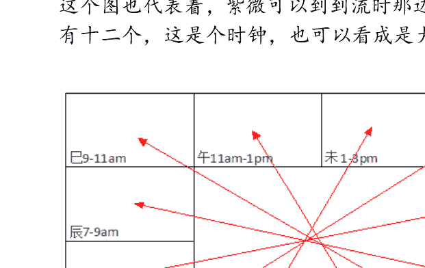

这个我们叫对宫。要记得子的对面，就是午宫。子是11-1晚上，午也是11-1但是是中午。当我说，对宫，就是代表这样的对面。丑的对宫是未，寅的对宫是申。

紫微的时钟很特别，叫三方四正。这个就是时钟。

表格内容（紫微斗数命盘，包含多个宫位、星曜、干支、年龄等信息）。

当转到子宫的时候，箭头是这样的。转到丑，箭头是这样。

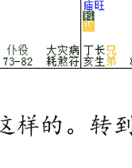

表格内容（紫微斗数命盘，与上一表格结构类似，但箭头指向位置不同）。

转寅，箭头又再移动。所以这个是最初步的认识，这个针其实是一直在移动。现在是八点晚上，所以是在酉。

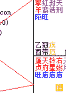

表格内容（紫微斗数命盘，与前两表格结构类似，箭头指向位置再次变化）。

紫微斗数命盘表格，包含命宫、夫妻宫、兄弟宫等十二宫位及主星、辅星分布。
*   命主信息：姓名: 玖陌殇, 黑龙江省-大庆 (经度:126.0)
*   公历:1990年2月2日13时37分 (真太阳时)
*   农历:庚午年正月初七日未时
*   四柱:己巳年 丁丑月 戊戌日 己未时
*   命局:阳女(庚午) 木三局
*   命宫:未 命主:武曲
*   身宫:酉 身主:火星
*   子年斗君:未
*   网站：★玄奥紫微斗数推命★ 【先天命盘】玄奥软件: www.xazhouyi.com

这个就是现在你命盘的时钟的时辰位置。

命盘的时钟一定要分白天晚上。命盘的三角形是**左转五个宫位**，**右转五个宫位**，对面再一个。四正位其实有两种，但是我们今天先说一种。这个三角形是有原因的，当我们说到宫位主题的时候，我告诉你们，先明白时间的概念，**白天是从寅到申，黑夜是从申到寅**。

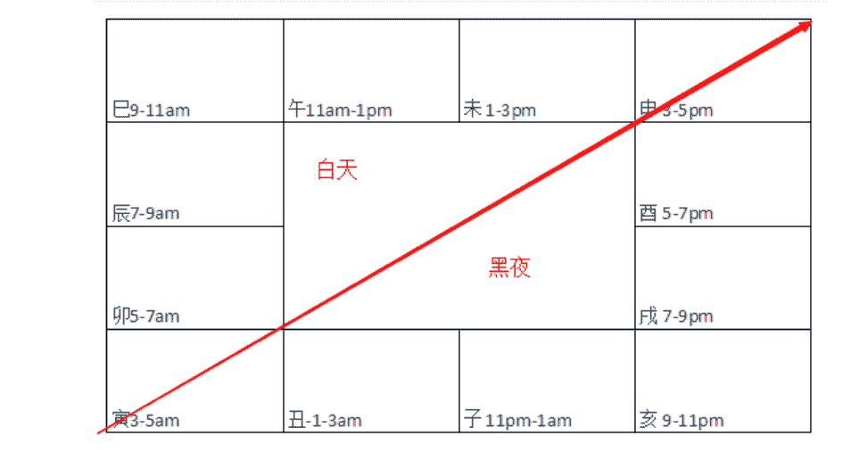

这个白天黑夜为什么要分明白？因为这个跟我们的时间习惯有关系。太阳是紫微的其中一个星星，太阳代表男人，代表事业，也代表发散，发亮和精神。如果说你的命盘里，太阳是在午宫，11-1 中午，又是白天，又是太阳最热的时间，所以这个太阳有个名字，叫**日丽中天**。这时候的太阳是庙旺的。如果你的盘太阳在亥宫，晚上 9-11 点，这时候太阳就没有力量。所以这个时候太阳就落陷了，代表有心无力，或者时间不对。

| 廉贞天府 | 贪狼 | 天机 | 太阴 |
|---|---|---|---|
| 天相 | 破军 | 巨门 | 天同 |
| 七杀 | 天梁 | 紫微 | 武曲 |
| 太阳 | 太阴 | 天府 | 天相 |

我们看看她的太阳和太阴（月亮）。太阳在白天，所以我们看见那边写庙旺。太阴在晚上，月亮在晚上好呀，所以也是庙旺。算日月并明。日月并明也是一个格局，如果他三方有太阳太阴都是庙旺的，就叫日月并明。是很好的格局。

### 女王的盘

| 天同 | 天机 | 天梁 | 紫微 |
|---|---|---|---|
| 破军 | 武曲 | 七杀 | 廉贞 |
| 天府 | 太阴 | 贪狼 | 巨门 |
| 太阳 | 天相 | 天机 | 天同 |

这个太阴跑去了白天，太阳跑去了晚上，这有个格局叫日月反背。意思是颠倒了。那么我们看看，这个是她的【官夫线】，意思是，她在夫妻上和事业上都容易出现【日月反背】的情况。比如说当她陪着她丈夫的时候，她会想着工作，工作的时候又会想着丈夫，诸如此类的颠倒心态。通常有这种格局也会出现一种毛病，就是适应不了环境，容易水土不服。

| 七杀 | 天府 | 天相 | 太阴 |
|---|---|---|---|
| 紫微 | 天机 | 破军 | 武曲 |
| 天同 | 天梁 | 廉贞 | 贪狼 |
| 太阳 | 天相 | 天机 | 天同 |

这种太阳如果是在子时，会容易出现失眠的问题。代表命主在子时的时候，想太阳的事。太阳在晚上就应该收起来，要休息了，但是她每次临睡前，容易因为想工作的事，或者第二天的事等等，就容易失眠。所以这个时间很重要，也是代表你什么时间，会出现什么习惯。太阳在子容易失眠，无论是什么宫位，因为盘一直再转，现在也在转。

这个就是很好的格局。

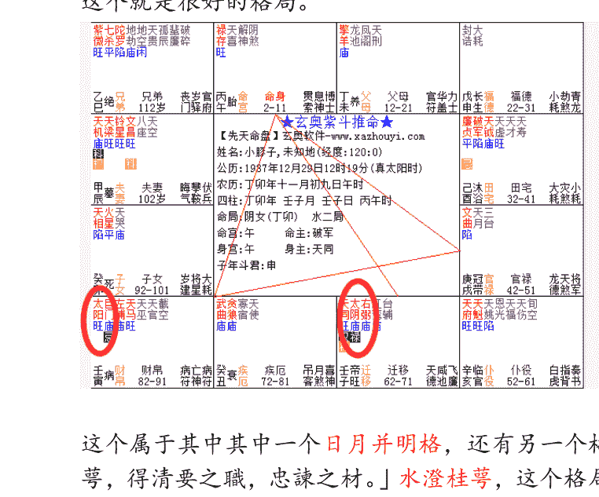

这个属于其中其中一个日月并明格，还有另一个格局。古文：「太阴居子，号曰水澄桂萼，得清要之职，忠谠之材。」水澄桂萼，这个格局一般都说，聪明，做轻松，但是重要的工作。@小豚子 是个律师，所以大家可以相信，聪明+重要轻松的工作。

> > 「太阴居子，号曰水澄桂萼，得清要之职，忠谠之材。」

庙是最大，旺是第二，接着就是闲、平，最后是陷。陷就代表这个星星的能量发挥不到，有心无力。如果是太阳，就是指跟太阳有关系的事，比如男人。女命如果太阳落陷，或者化忌，有可能会操心丈夫，觉得丈夫的能力不足。主要是看看是什么宫位，不过一般上坐什么宫位都好，女命只要是太阳落陷，有可能会影响一些丈夫的关系，比如命主会觉得丈夫工作不够勤力之类的，或者帮不到她。

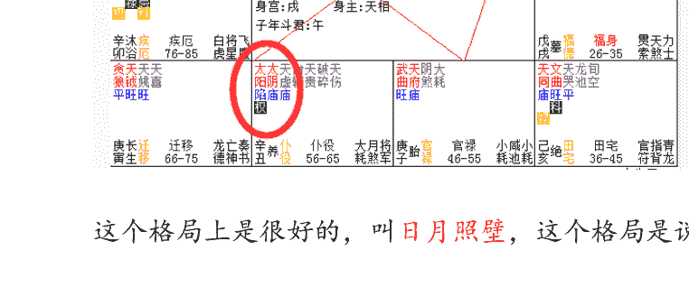

这个格局上是很好的，叫日月照壁，这个格局是说关于田产运很旺。

这一天说的其实要你们明白时间，白天黑夜对星星的影响，然后产生不同的格局。要看当地白天会不会太迟，以这个来定夺。根据你在的地方的经度，一些比较模糊的时间上，以现实的白天黑夜为准。

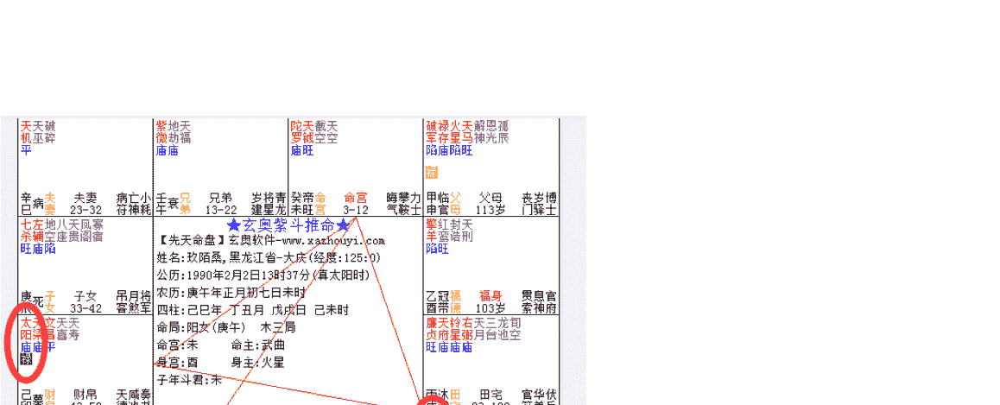

这个也是叫日月并明格，两个太阳和太阴都庙旺，跟着箭头照命宫，这个在官财上会很好。

| 蛇 | 马 | 羊 | 猴 |
|---|---|---|---|
| 巳 9-11am | 午 11am-1pm | 未 1-3pm | 申 3-5pm |
| 龙 | 紫微太岁图 | 鸡 | |
| 辰 7-9am | | 酉 5-7pm | |
| 兔 | | 狗 | |
| 卯 5-7am | | 戌 7-9pm | |
| 虎 | 牛 | 鼠 | 猪 |
| 寅 3-5am | 丑 1-3am | 子 11pm-1am | 亥 9-11pm |

我们上面说了，1，时间，2，白天黑夜，太阳太阴是跟你们比喻，将来我们说格局的时候，会继续说这个。现在我们看看太岁和这个太岁能够怎么用。除了代表时间，子丑寅卯辰…也代表生肖，生肖在命理上，我们叫太岁。其中一个我将来会教你们的技法，太岁入卦，是跟这个生肖有关系，不过，今天我们先从年份理解。

太岁最简单就是用在流年上，比如，鼠年，你的流年就移动到子。今年是未，那今年要移动到未。

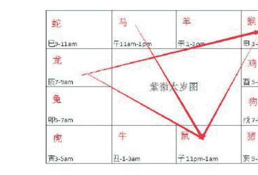

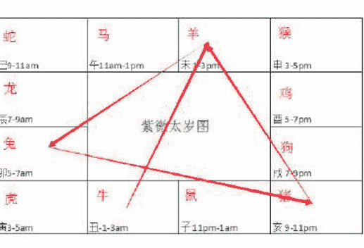

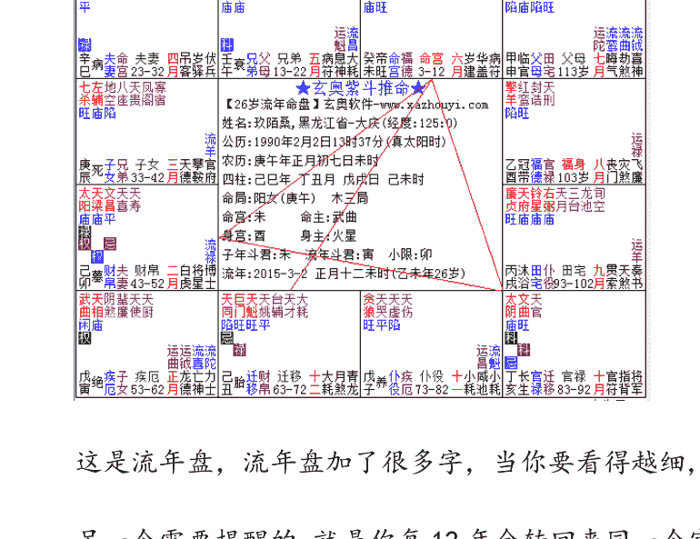

这是流年盘，流年盘加了很多字，当你要看得越细，紫微盘的信息就会越多。

另一个需要提醒的，就是你每12年会转回来同一个宫位，也就是今年末年，羊年，2015，十二年后的今年又转回来，你会发生一些类似的运势，不会一模一样。我说说个验证，某个命主来找我，那年事业投资失败。我说，十二年前你也一样有投资失败。他说，那时候我在上学。我问他，你上学院读什么科系？他说，酒店管理。我说，你现在做什么工作？他说，保险。然后我问他，是不是那时候也是投资失败？他上学的时候，投资错误的学科。12年后，他投资错误的事业项目。不可能100%，就是运势会类似。从现在开始，你看紫微十二年后，会有类似的事，会跟着主题变化。因为你的时钟就十二宫，转来转去也是这12个宫位，十二个时辰，十二个生肖。

接下来，太岁宫又可以用在哪里呢？很简单的，我们学找贵人的生肖。贵人有两个，一个是阳贵人，天魁，一个是阴贵人，天钺。这边的阳有两个意思，一个是男性的，另一个是明显地帮你的，天魁。一个是女性或者很不明显地帮你，偷偷帮你，其中一个，天钺。

举例：女命，天钺在巳宫夫妻宫，天魁在卯宫财帛宫。首先可以看成是生肖蛇（巳宫）是她的贵人。如果说不取夫妻宫，就男女都可以，不明显地帮助她，多数是女的，因为流年一直在转，所以巳宫不是一直是夫妻宫。如果论夫妻宫，天钺不可能是女的，不看生肖的话，（不一定要看生肖），她的丈夫是她的贵人，常常暗中帮助她。是不是注定属蛇的丈夫？不是。天钺一般会喜欢提醒人，或者帮人留位置，然后帮了也不会说。天魁天钺在我宫，通常都代表我喜欢帮助别人。我是别人的贵人，我善于欣赏别人，我也容易吸引贵人。

阳贵人在财帛宫，属兔子的，代表属兔子的朋友，或者找到一个属兔子的老公、上司、合伙人，都对她的财运有利。天魁是会帮得比较明显，比如帮了就宣传一下，谁谁谁，我帮了她什么什么的，这就是天魁。帮了不说的，就是天钺。

另一种用法，再借太岁和贵人，比如现在是兔年，天魁就坐了她的流年，所以代表她只要到了兔年，贵人就会出现，对宫也算。兔的对宫是鸡，转到鸡的时候也有贵人。

这是让大家最基本的明白流年在太岁上的应用，除了贵人星，也有小人星。比如擎羊，擎羊是真小人，会吵架的，擎羊是暴力星（擎羊是外伤，陀罗是内患。小人星坐命，会容易自责，会嘲讽自己为什么那么虚伪。在他宫就容易有受害者心理。）同理议之。

再重复一次，流年12宫会12年再转一次。太岁宫可以直接套入生肖，找贵人，或者某个流年有小人事件。

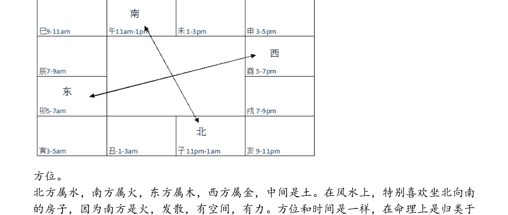

### 方位

北方属水，南方属火，东方属木，西方属金，中间是土。在风水上，特别喜欢坐北向南的房子，因为南方是火，发散，有空间，有力。方位和时间是一样，在命理上是归类于地，天地人，属于地的，就是固定的。因为地球自转的关系，时间有了一些变化，但是不管春夏秋冬，方位不会因为季节而改变，所以方位永远是固定的。

借上面例子，天魁在卯，属东方，所以当转到卯年的时候，有可能会出现一个来自东方的贵人，又或者今天遇到了困难，可以往东方去找贵人。这个贵人是借用，比喻，有时候我们会用在找人，比如有个男的问，老婆离家出走去找网恋对象，请问是去了什么方位？这时候就会用到方位。

也可以用在玩，在百度地图，把你当下的地方的小范围圈起来截图，或者你小时候的家，地图圈起来截图，会发现天府坐的方位一般会有银行，太阴或者巨门坐的方位会有河流或者水沟，紫微坐的地方有大厦。

另外，自己住的房子也可以看风水，比如说，你的卧室是房子的什么方位。再借上面例子，东方有贵人，如果说她的床头是在东方的，那么她就容易招贵人。这是比喻。我有一次看一个盘，武曲化忌坐寅，是东北东的方位，命主的卧室是睡在那边，流年当疾厄宫（健康位）转到寅的时候，就是今年，他因为肺穿洞进院。武曲属金，是代表肺。然后我再问，他小时候的房间是什么方位？他母亲说，是在巳，东南。刚好那个宫位有天机禄存，是聪明的象。我说，你儿子小时候是不是常常名列前茅？她说，是的，他小时候很厉害读书，都是考前面的名次。所以说，在紫微里面，方位是有关系的学问。

方法：首先拿个罗盘，或者指南针，或者手机下载指南针的app，站在房子的中间，然后拿出一张纸画出东南西北和你的家居图，你就能知道你的卧室是什么方位，然后可以套入命盘，引用在风水上。（因为你睡的地方是吸收阴阳气的地方，只有那个地方你是静静躺着吸收天地之气。）

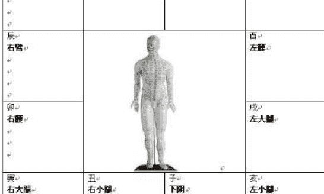

十二宫位，除了可以代表时间，也可以代表人体。午是头，子通常是肛门、子宫、膀胱，丑亥是脚，顺着时钟的是左，逆着时钟的是右，午宫有擎羊星，有可能头部会有疤痕。

学紫微是需要懂这些，可以推算在一些意外上，伤的位置。也可以是看生病，比如，辰命宫有天机忌，这个命主有脊椎移位的问题。昨天看一个丑武曲忌，他的膝盖有个骨刺。所以有时候我们断疾病，一些有用到身体的，需要把这个人体部位弄懂。

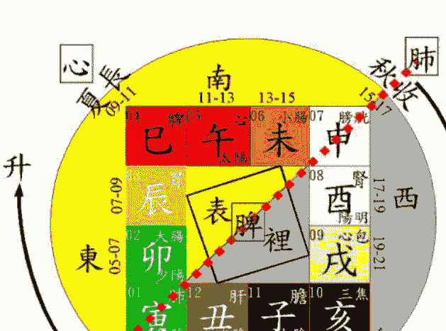

十二宫位和五脏六腑。特别注明一下，市面上的书籍有很多关于五脏六腑的不同图解，我自己验证之后，我发现这个中医的十二时辰对照图是最准的。子时是胆经，丑是肝经，寅是肺经，卯是大肠经，辰是胃经，巳是脾经，午是心经，未是小肠经，申是膀胱经，酉是肾经，戌是心包经，亥是三焦经。这个五脏六腑的图很讲究，而且也跟生活作息有关系。比如说，人间的太阳在子时，她的胆经容易失调，胆经失调之后，情绪会一阵一阵的，有时候出现莫名其妙的冲动，因为我们的胆会分泌出乙酰胆碱来刺激我们的肾上腺激素，失调了就会情绪突然莫名其妙的要刺激。（看不正常一般是取波动比较重的宫位，或者星星比较凶的宫位，比如巨门擎羊在午，午代表心脏，所以要小心，他偶尔会出现心悸的毛病，突然心跳很快等等。）

一些和肠胃有关系的宫位也可以断疾病，有一次我看一个男孩的盘，我看了，说妈妈有食物敏感，常常会拉肚子，喝酒脸会发红。就是说，从儿子的盘，也一样可以观察出来父母亲的疾病和遗传因素。

半夜咳嗽，武曲属金。丑和寅，一个肝一个肺，下一个就是肺，是一个循环。丑的武曲不好了，寅要如何修复肺？你肺部的药在丑，肺部吃药的时间在寅，肺部的药在丑的时候双化忌了，没了，那么到了寅时，你的肺还能吃药吗？而且循环是根据经络的，意思是肝和肺有一条共用的经络。子丑是冬天，寅起正月，所以凡是子丑时、子丑月都会有这种毛病，这是我研究过的，不过你们一样要继续去验证，不能把我研究出来的当做铁断，而是要去验证，统计这种出现的概率有多大。

## 【第二周】05.04

上次我们学习，1）时辰，白天黑夜，2）太岁，3）方位，4）人体+五脏六腑，现在我们来了解阴阳五行。十二宫位都有阴阳五行，单数是阳，双数是阴。你如果要问我什么差别，我这样形容，比如说，阳木是大树，那么阴木就是小草。阳火是大灯，那么阴火就是霓虹灯。阳水是可以喝的，流动的，阴水就是看不见的，比如地下水，或者不流动的水。阳土就是暴露在太阳下的泥土，阴土就是下面的泥土。

| 巳(火) | 午(火) | 未(土) | 申(金) |
| --- | --- | --- | --- |
| 四月·孟夏 立夏/小满 | 五月·仲夏 芒种/夏至 | 六月·季夏 小暑/大暑 | 七月·孟秋 立秋/处暑 |
| 辰(土) | | | 酉(金) |
| 三月·季春 清明/谷雨 | | | 八月·仲秋 白露/秋分 |
| 卯(木) | | | 戌(土) |
| 二月·仲春 惊蛰/春分 | | | 九月·季秋 寒露/霜降 |
| 寅(木) | 丑(土) | 子(水) | 亥(水) |
| 一月·孟春 立春/雨水 | 十二月·季冬 小寒/大寒 | 十一月·仲冬 大雪/冬至 | 十月·孟冬 立冬/小雪 |

在我们的日历，正月一定从立春开始，也就是寅月。今年是寅月，明年也是寅月开始，以后也是，永远的一月都是寅月。春天，木刚刚要发芽的时候，大约在一月和二月，就是升高升高，成长成长，所以，这时候是属【木】，因为木是长长直直的，往上的，就是属木。接着，三月是一个平台期，要慢慢进去夏天了，所以平台期是属【土】代表稳定的意思，然后就是夏天了。

夏天很热，太阳很亮的时候，而且，这时候植物不再长高，但是叶子开始茂盛，发散的生【头发】。午也是头，也长头发，所以，巳和午是属火的。而且这个刚好是南方！南方也是热地，南方也是热带雨林，地球在南方也长头发，很多树林。接着，到了未月，六月，又进入一个平台期，属土，因为这时候要开花结果了。

到了立秋，这个宫位是属金的。为什么代表金？你看，果实的外壳都是坚硬的，秋天金色，收获的季节，就像收获金子一样。所以，申和酉是属金。不得不说，这个地球也很巧妙的，西方的洋人，刚好也是金头发的，他们的独立性很强，也长得比东方人高大，东方小木，所以东方人矮小。接着，又进入了一个平台期，九月，戌宫，属土。

立冬了，是北方，北方比南方冷，这是常识。而且，记得子代表什么？下面。我们的脚长头发吗？没有头发，但是我们一冷，脚就先冷。头在午，子是下面。水代表什么？冬天代表什么？代表收敛，收藏。冬天下雪。接着，到了阴历十二月又一个平台期，属土。

| 阴火 | 阳火 | 阴土 | 阳金 |
|------|------|------|------|
| 巳9-11am | 午11am-1pm | 未1-3pm | 申3-5pm |
| **阳土** | | **阴金** | |
| 辰7-9am | **紫微十二宫** **阴阳五行** | 酉5-7pm | |
| **阴木** | | **阳土** | |
| 卯5-7am | | 戌7-9pm | |
| **阳木** | **阴土** | **阳水** | **阴水** |
| 寅3-5am | 丑1-3am | 子11pm-1am | 亥9-11pm |

看看这个，清晰多了，很容易记下来。东方属木，一月，二月。南方属火，四月，五月。西方属金，七月，八月。北方属水，十月，十一月。有四个宫位是特别的，属土。

这四个土地有个名字叫，四墓地。谁坐这个宫位，都会不想动，比较懒，比较宅。所以谁的命宫坐这四个宫位都会不喜欢变动，特别是，天罗地网！

| 阴火 | 阳火 | 阴土 | 阳金 |
| --- | --- | --- | --- |
| 巳9-11am | 午11am-1pm | 未1-3pm | 申3-5pm |
| 阳土 天罗 | 紫微十二宫 | 阴金 |
| 辰7-9am | 阴阳五行 | 酉5-7pm |
| 阴木 | 阳土 地网 |  |  |
| 卯5-7am | 戌7-9pm |  |  |
| 阳木 | 阴土 | 阳水 | 阴水 |
| 寅3-5am | 丑1-3am | 子11pm-1am | 亥9-11pm |

这两个属土的宫位，就叫天罗地网。因为那是阳土，阳土可以看成是山，山压着你，就是天罗地网了。那么，命坐在辰戌有什么特征？今天，你叫他去大城市工作、拼搏，他会特别多理由，特别多的不放心。但是是不是代表永远不会出去？不是，是代表此人要做这个决定很困难，但是一旦做了这个决定，就突破了。阴就是不至于那么的宅。 我们还有另外四个宫位也是很特别。

| 阴火 | 阳火 | 阴土 | 阳金 |
| --- | --- | --- | --- |
| 巳9-11am | 午11am-1pm | 未1-3pm | 申3-5pm |
| 阳土 | 紫微十二宫 四败地 | 阴金 |
| 辰7-9am | 阴阳五行 四桃花 | 酉5-7pm |
| 阴木 | 阳土 |  |  |
| 卯5-7am | 戌7-9pm |  |  |
| 阳木 | 阴土 | 阳水 | 阴水 |
| 寅3-5am | 丑1-3am | 子11pm-1am | 亥9-11pm |

这四个叫四败地，也是代表桃花之地。坐这四个宫位的比较爱玩，喜欢交朋友，喜欢热闹，坐这几个宫位的也容易跟桃花扯上关系。比如说，贪狼是正桃花星，廉贞是次桃花星，只要桃花星刚好坐在桃花地，就看成是+++能量，增加桃花能量。比如说，贪狼坐在四墓地，是50%，贪狼坐在四桃花，是100%，除非遇到克桃花的因素。

这四个宫位就是叫【四马地】。谁只要命宫坐这四个角落，就会喜欢旅行，喜欢自由，有空在家也不能安静下来，啥都要动一下，比如突然去移动家具等等，停不下来。就是想出去，或者不喜欢被约束。天马只坐这四个宫位，天马就是很快的马，老天如果送给你，就是要送你出国，所以流限逢天马，容易去远方旅行。比如说你刚好是命坐天马，一定是四马地，天马+四马地就容易有出国的机会。又或者是，你田宅宫坐四马地，也有天马，也代表你会国外住。那么在子女宫，就代表你的孩子会出国发展或者念书，或者你的孩子喜欢自由。在迁移宫会喜欢去旅行。所以这个很容易看。

谈一个星星的组合，擎羊+禄存+陀罗，禄存是宝物，禄存坐那个宫位，哪个就是你的宝贝，你会保护他。比如有个命主，他的禄存在奴仆宫，人家讲他朋友坏话，他还会骂人，为啥你讲我朋友！禄存坐命，我就是个宝贝，通常，个性就比较自私，我爱我自己。禄存坐父母，通常都孝顺父母，父母是他的宝物。如果你要找配偶，你一定要找这个人，禄存是坐夫妻宫，他爱上了，虽然会觉得配偶自私，但是谁让他惯出来？夫妻宫坐禄存，就代表会对配偶好。既然是宝贝，自然要有保镖，谁是禄存的保镖？答案就是，擎羊和陀罗，擎羊和陀罗永远都夹着禄存。为什么提到这个禄存呢？因为禄存很特别，禄存是不要坐四墓地的。如果你是甲年生，你的禄存就在寅。如果你是乙年生，你的禄存在卯。但是，如果你是丙年呢？就会跳过一个宫位，所以，丙丁的禄存都坐在巳。这个禄存很狡猾，他会跳过四墓地，这也代表什么？如果你是四墓地的主人，禄存就不要你。这也代表，如果你懒惰，你宅，你不要动，禄存是永远不会进来四墓地的，就像财神爷不要进懒惰人的家门一样。禄存也代表钞票，特别是跟天府一起的时候，天府是代表银行，天府+禄存，就是这人会有存钞票的习惯，喜欢看着金钱增加，不喜欢减少。

说说几个星星的五行，我们常常套入命盘，然后看能量高低。太阳属火，那么，太阳坐北为什么落陷呢？因为北属于晚上，也因为是冬天。太阳坐子为什么容易失眠？因为晚上喜欢想太阳的事，越想越精神。

### 紫微在未命盘（第一张，标注属火的星曜）

| 宫位 | 星曜 | 宫位 | 星曜 |
| :--- | :--- | :--- | :--- |
| 巳 | | 午 | 天机庙 |
| 未 | 紫微庙、破军庙 | 申 | |
| 辰 | 太阳旺（红圈标注） | 酉 | 天府陷 |
| 卯 | 武曲陷、七杀陷 | 戌 | 太阴旺 |
| 寅 | 天同闲、天梁庙 | 亥 | 廉贞陷（红圈标注）、贪狼陷 |
| 丑 | 天相庙 | 子 | 巨门旺 |

标注说明：
- **太阳旺** 与 **廉贞陷** 被红色圆圈标出。
- 红色箭头从「太阳旺」指向「廉贞陷」，箭头文字：属火的星星。

太阳是阳火，刚才我说了，阳火就是大灯。还有一个星星也是属火，就是廉贞，是丁火，代表小灯，比如手机的光，电脑的光，广告牌的光。大家可以发现，廉贞坐亥，也是落陷的。这个盘，太阳旺，因为在白天，廉贞落陷，因为在属水的宫位。

### 紫微在未命盘（第二张，标注属水的星曜）

| 宫位 | 星曜 | 宫位 | 星曜 |
| :--- | :--- | :--- | :--- |
| 巳 | | 午 | 天机庙 |
| 未 | 紫微庙、破军庙 | 申 | |
| 辰 | 太阳旺 | 酉 | 天府陷 |
| 卯 | 武曲陷、七杀陷 | 戌 | 太阴旺（蓝圈标注） |
| 寅 | 天同闲（蓝圈标注）、天梁庙 | 亥 | 廉贞陷、贪狼陷 |
| 丑 | 天相庙（蓝圈标注） | 子 | 巨门旺（蓝圈标注） |

标注说明：
- **天同闲**、**天相庙**、**巨门旺**、**太阴旺** 被蓝色圆圈标出。
- 蓝色文字标注在「天相庙」右侧：属水的星星。

这几个是属水的星星，都是庙，旺，因为子亥是属水的宫位，其他几个也是很靠近子亥，所以也被影响到。比如太阴，坐子就会小庙，坐戌写旺，庙的力度比旺大。天同是家庭用水，可以喝的水，有时候我们遇到天同化忌，就要注意饮用水。天同是健康的时候，天同化忌就容易落发，通常有天同化忌的问题，就要注意饮用水。天同是壬水，太阴是癸水、阴水。阳是会流动的， 阴是不动的水。太阴代表池塘、湖泊、淡水，或者是一滴一滴慢慢累积的水。巨门也是癸水，阴水的意思，巨门这个阴水就跟太阴不同，巨门是代表地下水，水沟的污水，田宅宫有巨门的人，家附近有大水沟。天相是壬水、阳水，代表漂亮、流动的水，大自然的水，比如，瀑布，喷泉，井水，也代表你外面买的饮料。破军是阴水，但是为什么阴水又代表大海水呢？因为大海水高深莫测，不懂他什么时候会暴风雨，有时候又风平浪静，有时候又大风大浪。

| 巳 | 午 | 未 | 申 |
|---|---|---|---|
| 太阳旺 | 天机庙 紫微庙 破军庙 | | 天府陷 |
| 辰 | 紫微在未 | 酉 |
| **武曲陷** **七杀陷** | | 太阴旺 |
| 卯 | | 戌 |
| 天同闲 天梁庙 | 天相庙 | 巨门旺 | 廉贞陷 贪狼陷 |
| 寅 | 丑 | 子 | 亥 |

**武曲**和七杀。因为金克木，就泄掉了金，所以是落陷。武曲是阴金，七杀是阳金。**武曲**也叫【正财星】，是跟阴金的特性有关系的，阴金，就是地下面的黄金。你要得到这个黄金要怎么办？就要去挖掘，要寻找，要劳动，所以，武曲的正财星就是这个来意，也代表武曲的财，是一定要经历辛苦才可以得到的。**七杀**是阳金，是地面上的黄金，同时也代表快速赚钱，赚短期的钱，很直接的钱，所以有时候七杀就容易有偏财的意味。

| 巳 | 午 | 未 | 申 |
|---|---|---|---|
| 太阳旺 | 天机庙 **紫微庙** 破军庙 | | **天府陷** |
| 辰 | 紫微在未 | 酉 |
| 武曲陷 七杀陷 | | 太阴旺 |
| 卯 | | 戌 |
| 天同闲 **天梁庙** | 天相庙 | 巨门旺 | 廉贞陷 贪狼陷 |
| 寅 | 丑 | 子 | 亥 |

这几个是属土的星星，**紫微**是阴土，这个阴土代表的是古老的泥土，比如古董，陶瓷，花瓶，土木工程，很高的建筑物等等，都是代表一些罕有，珍贵，尊贵，昂贵，高级的意思。就像你看大酒店，很高级，你也可以当作是紫微阴土。**天府**是阳土，天府是母后，所以是管孕育的，代表农作物的泥土，天府也代表存续和收藏，从前的人哪里有银行，就是收藏这些粮食，农作物，那是古人的钞票，所以也代表天府有收藏，代表银行，代表储存。就像你玩种树一样，种了换钱，天府代表种植的土。所以从这边看，同样的紫微和天府，紫微给人感觉高不可攀，天府变得和蔼可亲的土。紫微和天府都容易变成领导、老板，不过紫微比较冷酷，天府比较和蔼可亲。**天梁**是阳土，代表植物药用的泥土，代表植物药用的泥土，所以有代表药的意思，保健的意思，因为天梁这个泥土会种植草药。不过取象方面，天梁还有一个像是大树，天梁代表大树，会照顾人，所以很多领导都是天梁坐命的，天梁就像刘邦那种形象。天梁喜欢请客，有个验证，天梁坐疾厄的人出去一定要请客。

| | 天机庙 | 紫微庙 |
|---|---|---|
| 巳 | 午 | 未 |
| 太阳旺 | | 天府陷 |
| 辰 | 紫微在未 | 酉 |
| 武曲陷 七杀陷 | | 太阴旺 |
| 卯 | | 戌 |
| 天同闲 天梁庙 | 天相庙 | 巨门旺 廉贞陷 贪狼陷 |
| 寅 | 丑 | 子 | 亥 |

贪狼是甲木、阳木，贪狼一般代表盆栽，有时候也代表高大的树木，因为贪狼是甲木，就是第一个木的意思，也是启蒙的含义，代表教化、老师，或者原料、种子、卵子、精子，因为有启蒙的含义。贪狼也有另一个属性，癸水，贪狼的桃花就是癸水造成的。贪狼主要的五行是甲木。很多星星有杂耀，基本五行一定要懂。

现在谈谈这个五行还会怎样变化，有时候不只是宫位影响，而且还有双星组合的影响。

| 巨门平 | 廉贞平 天相旺 | 天梁旺 | 七杀庙 |
|---|---|---|---|
| 巳 | 午 | 未 | 申 |
| 贪狼庙 | | 天同平 |
| 辰 | 紫微在寅 | 酉 |
| 太阴陷 | | 武曲庙 |
| 卯 | | 戌 |
| 紫微庙 天府庙 | 天机陷 | 破军庙 | 太阳陷 |
| 寅 | 丑 | 子 | 亥 |

廉贞是阴火，天相是阳水，但是看，廉贞输给了天相，因为午宫属火，所以这种组合就会变成，廉贞的力量减少了，然后乖乖听天相的话。（图有误）这个组合有两个，还有一个是在子。

| 巳 | 午 | 未 | 申 |
|---|---|---|---|
| 太阳旺 | 破军庙 | 天机陷 | 紫微旺 天府平 |
| 武曲庙 | | | 太阴旺 |
| 天同平 | 紫微在申 | | 贪狼庙 |
| 七杀庙 | 天梁旺 | 廉贞平 天相庙 | 巨门旺 |
| 寅 | 丑 | 子 | 亥 |

反正我想说的就是，除了宫位的五行会影响力量，还有组合的原因，也会影响。

| 巳 | 午 | 未 | 申 |
|---|---|---|---|
| 天相平 | 天梁庙 | 廉贞庙 七杀旺 | |
| 巨门平 | | | |
| 紫微旺 贪狼地 | 紫微在卯 | | 天同平 |
| 天机旺 太阴闲 | 天府庙 | 太阳陷 | 武曲平 破军平 |
| 寅 | 丑 | 子 | 亥 |

这个组合也是很特别的，这个七杀廉贞，反而是集富之人。因为金虽然怕火，但是金遇到小火就是好事，廉贞是小火，七杀是刀子，这样才可以磨练金，金被烤练，才成型。所以这样的组合就代表历练。

[图片：033d9c4a91654160f6e1c76218546511_20_0.png]

像这种两个财星在一起，两个桃花星在一起，代表他容易通杀，都容易遇到。这样比喻，比如说刀子，刀子庙旺，就是刀子锋利，刀子落陷，就是刀子钝了，但是不代表刀子因为落陷就变成豆腐，所以庙旺落陷，代表有力和没力。比如说廉贞贪狼在一起，贪狼是大众化的桃花，廉贞是文艺个性派的桃花，他两种都会遇到，或者是他两种都喜欢，也代表他就是喜欢好看的，样貌主义者。

武曲七杀，也就是赚钱快的他要，赚钱慢的也要。

所以可以知道这种组合的人，目的性很明确。你问他喜欢什么样的，他说我就喜欢美的。你问他要做什么行业，他说什么赚钱我就做。

[图片：033d9c4a91654160f6e1c76218546511_20_1.png]

加起来就是紫微破军坐命，武曲七杀坐财，廉贞贪狼坐官。紫微破军，是无情格，就是因为他们的目标很明确，不会叽叽歪歪。

（抛弃糟糠的家运就会很差，太阴是田宅星，如果是自己破了太阴（妻星），那么就间接的破了田宅星。）
在紫微盘上，我们人就像玩大富翁一样，一个一个宫位移动，有时候我们会踩到机会，有时候我们会踩到地雷，有时候又被停格，所以，我们先要认识这个棋盘的结构。

| 巳9-11am | 午11am-1pm | 未1-3pm | 申3-5pm |
|----------|------------|---------|---------|
| 辰7-9am  |            |         | 酉5-7pm |
| 卯5-7am  |            |         | 戌7-9pm |
| 寅3-5am  | 丑1-3am    | 子11pm-1am | 亥9-11pm |

第一个认识就是关于时间的，这个结构其实是建立于地球的逻辑，地球自转，所以产生了时间，白昼和黑夜，也产生了十二个月。

| 巳9-11am | 午11am-1pm (白天) | 未1-3pm | 申3-5pm |
|----------|-------------------|---------|---------|
| 辰7-9am  |                   |         | 酉5-7pm |
| 卯5-7am  |                   | (黑夜)  | 戌7-9pm |
| 寅3-5am  | 丑1-3am           | 子11pm-1am | 亥9-11pm |

正月一定是在寅，寅立春，巳立夏，申立秋，亥立冬，就产生了四个季节，春夏秋冬。除了时间、季节，地球还产生了东南西北。

| 巳9-11am | 午11am-1pm (南) | 未1-3pm | 申3-5pm (西) |
|----------|-----------------|---------|--------------|
| 辰7-9am  |                 |         | 酉5-7pm      |
| 卯5-7am (东) |                 |         | 戌7-9pm      |
| 寅3-5am  | 丑1-3am         | 子11pm-1am | 亥9-11pm     |

地球的南极北极，会产生方位，这些是归纳在【地运】。我们常常说，天地人三才，意思是天上的星星，地球的公转自转，然后影响了人，这个十二个地支，就是因为地球而产生，所以有固定的元素在里面。因为我们有一些是能够直接作出测试，比如方位，不管你流年咋样的转，我们起方位一样是这个固定的标准。黑夜白天，天是圆的，地是方的，这是古人的理解，所以你的命盘是四方形的。

| 巳9-11am | 午11am-1pm | 未1-3pm | 申3-5pm |
| :--- | :--- | :--- | :--- |
| 辰7-9am | 太阳 | | 酉5-7pm |
| 卯5-7am | | | 戌7-9pm |
| 寅3-5am | 丑1-3am | 子11pm-1am | 亥9-11pm |
| | | 太阴 | |

先谈谈太阳太阴，太阳和太阴我们叫中星，也就是不属于北斗星系，也不属于南斗星系，所谓的太阳就是我们所直接理解的太阳。太阴就是我们的月亮。所以，从这个图看我们可以知道，太阳如果在午，就是能量最强的时候，所以是庙旺。这边我再备注一个特别的，就是如果太阳在午，加上化忌，等于要收紧这个太阳，化忌是把力量集中，执着这个力量，然后抓紧，就会产生太阳瞄准。你可以想象一个物理的情况，就是当把午宫太阳的光，凝聚成一条，那会变成什么？答案就是镭射。

太阳本身就是火，午宫是属火的，太阳在中午的11-1点，是特别强烈，所以在午，就代表太阳的能量已经刚刚好了。易理所要理解的物理，就是你不能太多，太极端，太多，反而就是一种伤害力。所以我们可以知道，太阳坐午，如果化忌就好比一个气场很大，说话很大声的人，在大庭广众瞄准一个人骂，就是这种震撼。

所以今天的一个盘，太阳坐午化忌，我就说他近视眼，因为太极端的太阳，肯定伤害眼睛，就像你不能裸眼去看太阳一样，更何况是太阳化忌呢？那是镭射。

上图所示，太阴坐子，也是庙旺，这两个都有独立的格局。

| 巳9-11am | 午11am-1pm | 未1-3pm | 申3-5pm |
| :--- | :--- | :--- | :--- |
| 辰7-9am | 太阳 | | 酉5-7pm |
| 卯5-7am | 日照中丽格 | | 戌7-9pm |
| 寅3-5am | 丑1-3am | 子11pm-1am | 亥9-11pm |

太阳坐午，日丽中天，也有书写日照中丽格。意思是这个太阳力量大，太阳管事业，所以也会影响这个人的名气、事业，还有外交的能力。化忌了代表这个人要做事，喜欢一个时间只做一件事，不喜欢分心。太阳属火，火是发散出来的，但是化忌，就产生了针对性。一边也会影响事业，好就很好，不好，别人受不了和他共处。

| 巳9-11am | 午11am-1pm | 未1-3pm | 申3-5pm |
| :--- | :--- | :--- | :--- |
| 辰7-9am | | | 酉5-7pm |
| 卯5-7am | | | 戌7-9pm |
| 寅3-5am | 丑1-3am | 子11pm-1am 太阴 | 亥9-11pm |

太阴坐子，子属水，水澄桂萼格局。太阴坐子必定只和天同一起同坐。

| 紫微旺 七杀平 巳 | 午 | 未 | 申 |
| :--- | :--- | :--- | :--- |
| 天机庙 天梁旺 辰 | | | 廉贞平 破军陷 酉 |
| 天相陷 卯 | 紫微在巳 | | 戌 |
| 巨门庙 太阳旺 寅 | 武曲庙 贪狼庙 丑 | 天同旺 太阴庙 子 | 天府旺 亥 |

另一个是反面的。

| 天府平 | 天同陷 太阴陷 | 武曲庙 贪狼庙 | 巨门庙 太阳闲 |
| :--- | :--- | :--- | :--- |
| 巳 | 午 | 未 | 申 |
| 辰 | | | 天相陷 酉 |
| 廉贞闲 破军旺 卯 | 紫微在亥 | | 天机庙 天梁旺 戌 |
| 寅 | 丑 | 子 | 紫微旺 七杀平 亥 |

只有在子宫，才是合格的水澄桂萼格局。因为太阴在午，午属火，火克太阴的水，在五行里面，水代表智慧，所以水越多就越聪明。所以A命主，天同太阴坐午，B命主，天同太阴坐子，个性是一样的，但是坐子的那个比较聪明，坐午的会很懒惰，动脑筋会觉得很烦。顺便说说这个组合的含义。

| 紫微旺 七杀平 巳 | 午 | 未 | 申 |
|---|---|---|---|
| 天机庙 天梁旺 辰 | 紫微在巳 | | 廉贞平 破军陷 酉 |
| 天相陷 卯 | | | 戌 |
| 巨门庙 太阳旺 寅 | 武曲庙 贪狼庙 丑 | 天同旺 太阴庙 子 | 天府旺 亥 |

天同的代表人物是周文王，就是发明后天八卦的那个人，所以天同坐命的人，有一种很特殊的天赋，就是擅长看公式。这里的太阴，是一种过滤的效果，水肯定是往下流，所以他想了公式，想到了办法，太阴会帮他分辨出来，或者细化出来。我发现天同太阴，会喜欢看那种密密麻麻的数目。我妹也是太阴天同，她是网页设计工程师，也是天天看那些数目和公式，不过她在午，所以她很讨厌她的工作。

## 一、天同、太阴坐命子、午

> 古文：「太阴居子，号曰水澄桂萼，得清要之职，忠谏之材。」当您作实际的排盘时，会发觉太阴居子宫时，必会与天同同宫，所以这个水澄桂萼的格局，也就是太阴天同坐命子宫之谓，而太阴天同坐命午宫则不合乎「水澄桂萼」的条件。太阴属水，天同的五行也属水，子宫为水宫，所以太阴天同星坐落子宫，必成汪洋之势，在没考虑「五行局」的情况下，水星居水宫，

简单来说，就是工作轻松，但是很重要。我们这边还有另一个迁移宫太阴天同的，她是个律师，专门管理顾客的资金分配。就是别人看很轻松，他自己很讨厌的工作。一般都是工资高的重要工作。明明很聪明，但是却懒得用脑。

[图片：033d9c4a91654160f6e1c76218546511_24_0.png]

日月并明格。太阳刚好在白天，太阴在晚上，算起来是晚上了，过了申。这个人心地善良，处事很有一套，一分耕耘一分收获，越做越好。
这个格局，太阳坐官禄宫，管工作的。太阴坐财帛宫，管理财的。代表他用太阳这种态度处理工作，但是他又用太阴这种积沙成塔的模式处理财帛，会存钱，又愿意付出劳动。
古人一看见太阴就说，这是富，特别喜欢太阴这个星星。太阴也会投资不动产，因为是田宅星，所以你看，成功不来自于偶然。命盘是解释，这个人为什么成功？不是代表他有这个格局所以他成功。

| 巳 | 午 | 未 | 申 ||
|---|---|---|---||
| 天梁陷 七杀旺 田宅宫 廉贞庙 | 巳 午 未 申 | | |
| 紫微陷 天相旺 | 辰 | 酉 | |
| 巨门庙 天机旺 | 卯 | 戌 | |
| 贪狼平 太阳陷 太阴庙 武曲旺 天府庙 | 寅 丑 子 亥 | | |

| 巳 | 午 | 未 | 申 ||
|---|---|---|---||
| 天同庙 武曲旺 太阳地 贪狼平 天府旺 太阴陷 | 巳 午 未 申 | | |
| 破军旺 | 辰 | 酉 | |
| 卯 | 戌 | | |
| 廉贞庙 七杀旺 天梁陷 田宅宫 | 寅 丑 子 亥 | | |

### **日月照壁格**。不管是对面，或者是坐那个宫位（田宅宫），都是代表日月照壁。

这个格局是指，是个有很多地产的人。坐丑比较强，因为古人也特别喜欢太阴坐田宅宫，代表田宅星坐田宅宫，双倍的力量。当然要参考其他条件，加空劫进去，基本上就没有作用了。所以看格局，要注意有没有破坏王在附近。

看力量，紫微动不动就什么空亡星，但是流年就不太大，其实就是代表缘短的意思，比如曾经拥有过，流年的星星在一起格局还可以叠加，之后会说到。天盘一定是大格，所有故事在天盘的框架里面，简单来说，这个盘是可以赚十万的天盘，那么不管流年财运怎么样的旺，最旺的那年也就是赚十万，不会突然流限旺了赚一百万。

| 巳9-11am | 午11am-1pm | 未1-3pm | 申3-5pm ||
|---|---|---|---||
| 辰7-9am | 酉5-7pm | | |
| 卯5-7am | 戌7-9pm | 太阴 | |
| 寅3-5am | 丑1-3am | 子11pm-1am | 亥9-11pm |

### **月朗天门格**。这个格局叫天门，其实亥是天门的位置，根据资料是说容易有权，如果是晚上出世的人更好。

月朗天门格也是紫微斗数中一个比较有名的富贵格局，其特点是太阴星在亥宫坐守命宫，三方四正最好有禄存或科权禄、左辅右弼、天魁天钺，且无煞星会照。月朗天门是一个非常高的格局，因为同时有太阳、天梁在卯坐守官禄宫，属于“日照雷门”格；太阴、太阳、天梁皆处庙旺，属于“日月并明”格；还有财帛宫在未又属于“明珠出海”格，多个格局组合在一起，非富即贵。

古人对月朗天门格局评价非常高，因为此格局中官禄宫有太阳、天梁星坐守，田宅宫中有武曲、天相，在结构上具备了富贵的条件；而疾厄宫有紫微星坐守，又是头脑清明、学识渊博的象征，所以有此格局的人个性内敛，做事态度温和，具有亲和力，人际、人缘关系佳，尤其是异性缘方面相当不错，男的俊帅斯文，女的秀丽端庄、身材好，适合在文艺或学术方面有所发展及成就，很容易成为学者或名人。

### 再看同时会产生的，日照雷门格。

| 天机平 | 紫微庙 | 破军陷 |
| :---: | :---: | :---: |
| 巳 | 午 | 未 | 申 |
| 七杀旺 | | | |
| 辰 | 紫微在午 | 酉 |
| 太阳庙 天梁庙 | 雷门 | 廉贞旺 天府庙 |
| 卯 | | 戌 |
| 武曲闲 天相庙 | 天同陷 巨门旺 | 贪狼旺 | 太阴庙 天门 |
| 寅 | 丑 | 子 | 亥 |

先说说为什么会有这种怪名字。

| 巽 | 离 | 坤 | 坤 |
| :---: | :---: | :---: | :---: |
| 巽 | | 兑 |
| 震 | | 乾 |
| 艮 | 艮 | 坎 | 乾 |

乾卦是代表天，所以那么叫天门。卯是代表震卦，震卦就是代表雷电，所以又叫雷门。也叫日出扶桑格，也是代表有功名的意思，我们看看三方，

[图片：033d9c4a91654160f6e1c76218546511_26_0.png]

所以就只有坐这三个宫位的人，才得到这两个格局。中间那个有个名字，天同巨门，明

### 珠出海格。

诸葛亮就是这个盘，命坐未。

[图片：033d9c4a91654160f6e1c76218546511_27_0.png]

太阳坐卯，叫日照雷门。太阴坐亥，叫月朗天门。天同巨门，叫明珠出海。(命在未或丑) 都是富贵格，代表有功名。所以不一定是看到紫微星，才说人家当领导、升职。

[图片：033d9c4a91654160f6e1c76218546511_27_1.png]

[图片：033d9c4a91654160f6e1c76218546511_27_2.png]

基本盘就是倒转而已，这个宫位一定是日月同宫，先不谈什么效应，我们谈谈哪个比较强 (坐命)。这个其实要见仁见智。先说说这个组合的个性，代表此人同时存在太阳思维和太阴思维，所以这个坐命的人，小时候学习能力很强，思想超人，智慧高人一等，学得很快，看得很远。但是这个命格通常长大之后反而就没什么特别的了，就是因为他看得太远，什么风险、问题、陷阱或者什么特殊状况，他都想了一遍，就不敢去执行了，所以在执行力上就比平常人差一些，主要是因为“想太多”。其实这是说一种保守格，意思是这个人的个性很谨慎。我个人觉得，需要加强太阳的能量，也就是坐未，如果加上刚好太阳化禄，也许就能提高执行力。太阳代表行动力，书上也说了，这个格局，照会比坐命强，也就是说，太阴太阳坐未，命在丑，会略强。

这个有待验证，将来遇到了，我们来看看什么区别。我有个太阴太阳坐命的例子，这人要搬家而已，就到处找风水师、设计师，要万无一失的想好。这房子将来万一有什么缺失要怎么办？现在就必须先准备好。特别喜欢看紫微，而且不喜欢问当下的，特别喜欢问几年后，哪里有地雷，他要准备准备。长期处于这种不安的状态。

[图片：033d9c4a91654160f6e1c76218546511_28_0.png]

### 日月反背

，就是容易颠倒的意思，重要的不去看，反而去看不重要的。因为他用太阴的态度在白天工作，用太阳的态度在晚上工作，这就是其中一种颠倒。一般这种人也有种特性，就是容易觉得自己不适合这个环境，其实不管他换多少份工作，都会有这种念头。除非是白天睡觉，晚上工作的那种职业，那也许会是一种例外。当然这也代表上班的时候老提不起劲，下班后就很精神，类似这种。

也容易产生水土不服，换了环境就生病。书上写，这种人做事不够光明磊落，有一点灰色处理的思维模式。网上有个案例，
<u>在现代，很多人性格上存在着很多灰色地带，加上，「行行出状元」，很多行业，根本就接近偏門行業，須日月反背的人，以另類的方法去處理，反而見效！例如：國際上開賭的人，可能是日月反背的人；雖然賭徒是合法的去賭，但賭業始終是偏門生意！</u>
<u>樂城安曾認識一位日月反背而太陽坐命的人，他從事成衣材料出口的行業，職位是經紀（推銷員），其公司專門做外國人的生意，而訂單的貨品數量及銀碼很大，這位朋友就經常陪客戶到夜總會消遣，結果，很多合同都是晚上在夜總會簽訂的！</u>
紫微是活用的，意思就是如果你日月反背，最好的建议就是晚上出去应酬，会事半功倍。

[图片：033d9c4a91654160f6e1c76218546511_29_0.png]

像这种就没有这个问题，这个最好就是命坐太阴，迁移宫坐太阳。因为命宫是代表静态，迁移宫是代表动态，如果太阴坐命，太阳坐迁移宫就刚刚好，在家里安静，在外面活跃。如果太阳坐命，太阴坐迁移宫，就是在家很活跃，在外面很矜持。

[图片：033d9c4a91654160f6e1c76218546511_29_1.png]

[图片：033d9c4a91654160f6e1c76218546511_29_2.png]

这两个都容易有失眠的毛病，特别是坐子。不管太阳是坐什么宫位，只要是太阳坐子，就容易失眠。这个太阳是落陷的，有时候我们看太阳落陷+化忌貌似应该会更差，其实不然，这和午宫的效应是一样的，就是太阳光弱的时候，加个化忌，就刚刚好。同一个时间，只做一件事，一般太阳化忌都容易有这种倾向。

总结：太阳太阴是根据白天黑夜去判断庙旺。太阳主名气、工作。太阴是负责思考、保守、聪明等等。

| 巳   | 午   | 未   | 申   |
|------|------|------|------|
| 右肩 | 头   | 左肩 | 左臂 |
| 辰   |      | 酉   |      |
| 右臂 |      | 左腰 |      |
| 卯   |      | 戌   |      |
| 右腰 |      | 左大腿 |      |
| 寅   | 丑   | 子   | 亥   |
| 右大腿 | 右小腿 | 下阴 | 左小腿 |

午是头，我昨天说了，南方热带也容易长“头发”，中暑，一定是头痛。子是代表子宫，膀胱，肛门，下阴的部位。丑亥是代表脚。盘跟我们是相反的，右边是逆转，左边是顺转。根据一些别人的验证，就是说，文昌是明痣，文曲是暗痣，你们可以根据自己的文昌文曲位置看看，是不是真的有痣，我自己有一些验证，是不太精准，所以我没有用这个做定盘标准。擎羊的位置，根据统计，也是说疤痕，或者容易受伤的部位。但是，这也不是全部人都会有，有可能我们说古人怕破相，所以打耳洞了，因此我相信女命，擎羊坐午，脸上有疤痕的估计会少一些。也有可能有轻重的分别，所以有些人有疤痕，有些人没有，但是有淤青过。

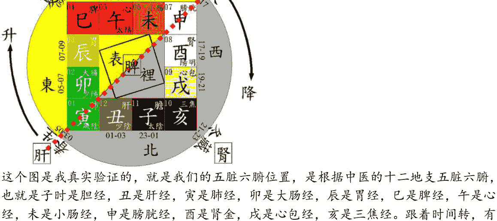

这个图是我真实验证的，就是我们的五脏六腑位置，是根据中医的十二地支五脏六腑，也就是子时是胆经，丑是肝经，寅是肺经，卯是大肠经，辰是胃经，巳是脾经，午是心经，未是小肠经，申是膀胱经，酉是肾经，戌是心包经，亥是三焦经。跟着时间转，有时候，我们会遇到上游下游的情况，比如说，肺明明是在寅时，他的武曲化忌在丑，然后为什么武曲化忌会伤了寅的肺？因为有上游下游的缘故，也就是之前有阻碍了，会影响下一个时辰，这个也需要灵活的变通。

05.06

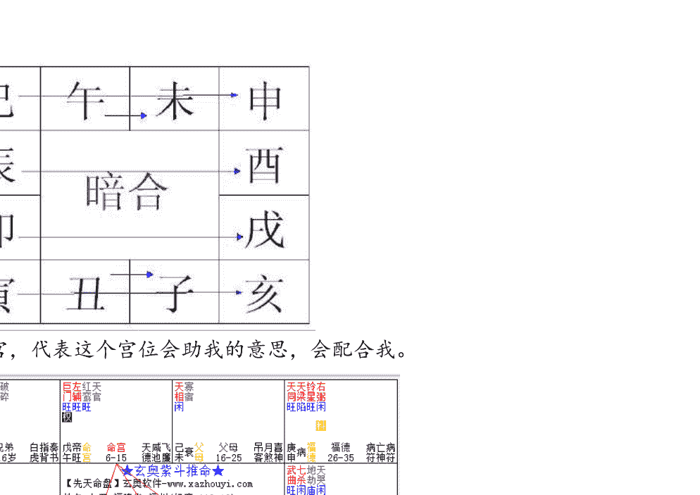

暗合宫，代表这个宫位会助我的意思，会配合我。

| 廉贞天天天破 | 巨左红天 | 天寡 | 天天铃右 |
| 贞狼破贵福碎 | 门辅喜官 | 相害 | 同梁星弼 |
| 陷陷旺 | 旺旺旺 | 闲 | 旺陷旺闲 |
| 丁临兄弟 116岁 白指奏 | 戊府命 6-15 | 己父母 16-25 | 庚病福德 26-35 |
| 太台天八 阴辅月座 | 【先天命盘】玄奥软件-www.xiazhouyi.com | 夫武七地天 妻曲杀劫哭 | 旺陷庙闲 |
| 姓名:女王 福建省-福州(经度:119:18) | 公历:1993年3月27日20时31分(真太阳时) | 农历:癸酉年三月初五日戌时 | 四柱:癸酉年 乙卯月 丁未日 庚戌时 |
| 命局:阴女(癸酉) 火六局 | 命宫:午 命主:破军 | 身宫:寅 身主:天同 | 子年斗君:申 |
| 丙冠夫妻 106岁 龙天将 德煞军 | 辛死田宅 36-45 岁将大 建星耗 | 太解阴三天 阳神煞台空 陷 | 壬墓官禄 46-55 晦攀伏 气鞍兵 |
| 乙沐子女 96-105 大灾小 耗煞耗 | 紫破紫火地龙凤截天 微军羊星空池阖空使 庙旺庙旺陷 | 天禄文天封 机存昌喜谐 庙旺旺 | 陀孤彗火天旬天天 罗辰廉寿伤空刑厨 陷 |
| 甲长财身 86-95 小耗青 乙养疾厄 76-85 官华力 符盖士 | 子胎迁移 66-75 灵枭博 索神士 | 癸绝仆役 56-65 丧岁官 门驿府 | 先天 ★ 大限 ★ 流年 ★ |

先从命宫开始，命宫暗合父母宫，父母宫也暗合命宫，所以有互助的意思。这个也可以用太岁来看，暗合就是打横的线。也可以看成是表里，但我比较少用暗合宫当表里用。

| 廉贞天天天破 | 巨左红天 | 天寡 | 天天铃右 |
| 贞狼破贵福碎 | 门辅喜官 | 相害 | 同梁星弼 |
| 陷陷旺 | 旺旺旺 | 闲 | 旺陷旺闲 |
| 丁临兄弟 116岁 白指奏 | 戊府命 6-15 | 己父母 16-25 | 庚病福德 26-35 |
| 太台天八 阴辅月座 | 【先天命盘】玄奥软件-www.xiazhouyi.com | 夫武七地天 妻曲杀劫哭 | 旺陷庙闲 |
| 姓名:女王 福建省-福州(经度:119:18) | 公历:1993年3月27日20时31分(真太阳时) | 农历:癸酉年三月初五日戌时 | 四柱:癸酉年 乙卯月 丁未日 庚戌时 |
| 命局:阴女(癸酉) 火六局 | 命宫:午 命主:破军 | 身宫:寅 身主:天同 | 子年斗君:申 |
| 丙冠夫妻 106岁 龙天将 德煞军 | 辛死田宅 36-45 岁将大 建星耗 | 太解阴三天 阳神煞台空 陷 | 壬墓官禄 46-55 晦攀伏 气鞍兵 |
| 乙沐子女 96-105 大灾小 耗煞耗 | 紫破紫火地龙凤截天 微军羊星空池阖空使 庙旺庙旺陷 | 天禄文天封 机存昌喜谐 庙旺旺 | 陀孤彗火天旬天天 罗辰廉寿伤空刑厨 陷 |
| 甲长财身 86-95 小耗青 乙养疾厄 76-85 官华力 符盖士 | 子胎迁移 66-75 灵枭博 索神士 | 癸绝仆役 56-65 丧岁官 门驿府 | 先天 ★ 大限 ★ 流年 ★ | （表格中带有红色箭头表示连接关系）

暗害

| 巳 | 午 | 未 | 申 |
|----|----|----|----|
| 辰 | 暗害 | 酉 |    |
| 卯 |    |    | 戌 |
| 寅 | 丑 | 子 | 亥 |

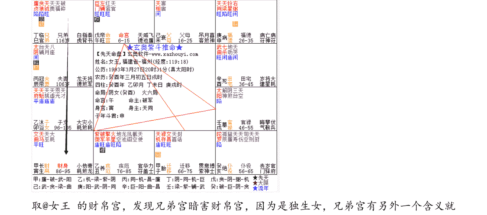

取@女王 的财帛宫，发现兄弟宫暗害财帛宫，因为是独生女，兄弟宫有另外一个含义就是资金位，意思是@女王 的资金常常是卡住@女王 的财运，比如钱还没收回来，钱不够要周转。那么，我们再看看她的官禄宫，

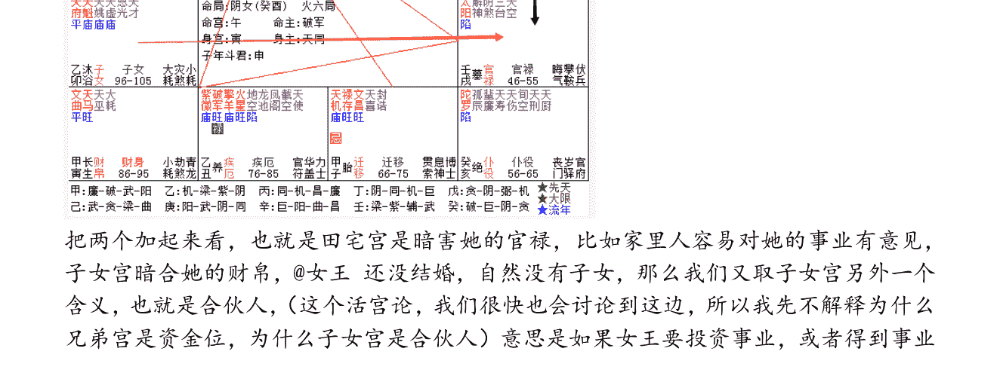

把两个加起来看，也就是田宅宫是暗害她的官禄，比如家里人容易对她的事业有意见，子女宫暗合她的财帛，@女王 还没结婚，自然没有子女，那么我们又取子女宫另外一个含义，也就是合伙人，（这个活宫论，我们很快也会讨论到这边，所以我先不解释为什么兄弟宫是资金位，为什么子女宫是合伙人）意思是如果女王要投资事业，或者得到事业上的帮助，需要有合伙人比较有利。然后我们看看她的子女宫，是什么太岁（生肖），卯是属兔子，代表她如果有个兔子的朋友和她合伙，会更加的有利。所以暗合和暗害，是可以用在比如看，谁会配合我，谁容易反对我。

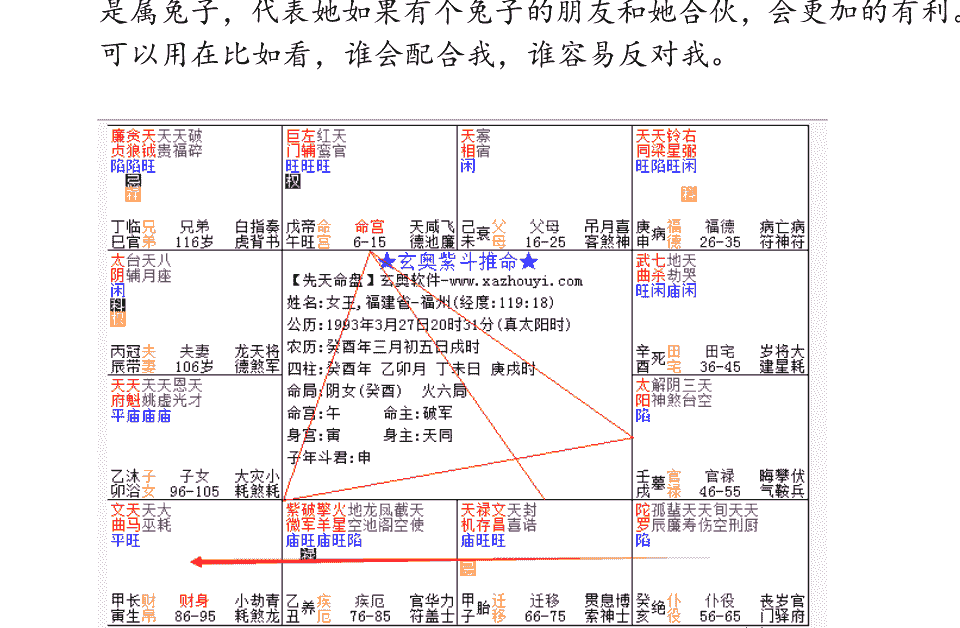

财运上，朋友对她财运有利，会配合她。比如她要卖花茶，朋友会支持她，找她买。

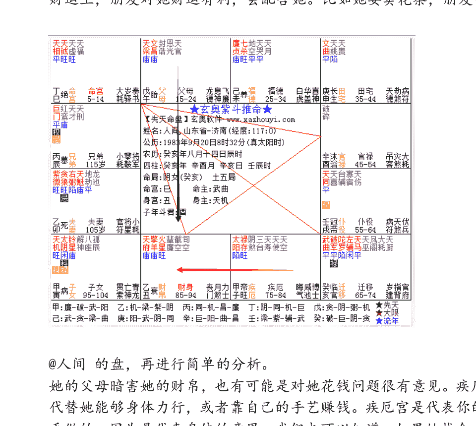

@人间 的盘，再进行简单的分析。她的父母暗害她的财帛，也有可能是对她花钱问题很有意见。疾厄宫暗合她的财帛，是代替她能够身体力行，或者靠自己的手艺赚钱。疾厄宫是代表你的才艺，或者你自己亲手做的，因为是代表身体的意思。我们也可以知道，如果她找个合伙人，是属马的就不太好了，因为午暗害她的财帛。

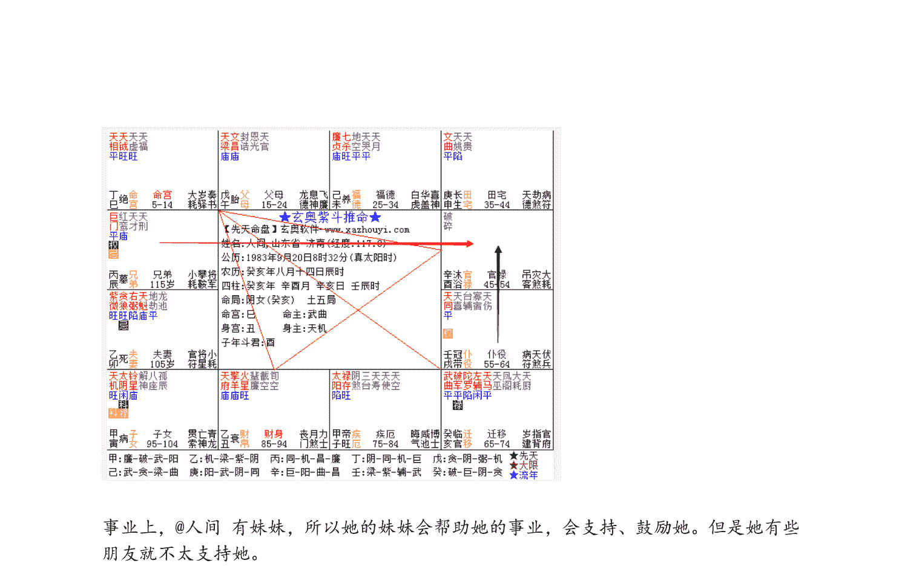

事业上，@人间 有妹妹，所以她的妹妹会帮助她的事业，会支持、鼓励她。但是她有些朋友就不太支持她。

重复一次，暗合和暗害，除了可以看十二宫的支持你和不支持你，也可以用太岁来带入，所以有两种用法。暗合也可以看成是，这个宫位有问题了，着火了，那么暗合的宫位就可以来帮助。暗害就是很多意见，对着干。

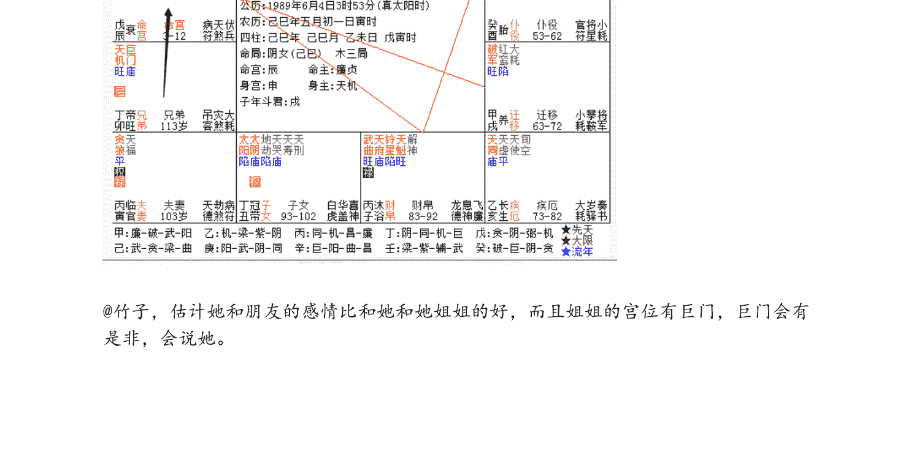

@竹子，估计她和朋友的感情比和她和她姐姐的好，而且姐姐的宫位有巨门，巨门会有是非，会说她。

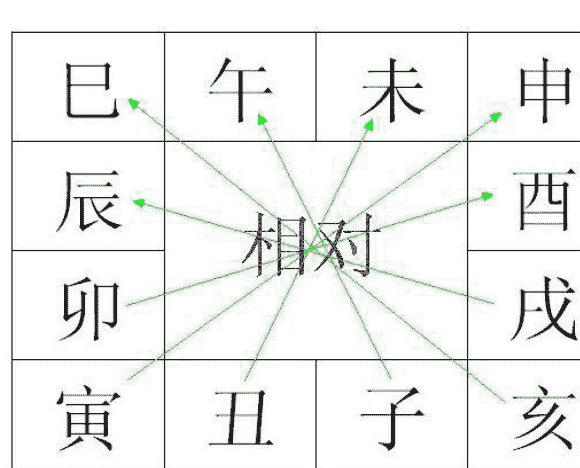

相对。对面的宫位，一定是迁移宫。也可以看成，好像夫妻宫的对面就是夫妻宫的迁移宫，或者田宅宫的对面也可以叫田宅宫的迁移宫，或者夫妻宫也可以变成是官禄宫的迁移宫。这其中就需要立太极来看这个，比较容易明白，立太极，就是在一个重点的宫位，看成是命宫，然后一样的，为这个宫位再起十二宫宫位，所以现在我们从最简单的开始，不转换，就直接先用命宫。

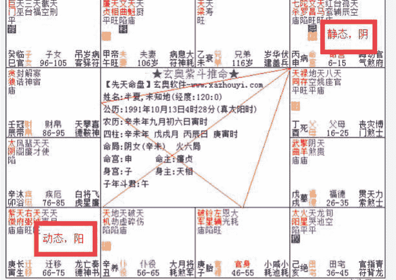

里面的（命宫）就是静态的，我们叫阴，外面的（迁移宫）是动态的，我们叫阳。命宫是静态时候的你，你平时的个性。迁移宫是当你和别人交流事，你在外面给别人的影响，或者别人以为的你，是你活动时候的表现，通常命主会不承认那是他的个性，会觉得别人以为。

@半夏，半夏觉得自己是七杀陀罗，别人看她是紫微天府。别人觉得半夏有点高傲，孤寡的感觉，或者会认为她这个人很厉害，实际上半夏是那种脾气来得快也去得快，而且喜欢吓唬别人的个性。比如说，她会喜欢说，你再犯这个毛病，下次我就…（七杀）。因为她的七杀和陀罗在一起，陀罗是打转，跟陀罗一样，原地打转，所以看成是挥动，七杀是刀子，她拿着刀子在那边挥来挥去，没有一次真的砍下去，就会吓唬人。但是别人不太认识她的，会以为她这有气质，一定很厉害。所以，迁移宫代表别人看的，也代表你看出去的，比如，@半夏会觉得外面的人厉害，自己不能失礼，别人看她又觉得她厉害。

| 宫位 | 星曜 |
|------|------|
| 命宫 | 紫微、天府 |
| 父母 | 天同、天梁 |
| 福德 | 武曲、七杀 |
| 田宅 | 天机、太阴 |
| 官禄 | 天相、巨门 |
| 交友 | 天府、贪狼 |
| 迁移 | 破军、廉贞 |
| 疾厄 | 天梁、天同 |
| 财帛 | 武曲、天相 |
| 子女 | 天机、紫微 |
| 夫妻 | 天同、太阴 |
| 兄弟 | 天府、天梁 |

@兜兜有糖别人以为她是贪狼天姚，以为她乱来，以为她很多人泡，实际上她是廉贞，廉贞是贞洁之星，通常廉贞生命有性洁癖的，所以廉贞和贪狼的桃花性质是相反的。别人以为她这个人随便，但是实际上她不可以接受那些关系，她会用陀罗的方式，不会直接的拒绝，陀罗说话不直接。也因此@兜兜有糖 有时候遇到那种意图不轨的男人时，会借口很多。然后她看出去也是一样的，她觉得外面的世界桃花很乱，有很多女人最后发现对方是别人的情妇，她无法理解。

| 宫位 | 星曜 |
|------|------|
| 命宫 | 天相、天府 |
| 父母 | 天同、太阴 |
| 福德 | 武曲、七杀 |
| 田宅 | 天机、天梁 |
| 官禄 | 紫微、贪狼 |
| 交友 | 廉贞、破军 |
| 迁移 | 武曲、破军 |
| 疾厄 | 天同、天相 |
| 财帛 | 太阴、天机 |
| 子女 | 天府、天梁 |
| 夫妻 | 巨门、天同 |
| 兄弟 | 天机、天梁 |

@人间 的对比性很强烈，外面是破军武曲，又化禄，好像很喜欢变动一样，好像很喜欢突破自己一样，别人不了解她的，以为她真享受这种多变的生活。实际上她很注重按部就班，她想好好的做好自己的事，安稳的做，但是她同时又觉得，这念头要安稳，按部就班的做好一件事，太难了。天相是按部就班，是希望跟别人一样，有稳定的生活，也喜欢帮助别人。别人有时候会觉得@人间 这个人脾气惹不起，其实她就是很简单，热情热心的人。跟她不熟悉的，就看见她的武曲破军。所以对比性很强烈。她自己看出去也是一样的，她觉得外面的世界多变。武曲破军坐迁移宫表情会严肃一些，看起来好像有点凶，特别是不笑的时候。

姓名:橘橘子,未知地 (经度:120:0)
公历:1986年9月23日22时27分(真太阳时)
农历:丙寅年八月二十日亥时
四柱:丙寅年 丁酉月 庚午日 丁亥时
命局:阳女(丙寅) 木三局
命宫:戊 命主:禄存
身宫:申 身主:天梁
子年斗君:辰

@橘橘子，一个太阳一个太阴，对比性也很强烈。别人看她好像很阳光、爱玩、活泼，实际上她的忧伤没人懂。很了解她的人会看到她的这一面，但是刚认识她的人，会觉得这女的玩得起，可以一起玩。当认识她久了，就知道她是很忧郁的一个人。

这些也可以直接套用在其他宫位上，比如说我们常说的看配偶的长相，就是看官禄宫。因为你刚认识他的时候，你还没走进他的事业，当然首先看到他的外在气质。

姓名:KL,香港-市中心 (经度:114:11)
公历:1988年10月17日15时58分(真太阳时)
农历:戊辰年九月初七日申时
四柱:戊辰年 壬戌月 乙巳日 甲申时
命局:阳男(戊辰) 水二局
命宫:寅 命主:禄存
身宫:午 身主:文昌
子年斗君:子

@KL，他现在没有女友，但是夫妻宫也代表一个人的品味，所以我们谈谈他之前的女友，夫妻宫的对宫是七杀擎羊铃星，这感觉就是比较凶，之前的女友会看起来很辣，惹不起的感觉。

紫微斗数排盘（第一个命盘）

这是一个紫微斗数命盘表格，包含十二宫位信息。

命宫在寅，身宫在寅。命主：禄存。身主：天同。

命盘中心区域显示：
【先天命盘】玄奥软件www.xiazhouyi.com
姓名：聆听孤寂，未知地(经度:120:0)
公历:1987年2月12日0时18分(真太阳时)
农历:丁卯年正月十五日子时
四柱:丁卯年 壬寅月 壬辰日 庚子时
命局:阴女(丁卯) 金四局
子年斗君:子

（注：此为命盘表格内容的高度概括，实际包含十二宫及星曜分布的详细信息）

@聆听，七杀禄存，禄存是宝物，这个七杀是刀，就像是包起来的刀子，就是那种深藏不露的感觉，有神秘感，通常比较寡言。

夫妻宫是真相，官禄宫是样子，气质。有对比性的就很有趣。除了看夫妻宫呢，兄弟宫也是一样，任何六亲都一样。就不重复说了。

看看关键的，就是相反来看，用官禄宫立太极，夫妻是官禄的对面，就是别人以为你的工作怎样，其实你的工作是怎样。

紫微斗数排盘（第二个命盘）

这是另一个紫微斗数命盘表格，包含十二宫位信息。

命宫在寅，身宫在辰。命主：禄存。身主：天机。

命盘中心区域显示：
【先天命盘】玄奥软件www.xiazhouyi.com
姓名：印象，未知地(经度:120:0)
公历:1977年10月11日14时22分(真太阳时)
农历:丁巳年八月廿九日未时
四柱:丁巳年 庚戌月 辛巳日 乙未时
命局:阴女(丁巳) 金四局
子年斗君:子

（注：此为命盘表格内容的高度概括，实际包含十二宫及星曜分布的详细信息）

@印象，别人看她的工作，觉得一定很精彩，好玩，有趣。实际上紫微禄存，有时候也给自己闷坏了，而且什么都要自己弄，因为这个紫微是孤君，所以会要自己处理，又要小心。

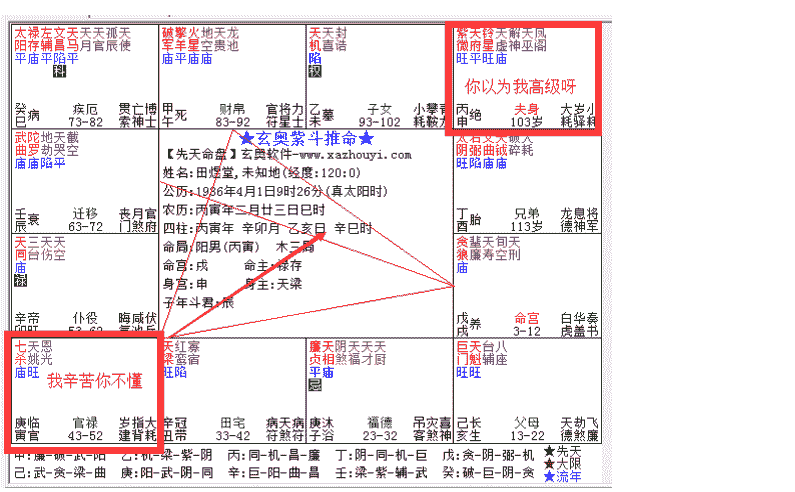

@田煜堂 是个演员，别人以为他工作高级，其实他是七杀，时间很赶、很匆忙，而且任何事讲究快。

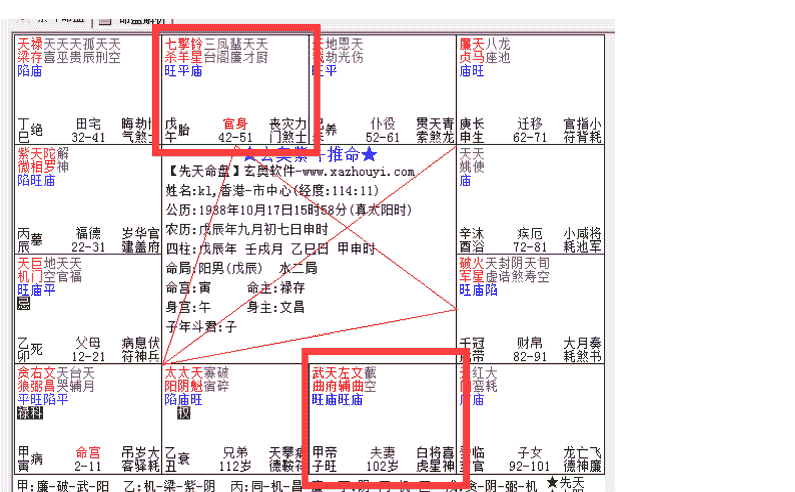

@kl 人家会觉得他很赚钱，但是实际上他的工作很紧张，会被人骂，动作慢就会被抱怨。

用田宅宫看，子女宫代表门口，因为是田宅宫的外面。通常是代表小时候的家，长大后的家有时候准。

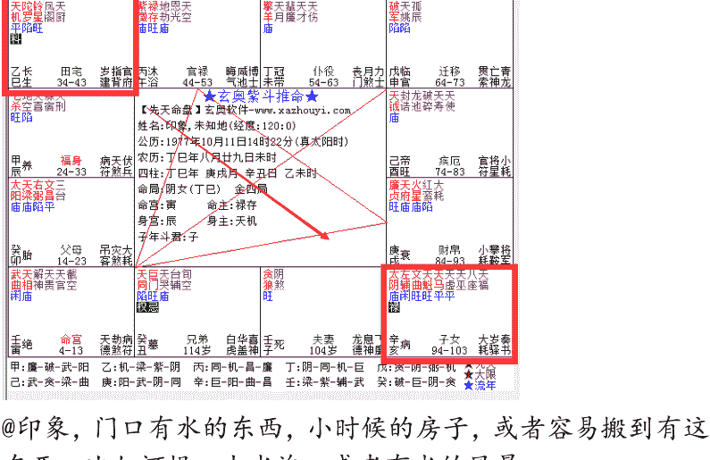

@印象，门口有水的东西，小时候的房子，或者容易搬到有这种格局的房子，前面有水的东西，比如河堤、大水沟，或者有水的风景。

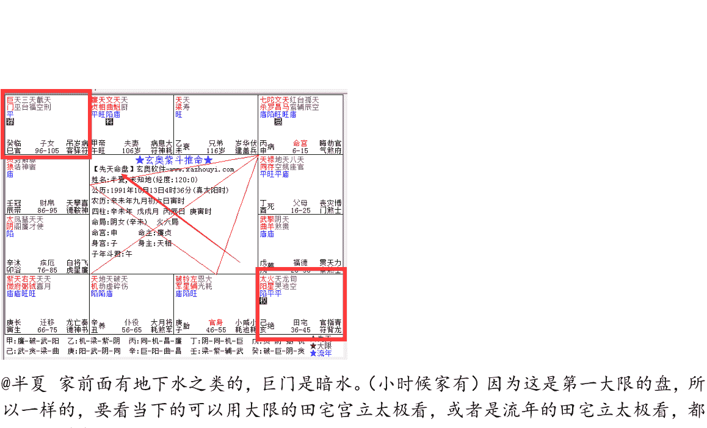

@半夏 家前面有地下水之类的，巨门是暗水。（小时候家有）因为这是第一大限的盘，所以一样的，要看当下的可以用大限的田宅宫立太极看，或者是流年的田宅立太极看，都可以这样去试验。

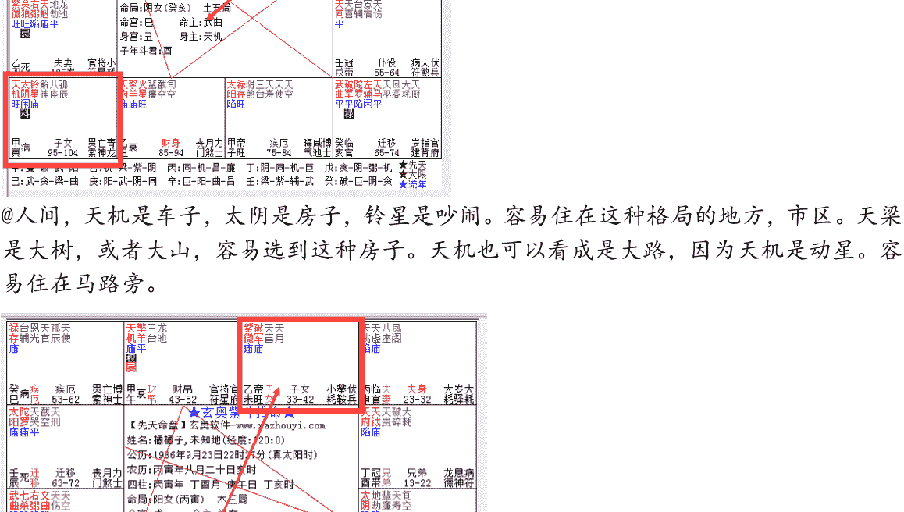

@人间，天机是车子，太阴是房子，铃星是吵闹。容易住在这种格局的地方，市区。天梁是大树，或者大山，容易选到这种房子。天机也可以看成是大路，因为天机是动星。容易住在马路旁。

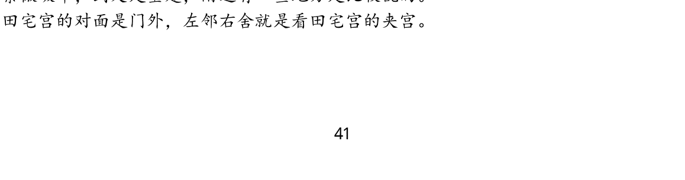

紫微破军，到处是重建，附近有一些地方是比较乱的。
田宅宫的对面是门外，左邻右舍就是看田宅宫的夹宫。

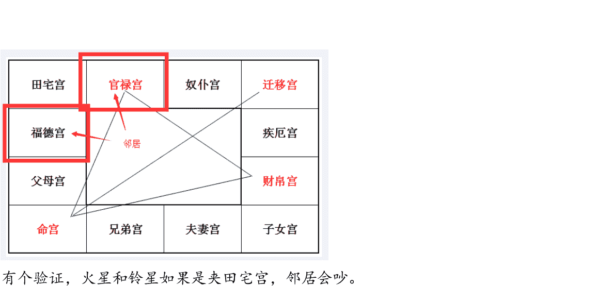

有个验证，火星和铃星如果是夹田宅宫，邻居会吵。

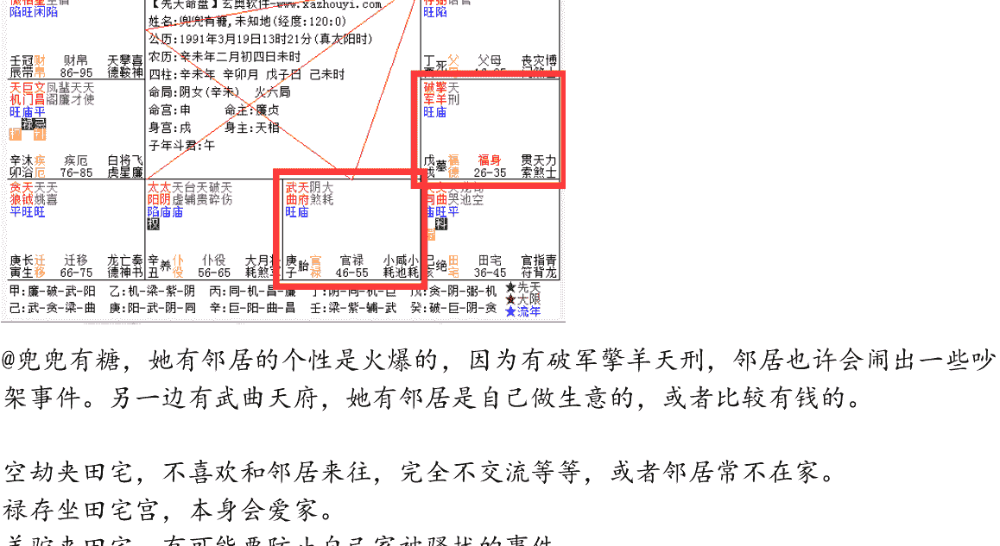

@兜兜有糖，她有邻居的个性是火爆的，因为有破军擎羊天刑，邻居也许会闹出一些吵架事件。另一边有武曲天府，她有邻居是自己做生意的，或者比较有钱的。

空劫夹田宅，不喜欢和邻居来往，完全不交流等等，或者邻居常不在家。禄存坐田宅宫，本身会爱家。羊驼夹田宅，有可能要防止自己家被骚扰的事件。

# 【第三周】

## 05.11

今天谈的是三方四正，为什么十二宫要另外起一个三方四正呢，因为那是为了直接可以评估一个人的命运好坏。凭什么呢？就是凭一个人的能力。三方和四正其实是分开的，三方指的是命、官、财，就是各五个宫位。财帛宫是理财能力，花钱的倾向。财帛的帛，是代表用品，比如穿着。官禄宫是一个人的工作能力。命宫，是官禄宫的财帛宫，也是财帛宫的官禄宫，负责统帅这两个宫位，有一点像左右手一样。以时间上来论，就是各五个宫位的故事。大方向就是五年。今年的命宫，五年后就是官禄宫，今天的官禄宫五年后就是财帛宫。如果说，命宫是代表一个人的条件，从条件上看，他需要经过父母、福德、田宅才会到官禄宫，这个排列是根据古人的模式，也就是先受教育，然后精神得到成长，然后再成家后立业。

接着，从官禄宫到财帛宫，又是五个宫位，中间是奴仆、迁移、疾厄宫。如果官禄宫是代表耕耘，财帛宫是代表收获，那么代表一个人的成就，需要经过人脉、活动力、健康的体魄，才能得到更好的财运。

接着又五个宫位，子女、夫妻、兄弟三个六亲位，才到命宫，代表有钱了，才能照顾家人，自己是最后一个才享受这些的。这个是根据古人的哲学。

其实这个三方位，也有时候需要反过来看，就是古代，女盘是倒转过来看的，意思是，女人嫁出去了，所以立命在迁移宫，官禄宫变成夫妻宫，因为古代的女人是以伺奉丈夫为工作。然后财帛宫又变成了福德宫，从前女人是不赚钱的，唯一确保她能得到更好享受的就是她的品德好，能得到丈夫孩子的厚爱。摆在外面的是命宫，代表女人的个性很重要。

这个年代我们偶尔也会倒转过来看，第一个，家庭主妇，第二个，漂流远方的人。如果一个人的本来的格局很差劲，那么我们就倒转过来看看，如果从迁移宫立命发现很好，那么就鼓励此人往外地发展。还有一种情况是，身宫在迁移宫，身宫是后天的命宫，所以如果此人的身宫是在迁移宫，那么三十多岁之后，需要转过来看。

### 什么是四正位呢？

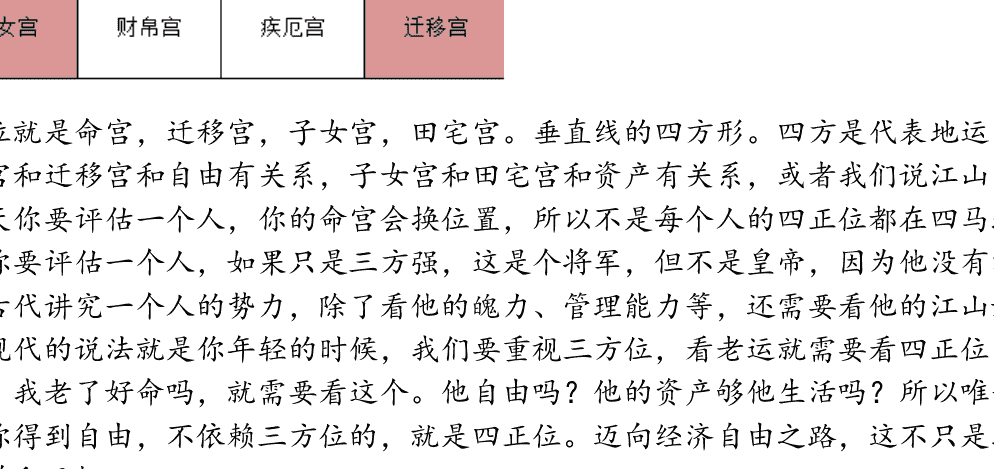

四正位就是命宫，迁移宫，子女宫，田宅宫。垂直线的四方形。四方是代表地运，这个命宫和迁移宫和自由有关系，子女宫和田宅宫和资产有关系，或者我们说江山。所以今天你要评估一个人，你的命宫会换位置，所以不是每个人的四正位都在四马地。今天你要评估一个人，如果只是三方强，这是个将军，但不是皇帝，因为他没有江山，古代讲究一个人的势力，除了看他的魄力、管理能力等，还需要看他的江山好不好。现代的说法就是你年轻的时候，我们要重视三方位，看老运就需要看四正位。有人问，我老了好命吗，就需要看这个。他自由吗？他的资产够他生活吗？所以唯一能确保你得到自由，不依赖三方位的，就是四正位。迈向经济自由之路，这不只是现代的哲学和目标。远古时候，发明紫斗的时候，古人把四正位和三方位结合起来评估一个人的主要命运，已经把这个哲学套入。

现在谈三方，可以注意到，三方位，一定是一个四墓地，一个桃花地，一个四马地。不管怎么转，都是这样。然后以这个三方的桃花地，定他的五行命格，意思是如果这个三方位其中一个的四桃花是卯，那么这个是属木的，是成长类型的命格。如果三方踩到了午，是火局，代表发散模式的。酉，属金，代表这个人是磨练类型的。子，就是水局，智慧型的。地支三合，寅午戌合为火局，申子辰合为水局，巳酉丑合为金局，亥卯未合为木局。

@安伯南，午是桃花地，所以他是三合火，代表他是发散模式的——他的处事方式，或者工作性质。比如他处事方面，这个也做一些，那个也做一下，每个学一点。

三合木，就比较按部就班，成长模式。三合金就会重视原则。
这是第一层。

@女王，她的命宫在四桃花，是三合火，她会到处交朋友，热闹一下，但是不深交，就是发散模式的交际。她的财帛宫坐四马地，而且有天马，她想要大范围的赚钱，赚空间比较大的钱，也倾向于她是开放模式的财。她的官禄宫是四墓地，她会在工作表现上比较保守安定。

@印象，也是属火，命宫坐四马地，喜欢自由。财帛宫坐四墓地，理财就比较保守。官禄宫坐四桃花，她对工作的要求是有趣，所以她是设计师。

这是第二层。

接着我们可以直接用星星来论生克，来看是辛苦还是容易。

【先天命盘】玄奥软件-www.xazhouyi.com
姓名:k1,香港-市中心(经度:114.11)
公历:1988年10月17日15时58分(真太阳时)
农历:戊辰年九月初七日申时
四柱:戊辰年 壬戌月 乙巳日 甲申时
命局:阳男(戊辰) 水二局
命宫:寅 命主:禄存
身宫:午 身主:文昌
子年斗君:子

宫位网格:
命宫: 天府... (此处省略详细网格内容，实际应包含所有宫位星曜信息)

@k1，他的贪狼有两个属性，甲木和癸水。他的官禄宫，七杀是剋他的贪狼，只要是剋，就是辛苦。但是贪狼的癸水又生七杀的金，所以贪狼的欲望生了他的七杀工作的动力。
贪狼-木，七杀-金，金会砍掉木，所以我们就说剋，七杀剋贪狼的木，所以工作辛苦。然后，贪狼-水（贪狼有两个属性）-七杀-金，这时候水又会生金，所以贪狼的欲望就生了七杀的动力。那么现在看破军，破军是大海水，我们看看和官禄的关系，七杀的金可以生破军的水，代表工作可以容易赚钱，七杀的金也是生贪狼的水，代表工作可以让他有更多的欲望。

【先天命盘】玄奥软件-www.xazhouyi.com
姓名:小豚子,未知地(经度:120.0)
公历:1987年12月29日12时19分(真太阳时)
农历:丁卯年十一月初九日午时
四柱:丁卯年 壬子月 壬午日 丙午时
命局:阴女(丁卯) 水二局
命宫:午 命主:破军
身宫:午 身主:天同
子年斗君:申

宫位网格:
命宫: ... (此处省略详细网格内容，实际应包含所有宫位星曜信息)

@小豚子，因为小豚子的没有主星，所以暂时借她的迁移宫（借对面的），也就是属水的命宫。然后看财帛宫，太阳是火，她天同太阴都剋火，和巨门的水，所以她赚钱也劳碌。她的官禄宫也是空宫，所以也借了对面的天机天梁（属木），木能生火，所以她的官禄宫可以生太阳的火。

这个逻辑就是比如你的个性是属火，但是你的工作模式是属金，那么是不是造成冲突？用生活比喻，一个人是喜欢热闹的（火），但是工作中规则太多，金属的工作模式，那么自然有冲突，所以就会辛苦。这也不是说她赚不到钱，而是说这个过程辛苦。比如说k1，说个相生的例子，他的工作模式是金，他很重视执行，重视快、规矩、效率，那么他花钱如水，可以生他的水，让他花钱上就不那么孤寒，就是借生活去比喻，用星星的属性去看。

这是第三层。

第四层会比较困难，大概说说，也是五行论法，就是取三合的三种六十甲纳音。

| 己巳-大林木 | 庚午-路旁土 | 辛未-路旁土 | 壬申-剑锋金 |
|--------------|--------------|--------------|--------------|
| 辛巳-白蜡金 | 壬午-杨柳木 | 癸未-杨柳木 | 甲申-井泉水 |
| 癸巳-长流水 | 甲午-沙中金 | 乙未-沙中金 | 丙申-山下火 |
| 乙巳-覆灯火 | 丙午-天河水 | 丁未-天河水 | 戊申-大驿土 |
| 丁巳-沙中金 | 戊午-天上火 | 己未-天上火 | 庚申-石榴木 |
| 戊辰-大林木 | 六十甲子花纳音 |  | 癸酉-剑锋金 |
| 庚辰-白蜡金 |  | 乙酉-井泉水 |  |
| 壬辰-长流水 |  | 丁酉-山下火 |  |
| 甲辰-覆灯火 |  | 己酉-大驿土 |  |
| 丙辰-沙中土 |  | 辛酉-石榴木 |  |
| 丁卯-炉中火 | 十二宫配置图 |  | 甲戌-山头火 |
| 己卯-城头土 |  | 丙戌-屋上土 |  |
| 辛卯-松柏土 |  | 戊戌-平地木 |  |
| 癸卯-金箔金 |  | 庚戌-钗钏金 |  |
| 乙卯-大溪水 |  | 壬戌-大海水 |  |
| 丙寅-炉中火 | 丁丑-涧下水 | 丙子-涧下水 | 乙亥-山头火 |
| 戊寅-城头土 | 己丑-霹雳火 | 戊子-霹雳火 | 丁亥-屋上土 |
| 庚寅-柏松土 | 辛丑-壁上土 | 庚子-壁上土 | 己亥-平地木 |
| 壬寅-金箔金 | 癸丑-桑拓木 | 壬子-桑拓木 | 辛亥-钗钏金 |
| 甲寅-大溪水 | 乙丑-海中金 | 甲子-海中金 | 癸亥-大海水 |

每个宫位都有一个天干地支，你需要翻查，看看是哪个六十甲纳，这个一般是比较常用在断流年。

第一步，取天干地支，查六十甲纳。我通常是会预测流年趋势的时候用这个方式。演示一次，去年是甲午年，所以是砂中金格，砂中金就是金慢慢的在砂里面冒出来，就是很多人才在沙堆里要发挥的时候，这个砂中金是需要淘洗的。而且在四桃花地，属火，发散格的三合，去年开始慢慢的很多人出来想创业，可以想到微商，去年的金不坚实。再看去年的官禄宫，官禄宫是平地木，平地木是代表埋在泥土里面的木，刚好这个砂中金克这个木，所以去年有很多人怀才不遇，市场的工作氛围陷入低迷的情况。接着是松柏木，松柏木是代表不怕风雨的木，所以去年开始很多冒出来投资微商，自己代理，成为了一个新的趋势。但是毕竟砂中金是克木的，因此不怎么赚钱，所以去年做代理的多，一些是砂的就放弃，一些是金的就延续到今年，因为砂中金讲述一种淘洗的过程。接着自然的，今年的竞争会少一些，不比去年多了。这个就是预测流年大势，全世界的大势。今年就是乙未三方，是三合木，偏重于成长模式。

现在开始说格局。

### 三奇嘉会

就是在命宫，官禄宫，财帛宫（包括迁移宫）里有化禄、化科、化权。为什么这个是大格呢？因为四化在紫微里面有引动的含义，所以代表有了化权，化禄，化科，就能引动你的那个宫位，给这个宫位打“兴奋剂”。所以如果你有三个兴奋剂都在你三方里面，你的宫位就很活跃。

### 紫府朝垣，雄宿朝元（廉贞）

这个其实是属于同一个盘的。必须是廉贞坐申，或者寅。

这个是皇帝皇后都是他的左右手，变成被皇帝拱起，所以这个廉贞就有个命，叫雄宿朝元。这三个都是代表管理能力，廉贞是计划性的意思。我见过这个盘，格局最好的，是个大马出名的导演。廉贞有艺术天赋，善于策划。紫微天府善于管理，大牌演员都要听他的，非常的形象。

### 朝府朝垣

这是指天府和天相，天相永远是天府的官禄，天府永远是天相的财帛，不管怎么转，只要天府坐命，天相一定在三方里面。天相坐命，天府也一定在三方里面。

这个格局，通常会成为领导、老板，能够服众。因为天府和天相都是很温和的星星，热心，所以他们有事，也有很多人愿意帮助，因此古人也把这个列为大格。

### 禄马交驰，禄马配印格（天相）

天马和禄存在一起，就叫禄马交驰。暗合也有这个力量，禄马交驰常见，禄马配印比较少见。意思是别人走路赚钱，你是骑上天马去赚钱，这个格局是说，赚钱速度很快。而且因为天马只在四马地，所以全世界的钱他都可以赚。加印，就是加天相，天相代表皇印，代表权力。所以此人有钱又有权。不需要主星去引动这个禄存天马。这个格局的官禄宫一定是紫微，所以高职位差不多就是掌控之中的事。

### 火贪格，铃贪格

三方四正汇集贪狼和火星，或者铃星，也是一种有老板命的格局，可以做外国生意，甚至容易遇到突然发财的好事。另外也主突发之事件，若不逢忌煞，是好事，逢太多忌煞，就是坏事。大好大坏的格局。有些人看这个格就是突然暴发、突然发财，没有特别验证，不过我看是突然的事，坐什么宫位都容易显示，要看是吉星多就是突然的好事，煞星多就是突然的坏事。

### 辅拱文星格（文昌文曲，左辅右弼）

文昌文曲其实是代表“被承认”，文昌文曲是才华星，表现的星星，三方四正都有的话，就是代表有才气。或者三方四正又刚好有左辅右弼，四个吉星都有，你想，有才气的人很多，但是如果很多很多人（左辅右弼）认同你，你就是很不起了，所以这个格局代表这个人的才华很高，容易被人认同你的才华。

### 双禄交流格，禄合鸳鸯格

禄存和化禄三方照，或者同坐，都是代表这个格局。一般是直接看成容易有钱，一世荣，终生富贵，这是其中一个看人会不会有钱的格局。化禄是爱，是喜欢的能量，禄存是钞票，加起来，就是爱上钞票，喜欢钞票，所以在理财赚钱方面会比较积极。

### 坐贵向贵

只有丑未有这种格局，就是天魁坐命，天钺坐迁移宫。天钺天魁也是科星，就是代表才华的星星，这个格局的后半句是【坐贵向贵，文章盖世】，是说关于古代的状元格，因为古代都是写作为主，所以这种通常会比文昌文曲更受承认的才可以升级成为天钺天魁，才可以被贵人借来发挥，遇到贵人。再用另一种方式说，就是文昌文曲是被承认，有文书的含义，不过力度是中等的，而天魁天钺是升级版的文昌文曲，所以才有【文章盖世】这种说法，你到了那种可以用的才华，才有贵人要找你。文昌文曲就是可以用来表演，容易被欣赏。天钺天魁的背后，就代表有条件的贵人，因此有这种说法，就是天钺天魁最后会变成小人，同时是建议命主要懂得感恩，就不会有这种人生观。

### 机月同梁格

代表，天机，太阴，天同，天梁，这个叫“吏人”格，代表当公务员的，古代叫当官，其实不只是公务员，就是机构里面负责幕后、规划的。不合适创业，因为这个是保守格。机月同梁的反义词就是杀破狼。杀破狼就是变动格，喜欢新鲜感，喜欢变动，喜欢调整性，喜欢找刺激，不宜守，可以创业，但是很难守业，通常就是创业了失败再创业了再失败就是杀破狼。杀破狼就是，七杀，贪狼，破军，永远是三方位。容易不安于现状。流限转到杀破狼，也是变动格。

## 05.12 复习课

关于化禄和禄存，比如说，禄马交驰，化禄天马算是禄马交驰？其实不算，因为含义不一样。四化，就是我昨天说的，犹如被打了刺激素一样的效应，而且永远是附加在星星上面，而化禄，就是爱和喜欢的刺激素，刺激素其实是比喻，以便你们能区分禄存和化禄。如果我说，化禄+禄存=我爱钞票，那就是表示，这个化禄是代表喜欢。所以如果我问你，化禄+天马会变成什么？是喜欢旅行，喜欢自由，就跟喜欢钞票没有关系了。因为化禄不是钞票，禄存是钞票，所以，禄存+天马，和化禄+天马，含义就是，很快的去赚钞票，喜欢旅行，是不一样含义。

第二个问题，就是，格局会不会随着流限转而参合格呢？简单这样比喻，比如有个格局叫阳梁昌禄，太阳，天梁，文昌，化禄（或禄存），这个格局是需要四个星星才算合格，而且文昌和太阳是不能被化忌的。比如说某命主，命宫是太阳和天梁，流限刚好有转到【文昌】+【禄存、化禄】，可以当作是阳梁昌禄格吗？答案是可以。就是说，某个学生，他其实很聪明的（阳梁），但是基于条件的不允许，比如没有钞票（禄存）买书（文昌），突然他在一个流限的时候，刚好去了一个老师的家住，那个老师富有，家里很多书，那么是不是说他就能够发挥这个阳梁+昌禄呢？答案是，是的。

关于这个，是有讲究的，我们这样区分出来，区分成一等，二等，三等。第一等的太阴，北方人，晚上出世的人，女性。第二等人，北方人，白天出世，女性。第三等人，北方人，白天出世，男人。可以观察到，这三个人所得到的太阴能量是有区别的，而看太阴在容貌上也是讲究的。比如说，太阴坐子亥呢，庙旺的太阴，或者是十五生人，特别是晚上出世的，他的脸就是圆圆的，身材小小短短的，因为太阴能量越好，这个命主的脸会像满月一样。随着太阴的力量比较弱，他就会比较娇小，脸也比较尖，所以你看到太阴坐命，圆圆短短的人，别觉得奇怪。命盘里面的太阳和太阴是可以直接当成是身边的男性异性看，比如说，太阳落陷的人，会在世界观方面，觉得自己的父亲比较差，自己的丈夫有心无力。太阳庙旺的人，会觉得自己的老爸好，自己的丈夫强，太阴也是一样。所以有时候你太阴如果落陷化忌，不管是什么宫位，都代表母亲容易生病，或者男命是妻子体弱。当然如果你看书的话，他们喜欢说，剋，比如有个很不好听的名词，夺夫星，这个是说太阳坐命的女人，古人觉得这种女人会抢了丈夫的面子，比丈夫强，所以就叫夺夫星，或者夺父星。所以太阳和太阴是第一层，最重要的，因为这个太阳和太阴是可以直接包含你生活中的男女，统一的一个阴阳观。

现在我们看看几个不同的组合。

| 巳 | 午 | 未 | 申 |
|---|---|---|---|
| 天梁陷 | 七杀旺 |  | 廉贞庙 |
| 紫微陷 | 天相旺 |  |  |
| 巨门庙 | 天机旺 |  | 破军旺 |
| 贪狼平 | 太阳陷 | 武曲旺 | 天同庙 |
| 寅 | 丑 | 子 | 亥 |

紫微是皇帝，天相是喜欢说好话，喜欢安慰皇帝的。破军代表外面，外面在乱，外面有很多压力。但是这个皇帝还继续在皇宫里面听好话。这个格局最好就是破军在对面有刺激的元素，就可以逼这个紫微天相跳出天罗地网，通常这个格局的三十岁之前容易因为安逸而逃避一些成长的现实，三十岁之后会遇到机会外出，因为官禄宫在四马地的关系。这个格局子女宫算是不好的，因为太阳是落陷的，儿子不得力，不过这个皇帝容易先天环境优良，因为这是日月照壁格，所以这个皇帝享受天罗地网是可以理解的。破军在对面，就是代表外界在给予压力，这是第一个原因，第二个原因是他的官禄宫是廉贞，坐四马地，顺转到了第五大限，就会变成雄宿朝元格。主要是看格局，紫相格刺激越多，其实是越好，因为这个格局就是要出外才有成就，不然就很容易懒惰。因为这个紫相的疾厄宫是天同星，会懒惰。这个三合是水局，水就会保守，不突破的话，这个皇帝继续听好话，继续自欺欺人。所以看到这个盘，一定是鼓励突破，只有这个办法才有成就。

这个盘的通病就是在家会变的很懒惰，其实先天环境都不错，因为是日月照壁格。

这个盘的特点是贵人星辅命，夹和辅是其实相同的，就是说，凶星我们叫夹，吉星我们叫辅。所以这个是【天钺】【天魁】辅命，父亲和母亲都是贵人，就是母亲比较唠叨。她长得很漂亮，就是个白富美，老爸是有钱人，她到现在未婚，之前在父亲的公司上班，没有离开过家里，这个问题很严重，因为她现在有忧郁症，被害妄想症，长期吃忧郁症的药，然后同时是个瘾君子，她是那种会割脉了，然后拍照上传网络的人，为什么会这样呢？这就是因为紫微天相，小时候是一直觉得自己很优秀，家庭有钱，又漂亮，但是你不能永远不长大。后来她的疯狂让她的父亲不敢给她继续上班，因为她会去公司吵架，所以每个月支付给她薪水，是为了拜托她，千万不要上班。紫微天相是很容易染上恶习的，因为紫微天相的福德宫是七杀，就是有赌，有将军的心，想要证明自己，长期的孤芳自赏，慢慢的失去了关注，慢慢的全世界骂她懒，她又不跳出去，躲在自己的天罗地网里面，就容易用赌博去发泄。所以紫相有个通病，就是容易染上恶习。她要改变命运，只有一个办法，就是离开家里，不过都已经病成这样了，家里人也不放心。她驾的车比谁都贵，虽然她不上班，一样穿戴名牌。

### 忧郁症是什么星星容易爆发？

| 丙 | 命身 | 小擎将 |
|----|------|--------|
| 辰 | 5-14 | 耗鞍军 |

其实是铃星，只要你看见是铃星独坐，没有其他大星星的，都可以直接看成是有忧郁症情况的人。我们的凶格里面有一个，就是如果命宫没有大星星，独坐凶星，“十二，小人据位，君子在野：意思是命宫身宫都没有主星扶持，然后坐了煞星，煞星越多就越头痛，因为代表容易相信不好的，别人说好的，他不相信，世界观的缘故，就像你告诉一个活在丧尸电视剧里的人说，世界上是没有丧尸的，他说，那是你不懂。”会出现这种对负面深信不疑的情况。我有个案例，就是我舅母，她那时候生孩子之后，一天就抱着宝宝去洗澡七八次，然后三更半夜一个人缩着，蹲着，在一个墙角哭，就是铃星坐命。别人说什么世界是阳光的，她都很难相信。她平时也容易这样，从她说话的态度就可以知道，你只要说好的，她就会反驳说，不可能的。

当然，为什么是铃星？铃星是代表恐惧的星星，铃星会忍，忍和沉默对他们而言，其实是因为恐惧，一旦恐惧掌控了一个人，就会产生这种忧郁症的现象。比如说，自杀格，巨火铃，也是源于恐惧，所以看紫相，就特别要鼓励他们外出发展。铃星代表忧郁，火星代表狂躁，这两个坐命，会容易产生这种情况。擎羊没有这些问题，擎羊是很直接，脾气发了就算了。有个格局，凶格，叫【铃昌陀武，限至投河】，也是有铃星，就是容易想不开，也属于其中一种自杀格。有个盘夫妻宫空宫，官禄宫是铃昌陀武，男友去美国非法逗留工作之后，音讯全无。

凶星是会互相制，但是是有公式的，这个要记住，陀罗可以制铃星，擎羊可以制火星。当陀罗铃星，要吉论，擎羊火星也是（同宫）。相反的，擎羊铃星就是恶化铃星，陀罗火星就是恶化火星。用生活去比喻吧，比较容易明白，比如说，A是忧郁症，有恐惧症的病人，然后，一个护士（陀罗）会在这个人说负面的时候，转一转，安慰他，就像要滚开的水，一直在搅拌，就滚不开。相同的，B是忧郁症，恐惧症的病人，然后，一个护士（擎羊）每天骂，每天骂，结果他更怕，更恐惧，自杀去了。另一个比喻，火星是狂躁症的病人，喜欢发疯，但是有个比他更凶更凶的擎羊骂他，他反而收敛了。火星是个狂躁症的人，喜欢急，喜欢骂人，遇到一个做事很慢，说话很慢的人，结果，这个火星就像火上加油一样，对方越慢慢说，他越生气。

所以呢，铃星+陀罗是吉论，火星+擎羊是吉论。反之，就是恶化。有些书是这样写，陀罗铃星可以互制，擎羊火星可以互制，有压下去的情况，人是这样的，想通了想不通而已，想通了，就好了，反而更聪明了。

如果说，你不会格局，太多了，背不了，那么，有简单的方法，第一，先看三方四正有没有【文昌文曲左辅右弼天魁天钺】六吉星，然后给他加分，六个都有，最好。第二个，看看三方四正有没有【地空地劫陀罗擎羊铃星火星】六煞星，然后给他扣分，六个都有，就是凶，但是煞星出现一个两个，可以看成是好的，因为无煞不成器。如果有收集成功人士的盘，一些富翁的盘，你会发现有明显的煞星，但是不能六个都有，那是外星人才能抵抗的压力。所以煞星也是讲究的，一个都没有，就容易懒惰，有一两个，正常，好事，会进步，六个全部有，就是很大的压力。接着，要看看有没有吉星辅，我们说夹，比较方便，意思是，文昌文曲没有在三方，看看有没有夹的命宫、迁移宫，夹一些重要的宫位，代表朋友和环境很多有才气的人，自己容易被感染，就是有人想帮他，但是他未必要。

左右坐财帛宫，多收入来源，我看一个命盘是左右夹财帛，我就这样断，我说，很多人找你要给你工作和额外的赚钱机会，但是你不要。她说，对，真的是这样，太神奇了。她是个学校老师，常常有家长打电话给她，叫她开补习班，因为她教得很好，学生喜欢她，但是她完全不要。意思是坐进去，就是命主的本意，命主自己的倾向。夹，就是那个环境有，他未必要。为什么用未必，因为比如说，此人如果财帛宫坐贪狼，我就说，她会做，她会开班，因为第一她贪心，所以有机会上门她就会要。如果是财帛宫坐很硬的星星，会拒绝的那种，比如自化忌，那么她就未必要了。比如说，迁移宫，文昌文曲夹命，就是他身边朋友很多有才气的，如果他是那种个性派的，那么他有可能不稀罕这些，不能影响他。如果他是天相坐命的，天相的毛病是他们很怕跟别人不同，所以天相会基于怕跟别人不同的原因会被感染。所以依然是要从个性去看，关于夹宫会不会造成影响，直观的说，正确的说，就是环境会有这种条件，考虑个性之后再估计他会不会要，会不会受影响。因为毕竟不是坐正，坐正的，才是自我的倾向，夹就是外界。

其他的格局该怎么联想？比如说坐财帛的，破军坐财帛，我们就说，他用破军模式对待金钱。财帛坐紫微，我们说，他用紫微模式对待金钱。工作也是一样的，如果是陀罗坐官禄，我们说他用陀罗方式对待金钱。那么就很容易理解，也不需要过分地去背格局，格局是古代人，统计出来的。

如果你不会飞星，你想论吉凶，可以用五行生克直接配对。比如说，今天有人问你，我丈夫会对我好吗？然后你看她的盘，夫妻宫和命宫没有飞化，怎么办呢？可以用她的夫妻宫和命宫起五行，然后看生克。生，自然是彼此欣赏，克，就代表不满意。看那个星星的五行。看宫位是要起甲子，六十甲子纳音，不能直接用，比较复杂，所以直接拿星星的五行。

#### 先说主题顺转

- 1) 命迁线，代表个性和建立对自己的认识，初次对环境的认识。
- 2) 兄友线，兄弟朋友的故事，桃花故事，因为恋爱是从成为朋友开始。
- 3) 官夫线，结婚成家的故事，工作的故事，认识自己对生活的责任感，使命感，耕耘和磨合。
- 4) 子田线，建立家园，生儿育女，累计资产，合伙，扩展业务。
- 5) 财福线，这是跟梦想有关系的位置，关于追求，享受，物质与精神的平衡，分配自己的内心与物质。
- 6) 父疾线，基因，健康，然后注重身体，寿命，活力等等，也是开始明白父母之苦，人生最大的财富原来是生命的一种过程。
- 7) 命迁线，孔子的无惑之年，过了大半辈子，该完成的人生阶段已经完成，开始明白人生之道原来是心的自由，无欲无求，想走就走，想留就留的黄昏之时。

#### 现在是逆转主题

- 1) 命迁线-认识自己，形象个性，能力天赋。
- 2) 父疾线-父母教育，父母家庭的故事，教养，家庭文化。
- 3) 财福线-认识自己的梦想，想过的生活，赚钱，精神成长，也和感情有关，因为福德。
- 4) 子田线-建立家园，生儿育女，扩展自己业务，合伙，累计资产等。
- 5) 官夫线-认识到盲目的崇拜金钱还不如认识自己的使命感，认识到盲目的注重精神爱情，还不如真实的对待感情，这是个讲究责任和付出的线，代表逆转的人前面追求精神爱情，后面才讲究责任对待。
- 6) 兄友线-大半辈子的围绕自己的家人，进入了众生线，开始认识到关心朋友兄弟的家庭生活很重要，从别人身上去回顾自己对待自己和家庭，也是桃花线，因为也是想年轻，想再次展现魅力，有和朋友比较之心。
- 7) 命迁线-跟上面一样，兜兜转转的几个十二宫轮回，又站在远处的回顾从前的自己，蓦然回首，第六大限遥望第一大限的童真，无惑，也自由了。

顺着大限和逆转大限是有人生观的差别，比如，先行兄友线的先容易被朋友影响，先行官夫线的先注重自己的表现能力，逆转反之。

那么，又从时间流年关系去认识十二宫主题，那必定是跟着时钟顺转。

- 命，我的条件
- 父，文书，教育，申请
- 福，三年前的梦想，今年的条件(变成流命)
- 田，先成家，或者得到家庭资助，家庭的支持
- 官，后立业，接着，要开始耕耘。
- 奴，要开始累计人脉，需要好的领袖带领(官禄的父母宫)
- 迁，需要主动去活动，出去寻找机会
- 疾，认识到原来身体健康是让事务能不能持久，耕耘会不会半途而废的关键。
- 财，得到了收获，关于分配，花钱，理财的思想。对面是福德，对比自己的思想梦的蓝图。
- 子，合伙，扩展业务，带领下属，或者有钱懂得培育孩子。
- 夫，蓦然回首，原来这一切的努力是背后的这个人默默的支持，有钱了当然要开始注重感情对待关系。
- 兄，经过了时间的过滤，剩下的良久伙伴，成为了兄弟，闺蜜，难兄难弟，认识到自己对这群伙伴的关系产生变化，信任也加倍，因为也是资金位，代表累计了一些存款，要重新出发。
- 命，重新审核自己的变化，条件，成长，要开始新的故事。。。

没错，人生就是一个故事。古人把主题列出来当作人生阶段的指南，让我们习命者能把推理范围缩小，以便能精准的推测此时和他哪个阶段是有关系，因此，应该多变通，不然你也许会说，某命主，十几岁就结婚，第二年生娃，为啥命盘大限四十多岁才走子女宫？这是因为我们还有个十二年小周转，大限主题更多的是我们的思想处于的阶段，或者生理与环境处于的阶段。

紫微斗数对人生的认识是何其多的智慧！一辈子能转多少轮的十二宫，就等同了小轮回了多少次。大限主题的不同，让命运的选择范围缩小，因此产生了不一样的故事，不过，我们在对待上，又会否从失败中学习？引人深思。

### 极居卯酉格（桃花犯主格）

此格是紫微（极）贪狼坐卯酉宫（桃花地），一般是看成容易玩物丧志，就像皇帝沉迷于妃子。这种格局容易产生极端，万一，此格再逢劫空（地空，地劫）四煞（火，铃，火，铃），或贪狼化忌，或聚集了过分多的桃花时，就容易导致物极必反，比如，环境过分的好，然后麻木了，反而去追求宗教，精神。或者桃花过分的多，麻木了，或者爱得太深邃，到了一个极点之外，就反过来变成出家格，也就脱俗之僧。此格的人，容易有宗教信仰，会接近神佛，外人看之，也容易当作是“玩物丧志”的一种，只是字面上的理解不同。如果是紫贪会吉（左右，昌曲，魁钺）那么，就有可能是个大领导，这个格局会产生很极端的情况，所以批断的时候，要慎之。

（表格内容，显示‘紫微在卯’的命盘布局）

（表格内容，显示‘紫微在酉’的命盘布局）

紫微的盘，每一种格局，只有两种盘。像镜子一样，倒反过来。其实呢这个格局，我们应该从象义开始理解，也就是关于这个紫微的格局。紫微天相，爱听好话的皇帝，今天这个名叫【桃花犯主】，也就是代表沉迷妃子，或者沉迷娱乐，也或者，沉迷神仙术等嗜好。先谈谈贪狼的象义，贪狼是桃花星，代表人物是妲己，另外，贪狼也是神仙星，也是启蒙星，贪狼也是关于吃喝玩乐的娱乐，应酬，交际，所以，看这个格局要先分辨出来是偏重于哪一种。紫微其实就是代表“最罕有”“最尊贵”“最特殊”，或者古老的象征。那么我们把贪狼+紫微，就可以演绎出，我喜欢特别的贪狼，我的欲望必须是尊贵的、罕有的。既然是罕有，就代表迷上他的，能够让他着迷的，就成为了那特殊的唯一一种。因此，不要看这个格局就说人家会花天酒地，反之，这个格局出很多深情的人，特别是汇集很多桃花星在一起的时候。比如说，同时有红鸾，同时有天姚，同时有昌曲，越是重，就爱得越深邃。这个格局特别容易变成一种极端，既然是极端，那么那一线之差如果是越过了，比如说，爱得太离谱了，就变成四大皆空，什么都不要了。所以这个象征两层含义，第一，沉迷。第二，有宗教，或者追求精神修炼的际遇。所以，解析这个的时候，如果看见很多桃花在三方，就断这个人是个爱情种子，以爱为生存最大的目标。如果说这个格局里面，遇到地空地劫，或者很多煞星，削减了这个桃花性质，增加了宗教色彩，那么这就是个修行人。一般坐命会长得比较高大，因为贪狼是胖的。

| 巳 | 午 | 未 | 申 |
|---|---|---|---|
| 天相平 | 天梁庙 | 廉贞庙 | 七杀旺 |
| 巨门平 | 紫微在卯 | 酉 | 酉 |
| 紫微旺 贪狼地 | 卯 | 戌 | 戌 |
| 卯 | 戌 | 戌 | 戌 |
| 天机旺 太阴闲 | 天府庙 | 太阳陷 | 武曲平 破军平 |
| 寅 | 丑 | 子 | 亥 |

这个盘要注意的一点，就是可以衍生去其他角色。比如说，皇帝沉迷妃子了，皇帝玩物丧志了，那么，皇后怎么样?要代劳皇帝的任务。就是说，这个天府就只能变强，要开始操心家计。因此这个桃花犯主的格局中，这个命主容易找到很厉害的老婆。如果今天你看见一个盘，是天府坐丑，和未的，也就是桃花犯主的皇后，那么她的婚姻，就不太好了。先不说现实情况，就说，她会存在一种世界观，她的老公是个玩物丧志的男人。所以，不管她嫁给了谁，她都会容易陷入这种想法，特别是对方有嗜好的时候，她就对号入座了。因此遇到这种天府，就要劝告她要往好的角度看，不要动不动就认为老公玩物丧志。天府的夫妻宫一定是武曲破军，特别凶的夫妻性。武曲和破军=忍无可忍了!我要惩罚你!这也代表通过棋局，我们可以衍生更多的象义。紫微贪狼的福德宫是天相，是服务之星。所以这个组合坐命的人，会容易有宗教信仰，也跟他心是善的有关系。

### 天机巳亥格

诗云 “天机巳亥格，为人性似弓，商贾多精诈，机谋必离宗”，这个是言之过重的断句，其实这个格局是源于天机的狡猾，再配合巨门的暗，再配合对面的太阴心思细腻，然后又加了个天同，善于思考又懒得做。因此结合起来就容易产生这种为人狡猾，其实是机灵，然后因为是四马地的关系，有坏事了容易落跑之象。一般是说，合伙人不宜找这个格局，因为你不够他聪明，他有金蝉脱壳之术。

| 巳 | 午 | 未 | 申 |
|---|---|---|---|
| 天机平 | 紫微庙 | 破军陷 | 申 |
| 七杀旺 | 午 | 未 | 申 |
| 太阳庙 天梁庙 | 卯 | 戌 | 戌 |
| 卯 | 戌 | 戌 | 戌 |
| 武曲闲 天相庙 | 天同陷 巨门旺 | 贪狼旺 太阴庙 | 天府庙 廉贞旺 |
| 寅 | 丑 | 子 | 亥 |

一样的，在这边，我们顺便研究这个紫微，这个紫微叫孤君，因为这个皇帝是一个星星而已。这种格局的紫微会比较无助，这时候这个天机，天机是宰相，他坐在四马地，他欺负起这个皇帝了，那个是最容易逃跑的位置。然后看财帛宫，有巨门，巨门是暗星、盗星，因此，这个组合的天机就变得很狡猾，好听我们就叫灵活性很强的命格，做业务员就很合适。因为天机代表动，巨门又代表嘴巴，个性又狡猾，所以这个格局就很合适往外跑。

| 巳 (天机平) | 午 (紫微庙) | 未 | 申 (破军陷) |
| :--- | :--- | :--- | :--- |
| 辰 (七杀旺) | 紫微在午 | | 酉 |
| 卯 (太阳庙 天梁庙) | | | 戌 (廉贞旺 天府庙) |
| 寅 (武曲闲 天相庙) | 丑 (天同陷 巨门旺) | 子 (贪狼旺) | 亥 (太阴庙，迁移宫) |

顺便教大家一个，太阴是田宅星，所以只要是太阴在对面的，在迁移宫的，就容易住在外面。比如说，田宅宫的对面有太阴（子女宫），那么这个人也是有两边住的情况，或者是在外面还有田产，有其他投资。就是说，太阴在对面，就容易成为一种象义——家在外面，住在外面，外面还有家（资产）。所以，其实是很不喜欢看见有一种格局，就是官禄宫有太阴。（夫妻宫对面），表面的意象就是【我的老公，外面有家（女人），有小孩】。也有可能就是配偶容易出去公干，常常在外面住，为了工作的事，也可以这样取象。所以看见这种，要先问清楚。

### 机巨同宫格

天机和巨门同度，坐酉宫，如果命宫化忌是辛劳奔波之象，巨门天机为破荡格，心思高远无穷，但是世态炎凉，一回首什么都是错。这个格局说的其实是聪明反被聪明误，古时代都不鼓励离家发展，多动之人，会叫其破荡，这个格局是特别用来形容女性的，不过，若换成现代而论，就需要换个角度，就是女命逢化暗，容易把机智用在黑暗之中，想钻小道，借捷径，实际上如果走错了，回头已经太迟了。（天机聪明+巨门化暗）（古赋都不喜欢破荡，也就是离开家去外面发展，所以很多恶格都是跟破荡有关系，现代的格局，宜灵活使用。

| 天梁陷 | 七杀旺 |  | 廉贞庙 |
|---|---|---|---|
| 巳 |  | 午 | 未 |
| 紫微陷 |  |  | 申 |
| 天相旺 |  |  |  |
| 辰 |  |  | 酉 |
| 巨门庙 |  | 紫微在辰 | 破军旺 |
| 天机旺 |  |  | 戌 |
| 卯 |  |  |  |
| 贪狼平 | 太阳陷 | 武曲旺 | 天同庙 |
|  | 太阴庙 | 天府庙 |  |
| 寅 | 丑 | 子 | 亥 |

| 天同庙 | 武曲旺 | 太阳地 | 贪狼平 |
|---|---|---|---|
| 巳 | 天府旺 | 太阴陷 | 申 |
|  | 午 | 未 |  |
| 破军旺 |  |  | 巨门庙 |
|  |  |  | 天机旺 |
| 辰 |  | 紫微在戌 | 酉 |
|  |  |  | 紫微闲 |
| 卯 |  |  | 天相闲 |
|  |  |  | 戌 |
| 廉贞庙 |  | 七杀旺 | 天梁陷 |
|  |  |  |  |
| 寅 | 丑 | 子 | 亥 |

卯酉是桃花地，天机是动星，巨门又是暗星，坐桃花地，取象比如说热闹的地方，巨门代表口，所以有破荡的含义。古代的人不喜欢这种人，觉得这种人不三不四，又喜欢耍聪明。天机巨门，说话打转，很多人不喜欢他，跟他说东，他就跟你说西边去。其实在我看来，就是容易聪明反被聪明误，本来是要交朋友，装熟，最后别人反而不喜欢他。所以说，书上就写，回头看，啥都是错，就是这个意思。

另外，这个天机巨门坐财帛宫很不好，天机手足星，代表手，暗暗来的手。天机巨门坐流年财帛，东西容易不见，或者遇到扒手，或者遇到小偷。一般我会看是不是三方刚好有地劫，因为地劫也可以看成是抢劫，加上天机巨门，就很不好。

### 刑囚夹印格（廉贞）

廉贞是官非星，星性一旦煞化，都容易启动其囚运，特别是这个，廉贞与天相坐子午，若加擎羊（刑），就形成了刑囚夹印格。代表着牢狱之灾，官非，讼争，刑伤。女命容易先生早逝，容易流产。

这个是其中一个大凶格，说关于坐牢的。

| 巨门平 | 廉贞平 | 天梁旺 | 七杀庙 |
|---|---|---|---|
| 巳 | 天相旺 |  | 申 |
|  | 午 | 未 |  |
| 贪狼庙 |  |  | 天同平 |
|  |  |  |  |
| 辰 |  | 紫微在寅 | 酉 |
| 太阴陷 |  |  | 武曲庙 |
| 卯 |  |  | 戌 |
| 紫微庙 | 天机陷 | 破军庙 | 太阳陷 |
| 天府庙 |  |  |  |
| 寅 | 丑 | 子 | 亥 |

就是这个宫位，如果加擎羊，或者天刑，就容易惹官非。其实不止这样而已，官非的来源是因为廉贞星，廉贞是特别容易遇到这种霉事的，好像老天看他不爽一样，动不动就喜欢开罚单给他。廉贞有官非的象征，所以不管哪一个廉贞，流年遇到，大限遇到，刚刚好遇到有擎羊或者天刑，都要防官非。可以这样理解，就是擎羊和天刑是警察，廉贞干坏事了，最讨厌遇到擎羊或者天刑。那天我看到一个，母亲坐牢的，也是廉贞遇到擎羊和天刑，不过不是廉贞和天相，是廉贞七杀。这个要灵活一点，廉贞+擎羊，或者天刑=官非，谁的流年有廉贞的，或者迁移宫遇到廉贞的，要比较注意，一般都代表该年特别容易遇到官非。

### 巨门凶格，巨逢四煞

巨门是是非星，因此，这颗星星如果逢四个煞，就非常的凶，是古代的“流刑”之灾，就是你太坏了，我要把你丢出去，杯葛你，这个容易相信，就是一个公司里面，如果有个特别坏，喜欢造谣，到处骂人，制造矛盾是非的人，最后会被大家杯葛，也就是小型的“流刑”，当然，这个格局也容易爆发官非之事，因为巨门化暗，逢煞就容易有歪心。

而，另外，巨羊铃，巨火铃，都是自杀格，这跟马千金的自杀故事有个挂钩之处，就是是非之人，若有口说不清，满城的误会之后，容易导致有厌世的想法。巨门陀罗是代表有异痣。

巨门是马千金，马千金最后也被姜子牙【覆水难收】了，所以，巨门有自杀星的含义。简单来说，就是如果一个人命宫有巨门忌，然后呢，财帛宫，迁移宫，官禄宫都有很多煞星，煞星在外面，是他责，煞星在里面，就是自责，这跟世界观是有关系的。比如说，擎羊坐命宫发脾气之后会说，是我自己脾气不好。但是，如果擎羊在外面的就会说，是对方逼我的。所以有自责和他责之分，那么当然，如果是巨门化忌，煞星都在外面，说出来的自然都是别人的错，别人的是非。那么这种人就容易被“流刑”，被人杯葛。格局，最重要的是，你要明白星星的原理。（六煞星，陀罗，擎羊，地劫，地空，铃星，火星）直接看成是干扰的意思。

### 空劫夹命

空劫夹命，或者三方四正来，都有容易破财，或者导致某件事的缘分过短，得到后又失去，所以空劫也名为无缘星，物质无缘，四大皆空星，有和尚尼姑的意味。当然，现实中不是这样，是代表空劫做事不容易被认同，过于注重精神感受，然后宜在宗教中得到存在感，古时代是说，这种命格容易为僧，经过验证，其实三方遇到空劫，或被空劫夹命其实是很常见的格局，依婷有个命例，三方空劫是个亿万富翁，所以，这个不能太轻易论断，只能说，此格的人容易出现“缘短”的情况，因此在官财上要加大流动性方吉，意思是不要留太多在自己身上。

今年KL遇到地空地劫，然后破财了，坐流年财帛，直接看成破财星。地空是和尚，地劫是尼姑，一个属阳，一个属阴。这个取象的原理是因为，地空地劫也是叫“物质无缘”，跟物质的缘分太低，对物质没有概念，无法带给他满足感，是精神系列的星星。虽然同样代表无缘，或者容易失去，患得患失，还是有区别的。地空，东西丢了，他说，算了吧，看开吧。地劫，东西丢了，他说，我不甘心，我很委屈，我非常不爽。所以，特别不喜欢地空地劫在一起。因为他会用一整年为一件小事，今天说，算了吧。明天他又说，我想不到哪里丢失，估计是有人偷了。后天又说，算了吧，不见了就不见了。然后下个月又再说。地空地劫只要在一起，就容易这样。一时不爽，一时又看开。地空地劫因为是精神系的星星，有个古人，李白，就是地空地劫坐命的，他很注重精神，所以地空地劫也和艺术有关系。有个可以自己验证的，如果流年突然转到地空地劫，突然会很想写诗，很想读一下诗经，很想写一下书法，下次如果你突然心血来潮想去买毛笔，那你要赶紧看一下，是不是地空地劫出来了。地空地劫也容易有这种倾向，就是他们总认为，全世界都不懂我，不了解我。某个命主，他的夫妻宫坐地空地劫，望着月亮，就突然诗意浓浓，多愁善感，然后床前明月光就出来了。

### 文星失位格

文昌文曲坐寅，午，戌守命，再逢忌煞（羊陀火铃），或者破军，谓之【文星失位】这是因为，寅午戌三合火，文昌属金，文曲属水，不宜入寅午戌宫。意思是怀才不遇，有可能要等白头才得功名。这个就跟教过的三合属性有关系，只是说，寅午戌，三合火的情况，文昌属金，文曲属水。我就是活生生的例子，所以我研究的都是冷门，文书失位的关系。

### 科星逢破格

这个改变一点，加大灵活性。科星有好几个，府相，文昌文曲，天钺天魁，化科，都是跟才气和赏识有关系的星星，也就是这几个星星如果遇到太严重的忌煞情况，那么，就在得功名上容易被干扰，或者有阻碍，不容易成功。科，代表漂亮，才华，贵人。天府是学习之神，天相是文书星，也是爱美星。文昌文曲一样，是科性。天钺天魁是升级版的文昌文曲，代表贵人，才气吸引贵人。四化里面，有个化科也是这个含义。这些都是科的兄弟姐妹。如果说，遇到了六煞，很多煞星来干扰就会跟毕卡索一样，画出如此美观的画，却有人说丑到要死。化科跟美丽，美化，表面好看，有才艺，都有关系，然后才衍生吸引贵人。

### 桃花滚滚格

条件是，文曲独坐在戌，官禄宫太阳巨门，谓之【桃花滚滚格】。这个听起来很爽，但是其实是不好的格局，代表桃花如浪，滚滚而来，感情困扰，一波未平一波又起。这个巨日的必须在官禄宫。

### 马头带箭格

这个格局有两种说法，七杀，或者擎羊坐午都可以看成同样的威力，特别是擎羊，代表这个宫位，擎羊的力度是最强悍的，古代人不喜欢这个格局，认为刑伤重，剋妻剋子，自身灾殃亦多。这个格局必须靠吉星扶持，有离乡背井，惊涛骇浪中创业，成败起伏大，好坏迭起的意味。不过，遇强星就犹如将军得一把宝剑，独坐就犹如小人放肆，没有大星镇压这个“齐天大圣”。因此，吉凶也要灵活用之。马头带箭格是很常见的格局，只要是丙年生人，就是只要看见出生年份的尾巴是8，就是马头带箭。意思是擎羊一定是坐在午。马头带箭格的，凡是过到马年，就容易脾气不好。过鼠年的时候，会容易遇到小人欺负。为什么马头带箭特别的去注明擎羊呢？因为擎羊在午是最有威力的，伤害性最强。七杀不怕擎羊，擎羊遇到七杀，就变成宝剑。

马遇到白马王子。遇不到七杀，就变成是野蛮的马，赤兔，项羽的座驾。天机遇到擎羊，会好不容易存到了一点点的钱，冲动之下花了。Ps：戊年生人也会有。

### 羊陀夹忌

羊陀一定是夹禄存，只要看到禄存和生年忌坐在一起，就是羊陀夹忌格。意思是吉也成凶，羊陀本来是要保护禄存的，化忌了就是过份了，一旦过于保护，比如把鸡蛋掐得太紧，就易破，这个是说一种强求的心态，强烈保护的心态，最后变成凶象。不过，羊陀夹忌，也代表一开始很执着，很辛苦要去保护或者努力一件事，然后如果打破那种极端，又反而能得大成，当然，别人付出是 100%的时候，羊陀夹忌付出的有可能是别人的十倍专注力方可成功，这就是极端的利弊。

羊陀一定是保护禄存的，代表会很辛苦，羊陀夹忌直接看成是强迫症的格局，加了个忌，就像是打了收缩剂一样，被掐到爆。

### 小人据位，君子在野

意思是命宫身宫都没有主星扶持，然后坐了煞星，煞星越多就越头痛，因为代表容易相信不好的，别人说好的，他不相信，世界观的缘故，就像你告诉一个活在丧尸电视剧里的人说，世界上是没有丧尸的，他说，那是你不懂。

也容易选择性的去听你的话，只挑那种负面的来断章取义，这种人会下意识的很相信负面的。遇到这种人说话要严重小心，不然她晚上会睡不着的。

### 空劫夹忌

容易失去了强求。空劫是无缘，然后夹忌，就容易失去之后，依然执着。

### 巨日同宫格

巨门，太阳只在寅申同宫，画成了三方四正之后，会得到财帛，官禄，迁移都是空宫，也叫【无助格】因为三个重要的宫位没有大星的帮助，另外，这也是标准的外国人的象征，或者容易去外地住，因为其中一种无助的原因也因为你漂流外地。逢天马禄存（禄马交驰格）可以直接论富格，外交之家，也可以赚全世界的钱。沦为凶格是因为没有助力的象征，宜在外发展。
这个有外国人的意思。

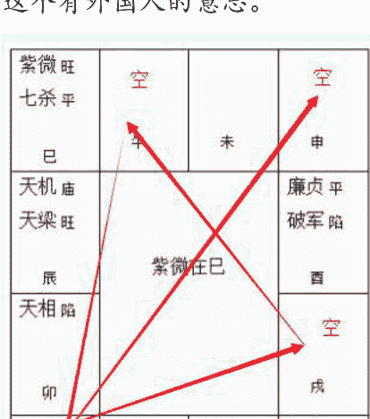

这个很特别的原因是因为，财帛宫，迁移宫，官禄宫都是空的，所以，凡是太阳，巨门坐命的人，都容易出现无助感。如果这个格局加个天马，就容易移民，因为这个盘看起来就像个远离六亲，孤独的一个人在别的国家，无助。当然，不是全部。所以是不是会移民，这不一定。但是无助感，应该是共同点。

而且，财帛宫的迁移宫有星星，官禄宫的迁移宫也有星星，

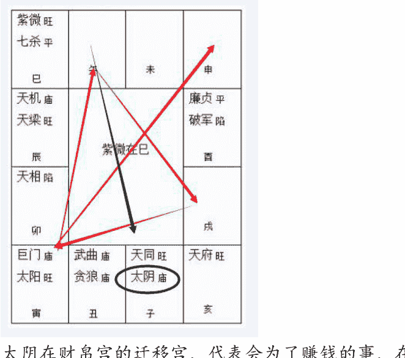

太阴在财帛宫的迁移宫，代表会为了赚钱的事，在外面住宿。

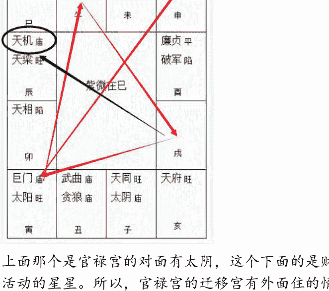

上面那个是官禄宫的对面有太阴，这个下面的是财帛宫的对面有天机，天机是跑动，活动的星星。所以，官禄宫的迁移宫有外面住的情况，然后财帛宫的迁移有外面跑动的情况，所以很容易看成是外国人的盘。其实不只是这样的，国内也可以。就比如，总公司是在北京，但是这个人容易出去广州，哈尔滨，新疆去公干，就容易有这种情况。巨门，太阳，天马=外国人。偶尔你看见有的夫妻宫是这样的，那么此人的配偶很有可能是外国人，不然就是做这种工作的。我遇到一个也有有这个象征，不过不是外国人，是外交世家。取象方面，要灵活变通。

先别理会宫位主题，就是先暂时当作看时钟，然后只要你有这些组合，你总会转到。后面我们才慢慢的套入十二宫主题，再教大家缩小范围，就是说，象义再套入主题，

把范围缩小起来。先理解成时间，比如天机巨门，转到宫位，容易丢失东西，紫微贪狼，转到流年大限，容易玩物丧志，或者是，巨门太阳天马，转到的宫位，有可能会出去工作，住在外面。反正只要你的命盘有，这个时钟是一定会转到。

# 【第四周】
05.18

| 12 父母宫 | 11 福德宫 | 10 田宅宫 | 9 官禄宫 |
|-----------|-----------|-----------|-----------|
| 1 命宫    |           |           | 8 奴仆宫  |
| 2 兄弟宫  |           |           | 7 迁移宫  |
| 3 夫妻宫  | 4 子女宫  | 5 财帛宫  | 6 疾厄宫  |

今天要学的就是这个，十二宫主题是很复杂的。
- 第一层，十二宫含义，是最原始的用法。也就是简单的，命宫代表个性，兄弟宫代表兄弟，夫妻宫代表夫妻，这是传统的用法。三方四正是一种指标，直接让你知道，你要评估一个人的能力，就要从他工作态度，理财，活动力，个性，去评估他的能力。然后要附加更多的，比如说，能力高的皇帝很多，从那么多的皇帝，又怎么知道哪个皇帝更厉害？所以又加入了子田线，田宅宫和子女宫。所以你看古人，要不累积土地，要不就努力生孩子。
- 另一层，叫【我宫】和【他宫】，也就是把【主】和【客】在分出来。
  - 什么是【我宫】？属于我，代表我的，就是我宫，命福官财。代表我们有很多面，工作上的我，理财上的我。出去玩的我，安静的我，各种各样的我。
  - 什么是【他宫】？比如，子女，父母，奴仆，夫妻这种暗示着“对方”的就是他宫。
这个我们会在学飞星的再详细的说，主客关系，今天先学十二宫。

先简单的说十二宫表意，也就是传统的十二宫。
命宫是代表静态个性、样貌。命宫掌管十二宫，所以十二宫都可以附加命宫的主星进去再论。比如说 @橘橘子 是太阴坐命的，那么她的太阴可以变成12个，放进每个宫位，因为命宫是管十二宫的。比喻一下，有个人七杀擎羊坐命，动不动就说，我不干了！不管他夫妻宫坐什么星星，他吵架之后也是会，分手吧！不管他官禄宫坐什么星星，他工作不高兴，就说，我要炒你鱿鱼！所以，命宫很重要，直接可以看一个人的全部行为，影响最大的宫位。这是论个性的第一步。

第二步，要看福德宫。
福德宫有太多的含义，主要先是代表精神思想。在心理学叫“自我”，心理自我催眠的声音，生气了，心里叫你更生气的那个自我，忧愁了，心里叫你更忧愁的那个自我。心理学上是说，你要把自己的命宫分开来，把福德宫分开来，看成两个人格，然后去观察你的福德宫，跟一个第三者一样，去观察他。

福德宫也叫自杀宫，特别是有个四化理论，三忌冲福德宫会想自杀。因为人之所以会厌世、自杀，也跟精神负荷不了有关系。所以要特别重视这个宫位，因为福德宫不表露，只会在心里产生另一个声音。

## 第三步是看疾厄宫。

那个是你不懂的自己，却是你每天在表现的自己，多数人不承认那是自己。你常常会很熟悉的听见，其实我不想那样，但是我控制不到，比如说，某人的疾厄宫坐太阴化忌，有可能有洁癖，恰好她其实是天同坐命的，是懒惰的，不过她就是一边懒惰一边洁癖，她会告诉你，那也许是父母教育出来的。只要不收拾，心里一堆一堆的罪恶感，那就是疾厄宫的个性。我称之为“惯性宫”，跟父母教育，文化，道德观等等有关系的“我”。

还有一个“假我”就是迁移宫，可以看成是面具，这个也就是动态的命宫，只有在和别人交流，和社会交流才产生的我。也有人说过，其实最真实的个性，应该是迁移宫。因为这个个性摆在外面，你的成败和这个面具有关系，哪怕你否认这个个性。比如说一个人武曲破军坐迁移宫，样貌严肃，天相坐命宫，那顾客要跟她买东西，是先去了解她呢？还是先看她迁移宫那个面具？所以，一切故事的产生，得失，迁移宫的影响是最大的。

我特别注重迁移宫也有一个原因，(紫微理论里面，照比坐大。)因为迁移宫是第一大限，和环境的故事。通常迁移宫有擎羊，小时候，第一大限，第一个十年的时候，他会遇到欺负他的人，这个际遇就会影响了他一生。他一辈子都认为，世界上很多坏人，所以做人要凶。我是说通常，具体的需要参考其他因素。比如说擎羊如果和天梁在一起，有可能是他崇拜一个大哥，所以要合论。有个命例，迁移宫，七杀擎羊，小时候，同学欺负他，常常觉得自己被欺负得差点死掉。有一天他忍无可忍了，一下就把那个恶霸的头打破，流了血。之后呢他就对所有人都凶，后来连他的气质，眉目之间也凶。他的世界观就是那种，你告诉他，这个世界上有慈悲的人，他说，那是你天真。所以，从这个案例，我们可以观察出来，人是环境的产物。多数人都是随波逐流，多数人跟着环境追求同样的东西，所以其实，我们真实的个性，我们真正的“我”没有完全散发出来。

化禄、禄存坐迁移宫，叫活禄。甚至，文昌文曲坐迁移宫，你也可以看成是“活文昌”“活文曲”。因为迁移宫也是表演的地方，表现的地方。
- A 命主，把文昌文曲放在福德宫，叫孤芳自赏，学了满腹墨水，依然不好意思“献丑”。
- B 命主，把文昌文曲放在迁移宫，哪怕自有半桶水，知道一点点，很虚，但是人家认为他厉害。

所以你要评估一个人的能力、影响力，你要考虑到，他有没有把应该表现的，摆在外面。

那么，文昌文曲放在福德宫成就比较大呢，还是文昌文曲放在迁移宫成就比较大？肯定是迁移宫。不过呢，哪个会比较实在？在福德宫的比较实在。也就是能够满足你心灵的，是放在福德宫的。能够让你虚荣的，就是放迁移宫的。这个要很灵活的去评估个性。关键字是这样：当你想说，命宫时，你说，其实你是…，不过别人以为你…（迁移宫）。你还有一面是隐藏的，要非常熟悉你的人才看见。。。 (福德宫)。而且你有个有趣的惯性，跟你个性自相矛盾，你有时候会觉得有罪恶感，那是…（疾厄宫）。迁移宫是你不怕别人以为，福德宫是你怕别人发现，所以，紫微在诠释个性上，分成了四种人格。一样的，你若想把佛洛依德的三层人格套入，也是一样说得通。紫微十二宫证明一切法。

说说其他的基本含义，兄友线，也就是兄弟宫和奴仆宫。
这个有很多种说法，有些门派说，看寿元的地方。有些门派说，是成就线。我的说法是“众生线“，众生之门。因为我们要很清楚的知道，我们都是群居动物，没有一个人是不依赖社会，不依赖人脉朋友来得到成就，所以，你要知道一个人的手腕，一个人对待朋友，人际关系，择友等等，就取兄友线。为啥叫“众生线”，因为如果这两个宫位有生年忌，就代表会冲开对面的宫位，那么就会变成一种现象，就是你朋友有难会想到你，找了你，你又无法拒绝，然后你好像欠了他们一样。用你生活大部份的时间，都在跟这种人解决问题。有些书说，这种命格可以去当传教的、宗教师，因为你能普度众生，可以施法。这种要自由变化，反正要记住是有这种现象。比如说，你看到一个人的盘，是宗教格的，会去修行宗教的人，刚刚好，他是有众生忌的人，那么，你大概可以猜到，这是他生活的大部份”任务“。所以要结合来看。如果你看，一个人很有钱，刚好有众生忌，那么是很多人喜欢找他借钱。要灵活的使用，别看见有人有众生忌，你叫人家去当传教士。

### 官夫线
其实这是一条很特别的对待位，这条线是讲述我们愿不愿意付出，我们在对待感情、责任、使命、承诺的表现。比如说，你工作是为了承诺过老板，你爱情上也一样有给配偶承诺。所以，官夫线不是说你能得到怎样的工作和配偶，而是你的这种对待，配的起哪一种对待关系。你如果爱管制（紫微化权），你自然得到霸道的对方。对待位，**夫妻宫和官禄宫是一面镜子，讲的是你如何对待，你就得到什么样的感情。**

### 拿一个学生验证

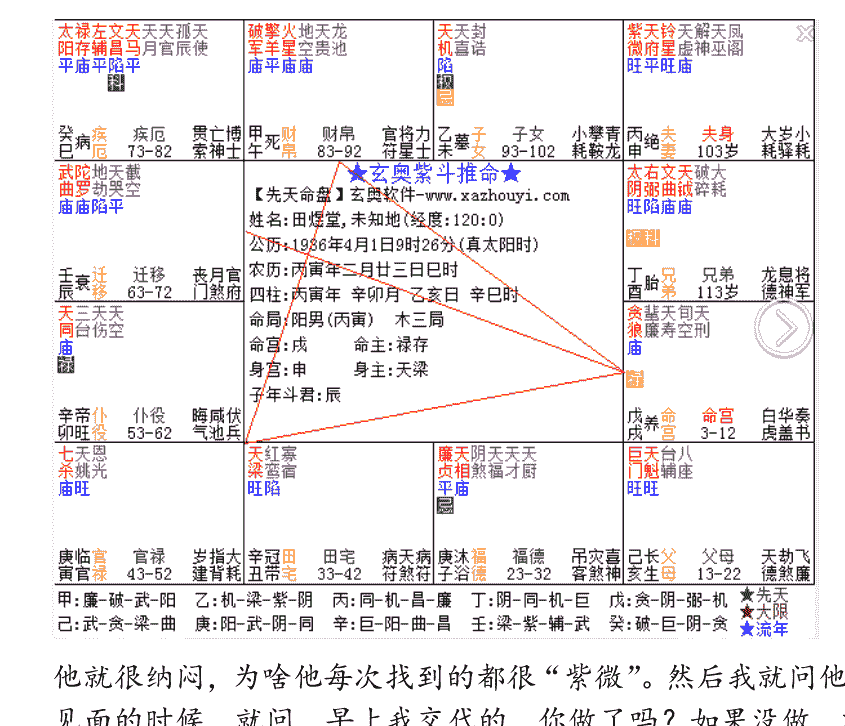

他就很纳闷，为啥他每次找到的都很“紫微”。然后我就问他，你是不是喜欢这样，每次见面的时候，就问，早上我交代的，你做了吗？如果没做，就唠叨一番。下午继续再这样问，我叫你天凉了，要穿外套，你又没听，又唠叨一番。他说，你怎么知道。我说紫微是管，天府会教化，铃星一直响，爱唠叨。我问他是不是每次人家骂，你管我那么多干嘛？！他说，是啊，他每次找到这种女生。所以，是他找到这种女生呢？还是因为他的这种对待，让对方只有一个行为表现的选择？

同盘的人很多，夫妻宫有武曲的人很多很多，但是去找他们配偶的盘，发现都不是武曲坐命，为什么和他们在一起了，就变成武曲模式的感情对待呢？所以代表，你不能去用单方面来论夫妻宫和官禄宫，因为这个是很重要的对待位，讲述你是不是用了正确的方式去对待。

这个要多练习，慢慢去观察，什么样的对待，会产生什么样的婚姻。比如我说，破军式的爱情，破军坐夫妻宫的人，付出的时候，全部付出，倾盆模式的付出，最后忍无可忍的不要了，头也不回。她遇到谁都一样，很极端的感情。

官禄其实也是一样，表面就是看工作成就，工作类型。实际上如果今年你是老板，你要看下属的官禄宫，是要评估这个人的责任感。因为官夫线，是讲究耕耘、付出、使命、承诺的对方，和收获无关。官禄宫的收获是财帛宫，意思是你努力耕耘了、付出劳力了、承诺兑现了，那么在财帛宫也是回收的宫位。假设官禄宫是夏天，在四月，那么财帛宫是八月，秋天的时候，是收成的时候，所以在时间上也是有逻辑的。而夫妻宫的收获是福德宫，用夫妻宫立太极，也是算五个宫位，就是夫妻宫的收成宫。福德宫是精神位，代表你的爱情得到的收获，是满足你的心灵。

其实这些如果我们能自由的放进去，什么星星，什么星星多好，不过既然是不能这样，我们就要换一个角度，重新去思考自己的对待模式，主要也是为了这样。当然流年、大限，当你命盘转动的时候，不一样的对待也会产生了，这个我们将来谈流年大限的时钟时，我告诉你们这种变化。

### 财福线

财帛是物质，福德是精神。也有人说，在另一个世界里是不需要金钱的，你带来了阴德，一种另一个世界的钱币，出世之后，因为人类的世界是物质的，因为要转化去物质，就产生了财帛宫。福德宫的本意是什么呢？就是我们主要的运气。一个人福德好，随便一张床都得到好眠，随便一餐饭，吃下去就是山珍海味。一个人福德不好，再多的金钱，精神得不到满足，那只能叫金钱的奴隶。所以福德的重要性是比财帛高。比如说，今天鞋子坏了，刚好有人送了一双，这就是福德送给你的。福德够强的人，是不怕衰运。（福德是用得完的，比如做坏事做多了，福德也会清光。福德清光了，首先烦恼一定来，接着运气很差，然后身体很差，反正是什么事都不顺。）所以看一个人的运气要看福德宫，包括流年大限的。

什么星星坐福德很好，第一个紫微。紫微坐福德，有福德的自动修复能力，也就是你用了，会自动修复回去同样的等值。根据玄幻的说法，就是你本没有物质，你只需要福德，因为你出世的这个世界是物质世界，所以才要用你的福德去兑换金钱，这就是为什么有人一出世就很有钱，衣食无忧，因为他的福德比较高。很多种说法。

福德宫喜欢禄存、天同、紫微、天梁。这些星星，格局越吉，此人的运气越好。比如天同化禄的人，因为财福线是一体的，所以福德宫是可以直接影响财帛宫，所以天同化禄坐财帛宫的人，他没钱了，会自动有人帮他，或者眼看要亏死了，转眼又出现转机。天同化禄=狗屎运。财帛宫空宫会对物质不计较，吃喝方面也比较随便。福德宫不喜欢财帛宫忌冲，忌冲是第一害。福德宫也不喜欢擎羊、巨门化忌、空劫，煞星都不喜欢。和论一般格局是一样的方式。最好，就是坐紫微。

福德不好会怎样呢？比如很难感受到快乐，容易消极，容易愤怒，容易急躁，都是内心的故事。赚钱、爱情，任何一种追求都是为了满足心灵，如果追求什么都得不到满足，那还有什么用，所以福德很重要。福德可以通过修性修心，做善事，多读书补充回来。常常人家说的做善事，多读书可以改变命运，说的就是福德，福德好了，运气就会好。时钟是死的，人是活的，命盘管你半辈子，后天命运要靠自己去建造回来。有人说，能学紫微是三生有幸，有这种幸运去认识一个道具，让自己停止这种轮回，所以要珍惜学紫微的机会。

### 子田线

特别是田宅宫，因为紫微是有风水学的，所以田宅宫很重要。以田宅宫立太极，就可以得到房子的各个部分。疾厄宫是田宅宫的气数位（第九宫），所以田宅的风水会影响健康。田宅宫也是财帛宫的疾厄宫，用财帛宫立太极，得到的身体是田宅宫，所以田宅的风水又和钱财扯上关系了。我记得@橘橘子的案例，她那时候失恋，我看了一下盘，我说，你房子在吵架的时候，是不是有一堆电线长期在房间里。她说，有啊。那时候她找我很急，她说，那前男友说，再骚扰他，他就人间蒸发，到了非常排斥的地步。我看了她的盘，让她把电线收好，放三盆粉红色的花在窗口边，当天，这男人突然打电话回来关心她了。紫微风水是一个独立的立题，也不容易，要学不少。

阴宅在命盘是福德宫，阴宅是我们祖先藏的地方，刚好是坐我们福德宫，所以说明阴宅葬得好，运气就会好，因为福德宫是代表阴宅。

子女宫是活的资产，或者可以看成是动产。田宅宫是不动产。古代很纯粹，多生儿子就是动产，养儿防老，儿子可以帮忙干活。现在子女宫这个宫位就负责多了，添加了很多含义，先不说其他的，先说动产有哪几类，
- 车，车可以带着你去赚钱，所以子女宫天机是代表车子。
- 股票，或者基金，或者变动比较容易的，或者赚钱工具等等，可以适当的放在子女宫。
另外子女宫也有分行的含义，也有股东的含义。股东就是财帛宫的父母，给你钱的人，官禄宫的奴仆宫，工作伙伴，所以取象为合伙人。不过想一下，你有很多合伙人，和你有很多儿子，也是一样的，就是为你制造产业。所以如果看见谁的田宅宫很差，但是子女宫很好，那就要引导他朝着这方面去累积动产，把焦点放在对的地方。

### 父疾线

第一层面是说关于父母和基因。古代父母宫也叫样貌宫，不过经过验证，发现到父母宫看不了样貌。我怎么取一个人的样子定盘，首先，迁移宫是气质。命宫可以是五官或者脸型，多数是脸型，皮肤白黑。体形看疾厄宫，比如，疾厄宫有化禄化权会易胖，特别是贪狼化禄。贪狼化禄坐疾厄宫，身体贪心，或者你小时候家庭文化贪心，身体可以贪心什么？只能贪吃。因为身体管理本能，身体是不会管理情绪，情绪是福德宫管的，所以，这个傻乎乎的疾厄宫呀，坐了贪狼化禄，悲催了。疾厄宫化禄会易胖，破军会不然死忍着，不然暴了，暴食，破军就这样，极端。特别要抓化禄，或者化权。武曲化权坐疾厄，代表惯性，你未必会喜欢这个个性，但是你又控制不到这个个性，然后总是不承认疾厄宫这个个性。这是个跟文化教育有关系，跟养出来的习惯有关系，跟你的身体需求有关系的宫位。

有个案例，是天梁坐疾厄宫，他本质是很抠门的，但是他习惯性请客，我问他是不是你爸爸经常这样请。他说是的。有时候他请客特别心痛，但如果不请客就满满的罪恶感，就是这么一回事。

- （命宫和迁移宫）是我和社会上的表里，
- （命宫和疾厄宫）是身体和灵魂的表里，
- （命宫和福德宫）是我和内在的表里，
就看要解析什么。如果你要解析的跟环境有关系的，那么就取迁移宫和命宫。如果你只想说说他的行为，可以取疾厄宫和命宫。如果你想说他的心情，他的精神世界和现实条件，就取福德宫和命宫，

紫微很多理论是一个标记，指南而已。比如说，三方四正，你不要去想啥三方四正，你只需要明白，这是古人标记出来的捷径，让你知道，评估一个人的能力，要取这四个宫位，比如说，表里，偶尔我也用暗合为表里关系，但是你也知道，暗合一定是结合其他宫位，所以我就说关于暗中的互助的表里。只要你明白那个含义，你可以根据你需要的宫位去看。古代人的女人，三方四正是倒转的，因为古人女人不工作赚钱，财帛官禄对她们不重要。如果看一个打工族的盘，说他财帛宫变动大，要破产了，这就不符合逻辑，因为打工族不怕生意失败，所以要随机的灵活运用宫位。

## 05.20

| 12 父母宫 | 11 福德宫 | 10 田宅宫 | 9 官禄宫 |
|-----------|-----------|-----------|-----------|
| 1 命宫    |           |           | 8 奴仆宫  |
| 2 兄弟宫  |           |           | 7 迁移宫  |
| 3 夫妻宫  | 4 子女宫  | 5 财帛宫  | 6 疾厄宫  |

今天讲的是活宫，也就是立太极，和十二宫的衍生含义。
这个十二宫的名字，要跟着号码去理解。
1号是命宫，2号是兄弟宫，三号是夫妻宫，跟着顺序下去。
建议的记忆方式，就是用人生阶段去记住。
- 命宫，人在第一个十年的主题是认识自己，成立个性。
- 兄弟宫，人在第二个十年的主题是从朋友兄弟中彼此影响的故事。
- 夫妻宫，人在第三个十年，也就是二十多岁，是选择配偶的时候，爱情是最大的主题，多数人在这个十年结婚。
- 子女宫，有了老婆就当然要孩子，然后开始为孩子的事安排和烦恼。
- 财帛宫，四十多岁孩子也长大了，家也稳定了，赚钱的心情得以专注。多数成功人士，根据统计都是四十多岁发家，所以别二十几岁没发达就觉得自己会穷一辈子，纯粹是主题还没转到，老婆，家庭，孩子分散了赚钱的注意力。
- 疾厄宫，钱也赚了，身体在五十多岁的时候病痛开始明显。所以你看都是五十多岁的人很注重养生，秦始皇也是这个时候很着迷寻找长生不老的药。人在五十多岁才领悟，没了健康你啥都没有，有钱也去不了旅行，有钱了也是给医生赚。
接着，六十多岁了，在五十多岁的保健年龄中，也是孔子到不惑之年，得到了自由，你可以退休了，所以是迁移宫。迁移宫代表自由。

除了顺转，也会反过来转的。重新说过，第一个命宫，认识自己。第二个走父母宫，代表学习，父母的故事。第三个福德宫，是爱情，追求精神的阶段，因为福德宫的对面一定是财帛宫，也是追求金钱的阶段。第四个田宅宫，古人说的，先成家，后立业。第五个是官禄宫，四十多岁开始明白，追求金钱享受，追求精神享受，还不如对工作投入认真，认识使命。这是逆转的盘。接着，到了奴仆宫，开始和朋友的交流比较多，逆转的盘是走向社会主义，到老的时候，才开始讲究使命感和社会的朋友。最后也是迁移宫，也就是自由的时候。

(第六个大限走疾厄宫，前面都是别人) 这种是顺转。顺转的盘可以发现，先注重朋友，爱情，家庭，然后追求金钱。意思是顺转的盘，一开始先讲究责任，后面开始赚钱，和注重自己，重新认识自己。

这是逆转的盘。可以观察出来，这种转法比较注重本质，先从父母听从知识，然后精神修养，然后顺其自然的结婚生子。先追求精神享受，先认识自我，后面才走向官禄宫，一个讲究付出的宫位，再走进奴仆宫，开始意识到人是群居的，需要关心社会。这种转法也容易偏向老了会讲究公益，会关心别人。

另外，命盘的顺转代表新的、变动的、新鲜的、创新的，命盘的逆转代表固定的、从前的、历史的、古典的、慢的。所以也可以衍生成，顺转的盘会比逆转的盘更关注新的发展，而逆转的盘会比较念旧。

### 接下来先说一六共宗。

一六共宗，也就是立太极的宫位，我们叫“一”，然后顺转六个宫位，

六是体，一是灵，科学的说法是，人是由一个臭皮囊和一个有灵性的思维而组成的，命宫象征着你的直接行为、个性等等，也可以代表五官、气质。疾厄宫是身体，所以如果说，第六宫有损，忌冲，或者汇集六煞凶星，反正就是很凶的意思，那么就会危及第一宫。原理是，如果没有身体了，那么有再多的想做的事都是没有用的。所以如果疾厄宫死了，命宫就没有作用了。

疾厄宫起一六共宗，是福德宫。福德宫也代表祖先位，因为是父母宫的父母宫。第一个层面就是象征着人类的基因，是有根连根的基因说法，有了祖先才有你的存在。第二个层面，福德宫是象征精神的，所以代表你的身体是根据你的精神情况来反应。这也是为什么医生说，心情好可以治百病，心情负面的人容易得癌症。所以，精神是支配你的身体的更深一层。第三个层面就是福德也是运气的地方，运气好，自然身体好，身体好，自然命好。所以，从这三个串起来的，一六，也隐喻了古人在排紫微盘的时候，是多么有智慧。

官禄宫的一六，也可以说官禄宫的疾厄宫，是在兄弟宫。兄弟宫是代表资金，因为是财帛宫的田宅宫。所以兄弟宫如果逢凶，就像一个公司的资金链断了，那么这个公司破产了，也一起死了。所以，从这边我们又认识到，一个公司是赖以资金的健康状态来评论吉凶。

财帛宫的一六是田宅宫，所以古人相信风水可以改善金钱运。当然有很多层，也就是说你要你的金钱源源不绝，首先要有资产，就好比古代的地主，有很多的地产，有人耕种，他的钱就源源不断，自己也不需要下手工作。我们的金钱就不一样了，今天不上班，没多久就坐吃山空了。所以聪明的资产家都知道这个道理，要自己的金钱源源不断，就得累积资产。紫微十二宫里的哲理是非常珍贵的，其他宫位也是一样，很少的书里会解析，要靠自己多思考，然后智慧才会出来。

### 气数位。

气数位是第九宫，我个人比较少用。也可以这样看，就是冲官禄，你就要换工作，你和这个工作的缘分结束了。可以看成是那种游戏的血，打架那种，被打得吃不消了，会慢慢的减少，所以叫气数位。意思是说，某个宫位的缘分结束的宫位。比如说，忌冲官禄，你要换工作，换环境，换故事。其他宫位也一样，包括生命也是一样，也有气数位。一六共宗，我用比较多，气数位我用比较少。这个怎么定吉凶，我们要学飞星的时候看，因为一六和气数都是四化飞星的东西。

### 立太极。

立太极就是把你的原本的十二宫，再变多一个盘，多一层的十二宫。见上图，以夫妻宫立太极，也就是代表我现在要放一个放大镜，个大特写，把夫妻宫放大。从夫妻宫开始当作命宫，旁边的也跟着顺序的主题，也就是夫妻的兄弟，夫妻的夫妻，夫妻的子女…这就是叫立太极。所以宫位的排列要记清楚。

有几个很常用的，我们学一学。某人问，我结婚后，我婆婆公公（配偶的父母），他们对我好吗？那需要看哪个宫位？

以@无间地狱在人间 为例。夫妻宫的父母宫（兄弟宫）坐巨门化权，有她说，没有你说（生年权代表你把权力给她）。所以她之前的婆婆很会说是非。

夫妻的父母宫（兄弟）是看公公还是婆婆？有几种比较模糊的说法，也就是有人会觉得，一起用兄弟宫。也有人觉得，需要从兄弟宫再立太极，起夫妻宫，看子女宫论婆婆。我个人的判断是这样，就是看谁影响力大(主要是对你的影响)。比如说，人间的盘，婆婆说话比较大，所以体现在兄弟宫。因此关于这个，我教你们一个方式，你先说你婆婆或者公公，其中一人是（兄弟宫），他回答你，对，我婆婆是这样的。那么，子女宫就是公公。因为你需要考虑谁的影响力大，取之为阳，影响力小的，取之为阴。

这个贪狼我们很单纯看成是小贪心，地劫是心里不平衡，所以这个盘一般会这样说，你的婆婆或者公公，会有些贪小便宜。（反馈婆婆是这样，那公公就看本命盘子女宫。）廉贞天府是最保守的组合，有喜欢研究的习性，是有小爱好的类型，不喜欢八卦，所以她的公公喜欢自己干自己的事，少管别人的事。而且他怕烦，因为有火星，就容易闷骚。

暂时婆婆取兄弟宫，因为对媳妇影响大的肯定是婆婆。@橘橘子的婆婆很大方，会帮助人，比较温和。她公公紫微破军，喜欢修东西，翻新，或者讨厌一成不变。可以直接当作命宫去解析个性。

这个也明显，兄弟宫（丈母娘）脾气好，禄存铃星有点忍辱负重的感觉，天府（老板星），大方。子女宫（岳父）那个脾气一阵一阵的，突然发脾气，也没人懂啥时候得罪他。

所以总结出来，也就是配偶的母亲在兄弟宫，配偶的父亲在子女宫。自己的爸妈也是一样的，父母宫那个是阳，兄弟宫是阴。影响大的坐父母宫，所以有些特例是母亲在父母宫。验证而得的，就是父母离异和母亲生活的，父母宫一定是代表母亲。原理一样的，影响较大的坐父母宫，影响较小的坐兄弟宫。一般爸爸是父母宫，妈妈是兄弟宫。

| 命-我，祖母 | 父亲，大姐 | 祖父，二姐 | 配偶的朋友 |
|---|---|---|---|
| 大哥，母亲，岳父，家公 |  |  |  |
| 配偶，二哥 |  |  |  |
| 长子，三哥，第二姻缘宫 | 三三归一，夫妻的夫妻是我，二子 |  |  |

根据这个图，也可以知道紫微还分第一个，第二个，第三个…所以如果父母有多婚的情况，或许还可以在夫妻宫（父母宫的子女宫）看自己父母的第二个配偶，这种需要自己灵活使用。

大哥，二哥，从兄弟宫顺转，一般的说法，兄弟是母亲那边，所以根据基因学，儿子像妈妈那边的比较多，女儿像爸爸那边的家族比较多。

爷爷自然是父亲的父亲，福德宫。爷爷结婚，从福德再起夫妻宫，奶奶在你的命宫，所以我们可以发现到，基因学里面，隔代传的证据。当然如果有五六个兄弟，不可能全部像奶奶，就把这个概率降低到个性相似。

可以验证【是不是奶奶和我，有共同命运】合盘一般还有多一个条件，就是要【太岁入卦】取对方生年，套入，然后相关宫位合论。

结合@女王 的盘，爸爸属兔，卯，就要把父母宫和卯宫加起来看，且偏重于太岁宫。天府一般是老板星，代表有这种倾向。如果没有的话，天相天府的结合就是为人温和，热心，喜欢帮助别人。要灵活演变，天府的含义很多。

我说说我的经验，某个命主，当我说她弟弟的时候，看见天同，就说她弟弟会比较懒散，这是正确的。当我说到她母亲的时候，我自然也是说懒散，因为那个宫位是一样的。但是她却说，没有，不对，我母亲很勤劳。然后再问太岁，母亲的生年干支，才发现母亲的天干是化忌天同。所以说，要以太岁入卦的为重，用合盘的方式+本来的宫位为参考，这样才是最标准的。

子女宫。子女宫是第二个姻缘。但是流年有时候，我们从子女宫看该年有多少个交往经历。有一次我看比较牛逼的一次，她一开始已经说了有三个追求者。然后我从流年的夫妻宫、子女宫、财帛宫起三个人的宫位，发现夫妻宫和财帛宫是同样天干的，化忌武曲冲命宫，我就说，你的第一个 XXX 样子的，和第三个 XXX 样子的为了你打架了。她就说哇，这你也知道。结果好像是为了争女人，两辆车相撞。化忌武曲迁移宫，挺好的例子。还有个例子，我看某人的盘，他说他交往了个女友，他给我那个女友的生辰，我看了一下，我就说，你是她今年交往第二个对象，年头她网恋了一个。结果他去问，还真就这样。因为流年夫妻宫是空宫，对宫有廉贞，有飞化的情况。廉贞是精密电子，代表网络，所以既然夫妻宫空宫，自然就网恋。

夫妻宫不是空宫，就是看见对面有个廉贞化禄，有自化忌了，我就说她二月有开始一个，因为知道这男命主长相，而且他说他们是同事，天天在办公室见面。看子女宫，特别多四化在一起，所以第一个不成，第二个成功，今年已经结婚了。

紫微的技法很多，最重要的就是要灵活。

# # 子女宫（四宫）

- 1. 子女宫是生殖位，看生殖健康，以生殖健康来判断生育的情况。
- 2. 子女宫是桃花位，因为也是福德宫的疾厄宫（福德的身体），又是疾厄宫的福德（身体的精神）为精神享受之位。
- 3. 同理，子女宫可以看性能力，以及个人的性向和癖好。
- 4. 子女宫是股东位，合伙位，因为这是官禄的交友，财帛宫的父母宫（提供资金的人）。
- 5. 也可以看成是老板和顾客，因为也是给你钱的人。
- 6. 以田宅而言，代表屋前情况，也可以代表卧室。
- 7. 子女宫可以当成情妇，小三，第二个姻缘来看。不过，论感情对待要以夫妻宫为体，子女宫为辅。
- 8. 看活动资产。

如果有人问你关于合伙的，第一，取对方太岁，做合盘。第二，要参考子女宫。为什么子女宫是合伙位呢？因为子女宫是财帛宫的父母，和你一起合资、有付钱的人。有人问老板付我工资，那是不是老板也取子女宫？是的，上司和老板要分开来看，特别是那种老板不咋样管你，只负责给你工资的那种老板，就要看子女宫，上司就取奴仆宫，因为奴仆宫是官禄宫的父母宫。如果是同时给你工资又管你的上司，取奴仆宫，因为这个意象比较重，付工资是一个月一次，管你是天天管，所以如果那种又是老板又是上司的，就取奴仆宫为上司位。自雇人士，取子女宫，特别是流日子女宫，有时候有些命理师是取子女宫看成顾客。所以自雇人士，顾客是子女宫。

### 奴仆宫（八宫）

- 1. 和兄弟宫同论，有不能破，寿元的说法。是福德宫的田宅宫，为精神之库，奴仆和命宫也是一六关系，因为兄友线有不能被冲破的说法。
- 2. 田宅宫的福德宫，意思是家里的精神寄托之处，一般看成是神位。
- 3. 众生位，看外在互动，朋友关系。
- 4. 官禄的父母宫，上司位，或者货物的源头。
- 5. 也是桃花位之一，为夫妻的体位，代表你先有朋友关系，才进化去感情关系，也能看桃花什么时候开，或者暧昧关系等等。
- 6. 奴仆宫有巨门忌入夫妻宫的时候，容易发生暧昧关系，此情况特别常见于廉破坐命的命主。

奴仆宫是桃花位，是夫妻宫的一六共宗，本意是有了朋友，才会遇到你老婆。奴仆宫不太喜欢遇到巨门和桃花同度，因为会容易出现情骗，或者被暧昧，或者是交往了没有公开。有次连续看两个盘都是一样的格局，廉破坐命，女生，

巨门是暗中，太阳是男人，所以我当时几乎在同时遇到了一样格局的盘，我说了一样的话，我说，你之前有个男友，被对方隐藏了关系很久，最后发现对方有新的女友了，从正的，变成小三。其中一个特别委屈，就是最后男友要结婚了，新娘不是她。还骂她不要去骚扰他的生活，在一起三年被隐藏感情。这个要飞化，不能看见这个盘就直接论断，但是廉破女命，都要防这个，交往的时候，务必要求对方公开关系。

仆役宫还需要关注圈子，比如说某个命主说要做生意，那就需要先看他的奴仆宫，因为你要思考到，刚做生意的人，顾客都是自己的朋友。举个例子，@竹子 想和她姐姐合伙做小买卖，然后我就对比了她们两个人的奴仆宫，

| 支票，工作文书 | 关系企业，合并公司 | 同行，同事，客户 | 立太极 |
|---|---|---|---|
| 父母宫 | 福德宫 | 田宅宫 | 官禄宫 |
| 事业类型，工作形象 | 上司，老板，上游工厂，货源 |  |  |
| 命宫 | 奴仆宫 |  |  |
| 事业体质，资金状况 | 营业额 |  |  |
| 兄弟宫 | 迁移宫 |  |  |
| 事业门市，外观 | 股东，部属，学员，合伙 | 经营状况，亏盈 | 工厂，店面，工作场所 |
| 夫妻宫 | 子女宫 | 财帛宫 | 疾厄宫 |

父母宫为什么代表支票、合约？因为那是财帛宫的奴仆宫，代表金钱交易的位置。父母宫有文书的含义，也是文书位，比如说要看签合约，就要看父母宫，或者文书星。现代很多事情都需要设计文书，所以父母宫是很常用的宫位，包括结婚登记、买房子登记等等，都会和父母宫扯上关系。

### 父母宫（十二宫）

- 1. 代表父母，长辈，老师，校长，董事长，领导等等。
- 2. 因为父母宫也是教育位，第一大限的父母教育，因此有文书位的象征。而对面的疾厄宫是父母宫的果，也就是养出来的惯性。
- 3. 父母宫因为有文书象征，因此，也代表文书，官非，申请，考试，签证，准证等等。
- 4. 父母宫是迁移宫的一六关系，代表着一个人处事待人上面受到的影响。
- 5. 是财帛宫的交友宫，象征着金钱交易的宫位，因此也代表支票，合约，贷款等等。也能看一个人的财务信用。
- 6. 父母宫是夫妻宫的田宅宫，为婚后的家运，夫妻宫忌冲父母宫为离婚格。
- 7. 父母宫也是官禄宫的子女宫，代表分行，子公司。（较少用）
- 8. 父母宫也代表小客厅。
- 9. 四化飞星也称之为光明线。忌冲要防官非。

离婚格，夫妻宫忌冲父母宫，父母宫也是夫妻宫的田宅宫，看婚后相处的宫位。

活盘，思路很重要，特别是学飞星的时候。一些很复杂的情况，比如说，”我的哥哥是我的合伙人，然后我们签约了，同时我们也共同买了一家店铺。” 你看看，这句简单的话里面，哥哥，合伙人，文书位，子田线，财帛宫，官禄宫，彼此的飞化，所以这些活宫，你们要先有概念。当我说飞星的时候，你们一听就明白了。

疾厄宫也是工作地点，因为疾厄宫是官禄宫的田宅宫，特别是流年疾厄宫有天机星，坐四马，容易有工作地点的变动。

# 【第五周】

05.25

紫微斗数的基本盘，其实只有十二个基本盘。有时候你看见有些人，你说一个，武破在亥命，他没看盘，其他宫位的星星都知道，这就是因为熟悉基本盘

- 第一个步骤，就是画一个空的天盘
- 第二个步骤，就是先知道紫微星系的固定位置

这个星系是不会改变的。

紫微星系的安星诀，紫微天机逆行旁，隔一阳武天同当。又隔二位廉贞地，空三复见紫微郎。

这样看你们一定记不住，所以，我已经做成了图。

| 命宫 | 兄弟宫 | 夫妻宫 | 子女宫 |
|---|---|---|---|
| 紫微 | 天机 | 太阳 | 太阴 |
| 父母宫 | 福德宫 | 田宅宫 | 官禄宫 |
|  | 紫微星系 |  | 廉贞 |
| 财帛宫 | 疾厄宫 | 迁移宫 | 奴仆宫 |
| 武曲 | 天同 |  |  |

所以，要记得紫微的排法，我们先以紫微立极，当作命宫，紫微的兄弟永远是天机，你看谁的盘都一样。紫微的旁边就是天机，紫微是皇帝，天机自然是军师，姜子牙就是天机坐命，永远和紫微同度，因为紫微是不主动的，所以，天机这个动星管兄友线就是为皇帝跑腿的，帮紫微传达旨意。天机的兄弟星的来源，就是从这边来的。

紫微的子女一定是太阳。 我说过子田线，子女宫是代表外在的资产，动产，因此你能想象，皇帝生孩子，然后立王，分诸侯等等，也象征着紫微的管理精髓就是在意。他很多资产，但是他不管理，他分配给那些“儿子”或者“部下”管理，也跟当下的企业一样，若要做得很大，发扬光阴，开分行，就要放手给别人去管理，这就是太阳的象征，（太阳的反义词是太阴，太阴是田宅星），太阳在棋盘里面是代表壮丁，代表生产力。

紫微的财帛永远是武曲，你们也可以翻查你的命盘，紫微的第五个宫位一定是武曲，所以，武曲的正财星，也是来源于此。就是因为基本盘的关系，所以这些星星有了这些含义。武曲其实是规矩，不能一开始看武曲就说是金钱，武曲的前期是规矩，磨练，原则，后期才是财星，这个要弄清楚。因为，这象征着，紫微管财是用武曲的方式。

紫微的疾厄宫一定是天同星，也是一样，不管你看哪个盘都是紫微的一六一定是天同。天同是福星，也是安逸，也是不喜欢动，所以你想，哪有皇帝亲自动手的道理？也象征着，紫微实际上也有这种惰性，喜欢用脑，不喜欢用力，因为天同是福星，也是健康星，如果天同没有化忌，一般的紫微都比较少生病，久久一次，一生病就很严重，因为总会转到庚年（庚化忌天同）。

紫微的官禄永远是廉贞，廉贞是代表精密系统，网状，密密麻麻，人与人之间的工作关系与分配等等，就像个庞大的网络。紫微要管理的人事物也是这样的模式，意思是，要做一个决定，要兼顾到其他的连环效应，因为廉贞很特别，也是山寨王的含义，是不轻易服谁，因此只有他认为是紫微的人，才能管理他，历代代表人物，韩信，廉贞天相坐午，廉贞也是官禄主，所以每一次做决定，又需要更加拘谨的考虑全面性。

## 现在我们看看五行关系

紫微己干阴土，天机乙干阴木，太阳丙干阳火，武曲辛干阴金，天同壬干阳水，廉贞乙干阴木，丁干阴火，戊干阳土为艮卦。

我说过，看能不能协调，会不会辛苦，就看生克，这个也是一样。比如说，紫微的子女宫是太阳，紫微的疾厄宫是天同，太阳是火，天同是水，水克火，因此自古，皇帝和自己孩子的关系都不太融洽。再看，武曲阴金，天机阴木，武曲在财帛的金，是克兄弟天机的木，也隐喻什么呢？代表紫微坐命的人，容易因为金钱问题而导致兄弟不合，因为武曲讲究规矩，你是我兄弟也不能打乱我理财的规矩。

接着，廉贞比较杂，不过，廉贞和天机有相同的五行，也就是乙木廉贞乙木，天机也是乙木，天机也代表智慧，脑筋快，而且你看，廉贞和天机永远是一六共宗，代表什么呢？代表紫微的工作，需要靠兄弟，靠别人。

重复一次，

- 紫微的兄弟是天机
- 紫微的子女是太阳
- 紫微的财帛是武曲
- 紫微的疾厄是天同
- 紫微的官禄是廉贞

我们知道了紫微的管理模式，现在我们看看天府星系。

| 巨门 | 天相 | 天梁 | 七杀 |
|------|------|------|------|
| 田宅宫 | 官禄宫 | 奴仆宫 | 迁移宫 |
| 贪狼 |  | 疾厄宫 |  |
| 福德宫 |  |  |  |
| 太阴 |  |  |  |
| 父母宫 |  | 财帛宫 |  |
| 天府 |  | 破军 |  |
| 命宫 | 兄弟宫 | 夫妻宫 | 子女宫 |

天府星系安星诀：天府太阴与贪狼，巨门天相及天梁，七杀空三破军位，八星顺数细推详。

这是天府星系，天府星系比较多，也一样，把天府当作是命宫，在天府立太极，然后，这个我们倒转过来看，先从太阴开始，天府的父母一定是太阴，太阴管理天府的父疾线，因此，多数的天府都有一种柔和的气质。太阴也对于天府而言，母亲扮演比较重要的角色，也可以看成太阴是田宅星，父母留下来的祖产。

天府的福德一定是贪狼，所以为什么柔和端庄的天府（皇后），又常常被叫老板星？就是因为天府都是暗藏欲望，天府也是学习之神，也跟贪狼有关系，因为贪狼是教化之星，启蒙之星。所以你看，贪狼和天府有不少共同点，比如都同样的好学，博学。

天府的田宅宫永远是巨门。古代皇后是管理后宫的，后宫自然是非多，也容易从中影响。巨门也是暗中观察的意思，比如说英女王她能把整个皇宫的仆人的名字叫出来，也能知道每个成员，仆人的事。你也可以看成是天府在家里呢，比较叽喳，本身喜欢教化，因此容易发挥在自己家里。

天府的官禄永远是天相，代表天府是用天相模式工作。天相是衣食之星，因为古代管理后宫，主要也是管理大家庭的起居饮食，天相是服务星，你看见有些老板特别注重服务的生意模式，就跟天府或者天相有一些关系，这就跟紫微不一样，紫微的工作模式更多是规划。

天府的奴仆宫永远是天梁，天梁代表大哥，荫星，照顾人，管天府的兄友线，也就是众生位。因为天府也容易讲义气，毕竟偏向于社会主义的待人模式。天梁因为也代表老人，因此，天府跟朋友讲话，有一种长者说教的态度，简单来说，天府就是啰嗦。

主要是给你们记得基本盘，基本的排列。你要看盘，你要有全盘的构思，有时候我们不知道，哦，原来天府的学习能力是来自于贪狼，所以你看，你要很注重这个。

天府的迁移宫永远是七杀，只要你看到七杀，对面一定是天府，不可能是其他星星，七杀天府永远是相对面。你可以看成，天府是盾，七杀是剑，天府是容器、宝库、宝盒的象义，所以可以看成是盾，就像你看天府笑脸人，好像是盾，有保护作用，很温和的样子，实际上天府出手很快，要真觉得这个下属没用，明天他就炒掉，也因为七杀的关系，天府办事很快，每个人看他是悠哉悠哉的，实际上他一早把事做完。

最后一个，天府的夫妻宫一定是破军，因此也有这种说法，就是破军是夫妻星，破军的对面，永远是天相。隐喻着，里面乱，外面要保护好，因此天府在婚姻上有报喜不报忧的这种习惯，实际上里面关系很多变，而且因为破军有更新的含义，自然容易离婚。你们会常看见有人说，天府坐命的婚姻很悲剧，就是因为破军坐夫妻宫，这个具体我在讲义也写得很清楚，记得要看。

天府戊干阳土，太阴癸干阴水，贪狼甲干阳木，癸干阴水，巨门己干阴土，辛干阴金，癸干阴水，天相壬干阳水，天梁戊干阳土，七杀丁干阴火，辛干阴金，破军辛干阴金，癸干阴水。同样的，我们也可以参考五行关系，土剋水，天府是土，破军是水，因此，天府的婚姻不愉快也从这边可以看出来，好多水的星星，和天府都相克，所以天府不是很顺利的组合。

现在呢，我再总结一次，我们有十二天盘，紫微星系，天府星系，把这三个组合起来，你只会出现十二个基本盘。十二个基本盘，就是紫微坐子，丑，寅，卯，到亥，十二个，不过实际上格局而言只有六个而已，不难记，因为紫微坐子午，是一样的盘，只是倒转过来而已，紫微坐寅申也是一样，一样的格局，就像镜子一样，只是倒转，你们可以观察一下。其实两个盘都是一样格局，一样的排列模式，接着就是这样固定的。

## 紫微棋盘为什么重要呢？

因为实际上很多组合含义、背景、共同性，都是从棋盘变出来的。比如说桃花犯主，那就是紫微和贪狼在一起，所以认识棋盘，你可以记住这十二个基本盘的排列，看见一个星星，剩下的都得记得在哪里，而且同时还要记得这种组合的含义。

| 巨门平 | 廉贞平 | 天梁旺 | 七杀庙 |
| --- | --- | --- | --- |
| 巳 | 午 | 未 | 申 |
| 贪狼庙 |  | 天同平 |  |
| 辰 | 紫微在寅 | 酉 |  |
| 太阴陷 |  | 武曲庙 |  |
| 卯 |  | 戌 |  |
| 紫微庙 | 天机陷 | 破军庙 | 太阳陷 |
| 天府庙 | 丑 | 子 | 亥 |
| 寅 |  |  |  |

这个盘叫太平盛世的初期，也是叫“原始盘”，原始盘是那么多个盘最重要的一个。太平盛世初期皇帝和皇后在一起管理国家，国家刚刚定下来，皇帝最怕谁？皇帝当然最怕七杀，因此，七杀在遥远的边疆。从这边，我们可以知道，如果某个命主，命坐七杀星，刚好是这个盘，他的世界观里面，很有可能也是这样，生不逢时的感觉，有才华，但是反而遭受到上司或者老板的控制。我们可以观察到，太阴是七杀的老婆，跟皇后结为姐妹，放在皇后的旁边，那是人质。将军的家眷在皇宫附近，但是将军被派去边疆。如果看封神榜的人物代表，太阴就是黄飞虎（七杀）的老婆。当然在这边就是，第一，让你记得这个基本盘，第二，让你进一步的了解棋局。

这个盘是处于太平盛世，刚刚建国的初期，皇帝和皇后公事忙碌，贪狼被锁在天网位，锁起来了，妃子被打入冷宫。接着我们再看，廉贞和天相在一起，这廉贞是政客，当然也是奸臣的意思，喜欢批判政治人物，和天相忠臣在一起，因为这个奸臣是被忠臣控制住，所以我们知道天相可以制廉贞的恶也是从这个基本盘出来的含义。刚刚我说了，韩信在全书的盘就是廉贞天相坐午，你可以想象，他也确实这样，大半辈子的怀才不遇，被萧何多番的控制，最后还死在萧何的手上。

巨门怎么在贪狼和廉贞的之间呢？原来这个巨门是传话筒，因为妃子没了地位，奸臣也无法发挥，要巩固地位唯有彼此勾结，廉贞可以跟贪狼找皇帝的话柄去大作新闻，贪狼也想接着这种奸臣把自己地位保护起来。另外因为这个格局，巨门也是坐田宅宫，巨门代表盗星，代表着贪狼和廉贞有偷盗的行为，这是象义。不过巨门坐巳比坐亥好，巳是白天，这个贪狼和廉贞贪不了什么。

天梁在天相和七杀之间，天梁是老人，看着这个国家建立起来的老人，他们最喜欢就是讨论政治，记得，凡是天梁坐命都喜欢谈政治。所以在将军和臣子之间，打探政治的花边新闻。

武曲是管粮官，或者收税的，财政部长，也是在库位，地网位，代表更严密的规矩管理财政。天同和太阳在武曲的两边，象征着国家的生产率，是来自于壮丁和小兵，或者国家栋梁，他们才是给国家财富的人。

然后太阳的旁边是破军，你要人家有生产力，得有事给他干，因此破军代表建设、拆迁、重建等等，所以你看很多国家的经济学就是这样，一条马路造好了，又拆掉，然后又重新造，这就是因为要确保这些人有工作做。

天同和太阴坐父疾线，比较柔和的组合，因为父疾线也象征文化教育，代表国家不再栽培将士，反而传达一些柔和（太阴）的文化给天同（小孩），比如说孔子的儒家文化，因为国家不需要将士了，将军都被丢去远远了。我们可以发现到，这个盘的太阳是落陷的，代表人民还是很穷。太阴也是落陷的，代表教育不够成熟。

| 巳 | 午 | 未 | 申 |
|---|---|---|---|
| 太阳旺 | 破军庙 | 天机陷 | 紫微旺 |
| | | | 天府平 |
| 武曲庙 | 紫微在申 | 太阴旺 | |
| 辰 | | 酉 | |
| 天同平 | | 贪狼庙 | |
| 卯 | | 戌 | |
| 七杀庙 | 天梁旺 | 廉贞平 | 巨门旺 |
| 寅 | 丑 | 子 | 亥 |

这个又反过来了，太阳庙旺，太阴也庙旺，因为这是太平盛世的后期，也就是转一周了，又回来的同个格局，人民也富足了，教育也稳定了。所以很容易记得

分享一个紫占的经历，我是用这种方式紫占，有一次有人问事业，她说了起卦，我就看紫占。一起盘，命宫坐七杀，在申，就是这个格局。我就说，你得不到公司的赏识，想准备离职，还真的是这样。所以12*12=144个命宫=144个角色，也可以演变成占卜，其实真的不多。

| 巳 | 午 | 未 | 申 |
|---|---|---|---|
| 天相平 | 天梁庙 | 廉贞庙 | |
| | | 七杀旺 | |
| 巨门平 | 紫微在卯 | | 酉 |
| 辰 | | | |
| 紫微旺 | | 天同平 | |
| 贪狼地 | | | |
| 卯 | | 戌 | |
| 天机旺 | 天府庙 | 太阳陷 | 武曲平 |
| 太阴闲 | | | 破军平 |
| 寅 | 丑 | 子 | 亥 |

| 巳 | 午 | 未 | 申 |
|---|---|---|---|
| 武曲平 | 太阳庙 | 天府庙 | 天机平 |
| 破军闲 | | | 太阴平 |
| 天同平 | 紫微在酉 | | 紫微旺 |
| 辰 | | 酉 | 贪狼利 |
| | | | |
| 卯 | | 戌 | 巨门陷 |
| | 廉贞利 | 天梁庙 | 天相地 |
| 寅 | 七杀庙 | 子 | 亥 |

刚刚是太平盛世，现在这个皇帝又不同了，皇帝和妃子位于败地，代表着皇帝离开朝政，玩物丧志。卯酉是败地，而且可以看见，天府独坐，皇后独坐，支撑大局，此格女命多为夫劳碌。所以，凡是这个格局的女命，都是会比较辛苦些，但是都很强。这样的朝政，其他人会怎样？我们看看天机太阴。

天机变成了皇帝和太后的中间人，一边互相传达星系，一边看成皇帝越来越没用。天机坐四马地，自然增加了动性，代表他找机会想跳槽。太阴坐兄弟宫，也代表朋友中多女性，天机是兄弟手足，这后宫的大臣也出现了一些男男女女关系比较杂的情况。

天机是动星，太阴是田宅宫，也意味着想离开，想跳槽。天机太阴是迁移格，搬家的含义，或者到处住。

然后我们看，巧合了，天相这个忠臣也是去到了四马地，有被疏远的情况，中间有个巨门是屏障，他要跟皇帝说话，容易吗？巨门会黑白颠倒，是非不分。好的话从巨门再传去皇帝那边就是难听的话。所以，这个天相也有跳槽的念头了。

有人悄悄的靠近将军了，那是谁？天相想跟皇帝说话的时候，廉贞一早去见七杀了。这七杀，被丢在边疆久了，自然不爽，加上有奸臣煽动，这也想跑了，管不了了，也是叛变的节奏。他们开始计划，共谋暗计，所以，廉贞七杀也叫鬼才。是有这种说法的，就是鬼点子多。但是对面的天府看见了，她感觉很有压力，要抵制叛变，所以她派了个帮手天梁，可以看成是退休的老臣，老臣有声望，介于廉贞和天相之间，努力协调大臣的关系。因为天梁有义气的象征，因此，他不断在散发正义的说辞。谁在听？天梁对面的太阳在听，所以阳梁也是一种煽动格，一个代表老大，一个代表壮丁，要的就是巩固民心。

这个皇帝还在睡觉，这时候武曲和破军走到一起了。这财政部长，用了破军的耗性在办事，破军+武曲=破坏规矩。你可以想象，皇帝奢华，破财无度，重建了又拆，国家经济管得乱七八糟的，然后，财政部长趁机会贪污，反正皇帝也不懂。太阳，介于天府和武曲破军的之间，这个太阳落陷，看成部长们贪污，皇帝奢侈，人民不够吃，就对天府抱怨，有工资就干活，没工资不干活。

再看这个天同，暗合紫微贪狼，代表跟这个皇帝学习坏榜样，代表国家的栋梁也歪了，看着贪污和破耗事件，所以这个国家变了。这个盘会比较好一些，因为太阳是庙旺的，而巨门落陷。

| 巳 | 午 | 未 | 申 |
|---|---|---|---|
| 天梁陷 | 七杀旺 | 廉贞庙 | |
| 紫微陷 | 天相旺 | | |
| 辰 | 紫微在辰 | 酉 | |
| 巨门庙 | 天机旺 | 破军旺 | |
| 卯 | | 戌 | |
| 贪狼平 | 太阳陷 | 太阴庙 | 武曲旺 | 天府庙 | 天同庙 |
| 寅 | 丑 | 子 | 亥 |

| 巳 | 午 | 未 | 申 |
|---|---|---|---|
| 天同庙 | 武曲旺 | 太阳地 | 贪狼平 |
| 天府旺 | 太阴陷 | | |
| 辰 | 紫微在戌 | 酉 | |
| 破军旺 | 巨门庙 | 天机旺 | |
| 卯 | | 戌 | |
| 紫微闲 | 天相闲 | | |
| 寅 | 丑 | 子 | 亥 |
| 廉贞庙 | 七杀旺 | 天梁陷 | |

下一个再移动，紫微和辰戌坐在一起，这个是天罗地网的皇帝呀。这个盘，让我想到胡亥，秦二世。

紫微和天相在一起，就容易喜欢听好话。这个紫微容易孤芳自赏，常常觉得自己其实很厉害的，没人知道，没人会欣赏，只有这个天相会欣赏我，有那种自我催眠自信的感觉。不过我们从这个盘再看，也是危机重重，对面是破军，代表威胁，敌人，破坏力，明明就很不安的情况，但是这个紫微依然躲在天罗地网里面，听天相说好话。这个格局有皇帝被欺负的隐喻，是暗示皇帝需要突破自己，面对现实。

天机巨门，就是那些官在吵架，各说各的好，是是非非，说得很激烈，因为这个意象也跟自私，争宠，好辩，攀比有关系。因为天机巨门的人，在古书的格局里评价很低，就是狡猾，彼此欺骗，争议的意象。巨门也是暗星，所以也代表这群天机都各怀鬼胎，暗地里有贪污问题。

天梁坐父母宫，代表长者，老臣，坐四马地，代表半退休状态，想帮助，也有心无力，只能扮演教化皇帝的作用。另一边是七杀，天梁也协助皇帝控制七杀。天梁暗合廉贞，已经闻到廉贞的诡计。

七杀呢，七杀也跟其他臣子一样，也来争宠，自荐，靠近了皇帝，是想告诉紫微，你对面那个破军，我去帮你打。然后这个七杀是坐紫微天相的福德宫，代表说到了紫微的心声，他是想打的，就等人开口帮他打。

再看这个贪狼，贪狼和廉贞，双桃花星坐四马地。这桃花太厉害，患得患失，很有魅力，这样的紫微很难驯服这样的贪狼，因此，其实外遇格，很多都是这个格，象征皇帝有感情烦恼。

而天府武曲在一起了，这个天府比较聪明，她知道这个皇帝的懦弱，优柔寡断，无法突破自己，所以亲自跟财政部长学习，也代表这个经济情况很好，因为天府是库，武曲是规矩，有规矩的管理财政，有人监督，所以这个格局一般一开始家庭环境都很不错。

太阳太阴照田宅也是日月照壁，也代表江山多，跟胡亥一样。另外太阳代表壮丁，太阴代表女人，也象征着安家立业，因为男人有了家庭就自然保守，懂得居安思危，所以，日月同度的人都很聪明，但是思虑很多，会想很多。

廉贞是紫微天相的人民，看起来还不错，问题来了，这个廉贞很有力量，因为这个廉贞是雄宿朝元格，已经不需要皇帝皇后了。他坐在四马地，已经很独立了，然后再看看他的旁边是谁，廉贞的旁边，一边是七杀，一边是破军，他在遥远的指挥，开始收集叛变者。所以你看这个廉贞，对面贪狼，代表懂得应酬。左右都是开创星，七杀和破军，所以这个廉贞的格局，最后一定单干，不会跟哪个老板太久，本身就有这种世界观，所以叫雄宿朝元，大格。

而天同呢，代表新兵，暗合贪狼，暗害廉贞，和破军同度，代表什么？小兵慢慢转移去廉贞那边了，廉贞的势力已经对紫微天相造成一定的威胁。这个皇帝不太好，要勇于突破。这个格局主要是说，如果一个人呢，天天自我安慰，喜欢听好听的话，不面对现实，就会出现这种自欺欺人的情况，总结一句，就是懦弱。当然这个格局的好处，就是你一定会转到廉贞那边，代表你总有一天也会突破自己。

我们可以从庙旺落陷观察出来，天梁都是落陷的，所以这个老臣子说的话，已经没力量了。然后我们观察，紫微天相坐戌的太阳是庙旺。紫微坐辰，太阴是庙旺。这象征着，紫微坐戌的动力比较高，紫微坐辰比较保守。所以哪个易变？紫微坐戌突破得比较快。你有了印象，你取象特别容易，也特别快，你就不会死扣在单星，要慢慢领悟，讲义很清楚。而且，这个方式记住基本盘最好，一下子好像很厉害，因为基本盘你都在脑海里了。人家说，我巨机坐命，你直接看见紫相的整个盘，就是可以帮助你很快速的看盘。基础记好，一些共性那些，你一起记下来，顺便也记住了一些组合的特性。

## 05.27

上个星期说到，廉贞要勾搭破军和七杀了，猜猜看他成功勾搭谁了？

| 紫微旺 七杀平 巳 | 午 | 未 | 申 |
|------------------------|----|----|----|
| 天机庙 天梁旺 辰 | 紫微在巳 | 廉贞平 破军陷 酉 |    |
| 天相陷 卯           |    |    | 戌 |
| 巨门庙 太阳旺 寅 | 武曲庙 贪狼庙 丑 | 天同旺 太阴庙 子 | 天府旺 亥 |

可以跟上一个盘产生一种延续性的故事，也就是七杀最终选择了紫微，而廉贞勾搭成功了破军。这是个战争时代，也是个乱世，先从紫微七杀说起，这是个御驾亲征的象义，皇帝自己带领着将军去打仗。

| 紫微旺 七杀平 巳 | 午 | 未 | 申 |
|------------------------|----|----|----|
| 天机庙 天梁旺 辰 | 紫微在巳 | 廉贞平 破军陷 酉 |    |
| 天相陷 卯           |    |    | 戌 |
| 巨门庙 太阳旺 寅 | 武曲庙 贪狼庙 丑 | 天同旺 太阴庙 子 | **天府旺** 亥 |

天府在等待着皇帝的回归，一边兼顾国家的内务，因此这个格局的天府也是很强大的。

这次廉贞也有兵了，所以皇帝必须去打仗。

这个意象不是斗争，反而是站在皇帝这边的，谋臣。所以机梁善谈兵就是这边来的，意思是天机+天梁在一起的人，特别喜欢谈政治，谈谋略。

空宫，我的看法是这样，一边是紫杀，一边是廉破，中间没人敢往那边，那边是战场，最不稳定的地方，谁敢去那边住就是找死，所以紫微布局很有意思。

太阳巨门可以看成，一个国家在乱的时候，男人们怎样。大概也是不太确定自己要站在哪里。因此看，太阳是光明，巨门是黑暗，有互相为了政治课题争议的意象。可以看一些选举的国家，特别是台湾，选举对他们而言就像战争一样，实际上普通的平民百姓就是凑热闹多，停下工作来一起示威，或者男人的话题也围绕着政治，遇到不支持自己这方的，顺便打起来。天相这时候就开始安抚百姓，控制大局。

| 巳 | 午 | 未 | 申 |
|---|---|---|---|
| 紫微旺 七杀平 | | | 廉贞平 破军陷 |
| 天机庙 天梁旺 | 紫微在巳 | 酉 |
| 天相陷 | | | 戌 |
| 卯 | 丑 | 子 | 亥 |
| 巨门庙 太阳旺 | 武曲庙 贪狼庙 | 天同旺 太阴庙 | 天府旺 |

所以很明显，天机天梁是和紫微一起干活的，天相，太阳巨门又是另一边的故事。武曲贪狼位于国家的财帛宫，代表战争时期，国家怎样处理金钱，征税。打仗当然需要很多钱，所以，武曲扮演规矩，征税，贪狼是加大，而且很忙碌，武贪主大。这个要记得，武曲贪狼在一起，有两个具体的象义，第一，大。第二，劳碌，晚发格。

太阳巨门，罢工，坐四马地，打算要离开。太阳巨门在一起，有个很特别的意象，就是太阳巨门，三方是空的，代表事业也是空，财帛也是空，这个代表着无助。男人不干活，抗议，示威，吵架。

| 巳 | 午 | 未 | 申 |
|---|---|---|---|
| 紫微旺 七杀平 | | | 廉贞平 破军陷 |
| 天机庙 天梁旺 | 紫微在巳 | 酉 |
| 天相陷 | | | 戌 |
| 卯 | 丑 | 子 | 亥 |
| 巨门庙 太阳旺 | 武曲庙 贪狼庙 | 天同旺 太阴庙 | 天府旺 |

女人和年轻的小伙子就必须工作。皇后控制不到那些壮丁，就善用女流，小辈，以增加收入。所以天同太阴在一起，有个格局，水澄桂萼格，代表会做轻高之职，也就是会被重视，工作轻松。天同太阴个性挑剔，下次我们谈现代版的。所以你，很明显的一个皇朝，战国时期。

| 巳 | 午 | 未 | 申 |
| :--- | :--- | :--- | :--- |
| 紫微旺 七杀平 |  |  |  |
| 天机庙 天梁旺 |  |  | 廉贞平 破军陷 |
| 辰 |  |  | 酉 |
| 天相陷 | 紫微在巳 |  |  |
| 卯 |  |  | 戌 |
| 巨门庙 太阳旺 | 武曲庙 贪狼庙 | 天同旺 太阴庙 | 天府旺 |
| 寅 | 丑 | 子 | 亥 |

这是二代皇，紫微七杀的儿子，孤君独坐。皇帝自己一个人，天机又去了四马地，似有似无的助力，这个格局比较特别的是，这个皇帝会觉得别人比他厉害很多，因为这三个宫位，分别都是大格。第一个，太阳天梁在一起，叫日照雷门，民间大哥，民间有一些起义，厉害的崛起之势。第二个天同巨门，明珠出海，诸葛亮的盘。

| 巳 | 午 | 未 | 申 |
| :--- | :--- | :--- | :--- |
| 天机平 | 紫微庙 |  | 破军陷 |
| 已 | 午 | 未 | 申 |
| 七杀旺 |  |  |  |
| 辰 |  |  | 酉 |
| 太阳庙 天梁庙 | 紫微在午 |  | 廉贞旺 天府庙 |
| 卯 |  |  | 戌 |
| 武曲闲 天相庙 | 天同陷 巨门旺 | 贪狼旺 | 太阴庙 |
| 寅 | 丑 | 子 | 亥 |

诸葛亮是这个，天同巨门是善于分析、聪明、人才，就像明珠出海一样，民间出现了很多厉害的人。

第三个太阴坐亥，月朗天门。这个格局代表有钱，反正要记得，古人一看见太阴就说“富“。所以不止有联盟军，不止是聪明，善于纵横之术的人，还有一群有钱人，这个皇帝就会很自卑。这个紫微的迁移宫还有个贪狼，自己要亲自去应酬，去跟别人说好话，去拜访诸侯，自己就有些自卑，不敢高傲，所以这个紫微是最没有傲气的。贪狼在紫微的迁移宫，代表紫微要出去追求，迁移宫是外面，贪狼也代表应酬、交际。

|  |  |  |  |
|---|---|---|---|
| 天机平 | 紫微庙 | 破军陷 | |
| 巳 | 午 | 未 | 申 |
| 七杀旺 |  |  | |
| 辰 | 紫微在午 | 酉 | |
| 太阳庙 天梁庙 |  | 廉贞旺 天府庙 | |
| 卯 |  | 戌 | |
| 武曲庙 天相庙 | 天同陷 巨门旺 | 贪狼旺 | 太阴庙 |
| 寅 | 丑 | 子 | 亥 |

这个也危险，这个也有个格局，加天马+禄存，是个很大的格局，禄马配印格，代表这个财政部长有权利。皇帝已经自卑了，财政部长持印，势力肯定比紫微大，所以这个皇帝很辛苦，不敢乱说话，这个格局的紫微会比较温和的原因就是这样。也就代表创业的话，自己应酬工作很多，但是管钱的是另一个人。

|  |  |  |  |
|---|---|---|---|
| 天机平 | 紫微庙 | 破军陷 | |
| 巳 | 午 | 未 | 申 |
| 七杀旺 |  |  | |
| 辰 | 紫微在午 | 酉 | |
| 太阳庙 天梁庙 |  | 廉贞旺 天府庙 | |
| 卯 |  | 戌 | |
| 武曲庙 天相庙 | 天同陷 巨门旺 | 贪狼旺 | 太阴庙 |
| 寅 | 丑 | 子 | 亥 |

这是个防御格，最厉害的防御格。

廉贞遇到紫微和天府会乖乖的，因为廉贞服气比他厉害的人。但这个是防御格，因为廉贞是囚星。天府是宝盒，容器，两层了。还在天罗地网，三层。代表这时候的皇后把自己藏起来了。廉贞天府的组合有一些特点，第一，不喜欢管别人的事，也不喜欢别人管他的事。第二，很喜欢发明。因为就像，天府（容器）+廉贞（精密系统），偶尔，我们会取象成电脑的，或者现代的很多智能电器，所以廉府是代表喜欢藏起来自己研究东西。

破军在四马地，四马地的星星都比较独立，无法被约束。如果说紫微是老板，破军是员工。紫微独坐，管不了四马地的破军，因为这个破军是不被约束的。

所以看盘就是这样，要看一整个盘，不能只取单星单宫，要放开来看整个布局。

| 巳 | 午 | 未 | 申 |
| 天机平 | 紫微庙 |  | 破军陷 |
| 已 | 午 | 未 | 申 |
| 七杀旺 |  |  |  |
| 辰 | 紫微在午 | 酉 |  |
| 太阳庙 | 天梁庙 |  | 廉贞旺 |
| 天府庙 |  |  |  |
| 卯 |  |  | 戌 |
| 武曲闲 | 天同陷 | 贪狼旺 | 太阴庙 |
| 天相庙 | 巨门旺 |  |  |
| 寅 | 丑 | 子 | 亥 |

这个七杀有意思的地方是在阳梁的旁边，七杀+阳梁，有将军招兵买马，开始联盟起义的人民之象，这也代表了这个格局里面，皇帝还面临了竞争问题。七杀招兵买马，紫微最危险，所以代表一种威胁感、竞争感，这个格局的皇帝是镇压不了这种趋势的，只有一个办法，就是和善，然后亲力亲为。

| 巳 | 午 | 未 | 申 |
| 天机庙 | 紫微庙 | 破军庙 |  |
| 已 | 午 | 未 | 申 |
| 太阳旺 |  | 天府陷 |  |
| 辰 | 紫微在未 | 酉 |  |
| 武曲陷 | 七杀陷 | 太阴旺 |  |
| 卯 |  | 戌 |  |
| 天同闲 | 天相庙 | 巨门旺 | 廉贞陷 贪狼陷 |
| 寅 | 丑 | 子 | 亥 |

这个盘的布局很特别，同样含义的都在一起。比如廉贞贪狼，双桃花星。武曲七杀，双财星。天同天梁，双健康星，很特别的布局。

先说说这个皇帝，紫微破军，皇帝好奢，朝纲独断，这个皇帝和秦始皇一样。紫微破军是无情格，代表紫微破军坐命的人最无情。因为紫微破军代表需要一直更新，既然要更新，对旧的肯定会无情，也只有不念旧的人，无情的人，才会喜欢一直更新，一直重建。紫微是土木工程的土，破军是开创，所以紫微破军是有土木开发之象。像秦始皇一样，也代表容易浪费金钱，需要大量的金钱，和欲望有关系。

贪狼代表欲望，廉贞代表野心，坐这个格局的官禄。武曲代表正财，七杀代表偏财，坐这个格局的财帛，可以理解到，这个格局的专注力是很强烈的，要就是要，宁可杀错，也不能放过。这个格局也会贪狼，就是这个也要，那个也要，先通杀了再说。当时秦始皇杀人也是这个态度，征税也是这个态度，那是历朝历代税务算很重的一代，而且劳役也最多，土木工程也最多。优点就是做事很快，很有效率。

天机永远在皇帝的隔壁，他不断的给皇帝意见，应该怎样。但是天机的对面有巨门，代表非议。人民不喜欢，自然有非议。

这两个盘代表两种象征，先说日月反背。

太阳落陷，没有力量。太阴也落陷，国家的田产也少。另一个太阳太阴庙旺，自然比较好。太阴太阳也是两对面，代表男人和女人要分开了，这男人要去当秦始皇的劳役，被抓去建万里长城，建陵墓。所以这个意象也很明显，要离开自己的家。

武曲七杀其实是搜刮人民财产的象征，因为武曲立下规矩，七杀去惩罚，谁没交税就被抓，七杀去震慑人民。

天相被丢得远远的，在紫微的迁移宫，代表忠言逆耳。在紫微对面就是迁移，迁移就是远方，这个和那个紫微天相就不一样了，这个紫微不喜欢听软话，自己听自己爽的话。他是我知道你不喜欢我，但你那我没办法，你不服，斩！所以紫微破军会比较霸道。我有个盘，是紫微破军坐命，女命，是土地局的局长，负责拆迁重建的，很符合。据说人家如果不愿意搬迁的话，大半夜的叫大车子去砸那个房子，第二天当作若无其事，说不是我们干的。

这个跟第一个原始盘恰好相反了，第一个盘，贪狼锁住天罗地网，廉贞被天相控制。这个廉贞贪狼去四马地了，之前是需要巨门当传话筒，现在不需要了，直接在一起了，天相就很无助，代表那时候其实那些贵人很奢侈的时候，奸臣和妃子之间也关系复杂。因此遇到这种天相，也有深深的那种怀才不遇、生不逢时的感觉，好人都被扔远远的了，这个天相也是在墓地。

太阴，太阴喜欢墓地，墓地主收藏，太阴代表富、田产，所以这个格局会有钱。当然指的是紫破坐命的，如果太阴格局漂亮，巨门夹在天相和廉贞之间，代表着忠臣和奸臣之间的斗争，这个很明显，武曲七杀管理壮丁。

天府管太阴，管女人。两个都有共同目的，就是刮钱。

天同天梁-坐四马地，象征老人跟小孩说要想法子离开这里。因为管父疾线，也有代表下一代的疏散危机，人才流失。可以发现我们之前几个星期说的四马地，四桃花，四墓地很常用在解析上，星星的五行也很常用，还有紫微的格局，相对，暗合暗害。这就是为什么我说你们不需要背，因为接下来的几个星期，依然会用到这些最基本的解析基础。

关于紫微和天府，其实很简单，你可以观察到一点，就是紫微和天府永远斜对面。

紫微天府就是这样的。

-   复习一下，几种紫微：
    - 第一种，紫微天府，太平时代。
    - 第二种，紫微贪狼，桃花犯主，玩物丧志。
    - 第三种，紫微天相，被困的皇帝。
    - 第四种，紫微七杀，战争时代，皇帝亲自去打仗的时候。
    - 第五种，紫微独坐，很劳碌。
    - 第六种，紫微破军，奢侈的朝代。

天机的组合：天机+天梁=善荫超纲

天机天梁也是善谈兵。如果加上地空地劫同度，代表从喜欢谈政治，变成喜欢谈宗教哲学。所以看看机梁谈什么，要看同度的星星。

天机太阴，代表浪走他乡，代表搬家，容易出外公干，或者容易想跳槽。

天机巨门，也代表白手起家。破祖自兴，因为天机巨门也叛逆、狡猾。

太阳天梁，代表学术、宗教、文化，光明正义的意象。有个格局，阳梁昌禄格，代表命主很聪明，学习能力很好，小时候名列前茅。所以阳梁是光明之格，对考试有利。

太阳巨门，代表竞争，也代表异族，异族的象征是因为巨日是无助格，一方面也是位于四马地的关系。

太阳太阴，是一种交易格，意思是会容易产生变换，改变，甚至迁移。因为太阳思维和太阴思维不一样，有冲突，因此容易优柔寡断，做不了决定。实际上任何反义词的星星都有这种倾向，会容易一边想好的，一边又想不好的。

# 【第六周】

## 06.01

### 论星性

#### 紫微

这就是紫微的样子，代表高，罕有，特殊。所以凡是加了紫微，就会变成特殊化。比如说，紫微+贪狼，就是特殊化的欲望（贪狼），平常的东西满足不了。紫微禄存也一样，会喜欢那种罕有的宝贝，然后有珍藏的习惯。因此，从这个本质衍生出来，我们就知道为啥紫微喜欢权力，甚至紫微喜欢名气，因为有了权力，有了名气，你就会对他有特殊的对待。他要的感觉就是这种，他喜欢你对他跟别人不一样。

紫微化气为尊，这个尊的含义，就是紫微他要最高点的那个位置。再衍生，紫微注重面子，喜欢别人听他的，这样他才会觉得自己很“特殊”。因此很简单的，看见紫微组合，前面加个“最”，或者“最特别”。象义方面，紫微属土，阴土，所以这个土，要掰开来，你才看见他的心，因此紫微有孤独的含义，其实也是那种高处不胜寒的心里。然后从土，又衍生去土木，古董，特别的土，高级的土，或者高楼大厦，或者特别的地标。

简单说说紫微的封神榜故事，紫微的代表人物是伯邑考，周文王的长子，他长得很好看，很有气质（所以紫微好看，有气质），然后他要去救他父亲周文王，因为周文王被纣王软禁了七年（所以紫微很孝顺）。也有不好看的，不过，他们都认为自己好看，这是错不了的，哪怕你说他很难看，他也觉得自己好看。周文王一开始就已经安排了臣子们辅佐他，谁知道他这次一意孤行，他离开了宫殿，没人辅佐他，然后他去找纣王，被妲己看上了，要诱惑他。结果他不受诱惑，因为外面都传这女子邪恶，最后妲己恼羞成怒，说伯邑考非礼她，就被纣王砍成肉酱，做成肉丸子。因此，紫微不能没有辅佐，不然会变成肉丸子，接着就给周文王吃。周文王吃了，纣王说，人人都说，周文王神机妙算，自己儿子的肉都不知道。其实他知道，就是假装吃。后来纣王高兴了，就觉得他也无才，没有威胁感，就放了他。伯邑考死后，灵魂召去了天界，被封为【紫微星】，也是【尊贵之神】。紫微化气为尊，紫微是尊贵之神。

紫微坐命有个特别的神奇力量，就是他们都有发号施令的能力，就是他叫你干，你莫名其妙的就会去听，虽然你明明心里不爽他自己不干，但是你就得听。这是他的power。当然，紫微的疾厄宫是天同，本来就懒，这是众所周知的事。

紫微的四化，只有两种而已。
壬干化权紫微，化忌武曲。四化后面会细细解释，知道意思就可以了。
化权是执行，是硬，是强迫。化权紫微，就是这个紫微喜欢强迫人，他说的他要你听。古书特别喜欢说，紫微化权很棒，格局提升了。那是因为古代的人奴化思维比较重。因此，出现了这种人，就自然变成大哥，老大，所以当然很好。现代若是一个老板紫微化权，雇佣了九零后，零零后等，真这种态度，估计员工离职跳槽的还真不少。所以要用感觉去理解，这种个性适合吗？什么情况合适？

壬紫微化权，就一定是化忌武曲，武曲是财星，也是寡宿星，也是很硬的星星，最喜欢冷战的星，因此，这紫微化权了，武曲必定化忌，武曲化忌了，就孤克六亲。因此要记得这点，就是看见紫微化权了，就要看武曲化忌在哪里，让他处事要缓和，温和，那么就不会出现那么刚硬的孤克。武曲也是财星，紫微化权也损财，顾客不愿意跟你合作，肯定也损财。紫微化权合适什么？合适当官的，当军官的。当一些不必要太讲情义，不必要很温柔的职业，那么就合适。

另一个是乙干紫微化科，太阴化忌。

这我有个案例，我一看，紫微化科坐命的女人。
化科是什么？化科注重外表，要漂亮，有文艺气质。化科华而不实。化科优雅，好看，端庄。

然后我就说她，你很喜欢名牌吧。她笑了，就说，全家人都觉得她特爱慕虚荣。但是就那些名牌她能看上眼。为什么呢？这就是因为紫微有特殊性的含义。你让她拿个好看的，好看不够，万一这好看的包包拿出去，满街都有，那不特殊了。那么又好看，又特殊的，又珍贵的，唯有名牌。所以，男士们，如果你找到个女盘，紫微化科坐命，或者紫微化科坐财帛 ，都要有这种心理准备。她喜欢特殊性的美，昂贵的美，珍贵的美，自然需要花钱。这命主现在是个作家，也是个高雅的身份，非常适合她。不过这紫微化科了，太阴就化忌，太阴是什么？太阴是女人，是田宅星，然后也代表富，有钱的含义。这就不好了，首先她喜欢名牌，全家人都有意见，最大意见的就是她老公的母亲，认为她不懂得持家节俭，这就损了。接着，她自己也存不到钱。如果是男命，也是一样，你看男人一身名牌的，他自己大方了，还哪里有钱对老婆大方呢？所以也损太阴。因此，这里面有很多哲学，他要求配偶也高。

现在我们建议的套入十二宫里面，用紫微的象义去理解，紫微也有化权的能力，就是代表权力，代表特别。如果是坐命宫，就代表十二宫都有这个倾向，他什么都要特殊性的。如果是兄弟宫，那么他就容易变成老二，因为兄友线是众生线，是他宫，代表他哥，他死党。他就容易把对方看成是特殊的好友。会听这个朋友的，自然就容易变成老二，但是，这每个宫位都是一面镜子，这也是他所希望的对待，他也希望这哥们也对他很特殊。最典型的星盘，是诸葛亮的盘。

所以诸葛亮做不了老大，刘备是他的老大，他是老二，他不需要全世界人对他特殊，但是他喜欢这个老大对他特殊，要对他偏心一点，他就很爽，很开心。所以每个宫位都是相互的。

紫微坐夫妻宫，这边有个是紫微坐夫妻宫的，

| 宫位 | 天干地支 | 信息 |
| --- | --- | --- |
| 疾厄宫 | 癸巳年 73-82 | 疾厄 丧门 哭 |
| 财帛宫 | 甲午年 83-92 | 财帛 贯索 官符 |
| 官禄宫 | 乙未年 93-102 | 官禄 子女 丧门 |
| 夫妻宫 | 丙申年 103岁 | 夫妻 夫身 |
| 迁移宫 | 壬辰年 63-72 | 迁移 丧门 官 |
| 仆役宫 | 辛卯年 53-62 | 仆役 晦气 伏兵 |
| 田宅宫 | 庚寅年 43-52 | 田宅 病符 病符 |
| 父母宫 | 己丑年 13-22 | 父母 病符 病符 |

会喜欢他认为特别的。紫微+天府，他喜欢那种很有难度的，甚至哪怕是高攀。类似这种心境，就是会希望对方很特别。

很容易理解，就是紫微会增加特殊性。因为是紫微天府，就变成了【特殊性的天府】，这样来取象。什么是最特色的天府呢？天府是收藏，是老板，是高雅，懂得管理。天府也因为是斗星，紫微是北斗，天府是南斗，所以这两个都有一些通性，比如天府也有发号施令的能力。

紫微坐子女，代表她的儿子是最特殊的，在她眼中是最特别的，她会听儿子的话，不过这个紫微破军，紫微多数是儿子，因为紫微的子女宫是太阳，当然不能一概而论，要看配偶的盘。紫微破军，【最特殊的破军】，所以才有秦始皇，他是多特殊的破军，破耗能力是一等一。因此，看见紫微破军坐子女宫，十之八九是惯坏了。第一，把孩子当皇帝伺候，第二，坏了再买，坏了再买，因为破军有更新的含义。破军对旧的东西会想更新。

紫微坐财帛，廉贞一定坐命，这影响了廉贞很多个性在其中。廉贞是怎么理财的，廉贞喜欢货比三家。我遇过一个有趣味的案例，就是对面有个厕所，需要给五毛，三条街那边的厕所，免费的。命主去三条街那个，为了节俭五毛。廉贞容易因为这种小小的便宜，就做这种别人不理解的事。所以，紫微坐财帛，金钱就是皇帝了，会认为金钱是需要管理的。紫微代表管理，廉贞本来就想得复杂，精密，心思比较精密。廉贞是节俭小钱，耗大钱。

| 宫位/信息 | 内容 |
| :--- | :--- |
| **子女** | 癸临子 官癸 巳 86-105 吊客病符驿马 **紫微**天相 地空 **庙**旺 陷 | 夫妻 甲帝夫 午旺癸 106岁 病息大符神耗 **七杀**天姚 八座 **旺**庙 庙 | 兄弟 乙衰弟 未病 116岁 岁华伏建盖兵 **廉贞**红鸾 解神 天刑 **庙**庙 庙 | 命宫 丙病命 申 6-15 晦劫官气煞府 **天机**天梁 地劫 **平**庙 平 |
| **财帛** | 壬冠财 辰帝帛 86-95 天喜德较神 天巨文凤蜚天天 机门昌阁廉才使 **旺**庙平 庙 **科** **忌** | 兄弟 (续) - | 命宫 (续) - | 父母 丁死父 酉 16-25 丧灾博门煞士 **破**擎天 军羊刑 **旺**庙 |
| **疾厄** | 辛沐疾 卯浴厄 76-85 白将飞虎星廉 贪天天 狼铖姚喜 **平**旺旺 | 仆役 辛养仆 丑役 56-65 太月将耗煞军 太阳天虚 天哭 天钺辅弼 贪狼 **陷**庙庙 **权** | 官禄 庚胎禄 子 46-55 小咸小耗池耗 武天阴大 曲府煞耗 **旺**庙 | 田宅 己绝田 亥宅 36-45 官指青符背龙 天义天龙旬 同曲哭池空 **庙**旺平 **科** **禄** |
| **迁移** | 庚长迁 寅生移 66-75 龙亡奏德神书 天相 **庙** | (续) - | (续) - | (续) - |
| **天干四化** | 甲:廉-破-武-阳 己:武-贪-梁-曲 | 乙:机-梁-紫-阴 庚:阳-武-阴-同 | 丙:同-机-昌-廉 辛:巨-阳-曲-昌 | 丁:阴-机-巨 壬:梁-紫-辅-武 | 戊:贪-阴-弼-机 癸:破-巨-阴-贪 |
| **备注** | ★先天 ★大限 ★流年 |

紫微被对面的破军擎羊来冲，里面有个地空，这种格局不利财帛，不过依然会把钱看很大，就容易有冲动，因为破军擎羊是代表冲动，地空地劫坐财帛，我们叫缘短财，最理想就是要增加周转。因为空劫坐财帛，钱留在身上的时间短。

紫微坐疾厄宫，论双层。
第一层，最直观的，就是健康。紫微代表胃，因为紫微坐疾厄就要特别注意饮食。紫微也有特别的含义，就是皇帝病，富贵病。比如有些人洗个碗就手溃烂，做不了家务，我们就叫皇帝病。富贵病就是那种长期需要花钱的病。不过，既然紫微坐疾厄宫，自然会把身体看成是皇帝，也会特别注重健康。要记得一点，就是紫微因为是化厄之星，所以都不是什么大病，有病也会自己好，特别是因为紫微的疾厄本来也是天同，健康星。会注重身体。

另一层，就是疾厄宫是管父疾线，因此有代表惯性、家庭教育的含义。紫微坐疾厄宫，会认为什么事都不能随随便便，要讲究，这是他们的习惯性。然后，自然紫微坐疾厄，代表家庭环境从小就注重面子，比如当儿子的不能干啥事丢了家里的脸，诸如此类的这种思想，变成一种习惯。

紫微坐迁移宫，这是假老大，喜欢在外面装得很有威严，认为自己要多少给别人知道，自己有面子，喜欢在外面得到特殊待遇。不过紫微坐迁移还有另一个含义，就是容易遇到贵人，在外面的事，会有人帮助。毕竟紫微是帝星，而且有化厄能力，就是跟命宫不同的事，私底下的他，有可能比较小男人，在外面大男人，这要区分开来。

紫微坐奴仆宫，就会喜欢【特殊的朋友】，或者【高级的朋友】，因为这样择友的情况就明显了。

紫微禄存，除了喜欢比较高级，比较有钱的朋友，也喜欢特殊，少见才华的那种朋友。比如说，她如果觉得你很有才华，你也不必要很有钱，反正你有特别的地方，她就很愿意跟你多聊聊，附加一点，她希望这个朋友也觉得她特别。然后她就会跟她朋友说，我告诉你，其实我会这个，我会那个，我有什么才华。

紫微坐官禄宫，必定是武曲坐命。喜欢那种特殊的工作身份，从小就会憧憬当什么有特殊身份的工作，比如国际设计师，也是紫微的一种。同时很有权力欲，会很讨厌别人批评他的工作或者作品，因为紫微有尊严的含义。他自己看是特别的，你说不特别，他就闷闷不爽了。武曲坐命，会增加紫微的硬性，代表他不喜欢别人要求他改变这个改变那个，特别是工作上的事，最多三次，第四次再修改，直接黑脸。所以工作上会让人觉得有些固执。不过整体上是好的，毕竟紫微代表高，因此武曲坐命的人，职位都高，因为这是他们的基本要求，一定要有高度。你让他做个打杂的，他打死都不愿意干，紫微坐官禄的通性。只要你记得本质，就容易理解了。

紫微坐田宅宫，紫微代表高，也代表高级，因此会憧憬，喜欢那种高级公寓，或者就是比较高的，豪宅也是归纳在这里。紫微破军的话，会喜欢装修，但是装修了一样家里很乱，因为紫微破军只懂得装修，不懂得管理。会很注重尊严，没了尊严会死的就是紫微。

紫微坐福德宫，代表喜欢的爱好很特殊，可以直接说成爱好。紫微坐命是管十二宫，所以紫微坐命的人，也都喜欢特殊的爱好，哪怕看在别人眼里，不咋样。但是他们依然会认为他的爱好很特别，他的思想很特别。有个缺点就是紫微坐福德，孤独性是最高的，容易出现那种，满城的好友，但是没有一个理解我的心类似的心情，孤傲的精神。优点就是紫微坐福德的人，运气那是特别好。紫微是唯一一个可以修复福德的星星，出去外面，有时候要停车，就刚好找到车位。东西丢了，又刚好有人送。反正紫微坐福德，就运气都很好。

紫微坐父母宫，会比较听父母的。男命的话，如果指的是母亲，会认为母亲就跟慈禧一样，不可抗令。紫破不一样，紫微破军和紫微化权很相似了，都会逼人。因为是对待位（对待的意思，就是每个宫位就是一个镜子，你这样对他，你希望他也这样对你。），因此会希望父母对他特殊，偏心，听他的。

诸葛亮是刘备的老二，但是心里面是要刘备听他的话，紫相更多的是说关于欣赏，因为紫微天相容易孤芳自赏，我的意思是相对的，比如说，紫微坐夫妻宫也是一样，我会尊重我的老婆，听她的，但是我一样要她听我的，我也会管她。只是多数人很少描述自己，说别人比较多，就很少人意识到，每个宫位都是因为对待而产生。

### 组合

| | | | |
|----------|-----|----------|----------|
| 紫微七杀 | 紫微 | 紫微破军 | 紫微天府 |
| 紫微天相 | | 紫微组合 | 紫微贪狼 |
| 紫微贪狼 | | | 紫微天相 |
| 紫微天府 | 紫微破军 | 紫微 | 紫微七杀 |

紫微组合：
寅申：紫微天府，对宫七杀
卯酉：紫微贪狼
辰戌：紫微天相，对宫破军
巳亥：紫微七杀，对宫天府
子午：紫微独坐，对宫贪狼
丑未：紫微破军，对宫天相

先谈杀破狼类型的紫微，杀破狼的紫微，是比一般杀破狼更有特色，因为他们不要当一般的杀破狼，他们要当特别的。因此，比较不理想的就是，加了紫微的杀破狼，赌性就增加了。我这样比喻，比如贪狼买股票，紫微贪狼买股票，贪狼到了50点就卖了，紫微贪狼看见别人卖了，他会想，我决定55点才卖，结果，54.5点就崩了，代表杀破狼本身就爱挑战，挑战和风险是成正对比的。因为紫微版本的杀破狼，就容易把风险再拉高，特别是，紫微贪狼。因为这个紫微贪狼，一线之差，是皇帝，一线之差，是乞丐。紫微贪狼是属于极端组合，欲望的极端，也比一般的贪狼更耐劳碌，吃得了苦，欲望越高，就越劳碌。所以就是升级版的杀破狼。

紫微天相，上个星期说了。这个星期再说的是，这个格局，因为是天罗地网。因为决定要改变之前，都会出现很多不舍得，放不下。不过一旦突破了，成就都很好，而且可以赚到钱。在本地比较懒，在外地就比较勤快，会出现这种通性。

紫微天府，根据王亭之，他是不喜欢这个格局。有几个原因，第一个原因就是，紫微和天府的办事模式本来就不一样，是反义词，所以是反义词组合，天府保守，紫微激进要特殊一点，那么自然就矛盾了，因此，紫微天府也比较容易纠结，特别是关于对待问题上。有时候觉得自己必须严厉一点，有时候觉得自己必须温和一点。究竟该怎么管理员工，或者怎么对待家人，一直都是紫微天府的烦恼。第二个原因是因为，这个布局的问题，我们看看，

表格内容为一个4x4的紫微斗数命盘图示，包含星宿（如巨门、廉贞、天梁、七杀等）和地支（如巳、午、未、申等），并有红色箭头连接特定宫位。具体单元格内容：

| 巳 (巨门平) | 午 (廉贞平、天相旺) | 未 (天梁旺) | 申 (七杀庙) |
| 辰 (贪狼庙) | 卯 (太阴陷) | 寅 (紫微在寅) | 酉 (天同平) |
| 戌 (武曲庙) | 卯 (紫微庙、天府庙) | 丑 (天机陷) | 子 (破军庙) | 亥 (太阳陷) |

因为六亲宫太多动荡之星，隐喻着这个格局的家运、六亲运不好。如果是三方四正再结合强大的吉星，那么第二个大限，第三个大限，第四个大限都一堆六亲烦恼，因为吉星没有帮助到六亲了，因此特别是这个格局，布局最理想就是平衡一些。这个格局的紫微，家庭环境一般都不错，事业能力都很好，比较容易家庭不和，讲的是关系。

#### 天机

天机长这个样子，而且是密密麻麻的齿轮，所以天机最重要的就是要思考到这个齿轮的转动有没有遇到障碍。因此才有书写天机的抵抗力是最差的，表示天机遇到忌煞这些干扰星，通常问题都头痛。你想一下，丢一个小石头进去轮齿里面，或者轮齿不够润滑，生锈了等等，会怎么样呢，这就是天机的基本本质。天机代表转动，而同时代表多，也同时代表小，所以就是那种密密麻麻，小小，多多，一直在动的东西。

天机有四种四化。在身体是代表神经系统，也那种细细长长的，一直在传输星系，每个部位都需要有信息沟通的功能。在土地上可以看出是轨道，或者是很多小草的地方，因为天机代表小草，小小，多多，密密麻麻，这是天机的本质。天机很讲究共同配合。也可以看成头发。因此天机一旦有问题，生病了，最理想的做法就是去草原，很多小小花草的地方，转一圈，散散步，就脑筋不会打死结了。每个人都会脑筋打死结，哪个宫位让天机化忌的，就是让天机坏掉的宫位。

现在我们说说四化
乙干天机化禄，太阴化忌。天机化禄是代表加强活动的引擎，特别是天机坐迁移宫。
我教你们找天干：

看到圈起来的，上面那个甲乙丙丁是天干，下面那个子丑寅卯是地支。

现在我们看看k1的，找乙干，

因为他的天机是在父母宫，而且还是生年忌，代表这个宫位让他最头痛。因为母亲和哥哥的宫位化禄天机了，因此代表母亲和哥哥为他解决了不少这种头痛的问题，哪怕安慰一下，就跟母亲哥哥聊一下，就不会太头痛了。

乙干加强了天机，也就是能够增加活动力和智慧，但是乙干化忌太阴，这代表什么呢？天机代表动，代表活动多，离家了家里，就跟田宅星太阴无缘了，或者需要常常搬家了，而且天机也是手足星，代表朋友，代表众生，代表别人，因为化禄天机也会对朋友好，那么就对家里没那么好了。

#### 丙干天机化权，廉贞化忌

天机化权就代表轮齿明明是这种速度的，你偏偏要加快那个速度，用力的转，结果廉贞化忌了。什么意思呢？廉贞代表系统，如果太过份的转动，会让人失去计划感，因为你不知道你明天要去哪里，你也不知道你下一秒被安排怎样，常常有那种，会不会临时又有变化？会不会明天行程有变？然后自然就没有系统，不讲究计划，计划系统就乱了。

#### 丁化科天机，巨门化忌

化科有名气，华而不实的含义。天机化科，就是以智慧求名的意思，巨门化忌，就是容易惹是非。

#### 戊干贪狼化禄，天机化忌

这个就是重色轻友。贪狼就是桃花，天机是朋友，化禄了贪狼，化忌天机，就是重色轻友。同时代表，贪婪会失去智慧。

重复一次，天机代表转动，轮齿，而且不停的转动，所以代表智慧，因为我们的脑筋也是必须转动才产生智慧。也代表兄弟，因为齿轮无法单独工作，需要合作，因此也代表手足，有合作的含义。在物可以是小草小木的植物类。在田宅也可以看成是家里容易出现多足昆虫，或者容易搬家，因为是天机是动星，转动的星星。陀罗是迷你版的天机，陀罗也是转，原地自转。所以区别就是大和小圈。如果天机+陀罗，天机陀罗就是每个轮齿，独立的分开，全部自己在自转。陀罗是伪君子，喜欢说别人坏话，喜欢挑破离间，陀罗也疑惑，原本一大堆的朋友很好的，最后你讲我坏话，我讲你坏话，每个变成假朋友，不就是每个轮齿自己在自转吗，都没有链接上，因为彼此不信任。

#### 天机在主要宫位的含义：

天机在兄弟宫，自然是朋友多，很多人给意见。天机是化气为善，本来也会帮助朋友，只要不化忌就不疑惑。天机化忌了就疑惑。

天机坐夫妻宫，容易从朋友关系变成妻子，因为天机是兄弟主，也代表配偶聪明，灵活，善于变通，坐全部六亲位都同论，就是那个六亲就是聪明，灵活。不过天机化忌坐六亲宫，就代表这个亲戚让我头痛，会产生烦恼。

天机坐财帛宫，代表周转之财，金钱是在朋友间流动，偶尔朋友借我的钱，偶尔我去跟朋友借钱。如果一些格局的综合，很有可能是小商人，或者借贷的。我遇过一个是卖保险的，天机是代表多多少少。因此代表顾客多，钱都是少少的。加上太阴就更小，加上左辅右弼就更多。这样来看，天机坐财帛最不怕地空地劫，因为没有太大效应。擎羊坐财帛是代表冲动花钱。

天机坐官禄宫，或者夫妻宫坐天机，对照官禄宫，也一样，有可能代表做很多，看似小小不重要的事，但是却很多。或者是需要很多人配合的工作，一个做不了，需要多人配合。看似很琐碎，但是很伤脑筋，因为太多的关系。在夫妻宫，是官禄宫的迁移宫，代表他的工作容易在外面跑动。陀罗也代表会重复。

因此，其实星性不难，你要明白本质，然后衍生含义，然后自由的放在宫位里面，接着，看看和什么调味料在一起，就猜测那个味道。

# 【第七周】

06.08 天机组合

| 左侧 | 右侧 |
|------|------|
| 天机 天机 天机 天机天梁 天机组合 天机巨门 天机巨门 天机巨门 天机天梁 天机太阴 天机 天机 | 天机组合： 寅申：天机太阴 卯酉：天机巨门 辰戌：天机天梁 巳亥：天机独坐，对宫太阴 子午：天机独坐，对宫巨门 丑未：天机独坐，对宫天梁 |

天机的组合，只有三种，就是天机太阴，天机巨门，天机天梁，哪怕是独坐，也是对宫对着太阴，巨门和天梁，所以只有三种。

取象方面，先说天机独坐的，就是转动的含义，手足，长长、多多、小小的东西。天机天梁，有时候我们取地点，很常会用到这个。因为天机天梁代表大机构，包括政府部门，国企，大医院，或者庞大的大学，都是天机天梁。

天机天梁坐命的人，我们一般说，他很喜欢谈谋略，如果格局很好，是可以执行，但是格局不好，就很难执行。

天机天梁的财帛宫，一定是太阴天同一个代表富贵，一个代表运气好。因此，不少的天机天梁，误打误撞的情况下，反而很利于赚钱。

天同化禄坐财帛宫，我们都可以看成是狗屎运的财运。比如说明明是亏钱的，突然发生了转机，然后就莫名其妙赚钱了。天机坐命的好处，财帛宫一定是天同。天机巨门，通常是看成小偷。天机是第三只手，巨门是暗，所以有盗取的意思。如果命主是这个主星，然后刚好有陀罗，特别是陀罗，那么命主有可能自己有顺手牵羊的毛病，当然，都不会承认的，因此，这个不容易验证。只是说如果你看见朋友有这个组合的，就要比较留意一下。天机代表思考，脑筋转动，巨门代表分析，所以这种格局也会喜欢研究。但是巨门的研究比较旁门左道，会喜欢研究冷门的，任何巨门坐命都有这种倾向，这跟天机天梁不太一样，因为天机天梁，我们说善谈兵，喜欢谈大气的东西，天机巨门却喜欢谈那种人家听不懂的，故弄玄机，高深莫测。

天机巨门也叫破荡之格，之前有教过。意思是，古代人认为这种人容易离家发展，但是到头来兜兜转转发现都是错，代表天机巨门的聪明，容易聪明反被聪明误，容易因为聪明走了冤枉的路，不爱走康明大道，喜欢走捷径。有些人说，跟天机巨门的人争议，是最无趣的，因为天机会转，巨门是口才，你跟他说话，他带着你转，永远不回答你的正面问题，你跟他说话，他带着你转，永远不回答你的正面问题。这个组合，是最忌讳化忌。这个天机巨门一旦化忌了，或者福德宫化忌，疑惑问题就会很严重。天机化忌，或者巨门化忌，都是代表疑惑，天机巨门同坐，其中一个化忌，就等于两个一起化忌，因为是同宫。

### 组合

天机坐命
太阳坐夫妻宫，管官夫线。
武曲坐子女宫，管子田线。
天同坐财帛宫，管财福线。
廉贞坐奴仆宫，管兄友线。
紫微坐父母宫，管父疾线。
天机和破军永远六合

天机的夫妻宫是太阳，可以这样理解，就是天机要出去，就喜欢跟朋友一起，所以他喜欢大方一点的配偶，可以给他出去玩的。

天机的子女宫是武曲，代表天机自己喜欢到处跑，但是他却对孩子管教严厉，这就象征了人性的矛盾。

天机的财帛宫是天同星，天同化禄坐财帛宫就是很轻松赚钱。我有个验证，就是天机坐命，巨门坐官禄，天同坐财帛。我就说，你只要去见一下朋友，说几句话，就轻轻松松都有钱拿。他说，是啊，他这样做一辈子了。

天机的奴仆宫是廉贞，廉贞的一六共宗是天机，因为天机和廉贞都可以说是一体的东西，代表什么呢，廉贞是桃花星，代表天机善于交际，善于搞高深莫测，也喜欢那种高深莫测的朋友，廉贞是很狡猾的星星，老谋深算，因为代表奸臣，所以，这就是天机的圈子。

天机的父母宫是紫微，因此都会比较听父母的话，代表父母有权，也会认为父母很特别。天机和破军其实永远是六合，代表天机有时候会把关系搞复杂。因为多多少少，那么就容易乱，容易变得复杂，比如说，你朋友很多欠你的钱，结果你乱了，搞不清楚谁欠你多少钱。

天机坐田宅宫，代表两种含义。第一种就是，容易搬家，特别是第一大限，或者容易移动家具，移动家具可以预防常常搬家的厄运。比如有些人一直有这种困惑，你可以这样教他，偶尔移动家具，把这个【动】的能量消耗掉。第二个含义就是，有可能会有亲戚朋友喜欢来你家住。

都化忌，所以，疑心病都会吓死自己。

天机太阴是我比较常用的组合，用来看搬家的，天机是动，太阴是家，坐天机太阴就容易搬家。因此，太阴天机不管是坐命宫、迁移宫、田宅宫，都容易搬家。特别是加上地空地劫，在其中这三个位置，代表住的地方都不长久。流年转到这个组合，都容易有搬家事件。天机和太阴对宫就比较像是在外面暂时住。

谈谈其他组合的效果，我们有一种说法就是同气的星星，我给大家几个组合看看，第一个，天机天马，第二个，天机陀罗，第三个，天机化忌。

天机陀罗，是原地打转，或者同一个时间，要在两边，三边转，转完这边，要去那边转。我有个命例是这样的，就是他有自己的工作，但是家里又有家族生意，所以他两边跑来跑去，弄到自己很烦。

天机天马，就是范围大的，通常可以看成去旅行，去远方出差。

天机陀罗铃星，也是我说的那个案例，他的组合就是，天机陀罗铃星，因为他是两边工作，因此两边都会催促他。铃星就像警号，所以，代表他去那边的时候，这边就叫他，他去那边的时候，这边就叫他。就是天机陀罗铃星，又要转，又要被催促。

天机化忌代表两极端，不是代表不能动，比如车子坏了，就是代表动到无法停下来，两种我都验证过。有一次，有个天机化忌坐命的，我说你要出去的时候，总是车坏。她就吓了一大跳，问我怎么知道，那也是刚好叠田宅宫，所以知道是车子，代表要出去总是遇到干扰。有一次我看一个天机化忌在迁移宫的，我说你刚到家就有人叫你出去，出去了就要很久才能回来。因为化忌坐迁移宫，代表在外面黏住屁股，原本打算去一下子就回来，结果一坐下去聊，就五个小时后回家，就是叫化忌坐迁移宫，会黏在外面。我这个朋友很特别，他是天机巨门化忌，这是小道，他的工作的特殊，他是专门看墓地风水的，家族事业，因此他每次要出去那种很偏僻的山里面去找墓地。所以这也是紫微很巧妙的地方。验证过了，你会发现很多有趣的组合。

天机坐财，代表周转的意思。书上是这样写过，天机是兄弟，所以钱在朋友间借来借去，或者流动。因此一般我看到天机坐财帛的，我就会先想象他应该是什么工作，有个验证，是保险业的，每次就帮顾客垫付了，才一家一家去收钱，就是天机坐财帛。当我说到天机也代表车子，她就喊出来说，啊，我也喜欢买车子，我每两年就换车子。

天机化忌的年份也容易为了修车花钱。天机化忌坐财帛就要很注意了，因为代表【周转不灵】。天机坐财帛，我一般会认为他们要去收钱的，散散小小，很有可能是跑业务，或者做生意的人。倘若遇到天机化忌，做生意就比较麻烦了，所以我顺便教大家天机的风水贴士，其实不难，你叫他采下一根小草，放钱包里面，可以让这个问题吉化。当然要看严重的程度，几十万那种就很困难，大概要随身带很多草了。因为天机代表小草，小草有乙木的能量。紫微是阴木，代表古董之类的，也代表高级运动，我一般是建议听古典音乐，可以改善紫微的运气。意思是你需要制造那个氛围，然后制造那个气流，来补充你的运气。

#### 太阳

太阳
斗分：南北斗
五行：丙干，阳火
化气为贵
官禄主
红色，赤色
四化：庚禄，辛权，甲忌
关键字：发散，利他，给予，热情，名气，竞争，扩展，眼睛，镜子，光明，驿马

太阳可以很快，因为我们之前说过很多太阳。
太阳代表发散，博爱，名声，驿马。这边我解释下一下，财福线坐太阳星，都代表喜欢给钱别人用，因为有发散，和博爱的意思。有个女的，太阳坐福德宫，个性很阳光，乐观，自己打扮很随便，然后对别人都很大方，喜欢买东西送人。

太阳坐命宫也会这样，所以太阳很简单，太阳就代表博爱，太阳也代表驿马，所以也喜欢去走走的，个性也大方。古人不喜欢太阳，女命太阳，有个不好听的名词叫，【夺夫星】，不是代表小三，就是代表容易抢走丈夫的风头。

太阳坐夫妻宫会喜欢大方的配偶，喜欢那种会请人吃饭的配偶。

太阳坐子女宫很好，因为是对照了田宅宫，代表容易有活资产，比如说容易有合伙，开分行、扩展、代表发散模式的活资产。

太阳坐四马地，坐命的人，会动个不停，因为太阳也是驿马星，也会坐不住，在家里也会找事做。

太阳都很好，就是怕落陷，落陷代表我有博爱的心，但是没有博爱的能力，常常会有心无力，觉得自卑等等。书上有时候会说，会对身边男性有孤克的作用，我不是这样认为，我会觉得容易看不起男性。特别是女盘，太阳落陷，会觉得身边的男性都没有能力，自己会认为要靠自己，无法靠男人。我好几个命例，太阳落陷的女命都有这种世界观。其实，这种最好的改变方式，就是停止这样去想，要慢慢改变念头，认为身边的男性很强，久而久之就可以改变回来。

太阳坐田宅宫，代表喜欢光亮的家，不喜欢暗暗的。太阳星有问题，不管哪个宫位，都容易出现灯坏，或者玻璃爆，就是太阳不好的征兆。接着，人会无精打采，也是太阳不好的征兆。家居的话，就要坏掉的灯要换，避免家里太暗，对家里的男丁运势不好。太阳坐子的人，落陷的太阳，都是夜猫子，基本上不需要看哪个宫位，就是只要太阳落陷坐子，就喜欢晚上不睡觉，久而久之就容易有失眠问题。太阳不好，也会伤害眼睛。因为太阳代表我们的眼睛。

太阳坐疾厄宫，化忌，或者逢煞，不好的格局，都容易近视眼。所以太阳是很容易理解的。

太阳在封神榜是代表比干，一个忠臣。

封神榜代表人物：**比干，纣王的忠臣。**
担任相国一职，为人忠心耿耿，公正无私，后来妲己出现，纣王就变成暴虐无道，不顾政事，整天追逐酒色，不恤民生。相对的，比干忠臣规谏，就显得格外刺耳。有一天，妲己骗说得了心痛病症，要比干的心脏才能治好。比干虽然知道有诈，但为了表现自己的忠诚，便任由取出自己的心脏为妲己治病。死后灵魂被召回天界，受封为【太阳星】为【光明，博爱之神】。

| 太阳 | 太阳 | 太阳太阴 | 太阳巨门 |
|---|---|---|---|
| 太阳 | 太阳组合 | 太阳天梁 | 太阳 |
| 太阳天梁 | | 太阳 | 太阳 |
| 太阳巨门 | 太阳太阴 | 太阳 | 太阳 |

**太阳组合：** 寅申：太阳巨门
卯酉：太阳天梁
辰戌：太阳独坐，对宫太阴
巳亥：太阳独坐，对宫巨门
子午：太阳独坐，对宫天梁
丑未：太阳太阴

有三种组合：太阳巨门，太阳天梁，太阳太阴。哪怕是对面的也是这三个。

太阳巨门，要看宫位，坐寅的太阳可以解巨门的暗，坐申的不可以，因为申要天黑了，刚刚我也说了，太阳是名声、名气，坐命都容易引人注目，但是这太阳巨门就不好了，因为太阳也有竞争的含义，因此，太阳巨门就容易有非议，或者过于表现而遭到批判，毁誉参半，一辈子好像被人评头论脚的。太阳巨门也是【异族格】，不过最好是加个天马，但经过验证，不一定是异族，可以代表远距离。昨天我看一个盘，夫妻宫空宫，对面是太阳巨门天马，我一开始也是说，会不会遇到异国女孩呢？结果不是，答案是命主远距离恋爱了五年，但是还是国内的，就是距离方面，是1000公里远的远距离。所以这样要多验证。

太阳天梁，是代表讲义气、光明、仗义。太阳天梁，是代表讲义气，光明。不过太阳天梁，因为都是对别人好的组合，就会对家人说理，对外人讲情，天梁组合都有这种弊病。貌似家人必须理解他们一定要对别人仗义一样。所以，自然的家庭生活就比较多变，特别是夫妻宫，夫妻宫有个隔角煞，隔角煞就是，命宫和夫妻宫隔着一个四马地，

| 太阳 | 太阳 | 太阳太阴 | 太阳巨门 |
|---|---|---|---|
| 太阳 | 太阳组合 | 太阳天梁 | 太阳 |
| 太阳天梁 | | 太阳 | 太阳 |
| 太阳巨门 | 太阳太阴 | 太阳 | 太阳 |

这个叫隔角煞，代表着，这种命主结婚后，会越来越不理解对方，因为代表我看不见你的全部，双方很多无法理解，不管什么组合，就是只要命宫和夫妻宫之间是有这个隔角煞，四马地，就容易有这种毛病，如果是刚刚好还有巨门，巨门是暗星，兄弟宫是床位，代表晚上睡觉的时候聊天，还会因为彼此质疑而吵架。巨门是口角的意思，也是隔角煞的星星，因为巨门代表暗，我看不见你，所以我误会你。

太阳太阴就是很聪明，但是很纠结，巨门坐夫妻宫也代表疑惑，或者夫妻间有欺骗行为。

## 武曲

武曲是阴金，武曲有两层含义，第一个叫，历练星（磨练星）。第二个，正财星，还有代表规矩，原则。

武曲为什么叫正财星？因为武曲是地下面的黄金，你要找到地下面的黄金，你就要去挖。有可能挖错很多次，需要付出时间，磨练耐心，因此，武曲也是晚发格。代表武曲的财，是早早就可以拿到的，是要经过辛劳才可以得到，所以才有正财星的含义。

因为武曲代表金属，所以有刚硬、固执的含义，代表人物有警察、法官、校长，有一本书说，武曲的脸长得很“校长”，就是这么一回事，有一种严肃的气质。当然，相由心生，代替他其实也是很固执的人。武曲有个奇怪的毛病，通病，也是超级讨人厌的毛病，就是武曲要理论的时候，喜欢拉别人进来一起论。比如我有个朋友的老公，他只要跟老婆有争议，他就去找哥哥，找了哥哥就找妈妈，找了妈妈再找嫂子，死都要别人加一把声音证明他是正确的，对方是错的。所以，这一点就是武曲喜欢拉家人出来理论，是有这种毛病。

最出名的冷暴力高手，就是武曲星。武曲很重视原则，他就喜欢你认为他对，只要你有一点点不服气，他就开始找证据，这就是他们的固执。这固执会伤害人，但是武曲都不懂，所以武曲有孤克的含义。也代表孤独，坐六亲位都不好。

坐田宅宫，坐父母宫，坐疾厄宫，都代表小时候家庭严厉。

书上有个名言，就是说，武曲的感情关系，第一阶段相见如宾，第二阶段相见如冰，第三阶段相见如兵。武曲不爽就是不说话，直接给你冷面的。不过他不搭理你，你是他老婆你要赶紧搭理他，不然他下一步就麻烦了，他就会找事吵架。

武曲化忌就伤财，比如说，咳嗽的人，长期喉道不好，声音沙哑的人，都要注意财运。

化忌化权的武曲都不好，化禄和化科都好，武曲喜欢化禄，比较圆滑。武曲化科，喜欢装有钱。里面是穷的，武曲化科会担心别人以为自己穷，会有这种虚荣感。

### 组合

| 武曲 | 武曲 | 武曲 | 武曲 |
|------|------|------|------|
| 破军 | 天府 | 贪狼 | 天相 |
| 武曲 | 七杀 |      | 武曲 |
| 七杀 |      |      |      |
| 武曲 | 武曲 | 武曲 | 武曲 |
| 天相 | 贪狼 | 天府 | 破军 |

- 寅申：武曲天相
- 卯酉：武曲七杀
- 辰戌：武曲独坐，对宫贪狼
- 巳亥：武曲破军
- 子午：武曲天府
- 丑未：武曲贪狼

武曲天相，其实很不错的，这个组合代表权利，会希望自己有权利，加上禄存和天马，就更厉害了。不过总归而言，就是会比较循规蹈矩，比较务实，讲究实力，原则的那种权势要求，因为这个组合的官禄宫，一定是紫微，这个组合的财帛宫，一定是天府，所以也刚好是紫府朝垣，因此论格局的，武曲天相是很好的格局。对事业发展都不错。

武曲七杀，有可能真的是警察。武曲代表长线的赚钱，七杀代表短线的赚钱，这个组合赚钱欲望也会很高，动作也会很快，奴仆宫有这个组合的人，朋友圈子都很厉害赚钱。

武曲破军，是最麻烦的组合，因为武曲讲究规矩原则，破军喜欢破坏规则，武曲喜欢理财，破军喜欢耗，因此就矛盾了。这个组合叫破坏规矩的组合，也是破坏财富的组合，通常都是很怕人的，逢这个组合都会遇到大事，特别是流年，不然就是武曲是铁，破军如果三化禄，是车祸，车子是铁的，破军车祸。那么也容易有这种意外之象，要看格局多么的凶，因此这个格局，人生必定有一些大事件，要注意，这个格局都很大件事，而且都会破财。武曲破军也会有理财的奇怪倾向，因为武曲毕竟也是说理财的，所以这个组合要抠门就抠门到底，很奇怪的极端，然后存到要死，结果零存整付。结合格局看，煞星多就是坏事，不然就是那年容易破财。武曲破军坐生意也是变动比较大。

武曲天府，这个组合是说关于善于投资和理财，也容易成为老板，或者领导。

武曲贪狼，代表大，代表劳碌，也是标准的晚发格。我有个命例是在上海当官的，官职不小，武曲天府，然后有很多房子，最近好像因为官员的严查，所以卖掉了一套，装修一套，钱太多。武曲贪狼很辛苦是很自然的，武曲很愿意去劳动，善于理财的组合，哪怕是当官，背后还有一堆赚钱计划的。武曲贪狼代表劳碌，流年逢到都会比较忙碌，这个组合对夫妻宫不太好，因为容易形成一种很不好的格局，贪狼坐夫妻宫有生离死别的含义，当然，现代的说法就是相聚少。武曲有同床异梦的含义，武曲坐夫妻宫代表，躺着的这个人跟我思想不一致，建议是聚少离多。而且武曲是最大孤克星，比较犯贱的星星，在身边各种看不顺眼，远距离他就会很想念，因此武曲坐夫妻宫我都建议聚少离多，常常见面反而会跟冰块一样的关系，同一个屋檐下两个陌生人。入命宫、夫妻宫都会这样的，这个组合对婚姻不利。

武曲如果没有遇过缓和的星星，软化的星星，都容易有孤克的意味，所以入六亲都不好。我说的意思就是这个格局，要聚少离多，就会关系很好，因为这是双层含义，要不聚少离多，要不就是住在一起，很像陌生人。

天相星会软化武曲，天相也是可以解廉贞的恶，天相比较容易心软。武曲化科也是，软化的武曲就比较讲情义，容易心软。所以有时候你看，武曲坐夫妻宫的离婚比例是相当高的，但是武曲化科，武曲天相，武曲天府，这些比较软的组合，反而没事。武曲+杀破狼都问题多。或者，武曲化权，或者化忌，意思是有原则是很好的，但是不能过于极端，过于极端就伤害感情。

武曲跟父亲的感情都不错，因为太阳代表博爱，是相互的，武曲的兄弟宫是天同，管奴仆宫，因此这个武曲容易觉得朋友懒惰，或者朋友过于享受安逸，爱玩，他自己注重原则，勤劳，就产生了对比性，所以才有这种世界观。

天同的父母就是武曲，天同自己懒惰，所以永远觉得父母亲要求很多，这是相对的。因为你如此，因此才有这种对比性。

武曲的财帛宫是廉贞，廉贞代表复杂的算数，所以武曲也厉害算钱。

武曲的官禄是紫微，代表武曲坐命的人，如果是乖乖的打工，也一定会升职到不错的位置。官禄坐紫微都很好，代表领导，他本人也有这种欲望，特别是紫微化权。

田宅坐天机刚刚我说了，会容易搬家，或者是家里有人来住，或者是家里家具容易移动位置等等。也代表他喜欢投资不动产，然后卖了再买，买了再卖。

## 天同

天同
斗分：南斗四
五行：壬干，阳水
化气为福
福德主，健康星
褐色
四化：丙禄，丁权，庚忌
关键字：小孩，弥勒佛，饮用水，方程式，安逸，运气好，协调星，急事缓办

天同坐命，有些书写会长得像弥勒佛，笑佛，因为天同的体形比例的问题，不一定会胖，但是多数头比较大，身体比较短一点，像个娃娃的身材比例。
天同要看是不是化忌，化忌是倒转的。天同最主要是管理健康，福气的，天同是运气最好的星星，就像小孩子一样，跌跌撞撞，不需要费脑筋，貌似永远有好消息。有人说，天同的问题会自动解决，我的看法是天同因为懒得处理问题，因此别人帮他解决了，然后他以为问题自动解决了。其实不会的，但是容易会这样想，就是我先不做，先看看有谁忍不住先去做，那么我就省下功夫，因此他的问题最后就自动解决了。这就是天同为什么问题自动解决的背后秘密，因为他们先喜欢等谁去做，没人做，那才自己做。

天同有厉害吗？有啊，天同是方程式高手。天同就是比尔盖斯最喜欢雇佣的员工，他有个名言就是，你找最懒的人来做最复杂的事，他很快就会把这件事简单化。这就是天同的天性，因为天同为了懒惰，他可以想很多办法出来解决要劳动的问题。他们喜欢一劳永逸，所以会花时间去想，这件事可以用什么办法去彻底的永久性自动解决？所以，比尔盖斯最喜欢这种员工，因此，他的电脑王国有很多自动化的工程师，他想的办法都是一劳永逸的，做了一次，你永远可以用下去，偶尔更新一下。因此，天同很多是电脑设计员，在这个年代。特别是太阴天同，可以处理比较细腻的事。

天同只要一件事要做很多次他就烦躁，哪怕别人觉得是多么简单的事。天同也有特别的含义，叫协调星，因为天同就是比较随意的脸蛋，拳头不打笑脸人，因此，天同比较少会遇到人事纠纷，天生有一种善于协调关系的能力，就是不能化忌，化忌了就麻烦。因为一化忌天同的协调能力坏掉了，很多毛病就出来了，比如身体健康方面，容易生病。关系方面就是容易我说的，你听不明白，我不懂要怎么解释给你听，就是这种心情，天同化忌都有这种毛病，然后也容易烦躁。

### 组合

| 天同太阴 | 天同巨门 | 天同天梁 | 天同组合 |
| 天同     | 天同组合 | 天同     |          |
| 天同     |          | 天同     |          |
| 天同天梁 | 天同巨门 | 天同太阴 | 天同     |

天同组合:
- 寅申：天同天梁
- 卯酉：天同独坐，对宫太阴
- 辰戌：天同独坐，对宫巨门
- 巳亥：天同独坐，对宫天梁
- 子午：天同太阴
- 丑未：天同巨门

天同巨门，是吃喝玩乐的组合，天同是玩，巨门是吃，流年来到这个位置，就特别多这种事，吃喝玩乐的事。
巨门化忌，喜欢躲在暗暗的宅着，是变异了，化忌就是坏掉的意思。

天同太阴我也说不少次，其实我个人对天同太阴有一种不太喜欢的感觉，天同太阴喜欢泼冷水，比如你说，你很聪明，他会说大家都聪明。你说这件事可以做，他说那么为什么大家都不去做？非要等你做？反正你说什么，他们总会有你无法回答的反驳，没办法回答的，一句话堵死人，太聪明了，说不过他们。然后你千千万万不要给他们泼冷水，你对他们的意见有意见的时候，你就麻烦大了，因为天同太阴比较敏感，所以会容易觉得，你是不是讨厌我的，你是不是看不起我，他们喜欢泼别人冷水，但是不可以接受被泼冷水。你泼他冷水他们会很生气的。
同阴喜欢做数据调查，我妹是同阴，我只要告诉她一件事，她就去网上搜寻这个东西是怎样怎样，然后就问你很细很细的问题。反正他们听到问题是无法马上放下的，会去思考，去找，也要证明，也要问清楚。普通答案是无法满足他们的。比如说，你看他的盘，你说你天同太阴，你很聪明。他就会说谁都聪明，这个很笼统，反正他们要的答案是非普通答案，要很有针对性的。必须有针对性，不然他们会继续更细化更细化的追问下去。

同阴出美女。要看，你问的时候他们都不会承认的，我看同阴的盘，我就要很小心。你要想你说，你有洁癖。他立刻说，我不觉得，我觉得我很脏，我很懒惰。然后你就堵死了，接不下去不知道该怎么说话。反正你不管怎么说，他就觉得不完全对。总之，天同太阴坐命是很聪明，也很细腻，很会理财的人，就是他们都不能被泼冷水，

天同天梁，这个组合做记者的最多。同梁很社会主义，天下的事，隔壁邻居，新闻里的事，历史里的事。都好像跟他们有关系的，可以说得好像一清二楚似的。同梁主要的工作内容，多数跟收集资料有关系，很神通广大的一群同梁。他们会喜欢留意新闻，会对资料，综合资料，有天生的才能。不过同梁是社会主义的意思是，他们会连隔壁邻居的啥事都说得好像自己在现场一样。

天同天梁会是很社会型人物，擅长收集资料，因为都是管理健康的星星，因此会对健康课题有兴趣。入疾厄代表健康长寿。疾厄也是有个性的含义，会喜欢帮助人家，也是会关心社会。
总结而言，就是天同天梁是喜欢收集情报。也对营养，中药等等，有兴趣。

|      | 廉贞 |      |      |
|------|------|------|------|
|      |      |      | 天同 |
|      |      |      | 武曲 |
| 紫微 | 天机 |      | 太阳 |

### 天同坐命

廉贞坐子女宫，管子田线。
紫微坐奴仆宫，管兄友线。
天机坐官禄宫，管官夫线。
太阳坐福德宫，管财福线。
武曲管父母宫，管父疾线。

天同坐命，廉贞坐子女宫，根据验证天同会生到外星球来的孩子，表示廉贞坐子女宫，会觉得孩子很难明白，很难顾，好像从不一样世界来的。因为廉贞反叛，廉贞难明，廉贞不喜欢一样（跟天相相反）。所以常常会出现这种情况，就是廉贞坐子女宫的，会觉得孩子好像从外星球来的人类，难明。廉贞坐子女宫，其实也需要注意生孩子的问题，因为廉贞代表血，血崩，关于血的疾病。最近有个验证，也是关于廉贞导致流产的，刚好是逢上了红鸾，红鸾也是代表血。流产原因是怀孕的时候，依然流血，孩子就这样被流掉。

天同坐命，紫微坐奴仆宫，之前说过，紫微因为有特殊，罕有，尊贵的含义，因此，天同会有择友的倾向。

上次说过，官禄宫是可以看配偶的样子，因此，你看，天同比较丰满，但是配偶天机的样子，因此，也容易喜欢比较瘦的，或者中等身材的。

太阳坐天同星的福德宫，管财福线，代表博爱，因此天同会喜欢送礼物给别人，会容易为别人着想，内心也比较阳光，有太阳的一面，不拘小节。

天同的父母宫坐武曲，管父疾线。之前我也说过，父疾线除了代表父母，主要是习性，习惯，还有不做就有罪恶感的事。天同是相当矛盾的，因为武曲对准了他的疾厄宫，代表他哪怕怎样懒，他都觉得必须跟着规矩，不然，内心会充满罪恶感，比如天同坐命的小孩，小时候不管多么的懒惰，爱玩，功课他依然会做，哪怕哭着做，他也会做。因为武曲代表规矩，如果天同不做，就会有罪恶感。

天同有三种四化，化禄，化权，化忌。特别要说天同的四化，因为会相差很大。天同是唯一一个，比较不喜欢化禄的，因为天同本身就安逸，加上化禄会提高安逸的能量，就容易变得更懒散。天同也不喜欢化忌，因为天同代表福星，有福气，有运气，有化厄能力，反正就是狗屎运的星星，倘若天同化忌了，那么问题就麻烦，第一，运气很差。第二，压力很大（安逸的反义词）。第三，容易生病（天同代表身体协调）。第四，都有一种通病，落发。在身体内可以把肾精看成是天同，天同就像小孩的能力，属水的协调能力，如果生病了，就是反义词的，很容易发现，天同是小孩、年轻，那么生病的天同就是老人病，比如落发就是老人病，秃头也是。就是说天同化忌，是最快加速老化的，当然你要说腰酸背痛，没有精神，愁眉苦脸，凡是跟老化问题有关系的，就是天同化忌的毛病。解决方式一般是建议，最直接的，多接触小孩子，吸收小孩或者宝宝的能量。不然就是多注意饮水，因为天同是代表家用的饮水。接着就是要安抚好压力的心情。压力=天同化忌。压力=老化最关键的原因。因此要非常注意，因为我们都会走到天同化忌的年份，就是丙年，是最后一个数目是6的，比如，2016，2026，2036，2046，都是天同化忌的年份，也表示这些年份大家都容易生病。

天同化权是最理想的。因为化权代表有执行力，可以降低天同的惰性。天同可以说是不怕煞星的，因为有化厄能力，所以加陀罗、擎羊，也可以降低这些煞星的威力。所以天同是很神奇的。

## 廉贞

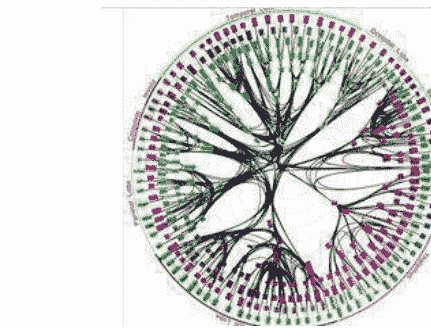

我选了这个图片让你们了解廉贞，廉贞算是我比较喜欢的星星，当你了解了廉贞，你会觉得廉贞是很可爱，很耐人寻味的星星。廉贞代表复杂，所以这个图很复杂。廉贞代表精密系统，又复杂，又是精密系统，还代表电子，其实最好代表廉贞的就是我们的手机、电脑、网络，都是廉贞。我有时候断人家网恋，也是取廉贞，特别是流年夫妻宫对面有廉贞的，流年官禄宫有廉贞，都容易发生网恋事件。廉贞因为属丁火，代表霓虹灯，因此也代表五颜六色，也因此，跟艺术天赋扯上关系，因为廉贞不喜欢跟别人一样，每个人做，他就不要做了，因此，他设计出来的，反叛色彩也比较强烈。

廉贞有三个属性，我们一个一个说。

先说丁火，意思是小小的火。有人说过，太阳是车头灯，廉贞是车尾灯，有时候你要断人家车祸，撞爆的灯，看见是廉贞有问题，那么都是车尾灯，太阳有问题，那么是车头灯。廉贞也可以代表广告牌，有灯的那种，其实这种丁火，也是一种瓦斯，你要看成是气体，这是廉贞最基础的模型，因为廉贞会变化。小时候的廉贞，都容易被欺负，都比较弱小一些。然后慢慢的，防御感就越来越高，所以，就变成了，化气为囚。什么是囚呢？这跟廉贞的第二个属性有关。

就是廉贞也是属戊土（阳土），在卦象，我们叫连山艮，意思是两座山的意思，两座山，意思是被两座山包围住的气体，里面是火，是瓦斯，弱弱的瓦斯，慢慢的外面包围成两座山，因此叫，化气为囚。这个囚，代表的是廉贞的保护欲很强烈，另一层含义，跟廉贞的际遇有很大关系，不管是紫微也好，玄空九星也好，八宅明镜也好，廉贞都代表很严重的煞气。在玄空，廉贞有个名字，叫五黄煞，记得，廉贞就是五黄煞，五黄煞代表突然发生的意外。在紫微，廉贞代表官非。风水学里，有一种山，我们叫【廉贞山】，就是那种断山，一半已经被劈开了，剩下的一半，光秃秃对着你的，也是可以的。那种形状怪异的，不生草的山，有点像戈壁的那种，就是廉贞山，对上的，都不会有好运气。紫微里面，廉贞我们也叫冤亲债主，为什么有这种特别的名字，是因为廉贞化忌起来，人家干一百次没被抓到，他想一下就被关起来了，还没做呢，运气很背，意思是廉贞化忌的人做坏事，会有冤亲债主去通报，所以，官非就立刻找上门，这也是廉贞化忌是冤亲债主，代表官非的来意。为什么其他的又不会呢，因为其他星星干坏事，不会马上被抓到，廉贞干坏事会马上被抓到，因此，就叫官非星。这是代表廉贞的保护欲，防御性的来源，因为他倒霉，他需要防备，另外廉贞也叫次桃花，很多人不懂是怎么来的，这是源于他第三个属性，乙木。

为什么会有乙木这个属性，是因为廉贞的疾厄宫是天机，廉贞的一六共宗是天机，天机也是乙木。所以天机多么聪明，廉贞就多么聪明，天机也代表兄友，所以你可以观察出来，就是给人感觉酷酷的廉贞，好像真的不缺朋友的。廉贞善于交友，这也是他其中一个次桃花的倾向，他有一定的交际能力，有一定的交际手腕，所以廉贞不缺朋友。不过别看他叫次桃花，就以为他也是花花公子，他也许长得很playboy，但是实际上，廉贞，这个廉洁+贞洁，代表廉贞都有性洁癖。廉贞最接受不到的就是肉体背叛，不管你怎样跟他说什么逢场作戏，不会有下一次等等，只要是廉贞化忌，背叛一次，他就只有一个念头，就是你很脏，流限遇到廉贞，也有这种倾向。你之前的事他可以不理会，但是你一旦跟他在一起就不能有肉体背叛。然后，其实这个要求只是对你，不是要求他自己。书上有个典型的，就是他可以保证他精神上是爱你的，但是他无法保证他肉体不背叛，相当矛盾的廉贞。总结一句，他可以这样，你不可以这样，你这样就无法原谅。你要求太多，他就说其实我不是很爱你，不过有个前提，就是结婚之后的廉贞，都保持贞洁。要结婚之后，结婚之前就没有保证。廉贞也有一种奇怪的习惯，比如说，他不喜欢的异性太靠近他，他会自动散开，不太喜欢异性很靠近他，除了自己的伴侣，他就是黏住的。因为他有囚性，他要他的配偶也是一样，很有囚性，被他囚起来，跟他一起关住，所以在感情上，特别可爱的星星。

廉贞都喜欢电子，喜欢设计，喜欢发明和创造。其实和廉贞恋爱是一件很痛苦的事，他们都不喜欢表达爱，他们表达爱的方式就是一直检查你，检查你的手机，检查你有没有背叛的蛛丝马迹，这就是他们表达爱的方式。你问他，你爱不爱我，他说，有一点吧。他不喜欢给对方知道自己很爱她，他不喜欢给对方知道自己很爱她。所以很奇怪，很矛盾的星星，特别是感情上。他喜欢检查，然后你不检查他，他就抱怨你不紧张他，他会说，为什么你都不检查我，是不是你不爱我了这种话就不会说。

### 组合

| 廉贞贪狼 | 廉贞天相 | 廉贞七杀 | 廉贞 |
| :---: | :---: | :---: | :---: |
| 廉贞天府 |          | 廉贞破军 | 廉贞天府 |
| 廉贞破军 | 廉贞组合 | 廉贞天府 |          |
| 廉贞     | 廉贞七杀 | 廉贞天相 | 廉贞贪狼 |

古书说，廉贞最难明，因为廉贞很容易受影响，他跟好的星星在一起，他就变好，他跟不好的星星在一起，他就变不好。廉贞是恶星，喜欢反叛，喜欢不一样，但是，跟天相在一起，他就麻烦了。天相是忠臣，而且天相属水，会制廉贞的恶。比如那种，白天是老师，晚上去喝酒的，那种就是这种类型的，天相怕跟别人不一样。

廉贞贪狼，都是桃花星，这个要预防喜欢赌，不一定是赌博的那种赌，比如说赌感情，赌事业，任何一种赌。也容易有酒色的含义，就是不乖巧的组合。不过廉贞贪狼有个特性是很好记的，就是他们认为自己品味很高超，很有品味，善于打扮，喜欢精致的东西，廉贞贪狼都喜欢那种很贵，很精致的东西。廉贞不太喜欢跟别人一样，因此，就容易喜欢贵的，越贵就越不一样嘛。也容易变成名牌主义者，或者会稍微有点爱慕虚荣，爱美之类的，是他们公认自己的品性。

廉贞天府，是很有意思的，你直接说喜欢发明，这是那么多组合里面最喜欢躲起来研究的组合，廉贞是精密电子，天府是盒子，坐福德宫的人也有这种倾向，而且都是对电子，或者计算方面很有天赋的一群。超级宅，因为这是三层防御的盾，防御型最强烈的组合，廉贞是囚星，这是第一层，天府是盒子，这是第二层，天罗地网是第三层。防御型很强烈的组合。他们会怕别人害他。

廉贞破军，是我最想不通的组合，这个组合最耐人寻味的地方就是，你给他一个挑战性，难度等级最高、最难搞的活儿，他一边骂一边抱怨但是就是不放弃，不辞职。有一天，你没事给他干了，工作全部轻松了，可以做很快了，他告诉你，他要辞职了。你纳闷的问，为什么呢。他说，人生不是应该寻找挑战的吗。我有个经验，就我带着一个廉破的朋友，去看一个廉破的盘，一共两个廉破，我就看了看那个盘，我说，你工作好像没什么事，很轻松，你想问什么。她说，我想辞职。然后我问，为啥呢？！她就说，因为无聊，没有挑战性了。然后我说，我实在不明白，这样不是很好吗。我坐在一边的廉破朋友说，唉，依婷，你不了解我们廉破。所以他们就是这种类型的。我看来是比较犯贱的，喜欢去挑那种难度很高的。

流年看见廉破，或者大限看见廉破，都有培训的可能性。

廉破有个弊病，多数廉破都中的，就是廉破的奴仆宫一定是巨门，就是廉破的奴仆宫一定是巨门，就容易有暧昧，或者地下情的问题，见不得光的，或者恋爱之后被隐瞒的，我在一个几乎是隔天看了两个廉破，女盘，都遇过这种事，就是交往的时候，男友要隐瞒恋爱关系，没有对外公开。有一天，男友要结婚了，新娘不是她，而且还是恋爱了三年的那种。就是说，要有飞化的挂钩。然后我这个廉破的好朋友，自己就跟一个已婚的在一起，也是地下情很久，后来男的离婚娶她，后来那男的又外遇。一般是流年回到廉破这个宫位，有可能是奴仆宫飞入夫妻宫，或者夫妻宫飞入奴仆宫之类的。总之意思是奴仆宫有巨门的，会容易发生这种暧昧的故事。

廉贞独坐在寅申，这是雄宿朝元格，代表有一番成就的强格，规划能力一流的格局，邓小平就是这个廉贞坐申。廉贞是反叛，破军是突破，但是这两个对桃花都不好，因为廉贞精密也代表乱，破军破耗也代表乱，一般上家庭关系也不太好，但是不是全部，就容易有这种情况。

廉贞坐命的小时候家庭都容易有问题，导致了廉贞小时候就有自闭的倾向。我也看过一个导演的盘，马来西亚导演的盘，是廉贞坐申，代表廉贞寅申的规划能力都很强，可以做导演，可以当国家主席。

廉贞坐寅申，一定是紫府朝垣格。这就不多解释了，反正记得，廉贞独坐在四马地的那个格局，叫雄宿朝元，是大格。

廉贞七杀，有书上说廉贞七杀，路上埋尸，这是有个典故的。据说，有个古人，他个性桀骜不驯，然后他交代他的仆人，他死在哪里，就在路边挖个洞，把他埋起来就好了，刚好也是这个格局的盘。是形容一个人在外在环境的适应能力，和认为哪里都是家的含义。适合去外地发展，他自己也会去外地发展的。然后要说能不能成立成意外格局呢？其实也可以的，特别是七杀坐迁移宫，廉贞冤亲债主，也代表突发事故，不过要先看看这个廉贞有没有化忌，平常的廉杀不会车祸，忌冲的情况才会，或者加上擎羊这种暴力星。廉贞七杀还有一个格局，叫积富之人。这不是代表他一开始就很有钱，而是因为廉贞是小火，七杀是金，刀子，这刀子被烤一下，烤一下，然后就变成了宝剑。所以反而成为了吉格。吉在廉贞七杀的鬼点子多，廉贞七杀也叫鬼才格，很聪明，很善于计算。廉贞都善于计算的，但是他不善于计算简单的，他善于计算那种高级数学呀，特别复杂的。廉贞也很有方向感，空间感。

在兄弟宫，其实在六亲宫廉贞都代表冤亲债主的，跟子女宫类似，就是那种故意跟你唱反调的。在兄弟宫时好时坏，要看看有没有化忌，不然就是断你有个个性比较特别的朋友，或者兄弟。化禄就很好，廉贞也可以说是聪明，就是属于那种创意的聪明，比如发明家，艺术家，精密电子那种聪明。化禄的话就是代表桃花多，有艳遇，因为廉贞次桃花，也有人说，是叫文艺桃花，特别是有化忌在四马地，也代表分离。

如果廉贞化忌坐夫妻宫，就代表配偶会管制，有囚性等等，容易吵架。

在子女宫因为有血的含义，血也代表精血，因此都看成是性欲高。

廉贞坐疾厄宫也会影响性欲高。

坐财帛宫，比较不宜，因为会有赌性。因为廉贞不信邪，也喜欢有挑战性，所以也不易守财。坐财帛宫也代表喜欢买电子产品，财帛宫坐天机，昨天我说了，喜欢买车子。廉贞的财，尽量是流动会比较好。所以，也是建议就是多多少少学习经商，逢化忌、天刑、擎羊，这种凶星，要防官非。

在疾厄宫，有个特别的含义，廉贞坐疾厄叫得难明症，或者【叫不出名字的病】，通常是看成疑难杂症。也有书说就是会得癌症。不过根据我的验证，我有个很好的案例，我就说，你这个廉贞代表你常常得到【叫不出名字的病】，然后坐在一边的他的老婆就一直哈哈哈大笑，原来他每次觉得有病，最近的一次他脚痛，结果他去医院扫描，医生扫描不出什么毛病，但是他坚持要医生开刀弄一下，然后就开刀，开刀之后，还是会痛，别人问他医生说你得什么病。他说，医生说他也不懂什么病。所以，这个要特别注意一下，就是难明的病。书上是这样写的，廉贞是血，血不干净的病，而且血影响的病，最难查明，也代表淤血，积血等等。最后不懂得处理，就是癌症。然后也代表会发炎，因为跟血有关系。

在迁移宫呢，代表喜欢新鲜的事，比如有空，会想去探险爬山。

在交友宫，和在兄弟宫一样。

在官禄宫，我看过几个案例，都是做会计的。貌似廉贞真的容易做跟数学有关系的工作，反而天同太阴容易做电脑行业。

在田宅宫，代表要注意家里电器容易坏，流限遇到特别要注意，如果有火星，还要注意因为电器走火导致火厄，火星坐田宅宫容易有火厄，这个也要留意一下。

坐福德宫，代表心劳，很多奇思妙想的，然后想发明创造什么的，都难以执行。

在父母宫，代表父母的情绪难以琢磨，会突然发脾气。

廉贞最主要是要防官非，因为廉贞是官非星。七杀是血光星，七杀的脾气是发过就算了，就是要防割伤之类的，星星的本质一定要清楚。比如说，太阴是田宅星，天机是手足星，武曲是正财星，贪狼是桃花星。

#### 天府

斗分：南斗一
阴阳五行：阳土，戊土
化气为令
财帛主，田宅主
颜色：红黄

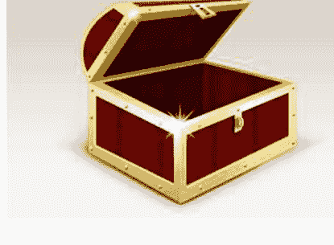

天府就是盒子，宝盒，可以装东西的盒子。所以看天府格局，最重要是看和什么一起。比如说天府和文昌文曲一起，是装书。天府和禄存在一起，是装钞票。这个要自己联想一下，就是以格局去思考，这个天府是偏向于什么。

天府也叫【学习之神】，所以，天府的学习能力很强。可以说博学多精。天府学东西很快，几乎就是举一反三，而且最重要的就是没人看见他学习，但是他却考的很好，出来工作之后也是这样。每个人看天府都是悠哉悠哉，但是实际上他什么都做完了。为什么天府都这样呢，原因是天府的迁移宫是七杀，七杀做事是很直接的，而且速度很快，一针见血。因此，天府的这个格局导致了他做事很快，可以同一个时间做很多事，但是每个人依然看不到他什么时候做事，什么时候读书了。

天府的学习能力有一部份是源于他的福德宫，坐贪狼，贪狼甲木，是教化，启蒙之星，因此影响了天府的学习能力，也喜欢指导别人，天府化气为令。就很多人不明白，为什么天府叫老板星，第一，因为天府暗藏欲望，贪狼坐福德宫，照财帛宫。第二，天府是南斗星，本来就跟紫微一样，有一种power，就是他叫你做，你就自动去做。天府是南斗之首，紫微是北斗之首，两个都是皇星。然后呢，天府是管杀破狼的，自然不会太安份，但是因为有刀的含义，这个天府他不喜欢这种有刀子含义的星星在一起，因为我们叫露库，意思是割开宝盒给大家看，天府本身就有表现欲望的。

天府最主要就是两种特别情况，最完整的天府是不会随随便便表现出来自己很厉害。天府最厉害就是给你一副老实人的模样，其实骨子里是杀破狼，但是露库就不一样了，就是代表天府被破坏，比如擎羊，火星，天刑，这种有破坏含义的天府，通常表现就是喜欢表演，表演自己有多厉害。

在财帛宫，就是不守财，露库就是不懂得收，天府收藏，自然有原因，最厉害的底牌当然不可以给别人看。最理想就是天府加禄存，羊驼两边保护。陀罗铃星这个组合，是纠结的意思，天府是盒子，里面装着两个人，一个叫铃星，一个叫陀罗，铃星忍一下就要爆，但是陀罗说，再等一等，再等一等，忍多一下，代表这个天府表面看若无其事，很大方的，实际上里面很纠结、不安心，担心很多。通常这个天府，铃星陀罗都会有委屈，但是都忍住，陀罗铃星是最厉害忍的，因为铃星要发脾气，陀罗会安慰，会说好话，就像要滚开的汤，你在那边搅拌，永远也滚不上来，所以，铃星陀罗就是遇到了委屈，自己内心会说好话，会说是自己误解了人家啦，其实对方没有恶意的，陀罗会跟铃星说这种话，然后就忍下去。这种化解的方式就是要学习收藏，没有其他方式，要有对财运的话，每个人都要注意的，就是要注意钱包不要破，因为钱包破也是叫破库，不管你的天府有没有破，你的钱包破了就要换。

### 天府格局

- 太阴坐父母宫，管父疾线
- 贪狼坐福德宫，管财福线
- 巨门坐田宅宫，管子田线
- 天相坐官禄宫，管官夫线
- 天梁坐奴仆宫，管兄友线
- 七杀坐迁移宫，七杀永远在天府对面
- 破军坐夫妻宫，管官夫线

天府的夫妻宫一定是破军，有一个名词很好用，叫【破军模式的爱情】，这种爱情就是爱的时候，倾泻一般的爱到完，跟大海水、大海啸一样的去爱。因为天府福德宫是贪狼，有罗曼蒂克的倾向，有那种爱情的狂想症，所以爱上的时候，跟大海水一样的去爱，给到完一切，毫无保留。但是这有缺点，就是遇到不好的配偶，就纵容了对方，因为夫妻宫是对待位，是相互的，他对爱情的要求是一样的，他给那么多，你也一样要给那么多，不能不公平。但是不是每个人可以给这种冲马桶模式的罗曼蒂克，所以就导致了天府的心理不平衡，极端的给，极端的忍（破军会忍），最后boom！破军的爆炸效应出来了，就噼里啪啦的骂，为啥我给了那么多人民币，你没给我就算了，你还XXXXXXX，就开始吵了。这也是最容易离婚的一个格局，不过根据经验，如果天府遇到好的配偶，要合盘，对方也是给予相等的爱，那么就会很恩爱，感情如意，两夫妻甚至会有钱，不过，这种概率是比较低。破军膨胀效应，喜欢极端。

天府的田宅宫是巨门，代表天府的家里是非很多，巨门在田宅宫，也有个特别的意象，可以去找一下验证，就是家里的门很大，【巨门】，很大的门。也有说法就是巨门坐田宅，喜欢家里暗暗的，喜欢在家里研究，因为巨门也喜欢研究。

06.10
先补充一个，廉贞天府有收藏癖好，而且只收不给人那种，你问他100次，可以丢吗，100次都不能丢，如果你丢了，你别告诉他，一辈子都不会发现。

谈到天府，特别说，科星，天府不四化，原因是天府本身就是个科星，最大的科星。什么是科星呢？就是有这些含义的，才华，表现，贵人，好看。除了天府是科星，还有文昌文曲，天钺天魁，也是科星，还有就是化科。这些星星都容易引人注目，特别是当这些科星都汇集在三方四正的时候，就特别容易有名气，特别容易吸引贵人，也特别善于表现，科星，也是代表才华，因此也有一定的学习能力。

天府理财方面，其实是抠门，但是从来都不会有人觉得他抠，别人会觉得他们很大方，这就是天府有隐藏的功夫。比如说你永远看到他悠哉悠哉，不需要烦恼，你看不见他们学习，但是好像很有知识，你看不见他们工作，但是工作都做好了，你看不见他们抠门，还认为他们很大方，这就是天府这个面具做的很好。

天府有个神奇的power，就是他永远可以买到比别人便宜的东西，但是别人还以为是名牌，或者很贵的东西，实际上有可能就几块钱，你以为是几十块，他们有这种能力去买到价位很低，但是品质看不出来的货。因此，这也成为了天府当老板的潜力，因为他会买便宜，你不会。你跟他买，他赚了你的钱，你还要觉得他卖得很便宜。
天府对身边人就会比较计较一些，多数天府都容易离婚。

天府很爱唠叨自己的母亲，那种在家里比母亲更像母亲的孩子，多数跟天府有关系。

天府坐兄弟宫，通常你也可以说你兄弟有人是老板，或者学习能力好的。因为兄弟宫本身有资金位的含义，因此天府这个库星坐兄弟宫，也代表此人会存钱，善于理财。

天府坐夫妻宫也是一样，可以把天府的含义直接套入，有可能是老板，学习能力强等等，或者看起来比较端庄。另外需要分别一点，天府，天相，贪狼有一些相似。我们用品味来区别，天府喜欢端庄的装扮。天相喜欢流行的，因为天相怕跟别人不一样，但是绝对不会穿着夸张。贪狼的装扮就比较注重特殊感，他们会很讨厌撞衫。

另外天府是不喜欢去大排档吃东西，主要是卫生问题。因为天府的父疾线是太阴，太阴对照了他们的疾厄宫，因此有洁癖的倾向。贪狼喜欢吃零食，喜欢吃大排档。天相是衣食之星，所以只要想吃的一定可以吃到。

天府坐夫妻宫，男命的代表配偶善于理家。但是我有个案例，离婚的，就是他的夫妻宫是天府星，当我说，天府代表皇后的意思，他就说，对对对，她不能坐地上的，她一定要坐沙发，会有那种别人误以为你很高级的那种仪态，这是天府的毛病。喜欢装自己高贵，因为是科星的问题，科星也代表好看，代表礼仪。

天府坐子女宫，代表子女会孝顺父母，学习能力好。

天府坐财帛，代表赚钱的路子广，这跟前面我说的一样，他们很神奇的可以买到比别人便宜很多的东西。所以，对赚钱，或者做生意都有利。 天府只要是做三方四正都有这种做老板的倾向。

天府坐疾厄宫，代表胃，属土就代表胃。然后也会有脚气，腿浮肿，如果和属火的星星一起，比如说，天府火星，就代表胃热。天府坐疾厄，一生都没什么病痛。

天府在迁移宫和交友宫，都代表朋友圈子比较多老板级的人物，然后会比较听这些朋友的，会希望能借助这些朋友得到赚钱的机会，这也因为天府科星，科有贵人的含义。

天府在官禄宫，也是代表善于经营，走保守路线。

天府在田宅宫，一般天府坐田宅宫都代表豪宅，高级住宅区，别墅。也代表小时候家庭环境已经很不错。是唯一一个坐田宅宫代表豪宅，洋房的星星。

天府坐福德宫，命宫一定是破军，代表愿意付出，也比较保守，所以为什么破军会保守，会忍，就是因为天府坐福德宫的原因。

天府在父母宫也是跟其他六亲同论。天府整体来说，都是吉星，一般比较大区别的计较论法，就是看是不是破库，其他都很简单。

#### 太阴

斗分：中天星
阴阳五行：阴水，癸水
化气为清明，富贵
田宅主，财帛主
颜色：黄白
四化：丁禄，戊权，庚癸科，乙忌

| 太阴       | 太阴天同   | 太阴太阳   | 太阴天机   |
| ---------- | ---------- | ---------- | ---------- |
| 太阴       | 太阴组合   | 太阴       |            |
| 太阴       | 太阴组合   | 太阴       |            |
| 太阴天机   | 太阴太阳   | 太阴天同   | 太阴       |

太阴组合：
寅申：太阴天机
卯酉：太阴独坐，对宫天同
辰戌：太阴独坐，对宫太阳
巳亥：太阴独坐，对宫天机
子午：天同太阴
丑未：太阴太阳

太阴是代表女人，在天上是代表月亮，所以我找了嫦娥的图片。太阳太阴我们都叫中天星，因为既不是北斗，也不是南斗，是我们可以看见的太阳和月亮。跟太阳一样，太阴也是根据白天黑夜来定落陷庙旺，太阴的含义就是跟太阳反义词就对了。太阳发散，太阴内敛。太阳喜欢为别人花钱，太阴喜欢收钱，一点一点收。太阴也天性比较敏感，特别是对别人的批评，会在意很久很久。太阴也代表清洁，所以有些人说太阴有洁癖，我个人觉得，不完全是，就是太阴会比较注重整洁，最重要是整齐，整齐排第一，清洁排第二。所以有些太阴也可以几天不洗澡，因此，下次就说，喜欢整洁，这样比较正确。

太阴是田宅星，是可以直接看太阴和什么星星在一起来论田宅运。比如说，太阴和地空地劫在一起，地空地劫是缘短星，因此可以看成就是住的地方，缘分很短。有个案例就是太阴地劫在一起，田宅宫是破军，她的太阴是在迁移宫的，然后她几乎是每一年都搬家，很夸张的一个例子。一般会结合看。

太阴有个很好用的用法，就是在对面，都代表外面有家，或者外面有女人，可以直接这样取象，也有可能代表在外面住。有时候，我看见流年，官禄宫对宫有太阴天机。我就说，你今年会常常出差，在外面住，就是因为太阴在对面，就容易在外面住。

紫微斗数命盘表格（包含命宫、兄弟宫、夫妻宫、子女宫、财帛宫、疾厄宫、迁移宫、交友宫、官禄宫、田宅宫、福德宫、父母宫等宫位及星曜分布）

这个盘是很好的例子。这个命主离开家乡，正在申请当香港公民，但是她是每一年都在搬家。我们看田宅宫，有破军，田宅有破军，叫家破之象，但还不够看出来她是年年搬家的，而且会离开家里，所以，我们又借了多一个信息看，也就是迁移宫有太阴，田宅宫，太阴+左辅，就是很多家。太阴+地劫，就是跟这些家的缘分很短，因此她就搬了又搬，年年都在搬，如果你只是取田宅宫，你看出来这个象，所以，看田宅，要一起看太阴星。一样的道理，看朋友的事，要一起看天机，因为天机是手足星。别管那个太阴在哪里，反正太阴的格局就代表田宅运。

| 宫位/内容 | 详细信息 |
|-----------|----------|
| 天福 | 紫七红天天 微诚破微耗 旺平平旺 |
| 迁移 | 天天机右弼 机梁辅弼 庙旺庙旺 |
| 白虎 | 太阴左辅 庙旺不旺 平庙 |
| 天刑 | 武曲破军 庙旺不旺 平庙 |
| 福德 | 壬官父 癸丑天官符背 官符 13-22 官府 |
| 父母 | 癸丑天官符背 官符 13-22 官府 |
| 命宫 | 壬辰官子 府杀 3-12 官杀 |
| 兄弟 | 辛亥生年 病生 113岁 |
| 子女 | 庚戌年 病息伏 符神兵 |
| 夫妻 | 戊戌年 岁华官 建盖府 |
| 其他 | 【先天命盘】玄奥软件 - www.xazhouyi.com 姓名: 未知地(经度:120:0) 公历:1982年9月1日5时20分(真太阳时) 农历:壬戌年七月十四日申时 四柱:壬戌年 戊申月 丁亥日 戊申时 命局:阴男(壬戌) 木三局 命宫:子 命主:贪狼 身宫:辰 身主:文昌 子斗年君:寅 |
| 星曜组合 | 太文左天天八天天 阴曲辅魁马座巫福虚 庙旺不旺平庙  庙平 禄 9,21,33,45,57,69 奏书 岁驿 岁破 94~103 子女宫 |

空宫是大限的官禄宫。【大限官禄宫忌冲流年官禄】。其实有关系的，因为大限是管十年，然后还需要在大限的十年里面再找，哪个流年的事。总结就是，太阴在对面，就容易去外面住。在官禄宫的对面，就代表是为了工作的事。

在夫妻宫的对宫，那么有两层含义，第一，这人的配偶有可能是有在外面住过很长时间。第二，这人的配偶，外面还有家。两种命例我都看过，第二种那个盘是别人的小三，一当就是三十年。所以可以观察一下，多一点验证。

太阴的兄弟宫是天府星，兄弟宫是资金位，这就是为什么太阴容易富有，有存钱的习惯，因为他们的资金位有个银行，天府星。如果有兄弟姐妹的，就是他们的兄弟姐妹有可能是老板。

太阴的子女宫是破军，这太阴也不能随便生病的，意思是太阴格局不好，逢忌煞，为什么呢，因为太阴管女人的下阴位，因此比如说，太阴化忌的人坐命，女人，会有肾虚、子宫寒这种毛病。因此看太阴的命盘，看见破军先别断人家流产，意思是说有这个风险。然后要看看太阴美不美，不美，流产风险就高。

你可以理解成太阴是先天体质寒的，也代表太阴坐命的人，孩子是个破坏王，有可能太阴比较完美主义，喜欢整洁，只要是小孩子搞乱（实际上所有小孩都搞乱），在他们的世界观就是【破坏王】。比如喜欢拆除玩具，弄坏东西，弄到家里乱七八糟。破军一般坐子女宫，都比较不好，有流产的风险。破军是什么，大海水，我昨天说，冲马桶的力度，所以也代表容易流产。但是具体必须参考太阴。太阴化禄，就不会这样。

太阴漂亮的，加吉星，就不会这样。不美，比如说，太阴+煞星，太阴化忌，然后又落陷，就是叫不美。意思是说，你看太阴的子女宫时，不要直接断人家容易流产，要先看看这个太阴的格局好不好。太阴的格局不好，就容易流产。因为太阴管女人的子宫，不健康自然容易流产。通常我们就说，太阴觉得自己的孩子是破坏王，老是很担心自己的孩子会弄坏东西。

太阴的奴仆宫是七杀，七杀其实坐六亲位都容易绝交，因为代表刀，一砍下去就断。比如说，昨天我看那个@千色 的盘，七杀坐夫妻宫的，很快就分手，就是这个原因，七杀喜欢快。七杀坐太阴奴仆宫，自然也代表太阴觉得这个朋友不能深交，就容易慢慢的不要联络。七杀是来得快去得快的含义。

这是离婚格，婚姻不利的。因为是对待位，因此，有可能是你觉得对方这样。现在叫【分手格】。

太阴的官禄宫是坐天梁的，所以照顾人的那种事业，或者容易得到上司，长辈的欣赏。在工作上，没有人是容易的，都是靠努力。今天下午看一个盘，天梁化禄坐官禄宫，然后我就问他，做什么工作。他就说，直销。他是做保健产品，而且还是跟着父亲做。天梁刚好也是长辈星。太阴哪怕不卖保健产品，也会吃保健产品。因为官禄是代表责任，代表太阴对健康，保健都讲究责任，也很容易得到上司的青睐。

另一个层面，就是天梁坐官禄宫，可以通过关心别人得财。

太阴的田宅宫是坐天相，天相也是属水，太阴也是属水，天相的对面破军也是属水。这代表什么呢？我们用泽念的盘讲解这个案例，代表家附近一定很多水，或者有水的地方。

紫微斗数命盘表格，包含十二宫位、星曜分布、四柱八字（公历1982年9月1日15时20分，农历壬戌年七月十四日申时）、命主信息（阳男，命宫子，身宫辰，子年斗君寅）等。

泽念的家，北方，有很多水。（小区南边一条河，东边一条河，北边是海）所以都有了。

太阴住的环境很容易靠近水。另外天相也代表好看，这也是另一个原因，太阴注重家居整洁，一般田宅运都很好，毕竟是太阴坐命，田宅星坐命。不过要注意一点，就是如果这个天相格局不好，有化忌，有煞星，要注意购置资产时候的文书问题，因为天相是文书星，是印星，特别是名字、遗嘱这些问题，在房子、不动产方面都要注意。因为泽念的田宅宫对面是廉贞破军火星，因此，他也遇过这种问题，手续问题、文书问题。太阴是可以直接看成家运的。

太阴的父母宫是贪狼。古书是喜欢这样写，就是太阳坐命就对身边的男性不利，叫【夺父，夫，子】星。太阴坐命就对身边的女性不利【也叫夺母，妻，女儿】星。不过，通过验证，没这种事，很多双方关系都很好，就是贪狼有生离死别的含义，古人言重了。意思是容易聚少离多，当然特别是长大之后。见面的机会也许会少，有些小时候就体现出来。这都需要重新验证，杀破狼的含义都不是太好。

### 贪狼

- 斗分：北斗一
- 阴阳五行：阳木，甲木（外），阴水，癸水（里）
- 化气为桃花，杀

这贪狼有好多名字，管的也是很多种，比较复杂一些。比如贪狼是劳碌星，最劳碌的星星，这些要从欲望开始说起。贪狼是管理欲望的，叫欲望之神，你们就想象，天上有个神，叫贪狼神，是妲己的化身，她会制造欲望给你，让你贪心，所以，贪狼坐什么宫位，那个宫位会让你产生贪心。有可能坐父母宫也会比较贪心父母爱。那么，有了欲望，自然就容易劳碌，你要追求欲望，所以，也叫劳碌星。凡是遇到贪狼流年都会忙碌，都会浑身有欲望。

坐福德宫，我们叫劳心。贪狼也叫祸福主，管理福祸。意思是福也是他，祸也是他，不过，我暂时找不到相关的验证。

另外，就是我说的，贪狼也是离别星。书上是比较严重的说，生离死别。

贪狼也是桃花星，正桃花星。廉贞是次桃花星。贪狼的桃花，比较像是应酬、幽默感、交际、娱乐那种桃花。贪狼也代表酒色，比如说贪狼坐命的人，会想偷偷的喝酒，看到别人喝好像很好喝。

贪狼也叫启蒙星，因为有甲木的含义，是教化之主。

贪狼也叫【神仙星】，所以很复杂。贪狼喜欢神仙术，武曲喜欢宗教，是不一样的。神仙术比如什么呢？就是有了某个能力之后，就有特别的power。他们喜欢研究这种可以提高能力的，包括房中术。所以叫【神仙星】。贪狼很复杂。

先从属性开始区分。贪狼有两种属性，一种叫，甲木，就是大树、盆栽、桃花，阳性植物。要增加桃花运什么的，就要种花。上次我教@橘橘子 改善桃花运，我让她在窗口边种三盆桃花，果然原本不搭理她的男人，第二天就打电话过来了。为什么要取三盆呢，因为夫妻宫是排第三个宫位，那么要增加财运，就要放五盆，因为财帛宫是属五。1、5、9，是洛书数，1是命宫，5是财帛宫，9是官禄宫，在洛书的正中间三个号码。所以宫位都有自己的数。放五盆，贪狼是增加财运的，是意外之财的含义。当然这不是保证的，不过可以试试看，最好是流年财帛有贪狼的时候试试看。

贪狼的甲木，是代表启蒙，代表教化。所以有些贪狼是当老师。贪狼都喜欢分享，贪狼也喜欢观察人，喜欢研究人性，是一个活生生，代表人的星星。贪狼的桃花性质，是来自于癸水。因此也有书上说，你看贪狼，该如何区分，是甲木（斯文的）贪狼，还是癸水（妖艳的）贪狼。

首先，第一个参考点，就是看宫位，用时间看，早上的贪狼是甲木，晚上的贪狼是癸水，越后面的贪狼，就越妖艳。一般上贪狼坐寅都很乖巧，很正经八百，也不喜欢交际。贪狼坐子，就是叫泛水桃花，桃花性质就更重了。另一种方式就是看出世的月份，意思是，秋天生人就是甲木的，冬天生人，就是癸水。所以看贪狼是很讲究的，不要一看见贪狼就断人家天天去喝酒。要区分，这个是偏重甲木，还是偏重癸水。其他方式就是看组合。比如说，这贪狼，和红鸾，咸池，天姚这些色情星星的组合在一起，那肯定是癸水。这贪狼跟地空地劫在一起，就肯定想炼仙的，因为地空地劫有那种精神高超脱俗的含义。所以，你要看贪狼和什么星星在一起。

而贪狼如果和文昌文曲在一起呢，就有个格局叫，离正颠倒格，也叫粉身碎骨格。书上格局的名字永远那么可怕，实际上也不会粉身碎骨的，是代表有分离的情况，而且有代表离正颠倒的情况。知道谁的盘是这种标准的格局吗？毛xx的盘，而且还是拆马忌，我们从他的一些经历来增加记忆，他有粉身碎骨吗？没有。不过，他当时确实算是离正颠倒的，因为他正在革命，就是要颠倒朝政的意思，他要颠倒什么？他要颠倒资本主义，这就是他的【离正颠倒】。刚刚我们也说了，贪狼是生离死别，离别星。再看看他的家族历史，包括他的老婆、兄弟等等，据说在他之前，三个哥哥都是夭折的，他其实不是长子。贪狼文曲化忌，所以比较凶，而且同时有拆马忌，所以根据历史，他的六亲也缘薄。据说他也很喜欢研究五术，自己也学奇门遁甲。而且他特喜欢发表文章教化他人，久不久就有文章说什么，他教化人的能力很高，影响力也很强。这就是贪狼的威力，贪狼在他身上是发挥得100分了。

贪狼：
- 欲望
- 劳碌
- 启蒙教化
- 神仙星
- 桃花星
- 离别星

贪狼坐命的人，在资料上就是写八面玲珑，手腕高，又会吟诗，又会喝酒，又会修炼神仙术。反正就是一句话，热闹的事，就有他的份。

然后再谈，火贪格，和铃贪格。有人说，是暴发时间，突然发财的含义。但是经过了一些验证，貌似没发生这种事。不过，却有共同的意象，就是突然发生的事。确实是暴发，但是不一定是中彩票。好事也有可能，坏事也有可能，就是突然发生的事。也有人问，是不是一定要在三方见到才有这个威力？其实这个，任何格局，比如 KL 贪狼坐命，他没有遇到火星，但是他某个流年遇到火星，这也会成格。代表该年他也一样会遇到比较突然的事。其他格局也是一样。比如阳梁昌禄格，本命坐阳梁，大限遇到昌禄，都利考试。不同宫，意思是，任何格局都可以，本命有一半，大限有一半，都可以成格。我之前有比喻过，就好像有个穷学生，没有书本看，所以考试不好。某一年他去一个老师的家主，突然看了很多书，他原本是阳梁格，那年就是昌禄格，因此他那年考试也得利。所以格局是可以本命和流限拆分。

# 【第八周】

## 06.15

### 贪狼格局

贪狼组合：
- 寅申：贪狼廉贞
- 卯酉：贪狼紫微
- 辰戌：贪狼独坐，对宫武曲
- 巳亥：贪狼独坐，对宫廉贞
- 子午：贪狼独坐，对宫紫微
- 丑未：贪狼武曲

贪狼廉贞，是代表喜欢精致的东西，桃花也会比较重，比较爱热闹。

贪狼武曲，主大，是最劳碌，最晚发的格局，流年转到也会有这种效应，总之12宫，一定会转到。也是那么多贪狼，最劳碌的组合。

紫微贪狼，是代表喜欢特殊性的。爱好也好，爱人也好，事业也好，平平凡凡的不喜欢，有极端去爱的倾向。也容易染上恶习，如果你是太阴就不会，或者武曲也不会。太阴，武曲都不容易受到影响。不过你是贪狼就容易被传染。

| 巨门 | 天相 | 天梁 | 七杀 |
|------|------|------|------|
| 贪狼 |      |      |      |
| 太阴 |      |      |      |
| 天府 |      | 破军 |      |

#### 贪狼格局：
- 巨门坐父母宫，管父疾线
- 天相坐福德宫，管财福线
- 天梁坐田宅宫，管子田线
- 七杀坐官禄宫，管官夫线
- 破军坐财帛宫，管财福线
- 天府坐夫妻宫，管官夫线
- 太阴坐兄弟宫，管兄友线

每一次我一定会谈布局，代表解析星星一定要结合其他宫位。现在看贪狼的布局。这些位置就是只要是贪狼坐命，位置都不会改变的。

贪狼的兄弟宫，坐太阴，代表的一般是女性的姐妹，或者女性朋友多。也代表因为对比性，贪狼觉得自己的朋友都比较“淑女。”当然代表的是跟自己比较，贪狼会觉得自己的朋友们比自己斯文。

天府坐夫妻宫。这个容易记，天府代表老板，贪狼爱老板，这合情合理。也代表贪狼对于配偶的要求，对宫是七杀，要长得帅。然后银行有存款，因为天府代表银行。简单来记得的话，就是长相要像个将军，地位要像个富翁。男的一般都会娶到比自己成熟稳重的妻子，因为贪狼爱玩，也因此产生了对比性。代表，我了解自己的不定性，因此我想找个成熟稳重的，好帮我处理家庭这一块。

财帛是破军。破军我们叫零存整付，坐财帛就代表这个意思。什么是零存整付呢？代表存的时候呀，其实是一点一点的，但是决定要用的时候，就一次过把存很久的钱拿出来用，然后重新存款。破军坐财也代表破耗，和武曲在一起，可以直接看成是破耗财，或者是破耗规矩。

破军对面是天相，这个要特别说明，贪狼其实是理想主义者，这跟福德宫是天相有很大关系。因为精神想着要美好，因此在财帛上就容易出现用破耗去维持美好的标准。劝学斋主的书写过，贪狼是【标准星】，要说欲望，还不全对，就是贪狼处事，要求都讲究一个标准，然后以那个标准去追求。

贪狼的官禄宫是七杀，这也是为啥贪狼做事容易虎头蛇尾，一是因为贪，什么都想做，都想学。二是因为七杀坐官禄，代表对责任没有耐心，喜欢那种快速的。比如学习喜欢那种马上学马上会的，所以贪狼坐命，比较合适做短期的工作。比如计划性，计划性的，完成了又开始新的。这样才能让贪狼保持事业的热忱和新鲜感。

天梁坐田宅宫，都代表家里有代表荫的长辈。因为每个宫位扮演对待位，因此也代表贪狼会照顾家人。

天相坐福德宫，这边是象征理想化，象征好看，漂亮。因此就让贪狼有了这些特征，会和天相有类似的喜好。比如说，都喜欢好看的东西，都喜欢潮流，会留意八卦等等。

巨门坐父母宫，管的父疾线。这边代表了贪狼喜欢喝酒的缘故。巨门是暗水，是可以看成是酒，所以我们常常说，贪狼代表酒色。这边的酒，其实是因为巨门对照了疾厄宫。所以贪狼消遣，应酬，会想到喝酒。也代表贪狼容易消化不良，为啥呢，因为巨门是代表病从口入的意思。吃得贪心了，喝得贪心了，自然就消化不良。而且也同时代表贪狼对吃的有一种没有抵抗力的欲望。零食，各类小吃，没看到还好，看到了就控制不到自己的手，想去吃。因为巨门是对准疾厄宫，所以说，贪狼多数都是体质易胖，也跟这个巨门有很大关系，疾厄对着一个大大的嘴巴，这身体想吃，自己也控制不了。另外巨门也代表是非，父疾线也叫【光明线】，因此也代表，贪狼坐命的人，如果巨门化忌，或者遇到凶星，口碑都不好，名气也不好，容易惹一些无中生有的是非，毁光明线。另外，既然巨门是坐父母宫，自然也代表和父母容易误解。

#### 贪狼格局：
- 巨门坐父母宫，管父疾线
- 天相坐福德宫，管财福线
- 天梁坐田宅宫，管子田线
- 七杀坐官禄宫，管官夫线
- 破军坐财帛宫，管财福线
- 天府坐夫妻宫，管官夫线
- 太阴坐兄弟宫，管兄友线

贪狼坐十二宫都代表会对那个主题产生贪心的问题。另外，因为贪狼是有离别的含义。因此看见贪狼如果在四马地，然后刚好有遇到生年忌，那么比如说，是兄弟宫，就代表是和兄弟有离别之事。如果是父母宫，也代表和父母有离别之事。相对的，在夫妻宫也是同论。不过，我是有个验证，就是贪狼化忌坐申，也是四马地，没有离婚，没有生离死别，但是有出现聚少离多的情况。男命主几乎是大部分时间都是在外面的。因此就是看见了有这种格局的，特别是六亲位，尽量是劝在特点流年，最好聚少离多。为什么要这样建议呢？因为住在一起，就容易吵架。

武曲坐夫妻宫，住在一起的，是说成同床异梦，离开了就天天想念。武曲管理感情的时候，就是那种见面的时候，大家少说话。虽然是同一个房子里，你做你的事，我做我的事，好像两个舍友，不像夫妻。不然一旦说话，就产生原则性的话题吵。比如说，我说过牙膏一定要从下面挤！这是原则！就会为了这种蠢事吵架，然后就冷战。这就是武曲。
武曲贪狼，就是劳碌格，因此也可以看成就是各忙各的，比较少见面。

### 巨门
- 斗分：北斗二
- 阴阳五行，癸水，己土，辛金
- 化气为暗
- 是非主，疑惑主，盗星
- 代表坤卦，属二
- 颜色：黄褐
- 四化：辛禄，癸权，丁忌

巨门其实在卦，是代表坤卦。坤代表大地，因此巨门有个属性，是己土，象征着母性。还有一个特殊的，就是无中生有。为什么呢？因为坤卦孕育大地，从无到有。比如说是非、诬赖、盗窃，都是无中生有，或者一些疾病，也是从这个含义衍生出来的。

巨门也代表辛金，一共三个属性。因为代表辛金，武曲也是辛金，所以同样都有法律的象征。巨门就可以看成好像律师，口才很好的律师，有法律的象征。也可以看成是官非，因为巨门有盗的含义。巨门很特别的，因为巨门很多双重含义，是矛盾的。比如说，偷窃也是巨门，律师法律也是巨门，因为巨门才懂巨们的心。意思是，巨门本身是有【升级版】这种含义，阴阳表里。

巨门癸水，是代表黑黑暗暗的水，或者污水。水主智，但是这个暗的智慧，因此有时候我看一个盘，断对方喜欢旁门左道，就是用巨门来取象。
我记得好像@田煜堂 给我看过一个盘，也是个演员的盘，巨门阴煞坐命，还是巨门天巫坐命的，我就说这人喜欢那种旁门左道的东西，也有这种形象。然后，最后@田煜堂就说，此人在演艺里面，常常演道士。天巫+巨门，因为天巫是好像算命师，玄学，巫师。巨门就喜欢研究，分析。所以整个气质也让他就是演这种角色。

巨门坐疾厄，容易得到无中生有的病，加上阴煞，小时候特别是第一大限，有可能就是遇到不干净的东西，受到惊吓，生病。通常就是这个含义。或者小时候可以看见那些不干净的东西。就是看成儿童时期，运气比较低，然后容易惹到怪东西。阴煞，其实是看成【未知的】【不知的】【无法解释的】。一般看见本命盘有的，前面要加多一句【第一大限】，或者是小时候。因为第一大限就是那个格局，这样精准度才会高。不然他就想去年、前年、近期，然后告诉你没有。你要说，小时候。引导他们回顾一下。过了第一大限，巨门阴煞坐命的，我遇到一个，中医师，是有阴阳眼，也有天眼，就是可以看见我们看不到的东西。人家很正经八百的中医师，我相信他的反馈不是欺骗我的。

巨门也是病星，也是医星。巨门坐命的人，会容易得到无中生有的疾病，然后自己会开始去研究一些偏方。因为巨门喜欢偏的东西，巨门也爱研究爱分析。有人说巨门口才很好，其实是因为巨门善于分析，分析好，因此口才好。

巨门是病也是医，不过关于巨门是中医还是西医，这个争议性很高。有人说，巨门是西医，原因是天梁属土，代表中药，种植的草药。西医都是给药水。也有人说巨门应该是中医，因为中药煮出来都是黑黑的水。其实这两种我都验证过，通常我先会看看，和巨门同气的小星星。比如有天巫，喜欢研究偏方，不算中医也不算西医。因为我自己是巨日，我有个嗜好。我自己的是巨门天巫，我的嗜好是玩精油，然后调护肤品。本地的一些朋友，我就看了紫微，发现到他们有些健康问题，然后就调制一些针对性的护肤品、精油卖给朋友，因为我刚好有禄存，所以会卖钱。反正会喜欢研究这些。不过要说精油是中医还是西医，这很难很难判断，但是加个天巫，有可能会很喜欢玩化学实验，特别是液体的。所以要参考组合看。比如说巨门天同，有可能是儿童医生。诸如此类，要加在一起看。

有两个星星是特别看成医生和药品的，天梁和巨门，这个要记得。天梁比较偏向保健。巨门比较偏向偏方，或者是液状的药物。有时候你看对方的父母宫有天梁，你也可以直接说，你父母亲对保健很感兴趣。因为我验证出来，十之八九都正确。

巨门有个特别的含义，需要知道封神榜的故事——马千金的故事，有很多巨门的含义是从马千金这个人物衍生出来。大概说说，就是马千金是姜子牙的老婆，她很喜欢比较，喜欢攀比，因此巨门也有攀比的的脾性。比如你很有可能会听到这种巨门的口头禅，我比较厉害还是比较厉害？我比较好看还是他比较好看？这种比较性的问题，通常都是巨门最喜欢问的口头禅。喜欢对比，分析，比较。别人听了不高兴，特别是你比较久比较，干嘛拿我跟别人比较。

或者巨门坐命的人，有可能会问你，我的命盘比较好还是他的命盘比较好。巨门化忌应该不会，巨门化忌一般会比较不说话。巨门+禄存也是一样，叫做入口含金。巨门化忌就是怕是非，就是怕是非才不敢说那么多。还有一个说法很有趣的，我是没验证过，就是巨门跟一群朋友拍照的时候，会喜欢抢风头。

要看组合，巨门不是全部爱说话，但是攀比的心是有的，不说而已。

马千金最后因为受不了姜子牙工作问题，就离婚了，所以巨门的婚姻一般不太好。主要的习性也是来自于攀比和嫌弃，不是说他们邪恶，就是说，有时候自己看不到自己，可以这样说，就是自以为是。因为巨门也叫【隔角煞星】，意思是看不见对方的全部就下定论，有点瞎子摸象的感觉。所以容易产生主观和偏见。所以巨门要很客观，不然就真的会产生很多误解。【误解星】【是非星】。

后来姜子牙当军师了，马千金想挽回，姜子牙难得拜托这个女人，怎么可能要挽回。因此就泼了一盆水，叫马千金去把水收回来，代表泼水难收。最近马千金因为太生气了，当头晚上就回去自缢，自杀了。因此巨门也是【自杀星】。不过要看组合，通常是巨火铃，巨羊铃。

我有个盘，一个小学同学，一次聚会给我看了一下，我看了就说，你最近刚自杀吗。她就把我拉去一边，说隔天找我。

因为她当时的福德宫是天梁坐福德，人没事，那年是自杀两次。这个是有一点四化的公式。这个我主要是看，巨门铃星，三方有太阳化忌冲福德，然后也遇到了火星，接着，擎羊和空劫夹流命，就是综合了全部的因素下的结论。你们别一开始看见巨门说人家自杀，意思是，这个盘极之不稳定，情绪。特别说这个案例，因为巨门有自杀星的含义。

巨门是暗星，也是属水的，所以会哭。就跟太阴也会哭一样的道理。

我也是巨门化忌，但是我没想过自杀，因为**禄存可解巨门**，这个一定要记住。意思是，巨门的那些灾难呢，遇到禄存就可以解。巨门遇太阳，也可以解暗，特别是坐寅的。或者是巨门在白天的宫位，也会比较好，在晚上宫位比较不好。

### 巨门组合：
| 巨门 | 巨门 | 天同巨门 | 巨门太阳 |
| :---: | :---: | :---: | :---: |
| 巨门 | 巨门组合 | 巨门天机 | 巨门 |
| 巨门天机 | 天同巨门 | 巨门 | 巨门 |

- 寅申：巨门太阳
- 卯酉：巨门天机
- 辰戌：巨门独坐，对宫天同
- 巳亥：巨门独坐，对宫太阳
- 子午：巨门独坐，对宫天机
- 丑未：巨门天同

巨门太阳是无助格，巨门天机是破荡之格。

| 巨门 | 天相 | 天梁 | 七杀 |
|------|------|------|------|
| 贪狼 |      |      |      |
| 太阴 |      |      |      |
| 天府 |      | 破军 |      |

### 巨门格局：
- 天相坐父母宫，管父疾线
- 天梁坐福德宫，管财福线
- 七杀坐田宅宫，管子田线
- 破军坐疾厄宫，管父疾线
- 天府坐子女宫，管子田线
- 太阴坐夫妻宫，管官夫线
- 贪狼坐兄弟宫，管兄友线

巨门的兄弟宫是贪狼，这个可以看成就是贪狼是比较八卦的朋友，臭味相投，很有话题。不过呢，切记，贪狼坐六亲，要注意看是不是有化忌，或者拆马忌的情况。太阴坐巨门的夫妻宫，这更容易理解，通常一个家庭里，老婆叭叭喳喳，老公就不想说话。老公叭叭喳喳，老婆就不想说话，就像姜子牙一样，懒得吵。所以他们觉得对方文静。

巨门的子女坐天府星，这也是巨门和天府的关系，天府是豪宅，巨门是大大的门。七杀是坐田宅宫的，也是相处不好，代表巨门的家庭，是非比较多。

天府坐子女，是代表孩子乖巧听话，唉，必须听话。有这种巨门妈妈，不听话会被唠叨死的。所以你们看，这环环相扣。

破军坐疾厄宫，也是代表，巨门的身体是破军，这个说起来真难为情，实际上，破军在身体部位是代表肛门。因为破军是最后一颗星，也是癸水，就是最后的液体。是看在肛门，特别是坐子，就代表要注意，腹泻，痔疮，或者便秘，跟这些有关系。巨门坐子没事，破军坐子，就要比较注意这个。然后，女命的话，也包括流产，或者恶露。书上的记录呢，是些，也要注意，心脏麻痹，暂时我没有这方面的验证，就是大家稍微注意一下，看看会不会造成心脏麻痹的问题。不过，关于食物敏感，腹泻，这些跟下阴有关系的疾病，我倒是有验证过不少，所以这个还是挺肯定的。

七杀坐田宅宫，代表家里有耐心不好的人，这为什么巨门家里有耐心不好的人呢？因为巨门一说就说不停，人家不想听，他就觉得人家没有耐心。另外，相对的，巨门因为七杀是坐田宅宫的，七杀是代表快刀砍乱麻，因为做家务是随随便便的，就是差不多就可以了，反正就是七杀模式。巨门坐田宅也有这种毛病。七杀没有耐心。

天梁坐福德宫，代表荫，主要也是说，会关心人，会希望被看成老大。然后，关心人就从唠叨上表现出来。

天相坐父母宫，自然是父母安分守己，然后也说不过巨门 ，天相坐十二宫都很好，和天同一样，天府也是。就是巨门呢，有一些特别要注意的，比如说，七杀坐命的，巨门坐子女宫，因为子女宫有性的含义，因此也暗示着，七杀是有这种求性刺激的癖好，或者书上写的，偷偷摸摸的性关系。根据我一个验证，就是有个七杀男，特别喜欢招惹已婚有感情烦恼的女人，然后就 XXX，就是个验证。

天梁的夫妻宫一定是巨门，然后子女宫一定是贪狼，所以也又关系到了天梁的感情癖好。子女宫有贪狼，就代表，我还贪心，我还想要有其他的，更多的伴侣。而巨门坐夫妻宫，就有点像是隐瞒感情关系。通常，就是那种已婚了，隐瞒感情关系的，接着又突然有人被小三的，可以去找他们的盘研究一下，看看是不是天梁。我的验证经验，是有个天梁坐命的，一共有三个老婆。我的验证经验，是有个天梁坐命的，一共有三个老婆。在古书上呢，就是有这种说法，天梁妻妾多。不是全部这样啦，我遇到一个是这种案例，就是巨门天刑坐夫妻宫，是个朋友要追求的女人。然后我就一直问他，你确定这女人跟前男友断干净了吗？那朋友就很肯定的说，确定了，早分手了。就是纳闷，为什么这女的不愿意接受他，后来才知道，根本就还没断干净。就是分手后就那个男的还追求那个女的，然后这女的从实招来说，她之所以不愿意接受这男的，因为她做不到心里有别人，但是接受别人，所以她有天刑。夫妻宫天刑，是代表感情上有自制力，但是她也有巨门，因此，她的隐瞒感情的毛病还是有的。

另外，有时候我看暗恋，也是取巨门。暗暗中喜欢。怎么看呢？一般是夫妻宫空宫，对宫有巨门，我就说是暗恋。因为夫妻宫没人，对面有巨门，暗暗的。那天有看一个盘，我就自断她有苦恋过，暗恋的那种苦，

命宫: 寅 命主: 禄存
身宫: 戌 身主: 天同
子年斗君: 子

| 宫位 | 星曜 | 化 | 备注 |
|---|---|---|---|
| 命宫 (甲辰) | 破军、地劫、天哭 | 禄存 | 病亡病符神将 |
| 父母 (癸卯) | 铃星、天钺、天空 | 庙 | 岁建星耗 |
| 福德 (甲辰) | 廉贞、破军、天刑 | 闲旺平庙 | 晦攀伏气鞍兵 |
| 田宅 (乙巳) | 天机、天梁、天同 | 阴陷庙旺庙 | 丧门驿马 |
| 官禄 (丙午) | 太阳、太阴、右弼 | 权禄 | 官符贯索息博 |
| 交友 (丁未) | 武曲、贪狼、擎羊、地空、天刑、天姚、龙池、凤阁、天寿、天伤 | 庙庙庙平 | 仆役符盖士 |
| 迁移 (戊申) | 太阳、巨门、左辅、文昌、天马、三台、大耗 | 闲庙平平旺忌 | 迁移小耗青龙 |
| 疾厄 (己酉) | 天相、天钺、天虚、天使 | 庙庙旺 | 疾厄大灾小耗煞耗 |
| 财帛 (庚戌) | 天机、天梁、天刑 | 科庙旺 | 财帛龙天将德煞军 |
| 子女 (辛亥) | 紫微、七杀、天魁、天福、天哭 | 旺平旺 | 子女白指背奏书 |
| 夫妻 (壬子) | 廉贞、破军、地劫 | 旺平庙 | 夫妻天威飞德池雁 |
| 兄弟 (癸丑) | 火星、寡宿、天刑 | 旺 | 兄弟吊月喜客煞神 |

*天干: 乙巳
*纳音: 覆灯火
*公历: 1987年5月27日7时53分(真太阳时)
*农历: 丁卯年五月初一日辰时
*四柱: 丁卯年 乙巳月 丙子日 壬辰时
*命局: 阴女(丁卯) 金四局
*性别: 女
*姓名: 福莲妹妹, 重庆市-市中心(经度:106:30)

注：甲:廉-破-武-阳 乙:机-梁-紫-阴 丙:同-机-昌-廉 丁:阴-同-机-巨 戊:贪-阴-弼-机 己:武-贪-梁-曲 庚:阳-武-阴-同 辛:巨-阳-曲-昌 壬:梁-紫-辅-武 癸:破-巨-阴-贪

我主要是取她 24-33 岁的大限，然后夫妻宫就是这个对面有巨门的夫妻宫，里面铃星，铃星是害怕，羞答答的，这人是问婚姻的，然后我问了照片看，结果我以为我性别写错，因为照片看起来就是个男的。长得很男性化，一头短发的女人。

然后你注意看，也有一个特点，就是夫妻宫空宫，对面的宫位有太阴。女命，夫妻宫空宫，对面有太阴，就容易喜欢的人，是有对象的。结果我问，原来她喜欢的人都喜欢别人，所以才要问姻缘，家里人急了。她是喜欢男的，这是很肯定的。要夫妻宫是空宫，然后对面的太阴是有化的，或者容易是别人的第三者，这些都有验证过的。我重复一次，夫妻宫空宫，对宫有巨门，可以自断是暗恋。夫妻宫空宫，对宫有太阴。

女命，必须女命，就是容易遇到那种，对方有家庭的，有女人的。听好，必须是夫妻宫空宫。

巨门坐六亲宫，如果没有化忌，煞星组合，都代表容易和那个六亲吵架。比如说，巨门化忌，或者巨门火星，坐夫妻宫，就夫妻容易疑惑，容易吵架。

巨门坐财，这个要特别说说，巨门坐财因为是暗星，第一点，就直接说，要防盗。这个不管有没有发生过，都直接说。因为预防也必须的，毕竟是盗星。然后巨门坐田宅宫也要注意家里盗窃问题，流年逢到，都叮咛一下要注意。巨门坐财，通常都看成是兼职，因为太阳是光明的，巨门是偷偷做的，偷偷赚的。就也许容易出现那种，做业务员的，顺便卖自己的其他东西，或者是卖贵一点，自己吃起来一些盈利，都有可能，所以要问一下，他做什么行业。我有遇过一个呢，是说做不合法的行业，不正规的，算起来是走私，去香港代购东西。所以，巨门也有是非之财的含义。因为，巨门的财，有争议性，不管是兼职还是什么。比如说，你有个正业，你做兼职也不喜欢老板知道，老板知道了，会有是非。也是同样的道理。也可以看成是口中生财，或者闹中生财，通常跟销售有关系。我通常是这样取的，就是天机动星，坐命宫，然后，巨门坐财帛宫，或者坐官禄宫，那么，就有可能是跑业务的，特别是天机还是四马地那种。也就是说，结合天机来看，天机坐命，四马地，巨门坐财或者官，或者，天同坐官禄，轻松的行业，吃喝应酬的行业意象，那么，我就会猜测一下，是不是做销售工作的。

巨门坐官禄宫，有很多象征。巨门星入庙临事业宫，主创业或由专门技能发展，或为医师、法律家、政治家、军事家，以及在星相艺术上发展，或为帮会领袖、宗教宗主、以超人的头脑、灵辩的口才上得成功。入庙有化权、化禄及禄存等吉星同度者，为军政界的要人、社会的闻人、商业界的钜子。因为律师也是他，医生也是他，小偷也是他，病人也是他。巨门也有宗教意味的，因为喜欢旁门左道。然后，有可能算命师也是他，道士也是他。所以巨门会特别复杂，代表太多人物，最好就直接问你做什么工作，我看看合适吗？他说的是这个范围内，沾边的，就很合适。巨门+天同的行业呢，就和吃喝玩乐有关系，比如应酬那些。

巨门坐福德宫，就直接说，有疑心病的问题。这肯定正确的。然后太阴坐命，福德宫一定是巨门，所以太阴收敛，会防御。

## 天相

- 斗分：南斗五
- 阴阳五行：壬水，阳水
- 化气为印，慈悲
- 宫禄主
- 颜色：红白

我特别找医生的照片，因为根据验证，很多医生天相坐命，因为代表服务人群的意思，也代表有权，因为是印星。天相星坐命，因为是衣食之神，所以都衣食无忧。我看过理论有这样说说，说，天相之所以有鸡婆，八卦别人，关心别人，对别人热心的原因，就是因为天相什么都不缺，代表衣食，吃穿肯定绰绰有余，自古也不会辛苦，哪怕是上一代人的命盘，这一代的话，当然个个是衣食无忧。

不过这天相，我有个很特殊的案例，没有命盘，但是我忘不，就是有个顾客，叫我看她盘，我看了半天，然后我说，你没事好看，没有什么烦恼，你最大的烦恼应该都是别人的烦恼，你帮人家烦恼，她就说，其实我有烦恼，我老板给我工资太高，我觉得我不够努力，我很烦恼，怎么办。然后我就不会回答了。这女的是驾宝马，随身带着女佣，很有钱的女人。所以有时候我看天相，也要看格局。通常，就天相的仕途都不错的，因为他们很热心。天相是最善良的星星，最会关心别人的星星，所以我有时候想，天相的福报，衣食无忧，应该是后天的修为。反正根据我的验证哦，天相命苦的，很少，越老都事业越好。当然，一方面是因为天相代表印，是权利的象征，所以对事业有利。

天相比较明显的特征，就跟廉贞是倒反的，廉贞怕跟大家一样，天相怕跟大家不一样。天相在验证里面，女命也比较有追求潮流的迹象，特别是关于爱美的课题，然后也是代表按部就班，循规蹈矩，就是乖巧的星星。唯一怕的就是别人有，我没有，然后也不喜欢有怪异身份，喜欢正规形象。

武相的格局会比较强的，跟其他天相组合比较，因为武曲和天相在一起，武曲是财星。武曲和破军在一起，就容易破财。

| 巨门 | 天相 | 天梁 | 七杀 |
|------|------|------|------|
| 贪狼 |      |      |      |
| 太阴 |      |      |      |
| 天府 |      | 破军 |      |

这格局里面，比较特殊的是，破军永远是天相的对面，破军代表乱，天相代表好看。之前我说过哦，就是里面是破军，外面是天相的宫位，比如夫妻宫，就是平常人看是恩恩爱爱的，突然有一天宣布离婚，原来一早有感情问题，天相是最爱面子的星星，最喜欢听好话的星星，所以呢，天相在布局里面，最大的任由就是保护破军的形象。

相同的，破军坐田宅宫，天相坐子女宫，那么代表家里是乱的，代表表现看，窗帘很美，会用美化去演示乱，然后你一打开她的衣橱，我的妈呀，就类似这种感觉。但是子女宫坐破军，就反过来说的，意思是，你将来的孩子实际上很不听话，但是你在外面给别的大婶们说，咱家的娃娃呀，那是多聪明，那是多孝顺。天相是保护破军的形象。流限转到也会这样的。

天相在田宅宫，所以你喜欢给家里人说好听的话，天相会有这种表现，会安慰人，会说好话。巨门坐天相的兄弟宫，就代表有可能就是天相爱美，那个妹妹就那边酸一下，酸一下，暗讽。容易有这种兄弟姐妹，就是会嘲讽自己的，当然，特别是小时候，有化忌，就是代表吵架。然后贪狼坐夫妻宫，这验证了一个大家都懂的标准，乖乖女爱坏男人，贪狼呀，天相喜欢那种野的，她不喜欢跟她一样是乖乖的，反正这样记得就好。

天府一定是天相的财帛宫，因为天府有银行，库的含义，也代表天相一般是有存钱的习性。

七杀坐天相的福德宫，七杀是代表比较急躁，也代表天相会为别人急躁，为别人热心，一部分也是来自于这个七杀，七杀喜欢快。

天相的夫妻宫就是杀破狼组合，变动格，自己是稳定格，选的配偶，事比较多。

天梁坐父母宫，都代表父母长寿，父母有很好的照顾自己，当然，如果有化权，也可以当成紫微来论。因为天梁+化权=紫微。同样气质，比较大男人主义的父亲，也可以这样说。不过，关于寿星的说法，我这边顺便提一提，因为我上次去上玄空风水的时候，我老师有说过这段话，他说，所谓的寿，不是代表长寿，是代表【好死】。意思是，往生的比较安详。这是我老师提过的。后来呢，我是记得，文庆给过我看一个盘，跟天梁有关系的，然后就是，一出世就死了，所以，这也算是一种【好死】。就是多说这个观点，你们要注意一下。遇到这种特殊案例的时候，就不会莫名其妙，因为明白多一个含义。

## 天梁

- 斗分：南斗二
- 阴阳五行：戊干阳土
- 化气为荫，化气为寿
- 颜色：黄色

说起天梁，今天早上看一个盘，父母宫是天梁。天梁寿星，一般的解释是父母长寿。

| 命宫相关 | 父母宫相关 | 福德宫相关 | 田宅宫相关 |
| ---- | ---- | ---- | ---- |
| 天天截 相福空 平 癸绝 巳 巨文天八寡 平庙庙 壬墓 辰 紫贪凤蜚 微禄阁廉 旺旺 辛死 卯 天天天刑天 机阴钺喜活月 旺庙旺 庚病 寅 | 天天台天天 梁魁辅贵厨 庙庙 甲胎 午 【先天命盘】玄奥紫斗软件 姓名:dormouse, 海南省-海口(经度:110:18) 公历:1991年5月16日23时11分(真太阳时) 农历:辛未年四月初四日子时 四柱:辛未 癸巳 丁亥 庚子 命局:阴女(辛未) 水二局 命宫:巳 命主:武曲 身宫:巳 身主:天相 子年斗君:酉 兄弟 112岁 天梁喜 德赦神 夫妻 102岁 白将飞 虎星廉 | 廉七左 右 贞杀辅弼 庙旺庙庙 乙养 未 ★玄奥紫斗推命★ www.xazhouyi.com 禄火星 存星官 旺庙 丁沐 酉 天擎铃文解三天 同羊星昌神台伤 平庙庙陷 忌 戊冠 戌 仆役 52-61 贯天力 索煞士 武破天地地天空 曲军马马天空空 平平平陷庙平 | 陀红阴孤天 罗鸾煞辰空 陷庙 丙长 申生 田宅 32-41 晦劫官 气煞府 官禄 42-51 丧灾博 门煞士 迁移 62-71 官指青 符背龙 |

这个命主的父亲，在她虚岁15岁，第二大限的时候去世了，根据了解是肝脏问题。因此，看见天梁坐父母，要比较留意一下，所谓的寿星，不是代表长寿，很有可能是代表“好死”。 所以，这就是验证的重要性。要多看盘，求证，有些理论是需要多方面考验。不过学习的时候，要以知道为主，先知道，然后多方面的验证。

我们继续说天梁，天梁，在四化飞星派，常常被说是大树。有一度我曾经误解，以为天梁是属木的，但是其实不是的，天梁是属土，戊土、阳土的含义。正确的定义，我们要从这个字面上去理解。天梁的“梁”， 是“梁柱”的含义，犹如可以顶住天上的一根梁柱。不过呢，这个大柱子，是用土做的。因此，这大树的象义，是有些类似。然后是代表荫。天梁通常是代表长辈，老人。如果你要取阴阳来说，天梁阳木，（天梁应该更多的是代表男。不过呢，因为本来这个星星是没有男女之说的，比如之前我教过你们，天魁天钺，阳性贵人，可以代表是男性贵人，也可以代表是明显帮你的贵人，不一定是男性。所以，就是说，要验证。如果硬要猜测性别，当然，你可以取阳土的“阳”来看成是男的。）

> （问：父母天梁，如果早逝，代表梁塌了，失去庇荫，以后命主凡事自己扛，十分艰辛不？）

上图命主还可以的，她主读兽医，然后成绩非常好。她的反馈是小时候生活很好，后来就没有那么好了，但是她没有用到“艰苦”这个词汇来形容自己，我相信是过得去。

说说这个天梁的故事，代表人物是李靖，说到李靖，他是个善于谋略的军师，善于用兵。【这就是为什么**天梁喜欢谈兵**的缘故】。他有一个儿子哪吒，惹了很多麻烦，他身为大将军，想以身作则大义灭亲，他就杀了哪吒。【这就是为啥**天梁对外讲情，对内讲理**】。后来李靖当了军师，立了大功，终于灭纣。因为封神榜上人数不够，李靖又还没死，就把他召回天界受封【**天梁星**】。【这就是为啥天梁叫寿星，因为李靖是唯一一个没死就封神的】。天梁因为还没死，所以也有一个名字，叫【**地仙**】，其实就是土地公的意思。所以天梁有代表庙宇的含义。李靖的手上拿着一个塔，那个就是市面上看见的那种【**文昌塔**】。其实本来是用来降服哪吒的，不过这都不重要。现在我们从这个故事里面，理解几个天梁的特性。

第一个，天梁喜欢关注新闻，特别是关于政治的，喜欢饭口闲聊这些话题。然后我们回顾一下，就是人老了，也是天梁，天梁代表老人，老人们其实都喜欢谈这些，这很容易理解。天梁，其实有不少政治人物，黑帮老大，或者领导级的人物，大老板等等，都是天梁坐命。这个是有统计过的，包括新加坡刚刚去世的李光耀，也是天梁坐命的命主。

天梁，就有人说，天梁廉政，比较公平，因为天梁的社会主义的倾向比较重。所以之前我也说过一个组合，天同天梁，会去当记者，就是个喜欢收集情报，然后个性也对社会话题比较鸡婆的一族，这也跟天梁是有很大关系。天梁有个坏毛病，当他的朋友是最好的，当他的家人就不好，因为天梁对外面是讲情义，对朋友很仗义，然后也大方请客，一副老大的架势。不过这个天梁对自己人，就是讲规矩，对家里人讲理，而且动不动就觉得家里人必须理解自己，必须明白自己为啥要去大花钱请朋友吃饭，会出现这种情况。

我们用李光耀，有什么特别，其实新加坡人是讨厌死李光耀的，早前也爆出了一个视频，就年轻伙子骂李光耀独裁。为啥会出现这种情况，如果你翻查全世界的法律，你会知道，新加坡是法律最严厉的国家。新加坡是怎么对付乱丢垃圾的人？他会叫这个被抓的人，挂上一个板，写，我是垃圾虫，然后在大广场的门口扫地，偶尔会出现朋友们去逢场，我有个那边的亲戚好像是中过，说起来就好笑。之前新加坡印度街打架事件，一出来之后，就那条街，禁止卖酒（因为印度人喜欢喝酒）。也不能在新加坡卖口香糖的，是犯法的。新加坡有两个大赌场，外国人进去是免费的，新加坡人需要付门票。李光耀开放新加坡，鼓励外国人来投资，跟其它国家很友好，对自己的人民就很严格，这就是天梁最标准的模式。**对别人讲情义，对自己的家人，特别是孩子，讲规矩。**

天梁是很会照顾人，不过他们照顾家人和朋友的方式不一样。天梁都有请客的癖好，当然是要看格局。一般上那种抢着给钱的，通常跟天梁有关系。那种一要给钱就跑尿遁的，比如，廉贞化忌呀，也会比较抠门，或者太阴化忌哦，也会比较抠门，当然不是全部。通常不愿意请客的，都有一个共同点，就是朋友少。天梁也代表**孤**，不是孤独的孤，而是那种高处不胜寒的孤。比如那种，平时认识的人很多，知心的人少，有这种想法。不过不管他喜不喜欢那个朋友，人情是给足的。

天梁也是赌星。天梁的赌，不是好赌那种，而是怡情的那种，所以要注意。廉贞的赌，或者贪狼的赌，就容易出现沉迷的问题，因为这种是找刺激的。而天梁就像打麻将那种怡情。有时候看流日，要断很细的那种，看见天梁坐财帛，有可能会有小赌怡情的事件。

天梁最大的特征就是天梁的药性。天梁代表中药，为什么说是中药，因为中药是泥土种出来的，而且天梁又代表寿，所以就衍生了这个含义出来。

天梁坐命的人，也会对保健话题感兴趣。说到这个天梁还有一个很特别的特征，经过了多番的验证，就是天梁本来是代表老人，所以，通常是断，长相成熟，或者显老。不过这个要特别注意，因为天梁在年轻的时候，样子会比同龄的显老。但是天梁在中年之后，有冻龄的情况出现。就是过了中年之后，就不会变老。人家60岁了，他也是60岁，但是还有人以为他才50岁。会出现中年之后，缓慢变老的情况，基本上会出现过了很多年但看不出有长老了的那种情况。

天梁在品味上也有这种怪异现象。天梁为什么特别容易妻妾成群，因为天梁的品味是年轻的时候喜欢老成的装扮，穿着打扮比较老态、古板。但是一旦过了四十岁之后，他们的品味越来越年轻化。我的记录，一个七十多岁的天梁老人，男性，见我的时候穿白色长裤和红色球鞋，中气十足。这也是为什么天梁年轻的时候，好像很难找女友，好不容易终于有人愿意嫁给成熟呆板的天梁之后，等他过了四十岁之后，他的桃花基本上是自动送上门的。第一，那气质很 man。第二，天梁会照顾人，而且天梁到了中年一般成就都是不错的。人际关系好的原因。由于天梁本性就喜欢照顾人，一些小姑娘就被这天梁很 man 的叔叔照顾感动了，就自己示爱了。所以天梁的桃花真不能说人家是偷吃的。就受不住诱惑，因为天梁本身的子女宫（生殖位）是贪狼，本来就会贪这种欲望，有不受诱惑的理由吗。这就是为什么天梁在古书里面是写，妻妾成群，然后比较纳闷的还是可以和平共处。那个七十多岁的老爷爷，有三个老婆，第三个才三十多岁，一个比前一个年轻二十岁左右。然后是可以二太太招待三太太的。天梁爱面子，也比较积极，可以说是潜力股。就是因为寿星一般上呢，都不太可能太早有成就，所以天梁是晚发格，早年也是很辛苦。一般都是四十多岁开始才慢慢的事业越来越好，和他们的冻龄一样，心态年轻化一样。所以，这天梁的特性，不说你们真的不太知道，古代是这种说法。现代就要看子女宫，子女宫如果有好像天刑这种规矩星管制，就不会有这种问题。具体还是必须参考格局。

通常我看见天梁坐夫妻宫，我都断年龄差异大。有些书会说，差异六岁以上。反正很多种说法。我自己的验证就是我觉得天梁坐夫妻宫通常是代表此人也比较喜欢成熟稳重，会照顾自己的，有那种【爸爸】气质的男人。所以会选到那种年龄比自己大很多的丈夫也不足为奇。男命应该也是一样。但也有验证，就是天梁坐夫妻宫是小配，不过那个原则不变，就是喜欢那种会照顾自己的人，喜欢那种有担当责任的男人这种气质的。如果是天同星，天同星是小孩星，所以我一般会说，小配，或者会说这人长相年轻，有 babyface 这其中一个。会喜欢那种给自己带来活力的配偶，让自己心态年轻化的配偶。

书上资料是写，天梁坐子女宫，孩子两个。

| 天梁 | 天梁 | 天梁 | 天梁天同 |
| --- | --- | --- | --- |
| 天梁天机 | 天梁组合 | 天梁太阳 | 天梁天机 |
| 天梁太阳 | 天梁 | 天梁 | 天梁 |
| 天梁天同 | 天梁 | 天梁 | 天梁 |

天梁组合：
- 寅申：天梁天同
- 卯酉：天梁太阳
- 辰戌：天梁天机
- 巳亥：天梁独坐，对宫天同
- 子午：天梁独坐，对宫太阳
- 丑未：天梁独坐，对宫天机

天梁天机，是善谈兵，善谋略的组合。因为天机有脑筋转动快的含义，所以就变成了天梁是谈兵，天机是聪明，跟其他格局的对比，就有那种感受上比较聪明的。不过，我也看过资料说，这种天梁天机呢，是合适纸上谈兵，不适合自己操作，自己操作的话就很有问题。

天梁太阳，那天遗漏了一点，这个组合会有一点小萝莉，憨憨的萌，反正你看成就是有喜感的表情，也许是有那种憨憨的气质。而且也是很仗义、正义、公平的组合。

天梁天同，就是收集情报的组合。

| 巨门 | 天相 | 天梁 | 七杀 |
| --- | --- | --- | --- |
| 贪狼 | 太阴 | 天府 | 破军 |

天梁格局：
- 七杀坐父母宫，管父疾线
- 破军坐奴仆宫，管兄友线
- 天府坐疾厄宫，管父疾线
- 太阴坐财帛宫，管财福线
- 贪狼坐子女宫，管子田线
- 巨门坐夫妻宫，管官夫线
- 天相坐兄弟宫，管兄友线

天相是管兄友线的。兄友线是朋友，天相是服务人群的星星，这就是为什么天梁会对朋友好，因为他在兄友线的对待位是有天相星的，天相也有代表权力的含义，所以，天梁也是通常人脉对自己的服气，而产生威望和权力。

巨门坐天梁的夫妻宫。这有两个现象，第一个就是，天梁的老婆都喜欢怀疑他，这当然要问天梁为什么你的老婆怀疑你？第二，天梁也有喜欢隐瞒感情状态的弊病，因为巨门是暗星。所以，有时候那种突然被小三的，也很有可能是遇到这种。不过老年的天梁不会这样，因为说了也没人相信。天梁的婚姻生活容易吵架，因为也是对待位，也代表天梁会对自己老婆说谎。所以，天梁觉得自己的老婆老是容易怀疑自己，是因为天梁有对老婆说谎的毛病。这又衍生去了子女宫。

贪狼！子女宫也是第二个婚姻的宫位。现代有时候我不说第二段婚姻，我说第二个大缘，因为现代不是第一个大缘就肯定结婚，时代不一样了，经过验证确实是必须改变说法。这也代表天梁有了老婆，还会贪新鲜。贪狼也有离别的含义，根据验证，天梁和子女关系都不太好，这当然就跟李光耀和自己的新加坡公民关系不好的原因一样。

所以，也暗示着，天梁的孩子，都想七早八早的离开家里，出外发展。然后天梁本身也不善于和孩子说窝心的话，习惯性的那种【校长】的口气，因此，这孩子就会想离开。这也是为什么贪狼坐子女宫。

太阴坐财帛宫。太阴原本是抠门的，不过，天梁又有请客的脾性，这是不是矛盾了？实际上就是天梁在外面装有面子、很大方，他在家里就跟老婆孩子说，你们要理解我，我赚钱不容易，少花一点。对自己的人就会很抠门，当然，他有钱了就不会。这也是为什么天梁一般还是可以存到钱的，因为太阴坐财帛宫，是代表收敛，是有节省金钱的习惯。所以，这个问题，最好就是问天梁的老婆。

天府坐天梁的疾厄宫。天府是收藏的含义，所以天梁会喜欢吃补，也是这个原因。因为认为自己的身体要收藏补品，这样身体比较健康。而天梁的奴仆宫又是破军，反而是破耗星，我说过，破军对感情，是好像冲马桶一样的，all in，给全部，他对朋友的情义，就是这样。我对你好，很好很好，不是不讲究公平的，因此天梁会常常觉得朋友得寸进尺，贪得无厌，忍无可忍就吵架翻脸，和破军坐夫妻宫一样。只是天梁的破军是坐奴仆宫，他爱朋友，也被朋友伤得最深。这比天府可怜一点。

天梁的父母宫是坐七杀星。七杀星管父疾线，父疾线是关于道德，教育，文书，习性等等。所以是看天梁是怎样被教育出来的宫位。七杀也是讲究规矩、严格，因为是属金的。比武曲不好的一点就是七杀的性子很急，所以天梁的童年，多数都是脾气不好的父母，严格。然后格局不好的，少不了一顿打。也因此，他对自己的孩子也容易这样，讲道理，因为这是他们的家庭观。

## 七杀

- 斗分：中天星
- 阴阳五行：丁干阴火，辛干阴金
- 化气为将，化气为威
- 肃杀主，严
- 颜色：黄白，青白
- 四化：随文昌化忌

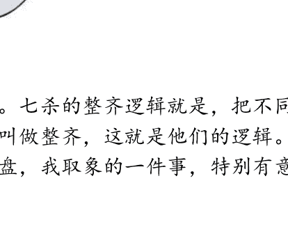

七杀是刀，也代表快刀斩乱麻的含义。七杀的整齐逻辑就是，把不同种类的分类，然后，然后放进不一样的抽屉里面，就叫做整齐，这就是他们的逻辑。七杀也有一节一节的含义，说到这个，今天早上那个盘，我取象的一件事，特别有意思，关于七杀的，

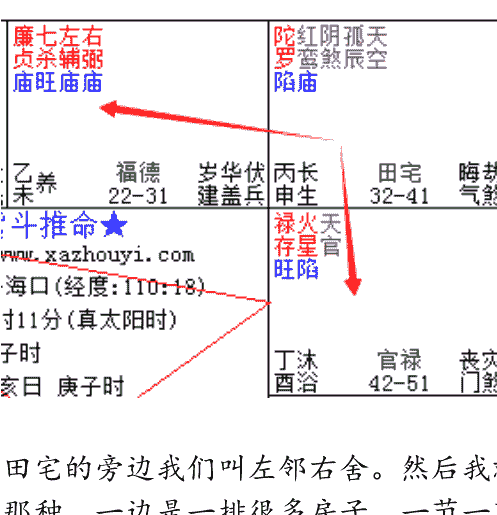

田宅的旁边我们叫左邻右舍。然后我就断她的家居环境，然后我就问她，是不是住过那种，一边是一排很多房子，一节一节的，另一边是空的。结果还真是这样。而且那个空的地方有个石榴，是禄存。那个一排去，很多一节节的房子其实是宿舍。因为我就看见廉贞是复杂、精密，比如紧紧的黏住，密度很高。七杀是一节一节的。左辅右弼是很多。所以这特别有意思。

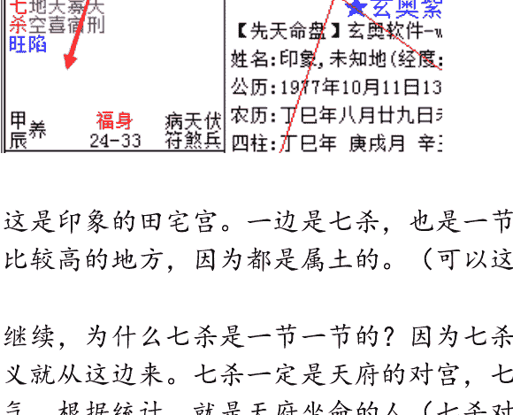

这是印象的田宅宫。一边是七杀，也是一节一节的。其实禄存和紫微，有可能是代表比较高的地方，因为都是属土的。（可以这样理解：山东属于山区，地势高。）

继续，为什么七杀是一节一节的？因为七杀是刀，他喜欢砍一段一段，所以，这个象义就从这边来。七杀一定是天府的对宫，七杀通常是代表英气，这个人的面貌有英气。根据统计，就是天府坐命的人（七杀对宫），都是浓眉，双眼有神。反而七杀坐命的人（天府对宫），很多七杀都是看起来很老实，脸大大有肉，这是我观察出来的。我发现迁移宫代表一个人的长相会更准确。这个其他的也是一样的，就是说看样貌，要参考迁移宫，以迁移宫的气质为标准。好像@田煜堂 的样子，大家也看过，他是演员嘛，不过，他的气质和眉目之间比较像是武曲。他是武曲迁移宫，贪狼命宫，他有演过那种兵士的角色，反而不是那种油头粉面的那种贪狼的感觉。@无间地狱在人间 也是武破对宫，天相命宫，不过她的气质也是偏重武曲破军，就是样貌看起来凶。这个要注意。因此，看配偶的长相也是看对宫，看官禄。

| 紫微七杀 | 七杀 | 廉贞七杀 | 七杀 |
| 七杀 | 七杀组合 | 七杀武曲 |      |
| 七杀武曲 | 廉贞七杀 | 七杀 | 紫微七杀 |

### 七杀组合

- 寅申：七杀独坐，对宫紫府
- 卯酉：七杀武曲
- 辰戌：七杀独坐，对宫廉府
- 巳亥：七杀紫微
- 子午：七杀独坐，对宫武府
- 丑未：七杀廉贞
- 天府永远在七杀的对面

廉贞七杀，今天有个特别的验证，就是刚刚那个盘，因为是坐福德宫，廉贞七杀为鬼才，然后又刚好有左辅右弼，左辅右弼坐福德宫【精神位】是代表思想多。廉贞七杀代表创意、鬼才，也会喜欢古灵精怪的玩意。因此我就断她小时候喜欢发明自己的玩具，果然是有这个倾向。她说到现在都有这种倾向。不过廉贞七杀也有个特点，第一个，是关于他们很重视功能性。第二个，是他们喜欢那种拼凑，又复杂的东西。因为七杀是一节一节的，廉贞是复杂，所以可以想象，就是那种小朋友喜欢玩那种积木之类，比较复杂的玩具的那类小朋友。就是会有分类的那种思想，比如乐高。

七杀武曲，就是那种代表不讲人情的那种固执，因为双星。当然，你可以理解成很多，比如，七杀是短财，武曲是长财，意思是长线短线的财都要。紫微七杀化气为权，这是个比较有威严的格局。这个就不解释了，因为不难懂。七杀有个幼儿版的七杀，擎羊。擎羊代表针，七杀代表刀。这里面也有个哲学，就是代表你一刀砍下去，够勇猛，你是将军。你力度不够，那边又喊又骂的，打又打不过人的，你就是擎羊。这就是狗熊和英雄的区别。这个故事告诉你，当你用尽全力去做，你就是将军。你喊了半天才去做，又做不好，你就是小人。差别很大。所以擎羊和七杀有相似的含义，比如说，都代表刑伤。七杀代表血光、割伤，擎羊有可能是缝针、针灸、刺伤、吵架。七杀也叫血光星，七杀坐命，割伤是免不了的事，特别是那种擎羊七杀。我最近看了一个盘，是七杀擎羊坐午，女命，根据了解，她小时候受伤流血最严重的情况都已经可以看见白骨了，回到家给妈妈看，妈妈不是包扎，先是一顿暴打。七杀擎羊坐命坐午，那么刚好的廉贞生年忌，所以流血貌似很平常，廉贞代表血。继续，血光星，就不宜见到同气的东西，比如七杀+擎羊、七杀+红鸾、七杀+天刑、七杀+武曲、七杀+火铃，这些都会激发七杀的凶性。通常的情况就是受伤问题，七杀也跟骨头有点关系，因为是属金的，武曲也是。金除了代表骨头，也代表【皮肤】。

| 巨门 | 天相 | 天梁 | 七杀 |
| 贪狼 |      |      |      |
| 太阴 |      |      |      |
| 天府 |      | 破军 |      |

### 七杀格局

- 破军坐官禄宫，管官夫线
- 天府永远在七杀对宫
- 太阴坐疾厄宫，管官夫线
- 贪狼坐财帛宫，管财福线
- 巨门坐子女宫，管子田线
- 天相坐夫妻宫，管官夫线
- 天梁坐兄弟宫，管兄友线

七杀的兄弟宫是坐天梁星，代表七杀对于兄弟朋友也是讲究仗义，对朋友也大方。七杀不代表守财，七杀和擎羊一样，是代表有那种冲动，只不过七杀会赚钱，擎羊不会。擎羊只有冲动花钱，七杀爱赚那种快速赚钱的。

七杀的天相坐夫妻宫，代表七杀是喜欢美女的，不过不等于他们有了美女老婆就不想要别人。因为他们的子女宫是坐巨门，代表了七杀在关系上也有这种喜欢刺激的偷偷摸摸的关系。

太阴坐七杀的疾厄宫，太阴代表细腻，工整，所以七杀实际上是很重视看起来整齐，不喜欢杂乱。七杀带刑，因为有一股不服气的气质，通常这种小朋友被教育的方式就是打，那样子就长那样，真委屈。

七杀的对宫是天府。天府就好像是面具，或者好像盾，七杀就好像剑，所以天府和七杀是盾和剑的关系。一个代表防，一个代表攻，永远是对面。天府不会因为七杀而破库的，因为七杀是永远在天府的对面，要看成是伙伴。七杀的盾破洞了，防御能力就降低了。（天府+擎羊，对宫七杀。那就是破库了，不会保护自己的七杀。）其实天府对于七杀而言，是面具的作用，就是我表面要和善，随和，大方。也就是说，天府是看七杀“装”的能力，所以七杀坐命的人，都容易也是成群的朋友，不会因为七杀而没有朋友的，还是很有手腕。也代表七杀有创业的意图，因为天府是老板星。不过七杀不适合创业，他们只会攻，会开发，不会守业。这就是为什么七杀要娶天相做老婆，那是因为太清楚自己的弱点了。

七杀的官禄宫永远是破军，对事业也很有热枕，就像天府爱夫妻，天梁爱奴仆一样，七杀爱官禄。对事业的赌性，可以说是投入性百分之百。当然也容易破败，因为不善于守业，虎头蛇尾。

七杀的福德宫对面是贪狼，所以也是很有欲望。不过因为这个贪狼是坐物质位的，所以七杀对于概念就是，请说重点，不谈思想。你跟他吵架，他喜欢说，停！说重点！也显示这群人是比喜欢直接。七杀也有僧人的含义，就看和什么星星在一起，宗教星集合多的时候，那么这个七杀反而变成修行格，星耀会随着同气的星星，产生质感变化。

七杀坐六亲位，通常是代表对这个六亲没什么耐心。我一般上看七杀坐夫妻宫，一吵架就是说分手的，因为七杀手上拿着一把刀，一不爽，就吵那么多干嘛，分手。@文庆的比较特别一点。

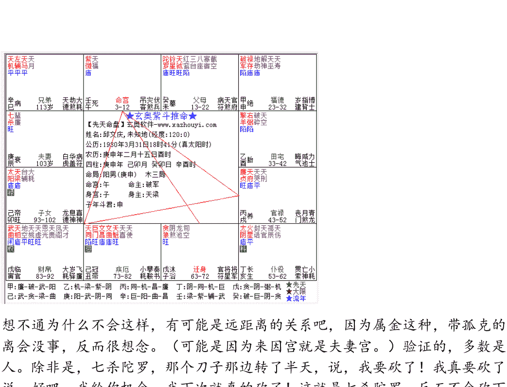

想不通为什么不会这样，有可能是远距离的关系吧，因为属金这种，带孤克的，远距离会没事，反而很想念。（可能是因为来因宫就是夫妻宫。）验证的，多数是这种人。除非是，七杀陀罗，那个刀子那边转了半天，说，我要砍了！我真要砍了！最后说，好吧，我给你机会，我下次就真的砍了！这就是七杀陀罗。反而不会砍下去，吓唬人而已。

七杀都有这种毛病，哪怕是吓唬人，都会喜欢把分手挂在嘴边。当然有些不会，无声无息的，一夜之间把全部联系方式删除，人间蒸发，也有可能是七杀干的好事。因为，七杀讨厌唧唧歪歪，性子急，只想快速有结果和答案。
七杀的倾向，就是砍到完。武曲就是冷战。（禄存好像是不能解七杀的，化科可以解）

## 06. 17

先补充一个七杀的。就是七杀没有四化，不过有一条理论是七杀随文昌化忌。所以看文昌忌的时候，要顺便看一下七杀的宫位，然后再综合做评估。而破军呢，也没有化忌，不过破军随文曲化忌，这个就比较特别一点。因为这只是说破军和文曲在一起，在亥宫而已，其他方面我暂时没有验证到文曲会引爆破军。但是文昌会气爆七杀我倒是验证过，是一个七杀文昌化忌同宫的案例。

#### 破军

- 斗分：北斗七
- 阴阳五行：癸干阴水，辛干阴金
- 化气为耗
- 夫妻主，子仆主
- 四化：癸禄，甲权，随文曲化忌

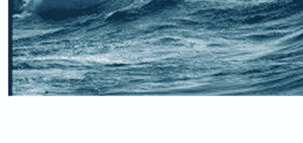

破军，这个星星我们要从本质上理解，就是分手，决裂事件。这个从我一开始研究星星的时候，就容易跟大家一样，看见书上的理论就跟着误解。我看见破军就喜欢说人家喜欢变动，或者勇气很大，把这种歇斯底里的爆炸形象放在破军上面，我一个一个验证之后，很多破军都说不正确。后来我又在一篇理论里面，发现到说，破军大多数时间都是平稳的，风平浪静，偶尔就是一阵一阵的会有这种突变的极端倾向，我就开始慢慢明白了，破军是一个会变化的星星，是说明一种过程。而这种过程和两个倾向有关系，一，极端的忍，害怕失去，给全部。这是比较懦弱的一面。这一面是因为天府在福德宫的关系，因此破军所大部份时间表现的都是保守。二，忍无可忍了，失去平衡了，受到打击了，骆驼上的最后一根稻草，然后爆炸。其实破军算起来是个可怜的人，这种态度，让他们莫名其妙吃了很多破败的问题，却一次比一次更谨慎，更盲目的忍住。用形象来代表呢，就是气球效应，受到了委屈，就对着气球吹一口气，陆陆续续的，直到气球爆炸，这就是破军。所以这就是代表了破军的极端性。其实破解破军的方式很简单，就是不要忍，好好沟通，就没事了。

说说破军的怪脾气。破军会因为忍了很多东西，满肚子的委屈，所以会有一些奇怪的行为，比如，三更半夜的把衣橱的衣服全部搬出来，重新再排回去，莫名其妙的全家大扫除，但是一句话都不说，就让整个人这样。就是他们心情很差劲了，很不好了，要爆炸了，这通常也是那种有盲忍毛病的人，会犯下的错误。

在破军的思想里面，他最恐惧的就是失去。他常常会想，我不是怕你，知道吗。我是害怕我一旦爆炸之后，我就会一去不回头，所以我就忍住你。不反驳，吃你的委屈，给你钱花，纵容你，我就是不喜欢吵架。因为我太清楚自己了，我就是那种一吵架就必须会把一切关系砸碎，回不了头的人。因此，多数的破军是不吵架的，因为一吵架就是离开，就是撕烂脸，因此我有时候就这样看流年，特别是关于离职，辞职问题的时候，我会抓住这个破军。特别是这个破军有逢到忌煞的时候，通常就是会气球急速的膨胀，然后，时间到了就爆炸。因此，流年三方位有破军的时候，变动也自然比较大。这也代表破军是一种积攒的效应。比如说，我现在没有条件离开你，我忍住，忍辱负重，这种也是破军心态。就是那种在爆炸之前会出现忍很久，很委屈的倾向。

破军也是一个不喜欢解释的星星，特别是破军+禄存的时候，更不喜欢解释。破军也代表耗，所以，也可以看成就是破坏王。比如说，破军和武曲，就是耗材。如果是破军+武曲+空劫，这种基本上就不用存钱了。破军的金钱通常是花在感情上，因为破军其实是夫妻星，犹如，天机是兄弟星一样。破军是管夫妻宫的，因此他们也比较感情用事。比如说，我爱你的时候，我把一切都给你，就是破军。破军如果坐命，十二宫都有这种倾向。如果破军和紫微一起，紫微是代表建筑之土，所以就容易有拆迁的情况。紫微化科+破军，就是装修。武曲化科+破军，也跟修饰有关系，也可以看成是装修，一般坐落流年田宅宫。我一般是这样看，就是今年看买房，明年看装修，如果两个都有迹象，那么就很有可能有购物搬家的际遇。如果是本田宅宫是破军，一般都代表容易遇到家道中落的情况，自己需要离乡背井，离开家里，这里的家道中落是古人的说法。现代的说法就是，家里有一些感情上的烂摊子，不懂怎么收拾。比如跟丈夫吵得太严重了，离开家里了，或者跟父母吵得太严重了，要离开家里了，觉得离开之后，比较好面对，通常都是这种问题。不过，破军是这种付出是源于很爱很爱，因此破军坐命的人，或者和破军有关系的情况，都是代表感情的投入性是很高，自然伤害性也很强烈。

| 破军 武曲 | 破军 | 紫微 破军 | 破军 |
| 破军      |      | 破军 廉贞 | 破军 |
| 破军 廉贞 |      |          |      |
| 紫微 破军 | 破军 | 破军 武曲 |      |

### 破军组合

- 寅申：破军独坐，对宫武相
- 卯酉：破军廉贞
- 辰戌：破军独坐，对宫紫相
- 巳申：破军武曲
- 子午：破军独坐，对象廉相
- 丑未：破军紫微

紫微破军也叫无情格，代表喜欢翻新。如果要改变必须特殊性的改变，因为是升级版的破军（加了紫微），所以看见紫微+破军的这种装修事件、拆迁事件，都是跟升级版的翻新有关系。

武曲破军如果是坐财帛宫，通常都代表事业会遇到严重破败一次。如果是创业，基本上前面几次都会遇到不少问题。

武曲破军坐夫妻宫，就更加简单，直接说你的配偶有耗你的财。因为这个验证过不少，都确确实实有这种情况，而且大限的夫妻宫坐落也是一样。

# 【一个案例】

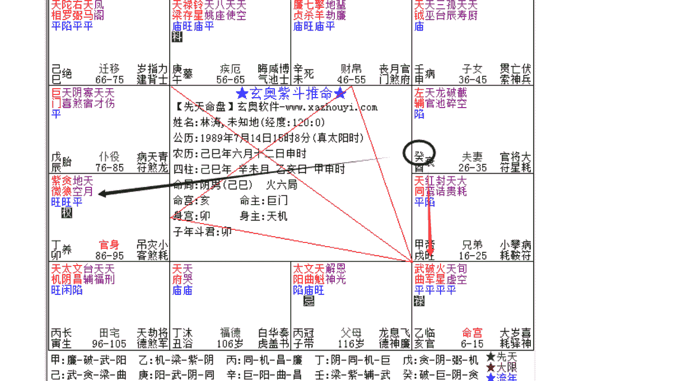

这个命主为了丈夫，把房子卖掉还债，因为金钱关系问题，导致离婚的问题。这个是因为，武破本来就管十二宫，加上夫妻宫会激发她的破军，就是代表投入性更高。而贪狼紫微，就是玩物丧志，比如说赌博。所以就很有可能容易发生这种问题，丈夫玩物丧志，我来卖房子为丈夫还债。之前有个离婚的案例也是这样，就是女方的家境有钱，离婚的时候，房子财产都是丈夫抢走，那个房子女方出的钱比较多，但是还需要赔多一笔现金给这个前夫。所以这武曲破军的破耗性很容易发生在感情上，代表此人一旦爱了，这金钱上就特别的纵容对方。

廉贞破军，廉贞是桃花星，廉贞又同时代表复杂，所以就代表【复杂的爱情狗血事件】。因为这廉贞破军，根据统计，都特别容易发生那种复杂的爱情。比如，别人的丈夫，正在搞离婚的男人，或者我的丈夫家人很喜欢我，但是他有了别人，然后他不愿意离婚，这种很复杂的爱情，我都遇过。就是廉破的爱情世界里面，甚至包括那种，被隐瞒爱情关系了，三年之后，突然配偶结婚，新娘不是我。所以我想，叫廉破写爱情小说，估计很精彩，因为他们其实每个爱情的投入性很高，却不知道为什么，爱情关系都比较复杂。之前有个朋友的丈夫，是廉破，就买了一个项链给老婆，老婆高兴到要死。后来发现那个订单买了两个，追问之下，他说，送给老板娘，报答老板娘的知遇之恩。之后不久她就和这个廉破男离婚了。廉破容易遇到已婚，或者正在离异的，总之都是错综复杂那种。

廉贞破军，廉贞有防御性。廉贞破军我之前不是说过，就是专门喜欢挑选那种难度很高的事，然后怎样抱怨都不会放弃，但是无聊之后，就辞职了，这就是廉贞破军。就喜欢这种挑战性高，很复杂的事，因为廉贞代表复杂，破军代表乱。流年逢到破军廉贞，可以说是去培训，重新学习之事。因为我遇过好几个都是这样，流年遇到都有这种事。廉贞破军对账目很精明，刚才水灵儿有提到，就是几章模式。不过廉贞破军有个习惯，就是如果是他接手别人的账目，他们都喜欢重新算过，然后自己整理过，不喜欢根据前面人的方式继续做，因为有破军的关系。有那种翻新，更新的含义。有时候看物体，廉贞破军，廉贞代表电子物品，你也可以说，你的电子物品容易坏。

说说破军是怎么花钱的，破军是零存整付。其实我看过大多数破军都是打工一族，为啥呢，因为破军不稳定，对创业不利，特别是金钱上。他们的消费方式就是，几个月抠门，抠出了血出来了，然后，突然有一天，一次过把这些钱都掏出来，花全部买一样东西，然后重新存过。这跟他们脾性是一样的，就是气球模式，喜欢积攒了很多，然后一次过爆炸。一个月里面把一年的积蓄都花光，特别是武破。

武破花钱可以说是花得最难受的，因为武曲重原则，他们存钱是有原则性的，就是设置了规矩，我一个月必须不能花超过多少钱。突然，有一天，她看中了一件很喜欢的东西，她就冲动之下买了，回家之后，就是久久的自责，因为自己破坏了自己理财的规矩，相当矛盾的心态。所以，武曲破军也可以看成是【破坏规矩】，特别是跟金钱有关系的原则。

破军的样子，我看见的几个，都是圆圆的，不会矮，但是看起来圆圆方方，给人一种很忠厚老实的感觉，憨憨的。因为天相坐对宫，天相就是那种比较忠厚的气质，然后一副很认真的模样。不过呢，廉贞破军就会说笑话，个性也比较幽默一些，武曲破军就真的很憨，紫微破军就有一股傲气，不过呢，也看起来很老实，通常都不会太爱笑，一副表情认真的模样。资料上常常可以看见，就是说，破军坐命容易破相，不过我自己验证的话，我觉得必须加煞星，没煞星不会有这种情况。而且破军的破相，不一定在脸，有可能是身体的其他部位，有留下疤痕之类的。

| 巨门 | 天相 | 天梁 | 七杀 |
|------|------|------|------|
| 贪狼 |      |      |      |
| 太阴 |      |      |      |
| 天府 |      | 破军 |      |

### 破军格局

- 天府坐福德宫，管财福线
- 太阴坐田宅宫，管子田线
- 贪狼坐官禄宫，管官夫线
- 巨门坐奴仆宫，管兄友线
- 天相永远坐破军的迁移宫
- 天梁坐疾厄宫，管父疾线
- 七杀坐财帛宫，管财福线

破军的财帛宫是七杀，七杀一出手，就是整段砍去。而且七杀也容易欠思虑，不过我忘了提醒一点，就是七杀的气质有个特点的，就是给人一种很冷静的感觉。当然他们的个性也比较冷静，砍下去，眉头都不蹙一下。破军花钱，花的时候是这个表情，回到家的时候，是这个表情😅，多数都后悔的。对了，破军坐的流年，花钱也会这样。破军坐的大限，花钱也会这样。这是他们的特点。

天梁坐破军的疾厄宫，天梁也是比较高大的意象，因为代表大树。

天相永远是破军的迁移宫，是为了保护破军的形象，因为天相本身也爱面子的，因此，破军也有爱面子的倾向，不过常常却在最后就撕烂脸，然后又拉不下面子去妥协，道歉。

禄存破军坐福德宫，一定是对照财帛宫，花钱很容易有这种倾向，就是那种存到要死，然后一次过破一笔大笔的。破军存钱是存小钱，破财是破大财。

破军的奴仆宫是巨门星，因为破军是有感情性质的，这个巨门引发了破军很容易遇到暧昧之事，忍住，破军忍住，死忍。破军的奴仆宫坐巨门星，也代表就是破军不是很相信朋友，对朋友是有疑心的情况。会猜测别人是不是有什么目的。

破军迁移宫，都代表出外容易遇到奇事，突发事件。或者因为代表乱嘛，就代表你每次去那种很乱的地方，或者人家装修房子的地方。

破军的官禄宫坐贪狼星，贪狼是劳碌星，因此也代表破军对于自己的工作要求很有标准，很有欲望，愿意去劳碌。不过这就容易产生极端反应，就因为自己的过份劳碌，

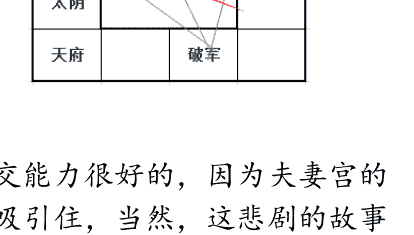

导致了不少委屈事件，这个贪狼一定是在夫妻宫的对面，这代表他们是样貌主义者，喜欢帅哥美女，喜欢那种社交能力很好的，因为夫妻宫的对面代表配偶的样貌气质，容易被这种比较贪狼类型的吸引住，当然，这悲剧的故事开始了。然后你就会看见一个场景，一个辣妹旁边坐着一个憨憨老实的人，这个憨憨气质的人，通常就是破军了，因为他们绝对会看上这种美女。就是容易爱上坏男人，坏女人，感情比较复杂，破军的感情本来就很复杂，因为破军坐命就管十二个宫位，包括夫妻宫。

破军的田宅宫是坐太阴星，通常破军都很在乎家庭，会疼爱自己的母亲，重视自己的母亲。田宅宫也代表库，存钱的倾向，投资不动产的倾向。这也代表了，破军是一点一点存出来的，因为太阴代表钱是一点一点。也暗示了破军其实很抠门，会为花钱的事心痛。不过他们通常会请客，因为天梁坐疾厄宫。天梁会请客，会重视这种面子礼节。每个破军都会这样，哪怕多不心甘情愿都好，都会请了。

天府坐福德宫，代表了破军的保守性，喜欢忍的毛病。因为天府是一个容器，是用在装东西的。就是破军通常都是把委屈装到这个天府去，不说出自己的委屈，等到时机到了，自动爆炸。破军在地点，比如说你要猜测地点，破军就是那种很乱的地方。比如超市场、码头、货柜仓或者工地这些比较乱的地方。或者就是一眼望过去，好像这段地区没有规划好，那些房子有旧的有新的，反正就是一眼看过去就很乱。

破军坐田宅，通常家里也是很乱，特别是衣橱，抽屉里面，房间都会乱。这和破军收拾的毛病有一点关系，破军是不喜欢一点点收拾，他们喜欢积攒很久一次过收拾，不然他们会觉得浪费时间。所以通常就是累积到很乱才一次过收。

破军坐子女宫，资料上是写容易怀孕。太阴坐命的人，一定是破军坐子女宫，就是想避孕也会怀孕。破军容易有人流事件。通常取人流问题，我是喜欢抓巨门。因为巨门是下水、污水、不见光的事，验证了几个都正确。破军坐子女宫就是那种玩具到他的手，一下子就坏了。

破军化禄要特别讲一下。因为破军化禄，这边指的是【加强破军的威力】。我说个案例，我有个新加坡的朋友，也会紫微，就问我，就说，他这个月破军三化禄，三个化禄，是不是要发财了？因为破军有偏财的含义，杀破狼都有偏财的含义。然后我当时也没有太多的统计，我就说，那好吧，你去买彩票吧。看看会不会中大奖。结果，他那天打来了，他说，哎哟，依婷，不是中大奖，我车祸了。那个车被撞的要花大钱去修，人没事。我就记住这个破军化禄的情况。我之后就有个朋友，她姐姐就死于车祸。然后她就拿姐姐的盘给我看一下，结果也真的是应在破军三化禄，相当恐怖。我就这样理解，化禄是加强，但是你要看是什么星星，【化禄+破军=加强破坏性】。就是有一天你排盘的时候，你看见你的破军有三个化禄，本命，大命，流命。你们要特别注意，破军化禄是加强突显性、破坏性，三个化禄，就容易发生好像撞车这种很严重的。不要看错，你别看见破军化禄就说人家要发财，而是破财也很厉害了，加强破坏性的含义。

（命宫化禄到父母宫是破军）所以你对自己的父母，是不是有喜欢反驳的习惯？破军有忍的含义，就是代表破军禄存坐守你的父母宫，本来你父母宫这边你也要忍辱负重，你化禄过去，久久一阵一阵你就大发脾气。破军的脾气是忍很久，一阵一阵的发出来，加上铃星，速度会快一些，就是不能忍到那么久。

有破军坐父母宫，通常会想离开父母，跟破军坐田宅宫是一样的。文曲化忌+破军，坐亥，指的是坐亥宫，是代表水厄、水灾。这个是古决里面有记录到的，其他的我没觉得会引爆破军。因为文曲化忌在感情上是比较拖泥带水的，不像是破军的风格，牵肠挂肚，拖泥带水。破军是那种一次过翻脸的，所以我觉得没有什么影响。

破军坐子和午，是有说法的，比较吉利，可以在事业上有很好的发挥。说一个效应，就是流限看破军，是两种模式，【先破后成】和【先成后破】，这个必须重点说一说，因为也是一个验证出来的。每一次我一看见破军的大限都会问一个问题，是先破还是先成。因为是以一开始的那个点为模式。我就有个朋友，进入破军大限之后，开公司赚了不少钱，买豪车、买房子，反正就真的赚很多钱。那年是那个大限的最后一年，看到破军+空劫，我就觉得不乐观。已经叮嘱他要谨慎，他没听，因为操作公司失误了就把公司卖掉，然后全职玩地产投资。只是一年内，隔年他来找我，他说车没了，房没了，工作没了，老婆跑了，还欠账。不过他进入那个大限是很好的，一直都在赚钱，因为破军是北斗星系，代表突发事件，来得快去得也很快，所以就得到了这样的结果。所以当看见破军的时候，要先问是先破还是先成，比如刚刚辞职的，那是好事，因为代表破。如果是先成，那就比较悲剧一点。

破军代表感情，管理感情付出的。坐奴仆宫也代表朋友一阵一阵会换人，朋友也比较乱，比较多。也代表朋友事件里面很多人离婚、事业破败，很多这种问题。

破军坐官禄，一般都会觉得自己工作小人很多，吃了一肚子委屈。建议就做有流动性的工作比较合适。破军坐官禄就是一定是七杀坐命，七杀本来也不合适坐在办公室。

## 06.22

### 六吉星

六吉星是指三对吉星，文昌文曲，天魁天钺，左辅右弼。紫微斗数十二宫宫位有点像大富翁棋盘，所以也代表有机会，有命运。而天魁天钺在命盘里面是代表【机会】。表示流年三方有遇到这两个对星，就有转机。左辅右弼在命盘里是代表【助力】，表示流年三方四正遇到，该年就事半功倍，因为有人会帮你。文昌文曲在命盘里面是代表【能力】，流年遇到这对星星，也代表能力上的提升。

文昌文曲，文昌是属阳金，文曲是属阴水，因此这两个星星的性质是完全不一样的，虽然都是科星。

先说共同点，就是文昌文曲都是代表【表现】。很多人很直观的就认为，文昌文曲是跟学习有关系的。是有关系，不过就学习什么，提升什么能力，需要看组合。文昌文曲一样都喜欢【美感】，一样都喜欢被【欣赏和赞美】，所以，文昌文曲不喜入夫妻宫，也有这一层原因，就是当他们的配偶要同时兼顾到自己漂亮，还需要老赞美这配偶，不然，就容易有乏味了，像换其他异性表现一下，听听别人的赞美。文昌文曲也代表【受承认】，这个特别重要。比如某年我看一个人的盘，坐官禄宫地空地劫，我就说，你做得多么的辛苦，你的老板依然觉得你啥都没做，在偷懒，没有承认你的功劳。我就建议他就是找个名画家的毛笔（这毛笔必须是那些科气很重的人用过的，才有力量。饰物是没有力量的），放在办公室的桌上，我就告诉他，这是提高你的【被承认】，文昌就像作家，文曲就像画家。他们都有个共同点，就是哪怕写得不好，画得太抽象，依然有人鼓掌。为啥呢，这就是文昌文曲的威力，代表提升被承认度。文昌文曲因为也代表文凭、文件，所以也有受承认的意象。另外也关系到提升气质的气场。比如说，家里有挂画画，字画等等，整个房子的气质就提升了文昌文曲的气质，这就是那种，所谓的经过了【美化】然后【表现】，接着被【承认】。

另一个共同点就是，文昌文曲都是时系星，有周期性的含义。周期性，或者更迭，就是会更换的含义。比如说杂志一个月买一次，贷款一个月还一次，保险一个月给一次，诸如此类的含义。衍生去其他，比如说文昌文曲坐奴仆宫，就有可能是更迭朋友，朋友一直会不一样。坐夫妻宫就不好了，因为这更迭配偶的意象，就好像很喜欢换口味一样。因此，文昌文曲是不喜入夫妻宫，特别是和桃花星同度，古人都特别的不喜欢。文昌文曲是【表现星】，比如说，文昌文曲+贪狼+天姚，这种就看成，她是表现贪狼天姚，俗称骚货。比如我看一个盘，如何知道这个人穿着性感，也是取文昌文曲。我会取天姚+文曲，喜欢穿着性感，天姚是性感的含义，如果加上天同文昌文曲，有可能喜欢装可爱。也就是说，文昌文曲是根据结合在一起的主星来决定他们表现什么，不是一致看成是书。比如这个，贪狼+昌曲坐桃花宫，你不可能看成她一边喝酒一边看书，这就搞笑了。那个昌曲就要转换去【表现】，比如会表现自己酒量很好，表现自己手腕很高，表现自己厉害搭讪，就跟书画一点关系都没有了。

说说不同点，我一开始的发现就是文昌是管理左脑思维，文曲是管理右脑思维。先说说文昌左脑思维管理什么，左脑思维管理逻辑，文字，短期记忆，计算，正规学习，理论，公式等等。而文曲右脑思维，是管理图像，音乐，肢体动作，表演才艺，画画等等。也就是这样区分出来，你可以看见，文曲掌管情绪的部份是比较重的，掌管美感的部份也比较重。

看一个盘，只看两个宫位。

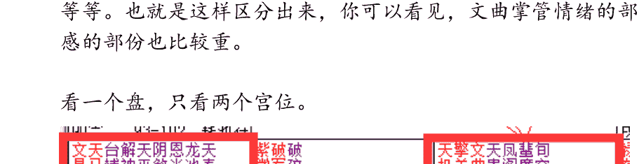

这个命主是我很好的朋友，她的这个例子很好，可以看见，就是她文昌在福德宫，文曲是在命宫，代表她想的，她心理喜欢的是文昌，但是她表现出来的，是文曲。接着我们看看，这文昌+天马，另一边，文曲+天机，这好像是一样的意思，天马和天机都是驿马星，代表迁动，她的天机还加上了擎羊。当时我看了她的盘，我就这样说，你骨子里是个流浪文学家。你想浪迹天涯，写下你旅游的感悟和体验，很多想法，也特别喜欢这一类型的书籍。不过你是有去旅行，不过你没留下文字回来，你拍了很多很多照片回来，然后都是去靠近，和短程的。她就说，啊，对，的确这样。因为我这个朋友是个摄影发烧友，有很贵的相机，所以她每次回来都有一大堆的照片。她也有个毛病，喜欢离家出走，一生气就离家出走。刚刚我说了，文曲代表肢体动作的表现，比如生气了用力摔门等等，她是发挥在离家出走的问题上，【天机+文曲+擎羊】，就是说，我很冲动，我想走我就走，我就想用离家出走来表现我对你们的不满。所以说，结合星系是很重要的，不然你就会这样说，你是不是一边离家出走一边看书？这里的文曲是象征一种表现。

另一个案例，也只需要看一个宫位。

| 破文天阴寡 | 王冠 | 迁移 | 病天伏 |
| --- | --- | --- | --- |
| 军曲喜煞宿 | 戌带 | 65-74 | 符煞兵 |
| 旺陷 |  |  |  |

这个宫位是迁移宫，我当时第一眼看到的时候，我第一句问的就是，你有自残的毛病吗？你生气时候喜欢砸破看起来美美的东西吗？然后她就给我看一大堆她血腥的照片。这姑娘呀，她一不开心就喜欢割自己，然后拍照上微信朋友圈。当时我是不知道，因为我没加过她微信，是我的一个同学，其实这个盘的大概背景就是得不到关注，所以用破坏的模式表现。你看，这边，破军+文曲，我没说她突然得到很多图画，我说她有自残的毛病，这是因为，我们必须把昌曲先转换去【表现】，【破军+文曲=用破坏美感的方式，来表现自己】，所以她还把自己自残的照片上传网络。

继续，刚刚说到文曲代表右脑，代表图像。文昌代表文艺，格言，还有什么区别呢？文昌代表笔直的道路，文曲代表羊肠小道，也代表河流。文昌文曲都有【路】的含义，有时候我看见文曲坐田宅宫，我会问，你家附近有一条小路吗？或者，你家附近有小河吗？还有就是文曲的表现，是容易发挥在辩才，舌辩方面，或者也代表比较偏的学术，比如，宗教，音乐，艺术，哲学，心理学，这种比较偏的学术，偏向于情感。而文昌，就学数学呀，金融呀，管理呀，文件处理，收集资料等等，学一些正规的，通俗的东西。因此呢，这也衍生了另一个区别，也就是，【文昌是代表被官方承认】，【文曲是代表被大众承认】。

如何看一个人写字美不美呢？虽然文字好像是属于文昌的，但是我问的是【美不美】，所以呢，如果你命宫有文曲+红鸾，天喜，是代表你写字好看。那么，不好看呢，文曲+煞星都不太好看，文曲+阴煞，写字还会弄脏书本。文曲+廉贞是小小的，字和字之间的距离也很密，就像你看了他们写的作文时，就是有那种密集恐惧症出来的感觉，因为小小密密，看起来很复杂。

六亲宫怕单见【文昌】【文曲】，主双重之意，双重父母、二次婚姻、双重子女。其实同宫不一定会更迭，因为六吉星，主要是要双星才稳定，一阴一阳，就不会产生这种更迭的效果，因为平衡了。

【文昌】主科名（正途功名），【文曲】则主旁门左道（异途功名）。

我们谈一个最常见的四化组合，【文曲化科+文昌化忌】，基本上就是辛年出世的人都是这个生年四化，但是这可以看成什么呢？文昌化忌，就是代表你一开始做某个作品的时候，前面因为细心执着，花了不少时间，或者有粗心大意的情况，最后，唉，时间到了，或者自己累了，然后就在外面美化一下，希望老师不看到破绽，或者顾客看不到破绽。文曲化科是代表外表美化一下，文昌化忌是代表粗心大意，这两个一定永远都是同时化，表示几乎所有的辛年出世的人都有这个毛病。不需要看文昌文曲做什么宫位，只要是辛年出世的，都有这个问题，都一样的。

谈谈格局，就是怎么理解轻重。

【福德宫文昌文曲】【命宫文昌文曲】【迁移宫文昌文曲】，这三合不同的宫位有什么区别呢？福德宫文昌文曲，是代表爱好学习，当然要看星星，学习什么方面的事。也是象征爱好，而且还是那种明明学得很深入了，还一直觉得不够，上不了台面。而文昌文曲在迁移宫是反之，代表学到多少就表现多少出来，然后别人以为他们高深莫测，好像很专业，实际上就是三脚猫功夫。因为迁移宫是表现位，然后福德宫是隐藏位，所以，就文昌文曲在迁移宫是代表爱在别人前面表现自己。比如刚刚我说，文曲破军，是文曲而已，文曲是肢体动作，代表美感，所以她就表现这个，破坏美感，用肢体动作去表现，拍照发上微博。如果加个文昌，可能在照片上面还会长篇大论叙述自己的悲情故事。

文昌化科也是代表假的，化科代表华而不实，所以有虚假的含义，文昌化科在父母宫，比如是继母，因为有更迭含义。文曲一样，就是会更加牵肠挂肚。

父母宫是以阴阳来看，就是说，谁在家影响力大为阳，谁在家影响力小为阴。有些母亲比较强势的，是母亲在父母宫，单亲妈妈也是母亲在父母宫，这个要知道。

继续，文昌文曲在命宫是代表自己表现自己爽，自娱自乐。比如我那朋友，就是这样，她是文笔很好的人，她看很多经典，然后特别喜欢名人格言。我们都觉得她文字很好，但是她就不写文章。她的文曲在命宫，她除了喜欢拍照，还喜欢烹饪，然后排到美美的，拍照上传。有时候她会去学画画，也是这样，就是会拍下来上传，就不看她写文章。所以呢，代表福德宫是隐藏最深的，最没有自信表现的。命宫是自己表现自己愉快，没有太大作用的。而迁移宫是代表表现给别人看。迁移宫那个是特别喜欢被赞美。

说夹宫，文昌文曲夹命宫，代表生于书香世家，家人都是有文化的人。

文昌文曲夹迁移宫，就是代表朋友圈都是有文化的人，自己也要装模作样，也喜欢感染到那种气质。因为环境是影响人的。

文昌文曲夹疾厄就代表好像看不完的书，学习不完的资料，然后自己一想到就讨厌。疾厄宫会对自己的惯性产生讨厌死的感觉，然后又不得不做。

文昌文曲坐财帛宫，一般是代表有分期付款的事，或者有投资保险基金，定期，债券，或者是工作的时候常常收到支票。文昌是支票，文曲是现金。如果双星都有，实际上是很好的，好像比如投资之后，个月有钱拿。就是周期性的财务模式。

文昌文曲夹疾厄宫，和文昌文曲夹福德宫有什么区别？都是同样的，好像有学不完的资料，看不完的书。夹着疾厄宫，不做就好像有罪恶感，所以就一直看一直看。夹福德宫是不表现的，所以说，就容易出现那种私底下很爱研究资料，看书。但是不会在朋友前面说半句，我学这个，我学那个，我这个也会，那个也会。就是说，是从爱好出发的，然后会觉得不需要给谁交代自己爱学习这件事，因为福德宫是管理自己的精神。

实兄弟，代表朋友多，然后一直换人。

在感情上，文昌和七杀是一样的，就是说断就断。

有次我看一个人，七杀文昌，我就说，你换不少男友。她说，是。我就说，是不是讨厌了，生气了就直接砍断关系？她说，是的，不解释分手，直接有一天就砍掉所有的联系方式。然后，这男的还莫名其妙，咦，分手了吗？这就是七杀文昌坐迁移宫，逢化忌更严重。代表双忌，因为七杀随文昌化忌，代表更快，不高兴就砍断关系。删除好友，删除所有联系方式，让你永远找不到我，我懒得解释。文曲就可怜了，文曲偏重情感，失恋了就听悲情情歌，听着听着，牵肠挂肚，听着听着，看了一下照片，然后非常想念，就又发个消息去问，你最近好吗？这就是文曲化忌。文曲会如此牵肠挂肚，就是因为脑袋会闪出曾经幸福的片段，文昌就不会这样。这个要区分出来，所以文曲化忌坐夫妻宫，会出现那种分手了又和好，和好了又分手，然后好几年才把关系弄干净。

### 左辅右弼

左辅代表阳土，右弼代表阴水。左辅是有木的余气，而右弼是有金的余气。所以呢，如果说请求帮助，左辅是这样说话的，亲爱的，我这个很重哦，你可以帮我一下吗？右弼是这样说话的，你没看见我拿那么重的东西吗，不会过来帮一下吗？！或者是反之，就是对方要帮助你的时候，左辅说，你会辛苦吗，会很重吗，来，我帮你拿一点吧。右弼说，我都叫你不要搬那么重的，不会听，来，给我一点，麻烦死了。虽然都是代表助手星，不过，这态度区别很大，左辅是温和，右弼是粗鲁。左辅是男性助手，右弼是女性助手。所以通常老婆叫老公干活，都是右弼的口气，或者要帮助老公的时候，就用右弼的口气，右弼属阴。老公要帮助老婆的时候，通常也比较温和。

左辅右弼也代表数量增加，刚才文昌文曲是代表才能增加，提高那个才华的力度，加强那个星星的才华。而左辅右弼，就是变多的含义。比如说，左辅右弼+文昌文曲+天梁，坐田宅宫，代表家里有很多很多花草盆栽，数也数不清。左辅右弼呢，通常是代表同辈，我喜欢这样断。就是三方四正里面，有左辅右弼的，我都说，你有下属的命。因为代表他的工作那些，有很多人帮手。

左辅右弼也有个特点，流年遇到的时候，或者坐疾厄宫的时候，不来就不来，一来就一串一起来。比如说，生病，左辅右弼生病，又同时伤风，又同时发烧，又同时牙齿痛，又同时脚痛，好像顺便一起来。就是不来则以，一来就来一堆的含义，我通常是这样看。就是流年的时候，遇到命宫，田宅宫，或者迁移宫，突然出现左辅右弼+化科的时候，就代表平时没有什么联系的亲戚朋友呀，突然一堆来，就是家里有什么事了。有个验证，就是父亲去世，我没看出来，只看见左辅右弼+化科，我就问他，你家里突然来了很多人吗？那些平时不来往的，突然都一起来。他说，是啊，因为我父亲去世。化科是代表华而不实，虚假，左辅右弼+化科，就是那些不来往的亲戚朋友，化科算是给个面子，就出席你家里的事。如果同时看见红鸾，文昌文曲，就可以说是有婚宴了，就是这个意象。

左辅是阳，右弼是阴，左辅是代表明显的帮助，右弼是代表暗中帮助，左辅右弼的力量，夹比照大，照比做大。这跟刚才我拿文昌文曲坐迁移宫比喻一样的，就是代表，这些助力星呢，要坐在迁移宫照命，就可以产生表现能力。而且，迁移宫是代表别人，命宫是代表自己。我来说说区别，左辅右弼坐命宫，就是那种你搬家的时候，你要自己先动手，然后人家看见你好像很可怜，他就帮一下你，所以左辅右弼是需要先自己帮助自己。而左辅右弼坐迁移宫，就你说一声，俺这周末搬家，然后朋友都说，我过去帮你吧。差别很大，所以这种通常照比较好，也同时代表有号召力，一号召就一群人来。

左辅右弼夹呢，是代表有那么多的人，好像是有助力，不过，未必接受。我比喻一个，我自己的案例，某个命主，就给我看盘的时候，我就说，你很多赚钱机会，人人会自动找你，要给你赚钱，但是你不要。这就是因为她的左右是夹财帛宫，代表是有这个圈子和环境，会不会接受呢，要看财帛宫里面是什么星星。比如，财帛宫独坐铃星，代表恐惧，害臊，她就会说，我不会做，然后拒绝了。不过，财帛宫坐贪狼，贪狼是代表贪心，左右夹贪狼在财帛宫，他有可能不要吗？所以要看里面是什么星星，再定夺，他有这个环境，然后他会接受吗。

左辅代表方向盘，微高的房屋，山地，商业机构。右弼代表水坑，水沟，水道，井泉。这是因为左辅属土，右弼属水。左辅在疾病是代表腿部浮肿，右弼是代表肾虚，经血不调，左右都会跑，代表也有驿马的能量，就是流年三方会到左右时，会出现朋友叫你出去，和朋友结伴去哪里玩或者远行之事。左右夹迁移宫也有这个效果。

父母宫，通常我看见单守的，我就会先观察是不是有父母离异的可能性，特别是和桃花星一起的时候。比如说，左辅+红鸾坐父母宫，这很有可能是父母重婚之象，代表会有多父母。不过验证出来，不是全部都会这样，有些是干妈干爹。左右独守在父母宫就要留意这个。如果两个都有，就通常代表父母会帮助自己，多数不是多父母的意象，因为平衡了。

夫妻宫，左辅右弼坐夫妻宫，古人是最不喜欢，助手星坐夫妻宫，因为代表有多人的含义。比喻一个，某个夫妻不和，这老公喜欢去找其他异性朋友谈自己婚姻不合的心事，聊着聊着，突然觉得还是这个异性朋友最有我的心，最明白我的心，最善解人意，然后就劈腿了。所以这助手星，就用在不对的地方了。不过有一点要注意，就是要看阴阳，左辅是阳，代表男，那么坐夫妻宫就不那么凶，男命。因为代表这老兄夫妻不合，和哥们聊感情烦恼，所以就不凶。女命也是一样，女命，夫妻宫坐右弼，就是找姐妹聊自己感情烦恼。通常就是左辅右弼都不喜欢坐夫妻宫，或者是夹着夫妻宫，代表这个婚姻很多人有意见，我的妈妈，我的姐姐，说我老公咋样咋样，就是有别人来干预，很烦，感觉到自己不回去跟老公大干一场，对不起那个多事八卦的闺蜜。多人有意见的婚姻。我个人是不能看见左右就先断有外遇，因为外遇是有外遇格局的，左右是其中一个点，其中一个，不过不代表真的外遇，左右三方四正里面，有两层含义，这要记得，第一个就是有下属，第二个就是，多重身份职业者，就是这个名字干一份工作还不够，还要有多重身份，顺便也卖一下保险传销的，这种类型的。

左辅右弼坐福德宫代表爱好很多，三心两意。

左辅右弼夹迁移宫，里面有昌曲，是代表才华可以吸引粉丝。

左辅右弼夹官禄宫，好像很多工作，做也做不完。也可以看就是自己的工作需要被辅助。算是好的格局。

#### 天钺天魁

天魁是代表男性贵人，或者帮助你很明显的。天钺是代表女性贵人，或者帮助你不明显的。有资料是这样写，天钺是那种雪中送炭的贵人，代表算是可怜你，给你一个机会的那种性质。天魁承诺会帮助你，是会兑现的。天钺说会帮助你，你要先看看是不是女的，是女的就会兑现，是男的就是忽悠你的。天魁主书画成就，天钺主夜贵成就，同为科星，代表被欣赏或善于欣赏别人。天魁是亭台，山岗。天钺是林园，花园。

有一个重点要说，就是天魁天钺是有【凶性】的，天魁天钺是受不了煞星的破坏，因为天魁天钺一旦被煞星破坏得严重，就会变质，变成了刑器。你要从字面上去了解，天钺的钺是代表刀子，所以，疾厄宫坐天钺+天刑，是代表开刀事件。天魁呢，实际上是可以看成鬼差。古代的说法，就是天魁也可以看生死的，看看鬼才什么时候会来。但是这个我还没有验证，就是我知道有一些资料，如果天魁遇到太过坏的组合，就容易变成恶人，或者小人，所以这是为了告诉你们，天魁天钺会容易变质。

天魁因为有鬼才的含义，坐疾厄宫代表是受到惊吓的疾病，或者那种被刺激到，恐惧一下，这是比较主要的。天钺就代表开刀的疾病。天魁属火，入疾厄宫主急燥驚嚇，暴怒肝氣，皮膚病，火癮、性急易高血壓。病輕易治，醫運較佳。但逢煞沖則易驟死。天鉞陰火，入疾厄宮主肝膽，脾胃，肺部，皮膚濕疾，亦主暗疾。因病開刀或刀傷。病輕易治，醫運佳。會空劫、陀羅，骨刺。魁鉞亦主富貴病、或須長期調養之癮。會左右，一生平安；遇擎羊，肝疾；會火鈴，呼吸系統，肺疾；遇空劫，時有微疾。

06.24

#### 天刑和天姚

天刑永远是天姚的财帛宫，天姚永远是天刑的官禄宫，天姚天刑永远是三方照。

先说说天刑，天刑属阳火，化气为孤天，代表自律和孤独，也是叫【业力星】，这【业力星】要深深地说明其中含义。武曲是看成规矩，天刑是看成鞭子，所以，天刑是掌管惩罚，然后有偿还代价，有公平对待的含义，所以就有【业力星】的说法。就是你欠过的债，你犯过的错，你需要付出代价的意思。在我们解析天刑的时候是有诀窍的。天刑独坐的时候是代表自律，也是代表命主在那个宫位，有犯错了就需要付出代价的意识。比如说，天刑坐夫妻宫，通常这人深深的觉得，外遇出轨是需要付出代价的，所以他就会自律。天刑坐财帛宫也是一样，就是独坐的情况下，知道欺骗钱需要付出代价，所以也会自律。就是代表增加那种犯罪了需要被惩罚的意思。

在一些特定的组合情况，这个【天刑】会变成【官非星】和【惩罚事件】，一般上就是有遇到武曲，代表规矩的，这是最常见的技法。就是你可以打开盘，武曲是规则点，天刑是惩罚点。比如说，父母宫有武曲，你的命宫有天刑，那么就是规矩在父母手上，你有罪，他们就惩罚你。有遇过一个这样的案例，命主的命宫是【天刑】夫妻宫有【武曲化忌】，结果她结婚之后，丈夫一直觉得她这个错那个错，这个有罪那个有罪，最后离婚了。离婚原因是丈夫说，她生不出儿子，反正就是怎样都有罪名。

武曲和天刑，再加上擎羊，这就是诉讼官司的意象了。情况一般会比较激烈些，比如两方面要打起来了。之前有个命盘，就是命主结婚的时候，这丈夫是欺骗钱的，跟她老爸借了 10 万，后来立刻拿这笔钱买房子，写自己弟弟的名字，就因此闹上了诉讼事件。她的格局是，自己的命宫是擎羊，对方的太岁宫，是武曲双忌天刑，后来她这边报警，就把这前夫扣留起来，怕他跑了。官非事件。所以记得，如果看见【武曲+天刑+擎羊】，是看成官非，不是自律。如果命宫坐，武曲天刑，那种此人有严重的自我约束的意识，容易害怕犯错。流年遇到擎羊，也容易引发官非问题。

另一种组合，也是看其他有代表法律的星星在一起。巨门代表纠纷，也代表法律，一般上遇到，巨门天刑，这样的，有可能有欺诈的官非。廉贞也是法律星，廉贞一般是因为法律漏洞关系惹上官非的，就是廉贞+天刑。另外，天梁也会这样，天梁也代表法，但是这个的意思就比较偏重于道德观，或者社会观。比如说乱丢垃圾受到惩罚，一般就天梁天刑，社会模式，道德模式的犯罪行为。

所以天刑附加在有法律含义的星星时，就是代表要为此付出代价。当然，更玄幻一点的，我们顺便谈谈【天刑+阴煞+天巫】。因为天刑也有命理，宗教，因果这种代价的含义，所以这种玄学组合，通常就代表那种驱魔事件、坐降头，就是当天刑和宗教星在一起的时候，会出现这种意味。
在平常天刑一般就看成是还债事件，欠债还钱的含义。另外也代表狗，天刑在动物是代表狗。

#### 天姚

天姚是阴水，天姚是和享受有关的，而有点有意思的就是，天姚的财帛宫一定是天刑，代表享受是需要付出代价的。因此有时候流日男命遇到天姚，有可能是去嫖妓，因为天姚之桃花，是需要付钱的，需要付出代价的。因此天姚就有了肉体桃花这种说法，不是精神花。

天姚在象义上，是代表性感，风流，飘荡，玩世不恭。有一个组合，这个你们可以记住的论断，天姚坐福德宫，天刑一定是在夫妻宫，这个是代表命主和这个配偶是同床异梦，心里面想着别人。福德宫是精神里面住着一个天姚。因此这个象义是可以说成，我爱的人，不是我结婚的人。因此天刑坐夫妻宫，虽然有自律的含义，但是也同时代表精神不同步的含义，这是从福德宫衍生出来的。

天姚在物品是代表药，毒品，鸽子，月事，厕所，卫生纸，安全套，情趣用品也是用天姚做归类，特别说明，在药和毒品方面的，这个天姚是那种可以催情的意象，跟荷尔蒙，激素是有关系的。天姚你可以看成是让你兴奋的药物，比如毒品，催情的药物，有激素，有刺激素的药物，都是归类在天姚。最近有个案例就是天姚和地劫在一起，然后变成了因为误打激素，因此惹上了严重性敏感，体现在皮肤上。

天姚和贪狼这个组合不太好，会容易有那种跟药物沾边的恶习，这个可以验证一下。巨门天姚也是可以看成这种刺激，是可以看成贪恋肉欲桃花，或者有暗中的性伴侣这种意象。天姚在身体部位，代表下阴，膀胱之疾，我另外再加多一个就是和激素有关系的疾病，因为这个是有验证的，我们可以再深入研究这个新统计。

在地方天姚是代表地沟，暗沟，水道，公厕，鸽子笼。天姚代表鸽子，天刑代表狗。

天姚+红鸾，代表异性缘佳，男好酒色。

天姚+天哭，是桃破格，在感情上受委屈了，也代表水厄，破财。天姚有水厄的意象。

天姚+文曲，代表穿着性感，天姚是可以说性感，加上文曲就是穿着性感，为什么古人不喜欢贪狼+昌曲+天姚这种类型的组合，特别是女命，那是因为，这个组合会容易发骚。因为，贪狼本身就是交际、酒色，昌曲又善于表现自己，天姚又喜欢展现暴露性感，所以古人不喜欢。

天姚+文昌，色情小说，风流才子，有这种文艺的感觉。古龙的小说里面很多很多这种天姚字眼，算是一种文昌天姚的类型。

文曲+天姚，如果是坐官禄宫，然后有疾厄宫飞化，那么有可能是色情行业。为什么一定要是疾厄宫飞化？因为代表我用【身体】工作，加上官禄宫有桃花组合，那么就是这个意象了。

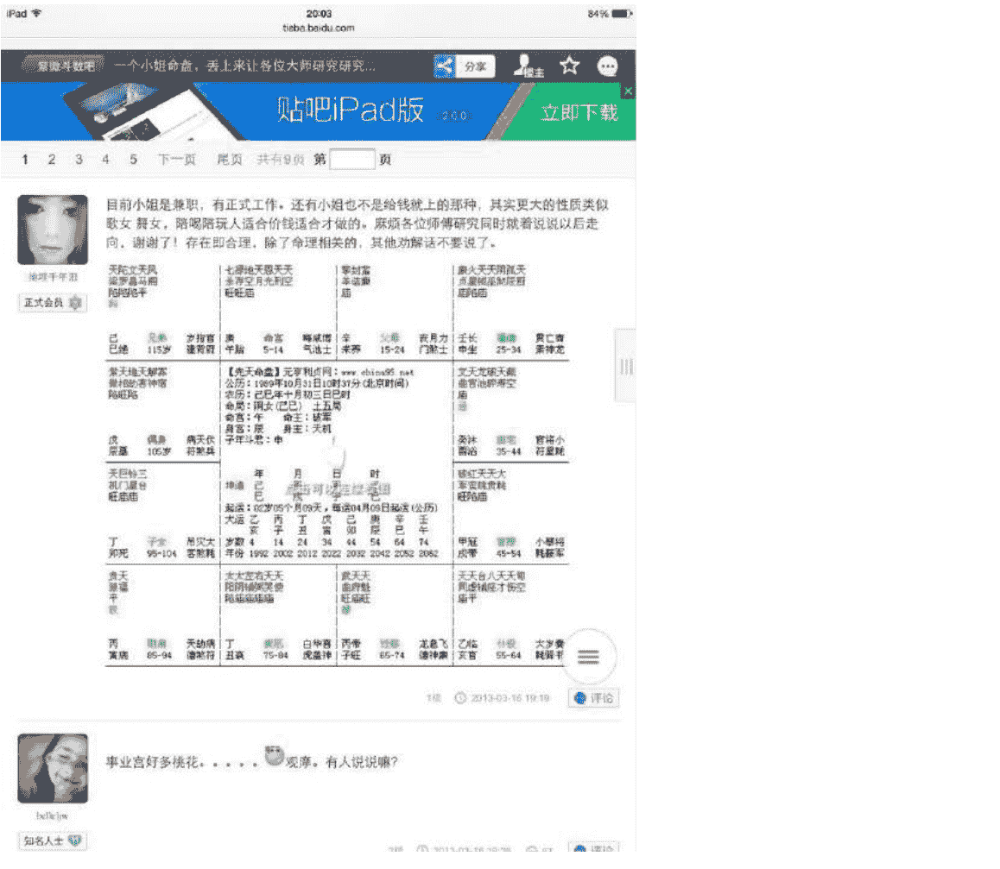

非常好的案例。贪狼也是三方合，有官禄和疾厄宫飞化的情况，代表工作是需要身体的，甲干化忌太阳。

武曲破军+天姚，是破色财。比如天姚+破财星的组合，有什么地劫、擎羊、破军，基本上都是要防桃花破财，仙人跳之类的问题。

天刑+红鸾，叫做【色难】，会为了桃色事件，弄到流血。这个有个特殊案例，很有趣，说给你们听听。就我弟的一个朋友，命宫就这个组合，我就想，这看起来很SM的感觉，我就说，色难。然后呢，他就说，对！我常常因为桃色问题流血，我还缝针了。我这一听，我就吓了一跳，哎哟，这隐私话题。谁知道他说，是他几次和朋友喝酒的时候，隔壁那桌的人调戏他朋友的女友，然后他就帮忙打过去就这样流血缝针了。他问了一个我不会回答的问题，他说，为啥我会遇到那么多次这种事？我想，谁让你去打人呀？因为天刑有那种付出代价的意识，他就想，这人调戏我朋友的女友，我一定要他付出代价，红鸾是代表血。

破军天姚坐迁移宫，这代表会遇到色难，迁移宫是代表你出去会遇到的，破军是代表乱，天姚是代表性，乱性之人。所以说要记住组合，记住组合你不需要看飞星。反正时钟转那个宫位，那个组合的事件就容易发生。

### 六煞星

-   擎羊陀罗是【小人星】
-   地空地劫是【无缘星】
-   火星铃星是【干扰星】

#### 擎羊

擎羊是属阳金，化气为刑，所以也有天刑那种，会认为自己需要去惩罚的意味，掌管刑伤。擎羊其实也是【小七杀】。说说这两个的区别，都是阳金，七杀是代表刀子，擎羊是代表针。擎羊要从针去衍生含义，比如，说话带刺，不刺激人的话都不说，一旦骂起来，句句见血。这就是擎羊，擎羊说话会伤人。擎羊也代表【暴力星】，从暴力衍生含义，比如，吵架，打架，争议，撞伤。通常我是不喜欢看见擎羊坐夫妻宫，因为要防家暴问题，表示命主也是这种对待模式，比如我骂配偶的时候，句句见血，结果对方受不了就打过来，是对待方式的问题。看见这种组合，就要告诫，两夫妻有意见不合好好说，温和说，不要刺激人。

擎羊因为代表针，所以也代表针灸，缝针，割伤，也有刺激的元素。比如说，擎羊坐午，午是心脏，容易心跳很快，因为擎羊也会增加刺激。擎羊坐子午都很不好，这跟身体很有关系。擎羊坐子，是在胆经，坐午，是在心经，两个宫位都容易引发冲动，大胆，不顾一切的意味。特别是坐子，会一阵一阵的突然很大胆，夜晚也睡不好，或者晚上梦见暴力事件。

地势上，擎羊代表断桥，岔路，五金行，铁工厂。

擎羊坐命呢，是不是代表自己是小人？不是，可以是说话直接，有时候会让人以为你在骂人。擎羊不喜欢拐弯抹角的，想说就说。擎羊的好处就是不记仇，个性直接，脾气发过就算了。擎羊坐命，也容易花钱冲动。反正擎羊坐命都容易冲动，做事少三思，一股劲来了，就干了。擎羊坐命，因为是属金，又代表刑伤，一般会容易割伤之类的，然后通常身上都有疤痕，这需要女命还是男命，有些女命擎羊坐命，一条疤痕都没有。

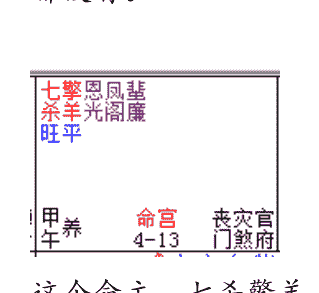

这个命主，七杀擎羊，小时候就跌倒，那个右手都看见白骨了，说是小时候这种割伤流血的事件太平常。

七杀+擎羊，有两种说法。第一种，就是可以更好发挥，因为就好像将军拿到了宝剑。第二种呢，就是说，这种组合，无制则，会好像孙悟空不受管制一样，会特别凶。这七杀擎羊，我有两个几乎是90%同盘的案例，一个是杀人犯，一个是不杀生，吃素的，修行人，出现了两极端，算起来是很特别的案例。一个女盘，一个男盘（因冲动问题杀人）。

#### 伪君子——陀罗

陀罗也叫小人，但是看陀罗太讲究了，擎羊真小人，陀罗伪君子，这陀罗顶多就说话比较委婉，不直接。什么样的情况陀罗才能说成是那种搬弄是非的人？就是有遇到巨门和指背（背后说坏话，是很小的星星，但是这星星独立化的就发挥这个意思，所以流年遇到，会出现这种事），这种是非星，和暗星的时候，就可以说，这陀罗爱搬弄是非。平时的陀罗，有几个关键字可以说，比如，陀罗【原地打转】，我一般上看成是【小天机】，【天马是大天机】，【陀罗是小天机】。陀罗就跟天机一样，会转动的，陀罗还是幼儿园版本的天机，转得太小，就变成原地打转。因此坐财帛宫，和天机的意思也类似，代表周转。陀罗呢是不直接伤害人，就喜欢委婉地说话，而且也有个坏习惯，就是习惯忽悠人。

天马+陀罗，像旋转木马，就是这天马转得不好，或者容易出现卡在一个部份，然后在那个部份打转一番，再转去另一个部份，又出现类似的情况。这种情况有点像是搞计划性、案子的事，比如说私家侦探，他需要到处走，然后在每个点上面再打转，把这个案子弄好了，才再开始另一个计划。

陀罗在地势代表为石磨，断垣，破屋，研磨店。

陀罗处事进退两难，摇摆不定，容易纠结。陀罗代表原地打转，所以是有天马的那种意象，不过就小的，偶尔出去一下。陀罗会抓不到主意，左右都不是。

陀罗+七杀，之前我说过，就是会吓唬人说我要结束了，要结束了，但还是没结束。因此陀罗也有拉长时间的含义，就是把时间延长，拖延。另一个特别的小星星也说一下，就是天寿，天寿如果加上陀罗，这事，你要说成好多年。要记得几种组合，如果是时间长的，有陀罗，天寿。如果是会反复的，就是化科化忌。文昌文曲+化科化忌都会容易反复，因为文昌文曲是有更迭，周期性的含义，也是反复之象。所以就要记得把这两种情况区分出来。

禄存一定是被羊驼夹，那么，禄存的优点就是受保护，缺点就是孤独。所以，看见禄存都可以说是孤寡。禄存是代表宝贝、钞票、重要的东西，这左右是有保镖了，但是对面没有，所以要看禄存有没有破，要看禄存的对宫，有生年忌在对宫，基本上这禄存就算是破了，是吉处藏凶的含义。禄存被破，就会特别难受，而且就像失去保护一样的心情，防不胜防的感觉。（地劫同宫，也是没有了）禄存的优点呢，还有就是解厄，特别是解暗星、巨门星。所以巨门和禄存在一起，就容易把是非化掉，因为巨门+禄存，你要说成如口含金，不是那种叽叽喳喳的人，所以是非自然就少了，也代表这个巨门是说好话的。

巨门+陀罗，巨门+擎羊，这种就说不好听的话。

禄存代表桥，古井、农牧、种稻。禄存因为属土，也代表小山丘，这些土性状态的东西。

天府+禄存，就看成银行。

禄存主孤，所以不宜入六亲宫。如果禄存坐夫妻宫，是代表惧内。禄存坐财位、库位，才看成财富，有钱。入命，你要看情况了，不能直接说有钱，因为如果你这样说，人家马上说，没有。因为禄存如果独守坐命宫，是代表守财奴，有收藏癖好的人。

禄存+化禄坐命，看起来好像会很有钱，实际上也没有，就是从小就有存钱的习惯。同时，也喜欢收集邮票呀，收集小册子，收集各种东西，就有这种习惯。

禄存独坐，紫府朝垣，富贵之极。就是紫微天府照禄存的时候，或者是同度的时候，多数是很有钱。

禄马交驰+杀破狼，赚钱厉害，财源滚滚来。禄马本来就代表赚钱范围大又快，如果刚好是杀破狼格的，就代表这人很厉害赚钱。

#### 铃星火星

铃星火星最多人搞不懂，哪怕你去翻书，也只看见火铃会增加凶性，很少人发现到火铃的本质。其实呢，火星铃星是很敏感的组合，算起来就像是防御的第一层，发警号效果的组合，在人体都代表体质敏感，然后容易发炎呀，有敏感反应。铃星是对恐惧有危机感，火星铃星要看成是警号作用的意象，火星看成是煽动，比如说大惊小怪，就是火星。

火铃+廉贞，坐田宅宫，流年田宅宫也好，都代表家里的电路敏感，会容易走火，电器被烧掉，所以这算起来，就是一种特别敏感的神经线，有问题了，就会发炎，发脓等等。

火星是属阳火，可以看成是【小太阳】，幼儿园版本的太阳，也主动，也一样会发挥博爱，为别人好。就是威力比较小，而且没有后劲。比如说你来的时候，会很热情的招待你，说要带你去哪里玩哪里逛，但是只是纯粹说说，因为没有后劲。但是有那种说话方式很【煽动性】的效果，听了就让人兴奋。

火星和擎羊也是一样，脾气发完就好，多数的脾气都是大惊小怪而来的。说话会大声，因为要表现出那种【煽动性】的气场，因此火星独坐，就容易声音沙哑。也代表外科、外部发炎、外科医生或者是外敷的药。

地象为，庙宇，山尖寺塔，火炉，打火机。

火星铃星会激发突发性，好像特别喜欢意外惊喜。所以火贪，铃贪，叫暴发格。那么，火铃加上七杀和破军呢？也是有这种效果的。所以如果七杀加上火铃，就要注意意外事件。

铃星很纠结，隐忍于内者，通常也是大惊小怪，但是是在内心里面大惊小怪。比如说发生了一些事，他认为很严重，但是他就喜欢纠结地想，唉，是说好还是不说好呢？这说了，会不会打草惊蛇？各种各样的理由让他会自然的隐忍下去。不过，通常最后自己都说出来，因为铃星是【小破军】，也是一个气球，破军是大气球，铃星是小气球。通常都有隐忍的习惯，然后同样有暴发的习惯，都是膨胀效应的模式。但是，用时间去比拟的话，破军的这种膨胀效应是可以容纳几年的一肚子气，铃星的容量，实际上就几天，他自己会说出来自己的不满，只是被抱怨的那一方，永远是后知后觉。因为他都是忍住忍住，唉，还是说吧，迟了一步，所以别人是后知后觉，觉得这人怎么记仇，那都是上个星期的事，今天还拿出来说。所以我也喜欢说，铃星会记仇。铃星不是真的记仇，不过铃星受委屈是不爱说出来，憋着，几天后才说。然后人家就说，这铃星真记仇，是行为上造成的。

铃星还有催促的含义，就像会响的铃铛。比如说田宅宫有铃星，这家里有人爱催促。铃星坐官禄宫，会总是容易觉得有人催促。铃星会赌气，生闷气，倔强。不过铃星每次生气都是很小的事。火星铃星其实就特别敏感，所以，都容易让人觉得，那么小的事，你有那么大的反应。那么小的事，你憋着气了几天，今天才骂出来，这就是火星铃星。

火星和铃星夹田宅宫，代表左邻右舍很吵闹。火铃同时坐田宅宫，代表家里有这种成员，同时也要防止家里走电、走火时间。古代说防火厄，现代就是防电。火铃昌曲汇集疾厄宫，代表身体机能故障。最近看的一个就是这种格局，通俗就是怪病。

廉贞+火星，容易自己吓自己，然后做事了后悔，然后把简单问题复杂化，也容易出现情绪病。廉贞代表复杂，也有阴性、防御感，本来就思想复杂的廉贞，遇到火铃，基本上也就更加大惊大怪，是会把问题复杂化的一种格局。

感。火铃夹命，就是家里人有爱吓唬人的，比如从小父母亲就喜欢说，你出去就会给坏人抓掉，本来就敏感，又被煽动，就会情绪不稳定。因为火铃是掌管这种危机意识的，然后发出信号，因为每次有反应的时候，都是坏事，所以古人就把火铃放在煞星。

火铃是警号模式的，所以机制设计上就是特别敏感，有问题了，自动断电，就像家电一样。

火铃刑忌（羊驼），一名【扫把星】，又名【短寿煞】，腰足唇齿伤。火星铃星是本身就有煽动性的，明锐化的效果，羊驼本身就是保镖，会去行动的星星，就像一边发出了警号，保镖去执行一样。那本来可能是小事，被这样嚷嚷叫之下，变坏事了，激烈化整个事件，所以就容易变成【扫把星】。当然，因为火铃本身也有锐化的效果，这擎羊+火铃，就更加锋利，所以也更凶。

巨门+火铃+羊驼，要防自杀，因疑惑，敏感，愤怒而陷入想不开。这个组合要注意，巨火羊，巨铃羊，是自杀组合。我也说过火铃是大惊小怪的，看那些玩自杀的人，好多也大惊小怪，就像我有个朋友，她男朋友对她说，我们分手吧，她就在对方面前喝清洁剂。所以代表这种人是经不起吓的。火铃会锐化、刺激化、敏感化巨门的疑惑，还有煽动效果，所以这个巨门才会那么激烈。

擎羊可以制火星，陀罗可以制铃星。擎羊会冲动。紫微组合就像是炒菜，你要把所有星星的质感都明白，就很容易看紫微。比如说，巨铃羊，巨门=疑惑，铃星=恐惧，敏感，锐化，擎羊=冲动，去执行，所以就很容易出现那种突然间去自杀的行为。如果把擎羊换成陀罗，至少还会想，我想自杀了…下个星期我真的要自杀了…下个月我是真的打算自杀的…明年，好吧，我忘了。陀罗就有拖延的毛病。火星就会煽动，自杀还会去通知别人，打电话给朋友，喂，我要自杀了，然后在微博顺便宣布一下。所以，我觉得，巨门+铃星+陀罗，反而自杀不容易成功，铃星是膨胀效应，但是有了陀罗就滚不开。

# 【第十周】

06.29

小星星很关键。你会发现如果是基本命盘撞盘的概率太大，只有 144 种命宫而已，所以，产生千变万化的关键就是小星星。

### 地空地劫

地空丁火（阴火），地劫丙火（阳火），都是属火，就是阴阳之分而已。通常在象义里面，就是看成地空是和尚，地劫是尼姑，因为空劫是物质无缘星，特别是针对物质而已，所以空劫坐财帛宫，都叫破财星。流年看到财帛宫有地空地劫都主破财事件。到底是怎样的破财呢？也是有模式的，这个模式就是到了特定数目的时候，就自动有事情突然要出去，总之就是只保留那个数额给你。比如上个月你看户口有 1000 块，下个月应该会赚钱的，不过因为一些事存不住钱，破财了，所以下个月你再看，还是 1000 块，通常不会让你辛苦，就是无法变多。

不过，我就把【物质无缘星】换了另一个说法，叫【缘短星】，不是你得不到，是你得到了，还没在荷包里面坐热，又破了出去，而且通常一些验证，附加了其他的星星，会增加这个星星的【缘短迹象】，太阴+空劫=田宅缘短，女人缘短，有个案例不止一个，好几个，太阴+空劫（随便一个），往外发展，而且在很短的时间有可能就搬家，比如三两年就搬家。一些说法是太阴+空劫，是和女性家庭成员无缘，比如和母亲无缘，那么和太阳一起也是相对的，就是太阳+空劫=和男性成员无缘，这是最通俗的说法。太阳+空劫，因为太阳也代表名声，也等于在一般俗世的成就名气无缘，比较不好这种命。反之，如果他去修行，或者成为艺术家、哲学家，反而就可以得名，因为地空地劫其实也是富足星，是在精神上的富足，是反过来的。有个哲理是，不管你失去什么，你总是会得到，你会得到经验、教训和体验，地空地劫的含义就偏重于精神系列的事，所以一般会合空劫就建议往思想文化，艺术去发展行业，反而容易得到。地空地劫是有区别的，地空是代表失去了看得开，地劫是代表失去了看不开，这地劫我们就会用得多，因为地劫的不甘心，很容易来自于【被抢了】，明明是我的，然后被人抢掉的那种不甘心。我有个案例去年巨门地劫坐流命，我就问你有东西被人偷了或者抢了吗？他说有，工作上的。原来老板承诺会给他升职，谁知道最后一刻，那个位置给了老板的亲属，而老板因为对不住他的臭脸，不爽，就把他派去偏僻的岗位，说是让他开发新市场。把自己原本的岗位让出来给这个新升职的，所以他自然超级不爽，形容的也是这种情况，巨门是暗星+地劫是被抢了，就是一层象义。

如果这个组合是坐在财帛宫，大限财帛宫，流年财帛宫，都要防止钱财被盗的问题，最近的一个盘，有个人，本财帛宫，擎羊地劫，坐子宫，去年午，所以子是迁移宫，我就问，你去年有遇到被人抢钱事件吗？她说，有！不过幸好那个钱包是没钱的。所以，地劫，我们就用得多。不喜欢加上巨门、擎羊、武曲化忌、禄存这种有金钱含义的星星，或者暴力星，或者暗中行为的组合，就容易有这种破财问题。所以问这空劫最好是做什么宫位，答案是坐疾厄宫，空劫坐疾厄宫，就少生病，和生病无缘，剩下的宫位都容易有失去的含义。

地空是看得开，就是比如失去了就说，算了吧，无所谓。这个地空最好是坐福德宫，因为代表自己容易对一切得失问题宽容，我们这边有两个同学的命盘是地空坐福德宫，@橘橘子 是巨门+地空坐福德宫，不过她有趣的是，她是太阴地劫坐命宫。先说说@橘橘子 的这种矛盾组合，今天我提到空劫的时候，@橘橘子 就说，我地劫坐命，但是我不会觉得我东西被抢了不甘心，其实实际上她是提过这种不甘心。她今年遇到喜欢的人最后是别人的，遇到自己做的业务被人坑了佣金，她是有抱怨，但是因为她福德宫是地空，所以她自己很快就忘了这些事。而且，她在外地工作，也算是太阴地劫，和家里无缘，容易出外发展。

再看看@人间 的这种组合，人间是福德宫，廉贞七杀地空，然后夫妻宫是紫微贪狼地劫，她的比较特别一点，因为空劫是对准福德宫三方位，而七杀是僧道，遇到空劫会容易激发这种修行的倾向，而且紫微贪狼，逢化忌，我之前也说过，紫微贪狼会变成极端，化忌了会物极必反，反而为僧，所以她的这种组合会让她精神上，激发去修行的倾向。这边看大概是2013年会经历一些，觉得世界其实什么都是假的，然后因为隔年，进这个宫位，天梁是宗教星，也是古老文化的含义，加上文昌就是，古老文化的学术，她去年就容易对这方面产生巨大的研究兴趣。所以空劫还有一个功能，就是会激发一个人精神上的成长。

地空地劫其实是最讨厌同度，就是不喜欢坐在一起，因为这两个星星是矛盾的。比如说会一下子觉得自己得不到，算了吧，但地劫又不甘心，就形成了一种阴阳鱼的转动倾向，好像转不出来。这就是阴阳鱼，代表有阴有阳就会产生转动效果，好像白天黑夜一样，地空地劫如果同度，就会这样。早上说哎哟，我放下了这件事，不想了，晚上又为了这事睡不下，纠结就容易产生，因为这两个星星都是偏重于精神问题，久了就有精神问题出现，这个可以特别留意一下。解决的方式很简单，就是有家人是这种盘，然后陷入了让人担心的精神情况，你只需要【认同】他，他就好了。比如他认为自己很努力，你就认同他，对，你很努力，那他就好了，不要去争议，因为空劫的不平衡是来自于失去。

有个组合也需要特别关注的，就是命身宫，有地空地劫的人，各守一个，这种人，书上是写，是修道之人，所以，会自然而然也是往修行去。我自己的舅舅是这样，现在也是修道的人，这种命格有个特点，就是很难发达，不让你饿死，你要钱的时候，也会有人帮你，但要多就没有。为什么很难有钱呢，因为命宫管先天，身宫管后天。

除了容易激发人精神方面，也让人对艺术方面感兴趣，比如李白就是空劫坐命的，一辈子都不算是有工作的人，因为空劫就让人觉得他没工作，我朋友也是这样，有工作好像没工作。除此之外还有一个特点，就是流年逢到的时候，会突然想写诗，想去学书法，突然跑去买毛笔，古筝，突然去做这种诗意绵绵的事，大多数就是空劫影响到。有一次，也是相当有趣，我看一个盘，男友看女友的盘，我就问，你女友是不是最近打算学书法，突然对文艺感兴趣呀。他说，对啊，她那天才去买毛笔。我就是看到遇到了空劫。李白会写诗也是这样原因。三方照也会，就是当这个能量突然爆上来的时候，就会出现这种雅致。

地空坐迁移宫也很有趣，地空坐迁移宫是代表不需要去那个地方，坐在这边想一下，就当去过了，不需要真的去。

空劫也有个关键字，叫【空中折翼】，其实不只是空劫，其他的空亡之星都有这个含义，【空中折翼】，意思是做不成。空劫不一定是代表四大皆空，因为说外国人空劫，他也许就信耶稣，修吸引力法则，心灵瑜伽，这些都是归类在空劫里面，就是会往精神领域去找。还有一个重要的含义，就是空劫容易踩空，要防高空坠物，跌落，或者坠楼事件，所以李白怎么死的，这一清二楚。空劫最怕去跳楼，李白是掉入河中。通常我问过几个案例，空劫守到的时候，晚上做梦，也会有那种踩空的感觉出现，突然惊醒，好像踩空了，这个可以去观察一下。

在地点，地空是代表空地。地劫是代表低洼之地，不过现在也比较少见到这个格局，反而我验证出来的几个是废墟，没有用的地方，破壁，附近有这种无用之地也是空劫代表。

在身体健康，地空一般看成是贫血，地劫是皮肤病，不过因为也有跌倒的含义，所以也要注意四肢之伤，要记得空劫进什么宫位，就和那个宫位比较无缘。空劫和什么星星一起，也要再起多一层含义。比如，和天机一起，天机手足星，兄弟无缘。太阴田宅星，和太阴一起，田宅无缘，女人无缘。和破军在一起，破军是夫妻主，所以是感情无缘，所以是看在两层，一，宫位，二，星星。

破军地空在奴仆宫，破军在感情上呢，是all in，就对朋友好的时候，是真的很好很好，但是有地空，所以这朋友来来去去，你也感受到你不是被同等对待，人家没有对你all in，但是幸好你是地空，因此你就无所谓。不过还有多一层含义，奴仆宫也是桃花位，破军是夫妻主，管理感情，所以，也容易让你桃花方面，花还没开就关了，恋爱情况就比较容易【空中折翼】。

她的问题，兄弟宫紫微地劫，兄弟宫暂时我们这边用资金位，公司的资金位，紫微是管理，所以也看成就是你自己在资金管理不当，也因为是2014年，去年的宫位，紫微地劫，也可以看成是提升之事，或者会遇到什么特殊之事，因为地劫，就错失了，或者没发生，一般也是代表很难存钱。我就建议你有钱给妈妈收，用第三方的名义去存钱。

### 杂耀

还没开始之前先说说小星星是怎么用的，能量大不大，其实小星星的能量都很小，有些甚至是你根本感受不到，小星星一般是怎么用呢？就是需要用在【增加，辅佐】同气的大星星，才会发挥这个组合的特殊威力。如果是四周都没有同气的星星，那么这个小星星可能会被沉没掉能量，所以这一点是要特别注意的，多数的小星星都不是实星，是虚星，就是天上不存在的，跟北斗南斗不一样，北斗南斗是实在的星星。

小星星又是从哪里来的呢？多数是从八字、奇门、玄空等等的术数里面出来，八字里面出来的最多，所以会有一些门派，是彻底放弃看小星星，比如飞星派，主要是玩十八颗主要的星星而已，所以叫十八飞星，然后用六吉六煞，其他的小星星就不看。三合派通常就用很多小星星，比如王亭之是中州派，是主流三合的，他的资料里面就很多小星星的研究。经过我几年的验证，就是这紫微本身最重要就是取象，象义，如果不看小星星，就看不了细节，还有一些论断，所以这是我们必须去研究的范围。

该怎么用，第一个，就是先了解这个星星的功能，是增加的功能，还是提高的功能，是变长变短的功能，还是变大变小。比如说看见天寿，天寿就有增加时间长度的含义，所以也是非常重要。第二个，就是要先了解同样气质的星星，比如，台辅封诰，三台八座，恩光天贵，天官，这些全部是提高地位的象义，也是紫微重要的辅佐星，当这些全部聚集在一起的时候，这个紫微就会变得很高级，地位就跟其他的紫微不一样了。然后比如有一些是代表漂亮的星星，天府坐田宅宫，我说过是代表洋房，当和龙池凤阁、红鸾、昌曲、化科这种代表漂亮，有气质的星星一起又能够提高这个特性。第三个，就是小星星威力是很小的，因此容易只发挥在流年流日这种很小的事情，很少会产生一辈子的效果，比如说，红鸾天喜是看喜庆的，不可能每一年都结婚，所以，这种星星只用在流年多。第四个用法，是我最长用的方法，就是寻找命盘的【特殊点】，当我看见比如是桃花星汇集的，财星汇集，忌煞星汇集，宗教星汇集，文书星汇集，官非星汇集等等，当出现类似的同气星星汇集一起的时候，该宫位可以看成是【特殊点】，我给你们看看一个命主的宫位，这个宫位很特殊，武曲是宗教星，地空地劫也是灵性的，还有天巫，就好像是汇集了大量的那种玄幻能量的宫位。因为这个宫位是2007年，我就问这个命主，你2007年是否有接触玄幻之事。她的回答相当惊人，她说，她遇到灵异事件，所以那时候，就想找画符章的，护身符之类，一度的迷上这种东西，就在2007年。这就是我常用的，我喜欢看那种特殊聚集了大量同类星星的宫位，寻找这个宫位的【特殊点】，这样你就可以说出神奇之事，因为这事特殊呀。

#### 台辅，封诰

台辅阳土，封诰阴土。台辅管封章，封诰管台阁，皆主贵显。这两个是类似含义，就是代表封赐，奖牌，口碑，代表地位上升。台辅位于田宅主附近有土坡，亭台，砖塔，微高土堆。封诰于田宅代表亭台高坡，土山，牌楼，牌坊。特别是封诰，位于田宅宫，家里会有奖杯，或者挂着奖状。封诰比较特别一点，如果是坐命，迁移宫，奴仆宫，小时候会有绰号，小名，特别是关于形象模式的。

封诰和台辅相比，比较实质化，比如家里有奖杯，医院有锦旗.台辅有可能就是心里面有地位，比较不实质。不过这两个星星如果坐在女命的夫妻宫，那么就代表这女人很贞洁，感情专一，匹配也很好，因为封诰有牌坊的含义，古代女人贞洁可以立牌坊。台辅位于疾厄主脾胃,封诰位于疾厄主胸腹。这个三方遇到，就代表地位上升。

#### 三台，八座

三台阳土，主贵，为紫微的辅佐星。八座属阴土，主科甲，也是紫微的辅佐星，代表当和紫微同度可以增加紫微的力量。三台八座也是代表社会地位，跟封诰台辅不太一样的是，封诰台辅是有功德的那种提升含义，而这三台八座不是因为功德之事，通常看成就是考试得利，有科名，单守无力，主孤独，比如女人古代守寡，然后皇帝给立贞洁牌坊，她瞬间地位上升。

在现代比如田宅有封诰，家里有一些奖杯，在流年遇到，会因为做好的事情，得到封赐的事件而提升，就是偏重这方面的。或者医生有医德，人家给他一面锦旗，写“华佗再世”，这也是封诰这方面的。而三台八座比较偏向于增加，因为你看，这是数目性的组合，三台代表三个台，一般是看成房子，八座，是代表八个座，是看成车子，通常我是这样用，就是大限遇到，那个大限会买房子买车，会有体积、数量增加的含义，特别是加上左辅右弼，就更加凸显这种增加数量的含义。大限遇到，那个十年会有买房买车的事。比如你说，我表弟今年换了车子，哇，好像赚到钱了，这种地位上的提升。就是因为你看见他变多了一些事，变好了一些事，变大了一些事，而认为他地位提升了，跟功德没有关系。

二星皆为动星，其实是说，古代皇帝出游的时候，有一座一座好像房子一样的马车，那些叫三台八座，所以会有移动的含义，所以于身命，代表早年离家，限运遇到，也容易出国，出游。单守夫妻宫就不好，因为有孤独的含义，代表夫妻会分开一段时间，不会离婚，因为只代表孤独，不代表孤克。

三台主脾胃湿热，粉刺。八座主脾胃，下身皮肤病。位于田宅宫，住马路边，车水马龙。

因为也是数目系列的星星，所以不喜入夫妻宫，和左辅右弼一样，不然变成三个娘娘，八个妃子就麻烦了，开玩笑。

#### 恩光，天贵

恩光阳火，主宰特殊之星，为天魁之辅。天贵属阳土，主大贵之星，为天钺之辅。你们直接看成就是【恩光是小天魁】【天贵是小天钺】。恩光是有感恩的含义，代表懂得报答，善于施舍，重感情。天贵沉默寡言，重誓守诺，自视过高，略带孤僻，影响人际关系。

恩光和天贵都比较偏重物质感，什么是物质感呢，代表我要报答，我不是用嘴巴说的，我会送礼，会做实际的事。恩光主受，天贵主施。于田宅，恩光主有祖业，恩光附近有庙宇，慈善机构，文具店。天贵主土埠，台亭。为什么是慈善机构？因为有感恩与回馈的含义。恩光天贵坐夫妻宫，因配偶而得财，显贵，代表受到配偶的恩。恩光有受宠若惊的含义，代表恩宠与观照，特殊恩宠，反正就是代表那种突然被人对我好的含义，所以看成是贵人。恩光天贵，就是小天魁小天钺，不过这两个星星的威力也很小，最好是遇到天魁天钺，这样才更加能够提升含义。

#### 阴煞

阴煞是最耐人趣味的星星，我们看命的人最常用的小星星，和六煞星的力度类似的。阴煞最通俗的就是看成是遇到鬼，不过每个人的盘都有阴煞，不是每个人看到鬼，所以自然还有其他含义。阴煞代表那种暗中的小人，邪崇，潜伏性，处于黑暗之中的。比较耐人趣味的就是只住在阳宫，什么是阳宫，就是1，3，5，7，9，子，寅，辰，午…单数的宫位就是阳宫，所以叫【阳宫之煞】，代表只有在阳光下，你才有影子，才产生阴煞的对比。

阴煞我这样比喻，就是代表不明之事，无解之事，黑暗之事，古代天灾发生的时候，人人以为是海兽的缘故，就需要祭天，因为无解，所以就认为是妖魔鬼怪之事，你也可以看成是神秘之事，阴煞是属于这个范围的，阴煞就是比较独立的，特殊性就在这个是最代表见鬼的。

入命身，主多猜疑，嫉妒，容易觉得有人在暗中要害自己，加上擎羊陀罗，通常看成这人心术不正，喜欢阴行坏事。入迁移宫，财帛宫，官禄宫，代表是小人在暗中害。

喜欢遇到什么星星呢？喜欢遇到空星，比如空劫、截空、天空、旬空，这些可以把阴煞驱散。阴煞也是代表业力星，有冤亲债主的含义，也代表容易供奉神明，求护身符，简单来说就是代表幽暗的破坏力，阴煞坐疾厄宫，得不解之病，通俗的建议，就是看医生如果不会好，就要去求助神明，偏方。

说几个有趣的，这个人的田宅宫有阴煞孤辰，通常阴煞+孤辰会比较容易遇到鬼，加上陀罗，也是暗星，我问了真的闹鬼，她说她在家里遇过几次鬼压床。然后五岁的表弟来她家里玩的时候，说看见阿飘在玩具上飞来飞去。她小时候曾经生过严重的病，怎样看医生都不会好，最后父母没办法，有人建议去问神，就去问了，结果治好了，从此她家里也有佛堂。

阴煞贪狼坐迁移宫，代表去外地见鬼。不过，这阴煞不一定是会见到鬼，就是你们玩紫微的时候，可以留意一下，当趣味研究。我有个案例，是巨门阴煞坐命，还真是有阴阳眼。我自己的看法和以上说过的一样，就是阴煞会不会引发出来，是需要看看有没有同类星星。就是我觉得需要呼唤阴煞出来，比如要有天巫、天刑、陀罗、巨门这种阴阴的星星加在一起，或者加上孤辰寡宿，就有可能会把阴煞呼唤出来。这也需要你们自己去观察一下，因为这见鬼的验证不好证明。

#### 劫煞，天煞

这个我很少用，几乎没用过。这两个都代表破坏力，都是煞星，阴煞是幽暗的破坏力，天煞是代表天给的破坏力，我的想象应该是那种要出门遇到坏天气之类的，也代表长辈的阻碍或者连累。而劫煞代表比较直接的破坏力，来自于同辈的烦恼，比如被连累，殃及池鱼，你可以看成是地劫+煞的力度。

#### 天巫

天巫是宗教星，算命星。我很喜欢这样断，就是看见天巫的宫位，我取那个流年，我问那年是不是有去算命，我发现都很准，代表这容易发挥在流年上。

天巫坐六亲宫，代表那个六亲对算命有兴趣。

天巫和阴煞一样，是独立化的象征，是专属代表神秘学的象征。不过这天巫是带有药性、医性，比如古代的巫婆会有魔药、下降头、护身符、念经开坛做法、偏于巫术的那种医病。

这天巫如果拆分出来其实是代表学术化的意思，很好用的星星。比如说天巫+机梁，这个机梁就偏重于学术化的，比如喜欢研究兵法，去看鬼谷子的纵横学。加上武曲贪狼这种宗教星，喜欢学术性的神仙学、宗教学。而如果是加上紫微禄存，这种有可能是对古玩古董有学术性的情怀。天巫虽然是有宗教性质，但是天巫没有迷信色彩，因为是象征推理和逻辑化，只是我们凡人无法理解那种高级学术，就像别人不了解我们算命，中国五术、河图洛书，会认为我们迷信，实际上是推理模式的学术性，天马+天巫代表学这种神秘学速度很快。天巫+天马+禄存=天巫赶马，加多一个禄存，就代表除了学得很快，还会用这种学术去赚钱，加多一个禄存，还赚得很快。天巫+巨门，我之前说过，巨门也是医星，而且偏重于液状的药物，而且巨门也是暗星的代表，所以天巫+巨门，有可能会研究药，偏方的药。当然，也是偏重于逻辑和推理。

天巫有个重要的象义，就是代表中介人，或者代劳之人。这个中介人，就像我们算命师，平常人不会看紫微，我就代劳，帮忙解读密码，就是有中介人的含义。除了是算命师，加上其他组合，也一样可以看成是平常的中介人，就比你懂多一点点偏路，所以你需要求到他。书上有个论断，太阴文曲天巫，九流术士，这边的九流，不是指低级的含义，是代表九种流术。

#### 天月

代表疾病，忧心，与忌煞同度，代表疾厄缠身，代表慢性疾病，潜伏性疾病，不容易医好的病。要说会死人，又不会，比如说风湿病、糖尿病，不让你死，就让你折腾的慢性疾病。

流年遇到，一整年都不舒服，就是说这类型小星星有两种发挥点，第一种天月是代表疾病的，比如说我们知道，子宫是代表下阴部位，某个女命，你看见有天月在子，你也可以说，要注意妇女疾病问题。或者就用宫位，子女宫也代表生殖位，所以这子女宫有天月，说是妇女病也是可以。如果是坐命宫，那么就肯定身体抵抗力不好，容易有这种问题。不然其他不重要的宫位，比如父母宫，你要说，父母有慢性疾病，也是可以，不过我很少这样说，因为我所理解的是，这星星的发挥不明显，所以有时候我是看流年说，今年流年，天月坐疾厄宫，或者坐流年命宫，那么这个流年要注意健康，小星星的用法就这样。比如说，这天月坐疾厄宫，加上廉贞、红鸾，那么这慢性疾病是和血有关系的，天月坐疾厄宫，加上贪狼、火铃、地劫，那么这个慢性疾病是皮肤炎，或者细菌感染，皮肤敏感，就依然需要叠加在大星星，然后才有更多的细节。最多你就增加多一个象义，这是慢性的，所以早期要多检查身体，前面时段未必明显，后面发起来的时候就担心来不及了。

#### 天才

才能之星，反应很快，也是属阴木，和天机是同气的，代表天才+天机，可以提升更大威力，反应快，能够举一反三。天才可以看成是小天机，偏重于天机的聪明。陀罗小天机，偏重与天机的转动。

天才的口才很好，有点神经质，因为很聪明的关系，然后带有傲气。坐在田宅宫，不是代表田宅宫有什么，而是代表命主的脑袋好像计算机一样，有天才的库存，学什么都很快，而且还能各种学术累积，还能有自己的见解。不过也有缺点，就是用脑过度的缺点，比如，精神衰落、肾虚、用脑过度、疲劳、阳痿、阴亏。实际上总结就是，过度用脑伤癸水，因此就伤肾，这也是八字的知识，这是天才在疾病上的象征。

Ps：我会把主星先模拟成命主，我的做法是这样的：第一步，我是命主，我假象自己就是他，然后热身，看一遍个性，想法。第二步，看大限就是关注主题，想象当下的环境主题。第三步就是时钟，就是当我走到这个宫位，听到这种背景音乐我会想怎样。我流年走天虚天哭我就忧伤，哪怕我命宫是太阳，我也忧伤。比如说，我看到廉贞坐命，这人不服输、桀骜，流年看见贪狼化忌，我盖上眼睛都知道他继续赌下去，不会停下来。廉贞走贪狼化忌，当然亏损更严重，所以星性要熟悉，你要假设你是命宫，然后你进入不一样主题的房间里面，开着这种背景音乐，结合在一起，就你肯定知道他会怎样，不然你也会冒出灵感，会闪出一些，你觉得他遇到这个组合，他就会这样，活化就是了。

## 07.01

Ps：空劫最怕遇到化忌，空劫忌造成真正的半天折翅，半天折翅摔下来有可能是粉身碎骨。本命三方四正遇空劫忌，表示一生至少有一次甚至多次的重大波折，没有有利的主星稳住及吉星辅助或者遇极佳的大限，主一生不得志。

大限逢空劫忌主十年内流年不利时必有波折产生，此波折造成之伤害往往需要长时间来复原。如果深刻了解紫微斗数，会发现空劫坐命、夹命、相逢的机率是很大的，比如双月生人必逢空劫，所以有二分之一的人会逢空劫，若本命化忌，则形成空劫忌，即便本命不逢忌、不逢空劫，亦会遇到大限忌或流年忌碰到本命的或非本命的空劫，所以人的一生都难免会遇到空劫忌的洗礼。

#### 天寿

根据名字，这是寿星，但是力度是次于天梁，不过最好和天梁在一起，这样可以增加天梁的寿的能量。天寿，流年遇到的时候，突然会觉得自己的心境变老了，有时候你突然听到有人说，自己心老了，就可以检查一下他的盘，看看是不是受到天寿影响。天寿还有一个最常用的含义，就是代表【长】，比如说时间很长，长度很长，长期饭碗，很长久偿还的债务，或者坐牢很多年，所以既然这天寿是代表慢，代表久，因此就很不喜欢和陀罗在一起，因为这样就更久了，又是拖延，又是时间长。天寿还有一个含义是和天梁有关系的，也代表古老文化，古典，不过这个含义会用的比较少。

#### 天官

天官也是属于独立性的星星，和天巫、天才一样，含义是独立性的。天官做事稳重、按部就班、有目标、有原则、不喜欢乱七八糟，好逸恶劳，喜欢安静单纯，所以坐命也相对的安静一些。

天官喜欢和天梁在一起，会产生一种特殊的论断，表示这人很有可能是做有特殊工作性质的工作，比如私家侦探，情报员，无间道，机密工作，天梁总是和情报有关系，加上天官，天官增加了天梁的沉稳性质，所以喜欢做这种类型的工作。

天官也喜欢和正财星在一起，因为是代表提升官职的意思，比如，紫微+天官，这个官位就更高一些。

这天官有特殊的天赋，天官有很强烈的直觉，他的感官比一般人明锐，就像动物可以预测天灾一样，天官会增加这种感应和直觉能力。

可以对应自己流年宫位，然后回忆一下那一年的心情。

@人间 流年 2014 年，这个宫位让你这一年感觉特别清晰，之前的年份会比较糊里糊涂，这一年特别沉静下来，懂得观察自己的情绪，因为天梁本身也沉稳。

#### 天福

天福是小天同，和天同类似含义也是代表福气，懒惰，好逸恶劳，乐观等等，资料是说，是天同的辅助星，和天同在一起可以增加天同的福气能量，代表狗屎运更佳。有些人也许好奇，这天同懒散听起来不好，但是都可以观察出来，常常好运气的人，一般都懒，不用操心。

天福有个特殊爱好，坐田宅宫喜欢装饰家居。

天福也会比较鸡婆，爱多管闲事。

#### 孤辰，寡宿

这是对星，对星的重要性就是对上的时候，就发挥能量，不对上的时候，这能量就低，甚至没什么察觉到。

孤辰寡宿都是属火，孤辰是公的，寡宿是母的，阳火和阴火，也是叫【隔角煞】之星，不过，这边的隔角煞偏重于自己增加自己的囚性，不喜欢别人问太多，喜欢清静。

这孤辰寡宿有个特点是用在表情的，就是一脸苦相，实际上是那种无可奈何的表情。流年遇到，那年一整年都哪怕是笑，都是苦笑。

孤辰寡宿，如果增加武曲，会比较固执，更加固执，本身也有固执含义，我看见武曲+寡宿的时候会特别的留意，因为武曲也叫【寡宿】之星。一般寡宿之星，都带有孤克的含义，如果太严重的话，不然就代表很难跟别人相处，不然就代表身边有人早亡，孤独之命。

男命比较怕孤辰，女命比较怕寡宿。

如果入父母宫，孤辰一般代表父亲早亡，寡宿代表母亲早亡，这个我没有验证过，不过会留意一下。

田宅也代表家人，寡宿田宅对家里女性不利，孤辰田宅对家里男性不利。

孤克星，寡宿孤辰，你看，都跟亲人早亡有关系，古代看成就是尅父母，尅配偶，现代会比较少用到，没人喜欢这样被说。

入夫妻宫有讲究，男命，只有寡宿坐夫妻宫才代表妻子有离别之像。女命，只有和孤辰坐夫妻宫，才有与老公离别之像。

入子女宫，一般是看成孩子孤独，孤辰是儿子孤独，寡宿就是女儿孤独。

坐六亲宫，都是少见面的含义。

我验证一个，就是某个命主今年坐寡宿星，三方对上孤辰，他是这样说，我觉得我朋友离开我很远了（因为他毕业回家了），突然有很强烈的孤独感，所以坐子女宫，应该也会代表有离别，少见面的含义，不一定是书上那种早亡。

孤克有两层含义，第一，早亡。第二，聚少离多，哪怕是武曲也是这个意思。

坐疾厄宫，孤辰代表郁闷，寡宿代表风火，气闷，反正就跟心情不太舒服有关系。 寡宿坐田宅宫，有少见面的含义。 疾厄坐孤辰会郁闷。 孤辰附近有墓丘，孤树，孤峰。寡宿主有空地，空屋，废墟，空墓。

#### 天哭，天虚

天哭天虚我一般是看成表情，比如说流年大限遇到，我就说，你今年【脸臭臭】，一脸哭相，委屈的表情，看起来很消极，没有精神，懒洋洋。

天哭是刑克之星，代表是非，刑克之事。天虚是空亡之心，主虚耗，空亡。我验证过的，就是天哭天虚坐上，不一定代表他有什么事，平常就那个表情，人家会常问，你心情不好吗？他会说，没有啊。所以，这要小心的看，这就是为什么我很少会形容情绪，而是更多形容表情，因为我发现到跟情绪没有关系，就你委屈的这个脸，也不象征你的人。

天虚好吹嘘，飘荡不定，简称就是感觉上有点自负的气质，@人间 是天虚坐命，会容易被人因为她的表情，她的长相，以为她自负，认为她不笑，有点cool，以为她瞧不起什么的。实际上，是没有的。

天哭天虚也叫黄泉星，流年碰到，也代表丧服之事，不过我验证的是没有，这个你们也可以留意，就是需不需要加上离别星，孤克星，才这样说。不然，不要随便看到天哭天虚就说，你今年家里死人了吗，这就不对了。

天哭就是哭脸，天虚就是那种不稀罕的表情。天哭+巨门，或者天哭+太阴，我就断爱哭。天哭+水星的时候会增加情绪化，容易感动。

#### 天空

天空属火，空亡之神，是最最最最厉害的空星，威力很惊人，基本上是可以空掉一切，不分吉凶，不是破财那种，就是会不成，计划泡汤那种意思。

天空很爱想，想得非常庞大，最喜欢坐财帛宫，特别是流年财帛宫，坐吉星的时候就说这样，哇,我拿到工资了，我要天马行空的想一下怎么用，想啊想啊，一下子到了下个月，下个月的工资又有了，但是上个月的工资还没有用，就是纯想就可以了。坐命宫也是爱想，用在流年比较多。

天空也代表远景，有视野，有想象范围很大的空间。坐田宅的话，估计是喜欢那种一望无际的景色。

> 有句话是在很多书里看见的，‘也是【死亡星】，有句俗语，【驾前一位是天空，身宫原来不可逢，二组禄存若逢此，阎王不怕你英雄】’，主即为命主，身主，若遇到天空，主多灾，空亡。”

我翻查资料的时候，发现好几本书都有写这句，但是我暂时没有验证。

#### 截空

截空很好用，截空的做不成，是和额度有关系的，配额完了，不够钱了，特别是坐流年财帛宫的时候，如果配上了天机化忌（周转不灵），又遇到截空，基本上这年的周转不灵，肯定导致计划中断，也代表中途被拦截的意思，进行中无法进行下去。不过，这边就跟材料、金钱、配额是有关系的，如果是禄马交驰+截空，看成美格作废，所以遇到这个，要特别注意材料准备，通常遇到就代表兴致勃勃要做一件事，但是遇到程咬金的含义，所以有突然发生的意思。

#### 旬空

旬空是代表本来就没有，也不认为自己会有，所以不需要去积极，就随之作废的含义。间接是代表不积极，不努力争取，觉得一定输的，或者没有争取的必要，代表事情厌恶，搁置，放弃，不看好。特别是遇到贪狼，有远方桃花的含义，代表自己觉得和这个桃花，觉得自己办不到，老觉得自己异想天开，旬空会让一个人失去积极的力量，也会不自信。

这个人我就说他懒散，做事也拖延，觉得努力了也没有用，父母亲都为他急躁，他自己不急，他父母一边急一边骂，他说是啊，常常这样，然后每次没等他办好，父母就已经帮他办好了。因为父母二宫都坐强星，这命宫就有强烈的对比，特别是陀罗会拖延，地空就算了吧算了吧，旬空就不积极，天哭又一脸无可奈何，就长得一副欠揍懒人的脸。

福德宫是很细心，急躁，有不甘心的想法，所以这脸和内在不一定是对得上。

所有的空星都会转化去思想能量，可以转化一个人的个性，空星有【地空地劫】【天空】【截空】【旬空】

这个很好的验证，截空是强烈觉得不够条件，容易因为担心条件不够，怕做到一半做不下去，所以就不做，天空是就想啊想啊想啊，觉得反正没条件做，就用幻想满足一下。

#### 龙池、凤阁

龙池就是龙洗澡的地方，凤阁就是凤凰歇息的地方，所以常常是形容那个环境比较奢华、高级、好看，或者院子，可以休息的地方。代表才艺、名声、科甲、增加人的灵巧，也有攀龙附凤的含义。当然我不会说谁攀龙附凤，因为你问了，每个人都说没有，我不是这种人。不过有机会可以观察一下，自己观察就好。

龙池凤阁因为有那种龙凤休息站的含义，所以也代表高级享受，是享受之星。

凤阁专门辅助天府，因为天府是皇后，所以和天府在一起，就变 prada 女王的感觉。天府是贵妇，凤阁代表高级享受，奢侈美感，可以提高天府的能量。龙池辅助紫微，男命坐的话，估计也是风度翩翩，代表男子的建业之星，也可以提升紫微的能量。

在物体，龙池代表水池、江河、湖泊，或者可以看成豪华浴缸。凤阁代表飞鸟、楼阁、建筑物，或者很像鸟巢的物体，也代表庭院。

龙池代表耳疾，我有个命主，龙池坐命，耳朵动手术几次。

龙池凤阁夹田宅，他的反馈是这样的，他说他家是高级公寓，一边有花园，一边有泳池，底楼是个体育场，很多很多人常常去那边运动。武贪是劳碌格，左右是很多人，这个特别形象。

一般龙池凤阁在财，会想去美容院那些。女命的话会喜欢去理发，美容，spa，或者买一些比较高级的东西。男命的话，如果刚好是贪狼凤阁，天姚凤阁坐财……….

#### 天喜，红鸾

天喜红鸾永远是相对面，天喜红鸾是喜庆之星。一般用在流年，不过如果坐命的话，都代表桃花早发，书上是写会早婚，但是我验证的，是会早恋爱，不一定早婚。

我一般也会这样用，夫妻宫空宫，或者凶星，会离婚的，或者有外遇的，子女宫有红鸾，那么就代表第一个缘分不成，有可能就拍拖而已，是和第二个正缘结婚的，就是在本夫妻宫非常不美，子女宫有红鸾的情况下会这样。

天喜红鸾，在流年的时候，是怎么取呢？
我一般就取两个重点宫位，第一个是流年命宫，第二个是流年田宅宫，还有一个比较少用，不过可以参考流年财帛宫。坐命宫就有喜事吗，坐田宅宫，家里有喜事。在流年财帛宫，为了喜事花钱，都可以看成有喜庆之象。

天喜和红鸾还是有区别，红鸾自然比较像是结婚，有桃花含义。天喜是偏重于添丁，不只是儿子，包括突然有女佣，突然有亲戚暂住，突然自己的妹生了孩子，给你妈看顾，家里多了个人，就属于这个范围。
红鸾在物体，可以是化妆台，华服，美妆，模特秀，红地毯仪式，漂亮礼品，红包，所以红鸾的仪式迹象就比较明显。

在疾厄宫，红鸾是代表血疾，天喜代表神经虚弱。

在田宅宫，红鸾可以看成是红色物体，也代表水坑，水道，浴缸。

天喜是阳水，红鸾是阴水，都是属水。中年之后，老年之后，遇到红鸾不好，因为红鸾也代表血光，特别是遇到七杀、天刑、擎羊这种暴力模式的星星，中年之后不好，都代表血光。

#### 天厨

天厨代表饮食，厨艺，厨房，厨师，有卓越的品味，对事物也挑剔。中州派有个验证，王亭之和叶汉良的书籍都提过，就是【破军化禄+天厨】会成为餐饮之家，会成为事业。

天厨加上火星会特别喜欢下厨，因为火铃同为敏感性质的星星，能刺激到天厨的食物口味火候的天赋。天厨也有触觉之意，代表味觉、嗅觉等等都特别敏锐。我有个朋友也是这样，铃星火星都是锐化敏感度的星星，代表味觉特别敏感，特别立体。火星会有煽动、烤的含义，我相信铃星也会锐化味觉。

天厨和味觉、嗅觉是有关系的，所以才会挑剔食物。

#### 咸池，大耗，小耗

咸池兑金，代表少女，邪桃花，性淫邪，桃花煞。象义是黄昏的日末之象，形神松懈，散涣，但是却霞辉艳丽。两情相悦，精神荡漾，非常愉悦。代表色情，好色，情欲。咸池也是要加上桃花星才会被拱起的，就是说独坐的话，没有桃花星就不会怎么样。

一般是看成咸池代表好色，比如说咸池+天姚+贪狼+红鸾这样的组合，估计性荷尔蒙很高。咸池好像是来自于八字，所以很多门派不怎么用。

顺便说说，淋浴算起来是凤阁的一种，比较水的星星，也是看成是桃花含义。

咸池这边也看见了，有少女含义，这个可以记住，因为有时候我们断流年、断人物的时候，可以把咸池看成是少女，大耗小耗是一样含义的，代表花钱的意思，会提高花钱能量，甚至会包括浪费，和破军一起自然不好。和擎羊一起也非常不好，更加没有节制，这个也是多数用在流年，平常本命盘很少用。

#### 天德，月德，龙德（三德曜）

这三个德星，都代表贵人，这个也其实非常少用，但是可以知道一下。天德代表男性、长辈。月德代表女性、长辈。龙德也代表那种领导阶级的政府，因为龙德是看成君王之德，因为都叫德星，也代表是高荣耀，道德标准这种事遇到的贵人，比如说你遇到某个欣赏你的道德观的贵人，说你有诚信，就是这种类型，是以道德标准而得到的贵人，不过这三个星星的缺点就是力量实在太小，所以需要结合天铖天魁才可以发挥力量。

一般的理解，就是遇到三德星是有解厄能力，当然是因为贵人而解厄，天福那种是因为狗屎运而解厄，性质不太一样，力量不太会出来。因为其实这三德星不属于紫微本来的星星，是从八字出来的，所以很多门派也不用，不过可以作为参考。

#### 蜚廉

这个就有用到，而且算是很常用的，这是代表【神兽】之星，可以直接取象成动物，通常代表蛇、昆虫、飞蛾这种类型的动物，代表口舌是非，闲言闲语，八卦新闻，狗仔队，嗡嗡叫的虫，代表碎碎念的事，无实际用途，不妨碍但是看不顺眼的事。加上指背、阴煞、巨门这种是非星就容易体现出受到小人干扰、骚扰，对你有八卦意见的事。

#### 华盖

这个是可以直接看成是宗教星。华盖有个特点是需要特别关注的，就是华盖坐命会有神仙气质，有那种威仪的感觉。有个验证，我看书了，验证也正确，天同+华盖像弥勒佛。

华盖代表聪明，喜欢创意、灵感，还有个特点，就是华盖不利俗，不喜欢同流合污，不喜欢随波逐流，简称，脱尘的意念，不入俗。流年遇到的时候，如果和天府在一起，会突然想创业，而且还是冷门的那种，文艺类型，文化类型的产品创意。流年遇到，如果有搬迁之事，也会突然觉得和环境格格不入，强烈的觉得自己不适合这里，想离职，所以和破军在一起，就更加容易有辞职，离职的事件。

华盖+天府，是创业之格。

华盖也是算命星，坐奴仆宫就容易有朋友喜欢研究命理。流年遇到华盖，学习命理进展神速。

华盖位于田宅，主亭台，牌坊，庙宇，神座。华盖也有修性的含义。

#### 天伤，天使

这个很常见，天伤代表虚耗，天使代表灾病，这两个星星很特别，永远是夹迁移宫。不过流年来到这个宫位，和里面的主星，都代表这个组合比较敏感脆弱，代表什么呢？就像小孩子，出去多了容易生病，遇到灾难，就是这个意思。我看验证而得，是没有太明显的影响，所以就看成是逢迁移宫容易生病。

#### 解神

解神最简单，就是消灾。和天梁、天同一起的时候可以增加解厄力量。不过据我观察，一般的力量就很明显，我一般看见有解神，我就说最后没事，力度很大，不然也不会有这个名字。

#### 长生十二神

长生十二神原本也不是紫微的资料，所以有些门派也不用，不过大概说说，就是代表一种循环过程。长生、沐浴、冠带、临官、帝旺、衰、病、死、墓、绝、胎、养，就是长生十二神，就是一种循环，特别关注的是帝旺，据说帝旺坐命的人，特别好。

#### 十二神煞

太岁，青龙，丧门，六合，官符，小耗，大耗，朱雀，白虎，贵神，吊客，病符。这个是奇门出来的，奇门就有用这些，紫微用得更少，

- 1. 太岁：1、忧愁多  2、口舌临  3、疾病小人  4、忧婚姻钱财  5、莫远行
- 2. 青龙：1、吉祥  2、有人帮  3、添人口  4、有喜事  5、官运财运  6、免祸
- 3. 丧门：1、伤人、损财  2、家中有丧
- 4. 六合：1、婚姻喜庆  2、人丁旺  3、得人帮  4、祸不起  5、财利喜
- 5. 官符：1、忧愁  2、口舌  3、无事起风波  4、财物散失  5、失去自由
- 6. 小耗：1、烦恼  2、口舌是非  3、钱财损耗  4、东奔西跑  5、事多灾重
- 7. 大耗：1、官司窃骗  2、破财凶事  3、体弱身病  4、凶丧孝服（遇白虎）
- 8. 朱雀：1、口舌风波  2、求财不利  4、事情多谋少成  5、可逢凶化吉（遇紫薇）
- 9. 白虎：1、凶险  2、血光疾病  3、天灾横祸
- 10. 贵人（至吉之神）：1、命福寿长  2、财运通畅  3、人爱人敬  4、官禄吉祥有名望 5、凡事得贵人帮助
- 11. 吊客：1、流年凶 2、亲人有难 3、求财不利 4、晦气多 5、心不安
- 12. 病符：1、疾病缠身 2、心神不宁 3、忧愁难解

紫微斗数原本的模型是来自印度的占星术，那个命盘模样是类似的，就是字比较少，后来传进来中国之后，就据说一度变成了果老星宗，又名七政四余，是前人的研究。现在这个体系还是存在的，只是很少人研究了，后来紫微斗数出来了两大派别，第一个是，紫微斗数全书。第二个是，紫微斗数全集。看起来很相似，实际上这里面的体系完全不一样，我们现在学的是【紫微斗数全书】，后来又加入了飞星，八字神煞，奇门的那些资料。有人问，紫微斗数是什么？答案是，紫微斗数是综合法，算是那么多年，最后总结出来，比较实用的一种系统，而且最重要是，也是比较简单易学的，所以当下就比较主流紫微斗数了。所以这紫微斗数是演化，变化好多个时代的产物，现在要说什么钦天派，九星派呀，中州，飞星，你们就看成就是，大家都研究同一本书，叫【紫微斗数全书】，后来就因为各家的验证，和添加的东西，有不太一样的情况下，就出现了紫微分支，所以暂时把门派放下，把学术看成是知识就好。

# 【第十一周】

07.06

四化飞星，在紫微里面叫【用神法】，代表给予紫微命盘生命力的四种态度，也是最常用的技法。

其实四化飞星非常简单，只有四种，化禄、化科、化权、化忌。飞星有两种主要的用法，第一种是看对待，比如那些我对你好，你对我不好，我给你钱，你骗我钱。A和B之间的对待关系和互动关系。第二种，也是最重要的，就是找引动时间的重点，我们叫找地雷。有时候看盘会觉得，这个本命盘说我会损财，或者我会遇到官非，那么是什么时候会遇到？四化飞星就是看引动时机。

星性象义我们叫【垂象】，意思是你知道这个森林里面的地图，你知道哪里有陷阱，哪里有机会，不过这地图里面的树林，你没什么事，就会跟家具一样，就摆在那边。直到有一天，你在这森林里面被一只野猪追杀的时候，在森林里面乱跑乱转的，这时候，这森林的一切就会变成很有用的条件，那个会跑的野猪，就是四化，野猪让你动，引动你。森林的那些树木、坑洞、旁边的野人山洞就是地图，这就是我们的星性象义。

之前我们学会了看地图，现在要学会看这四头野猪会怎么追杀你。

在命盘里面，首先我们能看见的，叫生年四化，那是静态的四化，要和一般论星义的时候一样，那是固定的意象。这四个不是指上面的野猪，而是好像山神一样竖立在森林的某个位置，象征守护神。

## 基本命盘与生年四化

先看基本命盘，

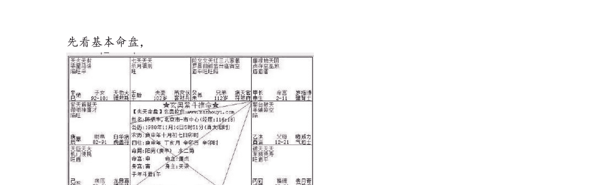

这四个是分别代表不同功能的森林守护神，是个静态的，不管你流年大限怎么转，这个永远不会改变位置，和其他星星一样。先说说生年四化是怎么来的，首先我们要知道自己的出生年份，干支，

| 天干 | 化禄 | 化权 | 化科 | 化忌 |
|------|------|------|------|------|
| 甲   | 廉贞 | 破军 | 武曲 | 太阳 |
| 乙   | 天机 | 天梁 | 紫微 | 太阴 |
| 丙   | 天同 | 天机 | 文昌 | 廉贞 |
| 丁   | 太阴 | 天同 | 天机 | 巨门 |
| 戊   | 贪狼 | 太阴 | 右弼 | 天机 |
| 己   | 武曲 | 贪狼 | 天梁 | 文曲 |
| 庚   | 太阳 | 武曲 | 太阴 | 天同 |
| 辛   | 巨门 | 太阳 | 文曲 | 文昌 |
| 壬   | 天梁 | 紫微 | 左辅 | 武曲 |
| 癸   | 破军 | 巨门 | 太阴 | 贪狼 |

我们只需要用到天干，也就是生辰干支的第一个字，甲乙丙丁。一般上如果懒惰的话，就去查询万年历，看看八字的第一个字，比如说1966年，

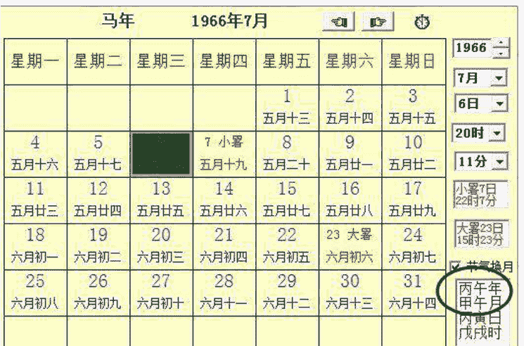

圈起来的代表1966年是丙年，然后跟着那个四化表，找丙的四化，那就是你的生年四化。丙，化禄天同，化权天机，化科文昌，化忌廉贞。凡是丙年出生的人，都是这个生年四化。

有时候我们没有盘，要知道这个人的一点点，就可以用四化去说。

快速记忆方式就是，每个阳历的最后一个数字是4，就是甲干，比如1984年，是甲子年。阳历年份最后一个数字是5，就是乙干，比如1985年，是乙丑年。只需要记住，4、5、6、7、8、9、0、1、2、3，对应就是甲、乙、丙、丁…癸。

说个紫微朋友的验证，他是德士司机，有一次他开车，他就听后面的大婶说，今年父亲因为血的疾病，去世了。根据他的推断，他就问，大婶，你父亲是1946年出世的吗？那个大婶吓一大跳，问你怎么知道？原来因为丙是化忌廉贞，廉贞代表血，所以他用这种方式反推。

这个为什么要特别单独记住呢？因为这个四化是可以拆开来用的，来验证几个同学，@兜兜有糖，1991年出生，也就是辛年出生，四化就是【化禄巨门】【化权太阳】【化科文曲】【化忌文昌】。然后我就开始问，兜兜是不是爱说话的人（化禄巨门）？化权太阳，太阳代表驿马，你是不是会主动对别人好？太阳博爱，会主动去为别人执行东西，或者叫别人去做。化科文曲，文曲是漂亮，艺术，你是不是很喜欢外表好看的东西？习惯性的点缀一下自己的东西，比如手机套，要美美的。最后一个，化忌文昌，化忌文昌一般是发挥在记忆力不好，对左脑的事不感冒、不喜欢，算是那种一看看见很多数字，就先烦恼的人。小时候很难背书。

这就是把四化的态度+星星的含义。不需要知道这个人的盘，只需要知道他的出生年份，然后生年四化，就可以独立地去猜测一些事。比如说今年流年是乙未年，乙干，那全世界的人，流年运就是乙运，不需要看盘，就知道今年是化禄天机，化权天梁，化科紫微，化忌太阴，那么我们就从流年去观察今年大家的事。

化禄是代表喜欢，爱，天机是动脑筋，是迁动，移动之事，代表今年很多人会搬家，或者去学习，去思考，会突然喜欢这些事。比如学紫微也是天机的一种，天机是益善之星。

化权天梁，今年是比较有正义感的一年。你可以看见有什么社会新闻需要转载分享的，拐带孩子的那些，大家一股气的互相配合，非常有正义感。

化科紫微，紫微是高级，化科是华丽，所以今年也流行一些奢侈品，人们对奢侈品的喜好会比较强烈。

化忌太阴，这代表工资少，很烦恼。又想去化科紫微，美化自己，奢华自己，土豪一下自己，也因为天机化禄，太阴化忌，所以这出外的事也多，但是工资是太阴化忌，所以今年很多人为了工资的事烦恼。

所以不需要看盘，某些情况，直接去四化，就已经可以独立性的使用。

### 四化的分别含义

其实四化是表现一种态度、力度、形容词。

我把力度转换一下，让你们明白。把化科放前面，化禄第二，化权第三，化忌第四。

这个四化是力度的档次，化科是最轻。化禄是比化科多一点、热情一点。化权是比化禄硬一点，快速一点，强迫一点。化忌是最硬的，是代表因为很少了，所以要努力的抓住紧紧的，代表收敛、紧张。

比如说驾车，化科就是你开着音乐，不慌不忙的开车。化禄是你刚从看完跑车电影出来，然后幻想自己是跑车手，突然觉得驾车是多么有趣的事。化权是你知道你有个目的地，你有个时间标准，你要尽快去，所以拼命踩油门。化忌是预约的时间还有10分钟，你还距离20公里，而且还堵车，你各种的慌张，各种的火大。这边的不足，是代表时间不足，所以你心情紧张。

如果形容画画，化科是今天我心情好，我随便拿铅笔画一下，上颜色。化禄是我最近迷上了画画的爱好，我想尝试各种画风，越想越快乐。化权就是你的作品是要赶着档期的，顾客也催你了，或者你的作品是要比赛的，有标准的，你必须打紧精神做好。化忌就是明天就要交货了，哎呀，现在才发现颜料不够，哎呀，还有很多还没画好。所以那种文曲化科，文昌化忌的，一般都是这种模式交功课，一开始抄写的时候，越看那个字体越迷恋，原来我的字体那么漂亮。但是到了晚上，要睡觉了，一半都还没处理好，心情越来越糟糕，索性就不管了，乱写写就是，最后老师批改，这个也错，那个也错，本以为自己能得A，实际很差。

所以四化是很生活化的，就是形容我们是用什么态度去对那些星星。

再取一个验证，@玖陌桑，1990年出生，庚年，不看盘，只看四化。化禄太阳，代表对别人热情，热心，买东西的时候，会帮朋友买一份。化禄太阳也是代表心比较大一些，不容易记仇。化权武曲，武曲本来就很硬了，加上化权更加的硬，这边我们先理解成规矩和理财。武曲化权代表原则性很高，因为武曲化权是很硬，力度已经很靠近化忌了，因此，有可能也会出现骨头痛的情况。化科太阴，就喜欢线条比较柔和的装扮。太阴类型，也代表对女性朋友会比较柔和，和男性朋友的时候，用化禄那种，大大咧咧的。和女性朋友的时候，用化科那种，温和的。化忌天同，天同是健康星，也是福星，被化忌容易觉得有压力，容易觉得没有力气，疲惫。有压力，感受不到福气，老是容易觉得自己不舒服。最典型的，我最喜欢猜测的，就是有落发问题。化忌天同代表老人病，总是那种腰骨酸痛，落发，没有力气。

所以下次你们看见谁是XXX0年出生的时候，就可以问问这些。当验证多了，就记住了四化。

结合命盘，刚刚说了星星，现在说宫位。四化是可以看星的含义和宫的含义，可以结合，也可以拆分说。还有一点特别提醒，就是同宫的星星，会跟着一起四化。

| 宫位/星曜 | 内容 |
| --- | --- |
| 命宫 | 禄存、天梁 |
| 官禄宫 | 天同化禄 |
| 财帛宫 | 天机化权 |
| 父母宫 | 文昌化科、廉贞化忌 |
| 命主 | 禄存 |
| 身主 | 天梁 |
| 子年斗君 | 辰 |
| 农历 | 丙寅年八月二十日亥时 |
| 公历 | 1986年9月23日22时27分（真太阳时） |
| 命局 | 阳女（丙寅）木三局 |
| 网址 | ★玄奥紫斗推命★ 【先天命盘】玄奥软件-www.xazhouyi.com |
| 姓名 | 橘橘子，未知地（经度：120:0） |

@橘橘子，化禄官禄宫，化权财帛宫，化科父母宫，化忌父母宫，先不说星星，纯论宫位。这代表@橘橘子很享受她的工作，在金钱上，有管理能力，执行能力，会主动去赚钱，哪怕要跑动。化科化忌在父母宫，就代表她对家里父母，一方面是温和的说话，一方面又觉得很烦。另外特别是化忌父母宫，化忌坐六亲宫，都代表和这个宫的六亲，缘分有点不太好，所谓的不太好，一、聚少离多。二、生离死别。三、沟通不到，容易吵架。具体是什么，还需要结合星星。

现在再加上星星，首先天同化禄坐官禄宫，天同是好逸恶劳，也代表工作中喜欢玩比较多，喜欢热闹的气氛，所以代表橘橘子不喜欢那种很辛苦的工作，需要刻苦耐劳的工作。她对工作环境、工作生活模式都有要求。你叫她去搬砖，给她一万块她都不乐意，她可能会说，一百万一个月我考虑一下，因为她化权天机财帛宫，在金钱上，她要花钱，她就努力去赚。天机是动星，所以你看，她为了赚多一些，她也跑一下业务，现在也在外地上班。

化科文昌在父母宫，父母宫是有双层含义，第一层自然是看父母。第二层是说文书，也就是她的学习情况。刚刚说了父母，现在换另一个角度，说文书情况，文昌化科，就是代表@橘橘子在记忆力方面，喜欢的就记住，不喜欢的一点都记不到。化科也有随随便便的意思，化科是小禄，比较随心，而且要求只要有个样子就好了，差不多就够了。但是她很矛盾，因为她廉贞化忌，廉贞代表复杂，就代表她对那种复杂的就很头痛，特别是高等数学那种，步骤很多的，很讨厌，但是又忍不住逼自己去学，因为化忌很辛苦，会紧紧抓住，因为不足，所以抓紧。

这个我们叫【宫、星、化】，就是加在一起看。其实不难，就是把关键词先列出来，然后串成句子就可以了。

### 如何串关键字

现在学习一下，如何串关键字。@女王大人 ，

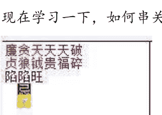

黄色的先别管，那个是后面说的。先说说这个贪狼化忌，宫=兄弟宫，我们取资金位的含义，说她资金方面。所以，第一个关键字，资金，贪狼（标准，贪心，目标大），化忌（过犹不及）。把整个能量都结合起来的时候，我们就可以得到一个结论，首先，她想存大钱，很多很多钱，因为贪狼代表【大】。贪狼也代表标准，所以她对存款是有标准的，会喜欢想，我要存10万，有个数目标准。贪狼会因为标准而劳碌，有欲望，但是化忌，化忌代表少，因为少，所以就抓紧，因此她的存款问题，应该是她比较烦恼的事，资金链一直都达不到自己想象的那样。贪狼化忌的关键字=欲望不达，失望。（这是可以改变的，贪狼化忌的问题，首先是因为大，所以你应该把这种【大】再进行小化，按部就班，存到就高兴一些，慢慢地，兄弟宫就可以转化去化禄的能量。四化有一点像是吸引力法则，你越烦恼，那个宫位就越多问题，所以你要学会转化能量，慢慢改善这个宫位的气场，那么将来这个问题就慢慢消失了。这又是为什么？因为化忌是代表态度，可以因为态度转换而变化，星星就很困难了。四化还是容易的，就是转换你的心态。

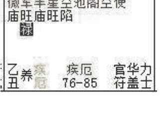

接着看她的疾厄宫，一大堆的突破能量，破军化禄=加大破耗力，加大突破力，意思是时不时，如果一切一成不变的时候，她会因为这股破军的能量膨胀的关系，去寻找突破。疾厄宫是代表习惯性。@女王 是一个对自己要求很高的人，因为她的化权也在命宫。

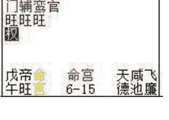

化权命宫，会强迫自己。化禄破军在疾厄，又会要自己突破，所以整个感觉就是@女王 是对自己要求很高的人，有时候会很辛苦，但是她按耐不住那种希望大大的标准。

### 飞星

飞星，这个名称就是说，这个星星是会飞，会移动，而且还会去撞了这个宫位，这个宫位再产生连环效应。

### 宫干四化

步骤，先起了命盘，可以观察出，每个宫位角落都有天干地支。如图：

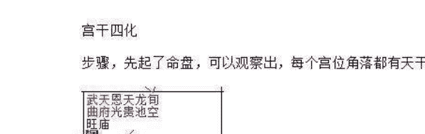

代表，这个官禄宫是【化禄贪狼】【化权太阴】【化科右弼】【化忌天机】

这个我有准备了一个例子，在讲义里面，我先讲解一下。生年四化是出生年份，会飞的那种，叫宫干四化，也就是你们每个宫位下面，有个天干地支。地支你们已经懂怎么用，天干的用法就是发挥在飞星上面。同样的，宫干四化也是可以把【星义】和【宫义】拆分，或者结合。先看看这个例子，

步骤，先起了命盘，可以观察出，每个宫位角落都有天干地支。如图：

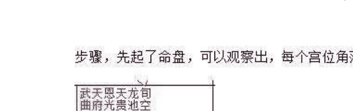

代表，这个官禄宫是【化禄贪狼】【化权太阴】【化科右弼】【化忌天机】

宫干四化有双层用法，第一层是星义，第二层是宫义，可以结合，也可以拆分，以下演示这个单宫的【四化星义】部份。

这是官禄宫，宫干是戊，戊的四化，我们再对照表，四化是化禄贪狼，化权太阴，化科右弼，化忌天机，代表着这个人的工作是以爱好出发的，贪狼是代表爱好兴趣，或者工作中很热闹，应酬多，贪狼也是交际星。化权太阴，太阴是细腻，有过滤的倾向，代表他对自己的作品、工作，都要求细腻，会去执行好，多次检查，过滤。化科右弼，右弼是助手同事，就是他对下属同事之间的关系，是温和的，不够积极，因此这下属肯定也有懒散之人。化忌天机呢，就是代表他工作需要伤脑筋，需要跑动。这是第一层，也就是单宫论，不需要看其他宫位，就需要一个宫位就可以了。

反馈：这个盘命主是个马来西亚导演，所以可以看出来，他的工作和爱好有关系，需要去和明星互动，有交际。他的作品需要多次审核，细心检查，要细腻的去表达。他的下属，同事，或者那些演员们，他都比较温和去对待，但是略有一些嘴贱，他是那种比较嘴贱的人，据说就是他很爱作弄人，喜欢作弄下属的那种导演。因为拍摄工作，他需要到处走，需要伤脑筋。

从这个单宫论我们知道，这飞化，不飞出去，只在这个宫位再加四个态度进去，也一样是可以解析的。再深入一点，刚刚是星，现在看飞宫。

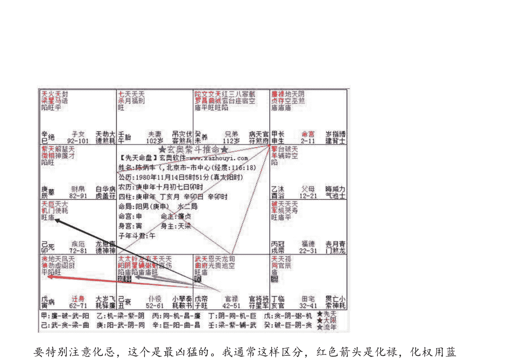

要特别注意化忌，这个是最凶猛的。我通常这样区分，红色箭头是化禄，化权用蓝色，化科用绿色，化忌用黑色。这一层，首先来看，【官禄宫飞化禄贪狼去迁移宫】这整段应该怎么解析呢？官------飞化禄------贪------迁，代表官禄发射出一种喜欢，爱的能量，去迁移宫，而且是用贪狼的态度去，所以也刚好代表他会去外地工作，到处的走，因为是迁移宫。所以当【官禄宫飞化去迁移宫】的时候，你也可以说，是要跑动的工作，加上贪狼是又需要跑动，又需要应酬，又是自己的爱好，又遇到很多美女，又因为工作会遇到桃花事件。一大堆信息。

#### 【官禄宫飞化权去奴仆宫】

官------化权------太阴------奴仆，他的作品就是人，那些明星，明星的形象，特别是女明星。太阴嘛，所以代表他在工作上对女性的同事要求比较高，化权是比较硬，也代表他会审核和过滤他同事下属的工作情况。

#### 【官禄宫化科去奴仆宫】

官------化科------右弼------奴，这右弼又是个母的，阴性的星星，代表他有可能是女助手比较多。化科也是软，得到的反馈是女同事讨厌他，因为他是那种爱作弄人，爱开玩笑的人，会突然在你工作认真的时候，突然在后面喊一下，让人吓一大跳。这样他就失去了一定的威严，同事工作就不够积极，这是他的问题。

#### 【官禄宫化忌去疾厄宫】

官------化忌------天机------疾，疾厄宫有两个主要含义，1）我的身体。2）我的工作地点。这两个是最常用的，所以天机是动星，化忌去天机，坐疾厄宫，自然是代表伤脑筋，或者工作时候，遇到了损伤的情况，损到了四肢。如果看成是工作地点，这化忌天机也代表，因为工作地点老是不满意，就一直要换，因为拍摄要注重采景。

以上是最基本的飞宫方式，也是【宫，星，化】，因为大家的十二个宫位，肯定有十二个天干，十二宫的天干，每个飞出四条，一共4*12=48。而且还需要起大限，现在要说大限和流年的盘。

### 大限与流年

1) 大限，就是在你那个十年周岁的宫位。立太极，起一个命宫，然后又变出了新的十二宫，比如说，这个人的第三大限。

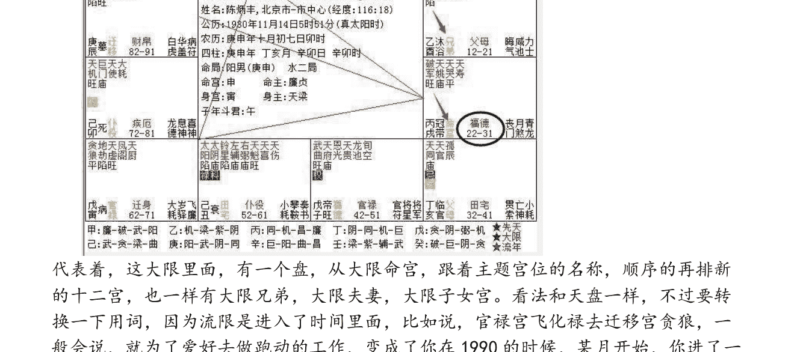

代表着，这大限里面，有一个盘，从大限命宫，跟着主题宫位的名称，顺序的再排新的十二宫，也一样有大限兄弟，大限夫妻，大限子女宫。看法和天盘一样，不过要转换一下用词，因为流限是进入了时间里面，比如说，官禄宫飞化禄去迁移宫贪狼，一般会说，就为了爱好去做跑动的工作，变成了你在1990的时候，某月开始，你进了一家新公司，这个工作跟你的爱好有关系，这份工作还需要跑动。因为这是时间性的，我们要转换去【时间，人，地点，事物，故事】，说成这种模式的句子。

所以这大限命盘，又有新的12宫，现在是48*2=96条飞星。接着，原本还有小限的，小限更麻烦，因为小限要换天干了，要五鼠遁，所以，很多门派都不太用了，我们用太岁流年比较容易一些，因为这三个盘的信息量已经很庞大了。

继续说流年，今年是羊年，所以在未的宫位起流年，一样又有十二宫，这样就三层了，代表48*3=144条飞星。其实还有流月、流日、流时。我给你们看看，有个软件是可以排到流日，

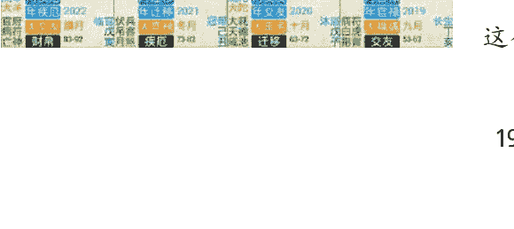

这个宫位一共是叠到五层，还没加上流时。

技法是一样的，只是当叠起来的时候，就有48*5=240。我就是说，我们也不会看到叠五层去，一般人觉得学飞星很难，就是因为这个盘需要叠太多层，导致了太多条飞星，所以，俗称，满盘飞忌。不过只需要记得几个重点的诀窍，就可以很快速的看。

先继续刚刚那个盘

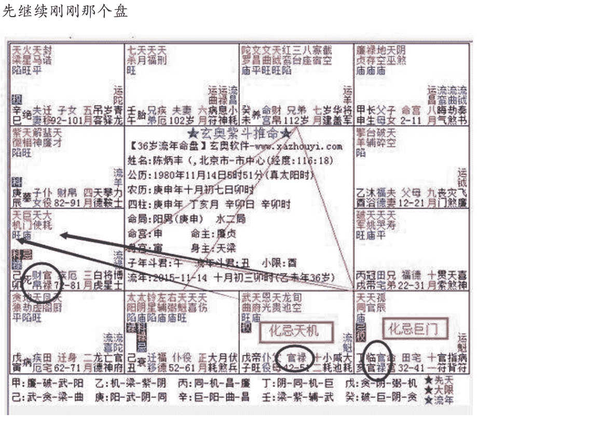

这是他的流年盘，也就是今年的盘，刚刚说化忌天机，不要被那么多层的叠盘弄混乱，只需要把焦点转去【地雷宫】，就不混乱了，这代表官禄宫飞化忌去天机，坐卯宫，那么卯位自然有问题，可以看成是【地雷1】，【地雷2】是对面的宫位，因为会被忌冲，忌冲之后说，先说【地雷1】，这个卯，是今年的财帛宫，而天机化忌等于轮齿不好，在金钱代表周转不灵。大限官禄+流年财帛，这个我们叫【主题】，天机化忌在这个主题里面，就代表他在官禄和财帛上，遇到了周转不灵的问题。我们学飞星，喜欢说禄因忌果，为什么周转不灵？就需要看哪个宫位飞忌这个卯。有两个星星，天

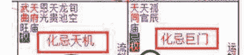

机和巨门，是这两个位飞忌进去，一个是忌天机，一个是忌巨门。这个本官禄，在今年流年是奴仆宫，这个位置就是代表今年的同事朋友们。子是今年奴仆，亥是今年官禄，天机是手足星，代表朋友，流年奴仆，飞忌去财帛，天机，奴仆代表朋友，天机也代表朋友，首先可以得到一个结论，这事和朋友同事有关系。再，巨门是纠纷星，欺骗星，吵架星，从流年官禄出来，第二个结论就是今年工作上的纠纷，有可能是被骗，天机+巨门是偷盗的含义。

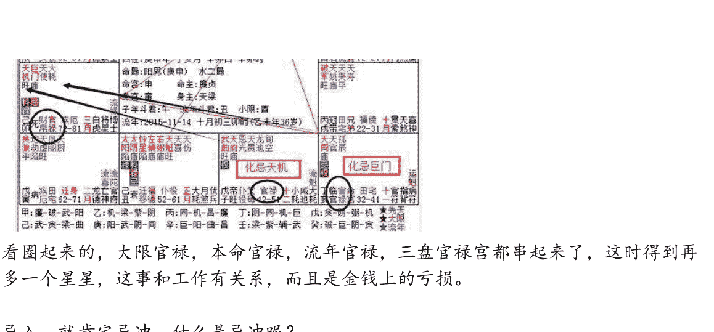

看圈起来的，大限官禄，本命官禄，流年官禄，三盘官禄宫都串起来了，这时得到再多一个星星，这事和工作有关系，而且是金钱上的亏损。

忌入，就肯定忌冲，什么是忌冲呢？

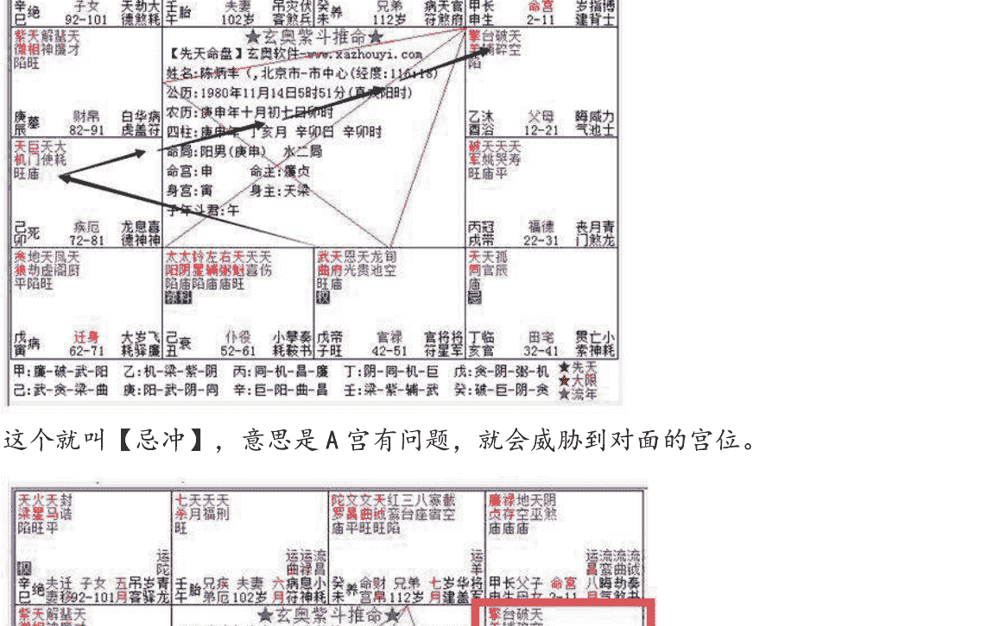

这个就叫【忌冲】，意思是A宫有问题，就会威胁到对面的宫位。

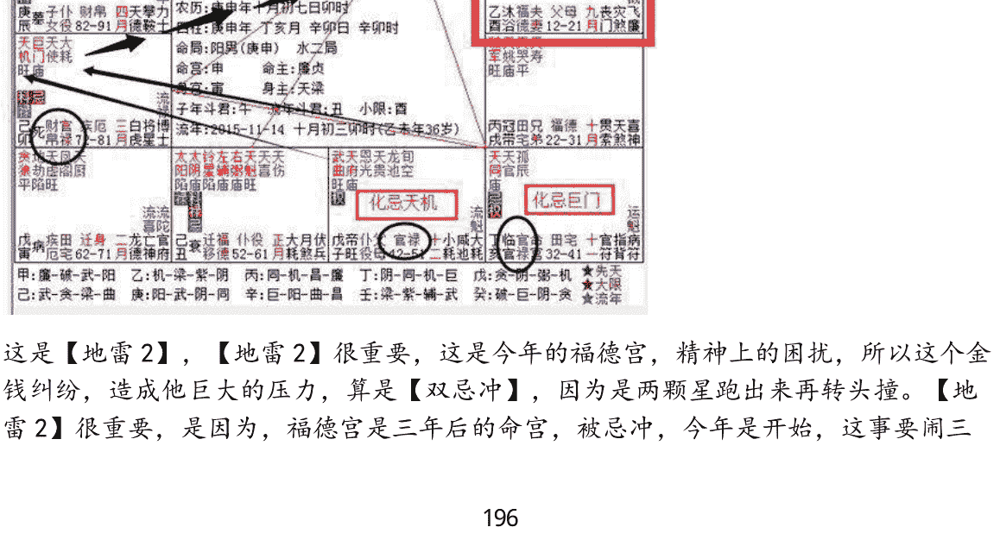

这是【地雷2】，【地雷2】很重要，这是今年的福德宫，精神上的困扰，所以这个金钱纠纷，造成他巨大的压力，算是【双忌冲】，因为是两颗星跑出来再转头撞。【地雷2】很重要，是因为，福德宫是三年后的命宫，被忌冲，今年是开始，这事要闹三年。

年，而且巨门+擎羊，就很靠近官非的意思了。加上这个父母宫，是代表光明线，也看成是官非宫，代表这事肯定不是这样简单就了结，而是会延续到2017年去，因此这个金钱问题，一遇到就是三年霉运，这个说法就是因为福德宫的问题，福德宫永远是财帛宫的对面，忌入财帛，金钱有问题，就肯定忌冲福德宫，也就是三年后的你，这就是我们用在流年上的例子。

总结：
- 只需要抓住几个重点【地雷宫】，然后根据象义去把关键字串起来。
- 找出相应的流年会遇到这个【地雷宫】，比如说，这个卯酉位是地雷呀，所以，在羊年的时候，卯一点是财帛宫，这就是为什么我一来就抓未年的流年看。
- 【地雷宫】+【时间】+【飞星故事】，整条思绪就出来了，一大堆信息。

## 07.08

（训练一下认识自己的流年野猪，官禄的，以@橘橘子 为例。步骤，首先排流年命宫，找流年官禄宫，

流年官禄是己，第一层，用星义解析，先不飞。

己武贪梁曲，化禄武曲，自然利财，因为是财星，所以@橘橘子 今年工作赚钱的喜好提高了。化权贪狼，贪狼是标准、劳碌、欲望，代表有了标准，有了欲望，愿意去加把劲地执行。化科天梁，化科也是贵人、才华、表现、面子，这代表她今年遇到上司的欣赏，自己也变成了前辈，感觉有了些面子，也升职了。会有朋友说，要她请吃饭，因为天梁是请吃星。化忌武曲，这文曲是舌辩，是民间承认，她有点担心她开发的市场反应，不被当地的人承认她的公司表现，担心她没有办法去说服新顾客，而且文曲也代表知识，代表她心里没底，怕说不过顾客，因为知道的还很有限。

蓝色的化权卡在了里面。化禄和化忌冲去了财帛宫，所以财帛宫今年会震动到。化禄武曲坐财，自然是赚钱欲望加大，会幻想比从前更高的工资，自然也一定加薪。化忌去文曲，代表自己忧心金钱的事，文曲是文书星，是更迭之星，她会担心自己每个月达不到业绩，因为文曲是受承认，也是会更迭的，以她工作性质，应该是和业绩有关。每个月的业绩更迭，又重新累积，这个她很没有把握。而化科去天梁，是迁移宫（大限），代表她因为外出而得名，好像瞬间变成老大了，天梁是老大星。贪狼自化权，自化权和自己对自己的态度有关系，自化权一般是继续加大化权的力量。贪狼是劳碌星、标准星，所以因为她工作是需要标准的，因此就只能靠加把劲地去劳碌。因为贪狼星也是桃花，又是夫妻宫的对面，代表她有个桃花是在外地的，自化权是代表她追求人家，这个要等到阴历七月的时候发生，因为她阴历七月踩夫妻宫。

Ps：天梁是老大星，去迁移宫也有带头的含义，跑前锋，天梁坐迁移宫，是老大跑前锋，而且她武曲化禄，是吉利正业，疾厄宫是工作地点。

看主题叠宫，是可以结合在一起变成一个象，疾厄是工作地方，官禄是工作的事，迁移宫是外地，天梁是老大，有面子，加起来就符合了她今年的转变，她是回老家发展工作，我们看看这流年官禄叠宫，官禄+田宅+父母，所以代表她今年回家去发展，父母是和家人一起，还有就是文书位，文书位有廉贞文昌，科忌，廉贞是复杂，她即将要处理复杂的文件，一开始公司程序乱套，文昌化科就是不积极的文书处理，表面好看就够了。所以她管理的那边，即将就是先很乱，廉贞也是账目，复杂程序，她处理不好，但是要上交报告，所以这文昌就乱乱来，化科，美化一下当作忽悠过关，双科忌，科忌是反复，代表她上交了之后，又退回来，还需要重做，然后她又做一样的事，又随随便便的去处理廉贞，又上交，又退回来。

看@人间 的福德宫，精神世界。

也是己干，武贪梁曲，可以先从星义下手，【化禄武曲】在精神上就不是代表金钱了，是代表规矩，原则，固执，代表她本来就是很有原则的人，不是那种随随便便的人。【化权贪狼】贪狼是神仙星，武曲是宗教星，代表她同时很注重规矩，贪狼是标准星，修道之星，也是欲望，劳碌，武曲贪狼是代表大，也比较孤克，早年是代表历练，所以她化禄武曲，化权贪狼，代表她是那种愿意刻苦耐劳的人，对自己要求很高，有一定的标准，该做的一定会去做，因为精神里面是讲究原则的。【化科天梁】也隐喻了她是有爱面子、喜欢照顾人的那种虚荣，为啥说是虚荣，因为化科是华而不实，而且福德宫一定是财帛宫的对面，代表她在外面遇到朋友那些，也喜欢请吃，热情招待。【化忌文曲】，文曲是牵肠挂肚，比较感性，代表她精神上，对一些感情是容易耿耿于怀，不容易放下。

接着放飞星出来，

化禄去迁移宫武曲，武曲刚好有个禄，有个天马，代表她这个人，一开始创业的想法很强烈，认为自己有这种能力去突破，也喜欢和外地人交流，或者容易想去远的地方发展，要记住福德宫代表精神世界，不是现实，是所想，今年是未年，2013的时候这个念头也很强烈。

贪狼化权在夫妻宫，所以是象征感情的，代表她愿意为了配偶去劳碌，也会希望是对等的回来，不过贪狼化忌了，化忌是欲望不达，代表失望，所以她在感情上付出了，去努力了，但得到了很失望的结果，因为那是贪狼化忌，冲破了贪狼，就好像硬碰硬，这个贪狼就非常不稳定，震动得很厉害，因为太硬了，有一大股想法去改变她的感情，却遇到了一堵墙，结果当然是自己精神受伤，因为是福德飞过来的，所以当然是伤精神。

化科去天梁，是父母宫，代表她对父母是很大方的，不计较，父母要吃的，一定买回来，父母宫文书位，代表学习，天梁是古老文化，所以她福德宫也喜欢这种天梁的古老文化，所以2013本命宫的时候，她也有这种想法，想追求这种古老文化的浪漫，为啥说浪漫，因为化科有浪漫，文艺的色彩。

化忌文曲去田宅宫，所以2013年她也特别想家、想孩子，牵肠挂肚的，也代表容易不放心家人。

当你论福德宫的时候，星星含义要转移去福德宫的，当你论官禄宫的时候，星星含义要转换去官禄宫的，因此这就是为什么星星要很强，才可以随心所欲的灵活转换。

飞星在本命盘是对待关系，在流年盘是故事，不一样的。流年盘模拟的时候，要结合地点人物事件和时间，本命盘就是谈基本对待关系。Ps：不要变成最后是跟着命盘转，要学习去面对，客观的，当作自己是第三方去看自己，然后思考一下，哪里是需要调整一下心态，紫微其实是学来给自己长期用，短期算命预测这种是儿童游戏。

@印象 看去年的，用特殊方式。她的去年，对面是贪狼，这贪狼分别从流年子女宫，和流年田宅宫，一个忌入，一个权入，这个宫位，被她的子田线加重了能力，所以思考应该从【子田线】叠【官夫线】出发。子田线是投资，官夫线是她和她男友合伙，刚好她也是在家里上班的人。

因为要看是什么伤害她的午位，就要寻找原因，所以既然迁移宫是贪狼，就要找是什么让她贪狼有问题，冲到她的本官禄。不过她的问题是，如何看地劫被冲上来，所以我们就反过来找。

还有一个位，看这个兄弟宫，是叠着大限财帛宫，这个我们叫反弓忌，就是大限三方，冲本命三方，大限财帛，忌冲本命官禄的位置，所以叫【反弓忌】，讲义里面有这个忌星棋谱，一般伤害是很大。

兄弟是资金，财帛是现金，疾厄宫又是工作地点，这原本子田线就加重了这个贪狼的震动，那么很明显，导致她这个问题最大的原因应该是她的工作地点，因为标上贪狼的价钱，但是她的工作地点的形象没有贪狼的标准，贪狼代表大，所以这子田线就影响很大。一方面之前我说过，这风水也有问题，因为子田线，工作地点，就和地有关系，所以她的风水也有问题，代表她做这个生意的时候，这地段的选择标准，不太标准，比如说，她的顾客群，那个地段的标准没有到这个价钱标准，或者是她办公室形象没有到这个价钱标准，但是她放了贪狼的价钱，就容易导致了这种忌冲。而且迁移宫也代表星星，这紫微是孤君，紫微孤君被冲也凶，也代表没有足够的辅助力去支撑这个局面。

这个叫转忌，是形容一种**连环效应选择**。

我说她工作地点有问题，她文书位忌入了巨门，就是巨门遮盖了她的光明线，巨门是暗星，冲光明线肯定要名义受损。去年她的官禄选择，去了这个天同的疾厄宫，她工作上也选择了这个地点，然后连环化忌，转忌去贪狼，再忌冲流命、本官禄，也是大限父母宫，所以她去年的名声肯定不太好，别人对她失望了。贪狼化忌冲，是代表别人对你失望，坐迁移宫就不是你，而是别人了。所以这样她的工作肯定受影响。

Ps：忌星有个技法，就是单忌小冲，双忌抵消，三忌大冲。这个原理是这样的，就是打战的时候，你是军营，化忌是兵，单忌，就是一个人疯了拿刀子进来砍，会有伤害力，大家没有注意到这个疯子。双忌就好像打草惊蛇了，过程是有的，但是大家一下子就发现到，马上就抵制了，第一个是一个，不容易看见。最后一个三忌，是大势攻击，一次过放三个大炮弹，你要抵制都不够力去抵制，所以这力度方面，要比较注意。意思是双忌一般会容易察觉到，所以就容易抵消，因为来得及改变，就是你排盘之后，你直观能看见的，其他的就别管，因为伤害力不大，其他宫位是只有启动的情况才发射。）

上次是基本的飞星概念，这次是细节化的。

先从化禄开始，化禄在十二宫，先从十个星星开始说，从甲干开始，甲化禄廉贞，化禄+廉贞，是不会更改廉贞的本意，就是说不会把廉贞的本质变化掉，比如原本是囚性的星星，加上化禄不会因为有了化禄所以就不囚了，一切依然在。**化禄是放大优良，正面的那边。化忌是抓紧，缩小负面，凶的那边。**化禄廉贞，廉贞是代表创意那些，色彩，自信，反叛，另类，喜欢电子，所以如果是坐命的话，就代表命主的廉贞能量是正面的放大，比一般廉贞能够发挥的力度高。

如果是兄弟宫，那么兄弟宫必须看双层含义，第一层，代表六亲的兄弟，代表兄弟里面有这个人，因为是廉贞照奴仆，之前说过兄友线也叫众生线，禄在奴仆宫，是很乐意去帮助朋友，提供正能量给朋友，这时候要看清楚了，是廉贞化禄，所以代表只是发挥廉贞的优势上的帮助，比如，给朋友创意灵感，教朋友如何搭配衣服。另一个层面，是代表资金位，化禄坐兄弟宫当然是代表有钱，是存款上的有钱，兄弟宫也是田宅宫的财帛，所以是跟家底有点关系的。比如说，看到一个盘，

这个样子，或者是反过来，田宅宫有化禄，兄弟宫有禄存，这样的组合就很有可能是富二代，不过还是需要多一个条件，就是父母宫的格局要强，那么基本上就可以定时富二代的盘。

廉贞化禄坐夫妻宫，廉贞是囚星，坐夫妻宫是会管制配偶，化禄了依然会管制，只是理由比较好听，如果是廉贞化忌，管制的理由不好听，比如说廉贞化禄会说，我不让你出去是因为我爱你，我想保护你，廉贞化忌会说，我不让你出去，万一你认识个男的，你跟他咋办，这就是区别，但是那个性质是一样还在的，只是化禄和化忌的态度是不一样的。那么是不是代表配偶也是廉贞类型的呢？我说过，夫妻宫是对待位，也是你看她的位置，可以用廉贞的特色去形容那夫妻，比如你的配偶是个很有创意的人，不受约束，很有自信，如果是廉贞化忌，就没有自信。一般化禄夫妻宫都是很疼爱配偶，愿意给他花钱，因为化禄也有财的含义。

廉贞化禄子女宫，之前说过，廉贞的孩子是好像外星人，不好照顾，比较叛逆，不过如果是化禄廉贞，比如说，孩子把墙壁都用颜色涂鸦了，这个妈妈会说，哎哟，你看我儿子多有艺术天分，不知道将来会不会是个壁画家。如果是廉贞化忌的妈妈，就会说，我儿子肯定是从外星球来的，叫他别去画墙壁，他好像要跟我做对一样，是我的冤亲债主，不过，我承认他是有艺术天赋。所以，是态度上的不一样。

如果是廉贞化禄财帛宫，一样的道理，刚刚的转换一下，就是命宫有禄存，财帛宫有化禄，

这样的情况，你也可以说，他会很有钱，在财帛宫的化禄，是动词，比如，喜欢赚钱。禄存坐命就抠门，财帛化禄又喜欢赚钱，那么自然就容易有钱，是自己有钱，不是富二代。如果加上天马，就代表赚钱速度还很快，如果有天府在兄弟宫，没有破库那些，代表会存钱。化禄坐财，不等于会存钱，这个要记得。化禄坐财，喜欢赚钱，也喜欢花钱。那么廉贞坐财帛，代表什么含义呢？有几种可能性，一，他的赚钱产品，是跟电子有关系的，如果加上天马，或者，文昌文曲，有那种上网的意象，也可以说，是在网络赚钱的。

疾厄宫坐廉贞化禄，廉贞坐疾厄宫是代表血，自然是代表血液流畅，不过，你还需要加入多一个含义进去，就是疾厄宫也代表【惯性】，廉贞化禄比如，习惯性一件事做了，还喜欢锦上添花，要逼出自己有点创意，也会要求自己和别人不同，所以，疾厄宫也有个性的含义在内。廉贞化忌，坐疾厄宫代表什么呢？廉贞化忌，化忌是收紧，缺少，所以廉贞化忌就容易有血的问题。

廉贞坐迁移宫，可以有很多很多种含义，要看是本命还是流年，因为是有差别的。廉贞化禄坐迁移宫，就代表他有可能是容易有名，廉贞另类，善于表现，加上化禄就容易有名，而且，你也可以说，比如，廉贞昌曲，是写博客而有名，也可以说上网写作。

分享一个盘，比较有趣的组合，

廉贞化忌坐迁移宫，就比较重官非一些。

这个盘，流年迁移宫有个廉贞化禄，她就告诉我，她想做个电子产品的投资，想问可以做吗？我说，是电子美容产品。她就说啊，这也能看得到吗？因为天相、红鸾、天姚都是变漂亮的意象。然后化禄，当然可以做，因为是好的能量，有名气的能量。

廉贞化忌坐迁移宫，要说成两种含义，化忌也有黏住的意思，所以，生年忌坐迁移宫就是出去了屁股就黏在外面，明明说两个小时回来，结果就和朋友聊到晚上，意思是出外的时候会遇到各种情况会黏在外面。当然本命盘的话，结合格局，也沦为出外格。

生年忌兄弟宫自然就忌冲奴仆，所以这个有个特别的名称叫【众生债】，廉贞化忌坐兄弟宫，代表常常朋友有遇到什么怪情况，会喜欢找他帮忙想法子，廉贞是点子王，专门搞创意。

廉贞化忌坐迁移宫也要防官非事件，把负面的变出来了。

廉贞坐奴仆宫，化禄也代表桃花，廉贞次桃花，化禄坐奴仆宫，会容易遇到有才，廉贞是那种酷酷的坏男孩，坏女孩的桃花。

廉贞化忌坐奴仆宫，和兄弟宫一样，因为廉贞有冤亲债主的含义，所以也代表朋友惹了麻烦喜欢找你，或者被朋友连累。廉贞化忌也会朋友少，因为化忌收敛。

廉贞化禄坐官禄宫，在这边看成复杂，或者和艺术，创业有关系的工作。不过这个廉贞要注意组合，组合稍微不一样，就完全不同意意思，比如刚刚那个是美容产品，廉贞昌曲是用电脑写作的，或者一大堆计算工作，法律工作，复杂工作，而廉贞铃星，还有可能会需要一直接电话，因为是会响的电子产品。化禄是能在工作上发挥，热爱工作，化忌就是工作很烦，很复杂，抱怨也多。

廉贞化禄坐田宅宫，有可能是家居色彩多，或者喜欢创意家居，也可以说很多电子产品，就直接用廉贞取象。化禄是喜欢，喜欢装饰家里，喜欢在家里研究。化忌就是这房子好像监牢一样，因为廉贞有囚性，我记得一个很严重的命例，命宫在申，然后化忌，加了好几个煞星，就问他会不会坐过牢？他就哈哈大笑说差不多，原来他是新加坡人，20岁的时候去印尼的树林砍木，这份工作一做就做了三十年没有回过家，算起来也好像是在其他国家坐牢了，所以廉贞的囚性不能忘记。

廉贞坐福德宫，福德宫生年禄，就代表精神世界很好，很乐观。廉贞善于创意幻想，所以化禄福德宫就有天马行空的想法，但是福德宫是隐藏的，所以就没有表达。廉贞化忌福德宫，就重于叛逆，思想叛逆，不服气，桀骜不驯，别人说不通他。福德宫坐生年忌，我们也叫欠精神的债，不管是不是廉贞，就是生年忌坐福德宫，是一辈子都不懂什么叫满足。比如她住小房子的时候，就抱怨，自己的房子小丢人，住大房子的时候，又抱怨了，说大房子收拾辛苦，给她吃龙肉，都不知其味，反正就是无法享受的精神，永远很难满足，总是容易放大疑惑。

我有个案例，就是廉贞化忌+自化忌，是有吃精神病的药物，抵制肾上腺素，这边的自化忌等于自寻烦恼。但是生年忌+自化忌，是会解开的，只是需要过程，是发明家的组合。

这个顺便说说，化忌本来就执着了，自化忌是继续执着下去，通常负负就得正，就是经历了一番的痛苦研究、探索、寻找答案，最后终于找到了答案。如果只有生年忌而已，那么就只有烦恼，而不会解决烦恼，有自化忌就会想法子去寻找答案，所以这四化能量很讲究。

化忌坐父母宫，就代表和父母关系不合。廉贞化忌就代表和父母不能沟通，好像不同的世界一样。廉贞化禄就代表欣赏自己的父母有创意元素。

第二个，己化禄武曲，庚化权武曲，甲化科武曲，壬化忌武曲，所以，这武曲就有四种，廉贞只有两种。

| 左列 | 右列 |
|------|------|
| 甲廉破武阳 | 己武贪梁破 |
| 乙机梁紫阴 | 庚阳武府同 |
| 丙同机昌廉 | 辛巨阳曲梁 |
| 丁阴同机巨 | 壬梁紫左武 |
| 戊贪阴右机 | 癸破巨阴贪 |

化禄武曲爱财，这是第一点，化禄武曲也一样不会改变他的注重原则，只是比较圆滑而已。

化科武曲是虚荣心，武曲只在表面而已，就是代表华而不实的有钱，里面是空的，外表有钱而已，所以化科武曲被忌冲就麻烦了，或者化科武曲遇到破军也麻烦了，要灵活的想象出来，就是各打肿脸充胖子的武曲，如果遇到人叫他大请客、捐款，他爱面子又虚弱，这一请客，自己就空了，所以要看看组合会不会不好。武曲化科遇到不好的配对，遇到很多煞星，也可以直接论为凶，不过武曲化科是有个优点的，就是讲情，因为武曲有代表原则、规矩，化科了就软化了规矩，所以武曲化科就容易原谅。比如武曲孤克星，坐夫妻宫肯定代表同床异梦、冷暴力、聚少离多，对待关系太硬，规矩太多等等，武曲算是最容易离婚的星星，不过遇到了化科的武器，反而不容易离婚，就因为这个武曲的规矩比较软，没有太多原则了。武曲寡宿星，是最大的不利六亲之星，所以遇到化禄和化科的武曲都会看在情分上，网开一面。

武曲化权，我之前说过，武曲化权可以看成武曲化忌，因为武曲本身就很硬，加上化权就更硬，力度和武曲化忌已经很类似，就是武曲化权是往外去硬，是去执行、行动的，而武曲化忌是往内去硬，比如固执，不容易改变自己。在健康上，这武曲化权和武曲化忌差不多一样了，影响骨头，都是代表骨头容易僵硬，会痛。

而武曲化权在财帛宫上，是赚钱的，因为去执行。武曲化忌是损钱，代表自己原则性太强烈，武曲也代表警察，所以武曲化忌+天刑，就也要防官非，跟刑警有点关系了，武曲因为本身是财星，所以化忌了，或者忌冲都代表损财。

#### 破军

| 生年 | 甲 | 乙 | 丙 | 丁 | 戊 | 己 | 庚 | 辛 | 壬 | 癸 |
| :--- | :--- | :--- | :--- | :--- | :--- | :--- | :--- | :--- | :--- | :--- |
| 化禄 | 廉 | 机 | 同 | 月 | 贪 | 武 | 阳 | 巨 | 梁 | 破 |
| 化权 | 破 | 梁 | 机 | 同 | 阴 | 贪 | 武 | 阳 | 紫 | 巨 |
| 化科 | 武 | 紫 | 昌 | 机 | 右 | 梁 | 阴 | 曲 | 左 | 阴 |
| 化忌 | 阳 | 阴 | 廉 | 巨 | 机 | 曲 | 同 | 昌 | 武 | 贪 |

只有两个，破军化禄，破军化权，化权有点强迫症，会自己逼自己，而且也硬。化禄是加大弹性，不过爆炸的时候，心态是开心的比较多。比如说今年破军化禄官禄宫，有可能会辞职，但是辞职之后开心，好像憋了很久，终于辞职了那种心情。化权就有逼自己去突破。

#### 化禄破军

化禄破军，遇到很好的格局，也会代表赚钱。如果是天罗地网的破军，化权化禄其实都好。不要和财帛宫，和财星一起就好，因为代表虚耗之星，是加大了这个能量，只是心情不一样而已。

| 生年 | 甲 | 乙 | 丙 | 丁 | 戊 | 己 | 庚 | 辛 | 壬 | 癸 |
|------|----|----|----|----|----|----|----|----|----|----|
| 化禄 | 廉 | 机 | 同 | 月 | 贪 | 武 | 阳 | 巨 | 梁 | 破 |
| 化权 | 破 | 梁 | 机 | 同 | 阴 | 贪 | 武 | 阳 | 紫 | 巨 |
| 化科 | 武 | 紫 | 昌 | 机 | 右 | 梁 | 阴 | 曲 | 左 | 阴 |
| 化忌 | 阳 | 阴 | 廉 | 巨 | 机 | 曲 | 同 | 昌 | 武 | 贪 |

#### 太阳

太阳，只有三个，化禄，化权，化忌太阳。

化禄太阳是代表发散的时候，是开心的。落陷的太阳化禄也是对于付出是开心的，但是有心无力。比如说一个穷人去帮助人，他是开心的，但是他没有太多钱。如果是太阳坐午，那么太耀眼的太阳，加上化禄又再加大，那么就代表名声很好，当然这时候要顺便看一下巨门，一般名气很大的那种人，就容易有是非，所以要观察是非星。不过坐财也不太理想，站在公益的角度是很大，因为太阴是代表发散，这化禄的发散，可得多少钱呐，不代表收藏，只是太阳庙旺收入大入大出，太阳落陷的化禄收入小入大出。我看见流年财帛宫，有太阳化禄坐财帛宫，我就说他今年买东西给别人，钱给别人用，太阳很少会想到自己，有钱了先想别人。

化权太阳是增加竞争力，会强势，和化权天梁已经很类似了，比如，他要给你，你说你不要，他还要硬塞给你，比较强势，也代表会逼自己去积极。比如说，太阳化权坐父母宫，那么这个父亲就会逼命主去学习分享，比较大度，不过手段比较强势。

化忌太阳我说过，就是瞄准姿势，好像激光一样，在落陷之宫反而不错，因为可以集中力度。不过在庙旺就不好，因为会造成伤害，太亮了加上收敛，就会变成和刀一样，割伤人。四化就是要学习模拟那个力度，看看这些星星本质的变化会怎样。太阳落陷+化忌=黑社会人物，或者混混，高利贷，这种就是反面很强的人，也就是可以有这个意象。太阳化忌也代表专注力，太阳化忌坐子，那么晚上精神就很好。

#### 天机

| 生年 | 甲 | 乙 | 丙 | 丁 | 戊 | 己 | 庚 | 辛 | 壬 | 癸 |
|------|----|----|----|----|----|----|----|----|----|----|
| 化禄 | 廉 | 机 | 同 | 月 | 贪 | 武 | 阳 | 巨 | 梁 | 破 |
| 化权 | 破 | 梁 | 机 | 同 | 阴 | 贪 | 武 | 阳 | 紫 | 巨 |
| 化科 | 武 | 紫 | 昌 | 机 | 右 | 梁 | 阴 | 曲 | 左 | 阴 |
| 化忌 | 阳 | 阴 | 廉 | 巨 | 机 | 曲 | 同 | 昌 | 武 | 贪 |

化禄天机，越跑动越多财，脑筋很好。天机手足星，代表朋友也好。

化科天机，华而不实，在奴仆宫，天机化科就是表面朋友很多。也可以说认为自己有小聪明，就虚荣了。坐田宅宫，天机可以代表车，那就有可能是车很好看，有面子，化科也容易吸引贵人，也代表斯文，代表好看，所以天机化科也是一副才子姿态，很有气质。武曲化科就好像富翁一样，也有气质，不过就不是真的有钱。

化忌天机，转不动和转到停不了，两种极端含义。我有时候是说，不是出门车坏无法出门，就是出了门就很难回来，两种极端。在脑筋上是代表脑筋转动打死结。

天机是神经线，所以要注意那些乳腺增生，甲状腺肿，颈椎病，神经线的疾病等等，还有手足外伤问题。天机化科坐疾厄宫，就是习惯性要装聪明。天机化科坐疾厄宫，化科我一般是看成表面的，我会说手指割伤，看得见的伤口，科星我一般都看成是皮肤。

#### 紫微

| 生年 | 甲 | 乙 | 丙 | 丁 | 戊 | 己 | 庚 | 辛 | 壬 | 癸 |
|------|----|----|----|----|----|----|----|----|----|----|
| 化禄 | 廉 | 机 | 同 | 月 | 贪 | 武 | 阳 | 巨 | 梁 | 破 |
| 化权 | 破 | 梁 | 机 | 同 | 阴 | 贪 | 武 | 阳 | 紫 | 巨 |
| 化科 | 武 | 紫 | 昌 | 机 | 右 | 梁 | 阴 | 曲 | 左 | 阴 |
| 化忌 | 阳 | 阴 | 廉 | 巨 | 机 | 曲 | 同 | 昌 | 武 | 贪 |

化科紫微和化权紫微，我们用总裁来形容，化权是霸道总裁。化科紫微一般代表好看，不过坏处就是比较软弱，我看流年盘，特别会注意这个，化科紫微也是【假皇帝】，流年官禄坐【紫微化科】，就是代表那年，需要代劳老板做事，老板不在，你负责去做，但是你只是代劳。

她的官禄宫有个紫微七杀，不过紫微是化科的，我就说，她负责带头的，带头去做事，亲自出马，不过她其实只是个打杂的，她自己说的，老板是那种只会说，不会做的类型，所以老板叫了，都是她去做，这个是优酷的一个职员，专门做采访工作。所以你想采访工作是需要跑出去的，她就忙这些，在外面带着人跑，但不过是个假皇帝。

如果紫微化科坐流年财帛宫，那她有可能会突然去买奢侈品。紫微化科可以多说，因为你们全部今年都是紫微化科。在紫微我常常都说，化科是良药，做人有时候要跟化科一样，不能太硬，化科可以看成是软化剂。

@人间，贪狼+忌+权，贪狼本是劳碌星，也代表她今年赚钱上欲望比较高，比较劳碌，然后赚钱了。紫微化科，就有慰劳一下自己，买一些平时不舍得买的奢侈品。

#### 太阴

| 生年 | 甲 | 乙 | 丙 | 丁 | 戊 | 己 | 庚 | 辛 | 壬 | 癸 |
| :--- | :--- | :--- | :--- | :--- | :--- | :--- | :--- | :--- | :--- | :--- |
| 化禄 | 廉 | 机 | 同 | 月 | 贪 | 武 | 阳 | 巨 | 梁 | 破 |
| 化权 | 破 | 梁 | 机 | 同 | 阴 | 贪 | 武 | 阳 | 紫 | 巨 |
| 化科 | 武 | 紫 | 昌 | 机 | 右 | 梁 | 阴 | 曲 | 左 | 阴 |
| 化忌 | 阳 | 阴 | 廉 | 巨 | 机 | 曲 | 同 | 昌 | 武 | 贪 |

太阴化禄，比较女性化，比较温柔，爱家，太阴化禄不是代表花钱，而是代表存钱。

自化和原本的，我会拆开的，自化在流年，是代表过程，不一样含义。比如说我看一个朋友的盘，他明天要去谈生意，然后他问我，会成功吗？我就看，这天同生年忌+自化禄，我就说，你去的时候，一开始不成功，眼看要吹了，但是最后又成功了。反馈结果，他要卖燕窝，高级燕窝，不过因为产品没有处理干净，刚好带到那种有残渣的，很明显里面脏了，这顾客眼尖锐，一眼就看到了，他心就凉了一大半，但是碍于礼貌还是和顾客吃饭，谁知道顾客还有意思要，最后谈成了。

所以流年那种，要看成最后变化，本命的，就看成是自因的一种，比如我要自己做，我不要别人管，不喜欢别人干涉，就是叫自化，所以自化会弹出来，有飞星要进来，进不了，会弹出去。

化科太阴，化科太阴是美女，也善于打扮，不过里面很乱，因为华而不实。

化忌太阴，就要很注意了，因为太阴代表富，代表田宅，代表妇女疾病，所以太阴化忌，就会担心家里有事，比较操心家，操心母亲，老婆，女命的话，要注意妇女疾病，不管坐那个宫位，只要是太阴化忌都要注意，因为我说过，星星是可以跟宫位拆分出来，比如说，我看见太阴化忌+地劫坐迁移宫，我说和家里无缘，会搬出去住，而且一直搬，每一年都在搬，这是有命例的，所以是可以拆分，太阴和太阳是可以不管宫位，流年田宅宫太阴化忌，直接说漏水，肯定对。廉贞化忌坐田宅宫，电器坏。

### 巨门

| 生年 | 甲 | 乙 | 丙 | 丁 | 戊 | 己 | 庚 | 辛 | 壬 | 癸 |
| :--- | :--- | :--- | :--- | :--- | :--- | :--- | :--- | :--- | :--- | :--- |
| 化禄 | 廉 | 机 | 同 | 月 | 贪 | 武 | 阳 | 巨 | 梁 | 破 |
| 化权 | 破 | 梁 | 机 | 同 | 阴 | 贪 | 武 | 阳 | 紫 | 巨 |
| 化科 | 武 | 紫 | 昌 | 机 | 右 | 梁 | 阴 | 曲 | 左 | 阴 |
| 化忌 | 阳 | 阴 | 廉 | 巨 | 机 | 曲 | 同 | 昌 | 武 | 贪 |

巨门化禄，可以代表吃，代表口才好，代表做兼职好赚，不过没有改变本质，还是会爱说谎。坐官禄宫的话，可以说适合靠嘴赚钱。

巨门化权，容易有命令的口气。

巨门化忌，都不太爱说话，化忌收紧了。巨门在迁移宫化忌，可以说是说错话，因为迁移宫是跟别人对待的位置，巨门化忌坐命，就不爱说话，所以是有分别的，要注意组合。巨门化忌坐田宅宫，马桶、水管、地下水、沟渠等看不见的地方坏，或者是家里有一处是暗暗的。不过巨门化忌坐流年田宅宫，就必须防盗，因为是盗星。

# 【第十二周】

07.13

| 生年 | 甲 | 乙 | 丙 | 丁 | 戊 | 己 | 庚 | 辛 | 壬 | 癸 |
| :--- | :--- | :--- | :--- | :--- | :--- | :--- | :--- | :--- | :--- | :--- |
| 化禄 | 廉 | 机 | 同 | 月 | 贪 | 武 | 阳 | 巨 | 梁 | 破 |
| 化权 | 破 | 梁 | 机 | 同 | 阴 | 贪 | 武 | 阳 | 紫 | 巨 |
| 化科 | 武 | 紫 | 昌 | 机 | 右 | 梁 | 阴 | 曲 | 左 | 阴 |
| 化忌 | 阳 | 阴 | 廉 | 巨 | 机 | 曲 | 同 | 昌 | 武 | 贪 |

天同有三个，化禄，化权，化忌。

天同化禄，就是狗屎运升级，加上天同，更加升级，代表运气好。如果是坐财帛宫，象征不劳而获之财，或者是不需要太辛苦就可以得到，逢厄运也可以化解，不过这种财不会很大。天同也是公式星，对公式很有天分，因此天同化禄也容易表现在数学上面，不过有些书会提到，天同不太喜欢化禄，这是因为天同本来就比较懒散，好逸恶劳，加上化禄就会让天同的好逸恶劳也跟着升级。

不过逢到庚干，天同化忌，就容易措手不及，或者是何宫庚干，也会让这个天同无法处理。

天同化科，化科就比较虚，本来就懒散，加上虚，那么就会比天同化禄更加随随便便的，表面美化就好。

天同化忌，因为是健康星，因此天同化忌最必须防备的就是健康上的协调问题，看过好几个案例，比如男性，还没到三十岁已经秃头了，那是一个天同化忌坐命的命主，最明显的健康问题是发挥在老人病这种类型的，比如，落发，腰酸背痛，走路没力等等。

天同化禄坐流年田宅宫，如果逢天喜，在命宫，子女宫，夫妻宫，或者田宅宫，这几个关键宫位，会有孩子，当然最好是结合飞化，飞化我们后面说怎么看应期。天喜有添丁的含义，所以这个星星是特别可以看添丁之事。

天同化忌位于田宅宫，要注意饮水的问题，要建议买好的过滤器，好的饮水习惯。一般也代表家里人容易生病。如果遇到比如，天同化忌+天月，那么天月是代表长长久久的暗疾，就会加大天同化忌在疾病上的发挥。

### 文昌文曲

| 生年 | 甲 | 乙 | 丙 | 丁 | 戊 | 己 | 庚 | 辛 | 壬 | 癸 |
|------|----|----|----|----|----|----|----|----|----|----|
| 化禄 | 廉 | 机 | 同 | 月 | 贪 | 武 | 阳 | 巨 | 梁 | 破 |
| 化权 | 破 | 梁 | 机 | 同 | 阴 | 贪 | 武 | 阳 | 紫 | 巨 |
| 化科 | 武 | 紫 | 昌 | 机 | 右 | 梁 | 阴 | 曲 | 左 | 阴 |
| 化忌 | 阳 | 阴 | 廉 | 巨 | 机 | 曲 | 同 | 昌 | 武 | 贪 |

飞星里面，我用得最多的一个组合，别看是小星星。文昌文曲的四化是特别好用，首先，在本命盘是代表左右脑思考能力，如果是化忌了，那么就代表有这方面的障碍。文昌化忌的问题就是记忆力不好，文曲化忌会出现审美的困扰，装饰不太好，或者是词穷（文曲舌辩），所以一般会发挥在思维上，在本命盘里面，化科，因为文昌文曲本身是科星，也代表科气，才华，好看，表现，受到承认，贵人，不过加上了化科，这股能量是没有得到提升，反而减少了。这是一个诀窍，就是凡是科星，特别是化科，都不喜欢出现很多很多，太多的时候，就会变成百分之五十折半，然后再折半，变成四分之一，以此类推。意思是，当化科聚集太多的时候，那么不稳定，不确定，不积极，忽悠，吹牛，吹嘘，琳琅满目，难以选择的情况就会很多，记住这个公式：【文昌文曲+化科化忌】=反复格。昌曲有更迭的含义，化科是解忌的，忌因为很紧，所以化科是化忌的润滑剂，不过这化科用的方式不太正确，就是容易哄一下，忽悠一下，给一点面子说好话，就缓和了化忌的这种极端。举个例子：比如今天你和老婆吵架，你老婆是生气你卡债没有还，然后老婆不生气，被你【润滑剂】了，但是问题解决了吗？她很生气的时候，你哄一下说，我越看你越漂亮。文昌化忌，用文曲化科去解，没有解决，你的卡债依然是卡债，不管你怎么哄老婆，这卡债依然是个问题，所以不久后，老婆又发现了账单，然后又生气了，吵来吵去一样的问题，所以化科是无法完全的解开忌，只能缓和，而且也容易反复，而，文昌文曲本来就有更迭的含义，比如这个例子，你这个月还会收到信用卡的账单，每次收到，又一次的吵架，又一次的化科解化忌，所以这个很形象，只要你们看见【文昌文曲+化科化忌】，就是旧病复发，反复格。这个问题很难解决，如果论夫妻宫，也很难离婚，永远吵一样的话，算起来这边的化科，是能够处理好感情，一般我会对命主有一些化科的建议，比如一个人太绷紧了，太执着，太烦恼，就可以听柔和的音乐，去欣赏画展，这些都是化科的能量，是可以暂时舒缓过于绷紧，化忌的情绪，所以偶尔我会说，化科是良药，特别是情绪处理。

文昌文曲在流年上特别好用，一般上，如果是三方有昌曲，父母宫有昌曲，田宅宫有昌曲，这些可以看成是有正在申请事物，或者会面临考试，有文书的情况，结合其他星星，就容易推测是申请什么。我遇过有申请信用卡的，申请贷款的，申请移民的，还有一个是很好用的，就是结婚登记，和买房子，这两个问题是最多人问的问题，如果遇到流年命宫，田宅宫有红鸾，加上有文昌文曲天相，文书星和红鸾星有对上的情况，就容易有结婚登记之事。买房子也是一样，如果看见有搬家，又有金钱文昌文曲的出现，出外格+财帛宫有昌曲挂钩，就容易申请贷款买房，所以，我很常抓这两个星，在看关于结婚和买房的事件上。

### 巨门

| 生年 | 甲 | 乙 | 丙 | 丁 | 戊 | 己 | 庚 | 辛 | 壬 | 癸 |
|------|----|----|----|----|----|----|----|----|----|----|
| 化禄 | 廉 | 机 | 同 | 月 | 贪 | 武 | 阳 | 巨 | 梁 | 破 |
| 化权 | 破 | 梁 | 机 | 同 | 阴 | 贪 | 武 | 阳 | 紫 | 巨 |
| 化科 | 武 | 紫 | 昌 | 机 | 右 | 梁 | 阴 | 曲 | 左 | 阴 |
| 化忌 | 阳 | 阴 | 廉 | 巨 | 机 | 曲 | 同 | 昌 | 武 | 贪 |

巨门化禄，自然是升级版厉害说话，只要看见是化禄，就看成是升级版的。

巨门化权，说话有个弊病，就是好像在吩咐人，好像在命令人，让别人不舒服。入门没有加上煞星还ok，如果加上好像陀罗，阴煞，擎羊，天刑这种煞星，就容易引起说得罪人的事。巨门化权坐迁移宫和巨门化权坐命宫相比，坐迁移宫会比较严重，力度更大，因为首先，照的能量比坐大。另外因为迁移宫本来是代表他所经历的人，就代表他从小到大都容易遇到这种说话很大声，命令人的口气，就容易以为这是对待别人的方式，而且因为说话是和对待有关系，迁移宫是动态，命宫是静态，自然巨门化权在动态上，和别人的互动，会来得更加明显，也容易变成大家对他的影响，这人说话大声，说话好像命理人，当你问他，他自己不觉得是问题。

巨门化忌，要看坐命还是坐迁移宫，坐命就比较安静，特别是加上禄存，因为巨门化忌是收敛了。不过如果是巨门化忌坐迁移宫，这迁移宫也是他对别人的形象，他觉得自己容易遇到那种说话不好听的人，自然在互动上就容易暗讽别人。这除了代表说话，其实在流年，或者看故事是特别好用，因为巨门能够看到偷盗，暗恋，暗财，暗职之事，巨门化忌坐命的人，自然就秘密比较多，见不到光的事也比较多。比如有一次，我记得我看一个盘，一看这个命宫，我就知道他有和别人的老婆搞过 = =#。通常我取红鸾为已婚，阴煞本来就暗，巨门化忌更暗，所以就必定容易有偷偷摸摸的这种癖好。而有红鸾和咸池，这两个，一个是好色之事，一个是已婚的女人，所以几乎就可以断他是有这种习性，因为命宫是管十二宫，所以一个命宫的信息是包含很大的范围。要看巨门化忌的暗事，要一并的和组合一起看，比如这个红鸾，那么就可能是桃花情况。

如果是巨门化忌红鸾坐迁移宫，我是看成他容易发现周围的人都搞婚外情，然后还有这种去研究别人婚外情的癖好，说不上自己也试试看，命宫是本质，迁移宫是受到影响之后的个性。

如果是官财，官禄坐巨门是兼职，财帛坐巨门是暗财，也属于兼职，不过要特别留意的，就是关于官非上的问题，巨门化忌+官非星，如廉贞天刑武曲天梁等等，有官非含义的星星时。比如说，你看见，【巨门化忌+擎羊+天刑+火星】，三方四正遇到这四个都在一起，那么肯定就有吵架，官非，欺骗，然后被煽动，争议性升级的情况。这官非是什么方面的也是有讲究的，如果是巨门的官非，跟欺骗诈骗，偷盗，走私这种有关系。如果是廉贞的官非，是程序，公正，行政问题的官非，一般上很复杂，似是而非的感觉。如果是天梁的官非，是和社会主义有关系的，比如乱丢垃圾，非法集会，造成骚扰等等。

巨门化忌我很常用，因为人都有秘密，如果你可以说中他的秘密，他就容易心服口服，所以我看那些婚外情之类的，就会瞄准巨门看。

### 贪狼

| 生年 | 甲 | 乙 | 丙 | 丁 | 戊 | 己 | 庚 | 辛 | 壬 | 癸 |
|------|----|----|----|----|----|----|----|----|----|----|
| 化禄 | 廉 | 机 | 同 | 月 | 贪 | 武 | 阳 | 巨 | 梁 | 破 |
| 化权 | 破 | 梁 | 机 | 同 | 阴 | 贪 | 武 | 阳 | 紫 | 巨 |
| 化科 | 武 | 紫 | 昌 | 机 | 右 | 梁 | 阴 | 曲 | 左 | 阴 |
| 化忌 | 阳 | 阴 | 廉 | 巨 | 机 | 曲 | 同 | 昌 | 武 | 贪 |

贪狼有三个，化禄，化权，化忌。

同样的道理，化禄是提高贪狼的能量，特别容易提高在积极，爱热闹，喜欢学习，桃花能量也加大，欲望也加大。

贪狼化权，就是代表会去执行自己的欲望，会比较劳碌，因为有强迫症的那点含义，非做到不可的那种，没有做到那个标准，就浑身不爽。

贪狼化忌，这要看成是极端，我比较不喜欢遇到贪狼化忌，因为这也是癸干，同时也是破军化禄，那么杀破狼里面，化禄了破军，化忌了贪狼，那么这个杀破狼必定变动也大，不稳定也多。化忌是代表欲望过犹不及，或者你记住一个关键字=失望，比如说有人流年问你，她投资股票，贪狼化忌坐流年财帛，问你可不可以赚到五十万，结果自然是失望，欲望不达的含义。而这贪狼化忌如果太过太过极端，就容易去修行，就会变成另一种可能性，就是什么都不要了，四大皆空，看破红尘，所以这个贪狼化忌在这方面太极端了，紫微贪狼化忌，容易修行，也不容易坚持一个行业太久，因为总是觉得失望，不够特别。

如果是贪狼化忌坐福德宫，那么就劳心，因为贪狼是劳碌星，贪狼也是离别星，那贪狼什么情况会变成【离别星】？1）坐四马地的时候，贪狼化忌变成拆马忌。2）贪狼化忌+太多寡宿星（寡宿，武曲）。3）贪狼化忌+空亡星（空劫，截空，天空，旬空）。这样的组合，就容易出现聚少离多，或者生离死别之事，这是离别组合。

贪狼化忌坐流年夫妻宫，如果还没有对象的，那么就断该年有【烂桃花】，这样的验证也很多次了，所以我一般都建议那年避开，不要那年的桃花，之后的问题都很多。我遇到过一个情况是比较特殊的，就是夫妻盘，六十多岁，双方都是贪狼化忌夫妻宫，结果是恩爱夫妻，这里面又有另一种理论，叫【负负得正】，因为双方都对爱情执着，所以反而平衡了，这也需要留意一下。

### 左辅右弼

| 生年 | 甲 | 乙 | 丙 | 丁 | 戊 | 己 | 庚 | 辛 | 壬 | 癸 |
| --- | --- | --- | --- | --- | --- | --- | --- | --- | --- | --- |
| 化禄 | 廉 | 机 | 同 | 月 | 贪 | 武 | 阳 | 巨 | 梁 | 破 |
| 化权 | 破 | 梁 | 机 | 同 | 阴 | 贪 | 武 | 阳 | 紫 | 巨 |
| 化科 | 武 | 紫 | 昌 | 机 | 右 | 梁 | 阴 | 曲 | 左 | 阴 |
| 化忌 | 阳 | 阴 | 廉 | 巨 | 机 | 曲 | 同 | 昌 | 武 | 贪 |

左辅右弼是助手星，只有化科，这个意象有两种含义，1）助手无力，虚的，忽悠人的助手。2）机会很多，见很多人，都是没有假机会。所以你看，我是不太喜欢遇到这种情况的化科，流年遇到左辅右弼有化科，就代表该年突然一些不怎么联系的亲戚朋友突然来访，也可以看成是，你家里有事，可以成为这个衍生点，因为我的一个案例，父亲丧事，家里突然来了很多亲戚朋友，就是这个迁移宫有左辅右弼+化科+天梁，天梁是长辈。

### 忌星棋盘

| 忌 |   |   | 忌 |
| --- | --- | --- | --- |
|   | 拆马忌 |   |   |
| 忌 |   |   | 忌 |

这个叫【拆马忌】，是衍生于【五马分尸】的概念，就是分离、分裂的意思。我遇过一个案例，太阳化忌坐财帛宫，我说，这金钱模式是分裂模式，分成不同的几个户口等等，结果验证出来，是个律师，专门帮公司搞这种账目的协调，所以也是引用了很多分裂，分散模式的去处理。

如果是坐命，是不是代表这人会分裂？当然不是。毛XX也是贪狼化忌坐四马地，贪狼拆马忌，首先，他确实一辈子都面对了不少生离死别之事，还有一个特点就是忙到好像需要分身术一样，一个人同时这个要处理那个要处理，也是拆马忌的一种模式。

如果命宫有拆马忌，不管是什么星星都好，要关注大限，因为大限会让这个拆马忌的宫位主题变化，比如说，第二大限是兄弟宫，有兄弟分离之事。第三大限是夫妻宫，有夫妻分离之事。第四大限是子女宫，有子女分离之事。

福德宫就是精神劳碌，需要操心很多事。拆马忌其实最怕六亲宫，那么可以如何避免呢？因为分离嘛，所以就那个大限要把这个主题【聚少离多化】，聚少离多就可以降低这种凶，劝学斋主说，走越远越好，离得远远的。比如说，这个大限是拆马忌兄弟宫，那么就自己搬家，不和兄弟一起住，类似如此。走夫妻宫比较辛苦，刚刚说的那个六十多岁的恩爱夫妻，其中一个是贪狼拆马忌，结果呢这夫妻是恩爱，但是聚少离多，很少在一起，丈夫多数是去外地做业务，很少回家，甚至连孩子都少见，夫妻双方都是大忙人，太太是官，丈夫是生意人，可想而知幸好是聚少离多。

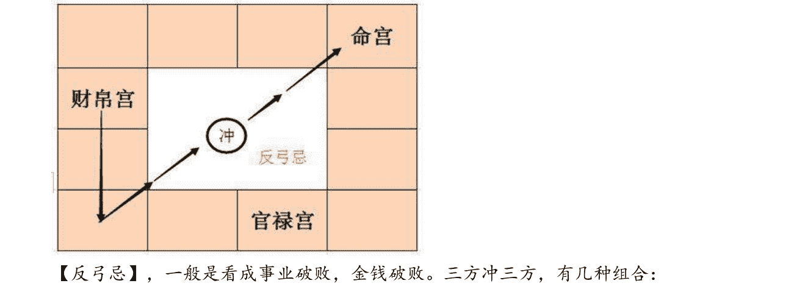

【反弓忌】，一般是看成事业破败，金钱破败。三方冲三方，有几种组合：

- 1) 本命盘的三方冲三方
- 2) 大限盘的三方冲本命三方（或大限三方）
- 3) 流年盘的三方冲大限三方（或）本命三方

所以这个中奖率很高，本命-----大限------流年，是可以不管哪一种，只要是三方冲三方，官冲财，财冲官。流年忌冲的反弓忌是小炮，大限和本命冲，就是大炮。

> 问：倘其他宫位飞忌入四马地也算拆马忌？
> 答：有一种是可以算是，就是大限流命命宫的飞化，其他的我觉得影响不大，不过应该可以作为验证参考。

比如之前给你们看的那个，本命官禄冲大限官禄，这样也是官败之格，打工的就看成是辞职，被冲的宫位是最凶的，那个可以看成是官败、财败的地雷宫。在活宫上也可以用，比如本命的夫妻宫三方冲大限夫妻宫三方，本命田宅宫三方冲大限田宅宫三方，这种就是夫妻的反弓忌，田宅宫的反弓忌，用法是一样的。

### 互冲忌

两个看似不相关的宫位，在某一条线上形成了对宫互冲的状况。例如，命宫化忌去财帛，奴仆宫化忌去福德宫，形成了互冲的情况，代表不合，纠缠。表示朋友会因为钱财问题不合或者纠缠不清。

简单来说，这四个宫位都有事，所以这种也可怕。

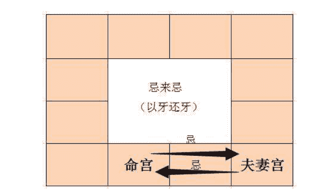

忌来忌，代表以牙还牙，你怎么对我，我怎么对你，我化忌你，你化忌我，这个套入其它六亲也一样。这样也难离婚，貌似这种夫妻是享受这种互相损的情趣，因为这化忌是抓住、抓紧、占有、管制，这就变成了我掐住你，你掐住我，我抓紧你，你抓紧我，爱得很辛苦，就是都不放手，也不懂该说好还是不好。

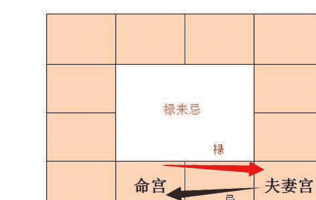

禄来忌，我对你好，你对我不好，不公平对待。这些大限流年也会遇到。

禄来禄，这种就和谐多了，这种方式套入任何一个宫位都可以引用。

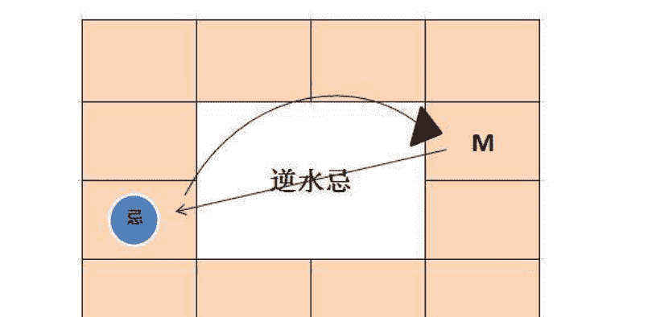

这种就少见了，逆水忌，我只见过一个盘是这种格局的，结果这人也遇到了突然发财的事。这个逻辑就是代表化忌好像是一个水坝的墙，从对面流过去，会被挡住，但是不会流失，反而好像波浪一样会返回来给自己，是看发财的。必须【飞出忌】，其他的飞出禄、飞出权、飞出科都不算。

表 M 宫一直有增多的现象，但条件是对宫不可再有任何自化，有任何禄，权，科，忌自化，水坝即崩溃，损失更惨重。记住，不会遇到【自化】，自化就亏损更大，这最好是在【库位】，这个是增多这方面，要看清楚主题，如果是福德宫生年忌，财帛宫飞出忌，被挡回来，自然是财的增多。如果是官禄宫生年忌，夫妻宫飞出忌，被挡回来，就是桃花增多，所以必须针对主题。

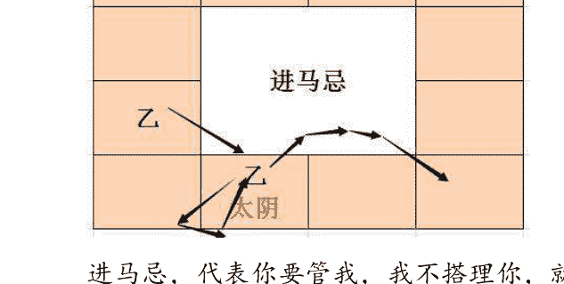

进马忌，代表你要管我，我不搭理你，就闪远远去，容易分手。
如：命飞化忌去夫妻宫，夫妻宫自化忌，就形成好像喷泉一样，出现了一条抛物线，喷去了财帛宫，变成三宫有忌，代表三个宫位都受伤。

注：如果第三宫再化忌就再喷去再三个宫。

正解应该是会喷射两个宫位，对面这个宫位也会遭殃。如果是说喷到了财帛宫，财帛宫也自化忌，那么又再喷去第三个宫位，第三个宫位再自化忌，又再喷去第三个宫位，自化忌是我不搭理你，举个例子，比如说一个女人要管老公，老公自化忌，不搭理她，她拿老公没办法，坏情绪，就发挥在两个主要地方，1）工作乱应付（夫妻宫对面）。2）乱花钱（喷去财帛宫）。这其实是代表你本来要损这个位，因为被这个宫位自化忌弹出来来了，所以就转移去喷出来的宫位，是连环恶效果。

那么，化禄可以有进马禄吗？答案是可以的，比如，一个妻子原本要对老公好，老公说，不用啦，我知道你有心就好，善意的拒绝了，然后她就弹出去财帛宫，那我就买东西对你好吧，转移去另一个点，这种格局，如果出现在本夫妻宫，比如说，流年飞出忌去迁移宫，就是出去。流年官禄宫飞出去忌夫妻宫，也是代表工作要出去了，也有可能换工作之类的，或者出差的工作，所以射出忌也代表外出。

这忌如果坐迁移宫，或者射出忌迁移宫，就容易黏在外面，一次就几个小时，时间很长。

射出禄和射出忌，是心情上的区别，射出禄，高高兴兴的出去，如果迁移宫又同时射出忌命宫，不高兴的回家。禄、忌、科、权，多数是用在态度和心情上面，软硬问题。

再教大家一个外遇格，也是射出忌，射出禄。这种遇到过好几次，几乎都可以说是铁断了。

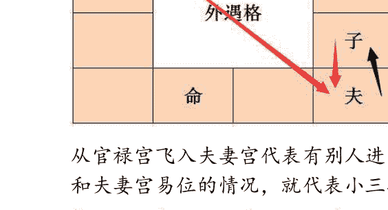

从官禄宫飞入夫妻宫代表有别人进入我的夫妻宫，为我外遇。如果是子女宫刚好还有和夫妻宫易位的情况，就代表小三转正。如何分辨是我，还是他外遇？

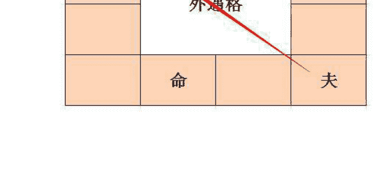

从夫妻宫飞出去的，代表他外遇，看成我的配偶飞出去，遇到桃花星之类的，当然更加不好。

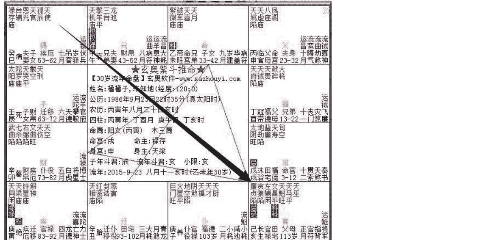

看流年的，@橘橘子的盘，飞出忌贪狼。记得，太严重的情况，就要往迁移宫去，可以改变运势。

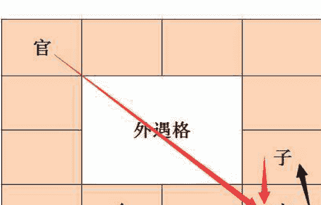

这个是看成，有人飞进来我的夫妻宫，当然流年没有女友的话，是好消息，如果有对象的话，就不好了，这是代表有人入侵自己的夫妻宫，除了这个宫位，还有就是奴仆宫，也可以看成这个含义，自己的奴仆宫飞禄去夫妻宫，不一定是飞禄，也可以是飞忌、飞权，飞科就比较无力，不可怕。

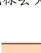

那么这个时候，如果万一又遇到这种情况，子女宫是小三，小三和夫妻宫对调宫位了，这叫易位，那么小三就转正了。我是遇过一个男命盘，他的太太问盘，既然已经结婚了，我就假设是婚前的对象，暂时不伤害她，我就问，你们在一起的时候，是不是这男的已经有女友了？她说，是啊，同居几年的女友。他们是偷偷摸摸在一起的，她原本是第三者，最后是她和这个男的结婚，小三转正。谁知过后不久，这男的嫖妓，打架，男的被女的打到头破血流，离婚。这也需要追寻盘的答案，是可以寻找到理据。这种格局，自然也容易离婚。

这个故事告诉我们，现代看婚姻之事，不要看到外遇格就直接说她老公有小三，说不定她自己就是那个小三，所以要先问，你和他在一起的时候，他当时是不是有对象，先试探这一句。如果说没有，那就完了。

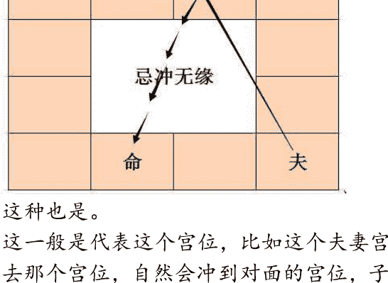

这种也是。
这一般是代表这个宫位，比如这个夫妻宫，跟自己无缘。如果是子女宫忌冲自己，化忌去那个宫位，自然会冲到对面的宫位，子女宫忌冲命宫，就孩子和自己无缘。官禄宫忌冲就麻烦多了，因为叫反弓忌，所以这就不建议创业了，事业破败，辞职之事，肯定也比较多。财帛宫忌冲命宫，本财帛也是叫反弓忌，金钱和自己无缘，自然容易破财。所以要记得，不是没有过错，不是不曾得到，比如子女宫忌冲命，很有可能是小时候在一起没什么事，但是孩子上了中学就一直留宿，后来出国留学，后来在国外发展，成家立业，孩子往外一直走，离命主远远的，也叫忌冲无缘。流年的话，如果当年怀孕，又遇到子女宫忌冲，那么就容易流产，所以要把含义弄清楚。

忌入迁，就冲命。我记得有个 case，就是命主的夫妻宫忌冲命，夫妻宫坐地空地劫，这看起来很难结婚，甚至有可能不结婚，结果他结婚了，后来问清楚，原来他去了英国工作好多年，太太也是英国认识，在英国结婚，所以这就是为啥迁移是可以改命的，太糟糕就只能这样，换位。不过如果是论离婚格，这个还不够，

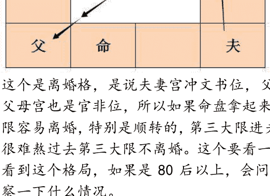

这个是离婚格，是说夫妻宫冲文书位，父母宫也是夫妻宫的田宅，父母宫也是文书位，父母宫也是官非位，所以如果命盘拿起来，一看，这夫妻宫是忌冲父母宫，那么第三大限容易离婚，特别是顺转的，第三大限进夫妻宫，过了会没事，不过根据我自己的统计，很难熬过去第三大限不离婚。这个要看一下岁数再说，不要人家九零后，问离过婚吗？看到这个格局，如果是 80 后以上，会问是不是离过婚，当然要参考夫妻宫的主星，观察一下什么情况。

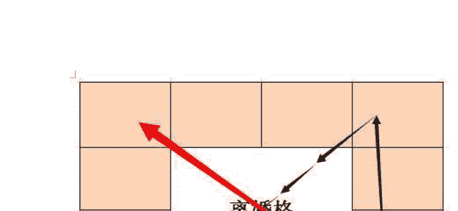

如果是这样情况离婚的，夫妻宫飞出禄去对面贪狼，那么就是因为外遇问题离婚，所以要结合其他因素。

- Ps:
1) 自化是严重化，自化就是拒绝，本身没什么吉化效果。飞出忌，遇到自化忌，是损到更严重。关于飞星的力度，要多多的去验证和不断的去模拟，不然很多概念很模糊。我教你们的，算是总结出来的，最实用易懂的，但是接下来就是要各种加强的模拟这个思路。
2) 离婚格，外遇格，不要见到年纪轻轻的，还没结婚的姑娘就乱说，如果是中年以上，要定盘验证的时候，说就无妨，避免造成了自己介入别人缘分的事，对自己也不太好。
3) 上面所说的外遇格，那是一般通俗的理解，也就是其中一个考虑的范围，具体要看格局。比如说，本命盘夫妻宫就有，大限又有，流年又有，结合桃花格局，就容易有这种现象。如果说本命盘没有，但是流年盘有，那么就是环境上有这样的条件，命主未必会受到诱惑。另外因为这个意象是双层含义，其中一个含义是包括配偶出差去工作，我遇到一个盘，夫妻恩爱，但本夫妻宫就那么强烈的这种格局，最后原来是这个老公结婚之后，去了俄罗斯进修音乐，十多年，今年才回来。另一个就是配偶在外地工作，夫妻长期分割两地，也代表配偶飞出去，所以具体需要观察格局。

比如之前问，巨门坐夫妻宫，可以看成什么？一般的巨门是口才好，最通俗的，不过如果这个夫妻宫是空宫，对面有巨门化忌，因为巨门也是盗星，暗中秘密的意思，加上桃花星，比如红鸾那些，就容易有婚外情，婚姻欺骗的意象，所以其实是需要看整体的。

| | | | |
|---|---|---|---|
| | | | 太阴忌 |
| 田宅忌 | 入库忌 | | |
| | | | |

最后一个，入库忌。有时候我们看到忌就害怕，其实忌还有收藏的含义，当忌坐我宫的时候，就是保守和收藏的含义，忌在对面，才会造成冲力，那么什么样的化忌是最好的呢？就是这种入库忌，有两种，第一种就是忌坐库位，也就是田宅宫，另一种就是忌和太阴在一起，也是保守抠门，喜欢存钱，有收藏的习惯，还有就是爱家。特别提到这个入库忌，也是因为这种是有特殊用法，是可以形成好像逆水忌的效果，就是我们可以看，大限哪个宫位去忌这个宫，就容易有源源不绝的财运。

比如说，大限迁移宫，化忌去入库忌，就要往外面去寻找机会，就有源源不绝的钱。那么如果是大限夫妻宫去忌入这个位，自然也就是配偶能代表源源不绝的财富。如果是大限财帛宫忌入这个位，也容易发生突然发财之事。不过有个前提，就是这个入库忌是不能有自化忌，否则就代表损失惨重，比如说，股票大起的时候，不舍得卖，紧紧抓住，再等等，就容易遇到亏损，或者自己趸货问题太严重，导致了被套死或者贱卖。从行为上也可以理解，自化忌也是拒绝的意思，就好比你有幅古董名画，本来就喜欢收藏，不过遇到有人来高价买，但你自化忌，不卖，可谁知道，这一错失良机，有一天这画被老鼠给咬了，一文不值，也可以看成入库忌代表收藏，自化忌代表拒绝机会，双层的收藏效应。

现在先学习对待，看紫微的思路，是应该有场景、人物、事件、物体、时间，再进行归类，然后模拟出各方面的立场，所以我引用一个我给人紫占的案例，故事背景：一个女人和人交往了两年，然后发现男友在过去的一年是脚踏两船的，今年年初才和这个女人分手，出于好奇和疑惑，她先用了男友的 QQ 去逐个找男友的异性朋友聊天，意外地发现了这个女人的存在，接着说了自己是这个男人的现任女友，然后她们还做了朋友，接着，对比了一些事，就发现到了这个男友的好多谎话，因此闹了分手，但男友说是真的已经没有关系了，努力求挽回。这个女人还是和那个前女友做朋友，其实这个前女友学过心理学，还接受过培训，试从一个女人的角度去看，眼前的这个女人就是抢了我的男朋友的，还用我男朋友的 QQ 来找我聊天，肯定非常不爽，接着，奇怪的聊天内容就出现了，比如说，这个前女友就说自己还很爱这个男的，那个男的也依然爱她，是她自己之前关心得不够，所以才失去他，然后就叫这个女的不要介意，他们其实还有见面并且相互联系，在最近什么时候刚刚又见面了，还忍不住睡了等等之类的话题，这就让这女友更加更加的怒气冲天，但是她没对这个女人发脾气，还是很友善的做朋友，就是老闹分手事件，因此她就让我起了一个紫占，

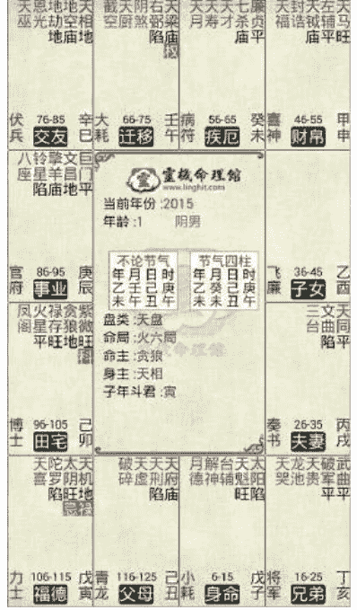

这个紫占是刚好贴切他们的现状，因为她想知道男友想什么，还爱不爱她，所以就以男人的角度去起盘，因此这个盘的命主是这个男人。

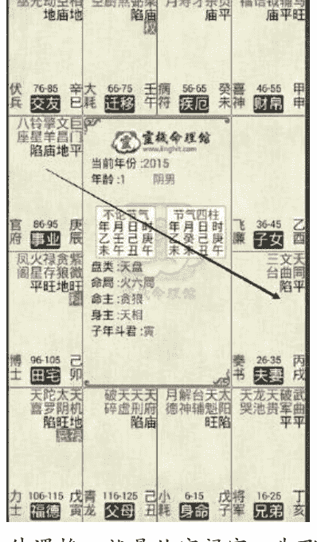

外遇格，就是从官禄宫，先飞进来夫妻宫，巨门坐夫妻宫的对面，是代表这感情关系有隐瞒。命宫是男主，夫妻宫是现任女友，官禄宫是夫妻宫外面，是前任女友。

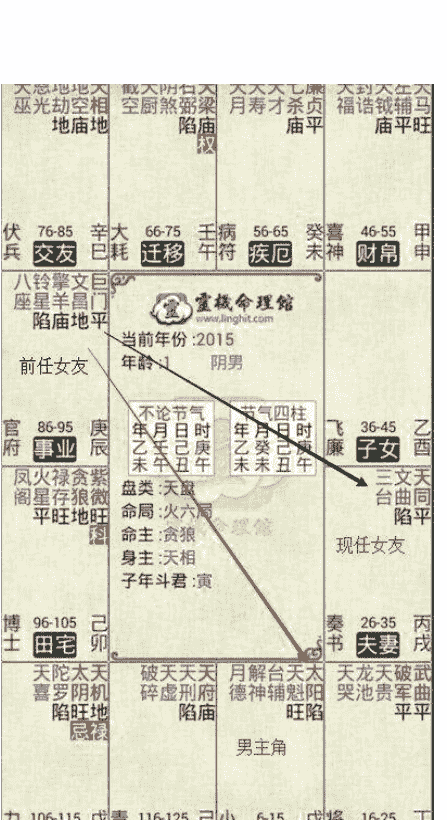

这首先可以看见，对面的宫位，前女友的宫位，坐巨门擎羊铃星，算是恶格，代表有攻击性。庚干，庚化禄太阳，化忌天同，化禄是喜欢，化忌暂时看成是不喜欢，有攻击效应，所以说，这前女友还喜欢这个男主，对现任女友具有攻击性，这就是对待关系。

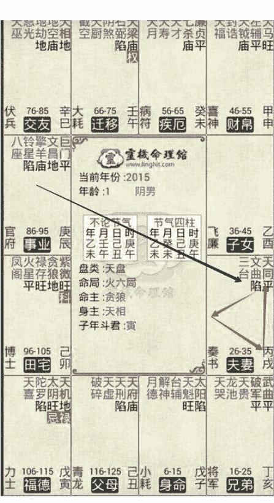

再进一步看看，当飞忌的时候，有个诀窍，就是要把发射宫浓缩成一个能量，砸过去飞忌的宫位。

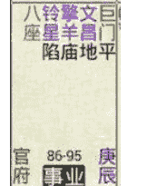

也就是代表，她是用这种能量去化忌，怎么的能量？巨门是说话，文昌是打字，她们聊QQ，铃星是说敏感的话，擎羊是说有攻击性的话，当她飞忌过去的时候，夫妻宫自化禄，化禄是温和的拒绝，化忌是坚决的拒绝。这边的显示也很明显，这个女友是温和的对待，温和的拒绝，她还一直做朋友。

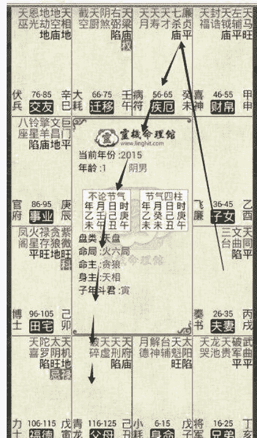

这个就是冲夫妻宫飞出忌去疾厄宫，抓住对方的身体，伤害对方。化忌去那个宫位，就一定会忌冲对面，对面是父母宫，这边的父母宫，我们叫【光明线】，表示女友已经觉得这个男人的道德观很差劲，不信任他，认为他是坏人，这样的格局，就叫【损光明线】，代表没有名声了，而同时我们当然要看这个男人的反应，这也是命主要问的问题。

这边我用了另一种飞法，叫做禄转忌，禄转忌是代表第一个反应，第二个反应，连环效应的意思。

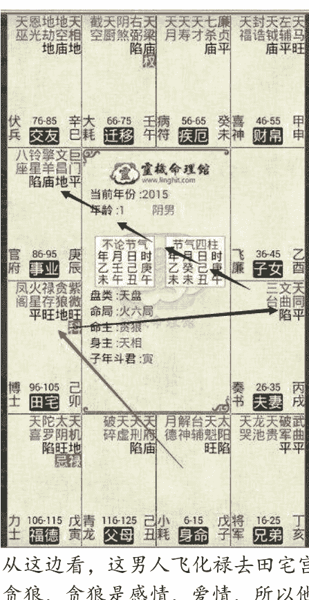

从这边看，这男人飞化禄去田宅宫贪狼，要分成两层【星义】和【宫义】，先说飞化禄贪狼，贪狼是感情，爱情，所以他在想感情的时候，飞化禄田宅宫，是想家的事，结合起来就是想着要结婚，成家为前提的爱情。他刚好是坐太阳，正在努力工作，是希望成家，接着他的这个出发点就转了化忌，因为田宅宫是己干，化忌文曲，去夫妻宫，就紧紧地要抓住老婆了，所以他不愿意分手，努力挽回。忌入夫妻宫，自然就忌冲对面，所以我就说，他去找那个女的说清楚了，叫对方不要再来骚扰你。因为这男主也是我的朋友，我就去问他有没有去说那个前女友，他说他去说清楚了，并且删除了好友和一切联系。

Ps：之前的四化，那个是己化忌文曲，文曲化忌，破军也跟着化忌的四化，这个才正确。

| 化星 | 甲 | 乙 | 丙 | 丁 | 戊 | 己 | 庚 | 辛 | 壬 | 癸 |
|------|----|----|----|----|----|----|----|----|----|----|
| 化禄 | 廉贞 | 天机 | 天同 | 太阴 | 贪狼 | 武曲 | 太阳 | 巨门 | 天梁 | 破军 |
| 化权 | 破军 | 天梁 | 天机 | 天同 | 太阴 | 贪狼 | 武曲 | 太阳 | 紫微 | 巨门 |
| 化科 | 武曲 | 紫微 | 文昌 | 天机 | 右弼 | 天梁 | 天同 | 文曲 | 左辅 | 太阴 |
| 化忌 | 太阳 | 太阴 | 廉贞 | 巨门 | 天机 | 文曲 | 太阴 | 文昌 | 武曲 | 贪狼 |

当然如果说，文曲化忌，破军随之化忌，也可以再看看。

奴仆宫也是桃花位，所以也代表破了这个桃花位，而且也是坐空劫，也同样代表了这男主是不打算再有其他桃花。这边的说法，就是四化飞星，七杀随文昌化忌，破军随文曲化忌，也代表文昌化忌的时候七杀一起化忌，文曲化忌的时候破军一起化忌，所以你们会看见有两个版本。之前这个现任女友听了我的解析，就删除了那个前女友的QQ和联系，谁知道最近她又和我说，这女的用另一个号码打给她，骚扰她，还不太愿意就此罢休。

顺便说说紫占，紫占是你朋友来问你一件事的时候，用对方问你的时间，来起一个盘。

四化很多时候只是表达一种态度和心情。从吉凶的层面来看，忌多数是凶，因此代表你执着，你抓紧，你愤怒，你缺少的时候，都是会引发凶的结果。而化禄多数是吉，所以你用喜悦，温和，爱，喜欢，积极的态度，你所吸引的结果也是好的。而好像谈过程的时候，偶尔我们会用到【禄转忌】，这种就是乐极生悲，比如说爱情，爱情原本是出自于爱，慢慢觉得缺少了，就抓紧、执着、控制，因此就出现了转忌。

顺便说说我做过的一个实验，我认为这转禄、转忌，是可以控制结果的。为什么转忌特别容易发生呢？因为人都是喜欢关注负面的多，会执着这个，来看命的人都是心里头有个忌。有一本书写道，要看来意，就看今年什么忌冲命宫，今年的命宫，就是来意。你烦恼的事，然后才会来看命，基于这种假设，我就做了一个试验，我想知道，如果控制自己的情绪，永远是积极和乐观和爱和感恩的状态，是不是真的可以改变这条转线永远转禄。我大概做了一个月的试验，结果证明是可行的。化忌是你自己去启动的东西，你没有执着，是不会启动的，但是多数人都没办法不去关注那个【缺少】的部分，比如爱缺少了，就会不甘心，抓紧。忌冲是什么效应呢？忌冲就是一种，你抓紧了A宫，那么A对面的能量就会失衡，能量会聚集到A宫去，那么另一边就断开了或者不在意，导致了所谓的【缘灭】。我比喻，为什么父母反对孩子念书的时候谈恋爱？因为官夫线是同线，化忌去夫妻宫，肯定就冲官禄宫。先说说这个平衡线，比如学生谈恋爱，肯定影响学业，他的学业破败，不是因为他的命盘官禄宫被忌冲，而是因为他把大量的能量放在爱情烦恼上，所以另一边出现了【缘灭】的状况，能量被抽空了，不平衡。所以命迁线、官夫线、兄友线，这六条线说的就是平衡，无论忌入哪一个，都会冲对面。

看一个人今年的烦恼：

-   先起流年盘
-   看迁移宫是什么星星
-   看什么宫位是化忌这个星星

一般是取那个宫位的【大限主题】，【本命和流年主题】其实也叠在一起参考。

为什么去大限主题宫为重？因为，本命和大限是一扣，大限和流年是一扣，所以叫上下扣。流年一定是大限的时钟里面，所以是以大限的主题为重。

大限迁移宫------化忌天机（流迁）-------忌冲流命

这个命主在码头上班，非常非常非常想离开这个地方，调职，希望去一个高级的地方上班，所以这个命主天天问我，我什么时候离开码头。

有时候我们在想，命运是怎么产生的，就是你要有足够的条件，这件事就产生了。所以要改变命运，就要往这个方面去想，就是【不要让凶格条件成熟】，比如同一个命盘，天机迁移宫忌冲，有的会车祸，有的会和朋友吵架（天机朋友星），有的是出去了就走不停。

解盘是一个拼图，要把大量的信息进行整合。我通常是用两个方式看盘，如果命主什么都没说，我就起流年盘，看看今年的迁移宫，什么宫位来忌冲，然后就推断来意。禄因，忌果，在这边也依然可以再衍生，你要知道为什么化忌这个，就要再从发射台退后去谁化禄他。

以这个为例，同样的，表示你从发射台，再找谁化禄这个宫位，得到的是，大限迁移宫，贪狼是欲望，代表有出去的欲望，或者有野心的欲望。

起流年盘，在迁移宫有两个星星，所以有两个发射台。串到两个奴仆，和朋友也有关系。

迁移宫也是大限财帛宫，迁移宫有自化权，我记得那天她说，给群的微商搞得自己很不爽，应该是有点关系。巨门+擎羊，而且巨门化忌，那天好像牛魔王的事，也好像惹怒了人家，所以她今年是容易和朋友有吵架、误会的事。

看流月，阴历六月，也就是当下。流月田宅（命）--------忌入太阴（流年田宅），太阴也是田宅星，三田宅穿起来了。她在烦房子的事，搬家的事。

流月是小的，流年比较大，烦恼一年，流月烦恼一个月，不过流月会跑前后一个月，所以不容易抓得准。

流月肯定是小事，大限烦恼十年，本命烦恼一辈子，流日烦恼一天，以此推论。

刚刚说到，如果不知道命主要问什么重点，就起流年盘看忌冲，不然就直接问，比较快。

四化飞星，有几个点是需要特别关注的思路：

-   一、从什么宫位发射出去的，会把此宫的能量一并的带过去，比如，擎羊发射化忌去命宫，那么就代表，这个命宫会遇到暴力，吵架问题。再结合命宫的星星，加以解析，如果说，此案例是，【迁移擎羊————化忌——————命宫天机】，那么就代表，这个擎羊会损到天机之事，比如你可以说，他迁移宫，他出外，然后驾车（天机），然后遇到驾车的暴力事件，车祸。也可以说，他遇到了一个恶霸，把自己的脚打断了。也可以说，这个擎羊增加了天机的烦恼，需要伤脑筋。

飞化是必须把发射台的能量加入注解，比如刚刚上面的紫占，是用巨门去化忌，所以我们现在讨论几个，

夫妻宫————化禄去子女宫

配偶疼孩子，对孩子好。这是第一层，飞星的对待。我们还可以继续加入信息，配偶是如何对孩子？用上面方式？

配偶是用【紫微】的方式对孩子好，就是比较霸道专制的管理模式。

那么孩子如何回应配偶的紫微飞禄？

孩子用【火星】的模式回应配偶的好。

所以看一般的飞星，会告诉你，你的配偶疼爱孩子，这是很小的信息。深入就会说，你的配偶会以爱之名去管制你的孩子，对你的孩子好，不过你的孩子并没有太大的耐心听从他。

这就代表了发射台本身的含义，和飞去的那个宫位，是需要再进行注解，添加信息。

| 田宅 | 七杀武曲 | 夫妻 | 太阴 |
| :--- | :--- | :--- | :--- |
|      | 夫妻宫化忌武曲 命宫化科武曲 |      |      |
|      |          | 命宫 | 巨门 |

夫妻宫化忌去武曲，命宫化科去武曲如果让我来看，就是配偶爱干净，家里规矩多，命主华而不实地去遵从，巨门是有欺骗的含义。这种格局也容易有钱，因为太阴化忌去田宅宫，代表收钱。这老婆比较谨慎拘谨，对理财、家里整洁度也一样。

| 官禄 | 七杀擎羊 | 疾厄宫 |
| :--- | :--- | :--- |
| 父母 | 天机巨门 | 官禄忌入天机冲疾厄宫 |

实际上也有父母冲突事件，不过要看，这冲的宫位也有影响。七杀擎羊是暴力组合，坐官禄宫，忌冲疾厄宫，容易因为事业关系，工作关系，导致身体受伤。伤害的事天机，有可能是手脚，也有可能是车祸，因为天机也是代表车。

| 子女 | 癸干 | 命宫 | 七杀 |
| :--- | :--- | :--- | :--- |
| 财帛 | 贪狼 |      | 癸宫是激化杀破狼变动之宫 |
|      |      | 官禄 | 破军 |

这个是说癸干。癸是化禄破军，化忌贪狼，所以癸干会导致变动，会引发变动，增加杀破狼的能量，贪狼化忌就是对欲望执着，破军化禄就是突破能量。所以根据这个图，就是子女宫是可以激化命主的杀破狼，也容易在巳年，比如2013年的时候有突破事件。

这个是命宫本身就有激化能量，在酉年的时候会发挥得更好。这个是化忌去迁移宫，也是外出格。化禄去破军，福德宫，也是代表精神中求变。

这个父母宫充满了大量的能量，而且还有激化杀破狼的能力。代表丑年是有变动能量。

子女宫发出来，是巳年，代表巳年特别容易变动，因为是癸干。将来命主有了孩子之后，孩子也是激化她的变动能量，会为了孩子，加大她杀破狼的能量。

| 财帛 贪狼 | 命宫 七杀 |
| :---: | :---: |
| 戊宫是增加欲望能量之宫 | 福德 戊干 |
| | 官禄 破军 |

除了庚干，还有一个就是戊干，戊是化禄贪狼，所以代表这个宫位会增加欲望。

命主会在午年的时候，2014年，对孩子的欲望很大，因为是流年子女宫，而且有贪狼化忌，代表不够，也代表凡是午宫，命主的欲望会比较大，任何事。所以戊宫会容易胖。

此命主的欲望能量是来自于财帛宫，所以他在2014年应该也是欲望很大，赚钱也比较多。

这个官禄宫是化禄去财帛宫，所以代表工作赚钱，但是夫妻宫化忌去财帛宫，那么有可能配偶会抓住他的钱。因为财帛宫也是婚后宫，【财帛宫=夫妻宫的夫妻宫=婚后宫】，所以也代表婚后不太和谐。

一般化禄我们看是得，化忌看成失。进财是看财帛宫的星星，看什么宫位化禄去这个宫位，就代表那个宫位的主题、人、事、物、方向、年份等等会让我赚钱。奴仆宫如果忌入财帛宫天机，是取钱，伸手过来抓的意思。我一般看，飞禄入财帛是赚钱的，飞忌入看成是抓，掐着，抓紧，这就是为什么要结合组合，星星的格局。比如说，夫妻宫是有巨门地劫，忌入我财，自然是说拿我钱了，所以要看星星组合。

这个也叫入库忌，子女宫天梁化禄去田宅宫，自然是孩子会孝顺。化禄去父母宫，因为田宅宫也是说，关于命主的家庭对待关系，所以也代表他自己也会对父母好。不过太阳化忌了，而且是从父母宫化过来的，自然是父亲，太阳落陷化忌，太阳坐子无力，所以也代表父亲本身的能力也许不太高，赚钱辛苦。忌入田宅宫主藏。

Ps：忌转忌是恶性循环，我常常这样说，要善于去控制自己的情绪和意念，不要去启动化忌，吸引力法则也好，紫微斗数也好，都证明了一点，就是我们的心性和态度会影响命运，把化忌降低了，哪怕只有一半的降低，你的厄运也降低了50%的伤害力。四化是态度，可以用态度去转换。

命运是磁场和配对这样的关系，哪个条件出现了，就容易启动这个意象。比如说，有时候我看一个人的疾厄宫有擎羊，我也不懂该说是受伤，打架，或者是开刀事件，结果，验证出来的结果，是针灸。所以就看成是同样气质的条件，因为针灸有类似擎羊的条件，就配对了。另一个擎羊也许不是针灸，他出现了小人，也是叫条件配对了，勇敢的去问。

我遇过一个盘，同样生辰的，一个在2013结婚，一个在2013买房，我们都知道，这其实是同一个气质，也就是成家之象，但是发挥点因为双方条件成立的条件有分别，所以就会产生这样的情况，这都是命理的自然范围。在中国的统计，相同八字的娃娃，是平均有5000个，为什么只有一个马云？因为气质是一样，你可以把解析说明白，比如你告诉命主巨门是有几种含义，就看你发挥哪一种，和哪一种的条件容易先启动。

# 【第十三周】

## 07.20

这周和下周都是说比较完整的解析方式，做个总结，顺便聊聊断流年的快速技法。其实我们的命盘并不特殊，为了解决这个不够特殊的毛病，很多命理师都做了更多的细化研究。为啥不够特殊呢？我们也知道，紫微斗数的基本格局只有 144 个，基本盘只有 12 种，加上小星星和天干地支的区别，还是太大的撞盘概率，而且也会出现双胞胎，不同国家的同盘。根据研究和世界统计，中国的同个生辰的娃娃有平均 5000 个，在台湾也统计过，是平均一个时辰有 77 个宝宝，所以，我也常说，我们最大的竞争和比较，是那另外 4999 的同盘，也就是自己和自己的对比，就好比 5000 个和马云同盘的人，却只有一个最优秀的马云，因此比如紫云派，衍生了太岁入卦法进去，也就是加入了父母的生年进去看，大家的父母生年肯定不一样，所以这也是技法之一。

这个方法我先教一次，第一个步骤，取父母的生年，以@王干 为例，查询万年历，取他父母生年干支，父亲 1955 年乙未年，母亲 1957 年丁酉年，首先看父亲，在命盘自动的把未宫（属羊）圈起来，换成了乙干，然后飞出乙干的四化 ，

就是这样，四化要自动更换去父亲的四化，父亲化禄的是吉化这个盘的能量，父亲化忌的是消减这个盘的能量，化科是小禄，化权是小忌，依此推类。现在我们就看看，从基因的角度，父亲是化禄天机，天机代表聪明，代表父亲很聪明，命主的天机能量会提高。因为王干是没有兄弟的，独生子，因此我们取母亲位，和资金位，这两个含义来注解，也就是父亲对母亲好，化忌去母亲位，也会管母亲。父亲会支持命主的资金、存款，帮忙周转。同时化忌太阴也是兄弟宫，机阴是一点一点，因此会控制命主的资金，不会一次过给太多，都是小小的给。化权去天梁，位于命主的田宅宫，代表会照顾家里，有荫的含义，因为是天梁，刚好父母宫是巨门，这两个星星都有医学的含义，因此他的父亲有可能家里会有很多这种古典的医书。因为位于田宅宫，化科去紫微，紫微是命主的命宫，代表会管理命主，但是化科，就是小小的管理，能满足命主的高傲感，化科是代表面子，代表父亲能给命主面子。

从这边我们同时要结合，命主自己的父母宫看，

巨门化权，结合廉贞七杀火星，这些加起来就是说话有权威，做事很快，不喜欢叽叽歪歪。

反馈：父亲是医生。

这是因为他父亲，父母宫坐巨门，太岁是化权天梁。因此父亲才是一名医生。如果他的父亲不是 1955 年出生，那么就有可能是其他职业了。这就是区别。

母亲是丁酉年。

把酉宫圈起来，然后把天干转成丁干，

父母太岁都同时化去天机太阴，母亲的是化禄和化科，这代表命主的机阴能量，跟其他同盘的人比较，是比较强烈，能量更高，因此机阴的能量是搬家、牵动，@王干应该和父母去过不少的地方或者搬家，而且父母应该也会爱走，或者都容易常出差之类，他自己现在也是容易到处去住，因为他的机阴能量非常高。现在基本的注解，就是这母亲也同样会给他钱，但是也是少少的给。这盘有趣的是，父母互相的化忌，父亲化忌去太阴，母亲化忌去巨门，父亲化忌去母亲位，母亲化忌去父亲位，

这样圈起来就很明显，这代表母亲是不爱交代事物的，因为巨门爱隐瞒，但是自己觉得自己很厉害去猜测对方的心意。母亲的宫位有个地劫破碎，估计母亲小时候家境也不好，然后地劫，加上母亲位是爱搬家的，天机太阴，而且太岁是在命主迁移宫，小时候估计母亲也不黏家。父亲算是因为化忌太阴，很注重家庭，因此母亲才能拉倒今天的关系，母亲应该没有父亲爱顾家，父亲也应该会比母亲更善于做家务。母亲因为太阴化禄于命主的兄弟宫，太阴是富，坐资金位，因此母亲应该会更善于投资，应该也有一些不动产。

所以因为父母太岁不一样，会造成很大的区别，这就是同盘细化的方法之一，其他方法，也有地域区分的方式。

@王干，祖家位于中国的东方，

因为是东方，所以他东方的宫位能量比较重。东方也是木，所以木性的星星都比较强，比如天机乙木，所以@王干 自己的天机也比较强烈。刚好他自己的命宫，宫干乙又化禄了天机，所以他的天机是比一般人高很多很多，所以他现在的身份，也是个入藏的导游，爱到处走，估计整个中国都应该走遍了。

假设@王干 是南方人，

【先天命盘】玄奥软件-www.xazhouyi.com
姓名:王干,山东省-济南(经度:117:0)
公历:1984年1月6日19时44分(真太阳时)
农历:癸亥年十二月初四日戌时
四柱:癸亥年 乙丑月 己亥日 甲戌时
命局:阴男(癸亥) 水二局
命宫:卯 命主:文曲
身宫:亥 身主:天机
子年斗君:亥

宫位分布（部分）：
- 命宫：天机天梁 庙旺
- 兄弟：天同 平
- 夫妻：...
- 子女：...
- 财帛：...
- 疾厄：...
- 迁移：...
- 交友：...
- 事业：...
- 田宅：...
- 福德：...
- 父母：...

那么南方的能量会重，属火的星星也会被加强，比如太阳、廉贞、火星都会加强，这是地域上的区分。

@橘橘子 东方，

【先天命盘】玄奥软件-www.xazhouyi.com
姓名:橘橘子,未知地(经度:120:0)
公历:1986年9月23日22时36分(真太阳时)
农历:丙寅年八月二十日亥时
四柱:丙寅年 丁酉月 庚午日 丁亥时
命局:阳女(丙寅) 木三局
命宫:戌 命主:禄存
身宫:申 身主:天梁
子年斗君:辰

宫位分布（部分）：
- 命宫：武曲七杀 庙旺
- 兄弟：...
- 夫妻：...
- 子女：...
- 财帛：...
- 疾厄：...
- 迁移：...
- 交友：...
- 事业：...
- 田宅：...
- 福德：...
- 父母：...

虽然命宫在戌，但是她是东方人，因此她的东方能量也会偏重，这个宫位也会重。坐奴仆宫，武曲七杀，代表善于交朋友，朋友们赚钱厉害，她自己对于赚钱，无论大小也都积极争取。不过她原本太阴地劫，属于比较阴柔的，如果不是东方人，大概是个羞涩的女人，因为有了东方的能量，武曲七杀是属金，所以这个宫位带给她独立性，她可以搬出去工作，可以独立生活。

东方也属木，也加强了木性星星，比如天机属乙木，贪狼属甲木，因此她虽然是太阴，应该是很文静的，但是因为木的能量高，因此她爱动，爱热闹。假如她是西方人，那么就不一样了。

有时候我们问，改变命运，往那个方向搬能不能改变能量？答案是可以的，因为往那个方向去，改变了能量。紫微斗数命盘，是个活生生的地图，就是个磁场和能量，也有你父母的基因去强化你一些天赋。

@玖陌桑，北方，所以可以看出来她也爱学习这些玄学，喜欢交奇奇怪怪的朋友，喜欢热闹。属水的星星也会加强能量。

问题：1）如果是太阳落陷的命盘，但是人出生在南方，是否能提升太阳的能量？

答案是可以的。所以看南方人的盘，太阳落陷是不太明显，发挥不严重，同样的命盘同一个时辰，有可能北方的太阳落陷他父亲常常生病，而南方那个盘太阳落陷，但是他父亲没啥事，这就是原因。因此这又会产生细化。

### 快速找流年重点

第一个步骤，最快速的，排流年盘，然后看这个盘，哪个宫位最多四化，有四化的宫位，都看成被引动。（以流年宫为准，大限和本命是加起来当参考的，流年最重要）

@王干，去年的。太阳双化忌在迁移宫，这个我之前说过，叫【屁股在外面黏住了】，那这一年，外出的事一定会多。化忌在迁移宫，就代表他会黏在外面。太阳是发散的，太阳也是驿马。而且流年转入的主题是【大限迁移宫】，又有【黏在外面】的意象，因此我常说，【你出去的时间到了】，因为他的时钟转到了这里，时钟转到了，自然就会出去了，然后这也需要看出去干啥，所以必须要有意象。

这两个宫位可以一起看，他太阳化忌是在八月份，七月就很多个四化，而且还有破军被三化，肯定是突破事件，这是流年的【奴仆宫】，要以流年为重。他遇到了好多有突破能力的人，同时一起出现，启发了他的灵感，或者说他自己有突破能量，吸引了同类磁场的人，这样场景就出来了。

这边很多人，一伙人要一起突破。因为是奴仆宫，所以代表突然遇到大量的朋友。

他在去年的七月，状况最多的月份，最多四化的月份，化忌在贪狼，冲子田线，双化忌在子田线。

太阴位于财帛宫，太阴化科，化科在财是华而无实的。武曲也是双化科，禄存又在外面照，一下子在后半年好像赚到了风光钱，实际上华而无实。为什么会看不到钱呢？因为在财帛宫，天机太阴是小钱，这是一个原因。天机太阴是住宿，车马费，代表花了不少钱在交通住宿上。

这破军的能量比武曲重太多了，武曲化科根本比不过破军的虚耗，所以中途花了很多钱，而且有些是大笔大笔的出，因为武破是大的，所以虽然看起来，一次性是拿了大家加起来的一大笔旅游经费，不过整个旅游过程，实际上自己所剩无几，赚少少，不过很好看。

天机是交通，太阴是住宿，坐财帛宫，所以代表会花这些钱。太阴化科就代表这找的房子也注重美观。恩光的钱，是一种赐予，是意外之财，人家给的。（恩光在官禄，一般这工作是别人介绍的）天月是病，所以应该也会花钱买药，看病之类。孤辰和天才，这两个可以看成是他自己，孤独的天才，带人入藏，全程的掌控自己要随机应变。

根据流年意象，@王干的旅游经费是不足的，不过没事，没有截空。如果要看他怎么花钱，流年的，就是直接用流年的财帛宫飞出去看，

#### 重复一次步骤：
1.  排流年盘
2.  看哪个宫位最多四化
3.  结合月份顺序，以流年盘为主，限流主题为辅
4.  结合象义，做能量强弱的推测

以流年十二宫为最重要的，所以飞禄去廉贞，流年父母宫。飞权去破军，奴仆宫。飞科去武曲，奴仆宫。飞忌去太阳，迁移宫。

| 廉贞七杀火星天哭 |          | 运流钺钺 |
| 庙旺闲平       |          |          |
| 禄禄          | 父       |          |
| 引已沐父疾     | 官禄     | 三晦攀喜 |
| 卦未浴母厄     | 82-91月  | 气鞍神 |

飞化禄去这个宫位，再结合本命和大限的主题，叠加起来看。父母——疾厄——官禄，如果是我，我就取工作地点的文书意象，廉贞有行程味儿，他应该去年有花钱去为了这地点的事儿，写申请，估计是大家的名字登记记录，然后住宿之类的，估计也需要花在这边的行政费。

| 太阳禄存文昌天姚封诰天空 |          |      |
| 陷旺旺陷             |          |      |
| 忌                 | 迁       |      |
| 甲子               | 迁命子女 | 八大灾青 |
| 盖移宫32-41月       | 耗煞龙   |      |

这个宫位也是一样的。先把三个宫位加起来，结合成一个意象，迁移——命宫——子女宫，这更加简单看了，子女宫是可以看成学生，或者他的顾客。他带着团友一起出去，他就像老爸一样带着孩子们。太阳化忌位于迁移宫，和首先是出门的事，有禄存文昌，还给零花钱？貌似是先收了一笔，后来又给他们钱花。

| 武曲破军陀罗右弼天马天巫凤凰阁大耗天厨 |          |      |
| 平平陷平平                     |          |      |
| 科权                       | 仆       |      |
| 癸亥                       | 仆兄财身 | 七小劫小 |
| 绝役弟42-51月                | 耗煞耗   |      |

这也是为朋友花钱。

#### 重复一次，看流年怎么花钱：
1.  看财帛宫取象义
2.  用财帛宫飞出去的四化，再看那个宫位，缩小范围，看看还在哪里花钱了，有时候我们看花钱，就可以知道他的工作性质。

现在说进财，反过来，就是看什么宫位飞进去财帛宫。

先不看化忌，可以看化禄、化权、化科，都是进财的宫位。当然化禄的能量是最大的。

可以看见，这兄弟宫，子女宫是有飞进来财帛宫。兄弟+奴仆+福德，这很简单，难兄难弟，情同手足的朋友给的钱。子女+田宅+命宫，家里也有一点，还有就是自己的团友，子女宫是顾客。主要就是这两个来源，有飞进去财帛宫，实际上还有一个宫位，就是流年夫妻宫，飞化权进去天机。

化忌进财帛宫，是损财，

流年命宫+大限迁移宫+本田宅宫，化忌天机，这就是代表，

1.  自己为了朋友花钱，因为天机是手足星，朋友。
2.  为了出外的事花钱，因为天机是动星，加上大限迁移宫飞，也是为了出外的事花钱。
3.  为了车坏花钱，因为天机也是有从田宅宫出来，田宅宫的天机就是汽车。

这是主题宫，天梁是照顾人的星星，所以这也是为了仗义之事花钱。

这个子田线基本上是一致的。乙化忌去太阴，为了住宿花钱，因为是子田线。然后看组合，紫微贪狼化忌，紫微贪狼是玩，也可以说是，为了修行，紫微贪狼有玄学的意象。紫微是高处，贪狼是神仙，所以也代表你有一个高处的神仙花钱，而且因为这个宫位变成了今年的财帛宫，代表这事延续到了今年，应该去年他入藏了，遇到高僧之类的，也顺便给了一些钱。

流年盘可以断很多细节，而且我们只谈到了基本的，最快速的论法，就已经有那么多的信息了。

#### 重复一次，花钱：
就看财帛宫里面的星星，还有飞出去的星星，以宫位为主题，星星位象义。进财，就是看什么宫位飞进来，也是用一样的方式，结合那个宫位的三个主题，可以拆分，可以结合，象义也可以这样，就是不要去担心，应该取这个含义还是那个，这些就当作是同步的，都会有，都可以同时发生，或者其中一两个事件。最重要就是流年盘，所以我一开始就说，看紫微盘，第一个意识就是这个时钟，时钟必须看当下的为准。

大限本命的话，比如有人问我什么时候会有钱？这是最常遇到的问题，一般就是本命的格局要漂亮，就容易有钱，没有漂亮格局自然就没钱。然后看大限的格局。

@王干 的格局，有个相当糟糕的格局，破财格，先不看飞星。好比要出去赚钱，首先要看天气，格局就是天气，天气好，才进一步去看飞星。

王干今年是明显的破财格，先不看飞星。我们先观察，我教过你们的，最基本的方法就是看，这个有没有很多破财组合，第一个，迁移宫，天府擎羊地空截空旬空，天府是财库、钱包。

这样我们就叫【破库】，因为这钱包里面有刀子，这也罢了，这里面还地空，截空，句空，就非常不利了。天府擎羊，是容易钱财露白，就好像我打开我的财库给别人看一样，这样的弥补方式，第一种方法，换个好的钱包，条件是钱包不能破破烂烂，要好的。第二种方法，钱包里面一定要放钱，比如说，放个100块，是不能去动这个钱的，怎么花都不可以花这个100块，不然呢，就买个古钱，古代的铜钱，要好的，要真正的古代铜钱。最后一种方法，比较不好的，叫借运，就是找个很有钱的朋友，你找他换钱，然后他从自己钱包掏出来的钱，是有他的财运的，放在自己钱包里面，就不要取出来，不过当然，能量会结束的。你觉得没啥作用了，就再换呗。破库就需要这种方式去修复回来。最重要就是钱财不露白，最好是拿他一张100，这种问题就是钱财露白了。

第二个宫位，这财帛宫是最重要的了，

财帛宫对面有个地劫，地劫又加上破碎，这就是我们说的煞冲，煞星来冲，就好比对面有个叫地劫的强盗来抢你的钱，加上如果是露库格，这就和自己先露白有关系了，容易会惹到这种被黑的事。地劫是不爽，贪狼化忌，也是失望。

这武曲破军，本来也是代表破坏规矩，武曲有金钱的含义，武曲的金钱，是靠规矩而得，靠原则来管理的，这代表了你有钱，你原本是应该有原则性的管理，但是你自己破坏了这个规矩，这宫位又化忌贪狼了，变成了官禄宫，损了财帛宫的钱。

那么自然也需要看有进财的时候，一样的方面，看看今年财帛宫是什么主星，两种方式，第一种是最简单的，看看今年哪个月是戌月，看流月万年历，为什么去戌，因为【戌化禄贪狼】

答案是 2015 年的阳历 2 月。戊寅月，化禄贪狼。

#### 第二个方式也是简单
直接在命盘上，寻找【戊化禄贪狼】

阴历正月，几乎和日历上是同时发生的。之后的月份，就感觉没有之前的旺了。但是还可以找一下，比如还有紫微，紫微化权，紫微化科的月份，壬月紫微化权，乙月紫微化科，壬月是阴历五月，也就是上个月。还有一次财运不错，但是比较小的月份，是在阴历八月，紫微化科的月份。

所以看财运好不好，是要看万年历的，月份的话，命盘也可以加入参考。

这几个飞进去的月份也是他进财的月份。如果要看因为什么得财，就要看主题宫。

### 如何看因父亲而得财

有转禄的机关，从流年的田宅宫，飞一个天梁，就是长辈，进今年的资金位，再转去他的财帛宫。

财帛宫自己也有个田宅宫，而且有紫微化科+天魁，高级长辈，高级贵人，因为是大限田宅宫，那么这个贵人肯定是在家里。有好多方式看，一个意象有好多个交替的铜板，就是从多个条件都可以看，上下左右都有迹象。而且他今年是火贪格，所以突然有一笔钱。

Ps：流年干有两个，一个是原本命盘的流年命宫的宫干，一个是今年根据万年历的年干。比如说，@橘橘子，

@橘橘子今年流年也是乙干，流年命宫的，流年年干也是太阴忌，因此她今年肯定烦田宅的事，她如果要问六月的田宅运，阴历六月是癸未月，癸引动了她的六月田宅宫，

好像真的需要再搬。这个月破军被引动到了。

流年命宫的宫干，代表【我的选择】，流年年干（万年历），代表【大环境的磁场】

## 07. 22

先说一个之前的案例，

首先，搬家格是有几种，一样的，格局，飞星，天机太阴，忌破田宅等等，不过，具体依然是需要灵活使用。

这个盘，是我一个好朋友，在2011年的时候找过我，当时很急躁，我一看就说，你打算搬家吗？她就大吃一惊的说，啊，看得出来啊？我说，当然看得出来啊，而且，你找了三次没成。她说，是啊，真找到三间看中了，每次都是有状况，最后不成。我记得当时她找我的时候，已经是阴历六月了。现在我们来研究这个格局：

首先，看流年的第一步，快速的方式，就是先找几个宫位有集聚很多个四化，然后就容易变成特殊宫位。这个盘也相当的明显，就四个宫位很多四化，最特殊的就是，那个子女宫，好多个化科，然后我就再看看流年命宫，就发现到那年她命宫是乙干，乙干为什么特别？因为乙干是化禄天机，化忌太阴，天机和太阴是搬家的关键星。

恰好这也是她的【本命迁线】，她转进去了迁移宫，对宫有个破军双化禄，是在流年的迁移宫，【迁移宫有禄，是外出活动的动象】。而破军有禄，就是有突破事件，突然要破败，突然要改变的事。破军我也说过，就是膨胀模式，通常发生都是因为忍无可忍，肯定就发生得非常突然。

我看了一下，流年田宅宫，算是空宫，【没有大星就算是空宫】，只有一个铃星，铃星有那种骚扰，吵闹的意象。一般空宫的话，这个宫位会被对面的宫位，有大星星吸出去，就好像吸引力法则一样，地心引力一样，那边没有星星，对面有星星，所以会吸出去对面，而且我说过，【太阴在外宫，就是代表家在外面】，那么这个很明显是会搬家。我就问了一下，是不是要搬家，家里有人骚扰了，对吗？最后她就坦诚，她说，这本来是家丑，她有个已经和母亲离婚的爸爸，是有好赌的欠债问题，时不时的没钱就会去家里吵闹，因为她几个兄弟姐妹都在外国工作，家里只剩下母亲一个，太让人担心，这次为了保护好母亲，大家忍无可忍的情况下，就决定要偷偷搬家。

所以，命宫的乙干，化禄和化权都飞去了父母宫，父母宫有天梁，是要照顾家里的长辈，这个时候为什么父亲反而是兄弟宫这个意象呢？因为我说过，父母宫和兄弟宫，是以谁影响力比较大为阳，谁比较小为阴来决定父亲母亲，既然父母都离婚了，和母亲在一起的，那么父母宫自然就变成了母亲，父亲宫是父亲，我们看看这个兄弟宫，

太阳是男人，巨门是吵闹，很多四化在一起是代表次数很多次，文昌化忌坐兄弟宫，兄弟宫是存款位，所以也威胁了家里，所以，这个时候，这个盘的父亲反而是兄弟宫。这时候整理好了思路，接着，我就说，看了三次都买不成。为什么我会这样说

| 天同天阴禄存文昌恩光天刑天空 |          | 运运曲禄宫昌 |
| 旺庙旺庙             | 科 偶     |              |
|                     |          |              |
| 甲沫子父            | 田宅     | 五天咸小     |
| 浴女母33-42月       | 德池耗   |              |

呢？当时她找我是六月，所以，上个月自然是五月，

先看看这个宫位，这个宫位有三个化科，我说过，【化科越多，就越假】，因为化科本来就不积极，本来就注重外观而已，化科一旦一多，首先是琳琅满目，选择很多，选着选着就想，这个也漂亮，那个也漂亮，因此，就容易变成虚假的意象，主要的原理是来自于，化科本来就不积极。还有意象吗？还有的，我们看看飞星。

这个叫【进马忌】，这边有双甲干，双太阳化忌，但是太阳自化忌了，就会喷去了第三个宫位，第三个宫位是父母宫，第二个宫位是资金位，那么，既然要买房，肯定需要贷款，

这边你看，【文昌化忌，文曲化科】本来就是反复格，这过程又慢，最后又弹到了父母宫，父母宫是文书位，一般上，忌冲到父母宫，就代表文书位很难通过，比如，考试不及格呀，贷款不成功，所以也相当的明显，这申请贷款的事，是很难成功。她来找我是六月，这六月是怎么样的心情？

有个擎羊+双化忌，武曲和贪狼也是劳碌格，比较激进的组合，这一看，肯定是很慌，加上这个宫位，三合有破军双禄，破军的能量大照流命，

我说过，观察【癸干】，癸干是会引爆杀破狼，这飞出来的宫位，是流年的财帛宫，从天府出来，天府是银行，这大概就是家里又有人来要钱了，很有可能就是父亲的债主，金钱的问题让她很着急，她问什么时候能够成功，我说下个月就成功了。

首先，这个有叠着大限田宅宫，这个宫位有很多个四化，兄弟宫是代表资金、存款，存款位有那么多化权，三个化权，一个化禄，一个化忌，能量非常大，命主加起来是五个兄弟姐妹，包括她一起凑钱给房子的首付，也刚好是五个四化。这本来就是兄弟宫，兄弟姐妹一起拿出存款，又那么积极，最后买房子成功了。所以这也是快速的方式看流年，就是以流年盘为重，直接看很多四化的特殊宫位，观察格局，然后开始联想。

这个盘顺便说个另外的，六月的时候她找我，贪狼双化忌坐流年夫妻宫，贪狼化忌=烂桃花，或者会带来烦恼的桃花，我就提醒她，今年遇到的任何男人都不要在一起，过了今年再说。七月的时候她告诉我买房成功了，命主当时是单身，我再提醒她一次，这一年不要谈恋爱，八月的时候她和我说爱上了一个男人，但是这个男人是已婚的，后来就一连串的大吵大闹，因为贪狼武曲双忌，是加上擎羊的，所以很凶。

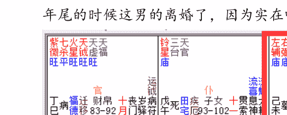

年尾的时候这男的离婚了，因为实在吵得很厉害，我们来研究格局，

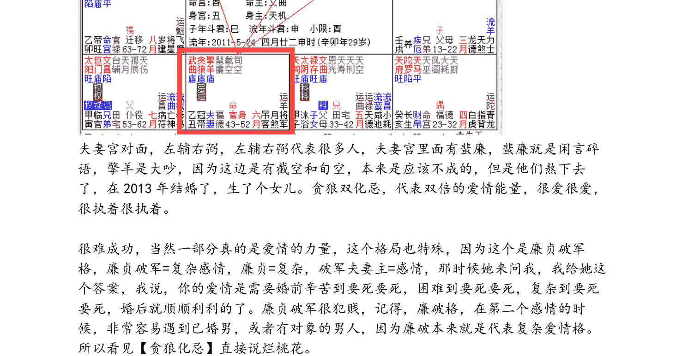

夫妻宫对面，左辅右弼，左辅右弼代表很多人，夫妻宫里面有蜚廉，蜚廉就是闲言碎语，擎羊是大吵，因为这边是有截空和旬空，本来是应该不成的，但是他们熬下去了，在2013年结婚了，生了个女儿。贪狼双化忌，代表双倍的爱情能量，很爱很爱，很执着很执着。

很难成功，当然一部分真的是爱情的力量，这个格局也特殊，因为这个是廉贞破军格，廉贞破军=复杂感情，廉贞=复杂，破军夫妻主=感情，那时候她来问我，我给她这个答案，我说，你的爱情是需要婚前辛苦到要死要死，困难到要死要死，复杂到要死要死，婚后就顺顺利利的了。廉贞破军很犯贱，记得，廉破格，在第二个感情的时候，非常容易遇到已婚男，或者有对象的男人，因为廉破本来就是代表复杂爱情格。所以看见【贪狼化忌】直接说烂桃花。

| 己长己生财 | 庚禄庚相存 | 壬梁壬羊 | 七文七杀 |
|------------|------------|----------|----------|
| 己巳 己酉  | 庚辰 庚申  | 壬午 壬子 | 七杀 七破 |
| 庚午 庚戌  | 辛巳 辛亥  | 癸未 癸丑 | 文曲 文曲 |
| ...        | ...        | ...      | ...      |

这个人是年年搬家，这个看基本盘就可以了，观察格局，为什么这种格局容易年年搬家？破军在田宅宫，就是加大了田宅宫的破耗力，所以可以简称为，家破，家里变动大。另外，这个组合也很重要，太阴是田宅星，左辅是很多，所以变成为了很多田宅，住的房子，缘分都很短。加上地劫，地劫是【缘短星】，福德宫有天马，太阳也是驿马星，太阳天马，加上右弼，去很多地方。

| 己长己生财 | 庚禄庚相存 | 壬梁壬羊 | 七文七杀 |
|------------|------------|----------|----------|
| 己巳 己酉  | 庚辰 庚申  | 壬午 壬子 | 七杀 七破 |
| 庚午 庚戌  | 辛巳 辛亥  | 癸未 癸丑 | 文曲 文曲 |
| ...        | ...        | ...      | ...      |

十二宫，时钟一定会转到的宫位，福德宫是代表本来就喜欢这样到处走的，喜欢天机，化禄天机去官禄，所以工作是跑动很多的，她的工作很特别，她一心想要移民去香港，现在算是HK代购的工作，有点像走私，不太合法的工作，看财帛宫，巨门是暗星，赚暗钱，有陀罗，需要跑来跑去。财帛宫也是身宫，身宫就是后天的命宫，起三方四正来看，这种驿马星，撞了好多个，

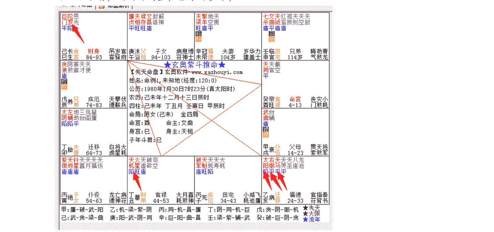

太阳也是驿马星，陀罗也是转动，天机也是转动，天马也是跑动，加上右弼就是去很多地方，因为她做代购，所以不可能去一家就搞定，越多顾客她就需要跑越多的广场。

- 1) 本命宫的三方四正，看什么类型的同气星星撞得最多。比如她的财帛宫是撞到很多个驿马星，活动星星。
- 2) 一般我会取财帛宫的四化，飞进和飞出。因为要观察是什么进财，也看是不是有投资意象，什么是投资意象？这人总是丢钱去官禄宫，那么就容易投资，不管是化什么过去，化禄是给到很高兴，化忌是给到很辛苦，化只是态度而已。

我一般这样看，如果三方四正，遇到【天同、巨门、天机】我就断做销售的，因为第一，天同是轻松，去找朋友喝茶聊天。巨门是用嘴巴去销售，也陪朋友喝酒。天机需要跑来跑去。所以这个盘她也是属于销售命。

对别人不懂的人，会认为她的生活，就是天天去香港疯狂购物，逛街，玩乐，购物，但是她需要跑来跑去，赚的又是巨门口，口中生财，暗财，销售财。

一般看见，机月同梁格，都聚集在三方四正，那么多数是办公室的人。

杀破狼，特别是四马地的杀破狼，也容易是销售人，创业的。

天府就容易创业。

| 禄存恩光天机 | 天马三台 | 紫微贪狼 | 天天八凤 |
|--------------|----------|----------|----------|
| 庙           | 庙庙     | 庙       | 陷庙     |
| 夫妻53-62月官禄官 | 兄弟43-52月 | 父母33-42月 | 兄弟23-32月 |
| 太陀天截天 | 天破贪狼 | 天姚八凤 | ...（省略） |
| ...（其他行） |
| 【30岁流年命盘】玄奥软件-www.xazhouyi.com |
| 姓名:橘橘子,未知地(经度:120.0) |
| 公历:1986年9月23日22时35分(真太阳时) |
| 农历:丙寅年八月二十日亥时 |
| 四柱:丙寅年 丁酉月 庚午日 丁亥时 |
| 命局:阳女(丙寅) 木三局 |
| 命宫:戌 命主:禄存 |
| 身宫:申 身主:天梁 |
| 子年斗君:辰 流年斗君:亥 小限:亥 |
| 流年:2015-9-23 八月十一亥时(乙未年30岁) |

太陀天截天
阳罗哭空刑
庙庙平

壬子财 迁移 六天梁官
辰 女帛63-72月德殷府

为什么@橘橘子会搬家？而且是刚刚搬了又搬，第一，她今年的流年田宅宫是太阴地劫，叫田宅缘分短格。今年是乙未年，乙化忌太阴，她因为流年命也化忌太阴，所以她的太阴就变成了双化忌，这双化忌冲到了太阳的宫位，就是在当下的月份，今天是六月初七，所以她这一搬，又要再搬。而且流月的田宅宫，就把箭头指向六月，

如果要看六月，就把箭头移动到要的那个月份，然后自己模拟一下新的十二宫。这个六月，@橘橘子的流月田宅宫本来就坐破军了，肯定就不利，破耗星。田宅宫坐破军，忌冲了流月命，这宫位还化忌去了太阴，就变成了这个公式【流月田宅-----忌冲-----流月命，忌冲无缘】，忌冲就是无缘，所以她还需要再搬。

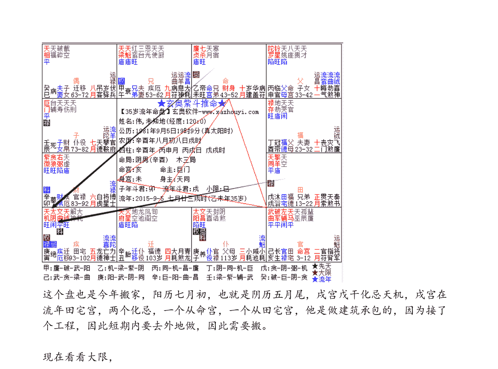

这个盘也是今年搬家，阳历七月初，也就是阴历五月尾，戌宫戌干化忌天机，戌宫在流年田宅宫，两个化忌，一个从命宫，一个从田宅宫，他是做建筑承包的，因为接了个工程，因此短期内要去外地做，因此需要搬。

### 现在看看大限，

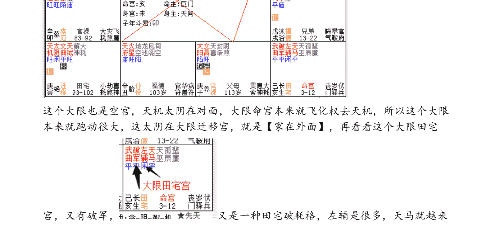

这个大限也是空宫，天机太阴在对面，大限命宫本来就飞化权去天机，所以这个大限本来就跑动很大，这太阴在大限迁移宫，就是【家在外面】，再看看这个大限田宅宫，又有破军， 又是一种田宅破耗格，左辅是很多，天马就越来越远，代表范围大，因为有武曲，要注意，有武曲就代表和正财有关系，代表他的变动是和工作有关系的，武曲还自化禄了，更加贴近了这个为了工作而搬家的意象。已干化忌去文曲，

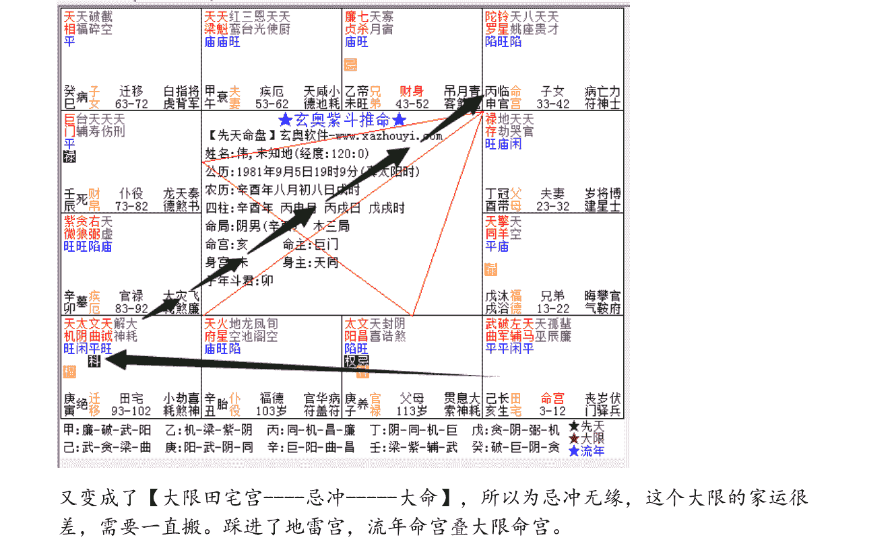

又变成了【大限田宅宫-----忌冲-----大命】，所以为忌冲无缘，这个大限的家运很差，需要一直搬。踩进了地雷宫，流年命宫叠大限命宫。

不过有这种命格，是容易一直搬家的，这个命盘，再顺便多讨论一个格局，因为这个命主，离婚两次，第三次，自己的女友是别人的女人，也就是当下，所以这夫妻宫肯定有现象，

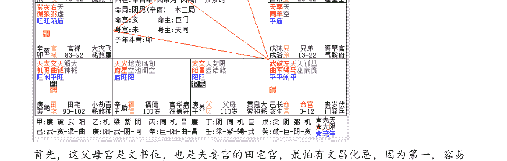

首先，这父母宫是文书位，也是夫妻宫的田宅宫，最怕有文昌化忌，因为第一，容易有文书问题。第二，容易离婚，这就有个现成的意象。

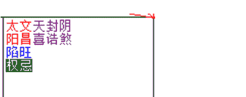

你会发现，我不一定会只看夫妻宫，我还会观察文书位，特别是断离婚格的时候。这个夫妻宫是空的，有个禄存和地劫，这个印象应该很深刻，因为禄存怕煞，这就是为什么禄存需要保镖，但是这禄存和地劫直接交朋友了，这禄存破了，

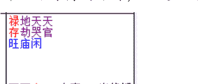

女人为他花钱，虽然他工作听起来很体面，但实际上他欠很多钱。他文书位也有问题，禄存又破了，再找他的天府，

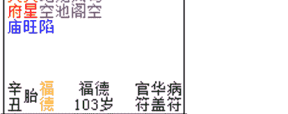

天府和火星地空一起，这里面基本上也没钱，有龙池凤阁，就像是雕刻得很华丽的盒子，龙池凤阁是华丽，但是打开里面是空的。再看他的存款位，兄弟宫，

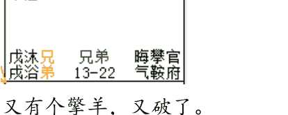

又有个擎羊，又破了。

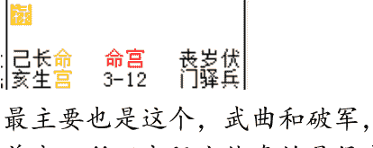

最主要也是这个，武曲和破军，本来也是破财格，破军对面有个破碎，擎羊是在他兄弟宫，所以实际上他真的是很穷，所以他的女友基本上都跑了，养他养到受不了。

所以格局很重要，星星的组合很重要，这样的格局，但是飞星几乎是没有冲到太凶，却已经离婚了两次。夫妻宫丁化忌巨门，去奴仆宫，代表会和朋友暧昧或者见不得光的关系，他当下的女友也是别人的女人。而且他夫妻宫是空宫，所以抓这种看巨门就对了，对面的贪狼加上右弼，所以桃花也多。其实这种最好的建议是不要结婚，但是男人，这子女宫有天姚，他是有这种需求，所以顺其自然，就是我给的建议，这夫妻宫的格局太差了。

他的天府遇到了龙池凤阁，外表华丽。迁移宫有天相，外表憨厚好看。官禄宫有紫微贪狼，命化权去贪狼，高大上的感觉。所以这人表面是很好看的，但是你要和他在一起，你需要养他，因为他是没钱的。学命盘有时候就是看故事，一个命盘一个故事。

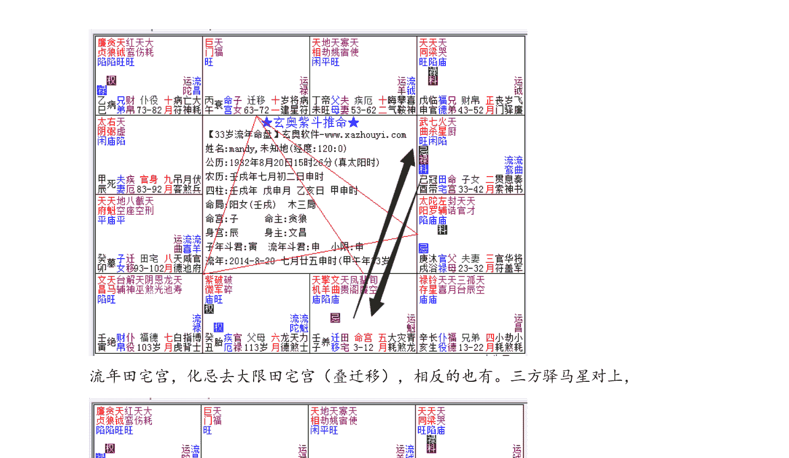

流年田宅宫，化忌去大限田宅宫（叠迁移），相反的也有。三方驿马星对上，

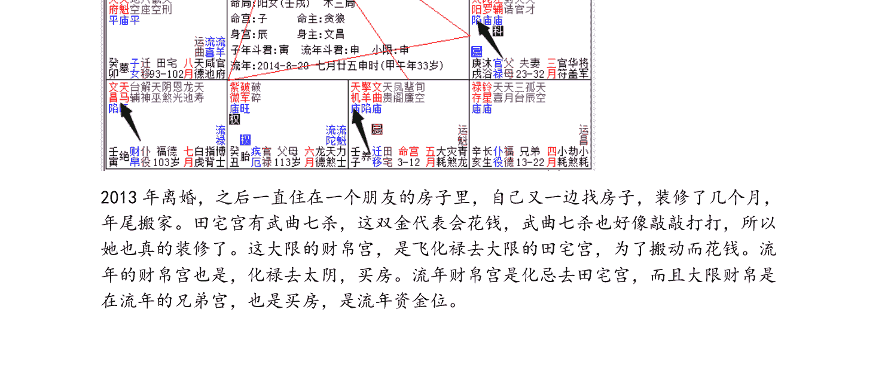

2013年离婚，之后一直住在一个朋友的房子里，自己又一边找房子，装修了几个月，年尾搬家。田宅宫有武曲七杀，这双金代表会花钱，武曲七杀也好像敲敲打打，所以她也真的装修了。这大限的财帛宫，是飞化禄去大限的田宅宫，为了搬动而花钱。流年的财帛宫也是，化禄去太阴，买房。流年财帛宫是化忌去田宅宫，而且大限财帛是在流年的兄弟宫，也是买房，是流年资金位。

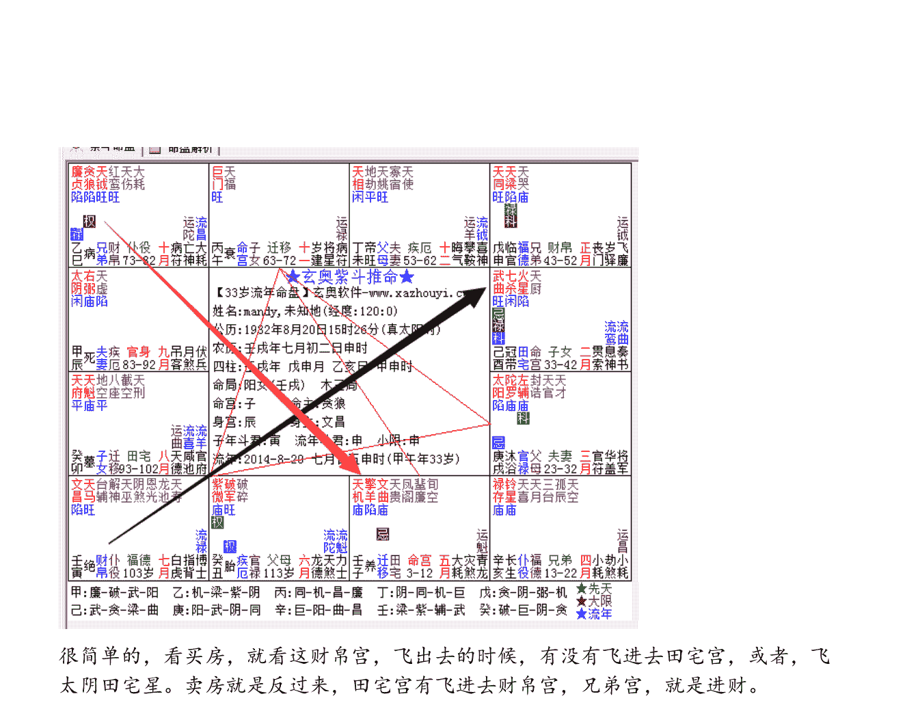

很简单的，看买房，就看这财帛宫，飞出去的时候，有没有飞进去田宅宫，或者，飞太阴田宅星。卖房就是反过来，田宅宫有飞进去财帛宫，兄弟宫，就是进财。

出钱，就是从财帛宫飞出去。进钱，就是看什么宫位，飞进去财帛宫（化忌除外）。和流年断法是一样的。

# 【第十四周】

## 07.27

首先要先谈谈比较混乱的四化，当我们开排盘系统的时候，有时候你们会看见绿色的，黄色的，褐色和蓝色，四化有分成几种，流年盘常用的，

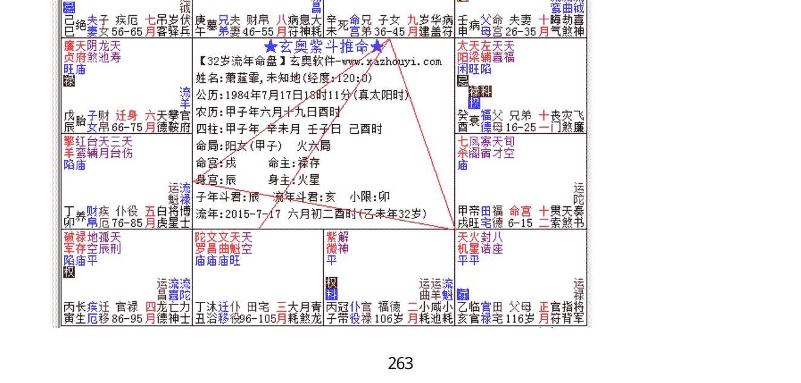

如果是本命盘，排出来只会看见绿色的，那是叫生年四化，就是我们出生年份的天干，比如我是甲子年，甲是我的生年天干，所以我的盘，绿色的有廉贞破军武曲太阳。这个软件的好处是，当你点击某个宫位的时候，会出现黄色的，黄色的是叫【宫干】，也就是只是从那个宫位飞出来而已，这样你移动你的箭头时，你如果还无法背下四化，这个黄色的只是自动标记宫干。

我们还有大限四化，一般上你看见流年，褐色的，就是大限四化，

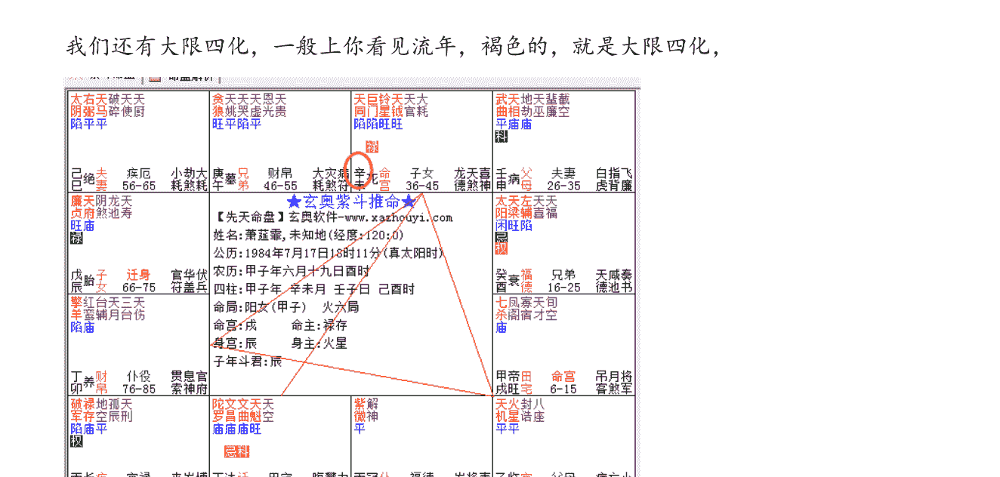

大限四化是从【大限命宫】飞出来的，因为你要看的是自己的事，所以是从大限命飞。如果说，你要看那个大限十年里，你配偶的事，那么就需要再从【大限夫妻】自己飞出来，系统没有帮你把大限夫妻宫的四化飞出来。那么，你也许会问，这大限十二宫，飞出来的四化都有什么特别用意？第一层时钟是【本命盘】，大限在本命里面转，然后主题会移动，所以格局发挥也跟着移动。我比喻，毛泽东的【拆马忌】是在命宫，主分离事件，那么在命宫就会发挥在十二宫，(所以，命宫四化最重要，大限命宫四化最重要)，第二大限，拆马忌在父母宫，第三大限，拆马忌在福德宫，第四大限，拆马忌在田宅宫，第五大限，拆马忌在官禄宫，代表当你转动大限的时候，你的一些格局，会移动主题。

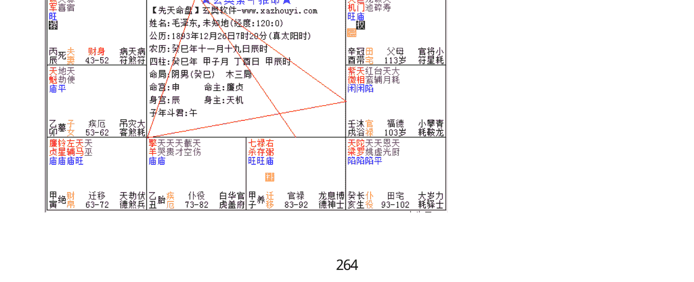

所以本命盘的凶格，要摆在你们解析盘的第一位，练习验证的时候，找出特殊宫位，再观察这个特殊宫位会因为大限移动，而产生怎样的主题变化。我们复习一个案例，蒋介石的盘。

（此处为一张紫微斗数命盘图表，包含多宫位、星曜分布、生辰信息及四化标注。具体文字信息包括：
【先天命盘】玄奥软件 www.xiazhouyi.com
姓名：蒋介石，未知地（经度：120:0）
公历：1887年10月31日12时43分(真太阳时)
农历：丁亥年九月十五日午时
四柱：丁亥 庚戌月 己巳日 庚午时
命局：阴男(丁亥) 火六局
命宫：辰 命主：廉贞
身宫：辰 身主：天机
子年斗君：戌
及各宫位（如父母、福德、田宅、官禄、仆役、迁移、疾厄、财帛、子女、夫妻、兄弟、命身）星曜配置与限运数字。）

第二太限，拆马忌在父母宫，第三大限，拆马忌在大限福德宫，第四大限，拆马忌在大限田宅宫，第五大限，拆马忌在大限官禄宫。

第二太限，拆马忌在大限父母宫，第一个步骤，先找出这个盘最特殊的宫位，

（此处为另一张紫微斗数命盘图表，与上一图表类似，但可能为不同大限或标注重点。包含相同的生辰与命盘基础信息，以及各宫位星曜分布。）

> @水灵儿 说最特殊的是福德宫，我们先根据这个宫位定象义，

（此处为福德宫部分的小截图，显示该宫位内的星曜：巨门（禄、存）、丙干、天机、天梁、化权等。）

本福德宫，坐生年忌，肯定劳心，容易烦恼。巨门疑惑，巨门化忌容易有纠纷，有毁名誉之事，有莫名其妙的罪证。禄存是保守，

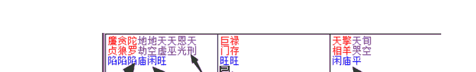

这旁边的宫位，羊驼夹忌。父母宫，地空地劫也在一边。天哭天虚也夹命，这个宫位很糟糕。那么什么时候会变得更加糟糕？或者说如何去判断更加恶化？一般上，一个忌，就是被人用石头丢一下那么痛，然后记仇，反正就是烦躁。那么我们就要需要几个方面去增加这个宫位的凶，第一，丁干，既然是巨门忌，肯定是从丁干出来的。丁在他的田宅宫，这边我们看成是一国之君的田宅，看成是国家，因为他的命格影响很大，那么从田宅宫忌去福德宫，肯定这就是原因，从这个地方会生烦恼。还有就是，当大限转进丁干的时候，你们一定会发现，这丁干的宫位，写96-105，你会想，不可能会活到那么老吧，那么是不是永远转不到呢？答案是错，肯定会转到。我先标记，这个福德宫是苍蝇，田宅宫是苍蝇拍，现在我们转第二个大限看看，

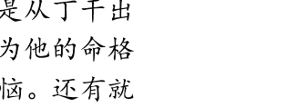

你会发现，苍蝇和苍蝇拍还在，只是宫位主题移动了而已，移动去了第二大限，这个田宅宫变成了官禄，这个福德宫变成了田宅，代表，【大官是苍蝇拍】【大田是苍蝇】，啪！拍到了，拍两次，为什么？因为第一个是【生年化忌】，另一个是【大限官禄飞忌】，所以啪了两次。那个时候他都二十几岁了，正常逻辑也是开始事业了，那么就代表这个工作之事，会危害到他的大限田宅。然后你也许会问，这本命盘的【福德宫】还需要不需要用？肯定需要，这就叫【叠宫】。现在你看，我这样写，【大限官禄宫】————啪！-----本福德 = 我工作让我烦恼，【本田宅宫】————啪！-----大限田宅宫，这个叫【同类相忌】，代表这大限和本命的田宅都比较化忌，自然就有状况。

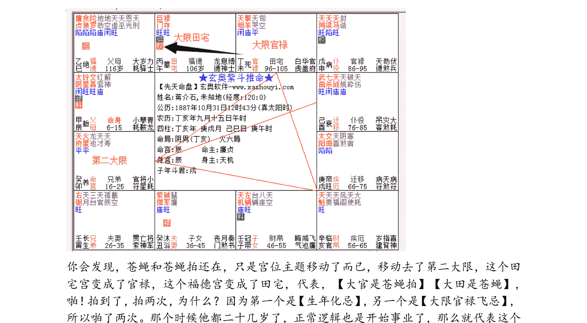

一样的，我们用国家来说，那时候他二十几岁，刚刚像个英雄搞革命。田宅————啪-----田宅，代表这家不行，这家要换，换领导也好，换政治体系也好，也是代表这时候的他，来到了一个【换家】的过程，而且还跟他的事业烦恼有关系。

接着第三大限，

**命盘图表**
包含星曜、宫位、干支、大限等信息，如：
- 宫位：父母（116岁）、福德（106岁）、田宅（96-105）等。
- 星曜：紫微、天府、太阳、太阴等，分布在不同宫位，并标注旺平庙陷。
- 关键信息：姓名（蒋介石）、出生公历（1887年10月31日12时43分）、农历、四柱、命局、命宫、身宫等。
- 有红色箭头指向“大限官禄”和“大限奴仆”。

时钟开始移动，这时候，苍蝇和苍蝇拍一样还在，但是主题变化了，这次是【大限奴仆】
——啪！——【大限官禄】，没错的话那时候是革命的高峰期，搞革命是要砍头的，
这有可能是有不得认同的情况出现。

**命盘图表（续）**
与上图类似，展示了另一大限时期的星曜分布和宫位变化。
- 新增了红色箭头指向“大限奴仆”和“大限官禄”。
- 底部增加了天干组合说明：
甲:廉-破-武-阳
乙:机-梁-紫-阴
丙:同-机-昌-廉
丁:阴-同-机-巨
戊:贪-阴-弼-机
己:武-贪-梁-曲
庚:阳-武-阴-同
辛:巨-阳-曲-昌
壬:梁-紫-辅-武
癸:破-巨-阴-贪
★先天
★大限
★流年

现在快速的看第四大限，【迁移宫】——啪！——【奴仆宫】，被打的是【他宫】，这下
好了，他成王了，轮到他去打人，就是这个时候，才导致后来别人讨厌他。本来的命盘
还有关系吗？有，比如【本田宅】——啪——【大限奴仆】，他高呼，我代表国家惩罚你（田宅是国家）。

这个是【大限疾厄宫+本命田宅宫】——啪——【大限迁移宫】——冲命宫，别忘了，忌入迁移宫就冲命宫，有大事了，前一个大限“啪”得人家太爽了，这下，田宅宫【忌冲】大限命宫，疾厄宫也是工作地点，国家自然是他的家，国家自然是他的工作地点。忌冲大限命宫，你的家园不要你了，忌冲无缘，开始和家园无缘了，刚好坐天机，有迁动事件，巨门化忌，现在在大限迁移宫，【忌坐迁移，屁股黏在外面】，他这下就黏去了台湾了。

一个生年忌就可以把他的故事全译出故事发展，所以，这个例子是要给你们知道，所谓的凶格，或者忌冲的凶宫，你的地雷宫，是会跟着大限移动。

看看第六大限，大限财帛宫+本命田宅宫——啪！——大限疾厄宫+本命福德宫，忌冲大限父母宫，父母宫是文书位，也是光明线，没有了光明线，别人骂。那么，本命田宅宫——啪——大限疾厄宫（工作地点），也算有状况，也损失了金钱。为什么我取生年忌，因为生年忌随便加上一个就变成了双忌。还有什么会凶化这个？还有流年忌。

| 项目 | 内容 |
|------|------|
| 姓名 | 蒋介石，未知地（经度：120.0） |
| 公历 | 1887年10月31日12时43分（真太阳时） |
| 农历 | 丁亥年九月十五日午时 |
| 四柱 | 丁亥年 庚戌月 己巳日 庚午时 |
| 命局 | 阴男（丁亥）火六局 |
| 命宫 | 辰 命主：廉贞 |
| 身宫 | 辰 身主：天机 |
| 子年斗君 | 戌 流年斗君：子 小限：辰 |
| 流年 | 1902-10-31 九月三十午时（壬寅年16岁） |
| 宫位示例 | 命宫：天机天梁（庙旺），夫妻宫：天同天巨（庙旺）等（完整命盘包含12宫位，每个宫位有星曜和四化标注） |

蓝色的四化，是叫【流年忌】。流年有两种个四化，第一种，是【流年太岁四化】，比如今年是【乙未年】，命盘出现的是乙的四化。明年是【丙申年】命盘出现的蓝色，是丙的四化。这种四化，是全世界每个人都一样的，所以呢，【流年太岁四化】是可以用来预测世界趋势，比如今年是【机梁紫阴】，不分次序（记得！），可以说，今年市场的进入了转动的漩涡中，比如股市，或者很多小商家出现，天机是众生，小小多多。天梁是负责管理这群天机的，天梁化权——管理天机——管理散户，会出现老大事件，比如，亚投行。紫微化科，是高级虚荣，贵人，高级消费品，奢侈品，今年的市场自然就多数人变得比较虚荣。那么你问我，今年最好卖什么？卖虚荣品，或者你投资了亚投行，会很有虚荣感，今年就是这虚荣感害人。太阴化忌，很多高楼停了，然后投资各方面都出现问题了，世界股票崩了。太阴是富，是投资、存款或者股票，刚开始的不会买股票的，听到亚投行，股票的话题一度的高炒，然后那个香港的连续剧，《大时代》又重播，搞得不会股票的也来虚荣虚荣一下，既然是虚弱，当然不稳定，就发生了这种情况。

明年也可以预测，明年就用丙干。有时候不起盘，朋友坐在一起聊天的时候，问我今年要注意什么，我就会取流年四化来跟去年的事，结合一起预测。因为我平时看盘多，所以当我看到一个程度的时候，今年很多盘是经济亏损的，那么市场自然有问题。今年很多盘是赚大钱的，那么今年市场很好。我就是靠这种去做大市场预测，因为每个人都一样，每个人有这种情绪。

还有一种四化，是【流年命宫四化】，是叫【宫四化】。就是从流年命宫，再起四化，那么这就人人都不一样了。

通常我是看叠多少个，一个忌，两个忌，或者全集，科忌，这样去决定哪个力度，所以这就是为什么我一抓，先抓流年出现最多四化的宫位。流年命宫的宫干四化，自然人人飞不一样的，这一层是代表，【我的行为选择，我的态度选择】。

Ps：忌本身是很难解，就是不管怎么样都一定有过程，自化忌可以解忌，也有负负得正的说法。科忌，不是彻底的解开，不是代表不发生，是代表这个过程被软化一些，导致了容易痛一下，打止痛药，然后又痛了，又打止痛药。我个人觉得，化科是不能彻底的解忌，真正解忌的是那个时间，因为过去了，也忘了痛。

问：宫内双星，巨门忌 +天机，天机化忌就能解忌，还是必须巨门叠忌才算解忌。
答：一定要模拟力度。比如巨门忌+天机化忌，有可能那个大限一个化忌，本命一个化忌，这样的我不会说解忌，这个看成，就是巨门化忌，门紧了，天机化忌是引擎转得咔咔响。

巨门化忌+自化忌可解，不过你要明白那个解开的定义。巨门化忌是对研究执着，一般的执着是不够的，自化忌继续去探讨，继续去犯错，最后，南墙撞开了，这个发明家成功了。不过如果你在这个发明家第二个就说，你的巨门可以解忌，你今年就不痛苦了，那就错了，因为这需要时间。所以我常说，过程是一定有的，不会没有发生。我之前遇到一个福德宫，廉贞化忌+自化忌，就是学了紫微之后就疑惑，生烦恼，天天怕碰到鬼，一般人就是疼了就怕，她非要去找原因，各种找着看，最后找我看，她这种过程，是迟早有一天，发现真相就不怕了，就解开了，就是化忌+自化忌，是需要时间，而且很长。那个廉贞化忌+自化忌的，她用了八年的时间，加上天寿，更久。

力度模拟是，一个忌就给一只蜜蜂叮一样，所以我很少谈单化忌，我通常都抓多个化忌。两个化忌，就等于你看见了五只蜜蜂来，你一眼就发现到了（打草惊蛇），所以，偶尔（是偶尔）可以避开，因为来得及发现。一只蜜蜂你发现不到，三化忌，四化忌，六化忌等等这种高级版的，就跟我拿蜜蜂窝往你砸过去一样，要逃都难。比如@印象 问巨门化忌+自化忌，比如你很怕看鬼片了，但还去鬼屋，这就是巨门化忌+自化忌的力度。

问：万一两颗星星都化忌，再加宫干自化忌呢，解哪个？
答：不能看成解，要看成过程。看成解，你就很头大，很复杂。好像我说科忌，我不是说，化科可以解开忌，我说化忌是痛了，化科是止痛药，还是会痛。这是一个过程，化科可以缓和这个化忌。

问：为什么科可以解开忌，禄不可以？
答：因为化科轻轻的，比如说，你很生气了，气到半死，你的配偶轻轻的跟你说好话，你就缓和了。你很生气，气到半死了，你的配偶好像没发生啥事一样的问你，走，我们去打球吧！你就想拍死他。

问：生忌遇飞禄和生禄遇飞忌哪一个更差？
答：不能看成是哪个凶，要看成是过程。比如化禄遇到化忌，就像你要去踢球，遇到下雨，之后自然不能去踢球了。你不能说凶不凶，你要明白，为什么忌多就一定是坏事，因为忌是烦恼的情绪，如果一大堆的忌在那边的话，那个烦恼的能量就很大，肯定那个宫位有事。你要看成是力度，效应，过程。

子女宫我们看成是合伙人，兄弟宫是资金，首先这个巨门化忌是资金缺钱，天同化权+自化权，巨门自化权，自化会泄出去，所以@印象 遇到有合伙事件，有人主动要给她钱的时候，她会自化权，她会说，我自己想办法。自化就是我自己处理。自化是各种态度的不同，比如说，@印象 如果是自化科，就会那种很虚的拒绝，比如人家说，你吃吧。@印象 说，我真不饿，很温柔的说。这个自化科也很难抵抗，因为比较软。如果自化忌，@印象 说，为啥你叫我吃我就要吃，我没有钱买吗！就会很强硬。自化权就是，老娘有钱！自己买！自化禄的话，会回答，我是很喜欢吃，我家买了很多很多，现在我吃太多了，真吃不下，你们吃饱，也比较友善。其实就是态度，你们要大量的去想象那个过程，所以自化就容易形成泄。

在流年自化就不是看成拒绝了，有发射台的关系时，我们才看成是拒绝。如果是比如，你今年流日命天同化忌+自化禄，这反而要看成原本不成功，后来成功了，变成一种形容过程的意象，一前一后。就是烦恼这个东西，你不要去启动化忌就没事，不要在伤心的时候去听情歌，这样会越来越化忌。所以倒霉的人一定是接二连三的，就是因为会导致转忌，所以我说不要去启动化忌。

大多数的人，和命盘比较起来，根本一点都不了解自己。所以在断个性的时候遇到反驳也不要失去信心。

【流年宫四化】还可以细分吗？可以，并且还可以串叠宫。我不要说串大限本命，因为一串就是串叠宫，要这样理解，这是首要的。流年太岁四化要看，代表市场趋势影响你，世界趋势影响你，看那种生意人的盘就变成特别重要，看普通人的盘就当作消费意识。

子女宫，我们暂时看成是她的孩子，还有田宅宫的外面，代表她的精神想孩子，想可以跟孩子出去住。流年福德宫【化禄】是我今年希望的，流年福德宫【化忌】是我今年恐惧的。像这种，你可以寻找那个宫位的意象，比如这边是兄弟宫，大概是婆婆宫位，当然，我很了解她的情况，才会取兄弟宫为婆婆（夫妻的父母）。文昌化忌，就是文件的事，或者受到承认的事，或者地契，抓在她手里的东西，@人间 怕影响到她。所以她飞化忌去文昌，忌冲她的奴仆宫，这一层我一般会直接跳去三年后的事，就是田宅宫，2017的田宅宫，为什么我突然会跳去流年田宅宫？因为福德宫是三年后的你，

幸好宫位换了，是个搬家的迹象了，很明显。所以记得一个道理，你当下希望的是三年后会实现的，你当下恐惧的恶事三年后会实现，所以，别启动化忌，会启动到你直接的第三年去。不去想，无视就对了。刚刚说的是，看今年的希望，就要从流年福德宫看，然后串那个宫位的主题叠宫，有时候你会觉得好像没关系，这三个叠宫貌似没有关系，别担心，如果想不起来活宫可以怎样用，就取一个宫位或者两个宫位，不一定要取三个叠宫。

不要以为紫微盘一定非发生不可，你不去启动，都不会发生。如果启动了，就会跟着命盘转下去。

现在谈谈流月，流月的盘，会再生多一层十二宫。流月也有两个四化，第一个四化是最常用的，就是取万年历，比如现在是六月（农历）以万年历的为最大，只看月干，地支不要取，地支要用回去自己六月的命宫。

| 星期一 | 星期二 | 星期三 | 星期四 | 星期五 | 星期六 | 星期日 |
|--------|--------|--------|--------|--------|--------|--------|
|        | 1 五月十六 | 2 五月十七 | 3 五月十八 | 4 五月十九 | 5 五月二十 |        |
| 6 五月廿一 | 7 小暑 五月廿二 | 8 五月廿三 | 9 五月廿四 | 10 五月廿五 | 11 五月廿六 | 12 五月廿七 |
| 13 五月廿八 | 14 五月廿九 | 15 五月三十 | 16 六月初一 | 17 六月初二 | 18 六月初三 | 19 六月初四 |
| 20 六月初五 | 21 六月初六 | 22 六月初七 | 23 大暑 六月初八 | 24 六月初九 | 25 六月初十 | 26 六月十一 |
| 27 六月十二 | 28 六月十三 | 29 六月十四 | 30 六月十五 | 31 六月十六 |        |        |

其实有几种方法看流年的，不过我教你们简易方式，不会混乱。这个月是癸月，假如@人间 有买股票，

她六月的这样的宫位能量单单是加大了破军，就花钱多了，而且这样的组合，会导致到她的事业也有变动情况，或者突破情况。这样的格局叠在流年的官禄宫，如果是根据万年历的月干（人人一样），那么这个影响是源于【市场影响】。影响不大，因为她没买股票，如果买股票，输了很多钱，就有可能会影响到她的工作了。有人也许会奇怪，没有启动就不发生吗？命盘不是命中注定吗？那么如何解释家庭主妇的盘，退休老人的盘？他们平时没干啥事，没干活，不赚钱，不炒股票的话，实际上是没有造成太大影响。那个老公公，突然今天有个突破的行为，陪着老婆婆去广场跳舞，为什么会这样？因为世界，宇宙是处于一种氛围里，会无声无息地影响你。

同样的，要用六月宫干也可以，那就是你自己想做的选择。记得——万年历的天干，是大家都一样，是代表环境影响，社会影响，大市场影响，所以我们一般看流月，会喜欢以万年历的天干为重，因为人类是环境动物，环境影响、大市场影响是摆在第一位的，从宇宙的角度来说，日历自然是代表天体，既然是当下转到的天体，肯定是会影响当下的磁场，所以一般是把万年历的摆在第一位。不过如果今天我看一个退休老太太，天天看电视的盘，我就不会取万年历的天干，我就取她的宫干，因为大世界对她的影响不大。

流日，流日根据传统的方式，就是从流月的宫位开始初一，顺时钟去数，数到今天的日子（农历），就是流日宫。流日就很复杂了，已经是六代，六层的含义，我教你们一个快速方法，一共有六个化忌了，本命，大限，流年，流月，流时，假设你用到流时去，要找最凶的宫位，就把这六个全取化忌出来，一共有六个化忌，然后你就用你的本命盘，把这六个化忌都标记出来。

这是一个紫微斗数命盘（先天命盘）的表格截图。

**核心信息：**
- 姓名：人间，未知地（经度：120:0）
- 公历：1983年9月20日8时57分（真太阳时）
- 农历：癸亥年八月十四日辰时
- 四柱：癸亥年 辛酉月 辛亥日 壬辰时
- 命局：阴女(癸亥) 土五局
- 命宫：巳 命主：武曲
- 身宫：丑 身主：天机
- 子年斗君：酉

**十二宫位分布（按顺时针排列）：**
1.  **命宫 (巳宫，5-14岁)：** 主星为“天相”，辅星有“天钺”、“天福”。
2.  **父母宫 (午宫，15-24岁)：** 主星为“天梁”，辅星有“文昌”、“封诰”、“天官”。
3.  **福德宫 (未宫，25-34岁)：** 主星为“廉贞”、“七杀”，辅星有“地空”、“天哭”、“天月”。
4.  **田宅宫 (申宫，35-44岁)：** 主星为“文曲”，辅星有“天姚”、“天贵”。
5.  **官禄宫 (酉宫，45-54岁)：** 主星为“天同”，辅星有“天台”、“天寡”、“天伤”。
6.  **仆役宫 (戌宫，55-64岁)：** 主星为“武曲”、“破军”，辅星有“陀罗”、“左辅”、“天马”、“天巫”、“天厨”、“天刑”、“天耗”。
7.  **迁移宫 (亥宫，65-74岁)：** 主星为“太阴”，辅星有“禄存”、“阴煞”、“三台”、“天使”、“天空”。
8.  **疾厄宫 (子宫，75-84岁)：** 主星为“贪狼”，辅星有“晦气”、“咸池”、“博士”。
9.  **财帛宫 (丑宫，85-94岁)：** 主星为“天府”，辅星有“擎羊”、“火星”、“截路”、“空亡”。
10. **子女宫 (寅宫，95-104岁)：** 主星为“天机”，辅星有“铃星”、“解神”、“八座”、“孤辰”。
11. **夫妻宫 (卯宫，105岁)：** 主星为“紫微”、“贪狼”，辅星有“右弼”、“天魁”、“地劫”、“龙池”。
12. **兄弟宫 (辰宫，115岁)：** 主星为“巨门”，辅星有“红鸾”、“天刑”。

**底部星曜亮度与流派信息：**
甲：廉-破-武-阳  乙：机-梁-紫-阴  丙：同-机-昌-廉  丁：阴-同-机-巨  戊：贪-阴-弼-机
己：武-贪-梁-曲  庚：阳-武-阴-同  辛：巨-阳-曲-昌  壬：梁-紫-辅-武  癸：破-巨-阴-贪
★先天 ★大限 ★流年

标记出来，会得到六个化忌，就是说你已经知道化忌的分布了，然后就要算哪个宫位逢最多化忌，包括夹宫。比如这个，如果是卯，就是四个化忌（三方四正有遇到四个忌），如果是申，就一个化忌，最凶的就是化忌布局最多的宫位，这是紫云技法。你原本也有流日盘，那个六代最多忌的宫位呢，就是你那天最凶的时辰，最多状况的宫位。有些很凶的盘，会遇到六代忌，那个流时盘，遇到了六个化忌，就代表那个小时很凶。一样的要找好事，就找六代化禄，根据格局，夹宫的方式。如果流时遇到很多个化禄，就是那个小时运气很好，心情很好。这是最快的方式去定一天里面的最吉，最凶。

## 07.29

问：紫微斗数星星宫位，四化飞星，哪个重要？
答：我从前是这样形容，就是宫位是框架，就像人的骨头一样，星星是肉，是器官，固定在那个位置。飞星是血液循环，没了哪个人都不能活，所以一般根据传统的论法，三方四正、夹宫、格局排第一位，单宫象义排第二位，所以小星星要很强，星星含义要很强。飞星，就是建立在这个基础上的，飞星是负责引动，就是看这个坏格局会不会被苍蝇拍“啪”到，或者会不会射爆一个地雷，如果你星星不强，你的苍蝇拍就是拍空气。

其二，要针对性你要找什么迹象，比如一个人拿一张盘给你看财运，

第一个一定是先看财帛宫是什么星星，对面是什么星星。然后把箭头放在财帛宫上，观察三方四正有多少吉星凶星。

你可以和我一样，把三方四正的吉星用红色标记出来，接着就是看吉星多，还是煞星多。要不要参考夹宫？需要。比如说，文昌文曲夹财帛宫，这也需要标记出来。接着，我们才看四化。然后你会发现一个问题，有些财帛宫是空的，比如这个没有化禄进来，只有化科和化忌进来而已，或者空宫，我们就可以借对宫的双星过来。这个是天同巨门，可以借过去财帛宫，不过，借过去要扣三分，力量会扣分。是不是代表她没钱？没钱早饿死了，肯定有钱，问题是可以如何更加简易的看财运，或者更正确的观察财运波动呢？就是要思考时钟，每一年，每个月的时钟都要，比如说，我们看看她其中一个大限的财帛宫，

这是第五个大限，这个大限她会有钱，看大限财帛宫，四化就很重要，你可以摆在第一位，格局也一样要看，比如这个，我也会标记吉星和煞星，然后看看飞化，

只有一个煞星，擎羊，一个煞星 VS 四个吉星，有煞星也有好处的，好像少煞星，会协助你进步，像这种就刚刚好，擎羊坐官禄，工作会比较积极。然后你们看见吗，同类化禄，【本命财帛宫——化禄——大限财帛宫】，这就是进财，同类化忌，就是损财格。而且太阴主富，逢化禄，太阴坐亥是月朗天门格，所以，这个财帛宫也是大格，她自然会在第四大限很有钱。

什么叫同类？【财帛宫——财帛宫】【夫妻宫——夫妻宫】【官禄宫——官禄宫】，这样叫同类，一般串法是【本命串大限】【大限串流年】【流年串流月】【流月串流日】，比如说本命财帛宫你要看进财哪个大限，你就从你的本命财帛宫飞化禄去那个宫位，然后看看是哪个大限的财帛宫。

-请问，卯宫，是第几个大限的财帛宫？
-是第六个大限。

我们再看看哪个流年最赚钱，刚刚是从本命——飞——大限，现在一样的方法，就是看大限财帛宫，飞去哪个流年财帛宫，## 【先天命盘】
玄奥软件-www.xazhouyi.com

### 【56岁流年命盘】
玄奥软件-www.xazhouyi.com

2032年的财帛宫。流年财帛宫也化禄去流命，然后是大限奴仆宫，可以反过来，流年财帛宫化禄贪狼，是大限奴仆宫，贪狼是交际娱乐星，破军是破耗模式，所以，加起来的句子就是到时必须包养个小白脸，才能慰藉我老来发财的艰辛，钱太多了，太多了，要破耗金钱在娱乐上。

损财是一样的方法。看财比较特别，因为有忌冲凶宫。忌入财，主收藏。但是忌入财，冲对面的，是对面比较凶。

壬忌入武曲冲午，现在问，午是哪一年的大限财帛宫？（第八大限）这个大限财帛再忌冲哪个宫位的财帛？（丑的财帛宫）最坏的财帛宫，自然就是不要投资。

那么其他的呢，比如第三大限的财帛宫和第九大限的财帛宫，哪个比较严重？当然是第九那个，不过，第三个大限的财帛宫，如果@KL要问财运，也可以再看。

这是一个紫微斗数命盘表格。表格包含十二宫位（如命宫、父母宫、福德宫等）及其对应的天干地支、主星、辅星、宫位名称、年龄范围等信息。图中用红色矩形框和箭头重点标注了几个宫位，包括：

- 标注框1（位于表格中部）：指向“武曲、天府、左辅、文曲、天空”等星曜所在的宫位。
- 标注框2（位于表格左上部分）：框选了“紫微、天相、陀罗、解神”等星曜。
- 箭头：指示了星曜间的关联路径。

表格顶部有标题“★玄奥紫斗推命★”及【先天命盘】信息，包括姓名、出生日期、命局等。

这是另一个紫微斗数命盘表格，与上一个表格内容基本一致，但红色标注的重点不同。

- 标注框1（位于表格中部）：同样指向“武曲、天府、左辅、文曲、天空”等星曜所在的宫位。
- 标注框2（位于表格左上部分）：同样框选了“紫微、天相、陀罗、解神”等星曜。
- 箭头：指示了不同的星曜关联路径，更清晰地展示了从“紫微”等星曜指向“武曲”等星曜的路径。

表格结构与上一表格相同，包含完整的宫位、星曜和年龄信息。

当我们看见大限财帛宫有飞化禄去大限官禄宫，是代表有创业之事，为事业花钱的意象，投资工作。从这个申宫，再找财帛宫，发现有飞化禄去流年田宅宫，田宅宫就是入库，代表这钱不是买房子就是存起来，所以@k1 明年有投资创业之事，而且会赚钱。

大田在未宫，根据时钟转的逻辑，@k1 的破财之象是在之前，然后我们倒退，未是他卯年的官禄宫，所以他 2011 年应该也会很辛苦。这个是大限财帛宫，忌冲官禄，也是反弓忌。因为也是 2019 年的财帛宫，所以到时候乖乖打工就好。

一般看第几个大限，我会取红鸾天喜，就看红鸾天喜在那个大限有关系。这个一眼就看见了，在第二个大限的夫妻宫有红鸾。

红鸾天喜不一定是在官夫线，就是在关键宫，关键宫位，比如说我不可能说她115岁结婚，如果根据大限的逻辑，这个红鸾可是在115的大限，所以要看进哪个关键宫位。比如说大限命有红鸾，大限夫妻宫有红鸾，都可以看成那个大限会出现缘分。天喜红鸾肯定是对线，所以遇到天喜红鸾是六分之一的机会。

一般怎么看哪个流年会遇到缘分，有好几个办法，要灵活使用。

| 天相天虚 平旺旺 | 天文封恩天 梁昌诸光官 庙庙 | 贞杀空哭月 庙旺平平 | 文天 曲姚贵 平陷 |
| --- | --- | --- | --- |
| 丁绝兄 命宫 太岁奏戊 15-24 | 丑胎命 父母 龙德飞己 25-34 | 庚长福 田宅 白华喜庚 35-44 | 天劫病 德煞符 |
| 巨红天天 门鸾才刑 平庙 | ★玄奥紫斗推命★ 【先天命盘】玄奥软件www.xazhouyi.com | 破碎 | 天劫病 德煞符 |
| 极 | 姓名:大问，未知地(经纬:120:0) 公历:1983年9月20日8时57分(真太阳时) 农历:癸亥年八月十四日辰时 四柱:癸亥年 辛酉月 辛亥日 壬辰时 命局:阴女(癸亥) 土五局 命宫:巳 命主:武曲 身宫:丑 身主:天机 子年斗君:酉 | 辛沐浴 酉浴宫 45-54 | 官禄 吊灾大 客煞耗 |
| 丙墓夫 兄弟 115岁 小耗将军 | 天天台寡天 同喜辅宿伤 平 | | |
| 紫破贪石天劫地 微狼粥弼魁劫池 旺旺陷庙平 忌 | 火铃解八孤 阴星神座辰 旺闲庙 科 | | |
| 乙死子 夫妻 105岁 官符将小 | 天擎火蜚截旬 府羊星廉空空 庙庙旺 | 太禄阴三天天天 阳存煞台寿使空 陷旺 | 武破陀左天天凤天大 曲曲罗辅天马阁耗厨 平平庙闲平 禄 |
| 甲病财 子女 95-104 贯索神龙 | 乙衰疾 财身 85-94 丧门力士 | 甲帝迁 疾厄 75-84 晦气池土 | 癸临仆 迁移 65-74 岁建官府 |

好的缘分是看化禄，不好的缘分是看化忌，所以先看看哪个宫位会飞进去大限夫妻宫。你看，我倒转过来的，也就是先看大限夫妻宫的宫位，是巨门，巨门是暗中之恋或者暧昧，或者就是恋爱的时候不公开关系，然后我们看，就是从辛酉宫飞的。会有几个关键宫位，可以看成是那年有爱情之事，第一个，流年命，第二个，流年夫妻宫，第三个，流年奴仆宫，有时候相亲的话，甚至会从流年田宅宫（或父母宫）飞。

@人间 是怀孕结婚，我怎么知道她是有孩子结婚呢？

| 天天台寡天 同喜辅宿伤 平 |
| --- |
| 壬冠官 仆役 戊带禄 55-64 | 病天伏 符煞兵 |

天喜是添丁之事，红鸾和巨门一起，结婚时候有点羞涩，天同是小孩星，所以，就自然容易有孩子才结婚。

继续前面那个看缘分的，你们也许会问，为什么那么麻烦，看缘分好多个宫位可以飞进去，因为每个人认识对象的轨道不一样，所以就会出现多个宫位都可以使用，然后就要很灵活了。@人间 是飞辛酉宫，所以辛酉是关键宫位，然后我们要先抓大限的宫位从哪里到哪里，是从1998到2007。为什么出现这个宫位，是因为这是格局，格局之象要摆在前面。

她的大限夫妻宫和流年夫妻宫，两个夫妻宫都飞去天同星，有了孩子结婚，而且2006天喜天同。所以我说了，看缘分是非常难看，因为每个人认识对象的方式不同。

我们顺便说说离婚格，离婚格也是要很灵活。

重点宫位也是在2号3号的宫位，本来就是武曲对照夫妻宫，坐夫妻宫都不好，武曲是有寡宿之意，所以这个武曲破军，本来就对婚姻不好，然后这个大限夫妻宫是丁，丁化忌，就是恶化元素去巨门，巨门是她婆婆的宫位（兄弟宫是夫妻宫的父母，所以是配偶的父母宫），源于这个，就忌冲她的大限田宅宫，家宅不安。冲2转去3，转武曲化忌，武曲是原则星，加大了武曲能量，冲她的大限夫妻宫，这边是讲述一种恶化过程。所以她其实从2006，2007婚后就很多问题了。

如果是同类忌冲，比如夫妻宫忌冲夫妻宫，也容易有婚姻不合的情况。2008 离婚，因为 2008 年是流年夫妻宫，忌冲大限夫妻宫。

| 天天红天 大限夫妻 | 天文封恩天 梁昌诰光宫 | 庸七地天天 虎杀空哭月 | 文天天 曲桃贵平陷 | 第三大限 |
|-------------------|------------------------|-----------------------|--------------------|----------|
| 丁绝 仆役 命宫 5-14 | 戊胎 迁移 父母 15-24 | 己养 疾厄 福德 25-34 | 庚长财 田宅 35-44 | 天劫病 德煞符 |
| 巨红天天 门富才刑 平庙 拨 | 龙息飞 德神廉 | 白华喜 虎盖神 | 破碎 |
| 丙墓 兄弟 小擎将 115岁 耗驳军 | 【先天命盘】玄奥软件-www.xazhouyi.com | 辛沐浴 官禄 吊灾大 45-54 客煞耗 | 天天台寡天 同喜辅宿伤 平 |
| 紫贪右天地龙 微狼弼魁劫池 旺旺陷庙平 忌 | 姓名:人间,未知地(经度:120:0) | 公历:1983年9月20日8时57分(真太阳时) | 壬墓 仆役 病天伏 55-64 符煞兵 |
| 乙死 田宅 夫妻 105岁 官符将小耗星耗 | 农历:癸亥年八月十五日辰时 | 四柱:癸亥年 辛酉月 辛丑日 壬辰时 | 流年夫妻 |
| 天太铃解八孤 机阴星神座辰 旺闲庙 忌 | 天擎火警截空 府羊星廉空空 庙庙旺 | 太禄阴三天天天 阳存煞寿使空 陷旺 | 武破陀左天天风大天 曲军罗辅马星厨 平平陷闲平 忌 |
| 甲病 福德 子女 贯亡青 黄病 德 95-104 索神龙 | 乙衰 财身 丑母 85-94 门煞士 | 甲帝 疾厄 嗨感博 子旺宫 75-84 气池土 | 癸临兄 迁移 岁指官 亥官弟 65-74 建背府 |
| 甲:廉-破-武-阳 己:武-贪-梁-曲 | 乙:机-梁-紫-阴 庚:阳-武-阴-同 | 丙:同-机-昌-廉 辛:巨-阳-曲-昌 | 丁:阴-同-机-巨 壬:梁-紫-辅-武 | 戊:贪-阴-弼-机 癸:破-巨-阴-贪 |
| | | | | ★先天 ★大限 ★流年 |

因为 2008 年出现了同类化忌，同类忌冲，而且冲的是文书星，天相是文书星，所以就容易离婚，如果冲其他星星还可能不离婚。为什么这结婚格和离婚格很难看，就是因为每个人结婚和离婚的原因不一样，最好的方式就是每一年流年检查，就比较细腻，不会错失细节，当然，这样很麻烦。

好像@人间 的这种婚姻，可以怎样补救呢？就是说当年离家去外地，暂时分开住会比较好。武曲的离婚问题很麻烦，因为是固执导致的，表示双方不承认错误，大家都原则性太硬，逢化科有可能可以救，没有逢化科，就自己要化科，软下来去解决婚姻太硬。

问：流年的月份，如果不是通过排盘来排的话，从哪里起农历的一月呢？
答：有两个方式，我先教第一种，第一种是斗君位起正月，流年斗君是有公式的，而且也很简单，就是逆数生月，顺数生时。

| 天天红天大 府破鸳巫耗 平旺旺 | 天天 太阴贵福 陷陷 | 武贪地察 曲狼劫窃 庙庙平 忌 | 太巨天天解恩天 阳门马哭神光寿 闲庙旺庙 |
|-------------------|------------------------|-----------------------|--------------------|
| 乙绝 兄弟 龙亡飞 112岁 德神廉 午胎 | 丙胎 命宫 白将喜 2-11 星星神 | 丁养 父母 天擎病 12-21 德煞符 申长 | 福德 吊岁大 客驿耗 |
| 左天天 铺虚才 庙陷 忌 | 【先天命盘】玄奥软件-www.xazhouyi.com | | 天火天 相星刑厨 陷陷 |
| 甲墓 夫妻 大月奏 102岁 耗煞书 | 姓名:安佰南,未知地(经度:120:0) | 己沐 田宅 病息伏 酉浴 32-41 符神兵 |
| 庸破天地八截 肉军魁座空 闲旺庙平 | 公历:1982年2月13日15时11分(真太阳时) | 天天陀右封天天 机梁罗弼话月宫 庙旺庙庙 忌 |
| | 农历:壬戌年正月二十日申时 | 四柱:壬戌年 壬寅月 丁卯日 戊申时 | 庚冠 官身 岁华官 戌带 42-51 建盖府 |
| 癸死 子女 小咸将 92-101 耗池军 | 命局:阳男(壬戌) 水二局 | 命宫:午 命主:破军 身宫:戌 身主:文昌 子年斗君:申 | 紫七禄铃天三孤天 微杀存星喜台辰伤空 旺平庙庙 权 |
| 文台阴龙 昌辅煞池 陷 | 天破天 挑碎使 平 | 擎文凤箕司 羊曲阁廉空 陷庙 | 壬病 财帛 官指小 符背耗 丑衰 |
| 壬病 财帛 官指小 符背耗 丑衰 | 疾厄 贯天青 索煞龙 子旺 72-81 | 迁移 丧灾力 门煞士 亥官 62-71 | 仆役 晦劫博 气煞士 |
| 甲:廉-破-武-阳 己:武-贪-梁-曲 | 乙:机-梁-紫-阴 庚:阳-武-阴-同 | 丙:同-机-昌-廉 辛:巨-阳-曲-昌 | 丁:阴-同-机-巨 壬:梁-紫-辅-武 | 戊:贪-阴-弼-机 癸:破-巨-阴-贪 |
| | | | | ★先天 ★大限 ★流年 |

这个是子年斗君的位置，代表如果是子年，那么斗君位就在申，代表如果今年@安伯南的流年在鼠年，子宫，他的斗君就在流年财帛宫，这个他记住之后，其实他每一年的正月都是从财帛宫数起。一般我们是说，斗君位，就是正月的宫位。
（你看你本命盘的寅宫是什么宫，每年的那个人事宫就是那年流年的正月，比如你寅宫是财帛宫，那么每年的流年财帛就是正月。）

好像这个盘，寅宫是兄弟宫，所以他每一年的兄弟宫，就是正月开始数。
另一种方法就是不起斗君，直接从流年命宫顺数月，然后从流月顺数日，然后从流日顺数时。

问：我朋友的母亲去世了，前几年的时候，我没有她的盘，我就是想问问，一般父母去世的情况，是会有什么样的象义呢？
答：父母去世比较难看，六亲本来就扣分，这是其一。然后也一样需要很灵活。可以尝试用活宫法，就是用父母立太极来看。

如何看@人间 的母亲往生，2008年流年，她的2008田宅宫是汇集了左右，右弼化科，

也突然多人。贪狼化忌，也主离别。有流年红鸾在田宅宫。如果用我说的方式，这个就是象义法了。就是根据那年的布局，星星，推测遇到什么局面，然后就断，家里是不是突然有事。有天哭对照丧门（丧门在迁移宫），在那个大限，哭丧之事，为什么是她的母亲，有可能是因为贪狼化忌，是冲她母亲太岁位，而且贪狼化忌也是她2008的流年，贪狼化忌主离别之事，因为是离别之星，冲她母亲的太岁宫，所以，这件事就容易应在母亲，这也是原因之一。如果说，跟她同盘的人，母亲的太岁不是属鸡的，那么有可能没事。这就是为什么同盘不一定发生一模一样的事。

父母宫有丧门，吊客，天哭，白虎。

| 宫位 | 星曜 |
|------|------|
| 命宫 | 天同 天梁 |
| 兄弟宫 | 天机 天梁 |
| 夫妻宫 | 天同 天梁 |
| 子女宫 | 天同 天梁 |
| 财帛宫 | 天同 天梁 |
| 疾厄宫 | 天同 天梁 |
| 迁移宫 | 天同 天梁 |
| 交友宫 | 天同 天梁 |
| 事业宫 | 天同 天梁 |
| 田宅宫 | 天同 天梁 |
| 福德宫 | 天同 天梁 |
| 父母宫 | 天同 天梁 |

| 宫位 | 星曜 |
|------|------|
| 命宫 | 天同 天梁 |
| 兄弟宫 | 天机 天梁 |
| 夫妻宫 | 天同 天梁 |
| 子女宫 | 天同 天梁 |
| 财帛宫 | 天同 天梁 |
| 疾厄宫 | 天同 天梁 |
| 迁移宫 | 天同 天梁 |
| 交友宫 | 天同 天梁 |
| 事业宫 | 天同 天梁 |
| 田宅宫 | 天同 天梁 |
| 福德宫 | 天同 天梁 |
| 父母宫 | 天同 天梁 |

小星星也很重要，不然飞大半天都不明白，星星象义还是必须在第一位，通常解盘就是会忽略这种。简单来说，就是紫微斗数这个原始结构，既然有在，就自有道理，而且传统紫微斗数是以格局为重，所以，如果要谈飞星重要还是星星象义重要，其实是星星格局最重要，因为这是最原始的紫微模型。之后看的盘越多，就越觉得，没有看星星是错误。多年的经验，我还是觉得星星比飞星重要，特别是三方四正的同气星星共震的时候。

### 案例分析：

这个男孩是@水灵儿 同学的表弟，于2015年7月24日凌晨在同学家从五楼跳下，家人都不知道原因，现在警方开始调查。盘上看出来是和感情有关。反馈是说今年准备结婚。

这个月是癸月，注意，文昌文曲都化忌了，六月福德宫，三方位有三个化忌，文昌、文曲、贪狼都化忌，这是离正颠倒格。文昌文曲化忌是夹流年命宫，太阴是双忌。文昌文曲是申请贷款之类，成家的注册证等等，太阴是田宅星。

流月是转田宅宫，流月的文书位父母宫有太阴忌，冲流年夫妻宫，流年和流月都同时出现了文书迹象，不是买房，就是结婚。流日宫，被流月的福德宫贪狼忌冲，那天流日的福德宫也是文曲化忌，就是代表他刚收到一个颠倒的真相，事与愿违之事。流月的破军化禄，逢文昌化忌，破军是在流月的夫妻宫文曲化忌。

三个父母宫都有情况出现，而且七杀和文昌忌，是从辛干出来的，也是本父母宫的宫位，全部父母宫都串联了，这看起来是家庭压力问题。辛干是从流年夫妻宫出来，申是流月夫妻宫，貌似突然家人反对注册不成，（也许是谈结婚条件的时候，女方要求过于严苛，男方无法完成）然后接受不到这个事情。也有可能是因为颠倒格，突然收到消息，女方的家人安排未婚妻嫁给别人。

自杀的话，我看这边流日的夫妻宫，七杀擎羊红鸾是最凶的，对冲了流月，又是大限疾厄宫，这个庚干又是忌冲流年，我看成这个宫位是最凶的，也是从父母和本命出来，本父母宫忌入七杀，大限父母宫，这文书位几乎是串到完了。如果要说父母宫这样串为什么和寿命有关，那就是因为如果父母宫都有问题，父母宫的对面是疾厄宫，代表全部的父疾线都坏掉，那么伤疾厄所以死亡，自然就属于逻辑内。可以问问，是正在申请什么或者是谈结婚条件的时候，是否女方家人不同意，导致了这种极端情况。

仔细观察，所有的冲宫，也有疾厄宫的继续，是父疾线的整个问题。

流日在流月的财帛宫，流年的兄弟宫，是资金位，以这个意象去论财，加上有文书申请的情况，我看是因为结婚条件的经济压力，申请又不成功。辛丑日，辛化忌文昌，冲流日财帛宫。武曲，没钱。紫微双化科+化忌，本来就有拖延情况，化科出双的，就是虚假的意思，被忽悠了。癸月，贪狼双化忌失望了。然后流日从高楼上跳下来，紫微本身就是高楼的意象。贪狼化忌有离别之意，壬午宫，壬化忌武曲，所以是武曲贪狼双忌，孤克就重，所以离别情绪就出来了。紫微右弼，双科，那一带应该有不少楼。听起来真悲哀，相爱的人，应该是结婚条件的压力导致自杀。

| 宫位 | 内容 | 年龄段 | 宫位 | 内容 | 年龄段 |
| :--- | :--- | :--- | :--- | :--- | :--- |
| 父母 | 辛长生己 天机天虚三台 庙平平旺 | 114岁 | 福德 | 壬养田 紫右阴阴截天 微弼曲煞空厨 庙旺庙平 | 104岁 |
| 兄弟 | 庚冠带 己 天天禄龙天 阳梁存池才 庙庙旺禄 | 14-23 | 田宅 | 癸胎养 丁天天哭月寿 平 | 94-103 |
| 夫妻 | 戊临官 官 壬破军武贪曲相破天机 闲庙庙 | 24-33 | 官身 | 甲绝官 破左文天天台天 军辅昌钺马辅福 陷平旺庙旺 | 84-93 |
| 子女 | 己帝旺 子 天巨地煞天 同门劫廉刑 陷旺陷 | 34-43 | 仆役 | 乙墓仆 康天天寡 贞府喜宫 旺庙 | 74-83 |
| 财帛 | 戊衰子 子女 贪铃天解天 狼星魁神空 旺陷旺 | 44-53 | 迁移 | 丙死迁 病天奏 符煞书 | 64-73 |
| 疾厄 | 丁病厄 丁太火凤天天 阴星阁使耗 庙平 | 54-63 | | | |
| 迁移 | 丙死迁 | 64-73 | | | |
| 官身 | 甲绝官 | 84-93 | | | |
| 田宅 | 癸胎养 | 94-103 | | | |
| 福德 | 壬养田 | 104岁 | | | |
| 父母 | 辛长生己 | 114岁 | | | |
| 命主:廉贞 身主:天机 子年斗君:戌 公历:1995年6月7日3时38分(真太阳时) 农历:乙亥年五月初十日寅时 四柱:乙亥年 壬午月 己巳日 丙寅时 命局:阴男(乙亥) 金四局 命宫:辰 身宫:申 姓名:自杀盘,山东省-济南(经度:117:0) ★玄奥紫斗推命★ 【先天命盘】玄奥软件-www.xazhouyi.com

从本命来看，这样的命宫本来就容易冲动，有自杀倾向也不奇怪。疾厄宫有太阴生年忌，太阴化忌火星是十恶之格，代表很计较。疾厄宫管惯性行为，代表命主本性冲动，疾厄宫代表他很敏感较真，也容易被煽动，铃星忌冲火星，是非常敏感的人。

太阴生年忌，太阴坐宫，丁忌巨门，冲田宅宫，田宅星冲田宅宫，很有可能小时候就和母亲分离。

贪狼财帛宫自化禄，靠自己，欲望也大。福德宫紫微化科，本质是虚伪的，所以他这样的种种的本来的个性，如果遇到那种结婚对象的家庭看不起的情况，失面子的打击，就容易走极端。

| 宫位 | 内容 | 年龄段 | 宫位 | 内容 | 年龄段 |
| :--- | :--- | :--- | :--- | :--- | :--- |
| 父母 | 辛长生己 天机天虚三台 庙平平旺 | 114岁 | 福德 | 壬养田 紫右阴阴截天 微弼曲煞空厨 庙旺庙平 | 104岁 |
| 兄弟 | 庚冠带 己 天天禄龙天 阳梁存池才 庙庙旺禄 | 14-23 | 田宅 | 癸胎养 丁天天哭月寿 平 | 94-103 |
| 夫妻 | 戊临官 官 壬破军武贪曲相破天机 闲庙庙 | 24-33 | 官身 | 甲绝官 破左文天天台天 军辅昌钺马辅福 陷平旺庙旺 | 84-93 |
| 子女 | 己帝旺 子 天巨地煞天 同门劫廉刑 陷旺陷 | 34-43 | 仆役 | 乙墓仆 康天天寡 贞府喜宫 旺庙 | 74-83 |
| 财帛 | 戊衰子 子女 贪铃天解天 狼星魁神空 旺陷旺 | 44-53 | 迁移 | 丙死迁 病天奏 符煞书 | 64-73 |
| 疾厄 | 丁病厄 丁太火凤天天 阴星阁使耗 庙平 | 54-63 | | | |
| 迁移 | 丙死迁 | 64-73 | | | |
| 官身 | 甲绝官 | 84-93 | | | |
| 田宅 | 癸胎养 | 94-103 | | | |
| 福德 | 壬养田 | 104岁 | | | |
| 父母 | 辛长生己 | 114岁 | | | |
| 命主:廉贞 身主:天机 子年斗君:戌 公历:1995年6月7日3时38分(真太阳时) 农历:乙亥年五月初十日寅时 四柱:乙亥年 壬午月 己巳日 丙寅时 命局:阴男(乙亥) 金四局 命宫:辰 身宫:申 姓名:自杀盘,山东省-济南(经度:117:0) ★玄奥紫斗推命★ 【先天命盘】玄奥软件-www.xazhouyi.com从大限角度，这是第二大限，十恶格生年忌，忌冲大限福德，这福德摇摇欲坠，较真的情况变大，检查经济情况，本兄弟忌冲本财帛，不容易存钱，双巳忌文曲，大限命、大限夫妻宫都忌福德宫，冲本财帛，这小夫妻有经济烦恼，这个大限的财帛宫很糟糕，反弓忌，大限财帛宫，忌冲大限官禄，叠田宅宫，甚至会导致家破，而且这大限财帛宫忌冲的宫位，是今年，所以今年一定会处于高压状态。工作、经济、结婚、感情、家庭压力，各方面都很明显。

第二大限能顺利发达的人几乎没有，他算是一开始有钱，因为这本兄弟宫是漂亮的，阳梁禄存，逢化权，就是各大限风波。

研究这种盘不是说可怕的关系，而是可以及早发现情况，下次遇到可以救人，所以不能说不研究自杀盘。命盘本身就是，人是有烦恼的，我们学盘就是解决烦恼。

今年官禄，忌冲流命，又同时是大限财帛，忌冲大限官禄，双反弓忌，要说完全没有事业金钱亏损，是不太可能。而且巨门地劫，也是偷窃之象，有天刑，还有可能因为东西被骗了去报警。

自杀格的关键是不是福德撑不住？必须是，一定会检查福德宫，几代福德宫，本命、大限、流年、流月。其实今年的福德宫算是可以救的，有天梁的吉化，流月来势汹汹。

学了紫微会觉得这一切很自然，自然现象，并且对自己的精神健康也非常好。