# 菜根谭

菜根谭一

洪应明 著

线装书局出版

# 紫微階梯①

勸學齋主 編著

## 紫微初階

勸學齋 發行

### 序

我們多麼熱愛生存，但也都恁麼欠缺對生命的認同感。

——勸學齋主

你我來自謎樣的國度，魚貫投生在這衝突不止、矛盾傾軋的星球；分不清是本能地，抑或是被動地爭相奔競，汲汲營營，與週遭的人、物、事不期而然地互動著。不必太費時間，也不必太耗腦力，你我都能感覺到「機遇」的拉力與推力，喜墜茵而嘆落溷，望春山而傷逝水。我們可以鐵硬著牙齒，不去相信命運的存在；但是，「機遇」卻不時指揮著我們表演喜、怒、哀、樂的綜合劇。有一天，不管你是權傾一世，或是位卑終身，每一場戲都得落幕；儘管身分有別，結果並無二致。天子庶民，同歸於糞土；秦宮漢家，依舊起秋風。人生，可見及的終端，竟是如此，惹得老子大嘆宇宙捉弄萬物，留下那句頗富哲思的剖白：

> > 天地不仁，以萬物為芻狗；聖人不仁，以百姓為芻狗。

在這看似悲觀的論調中，我們却感受到生命的脈動；萬物在天地間形成了食物鏈，人類由於認知生命的寶貴，力圖生存，使其得以在天地間壯盛。一代傳過一代，我們依舊熱愛生存，但遠祖力拓蠻荒的心性，却也沒因時代的文明而中斷遺傳，凝聚成了現代人的「暴力情結」（蓋洛普語）。這一蠻荒時的利器，諷刺地在文明世界中神出鬼沒，於是平衡衝突益多、矛盾加深。甚至，已惡化到自身的衝突與矛盾。

讓我們信手拈來幾個話題談談：

- 誰也不否認強大的武力，是維護世界和平的不二法門。
- 敵對的雙方不時地「狐疑」對方真是一隻大狐狸；防人之心不可無的說法，早已得到了「道德豁免權」。
- 暴發戶式的文明誤導著我們寅吃卯糧似地佔用了後世子孫的幸福。我們是否已發覺這個「心行不一」的矛盾？
- 我們憑什麼標準界分：「禮多必許」與「禮多人不怪」、「機智」與「機詐」、「滿招損」與「知足常樂」、「陰謀」與「陽謀」？是否僅以好惡為褒貶的準繩？
- 大家樂、六合彩盛行，多少人對他所崇拜的神明進行「關說」，由不得他答不答應，硬要他「違背職務」，出張明牌。
- 蓋洛普預測西元二千年，美國青年將在健身房裡吸毒，這種矛盾的畫面，在我們前面學說的話題裡，不也是幽靈般地出現了嗎？

知識爆炸帶給人類更加的迷惘與無知，而不是聰明與達觀。科學態度只帶給我們這個社會「迷信傳言的統計」，依舊落入「三人成虎」、「曾參殺人」的陷阱，並未帶給我們「追根究底」的思潮與作爲。更可怕的，我們爲了追求生存，竟無視於生命的存在！

我們應該冷靜一下，認真思考這些問題。我們發覺：一個人在窮、病、否、困的時候，最能感應生命的訊息，進而接受神、佛、玄、命學。而且大部人一頭栽進去，就迷上了這些學問，因爲他們不再迷失，不再與生命疏離。

基於這個理由，我們應該發揚這些學問，使我們不時擁抱著生命的喜悅。但，很遺憾的，命理學在台灣，始終像一個討人喜愛的私生子，大衆對它的感情和看法一直是複雜的。筆者眼看日本博士、教授以及香港學者之流，對中國命學典籍的研究、考正、著述，不禁汗顏，真不知台灣的教授是否私下做了研究，而未發表，抑或等待命學也成了「禮失求諸野」的另一門？

爲此，許久以前，緣結「紫微斗數」；不斷地深入並向高手討教，發現「紫微斗數」竟擁有豐盛非凡的智慧。筆者於大學時主攻古文學，後又熱衷於企管學，於新舊兩極與文商兩端，抱持著對生命的高度認同感，竟也獲得「多態統一」的人生美感，故不敢敝帚自珍，啓筆寫紫微系列，以之奉獻後學，期望更多人加入研究的行列，去除人生的矛盾，向生命認同。

筆者花了將近一年的時間，寫了「紫微初階」與「紫微進階」。在次序上，先完成「紫微進階」，事後為求完整，使未習斗數者能在完全不懂的狀況下自行修習，所以遲延了「紫微進階」的出版，待到「紫微初階」脫稿，一併呈給讀者。

「紫微初階」對斗數的起源，與斗數一般查表排盤，皆作最詳盡的解說，而且兼採各家論說，免使讀者耗時翻查衆籍；對於排盤的古訣，也一一羅列。更重要的是，笔者也坦白地指出，當今斗數界運用得上的星曜，一來可知斗數共有那些星曜，二來可知目前那些星曜可用，可免滿盤星辰耀眼，徒眩心神。

「紫微進階」對於排盤，進化到「掌上排盤」，而且涵蓋了所有論斷吉凶的法則，並指出若干可以續行研究的方向。

笔者尚有許多更進一步的心得，期望來日繼續編寫。更祈先修後學，不吝賜教，若有一言相授，笔者自亦誠心拜受。

以是為序

己巳年雨水日

蔡學勤謹序

# 目錄

## 第一章 紫微斗數的認知

- 第一節 紫微斗數的定位 …………………… 一一
- 第二節 生辰推命可信嗎？ ……………… 一三
- 第三節 陳希夷其人其事 ………………… 一六
  （附：易圖淵源系統與易圖傳授系統）
- 第四節 斗數的派別與初學者的疑惑 ……… 一八

## 第二章 紫微斗數命盤簡易排法

### 第一節 排盤前準備

- 一、命盤 …………………………… 三三
- 二、生年干支 …………………… 三三
  （附：百年干支對照表）
- 三、生時支
- 四、陰陽男女

### 第二節 排盤

- 一、定宮干
- 二、定命身宮
- 三、安妻財子祿十二宮名
- 四、定五行局
- 五、定紫微星
- 六、安紫微星系諸星
- 七、安天府星
- 八、安天府星系諸星
- 九、安時系星
- 十、安月系星
- 十一、安日系星
- 十二、安年干系星

### 第三節 流年星排法

- 十三、安年支系星 .......... 七六
- 十四、安截路空亡 .......... 七八
- 十五、安旬空星 .......... 八〇
- 十六、定命主星 .......... 八一
- 十七、定身主星 .......... 八二
- 十八、安天殤、天使星 .......... 八四
- 十九、起大限 .......... 八五
- 二十、起小限 .......... 八六
- 一、何謂流年？ .......... 八九
- 二、流年斗君 .......... 九〇
- 三、流年干系流星 .......... 九〇
- 四、流年支系流星 .......... 九一
- 五、流年歲前星 .......... 九五
- 六、流年將前星 .......... 九六

### 第四節 其他星曜

- 七、流年將前星 .......... 九七
- 八、流年將前星 .......... 九九

## 第三章 紫微初階論命

- 一、五行長生十二神
- 二、生長博士十二星
- 三、諸星廟旺失陷表

### 第一節 十二宮基本認識

- 一、十二宮簡介
- 二、身宮淺釋
- 三、三方四正
- 四、命宮陰陽與生年陰陽
- 五、命宮三大類型
- 六、男亥女寅
- 七、男女命異同

### 第二節 諸星性情初觀

- 一、紫微星
- 二、天機星
- 三、太陽星……一二六
- 四、武曲星……一三五
- 五、天同星……一四二
- 六、廉貞星……一四八
- 七、天府星……一五四
- 八、太陰星……一六〇
- 九、貪狼星……一六八
- 十、巨門星……一七六
- 十一、天相星……一八三
- 十二、天梁星……一八九
- 十三、七殺星……一九四
- 十四、破軍星……二〇〇
- 十五、文昌星……二〇七
- 十六、文曲星……二一二
- 十七、擎羊星（羊刃星）……二一七
- 十八、陀羅星……一一三
- 十九、火星……一二八
- 二十、鈴星……一三三
- 二十一、祿存星……一三六
- 二十二、左輔星、右弼星……一四一
- 二十三、天魁星、天鉞星……一四五
- 二十四、天馬星（命馬、月馬）……一五〇
- 二十五、地空星、地劫星……一五五
- 二十六、台輔星、封誥星……一五七
- 二十七、三台星、八座星……一五九
- 二十八、恩光星、天貴星……一六一
- 二十九、天刑星……一六二
- 三十、天姚星……一六五
- 三十一、陰煞星……一六七
- 三十二、天巫星、天月星……一六九
- 三十三、天才星、天壽星……一七〇
- 三十四、天官星、天福星……一七一
- 三十五、孤辰星、寡宿星……一二二
- 三十六、天哭星、天虛星……一七三
- 三十七、天空星……一七五
- 三十八、華蓋星……一七六
- 三十九、紅鸞星、天喜星……一七七
- 四十、化祿星……一七九
- 四十一、化權星……一九八
- 四十二、化科星……三一五
- 四十三、化忌星……三二六
- 四十四、天殤星、天使星……三五六
- 四十五、截路空亡星……三五九
- 四十六、旬空星……三六〇
- 四十七、咸池星……三六一
- 四十八、解神星……三六一
- 四十九、龍池星、鳳閣星……三六二
- 五十、破碎星、蜚廉星……三六二
- 五十一、命主、身主
- 五十二、五行長生十二神
- 五十三、生年博士十二神
- 五十四、流年將前星
- 五十五、流年歲前星
- 五十六、流年星

## 第四章 格局總解

### 第一節 何謂「格局」？

### 第二節 格局的重要

### 第三節 好的格局

- 一、極向離明格
- 二、輔弼拱主格
- 三、紫府同宮格
- 四、巨機同臨格
- 五、善蔭朝綱格
- 六、機月同梁格……三八六
- 七、金燦光輝格（日麗中天）……三九一
- 八、日出扶桑格（日照雷門）……三九二
- 九、日月同宮格……三九三
- 十、日月並明格（丹墀桂墀）……三九五
- 十一、明珠出海格……三九六
- 十二、日月照壁格……三九七
- 十三、巨日同宮格……三九九
- 十四、陽梁昌祿格……四〇〇
- 十五、貪武同行格、日月夾命格……四〇一
- 十六、將星得地格……四〇四
- 十七、財祿夾馬格……四〇六
- 十八、廉貞文武格……四〇七
- 十九、財蔭夾印格……四〇九
- 二十、化星返貴格……四一〇
- 二十一、雄宿朝元格……四一二
- 二十二、天府守垣格……四一四
- 二十三、府相朝垣格……四一四
- 二十四、月朗天門格……四一四
- 二十五、月生滄海格（水澄桂萼）……四一四
- 二十六、火貪格、鈴貪格……四一四
- 二十七、石中隱玉格……四一四
- 二十八、祿馬配印格、祿馬交馳格……四一四
- 二十九、壽星入廟格……四一四
- 三十、七殺朝斗格、七朝仰斗格……四一四
- 三十一、英星入廟格……四一四
- 三十二、文桂文華格、文星拱命格……四一四
- 三十三、昌曲夾命格……四一四
- 三十四、左右同宮格（左右守垣）……四一四
- 三十五、輔拱文星格……四一四
- 三十六、三奇嘉會格……四一四
- 三十七、權祿巡逢格……四一四
- 三十八、雙祿交流格（祿合鴛鴦）……四三八
- 三十九、甲第登庸（科）格……四四一
- 四十、科名會祿格……四四二
- 四十一、擎羊入廟格……四四二
- 四十二、坐貴向貴格……四四四
- 四十三、天乙拱命格……四五八

### 第四節 壞的格局

- 一、極居卯酉格……四五八
- 二、天機巳亥格……四五八
- 三、巨機化酉格……四五九
- 四、日月反背格……四五九
- 五、月同遇煞格……四五一
- 六、梁同巳亥格、梁馬飄蕩格……四五四
- 七、殺拱廉貞格、貞殺同宮格……四五六
- 八、刑囚夾印格……四五八
- 九、巨逢四煞格……四五九
- 十、命無正曜格……四六一
- 十一、命裏逢空格……四六二
- 十二、空劫夾命格……四六三
- 十三、文星失位格……四六四
- 十四、科星逢破格……四六六
- 十五、桃花滾浪格……四六七
- 十六、馬頭帶劍格……四六八
- 十七、羊陀夾忌格……四七〇
- 十八、其他訣要……四七一
- 第五節 格局的活用……四七六

## 第五章 五行局闡微

### 第一節 五行局的由來……四七九

### 第二節 五行局總論……四八二

- 一、五行各干行十二宮之納音……四八三
- 二、局數與行運的關係……四八六
- 三、局數與年歲的關係……四八六
- 四、五行局與個性……四八七
- 五、五行局與聲音……四八九
- 六、局與宮的關係……四九二

### 第二節 五行局分論……四九六

- 一、金局……四九六
  - (一) 海中金……五〇一
  - (二) 金箔金……五〇六
  - (三) 白鑞金……五一〇
  - (四) 砂中金……五一四
  - (五) 劍鋒金……五一八
  - (六) 釵釧金……五二二
- 二、水局……五二二
  - (一) 潤下水……五二七
  - (二) 大溪水……五一七
  - (三) 長流水……五三一
  - (四) 天河水……五二二
  - (五) 大海水……五二七
- 三、火局
  - (一) 霹靂火……五三六
  - (二) 爐中火……五四〇
  - (三) 覆燈火……五四四
  - (四) 天上火……五四九
  - (五) 山下火……五四九
  - (六) 山頭火……五五三
- 四、土局
  - (一) 壁上土……五五七
  - (二) 城頭土……五六二
  - (三) 砂中土……五六六
  - (四) 路傍土……五七〇
  - (五) 大驛土……五七四
  - (六) 屋上土……五七八
  - (七) 天河水……五八二
  - (八) 大海水……五八六
  - (九) 井泉水……五九〇
  - （六）屋上土……五九四
- 五、木局
  - (一) 桑柘木……五九八
  - (二) 松柏木……五九九
  - (三) 大林木……六〇二
  - (四) 楊柳木……六〇七
  - (五) 石榴木……六一〇
  - (六) 平地木……六一四

### 第六章 五行干支命理基礎

- 一、天干……六二五
- 二、地支……六二八
- 三、五行……六三二# 第一章 紫微斗数的认识

## 第一节 紫微斗数的定位

山、医、命、相、卜为中国五术，紫微斗数乃属于“命”这一术的范畴。许多人将命、相、卜混为一谈，而有“相命”之称，其实这三种术虽同为推论人生之穷通祸福，却各有其因循的法则与方向。自古以来，一直到清朝，称“相工”或“工”的相士，大约着重在看“相”，诸如骨相、面相之类。史籍中流传着为帝王看相的记载，如：黄帝龙颜、颛顼戴肩、帝喾骈齿、尧八采眉、舜双瞳孔、禹三只耳、汤臂双肘、文王四乳、周公驼背、皋陶马口、孔子圩顶（头顶中低四周高起）等等说不完的奇相。汉高祖还当泗上亭长的时候，就有相士帮他太太和两个孩子看相，先看到刘夫人吕后，不看则已，一看当为天下贵相，再看她两个小孩，就告诉他相士的话：“妳将因孝惠这个孩子而贵显。”相士走了，刘邦才从外头回来，吕后告诉他相士的话，刘邦追赶出去，请他看看，不得了，相士差点跪下，说刘邦的相“贵不可言”。原来吕后的爸爸也善于看相，初见刘邦时，只见他鼻准高挺、龙颜美髯，左股上有七十二个黑子，所以将自家千金许配刘邦，自己争得岳父之位。这是看相，面相、骨相一齐看，东汉王充说：“人命禀于天，则有表候于体，察表候以知命，犹察斗斛以知容矣！”其他如观气色的麻衣相术，以及看盘错掌上的手纹，皆属“相”的范围。紫微斗数从命理中可探讨那样的命盘，会是那一种“相”，但不从“相”知命。再过来谈“卜”，大家常听到“占卜”或“易占”或“卜筮”或“卜卦”；总之，卜跟八卦离开不了，八卦是易经的主体。“卜筮”一辞，卜者问天，筮者问地；我国自道统之始，这些东西就抢先登场，成为最早期文化中的主要部份。有些人严评，易经乃为占卜而设，这种现实的判，并无害于它的存在，与对后世文化的贡献。最原始以烧龟壳、视裂纹而卜吉凶；怎耐占卜之风狂飓，龟壳数量渐感供不应求，于是以兽骨为替代品，一直盛行到商朝。这种“龟卜”的兆象，繁杂难辨。根据研究，商朝尚无八卦，所以只有用“卜”的；到了周朝，才创“筮”代卜，以著草之数占吉凶，比之龟卜，简易得多，故有“周易”之名。以其为周人所创，冠曰周；以其用法简易，名曰易。宋朝理学家邵雍，又创了“梅花易数”；还有大六壬、奇门遁甲，凡占卜一事吉凶者，都是“卜”的范围。卜着重一事吉凶之兆，虽可卜人之一生穷通，但非其正宗。紫微斗数亦有“心易”取机之法，亦用以下一事之吉凶。纯以人之生辰资料，不看人脸色，不“抽灵签”，不“卜圣卦”，而推论命之穷通，运之吉凶的方法，自古以来，先知们也创了不少；但至今以子平术和紫微斗数为二大派，近年来斗数盛行，高手辈出，开创新斗数的新纪元，为斗数世界的美好将来筑基，这是研究斗数的人，值得骄傲的事。

## 第二节 生辰推命可信吗？

先谈“宿命论”。墨家认为人死无命，举秦将白起，坑埋赵国降卒四十万于长平为例，质问说：“如果人是宿命，难道那四十万人都有相同的命运吗？儒家认为人死有命，子夏说：“死生有命，富贵在天。”持宿命论者，认为天下之大，人民之多，“长平之坑，同命俱死，未可怪也”，“命当压死，故相积于长平”。项羽败逃乌江畔，自刎之前，告诉他的徒众说：“吾败乃命，非用兵之过。”这是实在话，项羽用兵确是比高祖厉害，但失败的是项羽，当皇帝的是刘邦。

东汉王充论衡命义篇云：“人禀气而生，含气而长，得贵则贵，得贱则贱。”又记载着：“命有三：一曰正命；二曰随命；三曰遭命。”正命是说：“本禀之自得吉也，性然骨善，故不假操行以求福而吉自至。”随命意谓：“戮力操行而吉福至，纵情施欲而凶祸到。”这是修养行善才能得福，做恶事立得恶报的类型。遭命又是：“行善得恶，非所冀望，逢遭于外而得凶祸。”[这]是行善反得恶运的类型。他又说：“凡人受命，在父母施气之时已得吉凶矣！”命理学家一直有这样的主张，以父母施气母亲受孕那个时辰，作为推命的依据，当较出生时辰推命更多准确。

我们再以现代的知识及眼光，来讨论人与天地无形之气的关系。笔者不打算引用专家或天文学家的发现，仅提醒各位已知的常识，即可肯定这层关系。一、潮汐：海水受日月引力及地球自转的影响，在一定时间涨潮退潮；距离那么远的日月，竟然能遥控偌大海洋的潮水起落，区区人体焉能不受影响？二、风和日光的关系：白天，风由海洋吹向陆地，晚间反之。三、气候：热带地区的人较早熟，可直接推论为受太阳的影响；再者，人的情绪明显地受到气候变化的影响。四、望朔：许多病症的转轻转重，跟月圆月缺有着必然的关系；统计犯罪的频率，也跟望朔起伏。

幼时笔者常为宇宙的大小、范围、形状，引发无限遐思，到底宇宙的边缘是怎样的情况？跨越边缘又是什么？在宇宙中，有那么多的星球作规律的运转，什么力量支撑着，使它不掉落宇宙底部？想不完的问题。宇宙中一定有某种“能”在支配，那么大的地球、月球、星球都受支指，何况人呢？这种“能”应是个大题目，我们仅就上面所提的几点，就能肯定人一到世上，即开始受影响着。为求了解一个人的人生趋势曲线，以出生时刻为定点，是唯一可信的数据；依此画出命运趋势图，历经考证、统计，而成了“命理学”。它的形成与作法，并无异于市场学对市场的预测；所以，笔者不禁要问：商业预测，既文明又科学，而命运预卜，何迷信之有？子平衡术乃将一人之出生年、月、日、时等资料，以“干支”符号替换而成四组干支；生年干支称为“年柱”，生月干支称为“月柱”，其余同理而称之为“日柱”、“时柱”，总共为四柱，故民间亦将“子平衡”称为“排四柱”；每一柱为一干一支计两字，四柱共八字，故又称之为“排八字”。四柱推命起源甚早，最初以年柱为主，后来李虚中改以月柱，至宋朝徐子平始以日柱为主，推命更为精确，故“排四柱”、“排八字”之名，后世亦以徐子平之名称之，而为“子平衡”。紫微斗数以出生年与时化成干支，月与日不化成干支，直接用其数；然后，据以排列星曜，故亦属占星术的一种。中国古代的天文学，在无仪器供作观测的情况下，竟有相当辉煌的成就，且其所知之精细处，竟大多不远远代天文学，我们随意举汉初淮南子天文训所载：“紫宫执斗而左旋，日行一度，以周于天；日冬至峻狼之山，日移一度，凡行百八十二度八分度之五，而夏至牛首之山，反复三百六十五度四分度之一而成一岁。”可见与现代所持一年为三百六十五又四分之一日之说法无异。古代以如此精确之天文学为基础，发展成一门“七政四余”的占星学；可惜由于精准度高，而成了“帝王之学”，一般人不得研究。到了宋朝，陈希夷乃仿制而成另一派占星学，此乃紫微斗数的由来。

## 第三节 陈希夷其人其事

陈搏，宋真元人，字图南，号扶摇子，太宗赐号“希夷先生”；希夷二字，乃取自老子：“视之不见名曰夷，听之不见名曰希。”一般民间的通称，都叫他“陈搏老祖”，他早已被道家推为神仙的祖师。

陈希夷生于唐末，五代时居华山修道，他非无用世之心，只因看透玄机，高隐华山，以待时而动。我们且看他所写的一首名诗：

> “十年踪迹走红尘，回首青山入梦频；
紫绶纵荣争及睡，朱门虽富不如贫；
愁看剑戟扶危主，闷听笙歌聒醉人；
携取旧书归旧隐，野花啼鸟一般春。”

生当乱世，却见志士扶危主，岂有安宁之日，时机未到，索性上华山练气修道。他很会睡，每睡百余日不起，笔者曾见一幅“希夷睡功图”，乃以右肘当枕侧卧，左胸在上，双膝微曲。这种睡姿，据学医的人说，对胸部不产生压迫感，所以比较好睡。陈搏就因如此，元曲的作品将他当作善睡的代名词，如关汉卿大德歌：“便做陈搏睡不着。”张养浩寒儿令：“喜陈搏高卧烟云。”元人小令集：“渊明图醉，陈抟贪睡。”真是睡出了名。高卧华山，每闻改朝换代，就蹙眉蹙额好几天；直到赵匡胤在陈桥兵变，黄袍加身，当起了宋太祖，陈抟一听此消息，高兴地说：“天下自此定矣！”这位高人颇受宋太祖和宋太宗之礼遇，当了钦天监，这个官职乃为皇家掌天文历法，专司研究天文，揆诸星以定吉凶。无疑地，他是道家人物，所传之弟子在后世绽发异彩，我们以简单两个系统表，了解他的传承：

## 易图渊源系统

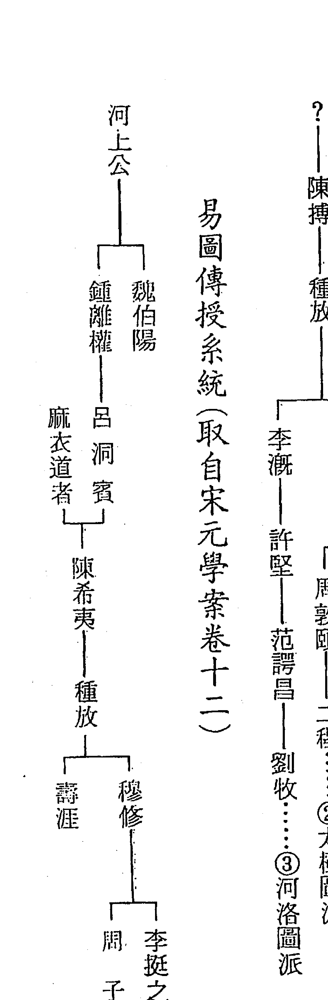

根据宋史卷四的记载，象数之学皆源于陈希夷；根据道藏经首见紫微斗数之推命术，相传为吕纯阳（洞宾）首创，传陈希夷，希夷几经改易，又经一位隐叟白玉蟾增补，再传至希夷的十八代孙陈道（道号了然），于明朝嘉靖年间罗洪先 tiến士收撰，计为四卷，乃为今所流传之紫微斗数全书。

## 第四节 斗数的派别与初学者的疑惑

以上笔者采用文学的、史学的、命学的素材，简而不略地向初学者述说了紫微斗数的来由与整个命学的概观，免使初学者有“吃面不知面是面粉做的”的窘况。 在斗数界，可闻见之派别名称甚多，诸如：南派、北派、透派（又名明澄派）、占验派、三合派、太岁派、小限派……有些派别仅代表一种主张，并无师承或立门派；笔者不作分别的介绍，以免初学者一开始就进了迷宫，转不出来。但是，有些歧异点，必须先说明，使学者见而不惑：

- 1. 明朝有位女子梅素香创立透派，主要的形式差别在排命盘时，生月论节气；譬如某人生于农历九月一日，但万年历上该年九月的节气假定为九月六日某时某分，那么透派排命盘时，以八月计算。目前，除透派论节气外，其余各派皆不论节气，笔者亦主张不论节气，较符合斗数的“敷”。但透派亦有其论命之特点和精准度，这也必须同时表明的。

- 2. 坊间斗数书籍，有将诸星分等级者，计开：
  - 甲级星：
    - 紫微星系六星曜
    - 天府星系八星曜
    - 禄存、擎羊、陀罗、天魁、天钺、左辅、右弼、文昌、文曲、火星、铃星、地空、地劫、天马（本书分命马和月马）、四化星等
    - 亦有将地空、地劫、天马、四化星列为乙级者。
  - 乙级星：
    - 天刑、天姚、天厨、天巫、天月、阴煞、台辅、封诰、龙池、凤阁、红鸾、天喜、三台、八座、恩光、天贵、天官、天福、天才、天寿、天空、孤辰、寡宿、蜚廉、破碎、天哭、天虚。
  - 丙级星：
    - 生年博士十二星、截路空亡、长生十二神、天殇、天使。
  - 丁、戊级星：
    - 流年岁前十二星、流年将前十二星。
    - 这二十四颗星中，亦有人将华盖、咸池、大耗、白虎列为乙级星者。

以上为诸星大略的等级，笔者不想凸显它的重要性，故未在速查表中列明。星不分大小，得势则大行，失势则无用；有些小凶星，却是大吉星确上也头痛的。请看，针虽细小，却能穿物，石虽大……细碎，亦能绊人。古人说：“尺有所短，寸有所长。”诚须以此理念看待诸星，分吉分凶，只不过护人有点概念而已；如斗数中一般所谓的吉星，都是懒散无作为，享清福罢了。有开创的星曜，无论大小，皆非纯吉之星。

- 3. “庙旺失陷”的称呼与分法，亦有分歧，有称庙旺利陷者，又有分等级较多者，如分为庙、旺、得地、利益、平和、不得地、陷等七级。本书聊举一说，供作参考。笔者对于星度的明暗，只注重太阳、太阴二星，其余诸星以其座宫五行及同宫诸星五行生克制化，即可明了该星之力，量，初学者再须注意及此，难免不知所云。学到某一程度后，再加入研究，笔者并不反对。
- 4.本书将古来说，率皆罗列，而有两说相同者，常取一论述。读者读完本书，即可按表排盘，依书论命，达到学命第一阶段知吉凶，盼读者继续研究，再接再厉，进而知避凶趋吉，终至造命。

# 第一章 紫微斗数命盘简易排法

本书名谓“紫微初阶”，专对从未学过斗数的人而写；因此本章说明命盘的排法，力求详尽周全，初学者只要依步骤查表或依原则解说，即可顺利排出正确的命盘。排盘前的准备事项，本章第一节详加说明，连生年干支，亦列百年对照表，不劳读者翻查万年历，逐一准备就绪，即可进入第二节的排盘步骤。每一步骤以表（或原则）为先，懂得看表的人，翻查这一部份即可；若有疑问或不知该表如何查，可阅第二部份说明。第三部份解析，乃供进一步学习者参考，大概以古诀为经，以命理根据为纬。第二节所排星曜，乃为笔者经常使用者，据以论命，已经足够。初学者若排上斗数所有一百多颗星曜，看了只有头大，无法用来论断。第三节为流年星曜，举凡论流年行运时，流年星的排法，全部介绍；比较重要者，皆加注记号，俾供读者先行采用。第四节乃将斗数各家所用及的星曜，全部罗列。虽笔者本身都不使用，或仅探其中一二备参，但为求不以笔者个人喜恶，截断读者知的权利，以及造就本书无所不包的规模，笔者将搜集到的星曜排法，在第四节一一列出。如此一来，研习斗数的朋友，将不受笔者的观念束缚，且可尽览所有星斗；他日再阅别本书籍，将不会感到陌生。

## 第一节 排盘前准备

### 一、命盘

- (一) 准备一张如信纸一般大小的白纸，如图所示画上十二格，并填上十二地支（即子、丑、寅、卯、辰、巳、午、未、申、酉、戌、亥），十二地支是固定的，任何人都一样。
- (二) 简便的办法是：将该白纸对折四次，那么可以折痕为线条，周边十二格填上十二地支亦可。
- (三) 中空部份填写姓名、出生资料、阴阳男女、五行局、命主、身主等。
- (四) 阳历照填，阴历月、日照填，年与时须化成干支，男女指命造性别，阴阳以出生年而定，本节陆续解说；至于五行局、命主、身主，第二节解说时再行填入即可。

### 二、生年干支

查“百年干支对照表”即得。如民国四十八年生人，查表得“己亥”，将之填入阴历栏（命盘中空部份）。
- （一）此一“百年干支对照表”论流年时，亦可查用。如今年民国七十八年，查表得知为“己巳”年，已为生年干，已为生年支。
- （二）特别注意的是以农历为准，农历未过年，阳历已过了年，还是以农历年为准。

| 巳 | 午 | 未 | 申 |
| :---: | :---: | :---: | :---: |
| 辰 | 阳阴男 女姓名： | 阳阴历 历年月日时生 | 酉 |
| 卯 | 身命主主： | 局 | 戌 |
| 寅 | 丑 | 子 | 亥 |

### 三、生时支

| 时间 | 时支 |
| :---: | :---: |
| 23:00 ～ 01:00 | 子 |
| 01:00 ～ 03:00 | 丑 |
| 03:00 ～ 05:00 | 寅 |
| 05:00 ～ 07:00 | 卯 |
| 07:00 ～ 09:00 | 辰 |
| 09:00 ～ 11:00 | 巳 |
| 11:00 ～ 13:00 | 午 |
| 13:00 ～ 15:00 | 未 |
| 15:00 ～ 17:00 | 申 |
| 17:00 ～ 19:00 | 酉 |
| 19:00 ～ 21:00 | 戌 |
| 21:00 ～ 23:00 | 亥 |

（一）此一“百年干支对照表”论流年时，亦可查用。如今年民国七十八年，查表得知为“己巳”年，已为生年干，已为生年支。

（二）特别注意的是以农历为准，农历未过年，阳历已过了年，还是以农历年为准。

| 民国 | 西元 | 干支 | 民国 | 西元 | 干支 | 民国 | 西元 | 干支 | 民国 | 西元 | 干支 |
| :---: | :---: | :---: | :---: | :---: | :---: | :---: | :---: | :---: | :---: | :---: | :---: |
| 一年 | 一九一二 | 壬子 | 二十六年 | 一九三七 | 丁丑 | 五十一年 | 一九六二 | 壬寅 | 七十六年 | 一九八七 | 丁卯 |
| 二年 | 一九一三 | 癸丑 | 二十七年 | 一九三八 | 戊寅 | 五十二年 | 一九六三 | 癸卯 | 七十七年 | 一九八八 | 戊辰 |
| 三年 | 一九一四 | 甲寅 | 二十八年 | 一九三九 | 己卯 | 五十三年 | 一九六四 | 甲辰 | 七十八年 | 一九八九 | 己巳 |
| 四年 | 一九一五 | 乙卯 | 二十九年 | 一九四〇 | 庚辰 | 五十四年 | 一九六五 | 乙巳 | 七十九年 | 一九九〇 | 庚午 |
| 五年 | 一九一六 | 丙辰 | 三十年 | 一九四一 | 辛巳 | 五十五年 | 一九六六 | 丙午 | 八十年 | 一九九一 | 辛未 |
| 六年 | 一九一七 | 丁巳 | 三十一年 | 一九四二 | 壬午 | 五十六年 | 一九六七 | 丁未 | 八十一年 | 一九九二 | 壬申 |
| 七年 | 一九一八 | 戊午 | 三十二年 | 一九四三 | 癸未 | 五十七年 | 一九六八 | 戊申 | 八十二年 | 一九九三 | 癸酉 |
| 八年 | 一九一九 | 己未 | 三十三年 | 一九四四 | 甲申 | 五十八年 | 一九六九 | 己酉 | 八十三年 | 一九九四 | 甲戌 |
| 九年 | 一九二〇 | 庚申 | 三十四年 | 一九四五 | 乙酉 | 五十九年 | 一九七〇 | 庚戌 | 八十四年 | 一九九五 | 乙亥 |
| 十年 | 一九二一 | 辛酉 | 三十五年 | 一九四六 | 丙戌 | 六十年 | 一九七一 | 辛亥 | 八十五年 | 一九九六 | 丙子 |
| 十一年 | 一九二二 | 壬戌 | 三十六年 | 一九四七 | 丁亥 | 六十一年 | 一九七二 | 壬子 | 八十六年 | 一九九七 | 丁丑 |
| 十二年 | 一九二三 | 癸亥 | 三十七年 | 一九四八 | 戊子 | 六十二年 | 一九七三 | 癸丑 | 八十七年 | 一九九八 | 戊寅 |
| 十三年 | 一九二四 | 甲子 | 三十八年 | 一九四九 | 己丑 | 六十三年 | 一九七四 | 甲寅 | 八十八年 | 一九九九 | 己卯 |
| 十四年 | 一九二五 | 乙丑 | 三十九年 | 一九五〇 | 庚寅 | 六十四年 | 一九七五 | 乙卯 | 八十九年 | 二〇〇〇 | 庚辰 |
| 十五年 | 一九二六 | 丙寅 | 四十年 | 一九五一 | 辛卯 | 六十五年 | 一九七六 | 丙辰 | 九十年 | 二〇〇一 | 辛巳 |
| 十六年 | 一九二七 | 丁卯 | 四十一年 | 一九五二 | 壬辰 | 六十六年 | 一九七七 | 丁巳 | 九十一年 | 二〇〇二 | 壬午 |
| 十七年 | 一九二八 | 戊辰 | 四十二年 | 一九五三 | 癸巳 | 六十七年 | 一九七八 | 戊午 | 九十二年 | 二〇〇三 | 癸未 |
| 十八年 | 一九二九 | 己巳 | 四十三年 | 一九五四 | 甲午 | 六十八年 | 一九七九 | 己未 | 九十三年 | 二〇〇四 | 甲申 |
| 十九年 | 一九三〇 | 庚午 | 四十四年 | 一九五五 | 乙未 | 六十九年 | 一九八〇 | 庚申 | 九十四年 | 二〇〇五 | 乙酉 |
| 二十年 | 一九三一 | 辛未 | 四十五年 | 一九五六 | 丙申 | 七十年 | 一九八一 | 辛酉 | 九十五年 | 二〇〇六 | 丙戌 |
| 二十一年 | 一九三二 | 壬申 | 四十六年 | 一九五七 | 丁酉 | 七十一年 | 一九八二 | 壬戌 | 九十六年 | 二〇〇七 | 丁亥 |
| 二十二年 | 一九三三 | 癸酉 | 四十七年 | 一九五八 | 戊戌 | 七十二年 | 一九八三 | 癸亥 | 九十七年 | 二〇〇八 | 戊子 |
| 二十三年 | 一九三四 | 甲戌 | 四十八年 | 一九五九 | 己亥 | 七十三年 | 一九八四 | 甲子 | 九十八年 | 二〇〇九 | 己丑 |
| 二十四年 | 一九三五 | 乙亥 | 四十九年 | 一九六〇 | 庚子 | 七十四年 | 一九八五 | 乙丑 | 九十九年 | 二〇一〇 | 庚寅 |
| 二十五年 | 一九三六 | 丙子 | 五十年 | 一九六一 | 辛丑 | 七十五年 | 一九八六 | 丙寅 | 一百年 | 二〇一一 | 辛卯 |## 四、阴阳男女

- (一) 以出生时刻对照上表，即得生时支。如生于下午三时廿分，为「申」时。
- (二) 斗数界有争论的是生于子时之人，有人主张生于二十三时至二十四时者算当日，二十四时（即零时）至一时方为次日。意即二十一日晚间十一点至十二点，还算为二十一日，过了零时起算为二十二日。
- (三) 笔者主张：自二十三时起皆视为次日，若论命时不准，再改采上项说法；为何要那么麻烦？因笔者认为交接日与交接时，常有归前不一定准，归后也不一定准的现象，而发现一个道理，本书暂不详述，暂告读者以上列方式论证。
- (四) 若为求出生时的精确，尚须换算太阳时（精确的经纬时），本书暂略。欲详究的读者，请参考本系列丛书第二集「紫微进阶」。

| 阳 | 阴 |
|---|---|
| 甲 | 乙 |
| 丙 | 丁 |
| 戊 | 己 |
| 庚 | 辛 |
| 壬 | 癸 |

- (一) 阳年出生的男人，称阳男；女人则称阳女。
- (二) 阴年出生的男人，称阴男；女人则称阴女。
- (三) 举例：民国七十七年生一女孩。查「百年干支对照表」，民国七十七年为戊辰年，再以「戊」对照此表，知为「阳」，故此女孩为「阳女」。

| 巳 | 午 | 未 | 申 |
|----|----|----|----|
| 辰 | 阴 阳 女 男 身主 命主： | 阳历四十八年十二月廿 阴历己亥年十一月廿一日 戌时生局 苏 蓉 蓉 小姐 | 酉 |
| 卯 |    |    | 戌 |
| 寅 | 丑 | 子 | 亥 |

## 《本节综合举例》

假设苏蓉蓉小姐生于民国四十八年阴历十一月廿一日下午七时四十分，依据本节各项说明，填写如图所示。※第二节排盘，皆以此造为例。

## 第二节排盘

## 一、定宫干

| 甲或己 | 乙或庚 | 丙或辛 | 丁或壬 | 戊或癸 | 十二宫支 |
|--------|--------|--------|--------|--------|----------|
| 丙     | 戊     | 庚     | 壬     | 甲     | 寅       |
| 丁     | 己     | 辛     | 癸     | 乙     | 卯       |
| 戊     | 庚     | 壬     | 甲     | 丙     | 辰       |
| 己     | 辛     | 癸     | 乙     | 丁     | 巳       |
| 庚     | 壬     | 甲     | 丙     | 戊     | 午       |
| 辛     | 癸     | 乙     | 丁     | 己     | 未       |
| 壬     | 甲     | 丙     | 戊     | 庚     | 申       |
| 癸     | 乙     | 丁     | 己     | 辛     | 酉       |
| 甲     | 丙     | 戊     | 庚     | 壬     | 戌       |
| 乙     | 丁     | 己     | 辛     | 癸     | 亥       |
| 丙     | 戊     | 庚     | 壬     | 甲     | 子       |
| 丁     | 己     | 辛     | 癸     | 乙     | 丑       |

## 《说明》

1. 命盘十二宫原已安上地支，称为十二宫支，这一步骤即在每一宫支上加一天干，称为宫干；加宫干乃根据生年干而来，如己亥年出生者，不管男或女，寻上表第一行为甲年或己年出生者。

- (1) 出生年干为甲或己者

|  |  |  |  |
| :--- | :--- | :--- | :--- |
| 己巳 | 庚午 | 辛未 | 壬申 |
| 戊辰 | 甲年或己年出生者 |  | 癸酉 |
| 丁卯 |  |  | 甲戌 |
| 丙寅 | 丁丑 | 丙子 | 乙亥 |

- (2) 出生年干为乙或庚者

|  |  |  |  |
| :--- | :--- | :--- | :--- |
| 辛巳 | 壬午 | 癸未 | 甲申 |
| 庚辰 | 乙年或庚年出生者 |  | 乙酉 |
| 己卯 |  |  | 丙戌 |
| 戊寅 | 己丑 | 戊子 | 丁亥 |

即依序在命盘十二宫支上加宫干，寅上加丙，卯上加丁，辰上加戊，……

2. 为使读者更加了解，将五种状况分别列出，只要看属于那一盘，照抄宫干即可。

3. 如前所举例，民国四十八年（己亥）出生之苏蓉蓉小姐命盘上十二宫支，可照上列(1)盘，加上

## (3)出生年干为丙或辛者

| 丙申 | 乙未 | 甲午 | 癸巳 |
| ---- | ---- | ---- | ---- |
| 丁酉 | 丙年或辛年出生者 | 壬辰 |  |
| 戊戌 | 辛卯 |  |  |
| 己亥 | 庚子 | 辛丑 | 庚寅 |

## (4)出生年干为丁或壬者

| 戊申 | 丁未 | 丙午 | 乙巳 |
| ---- | ---- | ---- | ---- |
| 己酉 | 丁年或壬年出生者 | 甲辰 |  |
| 庚戌 | 癸卯 |  |  |
| 辛亥 | 壬子 | 癸丑 | 壬寅 |

## (5)出生年干为戊或癸者

| 丁巳 | 戊午 | 己未 | 庚申 |
|------|------|------|------|
| 丙辰 | 年出或癸 | 生者 | 辛酉 |
| 乙卯 |      |      | 壬戌 |
| 甲寅 | 乙丑 | 甲子 | 癸亥 |

## 《解析》

1. 宫干盖头又称“五行冠盖头”，取法自“五虎遁月”。诀云：

“甲己之年丙寅首，乙庚之岁戊寅头；
丙辛便从庚寅起，丁壬壬寅顺行流；
惟有戊癸何方落，甲寅之上去寻求。”

歌诀是为了便于记忆，而作的打油诗。此诀实已将命造的出生年的月干支排入命宫十二宫；

如今（七十八）年己巳年，依法求得丙寅，依天干顺序布入十二宫，是则正月为丙寅月，二月为丁卯月，……，一无差池。

2. 中国古来采用“正月建寅”，此为夏历，意为以寅月为一年中第一个月。商历正月建丑，周历正月建子；尔后恢复建寅，探行夏历迄今。

3. 所以，斗数命盘常以“寅”宫为基准，假如您的命盘宫干填妥了，从寅宫算起，顺时钟方向，

数至您的生月数，该宫干支即为您的生月干支。（不论节气）

4. 这个口诀，还有一首较简短的：

> 「甲己丙作首，乙庚戊为头；丙辛从庚起，丁壬壬行流；戊癸何方发，甲寅好追求。」

## 二、定命身宫

## ◎命身宫速查表

| 生时 | 正月 | 二月 | 三月 | 四月 | 五月 | 六月 | 七月 | 八月 | 九月 | 十月 | 十一月 | 十二月 |
|------|------|------|------|------|------|------|------|------|------|------|--------|--------|
| 子   | 寅   | 卯   | 辰   | 巳   | 午   | 未   | 申   | 酉   | 戌   | 亥   | 子     | 丑     |
| 丑   | 丑   | 寅   | 卯   | 辰   | 巳   | 午   | 未   | 申   | 酉   | 戌   | 亥     | 子     |
| 寅   | 子   | 丑   | 寅   | 卯   | 辰   | 巳   | 午   | 未   | 申   | 酉   | 戌     | 亥     |
| 卯   | 亥   | 子   | 丑   | 寅   | 卯   | 辰   | 巳   | 午   | 未   | 申   | 酉     | 戌     |
| 辰   | 戌   | 亥   | 子   | 丑   | 寅   | 卯   | 辰   | 巳   | 午   | 未   | 申     | 酉     |
| 巳   | 酉   | 戌   | 亥   | 子   | 丑   | 寅   | 卯   | 辰   | 巳   | 午   | 未     | 申     |
| 午   | 申   | 酉   | 戌   | 亥   | 子   | 丑   | 寅   | 卯   | 辰   | 巳   | 午     | 未     |
| 未   | 未   | 申   | 酉   | 戌   | 亥   | 子   | 丑   | 寅   | 卯   | 辰   | 巳     | 午     |
| 申   | 午   | 未   | 申   | 酉   | 戌   | 亥   | 子   | 丑   | 寅   | 卯   | 辰     | 巳     |
| 酉   | 巳   | 午   | 未   | 申   | 酉   | 戌   | 亥   | 子   | 丑   | 寅   | 卯     | 辰     |
| 戌   | 辰   | 巳   | 午   | 未   | 申   | 酉   | 戌   | 亥   | 子   | 丑   | 寅     | 卯     |
| 亥   | 卯   | 辰   | 巳   | 午   | 未   | 申   | 酉   | 戌   | 亥   | 子   | 丑     | 寅     |

注：凡闰月十五日以前出生者，作上月论，十五日以后出生者，作下月论。

| 壬申 | 辛未 | 庚午 | 己巳 |
|---|---|---|---|
| （身）甲戌 | 阳历四十八年十二月二十日 阴历己亥年十一月廿一日戌时生 | 苏蓉蓉 小姐 局 命主： 身主： 阴女 | 戊辰 |
| 乙亥 | 丙子 | 丁丑 | 丙寅 |
| 丁卯 | 命宫 | | |

## 《说明及举例》

1. 以速查表上栏之生月数与右栏之生时支交叉，即可寻得命身宫所在宫位。

2. 如苏蓉蓉己亥年十一月二十一日戌时之命身宫，以十一月和戌时查表，得知命宫在寅，身宫在戌，填入命盘如上图所示；因身宫非单独存在，必与其它宫同位，

## 《解析》

## 1. 定命、身宫歌诀：

寅正顺数生月逢，生月起子两头通，逆至生时为命宫，顺至生时即安身。

2. 此歌诀乃由命盘上地支「寅」字开头，顺数出生月份，再逆数出生时辰，所在之宫位即为命宫。若顺数出生月数，再顺数出生时辰，则为身宫。

以图示之：

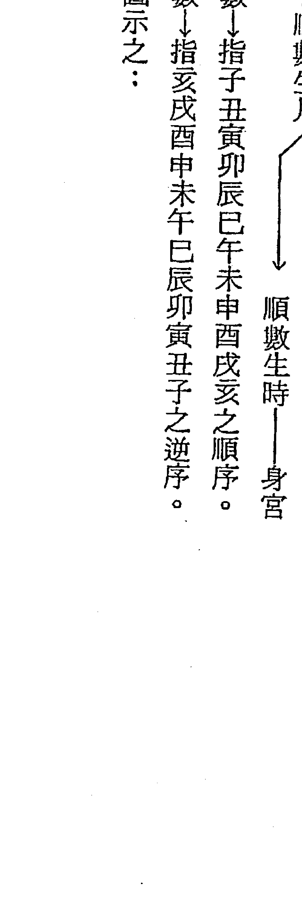

顺数→指子丑寅卯辰巳午未申酉戌亥之顺序。

逆数→指亥戌酉申未午巳辰卯寅丑子之逆序。

3. 凡闰月出生者，该月十五日（含当日）以前出生者，做当月论；十六日以后出生者，移作下月论。例如：闰八月十五日出生，以八月论；闰八月十六，则视同九月。此法准验率较高。

## 三、安妻财子禄十二宫名

◇原则

以命宫为起点，逆时钟方向，依左列宫名一一安上。

- 1. 命宫
- 2. 兄弟宫
- 3. 夫妻宫

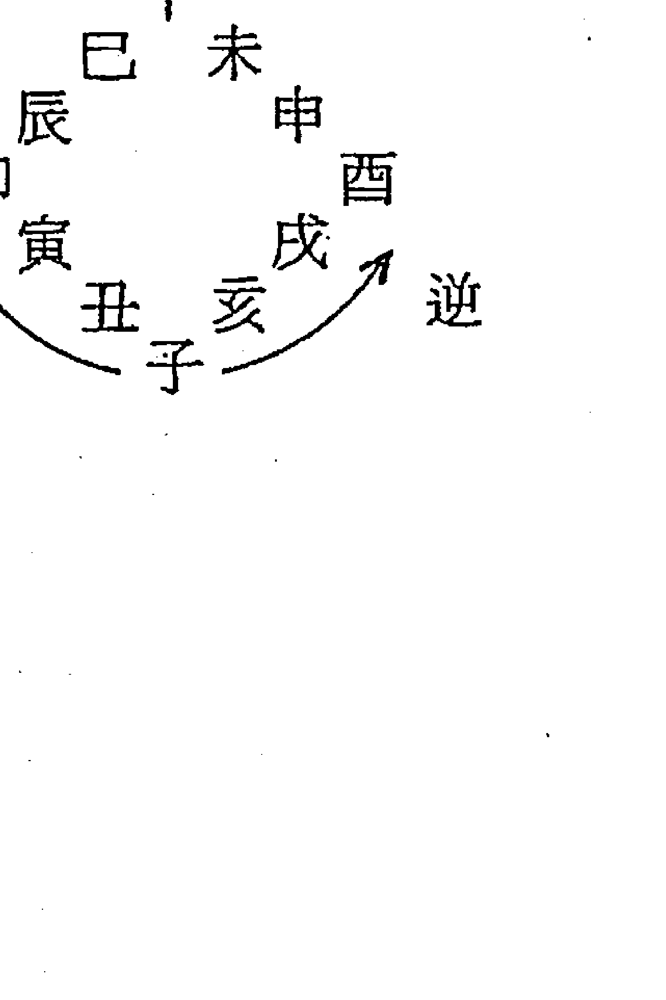

- 4. 子女宫
- 5. 财帛宫
- 6. 疾厄宫
- 7. 迁移宫
- 8. 奴仆宫（或交友宫或仆役宫）
- 9. 官禄宫（或事业宫）
- 10. 田宅宫
- 11. 福德宫
- 12. 父母宫

## 《说明及举例》

1. 此项安十二宫名，举例是最好的说明。如苏蓉蓉小姐命宫在寅，逆时钟方向，即在丑宫安兄弟宫、子宫安夫妻宫、……如此逆序将上列十二宫名安入十二宫，如举例命盘所示。

2. 苏蓉蓉小姐身宫与财帛宫同宫。身宫必与命、夫妻、财帛、迁移、官禄、福德等六宫之一同宫，其他六宫则不可能。

| 田宅宫 己巳 | 官禄宫 庚午 | 交友宫 辛未 | 迁移宫 壬申 |
|---|---|---|---|
| 福德宫 戊辰 | 阴女 命主： 身主： 苏蓉蓉 小姐 阳历 四十八年十二月二十 阴历 己亥年十一月二十二日戌时生 局 | | 疾厄宫 癸酉 |
| 父母宫 丁卯 | | | 财帛宫 甲戌 (身)宫 |
| 命宫 丙寅 | 兄弟宫 丁丑 | 夫妻宫 丙子 | 子女宫 乙亥 |

## 四、定五行局

◎五行局速查表

| 命宫干 / 命宫支 | 子或丑 | 寅或卯 | 辰或巳 | 午或未 | 申或酉 | 戌或亥 |
| :--- | :--- | :--- | :--- | :--- | :--- | :--- |
| 甲或乙 | 金四局 | 水二局 | 火六局 | 金四局 | 水二局 | 火六局 |
| 丙或丁 | 水二局 | 火六局 | 土五局 | 水二局 | 火六局 | 土五局 |
| 戊或己 | 火六局 | 土五局 | 木三局 | 火六局 | 土五局 | 木三局 |
| 庚或辛 | 土五局 | 木三局 | 金四局 | 土五局 | 木三局 | 金四局 |
| 壬或癸 | 木三局 | 金四局 | 水二局 | 木三局 | 金四局 | 水二局 |

《说明》

1. 以命宫干支来求五行局数，上栏命宫干，左栏命宫支，交叉寻得五行局。如苏蓉蓉小姐命宫干支为丙寅，找上栏第二行丙干，右栏第二格寅支，交叉在火六局，故苏小姐的五行局为火六局

2. 五行局于原理上，乃由命宫干支而来。坊间斗数书籍，亦有以生年支与命宫支求得五行局者，因命宫干乃由生年干决定，故其间亦有固定关系；本书以命宫干支列表，乃求其原，为让读者受混淆或免其所惑，亦将生年干对照命宫支求五行局的速查表列于后：

| 本生年干 | 子丑 | 寅卯 | 辰巳 | 午未 | 申酉 | 戌亥 |
|----------|------|------|------|------|------|------|
| 甲己 | 水二局 | 火六局 | 木三局 | 土五局 | 金四局 | 火六局 |
| 乙庚 | 火六局 | 土五局 | 金四局 | 木三局 | 水二局 | 土五局 |
| 丙辛 | 土五局 | 木三局 | 水二局 | 金四局 | 火六局 | 木三局 |
| 丁壬 | 木三局 | 金四局 | 火六局 | 水二局 | 土五局 | 金四局 |
| 戊癸 | 金四局 | 水二局 | 土五局 | 火六局 | 木三局 | 水二局 |

## 《解析》

1. 五行局乃由「六十花甲子纳音歌」而来。

## 六十花甲子纳音歌如下：

- 甲子乙丑海中金
- 丙寅丁卯炉中火
- 戊辰己巳大林木
- 庚午辛未路旁土
- 壬申癸酉剑锋金
- 甲戌乙亥山头火
- 丙子丁丑涧下水
- 戊寅己卯城头土
- 庚辰辛巳白蜡金
- 壬午癸未杨柳木
- 甲申乙酉泉中水
- 丙戌丁亥屋上土
- 戊子己丑霹雳火
- 庚寅辛卯松柏木
- 壬辰癸巳长流水
- 甲午乙未沙中金
- 丙申丁酉山下火
- 戊戌己亥平地木
- 庚子辛丑壁上土
- 壬寅癸卯金箔金
- 甲辰乙巳覆灯火
- 丙午丁未天河水
- 戊申己酉大驿土
- 庚戌辛亥钗钏金
- 壬子癸丑桑柘木
- 甲寅乙卯大溪水
- 丙辰丁巳沙中土
- 戊午己未天上火
- 庚申辛酉石榴木
- 壬戌癸亥大海水

> ※查上列纳音，可知每一五行局尚分六种，如苏蓉蓉小姐命宫丙寅为炉中火，故于命盘上填「炉中火六局」。

2. 五行局数之数，乃为后天之用，读者先知道上文几纳音为金者即金四局，为火者火六局，为土者土五局，为木者木三局，为水者水二局，有此概念即可。

## 五、定紫微星

## ◎紫微星速查表

| 生日 | 水二局 | 木三局 | 金四局 | 土五局 | 火六局 |
|------|--------|--------|--------|--------|--------|
| 初一 | 丑 | 辰 | 亥 | 午 | 酉 |
| 初二 | 寅 | 丑 | 辰 | 亥 | 午 |
| 初三 | 寅 | 丑 | 辰 | 亥 | 午 |
| 初四 | 卯 | 寅 | 丑 | 辰 | 亥 |
| 初五 | 卯 | 寅 | 丑 | 辰 | 亥 |
| 初六 | 辰 | 卯 | 寅 | 丑 | 辰 |
| 初七 | 辰 | 卯 | 寅 | 丑 | 辰 |
| 初八 | 巳 | 辰 | 卯 | 寅 | 丑 |
| 初九 | 巳 | 辰 | 卯 | 寅 | 丑 |
| 初十 | 午 | 巳 | 辰 | 卯 | 寅 |
| 十一 | 午 | 巳 | 辰 | 卯 | 寅 |
| 十二 | 未 | 午 | 巳 | 辰 | 卯 |
| 十三 | 未 | 午 | 巳 | 辰 | 卯 |
| 十四 | 申 | 未 | 午 | 巳 | 辰 |
| 十五 | 申 | 未 | 午 | 巳 | 辰 |
| 十六 | 酉 | 申 | 未 | 午 | 巳 |
| 十七 | 酉 | 申 | 未 | 午 | 巳 |
| 十八 | 戌 | 酉 | 申 | 未 | 午 |
| 十九 | 戌 | 酉 | 申 | 未 | 午 |
| 二十 | 亥 | 戌 | 酉 | 申 | 未 |
| 廿一 | 亥 | 戌 | 酉 | 申 | 未 |
| 廿二 | 子 | 亥 | 戌 | 酉 | 申 |
| 廿三 | 子 | 亥 | 戌 | 酉 | 申 |
| 廿四 | 丑 | 子 | 亥 | 戌 | 酉 |
| 廿五 | 丑 | 子 | 亥 | 戌 | 酉 |
| 廿六 | 寅 | 丑 | 子 | 亥 | 戌 |
| 廿七 | 寅 | 丑 | 子 | 亥 | 戌 |
| 廿八 | 卯 | 寅 | 丑 | 子 | 亥 |
| 廿九 | 卯 | 寅 | 丑 | 子 | 亥 |
| 三十 | 辰 | 卯 | 寅 | 丑 | 子 |

> 《说明及举例》

1. 以五行局对照生日，即得紫微星的位置。
2. 如苏蓉蓉小姐五行局为火六局，生日为二十一日，查上表得「寅」，即表示紫微星在寅宫，将「紫微」填入寅宫。

## 《解析》

紫微星依五行局的不同，作其规律性的运行，初学者以查表求之。兹列口诀备参，学者只须知有此口诀即可，欲进一步了解紫微星排法，不必背口诀。《紫微进阶》一书中有简便公式。

口诀：

1. 水二局中初一丑，单双不论顺行流，顺行一宫安二日，最末一天在于辰。

2. 木三局中初一辰，逆退二步安二天，顺行二宫安一日，双日初二丑宫寻，顺行四宫安一日，逆退二步安二天。

3. 金四局数紫微宫，初一在亥初二辰，顺二逆一安单日，逆二顺三双日逢。

4. 土五局中初一午，逆行二宫安一日，值九移向寅辰午，双日初二在亥宫，顺二三次逆二两，值六移向未酉亥。

5. 火六局中初一酉，顺二两次逆三一，双日初二午宫寻，逆二两次顺五一。

## 六、安紫微星系诸星

### ◎安紫微星系诸星速见表

| 诸星紫微在支 | 天机 | 太阳 | 武曲 | 天同 | 廉贞 |
| :--- | :--- | :--- | :--- | :--- | :--- |
| 子 | 亥 | 酉 | 申 | 未 | 辰 |
| 丑 | 子 | 戌 | 酉 | 申 | 巳 |
| 寅 | 丑 | 亥 | 戌 | 酉 | 午 |
| 卯 | 寅 | 子 | 亥 | 戌 | 未 |
| 辰 | 卯 | 丑 | 子 | 亥 | 申 |
| 巳 | 辰 | 寅 | 丑 | 子 | 酉 |
| 午 | 巳 | 卯 | 寅 | 丑 | 戌 |
| 未 | 午 | 辰 | 卯 | 寅 | 亥 |
| 申 | 未 | 巳 | 辰 | 卯 | 子 |
| 酉 | 申 | 午 | 巳 | 辰 | 丑 |
| 戌 | 酉 | 未 | 午 | 巳 | 寅 |
| 亥 | 戌 | 申 | 未 | 午 | 卯 |

### 《说明及举例》

1.  上文已知紫微星在那一宫（地支），以其所在宫支为凭，查表寻得其余五星在何宫，填入命盘即可。
2.  举例：苏蓉蓉小姐紫微在寅，其余五星寻表，填入命盘，如次页。

### 《解析》

1.  口诀：
    > 「紫微天机星逆行，隔一阳武天同情；又隔二宫廉贞位，空三复见紫微亭。」
2.  意思即为：假如紫微在寅，逆行一宫在丑安天机，空隔一子宫，在亥宫安太阳，逆序于戌宫安武曲，再逆一宫于酉宫安天同，过来空隔申、未二宫，而于午宫安廉贞，再逆行巳、辰、卯三宫，过来寅宫又见紫微星了。

阴女 命主： 身主： 苏蓉蓉小姐 阳历四十八年十一月二十日戌时生 阴历己亥年十一月二十二日戌时生 炉中火六局

山宅宫 己巳

官禄宫 庚午 廉贞

交友宫 辛未

迁移宫 壬申

福德宫 戊辰

疾厄宫 癸酉 天同

父母宫 丁卯

财帛宫 甲戌 武曲

命宫 丙寅 紫微

兄弟宫 丁丑 天机

夫妻宫 丙子

子女宫 乙亥 太阳

## 七、安天府星

### ◎安天府星速查表

| 天府 | 星名 | 天府在支 / 紫微在支 |
| :---: | :---: | :---: |
| 辰 | 子 | |
| 卯 | 丑 | |
| 寅 | 寅 | |
| 丑 | 卯 | |
| 子 | 辰 | |
| 亥 | 巳 | |
| 戌 | 午 | |
| 酉 | 未 | |
| 申 | 申 | |
| 未 | 酉 | |
| 午 | 戌 | |
| 巳 | 亥 | |

1.  天府星之安法，乃以紫微星为基准，由紫微所在宫位，决定天府应在何宫。如右表所示，如紫微在子，天府即在辰，余此类推。
2.  本章苏芙蓉命例，紫微在寅，查表知天府亦在寅，可谓紫府同宫在寅。

### 《解析》

1.  天府星的安法，乃看紫微在何宫，而以巳亥二宫连成一线，紫微在巳，天府就在亥；反之，紫微在亥，天府即在巳。巳亥连成一线，将命盘分割成两半，其余每一宫连成另一与巳亥线平行者，一宫为紫微，另一宫即为天府。命盘两半的边角为寅申宫，皆为紫府同宫，意即紫微在寅，天府亦在寅；紫微在申，天府亦在申。明瞭以上原理，即可不用查表。
2.  口诀：
    天府南斗令；常对紫微君；丑卯相更迭，未酉互为根；
    往来午与戌，蹑践子和辰；巳亥交驰骋，同位在寅申。

## 八、安天府星系诸星

### ◎天府星系诸星速查表

| 破军 | 七杀 | 天梁 | 天相 | 巨门 | 贪狼 | 太阴 | 天府在支 |
| :--- | :--- | :--- | :--- | :--- | :--- | :--- | :--- |
| 戌 | 午 | 巳 | 辰 | 卯 | 寅 | 丑 | 子 |
| 亥 | 未 | 午 | 巳 | 辰 | 卯 | 寅 | 丑 |
| 子 | 申 | 未 | 午 | 巳 | 辰 | 卯 | 寅 |
| 丑 | 酉 | 申 | 未 | 午 | 巳 | 辰 | 卯 |
| 寅 | 戌 | 酉 | 申 | 未 | 午 | 巳 | 辰 |
| 卯 | 亥 | 戌 | 酉 | 申 | 未 | 午 | 巳 |
| 辰 | 子 | 亥 | 戌 | 酉 | 申 | 未 | 午 |
| 巳 | 丑 | 子 | 亥 | 戌 | 酉 | 申 | 未 |
| 午 | 寅 | 丑 | 子 | 亥 | 戌 | 酉 | 申 |
| 未 | 卯 | 寅 | 丑 | 子 | 亥 | 戌 | 酉 |
| 申 | 辰 | 卯 | 寅 | 丑 | 子 | 亥 | 戌 |
| 酉 | 巳 | 辰 | 卯 | 寅 | 丑 | 子 | 亥 |

### 《说明及举例》

1.  前文已排定天府星，再以天府星所在宫位（表中右栏）为基准，向左横看，即为上栏天府星系其它七星所在宫位。
2.  如苏芙蓉命例，天府星系诸星排入命盘如次页。

### 《解析》

1.  天府星系以天府星为首，带领其它七颗星曜，天府星系是顺时钟方向安入命盘的。
2.  口诀：
    > 天府太阴顺贪狼，巨门天相与天梁；七杀空三破军位，隔宫又见天府乡。
    意思是：如天府在丑，顺一位寅宫安太阴，卯宫安贪狼，辰宫安巨门，巳宫安天相，午宫安天梁，未宫安七杀，再过来空隔三个宫位申、酉、戌，而于亥宫安破军，间隔子宫，又可见到丑宫的天府。这样的顺序，口诀背熟了，就错不了，也不用查表了。

田宅宫 己巳 巨门 | 官禄宫 庚午 天相 廉贞 | 交友宫 辛未 天梁 | 迁移宫 壬申 七杀
:--- | :--- | :--- | :---
福德宫 戊辰 贪狼 | 苏蓉蓉小姐 阴女 命主： 身主： | 阳历四十八年十二月二十日戌时生 阴历己亥年十一月二十二日戌时生 炉中火六局 | 疾厄宫 癸酉 天同
父母宫 丁卯 太阴 | | | 财帛宫（身宫）甲戌 武曲
命宫 丙寅 天府 紫微 | 兄弟宫 丁丑 天机 | 夫妻宫 丙子 破军 | 子女宫 乙亥 太阳

## 九、安时系星

### ◎时系星速查表

| 年支/时系星/生时支 | 亥卯未 | | | 巳酉丑 | | | 申子辰 | | | 寅午戌 | | | 生时支 |
| :--- | :--- | :--- | :--- | :--- | :--- | :--- | :--- | :--- | :--- | :--- | :--- | :--- | :--- |
| | 封 | 台 | 地 | 地 | 铃 | 火 | 铃 | 火 | 铃 | 火 | 文曲 | 文昌 | |
| | 诰 | 辅 | 空 | 劫 | 星 | 星 | 星 | 星 | 星 | 星 | 星 | 星 | |
| 午 | 亥 | 亥 | 戌 | 酉 | 戌 | 卯 | 戌 | 寅 | 卯 | 丑 | 辰 | 戌 | 子 |
| 未 | 戌 | 子 | 亥 | 戌 | 亥 | 辰 | 亥 | 卯 | 辰 | 寅 | 巳 | 酉 | 丑 |
| 申 | 酉 | 丑 | 子 | 亥 | 子 | 巳 | 子 | 辰 | 巳 | 卯 | 午 | 申 | 寅 |
| 酉 | 申 | 寅 | 丑 | 子 | 丑 | 午 | 丑 | 巳 | 午 | 辰 | 未 | 未 | 卯 |
| 戌 | 未 | 卯 | 寅 | 丑 | 寅 | 未 | 寅 | 午 | 未 | 巳 | 申 | 午 | 辰 |
| 亥 | 午 | 辰 | 卯 | 寅 | 卯 | 申 | 卯 | 未 | 申 | 午 | 酉 | 巳 | 巳 |
| 子 | 巳 | 巳 | 辰 | 卯 | 辰 | 酉 | 辰 | 申 | 酉 | 未 | 戌 | 辰 | 午 |
| 丑 | 丑 | 辰 | 午 | 巳 | 辰 | 巳 | 戌 | 巳 | 酉 | 戌 | 申 | 亥 | 卯 |
| 寅 | 寅 | 卯 | 未 | 午 | 巳 | 午 | 亥 | 午 | 戌 | 亥 | 酉 | 子 | 寅 |
| 卯 | 卯 | 寅 | 申 | 未 | 午 | 未 | 子 | 未 | 亥 | 子 | 戌 | 丑 | 丑 |
| 辰 | 辰 | 丑 | 酉 | 申 | 未 | 申 | 丑 | 申 | 子 | 丑 | 亥 | 寅 | 子 |
| 巳 | 巳 | 子 | 戌 | 酉 | 申 | 酉 | 寅 | 酉 | 丑 | 寅 | 子 | 卯 | 亥 |

### 《说明与举例》

1.  所谓时系星，即是以命造之出生时为依据，而求得的星曜。其中火星、铃星还得分别生年支，如午年午时出生者，火星在未，铃星在酉。
2.  苏蓉蓉命例，时系星以戌时查表，火星、铃星并看亥年栏（即亥卯未栏），其余三栏不看，即可查出火星在未，铃星在申。

### 《解析》

1.  文昌文曲星口诀：
    - 戊上起子安文昌，逆到生时是贵乡；
    - 文曲星从辰上起，顺到生时是本乡。
    意思是：文昌星的安法，子时生人安于戌宫，生于丑时的人，逆行安于酉宫，依此类推；文曲星则是子时生人安于辰宫，丑时生人顺行，安于巳宫，依此类推。
2.  火星铃星口诀：
    - 寅午戌年丑卯起，申子辰年寅戌扬；
    - 巳酉丑年卯戌始，亥卯未年酉戌历。
    意思是：寅年或午年或戌年生人，火星的安法是子时生人在丑，丑时生人在寅，依此顺数；而铃星是子时生人在戌，丑时生人在亥，依此顺数。其余三组生年，也依此类推。
3.  地空地劫星口诀：
    亥上起子顺安劫，逆去便是地空乡。
    意思是：子时生人，地空地劫星都安在亥宫，但丑时生人，地劫顺行一位，安子宫，依此顺数；地空星，丑时生人，逆行一位安戌宫，依此逆数。按：坊间有些书将地空称为天空，读者须明辨，不可混淆，只有一天空星，不同于地空星。
4.  台辅封诰星口诀：
    台辅星从午宫起，顺至生时是贵乡；封诰子时起寅位，顺至生时是贵方。

福德宫 戊辰：贪狼、台辅 | | 交友宫 辛未：天梁、火星 | 迁移宫 壬申：七杀、铃星
:--- | :--- | :--- | :---
巳 | 午 官禄宫：廉贞、天相 | 未 | 申 酉 疾厄宫：天同、地劫
丁卯 父母宫：太阴 | 戊辰 福德宫： | 阳历四十八年十二月二十日戌时生 阴历己亥年十一月二十一日戌时生 炉中火六局 | 甲戌 财帛宫（身）宫：武曲
丙寅 命宫：紫微、天府、文曲 | 丁丑 兄弟宫：天机、地空 | 丙子 夫妻宫：破军、文昌、封诰 | 乙亥 子女宫：太阳

阴女
苏蓉蓉小姐
命主：
身主：

## 十、安月系星

### ◎月系星速查表

| 诸星在支 / 生月 | 左辅 | 右弼 | 天刑 | 天姚 | 天马 | 解神 | 天巫 | 天月 | 阴煞 |
| :--- | :---: | :---: | :---: | :---: | :---: | :---: | :---: | :---: | :---: |
| 正月 | 辰 | 戌 | 酉 | 丑 | 申 | 申 | 巳 | 戌 | 寅 |
| 二月 | 巳 | 酉 | 戌 | 寅 | 巳 | 申 | 申 | 巳 | 子 |
| 三月 | 午 | 申 | 亥 | 卯 | 寅 | 戌 | 寅 | 辰 | 戌 |
| 四月 | 未 | 未 | 子 | 辰 | 亥 | 戌 | 亥 | 寅 | 申 |
| 五月 | 申 | 午 | 丑 | 巳 | 申 | 子 | 巳 | 未 | 午 |
| 六月 | 酉 | 巳 | 寅 | 午 | 巳 | 子 | 申 | 卯 | 辰 |
| 七月 | 戌 | 辰 | 卯 | 未 | 寅 | 寅 | 寅 | 亥 | 寅 |
| 八月 | 亥 | 卯 | 辰 | 申 | 亥 | 寅 | 亥 | 未 | 子 |
| 九月 | 子 | 寅 | 巳 | 酉 | 申 | 辰 | 巳 | 寅 | 戌 |
| 十月 | 丑 | 丑 | 午 | 戌 | 巳 | 辰 | 申 | 午 | 申 |
| 十一月 | 寅 | 子 | 未 | 亥 | 寅 | 午 | 寅 | 戌 | 午 |
| 十二月 | 卯 | 亥 | 申 | 子 | 亥 | 午 | 亥 | 寅 | 辰 |

### 《说明及举例》

1.  月系星顾名思义，乃以生月排定的星曜，上表上栏为星曜，查右栏生月，横看即得月系星在宫位置。
2.  苏蓉蓉命例，以十一月查表填入命盘如次页。

### 《解析》

1.  左辅右弼星口诀：
    - 左辅正月起于辰，顺逢生月是贵方；
    - 右弼正月始于戌，逆至生月是贵乡。
2.  天刑天姚星口诀：
    - 天刑从酉起正月，顺至生月便安之；
    - 天姚丑宫起正月，顺到生月即停留。
3.  月马星口诀：
    - 寅午戌月马在申，申子辰月马在寅；
    - 巳酉丑月马在亥，亥卯未月马在寅。
    意思即：一、五、九月生人月马安在申，七、十一、三月生人月马安在寅，四、八、十二月生人月马安在巳。按：一般书籍称天马星，有以生月安星者，有以生年安星者，笔者将前者称月马，后者称命马，用以区别。
4.  解神星口诀：
    正二解申三四戌，五六解子七八寅；九月十月解在辰，十一十二在午宫。
    意思即：正月或二月生人，解神安在申，三月或四月生人，解神就顺行跳过酉宫而安在戌宫，依此顺数，每隔一宫，就有二个月份生的人，安上解神。
5.  天巫星口诀：
    寅午戌月巫在巳，申子辰月在寅宫；巳酉丑月巫在亥，亥卯未月在申宫。
    意思即：正月或五月或九月生人，天巫星安在巳宫；七月或十一月或三月生人，安在寅宫；四月或八月或十二月生人，安在亥宫；十月或二月或六月生人，安在申宫。
    ※可见月马星和天巫星，都安在命盘四角落寅申巳亥宫，其它宫位绝对找不到这两颗星，寅申巳亥等四宫，也叫四马地或四生宫。
6.  阴煞星口诀：
    正七月在寅，二八月在子，三九月在戌，四十月在申，五及十一午，六及十二辰。

巨门 田宅宫 己巳 | 廉贞 天相 解神 阴煞 官禄宫 庚午 | 天梁 火星 天刑 恩光 交友宫 辛未 | 七杀 铃星 迁移宫 壬申
:--- | :--- | :--- | :---
贪狼 台辅 八座 福德宫 戊辰 | 阴女 命主： 身主： 苏蓉蓉小姐 炉中火六局 | 阳历四十八年十二月二十二日戌时生 阴历己亥年十一月二十二日 | 天同 地劫 天贵 疾厄宫 癸酉
太阴 父母宫 丁卯 | | 武曲 天月 三台 财帛宫（身宫）甲戌 |
紫微 天府 天厨 文曲 左辅 天马 月巫 天福 命宫 丙寅 | 天机 地空 兄弟宫 丁丑 | 破军 文昌 封诰 右弼 天魁 夫妻宫 丙子 | 太阳 天姚 子女宫 乙亥

## 十一、安日系星

### ◎日系星表

| 诸星 | 三台 | 八座 | 恩光 | 天贵 |
| :--- | :--- | :--- | :--- | :--- |
| 安星方法 | 从左辅上起初一，顺行，数到本生日（即数到生日数） | 从右弼上起初一，逆行，数到本生日 | 从文昌上起初一，顺行，数到本生日再退后一宫 | 从文曲上起初一，顺行，数到本生日再退后一宫 |

### 《说明及举例》

1.  日系星即是以命造生日为依据而排定的星，但却又依其它星的定位而来。三台与八座由月系星的左辅及右弼所在宫位起算，算至命造的生日数，所不同的三台星由左辅所在宫顺数，八座星由右弼所在宫逆数。
2.  另两颗日系星恩光与天贵，则由时系星文昌与文曲所在宫位起算，皆顺数至生日数，再退后一个宫位。
3.  苏蓉蓉命例之日系经排定如上页。

## 十一、安年干系诸星

见次页附表。

### 《说明及举例》

1.  以命造生年干决定的星曜，其中以禄存、擎羊、陀罗以及四化（化禄、权、科、忌）星最重要。
2.  苏蓉蓉命例以「己」生年干查下表，填入命盘如次。

### 《解析》

1.  禄存星口诀：

| 天福 | 天官 | 化忌 | 化科 | 化权 | 化禄 | 天钺 | 天魁 | 陀罗 | 擎羊 | 禄存 |
| :--- | :--- | :--- | :--- | :--- | :--- | :--- | :--- | :--- | :--- | :--- |
| 酉 | 未 | 太阳 | 武曲 | 破军 | 廉贞 | 丑 | 未 | 丑 | 卯 | 寅 |
| 申 | 辰 | 太阴 | 紫微 | 天梁 | 天机 | 子 | 申 | 寅 | 辰 | 卯 |
| 子 | 已 | 廉贞 | 文昌 | 天机 | 天同 | 亥 | 酉 | 辰 | 午 | 已 |
| 亥 | 寅 | 巨门 | 天机 | 天同 | 太阴 | 酉 | 亥 | 已 | 未 | 午 |
| 卯 | 卯 | 天机 | 右弼 | 太阴 | 贪狼 | 未 | 丑 | 辰 | 午 | 已 |
| 寅 | 酉 | 文曲 | 天梁 | 贪狼 | 武曲 | 申 | 子 | 已 | 未 | 午 |
| 午 | 亥 | 天同 | 太阴 | 武曲 | 太阳 | 未 | 丑 | 未 | 酉 | 申 |
| 已 | 酉 | 文昌 | 文曲 | 太阳 | 巨门 | 午 | 寅 | 申 | 戌 | 酉 |
| 午 | 戌 | 武曲 | 左辅 | 紫微 | 天梁 | 已 | 卯 | 戌 | 子 | 亥 |
| 已 | 午 | 贪狼 | 太阴 | 巨门 | 破军 | 卯 | 已 | 亥 | 丑 | 子 |

**田宅宫** 己巳：巨门、陀罗

**官禄宫** 庚午：廉贞、天相、解神、阴煞、禄存

**交友宫** 辛未：天梁、火星、天刑、恩光、擎羊、（化科）

**迁移宫** 壬申：七杀、铃星、天钺

**福德宫** 戊辰：贪狼、台辅、八座、（化权）

阴女
苏蓉蓉小姐
身主：
命主：
炉中火六局
阳历四十八年十二月二十日戌时生
阴历己亥年十一月二十一

**疾厄宫** 癸酉：天同、地劫、天贵、天官

**父母宫** 丁卯：太阴

**财帛宫（身宫）** 甲戌：武曲、天月、三台、（化禄）

**命宫** 丙寅：紫微、天府、天厨、文曲、左辅、天马、月巫、天福、（化忌）

**兄弟宫** 丁丑：天机、地空

**夫妻宫** 丙子：破军、文昌、封诰、右弼、天魁

**子女宫** 乙亥：太阳、天姚## 1. 禄存星口诀

- 禄存到寅宫，乙禄居卯府；
- 丙戊禄在巳，丁己禄居午；
- 庚禄定居申，辛禄酉上补；
- 壬禄亥中藏，癸禄居在子。

※禄存不入辰戌丑未四墓地，甲年生人安寅宫，顺行，乙年在卯，丙年在巳（辰不能入），丁年在午，戊年回头安巳宫，己年又在午，庚年在申（未宫不能入），辛年在酉，壬年在亥（戌宫不能入），癸年在子，丑宫也空着。

## 2. 擎羊陀罗星口诀

- 安顺羊陀处，首先看禄存；
- 禄前擎羊地，禄后陀罗村。

意思即：要安擎羊陀罗二星，先要看禄存在那一宫？假设禄存在寅，擎羊就在寅的顺前一位，亦即卯宫；陀罗在寅的逆后一位，亦即丑宫，其他依此类推。

## 3. 天魁星口诀

- 甲羊戊庚牛，乙猴己鼠求；
- 丙鸡丁猪位，壬癸兔蛇游；
- 六辛逢虎上，阳贵曰中传。

意思即：天魁即阳贵星，甲年生人在未宫（羊），其余依下列查对：子（鼠）、丑（牛）、寅（虎）、卯（兔）、辰（龙）、巳（蛇）、午（马）、未（羊）、申（猴）、酉（鸡）、戌（狗）、亥（猪）。

## 4. 天钺星口诀

- 甲牛戊庚羊，乙鼠己猴乡；
- 丙猪丁鸡上，壬蛇癸兔藏；
- 六辛逢午马，阴贵夜时当。

意思即：天钺星亦称阴贵。口诀中十二生肖，亦代表十二宫位，与上项天魁星同。笔者排天魁

## 5. 四化星

四化星以星曜简称来背较易熟记，如：

- 甲廉破武阳 乙机梁紫阴
- 丙同机昌廉 丁阴同机巨
- 戊贪阴右机 己武贪梁曲
- 庚阳武阴同 辛巨阳曲昌
- 壬梁紫左武 癸破巨阴贪

## 十三、安年支系星

### ◎生年支系诸星速查表

由身宫起子，顺行，数至本生年支，即安天寿星。

| 宫名 | 天寿 | 天才 | 破碎 | 蜚廉 | 凤阁 | 龙池 | 咸池 | 寡宿 | 孤辰 | 天喜 | 红鸾 | 哭虚 | 天空 | 华盖 | 命 | 生年支 |
| :--- | :--- | :--- | :--- | :--- | :--- | :--- | :--- | :--- | :--- | :--- | :--- | :--- | :--- | :--- | :--- | :--- |
| 命宫 | 巳 | 申 | 戌 | 辰 | 酉 | 戌 | 寅 | 酉 | 卯 | 午 | 午 | 丑 | 辰 | 寅 | 寅 | 子 |
| 父母 | 丑 | 酉 | 酉 | 巳 | 午 | 戌 | 寅 | 申 | 寅 | 未 | 巳 | 寅 | 丑 | 亥 | 亥 | 丑 |
| 福德 | 酉 | 戌 | 申 | 午 | 卯 | 丑 | 巳 | 未 | 丑 | 申 | 辰 | 卯 | 戌 | 申 | 申 | 寅 |
| 田宅 | 巳 | 巳 | 未 | 未 | 子 | 丑 | 巳 | 午 | 子 | 酉 | 卯 | 辰 | 未 | 巳 | 巳 | 卯 |
| 官禄 | 丑 | 午 | 午 | 申 | 酉 | 丑 | 巳 | 巳 | 亥 | 戌 | 寅 | 巳 | 辰 | 寅 | 寅 | 辰 |
| 仆役 | 酉 | 未 | 巳 | 酉 | 午 | 辰 | 申 | 辰 | 戌 | 亥 | 丑 | 午 | 丑 | 亥 | 亥 | 巳 |
| 迁移 | 巳 | 寅 | 辰 | 戌 | 卯 | 辰 | 申 | 卯 | 酉 | 子 | 子 | 未 | 戌 | 申 | 申 | 午 |
| 疾厄 | 丑 | 卯 | 卯 | 亥 | 子 | 辰 | 申 | 寅 | 申 | 丑 | 亥 | 申 | 未 | 巳 | 巳 | 未 |
| 财帛 | 酉 | 辰 | 寅 | 子 | 酉 | 未 | 亥 | 丑 | 未 | 寅 | 戌 | 酉 | 辰 | 寅 | 寅 | 申 |
| 子女 | 巳 | 亥 | 丑 | 丑 | 午 | 未 | 亥 | 子 | 午 | 卯 | 酉 | 戌 | 丑 | 亥 | 亥 | 酉 |
| 夫妻 | 丑 | 子 | 子 | 寅 | 卯 | 未 | 亥 | 亥 | 巳 | 辰 | 申 | 亥 | 戌 | 申 | 申 | 戌 |
| 兄弟 | 酉 | 丑 | 亥 | 卯 | 子 | 戌 | 寅 | 戌 | 辰 | 巳 | 未 | 子 | 未 | 巳 | 巳 | 亥 |

### 《说明及举例》

1. 以命造出生年支对照上表即得。
2. 苏蓉蓉命例，依生年支亥对照上表排入命盘，而天寿星乃依身宫在支（戊）起子，数到亥，落酉宫。

### 《解析》

1. 命马口诀与月马口诀相同，唯命马乃依生年支求得。
2. 华盖与咸池皆取自「流年将前星」，以出生年来取，此二颗星作用明显。读者可参考本章第三节「流年星排法」。
3. 天哭天虚二星口诀：天哭天虚起午宫，午宫起子两分踪；哭逆巳兮虚顺未，数到生年便居中。意思即：天哭星的安法，由午宫起子，逆数（巳、辰、卯、……）至生年支的宫位即是；天虚星亦由午宫起子，顺数（未、申、酉、……）至生年支的宫位即是。
4. 红鸾天喜二星口诀：卯上起子逆数之，数到当生太岁支；坐守此宫红鸾位，对宫天喜不差移。年少婚姻喜事奇，老人必主丧其妻；三十年前为吉曜，五十年后不相宜。意思即：从卯宫起子，逆数（寅、丑、子、……）至出生年支，即安红鸾星；而天喜永在红鸾对宫，所谓对宫即是：子与午、丑与未、寅与申、卯与酉、辰与戌、巳与亥等互为对宫。

### 5. 孤辰寡宿星

孤辰寡宿星的排法，寅卯辰年生人，孤辰皆在巳，寡宿皆在丑；巳午未年生人，孤辰皆在申，寡宿皆在辰；申酉戌年生人，孤辰皆在亥，寡宿皆在未；亥子丑年生人，孤辰皆在寅，寡宿皆在戌。

### 6. 龙池与凤阁

龙池子年生人安辰宫，其余顺数（巳、午、未、……）至生年支即是；凤阁子年生人安戌宫，其余逆数（酉、申、未、……）至生年支即是。

### 7. 蜚廉星

蜚廉星子丑寅年生人在申酉戌宫，卯辰巳年生人在巳午未宫，午未申年生人在寅卯辰宫，酉戌亥年生人在亥子丑宫。

### 8. 破碎星

破碎星子午卯酉年生人在巳宫，寅申巳亥年生人在酉宫，辰戌丑未年生人在丑宫。

### 9. 天才星与天寿星

天才星由命宫起子，顺数至生年支所落之宫安之；天寿星由身宫起子，顺数至生年支所落之宫安之。

## 十四、安截路空亡

### ◎截路空亡星速查表

| 星名在生年干支 | 截路 | 空亡 |
| :--- | :--- | :--- |
| 甲 | 申 | 酉 |
| 己 | 酉 | 申 |
| 乙 | 午 | 未 |
| 庚 | 未 | 午 |
| 丙 | 辰 | 巳 |
| 辛 | 巳 | 辰 |
| 丁 | 寅 | 卯 |
| 壬 | 卯 | 寅 |
| 戊 | 子 | 丑 |
| 癸 | 丑 | 子 |

### 《说明》（与句空星一并举例）

1. 截路空亡依生年干来定；有将二星合作一星称「截空」者，而与右表中截路星之排法相同，又有将截路称正截空，空亡称傍截空者，但学者应将二宫都列入注意范围，正与傍乃阴阳关系而已。
2. 以上表来说：甲己年生人，截空在申酉；乙庚年生人，截空在午未；丙辛年生人在辰巳，丁壬年生人在寅卯，戊癸年生人在子丑。

## 十五、安旬空星

### ◎旬空星速查表

| 年干 \ 年支 | 旬空位置 |
| :--- | :--- |
| 甲 | 寅 卯 辰 巳 午 未 |
| 乙 | 申 酉 戌 亥 子 丑 |
| 丙 | 寅 卯 辰 巳 午 未 |
| 丁 | 申 酉 戌 亥 子 丑 |
| 戊 | 寅 卯 辰 巳 午 未 |
| 己 | 申 酉 戌 亥 子 丑 |
| 庚 | 寅 卯 辰 巳 午 未 |
| 辛 | 申 酉 戌 亥 子 丑 |
| 壬 | 寅 卯 辰 巳 午 未 |
| 癸 | 申 酉 戌 亥 子 丑 |

### 《说明及举例》

1. 这个速查表对初学者来说，比较难懂，必须用生年干与生年支查对；查上表须先找出右栏生年干，再向左横看，找到了再看上栏，上栏那二个地支即是旬空星所在的宫位。
2. 假如命造是甲子年生人，找右栏第一个即是「甲」，横看第一行即是「子」，上栏为戊亥，是则将旬空安在戊亥二宫；再如己亥年生人，己在右栏第六个，横看「亥」在第四行，第四行的上栏为辰巳，是则安旬空在辰巳。
3. 苏蓉蓉命例，截空及旬空排入命盘如次页。

## 十六、定命主星

### ◎命主星速查表

| 命主星 | 命宫在支 |
| :--- | :--- |
| 贪狼 | 子 |
| 巨门 | 丑 |
| 禄存 | 寅 |
| 文曲 | 卯 |
| 廉贞 | 辰 |
| 武曲 | 巳 |
| 破军 | 午 |
| 武曲 | 未 |
| 廉贞 | 申 |
| 文曲 | 酉 |
| 禄存 | 戌 |
| 巨门 | 亥 |

### 《说明及举例》

1. 命主星以命宫所在地支，来决定是那一颗星曜为命主星。命主星不另排入十二宫中，在命盘中空部份注明即可。
2. 如苏蓉蓉小姐命宫在寅，查表知命主星为禄存星，将禄存填在命盘中空部份。

> 口诀：
命子贪狼，丑亥巨门，寅戌禄存，卯酉文曲，辰申廉贞，巳未武曲，命午破军。

## 十七、定身主星

### ◎身主星速查表

| 生年支 | 身主星 |
| :--- | :--- |
| 子 | 火星 |
| 丑 | 天相 |
| 寅 | 天梁 |
| 卯 | 天同 |
| 辰 | 文昌 |
| 巳 | 天机 |
| 午 | 火星 |
| 未 | 天相 |
| 申 | 天梁 |
| 酉 | 天同 |
| 戌 | 文昌 |
| 亥 | 天机 |

### 《说明及举例》

1. 身主星以命造出生年支而定，不另排入十二宫，与命主星一样列在命盘中空部份即可。
2. 注意命主星乃以命宫在支而定，身主星以生年支而定，切莫混淆。
3. 如苏蓉蓉小姐乃己亥年生，以亥查右表为天机，故其身主星为天机。

> 口诀：
生年寻身主，使身有所栖；
子午火星位，卯酉天同齐；
寅申天梁属，巳亥属天机；
辰戌文昌位，丑未天相宜。

意思即：从表中可知子到巳与午到亥相同，子午为火星，丑未为天相，寅申为天梁，卯酉为天同，辰戌文昌位，丑未天相宜。两宫相对，其身主星相同，所以要记忆的话，记子到已六个即可。

## 十八、安天殇、天使星

天殇星永在奴仆宫，天使星永在疾厄宫。也就是说命盘的十二宫中奴仆宫在哪，天殇星就安在那一宫位；相同的道理，天使星是跟着每个命盘的疾厄宫。

## 十九、起大限

### ◎起大限速查表

| 命宫 | 兄弟 | 夫妻 | 子女 | 财帛 | 疾厄 | 迁移 | 交友 | 官禄 | 田宅 | 福德 | 父母 | 大限宫 | 阴阳男女 | 五行局 |
| :---: | :---: | :---: | :---: | :---: | :---: | :---: | :---: | :---: | :---: | :---: | :---: | :---: | :---: | :---: |
| 2-11 | 102-111 | 92-101 | 82-91 | 72-81 | 62-71 | 52-61 | 42-51 | 32-41 | 22-31 | 12-21 | 112-121 | 阴女阳男 | 水二局 |
| 2-11 | 12-21 | 22-31 | 32-41 | 42-51 | 52-61 | 62-71 | 72-81 | 82-91 | 92-101 | 102-111 | 112-121 | 阳女阴男 | 水二局 |
| 3-12 | 103-112 | 93-102 | 83-92 | 73-82 | 63-72 | 53-62 | 43-52 | 33-42 | 23-32 | 13-22 | 113-122 | 阴女阳男 | 木三局 |
| 3-12 | 13-22 | 23-32 | 33-42 | 43-52 | 53-62 | 63-72 | 73-82 | 83-92 | 93-102 | 103-112 | 113-122 | 阳女阴男 | 木三局 |
| 4-13 | 104-113 | 94-103 | 84-93 | 74-83 | 64-73 | 54-63 | 44-53 | 34-43 | 24-33 | 14-23 | 114-123 | 阴女阳男 | 金四局 |
| 4-13 | 14-23 | 24-33 | 34-43 | 44-53 | 54-63 | 64-73 | 74-83 | 84-93 | 94-103 | 104-113 | 114-123 | 阳女阴男 | 金四局 |
| 5-14 | 105-114 | 95-104 | 85-94 | 75-84 | 65-74 | 55-64 | 45-54 | 35-44 | 25-34 | 15-24 | 115-124 | 阴女阳男 | 土五局 |
| 5-14 | 15-24 | 25-34 | 35-44 | 45-54 | 55-64 | 65-74 | 75-84 | 85-94 | 95-104 | 105-114 | 115-124 | 阳女阴男 | 土五局 |
| 6-15 | 106-115 | 96-105 | 86-95 | 76-85 | 66-75 | 56-65 | 46-55 | 36-45 | 26-35 | 16-25 | 116-125 | 阴女阳男 | 火六局 |
| 6-15 | 16-25 | 26-35 | 36-45 | 46-55 | 56-65 | 66-75 | 76-85 | 86-95 | 96-105 | 106-115 | 116-125 | 阳女阴男 | 火六局 |

### 《说明》

1. 命盘排到上文，星曜大多排妥，再过来排大限。
2. 大限要分阴阳男女及五行局，首先找右栏的五行局，如苏蓉蓉小姐己亥年生的，为阴女，她的五行局为火六局，我们先找到右栏最低端，每一五行局又分阳男阴女与阴男阳女，所以苏蓉蓉看阴女这一列，对照上栏即知六～十五岁在命宫，十六～二十五岁在父母宫，一直填到八、九。
3. 提醒阴阳男女的分法，乃是以生年干来分的：
    - 阳：甲、丙、戊、庚、壬。
    - 阴：乙、丁、己、辛、癸。

## 二十、起小限

| 岁数 | 一 | 二 | 三 | 四 | 五 | 六 | 七 | 八 | 九 | 十 | 十一 | 十二 |
| :--- | :--- | :--- | :--- | :--- | :--- | :--- | :--- | :--- | :--- | :--- | :--- | :--- |
| 一二一 | 一二二 | 一二三 | 一二四 | 一二五 | 一二六 | 一二七 | 一二八 | 一二九 | 一三〇 | 一三一 | 一三二 | 一三三 |
| 一三四 | 一三五 | 一三六 | 一三七 | 一三八 | 一三九 | 一四〇 | 一四一 | 一四二 | 一四三 | 一四四 | 一四五 | 一四六 |
| 一四七 | 一四八 | 一四九 | 一五〇 | 一五一 | 一五二 | 一五三 | 一五四 | 一五五 | 一五六 | 一五七 | 一五八 | 一五九 |
| 一六〇 | 一六一 | 一六二 | 一六三 | 一六四 | 一六五 | 一六六 | 一六七 | 一六八 | 一六九 | 一七〇 | 一七一 | 一七二 |
| 一七三 | 一七四 | 一七五 | 一七六 | 一七七 | 一七八 | 一七九 | 一八〇 | 一八一 | 一八二 | 一八三 | 一八四 | 一八五 |
| 一八六 | 一八七 | 一八八 | 一八九 | 一九〇 | 一九一 | 一九二 | 一九三 | 一九四 | 一九五 | 一九六 | 一九七 | 一九八 |
| 一九九 | 二〇〇 | 二〇一 | 二〇二 | 二〇三 | 二〇四 | 二〇五 | 二〇六 | 二〇七 | 二〇八 | 二〇九 | 二一〇 | 二一一 |
| 二一二 | 二一三 | 二一四 | 二一五 | 二一六 | 二一七 | 二一八 | 二一九 | 二二〇 | 二二一 | 二二二 | 二二三 | 二二四 |
| 二二五 | 二二六 | 二二七 | 二二八 | 二二九 | 二三〇 | 二三一 | 二三二 | 二三三 | 二三四 | 二三五 | 二三六 | 二三七 |
| 二三八 | 二三九 | 二四〇 | 二四一 | 二四二 | 二四三 | 二四四 | 二四五 | 二四六 | 二四七 | 二四八 | 二四九 | 二五〇 |

底部天干地支行：

| 性别 | 寅午戌 | 申子辰 | 巳酉丑 | 亥卯未 |
| :--- | :--- | :--- | :--- | :--- |
| 男 | 卯 | 酉 | 子 | 午 |
| 女 | 巳 | 丑 | 卯 | 未 |

### 《说明及举例》

1. 以命造出生年支对照上表即得。
2. 苏蓉蓉命例，依生年支亥对照上表排入命盘，而天寿星乃依身宫在支（戊）起子，数到亥，落酉宫。

《說明》

-   1. 小限的排法，先依生年支，假设为甲寅年生，先找右栏「寅」，过来分男女，假设为男，那么此命造的小限，一岁、十三岁、二十五岁、……在辰宫；二岁、十四岁、二十六岁、三十八岁、……在巳，其余依此类推。
-   2. 一般排小限，排最近前后几岁即可，譬如某人今年三十岁，那么从廿七岁排到三十三岁即可。

## 第三節 流年星排法

### 一、何謂流年？

流年在一般文学的解释是年华的意思，而星命学称流年，乃指一年所行之运。初学命理者，常不知何谓流年，但却常闻及「流年不利」之语，可以由此推想。在命学上，谈及流年时，若未指定那一年（岁）的流年，通常是指今年。另有太岁之称，目前的概念，亦与流年所指相同，流年即太岁，在斗数流年宫即太岁宫；事实上，古籍所载有太岁、月太岁和旬中太岁之分。我们不深究这个问题，只要读者了解其性质所指即可；在斗数书籍中，尚可看到「当生太岁」，即命造出生年干支，称生年太岁亦可。

流年的干支，可由本书第二章第一节中『百年干支对照表』查知，如今（民国七十八）年为己巳年，分开来说：今年流年天干为己，流年地支为巳。紫微斗数断命看流年，除了原命盘的星曜外，尚有流年星，是以流年干支来排定者，排命盘时，最好把流年星也排上，当然只是排今年的即可，不过命盘上要注明流年那一年，几岁，免得明年再看这张命盘时，还得去猜这张命盘是那一年排的。先提到一点，如今今年为己巳年，所有人的命盘，流年命宫都在巳宫，流年兄弟宫在辰，流年夫妻宫在卯，……依此类推，这就是所谓的『活盘』，以便论流年行运。明年（民国七十九年）是庚午年，流年命宫又跑到午宫了。

## 《步驟一》

## 二、流年斗君

流年斗君所在的宫位非常重要，查表看流年斗君在那一宫，兹列二表如下：

### ◎子年斗君速查表

| 生时\生月 | 正月 | 二月 | 三月 | 四月 | 五月 | 六月 | 七月 | 八月 | 九月 | 十月 | 十一月 | 十二月 |
|----------|------|------|------|------|------|------|------|------|------|------|--------|--------|
| 子       | 子   | 丑   | 寅   | 卯   | 辰   | 巳   | 午   | 未   | 申   | 酉   | 戌     | 亥     |
| 丑       | 丑   | 寅   | 卯   | 辰   | 巳   | 午   | 未   | 申   | 酉   | 戌   | 亥     | 子     |
| 寅       | 寅   | 卯   | 辰   | 巳   | 午   | 未   | 申   | 酉   | 戌   | 亥   | 子     | 丑     |
| 卯       | 卯   | 辰   | 巳   | 午   | 未   | 申   | 酉   | 戌   | 亥   | 子   | 丑     | 寅     |
| 辰       | 辰   | 巳   | 午   | 未   | 申   | 酉   | 戌   | 亥   | 子   | 丑   | 寅     | 卯     |
| 巳       | 巳   | 午   | 未   | 申   | 酉   | 戌   | 亥   | 子   | 丑   | 寅   | 卯     | 辰     |
| 午       | 午   | 未   | 申   | 酉   | 戌   | 亥   | 子   | 丑   | 寅   | 卯   | 辰     | 巳     |
| 未       | 未   | 申   | 酉   | 戌   | 亥   | 子   | 丑   | 寅   | 卯   | 辰   | 巳     | 午     |
| 申       | 申   | 酉   | 戌   | 亥   | 子   | 丑   | 寅   | 卯   | 辰   | 巳   | 午     | 未     |
| 酉       | 酉   | 戌   | 亥   | 子   | 丑   | 寅   | 卯   | 辰   | 巳   | 午   | 未     | 申     |
| 戌       | 戌   | 亥   | 子   | 丑   | 寅   | 卯   | 辰   | 巳   | 午   | 未   | 申     | 酉     |
| 亥       | 亥   | 子   | 丑   | 寅   | 卯   | 辰   | 巳   | 午   | 未   | 申   | 酉     | 戌     |

## 《步驟二》

### ◎流年斗君速查表

| 年支\流年斗君在支 | 亥 | 戌 | 酉 | 申 | 未 | 午 | 巳 | 辰 | 卯 | 寅 | 丑 | 子 |
|-------------------|----|----|----|----|----|----|----|----|----|----|----|----|
| 子 | 子 | 亥 | 戌 | 酉 | 申 | 未 | 午 | 巳 | 辰 | 卯 | 寅 | 丑 |
| 丑 | 丑 | 子 | 亥 | 戌 | 酉 | 申 | 未 | 午 | 巳 | 辰 | 卯 | 寅 |
| 寅 | 寅 | 丑 | 子 | 亥 | 戌 | 酉 | 申 | 未 | 午 | 巳 | 辰 | 卯 |
| 卯 | 卯 | 寅 | 丑 | 子 | 亥 | 戌 | 酉 | 申 | 未 | 午 | 巳 | 辰 |
| 辰 | 辰 | 卯 | 寅 | 丑 | 子 | 亥 | 戌 | 酉 | 申 | 未 | 午 | 巳 |
| 巳 | 巳 | 辰 | 卯 | 寅 | 丑 | 子 | 亥 | 戌 | 酉 | 申 | 未 | 午 |
| 午 | 午 | 巳 | 辰 | 卯 | 寅 | 丑 | 子 | 亥 | 戌 | 酉 | 申 | 未 |
| 未 | 未 | 午 | 巳 | 辰 | 卯 | 寅 | 丑 | 子 | 亥 | 戌 | 酉 | 申 |
| 申 | 申 | 未 | 午 | 巳 | 辰 | 卯 | 寅 | 丑 | 子 | 亥 | 戌 | 酉 |
| 酉 | 酉 | 申 | 未 | 午 | 巳 | 辰 | 卯 | 寅 | 丑 | 子 | 亥 | 戌 |
| 戌 | 戌 | 酉 | 申 | 未 | 午 | 巳 | 辰 | 卯 | 寅 | 丑 | 子 | 亥 |
| 亥 | 亥 | 戌 | 酉 | 申 | 未 | 午 | 巳 | 辰 | 卯 | 寅 | 丑 | 子 |

## 《說明及舉例》

-   1. 斗君是由生月及时推算而来；如上一节苏蓉蓉命例十一月戌时生，查表得知子年斗君在子宫，再以子年斗君在子查第二表，今（七十八）年己巳，右栏子与上栏巳交叉也是「巳」，即知流年斗君在巳。
-   2. 再假设十月辰时生人，查第一表得知「子年斗君」在未，再查第二表，以未和今年己年查得「子」，即知此人流年斗君在「子」宫。
-   3. 其实不查表而记原则推算，反而简单；从流年支（亦即流年宫）起正月，逆数到生月所落之宫，再从此宫起子，顺数到生时支的宫位即是。以上例十月辰时生人，今年流年宫在巳，由巳起正月，逆数到十月为申宫，再由申宫起子时，顺数到辰时为「子」宫，即知流年斗君在子。

## 三、流年干系流星

### ◎流年干系诸流星速查表

| 流年干 | 流昌 | 流钺 | 流魁 | 流陀 | 流羊 | 流禄 |
| :--- | :--- | :--- | :--- | :--- | :--- | :--- |
| 甲 | 巳 | 丑 | 未 | 丑 | 卯 | 寅 |
| 乙 | 午 | 子 | 申 | 寅 | 辰 | 卯 |
| 丙 | 申 | 亥 | 酉 | 辰 | 午 | 巳 |
| 丁 | 酉 | 酉 | 亥 | 巳 | 未 | 午 |
| 戊 | 申 | 未 | 丑 | 辰 | 午 | 巳 |
| 己 | 酉 | 申 | 子 | 巳 | 未 | 午 |
| 庚 | 亥 | 未 | 丑 | 未 | 酉 | 申 |
| 辛 | 子 | 午 | 寅 | 申 | 戌 | 酉 |
| 壬 | 寅 | 巳 | 卯 | 戌 | 子 | 亥 |
| 癸 | 卯 | 卯 | 巳 | 亥 | 丑 | 子 |

## 《說明》

-   1. 流禄即为流年禄存，流羊为流年擎羊，流陀为流年陀罗，流魁为流年天魁，流钺为流年天钺，以上流年星与排命盘时的排法一样，只不过流年时根据流年干，而排命盘时根据命造生年干这点不同而已。
-   2. 流昌就跟文昌星排法迥异，文昌乃时系星，以命造生时支来取的，而流昌是由流年干来排定的；又生年干亦可照上表排出文昌星，称为「生昌」，在此说明。
-   3. 流年干系流星，如今年（七十八）己巳，以己来查表，所有人皆一样，流禄在午，流羊在未，流陀在巳，流魁在子，流钺在申，流昌在酉。
-   ※流年干四化星，以流年干为依据，四化（禄、权、科、忌）与生年干四化相同，请查生年干四化星。如今年己巳，己武贪梁曲为今年的流年四化星。

## 四、流年支系流星

流年支系诸流星速查表见次页表。

## 《說明》

-   1. 流马按流年支排定，排法与本书生年支系星中的命马相同；其余流鸾为流年红鸾，流喜为流年天喜……
-   1. 流年岁前星十二颗，从岁建到病符，依流年地支排定，流年支为巳，岁建即在巳，再顺序顺时
-   2. 如今（七十八）年己巳，以「巳」查表，每人皆同，流马在亥，流鸾在戌，流喜在辰。

## 五、流年岁前星

天喜，与生年支系星中的鸾喜排法相同。

流年岁前星速查表见次页表。

| 诸星在流年支 | 流年支 |
|---|---|
| 流馬 | 流鸞 | 流喜 |
| 寅 | 卯 | 酉 |
| 亥 | 寅 | 申 |
| 申 | 丑 | 未 |
| 巳 | 子 | 午 |
| 寅 | 亥 | 巳 |
| 亥 | 戌 | 辰 |
| 申 | 酉 | 卯 |
| 巳 | 申 | 寅 |
| 寅 | 未 | 丑 |
| 亥 | 午 | 子 |
| 申 | 巳 | 亥 |
| 巳 | 辰 | 戌 |

| 岁建 | 晦气 | 丧门 | 贯索 | 官符 | 小耗 | 大耗 | 龙德 | 白虎 | 天德 | 吊客 | 病符 | 诸星在流年支 |
| --- | --- | --- | --- | --- | --- | --- | --- | --- | --- | --- | --- | --- |
| 子 | 丑 | 寅 | 卯 | 辰 | 巳 | 午 | 未 | 申 | 酉 | 戌 | 亥 | 子 |
| 丑 | 寅 | 卯 | 辰 | 巳 | 午 | 未 | 申 | 酉 | 戌 | 亥 | 子 | 丑 |
| 寅 | 卯 | 辰 | 巳 | 午 | 未 | 申 | 酉 | 戌 | 亥 | 子 | 丑 | 寅 |
| 卯 | 辰 | 巳 | 午 | 未 | 申 | 酉 | 戌 | 亥 | 子 | 丑 | 寅 | 卯 |
| 辰 | 巳 | 午 | 未 | 申 | 酉 | 戌 | 亥 | 子 | 丑 | 寅 | 卯 | 辰 |
| 巳 | 午 | 未 | 申 | 酉 | 戌 | 亥 | 子 | 丑 | 寅 | 卯 | 辰 | 巳 |
| 午 | 未 | 申 | 酉 | 戌 | 亥 | 子 | 丑 | 寅 | 卯 | 辰 | 巳 | 午 |
| 未 | 申 | 酉 | 戌 | 亥 | 子 | 丑 | 寅 | 卯 | 辰 | 巳 | 午 | 未 |
| 申 | 酉 | 戌 | 亥 | 子 | 丑 | 寅 | 卯 | 辰 | 巳 | 午 | 未 | 申 |
| 酉 | 戌 | 亥 | 子 | 丑 | 寅 | 卯 | 辰 | 巳 | 午 | 未 | 申 | 酉 |
| 戌 | 亥 | 子 | 丑 | 寅 | 卯 | 辰 | 巳 | 午 | 未 | 申 | 酉 | 戌 |
| 亥 | 子 | 丑 | 寅 | 卯 | 辰 | 巳 | 午 | 未 | 申 | 酉 | 戌 | 亥 |

## 六、流年將前星

-   2.每一流年即变动一次，以岁建安流年宫，其余顺布。

### ◎流年將前星速查表

| 流年支 | 亡神 | 月煞 | 咸池 | 指背 | 灾煞 | 劫煞 | 华盖 | 息神 | 岁驿 | 攀鞍 | 将星 |
|--------|------|------|------|------|------|------|------|------|------|------|------|
| 寅午戌 | 巳   | 辰   | 卯   | 丑   | 子   | 亥   | 戌   | 酉   | 申   | 未   | 午   |
| 申子辰 | 亥   | 戌   | 酉   | 未   | 午   | 巳   | 辰   | 卯   | 寅   | 丑   | 子   |
| 巳酉丑 | 申   | 未   | 午   | 辰   | 卯   | 寅   | 丑   | 子   | 亥   | 戌   | 酉   |
| 亥卯未 | 寅   | 丑   | 子   | 戌   | 酉   | 申   | 未   | 午   | 巳   | 辰   | 卯   |

## 第四節 其它星曜

斗数各家所刊载之星曜颇多，然目前一些高手所使用者，比前两节所录者还少，笔者为人论命，也只用四十二颗（流年星除外）。而本节对一般少用的星曜，加以汇整，俾供有心人进一步研究。

## 《說明》

-   1. 口诀是：
   寅午戌年将星午，申子辰年子将星；
   巳酉丑将酉上驻，亥卯未将卯上停；
   攀鞍岁驿并息神，华盖指背咸池续；
   天煞指背咸池续，月煞亡神次第行。
-   2. 如今年流年己巳，即找巳酉丑栏，由酉宫顺布将前十二星。
-   3. 只要背下十二星次序，流年寅或午或戌，皆从午宫起顺布；流年亥或卯或未，皆从卯宫起顺布；流年巳或酉或丑，皆由酉宫起顺布；流年申或子或辰，皆由子宫顺布。

星曜的「庙旺失陷」等强度，笔者仅用太阳、太阴二星，亦即注意二星在宫的明暗；但本节将全部罗列，又有数家对诸星「庙旺失陷」之归属，分法不同，本书仅采其中之一，聊备一格，供作参考而已。

## 一、五行长生十二神

### ◎五行长生十二神速查表

| 五行局 | 阴阳 | 养 | 胎 | 绝 | 墓 | 死 | 病 | 衰 | 帝旺 | 临官 | 冠带 | 沐浴 | 长生 |
|--------|------|----|----|----|----|----|----|----|------|------|------|------|------|
| 水二局 | 阴女 | 未 | 午 | 巳 | 辰 | 卯 | 寅 | 丑 | 子 | 亥 | 戌 | 酉 | 申 | 未 | 午 | 巳 | 辰 | 卯 |
| 水二局 | 阳男 | 酉 | 戌 | 亥 | 子 | 丑 | 寅 | 卯 | 辰 | 巳 | 午 | 未 | 申 | 酉 | 戌 | 亥 | 子 | 丑 |
| 木三局 | 阴女 | 戌 | 酉 | 申 | 未 | 午 | 巳 | 辰 | 卯 | 寅 | 丑 | 子 | 亥 | 戌 | 酉 | 申 | 未 | 午 |
| 木三局 | 阳男 | 子 | 丑 | 寅 | 卯 | 辰 | 巳 | 午 | 未 | 申 | 酉 | 戌 | 亥 | 子 | 丑 | 寅 | 卯 | 辰 |
| 金四局 | 阴女 | 辰 | 卯 | 寅 | 丑 | 子 | 亥 | 戌 | 酉 | 申 | 未 | 午 | 巳 | 辰 | 卯 | 寅 | 丑 | 子 |
| 金四局 | 阳男 | 午 | 未 | 申 | 酉 | 戌 | 亥 | 子 | 丑 | 寅 | 卯 | 辰 | 巳 | 午 | 未 | 申 | 酉 | 戌 |
| 土五局 | 阴女 | 未 | 午 | 巳 | 辰 | 卯 | 寅 | 丑 | 子 | 亥 | 戌 | 酉 | 申 | 未 | 午 | 巳 | 辰 | 卯 |
| 土五局 | 阳男 | 酉 | 戌 | 亥 | 子 | 丑 | 寅 | 卯 | 辰 | 巳 | 午 | 未 | 申 | 酉 | 戌 | 亥 | 子 | 丑 |
| 火六局 | 阴女 | 丑 | 子 | 亥 | 戌 | 酉 | 申 | 未 | 午 | 巳 | 辰 | 卯 | 寅 | 丑 | 子 | 亥 | 戌 | 酉 |
| 火六局 | 阳男 | 卯 | 辰 | 巳 | 午 | 未 | 申 | 酉 | 戌 | 亥 | 子 | 丑 | 寅 | 卯 | 辰 | 巳 | 午 | 未 |

## 《說明》

-   1. 此十二神依阳男阴女，顺时钟方向安之；阴男阳女，逆时钟方向安之。
-   2. 依五行局之不同，起点也不同。
-   3. 十二神之顺序，依上栏由右至左。

## 二、生年博士十二星

见次页表。

## 《說明》

-   1. 以年干系星之禄存星为基准，博士与禄存同宫。
-   2. 阳男阴女顺布，阴男阳女逆布。

### ◎生年博士十二星速查表

| 力士 | 博士 | 青龙 | 小耗 | 将军 | 奏书 | 飞廉 | 喜神 | 病符 | 大耗 | 伏兵 | 官府 | 星在支 阴阳男女 | 禄存在支 |
| :--- | :--- | :--- | :--- | :--- | :--- | :--- | :--- | :--- | :--- | :--- | :--- | :--- | :--- |
| 亥 | 戌 | 酉 | 申 | 未 | 午 | 巳 | 辰 | 卯 | 寅 | 丑 | 子 | 女阴男阳 | 子 |
| 丑 | 寅 | 卯 | 辰 | 巳 | 午 | 未 | 申 | 酉 | 戌 | 亥 | 子 | 女阳男阴 |  |
| 丑 | 子 | 亥 | 戌 | 酉 | 申 | 未 | 午 | 巳 | 辰 | 卯 | 寅 | 女阴男阳 | 寅 |
| 卯 | 辰 | 巳 | 午 | 未 | 申 | 酉 | 戌 | 亥 | 子 | 丑 | 寅 | 女阳男阴 |  |
| 寅 | 丑 | 子 | 亥 | 戌 | 酉 | 申 | 未 | 午 | 巳 | 辰 | 卯 | 女阴男阳 | 卯 |
| 辰 | 巳 | 午 | 未 | 申 | 酉 | 戌 | 亥 | 子 | 丑 | 寅 | 卯 | 女阳男阴 |  |
| 辰 | 卯 | 寅 | 丑 | 子 | 亥 | 戌 | 酉 | 申 | 未 | 午 | 巳 | 女阴男阳 | 巳 |
| 午 | 未 | 申 | 酉 | 戌 | 亥 | 子 | 丑 | 寅 | 卯 | 辰 | 巳 | 女阳男阴 |  |
| 巳 | 辰 | 卯 | 寅 | 丑 | 子 | 亥 | 戌 | 酉 | 申 | 未 | 午 | 女阴男阳 | 午 |
| 未 | 申 | 酉 | 戌 | 亥 | 子 | 丑 | 寅 | 卯 | 辰 | 巳 | 午 | 女阳男阴 |  |
| 未 | 午 | 巳 | 辰 | 卯 | 寅 | 丑 | 子 | 亥 | 戌 | 酉 | 申 | 女阴男阳 | 申 |
| 酉 | 戌 | 亥 | 子 | 丑 | 寅 | 卯 | 辰 | 巳 | 午 | 未 | 申 | 女阳男阴 |  |
| 申 | 未 | 午 | 巳 | 辰 | 卯 | 寅 | 丑 | 子 | 亥 | 戌 | 酉 | 女阴男阳 | 酉 |
| 戌 | 亥 | 子 | 丑 | 寅 | 卯 | 辰 | 巳 | 午 | 未 | 申 | 酉 | 女阳男阴 |  |
| 戌 | 酉 | 申 | 未 | 午 | 巳 | 辰 | 卯 | 寅 | 丑 | 子 | 亥 | 女阴男阳 | 亥 |
| 子 | 丑 | 寅 | 卯 | 辰 | 巳 | 午 | 未 | 申 | 酉 | 戌 | 亥 | 女阳男阴 |  |## 三、諸星廟旺失陷表

| 十二宮/强度 | 子 | 丑 | 寅 | 卯 | 辰 | 巳 | 午 | 未 | 申 | 酉 | 戌 | 亥 |
| :--- | :--- | :--- | :--- | :--- | :--- | :--- | :--- | :--- | :--- | :--- | :--- | :--- |
| 廟 ☆ | 機府陰相梁破祿 | 紫武府陰真相殺祿昌曲羊陀 | 廉府巨相梁殺祿火鈴 | 陽巨梁祿 | 武府貪梁殺羊陀 | 同昌曲祿 | 紫機相梁破祿火鈴 | 紫武府貪殺羊陀 | 廉巨相殺祿 | 巨昌曲祿 | 武府貪梁殺羊陀火鈴 | 同陰祿 |
| 旺 ◎ | 武同貪巨殺 | 梁破 | 紫陽陰 | 紫機殺曲 | 陽破 | 紫陽巨 | 陽武府貪巨殺 | 梁破曲 | 紫同 | 紫機府陰殺 | 陰破 | 紫巨曲 |
| 得地 ○ | 昌曲 | 火鈴 | 機武破 | 府 | 紫相昌曲 | 府相火鈴 | 陽相 | 機陽武府破昌曲 | 梁火鈴 | 紫相 | 府相 |
| 利 益 ⊗ | 廉 | 同 | 貪曲 | 武貪昌火鈴 | 機廉 | 同廉 | 廉昌火鈴 | 陰 | 武貪 | 機廉 | 昌火鈴 |
| 平 ☆ | 紫廉 | 貪曲 | 同廉 | 同 | 機武殺破 | 同 | 機武殺破 | 廉 | 貪 | 陽同廉 | 同 | 機武殺破 |
| 不得地 △ | 陽羊火鈴 | 機 | 昌陀 | 陰相破羊 | 陰巨火鈴 | 廉陰貪梁陀 | 同昌曲羊 | 機 | 梁陀火鈴 | 相破羊 | 巨昌曲 | 陽廉貪梁陀 |
| 陷 × | | | | | | | | | | | | |

## 第二章 紫微初階論命

### 第一節 十二宮基本認識

初習斗數者，免不了查表排盤，翻書論命；筆者在介紹星性之前，先解說命盤十二宮的基本結構，以及命盤中的重要宮位。此一章節僅是淺談，專讓初學者有概括性的認識，以便銜接筆者的第二部斗數著作「紫微進階」，您可以接觸到斗數博大精深和細微精密的一面。筆者很誠心地期盼讀者，能由初階而進階，循序而進；當您研究到筆者所著之「紫微進階」時，您會越嚼越有味，而且可利用該書所述之原理原則，自行探討問題，也可自行開發研究方向。現在，我們一起從第一階開始吧！

## 一、十二宮簡介

- (一)命宮：代表一個人先天的運勢，一生的歷程，並可判斷容貌、個性、才能、一生的成就。
- (二)兄弟宮：可瞭解兄弟姊妹間之緣份深淺，相互間之關係，以及兄弟之成就如何，與朋友之交遊狀況。
- (三)夫妻宮：用以判斷早婚或遲婚，夫妻生活如何。
- (四)子女宮：可瞭解與子女之親情概況，有多少子女，發展如何，間接推測性生活情形。
- (五)財帛宮：用以判斷一個人的財運如何，適合以何種事業進財。
- (六)疾厄宮：可瞭解一個人身體健康狀況如何，推測身體那一部份器官較弱，易患什麼病。
- (七)遷移宮：有關遠行、搬家、旅遊、陞遷之機會，推測才能之發揮，活動力之表現。
- (八)交友宮：用以判斷與部屬之間及人際關係的好壞。
- (九)官祿宮：一生事業狀況，適合創業否？
- (十)田宅宮：判斷是否能繼承祖業，或自置不動產，居處之環境如何等情形。
- (十一)福德宮：判斷一個人壽命如何，及精神感受上之享受苦樂情形。
- (十二)父母宮：可瞭解與父母親親情厚薄，是否得到父母恩惠影響，及父母親之情形，皆可由父母宮，配合命宮、福德等宮之星曜瞭解。

## 二、身宮淺釋

身宮代表後天運勢。命宮不吉，身宮吉，代表藉後天努力，可改善命運。身宮絕無單獨在一宮之可能，必與命宮、夫妻、財帛、遷移、官祿、福德等六宮中之一宮同宮。所與同宮之該宮吉，吉力加倍；若該宮凶，凶力加倍。並且有下列之傾向：

- (一)命與「身」同宮：命運趨向最為明朗，命宮內星曜所代表之性質會表現得甚為明顯，主觀強烈，不易受外在環境之影響。
- (二)夫妻與「身」同宮：表示有家庭責任，重情家庭生活情趣，亦有受配偶影響之傾向。
- (三)財帛與「身」同宮：表示偏重錢財價值，有受經濟左右命運之傾向。
- (四)遷移與「身」同宮：經常會有職業或居住環境的變遷，易受環境變遷之影響。
- (五)官祿與「身」同宮：表示事業心較重，有熱衷名位之傾向。
- (六)福德與「身」同宮：表示較懂得享受，但不一定表示揮霍；與祖德、因果有相當影響。

## 三、三方四正

三方：命盤中命宮、財帛宮、官祿宮等三宮乃是最重要的宮位。以地支來說，這三宮一定在三合方：所謂「三合方」，即是亥卯未、巳酉丑、申子辰、寅午戌。命宮在卯，財帛一定在亥，官祿宮一定在未。初學斗數，論命先學看這三宮。

四正：三方之外，再加遷移（命宮的對宮）謂之四正。因為遷移是命宮的對宮，影響很大。故常與命宮一起論，何況命宮無主星時，即須借遷移宮的星曜，當作命宮來論。

## 四、命宮陰陽與生年陰陽

| 陽 | 陰 |
| --- | --- |
| 子 | 丑 |
| 寅 | 卯 |
| 辰 | 巳 |
| 午 | 未 |
| 申 | 酉 |
| 戌 | 亥 |

右表乃是十二地支之陰陽區分。以生年支查對為陽者，稱陽年生人；為陰者，稱陰年生人。再以命宮在支查對為陽者，稱命坐陽宮；為陰者，稱命坐陰宮。我們可將之分為兩類，即吉凶加減情況如下：

- (一)出生年與命宮陰陽相同：即為
  1. 陽年生人，命坐陽宮。
  2. 陰年生人，命坐陰宮。

這一類的人，如命宮吉則添吉，凶則減凶。

- (二)出生年與命宮陰陽不同：即為
  1. 陽年生人，命坐陰宮。
  2. 陰年生人，命坐陽宮。

這一類的人，如命宮吉則減吉，凶則加凶。身宮亦可比照命宮，依此並論。命宮坐陽者，身宮也一定坐陽；命宮坐陰者，身宮也一定坐陰。所不同者，命宮和身宮本身的吉凶不同，但因陰陽相同，所以該加吉凶或減吉凶是一樣的。

## 五、命宮三大類型

命盤上十二宮，宮宮都可能是命宮；但我們可將十二宮分成三大類型，憑這種粗略分法，即可知一個人的個性，或命的形勢，這些都隱約和運的趨勢有關。

- （一）命宮在寅或申或已或亥

寅申已亥是「四生」之地，也是「四馬」之地。古訣云：「寅申已亥生四馬，性不耐靜福動中。」意指命宮在寅申巳亥四馬地的人，屬奔波型的，靜不住，好動，性行敏捷，動就有錢賺。這種人雖好動，但比較取巧，工作要選輕鬆的；另一方面，較重財。專挑利大的事，是有錢賺、利潤高的工作，才做得住的人。

- （二）命宮在辰或戌或丑或未

辰戌丑未是「四墓」之地，也是「四庫」之地。古訣云：「辰戌丑未四墓處，爲人剛直忠實誠。」四墓庫有收藏之意，主守。這種人比較勞碌，也比較認命；所以有時被現實所逼迫，不得不做，打從心底認爲人生就該勞心勞力的，賺多賺少無所謂，那是命；工作也不分大小多少，埋頭幹，也是命。如果把人的命分成欠債和討債兩種，這種人是屬於欠債的一方，是來還債的，所以要拼，窮也拼，富也拼。

- （三）命宮在子或午或卯或酉：

子午卯酉是「四敗」之地，也是「四桃花」之地。分開來說：子午乃是橫成暴退之方，卯酉是桃花浪蕩之位。古訣云：「子午卯酉爲敗地，男女多變不明情。」這種人比較樂天，但變化角度大，尤以子午立命的人；所謂變化角度大，除運勢橫成暴退外，心緒也易喜易怒。不能說是紈綺子弟，但從另一角度來說，可謂「遊戲人間」。進一步說，樂天之性，並非代表不知喜怒，反而是喜怒由我，易起興，也易敗興。爲錢奔勞，對工作有使命感。

## 六、男女亥寅：

上述命宮在寅申巳亥四馬地的人，性行敏捷。而此四宮中寅亥兩宮，特別值得一，因爲亥爲要地，寅爲山頭。古訣云：「男子居要地，女人在山頭，富貴皆雙顯，香閨足優遊。」這兩種狀況的命造，做起事來不是「小可」而已；女人也是一樣，獨立性很高，依筆者的看法，絕非一偃遊香閨」而已。假如男命在寅或女命在亥，也是不錯，亦可同論。

## 七、男女命異同

- 一、男命先看身命，次看財帛、官祿、遷移，三看福德後，看田宅、妻妾、疾厄。
- 二、女命先看身命，次看福德，三看夫君，四看子媳、財帛、田宅。

以上乃古版「紫微斗數全書」所載的論命男女異同，也就是一般所說「三合派」的論法，即以命宮、財帛、官祿三合方爲重。這種論命法則，對三合派的平面推命而言，不失其要。論女命時，不重官祿重福德，乃因時代背景因素；古代女性參與社會的程度低，以夫爲貴，所以論現代女性，已不合宜。但是，女命福德宮還是相當重要的。

時下論命的高手，皆以立體論命，以天地人三盤爲架構，四化星飛伏其間，十二宮皆重要，無一閒宮。此於筆者所著「紫微進階」中，進一步闡明，在此先作介紹。（紫微進階與紫微初階同時出版，研究迅速的讀者，可按縱參詳。）

### 第二節 諸星性情初觀

坊間部分斗數書籍，認為斗數星曜大多或全部為虛星，借以為用而已 然筆者曾見一份資料，對斗數諸星在天文學上為何星？古星名、西洋名稱、符號、位置、光度等等論證甚詳。筆者詳核古今典籍，亦見頗多與斗數不謀而合之論說；我們有理由指出，斗數星曜大多為實星。本書不詳述其考證，謹告訴讀者這一觀念。基本上，有太多的東西方天文學識，是相通的；我們所謂的「黃道十二宮」由子到亥，西洋是由寶瓶宮至雙魚宮，而且二十四節氣也非中國獨有，全世界稍具規模的氣象局（臺）皆詳測每年的二十四節氣日期。這一節星性初觀裡，筆者博採眾論，以簡約的文字，條陳其意；目的在使諸位初學者，閱後有完整的概念。有些是輔助認知的，有些難免編入「有此一說」的古論；譬如每顆星有一傳說，乃是採明澄派（亦稱透派）套封神榜的說法，雖星曜原本與這些封神榜人物無關，但星曜的特性，卻與這些小說人物的個性與遭遇彷彿，這是透派的一大貢獻，值得珍惜；又如古論每有一「刑剋三妻」、「三嫁而不足」，讀者莫過分介意；時代不同了，描述的狀況也有不同，對現代來說，這些情況皆表示婚姻不美滿，並不一定要認為一生須結三次婚。尚有一些論說，筆者排除不錄，乃因參考價值太低之故。筆者於行文筆調與取捨間，採取了如上的態度，還望讀者明鑑。

## 一、紫微星

### ◇傳說

- 紫微星的代表人物是周文王的長子伯邑考。
- 伯邑考是一名美男子，心地善良，非常孝順。他爸爸文王將他送到商國作人質，後為紂王烹殺。
- 禮記檀弓上：『文王舍伯邑考而立武王。』
- 可見伯邑考有當皇帝之機會，但被犧牲掉了。死後受封在『紫微星』，掌『傳貴』之神。

### ◇簡介

- 紫微屬土，為帝座、中天星主，為眾星樞紐，為人命主宰，掌五行育萬物。
- 紫微是官祿宮主，若居官祿宮為得其位，其力較顯，其利也大。

### ◇形性

- 形貌厚重，態度從容，腰背肥滿。臉色青白者，出生富貴世家；面帶棕紫色者，出身寒微。
- 古書論以為人忠厚老實，謙恭耿直；實則謙恭有餘，忠厚不足，又有自負傾向，耳根軟，易受影響。善變、多疑，心地狹促。
- 主權威顯貴，略帶倨傲之氣。喜掌權，又易感情用事。

### 喜忌

- 紫微喜左右弼同宮，爲其輔佐，亦喜天府同宮或會照，爲其帑藏之主。天府、天相、左輔、右弼、文昌、文曲，都是它的部從，天魁天鉞是它的傳令。這些星聚合一起或拱照，叫做「君臣慶會」，是好的格局。
- 其威能制火星、鈴星之凶性，也能化七殺爲權。
- 不喜獨坐，獨坐爲孤君，是則如阿斗之才，強扮孔明之身。常出現外行之見，指導內行之人。
- 獨坐命宮，不把錢當錢，財來財去。
- 紫微如入疾厄、兄弟、交友、父母等宮，爲閒宮，起不了作用，主人勞碌而已。可謂紫微不宜入六親宮，入則主孤剋。

### 在兄弟宮

- 兄弟中有顯貴，足以爲恃，或主動照拂。然逢煞星，則爲吉中帶凶，或兄弟中相助與失和皆有。
- 主本人勞碌。

### ◇在夫妻宫

- 主擇偶之眼光較高，因此早婚不成，晚婚則婚姻較不會變化。男得賢妻，女因夫貴。
- 男命：太太心善溫順，有貴婦氣質，出身名門，舉止端莊，夫妻和樂，家庭美滿。
- 女命：先生相貌莊重，品格高尚，膽大心細，能幹體貼。
- 以上紫微獨坐，且無煞忌沖方論。

### ◇在子女宫

- 有優秀之子女，或子女有特殊才能。
- 子女不多。

### ◇在财帛宫

- 善於理財、謀財，但偏向理財能力，故善於掌管錢財，自己財運平平。
- 理由是：紫微為官祿宮主，非財帛宮主。
- 紫微化科在財帛宮為偏財。

### ◇在疾厄宫

- 紫微属阴土，故脾胃之疾、寒弱湿热膨胀、下泻呕吐等症属之。
- 又主纵欲、杂痨，若与桃花星曜会合更烈。
- 紫微与天府、禄存皆主脾胃，然紫微偏向主脾之疾。
- 尤以壬年生人，紫微化权在疾厄者，注意饮食，易引发脾胃之症。
- 又主头部、脑部，如与其它凶星会合，常有头部之灾，导致脑部受伤。
- 晚年注意高血压、富贵病。

### 在迁移宫

- 出外得贵，得助多方，交游广阔，人际关系良好。可得长辈提拔，交往层次越年长越提升，而本身活动力亦强，交际场合表现活跃。行为举止、面貌谈吐，自然流露出不可抗拒之说服力。
- 摒身上流社会。

### 在交友宫

- 在人际关系中，交往层面高，但好的话，可附骥尾，不然略有逢迎之累。

### 在官禄宫

- 紫微为官禄主，故紫微在官禄宫为得位，吉力最大。
- 一生事业平隐，可以平步青云。但须有左辅、右弼相扶，其力乃大。
- 紫微的行业：学者、教授、工程师、公教政界、公民营企业主管。

### 在田宅宫

- 紫微在命、财、田，虽主财，但皆为财来财去，故仅表示理财能力而已。
- 主住在高级住宅区或有高楼、土坡、微高之地，或公家机关旁边。
- 若紫微、贪狼或紫微、破军在田宅宫，表示住家附近较热闹。

### 在福德宫

- 得贵人扶持，且贵人为年长者或高阶人士，对助你之事，相当热心。
- 本人勤奋、热心公益，颇有涵养。若紫微独守，内心难免空虚，白天相识满天下，夜晚自叹知心能几人。

### 在父母宫

- 幼年生活富裕，颇得父母照拂。父母之工作，亦得居高位。因此，父子间较刻板、严肃。

## ☆諸星問答論

> 問紫微所主若何？ 答曰：

- 紫微屬土，乃中天之尊星，爲帝座。主掌造化樞機、人生主宰，仗五行育萬物，以人命爲之立定數，安星曜各根所司，處年數內，常掌爵祿，諸宮降福，能消百惡。
- 須看三臺，蓋紫微守命是中臺，前一位是上臺，後一位是下臺。俱看在廟旺之鄉否？有何吉凶之守照。如廟旺化吉甚妙，陷又化凶甚凶，吉限不爲美，凶限則凶也。
- 人之身命，若值祿存同宮，日月三合相照，貴不可言。
- 無輔弼同行，則爲孤君，雖美玉不足。更與諸殺同宮，或諸吉合照，君子在野，小人在位，主人奸詐假善，平生惡積。與囚同居，無左右相佐，定爲胥吏。
- 如落疾厄、兄弟、交友、相貌（即父母）四陷宮，主人勞祿，作事無成，雖得助，亦不爲福。
- 更宜詳細宮度，應究星曜之論。若居官祿、身、命三宮，最要左右守衛，天相祿馬交馳，不落空亡，更坐生鄉，可爲貴論。如魁鉞三合星會吉星，則三臺八座矣！
- 帝（即紫微）會文昌拱照，又得美限扶，必文選之職；帝降七殺爲權，有吉同位則帝相有氣，諸吉咸集，作武官之職。財帛田宅有左右守衛，又與太陰、武曲同度，不見惡星，必爲財賦之官；更與武曲、祿存同宮身命中，尤爲奇特。
- 男女（即子女）宮得祥佐吉星，主生貴子；若獨守無相佐，則子息孤單。妻宮（即夫妻宮）會吉，男女得貴美，夫婦諧老，亦要無破殺。
- 遷移雖是強宮，更要相佐，有吉星照命，則因人而貴。
- 福德男為陷地，女為廟樂，逢吉則吉，逢凶則凶。

希夷先生曰：「紫微為帝座，在諸宮能降福消災，解諸星之惡，能制火鈴為善，能降七殺為權，若得府、相、左、右、昌、曲吉集，無有不貴，不然亦主巨富。縱有四殺沖破，亦作中局；若遇破軍在辰戌丑未，主為臣不忠，為子不孝之論。女命逢之，作貴婦斷，加殺沖破，亦作平常，不為下賤。」

歌曰：「紫微原屬土，官祿宮主星，有相為有用，無相為孤君。諸宮皆降福，逢凶福自申；文昌發科甲，文昌受皇恩。僧道有師號，快樂度春秋；眾星皆拱照，為吏協公平。女人會帝座，遇吉事貴人；若與桃花會，飄蕩落風塵。擎羊火鈴聚，鼠竊狗偷羣；三方有吉拱，方作貴人評。若還無輔弼，諸惡共欺凌；帝為無道主，考究要知因。二限若遇帝，喜氣自然新。」

玉蟾先生曰：「紫微乃中天星主，為眾星之樞紐，為造化也，大抵為人命之主宰；掌五行育萬物，各有所司，以左輔、右弼為相，以天相、昌曲為從，以魁鉞為傳令，以日月為分司，以祿馬為掌爵之司，以天府為帑藏之主。身命逢之，不勝其吉，如遇四殺（羊、陀、火、鈴）、劫空機梁沖破，定是僧道。此星在命，為人厚重，面紫色，專作吉斷。」

## 二、天機星

### ◇傳說

天機星的代表人物是周文王的軍師姜子牙，別名有姜尚、姜太公、太公望、呂尚。姜子牙年老時，過著隱居生活，常於渭水釣魚，文王出外打獵，碰見了姜子牙，相互交談，喜悅異常，說：「吾太公望子久矣！」因此又號太公望。文王就載他回去，立為軍師。武王尊為師尚父，武王滅紂得天下，大多為姜子牙的謀略。封於齊營丘，專事征伐。他著有兵書六韜六卷。

### ◇簡介

天機屬木，南斗第三益算之善星，化氣為善。天機星為軸星，有此天機軸星，方能訂十八星曜之位。天機為兄弟宮主。是動星，似輪軸不停轉動，亦為動腦筋之星，主思想、智慧。化氣為善，化忌為惡；所以說：天機化忌為傷腦筋。天機化忌為第一大惡星，其理由就在於它有智慧。

### 形性

聰明巧智，臉細長橢圓，身材適中，不高不矮。性雖急，談吐卻是斯文，字句在腦殼中轉個圈，才吐出口。

神經過敏或多愁善感，有異性緣。

主思考、智慧、手足、神經系統。若化忌，則四肢有殘疾之虞，起因於神經系統受損。

### 喜忌

天機對煞星高度敏感，不喜與火星、鈴星、羊刃、陀羅、地劫、地空、化忌同宮，甚恐助紂為虐。天機化忌，傷腦筋，頭腦打結。

天機會羊、陀、火、鈴，易淪爲三隻手。

天機主變動，不喜待在家中；運限逢之，家庭易有紛爭。會吉星，發展上有突破，會化忌，定主變動，會天馬亦然。

天機喜會左輔、右弼、文昌、文曲，好禮樂、通達變化、盡忠職守。

天機座宮喜自化，自化就惡不起來，不會傷人了。

### 在兄弟宮

- 兄弟間有人腦筋特強，有人過房或認義父母。
- 若逢凶煞，兄弟少，緣份薄，不相扶持，且互扯後腿。
- 天機化祿在兄弟，必主兄弟中有智慧強者；若化權，兄弟易起爭端。若兄弟宮化忌入命，不用化權，也表示兄弟損傷我於無形，只要兄弟宮再自化即無傷。

### ◆在夫妻宮

- 配偶年齡相差大，略帶神經質，若逢煞忌則更強烈。
- 口舌難免，以所會合諸星，判斷嚴重程度。如巨門則嚴重，太陰則冷戰。

### ◆在子女宮

- 子女聰明、活潑、好動。
- 若逢煞忌，則可能有同父異母，或同母異父所生之現象。

### ◆在財帛宮

- 白手起家，靠自己智慧及雙手掙錢；適合現金生意、週轉快之短期投資。
- 錢在手中不安穩，去了又來，來了又去，流通性大。行運逢天機在財帛亦然，調頭寸，週轉來## 三、太阳星

太陽星的代表人物是紂王的忠臣比干。比干為紂王之伯叔鑿。

史記殷本紀記載：紂王淫亂無度，比干說：「為人臣的我，不能不以死進忠言。」於是向紂王進諫三日而不離開，紂王聽不下去，大怒道：「我聽說聖人的心有七個孔竅，我倒想看看。」

就剖比干之心來看。

他受封於太陽星，成為光明之神，司掌「光明」、「博愛」。

### ◆簡介

- 太陽屬火，官祿宮正主。
- 太陽為日之精，乃造化之表儀。在數主人有貴氣，亦即司權貴之星，能為文為武。
- 太陽星的星度特別重要，從寅至申為明，從酉至丑為暗。
- 太陽主父、主夫、主子。（女命）
- 太陽主父、主本身、主子。（男命）
- 太陽又主眼睛、個性。在事物上，主交際活動，又主公平、博愛、光明。

### ◆形性

- 相貌方圓，體格雄壯，太陽化忌則乾瘦高。白天生人，雄氣有威，形貌堂堂；夜間生人，聰明坦誠，耿介有節。
- 男性坦率不計得失，脾氣稍嫌急躁；女性舉止間有男子態，亦有男性心志，個性強，異性緣佳，故不寂寞。
- 說話太直接，不知保留，直指他人心口，故有時難免讓人受不了。又喜爭論，容易生氣。
- 做事積極主動，外交場合表現大方，喜參加活動，善結交朋友。

### ◆喜忌

- 太陽坐酉、戌、亥、子、丑等暗的宮位叫做失輝，都主勞碌。
- 太陽喜白天生人及春夏生人。
- 夜生人，太陽失輝（或日月反背），冬季生人，皆主一生勞碌。
- 明旺之太陽，正座不如合照。
- 太陽在巳宮甚旺，外表誠摯，內心又有另一面。
- 喜與祿存同宮，財富好，又有權貴；又喜與三臺、八座同宮，因三臺、八座可助太陽生輝，聲名地位高。若與左右會合，不是普通人物。
- 太陽失輝，再會天刑，定有刑訟。太陽旺會天刑，服軍警之職。
- 太陽忌與羊刃同宮，眼目有傷；行限逢之，刑訟、降職、炒魷魚。
- 太陽失輝，會煞忌，不利於父；女命不利於夫，亦不利於父。
- 太陽不喜會羊陀，身體有傷；不喜會火鈴，身體有火傷之厄。太陽失輝，會火鈴於田宅，田宅有火災之虞。
- 太陽旺守化權祿，一生名利雙收；化權，主有權，又喜抓權，人固執。太陽失輝化權祿即無力，先是名利雙收，若見一、二煞星冲破，反因祿權，馬失前蹄，聲譽頓失。
- 太陽見化忌，或失輝，或遇煞星，都不利眼睛。

### ◇在兄弟宮

太陽入兄弟宮，亦如前述太陽形性、喜忌看兄弟，旺守必有成就高之兄弟，失輝則有兄弟不成器或是混混，了不起當草莽英雄。

### ◇在夫妻宮

男命太陽旺守夫妻宮，太太有男人心志，但本人卻為大男人主義。原則上，太太雖強，亦懼其夫。

若失輝、化忌、加煞，極為不妙，男女同論。因太陽為爭論之星，故夫妻每天就得常像鬥雞，見面就開打。這是輕的，重則死別。所以有這種命局，或運限逢之，最好夫婦不要常在一起，反而能相安；譬如先生做國外生意或常出差外地。夫婦卻能享受「小別勝新婚」的樂趣，而因常分守兩地，凶星之性已發揮，凶星已滿意，故較不為災。若夫婦長相守，凶星在一旁，十分眼紅，一定搞蛋的。

太陽失輝，縱得榮耀，華而不實，若再遇凶煞，僅防花開遭狂雨。

太陽喜會曲昌、天梁、魁鉞、左右、三台、八座之類的星。

女命太陽失輝固不好，旺守亦有傷，蓋因為奪父星、奪夫星之故。異性緣好，不得安祥，重事業之心，忽略家庭。

### ◇在子女宮

- 太陽旺守，子女活潑好動；如會三台、八座、左右、魁鉞、祿存之類吉星，子女會有了不起的成就，且子女多，若在陽宮（寅、辰、午、申），男孩較多。
- 太陽失輝、化忌，子女少；若加煞，子女易學壞。太陽失輝又化忌或加羊陀，女命注意小產、流產、墮胎。

### ◇在財帛宮

- 太陽旺守，財富多，但好面子，花錢也多，逢化祿尤驗。會截空、地空、地劫，花不花也由不得你，好面子花一點，其它總有許多事來挖你的錢財。
- 太陽不是財帛主，所以在財帛宮，僅表善於理財，旺守愛現，失輝幫人理財而已。無論太陽明暗，在財帛皆主對他人錢財一絲不苟，善於調理，但不重己財，博愛之故。
- 太陽失輝在財，化祿或化權，更主善理財，唯一行凶運，易遭誣陷，反因以為災，失卻聲譽。

### ◇在疾厄宮

太陽屬陽火。主心火、大腸枯燥、肝火旺、心燥急、陽明之疾（中醫以手陽明為大腸脈，足陽明為胃脈）。又主目赤朦、痔漏便血、耳鳴。
太陽旺守疾厄主陽明之疾、高血壓、腦溢血；太陽失輝主眼疾。太陽化忌近視，但不一定，
應注意會合星曜及旺守或失輝。
若失輝化煞又見諸煞，恐有失明之虞。

### ◇在遷移宮

太陽旺守，出外得貴，且早年就離家在外，或在他人家長大。主出外格，在家待不住，出外百事吉、精神爽。尤以白天生人為驗。
太陽失輝，主人心情不開朗，尤以外出時心情煩悶，故難發展。

### ◇在交友宮

旺守，朋友多助，朋友多，本人亦好客。所結交之友，積極進取、善於交際。

### ◇在官祿宮

- 太陽化忌，宜上班族。太陽旺守，有地位、權柄，為主管之才。
- 太陽為官祿主，但不專於一業，喜歡改來改去，工作較雜。所以從事之工作，有外交之性質者為適，因天天得接見不同之顧客。由此推論，若太陽坐官祿，不是東奔西跑交際洽商，就是櫃臺、經理人員，因有店面或櫃臺的工作，或經理主管也須天天應對不同客戶。
- 大致上，太陽旺守，主企業、政界、貿易和獨立事業。失輝則勞動駕駛、一般勞動性事業。

### ◆在田宅宮

- 旺守，表得祖業之助。但在寅、卯、辰，可得祖業，且越來越光大；若居未、申，則到手的祖業，將耗損。
- 太陽失輝，無祖產、無恆產。
- 太陽主住家附近有高樓及一切凸出物如鐵塔之類。本人住高樓為上局，較為順當。
- 太陽若與太陰同宮在田宅，不動產多、住家大，尤以在未比在丑強，這叫做『日月照壁』。

### ◆在福德宮

- 多貴人相扶，處事積極，生活充滿生意，個性略嫌急躁。
- 女命喜太陽旺守，可得貴顯之夫。
- 太陽明暗，主福之厚薄，貴人之強弱。

## 在父母宮

- 太陽旺守，雙親心善壽高，社會聲名佳。失輝則否。
- 太陽失輝加煞，或太陽失輝加寡宿，父早亡。

## 諸星問答論

問太陽所主若何？答曰：

○ 太陽星屬火，日之精也，乃造化之表儀。在數主人有貴氣，能為文為武；諸吉集則降禎祥，遇煞星則勞心費力。若隨身命之中，居於廟樂之地，為數中之至曜，乃官祿之樞機，後化貴化祿，最宜在官祿宮。

○ 男作父星，女為夫主。命逢諸吉守照，更得太陰同照，富貴全美；若身逢之，眾吉聚則可為貴人門下客，否則公卿走卒。

○ 夫妻亦為強宮，男為諸吉聚，可因妻得貴；陷地加殺，傷妻不吉。

○ 男女宮（亦即子女宮）得八座加吉星在廟旺地，主生貴子，權柄不小。

○ 若財帛宮於旺地，會吉相助，不怕巨門噬，其富貴綿遠矣！若旺相無空劫，一生主富。

- ○居田宅，得祖父蔭澤；若左右諸吉星皆至，大小二限俱到，必有驟興之喜。若限不扶，不可以三合論議，恐應小差。
- ○女命逢之，限旺亦可共享。
- ○與鈴、刑（羊刃）、忌（陀羅或化忌）集限，目下有憂，或生剋父母，刑殺聚限，有傷官之憂，常人有官非之擾。與羊、陀聚則有疾病，與火、鈴合，其苦楚不少。推而至此，禍福瞭然。
- ○遷移宮其福與身命不同，難招祖業，移根換葉，出祖為家；限步逢之，決要動移。
- ○女命逢之不吉，若福德宮有相佐，可招賢明之夫。
- ○父母宮男子單作父星，有輝則吉，無輝剋父。

> > 希夷先生曰：「太陽星周天曆度，輪轉無窮，喜輔弼而佐君，象以祿存而助福；所忌者巨暗遭逢，所樂者太陰相旺。諸宮會吉則吉，黑道遇之則勞；守人身命，主人忠梗，不較是非。若居廟旺，化祿化權，尤為貴論；若得左右、昌曲、魁鉞三合拱照財官二宮，富貴極品。加四殺，亦主飽媛，僧道有師號。女人廟旺，主旺夫益子，加機祿封贈，加殺主平常。」

> > 歌曰：「太陽原屬火，正主官祿星；若居身命位，稟性最聰明。慈愛量寬大，福壽享遐齡；若與太陰會，驟發貴無倫。有輝照身命，平步入金門；巨門不相犯，升殿承君恩。偏垣逢暗度，貧賤不可言；男人必剋父，女命夫不全。火鈴逢苦楚，羊陀眼目昏；二限若值此，必定賣田園。」

玉蟾先生曰：「太陽司權貴為文，遇天刑為武；在寅卯為初昇，在辰巳為昇殿；在午為日麗中天，主大富貴；在未申為偏垣，作事先勤後惰；在酉為西沒，貴而不顯，秀而不實；在戌亥子丑為失輝，更逢巨暗、破軍，一生勞碌貧忙，更主眼目有傷，與人寡合招非。女命逢之，夫星不美，遇耗（破軍）則非禮成婚。若與祿存同宮，雖主財帛，亦辛苦不閒；若與帝星左右同宮，則為貴論；又嫌火、鈴、刑（羊刃）、忌（陀羅），未免先剋其父。此星男得之為父星，女得之為夫星。」

## 四、武曲星

### 傳說

武曲星的代表人物是文王的兒子姬發，亦即周武王。

殷商末年，武王為西伯。紂王無道，武王率諸侯東征，敗紂王於牧野，紂王自焚而死。武王乃得天下，即帝位，在位十九年，勸政愛民，經世濟國，使國人過著安和樂利的生活。

死後受封「武曲星」，成為「財富」之神，司掌「財富」、「武勇」。

### 簡介

武曲屬金，乃北斗第六星，為財帛宮主，主財。

在天司壽，在數司財。又為寡宿之星，故不利女命。綜合析論，武曲三種表徵：一為武勇，冷面而果斷之個性；二為金融財政、金屬利器之類；三為孤寡，精神方面之孤獨感。

### ◇形性

- 面色白皙，額寬眉粗，毛髮粗硬。子午卯酉的武曲，身材高大；其餘宮位的武曲，身材中等。
- 面帶威嚴，不笑時好像很凶。
- 性格剛毅，誠實信用，重義氣。心直性直，不滿意之事物，皆直接反應。
- 男命之武曲代表執行力、毅力、開創、勇敢、開朗、義氣。
- 女命之武曲不開朗、保守、認命、勞碌、孤獨感。
- 武曲星有權無勢，因為其為寡宿星，孤獨無援，勢力較弱。形勢孤立，故性喜爭，爭則有權，爭則勢益孤。這是死不認輸的性格，也因為要爭，有時點子很新奇；雖非全盤性的計劃，靠著
- 武曲雖偏向執行力，不偏向計劃，但因為要爭，有時點子很新奇；雖非全盤性的計劃，靠著

### ◇喜忌

- 女命不宜，因是寡宿之星。
- 不宜入夫妻宮，行限夫妻宮亦然；未婚人感情保守，不易攻入，已婚人對配偶冷淡。
- 最忌羊、陀、天刑，早年喪偶或配偶經常不能相聚，女命尤忌。如女命武曲單守辰、戌、七殺則在夫妻宮，若羊、陀在命，則須夜夜悲唱「望春風」。
- 男命大限化忌，會羊、陀、天刑，主打架或因財持刀。
- 武曲喜會祿存，在命、在財、在田皆主財富；喜會魁鉞，可為官職，偏金融財政之類。
- 武曲會火星反而好，對婚姻感情有利，因火星之火，可剋制武曲之金，使武曲之冷漠、孤獨化於無形。

### ◇在兄弟宮

- 兄弟中有個性剛烈、偏激者，或喜獨來獨往者。
- 有文星會合則吉，若凶星叨擾，難免有敗壞家譽之兄弟。

### ◇在夫妻宮

- 配偶性情燥烈、獨斷獨行。女命感情保守。
- 若加羊陀、截空、空劫、化忌，家庭生活單調，夫妻關係冷漠。大限夫妻宮，亦同此論。
- 宜晚婚，生活較為平實。

### ◆在子女宮

- 子女個性好強、固執，宜加強管教。
- 最好提供金屬物品如玩具之類，供其研究。誘導其專精研究事物，方不與人爭勝。

### ◆在財帛宮

- 武曲為財帛主，入財帛宮為得位，相當不錯，財富不小。
- 為有為之財，宜金融事業，更可相得益彰。

### ◆在疾厄宮

- 武曲屬陰金。主肺經咳嗽、咯血癆傷之疾；音沙啞、哮喘、語塞、氣結、鼻塞、肝旺、大腸秘結、易感冒。
- 會文曲、化忌，主鼻蓄膿，呼吸困難、肺積水之疾。
- 會羊刃、化忌，注意刀傷。

### ◇在遷移宮

- 武曲會吉星，如祿馬交馳在遷移，為巨商之格。
- 武曲主動、主爭，故變動性大，勞心又努力。

### ◇在交友宮

- 交友快，分手也快，難得深交，因系寡宿之星、變動之星故也。
- 只要不會煞忌，雖朋友流動率高，但亦皆能得其助力，且交往層次高低皆有。

### ◇在官祿宮

- 亦主財，故屬金融、財務、會計之職。
- 另如軍警、五金業、技術界亦屬之。
- 有旺盛的執行力。

### ◇在田宅宮

- 亦主財，會吉則家產不少，可得祖業。若有煞星冲破，得家產後，在你手中破敗。武曲、天相同宮，先破再有；武曲、七殺同宮，不喜承繼祖業；武曲、天府同宮，祖業可守。
- 武曲有大的意思，故住大房子為合局。附近有金融機構、寺塔、圓柱體高物聳立。如加煞，住市場附近。

### ◇在福德宮

○ 勞心勞碌，固執急燥，甚或會賺錢，不知享用。心中總是有個方形框框著，圓不起來。

### ◇在父母宮

○ 雙親個性頑固，行事謹慎，說話好像法官問案。

### ◇諸星問答論

問武曲星所主若何？ 答曰：

武曲北斗第六星，屬金，乃財帛宮主財，與天府同宮有壽。其施權於十二宮，分其臨地，有廟旺陷宮。主於人，性剛果決，有喜有怒，可福可災。若陷會囚於震宮（卯）必為破，主淹留之舉；與祿馬交馳，發財於遠郡；若貪狼同度，慳吝之人；破軍同守財鄉，財到手而成空。諸凶聚而作禍，諸吉集以成祥。

；天府、天梁為佐貳之星，財帛、田宅為專司之所；惡煞、耗、囚會於震宮，必見木壓雷震；
破軍、貪狼會於坎宮（子），必主投河溺水。會祿馬則發財遠郡，貪狼會則少年不利，所謂『
武曲守命福非輕，貪狼不發少年人』是也。廟樂桃花同度，利己損人；七殺、火星同宮，因財
被劫。遇羊陀則孤剋，遇破軍難顯貴；單居二限可也，若與破軍同位，更臨二限之中，定主是
非之撓。蓋武曲守命，主人剛強果斷；甲己生人福厚，出將入相，更得貪火沖破，定為貴格。
此喜西北生人，東南生人平常，不守祖業。四煞沖破，孤貧不一，破相延年。女人吉多為貴婦
，加煞沖破孤剋，有刑夫之惡。武入財鄉為廟地，與太陰、陽日同守，或三合湊見，必作巨賈
；居官祿豐。與咸池同宮，坐財位當橫發，值空亡因色破家。與日同度，得官星主照，宜於官
府安身；受制於廉貞，敗祖喪家，而自身勞碌，亦必無成。天貴同宮得地，作財賦之官；與羊
殺相會，必刑而喪命。若單居身、宅，祖業有繼；與大耗同居，破蕩家產。守限歲逢耗殺，官
非不免；太歲沖武於旺地，橫發之年。廉貞逢耗曜，婚事之訟；子女廟樂而無陷，晚得其助，
受制不吉而反凶。妻宮吉聚，因妻得財，遇凶因妻破財。武忌破軍同度，更怕空亡；居疾厄與
巨門、羊陀同位，災病常年。遷移與太陰同守，出外得陰人之助。眾吉湊合，諸煞凶陷，可作
巨商，然辭家離祖，另創家園；臨陷地，定遭劫奪，破耗資財。與破軍入水鄉，木局人發於江
河。遇空則防危厄，災禍不輕。官祿宮遇值，財賦之官；與貪狼同度，國帑之賦。與山宿居於
火旺之地，限到去官下職，於福德宮與吉聚，限美清享，否則勞碌窮愁。』

> > 歌曰：『武曲司財壽，最喜財帛宮；平陷噴災厄，忌遇煞劫空。破軍乃其制，廉貞火刑沖；羊陀同度禍，甲己亦不榮。守命三無煞，衣食豐隆；與吉共值妻，因婦成富翁。』

## 五、天同星

### ◇傳説

天同星的代表人物為周文王，姓姬名昌。殷商紂王時，姬昌為西伯，在岐山之下，積善施仁，政化大行。崇侯虎進讒言於紂王，致使姬昌被囚於羑里，幸賴他的臣下散宜生等奉獻美女玉帛予紂王，方得釋回；後更加推行善政，諸侯多歸順他。後來其子武王即藉他的人際關係，得以討平紂王，取而代之。武王即帝位，追尊其父為文王。死後受封於「天同星」，成為「溫順」之神，司掌「溫和」、「協調」。

### ◇簡介

天同屬水，為南斗第四星，為福德宮主，化福。又為南斗益算保生之星。天同主福，又主壽。少年主福，老年主壽；多福少壽，少福多壽。天同是福星，什麼都好，不大拒絕；所以對吃的方面有口福，穿的方面比較隨便，做事方面比## 天同星

較不積極，但什麼都做。

天同是水，可飲用之水，淡水也算。所以也可引伸為飲食店、小吃店，以及住家之水龍頭。

天同主福，安祥而有福，衣食無缺，過得愉快，而不主有作為。

### 形性

- 面貌似孩童，體型胖圓，有幽默感，一看就知是福相，所以人緣好。
- 過得愉快，就遭危難，也不愁眉苦臉；性情溫和，不善與人計較，就是發脾氣也不大，發過就好。
- 喜歡行善，亦知享受，是「知足常樂」的人。多學少精，什麼都懂一點，什麼都可來一手，也是「知足」，致使不再深究。換句話說，是樂觀的人，卻不積極。

### 喜忌

- 天同尚有一種面貌，就如福德正神一般模樣，若華蓋同宮更驗。女命易醉心於羅曼蒂克之氣氛中，再加桃花星的話，水太旺了，進而置身於愛情小說中所描述的感情生活。
- 天同雖喜化祿，不喜化忌。但化祿為善，反使人更形懶散。天同化忌，主勞碌，但也是樂觀主義者；比較嚴重的事是協調不良，事與願違、或身體機能失調，或常有協調上的問題發生。又化祿，偏向食祿。
- 天同喜化權、化科，會權科則不再懶散，樂觀之外，還積極進取。
- 天同喜會左右、天機、太陰、天梁，則更主高壽。唯女命不宜會右弼、太陰，懼水太旺，滋生感情困擾。

### 在兄弟宮

- 兄弟好合，兄弟間有天同性質者。
- 若加四煞、化忌，明合暗鬥，外弛內張。

### 在夫妻宮

- 夫婦感情和睦。（不加煞、忌方論）
- 男娶賢妻，聰明美麗、順從、脾氣好、有點稚氣，女配良夫，溫柔體貼、頑童心重、感情生活美满。

### 在子女宫

- 子女乖巧、好玩、依赖、顽皮。

### 在财帛宫

- 天同不主财，在财帛则主衣食无虑而已。对钱财看得很淡，不在乎钱之多寡，有得吃就好。
- 天同化忌就不好，不破财，也得常调头寸；一破财，就破得精光，让你协调不来。截空、空劫都很厉害，要小心。

### 在疾厄宫

- 天同属阳水。主耳、脾、肝旺动气、膀胱、寒热风邪、痔疮便血、头昏目眩、胸膈腹疼之疾。
- 肥胖症、水肿、疝气、风湿之疾。

### 在迁移宫

- 出外有贵人相助，且外食机会多，亦在外口福好。
- 个性不好動，但出門皆由不得自己，人緣好，所以遊縣吃縣、遊府吃府。

### 在交友宫

- 人際關係良好，與部屬關係融洽。
- 會煞則須注意朋友扯後腿，會巨門亦多紛爭。

### 在官禄宫

- 做事不積極，從事沒有明顯目標的工作較合適。如文化工作、娛樂工作。
- 在服務業、裝飾品業、飲食業，亦合局。總之，工作中有吃、有樂、有福氣、有協調性者是。

### 在田宅宫

- 承繼祖業，繼而自置，由少而多。
- 喜與太陰同宮（子），田宅甚豐，主大富。因太陰為田宅主之故。
- 忌與巨門同宮，家產甚少，加煞全無。
- 住家附近有水溝、井泉、水坑或飲食店為入局，以吉論之。

### 在福德宮

- 天同為福德主，入福德為得位，主福厚，食祿更豐。
- 懂得世故、善體人意，察言觀色、反應較快，所以協調工夫到家，是很好的和事佬。
- 化忌一樣主享受，但勞碌。

### 在父母宮

- 父母福壽雙全，和藹可親，是好好先生。
- 對子女照顧周全。

### 諸星問答論

問天同所主若何？答曰：

- 天同星屬水，乃南方第四星也，為福德宮之主宰，後云化福。
- 最喜遇吉曜，助福添祥，為人廉潔，貌禀清奇；有機樞，無亢激；不怕七殺相侵，不怕諸殺同躔。
- 限若逢之，一生得地，十二宮中皆曰福，無破定為祥。
- 希夷先生曰：「天同南斗益算保生之星，化祿為善，逢吉為祥。命值之，主為人謙遜，禀性溫和，心慈耿直，文墨精通，有奇志，無凶激；不忌七殺相侵，不畏諸凶同度，十二宮中皆爲福諭。遇左右昌梁貴顯，喜壬乙生人；巳亥得地，不宜六庚生人；居酉地，終身不守；會四殺，居巳亥爲陷，殘疾孤剋。女人逢殺沖破，刑夫剋子；梁月沖破，合作偏房。僧道宜之，主享福。

## 六、廉貞星

### 傳說

廉貞星的代表人物是紂王的大奸臣費仲。 費仲是個不知廉恥、心邪行劣的人，專事諂媚、挑撥是非，本即妒忌比干、聞太師這般忠臣；在比干死後，更加無所忌憚地玩權。直至殷商滅亡後，被姜子牙逮捕，斬首示衆。 死後其靈至「廉貞星」，成爲「邪惡」之神，司掌「邪惡」、「歪曲」。

### 簡介

- 廉貞屬火，又屬木、水，北斗第五星，化殺囚。在官祿爲官祿主，在身命爲次桃花。 在斗司品秩，在數司權令。
- 化殺代表權威，所以指的是軍警、公家機構的人員。也化囚代表受制、關起來。
- 貪狼的邪惡，依現在的觀念是疏狂、不受管束，帶有不畏懼場面、不在乎別人異樣眼光的心理。貪狼是次桃花，第二大桃花，僅次於貪狼；不同的是貪狼美豔，而廉貞端莊、清秀，氣質異常。
- 廉貞也代表山坡土，事物以電子品為代表。廉貞是五鬼，主小人、糾紛、官非，化忌時就會表現出來。廉貞又為賭星，主賭博、冒險。
- 廉貞化祿，或居水宮（亥、子），或與水星同宮，則顯桃花之性。

### 形性

- 身長體健，外表精神旺，眉毛稀疏或聳豎，可看到眉骨，有野性美。
- 不拘小節、記憶力強、好勝好辯、脾氣燥、個性硬。講理但不合羣，喜新觀念、好猜疑、風流、好冒險、好賭。

### 喜忌

- 女命貪狼，氣質好、清秀端莊，不是美豔，若傾向豔者為冷豔。不化祿忌，或在水宮，或會水星，不主桃花，反主貞節自守，一輩子無桃花，並與異性保持距離。
- 化祿偏向桃花，亦不喜入水宮，會水星。
- 喜會祿存，主富有；喜會天相，若又會照左右，可掌大權。但廉貞會天相，不能再會羊刃，三刑囚夾印，很凶。
- 喜會文昌，明理好禮又喜歡音樂。但會昌、曲，皆主感情不順、刑傷多，短壽。
- 會將星，主權威，但過分固執、個性太強。
- 忌羊、陀，主刑傷。會羊刃，幼年有皮肤病。又忌羊、陀、火、鈴、白虎，主刑訟、是非、車禍禍。

### 在夫妻宫

- 忌逢四煞或化忌，易受兄弟拖累。

### 在兄弟宫

- 廉貞在兄弟單守，彼此時好時壞。
- 廉貞化忌，就像五鬼纏身，身心受囚，百難臨頭。所有星都怕化忌，但廉貞、貪狼、天機這三顆是最怕的。
- 化祿偏向桃花，亦不喜入水宮，會水星。
- 喜會祿存，主富有；喜會天相，若又會照左右，可掌大權。但廉貞會天相，不能再會羊刃，三刑囚夾印，很凶。
- 喜會文昌，明理好禮又喜歡音樂。但會昌、曲，皆主感情不順、刑傷多，短壽。
- 會將星，主權威，但過分固執、個性太強。
- 忌羊、陀，主刑傷。會羊刃，幼年有皮肤病。又忌羊、陀、火、鈴、白虎，主刑訟、是非、車禍禍。
- 化祿，桃花多、有艷遇。
- 化忌，感情糾紛。
- 會天府，主吉，會七殺或四煞，主夫妻吵架。

### 子女宮

- 子女有叛逆性、破壞性、研究心，常將玩具拆開分解，注意電器用品，小心安全。
- 子女個性強。
- 若會水星在水宮，主本人性慾強。

### 在財帛宮

- 廉貞之財不易守，善流動，故宜經商，護錢流動。
- 逢煞易遭盜竊，逢化忌財被劫，要不回來。就是化祿也主財不順，但還是拿得到。
- 若化忌或逢煞，最好不要賭博。玩六合彩，一定損鋸。

### 在疾厄宮

- 廉貞屬木、土，又屬陰火、陰水。屬性多，所患症狀多屬疑難雜症，小病不好醫，大病醫不了的。
- 主心火燥、口腔嘴角潰爛，化忌多癌症，或疑難暗疾，要特別小心。
- 又主流行感冒、風邪、花柳、手淫、心氣不足、失眠、十二指腸。
- 係屬陰星，故須注意上部有關部位之發炎病癥。

### 在迁移宫

- 勞碌、好動，但亦有疏懶的一面。
- 多奇遇，宜往都市發展，閑時，喜登山郊遊。

### 在交友宫

- 與異性緣厚，且獲助多，與同性反之。
- 交友的變動性大。

### 在官禄宫

- 財帛宮官祿主，可服公職，如軍警、司法等工作，可掌權。
- 民營企業偏向電器業界。

### 在田宅宮

- 主破祖業，變動大。
- 與貪狼同宮，雖有祖業，不耐久。
- 與七殺同宮，不賴祖業，必由自己奮鬥而購置。
- 易有口舌，尤以化忌時為烈，且家中電器品常故障，宜速換修。
- 附近有樹木、電線桿、樹木、堆積物、小山坡、小廟者為入局。

### 在福德宮

- 身心無法兩閒，勞碌勞心，心思易變。化忌時為尤甚，宜設法忙裏偷閒，思想歡樂。
- 化忌時，就是有打不開的心結，經常纏繞著，再遇四煞，那麼就沒一絲一毫值得寬心的了。

### 在父母宮

- 父母性情怪異難捉摸，易對你發脾氣，可能因此親子間感情淡薄。
- 此星不宜居父母宮，亦主孤剋。

### 諸星問答論

問廉貞所主若何？ 答曰：

- 廉貞屬木，北斗第五星也。在斗司品秩，在數司權令；不臨廟旺，更犯官符，故曰化囚為殺。
- 觸之，不可解其禍；逢之，不可測其祥。
- 主人心狠性狂，不習禮義。
- 逢帝座（紫微），執威權；遇祿存，主富貴；遇文昌，好禮樂；遇殺曜，顯武職。
- 在官祿，有威權；在身命，為次桃花。若居旺宮，則賭博迷花而致訟。
- 與巨門交會於陷地，則是非起於官司；逢財星耗合，祖業必破；遇刑忌（羊陀），則膿血不免。
- 遇白虎，則刑杖難逃。
- 遇武曲於受制之鄉，恐木壓蛇傷；同火曜於陷空之地，主投河自縊。
- 破軍與日月以濟行，目疾而不免。
- 限逢至此，災不可攖；只宜官祿、身、命之位，遇吉福映，逢凶則不慈。若在他宮，禍福宜祥。
- 歌曰：「廉貞已亥宮，遇吉福盈豐；應過三旬後，須防不善終。」

## 七、天府星

### 傳說

- 天府星的代表人物是紂王之妻姜皇后。
- 姜皇后心慈有德，賢淑有才，恩及庶民，德被貧困，助紂廣施仁政。於紂王受妲己迷惑後，漸失寵信，終遭妲己之妒而被殺。
- 姜皇后代表慈悲心，同情心，又富才藝，善理衣食。
- 死後被封於『天府星』，或為『才藝』之神，司掌『才能』、『慈悲』。

### 簡介

- 天府屬土，南斗令主，第一星也。為財帛、田宅之主。在斗司福權，在數職掌財宅祿。
- 天府乃南斗延壽解厄之星，又叫做『司命上相鎮國之星』。
- 天府是司令之星，簡稱令星；亦為衣食之星，乃主衣祿。令星是統御他人，衣食之星主衣食無缺。天府亦是祿庫，善積財。
- 天府同時為田宅與財帛主，一星兩用，權大心大，作用大。天府亦稱老闆星，歲限逢有老闆運或合夥事。
- 天府不四化，但可視同化科，亦即本身代表科星。
- 天府善調理瑣事，易讓人有小氣、計較之錯覺。

### 形性

- 形貌清秀，面紅齒白，心性溫良，聰明機變，安分守己，具有學習之天才。
- 喜號令他人，却不喜被人領導。有領導統御、企劃組織、處理財務之長才。
- 有競爭權力、計較利益之缺點，不認輸，小地方都抓得很緊，分辨得很清楚。
- 女命清秀、高雅，理智重於感情，喜佈置家庭，重視穿著，有特殊之審美天賦。
- 多學多成，執著目標，達成心願或理想方肯罷休。
- 女命屬貴婦型，子午卯酉丑未立命者，身材較高且豐滿，寅申辰戌中等，巳亥高䠷。
- 體型肥胖者，控錢有術。天府星懂得積財、理財，因此有錢。限運逢天府，都有這種限象，且可能購置田產。

### 喜忌

- 喜會祿存、昌曲，名利雙收。會昌曲、左右，才學好，利於考試。
- 喜會紫微，可加強統御之才能。
- 忌會空亡，不合羣、孤僻，孤立無援；忌會四煞，不重錢財、多耗費。
- 天府忌入父母、交友、兄弟，主勞碌多艱，亦與所在宮之人（如在兄弟為跟兄弟）多計較。惟與化科同宮，或所座宮干自化科時可解。

### 在兄弟宫

- 兄弟有人服公職。
- 兄弟有人善計較，若與化科同宮，或宮干自化科可解。
- 主父母較疼兄弟，較不疼我。因天府在兄弟，貪狼一定在父母，貪狼聽天府之指揮，為天府工作。

### 在夫妻宫

- 配偶能力強，善理財，重精神享受。
- 男命主妻為職業婦女，男聽女命，無煞主彼此相寵。
- 會煞星，宜晚婚。

### 在子女宫

- 子女天真活潑又可愛，並且孝順，可因子而貴，光耀家門。
- 子女不會學壞，對家裏很有向心力。

### 在财帛宫

- 天府為財帛主，為祿庫，主一生富足，又善理財，且肯濟助他人。
- 天府在財，財源廣，很多賺錢的路子。

### 在疾厄宫

- 天府屬陽土，主胃、腳氣、腿浮腫、口臭。
- 天府與火性星曜同宮主胃熱，與水性星曜同宮屬胃寒。
- 天府在疾厄，病痛較少。

### 在迁移宫

- 在外喜助人，亦喜結交比自己強的人。但喜計較，惟與化科同宮，或自化科時，則不計較。

### 在交友宫

- 交往階層多老闆及主管，我聽他的，他出嘴巴，我出努力。無煞湊合，尚能得助；煞星相侵，酬不抵工。

### 在官禄宫

- 喜祿、權、科來會照，格高，若非老闆，也當高級主管。
- 若無吉星會照，則常想當老闆，或做小生意自己當個小老闆。
- 宜加工業、建築房地產業、財經工作、礦業、銀樓、當鋪、農畜牧業或其產品。

### 在田宅宮

- 天府亦為田宅主，故主富足，家境美好，住高級住宅區或別墅區，小時家庭環境亦優。
- 祖業可守，會廉貞或武曲，皆主興旺；見四煞則無。

### 在福德宮

- 知足、樂觀、冷靜、有定力。
- 一生富足，享用無缺，亦知滿足。

### 在父母宮

- 父母慈祥，親情融洽，但助力較少，尤以會煞為驗。

### 諸星問答論

問天府所主若何？

答曰：
天府屬土，南斗令主，第一星也；為財帛之主宰，在斗司福權之宿，會吉皆為富貴之基，執掌財帛、田宅、衣祿之神，為帝之佐貳。

希夷先生曰：「天府乃南斗延壽解厄之星，又曰司命上相鎮國之星；在斗司權，在數則職掌財帛、田宅、衣祿之神，為帝之佐貳。能制羊、陀為從，能化火、鈴為福；主人相貌清奇，稟性溫良，端雅寬宏。與太陽、昌曲會，必登首選，逢祿存、武曲，必有巨萬之富。」

秘云：「天府為祿庫，命運終是富」是也。不喜四煞沖破，雖無官貴，亦主財、田富足；以田宅、財為廟樂，以奴僕（交友）、相貌（即父母宮）為陷弱，以兄弟為平常。命逢之得相佐，主夫妻、子女不缺。若值空亡，是為孤立，不可一例而推斷；大抵此星多主吉，又曰此星不論諸宮皆吉。女命得之，清正機巧，旺夫益子，雖見沖破，亦以善論，僧道宜之有師號。

歌曰：「天府為祿庫，入命終是富；萬頃置田庄，家資無論數。女命坐香閨，男人食天祿；此是福吉星，四外無不足。」

## 八、太陰星

### 傳說

太陰星的代表人物為紂王大將黃飛虎的妻子賈夫人。

賈夫人花容月貌，較妲己更勝幾分。紂王一見，即欲佔有；而妲己嫉妒賈夫人，故於黃飛虎帶賈夫人到宮中拜年時，藉故把賈夫人單獨留下。妲己早知紂王欲染指賈夫人之心，也清楚賈夫人之貞潔觀念，因此在高樓餐宴處藉故離去，使得賈夫人與紂王獨處。紂王見良機已到，強行非禮賈夫人，賈夫人抵死不從，掙脫魔掌，卻苦無處隱身，竟自跳樓而死。死後受封於「太陰星」，成為「清潔」之神，司掌「清潔」、「住宅」。

### 簡介

- 太陰屬水，乃水之精，為田宅主，化富。
- 與日相配，有上弦下弦之用；上弦為要之機，下弦減威論之。
- 太陰為清潔之神，為田宅主，為淡水、低窪處之水。又代表女人、細緻、溫馴。
- 在卯、辰、巳、午、未為失輝，在酉、戌、亥、子、丑為明亮。寅、申為起落點。
- 太陰也是財星，涓滴積成。
- 陰曆一日是朔日，失輝；八日左右上弦月，然後逐漸圓滿，至十五日為望日，月圓光明；再來漸次缺陷，二十二日左右為下弦月。
- 太陰以八月中秋最吉。
- 太陰男以為之為母、妻、女，女以為之為母、本身、女。

### 形性

- 面色白皙微黃，白天生人較黑。月中生人，臉圓如滿月，餘則瓜子臉。
- 男命子午宮高壯，卯寅宮中等身材，辰戌丑未亦然，寅申矮瘦，巳亥矮胖。
- 女命子胖午瘦，酉戌亥豐滿，卯辰巳瘦或中等。
- 失輝時，男命有女態；女命嬌小，渴朢異性，卻不敢接近。
- 聰明、文雅、溫順、小心、有肚量、有耐心、重感情、愛乾淨。
- 月明生人，快樂、好享受、衣著講究、人緣好、異性緣佳、有藝術文采之天賦。
- 失輝之人，膽小、懶散、好清潔但力不從心，對感情看不開。

### 喜忌

- 喜月中生人、白天生人、上弦月生人、中秋生人。
- 上弦月，會慢慢好起來。忌下弦月，由好轉壞。
- 忌失輝時日生人，忌太陰座失輝宮位。
- 忌失輝加煞，感情困擾、手術刀傷、人離財散。
- 喜祿存、三臺、八座來會，聲名佳；喜祿存、左輔、右弼，一生有錢、有福。
- 喜昌、曲，有文藝才華；喜魁鉞，公門服職，平安順利。
- 喜化祿，財更旺；喜化科，名利雙收。
- 喜居子女宮，喜與太陽並旺。

### 在兄弟宮

- 月暗月明，參閱前述特性，而為兄弟間有人具此特性者。
- 化忌、逢煞，兄弟難合，且要注意本人身體，恐有陰症、雜症。

### 在夫妻宮

- 失輝宮位加煞，配偶早亡；明亮宮位，配偶體貼，男命主得賢妻，喜待家中伺候丈夫，整理住家。
- 女命主先生性柔，有女子味道。
- 下弦月生人，太陰坐夫妻，夫妻關係先好後壞。若再坐失輝宮位，又加煞星，配偶早亡。

### 在子女宮

- 主子女具文藝才氣、聰明溫順。
- 愛乾淨，化忌時亦表思想乾淨，但力不從心。

### 在財帛宮

- 白天生人，或失輝宮位，再加煞，主子女少。
- 月旺宮位，太陰亦主財，財務順，涓滴累成；失輝宮位，若化忌，財暗破，太陰暗之故，怎麼破的都不知道。
- 月旺宮位，財漸累積，又積成不動產，喜購置田宅。失輝宮位，財得自女人，亦為女人散盡。

### 在疾厄宮

- 太陰屬陰水，主腎、血液。女命太陰旺地，主赤白帶、子宮之疾，男命陰水腎虧、上火下寒、腎冷精冷、陰萎。
- 太陰的毛病，大多不可告人，難言之癮症。
- 天有日月，人有兩眼，陰陽二星與雙目有密不可分的關係。
- 失輝宮位，脾胃、濕熱、肝旺，致成目疾。又主疝氣、糖尿病。
- 太陰會羊刃，眼睛不好；太陰會陀羅，牙齒不好。
- 腎水不足，常致眼睛昏花，可見其關連。

### 在遷移宮

- 在外有女性緣，多得女性之助。
- 耐力足，出外常晚歸。

### 在交友宮

- 與女性較有緣，失輝時易有打翻醋桶之情事，部屬中以女性較有助力。
- 若為女老闆，會很照顧你。

### 在官祿宮

- 事業平穩，少異動；加權祿，變動較大。
- 太陰屬清潔用品、化粧品類之物品，家庭廚具、水電、服飾、飯店（賓館）皆可經營。
- 最適合不動產買賣、介紹。

### 在田宅宮

- 太陰是田宅主，不動產多。
- 喜歡光線微弱的房間，旺宮稍亮。
- 同陰在田宅，白手起家；陰陽在田宅，不動產很多，是『日月照壁』格；機陰在田宅，亦可自置，但購置離出生地較遠之地。
- 附近有林園、低窪之地、水溝、井泉、光線微弱者為入局。
- 太陰在田宅，在家常晚睡，家裏整理得很乾淨；化忌時，想整理卻力不從心。

### 在福德宮

- 有異性緣，思想浪漫，重精神生活。
- 最宜男命旺守，一生享福。
- 不喜化忌，心事不敢說出來。

### 在父母宮

- 與母親緣厚，失輝反之，化忌與母親相欠債。
- 忌入孤辰，或失輝加煞，或遇白虎，母早逝。

### 諸星問答論

問太陰所主若何？
答曰：太阴乃水之精，为田宅主，化富。与日为配天仪表，有上弦、下弦之用，黄道、黑道之分，势尚盈亏，数定庙乐。

其为人也，聪明俊秀；其禀性也，端雅纯祥。上弦为要之机，下弦减威之论，所值不宜，所见无妨。

若相生坐于太阳，日在卯，月在酉，俱为旺地，为富贵之基。命坐银辉之宫，诸吉咸集，为享福之论。

若居陷地，则落弱之名；若上弦、下弦仍可，不逢巨门为佳。

身若居之，则有随娘继拜，或离祖过房；身命若见恶杀交冲，必作伤残之论，除非僧道，反获祯祥。

决祸最为要紧，不可参差；又或与文曲同居身命，定是九流术士。

男为妻宿，又作母星。

希夷先生曰：「太阴化禄，与日为配，以卯辰巳午未为陷地，以酉戌亥子丑为得垣，酉为西山之门，为东潜之所。廉巨曜来躔，怕羊陀以同度，廉囚相犯，七杀相冲，恐非得意之垣，定作伤残之论。此星属水，为田宅宫主，有辉为福，失陷必凶。男女得之，皆为母星，又作妻宿。如在身命庙乐吉集，主富贵；在疾厄，遇陀暗为日疾，遇火铃为灾，值贪杀损目；在父母，若陷地失辉，遇流年白虎太岁，主母有灾。此虽纯和之星，但失辉受制则不吉，若逢白虎、丧吊，则必损寿矣。」

门、吊客，妻亦慎之。太阴与破军同居守命，不能为福，浮沉百出，成败迍邅；若与刑囚杀会，主财散人离，终身孤剋。子女宫值刑星，有制则生，无制有剋则损。夫妻宫男为妻财，女则不论，逢羊、陀剋妻，光辉必美。迁移宫得吉，商旅中生财，福德宫遇之，宜乎僧道者也。

## 九、贪狼星

### 传说

贪狼星的代表人物为妲己。
妲己为纣王诸侯苏护的女儿，相传为九天玄女派下的狐狸精所附身，用以蛊惑纣王，为纣王所宠。
她本性贪婪，为满足私欲与物质享受，不择手段，极尽奢华，并助纣为虐。
后武王灭纣，亦被斩杀。
死后其灵至「贪狼星」，成了「欲望」之神，司掌「欲望」、「物质」。

### 简介

贪狼有两种明显属性，外五行为甲木，内五行为癸水。是北斗第一星，木性代表寿命、财星、教化之始，水性代表桃花、欲望、人缘、心思。贪狼化气为桃花外，又为标准。
这一颗星最具研究价值。它可作福，也可作祸，是极富哲理的特性；可生可减，一生一灭，就

## 形性

脸色青白或黄白，男貌性格，女貌艳丽。身材皆属中等，是理想主义者或完美主义者。

贪狼在嫩则乐为放荡之事，这是癸水的性质。论财属偏财，又好神仙术，也是赌博星。

贪狼为何让人感觉不是一颗吉星呢？因为「好事不出门，坏事传千里」，一般好的东西很难让人觉察得到，坏的倒是很凸显。譬如一样的欲，求知欲埋头苦研，没人知晓，但淫欲一现，别人会忽略你的求知欲，而把你归在邪淫之类。

贪狼是一切欲望之神，大凡物欲、色欲、私欲、求知欲、求生欲、祈福欲、……等皆属之。

贪狼也是动星，心动身也动，人就在欲望的驱使下晃荡，损失与创造，作福与作祸。不禁让我们想到「福祸倚伏」的真理，以及破坏与建设的关系。

就没有人，也没有人生。

由天干之末癸再至天干之始甲，可比创造另一继起之周期。笔者一直认为，它是人与人生最贴切的写照；人无希望，怎会有求生之意志。欲大欲小，欲正欲邪，总是须要存在，没有欲望，
是人生的写照。

以癸水淫欲来说，它却是创造生命的源头，接着又有甲木，为教化之始，是童蒙启发时期。甲木亦主纯朴之思想，原始根本之思潮，所以原材料，初级教育、生命、生长等意，皆可概括。

不拘小节，浪荡形骸，生活多彩多姿，喜吃喝，爱过夜生活，善交际应酬。能言善道，作事明快，不畏辛苦，敢赚敢花。

善体人意，又会驾驭人。喜歌艺，也善歌艺，又好神仙之学。演艺人员喜欢算命，贪狼之性是很明显的。

感情不定、复杂，有博爱之病。为人随和，特别关怀异性。尤以入水乡者，水性杨花。

化忌时好赌，对异性无法控制，尽多空想，性急而无法成事。

博学不精，才艺尽通但不精。

### 喜忌

喜会火星，为「火贪格」，会铃星，为「铃贪格」。有冲劲、爆发力强，主名利，但名大于利。

同时，机运也常突然来临。

喜会截空，反而能习正，利女命。截空适能去贪狼之弊，而归于正路。

喜化禄，主长寿、食禄、人缘。化禄、化权都主横发之财，常有吃喝应酬、享艳福之事。化禄，
别人请你；化权，你请别人。而化权同时主桃花旺，异性缘厚。

忌入水乡（亥、子），为「泛水桃花」，子比亥严重；忌会羊陀，见一个爱一个，见两个爱一
双，登徒子之流。

忌化忌，空想奇想，有福不知享，偏想不可能的事。忌昌曲，爱吹嘘，脚著云端，不踏实地。

忌羊陀化忌，破相、残疾；再加天刑，因色犯刑。只要会天刑与羊、陀、化忌之一，都主刑讼。

女命忌会羊、陀、天姚、红鸾、咸池，主感情风波。

忌会破军，或分守命、身，主桃花，男命迷花恋酒，女命生张熟魏。三合见左、右、魁、钺、三台、八座则稍好。

### 在兄弟宫

兄弟中有贪狼性质者，或一人有甲木之性，另一人的有癸水之性。

兄弟中宜分居，久处必生嫌隙。

兄弟中有异胞者，即同父异母或同母异父之兄弟。

兄弟宫，天相一定在父母，兄弟要管束父母，不是天地都反了吗？当然，这只表示兄弟与父母之见相违，而兄弟不能逆来顺受，导致反叛心理与行为。

### 在夫妻宫

见相违，而兄弟不能逆来顺受，导致反叛心理与行为。

贪狼在夫妻主桃花，夫妻感情不稳定。
与紫微同宫，配偶善交际，能言善道。女命能帮夫，但难驾驭；男命既疼老婆，但又往往在外筑香窝。
与武曲同宫，配偶个性强，婚姻多风波，不宜早婚。
与廉贞同宫，配偶俊美，不宜早婚。加煞，易再婚。

### 在子女宫

子女中有贪狼之性质者。个性强，好胜心强，好玩好动，善变，欲望高。

### 在财帛宫

爱财，不计一切只为财。与天同星之态度相反。
为异性之财、娱乐之财。
喜与武曲同宫，二星皆主财，且武曲可制贪狼之恶，但此星组乃晚发之格。

### 在疾厄宫

不喜化忌，化忌则耗损，且多花少赚，空想赚钱。

贪狼属阳木、阴水，主肝胆、肾脏、桃花病等症，以及因肾疾引发之心脏病。又主肝旺，气冲肝，肝则发肿，胆虚、头昏、惊恐。
另主疑症，不易治疗，医师找不到病源者。

### 在交友宫

爱表现、爱刺激，喜新奇事物。
喜欢在外跑跳，寻刺激，异性活动。在外异性缘好，且喜接触异性。加煞，奔劳。
交游广阔，朋友群吃、喝、嫖、赌样样皆通，放浪形骸时是好友，冷静一想无知心。
部属不得力，加煞多变动。

### 在官禄宫

多变动，宜娱乐业、运输业、理容业。
戒之在贪。喜火星或铃星入，方能开创。

## 诸星问答论

### 在田宅宫

主无祖业，或早年田产少。
与武曲同宫，晚年自置。或与化权、化禄同宫亦然。
若火、铃同宫，固主有祖业可守，又能自创，然须注意火厄。
附近有餐馆、桥梁、大树、庙宇、派出所、公共场所者合局。

### 在福德宫

是完美主义者，好胜心强，欲望多，有口福。但还是很理智，理智胜于感情，因贪狼在福德，命宫一定天府坐守，天府压得住贪狼。但是贪狼不可再化忌，一化忌贪得无厌，且更加理想化，可实现者更少。

### 在父母宫

双亲感情较复杂，本人与母亲较无缘，因贪狼在父母，太阴一定坐命，太阴坐命谓夺母星之故。

问贪狼所主若何？ 答曰：
贪狼北斗解厄之神，第一星也，属水，化气为桃花，为标准，乃主祸福之神。受善恶，定奸诈瞒人，授学神仙之术，又好高吟浮荡，作巧成拙。

庙乐之宫，可为祥，可为祸。会破军，迷花恋酒而丧命；同禄存，可吉；遇耗，因此虚花；遇廉贞，也不洁；见七杀，或遭刑配；遇羊陀，主痔疾；逢刑忌，有斑痕。

三限为祸非轻。与七杀同守身命，男有穿窬之体，女有偷香之态；诸吉压不能为福，众凶聚，愈藏其奸，凡事藏机，虚花无实；与人交，厚者薄而薄者又厚。故云：「七杀守身终是天，贪狼入庙必为娼。」

若身命与破军同居，更居三合之乡生旺之地，男好饮而赌博游荡，女无媒而自嫁，淫奔私窃，轻则随客奔驰，重则游于歌妓。

喜见空亡，反主端正。

若与武曲同度，为人谄佞奸贪，每存肥己之心，并无济人之意。

与贞同，公庭必定遭刑；七杀同，定为屠宰；羊陀交并，必作风流之鬼；昌曲同度，必多虚而少实，与七杀、日月同曜，男女淫邪虚花；巨门交战，口舌是非常有；若犯帝座无制，便为无益之人，得辅弼、昌曲夹制，则无此论。

陷地逢生，又生祥瑞，虽家颠也发一时之财，惟会火铃，能富贵美。在财帛，与武曲、太阴同
宫，非所自发则为淫佚。
在兄弟、子息，俱为陷地；在田宅则为破荡祖业，先富后贫；居奴仆（交友）于庙旺，必因奴仆（交友）所破；夫妻宫，男女俱不得美；疾厄，与羊陀交并，酒色之病；迁移若坐火乡，破军暗杀并，流年岁杀叠并，则主遭兵火贼盗相侵。居福德、官禄、相貌，巧言令色，扶富不助贫，奸诈之辈。总而言之，男女非得地之星，不见尤妙。
希夷先生曰：「贪狼为北斗解厄之神、陟明之星，其气属木，体属水，故化气为桃花，乃主祸福之神，在数则乐为放荡之事。遇吉则主富贵，遇凶则主虚浮。主人矮小，性刚威猛，机深谋远，随波逐浪，爱憎难定。居庙旺遇火星，武职权贵，戊己生人合局；遇军相延寿，会廉武巧艺，得禄存僧道宜之。破杀相冲，飘蓬度日；女人刑克不洁，太阴则主淫佚。」

## 巨门星

### 传说

巨门星的代表人物为姜子牙的妻子马千金。
马千金既无才又多疑，大嘴巴，好生是非。姜子牙与马千金结婚后，一败涂地，马千金喋喋不休，不知帮助丈夫，反而牢骚乱发，嚷著离婚。离婚后，姜子牙很快碰上了周文王，而被拜为军师，马千金闻知，懊恼万分，自缢而死。

死后其灵至「巨门星」，成为「是非」之神，司掌「是非」、「疑惑」。

### 简介

巨门属性亦多，主要是水。为北斗第二星，乃阴精之星，化气为暗。
巨门主口、口舌、是非、食禄、口才。
巨门在天司品万物，在数则掌执是非。
巨门为孤克之数，刻薄之神。
巨门因多疑，故善推理、分析、组织、筹划。亦是宗教星，也好神佛、神仙、命卜之学。
巨门是暗沟加盖子的，因其为阴水，又化暗。巨门又属金、土，属性多，故多疑而多学。
巨门又为病星、药星、法律星。

眼光锐利，善于察言观色，反应佳。
有辩才，喜好研究学术，有卓越的分析力、理解力、记忆力、联想力。

### 形性

因有辩才而是非，巨门的心地善良，古书之论不确。巨门之是非由口而起，非由多疑，多疑之心使之善于精研深究事理。

为人忠厚，有点傲气，不满现实，因他看得比一般人深入之故。虽多学且深究，但却少成，因所学太多之故，无法专一发展。虽颇有所得，然对单一事物，不能奉之一身，此其病也。

女命不宜，好处是细心，人缘好；坏处是不合群，多疑致使用爱情常变。

### 喜忌

喜禄权，口才更好，食禄更丰。化禄增加感性，化权增加理性。
喜会禄存，一生平顺；喜会左右，一生富足。喜昌曲、魁钺，主服公职或文化工作者。
忌羊陀，羊刃主感情纠纷、小毛病、开刀，陀罗主暗中的感情纠纷。
巨门忌火铃、白虎，主刑讼，加贯索，主牢狱。巨门火铃在迁，主车祸。
忌火星，主火灾。忌丧门，主孝服。忌化忌，主孝服，若无则事业变动、大破。

### 在兄弟宫

主兄弟间意见分歧难沟通，各自为政，且兄弟中定有巨门性质者，善辩好理论。惟禄存可解其恶。

### 在夫妻宫

主配偶口才好，如禄存同宫，可得妻财。

因配偶善辩，夫妻口舌多。宜老少配，夫妻年龄最好相差十岁以上。

女命多为偏房，尤以与天机同宫者是。常有正常夫妻不当，而为人妾者，主要夫长其年岁甚多，方才安稳。

男喜美艳妇，女爱富家翁。加煞，一定离婚。

### 在子女宫

子女很会说话，好的时候嘴巴甜，坏的时候爱顶嘴。有代沟，二代思想相背。

现代常为与子女少见面，如为女命则是职业妇女，与子女较少见面。

### 在财帛宫

竞争而得之财，口辩舌论之财，仲介抽取之财、智慧凝聚之财。

化忌不宜，因财起是非；化禄也不好，来财略带邪门。

### 在疾厄宫

巨门属阴土、阴水、阴金。主脾胃、肾、肺。如胃出血、脾胃不合，乃因重郁所致。湿气盛、气血虚、湿疮癣、皮肤刺痒、肺病、枯瘦。除皮肤不好外，眼疾如色盲、老花、近视等亦主之。

### 在迁移宫

无故生灾，在外多是非。
加化忌，到处得罪人。
唯禄存可解。

### 在交友宫

朋友三教九流都有。
加忌，朋友或部属多牵累，少助力，禄存同宫，可减凶。

### 在官禄宫

以口为业，以智慧争竞之业，如播音员、法官、律师、业务员、中间人。
以药为业，如药剂师、医生。

以学术为业，如学者，出版、印刷、书局。

加杀，刑讼不止。

### 在田宅宫

多为田宅招非，可趁运而得，亦随是非而失。家中多吵杂，邻居多是非，门户不安宁，难得好邻居。

附近不宜有水沟、下水道、铁轨，为败局。

巨门坐田宅，交友宫干为丁者，常遭小偷。行运逢之，主该年限遭窃。

### 在福德宫

主劳心努力，辰戌丑未较佳，看得开，乐观进取。

化忌不吉，钻牛角尖，烦一些不该烦的事。

### 在父母宫

双亲缘薄，有代沟。且父母易吵嘴，化忌时父母离婚。双亲要求我苛刻，以致代沟越裂越开。

### 诸星问答论

问巨门所主若何？

答曰：

巨门属水、金，北斗第二星也，为阴精之星，化气为暗。

在身命，一生遭口舌之非；在兄弟，则骨肉参商；在夫妻，主于隔角，生离死别，纵夫妻有对，不免污名失节；在子息，损后方招，虽有而无；在财帛，有争竞之意；在疾厄，遇刑忌眼目之灾，杀临主残疾；在迁移，则招是非；在奴仆（交友），则多怨逆；在官禄，主招刑杖；在田宅，则破荡祖业；在福德，其祸稍轻；在父母，则遭弃掷。

希夷先生曰：「巨门在天司品万物，在数掌执是非，主于暗昧，疑是多非，欺瞒天地，进退两难。其性则面是背非，六亲寡合；交人初善终恶，十二宫中无庙乐照临，到处为灾，奔波劳碌。至亥子丑寅巳申，虽富贵亦不耐久。会太阳则吉凶相半，逢七杀则主杀伤；贪耗同行，因色徒配；遇帝座则制其强，逢禄存则解其厄。值羊陀，男盗女娼；对宫遇火、铃、白虎，无帝、禄存，决配千里；三合杀凑，必遭火厄。此乃孤独之数，克剥之神，除为僧道九流，方免劳神偃蹇。限逢凶曜，灾难不轻。」

## 十一、天相星

### 传说

天相星的代表人物为纣王手下之忠臣闻太师。
闻太师文武双全，忠心耿耿，慈爱将士，奋勇御敌，当时商纣的敌人是西伯，他带着军队对抗西伯，但不幸战死。
死后受封于「天相星」，成为「奉仕」之神，司掌「慈爱」、「服务」。

### 简介

天相属水，南斗第五星，为司爵之星，为福善，化气为印，是官禄宫主，偏文事。
天相是帝（紫微）之佐星，亦即黄帝身边的宰相，贵气十足，威名无双，美衣美食自是不在话下。既有威仪，也表示重外表、颜面，喜跟从之人拍马。
综合来说：天相是印星、寿星、马屁星、贵星（懒星）、福星、衣食之星。
印星只是辅助性质的，附议而已，不主印授；马屁星，对人笑脸相迎，也要别人拍他马屁；贵星，显示贵气，对某些事就懒得动手，做事不收尾，让拍他马屁的人收拾；福星，代表人有福得享，非有作为。

### 形性

相貌敦厚有精神，言语诚实不虚伪。若论毛病，说话较注重场面，内容庄重，有板有眼，但并非他本身完全能做到的。天相有贵气，做事别人收尾。

有些人不爱说话，但话匣子一开，长篇大论，头头是道。对人诚恳、随和、慷慨、有同情心。

做事主动，爱好自由，喜打抱不平。能在上流社会打滚，结织权贵。

女命好打扮自己，贪吃、挑食，有笑容。

口福好，重衣食，一辈子不愁吃穿。如不会昌曲、左右、魁钺，没什么大作为，如与武曲相会，双重个性。

### 喜忌

三合喜会吉曜，权柄不小；若会四煞，一身起伏；煞冲，文书烦恼。

喜会左右、昌曲、魁钺、紫府，天相方有作为。然女命不喜会昌曲，为偏房，或为第二任夫人。

女命宜会左右，一生平稳安祥。

女命又忌煞加桃花星，感情复杂，婚姻易变，且是背离好的对象，而就坏的情人。

忌羊陀、截空，耗费无守。运限至，破财、刑讼、口舌、情变，且易相信人而受骗，忌火铃，
必有伤残，运限逢，若疾厄宫不吉，会有血光之灾，如流血、开刀等情事。

纵为府相朝垣，亦忌羊陀，吉中带凶。

### 在兄弟宫

相入兄弟宫，兄弟手足情，兄友弟恭。如魁钺、左右、昌曲，兄弟贵显。

加煞，好坏互见，感情较易变化。

### 在夫妻宫

男得美妻，妻有依赖性；女命丈夫有责任感，做事积极。

与武曲同宫，配偶双重个性；加煞，同床异梦。

煞星、桃花星入，皆有碍感情。

### 在子女宫

子女敦厚、诚实、贪吃、爱漂亮。男较积极，女较懒散内向。

### 在财帛宫

善于理财、用财，财路安稳。
加煞主破财，多注意文书的毛病。
与武曲同宫，钱财经常来自不同的一种来源。

### 在疾厄宫

天相属阳水，膀胱、下身之疾属之。又主疟疾、呕吐、皮肤、皮肤过敏、糖尿病等症。

### 在迁移宫

人缘好，到处受欢迎，常有人跟随左右。
喜出风头，爱管闲事。

### 在交友宫

朋友群皆好衣食，大多同龄者。
中晚年，方得友助。

### 在官禄宫

稳定少变，喜会紫、府、左、右、昌、曲、魁、钺。
与武曲同宫，常有兼职事。
政治、律师、外交、推销、医药、高级餐旅、经理、摄影、服饰业皆宜，凡出风头、摆场面、
衣食打扮之性质者属之。

### 在田宅宫

有祖产可依，煞合煞冲，房地产有文书的麻烦，注意产权移转，权状瑕疵等情事。

紫微同宫，自置田产；廉贞同宫加煞空，祖业飘零；武曲同宫，不安一宅。

近有水道、水坑者合局，以吉论。家中适养热带鱼，摆设鱼缸。

### 在福德宫

重物质享受，讲究美衣、美食。

会煞，打脸充胖，纵无钱时，也要美衣美食。

### 在父母宫

双亲作风开明，多社交活动。加左右、魁钺、昌、曲，公职人员。会照，也为地方士绅、民意

## 诸星问答论

问天相所主若何？ 答曰：天相属水，南斗第五星也，为司爵之宿，为福善，化气曰印，是为官禄文星，佐帝之位。

若人命逢之，言语诚实，事不虚伪。见人难，有侧隐之心；见人恶，抱不平之气。

官禄得之则显荣，帝座合之则争权；能佐日月之光，兼化廉贞之恶，身命得之而荣辉，子息得之而嗣续昌。

十二宫中，皆为祥福，不随恶而变志，不因杀而改移。限步逢之，富不可量。

此星若临生旺之乡，虽不逢帝座，若得左右则职掌威权，或居闲弱之地，也作吉利。二限逢之，主富贵。

希夷先生曰：『天相南斗司爵之星，化气为印，主人衣食丰足。昌曲、左右相会，位至公卿；陷地贪、廉、武、破、羊、陀煞凑，巧艺安身，火铃冲破残疾。女人主聪明端庄，志过丈夫，』

歌曰：『天相原属水，化印主官禄；身命二宫逢，定主多财福。形体又肥满，语言不轻渎，出……』仕主飛騰，居家主財穀。一限若逢之，百事看充足。

## 十二、天梁星

- 天梁星的代表人物為李天王。
- 李天王是哪吒之父，周武王的大將。軍紀嚴明，奉公行事，絕不循私，父子之情亦不例外。終於克殷致勝，且活得很老，非常長壽。
- 死後其靈受封於「天梁星」，成為「恒常」之神，司掌「恒常」、「統率」。
- 天梁屬土，南斗第二星，司壽，化氣為蔭，為福壽，為父母宮主，佐上帝之威權。
- 天梁既是蔭星、主父母宮，所以也是父母星、長輩星、老大星、文星、藥星。
- 天梁代表大樹、廟宇。大樹皆是老樹蔭廣，廟宇也是大廟、老廟，皆屬文廟性質者。
- 天梁主老大，老大作風、模樣、身份。又主父母長輩，高個子，年事長者。
- 天梁亦主高級餐廳、咖啡冷飲、賓館，設備也是高級的。當風塵女郎也是高級的，藥品也是高級藥材。

### ◇形性

- 形貌厚重清秀，行事大方，看起來很成熟、閱歷豐富的樣子。
- 心直無曲、膽大心大，有分析能力，喜出風頭，一副龍頭老大的德性。
- 天梁星有賭性、吹牛癖，這是缺點。尤以有化星時為嚴重，天梁化祿談他自己的閱歷，精彩刺激，那是別人的故事，主角換他而已。天梁化權，說話使喚人有一套，說一些自己做不到的事讓人去幹。天梁化科，說話好聽，應應景，充充場面，說時真心，但事過境遷，情也變遷。注意！天梁化科之女性，易淪為高級咖啡女、高級風塵女、牛肉秀女郎。
- 女命天梁，老大姐心性，有男子志，能照顧人。

### ◇喜忌

- 天梁喜入丑、辰宮，無煞忌沖破，財官雙美。喜會昌曲、魁鉞、祿存，一生有錢。
- 會昌曲，出將入相，位至台輔，利於服公職與文化工作。
- 忌羊陀，主好賭，刑傷血光、開刀。忌空劫，主破財。忌天馬，主飄泊，尤以巳亥宮為烈，男多浪蕩女多淫。
- 天梁子午位，喜會文昌、祿存，學問好，考試得第一。

### 在兄弟宮

- 兄弟間長幼有序，和睦相處，婚後手足之情依舊，到老仍然相互提攜。

### 在夫妻宮

- 男命娶賢妻，善理家務，有獨撐家庭之能力，若為職業婦女，則偏文職，如教師之工作作者是。
- 女命先生是管家郎，喜干涉或掌管家務。

### 在子女宮

- 孝順聰明，反應快，學習能力佳。在小同伴中，喜帶頭當王。
- 對文學有興趣。

### 在財帛宮

- 好看而已，不重視錢財。化權、化祿，好賭重輸贏，不重錢財，拿錢用桌上。
- 文事之財。不少教師喜打衛生麻將，跟這顆星有關，賭場江湖弟兄的豪賭，與廉貞有關。

### 在疾厄宮

- 天梁為陽土，主腦、胃。用腦過度、腦瘤，會文昌忌或文曲忌更驗。
- 又主頭昏、食後不消化、反胃噎膈。
- 天梁在疾厄，一生少病痛，遇煞忌方主病痛。

### ◇在遷移宮

- 在外有貴人，貴人是年長者。本人亦廣交遊，行限逢之，有好機會。煞忌沖，勿遠行。

### ◇在交友宮

- 喜交年紀大的朋友，成忘年之交，亦多相扶助關愛。

### ◇在官祿宮

- 事業穩定，宜教育、傳播、代書、法官、股票買賣。

### ◇在田宅宮

- 有祖業，老舊古厝，大房子或四合院。
- 與天同同宮，先難後易；與天機同宮，慢慢自置。

## 十三、七殺星

居交友、疾厄、相貌，作豐除之論。見廉貞刑忌，必無災厄克激之虞；遇火鈴刑暗，亦無征戰之擾。太歲沖而為福，白虎臨而無殃。論而至此，數決窮通之論也。命或對宮有天梁，主有壽，乃極吉之星。

希夷先生又曰：「天梁南斗司壽之星，化氣為蔭為壽，佐上帝威權，為父母宮主。主人清秀溫和，形神穩重，性情磊落，善識兵法。得昌曲、左右加會，位至台省；在父母，則厚重威嚴；會太陽於福德，極品之貴，戊己生人合局。若四殺沖破，則苗而不秀；逢天機耗曜，僧道清閒；與貪巨同度，則敗倫亂俗。奏書會，則有意外之榮；青龍動，則有文書之喜；小耗、大耗交遇，所幹無成；病符、官符相侵，不為災論。女人吉星入廟，旺夫益子；昌曲、左右扶持贈封，羊陀、火忌沖破刑剋，招非不潔，僧道宜之。

歌曰：「天梁原屬土，南斗最吉星，化蔭名延壽，父母宮主星。田宅兄弟內，得之福自生；形神自持重，心性更和平。生來無災患，文章有聲名；六親更和睦，仕宦居王庭。巨門若相會，勞碌歷艱辛；若逢天機照，僧道享山林。二星在辰戌，福壽不須論。」

- 七殺星的代表人物为黄飞虎。
- 黄飞虎原为纣王手下一员大将，骁勇善战，后因其妻受纣王淫逼，跳楼而死，黄飞虎含恨转投武王，参加伐纣的行列。带领周军出战数次，后不幸战死于渑池之战。
- 死后受封于「七杀星」，成为「战斗」之神，司掌「威猛」、「肃杀」。

### ◇简介

- 七杀属火，又属金，南斗第六星，乃斗中之上将，主肃杀，为成败之孤辰；在斗司斗柄，主于风宪，其威作金之灵，其性若清泉之状。
- 所谓「成败之孤辰」，即为孤剋，又主成败起伏。因七杀衝力大，很会改变態势，破坏原先情势而成另一新的局面，好的话是成，坏的话是败。
- 所以七杀主肃杀、衝劲、风险、灾难、大变动。七杀经常「头兴兴」，而「尾冷冷」，因它的对宫一定是天府，受其影响故也。
- 七杀可保护紫微，紫微同宫可化权降福。

### ◇形性

- 脸型方长，体高身壮，刚毅之相；性暴急，多争竞。具独立气概，不喜他人管束。
- 敢衝、敢冒險、敢面對危難，對困難有勇氣一一克服，但困難解決後，即無興趣守成。
- 喜怒哀樂形於色，狂風暴雨後瞬即天晴。

### ◇喜忌

- 喜會紫微同宮，化權降福；喜祿存同守，緩和其急躁，有暴發之財；喜會昌曲、左右，可為有實權之主管、老闆。
- 忌辛年生人，行運辛年皆不吉，主刑傷、孤剋。忌入六親宮，主剋該六親；忌入疾厄宮，主刑傷、血光、開刀。
- 忌羊鈴，發展不大，成敗起伏。只要會上二顆煞星，行限一到，有重傷之虞。
- 忌羊鈴、白虎，易淪落黑社會，經常打殺，以牢房為旅館，以法院為廚房。
- 女人不宜，不利生產。

### ◇在兄弟宮

- 主孤剋，兄弟緣薄，各分東西，兄弟亦少。若昌曲會照，則於危難時，兄弟尚可團聚，共解危困。

### ◇在夫妻宮

- 配偶個性強烈，感情淡薄，多是閃電結婚者。
- 感情易變，會羊鈴則桃花多，二度婚姻。

### ◇在子女宮

- 注意小產、流產，或有缺陷之子女，會煞星更增其必然性。
- 子女好動、性剛烈、不聽話。

### ◇在財帛宮

- 七殺之財，橫發橫破，暴得暴失。有橫財運，但無法守。
- 喜會祿馬，賺錢更速且多。忌逢空，一定破；與武曲同宮逢羊刃，因是非破財，否則因財持刀。

### ◇在疾厄宮

- 七殺屬陰金、陽火，主肺。暴怒衝肝肺、瘧疾、上喀血、下便血、陽痿早洩。
- 身體易受傷。逢鸞喜，主血光、開刀。另辛年生人，或運行辛歲，七殺居流疾，亦主開刀。

### ◇在遷移宮

- 活動力強，喜往外跑，逢忌煞、空劫，注意車禍。

### ◇在交友宮

- 部屬不用心，亂開小差，假意認真。
- 結交的朋友多是：性烈之人、固執之人、黑社會人物。越交得多，越添麻煩。

### ◇在官祿宮

- 主成敗起伏，變動大。入限亦同。
- 喜會紫微、祿存、左右、昌曲，主掌權。
- 宜從事變動性大、具威武性之職如：軍警、加工業、與食、衣、住、行有關之行業。

### ◇在田宅宮

- 無煞沖，先敗後成。加吉，暴發富戶。
- 附近有派出所、軍營、市場、公共場所、高樓等合局。

### ◇在福德宮

- 主操勞、急燥，身心不兩閑。

### ◇在父母宮

- 雙親或雙親之一性暴、固執，有時罵得你暈頭轉向。
- 宜外出自己打拼。

### ◇諸星問答論

> 問七殺星所主若何？
> 答曰：七杀南斗第六星也，属火金，乃斗中之上将，实成败之孤辰。在斗司斗柄，主于风宪，其威作金之灵，其性若清凉之状。主于数，则宜僧道；主于身，定历艰辛。在命宫若限不扶天折；在官禄得地，化祸为祥；在子息，而子息孤单；居夫妇，而鸳衾半冷；会刑囚于田宅、父母，刑伤父母，产业难留；逢刑忌杀于迁移、疾厄，终身残疾，纵非一生孤獨，也应寿年不长。与囚（即廉贞）于身命，折肱伤股，又主痨伤；会囚耗（即破军）于迁移，死于道路。若临陷弱之宫，为残较减；若值正阴之宫，作祸忧深。流年杀曜莫教逢，身杀星辰休迭并，身杀逢惡曜於要地，命逢殺曜於三方，流殺又迭併，二限之中又逢，主陣亡掠死。合太陽、巨門會帝旺之鄉則吉，處空亡犯刑殺遭禍不輕。三合對沖，雖祿亦無力，蓋世英雄為殺制，此時一夢南柯。此乃倒限之地所主，務要仔細推詳。乃數中之惡曜，實非善星也。

> 希夷先生曰：『七殺斗中上將。遇紫微則化權降福，遇火鈴則為殺長其威；遇凶曜於生鄉，定為屠宰；會昌曲於要地，情性頑嚚。秘經云：『七殺居陷地，沈吟福不生』是也。二宮逢之，定歷艱辛，二限逢之遭殃破敗；遇帝祿而可解，遭流殺而逢凶。守身命，作事進退，喜怒不常；左右、昌曲入廟拱照，掌生殺之權，富貴出眾；若四殺忌星沖破，刑剋不潔，僧道宜之，若殺湊飄蕩流移還俗。』

> 歌曰：『七殺寅申子午宮，四夷拱手服英雄；魁鉞左右文昌會，權祿名高食萬鍾。殺居陷地不堪言，凶禍猶如抱虎眠，若是殺強無制伏，少年惡死到黃泉。』

## 十四、破軍星

### 傳說

- 破軍星的代表人物為紂王。
- 商末，帝已崩逝，其子受辛立位。受辛字受德，天下稱其為紂。
- 紂王體力過人，敏捷善辯。早年勵精圖治，屢次征伐鬼方，使國勢穩定。而後沈迷於酒色，疏懶於政治，凡有忠良進諫，反遭迫害。周武王興，紂王兵敗，登樓自焚而死，商代即在他手中破敗喪亡。
- 死後其靈至「破軍星」，成為「破耗」之神，司掌「破損」、「消耗」。

### ◆簡介

- 破軍屬水，北斗第七星。在天為殺氣，在數為耗星，化氣曰耗，主夫妻、子女、交友之星。
- 耗星即是破耗、破敗、消耗、消費、倒楣。也主權令，這份權令是你天經地義必須給他的。讓他有權去損耗、消費。所以夫妻、子女、交友主之。
- 但破軍入夫妻、子女、交友，主更不利；因破軍得其位，更攤權令去破耗，「討債」的行動更趨激烈。這是宮位主星中，唯一不得再入其所主之宮者，入則更損。
- 破軍之水是大海水、鹼水，所以可引申為與大海有關之事物，如遠洋的、過海水的事物。破軍指壞的事西，已經破損、破舊、報廢的東西，引申為垃圾。破軍又指堆積物、雜亂之屬，如倉庫、貨櫃（又具遠洋性質）。

### ◆形性

- 身材五短，背厚眉寬，行坐腰斜，性剛寡合，任性狂傲；遇事多疑，投機冒險，不重外表，喜新事物，喜破壞現狀，加以變化改革，但亦易受環境影響。
- 言語不拘，或具煽惑，或敢說罵，直至他人為之撼心動容。
- 男命不重外表，女命反之，且虛榮、浪費、神經質。

### 喜忌

- 這顆星居何處破何處，入夫、子、友宮尤不利。如入子女宮，無子息，加化祿還有，但亦無緣。
- 破軍是「殺破狼」之一，都主變動。七殺是主帥，破軍則是主將，故知善於衝鋒陷陣之特性。
- 又如入財帛，耗財。加化祿，也是用錢無度；己年生人或逢忌或加煞，必破財。
- 破軍遇煞主破相，在身命遷父疾，皆宜注意；破軍本主耗，忌再見煞。
- 喜祿存同宮，主遠地榮耀；喜文昌同宮，又會魁鉞，主名聲遠播。然須注意，會昌曲皆主刑剋。
- 女命忌會曲昌，破耗家財，又不利丈夫。
- 喜與天府分守命身，即破軍與天府，一在命，一在身，主口才好，有發展，能攻能守。
- 破軍最喜入子、午位，能去凶主吉。

### ◇在兄弟宮

- 兄弟無緣，各自爲政，互不相涉；加煞，各懷鬼胎，互不相容。
- 子、午位例外。

### ◇在夫妻宮

- 婚姻不正常，夫婦難和諧，主獨具不同之婚姻觀念，不是婚前婚後屢有同居事，即抱獨身主義，不喜受現時婚姻觀之約束，晚婚較宜。
- 子午位稍好。

### ◇在子女宮

- 將耗去子女，尤以女命爲然，墮胎、流產。
- 與子女緣薄，化祿亦然，加煞無子。
- 有子女亦不易管教，好動、破壞力強，到手的玩具，沒五分鐘即分解成零件。
- 子午位例外。

### 在財帛宮

- 破軍之財，來則必去。在子午位，暴起暴落，亦有橫財。運限逢之，情況亦同。破軍加煞，耗財神速，加空劫，大破。衡量其程度即以加羊、陀、火、鈴、忌、截空、地劫、地空、大耗，沖照多者越嚴重。

### 在疾厄宮

- 破軍屬陰水。主心臟，與文曲化忌同宮，主心臟麻痺。另主陰虧陽萎、經水不調、瘧疾、腿疾、水厄、遺精、赤白帶、小腹脹痛。男大略主生殖器官，女主婦科，亦得注意流產、墮胎情事。子、午位平安。

### 在遷移宮

- 主奔波，在四馬地更嚴重。走到哪破到哪，有點像彗星。子、午位例外。

### 在交友宮

- 所結交的朋友都是破軍性質者，觀念特異，社會價值觀也不同常人，有些是黑社會頭目，加化星更主社會頭目。朋友越多，煩惱越多。

### 在父母宮

- 耗長上之財，行限逢之，不利父母。
- 雙親觀念特異，家中常冷戰，欠溫暖。
- 本人宜外出，自己奮鬥。

### 在福德宮

- 子、午宮福厚，餘皆不吉。精神虛耗，自尋煩惱，一生勞碌勞心。

### 在田宅宮

- 除子、午位外，破蕩家業，亦忌煞沖，退祖破家。會紫微，家業有成；會廉貞，先破後成。
- 運限逢，要搬家，命與限重見，又煞忌沖破，大破敗。
- 附近有水道、河道、市場、夜市、屠宰場等為合局。

### 在官祿宮

- 變動性質的工作，會煞忌，小人多，破壞你的工作，使你不得不更換工作，告貸度日。
- 流動性的行業及遠洋型的生意主之。如批發、推銷、貿易、食品、海鮮餐廳等等。

### ◇諸星問答論

> 問破軍所主若何？答曰：
> 破軍屬水，北斗第七星也。司夫妻、子息、奴僕（交友）之神，居子、午入廟；在天為殺氣，在數為耗星，故化氣曰耗。
> 主人暴凶狡詐，其性奸猾，與人寡合，動輒損人，不成人之善，反助人之惡，虐視六親如寇仇，處骨肉無仁義。
> 惟六癸六甲生人合格，主富貴。陷地加殺沖破，巧藝殘疾，不守祖業，僧道宜之；女人沖破，淫蕩無恥。
> 此星居紫微則失威權，逢天府則作奸偽；會天機則鼠竊狗盜；與廉貞火鈴同度則決起官方；與巨門同度則口舌爭鬥，與刑忌同度則終身殘疾；與武曲入財則東傾西敗，與文星守命一生貧士。
> 遇諸凶結黨破敗，遇陷地其禍不輕；惟天梁可制其惡，天祿可解其狂。

## 十五、文昌星

若逢流殺交併，家業蕩空；與文曲入于水域，殘疾離鄉；遇文昌於震宮（卯），遇吉可貴，若女命逢之，無媒自嫁，喪節飄流。凡人身命居子午，貪狼、七殺相拱，則威震華夷；或與武曲同居巳宮，貪狼拱照，亦居台閣，但看惡星何如？

- 庚癸生人入格，到老亦不全美也。
- 在身命陷地，棄祖離宗；在兄弟，骨肉參商；在夫妻，不正，主婚姻進退；在子息，先損後成；在財帛，如湯澆雪；在疾厄，致尪贏之疾；在遷移，奔走無力；在交友，謗怨逃走；在官祿，主清貧；在田宅陷度，祖基破蕩；在福德，多災；在父母，破相刑剋。

### 傳說

- 文昌星的代表人物爲婦玉。
- 婦玉是武王的女將，文采風雅，氣質高貴。
- 司掌「高尚」、「淑德」、「粉飾」。

### 簡介

- 文昌屬金，主科甲，南北斗星，乃文魁之首。
- 文昌是學術之星，屬文書、典章、制度、規章之類的事務。
- 文學藝術，較爲正統正式之文事皆主之。
- 文昌爲時系星，時刻在轉動，所以期刊、日報、分期付款之事務亦屬之。

### ◇形性

- 形貌偉岸，眉清目秀；男俊魁，女健美。外貌給人的印象極佳。
- 性情磊落，多才多藝，聰明機巧，記憶力好，理解力強，聞一知十。
- 身體健康，性需求多。女命不宜，不重視貞節，感情易變。
- 對學術、文藝、美術有天賦。

### ◇喜忌

- 忌寅午戌宮，難得貴人，懷才不遇，有志難伸，致生孤獨感、困窮。
- 忌四煞，雖有特殊才藝，然多小聰明，難爲大用，且面有斑痕。女命尤不利，恐淪爲娼妓。
- 喜太陽、天梁、祿存會照，爲陽梁昌祿格。

### ◆在兄弟宮

- 兄弟之間相處融洽，有文藝才氣。
- 小時感情和睦，加煞忌則好壞不定，或兄弟各自發展，不相干涉，有危難時才又聚集加援手。

### ◆在夫妻宮

- 夫妻恩愛，有文藝才華，生活高雅。
- 若文曲再與同宮或會照，桃花多，男有情婦，女有情夫。
- 文昌星也是「細姨星」，不能加煞或其他桃花星或化忌，一加這些星曜，情人就會跑出來，感情就要出問題。

### ◆在子女宮

- 子女感情融洽，有文藝才華。

### ◆在財帛宮

- 一生有錢，錢財週轉靈活，賺文藝財。
- 不喜在寅、午、戌，成敗不定，窮富交替。
- 加煞，窮學者，有學問沒錢財。

### ◇在疾厄宮

- 文昌屬陽金，主肺、大腸、神經系統。如咳嗽、感冒、腦神經衰弱、性神經衰弱等疾，且易積勞成疾。
- 獨守災少，加四煞，病就生出來。
- 文曲同宮，機能易衰退。又任何星坐疾厄，只要帶文昌或文曲，即有副作用後遺症，如發炎、潰爛、硬化等。

### ◇在遷移宮

- 出外有貴人相助，本人亦甚活潑，活躍於群體中，獲致成功。
- 化煞忌，注意文書麻煩。

### ◇在交友宮

- 得助於朋友、部屬，唯寅、午、戌不力。
- 加煞忌，有小人損你精神、名位。

### ◆在官祿宮

- 學術文化享盛名，寅午戌力微。
- 喜祿存、太陽，文武雙全。
- 加四煞平凡，有志難伸。
- 宜作者、攝影、教師、廣告或一些週期性、流行性的事物。

### ◆在田宅宮

- 喜會諸吉，田宅廣置，且承祖業；加煞，祖產不保。
- 自置田產，行運逢之，主分期付款購置。
- 附近有文具店、學校、文廟、報社、鐘樓等為入局，作吉論。

### ◆在福德宮

- 快樂無憂，喜愛文物。
- 化忌則愁悶不樂，情緒百變。

### ◆在父母宮

- 父母緣深，且有文學修養。

### ◇諸星問答論

> 問文昌星所主若何？ 答曰：
> 文昌主科甲，守身命主人幽閒儒雅，清秀魁梧，博文廣記，機變異常，一舉成名，披緋衣紫，福壽雙全。
> 縱四殺沖破，不爲下賤；女人加吉得地，衣祿充足，四殺沖破偏房侍妾，僧道宜之，加權祿重厚有師號。

> 歌曰：『文昌主科甲，辰巳是旺地；利午嫌卯酉，火生人不利。眉目定分明，相貌極俊麗，喜於金水人，富貴雙全美。先難而後易，中晚有聲名；太陽蔭福集，傳膓名第一名。』

## 十六、文曲星

### ◇傳說

- 文曲星的代表人物爲龍吉。
- 龍吉是姜子牙的女將，六藝精通，口才亦佳。
- 司掌「優雅」、「文思」、「辯才」。

## 簡介

- 文曲屬水，北斗第四星，主科甲，亦主作舌辯刀筆之徒。
- 文曲較偏向口才及非正統文藝之類，如命相、占卜、歌藝。
- 偏精神類的學術，如哲學、神學、玄學、命學等皆屬之。
- 與文昌同為時系星，凡為週期性、分期付款之類的事物亦屬之。
- 昌曲皆使感情變動的星曜，但文曲屬水，較偏水性楊花型，更不利女命。

## 形性

- 形貌俊美，眉清目秀，身材中上；性情磊落，博學多能，雄心萬丈。
- 口才好，文筆不錯，喜研究事理。
- 性需求多，尤以女命為然，寅午戌位，宜作偏房。
- 化煞忌，研究事理時，常被問題絆住，膠着不解，且身有疤痕。

## 喜忌

- 忌寅午戌宮，花言巧語，加火星人緣好，但言不由衷。
- 忌四煞，虛有其表；忌破軍，水厄。
- 女命不宜。更逢巨門，水性楊花；遇四煞，自甘墮落。

## ◇在兄弟宫

- 忌寅午戌宫，兄弟孤单，加煞无兄弟，有则刑克不和。
- 餘與文昌星相同，主兄弟和睦，加煞不和，加吉相扶。

## ◇在夫妻宫

- 與文昌星相同。惟女命更不利，情況更嚴重。

## ◇在子女宫

- 與文昌星相同，區別僅是子女之個性喜好，文昌偏正統學術，文曲偏口才與非正統學術與才藝。

## ◇在财帛宫

- 主細水長流之財，亦與文事有關之財源，如文具、文書、金石、書畫之類主之。
- 寅午戌宮之財，斷斷續續。

## ◇ 在疾厄宫

- 文曲属阴水。上火下寒，胆小性燥、斑痣、肠疾腹瀉主之。
- 又主神經系統、感冒、精神不振、腎虧、經水不足等症。
- 任何星加文曲，即有後遺症副作用，如發炎、潰爛、硬化。文曲為陰水，發炎較易發生且嚴重，文昌屬陽金，易硬化。

## ◇ 在遷移宮

- 能遇貴人，行限逢之，能增廣見聞，知識日豐。
- 逢左右、魁鉞，得進財之機會；加劫煞，懷志走天涯，覓無展翅處。

## ◇ 在交友宮

- 與文昌星同論。

## ◇ 在官祿宮

- 與文昌星同論。而其區別，文昌主文采，文曲主口才，參考一星簡介。

## 在田宅宫

- 祖業可守，且會更新，遇煞空，有進退。
- 附近有古玩、金石店、文具店、報社、水池、法院者為入局，主吉。

## 在福德宮

- 主快樂，喜研究命卜、哲學之類的東西。
- 喜作幻想。

## 在父母宮

- 與父母緣深，父母有才學、口才。

## 諸星問答論

> 問文曲星所主若何？答曰：
> 文曲屬水，北斗第四星也。主科甲，文章之宿，其象屬水，與文昌同協，吉數最為祥。臨身命中，作科第之客，桃花浪媛，入仕無疑；於官祿，面君顏而執政，單居身命，更逢凶曜，亦主作舌辯刀筆之徒。

> 與廉貞共處，必作公吏；官、身與太陰同行，定係九流術士；怕逢破軍，恐臨水以生災；嫌遇貪狼，莅政事而顛倒；逢七殺、刑（羊刃）、忌（陀羅）、囚（廉貞）及諸惡曜，詐僞之人；逢巨門共其度，和而喪志，女命不宜於逢，水性楊花。忌入土宮，限臨蹭蹬；若逢祿存、化祿來驤，不可以凶論。

> 希夷先生曰：「文曲守身、命，居巳酉丑宮，位居侯伯；武貪三合同垣，將相之格，文昌遇合亦然。若陷寅午戌之地，巨門、羊、陀沖破，喪命夭折，水火鰲險；若亥卯未旺地，與天梁、天相會，主聰明博學，殺沖破只宜僧道。若女命值之，清秀聰明，主貴；若陷地沖破，淫而且賤。」

> 歌曰：「南北昌曲星，數中推第一；身命最為佳，諸吉恐非吉。得居人命上，桃花浪三汲；入仕更無虛，從官要輔弼。只恐惡殺臨，火鈴羊陀激；若還逢陷地，苗而不秀實。不是公吏輩，九流工數術；無破宰職權，女人多淫佚。若居亥子宮，空亡官無益。」

## 十七、擎羊星（羊刃星）

## 傳説

- 擎羊星的代表人物為周朝大將楊戩。
- 楊戩是勇敢的戰將，衝鋒陷陣，如利刃入肉，攻擊力強，殺傷力強。
- 司掌「粗暴」、「殘忍」、「刑傷」。

## ◇簡介

- 擎羊又名羊刃，屬火又屬金，乃北斗助星，化氣曰刑，主刑傷、殘忍。
- 羊刃顧名思義是刀刃，就像一把開山刀，或是一把藍波刀，其性屬火金，既硬且鋒利。可以披荆斬棘，可以開山路，可以斬木爲材，可以削材爲器，這些都是善用刀刃之用者，但不要忽略了，它還是殺傷原有物體，破壞原有形狀，更不用說未善用其功了。
- 羊刃主鋒利之物，如針、針筒、扁鑽、蜜蜂等等，有快速刺物之功能者。
- 羊刃主是非，明的、激烈的。主刑傷，也是明的、可見的，如外傷、開刀等等。
- ※請參閱陀羅星中之「羊陀合論」。

## ◇形性

- 形貌粗獷，身旺破相，剛強果決，性情粗暴，與人不易相處，視親爲疏，翻恩爲怨，機謀武勇，狡詐矯飾，橫立功名。
- 會昌曲、左右，有斑痕暗痣。
- 行蹤像一陣風，忽來忽去。不宜女命，速愛速恨，快聚快散。

## ☼喜忌

- 忌入命、遷、身、疾，主刑傷破相。
- 忌空劫，早天或貧困一生；喜會吉，吉力發揮較快，但吉中帶凶。
- 喜會天梁，主天梁受衝擊後，才能振奮圖強，發揮蔭星的力量，但先敗後成，先苦後甘。

## ☼在兄弟宫

- 兄弟單薄，中有武勇暴躁之人。

## ☼在夫妻宫

- 夫妻感情易熱易冷，多有閃電結婚之舉。
- 會吉，主感情進退；會凶煞，主生離死別，或二度婚姻。

## ☼在子女宫

- 子女個性暴躁易怒，不合群。加吉，子女尚多，但定有損；會凶，子女單薄，甚或無子嗣。
- 女命宜注意有墮胎、流產、剖腹生產等情事。
- 會桃花星，常有不速之艷遇。

## 在财帛宫

- 闹中取财。若会吉，只要努力、活跃，中年后发。但免不了有劫财情事发生，明的耗损。
- 会煞凶星，则劳心劳志，财纵来也未及看清楚就没了，无法聚财。
- 会财星如紫、府、武，主财运，但有是非。

## 在疾厄宫

- 羊刃属阳金、阳火，主羊癫疯、脑神经衰弱、口眼歪斜、四肢疼痛或无力、铁石之伤、蜂虫之害、慢性头痛、神经分裂症。
- 又主外伤骨折、血光外伤、开刀、破相等。尤以与七杀同宫为甚。
- 行运逢之，身体稍有不适即应注射打针或针灸，若凶星性微，即可化解，不必受开刀或外伤之苦。

## 在迁移宫

- 会吉星，闹中遂志；会凶煞，多招是非，且易剧烈争执。
- 行运逢之，亦宜注意交通、意外伤害、受骗遭劫等。

## ◇在交友宫

- 朋友間易爭執招非，受創傷。加吉星，宜靠方法維繫關係；加煞星，越陷越深，口舌滋生深仇大恨。

## ◇在官禄宫

- 會吉，宜武職，可獲權貴。
- 可為外科醫師、律師、軍警、機械、成衣加工、衣飾繡補、針灸醫師。

## ◇在田宅宫

- 祖業難保，加煞更烈；加吉，先破後成。
- 主破財，刑剋人口，家中雜亂。
- 附近有斷橋、叉路、五金行、鐵工廠、或不完整的房地、或有尖形物。

## ◇在福德宫

- 會吉，動中有福，閒中取樂；會煞，勞碌勞心，動靜皆不安。

## ◇ 在父母宮

- 與父母緣淺，易針鋒相對，或剋父母之一，宜拜義父義母。

## ◇ 諸星問答論

> 問擎羊星所主若何？
> 希夷先生答曰：「擎羊北斗之助星。守身命，性粗行暴；孤單則視親為疏，翻恩為怨；入廟性剛果決，機謀好勇，主權貴。北方生人為福，四墓生人不忌；居卯酉，作禍與殃，刑剋極甚；六甲六戊生人，必有凶禍，縱富貴不久，亦不善終。若九流工藝人辛勤，加火忌、劫空沖破，殘疾離祖，刑剋六親。女人入廟加吉，上局；殺耗沖破，多主刑剋，下局。」

## 十八、陀羅星

## ◇ 傳說

- 陀羅星的代表人物為黃天化。
- 黃天化乃賈夫人之子，有乃父黃飛虎之風。
- 司掌「殘忍」、「勇敢」、「是非」。

## ◇ 簡介

- 陀羅屬金，乃北斗助星，化氣曰忌，主殘忍、是非。
- 陀羅主是非，是暗的。外來的是非是暗地裡來的，是暗箭；內在的是非是反覆的，絞成一團的心事。
- 陀羅也主牙齒、骨骼、胎記、石磨。
- 陀羅主刑傷，是內傷，看不見的。縱能見及，也只是瘀血、黑青一片。
- 陀羅的亂性不好了結，縱使表面斷了情緣，內心尚在徘徊。表面看不出兩情繾綣，兩個人尚是暗渡陳倉。

## ◇ 形性

- 形貌粗獷，身雄破相，性剛固執，心行不一，作事進退，為人顢顢。
- 逢昌曲、左右，有暗痣、胎記。

## ◎ 羊、陀合論

- 羊陀合稱，都主刑傷、武勇、是非，但二者性質不同。論刑傷，羊刃主外傷，陀羅主內傷；論疾病，羊刃屬骨折、刀傷，陀羅主五臟六腑之病；論個性，羊刃具衝擊力為火暴燥烈，陀羅乃蹉跎固执拖拉；羊刃主静，论是非，羊刃是明枪，陀螺是暗箭，羊刃是剧烈争执，
- 羊陀二星可谓过犹不及，不宜从事政治工作。因此，擎羊守命、官者，宜从事武职、律师、外科医师（或护士）及刺绣工作；而陀螺宜武职、律师、机械、磨坊等，须围围转或纠经之工作性质者。因为让它们的特性发作在工作的性质上，可免为灾。

## 喜忌

- 忌十二宫，入则多少蹉跎。
- 忌入巳亥，且为六亲宫时，主该六亲有血光之灾。
- 入福主牙坏，陀螺在宫干化忌入友、疾，皆主先天齿坏，骨骼易酸。
- 忌贪狼，酒色爽身，女命尤忌。
- 忌太阳、男剋妻，女剋夫，刑伤父母，且损眼目。

## 在兄弟宫

- 兄弟单薄，性格沈闷，性情难捉摸。

## 在夫妻宫

- 夫妻不和有剋，可能要結二次婚。
- 若在辰、戌、丑、未，較不為災。

## 在子女宫

- 刑剋子女，子女心性憂深。
- 會桃花星，注意桃花之災，摧心磨肺。

## 在財帛宮

- 主不安定，會財星亦主財運，但有暗入，亦有暗損。

## 在疾厄宮

- 陀羅屬陰金，主肺、骨、牙、內傷、臟腑、筋骨疼痛等之疾。
- 主牙齒早壞，筋骨疼痛導致四肢無力；易生頑癬、金錢癬。若與昌忌、曲忌同宮為骨刺、胎記、斑疤。
- 唇齒頭面破相，可以延壽。

## ◇在遷移宮

- 加吉，外在團團轉，開中取財，暗損也不知。
- 如擺地攤者，被摸掉一些東西，或客人沒付帳，不知收錢，但無妨，總是賺錢。
- 加煞，團團轉，招是生非。

## ◇在交友宮

- 與羊刃星同論，唯小人是暗的來，是非難解決，每每拖拉，糾纏不清或很難查出小人在那裡。

## ◇在田宅宮

- 辛勤度日，加吉晚有，加煞則無。
- 附近有斷垣、破屋、研磨店、輪胎店，或住屋外有廢棄之石磨、輪胎等圓形物。

## ◇在官祿宮

- 事業中有小人暗損，難防難避。
- 宜軍警武職、機械、磨坊、牙科內科醫師。

## 在福德宫

- 牙齿先天性不好，易蛀易坏。
- 加吉，晚年方能享福；加煞，劳碌一生，心中永远有此问题团团转。

## 在父母宫

- 双亲缘薄，常冷战，或克双亲之一。

## ◇諸星問答論

> 问陀罗星所主若何？
> 希夷先生答曰：「陀罗北斗之助星。守身命，心行不正，暗泪长流，性刚威猛，作事进退，横成横破，飘荡不定。与贪狼同度，因酒色以成痨；与火铃同处，疥疫（即疥疮、疥癣、流行传染病）之不死；居疾厄，暗疾缠绵；辰戌丑未生人为福在庙，财官论文人不耐久，武人横发高迁；若陷地加煞，刑剋招凶，二姓延生，女人刑剋下贱。」

## ◎羊陀二星總論

> 玉蟾先生曰：「擎羊、陀罗二星，属火金，乃北斗浮星；在斗司奏，在数凶厄，羊化气曰刑，陀化氣曰忌。怕臨兄弟、田宅、父母三宮，忌三合臨身、命合昌曲、左右，有暗痣斑痕；見日月，女剋夫而夫剋婦，為諸宮之凶神；忌同日月，則傷親損目；刑併桃花，則風流惹禍；忌貪狼合，因花酒以忘身；刑與暗同行，招暗疾而壞目；忌與殺暗同度，招凌辱而生暗疾；與火鈴為凶伴，只宜僧道；權刑合殺，疾病官厄不免；貪耗流年，面上刺痕。二限更遇此，災害不時而生也。
> 「歌曰：刑與暗同行，暗疾刑六親；火鈴遇凶伴，只宜道與僧。權刑囚合殺，疾病災厄侵；貪耗流年聚，面上刺痕新。限運若逢此，橫禍血刃生；羊陀天壽殺，人遇為掃星。君子防恐懼，人人遭凌刑；遇耗決乞求，只宜林泉人。二限倘來犯，不時災禍侵。」

## 十九、火星

## ◇ 傳說

- 火星的代表人物是紂王之子殷郊。

## ◇ 簡介

- 殷郊行事暴燥，性烈如火，如星火之暴跳。
- 司掌「暴燥」、「性烈」、「破壞」。
- 火星屬火，南斗浮星，大殺星號殺神，主性烈、剛暴。
- 火星顧名思義，速起速滅，但星星之火，亦可燎原，所以火星不必大，破壞力卻是驚人。
- 火星說凶不凶，說吉不吉，看它點燃何物，再者它起於不意間，這是它可怕的地方。
- 火星本身是驚慌的行徑，亂闖亂撞，落到身上，揮也不去，跟它一起慌亂。
- 火星在聲音上，嗓音主之，亦是雜亂無章，不成曲調者。

## ◇形性

- 丹田有力，聲洪尖急，遇事急燥，不作深慮，得罪於人而不自知，易傷感情。
- 皮膚敏感，毛髮有異，牙不齊整。

## ◇喜忌

- 喜會貪狼，於十二宮皆吉，為「火貪格」，主魄力，有大發展。
- 喜會左右、魁鉞，掌權、富貴。
- 喜寅午戌宮、男命亨通，女命貞節，餘宮性淫。
- 忌紫微單守，為暴君，其餘亦皆主破敗。

## ◇在兄弟宮

- 在寅午戌宮，兄弟有性情燥烈者。加吉，爭執易解決，很快沒事；加煞，常有糾紛。
- 其餘宮位，感情不好，加吉尚能幫助，加煞因爭端而傷害或分離。

## ◇在夫妻宮

- 寅午戌宮主不克，但亦不和。
- 其餘皆主婚姻突起之變化，結婚時閃電火速，欠缺考慮。
- 亦主配偶目疾。

## ◇在子女宮

- 子女個性暴燥，行動敏捷。小時出亂子，你都來不及阻擋。
- 子女不多。
- 會桃花星，有突來之艷遇。

## ◇在財帛宮

- 寅午戌宮，有偏財，意外得財，也意外破財。在十二宮皆主闇中取財。
- 喜會貪狼，財源滾滾。
- 若會武曲再加羊、陀，因財起爭端。

## 在疾厄宮

- 火星屬陽火，主火症濕毒、目疾、麻面、皮膚症、性急燥。嚴重者，機能亢進症。
- 火星流疾遇逢，火氣大，眼臉刺痛。
- 一切火傷、火厄，以及啞、白痴等。
- 加羊、陀，亦是外傷，較劇烈。

## 在遷移宮

- 單守出外不安，防外傷、驚恐、不悅，寅午戌宮可安。
- 加左右、魁鉞，熱鬧逐願；加羊陀、空劫，不宜外出，行限逢之，居家為宜。

## 在交友宮

- 居寅午戌利，餘宮部屬、朋友不力。
- 加左右，得積極之良友；加羊陀，招損友。

## 在父母宮

- 家庭較複雜，與父母有剋，有代溝，宜拜義父母或神契。

## 在福德宮

- 獨守性燥不安，加吉晚福。

## 在田宅宮

- 會把祖業敗光。加吉星，自置，破光方能再自行購置。
- 附近有廟宇、山尖、寺塔、火爐、焚化爐。

## 在官祿宮

- 寅午戌宮，早年不順，中晚年遂志。
- 會貪狼大好，會左右成功。
- 宜重工業、鋼鐵業、焊接工，武職等。

## 諸星問答論

> 问火星所主若何？答曰：火星乃南斗浮星也。
> 希夷先生歌曰：「火星大杀将，南斗号杀神；若主身命位，诸宫不可临。性气亦沈毒，刚强出众人；毛发多异类，唇齿有伤痕。更与羊陀会，襁褓必灾迍；过房出外养，二姓可延生。此星东南利，不利西北生；若得贪狼会，旺地贵无伦。封侯居上将，勋业著边庭；三方无杀破，中年后始兴。僧道多飘荡，不守戒心；女人旺地潔，陷地主邪淫。刑夫又剋子，下賤勞碌人。」

## 二十、铃星

- 铃星亦属火，与火星不同者是火星属阳火，铃星属阴火。铃星乃南斗助星，亦为大杀将，为从神。
- 司掌「暴燥」、「刚强」、「惊吓」。
- 铃星的代表人物为纣王之子殷洪。
- 主性刚、固执、惊吓。
- 鈴星是內心的剛硬，所以是固執、倔強，不要時抵死不從，要時不顧一切死也要。
- 鈴星是悶在心裡的火氣；論場面驚危，則讓人嚇住，手足無措，話也講不出來；論是非，是中傷，是凝在心中，久久不散的恨事；論刑傷，是悶棍、頑石。

## ◇形性

- 形貌異常，性格陰沈，性剛不馴，嫉妒多疑，膽大出衆。

## ◎火、鈴合論

- 火鈴二星同屬火，皆主暴強、驚恐，但其性質有區別。
- 火星屬陽火，鈴星屬陰火，因此火星的暴強是表現出來或顯而易見的，故爲暴烈，鈴星反之，故爲剛硬、固執。論驚恐，火星是驚慌、急亂，鈴星是驚嚇、愣住了。

## ◇喜忌

- 與火星同論。

## ◇在各宫

- 請參攷火星，及「火、鈴合論」辨其異同。

## ◇諸星問答論

> 問鈴星所主若何？ 答曰：鈴星乃南斗助星也。
> 希夷先生歌曰：「大殺鈴星將，南斗為從神；值人身命者，性格亦沈吟。形貌多異類，威勢有聲名；若與貪狼會，指日立邊庭。廟地財官貴，陷地主孤貧；羊陀若湊合，其刑大不清。孤單并棄祖，殘傷帶疾人；僧道多飄蕩，還俗定無倫。女人無吉曜，刑剋少六親；終身不貞潔，壽天仍困貧。此星大殺將，其惡不可禁；一生有凶禍，聚實為虛情。七殺主陣亡，破軍財屋傾；廉宿羊刑會，劫厄主刀兵。或遇貪狼宿，官祿亦不寧；若逢居旺地，富貴不可倫。」

## ◎羊、陀、火、鈴四星總論

> 玉蟾先生曰：「火鈴陀羅金，擎羊行忌訣；一名馬掃星，又名短壽殺。君子失其權，小人犯刑法；孤獨剋六親，災禍常不歇。腰足唇齒傷，勞碌多蹇剝；破相又勞心，乞丐填溝壑。武曲并貪狼，一世招兇惡；疾厄若逢之，四時不離着。只宜山寺僧，金殺常安樂。」

## 二十一、祿存星

## ◇ 簡介

- 祿存屬土，乃北斗第三星，眞人之宿，主人貴爵，掌人壽基。
- 祿存星又名天祿，與其他命學所談的年干祿星無異。主財祿、貴爵、食祿、福壽。
- 祿存也主孤，入六親宮時孤剋；入財、官、遷田時主財富。
- 祿存是大吉星，但不利於人事，它的前後宮是羊刃、陀羅，二顆凶神護衛財產，所以主孤獨，不願和人親近。

## ◇ 形性

- 形貌和悅，為人厚道，有機變。男主有通文濟楚之才，女主有君子之志。
- 若獨守，無吉星為伴，易為守財奴，雖主財富，不肯施捨，且懼人接近，有認他人為劫財而來之心病。
- 男命主懼內，以入夫妻宮為甚。

## ◇ 喜忌

- 喜入命，財、官、遷、田，主財富。唯入命忌單守，喜吉會，又主福壽。
- 喜會天馬為祿馬交馳，於上述諸宮，皆主大財富。
- 忌入六親宮，主孤，孤剋男性六親。
- 喜會太陽、文昌、天梁，為陽梁昌祿格。
- 喜府相、左右，主富貴；忌空劫、火鈴，主艱困，不利婚姻。
- 女命紫府同宮，百事和順；廉同會合，嫁為官家婦。

## ◇在兄弟宮

- 不逢煞忌，主有顯貴之兄弟；若有煞忌，縱貴顯兄弟，亦無相助之舉。

## ◇在夫妻宮

- 男主懼內，宜晚婚，且娶少妻為宜。
- 女主為官婦、夫人，加煞偏房、侍妾。
- 會天馬，因配偶而富，即男娶富婆，女嫁富翁。

## ◇在子女宮

- 主孤剋，子女少。喜逢三化吉、魁鉞、左右，主生貴子。

## 在財帛宮

- 在財帛宮，祿存主財為財星。
- 喜會財星如武曲、天府，或天馬星。

## 在疾厄宮

- 祿存屬陰土，主脾胃、肝旺、陰虧、大腸乾燥、咳嗽痆傷、氣脹。
- 少年多病。加火鈴，四肢有傷；加空劫，暗疾纏身。

## 在遷移宮

- 在外遂志，貴人相扶，衣食兩豐。
- 忌火鈴空劫，小人相絆。

## 在交友宮

- 交遊廣，人緣佳，得助多方，亦多助他人。

但亦主奔勞，爲人際關係奔忙，遇旋於諸友之間。古云：「祿居奴僕（交友），縱有官也奔馳。」是也。

## ◇在官祿宮
加吉曜，文武皆良，財官雙美，澤及子孫。
三合吉多於凶，名位高，凶多於吉，名位低。

## ◇在田宅宮
主家產多，祖業榮昌。忌加羊陀、火鈴、空劫，田宅少。
大限田宅逢之，亦同此論。
附近有較高之樓房、磚窯廠、土崗、橋、古井及微高之土丘。

## ◇在福德宮
一生福厚，口福衣祿皆豐。
加吉，喜慶多；加煞，心不寧。

## 在父母宮
與父母有緣，若有忌煞，主與父無緣。

## 諸星問答論

### 問祿存星所主若何？
希夷先生曰：「祿存北斗第三星，真人之宿，主人貴爵，掌人壽基。帝相扶之施權，日月得之增輝；天府、武曲為顧職，天梁、天同共其祥。十二宮中為身、命、田宅、財帛為緊，主富；居遷移則佳。與帝星守官祿，宜子孫爵秩；若獨守而無吉化，乃看財奴耳。逢吉逞其權，遇惡敗其跡；最嫌落於陷空，不能為福；更湊火鈴、空劫，巧藝安身。蓋祿爵當得勢而享之。守身命，主人慈厚信直，通文濟楚；女人清淑機巧，能幹能為，有君子之志。紫府廉同會合，作祿存上局。大抵此星諸宮降福消災，然祿存陷居四墓之地者，蓋以辰戌為魁罡，丑未為貴人之門，故祿存遇之，良有以也。」

> 歌曰：「斗北祿存星，數中為上局；守值身命內，不貴多金玉。此為迪吉星，亦可登仕路；人有聲名，武人有厚祿。常庶發橫財，僧道亦主福；官吏若逢之，斷然食天祿。」

> 又曰：「夾祿拱貴并化祿，命裏重逢金滿屋；不惟方丈比諸侯，一食萬鍾猶未足。祿存對向守遷移，三合逢之利祿宜；得逢遐邇人欽敬，灼然白手起家基。」

## 二十二、左辅星、右弼星

### ◆简介
- 左辅属土，右弼属水，皆为帝极主宰之星，主广祐助力，左辅行善令，右弼司制令。
- 二星皆为紫微之辅相，紫微没左右为孤君，左右没他星共守，对煞星无抵御之能耐，有若无能的好人。
- 左辅、右弼皆主贵人。又左辅主圆巧、稳重、风流、大方、随和；右弼主机智、度量、宽宏、清秀。二星皆主驿马，右弼较强主轮胎，左辅主方向盘。

### ◆形性
- 左辅相貌敦厚，性情温和端庄，为人慷慨、风流，有文学修养，有暗痣。
- 右弼俊秀优雅，个性耿直温和，心怀宽恕，风流倜傥，亦善文墨，有暗痣、斑疤。
- 左右不会惹事生非，遇事能坦诚应付，乐观处置。

### ◆喜忌
- 喜入命三合，高格局之命，有左右拱照，盆形争贵。
- 不喜入夫妻宮，易有第三者介入，感情之事不喜有第三人分助，故不宜入夫妻。女命婚前有盲目愛情，男命亦然，惟女命災重。
- 喜與祿存同宮，使祿存之吉力增加百倍。
- 女命忌煞忌，偏房方宜。
- 會四煞，富貴不耐久，加空劫，無妨。

### 在兄弟宮
- 兄弟間，彼此有助力。

### 在夫妻宮
- 主本人性慾強烈，常須第三人幫助。
- 婚姻關係易有第三者介入，女命婚前有盲目愛情之事。

### 在子女宮
- 子女聰明乖巧、孝順、聰明。
- 左右在子女宮，對本人無力，其吉力皆如上述，表現在子女，而子女孝順。所以，一般以左右在子女爲閒宮。

### 在財帛宮
- 經常有錢，加祿、權、科皆更主富。
- 加祿存更主富，加空劫，經常要週轉。
- 單守無力，一遇煞就鬧窮。

### 在疾厄宮
- 左輔屬陽土，主脾胃、腿腳浮腫，與天府星雷同。若無煞湊，少病少灾。
- 右弼屬陰水，主陰虧陽痿、上火下寒、精神不振、經水不足、因喜怒驚懼而耗損精神等，亦爲煞湊，方爲多灾多病。

### 在遷移宮
- 動中得貴。加煞，爭競方得遂志。

### 在交友宮

### 在官禄宫
- 会吉星，文武全材；加煞，损失名位。
- 难文武全材，若不会文星，或单守，以武职为宜。

### 在田宅宫
- 有祖业，加煞星，因争竞而失。
- 左辅主附近有微高之房屋、山地、商业大楼，右弼主附近有水坑、水道。

### 在福德宫
- 主福禄。加吉更美，加煞劳心不安。

### 在父母宫
- 与父母有缘，无克。与文昌同宫，父母有寿；与廉贞同宫，父母早离。

## ☆诸星问答论

### 问左辅所主若何？
○希夷先生答曰：「左辅帝极主宰之星。守身命诸宫降福，主人形貌敦厚，慷慨风流。紫府禄权，若得三合冲照，主文武大贵；火忌冲破，虽富贵不久，僧道清闲，所以温重贤晓，旺地封赡。火忌冲破，以中局断之。」

### 问右弼所主若何？
○希夷先生答曰：「右弼帝极主宰之星。守身命，文墨精通；紫府吉星同垣，财官双美，文武双全；羊陀火忌冲破，下局断之。女人贤良有志，纵四杀冲煞，不为下贱，僧道清闲。
歌曰：『左辅原属土，右弼水为根；失君为无用，三合宜见君。若在紫微位，爵位不须论；若在夫妻位，主人定二婚。若与廉贞并，恶贱遭钳髡。』
又曰：「辅弼为上相，辅佐紫微星；喜居日月侧，文人遇禹门。倘居闲位上，无爵更无名；妻宫遇此宿，决定两妻成。若与刑囚处，遭伤作盗贼。」

## 二十三、天魁星、天钺星
天魁、天铖皆属火，前者为阳火，后者为阴火，二星皆为南斗助星。天魁又名天乙贵人，广协阳贵，司才名，主昼贵成就；天铖又名玉堂贵人，广协阴贵，主夜贵成就。又有以二星皆为天乙贵人，一为阳贵，一为阴贵者。
二星皆为尊贵之神，主贵气、协助、才名，既是贵人星，也是文星、才星、读书星、科甲星，又为桃花星。而天铖较具桃花性质。
天魁为阳贵，阳年出生者或白天生人较具吉力；天铖为阴贵，阴年出生者或夜间生人较具吉力。
天魁主得男性之助力大，天铖主得女性之助力大。天魁贵人讲话会兑现，天铖贵人讲话，须是女性才会兑现。

### ◇ 形性
- 天魁主形貌威儀，男俊雅女端庄，有度量，与人相处和睦；天铖主形貌清秀，仪态脱俗，男典雅女娴淑，博爱仁慈。
- 魁铖守身命，三方见三台、八座，有君子风范，正直有声名。
- 二星主贵气，自尊心强，不愿向人低头的脾气。
- 魁铖同宫或会照，其性较明显，而且要分明日夜生人及阴阳年生人，旺者性明，弱者性晦。

### ◇喜忌
- 喜同宮在身命或三合會照，單守無力，且須當令。
- 喜會三台、八座，或恩光佐天魁，天貴佐天鉞，因恩光、天貴分別為魁、鉞之輔佐星曜。
- 喜逢化科，聲名更隆。
- 喜四十歲以前遇逢「坐貴向貴」，四十歲以後反忌二星，貴人變小人，加煞有病灾，唯化科可解。

### ◇在兄弟宮
- 兄弟彼此和睦互助，中有顯貴者。

### ◇在夫妻宮
- 主得顯貴家之配偶，或端莊有貴氣之配偶。
- 男命天鉞坐守，主有細姨。

### ◇在子女宮
- 主得貴子，子女聰明、有貴氣、好讀書、有才華，且獨立性強。

### ◇在财帛宫
- 得財清廉，且能得長輩之貴人相助。

### ◇在疾厄宫
- 天魁屬陽火，主急躁、暴怒肝氣、陽明、皮膚。
- 天鉞屬陰火，主肝膽、脾胃、肺部、溼炎。主暗疾。
- 以上加煞方論，且病輕易治。

### ◇在遷移宫
- 主貴人，可視宫支知生肖。如天魁在卯坐遷，則知肖兔的男性，爲你的貴人。
- 應往外地發展。

### ◇在交友宫
- 主部屬、朋友多，有助力且忠實。

### ◇在官祿宫
- 權位皆高，可從政、文教之職。

### 在田宅宫
- 魁主富麗，鉞主積顯，二者皆有祖業可守。
- 附近有林園、樓台、花園、大厦者合局。

### 在福德宫
- 常有貴人，一生福樂。

### 在父母宫
- 不剋父母，父母榮華富貴，可得父母恩寵。

## ◆ 諸星問答論

### 問天魁、天鉞星所主若何？
> 希夷先生答曰：「魁、鉞斗中司科之星。入命坐貴向貴，或得左、右吉聚，無不富貴。况二星又為上界和合之神，若魁臨命、鉞守身，更迭相守，更遇紫、府、日、月、昌、曲、左、右、權、祿相湊，少年必娶美妻，若遇大難，必得貴人，小人欺侵，亦不為凶。限步巡逢，必主女主添喜，生男則俊雅，入學功名有成；生女則容貌端莊，出眾超羣。若四十歲以後逢墓庫，不依此斷。有凶不以為災，居官者賢而威武，聲名遠播。僧道享福，與人和睦，不為下賤。女人吉多，宰輔之妻，命婦之論；若加惡煞，亦為富貴，但不免私情淫佚。

> 歌曰：「天乙貴人眾所欽，命逢金帶福彌深；飛騰名譽人爭慕，博雅皆通古與今。魁鉞二星限中強，人人遇此廣錢糧；官吏逢之發財福，當年必定見君王。」

## 二十四、天馬星（命馬、月馬）

### ◆ 簡介
天馬星屬火，乃上界驛馬之星，司祿，主遷動。筆者將之分為命馬與月馬，而命馬較主財，愈動愈有財，月馬較主遷移。但無疑地，二者皆屬動星。
天馬因其遇逢星曜之不同，而有數種分類。與祿存同宮，謂之「祿馬交馳」，又叫「折鞭馬」；與紫微、天府同宮，叫「扶輿馬」；與羊刃同宮，叫「負屍馬」；與火星同宮，叫「戰馬」；逢空亡，叫「死馬」；與陀羅同宮，叫「折足馬」；與太陽同宮，叫「雄馬」；與太陰同宮，叫「雌馬」。
除此而外，天馬主自慰、遺精。又天馬既主遷動，因此與遷動有關之情事，視會遇狀況而定，如戰馬於性主衝勁，於災主車禍，死馬主白忙虛奔，負屍馬主白費心力，折足馬主拖延、不順，扶輿馬主功名，雌馬主貴、積極，雌馬主財、穩步、被動。

### ◇形性
生性好動，喜各地走動，坐不住。與諸星同宮而有所不同，請參考「簡介」與「喜忌」。

### ◇喜忌
- 喜與祿存同宮，為「祿馬交馳」，可得遠方財，外地發展，衣錦還鄉。
- 喜為「扶輿馬」、「雌雄馬」，或三吉拱照。
- 忌「折足馬」、「負屍馬」、「死馬」，天馬遇煞，皆主不吉，外地波折或車禍。
- 女命忌會破軍或貪狼，性需求多、桃花多，且主夫早亡。
- 女命忌會天梁於巳亥，性需求多，易受引誘，不重視貞節，自甘墮落。
- 與天相同宮於寅、申，宜早離鄉，往遠方生根，將會有大成就。
- 天馬忌逢劫空，遇太歲或小限，主車禍。

### ◇在兄弟宮
- 兄弟間有好動者，再視其主星，參照前論即知吉凶。

### ◇ 夫妻宮
- 男女皆主配偶賢良有助，喜加吉星。主男得妻財，女得夫助，且有幫夫運。
- 喜與祿存、太陰同宮，配偶來自遠方，且富有；若與機陰同宮，主配偶喜往外跑。

### ◇ 在子女宮
- 子女聰明、機巧、好動。
- 本人亦常外出不在家。

### ◇ 在財帛宮
- 天馬主財，愈動愈有錢。
- 祿馬交馳，富不可言，錢財難計。
- 喜會財星、吉星。加煞，很有錢，但起伏大，錢財不久留，富不耐久。

### ◇ 在疾厄宮
天馬屬陽火，主肝旺、手足腿痛、赤白帶、婦女病、遺精、手淫。

### ◇在遷移宮
- 不居家，行遠方。行運逢之，亦主驛馬，若逢煞，注意車禍。

### ◇在交友宮
- 不是部屬流動率高，則是自己不善領導、管理、授權，縱使部屬一堆，亦是無用，自己奔忙，不會用人。

### ◇在官祿宮
- 視主星而異。亦喜祿馬，與文星會，文職高榮，與武星會，創業不凡，或武職顯耀。
- 煞星沖會，亦主蹉跎或白忙。

### ◇在田宅宮
- 家中人員變動大，或客人川流不息。
- 喜「祿馬交馳」，財大。亦喜「祿馬佩印」，即與祿存（或化祿）、天相同宮，富貴之家。亦喜『財祿夾馬』，即祿與武曲夾天馬，財大。

### ◇ 在福德宫
- 動則有福。與其他星曜同守，參考其他各宫之解釋，吉則主福，凶則主操勞。

### ◇ 在父母宫
- 父母開明、活潑。
- 父母二人或其中一人，常遠地奔忙。

### ◇ 諸星問答論

#### 問天馬星所主若何？
> > 希夷先生答曰：「諸宫各有制化。如身命臨之，謂之驛馬；喜祿存、紫、府、昌、曲守照為吉。如大、小二限臨之，更遇祿存、紫、府、流昌必利。如與祿存同宫，謂之祿馬交馳，又曰折鞭馬；紫府同宫，謂之扶輿馬；刑殺同宫，謂之負屍馬；火星同宫，謂之戰馬；日月同宫，謂之雌雄馬；逢空亡，謂之死馬、亡馬，居絕死之地，謂之死馬；遇陀羅，謂之折足馬。以上犯此數者，俱主災病，流年值之依此斷。」

## 二十五、地空星、地劫星

### 简介
- 地空屬陰火，地劫屬陽火；地空為空亡之神，地劫為劫煞之神。
- 地空主空亡、多災，地劫主劫煞、破失。地空為劫出，使為之一空，地劫為劫入，劫煞臨，破壞一切。
- 地空一星，許多書稱「天空」。天空實有另一星，不能混淆。
- 二星為惡曜，十二宮中，無處不凶，主禍不主福，主枯不主榮。
- 地空為空地，地劫為低地。

### 形性
- 主人作事疏狂，好為邪僻之事。
- 若命宮無主星，僅空、劫坐守，主人不行正道，專思邪行，只做壞事。
- 宜研究神、佛、玄學。

### 綜論
- 喜左、右解其凶。
- 地空値之，不聚財，入少出多，好作奢侈浪擲之事。
- 命身會吉多，可減其災。
- 空劫夾命身，少主夭折，長主貧賤。大、小二限或太歲逢此，莫不凶險。若命身或限又坐忌，空劫來夾，是為「空劫夾忌」，空劫夾忌為敗局。
- 空劫同守大限，該大限必凶。注意墜樓，或高空落物，或重物壓傷之劫。
- 主六親無常，若坐六親宮主該六親有刑傷。
- 在兄弟宮：兄弟有刑尅，兄弟不和，兄弟無助，但本人卻為助兄弟而受損。
- 在夫妻宮：有尅。加煞，生離死別，配偶先亡。
- 在子女宮：子女有尅，晚年孤獨。
- 在財帛宮：空劫分守財福，或俱守財帛，一生窮困。單守，經常鬧窮。
- 在疾厄宮：地空主上火下寒、氣血、腹瀉、貧血。地劫主貧血、目昏、四肢有傷。
- 在遷移宮：主外地挫折，須防拖累、嫁禍。限運逢之，除上述之災外，尚須防車禍。
- 在交友宮：易遭部屬、朋友出賣、嫁禍，宜注意，不得輕易託付他人。
- 在官祿宮：百事蹉跎，一事難成。
- 在田宅宮：祖業不保。宜營房地產事業，田宅於名下或手中，皆不會太久。
- 在田宅宫：主附近有猪舍、坟墓、凹地、空地、井泉、濠沟、堆积品。
- 在福德宫：没有福气，既穷且无福，不快乐，胡思乱想。
- 在父母宫：父母难两全。

### ◇ 诸星问答论
#### 问地空、地劫所主若何？
希夷先生曰：「二星守身命，遇吉则吉，遇凶则凶；如四杀冲煞，轻者下贱，重者六畜之命，僧道不正，女子婢妾，刑剋孤独。大抵二星俱不宜见，定主破财，二限逢之必凶。」
歌曰：「劫空为害最愁人，才智英雄误一身；只好为僧并学术，堆金积玉也须贫。」

## 二十六、台辅星、封诰星

### ◇ 简介
- 台辅星属阳土，司台阁，主贵显。
- 封诰星属阴土，司封章，主贵显。

### ◇ 综论

## 台輔星
- 形貌：臉方長，面色黃白，身材中矮微胖，眉清目秀。
- 個性：正直、剛健、堅決、穩重、重感情。
- 特質：智慧高、判斷力與組織力皆佳。
- 貴氣之星，若與左輔同宮，能增加左輔之吉力。
- 女命若與桃花星同宮，感情專一，好匹配。
- 主人談吐、衣着高雅，喜助人，愛藝術、設計。
- 喜左輔、化科。少年優於文事，老運台輔不好，易招嫉妒。
- 於疾厄主脾胃之疾。
- 於田宅主附近有土坡、亭台、磚塔、微高土堆。

## 封誥星
- 形貌：臉長方，面黃白，穩重體格。
- 個性：體貼、重感情、言詞文雅含蓄、愛乾淨、上進。
- 特質：聰明、善推理、精明、愛好藝術。
- 喜與右弼同宮，可增加右弼之吉力。
- 於命、遷、友坐守，主小時有綽號、小名。
- 於疾厄主胸腹之疾。
- 於田宅主附近有亭台高坡、土山、牌樓、牌坊。

## 二十七、三台星、八座星

### ◇簡介
三台屬陽土，主貴，司權，為紫微之輔佐星；八座屬陰土，主科甲，司權，亦為紫微之輔佐星。
星坐命或三合會見，主有社會地位，少年逢遇，主考試功名順遂。單守無力，主孤獨，但無刑剋。
三台為太陽之部從，八座為太陰之部從。三星三合本命，倘又遇日月，可以增日月之光，日偏主名，月偏主財，但皆有社會地位。

### ☆分论

## *三台星
- 形貌：臉圓長，瓜子臉，色白微黃，中等身材。
- 個性：嚴肅、耿直、心直口快、光明磊落。好交際、嫉惡如仇、人緣不錯。頗類太陽，惟剛愎自用。

## 八座星
- 形貌：方長臉，黃白色，中等身材。
- 個性：溫良恭儉、喜助人、穩健、喜怒不形於色、熱愛宗教信仰。

## 綜論
- 二星亦為動星，於身命，早年離家。限運逢，多出國機會。
- 二星喜合，不喜分座，單守主孤獨。若一星守命身，另一星坐夫妻，則夫妻將分離一段時間，但不主離婚，因二星主孤獨，不主刑剋。
- 財帛宮：三合會見二星，善聚財。若單守，主輕財。
- 疾厄宮：三台主脾胃濕熱、粉刺。八座主脾胃，下身皮膚病。
- 遷移宮：三合見二星，出外得貴。單見，主在外孤獨，有鄉愁。
- 交友宮：三合見二星，或二星坐守，朋友部屬多助。單見或單守，無力。
- 官祿宮：三合亦喜見二星，聲名地位清高，單見無力。
- 田宅宮：住居馬路邊，車水馬龍。

## 二十八、恩光星、天贵星

### 简介
- 恩光星屬陽火，主掌殊恩之星，為天魁之輔。
- 天貴星屬陽土，主得大貴之星，為天鉞之輔。

### 分论

## * 恩光星
- 形貌：瓜子臉，臉色青白微紅，身材中等，有笑容。
- 個性：處事謹慎、為人樂觀、好施捨、愛面子、重感情、有智慧、好學。
- 特質：好文學、有才藝、可博得聲名，乃利於考試、聲名之星。

## * 天貴星
- 形貌：方長臉，黃白色，中等身材，眉清目秀。
- 個性：誠實穩重、沉默寡言、重誓守諾、自視過高、故略帶孤僻、影響人際關係。
- 多得恩寵、提拔、重視，故一路平步青雲。

## 綜論
- 在兄弟宮：無刑剋，兄弟在社會上聲名好。
- 在夫妻宮：配偶形象好，人緣好，做人好。
- 在子女宮：子女好學，可教之材。
- 在財帛宮：多得貴人相助，尤以天貴星更主吉。
- 在疾厄宮：恩光主火氣旺，天貴主脾胃。
- 在遷移宮：主貴人提拔，聲名佳。
- 在交友宮：主部屬及朋友多助，亦主本人人緣好，人際關係不錯。
- 在官祿宮：少年主考試如意，中晚年主得上司禮遇，恩寵榮升。
- 在田宅宮：主有祖業。恩光主附近有廟宇、慈善機構、文具店，天貴主土埠、亭台。
- 在福德宮：福厚，貴人多扶助。
- 在父母宮：不剋，且父母守信用，天助人助，且自助助人。

## 二十九、天刑星

### 簡介
天刑屬陽火，乃孤剋之星，主刑天、孤獨。

### 綜論
- 在兄弟宮：主兄弟多，但各自爲政，不相干涉。
- 在夫妻宮：主夫妻同床異夢。天刑入夫妻，天姚一定在福德，跟這個睡覺，卻想著另一個，所以亦主多。
- 在子女宮：主子女多，不相禮讓。會桃花星，主本人桃花多。
- 在財帛宮：會吉，可賺與法律相關之錢財。但本身亦要注意官非，因天刑在財，天姚一定在命。

### 形性
- 臉方性躁，性剛無毒，心性孤傲，會吉主權威，會凶主孤剋。
- 面色黃白帶紅，肢體有刑傷，否則晚年易入空門。
- 喜歡命學、佛學、玄學，這也跟孤傲有關。
天刑又主多、命學、火災、狗、男人。又爲業力星，與借貸有關。
天刑又主刑傷、官非之星。於命主孤僻，於六親主無緣，有異心二志，於父疾主小人多，父母無緣。
天刑在好的一面是主才幹、權威，而與孤傲互為因果。

## 三十、天姚星

### ◇简介

- ○天姚星属水，乃淫佚之星，主桃花、风流。
- ○天姚星又名玄姹星，为太阴之精。
- ○这颗星跟色情、女人有关，凡是女性荷尔蒙、月事、卫生纸皆主之。
- ○天姚的桃花，大多钱买的，风流一下而已。

### ◇形性

- ○脸方圆，眉清目秀，容貌可人，喜欢打扮。
- ○外向、轻浮、机智、虚荣、玩世不恭。
- ○喜喝酒、好唱游，对文艺亦有天份，谈吐动人，应对有一套。

### ◇综论

- ○天姚单守或所会星曜非为桃花星，主好学、机变、有异性缘。
- 如遇太阴、破军、红鸾、天喜，都主飘荡，喜到处风流，会刑煞，则男主桃色纠纷及官非，女主破财、失身。
- 天姚与紫微同宫，谓“桃花犯主”，尤以紫微在卯酉必与贪狼同宫，再加天姚，则更是“桃花犯主为至淫”，紫微就成了淫帝。
- 与文星相遇，偏门的学术有成就，亦主财运亨通。
- 大小限、行年遇逢，主认识异性朋友，且感情进展快，以至相恋。遇鸾喜，主婚庆。
- 女命忌入命、身、福德，更忌在上述宫位与其他桃花星同度。
- 在兄弟宫：多姊妹，少兄弟。若逢巨门或贪狼，主有同父异母或同母异父之兄弟。
- 在夫妻宫：有再婚之可能。遇煞忌、破军、贪狼、左右，定主再婚。
- 在子女宫：主子女俊丽、聪明，主女儿多、男孩少。
- 在财帛宫：会吉星，财运佳，且工作伙伴多女性的话则愈赚钱。若会煞忌、空劫，则因异性而破财。
- 在疾厄宫：天姚属阴水，主阴虚、遗精，女主赤白带。
- 在迁移宫：主出外得贵，且贵人多为女性。又主异性缘佳。
- 在官禄宫：喜欢换职业、工作环境。
- 在田宅宫：不吉，纵有家产亦会有变。主喜养鸽子，又主附近有暗沟、公厕、鸽屋。
- 在福德宫：主多幻想、风流、异性缘佳。
- 在父母宫：本人容貌不错。会桃花，父母之一可能再婚，会煞，注意父母刑伤。

### ◇ 诸星问答论

问天姚所主若何？

> 希夷先生曰：“天姚守身命，心性阴毒多疑，好美颜色，风流多婢，主淫。入庙旺，主富贵多奴；居亥，有学识；会恶星，破家败产，因色犯刑；六合重逢，少年夭折；若临限，不用媒妁，招手成婚；或紫微吉星加，刚柔相济，主风骚，加红鸾愈淫，加刑刃主夭。”

> 歌曰：“天姚居戌卯酉游，更入双鱼一并求；福厚生成耽酒色，无灾无祸度春秋。”

> 又曰：“天姚星与败星同，号曰人间扫气群；辛苦平生过一世，不曾安迹在客中。”

> 又曰：“人命偶尔值天姚，恋色贪花性甚凶；此曜若居生旺地，位登极品亦风骚。”

## 三十一、阴煞星

- ○阴煞星，主小人、邪祟。性质属潜伏的，而阴煞星只居阳宫，是为阳宫之阴煞气。
- ○入命宫、身宫，主多猜疑、嫉妒。加羊刃、陀罗，心性阴沉毒辣，喜阴行坏事。入迁移、官禄、财帛，常有小人侵害。喜遇空劫、截空、旬空将之冲散。
- ○此星在阳为小人，在阴为邪祟，故值之若非主本人为小人，即主常遭小人，或主受邪祟牵缠。
- ○此星入财帛，小人暗破财，或损财损得莫明其妙；入迁移、交友，皆主小人邪祟阴害；入官禄，主小人破坏工作；入田宅，家中不安宁；入福德，常有梦魇，尤以行限逢遇为然。一般说来，若本命三合有阴煞，流年又见阴煞在三合，则主该流年易作恶梦。若论流月，则行阴煞三合宫位，或阴煞在流月父母、福德，皆常有梦。
- ○阴煞尚主丧事、受惊、意外、坟墓、阴庙。
- ○阴煞于财、疾、官，宜于自己的办公室、营业场所供奉神佛，若信仰耶稣者，亦宜供著耶稣像以防小人、邪祟侵扰，甚有助益。流年、大限逢之，主该流年、该大限宜供神佛。
- ○流年疾厄、大限疾厄逢遇，亦主阴病、或细菌感染之类，病起突然，也是莫明其妙的病因，身上宜带保身符。
- ○若于田宅宫，田宅即家中宜供奉神佛。大限亦同此论。
- ○阴煞与天刑皆主因果业力报应，天刑为业力星，阴煞为业力煞。天刑是阳气的报应，阴煞是阴气的报应。
- ○因此，阴煞喜科星、神佛救助。

## 三十二、天巫星、天月星

### ◇天巫星

- ○天巫为宗教星，亦主升迁。
- ○天巫不会吉星则无力，若会煞星为无用，本身无抵抗凶煞之能力。
- ○天巫如会禄存、天马，谓之“天巫赶马”，进展神速，进财也快。
- ○大抵天巫与天马同样只行寅、申、巳、亥四马地，天巫有加强马之动力的功能。且偏宗教的星曜，也较喜欢将事物学术化，喜欢推究事理。以其所会遇星曜之性质，论其加强什么作为或特性，如遇机梁，则喜宗教、好文学，乐此不疲。
- ○天巫于宗教，比较不会死守教条，于学术论理，也比较活泼。
- ○如于大限疾厄宫，主身动，这一大限很忙碌，且可得一些事理、学识，了然于心。

### ◇天月星

- ○入命身，主疾病，或忧心。与煞忌凶星同宫，更主疾厄缠身。

## 三十三、天才星、天寿星

### ◆天才星

- ○天才星属木，乃主才能之星。
- ○面色青白，中高身材，聪明机警，反应快而有点神经质，口才幹才皆佳而略带傲气。
- ○天才入身命，会昌曲、左右、魁钺，主才名，在财、官、福，皆为有力，可展长才。
- ○在田宅宫：不错，主人拥智慧之宝库，学习什么都会很快学得很像样，而且有自己的创见和见解。
- ○在疾厄宫：主神经衰弱、工作易疲倦、精神紧张，且可能导致阴亏、阳萎。
- ○会天机，更主才艺自通；会机梁，主长寿且智慧高，加天寿更验。此皆以坐守身命或其三合而论。

### ◆天寿星

- ○天寿属阳土，为寿星，主长寿。
- ○脸色红润，身材中上，容貌温和敦厚，为人谦恭有礼，做事稳健，勤奋不惮劳苦，任劳任怨，厚于人而苛于己。
- ○性喜沈静，不爱吵杂，理智胜于感情，有孤独感。
- ○喜与寿星天梁同度，更主长寿。
- ○限运逢之，主较不活泼，护人有稳重成熟感；譬如早年行运遇逢，举止言行让人感觉“人未老，心已老。”

## 三十四、天官星、天福星

### ◇ 天官星

- 天官星属阳土，为显达、官贵之星，主可得贵显。
- 做事稳重，有目标，按部就班，有原则，不喜胡乱搞。聪明爽直，好逸恶劳，喜安静单纯。
- 与天梁同宫，服公职，或情报、调查、安全之工作；会化忌、煞星冲，更主工作的特异性质，如情报工作之探人机密而隐己机密者是。
- 限运逢之，亦主升迁，职务增加，生意人则主生意规模加大或拓展新市场。

### ◇ 天福星

- 天福星属土，为可得爵禄之星，主名利、福寿、贵爵。为天同之辅助星曜，可增天同星之福寿，此就天同、天福同宫而论。
- ○ 方圆形的脸，一副福相，女命贵妇型。
- ○ 乐观性急，乐予助人，好管闲事。
- ○ 缺点与天官雷同，好逸恶劳。
- ○ 在身命，主寿；在迁移，主贵人，出外得贵；在夫妻，主早婚；在田宅，主在家里喜装潢、陈设、摆饰。

## 三十五、孤辰星、寡宿星

### ◇ 综论

- ○ 孤辰、寡宿皆属火，皆主孤克。孤辰属阳火，主孤独，为阳孤；寡宿属阴火，主孤寡，为阴孤。二星又称“隔角煞”。
- ○ 形象孤寒，一脸苦相，让人有不悦之感。若不会吉星，性格固执，不近情理、消极，且自以为是，给人的笑容最多只是苦笑。
- ○ 男命忌孤辰，女命忌寡宿，入命、身、夫皆不吉。如落父母宫，孤辰主父孤独，母早亡；寡宿主母孤寡，父早亡。
- ○ 在兄弟宫：兄弟孤克。
- ○ 在夫妻宫：女命寡宿坐夫妻，夫早亡。男命孤辰坐夫妻，妻早逝。无论男女，孤寡坐夫妻，皆主刑剋。若再会煞星，则生离死别，婚姻难美。主与配偶因不和或因工作分居。
- ○ 在子女宫：孤辰主多生男，寡宿主多生女。男命寡宿在子女，主多生女外，常有原因而不聚居。女命孤辰在子女，主多生男外，亦因故未能常聚。
- ○ 在财帛宫：主暗中耗损。
- ○ 在疾厄宫：孤辰主急热、郁闷。寡宿主风火、痨伤、气闷、性躁、下寒。
- ○ 在交友宫：交往的朋友中，总觉得格格不入，很难知心相助。
- ○ 在官禄宫：做事不顺遂，工作场合常有讨厌的人出现。
- ○ 在田宅宫：孤辰主附近有坟丘、孤树、孤峰；寡宿主有空地、空屋、废墟、空墓。
- ○ 在福德宫：主孤独感，不喜群体活动。
- ○ 在父母宫：孤剋父母，详如前解。

## 三十六、天哭星、天虚星

### ◆综论

- 天哭、天虚二星之五行属性，有二种说法：一为天哭属阳火，天虚属阴火。二为天哭属阳金，天虚属阴土。
- 天哭乃刑剋之星，主是非、刑剋之事；天虚乃空亡之神，主虚耗、空亡。
- 天哭，面色为红白，中高身材，表情闷郁，一脸哭相，容易让人反感，误认恶脸向人。思想灰色，消极孤僻。
- 天虚，面色青黄，中高身材，表情虚冷。好欺瞒吹嘘，阳奉阴违。飘荡不定，虚耗精神，与六亲缘薄。
- 天哭、天虚二星又称黄泉星，二星夹大限或分守二限，主丧服。
- 二星皆主忧伤，于命、身三合，人没笑容；运限逢之，有哭丧、忧伤之事。
- 于命亦主刑剋父母，奔波劳碌，经不起打击，免不了忧伤。
- 哭虚的感情皆虚，天哭仅只开端的冲动，故女命更忌。
- 在兄弟宫：主兄弟无缘，刑剋、破败。
- 在夫妻宫：配偶无笑容，夫妻感情不好，宜会禄马，可减凶。
- 在子女宫：与子女缘浅，如孩子请人带，或外婆家代养。
- 在财帛宫：主虚耗、不实。
- 在疾厄宫：天哭主肝旺、脾淫、经血枯干。天虚主虚火上升。
- 在迁移宫：早年出外，在外须防小人拖累。
- 在交友宫：多招口舌是非。
- 在官禄宫：徒具虚名虚位，又主华而不实。
- 在田宅宫：主破耗。天哭主附近有砖瓦、后窗、破烂物。天虚主附近有废墟、空屋。
- 在福德宫：主精神虚弱，心神不宁，一生劳碌。
- 在父母宫：主刑剋父母或本人破相，亦主表情哭丧。

### ◇诸星问答论

问天哭、天虚二星所主若何？

> 希夷先生答曰：“哭虚为恶曜，临命最非常；加临父母内，破荡卖田庄。若教身命陷，穷独对刑伤；六亲多不足，烦恼过时光。东谋西不就，心事忽忙忙；丑卯申宫吉，遇禄名显扬。二限若逢之，哀哀哭断肠。”

## 三十七、天空星

- 天空属阳火，一说属阴火，乃空亡之神，主空亡、多灾。
- 天空坐命，头脑一流，能吸收又能创造，有特殊灵感，富幻想、联想、推理、分析。但不喜争胜，淡泊名利。
- 诀曰：“驾前一位是天空，身宫原来不可逢；二主禄存若逢此，阁亡不怕你英雄。”驾前一位，即太岁前一宫，如卯年生人，天空即在辰宫，专管命主星与身主星。
- ○ 喜遇凶星，将凶性空掉，使之平和。
- ○ 遇财星也将之空掉，作无财论，如与禄存同宫，大财大空，绝对守不住。
- ○ 天空坐命，有宗教信仰，宜研究学术，诸如神学、佛学、玄学、命学、理学、哲学。
- ○ 天空亦主孤，与六亲无缘，反与神佛有缘。

## 三十八、华盖星

### ☆ 综论

- ○ 简介：华盖星属阳木，乃孤高之星，主威仪、文章、科名、宗教。
- ○ 形性：面色青黄或青白带黄，相貌有威，如佛相之容貌。孤芳自赏或孤立不群，说话犀利而直入，喜助人，爱出风头，以其威仪向人，好人坏人都敬畏，不敢接近。
- ○ 华盖主中晚年孤独，与神佛有缘。华盖入财帛、官禄，工作场所宜奉神佛，可得庇佑；若入田宅，则主居家供奉。大限逢遇，亦作此论。入疾厄主肝气、头疾、风症。
- ○ 与文星、科名之星相会，更加强文星之力，主文笔好，有特殊才艺。遇煞，巧艺安身，遇日月，才名皆高。

## 三十九、红鸾星、天喜星

### ◇综论

- ○简介：红鸾星属阴水，天喜属阳水，皆为婚庆之星。少年主婚姻喜庆，中年主子女之喜，晚年主要偶、血光。
- ○形性：红鸾主人禀性温良，聪明秀丽。天喜主人容貌俊美，婚姻早发。二星皆主风流，异性缘佳，喜打扮，爱面子，好动活泼，团队中喜表现。
- ○鸾喜二星中年以前遇逢皆主吉，喜庆连连，会吉星亦主升迁之喜；遇煞星宜注意血光，如流年疾厄，七杀遇鸾及流羊，主血光，为刀伤或手术之厄。
- ○再遇桃花星，更主风流外遇，老年逢之则有丧偶之痛。
- ○鸾喜入命身，婚姻早到。
- ○在兄弟宫：兄弟感情和好。
- ○在夫妻宫：夫妇情深，男主得美妻，妻有爱娇之性，女主夫婿俊美，颇善调情。
- ○在子女宫：红鸾主女多男少，天喜主男多女少。
- ○在财帛宫：财来财去之路，皆与异性有关。单守喜赌，好投机。
- ○在疾厄宫：红鸾主上火下寒、阴虚、伤寒、痨伤。天喜星主膀胱、淫寒之疾，亦主头部、肺部。二者皆主酒色之疾，遇煞血光。
- ○ 在迁移宫：主可得意外之财，异性缘佳。
- ○ 在交友宫：异性缘佳，可得扶助。
- ○ 在官禄宫：主少年得意。
- ○ 在田宅宫：有祖产，住宅喜用鲜明亮丽之颜色涂饰或陈设，且宜陈设鱼缸。附近有水道、水池、水坑、沟渠。
- ○ 在福德宫：主有口福衣禄，会桃花星，主常有艳遇。
- ○ 在父母宫：鸾喜之一在父母，另一颗一定在疾厄，请参看“在疾厄宫”解释。

### ◇ 诸星问答论

问红鸾所主若何？

> 答曰：红鸾主吉庆之事，男招美妻，女配贤夫。入庙最吉，丑寅卯辰戌亥为旺地，富贵绵绵，财货十分，美貌美事，光辉福荫。若同身命，超群众贤。二限值此宿，喜事定然来。此曜主人秉性温良，聪明秀丽。三合紫微，旌节庙堂，且主荣恩。

## 四十、化禄星

### ◇简介

- 化禄星古论属阴土，今论属金，为福德之神，主财禄、贵人。

### ◇在命宫

- 主人缘佳、乐天派、智慧高、口才好、有食禄，对人多情，喜付出。
- 各星化禄表现如下：
  - **廉贞化禄**：主权威，更具领导能力，可使人服从与支持，作事顺利。又主桃花，廉贞若不化禄，桃花不明显，一化禄，桃花跟着一齐来。行限逢之，各类疑难问题，可顺利解决，且主有喜庆，逢煞主感情纠葛。
  - **天机化禄**：主聪明、智慧、思想敏捷、联想力丰富。热爱宗教、阴阳学、哲学。
  - **天同化禄**：主解厄、福气，但主运气好，并无作为，更有懒散之弊病。
  - **太阴化禄**：主禄库、财库、安逸，但无解厄之功。
  - **贪狼化禄**：为桃花、寿星、财星，又主聪明。所主之财为偏财，有投机性质。
  - **武曲化禄**：为正财星，主财。化禄入命，为人个性刚强，且善于赚钱。
  - **太阳化禄**：主老板格，且掌实权。若受雇于人者，亦为掌实权之主管阶级。女命不宜。
  - **巨门化禄**：主口才好、口福好，以口为业，说话赚钱。巨门化禄与文昌或文曲同宫，不宜女命，必主水性杨花。
  - **天梁化禄**：主荫不主财，有厄可解，又主福寿。说话善盖，天下没有不懂的事。
  - **破军化禄**：主变迁机会多，在夫妻、子女、交友方面有所得。

### ◇在兄弟宫

- 主兄弟有缘，相互提携。
- 各星化禄表现如下：
  - **廉贞化禄**：主兄弟有异性缘。又主本人之暗桃花，因兄弟在交友之对宫之故。
  - **天机化禄**：主兄弟聪明有智慧，且热心宗教、哲学、阴阳学。仅指兄弟而言，姊妹不包括在内。
  - **天同化禄**：主兄弟和谐，相帮助。
  - **太阴化禄**：主与姊妹缘深，连系多，相帮助。
  - **贪狼化禄**：主暗财、偏财，又主当与兄弟朋友交际应酬，饮酒作乐。
  - **武曲化禄**：主兄弟个性强，并且会赚钱。
  - **太阳化禄**：主本人虽有老板之命，但无实权，若非挂名者，即为合伙股东。
  - **巨门化禄**：以在命宫之解释，套在兄弟姊妹上。主本人交际应酬多，与兄弟朋友吃吃喝喝，或开开嘴。
  - **天梁化禄**：以在命宫之解释，套入兄弟姊妹上。主本人得兄弟姊妹之关爱。
  - **破军化禄**：与朋友相处和谐，颇能相助，因破军化禄在兄弟照交友之故。

### ◇在夫妻宫

- 有异性缘，且主本身社会背景、工作环境不错。
- 对配偶好，配偶是“瘦”不了的体型。
- 各星化禄表现如下：
  - **廉贞化禄**：主配偶有异性缘。男命又主结识风尘女郎。
  - **天机化禄**：主异性缘佳，因工作关系常结识异性，且颇有助力。
  - **天同化禄**：配偶对事业帮助大，能解危困。
  - **太阴化禄**：男主太太贤惠能干，能主持事业。女主夫荫，故结婚后方能当老板。
  - **贪狼化禄**：配偶与本人皆有异性缘，易有外遇。
  - **武曲化禄**：配偶个性强，很会赚钱。
  - **太阳化禄**：男主娶妻后方能有自己的事业，且太太多能多助，太太比先生劳碌。女主有当老板之命，但无实权，挂名而已。
  - **巨门化禄**：异性缘佳，夫妻缘薄。
  - **天梁化禄**：主配偶多荫，事业上多长辈之助。
  - **破军化禄**：主异性缘，不主夫妻缘。

### ◇在子女宫

- 主疼爱子女，子女有求必应。
- 主得贵子，聪明、活泼。
- 主本人子女多、桃花多、性需求多。
- 各星化禄表现如下：
  - **廉贞化禄**：主子女活泼，有异缘。主本人暗桃花，对象为年轻者。
  - **天机化禄**：主子女聪明，求知欲高。
  - **天同化禄**：主男孩好动活泼、有智慧。
  - **太阴化禄**：主得贵子，属胖娃娃、福星型者。本人在外多享福。
  - **贪狼化禄**：主子女聪明，男孩日后异性缘佳。太阴旺守，主本人不动产多。
  - **武曲化禄**：主本人性欲强，尤以水宫为甚，外面桃花多。子女聪明，求知欲高。
  - **太阳化禄**：主本人在外金钱调度灵活。子女聪明倔强，来日很会赚钱。
  - **巨门化禄**：男命主本人结婚有子以后，方可当老板或与人合伙，但皆无实权。主子女口才好，舌辩嘴。
  - **天梁化禄**：主子女多受长上疼爱。
  - **破军化禄**：子女生活浪费。本人桃花，对象是幼齿的。

### ◆在财帛宫

- 化禄在财帛比在命宫好，主自己有能力赚很多钱，赚钱容易，且有偏财运。
- 此化禄主财，先天带来的；主贵人帮你赚钱，先天注定的。是不怕没钱用的命格。
- 各星化禄表现如下：
  - **廉贞化禄**：廉贞是官禄主，化禄入财帛，主作事、赚钱顺利。大抵是公家机构之钱财，不怕被倒帐，财源稳当，自己有权力支配收支。会桃花星，可能要赚些桃花财，或耗些桃花财，财之进出多少与桃花有点关系。
  - **天机化禄**：天机是动星、智慧星，不是财星；化禄时，钱财流动性大，遇吉则大进大出，遇凶则为过手过## 眼之財。

味道上，錢財流動大，一進財智慧之星就動腦筋讓它出去，用在各方面。天機之財，不會有閒置之現金。

## *天同化祿

有錢可享而已，主人無作為或懶於賺錢。
天同不喜化祿。

## *太陰化祿

主財庫，財自遠方來，財經異性之助而得。
男命主多得女性之助賺錢，女命主有老闆格，有實權。
太陰主財庫，無煞沖，旺宮坐守，財富無數；若煞忌沖破，大進財、大破財，因太陰無解厄之功。

## *貪狼化祿

主財，能如願賺錢。又賺錢過程中，免不了請客應酬，吃花酒，帶桃花性質。
又主偏財運，略帶投機性。如商人間之賭博情事亦屬之。

## *武曲化祿

武曲為正財星，正坐財帛宮化祿，植上開花加一台，一生不欠缺錢財，賺錢有一套。

## *太陽化祿

- 主老闆格，且有實權。太陽化祿，謀財理財都有一套，也很會花錢，太陽愛面子之故。
- 太陽若落陷，即入失輝宮位，較辛苦，但亦善謀善理財，只是爲人謀財理財，一絲不苟，對自己的錢財並不在意。

## *巨門化祿

- 巨門之財祿，以競爭而得，用嘴巴賺的。如賣空氣的播音員，理直氣壯論人非我是的律師、法官，和人競標、比價的掮客、推銷員、經紀人、中間人。
- 巨門不主財，故須以口競爭入財。

## *天梁化祿

- 天梁主蔭不主財，化祿乃受長上福蔭之財。
- 另一財源是耍老大、吹噓而招財，一般都是暴發。因這世界上，有一半的人喜歡結識這種人，另一半搞不清楚這種人的真正實力。

## *破軍化祿

- 破軍之財祿乃意外之財、暴得之財。受煞忌沖破，也要橫破，或質押借得之巨款。
- 亦主桃花是用錢買的。

## ◇ 在疾厄宮

- ○ 心性樂觀，心寬體胖，是胖的身材，少部份人到中年才發胖。
- ○ 主人深緣，讓人越看越喜歡。
- ○ 主人性慾強，性需求多。
- * 廉貞化祿：偏主桃花、性需求。
- * 天機化祿：偏主智慧，作事考慮周密圓融。
- * 天同化祿：胖子福將，主壽又主解厄；天同化祿喜入疾厄，有危難可解。
- * 太陰化祿：主心地光明，太陰失輝則心有苦悶，又常自己找解釋，解開心結。
- * 貪狼化祿：主解厄，又主壽，又主桃花，本人想要桃花，因性慾強之故。
- * 武曲化祿：主外柔內剛的人。
- * 太陽化祿：絕無老闆命之格。心地光明，得過且過，不太計較。
- * 巨門化祿：主口福不錯。惟女命不宜與文昌或文曲同宮，楊花水性。
- * 天梁化祿：主壽、主蔭、主解厄。故身體健康，多得長輩之助，遇凶厄可解。
- * 破軍化祿：喜歡消費。

## ◇ 在遷移宮

- ○ 主出外得貴，外面有貴人，本身人緣佳。
- ○ 出外賺錢機會多，本人較大而化之。
- * 廉貞化祿：主出外得異性之助，且異性緣厚。限運逢廉貞化祿在遷移，有喜慶或外遇。
- * 天機化祿：主遠行、遷居，到遠處打天下之情事。
- * 天同化祿：主在外有享受，爲人樂觀，但不太進取。
- * 太陰化祿：喜歡旅遊，接近大自然，因太陰爲田宅主，你喜歡外面爲田宅。
- * 貪狼化祿：主聰明，出外受歡迎，常有酒食，桃花難免。
- * 武曲化祿：主外出得財祿。
- * 太陽化祿：主聲名，喜遠遊；若受僱上班者有當主管之格，並掌實權。
- * 巨門化祿：主口才、口福。善外交、爭辯。
- * 天梁化祿：主出外多得長輩扶助關愛。
- * 破軍化祿：主在外開銷大，又喜外出消費。

## ◇在交友宮

- ○ 善交際，朋友多，應酬多，朋友多助，本人對朋友多情。
- ○ 較會享受，難免有些風流債，以及風情畫。
- * 廉貞化祿：主與朋友應酬，難免酒色、賭博，朋友也多半是狂妄之人。
- * 天機化祿：主與朋友憑機缘认識，而彼此厚愛，大多為年齡相仿之男性。
- * 天同化祿：主與朋友交，玩樂享福而已。
- * 太陰化祿：主與朋友享受，關注朋友。男命又主桃花，女人緣、風流，並得女人之助。
- * 貪狼化祿：主慷慨好客，常請客。亦主享受、風流、桃花。
- * 武曲化祿：與朋友交際、應酬、享樂，皆為錢財事。
- * 太陽化祿：主交際應酬，又主本人縱為老闆亦無實權，或只是合夥事業。
- * 巨門化祿：主口福、食祿之應酬，與朋友談說愉快。
- * 天梁化祿：對年長的朋友較敬重，亦受扶助。但須防吹噓之朋友，煞忌沖破，易遭連累。
- * 破軍化祿：有人緣，朋友之助力大。

## ◇ 在官祿宮

工作輕鬆，也能賺錢，創業順利。
若煞星沖破，做事較無法專心，喜歡輕鬆的工作，沒耐心專一行業苦幹實幹。
- * 廉貞化祿
- ○ 廉貞為官祿主，主作事順遂，又主權貴。
- ○ 武曲化祿入官祿宮主財，工作順途。
- * 武曲化祿
- ○ 工作場合中，多得異性之助。
- * 貪狼化祿
- ○ 主偏財，略帶投機性、娛樂性。
- ○ 太陰旺守，事業順遂；失輝，主晚成。
- ○ 女命主本人有老闆之格，且掌實權。
- * 太陰化祿
- ○ 男命主太太賢惠，可為女老闆。也有一種可能，有另一太太操掌事業，因夫妻主內妻，官祿主外妻。
- * 天同化祿
- ○ 不佳。主本人無啥作爲，只靠福運，很少能開創的，慵懶之故。
- ○ 與凶星煞星俱，華而不實，天橋的把式。
- * 天機化祿
- ○ 善於賺取智慧財，憑智慧創業。
- ○ 化祿主桃花，若身宮在官祿，桃花更烈，多得異性之助。
- ○ 事業上金錢進出順遂如意，或從事與金融有關之職務或事業。

## * 太陽化祿

- ○ 男命主有老闆格，且擁實權，縱為上班族，亦為有權力之主管。
- ○ 女命主先生所幹，可創業為老闆，或為公民營機構主管。

## * 巨門化祿

- ○ 主以口為業，爭競之職，如武職或教職、文化傳播業者是。
- ○ 因工作環境之關係，常有口福。

## * 天梁化祿

- ○ 受上司恩寵、提拔，可得高位。
- ○ 多得年長者之福蔭、照顧。

## * 破軍化祿

- ○ 能得配偶之助，使工作、事業順遂。

## ❖ 在田宅宮

- ○ 主有祖業，家庭環境優裕，家庭佈置得不錯。
- ○ 主本人顧家，但亦主本人有桃花，對象較年長者。

## * 廉貞化祿

- 主家中平安，財富不錯，且帶桃花，對象比我年紀大。
- 主家庭富裕，要有的家電設備都有，講究室內擺設、裝潢。

## * 天機化祿

- 越變動田宅越好，一次比一次好。
- 主有計劃性的遷遷。

## * 天同化祿

- 主有華麗之住宅，且喜將之佈置得美觀、舒適，而且喜歡賴在家中，享受舒適之家居生活。

## * 太陰化祿

- 太陰是田宅主，會有許多不動產，尤以太陰旺守宮位或與太陽同宮，更主家產難以計數。
- 家裡弄得乾乾淨淨的。
- 可以經營不動產，會賺很多錢。

## * 貪狼化祿

- 主財，主桃花，但不主壽。

## * 武曲化祿

- 武曲主財，喜化祿入田宅，財守得住，又很會賺錢，一生富有。

## *太陽化祿

- ○ 可當老闆，但無實權，或為合夥生意。
- ○ 男命主先成家後立業，賺錢先買房子。
- ○ 若與太陰同宮，家產無數。

## *巨門化祿

- ○ 家中常備酒食與朋友共聚，高談闊論，談天說地。

## *天梁化祿

- ○ 主蔭不主財，亦主解厄，身體健康，家中平安。
- ○ 在田宅宮謂之有「屋蔭」，有屋可安居也。

## *破軍化祿

- ○ 照子女宮為家，因破軍為子女宮主，所以破軍化祿照子女，子女相處很好，且對家庭有助力。

## ◇在福德宮

- ○ 主好享受，福澤厚，老運很好。

## *廉貞化祿：主好享受、桃花、主觀。

- * 天機化祿：喜歡計劃性的生活，喜好宗教、哲學、玄佛學、陰陽學。
- * 天同化祿：主有享受。天同化祿入福德最吉，可逢凶化吉，有解厄之功，主壽又主有福可享。
- * 太陰化祿：若失輝，亦主桃花。太陰化祿在福德照財帛，主財富。女命有老闆格，但無實權。
- * 貪狼化祿：主桃花、性需求強烈。又主解厄、主壽。
- * 武曲化祿：主享用無缺。
- * 太陽化祿：主心地光明，快樂無憂。男命主有老闆格，但無實權。
- * 巨門化祿：主一生有口福。
- * 天梁化祿：主蔭、主壽，逢厄可解，身體健康。
- * 破軍化祿：主好享受，為享用金錢無度。

## 在父母宮

- ○ 與父母緣深，凡長輩都很關愛。
- ○ 主本人聰明，亦孝敬父母、長輩。
- * 廉貞化祿：主長輩緣，且異性者更深。
- * 天機化祿：主長輩緣，又主智慧高、腦筋靈活。長輩緣偏主男性。
- * 天同化祿：主父母照顧。
- * 太陰化祿：主母親緣較深厚。
- * 貪狼化祿：主父母有壽，本人聰明。
- * 武曲化祿：主父母緣，父母個性較剛，很會賺錢。
- * 太陽化祿：主父緣較深。又主本人縱為老闆也無實權，掛名而已，或幫人從事文書、洽談工作。
- * 巨門化祿：與父母很有話說，尤以母親為最。又主本人人口才不錯，口福亦佳。
- * 天梁化祿：蔭星化祿入父母，受父母之蔭更深。
- * 破軍化祿：主父母耗費。
- ◎ 以上行限流年同論

## 四十一、化權星

## ◇ 簡介

- ○ 化權星古論屬陽木，今論屬火。爲上界掌生殺之神，主權勢、剛強、權力慾、霸道。

## ◇ 在命宮

- ○ 主個性剛強，能掌權，較積極。
- * 破軍化權
- ○ 主驛馬，入寅、申、巳、亥四馬地主變動，主本人喜歡變動。
- * 天梁化權
- ○ 主喜獨樹一格，扮演什麼都比別人強的姿態，言詞鋒利，折服不少人。
- * 天機化權
- ○ 善籌劃自己的事，精打細算、能幹。
- * 天同化權
- ○ 在寅、申、巳、亥更主動，計劃性地往遠方發展。
- * 天同化權為好
- 福星加權，較能激發幹勁，主少勞多獲，快樂安祥。
- * 太陰化權
- 主好享受，自得其樂，太陰失輝無福。（男命）女命主創業、奔波、勞碌、有幹勁。
- * 貪狼化權
- 主能幹、有作為、有辯才、好交際應酬、風流、異性緣深、桃花旺。
- * 武曲化權
- 又主喜掌權、頑固、固執。主創業，又主災。
- * 太陽化權
- 恐要寡居。主個性剛強。男命主創業、奔波、勞心、勞碌，惟無往不利；女命不宜，主寡宿，若不晚婚，女命不宜。主剛強、創業、固執、好表現、求勝心切。
- * 紫微化權
- 主能力強，有領導統御之長才，大權在握。然須會左右，局面乃大。
- ○ 主權大，而無解厄之功。
- * 巨門化權
- ○ 主口才好，言詞鏗鏘有力、條理分明。
- ○ 動則有利，開口得財；唯得理不饒人，易遭非議，煞星沖照時尤烈。

## ☆在兄弟宮

- ○ 與兄弟較有意見，權給兄弟，是一種授與，也是一段商議，但權在兄弟了，自己又無權可管，因之產生心理的不平衡。
- * 破軍化權：因照交友，破軍為奴僕主，故能在朋友、部屬間施權、號令。
- * 天機化權：主兄弟姊姊懶散，變故，較不主姊妹。
- * 天梁化權：較聽哥哥的話，但有時也頂撞他，也主哥哥較會蓋。
- * 天同化權：主兄弟姊姊懶散，相互推委工作，而爭相享受清閒。
- * 太陰化權：主姊妹勞碌、奔波、創業。
- * 貪狼化權：主兄弟姊妹固執、霸道。
- * 武曲化權：主兄弟姊妹喜掌權。
- * 太陽化權：主兄弟喜出風頭、好勝心強、自行創業。
- * 紫微化權：主兄弟有威權。
- * 巨門化權：主兄弟口才不錯，但可能發生兄弟間的鬧口情事，嚴重且激烈。

## ## ❖ 在夫妻宮

- - 配偶的體格比較壯碩，身體不錯，個性也強。可以說，配偶喜干涉我的事，因此較有爭端，且他有化權，他贏，你莫可奈何。
- - 權是祿的餘氣，照官祿為好，亦即有利於官祿宮。
- - 權星在夫妻，一般會交往久點才結婚。
- - 破軍化權：主為事業奔波、勞碌，配偶很會耗費。
- - 天梁化權：主配偶喜掌權，能說善道，很會教訓人。
- - 天機化權：主夫妻易起紛爭。
- - 天同化權：主配偶懂得享受。
- - 太陰化權：太陰若失輝，感情有私。男命主太太能幹，積極創業。
- - 貪狼化權：主配偶凡事採取主動，包含愛情也是。若貪狼化權坐官祿宮，則主本人。
- - 武曲化權：男命甚忌，娶到河東獅。又有個怪現象，在家怕老婆，偏又在外偷養小老婆。
- - 太陽化權：如太陽失輝，女命不宜，有可能離婚。喜太陽坐旺，主配偶掌權，男命不宜，亦主太太能幹、勞碌、掌權，然命硬、婚姻不美滿。
- * 紫微化權：如有左、右同宮坐夫妻照官祿，主事業環境相當良好，配偶權勢不小。
- * 巨門化權：主夫婦口角爭吵多，夫不讓妻，妻不讓夫，各自以為是。

## 在子女宮

- ○ 權入子女宮，子女個性強、好勝、不怕苦。
- ○ 也論爲權加子女，管教子女嚴格；又論爲權給子女，某些事子女可自己作主，可以和子女商量。大凡有規定、規矩的東西，一定有規範不到的，規範不到的就由子女自己作主，或再和他們商量。但論爲管教嚴格，因有規定存在，就有形來說是凸顯了管教的嚴格性。
- ○ 權入子女照田宅，一定有房子，且權主大，若非大房子、大庭院，也主屋前有大廣場。
- ○ 化權在子女宮不一定有桃花，若有也是想要又不敢，動動手腳而已。
- * 破軍化權：破軍乃子女主星，入子女宮又化權爲好，對家庭有助，唯須注意多災，若又坐子、午宮則主子女將來的成就，更是非凡。
- * 天梁化權：主子女善於爭辯。又主門前有大樹。
- * 天機化權：主子女善於機變。
- * 天同化權：主子女善於安享。
- * 太陰化權：主女兒較刻苦耐勞、喜創業。
- * 武曲化權：主子女個性剛強、不受管教。
- * 貪狼化權：主在家中稱霸，與子女不合。
- * 太陽化權：主本人創業。
- * 紫微化權：主子女喜稱老大。
- * 巨門化權：主與子女觀念懸殊，常爭辯。又主任家前有大暗溝。

## 在財帛宮

單單化權在財帛，對錢財的掌握慾、佔有慾非常強烈，有錢賺，再辛苦也幹。但若有其他化星會合，或財帛宮自化，情形就改變，筆者於「紫微進階」一書中有詳細論述。
主創業，又主善理財，對錢財的管理有一套，很適合做生意、自己創業。
簡單說：化權在財帛，若宮干自化祿，如太陽化權在財帛庚子，即太陽又自化祿，主此人善於理財、敢賺敢花，或善於理財，卻因自祿出而守不住。若自化權，主能計畫性地支出，就顯不出化權的佔有慾，一般論化權又自化權即抵銷，事實上是這種狀況。若自化忌，想佔有又想做得好看，表面上你看不出他握財握得那麼緊。若自化忌，想佔有，卻無法掌握，只得忙於週轉。

## 破軍化權

破軍之財，來則必去，來得突然，去也突然，雖加化權也難擋，最重要的是看有否煞星來破，若破軍化權，尚主晚得財穩，先去後來、先破後得者可守。
若宮干為己，或大限、流年干為己，謹防週轉不靈。

## 天梁化權

主辛勞可守，尚帶有親長管束之意味。
天梁蔭星化權，若針對命造而言，主本人控財有不太實在之嫌，必發揮權星之辛苦經營，或借重長上之權，方為有用。

## 天機化權

主善於財帛之籌劃、運用、調度。
不遇凶煞星，可得財，但不會讓錢閒置金庫，一定想辦法讓它轉，想再轉出更多的錢。

## 天同化權

主運好，創業容易，坐享其成，賺的比預計的多，而心滿意足地籌劃如何享用。
若煞忌沖破，用的比預計的多，有耗費現象。

## 太陰化權

女命主可以創業，辛苦有成。旺守財帛，會一直增加錢財，善於運用錢財，多出的錢買房子。
太陰失輝，主有私藏金錢，或來路不明之錢財。加煞忌，財難留，且易生非。

## *貪狼化權

主創業，很能衝刺，橫發旺得，本人好客。煞忌沖，近女色而耗財，注意自化忌時，易爆發貪污情事。

## *武曲化權

財星帶權，財勢旺、鬧中取財，手中玩的都是錢，或如支付工具——支票、資金的化身——股票等等。煞忌沖亦不宜，如其他星曜所論。

## *太陽化權

男命主創業，旺守宮位，發展迅速，得心應手，理財更是有一套。失輝向主善理財，但不善守財。

## *紫微化權

紫微化權才是官祿主，主創業，不主解厄，官祿主入財帛宮，掌財有方，理財有術。主得公門之財，喜左右會照，財勢方旺。

## * 巨門化權

- ○ 無煞忌沖，以口為業，爭競得財。
- ○ 煞忌沖破，因財起是非，為財動口舌。

## ◇ 在疾厄宮

- ○ 主少年多災、調皮。
- ○ 主身體強壯、性慾強、桃花旺、婚前即發生性行為。
- * 破軍化權：主文書勞累心神，個性也比較怪異。
- * 天梁化權：父母管束較嚴厲，本身言語調皮或霸道。
- * 天機化權：主肝有問題、易染流行性疾病、四肢易受傷。又主聰明活潑，喜歡改良文書作業。
- * 天同化權：主有壽、有福可享、有難可解，又主身體健碩肥壯。
- * 太陰化權：不太好，主人心常憂悶，又固執難勸解，太陰失輝時更嚴重，悶在心中，凝固不解，又不喜告訴他人。
- * 貪狼化權：貪狼為壽星，化權不喜入疾厄，易有外傷。又主頑固、喜掌權、桃花旺。
- * 武曲化權：武曲為將星，化權不喜入疾厄宮，主身體多災厄，尤以女命大多會流產。
- * 太陽化權：太陽為官祿主，化權不喜入疾厄，主多災厄，尤以太陽失輝為甚。又主固執、好勝心強、自尊心強；太陽失輝時，則主自卑感強烈。主創業無力。
- * 紫微化權：紫微為官祿主，化權為好，但不喜入疾厄宮，主身體多災病，且創業無力。注意！
- * 紫微化權主創業，並無解厄之功，故入疾厄不宜，不解災厄，且疾厄為病位，無法彰顯創業之功。紫微要化科，才有解厄之功。
- * 巨門化權：主與小人多爭執，且須注意文書之壓力。

## ◇ 在遷移宮

- ○ 在外喜表現自己、領導慾強，也較能掌權。
- ○ 權坐為實，權照為虛；就遷移宮而言為實，就命宮而言為虛。就某一角度而論，在外的表現、所欲掌握的權力或已掌握的權力，不太符合本身實力。換言之，有一爭三，多出一份虛浮，或擁文才爭武權之情況。
- ○ 上述之情形，難免在遇凶煞星時，與之爭奪，而引起是非。一般人論凶煞為小人，如我們將之論為破壞本宮主星原有或應有之態勢的對敵，較為客觀。
- * 破軍化權：主驛馬、奔波。尤以入四馬地寅、申、巳、亥，更為強烈。
- * 天梁化權：主在外喜稱老大，領導羣體。
- * 天機化權：主遠行。若於四馬地，再遇天馬，必定出國，且有計劃性地出國。
- * 天同化權：主在外有福可享。
- * 太陰化權：女命主可以創業、奔波、勞碌，創業可掌實權。男命主外出，常有混在女兒圈之機會。
- * 貪狼化權：主喜掌權、有衝勁。又主異性緣，在外好客、好酒食，桃花不少。
- * 武曲化權：主為創業奔波、勞碌。
- * 太陽化權：男命主創業，可掌實權，太陽失輝則辛苦奔波。女命在外亦忙碌，接觸男性多的場合。
- * 巨門化權：主在外可以口為業，口才不錯，但是非爭論難免。
- * 紫微化權：主出外得貴，受扶持，宜往外發展，唯無左右會照，小局面而已。

## ☆在交友宮

- ○ 交際廣，但不亂深交之朋友，一旦交深，彼此忠心。
- ○ 與一般友人易爭權，故糾紛難免。
- * 破軍化權：主在友人中可掌權，且獲助。
- * 天梁化權：主得年長之朋友緣。嚴格說來，天梁化權在交友宮不好，結交的朋友善吹噓、稱老大、裝專家、扮善人。

## 四十二、化科星

问化权之星所主若何？
希夷先生答曰：「权星掌判生杀之神。守身命，科禄相逢，出将入相，科权相逢，文章冠世，世人皆钦仰。小限相逢，无有不吉；大限十年，必然遂志。如逢羊、陀、耗、使、劫、空，听谗贻累，官灾贬谪。女人得之，内外称志，可作命妇。僧道掌山林，有师号。」

### 简介

- 化科星古论属阳水，今论属木。为应试主文之星，主斯文、贵人、科名。

### 在命宫

- 主个性斯文、文雅、忠实、温柔、和顺、随和。
- 主贵人，多贵人相助，且乐于助人，为他人之贵人。又科可解厄济危，但要看主星，单靠科星无法解厄，如紫微化科即可解厄。
- 为清白之宿，喜好风雅，故衣饰典雅，谈吐斯文，举止谦恭。
- 科亦主桃花，风花雪月，君子风度。
- 科原本是朴素，但因不随便穿著，自己着意修饰，而遇主星后，大多主打扮漂亮、爱漂亮，这一点是比较难论定的；基本上，是注重服饰、注意打扮，至于打扮得典雅朴素整洁，或是妖艳美丽鲜明，必须合论主星或会遇诸星，还有更深一层的宫干四化。

- 武曲化科
  - 武曲为财星，化科即主财名光耀，可服务财界，财名两得。
  - 若煞忌冲，华而不实，好看而已。
- 紫微化科
  - 紫微化科入命，主贵人，此科有解厄之功，而紫微也才能发挥解厄之力。
  - 紫微化科入身宫亦能解厄。
- 文昌化科
  - 文昌为文星，化科亦主文，故主才学佳、智慧高、有才名，多才多艺。
  - 亦主贵人，主解厄。
- 天机化科
  - 主智慧。聪明善动脑筋，为企划高手。
  - 人之外表很斯文，但头脑灵活得很。
  - 煞忌冲，白费心机，波动大而已。
- 右弼化科
  - 主贵人。右弼的贵人，都是暗贵人，暗中协助的。
  - 主机智。右弼属水，属水的星曜大多聪明，善思考，善筹划。
  - 右弼化科亦主解厄。
- 天梁化科
  - 天梁化科入命的人，宜深入研究技术及理论的层面，无论文、史、哲、医、药皆可，能有突破性创见。若无论为吹嘘，什么都懂，让别人听得天花乱坠。
  - 论人缘，极佳，亦得父母之关爱，长辈之照拂。
- 太阴化科（庚干）
  - 可因女人而成名。
  - 喜打扮得相当秀气，男命不宜，脂粉气太重。
  - 喜阴地里做些涓滴事，如存私房钱，或从事中间人赚取不用报帐的佣金。
- 文曲化科
  - 与文昌化科相同，其细微差别，请参考二星之解释。
- 左辅化科
  - 主贵人。左辅的贵人为明贵，明的帮忙，直接扶助。
  - 主稳重、圆巧、风流、随和。
  - 亦主解厄。
- 太阴化科（癸干）
  - 大抵与庚干的太阴化科相同。
  - 不同点如打扮上癸干的太阴较艳丽，庚干的太阴较华贵，且癸干较庚干破耗。

### 在兄弟宫

- 主兄弟才学不错，彼此互为贵人。
- 各星化科，请参照在命宫之解释以论兄弟。

### 在夫妻宫

- 主身家清白，配偶家世亦清白。
- 夫妻互为贵人，配偶漂亮风雅，女命不宜。
- 配偶较好面子，没特意买菜，不敢在家中请人吃便饭，没有穿自己认可的衣饰，不敢出门。

### 在子女宫

- 子女聪明，有文学、艺术之天才。
- 子女爱漂亮，如与文星同宫，管教容易，子女都是温文尔雅型的。
- 紫微化科，主生贵子。
- 天机化科，除子女聪明外，又主本人可动脑筋于教育工作上，这范围很广，不一定是教师，当教练或是命理老师。
- 左、右化科，还代表桃花风情万种，小老婆很风雅或打扮漂亮。
- 太阴化科，主本人喜暗藏私房钱，以及暗中给子女钱财。
- 其他诸星化科，除前述几则共通性外，参考各星性情以论子女。

### 在财帛宫

- 科星入财帛，平稳少波动，说多不多，说没有也不至于，要用的都有，表面蛮好看，像个富足之人。
- 无其他凶星煞星，化科之财为清白之财。
- 武曲化科
  - 武曲为财星，化科财名两利，安稳能守。
  - 宜壮年后发，一定守得住。
- 紫微化科
  - 宜服务公职，有清誉。
  - 若自行创业，亦可得清白之财，且有贵人。
- 天机化科
  - 适于数钞票、计算帐目的工作，如会计师、会计、出纳。
  - 在手中流动的钱财甚多，适于处理流动资金。
  - 常有分期付款的情形，加煞忌易发生退票。
- 文昌化科
  - 在财帛照福德，对福德宫有解厄之功。
  - 主贵人，公门之财安稳且有贵人相助。
- 右弼化科
  - 主得贵人相助，于获利、借贷上，能达成目的。
- 天梁化科
  - 多所赠予，无论你送人，或人送你，属不劳而获或济助他人。
  - 因女人得财，太阴旺地为富足，失辉则够用而已。
- 太阴化科（庚干、癸干同论）
  - 常有小笔的暗财进来，不列帐的。
- 文曲化科
  - 参照文昌化科。
- 左辅化科
  - 参照右弼化科，唯右弼为暗助、间接，左辅为明助、直接。

### 在疾厄宫

- 主贵人，灾病少，有贵人解厄。
- 主身材苗条，风度佳，心地善良。
- 紫微化科入疾厄，大贵人，二星皆可解厄，身体健康，纵有灾病，定有贵人救解。
- 天机化科又主喜宗教、阴阳学、哲学。
- 左辅、右弼、文昌、文曲化科皆主解厄。

### 在迁移宫

- 主贵人在外，出外即可得助，宜向外发展。
- 太阴化科在迁移，喜存私房钱，不容易被发现或配偶比较不会在意。又主老年有财可享。

### 在交友宫

- 主得朋友之助，大抵皆属斯文人、益友，且本人亦不损害朋友。

### 在官禄宫

- 武曲化科
  - 宜武职、金融界，名利双收。
- 紫微化科
  - 宜公职人员。若自行创业，宜作与公家有关之生意，若无左、右会照，小生意而已。
- 文昌或文曲化科
  - 宜走学术路线，有创见、有声望。
- 天机化科
  - 善于筹划事业，点子多，可作卖脑筋的工作。
- 左辅或右弼化科
  - 利于考试、升迁。
- 天梁化科
  - 在事业上，获助特多。
- 太阴化科（庚干、癸干同论）
  - 主声名，不主实权，宜文职路线。
- 善理财，若失辉，善理财但没兴趣。
- 配偶喜藏私房钱。

### 在田宅宫

- 主家世清白、家教好。
- 家中布置优美雅致，讲究家居之生活情调。
- 若天机化科，常发心思在家庭布置上。
- 紫微化科，家庭布置高贵。
- 太阴化科，喜欢微弱之灯光，讲究情调。亦主有暗中借用他人名字购屋之情事。
- 昌曲化科，分期付款买的房子，而且还有变更名义之情事，如建造人非为本人，付款后才过户。
- 左、右、昌、曲化科，居家附近有学校。
- 太阳化科，讲究采光。

### 在福德宫

- 心绪安定，作生意也不易亏钱。
- 享受不错，但有节制，量入为出。
- 对于兴趣之事，会深入研究，有相当程度之见解。
- 紫微化科，有解厄之功。
- 天机化科，思想灵活，喜欢变通，热衷哲学、阴阳学。
- 太阴化科落陷（即失辉），有桃花。
- 天梁化科，多长辈相照拂，有年长者之缘份。

### 在父母宫

- 为人聪明、好学。
- 得父母之疼爱与教化。
- 父母是斯文的人。
- 紫微化科，父母极可能是公职人员。
- 天机化科，主机智。因天机乃兄弟主，不主父母。

### 诸星问答论

问化科星所主若何？
希夷先生答曰：「科星上界应试主掌文墨之星。守身、命，权禄相逢，宰相之贵；如逢恶曜，亦为文章秀士，可作群英师范。女命吉拱，主贵封赠；虽四杀冲破，亦为富贵。与科星拱、照、冲同论。」

## 四十三、化忌星

### 简介

化忌星的属性古论为阳水，今论亦为水，为多管之神，化咎，为嫉妒，主灾悔。
- 化忌是一颗最难论的星，今人论化忌之意义已扩大，使人能更进一步了解。初学者会感到矛盾，因为有的论忌主无缘，有的论忌主分开，有的论忌主欠债故缘深，并黏在一起。
- 假如我们现在用另一个角度来看忌，这个答案就很明显了。我们以忌主欠债而言，我欠你债，必有其因，且
- 既已欠你，就应该还，我为了还债，你为了讨债，所以我们“不得不”常联络或碰面，设使我
- 今天很烦，不想找你，你却找上我，或是在街上不期而遇，我心中不禁大叹：“冤魂不散。”
- 这也是一种“不得不”有的缘。
- 有的人论为关心，我关心你，好像上一辈子欠你的，不求偿，也无法求偿。人与人在一起，会
- 彼此关心，假设一般上皆付出三分的心，但是有一忌，却要付出五分、八分，且是死心塌地，
- 更何况一有忌，对方更会有许多事让我关心。关心者，把心关起来，不管其它事，只为对方牵
- 肠挂肚。请再深入瞭解，这个对方若是你的小孩，可能是坏孩子，可能是好孩子，若对方是别
- 人，可能是朋友，可能是敌人。坏孩子让你操心，好孩子也可能有变故，灾病，让你担心。
- 笔者认为“忌”还是一个黑盒子，目前斗数行家研究到忌与其它化星的关系，本宫自化关系，
- 各宫化入化出的关系，都是探索黑盒子很好的教材。各家所论，都有发生之可能，但非必然，这也是学过一段紫微斗学者，感到困惑的地方。我想以上的说明，有助于初学者或久习斗数者的了解，而习到高阶层的人，应齐力打开斗数的“黑盒子”，使斗数的研究开发，又迈出一大步。
- 本书为初阶，故底下谈忌，尽量不涉及复杂的层面。请读者读完“紫微初阶”后，继续研究“紫微进阶”，将有精彩的解说。

### 化忌就是过犹不及的现象。

### 在命宫

- 主收藏、固执，但荫人。把好的送给人，坏的自家收藏。
- 主驿马，且须防意外之伤。
- 不喜欢欠人情，让人有不通人情之感，而批评为古怪，实际上只是不愿欠人情，宁吃亏而不占便宜的人。
- 主木讷。本身木讷，又让人误认古怪，自是人缘较差，因而产生自卑，又很惜情。
- 主劳禄。因忌是亏欠，在命宫为亏欠自己，应自力奋斗。
- 太阳化忌
  - 太阳星主男性，幼年时主父，中年时男命主自己，女命主丈夫，老年时主儿子。太阳化忌，主凶。
  - 太阳主个性，化忌主常使性子、耍脾气。太阳在失辉宫位，常有气恼事，想要发脾气又发不出来，非常郁闷。
  - 太阳主眼睛，化忌眼睛易感疲劳。如在失辉宫位，眼睛常痛。又如太阳在子宫，虽不化忌，但过大限甲干或流年干甲，也会有上述毛病：眼痛、眼睛疲劳、性情恶劣。
  - 主劳禄。太阳旺守宫位，劳禄方成；太阳失辉，口舌是非。最不利男性。
- 太阴化忌
  - 太阴主财，化忌主无财。
  - 太阴为田宅宫主，化忌则常为住宅烦心。
  - 主常吃暗亏，以及难言之心事，太阴失辉之宫位，更是苦不堪言。
  - 太阴主女性，幼年时主母亲，中年时男命主太太，女命主本身，晚年时主女儿。太阴化忌，最不利女命。
- 廉贞化忌
  - 主叛逆性，一副浪人心性形态。
  - 廉贞很怕化忌，廉贞化权入命、官禄为官禄主，化禄入命、身为次桃花，但化忌则为囚星，
  - 所以廉贞怕化忌。
  - 廉贞化忌除深具叛逆性外，遇法律星则有刑讼官非，遇桃花星则有败桃花，桃花引起是非、官非。
  - 廉贞化忌的官非特重，大则牢狱，小则罚单、罚锾。廉贞又是赌博星，化忌易输，不信邪，又下注，再输不打紧，小心被逮，遭警方裁定拘留。
- 巨门化忌
  - 巨门是嘴巴，一化忌口舌之灾难免，一句无心的话也会得罪人。巨门这颗主口才的星一化忌，讲话不好听，不会表达或不考虑用辞，还是直着出口，这也是实情。
  - 主是非、麻烦，巨门星化暗，暗星化忌，常有是非、麻烦缠身，永远挥不去的阴影，笼罩心上。
  - 巨门化忌，本身麻烦已多，却又爱管闲事，越牵扯越麻烦，一生难脱离是非，因为自己也在制造。
  - 廉贞是官非，行政是非，而巨门是人事是非。巨门化忌也不利父母，因巨门永远在太阴的福德宫。
- 天机化忌
  - 天机主智慧变通，化忌时巧智机械就失灵了，但还是天机，所以变化成喜欢钻牛角尖，大智巧已化忌无大用了。简言之，天机化忌——不聪明、不开朗、喜钻牛角尖。
  - 天机为男性，天机化忌入命，主与平辈男性较无缘。而且比较迷信宗教，小时不易养，宜拜神契。
  - 主变动。会遇吉星，尚主弄巧成拙，或画蛇添足，或画虎不成反类犬，出尔反尔，徒增麻烦。
  - 若再遇凶煞，就像有问题的机械硬着运转，谨防失灵，甚至爆炸。
  - 天机的化忌是伤脑筋的，本身常伤脑筋，头痛于遇遭的事物，头痛于变动，不变不行，变了又不知如何，真伤脑筋。
  - 行运逢之，亦主变动；流月逢之，除变动之可能外，尚主头痛，非感冒性的头痛。
  - 天机化忌最严重的问题，是神经系统有问题，导致手脚萎缩，以及神经有问题，通常是异于常人，某些方面特别敏感精灵，与钻牛角尖雷同。这种命例很多，却涉及四化飞伏的问题，宜深究之。
- 文曲化忌
  - 文曲主口才辞令，化忌则说话不好听，没水准，不懂修辞。
  - 文曲又主感情，化忌则易有感情困扰，或表错情，或没感情引发的事端。
  - 文曲也是文星，主文书，较偏金钱、支票、收付款契约，化忌即为上述之麻烦。
  - 碰到文曲化忌的行运，要常搬家。
- 天同化忌
  - 天同主福寿，化忌则损福、损寿。
  - 天同主协调，化忌主本身有协调不良的问题，身体、人际关系皆是。
- 文昌化忌
  - 文昌主典章制度，一化忌则主过份严守规定，或根本不甩，是过犹不及的状况。
  - 文昌主明理、好礼乐。化忌则为不明事理、不好礼乐，但还有一种状况是过份明晓事理，反而自我苦闷，因正常生活中亦多有背事理者，你看在眼里，闷在心里。如好礼乐方面，亦可能过份喜好，如为音乐不眠不休。行限逢之，亦同此论，皆是过犹不及的现象。
  - 若文昌化忌在第二大限，有人论为不喜欢读书，笔者认为不尽然，有命例之现象为，很想读书，书也读得不错，但有环境因素使他不能专心，又使他高中毕业后，隔了二年才考大学，这期间四处浪荡，没读书，最后半年再关门自修，考上了大学，大学期间，亦是名列前茅。
- 文昌化忌主变动，要常搬家，行限逢之亦然。
- 武曲化忌
  - 武曲为财星，化忌主钱财周转不灵，或为财辛苦。
  - 武曲为刚星，化忌主碰金属，易有开刀、血光之灾。

武曲化忌就主孤寡，入命主個性執著、固執，心情不開朗、會吃齋、入空門。入空門，一般人說想不開，所以削髮，又說看透紅塵。這是忌之「過猶不及」的現象，你可說他想開了、看透了，也可說他看不透人生、想不開。

此命宜拜神契，或為庶出。

武曲主財，化忌主破財、財務是非或糾紛。

武曲屬金，化忌則常受金屬器之傷，限運逢之，亦同此論。

### 贪狼化忌

貪狼為慾望之神，化忌則善空想，想一些天方夜譚，超乎能力以上的理想，永遠也達不到，而且連常人能做到的程度也沒辦法達到。

另一種狀況是思想近玄佛，易作遁世之想，很適合研究命卜五術，冷門、偏門的學術或生意，尚主有利。

主性慾強，而導致敗腎。婚姻感情以不吉論，本命或大限命宮逢之，皆主婚變。

## ◇ 在兄弟宮

主兄弟相欠債，前世之債，所以主付出。將兄弟宮，及對宮奴僕宮連成一線，叫做「兄友線」，兄友線有生年干忌，乃是欠兄友之債，好壞皆導因於兄友，兄友助你發，兄友也令你敗。若生忌在兄弟，情況可能是朋友敗你、害你，兄弟再出來救助，而這些朋友跟兄弟也相識。應注意小人，朋友大多不守信用，他們都眼巴巴地看你給他什麼東西，所以你要注意財務問題，交給他們、借給他們，大多不還，能看得開的數目借予他人，切莫過度自信，將老本都借出，免得後悔生恨。

- 注意健康，小時身體較差。

- 生年忌在兄弟，除相欠債外，也主蔭人，而蔭人的狀況，真有點「奉獻犧牲」的精神，自身難保時，也極力救助他人，因你虧欠他人之故，注意此處主你虧欠他人、兄弟，他人及兄弟在你不好時也像欠你似的。一般有個奇妙的狀況，一直幫你的人，他得不到你的回報，得到你貢獻，不是害你，就是坐大後把你甩開。

- 有此忌者，要有不予人計較之心理準備，當有所失時，自我控制心煩的時間不要太長，以免傷身。

### 太陽化忌

- 主兄弟有損，不主姊妹。

- 主與男性朋友有虧欠、相欠債之情事。

### 太陰化忌

- 主姊妹有損，不主兄弟。

- 與女性朋友有虧欠、相欠債之情事。

### 廉貞化忌

- 主交往友人多浪蕩之人、賭徒，這些人讓您千揮不去，如影隨形。又主兄弟有人愛賭，或為黑社會人物。

- 會桃花星，也常在友人中，有揮不去的桃花。

### 巨門化忌

- 主有兄弟姊妹為長舌之人、廣播電台。

- 主與兄弟姊妹在思想、言語上，皆無法搭腔，也無法合調。

- 主與兄友常有口舌是非。

### 天機化忌

- 天機為兄弟主，化忌入兄弟宮最不宜，與兄弟無緣，彼此戧剋。

### 文曲化忌

- 主兄弟有損，不主姊妹。

- 主與兄友間之感情多變。

- 亦應注意金錢，兄友間之借借還還，引發之是非、不悅。

- 天同化忌與兄友常有協調不良之情事。

- 主兄弟姊妹有福不會享，無福消受或身體不好。

- 文昌化忌主與兄友有文書麻煩。

- 主兄弟對事理、禮樂有過猶不及現象。

- 武曲化忌主兄弟姊妹孤剋有損，亦主兄弟姊妹中有人吃齋禮佛或遁入空門。

- 主兄弟姊妹有桃色事件、離婚情事。

- 貪狼化忌主兄弟姊妹中有人精研五術。

## ◇ 在夫妻宮

○ 主欠夫妻債，又主晚婚，若早婚不利，易有婚變。而晚婚乃盡心盡力疼惜配偶，故易造成對配偶多心多疑，或配偶多疑、吃醋。總之，早婚爭吵以至仳離，晚婚也用心於配偶，欠債之故，全心為之所絆。主配偶固執，所以彼此意見不易協調。男命主疼老婆、關心老婆、不愛事業、不關心工作。

### 太陽化忌

女命不利婚姻，太陽主男人、丈夫，化忌主有損、無緣。男命不利事業，因太陽是官祿主，化忌在夫妻宮沖官祿之故。又主妻家男性六親有損。

### 太陰化忌

恰與太陽化忌相反，男命不利婚姻，且事業環境惡劣，太陰主財，財化忌沖官祿，易破財，且跟女人有關。女命主無力創業，又主夫家女性六親有損。又主結婚之對象為離過婚之男人。

### 廉貞化忌

主感情騷擾不斷，和好、破裂，破裂、和好，風波不斷。為感情所俘虜，被情鎖所繫囚，要逃不掉。又主事業上的行政是非、官非。

### 巨門化忌

主夫妻意見不合，口角不停，思想差異大。夫妻年齡宜相距大，至少十歲，最好二十歲，方較無事。女命多為偏房。

- 主事業上之人事是非。

- 天機化忌主夫妻間多心病，女命不宜，多主先生喜鑽牛角尖、無緣、易有情變。女命常為偏妾。

- 文曲化忌主不利夫妻感情，困擾多、桃花多。

- 天同化忌注意事業對外之金錢收支問題。主夫妻感情不和諧，難協調。

- 文昌化忌主配偶有福不會享。主配偶對事理之追究，過猶不及。文昌主文書，化忌有文書麻煩，有離婚之可能。

- 武曲化忌主孤寡，無論男女皆不宜入夫妻宮，恐無婚姻緣，結不了婚，縱有婚姻吉運來臨，結了婚還是要離婚。

### 贪狼化忌

- 主桃花是非多，极不利于婚姻，有婚姻离异之可能。

- 性生活多而劳累，身体有损。

- 主配偶宜研习命理五术。

- 主常想更换职业。

## 在子女宫

- 主虧欠子女，疼惜子女，操心子女。

- 主變動頻繁，晚買房子，有房屋前常搬家，且宜出外打拼。

- 子女一定有問題、事故，如流產之事。讓你操心，有「討債」意味。又主子女固執、急性。

### 太阳化忌

主兒子有損。

### 太阴化忌

主女兒有損。

### 廉贞化忌

主家中子女多是非或行政官非。

### 巨门化忌

與子女有代溝，不是話談不來就是一談即吵嘴。子女小時，亦常煩你動口責罵，長大後，常惹麻煩。

## 在財帛宮

- 天機化忌：主子女有損，尤以男孩為不利，宜拜神契，給神明作兒子。主本人多遷動，及意外之災。

- 文曲化忌主常因感情、金錢之關係遷居。亦主本人桃花糾葛多。

- 天同化忌主子女有福不享，喜勞碌。主本人喜在外勞碌，不享家居之福。

- 文昌化忌子女對事理有過猶不及之現象。

- 武曲化忌主子女不多，尤應注意流產事故，務必給神明作契子。

- 貪狼化忌主本人桃花多，性生活多，導致敗腎。

主喜歡賺錢，為錢辛苦為財忙，欠「財帛」的債，虧欠「財帛」，所以凡事著眼於金錢，只要把錢談好，其它的事都好解決的人。但這種人不是貪財，只是疼惜錢財，所以說是欠了「財帛」的債，要為金錢勞心勞力。

### 太陽化忌

- 男命主不利創業，女命主夫星暗淡。

- 不論男女，控財能力差，且有守住表面，而忽略實際之嫌。太陽旺守，錢財有爭競，太陽失輝，財運暗淡，然皆多是非，財宮易破。

- 太陽化忌就是想要如何如何表現、執行、發揮，但又沒法度。

- 單一化忌在財帛，如上所述，就讓人有「看錢重」之感。但如何理解「過猶不及」的化忌效用就是如此，看錢重、不敢投資、錢一在外就追、節儉等等，就都互為因果了。

- 注意：若財帛宮倘有其它化星，或宮干自化，情況就會改變。本質不變，但受其它因素影響，使表現出來的情況有了差異，請接續研讀「紫微進階」，即可再深入一層。

### 太陰化忌

- 太陽化忌就是想要如何如何表現、執行、發揮，但又沒法度。女命主創業無力。

- 無論男女，太陰主財，化忌在財，太陰旺守主財運波折，太陰失輝主暗中損財。

- 廉貞化忌主錢財上的是非麻煩，與錢財有關之官非。若會桃花星，注意桃花損財。廉貞化忌宜戒賭。

- 巨門化忌主錢財上有口舌是非。如會法律星，注意因財爭訟。

- 天機化忌不主損財，但為財絞盡腦汁，費盡心機，耗盡天賦，錢財滾動的很嚴重。用心思、天賦，賺取洩天機的錢財，如命卜之類，尚主收益。

- 文曲化忌文曲主金錢、感情，化忌則損錢傷感情。容易發生資金呆滯現象，如買暢銷貨，但你一買進即滯銷，或應收帳款成了呆帳，或應收票據無法兌現。

### 天同化忌

- 主賺錢不易，比別人少，導致常有錢財的協調問題，如擔節開支、協商遲延付款等等。又需注意應付帳款或應付票據一帳兩付，或付款時手續不完整，引起雙方對收付不符之爭執。

### 文昌化忌

- 有關財務憑證、資料、字據，較常出問題，要特別費心處理。若不加煞，情況較不嚴重。但是，在財務管理上多幾道手續，多費精神，則可減低危害程度。

大凡所有星曜化忌，皆可循此理以避凶，如文昌屬文書事，您增加文書作業、管理程度，已表現了文昌的忌性，是則文昌的忌力已微，所以可以減凶，這與管理實務是不謀而合，很符邏輯的。

### 武曲化忌

- 武曲為財星，化忌主財破，一生為財煩；加殺，更主為財起是非、爭端，因財持刀。

- 主錢財不順，且有因桃色糾紛而破財事。

- 貪狼的破財是暗破，破了還不知，還是破得莫名其妙，還是心裏貪著更高的目標，不知錢財已破（白費），蠻以為花了錢是為目標挺進。又因桃色破財，如遮羞費、仙人跳、高價嫖低級妓女以為處女之類。

## 在疾厄宮

主虧欠身體，所以身體毛病多，可謂「帶疾延年」，常要操心這裏、操心那裏。主瘦弱，尤以小時為甚。又主性急，內心急躁，不管表現急不急，大小事皆心急如焚。主操心，故亦喜吃醋。桃花少，父母無緣。但若疾厄宮干自化忌，則主桃花多。

- 太陽化忌太陽主個性，化忌則內性過燥，易導致腦溢血、高血壓、精神疲勞、眼痛、眼疾（如近視）等。

- 太陽化忌太陰主暗，故陰溼之症屬之。女命主婦女病。

- 太陰化忌太陽主眼疾，請參考「太陰化忌」。

- 太陰化忌太陰化忌主眼疾，日月主雙目，太陽主左眼，太陰主右眼，那一顆星化忌，就主那顆眼睛的毛病較嚴重。

- 廉貞化忌這是一顆很麻煩的星，一化忌則疑難雜症、暗症，都可能發生，而且最可怕的癌症，讓你防不勝防。又主意外車禍、跌傷。會桃花星，主酒色、桃色之疾。

- 巨門化忌主陰症，難治之病，或與陰宅有關之症，須找神明治療者。主本人長舌、多管閒事惹出之是非，又主與母親無緣。

- 天機化忌多主頭疾，如頭風、腦神經之症。

- 文曲化忌主與父親無緣。

- 天同化忌女命主流產。主心病，感情紛擾而鬱悶於心。又主眼疾。

- 天同化忌一般是膀胱、腎臟有問題。女命又主經期不調。

- 文昌化忌主肺部、咳嗽、心頭重鬱。

- 武曲化忌亦主心頭重鬱，及金屬器類之傷。各項病症，請參考本星在疾厄宮之解釋。

- 貪狼化忌主慾望高，又主性病，一不規矩就染上。

※以上各星化忌，所可能產生之病症，請參考各該星性情在疾厄宮之解釋。

## ☆ 在遷移宮

○ 主驛馬，心在外面，虧欠外面事物之故。也是偏蔭他人，好的出去，壞的留下。寧吃虧，不要佔便宜。◎ 主意外災害、外傷，尤以小時常跌跌撞撞，且健康不佳，中氣不足，體質虛弱。

- 太陽化忌坐遷移沖命，必顯災厄。在外勞碌，還招是是非非，耗盡精神還不想回家。

- 太陰化忌在外容易遭小人暗算，或與女人合不來。注意出外暗損金錢，或因女人破財之事。

### 廉貞化忌

○ 主意外災禍、車禍事故、交通罰款。又主在外易招桃色糾紛，外遇也多。

### 巨門化忌

○ 在外多招口舌是非，易遭「異類」。

### 天機化忌

○ 主易有手足萎縮、麻痹現象。又主交通事故、撞車、外傷。

### 文曲化忌

○ 在外易遇傷感情的事，付款找錢有出入的小插曲。

### 天同化忌

○ 出門常有協調不良（好）之事，窮耗在外，也非享福，終究忙碌。

### 文昌化忌

○ 出門易遭金光黨，注意虛假之人、事、物。

### 武曲化忌

○ 與坐命宮相同，吃齋、近佛，宜為神佛契子，亦主自立自助之命格。主在外耗財，或因財持刀。

### 貪狼化忌

喜出門尋桃花，易有風流事，小心仙人跳。出門時，謹防酒色惹禍。女命極不宜。

## ※ 在交友宮

主欠朋友債，交的朋友層次跟你差不多，先天虧欠朋友，你不得不還。參考「化忌在兄弟宮」，而將解釋重點擺在朋友，但兄弟也有關係，因忌沖兄弟宮之故。小時健康亦有問題，一生難益友，大多為損友，對你不守信用，你卻很關心朋友，這是在還債啊！

- 太陽化忌：主男性朋友不好。

- 太陰化忌：主女性朋友不好。

- 廉貞化忌：主與朋友多麻煩、官非，又主多浪人之朋友。

- 巨門化忌：主與朋友多口角、惹麻煩。

- 天機化忌：主與朋友無緣，彼此有心機，難以坦誠對待。

- 文曲化忌：主常發生朋友間傷感情之事。

- 天同化忌：主與朋友常協商不安。

- 文昌化忌：主與朋友常有文書麻煩。

- 武曲化忌：主與朋友不合，甚至打架。

- 貪狼化忌：與朋友常有桃花事。

## ◇ 在官祿宮

- 欠事業的債，工作忙碌，又很盡責，心放在事業，而忽略配偶。（忌在官祿沖夫妻）

- 工作努力，但不知變通，所以作爲不大，宜固定工作，當官者無官運，且有是非，一般適合上班。

- 生年干化忌在官祿，不管自營事業或所上班之公司，經營都不會很好。

- 主不拘小節，人散散的，很敬業，但總是無法做到完美。

### 太陽化忌

- 主工作上波折多，尤主男命創業必不順。男性同事或上司，多所刁難。縱工作計劃周詳，亦必有變。

### 太阴化忌

无论男女，切不可经营不动产。事业工作中，多小人暗害，或女人作梗阻挠。

### 廉贞化忌

主工作中多行政是非，违规罚款之事。喜投机，但不顺。

### 巨门化忌

事业工作中多口舌、是非。注意因工作引起之官非、刑讼。

### 天机化忌

计划、策画不当，遭致失败。不宜作机械生意，必遭破败。喜欢动脑筋、变动，但是判断错误，逃不了失败的恶运。

### 文曲化忌

辛劳难成就，白费心机，且工作中常与同事感情不洽。

### 天同化忌

- 主無貴人相扶，計畫不週全，社交又不好，自己辛苦勞碌，沒有太好的發展。

### 文昌化忌

- 要特別注意文書問題，說不定別人偽造文書或有價證卷，而嫁禍給你。

### 武曲化忌

- 與事業工作有關之款項，引起之麻煩，如虧空公款。

### 貪狼化忌

- 事業帶桃色，尚為合適。

## ◇ 在田宅宮

○ 主欠田宅的債，一有錢就買房子，家裏的事特別多，又麻煩又囉嗦，付出相當的關心。○ 看錢重，因田宅為財庫，忌在田宅，表幼年家長賺錢較辛苦，所以較節儉，也就較重財，跟忌在財帛一樣，不是貪財，只是眼光著重於錢而已。所不同的是，忌在田宅尚主欠田宅之債，賺忌入田宅，只要田宅宮干不再自化，皆主吉。但宅運變化多，不明不白的家務事、囉嗦事、麻煩事一定很多。○ 主晚得子。又若無家務事，則主驛馬。

- 太陽化忌主住宅光線不足，男性較有災病。※有一命例：太陽化忌在亥坐田宅，田宅干無自化，家產約四億，為人和氣，但相當儉省，比窮人更節約，且為區區稅金未繳，寧願坐牢，遭民事管收。

- 太陰化忌主住宅光線不足，家中女性多災禍或較囉嗦。

- 廉貞化忌主家中多是非、行政官非。

- 巨門化忌又主買房子過戶、產權書狀有問題。

- 天機化忌主家中經常爭吵、口舌是非。又主本人可能有牢獄之災。

- 天機化忌常遷動住居，常為家中大小事傷腦筋。天機表六親，尤以平輩者，常有麻煩。

### 文曲化忌、文昌化忌

注意房地產之所有權狀及一切憑證，易生問題。又切忌替人擔保。可能家中擺許多書，但沒人讀，或大家爭著看，過猶不及之現象。

### 天同化忌

主在家也不安享，操心東操心西。○ 主家中給水設備常有毛病，如水龍頭壞了、水管爆了、水缸破了。

### 武曲化忌

家中易起爭財之事，或因錢財事故，引軍警入宅。小心金屬器，易傷人。

### 貪狼化忌

○ 主桃花糾紛多。若為本命田宅，主一生多桃花；若為大限田宅，主十年。其餘同理。

## ◇ 福德宮

○ 主老實，不知安享的人，賺錢自己不享，而供他人享受的人。○ 忌在福德沖財帛，賺錢比較辛苦。○ 主福澤少，虧欠福德，較會想東想西。譬如今：為煩惱而掉髮，又為掉髮而煩惱。

### 太陽化忌

o 一般說來，出生時已不見祖父。o 太陽主個性，化忌則很會生自己的氣。

### 太陰化忌

o 主苦悶，說不出的氣惱，自己生悶氣。o 主出生時，已不見祖母。o 又主吃暗虧。

### 廉貞化忌

o 主意外之災，如車禍、跌傷。o 主心中常感煩躁，不是氣惱，就是心如刀割。

### 巨門化忌

o 主口福較差，又常為是非煩惱。

### 天機化忌

o 心事亂如麻，絞在一起，腦筋打結，庸人自擾。

### 文昌、文曲化忌

o 宜信仰宗教，研究命理學。

## 在父母宮

- 雖主父母緣薄，但偏父母管教嚴格，且本身很孝順，很受教。主口德較差，說話易傷人，但無意的。亦主蔭人、心地好。

- 太陽化忌主有損父親，若無損，男命則損自己。主眼睛不好，尤以左眼較差。

- 太陰化忌主精神煩擾，神經交錯線，以致做什麼事都感覺不對勁，可能做出過分之事。

- 天同化忌天同是福星，化忌坐福德，無福可享，且主身體不好，且天同無法解厄。

- 武曲化忌主心中鬱悶，胸口如重石積壓。

- 貪狼化忌表面平靜，心中一片空白，想的是天方夜譚，自己也明知是夢。主腎疾、無壽。

- 主有損母親，若無損，女命則損自己。○ 主眼睛不好，右眼視力較差。

- 廉貞化忌○ 主父母脾氣燥，其中之一較風流。○ 主本人行政是非。

- 巨門化忌○ 主與母親有代溝。○ 主本人有疑難雜症。女命又主長舌。

- 天機化忌○ 與父親話不投機，又主本人須防交通事故。

- 文昌、文曲化忌○ 主本人易惹文書麻煩。

- 天同化忌○ 主父母不會享福，且身體不好。

- 武曲化忌○ 父母脾氣硬、財產少。

### 貪狼化忌

- 主父母風流，愛空想。

- 主本人易罹雜症。

## ◇ 諸星問答論

問化忌星所主若何？○希夷先生答曰：「忌為多管之神。守身命，一生不順；小限逢之，一年不足；大限十年悔吝，二限太歲交臨，斷然蹭蹬。文人不耐久，武人縱有官，災口舌不免；雖商買技藝人，皆不宜利。如會紫、府、昌、曲、左、右、科、權、祿與忌同宮，又兼四殺共處，即發財亦不佳，功名亦不成。如單逢四殺、耗、使、劫、空，主奔波帶疾，僧道流移還俗，女人一生貧夭。惟太陽在寅卯辰巳化忌，太陰在酉戌亥子化忌，反為福論，其餘諸星化忌，各審五行不同，如廉貞在亥化忌，是為火入水鄉，又逢水命人，忌不為害。」

## ◇ 綜論

## 二十四、天殤星、天使星

○天殤屬陽水，乃上天虛耗之神，主破耗。天殤永遠在命盤中的交友宮，太歲、限運逢之主災厄。

## ◆諸星問答論

，只要吉星多尚无碍，若无吉星，又遇羊、陀、火、忌、巨、机，其年主官灾、破财。

天使属阴水，乃上天傅使之神，主破耗及灾祸。天使永远在命盘中的疾厄宫，太岁、限运逢之，主惊险，只要吉星会照，尚主祸轻，若无吉星扶持，更遇羊、陀、火、铃、巨、机，其年主官灾、败事、破家。

天使永远冲父母宫，天伤永远冲兄弟宫，故可直认父疾线、兄友线之重要，这一线很怕凶煞冲破。

诀曰：「兄弟对宫天伤凶，天使疾厄父母冲；二皆守限甲子出，日暮逢之怕诸空；」小限太岁倘失吉，命身流煞是年终。

于疾厄：天伤属阳火，主腰腿疼痛、目翳、牙疼、耳聋、痨疾。天使属阴火，主劳碌失神。以上以值岁限疾厄宫时论之。

殇使与文昌、文曲、流昌同宫于岁限，主有刑伤，若再遇丧门、白虎、吊客冲命、身宫，主家中人口有损伤。

古书中「天伤天使二星十二宫祸紧慢图」，录之于后，俾供参考。

子宫：天伤祸紧。

丑宫：天使祸紧。

寅宫：天伤、天使祸紧：六甲生人不宜。

卯宫：天伤祸紧。

辰宫：天伤祸紧。

巳宫：天伤、天使祸紧；六丙生人不宜。

午宫：天伤祸紧。

未宫：天伤祸紧。

申宫：天伤、天使祸紧；六庚生人不宜。

酉宫：天使祸紧。

戌宫：天使祸紧，不可见杀，太岁临此宫灾恶。

亥宫：此为斗方，限至此宫大宜。

问天伤、天使所主若何？

希夷先生答曰：「天伤乃上天虚耗之神，天使乃上天传使之神。太岁二限逢之，不问得地否，只要吉多为福，其祸稍轻；如无吉，值巨门、羊、陀、火、铃、忌、天机，其年必主官灾、丧亡、破败。」

歌曰：「限至天耗号天伤，夫子在陈也绝粮；天使限临人共忌，石崇巨富破家亡。」

## 四十五、截路空亡星

### ◇ 綜論

- 截空属火，主空亡。阳年空阳，阴年空阴。忌入命身宫，喜入疾厄宫。
- 空亡之星有四：天空、地空、截空、旬空。皆主空亡，但其作用力，各有不同，如古诀曰：「马遇空亡，终身奔走。」一即为截路空亡星。
- 截空入命、身宫，前程多艰，每多反覆，苟有盛况，谨防遽然下坠。
- 截空入财帛，财帛突然被劫，或大破耗；截空入迁移，忌远行、迁动。
- 截空入疾厄，将其它病灾空掉，但亦主奔劳或郁闷，导致肝旺肺疾、杂痨等症。
- 截空入田宅，主附近有河道、中断之路、阡陌、炉台、残垣。
- 大限遇截空，反覆而已，没什么大发展，倘有佳境，亦是昙花一现而已，中途必为之所截而空。
- 若逢此星，意志消沉，宜信佛、习命理。

## 四十六、旬空星

### ◇ 綜論

- 旬空星主诸空，忌入命、身宫，喜入疾厄宫。与截空相同，阳年空阳，阴年空阴。
- 旬空在命身，主人淡泊名利，一生中成败反覆，漂荡之命。喜欢宗教信仰、哲学、命学、论理学，侧重精神生活。
- 在疾厄宫，主犹豫、奔劳、操心、郁气结。

## 四十七、咸池星

### ※綜論

- 咸池属阴水，又名「败神」，主桃花、邪淫。守于身、命宫、福德宫，主人风流好色，只要美人，不要江山，轻财好淫，重肉欲关系。好虚荣，见异思迁，嫖、赌、饮皆所兴趣，又喜游荡。一般都长得很漂亮，尤以会天同、天相、太阴、贪狼等属水之星曜，更为美艳，且私生活不检点。
- 咸池喜厚重之星同宫，如太阳、禄存、天府等是。
- 男命咸池与禄存同守命宫，会有女性帮助或金钱支助而成就。
- 女命咸池加会左、右、昌、曲、魁、钺，主以美色依托男人而生活。
- 财帛坐咸池，怕煞忌冲，会因酒色、赌博而破财。贪狼会咸池，无论男女，一生必有桃色、外遇。咸池于迁移，忌泛舟渡船。于疾厄，主便血、酒色、杂痨等疾。
- 于田宅，主附近有公厕、水道、风月场所。

## 四十八、解神星

- 解神主化凶为吉，消灾解厄。主于命、身、疾、福等宫有解厄之功，余宫无用。
- 解神对流年将前星与岁前星之煞星，其化解力很强，几近百分之百。如逢大凶星、煞忌，仅能减轻，不甚有力。

## 四十九、龙池星、凤阁星

### 龙池星

- 龙池属阳水，主福贵，为科甲之星。
- 男命与吉星会合，可跻身上流社会，声誉日隆，名利双收。
- 女命端庄高贵，聪慧有节，心志坚定，清白自守。
- 于命、身宫，若煞忌冲，主身疾。于疾厄宫，主耳疾、目疾、上火下寒、腰腿之疾。
- 于田宅，主附近有水道、水坑、雕梁、楼台、殿宇、池塘。家中宜陈设鱼缸。

### 凤阁星

- 凤阁属阳土，主福贵，为科甲之星。
- 入于身命，为人有风度，讲究仪态，喜好装饰，有文艺、绘画天份。
- 女命面貌姣好，举止优雅，好打扮、享受。
- 入身命若逢煞冲，主牙齿不好、牙周病、口腔之疾。于疾厄宫亦主口腔诸疾，又主脾胃之疾。

### 龙池、凤阁

二星同宫为美，分守二宫则平常，惟亦主福。

- 龙池、凤阁二星乃文名之宿，皆主科甲。
- 男命皆主文贵，可攀龙附凤，跻身上流；女命都主貌美，有操守，志节高，秀外慧中，旺夫益子。
- 早年限逢在三合，利于读书考试；中年利于升迁、交际。若会天府、天相则更吉，节节高升，又有福享。
- 龙池偏主口福、口才。流日逢之，主有吃喝口福。

## 五十、破碎星、蜚廉星

蜚廉属阳火，主孤及克害。忌入命、身、父母宫，主孤克。入命身，其人孤僻；入父母，克父母，若会凶星，其克必重。

在迁移宫，忌迁动，再凑合凶星，车祸血光之灾。

### 破碎星

- 破碎属阴火，主损耗不全。忌入命、身、财、官、迁、福等宫。
- 入命、身、迁，其人不合群，坐立不安，做事不专一，处事零零碎碎。遇煞，脸上有伤痕，遇吉星，威严之相。
- 会魁钺，凡事拖延，将成却败。会杀破狼，可为武职，掌大权。
- 在夫妻宫，婚姻感情时分时合，或聚或散，吵吵停停。
- 于疾厄宫，主心气疾、肝旺、肺疾、急燥不安。
- 于田宅宫，主附近有残破细碎之物。
- 破碎又名「白衣煞」，主孝服。流年行破碎，所谈计划都是白谈，必中途而废。

### 综论 五十一、命主、身主

命主、身主于斗数中，一直未有肯定的论法，兹整理各派先修高手的主张，供读者参考。

命主主先天，身主主后天。命主星坐宫，其现象较明显，也主该星与宫力量较强，如命主星廉贞在田宅宫，表示此人在家时，比较不拘束、散漫，东南也不常整理等等。身主星乃为后天易学易习者，易于倾向的特性或行为。

命、身主不宜入命、身宫。中年以前看命主，中年以后看身主。

命宫无主星，借对宫星曜来论。但命宫若有禄存、魁、钺、左、右，而无其它主星，则借命主星在宫之所有主星以论命宫。身宫和上迹的状况相同时，借身主星论之。

命主为前世之命宫，身主为前世之身宫。大运所凭借之阴阳男女，则以出生年斗君在宫之干支阴阳为据。

命主星与三元地理阴阳宅学所用之九星相同，因认二者有关，可以斗数之命主星论阳宅，而以身主星论阴宅。大抵以命、身主星坐宫宫干飞四化星，化忌星在宫之方向不能座向。

### 九星与阴阳宅之关系：

- 贪狼：生气方、一白、阳木。主名利、事业、财禄。
- 巨门：天医方、二黑、阳土。主身体健康、消灾解厄。
- 武曲：延年方、六白、阳金。主福寿、利于老人。
- 辅弼：伏位、阴木、左辅八白、右弼九紫。主无吉凶、可吉可凶。
- 破军：绝命方、七赤、阴金。主凶灾、破败、丧亡。
- 廉贞：五鬼方、五黄、阴火。主火厄、邪祟、官灾。
- 文曲：六煞方、四绿、阳水。主文书麻烦、血光。
- 禄存：祸害方、三碧、阴土。主小人、煞气、损耗。

## 五十二、五行长生十二神

### ◇ 分論

- 长生：主生发，即生命力强。在十二宫皆主吉，只怕与空亡同宫；最喜入命、身、财帛、官禄等宫。入命、身，主生命力强、长寿；入财帛，主钱财生发；入官禄，作事有干劲、耐久力。
- 沐浴：主桃花，即该宫为桃花地。忌入命、身、财、官、田等宫，主邪荡、破败，大多与异性有牵连。喜入夫妻，更喜与空亡同宫，空亡可以克制桃花，反能习正。
- 冠带：主喜庆、升迁。入诸宫皆吉，尤喜入命、身、财、官、迁、福等宫，主权威、名望。入命主为人好胜心强。
- 临官：主喜庆。入诸宫皆吉，与冠带大同小异。
- 帝旺：主壮旺。入诸宫皆吉，最喜入命、身、财、官、福等宫。入命主为人独立心、独立性皆强，不靠权势背景，有傲骨，不怕艰困，不为五斗米折腰。女命有志节，男子气慨。
- 衰：主衰败。忌入命、身、疾，主无活力。少年运行衰地，性格不活泼、沉闷。
- 病：主病灾。忌入命、身、疾及少年运，做事有气无力，病懒懒的，喜幻想，又难力行，做事无恒心。喜与吉星同宫，可得吉解。
- 死：主衰败。忌入命、身及老少运，多主刑伤、官非、破财、疾病。喜吉星同宫。
- 墓：主收藏。忌入命、身宫，主沉滞、呆滞之人。喜入财、官、田，主收藏。入福德宫亦吉，主安享清福。
- 绝：主灭绝。忌入命、身、财、官、田、福、子女等宫，喜入疾厄宫。
- 胎：主喜，意为孕育。宜入夫妻、子女，忌入疾厄，主灾病不绝，亦忌老运。
- 养：主福。喜入命、身、少运、中运，诸宫皆吉，惟忌空亡、煞忌同宫。

### ◇综论

- 诀云：「老怕生旺少怕衰，中年只怕墓绝胎。」
- 老运怕行长生、帝旺，主老年时尚得奔劳，若非子媳不孝，即有他因。
- 少年运怕行衰地，欲振乏力，无法创业或学习。
- 中年运忌行墓、绝、胎，中年正是收成期，怎可怠惰，提前收摊，故曰不宜。
- 有以兄弟宫所坐之长生神论断兄弟姊妹之数者，兹录于后，俾供参考。

## 五十三、生年博士十二神

博士：属水，主聪明、才能、权贵、有寿。入十二宫皆为福，最喜入命、身宫。

- 长生：四人。
- 沐浴：三人。
- 冠带：四人。
- 临官：二人。
- 帝旺：五人。
- 衰：一人。
- 病：二人。
- 死：一人。
- 墓：四人以上。
- 绝：一人。
- 胎：四人。
- 养：一人或领养者。

- 力士：属火，主权势、操持，为权星。喜入命、身宫，武职峥嵘，但忌羊、陀冲破，如李广之难封。又喜入财、官，迁移次之。
- 青龙：属水，主喜气、进财、善机变。喜入命、身宫，宜武职、商界，主人意气风发、权宜机变。
- 小耗：属火，是为地耗星，主不聚财，为散耗之宿。忌入命、身、财等宫，虽非破财，但常散耗，无法蓄积。
- 将军：属木，主威猛、性刚暴，入命、身、官等宫，宜武不利文。
- 奏书：属金，主福禄、文书之喜。宜入官禄宫、命身宫；入命、身，有写作兴趣。行运遇逢，考试上榜、升迁文件，或申请案件通过。
- 飞廉：属火，主孤寡、克害。忌入命、身、福，主孤克、孝服、牢狱、破财；亦忌财、官、迁，最喜入疾厄。
- 喜神：属火，主延嗣、吉庆。喜入命、身、夫、子、财、官、迁，忌入疾厄。入命、身，主思想发达，每多附益；入命、身、疾、福等宫，主重病缠身。
- 大耗：属火，主退祖破财。最忌入命、身、财、田，主祖业不守；其余宫位皆主耗，不吉。
- 病符：属水，主灾疾。忌入命、身、疾、福等宫，主重病缠身。
- 伏兵：属火，主口舌是非。最忌命、身、财、迁、官、田、福。
- 官府：属火，主是非、刑讼、官非。忌入命、身、官、迁，亦忌入财帛，主是非损财。

### ◇總論

- 诀云：「博士聪明力士权，青龙喜气小耗钱；将军威武奏书福，飞廉孤寡喜神延。病符对疾耗退祖，伏兵官府口舌缠；生年坐守十二煞，方敢断人祸福源。」
- 大耗、小耗行入流运田宅，宜谨守门户，慎防盗贼侵宅。
- 太岁行大耗宫位，最好动土，否则夫妻感情不洽，诸事不顺，贵人隐退。

## 五十四、流年将前星

- 将星：主化凶为吉。守于命、身宫，主武贵；与武星同守官禄，尤利军警之职；守于财帛，主发财。为流年最强之宫位，可逢凶化吉，有干劲。
- 攀鞍：主功名、武贵，宜武宜文。守于命、身、官，与武星同宫，武职峥嵘；与文星同宫，利于考试，有文声。亦为流年小科星，可解厄。
- 岁驿：主迁动、武贵，宜武不宜文。守于命、身、官，与武星同宫，宜军警之职；守于迁移宫，主奔波营生。为流年太岁驿马，主忙碌、远行、迁动。
- 息神：主消沉。守于命、身宫，主人了无生气，意志消沉，做事无精打采，欠缺开创力。流月、日行息神宫位，没精神，打哈欠、打瞌睡。
- 华盖：主孤高。于流年为小文昌，华盖于将前星中，作用力大，详见本节「卅八、华盖星」。
- 劫煞：主盗劫。忌守命、身、财、官、田等宫，主工作不顺；若于流年逢四煞，谨防失物、盗窃。
- 灾煞：主灾患。忌守命、身、迁，有外来之灾，谨防受骗。
- 天煞：主天灾横祸。忌入命、身、及六亲宫，不利男性六亲。
- 指背：主诽谤，一生背后遭非议、中伤，若与凶星同守命、身，品行不端，遭人指骂。
- 咸池：主桃花。详见本节「四十七、咸池星」。
- 月煞：主小人。忌入命、身，以及六亲宫，不利女性六亲。
- 亡神：主耗败。守于命、身宫，主多灾，诸事不顺，谋求无方，以致失去主张。

### ◇综合论

将前星可依生年支排列，而每一流年再依太岁支排列，依流年排列者，于该年流月、流日，作用方显。

- 生年灾煞坐命：此人敢作敢为，生性凶悍。流年灾煞入本命，心中不宁。遇煞，做事不顺。流年灾煞坐命，遇流年丧门、吊客，家中有丧服。

## 五十五、流年岁前星

- 流年、流月、流日遇华盖，会去烧香拜拜、或去算命。
- 流年或大限三合逢生年华盖，研究命理，进步神速，颇有所得。
- 夫妻宫有天马、攀鞍，主配偶为远方之人。
- 日行劫煞，想要找的人都不在家。
- 岁建：属火，主成败，为成败之神，遇吉增吉，逢凶加凶，有纠缠之意，主一年休咎。
- 晦气：主多咎。行事不顺，颠三倒四，气运衰弱，忌守命、身。
- 丧门：属水，主丧亡、孝服。行事不顺，有不幸之事，孝服哭丧之类；入本命或限运逢之，皆不吉利。
- 贯索：主狱灾。与官府同宫，有牢狱之灾，或被陷害、牵连。忌入命、身、官、福等宫。
- 官符：属火，主刑讼、官非。忌入命、身宫，若煞忌重逢，官灾叠起。
- 小耗：属火，主小失。行事多耗时间、金钱，无有效益。忌入命身，也忌空亡。
- 大耗：属火，主破大财。忌入命、身、财、官、田，尤以生年大耗与流年大耗重叠于财帛或田宅宫，遭小偷大搬家，或被倒帐。

## 五十六、其他流年星

流年星对流年的吉凶力量很强，除上述将前星、岁前星外，尚有流年四化（化禄、化权、化科、化忌）、流昌、流禄、流羊、流陀、流马、流魁、流钺、流鸾、流喜、流火、流铃。

- 龙德：主贵人，逢凶化贵。喜临命、身、财、官、迁，可以转运。
- 白虎：属金，主血光、凶灾、丧服、刑讼。白虎遇廉贞，必主官非，忌入命、身、财、官、田。
- 天德：主贵人，逢凶化吉，上天德佑，又名「压煞星」，主往来之朋友，社会地位高。
- 吊客：属火，主丧服。生年吊客与流年丧门或吊客重逢，主丧服，忌命、身、田及六亲宫。
- 病符：主疾病，忌入命、身、疾、福。
- 岁前星亦如将前星可以生年支和流年支各排一组。
- 贯索入田宅，亦常发生小偷，事后来家里调查之事。
- 流日迁移逢龙德，亦常有赴宴之事。

### 综论

这其中以流年四化、流禄、流羊、流陀、流马，是斗数论运时，最受重视者。

四化星在我们排盘时以生年干排了一组四化星，再过来须排行运大限的宫干四化，可论大限吉凶。譬如：本书排盘中之命例苏蓉蓉小姐为己亥年出生，己干武曲化禄、贪狼化权、天梁化科、文曲化忌，民国七十八年为三十一岁，阴女火六局三十一岁大限在戊辰，戊干四化贪狼化禄、太阴化权、右弼化科、天机化忌，此为大限四化。

再谈流年四化，民国七十八年己巳年，流年行巳宫，用己干四化，武曲化禄、贪狼化权、天梁化科、文曲化忌。此造恰好流年宫干与太岁干相同，至于不同的，两干都可四化，其效用范围不同，这属于较深层的论法，本书暂不解说，请继续研究「紫微进阶」。

其馀流年星皆如排盘之排法，仅改以流年太岁干支为用而已。惟流昌乃根据流年太岁干而来，原命盘乃根据生时排定，而亦可根据生年干排，称为「生昌」。

以下分论流年星，未论及者同本星之解释，请参考前面解说。

### 流昌

流昌入大限、流年或进入本命宫、身宫，主利于考试、升迁，女命又主生产之喜。
出生年所排定之流昌（即生昌），若与文星、贵星同宫，主读书佳，有读书之命；若会左右，主服公职；会桃花星，主一生桃花必多。

## 諸星問答論

流昌飞入大限，主科名，利于考试、升迁，女命主该年生产。

问流年昌曲若何？（按：流曲疑居流昌对宫。）

答曰：命逢流年昌曲为科名、科甲。大小二限逢之，三合拱照，太阳又照流年禄，小限、太岁逢魁、钺、左、右、台、座、日、月、科、权、禄、马三方拱照，决然高中无疑。然非此数星俱全，方为大吉，但以流年科甲为主，如命、限值之，其余吉曜，若得二、三拱照，亦必高中。但二星在巳、酉得地，不富即贵，只是不能耐久。

歌曰：「南北昌曲星，数中推第一，身命最为佳，诸宫恐非吉。得居人命上，桃花浪三汲；入仕更无虚，从官要辅弼。只恐恶杀临，火铃羊陀激；若还逢陷地，苗而不秀实。不是公吏辈，九流工数术；无破宰职权，女人多淫佚。乐居亥子宫，空亡宫无益。」

## 流马

岁限流马与命马重逢于三方，主有远行、迁动之举。主喜与禄存、流禄同宫，少年主利于考试，中午主进财、升迁。

禄马对疾病，亦有解厄之功。

## 流鸾、流喜

- 未婚而值适婚年龄之人，行生年鸾喜之大限，流鸾喜再入本命或流年，主婚娶。中年人，主得子女，老年人反主丧妻或血光。
- 流鸾喜若入疾厄宫逢煞，主血光、开刀。

## 流羊、陀

- 忌入大限、流年，亦忌守照，更忌与生年羊陀重叠，成「羊陀叠并」之局，主刑克伤亡，严重克败。
- 忌星在宫，流羊陀来夹，该宫破败，故行化忌在宫，最怕流羊陀夹。大限宫干亦可飞出流羊、陀，同理论之。

## 第四章 格局总剖析

### 第一节 何谓「格局」？

「格局」是什么？一般人对这个名词似懂非懂，是一个简单的词儿，乍听之下，似懂其义，但深思之，恐怕说不出个所以。故笔者认为有必要让大家全懂它的意义，然后再谈它的重要性，读者才会有深刻的认识。

日常生活中，用上「格局」这个词儿的地方，大概只在形容装潢，譬如说：这家餐厅装潢的格局不错。进一步追论：「格」指什么？大家会联想到「格式」、「格调」；没错！「格」，最基本的意义，就是「架构」，凡有物体，就有其模样，这模样即为其形体，所有所有界限的都叫「格」，如格子一格一格，也是为了界定界限；格子有大小，有正斜、有美丑，由此让我们认知它的形状、格式、格调、架构。再谈「局」，局可以解释为人的器量、运的局势；局也有拘限的我們可知『格局』乃是一個有作為、有成就的人的特質與形象。
> 三國志中有句話說：『子偉，以格度知名。』這個『格度』，也就是『局度』的意思；因此

## 第二節 格局的重要

初學者由於不知道什麼是格局，導致不重視格局，筆者初習斗數時，也有這個毛病。經多年的研究，累積無數古今命盤的心得，最後肯定『格局』的價值與重要性。

格局的好壞，影響一個人一生至鉅。一個有豐功偉業的人，把他斗數命盤排出來，絕對少不了具備好的格局；反過來說，一個奇慘奇敗的人，也少不了錯綜複雜的格局。假如一個沒好格局，也沒壞格局的命盤，那壓一生平淡無奇。

再談命盤的主星，基本排法只有十二種，又紫微在子和在午，主星只是和對宮相調換而已，所以若不談其它變化（如一在辰一在戌之別），其實主星佈列命盤，只有六種。地盤十二宮，每一宮都可能是命宮，所以六乘以十二，等於七十二。由此可知主星在命宮的變化有七十二種，每一種命盤中命宮、財帛、官祿的主星，一定和另一種命盤不同。以這樣的變化，讀者會常看到幾個命盤主星完全相同的人，譬如排出一位女性命盤，主星坐宮和林青霞完全相同，但林青霞早年即揚名影壇，大賺娛樂財，而此位命造卻還是在人家公司裏敲著打字機。這個差異，可能在「格局」裡找到答案。

以成不成名論命的好壞，是沒有道理的。比如名為一國至尊，享有至榮，但他一生須轉戰南北，每天要處理萬機，寢食間都操心國事；位大是備極尊榮，擔子是肩負天下，大部分人認為是不得了的命，但也有人認為太勞碌了，怎能說是好命呢？反之，那些無好格局，也無壞格局的人，一生庸庸碌碌，無大成就，也無大災難，這種沒好壞格局的格局，有什麼不好呢？人生在世，看事情只是角度的問題而已。

本系列「紫微階梯」第二集「紫微進階」，論列一百多位古人命盤；我們可以發現歷代聖賢、一世梟雄、一代明君，或是奸名遺臭萬年的人，都具有本章所論的格局。如果沒有這些大格局，想成殺人魔王也困難。所以，筆者認為格局的大小，決定了一生基業的大小，不管忠奸；而好格局加上壞格局，有可能忠奸之行並存而已。

## 第三節 好的格局

### 一、極向離明格

#### 《條件》
- 紫微（極）居午宮（離）坐命，無煞沖破，謂之『極向離明格』。
- 太微賦及重補斗數彀率所云：『帝坐命庫，則曰金輿捧檜。』應即指此格局，故亦有稱『金輿扶駕格』。按：有些書解為紫微守命，前後有日月來夾，謂之『金輿扶駕』。非也，日月永不夾紫微，以紫微為命，太陽永在子女宮；若以紫微為午，太陽在卯，日出扶桑，太陰在亥，月朗天門，是則子友日月皆明，可以扶駕，應是如此方確。

#### ◆ 優點
- 賦云：『紫微居午無刑忌，甲丁己命至公卿。』紫微在午坐命，若不逢羊刃（刑）、化忌者，可以當大官；所說甲、丁、己年生人，乃因祿存入命或財，且刑忌不入三方四正，其餘若非祿存不在三方，則是羊陀、化忌沖破。
> 又云：「紫微居子午，科權祿照最為奇。」三奇照會還是很重要，上項所說甲丁己年生人，除丁年為祿存在午守命，無化吉會照外，己年皆有二奇入三方四正。

#### 缺失
- 因貪狼對宮坐守，近異性之事難免，在外有風花雪月之事。
- 若無輔弼左右同宮，性情難免孤僻。

### 二、輔弼拱主格

#### 《條件》
1. 紫微守命，左輔、右弼俱在三方四正，或在命宮兩鄰夾命，謂之「輔弼拱主」格。
此格之人風雲際會，氣度寬宏，一時之選乃富貴之命。
> 詩曰：「乘驂司諫肅威風，氣象堂堂立殿中；幾轉玉庭分內事，終身富貴位王宮。」
既是紫微坐命，自喜輔弼左右守照，更見其功。「主」指紫微而言。左列聊舉其形式而已，尚有多種狀況合此格。

#### ◇優點
- 主助力多，出社會可得多方貴人之助。

### 三、紫府同宫格

#### 《條件》
紫微、天府同宫守命，谓之「紫府同宫格」。仅在寅、申二宫，方可能成就此格。另外，巳亥宫安命，紫微、天府二星守照，亦可同论。

#### ◇优点
> 赋云：「紫微同宫无杀凑，甲人享福终身。」
> 「又云：「紫府朝垣活禄逢，终身福厚至三公。」
皆谓「紫府同宫」格之人，若三方再有禄星，福禄终身。如甲年生人，廉贞化禄在官禄；己年生人，武曲化禄在财帛者是。
紫微同宫，喜见三方有左辅、右弼会照，终身富贵。诀云：「紫微天府，全依辅弼之功。」见左右，大吉；无则减吉。
> 诗云：「同宫紫府贵生人，天地清明万象新。」
+ ；喜逢寅申同得地，聲名磊落動乾坤。」
+ 紫府在巳亥，對宮守照，亦主富貴。賦云「紫府同臨巳亥，一朝富貴雙全。」
> > 賦又云：「紫府武曲臨財宅，更兼權祿富奢翁。」此與前解甲年生人相同。
+ 一生財運佳，衣食無憂，財物不缺。

#### 缺失
- 若逢羊刃，可為巨商，但心術有些不正。賦云：「紫微權祿遇羊陀，雖獲吉而無道。」又云：
- 個性上有週期性的孤獨感，婚姻宜遲，太早的婚姻，易生變化。
- 紫府巳亥守照，女命美玉瑕玷，日後不美。

#### 附記（紫府朝垣格）
- 紫微、天府與吉星同宮在命之三方四正照命，謂之「紫府朝垣格」。
- 詩曰：「一斗尊星命裡逢，清高福壽皆得隆；更加吉曜重相會，食祿皇朝冠群僚。」

### 四、巨機同臨格

#### 《條件》
- 巨門與天機同宮。
二種狀況：一在卯宮，一在酉宮。其它各宮，不可能巨機同宮。
- 巨機同臨格，在卯宮比在酉宮強。

#### ☆優點
- 研究心強，所以求學問可以精究，習得專長在身。在藝術方面，可擁特殊技能。
- 口才佳，有辯才；富思考，腦筋變化快。有巧思，所以易於自創新物品，或獨創新事業。
- 中年以後才發達，自創業而且可傳後世，因口才好，也可能靠嘴巴賺錢。
- 此格亦宜服公職，升遷、考試皆很順利。
- 古賦云：巨機同宮，公卿之位。

#### ☆缺失
- 個性固執，恃才傲物，自以為是，故易招惹是非，引出麻煩。
- 早年辛苦，奔波異常，成敗較大；若繼承祖業，必破盡後，靠己力自創者，方能發達。
- 此格局不利感情，只利事業；在命或夫妻，婚姻皆不美滿。故不宜女命，感情複雜，情絲難理頭緒，雖有清爽的愛情婚姻。

### 五、善蔭朝綱格

#### 《條件》
- 天機（善）與天梁（蔭）二星同宮。
- 在命宮或在遷移朝照命宮（綱）。
- 只有在辰宮或在戍宮，才可能「善蔭朝綱」。
- 在辰比在戍好。

#### ◇優點
- 機智聰明，有策劃、分析能力，口才亦佳，所謂「機梁善談兵」是也。
- 有巧思、巧技，可以立足社會。
- 心地善良，樂善好施。凡事處理得盡善盡美，遇事能思考善法，故易解決。
福壽雙全，名揚遐邇，有威望。如有化祿、化權、化科或是其它吉星拱照，更主富貴。
> 古賦云：善蔭朝綱，仁慈之長。

|    | 午 | 未 | 申 |
|----|----|----|----|
| 巳 |    |    |    |
| 辰 | 天機、天梁 |    |    |
| 酉 |    |    | 天機、天梁 |
| 亥 |    |    |    |

#### 缺失
- 此格局必經艱難之路，方能成功。
- 若逢空亡星，晚年孤獨，宜信奉宗教。
- 若天機化忌，善星被破，反成惡星。若逢煞星，世路多艱，結果也不甚了了。
- 此格局亦不宜女命，具神經質，喜鑽牛角尖，常想不開，導致情緒不佳，心緒亂如麻。不宜早婚之命格。

### 六、機月同梁格

#### 《條件》
- 天機、太陰、天同、天梁等四顆星要會照齊全在命宮或財帛或官祿。
- 在這三宮一定要會照齊全四顆星才算。
- 如下列命盤①，命宮在申或子或辰皆算此格局。
- 如下列命盤②，命宮在寅或午或戌，皆算此格局。
- 如下列命盤③，命宮在寅或午或戌，皆算此格局。
- 如下列命盤④，命宮在申或子或辰，皆算此格局。
- 如下列命盤⑤，命宮在申或子或辰，皆算此格局。
- 如下列命盤⑥，命宮在寅或午或戌，皆算此格局。
- 下列命盤⑤和⑥，若命宮在辰或戌，亦為「善蔭朝綱」格，請參考善蔭朝綱之解說，以善蔭朝綱為強，可不作「機月同梁」格論。

#### ◆優點
機月同梁爲胥吏，這是安身公門，或爲幕僚的格局。無論在軍、公、教或從商，皆因才華出衆，而任要職。
天機、太陰同宮於寅或申（如上列命盤③④），最適宜擔任公職，不適合自己創業；凡事按部就班，有條不紊，循序而進，終抵於成。
天同、太陰同宮在子或午（如上列命盤⑤⑥），企劃力強，協調力強，分析力強，乃一流的輔佐人才。
天同、天梁同宮在寅或申（如上列命盤①②），有文藝才華，有協調能力，有老師、老大的風範，宜公教界、傳播界、文化事業。
如上列命盤②，太陰在戌，明月光輝，溫文爾雅，學識頗豐，保守持重，早年即可得志。
如上列命盤①②③④，有祖宗福蔭，有文學才華，亦宜公門求榮。
平穩發展，安於現實，生活安定。
若從商，宜代理商、中間商或門市生意，或者在大公司當幕僚，可展才華。
從事技術方面的工作，偏向費腦筋的工作。
> 古賦云：機月同梁作吏人。

#### 缺失
- 天機、太陰同宮在寅、申坐命者，有點陰沈和神經質。
- 寅申宮有此四星坐命或身者，不利感情，多有是非，宜學命理、玄學或宗教學術。

### 七、金燦光輝格（日麗中天）

#### 《條件》
太陽在午宮守命，叫「金燦光輝」格。

| 巳 | 午 (太陽) | 未 | 申 |
|---|---|---|---|
| 辰 | | | 酉 |
| 卯 | | | 戌 |
| 寅 | 丑 | 子 | 亥 |

因為太陽在午，是最光輝燦爛的時候。如太陽在午，命坐子宫，這是遷移的「金燦光輝」格；還有「金燦光輝」在財帛或在官祿，皆可比照論之。這一格局，又可稱「日麗中天」。

#### ◇優點
- 志向遠大，自信心強，才華卓越，交遊廣闊，交際能力強。
- 少年得志，成就非凡。可在政經界發展，外交界亦佳。
- 個性堅強，戰鬥力旺盛。
- 古賦云：太陽居午，謂之日麗中天，有專權之貴，敵國之富。

#### ◇缺失
- 古賦云：太陽居午，謂之日麗中天，有專權之貴，敵國之富。
- 性格孤僻，乃因恃才傲物，故易輕忽他人，產生寡合現象。更因過度自滿，引起他人反感。慎之！戒之！謹記「滿招損，謙受益」，虛其懷，實其學。雖昂首闊步，莫忘躬身讓路。

### 八、日出扶桑格（日照雷門）

#### 《條件》
- 太陽在卯守命，謂之「日出扶桑格」，白天生人最佳。
- 太陽在卯，必與天梁同宮，太陰必在亥（月朗天門）。
- 這種命盤，只要命在亥、卯、未皆吉，田宅宮在亥、卯、未亦佳；因在卯是「日出扶桑」格，在未是「明珠出海」格，在亥是「月朗天門」格，請與「月朗天門」、「明珠出海」合參。

#### ◇ 優點
- 詩曰：「太陽卯位貴堪誇，必主平生富貴家；純粹少年登甲第，戰征聲勢動夷華。
不是生於富貴家，即是年少時，自己即可成就富貴，揚名於世。
- 性剛好動，言語直爽，交際能力佳，喜愛出風頭；樂於助人，反應迅速。
- 做事速戰速決，得人望，獲聲名。

#### ◇ 缺失
- 不宜女命，雖是女人身，卻有男人志，且奪夫權，易近男色。

### 九、日月同宮格

#### ◇ 優點
- 思想發達，智慧超人一等；早年即開竅，能將所學變化運用，而漸漸亨通。

#### ○ 條件
- 太陽（日）、太陰（月）同宮在丑或在未。
- 二星同宮在丑，比二星同宮在未為好。
- 二星同宮照命比同宮坐命為強。如日月同宮在丑時，命宮坐未比命宮坐丑為強，餘依此類推。

| 巳 | 午 | 未（太陰太陽） | 申 |
|---|---|---|---|
| 辰 | ① | ② | 酉 |
| 卯 |  |  | 戌 |
| 寅 | 丑（太陰太陽） | 子 | 亥 |

- 喜化權、化科會照，允文允武，大貴之命。
- 古賦云：日月同臨，官居侯伯。
- 在丑宮，個性較保守，做事嚴謹，剛柔並濟，不逾規矩。非常宜女命，有女性之柔美，又具男性之堅強個性，為一成功之職業婦女，宜室宜家，宜事宜業。
- 在未宮，亦主謹慎、保守、宜公、教職，或有制度之民營企業。
- 古賦云：日月守不如照，合蔭福聚，不怕凶危。

#### ◇缺失
- 這是一衝突之命格，既主保守謹慎，但思想卻又超人的善變。可能是他人眼中的怪人，想法而作法常變，且異乎尋常。怕凶星再會照，影響本身心緒。
- 婚姻應多注意，亦頗多過繼改姓之命例；感情之變化，乃因思想、心緒異乎常人所致，謹防第三者介入。

### 十、日月並明格（丹墀桂墀格）

#### 《條件》
- 命宮在丑，天梁坐命，太陽在巳，太陰在酉；日月在命宮的三方，且為明耀，故亦稱「日月同明」，亦有稱「日巳月酉」者。同上列之命盤，日巳月酉，命宮坐未，亦為佳格，因太陽照官祿，太陰照財帛。

#### ◇優點
> ○古賦云：「日月並明，佐九重於堯殿。」
洪先解曰：「如安命丑宮，日在巳，月在酉來朝照，為並明，辛、乙年生人為合格，丙年生人主貴，丁年生人主富，如四煞（羊、陀、火、鈴）、空劫、化忌沖照，減吉而為平常之命。
- 此格之人，心地善良，光明磊落，處事有一套，乃真正「一分耕耘，一分收穫」的人，越做越穩，成就越佳。
> ○ 詩云：「日月同明氣象新，少年學問播聲名；幾番生轉功名盛，定作朝中燮裏人。」意謂年少即以學問揚名，而後漸漸功名通達。
- 丑時、巳時生人，文曲或文昌在巳宮會太陽於官祿，更有利於仕宦。

#### ◇ 缺失
- 太陽逢化忌（甲年生人），事業上是有是非，且眼睛有毛病。
- 此格逢羊陀會照，多剋雙親，化忌亦然。

#### ◇ 申論（丹墀桂墀格）
- 丹墀為太陽，桂墀為太陰；日居辰巳，月居酉戌，皆可謂之「丹墀桂墀格」。
> ○ 詩曰：「二曜常明正得中，才華氣勢定英雄；少年際得風雲會，一躍天池便化龍。」

### 十一、明珠出海格

#### 《條件》
- 命坐未宮，天同與巨門二星同宮在丑坐遷移，是則太陽在卯，太陰在亥，謂之「明珠出海格」。
- 太陽在卯守財帛，乃是財帛宮的「日出扶桑格」、「日照雷門格」。
- 太陰在亥守官祿宮，亦即為官祿宮的「月朗天門格」。

#### ◇ 優點
- 心地善良，有才華，處身光明磊落。
- 興趣廣泛，朝氣蓬勃，在社會上有良好表現，受人矚目。
- 大限或流行逢遇此格，亦主升遷、發展。
- 主要命宮喜入文昌、文曲、左輔、右弼。
- 此格局，女命喜得之，清秀可人，才德兩備。
- 古賦云：三合明珠生旺地，穩步蟾宮。

#### ◇ 缺失
- 最忌命無正曜，即無左右昌曲入，又被羊陀或忌星沖破，華而不實，虛名虛位。

### 十二、日月照壁格

#### 《條件》
- 命宮在辰，破軍坐守時，太陽太陰二星一定在丑守田宅宮，命宮在辰，破軍坐守時，太陽太陰二星一定在未守田宅宮。前者如下列①，後者如下列②，皆謂之「日月照壁格」。
- 另如破軍與紫微在未坐命，則太陰在戊守田宅，太陽在辰照田宅，日月並明，亦甚美妙。

#### ◇優點
- 一生將擁有許多不動產，為大富之人。
- 不動產有繼承祖產者，有自行添購者。

#### ◇缺失
- 辰宮不喜入火鈴，戌宮不喜入昌曲。
- 須防桃花

### 十三、巨日同宮格

#### 《條件》
- 巨門與太陽（日）同宮在寅或申坐命。
- 下列命盤①，巨日同宮在寅坐命，或②巨日同宮在申坐命。
- 巨日同宮在財帛或官祿，亦可參論。
- 在寅宮比在申宮強。

| | 巳 | 午 | 未 | 申 太陽巨門 |
|---|---|---|---|---|
| 辰 | ② | | | 酉 |
| 卯 | ① | | | 戌 |
| 寅 太陽巨門 | 丑 | 子 | 亥 |

#### ◇優點
- 才能卓越，口才頗佳，熱心公益，衣食豐足。
- 可從事慈善事業，如育幼院、托兒所之類皆可。
- 在寅宮入命（如①），為人持重、踏實，有修養，志向遠大。宜任教職，研究學術及藝術，皆能有成。
- 在申宮入命（如②），為人隨和，不計較得失，心情開朗，宜任職公教、文化界。
> 古賦云：巨日同宮，官封三代。

#### 缺失
- 雖富有，但操勞難免，且易與人爭競，而是非。
- 在申宮入命者（如②），做事先勤後惰，先熱後冷，毅力、恆心、熱度、耐心都難持久，宜自我鞭策。
- 怕化忌星，容易捅出是非。

### 十四、陽梁昌祿格

## 《條件》

陽梁昌祿格，在各種命盤（指十二種基本盤）都可能發生，只要三方四正（即命、財、遷、官）會齊了太陽、天梁、文昌、祿存四星，皆可謂之「陽梁昌祿格」。

## 十五、貪武同行格、日月夾命格

### 《條件》

-   貪狼、武曲二星在丑或在未一定同宮，若命坐丑或未時，即為「貪武同行格」，亦稱「武貪格」。
    若是武貪在丑，命宮在未，此時未宮無正曜，雖亦可稱「武貪格」（借對宮星來論），但首重「命無正曜格」；反之，武貪在未，命坐丑宮亦然。除比照「武貪格」論之外，必參論「命無正曜格」為要。

### 優點

-   古賦云：「天梁太陽昌祿會，臚傳第一名。」
-   臚傳乃是科舉時代，中榜者受皇帝召見時的唱名，意謂考試得第一，故曰「臚傳第一名」。
-   此格之人，參加國家考試，定有好成績。
-   財官雙美，亦宜經商。

（二）日月夾命格

凡武貪坐命者，除為「武貪同行」格外，亦為「日月夾命」格。

如上列命盤①，武貪在丑，若命宮亦在丑，是則太陽（日）一定在寅，太陰（月）一定在子，恰成日月夾命。如命盤②，武貪在未，若命宮在未，亦為日月夾命。命盤①比命盤②佳。

如命盤①，武貪在丑，若命宮在未，為「命無正曜」，此式則又為「日月夾遷」，屬於「出外格」。同理，如命盤②，武貪在未，命宮在丑，亦作相同之論。

### ◆優點

#### (一)貪武同行格

個性堅強，多才多藝，文武皆能，為官掌大權，為文名顯達，為武勇猛鎮邊疆。

> 古賦云：「貪武墓中居，三十才發福。」意謂：貪武之人晚發，除「貪武同行」格之命式外，貪狼與武曲在辰或戌守命或照命亦然。

此格局者，從商可做國外生意，亦極可能移居國外。
此格局之人，在出生地無法伸展大志，須赴他鄉得意。
此格局不怕火星、鈴星，若同宮反妙，而為「火貪格」、「鈴貪格」。

#### (二)日月夾命格

-   一生富足，能為工商鉅子。
-   有錢財，有地位。
-   命盤①比命盤②佳，因日月未反背也。
-   若日月所夾為財帛宮，主富，名曰「日月夾財格」。

### ◆缺失

貪武同行格者，個性堅強，然有過剛之嫌。

-   若貪武同行，又兼日月夾命之人，若早年得志，亦是曇花一現，絕難持續。
-   一般書上有將「武貪格」作少年孤貧之論者，應指「命無正曜」，而借遷移之武貪而論者。此種狀況之人，必定早年離鄉背井，無祖產可依，無祖蔭可庇，出外反易得友人相扶持。
-   此格局不喜羊、陀及化忌，昌曲亦不美，易有感情糾紛。
-   武貪逢空劫，其象更明，少年必孤貧，到中晚年才有富貴可言。

## 十六、將星得地格

### 《條件》

-   武曲在辰或戌或丑或未宮守命，生年支又為辰或戌或丑或未者，是為「將星得地格」。
-   按此命格局，亦為「貪武同行格」之一種，然必須辰、戌、丑、未年生人方為「將星得地」。

### ◆優點

> 賦云：「武曲廟垣，威名赫奕。」
> 詩曰：「將星入廟實為祥，位正高官到處強，守地攻城多妙策，威風八面揚邊疆。」

此格之人意氣風發，威權服眾，智慧過人，是以成就其高上之職位。
如於財帛宮、官祿宮有此格局，則可為財稅官吏或服務金融業，職位不低。

### ◇附记（武曲守垣格）

武曲在卯，必與七杀同宫，谓之“武曲守垣格”。此格之人坦率正直，心地慈祥，性急能干，聪明机智，有志气，有胆识。加吉星，富有。加煞星，宜注意打雷闪电、触电或被木头压伤、击伤。

## 十七、財祿夾馬格

命在巳宮或亥宮，命馬星坐守，武曲與祿存（或化祿）在命宮兩鄰來夾命，謂之「財祿夾馬格」。

-   經整理，僅有太陽或天同在巳或亥守命時，方可能發生，故列如上四式。
-   如①為癸巳、癸酉、癸丑年生人，祿存既在子，破軍化祿者是。
-   如②為丁、己、癸年干，亥、卯、未年支生，可成就此格。
-   若月馬星坐命亦可，力量較微。

### ◇ 優點

-   武曲為財星，祿存或化祿亦主財，雙財星夾命，即不愁無財，又有天馬星坐命，財源更廣，錢水很活。

### ◇ 缺失

-   若兩鄰方之一為祿存，勢必有羊刃或陀羅入命，吉中有凶，美處生瑕。以是非而言，羊陀皆主小人，羊刃為明，陀羅為暗；以刑傷而言，羊刃乃外傷，陀羅乃內傷。若太陽坐命，羊或陀與之同宮，注意眼疾。

## 十八、廉貞文武格

### 《條件》

-   廉貞坐命，官祿必有武曲（武），三方再逢文昌、文曲（文），即謂「廉貞文武格」。
-   最好的宮位是廉貞在未或申，因是「雄宿朝垣格」，再會文武曲，更為吉美。
-   上列命盤舉例而已，非僅一式。

### ◇優點

詩曰：「命中中武喜朝垣，入廟平生福氣全；純粹文才高折桂，戰征武勇定三邊。」
此格之人，允文允武，縱不善征戰，亦善談兵。
此格會文者昌，好禮樂，明理且喜好音樂；喜會祿存，一生富有。

### ◇缺失

此格之人。最大的弊病，就是壽命不長，尤以會齊文昌和文曲。除短壽外，感情不順，刑傷不斷。就是一個戰場人物，談何感情，且刑傷更是難免。
此格之人怕四煞（羊、陀、火、铃）；诀曰：「廉贞四杀遭刑戮。」又曰：「廉贞羊杀居官禄，枷杻难逃。」后者指在官禄宫形成此格时，应注意。

## 十九、财荫夹印格

应注意是否形成「刑囚夹印」的格局。

### 《条件》

命宫在寅或申，天相（印）与武曲（财）坐守，卯或酉宫必有天梁（荫）来夹，谓之「财荫夹印」格。

按：有些书写天相守命，武曲、天梁来夹，此言模糊；事实上，武曲与天相同宫方确。因无天相独坐，而武曲、天梁前后来夹的状况发生。
仅上述寅、申二种可能，命宫坐守或田宅宫坐守寅、申，皆合格局。

### ☆优点

天相为印星，武曲为财星，天梁为荫星。此格之人多得長輩扶助，有財有權。

> 此格之人，喜會遇昌曲；古賦曰：「武相遇昌曲，聰明巧藝定無窮。」

### ◆申論

-   天相與天梁一定相鄰而居，其中一顆坐守或會照命宮或身宮，只要不遇空亡，皆謂之「蔭印拱命（身）格」，入田宅亦佳。
-   若命宮坐天相或天梁，鄰宮有祿存或化祿，謂之「財印夾祿」格，最喜坐財帛宮。

## 二十、化星返貴格

### 《條件》

-   巨門在辰宮坐命，辛年生人；天同在戌坐命，丁年生人。此謂之「化星返貴」格。
-   如下列①，巨門在辰坐命，辛年生人巨門化祿，且祿存必在酉宮，辰與酉是暗合宮位。
-   如下列②，天同在戌坐命，丁年生人太陰化祿在官祿，祿存在財帛。

### ◆優點

> 詩曰：「三星變化最無窮，同戌相逢巨遇龍，生值丁辛須富貴，青年公正廟堂中。」同戌相逢，意即天同坐戌宮；巨遇龍，龍為辰宮，巨門在辰宮是也。
> 賦云：「天同戌宮為反背，丁人化吉主大貴。」
> 賦云：「巨門辰戌為陷地，辛人化吉祿崢嶸。」此訣謂辰戌二宮，巨門坐命，只要辛年生人，都因巨門化祿而斷露崢嶸。

> 又見某書載賦云：「巨門辰宮化忌，辛人命過反為奇。」此說不確，應將化忌改為不得地。

### ◇注意

-   賦云：「辰戌應嫌巨門。」巨門化暗，本指是非、刑訟、官非、口舌，在辰戌不得地，這些事情是無法避免的。
-   依筆者之經驗，此一格局雖化祿，風波亦多，解救途徑為當法官、律師、播音員，以口為業，以爭論為職，較合命局。
-   賦云：「巨門忌星皆不吉，運身命限忌相逢。」巨門化忌，那更不用說了，滿天的是非，如秋風落葉。

## 二十一、雄宿朝元格

### 《條件》

-   廉貞在申宮或寅宮坐命，對宮為貪狼，此謂之「雄宿朝元」格。
-   以廉貞在申坐命，較廉貞在寅坐命為強；亦有僅以前者論為「雄宿朝元」，後者不論者。但無論如何，二者最起碼具備了「府相朝垣格」。又有稱「雄秀朝垣」者，「垣」與「元」相通。

### ◇ 優點

-   眉寬口橫，身材中等。能言善道，辯才無礙，擅長交際，應酬有方。才華橫溢，興趣廣泛，個性豪放。
-   在工作上，能任要職，頗有表現。參考「府相朝垣」格、「紫府朝垣」格。

### ◇ 缺失

-   易近酒色及賭博，應注意。丙年生人，廉貞化忌為囚，注意刑傷。此格局女命不宜，因桃花太重，感情風波多，易有挫折，宜晚婚。怕四煞來沖，應注意高空墜落之災，如跌落或高空落物擊傷等。

### ◇ 附記

-   骨髓賦云：「廉貞殺不加，聲名遠播。」殺即為四煞羊、陀、火、鈴，無煞為吉格，加煞則平常。

## 二十二、天府守垣格

### 《条件》

-   天府在戌宫坐守，谓之「天府守垣格」。
-   须是无煞冲破，否则作平常论。
-   诗曰：「乾为君象府为臣，得地来朝福自新；辅弼忠臣报国，腰金衣紫拜重瞳。」乾为君象，乾乃指戌宫，天府是臣，臣侍君侧，得以辅佐天子，精忠报国。
-   虽是廉贞同守，若为女命，亦主忠贞，非为淫邪桃花。然亦不利婚姻、感情，宜晚婚。

## 二十三、府相朝垣格

### 《条件》

-   在命宫或财帛宫或官禄宫之任一宫，若有天府星，那麽天相星一定在其它二宫之一宫，此谓之「府相朝垣」。
-   再简单一点说，命宫、财帛宫、官禄宫等三宫中之二宮有天府、天相者即是「府相朝垣」格。此格局之命盤甚多，上列命盤僅是十二種之一，天府在辰，天相在申，是則命宮在申或在子。

### 優點

> 古賦云：府相朝垣，食祿千鍾。

福氣深厚，人緣好，口福亦有。尤以天府、天相皆是衣食之星，吃穿都很不錯。
可立於衆人之上，博得衆望；對外人際關係良好，遇困難時，亦會有人伸出援手，得以逢凶化吉，轉危為安。
此格局喜會文昌、文曲、左輔、右弼、祿存，會上之星曜越多，則越富貴。

天府在午，必與武曲同宮，而紫微、天相一定在戌宮，若命宮居午，貴極一品；若命居戌，府武則在財帛，在命居卯，府武則在田宅，這二種命式都是富甲一方的人。若又會化權、化祿，或左輔、右弼、祿存，更是富貴甲天下。

### ◇缺失

-   這個格局也怕煞星，有煞星就會降低吉氣，降低富貴程度。
-   這個格局，要小心婚姻、感情生活。

### ◇申論

任何人的命盤中，天府與天相一定在三合方，如命在辰，天相在父母，天府在子女，是則府相朝交友宮，這府相的吉作用力發揮到朋友身上矣！

## 二十四、月明天門格

### 《條件》

-   即太陰在亥坐守命宮或身宮謂之「月明天門格」。
-   月落亥宮，若夜間出生的人更佳。

### ◇優點

-   亥宮乃太陰星最吉之位，可往文藝、學術方面發展，可成名人、學者。
-   智商高，學識廣，做事溫和，個性謹慎，溫文有禮。

## 二十五、月生沧海格（水澄桂萼）

### 《條件》

-   太陰、天同二星同宮在子。
-   有二種稱名：同陰在子坐守田宅宮，叫「月生滄海格」，此其一。同陰在子守命宮，叫「水澄桂萼」。
-   一般將陰同坐命在子宮，皆稱為「月生滄海格」。
-   月生滄海格，亦為機月同梁格之一種。
-   早年即可得志，富貴堪期。
-   男性相貌斯文，女性身材面貌皆好。
-   古賦云：「月朗天門，進爵封侯。」又云：「月朗天門於亥地，登雲職掌大權。」
-   羅洪先解曰：丙丁年生人主貴，壬癸年生人主富。

### ◇優點

-   聰明秀氣，有幽默感，人緣頗佳，注重生活情趣，喜過自由自在、無拘無束的生活。
-   運氣好，人際關係好，宜娛樂界。
-   同陰在子守身或命，丙年或丁年生人，且生於夜間者，富貴全美，心無私曲，有忠諫之材。古賦云：太陰居子，號曰水澄桂萼，得清要之職，忠諫之材。
-   此格中人，臉型方圓，面頰飽滿，身材略胖。女命氣質端莊，容貌秀麗。

### ◇缺失

-   不宜女命，感情生活不美滿，容易發生問題，不宜早婚，應晚婚。

## 二十六、火貪格、鈴貪格

### 《條件》

-   貪狼坐命，火星與之同宮，謂之「火貪格」。
-   鈴星與之同宮，謂之「鈴貪格」。
-   只要貪狼在命，火星或鈴星與之同宮，即可。

### ◎優點

> 賦云：「貪狼火星居廟旺，名鎮諸邦。」又云：「貪鈴並守，將相之名。」又云：「貪狼遇鈴火四墓宮，豪富家資侯伯貴。」
> 詩曰：「貪狼遇火必英雄，指日邊庭立大功；更得福元臨廟旺，長吁千萬虎賁門。」又曰：「貪狼更得與鈴逢，入廟宮中福氣隆；邊地英雄為上將，領兵指日建奇功。」

貪狼生命，加火、鈴星，火鈴可去貪狼之惡，激貪狼之善，使之奏功。
此格之人，老闆命，有名氣，可做國外生意，往往有機運，有意外的突發的機會。
少年即出遠門，到遠地發展或到國外深造，限運一逢動星，出國機會增加。
不怕空劫，空劫會貪狼，反能習正；只怕羊陀，遇之色災成禍。

## 二十七、石中隐玉格

### 《条件》

巨门坐命在子宫或午宫，而有化禄或化权或化科在命宫三方四正者，为“石中隐玉”。如巨门在子或午守命，癸年生人，巨门化权，辛年生人，巨门化禄，太阳化权在官禄等皆合此格局，馀依此类推。

### 优缺点

#### ◇ 优点
-   有才干，有眼光，肯奋鬥，肯研究。
-   细心观察，不敷衍了事，动作机敏。
-   很活跃，肯琢磨，中年以后可以发达。

#### ◇ 缺失
-   早年一定艰苦。
-   真的是「玉不琢不成器」。
-   中年以前晦涩，故有嘈嗦现象。虽说「石中隐玉之意」，然玉終究是在石中，未露出來，有其才智，表露不出，反讓人有糾纏不明理，遇事煩燥嘈嗦的感覺。

## 二十八、祿馬交馳格

### 《条件》

-   天相在四马地（寅、申、巳、亥）守命，命马与禄存（或化禄）皆入命，谓之「禄马配印」格。
    天相为印星，故天相坐命方是；又须命马同宫，故仅在四马地；又巳亥二宫仅是阴年生人，命马方入巳亥，而阴年生人禄存不入巳亥，且天相不化禄，故以命马为主，此格不发生在巳、亥宫。（月马另论）
    月马亦可，然其力较弱。

### ◇优点

-   祿馬交馳，已是非常；祿馬佩印，更是了得。
    祿馬交馳，僅是祿與馬，其吉力宏大，請參看「祿馬交馳」格。此格又加天相印星，更得掌權；如祿馬交馳，僅指財祿豐盛，使用無缺，則此格局有權掌財，權大財大，自是高一等。

### ☆禄马交驰格

-   赋云：“天禄天马，惊人甲第。”天禄即禄存。赋又云：“禄马最喜交驰。”禄遇马，此禄才能活络。
-   禄马交驰在财帛，财多；若在田宅，不动产多。
-   不喜四煞冲破。

## 二十九、寿星入庙格

### 《条件》

-   天梁在子或在午坐命宫或身宫，谓之“寿星入庙”格。
-   如上列两种。“寿星入庙格”亦必为“机月同梁格”之一种，请参考“机月同梁格”。

### ☆优点

> 古赋云：“天梁居午位，官资清显朝堂。”（或云：“梁居午位，官资清显。”）
> 先解曰：丁生人上格，己生人次之。癸年生人主富，亦次之。
> 又云：『曲遇梁星，位至台綱。』以天梁、文曲同宮在午守命最吉，文曲在子照命次之。

這種格局也喜會文昌、化祿，所謂『梁陽昌祿會，膾傳第一名。』天梁在子或午，太陽一定在對宮，再會照文昌、化祿，有利於考試、升遷。

-   此格局之人，性情忠厚，聰明耿直，福壽雙全，喜文章筆墨，愛風雅音樂。
-   具領導才能。女命亦可擁相當事業，喜助人，旺夫益子。宜開托兒所、學校之類。
-   若如命盤②，天梁在子坐命，太陽在午拱照，太陽在午是『金燦光輝』坐遷移照命。詩云：『命遇離明拱壽星，一生榮達沐深恩；飛鵬鵠青霄近，氣象堂堂侍帝旁。』可謂極貴之格。
-   天梁在子者比天梁在午者，在表現上較為活潑。

### 缺 失

-   天梁本身不喜化祿、化權，因嫌言語吹嘘，亦不喜化科，恐做事僅重浮面。
-   亦怕忌來沖破。
-   若與火星同宮，火星可激厲天梁之懶散，然必有火星肆虐為災的階段，過後天梁可展其優點。

## 三十、七殺朝斗格、七朝仰斗格○ 七杀在寅、申、子、午坐命，如上列四种命盘，称为「七杀朝斗格」。
○ 有称如下四种命盘，七杀不在命宫而在身宫者，为「七杀仰斗格」；有以七杀坐命在午或申（如④或②）为「朝斗格」，在子或寅（如③或①）为「仰斗格」；有以在寅或申为朝斗，在子或午为仰斗。

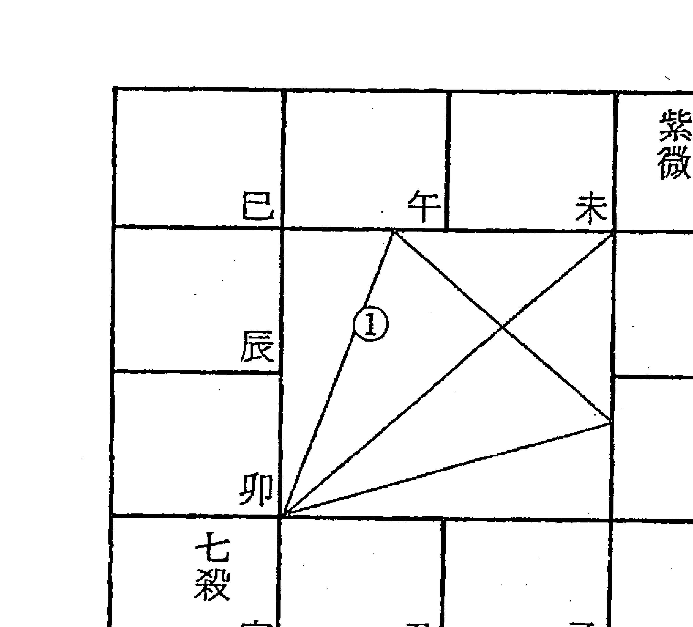

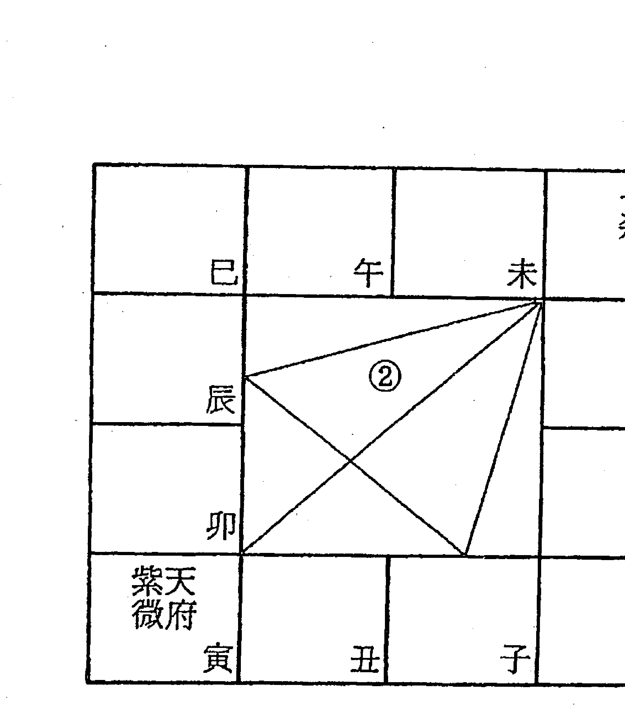

| 巳 | 午（天府） | 未 | 申 |
|----|------------|----|----|
| 辰 |            |    | 酉 |
| 卯 |            |    | 戌（紫微） |
| 寅 | 丑         | 子（七杀） | 亥 |

| 巳 | 午（七杀） | 未 | 申 |
|----|------------|----|----|
| 辰（紫微） |            |    | 酉 |
| 卯 |            |    | 戌 |
| 寅 | 丑         | 子（天府） | 亥 |

优点 ◇ 不管如何，朝斗仰斗，意义雷同。最重要的，符合此一格局者，三方四正不能有四煞（羊、陀、火、铃）化忌，有这些凶星就破格了。

## 《条件》

## 三十一、英星入庙格

古赋云：「朝斗仰斗，爵禄荣昌。」

才能佳，有谋略，财官双美，是不简单的人物；其作为可独当一面，权威十足，可为高级主管。

富创造力、企划力、分析力、思考力。

此格之人，喜魁钺、昌曲、左右合照或坐守，既富且贵，能文能武。

- 缺失
- 如前言不喜四煞、化忌冲破，空劫亦不佳，会这些凶星除破格外，刑伤难免，严重的是「竹罗三限」。
- 此格局太硬太强，易引起是非纠纷。
- 此格局亦为杀破狼变动格局，奔波辛劳难免。成功是由奔竞而得。

破军星是北斗英星，子午宫是它的正位，故破军在子或在午坐命谓之「英星入庙格」。

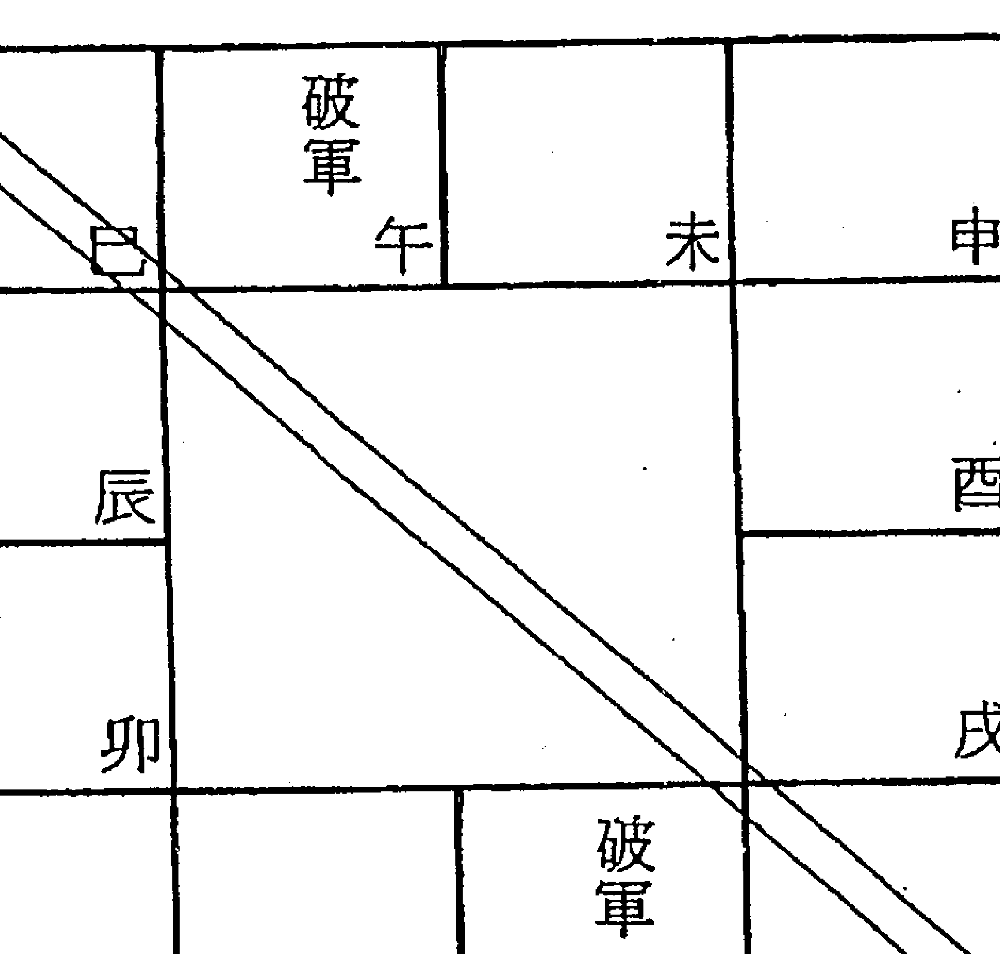

### ◇优点

> ○古赋云：「破军子午宫无杀，官资清显至三公。」罗洪先解曰：甲癸年生人合格，丁己年生人次之，丙戊年生人主困。

○诗曰：「北斗英星最有权，坎离之上福绵绵；黄金建节超廊厢，统帅英雄镇四边。」按：坎为子宫，离为午宫。

○有主见，性急而果断，有开创精神。

○艺高人胆大，爱投机，喜冒险，不怕犯难；福力绵延，有统帅之英气，威名可播。

### ◇缺失

+   ○性太急，一生变动大，成败皆迅速。
○不喜会文曲，尤以午宫，有水厄。
○煞星冲破，福不耐久，成乃昙花，谨防「竹罗三限」。

### 《条件》

○卯时生人，若立命在未，则文昌、文曲皆在

## 三十二、文桂文华格、文星拱命格

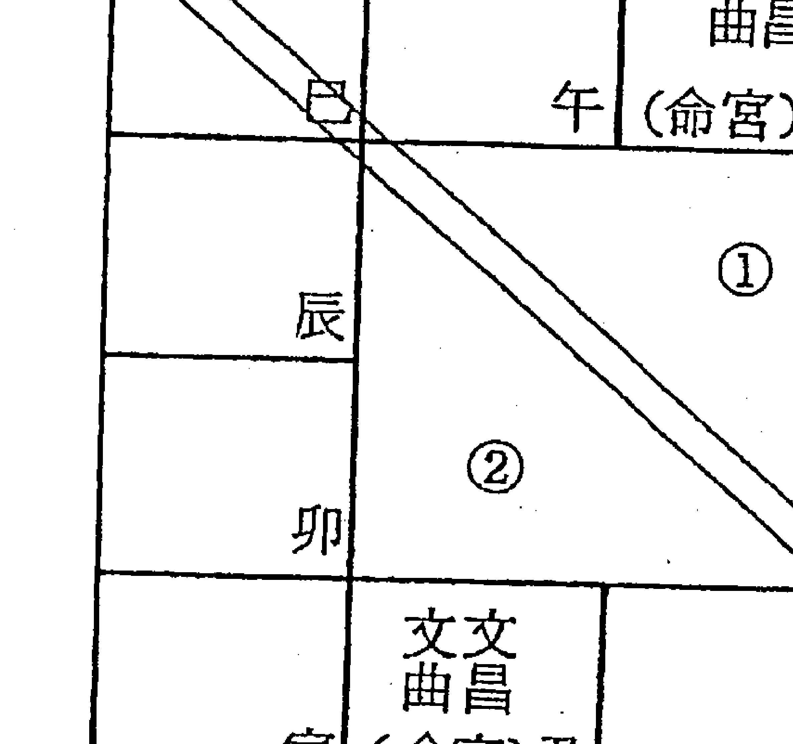

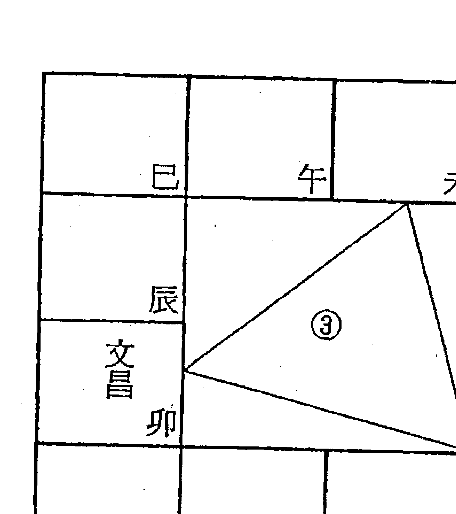

命宫（如下列①），酉时生人，若立命在丑，则文昌、文曲皆在命宫（如下列②）。此二式谓之「文桂文华格」。如下列③，文昌、文曲在命宫三方四正，谓之「文星拱命格」。只要合此条件皆可，下列③聊举一例而已。

### ◇ 优点

+   ○ 赋云：「文桂文华，九重贵显。」文桂为文昌，文华为文曲，二星于丑或未，若再逢化吉，或禄存，贵显一时。

+   ○ 文桂文华格亦喜遇日月同宫格，即太阳、太阴二星亦在丑或未同守命宫或财帛或官禄，或命宫坐日月，昌曲在三方四正，皆是富贵之命格。赋曰：「阴阳会昌曲，出世荣华。」

+   ○ 诗曰：「册书一道自天来，唤起人间经济才，命内荣华真可羡，等闲平步上蓬莱。」此乃指文桂文华格，有经国济世之天才，从事文学、医学、经济学工作，皆可显荣耀，乃上流社会人士也。

+   ○ 诀曰：「昌曲临于丑未，魁钺文会无杀凑，贵近天颜。」天颜，天子之容颜。诀文全意为：文桂文华格，亦喜会照魁钺，相当贵显，可辅佐天子。当然如有煞星来冲，必然减吉，或可辅一县之主，或一种事业之王。昌曲又喜在巳亥，只要不遇廉贞、贪狼在巳亥，即主大富贵。诀云：「昌曲巳亥临，不贵即当大贵。」

+   ○ 此格亦喜会禄存，诀曰：「昌曲禄存，允为奇格。」又云：「禄文拱命，富而且贵。」

+   ○ 如昌曲皆在福德，叫做「玉袖天香」。

### ◇ 缺失

## 三十三、昌曲夹命格

### 《条件》
命宫无煞星坐守，而两旁有文昌、文曲来夹，谓之「昌曲夹命格」，亦称「文星暗拱格」。

昌曲在寅或卯，叫做「众水朝东」，若不逢羊陀，尚有好发展，逢破军同宫，主财大来大去，人两脚，钱四脚。

文星遇夹：昌曲守命或身，空劫两邻来夹，一生劳碌无成。

> 昌曲逢破军，都是入了杀破狼格局，变动劳碌。诀曰：「昌曲破军逢，刑克多劳碌。」

> 在寅或卯宫，破军守命（卯宫为廉破同宫），三合昌曲，若逢羊刃冲破，必主奔波。诀曰：「昌曲破军临寅卯，杀羊冲破定奔波。」

三合见昌曲拱命，然命在巳或亥，若廉贞贪狼坐守，亦是不吉，男女皆易遭凶亡。诀曰：昌曲廉贞于巳亥，遭刑不喜且虚浮。」此类刑凶，大抵与色情有关。

此格局不宜女命。女命骨髓赋云：「文昌文曲福不全。」骨髓赋云：「杨妃好色，三合文曲文昌。」杨贵妃的命盘，请参考「紫微进阶」；一般来说，昌曲不宜女命，淫邪之声名，很难避免，尤以三合天机、巨门者更烈。三合太阳、太阴，而太阳、太阴皆落陷失辉，亦淫荡终生。

### 优点

+   依上项条件，仅如下列四式：
    - ①寅时生人，立命在未。
    - ②申时生人，立命在丑。
    - ③辰时生人，立命在未。
    - ④戌时生人，立命在丑。

| 巳 | 午 | 未 | 申 |
|----|----|----|----|
| 辰 | 文曲 | (命宫)未 | 文昌 |
| 卯 | 申时生人 | ① | 寅时生人 |
| 寅 | 文昌 | (命宫)丑 | 文曲 |

| 巳 | 午 | 未 | 申 |
|----|----|----|----|
| 辰 | 文昌 | (命宫)未 | 文曲 |
| 卯 | 戌时生人 | ③ | 辰时生人 |
| 寅 | 文曲 | (命宫)丑 | 文昌 |

> 《骨髓赋》云：「夹昌夹曲主贵兮。」又云：「昌曲夹墀，男命贵而且显。」昌曲夹命，主富贵；若昌曲夹太阳（丹墀）或太阴（桂墀），男命亦主贵显。

+   ○ 诀云：「昌曲夹命最为奇。」若不贵即富，主要命及三方四正不能为凶煞星曜冲破，若昌曲夹空劫之类凶星，虽博学多能，亦是穷儒一介，十艺九不成。
○ 文星暗拱：亦有以昌曲在迁移照命，称「文星暗拱」格；赋云：「文星暗拱，贾谊允矣登科。」贾谊命盘请看「紫微进阶」。

+   ○ 女命亦不宜，虽有姿色、才智，但主淫。
○ 男命亦怕凶星冲破。

## 三十四、左右同宫格（左右守垣）

### 《条件》

+   ○ 左辅、右弼同守命宫，谓之「左右同宫」或「左右守垣」格。
○ 依此条件，仅二式：①四月生人，命宫在未。②十月生人，命宫在丑。
○ 一、七月生人，命在辰、戌者，亦可同论。

### 各优点

赋云：「左右同宫，披罗衣锦。」又云：「左辅右弼，终身福厚。」又云：「辅弼坐冲，福禄到终。」

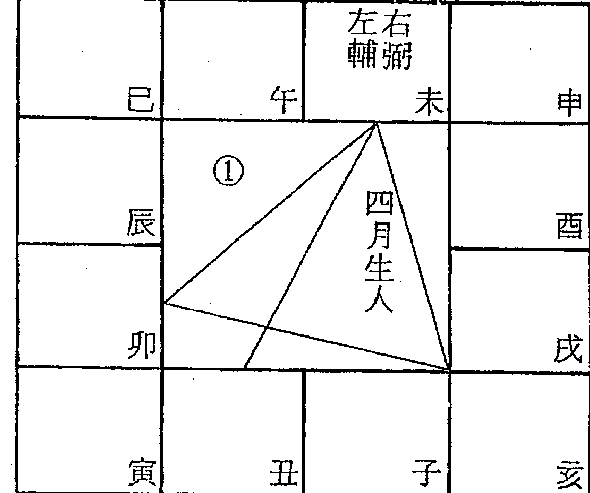

诗云：「格逢辅弼命中临，加会科星福禄深，事业昂昂追魏邺，官居台阁万人钦。」

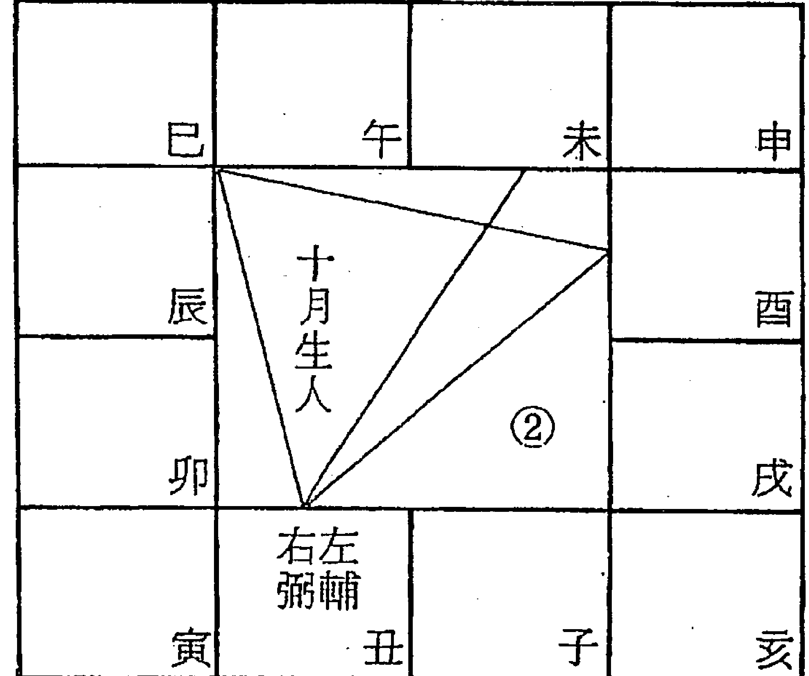

此格之人

喜会科星，诸如化科、魁钺、文昌等是。诀云：『左右魁钺为福寿。』此格之人，若不逢煞，事业大，声名扬，为官可受万人钦仰，名利双收。

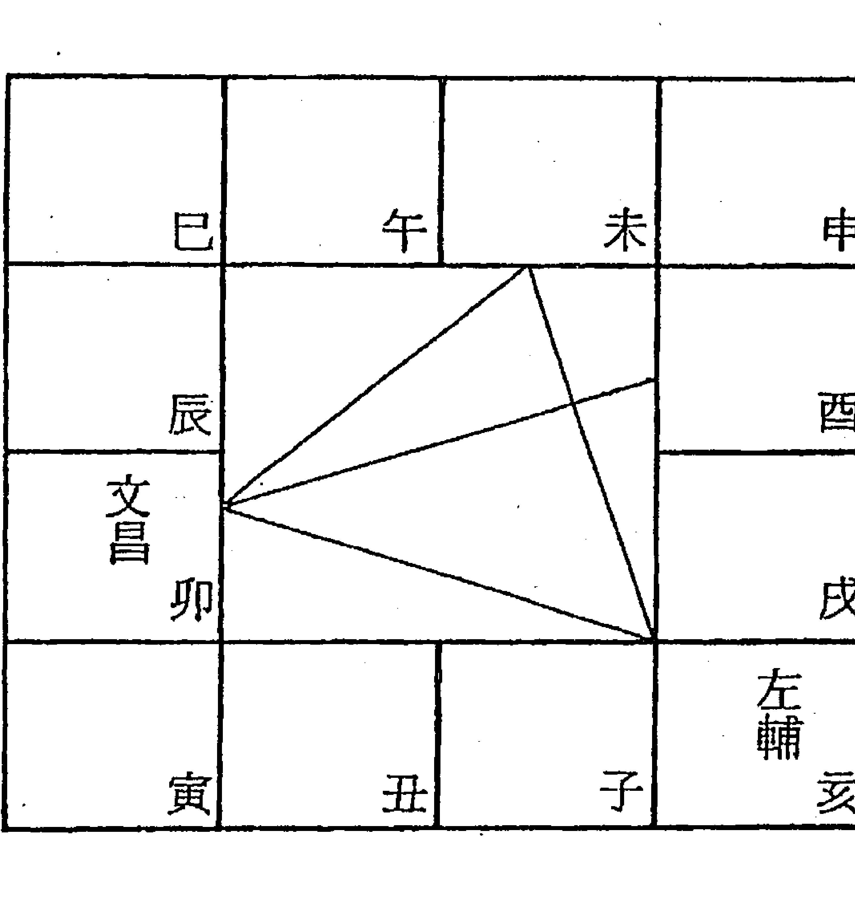

### ◆缺失
若逢凶煞，先成后败，先荣后辱，以过程而言，曾是座上客，终为阶下囚。

### ◆优点
诗曰：『辅星拱命最堪言，敏捷才华众莫先；轻则帅臣兼五马，重须入相振威权。』
此格之人，有敏捷之才思，出众之能力；出...

## 三十五、辅拱文星格

### 《条件》

文昌在命，左辅拱照，谓之『辅拱文星格』。
上列命盘，举例而已，只要合于上述条件皆可称为此格；若文曲坐命，或昌曲坐命，左辅拱照，皆合此格局。

将入相，享受尊位。但早年不好。

### 《条件》三十六、三奇嘉会格

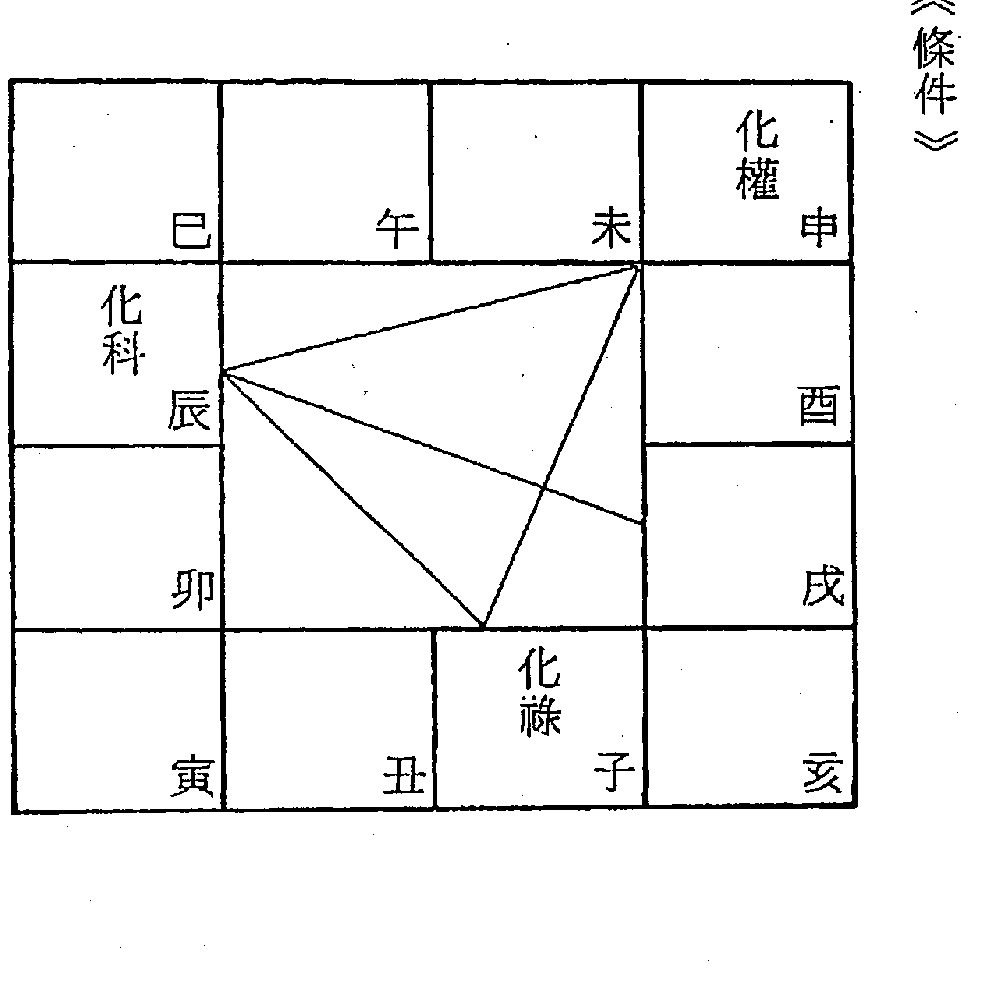

化禄、化权、化科（称三奇或三吉或三化吉）在命、财、官三方会齐，迁移亦可，谓之「三奇嘉会」格。

上列命盘，仅举一端，只要三方四正会集三化吉星即可，三化吉全搁在一宫或二宫亦可。

三奇嘉会固佳，会集二吉，即非等闲。

+   ◇优点
○赋云：「科权禄合，富贵双全。」最好的是命、财、官各有一颗化吉星，依笔者的观点如上列命盘：化科在命、化禄在财、化权在官，如此美不可言。
○原则上，当官的喜权科在官，做生意的喜权禄在官；又化吉星在命，不如在财、迁、官，在命主格高，多属祖荫或福气，免辛劳命

自好，而在财、迁、官，则属有成就，有本事，能伸展抱负的。

古人命盘，留名万世者，其三方四正大抵皆有二化吉以上，故化星异常重要，本书的第二集「紫微进阶」，对四化论有进一步之剖析，且论列了一百一十位古人命盘。

> 古赋又云：「禄权命逢合吉，威权压众相王朝。」又云：「权禄重逢，财官双美。」此乃就化禄、化权二吉入三方四正而言。

> 古赋云：「科命权朝，登庸甲第。」意谓化科守命，化权在迁或财或官朝命，可学而优则仕。

> 对于权禄，又有诀云：「权禄重逢，衣食丰隆。」又云：「权禄守财福之位，出世荣华。」此就财帛与其对宫福德而言，各守一颗权禄，荣华过人。

> 对于三化吉，其性质依赋云：「禄会禄存大富，权会巨武英扬，科会魁钺贵显。」可见其分别：禄主权，权主位，科主名。当然有更完善的解释，请参看「紫微进阶」。

### 缺失

三奇嘉会怕煞星凶曜来冲，虽可成就，但世路多艰。尤怕空劫与七杀破军会照。

命有三奇，年少多艰，乃因第三大限方可 能合照部份化吉星，第五大限才重逢三吉，故属晚成之格。

> 诀云：「权禄吉星仆役位，纵然官贵也奔驰。」权禄在奴仆（交友）宫，虽可位高官，但无法自好。

## 三十七、权禄巡逢格

> 「治大国若烹小鲜」，常须使出浑身解数，汲汲营营地从事。

| 巳 | 午 | 未 | 申（化权） |
|:---:|:---:|:---:|:---:|
| （命宫）辰 |  |  | 酉 |
| 卯 |  |  | 戌 |
| 寅 | 丑 | 子（化禄） | 亥 |

### 《条件》
化权、化禄同守命宫或于命之三方四正，遇吉星同守益吉。

若命宫干或支为生年干或支，谓之「权禄生逢」。此为笔者之见，另有以命在长生位者。

又有认为权禄同守命宫，命宫庙旺者。笔者认为权、禄在三方不在命，并不比在命差，味道不同而已。

### 优点

> 赋云：「禄权命逢合吉，威权压众相王朝。」
又云：「权禄重逢，财官双美。」
又云：「权禄守财福之位，处世荣华。」

> 诗云：「命逢权禄实堪夸，千载功名富贵家；单见也应身富厚，平生稳步好生涯。」

## 三十八、双禄交流格（禄合鸳鸯格）

> 谓见一禄或权，就不错了。
○权禄在命，格高、出身高、家世好，在财、迁、官，自己行、才器佳。

◇缺失
○三奇是命格最重要之一环，只要有一化吉入命三方，即代表此人有某些才气、能力、福份。

○但凶星坐守、冲照，或煞星冲破，即代表瑕疵、灾难、困扰、阻滞。每一个人的命盘皆有成败的凶、煞、忌星，所以每个人皆有破败处。赋曰：“权禄重逢杀凑，虚誉之隆。”煞星严重冲照，虽有权禄，是外强中干的壳子。赋又曰：“权禄吉星奴仆（交友）位，纵然官贵也奔波。”

「权禄是吉星，但如入交友宫，交友宫为他人之宫，非为我宫，所以当上了官，也是看人脸色，或过份牵扯部属、上司之关系，奔波异常。

### 《条件》

+   ○在三方四正（命、财、迁、官）有禄存与化禄二星者，称“双禄交流格”，亦称“禄合鸳鸯格”。

+   ○如下列①②仅为举例，禄合格可能发生的命盘很多，不胜枚举；如①代表禄存与化禄同在命宫。

者皆是，如②则为该二星在三方四正者亦是，此形式又称「双禄朝元（垣）格」。

### 优点

赋云：「合禄拱禄，定为巨擘之臣。」

> 「合禄拱禄堆金玉，爵位高迁衣紫袍。」

意谓禄

| 巳 | 午 | 未 | 申 || 化禄
禄存 |
| 辰 | | | | 酉 |
| | ① | | | 戌 |
| 卯 | | | | |
| 寅 | 丑 | 子 | 亥 |

| 巳 | 午 | 未 | 申 || 化禄 |
| 辰 | | | | 禄
存 |
| | ② | | | 酉 |
| 卯 | | | | 戌 |
| 寅 | 丑 | 子 | 亥 |

合格主富又主贵。

> > 赋又云：「双禄重逢，终身富贵。」

> > 诗曰：「禄合鸳鸯福气高，斯人文武必英豪；堆金积玉身荣贵，爵位高迁衣紫袍。」

> > 诗又曰：「财官一处与迁移，双禄逢之最有宜；德合乾坤人敬重，滔滔富贵世稀奇。」此乃指双禄在财帛、官禄、迁移照命而言。

> > 此格之人，财官双美，受人敬重，有名望，福气高，有英气豪风。

> > 女命亦贵，才具高超。

> > 诀曰：「合禄驾鸿一世荣。」谓禄存与化禄守夫妻宫，男因妻富，女以夫贵。合照夫妻宫，亦同此论；所谓合照夫妻，即双禄在迁移、官禄、福德者是。

◇缺失

> > 若天同坐命者，不喜双禄同宫，因嫌过分疏懒。其它福寿星皆然，如天梁化禄加禄存，福份虽重，讲话不负责任，让人有吹嘘之感。

> > 赋云：「吕后专权，两重天禄天马。」就女人来说，双禄加天马，虽才具高超，但专权、厉害、跋扈。

## 三十九、甲第登庸(科)格

| 巳 | 午 | 未 | 申(武(科)) |
|----|----|----|------------|
| 辰 |    |    | 酉         |
| 卯 |    |    | 戌         |
| 寅(破(权)) | 丑 | 子 | 亥         |

○化科守命，化权来朝照，谓之「甲第登庸」格。

○上列命盘，仅举一例而已。

+   ◇优点

○赋云：「科命权朝，登庸甲第。」若再逢化禄更吉，为「三奇嘉会」：如上列命盘即举甲年生人，命宫在申守化科，另有化禄廉贞在辰守财，破军化权在寅迁移照命。

○诗曰：「禹门一跃便腾空，头角峥嵘大浪中；三汲飞翻合变化，风云平地起蛟龙。」此格之人，可以在众人中崭露头角，凸显地位，绝非泛泛之辈。

+   ◇缺失

○若化科与凶星同宫，或煞星冲破，则中看不中用，或怀才不遇。诀曰：「科名陷于凶神

> 苗而不秀。

## 四十、科名会禄格

| 巳（天机化科） | 午 | 未 | 申 |
| 辰 | 酉 |   |   |
| 卯 | 戌 |   |   |
| 寅 | 丑 | 子 | 亥（太阴化禄） |

### 《条件》
+   化科在命宫，化禄星会照，谓之「科名会禄格」。

## 四十一、擎羊入庙格

### 《条件》

+   擎羊（又名羊刃）入辰或戌或丑或未守命，谓之「擎羊入庙格」。

### 优点

> 诗曰：「科名在命数中强，卓越才华远近传；一跃连登三汲浪，衣冠楚楚侍金銮。」

+   以辰、戌、丑、未年生人最强。

有名望，远近皆荣显，风云际会，开展运程，财名皆足。参考「三奇嘉会」、「甲第登庸」。

+   有以擎羊单守命宫（亦在辰戌丑未）为人格

### ## 优点

羊刃本为刑伐之宿，但于辰戌丑未四墓之地

### ## 缺失

虽说羊刃在四墓地，凶性被制，然其它凶星发作时，羊刃亦为灾，刑伤难免。

古赋云：『巨火擎羊，防遭缢死。』此谓巨门、火星、羊刃（或陀罗）坐守身、命，大限逢之，太岁又凶，谨防缢死或投河。

羊刃火星的组合，女命不宜。女命骨髓赋云：『擎羊火星为下贱。』若女命为『擎羊入庙格』，刑克亦不免，其余宫位则下贱。

赋云：『擎羊入庙，富贵声扬。』意为羊刃入庙格，若加火星，权威出众，领导有方，有统御之方。

其凶性反为所制，保留其威强与冲劲，使之成为吉星反应。

| 巳 | 午 | 未 | 申 |
|----|----|----|----|
| 辰 | ① | 羊刃 | 酉 |
| 卯 | ② |  | 戌 |
| 寅 | 丑 | ④ | 亥 |
|  | 羊刃 | 子 |  |

## 四十二、坐贵向贵格

### 条件

| 巳 | 午 | 天魁 未 | 申 |
| --- | --- | --- | --- |
| 辰 |  | 甲年生人 | 酉 |
| 卯 |  |  | 戌 |
| 寅 | 天钺 丑 | 子 | 亥 |

甲、戊、庚年生人天魁与天钺二星在丑未二宫对照，若命宫亦在丑或未宫，即为「坐贵向贵格」

| 巳 | 午 | 天钺 未 | 申 |
| --- | --- | --- | --- |
| 辰 |  | 戊庚年生人 | 酉 |
| 卯 |  |  | 戌 |
| 寅 | 天魁 丑 | 子 | 亥 |

一。

按：一般斗数魁、钺二星排法与本书不同，请注意依照本书之办法排列。

+   ◇优点
○魁钺二星为天乙贵人，魁为阳贵，钺为阴贵；白天生人，阳贵坐命为贵，夜间生人，阴贵坐命为贵。
○赋云：「天魁天钺，盖世文章。」虽如此说，必要分清日夜生人及阴阳贵，必依本书如上之排法与解说，否则无此效力。
○坐贵向贵，乃贵人多，吉格。

+   ◇缺失
○如阳贵坐命，夜间生人，恐难有盖世文章，笔者手中有多命盘，坐贵向贵，既不识为文，且身在囹圄。

## 四十三、天乙拱命格

### 《条件》

+   ○ 除坐贵向贵格外，若三方四正有天魁、天钺会照，谓之「天乙拱命格」。
○ 天乙拱命者甚多，下列命盘聊举为例而已。如①乃乙年生人，若命宫在申或子或辰者是；如②乃亥年生人，若命宫在酉或亥者是。其余生年，读者可自行比照上述条件，进行认定。
○ 与坐贵向贵格一样，须注意日夜生人与阴阳贵。

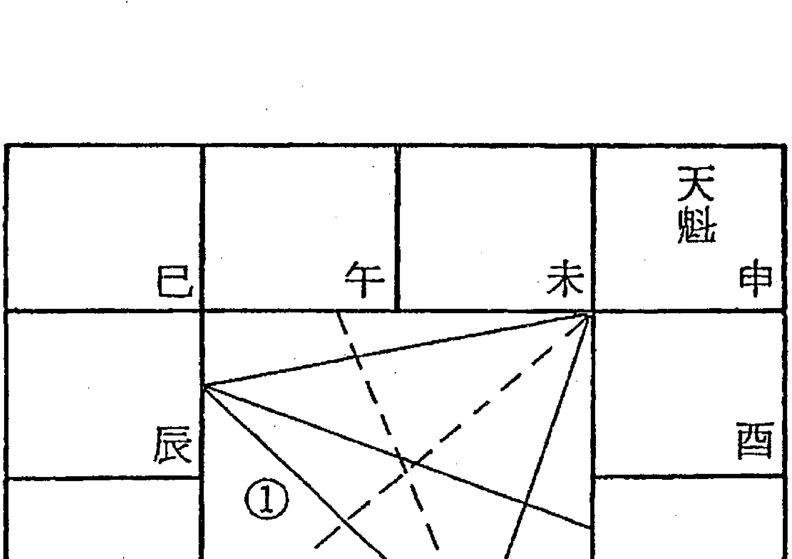

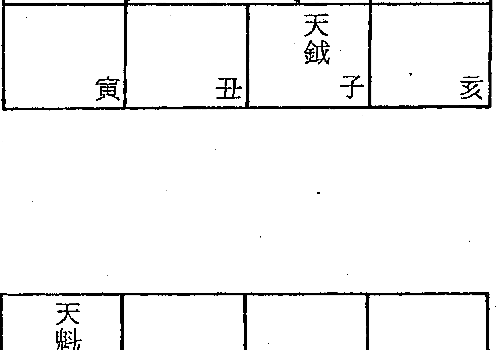

### 优点与缺失

+   ○ 诗曰：「天贵相逢随命来，英名早占少年魁；文章盖世追班马，异日当为宰相才。」班马，班固与司马迁，皆为史家。按此格之人，务须坐星吉，或本拥贵格，再分辨日生人阳贵（天魁）得力，夜生人阴贵（天钺）得助，方可论之。是锦上添花的格局，若本命格局不好，或有冲煞，徒拥此格，只能呼呼「美丽的哀愁」而已。

+   ○ 本格好，加此格局，年少时即获声名。

## 第四節 壞的格局

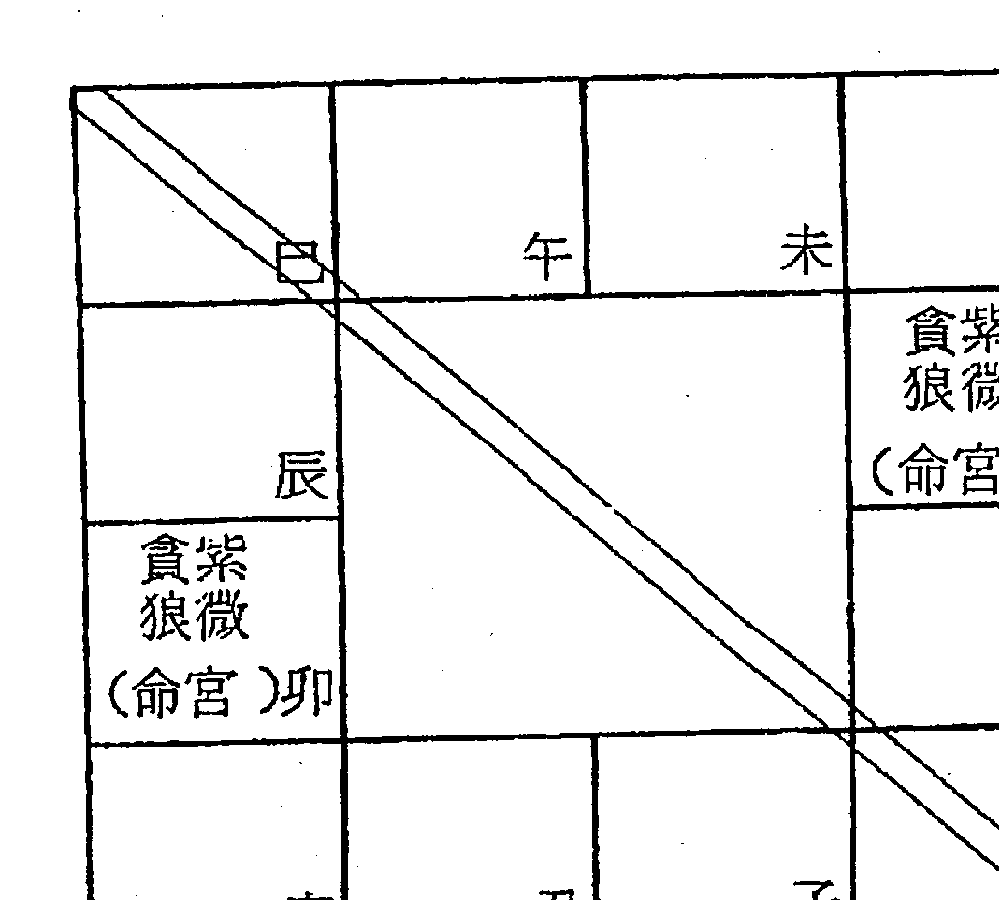

### 一、極居卯酉格

#### 《條件》

- 紫微（極）坐卯或酉守命宮，謂之「極居卯酉格」。
- 按：紫微在卯酉一定與貪狼同宮。

#### ◇作用

> 賦云：「極居卯酉，劫空四煞，多為脫俗之僧。」

謂極居卯酉格，若再逢地空、地劫或四煞（羊、陀、火、鈴），有佛緣，古時說要出家，現代則會吃素和接近神佛，此命格宜有宗教信仰。

詩曰：「紫微卯酉忌相逢，文曲蹉跎豈有成；借問此身何處去，衲衣削髮居空門。」意謂此格之人，逢化忌或劫空四煞，縱遇文曲，亦是百般蹉跎，宜信仰宗教，方得安身。

此格之人，若有吉星解化，亦即有化吉或魁鉞、左右會照，而無煞沖，尚主富貴。

| 天機 | 巳 | 午 | 未 | 申 |
| :--- | :--- | :--- | :--- | :--- |
| 辰 |  |  |  | 酉 |
| 卯 |  |  |  | 戌 |
| 寅 | 巨門天同 | 丑 | 子 | 太陰亥 |

| 太陰 | 巳 | 午 | 巨門天同未 | 申 |
| :--- | :--- | :--- | :--- | :--- |
| 辰 |  |  |  | 酉 |
| 卯 |  |  |  | 戌 |
| 寅 |  | 丑 | 子 | 天機亥 |

### 二、天機巳亥格

#### 《條件》

○ 天機於巳或亥坐守命宮，謂之「天機巳亥格」。

#### 《作用》

○ 詩云：「天機巳亥宮，為人多狡詐，機謀必離宗。」又云：「為人多狡計，自性作經營，貪飲多機見，離宗必遠親。」

○ 以前的觀點是此格之人多狡詐。詳觀今人命盤，此格之人，精明固有，變異偏多。中有機智者，有機詐者，識者宜自行體會。蓋機智與機詐之區別，非有大智者，不知其辨，以常人所處之社會，常以他人合己利或與己同夥共利之行爲機智，以與己決裂之人爲機詐。此種觀念不確，然於工商社會，有幾人能拋私利而就社稷福社，實在困難。

○ 這一格局，若無煞沖或忌破，思想靈活，好動，這是必然。若天機逢化忌，思想偏激，且手腳易有麻痹萎縮現象。至於狡詐問題，宜慎思明辨，切莫輕率斷言。

#### 《條件》

○ 巨門與天機在酉同宮，逢化忌，是謂「巨機化酉格」。

#### ◇作用

丁年生人或戊年生人，命宮化忌，其餘三方四正化忌沖命皆不吉。

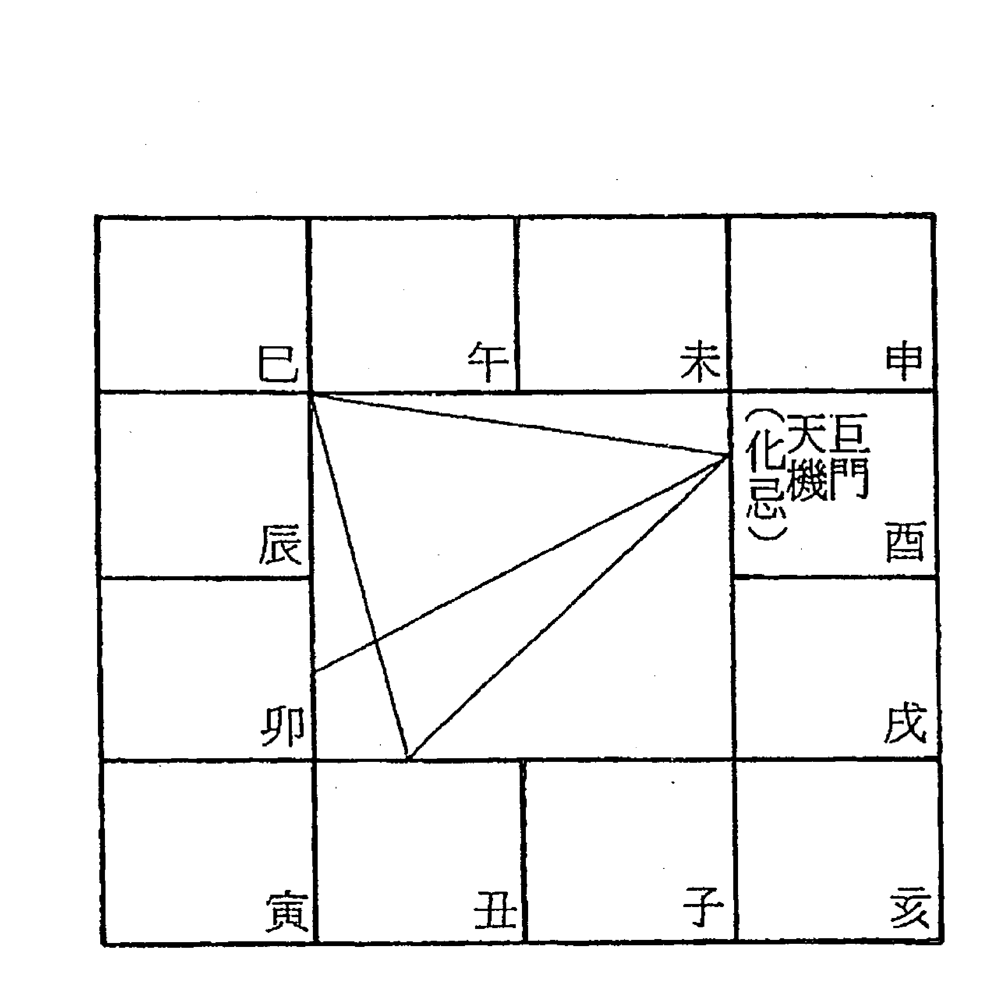

> 詩曰：『兌位天機巨曜過，化凶辛苦受奔波；心高意勇何曾歇，說話無情句亦訛。』兌位即為酉位，天機在酉一定遇巨門，逢化忌定主奔波，心思高遠無窮，但是世態炎涼，一回首什麼都錯了。

女命骨髓賦云：『巨門天機為破蕩。』這句話可為巨機同宮或會照之寫照，縱有福亦非全美，必有破且帶飄蕩性質。

> 賦云：『巨陷天機為破格。』又云：『巨機酉上化吉，縱有財官也不終。』雖逢化吉，財官乍美，絕非全福，主要因巨機為破蕩。更何況『巨機化酉』是逢了化忌。

巨機居卯逢化吉尚好，但女命雖富貴，卻不免淫佚。

### 四、日月反背格

#### 《條件》

○ 太陽（日）在戌宮，太陰（月）在辰宮。
○ 命宮在辰或在戌，是為「日月反背」格。
○ 廣義的說法：日月在丑未同宮，丑未一線為界。若太陽在丑未線右方任何一宮，太陽皆落陷，且太陰一定落在丑未線左方。此時若此二星在命、財、官三方會照，皆為「日月反背」。

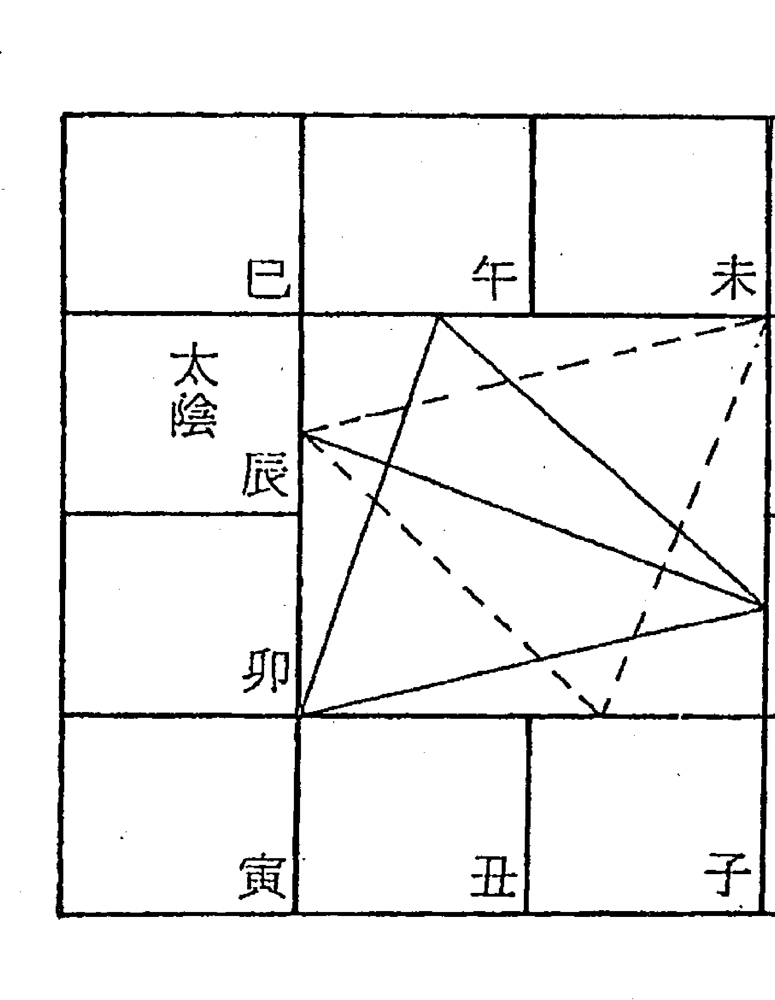

#### ◇ 作用

日月既已反背，就難免勞苦，披星戴月。但是，並不代表勞苦一生而無所成就；此格局僅表示「勞碌命」而已，是無福清閒和享樂的人。

○ 與父母緣薄，須靠自力奮鬥，離鄉背井，在異地打拼。

○ 此格若太陽坐命者，個性較堅強，不以苦為苦，不但認命，甚至覺得這是自然的事，無以爲悲苦。

○ 此格若太陰坐命者，個性較柔弱，想像力較豐富，可習命理、玄學之類的學術。

| 太陰（天向） |  |  |  |
| :--- | :--- | :--- | :--- |
| 巳 | 午 | 未 | 申 |
| 辰 |  |  | 酉 |
| 卯 |  |  | 戌 |
| 寅 | 丑 | 子 | 亥 |

此一格局，桃花難免，經經緯緯，斷了又續，舊去新來，可以『桃花格』視之。

有許多偉人亦是『日月反背』，故不可視此為全凶。

### 五、月同遇煞格

條件：天同、太陰在午守命逢煞星，謂之『月同遇煞格』。

作用：太陰在午落陷失輝，遇煞無法救解之故。

> 詩云：“骨瘦體微不足言，把薪燃火幾回焦；人間好事難明處，枝葉榮時總是凋。”

是典型的消極主義者，嘆“春花秋月何時了”的人，遇好不滿足，逢壞空悲嘆，得此失彼或得此念彼，諸事不如意。

> 賦云：“同月陷宮加煞，重技藝贏黃。”

這種人是胖不起來的人，凡事操勞，面黃肌瘦，為瘦操心，操心更瘦。

若與羊刃同宮，為「馬頭帶劍格」。

須防色災。

### 六、梁同巳亥格、梁馬飄蕩格

#### 《條件》

- (一) 梁同巳亥格
天梁在巳或亥守命，天同必在對宮朝照，此謂之「梁同巳亥格」。

- (二) 梁馬飄蕩格
天梁在寅、申、巳、亥守命，命馬同宮相會，謂之「天梁飄蕩格」。

#### ◆作用

天梁雖是蔭星，卻偏蔭他人，易作飄浪客，多為風流人。

> 賦云：「梁同巳亥，男多浪蕩女多淫。」

此格若再加會命馬，則其效力更強悍，擋都擋不住，改都改不了。男命浪蕩，不思安居，女命多淫，不想守貞。

> 賦又云：「天梁月曜女淫貧。」

亦指天梁在巳亥而言，以在亥為烈，因太陰落陷失輝在未宮會照。

| 天梁 | 巳 | 午 | 未 | 申 |
| :--- | :--- | :--- | :--- | :--- |
| 辰 |  |  |  | 酉 |
| 卯 |  |  |  | 戌 |
| 寅 | 丑 | 子 | 天同 | 亥 |

| 天同 | 巳 | 午 | 未 | 申 |
| :--- | :--- | :--- | :--- | :--- |
| 辰 |  |  |  | 酉 |
| 卯 |  |  |  | 戌 |
| 寅 | 丑 | 子 | 天梁 | 亥 |

> 賦云：「天梁天馬，爲人飄蕩風流。」在寅、申、巳、亥的天梁若逢天馬守命，則是「梁馬飄蕩」。天梁在四馬地守命，若無命馬同宮，僅只寅宮無飄蕩性質；若逢命馬，皆主風流、飄蕩。

### 七、殺拱廉貞格、貞殺同宮格

#### 《條件》

廉貞坐命，七殺朝照，皆謂為「殺拱廉貞格」。如上列①，舉其一例而已。

| 巳 | 午 | 未 | 申 |
| :--- | :--- | :--- | :--- |
| 辰 | ① |  | 酉 |
| 卯 (七殺 武曲) |  |  | 戌 |
| 寅 | 丑 | 子 | 亥 (廉貪 貞狼) |

○ 廉貞、七殺在丑或未同宮守命，謂之「貞殺同宮格」。如上列②③即是。

| 巳 | 午 (七殺 廉貞) (命宮) 未 | 申 |
| :--- | :--- | :--- |
| 辰 | ③ | 酉 |
| 卯 (七殺 廉貞) (命宮) 丑 |  | 戌 |
| 寅 | 丑 | 子 | 亥 |

#### ◇ 作用

○ 廉貞、七殺二顆都是動星，基本上是流浪生涯，不是安定的格局。

> 詩云：「貞逢七殺實堪惕，十載滯留有禍殃；逆至雖求多不遂，錢財勝似雪流湯。」意謂：廉貞和七殺相逢的話，應該戒懼謹慎，會過著流浪的生活，有許多禍殃也難免；有時好似好運已到，卻是千求不來，錢財好比雪球碰到熱湯，一下子就溶掉了。

○ 貞殺同宮也一樣，易遭刑傷，若無煞星沖破，而有吉星會照，尚可名利顯達。但，還是東奔西跑的命。

○ 賦云：「廉貞七殺居巳亥，流蕩天涯。」又云：「廉貞四殺遭刑戮。」按：四殺即四煞，羊陀火鈴是也。這四煞中，羊刃的凶性與白虎星相同，皆與刑訟有關。賦云：「廉貞羊殺官祿，枷杻難逃。」又云：「廉貞白虎，刑杖難逃。」

#### ◇ 注意

賦云：「廉貞七殺，反為腐敗之人。」這是指廉貞、七殺分守未、申，請參考「紫微進階」（注：古人命盤——石崇之命。）

### 八、刑囚夾印格

#### 《條件》
○ 廉貞（囚）與天相（印）在子或午宮同守命宮，若再入羊刃（刑），則成「刑囚夾印格」。

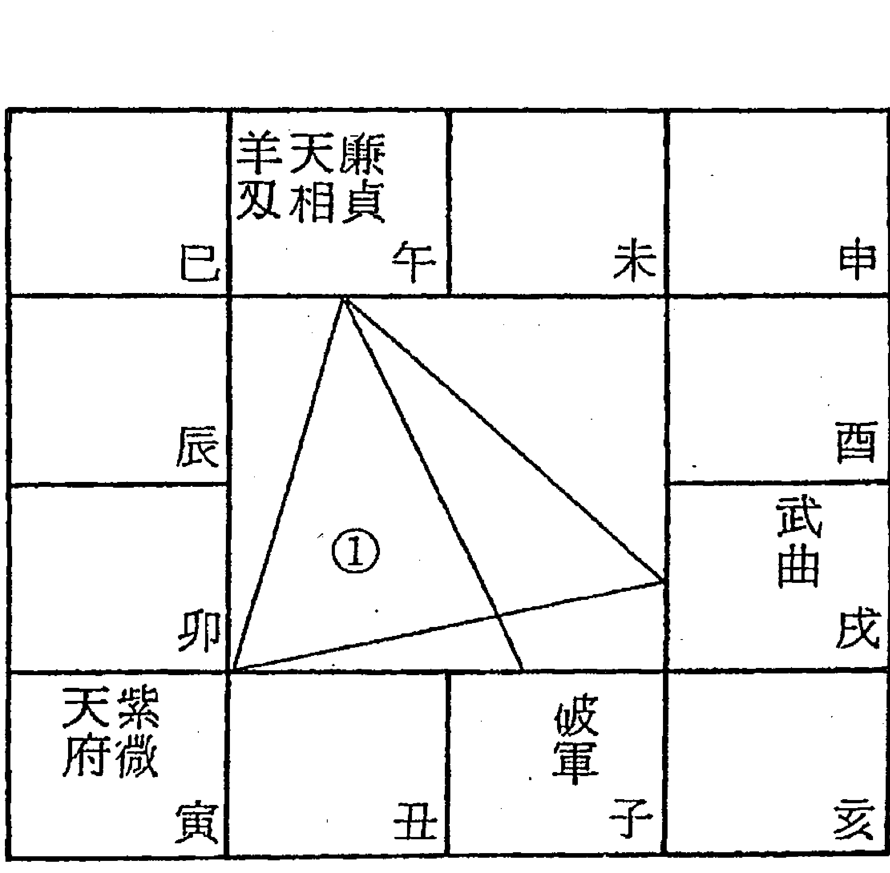

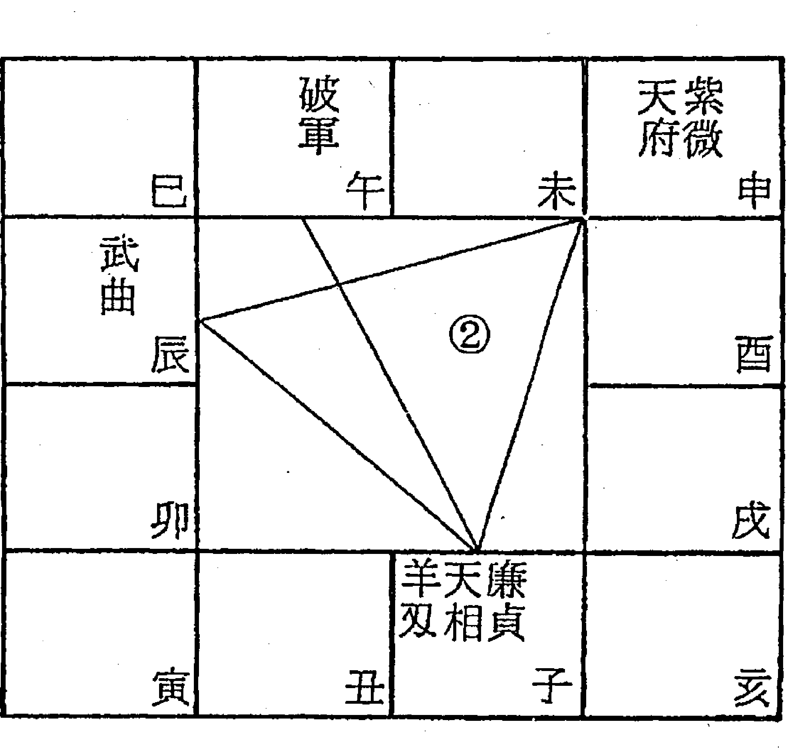

如上列命盤①，丙年或戊年生人，羊刃在午與囚印同宮，命盤②，壬年生人，羊刃在子與囚印同宮。

命宮在卯或酉，廉貞與天相對宮守照，遇羊刃星，亦應注意。

- ○ 如上列①，壬年生人，羊刃在子沖午，亦應注意。

#### ◇作用

- ○ 刑囚夾印格雖主武勇之人，但刑傷災重，是一不足取之武勇格局，宜慎之。
- ○ 此格之人，一生有訟爭，是非不斷。
- ○ 此格局若會昌曲左右，尚能在工作上掌權施威；若文昌同守，為人好禮樂。
- ○ 女命刑囚夾印，先生早逝，易流產，有開刀之厄；男命刑傷亦是難免。

#### ◇申論

- ○ 若非羊刃與廉貞、天相同宮，而是祿存，主富貴，但丙年生人，橫發橫破，因廉貞化忌之故，其凶力及凶象頗類刑囚夾印。

### 九、巨逢四煞格

#### 《條件》

巨門在身宮，四煞（羊、陀、火、鈴）沖命或身，謂之「巨逢四煞格」。另說：巨門、四煞分守命、身及其三方皆是。

| 宮位 | 星曜/備註 |
| :--- | :--- |
| 巳 |  |
| 午 | 陀羅 |
| 未 |  |
| 申 | 火星 |
| 酉 |  |
| 戌 | 鈴星 |
| 亥 |  |
| 子 |  |
| 丑 |  |
| 寅 | (命宮) |
| 卯 |  |
| 辰 | 羊巨雙門 (身宮) |

> 詩曰：「巨門落陷在身宮，四煞偏遇命裏逢；若是吉星無救解，必遭流配遠方中。」

這是古代一種「流刑」，發配到遠方；以現在的情況來說，可能要避罪逃亡，不能返鄉。

注意：不能以此命格為犯罪者，說不定是受冤逃亡；犯不犯罪，是另一回事。

> 賦云：「巨門四殺陷而凶。」又云：「巨火鈴星逢惡限，死於外道。」又云：「巨門羊陀於身命疾厄，羸黃困弱盜而媚。」又云：「巨火擎羊陀羅逢惡曜，防繒死投河。」

### 十、命無正曜格

#### 《條件》

命宮無正星（主星），即謂之為「命無正曜格」。

| 地支 | 星曜1 | 星曜2 | 備註 |
| :--- | :--- | :--- | :--- |
| 巳 | 天相 |  |  |
| 午 | 天梁 |  |  |
| 未 | 七殺 | 廉貞 |  |
| 申 |  |  | ① |
| 辰 | 巨門 |  |  |
| 酉 |  |  | ② |
| 卯 | 貪狼 | 紫微 |  |
| 戌 | 天同 |  |  |
| 寅 | 太陰 | 天機 |  |
| 丑 | 天府 |  |  |
| 子 | 太陽 |  |  |
| 亥 | 武曲 | 破軍 |  |

| 地支 | 星曜1 | 星曜2 | 備註 |
| :--- | :--- | :--- | :--- |
| 巳 | 七殺 | 紫微 |  |
| 午 |  |  | ③ |
| 未 |  |  | ④ |
| 申 |  |  | ⑤ |
| 辰 | 天機 | 天梁 |  |
| 酉 | 廉貞 | 破軍 |  |
| 卯 | 天相 |  |  |
| 戌 |  |  | ⑥ |
| 寅 | 巨門 | 太陽 |  |
| 丑 | 武曲 | 貪狼 |  |
| 子 | 天同 | 太陰 |  |
| 亥 | 天府 |  |  |

○ 如上列命盤，以①或②或③或④或⑤或⑥為命宮，皆為命無正曜格；其它命式若和上述情況相同，皆可謂為此格。

| 巳 (命宮) 地空 地劫 | 午 | 未 | 申 |
| :--- | :--- | :--- | :--- |
| 辰 |  |  | 酉 |
| 卯 |  |  | 戌 |
| 寅 | 丑 | 子 (地空) | 亥 |

#### ◆ 作用
○ 命無正曜，一般是庶生子或養子，如父母宮亦無正曜（如①、③、④為命宮時）更驗。
○ 幼年多災殃，二姓可延生，意即拜乾爹乾媽或為神之螟蛉子（養子），較為平順。
○ 此格之人，應是養子或庶生（姨太太生），或受他家養育；假若不是，應如上述拜乾爹乾娘或為神子。
○ 若有煞星坐守（煞星不能算正星），性情怪異，表裏不一，或有狠毒心計。

### 十一、命裡逢空格

#### 《條件》
○ 地劫、地空二星或其中之一星守命，謂之「命裡逢空格」。

#### ◇作用

> 詩曰：「空劫來臨無吉星，求名求利總成空，清閒孤獨方延壽，富貴榮華過隙駒。」意謂此格之人，孤獨方能長壽與富貴。

是孤獨命者，古時為僧為道，可享清閒，現代則須信仰宗教，且離家為佳。

### 十二、空劫夾命格

#### ◇條件

命宮在亥者，若為丑時或亥時生，地空和地劫二星，必是一在命宮前，一在命宮後（如下列命盤①④）；命宮在巳者，若為巳時或未時生人，空劫二星亦必一在命前，一在命後（如命盤②③）。
如下列四式，為「空劫夾命」，其餘狀況不可能發生。（借宮另論）

| 命宮巳 | 地劫 午 | 未 | 申 |
| :--- | :--- | :--- | :--- |
| 地空 辰 | ②未時生人 | ①丑時生人 | 酉 |
| 卯 |  | 地空 戌 | 地空 戌 |
| 寅 | 丑 | 地劫 子 | 命宮亥 |

| 命宮巳 | 地空 午 | 未 | 申 |
| :--- | :--- | :--- | :--- |
| 地劫 辰 | ③巳時生人 | ④亥時生人 | 酉 |
| 卯 |  | 地劫 戌 | 地劫 戌 |
| 寅 | 丑 | 地空 子 | 命宮亥 |

#### ◇作用

> 賦云：「夾空夾劫主貧賤。」又云：「劫空夾命為敗局。」

空劫夾命或夾身卻不吉，凶禍多；如化忌入命，成为空劫夾忌，其禍更重。
大限被夾，亦主該大限十年破敗刑禍。

### 十三、文星失位格

#### 《條件》

○ 文昌或文曲在寅或午或戌守命，逢煞星（羊、陀、火、鈴）或破軍，謂之「文星失位格」。

○ 寅午戌三合火，文昌屬金，文曲屬水，不宜入寅午戌宮。

#### ◆作用
○ 詩曰：「文星入命本為奇，沖陷反教事滯疑，任是燈窗勤著力，功名須等白頭時。」

意謂：縱有文才，亦難得功名，若有功名，亦須等到年老。

- - 這個命格的人，在古代是介窮儒，到年老白頭，反能登科。換言之，有才學，不能發揮，雖力拼，還是阻礙多，或有名無實。必要勵志乘人，到老方可通達。
- - 文昌與破軍的組合，逢此格局，宜注意水厄。文昌亦同，得倍加注意。
- - 賦云：「破軍昌曲逢，刑剋多勞祿。」謂此格之人，三方無煞時，亦是刑剋勞祿；若再逢劫空、化忌，一世清貧；而破軍入此格三方，其三方四正必逢貪狼，不宜再逢祿馬，逢之男多浪蕩女好淫；羊陀沖照，殘疾難免，破相方可延生。

### 十四、科星逢破格

#### ◇ 條件》

- - 命宮坐化科，三方四正有地空、地劫、四煞沖破或化科與諸凶星在三方逢遇，謂之「科星逢破格」。

#### ◇ 作用

- - 詩曰：「細把科名仔細詳，若逢惡煞貴名難；連年居在孫山外，只作高明一士看。」化科主科名，即謂其功名。化科入命或三方，代表此人有讀書的福份，但逢煞星的話，雖是讀得不錯，卻是常考不上，了不起讓人讚嘆是個書讀得好的人。
- - 賦云：「科星陷於凶种，苗而不秀。」凶煞有許多，逢遇少的話，秀而不實，逢遇多的話，苗而不秀。
- - 科星又主貴人，受沖破，有貴人但不賣力，或越幫越忙。
- - 科星是很脆弱的，一顆凶煞，即可為災，使科星受制，甚且反生嘮嗦、糾纏、拖延等麻煩事。

### 十五、桃花滾浪格

#### 《條件》

巨門、太陽二星同宮在寅守官祿，命宮在戌獨坐文曲，謂之「桃花滾浪格」。
按此格唯午時生人才可能發生。

#### ◇作用

桃花如浪，滾滾而來，感情困擾，一波未平，一波又起。

### 十六、馬頭帶劍格

#### 條件

- * 擎羊在午宮守命，如下列①，謂之「馬頭帶劍」格。

| 列1 | 列2 | 列3 | 列4 |
| :--- | :--- | :--- | :--- |
| 巳 | 午 | 未 | 申 |
| 辰 |  |  | 酉 |
| 卯 |  |  | 文曲 |
| 太陽 巨門 |  |  | 戌 |
| 寅 | 丑 | 子 | 亥 |

- * 前項乃以午為十二生肖中之馬而論。又有以寅申巳亥四馬地，而以前一位為馬頭者，即以午為巳頭，卯為寅頭，酉為申頭，子為亥頭。午宮已如下列①，除三種說明於後。
* 如下列②，擎羊在卯宮守命亦為此格；此種狀況，甲方生人方可能發生。
* 如下列③，擎羊在酉宮守命亦為此格；此種狀況，庚年生人方可能發生。
* 如下列④，擎羊在子宮守命亦為此格；此種狀況，壬年生人方可能發生。
* 上列四種，以①最嚴重，②次之，③④更次之。

| 巳 | 擎羊 命宮 午 | 未 | 申 |
| :--- | :--- | :--- | :--- |
| 辰 | ② | ① | 擎羊 命宮 酉 |
| 擎羊 命宮 卯 | ④ | ③ | 戌 |
| 寅 | 丑 | 擎羊 命宮 子 | 亥 |

#### 作用

古賦云：馬頭帶劍，非夭折則主刑傷。離鄉背井，在驚濤駭浪中創業，成敗起伏，好壞迭起。上漂泊，奔波不定，備受艱辛，到頭來為人作嫁。刑妻剋子，自身災殃亦多，若無吉星制化凶。

#### ◆申論

在古賦上亦云：「馬頭帶劍，鎖鄉邊阻。」 以此看來，混淆了不少學者，許多坊間斗數書籍，有主前文說法者，有主本文說法者。 鎖鄉邊阻的說法，出於「太微賦」，且筆者也考證了太微賦的口訣，出自古人命盤。 而此一「馬頭帶劍，鎖鄉邊阻」，正是東漢光武帝之命盤模式。羅洪先的註解是：午宮馬頭帶劍，逢天同或貪狼為美，丙、戊年生人化吉。依此而論，天同在午坐命，丙年生人吉，因丙年天同化祿；貪狼在午坐命，戊年生人吉，因戊年貪狼化祿。

依此而論，「馬頭帶劍」的命格，只要三化吉（祿、權、科）會照，也不會壞到那裏。東漢光武帝，肩挑中興重任，那有不艱苦的道理，但最後也成功了，留名丹青。他的命盤是天同化祿在命（午宮），丙年生人，擎羊一定在午，所以是「馬頭帶劍」格，化權在官祿會照。（漢光武的命盤，請參考「紫微進階」。）如書上寫「鎖鑠邊帥」或「邊關封帥」或「幫聞鑾吏」之類，若未從軍，可解為往國外發展。

## 十七、羊陀夾忌格

祿存坐守命宮，又與化忌星同宮，因祿存坐命，羊刃一定在前一位，陀羅一定在後一位，故謂之「羊陀夾忌」。形成「羊陀夾忌」者甚多，下列僅舉一例而已。

### 《條件》

- 形成「羊陀夾忌」者甚多，下列僅舉一例而已。

### ◇作用

> > 賦云：「羊陀夾忌為敗局。」

- 孤貧刑剋，百事不吉；運限逢之，亦多悔咎。
- 縱不化忌在命，僅為「羊陀夾命」，若無吉星坐守，或祿存獨坐命宮，亦是守財奴，即使富有

| 巳 | 午 | 未 | 申 |
|---|---|---|---|
| 貪狼 羊刃 |  |  |  |
| 辰 |  |  | 酉 |
| 太陰 祿存 化忌 | 卯 |  | 戌 |
| 紫微 天府 陀羅 | 丑 | 子 | 亥 |

## 十八、其它訣要

訣又云：「祿逢沖破，吉也成凶。」意謂命身坐祿存，不僅化忌同宮凶，三方四正有煞星、空劫沖剋，亦為所破。

### （一）馬落空亡

命馬遇空亡、截路、天空、四煞、化忌同宮或三方沖照，主奔波，白忙白勞。賦云：「馬遇空亡，終身奔走。」又云：「天馬逢空亡死絕，災病悔吝。」

### （二）小人據位

命、身無主星或吉星，四煞偏入命、身，這種人行為思想偏邪，邀他做壞事，他較有興趣接受，勸他為善，難交哉！此謂「小人據位」，又稱「君子在野」。

### (二)兩重華蓋

祿存、化祿坐命，本爲「雙祿交流」，但如遇空劫，雙祿被沖破，謂為「兩重華蓋」。華蓋爲孤高之星，與僧道有緣；雙重華蓋意謂佛緣更深，如於塵世，雙祿被破，孤貧必交，如遁空門反主清福。

### (四)祿衰馬困

限逢七殺，祿馬又遇空亡，謂之「祿衰馬困」。此況駁雜不明，似有展啓之機，卻又乏力邁步。

### (八)花開遇狂雨

命坐吉星，卻又逢化忌、四煞、空劫加會。好事多磨，開運難持久，美中不足，明月過烏雲掩覆，好花逢狂雨摧殘。

### (九)名不利達

命坐文星，卻逢四煞、忌星、空劫。苟有文才，亦不見用；空懷大志，功名不成。唯有不與庸俗一般計校，孤芳自賞，反能得其樂趣。

### (七) 三方四正

財、官、遷三宮，四煞、空劫、化忌、殺破狼、廉武等諸凶星分據。行運到處逢凶，做事往往碰壁，抬頭也難，行步也不易。

### (八) 日月疾厄

太陽、太陰坐守疾厄宮，有身體障礙。宜從事醫生、星相命卜之業，反能化吉。

### (九) 禄逢冲破

祿存或化祿，被空劫、化忌沖破。賦云：「祿逢沖破，吉處藏凶。」宜注意表面美好，背後隱伏的危機。

### (十) 泛水桃花

貪狼在子，謂之「泛水桃花」。無論男女，多浮佚事，欠風流債。貪狼在亥亦同，賦云：「貪狼在亥子，名為泛水桃花。」

### (十一) 風流綵杖

貪狼與羊刃同宮，為人聰明，又非常風流。賦云：

> > 「刑遇貪狼，號曰風流彩杖。」

刑指羊刃

## 第五節 格局的活用

上而己將所有格局解說完畢。一般書籍說：一個好的格局，被煞忌沖破，就不算入格了。筆者認為：入不入格，不必去理會，只要合乎條件，皆可算是擁有該格局，有忌星、煞星來沖，又或是另一回事，可作減吉論，可作美中不足論，可作吉處藏凶論。人生本來就不可能天天像十五月圓時，更何況忌星、煞星沖破，也必須先展現某一規模的架構，才有東西讓它摧毀。祿逢沖破，吉處藏凶，我們必須瞭解，先賺到錢，還是先擁有財富，後來碰小人或遇不幸之事，被挖了或被虧損了；絕對不是祿被沖破，就一輩子沒賺錢機會，這是一個重要觀念。

再過來，我們談談實際運用。以蘇蓉蓉的命盤為例，我們先看命格，須把合乎條件的格局都列出來，好的格局有：紫府同宮格、廉貞文武格、祿合鴛鴦格、輔拱文星格。壞的格局：命坐化忌、文星失位（又化忌），主要破在文曲化忌入命，影響了雙祿交流，小時不會有錢，長大會有錢，然後也要破，其解釋請參考前解。

格局用在其它各宮皆可。如夫妻宮破軍坐守在子，為「英星入廟」；福德宮貪狼坐守，貪狼為慾望之神，且為殺破狼變動格局，慾望高，且多變，化權又表堅持、執意要就要。

每一大限皆可論該大限之運格，如蘇蓉蓉現年步入第三大限（福德宮），以福德宮為命宮論北格局，為殺破狼變動格局、權祿巡逢格等等。以原命宮為體，大限命宮（福德宮）為用。流年、流月、流日皆可作如是觀，其味道皆會顯現出來，但力量是逐一減弱。換言之，原命盤是大架構，大限盤必須配合本命盤，本命盤格局不好，大限盤格局好，主該十年好，但是也不會好得到極富極貴的地步，終究為本命格局所限。其餘流年、流月、流日，道理相同，不再贅述。

《论语·先进》

子路
曾皙

冉有
公西
华

侍坐

## # 第五章 五行局简微

## ## 第一节 五行局的由来

五行局採自「六十甲子納音」，「六十甲子納音」又稱「六十花甲子納音」。六十甲子乃是十天干與十二地支逐一相配，而成六十組干支；因十天干之首為「甲」，十二地支之首為「子」，相配成「甲子」，故以「甲子」為其總稱。又因天干有十為偶，地支有十二亦為偶，故兩兩相配，陽干配陽支（即甲、丙、戊、庚、壬與子、寅、辰、午、申、戌相配），陰干配陰支（即乙、丁、己、辛、癸與丑、卯、巳、未、酉、亥相配），各成三十組，合計六十，統稱六十甲子。因係偶數依序匹配偶數，故絕對不可能陽干配陰支，如甲丑、丙卯、壬亥等絕不可能發生，也絕不可能陰干配陽支，如乙子、乙寅、癸戌等亦從無發生之可能。六十甲子既成，分配五音宮、商、角、徵、羽的方法，叫做「納音」。宋朝沈括所撰夢溪筆談談云：

> >「六十甲子有納音，一律含五音，十二律納六十音。」

> >明朝周祈所撰名義考云：
「鬼谷子作納音，納者，受也；音者，感物助聲也。水音一六，火音二七，木音三八，金音四九，土音五十，此生成數也。甲己子午九，乙庚丑未八，丙辛寅申七，丁壬卯酉六，戊癸辰戌五，巳亥四，此干支之數也。五行之中，惟金木有自然之音，水火土必相假而後成音；水無音，假土則激，火無音，假水則沸，土無音，假火則烈。以干支之數，合生成之數，感物助聲，而音斯受矣！」

依上述原理，甲本屬木，子本屬水，而甲子的納音為金，且賦予「海中金」的名稱。請參看「六十甲子花納音十二宮配置表」，十二宮即由子、丑、寅、……亥，十二律亦配屬十二宮，一律含五音，五音即土音宮、金音商、木音角、火音徵、水音羽。每宮皆含五行、五音，而性質不同，所以十二宮共有六十納音。

上述僅將納音形成，簡單說明，使讀者得以知悉其來由。至於如何運用生成數，以感物助聲，推算出納音為何，將於「紫微進階」中詳述其方法。在六十甲子花納音中，屬水如澗下水、大溪水、長流水、天河水、井泉水、大海水，皆稱「水二局」；屬木如桑柘木、松柏木、大林木、楊柳木、石榴木、平地木，皆稱「木三局」；屬金如海中金、金箔金、白鑼金、砂中金、劍鋒金釵釧金，皆稱「金四局」；屬土如壁上土、城頭土、砂中土、路傍土、大驛土、屋上土，皆稱「土五局」；屬火如霹靂火、爐中火、覆燈火、天上火、山下火、山頭火，皆稱「火六局」。又如甲子、乙丑皆為海中金，甲子為陽，乙丑為陰，故六十甲子的納音名稱，僅只三十個，每個管二組干支，一陽一陰。

### 六十甲子花纳音 十二宫配置图

| 干支 | 纳音五行 | 干支 | 纳音五行 | 干支 | 纳音五行 | 干支 | 纳音五行 |
|---|---|---|---|---|---|---|---|
| 己巳 | 大林木 | 庚午 | 路傍土 | 辛未 | 路傍土 | 壬申 | 劍鋒金 |
| 辛巳 | 白蠟金 | 壬午 | 楊柳木 | 癸未 | 楊柳木 | 甲申 | 井泉水 |
| 癸巳 | 長流水 | 甲午 | 砂中金 | 乙未 | 砂中金 | 丙申 | 山下火 |
| 乙巳 | 覆燈火 | 丙午 | 天河水 | 丁未 | 天河水 | 戊申 | 大驛土 |
| 丁巳 | 砂中土 | 戊午 | 天上火 | 己未 | 天上火 | 庚申 | 石榴木 |
| 戊辰 | 大林木 | | | | | 癸酉 | 劍鋒金 |
| 庚辰 | 白蠟金 | | | | | 乙酉 | 井泉水 |
| 壬辰 | 長流水 | | | | | 丁酉 | 山下火 |
| 甲辰 | 覆燈火 | | | | | 己酉 | 大驛土 |
| 丙辰 | 砂中土 | | | | | 辛酉 | 石榴木 |
| 丁卯 | 爐中火 | | | | | 甲戌 | 山頭火 |
| 己卯 | 城頭土 | | | | | 丙戌 | 屋上土 |
| 辛卯 | 松柏木 | | | | | 戊戌 | 平地木 |
| 癸卯 | 金箔金 | | | | | 庚戌 | 釵釧金 |
| 乙卯 | 大溪水 | | | | | 壬戌 | 大海水 |
| 丙寅 | 爐中火 | 丁丑 | 潤下水 | 丙子 | 潤下水 | 乙亥 | 山頭火 |
| 戊寅 | 城頭土 | 己丑 | 霹靂火 | 戊子 | 霹靂火 | 丁亥 | 屋上土 |
| 庚寅 | 松柏木 | 辛丑 | 壁上土 | 庚子 | 壁上土 | 己亥 | 平地木 |
| 壬寅 | 金箔金 | 癸丑 | 桑柘木 | 壬子 | 桑柘木 | 辛亥 | 釵釧金 |
| 甲寅 | 大溪水 | 乙丑 | 海中金 | 甲子 | 海中金 | 癸亥 | 大海水 |

## ## 第二節 五行局總論

紫微斗數以命宮所在之干支定五行局，五行局定出後，才能決定紫微星在那一宮位，所以五行局對紫微斗數來說，是相當重要的。紫微星是紫微斗數所需排列的主星中，第一顆須先排定的星曜，所以古賦中說：「帝（紫微）居動，則列宿奔馳。」而五行局與生日又是決定紫微在宮的二大要件。

部份人談及五行局，說它只要決定紫微在那一宮和決定大限行運歲數。沒錯！是它決定的，而且筆者認為它有更深的瞭解價值和體察縱深。試想：一個人可由指甲看出是否貧血，指甲並不決定貧血，但可看出是否貧血；一個貧血的人，也絕非醫治指甲，即可使貧血症痊癒，但只要不貧血了，指甲又馬上反應出正常的狀況。由此可見，決定紫微星的五行局，我們怎能棄而不顧、置之一旁呢？

總之，我們可以由五行局探討出五大類型，再以六十納音分論六十類，雖然筆者在本書所研究整理的是初步的內容，但重要的是要引起廣泛的注意與研究。

## 一、五行各干行十二宮之納音

### (一)甲乙木行十二宮

| 地支 | 納音 |
|------|------|
| 甲申 | 井泉水 |
| 乙酉 | 井泉水 |
| 甲戌 | 山頭火 |
| 乙亥 | 山頭火 |
| 甲子 | 海中金 |
| 乙丑 | 海中金 |
| 甲寅 | 大溪水 |
| 乙卯 | 大溪水 |
| 甲辰 | 覆燈火 |
| 乙巳 | 覆燈火 |
| 甲午 | 砂中金 |
| 乙未 | 砂中金 |

- 甲陽木、乙陰木配十二地支，產生六種納音。
- 六種納音包括：二金、二水、二火。
- 不產生木、土。
- 金與金成對宮，水與水成對宮，火與火成對宮狀態，其不同性質，請參看分論，自行比較。
- 下同，不贅。

### (二)丙丁火行十二宫

○ 丙陽火、丁陰火配十二宮，亦產生六種納音。
○ 六種納音包括：二水、二火、二土。
○ 不產生金、木。

| 天河水 丙午 | 天河水 丁未 | 山下火 丙申 | 山下火 丁酉 | 屋上土 丙戌 | 屋上土 丁亥 |
|---|---|---|---|---|---|
| | 丙、丁 | | | | |
| 砂中土 丁巳 | 砂中土 丙辰 | 爐中火 丁卯 | 爐中火 丙寅 | 潤下水 丁丑 | 潤下水 丙子 |

### (三)戊己土行十二宫

○ 戊陽土、己陰土配十二宮，亦產生六種納音。
○ 六種納音包括：二火、二土、二木。
○ 不產生金、水。

| 天上火 戊午 | 天上火 己未 | 大驛土 戊申 | 大驛土 己酉 | 平地木 戊戌 | 平地木 己亥 |
|---|---|---|---|---|---|
| | 戊、己 | | | | |
| 大林木 己巳 | 大林木 戊辰 | 城頭土 己卯 | 城頭土 戊寅 | 霹靂火 己丑 | 霹靂火 戊子 |

### （四）庚辛金行十二宫

| 左列 | 中左列 | 中右列 | 右列 |
|------|--------|--------|------|
| 辛巳 白鑞金 | 庚午 路傍土 | 辛未 路傍土 | 庚申 石榴木 |
| 庚辰 白鑞金 |        |        | 辛酉 石榴木 |
| 辛卯 松柏木 |        |        | 庚戌 釵釧金 |
| 庚寅 松柏木 | 辛丑 壁上土 | 庚子 壁上土 | 辛亥 釵釧金 |

- 庚陽金、辛陰金配十二地支，產生六種納音。
- 六種納音包括：二土、二木、二金。
- 不產生水、火。

### （五）壬癸水行十二宫

| 左列 | 中左列 | 中右列 | 右列 |
|------|--------|--------|------|
| 癸巳 長流水 | 壬午 楊柳木 | 癸未 楊柳木 | 壬申 劍鋒金 |
| 壬辰 長流水 |        |        | 癸酉 劍鋒金 |
| 癸卯 金箔金 |        |        | 壬戌 大海水 |
| 壬寅 金箔金 | 癸丑 桑柘木 | 壬子 桑柘木 | 癸亥 大海水 |

- 壬陽水、癸陰水配十二地支，產生六種納音。
- 六種納音包括：二木、二金、二水。
- 不產生火、土。

## 二、局數與行運的關係

### 一、局數決定行運年齡：

- 水二局的人二歲開始行運。
- 木三局的人三歲開始行運。
- 金四局的人四歲開始行運。
- 土五局的人五歲開始行運。
- 火六局的人六歲開始行運。

### (二)未行運前，只有命而無運。

如火六局的人，五歲以前只有命而無運，故只能斷命，不能斷運。

- 早行運的人，比較聰明，故水二局的人較有巧智。
- 行運之前屬靜態，行運後才有動態。

## 三、局數與年歲的關係

年齡歲數之個位數加拾位數的和，若為局數的倍數，主該年不利。如下列各局，不宜見年歲二位數之和：

水二局：水主智。又早行運，故聰明、乖巧、善解人意、思想不受拘限；可以「水」的性質，聯想個人的個性。

木三局：木主仁。個性仁厚、善良、隨和，思想進取，如木之生發；可以「木」的性質，聯想人的個性。

金四局：金主義。性剛、固執、不信邪、頑皮；童年時，打不怕。可以「金」的性質，聯想人的個性。

土五局：土主信。性順靜、木訥、均衡、穩重，偏大智若愚的類型；可以「土」的性質，聯想人的個性。

火六局：火主禮。性剛烈、上升、前進，外陽內陰，外明內暗；脾氣一發即過。可以「火」的性質，聯想人的個性。

- ◎以上乃以五行之性，用在命局；一個人的個性，約略可知矣！
- ○再進一步，可以命宮在支之五行爲體，命宮納音五行（即命局）爲用，更能察其細微。如命坐壬辰，辰為土，以土為體，壬辰納音水，以水為用。是則此人本質文靜、木訥，但可學得口若懸河（水性），或有文靜的一面，但有時打開話匣子，像變成了另一個人似的。此僅就其一端舉說而已，讀者可參照水、土二種特性深論。
- ○十二宮所屬五行為：子水、丑土、寅木、卯木、辰土、巳火、午火、未土、申金、酉金、戌土、亥水。

## 四、五行局與個性

o 再深入的話，請參論下一節解析，將三十種納音分開細論。
o 相信有的讀者會疑惑，這樣論下來，一個人屬水又屬土，或屬金又屬水，導致莫衷一是的情況。不會的！五行的分屬，乃就一個人表現那一屬性強，而將之歸於該一行；事實上，每一個人都擁有多種屬性，強弱不同，主客有异而已。以事情來比喻，建築業習稱土木工程，可屬土、木，乃古代建築材料以土木為主；然現代建築，木質部份減少，鐵材增多，應歸屬金與土了。若該建築土多金少，以土為主，以金為副；若一木屋，未用及土、金，那麼它只屬木而已。

## 五、五行局與聲音

五行局納音，可以推敲一個人的聲音，孩提時代的哭叫聲，長大後之談笑聲，皆可查知。筆者費了不少時間，考證五音（宮、商、角、徵、羽）與現代音階的關係：

- 土：宮音，為Do（簡譜記為1），屬喉音（如「網、各」之讀音），聲厚重，如雷如鼓。
- 金：商音，為Re（簡譜記為2），屬牙音（如「迦、佉」之讀音），聲敏捷疾促，如鐘磬、霹靂。
- 木：角音，為Mi（簡譜記為3），屬舌音（如「靈、歷」之讀音），聲圓潤悠長，清濁有度，謹慎言語的樣子。
- 火：徵音，為Sol（簡譜記為5），為齒音（如「陟、珍」之讀音），聲抑揚更緻，上去分明，如奔馬如爆裂聲。
- 水：羽音，爲 La（簡譜記爲 6），爲唇音（如「井、餅」之讀音），聲低平清澈，如滔滔流水，揚波激氣聲。

接着，筆者將音樂上的七音階與我國古代的音名宮、商、角、徵、羽對照，列之於後：

| 宮 | 商 | 角 | 變徵 | 徵 | 羽 | 變宮 |
|----|----|----|------|----|----|------|
| Do | Re | Mi | Fa | Sol | La | Si |
| C  | D  | E  | F  | G  | A  | B  |

*（徵讀只，不讀征）*

有了這些音名替換資料後，筆者再考證十二宮與音階關係；因爲五行局納音，雖有三十種，但亦僅爲五行金、木、水、火、土所分出，以五種來分，太過粗略。如同為木三局的兩人，一人命宮在丑，另一人命宮在亥，筆者研究的結果兩人的聲音，同中有異。故由十二律呂（六律六呂）配| 3角 Mi 巳 | 4变徵 Fa 午 | 5徵 Sol 未 | 5徵 Sol 申 |
|---|---|---|---|
| 3角 Mi 辰 | | 6羽 La 酉 |
| 2商 Re 卯 | | 6羽 La 戌 |
| 2商 Re 寅 | 1宫 Do 丑 | 1宫 Do 子 | 7变宫 Si 亥 |

十二宫中，求取各宫的音阶，其结果如左表。这么一来，每一命造即有一个或二个音阶，以五行局纳音换算来的音阶，我们称它为“局音”；以命宫在支所换算的音阶，我们称它为“命支音”。（本可简称“宫音”，但为不与五音中之宫音相混，别称此名。）

假设某命造命宫在酉，命支音为羽（La）；若宫干为乙，乙酉为水二局，水音亦为羽（La）。故此命造纯为水音，讲话唱歌的音调属高音者；这与说话大小声无关，声音之大小，称为“音强”，是指声音的强弱。

假设命宫是壬辰，即为水二局，局音为羽（La）；命支辰，其音为角（Mi）。这个命造声调中低，声音圆长，属“羽”音之性；其音域广，意即唱歌时亦可唱出高音阶。讲话可以滔滔（羽），亦可肃肃敬谨，清浊分明（角）。音域广乃因Mi到La有四个音阶，

## 音度之故

现在举二位名歌星为例，让大家体会个中三昧，终究声音很难以文字描述，以实例举证较易了解。一为男歌星洪荣宏，他的命宫在甲寅，故为水二局，局音为羽（La），命支音为商（Re）；另一为女歌星邓丽君，她的命宫在癸亥，故为水二局，局音为羽（La），命支音为变宫（si）。

| 3角 Mi 已 | 1宫 Do 午 | 5徵 Sol 未 | 5徵 Sol 申 |
|---|---|---|---|
| 2商 Re 辰 | | | 6羽 La 酉 |
| 6羽 La 卯 | | | 2商 Re 戌 |
| 5徵 Sol 寅 | 5徵 Sol 丑 | 1宫 Do 子 | 3角 Mi 亥 |

对于十二宫与五音的关系，笔者乃据律吕相生而求得，从黄钟之律，其气在子，其数八十一，下生林钟在未，五十四数，……至最后中吕在巳，其数六十。另有一说，以对宫同音为基础，子午为宫，丑未为徵，寅申为徵，卯酉为羽，辰戌为商，巳亥为角。兹列明如上，俾供有心人比较研究。

## 六、局与宫的关系

大家都知道，局乃命宫的纳音，故本小节称局狭指命宫之纳音五行；其余十一宫皆可以其宫干支，论其纳音五行，在此我们简称宫。局与宫的关系，依其生克，亦可了解二者间之情势、局面；局为体，宫为用，局为大标，宫为小标。笔者将之整理为五个重要原则如后：

- 局与宫二者之纳音五行相同者为比旺
- 局之纳音五行生宫之纳音五行者为泄秀
- 局之纳音五行克宫之纳音五行者为克困
- 宫之纳音五行生局之纳音五行者为顺畅
- 宫之纳音五行克局之纳音五行者为危殆

为使读者方便运用五行生克，免翻查书后之基础命理，将生克一则简列如左：

- 金生水
- 水生木
- 木生火
- 火生土
- 土生金

- 金克木
- 木克土
- 土克水
- 水克火
- 火克金

了解上述原理后，再来谈运用。

### (一)原命盘

命盘排好之后，将各宫之纳音五行顺便列上，由宫与局（命宫）、宫与宫之间的生克，了解其间情势。兹举一例说明：

◇水二局，财宫土，官宫火。

| 父 巳 长流水 | 砂中金 午 | 砂中金 未 田 | 山下火 官 申 |
| 命 辰 长流水 | | 山下火 酉 友 | |
| 兄 卯 松柏木 | | 平地木 戌 迁 | |
| 夫 寅 松柏木 | 壁上土 子 | 壁上土 财 子 | 平地木 亥 疾 |

- 官火生财土，此人做事懂得赚钱之道，亦即善于赚钱。
- 财土克命水，宫克局为危殆，财不为己用，且因财生危难。
- 命水克官火，局克宫为艰困。主做事艰困，应细说这种情况乃是辛劳做事者，把命当己，官作他事，我去克他；所以这一类的人，多为努力做事的人，不怕艰难，愈苦愈奋。
- 如果再进一步了解五行生克深层原理，对于命势的体会，则更深刻有趣。深层五行生克之论，笔者于“紫微进阶”作解析，读者可继续深入研究。
- 其它九宫都可比照来论。如福德宫是金，财宫土可生福宫金，福宫金可生命宫水，可知此造赚钱虽不为己用，但享受多少即是自己的，不会留住。
- 我们须理解，财土克命水，并非代表穷；穷与富贵是另外一回事。反过来说，局克宫（财）代表艰困，为钱而烦恼，也不代表穷富，穷则为追钱艰苦，富则为算钱、守财而感艰困。

### (二)大限盘

大限依旧可以据此论运势，我们依旧以前一命盘为例，假设此造为阴男或阳女，第四大限行入丑宫，分析如下：

- ◆大限命在丑为土，大限财在酉为火，大限官在巳为水。
- ○先以大限命、财、官论生克，再以大限命、财、官与本命盘命、财、官之生克，交叉论之。
- ○大财火生大命土，此大限有财运；但要注意大命土克大官水，大官水又克大财火，这个大限算来不妙。配合原命盘看，很会赚钱，钱又不为己用，大官水克本命官禄火，工作出问题。
- ○值得一提的是，此大限交友宫在午纳音金，大命土生他，大限交友又为本命福德，所以赚钱时，能享受就享受，不享受都是朋友的。

习得这些基本原理，再配下一节“五行局分论”各五行纳音的解释，对于命运的情势、味道，更能探讨个中三昧。论个性及情势，命宫纳音五行是本质，影响一生，大限的纳音五行偏重该大限的情势及个人心理。如上例本命长流水，个性及整个命势由长流水主导，但于第二、三大限时，心理与作法倾向松柏木（假设为阴男阳女），严于律己，宽以待人，刻苦奋斗，乐观进取；到了第四、五大限，心理与作法，或因受灾劫，促使命造本人偏向保护主义，内外分明，宽待属于自己的人，严厉选择外人，接纳性大不同于松柏木。但不要忘了，无论行松柏木或行壁上土，那一长流水断断续续的情势是不变的；以河床比作命局，以流水比喻大限五行纳音，交叉解析。

## 第三节 五行局分论

| 辛巳 白鑵金 | 壬申 劍鋒金 | 甲午 砂中金 | 乙未 砂中金 |
|---|---|---|---|
| 庚辰 白鑵金 | 癸酉 劍鋒金 | | |
| 癸卯 金箔金 | 庚戌 鈐釧金 | | |
| 壬寅 金箔金 | 辛亥 鈐釧金 | 乙丑 海中金 | 甲子 海中金 |

### 一、金局

- ◇金四局六类为：海中金、金箔金、白鑵金、砂中金、剑锋金、钤釧金。
- ○上盘可知金在各宫之名称，方便记忆。
- ○金局乃由甲、乙干配子午、丑未，庚、辛干配辰戌、巳亥，壬、癸干配寅申、卯酉。
- ○这几类当中以剑锋金最硬、最锋利，因申、酉属金，为金之正位。

#### （一）海中金

##### ◇ 本义

○陶宗仪曰：“甲子乙丑海中金者，子属水，又为湖，又为水旺之地，兼金死于子，墓于丑，水旺而金死墓，故曰海中金也。（按：陶宗仪，明初黄严人，字九成，号南村。）”海中之金，其气被包藏着，有名无形，如胎儿在母腹里；换言之，海中金乃有金之名而无金之实，如潜藏于浩瀚大海之中。又如藏在龙宫之质藏，孕育于蚌腹之明珠，须待人挖出，方为宝物。

##### 特性

- 有心机深藏，却无法实现或不敢表现。
- 有天赋长才，但害羞、内向、缺乏冲劲，有被动的倾向，自己无法展现实力。
- 另一种表现是沈得住气，这是属于好的一面。
- 精神虚弱，容易疲劳，尤以乙丑较甲子为甚。
- 有如千里马而未遇伯乐，壮志难伸。
- 最怕戊子己丑霹雳火、戊午己未天上火。

##### 建议

- 既知缺乏冲劲，无法自动，须赖激励提拔，要以“千里马反寻伯乐”的策略，接近识才者，良机自然增多。
- 借力使力，运用友朋来督促自己。举个例说：想要研究一门学问，但自身冲劲不足，常未发动即败兴休兵；这种状况可邀约同好，每天固定一个时间，到你家或他家，相互约束为研究时间，读书讨论两可。约好之后，就像钟表上了发条，不走不行，总觉有碍情面吧！

> 座右铭是
> 日日行，不怕千万里；
> 常常做，不怕千万事。

##### ◇ 行运

本命为海中金者，皆是四岁开始行运；甲子为阳局，乙丑为阴局。阳局为命宫者，阳男阴女四岁至二十三岁行海中金的运，二十四岁至四十三岁行大溪水的运，每二十年换一运局，因系行一阳局十年和一阴局十年之故。余如阴局立命、阴男阳女各运局，皆列表并说明于后。

- * 命宫甲子（阳局）
    - ○四岁至二十三岁行海中金。

##### ◇ 阳男阴女

| 砂中土 | 丁巳 | 天上火 | 戊午 | 天上火 | 己未 | 石榴木 | 庚申 |
|---|---|---|---|---|---|---|---|
| 砂中土 | 丙辰 | 石榴木 | 辛酉 | | | | |
| 大溪水 | 乙卯 | 大海水 | 壬戌 | | | | |
| 大溪水 | 甲寅 | 海中金 | 乙丑 | 海中金 | 甲子 | 大海水 | 癸亥 |

*命宫乙丑（阴局）

- 二十四岁至四十三岁行大溪水。
- 四十四岁至六十三岁行砂中土。
- 六十四岁至八十三岁行天上火。

##### ◇各运变化

- ④四岁至十三岁行海中金。
- ④十四岁至三十三岁行大溪水。
- ④三十四岁至五十三岁行砂中土。
- ④五十四岁至七十三岁行天上火。

- ①大溪水：为局生宫泄秀。主二十年运势变化大。
- ②砂中土：为宫生局顺畅。主二十年运势沈稳，已练就一番气质。
- ③天上火：为宫克局危殆，且海中金最忌天上火。第一个十年行阳局（戊午），主公正博爱，然因多管闲事遭忌；第二个十年行阴局（己未），主热情已冷，爱心仍在，徒生嗔恨。此二十年宜退隐自修德行。

> *请参考“局与宫的关系”及大溪水、砂中土、天上火五行局分论。

##### ◇阴男阳女

###### *命宫甲子（阳局）

- ○四岁至十三岁行海中金。
- ○十四岁至三十三岁行大海水。
- ○三十四岁至五十三岁行石榴木。
- ○五十四岁至七十三岁行天上火。

###### *命宫乙丑（阴局）

- ○四岁至二十三岁行海中金。
- ○二十四岁至四十三岁行大海水。
- ○四十四岁至六十三岁行石榴木。
- ○六十四岁至八十三岁行天上火。

##### ◇各运变化

- ①大海水：为局生宫泄秀。虽是相生，但海中金，已是金潜藏大海，又加大海水之运，海中金更无法为人发觉，显示此运沈滞，贵人难求，亲人无助。
- ②石榴木：为局克宫艰困。虽主艰困，但一反海中金之性，而为坚强之性，缺点是固执，但这是无奈的，经二十年大海水无助彷徨之运，养成这番个性。
- ③天上火：如阳男阴女中“天上火”之注解。
> *请参考“局与宫的关系”及大海水、石榴木、天上火五行局分论。

#### （二）金箔金

##### ◇本义

陶宗仪曰：“壬寅癸卯金箔金者，寅卯为木旺之地，木旺则金羸，又金绝于寅，胎于卯，金既无力，故曰金箔金也。”

金箔金乃是经槌击打造而成薄于纸的金片，通常用来贴饰佛像或各种器物，所以又叫做贴金或包金。

由此可以理解：

一为金箔金须藉其它工具槌打始成。

二为金箔金甚薄，故金气柔弱；有金之名实，但几无金之气性。

三为金箔金可贴佛身，化成庄严尊贵之象；又可润饰杯盘器物、装饰宫殿，使器物高贵，使宫室生辉，故主高贵、奢华。

##### 特性

- o淡泊、柔顺，没有自我，但非圆滑。
- o可塑性高，可以磨练，往任何方面皆可造就；但近朱者赤，近墨者黑。
- o精神虽旺，却如强弩之末，对凶运抵抗力弱。又，于自主力癸卯为命宫者较壬寅为命宫者强。
- o仁爱、虚弱，幸一般家境不错。

- ◎最怕丙寅丁卯炉中火、戊子己丑霹雳火、戊午己未天上火。

##### 建议

- o找正直之人督促自己，找正当工作磨练自己。
- o自身软弱，找人督促必须找硬派的。
- o既是，可以附丽他物或他人，也应择人择物而攀附。

座右铭是
> 聪明用于正路，愈聪明愈好；而文学功名益成其美；
> 聪明用于邪路，愈聪明愈谬，而文学功名适济其奸。

##### ◇行运

○本命金箔金者，四岁开始行运。每二十年换一五行局纳音，因命宫在阳、阴局而略有不同，又因阴阳男女而有顺逆行大限宫位之别，兹列表说明于后。

##### ◇阳男阴女

○命宫壬寅（阳局）

- ○四岁至二十三岁行金箔金。
- ○二十四岁至四十三岁行覆灯火。
- ○四十四岁至六十三岁行天河水。
- ○六十四岁至八十三岁行大驿土。

*命宫癸卯（阴局）

- ○四岁至十三岁行金箔金。
- ○十四岁至三十三岁行覆灯火。
- ○三十四岁至五十三岁行天河水。
- ○五十四岁至七十三岁行大驿土。

##### 各运变化

- ① 覆灯火：为宫克局危殆。主进退，覆灯火时有时无，又火力弱，仅是使金箔金更形软化。忌遇凶运，将遭牵连。
- ② 天河水：为局生宫泄秀。主顺势，乐善好施，普济众生。
- ③ 大驿土：为宫生局顺畅。主通顺，公平大方，虽通达但不开朗；所谓“大方”，仅指施与，而非态度表现。心态方面，已有隐逸倾向。

| 覆灯火 乙巳 | 天河水 丙午 | 天河水 丁未 | 大驿土 戊申 |
| 覆灯火 甲辰 | | | 大驿土 己酉 |
| 金箔金 癸卯 | | | 钗钏金 庚戌 |
| 金箔金 壬寅 | 桑柘木 癸丑 | 桑柘木 壬子 | 钗钏金 辛亥 |

* 总观一生，是标准的“命好不怕运来磨”，不是强者，却合乎了“柔者生之徒”这句话。请参考局与宫的关系及覆灯火、天河水、大驿土五行局分论。

##### 阴男阳女

*命宫壬寅（阳局）

- 四岁至十三岁行金箔金。
- 十四岁至三十三岁行桑柘木。
- 三十四岁至五十三岁行钗钏金。
- 五十四岁至七十三岁行大驿土。

*命宫癸卯（阴局）

- 四岁至十三岁行金箔金。
- 二十四岁至四十三岁行桑柘木。
- 四十四岁至六十三岁行钗钏金。
- 六十四岁至八十三岁行大驿土。

##### ◇各运变化

①桑柘木：为局克宫凝困。主晦涩，心情起伏，进退不一，时而性硬，时而心软。这一时期，做事有点固执。

②钗钏金：为局宫相同旺。附美他人，随主而荣。

③大驿土：同阳男阴女中“大驿土”之注解。

> > *请参考“局与宫的关系”及桑柘木、钗钏金、大驿土五行局分论。

#### （三）白鑞金

##### ◇本义

- 陶宗仪曰：“庚辰申巳白鑞金者，金养于辰，生于巳，形质初成，未能坚利，故曰白鑞金也。”
- 白鑞金是鑞中的金，金气刚刚建成，尚未坚利。
- 白鑞金是铅锡的合金，可以焊接诸金属，或涂于锅壶等之内面，以防锈蚀，亦名焊药。
- 白鑞金如鑞山中未经琢磨之玉石，“交栖日月之光，凝聚阴阳之气”，故“形明体洁”，乃金之正色、原色。

##### ◇特性

- 粗糙不精致，质朴性未定，故思想纯真，个性爽朗。
- 形明体洁，资质聪慧，本性清明。
- 因系原质，尚欲琢磨、历练。
- 最怕戊子己丑霹雳火、戊午己未天上火、丙寅丁卯炉中火。

##### 建议

- 善保本性之质朴，且善用本性劝人；但对世事要多历练，且不可操之过急或螳臂挡车。
- 座右铭是
> 欲做精兵美玉的人品，定从烈火中锻来；
> 思立揭地掀天的事功，须向薄冰上履过。

##### 行运

- 本命为白蜡金者，其行运如后。

##### 阳男阴女

+ * 命宫庚辰（阳局）
- 四岁至二十三岁行白蜡金。
- 二十四岁至四十三岁行杨柳木。
- 四十四岁至六十三岁行井泉水。
- 六十四岁至八十三岁行屋上土。
* 命宫辛巳（阴局）

- 四岁至十三岁行白鑰金。
- 十四岁至三十三岁行杨柳木。
- 三十四岁至五十三岁行井泉水。
- 五十四岁至七十三岁行屋上土。

| 辛巳 白鑰金 | 壬午 杨柳木 | 癸未 杨柳木 | 甲申 井泉水 |
|---|---|---|---|
| 庚辰 白鑰金 | | | 乙酉 井泉水 |
| 己卯 城头土 | | | 丙戌 屋上土 |
| 戊寅 城头土 | 己丑 霹雳火 | 戊子 霹雳火 | 丁亥 屋上土 |

##### 各运变化

1. 杨柳木：为局克宫艰困。主小挫折，女命注意堕胎、流产之事。
2. 井泉水：为局生宫泄秀。主如意，唯受识者重用，本身无“毛遂自荐”之勇劲。
3. 屋上土：为宫生局顺畅。主顺遂，白鑰金历练成一定型之人格，虽仍有爱心，但执著、脆弱。

*请参考“局与宫的关系”及杨柳木、井泉水、屋上土五行局分论。

##### 阴男阳女

*命宫庚辰（阳局）

- 四岁至十三岁行白蜡金。
- 十四岁至三十三岁行城头土。
- 三十四岁至五十三岁行霹雳火。
- 五十四岁至七十三岁行屋上土。

*命宫辛巳（阴局）

- 四岁至二十三岁行白蜡金。
- 二十四岁至四十三岁行城头土。
- 四十四岁至六十三岁行霹雳火。
- 六十四岁至八十三岁行屋上土。

##### 各运变化

1. 城头土：为宫生局顺畅。主顺遂，宜自我抑制，莫产生孤高或趾高气扬之现象，免得下一运的巨变，难以承受。
2. 霹雳火：为宫克局危险。主积成横败，注意突出意外的成功，背后隐伏的危机，让您有防不胜防的情事。须特别留意，白鑞金最忌霹雳火。
③屋上土：如阳男阴女中“屋上土”之注解。

* 请参考“局与宫的关系”及城头土、霹雳火、屋上土五行局分论。

#### 四、砂中金

##### 本义

- ○陶宗仪曰：“甲午乙未砂石金者，午为火旺之地，火旺则金败，未为火衰之地，火衰则金冠带，败而方冠带，未能盛满，故曰砂石金也。”按：砂石金，亦称砂（沙）中金。
- ○砂中金，金气已成，惟与砂相混，金质比砂质硬实，二者相混。
- ○因非纯金，尚嫌软弱，不够坚硬，难作砍伐之用。

由此可以理解：

- 一为砂中金乃是一种金矿，金气已成，然非纯金，未经提炼。
- 二为甲午的砂中金较衰弱，乙未的砂中金较坚实。

##### 特性

- ○本质坚实，但嫌含混，恐有虎头蛇尾之弊。甲午坐命者，亦易有力不从心之慨。
- ○砂中之金，必经淘洗或提炼，方能成纯金。

- ◎最喜丙寅丁卯炉中火，又喜吉星入宫，而成吉器；忌凶星侵入，恐成凶器。

##### ◇建议

- 须受人调教，勿嫌艰困。此命者须是“吃苦中苦”，方为“人上人”。愈受挫折，愈发光辉。
- 切莫闪避偷懒；愈磨练，则愈踏实、坚稳。

> > 座右铭是
> > 天下之势，以渐而成；
> > 天下之事，以积而固。

##### ◇行运

本命为砂中金者，其行运如后。

- 命宫甲午（阳局）
- 阳男阴女
    - 四岁至二十三岁行砂中金。
    - 二十四岁至四十三岁行山下火。
    - 四十四岁至六十三岁行平地木。
    - 六十四岁至八十三岁行壁上土。

*命宫乙未（阴局）
    - 四岁至十三岁行砂中金。
    - 十四岁至三十三岁行山下火。
    - 三十四岁至五十三岁行平地木。
    - 五十四岁至七十三岁行壁上土。

| 甲午 砂中金 | 乙未 砂中金 | 丙申 山下火 | 丁酉 山下火 | 戊戌 平地木 | 己亥 平地木 |
|---|---|---|---|---|---|
| 长流水（癸巳） | 长流水（壬辰） | 松柏木（辛卯） | 松柏木（庚寅） | 壁上土（辛丑） | 壁上土（庚子） |

##### ◇各运变化

+ ①山下火：为宫克局危殆。主运险阻，山下火无力炼砂中金，故宜隐忍。若行运峥嵘，反而不妙，恐危机四伏。宜作“卧薪尝胆”，竭诚学习，忌出风头。
+ ②平地木：为局克宫艰困。主艰难，责任重大，以“滴水石穿”、“铁杵磨成绣花针”的精神，则可胜任。反之，则败退。
+ ③壁上土：为宫生局顺畅。主休养生息，不再对...## （五）剑锋金

### ◇本义

陶宗仪曰：「壬申癸酉剑锋金者，申酉金之正位，兼临官，申帝旺，酉金既生旺，则成刚矣，刚则无践于剑锋，故曰剑锋金也。」

- ○ 纳音五行六种金中，以剑锋金之金气最盛、最为刚利、锋芒毕露。
- ○ 剑锋金如利剑之锋，已受过千锤百炼，剑光万丈、剑气逼人。

### ◇特性

- ○ 刚毅、果断、老练、沈稳、才能卓越，能人所不能，有自我突破、自创局面的本事。
- ○ 有鸿鹄之志，志气大，口气也大。为目的不念感情，为激进不怕招怨。
- ○ 缺点是无情冷酷，锋芒外露，要注意侧面的袭击。硬物虽坚，亦有其脆弱的一面。
- ◎ 最怕丙寅丁卯炉中火、戊午己未天上火、戊子己丑霹雳火。

### ◇建议

利能断金，忌锋芒毕露，易惹小人怨，恐招构陷。要知利剑不能轻易出鞘之理，韬光养晦，隐逸不露。

座右铭是：

- 事当快意处须转，言到快意处须住。
- 物忌全胜，
- 事忌全美，
- 人忌全盛。

毋毁众人之名，以成一己之善；毋没天下之理，以护一己之过。

### ◇行运

本命为剑锋金者，其行运如后。

#### ◆阳男阴女

**命宫壬申（阳局）**

- 四岁至二十三岁行剑锋金。
- 二十四岁至四十三岁行山头火。
- 四十四岁至六十三岁行涧下水。
- 六十四岁至八十三岁行炉中火。

**命宫癸酉（阴局）**

- 四岁至十三岁行剑锋金。
- 十四岁至三十三岁行山头火。
- 三十四岁至五十三岁行涧下水。
- 五十四岁至七十三岁行炉中火。

#### ◆各运变化

① 山头火：为宫剋局危殆。主进退两难，而产生危机。性本尖锐，行运隐晦，致使心智无法发挥，犹疑间祸起，不意间危生。

② 涧下水：为局生宫泄秀。主顺遂，心志能伸展，惟恐本气泄尽或起邪气凌人。

③ 炉中火：为宫剋局危殆。剑锋金忌炉中火，此因剑锋金已炼成，再遇炉中火，恐过度也；过犹不及，皆会改变原性。

*请参考「局与宫的关系」及山头火、涧下水、炉中火五行局分论。

#### ◆阴男阳女

**命宫壬申（阳局）**

- 四岁至十三岁行剑锋金。
- 十四岁至三十三岁行路傍土。
- 三十四岁至五十三岁行大林木。
- 五十四岁至七十三岁行炉中火。

**命宫癸酉（阴局）**

- 四岁至二十三岁行剑锋金。
- 二十四岁至四十二岁行路傍土。
- 四十三岁至六十三岁行大林木。
- 六十四岁至八十三岁行炉中火。

#### ◇各运变化

① 路傍土：为宫生局顺畅。虽主顺遂，但路傍土所含火气甚旺，恐影响金质，故宜重视身体健康。

② 大林木：为局剋宫艰困。环境本顺，然自负自傲，恐不耐平凡的境遇，易生不满现实之心。

③ 炉中火：请看阳男阴女中「炉中火」之注解。

* 请参考「局与宫的关系」及路傍土、大林木、炉中火五行局分论。

## （六）钗钏金

### 本义

陶宗仪曰：「庚戌辛亥钗钏者，金至戌而衰，至亥而病，金既衰病，则诚柔矣，故曰钗钏金也。」

钗钏金是金锻链成的饰物，尚有金气藏伏，但形质已变，不再是刚硬之金。钗为首饰，为笄，用来簪发的；钏为臂环、金手环之类。故藏诸闺阁，或作装饰、美容，皆贴附女人身上，已无原金之广泛用途，且藏诸闺阁或附丽女身，皆宜静，属秀气、柔美。

### 特性

长相不错，才智深藏，个性柔顺，脑子较不活泼，将自己定型于一定方式上。

文静型的人，初识者以为外刚内柔，久识者则以为外柔内刚。

- ○ 好虚荣，易以虚荣为贵。
- ○ 附美他人，无法拓展自己。
- ◎ 最怕丙寅丁卯炉中火、甲戌乙亥山头火、丙申丁酉山下火。

### ◇建议

- ○ 应拓展识见，也应择枝而栖。
- ○ 勿以虚为美，应落实观念。
- ○ 座右铭是：
> 热闘荣华之境，一过辄生凄凉；
> 清真冷淡之为，历久愈有意味。

### ◇行运

- ○ 本命为钗钏金者，其行运如后。

#### ◇阳男阴女

**命宫庚戌（阳局）**

- 四岁至二十三岁行钗钏金。
- 二十四岁至四十三岁行桑柘木。
- 四十四岁至六十三岁行金箔金。
- 六十四岁至八十三岁行覆灯火。

**命宫辛亥（阴局）**

- 四岁至十三岁行钗钏金。
- 十四岁至三十三岁行桑柘木。
- 三十四岁至五十三岁行金箔金。
- 五十四岁至七十三岁行覆灯火。

#### ◆各运变化

① 桑柘木：为局剋宫艰困。钗钏金本不坚，桑柘木又硬，殊难克制，故艰困无力。心情起伏，性格刚柔迭变。

② 金箔金：为局宫相生比旺。主平和柔顺，依附他人，荣耀与共。

③ 覆灯火：为宫剋局危殆。覆灯火虽弱，亦非时时皆有，故主进退，且钗钏金本弱，弱火亦使其更加软化，更惧凶星，宜注意身体善加保护，不可造次。

*请参考「局与宫的关系」及桑柘木、金箔金、覆灯火五行局分论。

#### ◇阴男阳女

**命宫庚戌（阳局）**

- 四岁至十三岁行钗钏金。
- 十四岁至三十三岁行大驿土。
- 三十四岁至五十三岁行天河水。
- 五十四岁至七十三岁行覆灯火。

**命宫辛亥（阴局）**

- 四岁至二十三岁行钗钏金。
- 二十四岁至四十三岁行大驿土。
- 四十四岁至六十三岁行天河水。
- 六十四岁至八十三岁行覆灯火。

#### ◇各运变化

① 大驿土：为宫生局顺畅。主中看不中用，虚美而已；亦即运好，实力不强。

② 天河水：为局生宫泄秀。主顺，能附益他人，亦能济施。

③ 覆灯火：为宫剋局危殆。如阳男阴女中「覆灯火」之注解。

> *请参考「局与宫的关系」及大驿土、天河水、覆灯火五行局分论。

## 二、水局

水二局六类为：涧下水、大溪水、长流水、天河水、井泉水、大海水。

读者日后可由「紫微进阶」一书中，学得五行局掌法。现在可以每一五行局位置，直觉印入脑海，那么掌法算出壬辰为水后，即可马上联想到辰巳的位置是长流水。

水局乃由丙、丁干配子午、丑未，甲、乙干配寅申、卯酉，壬癸干配辰戌、巳亥。

### （一）涧下水

#### 本义

> 陶宗仪曰：「丙子丁丑涧下水者，水旺于子，衰于丑，旺而反衰，则不能江河，故曰涧下水也。」

涧下水，不是江河，却是江河的源流。

汇集诸细流而成，水急翻浪，波涌飞湍，南北之水皆纳而不拒，本身亦不分方向而行，时而东流，时而西转。

#### 特性

涧下水清澄，可闻其声响，而不知其深浅。水声激响，是不平则鸣；深浅难明，是心思较沉。

心性清明，好恶心强烈；有定性，但无定向。

内性激烈，动作积极，以其身处之环境，作极度之发挥；但，无放眼整个情势之雄浑气慨。

有时放不开，易作不平之鸣；敢向现实挑战，也敢向现实低头，掉头转向，让人捉摸不清。

- ◎ 最怕庚午辛未路傍土、戊申己酉大驿土、戊寅己卯城头土。

#### 建议

- 宜修玄佛，使心境舒缓。
- 学习放眼大势，放弃钻牛角尖；如此行之，定可成大功。

#### 座右铭是

> 能容小人，便是大人；
能培薄德，便是厚德。

- 大其心，容天下之物；
- 虚其心，受天下之善；
- 平其心，论天下之事；
- 潜其心，观天下之理；
- 定其心，应天下之变。

#### 行运

本命为涧下水者，其行运如后。

##### 阳男阴女

**命宫丙子（阳局）**

- 二岁至十一岁行涧下水。
- 二十二岁至四十一岁行炉中火。
- 四十二岁至六十一岁行大林木。
- 六十二岁至八十一岁行路傍土。

**命宫丁丑（阴局）**

- 二岁至二十一岁行涧下水。
- 二十二岁至四十一岁行炉中火。
- 四十二岁至六十一岁行大林木。
- 六十二岁至八十一岁行路傍土。

| 壬申 剑锋金 | 辛未 路傍土 | 庚午 路傍土 | 己巳 大林木 |
|---|---|---|---|
| 癸酉 剑锋金 | | | 戊辰 大林木 |
| 甲戌 山头火 | | | 丁卯 炉中火 |
| 乙亥 山头火 | 丙子 涧下水 | 丁丑 涧下水 | 丙寅 炉中火 |

##### ◇各运变化

① 炉中火：为局克宫艰困。主剧烈，水急火烈，无法相济；心情形势，非急则燥，忽东忽西。

② 大林木：为局生宫泄秀。本主遂志，但涧下水冲大林木，恐伤其根，可谓生之太过。在行运中，谨防乐极生悲，犹如水浇花木，可使生长，但水急则反殃及花木。慎之！慎之！

③ 路傍土：为宫剋局危殆。主运乖，土虽剋水，两败俱伤，无运矣！

> *请参考「局与宫的关系」及炉中火、大林木、路傍土五行局分论。

##### 阴男阳女

**命宫丙子（阳局）**

- 二岁至十一岁行涧下水。
- 十二岁至三十一岁行山头火。
- 三十二岁至五十一岁行剑锋金。
- 五十二岁至七十一岁行路傍土。

**命宫丁丑（阴局）**

- 二岁至十一岁行涧下水。
- 二十二岁至四十一岁行山头火。
- 四十二岁至六十一岁行剑锋金。
- 六十二岁至八十一岁行路傍土。

##### ※各运变化

① 山头火：为局剋宫困顿。水火相剋，涧下水与山头火皆是隐而不见者，心思繁复，外人难知，易沦为虚诈，此为大忌。

② 剑锋金：为宫生局顺畅。主得势畅行，横行直走凭君便，劈石断铁任你来。惟恐上一「山头火」所积压之心情，至此爆发为无情的手段；况以涧下水沉稳之心思，行剑锋金凌人之手段。戒之！戒之！

③ 路傍土：如阳男阴女中「路傍土」之注解。

*请参考「局与宫的关系」及山头火、剑锋金、路傍土五行局分论。

### （二）大溪水

#### ◇本义

> 陶宗仪曰：「甲寅乙卯大溪水者，寅为东北维，卯为正东，水流正东，则其性顺，而川涧池沼，俱合而归，故曰大溪水也。」

大溪水的位置在东北以及正东，江水向东流，纳百川而导入江河，其性顺使然。

大溪水尚在山间，水势强劲，惊涛骇浪，涵光万里，倒影千山。

#### ◇特性

水向东流，其性顺；汇聚众水，而成劲流，性顺则势强，大有得理不饶人之概。

势强则易使其河道改变，其变化角度大；势弱时则枯干，空有河道、河床之气势。

心大、心机深，但不阴沉；心急、易改变，却颇能吸收他人之见，创造自己恢宏的形势。

◎ 最怕戊申己酉大驿土。

#### ◇建议

势强时，须知保留些许势弱时用，如山中建水库之道理一样。

- 座右铭是：
- 缓事宜急办，敏则有功；
- 急事宜缓办，忙则有错。

#### ◇行运

- 天溥我以福，吾厚吾德以迓之；
- 天劳我以形，吾逸吾心以补之；
- 天危我以遇，吾享吾道以通之；
- 天苦我以境，吾乐吾神以畅之。

#### 各运变化

本命为大溪水者，其行运如后。

##### 阳男阴女

**命宫甲寅（阳局）**

- 二岁至十一岁行大溪水。
- 十二岁至三十一岁行砂中土。
- 三十二岁至五十一岁行天上火。
- 五十二岁至七十一岁行石榴木。

**命宫乙卯（阴局）**

- 二岁至十一岁行大溪水。
- 十二岁至三十一岁行砂中土。
- 三十二岁至五十一岁行天上火。
- 五十二岁至七十一岁行石榴木。
- 六十二岁至八十一岁行石榴木。
- 二十一岁至四十一岁行砂中土。
- 四十二岁至六十一岁行天上火。

| 砂中土 丁巳 | 天上火 戊午 | 天上火 己未 | 石榴木 庚申 |
|---|---|---|---|
| 砂中土 丙辰 | | | 石榴木 辛酉 |
| 大溪水 乙卯 | | | 大海水 壬戌 |
| 大溪水 甲寅 | 海中金 乙丑 | 海中金 甲子 | 大海水 癸亥 |

① 砂中土：为宫剋局危险。主运势含混，砂中土剋大溪水无力之故，所以运势混浊不清。若凶星再冲，凶运难逃；基本上，如俗语所说，尚未出运也。

② 天上火：为局剋宫困顿。主劳苦，冲突、矛盾、剧变的运势。但成就亦非凡。

③ 石榴木：为局生宫泄秀。一生多变，至此方顺，然激烈之心变成固执。

> *请参考「局与宫的关系」及砂中土、天上火、石榴木五行局分论。

##### 阴男阳女

**命宫甲寅（阳局）**

- 二岁至十一岁行大溪水。
- 十二岁至三十一岁行海中金。
- 三十二岁至四十一岁行大海水。
- 四十二岁至五十一岁行大溪水。
- 五十二岁至六十一岁行石榴木。

**命宫乙卯（阴局）**

- 二岁至十一岁行大溪水。
- 十二岁至三十一岁行海中金。
- 三十二岁至四十一岁行大海水。
- 四十二岁至五十一岁行大溪水。
- 五十二岁至六十一岁行石榴木。
- 六十二岁至八十一岁行石榴木。

#### ◇各运变化

① 海中金：为宫生局顺畅。主顺运，早遂志之运。

② 大海水：为局宫相同比旺。主旺运，但二水皆旺，奔波流浪难免。亦宜防反运。

③ 石榴木：请参考阳男阴女中「石榴木」之注解。

> * 请参考「局与宫的关系」及海中金、大海水、石榴木五行局分论。

### （三）长流水

#### ◇本义

陶宗仪曰：「壬辰癸巳长流水者，辰为水库，巳为金长生之地，金生则水性已存，以库水而逢生金，则泉源终不竭，故曰长流水也。」

意谓：辰为水库，巳为金长生，金又可生水，所以水源不竭，水库丰贮。

水源既不竭，必源源不断而出，故其流也长。再言之，长流水一出源头，就得飘流。

#### ◇特性

源远流长，绵延不断，滔滔不竭；纵有断竭，亦仅大小之分而已，可以再续，而形成断断续续之流程。

可谓运途旺时极旺，弱时极弱，一生旺起弱跌多次。

长流者，必流向长远，而不蓄积一地，故有漂泊远离之象。

多情出自本心，情长恐遭情势截断。

眼光看得远，却常忘了注意周遭事情，或有割不断、理还乱之弊。

本心念旧，然情势使之无法回头，久之反而疏痹，心底阵阵呜咽，表现却如英雄勇迈前程，不屑回顾之气慨。

◎ 最怕庚午辛未路傍土、戊寅己卯城头土、戊申己酉大驿土。

#### ◇建议

把流浪当成多彩的人生，把人生当成流浪的旅途。不断接触陌生，勇敢面对事物，这是您得天独厚的待遇，阅历永远超人一等。

#### ◎座右铭是

> 岂能尽如人意，
但求无愧我心。

- 世俗烦恼处，要耐得下；
- 世事纷扰处，要闲得下；
- 胸怀牵缠处，要割得下；
- 境地浓艳处，要淡得下；
- 意气忿怒处，要降得下。

#### ◆行运

○ 本命为长流水者，其行运如后：

##### ◆阳男阴女

○ 命宫壬辰（阳局）

○ 命宫癸巳（阴局）

- ○ 二岁至二十一岁行长流水。
- ○ 二十二岁至四十一岁行砂中金。
- ○ 四十二岁至六十一岁行山下火。
- ○ 六十二岁至八十一岁行平地木。
- ○ 二岁至十一岁行长流水。
- ○ 十二岁至三十一岁行砂中金。
- ○ 三十二岁至五十一岁行山下火。
- ○ 五十二岁至七十一岁行平地木。

| 砂中金 甲午 | 砂中金 乙未 | 山下火 丙申 |
|---|---|---|
| 长流水 癸巳 | 山下火 丁酉 | 平地木 戊戌 |
| 长流水 壬辰 | 平地木 己亥 |
| 松柏木 辛卯 | 壁上土 辛丑 | 壁上土 庚子 |
| 松柏木 庚寅 | | |

① 砂中金：为宫生局顺畅。主顺运，有时运成就我之感。

② 山下火：为局剋宫艰困。主晦运，有时不我予之慨叹，一样的脑筋，一样地勤奋，做起事来却是力不从心，成果难与投资心力平衡。

③ 平地木：为局生宫泄秀。虽泄秀为好，但老来尚须伸展其志，年岁已长尚须苦其心志也。

* 参考「局与宫的关系」及砂中金、山下火、平地木五行局分论。

##### ◇ 阴男阳女

**命宫壬辰（阳局）**

- ○ 二岁至十一岁行长流水。
- ○ 十二岁至三十一岁行松柏木。
- 三十二岁至五十一岁行壁上土。
- 五十二岁至七十一岁行平地木。

**命宫癸巳（阴局）**

- 二岁至二十一岁行长流水。
- 二十二岁至四十一岁行松柏木。
- 四十二岁至六十一岁行壁上土。
- 六十二岁至八十一岁行平地木。

##### *各运变化

① 松柏木：为局生宫泄秀。主开创、劳心劳力，但能乐观进取、坚定意志。不怕劳苦、不惧凶运，得一一化解。

② 壁上土：为宫剋局危险。主先成后败，导致心理突起一道墙，壁上土里外分明之现象产生，照顺同道，摒弃异己。

③ 平地木：请参考阳男阴女中「平地木」之注解。

*请参考「局与宫的关系」及松柏木、壁上土、平地木五行局分论。

## 四 天河水

### ◇ 本義

- ○ 陶宗儀曰：「丙午丁未天河水者，丙丁屬火，午為火旺之地，而納音乃水，水自火出，非銀漢不能有也。故曰天河水也。」
- ○ 天河水源自南火旺地，水從火處出，只有銀漢才有，故叫天河水。
- ○ 天河，即銀河。銀河系乃太陽所在之星系，含各種類型之恆星，總數在一千億顆以上。其旁夾雜鉅量煙塵，使在其中之星球產生巨熱，太陽之光與熱亦導因於此。這是現代天文學家的發現，而天河水在古代即界定在火旺之地，真是不謀而合。
- ○ 天河水乃指由銀河瀉下，灑遍六野，分佈千郊，是天上的甘露，可以生發萬物。

### ◇ 特性

- ○ 天河水有博愛之心，視眾生一律平等，不為苦求而施，亦不為強索而給。
- ○ 天河水表現的心態，在乎給予，並無視對方需要與否。所以，有時於事無補，有時弄巧成拙；
- ◎ 最怕戊申己酉大驛土。

### 建議

- ♦ 學習看事看人，切忌打空拳。
- ♦ 既有善心，要講究善法，免得剖心予人，尚遭嫌腥。
- ♦ 座右銘是
對痴人莫說夢話，防所誤也；見短人莫說矮話，避所忌也。面諛之詞，有識者未必悅心；背後之議，受憾者常若刻骨。攻人之惡毋太嚴，要思其堪受；教人以善毋過高，當使其可從。

### 行運

○ 本命為天河水者，其行運如後。

#### 陽男陰女

- ☆ 命宮丙午（陽局）
- ○ 二歲至二十一歲行天河水。
- ○ 二十二歲至四十一歲行大驛土。
- ○ 四十二歲至六十一歲行釵釧金。
- ○ 六十二歲至八十一歲行桑柘木。
- ☆ 命宮丁未（陰局）
- ○ 二歲至十一歲行天河水。
- ○ 十二歲至三十一歲行大驛土。
- ○ 三十二歲至五十一歲行釵釧土。
- ○ 五十二歲至七十一歲行桑柘木。

### 各運變化

- ① 大驛土：為宮剋局危殆。天河水怕大驛土，此運不樂觀，多危困險阻。
- ② 釵釧金：為宮生局順暢。時來運轉，事事皆榮。
- ③ 桑柘木：為局生宮洩秀。老運不錯，對羣眾尚有影響力，惟個性有點固執，易以其好惡施為。
- * 請參考「局與宮之關係」及大驛土、釵釧金、桑柘木五行局分論。

| 戊申 | 大驛土 | 丁未 | 天河水 | 丙午 | 天河水 | 乙巳 | 覆燈火 |
|---|---|---|---|---|---|---|---|
| 己酉 | 大驛土 | | | | | 甲辰 | 覆燈火 |
| 庚戌 | 釵釧金 | | | | | 癸卯 | 金箔金 |
| 辛亥 | 釵釧金 | 壬子 | 桑柘木 | 癸丑 | 桑柘木 | 壬寅 | 金箔金 |

#### 陰男陽女

- ☆ 命宮丙午（陽局）
- ○ 二歲至十一歲行天河水。
- ○ 十二歲至三十一歲行覆燈火。
- ○ 三十二歲至五十一歲行金箔金。
- ○ 五十二歲至七十一歲行桑柘木。
- ☆ 命宮丁未（陰局）
- ○ 二歲至二十一歲行天河水。
- ○ 二十二歲至四十一歲行覆燈火。
- ○ 四十二歲至六十一歲行金箔金。
- ○ 六十二歲至八十一歲行桑柘木。
- ☆ 各運變化
- ① 覆燈火：為局剋宮艱困。主開創難成，不滿現實。雖有壯志，難以伸展，空懷惆悵；思想過人，無運相扶，以致對外界極端不滿。
- ② 金箔金：為宮生局順暢。主時來運轉，得時得勢，貴人相扶，得以共榮。
- ③ 桑柘木：如陽男陰女中「桑柘木」之註解。
- * 請參考「局與宮的關係」及覆燈火、金箔金、桑柘木五行局分論。

## （五）井泉水

### ◇ 本義

陶宗儀曰：「甲申乙酉井泉水者，金臨官申帝旺酉，金既生旺，則水由以生；然方生之際，力量未洪，故曰井泉水也。」按：井泉水，又稱泉中水。 井泉水，力量不洪，却是時時皆有，取之不盡，用之不竭；若不取用，亦不滿溢，且難以知其深。

### ◇ 特性

- ○ 井泉之水自生，無明顯之源，故不易為人測知其心。可謂高深莫測，不知其思緒。
- ○ 如寶山，取之不盡，越挖越多，不挖亦不增加。
- ○ 有助人之心，然較破動；有熱心，却無熱情。有求必應，不求則無；助人之舉，必要求助者自來取用。
- ◎ 最怕戊寅己卯城頭土、戊申己酉大驛土。

### 建議

- ○ 要主動、積極，可找知己敦促。

### 座右銘

- ○ 此生不學一可惜，
- ○ 此日閒過二可惜，
- ○ 此身一敗三可惜。

### 行運

本命為井泉水者，其行運如後：

#### 陽男陰女

- ☆ 命宮甲申（陽局）
- ○ 二歲至二十一歲行井泉水。
- ○ 二十二歲至四十一歲行屋上土。
- ○ 四十二歲至六十一歲行霹靂火。
- ○ 六十二歲至八十一歲行城頭土。
- ☆ 命宮乙酉（陰局）
- ○ 二歲至十一歲行井泉水。
- ○ 十二歲至三十一歲行屋上土。
- ○ 三十二歲至五十一歲行霹靂火。
- ○ 五十二歲至七十一歲行城頭土。

| 白蠟金 辛巳 | 楊柳木 壬午 | 楊柳木 癸未 | 井泉水 甲申 |
|---|---|---|---|
| 白蠟金 庚辰 | | | 井泉水 乙酉 |
| 城頭土 己卯 | | | 屋上土 丙戌 |
| 城頭土 戊寅 | 霹靂火 己丑 | 霹靂火 戊子 | 屋上土 丁亥 |

### 各運變化

- ① 屋上土：為宮剋局危殆。為人奔忙，不願自己；反觀他人待己，取捨由他。
- ② 霹靂火：為局剋宮艱困。主乖運迭起，其勢凶，事與願違，時不我予，此運難過。
- ③ 城頭土：為宮剋局危殆。綜觀井泉水命者，陽男陰女大限逆行，其運實乖，縱有官也勞心勞力，想過霹靂火已難，談何城頭土？井泉水最忌此土。縱陰男陽女，大限逆行，美於陽男陰女，但至城頭土，亦無運矣！
- * 請參考「局與宮的關係」及屋上土、霹靂火、城頭土五行局分論。

#### 陰男陽女

- ☆ 命宮甲申（陽局）
- ○ 二歲至十一歲行井泉水。
- ○ 十二歲至三十一歲行楊柳木。
- ○ 三十二歲至五十一歲行白蠟金。
- ○ 五十二歲至七十一歲行城頭土。
- ☆ 命宮乙酉（陰局）
- ○ 二歲至二十一歲行井泉水。
- ○ 二十二歲至四十一歲行楊柳木。
- ○ 四十二歲至六十一歲行白蠟金。
- ○ 六十二歲至八十一歲行城頭土。

### 各運變化

- ① 楊柳木：為局生宮洩秀。主運順命勢，得以開創、春風得意。
- ② 白蠟金：為宮生局順暢。主好運相扶，生活實在。
- ③ 城頭土：請看陽男陰女之「城頭土」註解。
- * 請參考「局與宮之關係」及楊柳木、白蠟金、城頭土五行局分論。

## （六）大海水

### 本義

- ○ 陶宗儀曰：「壬戌癸亥大海水者，水冠帶戌臨官亥，冠帶則力厚矣。況亥爲江河，非他水之比，故曰大海水也。」
- ○ 大海水乃總納百川，聚集諸水，而成無際之汪洋，萬頃之碧波；氣象萬千，雄視古今。
- ○ 大海水吐納日月之光，有清有濁；壬戌有土氣，爲濁，癸亥干支純水，而納音又爲水，故清。

### 特性

- ○ 能翻千尺浪，吞噬萬物；能平萬頃波，浮載舟船。
- ○ 可善可惡，可忠可奸，可福可禍，可動可靜，可大可小，可愛可恨；英雄烈士、偉人怪傑、奸人浪人皆有此性。
- ◎ 最怕戊申己酉大驛土。

### ◆ 建議

- ○ 能載舟，亦能覆舟。載舟固是大德，而欲覆人舟前，必先深思，長養好生之德，宜住手。將此心力，用於他方，造就他事。

### 座右銘是

一念疏忽，是錯起點；一念決裂，是錯到底。
嚴著此心以拒外誘，須如一團烈火，遇物即燒；寬著此心以待同羣，須如一片春陽，無人不暖。

### ◆ 行運

○ 本命為大海水者，其行運如後。

#### ◆ 陽男陰女

- ☆ 命宮壬戌（陽局）
- ○ 二歲至二十一歲行大海水。
- ○ 二十二歲至四十一歲行海中金。
- ○ 四十二歲至六十一歲行大溪水。
- ○ 六十二歲至八十一歲行砂中土。
- ☆ 命宮癸亥（陰局）
- ○ 二歲至十一歲行大海水。
- ○ 十二歲至三十一歲行海中金。
- ○ 三十二歲至五十一歲行大溪水。
- ○ 五十二歲至七十一歲行砂中土。

### 各運變化

- ① 海中金：為宮生局順暢。雖主順運，但過旺之運，反有大而無當之嫌；不是大而化之，就是目中無人。
- ② 大溪水：為局宮比旺。主運美，但變化大，個性使然，運勢使然。
- ③ 砂中土：為宮剋局危殆。主沉滯，雖砂中土無力剋大海水，但亦使之混濁。

| 砂中土 丁巳 | 天上火 戊午 | 天上火 己未 | 石榴木 庚申 |
|---|---|---|---|
| 砂中土 丙辰 | | | 石榴木 辛酉 |
| 大溪水 乙卯 | | | 大海水 壬戌 |
| 大溪水 甲寅 | 海中金 乙丑 | 海中金 甲子 | 大海水 癸亥 |

- * 請參考「局與宮的關係」及海中金、大溪水、砂中土五行局分論。

#### ◆ 陰男陽女

- ☆ 命宮壬戌（陽局）
- ○ 二歲至十一歲行大海水。
- ○ 十二歲至三十一歲行石榴木。
- ○ 三十二歲至五十一歲行天上火。
- ○ 五十二歲至七十一歲行砂中土。
- ☆ 命宮癸亥（陰局）
- ○ 二歲至二十一歲行大海水。
- ○ 二十二歲至四十一歲行石榴木。
- ○ 四十二歲至六十一歲行天上火。
- ○ 六十二歲至八十一歲行砂中土。

### ◆ 各運變化

- ① 石榴木：為局生宮洩秀。主開創，但不利婚姻，若夫妻宮星凶，則婚姻有變。
- ② 天上火：為局剋宮艱困。雖主艱困，充滿衝刺、戰鬥之情勢，但亦不乏成就大事功者。
- ③ 砂中土：如陽男陰女中「砂中土」之註解。
- * 請參考「局與宮的關係」及石榴木、天上火、砂中土五行局分論。

## 三、火局

火六局六類爲：霹靂火、爐中火、覆燈火、天上火、山下火、山頭火。

| | 丙申 | 丁酉 | 甲戌 | 乙亥 | | | 己未 | 戊午 | | | 乙巳 | 甲辰 | 丁卯 | 丙寅 |
|---|---|---|---|---|---|---|---|---|---|---|---|---|---|---|
| | 山下火 | 山下火 | 山頭火 | 山頭火 | | | 天上火 | 天上火 | | | 覆燈火 | 覆燈火 | 爐中火 | 爐中火 |

火局乃由戊、己干配子午、丑未，丙、丁干配寅申、卯酉，甲、乙干配辰戌、巳亥。
上盤可幫助直覺式的記憶，熟練後配合五行局納音之掌法即可明瞭其配置。五行局納音之掌法，於「紫微進階」中詳述其訣，簡便異常。

### (一) 霹靂火

#### ◇ 本義
陶宗儀曰：「戊子己丑霹靂火者，丑屬土，子屬水，水居正位，而納音乃火，水中之火，非龍神則無，故曰霹靂火也。」
火居水上，唯有閃電爲此一狀況；稱霹靂乃是突然而生的猛烈雷聲。
霹靂火，一閃數條電光，號令九天；電光一閃，滿天金蛇，雲如鐵馬，飛奔疾馳。但此火須藉風、雨、水、雷之資助，方爲變化。

### 特性

- ○ 氣勢頑強，一舉驚人，威力十足，震天撼地。
- ○ 思想敏捷，動作迅疾，如神龍見首不見尾。
- ○ 重排場、架勢，也須藉環境各種方式之助陣，否則一洩即盡，一閃即逝。
- ◎ 最怕丙午丁未天河水。

### 建議

- ○ 一鼓作氣後，要知順勢追擊，以竟全功。
- ○ 有必要的配合條件，要事前安排好，使能助益增輝。

### 座右銘是

四海和平之福，只是隨緣；一生牽惹之勞，總因好事。
花繁柳密處撥得開，方見手段；風狂雨驟時立得定，腳跟方牢。

### 行運

本命為霹靂火者，其行運如後：

| 辛巳 白蠟金 | 壬午 楊柳木 | 癸未 楊柳木 | 甲申 井泉水 |
|---|---|---|---|
| 庚辰 白蠟金 | 己丑 霹靂火 | 戊子 霹靂火 | 乙酉 井泉水 |
| 己卯 城頭土 | | | 丙戌 屋上土 |
| 戊寅 城頭土 | | | 丁亥 屋上土 |

#### 陽男陰女

- ☆ 命宮戊子（陽局）
- ☆ 命宮己丑（陰局）
- ○ 六歲至二十五歲行霹靂火。
- ○ 二十六歲至四十五歲行城頭土。
- ○ 三十六歲至五十五歲行白蠟金。
- ○ 四十六歲至六十五歲行霹靂火。
- ○ 五十六歲至七十五歲行楊柳木。

### 各運變化

- ① 城頭土：為局生宮洩秀。主開創，聲勢不小，意氣風發，與成就大小無關。
- ② 白蠟金：為局剋宮艱困。運道反背，有不滿現實之慨。
- ③ 楊柳木：爲宮生局順暢。老運又轉順，本命爲霹靂火者，一生多變，大起大落，與行運宮之納音生剋相仿。
- * 請參考「局與宮的關係」及城頭土、白蠟金、楊柳木五行局分論。

#### ◇ 陰男陽女

- ☆ 命宮戊子（陽局）
- ○ 六歲至十五歲行霹靂火。
- ○ 十六歲至三十五歲行屋上土。
- ○ 三十六歲至五十五歲行井泉水。
- ○ 五十六歲至七十五歲行楊柳木。
- ☆ 命宮己丑（陰局）
- ○ 六歲至二十五歲行霹靂火。
- ○ 二十六歲至四十五歲行屋上土。
- ○ 四十六歲至六十五歲行井泉水。
- ○ 六十六歲至八十五歲行楊柳木。

### 各運變化

- ① 屋上土：為局生宮洩秀。主開創，做事較沈穩的階段，也懂得照顧他人。
- ② 井泉水：為宮剋局危殆。主二十年混亂，好不久就變壞；不管好壞，對人還是有求必應，但不是主動的，只要有人求助，能力所及，必傾全力協助。
- ③ 楊柳木：如陽男陰女中之「楊柳木」註解。
- * 請參考「局與宮的關係」及屋上土、井泉水、楊柳木五行局分論。

### （二）爐中火

#### 本義

陶宗儀曰：「丙寅丁卯爐中火者，寅為三陽，卯為四陽，火既得地，又得寅卯之木以生之，此時天地開鑪，萬物始生，故曰爐中火也。」
爐中火以天地為爐，以陰陽為炭，才能光輝宇宙，照耀乾坤，陶冶萬物。

### 特性

- ○ 熱心，有赤子之誠，光輝，如太陽方升。
- ○ 以天地爲心，則可成偉人志業；反之，懷抱小則光輝亦小，只能嘉惠同黨，外人難得其益。
- ○ 成就大小，端看胸襟；胸襟懷抱大，事功亦大。
- ○ 破壞力強，成就力亦強。
- ◎ 最怕丙午丁未天河水、壬戌癸亥大海水。

### 建議

- ○ 要不斷學習，愈充實則愈光輝。
- ○ 懷抱要大，眼光要遠，心胸要寬，絕不可讓陰霾侵蝕心靈。
- ○ 座右銘是
知其不可爲而遂委心任之者，達人智士之見也；
知其不可爲而猶竭力圖之者，忠臣孝子之心也。
- 程子云：充一個公已公人心，便是吳越一家。
- 人能將一個身子，公共放在天地萬物中一般看，則有甚妨礙？

### 行運

本命為爐中火者，其行運如後：

#### ◆ 陽男陰女

- ☆ 命宮丙寅（陽局）
- ○ 六歲至二十五歲行爐中火。
- ○ 二十六歲至四十五歲行大林木。
- ○ 四十六歲至六十五歲行路傍土。
- ○ 六十六歲至八十五歲行劍鋒金。
- ☆ 命宮丁卯（陰局）
- ○ 六歲至十五歲行爐中火。
- ○ 十六歲至三十五歲行大林木。
- ○ 三十六歲至五十五歲行路傍土。
- ○ 五十六歲至七十五歲行劍鋒金。

### ◇ 各運變化

- ① 大林木：為宮生局順暢。胸懷大志，但形象隨俗，不喜凸顯。有作為之運限。
- ② 路傍土：為局生宮洩秀。大志得以伸展，作風穩健，進退合宜。
- ③ 劍鋒金：為局剋宮艱困。尚想突破開創，但時局不合，宜告老林泉，方為養生之道。
- * 請參考「局與宮的關係」及大林木、路傍土、劍鋒金五行局納音。

| 辛未 路傍土 | 壬申 劍鋒金 | 癸酉 劍鋒金 | 甲戌 山頭火 | 乙亥 山頭火 |
|---|---|---|---|---|
| 庚午 路傍土 | | | | |
| 己巳 大林木 | | | | |
| 戊辰 大林木 | | | | |
| 丁卯 爐中火 | | | | |
| 丙寅 爐中火 | | | | |
| | 丁丑 潤下水 | 丙子 潤下水 | | |

#### ◇ 陰男陽女

- ☆ 命宮丙寅（陽局）
- ○ 六歲至十五歲行爐中火。
- ○ 十六歲至三十五歲行澗下水。
- ○ 三十六歲至五十五歲行山頭火。
- ○ 五十六歲至七十五歲行劍鋒金。
- ☆ 命宮丁卯（陰局）
- ○ 六歲至二十五歲行爐中火。
- ○ 二十六歲至四十五歲行澗下水。
- ○ 四十六歲至六十五歲行山頭火。
- ○ 六十六歲至八十五歲行劍鋒金。

### 各運變化

- ① 潤下水：為宮剋局危殆。雖主危殆，但水火不相射，爐中火與澗下水較無妨，故尚可挺進，唯戒深沈之念。
- ② 山頭火：為局宮相同，本主比旺，但二火性質相背，反生矛盾。命之氣挺進，運之勢下沈，徒然火急一場。
- ③ 劍鋒金：如陽男陰女中「劍鋒金」之註解。
- * 請參考「局與宮的關係」及澗下水、山頭火、劍鋒金五行局分論。

### (三) 覆燈火

#### 本義

陶宗儀曰：「甲辰乙巳覆燈火者，辰為食時，巳為禺中，日之將中，艷陽之勢光於天下，故曰覆燈火也。」按：禺中，日近午之時刻。
覆燈火與爐中火相似。在概念上以天地為鑪則鑪大，與一般鑪相類則鑪小；以日月為燈，光覆天下，則此燈大，若類一般燈盞，光被一隅，則此燈小。故『博物彙編藝術典』中記載：一日：『甲辰乙巳，氣形盛地，勢定高岡，傳明繼晦，子母相承，乃曰覆燈火也。』一日：『覆燈火者，金盞銜光，玉臺吐豔，照日月不照之處，明天地未明之時，此火乃人間夜明之火。』

### ◆ 特性

- ○ 此火應分日間或夜間生人，以判明其特性。
- ○ 日間生人，有志氣，責任，較喜出風頭。肯肩負重任，勇敢邁步之個性。
- ○ 夜間生人，不喜出風頭，閑靜一旁，到用時，才顯露光華。可謂有愛心，但不喜表現，其愛心也柔，其表現也溫。燃燒自己，照亮別人。
- ○ 夜間生人，可再查為月明或月暗時日所生。生於望日前後者，以月光論之，其愛心更稠，光芒四射，澤被蒼生。
- ◎ 最怕壬辰癸巳長流水、丙午丁未天河水、甲寅乙卯大溪水、壬戌癸亥大海水。

### ◇ 建議

日落日出，月明月暗，燈起燈滅，一如花開；花一開時，自有凋謝期，人有盛時，自有衰退日。
心理建設上，須了悟上開因果，實際作爲上，衰退期正提供您更多的時間和空間，自作檢省與充實。

### 座右銘是

宇宙内事，乃己分内事；己分内事，乃宇宙内事。

### ◇ 行運

○ 本命爲覆燈火者，其行運如後：

#### 陽男陰女

- ☆ 命宮甲辰（陽局）
- ○ 六歲至二十五歲行覆燈火。
- ○ 二十六歲至四十五歲行天河水。
- ○ 四十六歲至六十五歲行大驛土。
- ○ 六十六歲至八十五歲行釵釧金。
- ☆ 命宮乙巳（陰局）
- ○ 六歲至十五歲行覆燈火。
- ○ 十六歲至三十五歲行天河水。
- ○ 三十六歲至五十五歲行大驛土。
- ○ 五十六歲至七十五歲行釵釧金。

| 戊申 大驛土 | 己酉 大驛土 | 庚戌 釵釧金 | 辛亥 釵釧金 |
|---|---|---|---|
| 丁未 天河水 | 丙午 天河水 | 乙巳 覆燈火 | 甲辰 覆燈火 |
| 壬子 桑柘木 | 癸丑 桑柘木 | 甲辰 覆燈火 | 癸卯 金箔金 |
| 壬寅 金箔金 | | | |

### ◇ 各運變化

- ① 天河水：為宮剋局危殆。此運不妙，覆燈火懼天河水，要特別小心；如風雨之夜，僅賴燭火之光，應極力維護。
- ② 大驛土：為局生宮洩秀。上運「天河水」若能安然度過，此運「大驛土」將能開展，推理想。
- ③ 釵釧金：為局剋宮艱困。老運艱澀，或中看不中用。

不中用，表面不错，而内心苦痛。也要注意破财。
- 请参考「局与宫的关系」及天河火、大驿土、钗钏金五行局分论。

## 阴男阳女

### 命宫甲辰（阳局）

- 六岁至十五岁行覆灯火
- 十六岁至三十五岁行金箔金
- 三十六岁至五十五岁行桑柘木
- 五十六岁至七十五岁行钗钏金

### 命宫乙巳（阴局）

- 六岁至二十五岁行覆灯火
- 二十六岁至四十五岁行金箔金
- 四十六岁至六十五岁行桑柘木
- 六十六岁至八十五岁行钗钏金

## 各运变化

1. 金箔金：为局剋宫娘困。虽表面好看，却主艰难，须注意破财。
2. 桑柘木：为宫生局顺畅。虽主顺运，但桑柘木太硬，反而有伤，尤以夜间生人更应提防。
3. 钗钏金：请看阳男阴女之「钗钏金」注解。

- 请参考「局与宫的关系」及金箔金、桑柘木、钗钏金五行局分论。

## （四）天上火

### ◇ 本义

陶宗仪曰：「戊午己未天上火者，午为火旺之地，未中之木，又复生之，火性炎上，又逢生地，故曰天上火也。」按：未本属土，但藏乙木。
○ 天上火有二：
一为戊午，以太阳之「阳德」代表，阳德亮丽，照耀天空，是为阳刚之火。
二为己未，以太阴之「阴德」代表，阴德柔和，银光泻地，是为阴柔之火。

### ◇ 特性

博爱、光明、豪爽、公正。
○ 命宫戊午者，似太阳之光，普照大地，公正公平，但不分善恶。博施爱心，但遭受毁誉皆有，又有点喜出风头。

◎命宫己未者，如月亮之光，阴柔冷清，虽有爱心，但无热心；情绪如月之有圆缺、明暗。

- 审察日夜生人，命在阴阳局，亦有不同的作用力。

◎最怕丙午丁未天河水。

### 建议

- 前进之先，要明辨是非；采用之前，要分清黑白。

- 座右铭是

有作用者，器宇定是不凡；

有智慧者，才情决然不露。

不让古人，是谓有志；

不让今人，是谓无量。

### 行运

- 本命为天上火者，其行运如后：

## 阳男阴女

- **命宫戊午（阳局）**
- 六岁至二十五岁行天上火
- 二十六岁至四十五岁行石榴木

| 丁巳砂中土 | 戊午天上火 | 己未天上火 | 庚申石榴木 |
| :--- | :--- | :--- | :--- |
| 丙辰砂中土 | | | 辛酉石榴木 |
| 乙卯大溪水 | | | 壬戌大海水 |
| 甲寅大溪水 | 乙丑海中金 | 甲子海中金 | 癸亥大海水 |

### 各运变化
1. 石榴木：为宫生局顺畅。主顺运，但宜稍退
2. 大海水：为宫剋局危殆。虽主危殆，但水火不相射，大海水与天上火其力相当，彼此相救相济，反能于奋斗中有成。
3. 海中金：为局剋宫艰困。海中金怕天上火，命强运弱，有如小儿未行运时，有命无运，

- **命宫己未（阴局）**
- 六岁至十五岁行天上火
- 十六岁至三十五岁行石榴木
- 三十六岁至五十五岁行大海水
- 五十六岁至七十五岁行海中金
- 四十六岁至六十五岁行大海水
- 六十六岁至八十五岁行海中金

回复本性的天真固执。

- 请参考「局与宫的关系」及石榴木、大海水、海中金五行局分论。

## ◆阴男阳女

**命宫戊午（阳局）**

- 六岁至十五岁行天上火
- 十六岁至三十五岁行砂中土
- 三十六岁至五十五岁行大溪水
- 五十六岁至七十五岁行海中金

**命宫己未（阴局）**

- 六岁至二十五岁行天上火
- 二十六岁至四十五岁行砂中土
- 四十六岁至六十五岁行大溪水
- 六十六岁至八十五岁行海中金

## ◆各运变化

1. 砂中土：为局生宫泄秀。主开创，但运气并不坚实，宜谨慎从事。
2. 大溪水：为宫剋局危殆。主大起大落，大好大坏，变化大。
3. 海中金：参照阳男阴女之「海中金」注解。

- 请参考「局与宫的关系」及砂中土、大溪水、海中金五行局分论。

## (五) 山下火

### ◆ 本义

- 陶宗仪曰：「丙申丁酉山下火者，申为地户，酉为日入之门，日至此时而藏光，故曰山下火也。
- 山下火，简单解释为日将落西山时之光。其气将息，其形已藏，其光之势与力皆已韬隐，龟缩兑位（亦即酉宫），力微体弱，明不及远。
- 汉朝东方朔以萤火虫之光拟之，熠耀于草间花丛。

### ◆ 特性

- 山下火以萤火拟之，以落日余晖比之，究竟还有光，其气龟缩，其光微弱。所以象时运不济的景象。
- 怀才不遇，或如强弩之末，就像过气之人、过时之物。外观美丽，力不从心。

### ◇建议

- ○ 自量力者，不致有螳臂挡车之苦；万事以平常心视之，则不陷于冷暖之别。
○ 座右铭是

◎外强中干，虚有其表，易流于亮不起来也要亮的弊病。最怕丙午丁未天河水、壬辰癸巳长流水、甲寅乙卯大溪水、壬戌癸亥大海水。

### ◇行运

- ○ 本命为山下火者，其行运如后：
◇阳男阴女
☆命宫丙申（阳局）
○ 六岁至二十五岁行山下火
○ 二十六岁至四十五岁行平地木

四十六岁至六十五岁行壁上土

六十六岁至八十五岁行松柏木

**命宫丁酉（阴局）**

○ 六岁至十五岁行山下火

| 丙申 | 丁酉 | 戊戌 | 己亥 | 庚子 | 辛丑 | 壬辰 | 癸巳 | 甲午 | 乙未 |
| :--- | :--- | :--- | :--- | :--- | :--- | :--- | :--- | :--- | :--- |
| 五行 | 山下火 | 山下火 | 平地木 | 平地木 | 壁上土 | 壁上土 | 长流水 | 长流水 | 砂中金 | 砂中金 |

### 各运变化
① 平地木：为宫生局顺畅。虽主顺运，但须赖人提拔，否则亦乏力。
② 壁上土：为局生宫泄秀。虽是泄秀。但有一开始即停止的意象；运行收藏地，顺势而过较宜。
③ 松柏木：为宫生局顺畅。老运坚贞，反为佳境。

○ 十六岁至三十五岁行平地木

○ 三十六岁至五十五岁行壁上土

○ 五十六岁至七十五岁行松柏木

◇阴男阳女

- 请参考「局与宫的关系」及平地木、壁上土、松柏木五行局分论。

### 命宫丙申（阳局）

- 六岁至十五岁行山下火
- 十六岁至三十五岁行砂中金
- 三十六岁至五十五岁行长流水
- 五十六岁至七十五岁行松柏木

### 命宫丁酉（阴局）

- 六岁至二十五岁行山下火
- 二十六岁至四十五岁行砂中金
- 四十六岁至六十五岁行长流水
- 六十六岁至八十五岁行松柏木

### ◇ 各运变化

1. 砂中金：为局剋宫姻困。主开创艰难，欲成不成的。
2. 长流水：为宫剋局危殆。山下火怕长流水，此运不美。
3. 松柏木：能经上二运，而步入此运，可入佳境矣。请参看阳男阴女之「松柏木」注解。

- 请参考「局与宫的关系」及砂中金、长流水、松柏木五行局分论。

## (八)山头火

> 陶宗仪曰：「甲戌乙亥山头火者，戊亥为天门，火照天门，其光至高，故曰山头火也。」

山头火者，用山以藏形，内明外暗，隐而不显，飞光投乾（乾即戊亥宫），归于休息。

山头火如野火烧原，延烧至极远；宛如天边斜晖，日已落之天边彩霞。

### ◇特性

深藏不露，喜怒于心而不形于色。修养完美则为机智，修养不足则易沦为机诈。

内明外暗，内心有真知，无奈外界隐晦，若不过度调整心胸，易生怨世疑世之想。

有炽烈的一面，有柔和的一面，然终归『夕阳无限好，只是近黄昏。」

最怕丙午丁未天河水。

### ◇建议

- 把握当前，莫盼来日；谨守光明，勿变黑暗。

- 座右铭是

- 任难任之事，要有力而无气；

处难处之人，要有知而无言。

- 经一番挫折，长一番识见；
- 容一番横逆，增一番器度；
- 省一分经营，多一分道义；
- 学一分退让，讨一分便宜；
- 增一分享用，减一分福泽；
- 加一分体贴，知一分物情。

### ◇行运

○ 本命为山头火者，其行运如后：

### ◇阳男阴女

- **命宫甲戌（阳局）**
○ 六岁至二十五岁行山头火
○ 二十六岁至四十五岁行涧下水

- ○ 四十六岁至六十五岁行炉中火
- ○ 六十六岁至八十五岁行大林木
- **命宫乙亥（阴局）**
- ○ 六岁至十五岁行山头火

| 大林木 己巳 | 路傍土 庚午 | 路傍土 辛未 | 剑锋金 壬申 |
| :--- | :--- | :--- | :--- |
| 大林木 戊辰 | | | 剑锋金 癸酉 |
| 炉中火 丁卯 | | | 山头火 甲戌 |
| 炉中火 丙寅 | 润下水 丁丑 | 润下水 丙子 | 山头火 乙亥 |

### 各运变化
1. 润下水：为宫剋局危殆。水火可相济，而且山头火之内明，可照润下水之沈隐。在修为上，直须以此为标的，则更能成就。
2. 炉中火：为局宫相比旺。主奋战不懈，斗志高昂，精神力旺。
3. 大林木：为宫生局顺畅。到老精神不衰，运势相扶。

- 请参考「局与宫的关系」及润下水、炉中火、大林木五行局分论

阴男阳女

### *命宫甲戌（阳局）

- ○ 六岁至十五岁行山头火
- ○ 十六岁至三十五岁行剑锋金
- ○ 三十六岁至五十五岁行路傍土
- ○ 五十六岁至七十五岁行大林木

### *命宫乙亥（阴局）

- ○ 六岁至二十五岁行山头火
- ○ 二十六岁至四十五岁行剑锋金
- ○ 四十六岁至六十五岁行路傍土
- ○ 六十六岁至八十五岁行大林木

### ❖各运变化

(1) 剑锋金：为局剋限困。若得势，恐过于仗势凌人。

(2) 路傍土：为局生宫泄秀。本主和顺，但上运剑锋金，若行势过旺，此运泄秀反不利。因山头火力力不足，尚须生土，恐气力耗尽而归藏。知机者宜作归隐，作一平常人，才能平顺。

(3) 大林木：为宫生局顺畅。上一运掌握得好，此运反而平安顺势。

## # 四、土局

| 戊申 大驿土 | 辛未 路傍土 | 庚午 路傍土 | 丁巳 砂中土 |
| :--- | :--- | :--- | :--- |
| 己酉 大驿土 | | | 丙辰 砂中土 |
| 丙戌 屋上土 | | | 己卯 城头土 |
| 丁亥 屋上土 | 庚子 壁上土 | 辛丑 壁上土 | 戊寅 城头土 |

- ◇ 土五局六类为：壁上土、城头土、砂中土、路傍土、大驿土、屋上土。
- ○ 路傍土、大驿土、屋上土。
- ○ 土局乃由庚、辛干配子午、丑未、戊、己干配寅申、卯酉，丙、丁干配辰戌、巳亥。
- ○ 六类土行配十二宫，如上盘所示。其中以六驿土最为厚实，以城头土最为高耸。
- (.) 壁上土
- ◇ 本义
- ○ 陶宗仪曰：「庚子辛丑壁上土者，丑虽土家正位，而子则水旺之地，土见水多，则为泥也，故曰壁上土也。」
- ○ 壁上土者，气居内而闭塞，掩形蔽体，内外不交通。
- ○ 壁上土要依恃栋梁，方能悬立，与门立户。有除暑却热，抵寒冷之德，隔霜敌雪之功。

## 特性

- 善于隐藏，不喜表现，遮掩事功，但非隐瞒；又因内外不交通，有「心事无人知」之叹。
- 须有靠山，靠山稳则立，不稳则倾。换言之，若倚恃之栋梁腐朽，焉有不倾颓之理。
- 壁垒分明，是非对峙，自立门户，善护自己人，不合者摒之于外。
- 爱心宽宏，唯自己人受惠。
- 最怕壬午癸未杨柳木、庚申辛酉石榴木。

## 建议

- 放开胸襟以纳人，张开眼睛以观人；用点器度宥人，费点心机选人。
- 座右铭是：小人固当远，然断不可显为仇敌；君子固当亲，然亦不可曲为附和。

待小人宜宽，
防小人宜严。

处事须留余地，责善切戒尽言。

### ## 行运

本命为壁上土者，其行运如后：

### ## 阳男阴女

- **命宫庚子（阳局）**
- 五岁至二十四岁行壁上土
- 二十五岁至四十四岁行松柏木
- 四十五岁至六十四岁行长流水
- 六十五岁至八十四岁行砂中金

**命宫辛丑（阴局）**
- 五岁至十四岁行壁上土
- 十五岁至三十四岁行松柏木
- 三十五岁至五十四岁行长流水

### ○五十五岁至七十四岁行砂中金

| 长流水 癸巳 | 砂中金 甲午 | 砂中金 乙未 | 山下火 丙申 |
| :--- | :--- | :--- | :--- |
| 长流水 壬辰 | 山下火 丁酉 | | |
| 松柏木 辛卯 | 平地木 戊戌 | | |
| 松柏木 庚寅 | 壁上土 辛丑 | 壁上土 庚子 | 平地木 己亥 |

### ◇各运变化

① 松柏木：为宫剋局危险。以粗略之五行生剋而言，木宫剋土局为危险，但细审松柏木与壁上土二者不相妨，且松柏木坚贞之性，适可为壁上土所恃。故可视此运为顺运，以坚强之意志，开发前景，古今命例，有许多行此运即有斩获者。

② 长流水：为宫剋宫艰困。主飘浪、奔走，亦注意厄运，如孔子绝粮于陈，即行此运。

③ 砂中金：为宫生宫泄秀。可再度开创，惜已届暮年。作育英才，筛选拦材皆可。

阴男阳女

**命宫庚子（阳局）**

五岁至十四岁行壁上土

十五岁至三十四岁行平地木

三十五岁至五十四岁行山下火

五十五岁至七十四岁行砂中金

**命宫辛丑（阴局）**
- 五岁至二十四岁行壁上土
- 二十五岁至四十四岁行平地木
- 四十五岁至六十四岁行山下火
- 六十五岁至八十四岁行砂中金

### ◇各运变化

1. 平地木：为宫剋局危殆。平地木亦可为壁上土之栋梁，但仅指环境不错。此木与壁上土之气皆归藏，须藉他人之力，方为所用，故遭厄运亦可能，宜防周遭人事。
2. 山下火：为宫生局顺阳。顺运，但非可积极之运势，较为安稳而已。
3. 砂中金：如阳男阴女中之「砂中金」注解。

- 请参考「局与宫的关系」及平地木、山下火、砂中金五行分论。

## (二)城头土

### ◇本义

> 陶宗仪曰：「戊寅己卯城头土者，天干戊己属土，寅为艮山，土积而为山，故曰城头土也。○ 艮为山，有止之意。城外之山以为屏障者，为城头土。○ 城头土者，其气能成育万物，发乎根，壮乎萼蕊；自始至终，有助长之力。○ 城头土者，可为天京之玉垒，可为帝居之金城。龙蟠虎踞之势，或倚立乡壤之侧，徒具形势，所以此土有成与不成之别，可作两般看法。」

### ◇特性

- ○ 个性孤高，是有原则的人。
- ○ 喜范定事理，作为行止之依据。
- ○ 有助人之天性，外观不错。
- ◎ 最怕壬午癸未杨柳木、庚寅辛卯松柏木、戊辰己巳大林木。

### ◎建议

- ○ 座右铭是

律己宜带秋气，

不妨常露出笑脸，表现亲和力。

处世须带春风。

鱼吞饵，蛾扑火，未得而先丧其身；猩醉醴，蚊饱血，已得而随亡其躯；鹪食鱼，蜂酿蜜，虽得而不享其利。

### ◇行运

○ 本命为城头土者，其行运如后：

### ◆阳男阴女

#### *命宫戊寅（阳局）

- 五岁至二十四岁行城头土
- 二十五岁至四十四岁行白镴金
- 四十五岁至六十四岁行杨柳木
- 六十五岁至八十四岁行井泉水

#### *命宫己卯（阴局）

- 五岁至十四岁行城头土

- 十五岁至三十四岁行白镴金
- 三十五岁至五十四岁行杨柳木
- 五十五岁至七十四岁行井泉水

| | 辛巳 (白镴金) | 壬午 (杨柳木) | 癸未 (杨柳木) | 甲申 (井泉水) |
| :--- | :--- | :--- | :--- | :--- |
| 庚辰 (白镴金) | 白镴金 | 杨柳木 | 杨柳木 | 井泉水 |
| 己卯 (城头土) | 城头土 | 霹雳火 | 霹雳火 | 屋上土 |
| 戊寅 (城头土) | 城头土 | 霹雳火 | 霹雳火 | 屋上土 |

- 五岁至十四岁行城头土
- 十五岁至三十四岁行霹雳火
- 三十五岁至五十四岁行屋上土
- 五十五岁至七十四岁行井泉水

#### * 命宫戊寅（阳局）
◇ 阴男阳女

### ◇ 各运变化
- 白镴金：为局生宫泄秀。主顺运，开创得力，但也要稳步前进，急躁则有伤。
- 杨柳木：为宫剋局危殆。表面好看，其实毛病百出，慎之！
- 井泉水：为局剋宫跟困。心情烦闷，不满现实，亦叹庸才当道，真才隐晦。
- 请参考「局与宫的关系」及白镴金、杨柳木、井泉水五行局分论。

### *命宫己卯（阴局）*

- 五岁至二十四岁行城头土
- 二十五岁至四十四岁行霹雳火
- 四十五岁至六十四岁行屋上土
- 六十五岁至八十四岁行井泉水

### *各运变化*

1. 霹雳火：为宫生局顺畅。形势奇伟，开拓力强，进展快速。唯应知道自己克制，过度之推进，反将成果流失，或生其它病灾，以抵销成果。
2. 屋上土：为宫局相同比旺。尚须藉他助，方得成就。待人极好，多方关爱友人。
3. 井泉水：如阳男阴女中之「井泉水」注解。

- 参考「局与宫的关系」及霹雳火、屋上土、井泉水五行局分论。

### ☆本义

> ○ 陶宗仪曰：「丙辰丁巳沙中土者，土库辰绝巳，而天干丙丁之火，至辰冠带、巳临官，既库绝，旺火复与生之，故曰沙中土也。」按：砂、沙通用。

砂中土，禀承阳气，但其时已过，故以为成齐未来之功。

特性

- ◦ 资质不错，外表却不似；表现松散，却老于世故。
- ◦ 外观清秀，心有所本。但所处情势多变，且龙蛇杂处，运好如龙，运歹如蛇。
- ◦ 阳刚之美，险峻之美。激烈之后，遗留之平静美感。
- * 最怕己巳大林木、壬午癸未杨柳木、庚申辛酉石榴木、庚寅辛卯松柏木。

建议

- ◦ 居安思危，不断充实自己。

> 座右铭是
处富贵之时，要知贫贱的痛痒；
值少壮之日，须念衰老的辛酸；
入安乐之场，当体患难人景况；
居旁观之地，要谅局内人苦心。

### ◇ 行运
○ 本命为砂中土者，其行运如后：

| 砂中土 丁巳 | 天上火 戊午 | 天上火 己未 | 石榴木 庚申 |
| :--- | :--- | :--- | :--- |
| 砂中土 丙辰 | | | 石榴木 辛酉 |
| 大溪水 乙卯 | | | 大海水 壬戌 |
| 大溪水 甲寅 | 海中金 乙丑 | 海中金 甲子 | 大海水 癸亥 |

### ◇ 阳男阴女
* 命宫丙辰（阳局）
五岁至二十四岁行砂中土
二十五岁至四十四岁行天上火
四十五岁至六十四岁行石榴木
六十五岁至八十四岁行大海水

### ◇ 阴男阳女
* 命宫丁巳（阴局）
五岁至十四岁行砂中土
十五岁至三十四岁行天上火
三十五岁至五十四岁行石榴木
五十五岁至七十四岁行大海水

### ◇ 各运变化
① 天上火：为宫生局顺畅。虽主顺畅，然命宫丁巳（阴局）者，火已太旺，行天上火运时，虽旺但嫌燥，若值凶星，恐生大害。

② 石榴木：为宫剋局危殆。此运难测，运行石榴木，可强行过运，亦可能倒运。
③ 大海水：为局剋宫艰困。本命砂中土无力剋制大海水，老运含糊。

- 请参考「局与宫的关系」及天上火、石榴木、大海水五行局分论。

### ◆阴男阳女

**命宫丙辰（阳局）**

- ○ 五岁至十四岁行砂中土
- ○ 十五岁至三十四岁行大溪水
- ○ 三十五岁至五十四岁行海中金
- ○ 五十五岁至七十四岁行大海水

**命宫丁巳（阴局）**

- ○ 五岁至二十四岁行砂中土
- ○ 二十五岁至四十四岁行大溪水
- ○ 四十五岁至六十四岁行海中金
- ○ 六十四岁至八十四岁行大海水

## ◇各運變化

①大溪水：为局克宫艰困。这一运势有点怪异，一切很顺，因大溪水亦可冲积砂中土，但亦可能未了又冲走了，实是不稳定之过程。

②海中金：为局生宫泄秀。这一运较好，但亦不坚实，恐凶星发作，亦无法全美。

③大海水：如阳男阴女中之「大海水」注解。

*请参考「局与宫的关系」及大溪水、海中金、大海水五行局分论。

## ◇（四）路傍土

## ◇本义

陶宗仪曰：「庚午辛未路傍土者，未中之木，而生午位之旺火，火旺则土焦，未能育物，犹路傍土若也，故曰路傍土也。」

## ◇特性

本身不错，但尚无能力助人。

## ◇建议

+   o 培养耐性，等待时机。等待时机，并非把时间空过，应积极充实自己。

+   o 顺境中的美德是节制，逆境中的美德是坚忍。能于逆境中，充实实力，待顺境一到，将更有斩获。

+   o 座右铭是

心性光明直爽，而气已成形，短时间无法改变。

须待一段时间，方有助人之能力。故要成气候，要待时机，有大器晚成之象。

最怕壬午癸未杨柳木，庚寅辛卯松柏木。

遇事只一味镇定从容，虽纷若乱丝，终当就绪；人有操之不从者，纵之或自化，毋急躁以速其戾；毋苟刻以益其顽。

待人无半毫矫伪欺诈，纵狡如山鬼，亦自献诚。

## ◇行运

○本命为路傍土者，其行运如后：

## ◇阳男阴女

### *命宫庚午（阳局）

+   ○五岁至二十四岁行路傍土
○二十五岁至四十四岁行剑锋金
○四十四岁至六十四岁行山头火
○六十五岁至八十四岁行涧下水

### *命宫辛未（阴局）

+   ○五岁至十四岁行路傍土
○十五岁至三十四岁行剑锋金
○三十五岁至五十四岁行山头火
○五十五岁至七十四岁行涧下水

## ◇各運變化

| 戊辰 大林木 | 己巳 大林木 | 庚午 路傍土 | 辛未 路傍土 | 壬申 剑锋金 | 癸酉 剑锋金 | 甲戌 山头火 | 乙亥 山头火 |
|---|---|---|---|---|---|---|---|
| 丁卯 炉中火 | 丙寅 炉中火 | 丁丑 涧下水 | 丙子 涧下水 |

> ① 剑锋金：为局生宫泄秀。然恐锋芒太露，反遭刑伤，且路傍土土温，生剑锋金，亦易使金质变化。

② 山头火：为宫生局顺畅。能有进展，得高人指点，贵人相助。

③ 涧下水：为局克宫艰困。心情易变，冷暖无常。宜自我调适，反得安然。

* 请参考「局与宫的关系」及剑锋金、山头火、涧下水五行局分论。

## ◇阴男阳女

### *命宫庚午（阳局）
○ 五岁至十四岁行路傍土
○ 十五岁至三十四岁行大林木
○ 三十五岁至五十四岁行炉中火
○ 五十五岁至七十四岁行涧下水

### *命宫辛未（阴局）
+   - ○ 五岁至二十四岁行路傍土
- ○ 二十五岁至四十五岁行大林木
- ○ 四十五岁至六十四岁行炉中火
- ○ 六十五岁至八十四岁行涧下水

+   1. 大林木：为宫克局危殆。运势混乱，路傍土应先渡日一些时日，方能滋养大林木。大林木又具鸿鹄之志，虽不求表现，却想成大材。
2. 炉中火：为宫生局顺畅。上运「大林木」若度过，此运可展现才华。心胸越大，成就越大，怀抱越大，所得越多。
3. 涧下水：如阳男阴女中之「涧下水」注解。

* 请参考「局与宫的关系」及大林木、炉中火、涧下水五行局分论。

## （五）大驿土

## ◇ 本义

> > ○ 陶宗仪曰：「戊申己酉大驿土者，申为坤，坤为地，酉为兑，兑为泽，戊己之土，加于坤泽之上，非其他浮薄之土也，故曰大驿土也。」

大驿土，气以归息，物当收敛，龟缩退闭，美而无事。
大驿土者，堂堂大道，坦坦平途；九州无所不通，万国无行不至。此乃位属坤方，德乃厚载，轮天转日，负海乘山之土也。

## ◇特性

+   - 坤土是地德、女德，乘山负海，载运万物而无怨。
- 路傍土成长而成大驿土。
- 大方、公平、爱心、通达。
- 平静、隐忍；但为阴，故虽为通达而不开朗，有划地自限之病。
- 最怕戊辰己巳大林木、庚寅辛卯松柏木；稍忌庚申辛酉石榴木。

## ◇建议

+   - 安享平静，学习开朗。

## ○座右铭是

海阔从鱼跃，天空任鸟飞，
非大丈夫不能有此度量；

振衣千仞冈，濯足万里流，
非大丈夫不能有此气节；
珠藏泽自媚，玉韫山含辉，
非大丈夫不能有此蕴藉；
月到梧桐上，风来杨柳边，
非大丈夫不能有此襟怀。

## ◇行运

本命为大驿土者，其行运如后：

## ◇阳男阴女

### *命宫戊申（阳局）

+   ○ 五岁至二十四岁行大驿土
○ 二十五岁至四十四岁行钗钏金
○ 四十五岁至六十四岁行桑柘木
○ 六十五岁至八十四岁行金箔金

| 覆灯火 乙巳 | 天河水 丙午 | 天河水 丁未 | 大驿土 戊申 |
| 覆灯火 甲辰 |  |  | 大驿土 己酉 |
| 金箔金 癸卯 | 桑柘木 癸丑 | 桑柘木 壬子 | 钗钏金 庚戌 |
| 金箔金 壬寅 |  |  | 钗钏金 辛亥 |

### *命宫己酉（阴局）
○ 五岁至十四岁行大驿土
○ 十五岁至二十四岁行钗钏金
○ 三十五岁至五十四岁行桑柘木
○ 五十五岁至七十四岁行金箔金

## ◇各運變化

+   ① 钗钏金：为局生宫泄秀。主开创，应可顺利。但心大，表现虚浮，反易遭败。
② 桑柘木：为宫克局危殆。主运势危难，心境苦困。应坚强斗志，稳步前程，方可度过困境。
③ 金箔金：为局生宫泄秀。尚须劳心努力，唯表面好看而已。

* 请参考「局与宫的关系」及钗钏金、桑柘木、金箔金五行局分论。

## ◇阴男阳女

### *命宫戊申（阳局）
○ 五岁至十四岁行大驿土
○ 十五岁至三十四岁行天河水
○ 三十五岁至五十四岁行覆灯火
○ 五十五岁至七十四岁行金箔金

### *命宫己酉（阴局）
+   ○ 五岁至二十四岁行大驿土
○ 二十五岁至四十四岁行天河水
○ 四十五岁至六十四岁行覆灯火
○ 六十五岁至八十四岁行金箔金

## ◇ 各運變化

+   ① 天河水：为局克宫艰困。这一运艰困，但亦有成有损。

+   ② 覆灯火：为宫生局顺畅。此运势极美，应自强不息，勇往前程。

+   ③ 金箔金：如阳男阴女中之「金箔金」注解。

* 请参考「局与宫的关系」及天河水、覆灯火、金箔金五行局分论。

> > 陶宗仪曰：「丙戊丁亥屋上土者，丙丁属火，戊亥为天门，火既炎上，则土非在下而生，故曰屋上土也。」

+   屋上土，其气已成物品，是圆美的事物。历遍阴阳，得势于阴阳之间。

+   屋上土者，埏埴为水，水火既济，盖蔽雪霜之积，震凌风雨之功，此土瓦也。

+   屋上土，即土经水火陶制而成瓦。「埏」是敲击，「埴」是黏土；「埏埴」是造瓦之模具。土和以水，再以适当之火候，烧制成瓦，可蔽霜雪、挡风雨。

## ## 特性

+   历经阴阳陶炼，塑造成一定型之性格。

+   有爱心，执着，但脆弱。

+   成长期须接受一番寒彻骨，无数的冲击、对立，终能突破、蜕变。

+   最怕庚申辛酉石榴木。

## ## 建议

+   多体会「醉过方知酒浓」的意义，多经历「上穷碧落下黄泉」的心境。

+   座右铭是富贵家不肯从宽，必遭横祸；

> > 聪明人不肯学厚，必夭天年。倚势欺人，势尽而为人欺；恃财侮人，财散而受人侮。

## ◇行运

○本命为屋上土者，其行运如后：

## ◇阳男阴女

＊命宫丙戌（阳局）

+   - ○五岁至二十四岁行屋上土
- ○二十五岁至四十四岁行霹雳火
- ○四十五岁至六十四岁行城头土
- ○六十五岁至八十四岁行白镴金
- ○五岁至十四岁行屋上土
- ○十五岁至三十四岁行霹雳火
- ○三十五岁至五十四岁行城头土
- ○五十五岁至七十四岁行白镴金

| 甲申 井泉水 | 癸未 杨柳木 | 壬午 杨柳木 | 辛巳 白镴金 |
| 乙酉 井泉水 |            |            | 庚辰 白镴金 |
| 丙戌 屋上土 |            |            | 己卯 城头土 |
| 丁亥 屋上土 | 戊子 霹雳火 | 己丑 霹雳火 | 戊寅 城头土 |

## ◇ 阴男阳女

### *命宫丙戌（阳局）
○ 五岁至十四岁行屋上土
○ 十五岁至三十四岁行井泉水
○ 三十五岁至五十四岁行杨柳木
○ 五十五岁至七十四岁行白镴金

### *命宫丁亥（阴局）
+   ○ 五岁至二十四岁行屋上土
○ 二十五岁至四十四岁行井泉水
○ 四十五岁至六十四岁行杨柳木
○ 六十五岁至八十四岁行白镴金

## ◇各運變化

①井泉水：为局克宫艰困。有爱心，但闭塞。形势上，愿助人，但有所助非人之感。

②杨柳木：为宫克局危险。情势上，不得不低头，但骨子仍坚韧。虽多困乏，但表面尚是春风满面，笑脸迎人。

③白镴金：如阳男阴女中之「白镴金」注解。

> * 请参考「局与宫的关系」及井泉水、杨柳木、白镴金五行局分论。

## 五、木局

◇木三局六类为桑柘木、松柏木、大林木、杨柳木、石榴木、平地木。

木局乃由壬、癸干配子午、丑未，庚、辛干配寅申、卯酉，戊、己干配辰戌、巳亥。

请以直接之法记住，在那一宫是什么木，将有助于分辨六类木行之配置及运用掌诀推算五行局后，知其名称。

## （一）桑柘木

## ◇本义

+   陶宗仪曰：「壬子癸丑桑柘木者，子属水，丑属金，水方生木，金则伐之，犹桑柘木也。」

+   桑树柘树之叶，皆可饲蚕；桑树之木林可为造纸原料，柘树树皮可做黄色染料，叫柘黄，木材坚劲，可制弓，叫柘弓，尚可作耕田之器具。由此可见，桑柘木作用广大。

+   桑柘木之叶方生，趁叶子尚嫩，就摘下来养蚕，继而作成丝织品；使圣贤者得以衣冠楚楚，亦使邪恶者成为衣冠禽兽。

## ◇特性

+   有被动性，不选择的爱心。

+   作用大，助力强，无所保留。

+   无自我，个性硬；善人使之为善，恶人使之为恶，亦使善者益善，恶者益恶。可助贤兴革，亦可助纣为虐。

+   最怕壬申癸酉剑锋金。

## ◇建议

o 勿挑好人的一点小毛病，而将之归类为坏人；勿认坏人的一点小优点，而将之推崇为好人。

o 座右铭是

> 事到全美处，怨我者难开指摘之端；
行到至污处，爱我者莫施掩护之法。

## ◇行运

o 本命为桑柘木者，其行运如后：

## ◇阳男阴女

+   * 命宫壬子（阳局）

  o 三岁至二十二岁行桑柘木

  o 二十三岁至四十二岁行金箔金

  o 四十三岁至六十二岁行覆灯火

  o 六十三岁至八十二岁行天河水

+   * 命宫癸丑（阴局）

| 己巳 大林木 | 壬午 杨柳木 | 癸未 杨柳木 | 庚申 石榴木 |
| 辛辰 大林木 | | | 辛酉 石榴木 |
| 辛卯 松柏木 | | | 戊戌 平地木 |
| 庚寅 松柏木 | 癸丑 桑柘木 | 壬子 桑柘木 | 己亥 平地木 |

| 覆灯火 乙巳 | 天河水 丙午 | 天河水 丁未 | 大驿土 戊申 |
| 覆灯火 甲辰 |  |  | 大驿土 己酉 |
| 金箔金 癸卯 |  |  | 钗钏金 庚戌 |
| 金箔金 壬寅 | 桑柘木 癸丑 | 桑柘木 壬子 | 钗钏金 辛亥 |

+   • 三岁至十二岁行桑柘木
• 十三岁至三十二岁行金箔金
• 三十三岁至五十二岁行覆灯火
• 五十三岁至七十二岁行天河水

## ◇ 各運變化

①金箔金：为宫克局危殆。实为相克，虽凶力不重，但命与运之势乖违。不过，尚表现虚浮之美。

②覆灯火：为局生宫泄透。主开创，亦有燃烧自己，照亮他人之势。好的话，造就自己和众人；坏的话，亦可光耀一隅，美化一方。

③天河水：为宫生局顺畅。主运势相扶，亦得照拂他人，所成难全为己用。

○ 请参考「局与宫的关系」及金箔金、覆灯火、天河水五行局分论。

## ◇ 阴男阳女

### *命宫壬子（阳局）

+   • 三岁至十二岁行桑柘木
• 十三岁至三十二岁行钗钏金
• 三十三岁至五十二岁行大驿土
• 五十三岁至七十二岁行天河水

### *命宫癸丑（阴局）

+   - 三岁至二十二岁行桑柘木
- 二十三岁至四十二岁行钗钏金
- 四十三岁至六十二岁行大驿土
- 六十三岁至八十二岁行天河水

## ## 各運變化

+   1. 钗钏金：为宫克局危殆。表面不错，实际过程不美，命与运相背也。

+   2. 大驿土：为局克宫艰困。本命之木，与行运之土，其气与力相当。艰困二十年者有之，艰而不困者亦有之。宜本坚韧性，以环境为用，亦可成就非凡。原因在木虽克土，但木可疏通土气。

+   3. 天河水：如阳男阴女中之「天河水」注解。

> > *请参考「局与宫的关系」及钗钏金、大驿土、天河水五行局分论。*

## ## （二）松柏木

## ◆本义

○陶宗仪：「庚寅辛卯松柏木者，木临官寅帝旺卯，木既生旺，则非柔弱之比，故曰松柏木也。

+   ○松柏木位居正东，乃木之正位，极旺。

+   ○此木居庚辛金之下，又位列东方寅卯木极旺之地，亦即此木在肃杀之气笼罩之下，依然能持续生旺，故曰松柏木。

+   ○松柏木，参天覆地，不畏霜雪；环境越坏，松柏木越显其坚贞。

## ◆特性

+   ○愈苦愈坚定，愈险愈沉着，愈挫愈奋勇；愿接受考验，也经得起考验。

+   ○对自己要求甚严，对自己的言行举止「品管」得很好；严于律己，宽以待人的心性，不以过遭之苦况为苦。

+   ○过度自尊心的阴影，易成自卑，轻己重人。

## ◎建议

+   ○最怕壬申癸酉剑锋金。

○待人已宽，不用过份自责。只要遇事考虑他人，固守本份即可。

## ○座右铭是

+   - 宠辱不惊，肝木自宁；
- 动静以敬，心火自定；
- 饮食有节，脾土不泄；
- 调息寡言，肺金自全；
- 恬淡寡欲，肾水自足。

## ◇行运

本命为松柏木者，其行运如后：

+   - ◇阳男阴女
- *命宫庚寅（阳局）
- ○三岁至二十二岁行松柏木
- ○二十三岁至四十二岁行长流水
- ○四十三岁至六十一岁行砂中金
- ○六十三岁至八十二岁行山下火

### *命宫辛卯（阴局）
○ 三岁至十二岁行松柏木
○ 十三岁至三十二岁行长流水
○ 三十三岁至五十二岁行砂中金
○ 五十三岁至七十二岁行山下火

| 砂中金 甲午 | 山下火 丙申 | 山下火 丁酉 | 戊戌 平地木 | 己亥 平地木 |
|---|---|---|---|---|
| 砂中金 乙未 | 山下火 丙申 | | | |
| | 山下火 丁酉 | | | |
| 长流水 癸巳 | 松柏木 辛卯 | 松柏木 庚寅 | 壁上土 辛丑 | 壁上土 庚子 |
| 长流水 壬辰 | | | | |

+   ◇各運變化
① 长流水：为宫生局顺畅。主顺利，但断断续续，事物易转变。
② 砂中金：为宫克局危殆。主势与命违，以坚贞之本性，可化险为夷。
③ 山下火：为局生宫泄秀。尚能贡献其本事，发挥其余力。
* 请参考「局与宫的关系」及长流水、砂中金、山下火五行局分论。

## ◇阴男阳女
### *命宫庚寅（阳局）
○ 三岁至十二岁行松柏木
○ 十三岁至三十二岁行壁上土
○ 三十三岁至五十三岁行平地木
○ 五十三岁至七十二岁行山下火

### *命宫辛卯（阴局）
○ 三岁至二十二岁行松柏木
○ 二十三岁至四十二岁行壁上土
○ 四十三岁至六十二岁行平地木
○ 六十三岁至八十二岁行山下火

## ❖各運變化

+   ①壁上土：为局克宫艰困。此运适可表现其坚贞之性，但对异己可能大加挞伐，护卫其自谓之道。

②平地木：为局宫相比旺。虽是比旺，但此运较不耐凶星，且有仗人扶持之倾向。万一所仗非人，亦易受牵累。

③山下火：如阳男阴女中之「山下火」注解。
请参考「局与宫的关系」及壁上土、平地木、山下火五行局分论。

## ## （三）大林木

## ### ◇本义

陶宗仪曰：「戊辰己巳大林木者，辰为原野，巳为六阳，木至六阳则枝荣叶茂，以茂盛之木，而在原野之间，故曰大林木也。」大林木，即为原野之树林。大林木之枝干与风撼摇，柯条高撑天边月，有耸起沟壑，昂首云霄之德，有凌云之志，蔽日之功。

## ### ◇特性

+   - 个性随和、博爱，精神畅旺，但不求突出，不喜特立孤行。

+   - 形象随俗，心志高超；纵居低处，亦有鸿鹄之志。

+   - 有本能之爱心。

+   - 为随俗，难免有人云亦云之弊，或矮人看戏，随人说好歹之病。

+   - 最怕壬申癸酉剑锋金。

## ### ◇建议

+   - 不特立孤行固为好，但万般皆随俗亦可不必；只要不害人、不妨人，有点自我，反为直人。

> 座右铭是
形若正，不求影之直而影自直；
声若平，不求响之和而响自和；
德若崇，不求名之远而名自远。

## ◇行运

本命为大林木者，其行运如后：

+   阳男阴女
* 命宫戊辰（阳局）
- 三岁至十二岁行大林木
- 十三岁至三十二岁行路傍土
- 三十三岁至五十二岁行剑锋金
- 五十三岁至七十一岁行山头火

* 命宫己巳（阴局）
- 三岁至十二岁行大林木
- 十三岁至三十二岁行路傍土
- 三十三岁至五十二岁行剑锋金
- 五十三岁至七十一岁行山头火

| 大林木 己巳 | 路傍土 庚午 | 路傍土 辛未 | 剑锋金 壬申 |
| 大林木 戊辰 | （图表） | 剑锋金 癸酉 | |
| 炉中火 丁卯 | 涧下水 丁丑 | 涧下水 丙子 | 山头火 甲戌 |
| 炉中火 丙寅 | | 山头火 乙亥 | |

## ◇各運變化

+   - ① 路傍土：为局克宫艰困。虽主艰困，尚能发展，只要折节恭俭，亦可循序渐进。
- ② 剑锋金：为宫克局危殆。运势大反，性格亦反；个性冲突，作为手段偏向锋利。
- ③ 山头火：为局生宫泄秀。上一运如能平安，此运堪称理想。

＊请参考「局与宫的关系」及路傍土、剑锋金、山头火五行局分论。

## ◇阴男阳女
### *命宫戊辰（阳局）
+   - 三岁至十二岁行大林木
- 十三岁至三十二岁行炉中火
- 三十三岁至五十二岁行涧下水
- 五十三岁至七十一岁行山头火

### *命宫己巳（阴局）
+   - ○ 三岁至二十二岁行大林木
- ○ 二十三岁至四十二岁行炉中火
- ○ 四十三岁至六十二岁行涧下水
- ○ 六十三岁至八十二岁行山头火

## ◇各運變化

+   1. 炉中火：为局生宫泄秀。主开创，如火如荼，能力可以发挥。
2. 涧下水：为宫生局顺畅。虽主顺畅，但切忌存有妄心。上一运为火，此一运为水，且为涧下之水，形势改变甚大，且有许多自己都摸不清楚的事物。慎勿在顺境中掉以轻心，跌入涧下。
3. 山头火：如阳男阴女中之「山头火」注解。

*请参考「局与宫的关系」及炉中火、涧下水、山头火五行局分论。

## （四）杨柳木

## ◇本义

> ○ 陶宗仪曰：「壬午癸未杨柳木者，木死于午，墓于未，木既死墓，虽得天干壬癸之水以生之，终是柔弱，故曰杨柳木也。」

## ◇ 楊柳木

楊枝硬而揚起，故謂之楊，柳枝弱而垂流，故謂之柳。楊柳乃一類二種，又常以楊柳為柳之別稱。

### ◇ 特性

- 個性柔弱，卻很堅韌；換言之，因其性柔而弱，卻非脆弱。
- 柔情萬狀，婀娜多姿；因風流動，為情轉移。
- 謙恭循本，心思縝密；但無心機，易為外物所動移，環境一變，即不自主地隨之而動。
- 最怕壬申癸酉劍鋒金。

### ◇ 建議

- 善用韌性，使之成為耐性，勿使之成為任性。耐性可抵抗凶運，任性將製造凶運。
- 被物轉乃因迷，是第一境；不被物轉乃因悟，是第二境；能轉物乃因悲（慈悲），是第三境。
- 座右銘是人若近賢良，譬如紙一張，以紙包蘭麝，因香而得香；人若近邪友，譬如一枝柳，以柳貫魚鰲，因臭而得臭。

### ◇ 行運

本命為楊柳木者，其行運如後：

甲申 井泉水
乙酉 井泉水
丙戌 屋上土
丁亥 屋上土
戊子 霹靂火
己丑 霹靂火
庚辰 白鑞金
辛巳 白鑞金
壬午 楊柳木
癸未 楊柳木

### ◇ 陽男陰女

*命宮壬午（陽局）

- ○ 三歲至二十二歲行楊柳木
- ○ 二十三歲至四十二歲行井泉水
- ○ 四十三歲至六十二歲行屋上土
- ○ 六十三歲至八十二歲行霹靂火

*命宮癸未（陰局）

- ○ 三歲至十二歲行楊柳木
- ○ 十三歲至三十二歲行井泉水
- ○ 三十三歲至五十二歲行屋上土
- ○ 五十三歲至七十二歲行霹靂火

### ◇ 各運變化

- ① 井泉水：為宮生局順暢。運勢順利，頗有斬獲。唯須注意婚姻關係，因為本命夫妻為白鑞金，本運夫妻行楊柳木，金木相剋，且兩者搞不清孰是孰非。大凡各種命盤有此狀況者，皆作此論。
- ② 屋上土：為局剋宮艱困。雖屋上土不怕楊柳木，但所表現的乃有不滿時勢之心。且心理的執著，時而韌性，時而脆弱。
- ③ 霹靂火：為局生宮洶秀。經歷一生冷暖，在性格的變化上，有時如霹靂火般衝出，有時又如楊柳木順垂。如一生中已將韌性培植成耐性則吉，如為任性，則有害養生之道。

> * 請參考「局與宮的關係」及井泉水、屋上土、霹靂火五行局分論。

## ◆ 陰男陽女

*命宮壬午（陽局）

- ○ 三歲至十二歲行楊柳木
- ○ 十三歲至三十二歲行白鑞金
- ○ 三十三歲至五十二歲行城頭土
- ○ 五十三歲至七十二歲行霹靂火

*命宮癸未（陰局）

- ○ 二十三歲至四十一歲行白鑞金
- ○ 三歲至十二歲行楊柳木
- ○ 十三歲至三十二歲行白鑞金
- ○ 三十三歲至五十二歲行城頭土
- ○ 五十三歲至七十二歲行霹靂火
- ○ 四十三歲至六十一歲行城頭土
- ○ 六十三歲至八十一歲行霹靂火

## ◆ 各運變化

- ① 白鑞金：為宮剋局危殆。白鑞金之金氣初成，對楊柳木尚無大礙。唯須謹守此運艱困之學習環境，多一分琢磨，多一分美景，減一分砥礪，減一分風光。
- ② 城頭土：為局剋宮艱困。城頭土怕楊柳木，故須能自持，自能突破困運。與上一運之磨練，甚有關係。突破的程度，在於自己本事的運用及歷練的發揮。楊柳木與城頭土的對峙，是危機變轉機的局面，能否有轉機，歷練太重要了。
- ③ 霹靂火：如陽男陰女中之「霹靂火」註解。

> * 請參考「局與宮的關係」及白鑞金、城頭土、霹靂火五行局分論。

## （五）石榴木

### ◇ 本義

陶宗儀曰：「庚申辛酉石榴木者，申為七月，酉為八月，此時木則絕矣。唯石榴之木反結實，故曰石榴木也。」

庚辛干五行屬金，申酉支五行亦屬金，金在五味中屬辛，而木性屬辛者，唯石榴木而已。

石榴木，性辛如薑花，色紅似火，在枝頭吐出厚皮之果實，果實破裂，則吐出多數鮮紅種子，可食可觀賞。

庚申癸酉干支全金，而納音爲木，乃木之變者。石榴木能耐刀斧斫伐，可生長山石之上，可種植盆中。

### 特性

- 個性堅硬、倔強，有陽剛之壯美。
- 能經得起打擊，不信邪。
- 表面平靜，內心多煩。有讓他人絕對說服不了的一面，可謂「鐵石心腸」，但非無情。
- 最怕壬申癸酉劍鋒金。

### 建議

- 心有千千結時，不妨拿出來與人訴說。但要注意，千萬不能再固執己見，遵照他人之見做做看何妨。
- 把觀念融通，讓倔強之性獨對擬困，是則對己對人，更為美妙。
- 座右銘是

> 胆欲大，心欲小；
> 智欲圆，行欲方。
> 真圣贤，决非迂腐；
> 真豪杰，断不粗疏。
> 事不可做尽，言不可道尽；
> 势不可倚尽，福不可享尽。

### ◇ 行運

本命行石榴木者，其行運如後：

### ◇ 陽男陰女

*命宮庚申（陽局）

- ○ 三歲至二十二歲行石榴木
- ○ 二十三歲至四十二歲行大海水

| 丁巳     | 戊午     | 己未     | 庚申     |
|----------|----------|----------|----------|
| 砂中土   | 天上火   | 天上火   | 石榴木   |
| 砂中土（丙辰） |          |          | 石榴木（辛酉） |
| 大溪水（乙卯） |          |          | 大海水（壬戌） |
| 大溪水（甲寅） | 海中金（乙丑） | 海中金（甲子） | 大海水（癸亥） |

- ○ 四十三歲至六十一歲行海中金
- ○ 六十三歲至八十一歲行大溪水

*命宮辛酉（陰局）

- ○ 三歲至十二歲行石榴木
- ○ 十三歲至三十二歲行天上火
- ○ 三十三歲至五十二歲行砂中土
- ○ 五十三歲至七十一歲行大溪水

### 各運變化

- ① 大海水：為宮生局順暢。運勢暢通無礙，但有茫茫然之感，如於大海中，務必穩定掌舵，以免流失。
- ② 海中金：為宮尅局危殆。運滯不通，亦是茫茫然，海中撈金。唯秉持石榴木之韌性，亦可制凶。
- ③ 大溪水：為宮生局順暢。此運美好，柳暗花明，物得其所，人處美境。茫茫人生，到此定住，可會心一笑。

> *請參考「局與宮的關係」及大海水、海中金、大溪水五行局分論。

## 陰男陽女

*命宮庚申（陽局）

- ○ 三歲至十二歲行石榴木
- ○ 十三歲至三十二歲行天上火
- ○ 三十三歲至五十二歲行砂中土
- ○ 五十三歲至七十一歲行大溪水

*命宮辛酉（陰局）

- ○ 三歲至二十二歲行石榴木
- ○ 二十三歲至四十二歲行天上火
- ○ 四十三歲至六十一歲行砂中土
- ○ 六十三歲至八十一歲行大溪水

### ◇ 各運變化

- ① 天上火：為局生宮洶秀。主開創，興致蓬勃，意氣風發，風助火盛。須注意莫過於燥烈，暴虎馮河。
- ② 砂中土：為局剋宮煨困。命勢強過運勢，易生不滿現實之心。所處環境，所交友朋，龍蛇雜處。務必一念為善，則無害於人，可以養德。
- ③ 大溪水：如陽男陰女中之「大溪水」註解。總之，石榴木之一生必堅定善念，厚植福田，是則人生困境中，亦堪自娛。

> *請參考「局與宮的關係」及天上火、砂中土、大溪水五行局分論。

## （六）平地木

### ◇ 本義

- 陶宗儀曰：「戊戌己亥平地木者，戊為原野，亥為木生之地。夫木生於原野，則非一根一株之比，故曰平地木也。」
- 平地木在戊戌己亥之地，氣歸藏伏，陰陽閉塞，所以木氣歸根，伏在土中。
- 平地木乃地上之茂材，人間之屋木，戊戌是棟，己亥是樑。但平地木剛開始萌芽發葉，生長枝條，不喜霜雪，惟雨露有滋養之功。

### ◇ 特性

- 有智慧，不外露，即氣藏於根，伏在土中。亦可謂功用大，但不易為人知，或恐懷才不遇。
- 生長環境不錯，本身資質亦好，可循序漸進，嶄露頭角。惟懼境遇惡化，易遭摧殘。是以尚須賴人提拔、呵護、督促，終可成棟樑之才。
- 最怕壬申癸酉劍鋒金。

### ♦ 建議

- 智慧不外露，固是美德，而此時代應適時發揮智慧。為己為人，只要以共利為出發點，即無病矣。
- 建設性與破壞性是相因的，因建設而破壞，因成就他物而減損本物，是所必須。故應知道接受裁取，方成大器。
- 座右銘是

> 能知足者，天不能貧；
> 能忍辱者，天不能禍；
> 能無求者，天不能賤；
> 能外形骸者，天不能病；
> 能不貪生者，天不能死。
> 能隨遇而安者，天不能困；
> 能造就人才者，天不能孤。
> 能以身任天下後世者，天不能絕。

### ◇ 行運

本命平地木者，其行運如後：

### ◇ 陽男陰女

*命宮戊戌（陽局）

- ○ 三歲至二十二歲行平地木
- ○ 二十三歲至四十二歲行壁上土
- ○ 四十三歲至六十二歲行松柏木
- ○ 六十三歲至八十二歲行長流水

*命宮己亥（陰局）

- ○ 三歲至十二歲行平地木
- ○ 十三歲至三十二歲行壁上土
- ○ 三十三歲至五十二歲行松柏木
- ○ 五十三歲至七十二歲行長流水

### ◇ 各運變化

- ① 壁上土：為局剋宮姒困。這一運須善加琢磨，使相剋成相生，平地木加以裁取，可為壁上土之棟樑。
- ② 松柏木：為局宮相比同旺。算是平淡之運勢。
- ③ 長流水：為宮生局順暢。老運順旺，時強時弱，並無大礙。

> * 請參考「局與宮的關係」及壁上土、松柏木、長流水五行局分論。
> 但凡比旺之運，易在不知中得禍。譬如本運官祿行砂中金，是則事業有損。

## ◆ 陰男陽女

*命宮戊戌（陽局）

- ○ 三歲至十二歲行平地木
- ○ 十三歲至三十二歲行山下火
- ○ 三十三歲至五十二歲行砂中金
- ○ 五十三歲至七十二歲行長流水

*命宮己亥（陰局）

- ○ 二歲至二十二歲行平地木
- ○ 二十三歲至四十二歲行山下火
- ○ 四十三歲至六十一歲行砂中金
- ○ 六十三歲至八十一歲行長流水

### ◇ 各運變化

- ① 山下火：為屬宮洶秀。主開創順勢，然不利婚姻感情。只知往前衝，忽略了感情的照顧與栽培。
- ② 砂中金：為宮剋局危殆。主運滯，砂中金雖無力剋平地木，然命與運二勢相違，終有刑傷。
- ③ 長流水：如陽男陰女中之「長流水」註解。

> * 請參考「局與宮的關係」及山下火、砂中金、長流水五行局分論。

### 第六章 五行干支命理基礎

#### 一、天干

- 十天干分陰陽
  - 甲丙戊庚壬屬陽
  - 乙丁己辛癸屬陰

- 十天干所屬
  - 甲乙東方屬木
  - 丙丁南方屬火
  - 戊己中央屬土
  - 庚辛西方屬金
  - 壬癸北方屬水

### ◇ 十天干含義

- 「甲」：即「鎧甲」。表示萬物最初發芽，破甲而出；並代表成長的奮鬥意志，及啟蒙時期。
- 「乙」：即「軋」。表示萬物成長的階段，委婉的精神。亦代表啟蒙時期，及思想等。
- 「丙」：即「炳」。表示萬物茂盛之情狀，及奮發意志。
- 「丁」：即「壯」。表示萬物到達強壯之階段，並代表發揮、前進之協調精神。
- 「戊」：即「茂」。表示萬物繁茂之狀況，並代表內聚、雜處之厚重意志。
- 「己」：即「起」。表示萬物奮然而起之情形，並代表內聚、雜處之含蓄精神。
- 「庚」：即「更」。表示萬物更新，並代表銳利之急進意志。
- 「辛」：即「新」。表示萬物一新，及銳利之節制精神。
- 「壬」：即「妊」。表示萬物被養育的階段，並代表擴散之自由意志。
- 「癸」：即「揆」。表示萬物孕育階段，準備萌芽，並代表凍結之保守精神與揆度未來。

### ◇ 天干相衝

- 甲與庚衝，乙與辛衝，丙與壬衝，丁與癸衝，戊己不相衝。

### 天干五合時宜

甲己合化土，要辰戌丑未月。

### 十天干化氣

- 甲己化土，即木從土化。
- 乙庚化金，即木從金化。
- 丙辛化水，即火金同化。
- 丁壬化木，即火水同化。
- 戊癸化火，即土水同化。

### 十天干相合圖

1. 甲 一與六合，即甲己合。
2. 乙 二與七合，即乙庚合。
3. 丙 三與八合，即丙辛合。
4. 丁 四與九合，即丁壬合。
5. 戊 五與十合，即戊癸合。
6. 己 6
7. 庚 7
8. 辛 8
9. 壬 9
10. 癸 10

- 乙庚合化金，要巳酉丑月（或秋季）。
- 丙辛合化水，要申子辰月（或冬季）。
- 丁壬合化木，要亥卯未月（或春季）。
- 戊癸合化火，要寅午戌月（或夏季）。
- 若非其時，則化不成。

#### 二、地支

### 十二地支分陰陽

- 子寅辰午申戌屬陽，六陽四陽卦納之。
- 丑卯巳未酉亥屬陰，六陰四陰卦納之。

### ◎ 十二地支所屬

- 寅卯東方屬木
- 巳午南方屬火
- 申酉西方屬金
- 亥子北方屬水
- 辰戌丑未中央屬土

### ◇ 十二地支生肖

- 子鼠、丑牛、寅虎、卯兔、辰龍、巳蛇、午馬、未羊、申猴、酉雞、戌犬、亥豬。

### ◇ 十二地支三合局

- 申子辰三合水局
- 寅午戌三合火局
- 巳酉丑三合金局
- 亥卯未三合木局

### ◇ 四序五氣

- 春寅卯辰木
- 夏巳午未火
- 秋申酉戌金
- 冬亥子丑水
- 辰戌丑未土，又謂之令星。

### 地支六合

- 子與丑合，寅與亥合，卯與戌合，辰與酉合，巳與申合，午與未合。

### 地支相沖

- 子與午沖，丑與未沖，寅與申沖，卯與酉沖，辰與戌沖，巳與亥沖。

### 地支六合時宜

- 子丑合化土，要丑月。
- 寅亥合化木，要亥月。
- 卯戌合化火，要戌月。
- 辰酉合金，要酉月。
- 巳申合化水，要申月。
- 午未合。午為日屬太陽，未為月屬太陰，為太陰之象。

### 十二月建

- 正月建寅，二月建卯，三月建辰，四月建巳，五月建午，六月建未，七月建申，八月建酉，九月建戌，十月建亥，十一月建子，十二月建丑。
- 正月建寅，意即斗柄回寅為歲首。

### 二十四節氣

- 立春 正月節氣
- 雨水 正月中氣
- 驚蟄 二月節氣
- 春分 二月中氣
- 清明 三月節氣
- 穀雨 三月中氣
- 立夏 四月節氣
- 小滿 四月中氣
- 芒種 五月節氣
- 夏至 五月中氣
- 小暑 六月節氣
- 大暑 六月中氣
- 立秋 七月節氣
- 處暑 七月中氣
- 白露 八月節氣
- 秋分 八月中氣
- 寒露 九月節氣
- 霜降 九月中氣
- 立冬 十月節氣
- 小雪 十月中氣
- 大雪 十一月節氣
- 冬至 十一月中氣
- 小寒 十二月節氣
- 大寒 十二月中氣

#### 三、五行

### 五行相生

金生水，水生木，木生火，火生土，土生金。

### 五行相剋

金剋木，木剋土，土剋水，水剋火，火剋金。

### 五行用事

甲乙寅卯，木旺於春。丙丁巳午，火旺於夏。庚辛申酉，金旺於秋。壬癸亥子，水旺於冬。戊己之土，旺於四季；但戊土旺三、九月，己土旺六、十二月。

五行金木水火土，一年各旺七十二天，共三百六十日。但太陽一週天為一年，共三百六十五度四分，每日行一度餘。

> 看山，要心眼齊觀，使之高瞻；
> 望水，用心神並探，使之清湛。
> ——勸學齋主

大都臨 金都临 玉都临 皇都临 圣都临 德都临 道都临 德都临

### # 調家宅風水 讓好運相隨

您想探知風水地理的奧秘，卻有無人引導的困擾嗎？

您有聽聞陽宅學派甚多，卻苦尋不到如何使用的茫然嗎？

您想在陽宅的神奇領域上，有更進一程的體悟與造詣嗎？

相信同好常有如此感慨：興趣滿滿，卻不知從何下手。

往往費盡金錢，耗盡時日，仍難用上一招半式，真有明師難逢之嘆。

我們有幸得以跟隨“勸學齋主蘇老師“。經其指導後，才深切體悟到古傳地理對生命運程的影響力。

對於形勢、理氣的運用：催財、桃花等問題的處理；家電錯置造成夫妻口角的改善。

甚至稍微加強文鬥位，讓你的努力沒有白費，讀書應試，都可招來意想不到的好運。

〈勸學齋陽宅學〉常態開班了。讓我們一起享有這惠而不費、助己助人的化解妙方。

勸學齋門人推介代表：林明賢 0932-092-032 林傳傑 0933-456-777

勸學齋主：091-0489-777 （以上電話接受詢問、報名、邀約勘宅）

### # 讓斗數命盤 成為你的人生指南

- 不查書，可排盤，一難；
- 會排盤，不會解，二難；
- 會解盤，不知趨避，三難。

我們原是一群《紫微初階》與《紫微進階》的讀者，在登門受教後，沒想到上述三難，都一一破解了。你可知道藉由斗數的宮位，就能找出化解災厄的方位嗎？你想運用化星與宮位的巧妙，體驗更加年輕貌美的魔力嗎？您想獲得求財的方位與方法嗎？你想進入斗數占卜的寬廣領域嗎？

斗數易學難精，吉凶易難解。名師開眼可見，明師遍尋不得。

《衡學術鬥數》全省開課十餘年了。願您一起來沈浸在衡學術的紫微園地中。衡學術門人推介代表：林明賢 0932-092-032 林傳傑 0933-456-777 衡學術主：0910-489-777（以上電話接受詢問、報名、邀約論命）

## 五堂課 教會您 取名字

取名如選衣，選衣要合身亮麗，取名要合命有助。

我們曾經在別處學過姓名學，但是卻都無法快速而有效的開始為人命名。有時候甚至要花上幾天的工夫，才能配出一些勉強可用的名字。但是這個困擾，經蘇老師短期指導後，都迎刃而解了，取名字竟然變成那麼容易的事。

熊崎氏姓名學與生肖姓名學並重，讓您為自己、他人，以及公司重塑有遠景的生命。

五堂課，學習一套快速有效的命名方法。

授課地點：台北、台中、高雄、台南、宜蘭羅東。

勸學齋門人推介代表：林明賢 0932-092-032 林偉傑 0933-456-777 勸學齋主：0910-489-777 (以上電話接受詢問、報名、邀約取名)

紫微初階／勸學齋主編著．—— 臺北縣樹林市：勸學齋，民90
面： 公分．—— (紫微階梯：1)

ISBN 986-80041-0-1 (精裝)

1．命書

293.1 90021428

## 紫微階梯 I

## 紫微初階

> 本系列受著作權保護

☆勸學齋主☆勸學齋主☆勸學齋主☆勸學齋主☆勸學齋主☆勸學齋主☆勸學齋主☆

編著者：勸 學 齋 主

發行者：勸 學 齋

通訊處：台北縣樹林市三德街30巷19弄1號

電 話：0910489777

02—25639887

出版日期：九十九年 三 月

定 價：380元

☆勸學齋主☆勸學齋主☆勸學齋主☆勸學齋主☆勸學齋主☆勸學齋主☆勸學齋主☆

本書如有缺頁請寄回交換