The request was rejected because it was considered high risk

# 四、天干象數理別義

| 天干 | 序數 | 太玄數 | 純雜 | 象意 | 象物 | 色屬 |
|------|------|--------|------|------|------|------|
| 甲   | 1    | 9      | 純木 | 材   | 棟樑 | 青   |
| 乙   | 2    | 8      | 雜金 | 藤蘿 | 藤蘿 | 縹   |
| 丙   | 3    | 7      | 純火 | 太陽 | 太陽 | 赤   |
| 丁   | 4    | 6      | 雜水 | 燈燭 | 燈燭 | 紫   |
| 戊   | 5    | 5      | 純土 | 城牆 | 城牆 | 黃   |
| 己   | 6    | 9      | 雜木 | 田園 | 田園 | 綠   |
| 庚   | 7    | 8      | 純金 | 頑鐵 | 頑鐵 | 白   |
| 辛   | 8    | 7      | 雜火 | 珠玉 | 珠玉 | 紅   |
| 壬   | 9    | 6      | 純水 | 江河 | 江河 | 黑   |
| 癸   | 10   | 5      | 雜土 | 雨露 | 雨露 | 驪黃 |

正色，其意為：己干之黃入甲干之青，而為綠；辛干之白入丙干之赤，而為紅；乙干之青入庚干之白，而為縹；丁干之赤入壬干之黑，而為紫；癸干之黑入戊干之黃，而為驪黃。

-   ① 雜：摻雜。如乙木不純，尚摻雜金。
-   ② 縹：淺青色。
-   ③ 驪：純黑。
-   ④ 天干及地支序數，於本書常用及，請記住。
-   ⑤ 五正色色變：甲己合化土，乙庚合化金，丙辛合化水，丁壬合化木，戊癸合化火；因干合，使陰干色雜，不為。

# 五、地支象數理別義

| 地支 | 子 | 丑 | 寅 | 卯 | 辰 | 巳 | 午 | 未 | 申 | 酉 | 戌 | 亥 |
|---|---|---|---|---|---|---|---|---|---|---|---|---|
| 序數 | 1 | 2 | 3 | 4 | 5 | 6 | 7 | 8 | 9 | 10 | 11 | 12 |
| 太玄數 | 9 | 8 | 7 | 6 | 5 | 4 | 9 | 8 | 7 | 6 | 5 | 4 |
| 純雜 | 純水 | 餘水 | 雜火 | 純木 | 餘木 | 雜土 | 純火 | 餘火 | 雜水 | 純金 | 餘金 | 雜木 |
| 陰陽 | 陽 | 陰 | 陽 | 陰 | 陽 | 陰 | 陽 | 陰 | 陽 | 陰 | 陽 | 陰 |
| 三義 | 陽 | 陽 | 陽 | 陽 | 陽 | 陽 | 陰 | 陰 | 陰 | 陰 | 陰 | 陰 |
| 十二宮 | 寶瓶 | 摩羯 | 人馬 | 天蠍 | 天秤 | 室女 | 獅子 | 巨蟹 | 雙子 | 金牛 | 白羊 | 雙魚 |
| 音 | 宮 | 徵 | 徵 | 羽 | 商 | 角 | 宮 | 徵 | 徵 | 羽 | 商 | 角 |
| 色 | 黑 | 黃 | 碧 | 青 | 黃 | 紫 | 赤 | 黃 | 栗 | 白 | 黃 | 褐 |
| 人體 | 腰、腎 | 腹、脾 | 肝、膽 | 背、肝 | 肩、脾 | 面、喉 | 口舌、心 | 唇、胃 | 胸、肺 | 小腸、皮毛 | 膝、脇 | 髮、膀胱 |
| 病 | 傷風 | 氣喘 | 目疾 | 酸痛 | 癰腫 | 吐血 | 心痛 | 痨傷 | 墮胎 | 刀傷 | 足疾 | 瘧疾 |
| 天候 | 雲雨 | 風雨 | 風 | 雷霧 | 霧 | 虹霞 | 霞晴 | 風 | 霜露 | 霜雪 | 陰雲 | 雨、冰雹 |

註：

① 辰戌丑未皆爲土，然丑有餘水，故爲泥沼；辰有餘木，故爲柴薪，爲燥土；未有餘火，故爲焦土，爲灰壓；戌有餘金，堅霜之土也。此乃就方位而摻雜其他四行之故。另外土之别名：辰爲死土，戌爲壯土，丑爲衰土，未爲旺土。

② 寅卯同爲木，卯爲純木，而寅爲火之長生，故懷有雜火；辰爲土，然尚有寅卯木之餘氣。其餘表列之雜與餘，義同上述，請讀者自行分釋。

③ 陰陽三種說法，各具意義。第一種以其序數奇者爲陽，偶者爲陰，陽支配陽干，陰支配陰干，斗數陰陽男女之分，採用此說。第二種以子至巳爲陽，午至亥爲陰，蓋以冬至陽生，夏至陰生而論。另太玄經云：陽起於子，訖於午；陰起午，訖於子。故子午對衝，而陰陽二氣之所起也。第三種以寅至未爲陽，申至丑爲陰，是以木火爲陽，金水爲陰而論，以寅爲陽始，申爲陰始，乃就陰陽始旺之地而論。讀者宜漸次熟悉陰陽之各種變化，俾便於研究與論說命理，臻於活潑。

④ 太玄數之來由：陽從子起，寅始盛，至午爲陽之終極，而陰起於午，始盛於申，至子爲陰之終極，從起處順數至始盛之處而定數。如子則由子數至申（陰始盛處）爲九，故子爲九；丑至申爲八，故丑爲八，其餘寅卯辰巳，皆是數至申處；而午則由午數至寅（陽始盛處）爲九，未申酉戌亥皆由本身數至寅（陽始盛處）而定數。地支既已定數，天干則視干支之始配而定，如甲干配支，甲子爲首，故甲從子爲九，乙干配支乙丑爲首，故乙爲八，同理丙爲七，丁爲六，戊爲五，而己與甲配，故與甲俱九，庚同乙，辛同丙，壬同丁，癸同戊。

# 六、地支三合局（三合方）

| 巳 | 午（旺火） | 未 | 申 |
|---|---|---|---|
| 辰 | | | 酉 |
| 卯 | | | 戌（死火） |
| 寅（生火） | 丑 | 子 | 亥 |
中心：戊午寅 三合火局

| 巳 | 午 | 未 | 申（生水） |
|---|---|---|---|
| 辰（死水） | | | 酉 |
| 卯 | | | 戌 |
| 寅 | 丑 | 子（旺水） | 亥 |
中心：辰子申 三合水局

-   ① 三合局，乃取生旺墓一氣始終，而以旺氣為合局之五行。
-   ② 寅午戌三合火局，寅有生火，午有旺火，戌有死火。
-   ③ 三合方為等角三角形，兩地支間隔三個地支。
-   ④ 申子辰三合水局，申有生水，子有旺水，辰有死水。

亥卯未三合木局，亥有生木，卯有旺木，未有死木。

巳酉丑三合金局，巳有生金，酉有旺金，丑有死金。

# 七、十干五行生旺墓

水金土火木
壬(絕) 庚(長) 戊(臨) 丙(臨) 甲(病)
癸(胎) 辛(死) 己(帝) 丁(帝) 乙(沐)

巳

水金土火木
壬(胎) 庚(沐) 戊(帝) 丙(帝) 甲(死)
癸(絕) 辛(病) 己(臨) 丁(臨) 乙(長)

午

水金土火木
壬(死) 庚(冠) 戊(衰) 丙(衰) 甲(墓)
癸(墓) 辛(冠) 己(冠) 丁(冠) 乙(帶)

未

水金土火木
壬(長) 庚(病) 戊(病) 丙(絕) 甲(生)
癸(死) 辛(帝) 己(沐) 丁(沐) 乙(胎)

申

水金土火木
壬(墓) 庚(養) 戊(冠) 丙(冠) 甲(衰)
癸(養) 辛(墓) 己(衰) 丁(衰) 乙(帶)

辰

水金土火木
壬(沐) 庚(帝) 戊(死) 丙(死) 甲(胎)
癸(病) 辛(臨) 己(長) 丁(長) 乙(絕)

酉

水金土火木
壬(死) 庚(胎) 戊(沐) 丙(沐) 甲(帝)
癸(長) 辛(絕) 己(病) 丁(病) 乙(臨)

卯

水金土火木
壬(冠) 庚(衰) 戊(墓) 丙(墓) 甲(養)
癸(衰) 辛(冠) 己(養) 丁(養) 乙(帶)

戌

水金土火木
壬(病) 庚(絕) 戊(長) 丙(長) 甲(臨)
癸(沐) 辛(胎) 己(死) 丁(死) 乙(帝)

寅

水金土火木
壬(衰) 庚(墓) 戊(養) 丙(養) 甲(冠)
癸(冠) 辛(養) 己(墓) 丁(墓) 乙(帶)

丑

水金土火木
壬(帝) 庚(死) 戊(胎) 丙(胎) 甲(沐)
癸(臨) 辛(長) 己(絕) 丁(絕) 乙(病)

子

水金土火木
壬(臨) 庚(病) 戊(絕) 丙(絕) 甲(長)
癸(帝) 辛(沐) 己(胎) 丁(胎) 乙(死)

亥

# 八、古論陰陽五行擇要

天地之襲精為陰陽，陰陽之專精為四時，四時之散精為萬物，積陰之寒氣，反者為水，積陽之熱氣，反者為火。（語出西漢淮南子天文訓）

-   ○ 水雖陰物，陽在其內，故水體內明；
-   ○ 火雖陽物，陰在其內，故火體內暗；
-   ○ 木為少陽，其體亦含陰氣，故內空虛，外有花葉，敷榮可觀。
-   ○ 金為少陰，其體剛利，殺性在外，內亦光明可照。
-   ○ 土苞四德，故其體能兼虛實。（語出隋蕭吉五行大義）

> 註：① 襲：融合。
> ② 苞：音義皆同「包」，包含之意。

夫五行者，蓋造化之根源，人倫之資始，萬品稟其變易，百靈因其感通；本乎陰陽，散乎精像，周竟天地，布極幽明；子午卯酉為經緯，八風六律為綱紀。故天有五度以垂象，地有五材以資用，人有五常以表德；萬有森羅，以五為度，過其五者，數則變焉。

○ 木居少陽之位，春氣和，煦溫柔弱，火伏其中，故木以溫柔為體，曲直為性。

# 五行大義

火居太陽之位，炎威赫烈，故火以明熱為體，炎上為性。 土在四時之中，處季夏之末，陽衰陰長，居位之中，總於四行；積靡成實，積則有間，有間故含容，成實故能持，故土以含散持實為體，稼穡為性。

金居少陰之位，西方成物之所，物成則凝強，少陰則清冷，故金以強冷為體，從革為性，水以寒虛為體，潤下為性。潤下者，水流濕就汙下也。（筆者按：水居大陰之位。）

> 註：①稼穡：播種和收穫。
> ②汙下：同污下，低窪之意。

凡萬物之始，莫不始於無而後有。是故易有太極，是生兩儀，兩儀生四序，四序生之所生也。 有萬物滋繁，然後萬物生成也。皆由陰陽二氣，鼓舞蹈籌，互相交感；故孤陽不能獨生，單陰不能獨成，必須配合，以鑪冶爾，乃萬物化通，是則天有其象，精氣下流，地道含化，以資形始。陰陽消長，生殺用成，明其道難明，非數不可究。故因數以辨之，數之顯理，猶筌蹄之取魚兔；陽順唱始，陰佐其終，窮奇偶之數，備相成之道，極變化之源者，詳於著策之數也；

七 八為靜，九六為動，陽動而進，變七之九，象氣息也。明陽道之舒，以象君德，唱始不休，無所屈後，去極一等，而猶進之，故九動也；陰動而退，變八之六，氣象消也。以明臣法，有所屈後，唱和而已，事理近君，則靖息以聽命，必須退讓，以明其義，故八靜也。（語出隋蕭吉 五行大義）

孔子曰：乾，陽也；坤，陰也。陰陽合德，五行之本，受生於天，則受成於地；稟氣於陽，定形於陰，體無偏立，故各有合。總而言之，干為陽，屬天；支為地，屬陰。別而言之，干自有陰陽：甲陽、乙陰、丙陽、丁陰、戊陽、己陰、庚陽、辛陰、壬陽、癸陰。支亦自有陰陽：子陽、丑陰、寅陽、卯陰、辰陽、巳陰、午陽、未陰、申陽、酉陰、戌陽、亥陰。（語出隋蕭吉《五行大義》）

起長生，當宗十干八長生為是。近世之士，不分陰陽，均以五行四長生順行；而不知十二神出臨官，即日之祿神。故甲木長生在亥，自亥順行至寅，乃臨官也；乙木長生在午，自午逆行至卯，亦臨官也。若混用四長生，則臨官交非干祿，舛錯甚矣。（清嘉慶張純照）

> 註：①宗：尊崇。
> ②「即日之祿神」一句，以為日干之祿神，實即干祿，張公為六壬占課作註，故以日主為言。此亦為斗數祿存星之起源。
> ③參看十干五行生旺墓圖。

木者，觸也，觸地而生。（春秋元命苞） 木者，冒也，言冒地而出；字從於屮，下象其根也。（東漢許慎說文解字）

火之言化也，陽氣用事，萬物變化也。（東漢班固白虎通義） 火者，炎上也，其字炎而上，象形者也。（東漢許慎說文解字）

土之為言，吐也，含吐氣精，以生於物。（春秋元命苞） 土者，吐生者也，其字二以象地之下與地之中，以一直書，象物初出地也。（東漢許慎說文解字）

金者，禁也，陰氣始起，萬物禁止也。（東漢許慎說文解字）

水 水，準也，平準萬物。（魏張揖廣雅） 水之爲言，演也，陰化淖濡，流施潛行也，故立字兩人交一，以中出者爲水，一者數之始，兩人譬男女，陰陽，交以起一也；水者，五行始焉，元氣之湊液也。（春秋管仲管子） 水者，地之血氣，筋脈之通流者。（春秋元命苞）

## 第二節 進階斗數宮位概說

### 一、宮位認識——十二地支定位

-   (一) 十二地支恆如圖（下頁）所示，自子至亥依時針方向順佈。
-   (二) 對宮
-   (三) 一般稱定位之地支爲宮支，如寅宮安命者，則稱命宮支寅，或立命寅宮，不一而足。

## 二、掌上十二宫定位

(一) 十二地支套在掌指上運用，如下圖所示。
(二) 習慣上，以左手爲之。
(三) 通常以拇指輔助，點算各宮。
(四) 掌指間雖小，諸星曜仍可飛馳其中，學者應熟習之。

| 已 | 午 | 未 | 申 |
|---|---|---|---|
| 辰 | | | 酉 |
| 卯 | | | 戌 |
| 寅 | 丑 | 子 | 亥 |

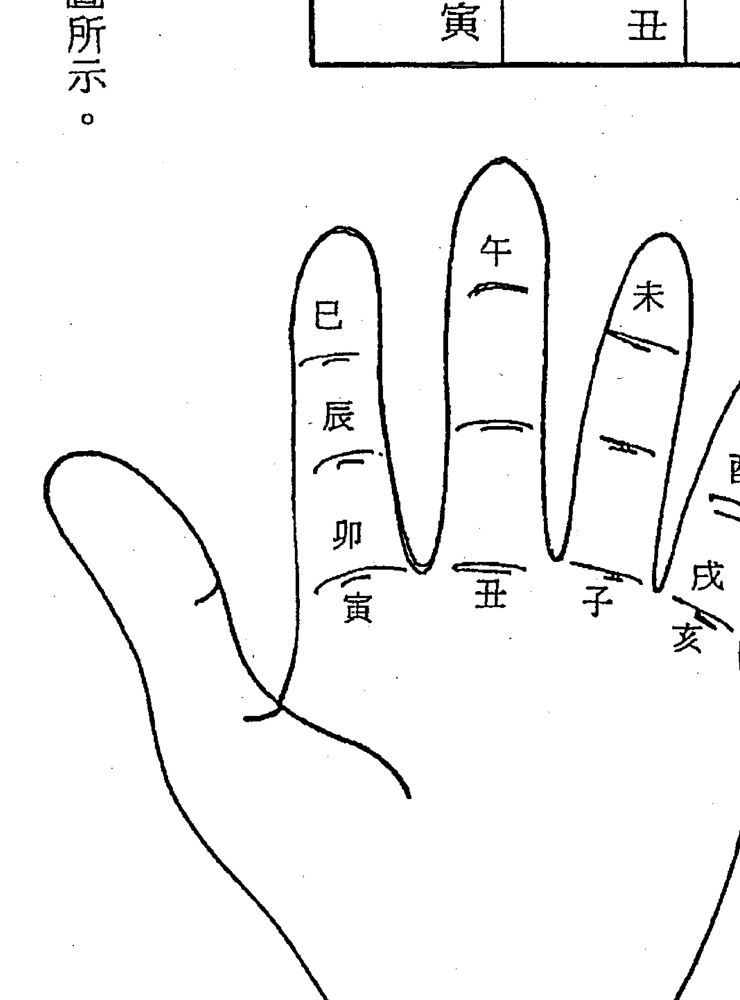

## 三、四生宫、四墓宫、四败宫

#### (一) 四生宫（四马地）

(1) 在命盤四隅寅、巳、申、亥等四宫，因寅為火土之長生，巳為金之長生，申為水之長生，亥為木之長生，故此四宫被稱之為四生宫。
(2) 因天馬星（本書分命馬及月馬）只行四生宮，因此四生宫又可稱為四馬地。宮與地同義，在紫斗中常常通用，他處皆同，在此一併禀明。
(3) 長生之意乃為希望、光輝、活潑、衝動、正義、圓融、衝刺、個性強之象意。

#### (二) 四墓宫

(1) 四墓宫乃指丑、辰、未、戌等四宫，因丑宫為金之墓，辰宫為水之墓，未宫為木之墓，

|       |       |       | 長生 壬水 |
|---|---|---|---|
| 巳    | 午    | 未    | 申       |
|       | 四馬地 | （又名 | 四生宫   |
| 辰    |       |       | 酉       |
| 卯    |       |       | 戌       |
| 長戊丙生土火 |       |       | 長生 甲木 |
| 寅    | 丑    | 子    | 亥       |

(2) 墓於古書中有稱之為葬者，取其收藏、沈滯、封閉、連暮、寶藏、積壓、守成之象意。
(3) 另外，辰為天羅，戌為地網；辰戌另可合稱魁罡；因辰為天罡，戌為河魁，乃陰陽滅絕之地。

#### (三) 四敗宮（四桃花地）

1.  (1) 子、卯、午、酉等四宮為四敗地，因子宮為木之沐浴，卯為火土之沐浴，午為金之沐浴，酉為水之沐浴。
2.  (2) 沐浴有裸體、淫慾之象意，又卯酉為陰陽交淫之處，稱為陰陽線，故又稱此四宮為四桃花地。
3.  (3) 沐浴另表期待、頑迷、受寵之象意。

> 兵書云：「陽生甲子，不足戊亥，仍為天門；陰生甲午，不足辰巳，仍為地戶；陽界甲寅，不足辰已，仍爲地戶；陽界甲寅，不足子丑，仍爲鬼門；陰界甲申，不足午未，仍爲人門。陽盛甲辰，卯爲之隔；陰與甲戌，酉爲之隔。(5)算命一書云：「卯酉爲天地之門，卯主始，酉主終，故斗指卯則萬物皆出，指酉則萬物皆入。」

## 四、宮名別稱

十二宮之名稱除如以上所述之稱法外，尚有如下：

(一) 四門
-   寅宮爲鬼門。
-   巳宮爲地門。
-   申宮爲人門。
-   亥宮爲天門。

| 地支 | 五行与沐浴 | 备注 |
|---|---|---|
| 子 | 甲木 沐浴 | |
| 丑 | | |
| 寅 | | 四门之一：鬼门 |
| 卯 | 丙火 戊土 沐浴 | |
| 辰 | | |
| 巳 | | 四门之一：地门 |
| 午 | 庚金 沐浴 | |
| 未 | | |
| 申 | 壬水 沐浴 | 四门之一：人门 |
| 酉 | | |
| 戌 | | |
| 亥 | | 四门之一：天门 |
| 中心 | 四敗宮（又名四桃花地） | |

(二) 卯宮：雷門，扶桑。子宮：滄海。

## 五、三才配置十二宫

| 人 | 天 | 地 | 人 |
|---|---|---|---|
| 已 | 午 | 未 | 申 |
| 地 | | | 天 |
| 辰 | | | 酉 |
| 天 | | | 地 |
| 卯 | | | 戌 |
| 人 | 地 | 天 | 人 |
| 寅 | 丑 | 子 | 亥 |

(一) 天開於子，地闢於丑，而人由寅始。
(二) 天地人由子、丑至寅，寅為人之始，故斗數星辰及宮位定法，常以寅宮為起始。
(三) 從夏朝所訂夏曆以來，正月建在寅支，意即正月支是寅。隋蕭吉云：「周以建子月為天正，殷以建丑月為地正，……夏以建寅月為人正。」感精符云：「十一月建子，天始施之端，謂之天統；……十二月建丑，地始化之端，謂之地統；……正月建寅，人始化之端，謂之人統。」
(四) 太玄經亦云：「陽起於子，訖於午；陰起於午，訖於子。故子午對衝而陰陽二氣之所起也。」

## 六、三方四正

| 巳 | 午 | 未 | 申 |
|---|---|---|---|
| 水墓 人 | | | 水生 地 |
| 辰 | 申子辰 | 酉 | |
| 卯 | | 戌 | |
| 寅 | 丑 | 水旺 天 | 亥 |

> (五) 白虎通云：「卯酉陰陽交會，日月至此爲中道，萬物盛衰出入之所，故號二八之門，以當二八月也。」

| 巳 | 午 | 未 | 申 |
|---|---|---|---|
| 金生 人 | | | |
| 辰 | 巳酉丑 | 金旺 天 酉 | |
| 卯 | 戌 | | |
| 寅 | 金墓 地 丑 | 子 | 亥 |## (一) 三方

(1) 三方亦稱為三合方，命理中以三位地支相合成局；申子辰三合水局等等之說，前章已表；而斗數之命、財、官三宮之位，亦同於地支三合，命、財、官乃斗數之重要宮位，以此三宮平

(2) 命宮在三合方之一方，財、官二宮一定在其餘二方。

| 位置 | 内容 |
|------|------|
| 天 | 火旺 (午) |
| 地 | 火墓 (戌) |
| 人 | 火生 (寅) |
| 中心 | 寅午戌 |
| 地支 | 巳、午、未、申、辰、酉、卯、戌、寅、丑、子、亥 |

| 位置 | 内容 |
|------|------|
| 天 | 木旺 (卯) |
| 地 | 木墓 (未) |
| 人 | 木生 (亥) |
| 中心 | 亥卯未 |
| 地支 | 巳、午、未、申、辰、酉、卯、戌、寅、丑、子、亥 |

- (3) 三方之地支，取四方位中之三方而已含天地人三才。如申子辰：申：西方，人位。子：北方，天位。辰：東方，地位。
- (4) 三合方中，以一方為本方，另一方即為合方，三方皆可為本方。紫斗以主事之宮為本方；十二宮皆可為本方，再以本方，合論其合方。其餘三組如圖說，不另贅述。

#### (二) 四正

- (1) 四正有三種說法，其功用意義不同，讀者應明晰其分辨。
- (2) 第一種三方四正合稱，乃指三合方之外，再加本方之對宮，是則有四個宮位，謂之四正。譬如：寅宮安命者（即命宮在寅），寅宮為本方，寅午戌三合，午為官祿宮，戌為財帛宮，另加上本方之對宮申（即遷移宮），此四宮謂之四正。若以寅宮為夫妻宮為主事宮，同理三合戌（遷移宮）午（福德宮），另對宮申（官祿宮），常被稱為三方四正。（如次頁上圖）
- (3) 以方位來說，八方位中之正東、正西、正南、正北，在宮位即是卯酉子午，謂之四正，或詳稱四正位。
- (4) 狹義的四正位，乃指子午卯酉四正方位，而廣義的四正位，除子午卯酉外，另辰戌丑未是四

(5) 上項(4)所言之四正，子午卯酉，取三才之天；辰戌丑未，取三才之地；寅申巳亥，取三才之

人。因此，三合天地人三才，為用，屬動、屬虛；四正為三才之一，為體，屬靜、屬實。四正為體，三合為用，體為陰隱，用為陽顯；故三方到三方，為用到用，動到動，未變前之收藏，可見，故為陽，未變即未定，故為虛；四正到四正，乃體到體，表因與因間之靜態象意；四正到三方，乃體到用，靜到動，動靜合一則有變，然用者為虛，仍有未定之意，故為暫時之結果；三方到四正，為用到體，動到靜，是一行為過程，歸於目的或結果。故讀者須體會：『挾體而用，象意衍化；持用歸體，斯成因果。』

## 七、十二宮配方、配卦

- (一) 如以四方位來論，每一個方位管九十度，則僅分東西南北，每一個方位管三地支。
東方：寅卯辰。
南方：巳午未。
西方：申酉戌。
北方：亥子丑。

- (二) 十二宮配屬八卦、方位、節氣，以及所屬顏色，列表說明如下。

| 十二宮 | 八卦及九宮數 | 方位 | 節氣 | 色屬 |
|--------|--------------|------|------|------|
| 子 | 一坎 | 北方 | 冬至 | 白 |
| 丑寅 | 八艮 | 東北 | 立春 | 白 |
| 卯 | 三震 | 東方 | 春分 | 碧 |
| 辰巳 | 四巽 | 東南 | 立夏 | 綠 |
| 午 | 九離 | 南方 | 夏至 | 紫 |
| 未申 | 二坤 | 西南 | 立秋 | 黑 |
| 酉 | 七兌 | 西方 | 秋分 | 赤 |
| 戌亥 | 六乾 | 西北 | 立冬 | 白 |

## 八、十二宮綜合配屬圖

|  |  |  |  |
|---|---|---|---|
| 害破沖刑<br>地寅申亥申門<br>○生○<br>人 陰火 巳<br>二四巽東南 | 害破沖刑<br>丑卯子午<br>二九離南<br>◇敗◇<br>天 陽火 午 | 害破沖刑<br>子戌丑丑<br>墓<br>地 陰土 未 | 害破沖刑<br>亥巳寅寅人門<br>○生○<br>人 陽金 申 |
| 害破沖刑<br>卯丑戌辰<br>墓<br>地 陽土 辰 天羅 | 卯酉乃陰陽線<br>丑未乃黃人門 | | 害破沖刑<br>戊子卯酉<br>二七兌西<br>◇敗◇<br>天 陰金 酉 |
| 害破沖刑<br>辰午酉子<br>二三震東<br>◇敗◇<br>天 陰木 卯 | | | 害破沖刑<br>酉未辰未<br>墓<br>地 陽土 戌 地網 |
| 害破沖刑<br>鬼巳亥申巳門<br>○生○<br>人 陽木 寅 | 害破沖刑<br>午辰未戌<br>二八艮東北<br>墓<br>地 陰土 丑 | 害破沖刑<br>未酉午卯<br>二一坎北<br>◇敗◇<br>天 陽水 子 | 害破沖刑<br>申寅巳亥天門<br>○生○<br>人 陰水 亥 |

## 九、五行局一覽表（六十甲子納音十二宮配置）

| 列1 | 列2 | 列3 | 列4 |
|------|------|------|------|
| ①己巳大林木<br>②辛巳白蠟金<br>③癸巳長流水<br>④乙巳覆燈火<br>⑤丁巳沙中土 | ①庚午路旁土<br>②壬午楊柳木<br>③甲午沙中金<br>④丙午天河水<br>⑤戊午天上火 | ①辛未路旁土<br>②癸未楊柳木<br>③乙未沙中金<br>④丁未天河水<br>⑤己未天上火 | ①壬申劍鋒金<br>②甲申泉中水<br>③丙申山下火<br>④戊申大驛土<br>⑤庚申石榴木 |
| ①戊辰大林木<br>②庚辰白蠟金<br>③壬辰長流水<br>④甲辰覆燈火<br>⑤丙辰沙中土 | | | ①癸酉劍鋒金<br>②乙酉泉中水<br>③丁酉山下火<br>④己酉大驛土<br>⑤辛酉石榴木 |
| ①丁卯爐中火<br>②己卯城頭土<br>③辛卯松柏木<br>④癸卯金箔金<br>⑤乙卯大溪水 | | | ①甲戌山頭火<br>②丙戌屋上土<br>③戊戌平地木<br>④庚戌釵釧金<br>⑤壬戌大海水 |
| ①丙寅爐中火<br>②戊寅城頭土<br>③庚寅松柏木<br>④壬寅金箔金<br>⑤甲寅大溪水 | ①丁丑澗下水<br>②己丑霹靂火<br>③辛丑壁上土<br>④癸丑桑柘木<br>⑤乙丑海中金 | ①丙子澗下水<br>②戊子霹靂火<br>③庚子壁上土<br>④壬子桑柘木<br>⑤甲子海中金 | ①乙亥山頭火<br>②丁亥屋上土<br>③己亥平地木<br>④辛亥釵釧金<br>⑤癸亥大海水 |

## 第三節 斗數命盤要務

### 一、命盤簡易製作法

筆者常見學斗數者，所用之命盤皆以尺畫十二宮，亦有臨時找不到尺者，隨便畫了歪七扭八的直線，實在不雅，而且命盤雜亂的話，斷命時眼花撩亂，容易誤看或漏看某些地方。筆者建議有心學習斗數者，應將命盤妥為處理與保管，以便繼續研究。如能自行畫一張命盤，填好十二地支，再拿去影印，俾便使用，這是最好的。因為您所排出的命盤一樣大小，利於整理歸檔。

如果沒有的話，以信紙或八開的白報紙（可裁成二張），用來當命盤紙，則其大小差不多。筆者建議您，十二宮不必畫直線橫線，只要將信紙或裁半的白報紙拿來，連續對摺四次，展開來即是一張摺線分明，且有十六格大小相同的命盤紙，紙中央四格不用而用來填寫命造生辰與姓名，週邊十二格，依法填上十二地支。簡便、快速、整齊又好用，讀者不妨一試。

### 二、生辰干支換算公式

紫微斗數排命盤，用到生辰的干支，僅為生年干支及生時支，而於論命時若欲論及流月及流日，則流月干與流日干，亦必用及。許多人都靠萬年曆查閱，因此對於年月日之干支換算，除月份干支依「五虎遁月」古訣外，其餘年與日之干支皆創出公式，俾便手中無萬年曆時，依然可以排盤，並論流日，方便之至。今不揣鄙陋，公諸於世，以就教於同好。

#### (一) 年干

民國年數減去二，所得之差，看其個位數為若干，對照天干序數，即知該年年干，若個位數為零，視作十。天干序數為：甲1、乙2、丙3、丁4、戊5、己6、庚7、辛8、壬9、癸10。例如：民國七十七年之年干 77-2=75 → 5戊

#### (二) 年支

民國年數除以十二，得商及餘數，若整除無餘數，則視同餘數為十二。然後，以餘數對照地支序數即得。地支序數為：子1、丑2、寅3、卯4、辰5、巳6、午7、未8、申9、酉10、戌11、亥12。（一如生肖數：一鼠、二牛、三虎、四兔……）例如：民國七十七年之年支 77÷12=6……5 → 5戌由是知民國七十七年為戊辰年。

#### (三) 月干支

排盤時不用月干支，然論流月時須用，在此一併介紹。月干支乃是由「五虎遁月」古訣而來，筆者用掌訣，掌訣請參閱第二章進階斗數排盤步驟一，而須知月支寅即正月，卯即二月，辰即三月，巳即四月，午即五月，未即六月，申即七月，酉即八月，戌即九月，亥即十月，子即十一月，丑即十二月。先將該年之正月干求出，再順序配天干至所欲求之月份即得。如戊辰（十七）年正月干為甲，是則正月為甲寅，二月為乙卯，三月為丙辰……。

#### (四) 日干支

排盤亦不用日干支，論流日時方用。筆者推演此一公式，極為簡便，乃採用陽曆，而換算出來的干支，則是陰曆的。因為陰曆的每月日數不規則，而且陽曆月日在公共場合極易得知。其正確性，讀者可先行試算若干個日子，核對萬年曆，絕對正確，百試不爽。公式是：

(1) x = （民國年數 - 10）× 5 + （民國年數 - 10）÷ 4 + （該年第一日到欲求之日之總日數）
(2) x ÷ 60 = 商……餘數 y
(3) y 之個位數對照天干序數即得日干，若個位數0即等於10。
(4) y ÷ 12 = 商……餘數，以餘數對照地支序數即得日支，餘0等於12。

舉例：欲求國曆民國七十七年三月十七日之日干支。

① $(77 - 10) \times 5 + (77 - 10) \div 4 + (31 + 29 + 17) = 428$
② $428 \div 60 = 7 \ldots\ldots$ 餘 8
③ 8 之天干為辛，地支是未，故知為辛未日。

#### ※附帶說明

（一）公式中民國年數減去十再除以四的部份，僅計算其商，而其餘數無論是零或是一到三，皆不顧它，用其商數而已。

（二）陽曆月大三十一天，月小三十天，當中二月為廿八天，但如民國七十七年為閏年則為廿九天。餘皆如下：一月大，二月小，三月大，四月小，五月大，六月小，七月大，八月大，九月小，十月大，十一月小，十二月大。

（三）公式中第二步「除以六十」的理由是，干支相配六十個後，又從甲子開始，意即六十甲子，乃由甲子、乙丑……至癸亥，總共配出六十干支。

#### (五) 時干支

##### (1) 時干

以日干「五鼠遁時」之法遁出，五鼠遁與五虎遁不同，前者遁時，後者遁月，讀者稍加留意，即可知道「五」的意義，乃指五組天干，那五組呢？甲己、乙庚、丙辛、丁壬、戊癸等五組，為何如此配法？而不甲乙配、丙丁配？各位已知天干序數，甲到癸為一至十，如此甲己配則恰好合乎河圖數一六共宗等等之先天數理。再過來，談「鼠」的意義，乃在言明遁時以「鼠」即地支「子」為首，甲己為第一組天干，故遁得子日之首配天干「甲」為時干；同理遁月時，遁得「寅」之首配干「丙」為月干。因此，時干得視日干為何，如逢甲己之日干，子時配甲，為甲子時，順推為乙丑時、丙寅時。若為乙庚之日干，則陰干不取，跳過「乙」干而用「丙」干，其餘同理，故丙辛之日用「戊」干，丁壬之日用「庚」干，戊癸之日用「壬」干。若欲以掌法求時干，則參考第二章進階斗數排盤步驟一，因其為遁月干之用，故應將掌訣中之序數 3 5 7 9 1，改為「1 3 5 7 9」，即可求得時干。

##### (2) 時支

紫斗之十二時辰，配置時間如下表。以命盤之表格，表列時間，可使讀者直觀地去體會各宮位與時辰之關係。

| 時辰 | 時間 | 地支 |
| :--- | :--- | :--- |
| 巳時 | 09:00 ~ 11:00 | 巳 |
| 午時 | 11:00 ~ 13:00 | 午 |
| 未時 | 13:00 ~ 15:00 | 未 |
| 申時 | 15:00 ~ 17:00 | 申 |
| 酉時 | 17:00 ~ 19:00 | 酉 |
| 戌時 | 19:00 ~ 21:00 | 戌 |
| 亥時 | 21:00 ~ 23:00 | 亥 |
| 子時 | 23:00 ~ 01:00 | 子 |
| 丑時 | 01:00 ~ 03:00 | 丑 |
| 寅時 | 03:00 ~ 05:00 | 寅 |
| 卯時 | 05:00 ~ 07:00 | 卯 |
| 辰時 | 07:00 ~ 09:00 | 辰 |

### 三、正確生辰觀念——經緯時

很多人對古代無鐘錶，如何知道時辰的問題，引發無限遐思。大抵說來，古時候乃以陽光測時，是毫無爭論的說法。根據一千七百多年前，西晉左思所撰的魏都賦所說：「揆日晷，考星耀。」知道遠古即懂得利用日影來定時刻，另外他書亦有「日晷儀」之記載，這種儀器又稱「日規。」

在古代來說，這種儀器之發明，誠屬難能可貴。地球向東自轉，東邊先見太陽，西方見太陽較遲，中國幅員廣潤，以「日晷儀」來測日影之位置而定時刻，若同時測定兩個東西相距稍遠的地方，其所得之時刻一定不同。所以，筆者認為古代中國人對時辰之測定，非常科學，較之現代各地區時間之訂定，其結果與原理是一致的。

現代，大家都知道全世界分為廿四個時區，而以英國格林威治天文臺之子午儀為地球子午中線，劃分廿四區，每區正好為十五經度（地球圓周為三百六十度）；在這十五經度內，共同使用同一時間，而這一時間是該區十五經度之中線的標準太陽時；實際上，每一區最東的一個地點與最西的一個地點，其真正太陽時相差一個小時。就論命的觀點來說，相差幾分鐘，就不同時辰，命格大為不同，所以論命者不能不深究這一點。在紫微斗數總訣中，陳希夷先師即告訴我們，若論斷命盤不準確時，「以三時斷」，即須換前一時辰或後一時辰來論，我想，一般民間，不可能有日晷儀，精確地認定小孩出生時刻，而古人對時刻的稱呼，又無幾時幾分之稱法，僅為子時或丑時之類，故應「以三時斷」，因丑時生人，可能他是子時生的，也可能是寅時生的。而現代的人，大約知道幾點生的，如不知道幾分，而在偶數點鐘（如二點、四點之類），倒也沒關係，因為其經緯時（即真正太陽時），還是在同一時辰內，但如在奇數點鐘（如三點、五點之類），則須排前後時辰各一張命盤，先予驗證，再予認定何者為準。

為什麼筆者要強調「經緯時」之重要呢？因為時間是依太陽來定的，時辰代表著不同的五行之氣，每一時辰太陽太陰與地球之角度，使人之受氣有所差異。假若不以經緯度來修正時辰的話，那麼，子時生人也可以把他當作丑時生人來論命了。因此，不只是要修正為出生地的經緯時，同時筆者還要強調一點，很多論命者，有親友僑居國外，譬如說居住美國，當生下小孩時，竟忙著記下當時台灣為何日何時，這是錯誤和荒謬的。如他們在美國洛杉磯（約西經一百一十八度）生下一小孩，時間是當地中午十二時，而該地與台灣之時差恰為十二個鐘頭，此地正好為夜晚凌晨零時，以陰陽論，在美國當時乃受陽之氣，那能改用以台灣之子時而受陰之氣呢？又子屬水，午屬火，水火相衝，一經改易，不就本受火之精，而誤認為受水之精的嗎？故如有正確之太陽經緯時之觀念，當不致成如此之錯誤。另外，南北半球，季節不同，差異更大，當另為文釋之。

按著告訴各位，每一經度是四分鐘，所以十五經度為一小時，各時區遞差一小時；台灣乃以

## 台灣各城市時差一覽表

| 縣市 | 東經度 | 東經分 | 北緯度 | 北緯分 | 時差分 | 時差秒 | 加減 |
|------|--------|--------|--------|--------|--------|--------|------|
| 雲林 | 120 | 32 | 23 | 42 | 2 | 08 | + |
| 南投 | 120 | 41 | 23 | 54 | 2 | 44 | + |
| 彰化 | 120 | 32 | 24 | 04 | 2 | 08 | + |
| 臺中 | 120 | 41 | 24 | 08 | 2 | 44 | + |
| 苗栗 | 120 | 48 | 24 | 33 | 3 | 12 | + |
| 新竹 | 120 | 58 | 24 | 48 | 3 | 52 | + |
| 桃園 | 121 | 18 | 24 | 59 | 5 | 12 | + |
| 臺北 | 121 | 31 | 25 | 04 | 6 | 03 | + |
| 澎湖 | 119 | 33 | 23 | 34 | 1 | 48 | - |
| 臺東 | 121 | 09 | 22 | 45 | 4 | 36 | + |
| 花蓮 | 121 | 37 | 23 | 34 | 6 | 28 | + |
| 宜蘭 | 121 | 45 | 24 | 45 | 7 | 00 | + |
| 恆春 | 120 | 45 | 22 | 00 | 3 | 00 | + |
| 高雄 | 120 | 16 | 22 | 38 | 1 | 4 | + |
| 臺南 | 120 | 13 | 23 | 00 | 0 | 52 | + |
| 嘉義 | 120 | 27 | 23 | 29 | 1 | 48 | + |

## 夏令時間施行期間表

※51年至62年、65年至67年均未實施，69年以後可能不再施行。

| 民國年 | 43 | 42 | 41 | 40 | 39 | 38 | 37 | 36 | 35 | 34 |
| :--- | :--- | :--- | :--- | :--- | :--- | :--- | :--- | :--- | :--- | :--- |
| 陽曆起訖月日 | 月 | 4 | 4 | 3 | 5 | 5 | 5 | 5 | 5 | 5 | 5 |
| | 日 | 1 | 1 | 1 | 1 | 1 | 1 | 1 | 1 | 1 | 1 |
| | 月 | 10 | 10 | 10 | 9 | 9 | 9 | 9 | 9 | 9 | 9 |
| | 日 | 31 | 31 | 31 | 30 | 30 | 30 | 30 | 30 | 30 | 30 |
| 陰曆起訖月日 | 月 | 2 | 2 | 2 | 3 | 3 | 4 | 3 | 3 | 4 | 3 |
| | 日 | 28 | 18 | 6 | 26 | 15 | 4 | 23 | 11 | 1 | 20 |
| | 月 | 10 | 9 | 9 | 8 | 8 | 8 | 8 | 8 | 9 | 8 |
| | 日 | 5 | 24 | 13 | 30 | 1 | 9 | 28 | 16 | 6 | 25 |

| 民國年 | 68 | 64 | 63 | 50 | 49 | 48 | 47 | 46 | 45 | 44 |
| :--- | :--- | :--- | :--- | :--- | :--- | :--- | :--- | :--- | :--- | :--- |
| 陽曆起訖月日 | 月 | 7 | 4 | 4 | 6 | 6 | 4 | 4 | 4 | 4 | 4 |
| | 日 | 1 | 1 | 1 | 1 | 1 | 1 | 1 | 1 | 1 | 1 |
| | 月 | 9 | 9 | 9 | 9 | 9 | 9 | 9 | 9 | 9 | 9 |
| | 日 | 30 | 30 | 30 | 30 | 30 | 30 | 30 | 30 | 30 | 30 |
| 陰曆起訖月日 | 月 | 6 | 2 | 3 | 4 | 5 | 2 | 2 | 3 | 2 | 3 |
| | 日 | 8 | 20 | 9 | 18 | 8 | 24 | 13 | 2 | 21 | 9 |
| | 月 | 8 | 8 | 8 | 8 | 8 | 8 | 8 | 8閏 | 8 | 8 |
| | 日 | 10 | 25 | 15 | 21 | 10 | 28 | 18 | 7 | 26 | 15 |經一百二十度之經線的時刻為標準，是屬中原時區，東經一百二十度在臺澎之間，所以現代的小孩出生時，醫院大多告以正確之標準時，為人父母者，應將之換算為真正之經緯時，可查出出生地點與一百廿度相差幾何，每度加減四分鐘，「東加西減」，即可知曉，北半球之其它各國皆可依法加減，但須知國際換日線乃在太平洋上，歐美各國皆屬西方國家，所以都是用減的。如知該時

茲列臺澎主要城市之經緯度及其時差表，俾供運用。（表於前頁）

總之，生辰乃根據天地日月而來，非以人力更變得了的；所以，在我國施行「日光節約時間」（或「夏令時間」）出生者，亦應依理減算一小時，其施行期間請參考前頁表列。

## 四、以年岁推出生年干支掌诀

若知命造年岁（虚岁），以今年流年太岁干支，如下法掌訣，可推算生年干支：

-   (一) 流年干起1，逆數天干定位（如下頁圖），至該命造年歲，該定位天干即為生年干。如年歲較多，流年干起宮（如戊辰年在戊位），可當1、11、21、31……，數至接近年歲，再繼續逆行宮位順數下去。譬如民國七十七年戊辰年，一命造三十歲，即於戊之定位起1，拇指依舊點著戊位數11、21，再逆行宮位丁（22）、丙（23）、乙（24）、甲（25）、癸（26）、壬（27）、辛（28）、庚（29）、己（30），即知該人生年干為「己」。

天干定位：
食指指节：甲、乙、丙、丁
中指指节：戊
无名指指节：己
小指指节：庚、辛、壬、癸

地支定位：
食指指节：寅、卯、辰、巳
中指指节：丑、午
无名指指节：子、未
小指指节：亥、戌、酉、申

-   (二) 生年支亦是由流年地支定位起1，逆数至年岁处所得之支，即为生年支。如七十七年戊辰年三十岁，辰宫起1，亦可当13、25，再逆行宫位，卯（26）、寅（27）、丑（28）、子（29）、亥（30），即知生年支「亥」。

## 五、星名简称及别称

紫微：紫、极、帝。

太阳：阳、日、丹墀。

天同：同。

天府：府。

贪狼：贪、狼。

天相：相、印。

七杀：杀。

禄存：禄、干禄、天禄。

陀罗：陀。

铃星：铃。

右弼：右、弼。

文曲：曲、文华。

天魁：魁、阳贵。

地空：空。

天机：机、善。

武曲：武、财。

廉贞：廉、囚。

太阴：阴、月、桂墀。

巨门：巨、暗。

天梁：梁、荫。

破军：破、耗。

羊刃：羊、刑（另名擎羊）。

火星：火。

左辅：左、辅。

解神：解。

文昌：昌、文桂。

天钺：钺、阴贵。

地劫：劫。

天哭：哭。

红鸾：鸾。

孤辰：孤。

天虚：虚。

天喜：喜。

寡宿：寡。

#### 主星

#### 星、斗、辰、曜

四字同義，亦常稱星斗、星辰、星曜等，其間並無任何區別。

## 六、星命術語

-   天姚、天刑合稱刑姚。然「刑囚夾印」之刑，則指羊刃，古賦文中皆然。
-   文昌、文曲合稱文星，或稱昌曲、曲昌皆可。其它如孤寡、鸞喜、哭虛、劫空、魁鉞、火鈴、羊陀、左右（或稱輔弼）等經常雙星並稱。

附記：

主星計十八顆，是斗數中之正曜，其它星辰，有的為助星，有的為浮星；十八顆正曜為：(1) 紫微 (2) 天機 (3) 太陽 (4) 武曲 (5) 天同 (6) 廉貞 (7) 天府 (8) 太陰 (9) 貪狼 (10) 巨門 (11) 天相 (12) 天梁 (13) 七殺 (14) 破軍 (15) 左輔 (16) 右弼 (17) 文曲 (18) 文昌。

-   ◆ 四煞、六煞
羊、陀、火、鈴等四星稱為四煞，另加地空、地劫二星，即為六煞。

-   ◆ 四吉、六吉
左、右、曲、昌等四星稱為四吉，另加魁、鉞二星，即為六吉。

-   ◆ 生年干、生年支、生時支
以生辰來說，斗數用及干支者，僅此三個，出生年的天干地支，出生時之地支，分別簡稱為生年干、生年支、生時支。

-   ◆ 命造出生的年月日時之個別簡稱。

-   ◆ 宮干
斗數十二地支宮，皆有其天干，稱之為宮干；另十二宮皆有其名稱：如命宮在己亥，亥宮宮干為己，亦是命宮干己，另有兄弟宮干，夫妻宮干：……等等皆同上義。

-   ◆ 流年干與流年宮干

#### 四化

化祿、化權、化科、化忌等四顆化星。

#### 生祿、生權、生科、生忌

由命造出生年干四化，如生年干丙，天同化祿，如天同在財帛宮，則簡稱為生祿在財宮，其餘同理，類推之。

#### 命祿、命權、命科、命忌

由命宮干四化所得之四化星之簡稱。如命宮干乙化權為天梁，而天梁在兄弟宮，則簡言之為命權入兄。

#### 自化

各宮干四化，而所得之化星在原宮內者，稱為自化。如兄弟宮干辛，文昌化忌，而文昌居兄弟宮，此謂之兄弟宮文昌自化忌，簡稱自忌；餘皆可簡稱作自祿、自權、自科、守、照、沖、會、同宮

守、同宮、同度，皆表同在一宮；照、沖皆表星曜在對宮，若為吉星日照，若為凶星日沖，會，一般是在本宮同度，三合方亦算。

#### 鄰方、夾命

如命宮在子，則亥與丑為鄰宮，亦稱鄰方，若亥宮有陀羅，丑宮有羊刃，叫羊陀夾命。此時命宮不能再有忌星坐守，若有忌星坐守，叫做「羊陀夾忌」，羊陀夾忌為敗局，很慘。夾命有三凶六吉，如下。

-   * 三夾凶
劫空夾、火鈴夾、羊陀夾謂之。夾命、夾身都是不吉，更凶的是忌星入命或身，再被夾。

-   * 六夾吉
紫府夾、左右夾、昌曲夾、魁鉞夾、權祿夾、日月夾等謂之六夾，當中一組夾命或夾身都吉。

#### 體用

事物的本體與作用，謂之體用。論命時，以主事宮為體，為靜，為陰，為本源；而擇其他宮或星曜為用，以知其變，用為陽、為動、為變化。體是道，用是理，體是根，用是枝葉；然處處處體用變化無窮，非三言兩語可盡釋。

是道，事事可為體，以斗數而言，本命盤為體，大限盤為用；若以大限盤為體，流年盤為用。

#### 陰陽

陰陽雖只有兩字，卻將宇宙萬物截然分成兩部份。說文云：「陰，闇也，水之南，山之北也，从阜，雲聲。」闇是閉門之意，閉門則爲幽暗，而陽字乃高明之意。從暗明爲陰陽原義，發展至今，陰陽即天地、乾坤、男女、日月、向背、晝夜、剛柔、奇偶。而卦爻、干支、音律：：：等等皆分陰陽。陰與陽合，才是事物之整體。

#### 附：本書尚用及之簡稱

-   （一）排就之命盤稱原命盤，或本命盤，以大限爲命宮，其餘十一宮隨之移動後之命盤，稱大限盤；以流年太歲宮爲命，其餘十一宮隨之移動後之命盤，稱流年盤。
-   （二）本命盤之各宮，簡稱爲本命、本兄、本夫、本子、本財、本疾、本遷、本友、本官、本田、本福、本父。（本命盤主一生）
-   （三）大限盤之各宮，簡稱爲大命、大兄、大子、大財、大疾……等，主十年之運勢。
-   （四）流年盤之簡稱，一如上述，稱爲流命、流兄、流夫、流子……等，主一年休咎。

# 第二章 掌中排盤與十二宮微

## 第一節 進階斗數排盤——掌訣與公式

坊間紫微斗數的書籍，大都以列表備查，讓學者按表排盤，有的也一併列出古籍所載之口訣，少數新出版的斗數書籍，出自斗數高手的研究，間或露出一、二則掌法與速算公式，而大多還是靠查表。

-   1. 古籍所載之口訣。
-   2. 一、二則掌法與速算公式。

勸學齋主一本研究學術之精神，舉凡得自名師口授，高手參研，以至一己演算出來之掌訣與公式，全盤托出；冀能拋磚引玉，互通有無，使現代鑽研斗數者，省去一段自我摸索的時間，藉著大家的腦力，彼此激盪，說不定會有更多更好的掌訣與公式，回饋給我。如果大家同心，相信：紫斗世界，明天會更好。

因此，本篇為進階之斗數排盤法，盡是掌法的訣要與公式的演算，只要對斗數稍有基礎者，即可藉此進階，默記些許原則，即可拋開書籍，屈指排盤，進而掌上排盤；「掌握星斗，笑談人生」是學命者夢寐以求的事，相信讀完本篇，就能讓您「掌握」紫微星斗，不必再向書中尋覓。

對於初學者，本書因囿於篇幅，不另列表供查，請參考本出版社所出版之「紫微初階」一書。

## 步驟一 宮干冠蓋

◆簡說

-   (一) 斗數十二宮，地支定位，每人皆同，而各宮之天干（簡稱宮干），因出生年之不同而冠以不同之宮干。
-   (二) 宮干計分五組，以出生年干來區分，用「五虎遁月」遁出寅宮的宮干，再順佈各宮宮干。
-   (三) 是故各宮宮干，得氣於命造之出生年與出生月。
-   (四) 命盤上十二宮之干支，構成了命造之命盤骨架與神經系統。
-   (五) 以「寅」宮起安宮干的理由是：「子」開天，「丑」闢地，而「寅」宮為人始，又陰曆正月建寅之故。（請參考第一章第二節五）

◆掌訣圖說

-   (一) 只須知道天干序數與天干掌上定位，即輕易可算出來，不必背記「五虎遁月」口訣。天干序數：甲1、乙2、丙3、丁4、戊5、己6、庚7、辛8、壬9、癸10。
-   (二) 記住 3 5 7 9 1 這組次序，以拇指自甲點起，而心唸3，乙為5，丙為7，餘類推，如圖所示，數至出生年，所得之數即為寅宮宮干序數，如丁亥年生人，點數甲乙丙丁得3 5 7 9，癸。9爲壬，即於寅宮填上壬，其餘十一宮，順佈癸、甲、乙、丙、丁、戊、己、庚、辛、壬、癸。

| 行号\列 | 9 | 1 | 3 | 5 |
| :--- | :--- | :--- | :--- | :--- |
| （行1） | 丁 | 戊 | 己 | 庚 |
| 7 | 丙 | | | 辛 |
| 5 | 乙 | | | 壬 |
| 3 | 甲 | | | 癸 |

## 步驟二 安命身宮

| 壬申 | 辛未 | 庚午 | 己巳 |
| :--- | :--- | :--- | :--- |
| 癸酉 | 特別聲明：<br>本命盤出生年月日為舉例而編用，若有雷同，純屬巧合，下同，併此聲明。 | 戊辰 | 丁卯 |
| 甲戌 | 丙子 | 丁丑 | 丙寅 |
| 乙亥 | | | |

◇舉例：陰曆民國48年10月1日午時。

-   (一) 換算生年干支：(參考第一章第三節二一)
    $48 - 2 = 46$ → 己
    $48 ÷ 12 = 4 ...$ 餘數 $0 = 12$ → 亥
-   (二) 己亥年生，點數
    甲乙丙丁戊己
    3 5 7 9 1 3
-   (三) 己遁為3，3為丙，寅宮干為丙，順佈丁戊己……丁，如上圖。

-   (一) 命盤十二宮之宮干冠蓋之後，就要找出命宮，以作爲其他妻財子祿等十一宮之樞紐。
-   (二) 命身宮由生月與生時來算，生月以數字(如一月)即可，不必換算生月干支，而生時以生時支(如寅時)爲用。
-   (三) 安命宮，皆由人始——寅宮算起。
-   (四) 寅宮在斗數命盤中，扮演相當重要的角色。

## 安命宮身宮訣要

> 「寅宮起正月，順數生月宮；逆生時爲命，順生時是身。」

理解上述口訣(不必背誦)，配以命盤或掌法十二宮，從寅宮起正月，順時鐘方向數至生月數，以生月所落宮位起子時，逆數至生時支，即爲命宮；而生月所落宮位起子時，順時鐘方向數至生時支，即爲身宮。

參看下列舉例，即可全部瞭解。

生日数同逆子时

顺数至生时安身

逆数至生时安命

| 午時 四月 己巳 | 巳時 五月 庚午 | 辰時 六月 辛未 | 卯時 七月 壬申 |
| :--- | :--- | :--- | :--- |
| 巳 三月 戊辰 | | 午時生 己亥年10月1日 | 寅時 八月 癸酉 |
| 辰 二月 丁卯 | | | 丑時 九月 甲戌 |
| 卯 正月 丙寅 | 寅 丁丑 | 丑 丙子 | 子時 十月 乙亥 |

命（身）宫

逆数生时安命

顺数生时安身宫

举例：

-   (一) 从寅宫起正月，顺数二、三……十月，落在亥宫。
-   (二) 亥宫起子时，数生时支，逆数至午时，落已宫，命宫即在已；亥宫起子，继续顺数至生时支午，落已宫，即身宫在已。
-   (三) 此命造，命宫身宫同在己巳。

## 步驟三 佈十二宮

※圖說

-   (一) 佈妻財子祿十二宮之名稱，必須熟背其順序，不論陰陽男女，順序都一樣。
-   (二) 由命宮起，逆時針方向，依下列次序，將其餘十一宮，賦予宮名。其次序為：
    -   (1) 命宮
    -   (2) 兄弟宮
    -   (3) 夫妻宮
    -   (4) 子女宮
    -   (5) 財帛宮
    -   (6) 疾厄宮
    -   (7) 遷移宮
    -   (8) 交友宮
    -   (9) 官祿宮
    -   (10) 田宅宮
    -   (11) 福德宮
    -   (12) 父母宮
-   (三) 背記簡稱如下：命兄夫子財疾遷友官田福父。（逆佈）
-   (四) 注意：
    上述之各宮序數，如(1)命(2)兄(3)夫……等之一、二、三……等之數字，在高階論命中，相應有用，應熟習之。

| | | | |
| :--- | :--- | :--- | :--- |
| 命(身)宫 己巳 | 父母宫 庚午 | 福德宫 辛未 | 田宅宫 壬申 |
| 兄弟宫 戊辰 | 己亥年10月1日午時生 | 官禄宫 癸酉 | |
| 夫妻宫 丁卯 | | 交友宫 甲戌 | |
| 子女宫 丙寅 | 财帛宫 丁丑 | 疾厄宫 丙子 | 迁移宫 乙亥 |

#### 舉例

說明：

-   (一) 從上節知命宫、身宫同於己巳。
-   (二) 依命、兄、夫、子、財、疾、遷、交、官、田、福、父等之次序逆佈如上。
-   (三) 身宫一定與命或夫、或財、或遷、或官、或福同宫。

## 步骤四 定五行局

#### ◇简说

-   (一) 五行局，顾名思义，五行即是木、火、土、金、水，局指局数。
-   (二) 紫微斗数的五行局，乃采六十甲子纳音而来，六十甲子为十天干配十二地支所成六十组干支，而每二组干支依卦属、卦位、卦数而成另一纳音五行，故六十甲子分成三十组纳音五行。
-   (三) 纳音五行参阅第一章第二节九，可知所属，并知其名称。
-   (四) 此处，笔者仅述其掌法，俾供使用。而紫斗命盘中之五行局，係指命宫干支之五行纳音。

### ◇掌诀图说

-   (一) 先明瞭下图之天干定位，二干同一位，于是形成了五个宫位。（第74页图）
-   (二) 五行局乃依据命宫所在之干支而来，以拇指点算至命宫干所在位置。
-   (三) 命宫干所落位置起子丑（二地支一数），顺数至命宫支之位置，但是超过三宫（即三组地支——六支为一循环），又返回原宫干位置续数。
-   (四) 上述(三)很容易理解，因文字叙述不易明瞭，笔者不惮其烦，将五种状况，分别掌法述明如下：（第75页至第77页图）

#### 五行局掌訣

#### 天干定位圖

丙丁

甲乙

戊己

庚辛

壬癸

甲乙宫干时

丙丁宫干时

依此法只要数到命宫支之位即可。

-   (五) 本掌法只须记住金、水、火、土、木等五行顺序，即在掌上可知为何局，亦即纳音五行，上述五行次序安在掌上如下图：

-   (六) 命宮支所停留之宮，依上述(五)之位置所得之五行爲金，即爲金四局；爲水，即是一局；爲火，即是火六局；爲土，即是土五局；爲木，即是木三局。※本法甚爲簡單，切勿見上述說明繁瑣而想得太複雜，茲簡述如下：(1)明瞭掌上天干位，不用背。
-   (2) 明瞭掌上地支跳法，也不用背；
-   (3) 只須背金、水、火、土、木之次序，命宮支所落之位，即可知何屬。學者只須參考下面舉例，照著屈指算算，再算算自己的，或隨意舉用干支算看看，最初對照一下五行局一覽表（本書第一章第二節九），看算得對不對，三五個之後，就可拋棄查表，而且命盤十二宮皆可在十秒內算出其納音五行。

### ◇舉例

如前例，命宮己巳，運用掌法如圖所示。

-   (一) 以拇指點算至戊己位停（因命宮干己）。
-   (二) 戊己之位起子丑，順時針方向點算至辰巳位，以甲乙為第一位，則辰巳所在為第五位。

-   (三) 以拇指從第一位點數至第五位，口中背誦金、水、火、土、木。則知命宮己巳，為木三局。

## 步驟五 起紫微星

### ◇簡說

-   (一) 紫微星是紫微斗數排盤第一顆星曜。
    > 太微賦說：
    >「紫微星曜，司一天儀之象，卒列宿而成垣。」
    又說：
    >「帝居動則列宿奔馳。」（帝指紫微星）
    所以先排定紫微星，其它星曜方可據以安排。
-   (二) 紫微星是根據命造生日與命宮局數來算的；依五行局的不同，紫微星有不同的行進路線。
-   (三) 紫微星的排定有掌法，但非常繁瑣，筆者提供一則公式，較易記住與運用。

### ◇公式圖說

> (一) $\frac{\text{生日} + x}{\text{局数}} = y$（整除）
> (二) 若 $x$ 为奇数（$1,3,5\cdots$）则 $y - x = z$；若 $x$ 为偶数（$2,4,6\cdots$）则 $y + x = z$
> (三) 由寅宫起 $1$，顺数至 $z$ 数所落之宫即安紫微星。

-   (一) 以命造出生日的數字，加上某數，再除以局數（木三局為3，水二局為2……），必須整除；上述加上某數，即為使生日數得以整除而加，如生日數除以局數恰好整除，即不用再加。（例：生日为2、4、……局数为水二局，或生日为5、10、……局数为土五局等）
-   (二) 如生日为5，而局数为木三局，则须加1，使之能整除。
-   (三) 如整除时，以寅宫起1，顺数至商数所落之宫即立紫微。
-   (四) 如必须加数方能整除时，则须以商数加（或减）该数，所得之数同上述（三）之法算出紫微星之落宫。
-   (五) 商数该加或减，完全看原生日所加数是奇或偶，奇减偶加。
-   (六) 万一所得之数为负数，则再加十二即得；参考下

举例 如前例：
己亥年十月一日午时生人
-   (一) 已知为木三局（命宫己巳）。
-   (二) 一除以三不够，加二即能整除，故加二；演算如# 步驟六 逆排紫微星系

#### （一）所加数为3奇数，故用减的 1（商数）-3 = -2  1+3=4（商数时加12即为正数）

#### （三）所得数10，寅宫起1，顺数至亥为10，安紫微星在亥宫。（如次页掌法图说）

#### （四）寅宫起1，卯为2，辰为3，紫微星在辰宫。（图例于次页）

$(生日数)+2 = 1……（商） 3（周数）$

#### （三）所加数二为偶数，故商1加2等于3。

$1+3=4$ 1

## 步驟六 逆排紫微星系

#### (一)紫微星系計有六顆主星，除紫微星外，尚有天機、太陽、武曲、天同、廉貞等星。

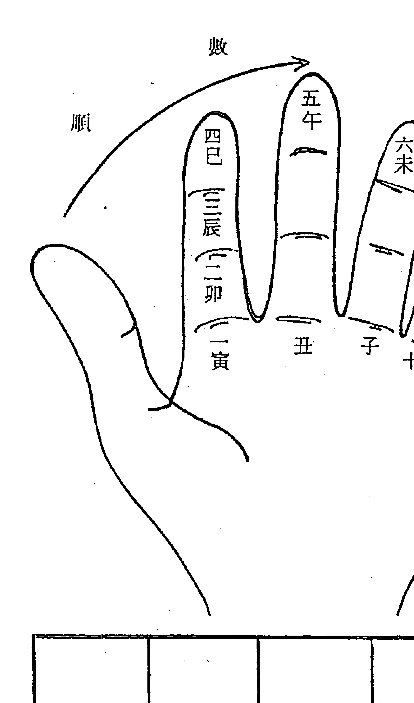

|       | 己巳 命 | 庚午 父 | 辛未 福 | 壬申 田 |
| :--- | :--- | :--- | :--- | :--- |
|       | 午時    | 己亥年十月一日 |         |         |
| 紫微  |         |         |         |         |
| 戊辰 兄 |         |         | 癸酉 官 |         |
| 丁卯 夫 |         |         | 甲戌 交 |         |
| 丙寅 子 | 丁丑 財 | 丙子 疾 | 乙亥 遷 |         |

#### （一）紫微星系以紫微星帶頭，逆佈（反時針方向）於其他宮中。

#### 佈星法則

#### （一）紫微星系諸星曜，須熟背其逆行次序，無投機之辦法可循，筆者運用的口訣是：

> 「紫微天機星逆行，隔一陽武天同情；又隔二宮廉貞位，再隔三宮紫微亭。」

#### （二）上一個口訣有好些優點，一則述明逆行；二則詳明二星間之空隔，三則反覆到紫微星所在宮位，詳細明瞭，便於排認宮位時之檢視，如排安廉貞星後，空三宮一定又是紫微星，假如空二宮或空四宮，就知道前面諸星辰排錯了。

#### （三）簡單記憶法為

> 「紫微機逆行，隔一陽武同；隔二廉貞，隔三回紫宮。」

| 宫位 | 天干地支 | 星曜 |
| :--- | :--- | :--- |
| 命(身)宫 | 己巳 | 紫微 |
| 父母宫 | 庚午 | 太阳 |
| 福德宫 | 辛未 | 武曲 |
| 田宅宫 | 壬申 | 廉贞 |
| 官禄宫 | 癸酉 | 天同 |
| 交友宫 | 甲戌 | 天机 |
| 迁移宫 | 乙亥 | 天同 |
| 疾厄宫 | 丙子 | 武曲 |
| 财帛宫 | 丁丑 | 太阳 |
| 子女宫 | 丙寅 | 天机 |
| 夫妻宫 | 丁卯 | 天机 |
| 兄弟宫 | 戊辰 | 紫微 |
| 宫中央信息 | 己亥年十月一日午时 | 木三局 |

## 步驟七 安天府星

#### ☆簡說

-   (一)天府星係根據紫微星而定的。
- (二)天府星亦帶領一星系，與紫微星系組成紫微斗數命盤，皆為主星。

#### ☆安法圖說

-   (一)天府與紫微以巳亥宮為軸，兩星遙遙相對。以巳亥連成一線，則其他各宮，紫府亦是相對，與巳亥線平行。
- (二)寅、申宮，紫府同宮。
- (三)參看下列二圖，即可明瞭。

#### ☆說明

-   (一)如紫微在寅，天府同在寅；紫微在卯，天府在丑；紫微在辰，天府在子；……；直至紫微在申時，天府又同在申。

| 巳 | 午 | 未 | 申 |
| :--- | :--- | :--- | :--- |
| 紫<br>(辰) | 紫 | 紫 | 紫府<br>(酉) |
| 紫<br>(卯) | (箭头指向下方) | (箭头指向下方) | 府<br>(戌) |
| 紫府<br>(寅) | 府<br>(丑) | 府<br>(子) | 府<br>(亥) |

(二)反之亦然。

(三)記住相對之法即可，本步驟以理解的方式，即免除查表之煩。

| 巳 | 午 | 未 | 申 |
| :--- | :--- | :--- | :--- |
| 府<br>(辰) | 府 | 府 | 紫府<br>(酉) |
| 府<br>(卯) | (箭头指向左上方) | (箭头指向左上方) | 紫<br>(戌) |
| 紫府<br>(寅) | 紫<br>(丑) | 紫<br>(子) | 紫<br>(亥) |

## 步骤八 顺布天府星系

#### ◇简说

-   （一）天府星系计有八颗星曜，除天府星之外，尚有太阴、贪狼、巨门、天相、天梁、七杀、破军等星。
- （二）天府星系，以天府为首，顺布于十二宫中。

#### ◇布星法则

-   （一）牢记顺布之原则，笔者运用的口诀是：

「天府太阴顺贪狼，巨门天相与天梁；

七杀空三破军位，隔宫又见天府乡。」

-   （二）一样地，布至破军星后，隔宫又必须是天府星在宫，如不是则须检查，错误何在？
-   （三）熟悉后，较简化之口诀为：

「府顺阴贪，巨相天梁；

杀过三破，隔一府乡。」

| 天梁（己巳） | 七杀（庚午） |          | 廉贞（壬申） |
| :--- | :--- | :--- | :--- |
| 紫微天相（戊辰） | 己亥年十月一日午时 |          | 癸酉         |
| 天机巨门（丁卯） | 木三局       | 破军（甲戌） |              |
| 贪狼（丙寅） | 太阳太阴（丁丑） | 武曲天府（丙子） | 天同（乙亥） |

## 步骤九 安月星系

#### ◇ 简说

-   (一) 按生月数而排的星曜，我们简称它为月系星，计有左辅、右弼、天刑、天姚、解神、阴煞、天巫等星，另有天月星，见其他书皆聊以备之，本书不用，略去。
-   (二) 解神之排法甚多，又有分天解、地解二者，今且不论其详，仅述排法。
-   (三) 另有将天马星，依月份排出者，笔者将之称为月马，以有别于命马（或称年马，以生年支求得）。
-   (四) 今分数组星曜，说明其排列法：

-   (1) 左辅右弼
(2) 天刑天姚
(3) 天巫月马
(4) 阴煞
(5) 解神

#### ◇ 掌诀图说

-   (一) 左辅右弼

-   (1) 辅弼星起于辰戌线，面对命盘，辰在左，左辅起于辰，戌在右，右弼起于戌。
-   (2) 左辅右旋（顺行），右弼左旋（逆行），数到生月数即是：

| 二   | 三       | 四               | 五   |
| :--- | :--- | :--- | :--- |
| 巳   | 午       | 未               | 申   |
| 正月 | （依生月） | 左辅星过宫图     | 六   |
| 辰   |          |                  | 酉   |
| 十一 |          |                  | 七   |
| 卯   |          |                  | 戌   |
| 十一 |          |                  | 八   |
| 寅   |          |                  |      |

| 六   | 五       | 四                     | 三   |
| :--- | :--- | :--- | :--- |
| 巳   | 午       | 未                     | 申   |
| 七   | 右弼左旋 | 右弼星过宫图依生月     | 二   |
| 辰   |          |                        | 酉   |
| 八   |          |                        | 正月 |
| 卯   |          |                        | 戌   |
| 九   |          |                        | 十二 |
| 寅   |          |                        | 亥   |

-   (3)其掌法如圖，非常簡單，只要理解：左右起辰戊 左辰右戊 左輔右轉 右弼左旋 數到生月即是。

#### ## (二)天刑天姚

-   (1) 天刑星和天姚星，前者為火精，後者為水精，二者有密不可分的關係。
-   (2) 天刑天姚依生月而定，都是順行的星曜；天刑正月起於酉宮，天姚正月起於丑宮，如圖所示。

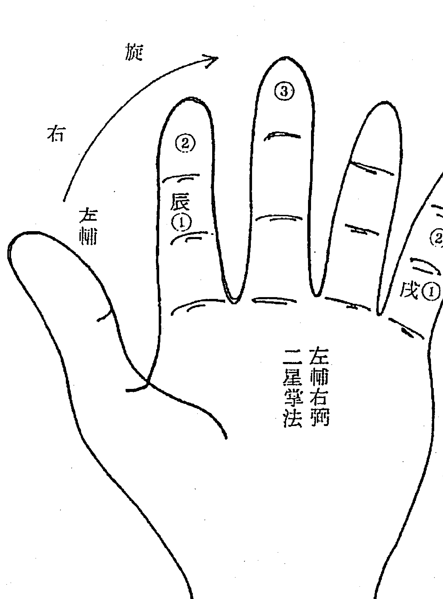

-   （3）聰明的讀者，請細想刑姚二星，既是同為順轉，刑為火精，姚為水精，刑起於酉，姚起於丑，酉丑的三合方為巳，因此只要以巳為本方，酉丑為刑姚之宮，那麼天姚天刑之排法，則更易於記憶，且其中有玄奧之處，可進一步去研究它。因此，笔者再提出刑姚本方之排法，掌訣及圖說如下：

| 五 | 六 | 七 | 八 |
| :--- | :--- | :--- | :--- |
| 巳 | 午 | 未 | 申 |
| 四 | (依生月) | 天姚星 | 九 |
| 辰 |  | 過宮圖 | 酉 |
| 三 |  |  | 十 |
| 卯 |  |  | 戌 |
| 二 | 正月 | 十二 | 十一 |
| 寅 | 丑 | 子 | 亥 |

| 九 | 十 | 十一 | 十二 |
| :--- | :--- | :--- | :--- |
| 巳 | 午 | 未 | 申 |
| 八 |  | 天刑星 | 正月 |
| 辰 |  | 過宮圖 | 酉 |
| 七 |  |  | 二 |
| 卯 |  |  | 戌 |
| 六 | 五 | 四 | 三 |
| 寅 | 丑 | 子 | 亥 |

#### ◇刑姚本方過宮圖說

-   1. (1) 刑姚之本方正月起巳宮，二月在午，三月在未：……順轉。（圖說於次頁）
-   2. (2) 求得刑姚本方後，以刑姚本方所在之宮爲本宮（命宮），則天姚在第五宮（財帛宮），天刑在第九宮（官祿宮）。如五月生人，五月之刑姚本方在酉，故知天姚在巳，天刑在丑。

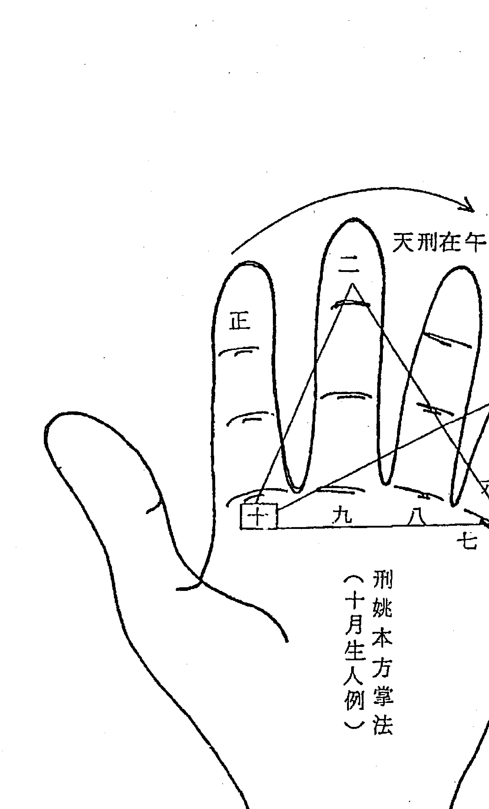

-   (4)二星之圖示之於後，掌法相同，從略。

| 正月 | 二月 | 三月 | 四月 |
| :--- | :--- | :--- | :--- |
| 巳   | 午   | 未   | 申   |
| 十二月 | 五月 | 過宮圖<br>刑姚本方 | 六月 |
| 辰   | 酉   |      | 戌   |
| 十一月 |      |      |      |
| 卯   | 順轉 |      |      |
| 十月 | 九月 | 八月 | 七月 |
| 寅   | 丑   | 子   | 亥   |

-   (3)前頁掌法示知十月生人刑姚方。天姚在戊，天刑在午。

#### (四)月馬、天巫

-   (1)月馬、天巫二星皆行於寅、申、巳、亥四生宮。
-   (2)月馬星正月起申宮，逆行巳、寅、亥；其實天馬星逢子起於寅宮，因正月建寅，而子馬在寅，丑馬在亥，寅馬在申，所以正月之馬在申。
-   (3)天巫星正月起於巳，次行申、寅、亥；行進路線為巳申寅亥成「Z」字形。其實天巫逢子乃從寅宮起，而行反「Z」字形。

巳申寅亥成「Z」字形。其實天巫逢子乃從寅宮起，而行反「Z」字形。

#### (五) 陰煞

-   (1) 陰煞星，在陽為小人，在陰為鬼邪。
-   (2) 陰煞不行陰宮（丑、卯、巳、未、酉、亥），陰宮本陰。
-   (3) 陰煞只行陽宮，乃陽宮中之陰煞氣。陰煞由寅宮起正月，逆行陽宮，為正月在寅，二月在

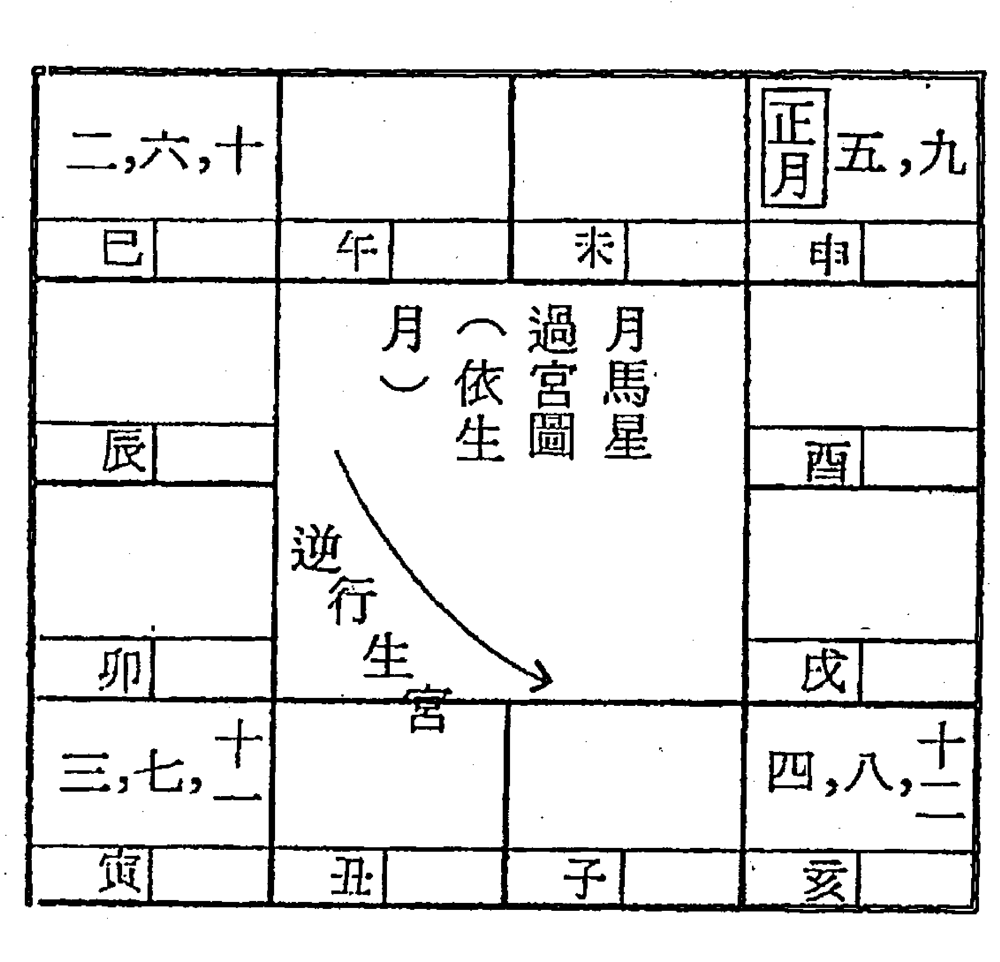

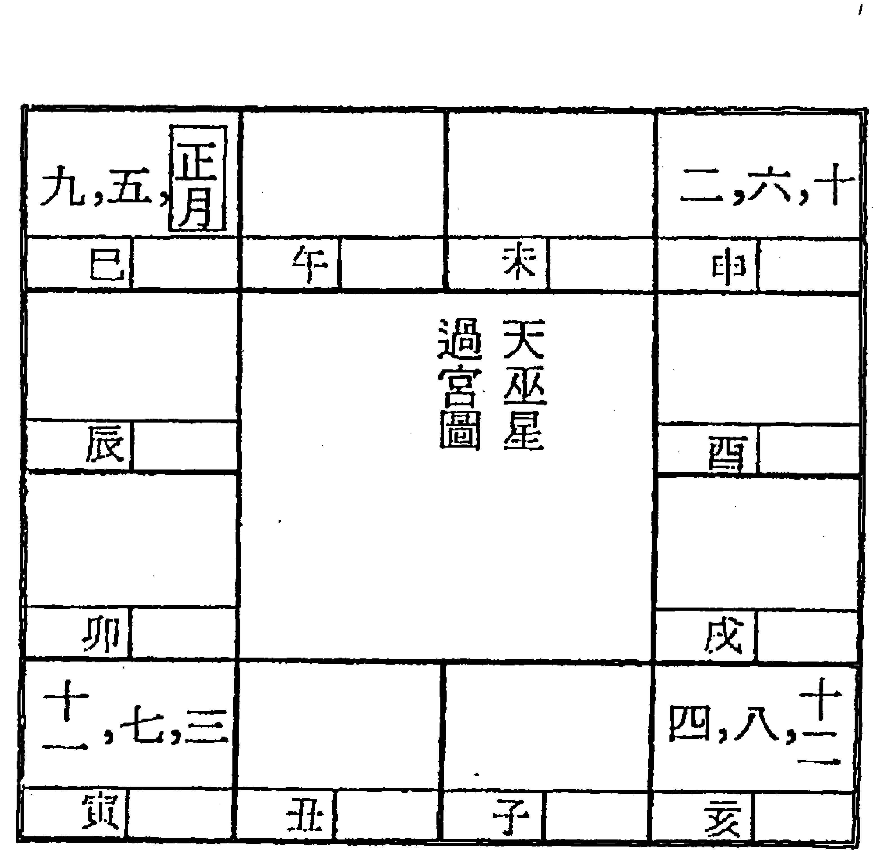

#### （六）解神

解神與陰煞一樣，不停於陰宮。

子，三月在戊，四月在申，五月在午，六月在辰，七月又在寅，八月在子，九月在戊，十月在申，十一月在午，十二月在辰。如圖所示，掌法同，從略。

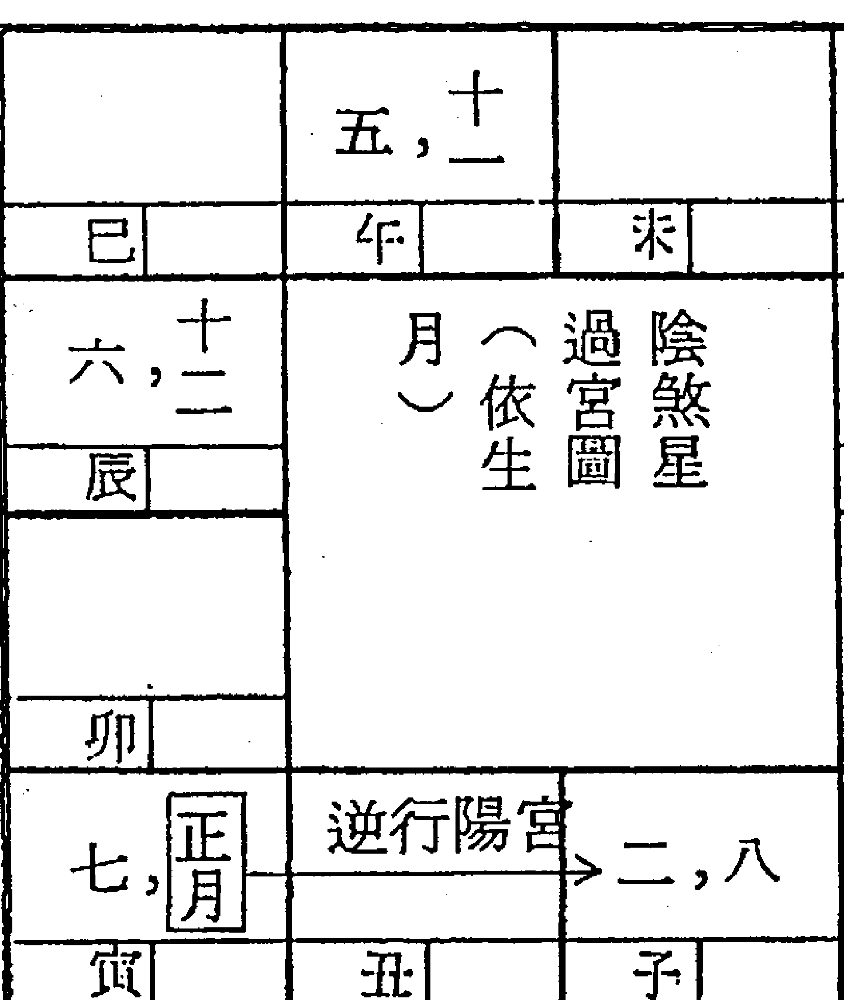

-   (2)解神子月（十一月）起于午，二个月行一宫，因此十二月亦在午，顺行阳宫。因正月建寅，故正月、二月，解神在申，三月、四月，解神在戌，五月、六月，解神在子，七月、八月，解神在寅，九月、十月，解神在辰，十一月、十二月，解神在午。
-   (3)图说如左，掌法同，从略。

| 巳 | 十一,十二 | 正月二月 |
| :--- | :--- | :--- |
| 九,十 | 午 | 申 |
| 辰 | 解神过宫图（依生月） | 酉 |
| 卯 | 月 | 三,四 |
| 七,八 | 一月 | 戌 |
| 寅 | 丑 | 五,六 |
|  | 子 | 亥 |

#### ◇ 舉例

如前例：己亥年十月一日午時生。

-   (一)左輔右弼（如左圖）
-   (1)左輔起辰右旋；

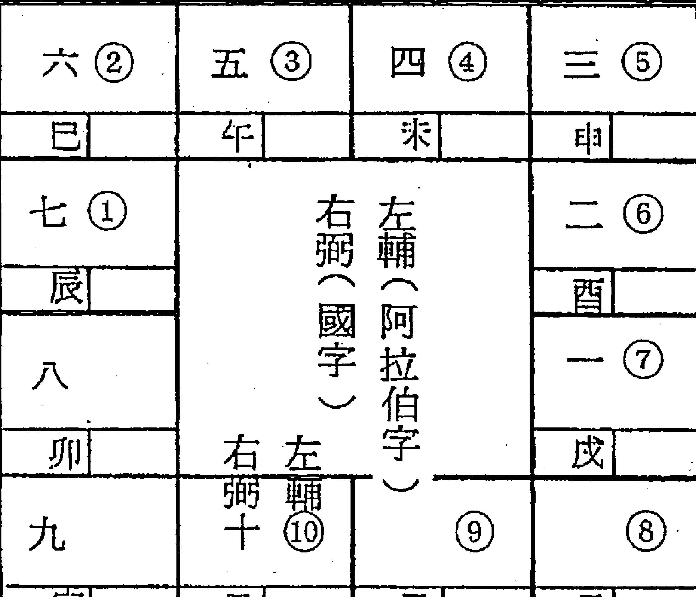

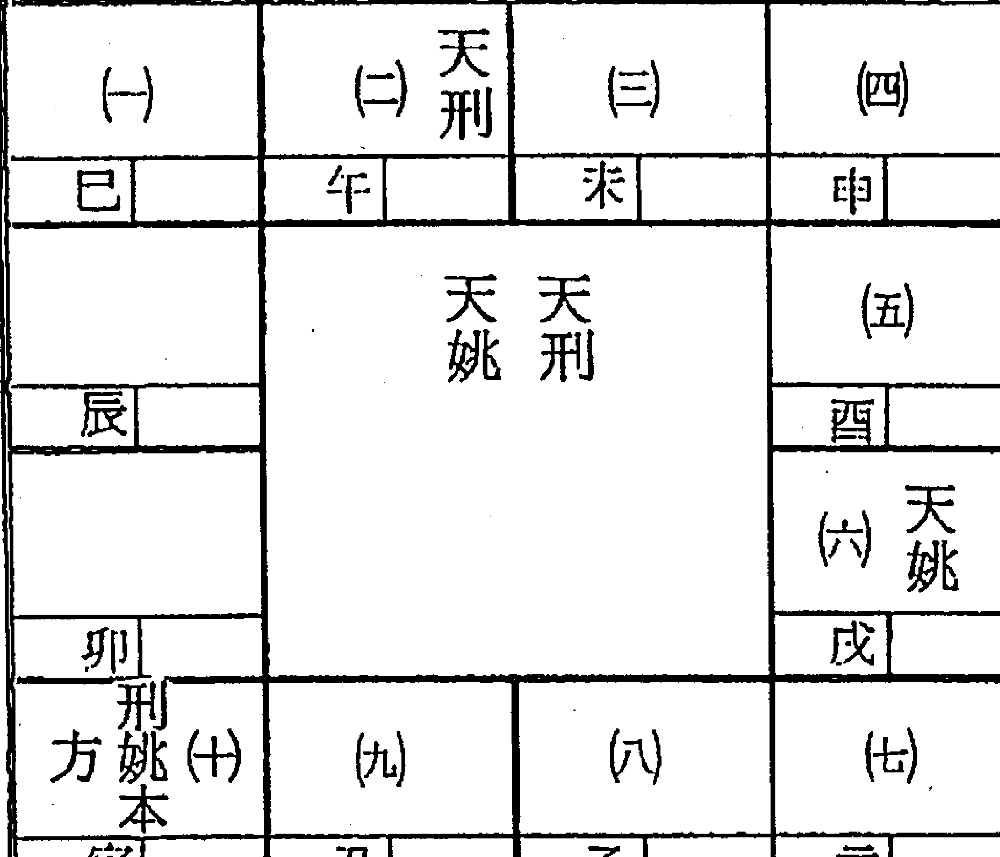

#### ## (二)天刑天姚

-   1. 刑姚本方正月起巳宫；
-   2. 顺行；
-   3. 十月行至寅宫；
-   4. 寅为本方，则午戌为合方，以本方为命宫，财宫（戌）安天姚，官禄宫（午）安天刑。

#### ## (三)月马天巫

-   1. 月马正月起於申宫；
-   2. 逆行四生宫；
-   3. 十月生人刚好停在巳宫，巳宫安月马；
-   4. 天巫正月起巳宫；
-   5. 以“Z”字形行四生宫；
-   6. 十月天巫在申宫。

#### ## (四)阴煞解神

-   1. 阴煞起寅，每月移一宫，逆行阳宫；

100

-   (2) 十月在申；
-   (3) 解神正二月起申宮，順行陽宮，兩月一動，十月在辰，解神安辰宮。

上述瑣言以爲加強讀者之演練，茲列入命盤內。

|          | (十)(一) | 月馬逆行生宮 | (九)(一) |
| :--- | :--- | :--- | :--- |
| (1)(5)(9) | (六)月馬 | ←            | (6)天(五) (10)巫 |
| 巳       | 午       | 未           | 申       |
|          |          | 天月 巫馬    |          |
| 辰       |          | (國字)(阿拉 伯字) | 酉       |
|          |          |              |          |
| 卯       |          |              | 戌       |
| (3)(7)   | (三)(七) |              | (4)(8)(四)(八) |
| 寅       | 丑       | 子           | 亥       |

|          | (五) |          | (四)(十)陰煞 (1)(2) |
| :--- | :--- | :--- | :--- |
| 巳       | 午   | 未       | 申 解神順行陽宮     |
| (六)(9)(10)解神 |      | 陰煞 解神 (國字)(阿拉伯) | 酉 (三)(九)(3)(4) |
| 辰       |      |          | 戌                   |
|          |      |          |                     |
| 卯 陰煞逆行陽宮 |      | (二)(八)(5)(6) |                     |
| (一)(七)(7)(8) | 丑   | 子       | 亥                   |

| 天梁<br>月马 | 天刑<br>七杀 |  | 廉貞<br>天巫<br>陰煞 |
| :--- | :--- | :--- | :--- |
| 命(身)<br>己巳 | 父<br>庚午 | 己亥年十月一日午时 | 田<br>壬申 |
| 紫微<br>天相<br>解神<br><br>兄<br>戊辰 |  | 木三局 | 官<br>癸酉 |
| 贪狼<br>子 丙寅 | 右弼<br>左辅<br>太陰<br>太陽<br><br>财<br>丁丑 | 天府<br>武曲<br><br>疾<br>丙子 | 天同<br><br>迁<br>乙亥 |

## 步骤十 安时系星

#### ❖ 简说

-   （一）时系星乃依命造出生时所排出来之星曜。时系星计有四组八颗：文曲与文昌、火星与铃星、地劫与地空、台辅与封诰。
-   （二）时系星中前三组：曲昌、火铃、劫空等星曜，作用大，而台辅与封诰，作用较微。
-   （三）火铃排法，除依生时外，尚依生年支而有所不同，较难记忆。其中巳酉丑年生人，坊间书籍火星子时起于卯宫，铃星起于戌宫，而竹林书局出版之紫微斗数全书，火星起于戌，铃星起于卯，与常本无异，谅是梓民之误；而该书火铃之安法，不以生时分列，仅以生年支为安火铃之依据，如同常法之分生年而皆以子时生人论定，在此一并敘明，学者可自行参研。

#### ❖ 掌诀图说

-   （一）文曲星、文昌星

-   (1) 曲昌二星一般称昌曲，而笔者惯以曲昌称呼，乃因曲昌的安星法有如左右（左辅、右弼），唯左右依生月排定，曲昌因生时不同；此外，文曲同于左辅起辰宫右旋，文昌同于右弼起戌宫左旋。
-   (2) 依上述概念，参之掌法，即可明白：文曲星子时生人，从命盘左边的辰宫起，右旋（即顺行）。文昌星子时生人，从命盘右边的戌宫起，左旋（即逆行），数至出生时辰即是。

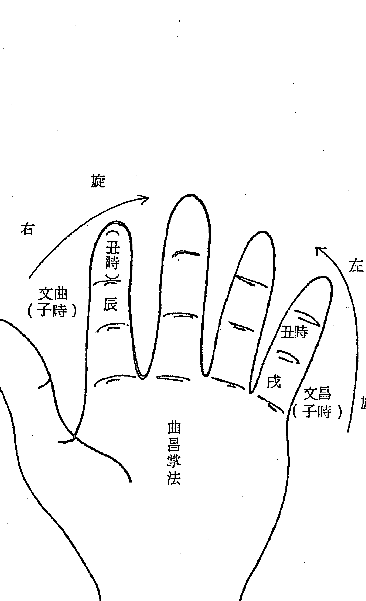

-   (3) 另以图示曲昌安法，以加深印象。（如右图）

-   (二) 地劫、地空

-   (1) 劫空星乃地劫地空二星之合称，有些书将地空称为天空，「斗数宣微」一书称地空，今从「宣微」；因天空与地空有别，天空星乃依生年太岁（生年支）而来，另于后叙天空星排法。

| 丑时 | 寅时 |  | 寅时 |
| :--- | :--- | :--- | :--- |
| 巳 | 午 | 未 | 申 |
| 子时（文曲） | 月（依生） | 过宫图 | 曲昌星、子时（文昌） |
| 辰 |  |  | 酉 |
| 卯 |  |  | 戌 |
| 寅 | 丑 | 子 | 亥 |（2）劫空二星，子时生人同宫在亥，二星行向不同，“劫顺空逆”，意即地劫星子时生人在亥，丑时生人顺行一宫在子……余此类推；地空星子时生人在亥，丑时逆行至戌……余此类法。

因此，我们知道劫空二星子时生人与午时生人皆是同宫，前者劫空同宫在亥，后者劫空同宫在巳。
掌法与图说如上所示。

#### （三）臺輔、封誥

（1）臺輔封誥二星皆为顺行星辰，臺輔星由子时起于午，顺行，封誥星起于寅宫，亦为顺行。
（2）臺輔起于午，封誥起于午，午寅乃寅午戌三合方之二方，以戌宫为本方（看成命宫），则臺輔在午（第五宫财宫），封誥在寅（第九宫官禄宫）。

| 亥 | 子時→ | 丑 | 寅 |
|---|---|---|---|
| 巳 | 午 | 未 | 申 |
| 戌 | 臺輔過宮圖<br>（依生時） | 卯 | 酉 |
| 辰 |  |  | 戌 |
| 酉 |  |  | 辰 |
| 卯 |  |  | 戌 |
| 申 | 未 | 午 | 巳 |
| 寅 | 丑 | 子 | 亥 |

| 卯 | 辰 | 巳 | 午 |
|---|---|---|---|
| 巳 | 午 | 未 | 申 |
| 寅 | 封誥過宮圖<br>（依生時） | 未 | 酉 |
| 辰 |  |  | 申 |
| ↑丑 |  |  | 戌 |
| 卯 |  |  | 酉 |
| 子時 | 亥 | 戌 | 酉 |
| 寅 | 丑 | 子 | 亥 |

#### (四) 火星、鈴星

再強調，臺輔封誥二星之本方過宮圖，子時生人起於戌宮，順行至生時所落之宮位為本方，其財宮安臺輔星，其宮宮安封誥星。
為讓讀者以直覺式印入腦海，上面三圖分別以二星之過宮圖先予闡釋，再以二星本方過宮圖示。

圖示。
臺輔、封誥本方過宮圖（依生時）

| 未 | 申 | 酉 | 戌 |
|---|---|---|---|
| 巳 | 午 | 未 | 申 |
| 午 |   | 臺輔、封誥本方過宮圖 |   |
| 辰 |   |   | 酉 |
| 巳 |   | 順行 | 子時 |
| 卯 |   |   | 戌 |
| 辰 | 卯 | 寅 | 丑 |
| 寅 | 丑 | 子 | 亥 |

| 巳 | 午 | 未 | 申 |
|---|---|---|---|
| 辰 | 酉 | | |
| 子時 鈴 | | | |
| 卯 | | | 戌 |
| 寅 | 丑 子時 火 | 子 | 亥 |
| | 依生時順行 | | |
| | 寅午戌（生年） | | |
| | 火、鈴 | | |

- 1. 寅午戌人，火丑铃卯
2. 申子辰人，火寅铃戌
3. 巳酉丑人，火卯铃戌
4. 亥卯未人，火酉铃戌
5. 火铃顺行，生时方停

| 巳 | 午 | 未 | 申 |
|---|---|---|---|
| 辰 | 酉 | | |
| | | | 子時 鈴 |
| 卯 | | | 戌 |
| 寅 子時 火 | 丑 | 子 | 亥 |
| | 依生時順行 | | |
| | 申子辰（生年） | | |
| | 火、鈴 | | |

◇ 舉例：（安時系星）
前例：己亥年十月一日午時。
現在，請諸君，伸出左手掌，運用本節所述之方法，以掌法演練安星。

|   | 巳 | 午 | 未 | 申 |
|---|----|----|----|----|
| 辰 | 子時 火 | 依生時順行 ↗ | 己酉丑 (生年) 火、鈴 | 酉 |
|   | 卯 |    |    | 子時 鈴 |
|   |    |    |    | 戌 |
| 寅 | 丑 | 子 | 亥 |

|   | 巳 | 午 | 未 | 申 |
|---|----|----|----|----|
| 辰 |  | 依生時順行 ↗ | 亥卯未 (生年) 火、鈴 | 子時 火 |
|   |  |    |    | 酉 |
|   |  |    |    | 子時 鈴 |
|   | 卯 |    |    | 戌 |
| 寅 | 丑 | 子 | 亥 |

#### （一）曲昌

- （1）曲起辰右旋至生時午，即左拇指點在辰宫，口唸子，移動拇指至巳宫，口唸丑，一直唸至午時，拇指停於戌宫，即安文曲。（下面以同樣方式演練，文中不詳述。）
- （2）昌起戌左旋，至對宫辰宫，恰為午時文昌星落宮。

#### （二）劫空

- （1）劫空子時同起亥宫。
- （2）劫順空逆。
- （3）午時生人，劫空同過於巳宫。

#### （三）臺輔封誥

- （1）二星本方宫子時起戌宫，順行。
- （2）午時生人在對宫辰宫。
- （3）辰宫為本方，財宫子宫安臺輔，官宫申宫安封誥。

#### （四）火鈴

- （1）己亥年生，亥卯未生年，子時火酉鈴戍，午時各在對宫。
- （2）因知火星在卯，鈴星在辰。

茲將時系星填入命盤，如下：

| 第一列 | 第二列 | 第三列 | 第四列 |
|---|---|---|---|
| **星曜**<br>地空<br>地劫<br>月馬<br>天梁<br><br>**宮位**<br>命(身)<br>己巳 | **星曜**<br>天刑<br>七殺<br><br><br>**宮位**<br>父<br>庚午 | **宮位**<br>福<br>辛未 | **星曜**<br>封誥<br>陰煞<br>天巫<br>廉貞<br><br>**宮位**<br>田<br>壬申 |
| **星曜**<br>文昌<br>解神<br>天相<br>紫微<br>鈴星<br><br>**宮位**<br>兄<br>戊辰 | **中心信息**<br>己亥年十月一日午時<br>陰男 陰女<br>大林木三局 | | **宮位**<br>官<br>癸酉 |
| **星曜**<br>火星<br>巨門<br>天機<br><br><br>**宮位**<br>夫<br>丁卯 | | | **星曜**<br>文曲<br>天姚<br>破軍<br><br><br>**宮位**<br>友<br>甲戌 |
| **星曜**<br>貪狼<br><br><br>**宮位**<br>子<br>丙寅 | **星曜**<br>右弼<br>左輔<br>太陰<br>太陽<br><br>**宮位**<br>財<br>丁丑 | **星曜**<br>臺輔<br>天府<br>武曲<br><br><br>**宮位**<br>疾<br>丙子 | **星曜**<br>天同<br><br><br>**宮位**<br>遷<br>乙亥 |

## 步骤十二 安年干系星

#### ☆簡說

- (一) 以出生年干來排定之諸星辰，較重要者有：祿存、羊刃、陀羅、天魁、天鉞、化祿、化權、化科、化忌、截空等星曜。
- (二) 由于支而來的星辰甚多，筆者認為不必要者也多，說不定有其功用，然近世命學家編書之際，聊備之而已，並無論述，故讓初學者，反覺繁瑣。本書棄而不用，免使讀者排好命盤之後，但感眾星閃爍，而不知從何論起；而摒棄之雜星，作用較微，並不影響紫斗論命，讀者安心無妨。
- (三) 天魁、天鉞為陽貴與陰貴，化祿、化權、化科、化忌為四化星，此六顆星排法，爭論甚多，另文釋之；筆者採用合理及應驗兩顧之排法，至盼前賢與同好賜教。
- (四) 祿存與羊陀三星一組，四化為一組，魁鉞為一組。

#### ☆掌訣圖說

- (一) 祿存、羊刃、陀羅
  - (1) 祿存是真人之星宿，主人貴爵，所以不入辰戌丑未四墓之地，又辰戌為魁罡，為天羅地網。
(2) 祿存由寅宮行起，甲干祿存在寅，乙干在卯，丙干在巳，丁干在午，戊干又回巳與丙干同，己干在午與丁干同，庚干在申，辛干在酉，壬干在亥，癸干在子。十二宮中辰、未、戌、丑四墓宮不入；丙戊同宮，丁己亦同宮，乃因火土同長生之故。

| 巳 | 午 | 未 | 申 |
| :---: | :---: | :---: | :---: |
| 丙戊 | 丁己 | | 庚 |
| 辰 | | | 酉 |
| 乙 | | | 辛 |
| 卯 | | | 戌 |
| 甲 | | | 壬 |
| 寅 | 丑 | 子 | 亥 |

禄存星（依生年干）过宫图

(3) 如左圖，以生年干依掌法或命盤點算，皆可知祿存之宮位。
(4) 羊刃星及陀羅星乃祿存星之守護星，所以跟前隨後，免得祿存之財祿為他人所奪。羊陀二星之佈法，只要記住「前羊後陀」即可，前的意思即是祿存星的前一位，何謂前一位？順進一位之意。如甲祿存在寅，羊刃即在卯；陀羅則在後一位，即在丑宮。如左圖：
(5)從羊刃星過宮圖，可知羊刃星不入寅、申、巳、亥四馬地，從陀羅星過宮圖可知陀羅星不入子、午、卯、酉四敗地，二星同為凶星，各異其趣。（四馬地、四敗地請參考第一章第 二節三）

|     | 丙戊 | 丁己 |     |
|-----|------|------|-----|
| 已  | 午   | 未   | 申  |
| 乙  |      |      | 庚  |
| 辰  |      |      | 酉  |
| 甲  |      |      | 辛  |
| 卯  |      |      | 戌  |
|     | 癸   | 壬   |     |
| 寅  | 丑   | 子   | 亥  |

| 丁己 |      | 庚   | 辛  |
|------|------|------|-----|
| 已   | 午   | 未   | 申  |
| 丙戊 |      |      |     |
| 辰   |      |      | 酉  |
|      |      |      | 壬  |
| 卯   |      |      | 戌  |
| 乙   | 甲   |      | 癸  |
| 寅   | 丑   | 子   | 亥  |

天魁星过宫图（依生年干）

| 癸 |  | 甲 | 乙 |
|---|---|---|---|
| 巳 | 午 | 未 | 申 |
|  |  | 天魁星过宫图（依生年干） | 丙 |
| 辰 |  |  | 酉 |
| 壬 |  |  |  |
| 卯 |  |  | 戌 |
| 辛 | 戊庚 | 己 | 丁 |
| 寅 | 丑 | 子 | 亥 |

(1) 魁钺二星乃天乙贵人，天魁为阳贵，天钺为阴贵。
(2) 魁钺之排法，坊间斗数书籍，各说纷纭，不考其源流，而抄来抄去，致使学者莫衷一是。今笔者比对各论，知阳贵取法于先天，阴贵取法于后天，他日另论。今将其正确排法，录之于后。

天钺星过宫图（依生年干）

| 壬 | 辛 | 戊庚 | 己 |
|---|---|---|---|
| 巳 | 午 | 未 | 申 |
|  |  | 天钺星过宫图（依生年干） | 丁 |
| 辰 |  |  | 酉 |
| 癸 |  |  |  |
| 卯 |  |  | 戌 |
|  | 甲 | 乙 | 丙 |
| 寅 | 丑 | 子 | 亥 |

(3) 一般書籍所採「甲戊庚牛羊」等口訣，乃指陰貴（天鉞星）而言，唯被誤讀為甲戊庚陽貴在牛（丑），陰貴在羊（未），正確的是甲陰貴在牛（丑），戊庚陰貴在羊（未），全句皆是陰貴之走向，而陽貴正好相反：甲陽貴在羊，戊庚陽貴在牛。
(4) 魁鉞二星為貴人星，辰為天羅，戊為地綱，貴人星不入，而丑未為貴人之門，陽貴天魁星由未宮起順行，陰貴天鉞星由丑宮起逆行。

#### (三) 化祿、化權、化科、化忌

- （1）祿、權、科、忌等四化星乃斗數之用神，精神之所在，是非常重要的部份。
- （2）四化星使命盤的平面，幻化成立體，使日常事物之論斷更加活潑、傳神。
- （3）十干之祿權科忌，只有十五顆星參加四化。
- （4）四化星亦諸多爭論，戊庚壬干都有不同的說法，尤以庚干為最，筆者認為這乃因宇宙以庚金為主體之故，瞎子摸象之見，各有不同，卻確實觸及象體了。
- （5）為論命之角度，筆者選用化星峻易顯象，或顯象較明者用之。
- （6）四化星必須背誦，常用即能熟悉；以簡稱星曜名稱誦唸，較為順口易記。茲列於後：

```
甲廉破武陽
乙機梁紫陰
丙同機昌廉
丁陰同機巨
戊貪陰右機
己武貪梁曲
庚陽武陰同
壬梁紫左武
辛巨陽曲昌
癸破巨陰貪
```

#### (四) 截路空亡

(1) 截路空亡，簡稱截空，截路入陽宮，空亡入陰宮。亦有人稱正截空與傍截空。
(2) 截路甲年生人在申宮，逆行陽宮（申、午、辰、寅、子）至子為止，又重入申宮，即不行戊宮，恰為甲己在申，乙庚在午：
(3) 空亡自酉逆行陰宮（酉、未、巳、卯、丑）五位，二行恰為十干。（即不行亥宮）
(4) 知生年干之截路所在宮位，即知空亡在其順行一宮，如乙年生人截路在午，空亡即在未，餘此不贅。

#### 截路逆行陽宮

（图略）

| 命(身) 己巳 | 父 庚午 | 福 辛未 | 田 壬申 |
| :--- | :--- | :--- | :--- |
| 陀罗、地空、地劫、天马、天梁<br>科 | 禄存、天刑、七杀 | 羊刃 | 天铖、封诰、阴煞、天巫、廉贞<br>截路 |
| **兄 戊辰** | **阴女 阴男**<br>己亥年十月一日午时<br>大林木三局 | **官 癸酉** | **空亡** |
| 铃星、解神、文昌、天相、紫微 |  |  | 文曲、天姚、破军<br>忌 |
| **夫 丁卯** |  | **友 甲戌** |  |
| 火星、巨门、天机 |  |  |  |
| **子 丙寅** | **财 丁丑** | **疾 丙子** | **迁 乙亥** |
| 贪狼<br>权 | 右弼、左辅、太阴、太阳 | 天魁、台辅、天府、武曲<br>禄 | 天同 |

## 步驟十二 安年支系星

簡說

- (一)以生年支為依據而排列之星曜甚多，本書擇其要而取用。
(二)前言天馬星，命書有以出生月排定者，亦有以出生年而排者，本書兩者皆採用，前者稱之為月馬，後者因以出生年太歲支而排定，故稱之為命馬。本步驟續論命馬之排法。
(三)另有紅鸞、天喜、孤辰、寡宿、天哭、天虛、白虎、華蓋以及天空等星曜。
(四)請各位記住鸞喜、孤寡、哭虛等六星，二星各成一組。
(五)其安星法，述之於後。

#### 掌訣圖說

(一)命馬

- （1)以生年地支決定命馬所在，子年命馬起於寅宮。
(2)逆行四生宮。
(3)月馬與命馬皆行四生宮（寅申巳亥），故此四宮亦稱四馬地。
(4)另述記憶法：

| 亥未卯 |  |  | 戌午寅 |
|---|---|---|---|
| 巳 | 午 | 未 | 申 |
| 辰 | 命馬過宮圖（依年支） |  | 酉 |
| 卯 |  |  | 戌 |
| 申辰子年 | 逆行四生宮 |  | 酉巳丑 |
| 寅 | 丑 | 子 | 亥 |

申子辰三合水，水生木，故在寅。亥卯未三合木，木生火，故在巳。巳酉丑三合金，金生水，故在亥。寅午戌三合火，火生土，四生宮無土，但土可再生金，故在申。

#### (一) 天空

(1) 天空星有别于地空星，除了地空星由生时支而来，天空星由生年支而定外，其安星之原理迥异；如命马与月马其安星原理是一致的（逢命造地支子者马在寅宫），只有论命者对天马星应以生年或生月来论，有一派之看法而已。
(2) 天空星都在生年支之顺前一位（即驾前一位），如子年生者，天空在丑，丑年天空在寅，余此类推。
(3) 天空星图说可让读者过目不忘。

| | | | |
|---|---|---|---|
| 辰 | 巳 | 午 | 未 |
| 巳 | 午 | 未 | 申 |
| 卯 | 天空星过宫图（依生年支） | | 申 |
| 辰 | | | 酉 |
| 寅 | | | 酉 |
| 卯 | | | 戌 |
| 丑 | 子年 | 亥 | 戌 |
| 寅 | 丑 | 子 | 亥 |

#### (二) 红鸾、天喜

- （1) 红鸾星大家皆知乃指男女喜庆之事，天地间有阴阳，有男女，阴阳交淫，谓之合德。卯时乃天将亮时，酉时乃天将暗时，所以卯酉是阴阳的分野，也是阴阳交淫之时。
, 谓之阴阳线。
(2) 因此子年生人，红鸾在卯，天喜在酉（卯之对宫），据此，每一年逆行一宫。
(3) 简单说，红鸾星子年动于卯，逆行，而天喜永在红鸾星之对宫，如图说。

| 戊 | 酉 | 申 | 未 |
| 巳 | 午 | 未 | 申 |
| 亥 | 年支（依生过宫图星）红鸾星 ※天喜 永在红鸾对宫 | 午 | 酉 |
| 辰 | 子年 | 巳 | 戌 |
| 卯 | 寅 | 卯 | 辰 |
| 丑 | 丑 | 子 | 亥 |

#### (四)孤辰、寡宿

(1)孤寡二星是四方位之前鋒與後衛，以十二地支劃分四個方位的話，亥子丑是北方，寅卯辰是東方，已午未是南方，申酉戌是西方。

孤寡二星
年生人丑

| 巳 | 午 | 未 | 申 |
| 辰 |   |   | 酉 |
|   |   |   | 寡宿 |
| 卯 |   |   | 戌 |
| 孤辰 |   |   |   |
| 寅 | ☆丑 | ☆子 | ☆亥 |

孤寡二星
年生人辰

| 巳 | 午 | 未 | 申 |
| 孤辰 |   |   |   |
| ☆辰 |   |   | 酉 |
| ☆卯 |   |   | 戌 |
|   | 寡宿 |   |   |
| ☆寅 | 丑 | 子 | 亥 |

(2) 接著，筆者告訴各位，孤辰是前鋒，寡宿是後衛。因此亥子丑年生人，孤辰在丑前一位為寅宮，寡宿在亥後一位為戌宮；寅卯辰年生人，孤辰在辰前一位為巳宮，寡宿在寅後一位為丑宮；同理，已午未生人，孤辰在申，寡宿在辰；申酉戌人，孤辰在亥，寡宿在未。
(3) 如圖說所示，並可知道：孤辰只落四馬地，寡宿只居四墓宮。

#### （五）天哭、天虚

（1）哭虚二星子年生人同宫在午。
（2）自此每年各行一宫，“哭逆虚顺”，因此午年生人，哭虚在子宫，详如图说。

天虚顺行

| 宫位 | 内容 |
|---|---|
| 丑 | 天哭 |
| 子年 | 天虚 |
| 寅 | |
| 午 | 生年支 |
| 未 | 图（一）依星过宫 |
| 申 | 哭虚二 |
| 酉 | |
| 戌 | |
| 亥 | |
| 子 | |
| 丑 | |
| 寅 | |
| 卯 | |
| 辰 | |
| 巳 | 天哭逆行 |
| 午 | |
| 未 | |
| 申 | |
| 酉 | |
| 戌 | |
| 亥 | |
| 子 | |
| 丑 | |
| 寅 | 天哭逆行 |

#### （六）华盖

亥未卯

| 宫位 | 内容 |
|---|---|
| 巳 | 午 |
| 未 | 申 |
| 申辰 | 子年 |
| 辰 | 酉 |
| 卯 | 戌午寅 |
| 寅 | 酉巳丑 |
| 丑 | 子 |
| 亥 | 戌 |

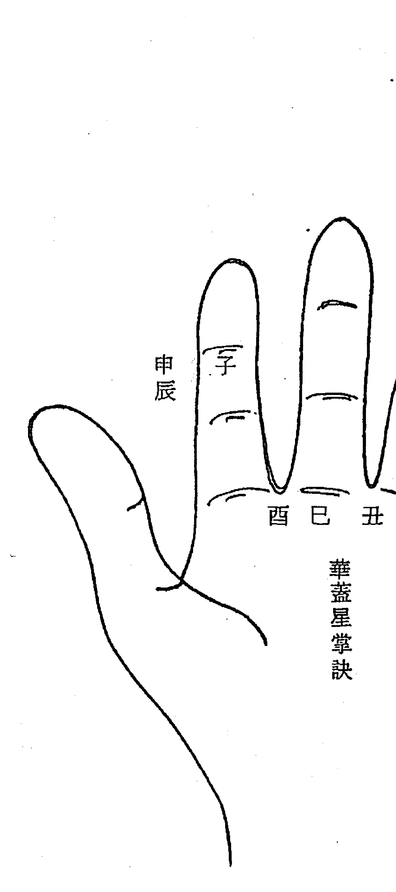

1.  华盖星仅行辰戌丑未四墓地，其孤高之性明矣！
2.  子年生人华盖星居辰宫，自此逆行四墓宫，即辰戌丑未。
3.  换句话说：申子辰生人三合水局，辰为水之墓库，故华盖在辰；巳酉丑生人三合金局，丑为金之墓库，木之墓库，故华盖在未。

#### （七）白虎

1.  子年生人起申宫，顺行至生年。
2.  白虎恒在生年支之财宫。

#### 举例

如前例己亥年十月一日午时。笔者仅条列前述之原则运用，不再以图说明，读者可自备纸笔，或举掌实习之。

#### （一）命马

1.  亥年生，子年起寅，逆行四生宫。
2.  数至亥，适在巳宫，安命马。

#### （二）天空

1.  驾前一位是天空，“驾”为生年太岁。
2.  本造生年支为亥，亥前一位为子，故于子宫安天空。

| 酉 | 戌 | 亥 | 子年 |
|---|---|---|---|
| 巳 | 午 | 未 | 申 |
| 申 | 白虎星过宫图（依生年支） | 丑 | |
| 辰 | 酉 | | |
| 未 | 寅 | | |
| 卯 | 戌 | | |
| 午 | 巳 | 辰 | 卯 |
| 寅 | 丑 | 子 | 亥 |

#### （三）鸾喜

1.  子年红鸾起卯，逆行。
2.  数至亥年为辰宫，安红鸾。
3.  辰宫对宫为戌，安天喜。

#### （四）孤寡

1.  亥年乃亥子丑北方。
2.  孤辰为前锋，因此安于丑之前一宫为寅宫。
3.  寡宿为后卫，因此安于亥之后一宫为戌宫。

#### （五）哭虚

1.  子年哭虚同宫于午。
2.  哭逆虚顺。
3.  因此天哭在未，天虚在巳。

#### （六）华盖

1.  华盖子年起辰。
2.  逆行四墓。
3.  亥年适落未宫，安华盖。

| 列1 | 列2 | 列3 | 列4 |
|---|---|---|---|
| 陀罗 地空 地劫 月马 天梁<br>命天 马虚 科<br>己巳<br>命（身） | 禄存 天刑 七杀<br>庚午<br>父 | 白虎 华盖 天哭 羊刃<br>辛未<br>福 | 天钺 封诰 阴煞 天巫 廉贞<br>截路<br>壬申<br>田 |
| 铃星 解神 文昌 天相 紫微<br>红鸾<br>戊辰<br>兄 | 阴男 阴女<br>己亥年十月一日午时 | 空亡 | 癸酉<br>官 |
| 火星 巨门 天机<br>丁卯<br>夫 | 大林木三局 | 寡宿 天喜 文曲 天姚 破军<br>忌<br>甲戌<br>友 | |
| 孤辰 贪狼<br>权<br>丙寅<br>子 | 右弼 左辅 太阴 太阳<br>丁丑<br>财 | 天空 天魁 天府 武曲<br>禄<br>丙子<br>疾 | 天同<br>乙亥<br>迁 |

#### （七）白虎

子年起申顺行，亥年为末宫，安白虎。

## 步骤十三 安命主、身主、大限

### 简说

1.  紫微斗数重要星曜之排法，至步骤十二皆已排妥；最后乃就当中取一星为命主星，一星为身主星，并安好大限，就大功告成。
2.  大限乃十年大运，以阴阳男女来区分十年大运之走向，顺行或逆行。
3.  命主星与身主星乃注记于命盘之中空部份。命盘中空部份，就一般习惯，填入的文字资料计为：
    1.  命造姓名。
    2.  命造出生年月日时。
    3.  阴阳男女及五行局。
    4.  命主星及身主星。
4.  尚有些人将子平八字或姓名学填入中空部份，用以合参，笔者认为，路是人走出来的，并无不可；只要不把其它命理掺入紫斗中，使斗数的星曜，一天比一天多，那就好了。但是，如有学者能将其系统的命理学，实证出可用的星曜，而安于斗数上，使其更加光辉，我认为并无理由反对。
5.  命主星只有七颗，此七颗星自古以来即称北斗七星，其安法乃依黄帝斗图所称之北斗七星各年生人所属而定，斗数改以命宫在支为用，理由安在？自古以来，并无论述。
6.  黄帝斗图云：「一名贪狼，子生人所属；二名巨门，丑亥生人所属；三名禄存，寅戌生人所属；四名文曲，卯酉生人所属；五名廉贞，辰申生人所属；六名武曲，巳未生人所属；七名破军，午生人所属。」贪狼在子，破军在午，其馀五星皆分属二宫，从丑宫顺行至午为：巨、禄、曲、廉、武、破，由左辅随从，自戌逆行至午，五星次序一样，而由右弼陪伴。
7.  兹依序说明命、身主及大限定法。

| 贪狼（子） | 巨门（丑） | 巨门（亥） | 禄存（寅） | 禄存（戌） | 文曲（卯） | 文曲（酉） | 廉贞（辰） | 廉贞（申） | 武曲（巳） | 武曲（未） | 破军（午） |
|---|---|---|---|---|---|---|---|---|---|---|---|
| 命主星（依命宫在支定之） | | | | | | | | | | | |

#### （一）命主星（图示于前页）

1.  命主星视命宫在何地支宫位而定。
2.  由子至午，顺逆皆同，七星依序为：贪、巨、禄、曲、廉、武、破。
3.  如命宫在午，命主星为破军，馀如图示。

#### （二）身主星

1.  身主星依生年支而来。
2.  两对冲地支，身主星相同，即子午生人，身主天相，寅申为天梁，卯酉为天同，辰戌为文昌，巳亥为天机。
3.  因此，记忆子至巳之次序为：火、相、梁、同、昌、机（谐音为：好商量，同娼妓）即可。

| | | | |
|---|---|---|---|
| 天机 | 火星 | 天相 | 天梁 |
| 巳 | 午 | 未 | 申 |
| 文昌 | 身主星（依生年之支定） | 天同 | 酉 |
| 辰 | 戌 |
| 天同 | 文昌 |
| 卯 | 戌 |
| 天梁 | 天相 | 火星 | 天机 |
| 寅 | 丑 | 子 | 亥 |

#### （三）大限

1.  首先须瞭解阴阳男女，所谓阴阳指干支而言，以十天干之序数来说，奇数为阳，偶数为阴，亦即甲、丙、戊、庚、壬年出生者为阳，乙、丁、己、辛、癸年为阴。
2.  大限又分男女，加上阴阳年之别，可分：阳男、阴男、阳女、阴女。
3.  第一大限无论阴阳男女，皆以命宫为第一大限，而第二大限起，阳男阴女顺行，即以父母宫为第二大限，福德宫为第三大限，顺序安至第九大限即可。阴男阳女逆行，即以兄弟宫为第二大限，夫妻宫为第三大限，逆序安至第九大限即可。
4.  关于入限的年岁问题：水二局人二岁至十一岁为第一大限，每十年为一大限，顺加上去即可。木三局人三岁至十二岁为第一大限。金四局人四岁至十三岁为第一大限。土五局人五岁至十四岁为第一大限。火六局人六岁至十五岁为第一大限。

| 年龄范围 | 宫位 | 地支 |
|---|---|---|
| 3~12 | 命 | 巳 |
| 13~22 | 父 | 午 |
| 23~32 | 福 | 未 |
| 33~42 | 田 | 申 |
| 43~52 | 官 | 酉 |
| 53~62 | 友 | 戌 |
| 63~72 | 迁 | 亥 |
| 73~82 | 疾 | 子 |
| 83~92 | 财 | 丑 |
| | | 寅 |

| 年龄段 | 宫位 | 干支 | 年龄段 | 宫位 | 干支 | 年龄段 | 宫位 | 干支 | 年龄段 | 宫位 | 干支 |
|---|---|---|---|---|---|---|---|---|---|---|---|
| 3~12 | 命 | 巳 | 13~22 | 兄 | 辰 | 23~32 | 夫 | 卯 | 33~42 | 子 | 寅 |
| 43~52 | 财 | 丑 | 53~62 | 疾 | 子 | 63~72 | 迁 | 亥 | 83~92 | 官 | 酉 |
| | | 木 阴 午 己 | | | 三 男 时 亥 | | | | | | |
| | | 局 年 十 月 一 日 | | | | | | | | | |

◇举例说明
（一）如前例木三局人，三岁入限，第一大限三岁至十二岁在命宫。
（二）如本命造为女命，则为阴女，大限应顺行，如上页图所示。
（三）同生辰若为男人命造，则大限逆行，如左图所示。

◇附言
（一）一般书籍尚有十二长生神，及小限安法，本书不论，请参考本出版社出版之「紫微初阶」。
（二）倘若读者尚须查表方能排盘，亦请参阅「紫微初阶」；本书乃进阶，若再列入星曜速见表，则占去篇幅，且违进阶读者之希望，鱼与熊掌不得兼顾，祈部份读者谅之。

◇举例
同前例，完成之命盘如下（设为男命）：

阴男。己亥年十月一日午时。命主：武曲 身主：天机。大林木三局。

天梁、月马、地劫、地空、陀罗。
命宫天虚。
科。
3～12岁。
命（身）。
己巳。

七杀、天刑、禄存。
父。
庚午。

羊刃、天哭、华盖、白虎。
福。
辛未。

廉贞、天巫、阴煞、封诰、天钺。
截路。
田。
壬申。

紫微、天相、文昌、解神、铃星。
红鸾。
13～22岁。
兄。
戊辰。

空亡。
官。
癸酉。

天机、巨门、火星。
23～32岁。
夫。
丁卯。

破军、天姚、文曲、天喜、寡宿。
忌。
73～82岁。
友。
甲戌。

贪狼、孤辰。
权。
33～42岁。
子。
丙寅。

太阳、太阴、左辅、右弼。
43～52岁。
财。
丁丑。

武曲、天府、天辅、天魁、天空。
禄。
53～62岁。
疾。
丙子。

天同。
63～72岁。
迁。
乙亥。

## 第一节 进阶命盘十二宫释义

### 一、命宫（简称命）

*   依一六共宗之理，命是性，疾厄宫（第六宫）是心。
*   命宫是大太极，福德宫是小太极。
*   命宫是财帛宫的官禄宫，亦即为财帛宫之气数位，乃在看财帛之支出行为状况。
*   命宫是官禄宫的财帛宫，可以查看事业的资金及现金概况。
*   命宫看个性，命宫为阳，显的；其对宫迁移为阴，隐的。内性外表之心态，可互参而明见。
*   以六亲而言，命宫也是祖母宫；因为父母的父母宫在原命盘的福德宫，借作祖父宫来看，祖母位为祖父宫之夫妻，乃原命宫。
*   就疾病之观点来说，古书上论及疾厄宫，常云就命宫疾厄宫之星曜论之；深论之，两者有别，因命宫乃是疾厄宫之交友宫，交友有交易变化之意，故命宫乃看疾厄之病变吉凶。
*   就命迁线为轴而论，右面（即逆行方向）五宫，其性质是指：平辈、幼辈、年少的、变动的、新的、明显的、未来的；左面（即顺行方向）五宫，其性质是指：老辈、远祖的、固定的、旧的、阴隐的、过去的。
以田宅宫为体，命宫为用，命宫是为走廊。

### 二、兄弟宫（简称兄）

*   就财而言，兄弟宫是财帛宫之田宅，藏财之所，谓之财库，可看财之库存。
*   就官禄事业而言，兄弟宫乃官禄宫之疾厄，对事业体的诊断，制机之先，须知物自腐而后虫生，兄弟宫可见其端倪与溢伤。
*   以疾厄而言，兄弟宫为其官禄宫，亦即气数位（以下皆同，不复述释）；疾厄为身体，兄弟宫即为身体的支付行为，所以严重的身体事故，换言之即是生命，都在兄弟宫显现出来。
*   以田宅而言，兄弟为田宅之财帛，田宅之动产状况，可由此宫窥知，田宅宫堂皇，亦可能家中无钱。以田宅为体，兄弟宫为用，则是床位，夫妻房。
*   就六亲而言，兄弟宫为父母宫（单作父论）之夫妻宫，故可作为母亲宫来看；另可作男命之岳父，女命之公公。
*   以迁移主在外而言，兄弟宫为迁移之交友，因此可知在外之交际能力及手腕，与外界之因果。
*   看寿元，常以兄友并看，除上述以疾厄宫为体外，尚可由福德宫为体来发用，因其为福德宫之子田线，阴德之门户。

| | | | |
|---|---|---|---|
| | | | 夫妻的夫妻，所以又是我。<br>（财宫是三三归一）<br>（财） |
| | 六亲泛解 | | 长子<br>三哥<br>二太太<br>（子） |
| 配偶的朋友<br>（田） | | | 原配<br>二哥<br>（夫） |
| 二祖<br>姊父<br>（福） | 大父亲<br>姊亲<br>（父） | 祖母<br>我<br>（命） | 大哥哥<br>公公<br>岳父<br>母亲<br>（兄） |

### 三、夫妻宫（简称夫）

*   夫妻宫是福德宫的财帛宫，福德就因果来说，前世积福多寡，在此兑付；因此，婚姻之事，有缘定三生之说，前世烧好香，今世娶良妻，因果报应，丝毫不爽。
*   以事业宫为阳，夫妻宫在对宫为阴，可知事业外来因素及事故，或隐伏于外之危机。
*   夫妻宫是疾厄宫的田宅宫，疾厄表我之身心，因此夫妻宫可与疾厄同论夫妻之缘份深浅。
*   夫官线为事业线。
*   以田宅宫为体，以夫妻宫为用，夫妻乃田宅之疾厄，以厨房表之。

### 四、子女宫（简称子）

*   子女宫是桃花宫，子田线乃桃花线，是享受欢乐的宫位，因为它是福德的疾厄，也是疾厄的福德。
*   同理，子女宫亦表性能力，以及个人之僻好喜忌。
*   子女宫是股东位，看能否合伙的宫位，因为它是官禄宫的交友，财帛宫的父母。
*   以田宅宫为住宅之整体，子女宫表屋前状况，因子女宫为田宅之对面宫位。
*   以田宅为体，子女宫为用，子女为田宅之迁移，表卧室房间，因田宅为阳，子女宫则为阴故。
*   就六亲人事而言，可扩充为：小姨、细姨（二太太）、学生、弟子、部属。

### 五、财帛宫（简称财）

*   命、财、官，为斗数之重要宫位，依三三归一或三三为五之理，可更明确地体认。三三归一是说：第三宫为夫妻宫，夫妻的夫妻即是财帛宫（财宫为五），配偶的配偶就是我。
*   财帛宫为官禄宫之气数位，表事业中之营业状况及损益状况。
*   就迁移来说，它是迁移之福德，俗说：无钱走无路，有的人有钱大部份花在东奔西跑上，不管乐不乐意，二宫间之关系可表露无遗。
*   就田宅来说，是田宅的交友，表玄关之处。
*   就福德而言，它是福德之对宫，为阴宫，暗藏见不到的福德之因，而表现出这一辈之钱财，斗败之因果观甚为玄妙。

### 六、疾厄宫（简称疾）

*   就于命宫释及，命为性，疾为心，可知心乃是性之元神所居，是为其原体；而情又是性所生，心本清明，发出为性，二者交感而为情，故六情之种子孕育于心。
*   就福德而言，疾厄乃福德之交友，福德所主事务，在此宫交易，变化与推演；又疾厄乃父母宫之对宫，亦即阴宫，祖上的馀德，父母之遗传（隐的，看不见它遗传，所以是阴的），在此表现（表现即愿的），是故其因阴，其果为阳，阴阳交易，因果循环，至为玄妙。
*   补述一点，福德乃疾厄之疾厄宫，是说明了福德为体，疾厄为用，福德为因，疾厄为果之绵远而密不可分之关系。

| | 头 | 肩胫 | 左手 |
|---|---|---|---|
| 右手 | 午 | 未 | 申 |
| 肝胆 | 履 一 | 戴 九 | 心肺 |
| 辰 | | | 酉 |
| 右腹 膀胱 | | | 左腹 肾脏 卵巢 |
| 卯 | | | 戌 |
| 右脚 | 肛门 | 下阴 部性 器 | 左脚 |
| 寅 | 丑 | 子 | 亥 |

| | 心 口舌 | 胃 唇 | 肺 胸 |
|---|---|---|---|
| 面喉 | 午 | 未 | 申 |
| 肩脾 | | | 皮毛 小肠 |
| 辰 | | | 酉 |
| 背肝 | | | 膝协 |
| 卯 | | | 戌 |
| 肝胆 | 腹脾 | 腰肾 | 膀胱 发 |
| 寅 | 丑 | 子 | 亥 |## 七、迁移宫（简称迁）

前言以命宫为阳，迁宫即为阴；就命宫论个性及命运而言，迁移是隐的一面，因它又是福德的气数位，父母之交友，故可综合为：祖上及父母在命与性的潜在遗传因子。命宫无主星，借迁宫主星，不可排除它尚带着阴隐之性质，表面是看不出来的。

因交友宫常被用为看寿元之宫位（后论）。因此迁宫就被拿来看父母之寿元，因它是父母宫之交友宫。

迁宫为福德之气数位，阴德如何，在此兑现，常言出外防小人，如以因果之观念来谈，那是在偿债；如出外有贵人，是则在索债，那贵人来帮你，不就等于偿还你吗？因果一线牵，万里不为远，无论天涯海角，都得赶去相会，不知不觉中彼此会帐。另常有人不良于行，迁宫受制于福德，前世惩衍，叹之奈何？

以田宅为体，迁移为用，为主卧室。

## 八、交友宫（简称友）

前言命疾乃一六之宫，从另一角度，友命亦一六共宗之关系宫位，凡有一六宫之关系者，吉凶与共，相互牵连。又友宫为福德之田宅，藏福之所，故不能破，破则有灾，重则亡命。

古论天殇永在奴仆（交友），天使永在疾厄，且又云「殇使加恶曜，仲尼绝粮邓通亡」，有人不求甚解，仅谓古人寿命较短，故不论大限逆行或顺行，疾厄或交友宫恰为人之第六大限，以平均年龄而言，该老死了。殊不知此乃宫位问题，斗数列殇使二星于该二宫，是有其特殊意义的，所以论寿元这二宫不可忽视。并非大限要入此二宫才算，如要入才算，颜回不会三十二岁就死了，详考其命盘，颜回三十二岁之大限，流年、小限，均非殇使二星所在宫，或其对宫。本书排盘略去此二星，乃是笔者已直接提出此二星所在宫疾厄与奴仆（交友）之重要，不必多排二星，充斥命盘宫位。

以田宅为体，交友宫为其福德宫，故表神位。

以官禄宫为体，交友乃其父母位，表人物乃公司中之上司，或是外头上手公司（即来货之源头）。

## 九、官禄宫（简称官）

官禄宫，今人常称事业宫。官禄宫为命宫之气数位，命之行为表现，运之兑现支付处，命、财、官三宫互为气数位。

官禄宫为斗数第九宫，命宫为第一宫，一九合十，一乃水之生数，水乃五行之始，一乃数之始，十乃土之成数，乃五行数之极，数不过五，过五则变。是故二数合十，乃见其表现，显其形象，知其始终。

就田宅而言，官禄为其父母宫（文书宫），是以为之书房。以四正（子午卯酉，或辰戌丑未，或寅申巳亥等）之观点而言，官禄与父母、夫妻、疾厄为四正，是静的体，系着隐因。其四宫间之关系，是体对体、静对静，种因化合宫位。而命、财、官，乃用对用、动对动。其理已表于第一章第二节六“三方四正”之解释中，读者善加体会，不另赘述。

交友宫，古称奴仆宫或仆役宫。

| 客户 子公司 商品 (父) | 关系企业 (福) | 客户 同事 同行 (田) | 以官禄宫为体 (官) |
| :--- | :--- | :--- | :--- |
| 现金 资金 (命) | | | 上司、老板 上游工厂 货源公司 (友) |
| 事业之体职，如武曲忌在本宫，金厨行业有忌讳，文星忌在本宫，事业文书有问题。 (兄) | | | 营业额 (迁) |
| 事业之门面 事业之气势 (夫) | 股东 部属 学员 (子) | 营业状况 损益状况 (财) | 工厂 店面 工作场所 (疾) |

## 十、田宅宫（简称田）

-   田宅为财帛之疾厄，依一六共宗之理，乃表里关系。财帛之健康状况，财有病乎，悉现于此。田宅乃疾厄之财帛，财帛是动产，是钱财，是交易之工具。以此更明了田宅与疾厄之风水地理观念。
-   以财帛为动产，以田宅为不动产。而就官禄而言，田宅乃官禄之兄弟，表事业上的同行，公司内之同事。
-   田宅宫本宫表田宅状况，若以之为本宅，则官禄宫与福德宫，表左邻右舍，其它各宫亦显出本宅邻近宅舍、地形，此谓之大局；另以田宅为体，各宫为用而表屋宅各部，已于各宫分释，此谓之小局，或称内局。
-   大六壬以辰为宅舍之两傍，为左右邻，对冲（戊）为对邻；子为内房，丑为厨房，寅为过道，又为书房，卯为前门，辰为仓库，巳为室，午为堂，未为井，申为街，酉为后门，戊为厕，亥为园。并释如上，备供参考。
-   田宅宫之三方为兄弟与疾厄，其四正为命、子、迁，三方四正如前释，不赘。田宅宫亦表异性朋友，因其为交友之夫妻，亦为夫妻之交友。若论桃花，子女宫表年纪较轻，田宅宫表年纪较大者。

| (父) | (福) | (田) | (官) |
| :--- | :--- | :--- | :--- |
| 小客厅 | 右舍<br>田宅拥有及<br>买卖状况<br>（阴宅） | 田宅宫为体 | 左邻<br>书房 |
| 走廊<br>(命) | ※如田宅甲忌入子女<br>再看星情<br>表房间无玻璃窗 | 禄：好看，四方<br>权：大型，长方<br>科：优雅，四方<br>忌：没有或小，乱 | 神位<br>(友) |
| 夫妻房<br>床位<br>(兄) | (有线条连接至其他宫位) | | 主卧室<br>(迁) |
| 厨房<br>※夫忌入子冲田<br>表无厨房<br>(夫) | 门前<br>屋前<br>卧室房间<br>(子) | 玄关<br>(财) | 客厅<br>(疾) |

## 十一、福德宫（简称福）

-   福德乃夫妻之气数位，婚姻对男女来说，都是重要的，婚后大半辈子之生活形态，离合、悲欢。
-   命宫是大太极，福德是小太极，命数一，福德数十一，五行成败之极为十，过十返一，又福德乃疾厄之疾厄，以是故。
-   福德宫又名“自杀宫”，以疾厄为身体、为心，福德为疾厄之疾厄，为自我之病。同理，往好的方面而言则为嗜好宫，偏重与钱财之关系，因其对宫为财帛宫。因此，福德与疾厄，概说之，同表七情六欲，细分之，则疾厄乃属心性，福德乃由阴德、祖德而来，且较与钱财有关之情欲。
-   福德于财帛对宫，以财为阳，福为阴，福德宫常藏阴财。
-   就官禄事业而言，福德为其夫妻，表关系企业，表有实物往来之同行。
-   以田宅而言，福德除表乡舍外，尚可作为宅舍得失状况，即其拥有方式，因其为田宅之兄友线，就原盘而论，乃福财并称，兄友表交易演变，福财表福运资金。
-   就六亲而言，乃指祖父母。

## 十二、父母宫（简称父）

-   广义指父母，狭义单指父亲。
-   父母宫又称相貌宫，因处疾厄之对宫，故属心性情欲之当脸。
-   另名文书宫，为财帛之交友、支票、钱币、支付契约属之；命盘对家庭而言，父母乃命造之家长，对国家社会而言，官员、政府机构属之。
-   就官禄事业而言，父母宫指子公司。
-   就田宅而言，父母宫为小客厅。

# 第二章 星曜性情解析

## 第一节 星曜导论

斗数星曜之多，已有方家诟病，坊间斗数书籍，大抵传抄聊备，不仅读者眼见满盘星斗，熠熠耀目，不知所云，编撰者恐怕也不明梗概。从古论到今说，笔者敢断言，斗数真有其内涵，有有些人患了“尽信书”的毛病，有些人则惑于诸说，自家拿不定丁点主意，以致于涉猎无数书籍，更觉茫然。
为了提供给读者一个自习自修的方向，本章除分论各星曜之性情象意后，首先笔者和大家谈论一些观星原则。从这些原则里，大家可以体会，本章所谈论诸星性情及象意，只是破题而已，绝非答案。一门值得研究的学问，绝不是藉加减乘除，就可以得到完全而正确之解答；就像老子所说：“道可道，非常道；名可名，非常名。”也如禅宗所说的境界一样，要去体悟，一切法都不是法，只是藉它去了解、去灵修罢了。希望读者藉本章所论，而体悟出星性，在胸中拿捏，勿受文字影响，千万不要以为书中说紫微是帝座，就认为他是皇帝，说不定他是丐帮帮主，说不定只是在他的生活圈子里，自认为是个众人臣服的头头而已。对于星曜的认识，不妨把他人格化，把每颗星当作一个人，然后再跟他交朋友，以认识一个朋友（最好当他是异性朋友）的心情，去了解他，就不必受书本之累。现在让我们来谈谈认识他所必须考虑的一些问题：

### 一、阴阳五行藏干及化主

这是认识星曜的身份，知道他的阴阳及五行属性，再看他为什么主，化气为何。如紫微星，五行属土，属阴，阴土即为己干，所以紫微之藏干为己，记住己干，即知他是阴土；又紫微为官禄主，化气为尊。有了这些资料（简单说：紫微己为官禄主化尊），就知道基本上的形象，如颜色可由本书第一章内知道己干是什么颜色，这是他的主色，他会变白一点或红一点，因他和七杀同宫，所以本书分论内之颜色，可能稍有异于该星藏干色属，乃笔者对该星常与他星会合而改变的一种色属，读者慎勿拘泥。又以其为阴土，阴土之性与化气为尊，可知其指珍贵、高大之物，内有阴暗的一面；阴土虽为实，尚须有人挖掘。紫微为帝座，为官禄主，化气至尊，掌各星之分布，故是老大，是主宰，诸如此类，可依简单资料，了解他的身份、个性，评头论足，不是一语可结，古书上大抵用一二字来评论，但我们得化开來评议才是。

### 二、各星过宫会遇诸星情况

这是了解他的生活环境与工作状况。依科学理论，二物之间有斥力和吸力，代表着两者互相影响着；两个人在一起生活或交往，不管喜不喜欢，无形中都交换了气质，君不见人与人相处，离合不来，常习对方言语，脱口而出，甚至剧烈反对他方，神情心志常萦绕着那人的影子。所以，各星之行走环境，即他过宫会遇他星的情形，就大环境可认识该星拥有的各种性情，就小环境也可知其特性，也就是较突出之特殊性格。
如何为其大环境呢？在本节导论之后，附有十二个布星图，以紫微在十二宫所产生十二张布星图，实际只有六种，紫微在子与在午，各星会遇状况，完全一样，仅是本宫改换成对冲宫；难以紫微在宫为基准而布列，其他诸星依旧同本文所述去研究，可得完整之星性。
现在，笔者举紫微星为例：紫微无论在何宫，紫微星系中之武曲与廉贞，一定在合方，所以武曲阴金与廉贞阴火木之性，有着一定程度的影响，这种阴沉之内性，显露出一意（武）孤行（廉）的另一面。再看天府星系，破、府、贪、相、杀等五星曜，有可能与紫微星同宫，或在其对宫或合方，因此就广义来说，上述五星皆轻微地影响了紫微星。
另就小环境述之，小环境乃指排妥之命盘何属，如紫微于子午卯酉，一定与贪狼同宫或对宫，当中以卯酉阴阳线为同宫，受影响较重，故为淫帝，于子午宫，遥遥相望，潜在影响，不致与贪狼同进同出，状况较佳，且有府相在合方，虽独坐，无主见，但靠别人稳住场面，从这一个角度来说是不坏的。如在卯西，因与贪狼同宫，则合方有杀破，如喜欢浪荡的人，紫微充分显露漂泊的一面。

### 三、生克制化

这是物竞天择，优胜劣败的生存空间与能力之衡量。有三件基本资料，必须事先了解，一为星曜阴阳五行属性，如武曲为阴金，要以藏干辛为表记即可，学命理要“一理通，万理澈”，见到辛即知是阴金；二为十二宫之阴阳五行，方位五行，此皆于本书第一章表明过于此，不复赘述；三为纳音五行，即为各宫之五行局，如已熟悉五行局掌诀，轻易可知各宫纳音五行，如甲子、乙丑为金之类，但如欲知甲子、乙丑为海中金的话，得参看本书第一章第一节最后之“五行局一览表”。
再过来，我们谈谈生克之中和，大家但知金生水、水生木、木生火、火生土、土生金以及金克木、木克土、土克水、水克火、火克金等基本生克原理，应知其中和之说，意即五行过旺皆为病，适当之克泄反为妙，先从过旺来说：金多则水浊，水多则木腐，木多则火晦（不明之意），火多则土焦，土多则金埋。另就泄述其精义：以金克木而言，木是原木，须金器（亦即铁器）刨锯，方能成材，并作木器；木克土，对土虽有伤，然适度之克，土才能有用，所以木可以疏通滞土，而木反受土栽培，二者同受用；土克水，适度之克为规范，免使泛滥，受规范之水若河流，可疏导为灌溉之用；水克火，适当之水加于火上，是为“水火既济”，火不致太旺，烧焦一切，使万有枯干；火克金，金为火销溶，但铸金器，无火不为功。如此一来，初学者可能一个头两个大，但不要紧，只要您细嚼上述文字，很快就心领神会了，它是合乎大自然的逻辑，不要想得太远。
体会生克之中和，笔者再谈一点：阳克阳，阴克阴，都是无情克，阳克阴，阴克阳，谓之有情克，克之有情，则克中有生，其伤不重，失之东隅，收之桑榆；相生有情，意能持久，相生无情，难免生涩。说了一箩筐的生克，再谈星辰生克制化，就容易了解了。
首先，看星曜坐何宫？该宫五行何属？如武曲辛阴金在寅宫，寅为阳木，阴金克阳木，克之有情，而武曲在寅，天相必定同度，天相是壬水，武曲之阴金可生其水，生之有情，天相之阳水又可生寅宫之阳木，生之无义。如此一来，武曲克宫有情，天相生宫无义，武相相生又有情义，双星之组合在寅，即为驳杂，弃之可惜，食之不甘，使各种现象产生不顺，而有孤独之感，而其驳杂产生之数，就不是单一，故在夫妻，可能双妻，在事业可能同兼二业，在钱财可能二种来源。读者也许惑于孤独与二数之义有别，何以在命为孤独，在他宫为二呢？其实，其间并无差异，人有二志，三心两意，则难有认同，反生孤独，义理之辩与变，细思可得。
接着，就纳音五行论之。宫支五行，可辨大类，纳音五行则又别分五类，以同一例武相在寅，分释如下：
甲寅大溪水，大溪水变化角度大，水助寅木宫气，比助天相水，水多金沉，武曲之性不显，因此可见转变快而且角度也大，财之来去，心情之转变，改行换业都很快。
丙寅炉中火，炉中火火力集中，炉中炉外区别很大。所产生之现象，更加驳杂，但炉中之火能炼金，也能使水火既济，反而有些造就，久炼成钢，混乱后的统一。
戊寅城头土，土能生金制水，纵能培木，亦为混杂无功，意义不大。
壬寅金箔金，金箔金虽为金，金性硬，但金箔乃是被打造成薄片，已变其质，然表面好看，仍然是金。所以，真正能发生之作用甚微，使武曲金表面增加了许多光彩而已，但丁年生人就错了，因为太阴化禄在亥与寅宫暗合，十月生人尤强（寅亥合，卯戌合，辰酉合，巳申合，子丑合，午未合），壬年生人则差矣，生年忌武曲，又自化忌，财星大破。
庚寅松柏木，其木质坚硬，论其性乃严以律己，自我苛求之现象，故在心理上较能平衡，其孤独感也较不自觉，余则比和寅木，使武曲更为吃力。
以上略释寅宫武相同度之五种不变，其余诸星在宫及他宫，读者可揣摩试论；再者，干支相生（如丙寅、壬寅等），其抗凶力强，干支相克（如庚寅、戊寅等），其抗凶力弱。

总之，看星曜务必历为瞻顾，则其性情变化之妙，可心领神会，不可直认全吉或全凶，单星即已如此，双星同度，更是风起云涌，有时甲星特性凸显，有时乙星，有时双星化合之性。这个道理是很自然的，大家皆知每个人皆有其优劣点，有时见其优，有时见其劣，更以有人觉其优，有人觉其劣，相处场合不同，相处立场不同，谋事利害有别，论事眼光有别，则有变迁。兹以数言，作为观星之纲领：

> > 「详其阴阳五行，究其生克制化；
> 考其三方四正，证其三才四化。」

则星之性情，跃然命盘中。

| 阴 | 贪 | 巨同 | 相武 |
| :--- | :--- | :--- | :--- |
| 巳 | 午 | 未 | 申 |
| 廉府 | | 紫微在子 | 梁阳 |
| 辰 | | | 酉 |
| | | 1 | 杀 |
| 卯 | | | 戌 |
| 破 | | 紫 | 机 |
| 寅 | 丑 | 子 | 亥 |

| 贪廉 | 巨 | 相 | 梁同 |
| :--- | :--- | :--- | :--- |
| 巳 | 午 | 未 | 申 |
| 阴 | | 紫微在丑 | 杀武 |
| 辰 | | | 酉 |
| 府 | | 2 | 阳 |
| 卯 | | | 戌 |
| | 破紫 | 机 | |
| 寅 | 丑 | 子 | 亥 |

#### 《附录》紫府二星系过宫会遇图（计十二图）

| 巨 | 相 康 | 梁 | 杀 |
| :---: | :---: | :---: | :---: |
| 巳 | 午 | 未 | 申 |
| 贪 |  |  | 同 |
| 辰 |  | 紫微在寅<br>3 | 酉 |
| 阴 |  |  | 武 |
| 卯 |  |  | 戌 |
| 府 紫 | 机 | 破 | 阳 |
| 寅 | 丑 | 子 | 亥 |

| 相 | 梁 | 杀 廉 |  |
| :---: | :---: | :---: | :---: |
| 巳 | 午 | 未 | 申 |
| 巨 |  |  |  |
| 辰 |  | 紫微在卯<br>4 | 酉 |
| 贪 紫 |  |  | 同 |
| 卯 |  |  | 戌 |
| 阴 机 | 府 | 阳 | 破 武 |
| 寅 | 丑 | 子 | 亥 |

| 梁 | 杀 | | 廉 |
| :--- | :--- | :--- | :--- |
| 巳 | 午 | 未 | 申 |
| 相 紫 | | 紫 | |
| 辰 | | 微 | 酉 |
| 巨 机 | 5 | 在 | 破 |
| 卯 | | 辰 | 戌 |
| 贪 | 阴 阳 | 府 武 | 同 |
| 寅 | 丑 | 子 | 亥 |

| 杀 紫 | | | |
| :--- | :--- | :--- | :--- |
| 巳 | 午 | 未 | 申 |
| 梁 机 | | 紫 | 破 廉 |
| 辰 | | 微 | 酉 |
| 相 | 6 | 在 | |
| 卯 | | 巳 | 戌 |
| 巨 阳 | 贪 武 | 阴 同 | 府 |
| 寅 | 丑 | 子 | 亥 |

| 巳 | 午 | 未 | 申 |
| :--- | :--- | :--- | :--- |
| 机 | 紫 | | 破 |
| 杀 | | | |
| 辰 | | | 酉 |
| | 紫 | | |
| 梁 阳 | 微 | 廉 府 |
| 卯 | 在 | |
| | 午 | 戌 |
| 相 武 | 巨 同 | 贪 | 阴 |
| 寅 | 丑 | 子 | 亥 |

| 巳 | 午 | 未 | 申 |
| :--- | :--- | :--- | :--- |
| | 机 | 破 紫 | |
| | | | |
| 阳 | | 紫 | 府 |
| 辰 | | 微 | 酉 |
| | | 在 | |
| 杀 武 | | 阴 |
| 卯 | | 未 | 戌 |
| 梁 同 | 相 | 巨 | 贪 康 |
| 寅 | 丑 | 子 | 亥 |

| 阳 | 破 | 机 | 府紫 |
| :--- | :--- | :--- | :--- |
| 巳 | 午 | 未 | 申 |
| 武 |  | 紫微在申 | 阴 |
| 辰 |  |  | 酉 |
| 同 |  | 9 | 贪 |
| 卯 |  |  | 戌 |
| 杀 | 梁 | 相廉 | 巨 |
| 寅 | 丑 | 子 | 亥 |

| 破武 | 阳 | 府 | 阴机 |
| :--- | :--- | :--- | :--- |
| 巳 | 午 | 未 | 申 |
| 同 |  | 紫微在酉 | 贪紫 |
| 辰 |  |  | 酉 |
|  |  | 10 | 巨 |
| 卯 |  |  | 戌 |
|  | 杀廉 | 梁 | 相 |
| 寅 | 丑 | 子 | 亥 || 同府 | 武阴 | 阳贪 |
|:---|:---|:---|:---|
| 巳 | 午 | 未 | 申 |
| 破 | 紫微在戌 | 巨机 |
| 辰 | 酉 | 相紫 |
| 卯 | 戌 | 廉杀 | 梁 |
| 寅 | 丑 | 子 | 亥 |

| 府阴 | 同贪 | 武巨 | 阳 |
|:---|:---|:---|:---|
| 巳 | 午 | 未 | 申 |
| 辰 | 紫微在亥 | 相 |
|  | 酉 | 破廉 | 梁机 |
| 卯 | 戌 | 寅 | 丑 | 子 | 杀紫 |
|  |  |  | 亥 |

## 第二节 诸星各论

## 一、紫微

| 星名 | 斗分 | 阴阳五行 | 藏干 | 化 | 主 | 色 | 四化 |
| :--- | :--- | :--- | :--- | :--- | :--- | :--- | :--- |
| 紫微 | 中天帝座 | 阴土 | 己 | 尊 | 官禄宫 | 紫黄 | 壬权、乙科。 |

◆ 形体：容貌厚重，腰背肥满，面色紫黄。

◆ 性情：忠厚之性，老成谦恭，外刚内柔；灵敏却主意不坚，无主张却喜主宰。

◆ 象意：（珍贵、高大、典雅、主随客便）人：虽为阴土，却表男人、官员、士绅、经理或师字辈（如工程师）、主管、老板。

地：公家机构、高楼大厦、别墅、大饭店、高级咖啡厅。
物：珍贵物品、沙发、电视。
身体：头部、脑部。

### ◆ 观念整理：

(一)紫微是帝座，化气为至尊；它是尊贵的、高级的、高大的、蛮像样的。

(二)紫微星「司一天仪之象」，「帝居动则列宿奔驰」；它是主宰，一动大家就跟着跑。

(三)独坐为孤君，无主见，但如财官有府相坐守，天生有人帮他，自己没作为。紫微独坐在子午，对宫一定是贪狼，心中常想那种事，或外游有朋友是识途老马，不过，严重与否，要四化并看。最好有左右二星相佐，方不会倾向昏庸，这种状况亟须自我激励，把对宫之贪狼中甲木之性质，拿来善加运用，则亦可求其理想之完美，不要让贪狼之癸水给淹没了，贪狼是欲望之神，节制色欲，向求知欲及完美主义挺进，才是正确的方向。

若在卯酉则与贪狼同宫，虽古说以「淫帝」论，不过不能以为一无是处，除了前文导论所述较为浪荡外，紫微在子午卯酉，照样能升官发财，惟藉群带关系较为有功，另须防色难。

(四)紫微巳亥宫同度，天府在对宫；而在寅申宫则天府与之同宫，七杀来朝。紫微可化杀为权，因合方有破狼，不免奔波，天府在迁移，出外受扶持。个性强，肯耐劳，紫土泄杀火之气，而反贪杀金之性的原故，亥宫紫杀较懒散，受亥水克泄之故。若逢化权，权柄乃大，逢空星忌星，权名皆虚，或时高时低。

(五) 紫微在丑未，破军同宫，而天相在对宫；在辰戌，与天相同宫，破军对宫遥望。紫破在丑未，破军的个性突出，对喜欢的人事地物，不计心血，不计得失，可作全部付出，这种现象，丑宫较未宫明显；另者，非其所欲的，不屑一顾。喜作户外活动，富创意，出外贵人扶，研究事物，有独到心得。紫相在辰戌，破军在对宫，古云：为臣不忠，乃受破军之影响，有了天相当侍从，破军对宫引诱，同去享受破耗之故。虽居天罗地网，水性（破相皆水）颇强，亟欲开创，而水星受制于土乡，所以心绪变化快且大。紫破也好，紫相也好，遇到喜欢的人，就长舌；遇到不喜欢的人，恐怕连头也不想点，紫相稍好，不过言简语短，敷衍一下便了。

(六) 紫贪入命的女人，易沦为风尘女。

(七) 紫贪、紫破，都是桃花组，紫破同宫时，廉贪同宫在其官禄。

(八) 紫微入其他各宫，如独坐子女宫无力，则子息少；如入田宅宫，家在叉路（紫贪更验），或住家附近有高楼大厦等等；紫破、紫贪时之桃花，常在大饭店幽会，诸如此类推论，各星皆同，读者可自行论之，下文不再赘述。

(九) 紫微化科在财帛、主富，为偏财型之进财。

#### 古论择要参考

(一)紫微乃中天之尊星，为帝座，主宰造化枢机，人生主宰，仗五行育万物。

(二)以左右为相，以天相昌曲为从，以魁钺为传令，以日月为分司，以天府为帑藏之主。

(三)官禄宫主星，有相为有用，无相为孤君。(此「相」指左右)

(四)帝降七杀为权，有吉同位则帝相有气，作武官之职。帝会文昌拱照，又得美限扶，必为文选之职；财帛田宅有左右守卫，又与太阴武曲同度，不见恶星，必为财赋之官；男女宫（即子宫）得祥佐吉星，主生贵子，若独守无相佐，则子息孤单。

## 二、天机

| 星名 | 斗分 |
|------|------|
| 天机 | 南斗三 |
| 阴木 | 阴阳五行 |
| 善 | 化干 |
| 兄弟宫 | 主 |
| 青白 | 色 |
| 乙禄、丙权、丁科、戊忌 | 四化 |

形体：
一脸斯文相，略胖之中等身材。

性情：
外表温文内性急，表面平和心多变，心思缜密，善筹算，性不定，心沉闷。

### ◆象意：（驿马、阴沉、智慧、变动）

人：男人、秘书、幕僚、外务员、教友、技术员。
事：机月同梁是公教、印刷。
地：马路边、机器旁、小工厂、阴庙。（若机阴则为税捐机关或桥）
物：家庭小五金、简单加工品、机车、轿车、轨道、有齿轮的东西。（机昌是电子交换机）
身体：筋骨、足部、神经系统。

### ◆观念整理：

（一）天机是益算之星，脑子是一流的。它是轮轴，是齿轮状的东西，可以一直转动，所以思想是敏捷的。天机虽属阴，但在人的象意指男人，因天机永在太阳之福德宫。

（二）天机是阴木，所以是温温的，不是强出头的类型，尤以会合太阴时，更为显著，多少带点神经质，如化忌时，更为严重，而天机化忌，常因想得太多而头痛，如在重要宫位，手足有萎缩之虞，此乃神经系统所引起，思想依旧敏锐，有异常之心思。（经验谈）

（三）机巨的组合，不利于女命，机巨于女命夫妻宫，常大老婆不当，而去当人家小老婆。（经验谈）

（四）天机是多幻想、较自傲，擅长分析的人，是计划人才，设计家而非实行家。

### (五) 天机在子午，巨门在对宫
只要不化忌，讲话有深度，说服力佳。对财帛较不在意，财未进就想如何用，或财来自四方，用诸四方，在外易生口舌是非。

### (六) 机巨在卯酉
思想敏捷，口才佳，富研究精神，分析力特强，水生木之故，凡是属木，皆有思想之意，尤以阴木更是。这种组合，不利女命，无论在命身，或夫妻宫皆然；机巨在命，日月在夫妻，配偶个性都怪怪的，冷热无常，个性自我冲突，而且日月为水火，居土乡，生克驳杂，亦是拥有「二」败。有人说机巨在酉为夫妻宫时，若为阳女，第四大限入申宫，贪狼坐守，武府在大限夫妻，破军在大限合方，易离婚。

### (七) 天机在丑未，天梁在对宫
合方有巨同。癸年生人，破军禄暗合，是为禄合格（子丑合）；戊年生人手脚神经系统易生问题，注意风水（卯宫干乙自化忌）；甲己生人，婚姻不美；乙庚生人，财守不住；丙辛生人，财官双美；丁壬生人，奔波难免。

### (八) 机梁在辰戌同宫
机梁善辩，分析力强；甲丙戊己辛年生人，思想易打结，注意手脚问题（神经麻痹）；乙庚年生人，财守不住；壬年生人，好吹嘘（天梁化禄之故）。

### (九) 寅申宫立命，机月同梁格
古云机月同梁作吏人，现代则说是公务人员。但是并非此格的人皆是公务员，较有可能罢了。这组人，较喜东奔西跑，脑子动得快，蛮有异性缘。

> ※ 男命机阴在寅宫立命
婚姻不美满，到远方作生意，桃花不断，对象都是女中丈夫。（经验谈）

(十)天机巳亥，太阴在对宫。大致说来，出外方好，尤以天机立命在巳，太阴月朗天门在亥，更需到外面闯荡。财守不住是共同现象，乙丁庚壬年生人为最。

※阳女命天机巳宫立命，第三大限入卯时离婚，想不开，自杀未遂。（经验谈）

#### 古论择要参考

(一)天机乃南斗第三益算之善星也，后化气曰善。

(二)诸吉咸集，则万事皆善，劝于礼佛，敬乎六亲，利于林泉，宜于僧道。

(三)有灵机应变之志，渊鱼察见，作事有方；逢天梁，必有高艺随身。

(四)天机益寿之星，若守身命，主人异常；与天梁左右昌曲交会，文为清显，武为忠良。若见七杀天梁，当为僧道。

(五)若与诸杀会，灾患有虚惊；武暗廉破会，两目少光明。二限临此宿，事必有变更。（暗为巨门）

(六)女人若逢此，性巧必淫奔。

## 三、太阳

| 星名 | 太阳 |
|------|------|
| 斗分 | 南北斗 |
| 阴阳五行 | 阳火 |
| 藏干 | 丙 |
| 化 | 贵 |
| 主 | 官禄宫 |
| 色 | 红 |
| 四化 | 庚禄、辛权、甲忌。 |

◆形体：相貌堂堂，脸方圆。若化忌则表瘦干型的人，可能带眼镜。

◆性情：博爱、光明、好济施、好面子、喜出风头、较急燥、积极、主动。

◆象意：（公平、光明、个性、表面、驿马、交际）
事：交际、亮相、接洽。（阳廉天刑皆是法律政治）
地：高地、铁塔。
物：电、电器、能源、马达、引擎、玻璃。（阳巨代表电冰箱等有门可开、暗的电器）
身体：眼睛、大肠、血、面部斑点。

### ◆概念整理：

(一) 太阳丙火，光明博爱，因属阳火，有表面之意，重表面、好面子、喜出风头。又
(二) 太阳既是火，故一切能源、能量、能力属之。又其日出夜没，故亦为驿马。
(三) 太阳代表眼睛，笔者认为古话说得好：「天有日月，人有双目。」，故日月代表着双目，不管它是否在命疾，只要它在失辉宫位（申至寅），就表示眼睛有毛病，兹提出一些看法，当中有些发前人所未发，不过希望读者参照这些原则，大胆假设，小心求证：
	(1) 太阳化忌不一定是近视眼，要在失辉宫位方是，否则甲年生人，岂不成了近视年的牺牲品。
	(2) 太阳化忌，一般都会戴眼镜，有些人则为美而戴。支合宫位有忌星（如阳巨在寅，亥有文曲化忌时），或与化忌在宫同宫干（如化忌在卯，太阳在丑），或命、父、疾宫干化忌入太阳在宫（无论为太阳化忌，或与太阳同宫之星辰化忌），都应如(1)(2)项断之。
	(3) 甲己年生人，太阳太阴同宫在丁丑，丁卯巨门自化忌，丁丑太阴自禄，近视很深（近一千度），其人之官禄宫干癸，太阴化科入与太阳同度，因爱美带隐形眼镜，外表看不出近视眼。（经验谈）※此命造命坐己巳。
	(4) 太阳自化禄，可能散光。
	(5) 太阳化权或自化权，可能色盲。
	(6) 太阳遇化科或自化科或与（2）同样状况之化科，眼睛漂亮，好像会说话。太阳独坐，对宫之星亦算。
(四) 太阳表个性脾气，流年太岁干甲，若逢太阳在流年宫，情绪较坏，易发脾气。
(五) 女命太阳值宫，女儿身，男人志，举止个性，有男人之风，是巾帼英雄，在事业上不是弱者，但不利于婚姻，并非无感情，挫折较多就是。再说太阳入女命，异性缘不错，感情生活对这类型的女人来说，不是挺重要，而且拿得起，放得下。
(六) 太阳入命，为夺父星，主与父无缘，父早亡或生离，然应从其他角度合参，切勿太武断。
(七) 与太阳同宫或三合的星有天梁、巨门、太阴；太阳的博爱和老大哥天梁，太阳的大公无私，洞澈四方，进而解析事理，虽是普照，亦有阴影处，从另一角度而言，亦有是非，颇类巨门。
(八) 于子午，天梁在对宫，巨门在事业，以口为业，易有桃花；在子较劳碌，有工作热忱，注意姻缘，乙庚年生人，不可跟金钱开玩笑；在午之男命乃大男人沙文主义者。在子午宫都是心直口快的类型，在事业上注意口舌是非，或恐有文书官非，丁壬年生人宜防之。
(九) 于卯酉与天梁同宫，太阴在巳或亥（卯财宫），心地善良，有点「散散的」，易受环境改变。是为日照雷门格（太阳在卯），而财帛太阴在亥为月朗天门，但甲己乙庚年生人破格主困。
(十) 于丑未日月同宫，个性狡怪，思想异于常人，你说他奇怪，他反觉得你才奇怪，然伟人怪杰于焉诞生。日月守命不如照命，所以立命在未，日月在丑，或日月在未，立命在丑，都是高的人，而以日月在丑优于在未，立命在未优于在丑。甲己戊癸生人，第三大限前较苦。
(十一) 丑日同宫在寅申，心地好，多辛劳，个性固执，一生易有小人是非，乃因光明的太阳和化暗的巨门同宫之故。甲丁年生人，难免被人大挖一次。
(十二) 太阳在巳亥，巨门在对宫，其他星曜之庙旺失陷，笔者不太喜欢用它，唯独日月二星，不能不注意。在此太阳在巳，食禄驰名，一生口福佳，游县吃县，游府吃府，会算命，早年即平步青云；反观太阳在亥，是太阳最没光辉之时（阳起于子），巨门在对宫，徒成一生是非，不是没能力，有志难伸，怀才不遇，辛苦忙碌，只合当教员、技术员之工作。尤不利于女命，无论阳女或阴女步入第三大限，感情就拍卖了。
(十三) 甲辰年生人女命太阳在亥，昌曲照命，原有男友论及婚嫁，突抛弃男友，而就一有妇之夫，后因吵架心烦，开快车时速一百四十公里，撞死路人三尸四命，嗣被羁押，朋友去看她，面不改色，对阁下大祸并无愧疚之意，心脏真强，事情由她及家人解决了，再交另一男友。

> 此故事发生在国外，供参考。

### ◆古论择要参考

(一) 太阳正主官禄星，日之精也，乃造化之表仪，在数主人有贵气，能为文为武。
(二) 周天历度，轮转无穷，喜辅弼而佐君，象以禄存而助福，所忌者，巨暗遭逢，所乐者，太阴相旺。
(三) 居身命位，禀性最聪明，慈爱量宽大，福寿享遐龄。司权贵为文，遇天刑为武。
(四) 在寅卯为初升；在辰巳为升殿；在午为日丽中天，主大富贵；在未申为偏袒，作事先勤后惰；在酉为西没，贵而不显，秀而不实；在戌亥子为失辉，更逢巨暗破军，一生劳碌贫忙，更主眼目有伤，与人寡合招非。
(五) 男人必克父，女命夫不全，羊陀眼目昏。

## 四、武曲

| 星名 | 斗分 | 阴阳五行 | 藏干 | 化 | 主 | 色 | 四化 |
|------|------|----------|------|----|----|----|------|
| 武曲 | 北斗六 | 阴金 | 辛 | 财 | 财帛宫 | 红白 | 己禄、庚权、甲科、壬忌 |

### ◇形体：

脸方，不笑有点冰冷；体壮，不胖算是硬朗，毛发异常。

#### ◇性情：

心性梗直，威武不屈，刚毅果决，循规蹈矩。孤独木讷，似是无情。

### ◇象意：(金钱、铁器、冰冷、孤独、死硬)

人：军警、金融人员。
事：战争、打杀、融资、制造。
地：警局、军营、高地(红土)、工厂采购组、综合性工厂、银行。
物：金钱、刀刃、铁器。
身体：鼻、气管、肺部。

#### ◇观念整理：

(一)武曲阴金，一股冷硬之气息。常人则脸方，冰冷无什笑容之类型；不然就是军警执法人员，不容讲情，照规定来。武曲化忌在迁移的日子，外出被交通警察开了红单，不必说情，那一
脸气息，十足武曲相，流月有此现象，小心遵守规则，否则一个月内，不是只有一张而已。若严重一点，注意铁器之伤，武曲化忌的人，常不小心被利器割伤了，羊陀夹武曲忌在迁移，注意车祸。诸如此类，读者可以象意推之。

(二) 武曲为寡宿星，不利女命，其配偶若非命硬（也须强星坐命），恐怕要死别，有硬星坐命，也会常常生离，纵使恩爱夫妻，行运一来，由不得你也。
(三) 如果天机是企划家，武曲就是实行家，君不见那些执法的人，所凭借的法规都是出自他人之手，而由他煞有其事地正法一番，可见武曲是颇具执行力之星曜。
(四) 武曲在子午，与天府同宫，甚好，武曲为用，能力强，不单能实行，也能企划，主管人材。
(五) 它是财帛主，也是正财星，代表钱财、入财、田宫为佳，但不能化忌，化忌就流掉了。
(六) 在病的话，有人主张是肺病，有人主张不是，应是鼻病。笔者认为都可能，最起码可知在疾厄，注意肺，在命宫，注意鼻病，父疾宫干壬使武曲化忌在命，鼻梁内歪，久年不治之「集苦掷锈」（鼻窦炎）。另武曲主大，在命父宫脸大，又由铁器引申，化忌主「疤」。
(七) 性稍软，故具同情心，而其内心之矛盾，在所难免，天府在对宫稳住，庄重之相也。
(八) 于丑未武贪同宫，所谓「贪武墓中居，三十才发福」，而且最怕化忌，逢忌者过三十岁后才算生命。为何贪狼不发少年人呢？主要是贪狼的关系，贪、廉、梁、同、府为五福寿之星，
主福祸，主寿之星，大抵都是晚发之格。武曲虽有丑未土去孕育它，但它和贪狼之关系，又是生又是克，总须交战一段时间，又此格之人为自己打算，别人眼中的小儿科，却自认很大方。甲己年生人，武贪入命在丑，虽心善，口太直，易出口伤人（无心的），常强调高杀，用太多特殊字眼去谈论事情，宜修口德。
(九)辰戌之武曲，贪狼在对宫，对钱财不重视，作事一意孤行，内心操烦甚多。
(十)辰戌丑未武曲之命，贪狼跟着很紧，桃花多，但很隐密，不大为人知悉。
(十一)寅申是武相同宫，破在对宫，巳亥是武破组合，相在对宫。武相已在导论中详述，不赘；而武破花钱如泼水，不知节制，常有冲动性的决定，爱面子（受天相在对宫引诱），好摆阔。各位看倌，武曲是财帛主，主金钱，破军水，金生水，乐意随破军破耗掉，破军之财，来则必去，以此观之，前后了然。
(十二)古论所谈，贪破会于坎宫（子），主投河溺水，贪破不可能同宫，永在三合位，凡古书所说「会」，并非指同宫而言，上述状况为武曲在戌，贪在辰，破在子而言。

#### 古论择要参考

(一)武曲乃财帛宫主财，与天府同宫有寿。在天司寿，在数司财。
(二)主于人性刚果决，有喜有怒，可福可灾；与禄马交驰，发财于远郡，若贪狼同度，悭吝之人；破军同财乡，财到手而成空。
(三)武曲怕受制，喜禄存而同政，与太阴以互权，天府天梁为佐贰之星，财帛出宝为专司之所；恶杀耗囚会于震宫（卯），必见木压雷震（另一处云「必为破主淹留之孽」）；破军贪狼会于坎宫（子），必主投河溺水。
(四)贪狼会则少年不利，所谓「武曲守命福非轻，贪狼不发少年人」是也。

## 五、天同

| 星名 | 斗分 | 阴阳五行 | 藏干 | 化 | 主 | 色 | 四化 |
| --- | --- | --- | --- | --- | --- | --- | --- |
| 天同 | 南斗四 | 阳水 | 壬 | 福 | 福德宫 | 褐 | 丙禄、丁权、庚忌。 |

形体：
孩童脸，体丰硕，福相，双下巴，两眼有神。

性情：
清明性慈，幽默童心，博而不专，急事缓办。

象意：（福星、协调、懒散）

人：中间人（仲介人）、福星、医生、教师。
事：协调、洽商、服务。
地：自来水、小水沟（池）、小吃店、福德正神庙、游乐场所。（同阴：花园）
物：发琐、技术、可吃之水、流动之水。
身体：膀胱。（一说「耳」）于病：虚胖、水肿、肾脏病。

#### ◇观念整理：

(一)天同是福德主，益算保生之神，化为福，就是个福德正神的模样与心肠。但他的性情，却有点童心未泯，脸形有点娃娃样。天梁也主福德，不过天梁像老大，老模老样，天同模样恰好相反，天同是小孩头童。
(二)天同是协调，如一化忌就协调不来了；明澄派（透派）将之比拟为文王，良有道理，文王协调召集天下志士，给了武王，使武王伐纣成功；所以天同所协调诸事，不为己用，此亦合福德（积阴德）之意。
(三)天同是善星福星，但不喜逢化禄，因本性并不积极，再逢化禄或性柔之星，则欲行善，其行「散」矣，欲作福，反作「腐」矣。总之，天同是随和，它的协调是靠和气，而不是硬派谈判，不是有棱有角的，它是和事佬罢了，不能再化禄，跟巨门这种暗索星，它也协调不来，## 六、廉貞

| 星名 | 廉貞 |
| :--- | :--- |
| 斗分 | 北斗五 |
| 陰陽五行 | 陽陰陰 |
| 陰陽五行 | 土木火 |
| 藏干 | 戊乙丁 |
| 化 | 殺囚 |
| 主 | 官祿宮 次桃花 |
| 色 | 青黃 |
| 四化 | 甲祿、丙忌。 |

◇形體：
身長體壯，眼露神光。女命清秀、端莊。

◇性情：
硬派作風，放任不拘、浮蕩灑脫、好爭勝、喜冒險、有點邪門、主動求變。

◇象意：
人：軍人、賭徒、浪人、咖啡廳女郎、馬殺雞女郎、犯人。
事：行政是非、風流、賭博。
地：風月場所、水菓園、監獄、看守所。（廉貞：屠宰場）
物：電、火、電線、血、四色牌、電器品、囚車。（廉府：電腦）
身體：十二指腸、斑點、青春痘。化忌爲婦女病或貧血或癌症。

#### ◇觀念整理：

- (一) 廉貞化囚又化殺，在官爲官祿主，在命身爲次桃花，主邪。這一連串的資料，使廉貞的身份相當複雜，說它是禍，又有點福份，說它是福，卻是禍多於福；它是囚星，也是殺星，又主驛馬，喜奔波，是放任不拘，關他他也好，放他也好，從不滴淚難過的英雄人物，他主次桃花，僅次於貪狼，這種桃花，是爲君寬衣終不悔的類型，有點學問，不只是肉慾的桃花。廉貞星實在邪門，難怪主邪。

- (二) 廉貞屬陰火木，有人說它也代表學校，筆者並不反對，如說它是軍校，或職訓總隊則更合適。

- (三) 廉貞不能在碰到天刑、白虎、四煞這些同黨，如果碰在一起，難逃刑訟，甚或入監。

- (四) 廉貞最好的位置是寅申，古書上有許多詞句形容它：雄宿朝元格，另外它又具備了「府相朝垣」、「紫府朝垣」的條件；雄宿朝元，聲名遠播，府相朝垣，食祿千鍾；紫府朝垣，福厚地靈。

- (五) 巳亥貪狼與廉貞會過，這兩顆超級桃花，大頭目與二頭目碰在一起，難怪古人要正襟危坐地說：貪狼廉貞同度，男多浪蕩女多淫。就現代的觀念來說，這兩顆星，一是花酒，一是賭博（冒險也是賭），喜歡喝花酒，上風月場所餐風賞月，喜歡冒險，三缺一、大家樂。奉勸此一命式之朋友，最好戒賭，賭了會上癮，越賭越大，因為有了慾望之神——貪狼相伴，老實說：巳亥廉貞貪狼，贏少輸多，奉勸您與玄學賭一賭，博一博，反而對您的一生有用。

- (六) 子午廉相，對宮破軍，天相水可剋廉貞之火而生其木，智慧高，掌權，狡不魯莽，子午為好，而福德有七殺，心煩悶，不定期的孤獨症。須要特別注意的是，廉相在午立命，丙戊年生人，廉相在子立命，壬年生人，羊刃入命，謂之「刑囚夾印」，刑訟不斷，凡是廉貞化忌，雖無羊刃，也應注意。女命主配偶早亡，或先生有外遇，或刑訟離婚，夫妻宮為刑囚夾印，同此論斷，其差別，讀者可自行辨別。

- (七) 廉破在卯酉，天相在對宮，埋頭苦幹，可能一砲而紅，謹防橫發橫破；再者，第三大限之遷移入了殺破狼，只要有忌煞星，意外傷亡，死於外道。

- (八) 廉殺在丑未，天府在對宮，未較丑為佳，丑土為濕土為泥濘，陰火無功，餘之陰金木反為所糾，甚或自相交戰，也怕忌來，如龐涓丑宮坐命，遷移宮干化忌入命，亦是死於外道。廉殺在田宅，也表軍校或軍機場，備釋如上。

- (九) 廉府在辰戌，七殺在對宮，比較穩重，較顧家庭，廉貞算是服了天府的氣，知所行止，只要不遇刑、殺、忌、白虎，就比較不用擔心。又廉貞於女命，不遇其它桃花星，反能清白自守。

#### 古論擇要參考：

- (一) 廉貞在斗司品秩，在數司權令。
- (二) 化囚為殺，觸之不可解其禍，逢之不可測其祥。
- (三) 主人心狠性狂，不習禮義；逢帝座，執權威；遇祿存，主富貴；遇文昌，好禮樂；遇殺曜，顯武職。

## 七、天府

- (四) 在身命為次桃花，若居旺宮則賭博迷花而致訟；與巨門交會於陷地，則是非起於官司。
- (五) 遇刑忌則膿血不免，遇白虎則刑杖難逃；遇武曲於受制之鄉（巳），恐木壓蛇（巳）傷（廉貞於丑）。

| 星名 | 天府 |
| :--- | :--- |
| 斗分 | 南斗一 |
| 陰陽五行 | 陽土 |
| 藏干 | 戊 |
| 化 | 令 |
| 主 | 田宅宮 財帛宮 |
| 色 | 红黄 |
| 四化 | 無 |

#### 形體：

面方圓而紅(帶黃)，相貌清奇而厚重。

#### 性情：

外柔內剛，著重實際，有點現實之嫌；自信帶點自負，產生愛面子之病，外表厚重，內心不甘示弱，且有私慾，可能小題大作。著重衣食，也愛漂亮。

#### 象意：

人：司令、老闆、企劃員、財務經理。
事：社交、建築、畜牧、企劃。
地：山坡地、高樓、銀行。
物：錢櫃、關防（官印）、證書。
身體：脾胃。（紫府於病：脾胃差、出血）

#### ◇ 觀念整理：

- 一 天府乃陽土，是印星、令星，又是祿庫，也是老闆星。是令星，所以喜歡駕御別人，不喜歡被管束，也叫做老闆星，大限或流年行天府限，很想當老闆。
- 二 他是田宅主，也是財帛主，一星二用，田宅的交友為財帛，財帛的疾厄是田宅，因此又被稱為祿庫，很會控制錢財，天府坐命的人，若體型肥胖，準是控錢有一套的人。這個社會對人的評語，是很奇怪的，這一類型的人不會被認為吝嗇，或是一毛不拔，只是說他聚財有方，控制金錢能力強，主要因為他是陽土，愛面子、海派、講究排場，只要他認為值得，一擲千金，臉色絲毫不變。
- 三 天府是很聰明的，他的私欲，與常人有別，大小都要，小東西，有就好了，大的事物，日夜盤算，思想如何能輕易獲得。
- (四) 天府天相皆为衣禄之神，都爱漂亮，都喜欢吃，但天府较有「可拉司」，有眼光，天相较浮华。以女人为譬喻，天府是贵妇，天相是影星，两者皆有口福。
- (五) 天府被认作小题大作，主要是他内心衡量事理的角度与原则，异于其他人，只要您耐心听他说理，您会发现他并非小题大作，而且本题不小，是关键。
- (六) 子午宫府武同宫，请参看「武曲」，不赘述。卯酉天府独坐，武杀在对宫，喜欢号令他人的情形较严重，乙庚年生人，立命在酉，戊癸年生人，立命在卯，宜修口德。
- (七) 辰戌廉府同宫，请看「廉贞」。丑未天府独坐，立命丑未，日月夹命，贵格，唯爱指挥他人，自己懒得动手的弊病，还是很浓，日月夹，并未将缺点挟掉。此格之人，不利婚姻，因武破在夫妻。天府在未，优于在丑，因在丑虽为日月夹，然日月反背，虚名而已。
- (八) 寅申紫府同宫，请看「紫微」；巳亥天府独坐，紫杀对宫来照，这种命格的人聪明理智，立命在亥宫的人，女孩子较「精神」，伶俐，自制力强，有主张，该做的，不待人说，她自己会做好，当然也善于指挥他人；巳宫同论，然较逊一筹，略偏体贴、可爱之类型。男命同论，字眼请读者斟酌，更改一下即行。
- (九) 紫微与天府同属土，紫为阴土，府为阳土，在星斗而言，紫微号令所有星辰，而天府只管八颗星，然在败（气运），天府表现了阳气，独立性，司命型，以星曜宫位而言，紫微在子午独坐，而天府丑未、卯酉、巳亥等六阴宫皆独坐，各位读者可由此体悟一些心得。

#### 古論擇要參考：

- (一) 天府南斗主令第一星也，爲財帛之主宰，在斗司福權之宿；乃南斗延壽解危之星，又曰司命上相鎮國之星，在斗司權，在數則職掌財帛田宅衣祿之神。
- (二) 主人相貌清奇，禀性溫良端雅。
- (三) 以田宅財爲廟樂（入財田爲佳）；以奴僕相貌爲陷弱（入父友爲弱爲無用）；以兄弟爲平常；命逢之得相佐，主夫妻子女不缺；若值空亡，是爲孤立。
- (四) 爲人面方圓，容紅齒白，心性溫和，聰明清秀，學多機變。
- (五) 天府尊星，當主純和之體，金烏圓滿，玉兔清奇。
- (六) 天府令星在南地，專能爲福。

## 八、太陰

| 星名 | 太陰 |
| :--- | :--- |
| 斗分 | 南北斗 |
| 陰陽五行 | 陰 水 |
| 藏干 | 癸 |
| 化 | 富貴 清明 |
| 主 | 財帛宮 田宅宮 |
| 色 | 黃白 |
| 四化 | 丁祿、戊權、庚癸科、乙忌。 |

形體：面方圓、文雅之體態，外表潔淨，白天生人臉較黑，夜間生人臉較白。

#### ◇性情：

温文诚实，但许多事藏于心，喜罗曼蒂克，重外表，胆小，重感情，心急不露脸上，有点神经质（加天机时更验）。

#### ◇象意：（阴暗、文雅、清洁、驿马、隐密）

人：女人、夜猫子、母亲、太太、女秘书、相士。
事：清洁打扫、化妆、风流、熬夜、幽会、淡水业、出租业。
地：套房、旅馆、饮食店、阴庙、暗房。
物：装饰品、消耗品、清洁用品（具）、弹簧床、名牌车。
身体：皮肤。于病：女为妇女病、男为糖尿病。

#### ◇观念整理：

- (一) 太阴是癸水，阴暗、文雅。为田宅主，化富，主清明，洁净有艺术气氛，所以女人的消耗品、化妆品都属之，所有的清洁用品，也属太阴。
- (二) 太阴是母宿，是妻星，命坐太阴，应注意母亲，若落陷（太阴与太阳的旺陷很重要），要详看兄弟宫（借作母亲宫，本书十二宫释义中论及），不可大意。
- (二) 男命太陰，舉止間有女人模樣，落陷失輝，其現象更嚴重，有異性緣。
- (三) 太陰是多情種子，女命太陰落陷，對異性渴求，卻不敢明說，也不敢接近，對感情看不開，悶在內心，作爲愛恨交織的胚胎，心事誰人知？
- (四) 太陰表月亮，柔弱之光，未能明照各角落，未直接照射之處，即陰暗異常；太陰之性，亦因而在內心，有明朗的一面，與隱密的一面，長久相處，會感受其陰沉的一面。又太陰也是財星，慢慢積蓄而來。
- (五) 太陰在子午與天同同度，請看『天同』。卯酉太陰獨坐，對宮天同，卯宮太陰落陷，落陷的太陰對男性來說是桃花，尤以在福德宮，『性』好『彼』道。太陰落陷在女命，感情波折、失戀，若逢化忌在夫妻宮，可能要嫁離過婚的男人。酉宮太陰，羅漫蒂克，很得人緣，出外得貴，財宮旺日坐守，有錢人家，如化忌或四煞沖破，會計出納，財經人員，乙年生人不吉，太陰化忌（生年忌）又自化忌。
- (六) 辰巳宮太陰都是落陷獨坐，辰宮太陰，太陽在對宮，陰陽顛倒，披星戴月，辛勞奔波。巳宮太陰，天機在對宮，應離鄉出外，方有成就，遷移在亥，亥水生天機木之故。
- (七) 太陰在戍，對宮辰坐太陽，發展好，成就早，有旅遊之運與興趣。太陰在亥，叫做『月朗天門』，平步青雲，異性緣佳，對象（配偶）是個有腦筋、有智慧的人。寅申機陰同宮，請看『天機』。

#### ◆古論擇要參考：

- (一) 太陰乃水之精，為田宅主，化富；與日為配天儀表，有上弦下弦之用。
- (二) 上弦為要之機，下弦減威之論。
- (三) 為母宿又為妻星；面方圓，心性溫和，清秀耿直聰明，花酒文章博學。
- (四) 太陰化祿，與日為配；以卯辰巳午未為陷地，以酉戌亥子丑為得垣，酉為西山之門，為東潛之所。
- (五) 有輝為福，失陷必凶；嫌巨門以來纏，怕羊陀以同度，廉囚相犯，七殺相冲，恐非得意之垣。
- (六) 在疾厄遇陀暗為目疾。
- (七) 與文曲同居身命，定是九流術士。
- (八) 太陰羊陀，主必人離財散。
- (九) 太陽早發，太陰晚成：太陰在古賦中談到上弦月與下弦月的分別，當然以月中十五日左右生人為吉，上弦月（約陰曆八日左右），月弦朝上，因是由月初至月中，月漸漸圓滿，故值上弦月生人，太陰在那宮，表該宮事物或人之感情，由壞轉好；下弦月（約陰曆二十二、三日左右）反是，由好轉壞。

## 九、貪狼

| 屬性 | 值 |
| :--- | :--- |
| 星名 | 貪狼 |
| 斗分 | 北斗一 |
| 陰陽五行 | 陽木（表）陰水（裡） |
| 藏干 | 甲癸 |
| 化 | 桃花殺 |
| 主 | 慾望禍福 |
| 色 | 青紅 |
| 四化 | 戊祿、己權、癸忌。 |

◆形體：中等身材，女性較豔麗。

◆性情：不拘小節、不耐易變，衝動性的感情，體貼異性，好賭自私、好吃喝；具赤子之心，論喜好不分是非，好神仙術。

◆象意：
- 人：教師、巫師、舞女、酒女。
- 事：教化、賭博、飲酒作樂、美容。
- 地：酒家、夜總會、水池、墳墓、骨塔。
- 物：原料、紙、建材、棺材、非藥用植物。
- 身體：性器官。（在疾為桃花病或婦女有不潔之病）

#### ◇觀念整理：

- (一) 貪狼屬甲木與癸水，體為水，化氣為木；水代表欲望，它是一切千百種欲望之神，它是第一號大桃花；甲木是教化之始，所以原料、教師、啟蒙皆屬之。
- (二) 既是水又是木，表木根水，能福能禍；先天乃主禍福之神，後天卻樂為放蕩之事，真是一顆傷腦筋的心，有時候滿口仁義道德，有時候春心發動，就管不了禮義廉恥。筆者記得當年就讀高中時，一位英文老師，被某同學發覺他經常是歌廳的前排貴賓，上課時該師說：「他×的，校門內是老師，出了校門，我還一樣是人啊！」說得好，筆者認為這就是人，貪狼是典型的人，雖是水能生木，但此水非淨瓶之水，可能是禍水，水木之間活著世間形形色色的人，猶豫在其間。
- (三) 貪狼最喜火鈴與之同宮，火鈴屬火，可剋制貪狼之水，而與木相生，火比鈴星好，因火星是陽火，陽火剋陰水，剋之有情，此一格者謂之「火貪格」或「鈴貪格」，意氣風發，威震遠近。貪狼在子午、寅申、辰戌等宮，皆是獨坐，可作如上之論，怕只怕羊或陀來破，貪狼逢羊或陀，不是屠宰業，就是牛肉場。常見女命桃花格者，逢貪狼大限，墮入風塵，可不為之憐嘆乎?
- (四) 在子的貪狼，謂之泛水桃花，如會桃花星（如鸞喜、天姚），感情糾葛多，如壬年生人，羊刃入與貪狼同宮，或癸生人，貪狼化忌，在感情上太複雜了；在午宮的貪狼，都主漂泊，紫微在遷移獨坐，無力扶助，入了殺破狼的變動格局，只得在漩渦裡打轉，過著漂泊的人生。
- (五) 寅申的貪狼，較為穩重，不遇空陀刑忌，可從事娛樂、美容事業。
- (六) 貪狼不喜與昌曲同宮，同宮則華而不實，桃色事件更是層出不窮，因昌曲是時系星，一會貪狼則須日夜更迭，以滿足貪狼這欲望之神。
- (七) 貪狼丑未與武曲同宮，請看「武曲」；卯酉與紫微同宮，請看「紫微」；巳亥與廉貞同宮，請看「廉貞」。
- (八) 貪狼星有它好的一面，筆者每每碰到貪狼在命或福，大命或大福，常稱之為「完美主義者」，大命福主該十年如此，每件事常不滿意當前狀況，日思夜寐如何使之更加完美，如化忌代表慾望經常落空，貪狼化忌的年限，希望比以往高，達成目標的水平卻比以往更低。
- (九) 貪狼坐命或身或福者，最好學玄學或神仙之學，反正這些東西都是打高空，無止境的，善用甲木之性，去除癸水之害，會過得比較平穩。
- (十) 女命貪狼，醋桶較大，尤以與廉貞同宮時為最。

#### 古論擇要參考：

- （一） 貪狼北斗解厄之神第一星也，屬水，化氣為桃花為標準，乃主禍福之神。
- （二） 其氣屬木，體屬水；在數則樂為放蕩之事。
- （三） 主人矮小，性剛猛威；機深謀遠，隨波逐浪，愛憎難定。虛花無實，與人交厚者又薄，而薄者又厚。性格不常，心多計較。
- （四） 會破軍，迷花戀酒而喪命；遇廉貞也不潔，見七殺或配以遭刑；遇羊陀主痔疾，逢刑忌有斑痕。
- （五） 七殺守身終是夭，貪狼入廟必為娼；若身命與破軍同居，更居三合之鄉，男好賭博遊蕩，女無媒而自嫁，淫奔私竊，輕則隨客奔馳，重則遊於歌妓。

## 十、巨门

| 星名 | 巨门 |
| :--- | :--- |
| 斗分 | 北斗二 |
| 阴阳五行 | 阴阴阴 |
| 阴阳五行 | 金土水 |
| 藏干 | 辛己癸 |
| 化 | 暗 |
| 主 | 是非疑 |
| 色 | 黄褐 |
| 四化 | 辛禄、癸权、丁忌。 |

形体：中等身材，化忌时嘴巴大。

性情：联想力、分析力、研究心、自信心皆强，忠厚中透点傲气，言辞锐利有辩才（无化忌时），心中疑虑，多学少精。

象意：（窃星、暗星、药星、食禄、是非）
- 人：老师、播音员、律师、符仙、地理师、密医、法官、小偷。
- 事：争吵、辩论、广播、研究、运输、吃药。
- 地：鐵路、工地、暗溝、墳墓、陰廁、綜合醫院、西藥房。
- 物：西藥、中古車、卡車。
- 身體：口。（於病：哮喘、色盲、心絞痛）

#### 觀念整理：

- (一) 巨門是嘴巴，跟口有關的東西皆屬之，如：口舌是非、飲食、爭論、大嘴巴……等等都是；靠嘴巴賺錢的行業，如廣播員、節目主持人；談論別人的是非，臉不紅、氣不喘，反而可以賺錢的法官、律師也是。
- (二) 巨門化暗，引申為隱密，所以為密醫，沒有執照的；凡是巨門在官祿，所做的行業都有其隱密的一面，如沒執照或漏稅或其它不得告人的事。
- (三) 巨門是藥星，天梁也是藥星，當今名家之論，巨門是西藥，天梁是中藥，本書依據此一區別，暫且列用，筆者總覺得不太妥當，經常懷疑巨門應是中藥，天梁應是西藥。理由是：巨門雖為癸水，此乃外表五行，其本體五行為己土與辛金，按己土為陰土，大抵中藥草皆生長於深山，並非山坡地顯明之處垂手可得之物，而中藥一般熬成湯藥較為有效，正合於癸水（藥水呈暗褐色），此論希讀者共同觀察驗證，何者為確。
- (四) 巨門既為口舌是非，牽扯到口才與是非的問題，且讓我們談談：## 十一、天相

| 星名 | 斗分 | 阴阳五行 | 藏干 | 化 | 主 | 色 | 四化 |
|------|------|----------|------|----|----|----|------|
| 天相 | 南斗五 | 阳水 | 壬 | 廉印慈 | 官禄宫 | 红白 | 无 |

### ◆ 形体：

相貌敦厚，皮肤白皙，脸圆。

### ◆ 性情：

言语诚实，心地善良，有恻隐心，随和慷慨，耳软易轻信他人，喜听逢迎之言语，爱美讲究服饰，贪吃真的馋嘴。

### ◆ 象意：

- 人：棋士、婴家、老爷、和事佬。
- 事：下棋、饮食、装扮。
- 地：自动餐厅、服饰店、喷泉、瀑布、树丛。
- 物：流动之水、证书、毒品、瓦斯、化工药品。
- 身体：于病为下体之疾。

### ◆ 观念整理：

- （一）天相化气曰印，但它不是印章，而是证书、聘书之类，因为它是司爵之星宿，为官禄文星辅佐紫帝的大臣。印章、印鉴、关防是天府。
- （二）天相善良，却喜欢人家拍他马屁，所以有人称他马屁星，有的人喜欢摆样子，讲究典雅，在家像足了老爷，呼喝他人。天相也是衣食之星，讲究吃穿，天相在命的人（独坐方论），穿着绝不邋遢。
- （三）子午廉相同宫，请看「廉贞」；寅申武相同宫，请看「武曲」；辰戌紫相同宫，请看「紫微」。
- （四）丑未天相独坐，紫破在对宫，命好而并非有能力作为，不是开创的格局，天府财帛主入财宫得位，天相在墓库，喜往外跑（破军引诱），终结是环境多变动。喜会左右、昌曲，有权位，然女命不喜会昌曲，会之为偏房或嫁离过婚者。
- （五）卯酉天相，对宫廉破，婚姻不美，此格是桃花格，廉贞对宫诱引，夫妻武贪隔角煞（命在卯，夫在丑或命在酉，夫在未谓之隔角煞），感情路上多风云。
- （六）巳亥天相独坐，武破在对宫，亥比巳佳天相属水之故，然天相在亥，喜当老爷，要吃好自己不动手，美景的画家，却不去执行。
- （七）大抵天相坐命者，天府在财，命已稳住一半，所以说是命好，作为少，独坐时对宫朝照之星，不是无力就是桃花，何况破军常守对宫，天地之平衡，让人讶异不止，庆幸天府在财得位，却见破军虎视眈眈，人生岂可「贪看天边月，失却掌中珠」，论命也是如此。
- （八）天相坐宫之宫干化忌入或冲财帛，不能当借贷之保证，忌入或冲事业，在事业上不能当保人，大限亦然。

## 十二、天梁

| 星名 | 斗分 | 阴阳五行 | 藏干 | 化 | 主 | 色 | 四化 |
|------|------|----------|------|----|----|----|------|
| 天梁 | 南斗二 | 阳土 | 戊 | 荫寿 | 壬禄、乙权、己科 | 黄 |  |

### ◇ 形体：

清秀脸方长，天庭高、眉长、头易秃。

### ◇ 性情：

温和善良、庄重大方、举止言行老态（或老大作风）。

### ◇ 象意：（中庸、福寿、表面）

- 人：老者、中医师。
- 事：投资（机）。
- 地：古厝、大树下。
- 物：奖券、股票、药用植物、竹、药草。

### ◇ 观念整理：

- （一）天梁戊土，戊土为阳土，明的，若以此表有执照之中医，以别于巨门无照之中医，这是说得通的，但天梁代表西医，则比巨门为当，笔者此一看法，请参考「巨门」项下之观念整理。
- （二）天梁好吹嘘，化禄时最严重，谈论事情，头头是道，神通广大，飞檐走壁，初见面，直认他是万能超人，多听几次，方知是虚构的，或是别人的故事，只是主角都换成他罢了；化权时，谈话引经据典，凭礼藉义的，也是头头是道，是理想标杆，不用说你我做不到，他也做不到；化科说话好听，顾到场合，事后做不到，内心自找的理由，原谅了自己；不过天梁禄权科，无害人意，吹嘘而已，生而为人，在枯燥的生活中，只要不丧尽「天良」，大家都来「天梁」一番，又有何妨？
- （三）天梁兴趣广泛，喜佛，老大作风，喜欢别人当他老佛爷似地礼遇。
- （四）寅申同梁同度，请看「天同」；卯酉阳梁同宫，请看「太阳」；辰戌机梁同会，请看「天机」。
- （五）子午、丑未、巳亥宫、天梁独坐。子午太阳在对宫，必须昌禄会，方是「胪传第一名」（胪传乃科举时代，殿试后皇帝传旨召见之唱名，此一典故意谓「独占鳌头」），请读者注意，附带条件昌禄会合很重要，昌曲会都可以，禄的话须是禄存为佳，化禄不好，吹嘘而已，不甚了了（经验谈），因为化禄与天梁相合，其义已如前解，又化禄乃四化之层次，化星乃四象之化气，在四化之层面运作，率扯面广，不稳定，幻化无常，尤以壬年生人子宫天梁坐命，生禄又自化禄，虚禄一场；午宫之天梁，生禄同会，文化禄（丙命宫干）入官禄天同，好是好一点，但天同化禄，也是懒散无力。
- （六）丑未的天梁，天机在对宫，丑的天梁幸会日巳月酉三合明珠，财官双美，日月照临，稳步蟾宫。未宫的天梁，就差多了，乙壬年禄存在财宫或官宫，若会个昌曲，还可以。丑未的天梁入墓库，做事较小心，也比较稳重些。
- （七）巳亥天梁，对宫天同，热诚有餘，定性不足。古书对此一命格，评语很差；梁同巳亥，男多浪荡女多淫。详考此一格局的人，人缘好，但感情不稳，很会牵肠挂肚，有时却又拿得起放得下，颇受机巨在夫官线（官无星，借夫宫机巨）的影响。机巨在夫妻，不利女命，对年纪大的比较感兴趣。

> > ※天梁在巳坐命，阴女，走第三大限，有一段不寻常的罗曼史。（经验谈）

- （八）天梁化科易沦为高级风尘女郎。

### 古论择要参考：

- （一）天梁属土，南斗第二星也，司寿化气为荫为福寿，乃父母之主。
- （二）主人清秀温和，形神稳重，性情磊落，善识兵法，于相貌则厚重温谦，循直无私，临事果决，荫于身福及子孙。
- （三）遇昌曲于财宫，逢太阳于福德三合，乃万全声名；若逢耗曜，更逢天机及杀，宜僧道，逢贪狼同度，而乱礼乱家；居奴仆疾厄，相貌作丰除之论。
- （四）在父母宫则厚重威严，会太阳于福德，极品之贵。

## 十三、七杀

| 星名 | 斗分 | 阴阳五行 | 藏干 | 化 | 主 | 色 | 四化 |
|------|------|----------|------|----|----|----|------|
| 七杀 | 南斗六 | 阴金 | 辛丁 | 将星、威多 | 肃厉、杀 | 黄青、白白 | （随文昌而化忌） |

### ◇ 形体：

孔武有力，目大貌威，方长脸型。

### ◇ 性情：

独立冒险，抗拒叛逆，性急坦白，喜怒形于色，安危不动容，脾气易来易去。

### ◇ 象意：（财星、恐怖、死亡）

- 人：军人、冒险家、刀铁匠、黑社会人物、警员。
- 事：刀铁业、打杀、恐怖、血光。
- 地：高地、派出所、打铁店、军营。
- 物：爬虫（有节的）、刀枪。
- 身体：肺、血光之灾。

### 观念整理：

- （一）七杀是多威之将星，主厉，肃杀之气逼人，七杀坐命的人，遇到通灵者，常遭通灵的人备受压力，通灵者看七杀人背后都有一怒目而高大的守护神。
- （二）七杀是金神方位之凶神，主财星，财来得快，去也快。
- （三）七杀也主孤克，年少皆苦，靠己独创，自手成家。
- （四）七杀坐命的人，都是「杀破狼」格局，主一生变动，适合军警，战争一起，东征西讨，不成仁便成功。平时任凭一纸公文，即可将之捐东往西，敌火不怕，就怕一张纸，也因不怕死，常在死亡线上漫步，故又为死亡星。
- （五）七杀逢鸾喜，主血光（在疾厄）；七杀逢羊在子女，小产或流产，如子女宫在卯酉武杀同宫，逢羊或忌，都得「上刀」；七杀在夫妻，感情淡薄，孤克之故，若会羊铃，因命坐廉贞，梅开二度。
- （六）七杀丑未与廉贞同宫，见「廉贞」；巳亥紫杀同度，见「紫微」；卯酉武杀同会，见「武曲」。
- （七）七杀子午寅申皆独坐，守命照命，皆为「七杀朝斗」格，若在三合，谓之「七杀仰斗」格。朝斗格，富独创力，虽辛劳，但能成就，孤独理智，非泛泛之辈；仰斗格，虽也不赖祖业，然多因他人扶持，亦能显耀。
- （八）辰戌之七杀，若得昌曲魁钺会，多服公职，以其于天罗地网，易「落尘网中」；丑未与廉贞同宫，依导论所言，双星互为影响，虽入墓，廉杀可能军职，其变动性较大。

> ※男戊年紫杀坐命在巳，第二大限末两年入警界，由警员而警官，至第四大限第二、三年，主动申请退休，改行从商。（经验谈）

- （九）七杀无四化，但逢辛年干时文昌化忌，也等于七杀化忌。

### ◆ 古论择要参考：

- （一）七杀南斗第六星也，属火金，乃斗中之上将，实成败之孤辰，在斗司斗柄，主于风宪（风格规范），其威作金之灵，其性若清凉之状，主于败，则宜僧道，主于身，定历艰辛。
- （二）遇帝为权，余宫皆杀，目大性急，喜怒不一，作事进退。
- （三）在子息而子息孤单，居夫妇而鸳衾半冷；会刑囚于田宅父母，父母刑伤，产业难留；逢刑忌杀于迁移疾厄，终身残疾；与囚于身命，折股伤肱，又主痨伤；会囚耗于迁移，死于外道。
- （四）若值正阴之宫，作祸忧深。

## 十四、破军

| 星名 | 斗分 | 阴阳五行 | 藏干 | 化 | 主 | 色 | 四化 |
|------|------|----------|------|----|----|----|------|
| 破军 | 北斗七 | 阴水 | 癸 | 耗 | 夫妻宫、仆役宫 | 褐 | （癸禄、甲权、随文曲而化忌） |

#### 形体：

背厚、眉宽、腰斜。

#### 性情：

心急无耐性，破耗喜开创，冒险、投机、变动、敢说敢骂、零存整付。

#### 象意：（财星、垃圾、远洋、祸福）

- 人：船员、放款人员。
- 事：开销、远行、报废。
- 地：海边、水边、市场、垃圾场、货柜场、海运码头、贮藏室。
- 物：四脚动物、垃圾、大海水。
- 身体：生殖器官、排泄器官。

### ◆ 概念整理：

- （一）破军星，简单说它是「破耗」星，消耗的行为，没有建设的意念。从另一个角度来说，它是施舍者，不求代价与报答的施舍者，所以为司夫妻仆之神，不无道理；看事论理，至少由两个角度来衡量，事理易明，如花花公子在酒家一掷千金，对家庭来说是浪荡子，倾家荡产，欺祖灭宗，对酒家来说是火山孝子，大客户、大恩公。所以，也很难说完全没有建设。
- （二）笔者形容破军喜用「零存整付」这句银行业务术语，其因为破军并非代表奢侈、浪费，破军亦是蓄积贮存的个性，无论用钱用情用物，只要他喜欢的人、事、地、物，耗尽钱、情、物，在所不悔，举例来说，平日辛苦积畜，只要他中意的人（情）需用，不分男女，他有多少钱，就义无反顾地全部拿出来帮忙那个朋友，纵使朋友不要，他会硬塞，如他不中意的朋友，他是连招呼都懒得打，怪就怪在这里，所以说他是零星地积累，整批地耗掉。
- （三）破军代表大海水，所以跟贸易有关，如田宅有破军，可能家里常堆得乱七八糟，附近有垃圾场（堆），如紫破同在田宅（在丑未），那么家里就会有不少过咸水的舶来品，高贵的（紫），不过也有许多坏的（破军）。
- （四）破军之财，来去皆快；女命破军不好，虚荣、神经质、敢说敢骂。

### ◆ 古论择要参考：

- （一）破军属水，北斗第七星也，司夫妻子息奴仆之神；在天为杀气，在数为耗星，故化气曰耗。
- （二）形五短背厚，眉宽腰斜，性刚寡合。
- （三）在身命，弃祖离宗；在兄弟，骨肉参商；在夫妻，不正主婚姻进退；在子息，先损后成；在财帛，如汤浇雪；在疾厄，致尪羸之疾；在迁移，奔走无力；在奴仆，诽怨逃走；在官禄，主清贫；在田宅，祖基破荡；在福德多灾，在父母破相刑克。
- （四）破军是不利婚姻的，常有婚外情，在夫妻，婚前婚后同居，婚姻不只一次。
- （五）破军横发横破，变动异常，喜改革，易受环境影响。
- （六）丑未紫破同宫，请看「紫微」；卯酉廉破同会，请看「廉贞」；巳亥武破同度，请看「武曲」。
- （七）破军子午，廉相在对宫，为英星入庙格，虽富不耐久。
- （八）寅申破军，较不狂傲，但个性难明，男女淫荡难免。
- （九）辰戌破军，紫相在对宫，个性强，叛逆性强，不愿受缚，想做东做西的。

> ※破军于子女宫会刑忌四煞，堕胎。（经验谈）

- （十）破军在四化中无化忌，但是逢己年时文曲化忌，破军跟着化忌，宜加注意。

## 十五、曲昌

#### 象意：

文曲：（金钱、感情、口才）

| 星名 | 斗分 | 阴阳五行 | 藏干 | 化 | 主 | 色 | 四化 |
| :--- | :--- | :--- | :--- | :--- | :--- | :--- | :--- |
| 文昌 | 南斗三 | 阳金 | 庚 | 能文 | 科甲 | 青白 |  |
| 文曲 | 北斗四 | 阴水 | 癸 | 舌辩 | 科甲 | 黄 |  |

- （一）广教科甲、司文、善辩。
- （二）文曲化忌为耗，损伤，感情破裂而分离。
- （三）身材苗条，气质好，宜男不宜女。
- （四）古玩金石店、学校、新闻事业、派出所、水池、法院、情人庙。

文昌：（学识、文书）

- （一）文昌化忌为杀，血光、跌撞、口才不好。
- （二）学识佳、人缘好、幽默，宜男不宜女。
- （三）文书、毛笔、礼品。
- （四）文具店、文庙、学校、报社。

#### ◎ 观念整理：

- （一）文曲是癸水，文昌是庚金，五行属性不同，而且阴阳也不同；因此，曲昌虽合称，实有许多差异。
- （二）先就相同之处来说，曲昌同属文星，同学识、美貌，而且同为时系星。
- （三）文昌阳金，就文来说，典章、制度、规章、法令等属之，较属硬性的东西，而文曲却表口才、金钱、感情等柔性或流通性、交流性的东西。因此当文昌化忌时变为杀，会有文书麻烦或血光之事，而文曲化忌为耗，损财、失恋。另外，文昌并非不牵扯感情，然文昌化忌而涉及情爱时，说断就断，绝不回头，而文曲就不一样了，缘尽情未了或者是啰索麻烦一大堆。
- （四）曲昌是时系星（依生时支来排定的星曜），时辰之更迭甚快，因此主变动更迭，又主分期性的东西，如期刊（报纸、周刊、月刊等等）、日历、月历，以及分期付款之购买方式等皆是。由此读者可知曲昌不利于女命，不利于感情的原因，试想感情怎能分期，怎能像日历一天撕去一页，要日新月异的感情，总有捉襟见肘的一天，如同日月历一年总会撕完，新年到了，再换一份吧，就只好更迭感情；有人将曲昌列入细姨星，不过笔者认为曲昌之于婚姻，乃是多变的，并非享齐人之福，而是变换对象，情况不严重的话（如流年太岁干化忌入流年夫），也会夫妻失和，骤起勃谿，开起家庭运动会了。

#### # 《研究》

- ○ 文昌生忌在辛丑冲本夫，辛丑又自化忌。
- ○ 福德（夫妻之气数位）宫干己文曲化忌入官冲夫。

> ※以上论本命盘

- ○ 第三大限乙未，大夫癸巳（为本财），大夫之气数位丁酉（为本命）化忌巨门入大夫，大夫三合有昌曲忌。
- ○ 第四大限甲午，大夫壬辰，壬化忌在对宫自冲，大夫气数位丙申，廉贞化忌入大命。

> ※会不会结婚？

第三大限大夫巨门坐守，天姚桃花星陪伴，巨门表结婚对象的年龄必须差距很大，方得安稳，第四大限大桃花贪狼（对象身份皆可由本书各）。

|      |      | 姚 巨 | 火右相廉 36-45 | 铃 梁 26-35 | 陀  |      |
| :--- | :--- | :--- | :--- | :--- | :--- | :--- |
| 癸巳 |      |      | 甲午          | 乙未 夫    | 丙申 |      |
| 贪   | 阴 男 |      | 辛 六 日 卯   | 禄 同      |      |      |
| 壬辰 | 丁酉 命 |      |               |            |      |      |
| 阴   | 火 六 局 | 酉 五 时 月 |               | 羊 武      |      |      |
| 辛卯 | 戊   |      |               |            |      |      |
|      |      | 昌曲刑机 (忌科) |               |            | 阳 (权) |      |
| 寅   | 辛丑 | 子   |               | 己亥       |      |      |星象意篇中找到

曲昌忌輪番肆虐著

#### 事實

- 二十九歲己未年結婚，年底獲一麟兒。
- 三十歲庚申年離婚。
- 三十四歲甲子年再婚，乙丑年初第二任太太生一女兒，不久即又分居。
- 三十七歲丁卯年中，再與一女子同居。
- 戊辰年第二任太太訴諸法律，聲請離婚協調，四月終於離婚。

流年文昌，簡稱流昌，而流昌可以出生年干排列，稱生生年流昌（簡稱生昌），而流年太歲干所求得者，稱流昌即可。文昌本係依時支而安，流昌卻以年干求之：甲年在巳，乙年在午，丙戊在申，丁己在酉，庚年在亥，辛年在子，壬年在寅，癸年在卯。（羊刃前二位即是）

生昌與貴人星或文星同度，於命身三合，或父疾宮，皆主讀書之命，讀得不錯，在校成績優良。

生昌會左右，可吃公家飯，若遇四煞劫空沖破，苗而不秀，服公職亦僅為基層人員；流昌會桃花，一生欠感情的債。

以上就生年流昌而論，生年流昌或流年流昌飛入本命身，大命或其三合方則吉，順利愉快，游泳幾差點滅頂。

※二曲貪狼丑未限，防溺水之憂，古書寫午丑限有誤，丑未武貪同宮，如右例二十九歲己丑年升遷，有貴人，事情可迎刃而解。

| 甲 | 乙 |   | 丙 戊 |
| :---: | :---: | :---: | :---: |
| 巳 | 午 | 未 | 申 |
| 辰 | (以年干安之) | 流昌過宮圖 | 酉 |
| 癸 |   |   | 戌 |
| 卯 |   |   |   |
| 壬 |   | 辛 | 庚 |
| 寅 | 丑 | 子 | 亥 |

大命忌入本命

| 24-33 |   | 鈴貪武 |   |
| :---: | :---: | :---: | :---: |
| 癸巳 | 午 | 乙未 命 | 申 |
|   | 陰 | 3 辛 |   |
| 辰 | 男 | 月 酉 | 酉 |
|   | 金 | 生 年 |   |
|   | 四局 自 | 人 | 戌 |
| 卯 | 忌 |   |   |
|   | 29 昌曲 | 大遷忌入本遷 |
| 寅 | 歲忌科 辛丑 | 子 | 己亥 |

#### ◆古论择要参考：

（一）文昌主科甲，守身命，主人幽閑儒雅，清秀魁梧，博文廣記，機變異常。

（二）文曲主科甲文車之宿。

（三）文昌乃文魁星，眉目清秀，分明機巧，多學多能。

（四）文昌武曲，為人多學多能；文昌武曲於身命，文武兼備。

（五）二曲貪狼未丑限，防溺水之憂。（二曲乃文武二曲也）

（六）昌曲夾命最為奇；昌曲祿存，猶為奇特。

（七）女人昌曲，聰明富貴只多淫；楊妃好色三合文曲文昌。

（八）昌曲己辛壬生人，限逢辰戌慮投河。

（九）昌曲左右會羊陀，當生異痣。

（十）昌曲夾墀，男命貴而且顯。（太陽為丹墀，太陰為桂墀，日月丑未同宮時方是）

（十一）昌曲破軍逢刑剋，多勞碌。

## 十六、辅弼（左右）

| 星名 | 左辅 | 右弼 |
| :--- | :--- | :--- |
| 斗分 | 南北斗 | 南北斗 |
| 阴阳五行 | 阳土 | 阴水 |
| 藏干 | 戊 | 癸 |
| 化 | 广祐助 | 广祐助 |
| 主 | 行善令 | 司制令 |
| 色 | 黄 | 驳黄 |
| 四化 | 壬科 | 戊科 |
|   |   | 化 |

象意：

左辅

- （一）广祐助力，行善令。
- （二）穩重、圓巧、慷慨、大方、隨和、風流。
- （三）方向盤，微高之房屋、山地、商業機構。

右弼

- （一）广祐助力，行制令。
- （二）機智、驛馬、度量寬宏、清秀。
- （三）水坑、水溝、水道、井泉、綺樓小築。

#### ◆觀念整理：

（一）左右為紫微之相，是幫手，機靈順從；左是戊土，右是癸水，在論命上是貴人，一般說入遷移。

（二）左右不喜入夫妻宮，夫妻之間不喜歡有外來助力，亦即左右為第三者，入夫妻宮，則會發生第三者介入夫妻，故左右亦被稱為細姨星，又左右入夫宮，表命造本人生性慾較強（宮位在子為甚），常須發洩到第三者。

（三）於疾厄，左輔表腿部浮腫，右弼表精水不足，腎虧（女命為經期不調）。

（四）左右的威力，強弱順序為：左右夾、三合、同宮。

（五）左右很會跑，大限、流年會遇或三合左右，遠行，過鹹水。當然，夾遷移也會跑。

（六）左右於夫妻，易有第三者介入，另有一種狀況，容易被疏忽，就是左右夾夫妻宮，容易致使夫妻不和，筆者細審諸多離婚者的命造，十之八九屬左右夾夫宮者，若兄子宮無左右，或左右不全，由友田宮借照兄子，形成夾夫妻宮者，亦包含在內，宜慎之。

#### ◆古論擇要參考：

（一）左輔右弼帝極主宰之星。

（二）左右夾命為貴格；右弼左輔，終身福厚（守照或三方），左右同宮，披羅衣紫；左右單守照命宮，離宗庶出。

（三）左右財官兼夾拱，衣祿豐盈。

（四）左右貞羊遭刑盜，左右昌曲逢羊陀，當生異痣。

（五）妻宮遇左右，決定兩妻。

（六）輔弼夾帝爲上品。

## 十七、祿存

| 星名 | 祿存 |
| :--- | :--- |
| 斗 分 | 北斗三 |
| 陰陽五行 | 陰 土 |
| 藏干 | 己 |
| 化 | 財星 |
| 主 | 祿食 解厄 |
| 色 | 綠 |
| 備 考 | 司爵貴壽星 |

象意：

（一）主孤、主祿食、司貴壽。
（二）爲財星、司廣澤爵祿。
（三）爲橋、古井、農牧、種稻。

#### 觀念整理：

（一）主孤，為陰孤（陰土之故），入六親宮，與男性六親無緣，入夫妻，男主懼內，入財，有錢，獨守為守財奴，入命同解。

（二）祿存乃干祿，而干祿乃各干之臨官位，意即甲干為陽木臨官位在寅，乙陰木干臨官位在卯，其餘請看第一章第一節七（十干五行生旺墓）。祿存是貴祿之星，不入辰戌丑未四墓地，而它前有羊後有陀保衛，所以雖是富貴，卻有侯門深似海之況，這也是孤象之由。

（三）祿存主孤，不喜獨坐，跟紫微、天相、太陽、太陰、天府、武曲、天梁、天同都不錯，最怕火鈴空劫刑忌沖照，被沖照時，吉處藏凶。

※男命辛年生人，命坐辰，祿存在酉奴僕宮獨坐，頗得人緣，好友甚多，惜生忌在卯，卯宮又自化忌沖酉，第四大限被老闆嫁禍，刑訟重累，而老闆詐倒，坐擁巨資，逍遙法外。（經驗談）

（四）祿存坐命，府相朝垣，富貴至極。

> 《經驗談》——命盤舉例於次頁

o府相朝丁酉垣祿存，奴僕宮富貴至極，非本人，而是老闆（事業宮的父母）。

o第四大限辛丑，祿存在大財，本命造代表公司，出面向銀行貸款，金額龐大（府相朝大財宮）。

# 《經驗談——命盤舉例於次頁》

甲年生人，命坐癸酉，無主星，借對宮陽梁入命，太陽酉宮落陷又逢生忌。

若是不在三合之內，祿馬交馳，也是為人作嫁。

（五）祿馬交馳，以命馬主財最為有力，月馬主遷移，遇祿存須極力奔動才有錢。詳考命馬與命祿交馳之狀況僅為：

（1）甲子、甲辰、甲申年生人，命宮三合寅宮
（2）庚寅、庚午、庚戌年生人，命宮三合申宮

祿逢沖破，吉處藏凶。

據說金額美金六千萬。（丁酉火局，奴僕位錢財敗為千萬）。

公司倒了，老闆獨獲其利（大財為本友——老闆，辛卯生忌並自忌沖丁酉。）

| 鈴 相 |       |       |       |
|-------|-------|-------|-------|
| 癸巳  | 甲午  | 乙未  | 丙申  |
|       | 男    |       | 祿存  |
| 壬辰 命 |       |       | 丁酉 友 |
| 昌(忌) |       |       |       |
| 辛卯  |       |       | 戊戌  |
|       | 府    |       |       |
| 庚寅  | 辛丑  | 庚子  | 己亥  |
|       |       | 辛年生人 |       |

+ ○祿馬交馳在本友。
+ ○第四大限步入丙子，殺破狼格局，大變動；入限後，事業起飛。（又入火貪格）
+ ○丙子限祿馬交馳在福照財，財源滾滾來。
+ ○大財壬申有鈴星且射出忌入丙寅，沖破祿馬，吉處逢凶，馬爲之折足，又爲本友沖本兄，倒了——嚴重。（任何忌沖本命兄弟都很嚴重，此觀念很重要，此篇談星，四化簡單言之。）
+ ○大官忌入本財，收藏之意，這豈不是詐倒之象？
+ ○錢到那裡？大財忌沖祿馬在本兄友錢，兄弟朋友，黑社會頭目級人物（破軍化權），還有武曲型的人。（武曲，讀者自解）

| 機 | | | 鈴 破 |
|---|---|---|---|
| 己 | 庚午 | 未 | 壬申 |
| 殺 | | 甲 |
| 戊辰 | 陽男 | 年生人 | 癸酉 命 |
| 羊 梁 陽(忌) | | 廉 府 |
| 卯 | | 甲戌 |
| 祿 相 武 | | 火 貪 |
| 馬 | | | |
| 丙寅 | 丑 | 丙子 | 亥 |

#### ◆古論擇要參考：

（一）祿存北斗第三星，真人之宿，主人貴爵，掌人壽基。
（二）帝相扶之施權，日月得之增輝。
（三）十二宮中，惟身命、田宅、財帛為緊，主富（按：官祿亦吉）。
（四）若獨守命而無吉化，乃看財奴耳，逢吉逞其權，遇惡敗其跡。
（五）怕火鈴空劫沖照，下局。
（六）祿居奴僕，縱有官也奔馳。
（七）祿存守於田宅，則堆金如玉。
（八）祿逢沖破，吉處藏凶。
（九）祿馬最喜交馳。
（十）祿存厚重多衣食，府相朝垣命必榮。
（十一）天祿天馬，驚人甲第。（同九）
（十二）天祿天馬，驚人甲第。（同九）

## 十八、羊陀

| 星名 | 羊刃 | 陀罗 |
|------|------|------|
| 斗分 | 北斗浮星 | 北斗助星 |
| 阴阳五行 | 火 | 金 |
| 藏干 | 丙庚 | 辛 |
| 化 | 刑 | 忌 |
| 主 | 刑伤 | 是非 |
| 色 | 红白 | 红 |
| 备考 | 在斗司奏，在数凶。 | 在斗司奏，在数凶。 |

象意：

羊刃（刑）

- （一）是非、小人、暗伤、撞伤。
- （二）石磨、断垣、破屋、研磨店。
- （三）断桥、叉路、五行行、铁工厂。
- （四）肺经。
- （五）火性、缺乏耐心。

陀罗（忌）

- （一）是非、小人、暗伤、撞伤。
- （二）漩涡、瓦斯行、轮胎行。
- （三）牙齒、骨骼、臟腑。
- （四）性亂。

#### ◆觀念整理：

（一）羊刃為陽火金，陀羅為陰金，羊陀合稱，羊主外為陽，陀主內為陰，所以羊是外傷、刀傷，陀是內傷、撞傷，以身體而言，羊刃的傷害是外表，看得見的，陀羅則是體內，看不見的，如五臟六腑皆屬陀羅。

（二）羊陀皆主是非，羊是明的，陀是暗的；同主小人，羊刃之小人是明的，叫囂一陣子，讓你灰頭土臉，面子盡失，而陀羅的小人是暗的，見面還打招呼的人，突然給你背後來一刀，讓你防不勝防的人，羊陀二者，頗類明槍與暗箭之別。

（三）羊刃不入寅申巳亥四馬地，陀羅不入子午卯酉四敗地，羊陀二星在辰戌丑未，較不為虐，而羊刃於子午卯酉，帶桃花性質之刑傷，陀羅寅申巳亥，與色、性（常是墮胎）有關之刀傷。

（四）羊陀夾忌為敗局，若祿存獨坐，無主星相伴，亦是不美；限入羊陀夾地，應注意宮星吉凶狀況，再注意大限宮干所化之忌祿羊陀，以及流年太歲干之忌祿羊陀，不可大意，小則刑傷，大則凶死。

- 第三大限二十七岁庚申年流羊在酉，流陀在未，而原甲生年羊在卯冲酉，陀在丑冲未。桃花官司、入狱、离婚。

|    |    |    |    |
|----|----|----|----|
|    |    | 魁 流陀 |    |
| 巳 | 午 | 辛未 命 | 申 |
| 辰 | 男 命 8月生人 | 癸酉 |    |
| 火羊梁陽忌 | 土五局 |    |    |
| 寅 | 丑 | 子 | 亥 |

- 第三大限二十五岁癸亥年，本陀冲流命，流陀坐流命大陀在流子。癸亥年堕胎数次，堕胎得挨刀，陀罗在四马地亦表刀伤。

|    |    |    |    |
|----|----|----|----|
| 陀 |    | 羊 23-32 | 大陀 |
| 巳 命 | 午 | 辛未 | 申 |
| 辰 | 女 命 己亥年 | 酉 |    |
|    | 木三局 |    | 大羊 |
| 寅 | 丑 | 子 | 亥 流陀 |

#### 《研究》

+ ○第四大限入癸酉，癸干化忌（贪狼）在庚午，为生年羊陀所夹。
+ ○三十三岁流年辛酉入癸酉宫，庚午为大子，亦为流子，命造之妻子宫外孕，损胎。
+ ○庚午为本迁，况流年干辛忌入流父冲流疾，命造本人也不能无事，开車頭撞擋風玻璃，兩眼間縫了五、六十針。

| 陀 | 禄 贪狼(圈) | 羊巨同 | 流陀 |
|---|---|---|---|
| 巳 | 庚午 遷 | 未 | 申 |
| 曲忌(圈) | 阴 | 己丑年生人 | 梁科 32-41 (圈) 陽 |
| 辰 | 男 | 癸酉 | 杀昌铃 流羊 |
|   | 水二局 | 戌 |   |
| 丁卯 |   | 大陀 |   |
|   | 大羊 | 亥 |   |
| 寅 | 丑 | 丙子 命 |   |

#### 《研究》

武曲生忌在酉，流年辛忌文昌亦在酉，流羊流陀夾雙忌於流命（亦爲大福、本官）。

流年宮干己文曲化忌入本遷辛亥（遷移無主星，借命宮諸星），文曲忌受本生年羊陀夾於辛亥宮（爲本遷、大官、流福）。

命造於辛酉年三十歲八月發生車禍身亡，次月其妻生一女兒，人間悲慘之事也。

（五）羊陀迭併也是很嚴重的事，只要流年二合本命羊陀和流年羊陀，即所謂「羊陀迭併命難逃」。

| 大曲貪廉陀
乙巳 命 | 巨
丙午 | 大羊26-35
丁未 | 流陀
申 |
| 辰 | 陽男
火六局 | 壬辰年生人 | 昌殺武
己酉 |
| 火府
癸卯 | 刑破紫
癸丑 | 羊
子 | 流羊陀
戌 |
| 寅 | | | 亥 |

# 孔子之弟子顏回之命

> 《研究》

+ ○辛年羊在戌，陀在申。
+ ○三十二歲壬辰，流羊在子，流陀在戌。
+ ○壬辰年的遷，財、官齊了本命羊陀及流羊流陀。

顏回真是命乖，依他的命盤來說，六十年辰宮之流年干才一次是壬，但他卻在三十二歲就碰上了。

（六）羊刃單守，三合會財星（紫、府、武），主財運，但是有是非。
（七）陀羅在疾厄，易生結石症（如腎結石、膽結石之類）；陀羅入福德，牙齒易壞，陀羅在宮，以其宮干化忌入友或疾，先天牙齒不好，骨骼也易酸。
（八）陀羅是撞傷，羊刃是刀傷，另如武曲是打架，巨門是吵架，空劫是跌傷，廉貞是驚嚇，火星是燙傷，各有分別，一併釋之如上，俾便記憶與比較。

| 已 | 午 | 未 | 申 |
|---|---|---|---|
| 32歲 | 壬辰 | 阴 | 辛酉 |
| 壬辰 | 6. | 男 | 4. |
| 卯 | 4. 三 | 木 | 20. 卯 |
| 命 | 亡局 | 流羊 23-32 | 戌 |

#### 古論擇要參考：

（一）羊陀二星在斗司奏，在數凶厄，羊化氣曰刑，陀化氣曰忌，怕臨兄弟、田宅、父母三宮，臨身命合昌曲左右有暗痣；見日月，女剋夫而夫剋婦，爲諸宮之凶神；忌（陀）同日月則傷親損目，刑（羊）併桃花則風流惹禍；忌（陀）貪狠合，因花酒以忘身，刑（羊）與暗（巨門）同行，招暗疾而壞目，忌（陀）與殺暗同度，招淩辱而生暗疾。
（二）羊北方生人爲福，四基生人不忌，居卯酉作禍興殃，刑剋極甚，六甲六戊生人，必有凶禍，縱富貴不久，亦不善終。
（三）陀羅居疾厄，暗疾纏綿，辰戌丑未生人爲福。
（四）羊陀夾忌為敗局。
（九）羊刃之於桃花，逞一時之快，陀羅之於桃花，暗通款曲，藕斷絲連。
（十）羊刃可表針灸、打針，流年逢之在流命遷或流父疾，若再搭上一個流羊或流陀，最好身體稍有微恙，就去打針或針灸，免得遲些挨刀手術。
（廿）羊刃並非全凶之星，如羊火會合，逢佳限，會如黑馬般地突然竄起。

## 十九、魁鉞

### ◆象意：

| 星名 | 南斗助 | 陰陽五行 | 藏干 | 化 | 主 |  | 色 | 備考 |
|------|--------|----------|------|----|----|----|----|------|
| 天魁 | 南斗助 | 陽       | 火   | 丙 | 廣協陽貴 | 畫貴成就 | 赤 | 魁鉞二星為天乙貴人 |
| 天鉞 | 南斗助 | 陰       | 火   | 丁 | 廣協陰貴 | 夜貴成就 | 紫 |      |

+ （一）陽貴，主晝貴，才名成就。
+ （二）棲碑、亭台、山崗。

+ （一）陰貴，主夜貴。
+ （二）林園、花園。

### ◆概念整理：

（一）魁鉞是天乙貴人，是貴人之星，貴人之性別，天魁是男性，天鉞是女性。

（二）誰是貴人？看魁鉞坐何宮支，如子為肖鼠者，丑為肖牛者，餘皆類推；另外，可依本書十二宮釋義中，對各宮所代表之六親或人物去衡量選用（如兄弟宮為母親，交友宮為老闆之類）。

（三）古書上，或今人論著中，常言及「坐貴向貴」，有「貴極」或「蓋世文章」之說，然筆者考證諸多命盤，以魁鉞論一生命格實在困難，如在羊陀篇所舉第一個命例，甲午年生人，命坐辛未，魁鉞在丑未，即是「坐貴向貴」格，然依舊因桃花官司而鋃鐺入獄，另如下列命盤甲辰年男命，亦為坐貴向貴，卻也因賭債殺人，而於民國七十三年開始失去了自由。

由二者觀之，以魁鉞論命格，甚為脆弱，要無凶星破魁鉞，方得為上格，魁鉞受不了四煞的肆虐，有一煞殺進來，魁鉞就撐不住場面，只好隨波逐流。

（四）流年干所求得之魁鉞，流月進入流魁或流鉞所在宮位，會出現貴人，流魁的貴人講話會兌現，流鉞會黃牛，如流鉞為女性貴人時，則較會實現。

|   | 巳 | 午 | 未 | 申 |
|---|---|---|---|---|
| 辰 |   | 陽男 | 甲辰 12. 12.子時 | 酉 |
| 卯 |   | 水二局 |   | 戌 |
| 寅 |   | 鉞陀相 | 丁丑 命 子 | 亥 |
|   |   |   |   |   |
|   |   |   | 魁破紫 權 |   |
|   |   |   | 辛未 遷 |   |

（五）天魁陽貴，冬至到夏至，陽貴當令，夏至到冬至，陰貴當令。由此觀諸上二命例，甲午年八月生人，時值陰貴當令，卻爲天魁陽貴坐命，而甲辰年十二月生人，時值陽貴當令，卻是天鉞陰貴坐命，所以貴人無用，如是亦為一解，讀者宜熟玩之，當更有所發明。

（六）魁鉞不宜入夫妻宮，若入反成細姨星，又中年後遇魁鉞不吉，貴人反成小人，有此一說，備述如上。

#### ◇古論擇要參考

（一）魁鉞斗中司科之星，入命坐貴向貴，或得左右吉聚，無不富貴。
（二）魁鉞即天乙貴人。
（三）魁鉞夾命爲奇格。
（四）魁鉞重逢殺湊，痼疾尤多。（殺乃羊鈴空劫）
（五）天魁天鉞，蓋世文章。

## 廿、刑姚

### ◆象意：

天刑（为业力星）

- (一)孤剋、孤独、孤僻、孤傲。
- (二)权威、才干、刑伤、官非。
- (三)于命验方形，性刚无毒，幼年无破相伤残，晚年入空门。
- (四)天刑表多(于数)，表孤(于情)。
- (五)男人、狗、犯法、命理、因果、借贷。
- (六)当铺、刀剪、石块。
- (七)于病为小儿麻痹。
- (八)太阳之精(火之精)，主火灾。

| 星名 | 天刑 | 天姚 |
|------|------|------|
| 斗分 | | |
| 阴阳五行 | 阳 | 阴 |
| | 火 | 水 |
| 藏干 | 丙 | 癸 |
| 化 | 刑孤天剋 | 桃花 |
| 主 | 孤独 | 风流 |
| 色 | 赤 | 驖黄 |
| 備考 | 业力星 | 玄姬星 |

#### 天姚（玄媱星）

- (一) 桃花、風流、淫蕩、飄蕩。
- (二) 機謀、有天份、玩世不恭、遊戲人間、好飲。
- (三) 形體妖態、臉方圓。
- (四) 藥、毒品、鴿子、月事、廁所、衛生紙。
- (五) 於疾爲陰虛膀胱之疾。
- (六) 地溝、暗溝、水道、公廁、鴿籠。
- (七) 太陰之精（水之精），主水災。

#### ◇觀念整理：

- (一) 天刑是丙火，是業力星。何謂「業力」？據今人耕雲大師之解釋，筆者濃縮成下列幾點，俾便瞭解：
    - (1)「業力」是行爲的影響力，由「業力」取得應得報酬的完整事實爲「業報」。
    - (2)「業報」（報應），其起因於「業（行爲）力」，正像基本力學上的定律之一：「有主動力（業），必有反動力（報），二者大小相等（其報相應），方向相反（自作自受）。
    - (3) 業是行爲「價值」的累積，付出報償的根據，有淨染、善惡之分別。

- (二) 綜上所迹，業力星乃是運作業報之星曜，及變化過程，殊難掌握與控制，冥冥中另有主宰，蓋耕耘與收穫究非同時，事故之發生，豈能以現力去改變或消彌？對現況來說，可能起因是星星之火，卻得來燎原之大禍，這星火就是火種，何時下的種，常被一般人所遺忘或忽視。

- (三) 根據這個觀念，很容易瞭解，為何天刑與借貸有關，會計上的借方與貸方是平衡的，人與人之間「相欠債」，也須要平衡。而天刑表「多」，乃是為了平衡，須付出更多的心力，對本人來說，仍然孤獨，如此形成付出多，享有少，以平衡過往所積欠的。依序來說，在兄友，表兄友多，在友得結識三教九流的朋友（欠債頗廣），在父疾，小人多，父母無緣，文書麻煩多，心神無主，在官祿，表行業多（也許前世太懶了），在夫妻，不一而足（很吃力），在福德，表嗜好多（很累），那方面之嗜好，可以主星觀之。另外，須要注意的是，天刑在夫妻，天姚就在福德，夫妻倆同床異夢，實須身心多用，難得清閒。

- (四) 天刑表官非，如天刑在福德，福財一線，一輩子得小心錢財官司（實在說，小心也難防），如又在大限友，則可說是因朋友（或老闆）引起之錢財官司。

- (五) 借貸看天刑在何宮？如在田宅，向異性朋友借，即可借到；而流日宮內有天刑，朋友若來借錢的話，是上輩子你欠他的，不會還了。

- (六) 天刑之氣數位忌沖流官，會發生刑傷，或事業上的麻煩，流命自化忌出，就得保平安無事。另外，天刑在宮之宮干化忌入夫沖官，或其氣數位宮干化忌所沖之宮，宜注意官非；天刑之財宮宮干化忌入田，大限流年重逢時，小心火災。天刑所在之宮，或其氣數位（官宮）宮干，或其財宮宮干，其四化相噹玄妙，讀者可潛心自行推究，必有所得。

- (七) 天姚是癸水，屬癸水的星都逃不了跟桃花有關，天姚之桃花是財買的（天姚是刑姚本方之財帛宮），天姚再與紅鸞會遇於命身，異性緣佳，男好酒色，女多妒忌；另哭姚會，破財；姚破會，水厄。

- (八) 天姚坐宮宮干化祿之宮，爲桃花之來源，而忌入之宮，爲較麻煩之桃花，或該桃花所忌諱之事。天姚在宮宮干化忌入田，或其財宮宮干忌入田，注意水災。

- (九) 刑姚本方之宮干忌入之宮稱爲破體，破體之宮宜注意六親、身體、感情、刑傷等其配合大限，運用無窮，茲舉一例說明之：
    - ○ 刑姚本方丁酉，適爲本命，巨門化忌入本財，刑宮干巨門祿入姚方，本宮自忌，破財格，財到手即空，天刑宮化祿來，不欠缺用錢，借貸方便。
    - ○ 第一大限，主家庭狀況，並非富有，小康之家，參以父母宮干戊化忌入天刑坐宮，公務人員家庭，父爲法院警長，可再高升，自己不要（辛干自忌出）。
    - ○ 第二大限巨門在大子田，桃花早開早謝，父亡婚，又分居。
    - ○ 第三大限巨門在大夫官，離職、離婚一次，再婚。
    - ○ 第四大限，巨門在兄友，爲姐姐錢財事入獄。

| 癸巳 | 姚巨（祿） | 36-45 午 | 26-35 未 | 16-25 申 |
|---|---|---|---|---|
| 辰 | 陰男 | 5月 | 辛卯年 | 6-15 丁酉 命 |
| 卯 | 火六局 | 昌曲刑機 忌科 | | 戊戌 |
| 寅 | 辛丑 | 亥 | 子 | |

## 廿一、天馬（命馬、月馬）

#### 各論：

- (一) 天馬，丙火，主驛馬、遷動，司祿。
- (二) 天馬喜祿存、流祿同度，忌刑忌火鈴，殺破狼，空亡，遇之不吉。
- (三) 馬有折鞭馬、扶輿馬、負屍馬、戰馬、雌雄馬（又分貴馬、財馬）、死馬、折足馬，好的少，壞的多。
- (四) 天馬是一陣風，川流不息、自慰、遺精、衝動、遙遠。

#### 觀念整理：

- (一) 筆者將天馬分為命馬（即年馬）、月馬。廣泛說來，只要有地支即有馬，力量強弱之別而已，故可以日支求得日馬，時支求得時馬，諸馬相會，其力更強。
- (二) 命馬主財，主升遷，愈動愈有財，其力強，有時就如陷入漩渦中的人一般，不動也不行；月馬主動，主遷移，要動才有財，二者之區別不大，主要在力量的強弱而已，讀者亦可自行推敲日馬、時馬，其力量更小，說不定碰上時馬，你就突然去市場逛了一圈回來。筆者常鼓勵喜好斗數的朋友，研習流月與流日，雖不精確又何妨，但細微之事摸慣了，對於大事之判斷概念就豐富了。
- (三) 不管命馬、月馬或流馬（流年的），都喜與祿存或流祿同宮，這就叫『祿馬交馳』；又『馬遇空亡，終身奔走『，空亡以截空力量最強，其餘如天空、空劫，都是馬的剋星；馬逢殺破狠，縱使祿馬交馳，也是奔波人生，大限逢之，若四化不好，哭虛夾，或馬倒（受沖殺）者生死交關，豈可等閑視之。
- (四) 寅申紫府同宮，加馬大吉（祿馬齊來更佳），謂之扶輿馬，奔競有功，名利雙收；與日、月同宮，謂之雌雄馬，與日同宮，謂之雄馬，申亥無力，巳宮日旺，是為貴馬，做事積極、進取，寅申之雄馬，煩惱多，是非流言快而廣（因與巨日同宮）；與月同宮，謂之雌馬，在亥宮月朝天門，馬入為財馬，在巳宮不吉，拖延嚙味，是一匹賴皮馬，雌馬穩重、被動。與紫殺同宮於巳亥，叫『權馬』，大權在握；與武曲天相寅申同宮謂之『財印坐馬』，名利雙收，與火星同宮，謂之戰馬，主有幹勁、衝力，然馬與火星同宮在遷移，易肇事禍或刑傷，馬逢劫空，亦主車禍，加化忌大凶。
- (五) 遇陀羅，謂之折足馬，凡事拖延不順，欲好不好，欲來又止；逢空亡或居死絕之地（長生十二神中之死絕），謂之死馬，白忙一生，原地踏步走；與羊刃七殺同宮，謂之負屍馬，白費心機，到頭來一場空；與鈴星同宮，謂之駙馬，只知為他人奔忙，最後被出賣或一無所有。
- (六) 馬入夫妻宮，配偶遠地人，若與太陰、祿存同入夫妻，得妻財，加殺即無，馬遇機或梁於夫妻，配偶喜遠遊。馬於田宅，表家中人員川流不息；於交友，部屬雖多，命造本人不會用人，凡事自己奔忙，員工流動率高。

#### 古論擇要參考：

- (一) 天馬諸宮各有制化，如身命臨之，謂之驛馬；與祿存同宮，謂之祿馬交馳，又曰折腰馬；紫府同宮，謂之扶輿（輿為車子）馬；刑殺同宮，謂之負屍馬；火星同宮，謂之戰馬；日月同宮，謂之雌雄馬；逢空亡，謂之死馬、亡馬；居絕死，謂之死馬；遇陀羅，謂之折足馬。
- (二) 天梁天馬陷，飄蕩無疑；天梁遇馬，女命賤而且淫。
- (三) 馬遇空亡，終身奔走；祿馬最喜交馳。
- (七) 於女命坐命宮，先上車後補票，上課後註冊，加陀羅更糟糕，換車搭、找課上。於病為白帶、婦女病。男命，則為手淫自慰、夢遺。

| | | | 火月左馬 |
|----|----|----|----------|
| 已 | 午 | 未 | 壬申財 |
| | 陽男 | 5月生人 | 甲申年 | 酉 |
| 辰 | 水二局 | | | 戌 |
| 卯 | | | | |
| 命祿梁同 | | | | |
| 馬存 | | | | |
| 丙寅福 | 丑 | 丙子命 | 亥 |

這種馬難尋，祖上有德，家庭富裕，祿馬交馳於福德，戰馬在財，財有生氣，非為死財。《左上命例》。四十三歲丙寅年赴美，大限流年均在寅申對照。這種馬就差矣，雖祿馬交馳於田宅，為地劫

| | | | 月祿巨陽 馬存切 |
|----|----|----|----------------|
| 已 命 | 午 | 未 | 申 田 |
| | 陽女 | 正月生人 | 庚子年 | 酉 |
| 辰 | 金四局 | | | 戌 |
| 24-33 己卯 | | | | |
| 命 地馬 空 | | | | |
| 寅 | 丑 | 子 | 亥 |

所破，命馬在子女為地空所破。《左下命例》。可細細體會子田線乃桃花線。此女子宮有病，二十四歲入風塵。試以大限干支己卯找其馬於巳（本命、大福），己干陀羅亦入巳，折足馬入本命又為大夫之官）。

## 廿二、火鈴

| 星名 | 火星 | 鈴星 |
|------|------|------|
| 斗分 | 南斗助 | 南斗助 |
| 陰陽五行 | 陽 | 陰 |
| 藏干 | 丙 | 丁 |
| 化 | 虐殺 | 虐殺 |
| 主 | 剛暴（外） | 烈暴（内） |
| 色 | 赤 | 紫 |
| 備考 | 火暴 | 剛硬 |

象意：

- ○ 火星
    - (一) 多虐殺、性剛暴、表於外者。
    - (二) 嗓音、聾啞、濕毒、麻面。
    - (三) 來去皆快，火爆之性。
    - (四) 外科醫師。
    - (五) 廟宇、山尖寺塔、火爐、打火機。
- ○ 鈴星
    - (一) 多虐殺、性烈暴，隱於內者。
    - (二) 死硬、倔強。
    - (三) 鐵軌、玲瓏寺塔、窗口、溝口、廟宇。

#### ◇觀念整理：

- (一) 火星丙火，鈴星丁火，陽火燥烈，陰火剛暴，前者主外，後者主內。
- (二) 比較起來，火優於鈴，火星凶不全凶，當然亦非全吉，如天梁碰火星，天梁就有精神了，梁火會，必先由火星逞其凶之後，天梁的好處才會顯現。
- (三) 廉貞碰火星，會想不開，一生起伏甚大，女命尤為不美，常衝動施與，結果後悔。
- (四) 火鈴夾命為敗局，會造成夾的只有寅午戌年生人，借對宮之火或鈴，也會成夾局，不過力量較弱。看命盤，那宮被夾，都得注意，大限移動，所夾變為何宮，譬如女命本福被夾不好，若陰女第三大限，不就是大命入夾局了嗎？若陽女第三大限入本命夫妻，本福就成了大官（大限氣敗），為大夫之對宮，也可能因丈夫或事業問題想不開。
- (五) 火鈴會曲昌於疾厄，機能故障了。
- (六) 武曲碰了火、羊、陀，因財肇事；鈴星會天機於遷移，車禍，加忌則增其必然性。
- (七) 火星於傷為燙傷，遇水星化忌，開水燙傷，遇火星（論星之五行）為燒傷，鈴星為擊傷。

> ◇古論擇要參考：
- (一) 火星乃南斗浮星，大杀将号杀神。
- (二) 火星主人毛髮多異類，唇齒有傷痕，更與羊陀會，襁褓必災，二姓可延生，此星東南利，不利西北生。若得貪狼會旺地，貴無倫。
- (三) 形貌多異類；若與貪狼會，指日立遊庭；羊陀若湊合，其刑大。此星大殺將，其惡不可禁，常不歇，腰足唇齒傷。
- (四) 一生有凶禍，聚實為虛情，七殺主陣亡，破軍財屋傾。（與鈴合之謂也）
- (五) 火鈴刑忌（羊陀）一名馬掃星，又名短壽殺，君子失其權，小人犯刑法，孤獨剋六親，災禍
- (六) 火鈴夾命為敗局，擎羊火鈴為下格。

## 廿三、空劫（地空、地劫）

- (一) 地空丁火，地劫丙火，地空劫出，
- (二) 地劫劫入，地空主空亡多灾，地劫主劫殺破失。
- (三) 空劫表親賤無常，於事礙陀無功，萬事難成，入遷移防小人拖累及嫁禍。
- (四) 於病，地空為貧血，地劫為四肢之傷。
- (五) 命裡逢空，如半天折翅，命坐劫空，一生中要發生一件難以忘懷，怵目心驚的大事。
- (六) 經驗法則：夾與同座，問題都很嚴重；子午時生人，在巳或亥，空刼同宮，常有重傷害之刑傷。丑未時生人，刼空夾巳或亥，看夾何宮，再看大限為何宮？會找到答案。
- (七) 金空則鳴，水空則泛，土空則陷，木空則折，火空則發；此空指截空或地空或天空，而五行有以星性論者，有以各宮納音五行或方位五行而論者。

## 廿四、哭虛

- (一) 天哭為庚金，天虛為己土，皆主憂傷，哭為刑剋，虛為空亡；入命遷父疾，主刑傷父母，入命三合主命造本人臉上無笑容，入官主徒具虛名，夫妻三合會哭虛，配偶臉上無笑容，好像大家欠她許多錢似的。
- (二) 入遷主小人拖累，又主漂泊，入福主不開朗。
- (三) 哭虛又稱黃泉星，若限運逢巨暗，則有哭喪之事。

## 廿五、天空

- (一) 天空是丙火，「駕前一位是天空，身宮原來不可逢；二主祿存若逢此，閻王不怕你英雄」，一二主即為命主、身主，若遇天空，主多災、空亡；也是死亡星，不可輕忽。
- (二) 天空坐命者，淡泊名利，多學少成，傾向宗教思想，靈感奇異，吸收創造力皆強。

## 廿六、鸞喜

- (一) 天喜爲壬水，紅鸞爲癸水，主婚姻喜慶。
- (二) 流鸞流喜，以流年地支取之。
- (三) 於疾厄，二者皆主血疾，另紅鸞主傷風，天喜主腦神經衰弱。
- (四) 於田宅，主水坑、水道、魚缸。
- (五) 中年以後，遇鸞喜不好，非喜慶而爲血光。(四十歲以後)

## 廿七、台輔、封誥

- (一) 台輔爲戊土，主台閣，封誥爲己土，主封章，二者皆主貴。
- (二) 於疾，台輔主胃，封誥主腹；於田宅，台輔爲高阜、土坡、亭台，封誥爲牌樓。
- (三) 命宮爲第一大限，交友宮有封誥，代表小時候有綽號、渾名。

## 廿八、孤寡

- (一) 孤辰爲丙火，主孤，爲陽孤，寡宿爲丁火，主寡，爲陰孤，二者又名爲隔角煞。
- (二) 孤辰爲固執、消極、悶鬱，寡宿爲神經質、氣悶，於病，孤辰爲憂鬱，寡宿爲痆傷。
- (三) 孤辰爲陽孤，入男命命宮不吉，視同忌星。孤辰入父母宮，主母早亡，父落單。
- (四) 孤寡入子女宮，主多生女兒，加入夫妻，若不分居，亦會分房。
- (五) 孤寡入命的人，喜歡孤鳥單飛，孤自遊蕩，百無聊賴，別人眼中的怪人、怪僻。
- (六) 於田宅，孤辰為孤樹、孤峰、孤塔，寡宿為空地、空屋、墳墓。
- (七) 孤辰不喜入父母宮，寡宿不喜入夫妻宮；寬廣點說，孤寡以不入命身及六親宮為佳。

## 廿九、華蓋

- (一) 為甲木，主威儀，顏色為青黃。
- (二) 孤高、神明、算命、玄學、孤傲、直言、藝術、宗教。
- (三) 華蓋入命的人，頗有威儀，其面相很像廟裡的佛面。
- (四) 華蓋又稱小文昌，也是藝術星，對現實缺乏熱誠，喜好玄學宗教。
- (五) 田宅有華蓋，家裏最好供奉神明；神對眾生平等對待，但助力強弱不等，這種命格的人頗能得到神明的助益；名師口傳，至為有用，並非筆者推銷宗教，大限亦然，主十年內，神明之助力廣大。
- (六) 流日逢之，主去廟裡燒香，或去算命。
- (七) 逢華蓋之流年，學命理進展快速。
- (八) 於病，主肝氣、頭風。
- (九) 於流年交友，主一年內常接觸會算命的朋友，或是教友。
- (十) 於田宅，主亭台、牌坊、廟宇。

## 第三節 值得深思之斗數古賦要句

- 星有同躰，數有分定；須明其生剋之要，必詳乎得垣失度之分。
- 星分佈一十二垣，數定乎三十六位。

## 卅、陰煞

- (一) 陰煞，爲陽宮之陰氣，故陰煞不入陰宮，只入陽宮（寅、子、戌、……）。
- (二) 陰煞在陽爲小人，在陰爲邪祟，是潛伏的、看不見的。華蓋爲神，陰煞爲鬼。
- (三) 陰煞爲喪事、受驚、意外。命或大限逢之，宜求神保平安，夫妻宮有陰煞，婚姻結不成，戀愛時宜有共同之宗教信仰，入田宅，與華蓋同解；入疾厄，毛病檢查不出來，求神問卜反而見效，有例證，「莫鐵齒」。

- 紫微星曜，司一天儀之象，卒列宿而成垣；土星苟居其垣，若可動移，金星專司財庫，最怕空亡。帝居動則列宿奔馳，貪守空而財源不聚。（以上太微賦）
- 紫微帝座，以輔弼為佐貳，作數中之主星，乃有用之源流。是以南北二斗，集而成數，為萬物之靈；蓋以水淘溶，則陰陽既濟，水盛陽傷，火盛陰滅，二者不可偏廢，故得中者，斯為美矣。寅乃木之垣，乃三陽交泰之時，草木萌芽之所；主於卯位，其木愈旺矣！
- 未巳午乃火位，巳為水土所絕之地，更午垣之火，餘氣流於巳，水則倒流，火氣逆焰必歸於巳；午屬火，德能生於巳絕之土。
- 申酉金乃西方太白之氣，武居申而好生，擎羊在酉而用殺。（以上星垣論）
- 諸星吉多，逢凶也吉；諸星惡多，逢吉也凶。星更曜度，數分定局，重在看星得垣受制，方可論人禍福窮通；大概以身命為禍福之柄，以根源為窮通之機。（語出重補斗數穀率）
- 主強賓弱，可保無虞，主弱賓強，凶危立見，主賓得失兩相宜，運限命身當互見。
- 凡觀女人之命，先觀夫子二宮；若值殺星，定三嫁而心不足；或逢羊孛，雖啼哭而淚不乾。若觀男命，始以福財爲主，再審遷移何如，二限相因，吉凶同斷；限逢吉曜，平生動用和諧；命坐凶鄉，一世求謀齟齬。（以上增補太微賦）
- 希夷仰觀天上星，作爲斗數推人命；不依五星要過節，只論年月日時生；先安身命次定局，紫微天府佈諸星；劫空傷使天魁鉞，天馬天祿帶煞神；前羊後陀并四化，紅鸞天喜火鈴刑；二主大限并小限，流年後方安斗君；十二宮分詳廟陷，流年禍福此中分；祿權科忌爲四化，惟有忌星最可憎；大小二限若逢忌，未免其人有災情；科命科甲看魁鉞，文昌文曲主功名；紫府日月諸星聚，富貴皆從天上生；羊陀火鈴爲四煞，冲命冲限不爲榮；殺破廉貪俱作惡，廟而不陷掌三軍；魁鉞昌加無弗應，若是命限尤嗔；尚有流羊陀等宿，此又太歲從流行；更加喪吊白虎凑，傷使可以斷死生。若有同年同月生，禍福何有不準平；不準但用三時斷，時有差誤不可憑；此是希夷真口訣，學者須當仔細精；復具星圖并論斷，其中剖訣最分明；若能依此推人命，何用經堂論五星。
（陳希夷紫微斗數起例歌訣總括）

# 第四章 四化古今談

今人論紫微斗數，有重三合者，有重四化者；筆者常被問起三合重要，抑或星辰重要，抑或四化重要？論四化的人，因常拋棄星曜不論，以致讀者有此錯覺；即使筆者在本書論四化時，亦難將星曜帶入，因為那將佔去極大的篇幅，所以僅能強調，四化飛伏當中，不要忘了星曜的性情；至於三合論法，亦有可採，豈能追求四化，而忘却三合？

冀讀者能探各家之長處，潛心研究，方是做學問的態度，切莫發時間在於批評孰好孰壞上。茲從古論擷取精要，再整理今說與心得，供讀者參考與印證。

## 第一節 四化原論

### 一、原論

祿為福德之神，權星掌判生殺之神，科星上界應試，主掌文墨之星，忌為多管之神。（此就其性而言）

- 祿守身命官祿之位，科權相逢，必作大臣之職。
- 權守身命，科祿權，出將入相；科權相逢，必定文章冠世，人皆欽仰。
- 科守身命，權祿相逢，宰臣之貴，如逢惡曜，亦為文章秀士，可作群英師範。
- 忌守身命，一生不順。（此分說其用）
- 明祿暗祿，錦上添花。
- 化祿還為好，休向墓中藏。
- 化祿屬土，喜見祿存；化權屬木，喜會巨門武曲；化科屬水，喜會魁鉞；化忌屬水，即計都星。
- 活祿子午位遷移，夫子文章冠世。
- 科權祿合，富貴雙全；科權祿夾為貴格。
- 權祿重逢殺湊，虛譽之隆。
- 科權祿拱，名譽昭彰；出世榮華，權祿守財官之位。
- 發不主財，祿主躓於陷地。（以上言喜忌）
- 安四化，論生年干，挾火而化。
- 權祿行藏靡定。
- 權祿奴僕位，縱然官貴也奔馳。

### 二、觀念整理

祿主福德，所以表錢財（福德乃財帛之對宮），也表活動力（遷移為其氣數），也表情愛（夫妻為其財帛）。它是陰德所賜，是因果的因；既是福德，故為陰隱之助力、貴人。權主生殺，所以有威勢，威勢乃一種力量，用力則改變形勢，所以會變動，變動是一種革新，所以是成就。再者，掌判生殺必有所本，明察秋毫，所以要有原則，原則可以是義，可以是禮，可以是法。而明察秋毫，難免翻箱倒櫃，錙銖必爭。科為文墨之星，引伸為斯文、君子、飽學、教化、仁德、古樸、幽雅等等。又為應試，故讀書上學，上榜名譽皆屬之。又科逢惡曜，亦為文章秀士，可作群英師範，因此可知，化科星無惡毒成份，而有內涵；如無內涵，或內涵不夠，也要為人『師表』一下，『風聲』一下，故有虛表之嫌。

忌為多管之神，什麼都管，就有是非、口舌、困擾。多管也使一切動盪不安，嗜索不斷，精神為之所攝，物資為之所損，時間為之所耗，公理為之所奪，常態為之所變，安祥之所破，永恆為之所斷，進展為之所止。

三吉拱照，名位高，富貴雙至，若夾則為貴。夾則是三吉在兄弟及父母宮，故近人稱兄弟宮主成就，父母宮主光明。

推論：三吉在命，貴格。

活祿才好，原論以孔夫子為例，生祿在遷移，文章蓋世。為先天帶來之格，本身實無大本事，三吉須活，故在財官較在命好，因命為體，財官遷為用，三吉入用，方有活力。而行運須三吉去照，則更活矣。

權祿行藏不定，而且變化多端，祿入弱地如子午卯酉宮，或逢空星，則不主財，雖是祿星在位也發不起來。以現在的觀點來論，祿容易被忌星帶走，而且很容易在宮中把祿氣給渡掉了，此一深層觀念，下文當為詳解。

祿要活才有用，祿坐命，命格好，祿在遷，祿就活了，孔夫子周遊列國，得此活祿之賜，如此駁說得通；若謂活祿可以文章蓋世，那麼榮市場也有一堆擁有活祿的人，沒請他們寫寫文章，豈不可惜？

## 第二節 四化象意

### 一、化祿

本意：錢財、貴人。
會意：情、義、關心。
感性：樂天、緣份，纏綿悱惻，心甘情願、樂意的。
形體：多、胖、機能好、軟。
事物：產業、金錢。

### 二、化權

本意：權力、威望、能力。
會意：義、禮、法、變動、成就、佔有。
事物：技術。
形體：大、壯、硬、勞神傷形的。
感性：霜道、斤斤計較、毛手毛腳、不顧他人的。

### 三、化科

本意：貴人、科名、教化。
會意：助力、仁、理、正當、聲名、穩定、外表好看。
事物：學校、素養。
形體：少、小、柔、斯文、不胖、順眼、樸素。
感性：君子風度、羅曼蒂克、隨和、好商量、有內涵的。

### 四、化忌

本意：是非、多管、困擾、損失、虧欠、糾纏。
會意：信、直、入、退守、收藏；動盪、破壞、多計較。
事物：空地、雜亂事物、無用之水。
形體：乾、瘦、神不守舍、虛。
感性：乾柴烈火、隨便都好，具黏性、磁性。

## 第三節 生年四化篇

### 一、一干論命法（以生年干為體，以命盤為用）

人之生也，稟天地陰陽之氣，故命學以人之生辰年月日時為定點，描繪出人生之座標圖，用資瞭解窮通禍福之趨勢；於紫斗上，此一座標圖即為命盤；古來斗數高人，有以月、日、時尋出「七星定點」，謂之「七星訣」；此一創見，可得撒網（排盤）後，提綱收網之功，得免望漁興嘆！

筆者揆度諸多命盤，其間陰陽幻化，干支互倚；妻財子祿，四化使之交感，生年干位，座宮靡是有常；林林總總，不一而足，以生年干所棲之地，與妻財子祿十二宮，何者相伴，而以該干四化，已為古來論命之重要依憑，是故生年干之座宮，亦是可探之源。筆者將之命名為「一干論命法」，今不揣鄙陋，公諸同好。

其法先視生年干落於何宮，即知命造之四化星乃透過此宮發射，此宮可稱「業力宮」，與命造之間縛绑甚緊，為使讀者明其梗概，舉數例說明，此法於命盤排妥後，以資探究重點，不失其扼要。

#### 《例一》丁年生人，命宮在申

- 丁干在未，丁未為兄弟宮，其祿權科忌由兄弟宮發出，行運之好壞，其兄弟總插一手。
- 論氣，丁未權忌自化出，氣洩，此宮無力，兄弟開端給你，而無力扶持。遇有事故，有心救助，無力援引。
- 論象，權忌交戰，這位兄弟有固執霸道之一面，亦表財庫週轉。
- 論數，命造本人與兄弟之感情撲朔迷離，生年忌是「欠債忌」，先天債，兄弟不會丟下你不管，你的好壞，兄弟都很關注。

男命第二大限就很懂事，讀書做事都很行，不過很累，內心很矛盾，常在考慮人生價值觀，也會固執點（因為走入了權忌交戰的大限）；如是女命則要注意，務必守身如玉，否則破財失身，賠了「老公」又折兵（因女命第一大限，大夫入權忌交戰的宮位），這個大限婚姻不會成事的。

| 宮位 | 天干地支 | 星曜 |
|------|----------|------|
| 命 | 戊申 | 武相 |
| 兄 | 丁未 | 同巨、羊、火、忌、權 |
| 夫 | 丙午 | 貪、祿存 |
| 子 | 乙巳 | 陰、祿 |
| 財 | 甲辰 | 廉府 |
| 疾 | 癸卯 | 破 |
| 遷 | 壬寅 |  |
| 友 | 癸丑 |  |
| 官 | 壬子 |  |
| 田 | 辛亥 | 機、科 |
| 福 | 寅戊 | 殺 |
| 父 | 己酉 | 梁、陽 |

## 《題外》

- 如果命在己酉，壬年生人，壬干爲交友，也爲田宅，這種人事情多，起伏大，因爲有了一個發射台。
- 發射台爲田宅宮，可以認爲異性朋友（桃花格），也可以當兄弟來看（田爲兄之氣數位），身份的決定要看化出祿忌的角度，讀者請少安勿躁，下例自有說明。
- 壬年生人化忌入本兄，化祿入本命（己酉宮天梁），化忌自沖生年干位本友宮，容易跟朋友結群，壞朋友做壞事，你也一起捲入，遭殃時你逃不掉。

#### 《例二》

戊寅年生人，命宮在子、女命。出生不久，父親逝世，母親將她送人爲養女。

#### 《研究》

- 生年干戊在遷，遷與命爲一線，本人之活動爲遷，此命爲「自立格」。
- 論與誰關係最深？父母之友（父執輩）。因生年干在遷移，遷移為父母宮之交友，以尚不能斷為養子命。
- 忌入本疾沖本父，與父母無緣，而祿權科忌透過父執輩來化不是養子，也是別人照顧長大的，當然也是「自立格」。
- 祿入夫，疼老公，權入子，顧子顧家（權是義，是成就，對子田有成就之義），科入遷，又自化科，同類抵銷，科是漂亮，想要打扮，卻打扮不起來。

## 《題外》

本例疾厄化忌表身材瘦，疾厄宮干己文曲化忌入夫妻，生祿也在夫妻，標準的「既要馬兒好，又要馬兒不吃草」。（此況不叫「祿忌同出」）

假若生年干在父母，忌入命或沖命，亦主與父母無緣，發射台在父母宮之故也。

| 祿存 | 陽羊(科) | 右破 | 火機(忌) | 左府紫 |
|------|----------|------|----------|--------|
| 丁巳 友 | 戊午 遷 | 己未 疾 | 庚申 財 |  |
| 陀昌武 | 陽 | 戊寅年生人 | 陰(權) | 子 |
| 丙辰 官 | 女 | 辛酉 | 曲貪(祿) |  |
| 同 | 金四局 | 壬戌 | 夫 |  |
| 乙卯 田 | 殺 | 巨 |  |  |
| 甲寅 福 | 乙丑 父 | 甲子 命 | 癸亥 兄 |  |

#### 《例三》名人命盘，丙戌年生人，男命，民國七十六年四十二歲亡故；

#### 《研究》

丙年生人，丙干坐本疾，本疾與本命是一六宮位，視同本身，又為本父之對宮（以父為陽，疾為陰），乃為父所蔭，也要靠自己來決定窮通，不是祖蔭一生之格。

再看四化，丙干化祿科，還給了本父，本父庚干自化忌出（氣洩，洩到對宮），父親看他倒了，救不了他。

廉貞生忌在本夫沖本官（命之氣數位），發射宮為本疾，這是自己（本疾）敗壞（化忌沖）形象（氣數位）。過份撐大、虛胖（祿存孤坐在官，也被冲破）未防生忌窺伺已久。

| 祿存 | 機（權） 羊 | 破 紫 | 姚 哭 |
|------|-------------|-------|-------|
| 癸巳 事 | 甲午 友 | 乙未 遷 | 丙申 疾 |
| 刑陀陽 35-44 |  |  | 火 府 |
| 壬辰 田 |  | 丙戌年生人 | 丁酉 財 |
| 右武殺 | 土 五 局 |  | 陰 |
| 辛卯 福 |  |  | 戊戌 子 |
| 昌梁（科）同（祿） |  | 相 曲 巨 | 鈴左貪康（忌） |
| 庚寅 父 | 辛丑 命 | 庚子 兄 | 己亥 夫 |

#### 《题外》

生忌冲官，总是不吉（许不了也是），生年干在官化忌到本夫自冲，亦不吉，大限行至大田，生忌在大疾时，阎王傅呼召见见了。（从一九合十到一六共宗，九六之用，事情要应验的）

本书所言刑姚本方的看法，刑姚本方庚子天同化忌入本父，为破体，大命壬辰时，本父为大夫，天同忌冲大官，破矣。

再用另一角度来看，大官丙化忌会同生年忌冲本官，用冲体，必有事故。

如本官宫干化忌入本父冲本疾，有阴谋，报复心强的人（表面看不出的）。

#### 《例四》戊戌年生人，命宫在辛酉

#### 《研究》

生年干戊在子女，以子女为荣辱，戊化忌（天机）入迁冲命，恐失所望。

戊化禄（贪狼）入友宫，再以化禄在交友为体（主事宫），戊午为交友之气数位，戊化忌入交友之父冲交友之疾，如前例后解所说，官禄化忌入父冲疾者，阴狠之人，以本造来说，即有友如是，主导着他的祸福。这是禄忌走向兼看之例，读者宜熟为玩味，发射宫与禄忌之角度，十二宫位之活泼变换，则论事能洞澈。

以子女為四正宮（子午卯酉），第三大限命在癸亥，忌在三合卯宮，亥之氣數位。此乃四正入三合，由體入用，由靜入動，事故於焉發生，本造目前於死亡邊緣漫步，危矣！我們祈求他能安然渡過此一大限。

## 《題外》

- 生年干（發射宮）與忌入之宮成四正之關係角度時（如本例），災難不少。
- 陽年干化忌入陰宮（即丑、卯、巳……宮，如本例），災凶；陰年干化忌入陽宮，此忌較偏「收藏」之意。蓋因陰陽交泰，則顯強之故。
- 生祿與生忌比鄰而居（如本例），雖非同宮而致祿隨忌走，然經驗告訴我們，近水樓台的祿忌常會一齊私奔，跟祿隨忌走沒什麼兩樣，蓋因祿或忌之一，很容易借到對宮，而形成六共宗的局面。

生年干在子女宫，化忌冲命（如本例），或自化忌在子女宫，每生一个小孩，都要发生事故，然奉劝诸君，切莫以为小孩子剋你，要知道命盘是你的，你生下来就注定了，你的小孩比你慢来到这个世界，你毫无理由怪他们。

子与寅，丑与卯之宫干相同，假如子女宫在丑，而卯宫有生忌，因係同干，同干则同气，因此视同子女宫坐忌，每生一子女，都得发生事故，验证诸多命盘，率皆如此，请君莫「铁齿」，笔者之命盘亦是这种类型，不过我对她们「疼惜」有加，「忌」是债，当然需要「疼惜」；「忌」表现「排斥」与「黏住」两种截然不同之性情，在「宫位对待法」中，另行阐述。

| 昌梁 | 空羊火殺 | 寡 | 命鈴廉 |
|------|----------|----|--------|
| 丁巳財 | 戊午子 | 己未夫 | 庚申兄 |
| 陀左相紫 | 切 | 丙辰疾 | 巨機忌 | 選 | 乙卯遷 | 貪祿 | 甲寅友 |
| 陽男木三局 | 戊戌年生人 |  |  |
| 刑 | 曲 | 辛酉命 | 右破科 | 壬戌父 | 孤同 | 23-32 | 癸亥福 |

### 二、生年四化要義

(一) 生年四化，表先天的、实质的、基础的、垂象的禄权科忌。命宫四化，表后天的、自身之作为、努力而招致的、对待关系的禄权科忌。

(二) 生年四化中禄权科三吉入命财官，为「三奇嘉会」格，然此格之人，行运要到第五大限时，三奇才会齐于大限三合，如命财官各居一吉化星，第三大限可遇一吉；紫斗命盘，上自天子，下至庶民，刑煞凶星，不因地位之高低，而有所加减，所以「三奇嘉会」的人，在四、五十岁前，也是一路荆棘。此乃紫斗之人生哲理──不经一番寒彻骨，怎得梅花撲鼻香。

(三) 生年三吉，要入大限三合才好，然而生年三吉，要照流年命、財、官才有力。

(四) 生年三吉守命，是靜態的、本有的，命好，平凡無波動而已；生年三吉如在財官（筆者認為本遷也頗好），才有搞頭，乃奮鬥之成就，是動態的，只要耕耘，就有收穫。雖皆屬先天性質，然而在人生舞台上的角色不同。筆者很難說前者較好或後者，論命要瞭解一點心理學，不能像一般命書所言那般武斷，假若碰到無心「打拼」的人，對他來說生年三吉守命，比在財官為佳。大部份的人，都夢寐著「衣來伸手，飯來張口」的生活。

(五) 生年四化之意，在四化象意中，可瞭解梗概，惟入十二宮中之釋義，須靈活運用，並應注意宮干自化狀況，命宮干四化也要留意，化入之宮，亦有與生年四化沖和之力量。本書囿於篇幅，不作全面解釋，筆者將於下一部書中詳釋，今僅將重要原則列之於后，望讀者活用。

- (1) 生祿入六親宮代表情，生權入六親宮代表管束，生科入六親宮代表貴人，或該宮之人文質彬彬，生忌入六親宮，代表虧欠、關心、先天債。
- (2) 生年四化入之宮，如宮干自化，就把原先的化星帶到對宮，如是同類，就互相抵銷，茲將自化狀況釋之如下：（同類抵銷，指結果而言，並非過程。）
    - ① 生祿在宮自化（如天同生年化祿坐丙寅，則天同自化祿）
        - 自化祿——化祿逢自化祿，同類抵銷，叫「祿出」，意即輕鬆賺入、輕鬆花光。
        - 自化權——權有管束、成就之意，化祿自化權，權將祿帶出去，則為有計畫、有節制地用財。
    - ② 生權在宮自化
        - 自化祿——生權在宮，自化祿將權帶往對宮，此祿就成了貴人，表示順遂在外發揮才能。（請體會與生祿自化權之不同點）
        - 自化權——同類相抵銷，叫「權出」，無力，空留權的影子，還是一番苦況。
        - 自化科——此科亦為貴人，表有貴人牽引，此貴人不帶錢財成份。
        - 自化忌——權忌交戰，表週轉、執著、矛盾，權力用得不對，表達錯誤。
    - ③ 生科坐宮自化
        - 自化祿——有貴人賞識、提拔，使才學得以發揮出去。
        - 自化權——可將所長一一展現。
        - 自化科——科出，無貴人，空留表面。
        - 自化忌——忌破壞了科的形象，沒什麼，還苦苦追求表面的美。
    - ④ 生忌坐宮自化
        - 自化祿——雙忌，沖向對宮，凶在對宮。
    - ⑤ 生祿權同宮自化（如天機化祿、天梁化權坐壬戌宮、壬天梁自化祿）
        - 自化權——霸道，硬要逞強，不擇手段。
        - 自化科——貴人無力，或硬充場面。
        - 自化忌——雙忌，直沖對宮，對宮凶。
        - 自化祿——生祿權同宮，宮干自化祿，雙祿相抵銷，倘有權，輕鬆進財，輕鬆花掉，還是要努力。比自化忌好，元氣較無傷，且花掉時是心甘情願的。
    - ⑥ 生祿科同宮自化
        - 自化祿——雙祿相抵銷，剩下科，好看而已。
        - 自化權——權是力量，將祿科帶出，有力，得以表現實力。
        - 自化科——科出，剩祿。
        - 自化忌——祿忌同出，剩科，好看而已，且有無力感。
    - ⑦ 生祿忌同宮自化
        - 自化祿——生祿忌同宮，即是雙忌，祿隨忌走，自化祿乃化出，自是虛祿，另一角度，祿自化權——權可擋祿，使不爲忌帶走，惟權忌交戰，辛苦之祿也。
        - 自化科——祿隨忌走了，科還表示若無其事，求表面好看。
        - 自化忌——對宮甚凶。
        ※生祿生忌同宮，只有己辛年生人才可能發生，然讀者亦須熟悉各種變化原理，以便用在各種四化飛伏當中，這些原理並不是生年四化才可用，切記！
    - ⑧ 生權科同宮自化
        - 自化祿——有貴人將你的本事和才幹，順遂地提拔予外界。
        - 自化權——兩權相抵，剩科。
        - 自化科——兩科相抵，剩權。
        - 自化忌——權忌交戰，還有科，代表辛苦中尚有貴人，金錢週轉很累尚有一點剩餘。換個角度看，週轉得很辛苦，表面還是很好看。
    - ⑨ 生權忌同宮自化
        - 自化祿——權忌既已交戰，尚要示好於人，如於財時，自己週轉困難，仍要硬擠些或向他人挪借，借給朋友。
        - 自化權——權出，留下忌；白忙一陣，獲得苦果。
    - ⑩ 生科忌同宮自化
        - 自化科——拮据，只求表面好看而已。
        - 自化忌——忌出，留权，依然辛苦，忌冲对宫，对宫凶。
        - 自化禄——禄忌同出，留下科。
        - 自化权——有是非，风度还不错。
        - 自化科——科出，留忌，求名不得，反生是非。
        - 自化忌——忌出，留科，好坏不定，心情反覆。
- (3) 生年忌入疾厄，长年有疾；入财帛喜欢赚钱，是非不一定有；在迁移，身在家中，心在外头；在官禄，有敬业精神，工作即是享受的人；入田宅，不守祖业，钱财难留，喜欢在家；入福德，多操心，该想的想，不该想的也想；入父母，孝敬父母，另一说为颇具人缘，为深缘型的人，让人越看越喜欢的人。
- (4) 生年禄表情、缘、钟爱、贵人，依十二宫名称之不同而有其适当之解，如入命为多情，惜身、守身之人，如入子女，除溺爱子女外，尚可视为子女多，性欲强，在财表多，并不表钟爱钱而吝啬；在疾为胖，亦表性欲强；禄表多、钟情，对人能有情，博爱，故有不专心之嫌。
- (5) 另如生权入财宫，表对理财有一套，但赚钱却很辛苦；生禄入财，生权入官，生科在命，可謂適得其所。當官的喜歡權科，做生意的喜歡祿權，學者教授喜歡權科，而科忌利於專門技術人員，如為祿忌或權忌或科忌，則為上班族的命。筆者有話要說：只要有忌的人，請將您工作環境中能接觸到的，或能運用的加以研究、沉潛，把它當作學術來看待，用「忌」之執著，亦能有成，共勉之。

## 第四節 十二宮四化篇

### 一、命宮干四化

如前所言，生年干四化乃先天的，而命宮干四化乃是後天的；先天註定您來當中國人，您就做不了美國人，就算您拿了綠卡，歸化了美國，您的皮膚，您的形象，您的血管裡所流的血，都是改變不了的；而後天則可努力而得的，您可以努力研究美國史，或是文學、科學，而成為國際間之翹楚。準此而言，命宮四化雖是後天，其努力而得之成就，仍不可忽視；平心而論，命宮干四化，雖屬後天，亦難免有宿命論之嫌，不過它已告訴了我們可以突破的方向，只要「精誠所至，金石為開」，故人既已生來為人，著實應重視後天，了解後天應努力的方向，抱著「水滴石穿」的精神，去演好您應演的角色，那就不枉為人生舞台的一員了。

命宮干四化，究其精義，頗類八字學上的日元（日主），代表命造本人，而其餘十一宮則呈現其生長之環境，以其宮干四化與其餘十一宮產生氣之交感，亦即表示一個人生活在這樣的環境中，會有什麼樣的變化？對其它人事地物之鐘愛與厭惡、結合與分離、盈虛消長、窮通禍福，作一概括性地範定，筆者不敢自期於了凡先賢那種境界，但是對後天的忠實，卻有自我肯定的構思，雖不敢如一般人所欲求之趨吉避凶，但是在承認先天之餘，對後天也受宿命的影響之下，應秉承苦中作樂，難中求成的自我心理暗示，作後天性的極度發揮；而「難中求成」的「成」字，亟須作點詮釋：「成」即成就，而成就應是沒有範定界說的，如文王受囚羑里，雖無法遂行他推翻紂王的心願，而在獄中作易之卦辭，成為千古不朽的著作，這種既已「失之東隅」，想辦法「收之桑榆」的精神，是難中求「成」的最佳註腳，筆者認為既已研究命理，這點認識是很重要的，也是「醫命」的妙方。

（一）命宮干四化，就與其餘十一宮產生對待關係，祿代表表情，權是祿的餘氣，也有愛意，然祿乃柔情，權是強愛，故為稱霸（道）、管教、硬耿之意，祿為情侶之愛，權為父母之愛，祿乃順其意，權是抓住他。談到「科」，從不大不小說起，論情愛緣份是有節制的，所以緣淡，緣份「不多不少」，並非沒有；論身材，是不胖不瘦——苗條；論嗜好，也是不多不少，一定有一種嗜好，故會專精；論事業也是不大不小，不會關門，也不會是大企業；論交遊，不多不少，反能精選，而能得貴人扶助，本身也是朋友之貴人。另外「科」也漂亮、愛美，命宮干化科入子女，表教化，子女當你是明師，很受教，入六親宮，都帶有這點味道。

就基本原理，一般論法作個介紹：

說了這麼多，無非在強調後天的重要性，也讓讀者明瞭命宮干（其餘十一宮也是）四化的使命，藉著它來開拓人生。筆者因囿於篇幅，只好留待下本書，再充份發揮上述使命之描繪。今僅

（一）論氣不論吉凶，生祿入命，守身如玉，很自重，如命宮干又自化祿則好面子；生權坐命，命宮干自化忌，或者生忌坐命，命宮干自化權的人，較固執，而以前者常辭不達意，表達錯誤，後者就有霸道之嫌，是非（忌）既已坐命，還要使手段（權）強迫他人接受他的是非觀。其餘命宮論氣，可參看前篇生年四化，已有詳解。

（二）命宮干忌入之宮，最費解，如生忌入命，命宮干自化忌，論人性情則太固執，並非壞，是正直得可憐又可愛；如命宮干自化忌，命宮內無生年四化，自化忌即化出，為人慷概，亦有是非。凡是自化，就衝到對宮，命宮干自化忌，忌到遷移，在外有是非之意也。

（三）命宮干忌入之宮，最費解，如生忌入命，命宮干自化忌，論人性情則太固執，並非壞，是正直得可憐又可愛；如命宮干自化忌，命宮內無生年四化，自化忌即化出，為人慷概，亦有是非。凡是自化，就衝到對宮，命宮干自化忌，忌到遷移，在外有是非之意也。

（四）命宮干忌（以下簡稱命忌）入兄父，都表較無話說或緣淺（遠離或不住一起）；命忌入兄，又表命造本人為老么，又表朋友交不深（因命忌入兄沖友之故）；命忌入父，又表易出口傷人（因命忌入父沖疾）或是講話過份強調，力求驚心動魄所致（疾乃友之福，命忌沖之，朋友豈能快樂）。

（五）命忌入夫，對配偶不放心，常感配偶愛我太少，曾見一南美人之命盤，命忌入夫，夫自祿出，夫忌入命，命自祿出，這種奇異之對待關係，產生彼此間醋意甚濃之愛，筆者曾告以這種微妙之關係，這對異國年輕夫婦不禁相視而笑，爭告笔者對方如何如何，感嘆之餘，也盛贊中國命學之奇妙玄奧。

（六）命忌入福，想錢沒錢（忌沖財之故），配偶必較累，勞形傷神（福為夫之官）。

（七）命忌入子，管束子女，子女少，易損財（沖財之疾），易有桃花，不喜在家，喜外出（忌在田之遷，忌有粘、直、入之意）；命忌入田，則喜在家，為室內工作者。

（八）命忌入財，一般以為守財奴，筆者不以為然，而認為是敢花錢的人，命忌入財，雖忌為執著、粘住之意，但對命宮而言命為主，其他各宮為從，縱是財官，命為內，財官為外，由命化忌到財，命是財的氣數位（行為支出），違反（忌）財宮，把錢直接支付（忌）出去，證諸命盤，果然不錯，而守財奴則是財忌入命，宜細思明辨之。

（九）命忌入官，宜上班族；命忌入友，老是跟朋友合不來；命忌入遷，喜作流浪漢；命忌入疾，說話很直，心口如一，易招小人，文書麻煩，與父母無緣（沖文書宮父母宮之故）。

（十）再整理一些重要觀念，以供推敲運用：
(1) 命宮干化祿與化忌，形成一六宮位時，視同祿忌同宮，如命祿在疾、命忌在福或命祿在子、命忌在官等等皆是。
(2) 命祿忌如上六宮位時，祿是因，忌是果，命宮是發射台，主角是也，這種祿忌成一六宮位時，視同祿忌同宮，如命祿在疾、命忌在福或命祿在子、命忌在官等等皆是。六共宗之關係角度時，所顯現之凶性強，因是祿隨忌走，形成雙忌之故。祿忌在三合方，亦有吉凶，單是忌入三合，並無吉凶。

(3) 祿是因，忌是果，無論祿忌在那個宮位都可作如是觀，若非三合、同宮或一六宮位，則無如斯之忌力。這個觀念，用途很廣，論其他宮或行運皆可用。

## 二、宮位對待法

所謂「宮位對待」，乃是十二宮相互間之四化關係，上文所論之命宮干四化原則，可用在其餘十一宮，二宮間有化入、化出之狀況，即表示產生對待關係；而在各宮作為主事宮，以其宮干四化時，可分成兩個方面來看：

（一）以命盤為「體」，各宮干為「用」，可知各宮主事之格；如係六親宮，以其宮干四化到原命盤各宮，以入原命盤宮名來判斷該六親命格之高低，並知與命造之對待關係。

（二）以各宮干為「體」，十二宮為「用」，是則以主事宮為體，其他各宮隨之而變，如論子女宮，以子女宮為其命，則財宮為其兄，夫宮為其父等等。

對上述兩方面都能熟為變化運用，那麼對於各宮間之關係，可瞭如指掌，甚至細微事物亦可洞悉。

-   一、單純的對待關係，只要看二者間的化入、化出與自化。
    (1) 夫妻間的關係，如命祿入夫，表我對配偶好，夫宮自忌出，配偶不領情或不以為你疼他；如反過來，夫宮祿入命，命自忌出，則是配偶對我好，我不甩他。如果二種狀況都存在，反而半斤八兩，尚能平衡，競爭示好於對方。六親宮皆可作如是觀，其四化釋義，參照象意及前文生年干四化釋義，至於星曜之象意亦須合參，如太陰自化科於寅宮，若為男命之夫妻，則表太太陰沉，有話不說，因自科出，表面溫和沒事，外緣頗佳。

    (2) 命財間之關係，於命宮干四化已表，而財忌入命為吝嗇節省，乃因財為外，命為內，又命為財之氣數位，財發出忌壓制其支出行為之故。

    (3) 命疾間，探討心性問題，疾忌入命為心性如一，心直口快；命忌入疾，亦為心直，但口不快。命祿入疾，為胖、樂天派；如權入疾，則較霸道，加忌則為蠻橫；命科入疾，為苗條、斯文、有涵養。若疾祿入命，大方、慷慨、好面子；疾權入命，疾科入命，意義同於命化入疾，不同者為疾化入命，較易表現出來，命化入疾，存於內心，伺機而動。

    (4) 命與其餘十一宮之關係，前篇已釋，本篇略解析其它宮化入命，而產生雙向之對待，未說明之宮位，讀者可依理自行釋之。

    (5) 事業宮忌入疾，或疾忌入事業，都是有工作狂熱的人，女命桃花格者不宜，易淪為風塵女郎；事業忌入福，不宜經商，常會投資錯誤；官忌入田，宜店面生意，不動產生意；官忌入財，主收藏，或再投資；官忌入夫，宜買賣業，官被忌沖，不宜生產事業，又恐二度婚姻；夫忌入官，配偶介入事業。

    (6) 論性情除命疾二宮外，尚可由官、福二宮去探討；官忌入父沖疾，是最可怕的人，霸道頑囂，出口傷人（有些不出口傷人的更恐怖），因官（行為）化忌沖（扼殺）疾（良心）之故。福忌入命或遷，心術不正，命或遷再自化權，則更恐怖，千萬不能惹這類型的人；福宮或命宮自化權，度量小，也是霸道。論性情，權忌交戰總是頑固。

    (7) 談談好的，福祿入命或遷，或福宮自祿，宰相肚量能撐船；福權入命或遷，或福宮自科，風度頗佳。上述狀況，千萬不要逢忌或自忌，否則減低「品質」，或者根本就變了質，自己得「品管」一番才行。至於福宮自忌沖財，是不重財的人，不過有時蠻敢享受，但事後對錢財用在享受上，有點悔意；另外，福自忌沖財，財總有漏洞，散財童子非為慈善，只為宿因，此型之人，最好主動行善，方可補漏。

（二）深層的對待關係，得擴大看到對待宮之三合方，以及活潑運用宮位變換，請詳讀本書第二章第二節進階命盤十二宮釋義，以其原則再配合四化，譬如命忌入福，福為夫之官，為財之遷，為遷之財；更加財祿入疾，疾為父之遷，為田之官，更為友之福照財。再者祿忌同參，以明其因果，如此來看，最初會感到頭痛，但久了之後，總會習慣的，有人覺得拉太多宮位，得到太多答案，常感莫衷一是，但浩繁的天下事，能歸納成那麼幾件，不算多。倒是筆者想把它一一寫列出來，是一件艱巨的工程，只得寄望將來寫一本專書來論述，今謹提些例子說明。

(1) 夫祿入財，忌入遷
    1.  配偶忌入遷（配偶之財）遷又忌回來，前表配偶敢花，後表節省，祿入財（為夫之財照夫之官），看狀況投資。
    2.  這種狀況配偶對命造本人用錢，不會去管束，比較不滿意命造的外出，但又管不了。
    3.  財忌入夫，夫忌入遷，夫妻聚少離多。一般論夫忌入遷沖命要離婚或死別，筆者認為沒那麼嚴重，那得要看行運。

### (2) 探討跟朋友之對待關係

① 友干己祿忌入命，命祿入兄照友，財祿入友，是極具友情的人，付出型的人。
② 朋友來祿忌，祿隨忌走，因果同滅。
③ 祿忌同宮或分別在一六宮，因果看星情，祿是因，忌是果。另可看權，以知其過程，如祿權忌同宮，可以看科。
④ 本造己干權照財，貪狼過程（祿隨忌走的過程），非表心性。
⑤ 己干自科，跟天梁型的朋友，少點接觸，他讓你祿忌同出。

| 宫位/星曜 | 巳 (己) 友 | 午 | 未 | 申 (壬) 財 | 酉 | 戌 | 亥 | 子 (丙) 命 | 丑 | 寅 | 卯 | 辰 |
| :--- | :--- | :--- | :--- | :--- | :--- | :--- | :--- | :--- | :--- | :--- | :--- | :--- |
| **主星/象意** | 梁 (天梁)<br>祿忌 | 祿 | 祿 | 廉 (廉貞) |  |  |  | 曲 (武曲)<br>府 (天府) |  | 貪 (貪狼) |  | |
| **干支** | 己 |  |  | 壬 |  |  |  | 丙 |  |  |  | |

### (3) 探討財官問題

① 一般論法：財忌入子，子女較會花錢，財祿入官，捨得投資。
② 官祿入子，利於合夥，宜投資娛樂事業，官忌入疾，工作很賣力。
③ 進階論法：財忌入子，財祿入官，祿忌已成一六宮位，祿忌同出；此人之錢常在外面轉，除看忌在田之對宮外，祿忌同出，可看權，破軍化權在遷移，也可見其端倪；此人合夥事業賺的，最後還是沒剩下，雖是武曲科出，不過武曲為財帛主，要花錢，不會欠缺。
④ 官忌入疾，工作很認真，官祿入子，很懂錢，不會欠缺。
⑤ 官忌入疾沖父，易犯小人，易有文書麻煩；官忌入疾沖父，與官忌入父沖疾，是截然不同的一種個性，後者前篇已解釋過，而官忌入疾的人，心腸軟、肚腸直、無心機，兩者差別甚大。

⑥ 注意二個角度：
    - (甲) 財宮之祿忌成一六宮位，祿忌同出，財宮損財，凶在財宮，因財宮為發射台。
    - (乙) 忌入某宮無吉凶，但與祿成三合時，就產生吉凶，那一宮三合祿忌，凶在那一宮，而原發射宮亦逃不了關係，兩者又成了因果。

## 第五節 行運探討

### 一、通則（大限與流年）

-   (一) 生年三化吉，要入大限三合為好。
-   (二) 大限干四化入本命一、五、九、十宮為最好，而三吉入大限三方為次好；大限忌入本命一、五、九、十宮為收藏，故不忌。
-   (三) 大限宮干自化忌為「破格」，主十年飄蕩，又可視大限坐原命盤之何宮，如大限坐本兄自忌出，本限兄弟常不見面，朋友在本限認識的，本限過後難再相見，如坐田宅，住家不安穩，常想搬家。餘此類推。
-   (四) 大限化忌不可沖本命三合，沖則大凶；大限忌入本兄或友，都主災難。
-   (五) 以原盤為體，大限各宮宮干為用，化忌入二或八宮（即本兄或友宮），都主該宮有難，如大官忌入本兄友，事業要倒，最好參看大官為本命盤之何宮，如為本父，那麼倒掉的那家公司，無法復元；又如大兄忌沖本兄，若大兄為福財之時，被朋友倒錢。如此看來，原命盤那一宮干能化忌入兄友，那一宮好似存著凶氣，大限什麼宮重合，即在那一方面顯凶困擾。
-   (六) 大限盤的某宮，設為甲宮，化忌不可沖原命盤的甲宮，沖則表示該宮本大限敗氣，如大官忌入本夫沖本官，則事業要結束；大財忌入本福沖本財，則錢財要跟他人跑了。總之，大限命、財、官之化忌，要入本命、本財、本官、本田，才是收藏，如忌沖上述各宮，或入其它各宮都不美。
-   (七) 驗證心得：大限忌入之宮，沒自化或自化忌或對宮化忌進來，此忌為歹忌，很凶；如忌入之宮有自化祿、科、權，反得安適。自化為氣泄，該宮必傷元氣，如忌入逢自祿，祿出，該宮之祿氣隨忌去了，如為自權，該宮有交戰事，自科為科出，常有反敗為勝，否極泰來之事。要再看三吉入宮吉凶，以窺全貌。
-   (八) 流年宮干三吉入本命三方為吉，入大限三方亦吉；流年盤各宮干之三吉，化入原盤各該宮之三方為吉，如流財三吉入大財三方，流田三吉入本田三方者是。
-   (九) 天地人三盤：本命盤為天，大限盤為地，流年盤為人。流年盤為地，流月盤為人。流年盤為天，流月盤為地，流日盤為人。

### (十) 三盤的看法：

1.  以人盤上應天盤，以知垂象，而透過地盤以知人事。以人應天，為「天人合一」，參以地盤，為「三才並用」。流年盤以流年宮干為用，上應天盤，不以太歲干為用；以太歲干為用時，乃上考大限盤（天），而垂象於流月盤（人），此是以流年盤為地盤。
2.  大限盤上揆原命盤，而應驗於流年；流年盤上揆大限盤，而應驗於流月。流年宮干（原命盤上之宮干），其四化所應諸事，為舊事物，或以前所延續之事，流年干（太歲干）四化乃顯新事物；如流年戊辰年，太歲宮為辰，原命盤若為丙辰，丙為流年宮干，亦稱舊宮干，戊辰之戊即為太歲干，亦以辰宮為體，戊干為用，是為流年（太歲）干，亦稱新宮干。

### (廿一) 斗君

1.  斗君的起法：以太歲宮起正月，逆數生月，至生月數停，再起子時，順數至生時止，所落之宮位，即為該流年之斗君。譬如於民國七十七年為戊辰年，假設九月未時生人，其斗君由辰宮逆數生月，九月停落申宮，再自申宮起子時，順數至生時，未時落卯宮，斗君即在卯宮。
2.  斗君的作用：每個命盤之斗君只要算一次，每年隨之調動即可，如上例戊辰年斗君在卯，即為流兄，每年斗君都在流兄。
    ① 流月：流年斗君所落之宮位，為該年之正月，順行一宮為二月，餘此類推。
    ② 四化：流年盤為靜，斗君為動；斗君四化看垂象，流年四化顯吉凶。所以，斗君的力量，在垂象方面大於流年，用來斷流年，既快又準。
    ③ 斗君四化入本命盤，看發生何事，再看斗君本盤（以斗君落宮為命宮，其餘十一宮依序安之），四化落宮為事起之因，是看大限盤，是為經過過程。
    ④ 斗君化科所入之宮，為今年宜行方向，設今年斗君在庚寅，太陰化科，太陰若在酉宮，則西方為宜行方位。當然也要看該宮有否忌星或煞星、自化忌等，有則該方位吉中帶凶。
    ⑤ 流月干化忌沖斗君，該月不順。

### 二、行運榮枯

#### 《命例》

-   (一) 二十二～三十一限甲干祿入本財為好，惜忌入本父，成一六宮位，祿隨忌走。
-   (二) 大命甲忌入大限子田線，不是忙得忘了我是誰，就是常乘驛馬車。
-   (三) 另有多命例跟本命例相同，大命忌入大子田，就難逃牢獄之災，更何況本命例大田為本父（文書宮）。
-   (四) 三十二～四十一歲重點問題在合夥事業的錢財：
    (1) 大命在子女宮（股東位），大命祿照本官，大命忌入本福（為大友）沖本財。
    (2) 大財在本友，祿忌入本命，亦為大田（子田線），再看權，又在大友（本福財）。
    (3) 大官自祿，忌入本田，而為大遷沖命。
    (4) 大官忌入本田，可做房地產生意，不過很辛苦勞累，忌在大遷，又忌出。
    (5) 大財忌與生忌會於大田，會大賺。
    (6) 大命忌入大友，大財祿照大子，大子忌沖本友等等許多角度，可看出合夥事業對合夥人好，而且有利。
    (7) 本大限應慎選合夥人，大官忌沖本子，大子忌沖本友（為大財），合夥人須有羊左（羊角哀與左伯桃）之交誼者，盡予衣食終不悔，則可免生怨嗔。
-   (五) 七十九年庚午，流官甲忌入流疾，人生宛如走馬燈，流年命庚忌入流友（又為本兄），防損友出現，流友又為大福沖大財，且庚祿入流友之福照流友之財，祿忌為因果，祿奔往友財之路，忌就殺向流友。當然，此流祿去向與事業有關，因其落宮正為大官，而流財祿照，無力，對本身較無用，流財祿要入本命或大命三合方為美好。

| 民國 48. 年生男 陰年生人 |        |        |        |
| :--- | :--- | :--- | :--- |
| 己巳 友 | 庚午 79 | 辛未 80 | 壬申 財 81 |
| 陀 火 梁（科） | 鈴 祿 殺 | 羊 | 廉 |
| 戊辰 |        |        | 32-41 |
| 刑 巨 機 | 癸 禁 → 科 → 祿 → |        | 癸酉 子 |
| 丁卯 | 陰 陽 | 曲 武 府（忌）（祿） | 左 破 22-31 |
| 昌 貪（權） |        |        | 甲戌 夫 |
| 丙寅 | 丁丑 | 丙子 命 | 乙亥 同 |

-   （六）八十年辛未祿入流財，好，權入流遷，亦好，對外推展有力；又大命權科入流財與流遷（如照流年三方更好），有進展，有斬獲，望君掩門偷笑，切莫笑出來，且留心文昌之忌。
-   （七）八十一年壬申流命忌入流官，會更拼，流官忌入流命，不拼也不行，趕鴨子上架了；生權照流命，坐權為實，權照是虛，且大命忌沖流命，權忌交戰，勞累、調錢、合夥人變動。
-   （八）流年運道須行過大命忌沖之年，方能平穩，忌沖之前，發也虛發。
-   （九）理論上，科能解忌，事實上，卻救不了瀕死的病人，科入之年，事情要發生照樣發生，最多讓最嚴重的問題拖到下一年度。命盤的忌星太多，化科真有自願不暇之慨。
-   （十）權可擋祿，生祿無權，終究不美，此權最好是生權，再次是生祿對宮自化權，其次為大限權，主該大限發出權守護生祿，流年、月之權，同理推論。
-   （十一）有權擋祿，縱遇忌星，權可轉與忌交戰，代表週轉，因還有祿，故尚有得用。換個狀況說，若僅權忌交戰，無祿權科，又自忌出，那麼就毫無存了。譬如在田宅權忌交戰，房子要拿出來抵押，自忌出時，代表質押所得款項，還不夠用。
-   （十二）論四化，以祿忌為主，因祿是金，地數九，忌是水，地數六，此為九六之用。
-   （十三）有權擋祿，縱遇忌星，權可轉與忌交戰，代表週轉，因還有祿，故尚有得用。換個狀況說，若僅權忌交戰，無祿權科，又自忌出，那麼就毫無存了。譬如在田宅權忌交戰，房子要拿出來抵押，自忌出時，代表質押所得款項，還不夠用。

## 三、守護宮與守護神

前言生祿無權，終究不美，進一步說，祿無權來擋，好似無堤之水，漫流四處。所以一見生祿，即查對宮（對宮最為緊要）有無化權，生權最佳，自化權亦美，茲將數種狀況，以圖例說明，並旁論及行業，以與下篇「行業選擇」，做個連貫。

### (一) 生祿對宮自化權

- (1) 生祿在乙亥，對宮己巳無星，借廉貪過來，己干貪狼自化權，己巳為守護宮，貪狼為守護神。
- (2) 第二大限守護宮即為大官，大家皆知林青霞高中畢業即從影，且扶搖直上。
- (3) 第三大限丙子，守護宮進入大友，這一大限得助多方，唯大命丙干忌破生祿，大命乃本夫，不利婚姻，縱能成婚者，亦是漫長的愛情長跑，愛情路上多坎坷。

| | | 機 | 破權 紫 |
|---|---|---|---|
| 己巳 | 庚午 官 | 辛未 | 壬申 |
| 戊辰 福 | 酉 43 林 府 | | |
| 武殺 科 | 火 六 時 年 青 癸酉 | | |
| 丁卯 | 局 10 月 霞 陰 | | |
| | 梁同 昌曲相 鈴巨 6-15 16-25 26-35 廉祿 貪 | 甲戌 財 | |
| 丙寅 命 | 丁丑 | 丙子 | 乙亥 子 |

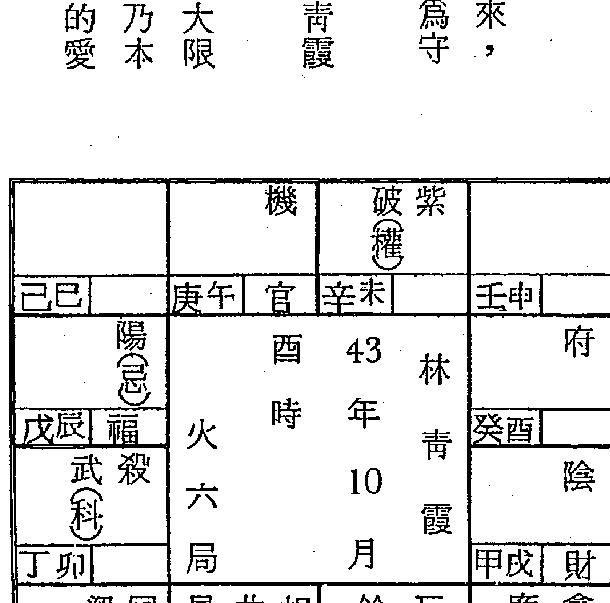

- (4) 不管那個大限，都可以論那一干化忌來破生祿，那一宮即有破，如本例第二大限丙干有大父及大兄，如不在本命或大命三方則較不嚴重。故依理每一大限，可論其「守護宮」及「破祿宮」。
- (5) 本財甲干（適為生年干，力量更強）祿入子田線，意象為合夥事業，娛樂事業，又審其宮星有貪狼星相伴，是顆娛樂星，難怪走了二個大限的影劇生涯，仍是一顆不墜的明星。假設相同之狀況，若逢破，或凶星齊攻，則難免淪落風塵，賺取桃花財矣。

### (二) 由他宮飛權來擋（命例於次頁）

- (1) 生祿在甲寅，對宮庚申無權，亦不自化權。
- (2) 庚申坐廉貞，廉貞不化權，只好找何干使生祿本宮貪狼化權，得己干，己為本遷，故知此人須勞動以護祿。又廉貞不化權，以生祿在宮之星為守護，其力較弱。
- (3) 反過來若生祿在庚申廉貞，己使貪狼化權，此狀況強過本造；又生祿對宮自化權強過由他宮找來的，他宮中在本命三合之宮，又比非三合之宮強。
- (4) 第二大限甲寅，守護宮己未為大友，此限得靠朋友，還有本身的努力（本遷依然存在）。另有平衡原理，即己干忌入大財，你也得損財給朋友，這段時間有「你兄我弟」的現象。
- (5) 第三大限乙卯，守護宮雖入大官，但大財化忌來破，同取之三合方，力量相等，也化為虛無。

### (6) 丁卯年（七十六）與第三大限重疊

- - ① 流年宮干乙忌沖大官流官，無法自創業。
- ② 太歲干丁自忌，亦化忌在流遷（無主星，借過去），無法安定，且出外有傷。
- ③ 原守護宮己未之忌入疾，一般狀況是很賣力於工作，但結合上述①②，情況不一樣了，如自己有事業，要倒，在別人公司上班，那家公司也要倒（至少要虧大錢）。
- ④ 這個大限很不好，大命化忌破了守護宮。
- ⑤ 丁卯（七十六）年流疾（身體）忌入流子，大子沖流田大田，前迹出外有傷，又有此況，結果車禍斷腿住院，一年沒工作。

### (7) 守護宮（神）用在流年

- ① 戊辰年戊祿入寅，一樣是以己未為守護宮，此宮已破如上述，且看舊宮干丙化忌亦去破生祿及流祿，霉氣未退；縱欲撿丙祿天同為用，尋其守護宮，則乙干使天梁化權，乙卯、乙丑卻皆坐生忌或大限忌，因知此流年亦是乏善可陳。

| 右科 | 祿梁 | 殺 | 廉 |
|---|---|---|---|
| 存 | 官 | 友 | 遷 | 疾 |
| 丁巳 | 戊午 | 己未 | 庚申 |
| 昌相紫 | | 午戊 | 左 |
| 34-43 | | 時戊 | |
| 丙辰 | 田 | 金一 | 辛酉 | 財 |
| 巨機忌 | | 先生 | 曲破 |
| 24-33 | | 四月 | 壬戌 | 子 |
| 乙卯 | 福 | 局 | 同 |
| 貪祿 | 陽陰權 | 武府 | |
| 14-23 | 4-13 | | |
| 甲寅 | 父 | 乙丑命(身) | 甲子 | 兄 | 癸亥 | 夫 |

- ② 乙丑、乙卯為守護宮，守護神有三顆動星（陽、陰、機），背著忌跑，在本命遷、大命遷，又有巨門，以口生財，透過天梁化權來守祿，本造目前為壽險業務員，衡諸該組星曜，職業內容，似已為命運所注定。

## 四、行業選擇

行業之選擇，本書中已漫談數則，謹再將一些方法介紹於后，請各位活用，切記！採用某一方式所選出之宮位及星曜應並論，如被忌沖破，該宮及星即非全美。

- (一) 那一宮使大命（大財之官，最緊要）或大財（大命無法用時）化祿，即用該宮之星曜之性情，如巨門以口為業，可為業務員、廣播員、教師等等。
- (二) 本財忌入之宮，用其星曜，行限過了該宮或該宮之沖宮，可從事該宮所指行業。
- (三) 本命祿或權入本福照本財（以權較佳），有此命格者，可為福德宮星曜所指行業，大賺。
- (四) 大財祿入之宮，或再轉忌之宮，論其星情，本財亦可用此法飛祿忌。
- (五) 大財忌入本命、財、田、疾，以忌入之宮，論其星情。
- (六) 本財忌入之宮，用其星情，若逢生忌，則用其祿、權、科，以入本命三合及田宅宮之星曜為用。
- (七) 命忌入夫沖官者，不能自己創業，財忌入夫沖官者，代表借貸行商。
- (八) 如大官丁干忌入本官，巨門化忌，論其性巨門化暗，做的行業乃是沒申請執照的，或其商品爲無品牌者，若非如此，恐怕生意難以生存。
- (九) 做國外生意者，以遷移當命宮，以夫妻當官祿，以福德當財帛，論其吉凶成敗。
- (十) 萬變不離宗，四象皆平衡；斧鉞傷樹，以木爲柄，伐樹爲材，以製木器，一物亡，另一物生。

## 第六節 四化集錦

本節以四化爲主，將斷命重要之四化訣一一羅列。讀者研究上面幾節過後，再看本節，將可提升斷命功力；如若不看前文，惟恐有些概念及名詞無法瞭解，故尚祈讀者讀完前文後，再看本節。讀者可將自己或親朋好友之命盤擺在一旁，然後一一對照；發生過的事，驗證看看那些宮位出了問題，符合那個斷命原則。印證了一個，您就提升了一點功力，鍥而不捨地研究，您會融會貫通的。本節將讓您越嚼越有味，越論越精細。

## 一、三才與命財官（三式）

命在四馬地（人）

- ① 四馬地為奔波位。
- ② 個性活潑。
- ③ 人也喜歡飄浪，坐不住的。
- ④ 想法也容易變來變去。

> 命在寅申巳亥同論。

### （一）命在四馬地（人位）

官祿在四敗地（天）

- ① 四敗地主樂天性，桃花格。
- ② 工作選輕鬆的幹。
- ③ 工作速度快，做完就好，比較不在意做得好不好。

> 官在子午卯酉同論。

財帛在四庫地（地）

- ① 四庫為欠債位。
- ② 欠錢的債，所以比較重財，金錢主導者。
- ③ 化忌時，為錢而勞碌，化祿時，表示有錢，但還要想更多。
- ④ 總之，不管有無錢，都要為錢打拼。

> 辰戌丑未同論。

官祿在四馬地（人）

- ① 四馬地主奔波。
- ② 只要有工作好忙碌就好，不管工作大小、好壞、多少、冷熱門。
- ③ 不甘休息，有事做才不覺浪費生命的人，不會讓身體或腦筋空間的人。

命宮在四庫地（地）

- ① 四庫主勞碌、欠債。
- ② 個性內斂。
- ③ 殬勞型，因勞碌命，欠人生債也。
- ④ 有時為現實環境所迫，放下理想而去謀生，命也。

### （二）命在四庫地（地位）

財帛在四敗地（天）

- ① 四敗地主樂天，不去操煩。
- ② 對錢財，不計較，做生意賺多賺少不在意。
- ③ 主消耗，化祿時虛花奢侈，化忌時也破耗。

官在四庫地（地）

- ① 四庫地主勞碌。
- ② 欠工作的做。
- ③ 一有事做，就很專心，沒有事做，就找事做。

> ❖ 官在辰戌丑未同論。

命在四敗地（天）

- ① 四敗地主樂天。
- ② 做人樂觀。

> ❖ 命在子午卯酉同論。

### （三）命在四敗地（天位）

財在四馬地（人）

- ① 四馬地主奔波。
- ② 為錢奔忙。
- ③ 邊玩樂邊賺錢。
- ④ 喜賺四方財。
- ⑤ 玩樂不忘賺錢，賺錢不忘玩樂。

> ❖ 財在寅申巳亥同論。


## 二、生年干忌

- 父：① 孝顺。② 虧欠父母。③ 父母較愛管教。④ 宜修口德。⑤ 肯吃虧，蔭人。
- 福：① 老實人，勞碌命。② 賺錢自己不享受而供他人享受。
- 田：① 虧欠田宅。② 善理財置田宅，會自己買田宅，有錢即花到田宅上。③ 晚得子，得子後疼愛子女。④ 重財，功利主義，但非貪財。
- 官：① 晚婚格，婚後善待配偶。② 為人不拘小節。工作上；適合固定職業。
- 命：① 自立格，蔭人。② 虧欠自己，不佔便宜。③ 自立奮鬥。④ 肯吃虧、木訥。⑤ 再自忌，為固執；會生惱，為鐵齒、不信邪、九怪。
- 友：① 健康問題：若命宮再化祿或權來，小時身體定有問題。② 犯小人，所交之友不守信，借錢不還。③ 小時，母親身體有問題。④ 沖兄弟，兄弟無緣。
- 兄：① 欠朋友債，朋友比兄弟親。② 不可合夥，合夥則虧。③ 無借貸最好，若借錢給朋友，要不回來且反目成仇。
- 遷：① 自立格，蔭人。② 虧欠在外。③ 在外無貴人。④ 小時，父母健康有問題。⑤ 本人小時，中氣不足，身體虛弱。
- 夫：① 虧欠配偶。② 愛惜配偶，彼此吃醋。③ 晚婚格。④ 男命不熱衷事業。⑤ 配偶家庭有缺陷，如父母早亡、負債。⑥ 運歹，背運差。
- 子：① 虧欠子女。② 疼惜子女。③ 子女問題，如流產、打胎等情事。④ 桃花現象。
- 財：① 守財，重財，與田宅宮坐生忌同樣為功利主義，然二者皆不主貪財。
- 疾：① 虧欠身體。② 身體不佳。③ 蔭人，心地好。

> 注意：生年干忌自化即改變。

## 三、對宮射入忌

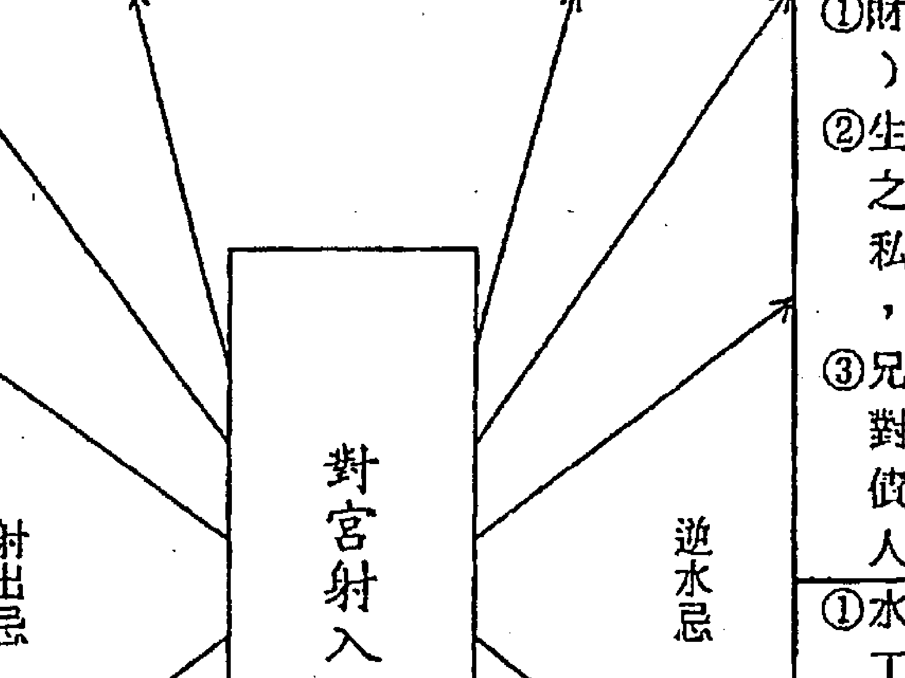

- ① 疾射出忌入父自沖，身體不好。② 若値生忌坐守，則可擋回疾厄射出之忌，而為健康忌，為本人身體健康。
- ① 水命財，作買賣業。② 生忌坐守，則為我財之逆水忌，可囤貨賺錢，但不能再自忌，自忌表示猶豫出手而損失。③ 坐生忌與生祿，則洩盪。
- ① 桃花，但交往不久，留不住；拿錢往外花。② 坐生忌則可留住桃花，且子女多。
- ① 配偶介入我的事業。夫妻宮吉則吉而有助；凶則凶，且有配偶留不住之象。② 生忌坐守，配偶助我，夫妻和諧，不會有外遇。③ 若生忌坐守而官射忌入夫妻，則為水命忌。
- ① 遷移忌入，表示出外待不住，心在家中趕緊要回來。② 如命坐生忌，可以擋忌，就不急著回家，以外事為主，辦妥為先。
- ① 兄弟為財之田宅，友射忌入，為友來損我財，對我不利。② 若生忌坐守兄弟，擋忌回友，為友之逆水忌，友自私，我前世欠他的，對我而言是欠僕忌。
- ① 財庫（財之田為兄）洩給朋友。② 生忌坐守，為兄弟之逆水忌，兄弟自私，發達者是兄弟，不是我。③ 兄友線之逆水忌，對我而言，皆為欠僕忌，上一輩子欠人的。
- ① 水命忌，不得開設工廠，心想外出。② 生忌坐守，則為逆水忌，可作生產事業，大發。但命宮不能再自化，自化則歸回水命忌，其他各宮之逆水忌皆同此理。
- ① 水命忌，主事業多變，可作買賣業，進出快而大的事業，如貿易，公司不必大，可賺。② 我想有外遇，且易有外遇。③ 生忌坐守時，生意穩固。
- ① 桃花多，拿錢往外花。桃花對象可能是已婚者。② 若生忌坐守，則是帶財桃花，或是他人付錢我享受。
- ① 主花錢，財守不住，花錢享受，錢財是我的，放著不用，就不是我的了。② 生忌坐守時，擋忌回福，更主享受。
- ① 對父母而言，是其水命忌，且父母常為我操心。② 若生忌坐守，則為父母之逆水忌，父母發達。但對我來說，則表示不能與人合夥，易損財。

## 四、各宫化忌入父冲疾

- ○ 生意大敗。
- ○ 一敗塗地。
- ○ 公司倒了。
- ○ 主本身身體不好。
- ○ 有時主父母或祖父母。

白化忌或忌入遷沖命。朋友倒我倆，或父母有病。（因為友之財自忌沖疾或忌入友之父沖友之疾）

朋友常來煩我。上則為友忌入父，若友又化祿入財，則表示朋友來煩我，所談皆是錢財事。

- ○ 破財。
- ○ 破產。
- ○ 庫破。
- ○ 主劫敗。
- ○ 兄弟中有人早夭。
- ○ 外出不太順利，注意風寒和煩心之事。
- ○ 錢財被倒。
- ○ 自化忌則為身體不好，不踐重。
- ○ 父母早逝。
- ○ 配侶身體不好，或有開刀可能。
- ○ 主子女有流產現象，生子產時不順，注意天折。

## 五、定數與應數

- ○ 定數歸先天河圖，應數歸後天洛書。
- ○ 定數比應數重要，定數不吉，應數吉，也是虛吉。
- ○ 命盘表格，包含格子如相廉、天財、天官、貪、財、武、破、大命、機、官等，以及地支如巳、午、未、申、酉、戌、亥、子、丑、寅、卯、辰，有箭头表示关系。
- ○ 如斷流年，以太歲干四化，只能化至大限盤，以看其應數。
- ○ 如用流年宮干四化，套入本命盤看定數，再套入大限盤看應數，此謂之天地人合一。
- ○ 簡捷的看法乃以大限盤四化，上考天盤即本命盤知定數，而套入流年盤即知應數。
- ◇ 本命盤命、財、官四化，大限行入四化之坐宮與對宮即應。如本財忌沖卯宮，大限行卯或酉時，本大限財運不佳，再以同法看大財化忌應於何年。此法與大限盤化入本命盤而論忌入與忌出之看法不同，請比較本節「忌入與忌出」。
- ◇ 大限應用於流年，大限盤十二宮皆可飛四化，如大限某宮化忌入沖之宮位為流年何宮，即知該年該宮有大限某宮之破，而重要者乃在大限命財官所化之忌星，不能沖流年命宮，沖則凶，凶象拖三年；若其它宮位化出，只應一年。大疾沖流命或大命沖流疾，主該年身體不好。若大疾沖流命，流命與本命宮位重合，則應注意有死亡之威脅。

> ◇ 命例：大命坐本宮忌沖之宮，再看大官忌沖未宮，且待流年行未，面目全非矣。

- 看前頁命盤，大命行至丙子，為本宮之宮；丙廉貞化忌入對宮自沖，亦即大命忌沖本宮，代表本大限不吉，此為定數。
- 再看大官戊辰，天機化忌入丑宮，行年至未宮時受忌沖，此為應數。
- 又大財壬申，武曲化忌入戌，一來沖本財，二來沖辰年命宮。此造雖擁有四億家產，於辰年卻因財稅問題，遭民事管收，因財入獄。
- 由上述可知定數與應數之看法。

## 六、三方四正與陰陽

以命宮為主事宮，命財官為三方，命遷子田為四正。

- 四正為體，三方為用。用不可沖體，用沖體為小沖大，災重。

| | 陽 | 陰 | 陽 | 「陰」 |
|---|---|---|---|---|
| 12 | 巳 | 11 午 | 10 未 田 | 9 申 官 |
| 1 「陰」 | 陽 | （图表区域，包含连线） | 陽 8 | 酉 |
| 辰 命 | 陰 2 | | 陰 陽 7 「陽」 | 戌 遷 |
| 陽 3 寅 | 陰 4 丑 子 | 陽 5 子 財 「陽」 | 陰 6 亥 | |

◇ 配陰陽
以十二宮而言，命1、兄2、夫3、……奇數為陽，偶數為陰。
以命為不動為陰，遷為動為陽。
三方：命可陰可陽，財為陽，官為陰。（官為9，減生成數5等於4，為陰。）
四正：命陽遷陰，子陰田陽。（遷7減5為2，田10減5為5。）
四正純陽、純陰，故為體；三方命財官皆為陽宮，可各自立為太極；立為太極時，則陰陽同體。

◇ 運用原則
陽宮化忌入陽宮主收藏、保守。如財化忌入田。(陽入陽為強)

- 陰宮化忌入陰宮亦主收藏、保守。(陰入陰為弱)
- 陽宮化忌入陰宮為大洩、大耗。
- 陰宮化忌入陽宮為小洩、小耗。
- 以上用在三方沖四正，即用沖體時。
- 以財立太極，三方為財、官、命，四正為財、福、兄、友。如財化忌入兄，為陽入陽，因兄為財之田(田為陽)，意為現金短缺而有融資貸款行為；若忌入友(財之子，為陰)則財大破。

## 七、三方化入三方

| | | 流官 大官 |
| :--- | :--- | :--- |
| 巳 | 午 未 | 申 官 |
| 流命 大命 | | 酉 |
| 辰 命 | 三方 化入 | |
| 卯 | | 戌 |
| | 流财 大财 | |
| 寅 丑 | 子 财 | 亥 |

- ○ 三方化入三方，主格而已，不帶吉凶；可解釋爲人的習性、作法、作風，或屬於命造本人的一種現象。
- ◆ 財忌入命，財爲陽，命爲陽，主守，有過度儉省之習性；命也爲陰，財忌入命也可爲陽入陰，精打細算，反而因小失大，因省而損。
- ○ 命忌入財，一爲陽入陽，解釋如上；一爲陰入陽，小損之格，由靜入動，所以節儉的習性仍有（陽入陽），又敢於動用，故綜合出一種現象，錢尚未入，就計劃如何動用它，也是無財格。
- ◆ 財化忌入官，爲陽入陰，動沖靜，很吃力，投資行爲，有一味投資之象；若摻合其他看法（如套入天地人三盤），若爲破財，則破得精光。
- ○ 官忌入財，乃陰入陽，較輕，也是拮据之象；工作多，報酬少，或是投資多，回收少而慢，但總是有。這也有再投資之象，官祿用忌來抓財，或更賣力賺錢，因錢不多之故。
- 化祿的話，解釋相反；如官化祿入財，代表收入頗豐。
- ◆ 命忌入官，為很賣力，很勤勞，有工作狂，把生命大地耗在官祿上；又表工作穩定，有固定工作。
- ○ 官忌入命較弱，屬於非做不可的。

## 八、三方化入四正

- ○ 命、财、官各有其四正位，这三组四正位涵盖整个命盘十二宫位。
- ○ 田宅属财，与命宫的四化，视同命与财的四化

| 父 | 福 | 田 | 官 |
|---|---|---|---|
| 巳 | 午 | 未 | 申 |
| 命 |  | 友 |  |
| 辰 |  | 酉 |  |
| 兄 | 迁 | 戌 |  |
| 卯 |  |  | 疾 |
| 夫 | 子 | 财 | 亥 |
| 寅 | 丑 | 子 | 亥 |

化，田与财同属阳。

- ○ 田宅指房屋，化忌冲命为变动，搬家。此乃纯就四正位上，化来化去之象。
- ○ 但迁乃命之对宫，且若迁移有忌入，即冲命，故田与迁之间之化忌，亦主车祸。乃已涉三方之故。（请参看「一宫两用看迁移」）

◇ 忌入那一组四正位，即是损到什么：

- ○ 兄友财福 ——撞人损财。
- ○ 命迁子田 ——被撞损身。
- ○ 命忌入夫冲官，夫乃官之四正，故解释为损官。
- ○ 财忌入父冲疾，父乃官之四正，为官之田，故损事业之库。
- ○ 友忌入子冲田，田为财库，故为友冲财库。

- 亥年坐生年化科、大命科，又坐流年干化祿，該宮自忌出，上班的公司照倒，倒得很嚴重，子年官司不斷臨身。
- 三忌反主平和，此命例自可攻破其論調。

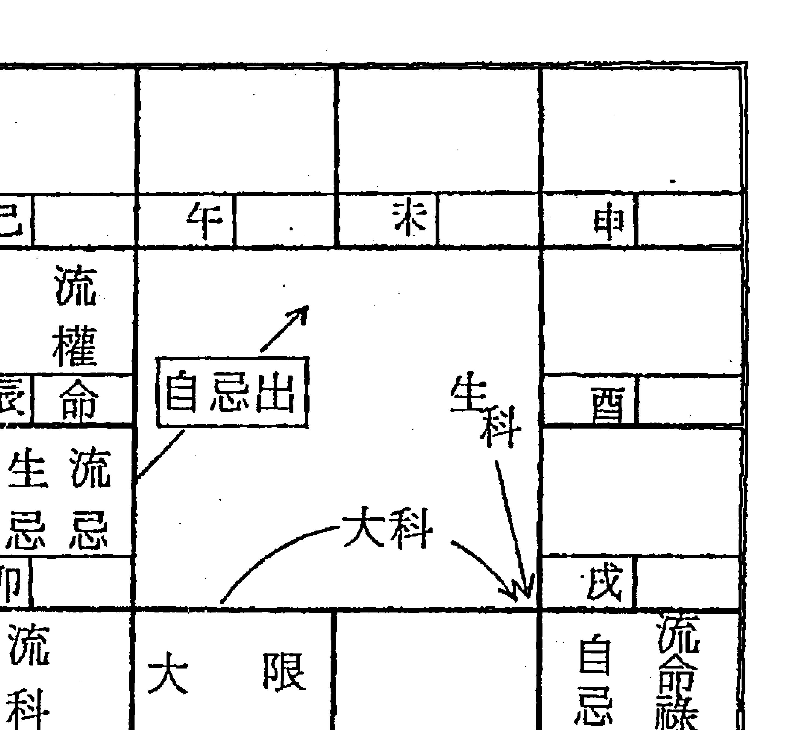## 九、忌入與忌出

- ◇辰戌丑未四庫化忌入寅申巳亥四馬地為庫隨馬走，如為本命盤，要破祖業，破光才發；如為大限盤，大限尾聲才發，或大破後發；如為流年盤，年底才發。皆是壞到底才發。
- o 如四庫忌入四馬，而為遷移時，應遠赴他鄉打拼。
- ◇在同一組四正位（如辰戌丑未）中化來化去，都無所謂，乃是靜態。
- o 上述辰戌丑未四庫化忌入寅申巳亥四馬地，化出忌者僅是一宮，以之為太極。假設如本則命盤所示，命在辰、官在申，若命化忌入官，即四墓忌入四馬。此時，除有一般命忌入官之解釋現象外，必須瞭解：命乃官之財（找出三方關係），忌入官，所以表示經營事業投資之股本，耗盡後才有轉機。
- o 再論為何子女宮有忌星，亦是不吉？子女與命、遷、田同為四正，本是靜態無啥大礙；但是，問題出在子女是交友的官祿（氣數位），故亦形成三方化入四正。

| 巳 | 午 | 未 | 申 官 |
| :---: | :---: | :---: | :---: |
| 辰 命 | 忌 | 忌 | 酉 |
| 卯 | 大限 | 忌 | 戌 |
| 寅 | 丑 | 子 財 | 亥 |

大限命或大限財或大限官化忌入本命、本財、本官，叫做忌入。
大限命或大限財或大限官化忌冲本命、本財、本官，叫做忌出。
忌出主凶，主損失。
忌入不主凶，主收藏無損。

大命忌冲本财，流年行入福德坐忌，为当年忌出，主损财。（重点：忌出时不能坐忌）

| 大官 |   |   |   |
| :---: | :---: | :---: | :---: |
| 巳 | 午 | 未 | 申 官 大财 |
| 辰 命 | 忌出 | 忌 | 酉 |
| 卯 |   | 忌 | 戌 |
|   | 大限 |   |   |
| 寅 | 丑 | 子 财 | 亥 |

又流年行入本财(忌冲之宫)，应知何月斗君行入，该月不吉而已。(论忌出) 流年若行忌入之对宫，仅指流月斗君行入该宫前后，手头较紧而已。(论忌入) 大财忌冲本命，大凶大损。(忌出) 大财忌入本命，主节俭，无魄力。(忌入) 大财忌入本官，乃投资生意。(忌入) 大财忌冲本财，流财入大财忌坐之宫，该流年财运即走下坡，直至流年行过大财忌冲之宫方才好转。

| 巳 (父) | 午 (福) | 未 (田) | 申 (官) |
| :---: | :---: | :---: | :---: |
| ☆ | | | |
| 辰 (命) | | | 酉 (友) |
| | | | 两面一体 |
| 卯 (兄) | | | 戌 (迁) |
| ☆ | ☆ | | |
| 寅 (夫) | 丑 (子) | 子 (财) | 亥 (疾) |

## 十、再论入与出

我宫为命、财、官、田加上福与疾；他宫为兄、友、父、子、夫。另有迁移，乃为一体两面，一宫二用者。

我宫化出禄忌时，若：
(1) 禄入我宫，忌入我宫——吉凶皆属本人，与他人无涉。
(2) 禄入他宫，忌入我宫——全损，好的给人，坏的留下。
(3) 忌入他宫，禄入我宫——此乃对待关系，一有交易即损，故不可借钱给人，否则禄随忌走。
(4) 禄忌同宫化出，同入我宫：吉凶参半偏凶。
(5) 禄忌同宫化出，同冲我宫：凶。
(6) 禄忌同宫化出，同入他宫：全损，大凶。
○ 如大财禄入我宫，忌亦入我宫为好。

他宫化出禄忌时，若：
(1) 禄忌皆入我宫（但非同宫）：吉。如友禄入我财，友忌入我命。
(2) 禄忌皆入他宫（但非同宫）：凶。
(3) 禄入我宫，忌入他宫：吉。
(4) 禄入他宫，忌入我宫：凶。
(5) 禄忌同入我宫：吉。
(6) 禄忌同入他宫：凶。

入官，忌入財，乃友助我事業而分紅之意。

(2) 祿忌同入我宮（同入一宮）：兇。損失；若沖我宮，更兇。

(3) 祿入我宮，忌沖我宮：祿虛忌實，主凶。此時，祿只是餌而已。

(4) 祿照本宮，忌入我宮：主凶主吉，看如何用忌，若友忌入財，則要朋友拿錢出來幫我主吉，若我錢借他則為忌出，主凶。（忌入命主凶，無解。）

(5) 祿入他宮，忌入本命：看似吉象，終究祿出，且祿忌為雙忌。祿所照之宮，為朋友想利用的

(6) 祿入他宮，忌沖我宮：大凶，拚死拚活，都是別人的。

## 十一、一宮兩用看遷移

○ 遷移是一體兩面，一個宮位，我可用，他也可以用；換句話說屬我宮，亦屬他宮。

○ 遷移是公共設施、公共場所，我可用，他人亦可用。

| 仕 | 相 | 僞 | 俾 |
| :--- | :--- | :--- | :--- |
| 巳父 | 午福 | 未田 | 申官 |
| 帥將 | \ | \ | 卒兵 |
| 辰命 | \ | \ | 酉友 |
| 仕 | \ | \ | 炮 |
| 卯兄 | \ | \ | 戌遷 |
| 相 | 僞 | 俾 | 卒兵 |
| 寅夫 | 丑子 | 子財 | 亥疾 |

○ 因此遷移之入與出最難分辨，最重要的不能有忌來沖，忌沖命，在棋譜上為將君，將君則倒棋，最少也得損俾（財官）。

○ 若他宮祿遷移，忌入命，尚吉；但忌沖命則倒棋。

○ 若我宮忌入遷移，不吉不凶，吉凶皆為自家事，但要看祿入何宮，若祿入他宮，則凶，吃裏扒外，割自己腿肉給人吃，有時還讓人嫌腥。

○ 若奴僕祿入遷移，乃有貴人之兆，朋友欲助我之象，此時要看奴僕之忌，忌入命尚可，若忌入他宮，則祿乃誘因，忌沖之宮有損。

◇ 祿忌要參看，尤其遷移宮更必要。

◇遷移化祿入我宮，化忌入他宮，祿隨忌走，此祿亦為誘因，損忌沖之宮。

◇以上大限盤化入本命盤之論法，若大限盤化在大限盤，僅應在流年。

◇遷移宮在斗數之用數為七，密宗數為九。而七為密宗之偶宮（即夫妻宮），九為斗數之官祿宮。

○遷移與夫妻、官祿密不可分。夫妻為陽，官祿為陰。

○流年遷移化忌入本夫沖本官（氣數位），凶。

## 十二、劫數

父、疾、夫、官為四正位。（以疾厄為主）任何宮干之化忌不可入此四宮，否則有問題。如財帛宮干所化之忌，則有財的問題。

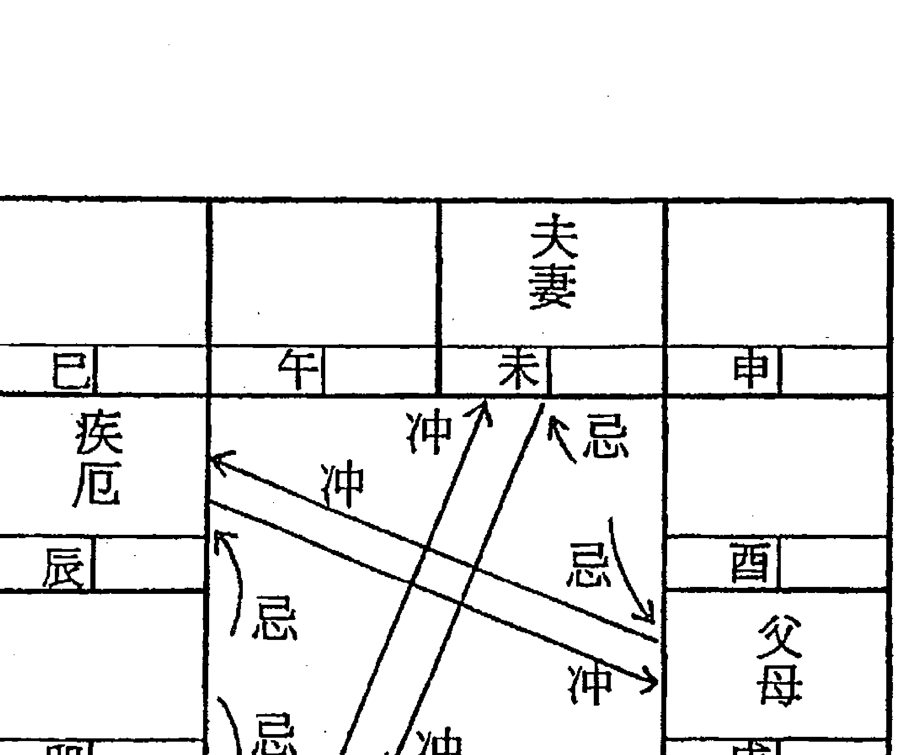

- ○ 忌入父冲疾，或入官冲夫，大劫數，多死。
- ○ 忌入疾冲父或入夫冲官，主帶病延年，不死也不好過，拖延牽扯著。
- ◇ 若父母宮坐星不化忌時，看夫官；反之，若流疾忌入本官冲本夫，主死亡。
- ○ 若子女化忌入此四宮，論女命主生產不順，流產，或開刀生產。男女命皆主桃花問題，或性生活問題，或有難言之隱症。
- ○ 如財帛宮忌入官冲夫，生意倒了；如忌入夫冲官，則半開半閉，硬撐著。
- ○ 如財帛宮忌入父冲疾，主被倒債，要不回來了，還又無法清償。
- ◇ 流年盤化入本命盤，應參考大限盤。
- ○ 流年盤化入大限盤，嚴重。
- ○ 流年盤化在流年盤，較輕。

## 十三、三轉祿忌追追

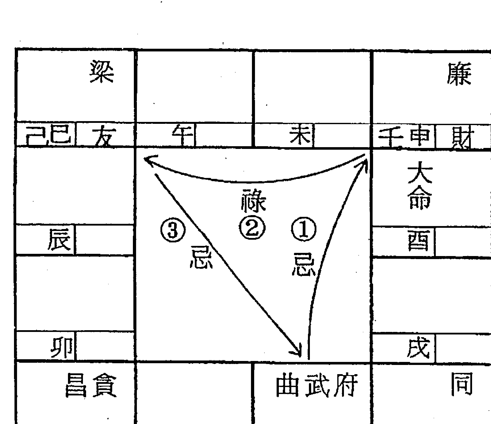

爲追祿或忌的終極結果，由一祿，一轉忌，三轉祿，或由一忌，二轉祿，三轉忌，初化爲垂象，即是有此事要發生，一轉爲吉凶，即其過程變化，三轉爲結果，即定案。

以圖例而論，命宮丙子化忌入財，即爲節儉之象。但財干轉祿入友，還是會把錢樂意地捧給人；友宮干自化科，有糾纏不清之狀況，其三轉化已虛，三轉忌入命，錢借給朋友了，要他還錢像是向他借錢，祿忌皆入命，錢還不還看朋友，又生是非。這種命格，最好不要向朋友借錢，而不要借錢給人。

以大命在酉論，大友在丙寅，忌入本財，有友來損財之兆，二轉三轉如上項所論。

若命忌入友，乃欠友債之象，二轉祿入財或官或田，乃友助我賺錢的狀況；此種命格也不可借錢給人，反而要依靠朋友，即可賺錢，三轉忌可知朋友有否分紅。

○三轉祿忌中，入友宮，表必經朋友之手，必在其中手耗損，三轉化爲虛，是非必有。
○二次轉化皆在三合，即無須三轉；但亦須注意入本命三合，適爲大限何宮，若是大友，雖力量較微，亦有牽絆。

◆友宮自化科，主囉嗦，朋友花了再說，然會有剩餘給我；自化祿則是他花得很痛快，自化忌則是吃光不吐骨，自化權則由他分派。

○如圖例，第二次由財轉祿入友，友宮已自化科，就無須再三轉忌。在友宮即有囉嗦麻煩了。

○驗證：圖例之命造，現行第三大限，已頗感上述論斷之正確。我們預測他下一大限行酉宮時，會有這方面的事件發生。

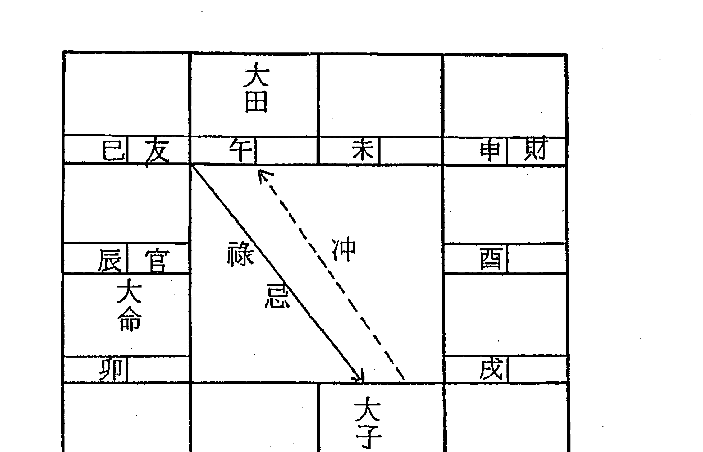

## 十四、交友祿忌入三合

- 交友宮之化祿化忌皆入本命三合時，大限行至祿忌落大限子女沖田宅時，務必注意，此限有死亡之劫數。
- 若祖父母尚在，此象可能為損祖父母之兆，本人可保；若祖父母已亡，則本人堪虞。
- 圖例本友祿忌入本命，大限行卯，適為祿忌沖大田，本大限有死劫。

| 己 | 庚 | 辛 | 壬 |
| :---: | :---: | :---: | :---: |
| 巳 命 | 午 | 未 | 申 |
| 戊 | | | 癸 |
| 丙辰 | | | 酉 官 |
| 丁 | | | 甲 |
| 乙卯 | | | 戊 |
| 丙 | 丁 | 丙 | 乙 |
| 甲寅 | 丑 財 | 子 | 亥 |

民國七十八年遁干

民國七十七年遁干

## 十五、遁數看流年經濟

民國七十七年（戊辰），由戊遁得甲干，順布至辰為丙（如圖小框內），戊貪陰右機，丙同機昌廉，行業以同貪雙祿合為佳，服務、貿易、餐飲、命相、賭皆可驗。而廉機化忌，廉指賭、小人、行政官非，天機是傷腦筋。民國七十八年己巳年遁得己干，原亦為己，四化為武貪梁曲，武乃是金融、軍警、修道等，凡有權，有新點子者出頭。文曲化忌，股票、支票、感情、色情之紛擾。

| 流年③ | | | |
| :---: | :---: | :---: | :---: |
| 巳 父 | 午 | 未 | 申 官 |
| ② | | | 大財 |
| 辰 命 | | 忌 | 酉 |
| ① | | | |
| 卯 | | | 戌 |
| | 大限 | | 流財 |
| 寅 | 丑 | 子 財 | 亥 疾 |

## 十六、財運

。大財化忌入本疾沖本父，流年財帛行入忌入之宮（本疾）時，該流年起，財運走下坡，且有損財之兆。

。如命例流年卯宮起注意損財，連續三年，流年必須走過忌沖之宮，方會好轉。

。因忌沖本父，注意保證、支票、金錢契約方面之損財。

| 巳 | 午 | 未 | (大財) 戊申官 |
| :---: | :---: | :---: | :---: |
| 6～15 辰 命 巨機(忌) | | | (流年) 酉 友 |
| 卯 兄 | | | 戌 |
| 寅 | (流年) 癸丑 陰陽(祿) 子 | (天命) 壬子 財 武府 | 亥 |

### ◆实例（49岁乙丑年被倒钱）

。大財戊申天機化忌入本兄沖本友，財有劫數

。流年行丑宮，流財在酉被忌沖，顯象；財運要過卯年才會好。

。忌沖本兄友，為被倒錢，如客戶倒錢，朋友借錢不還等等。

。財忌入兄友或父疾都是被倒，而性質不一樣

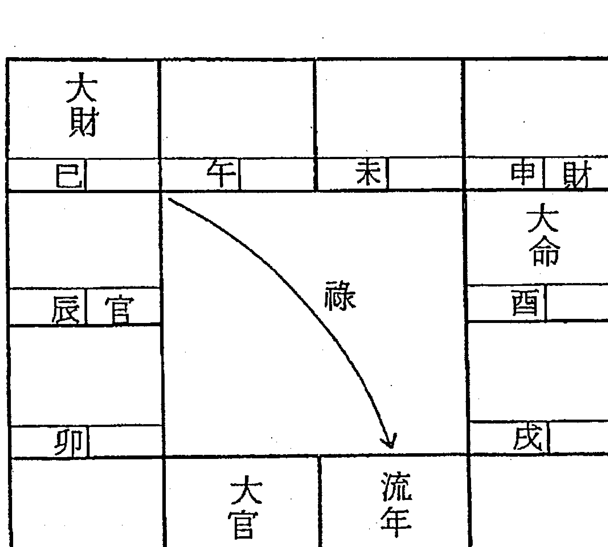

## 十七、大進財（流年與本命三方重疊）

- 大限三合化祿入本命三合，流年行入本命三合宮位時，此化祿雙倍進來；化權、化科亦然。
- 如上圖大財化祿入本命（子宮），流年（子年）大賺錢，巳年、申年亦然。
- 此乃指流年三方與本命三方重疊，大限化三吉入時，吉力加倍。

| 大財 | 乙巳 | 丙午 | 丁未 | 戊申 財 |
| :---: | :---: | :---: | :---: | :---: |
| | | | 32~42 大限 |
| 甲辰 官 | 忌 | | 己酉 |
| | | 忌 | |
| 癸卯 | | | 庚戌 |
| 曲右陰機 祿科 | 大官 | 流 38 年歲 | |
| 壬寅 | 癸丑 | 壬子 命 | 辛亥 |

## 十八、大破財（實例：幾乎傾家蕩產）

○ 條件和大進財一樣，將化祿改成化忌沖本命三合，則流年行入本命三合方時，忌力雙倍。

○ 本例大財忌沖本財，38 歲（甲子年）流財在申被忌沖，且大命亦忌沖本財。流年與本命三合重合，大破財，為朋友所倒。

○ 本命福財線適為大限兄弟，故為朋友倒錢。

| 辛巳 | 財 | 壬午 | 子 | 癸未 | 夫 | 甲申 | 兄 |
| :---: | :---: | :---: | :---: | :---: | :---: | :---: | :---: |
| 大官 | | | 祿 | | 同(忌) |
| 庚辰 | 曲陰(科) | | | | 乙酉 | 命 |
| 己卯 | | | | | | 丙戌 | 父 |
| 寅 | 己丑 | 官 | 子 | 32-41 | 破 | 丁亥 | 福 |

## 十九、虛祿

> （看起來不錯，但無實利）

大財不化祿入我宮（本命）而化入他宮，此祿虛吉，賺了錢，還是往外面花。
本命例大財祿入本命子女，非為我宮，故為祿出，賺的錢花在外面，流年步入午宮（子女）起連續三年虛花，也脫離不了桃花。
大財為本兄，故與朋友多應酬常花錢。
此造泰國華僑，卯年財運已敗，今（辰）年大災難，因流年行入大官，大官忌入本命，本命坐生忌，是為「絕命忌」，差一點沒命。

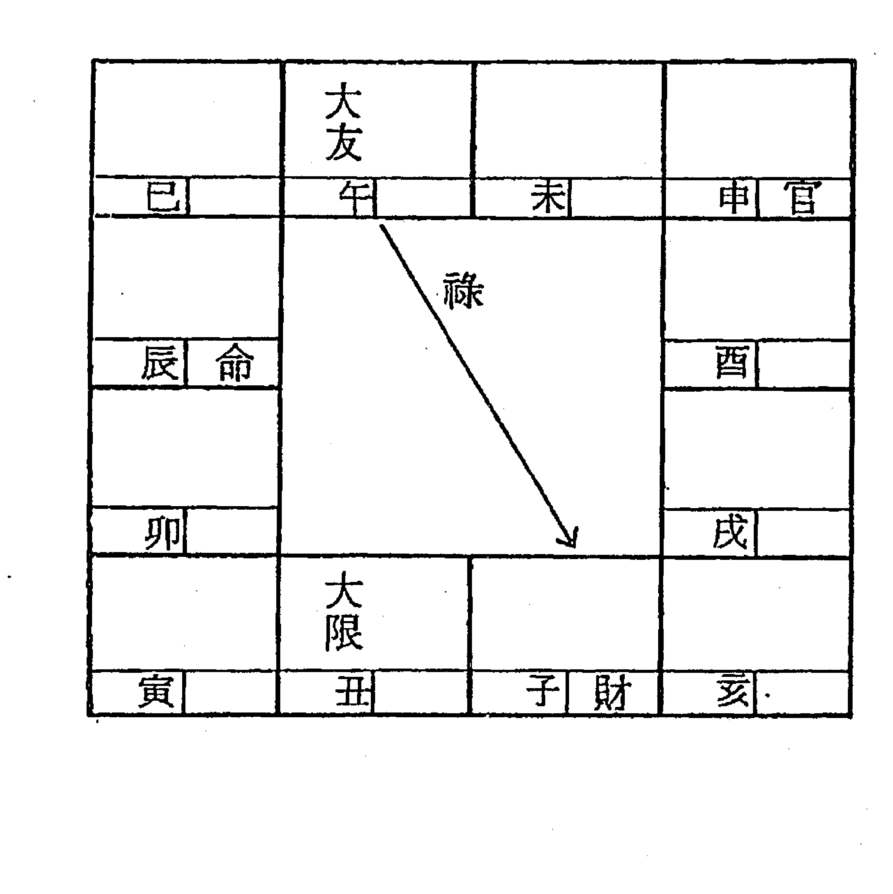

## 廿、友禄助我乎？

大友禄入本财，乃友助我赚钱，若本财自化忌，即我不接受，若自化禄即仅应酬送我礼而已，不助我赚钱。若大友禄入本财，而忌入本命，所交之朋友皆吉，雇职员也都忠心。然不可与人合夥股東，化忌入田亦然。忌冲命者，初时友助我赚钱，而後全部带走。

| 巳 田 | 午 | 未 | 申 |
| :---: | :---: | :---: | :---: |
| 辰 福 | 祿 | | 酉 |
| 卯 父 | 忌 | | 戌 |
| 寅 命 | 丑 兄 | 子 夫 | 亥 子 |

## 廿一、財運起伏

- 兄弟祿入田宅，忌入父母。
- 財運起伏很大。
- 如爲本命盤，小時健康差。
- 如爲大限兄弟化入原命盤父及田宮，乃財的問題。
- 如爲大限盤，年紀小時仍爲健康問題。
- 大限兄弟化入大限父田，較輕；財與健康都得注意。

┌──────────┬──────────┬──────────┬──────────┐
│ | 午 | 未 | 申 |
├──────────┼──────────┼──────────┼──────────┤
│ 巳 | | | |
│ 田宅大限 |←── 化忌 | | |
│ 辰 | / | | 酉 |
│ 命 | / | | |
│ 福德大限 |← | | |
│ 卯 | | | 戌 |
│ 兄 | | | |
├──────────┼──────────┼──────────┼──────────┤
│ 寅 | 丑 | 子 | 亥 |
│ | 大限 | 兄弟大限 | |
└──────────┴──────────┴──────────┴──────────┘

## 廿二、兄弟宮與陰陽宅

○ 生忌在兄弟或在大限兄弟，運差。

○ 大限命宮化忌入兄友或父疾，皆有破；此與陽宅有關，務須研究住家問題。

○ 若化忌入福德或田宅，乃與陰宅有關。

○ 須請高明地理（陰陽宅）師改造，否則重災臨身。

○ 如上圖，若生忌在卯，大限行丑，陰陽宅都出問題。

## 廿三、六八重合实化虚

六是疾厄，八为交友。第三大限时，顺行运者，大友与本疾重叠，逆行运者，大疾与本友重叠。此谓之『六八重合』。

| 大福 | | 大官 | 大友 | 梁同(权) |
| :---: | :---: | :---: | :---: | :---: |
| 乙巳 官 | 丙午 友 | 丁未 迁 | 戊申 疾 | |
| 辰 | | | 己酉 财 | |
| 大命 | | | | |
| 癸卯 福 | | | | |
| 昌曲破紫 | | | | |
| 寅 | 丑 命 | 子 | 亥 | |

若重逢之宫，有生年化星坐守，则大限任何宫位化来同类之星，则原生年化星，有化无，实化虚。

以本命例而言，本命在丑，生权在疾厄，大限行至福德时，大友与本疾同宫，此时大官丁干、大福乙干皆化权来会，权与权同类化为虚无。流年走入申（民国六十九年）当代课老师，之后挂名当老板，忙于借钱奔波，此乃因权化虚。如为实权，就非调头寸，挂虚名而已，就可稳坐其位，乐数营业收入，当老师也不用冠上『代课』二字。

另一命例，生禄在卯在本疾，大限行入福德宫在戊，大限化禄入卯，此禄化无。流年行入卯之后，即开始交女友，然而整个大限走完，却无法结局完婚。

## 廿四、因忌得禄

如A宫射出忌入对宫，设为B宫，而A宫的前二宫或后二宫亦化忌入B宫，则此二忌有协助之意，虽非大吉，但仍有吉的一面。

| | B | | |
| :---: | :---: | :---: | :---: |
| 巳 | 午 福 | 未 | 申 |
| 辰 命 | 忌 (化出) | 忌 (射出) | 酉 |
| 卯 | | | 戌 |
| 寅 夫 | 丑 | 子 财 | 亥 A |

如上图财帛射出忌入福德，夫妻亦化忌入福德，此忌在结婚后得配偶之助。解释为：因化出忌之宫而得射出忌之宫所主之事。

| | | 田 | |
| :---: | :---: | :---: | :---: |
| 巳 | 午 | 未 田 | 申 |
| 辰 命 | | | 酉 |
| 卯 兄 | 忌 | 忌 | 戌 遷 |
| 寅 夫 | 丑 子 | 子 财 | 亥 |

◇若無一射出忌，直射對宮，則主凶，如另圖夫宮忌入田，財宮亦忌入田，則是因配偶損財。

◇若夫化祿入福，財也射出祿入福，則表示夫妻二人皆會賺錢，也會花錢享受。

◇若命忌入官，夫妻射出忌入官，此解釋爲：因配偶而得事業。有一女命，命宮在寅，夫妻在子，皆化忌入午，此造婚前工作不定，婚後爲丈夫看店。

## 廿五、四正四馬論遠行

### 出國格
- ○本命父疾宮落四馬地。
- ○本命子女或遷移化忌或化祿入父疾或四馬地

| 巳父 | 午 | 未 | 申 |
|------|----|----|----|
| 辰   |    |    | 酉 |
| 卯   |    |    | 戌遷 |
| 寅   | 丑 | 子 | 亥疾 |

以化忌為強，化祿次之；以父疾在四馬地為強，餘次之。

此乃就天盤（即原命盤）命的四正，化祿忌入四馬與官的四正而斷遠行格。

- ○發射點為子女或遷移，落點為父疾或四馬地

以大限或流年或流月或流日之遷移或子女化忌或祿入本命父疾或大限父疾；大限盤必對本命盤，流年盤以下方可對大限盤。

### 出國運
- ○如本命父疾宮坐星不化祿忌者，則以命之四正（命遷子田）為落點。

強弱亦依「出國格」之判斷原則。

- ◇ 發射點（遷、子）如為子午卯酉，而落點為寅申巳亥，乃突發性遠行。
- ○ 發射點如為辰戌丑未，而落點為寅申巳亥，乃計劃性遠行。
- ○ 化祿是輕鬆、從容外出，化忌是急忙、急迫外出。

## 《題外》
- * 任何宮位在子午卯酉化忌入四馬，都會有突發性變動，但會還原；因係突發性，故應小心為要。
- * 若辰戌丑未化忌入四馬，乃為計劃性之變動，但須待庫破盡或該時段之末尾，才會轉佳。

| | | ①無主星 | 廉 |
| :---: | :---: | :---: | :---: |
| 巳 | 午 | 癸未 兄 | 甲申 命 |
| | ②忌 | ③忌 | 酉 |
| 辰 曲巨機(祿) | ④忌 | 戌 |
| 卯 疾 | 陰 陽(忌) | |
| 寅 | 丑 | 子 | 丁亥 田 |

## 廿六、兄弟緣
> 《實例》(損前二位哥哥，本造排行二女，下有二位弟弟）

- ○兄弟宮無主星，對宮生忌坐守，宮氣本不吉，又破。
- ○兄弟宮干忌沖本命，與兄弟無緣之兆。
- ○命宮干化忌沖兄弟，無緣確矣。
- ○兄弟宮之官祿（氣數位），化忌破生祿，沖父母。

| 宫位/星曜 | 巳   | 午(戊) | 未   | 申   |
| --------- | ---- | ------ | ---- | ---- |
| 贪廉(禄)  | 田   |        |      | 杀武 |
| 已        | 阴   |        |      | 酉   |
| 辰        | 父(昌府) |      |      | 阳   |
| 乙卯      | 命(右(科)) | 忌   |      | 壬戌 |
| 甲寅      | 兄   | 丑     | 甲子(子) | 亥   |

注：存在箭头从乙卯命位指向壬戌忌位

## 《实例》（独生子）
- 兄弟宫干化忌入疾冲父母。
- 命为人本人与兄弟皆以父母宫为父母位，兄弟化忌冲父母，主无缘。
- 命忌入父母，主欠债，故有我。
- 兄弟之七星定点（以兄弟宫为起点，逆数生月，再顺数生日，再逆数生时）壬戌忌冲命，兄弟与我无缘。

| 宫位 | 干支 | 星曜与标注 |
|------|------|------------|
| 孤相 |      |            |
|      | 癸巳 | 父        |
|      | 午   | ①忌       |
|      | 未   |           |
|      | 申   |           |
| 壬辰 | 命   | 昌紫贪(忌) |
| 辛卯 | 兄   |           |
|      | 寅   |           |
|      | 丑   |           |
|      | 子   |           |
| 己亥 | 疾   |           |
|      | 酉   | 昌紫贪(忌) |
|      | 戌   | 曲破武(科) |
|      |      | 忌②       |
|      |      | 忌        |

箭头指向说明：①忌（从午宫指向命宫），②忌（从命宫指向酉宫），另有忌指向戌宫。

## 《实例》（一姊二兄一弟四妹）
- 父母忌入兄弟，父母欠兄弟姊妹债。
- 酉宫无星，借兄弟宫之星过去，兄弟宫干辛化忌到对宫，碰生忌擔回，为兄弟之逆水忌，人口众多。
- 命忌入疾冲父，父宫孤辰坐守为阳孤之星，母早亡，父落单。
- 辛卯之自化，因进马入父母，自化有多余之意，父娶三妻。

| 陽 | 機(忌) | 陰(權)子 | 曲貪(祿) |
|----|--------|----------|----------|
| 丁巳 友 | 己未 疾 | 酉       | 戊 夫    |
| 戊午   | 戌      |          |          |
| 辰     |        |          |          |
| 卯     |        |          |          |
| 寅刑梁 | 相廉    | 巨       |          |
| 乙丑 父 | 甲子 命 | 癸亥 兄  |          |

## 《實例》（出生時父逝，母將其送他人養，兄弟無助）
父母之友（戊午）化忌入疾，會生忌沖父母，父母有傷，父母宮坐寡宿，寡宿為陰孤，父早喪，母落單。
命忌入友沖兄，兄忌入夫沖官，命為一，官為九，官被沖，亦為我被沖。命與兄互沖剋。

## 廿七、夫妻緣薄離恨天
- 夫妻自化祿時，再化忌入命沖遷，或入田沖子，夫妻緣淺，必離異。
- 夫妻自化忌，再化祿入命沖遷，或入田沖子，亦必離異，無法偕老。

| 已 | 午 | 未 | 申 |
|---|---|---|---|
| 辰 | 命 | 忌或祿 | 酉 |
| 卯 | 自忌或自祿 |  | 戌 遷 |
| 甲寅 夫 | 丑 子 | 甲子 財 | 亥 |

☆大原則推論
○ 忌入一、五、九、十宮雖主守，主收藏；但發射宮若自化祿，則比忌沖一、五、九、十宮更慘。
○ 如財宮自化忌或祿，再化祿或忌入一、五、九、十宮則大破財，若為忌沖則為財奔勞，卻無法積存。
○ 如係子女宮為發射宮，則子女多損。
○ 其餘宮位皆然。
○ 如為六四之位，依退馬後之宮位論之。譬如：夫財皆為甲干，太陽坐夫妻，則論為財宮損，而非夫宮。（甲子化忌入夫妻甲寅，甲寅自化忌，因此退二格回財宮；又依另一派說法進二格入命，亦主破財。）
○ 上述條件若為入遷沖命或入子沖田，則主夫妻常吵架而已。

- 若自祿坐上生忌或自忌坐上生祿，再自化忌沖破生祿，或自化祿踏上生忌，則其災情加重。
- 以上發射宮以祿忌為準，權科不算；而落點，若再自化，則災力減輕，落點宮干自化，不限任何化星皆可。

## 廿八、生男育女
- ○子女宮自化祿，有子緣。
- ○那一宮化忌入子女，則該宮乃妨害生子之原因。

| 巳 父 | 午 | 未 | 申 |
| 辰 命 | | | 酉 友 |
| 卯 兄 | 子女 | | 戌 遷 |
| 寅 | 丑 子 | 子 | 亥 疾 |

**图示说明：** 从“子女”宫出发，有箭头指向“午”、“酉”、“戌”、“丑”宫位，并标注“四化斷”。

### ◆流產
- ○本子或大子或流子坐生忌或自化忌。
- ○本子或大子化忌沖流子。
- ○流子忌沖本子或大子。
- ○以大限而言，大子忌入或沖本子，或本子忌或沖大子。
- ○生年忌在田宅，晚得子，得子後，疼子。
- ○夫妻宮化忌入或沖子女，乃配偶的問題；子女宮化忌入田自沖或田宅自化忌，都跟田宅有關。

### ◆弄瓦弄璋
- ○以祿忌入父疾和兄弟一線斷有無。
- ○祿為有，忌亦為有，但有缺憾。
- ○化祿之星陰陽屬性為陽者，代表有男孩，化忌之星為陽，代表無男孩；化忌之星為陰，代表無女兒。
- ○原命盤看有無子命，大限、流年看運；無命有運，雖生難養；有命無運，子女難生或晚得。
- ○如子女宮甲太陽化忌入父疾，表無男兒之命；雖得運生一子，卻養至大學畢業後，當兵服役時死於槍枝走火。（某命實例）

## 廿九、車禍及意外
流年命宮或遷移自化忌時，要小心車禍；但不嚴重，小心流月行入自化忌宮位之當月份即可。

| 自流①忌年 | 午 | 未田 | 申 |
|----------|----|------|----|
| 巳       |    |      |    |
|          |    | 忌   |    |
| 辰 命    |    |      | 酉 |
|          |    | 忌   |    |
| 卯       |    | 忌   |    |
|          |    |      | 戌 遷 |
| 寅       | 丑 子 | 子 | 自流②忌遷 |
|          |    |      | 亥 |

- ○田宅忌入遷沖命，或遷移忌入子沖田，要特別注意車禍，流月行入或沖之宮皆應提防。
- ○遷移忌入田沖子主變動，但偶或發生車禍。
- ○疾厄化忌入遷沖命，被撞或意外傷害。
- ○田宅忌入父沖疾，或入疾沖父，為外傷破相。
- ○以遷之氣數位（即夫妻）化忌入之宮，流月行入有災。若忌入兄沖友，或入疾沖父，主被撞，反之亦可能被撞。
- ○撞人或被撞，請參考「三方化入四正」。
- ○災情的嚴重程度可套入父、疾、夫、官之劫數看法，當然要參以天地人三盤。
- ○兄、友線則為災數位，因疾之官為兄，父之官為友。

| 丁巳<br>昌相紫 | 戊午<br>大限、流年 | 己未 | 庚申 |
|----------------|--------------------|------|------|
| 丙辰<br>巨機(忌) |                    |      | 辛酉<br>曲破 |
| 乙卯            | 陰陽               |      | 戊    |
| 甲寅            | 乙丑 命            |      | 亥    |

47年6月21日午時生陽男，於76年（丁卯）車禍斷腿。
41年閏5月5日丑時生陽男，辛酉年8月（30歲）車禍身亡。

## 卅、四化论桃花

| 宫位 | 四化论桃花 |
|------|------------|
| 官 | ①子女化禄、权、科入，主桃花在外，玩乐而已，不带回家。<br>②疾厄化忌入官或财，而化禄入友或夫，女命乃风尘女。 |
| 友 | ①子女四化入兄、友线皆主玩乐、乐天、风骚，与朋友玩乐也。<br>②友宫四化入子女也与桃花有关。 |
| 遊 | ①子女化禄入命或迁为精神桃花，有异性缘。 |
| 疾 | ①子女化禄、权、科、忌入此，皆主桃花随身体，性欲强烈。<br>②财帛化忌入，劳心劳力。化禄科，主劳心。化权主努力，但化禄入，不喜劳力。 |
| 田 | ①子或田有禄或忌，或自禄或自忌，或子化禄或忌入田，或田化禄或忌入子，而对宫逢四化者，乃桃花格。<br>②有桃花格者，方可论各类桃花。 |
| 财 | ①财帛宫化入，乃配偶有桃花。<br>②子女宫定桃花格，与田宅宫同论。（参照对宫）<br>③四化皆表桃花，化科最纠缠。 |
| 父 | ①疾厄化禄入父母，而化忌入财或官，女命乃风尘女。 |
| 命 | ①夫妻化科入命，白头偕老，配偶偶而偷吃腥。<br>②若生科在夫，则为本人偷吃腥。<br>③夫化权入命，先上车，后补票。 |
| 兄 | 与交友宫同论（参照交友宫） |
| 夫 | ①子女化禄、权、科入，男主娶姨太太，女主桃花。<br>②子女化忌入，主在外有姘头，但无名份。<br>③子女化入，乃本人之桃花。 |

## 廿一、要命的桃花

| 宫位 | 星曜与标注 |
|------|------------|
| 疾厄 己 | 天刑 天空 天哭 孤辰 |
| 财帛 庚午 | 天機 |
| 子女 辛未 | 紫微 破軍（權） 天魁 |
| 夫妻 壬申 | 截路 月馬 |
| 迁移 戊辰 | 太陽（忌） 文曲 華蓋 |
| 交友 丁卯 | 武曲（科） 七殺 羊刃 |
| 官禄 丙寅 | 天同 天梁 右弼 祿存 命馬 天哭 火星 |
| 田宅 丁丑 | 天相 陀羅 寡宿 天鉞 |
| 福德 丙子 | 巨門 左輔 |
| 兄弟 癸酉 | 天府 天姚 空亡 |
| 父母 乙亥 | 太陰 文昌 鈴星 陰煞 天虛 |

## 卅二、天相坐宮論桃花
### 官
性怒強，但對宮自化即無興趣或是挑嘴，合宮口則不屑一顧。
### 命
非溫交，但桃花是金錢交易而得。（男命）女命可能落風塵。
### 兄
對象是幼齒的，偶或開房問，或在荒僻無人處、車上辦事。
### 夫
桃花對象是配偶的朋友，或是跟工作有關係的人。
### 子
要不要桃花看本人，交際場合中，易認識異性，性緣厚。
### 财
桃花是由朋友間得，或家庭主婦或良家婦女。
### 疾
桃花對象為同非，或工作場所認識者，皆為上班族。
### 遷
對象校年長者，或為娛樂場所之人，上旅館開房問。
### 友
精神桃花，頗知享福或領富情趣的人。
### 官
女命天相坐疾，以身販賣錢，或為妓女。性行為多疾。
### 命
要不要桃花，看本人一念之間。
### 兄
與對宮相同。

一、天相坐宮，可由對宮，知桃花對象，如天相坐田，對宮為子故知幼齒的，徐看圓列。
二、天相對宮之化星（指化入而非化出）應參看，誠為精神桃花，權為動手動腳而已，科為風度，可能透過介紹，忌為乾柴烈火。但自化解釋則改變，應詳印證。
三、桃花荷且地點，請參以田宅為臆，各宮為用，或星情像意，以決定處所。

# 第五章 古命今釋
「紫微進階」原已脫稿，交付打字後，全書已逾原訂頁數，故索性將手中正行整理之古人命盤增錄，共成一冊。古本「紫微斗數全書」，乃為明朝嘉靖年間，一名為羅洪先之進士所輯，並作註釋。於序文中，羅洪先自述於華山遇見一位年方二十六，道號為了然之年輕人；了然出示「希夷公紫微斗數集」，羅進士以己之生辰試之，毫髮不爽，因此將該書整理並付梓（時為西元一五五〇年）。今坊間所印行之「紫微斗數全書」（古本），為研習斗數者不可或缺之工具書，惜錯漏不少，使初習者讀起來，頗感艱辛。再者，斗數賦文中，常有語意不清或相互矛盾之論，然筆者詳考該書所附百餘位古人之命盤，始知賦文諸論，皆據此擷取之精論，故讀古賦而不參究這些命盤，無以透徹其理。譬如：太微賦云：「馬頭帶箭，鎮衛邊疆。」骨髓賦却說：「馬頭帶劍，非天折則主刑傷。」又如：太微賦云：「廉貞七殺，流蕩天涯。」骨髓賦云：「廉貞七殺，反成積富之人。」又云：「廉貞七殺，路上埋屍。」等等，只因賦文言簡，未詳述星曜宮位，如能一一比對這些古人命盤，則能通曉無疑矣！

筆者將每一命盤之生辰與諸星落宮，皆作一番考證，補其遺漏，正其錯誤，去其無法校訂之命盤，最後得一百一十位古人之命例，並錄古論，復加現今斗數之看法，仔細玩之，頗有異趣。

原書與筆者所持觀念不同者有：
- (一) 火鈴星排法不同：原書以生年支排火鈴星，不論生時；筆者改以生年支和生時排列。
- (二) 大限宮位不同：原書以兄弟宮為陽女陰男之第一大限，以父母宮為陽男陰女之第一大限；筆者以命宮為第一大限，不論陰陽男女，第二限始分順逆。因此，原書論及大限，皆與筆者所論差一格，即一個宮位。
- (三) 天馬星排法不同：原書僅排天馬，同於筆者所排之命馬，而筆者增列月馬。
- (四) 魁鉞星排法不同：此點於本書魁鉞星之排法中論及，此處不再贅述。
- (五) 天空星所指不同：原書之天空，而天空另行排列，位於生年支順前一位。

以上將不同處敘明，俾便讀者查閱；此一編排，頗方便讀者尋找近似自己想要論究的命盤。一百一十個命盤計為：（括弧內標明命宮在支）

## 一、紫微在子

## 二、紫微在午
- ① 萧何 (子)
- ② 郭子仪 (午)
- ③ 陸賈 (丑)
- ④ 狀元 (丑)
- ⑤ 楊貴妃 (未)
- ⑹ 紹蟬 (未)
- ⑺ 孫臏 (申)
- ⑻ 古峯僧 (卯)
- ⑼ 葉英 (辰)

## 三、紫微在丑
- ⑩ 曹參 (午)
- ⑪ 賈誼 (丑)
- ⑫ 孔明 (未)
- ⑬ 秀才 (申)
- ⑭ 魏豹 (卯)
- ⑮ 李太白 (巳)
- ⑯ 慶忌 (午)
- ⑰ 唐狀元 (丑)
- ⑱ 趙奢 (丑)
- ⑲ 舉人 (丑)

## 四、紫微在未
- ⑳ 寧萃 (申)
- ㉑ 張溫 (辰)
- ㉒ 天兒 (辰)
- ㉓ 鄺生 (巳)
- ㉔ 張侍郎 (子)
- ㉕ 項羽 (午)
- ㉖ 藺相如 (丑)
- ㉗ 白起 (未)
- ㉘ 齊味道 (寅)
- ㉙ 進士 (寅)
- ㉚ 吳秉直 (申)
- ㉛ 冉求 (卯)
- ㉜ 晏平仲 (辰)
- ㉝ 納粟 (辰)
- ㉞ 淫妖女 (戌)
- ㉟ 楊國忠 (巳)

## 五、紫微在寅
- ⑶ 庾生 (巳)
- ⑷ 孤殁 (亥)
- ⑸ 武安王 (子)
- ⑹ 邰鍊 (未)
- ⑺ 石崇 (辰)
- ⑻ 耿奔 (子)
- ⑼ 張子房 (寅)
- ⑽ 韓信 (午)
- ⑾ 娟婦 (寅)
- ⑿ 姜恒 (丑)
- ⒀ 李嗣源 (申)

## 六、紫微在申
- ⑴ 子産 (子)
- ⑵ 韓通 (寅)
- ⑶ 馬援 (戌)
- ⑷ 李斯 (丑)
- ⑸ 林御史 (申)
- ⑹ 趙普 (未)
- ⑺ 端木賜 (卯)
- ⑻ 萬兩溪 (未)
- ⑼ 鄢王 (辰)

## 七、紫微在卯
- ⑴ 范丹 (子)
- ⑵ 寶壇僧 (未)
- ⑶ 暨太監 (卯)
- ⑷ 王珪 (午)
- ⑸ 楊孔目 (寅)
- ⑹ 楊道人 (卯)
- ⑺ 裴應章 (午)
- ⑻ 常國公 (申)
- ⑼ 殷倫 (酉)
- ⑽ 劉伶 (丑)
- ⑾ 馬直節 (申)
- ⑿ 王欽若 (辰)

## 紫微在戌

- ⒇ 明辅(子)
- ㉑ 白居易(未)
- ㉒ 燕哲(申)
- ㉓ 安禄山(戌)
- ㉔ 李宗师(午)
- ㉕ 吕太后(寅)
- ㉖ 剿通(卯)
- ㉗ 富商(戌)
- ㉘ 孔尤夫(午)
- ㉙ 谭二华(寅)
- ㉚ 和尚(酉)
- ㉛ 苏丞相(丑)
- ㉜ 都督(申)
- ㉝ 赵高(辰)

## 五、紫微在辰

- ⑾ 陈平(子)
- ⑿ 胡总制(申)
- ⒀ 进士(亥)
- ⒁ 廉颇(午)
- ⒂ 马周(卯)
- ⒃ 郭恬(寅)
- ⒄ 项济川(酉)
- ⒅ 子路(申)
- ⒆ 王莽(辰)

## 紫微在酉

- ⑹ 孔子(子)
- ⑺ 子羔(卯)
- ⑻ 和尚(酉)
- ⑼ 庞涓(丑)
- ⑽ 皇甫安(未)

## 六、紫微在巳

## 紫微在亥

⑨8 周勃（子）
⑩2 漢光武（午）
⑩6 顧孟錫（申）
⑨9 樂毅（丑）
⑩3 宋璟（丑）
⑩7 劉都衙（卯）
⑩0 百里奚（寅）
⑩4 司馬弼（未）
⑩8 孟子（辰）
⑩1 傅毅（卯）
⑩5 顏回（寅）
⑩9 安慶禮（巳）
⑪0 天兒（亥）

学海无涯 勤为舟
陈士荣先生谨题

勤能补拙 俭以养德
陈士荣先生谨题

## 一、紫微在子午

| 宫位 | 信息 |
| :--- | :--- |
| 壬申<br>42~51财帛(身) | 武曲(禄) 天相 右弼 文曲(忌) 天钺 截路 |
| 辛未<br>52~61病厄 | 天同 巨门 羊刃 火星 地空 寡宿 |
| 庚午<br>迁移 | 贪狼(权) 左辅 文昌 禄存 红鸾 |
| 己巳<br>奴仆 | 太阴 陀罗 |
| 庚午<br>①萧何之命<br>(戊申年十月初七故享年60岁)<br>(紫微在子，命宫在子) | |
| 辛未<br>己酉年三月二十一日辰时生<br>阴男浊下水二局 | |
| 壬申<br>太阳 天梁(科) 天哭 空亡 | |
| 癸酉<br>32~41子女 | |
| 甲戌<br>22~31夫妻<br>七杀 阴煞 天空 | |
| 乙亥<br>12~21兄弟<br>天机 天刑 命马 孤辰 | |
| 丙子<br>2~11命宫<br>紫微 天魁 天喜 | |
| 丁丑<br>父母<br>华盖 | |
| 丙寅<br>福德<br>破军 铃星 月马 | |
| 丁卯<br>田宅<br>天姚 天虚 地劫 | |
| 戊辰<br>官禄<br>天府 贪贞 | |
| 己巳<br>奴仆 | |

> 《古论》
府相朝垣格，紫府左右，权禄嘉会，又乘昌曲三合，乃坐贵向贵，富贵双全入相之命。限到擎羊，酉人忌之，小限流年与命垣相冲，按：戊申年小限在午，故六十岁而终。

#### 《萧何小档案》

汉初政治家，沛人，佐高祖定天下，制定各种律令，收取秦政府官藏的图书，使其能了解全国山川险要、郡县户口与社会状况。楚汉战争，荐韩信为大将，自己留守关中，处理后勤工作，支援前线作战。汉立，封为鄼侯。

#### 《劝学斋主今释》

- 府相朝垣格，食禄千钟。双禄朝垣，富贵。
- 紫微独坐命宫，身材适中，端庄敦厚，外表坚强，内心柔弱。左右曲昌来会，位居爵爵，紫微若无左右相佐，是为孤君。
- 萧何的命盘，具备了「君臣庆会」的条件：紫微坐命，左右曲昌府相会合，叫君臣庆会。男命可居领导地位，女命则不宜，感情复杂。
- 涧下水二局者，若能善用心思，深谋远虑，必能成功，务必看远一点，广一点。
- 生忌在财，会生禄，财宫又自忌，禄忌同出是结果，论气即知过程是禄来禄去而已。
- 生年禄忌在财，本主双忌，自化忌，把一忌带出，尚留一忌。
- 元曲上，常有「成也萧何，败也萧何」之句，乃指韩信为萧何激赏，萧荐韩予高祖为大将，后韩信欲与陈豨谋反，吕后用萧何计擒信，后杀之，故说「成也萧何，败也萧何」。请参考④韩信命盘。

以萧何的生年干四化摆到韩信的命盘，又反过来将韩信的生年干四化摆到萧何的命盘，或进一步以七星定点诀，将甲方的月日时套入乙方命盘，再飞四化，可观二人之和合状况。

| 12～21兄弟<br>乙巳<br>太阴(禄)<br>陀罗 | 2～11命宫<br>丙午<br>贪狼<br>左辅<br>禄存<br>红鸾 | 父母<br>丁未<br>天同(权)<br>巨门(忌)<br>羊刃<br>寡宿 | 福德<br>戊申<br>武曲<br>天相<br>右弼<br>铃星 |
| :--- | :--- | :--- | :--- |
| 22～31夫妻<br>甲辰<br>天府<br>廉贞 | ②郭子仪之命<br>(紫微在子，命宫在午)<br>辛酉年三月初五故享年85岁 | 丁酉年三月二十二日戌时生<br>阴男天河水二局 | 田宅<br>己酉<br>太阳<br>天梁<br>天钺<br>天哭<br>地劫 |
| 32～41子女<br>癸卯<br>天虚<br>天姚<br>空亡 | | | 82～91官禄<br>庚戌<br>七杀<br>阴煞<br>天空 |
| 42～51财帛(身)<br>壬寅<br>破军<br>文曲<br>月马<br>截路 | 52～61疾厄<br>癸丑<br>华盖<br>火星<br>地空 | 62～71迁移<br>壬子<br>紫微<br>文昌<br>天喜 | 72～81奴仆<br>辛亥<br>天机(科)<br>天魁<br>命马<br>天刑<br>孤辰 |

《古论》权禄夹命之格，又乘昌曲加会，无不必贵之论。八十五岁併限于地劫，小限又行擎羊忌宿，酉人有忌，故终寿于此年。

#### 《郭子儀小檔案》

唐朝名將，華州人，玄宗时任朔方節度使，平安史之亂，以一身繫天下之安危，達二十年之久，為中興名臣。（西元六九七年至七八一年）

《勸學齋主今釋》

殺破狼變動格局。權祿夾命。昌曲拱命。

- ○ 尚有一命格，前面命例尚未解說者，為「輔拱文昌格」，文昌在命，左輔正照或合照，郭子儀命盤左輔在命，文昌正照，亦合此格。此格之人，雖早年不順，但敏捷過人、才思出眾，漸能一展身手，受社稷尊重，後來亦能為國家權力重心。
- ○ 貪狼坐命者，本是自命風流，不拘小節的人，善應酬，喜酒色，幸會截路（正截空）在財，反能習正；貪狼會祿存，財富橫發。
- ○ 命宮丙干天同化祿入父，而兄弟宮坐生祿，雙祿化在父、兄兩陰位，乃是蔭他人，祿是指自己富有而蔭人的。
- ○ 命干丙廉貞忌入夫妻，乃是婚姻不美或晚婚之格。
- ○ 生權生忌在父疾，父疾間也互化權忌，脾氣倔強，疾厄無主星，借父宮同巨，父干丁巨門化忌入疾，過巨門生忌，此乃父母之逆水忌，惜父疾皆自化而洩。
- ○ 財帛干壬武曲忌入福德，乃財洩出，福德戊干右弼自化科出，愛戴高帽。
- ○ 命宮丙干化忌入夫妻，是遲婚現象，也是管束之意，我管配偶，但夫妻甲干廉貞自化祿，表示配偶頗能以柔克剛。

| 宫位 | 癸巳 (官禄/身) | 甲午 (奴仆) | 乙未 (迁移) | 丙申 (疾厄) |
| :--- | :--- | :--- | :--- | :--- |
| **主星/辅星** | 太阴、左辅、禄存、红鸾、铃星、空亡、月马 | 贪狼、文曲、羊刃 | 天同(禄)、巨门、寡宿 | 武曲、天相、文昌(科)、天哭、命马 |
| **宫位** | 壬辰 (35~44 田宅) | - | - | 丁酉 (财帛) |
| **主星/辅星** | 天府、廉贞(忌)、陀罗、天虚、截路 | - | - | 太阳、天梁、右弼、天魁、地空 |
| **备注** | 35~44田宅 | ③陆贾之命<br>（紫微在子，命宫在丑）<br>己巳年五月初四故享44岁 | 丙戌二月初七寅时生<br>阳男壁上土五局 | 财帛 |
| **宫位** | 辛卯 (25~34 福德) | - | - | 戊戌 (子女) |
| **主星/辅星** | 火星 | - | - | 七杀、华盖、天刑 |
| **宫位** | 庚寅 (15~24 父母) | 辛丑 (5~14 命宫) | 庚子 (兄弟) | 己亥 (夫妻) |
| **主星/辅星** | 破军、天姚 | 地劫 | 紫微、阴煞 | 天机(权)、天钺、天喜、天空、孤辰 |

#### 《古论》

双禄朝垣，左右巨日拱照，只嫌禄主躔於弱地，因发不主财，乖且火星劫空在命（按：原书火星在丑），半天折翅之论，限岁俱到陷地，小限又且重併（按：小限在亥），故四十四岁离全命也。

#### 《陸賈小檔案》

漢初楚人，有辯才，從高祖定天下，拜大中大夫，奉命著新語十二篇，述秦亡漢興之故。

#### 《勸學齋主今釋》

- ○ 同巨在丑坐命，雙祿朝垣。同巨在命，請參考「賈誼」之命；活祿在遷，活動力強。
- ○ 左右拱照，名利雙收，財官雙美，惜空劫坐財命，鈴星肆虐官祿，不爲全美。
- ○ 命忌入疾，直性子，心口如一，無心機；逢生科在疾，作事缺乏果斷力，又雖說話心直口快，因有科在，還是懂得修飾或咬文嚼字。但須注意：福德干辛太陽（借對宮）自化權，表示自私、現實，又化忌入疾，這就有点心術問題了，化祿入命，僅表個人愛財，並無傷人意。
- ○ 生忌在田的人，看財較重，因家運不好，宅運多變，變故多、麻煩多；又田乃財之疾（爲本體），故與財有關，一忌進入，家運與重財二者就互爲因果了。
- ○ 田宅宫千壬，化忌（武曲）入疾沖父，姑不論父母生死，可知命造本人小時候即和父母分居，不住在一起。
- ○ 父母宫干庚天同化忌沖命，與父母無緣，更何況命宫干辛化忌入疾沖父。

再以另一角度看父母吉凶狀況：

父母看遷移（因是父母之交友）可知壽元。乙天機化祿與太陰化忌交戰於官祿宮氣數位，欲進一步瞭解何事，乃用權爲媒介，乙天梁化權在財，注意此爲父母之疾厄，再由此宮丁酉飛祿忌，丁祿太陰與乙忌交戰在官，丁忌巨門沖破生年祿於乙未父母之奴僕，六八位受沖化無，焉有命哉！

| 己巳 官禄(身) | 庚午 奴仆 | 辛未 迁移 | 壬申 疾厄 |
| :--- | :--- | :--- | :--- |
| 太阴 陀罗 | 贪狼(权) 禄存 铃星 天空 | 天同 巨门 羊刃 地劫 | 武曲(禄) 天相 天钺 天姚 截路 孤辰 |
| 戊辰 田宅 | (紫微在子，命宫在丑) | ④ 状元之命<br>己巳年八月二十三日申时生<br>阴男 涧下水二局 | 癸酉 财帛 |
| 天府 廉贞 天刑 寡宿 天喜 | | | 太阳 天梁(科) 空亡 |
| 丁卯 福德 | | | 甲戌 32~41子女 |
| 右弼 地空 | | | 七杀 红鸾 |
| 丙寅 父母 | 丁丑 2~11命宫 | 丙子 12~21兄弟 | 乙亥 22~31夫妻 |
| 破军 文昌 | 华盖 天哭 | 紫微 文曲(忌) 天魁 阴煞 | 天机 左辅 命马 天虚 月马 火星 |

#### 状元之命

己巳年八月二十三日申时生<br>阴男 涧下水二局

紫微在子，命宫在丑

2~11命宫

12~21兄弟

22~31夫妻

32~41子女

> 《古论》
日月照命，昌曲夹命，
且前后三方吉集，允为大贵
，其对宫羊刃入庙不妨。

◆生忌入兄，为欠债忌，主荫人，自己穷困也要借来帮人。

+   。忌入兄友线，注意三方面的事：
    (1) 健康：因兄弟宫为疾之官（气数位）。
    (2) 小人：兄友线为众生相之位，朋友大多不守信用。

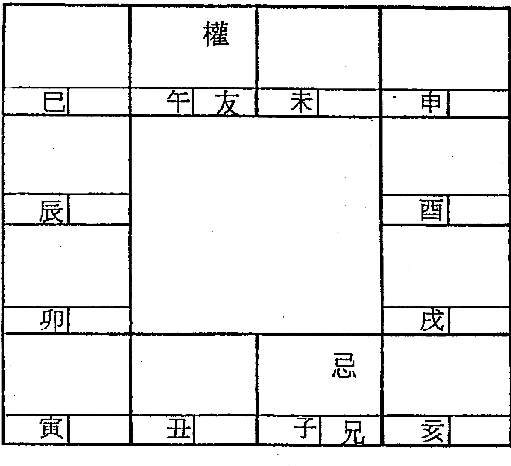

◆权忌在兄友线。

+   (1) 不能跟朋友开玩笑。
    (2) 权忌主噜嗦、霸道、不明理。
    (3) 交往层面，参差不齐。

。忌在兄弟，有兄弟是木讷型的人；但不代表不说话，有人打招呼才应，或者要能打开他的话匣子，才能使他滔滔不绝。

生忌在兄弟，最好不要跟人合伙，也不要借钱给他人，钱到他人手，再也不回头；更惨的一点，你不只损失了钱财，更损失了朋友。

。没有借钱给人，反可相安无事。

| 辛未<br>5～14命宫 | 壬申<br>父母 | 癸酉<br>福德(身) | 甲戌<br>田宅 | 乙亥<br>官禄 | 丙子<br>奴仆 | 丁丑<br>迁移 | 丙寅<br>疾厄 | 丁卯<br>财帛 | 戊辰<br>35～44子女 | 己巳<br>25～34夫妻 | 庚午<br>15～24兄弟 |
| :--- | :--- | :--- | :--- | :--- | :--- | :--- | :--- | :--- | :--- | :--- | :--- |

#### ⑤杨贵妃之命

甲子年正月初七未時生
陽女路傍土五局
（紫微在子，命宮在未）
癸卯年九月初九故享年40歲

> 《古論》
坐貴向貴，得貴人寵愛，文星文曲加會，女命不宜見之。經云：楊妃好色，三合文昌文曲。太歲羊陀迭併，小限子午相沖，故損壽。
《楊貴妃小檔案》
唐玄宗寵妃，名為楊玉環，歷史名美女，跟趙飛燕並稱「燕瘦環肥」。安祿山作亂，玄宗出走，陽死於馬嵬者乃為替身，而貴妃已藉與日本公使的關係，遠走日本，後死於日本。

#### 《勸學齋主今釋》

- 請參考「貂蟬之命」命盤，兩位都是中國歷史上有名的美女，也都是同巨在未坐命，貂蟬昌曲夾命，貴妃昌曲三合命宮。
- 從命、父、疾所坐生年四化，以及三宮宮干之化星狀況，貴妃的肉感與貂蟬的骨感，形成強烈的對比，貴妃父疾線的生權生科，體態豐盈，骨骼壯碩，雖壯而有韻，雖胖而有韻，命宮辛干巨門化祿配合天同，是瘦不了的體格 反觀貂蟬以忌為主，其骨感是一瞥即知的。
- 夫宮忌入官，女命為因夫而貴，一切看丈夫之成就如何，亦有老公留不住之象；官宮干乙也化忌入夫，主事業、事情多變，主外週，我想有外週，且易有外週。二忌皆發生是一種循環忌，彼此好好的時候，如膠似漆，雙對忌的黏性特強。但一有情況變化，那一道決裂的痕跡，就很難複合。
- 看貴妃的桃花
- 天姚在遷，在外有異性緣；四化入子田線，桃花就很難避免，廉貞乃次桃花，坐生祿，戊干又化科至對宮田宅，田宅甲干又化回祿科，這種桃花是心甘情願，纏綿悱惻而且羅曼蒂克、難分難捨的。
- 以田宅主財的角度來看，貴妃是揮霍型的，而且講究排場；田宅甲化祿入子，生祿無法阻擋，主大花特花，子女又化科到對宮，主排場，且意猶未盡。

| 宫位 | 年龄范围 | 宫位类型 | 星曜信息 |
| :--- | :--- | :--- | :--- |
| 乙巳 | 22~31 | 夫妻 | 太阴、天钺、天虚、红鸾、铃星 |
| 丙午 | 12~21 | 兄弟 | 贪狼、文曲 |
| 丁未 | 2~11 | 命宫 | 天同、巨门、寡宿 |
| 戊申 | | 父母 | 武曲、天相、文昌、命马、天哭、天姚 |
| 甲辰 | | 子女 | 天府、廉贞、天刑 |
| 中宫 | | ⑥ 貂蝉之命 | (紫微在子，命宫在未) 己丑年八月初五故享年28岁 |
| 己酉 | | 福德 | 太阳、天梁(禄)、地空 |
| 癸卯 | | 财帛 | 右弼、天魁、火星、空亡 |
| 庚戌 | | 田宅 | 七杀、陀罗、华盖 |
| 壬寅 | | 疾厄 | 破军、截路 |
| 癸丑 | | 迁移 | 地劫 |
| 壬子 | | 奴仆 | 紫微(权)、羊刃、阴煞 |
| 辛亥 | | 官禄(身) | 天机、左辅(科)、禄存、天喜、月马、孤辰、天空 |
| 中宫右侧 | | 壬戌年八月二十三日寅时生 阳女天河水二局 | |

> 《古论》
虽有左右加会，巨门天同俱不得地，火铃二星冲照（按：原书火在迁，铃在财），亦主淫欲，火星陷，匹配三夫而心不足，天刑子息全无，又乘陀杀冲刑，小限太岁临于丑宫，主遭刑死。

#### 《貂蟬小檔案》

東漢時王允歌妓，貌極美，初王允許嫁呂布，旋獻董卓，布因此殺卓，復娶為妻。

#### 《勸學齋主今釋》

昌曲夾命，有才藝，具姿色，蓋文昌在相貌宮；昌曲是不宜女人的星辰，唯一的優點是在文書宮，不讀詩書也可人。

- 同巨坐命，一生風波，尤不利於婚姻感情，況乎寡宿陰孤坐命，女命尤忌，意為女人落單，加上太陰落陷在夫妻，太陰自化忌，女命尤重福德，見太陽（主男）落陷，皆主先生早逝。
- 命宮丁干巨門（主口、是非）自化忌，父母宮坐生年忌，論口德及說話技巧皆劣；且命宮丁干同自權，巨自忌，遷宮癸干巨化權，小姐脾氣太大了。
- 官祿辛干化忌入父母沖疾厄，主人虛偽，不實在，但也是心軟之人。
- 就夫妻宮而言，乙干祿入官（夫之遷），其夫在外有人緣，逢生科，名氣不小，但乙干自化忌，沒了。
- 第二任看子女，甲干廉貞自祿，忌入福德，福德是夫妻的氣數位，且命宮乃福德之夫妻宮，故女命重福德，福德被忌破生祿，第二任也沒了。就夫官乙干祿忌相對，祿隨忌走，表示最後沒了，也可以祿是因，表示有情，忌是果，表示沒了，怎麼沒的？看權，乙天梁化權在福，沒命了。
- 以上夫妻的祿忌關係看來，貂蟬只是被她老公當作性玩偶而已。
- 田宅庚干忌天同入命，乃好佔便宜，不喜吃虧之性。

| 己巳<br>子女<br>太阴<br>天刑<br>天空<br>孤辰 | 庚午<br>夫妻<br>贪狼<br>文曲 | 辛未<br>兄弟<br>天同<br>巨门<br>天魁 | 壬申<br>4~13命宫<br>武曲<br>天相<br>文昌<br>月马<br>截路 |
| :--- | :--- | :--- | :--- |
| 戊辰<br>疾厄<br>天府<br>廉贞(禄)<br>火星<br>华盖 | ⑦孫臏之命<br>甲辰年九月初五日寅時生<br>陽男劍鋒金四局<br>戊午年五月十二日故享年75歲<br>(紫微在子，子宫在申) | | 癸酉<br>14~23父母<br>太阳(忌)<br>天梁<br>天姚<br>地空<br>空亡 |
| 丁卯<br>74~83疾厄<br>羊刃 | | | 甲戌<br>24~33福德<br>七杀<br>阴煞<br>天虚 |
| 丙寅<br>64~73迁移<br>破军(权)<br>右弼<br>禄存<br>命马<br>天哭 | 丁丑<br>54~63奴仆<br>陀罗<br>天钺<br>地劫<br>寡宿 | 丙子<br>44~53官禄(身)<br>紫微<br>左辅<br>铃星 | 乙亥<br>34~43田宅<br>天机 |

> 《古論》
此為紫府朝垣格，左右昌曲守命，科祿三方會合，文武兼資，終身富貴之論。七十五歲大限入天羅，小限在子，與流年戊午相沖，故凶。

#### 《孙膑小档案》

战国时兵法学家，孙武的后裔，与庞涓同拜鬼谷子为师，后齐威王以为军师，计因魏将庞涓，使涓自刎于马陵道。

> 《劝学斋主今释》

- ○ 武相在申立命，甲年生人福厚，因见三奇嘉会，又喜禄存在迁移，本造又加禄马交驰，左右昌曲相会，位至公卿。
- ○ 以迁移为主事宫，则见杀破狼，转战疆场之命格。以现代人而言，则是商场大将，可做外销生意，往国外发展的好格局，尤以禄马交驰在迁移，行商于国际间，自己也行，又多贵人扶助，贵不可言。
- ○ 武相同宫，驳杂不顺，有孤独感；就星性而言，较不善言辞，但就命宫干壬，化禄入父照疾，而自化忌出，颇能以退为进，作机智之应答。据孙庞演义所载：孙庞二人欲拜师学鬼谷子，鬼谷子要考二位的才智，于是说谁能将鬼谷子由室内请到室外者胜。庞涓先上，用尽威逼利诱，鬼谷子不为所动；轮到孙膑，孙即上前进禀，自陈才低，无能使师父由内而外，但若师父在外，则有法请他进来。鬼谷子说，那也一样；于是到了外面，要孙膑看用何法请他进去，孙膑即恭敬回他师父说：弟子已将您请出来了。第三大限行甲戌，为庞涓刑去双足，陆飞帆先进所著紫微奇径，以五行局纳音论命，颇有见地。

| 命宫 (辛卯) | 福德 (癸巳) | 田宅 (甲午) | 官禄 (乙未) | 奴仆 (丙申) | 迁移 (丁酉) | 疾厄 (戊戌) | 财帛 (己亥) | 子女 (庚子) | 夫妻 (辛丑) | 兄弟 (庚寅) | 父母 (壬辰) |
| :--- | :--- | :--- | :--- | :--- | :--- | :--- | :--- | :--- | :--- | :--- | :--- |
| **星曜** | 太阴 (庙) | 天同 (庙) | 贪狼 (庙) | 武曲 (庙) | 太阳 (旺) | 七杀 (旺) | 天机 (庙) | 紫微 (庙) | 破军 (旺) | 天府 (庙) | (未显示) |
| **辅星** | 左辅 | 巨门 (禄)、华盖 | 天铖 | 天相、陀罗 | 天梁、右弼、禄存 | 文昌 (忌)、天喜、羊刃、铃星、天刑、寡宿 | 地空、地劫 | 阴煞、天空 | 天魁、天姚、孤辰 | 文曲 (科)、廉贞、红鸾、截路 | (未显示) |
| **宫干** | 癸 | 乙 | 甲 | 丙 | 丁 | 戊 | 己 | 庚 | 辛 | 庚 | 壬 |
| **大限** | 3~12 | | | | | | 43~52 | 33~42 | 23~32 | 13~22 | |
| **备注** | (身宫) | (禄) | | | (权) | (忌) | | | | (科) | |

⑧古峯僧之命
辛亥年二月二十五日子時生
陰男松柏木三局
丙申年四月初三故享年46歲
(紫微在子，命宮在卯)

**《古論》**
命無正曜，雖有酉未宮權祿加會，陽梁照命，劫空會合，但主為僧，有岩泉之名。大限行到天使擎羊之地，凶也，小限又重逢在彼，其敗安能逃。

#### 《曹參小檔案》

沛人，汉朝名相，与萧何同佐高祖定天下，继萧何为相，政绩优良，史称「萧规曹随」是也。

#### 《劝学斋主今释》

- 曹参与萧何同龄，同佐汉高祖定天下；两个人的命盘居然相同，所不同者，曹参命在午，萧何在子，曹为土五局，萧为水二局。在命格上，曹参也是紫微坐命，府相朝垣，双禄朝元，君臣庆会，权禄照命。
- 命宫干庚，化忌入疾，心口如一。
- 萧规曹随，而为什么「曹规萧随」呢？约略从局数来看，萧何是水二局，曹参是土五局，两人同龄，则是萧何早三年步入新一个大限，我们又可发现萧比曹的寿元少三年，两人皆是大限在疾时倒数第二年逝世。
- 再比较二人的差异：萧何日酉月巳，日月反背，自是较为奔劳，反观曹参日卯月亥，日月并明，自是较为平稳。

| 宫位/星曜 | 太阴 禄存 天喜 天空 空亡 孤辰 | 贪狼 左辅 | 天同(禄) 巨门 | 武曲 天相 右弼 |
| :--- | :--- | :--- | :--- | :--- |
|  | 叶英之命<br>丁丑年五月初五故享年22岁<br>(紫微在子，命宫在辰)<br>丙辰年三月二十二日子时生<br>阳男长流水二局 |  |  |  |

> 《古论》
紫相昌曲相逢加会，本作美论，奈姚曲昌不宜见廉贞化忌；秘云：文昌文曲逢廉贞，丧命夭寿之人，故死于二十二岁。

此部分位于图片底部，为对古论的进一步解释或现代按语。

| 天机 地劫 地空 陀罗 | 红鸾 阴煞 禄存 紫微 | 天刑 羊刃 寡宿 | 破军 天钺 截路 |
| :--- | :--- | :--- | :--- |
| 15~24兄弟 己巳 | 5~14命(身) 庚午 | 父母 辛未 | 福德 壬申 |

| 七杀 文昌 铃星 | 25~34夫妻 戊辰 | 辛亥年七月初九故享年63岁<br>（紫微在午，命宫在午） | ⑩<br>曹参之命<br>己酉年十一月二十五日午时生<br>阴男路傍土五局 | 火星 天哭 空亡<br>田宅 癸酉 |
| :--- | :--- | :--- | :--- | :--- |

| 太阳 天梁(科) 天虚 | 35~44子女 丁卯 | 天府 廉贞 文曲(忌) 天空<br>官禄 甲戌 |
| :--- | :--- | :--- |

| 武曲(禄) 天相 左辅 月马 | 45~54财帛 丙寅 | 天同 巨门 华盖 | 55~64疾厄 丁丑 | 贪狼(权) 右弼 天魁 天喜<br>迁移 丙子 | 太阴 命马 天姚 孤辰<br>奴仆 乙亥 |
| :--- | :--- | :--- | :--- | :--- | :--- |

《古论》
紫微居午无杀凑，左右权禄，子寅二宫加会，官资清显至三公。六十三岁太岁到天殇亥地，又流年照命（按：流年在亥），酉人忌之，为凶也。

#### 《贾谊小档案》

汉名学者，雒阳人，文帝召为博士，超迁至太中大夫，谊请定正朔，易服色，制法度，与礼乐，为大臣所忌，出为长沙王太傅，后因感伤而死。

#### 《劝学斋主今释》

- 文桂文华格，文桂即文昌，文华即文曲。此格主文贵之气，有文学、医学、经济之才。
- 就身宫（在迁移）而论，日在卯，月在亥，是为明珠出海格；主人心地善良，博学多能，光明磊落，幼年即以才学闻名，尤以昌曲在座，成就更是非凡，惜此格最忌羊火冲破，转为虚名虚利，华而不实。

#### ○ 论化星

- 论星情，同巨在丑，有羊火，是非多；同巨皆属水，丑土属淤泥，挡水无功，复见五行为金，水已太旺，又得金来生水，以致氾滥，天同会变得过度忘我，巨门的是非也出来了。
- （1）生权在命，好争论、抢风头、有点霸气；迁移宫自忌，则见权忌在命，霸道矣！
- （2）福德宫干乙天梁自化权，也是霸气，凡事为自己着想、现实、自负。
- （3）迁移宫自忌，亦表示小时候身体羸弱、中气不足，又惊见生忌在兄友线。

| 宫位1 | 宫位2 | 宫位3 | 宫位4 |
| :--- | :--- | :--- | :--- |
| 孤辰 命马 天机 天魁<br>丁巳 官禄 | 天喜 左辅 紫微<br>戊午 奴仆 | 华盖 文曲 文昌<br>己未 迁移(身) | 地空 右弼 破军(禄)<br>庚申 疾厄 |
| 天空 七杀<br>丙辰 田宅 | ⑪贾谊之命<br>庚午年四月初八故享年28岁 | 癸卯年三月初十卯时生<br>阴男海中金四局 | 天虚<br>辛酉 财帛 |
| 天姚 天钺 天哭 天梁 太阳<br>乙卯 福德 |  | 阴煞 廉贞 天府<br>壬戌 子女 |  |
| 地劫 月马 天相 武曲<br>甲寅 父母 | 空亡 铃星 羊刃 巨门(权) 天同<br>乙丑 4～13命宫 | 截路 红鸾 火星 禄存 贪狼(忌)<br>甲子 14～23兄弟 | 天刑 陀罗 太阴(科)<br>癸亥 24～33夫妻 |

> 《古论》 文星暗拱，年少登科，天机天钺正曜，以为吉兆，小限到天罗，大限到地网，太岁天殇夹地，流羊流陀三方合命垣，且命原犯擎羊，故夭亡于二十八岁。

#### ⑫ 孔明之命

甲寅年八月二十五日故享年54岁<br>(紫微在午，命宫在未)<br>辛酉年四月初十戌时生<br>阴男砂中金四局

诸葛亮，字孔明，三国蜀汉琅琊人，隐于隆中，刘备三顾始见之，佐备取荆州、定益州，建国蜀中，拜为丞相。先主殁，受诏辅政，封武乡侯，后以疾卒于军中。（西元一八一至二三四年）

> 《孔明小档案》

> 《古论》
左右同宫，日卯月亥并明，为明珠两照，一生富贵，多材多能。五十四岁大限太岁小限疾使忌耗，流羊流陀三方迭併故死。

#### 《劝学斋主今释》

左右同宫格。另日卯月亥，可称日月并明，日在财坐卯，日出扶桑，又叫日照雷门；月在亥坐官，月朗天门，以上以财官分论，而命宫在未，日出扶桑，月朗天门，造就一个「明珠出海格」。此格之人，心善行正，聪明博学，早年即可成名。

生禄在迁为活禄，昌曲夹迁，也是向外发展之命；禄在迁，就不能守在家，如果孔明在刘备三顾茅庐后，尚不出仕，固守卧龙岗的话，陈寿与罗贯中想在三国志与三国演义中记他一笔，是很困难的。

以身宫论后天，生权再自化权，尽心尽力，有威严，教人不敢亲近。

论心智：武相曲坐疾，生科再自化权，所思考之才学偏向兵学、金融、官职，而文学也不错；疾厄在寅，四马地，思想灵活。

迁移宫辛丑，辛干巨门自化禄，原是应解释为自禄泄掉生禄，但孔明之命盘，依「退马」原理，辛卯化禄入辛丑，而将辛丑之自禄再往后推退二格，进入了官禄，迁移保有原先的生禄，而官禄也有了化禄。

再看生年干辛坐丑和卯，一为迁移，一为财帛也是身宫，二位皆是我宫，是自立格（依一干论命法），再审生权、生禄，皆是坐生干，一生自是遂志，虽亦主辛劳，然举手投足，皆能奏功，栋梁之材，繫社稷之安危，是少有的命例，宜深究体会。

| | | | |
| :--- | :--- | :--- | :--- |
| 空亡 天机<br>癸巳<br>24～33夫妻 | 紫微 天钺 红鸾<br>甲午<br>14～23兄弟 | 左辅 右弼 寡宿<br>乙未<br>4～13命宫 | 破军 陀罗 阴煞 铃星<br>丙申<br>父母 |
| 截路 天姚 七杀<br>壬辰<br>34～43子女 | ⑫<br>孔明之命<br>甲寅年八月二十五日故享年54岁<br>(紫微在午，命宫在未) | 辛酉年四月初十戌时生<br>阴男砂中金四局 | 禄存 地劫 天哭<br>丁酉<br>福德 |
| 天虚 天梁 太阳(权)<br>辛卯<br>44～53财帛(身) | | | 天府 廉贞 羊刃 天空<br>戊戌<br>田宅 |
| 天魁 文曲(科) 天相 武曲<br>庚寅<br>54～63疾厄 | 火星 地空 华盖 巨门(禄) 天同<br>辛丑<br>迁移 | 天喜 天刑 文昌(忌) 贪狼<br>庚子<br>奴仆 | 太阴 命马 月马 孤辰<br>己亥<br>官禄 |

#### 《劝学斋主今释》

+   - 天机坐命的人，喜欢云游四海，家待不住，因天机是天地之轴，时刻在转动；就性质来论，天机也爱动脑筋，神经、幻想、奇想，但不世出之奇才，皆是此中人。
- 天机化权，很好。思考性的东西，一旦化权，诉求力强；命宫干癸，化科到迁移，太阴在迁移亥宫，是为「月朗天门」，外界生光辉，尤其癸的化科将机权带出，更见美妙。
- 空劫在命身，又有孤辰，是则李白的卓尔不群，真有不群的另一层表现，恃才傲物。
- 同巨在财，逢生禄，又自禄出，一生得财容易，花钱更轻松，不会有钱留下来的。巨门属口，天同是饮食，又化禄，口福之佳，吃遍天下。据史载：皇帝下诏，李白至各地府县，吃喝皆由府县支付。真是「游县吃县，游府吃府」。
- 空劫在命身的人，有佛道之缘，最起码也要从事学问的研究。空劫会使人一生至少有一次大灾难，过后对人生的体悟必深，更深的体悟，也产生继续的质疑。
- 空劫同宫在命身，要小心高空坠落之灾；或受重物落下击中，或自身坠落，相传李白跳江捉月，从此永别。

| 丙申 (福德) | 丁酉 (田宅) | 戊戌 (官禄) | 己亥 (奴仆) |
| :--- | :--- | :--- | :--- |
| 天同 (禄)<br>天梁<br>命马<br>天姚<br>地空<br>孤辰 | 武曲<br>七杀<br>天魁<br>红鸾<br>铃星 | 太阴<br>阴煞 | 左辅<br>天钺<br>月马 |
| 乙未 (14~23父母) | 庚子 (迁移(身)) | 辛丑 (疾厄) | 庚寅 (财帛) |
| 天相<br>文昌 (科)<br>文曲<br>天空<br>火星 | 天机 (权)<br>天哭<br>天虚<br>阴煞 | 紫微<br>破军 | 地劫 |
| 甲午 (4~13命宫) | 壬辰 (夫妻) | 辛卯 (子女) |  |

⑯ 庆忌之命<br>丙午年八月初三卯时生<br>阳男砂中金四局<br>（紫微在丑，命宫在午）<br>戊辰年三月初五故享年23岁

> 《古论》
马前带箭，非天折而刑伤；早年限行吉地，作事峥嵘，手能捉飞鸟。二十三岁大限到申，值地空，小限到寅，遇地劫，太岁天罗，流羊流陀迭併，以至遭凶而亡。

> 《庆忌小档案》
春秋吴王僚之子。以勇士闻名，筋骨有劲，万人莫当。公子光既弑僚，庆忌在卫，光忧之，使要离引至吴，乘隙刺杀之。

| 贪 廉(忌) |  | 曲昌相 14~23 | 梁同(禄) |
| :--- | :--- | :--- | :--- |
| 癸巳 | 甲午 命 | 乙未 父 | 丙申 |
| 辰 |  |  | 酉 |
| 卯 |  | 忌 | (大田) |
|  |  | 机 (大友) | 戊戌 |
| 寅 | 丑 | 庚子 迂 | 己亥 友 |

- 奴仆宫干之四化，化入之坐宫，行限步入，往往有灾，务必小心。
- 己干化忌（文曲）入乙未第二大限。
- 大限奴仆宫干化禄不可撞着生忌，化忌也不可冲破生禄，此为严重劫数。
- 第二大限奴仆庚子，天同化忌冲破生年禄，劫数难逃。

#### ◇绝命忌

+   - （一）生忌不在本命宫时，大田化忌冲本命，生命危险！
- （二）流迁化忌不可冲本命
- 。大田戊天机化忌入本迁（庚子）冲本命。
- 。流年戊辰，迁移在戊，恰为大田戊戌，戊天机化忌冲本命。

#### 唐状元之命<br>(紫微在丑，命宫在丑)

乙酉年四月初五辰时生 阴男属火六局

| 宫位 | 星曜 | 天干 | 年龄范围 |
| :--- | :--- | :--- | :--- |
| 官禄 | 贪狼、廉贞 | 辛巳 | |
| 奴仆 | 截路、红鸾、文昌、巨门 | 壬午 | |
| 迁移 | 地空、火星、寡宿、右弼、左辅、天相 | 癸未 | |
| 疾厄 | 阴煞、天魁、文曲、天梁（机）、天同 | 甲申 | 56~65 |
| 田宅 | 天姚、羊刃、太阴（忌） | 庚辰 | |
| 财帛(身) | 天哭、七杀、武曲 | 乙酉 | 46~55 |
| 福德 | 地劫、天虚、禄存、天府 | 己卯 | |
| 子女 | 天空、太阳 | 丙戌 | 36~45 |
| 父母 | 铃星、陀罗 | 戊寅 | |
| 命宫 | 华盖、破军、紫微（科） | 己丑 | 6~15 |
| 兄弟 | 天刑、天喜、天钺、天机（禄） | 戊子 | 16~25 |
| 夫妻 | 孤辰、月马、命马 | 丁亥 | 26~35 |

> 《古论》紫微守命，龙池凤阁，左辅右弼朝垣，天相得紫微，是为君臣加会，其富贵必矣！

#### ◇入库忌

(一) 生年忌入辰戌丑未，谓之入库忌。

+   - 入库忌，亦有欠债之意。
- 主财，也因为财而劳碌；但不能自化，自化则化为无，库有破洞，也不能射出四化，射

| 左列 | 中左列 | 中右列 | 右列 |
| :--- | :--- | :--- | :--- |
|  | 午 | 未 | 申 |
| 巳 |  |  |  |
| 阴(忌) |  |  |  |
| 庚辰 | 田 |  | 酉 |
|  |  |  | 阳 |
| 卯 | 忌 | 自忌 | 丙戊 子 |
|  |  | 机(禄) |  |
| 戊寅 | 己丑 命 | 戊子 兄 | 亥 |

#### ◇退马忌

(二) 本命例生忌在辰，为入库忌。出则泄。

+   - 入库忌在田宅，表示为家庭子女负担重，若不自化则可有不少积蓄。
- 机月同梁的钱财，都是涓滴蓄积的。
- 田宅庚干射出禄到对宫，财泄。
- 子田线坐日月两星，在家和在外「两款人」，表现差异大。

戊寅天机化忌到退一格的戊子，戊子天机自化忌，依六四之用，此忌应再退二格，至丙戊。
戊子已无自化忌，而以忌星在戊论。

⑧ 赵奢之命<br>戊午年四月初三辰时生 阳男海中金四局<br>(紫微在丑，命宫在丑) 庚子年二月初七故享年43岁

天同 天梁 文曲 命马 阴煞 孤辰 庚申 疾厄<br>武曲 七杀 铃星 红鸾 辛酉 财帛(身)<br>太阳 华盖 壬戌 子女<br>月马 癸亥 夫妻<br>天相 左辅 右弼(科) 天钺 火星 天空 地空 己未 迁移<br>天机(忌) 天哭 天虚 天刑 截路 甲子 兄弟<br>廉贪 贪狼(禄) 禄存 丁巳 官禄<br>太阴(权) 陀罗 天姚 寡宿 丙辰 34~43 田宅<br>天府 天喜 地劫 乙卯 24~33 福德<br>紫微 破军 天魁 空亡 乙丑 4~13 命宫

《古论》 科禄拱照，富贵声扬， 左右拱朝，终身福厚。三十四岁大限入巳宫，四十三岁庚子年，太岁逢忌，三方陀忌冲照，又流羊流陀冲命，小限入地网日月陷地，故凶

《赵奢小档案》 战国赵人。惠文王时为田部吏，收租税，平原君家不出租，奢以法治之，杀平原君用事者九人，平原君以为贤，言于王，王使治国赋，国赋大平。秦伐韩，王使奢将兵救之，大破秦军。王赐号马服君。

#### 紫微斗数命盘

| 宫位 | 时段 | 天干 | 主星/辅星 | 备注 |
| :--- | :--- | :--- | :--- | :--- |
| 命宫 | 6~15 | 己丑 | 紫微、破军、左辅、右弼、天魁、地空、铃星、寡宿 | ⑲举人之命，紫微在丑，命宫在丑 |
| 兄弟 | - | 戊子 | 天机、文昌 | - |
| 夫妻 | - | 丁亥 | 火星 | - |
| 子女 | - | 丙戌 | 太阳(禄)、华盖、天姚 | - |
| 财帛(身) | - | 乙酉 | 武曲(权)、七杀、羊刃、地劫 | - |
| 疾厄 | - | 甲申 | 天同(忌)、天梁、禄存、命马、天虚、阴煞 | - |
| 迁移 | - | 癸未 | 天相、陀罗、天铖、天喜、空亡 | 庚寅年十月初五戌时生，阳男霹雳火六局 |
| 奴仆 | 56~65 | 壬午 | 巨门、天刑、截路 | - |
| 官禄 | 46~55 | 辛巳 | 廉贞、贪狼、月马、孤辰 | - |
| 田宅 | 36~45 | 庚辰 | 太阴(科)、天哭 | - |
| 福德 | 26~35 | 己卯 | 天府、天空 | - |
| 父母 | 16~25 | 戊寅 | 文曲 | - |

> 《古论》
君臣庆会，左右同宫，夹昌夹曲之格，当为大贵，但与火星同垣（按：原书火星在丑），空劫迭守。故限交科禄，辛酉年三十二中不得，至癸未年（五十四岁）曲昌居卯照身，方能发达。

#### 談生忌在命

自尊心強，因自卑感重；惜情，一點一滴都怕失去。

寧可吃虧，也不佔便宜；有德性，不會傷人。

但切忌不能自化忌或化權，或由福德宮化權入命遷。

好的給人，壞的留用，善待他人，蔭別人。

主驛馬，又主個性木訥，默默做事，忙東忙西，不會未下雨先打雷。

生忌在四馬地，謂之「拆馬忌」。

忌在四馬主奔波、勞碌。

注意大限行運，拆馬忌落入大限何宮，入六親宮皆主是非、分離。

第二大限乙酉，拆馬忌在大限兄弟，第三大限丙戌，拆馬忌在大限夫妻。

拆馬忌是「天始溫情」，入大限六親宮時，主與該六親聚少離多，相聚多了，反生是非，或其它事故。

生祿為退馬忌所破。

| 命宮 (2～11) | 父母 (12～21) | 福德 (22～31) | 田宅 (32～41) | 官禄(身) (42～51) | 奴僕 (52～61) | 遷移 (戊寅) | 疾厄 (己卯) | 財帛 (庚辰) | 子女 (辛巳) | 夫妻 (壬午) | 兄弟 (癸未) |
|---|---|---|---|---|---|---|---|---|---|---|---|
| 天同(忌) 天梁 文昌 祿存 天虚 命馬 月馬 | 武曲(樞) 七殺 羊刃 天姚 地空 | 太陽(祿) 華蓋 陰煞 | 天機 左輔 | 紫微 破軍 天魁 紅鸞 地劫 寡宿 | 天府 火星 天空 | 右弼 | 太陰(科) 天哭 | 巨門 文曲 截路 | 孤辰 鈴星 天刑 貪狼 廉貞 |

寡莘之命
庚寅年九月初一寅時生
陽男井泉水二局
（紫微在丑，命宮在申）
辛巳年三月初七故享年52歲

> 《古論》
機月同梁之格，一生吏業爭榮。五十二歲大限夾地，辛巳年太歲埋蛇，小限夾門，忌星為害（按：巳年夾門在未，小限適行未宮，辛干忌入命，小限干癸忌星入太歲），主死。

#### 21 张温之命

癸丑年七月初四辰时生
阴男砂中土五局

(紫微在丑，命宫在辰)
癸未年正月十一日故享年31岁

| 丁巳 父母 | 戊午 福德 | 己未 田宅 | 庚申 官禄 |
|---|---|---|---|
| 廉贞 贪狼(忌) 天哭 天魁 | 巨门(权) 文昌 | 天相 火星 天虚 天姚 地空 | 天同 天梁 文曲 天喜 |
| **丙辰 命宫 5～14** | | | **辛酉 奴仆** |
| 太阴 右弼 | | | 武曲 七杀 |
| **乙卯 兄弟 15～24** | | | **壬戌 迁移** |
| 天府 天钺 天刑 地劫 | | | 太阳 左辅 寡宿 |
| **甲寅 夫妻 25～34** | **乙丑 子女** | **甲子 财帛(身)** | **辛亥 疾厄** |
| 红鸾 铃星 月马 阴煞 天空 孤辰 | 紫微 破军(禄) 羊刃 华盖 空亡 | 天机 禄存 破路 | 陀罗 命马 |

> 《古论》
魁钺夹命，本为富贵，
日月反背，苗而不秀，科名
陷于凶神，是因不显其文也。
且限步又不遂，因此怨恨
三十一岁而死。

| 宫位 | 天干 | 星曜 |
| :--- | :--- | :--- |
| 父母 | 己巳 | 廉贞、贪狼(樞)、命马、文昌、孤辰 |
| 福德 | 庚午 | 巨门、天喜、地空、禄存 |
| 田宅 | 辛未 | 天相、华盖、羊刃 |
| 官禄 | 壬申 | 天同、天梁(科)、天钺、天姚、截路 |
| 命宫 | 戊辰 | 太阴、天刑、地劫、陀罗、天空 |
| (中心) | | ②天兒之命<br>己卯年八月初二巳時生<br>陰男大林木三局<br>(紫微在丑，命宫在辰)<br>辛巳年二月二十九日故享年3歲 |
| 奴仆 | 癸酉 | 武曲(禄)、七杀、天虚、文曲(忌)、空亡 |
| 兄弟 | 丁卯 | 天府、右弼、天哭、铃星 |
| 迁移 | 甲戌 | 太阳 |
| 夫妻(身) | 丙寅 | 火星 |
| 子女 | 丁丑 | 紫微、破军、寡宿 |
| 财帛 | 丙子 | 天机、天魁、红鸾、阴煞 |
| 疾厄 | 乙亥 | 左辅、月马 |

> 《古論》
此命日月反背，太陰守命，失陷，又臨天刑地劫，其離養必矣！況三歲行童限在亥，卯生人防巳亥歲限，又過天使，鎖蛇開冲，故死於三歲。

| 丁巳 5~14命宮 | 天刑 天魁 文昌 貪狼(忌) 廉貞 | 戊午 父母 | 天空 地空 巨門(權) | 己未 福德 | 天相 | 庚申 田宅 | 天同 天梁 月馬 火星 |
|---------------|------------------------------|----------|-------------------|----------|------|----------|---------------------|
| 丙辰 15~24兄弟 | 天喜 地劫 太陰(科) | 戊辰年正月十一日故享年36歲 | (紫微在丑,命宮在巳) ②3 鄺生之命 | 癸巳年九月初四巳時生 陰男砂中土五局 |      | 辛酉 官祿 | 天姚 文曲 七殺 武曲 |
| 乙卯 25~34夫妻(身) | 鈴星 天鉞 天府 |          |                   |          |      | 壬戌 奴僕 | 紅鸞 陰煞 太陽 |
| 甲寅 35~44子女 | 右弼 華蓋 天哭 羊刃 破軍(祿) 紫微 | 乙丑 財帛 | 祿存 左輔 天機 | 甲子 疾厄 |      | 癸亥 遷移 | 天虛 命馬 陀羅 |

> > 科權夾貴(按：貴指天魁)之格，本為美命，只嫌空劫來垣，且文昌不宜與貪狼廉貞同立，一生奔波勞碌。誤以太歲在戊，小限地空，戊祿化吉，小紅不堪重載，是以凶也。

漢時高陽人，常為說客。說齊，憑其三寸不闌之舌，下齊七十餘城。史記淮陰侯列傳載曰：『且郦生一士，伏軾掉三寸之舌，下齊七十餘城。』後韓信攻齊，齊王怒其出賣己，遂烹之。

#### 《勸學齋主今釋》

- 廉貞文武格：廉貞、武曲和文星（曲、昌）會照在命宮三方謂之。此格允文允武，有文才，若置身戰場，亦能活躍。
- 好的方面尚有：魁鉞坐命身，科權夾貴。
- 壞的格局亦不少。
- 空劫夾忌：古云「夾空夾劫主貧賤」。
- 文星失位：昌曲逢殺、破；雖文才出眾，終是有破。
- 財與囚仇：財指武曲，囚為廉貞，此二星永在三合，與刑忌諸煞會合，主貪賤，發亦不耐久。
- 最糟的星組，乃是貪狼化忌逢文昌在命，古云：「昌貪居命，粉身碎骨」是也。可憐的鄺食其，烹剝、碎屍，筆者不不禁懷疑，那些長吁短嘆「世風日下，人心不古」的道學們，究以何角度評比今昔？
- 命忌有忌，本主蔭人，不佔便宜，肯吃虧，遷宮自忌出，又主固執；命宮丁干化祿入兄，化忌入父，有也給人，沒有也得借來或爭來給人，皆主蔭人。命忌入父，又主口德，出口傷人，被沖的宮位疾厄（奴僕之福）甲干反化祿入命，掉三寸不爛之舌，果如是乎？
- 依據退馬，乙卯紫微科將乙丑之自科，後退至癸亥遷移。

| 丁巳<br>奴僕 | 戊午<br>遷移 | 己未<br>54~63疾厄 | 庚申<br>44~53財帛 |
| :--- | :--- | :--- | :--- |
| 天魁 | 天空<br>陰煞<br>天機 | 天刑<br>破軍（祿）<br>紫微 | 孤辰 |
| 丙辰<br>官祿 | ②4<br>張侍郎之命 | （紫微在未，命宮在子）<br>癸巳年十一月十四日子時生<br>陰男海中金四局 | 辛酉<br>34~43子女 |
| 乙卯<br>田宅 | 火星<br>天鉞<br>七殺<br>武曲 | 鈴星<br>紅鸞<br>文昌<br>太陰（科） | 壬戌<br>24~33夫妻 |
| 甲寅<br>福德 | 空亡<br>天哭<br>華蓋<br>羊刃<br>天相 | 截路<br>祿存<br>右弼<br>巨門（權） | 癸亥<br>14~23兄弟 |
| 寡宿<br>天喜<br>文曲<br>太陽 | 乙丑<br>父母 | 甲子<br>4~13命(身） | 天虛<br>命馬<br>陀羅<br>貪狼（忌）<br>廉貞 |
| 月馬<br>左輔<br>天梁<br>天同 | 戊午 | 甲子 | 天姚<br>地空<br>地劫 |

> 《古論》
權會巨門威揚，果作諫臣。太陰文昌於妻宮，蟾宮折桂，太陽文曲於官祿，皇殿朝班，癸生人會巨門，為石中隱玉格，信此驗矣！

◇生權在命
。喜爭論，好出風頭，因愛「佔權」之故。
。命宮看面貌臉型，巨門主嘴巴，權主大，故此人有一大嘴巴。

◇遷移又自化忌
。權忌在命遷，心理多疑，必爭論至贏。
。個性帶霸氣。這種人不願相信命理，「鐵齒」一。
。一個忠諫之士，敢說敢論，敢爭敢辯，這種權忌條件不能沒有，但尚須有其它條件，稍微作軟化或調和，不然一味霸道不講理，夫復何用？夫復何用？

◇生祿在疾
。疾與命同體，疾厄主心，命為軀殼，又主性口德。
。疾乃父之遷，可以父看表情，父又主文書、此一祿表遠了情理，調和的霸道。
。生祿照父，天相的表情有笑容。

| 12～21兄弟 乙巳<br>孤辰 命马 陀罗 | 2～11命宫 丙午<br>天喜 祿存 天機（科） | 父母 丁未<br>羊刃 文曲 文昌 破軍 紫微<br>華蓋 | 福德 戊申<br>天空 天姚 | |
|---|---|---|---|---|
| 22～31夫妻 甲辰<br>天空 天刑 太陽 | ②5<br>項羽之命<br>（紫微在未，命宮在午）<br>己亥年十二月初六故享年33歲 | 丁卯年八月十二日卯時生<br>陰男天河水二局 | 田宅 己酉<br>天鉞 天虛 天府 | |
| 32～41子女 癸卯<br>空亡 天哭 右弼 七殺 武曲 | | | 官祿 庚戌<br>太陰（祿） | |
| 財帛 壬寅<br>截路 地劫 天梁 天同（權） | 疾厄 癸丑<br>寡宿 鈴星 天相 | 遷移(身) 壬子<br>紅鸞 陰煞 火星 巨門（忌） | 奴僕 辛亥<br>月馬 天魁 左輔 貪狼 廉貞 | |
| | | | | |

> 《古論》
科祿權加會，當至極貴富，祿存守命垣，被對宮忌星沖破，為吉處藏凶。三十二歲大限到寅，地劫相合，小限到申，地空值守，大小二限相沖，故驗死於烏江（按：據史載，項羽乃刎頸而死）。

#### 《项羽小档案》

> 秦末，下相人。少有奇才，力能扛鼎；後從叔父項梁舉兵叛秦，梁死，羽代領其兵，大破秦軍，率諸侯師入關，自封「西楚霸王」。後與劉邦爭天下，為邦敗於垓下。

#### 《勸學齋主今釋》

機月同梁格，古云：機月同梁作吏人，以現代的職務來說，即是幕僚人員，機梁會合，就善於籌劃計謀，所謂「機梁善談兵」是也。不論從軍、公、商，皆可任要職。

待人親切，性格溫和，但脾氣一發，十分火暴；且自恃才華，易招反感。

從命遷有科忌來看，項羽是注重精神面的人，福德干戊化忌入命，命自權出，遷又有生忌，此人自負、霸道。

天機獨坐子午命宮者，大多壯壯胖胖的。

第四大限癸卯，癸貪狼化忌入本友沖本兄，為倒限，大災難；大官丁未，丁干巨門化忌重合生忌沖命，嚴重了。

自殺看福德，大福乙巳天機化祿為生忌沖破，太陰化忌入本官（也是大疾），破生年祿，再以大疾庚干化忌沖本福。

| 丁巳<br>44~53 官祿(身) | 天機（忌） 文曲 羊刃 天哭 天虛 | 戊午<br>54~63 奴僕 | 紫微 破軍 天鉞 | 己未<br>64~73 遷移 | 文昌 | 庚申<br>疾厄 |
|---|---|---|---|---|---|---|
| 太陽 陀羅 華蓋 | 丙辰<br>34~43 田宅 | 丙申年五月初二故享年69歲<br>（紫微在未，命宮在丑） | ⑳蔺相如之命 | 戊子年二月十四日寅時生<br>陽男海中金四局 | 天府 右弼（科） 天喜 地空 | 辛酉<br>財帛 |
| 武曲 七殺 紅鸞 | 乙卯<br>24~33 福德 |  |  | 太陰（權） 天刑 鈴星 寡宿 | 壬戌<br>子女 |
| 天同 天梁 天姚 命馬 火星 孤辰 | 甲寅<br>14~23 父母 |  | 天相 地劫 天空 空亡 天魁 | 乙丑<br>4~13 命宮 | 巨門 陰煞 截路 | 甲子<br>兄弟 | 廉貪 貪狼（祿） | 癸亥<br>夫妻 |

《古论》
左右加会终为吉，科禄
紫府最为良，且乘限行美地
，一生名利得安康。大限申
宫，子生人不宜寅申限，六
十九岁丙申岁限，是以命亡。

#### 《蘭相如小檔案》

戰國趙之外交家，有談判長才，並能寬容。有三件事蹟，流傳千古：一、「完璧歸趙」——秦昭襄王以十五城易趙國之和氏璧，相如懷璧往，因秦王無償城誠意，乃遣使者間道出，完璧歸趙。二、趙惠文王二十年（西元二七九年）隨趙王到澠山與秦王相會，使趙王未被屈辱。三、對同朝大臣廉頗因妒而欲相辱，相如容忍避之，使頗愧悔，「負荊請罪」，而成知交。

#### 《勸學齋主今釋》

天相坐命，以現代的觀念來說，天相是「馬屁星」，說話好聽，也喜歡人誇他，無惡意；富同情心，風度好。又喜歡吃好穿好的，因它也是衣食之星；在丑未的天相，較有怪癖，不說話時很文靜，一說起話來頭頭是道，口若懸河。

待友亦有情義，屬於割愛型的待友之道，己之大慾，可以奉送朋友，因福德乙干化祿入奴僕。

福德宮之四化無傷人意，是自我行為，一己之私慾，權星在福為自負、自我意念強，唯再加忌星，則發展成霸道。

能說善道，除天相在命之外，命宮干乙化權入父，所化權之星，又是天梁。

命宮化科主遷，且身宮（亦為官祿表行為）亦化科入奴僕，可以感化朋友。

#### 紫微斗数命盘（白起之命）

| 宫位与年龄 | 星曜配置 |
|------------|----------|
| 壬申 父母 | 文曲(忌) 天钺 天喜 阴煞 截路 |
| 辛未 命宫 (5～14) | 火星 天虚 羊刃 破军 紫微 地空 |
| 庚午 兄弟 (15～24) | 天刑 禄存 文昌 天机 |
| 己巳 夫妻 (25～34) | 月马 天哭 陀罗 |
| 癸酉 福德 | 空亡 天府 |
| 戊辰 子女 (35～44) | 太阳 |
| 甲戌 田宅 | 寡宿 天姚 太阴 |
| 丁卯 财帛(身) (45～54) | 武曲(禄) 七杀 地劫 |
| 乙亥 官禄 | 廉贞 贪狼(权) 命马 |
| 丙子 奴仆 (75～84) | 巨门 天魁 |
| 丁丑 迁移 (65～74) | 天相 左辅 右弼 华盖 |
| 丙寅 疾厄 (55～64) | 天同 天梁(科) 红鸾 铃星 天空 孤辰 |

**核心信息**
- **命主**: 白起之命
- **生辰**: 己丑年十月三十日辰时生，阴男路傍土五局
- **命宫位置**: 未
- **生平**: (紫微在未，命宫在未) 癸卯年正月十四日故享年75岁

《古论》
紫破天虚之上格，左右扶福不轻，文武双全富贵命，权禄加会乃为荣。七十五岁羊陀迭併，命垣太岁白虎，三方命合（按：命宫在未，太岁在卯，白虎在亥），是为凶也，故死。

#### 《白起小档案》

戰國時秦國名將，善用兵；秦昭襄王時，曾敗韓、趙、魏等國，奠定滅六國之基，嗜殺戮，未曾失敗。長平之役，坑趙降卒四十萬，封武安君，后因與秦王、相國范睢意見不合，賜死。

#### 《勸學齊主今釋》

紫破的組合，不是簡單的格局。古來論「為臣不忠，為子不孝」，未免一竿子打翻一條船；筆者管窺此一命式之人，懷抱理想且肯勞碌，敢愛敢恨，愛之則「寬衣解帶終不悔，為伊消得人憔悴」，甚至「義無反顧」，「雖千萬人，吾往矣」，恨之則「形同陌路」，「近在咫尺，彷若天涯」。故能全心專注於其所愛之事物，終獲卓見。

像上述愛恨都走進邊緣的命式，很怕凶星來激發，羊刃入命，就演變成劇烈的「恨之欲其死」，火星又入，喜爭鬥。

天相在遷，宜離鄉背井，出外發展，左右也在遷移，出外得貴；再觀破軍在命、七殺在財、貪狼在官，是殺破狼的變動格局，一生轉戰南北。

| 命马 陀罗<br>乙巳<br>田宅 | 禄存 文曲 左辅 天机 (科)<br>丙午<br>官禄(身) | 华盖 羊刃 破军 紫微<br>丁未<br>奴仆 | 天空 孤辰 红鸾 文昌 右弼<br>戊申<br>迁移 |
|---|---|---|---|
| 寡宿 太阳<br>甲辰<br>福德 | ②⑧ 齐味道之命<br>(紫微在未，命宫在寅)<br>己亥年三月初七故享年53岁<br>丁未年三月二十四日寅时生<br>阴男金箔金四局 | 地空 天铖 天府<br>己酉<br>疾厄 | 太阴 (禄)<br>华盖<br>庚戌<br>44~53财帛 |
| 空亡 天姚 七杀 武曲<br>癸卯<br>父母 | 地劫 天虚 天相<br>癸丑<br>14~23兄弟 | 铃星 巨门 (忌)<br>壬子<br>24~33夫妻 | 天哭 天魁 火星 贪狼 廉贞<br>天刑<br>辛亥<br>34~43子女 |
| 截路 月马 天喜 天梁 天同 (权)<br>壬寅<br>4~13命宫 |  |  |  |

> 《古论》
秘经云：科权禄拱来相会，左右扶持福不轻，昌曲加会，富贵之论，命垣同梁得纯阳中天之心。大限羊行酉地，乘任小限陀火劫，三方俱见为灾，故亡。

#### ◇進馬祿（按：另一說僅能進二格。）

夫宮干壬天梁化祿入寅，而寅干為壬，致使天梁自化祿，依六四之用，將此祿再進二格，而入辰宮，命宮已無自化祿。

| 巳 | 午 | 未 | 申 |
|------|------|------|------|
| 陽<br>甲辰 福 | 自祿進二格<br>祿 |  | 酉<br>44～53<br>庚戌 財<br>陰(祿)<br>貪廉 |
| 卯<br>梁同(權)<br>壬寅 命 | 丑 | 壬子 夫<br>巨(忌) | 亥 |

#### ◇射出祿

財帛宮庚干太陽化祿至對宮，是射出祿的一種，主樂天命。
生祿坐財，財又射出祿，是為輕鬆賺、快活地花。

#### ◇福德宮

有進馬祿來，福德宮干甲，太陽又自忌。
祿在福德，對自己慷慨，對他人吝嗇，好享受，跟他人無涉，不能說壞，福德宮僅代表「私慾」；福德宮自忌，就無法安心享受了。
祿忌一綜合，私慾起伏不定。
由星情看也可看出這種現象：太陰坐福德，太陰對宮照，陰陽交替，水火互迭，時隱時現，或躁烈或柔順，或起或伏，永不安定。

| 宫位 | 地支 | 星曜 | 年龄范围 |
|------|------|------|----------|
| 田宅 | 癸巳 | 祿存, 空亡 | 33~42 |
| 官祿 | 甲午 | 天機（樞）, 羊刃 | 43~52 |
| 奴僕 | 乙未 | 紫微, 破軍, 紅鸞, 寡宿 | 53~62 |
| 遷移 | 丙申 | 天刑 | 63~72 |
| 福德 | 壬辰 | 太陽, 陀羅, 華蓋, 陰煞, 截路 | 23~32 |
| 疾厄 | 丁酉 | 天魁, 鈴星, 天空, 天府 |  |
| 財帛 | 戊戌 | 太陰, 天哭, 地劫 |  |
| 父母 | 辛卯 | 武曲, 七殺, 左輔, 文曲 | 13~22 |
| 兄弟 | 辛丑 | 天相, 天喜, 火星 |  |
| 夫妻(身) | 庚子 | 巨門, 天姚, 地空 |  |
| 子女 | 己亥 | 廉貞（忌）, 貪狼, 右弼, 文昌（科）, 天鉞, 孤辰, 月馬 |  |
| 命宫 | 庚寅 | 天同（祿）, 天梁, 天馬, 天虛 | 3~12 |
| 中心注释 |  | 29 進士之命<br>（紫微在未，命宮在寅）<br>丙申年閏十二月初十亥時生<br>陽男松柏木三局 |  |

> 《古論》
寅申最喜會同梁，且祿樞守照，得貢必矣！故二十九、三十歲大限行辰，太陽正照，小限寅卯，流昌流曲，文祿會身命，是以連登官至四品上。

#### 《冉求小档案》

孔子弟子，鲁人，字子有，谦虚有才，长于政治，曾为鲁国季氏家臣。

> 孔子曾赞曰：“千室之邑，百乘之家，可使为之宰也。”但也责斥其助季氏“聚敛而附益之”。

#### 《劝学斋主今释》

- 武杀卯酉性刚毅，有同情心，有执行能力，禄存同守，擅长取财。
- 命宫干己，武曲自化禄，带走了禄存，高高兴兴地把钱财捧了出去。
- 财帛丁干化禄入疾，是财禄入友福照友财，以现代人来说帮人赚钱，或是被倒钱。
- 再看疾厄（友之福）化忌入财，此忌是来抓财的，自己也拼命地抓给他人。
- 冉求的官禄宫不错，坐生科。当官的人，最喜科权坐官禄，冉求虽只有生科，但奴仆宫（老板）甲干化权给他，但自禄出，官做得很好，钱财出去了，钱财到那里看忌，忌入财帛，应该没漏掉，进入自己的财位，但上述分析财禄入友之福等等，可知钱收进来，又出去了，为人作嫁而已。
- 依命盘来看命宫干化忌入父冲疾，又是文曲忌，说话不好听，太直、太冲，是属宜修口德之人，但是气数位也是官禄的官衔，化科入疾与之相冲和，也化权入子女（父之财），权科的威力使大家感到其有份量这么说，若说他谦虚，则稍嫌溢美。
- 最后一个大限乙酉，大仆干戊，忌入本田（为大子），又冲破生年禄，命该休矣！

| 子女 (辛巳) | 夫妻 (壬午) | 兄弟 (癸未) | 2~11 命宫 (甲申) |
| :--- | :--- | :--- | :--- |
| 火星 红鸾 | 截路 阴煞 文昌 天机 | 铃星 陀罗 天钺 破军 紫微<br>寡宿 天刑 地空 空亡 | 天哭 命马 禄存 文曲 |
| 天虚 太阳(禄) 庚辰<br>财帛(身) | (紫微在未，命宫在申)<br>乙未年七月初九故享年46岁 | ⑳ 吴秉直之命<br>庚戌年十一月十二日辰时生<br>阳男井泉水二局 | 羊刃 天府<br>12~21 父母 乙酉 |
| 地劫 七杀 武曲(权) 己卯<br>疾厄 | | | 华盖 太阴(科)<br>22~31 福德 丙戌 |
| 月马 左辅 天梁 天同(忌) 戊寅<br>迁移 | 天魁 天相<br>奴仆 己丑 | 右弼 巨门<br>42~51 官禄 戊子 | 孤辰 天姚 天喜 贪狼 破军<br>天空<br>32~41 田宅 丁亥 |

《古论》
巨日拱照，日辰月戌，并争荣耀，禄科俱会，左右拱照，终身富贵。大小二限入天殇，忌凶之地，太岁逢陀罗天刑，俱主凶兆，其年命终。

#### 《冉求小档案》（续）

孔子弟子，鲁人，字子有，谦虚有才，长于政治，曾为鲁国季氏家臣。

> 孔子曾赞曰：“千室之邑，百乘之家，可使为之宰也。”但也责斥其助季氏“聚敛而附益之”。

#### 《劝学斋主今释》

- 武杀卯酉性刚毅，有同情心，有执行能力，禄存同守，擅长取财。
- 命宫干己，武曲自化禄，带走了禄存，高高兴兴地把钱财捧了出去。
- 财帛丁干化禄入疾，是财禄入友福照友财，以现代人来说帮人赚钱，或是被倒钱。
- 再看疾厄（友之福）化忌入财，此忌是来抓财的，自己也拼命地抓给他人。
- 冉求的官禄宫不错，坐生科。当官的人，最喜科权坐官禄，冉求虽只有生科，但奴仆宫（老板）甲干化权给他，但自禄出，官做得很好，钱财出去了，钱财到那里看忌，忌入财帛，应该没漏掉，进入自己的财位，但上述分析财禄入友之福等等，可知钱收进来，又出去了，为人作嫁而已。
- 依命盘来看命宫干化忌入父冲疾，又是文曲忌，说话不好听，太直、太冲，是属宜修口德之人，但是气数位也是官禄的官衔，化科入疾与之相冲和，也化权入子女（父之财），权科的威力使大家感到其有份量这么说，若说他谦虚，则稍嫌溢美。
- 最后一个大限乙酉，大仆干戊，忌入本田（为大子），又冲破生年禄，命该休矣！

| 宫位 | 星曜与信息 | 宫位 | 星曜与信息 | 宫位 | 星曜与信息 | 宫位 | 星曜与信息 |
| :--- | :--- | :--- | :--- | :--- | :--- | :--- | :--- |
| 辛巳 福德 | 孤辰 月马 命马 左辅 | 壬午 田宅 | 截路 天喜 天机（禄） | 癸未 官禄 | 空亡 华盖 破军 紫微（科） | 甲申 奴仆 | 天魁 |
| 庚辰 父母 | 天空 羊刃 文曲 太阳 | 己卯 命(身) 5~14 | 天哭 禄存 七杀 武曲 | | （③1）冉求之命<br>己未年四月初九故享年65岁 | 乙卯年二月初六子时生<br>阴男城头土五局 | 乙酉 迁移 65~74 | 火星 天虚 右弼 天府 |
| | | | | | | 丙戌 疾厄 55~64 | 铃星 天刑 文昌 太阴（忌） |
| 戊寅 兄弟 15~24 | 陀罗 天姚 天梁（权） 天同 | 己丑 夫妻 25~34 | 寡宿 天相 | 戊子 子女 35~44 | 阴煞 红鸾 天钺 巨门 | 丁亥 财帛 45~54 | 地劫 地空 贪狼 廉贞 |

《古论》
禄存守垣，紫微加会，终身福厚。大限天殇，小限到巳，卯生人忌之；丧门天虚冲命（按：未年丧门在酉冲卯），劫空合拱，太岁白虎天哭在命（按：未年太岁白虎在卯），故此难逃也。

#### 《晏婴小档案》

字平仲，春秋时齐国夷维人。齐灵公二十六年（西元前五五六年），于其父晏弱去逝后，继任齐卿，历任灵公、庄公、景公，主张减轻刑罚及税赋、君主质纳忠言，后人采集其行事及谏议言，辑为《晏子春秋》。

| 天刑<br>地劫<br>地空<br>辛巳<br>14~23父母 | 天机<br>截路<br>壬午<br>24~33福德 | 紫微<br>破军<br>陀罗<br>天钺<br>寡宿<br>空亡<br>癸未<br>34~43田宅 | 禄存<br>火星<br>月马<br>甲申<br>官禄 |
| :--- | :--- | :--- | :--- |
| 太阳<br>文昌<br>铃星<br>华盖<br>庚辰<br>4~13命(身) | ③2 晏平仲之命<br>(紫微在未，命宫在辰)<br>壬寅年十一月初五故享年43岁 | 庚申年九月二十四日午时生<br>阳男白镴金四局 | 天府<br>羊刃<br>天姚<br>天空<br>红鸾<br>乙酉<br>奴仆 |
| 武曲(权)<br>七杀<br>天喜<br>己卯<br>兄弟 | | | 太阴(科)<br>文曲<br>天哭<br>阴煞<br>丙戌<br>迁移 |
| 天同(忌)<br>天梁<br>右弼<br>天虚<br>命马<br>戊寅<br>夫妻 | 天相<br>天魁<br>己丑<br>子女 | 巨门<br>左辅<br>戊子<br>财帛 | 廉贞<br>贪狼<br>孤辰<br>丁亥<br>疾厄 |

> 《古论》 此为丹墀贵格，秋月生者是真格，且太阳守命垣，日月争耀，科禄权会合，文武双全。四十三岁行寅火忌，申生人有忌，小限（按：行辰宫）夹门病符，天哭冲照，故命亡。

#### 《劝学斋主今释》

- 太阳坐命，主富贵，外交政治有一套，是走公众路线的人；太阳喜白天生人，晏子午时生甚旺，太阳又喜春夏生人，晏子为季秋生人，故带点肃杀之气。
- 太阳是光明磊落的个性，表面光明，好面子，好胜心强，喜争是论非。
- 双禄合太阳，禄存在官禄，财官皆美；官禄宫甲干化禄入疾，化忌入命，颇具才情，脑筋灵活，做起事来能轻松巧妙地应付。
- 财干戊化禄入疾，疾干丁化忌入财，与冉求的命盘相同，为人作嫁，所不同的是晏子财干戊化忌入福自冲，而冉求财干丁化忌入子女。
- 命坐生禄，又自禄出，生性乐天派；生忌在夫妻，命忌入夫妻，夫妻忌入福德，这些条件不利婚姻，结不了婚，或有其名而无其实，婚姻生活不美满。
- 廉贪两颗大桃花星的组合，在疾厄宫不美，极易导致性无能，现代人有此组合在疾，应避免打野食，要付出代价的，很容易得病。本命盘疾厄宫干丁化忌入财冲福，福是夫妻的气数位，性无能导致的婚姻稀松，莫可奈何，欲振乏力。
- 看官运有无，可看父母宫，父之官（奴仆）或天刑之官（气数位）之四化与本命三合方之关系而定。如晏子的命盘：天刑与父母同宫，宫干辛巨门化禄入财，其余权科忌悉入命迁，好坏横直都要你干，而且与父母有关。

| 宫位 | 天干 | 星曜 | 大运年龄 | 其他信息 |
| :--- | :--- | :--- | :--- | :--- |
| 父母 | 己巳 | 文昌 | | |
| 福德 | 庚午 | 天机、地空 | | |
| 田宅 | 辛未 | 紫微、破军（权）、天魁、火星、红鸾、寡宿 | | |
| 官禄 | 壬申 | 截路、天姚 | | |
| 命宫 | 戊辰 | 太阳（忌）、华盖、天刑、地劫 | 3~12 | 紫微在未，命宫在辰 |
| 兄弟 | 丁卯 | 武曲（科）、七杀、右弼、羊刃、铃星 | 13~22 | |
| 夫妻(身) | 丙寅 | 天同、天梁、禄存、命马、天虚 | 23~32 | |
| 子女 | 丁丑 | 天相、陀罗、天钺、天喜 | 33~42 | |
| 财帛 | 丙子 | 巨门、阴煞 | 43~52 | |
| 疾厄 | 乙亥 | 贪狼、左辅、月马、孤辰、廉贞（禄） | | |
| 奴仆 | 癸酉 | 天府、文曲、天空、空亡 | | |
| 迁移 | 甲戌 | 太阴、天哭 | | |
| (生辰信息) | | | | 甲申年八月十八日巳时生 阳男大林木三局 33纳粟之命 （紫微在未，命宫在辰） |

#### 《古论》
太阳坐命，太阴拱照，为日月争辉，富贵全美，但忌化忌，虽在辰垣入庙，巳时生入正旺不合，又逢地劫在垣，故不能大贵，而得大富，止于纳粟，县佐之位而已。

#### 《劝学斋主今释》（续）

- 太阳坐命，主富贵，外交政治有一套，是走公众路线的人；太阳喜白天生人，晏子午时生甚旺，太阳又喜春夏生人，晏子为季秋生人，故带点肃杀之气。
- 太阳是光明磊落的个性，表面光明，好面子，好胜心强，喜争是论非。
- 双禄合太阳，禄存在官禄，财官皆美；官禄宫甲干化禄入疾，化忌入命，颇具才情，脑筋灵活，做起事来能轻松巧妙地应付。
- 财干戊化禄入疾，疾干丁化忌入财，与冉求的命盘相同，为人作嫁，所不同的是晏子财干戊化忌入福自冲，而冉求财干丁化忌入子女。
- 命坐生禄，又自禄出，生性乐天派；生忌在夫妻，命忌入夫妻，夫妻忌入福德，这些条件不利婚姻，结不了婚，或有其名而无其实，婚姻生活不美满。
- 廉贪两颗大桃花星的组合，在疾厄宫不美，极易导致性无能，现代人有此组合在疾，应避免打野食，要付出代价的，很容易得病。本命盘疾厄宫干丁化忌入财冲福，福是夫妻的气数位，性无能导致的婚姻稀松，莫可奈何，欲振乏力。
- 看官运有无，可看父母宫，父之官（奴仆）或天刑之官（气数位）之四化与本命三合方之关系而定。如晏子的命盘：天刑与父母同宫，宫干辛巨门化禄入财，其余权科忌悉入命迁，好坏横直都要你干，而且与父母有关。

| 戊戌 (命身 3-12) | 丁酉 (兄弟 13-22) | 丙申 (夫妻) | 乙未 (子女) | 甲午 (财帛) | 癸巳 (疾厄) | 壬辰 (迁移) | 辛卯 (奴仆) | 庚寅 (官禄) | 辛丑 (田宅) | 庚子 (福德) | 己亥 (父母) |
| :--- | :--- | :--- | :--- | :--- | :--- | :--- | :--- | :--- | :--- | :--- | :--- |
| **太阴**<br>**文昌 (忌)**<br>羊刃、铃星、阴煞、天空 | **天府**<br>禄存、天哭、天姚 | (空) | (空) | (空) | (空) | **太阳 (权)**<br>**文曲 (科)**<br>截路 | **武曲**<br>七杀、天虚、火星 | **天同**<br>天梁、右弼、天魁 | **天相**<br>华盖 | **巨门 (禄)**<br>左辅、天喜 | **廉贞**<br>贪狼、命马、地空、地劫、孤辰 |
| (空) | (空) | (空) | 辛酉年九月初十子时生<br>阴女平地木三局 | (空) | 辛巳年九月初二故享年21岁<br>(紫微在未，命宫在戌) | (空) | (空) | (空) | (空) | (空) | (空) |
| (空) | (空) | (空) | **③淫妖女之命** | (空) | (空) | (空) | (空) | (空) | (空) | (空) | (空) |
| **地劫、孤辰** | (空) | **天姚、天哭、禄存、天府** | **天喜、左辅、巨门 (禄)** | **天相、华盖** | **天魁、右弼、天梁、天同** | **火星、天虚、七杀、武曲** | **截路、文曲 (科)、太阳 (权)、迁移** | **空亡、天刑** | **红鸾、天钺、天机** | **寡宿、破军、紫微** | **月马、陀罗** |

> 《古论》
太阴虽在庙乡，但女命嫌文昌同度，况羊铃忌星并集，虽三方吉拱何益？文昌诀云：文昌擎羊火铃忌，若不为娼终妖折。验如此矣！

| 戊<br>5~14命(身)<br>禄存<br>红鸾 | 午<br>15~24父母<br>天机(忌)<br>羊刃 | 己<br>25~34福德<br>紫微<br>破军<br>左辅<br>右弼(科)<br>天钺<br>寡宿 | 庚<br>35~44田宅<br>天哭<br>命马<br>阴煞 |
| :--- | :--- | :--- | :--- |
| 丙辰<br>兄弟<br>太阳<br>文曲<br>陀罗<br>天虚<br>天姚 | (紫微在未，命宫在巳)<br>丙申年二月初五故享年59岁 | 戊戌年四月初六子时生<br>阳男砂中土五局<br>③5杨国忠之命 | 辛<br>45~54官禄<br>天府 |
| 乙卯<br>夫妻<br>武曲<br>七杀 | 壬<br>55~64奴仆<br>太阴(权)<br>文昌<br>华盖 | | |
| 甲寅<br>子女<br>天同<br>天梁 | 乙丑<br>财帛<br>天相<br>铃星<br>天魁<br>空亡 | 甲子<br>疾厄<br>巨门<br>天刑<br>截路 | 癸亥<br>迁移<br>贪狼(禄)<br>天喜<br>火星<br>月马<br>孤辰<br>地空<br>地劫<br>天姚 |

戊戌年四月初六子时生
阳男砂中土五局
③5杨国忠之命
(紫微在未，命宫在巳)
丙申年二月初五故享年59岁

> 《古论》
真正府相朝垣格，食禄千钟，虽然作得禄合格局（按：化禄在迁，禄存在命），又忌廉贞二星空劫冲破，不得富贵绵远，大限落于非贫陷地，小限在寅对冲太岁，为禄倒马倒之论。

#### 《杨国忠小档案》

唐阌乡人，一名钊，杨贵妃从兄；玄宗时，由御史官至宰相，淫纵不法。安禄山反，陷长安，国忠奉帝幸蜀，陈元礼率军士诛之于马嵬驿。

#### 《劝学斋主今释》

- 好的格局是：府相朝垣、禄合格。
- 坏的格局是：禄逢两杀局。禄存坐命逢空亡及空劫。
- 虽食禄千钟，却不得永保富贵，子时午时生人，劫空于亥或巳同宫，应慎防之。它的凶性爆发力很强，且常事出突然，让你猝不及防；因在四马地，祸起刹那间。
- 廉贞贪狼星组是大桃花加次桃花，是淫荡、骄奢、酒色的化身，夜夜笙歌，缠绵悱恻。与诸煞星同宫，不贪即破相，不破相也犯法受刑。
- 生禄在迁，是为活禄，虽能得时而驾，却自化忌自破生禄，最后终归于零。由此亦可知其性沈浮不定，起伏多端。有生禄，乃大享受，自忌出，其泄也速。
- 生忌在父母，又自化忌，等于双忌冲疾，身体不好，又喜欢使性子，要脾气。
- 庚干（田宅）化忌入子女，主桃花多，从家里拿钱出去。
- 命宫丁干巨门化忌入疾，疾厄宫干甲化禄入命（借迁宫之廉贞），这是论对待宫位的是非忌，用在一六共宗时，解释为性情变化快，有一张如翻书的脸，其实他内心也绞着是与非、善与恶，两种极端的念头，时时时在心中交战；一念可为善，一念可为恶，人就像钟摆，不停地往返两端，不自主地摆动。

| 3～12 命(身) 己巳 | 13～22 父母 庚午 | 23～32 福德 辛未 | 33～42 田宅 壬申 |
| :--- | :--- | :--- | :--- |
| 兄弟 戊辰 | （紫微在未，命宫在巳）<br>⑶ 康生之命<br>甲午年四月二十日子时生<br>阳男大林木三局 | （同左，合并单元格） | 43～52 官禄 癸酉 |
| 夫妻 丁卯 | （同上） | （同上） | 53～62 奴仆 甲戌 |
| 子女 丙寅 | 财帛 丁丑 | 疾厄 丙子 | 迁移 乙亥 |

#### 《古论》

此命无正曜，多主庶母所生；得府相朝垣，廉禄拱冲，福德宫吉集，故有受朝廷作羹，但寿终不得长，以劫空冲命，文昌陷于天殇故也。

| 迁移<br>癸巳<br>空亡<br>禄存<br>文曲 | 疾厄<br>甲午<br>天机（忌）<br>羊刃<br>阴煞 | 财帛<br>乙未<br>紫微<br>破军<br>天刑<br>天空 | 子女<br>丙申<br>命马<br>孤辰 | 奴仆<br>壬辰<br>太阳<br>陀罗<br>铃星<br>截路<br>寡宿 | ③<br>孤夭之命<br>（紫微在未，命宫在亥）<br>甲戌年故享年29岁 | 丙午年十一月十八日丑时生<br>阳男平地木三局 | 夫妻<br>丁酉<br>天府<br>文昌（科）<br>红鸾<br>天魁 | 官禄<br>辛卯<br>武曲<br>七杀<br>天喜 | | | 兄弟<br>戊戌<br>太阴<br>华盖<br>地空 | 田宅<br>庚寅<br>天同（禄）<br>天梁<br>左辅<br>火星<br>月马 | 22~32福德(身)<br>辛丑<br>天相 | 13~22父母<br>庚子<br>巨门<br>右弼<br>天哭<br>天虚<br>地劫 | 3~12命宫<br>己亥<br>廉贞（忌）<br>贪狼<br>天姚<br>天钺 |
| :--- | :--- | :--- | :--- | :--- | :--- | :--- | :--- | :--- | :--- | :--- | :--- | :--- | :--- | :--- | :--- |

> 《古论》
此命贪狼廉贞俱陷，又逢化忌，虽有天魁贵人坐长生，亦无用也；三方四正俱见火铃会合（按：原书火在福、铃在官。）二十九岁小限入于绝地，太岁又在地网，故得狂邪之疾亡。

## 三、紫微在寅申

#### ⑶武安王之命

| 宫位 (年龄) | 天干地支 | 主星 | 辅星 | 宫位 (年龄) | 天干地支 | 主星 | 辅星 | 宫位 (年龄) | 天干地支 | 主星 | 辅星 |
| :--- | :--- | :--- | :--- | :--- | :--- | :--- | :--- | :--- | :--- | :--- | :--- |
| 命(身) (4~13) | 甲子 | 破军 | 天哭、天虚、截路 | 兄弟 | 癸亥 | 太阳 | | 夫妻 | 壬戌 | 武曲、文曲、华盖 | |
| 子女 | 辛酉 | 天同 | 铃星、红鸾 | 财帛 | 庚申 | 七杀、左辅、命马、月马、孤辰 | | 疾厄 | 己未 | 天梁、天铖、火星、天空 | |
| 迁移 | 戊午 | 廉贞、天相、右弼(科) | 羊刃、阴煞 | 奴仆 (54~63) | 丁巳 | 巨门、禄存、天姚、地空、地劫 | |
| 田宅 (34~43) | 乙卯 | 太阴(权)、天喜 | | 官禄 (44~53) | 丙辰 | 贪狼(禄)、文昌、陀罗、寡宿 | | 福德 (24~33) | 甲寅 | 紫微、天府 | | 父母 (14~23) | 乙丑 | 天机(忌)、天魁、天刑、空亡 | |

戊午年五月十三日午时生
阳男海中金四局
(紫微在寅，命宫在子)
乙卯年八月初七故享年58岁

《古论》
杀破廉贞俱作恶，庙而不陷，宜掌三军，科禄左右加会为武职峥嵘。终嫌贪狼羊刃加临，又大限到午，午生人有忌，小限遇刑忌（按：小限在丑），卒至凶亡。

#### 值得研究的问题——一个极危险的大限，为何没死？

- （一）第五大限丙辰，大限三合与本命三合重叠，大命即本官丙干廉贞化忌入本迁冲本命，此忌厉害，谓之“反弓忌”，忌力加倍。

| 巳 | 戊午 迁 | 己未 | 庚申 财 |
| :--- | :--- | :--- | :--- |
| 44 昌(禄) | | | |
| 丙辰 官 | | 反弓忌 | 辛酉 |
| 阴(权) | | 冲 | 曲武 53 |
| 乙卯 田 | 紫府 | 44 机(忌) | 破 |
| 甲寅 福 | 乙丑 父 | 甲子 命 | 亥 |

- （二）此大限也成立了“绝命忌”，绝命忌不能冲本命或本官，这是指本命或官无生忌时。大迁壬干武曲自忌冲本官，此即成立了“绝命忌”；又大田己干文曲化忌又冲本官，又
- （三）大友辛干文昌化忌，冲破生年禄；又大命贪昌，此为“粉身碎骨”之限。

危险流年——此大限间，流年入子时，适为壬子年。

怎么逃过的？反弓忌入之宫，生科坐守；又冲命（子宫），壬子年已不在本大限。四十四岁在丑，五十三岁行至戌。大限丙自化科，解了辰戌上的忌星。但辰年虽不死，亦是劫数，危险得很。

| 疾厄 (己未) 54-63 | 迁移 (戊午) 64-73 | 奴仆 (丁巳) | 财帛/身 (庚申) 44-53 | 子女 (辛酉) 34-43 | 夫妻 (壬戌) 24-33 | 兄弟 (癸亥) 14-23 | 命宫 (甲子) 4-13 | 父母 (乙丑) | 福德 (甲寅) | 田宅 (乙卯) | 官禄 (丙辰) |
| :--- | :--- | :--- | :--- | :--- | :--- | :--- | :--- | :--- | :--- | :--- | :--- |
| 天梁 地空 天虚 火星 | 廉贞 天相 左辅 文昌 | 巨门(权) 天哭 天魁 | 七杀 右弼 文曲 天喜 | 天同 | 武曲 寡宿 阴煞 | 太阳 陀罗 天刑 命马 | 破军(禄) 截路 禄存 | 天机 羊刃 华盖 空亡 | 紫微 天府 铃星 红鸾 月马 孤辰 天空 | 太阴(科) 天姚 天钺 地劫 | 贪狼(忌) |

耿弇之命
(紫微在寅，命宫在子)
戊午年五月初五日故享年66岁
癸丑年三月初四辰时生
阴男海中金四局

> 《古论》
破军若在子午宫，官资清显至三公，又乘左右昌曲加会，文武双全，富贵之命。
大限到于天殇，有嫌巨门，太岁到午，谓之沈马，流羊当头（按：戊午年流羊在午），小限冲太岁凶（按：六十六岁小限在子冲午），故死。

> 《耿弇小档案》
东汉茂陵人，字伯昭。
事光武，屡建克敌之功，勋绩灼然，累拜大将军，封好时候。光武尝谓之曰：“将军前在南阳，建此大计，常以为落落难合；有志者事竟成者也。”

### 《古論》

紫府拱照，左右加會，祿合科權，出將入相之命。

#### 《韓信小檔案》

淮陰人，早年貧賤，但志氣大，受奇辱亦不喪志；秦末大亂，隨項梁起兵，不受重用，轉投劉邦，為蕭何賞識成大將，為漢興三傑；助高祖伐魏、拔趙、降燕、破楚，歷立大功，先後封為齊王及楚王，後為呂后所殺。

#### 《勸學齋主今釋》

廉貞天相坐命，做事謹慎，積極負責。甲年生人，三奇嘉會，財官雙美，逢左右曲昌，有威權；文曲武曲在官祿，古云：「二曲逢左右，將相之材。」

提醒一點：看到廉相組合，馬上有否羊双同宮，廉相羊同宮叫「刑囚夾印」；如與祿存同宮，則為羊陀夾，廉貞再化忌的話，跟刑囚夾印一樣，會有刑訟之事。

三奇嘉會是斗數難得之上格，就三吉化星而論，一化星皆有其氣，而氣之流行，乃成就一人之格，氣之交易，也產生象。

命遷線生祿權，作事主觀，說起話來，風頭很健，帶有爭論性質。馴性夠，因遷有權而化忌到命，肯纏鬥，也有堅忍之個性。

命宮庚干天同化忌入田宅，田宅屬財庫，就命忌入田而言，乃財一入庫即不願再出去。命乃第一大限，故指小時候家窮，窮則無奢靡之可能，與財一進門，就捨得出，二者互為因果，並非貪，實是無法吃虧。

論官祿之氣，生科坐官，官祿甲干又自化科，乃指在官祿上已有名位（生科），又自化科，轉為其他名位。科再自科，論氣就有轉變，作韓信由項梁旗下，轉而投效劉邦之解釋。

第三大限大友干丁巨門化忌入本兄沖本友，會生忌，大劫難；看大官丙子之吉凶，以大官之交友宮（己巳）四化，武曲化祿文曲化忌入本官，虛祿一場，空留千古科名。

◇第三大限壬武曲自忌沖本官，這不是「反弓忌」，因大命未與本命三合，而且不是忌沖本命。大遷化忌沖本命，形成「絕命忌」。

○大遷丙干化忌沖命，但也化科（文昌）同入本遷，同盤化出之科可解忌。

○此大限雖有劫數（絕命忌為劫數），但科解忌，生命可保。

◇戊午限，大田辛干化忌入本遷沖本命，構成「絕命忌」。

○大友癸，化祿化忌與生祿忌重合，祿逢祿為有變無，忌逢忌自是雙忌。

○流年入辰宮時已危，至午年時，不利的條件聚集：
- 1. (1)坐絕命忌。
- 2. (2)貪狼雙忌沖流官，流官自忌出。
- 3. (3)流年與大限重逢，忌星加倍。
- 4. (4)流年宮干戊貪狼化祿撞着生忌，天機化忌入沖本命與大限之父疾，身體被沖了。

身宮在午，命宮在午，陽男路傍土五局，甲戌年十一月初五午時生

| 命（身）：庚午 (5~14) 廉貞（祿）天相 陰煞 | 父母：辛未 (15~24) 天梁 火星 天魁 天刑 寡宿 | 福德：壬申 (25~34) 七殺 天哭 天馬 截路 | 田宅：癸酉 天同 鈴星 空亡 | 官祿：甲戌 武曲（科） 文曲 華蓋 | 奴僕：乙亥 太陽（忌） 天喜 天姚 天空 孤辰 | 遷移：丙子 破軍（權） 右弼 | 疾厄：丁丑 天機 陀羅 天鉞 | 財帛：丙寅 紫微 天府 左輔 祿存 月馬 | 子女：丁卯 太陰 羊刃 | 夫妻：戊辰 貪狼 文昌 天虛 | 兄弟：己巳 巨門 紅鸞 地空 地劫 |
| :--- | :--- | :--- | :--- | :--- | :--- | :--- | :--- | :--- | :--- | :--- | :--- |

**中央註記**：④0 韓信之命 (紫微在寅，命宮在午) 乙巳年二月初四故享年32歲

#### 《勸學齋主今釋》

殺破狼變動格局。三奇嘉會。

論財之格局，英星入廟格；左右照財，昌曲照財，而且權祿巡逢。論官之格局，輔會文昌。

論財不能忘了看田宅，田宅乃是不動產，也是財庫。石崇之田宅，左右夾，也是昌曲夾，還有一點值得一提的，古云：「七殺廉貞反為積富之人。」註解說七殺在午，是則廉貞在申，筆者以為七殺在申，廉貞在午才是；蓋因註解乃明朝羅洪先所為，而古來經句，率皆以宋朝以前之名士命例，為驗證而取用；石崇之命盤正符合此一條件，而論其家產之豐，殺廉夾其田宅，其理甚明。

見其財豐，姑以論財為主，財福線上，財干丙忌入福，沖破生年祿，揮霍得很，因福德偏重私欲，故有吝嗇之嫌；自己很揮霍，而吝於施捨，還好花不完，生權在財之故。

命宮戊干貪狼自祿出沖至遷移，還有生科，又自化科，花錢排場大，要有面子，這是「酸葡萄」式的評論；而對他自身說來，則是搏得一世富名，而且連他都無法預料，一千七百年來，世代代都傳說着，晉朝有石崇這麼一位富翁。

第五大限行官祿，入本命三合，壬干武曲化忌沖本命，是為反弓忌，忌力雙倍，甚凶；再看大友丁丑（論壽元）與大疾丁卯，皆為丁干，化忌入本父沖本疾，會生忌，可謂「忌」力萬鈞，此限難逃。

| 45~54官祿<br>癸巳<br>空亡 月馬 祿存 巨門 | 奴僕<br>甲午<br>天哭 天刑 羊刃 天相<br>廉貞(忌)<br>天虛 | 遷移<br>乙未<br>天梁 | 疾厄<br>丙申<br>陰煞 鈴星 七殺 |
| :--- | :--- | :--- | :--- |
| 35~44田宅<br>壬辰<br>截路 華蓋 陀羅 貪狼 | 丙寅年八月初五故享年51歲<br>(紫微在寅，命宮在丑)<br>④姜恒之命 | 財帛(身)<br>丁酉<br>天同(祿) | 子女<br>戊戌<br>武曲 天姚 寡宿 |
| 25~34福德<br>辛卯<br>太陰 紅鸞 | | 兄弟<br>庚子<br>破軍<br>文昌(科)<br>火星 | 夫妻<br>己亥<br>太陽 天鉞 |
| 15~24父母<br>庚寅<br>紫微 天府 文曲 命馬 孤辰 | 5~14命宮<br>辛丑<br>天機(權) 左輔 右弼 地空 天空 | | |

> 《古論》
雙祿加會，無不富貴，
左右同宮，終身福厚，空劫
身命，壽年雖長，大限入於
天殤夾地，小限相沖，丙寅
年太歲病耗相臨，且子生人
不宜寅歲限，故死於是年。

#### ④2鄧鍊之命

壬子年十月初二辰時生

陽男天河水二局

| 宫位 | 天干地支 | 星曜 |
| :--- | :--- | :--- |
| 命宫 | 丁未 | 天梁（禄）、地空、天刑 |
| 父母 | 戊申 | 七杀、文曲、阴煞 |
| 福德 | 己酉 | 天同、天喜 |
| 田宅 | 庚戌 | 武曲（忌）、陀罗、天姚、寡宿 |
| 官禄 | 辛亥 | 太阳、禄存 |
| 仆役 | 壬子 | 破军、羊刃 |
| 迁移 | 癸丑 | 天机、左辅（科）、右弼、天空 |
| 疾厄 | 壬寅 | 紫微（权）、天府、命马、截路、孤辰、铃星 |
| 财帛（身） | 癸卯 | 太阴、红鸾、天魁、地劫、空亡 |
| 子女 | 甲辰 | 贪狼、华盖 |
| 夫妻 | 乙巳 | 巨门、天钺、月马 |
| 兄弟 | 丙午 | 廉贞、天相、文昌、天哭、天虚、火星 |
| 大限（2-11） | 丁未 | 天梁（禄）、地空 |
| 大限（12-21） | 戊申 | 七杀、文曲、阴煞 |
| 大限（22-31） | 己酉 | 天同、天喜 |
| 大限（32-41） | 庚戌 | 武曲（忌）、陀罗、天姚、寡宿 |
| 大限（42-51） | 辛亥 | 太阳、禄存 |

> 《古論》
昌曲夾貴（意謂：昌曲夾天梁化祿），左右朝垣，雙祿守照，無不富貴。早年連登科第，位至監察御史，轉陞京卿；四十九歲小限入地網，逢陀忌，太歲擎羊天殤，以致倒壽。

| 宫位 | 地支 | 年龄范围 | 星宿 |
| :--- | :--- | :--- | :--- |
| 命宫 | 丙寅 | 6~15 | 禄存 天府 紫微 |
| 兄弟 | 丁丑 | | 天钺 陀罗 天刑 天机 |
| 夫妻 | 丙子 | | 天虚 天哭 破军（权） |
| 子女 | 乙亥 | | 太阳（忌） |
| 父母 | 丁卯 | 16~25 | 天喜 地劫 羊刃 太阴 |
| 福德 | 戊辰 | 26~35 | 寡宿 贪狼 |
| 田宅 | 己巳 | 36~45 | 火星 天姚 巨门 |
| 官禄 | 庚午 | 46~55 | 阴煞 文昌 右弼 天相 廉贞（禄） |
| 奴仆 | 辛未 | 66~75 | 天空 天魁 地空 铃星 天梁 |
| 迁移 | 壬申 | 76~85 | 月马 命马 文曲 左辅 七杀 截路 孤辰 |
| 疾厄 | 癸酉 | | 空亡 红鸾 天同 |
| 财帛(身) | 甲戌 | | 华盖 武曲（科） |
| 中央信息 | | | ④3 张子房之命<br>甲午年五月初六日辰时生<br>阳男 炉中火六局<br>己酉年三月初七故享年76岁<br>(紫微在寅，命宫在寅) |

> 《古論》
此是双禄朝垣，左右昌曲加会，又兼紫府同宫，作极富贵之命。直须限落夹地（按：原书指大限落酉宫），故以命亡；七十六大小二限在天殇地空天使丧死之地（按：小限在未），是以难逃。

#### 《張良小檔案》

字子房，戰國末韓人，秦滅韓，良散家財募力士，刺秦始皇於博浪沙；未成，已匿下邳，受太公兵法於圯上老人（即黃石公）。佐高祖策定天下，封留侯，後歸隱。

#### 《勸學齋主今釋》

紫府同宮格，乃主孤之格局，有週期性之孤獨感、空虛感、愁悶感，但不欲為外人知；而此格局者，在財物上，一生富足，是個優於物質而精神困乏的格局。子房命宮又坐祿存，財力更盛，且為雙祿會合，富不可言。

貪狼在福德宮，無煞星，多福多壽；寡宿入福德，增添幾分孤獨的色彩。而貪狼的作用，也好學神仙，與孤寡同會，情願孤獨，或者勢「逼」孤獨。

在歷史上把張良列為最懂得「明哲保身」的人，從他募力士刺秦王，失敗卻得以逃脫，後來輔劉邦策定天下，又知功成身退，歸隱山林，可以知道其「保身」功夫到家。從幾個角度，探討他的心性：
- 一、疾厄癸干化祿照官，化忌入福，知其重視形象，抑制私慾。
- 二、官祿庚祿入子女（為疾之福），忌入疾，其氣和行為能抑制本心而成就本心之福。子女宮是疾厄的福德位，把疾厄當本心，福德為因果報應，那麼體會起來，更是有意思。
- 一、田宅己化祿入財，化忌沖命。
- 二、財帛甲干化祿入官，化忌沖田，還有本身自科。

| | 戊午<br>官禄 | 己未<br>奴仆 | 庚申<br>迁移(身) |
| :--- | :--- | :--- | :--- |
| 丁巳<br>32~41 田宅 | 天相<br>廉贞 | 文曲 文昌 右弼 左辅 天梁<br>天哭 华盖 | 地空 阴煞<br>七杀 |
| 丙辰<br>22~31 福德 | ④④<br>娼妇之命<br>（紫微在寅，命宫在寅） | 癸亥年四月二十六日卯时生<br>阴女大溪水二局 | 天同<br>辛酉<br>疾厄 |
| 乙卯<br>12~21 父母 | 天姚 红鸾<br>贪狼（忌） | 寡宿 天喜<br>武曲 | |
| 甲寅<br>2~11 命宫 | 紫微 天府 地劫 孤辰 | 天机 羊刃 铃星 空亡 | 破军（禄） 禄存 火星 天刑 截路 天空 | 太阳 陀罗<br>月马<br>癸亥<br>子女 |

> 《古论》
七杀临身终不美，地空地劫更无良，虽有紫府守命垣，而夫君子媳二宫甚混杂，且姚忌居于福德，其贱无疑矣！

| 乙巳 35～44子女 | 丙午 25～34夫妻 | 丁未 15～24兄弟 | 戊申 5～14命宫 |
| :--- | :--- | :--- | :--- |
| 天刑 天虚 命马 陀罗 巨门(忌) 铃星 | 禄存 文曲 天相 廉贞 | 华盖 天哭 羊刃 天梁 | 月马 文昌 七杀 |
| 甲辰 45～54财帛 | 中宫：④5季嗣源之命<br>丁亥年九月初五寅时生<br>阴男大驿土五局<br>癸巳年十一月初七故享年67岁<br>(紫微在寅，命宫在申) | 中宫 | 己酉 父母<br>地空 天姚 天铖 天同(权) |
| 癸卯 55～64疾厄 | 中宫 | 中宫 | 庚戌 福德<br>寡宿 阴煞 天喜 武曲 |
| 壬寅 65～74迁移 | 癸丑 奴仆<br>地劫 天机(科) | 壬子 官禄(身)<br>天空 左辅 破军 | 辛亥 田宅<br>天魁 太阳 |

> 《古论》
七杀朝斗，一生爵禄荣
昌，紫府朝垣，左右拱照，
终身富贵。六十七岁大限到
亥地，遇流羊，太岁逢陀，
亥生人有忌，故凶。

| 巨門 鈴星 天姚 己巳 13～22父母 | 陰煞 文曲 右弼 天相 廉貞（祿） 庚午 23～32福德 | 天空 天魁 天梁 辛未 33～42田宅 | 月馬 命馬 文昌 左輔 七殺 截路 孤辰 壬申 43～52官祿(身) |
| :--- | :--- | :--- | :--- |
| 寅宿 貪狼 戊辰 3～12命宫 | 丁丑年十一月初五故享年44歲（紫微在寅，命宫在辰） ④6 石崇（富）之命 陽男大林木三局 | 甲午年五月初三寅時生 | 空亡 地空 紅鸞 天同 癸酉 奴僕 |
| 天喜 火星 羊刃 太陰 丁卯 兄弟 | | | 華蓋 武曲（科） 甲戌 遷移 |
| 祿存 天府 紫微 丙寅 夫妻 | 地劫 天刑 天鉞 陀羅 天機 丁丑 子女 | 天虛 天哭 破軍（樞） 丙子 財帛 | 太陽（忌） 乙亥 疾厄 |

> 《古論》 處世榮華，樞祿守財福之命，文昌武曲俱拱命垣，為巨富之命。大限四十三歲，入於地空天殤之地，四十四歲小限，入於天使夾耗之地（按：小限在亥），又兼太歲逢劫，故死。

#### 《勸學齋主今釋》

○ 殺破狼變動格局。三奇嘉會。

○ 論財之格局，英星入廟格；左右照財，昌曲照財，而且權祿巡逢。論官之格局，輔會文昌。

○ 論財不能忘了看田宅，田宅乃是不動產，也是財庫。石崇之田宅，左右夾，也是昌曲夾，還有一點值得一提的，古云：「七殺廉貞反為積富之人。」註解說七殺在午，是則廉貞在申，筆者以為七殺在申，廉貞在午才是；蓋因註解乃明朝羅洪先所為，而古來經句，率皆以宋朝以前之名士命例，為驗證而取用；石崇之命盤正符合此一條件，而論其家產之豐，殺廉夾其田宅，其理甚明。

○ 見其財豐，姑以論財為主，財福線上，財干丙忌入福，沖破生年祿，揮霍得很，因福德偏重私欲，故有吝嗇之嫌；自己很揮霍，而吝於施捨，還好花不完，生權在財之故。

○ 命宮戊干貪狼自祿出沖至遷移，還有生科，又自化科，花錢排場大，要有面子，這是「酸葡萄」式的評論；而對他自身說來，則是搏得一世富名，而且連他都無法預料，一千七百年來，世代代都傳說着，晉朝有石崇這麼一位富翁。

○ 第五大限行官祿，入本命三合，壬干武曲化忌沖本命，是為反弓忌，忌力雙倍，甚凶；再看大友丁丑（論壽元）與大疾丁卯，皆為丁干，化忌入本父沖本疾，會生忌，可謂「忌」力萬鈞，此限難逃。

| 巳 (丁) 奴仆<br>天刑 天哭 天魁 太阳 | 午 (戊) 迁移<br>破军 (禄)<br>64～73 | 未 (己) 疾厄<br>天机 天虚<br>54～63 | 申 (庚) 财帛(身)<br>紫微 天府 天喜 月马 铃星<br>44～53 |
| :--- | :--- | :--- | :--- |
| 辰 (丙) 官禄<br>武曲 | 紫微在申，命宫在子<br>丙辰年三月初五故享年64岁<br>④子房之命 | 酉 (辛) 子女<br>太阴 (科) 天姚 地劫<br>癸丑年九月二十八日戌时生<br>阴男海中金四局<br>34～43 | 戌 (壬) 夫妻<br>贪狼 (忌) 阴煞 寡宿<br>24～33 |
| 卯 (乙) 田宅<br>天同 天钺 | | | 亥 (癸) 兄弟<br>巨门 (权) 陀罗 命马<br>14～23 |
| 寅 (甲) 福德<br>七杀 右弼 文曲 红鸾 天空 孤辰 | 丑 (乙) 父母<br>天梁 羊刃 华盖 地空 火星 空亡 | 子 (甲) 命宫<br>廉贞 天相 左辅 文昌 禄存 截路<br>4～13 | |

> 《古论》
紫府朝垣，左辅文昌加会，一生富贵，声名显扬。
大限沈马，小限六十四入地网，逢忌，故凶而死。

#### 《子产小档案》

春秋时政法家，姓公孙名侨，在郑国为相，为政宽猛并济，处晋楚二大之间，对内对外，处理得很好。卒时，孔子为之出涕。

#### 《勸學齋主今釋》

廉相同宮在命，紫微在身（亦為財），命宮亦有左輔（右弼亦可），可掌大權；廉貞喜會祿存，一生富有，會文昌，明理且好音樂。

廉相雙星組合，就是最怕碰上羊陀，碰上了就是「刑囚夾印」了。子產之命宮坐祿存，當然羊陀，陀羅就夾命；只要命宮不化忌，即無大礙。

破軍在遷，活祿相陪，聲名遠揚無疑。以今人來說，應向外發展，常旅遠、常出國，反而得貴人相扶，機會多多。

命宮干甲廉貞自祿出，破軍化權到遷移，等於祿權都到遷移，輕輕鬆鬆地展現權威；官祿丙干化權入疾，責任感重，有決斷力，而化忌入命，就很勞心了；綜合說來，多才多能且肯幹，不會恃才傲物，而命遷之間，盡是權祿，表示恩威並施，寬猛並濟；福德宮亦為甲干，化祿權入命遷，妙的是福德宮坐七殺，故亦表示寬猛並濟，福德宮在命遷已有權星（不管生權或自權）時，不能再化忌入命遷，再化入就是霸道了。再看官祿化忌入命，僅表威武不屈之形象罷了。

一個人的心性，從命遷福官疾等五宮的化星及座星，可以端詳。

一拿到命盤，看何干可化忌沖命、財、官。如子產命盤，因破軍不化忌，故沖命者無；己干文昌化忌沖財，則看己未為大財時之狀況，己未為大財，癸亥為大命即十四歲至二十三歲，難免曲化忌沖財，則看己未為大財時之狀況，己未為大財，癸亥為大命即十四歲至二十三歲，難免阮囊羞澀。

| 祿存 空亡 月馬 太陽<br>45~54 官祿 癸巳 | 羊刃 天刑 破軍<br>55~64 奴僕 甲午 | 寡宿 紅鸞 天機(權)<br>遷移 乙未 | 鈴星 陰煞 天府 紫微<br>疾厄 丙申 |
| :--- | :--- | :--- | :--- |
| 陀羅 華蓋 截路 武曲<br>35~44 田宅 壬辰 | (48) 李斯之命<br>癸巳年六月初三故享年58歲<br>(紫微在申，命宮在丑) | 丙申年十月十一日戊時生<br>陽男壁上土五局 | 天空 地劫 天魁 太陰<br>財帛(身) 丁酉 |
| 天同(祿)<br>25~34 福德 辛卯 | | | 天哭 天姚 貪狼<br>子女 戊戌 |
| 天虛 命馬 文曲 七殺<br>15~24 父母 庚寅 | 地空 天喜 右弼 左輔 天梁<br>5~14 命宮 辛丑 | 火星 文昌(科) 天相 廉貞(忌)<br>兄弟 庚子 | 孤辰 天鉞 巨門<br>夫妻 己亥 |

#### ④8 李斯之命

癸巳年六月初三故享年58歲
(紫微在申，命宮在丑)

丙申年十月十一日戊時生
陽男壁上土五局

> 《古論》
左右同宮，日巳月酉並明，權祿加會(按：寅則祿照財)，為富貴之命。太歲喪門白虎沖命限(按：癸巳年太歲之喪門在未，白虎在丑)，是以見凶。

#### 《李斯小檔案》

秦朝大政治家，本楚上蔡人，從荀卿學帝王術，西仕於秦，始皇既定天下，斯爲相，定郡縣，下禁書，變文字，將籀文改爲小篆，開中國制度新局；二世時，趙高用事，誣斯與道通，腰斬於咸陽，誅連三族。

#### 《勸學齋主今釋》

- ○ 日日月月酉命在丑，日月並明，穩步蟾宮，主名利雙收。
- ○ 機梁守照命遷會生權，善籌劃，言論具權威，喜見左右在命，出將入相。
- ○ 生年科忌在兄弟宮，兄友線乃衆生相之位。科忌同入表示交友範圍混雜，高低都有；以身份地位來說，參差不齊。
- ○ 李斯在第三大限即得以遂志，大命有生祿，大官有生權，大官乙干自祿，在官祿上順遂地施展權力；大官化科入大友照大父，亦爲本疾父，教化有功，推展文化的理念。
- ○ 第六大限官祿在戊戌，天機化忌入本遷沖本命，官祿沒了。知機者應退隱山林，奈何此忌遁入大父沖大疾，心行不一，騎虎難下，終爲趙高所殺。

#### ④9 趙普之命

壬辰年五月十四日亥時生
陽男天河水二局
己酉年四月十一日故享年78歲
（紫微在申，命宮在未）

| 宮位 | 地支 | 主星 | 輔星 | 限運 |
| :--- | :--- | :--- | :--- | :--- |
| 夫妻(身) | 巳 | 太陽 | 天鉞、天喜、天姚、天空、孤辰 | |
| 兄弟 | 午 | 破軍 | 右弼、陰煞 | |
| 命宮 | 未 | 天機 | | 2~11 |
| 父母 | 申 | 紫微(權)、天府 | 左輔(科)、月馬 | 12~21 |
| 子女 | 甲辰 | 武曲(忌) | 華蓋 | |
| 福德 | 酉 | 太陰 | 鈴星 | 22~31 |
| 財帛 | 卯 | 天同、文曲、天魁 | 空亡 | |
| 田宅 | 戌 | 貪狼、陀羅、天虛、地劫 | | 32~41 |
| 疾厄 | 壬寅 | 七殺、命馬、天哭、截路 | | 72~81 |
| 遷移 | 癸丑 | 天梁(祿)、火星、天刑、寡宿 | | 62~71 |
| 奴僕 | 壬子 | 廉貞、天相、羊刃、地空 | | 52~61 |
| 官祿 | 辛亥 | 巨門、文昌、祿存、紅鸞 | | 42~51 |

### 《古論》

左右夾貴，祿權加會（按：實係祿合，化祿在遷，祿存在官），富貴雙全直到終。七十八歲太歲到酉，大限在於天使之地，小限到卯，流年文曲化忌，流羊夾命，是以凶也。

#### 《趙普小檔案》
宋初名相，薊人，字則平，相宋太祖、太宗，自謂以半部論語治天下。

> 《勸學齋主今論》
左右夾命，祿合鸞鶯，曲昌拱命，曲昌拱命格之人，生在富貴家，吉星夾命（如左右夾）之人命宮若無凶星，衣食豐餘，文墨馳名，財官皆如意。太陽在巳，旺守身宮，生命力強；且太陽主官祿，正照官祿宮，官祿自然順遂。日巳月酉，二星並明守照身宮。天機乃是乙木，主思考、籌劃，天梁為蔭星，幸會活祿，貴人多而顯，天梁性屬懶散，亦喜火星激勵（喜會火星的星曜，除貪狼外，就是天梁）；梁火相會的狀況，一般是開始積極不起來，想拼也使不出力，必遇一番挫折後，火星的作用方顯，有如彈弓，須有往後拉的過程，才有彈力。此命生忌在子女甲干自化科，對宮庚干化權來，此入庫忌即不主財，財出去了，但不會出光，表面好看，也是要努力持家，權擋忌為勞心。福德己干文曲化忌入財，主財洩，享受；財干癸化科入福，好面子，花錢享受，還要斯文一番，排場一下。男命太陽坐夫妻，太太女人身男人脾氣；夫妻宮干乙化祿入命，化忌入福，祿雖表情深意濃，惜忌入福，聚少離多，或太太也要奔波勞碌。

| 辛巳
23～32夫妻 | 壬午
13～22兄弟 | 癸未
3～12命宫 | 甲申
父母 |
| --- | --- | --- | --- |
| 天刑 红鸾 羊刃 武曲
庚辰
33～42子女 | **⑤0
萬雨溪之命**
庚寅年八月初四故享年76歲
（紫微在申，命宮在未） | 乙亥年八月二十一日寅時生
陰男楊柳木三局 | 地空
太陰（忌）
乙酉
福德 |
| 祿存 右弼 天同
己卯
43～52財帛 | | | 寡宿 天喜 貪狼
丙戌
田宅 |
| 孤辰 陀羅 七殺
戊寅
53～62疾厄 | 地劫
天梁（權）
己丑
63～72遷移 | 陰煞 鈴星 天鉞 天相 廉貞
天空
戊子
73～82奴僕 | 月馬 火星 左輔 巨門
丁亥
官祿(身) |
| 太陽
命馬
天虛 | 破軍
文曲
截路 | 天機（祿）
華蓋
天哭
空亡 | 天府
文昌
天魁
天姚
紫微（科） |

此為祿權坐守，昌曲夾命，左右加會，富貴雙全，福壽有終。七十六歲小限到天羅牽羊之地，太歲又遇陀星夾地，是以命亡。

> 《古論》

#### 51 韩通之命
**生辰**: 戊午年三月十五日寅时生
**性别/局**: 阳男 大溪水二局
**命例**: (紫微在申，命宫在寅) 戊戌年三月初八故享年41岁

| 宫位 | 干支 | 年龄段 | 主要星曜 | 备注 |
| :--- | :--- | :--- | :--- | :--- |
| 迁移 | 庚申 | | 紫微、天府、右弼(科)、文昌、命马孤辰 | |
| 疾厄 | 辛酉 | | 太阴(权)、红鸾、地空 | |
| 财帛 | 壬戌 | | 贪狼(禄)、华盖、阴煞 | |
| 子女 | 癸亥 | | 巨门、天刑 | |
| 夫妻 | 甲子 | | 廉贞、天相、天虚、天哭、截路 | |
| 兄弟 | 乙丑 | | 天梁、天魁、地劫、空亡 | |
| 命宫 | 甲寅 | 2~11 | 七杀、月马 | |
| 父母 | 乙卯 | 12~21 | 天同、天喜、火星、天姚 | |
| 福德 | 丙辰 | 22~31 | 武曲、陀罗、寡宿 | |
| 田宅 | 丁巳 | 32~41 | 太阳、禄存、铃星 | |
| 官禄(身) | 戊午 | | 破军、左辅、文曲、羊刃 | |
| 奴仆 | 己未 | | 天机(忌)、天钺、天空 | |

> 《古论》
七杀朝斗，富贵荣华，紫府朝垣，终身福厚，左右昌曲加会，尊居八位。大限到午，谓之沈马，太岁地网，戊午擎羊在午，流陀在辰，命垣七杀重逢，羊陀迭并，故死。

| 宫位 | 天干 | 星曜 | 备注 | 年龄范围 |
|------|------|------|------|----------|
| 命宫 | 壬申 | 紫微、天府、左辅、铃星、月马、截路 |  | 4~13 |
| 兄弟 | 辛未 | 天机、天魁 |  |  |
| 夫妻 | 庚午 | 破军(权)、右弼、天哭、天虚、阴煞 |  |  |
| 子女 | 己巳 | 太阳(忌)、天姚 |  |  |
| 父母 | 癸酉 | 太阴、天喜、地劫、空亡 |  | 14~23 |
| 财帛(身) | 戊辰 | 武曲(科)、华盖 |  |  |
| 疾厄 | 丁卯 | 天同、羊刃、红鸾 |  |  |
| 福德 | 甲戌 | 贪狼、寡宿 |  | 24~33 |
| 田宅 | 乙亥 | 巨门 |  | 34~43 |
| 官禄 | 丙子 | 廉贞(禄)、天相、文昌、火星 |  | 44~53 |
| 奴仆 | 丁丑 | 天梁、陀罗、天钺、天刑、地空、天空 |  |  |
| 迁移 | 丙寅 | 七杀、文曲、禄存、命马、孤辰 |  |  |

#### ⑤2 林御史之命
甲子年五月二十八日戌时生
阳男剑锋金四局
甲寅年三月初五故享年51岁
紫微在申，命宫在申

> 《古论》
紫府同宫，科禄加会，乘曲俱拱，为合格局，又云：左辅文昌，居八位。太岁到寅，小限五十一在子，且子生人忌行寅年，大限又在地空天殇之地，故死。

#### ◆論生祿
生祿坐宮，最要緊的是有生權在對宮守照，才能擋祿，使之不洩。生祿對宮不能自化，自化則洩。最怕自忌，其次自祿，自科無力擋祿，增加麻煩而已。

| 陽(忌) 己巳 | 右 破(權) 庚午 夫 | 未 | 王申 命 |
| :--- | :--- | :--- | :--- |
| 武(科) | | 陰 |
| 戊辰 財 | | 酉 |
| 丁卯 | | 貪 |
| 丙寅 | 丑 | 甲戌 |
| | 昌相廉(祿) 44~53 | 巨 |
| | 丙子 官 | 乙亥 田 |

僅有自權還好。生祿坐宮雖有生權在對宮，但坐宮亦不能自化，與上項同理。本造生祿坐官，本是自化科忌，但因退馬之故，將科忌退至甲戊。

◆此生祿在子天之位（子午卯酉乃天之位），帶有祖先或長輩所蔭之意。

自化被退至甲戊，對宮有生權坐守，祿可不洩，但也因此行官祿限時，無科來解忌，此乃萬物平衡之理。

大友己干文曲化忌沖本命，破軍本不化忌，但隨文曲化忌，故亦忌沖大命亦為本官。

大田丁干巨門化忌，與生忌對沖。因此本限內行至流年寅宮，坐文曲忌，流田坐生忌，大田忌沖流田，本田乙太陰化忌沖大田，體沖用。

|  |  |  |  |
|---|---|---|---|
| 孤辰 命馬 文曲 太陽<br>辛巳<br>福德(身) | 截路 天喜 左輔 破軍<br>壬午<br>田宅 | 空亡 華蓋 天機(祿)<br>癸未<br>官祿 | 天魁 右弼 天府 紫微(科)<br>甲申<br>奴僕 |
| 天空 羊刃 武曲<br>庚辰<br>父母 | 乙未年十一月初八故享年41歲<br>(紫微在申，命宮在卯)<br>53端木賜之命 | 乙卯年三月十三日丑時生<br>陰男城頭土五局 | 天虛 文昌 太陰(忌)<br>乙酉<br>遷移 |
| 天哭 祿存 天姚 天同<br>己卯<br>5~14命宮 |  |  | 火星 地空 陰煞 貪狼<br>丙戌<br>疾厄 |
| 月馬 陀羅 七殺<br>戊寅<br>15~24兄弟 | 寡宿 天梁(權)<br>己丑<br>25~34夫妻 | 紅鸞 天鉞 地劫 天相 廉貞<br>戊子<br>35~44子女 | 鈴星 天刑 巨門<br>丁亥<br>財帛 |

> >《古論》
祿存坐命，官逢暗祿會合，爲富貴之論；卯生人，防於巳亥限，三十五歲大限入亥，四十一小限入巳，免埋蛇地更爲凶，太歲（按：指乙未年）相冲，變門忌會（按：出生年卯之變門在巳，適爲小限；流年未之變門在酉，適沖卯宮），是以凶也，故死。

> >《端木賜小檔案》
春秋衞人，姓端木，名賜，字子貢，孔子弟子。有口才，善料事，又擅長行商，家累千金。嘗說吳出兵攻齊以存魯。享譽諸侯，所至之國，其君無不與之抗禮。卒於齊。

| 己巳 13~22 父母 | 庚午 23~32 福德 | 辛未 33~42 田宅 | 壬申 43~52 官祿 | 癸酉 53~62 奴僕 | 甲戌 63~72 遷移 | 乙亥 疾厄 | 丙子 財帛(身) | 丁丑 子女 | 丙寅 夫妻 | 丁卯 兄弟 | 戊辰 3~12 命宫 |
| :---: | :---: | :---: | :---: | :---: | :---: | :---: | :---: | :---: | :---: | :---: | :---: |
| 太陽(忌) | 破軍(權) 文昌 火星 | 天機 天魁 紅鸞 天姚 地空 寡宿 | 紫微 天府 文曲 截路 | 太陰 天空 空亡 | 貪狼 左輔 天哭 | 巨門 孤辰 | 廉貞(祿) 天相 | 天梁 陀羅 天鉞 天喜 | 七殺 祿存 命馬 天虛 鈴星 陰煞 月馬 | (此宫位信息在图中未显示主星) | 武曲(科) 右弼 華蓋 |

#### 鄧王之命
陽男大林木三局
甲申年七月二十一日辰時生
庚寅年三月初十故享年67歲
紫微在申，命宫在辰

### 《古論》
貪武同行，左右對守，本為吉命，一生坐享富貴。六十七歲太歲到寅，火星凶矣（按：原書火星在寅），小限天羅，猴人作鬼，是凶。

#### 55 馬援之命

| 疾厄 (己巳) | 財帛 (庚午) | 子女 (辛未) | 夫妻 (壬申) |
| :--- | :--- | :--- | :--- |
| 天空
孤辰
天刑
天喜
太陽 (忌) | 破軍 (權) | 天魁
天機 | 截路
月馬
天府
紫微 |
| 華蓋
文曲
武曲 (科)
66～75 遷移 (戊辰) | 己酉年正月初八故享年66歲
(紫微在申，命宮在戌) | 55
馬援之命
甲辰年九月十四日子時生
陽男山頭火六局 | 空亡
天姚
太陰
兄弟 (癸酉) |
| 羊刃
天同
56～65 奴僕 (丁卯) |  |  | 陰煞
鈴星
天虛
文昌
貪狼
6～15 命(身) (甲戌) |
| 火星
天哭
命馬
祿存
右弼
七殺
46～55 官祿 (丙寅) | 寡宿
天鉞
陀羅
天梁
36～45 田宅 (丁丑) | 左輔
天相
廉貞 (祿)
26～35 福德 (丙子) | 地空
地劫
紅鸞
巨門
16～25 父母 (乙亥) |

> 《古論》
科權祿拱，富貴聲揚，
昌曲加會，文武雙全，貪狼
遇鈴，武曲同行，威振邊夷。
六十七歲大限到於天羅，
小限巡於夾地，其敗難逃。

#### 《馬援》
#### 《勸學齋主今釋》
東漢名將，字文淵，茂陵人，初依隗囂，後歸光武，破隗囂於隴西；又受命征先零、平交趾，立銅柱以表功，拜伏波將軍，封新息侯。武陵五蠻反，援自請征討，卒於軍。後漢書馬援傳：「男兒要當死於邊野，以馬革裹屍還葬耳。」果如其言。

> 「男兒要當死於邊野，以馬革裹屍還葬耳。」

殺破狼變動格局，這種格局宜軍旅生涯，轉戰南北，日出在東，日入行西。行商者須做跑外頭的生意，不能做店面。

鈴貪格：財官皆美，格局高，爆發力強，也是邊疆封帥之格。本命盤三合見火星在官，也是火貪格，實是大英雄之命造。

貪狼不喜會昌曲，華而不實，尤以昌貪同宮坐命，一個不小心，粉身碎骨，馬老英雄一世英名，也死於自己的讖語：「馬革裹屍。」

> 「馬革裹屍。」

生忌在疾，命宮化忌又入疾，此人心性合一，心直口快，沒有心機，心地良善。

一說從軍職者看運，以官之田即疾厄之四化觀之，四化之祿、權入疾之三合或夫之三合，軍旅生涯順遂。馬援之疾干己化祿（武曲）入戊辰，為夫之財。

| 天相 左輔 祿存 月馬 空亡<br>55~64奴僕 癸巳 | 天梁 羊刃 鈴星<br>65~74遷移(身) 甲午 | 廉貞(忌) 七殺 文昌(科) 文曲 天空<br>75~84疾厄 乙未 | 命馬 地空 孤辰<br>財帛 丙申 |
|---|---|---|---|
| 巨門 陀羅 火星 截路 寡宿<br>45~54官祿 壬辰 | 56范丹(貧)之命<br>(紫微在卯，命宮在子)<br>壬戌年七月五日故享年77歲<br>丙午年二月初十卯時生<br>陽男璧上土五局 | | 紅鸞 天魁 右弼<br>丁酉<br>子女 |
| 紫微 貪狼 天喜<br>35~44田宅 辛卯 | | | 天同(祿) 華蓋 天刑<br>戊戌<br>夫妻 |
| 天機(樑) 太陰 天姚 地劫<br>25~34福德 庚寅 | 天府<br>15~24父母 辛丑 | 太陽 天哭 天虛 陰煞<br>5~14命宮 庚子 | 武曲 破軍 天鉞<br>己亥<br>兄弟 |

> 《范丹小檔案》
東漢人，字史雲。曾遊三輔，就馬融通經。桓帝時為萊燕長，以母憂不到官；後辟太尉府，以狷急，常佩韋於朝，議者欲以為侍御史，因遁。直卜梁沛間，窮居自若。後為三府所辟，應司空命，自劾退。

> 《古論》
生來貧賤，劫空臨財福之鄉，天馬落於空地，中年限入美景，方得發達名揚。七十五歲大限入於地空，小限七十七歲同入此地。(餘刪，與命盤不符。)

#### 《勸學齋主今釋》
○ 太陽在子落陷無輝，哭虛最不喜入命，四煞羊陀火鈴又來沖，此命乖矣。

○ 地劫地空臨財福線，命馬逢地空在財，月馬逢祿存在友，也逢空亡。

○ 財福在四馬地，財格好，有財氣，台語說：「錢水真活。」似此馬遇空亡，終身奔走，也是「人兩腳，錢四腳。」

○ 本來生祿照官，雖未入，但還不差，問題出在庚寅化祿至庚子，庚子自化祿所推來的退馬祿，因此戊戌之生祿為之所破（六四之用）。

財福線的四化狀況為：

+ (1) 坐生權，要拼才有。
(2) 財宮自化權，但戊戌亦化權來，因此此一退馬權應退至甲午遷移。
(3) 財宮化權至福德。
(4) 福德庚干化科入財。
(5) 因此財福坐生權，並互化科與權，權代表衝，科代表守。

| 宫位 | 干支 | 年龄范围 | 星曜 |
|------|------|----------|------|
| 兄弟宫 | 乙巳 | 12-21 | 天相, 陀羅, 火星 |
| 命宫 | 丙午 | 2-11 | 天梁, 文曲, 祿存, 天空 |
| 父母宫 | 丁未 | | 廉貞, 七殺, 羊刃, 天姚 |
| 福德宫 | 戊申 | | 文昌, 孤辰 |
| 夫妻宫 | 甲辰 | 22-31 | 巨門(忌), 右弼, 天喜, 寡宿 |
| 田宅宫 | 己酉 | | 天鉞, 地空 |
| 官禄宫 | 庚戌 | | 天同(權), 左輔, 紅鸞 |
| 子女宫 | 癸卯 | 32-41 | 紫微, 貪狼, 天刑, 空亡 |
| 财帛宫 | 壬寅 | 42-51 | 天機(科), 太陰(祿), 陰煞, 月馬, 截路 |
| 疾厄宫 | 癸丑 | | 天府, 華蓋, 天哭, 地劫 |
| 迁移宫 | 壬子 | | 太陽, 鈴星 |
| 奴仆宫 | 辛亥 | | 武曲, 破軍, 天魁, 命馬, 天虛 |
| 中心信息 | | | ⑤7 王珪之命, 丁巳年七月初四寅時生, 陰男天河水二局, (紫微在卯, 命宮在午) 庚子年三月初八故享年44歲 |

> 《王珪小檔案》
唐郃人，字叔玠，好學不倦。太宗時，召為諫議大夫，遷侍中；與房玄齡等共同輔政，後任禮部尚書。

> 《古論》
梁居午位，官資清顯朝堂，命垣文曲，位至公卿。四十四歲喪門吊客太歲沖凶，三殺又照，故損壽。凡天梁對照，文曲夾命者，合此格。

| 宫位 | 地支 | 星宿 | 年龄段 | 其他 |
|------|------|------|--------|------|
| 兄弟 | 已 | 陀罗天相 | 12~21 | |
| 命宫 | 午 | 红鸾禄存天梁 | 2~11 | |
| 父母 | 未 | 羊刃右弼左辅七杀廉贞 | | |
| 福德 | 申 | 阴煞 | | |
| 夫妻(身) | 辰 | 天姚巨门(忌) | 22~31 | |
| 田宅 | 酉 | 铃星天哭天钺 | | |
| 子女 | 卯 | 空亡天虚文曲贪狼紫微 | 32~41 | |
| 官禄 | 戌 | 天空地劫天同(权) | | |
| 财帛 | 寅 | 截路火星太阴(禄)天机(科) | 42~51 | |
| 疾厄 | 丑 | 华盖天府 | | |
| 迁移 | 子 | 地空天喜天刑太阳 | | |
| 奴仆 | 亥 | 月马命马天文魁昌破武曲 | | |

#### ⑤裴應章之命
紫微在卯，命宫在午
丁酉年四月二十九日亥時生
阴男天河水二局

> 《古論》
梁居午位，官資清顯堂，科權祿加會，富貴雙全，位登二品。

| 列1 | 列2 | 列3 | 列4 |
| --- | --- | --- | --- |
| 月馬<br>孤辰<br>天空<br>天喜<br>天相<br>己巳<br>官祿<br>巨門<br>戊辰<br>3～41田宅<br>紫微<br>貪狼<br>羊刃<br>丁卯<br>22～31福德<br>天哭<br>命馬<br>祿存<br>文曲<br>太陰<br>天機<br>丙寅<br>12～21父母 | 天刑<br>天梁<br>庚午<br>奴僕<br>⑤劉伶之命<br>（紫微在卯，命宮在丑）<br>乙亥年二月初七故享年32歲<br>天鉞<br>陀羅<br>右弼<br>左輔<br>天府<br>地空<br>寡宿<br>丁丑<br>2～11命宮 | 天魁<br>七殺<br>廉貞（祿）<br>辛未<br>遷移<br>甲辰年十月初四戌時生<br>陽男濁下水二局<br>太陽（忌）<br>火星<br>文昌<br>丙子<br>兄弟 | 截路<br>陰煞<br>鈴星<br>壬申<br>疾厄<br>空亡<br>地劫<br>癸酉<br>財帛(身)<br>天同<br>華蓋<br>天姚<br>天虛<br>甲戌<br>子女<br>武曲（科）<br>破軍（權）<br>紅鸞<br>乙亥<br>夫妻 |

#### 《古论》
虽有左右同垣，坐贵向天折翅，且身宫带劫，犹如半正曜。三十二岁，大限行巳宫，小限亦到巳，太岁相冲劫空正会挠，故死於其年

### 《刘伶小档案》
字伯伦，晋沛国人，纵酒放达，著有酒德颂，为竹林七贤之一。有二事较为后人所谈论：一为常携酒乘车，使人荷锸随行，交待说他死在那儿，即挖坑埋葬；一为常居家不着衣服，朋友来访，责伶无礼，伶反责其友谓：『天地是我的屋宇，房屋是我的衣服，你自己跑进我的衣服内，还说我没穿衣服？』

#### 《勸學齋主今釋》
○ 左右同宮格，德業顯達，受人景仰，陀羅沖破，亦主艱辛。昌曲夾命，日月也夾命。

○ 天府為財帛主，也為田宅主，一星可兩用，其解釋見本書「星情解析」。此命貴在日月夾田宅宮與財帛主，且昌曲也來夾。

○ 看個性，首先以命遷之化星為要，以其較顯明之故；廉貞化祿，從化祿在遷說起，出外得貴，個性上的表現，傾向慢條斯理、不拘小節，這是十足的廉貞疏狂個性。

○ 廉貞七殺在遷移，古書云：「七殺廉貞同位，路上埋屍。」筆者懷疑這句話，僅在描述個性疏狂，視死如歸；斗數成書在宋朝，而論述斗數者，率皆以宋以前之名人作命例，如劉伶交待隨行的人「路上埋屍」之事，也是後世不絕的真實傳聞，故藉以說明此一命格。願將此點存疑，並續查證。

○ 第二大限機陰同宮，就要遠走他鄉；機陰同宮，就是驛馬，一來在四馬地，表現動的一面，再由星性了解，機乃輪軸，不停轉動。陰乃夜晚，披星戴月。

○ 用上述之論法，可以知心，心看疾厄，疾厄在申，乃為四馬地，借機陰星組，可知思想豁達，動腦型的人，屬陰性的星，想出來的言論，正人君子不敢苟同，只因衛道心作祟。深思之，何錯之有？

紫微斗数命盘
| 宫位 | 天干地支 | 主要星曜 | 限运 |
| --- | --- | --- | --- |
| 命宫 | 丁未 | 廉贞、七杀、红鸾、地空、寡宿 | 2～11 |
| 父母 | 戊申 | 文曲、阴煞 | 12～21 |
| 福德 | 己酉 | 天空 | 22～31 |
| 田宅 | 庚戌 | 天同、陀罗、天哭、天姚 | 32～41 |
| 官禄 | 辛亥 | 武曲(忌)、破军、禄存、孤辰 | 42～51 |
| 奴仆 | 壬子 | 太阳、羊刃 |  |
| 迁移 | 癸丑 | 天府、左辅(科)、右弼、天喜 |  |
| 疾厄 | 壬寅 | 天机、太阴、命马、铃星、天虚、截路 |  |
| 财帛(身) | 癸卯 | 紫微(权)、贪狼、天魁、地劫、空亡 |  |
| 子女 | 甲辰 | 巨门、华盖 |  |
| 兄弟 | 丙午 | 天梁(禄)、文昌、火星、天刑 |  |
| 夫妻 | 乙巳 | 天相、天钺、月马 |  |

⑥0 宝坛僧之命
壬申年十月初四辰时生
阳男天河水二局
紫微在卯，命宫在未
壬戌年十月十一日故享年51岁

> 《古论》
科权拱命，左右朝垣，
本似富贵之命，奈何空劫身
命，忌星会合，只宜为僧，
有主持岩泉之名。五十一岁
太岁逢铃（按：原书铃星在
戌），大小二限俱在天殇之
地，丧门白虎冲并，故死。

| 天相 禄存 空亡 | 天梁 羊刃 | 七杀 红鸾 寡宿 廉贞（忌） | 月马 |
| 33～42田宅 癸巳 | 43～52官禄 甲午 | 53～62奴仆 乙未 | 63～72迁移 丙申 |
| 华盖 陀罗 文曲 左辅 巨门 截路 壬辰 | （紫微在卯，命宫在寅） 戊申年七月初三故享年73岁 | ⑥1 杨孔目之命 阳男松柏木三局 丙申年正月初八子时生 | 天魁 天刑 天空 丁酉 73～82疾厄 |
| 贪狼 紫微 辛卯 |  |  | 铃星 天哭 文昌（科） 右弼 天同（禄） 戊戌 财帛 |
| 阴煞 火星 命马 天虚 太阴 天机（权） 庚寅 3～12命(身) | 天姚 天喜 天府 辛丑 兄弟 | 太阳 庚子 夫妻 | 地劫 地空 天钺 破军 武曲 孤辰 己亥 子女 |

> 《古论》
机月同梁作吏人，命垣坐寅生之地，科禄权加会，乃主正路，功名愿贵。大小二限入于地网，怕逢铃星，又且太岁冲命垣，故主倒霉。

### 宫位与星曜
| 宫位与星曜 | 宫位与星曜 | 宫位与星曜 | 宫位与星曜 |
| :--- | :--- | :--- | :--- |
| 天相 左辅 命马 铃星 月马 空亡<br>孤辰<br>癸巳<br>36～45子女 | 天梁 天钺 天喜 地劫<br>甲午<br>26～35夫妻 | 廉贞 七杀 华盖<br>乙未<br>16～25兄弟 | 陀罗<br>丙申<br>6～15命宫 |
| 巨门（禄） 火星 地空 天空 截路<br>壬辰<br>财帛 | (紫微在卯，命宫在申)<br>⑥2 常国公之命 | 辛卯年二月十二日未时生<br>阴男山下火六局 | 右弼 天虚 禄存<br>丁酉<br>父母 |
| 紫微 贪狼 文昌（忌） 天哭<br>辛卯<br>疾厄 | | | 天同 羊刃 天刑<br>戊戌<br>福德(身) |
| 天机 太阴 天魁 天姚<br>庚寅<br>迁移 | 天府 寡宿<br>辛丑<br>奴仆 | 太阳（权） 红鸾 阴煞<br>庚子<br>官禄 | 武曲 破军 文曲（科）<br>己亥<br>田宅 |

> 《古论》
命宫虽无正曜，但得三方吉拱，富贵必矣！况公侯承荫祖宗，即如帝胄之命，不必合格，但得吉星扶持是矣！故看命薮者，又当因人而论。

| 天相<br>辛巳<br>子女 | 天梁 左辅 截路<br>壬午<br>夫妻 | 廉贞 七杀 天钺 陀罗 地劫 天空 空亡<br>癸未<br>兄弟 | 禄存 右弼 命马 孤辰<br>甲申<br>2～11命宫 |
|---|---|---|---|
| 紫微 贪狼 天喜 天姚 地空<br>庚辰<br>财帛 | 紫微在卯，命宫在申<br>丙辰年正月初七故享年47岁 | 庚午年三月二十八日申时生<br>阳男井泉水二局 | 火星 红鸾 羊刃<br>乙酉<br>12～21父母 |
| 天机 太阴(科) 文昌 月马<br>己卯<br>疾厄 | 马直节之命<br>⑥③ |  | 天同(忌) 华盖 阴煞<br>丙戌<br>22～31福德 |
| 迁移<br>戊寅 | 天府 天魁<br>己丑<br>奴仆 | 太阳(禄) 文曲 天哭 天虚<br>戊子<br>42～51官禄(身) | 武曲(权) 破军 铃星 天喜<br>丁亥<br>32～41田宅 |

> 《古论》
巨日拱照，明禄暗禄，
尤为富贵。四十七岁大限到
于天殇，小限冲命垣，太岁
天罗病符作恙，故死于是年。

|
| 天相
禄存
癸巳
23～32福德 | 天梁
天哭 天虚
羊刃
甲午
33～42田宅 | 廉贞(忌)
七杀
乙未
43～52官禄 | 天马
丙申
奴仆 |
|---|---|---|---|
| 巨门
左辅 陀罗
华盖 截路
壬辰
13～22父母 | (紫微在卯，命宫在卯)
64
暨太监之命 | 丙子年正月初六亥时生
阳男松柏木三局 | 天魁 天喜 天刑
丁酉
迁移 |
| 紫微 贪狼
文曲 红鸾
空亡
辛卯
3～12命宫 | | | 天同(禄)
右弼 地劫
寡宿
戊戌
疾厄 |
| 天机(权)
太阴 命马
阴煞 孤辰
庚寅
兄弟 | 天府 天姚 天空
辛丑
夫妻(身) | 太阳 地空
庚子
子女 | 武曲 破军
文昌(科)
天钺
己亥
财帛 |

> 《古论》
命坐紫微，武曲朝垣，
文昌文曲加会，天魁天钺酉
亥二宫相会，紫微得文曲扶
佐，主管兵权之职，但地劫
疾厄忌星，卯垣有忌，故有
净身去势。

#### 《劝学斋主今释》

○右列古论，过于粗糙；紫微吕曲，固是『富贵可期』，然非此命式。紫微在卯，必与贪狼同宫，贪狼昌曲，可非好玩的。

○紫贪的组合，有两种发展，一为桃花格，一为僧侣格。

○古云：『桃花犯主为至淫。』又云：『紫破贪狼为至淫，男女邪淫。』上句乃指贪狼伴紫微，紫微就成了淫帝；下句固指紫破之组合，而会贪狼者；然二者皆表桃花至淫。

○另云：『极居卯酉，多为脱俗僧人。』或云：『紫微卯酉，劫空四杀，多为脱俗之僧。』本书本章所列之僧人道人，有几位是此命式，尤以杨道人之命盘，大多与此位太监类似。

○桃花过盛，反无桃花，此不仅紫贪命式者常见，其他命式亦然，笔者亦常发现。

○妙的是杨道人的疾厄亦有地劫，前列古论谓此太监，因此而去势，两相比较，则知不尽然。然桃花过盛反无则是相同，一离尘世，自然不见桃花，一在尘世，而去势，桃花何用？

○至于去势，如何分辨，笔者不敢断言之，但参酌赵高（亦是官官）之命盘，先考二者之命格，又坐生忌于官禄宫，人的气数位。

○再看官禄皆坐生忌，暨太监为廉贞化忌，赵高为贪狼化忌；原本都是桃花过盛反无了，桃花星官禄坐生忌，没自化的话，皆属御用型的，如专跟某位主人（老板），命格好的话，也能坐大差一点的，终身跟班，或固守一职。

#### ⑯杨道人之命

| 天相 天钺 | 天梁(禄) 天哭 天虚 | 廉贞 七杀 | 月马 |
|----------|---------------------|------------|------|
| 24~33 福德 乙巳 | 34~43 田宅 丙午 | 44~53 官禄 丁未 | 奴仆 戊申 |
| 巨门 左辅(科) 华盖 | 紫微在卯，命宫在卯 壬寅年十一月初五故享年51岁 | 壬子年正月初八亥时生 阳男金箔金四局 | 天喜 铃星 天刑 |
| 14~23 父母 甲辰 | | | 迁移 己酉 |
| 紫微(权) 贪狼 文曲 天魁 红鸾 空亡 | | | 天同 右弼 陀罗 地劫 寡宿 |
| 4~13 命宫 癸酉 | | | 疾厄 庚戌 |
| 天机 太阴 命马 截路 孤辰 阴煞 | 天府 火星 天姚 天空 | 太阳 羊刃 地空 | 武曲(忌) 破军 文昌 禄存 |
| 兄弟 壬寅 | 夫妻(身) 癸丑 | 子女 壬子 | 财帛 辛亥 |

> 《古论》
极居卯地，虽有权禄加会，被刑忌会合，不过虚名而已。子生人不宜寅申限，小限又入地空擎羊之地，（删一句，语意模糊），主要命。

### 宫位
| 宫位 | 干支 | 星曜 |
|------|------|------|
| 财帛 | 癸巳 | 天相、文曲、禄存、天刑、空亡 |
| 子女 | 甲午 | 天梁、羊灾 |
| 夫妻 | 乙未 | 廉贞(忌)、七杀、红鸾、寡宿 |
| 兄弟 | 丙申 | 月马 |
| 疾厄 | 壬辰 | 巨门、华盖、陀罗、截路 |
| 迁移 | 辛卯 | 紫微、贪狼、火星 |
| 奴仆 | 庚寅 | 天机(权)、太阴、右弼、命马、天虚 |
| 官禄 | 辛丑 | 天府、天喜 |
| 田宅 | 庚子 | 太阳、左辅、地劫 |
| 福德(身) | 己亥 | 武曲、破军、天铖、铃星、孤辰 |
| 父母 | 戊戌 | 天同(禄)、天哭、阴煞、地空 |

#### ⑥ 殷伦之命

> 《古论》
府相朝垣，左右昌曲加会，财官双美，富贵之命。 大限行于火铃（按：原书火在寅，铃在戌，大限在寅）天殇之地，小限五十三岁亦重逢在彼，太岁地劫为殃，其死无疑。

- 6~15命宫
- 16~25父母
- 26~35福德(身)
- 36~45田宅
- 46~55官禄

| 宫位 | 星曜与干支 | 宫位 | 星曜与干支 | 宫位 | 星曜与干支 | 宫位 | 星曜与干支 |
|------|------------|------|------------|------|------------|------|------------|
| 父母 | 天相、空亡<br>癸巳 | 福德 | 天梁、天钺、文昌(忌)、红鸾<br>甲午 | 田宅 | 廉贞、七杀、火星、天姚、地空、寡宿<br>乙未 | 官禄 | 文曲(科)、陀罗<br>丙申 |
| 命宫<br>2~11 | 巨门(禄)、右弼、截路<br>壬辰 | (紫微在卯，命宫在辰)<br>壬子年正月十一日故享年52岁 | ⑶ 王钦若之命<br>辛酉年七月初五辰时生<br>阴男长流水二局 | 奴仆 | 禄存、天哭<br>丁酉 |
| 兄弟<br>12~21 | 紫微、贪狼、天虚、天刑、地劫<br>辛卯 | 迁移 | 天同、左辅、羊刃、天空<br>戊戌 |
| 夫妻<br>22~31 | 天机、太阴、天魁、铃星、月马、阴煞<br>庚寅 | 子女<br>32~41 | 天府、华盖<br>辛丑 | 财帛(身)<br>42~51 | 太阳(权)、天喜<br>庚子 | 疾厄<br>52~61 | 武曲、破军、命马、孤辰<br>己亥 |

#### 《古论》

科权禄拱，文学声扬，左辅右弼，各居八位，富贵双全之命。大小二限入地网，又遇擎羊，酉人遇之必凶，损寿。

#### 《王钦若小档案》

宋新喻人，字定国，登进士甲科，真宗时为相。状貌短小，项上有赘疣，时称“瘿相”。性巧佞，善逢迎，倡言符瑞，以固宠。与丁谓等朋比，招权纳贿，中外为之侧目。

王钦若，北宋大臣。字定国。临江军新喻（今江西新余）人。进士及第。为人奸邪俭伪，善迎合帝意。与丁谓、林特、陈彭年及刘承珪被称为“五鬼”。

#### 《劝学斋主今释》

- 科权禄三奇加会，左右照命。

- 化星返贵格，巨门在辰守命，辛年生人，生年干化禄入命，即为此格。

> 古云：「巨门辰戌为陷地，辛人化吉禄峥嵘。」或云：「巨门辰戌不得地，辛人命遇反为奇。」

「意谓：巨门在辰戌宫立命不吉，但辛年生之人，反为奇格；盖因辛巨门化禄入命在辰，而辰与酉暗合，辛年生人禄存在酉，双禄暗合之故也。」

- 化星返贵格，于青壮年时，即可得富贵。

大凡富贵或仕宦者，命盘上三奇、昌曲、左右是非常重要的。

- 庚寅化禄（太阳）至庚子，庚子自化禄，依六四之用退二格，庚子之禄退至戊戌迁移。

- 命宫化科至对宫迁移，迁移也化科入命，互射出科到对宫，科来科去，声名遐迩皆闻，以文学或专业技得以成名。

- 官禄坐生科，丙干化权至对宫，权有力地将科推销出去，也可以说：自己已有科，又很卖力地去奋斗，知守也会冲，科主守。

比较差的地方是财福线：生忌坐福德，古意人；自己不享受，而愁他人无钱花的人。福德化忌出去，是为泄出，忌去财宫抓钱；幸财宫有生权，有挡护之功，然劳心努力，在所难免，有生权代表不会让忌抓空。

| 疾厄 (癸未) | 财帛 (甲申) | 子女 (乙酉) | 夫妻 (丙戌) | 兄弟 (丁亥) |
|---|---|---|---|---|
| 天府<br>陀罗<br>天刑<br>天钺<br>寡宿<br>空亡 | 天机<br>太阴 (科)<br>禄存<br>命马<br>天哭 | 紫微<br>贪狼<br>羊刃 | 巨门<br>文昌<br>华盖 | 天相<br>天姚<br>地劫<br>地空<br>天喜<br>孤辰<br>天空 |
| 迁移 (壬午) | 中央标题 |  |  |  |
| 太阳 (禄)<br>阴煞<br>截路 | (68)<br>孔子之命<br>庚戌年十一月初一子时生<br>阳男霹雳火六局<br>壬戌年四月初二故享年73岁<br>(紫微在酉，命宫在子) |  |  |  |
| 奴仆 (辛巳) | 官禄 (庚辰) | 田宅 (己卯) | 福德 (戊寅) | 父母 (己丑) | 命(身) (戊子) |
| 武曲 (权)<br>破军<br>红鸾 | 天同 (忌)<br>文曲<br>天虚 | 铃星 | 左辅<br>月马 | 廉贞<br>七杀<br>火星<br>天魁 | 天梁<br>右弼 |

#### (68) 孔子之命
庚戌年十一月初一子时生
阳男霹雳火六局
壬戌年四月初二故享年73岁
(紫微在酉，命宫在子)

> 《古论》
文章冠世，年六十一（按：应为六十二辛亥年）陈绝粮，盖岁有劫空，逢天殇（按：在巳宫），太岁入地网（按：戊宫），生人有忌故。

#### 《孔子小档案》
春秋时鲁国人，周朝圣人，曾代理鲁国宰相，三月大治；后周游列国，不能施展抱负，年六十八回鲁，删诗书、定礼乐、赞周易、作春秋，教授学生三千人，其中通六艺者七十二人，世称“至圣先师”。（西元前五一一年至西元前四七九年）

> 按：

#### 《劝学斋主今释》

天梁子午，主得名望，不主财，清高、光明磊落，有好面子之嫌；天梁在子，太阳在午，为“胪传第一名”，会财宫之禄存与官宫之文曲，更为奇特。

就四化来说，化禄在迁移，是为活禄，又为太阳值宫，外交频仍，周游列国；又命宫干戊，右弼自化科出，从事文化工作的人，自科出或是化科到迁移，形象不错，教化有功。

命宫干戊，天机化忌入财，不重视财物。太注重财物的人，很难“有教无类”，那能像孔子凡“束脩”（十块乾肉）以上，皆可入门受教；我们再看看，戊化禄到子女宫，子女宫可为门生、学员之属，从禄忌两方面来看，要对得起门徒，对不起荷包则无所谓。

综观十二宫，自科出的计有命、夫、子等三宫，自权出的计有田（借对宫贪狼）、福（借对宫太阴）等二宫，自忌出的有官禄宫，总共有六个宫位自化出，自化叫气泄，所以很累，好的话“能者多劳”，坏的话“白忙一生”。孔子虽“栖栖皇皇”，但挣得“万世师表”之名。

官禄宫有生忌，又自忌，论先天气上是执善固执的人；而官禄宫化禄到迁移，财宫化忌入迁，可见是一个喜欢跑路的人，他最先为鲁国宰，三个月就大治，不是道已行了吗？他还是周游列国去，后来又叹：“道不行，乘桴浮于海。”道行与不行，都喜爱浪迹天涯。

诸君看看夫妻宫的星辰及与官禄宫的四化关系，就可以知道为何他老是往外跑，还把女子与小人一同归类在难养之列了。

| 庚午 (5~14 命宫) | 辛未 (父母) | 壬申 (福德) | 癸酉 (田宅) | 甲戌 (官禄) | 乙亥 (奴仆) | 丙子 (65~74 迁移) | 丁丑 (55~64 疾厄) | 丙寅 (45~54 财帛(身)) | 丁卯 (35~44 子女) | 戊辰 (25~34 夫妻) | 己巳 (15~24 兄弟) |
| --- | --- | --- | --- | --- | --- | --- | --- | --- | --- | --- | --- |
| 太阳 文昌 禄存 | 天府 羊刃 天哭 华盖 地空 | 天机 太阴 文曲(忌) 天钺 月马 截路 | 紫微 贪狼(权) 天姚 空亡 | 巨门 天喜 阴煞 寡宿 | 天相 | 天梁(科) 左辅 天魁 天空 | 廉贞 七杀 火星 | 右弼 铃星 孤辰 | 地劫 | 天同 红鸾 | 武曲(禄) 破军 陀罗 天虚 命马 天刑 |
| (辛亥年五月初八故享年73岁) | 己亥年九月二十八日辰时生 阴男路傍土五局 | | | | | | | | | | |
| 69 严子陵之命 | | | | | | | | | | | |

> 《古论》
太阳居午无杀凌，左右扶持福不轻，因有文昌同科禄，富贵双全至寿终。七十三岁大限天殇、小限天使不吉，损寿。

#### 《严光小档案》
严光，字子陵，本姓庄，避明帝讳；余姚人，东汉高士，少时与光武帝同学，光武即位，投官不就，钓鱼隐居。

#### 《劝学斋主今释》

金灿光辉格：太阳在午守命，谓之金灿光辉格。此格之人，志向远大，才华卓越，性格刚强，一般皆是少年得志，成就非凡；唯午宫的太阳过旺，故个性孤癖，易流于骄傲，反召他人之不悦。此格之人，宜学严光，身为光武幼年同学，光武即位，当可得高位，一显才学。然子陵颇知“满招损，谦受益”之理，以钓鱼隐居。与姜子牙之钓鱼，截然不同，严之钓在避名，姜之钓在钓名。

太阳之星性，本主光明、交际。今人此格者，无论政界、财经皆可成就，绝非泛泛之辈，唯须知自我检点。

命宫庚干太阳自化禄，主荫人，迁移坐生科，此人彬彬有礼，属客气型的人。

- ❖研究严子陵不愿当官：

父母宫辛巨门化禄入官，太阳化权入命，当官没问题，有人提拔；忌入命，国家（皇上，上级）指定要他；庚干（命宫）禄出，职位自己可以决定，不好意思不干，忌入夫冲官，最后还是不干。

天刑在巳，天刑之官癸酉忌出，国家要他，他不干。天刑之官忌出，就表示没事干。

天刑在宫己文曲化忌入福，碰生忌，兴趣缺缺，门都没有。父母之官乙太阴化忌入福，亦同。

武曲(科) 破军(权) 天刑 天空 天喜 孤辰 | 太阳(忌) | 天魁 天府 | 天机 太阴 地劫 月马 截路
官禄 己巳 | 奴仆 庚午 | 迁移(身) 辛未 | 疾厄 壬申
天同 华盖 | 紫微在酉，命宫在丑
庚辰九月十三日故享年37岁 | ⑦ 庞涓之命
阳男涧下水二局
甲辰年九月十六日酉时生 | 紫微 贪狼 天姚 空亡
32～41田宅 戊辰 | 财帛 癸酉
羊刃 | 阴煞 天虚 巨门
22～31福德 丁卯 | 子女 甲戌
右弼 禄存 天哭 地空 命马 铃星 | 廉贞(禄) 七杀 文昌 文曲 陀罗 火星 天钺 寡宿
丙寅 12～21父母 | 丁丑 2～11命宫 | 天梁 左辅
丙子 兄弟 | 天相 红鸾
乙亥 夫妻

> 《古论》
紫府科权禄昌曲魁钺坐
守身命，左右夹垣为富贵之
论，廉贞七杀又为积富之人
，命犯陀罗。庚辰太岁入天
罗，小限在地网，身命逢流
年陀罗会并，故凶。

#### 《龐涓小檔案》

#### 《勸學齋主今釋》

> 殺破狼變動格局。
> 廉殺坐命（在疾厄亦同），鬼點子多，是個鬼才；而會陀羅，心多猜忌。廉殺不喜會羊陀，會其中之一，死於外道，路邊埋葬或受重創，現代人要小心車禍或其它方式之撞傷。廉貞碰文昌文曲之一，即好禮樂、喜飄遊，然昌曲會全，反而不好，是短壽之格，易遭刑傷。
> 由生年忌在奴僕宮來論，兄友線乃眾生相之位，忌在此即欠朋友債，再看本奴僕干自祿，而化忌入本田，可見龐涓的朋友多為自私自利，而且常去煩他。筆者無意作翻案文章，但不敢盡信歷史記載則是真的，何況龐涓的壞乃是「孫龐演義」所渲染的。以戰國時代，在甲國不得志的將軍，投效乙國，回過頭來打甲國的，不是沒有；直至秦末，韓信本在項梁旗下，後來轉效劉邦打項羽，卻沒像龐涓的惡名昭彰。這份不平姑且不談，就命盤論龐涓，他的朋友群對他不好是很顯然的，讀者若具備相同的條件，不妨驗證一下，是否正確。

戰國時魏人，與孫臏同學兵法於鬼谷子，官拜魏將，後孫臏亦仕於魏，涓嫉臏能，設計刖其足，臏離魏適齊為軍師，魏齊交兵，涓智窮於馬陵道，自剄而死（一說萬箭穿心）。

當然，筆者也無意幫龐涓脫罪，只是作為歷史人物留給後人好壞聲名的評比，而不願史家為其它目的，將一行為有錯的人，連咳嗽一聲都是奸詐的魔音，這種欲加之罪，何患無辭的作法，現代人應以清晰的思維去明辨。

| 宫位 | 甲申 (父母) | 癸未 (命宫 3~12) | 壬午 (兄弟 13~22) | 辛巳 (夫妻 23~32) |
| :--- | :--- | :--- | :--- | :--- |
| **主星/辅星** | 天机(禄) 太阴(忌) 天魁 孤辰 红鸾 天空 铃星 阴煞 | 天府 左辅 右弼 华盖 火星 空亡 | 太阳 截路 | 武曲 破军 命马 |
| **宫位** | 乙酉 (福德) | 丙戌 (田宅) | 丁亥 (官禄) | 戊子 (奴仆) |
| **主星/辅星** | 紫微(科) 贪狼 地劫 | 巨门 | 天相 天哭 月马 | 天梁(权) 文昌 天钺 天刑 |
| **宫位** | 己丑 (迁移) | 庚辰 (子女 33~42) | 己卯 (财帛(身) 43~52) | 戊寅 (疾厄) |
| **主星/辅星** | 廉贞 七杀 天虚 地空 | 天同 羊刃 天姚 寡宿 | 禄存 | 文曲 陀罗 天喜 |

**中心信息**：
- ⑦1 皇雨安之命
- 乙未年四月二十四日戌时生
- 阴男杨柳木三局
- 己卯年四月十一日故享年45岁
- （紫微在酉，命宫在未）

> 《古論》
> 左右同宮，日月夾垣，其貴格是乎！奈羊人限行酉地，地劫相湊天使夾地，且命垣有病符流羊，故而死於中道，壽元四十五歲而已。

#### ◇論個性

- 命遷無化星者，個性較為深沈。（基本上）
- 進一步以星性五行論個性：（再細究）
- （1）天府屬土，個性較為文雅。
- （2）左右：左輔戊土，右弼癸水，一陽一陰，

| 陽 | 右左府 | 陰(忌) | 機(祿) |
|---|---|---|---|
| 千午 | 兄 | 癸未 | 命 |
| 巳 | 兄 | 未 | 命 | 甲申 | 父 |
| 辰 | | | 西 |
| 43～52 | | | |
| 己卯 | 財 | | 成 |
| 曲 | | | |
| 戊寅 | 疾 | 丑 | 戊子 | 友 | 亥 |
| | | | |
*注：表格中“忌”标记在“命”宫，“冲”标记从“兄”宫指向下方，“忌”标记在“友”宫附近有弧线指示。*

不得與其作偏激言論，宜中庸立場。

#### ◇論情緒

- 情緒看父疾線，因疾厄為心，父為疾之遷。
- 祿忌同宮，代表情緒易變，陰晴圓缺。
- 疾厄戊干又使天機化忌、太陰化權，脾氣強了一點。

#### ◇論表情

- 機陰雖同屬陰性，然皆屬變動星曜，加上化星，故喜、怒、哀、樂形之於色。
- 綜合而論，個性怪，既深沈又喜怒形於色；情緒表現出來了，但你還是不了解他。

◇財帛限大友甲干，太陽忌沖本友，本友戊干，天機化忌入大友，會祿忌（為雙忌）。

| 单元格1 | 单元格2 | 单元格3 | 单元格4 |
| 武曲(忌)<br>破军<br>天钺<br>24~33福德<br>乙巳 | 太阳<br>天哭<br>天虚<br>34~43田宅<br>丙午 | 天府<br>44~53官禄<br>丁未 | 天机<br>太阴<br>铃星<br>天刑<br>奴仆<br>戊申 |
| 天同<br>阴煞<br>华盖<br>14~23父母<br>甲辰 | 丙申年三月初七故享年45岁<br>(紫微在酉，命宫在卯) | 阳男金箔金四局<br>壬子年十二月二十二日戌时生 | 紫微(权)<br>贪狼<br>地劫<br>天喜<br>迁移<br>己酉 |
| 左辅(科)<br>红鸾<br>天魁<br>空亡<br>4~13命宫<br>癸卯 | 天空<br>地空<br>七杀<br>廉贞<br>夫妻<br>癸丑 | 天姚<br>火星<br>羊刃<br>文昌<br>天梁(禄)<br>子女<br>壬子 | 月马<br>禄存<br>右弼<br>天相<br>财帛(身)<br>辛亥 |
| 孤辰<br>截路<br>命马<br>文曲<br>兄弟<br>壬寅 |  |  |  |

#### ⑦2子燕之命

> > 《古論》
> 此为府相朝垣格，食禄千钟，富贵双全，一生顺美。四十四岁入大限在申宫，子生人有忌，申限天殇天刑夹地，小限四十五岁（按：在午宫），逢天哭天虚沐浴败地，故命亡。

#### 《子羔小檔案》

#### 《勸學齋主今釋》

孔子弟子，衞人，姓高名柴，性至孝，親喪泣血三年不露齒。

- 紫貪在酉，立命在卯，格局不錯，若紫貪在卯，則近淫邪。而命宮坐空亡，不怕貪狼，反能習正。
- 權科命遷守照，聲名佳，人斯文耿直；命宮干癸，貪狼化忌入遷，遷宮坐生權又自化權，有點固執與霸道，幸命宮坐生科，及福德宮干乙化科入遷，使霸道之氣化解甚多，不致無理取鬧、霸道使性，而綜合的結果是「擇善固執」。
- 官祿宮干丁，巨門化忌入疾沖父，說話直截了當，且富同情心，但易犯小人，尤以丁干又化權入父母宮，一旦和小人惹起是非，很複雜，糾纏不清。
- 命宮干癸，巨門化權入疾（為父之遷），太陰化科入僕（為父之官），權科入父母之三方照父母，這些條件表示孝敬父母。

| 巳宫 | 午宫 | 未宫 | 申宫 |
|------|------|------|------|
| 武曲(禄)<br>破军<br>左辅<br>陀罗<br>月马<br>地空<br>地劫<br>财帛<br>己巳 | 太阳<br>禄存<br>天空<br>34~43子女<br>庚午 | 天府<br>羊刃<br>24~33夫妻<br>辛未 | 天机<br>太阴<br>天钺<br>截路<br>孤辰<br>14~23兄弟<br>壬申 |
| 天同<br>文昌<br>天喜<br>铃星<br>寡宿<br>疾厄<br>戊辰 | ⑦3 和尚之命<br>(紫微在酉，命宫在酉)<br>辛亥年三月初三故享年43岁<br>己巳年二月二十二日午时生<br>阴男剑锋金四局 | 紫微<br>贪狼(权)<br>右弼<br>火星<br>空亡<br>4~13命(身)<br>癸酉 |  |
| 迁移<br>丁卯 |  | 巨门<br>文曲(忌)<br>红鸾<br>天刑<br>父母<br>甲戌 |  |
| 天姚<br>奴仆<br>丙寅 | 廉贞<br>七杀<br>天哭<br>华盖<br>官禄<br>丁丑 | 天梁(科)<br>天魁<br>阴煞<br>田宅<br>丙子 | 天相<br>命马<br>天虚<br>福德<br>乙亥 |

《古论》极居酉地，权禄扶持，杀破空劫，巳酉相会合，多为脱俗之僧。大限到本身又加空劫陀罗，小限四十三变门天哭（按：亥年变门在丑，小限亦在丑），太岁大限相冲，是为不美，故死于是年。

| 破軍 武曲（權） | 截路 天哭 天虛 太陽（祿） | 空亡 鈴星 陀羅 天鉞 天府 | 地劫 月馬 祿存 太陰（科） 天機 |
|-----------------|--------------------------|--------------------------|-------------------------------|
| 4～13命宮 辛巳 | 14～23父母 壬午          | 24～23福德 癸未          | 34～43田宅 甲申              |
| 華蓋 左輔 天同（忌） 兄弟 庚辰 | （紫微在酉，命宫在巳）<br>癸亥年五月初九故享年84歲 | ⑦4 歎介溪之命<br>庚子年正月二十一日酉時生<br>陽男白鎖金四局 | 天刑 天喜 羊刃 貪狼 紫微<br>44～53官祿 乙酉 |
| 紅巒 夫妻 己卯 |                          |                          | 寡宿 右弼 巨門<br>54～63奴僕 丙戌 |
| 孤辰 地空 陰煞 命馬 子女 戊寅 | 天姚 天魁 文昌 文曲 七殺 廉貞 天空<br>84～93財帛 己丑 | 天梁<br>74～83疾厄 戊子 | 火星 天相<br>64～73遷移(身) 丁亥 |

> >《古論》
> 武曲守垣，昌曲朝照，科权禄夹宜，主大贵，三方紫羊天刑，廉贞七杀守垣，故寿虽高，而子息宫火星地空飞廉为害（按：原書火星在寅），故困，子破败而临終不得全美也。

| 紅鸞 火星 天梁 | 截路 文昌 左輔 七殺 | 地空 寡宿 空亡 鈴星 天鉞 陀羅 | 命馬 天哭 祿存 文曲 右弼 廉貞 |
| :--- | :--- | :--- | :--- |
| 辛巳<br>56~65 奴僕 | 壬午<br>66~75 遷移 | 癸未<br>76~85 疾厄 | 甲申<br>財帛(身) |
| 天虛 天相 紫微 | 庚辰<br>46~55 官祿<br><br>（紫微在辰，命宮在子）<br>乙丑年五月初三故享年76歲 | ⑦5<br>陳平之命<br><br>庚戌年三月十八日辰時生<br>陽男霹靂火六局 | 乙酉<br>子女<br><br>羊刃 |
| 地劫 天姚 巨門 天機 | 己卯<br>36~45 田宅 | | 丙戌<br>夫妻<br><br>華蓋 陰煞 破軍 |
| 月馬 貪狼 | 戊寅<br>26~35 福德 | 己丑<br>16~25 父母<br><br>天魁 太陰（科） 太陽（祿） | 戊子<br>6~15 命宮<br><br>天府 武曲（權） | 丁亥<br>兄弟<br><br>天空 孤辰 天喜 天刑 天同（忌） |

> 《古論》
> 權逢天府，武曲守命垣，左右昌曲加會，勃然入相之命。大限七十六入申，身臨絕地，小限到地空天使夾之地（按：七十六歲小限在未），又陀羅為戌人所忌，是為大凶，故終壽。

《陳平小檔案》
漢初名臣，陽武人，足智多謀，曾六出奇計，助高祖定天下，孝惠帝時為左右丞相。六計為：一請捐金行反間，二離間楚君臣，三解滎陽之危，四躡足請封韓信，五偽遊雲夢執韓信，六解白登之圍。

#### 《勸學齋主今釋》

○ 武府在子坐命，能力強，智慧高，權柄不小，生權坐，左右曲照，尊居萬乘，高第恩榮，祿馬交馳在財，富不可言。

○ 這種命格壽命長，若雞蛋裏挑骨頭，要注意肝病或眼疾。日月同宮在疾，還表示心緒陰晴變化甚速，然外人不知而已。

○ 據史載，陳平的「保身」功夫也相當不錯，讀者可參照「張良」的論法，其福、官、疾三宮之四化，可見端倪。

○ 若以平面論法，破軍在夫妻，不利於婚姻，會離婚。但據史載，陳平之妻亦是奇女子，當陳平避朝廷之請而居山村時，其妻照樣入山砍柴，返家見門前有重車之車轍，即知朝廷又有人載重金欲請陳平當官，入屋即與陳平商量，二人半夜即收拾細軟，奔逃他方。「醒世姻緣傳」作者評論，如陳平無此明理曉事之妻，每天一起床，就吵着開門七件事，外加化妝品，那麼陳平想要明哲保身，簡直夢想。稗官野史，不能盡信，然筆者論命，一來不泥於古云，二來星情與四化並重，方不失真。

○ 以破軍是破耗之星來看，她對陳平的影響是肯定的，因破耗之意並非完全無意義之損耗，損不損、耗不耗也是角度問題；再談夫妻丙干化忌入財，陳平尊重他那有個性的夫人，其理甚明。（財帛是夫妻的夫妻，是我。）

| 壬申 (福德) | 辛未 (父母) | 庚午 (命宫 5~14) | 己巳 (兄弟 15~24) |
| :--- | :--- | :--- | :--- |
| 廉贞 右弼 天铖 天喜 铃星 截路 | 羊刃 天虚 | 七杀 左辅 禄存 | 天梁(科) 陀罗 天哭 |
| 癸酉 (田宅) | 壬申 (福德) | 辛未 (父母) | 庚午 (命宫 5~14) |
| 地劫 空亡 | 廉贞 右弼 天铖 天喜 铃星 截路 | 羊刃 天虚 | 七杀 左辅 禄存 |
| 甲戌 (官禄) | 癸酉 (田宅) | 壬申 (福德) | 辛未 (父母) |
| 破军 阴煞 寡宿 | 地劫 空亡 | 廉贞 右弼 天铖 天喜 铃星 截路 | 羊刃 天虚 |
| 乙亥 (奴仆) | 甲戌 (官禄) | 癸酉 (田宅) | 壬申 (福德) |
| 天同 天刑 命马 | 破军 阴煞 寡宿 | 地劫 空亡 | 廉贞 右弼 天铖 天喜 铃星 截路 |
| 丙子 (迁移 65~74) | 乙亥 (奴仆) | 甲戌 (官禄) | 癸酉 (田宅) |
| 天府 武曲(禄) 文昌 天魁 | 天同 天刑 命马 | 破军 阴煞 寡宿 | 地劫 空亡 |
| 丁丑 (疾厄 55~64) | 丙子 (迁移 65~74) | 乙亥 (奴仆) | 甲戌 (官禄) |
| 太阳 太阴 华盖 火星 地空 | 天府 武曲(禄) 文昌 天魁 | 天同 天刑 命马 | 破军 阴煞 寡宿 |
| 戊寅 (财帛(身) 45~54) | 丁丑 (疾厄 55~64) | 丙子 (迁移 65~74) | 乙亥 (奴仆) |
| 贪狼(权) 文曲(忌) 红鸾 孤辰 天空 月马 | 太阳 太阴 华盖 火星 地空 | 天府 武曲(禄) 文昌 天魁 | 天同 天刑 命马 |
| 己卯 (子女 35~44) | 戊寅 (财帛(身) 45~54) | 丁丑 (疾厄 55~64) | 丙子 (迁移 65~74) |
| 天机 巨门 天姚 | 贪狼(权) 文曲(忌) 红鸾 孤辰 天空 月马 | 太阳 太阴 华盖 火星 地空 | 天府 武曲(禄) 文昌 天魁 |
| 庚辰 (夫妻 25~34) | 己卯 (子女 35~44) | 戊寅 (财帛(身) 45~54) | 丁丑 (疾厄 55~64) |
| 紫微 天相 | 天机 巨门 天姚 | 贪狼(权) 文曲(忌) 红鸾 孤辰 天空 月马 | 太阳 太阴 华盖 火星 地空 |
| 中宫：辛丑年三月十五日戌时生 阴男路傍土五局 (紫微在辰，命宫在午) 辛丑年七月初八故享年73岁 | 庚辰 (夫妻 25~34) | 己卯 (子女 35~44) | 戊寅 (财帛(身) 45~54) |

#### ⑦6 廉颇之命

《古論》 七殺朝斗，富貴榮華，祿合權會，文武才能。七十三歲，大限在天殤之地，太歲伏牛（按：即丑宮），又在地空天使之地，小限相沖，流羊在戌沖照命垣，是以凶也。

#### 《廉颇小档案》

戰國趙之良將，與藺相如為刎頸之交，屢立大功，封信平侯，後趙信讒，未見重用，故轉仕楚，憂抑卒於楚。

#### 《劝学斋主今释》

七殺坐命，朝照對宮天府（紫微亦可），為「七殺朝斗格」。主深謀遠慮，辛苦獨創，光輝照人，唯生忌來破，終非全美。

生祿在遷，命宮干庚武曲化權入遷，遷移干文昌自化科，三吉在命遷，作事主觀。

命宮干化祿入疾，表「樂天派」。

生年權忌在福德對宮，稍嫌霸道。

老來命乖，第五大限丙寅坐權忌，已主辛勞變動，又化忌至大遷自沖，大官庚化忌入本友沖本兄，官祿要倒。

限奴僕脫不了關係，大官祿入大友（亦為本父），忌入大子（亦為本友），再看大友祿入大父（亦為本子），忌入本遷沖命（亦為大官）。

論個性，詳分主從。如前第二條所論，生祿樂天為主；命化權至遷，遷自化科，皆屬餘氣，即又常有主觀之個性。

#### ⑦7郭格之命

| 丁巳 田宅 | 戊午 官禄(身) | 己未 奴仆 | 庚申 遷移 |
| :--- | :--- | :--- | :--- |
| 天哭 火星 天魁 天梁 | 文曲 左辅 七殺 | 天虛 | 天喜 文昌 右弼 廉貞 |
| 丙辰 福德 |  |  | 辛酉 52～61 疾厄 |
| 天相 紫微 |  (紫微在辰，命宮在寅)  丙午年五月初三故享年54歲 | (竖排：癸丑年三月初七寅時生<br>陰男大溪水二局) | 地空 |
| 乙卯 父母 |  |  | 壬戌 42～51 財帛 |
| 天姚 天鉞 巨門(權) 天機 |  |  | 寡宿 陰煞 破軍(祿) |
| 甲寅 2～11 命宮 | 乙丑 12～21 兄弟 | 甲子 22～31 夫妻 | 癸亥 32～41 子女 |
| 孤辰 天空 月馬 紅鸞 貪狼(忌) | 地劫 華蓋 羊刃 太陰(科) 太陽 | 截路 鈴星 祿存 武曲 天府 | 天刑 命馬 陀羅 天同 |

> 《古論》
> 廉貞七殺午申宮，主人流蕩天涯，左右昌曲雖然加會拱照，只嫌命垣貪狼化忌，因而商賈在外。太歲沉馬，五十四歲小限在子沖之，喪門白虎合命（午年喪門在申沖命，午年白虎在寅），故凶。

#### 《勸學齋主今釋》

○ 殺破狼變動格局。

○ 左右昌曲拱命固好，廉貪本嫌昌曲，會照則華而不實。

○ 古賦所云有關廉殺，曰「路上埋屍」，曰「反成積富之人」，或曰「流蕩天涯」，前者取自「劉伶」，次者取自「石崇」，後者即為本命例，應詳加分辨。

○ 命遷有忌，本主驛馬，又主蔭他人，論個性是木訥。論貪狼坐命是慾望的追求者，但化忌，故常落空。

○ 姑不論廉申殺午是流蕩天涯，看此命盤即覺宮宮在動，處處不是家，也處處為家：

- (1) 殺破狼變動格局。
- (2) 命遷坐生忌，且在四馬地。
- (3) 以六四之用：乙卯化忌至乙丑，乙丑自忌，就得退到癸亥子女宮；乙丑化祿至乙卯，乙卯自祿，就得進到丁巳田宅。子田線祿忌，住處不定，單以忌在子女，即是在外之意。
- (4) 命宮甲干化祿至遷移，喜歡往外跑。
- (5) 命裏逢空，不飄流，即主疾苦；古書上又說：「生逢天空，猶如半天折翅。」意謂：命宮值天空，行運平常的話，中年也要下跌；亦有橫發者，即橫破，或恐非遠走他鄉不可。
- (6) 遷移庚干化忌沖田宅，亦主驛馬。

| 丁巳 | 戊午 | 己未 | 庚申 |
| :--- | :--- | :--- | :--- |
| 火星 天魁 天哭 天刑 天梁 | 文昌 七杀 | 天虚 | 天喜 月马 文曲 贪贞 |
| 子女 | 23~32 夫妻 | 13~22 兄弟 | 3~12 命宫 |
| 紫微 天相 | ⑦⑧ 子路之命 | 阴男石榴木三局 | 天姚 地空 |
| 丙辰 | （紫微在辰，命宫在申）<br>甲申年三月初三故享年32岁 | 癸丑年九月初九寅时生 | 辛酉 |
| 财帛 | | | 父母 |
| 天机 巨门（权） 天钺 | | | 破军（禄） 华盖 阴煞 寡宿 |
| 乙卯 | | | 壬戌 |
| 疾厄 | | | 福德 |
| 贪狼（忌） 右弼 天空 红鸾 孤辰 | 太阴（科） 太阳 羊刃 地劫 空亡 | 天府 武曲 左辅 禄存 截路 铃星 | 天同 陀罗 命马 |
| 甲寅 | 乙丑 | 甲子 | 癸亥 |
| 迁移 | 奴仆 | 官禄（身） | 田宅 |

《古论》
此为府相朝垣元格（按：府在官、相在财，三合命垣也），且紫微诸吉拱合，所以为贤士；但命宫廉贞、将军（按：将军为太岁煞禄神之一），故主勇猛，更对垣遇贪狼忌星拱命，故主凶亡，果死孔悝之难。

#### 《子路小档案》

#### 《劝学斋主今释》

春秋鲁人，孔子弟子。性好勇，事亲至孝，列于孔门政事之科。后仕于卫，死于孔悝之难。

- 廉贞在寅申立命，叫「雄宿朝元」格，申较寅吉，这种人眉毛粗宽、身材中等，能言善道。又有文曲同宫，武曲会于三方，是为「廉贞文武」格，文武全才。惜贪狼化忌冲命，变得有勇无谋，孔子责备他说：「暴虎凭河，死而无悔者，吾不与也。」实非无谋，只因贪狼化忌，想得越完美，越是容易落空，孔子要他「必也临事而惧，好谋而成者也」，实在困难，廉贞在命的人，临事不惧，他是不知「怕」为何物，再者这种命式的人，越谋则越离谱，只能图谋于学术思想上，会有较惊人的成就。

- 此一命盘亦是「府相朝垣」格，古曰「千钟食禄」，今说人际关系良好，人缘颇佳，到处有人帮忙提拔。而廉曲虽主勇，亦有短寿、刑伤之虞，不得大意。财宫丙辰，化忌入命，看来子路常采「银根紧缩政策」。

- 生权在疾，身体壮硕，个性刚强。再观命宫庚干化权入官，合论上述几个角度，子路的个性、体型皆已活现眼前。

史载子路生于西元前五四二年，死于西元前四八〇年，是则享年六十三岁；另一说为西元前五四一年至西元前四八一年，是则享年六十一岁。命书所传为三十二岁，就此命盘而言，非长寿之人，除上述廉曲组合外，本官忌冲本仆（父母之气位），再则第三大限大仆忌会生忌冲命，本疾忌冲大疾。（从论语中考证，子路也非长寿者。）

| 戊申 5~14命宫 | 丁未 兄弟 | 丙午 夫妻 | 乙巳 子女 |
| :---: | :---: | :---: | :---: |
| 廉贞 文昌 月马 | 红鸾 寡宿 | 七杀 文曲 | 天梁(禄) 天钺 天刑 |
| **己酉** 15~24父母 | **庚戌** 25~34福德 | **辛亥** 35~44田宅 | **壬子** 官禄(身) |
| 天姚 地空 天空 | 破军 陀罗 阴煞 天哭 | 天同 禄存 孤辰 | 天府 武曲(忌) 左辅(科) 羊刃 铃星 |
| **癸卯** 疾厄 | **壬寅** 迁移 | **癸丑** 奴仆 | **甲辰** 财帛 |
| 天机 巨门 天魁 空亡 | 贪狼 右弼 命马 天虚 截路 | 太阳 太阴 天喜 地劫 | 紫微(权) 天相 华盖 火星 |
| **（紫微在辰，命宫在申）** | **⑦胡总制之命** | **壬申年九月二十七日寅时生**<br>**阳男大驿土五局** | |

> 《古论》
科权拱命，紫府朝垣，
左右加会，得此命局，宜居
威武之职，但见羊火，更命
遇贪狼廉贞，故终不得其死。

| 己巳 (福德/身) | 庚午 (田宅) | 辛未 (官禄) | 壬申 (奴仆) |
| :--- | :--- | :--- | :--- |
| 天梁(科)，陀罗，命马，天刑，孤辰 | 七杀，禄存，天喜，地劫 | 羊刃，华盖 | 廉贞，天钺，月马，截路 |
| 紫微，天相，天空，地空 | （紫微在辰，命宫在卯） 丁卯年四月初九日故享年49岁 ⑧0 马周之命 | 己卯年九月十八日未时生 阴男火六局 | 天虚，天姚，空亡 |
| 戊辰 (父母) | | | 癸酉 (迁移) |
| 天机，巨门，文昌，天哭 | | | 破军，阴煞 |
| 丁卯 (6~15 命宫) | | | 甲戌 (疾厄) |
| 贪狼(权)，右弼 | 太阳，太阴，铃星，寡宿 | 天府，武曲(禄)，左辅，天魁，红鸾，火星 | 天同，文曲(忌) |
| 丙寅 (16~25 兄弟) | 丁丑 (26~35 夫妻) | 丙子 (36~45 子女) | 乙亥 (46~55 财帛) |

《古论》 巨机居卯，位至公卿， 退步逆行，以为美兆，未官 见有擎羊，故主寿难长久； 大限入于天使，小限擎羊冲 会（按：小限在丑），故作 倒限伤寿。

唐茌平人。字宾王，孤 贫好学，精诗及春秋。初入 长安，住中郎将常何家；贞 观中，诏百官言得失，周为 何条陈二十余事；何乃武人， 上怪其能，何以实对，帝 即召见，大悦，授监察御史 ，擢中书令。

《马周小档案》

| 财帛宫 | 子女宫 | 夫妻宫 | 兄弟宫 |
|--------|--------|--------|--------|
| 天梁、文曲(科)、天刑、空亡、孤辰<br>癸巳 46~55财帛 | 七杀、天铖、天喜<br>甲午 36~45子女 | 华盖<br>乙未 26~35夫妻 | 廉贞、陀罗、月马<br>丙申 16~25兄弟 |
| 紫微、天相、截路、天空<br>壬辰 56~65疾厄 | ⑧项济川之命<br>辛卯年九月初七故享年61岁 | 辛卯年九月二十三日丑时生<br>阴男山下火六局 | 文昌(忌)、禄存、天虚、天姚<br>丁酉 6~15命宫 |
| 天机、巨门(禄)、天哭<br>辛丑 迁移 |  |  | 破军、羊刃、阴煞、地空、火星<br>戊戌 父母 |
| 贪狼、右弼、天魁<br>庚寅 奴仆 | 太阴(权)、寡宿<br>辛丑 官禄 | 武曲、天府、左辅、红鸾、地劫<br>庚子 田宅 | 天同、铃星<br>己亥 福德(身) |

#### ⑧项济川之命

> 《古论》科权禄会合，昌曲居于巳酉，但巨机居卯，虽逢水忌亦不为辱，富贵全美。大限天殇，小限败地（按：丑宫），太岁天哭杀临，主六十一岁而亡。

#### ◇比生禄还好的忌——逆水忌

生忌坐夫或迁或福，而官或命或财射出忌至对宫，对宫因生忌坐守，形成一强有力之挡墙，射出忌被挡返，此忌谓之「逆水忌」，逆水忌较生禄之禄胜过好几倍。最紧要的是射出忌的射出宫（即命、财、官），不能再自化。

本造生忌坐命，而迁移宫辛干化忌入命，此乃为迁移之「逆水忌」，而生禄在射出宫，因此就迁移而言，是利上加利，等于有了逆水忌，再加上生禄。注意！此状况必须出外，方能得贵，困守家中或出生地，作用即有不同。

所幸射出忌之宫自禄，为辛丑化禄来而推进至巳宫。

就命宫而言，命丁干亦射出忌入迁，此为「水命忌」，此一生忌固守命宫，仅表示从事固定工作，是「上班族」的份；射出忌逢迁移有生禄，是指外头有贵人，但先热后冷。

综观全局，此造必出外方能得贵，虽初时贵人热变冷，但终究「逆水忌」将胜过一切。

| | | | |
|---|---|---|---|
| 天梁<br>己<br>13～22父母 | 左辅<br>七杀<br>庚午<br>23～32福德 | 寡宿<br>红鸾<br>天魁<br>辛未<br>33～42田宅 | 截空<br>右弼<br>廉贞（禄）<br>壬申<br>43～52官禄 |
| 华盖<br>文曲<br>天相<br>紫微<br>戊辰<br>3～12命（身） | 癸未年九月十二日故享年60岁<br>（紫微在辰，命宫在辰） | ⑧②<br>王莽之命<br>甲申年三月初九子时生<br>阳男大林木三局 | 天空<br>空亡<br>癸酉<br>53～62奴仆 |
| 天姚<br>羊刃<br>巨门<br>天机<br>丁卯<br>兄弟 | | | 阴煞<br>天哭<br>铃星<br>文昌<br>破军（权）<br>甲戌<br>迁移 |
| 月马<br>命马<br>天虚<br>火星<br>禄存<br>贪狼<br>丙寅<br>夫妻 | 天喜<br>陀罗<br>天钺<br>太阴<br>太阳（忌）<br>丁丑<br>子女 | 天府<br>武曲（科）<br>丙子<br>财帛 | 孤辰<br>地劫<br>地空<br>天刑<br>天同<br>乙亥<br>疾厄 |

《古论》

科权禄拱，名震声扬，

紫破辰戌，为臣不忠，篡汉

之位是也。且申人忌见火铃

，五十三大限入戌，遇火铃

地网重并，小限天刑遭刑伤

而亡。

《王莽小档案》

西汉权臣，平陵人，字

巨君，孝元皇后姪，平帝时

为大司马。秉政折节恭俭，

颇得人望；后篡位自立，国

号新，法令苛烦。光武起兵

讨之，莽败被杀，僭位十余

年。

#### 《劝学斋主今释》

- ○科权禄拱，三奇嘉会。
○紫相在辰戌，古论为『为臣不忠，先贵后败』，有昌曲相伴，威权在身。平心而论，这是一种具有造反、革命、革新、创造的命格，一生环境多变。

- ○生权入迁又自化权，冲劲十足，不断地冲，好像有燃不尽的烛火。权是力量，自化权是化出的余力，像多节火箭一般。缺点是恃才傲物，过份自信，凡事不放心也不放手给他人做。

- ○夫妻宫丙干化禄照父母，有官格。
官禄宫壬干化禄（天梁）入父母，可当大官。化禄权入父皆可，科较无力。此谓之有官运，官运亨通。

- ○父母宫己干贪狼化权（三吉皆可）入夫照官，有人提拔，升官快速。

#### 王莽失败的原因：

只知冲，不知守。如命迁有科星或自化科，就知道守了。

刚愎自用，事必躬亲。福德宫庚天同化忌入疾，喜欢自己干，也一直要自己干，疾厄乙干化权入父，父宫自化科，大而周详，天刑亦表多，繁琐的法令，最后成了自己的桎梏。

- ○依据退马六四之用，丁卯太阴化禄入丁丑，丁丑自化禄，因此后退二格至乙亥，是则丁丑已无自化禄，此禄退至乙亥疾厄宫矣！

| 宫位（年龄） | 主星/辅星/杂曜 | 地支 | 备注 |
|---|---|---|---|
| 命宫 (4~13) | 天同(权), 天魁 | 辛亥 | |
| 父母 | 天府, 武曲, 火星, 天空 | 壬子 | |
| 福德 | 太阳, 太阴(禄), 铃星, 天姚 | 癸丑 | |
| 田宅 | 贪狼, 阴煞, 地劫, 截路, 孤辰 | 壬寅 | |
| 官禄 | 天机(科), 巨门(忌), 空亡 | 癸卯 | |
| 奴仆 | 紫微, 天相, 左辅, 红鸾 | 甲辰 | |
| 迁移(身) (64~73) | 天梁, 陀罗, 天虚, 命马 | 乙巳 | |
| 疾厄 (54~63) | 七杀, 禄存 | 丙午 | |
| 财帛 (44~53) | 文昌, 文曲, 羊刃, 天哭, 华盖 | 丁未 | |
| 子女 (34~43) | 廉贞, 月马, 地空 | 戊申 | |
| 夫妻 (23~33) | 天钺, 天刑 | 己酉 | |
| 兄弟 (14~23) | 破军, 右弼, 天喜, 寡宿 | 庚戌 | |

**中心信息：**
- ⑧③ 进士之命
- 阴男钗钏金四局
- 丁亥年正月二十一日卯时生
- (紫微在辰，命宫在亥)

> > 《古论》
科枢拱照，昌曲暗拱，
天魁坐命，当为科甲之士。
但中年以上，限行绝地，未
得遂志，至五十四岁后方利
达。

| 奴仆 | 迁移 | 疾厄 | 财帛 |
|------|------|------|------|
| 己巳<br>天同、陀罗 | 庚午 62~71<br>天府、武曲(禄)、左辅、文昌、禄存、红鸾 | 辛未 52~61<br>太阳、太阴、羊刃、地空、火星、寡宿 | 壬申 42~51<br>贪狼(权)、右弼、文曲(忌)、天钺、截路 |
| 丁卯<br>天姚、天虚、地劫 | ⑧4 明辅之命<br>己酉年三月十八日辰时生<br>阴男润下水一局<br>紫微在戌，命宫在子<br>己未年九月十三日故享年71岁 | 戊辰<br>破军 | 癸酉 32~41<br>天机、巨门、天哭、空亡 |
| 丁丑<br>华盖 | 丙子 2~11<br>七杀、天魁、天喜 | 乙亥 12~21<br>天梁(科)、天刑、命马、孤辰 | 甲戌 22~31<br>紫微、天相、阴煞、天空 |

> 《古论》
权禄逢左右，昌曲加会，七杀守命，壮年峥嵘，为战国明辅。廿五岁有犯擎羊地空（按：廿五岁癸酉年小限在未，擎羊在未，且流羊在丑冲未），直在三十六后遂志，六十二大限入巳天殇陀罗，酉人忌，小限重逢，故死。

| 宫位 | 干支 | 年龄范围 | 星宿 | 备注 |
|------|------|----------|------|------|
| 兄弟 | 丁巳 | - | 孤辰, 天空, 天喜, 禄存, 天同 | - |
| 命宫 | 戊午 | 6~15 | 铃星, 羊刃, 武曲, 天府 | 85 李宗师之命 |
| 父母 | 己未 | 16~25 | 地劫, 天钺, 太阴(权), 太阳 | 戊辰年正月二十六日申时生, 阳男天上火六局 |
| 福德 | 庚申 | 26~35 | 月马, 贪狼(禄) | - |
| 夫妻 | 丙辰 | - | 华盖, 陀罗, 左辅, 破军 | - |
| 田宅 | 辛酉 | 36~45 | 天机(忌), 巨门, 天刑 | - |
| 子女 | 乙卯 | - | 地空 | - |
| 官禄(身) | 壬戌 | 46~55 | 紫微, 天相, 右弼(科), 天虚, 火星 | - |
| 财帛 | 甲寅 | - | 阴煞, 天哭, 命马, 文昌, 廉贞 | - |
| 疾厄 | 乙丑 | 76~88 | 寡宿, 空亡, 天姚, 天魁 | - |
| 迁移 | 甲子 | 66~75 | 截路, 文曲, 七杀 | - |
| 奴仆 | 癸亥 | 56~65 | 红鸾, 天梁 | - |

> > 《古论》此为紫相朝垣，曲昌加会，文名声扬，但刑妻无子，终身享高爵厚禄。爵至七十八岁，大限将衰，太岁刑忌相併，小限入地空败绝之地（按：小限在卯），故死。

#### 《劝学斋主今释》

°天府昌曲左右，高第恩荣。

°天府居午，戊天相来朝，甲人一品之贵。因为甲年生人，化禄在财，化权照官，化科在命，而细审李宗师之命，戊生年化禄照财，化权在父母（文书宫，也代表官府衙门），化科在官，论基本格局，自是不差于甲年生人。

°天府武曲都是财帛主，天府又是田宅主，这两颗星的组合，是不简单的格局；假如我们将官禄当主事宫（即以之为命宫），则武府在财，这是适得其位，更何况此命盘身宫在官，故其官禄之格甚高。

°武曲的实行力，带有计划的脑筋，天府是一星二用（为田及财主故也），也即是一心两用，脑筋更是奇特，故说此一组合是不简单的格局。

°天府同宫有寿，天府能制羊陀为从，能化火铃为福，如武曲单坐，会羊刃、劫杀，就会因财持刀，且不能遇属火的星曜，会因财丧命，此一命盘组合得很好。

°一生缺憾：从忌来论，生忌在子田，不是家务事，就是子女事；命宫戊干又化忌入冲地空坐子女，田宅有天刑，子女乙干又化忌入父母（子女之官），冲疾厄即我的体（一六共宗）。子女化忌入父疾，亦主子女孝顺，然命干亦忌来冲子，彼此忌冲，无缘在先，何缘孝顺？

°夫妻坐破军，左辅进入，易有第三者介入，陀罗又来破坏，更何况夫妻宫有隔角煞。

#### 86孔允夫之命

| 天干地支 | 星曜组合 | 宫位 (年龄范围) |
|---|---|---|
| 乙巳 | 天同(梁) 陀罗 天哭 天刑 | 兄弟 (12～21) |
| 丙午 | 天府 武曲 文昌 禄存 | 命宫 (2～11) |
| 丁未 | 太阴(禄) 太阳 羊刃 天虚 火星 地空 | 父母 |
| 戊申 | 贪狼 文曲 天喜 月马 | 福德 |
| 己酉 | 天机(科) 巨门(忌) 天钺 天姚 | 田宅 |
| 庚戌 | 紫微 天相 阴煞 寡宿 | 官禄 |
| 辛亥 | 天梁 命马 天魁 | 奴仆 |
| 壬子 | 七杀 左辅 | 迁移 |
| 癸丑 | 华盖 | 疾厄 |
| 壬寅 | 廉贞 右弼 红鸾 铃星 天空 截路 孤辰 | 财帛(身) |
| 癸卯 | 空亡 地劫 | 子女 (32～41) |
| 甲辰 | 破军 | 夫妻 (22～31) |

丁丑年九月十八日辰时生
阴男天河水二局
(紫微在戊，命宫在午)
戊申年五月初五故享年32岁

《古论》
权禄夹命之格，左右加会，财名双美，无不富贵。
三十二岁，小限大限在寅，太岁在申冲照，飞廉併同流羊，又加以七杀重逢，是为凶也。

| 曲贪 | | 昌武府 | |
|---|---|---|---|
| | 丙午  | 命 | 未 | 戊申 福 |
| 己 | 破 | | | |
| 甲辰 夫 | | | | 酉 |
| | | | | 相紫 |
| 卯 | | | | 庚戌 官 |
| 右廉 | | 左杀 | | |
| 壬寅 财 | 丑 | 壬子 迁 | 亥 | |

#### ◇一体两面论阴阳(一)

> ○庄子天下篇：「易以道阴阳。」

> ○易说卦传：「观变于阴阳而立卦。」又下系：「子曰：乾坤其易之门邪？乾阳物也，坤阴物也，阴阳合德而刚柔有体。」

○老子：「万物负阴而抱阳。」意即背阴向阳。

> ○大戴礼：「推其往言，以揆其来行；听其来言，以省往行；观其阳，以考其阴；察其内，以揆其外。是隐节者可知，伪饰无情者可辨，质诚居善者可得，忠惠守义者可见也。」

> 「是以阴阳两观，可知隐显。」

○本书十二宫释义中以命为阳，以迁为阴，用以论个性，命宫主显，迁移主隐。初论以命宫观之可也，欲加详析，则必须知阴阳，要了解背负支撑阳的是阴隐。

○以本造而论，武府乃阳显（故亦论脸型面容），为一端庄性慈之人，但不要忘了对宫七杀，乃是内性刚毅肃杀之人。

○其余皆同此论，如财官表示做什么，但福夫却表示偏向那一类或接触那一方面的人事地物等。

| 宫位 | 星曜 (天干/地支) | 星曜 (天干/地支) | 星曜 (天干/地支) |
| :--- | :--- | :--- | :--- |
| 官禄(身) (癸巳) | 天同 左辅 命马 月马 空亡 | 奴仆 (甲午) | 天府 武曲 文曲(科) 天钺 | 迁移 (乙未) | 太阳(梁) 太阴 华盖 | 疾厄 (丙申) | 贪狼 文昌(忌) 陀罗 天空 红鸾 孤辰 |
| 田宅 (壬辰) | 破军 截路 寡宿 | (87) 苏丞相之命<br>(紫微在戊，命宫在丑)<br>甲辰年四月初五故享年34岁 | 辛未年二月二十一日寅时生<br>阴男壁上土五局 | 财帛 (丁酉) | 天机 巨门(禄) 右弼 禄存 地空 |
| 福德 (辛卯) |  |  | 子女 (戊戌) | 紫微 天相 羊刃 天刑 |
| 父母 (庚寅) | 廉贞 天姚 天喜 天魁 | 命宫 (辛丑)<br>5～14 | 兄弟 (庚子)<br>15～24 | 夫妻 (己亥)<br>25～34 | 天梁 天哭 火星<br>七杀 阴煞 铃星<br>地劫 天虚 |

> 《古论》
虽曰日月权禄丑未宫，
定是方伯公(意为一方诸侯之领袖)，左右加会，名声显扬，只嫌劫空冲守，福不全美，故主三十四岁而亡；
大限入地网，小限又入地网，太岁在天罗，故凶。

#### 《苏秦小档案》

战国纵横家，东周洛阳人，与张仪同时，主张合纵，联合六国以抗秦，身佩六国相印，为纵约长，使秦兵不敢出涵谷关，达十五年之久，后与齐大夫争宠，被刺死。

| 左同 | 曲武府(科) | 阴阳(权) | |
|------|------------|----------|---|
| 癸巳 官 | 甲午 友 | 乙未 迁 | 申 |
| 辰 |   |   | 酉 |
| 卯 |   |   | 戌 |
| 寅 | 辛丑 命 | 庚子 兄 | 己亥 夫 |

- ◇ 一体两面论阴阳(二)
- ○ 命宫无主星，为何性较沉？因必须借阴宫之星，阳显的一面不明之故也。
- ○ 化星也比较凸显，因化星为化气，较不稳定，故较凸显。有如一个人在一个月内二十九天身体平安，而仅一天生病，这一天不是常态，仅居小部份，但最受感觉。
- ○ 本造日月同宫，五行属火水，火水不相射，且日为阳，月为阴，负抱阴阳，最中庸和平的状态；或有人会觉得这种人怪，个性难捉摸，思想怪异。笔者最初也这么觉得，但根据星性阴阳以及实例探讨后，方知真正中庸的是这种人，一般大都为中间偏右，亦属偏而不激者，反觉此种人怪。

| 天虚<br>命马<br>天同<br>23~32夫妻<br>辛巳 | 截路<br>火星<br>左辅<br>武曲<br>天府<br>13~22兄弟<br>壬午 | 铃星<br>华盖<br>天哭<br>太阴（忌）<br>太阳<br>3~12命宫<br>癸未 | 地劫<br>天魁<br>右弼<br>贪狼<br>父母<br>甲申 |
| --- | --- | --- | --- |
| 红鸾<br>羊刃<br>破军<br>33~42子女<br>庚辰 | （紫微在戊，命宫在未）<br>丙寅年二月初五故享年52岁 | ⑧<br>白居易之命<br>阴男杨柳木三局<br>乙亥年三月二十七日酉时生 | 天机（禄）<br>巨门<br>乙酉 |
| 天姚<br>禄存<br>43~52财帛<br>己卯 | 天相<br>天喜<br>阴煞<br>寡宿<br>紫微（科）<br>丙戌 | 天梁（权）<br>天刑<br>丁亥 | 孤辰<br>地空<br>月马<br>陀罗<br>廉贞<br>疾厄<br>戊寅 |
| 文昌<br>文曲<br>迁移（身）<br>己丑 | 天空<br>天钺<br>七杀<br>奴仆<br>戊子 | 天刑<br>天梁（权）<br>官禄<br>丁亥 |  |

> 《古论》 權祿拱照，左右夾垣， 日月同宮，昌曲守身，富貴 之命，命帶忌星，壽難長永 。大限到陀羅地空之鄉，小 限行擎羊，亥生人有忌，故 死於五十二歲。

#### 《白居易小档案》

唐中期大詩人，字樂天，太原人。由進士累官刑部尚書，老年以詩酒為樂。居香山，號香山居士；所作詩似語體，平易近人，老嫗都解，著有「白氏長慶集」。

+   ○ 日月會昌曲，名高於利，有文采及學術地位；太陰化忌，不利母親或祖母，福德宮干乙太陰化忌入命，出生時不見祖母。
○ 命宮坐生忌，木訥型的人，肯吃虧，不喜佔便宜，遷宮自忌，小時健康不好，中氣不足，體質虛弱。
○ 命宮坐忌時，要注意大限或流年之遷移或田宅不可化忌沖命或官。（絕命忌）
○ 又大限行至三合方時，如白居易第五大限財帛限，大命在本財，己干文曲化忌沖本命，此忌叫「反弓忌」；反弓忌如雙忌，甚凶，反弓忌不能沖本命、財、官。
○ 以此命盤，論五十二歲流年在戊寅，流田辛巳文昌化忌沖本命，亦為大官，此乃絕命忌；前項「反弓忌」已成立，戊寅流年宮干天機化忌沖大命（亦為本財）。
○ 生祿無權財難守，丁干可化忌（巨門）進來破，戊干也可化忌（天機）進來破。癸與丙可化權來擋，癸為命宮，乃指靠自己之文采，丙為田宅，可論為小時之教育，因化科在田之故也。

| 田宅 己巳 | 官禄(身) 庚午 | 奴仆 辛未 | 迁移 壬申 66~75 |
|----------|---------------|-----------|------------------|
| 破军(权) 天哭 | 文曲 左辅 武曲(科) 天府 | 天喜 天魁 太阴 太阳(忌) | 命马 截路 天虚 文昌 右弼 贪狼 |
| 福德 戊辰 | (紫微在戌，命宫在寅) 辛酉年九月初一故享年68岁 | 甲寅年三月初七寅时生 阳女炉中火六局 | 空亡 地空 巨门 天机 癸酉 56~65 |
| 天空 天姚 火星 羊刃 | ⑧⑨吕太后之命 | 阴煞 华盖 天相 紫微 甲戌 46~55 |
| 父母 丁卯 | | 天刑 天梁 乙亥 36~45 |
| 月马 禄存 廉贞(禄) 丙寅 6~15命宫 | 地劫 红鸾 天铖 陀罗 寡宿 丁丑 16~25兄弟 | 七杀 丙子 26~35夫妻 | 天刑 天梁 乙亥 36~45子女 |

> 《古论》
雙祿守垣，乘之左右昌曲加會。經云：呂后專權，二重天祿。七殺夫宮剋夫，
火鈴羊陀併夾命垣，亦主淫
慾；大限夾地，小限羊陀淚
合是凶，故壽終。

#### 《呂太后小檔案》

漢高祖之皇后，名雉。生惠帝，惠帝死後，執政八年，大封諸呂，幾傾漢室。

#### 《勸學齋主今釋》

+   - 府相朝垣格，也是雄宿朝垣格。

+   - 雄宿朝垣，乃是廉貞在寅或申坐命。此人眉寬口橫，中等身材，能言善道，長於交際，然易與酒色接近；女命不宜，乃因嫌廉貞之桃花，況又雙祿坐守，命宮自化忌，驕奢淫迭，擅權嗜慾，不知所止。

+   - 呂后乃劉邦之妻，且看劉邦待其如何？夫之官祿即福德宮干戊，貪狼化祿、右弼化科照命，可謂禮遇，情義備至。

+   - 命及夫妻皆為丙干，夫妻之丙廉貞化忌入命，命之丙干自忌出，劉邦想管也管不了，呂后不會理會的，丙干文昌化科在遷，兩人的關係靠科維繫。

+   - 也看看官格之有無：夫宮丙干天機化權照父母，日有官格。化忌入命，表示執意要幹。若化忌沖命，雖是有官格，僅止於有興趣於政事，化忌沖命就不願幹了。

+   - 忌入與出之別，殊堪玩味。忌沖命則為壓制，忌入則尚要沖出，所以以上述忌入命表執意要幹，沖命則不願意做。

| 单元格1 | 单元格2 | 单元格3 | 单元格4 |
| --- | --- | --- | --- |
| 天同(忌) 天喜 地空 地劫 天空 孤辰<br>34～44田宅 辛巳 | 天府 武曲(樑) 截路<br>45～54官祿 壬午 | 太陽(祿) 太陰(科) 天鉞 陀羅 天姚 空亡<br>55～64奴僕 癸未 | 貪狼 祿存 火星<br>65～74遷移 甲申 |
| 鈴星 華蓋 右弼 文昌 破軍<br>25～34福德 庚辰 | ⑨0 譚二華之命<br>庚辰年七月二十一日午時生<br>陽男城頭土五局<br>甲申年十月十五日故享年65歲<br>(紫微在戌, 命宮在寅) | | 天機 巨門 羊刃<br>疾厄 乙酉 |
| 天刑<br>15～24父母 己卯 | | | 紫微 天相 左輔 文曲 天虛<br>財帛 丙戌 |
| 月馬 陰煞 天哭 命馬 廉貞<br>5～14命(身) 戊寅 | 天魁 寡宿<br>兄弟 己丑 | 七殺<br>夫妻 戊子 | 天梁 紅鸞<br>子女 丁亥 |

> 《古論》
此為紫府朝垣，文曲武曲會合，祿權加會（按：祿係指祿存在遷），三台八座吉星俱拱照（按：三台在官，八座在遷），宜為大貴之命，且廉貞守命垣，庚生人合之為貴，終身福厚，位登二品，後因太歲返入鄉，故壽終。

#### 一体两面论阴阳(二)

从此命盘看财官，对宫属杀破狼系统，意指在事业（官禄）上，属于杀破狼的人，常会接触和往来。论性质属武职之人，现代人除军警职者外，大生意人也是。

表格内容为紫微斗数命盘图示。上中部分为“武府”，其下为“壬午官”。左侧有“同(忌)”、“巳田”、“右昌破”。左下方有“庚辰福”、“卯”、“寅”。右侧从上至下有“未”、“申”、“酉”、“曲左相紫”、“丙戌财”、“梁”、“亥子”。下方有“杀”、“戊子夫”、“丑”。图中有箭头从“壬午官”指向“丙戌财”和“亥子”，以及从“庚辰福”指向“丙戌财”。

论细一点，要贩破军财，接触七杀人，虽从事武府的工作，阴的一面要探究，方能详查整体。

续论田线：本造天同化忌在田宅，家中水器常有毛病，现代家庭中为水龙头易坏易漏水；而子女宫可论房子对面，亦可扩充为附近周围；如本造住屋旁，最好有树或者在学校附近，因天梁为大树，又为文星，故作此解。

如对宫（子女）为机阴，靠近水边或税捐处或女人多的场所有利。
反过来说，田宅可知子女的内性。
脾气看父母，表情也看父母，就是因为父母是疾厄（心）的对宫。
俗话说：“阴阳差错。”一本出自星命之用语，意为不吉利，故必须阴阳合论，方能端详。阳不差，但阴阳错了，就如大樑表面完美，内部已腐，岂不危哉？

| | | | |
|---|---|---|---|
| 天刑 天虚 命马 天同 | 截路 文曲 武曲 天府 | 空亡 天哭 华盖 太阴 (忌) 太阳 | 月马 天魁 文昌 贪狼 |
| 辛巳<br>32～41子女 | 壬午<br>22～31夫妻 | 癸未<br>12～21兄弟 | 甲申<br>2～11命宫 |
| 破军 羊刃 红鸾 | (紫微在戌，命宫在申) | ⑨都督之命<br>乙亥年九月十八日寅时生<br>阴男井泉水二局 | 天机 (禄) 巨门 天姚 地空<br>父母<br>乙酉 |
| 庚辰<br>42～51财帛 | 丙戌<br>福德 |
| 禄存 | 紫微 (科) 天相 阴煞 寡宿 天喜 | 己卯<br>疾厄 | 丁亥<br>田宅 |
| 廉贞 右弼 陀罗 孤辰 | 地劫 | 七杀 左辅 天钺 铃星 天空 | 火星 天梁 (权) |
| 戊寅<br>迁移 | 己丑<br>奴仆 | 戊子<br>官禄(身) | 丁亥<br>田宅 |

> 《古论》
杀破贪狼全无恶，险而不陷掌三军，此命得之，况左右魁钺守照，文昌同垣，宜武职峥嵘，但寅辰二宫见羊陀，宜威武中所有者美也。

| 宫位 | 天干地支 | 星曜/信息 |
|------|----------|------------|
| 子女 | 己巳 | 天刑、鈴星、紅鸞、天同 |
| 夫妻 | 庚午 | 文曲（科）、武曲（科）、天府 |
| 兄弟 | 辛未 | 寡宿、天魁、太陰、太陽（忌） |
| 命宫 | 壬申 | 月馬、天哭、命馬、文昌、貪狼；4～13命宫 |
| 财帛 | 戊辰 | 天虛、破軍（權） |
| 中间信息 | - | （紫微在戌，命宫在申）；乙丑年七月十二日故享年52歲；92 燕哲之命；甲戌年九月二十六日寅時生 陽男劍鋒金四局 |
| 父母 | 癸酉 | 紫微、天相、華蓋、陰煞；14～23父母 |
| 疾厄 | 丁卯 | 羊刃、火星 |
| 福德 | 甲戌 | 天機、巨門、天姚、地空、空亡；24～33福德 |
| 迁移 | 丙寅 | 廉貞（祿）、右弼、祿存 |
| 奴仆 | 丁丑 | 陀羅、天鉞、地劫 |
| 官禄 | 丙子 | 七殺、左輔；44～53官祿（身） |
| 田宅 | 乙亥 | 天梁、天喜、天空、孤辰；34～43田宅 |

《古论》 禄權加會，左右拱照，終身福厚之論，主人性躁暴。大限到於陀羅之星，戊生人有忌，且地劫火星同（按：原書火星在丑），併小限逢忌相沖，故死於五十二歲。

| 宫位 | 星曜 | 天干地支 | 年龄范围 | 备注 |
|------|------|----------|----------|------|
| 福德 | 天同、火星、空亡 | 癸巳 | | |
| 田宅 | 天府、武曲、文曲(科)、天钺、天空 | 甲午 | | |
| 官禄(身) | 太阳(权)、太阴、左辅、右弼 | 乙未 | | |
| 奴仆 | 贪狼、文昌(忌)、陀罗、阴煞、孤辰 | 丙申 | | |
| 父母 | 破军、天姚、天喜、寡宿、截路 | 壬辰 | | |
| 命宫 | 紫微在戌，命宫在卯 | 辛卯 | 3~12 | 阴男松柏木三局，辛巳年四月二十七日寅时生，93 前通之命，乙巳年二月初五故享年25岁 |
| 迁移 | 天机、巨门(禄)、禄存、地空 | 丁酉 | | |
| 疾厄 | 紫微、天相、羊刃、红鸾 | 戊戌 | | |
| 兄弟 | 廉贞、天魁 | 庚寅 | 13~22 | |
| 夫妻 | 天哭、地劫、华盖 | 辛丑 | 23~32 | |
| 子女 | 七杀、天刑、铃星 | 庚子 | | |
| 财帛 | 天梁、天虚、月马、命马 | 己亥 | | |

> 《古論》 雙祿朝垣（按：指化祿及祿存在遷照命），又兼巨機對宮相會，最善談兵；日月左右，未宮加會，最為奇也。但命垣火宿（按：筆者火星排法不同，故不在命），為人膽大。乙巳年二十五歲，太歲埋蛇，乙年太歲星化忌（按：應指化忌沖大限），故主凶亡。

#### 《削通小檔案》

楚漢時策士，本名徹，范陽人。韓信用其計而平定齊地；嘗通論戰國時說士權變，自序其說，共八十一首，號稱「雋永」。

#### 《勸學齋主今釋》

+   ○ 雙祿朝垣格，出外得貴，因雙祿都在遷移之故。機巨同臨格，喜會雙祿，男命位至公卿；惜機巨在酉，雖見吉化，縱榮華富貴，亦不久長，蓋因酉乃木之死地，水之敗地，天機木、巨門水，其榮枯僅似曇花。

+   ○ 巨門乃研究、策劃之星，天機乃思考、變通之星，二者皆屬思想、析理、辯論之星辰。

+   ○ 命宮無主星，一般皆不喜說話，個性深沈，好壞皆存於心，外人難以窺知。而欲知其性深沈到什麼程度，則借對宮機巨，一可論星性五行，二可論其化星，生祿再自祿，遷移丁干再化科忌，是則可知其性起伏不定，有科則表有理才談論，否則沈默不語。

+   ○ 遷移宮干丁巨門自化忌，小時身體不好，體質虛弱，中氣不足。再看生年忌在友宮，除作犯小人及損財物之論外，最重要的是看壽元及健康問題；生忌在奴僕，此時命宮不能再化祿或權或忌來，只有科較無緊要，此命干辛化忌入友，幸得自化科，但方值幼苗初生，却是霜雪滿天，不夭折已是大幸，主拜自科之賜福。

+   ○ 生忌坐奴僕，又自化科，乃指本人之交往層面士農工商高低階層皆有。

+   ○ 已知身體不好，第三大限生忌落大疾，大疾丙干化忌自冲。

| 天同 文曲 天刑 | 天府 武曲 红鸾 截路 | 太阳 太阴（忌） 空亡 寡宿 | 贪狼 天魁 月马 |
| :--- | :--- | :--- | :--- |
| 42～51财帛 辛巳 | 32～41子女 壬午 | 22～31夫妻 癸未 | 12～21兄弟 甲申 |
| 破军 羊刃 火星 | （紫微在戊，命宫在酉）<br>乙亥年四月初十享年51岁 | 94和尙之命<br>乙酉年九月十八日丑时生<br>阴男井泉水二局 | 天机（禄） 天姚 天哭 文昌 巨门<br>2～11命宫 乙酉 |
| 禄存 天虚 | | | 紫微（科） 天相 阴煞 地空 天空<br>父母 丙戌 |
| 迁移 己卯 | | | |
| 廉贞 右弼 陀罗 | 华盖 | 七杀 左辅 天钺 天喜 地劫 | 天梁（权） 命马 铃星 孤辰<br>福德(身) 丁亥 |
| 奴仆 戊寅 | 官禄 己丑 | 田宅 戊子 | |

> 《古论》
巨机酉上化吉者（意为：巨机本宫有一化星），纵有财官也不终，俗人发迹终有天，空门享福显耀隆。五十一岁大限遇擎羊，小限到命垣，太岁在空劫并夹之地。

#### 《勸學齋主今釋》

○ 巨機的組合，其意最難明；在卯酉，巨門水為卯木所疏通，若無四煞沖破，位至公卿；本造巨機在酉立命，清乾羅洪先的註解是：如值孤貧多有壽，巨富即天亡，加化忌尤凶。

○ 若是女命，巨機為破蕩；以男命來論，亦不利婚姻。巨機在子午，雖謂「石中隱玉」，但四化不好，亦是破敗，或不明事理，或心中自我扭絞。

○ 命宮乙干太陰化忌入夫妻，是晚婚格；而夫妻宮坐生忌，乃有擋回之作用，可視為與夫妻絕緣

；單就妻宮論，忌入再自化科，科力量小，無法解忌。

○ 卯酉線乃為陰陽線，主桃花，本書曾論及桃花過盛反變為無，再看本書命例中⑧⑥⑥⑦③等僧道

，除⑥寶壇增立命未外，餘皆立命卯酉，而極居卯酉本為僧道之格。

○ 僧道之格，除紫貪在卯酉外，空劫守命身，亦主佛緣。茲引古論供作參考：

> > 論出家僧道之命
> 
> 紫微居卯酉，遇劫空者，看命無正星，又兼羊火劫空化忌者，更看父母妻子三宮有殺者方可斷，及寅年申月巳日亥時，四正殺湊化忌，男僧道女尼姑。
> 
> 詩曰：「極居卯酉遇劫空，十人之命九人僧；道釋岩泉皆有分，清閒幽靜度平生。」
> 
> 又曰：「命坐空鄉定出家，文星相會實堪誇；若還文曲臨身命，受蔭清閒福可嘉。」
> 
> 又曰：「天機七殺破梁同，羽客僧流命所逢；更若太陽兼帝座，伶仃孤尅命方終。」

| 孤辰 命馬 天魁 天同<br>丁巳 父母 | 天喜 武曲 天府<br>戊午 福德 | 火星 華蓋 太陰(科) 太陽<br>己未 田宅 | 鈴星 月馬 貪狼(忌)<br>庚申 官祿 |
| --- | --- | --- | --- |
| 5～14 命宮<br>丙辰 天空 左輔 破軍(祿) | 甲午年四月初八日故享年52歲<br>(紫微在戌，命宮在辰)<br>95 趙高之命 | 癸卯年正月二十一日戌時生<br>陰男砂中土五局 | 奴僕 辛酉<br>地劫 天刑 天虛 巨門(權) 天機 |
| 15～24 兄弟<br>乙卯 天哭 天鉞 | 乙丑 35～44子女<br>天姚 羊刃 空亡 地空 寡宿 | 遷移 壬戌<br>右弼 天相 紫微 |  |
| 25～34夫妻<br>甲寅 陰煞 文曲 廉貞 | 45～54財帛(身) 子<br>七殺 文昌 祿存 紅鸞 截路 | 疾厄 癸亥<br>天梁 陀羅 |  |

> 《古論》
此爲祿合，左右相會，
一生爵祿甚豐盈，富貴雙全
應有分，紫破辰戌不忠，故
有指鹿爲馬之事。大限夾地
過陀羅，流年小限喪門吊客
病符作殃，故主凶亡。

#### 《趙高小檔案》

秦朝宦官，通獄法，爲中車府令，始皇崩後，矯詔殺太子扶蘇，立胡亥爲二世，弒胡亥，後又殺李斯，立子嬰，復欲弒子嬰，子嬰覺，誅之，夷三族。

#### 《勸學齋主今釋》

+   - 日月照壁格，日月兩星在田宅宮，而田宅在丑或未，謂之日月照壁。這種人會擁有許多田宅，以現代人來說，繼承的、自行購置的都有，甚至可以經營不動產買賣。
- 破軍生祿坐命，破軍屬破耗，破軍之財，來則必去。以整個命盤來說，敢賺敢花，而且貪污進來的也不少，因貪狼化忌在官。
- 破軍富於心機，工於心計，心急無耐性，敢冒險，尤以居辰宮，更顯示強悍的個性。
- 講話好聽，可以不顧形象，卑屈侍人（命祿入父，忌入夫沖官），但常心行不一，表裏不同（官忌入父沖疾）。
- 有一點須要特別注意的：

當您看到命財官三合方，任何一宮化忌入田宅時就要注意，以趙高的命盤是本財忌入本田，乃主守，沒關係；但大限走入命宮三合時，動靜皆不利，乃陰陽對待關係而產生的兇性，要破產的。這個原理，留待本書解釋，現在大家只要注意這種變動即可。以趙高的命盤來說，第五大限入本財，等於大命及本財化忌入本田。第五大限官祿丙辰化忌沖本官，官祿岌岌可危，又看大友丁干化忌入本兄弟，性命交關，層層障礙，終逃不過。

#### 96 安禄山之命

| 宫位 | 星曜/内容 |
| --- | --- |
| 父母（乙亥） | 天梁（科）、天哭 |
| 福德（丙子） | 七杀、文昌、天魁 |
| 田宅（丁丑） | 天虚、地空 |
| 官禄（丙寅） | 廉贞、文曲（忌）、天喜、月马、阴煞 |
| 奴仆（丁卯） |  |
| 迁徙（戊辰） | 破军、右弼、寡宿 |
| 疾厄（己巳） | 天同、陀罗、命马 |
| 财帛（身）（庚午） | 天府、武曲（禄）、禄存 |
| 子女（辛未） | 太阳、太阴、羊刃、华盖、火星、天姚 |
| 夫妻（壬申） | 贪狼（权）、天钺、红鸾、铃星、天空、截路、孤辰 |
| 兄弟（癸酉） | 天机、巨门、地劫、空亡 |
| 命宫（甲戌） | 紫微、天相、左辅 |
| 大限 | 6～15命宫（甲戌）、16～25兄弟（癸酉）、26～35夫妻（壬申）、36～45子女（辛未） |
| 生平 | 己未年七月初七戌时生（阴男山头火六局）、丁酉年正月十九日故享年39岁（紫微在戊，命宫在戊） |

> 《古论》

按：原书铃星在戊，寅方紫破居于辰戊，铃星同位（左右拱照，无不富贵，只嫌流年羊见忌，主为臣不忠；流年羊行酉地，巨门又化忌（按：应是大限擎羊在酉，太岁行酉地），小限天殇天刑（按：小限在卯），主凶亡。

#### 《安祿山小檔案》

唐玄宗時，任平盧、范陽、河東三鎮節度使，厚結楊貴妃，自稱妃養兒；因與丞相楊國忠有隙，於天寶年間舉兵反，自稱雄武皇帝，國號燕，後為其子慶緒所殺。

《勸學齋主今釋》

此命盤十二宮主星與王莽相同，各宮星與對宮易位，安祿山為紫相在戊坐命，王莽則在辰宮。

-   比較二人的命盤，王莽三奇嘉會，安祿山權忌交戰在夫官線，兩人成就，自有相當大的差別。
-   論個性：命宮甲干化權至遷移，遷移戊干自化科，能有力地去表現，贏得好感；論缺點，三吉在命遷，做事主觀。
-   生忌在官，不拘小節，又自忌出（廉貞），自化的情形，其力化至對宮，忌出，乃為洩出忌，對宮有權擋，夫妻宮乃官祿之遷，表官祿之背景，權星為貪狼，裙帶關係。
-   財宮甚美，正財星入座，府武皆為財帛主，又兼生祿、祿存，雖自化權，很敢花；權本可擋祿，此為化出，亦主不會花光，用心花錢，建立權力。另財宮太豐富了，怎麼也花不完，難得一見的財宮。財宮之遷為福，福宮丙干自科，很愛面子、排場，建立名聲。

有一點要注意的，這種紫相坐命破軍對宮坐的叛逆型命格，左右昌曲是很重要，有此四星會照，威權自然不小，才能揮動一方旗幟；如無此四星，則是喜在群眾中，唱唱反調，或思想叛逆，專找跟一般不一樣的路子走。

宮位 | 天干地支 | 星曜 | 限運
---|---|---|---
疾厄 | 乙巳 | 天同、天鉞 | -
財帛 | 丙午 | 天府、武曲(忌)、文曲、陰煞 | -
子女 | 丁未 | 太陽、太陰、紅鸞、天喜 | -
夫妻 | 戊申 | 貪狼、文昌 | -
遷移 | 甲辰 | 破軍、華蓋 | -
命宮 | 庚戌 | 紫微(權)、天相、陀羅、天哭 | 4～13
兄弟 | 己酉 | 天機、巨門、地空 | -
奴僕 | 癸卯 | 天魁 | -
官祿(身) | 壬寅 | 廉貞、左輔(科)、命馬、天虛、月馬 | 44～53
田宅 | 癸丑 | 天喜、地劫 | 34～43
福德 | 壬子 | 七殺、右弼、羊刃 | 24～33
父母 | 辛亥 | 天梁(祿)、祿存、天姚 | 14～23
| | (紫微在戊，命宮在戊) | 97富商之命
| | 壬申年十一月二十六日寅時生 陽男釵釧金四局 | -

此科權迭守身命，但嫌陀羅破局，是以不貴，喜天府武曲居財帛，是謂才人下鄉，其富宜矣，但破軍居遷移，不免勞力耳。

#### ◇生忌在财

-   忌非全凶，此生忌在财，主赚钱，但不管赚否，常叫无赚，常喊无钱。
-   财宫没再自化，看钱较重，但非贪财，以企管之认知来论，乃是「利润主义者」，是道地之商人，不作沒錢賺的生意，做起生意來，先敲定價格，價格利潤滿意，其它好商量。
-   福德宮化忌入財，擋回去，乃主享受，自己享受而已。
-   談祿星：生祿對宮化權入，權可擋祿，使祿不洩，其富必矣！
-   癸丑與癸卯亦有進馬權入乙巳，擋生祿。
-   無論祿忌，在人之位即四馬地，皆主奔波、驛馬。忌星是拆馬忌，祿星是爲錢之故，其實權科也都主奔波；因此落六親宮時，主與該六親分開較吉，否則有是非或不得不分開之情事。
-   按：亦有主張二癸巨權退至亥宮者。

同 | 曲武府(忌) | 财 | 未 | 申
---|---|---|---|---
乙巳 | 丙午 | 权 | | 巨機
辰 | 進二格 | | | 酉
癸卯 | 左廉(科) | | 弼殺 | 庚戌 命
壬寅 | 癸丑 | 壬子 福 | 辛亥 父 | 梁(祿)

#### ◇⑨8 周勃之命

乙巳 (63~72) 遷移 | 丙午 (53~62) 疾厄 | 丁未 (43~52) 財帛 | 戊申
---|---|---|---
火星 陀羅 七殺 紫微 | 天空 祿存 文曲 | 羊刃 | 孤辰 月馬 文昌
甲辰 官祿(身) | 乙丑年十二月初五故享年69歲<br>(紫微在巳，命宮在子) | 丁巳年正月十二日寅時生<br>陰男桑柘木三局 | 己酉 (33~42) 子女
寡宿 天喜 左輔 天梁 天機(科) | | | 地空 天刑 天鉞 破軍 廉貞
癸卯 田宅 | | | 紅鸞 右弼
天相 空亡 | | | 庚戌 (23~32) 夫妻
壬寅 福德 | 癸丑 父母 | 壬子 (3~12) 命宮 | 辛亥 (13~22) 兄弟
太陽 巨門(忌) 陰煞 截路 | 武曲 貪狼 華蓋 天哭 天姚 地劫 | 鈴星 太陰(祿) 天同(權) | 天府 天魁 天虛 命馬

乙丑年十二月初五故享年69歲
(紫微在巳，命宮在子)
丁巳年正月十二日寅時生
陰男桑柘木三局

《古論》
太陰天同居子守命，丙丁人富貴忠良，權祿生逢，出將入相之命。大限到於巳宮，又逢陀羅，且巳生人切忌本身又臨，太歲地劫天哭星作撓，是以凶也。

#### 《周勃小档案》

汉时沛人，佐高祖定天下，封绛侯。吕后死后，与陈平共平诸吕之乱，拜为右丞相。

#### 《劝学斋主今释》

-   机月同梁格，喜见昌曲，具文学天赋，机梁在官，善谈兵，文武全才。性格谦逊，自尊心强，心情稳定，操守正直，可为忠谏之材。同阴在子，又称「水澄桂萼」。
-   天刑在己酉，天刑之官化忌入父母，一辈子吃国家俸禄。
-   看有没有官做？先看有没有官格，有了官格，再看官运。官格由官禄之迁移即夫妻庚干之四化看，庚化权入父疾，乃表示周有治政之心；官运看官禄之四化三吉入父，可为高官，若父母宫于四化三吉照官禄，则表示有贵人提拔，升官快。
-   福德宫巨门化忌，与太阳同宫，是是非非不快乐；巨门之忌乃丁干化来，丁干乃本疾，表我心，此乃就先天而言；疾为友福，友福忌入我福，所以是是非乃与同僚府衙内有关；我们可再假设，若太阳再化忌，则明暗星皆忌，若大限顺行，第三大限，大福忌入本福（为大命），第五大限在官，大命（即本官）忌入本福，结合生忌为双忌冲大官，事故一定要发生的，而且其祸不轻。

月馬陀羅七殺紫微<br>官祿己巳 | 天刑紅鸞祿存<br>奴僕庚午 | 寡宿双<br>遷移辛未 | 截路陰煞鈴星天鉞<br>疾厄壬申
---|---|---|---
天機天梁（科）<br>田宅戊辰 | ⑨樂教之命<br>己酉年八月初七故享年41歲<br>(紫微在巳，命宮在丑) | 己酉年十月初八戌時生<br>陰男潤下水二局 | 廉貞破軍天哭地劫空亡<br>財帛(身)癸酉
天相天虛<br>福德丁卯 | 32～41子女 甲戌 | 天同太陰文昌天魁天喜<br>12～21兄弟丙子 | 天府命馬孤辰<br>22～31夫妻乙亥
太陽巨門文曲（忌）<br>父母丙寅 | 武曲（祿）貪狼（權）左輔右弼華蓋火星地空<br>2～11命宮丁丑 | |

《古論》
貪武同行，左右同宮，樞祿生逢俱吉，奈遇三方四正，俱見羊陀劫空，進退維名。大限游於太歲之地，破哭劫耗，流羊流陀迭併，太歲入命，亦忌沖照，是以死也。

#### 《樂毅小檔案》

戰國時燕國名將，率燕楚韓魏趙五國之兵伐齊，攻下七十餘城，封昌國君；惠王立，受田單反間，以騎劫代樂毅為將，毅奔趙，趙封之為望諸君。

#### 《勸學齋主今釋》

武貪同行格，所謂貪武不發少年人，一般說要三十歲以後才有發展。這種人不喜也不能守祖業，喜離鄉背井，而榮耀異域的人。

武貪坐命在丑宮的人，也一定是日月夾命格，太陽為官祿主，乃貴爵之星，在寅與在子的太陰財帛主夾命，從商可富可貴，乃財官雙美之格。

武貪同行格，也是殺破狼變動格局，從軍可揚名異域，威震邊疆。現代人可從事貿易生意，或移居國外，建立其行商據點。

生忌在父，說話太直，宜修口德。口德看父母，更何況命宮丁干又化忌入父沖疾（疾乃友之福），朋友的福德被忌沖，怎不驚心動魄呢？

官祿宮干己，文曲化忌入父沖疾，乃表示形象違背本心，心行不一，有心術，處偽、狡詐。樂毅的命盤很奇特，命宮干丁忌入疾（疾無主星，借父宮諸星），疾厄宮壬干化忌入命，皆表直腸子。由幾點綜合來看，樂毅說話太衝，既富心機，又常率性責人。

武貪坐命的人，比較節儉，而此一命盤尚可見財帛干癸化忌入命，儉省得太過份。但癸干自祿出，錢還是花掉了。

火星<br>紅鸞<br>天姚<br>七殺<br>紫微 | 截路<br>陰煞<br>文昌<br>右弼 | 空亡<br>寡宿<br>鈴星<br>地空<br>陀羅<br>天鉞 | 月馬<br>命馬<br>天哭<br>祿存<br>文曲<br>左輔
---|---|---|---
辛巳<br>35～44田宅 | 壬午<br>45～54官祿 | 癸未<br>55～64奴僕 | 甲申<br>65～74遷移
天虛<br>天梁<br>天機<br>庚辰<br>25～34福德 | (紫微在巳，命宮在寅)<br>庚申年五月初二故享年71歲<br>百里奚之命 | 庚戌年五月二十日辰時生<br>陽男城頭土五局 | 羊刃<br>破軍<br>廉貞<br>乙酉<br>疾厄
天相<br>地劫<br>己卯<br>15～24父母 | | | 華蓋<br>丙戌<br>財帛(身)
太陽(祿)<br>巨門<br>戊寅<br>5～14命宮 | 武曲(權)<br>貪狼<br>天魁<br>天刑<br>己丑<br>兄弟 | 天同(忌)<br>太陰(科)<br>戊子<br>夫妻 | 天府<br>天喜<br>天空<br>孤辰<br>丁亥<br>子女

《古論》
巨日同宮，祿合守照，左右昌曲加會。少年不順，因限步行羊鈴地劫虛劫之地（按：鈴星筆者排法與原書不同，羊刃在酉沖卯）；三十五方得遂志。大限入酉，擎羊敗地，小限在命垣，與太歲相沖，祿馬倒不吉。

#### 《百里奚小檔案》

字井伯，春秋虞人，事虞公為大夫，晉滅虞，奚之秦，秦穆公授之以政，七年而霸。

#### 《勸學齋主今釋》

-   巨日同宮格，太陽化祿，祿存在遷照命，形成祿合格，遷移祿馬交馳，格局相當好，一生有口福，名聲遠揚，無往不利。
-   百里奚的命盤，與晏子的命盤，在四化的層面上很相似，讀者可自行比較。
-   本書所列的古人命盤中，甚多夫官線有忌者，也大多在仕途上有些變遷，如百里奚起先事虞，虞滅後轉仕秦，有些將軍先事甲國，後轉至乙國，亦有反過來滅掉甲國者，歷史上依舊留名，却未見史家評其不忠不義，殊為怪哉！這在當時諸侯爭霸的局面，有如當今的企業競爭，而這些人就演出跳槽的情節，以今論昔，以昔比今，同異互見，以後的史家當如何對目今的情況下評呢？
-   上項所論，再回頭看晏子為何承繼父職而無跳槽之事，父化忌入命、官亦化忌入命，被二忌抓得緊緊的。
-   第三大限二十五歲到三十四歲，大命庚辰化忌入大財，大財戊子忌入大命；就運限來說，是無所謂的，但以本命盤來說是大財忌沖本財，又大官忌沖本命，沖生祿，很難有成就的。

紫微七杀 | 天虚天哭 | 天魁 | 铃星天刑截路
:---: | :---: | :---: | :---:
己巳 | 庚午 | 辛未 | 壬申
26～35福德 | 36～45田宅 | 46～55官禄 | 56～65奴仆
天机天梁华盖阴煞 | ⑩①傅毅之命<br>（紫微在巳，命宫在卯）<br>甲戌年四月初九故享年71岁 | 甲子年十二月二十四日戌时生<br>阳男炉中火六局 | 廉贞（禄）破军（权）天喜地劫空亡
戊辰 | | | 癸酉
16～25父母 | | | 66～75迁移
天相左辅羊刃红鸾 | | | 寡宿
丁卯 | | | 甲戌
6～15命宫 | | | 疾厄
太阳（忌）巨门文曲禄存命马孤辰 | 武曲（科）贪狼陀罗天钺地空天空 | 天同太阴文昌火星天姚 | 天府右弼月马
丙寅 | 丁丑 | 丙子 | 乙亥
兄弟 | 夫妻 | 子女 | 财帛（身）

《古論》
权禄加会，擎羊逢力士，不得十分富贵，亦为终身福厚之论，命垣喜坐火位（按：指命宫丁卯纳音五行为火），皆为吉兆。直到大限游于天使夹地，小限七十一，又逢天使天刑，故此寿终过去。

#### 《傅毅小档案》

後汉茂陵人。字武仲，博学能文，时明帝无心求贤，於是士多隐逸，毅尝作七激讽之。至章帝时，为兰台令史拜郎中，与班固贾逵共校书；及宪为大将军，复以为司马。

#### ◆ 十二支位論三才

子午卯酉為天之位，辰戌丑未為地之位，寅申巳亥為人之位。

巳 | 午 | 未 | 申
---|---|---|---
 |  |  | 
 |  |  | 破廉權祿
辰 |  |  | 癸酉遷
左相 |  |  | 
丁卯 命 |  |  | 戌
曲巨陽(忌) | 貪武(科) |  | 
丙寅 兄 | 丁丑 | 子 | 亥

天之位主樂天，也不乏樂天知命者；主桃花，看祿星與落夫妻田而定。

人之位主奔波、驛馬，生而為人，賦予雙足，乃為遠行、走動。

地之位主欠債、主庫、主財，乃須勞苦而得。

本造祿權入天之位，樂天之人，若未自化祿將生祿洩出，則更富有，天之位帶有與生俱來，先人福蔭，上天庇佑之意。

武貪坐地之位，武曲化科，為名而勞碌；人不為利也為名，此為欠聲名之債，有名無名都要拼一點名氣。

忌在人之位，巨日同宮，以六親來論主分離，乃為「拆馬忌」，若為本人之宮位，主奔波。

設若武貪居地之位而化祿或忌，此為欠錢財之債，雖化祿為有錢，但不會滿足的，會再想辦法賺，因為是欠了錢財的債，必須永遠為其所勞形傷神。

兄弟 (癸巳)<br>月馬 天喜 祿存 文曲 右弼 天府<br>天空 空亡 孤辰 | 4~13 命宮 (甲午)<br>天同(祿) 太陰 羊刃 天姚 | 14~23 父母 (乙未)<br>武曲 貪狼 | 24~33 福德(身) (丙申)<br>太陽 巨門
---|---|---|---
夫妻 (壬辰)<br>截路 陰煞 華蓋 陀羅 | (102) 漢光武之命<br>(紫微在亥，命宮在午)<br>丁巳年二月初十故享年62歲 | 丙辰年六月初一丑時生<br>陽男砂中金四局 | 34~43 田宅 (丁酉)<br>天相 左輔 文昌(科) 天魁
子女 (辛卯)<br>火星 破軍 廉貞(忌) | | | 44~53 官祿 (戊戌)<br>天機(權) 天梁 天虛 地空
財帛 (庚寅)<br>天刑 天哭 命馬 | 疾厄 (辛丑)<br>寡宿 | 遷移 (庚子)<br>地劫 | 54~63 奴僕 (己亥)<br>紫微 七殺 天鉞 紅鸞 鈴星

《古論》
馬頭帶箭，鎮禦邊疆，權祿生逢，財官雙美，二十四歲後，限行吉地，位登九五(意為帝王至尊)，直到五十四大限，入於地劫之宮，小限天殤不吉，損壽。

#### 《漢光武小檔案》

王莽篡漢，改國號新，群雄並起，終爲漢室後裔劉秀所平定。秀即位，是爲東漢光武帝，史稱「光武中興」。

#### 《勸學齋主今釋》

-   機月同梁格，機梁在官祿，機梁善談兵，喜會生權，帶兵有威，雖自忌出，謂之含霸氣，論帶兵無妨，本具此象。
-   命宮在午，羊刃亦在午，謂之「馬頭帶箭」。此格之人威鎮邊疆，揚名異域；今人未從軍者，可在國外闖出一番事業，或從事貿易外銷，皆得成就。
-   格的重要，可知其一生的運道層次；筆者認爲有貴格，縱被煞星所破，亦僅表示吉中帶凶而已。人生難免一死，遲速而已，在大限及流年活盤的運行路線上，依然會遭忌星，凶險程度輕重或有不同，貴格被沖作減吉論尙可，若欲視爲貴氣全失則不可。以光武帝之命格論，機月同梁再加祿權，了不起高官顯貴而已，他是馬頭帶箭，使其斬露頭角。
-   命宮甲干化忌入福德，一般說來，出生時已見不到祖父母。

紫微斗数命盘

宮位與星曜 | 宮位與星曜 | 宮位與星曜 | 宮位與星曜
---|---|---|---
天府 左辅 禄存 天喜 天空 孤辰 月马<br>丁巳<br>44~53 官禄(身) | 天同 太阴(权) 文曲 羊刃<br>戊午<br>奴仆 | 武曲 贪狼(禄) 天钺<br>己未<br>迁移 | 太阳 巨门 文昌<br>庚申<br>疾厄
陀罗 华盖 火星<br>丙辰<br>34~43 田宅 | (103) 宋璟之命<br>丁巳年十月初八故享年50岁<br>(紫微在亥，命宫在丑) | 戊辰年二月初一寅时生<br>阳男海中金四局 | 天相 右弼(科) 地空<br>辛酉<br>财帛
廉贞 破军<br>乙卯<br>24~33 福德 | | | 天机(忌) 天梁 天虚 天刑<br>壬戌<br>子女
天哭 天姚 命马<br>甲寅<br>14~23 父母 | 天魁 地劫 空亡 寡宿<br>乙丑<br>4~13 命宫 | 阴煞 铃星 截空<br>甲子<br>兄弟 | 紫微 七杀 红鸾<br>癸亥<br>夫妻

《古論》
府相左右科禄朝垣，禄合格局，明暗贵人受命垣（按：指魁钺），因论富贵终身，只是劫空在命，故寿不长。小限七杀，流年羊陀太岁冲命，甚凶，其年伤寿。

#### 《宋璟小檔案》

唐名臣，南如人。玄宗時，繼姚崇爲相，耿介有節，有賢聲，世稱姚宋。

#### 《勸學齋主今釋》

-   格局如古論所列，另看其遷移宮，氣象非凡，定是賢聲聖名，遐邇皆知：活祿照命，昌曲夾遷、日月夾遷。
-   命宮乙丑無主星，一般較有個性深沈之現象，借對宮武貪，貪狼有生祿，遷移己干化祿權，權能擋祿，命遷無忌，很好。如此一化合，表現穩重的一面，又外緣佳，在外貴人多，做事又有魄力，實在難得。
-   武貪不發少年人，卅歲以後開始發達，愛好自由，大多不喜繼承祖業，不喜歡向人低頭卑屈，耿介有節。
-   父母宮甲太陽化忌入疾厄宮，疾厄宮太陽自祿出，也就是說父疾線有祿忌，主小時候情緒起伏易變，父母親很照顧。
-   生忌在壬戌子女宮，子女必有問題，流產或其它事故。再看子女壬干忌（武曲）入遷沖命，主有子，但武曲借入命，亦即忌入命，表無子，此忌乃挾生忌而來，且沖破生年祿，斷爲無子之命。（再談生忌在子，桃花難免，自祿出，留不住，沒有任何麻煩。）
-   天刑在戌，天刑之官在甲寅，與父母宮重疊，自化忌，一輩子注定食俸祿。

#### ◆武貪不發少年人？
○本造早發早逝，生權坐官，紫殺化為權。
○官祿辛干巨陽化祿權入父母，官運早亨。
○遷移射出忌，被命宮生忌擋回，此為遷移之「逆水忌」，昌曲又夾遷，出外得助。

#### ◆可怕的「絕命忌」！
○第三大限行己酉，大遷癸卯貪狼化忌，大田壬子武曲化忌俱入命，此造本命坐生忌，是構成了「絕命忌」。
○本造遷移宮自忌，自小身體就不好，中氣虛弱。
○大疾甲辰太陽化忌沖本疾。

| 地支 | 天干 | 宫位 | 星曜组合 |
| :--- | :--- | :--- | :--- |
| 巳 | 乙 | 夫妻 | 天府 天钺 孤辰 |
| 午 | 丙 | 兄弟 | 天同 太阴 |
| 未 | 丁 | 命宫 (2~11) | 武曲(忌) 贪狼 左辅(科) 右弼 天喜 |
| 申 | 戊 | 父母 (12~21) | 太阳 巨门 命马 天虚 阴煞 |
| 酉 | 己 | 福德 (22~31) | 天相 地劫 |
| 戌 | 庚 | 田宅 | 天机 天梁(禄) 陀罗 华盖 |
| 亥 | 辛 | 官禄 | 紫微(权) 七杀 禄存 火星 月马 |
| 子 | 壬 | 奴仆 | 文昌 羊刃 天刑 |
| 丑 | 癸 | 迁移 | 红鸾 铃星 地空 寡宿 |
| 寅 | 壬 | 疾厄 | 文曲 截路 |
| 卯 | 癸 | 财帛(身) | 廉贞 破军 天魁 天空 空亡 |
| 辰 | 甲 | 子女 | 天哭 天姚 |

**命盘中心信息：**
- 编号：104
- 命主：司马弼之命
- 阳男天河水二局
- 生辰：壬寅年四月二十日戌时生
- 备注：(紫微在亥，命宫在未)
- 终年：丁卯年二月十二日故享年26岁

> 《古论》
权科会合，左右同宫，少年贵显。命逢化忌，大限地网，小限巳亥，寅生人有忌，丧门白虎为殃，其死必矣，故亡于二十六岁。

| 巳   | 午   | 丁未（武曲忌、左科） | 甲父（巨阳） |
|------|------|----------------------|--------------|
| 甲辰（破廉） |      |                      | 22~31<br>己酉（梁机禄） |
| 癸卯（财曲） |      |                      | 戌（杀紫权） |
| 壬寅（疾） | 癸丑 | 壬子（昌） | 辛亥（官） |

#### 颜回之命
> 《古论》 命坐魁钺（按：寅为坐天魁，天钺在官），身逢权禄，昌曲陷于天殇（按：在未），不能发达；大限七杀重逢，壬辰年太岁流羊流陀迭并，故亡。

> 《颜回小档案》 春秋鲁人，本性聪慧，闻一知十，为孔子最得意的弟子；盛赞其不迁怒、不贰过，而且安贫乐道，居于陋巷，箪食瓢饮，不改其乐。惜英年早逝，享年三十二岁。（西元前五二一年至西元前四九〇年）

| 田宅 癸巳 | 官禄 甲午 | 奴仆 乙未 | 迁移(身) 丙申 |
| 福德 壬辰 | 105 颜回之命 | 辛酉年四月二十二日卯时生 阴男松柏木三局 | 疾厄 丁酉 |
| 父母 辛卯 | 壬辰年六月初四故享年32岁 (紫微在亥,命宫在寅) | 财帛 戊戌 | 子女 己亥 |
| 3～12命宫 庚寅 | 13～22兄弟 辛丑 | 23～32夫妻 庚子 | 空 |

#### 《勸學齋主今釋》
巨日同宮，立命寅宮，有賢聲；生祿權皆在遷，為活祿權，聲名在外，惜命宮無主星，復化祿至遷，史記伯夷傳曰：「顏淵雖篤學，附驥尾而行益顯。」說明了顏回因孔子而彰名的情況，

命宮干庚，化科忌入官，篤於學，若生於今世，也可能對技術工作專精。

命身空劫對守，有才學的人，常見這種組合。運乖時突得破，終顯其學；或遁空門，亦可為岩泉高人。古來名士，真是千鍾百鍊，歷劫破空之後，方顯其才，證諸命盤甚驗。

### 論「安貧樂道」：
- (1) 財干戊自忌出，富不起來，福干壬化祿入財，不以為苦，故能安於貧困。
- (2) 官祿宮干甲，化祿權照疾厄，頗有道心。本書前文有言：官忌沖疾為氣位、行為、形象違背（忌沖）本心（疾厄），此為魔心；顏回命盤為官祿權照疾，是為道心，樂於行道。

還好丙化祿入遷，本應「闊嘴吃四方」，但其坐宮干丙，化忌入父沖疾，又沖破天祿（祿存），還好丙化祿入官（氣數位、行為表現），疾厄被沖但亦化祿權入官，無所謂，「回也不改其樂」。

### 論短命：
- (1) 人乃父母所生，奴僕宮為父母之氣數位，化忌沖本人之氣數位（官祿宮），不吉。
- (2) 三十二歲大限奴僕宮癸巳，化忌沖本命奴僕，劫數難逃。

| 天府 辛巳 子女 | 阴煞 截路 火星 文昌 太阴(科) 天同(忌) 壬午 夫妻 | 天钺 天刑 陀罗 地空 红鸾 空亡 贪狼 寡宿 武曲(权) 癸未 兄弟 | 禄存 文曲 巨门 太阳(禄) 甲申 2~11命宫 |
|---|---|---|---|
| 华盖 庚辰 财帛(身) | 壬子年九月初三故享年53岁 （紫微在亥，命宫在申） | ⑩6 顾孟锡之命 庚申年十一月二十日辰时生 阳男井泉水二局 | 天相 羊刃 天空 乙酉 12~21父母 |
| 地劫 破军 廉贞 己卯 疾厄 | | | 天机 天梁 天哭 丙戌 22~31福德 |
| 月马 铃星 天虚 命马 左辅 戊寅 迁移 | 天魁 天喜 己丑 52~61奴仆 | 右弼 戊子 42~51官禄 | 紫微 七杀 天姚 孤辰 丁亥 32~41田宅 |

#### 《古论》
巨日同宫，双禄守垣，左右拱照，为富贵宜矣！申人大小二限行于火星之位凶也，即死于五十三岁。

（按：原书火星在寅），是

| 天府 天刑 己巳 26~35福德(身) | 天同 太阴 地劫 庚午 36~45田宅 | 武曲(科) 贪狼 天魁 天空 辛未 46~55官禄 | 太阳(忌) 巨门 命马 火星 孤辰 月马 截路 壬申 奴仆 |
| 寡宿 地空 戊辰 16~25父母 | (紫微在亥，命宫在卯) 戊子年十月十三日故享年55岁 | ⑩劉都衙之命 甲午年九月初三未時生 陽男爐中火六局 | 天相 红鸾 天姚 空亡 迁移 癸酉 |
| 破军(權) 廉贞(禄) 文昌 羊刃 天喜 丁卯 6~15命宫 | | | 天机 天梁 华盖 铃星 阴煞 疾厄 甲戌 |
| 右弼 禄存 丙寅 兄弟 | 陀罗 天钺 丁丑 夫妻 | 左辅 天虚 天哭 丙子 子女 | 紫微 七杀 文曲 乙亥 财帛 |

> 《古论》
贞破卯酉作公卿，权禄虽生逢，落於陷地，不能发达，不过公门中轩昂而已。二限到夹地一按：误也，小限应在戌宫），不免凶祸，且文昌不宜见贪破，又见羊铃，故主凶亡。

| 巳 | 午 | 未 | 申 |
|---|---|---|---|
| 天府<br>14~23父母<br>辛巳 | 截路 左辅 太阴(科) 天同(忌)<br>24~33福德<br>壬午 | 天铖 寡宿 红鸾 天空 亡 陀罗 贪狼 武曲(權)<br>34~43田宅<br>癸未 | 禄存 右弼 巨门 太阳(祿)<br>44~53官禄<br>甲申 |
| 华盖 文曲<br>4~13命(身)<br>庚辰 | 甲寅年七月初五故享年55岁<br>(紫微在亥，命宫在辰)<br>⑩孟子之命<br>庚申年三月初一子时生<br>阳男白鑑金四局 |  | 天空 羊刃 天相<br>54~63奴仆<br>乙酉 |
| 天姚 破军 廉贞<br>兄弟<br>己卯 | 天魁 天喜<br>子女<br>己丑 |  | 铃星 天哭 文昌 天梁 天机<br>阴煞<br>迁移<br>丙戌 |
| 命马 月马 天虚 火星<br>夫妻<br>戊寅 |  | 财帛<br>戊子 | 天刑 地劫 地空 七杀 紫微<br>孤辰<br>疾厄<br>丁亥 |

> 《古論》
雙祿拱照（按：雙祿係指祿存及化祿），昌曲重逢，戊有機梁，文章冠世，文曲單坐身命，主人舌辯。
大限地網逢鈴，小限（按：在辰）天羅，太歲又在絕地（按：絕為十二長生神之一），故凶。

#### 《孟子小檔案》
> > 《勸學齋主今釋》

鄉人，戰國時大賢。述孔子之意，重仁義、輕功利、倡王道、反霸道，作孟子七篇，為四書之一。孟子富辯才，而自稱：「予豈好辯哉，予不得已也。」

- - 機梁善談兵，可解釋為口才緝佳，有析理能力，又好辯論，其辯辭層次分明，咄咄逼人，一波一波，如出兵攻陣一般。
- - 機梁坐宮干丙，天機自化權、文昌自化科，以及曲昌命遷守照，都增強了辯才，說話斬釘截鐵，宛如天下真理只有這一句，能收能放，橫豎你的思想跟著他的話走。
- - 福德宮干壬，化祿入命遷，有同情心，而且天梁化祿是代表很喜歡講，天梁坐宮丙化祿回福德，講了一篇大道理後，全身舒暢，頗有快感。再看丙干化忌入兄沖友，他的言論如炮火轟向其他各家，攻擊得體無完膚，連當時的王也不放過，王說：「老先生，您不遠千里而來，有什麼可以利我的？」孟子一聽，馬上斷其言，說：「王啊！您何必那麼俗氣，一開口就談利。」
- - 孟子與孔子的財宮干忌入遷移，而孔子的官宮干祿入遷，孟子的官祿自忌出，這個大同小異，造成了他們到處遊說，有財沒財無所謂，就像上了發條一樣，而孔子更視為一種神聖的使命。
- - 孔孟兩者皆有天梁星，孟在遷，應可借入命身，因命身的文曲乃時系星，雖亦為主星，但就性質而論文曲的穩定性不夠，變動性大，機梁入主生命身的力量強，而孔子即是天梁坐命身；二人皆是官祿自忌沖夫妻，夫妻宮皆有巨門，孔孟在這方面背景是一樣的。

| 天干地支 | 宫位 | 年龄范围 | 星曜（主要） | 其他星曜 |
| --- | --- | --- | --- | --- |
| 乙巳 | 命宫 | 6～15 | 天府 | 左輔(科), 天鉞, 月馬, 華蓋 |
| 丙午 | 父母 | 16～25 | 天同太陰 | 壬戌年四月初八故享年51歲 (紫微在亥，命宮在巳) |
| 丁未 | 福德 | 26～35 | 武曲(忌), 貪狼 | 紅鸞, 孤辰 |
| 戊申 | 田宅 | 36～45 | 太陽, 巨門 | 鈴星, 天相, 右弼, 地劫, 天空 |
| 甲辰 | 兄弟 | | 破軍, 廉貞 | 天魁, 空亡 |
| 己酉 | 官祿 | 46～55 | 天機, 天梁(祿) | 陀羅, 天哭, 天刑 |
| 癸卯 | 夫妻 | | 壬申年二月十三日戌時生 陽男 罹燈火六局 |
| 庚戌 | 奴僕 | | 安慶禮之命(109) |
| 壬寅 | 子女 | | 文曲, 命馬, 天虛, 天姚, 截路 | 文昌, 羊刃, 火星, 陰煞 |
| 癸丑 | 財帛(身) | | 天喜 | 地空 |
| 壬子 | 疾厄 | | | 祿存, 七殺, 紫微(權), 孤辰 |
| 辛亥 | 遷移 | | | |

> 《古論》
科權加會，左右扶持，
皆得稱意，富貴全美。流年
太歲大限入戊，申人忌鈴星
（按：原書鈴星在戊），且
乘天刑天殤天哭，小限又在
天使之地，俱為倒壽之年也。

| 天府 天鉞 文曲 | 天同 太陰 陰煞 | 武曲(忌) 貪狼 紅鸞 天刑 寡宿 | 太陽 巨門 |
|---|---|---|---|
| 遷移 乙巳 | 疾厄 丙午 | 財帛 丁未 | 子女 戊申 |
| 華蓋 | (紫微在亥，命宮在亥) | ⑪0天兒之命<br>壬申年十一月初一丑時生<br>陽男釵釧金四局 | 天相 文昌 天空 |
| 奴僕 甲辰 | 庚辰年故享年9歲 | 夫妻 己酉 |
| 廉貞 破軍 火星 空亡 天魁 | | 天機 天梁(祿) 天哭 陀羅 |
| 官祿 癸卯 | 兄弟 庚戌 |
| 左輔(科) 命馬 天虛 月馬 截路 | 天喜 | 右弼 羊刃 地劫 | 紫微(權) 七殺 鈴星 祿存 天姚 孤辰 |
| 田宅 壬寅 | 福德(身) 癸丑 | 父母 壬子 | 4~13命宮 辛亥 |

#### ⑪0天兒之命
壬申年十一月初一丑時生

陽男釵釧金四局

(紫微在亥，命宮在亥)

庚辰年故享年9歲

4~13命宮

> 《古論》
此看本宮守命垣星，本
宜易發，但夾羊夾陀，夾空
夾劫，若非夭即主卑賤，雖
紫微何力，故夭於九歲而
亡。

能斷金剛般若波羅蜜經
一切有為法 如夢幻泡影 如露亦如電 應作如是觀

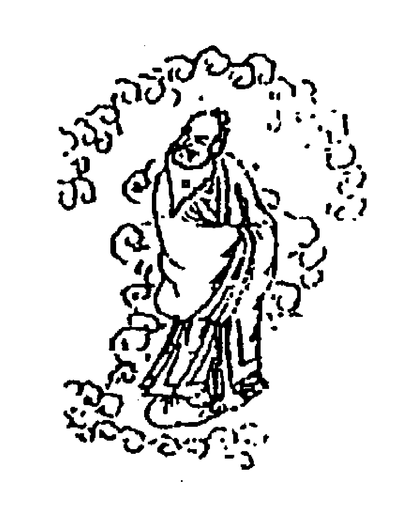

#### 調家宅風水 讓好運相隨
您想探知風水地理的奧秘，卻無人引導的困擾嗎？

您有聽聞陽宅學派甚多，卻苦尋不到如何使用的茫然嗎？

您想在陽宅的神奇領域上，有更進一步的體悟與造詣嗎？

相信同好常有如此感慨：興趣滿滿，卻不知從何下手。

往往費盡金錢，耗盡時日，仍難用上一招半式，真有明師難逢之嘆。

我們有幸得以跟隨“勸學齋主蘇老師“。經其指導後，才深切體悟到古傳地理對生命運程的影響力。

對於形勢、理氣的運用；催財、桃花等問題的處理；家電錯置造成夫妻口角的改善。

甚至稍微加強文昌位，讓你的努力沒有白費，讀書應試，都可招來意想不到的好運。

> （勸學齋陽宅學）常態開班了。讓我們一起享有這惠而不費、助己助人的化解妙方。

勸學齋門人推介代表：林明賢 0932-092-032 林傳傑 0933-456-777

勸學齋主：091-0489-777 （以上電話接受詢問、報名、邀約勘宅）

#### 让斗数命盘成为你的人生指南
- 不查书，可排盘，一难；
会排盘，不会解，二难；
会解盘，不知趋避，三难。

我们原是一群《紫微初阶》与《紫微进阶》的读者，在登门受教后，没想到上述三难，都一一破解了。
你可知道藉由斗数的宫位，就能找出化解灾厄的方位吗？你想运用化星与宫位的巧妙，体验更加年轻貌美的魔力吗？您想获得求财的方位与方法吗？你想进入斗数占卜的宽广领域吗？

- 斗数易学难精，吉凶易知难解。
名师开眼可见，明师追寻不得。

《劝学斋斗数》全省开课十余年了。愿您一起来沈浸在劝学斋的紫微园地中。

- 劝学斋门人推介代表：林明贤 0932-092-032  林信傑 0933-456-777
劝学斋主：0910-489-777
（以上电话接受询问、报名、邀约论命）

#### 五堂課 教會您 取名字
取名如選衣，選衣要合身亮麗，取名要合命有助。

我們曾經在別處學過姓名學，但是卻都無法快速而有效的開始為人命名。

有時候甚至要花上幾天的工夫，才能配出一些勉強可用的名字。

但是這個困擾，經蘇老師短期指導後，都迎刃而解了，取名字竟然變成那麼容易的事。

熊崎氏姓名學與生肖姓名學並重，讓您為自己、他人，以及公司重塑有遠景的生命。

五堂課，學習一套快速有效的命名方法。

- 授課地點：台北、台中、高雄、台南、宜蘭羅東。
- 勸學齋門人推介代表：林明賢 0932-092-032
- 林傳傑 0933-456-777
- 勸學齋主：0910-489-777 （以上電話接受詢問、報名、邀約取名）

> 紫微進階／勸學齋主編著．—— 臺北縣樹林市：勸學齋， 民90
面： 公分．——（紫微階梯：2）
ISBN 986-80041-1-X（精裝）
1．命書
293.1 90021427

#### 紫微階梯Ⅱ

#### 紫微進階

本系列受著作權保護

☆勸學齋主☆勸學齋主☆勸學齋主☆勸學齋主☆勸學齋主☆勸學齋主☆勸學齋主☆

編著者：勸學齋主
發行者：勸學齋
通訊處：台北縣樹林市三德街30巷19弄1號
電話：0910489777 02—25639887
出版日期：九十九年 三月
定價：380元

☆勸學齋主☆勸學齋主☆勸學齋主☆勸學齋主☆勸學齋主☆勸學齋主☆勸學齋主☆

本書如有缺頁請寄回交換