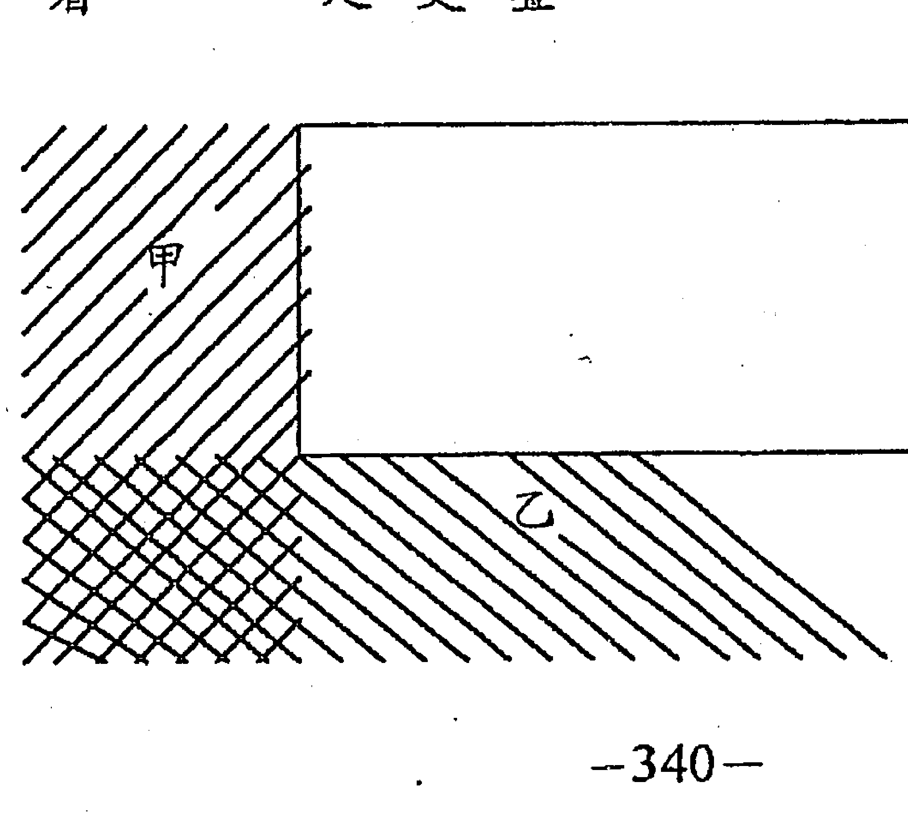
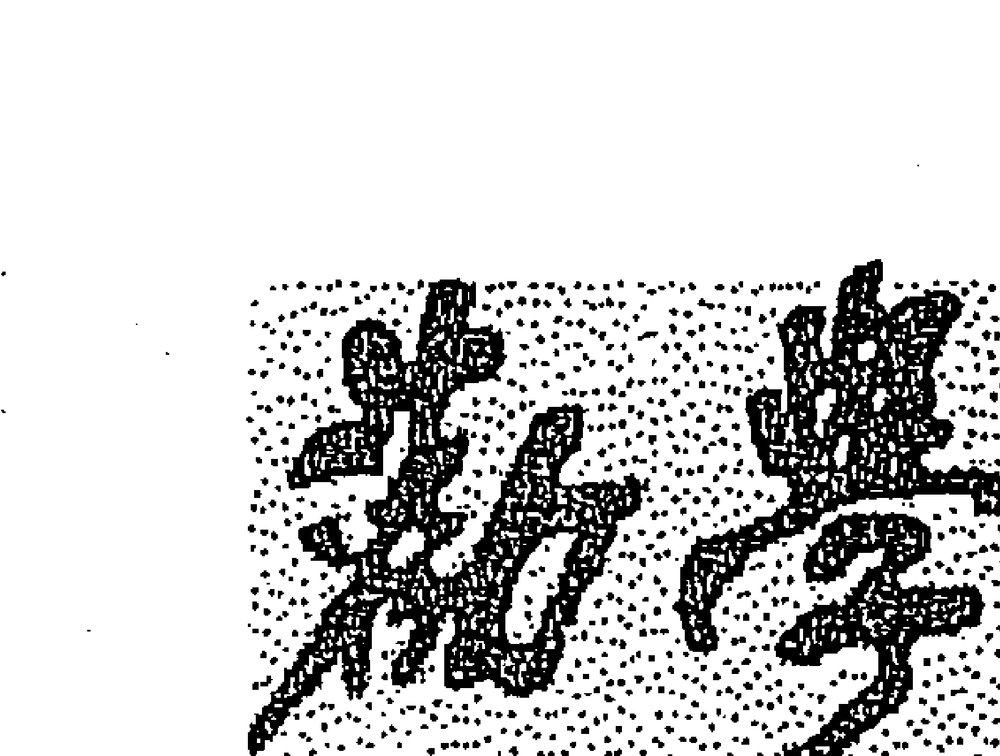
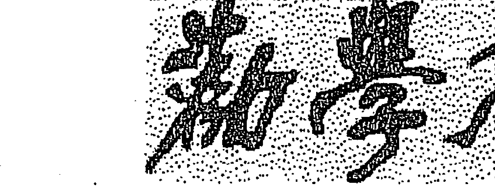
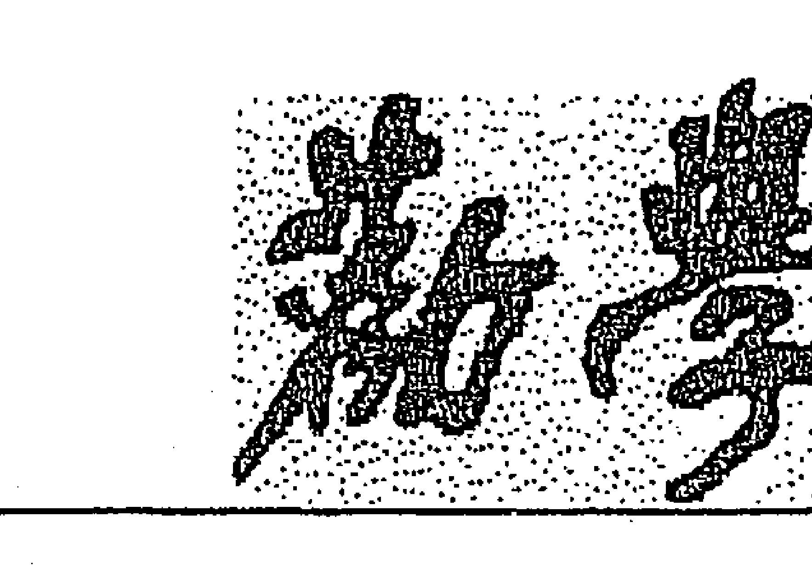
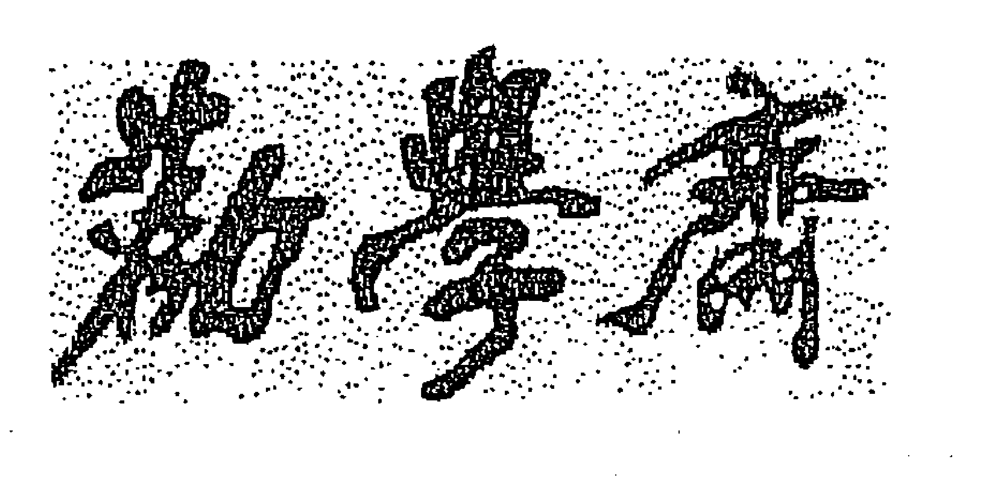
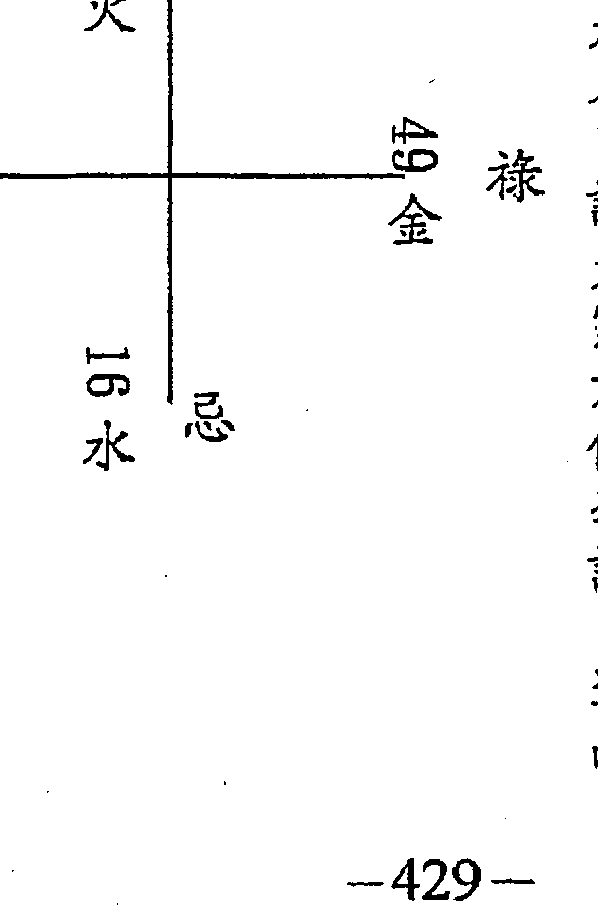

高超的應試考試技巧

# 高超的應試考試技巧之一

因為只要能作弊，就能考上好學校。

# 紫微高階之一

# 星曜全書卷上

勸學齋主

# 勸學齋主自序

打從生命的廊頭走來，最不堪的事是回頭看。

民國七十七年（西元一九八八年）冬天，《紫微初階》《紫微進階》像學生兄弟般地誕生了。多蒙諸位厚愛，他們的足跡走到全球華人世界，常有國內外讀者來電、來信，或相約見面；我也從「業餘的專業研究者」，走到專職的設硯論命、設班教學。

不回頭想，不知已過了十二年多。許多讀者關心勸學齋主的第三本著作，到底何時出版？今天，終於鬆一口氣，可以藉著第三本紫微著作的誕生，跟大家說明。

不過，我知道：再多的說明，都無法抹去我心中對拖延出書的慚愧。

「不預期」地當上命理老師後，更讓我體會許多命理與地理的真、善、美，以及它們的宏觀調控。

一出書就被讀者接納，除了高興外，相對地提高未來著作水準的要求。我反省到讀者的讚賞，源於自《紫微初階》《紫微進階》的明朗步驟與豐富內容；「不留一手」是我的天性，外加從沒想當命理師與命理老師，更使我在寫書時，能暢所欲言。兩本書一出，我享受了「不留一手」的好處；這期間，常與懂得命理的學生或朋友，共勉「不留一手」，發揚命理，有些人疑惑地說：「若把精華和盤托出，那麼拿什麼教學生？」

我的回答是：

- 一、因你「不留一手」，寫書、講課自然有份量，學生將會源源不斷。
- 二、如你擔憂肚子內的東東已寫盡，為要有新而好的內容來教學生，這份「擔憂」會促使你加緊研究，永遠比昨天更進步，這是「不留一手」帶來的好處。
- 三、日日在進步，年年有創見，不用怕沒學生。這是知命者該有的作為，才不會淪為江湖術士。

另外，為了提昇層次，先擱下預計要寫的第三本斗數著作，轉而追溯五術根源，發現五術（山醫命相卜）皆源自道家。

老子《西昇經》中有云：「我命在我不在天。」天乃大自然，瞭解祂就可「順其自然」地運用祂；於是發展成五術。

在研究與論斷命理的過程中，我發現，問命者與論命者，落入一個矛盾的課題，而不自知。論命者以「鐵口直斷」為洋洋自得的終極目標，問命者也追求著「鐵口直斷」的答案。既知答案「必然」如何，豈又能「趨吉避凶」？不知是什麼道理，一方還辯得下去？一方還聽得進去？難道不知道彼此期待的「鐵口直斷」是矛，「趨吉避凶」是盾嗎？請各位以此矛，攻此盾。

「孤陰不生，孤陽不長。」是學命理者耳熟能詳的道理。陰靜不變，陽動必變，通達此點，方能在「鐵口直斷」與「趨吉避凶」之間，認清命理偉大的價值。

命理就是人生，人生不離命理。這裡所謂的「命理」，是具有正確觀念的命理，她的使命是帶給人「當下」就開始起步的幸福與快樂。想要創造未來，只須不斷創造當下。

- 一、宮、星、四化，三位一體，缺一不可。
- 二、論命不要像政治與宗教，老是恐嚇人。知命者知天，知天者以神佛之心為心，除了慈悲，還是慈悲。
- 三、命理很神奇，但不要神話自己，盡可能將道理說明白。

想要寫的心得還不少，所以這本書叫『紫微高階之一』，是不限制自己在有生之年寫多少本的用意。此門學問浩瀚，再多幾本也寫不盡，惟盡心力而已。

# 以是為之序

> 壬午仲夏 勸學齋主 謹序于台北勸學齋

# 目录

# 第一章 紫微高阶排盘

- 1. 宫干冠盖两招新法 1
- 2. 安命身宫 1
- 3. 安十二宫名 6
- 4. 推算命宫的五行局（新法） 6
- 5. 推算紫微在哪宫 7
- 6. 排定主星紫府两大星系 9
- 七、排定左輔、右弼與文曲、文昌 10
- 八、排定祿存與羊刀、陀羅（新法）
- 九、排定天魁、天鉞
- 十、排定生年四化
- 十一、排定天馬——命馬、月馬（新法）
- 十二、排定息神、華蓋（新法）
- 十三、排定紅鸞、天喜與孤辰、寡宿
- 十四、排定天哭、天虛與天空
- 十五、排定天刑、天姚與陰煞
- 十六、排定地空、地劫與火星、鈴星
- 十七、排定大限

## 【附錄】五行妙義

### 五德太過之病與藥

### 五情太過之藥

### 相乘、相侮

### 物理現象

### 十二地支

# 第十二章 星盤與宮盤解開命盤密碼

- 一、何謂宮盤與星盤 29
- 二、星盤兩大結構 31
- 三、宮盤兩種命宮 44

## 四、宮盤與十二星座

- 子宫寶瓶座 86
- 丑宫摩羯座 82
- 寅宫射手座 78
- 卯宫天蠍座 75
- 辰宫天秤座 71
- 巳宫處女座 68
- 午宫獅子座 64
- 未宫巨蟹座 60
- 申宫雙子座 56
- 酉宫金牛座 52
- 戌宫牡羊座 48
- 亥宫雙魚座 46

# 四化啟示 120

# 趨避活法 116

# 星曜直斷 103

# 星性剖析 100

# 星盤結構 99

# 紫微 99

# 第十二章 日生曜鐵關刀 97

# 亥宮雙魚座 95

# 各宮得運失運檢查表 94

# 各宮得運失運檢查表運用方法 89

# 天機

- 星盤結構 176
- 星性剖析 159
- 星曜直斷 154
- 趨避活法（附：太上清靜經） 153
- 四化啟示 153

# 太陽

- 星盤結構 150
- 星性剖析 146
- 星曜直斷 127
- 趨避活法（附：太陽真經） 122
- 四化啟示 121

# 武曲

- 星盤結構 181
- 星性剖析 182
- 星曜直斷 188
- 趨避活法（附：恩主公咒） 209
- 四化啟示 212

# 天同

- 星盤結構 213
- 星性剖析 214

# 天府

- 星盤結構 243
- 星性剖析 244
- 星曜直斷 251
- 趨避活法 267
- 四化啟示 267

# 廉貞

- 星盤結構 243
- 星性剖析
- 星曜直斷 218
- 趨避活法（附：福德正神寶經） 239
- 四化啟示 241

# 太陰

- 星盤結構
- 星性剖析
- 星曜直斷
- 趨避活法
- 四化啟示
- 趨避活法（附：般若波羅蜜多心經）

# 貪狼

- 星盤結構
- 星性剖析
- 星曜直斷
- 趨避活法
- 四化啟示

# 巨門

- 星盤結構
- 星性剖析
- 星曜直斷
- 趨避活法

# 四化啟示 349

# 天相

- 星盤結構 351
- 星性剖析 352
- 星曜直斷 354
- 趨避活法 359

# 天梁

- 星盤結構 361
- 星性剖析 362
- 星曜直斷 364

### 趋避活法

### 四化启示

# 七杀

- 星盘结构
- 星性剖析
- 星曜直断
- 趋避活法

# 破军

- 星盘结构
- 星性剖析

### 星曜直斷

### 趨避活法

## 祿存、羊刃、陀羅

- 星盤結構
- 星性剖析
- 星曜直斷

# 左輔、右弼

- 星盤結構
- 星性剖析

## 文曲、文昌

- 星盘结构
- 星性剖析
- 流年文曲、文昌
- 星盘结构
- 星性剖析

# 化禄、化权、化科、化忌

- 星性剖析

# 第四章 大限、流年论法

# 【勤學齋制式論命】

- 一、論大限 332
- 二、論流年（附：防止車禍外災咒） 282

# 【空白頁附錄】

- 勸學齋斗數藥言 268
- 勸學齋覺察語（一） 242
- 勸學齋覺察語（二） 152
- 勸學齋覺察語（三） 455
- 勸學齋覺察語（四） 445

# 劝学斋觉察语（五）

# 劝学斋觉察语（一）

# 劝学斋觉察语（二）

# 劝学斋觉察语（三）

# 劝学斋自勉语

418 390 374 360 350

# 精要索引

# 談命說理

- 十二宮分四象 222
- 十二宮與十二星座對照 46, 47
- 人生的苦在何處 105, 106
- 三易：連山、歸藏、周易 245
- 五行互藏 440, 441
- 六親有靠並不好 116
- 你也可以成為天才 38
- 宮盤結構對人生的影響 33

# 命盘由宫盘与星盘组成

# 命理是科学的

# 宏观的命理

# 宫性有本性与变性

# 忌入是欠债 忌冲是伤害

# 科为小禄 权为小忌

# 禄权科忌都是贵人

# 化权是義 不可强调

# 網天羅地

# 五大需求

# 論命者是命運圖騰的翻譯官

# 唸經咒的效驗

# 論斷解法

# 流月干支速求法 4

# 流時干支速求法 5

# 三命支干 336

# 四化互藏 441 442

# 五福及五福壽星 215 218 274 321 322

# 正課不讀讀課外 218 219 241

# 丁干欺負女人 庚干欺負男人 30

# 忌是己心 436

# 祿入病位 433 434

# 夫妻之強弱勢 104 105 106—109 112 138 184

# 夫妻不和 138, 139, 185, 191, 193, 194, 195, 196, 197, 225, 236, 252, 274, 275, 295, 298, 345, 381

# 重友轻夫 397, 417

# 夫(妻)星不明 164, 166, 173, 302

# 隔角煞 340, 365

# 夺夫(妻)星 166, 167, 292, 293

# 男性气概与女人味 161, 163, 179, 292, 294, 314

# 夫妻弱势解法 116, 117

# 尊严丧失及解法两招 118, 216

# 心性如一 228, 266

# 是非工廠 163, 164

# 各种疾厄 111, 130, 139, 167, 169, 170, 171, 186, 217, 225, 239, 248, 250, 254, 255, 302, 303

# 源頭不淨

- 45, 226

# 入庫忌

- .200

# 絕命忌

- 201, 202, 370, 371, 453, 454

# 拆馬忌

- 195

# 逆水忌

- 300, 328, 305, 326, 450, 451

# 反弓忌

- 278, 304

# 斗數與姓氏生肖

- 170, 226

# 陽宅與床位

- 384, 400, 196, 198, 207, 208, 225, 253, 255, 277, 278, 299, 314, 315, 343, 344, 356, 359

# 文昌位

- 135, 137

# 子女問題

- 428, 253, 275, 276, 399

| 源頭不淨 | 入庫忌 | 絕命忌 | 拆馬忌 | 逆水忌 | 反弓忌 | 斗數與姓氏生肖 | 陽宅與床位 | 文昌位 | 子女問題 |
|----------|--------|--------|--------|--------|--------|----------------|------------|--------|----------|
| 45       | .200   | 201    | 195    | 300    | 278    | 170            | 384        | 135    | 428      |
| 226      |        | 202    |        | 328    | 304    | 226            | 400        | 137    | 253      |
|          |        | 370    |        | 305    |        |                | 196        |        | 275      |
|          |        | 371    |        | 326    |        |                | 198        |        | 276      |
|          |        | 453    |        | 450    |        |                | 207        |        | 399      |
|          |        | 454    |        | 451    |        |                | 208        |        |          |
|          |        |        |        |        |        |                | 225        |        |          |
|          |        |        |        |        |        |                | 253        |        |          |
|          |        |        |        |        |        |                | 255        |        |          |
|          |        |        |        |        |        |                | 277        |        |          |
|          |        |        |        |        |        |                | 278        |        |          |
|          |        |        |        |        |        |                | 299        |        |          |
|          |        |        |        |        |        |                | 314        |        |          |
|          |        |        |        |        |        |                | 315        |        |          |
|          |        |        |        |        |        |                | 343        |        |          |
|          |        |        |        |        |        |                | 344        |        |          |
|          |        |        |        |        |        |                | 356        |        |          |
|          |        |        |        |        |        |                | 359        |        |          |

# 兄弟劫財

# 官非的看法

# 火災的看法

# 增強應對溝通手腕

# 胸悶解法

# 打坐簡法

# 脾氣疏導法

# 先天法與後天法

# 自然解忌法

# 車禍外災預防法

# 財位及財位佈置法

131 199 200 201 277

258 319 320 330

387 388

149 150

210 211

179

189 190 199

438

456

298 410

# 紫微高阶之一

星曜鐵關刀

勸學齋主

# 第一章 紫微高階排盤

## 一、 宮干冠蓋兩招新法

- ◆ 新招之一：將生年干序數乘以二加一，所得數即為寅宮干序數。

  - ◇ 天干序數：甲一、乙二、丙三、丁四、戊五、己六、庚七、辛八、壬九、癸十。
  - ◇ 例如：壬寅年生人，壬干九乘以二加一等於十九，看個位數即可，九的天干為壬，就將壬填入寅宮，順布天干到丑。又如乙丑年生人，乙干二乘以二加一等於五，五的天干為戊，即將戊填入寅，己填入卯，顺布天干到丑。

- ◆新招之二：

  - 甲年出生者，甲干一定在命盘的戌宫；
  - 乙年出生者，乙干一定在命盘的酉宫；
  - 丙年出生者，丙干一定在命盘的申宫；
  - 丁年出生者，丁干一定在命盘的未宫；
  - 戊年出生者，戊干一定在命盘的午宫；
  - 己年出生者，己干一定在命盘的巳宫；
  - 庚年出生者，庚干一定在命盘的辰宫；
  - 辛年出生者，辛干一定在命盘的卯宫；
  - 壬年出生者，壬干一定在命盘的寅宫；
  - 癸年出生者，癸干一定在命盘的亥宫。

  由上述可知，甲年甲干在戌，乙年开始逆行，至壬年壬在寅，癸年癸干在亥。子丑两宫为何跳过？

  - ◇乃因宫干冠盖即五虎遁月，命盘上十二宫的宫干即出生该年十二个月的月干支，子月的天干与寅月相同、丑月的天干与卯月相同，所以癸年癸干不会在丑，也不会在子，而是在亥。
  - ◇把生年干一定在十二宫中的哪一宫记住，运用十几次后，几乎就可不必再算，直接安上生年干，再顺佈天干，但要记得寅卯要与子丑相同的天干。如丁年生人，直接将丁干安在未宫，再顺佈天干，即戊在申、己在酉、庚在戌、辛在亥、壬在子、癸在丑、又在寅、癸又在卯、甲在辰、乙在巳、丙在午，如此又接上未宫的丁干。

| 己 巳 | 戊 午 | 丁 未 | 丙 申 |
|-------|-------|-------|-------|
| 庚 辰 | 定位图 | 生年干命盘 | 乙 酉 |
| 辛 卯 | (辛) 丑 | (壬) 子 | 甲 戌 |
| 壬 寅 |       |       | 癸 亥 |

  - ◇先以『生年干命盘定位图』帮助记忆，用熟了你可再体会。甲己年通用、乙庚年通用、丙辛年通用、丁壬年通用、戊癸年通用。如何是通用？如上例，丁年生人丁干在未，壬干在寅；壬年壬干在寅，丁干也在未。余此类推，甲己通用之類，其实就是天干五合。
  - ▽此法是民国八十七年二月二十四日晚上在高雄授课后，灵感突起，陆续发现，相当好用，除可当排盘的宫干冠盖快捷法外，亦可当『五虎遁月』。求流月干支。流月干支如何利用此法？如现在是辛巳年十一月，十一月是子月，这是固定的；那月干就用『生年干命盘定位图』将辛套到卯，由辛、壬、癸、甲、乙、丙、丁、戊、己、庚……一直到子宫为庚，故为庚子月。
  - ▽上述『新招之二』亦是同一夜完成，亦可算流月干支如癸未年八月干为何？癸之序数十，乘以二加月份数八，等于二十八，只看个位数八，八为辛，故知為辛酉月。

▽將『新招之一』用來求時干：日干序數乘二減一為子時干序數。無論年干序數求月干，或日干序數求時干，可以發現乘以二的位置在丑，要算正月加一，要算子時減一，丑宮竟然成了樞鈕。

▽不須要透過『五鼠遁時』，運用這一招更可快速求出所須要的時干。上述『生年干命定位圖』在求月干時，可稱為『年干求月干圖』；那麽稍加改易，即可成為『日干求時干圖』。假如今天是甲日，甲在戊宮，即是戊時為甲戌時，根據甲己合之天干五合原則，巳時為己巳時，辰時只須由己

| 丙 | 丁 | 戊 | 己 |
|----|----|----|----|
| 申 | 未 | 午 | 巳 |
| 酉 | 日 | 辰 | 卯 |
| （甲）| 求 | 丑 | 寅 |
| 戌 | 时 | 子 | 壬 |
| （癸）| 干 | 丑 | 葵 |

求時干圖

干退後一個天干為戊辰即可。運用純熟後，真可一兩秒就算出時干。

### 捷法：
一、先熟習宮支所代表的月份，
寅正月、卯二月、辰三月、巳四月、午五月、未六月、申七月、酉八月、戌九月、亥十月、子十一月、丑十二月。
二、由生月落宮起子時，逆數至生時為命宮，順數至生時為身宮。

## 一、安命身宫

## 二、安十二宫名

### 捷法：
一、由已排定之命宫逆佈，命兄夫子財疾遙友官田福父

二、由命宫逆佈，即是逆時針方向。子丑寅卯十二宫，是順時針方向，順為陽、逆為陰，一陰一陽之謂道；道無所不在，由排盤也可以見到。三、兩行六字真言，橫向來看，稱：命遙線、兄友線、夫官線、子田線、財福線、父疾線。每線的兩宮，互為對沖宫。

### 捷法：
一、運用1左手食指根、2食指尖、3中指尖、4無名指尖、5無名指根等五個位置，並將上述次序看成一個圓。（如圖）
二、命宫支子丑、午未在1左手食指根；命宫支寅卯、申酉在2食指尖；命宫支辰巳、戊亥在3中指尖。
三、先找到命宫支所在，以该处起甲乙，顺行这五个位置，数到命宫干即可。由1至5为金、水、火、土、木。
例如：命宫在戊申，找到申在食指尖，由此起甲乙，顺数丙丁在中指尖、戊己在无名指尖，此位置为土，即为土五局。

|   | 辰巳戌亥 | 寅卯申酉 |
|---|---|---|
| 无名指 | 中指 | 食指 |
| 4 土 | 3 火 | 2 水 |
|   |   | 子丑午未 |
| 5 木 |   | 1 金 |

## 四、求出五行局后，它的局数一定是：

水二局、木三局、金四局、土五局、火六局。

## 五、推算紫微在哪宫

### ◆捷法：

一、以生日数除以局数，能整除就取其商数。例如：生日为二十，局数为土五局，刚好可整除，商数为四，由寅宫起一，顺数至四为巳宫，即安紫微。

二、若无法整除，要加小於局数的数字使能整除。所加的数字若为奇数，以商数减去所加的奇数；若为偶数，以商数加此偶数。 如木三局二十日生人，无法整除，二十加一即可整除，商数为七，七要减一为六，由寅起一数到六为未宫，紫微安在未；如金四局十八日生人，十八要加二才能整除，商数为五，因所加的数字二为偶数，五要加二为七，由寅宫起一数到七为申宫，紫微安在申。

三、若商数或商数加上偶数后的数字大於十二，可减去十二，较方便。如二十八日水二局，商数十四，减十二剩二，紫微即在卯。

四、若商數減去奇數後的數字為零或負數，零就是在丑，負一在子，負二在亥，負三在戌，負四在酉。如金四局三日生人，三加一才可以除盡，商數一要減去所加的奇數一，一減一為零，紫微就在丑；如火六局一日生人，一要加五才能整除，商數為一，一要減五為負四，紫微在酉。

## 六、排定主星紫微府兩大星系

### ◇ 紫微星系：

*   紫微天機星逆行
*   隔一陽武天同情
*   又隔二宮廉貞位
*   再隔三宮紫微亭

◇ 定了紫微後，依此打油詩，排紫微星系六顆星。注意紫微星系是逆行，紫微己土、陰土，陽順陰逆。

### ◇紫微是太極、是道，整個星系有間隔的，天機與太陽隔一，天同與廉貞隔二，廉貞與紫微隔三。老子說：「道生一，一生二，二生三，三生萬物。」

### ◆天府星系：

*   天府太陰順貪狼
*   巨門天相與天梁
*   七殺空三破軍位
*   隔宮又見天府鄉

◇天府與紫微在寅申同宮，由此二處分道揚鑣。如紫微順行一宮在卯，天府就逆行一宮在丑；紫微逆行一宮在丑，天府就順行一宮在卯；紫微順行四宮在巳，天府就逆行四宮在亥；紫微由申宮順行兩宮在戌，天府就逆行兩宮在午。

◇定了天府星之後，依此打油詩，排天府星系八顆星。
◇天府是戊土、陽土，帶領天府星系，順行十二宮，陽順行、陰逆行。
◇天府星系順行，每宮都有星，直到七殺與破軍隔三宮，破軍與天府隔一宮，隱合三三歸一。晉朝葛洪《抱朴子·地真》：「人能知一，萬事畢。知一者，無一之不知也；不知一者，無一之能知也。道起於一，其貴無偶，各居一處，以象天地人，故曰三一也。」

## 七、排定左輔、右弼與文曲、文昌

**左輔、右弼捷法：**

*   這兩顆是月系星，先知正月在哪宮。面對命盤，正月的左輔就在左邊的辰宮，右弼就在右邊的戌宮。
*   依月份數左輔順數、右弼逆數，一順一逆，這樣不好記，只須記住左輔由左邊的辰、右弼由右邊的戌，都往上數到月份數即可。
*   如三月生人，左輔由辰起正月，往上數到三月為午宮，右弼由戌起正月，往上數到三月為申宮。
*   排熟之後，可知正月左辰、右戌，七月剛好對調左戌、右辰；四月左右同宮在未，十月同宮在丑。
*   既知左右同宮在丑未，以後算出左輔在子宮，右弼自然在寅，因在丑未同宮之後，他們就分道揚鑣，一顆順行一宮，另一顆逆行一宮。

### ◆文曲、文昌捷法：

*   這兩顆是時系星，先知子時在哪宮。面對命盤，子時的文曲就在左邊的辰宮，文昌就在右邊的戌宮。
*   依出生時文曲順數、文昌逆數，一順一逆，這樣不好記，只須記住文曲由左邊的辰、文昌由右邊的戌，都往上數到出生時即可。
*   如辰時生人，文曲由辰起子時，往上數到辰時為申宮；文昌由戌起子時，往上數到辰時為午宮。
*   排熟之後，可知子時曲辰、昌戌，午時剛好對調曲戌、昌辰；卯時曲昌同宮在未，酉時同宮在丑。
*   既知曲右同宮在丑未，以後算出文曲在子宮，文昌自然在寅，因在丑未同宮之後，他們就分道揚鑣，一顆順行一宮，另一顆就逆行一宮。

## 八、排定祿存與羊刃、陀羅

◆祿存星：其實祿存乃是十天干的臨官位。地盤十二宮在辰戌丑未間，剛好分割四組，每組兩宮是一個五行，即寅卯木、巳午火、申酉金、亥子水，就將天干的五行對號入座。甲乙木配寅卯木，所以甲年生人祿存在寅、乙年在卯；丙丁火配巳午火，所以丙年生人祿存在巳、丁年在午；庚辛金配申酉金，所以庚年生人祿存在申、辛年在酉；壬癸水配亥子水，所以壬年生人祿存在亥、癸年在子；唯有戊己土跟住丙丁火，戊年生人祿存在巳，己年在午。

◆羊、陀：祿存排定後，依「前羊後陀」排羊刃、陀羅。如壬年生人，祿存在亥，羊刃順前一宮在子，陀羅逆後一宮在戌。

## 九、排定天魁、天钺

### ◆天魁星

天魁是陽貴，丑未乃貴人出入之門，未為白天，天魁由此出發，陽貴順行。甲年在未，乙年在申，丙年在酉，貴人不入天羅地網，所以跳過戌，丁年在亥，戊年先到貴人出入之門丑，己年再回到子，庚年重複入貴人出入之門丑，辛年在寅，壬年在卯，癸年跳過天羅地網辰而在巳。

### ◆天钺星

天鉞是陰貴，丑未乃貴人出入之門，丑為夜晚，天鉞由此出發，陰貴逆行。甲年在丑，乙年在子，丙年在亥，貴人不入天羅地網，所以跳過戌，丁年在酉，戊年先到貴人出入之門未，己年再回到申，庚年重複入貴人出入之門未，辛年在午，壬年在巳，癸年跳過天羅地網辰而在卯。

### ◇魁钺的关系

甲戊庚年在丑未對宮坐，乙年在申子、己年在子申、辛年在寅午為三方關係，丙丁年夾戌，壬癸年夾辰。（勸學齋魁鉞排法，或與坊間部份書籍不同，《紫微進階》已說明。）

## 十、排定生年四化

祿權科忌
甲廉破武陽
乙機梁紫陰
丙同機昌廉
丁陰同機巨
戊貪陰右機
己武貪梁曲
庚陽武陰同
辛巨陽曲昌
壬梁紫左武
癸破巨陰貪

◇甲乙丙為天，丁戊己為地，庚辛壬為人，癸為暴變。無論天干或地支，一週期之尾皆有變化、淘汰之意，以便迎新。

◇天人合一，故天由艮卦管轄，甲干由歷艮土的廉貞化祿；地由坤卦管轄，太陰屬水，水為後天坎，代先天坤為用，故丁干由太陰化祿；人由乾管轄，太陽屬火，火為後天離卦，代先天乾卦為用，故庚干由太陽化祿。

## 十一、排定天馬（命馬、月馬）

◆天馬：我們將之分為命馬與月馬，用生年支求出的天馬稱命馬，用生月支求出的天馬稱月馬。其實，有地支就有天馬，一般也知排流年天馬，不管是不是用流年支来排的吗？据此，大限天马的力量可忽略不得。但

*   寅午戌的马跑到寅的对宫申
*   申子辰的马跑到申的对宫寅
*   巳酉丑的马跑到巳的对宫亥
*   亥卯未的马跑到亥的对宫巳

◇命马用生年支，月马用生月支（不论节气），大限马用大限命宫支，流年马用流年支，流月马用流月支（不论节气）。

## 十二、排定息神、华盖

◇三会：亥子丑三会北方，寅卯辰三会东方，巳午未三会南方，申酉戌三会西方。

◆命馬排定後，依三會順序排入息神、華蓋。

◇命馬一定在寅申巳亥，息神一定在子午卯酉，華蓋一定在辰戌丑未。比如說：寅、午、戌年出生者，命馬在寅的對宮申，申酉戌三會，所以息神在酉、華蓋在戌。

◇古書上說：「華蓋永在三合高處。」亦即寅午戌年出生的人，他們的華蓋一定在寅午戌三合的墓庫戌宮，其餘仿此。

## 十三、排定紅鸞、天喜與孤辰、寡宿

◆鸞喜：子年紅鸞在卯，逆數到生年支，即安紅鸞；紅鸞排定後，天喜永在紅鸞對宮。

◆孤寡：三會年生人，孤寡位置相同，皆在三會宮外，前孤後寡。

*   ◇亥子丑年生人，孤辰在前即寅，寡宿在後即戌；
*   ◇寅卯辰年生人，孤辰在前即巳，寡宿在後即丑；
*   ◇巳午未年生人，孤辰在前即申，寡宿在後即辰；
*   ◇申酉戌年生人，孤辰在前即亥，寡宿在後即未。

◇由此知孤辰只入四馬地寅申巳亥，寡宿只落辰戌丑未四墓地。

## 十四、排定天哭、天虚与天空

◆哭虚：子年哭虚同起於午宫，哭逆虚順，数到生年支。

◆天空：古書說：『駕前一位是天空。』駕即聖駕，太歲之謂也。生年支即生肖宮位的順前一宮，就是天空的位置。如寅年生人在卯，卯年生人在辰等等。

## 十五、排定天刑、天姚與陰煞

*   ◆刑姚：刑姚為月系星，以生月來排。本來天刑正月起於酉，天姚正月起於丑，巳酉丑三合，所以我們以巳為正月生人的『刑姚本方』。由巳起正月順數到生月，以此落宮為命宮，他的財帛宮安天姚，他的官祿宮安天刑。
*   ◆陰煞：正月陰煞起於寅，逆行六陽宮（寅、子、戌、申、午、辰）。十二個月分配在六個宮位，所以正、七月陰煞在寅，二、八月在子，三、九月在戌，四、十月在申，五、十一月在午，六、十二月在辰。

## 十六、排定地空、地劫与火星、铃星

*   ◆ 空劫：子时空劫同起於亥，劫顺空逆，数到生时支。因为起於亥，亥为十月，命身宫由生月宫逆至生时为命，顺至生时为身，所以十月生人地空守命，地劫守身。
*   ◆ 火星：先以生年支范定火星的子时起点，以寅申巳亥四马各带领其三合局，亦即寅代表寅午戌年生人。寅申巳亥分配於丑、寅、卯、酉，这是子时火星位置，在顺数至生时即安火星。举例来说，卯年卯时生人，卯年为亥卯未这一组，由丑寅卯酉数寅申巳亥，亥落酉宫，即是子时火星在酉，顺数到卯时为子宫安火星。
*   ◆ 铃星：先以生年支范定铃星的子时起点，以寅申巳亥四马各带领其三合局，亦即寅代表寅午戌年生人。寅在卯，申巳亥皆在戌，这是子时铃星位置，再顺数至生时即安铃星。举例来说，卯年卯时生人，卯年为亥卯未这一组，铃星由戌宫起子时，顺数到卯时为丑宫安铃星。

## 十七、排定大限

◆第一大限在命宫：以局数做起运的岁数，如木三局第一大限在命宫管三到十二岁。

◆阳男阴女顺行、阴男阳女逆行：第二大限依阴阳男女来决定大限的顺逆。男本为阳，女本为阴，所以阳男阴女顺行；若男为阴、女为阳，反了，所以以逆行。

▲本章为高阶排盘，帮助已会掌上排盘者更加深入并加快速度。
▲如无法理解本章者，请由《紫微初阶》《紫微进阶》入门，循序渐进。
▲涉入研究阶段，必要会上排盘，对星曜的轨迹，瞭如指掌，对星性才能深入，对论盘才能巨细靡遗。
▲快速排盘，一张命盘只需两分钟；命宫坐星，也只需十五秒就知道。只要你活用本章，即可如是快速。

### 【附录】

#### 五行妙义（基本的五行生剋，请看《紫微初阶》《紫微进阶》）

> ◇朱子曰：太极分开，只是两个阴阳。阴气流行则为阳，阳气凝聚则为阴，消长进退，千变万化，做出天地间无限事来。

##### ◇五德太过之病与药
##### ◇相乘、相侮：一般只知相生、相剋，鮮少論及相乘、相侮，無形中造成迷信生剋的吉凶；忽略了杯水無法生大木，也無法剋旺火；微木生不了大火，也剋不了強土。諸如此類，卻在人間也隨時隨地在發生，如弱土剋不了強水，造成了「土石流」，大家疾呼這是「大自然的反撲」，沒錯！陰陽五行是大自然的元素，土石流就是「五行相侮律」。

##### ◇五情太過之藥

*   以喜（火）治悲（金），故以諠浪襲狎之言娛之。
*   以悲（金）治怒（木），故以慘愴苦楚之言感之。
*   以怒（木）治思（土），故以汙辱欺罔之言觸之。
*   以思（土）治恐（水），故以慮彼志此之言奪之。
*   以恐（水）治喜（火），故以禍起倉卒之言怖之。
*   仁（木）或失於柔，故以義（金）斷之。
*   義（金）或失於剛，故以禮（火）節之。
*   禮（火）或失於拘，故以智（水）通之。
*   智（水）或失於詐，故以信（土）正之。
*   信（土）或失於迂，故以仁（木）疏之。

##### ◇物理現象：

*   熱子（木）
*   光子（火）
*   引子（土）
*   聲子（金）
*   電子（水）

##### ◇新加坡田新亞在《易卦的科學本質》中說：

*   木——高能態物質
*   金——固態物質
*   火——氣化作用
*   金生水——潮解作用
*   土——可塑態物質
*   水——液態物質
*   土生金——還原作用
*   水生木——光合作用
*   木生火——燃烧作用
*   金克木——分裂现象
*   土克水——吸收现象
*   火克金——溶化现象
*   木克土——吸摄现象
*   水克火——冷却现象

##### ◇十二地支

| 大夫 | 家意 | 卦象 | 四季 | 月别 | 地支 |
|------|------|------|------|------|------|
| 雷 | 雄猛 | 泰卦 | 孟春 | 正月 | 寅 |
| 柳 | 柔顺 | 大壮 | 仲春 | 二月 | 卯 |
| 袁 | 尊贵 | 夬卦 | 季春 | 三月 | 辰 |
| 纪 | 敏捷 | 乾卦 | 孟夏 | 四月 | 巳 |
| 许 | 进行 | 姤卦 | 仲夏 | 五月 | 午 |
| 驯服 | 朱 | 遯卦 | 季夏 | 六月 | 未 |
| 杜 | 智慧 | 否卦 | 孟秋 | 七月 | 申 |
| 曲 | 聪明 | 观卦 | 仲秋 | 八月 | 酉 |
| 成 | 忠诚 | 剥卦 | 季秋 | 九月 | 戌 |
| 阮 | 富有 | 坤卦 | 孟冬 | 十月 | 亥 |
| 李 | 富有 | 复卦 | 仲冬 | 十一月 | 子 |
| 田 | 勤劳 | 临卦 | 季冬 | 十二月 | 丑 |

# 第二章 星盘与官盘解开盘

赛 碼

## 一、何谓宫盘与星盘

*   ◆命盘是由宫盘与星盘组成。
*   ◇宫盘即命、兄、夫、子、财、疾、迁、友、官、田、福、父等十二宫，它们规律地逆布在十二地支宫位上，有本命盘、大限盘、流年盘、流月盘、流日盘、流时盘。
*   ◇星曜也有盘，授课时我常强调，也要把星曜看成一个盘。把紫微星系与天府星排到十二宮中，粗看似無規律，但如果我們回到排盤檢視，紫微星系是很規律地一星管一線，次序間隔也是不變的；天府星系亦是如此，請各位仔細讀第三章每一顆星的「星盤結構」，就可瞭解，也能發現星盤的豐盛內涵，包括論斷、哲理、機密等等。

◇舉例來說：太陰代表女人，命書常說「女命首重福德」，太陰的福德宮一定是巨門，巨門主口，我研究到此，雀躍不已，只要修好口、修飾言辭，就可成為一個好命的女人，當然巨門的意義還有很多可推論；繼而發現，欺負女人的天干是丁，因為它使太陰化祿，卻讓巨門化忌，丁干是地（丁、戊、己，由坤卦掌管）之天；欺負男人的天干是庚，因為它使太陽化祿，卻又讓永在太陽夫妻的天同化忌，天同是福星，庚干是人（庚、辛、壬，由乾卦管轄）之天。

◇又譬喻說：宮盤有命宮，也可視紫微為星盤的命宮，無論紫微在宮盤的那一宮，它不會失去這個作用。

◇有了星盤的看法結合宮盤，我們可同步運用飛宮與飛星，使斗數對人的價值更加凸顯，使看盤的視野加大，不再片面。

◆本書稱為「星曜鐵開刀」，就是要引領大家透視星曜，所以提出「星盤」這個名詞，發前人之所未發，言前人之所未言，希讀者用心沁入，當會會心一笑。也希望將好處帶給周遭親朋，這不是功德，而是讓智慧散發，自己就會生活在智慧的喜悅中。

## 一、星盤兩大結構

◆你屬於哪種星盤結構？排出命盤後，請理解下列數則，即可判斷出來。

◇星盤兩大結構：

### 七殺、破軍、貪狼（簡稱殺破狼）
### 天機、巨門、天同、天梁（簡稱機巨同梁）

*   把紫微星系和天府星系排到命盤上，各種排列組合所產生的星曜會過碰撞，產生了兩大結構，即：殺破狼、機巨同梁。
*   紫微星系包括：紫微、天機、太陽、武曲、天同、廉貞等六顆星曜。
*   天府星系包括：天府、太陰、貪狼、巨門、天相、天梁、七殺、破軍等八顆星曜。
*   殺破狼星盤結構包含：紫微、武曲、廉貞、天府、貪狼、天相、七殺、破軍等八顆星曜。
*   機巨同梁星盤結構包含：天機、太陽、天同、太陰、巨門、天梁等六顆星曜。
*   看你的命宮和遷移宮，只要見殺、破、狼其中一顆，即屬殺破狼星盤結構；見機、巨、同、梁其中一顆，即屬機巨同梁星盤結構。這是最簡單的判別法，不必核對上一則敘述即可知道，惟須補充記住太陰、太陽為機巨同梁星盤結構。

◇ 殺破狼星盤結構為變動格局，屬陽、動、武；
◇ 機巨同梁星盤結構為幕僚格局，屬陰、靜、文。

## ◆ 星盤結構對人生的影響是什麼？

判別出何種星盤結構後，請理解下列幾則陳述，即可改善換大限時的不適與人際關係，包含夫妻、同事、合夥人等等我與他人的關係。

### ★影響一：厲陽的殺破狼星盤結構，行運若也厲陽，覺得啥事都蠻順當的，這與成敗盈虧無關；若行限一入厲陰的機巨同梁，最初三年內總覺得不習慣，縱使金錢事業無憂，也覺得無趣。厲陰的機巨同梁星盤結構者，若行厲陰的大限，縱使財官不怎麼好，心裡也不會卡卡的；若行厲陽的殺破狼大限，財官再順也覺得不習慣。這種行運與本命的陰陽不合，產生與運氣好壞無關，多生出來的不適感，若不解決，換運的無適感將如影隨形。

如此顯現了一陰一陽之為道，無論你是陽命或陰命，都脫離不了這個自然的大道規律。

若本命為厲陽的殺破狼星盤結構，第一大限必在命宮，無論大限順行或逆行，第二大限必為厲陰的機巨同梁星盤結構，第三大限必為厲陽的殺破狼星盤結構，第四大限又變為厲陰的機巨同梁星盤結構，如此一陰一陽，規律更迭；若為厲陰的機巨同梁命格，第一大限即在命宮，無論大限順行或逆行，第二大限必然是厲陽的殺破狼星盤結構，第三大限一定變回厲陰的機巨同梁星盤結構，第四大限再變為厲陽的殺破狼星盤結構，如此一陽一陰一陽一陰，規律更迭。

### 無端煩惱是白受的。

### 趨避活法
屬機巨同梁陰性星盤結構者，行完機巨同梁大限，剛換殺破狼大限，週遭的事物都動起來，好生不習慣，這時候你要換個心態，跟著動起來就沒事了；反之，屬殺破狼陽性星盤結構者，行完殺破狼大限，剛換機巨同梁大限，週遭的事物彷彿都缺乏生氣，要習慣這種沉悶，有點不自然，但須要你轉變心態，適應文靜的種，把它當作一種休息就沒事了。如果對環境適應力強的人，他本身就可以很自然地配合生活的律動；若有不適應者，從星盤結構了解是陰陽不合引起的，隨即主動配合，可省掉不少莫名其妙的時間。

### 影響二
把星盤兩大結構的人視為兩大族群，當然要細膩的話須加上下面所述兩種命宮的看法，以及行限的轉變。行限的轉變即如某一「殺破狼的人」行「機巨同梁運」，跟機巨同梁的人行事上就較為接近一點；兩種命宮請參考下一節。我們先來了解兩大族群的思慮與行事不同處：

### 殺破狼者：
行事、思慮轉變快速，盡量求快，可抄近路則抄近路，能走後門就走後門，為達目的不在乎過程，對於目標作點的完成與快速突破，日常生活的事不習慣把相關連的一併考慮，比如要去找友人，打電話問友人缺些什麼東西，但明知會面後當夜要在友人處過一夜，卻沒想到要一併說。對於機巨同梁者會感覺他太囉唆，想得太多，管的太多（關心也會造成殺破狼的壓力）。

### 機巨同梁者：
行事按部就班，思慮由點而線，若要快也要照步驟來，如古書所說：「機月同梁為胥吏。」如公文書一般，逐一申報，逐級審核，對日常生活的事相關連的一併考慮，寧可一一想遍，不習慣到時再說。對於殺破狼者會感覺他變化太多、太大，而且不知為何而變，毫無章法，對殺破狼的不循序漸進很難苟同。

如此一來，若對方只是泛泛之交，倒也無事；但如果是工作合夥人如同事、事業合夥人如股東、感情合夥人如夫妻，因生活太接近了、工作關係重疊了、彼此須要協調的事多了，工作順利時，疏忽了欣賞對方的長處，到了事情違逆時，就把不合的感受一一迸出來，這裡我們可發現，忌星來臨之前，它早已逐日挖掘了陷阱。

### ◇趨避活法：
老天爺造人不離陰陽律，陰陽合則萬物生。既然殺破狼星盤結構為陽，機巨同梁星盤結構為陰，唯有陰陽合才會生萬物，重點在這個『合』字。既然陰陽律如此，為何常見不合呢？乃因有形世界上有一個定律也屬陰陽律的範疇，那就是陰陽互剋，『剋』的淺層表像是排斥，深層意義是『勝』，但如俗氣的『勝』，依然造成排擠效應，深層的『剋』必是『智慧型的勝』。如何是智慧型的勝？就是能學習別人之長處以補自己之短處，如此可得『剋之真諦』，學習自己所不習慣的是『自剋』，自剋而後方能剋人，也就是自勝而後方能勝人。用此方式『勝人』，即是『涵容對方、學習異己』的境界。

殺破狼者要欣賞機巨同梁者的周到，尤其對付須要步步為營的事，委由他們來做，容許他們按部就班，也稍加學習他們的點線面，相處既融洽又可促使自家進步，何苦不為呢？

機巨同梁者要欣賞殺破狼的不受拘限，尤其要剋期完成的事，放心交給他們做，不要問他怎麼做以及過程，這樣問會太欺負他了；縱使不必改掉自己的按部就班，也可稍加學習他們的活潑變化，讓自己的黑白塗上彩色，既可融合又可進步，又何必故步自封呢？

-   ◆ 你也可以成為天才，只要你願意。
-   ◇ 如果你是殺破狼的人，你無法接受機巨同梁者的習性，一直以本身為標準，不願學習對方、增益自己，那麼你只好繼續接受人際間的不和諧，與自心無端無盡的煩悶；反之，如果你是機巨同梁的人，你無法接受殺破狼的習性，一直以本身為標準，不願學習對方、增益自己，那麼你只好繼續接受人際間的不和諧，與自己心無端無盡的煩悶。

### 從命理與學理上發現，兩大族群的「互須性」，與任何人都有改善的「必要性」及「必能性」
如此一來，過去要生氣的事，現在欣然接受；過去無法做的事，現在得心應手。以筆者來說，我屬機巨同梁星盤結構者，什麼都由點想到線，再由線想到面，如不學殺破狼，那麼這本書必然尚未開筆。

如你能發覺自我，也就是認識自我，並承認自己所屬星盤結構的長處與短處，將生活中處理事情與思考問題的習性，攤在自家內心的陽光下。不要客氣，下定決心好好批判自己；不要羞慚，因為絲毫不用向別人說。再過來，由朋友圈中找出另一星盤結構者，歸納出他的長處，一一學習，並在日常生活中實行。只要半年的時間，你會發覺自己的了不起。

-   ◆殺破狼星盤結構者如主帥，機巨同梁星盤結構者如師爺。我們不要管主帥大或師爺地位高，主帥不會傻到不聽師爺的籌劃，師爺也不會膽敢取代主帥，他們兩個是互須互補的。因此，殺破狼與機巨同梁的人，彼此是互須互補的，只因不察而產生排擠。請殺破狼者細數一下，周遭有多少免費師爺，而被你忽略了？也請機巨同梁者細究一番，自己已排擠掉多少主帥？
-   ◆不要跟自己過意不去，把互須互補的對象排擠掉；不要忽略自家本能，將截人之長補己之短的能力放棄掉。任何人只要願意，都可以改善。因為我已經解開星盤結構的密碼，讓我詫異不已，細讀本書你可感同身受。每個生命都是神聖的，每個人的命盤都顯示全然具足與全備，只因忽視自己、忽略內在，僅以偏頗的自己來過生活，失卻了全然的自己。
-   ◆依據一六共宗，一為命、為陽、為用、為顯，六為疾、為陰、為體、為密。所以殺破狼者，是以殺破狼為用而已，其體必是機巨同梁結構；反之，機巨同梁者也只是以之為用而已，其體必然是殺破狼。這就是我所說的本已具足，聰明的你應該可以豁然，不再拒絕你的本體，不再忽視自己的本能。以下我一一說明每一顆星坐命，他的體是屬於什麼星盤結構。
    - 【紫微坐命】屬殺破狼星盤結構，其體為天同，屬機巨同梁星盤結構。
    - 【天機坐命】屬機巨同梁星盤結構，其體有紫微照，屬殺破狼星盤結構。
    - 【太陽坐命】屬機巨同梁星盤結構，其體為廉貞，屬殺破狼星盤結構。
    - 【武曲坐命】屬機巨同梁星盤結構，其體有太陽照，屬機巨同梁星盤結構。
    - 【天同坐命】屬機巨同梁星盤結構，其體有武曲照，屬殺破狼星盤結構。
    - 【廉貞坐命】屬殺破狼星盤結構，其體為天機，屬機巨同梁星盤結構。
    - 【天府坐命】屬殺破狼星盤結構，其體有太陰照，屬機巨同梁星盤結構。
    - 【太陰坐命】屬機巨同梁星盤結構，其體有貪狼照，屬殺破狼星盤結構。
    - 【貪狼坐命】屬殺破狼星盤結構，其體有巨門照，屬機巨同梁星盤結構。
    - 【巨門坐命】屬機巨同梁星盤結構，其體有天相照，屬殺破狼星盤結構。
    - 【天相坐命】屬機巨同梁星盤結構，其體有天梁照，屬機巨同梁星盤結構。
    - 【天梁坐命】屬機巨同梁星盤結構，其體有七殺照，屬殺破狼星盤結構。
    - 【七殺坐命】屬殺破狼星盤結構，其體為太陰，屬機巨同梁星盤結構。
    - 【破軍坐命】屬殺破狼星盤結構，其體為天梁，屬機巨同梁星盤結構。

體為陰為密，陰密當然不陽顯，不陽顯易使我們放任它退化。本體越退化就越弱，體弱了，用如何能強？換言之，作為體的疾厄弱了，作為用的命宮縱使還強，也只是外強中乾，撐不了多久的，只待忌星一來，我們所謂的厄運就來臨了。光就厄運來解，就是不改因、只改果，這樣做的成效必然有限。

我也承認厄運是業障造成，命盤可解讀一個人的業障，它主要藏在命宮以及化忌中，也分散在各星曜中。僅以命宮來說，稍有學習斗數者都知，命宮可看一個人的脾氣個性、行事方式、相貌、一生運勢；一位西洋哲學家這麼說：行動可以養成習慣，習慣可以造成個性，個性可以改變命運。斗數的命宮不就是早就透露了這個訊息了嗎？所以我常說：個性不改、心念不改，命運無法改。

只改果、不改因，有如室內水管漏水了，我們就一直忙著清除積水，以布塞漏洞，而不去關掉水源、換新水管。業障是一部機器，產出惹我們麻煩的產品，它的名字叫『厄運』，改運只是改果，也就是忙於清除這些產品，這樣做有無效果？我的答案是有，但要一直忙著清除，不如關掉機器的開關。因此，無論就任何角度來論，重要的是『找到開關』。

結論：積極強化本體，才是改善命運的根本之道。殺破狼星盤結構者，努力開發本體的機巨同梁星盤結構的本能，努力接受並學習機巨同梁者的思考與行事方式；機巨同梁星盤結構者，努力開發本體的殺破狼星盤結構的本能，努力接受並學習殺破狼者的思考與行事方式，我們要互勉的是：我們並不缺什麼，本已具足，缺的只是內求、自省，藉由星盤密碼，解開他、解開自己，不要跟自己過意不去，要獲得的是喜悅，而不是發現更多的不滿足。

## 三、命盤兩種命宮
命盤上命宮本來只有一個，但為何有兩種命宮？

完成排盤，地盤命宮是為本命命宮，流年行限又有大限命宮、流月命宮、流日命宮、流時命宮等六個，為何我只說兩種命宮？顯然我所指的兩種，並非這個範疇。授課時，我常用「氣結點」這個名詞，但氣結點有如太極、丹田一般，處處皆可立太極，人身無處不丹田，所以氣結點在命盤上無所不在，但不同的氣結點所管轄的範疇不一樣，有些須要另取名字，以便記憶並彰顯功能。

### 兩種命宮：命宮與暗命宮。
命宮所涵蓋的如上述有六個；暗命宮有兩個，一是生年干所在之宮位，一是生年支所在宮位即生肖宮位。（按：辛年、壬年出生者，生年支所落的暗命宮有兩個。壬寅年出生者，有壬寅、壬子兩宮，壬寅重於壬子；壬子年出生者，有壬子、壬寅兩宮，壬子重於壬寅；辛丑年出生者，有辛丑、辛卯兩宮，辛丑重於辛卯；辛卯年出生者，有辛卯、辛丑兩宮，辛卯重於辛丑。）

### ◆暗命宮有何重要影響？
如上一節所說兩大星盤結構，你如粗枝大葉會認為這樣的分法太粗糙，忘了去理解兩大分類相同類別的相同處，就像血型分A、B、AB、O型，西洋星座分十二星座，分法雖然粗糙，但一定有共通處；若要細微，血型A會有AO的情況，星座會有上升星座的交疊。暗命宮讓你原本是殺破狼摻合機巨同梁，反之亦然。也就是說：你的命宮原屬殺破狼星盤結構，但因暗命宮卻屬機巨同梁星盤結構，你的屬性就會摻有一些機巨同梁星盤結構之特性。

假使一張命盤，生年忌並不在命宮，而是在生肖宮位，也就是生年支的宮位，一出生第一個流年就是生年支的宮位，流年逢生年忌，不是身體不健康，也是多囉唆；再說生年干所在之宮，若逢生年忌，必定自化忌，不要忽略了一生的祿權科都由此宮化出，縱使哪宮或哪個大限得祿權科，都由此化出，此宮生忌自忌謂之「源頭不淨」。源頭不淨使一個人行好運時都隱藏禍心，做事時每每知道要如何做，才能避開災禍，臻於美好，但總是在環境中存在著不能不理会的阻礙，如人情包袱、壓力、團體、好意遊說等等。

## 四、宮盤與十二星座
根據《四庫全書》有關「星學」中記載「周天十二宮及卦位分野」：

- 【子宮】女、虛、危，玄枵，子坎齊青，寶瓶座（水瓶座）。
- 【丑宮】斗、牛，星紀，丑艮越揚，摩羯座（山羊座）。
- 【寅宮】尾、箕，析木，寅艮燕幽，人馬座（射手座）。
- 【卯宮】氐、房、心，大火，卯震宋豫，天蠍座。
- 【辰宮】角、亢，壽星，辰巽鄭兗，天秤座。
- 【巳宮】翼、軫，鶉尾，巳巽楚荊，處女座（少女座、室女座）。
- 【午宮】柳、星、張，鶉火，午離周邕，獅子座。
- 【未宮】井、鬼，鶉首，未坤秦雍，巨蟹座（天蟹座）。

### ◇ 十二宮剪影
星座解釋套在宮盤中，讓人直呼神奇。如命宮在申是雙子座，兄弟宮在未是巨蟹座，夫妻宮在午是獅子座，子女宮在巳是處女座，財帛宮在辰是天秤座，疾厄宮在卯是天蠍座，遷移宮在寅是射手座，交友宮在丑是摩羯座，官祿宮在子是寶瓶座，田宅宮在亥是雙魚座，福德宮在戌是牡羊座，父母宮在酉是金牛座。

- 【申宮】觜、參，實沈，申坤晉益，雙子座。
- 【酉宮】胃、昴、畢，大梁，酉兌趙冀，金牛座（牡牛座）。
- 【戌宮】奎、婁，降婁，戌乾魯徐，白羊座（牡羊座）。
- 【亥宮】室、壁，諏訾，亥乾衛豳，雙魚座（南魚座）。

如上例命坐申，看下一節，以雙子座之全部解釋十二宮，以巨蟹座之兄弟部份解釋我與兄弟如何，以其全部解釋做為兄弟姊妹本身之種種，六親皆如是看；至於財帛看天秤座財帛的部份，官祿看寶瓶座官祿的部份，疾厄宮看天蠍座疾厄的部份。

#### 子宮寶瓶座（人道主義、相互倚賴、分享他人、奉獻群體）

##### 命宮
*   不自大，對權力反感。知性豐富、理想高尚、情誼篤實。
*   可以作為群體指導者，會以每個人的人格來指導，並非強制獨裁型。
*   創造力豐富，想法超人一步，所以一開始不容易被接納，被視為怪人。
*   對自己的想法有絕對信念，寧可頑固地放棄眼前的機會，也不容許妥協。
*   正面的寶瓶座，豐盛的人類愛使他視金錢與地位為小事，不分彼此，招來一堆朋友；負面的寶瓶座因不屈服於權力，脫離了社會秩序，對長輩有無心的抑制行為。
*   熱誠則成功，冷酷則失敗。對應的部位是腦部容易神經痛、小腳容易骨折，怕冷。

##### 兄弟姊妹
*   兄弟姊妹有兩三人，關係不很親密。可能有兄弟姊妹或親戚，成了你前程的障礙。

##### 夫妻
*   喜歡知性及性格的對象，會經歷兩次以上的戀愛。
*   因旅行、交際而認識情人的機會很多，戀愛期間有不拘形式的同居。

##### 子女
*   小孩兩三個，有他們的將來性，但也要為他們勞苦。

##### 財帛
*   有賺錢的天才，卻多是沉沉浮浮，缺乏安定性；為了安定，必要有兩個以上的收入來源。
*   缺乏理財或儲蓄的觀念或實際作為，為了自己的興趣如書籍、收藏等等，不顧明天的飯錢，也可能放棄要債的權力，致使阮囊羞澀。手頭現金留不住，不尊重金錢，視之為俗物，所以沒錢也不覺得有什麼不對。

##### 疾厄
*   注意足踝、手、脖子，以免受傷。整個循環系統如血液、血管、心臟，也是須要注意的弱點。此外，荷爾蒙失調、心律不整、靜脈瘤、水腫、眼疾、濕疹、痙攣、痛風、胃病、消化不良等。
*   要注意營養均衡，不要遺漏攝取肉類、魚貝類、乳製品、蔬菜類、菠菜、車前草、荷蘭芹、檸檬等。

##### 遷移
*   如強烈表現無視於道德、法律等規範，將不利於交際與開展。

##### 交友
*   朋友是你一生中很好的商量者，而你會成為友人的領導者。
*   人際關係採博愛主義，凡是人類都是朋友。只要察覺自己錯誤，會很熱誠歡迎對敵成為伙伴。

##### 官祿
*   豐富知性與廣博愛心，加上銳利推理，並肯定每個人的人格，可為優秀的指揮者。
*   生存於未來的自由，不適合單調的重複作業與機械式工作。
*   思想與想像力寬闊，會堅守意見，信念很強，所以如自我主張而不讓步，會讓上司麻煩。雖與部屬及晚輩親密相處，但你會對古板的上司、只顧自我的上司、害怕危險的上司，頗不以為然，上司對你也會有戒心。
*   重要的是，你要得到自由呼吸的工作環境，必能活用才能。

##### 田宅
*   家人有助，也有可能得祖產。

##### 福德
*   有博愛精神，但別人很難瞭解，常被誤解為無情。
*   喜與有共同目標者做集體討論，討厭老套和束縛。

#### 丑宮摩羯座（追求成功、自我行動、只重成功、不重成長）

##### 命宮
*   因對社會地位有強烈的憧憬，相對地性格稍嫌黯淡，社交也嫌不足，但耐力、持久力超強，是步步扎實的人。表現嚴格且冰冷，對己對人都是嚴格的。
*   喜歡孤獨，重視現實，不沈溺虛幻，任何時候都不忘情。
*   看似保守，內心卻隱藏激烈熱情；雖是保守，內心有強烈的自我。先天性固執，你說你的，我做我的。
*   若因儉省導致枯燥無味，容易悶在自己的象牙塔，使視野心胸狹隘。
*   如能多些溫暖、溫和、柔軟，與人多談一些話，就可有更好的人生。
*   追求成功，忽略成長。如面對大壓力，將之化為小壓力，再找出路，就會成功；若遇大壓力，以逃避的心態和方式，居功諉過，不去面對它、化解它，運氣不會好的。對應部位是膝蓋、關節、牙齒。

##### 兄弟姊妹
*   有好幾個兄弟姊妹，有些會帶給你悲傷或敵意，造成對立的麻煩。

##### 夫妻
*   對戀愛有強烈的憧憬，但因自我壓抑，拙於以行動及言語來表現愛情，所以不太會有結果。
*   在決定對象時，慎重得有點過分，但一經決定，就會持續不變，所以有晚婚傾向。

##### 子女
*   晚婚比較好，早婚容易再婚。
*   子女不錯，但自己的地位無助也無害於子女。

##### 財帛
*   節約不浪費，勤勉儲蓄型。容易受不景氣侵襲，但能以勤勉及深慮突破困境。
*   沒有投機的財運，卻有長期投資的財運。有看透物品價值的眼光，賺錢很巧妙。
*   要注意因擔心損失而失去賺錢機會，要懂得節約與吝嗇的分際。

##### 疾厄
*   體質好，不會長贅肉。要注意的是：膝、皮膚、腿、脾臟。
*   要注意的疾病是：胃痙攣、胃炎、貧血、風濕、腫瘍等，手腳的關節及骨、齒也有弱點，耐寒力弱。

##### 遷移
*   多攝取鐵份及維他命B、蛋、肉、生蔬菜、菠菜、荷蘭芹、人蔘、草莓。
*   旅行運不好，外國是你的鬼門關。比較適合有歷史性、傳統性的大都市和古蹟。

##### 交友
深具吸引人的迷人風度，但冷靜看待周遭，銳利的眼光很容易發現他人的弱點，須要時具備侵略性，展現外交勁力。

對友人富同情心，不過有時卻敏感害差，有點膽小，以致不易開啟心扉，造成無法與周遭的人親密交往的間隙。因此形成既長於外交，又有些孤僻，視現實狀況而定。

##### 官祿
適合特別而精巧的事，如研究或創造；不宜不斷改變的流行工作或商品。

以「不支配人也不被人支配」為準則來選擇工作或職業。如須向上司建議或指揮部屬，會造成風波。要求他人如何如何，使跟從你的人越來越少；若更嚴格或嚴厲，會引發懷恨。適合以自己的作法獨自進行的職業。

##### 田宅
家運不好，可能有各種障礙，背負人生陰影，對家庭有嚴峻的責任。

##### 福德
性喜孤獨，但秘藏激烈熱情，對於小小的喜悅都會覺得幸福。

##### 命宮
做起來事來很快，好像在著急些什麼。討厭束縛，喜好自由，性格開放且樂觀。雖然有時也會悶悶不樂，但不會長久拘泥於一件事。思考與行動緊連，想做就做，不習慣等一下，反應快，反射神經佳，討厭行動遲緩、拖泥帶水。兩眼凝視未來，向前直走，不為過去煩惱。

#### 寅宮射手座（追求自由、半人半馬、人要讀書、馬要奔馳）
*   正義感強且寬宏大量，希望自由更甚於名聲、財富。
*   對於任何事物都有興趣，探求心很強，但知道開端後，很容易失去興趣。所以多才多藝，門面很快擴大，但拙於統一規模。
*   相當性急，有時太過直率且易怒，不經意說出傷害人的話，過於自信、急躁、逃避，是行運下滑的兆頭。
追求自由，半人半馬；人須要讀萬卷書，馬須要行萬里路。所以讀書與旅行外出要兼顧，就可以激發能量，全腦並用，能文能武。對應部位為筋、骨、皮、脊椎腦神經、屁股、大腿。

##### 兄弟姊妹
*   兄弟姊妹崇尚自由，不喜受約束。

##### 夫妻
*   雖受異性歡迎，但對戀愛有自我的道德規範，不過有時也無視於社會一般看法與視框，演出叛逆的危險。

##### 子女
- 孩子少，与孩子的精神联系也少。

##### 财帛
- 最喜欢边做、边玩、边赚钱，活用这点，也可以开展财运。
- 反应迅速和大胆，有利于赌博的偏财；越忙碌，第六感越强。

##### 疾厄
- 新陈代谢良好，但呼吸系统、肝脏及神经系统有缺点。
- 注意咽喉、食道、气管炎、坐骨神经、风湿、静脉瘤、肺、消化器官、黄疸、肝硬症、胆石、肋膜、神经痛。
- 注意修养与活动的均衡。米食不宜，应多吃面食，均衡摄取肉类、鱼贝类、乳制品、蔬菜、水果等。

##### 迁移
在外不习惯拘泥行程，独立独行。旅行机会多，但要知道旅行或外出后，鞭策自己读书、研究、工作，效果很好，也可强运。旅游是为满足对未知世界之好奇。

##### 交友
有助益的友人很多。

##### 官禄
选择工作的条件是要能满足『速度、变化、自由』的原则，如果不是就很难发展。静止或坐着的工作，将耗损你的生命，如你接受这样的工作，必是不得已的。要加强计划性，学习开始前再思考的习惯。

##### 田宅
- 不动产可能带来你的不幸、障碍和危害。

##### 福德
- 讨厌凡俗，对各种事务都有兴趣。

#### 卯宫天蝎座
（动机隐密、秘中之秘、经历探险、怀抱感恩）

##### 命宫
- 保守、平静、沉默、不积极主动，但潜意识中的自我是自信的，只是不会表现在外而已。
- 在人群中个性不开放，不是非常必要不雄辩，带给人神秘的印象。
- 对什么事都小心再小心，没安全准备就不轻易动手，诚实不做违背他人之事，所以绝不容许自己所信赖之人违背你，一有违背很可能报复。

##### 兄弟姊妹
兄弟姊妹不多，或有同父异母、同母异父的兄弟姊妹，但同父同母者不多。

##### 夫妻
选择对象时，以性情为重，而不重姿色，但肉体爱的精力很旺盛。
- 洞察力强，理解力也强，但拙于表现自己，容易被误解；精力强、耐力也强，但冷静若制正不了感性化，会使自己及别人两败俱伤。所以，控制感情与展开自己，同等重要。
- 是蜕变的星座宫位，一开始是藏在黑洞中的虫子，为保护自己，遇有他物，怕受攻击，因而迅速螫人；二则凌空蜕变为老鹰，于是可以高空远眺，往前看而发现自己的能力，于是看得开，想得通，笑得出来，也哭得出来，开始喜欢研究宇宙；最后蜕变成火凤凰，怀抱感恩，常做无尽的奉献。如果看不见自己的优点，一直钻牛角尖，行运会好不起来的。对应部位是肝、生殖力、内分泌。
- 经历两次恋爱是可能的，被对方违背也是可能的。女命得注意被配偶连累财务。

##### 子女
子女优秀，可能早婚。

##### 财帛
可得本业与兴趣的副业，勤劳与红利是收入之来源。

##### 疾厄
生命力很强，容易忽视小病。要注意生殖器官与排泄器官，尤其便秘或腹泻所引起的毛病。其他如头痛、痛风、盲肠炎、鼻、咽喉、荷尔蒙不均衡、甲状腺、直肠、脱肠、眼疾、痔。容易偏食，引起消化不良；要注意饭菜均衡，严禁过度摄取糖分、酒精类。

##### 迁移
- 旅行运很好，经常旅行或到国外，可获得好运。适合宗教圣地、宁静海边。

##### 交友
- 较不会主动交友，而是等待对方接近；好恶很明显，拙于传达心意。
- 交友不多，但对感情可沟通的朋友，会不吝效劳，长久交往。
- 遭朋友背叛是难免的，更动朋友群也不用太感伤。

##### 官禄
- 有调查探究的才能，由生命的神秘到技术的神秘，持有相当的好奇心。
- 拙于讨价还价，支配人的能力差，却有迷人的力量，所以适合当董事长，不宜直接支配他人，应有一个人帮你支配人较好。

##### 福德
- 自信心强，给人一点神秘感。

#### 辰宫天秤座（公平正义、平衡和谐、现实取向、恩怨分明）

##### 命宫
- 具有抑制感情的理性，冷静的分析力，一切事都讲究「公平、均衡」的原则。而且，这个原则是生命中的重要部分。
- 符合公平与均衡的计较，产生一种魅力；为了公平正义，对好友偏离此原则太远的行为，不可能袒护，所以有时让人有些疏离感，认为不够朋友。
- 自尊心、功名心、虚荣心都具备，也能保持均衡。唯欠缺魄力和耐力。
- 调解他人的纠纷，手腕超群；但面对自己与他人的纷争，却优柔寡断，难以定夺。
- 天秤座表示朋友、夫妻、婚姻、爱是一种和谐的合作关系，永远讲究平衡，若欠人情，永不忘怀，有恩思报；若有亏欠于我，也会让他要知道。一般上，孩提时候若欠缺爱的滋养，长大婚姻会有问题，所以从成长过程的美满与否，可以知道婚姻的好坏；反之，若知现在婚姻不好，也可以知道小时状况不好。又可由朋友的合作关系，知其婚姻及行运的好坏。总之，一切均衡，对应部位是腰、肾。

##### 兄弟姊妹
- 有很多兄弟姊妹，如果不是，就会找到一个兄弟姊妹很多的配偶。

##### 夫妻
- 对爱的理想很高，又珍惜均衡，所以不会沉溺在不知分辨的爱情中。
- 不会主动追求，直等到对方打招呼、放出讯息。结婚多是由于灰心或受到情势影响，婚姻生活常有些险恶，被迫分居或离家，如同居或合情理的分居，反而无事。
- 配偶大多很勤劳，所以不要期待他是一个家庭的乖乖成员，他无法朝八晚五。

##### 子女
- 孩子少，老来才能得到孩子极好的助力。

##### 财帛
- 有均衡财富的天才，采分散主义，使危害的程度降低；与不动产有缘，短期投机则不利；有时候，储存私房钱不错，可以均衡财运。

##### 疾厄
- 健康状况不佳，对寒冷及湿气的抵抗力弱，若暴饮暴食会使身体更坏。
- 易患的疾病是：肾脏病、肝脏病、糖尿病、血液循环系统的毛病、皮肤炎、腰伤输尿管炎。也须要注意感冒、偏头痛。
- 血液容易形成酸性体质，所以菠菜、圆辣椒、人参、荷兰芹、荷兰鸣儿芹、芦笋等要多摄取，也要少吃一点肉，多一些贝类。

##### 迁移
- 喜欢旅行，但要注意危险。为享受人生、自由、社交而旅游，宜至艺术古迹景点。

##### 交友
- 任何人都喜欢，不会树立敌人，对人很好；不主动发言，而是被动听话，冷静批判。不过朋友虽多，却难有知己。

##### 官禄
- 因性格均衡调和，所以做事不太积极，也不太消极。喜欢调和，讨厌破坏，所以有不与人争吵而平稳解决的才能。
- 须要选择有均衡的职业，工作并不是为了得到地位、金钱而已，也要获得快乐。

##### 田宅
- 与不动产有缘，也可能得遗产。
- 有得天独厚的审美观，和分别善恶的锐利批判力，与此特性有关的职业都合适。

##### 兄弟姊妹

##### 命宫
- 很会批判正不正当的事，对友人的些许缺点，也会严重批判。处女座表示将快乐的礼物送给社会，所以工作时身心愉快，对事情要求周到就会成功；反之，过于龟毛、紧张、神经紧张、好批评人、挑东剔西、歇斯底里，就会失败；懂得运动、放松，即可转败为胜。对应的部位是肠子。

#### 巳宫处女座（周到详尽、快乐服务、处处用心、神经紧张）
- 正面是周到详尽、记忆力佳、感性纤细；负面则是龟毛。是一个完美主义者，不喜欢马虎、有头无尾，批判力、分析力也不错。

##### 福德
- 自尊心强，但蛮能自我均衡的。

##### 夫妻
- 对爱情很小心而晚熟，在意对方的教育程度及头衔，不轻率恋爱。
- 很容易看到对方的缺点，因此而晚婚的人也不少。

##### 子女
- 看似有缘却无缘，欲叹无缘却有缘。

##### 财帛
- 以知性的努力或劳力的付出来获取财富，为要抓住财运，要积极接触外界。
- 财运在远地，不在近处。

##### 疾厄
- 是生理变化很敏感的体质，容易依靠医药。疾病多由自寻烦恼而来，要注意神经性胃炎、大肠炎、盲肠炎、膀胱炎、卵巢炎、湿疹等，妇女也要注意妇科病。
- 补充铁质，多吃蛋类、肉类，特别要吃生蔬菜，各种豆类、菠菜、荷兰鸭儿芹、荷兰芹、圆辣椒、甜瓜、苹果、桃子等。

##### 交友
朋友易变，导致人生变化。与艺术界的朋友不合，也要注意在投机业所订的契约及交易所接洽的人。

##### 迁移
由于工作或健康的理由，外出或出国的机会很多。为要静一静，出去散散心。

##### 官禄
要从事与研究、分析、批判有关的工作，方得以发挥才能。对大局的判断容易错误，对细微的事却很在行。

##### 田宅
容易迁居，或有两个住处。如只有一个，也不常待在家。

##### 福德
浪漫而易伤感，自怜且神经质。

#### 午宫狮子座
(自信权力、快乐光辉、性急反复、孤独王者)

##### 命宫
- 爱出风头，喜听好话，很照顾尊重自己的人；性急且自尊心强，有豪快本质。
- 另一面有「王者的孤独」，很会感觉寂寞，有多愁善感的一面。
- 信念比别人强一倍，有时会被人施展亲切的请求，呈现不妥协的顽固。
- 好恶心强，鄙视俗物，喜欢优秀人物围绕，成为别人极喜欢或极讨厌的人。
- 有「王者的气质」，性急而反复，有奇妙的任性。有时也爱发脾气，虽激烈但很快就没气了，是个不留生气事在心的人。
- 要保持快乐、自信，好运相随，但也不能骄奢自大；若不快乐、失去自信，两眼茫然，好运将会远离。对应部位是心脏，行运不好时，心脏、性能力受损，背部酸痛。

##### 兄弟姊妹
- 兄弟姊妹若有纷争，会损及你的钱财。

##### 夫妻
- 会体验热烈的恋爱，对象比较任性、明朗、洗练。
- 如结婚持家，可为诚实妻子，也可当丈夫出人头地的强力支柱。
- 有结两次婚之可能。

##### 子女
- 宜女不宜男，尤其长子较有问题。

##### 财帛
- 声望是你的财富泉源。换句说话，无论何时声望与财富成正比。如做生意时，是靠口碑赚钱的。
- 虽然很能获取金钱，但讨厌吝啬，用起钱来蛮豪阔的。不过，绝非没有经济观念的人，只是对权力、支配力、名誉和赞赏的追求，用起钱来绝不吝惜而已。

##### 疾厄
- 注意高血压及胆固醇，因为血管比较弱。要注意眼睛的毛病，容易成为酸性体质。
- 须注意的疾病是：心脏病、动脉硬化、贫血症、脊背骨、风湿病、眼疾。
- 注意禁烟禁酒，钙质易不足，要摄取铁质、维他命A，多吃牛乳、鱼贝类、海草类、蔬菜、橙果、柠檬、葡萄。

##### 迁移
- 尽量出外走走，因为旅行会带给你幸运。适合到有名、高贵的地方旅游。

##### 交友
- 周遭自然聚集一票人，注意太显露自我会树立敌人，本身要加强谐和性与协调性。

##### 官禄
- 选择显示威权和责任的职业，要能站在指挥者的立场，才能充分发挥才能。为得权力、支配力、声望、赞誉，会很努力，充满活力，所以必须选择让你付出全部热情的工作。要注意火气大，致使勃然大怒的缺点，会减损声望。

##### 田宅

#### 未宫巨蟹座
（专制保护、家庭平民、记忆怀古、自我模糊）

##### 福德
- 注意家庭的纷争，会减损你的财富。
- 自尊心强、主观意识强。有时会感受寂寞，呈现多愁善感的一面。

##### 命宫
- 女性跟妈妈感情好，结婚后一切还是以娘家优先，爱存私房钱，疼小孩，看紧老公。
- 爱自己家人，对须要自己保护的人，满腹热心肠，不吝惜给予属于自己的东西，并给予仁慈的照顾；对于危害自己及自己所保护的人，会燃起可怕的斗争心及报复心。
- 感受性很强，很情绪性，怀古且记忆力很好。具有模仿天才，参考他人设计，融通模仿而得以发展。很大众化、平民化，喜欢平民百姓的人情，好照顾人，喜爱路边摊更甚于高级餐厅。

##### 巨蟹表家庭
巨蟹表家庭，若家庭和谐时，运气就很好；运气不好时，家庭一定不和谐。对应的部位是胃，胃不好时，家庭和行运就亮起红灯。也要注意敏感焦虑，是行运下滑的预兆。

##### 兄弟姊妹
早年就有与兄弟姊妹分别的可能。

##### 夫妻
选择对象很慎重，一旦认定某人而爱上，就会彻底忍耐好几年，继续燃着爱的火焰。结婚对象一般不太富裕。

##### 子女
有孩子之初，易生劳苦，但托孩子之福，能度过安详的晚年。

##### 财帛
不是天生有好运，而是本人的努力，中年财运好转。
友人是开展财运的关键，如吝于交际费，就是致命伤；由交际来培养好的人际关系，是成功的先决条件。

##### 疾厄
营养的吸收太丰富，所以胃肠容易出现异常，必须注意胃肠方面的疾病、水肿、癌、肝胆、风湿、结石、乳腺炎、胰脏炎、卵巢炎、坐骨神经痛、歇斯底里症等。
也要注意坠落受伤。要平均摄取肉类、鱼贝类、乳制品、蛋等。

##### 迁移
适合短途旅游，到户外水边，欣赏自然美，找到心灵的乐章。

##### 交友
* 不善于社交，但有不可思议的巧于建立人际关系。

##### 官禄
* 由模仿而创新东西，多才博学而精巧。要注意的缺点是，样样精通样样松。

##### 田宅
* 亲戚关系不太好。承继遗产时，不顺利或有纠纷。家庭不和谐时，行运下滑。

##### 福德
* 以感觉来想事情，性情易变。

◆ 中宫双子座 （意识二元、双重个性、人际沟通、自我重生）

##### 命宫
- 性情明朗，具有圆融应付社交的能力与性格，但心情善变，如季节般变化，
- 巧于言谈，明朗诙谐，但内心冷静且神经质；能临机应变，头脑灵活，可精通语文，又有得天独厚的多才多艺及丰富知识。
- 具双重人格，善于外交，也很和蔼，但绝不是那么温厚。因为本性小心且带神经质，外加冷静，对人多半若即若离。
- 心情不定，做一件事不能完成的原因是：中途若遇更有兴趣或当时更重要的事，就掉转到那儿。所以，昨日所想与今日所想，可能完全相反。
- 活动力强时，运气都很好；反之，若常讨厌他人、敷衍别人，或多学少成、肤浅应事，运气就不好。运气不好又会反应到身体的对应部位，如手常骨折，或肺部不舒服、常感冒。

##### 兄弟姊妹
- 与兄弟姊妹，有的很好，有的又好像有些隔阂，有时相处不错，有时却又有疙瘩。

##### 夫妻
- 被动的爱，就不会燃起热情，主动追求自己喜欢的人，才会展现相当的热情。
- 追求恋爱的心很强，可说是追着爱走的不幸者。诚实与胡说，信赖与不信任都同时存在。有关异性问题，可能带来不少纠纷，婚姻生活有点复杂。

##### 子女
- 对子女既喜欢，却又常为其烦心。

##### 财帛
- 一生会经历经济最低下到顶峰的生活，会考虑自己晚年及孩子而蓄财。
- 有由两项职业得到收入的命，但也因此容易失败，或致使财运波动不稳。
- 易冷易热的性格，是你经济生活的最大敌人。

##### 疾厄
- 容易神经过敏，所以要注意神经症以及自律神经失调、神经障碍、失眠、痔、便秘、气管炎、荷尔蒙分泌异常等，也要注意肺的问题。
- 容易呈酸性体质，所以要摄取牛乳、干酪、蛋、小鱼、维生素B及B、荷兰芹、荷兰鸭儿芹、人参、香菇、豆芽菜、大蒜等。

##### 迁移
- 容易交通事故。适合到满足好奇心和求知欲之处旅游，观赏名胜古迹、奇珍异宝。

##### 交友
- 交友易亲易疏，部属及支配人的运不太好。

##### 官禄
- 头脑转动很快，又有天赋的好口才，很容易把他人引到自己的步调。
- 有些人因心情易变、容易厌烦，不适合单纯的工作。虽属知性者，但神经过敏，心情易迷惑不安，所以要避免当最高领导者；拥有丰富知识，要在大组织才能发挥。又具有迅速忙碌的活动力，也有笔力、办、科学的研究心。

##### 田宅
家庭较不安。

##### 福德
冷静而有点神经质。

##### 命宫

◆ 酉宫金牛座
（信心占有、享受品味、内向任性、周期发展）

##### 夫妻
会带给你人生的悲伤。

##### 兄弟
- 动作慢，比较懒，别人看不出来；是拜金主义者，别人也看不出来。一旦得手的东西如金钱、物质、爱人、配偶，就有不放手的坚强所有欲。
- 外表看似内向、温和，但在家中却是任性且顽固，别人也看不出来。一旦持有某个想法，不容易被人改变；只相信自己看到的，若不是亲眼见到的话，将不能接受，也不想了解。
- 看似温柔，但内心有强烈的自我；平日甚能忍耐，但在忍无可忍时，会出现令人震惊的大怒。要能享受生活品味，也不能贪求物欲，否则颈部、喉咙一有问题，行运跟着下落。
- 享受生活品味与贪求物欲的中间是有界线的，多体会享受品味而不贪求物欲，不贪求物欲而要享受生活品味，能做到此一地步，行运自然很好。
- 结婚运表面平稳圆满，里面就不一定。容易有威胁婚姻生活的敌人，两人的内心难契合，宜晚婚。

##### 子女
- 子女运不太好，长子比较麻烦。但孩子却也能带给你满足。

##### 财帛
- 不吝啬，但讨厌浪费。获取财富的关键在「与人交流」，所以不可吝于花交际费。
- 另一方面，由于不听他人的劝告，因此会眼睁睁地损失钱财。投机运不佳。

##### 疾厄
- 由于过度操劳及喜好游荡而罹患疾病。要注意脾脏剧痛、肝肾，或因荷尔蒙分泌异常而生病；还要注意咽喉炎、咽头炎、扁桃腺炎、卵巢炎、尿道结石。
- 要比他人摄取多一倍的牛乳、干酪、蛋、小鱼、菠菜、香瓜、杏、桃、苹果、海草类等。

##### 迁移
- 适合到某个风景点，慢慢欣赏湖光山色，享受当地美食。

##### 交友
- 朋友很多，带来幸运，但也容易遭受朋友违背之苦，悲喜参半。

##### 官禄
- 不太想改行换业，所以要慎重选择可以寄托一辈子的职业。
- 行动虽慢半拍，但工作很实在。有艺术天份，也能由此走出一条路。

##### 田宅
- 要加强实质的温馨，否则一旦和谐遭受破坏，生活品味也是虚幻的。

##### 福德
＊自我主观意识强烈。

◆ 戌宫牡羊座(主动进取、自我肯定、吸收资源、才能特殊)

##### 命宫
- 独立、很顾家、脾气不好，有正义感，喜欢别人倚靠他，也喜欢被人称赞，不喜占人便宜。男为大男人主义，女为大女人主义。
- 有领导多数人的能力，但不善筹谋；不喜欢欺骗，凡事善恶分明。
- 一有目标，就会勇往直前，不理会周遭的劝言；造成的缺失是，整个心神都被占据，无视于周遭的一切，忽略情势的变化，而不知改弦易辙。
- 要发展特殊才能的事业，不适合一般性、平凡性的工作，否则被人视为无能，或自叹无能。
- 对应部位为头，头有病痛时，行运就不好；急躁也是行运下滑的先兆。

##### 兄弟姊妹

* 很少。

##### 夫妻

* 经历好几次恋爱，每回都很真实。不能突然结合，或急于结婚，容易失败。
* 与父母或配偶的父母同住，容易离婚。

##### 子女

如你是女性，子女会使你的身体变坏。

##### 财帛

因不要让人感觉寒酸，花起钱来很豪奢。得天独厚的财运，把赚钱当成一种嗜好。
* 憎恨对人家低头及不正当手法，连在眼前的财运都可以一脚踢掉，忠实于自己的信念。你有“金钱是在世间轮转”的想法，所以事事想来都可淡泊。
* 性急的交易、冲动的买卖，是你的坏习惯，也是造成后悔的原因。

##### 疾厄

* 易患头疾、脑溢血、副肾素系列的糖尿病、头面神经痛或受伤。还要注意肠胃内易积废气、腹痛、肠病、炎症、胰脏炎。
* 不宜油腻的东西，要摄取小鱼、干酪、坚果类、大蒜、韭菜、生葱、辣椒。

##### 迁移

* 旅行机会多。适合短程旅游，用以增广见闻、吸收知识、满足好奇心。

##### 交友

* 天生有很好的友人。因有正义感，能与朋友亲密相处，但也因不妥协的正义感，而树立敌人。

##### 官禄

* 适合开拓、研究、创新的工作。凭借行动力、斗志去工作，突破困难，直到引领风骚；反之，做单纯而重复的工作，会埋没你的才能，甚至让人认为你无能。
* 支配人比被人支配更能发挥你的本领，所以要避开必须向人低头的职业。吸收资源，发展特殊才能，是成功的单行道，否则运气不会好的。

##### 田宅

* 有遗产可得的运，但有争吵。有些人住处易搬动。

##### 福德

* 自尊心很强。

#### 亥宫双鱼座（内心世界、潜意识强、沈迷嗜好、牺牲满足）

##### 命宫

* 内心世界、潜意识活动力强，所以沉迷于某些嗜好者很多，也有因嗜好而获得发展者；高超的精神与物质的欲求，不断在心底纠缠不清。蹦跳，一往左一往右，随时动摇不定。
* 双重个性，优柔寡断，因面对现实世界与自我内心世界，变得莫哀一是，在人前表现开朗，可能私下却很悲观。有时这也变成了欺骗自己，欺骗别人情况。
* 过度的同情心，导致滥情。若无法规范同情心的界限，将导致失败、损失，也因此遭受软弱的批评或自责。好心的渴望，招来失望的结局。
* 遭受挫折，也会强硬起来，依照自己的情绪来行事。好运自动临身者不少，要注意对应部位为脚，脚有问题时，行运下滑。

##### 兄弟姊妹

* 相处圆融。
* 容易因恋爱而沉溺，也因同情而发展爱情，结婚运不好，有不只结一次婚之倾向。晚婚比早婚好。
* 有优秀小孩，但可能离乡到远地生活。
* 要很注意与人的交往容易受骗，不懂得如何拒绝别人的借贷和催促还钱。
* 对于讨价还价、金钱管理及谋取，都比较笨拙。
* 对疾病有敏锐的预知能力，所以可能长寿。要注意手及脚脖子到脚尖的疾病，此外，心律不整、生殖系统、筋肿、多汗、消化不良、肠炎、二度感染结核病。
* 需要氟素、磷等，均衡摄取肉、鱼贝类、海草类、乳制品、卷心菜、黄瓜、洋葱、苹果、葡萄。

##### 迁移

* 离开生长地，会有成功的一生。旅游会有丰富收获，尤其水上旅行，但要注意脚。

##### 交友

* 益友多、对敌少。因心软，常为感情招来人际上的风波。

##### 官禄

* 希望实现梦和理想的计划，不会想要由别人的钱财中抓取利益；适合直觉而梦想性的职业，可能有两个以上的职业。

##### 田宅

* 喜欢宁静，可能失却温馨，很可能有两个以上的住处。

##### 福德

* 充满自信。

## 各宫得运失运检查表

| 得运表征 | 失运表征 | 对应部位 | |
|----------|----------|----------|---|
| 热诚顺从 | 脑神经痛、小腿骨折、怕冷，对人冷酷、叛逆心起 | 脑部小腿 | 子 |
| 压力化大为小、乐观、不居功 | 膝关节痛、牙痛、悲观逃避压力、居功诱过、唯利是图 | 膝盖、关节、牙齿 | 丑 |
| 动静两顾面对 | 对应部位病痛、过于自信不兼顾读书与旅游、逃避、急躁 | 筋骨皮、脊椎脑神经、屁股、大腿 | 寅 |
| 蜕变、就认定失去 | 对应部位病痛、得失心重不蜕变、钻牛角尖、嫉妒 | 肝、生殖力、内分泌 | 卯 |
| 内外和谐择是为之 | 腰肾病痛、朋友夫妻不和谐、优柔寡断、摇摆不定 | 腰、肾 | 辰 |
| 身心放松 | 肠子各种病、紧张、爱批评人、挑剔唠叨 | 肠子 | 巳 |
| 自信不自大、快乐往前 | 对应部位有问题、不快乐、没自信、骄奢自大 | 心脏、性能力、背部 | 午 |
| 家庭和乐 | 胃有病痛、家庭不和谐敏感焦虑 | 胃部 | 未 |
| 加强活动力、加强学习、加强沟通 | 手部骨折、肺部有问题常感冒、讨厌人、没耐心、肤浅敷衍 | 手部、肺部 | 申 |
| 讲究生活品味 | 头部酸紧、喉咙痛、声带哑、生活没品味、贪求物欲 | 头部、喉部 | 酉 |
| 发展特殊才能 | 头部病痛、工作平凡、急躁、自私 | 头部 | 戌 |
| 减低同情心 | 脚有病痛、滥情软弱 | 脚部 | 亥 |

## 各宫得运失运检查表运用方法

* 本检查表可用在本命盘、大限盘、流年盘的各个宫位，如对应部位有恙，或其生活表征皆可视为预兆，用以预防，再参照得运表征去做，可以转运。
* 如某人命坐申，大命、流命坐巳，感冒了，感冒属申宫的反应，申宫为大命、流命的田宅，家里的沟通就出问题了。
* 又如某命坐丑，大命在酉，流命在巳，年初痛风，脚部有问题，属亥宫的反应，痛风是卯宫，反映在三盘的命财官，他本人感受到人生最黯淡的一年。
* 某命某时间段颇感周遭的人很讨厌，这是申宫的反应，如申宫为本宫、大财，财官两运皆下滑，应加强活动力、加强沟通，即可转运。如申宫为本田、大疾，就注意家运及本身的身体健康了。
* 检查景气，如辛巳年政治人物互相批斗、挑剔，这属巳宫流命现象，故整个社会的运气下滑；丑宫为流财，失运表征为居功诿过、唯利是图，无论上上下下，我们都看到了，经济当然下落。
* 如马年大家能自信而不自大，快乐往前行，行运必好；不逃避、不急躁，旅游与读书兼顾，就能激发财运的能量；在自己的工作上，想一些特殊的做法，也必能有所斩获。
* 羊年要加强家庭的和乐，懂得权变就能增加财运。
* 子宫的热诚、丑宫的乐观、寅宫的面对、卯宫的蜕变、辰宫的和谐、巳宫的放松、午宫的快乐、未宫的和乐、申宫的沟通、酉宫的品味、戌宫的殊能、亥宫的自我，是为良药。

# 第三章 星曜铁关刀

* 紫微初阶、紫微进阶在民国七十七年问世后，承蒙大家不弃，我也成了斗数的授课老师，常有读者电问紫微高阶何时出书。基于大家的厚爱，我致力于斗数境界的提升，更有意写下传世之作，所以做了不少努力。笔者始终以细腻和宏观作为研究不可或偏的准则，又感慨斗数被带入四化而忽略星曜的跛脚情境，所以在发表个人心得时，自然以星曜的丰盛内涵为义不容辞的使命，只好等待四化的读者暂时宽量。
* 不把星性弄懂，要懂斗数是痴人说梦；不把星曜带入，迷于四化是缘木求鱼。
* 本章就主星及部份重要星曜做剖析，用关刀做正义劈剖，我不想让大家悲观看待人生，也不想让大家迷惘于短暂。所以本章所描述的星曜，试图让你感同身受，告诉你每一颗星的运用，让斗数初学者有直接借用的功能，论命者增加功力及技巧，研究者深入有路、共垦紫微园地。
* 每颗星我给各位的菜单是：星盘结构、星性剖析、星曜直断、趋避活法、四化启示。
* 星盘结构：紫府星系有各自的运行轨迹，正式每颗星的自然环境与彼此关系。
* 星性剖析：依据星盘结构、五行生克、星曜所主所化，剖析星性。
* 星曜直断：依据星性，直接论断在各宫的效应；并运用化忌，直指弊端之所在。
* 趋避活法：依据星性，提供趋吉避凶的活泼方法；了解个中三昧，可变化运用，故称“活法”。
* 四化启示：禄因忌果，权为过程，四化带给我们人生的启示，令人嚼之生味。

## 紫微

### 命盘结构

| 迁 | 友 | 官 | 田 |
| :--- | :--- | :--- | :--- |
| 天同 疾 | | | |
| 武曲 财 | | | |
| 太阳 子 | 夫 | 兄 | 命 |
| | | 天机 | 紫微 |
| | | | 父 |
| | | | 福 |

* 紫微在命宫，天机永在兄弟宫管兄弟线，太阳永在子女宫管子田线，武曲永在财帛宫管财福线，天同永在疾厄宫管父疾线，廉贞永在官禄宫管夫官线。
* 大凡紫微星系有六颗，管六条线：命迁、兄友、夫官、子田、财福、父疾。
* 换言之，紫微以天机为护卫，以天机为交往兄友的手段；以太阳为子女，以太阳为对待子田的态度；以武曲为财帛，以武曲为对待财帛的方式；以天同为疾厄，对待自己内心是天同的意味；以廉贞为官禄，用廉贞作为做事的方式。

### 性质剖析

* 紫微是帝星，不管能力是否比人强，绝不能接受别人比他强的事实。
* 紫微的佛号是“金轮炽盛”，道称是“玉斗玄尊”。璇玑玉衡齐七政，总天经地纬、日月星宿，约四时、行黄道紫微垣。
* 紫微己土，可长养万物，但须水来灌溉，所以十一月的子宫是紫微的正位。
* 他以天机为兄弟，主管兄友线，态势上认定必有众生拱卫；天机可以招来的星曜计有：巨门、天梁、太阴。天机是智慧星，恭维紫微坐命者，须用一些智慧言语，若要贬他也要明褒暗贬，不着痕迹。然而，身当师爷的天机却属乙木，克紫微的己土，阴克阴，克之无情，这是紫微虽受拥载，但也倍受威胁，是紫微被一般人认为不太容易亲近的原因之一。
* 紫微己土，是阴土，是里土。里土就是表土下面的土，藏在表土之下，这是紫微不容易亲近的理由之二。不拨开表土，就不见里土；紫微之人是不太说话的，除非打开他的话匣子，也就是拨开表土。一打开话匣子之后，就形成听歌的想散场，唱歌的还要唱。
* 他以天同为疾厄，主管父疾线，内心肯定自己是有福的，但也不形于色；天同可为他找来的星曜计有：太阴、巨门、天梁。紫微的己土，克天同的壬水，阴克阳，克之有情。依据一六共宗，任何一宫的第六宫，也就是命宫与疾厄宫的关系，疾厄乃命之体，由此可知天同对紫微的重要性，大限走过庚干的人当知其苦。
* 紫微当怎样的皇帝，除看何星与他同宫外，还要看周遭如何拱他，遇煞忌，或恐奸臣或小人环伺，让紫微高处不胜寒，或孤芳自赏，不与他人同调。他要当个好皇帝，必要礼贤下士，使近悦远来，他须要的是左辅、右弼、文曲、文昌、天魁、天钺、禄存、天马、化禄、化权、化科，来夹或照或坐，数量越多越好。
* 紫微要注意两邻宫，以及财官，他的机要秘书及亲信都在两邻宫，而武曲是他的经济部暨财政部长，廉贞是他的行政院长。要注意财政部长行不行，不要老是撑着紫微的架势；要看著行政院长强不强，不要老是板着紫微的强势。财政不行（如武曲化忌），紫微要钱的架势、喊穷的声势，是需要检讨的，固然不必要求紫微低声下气，但自以为是的说辞应有检讨的空间；行政不行（如廉贞化忌），紫微行事的风格，接受别人的建议，很可能只是在表现紫微身为皇帝的气度，身体力行对他来讲，跟他的腰一样是折不下的。
* 紫微有一个很好的外交部长太阳星，永在他的子女宫。就四正的原理，子女与迁移同论在外，但迁移还可照面，子女就不行了，四正位为体，体是阴静不动的，而三方四正指的命财官迁是用、是阳动的。子女宫是在阴静关系中，间隔距离最遥远的，所以太阳阳火虽生紫微阴土，但他们确是保持相当的空间，永不谋面。
* 如此一来，造成紫微与太阳的微妙关系。这从星盘上去体会，又从星曜特性去分析，阳在星性上又可为父亲，在宫盘上他是照着父母宫的福德，这或许可由因果与轮回上去理解，这世的儿子或许是哪一世的爸爸？很难察觉的尴尬，却那么自然地存在着。
* 不管如何，从各方面来说都很尴尬。皇上见老爸，老爸也是皇上的子民，老爸也不敢怠慢，要及时行仪，恭称皇上。不碰面好像比较好，碰面也最好缩短时间。所以这两颗星确属“相见不如怀念”的星组，明明太阳对紫微好，却要保持相当距离，让人看起来似是相处不合的，见面越少越好。

### 星曜直断

* 紫微在哪一宫，就可知那一宫所代表的人或事或物高人一等，不管实际能力或状况是否真的比他人高，皆自认可以引领风骚、掌控他人。这个基本气势，可解释到百分之八十的命盘，其余大反转的情况，那是化星搞的鬼，我会在“不例外的例外”中举例说明。所有星曜禀其星气，行使职权，一切源自天然，在人可说是“天性使然”，所以紫微之人亦不觉得自己在掌控、主导他人等等。
* 入父母，对长辈至少要表面恭顺，否则有你好受。又，入父母则照疾厄，疾厄之体在看心，所以也颇觉得我很行，姑且尊重吧！紫微入疾厄，内心中更存在着我并不差，小心坐命迁的天机是否有秀逗（逢煞忌），将不裸露的智慧秀出来，可能取而代之。
* 入兄弟，是所谓“形势比人强”，一生中行运还好时，与人往来尚能彼此给予敬重，一逢运歹或与人冲突，无论阿猫阿狗都比你大。又，入友即入照夫妻之疾厄，亦即入照配偶之体，就在此一条件上，配偶比我强势；入夫妻与入照夫妻之疾的差别是：入夫妻是明显的，入照夫妻之疾是表面看不出来，但实质是如此的。
* 入夫妻，当事人最好不要表现比配偶强，你比他能干，他当什么紫微？看在眼里，放在心里，待日后清算，这是紫微“遇难呈祥”的日常生活表现。紫微是总天经地纬的，你比他强，不就天旋地转，乱了经纬了吗？他当然需要适时整顿，他不会了解在人间那样的动作叫“清算”。不要忘了，紫微既入夫妻，自然照我官禄，紫微在我官禄的迁移，在做事上颇能让人马首是瞻，但一回到家却以配偶马首是瞻。有一位企业家在年终聚餐时，带他老婆参加，他向全体员工如此介绍：“各位都知道，在公司中我是头，一切事情都得看我点头或摇头。现在我要跟大家介绍我太太，在我家我也是头，不过她是我的脖子，点头或摇头由脖子控制。”如果配偶的命、迁、官不坐紫微，那他（她）只会掌控你，对别人是不会的；这种情况，让人心内好生不平衡，但你该怪的是紫微在你夫妻，可不能怪他（她）。
* 紫微坐夫妻宫，亦表求偶会有高攀现象，若配合其他条件得宜，攀得够高也不错。因为比较能臣服在他的膝下或她的裙下。人生的苦在于矛盾，不在吉凶；在于合不合适，不在对错。我常说：命无好坏，星无吉凶。只因不合适，吉也是凶，好也是坏；只要合适，凶也是吉，坏也是好。
* 入官禄，做起事来，大有将“统一”颠覆的气势，想要“一统”天下。这个时候须要注意夫妻宫，因为紫微在官禄一定照夫妻宫，紫微入我官禄为实，配偶只是被紫微照为虚，虽认为配偶表现还不错，但还是须要受我主控。这一点我必须说明，星曜所带给入的气，是非常自然的，所以世上难见真正反省之人，因为太自然了，教他如何认错。就如上述，紫微在官禄虽深知配偶不赖，却万事须受他主控，他的心态很可能是配偶不错，所以可以完成他所知道的种种想法，配偶稍有乖违，认为是脱序行为，随即现出不悦，这是不智处。但这一切，都好自然地发生、好自然地认为，所以好难反省。
* 入子女，对小孩少摆父母尊严，要做个“孝顺儿子”的父母，因为你的小孩内心中觉得比父母行，若有必要教导小孩的，不妨由第三者或其他长辈代劳。某命子女坐紫府，凡事以子女之好恶而从之，较不会要求子女应如何；另一点配合的条件是：子女的宫干，并无化禄权科给命宫或官禄宫。另一命例：大限子女坐紫府，颇从子女意；又其大命乙干，化科入大限子女，大子坐生权自化权，化科入子表示教化子女，子女自化权代表努力，原本大子生权自权会虚张声势，有大命化科来则是有教化才努力。
* 入田宅，光论家中的有些麻烦，我和家中任何成员都须要被尊重、被恭维，如果彼此一直等待对方，而不主动尊重对方，或是商讨好某事我遵从你、某事你遵从我的话，夫妻间的不睦是无法避免的。举例来说：某男紫微在田宅，在家里一直要家人让他，现行大限在田宅，就得注意与妻子间互重的分配；又如某女紫微在官禄，大限行官禄，她的丈夫大限田宅坐紫微逢化忌，此女强烈地须要他人遵从她，其夫焉能招架得住？

### 紫微使你或你的配偶较得势？以下假设甲乙为夫妻。

* 甲的紫微在我宫，乙的紫微在他宫，甲得势。
* 甲的紫微在迁移，乙的紫微在除迁移外的他宫，甲得势。
* 甲的紫微在夫妻，乙的紫微在他宫，甲因有紫微照官禄，所以在外还不错，在家乙得势，乙在外因本身紫微不在我宫故不得势。我的夫妻宫是代表我跟配偶相处的状况，如像上述甲须听从乙，乙对外的状况却比较柔和，久而久之，甲的心态就无法平衡。若不及早调整，要怨事不发生是很困难的。其解决之道，请参考“趋避法”。
* 甲的紫微在父疾，乙的紫微在兄友，甲较得势。
* 甲乙的紫微皆在田宅宫，在家有争的现象，胜负须看化星。化星可使之质变，或在大限转变，由有而无，由无而有，或越抓越无。
* 如男命紫破在田宅，第四大限行本子己未，破军随文曲化忌，民国七十八年己巳，对家庭的主宰，与太太给的尊严顿失。大田紫破昌加生忌，一入限开始对家里的主张与建议，大多被否定，流年走入大田，更惨。他的配偶正走官禄限，紫微在此宫。

> *不例外的例外（世事无例外，所谓例外只不过是变化的成因较少发生，找到成因也就不是例外了。）
> * 某男命宫在庚午坐紫微，其妻紫微在夫妻，理应这位男子得势，但实际是权在太太，太太也会尊重式地征询先生。此因何在？男命庚午化天同忌入疾厄，田宅宫癸酉化贪狼忌冲命宫的紫微，只因心里抬不起头，复因家夺取了紫微的尊严。
> * 某男命宫在丁巳坐紫杀，其妻紫杀坐田宅。男命田宅庚申，大限逆行，先把紫微的疾厄天同压制，再行官禄辛酉，七杀随文昌化忌。两个大限走下来，紫微只剩尊严的外壳，已无主导权。

◆四十歲以後逢紫微較好，有了點年紀，讓大家伺候，畫面較不突兀。若年少逢紫微，不把長輩看在眼裡。

◆紫微主孤，其坐干化忌如與六親有關，則與該六親不合、疏遠、因事常不見面。應依盤的大小（本命、大限、流年），調整其凶性輕重之解釋：思想隔閡；若為貪狼，美感或慾望不同。其他星曜，皆可如是演繹。

◇某命紫微坐本遷，大限走子女，紫微坐干化天梁祿入本兄、大福，化武曲忌入大友、本福，對兄友不錯，但損財，也形成一面要蔭人，一面覺得孤冷。於是，時而樂見親友，時而見親友也煩躁。

◇某命紫微坐子女庚干，化忌入某年流命，該年與子女的碰面機會變少。

◆紫微在星盤裡是主宰、頭、尊嚴。所以流年行運的命財官，如化忌入沖紫微，或紫微的坐干化忌入沖流年行限的命財官，就代表官祿上的指揮權喪失、尊嚴下滑，會搞得不知所措、六神無主，若以疾厄的角度來論，會有頭疾，如以田宅的角度來論，則喪失在家的主導權。

◇紫微在本命兄友、大限財福、流年夫官，大限命宮干與流年太歲干皆化忌入紫微所在之宮，上班的大公司倒閉，為此苦了六七年。

◇紫微坐父或疾化忌入沖命，就有頭疾。如男命八十六年六月十三日丑時生，紫破在父丁，巨門化忌入遷沖命宮的天機，九十年十月腦膜炎住進加護病房；女命...

| 兄 | 命 (天機) | 父丁 (紫微 破軍) | 福 |
|---|---|---|---|
| 夫 |  | 86 6 13 丑 男 命 | 田 |
| 子 |  |  | 官 |
| 財 | 疾 (天相) | 遷 (巨門忌) | 友 |

癸丑生人，太陰在亥坐命，紫微在疾厄戊午，天機化忌沖命，命宮癸亥化貪狼忌沖疾厄宮中的紫微，自小至今已是第三大限，沒一天睡好過。

> ◇某女命紫破在官，大限走入，大遷有曲昌為本夫，大財為本命坐辛干，因財與對先生的管束，遭致尊嚴盡失，也失去金錢與老公的指揮權。

紫微的坐干化忌到哪一宮，我的尊嚴喪失到那宮所代表的事物。比如說：紫微在兄弟又為大財，化忌到大命為本田，容易受朋友誘引，導致行運下落時，眾叛親離，田宅顧不了，尊嚴盡失。但只要喪失尊嚴的事物，一開頭就不要擁有，不造因，就無果。比如：

| | 天梁 | 命 | 父 | 福 | 廉貞(大命) |
|---|---|---|---|---|---|
| | 紫微 天相(大財) | 兄丙 | | | 田 |
| | 天機 巨門忌 | 夫 | | | 官 |
| | 貪狼 | 子 | 太陰 太陽 | 武曲 天府 | 友 |
| | | | 財乙 | 疾 | 遷 |

如此例，不要在眾人的吆喝下，如火如荼地糾集資金，就不會有這個下場。

+   - ◇ 紫微在本命兄弟、大限福德，化巨門忌入本官、大疾，為公司及同事事務，處理得六神無主、不知所措。

+   - ◆ 注意庚干在何宮，它對紫微的影響經常被忽略，或根本不知它對紫微是有不可免除的影響。因為它讓天同化忌，天同永在紫微的疾厄宮，也就是紫微的體，本體的影響是重大的，卻在初期不明顯，但誰也不敢否認體的重要。

+   - ◇ 上述不例外的例外中，有一命例雖是紫微坐命，卻坐庚干。

+   - ◇ 除了庚干坐命表示一生下來，就將紫微的體破壞掉外，要注意行運行庚干時真讓人大嘆：『變了！變了！』僅以一口氣挺住這個還不想放棄的身軀，以及不願推卸的外在責任。

◇第二、三大限碰到庚干算你好运，年少不太喜遇紫微，化忌到体反无大碍；第四大限以後碰庚干，大命是庚干必定讓你留下不可磨滅的記憶。

◎君知否？紫微在子午，貪狼必在對宮；紫微在卯酉，貪狼必與他同宫。而機陰在兄弟、同巨在父疾兩側會照，巨門化暗使紫貪的變數增「色」不少，可為淫帝、可為脫俗僧人、可在子午帶領群眾。雖然紫貪「性好此道」，但要小心紫微的陰土，剋貪狼的陰水，陰剋陰為無情剋，天生腎虛；又有屬陰陽水的巨門、天同在疾厄，是不耐限年又化忌入沖，呼應本來的腎虛，焉能再生龍活虎？限年化忌入沖紫貪，同論。

◎君知否？紫微在丑未與破軍同宫，天相必在對宮；紫微在辰戌與天相同宫，破軍必在對宮。而機巨在兄友、同梁在父疾兩側會照，天梁造成紫微更高的老犬心態，天機的思想、巨門的觀念，更形成紫破相的叛逆心行。行運佳，則被譽為「突破傳統」；行運差，則被譏為「違反傳統」。世人永遠改不掉「成敗論英雄」的不完整視野，是個說法有點過分，但在封建時代是無可厚非的；如果以現代的觀點來說，了不起是換個黨派來效力，或換個老闆來忠心罷了。紫相坐命的男人最好跟岳父母，保持適度敬重的距離，太接近容易不合，女命則是與公婆的關係。

◎君知否？紫微在寅申與天府同宮，七殺必在對宮；紫微在巳亥與七殺同宮，天府必在對宮。而機梁在兄弟、同陰在父疾，天梁的老大作風給人有些壓迫感，同時也很願意蔭人；同陰在父疾使他具有媽媽心態。

♦紫微坐命者（本命、大限、流年、流月同論），運氣不好的前兆是『宜事遭訛、知己反目、眾叛親離』（請注意由輕而重），務要忍耐，並多從事宗教活動。所做的事原本好好的，或許已做了許久，大家也認為很不錯，怎的突然遭到訛毀，這就是『宜事遭訛』，交情深厚的知己，為了一件小事竟然反目，這是『知己反目』，眾叛親離就不用說了，到此地步誰能不感覺。看天同或天機或乙干在哪一宮位，以宮位所代表的方位去找貴人或神佛。

◇再說眾叛親離，如錯誤在我，檢討改進，使以後不再犯，即是收穫；如錯誤在人，眾叛親離，正好享受一番清靜，時過境遷，不必怕遇遭無人再來滋擾。命理要知道逆向操作、正面思考，如命書常說「六親無靠」，大部份的人一聽就覺得命運乖違，事實上六親和好才是好，六親有靠並不好，試想：為何我要靠六親，一定是我哪方面不行了，還好有六親可靠，不是嗎？六親無靠，正好讓我有機會開創到讓六親來靠，不是更好嗎？

◆某命紫微在夫妻，要常由友人邀我夫婦外出，稀釋在家時我的弱勢。因武曲在我的遷移，也就是夫妻的財帛，武曲就成了我運用遷移即可重疊夫妻三合方的關鍵，因此我稱此星為「關鍵星」。關鍵星在處理雙方不合很好用，它在鄰宮或三方；但如逢化忌就難用。如本例逢武曲化忌是要花錢的，無錢時就累了；還要叮嚀一點，要由一朋友邀我夫婦，不是「我邀配偶」，因我邀的時候，他（她）十次九次會說：你去就好了。試想：如我每次都邀得動，那麼紫微怎會在我的夫妻宮呢？

再說『關鍵星』。上例的關鍵星還有一個，就是紫微的鄰宮天機，天機在子女宮，以子女為夫妻共同的話題，多與子女說些智慧語言，你那紫微的配偶就欣賞，千萬別在言語上再生出一些彆扭。

紫微要能集思廣益，方不為其缺失所累；紫微的缺失是剛愎自用或聽信片面，以及只會檢討別人，不會檢討自己；有時蠻像在自我檢討，仔細一聽，還是在檢討別人，真是紫微。所以，紫微若能真正反躬自省，身先士卒，必是明君。古來明君一遇大事，必然『下詔罪己』，這是最好的榜樣。

| 命 | 兄 | 夫 | 天機（大命）子 |
|----|----|----|----------------|
| 父 |    |    | 財             |
| 天府康貞 | 福 |    | 疾             |
| 太陰 | 田 | 官 | 友 巨門忌天同 武曲天相（大子）遷壬 |

◆ 紫微要善用他的主宰權，千萬不能濫用。對週遭的人、事、物，是善用或濫用，就須經常自行反省，往深層檢省，不要僅靠紫微帶給你自然的氣勢，隨好惡舞動你的指揮棒，應強化自己受擁戴的內涵，常自問：憑什麼他人要聽我的？

◆ 「哪裡」化忌來沖紫微，紫微坐宮干又化忌到「哪裡」，兩個「哪裡」若知道不失去主導權，就無失去該方面尊嚴的後果，畢竟，失去之先一定擁有，不擁有便無物可失去，命理的最大利益在「制機之先」，知後果之先因而制之；如果不制機之先，或無法制機之先，擁有了，又失去了，也不必懊喪，深深體會「得到後必有失去的一天」，只是失去的日子今天到來，畢竟我也有過擁有的喜悅，這是第一招。

◆ 紫微的坐干化忌到疾厄、福德，疾厄若僅就其體在論心，與福德的意味相近，是心理、潛意識的範疇。具備這樣的條件，須深思方能瞭解自己的不快樂，在於掌控不了自己的思考與意識，雖然表現一副不在乎，也不會在乎別人，也自認自己可以應付一切，這是無法協調的。事實上因太在乎自己深層意識的感覺，反而無法契合自然。其實當下也有許多高層次的情境，只因要臻於莫可名狀的高超，可能落得事事不對勁。舉例來說，小橋流水人家，讀起來很美，但如真的到作者所描述的地方，恐怕大失所望，是一座古老破爛的小橋，橋下流著若有若無的溪水，溪旁三兩破落戶。人生要在平淡中看出清奇，凡俗中體會真意。

### 四化啟示

+   - 紫微是星盤的命宮，乙干的紫微化科、太陰化忌，給我們的啟示是：好面子以及好權名者是會消滴而損的。又啟示我們：好面子及好權名，對女人及家庭不利。

+   - 壬干的紫微化權、武曲化忌，給我們的啟示是：太重主導權是會損大財的，而且招來孤冷、淒寒。

+   - 甲干讓紫微的官祿化祿、財帛化科、子女化忌，丙干讓紫微的疾厄化祿、官祿化忌；戊干讓紫微的兄弟化忌；庚干讓紫微的子女化祿、財帛化權、疾厄化忌；壬干讓紫微化權，也讓他的財帛化忌。

| 官 | 友 (廉贞) | 迁 | 疾 |
| :---: | :---: | :---: | :---: |
| 田 |  |  | 财 (天同) |
|  |  |  | 子 (武曲) |
| 福 |  |  | 夫 (太阳) |
| 父 (紫微) | 命 (天机) | 兄 |  |

## 【天机】

### 【星盘结构】

* 天机在命宫，廉贞永在交友宫管兄友线，太阳永在夫妻宫管夫官线，武曲永在子女宫管子田线，天同永在财帛宫管财福线，紫微永在父母宫管父疾线。

* 大凡紫微星系有六颗，管六条线：命迁、兄友、夫官、子田、财福、父疾。

* 换言之，天机以紫微为父母，是对父母长辈的方式；并照体，影响内心想法。以太阳为配偶，并影响做事的方式；以武曲为子女，对待子田的态度；以天同为财帛，以天同为对待财帛的方式；以廉贞为交友，对待外界朋友是廉贞的意味。

*紫微己干阴土，天機乙干阴木，太陽丙干陽火，武曲辛干阴金，天同壬干陽水，廉貞

### 星性剖析

+   - 天機是師爺、智多星。大智慧、小聰明都有，不管真正比較後的結果高下如何，絕不承認智慧輸人。

+   - 他是北斗經所說：南斗第六天機上生、監簿大理真君。司帝座壽算監簿之職，為益壽善算之星。在斗司算，為益算之星，在數司善，益壽之星，化氣曰善。《諸星問答論》稱它說：「南斗第三、益算之善星。」算，今作「算」字，算是長六寸，用以計算曆數的籌。

+   - 天機星是在二十八星宿的斗宿內。斗宿是北方玄武七宿的第一顆，有六星，其中一顆就是天機星，都在人馬座內。稱名南斗，因《詩經·小雅》說：箕、斗二星，在夏秋之間見於南方。天機是人馬座一號星，光三點零等。

◇天機乙木。甲木是天干之始，教化之始，為童蒙，為啟蒙；乙木已進展到思想、智慧。如甲木是原材料，乙木是半成品、成品。一個人有了思想，可以進化到智慧，也可以生出三千煩惱絲。一個人不能沒有思想，沒有思想好似植物人，但用錯了思想，將比植物人更悲哀。一個人知道煩惱，第一層表示有腦筋，若再繼續煩惱，那就是笨，用聰明掩蓋了智慧。這個好也壞的東西，讓時代進步，也讓社會越來越亂，老莊要我們「棄聖絕智」，或許是先知先覺的悲鳴。我們在享有思想智慧的好處的同時，必須小心它和煩惱、狐疑的分際，這是一個嚴肅的課題，任何時候都可能讓我們掉落到不喜歡的那一端。

◇為了「棄聖絕智」這四個字，讓我天機化忌（傷腦筋）了好幾年。老莊要我們棄聖絕智，卻又寫了《老子》、《莊子》兩本書，告訴我們那麼多大道理，道理又講得那麼好，不學真可惜，可是讀到要我們棄之絕之，真弄得我一腦糊塗。經幾年的體悟，方才豁然开朗，他们不是叫我们不学，而是要我们学了以后，要运用所学，而不要受到束缚。我们要由思想升华到智慧，不要为思想所束缚，而致胡思乱想，乱了方寸。乱了方寸，轻则狐疑、自卑、自悲、嗔恨、神经病、杀人。

就字面上来说：天机是天的机密，也是天赐的机智，天地的机关（天地的轴星）。我对机密的解释是，缜密的机制；天机是大自然缜密的机制，天机不可泄漏是吓唬人的话，我倒认为天机无处不显现，只是天机的缜密，我们无心也不用心去体察罢了。反而还警告人，泄漏天机会遭受天谴，人们所谓的天谴，应是神佛的谴责。天啊！明明神佛是慈悲的，又把他当起刽子手，世人之不敬神佛及不知神佛，莫此为甚。

天赐的机智，因生辰的关系，刚好获得大自然的智慧能量，这份能量好比一笔存款，必须讲求它的使用方向。否则，获得一笔，原本是好事，但用去买毒品就不好了。

天地的轴心一直转动，但很难察觉。如地球仪的轴，可看到转动的是球体，轴在自转是很難看出的。思想也是如此，看到一個人好像在想些什麼，但看不出也無法瞭解他在想什麼。

◇《諸星問答論》有云：「紫微守命是中台，前一位是上台，後一位是下台。」天機是下台，如果天機守命，身為下台的天機上場了，中台的紫微反而被擠到父母宮，很有皇帝休息、國師當政的味道。

◇天機管紫微的兄弟友線，廉貞管天機的兄弟友線。所以天機是老闆身邊的紅人，但易遭人嫉妒，也免不了有同黨，跟眾生相處，自然備有形形色色的框框。天機以廉貞的方式與眾人相待，廉貞是行政作業流程，可以做為眾人與長上的橋樑，告訴眾人要怎麼一關一關的來，所以很吃得開。

◇廉貞有與天機比旺的乙木，少不了周遭有人跟他哥倆好，臭氣相投，香氣互襯。
◇廉貞有丁火，天機是乙木，陰木生陰火，生之無情，所以天機化氣曰「善」。什麼叫善？善待他人，不求回報叫做「善」。如果滿腦子的「善有善報」，行善之時，就有回報的期待，那是一門生意，甚至還講究投資報酬率呢！所以，生之無情正是「善星本色」。各位必要明瞭這一點，否則怨天怨地是多餘，該怨的是你不知道這個天機。如果你不知道這個天機，以為得到善星必有善報，那你索性把天機當成惡星，才不會誤解與失望。

+   ◇ 廉貞有戊土，天機的乙木剋之有情。天機憑其智慧，教化眾生，以法佈施，是其天職。

+   ◇ 天機的夫妻宮一定坐太陽，管著天機的夫官線，天機乙木生太陽陽火，生之有情。所以天機的表現基本上是有情有義的，天機又是兄弟宮主，善於應對，但應對的表現溫和或熱烈，端看太陽亮不亮。

+   ◇ 天機是天同與紫微的媒介，天同是天機的財帛，天同的壬水生天機的乙木，生之有情。天機不主財，即因天同永在天機之財，天同是福星，不求也有，窮追無用。

◇天機坐命者，說得多做得少，乃因天機無權，權在紫微、天相，但天機永不與紫相逢過，靠在他們的邊邊就不錯了。

### 日星曜直斷

◆天機在六親宮位，就表示該六親智慧高人一等，不管實際智慧是否比周遭的人高，皆自認不輸他人，表面不一定逞強壓人，內心總忖著『只是不願較量而已』。不化忌時，智慧還真的不錯，一化忌就鑽牛角尖，不服輸的情況也就更嚴重了。

◆天機在命宮代表命造本人的智慧，在兄、友、夫、子、父等六親宮，代表該六親有智慧。智慧星擺在哪一宮，也表示煩惱在那宮，老天爺把天機藏在那宮讓你體悟。

◇天機在命、官，智商不輸人，加上生年祿、權、科，更是非凡，只是少了主控權，就會埋怨時不我予。正面的天機，將聰明提升為智慧；負面的天機，讓聰明帶來許多麻煩，導致神經緊張。

+   - 天機化忌在命，不能說不聰明，忌有兩端，所以腦神經有問題者有之，過度聰明以致鑽牛角尖者有之，自命非凡而怨眾人虧待他者有之。天機在命，也等於宮宮皆有天機，這是一命管十二宮的道理。所以，天機化忌在命，等於天機化忌在各宮，真傷腦筋，要注意腦神經，也要注意手足神經系統，要他不疑東疑西很困難。

+   - 天機坐命、遷，紫微就入父疾，心高志勇難服輸，忠於一主談何易；天機是紫微的左右手、最高幕僚，礙於情勢，否則天機乙木剋紫微的己土，剋之無情。若父疾無煞星干擾，相貌堂堂；有六吉星入，或官祿宮干化祿權科入，學歷不低。

+   - 天機在命、遷、兄、友，應對上自己的一套。這一套卻包含很多方式，你會很自然地運用不同方式，對待不同的人。雖然擅長，但有時也會有點煩。再者，天機在兄友，只要不化忌，兄友的智慧也不錯，若能彼此輝映、相互學習，又何必機在兄友，只要不化忌，兄友的智慧也不錯，若能彼此輝映、相互學習，又何必用上或許不必要的應對手腕呢？

+   ◇ 天機在子女，子女自有其思想和智慧，但總還是關心著他。不化忌還好，一化忌就太傷腦筋了；天機生年忌在子女，或者命坐戊干，天機坐子女，或者天機坐命，子女坐戊干，都有得讓你傷透腦筋。某命坐戊干，子女坐天機，外出時子女在家，一下子怕小孩不知電鍋中有飯，忘了吃飯，一下子又擔憂她的小孩是否不知節制，把整鍋的飯吃光。

+   ◇ 天機在哪一個六親宮，要查一查哪一個大限行戊干，或大限的該六親宮是戊干，一定會有讓你煩得要命的事。如天機在夫妻，大命或大夫是戊干，或能讓夫妻宮化忌的宮干，煩死了又得鬥智、互疑。煩歸煩，千萬不要影響對外的事業；如大夫坐戊干，天機在本夫，配偶沒頭沒腦地管你的事業，其干涉的熱誠與跋扈，將讓你哭笑不得、手足無措。六親的天機化忌，常以「關心」的名義，行其「過度操心」或「思想箝制」之實。

◇ 天機在遷移，若逢化忌，要注意手腳神經；若戊干在疾厄，則也要注意腦神經。 我們的神經系統彼此都有關係，有的主要傷到手足神經，但慢慢地可發現他的腦神經也不太對勁；有的傷到腦神經，但後來手腳也不太聽使喚了。天機化忌到命遷，輕則神經衰弱，重則精神官能症。思考事情，鑽牛角尖，自不在話下。

◇ 天機是眾生星，逢化忌時，若與本命、財、官、田或大命、財、官、田有關時，千萬不要做把錢拿出去的投資生意。因為眾生何其多，一化忌後，縱使你富可敵國，也抵不住眾生的飢渴；事情發生後，會讓你傷透腦筋，手足無措，不僅讓你懷疑起自己的智慧，更會讓你懷疑起人性，這種摧殘是殘酷的。如某命坐天機，大限行戊干，他收集一些資金，加上自己的，做起民間放款的業務，當然一夕生變，何況大命坐著武曲財星，財往眾生處去了。我幫人論命時，逢天機化忌，若與財有關，我慣說「清潔溜溜」，何故？就是上面所說的，一人之財，眾生來要，怎麼不會清潔溜溜呢？這時能做的就是，由外拿錢回來，小筆無所謂，辛苦無所謂，不不要忘了，你在天機化忌中，要參悟這個天機呢！

◇另舉一例來說：戊子年生人，男命。武曲坐壬戌，大限行田宅宮天機生年忌，宮干乙自化祿而化忌入乙卯本友沖大財。不要忽略了，這個天機忌從何而來，當然是生年干化來的，我們要看生年干戊在命盤的哪

|      |      | 天機 |      |
|------|------|------|------|
| 夫   | 兄   | 命   | 父   |
| 武曲（大命） |      |      | 福   |
| 子戌 |      |      | 田   |
| 財   |      |      | 田   |
| 疾   | 遷   | 友丙 | 官   |

| | 巨門 | | |
| :--- | :--- | :--- | :--- |
| 疾 | 財戊 | 子 | 夫 |
| 貪狼祿 | | | 天同 (大財) |
| 文昌 | | | 兄辛 |
| 遷 | | | 武曲 |
| 太陰權 | | | 命 |
| 友 | | | |
| 紫微 | 天府 | 天機 (大命) | |
| 官甲 | 田乙 | 福 | 父 |## 一宮。請看看舉例命盤，戊干在本財、大友。如膽敢和眾生玩金錢遊戲，絕對讓你清潔溜溜。大命乙干自化祿，本來就有生年忌，這個自化祿反而包藏禍心，由內腐壞，初期卻還是要撐著，乙干化忌沖大財為本兄，兄友劫財，明矣！再從另一角度來看，大限碰天機生年忌，這個大限一定有傷腦筋的事，大命重疊本田，田宅主家運和財運，這是傷腦筋的重點；自化祿是內傷的外表，初期還表現好好的。不要硬撐，紙是包不住火的。其解決方法，請看「趨避活法」。

◇天機在本命、大限、流年兄友，有「重友輕夫」的現象，唯有在配偶有災病的時候，燃起憐惜關愛之心。但當天機有忌侵入時，開始多心、狐疑，如天機坐丑，命、大命坐戊寅，本夫、大夫坐戊子，雙雙化忌入命與夫之間，彼此腦筋糾結得很嚴重。其實，這種狀況很難解決，因為既成夫妻，很難把他（她）視同朋友，如果彼此以好友相待，必然無事。人常常誠實得無法「心轉情移」，明明是夫妻，怎能視同朋友？既是夫妻，所以你要如何如何，才不會愧對你是我配偶的職責。這麼一下來，從沒反省到犯了「當夫妻不如做朋友」的錯誤，偶或涉及這個問題，一般也只會找理由去解釋，使配偶真的不如朋友，而不是改掉原過。

◇這個思想的星，一惹起禍來，真不好受。冷靜時，甚感不值得，此時沒能用腦筋來解決問題，或用來增加知識與智慧，反而作繭自縛。定睛一看，它不是業障嗎？廉貞是業障，天機永在廉貞的疾厄，也就是說：天機是業障的體，廉貞是業障的用。

◆天機在財官，只要不化忌，對財官的智商大多不錯。但，天機不主財，在財僅代表賺錢理財的智商不錯，不過天機又是眾生星、動星，是來來去去與眾生共用的財。天機跟耗星破軍永在六合，在財帛的表現是一樣耗出的。何謂天機與破軍永在六合？子與丑、寅與亥、卯與戌、辰與酉、已與申、午與未為六支合，如天機在子、破軍必在丑，機在丑、破必在子，其餘五組暗合皆同。

| 父 | 福 | 田 | 官 |
|---|---|---|---|
| 太陰 |  |  | 武曲 七殺 |
| 命壬 天府 |  |  | 友丁 |
| 兄 |  |  | 太陽 |
|  |  |  | 遷戊 |
| 夫庚 | 紫微 子 | 天機 權 財庚 | 疾 |

◇某男命丙戌年生，天機化權在本財庚子。賺錢的法子很多，一輩子被倒好幾次，就是不曾倒過人。天機的動星與眾生星性質，在他身上表露無遺。（命盤在上頁）

◇某男命乙未年生，天機化祿在本遷，太陰化忌在本命；好的給人，壞的留下給自己。化祿若解釋為財，財黏在眾生星，而且在外（遷移解釋在外）；在外打拼，離開出生地越遠越好，但賺了錢也要與眾生分享。我說：天機是「佈施星」，「不」也要「施」。命造本人生於金門，來台灣發展，賺了不少錢，又背負兄弟更多的債。

◇天機在官祿，做事的智商高，一接觸事業，對企業的機制、策略，很容易了然於胸。天機是益算星，對數字很敏感，當然坐命者也有這個本事。

◇天機在哪一宮，註定一輩子必有為那宮所代表的人或事或物傷腦筋的苦境。坐干化忌到哪一宮，也會為那一宮的人事物傷腦筋；哪一宮可化忌來入或沖天機，那一宮會帶麻煩給你，讓你傷透腦筋。

- 天機在我宮比較傷腦筋，在他宮之福、疾亦重，六親宮的夫妻亦重，子女次之，餘宮更次之；天機的坐干化忌到的宮位，以及可化忌入沖天機的宮位，其輕重亦如上所述。
- 天機若與福德宮有關，就與因果縛綁得很緊，煩起來很難過，也很難解決。如天機坐夫妻宮，戊干在福德宮，或者天機坐福德宮，戊干在夫妻宮，煩事因夫妻而起；又若天機坐夫妻，大命或大夫為戊干時，要特別注意夫妻的感情問題。天機是動星，動星入夫妻宮本來就不利，夫妻宮喜歡穩定的星，若逢化忌，煩惱就來了。天機是兄弟宮主，跟陽宅有關，尤其是床位；天機是宗教星，也可能跟宗教有關。
- 上述跟宗教有關，本來可從宗教下手解決，但天機真是惱人，其實跟思想、想法、有關。觀念有關的星如天機、天同、廉貞、貪狼、巨門，都是人間最難解決的事。很多命例因天機化忌影響夫妻感情，要他們從事宗教活動及研究宗教哲學，初階段效果非常好，但過一段時間後，又不合了。不合的原因，竟然是對宗教信仰的方式與深入的幅度，彼此有別，產生相當大的歧異。

◇天機在田宅，動星入田與入夫一樣不利，田宅也喜歡安穩的星。天機入田宅，田宅有川流不息的現象，如天機在本田，行第四大限，家中常有親戚來借住，一下子叔叔的小孩因讀書來借住，畢業或轉住他處後，卻又有哥哥的小孩來借住。

◇某命機陰在本田壬寅，大限行本子戊申，化忌自沖。以這個條件，我來細細說明給各位參考：

一、大限命宮化天機忌到本命田宅，這個大限為家務事煩得很。
二、大命坐本子，為小孩也傷透腦筋。或因小孩多事，或因未能生男育女而傷透腦筋。
三、本造大田辛干化忌入大命為本子，是家務事束縛著我，也有小孩的事。
四、大子乙干化天機祿、太陰忌入本田沖大命為本子。要生小孩也困難，祿忌同宮在本田，陽宅因素不能不注意，還有，祿忌同宮要看權，天梁化權在本疾，又為大夫，夫妻的身體及生理狀況，須要找醫生檢查及治療。陽宅的問題要調整，尤其床的落卦吉凶、床向、頭向都須嚴加講究，因天機是兄弟宮主，兄弟宮是床位。雖命造的命卦是兌，依八宅來說艮宅或艮卦是其吉方或吉卦，但以斗數來論，寅宮有了天機忌，艮卦的寅就不能用，還有巳宮及申宮都化忌到本田沖大命、本子，這兩處都不能用。此為紫微斗數直論陽宅的貢獻。

| 天相 | 天梁 | 文曲 | 廉貞 | 七殺 | 文昌（大命） |
|---|---|---|---|---|---|
| 遯乙 | 疾丙 | 財丁 | 子戊 |  | 夫己 |
| 巨門忌 友甲 |  |  |  | 天同權 兄庚 |  |
| 紫微 貪狼 宮癸 |  |  |  | 武曲 破軍 命辛 |  |
| 天機科 太陰祿 田壬 | 天府 | 父壬 |  |  |  |

。斗數論陽宅有其不可磨滅的價值，希望不久之後，我能一一陳述給有興趣的斗數研究者，寫一本斗數論陽宅的專著，敬請期待。

◇某男命天機在本夫，其妻常向他人誇讚她先生的智慧，也常自卑於不如老公甚多。但常要老公聽她的，或許潛意識以此檢驗老公是否愛她，也因天機坐夫妻，當然不服輸，這種狀況夠令人傷腦筋的，如果是太太讚賞老公的智慧，以有此老公為榮、為貴，這真是人間「神仙眷侶」，偏偏天機惱人至此，太太不服輸，怕輸老公太多。大夫為戊干時，這個狀況嚴重地爆發，想法與作法產生強式的對立。

◇某女天機在遷移，疾厄坐紫微戊干，可使天機化忌；天機坐丁干，化巨門忌到福德宮。一個疾厄，一個福德，淺層的表示心裡的快不快樂，深層的表示所有潛意識的活動以致所謂的因果。既然天機在遷移，顯示此女應對不錯，但快不快樂以及潛意識、因果糾纏，使她不能在所有時候，顯現她的應對手腕，還會有神經衰弱的現象。跟思想有關的星，基本上很怕跟思想有關的宮位，因為很難不逢化忌，一化忌就要面臨智慧的考驗，考得及格的滿腹人生哲理，不及格的滿腹牢騷。

◇某女天機坐疾厄，本財紫府戊寅，使天機化忌，天機在疾厄的己干化忌入本命。註定一輩子要為金錢傷腦筋，本來不要管錢就無此煩惱，但紫微天府在財帛，使她無法避免，很自然的膽大去承攬債務。天機在疾厄化忌到本命，不能說沒智慧，而是有時少了一根活腦筋，直來直去地思想，直頭直腦地做去，當心腦神經衰弱，也要注意第三大限的夫妻宮，因為大限順行到福德宮，本命就成了大夫；到底會煩惱夫妻的什麼問題呢？祿忌都是，祿是武曲當然是財，忌是文曲為牽腸掛肚的感情，文曲忌中有廉貞天相，夫妻在雅俗的視框很不一樣，如台諺所云「門扇板門不一樣」。

| 巨門 兄弟辛 | 廉貞 天相 文曲 命壬 | 父 | 七殺 文昌 (第三大限) 福甲 |
| :--- | :--- | :--- | :--- |
| 貪狼 夫 |  |  | 天同 田乙 |
| 太陰忌 子 |  |  | 武曲 官 |
| 紫微 天府 財戊 | 天機 祿 疾己 | 遷 | 友 |

「摺」，這是廉貞化忌的現象。第四大限煩惱子女，因天機化忌到第四大限子女；第五大限又是煩惱財帛，餘此類推。

◎君知否？天機在子午，巨門必在對宮；天機在卯酉，巨門必與天機同宮。天機在子午，天相必在其疾厄（體），紫破照之；天機在卯酉，破軍必在其體，紫相照之。機巨子午位，謂之「石中隱玉」。古書上說要三化吉，即化祿、化權、化科才算，我則認為三化吉並不重要，當然有了更好。石中隱玉重要的是：生命的過程中，須要接受磨練，玉隱在石中，須受琢磨，才能顯現美玉。未受過磨練的石中隱玉格，有話不全說，有玉在身，自以為貴，就好比帶引朋友參觀他的住家，怎可能介紹他的寶石和保險箱放在哪裡。如此美玉其內，粗石其表，影響人際關係。所以我說最重要的乃是磨練，當今總統陳水扁就是這個格，他的機巨也沒有生年祿權科。

◇再談石中隱玉，巨門是石，天機是玉。阿扁是巨門、文昌坐命，天機在遷移，第四大限走乙酉，第五大限走丙戌，限尾選上總統，下一大限丁亥。從壯年開始走乙丙丁三奇，這種模式的三奇灌入命格中，對命盤的影響，是值得觀察和研究的。

◇機巨在卯酉，表現在今人生命中有點複雜。我們分開從幾個方面來談：

一、女命骨髓賦說：「巨門天機為破蕩。」破蕩是指感情、婚姻、生活，單指女命是不對的，這是因為時代背景的不同，詳查此一命格，男命亦多相同。所以

| 兄 | 命壬 | 父 | 福 |
|---|---|---|---|
| 太陰科 夫 | 陳 水 扁 總 統 | 武曲權 田乙 |
| 天府 子 |  | 太陽祿 官丙 |
| 財戊 | 紫微 疾 | 天機 遷戊 | 友丁 |

歸結來說，此格不利婚姻感情。授課時，我常告訴學生，若有古書上說「不利女命」，大致可解讀為不利感情，無論男女都一樣，再以時下男女對感情的衝擊所遭受的評論與自身的感受論吉凶。

- 2. 斗數骨髓賦說：「巨機同宮，公卿之位。」公卿是可以佐九重於堯殿的人，才華自不在話下，但絕非平步青雲，幾經破蕩歷程，方才嶄露頭角。
- 3. 詩云：「兌位天機巨曜遇，化凶辛苦受奔波；心高意勇何曾歇，話語無情句亦訛。」這就是所謂的「巨機化酉格」。古云天機、巨門在酉宮，三方四正化忌。但實務上告訴我們，只要機巨在

| 天梁 福乙 | 七殺 文曲 田丙 | 官丁 | 廉貞 文昌 友 |
|-------------|-------------------|------|----------------|
| 紫微 天相 父甲 | 林洋港先生 | 丁卯 4 15 | 遷己 |
| 天機 巨門 科忌 命癸 |  |  | 疾 |
| 貪狼 兄壬 | 太陰 太陽 祿 夫 | 武曲 天府 子 | 天同 權 財辛 |

。古云天機、巨門在酉宮，三方四正化忌。但實務上告訴我們，只要機巨在

◇ 機巨組合的論斷尚有：「巨機酉上化吉者，縱有財官亦不榮。」「巨機居卯，先退祖業而後興。」「巨機陷地為破蕩。（天機居丑，巨門居巳亦是。）」學習命理者，最容易陷在吉凶的泥淖，都在分辨到底是好還是壞？是吉還是凶？尋求答案的唯一性，反而搞得霧裡看花。如上面所述，綜合說之，機巨的組合必然好壞參半，富貴時則多病，幸福時則隱憂。

◎ 君知否？天機在丑未，天梁必在對宮，七殺在其疾厄（體），紫府照體，天機在辰戌，天梁必與天機同宮，天府必在其體，紫殺必照體。古云：「機梁會合善談兵。」號稱「斗中上將」的七殺入照其體（疾厄），難怪善談兵。要注意的是「善談兵」而非「善用兵」，因此容易被認為「說的比做的多」。如果行運好，位居顧問似的位階，則為眾人稱讚其智慧；假如在執行單位，很難避開明譏暗諷。如果父疾的宮干化祿權科到命遷，或命遷的宮干化祿權科到父疾，這樣的人就有了執行力，但還是要看行運以及他要不要。

> ◇至於尚有一機梁守命加吉曜，富貴吉祥；加刑忌，僧道。『這裡要跟各位說明，古書所謂加吉的吉，是指三化吉，就是化祿權科；加刑忌的刑，是指羊刀，羊刀化氣曰刑；忌是指陀羅，陀羅化氣曰忌。有些書說，機梁遇煞忌為僧道，煞是六煞：羊、陀、火、鈴、空、劫。基本上，斷然論為入空門或道門未免有點引導作用，但我們應該面對這個問題研究其實質真相。天機本是宗教星，天梁是神明的總代表，宗教是有所宗、有所教，神明是神而明之，以庇蔭眾生，只要與此同一步調，出不出家不是重點。如果出家而害家，出世而棄世，豈合神佛本意？』

> ◇再看看古論尚有：「善蔭朝綱，仁慈之長。」『讀古文不用怕，一字一句解他，善為天機，蔭為天梁，綱是命宮，也就是命宮，仁慈之長是仁慈的長者；意謂機梁的組合是要表現有如長者的仁慈，年紀輕時歷練不夠，總為多操心眾人而有所不悅，應知這是是要照顧眾生的格局，不要在乎回報，否則善星與蔭星的能量都走調了，招煩惱與被違逆就成了不請自來的訪客。』

◎君知否？天機在寅申，太陰必與天機同宮，紫貪照其疾厄（體）；天機在巳亥，太陰必在對宮，貪狼在體，紫微照之。寅申的機陰，百分之八十的人講話溫文，有點慢條斯理，有遠地桃花。機陰的人也是有話不全說，但與機巨的人不同；機陰的人內心的話不全說，是因他認為有苦事說了也無濟於事，有樂事說了對你也無實質作用。所以發生桃花時，常「馱孤帆（意即單身赴會）」，也不會跟好朋友說，這是他的道德價值觀：約會快樂是我的事，跟你說你也無法享受實質快樂，說它幹嘛？到遠方發生桃花的機會多，對桃花很有耐心，可以靜靜地耗上大半天，以獲得桃花的青睞與垂憐。機陰在巳亥對宮坐，以天機在巳，太陰在亥為好，太陰在亥叫做「月朗天門」，天機在亥，太陰在巳，日月反背，一生披星戴月，比較辛苦。

◇注意機陰在寅申，必然「紫微天府夾之」，以致大部份機陰的人雖表現溫文，但想得到的，卻有無比的柔弱韌性，令人難以招架。

◇古人對機陰在巳亥的評論很壞，說什麼棄祖離宗、其性奸巧，且看他們對「天機已亥格」的評論：一、天機已亥宮，為人性似弓，商賈多精詐，機謀必離宗。二、為人多狡計，自性作經營，貪飲多機見，離宗必遠親。《八喜樓鈔本古訣》又云：「天機已宮卯酉逢，好飲離宗奸狡重。」愚意以為古論多尖酸，今論不必如此。詳審此格，大多離鄉背井，亟欲白手起家，離鄉背井，六親自然緣薄，為要脫貧，經營自多機見。

### 趨避活法

◆本命及各運逢天機者，運氣不好的前兆是「腳酸手軟、神經疼痛、精神衰弱、無事不煩」。天機是宗教星，但它主思想智慧的宗教星，要進入宗教哲學，並行「法施」，若以命理哲學、人生哲學來做「法施」亦可。請注意，既是說「宗教哲學」，就不是參與宗教活動即可，而是以宗教教義、精神來救拔眾生；既是說「命理哲學」，就不是以命術論人吉凶即可，而是以命運軌跡、真理來幫人趨吉避凶，獲致幸福快樂。又請常唸「太上清靜經」。

### 【太上清靜經】

老君曰。大道無形。生育天地。大道無情。運行日月。大道無名。長養萬物。吾不知其名。強名曰道。夫道者有清有濁。有動有靜。天清地濁。天動地靜。男清女濁。男動女靜。降本流末。而生萬物。清者濁之源。動者靜之基。人能常清靜。天地悉皆歸。夫人神好清。而心擾之。人心好靜。而慾牽之。常能遣其慾。而心自靜。澄其心。而神自清。自然六慾不生。三毒消滅。所以不能者。為心未澄。慾未遣也。能遣之者。內觀其心。心無其心。外觀其形。形無其形。遠觀其物。物無其物。三者既悟。惟見於空。觀空亦空。空無所空。所空既無。無無亦無。無無既無。湛然常寂。寂無所寂。慾豈能生。慾既不生。即是真靜。真常應物。真常得性。常應常靜。常清靜矣。如此真靜。漸入真道。既入真道。名為得道。雖名得道。實無所得。為化眾生。名為得道。能悟之者。可傳聖道。老君曰。上士無爭。下士好爭。上德不德。下德執德。執著之者。不明道德。眾生所以不得真道者。為有妄心。既有妄心。即驚其神。既驚其神。即著萬物。既著萬物。即生貪求。既生貪求。即是煩惱。煩惱妄想。憂苦身心。便遭濁辱。流浪生死。常沈苦海。永失真道。真常之道。悟者自得。得悟道者。常清靜矣。

◆如尚無「法施」的本事，請看天機在哪一宮，乙干在哪一宮，丁干在哪一宮，尋這三宮所代表的方位，找廟宇中有「太上老君」者最佳，若找不到太上老君，只要大寺廟皆可，到那兒去清靜清靜，恭恭敬敬地跪拜神佛，自有靈應。上述方法，我們用到方位學、心靈學，絕非一般「拿香跟人拜」的方式，如要講清楚，又得長篇大論，恕我從略，請記得要「清清靜靜、恭恭敬敬地跪拜」即可。

◆如命例往東北找太上老君，其效力必然神速。因為天機在丑，有華蓋在位，丑為東北北；另外，丑宮乙干自化祿，所以必然功效神速，但不要

| | | | |
|---|---|---|---|
| 巨門 疾 | 財戌 | 子 | 夫 |
| 文昌 貪狼祿 遷 | | | 天同 (大財) 兄辛 |
| 太陰權 友 | | | 武曲 命 |
| 紫微天府 官甲 | 華蓋天機忌 (大命)田乙 | 福 | 父 |

一經解決困境後，就以為沒事了，還須經常往該處去，這是忌自化祿的機制，我在化星飛星的專著中會詳談。

- ◇天機在哪宮，老天爺把天機藏在那一宮讓你去參悟。
- ◆天機是眾生星、智多星、應對星、煩惱星。要煩惱還是要智慧，端看你的作為，任何人皆有選擇權。聰明的人想要掌握天下，智慧的人一直施捨予人；你拿著什麼心態來應對眾生呢？人際以和諧為要，如用盡心思來獲取交際，將會破壞和諧，也為自己帶來無窮盡的煩惱。
- ◇說到交際手腕，也可以說是應對手腕。為何都以「手腕」稱之？這是一個有趣且實用的話題，而且斗數以天機論應對和手足，或許有人說這是不謀而合，或許有人說這是巧合。「巧合」在「西瓦心靈術」中，稱之為「上帝未署名的創意」，我們如把上帝、老天爺視為大自然的本體，將會赫然發現祂的創意真多，古人管叫它「天機」，有時稱它為「奇蹟」。早年我研究到天機為兄弟宮主，古人又以「手足一喻一兄弟一」，因此將天機推論到手足以致手足神經，結果完全正確，這真是頗富創意的巧合。交際應對以「手腕」稱之，這一定又是有創意的巧合，讓我來告訴各位一個惠而不費的動作。

### 四化啓示

> ◇ 文窮而後工，智窮而後通。如何增強應對、交際、溝通手腕？演講前或跟他人溝通前，將雙手舉在胸前，放鬆手掌及手腕，左右晃動一二十回，再以右手掌握住左手拇指，將左手拇指指節拉出，使之鬆開，再換左手拉右手拇指。如此即可增加溝通氣氛，演講時聽眾容易被你帶動。還有，比較不聽話的小孩，時常抓著他的手肘搖動，用以鬆弛他的手腕，久之就會改善。

◆ 天機是智慧星、眾生星，乙干的天機化祿、太陰化忌，給我們的啟示是：好用腦筋、應對眾生，是要用一點錢的，也會傷及家庭，家庭用感情，不需要太多的智慧。有人說：「家裡是不講理的地方。」道理相近，家裡是講情的地方。

◆ 丙干的天機化權、廉貞化忌，給我們的啟示是：太用智慧弄權，會讓周遭的朋友亂成一團，大家緊張兮兮的，因為廉貞是緊張星。

◆ 丁干的天機化科、巨門化忌，給我們的啟示是：以智慧來求名，會帶來是非的。

◆ 戊干的天機化祿、天機化忌，給我們的啟示是：耽於貪婪，會失去智慧。

## 【太阳】

### 星盤結構

| 迁 | 疾 (廉贞) | 财 | 子 |
|----|----|----|----|
| 友 |  |  | 夫 天同 |
| 官 |  |  | 兄 武曲 |
| 田 紫微 | 福 天机 | 父 | 命 太阳 |

* 太陽在命宮，武曲永在兄弟宮管兄友線，天同永在夫妻宮管夫官線，紫微永在田宅宮管子田線，天機永在福德宮管財福線，廉貞永在疾厄宮管父疾線。
* 大凡紫微星系有六顆，管六條線：命遷、兄友、夫官、子田、財福、父疾。
* 換言之，太陽以廉貞為本體，以武曲為兄弟並作為交際的方式；以天同為夫妻，同時是他對待官祿的態度；以紫微為田宅，以紫微為對待子田的方式；以天機為福德，也影響他對財帛的觀念以及進出的方式。

### 太陽星性剖析

紫微己干陰土，天機乙干陰木，太陽丙干陽火，武曲辛干陰金，天同壬干陽水，廉貞乙干陰木、丁干陰火、戊干陽土為艮卦。

太陽是丙火，是日球。東升西落，逐日依赤道傾角的黃道軌跡前行，所以離赤道的角距每天都在變更；一年之中，半年在赤道南，半年在赤道北。陽曆六月二十二日左右，這是一年中的第一百七十三天，太陽行到極北時，在北回歸線之上空，位於黃經九十度，節令謂之「夏至」；陽曆十二月二十二日左右，為一年中的第三百五十六日，太陽在南回歸線上空，位於黃經二七０度，節令謂之「冬至」。此即所謂的「二至」。三月二十一日左右，為一年中的第八十天，太陽行經黃經０度，節令謂之「春分」；九月二十三日左右，為一年中的第二六六天，太陽行經黃經一八０度，節令謂之「秋分」。此即所謂的「二分」。二分、二至的日子，是就北半球而言的。

自宇宙的角度來看，太陽是一顆行星，古天文學以緯星視之，不以經星觀之，為七政（日、月、火、水、木、金、土）之首。

日為陽精，君象也；月為陰精，后象也。五星（火、水、木、金、土）為五行之精，臣道也。這是七政對七星的解釋。

談命理不能不懂陰陽，不懂陰陽而論命是迷信、是江湖。一陰一陽之謂道，陰靜陽動，美國的國寶——科學家的科學家費曼說：「科學的本質，是牽涉其中的「存疑」和「不確定性」。」命理的本質陰靜陽動，不也是含容了科學的本質嗎？只要不迷信、不江湖，我們堅信命理是科學的。

身為陽精的太陽，與陰精的太陰，在斗數命盤上是須要特別重視的。太陽無論旺陷，起伏皆較大，乃因太陽對地球的自然天象，日起夜落。無論旺陷，太陽終究是太陽，不照東半球就照西半球，所以失輝的太陽，只是沒照亮自己，依舊照亮別人。

◇ 太陽為陽精、火精，性屬博愛、無私，公平而難均等。太陽施而不受，太陰受而後施。王亭之說：「太陽之動，乃服務於人；太陰之動，則但求私利。」

◇ 太陽、太陰在丑未同宮，所以太陽在寅，太陰就在子，依序太陽在卯、辰、巳、午，太陰就在亥、戌、酉、申，我們把寅、卯、辰、巳、午定名為「陽方」，把子、亥、戌、酉、申定名為「陰方」，太陽在陽方、太陰必在陰方，是「日月各得其所」。反之，太陽在陰方，太陰必在陽方，就是「日月反背」。日月反背，太陽、太陰就失輝，太陽一失輝，就照不亮自己，但依舊照亮別人。

◆ 《諸星問答論》云：「太陽星屬火，日之精也，乃造化之表儀，在數主人有貴氣，能為文為武，諸吉集則降禎祥，處黑星則勞心費力。」又云：「太陽司權貴為文，遇天刑為武。在寅卯，為初昇；在辰巳，為昇殿；在午，為日麗中天，主大富貴；在未申，為偏垣，做事先勤後惰；在酉，為西沒，貴而不顯，秀而不實；在戌亥子，為失輝，更逢巨暗、破軍，一生勞碌貧忙，更主眼目有傷，與人寡合是非。」

+   ◆太陽在男命為父、為子，在女命為父、為夫、為子。

太陽丙火為能源、馬達、玻璃、眼鏡，太陽日出夜沒，是屬陽動的驛馬星。

太陽在紫微的子女宮，子女乃田宅的遷移，所以斗數的遷移宮、子女宮同論在外。太陽成了外交型的官祿主，只要不失輝，能幹而主動，熱絡而好排場，《諸星問答論》說：「為數中之至曜，乃官祿之樞機，后化貴為祿，最宜在官祿宮。」

太陽照萬物，什麼都照，所以雜而不專。太陽普照，但有些坑坑洞洞，受光度不可能均勻，所以雖博愛公平，也會遭不均勻、大小眼之譏評。

太陽的兄弟宮一定有武曲辛金，陽火剋陰金，剋之有情，因此太陽主教化、功名。太陽能教導人的很多，因武曲冷硬、孤寡，所以太陽的交際有部份硬闆，也有些許孤掌難鳴。

◆天同永在太陽的夫妻，壬水剋丙火，陽剋陽，剋之無情。太陽與配偶的協調是須要注意的，太陽的協調能力不錯，但難免有衝突事故，尤其與配偶，加上太陽化祿時，天同必然化忌，成就了太陽的外交，卻毀壞了與配偶的外交。

◆紫微永在太陽的田宅，所以日月絕不與紫微逢遇，故不喜攀附權貴，常與長輩躲貓貓。其實，太陽的丙火也生紫微的己土，只不過不習慣靠近。

◆廉貞永在太陽的疾厄，廉貞的乙木、丁火、戊土，造就了太陽的稟性聰明，尤以命遷宮干有化科入疾厄，或疾厄宮干有化科入命遷；如化權則強調了他的陽剛。

◆太陽主貴不主富，主名不主利。古人論命論人生，率皆以富貴、名利為主，以富貴名利的有無，作為論斷命之好壞、運之吉凶的基石。這一個觀念影響數千年，無形中也扼殺不少人的幸福，為什麼呢？西洋占星術以愛情、交友為主軸，顯然幸福的依據，富貴與名利並非唯一。宏觀的命理，應從各個宮位與角度去體驗幸福與滿足，不要束縛了幸福的路徑。

+   ◆斗数上名利富贵的组合，如紫府、日月、相武、廉府等等，前一颗星为名、为贵，后一颗星为利、为富。
+   ◆太阳的阳气太强或遭煞，不利财；太阴的阴气太强或遭煞，不利身。阴阳气的调和，是最重要的。

### 生曜直断

◆太阳要先看亮不亮，所以要从三方面着手：

+   一、落宫：寅、卯、辰、巳、午为亮，申、酉、戌、亥、子为暗。
+   二、日夜：白天生人为亮，晚上生人为暗。
+   三、二至：冬至到夏至間生人為亮，夏至到冬至生人為暗。

+   ◇太陽在命、遷、官，亮不亮決定行為表現。太陽亮的話，表情燦爛，行為明朗，動作明快；太陽不亮的話，行為舉止就缺乏生龍活虎的氣息，逢化祿稍可改善。只要不化忌，不亮的太陽還是太陽，不亮只是照不亮自己，依然照亮別人，所以對自己想做的事蠻會拖的，但對受人之託的事，雖看不出他立即去做的反應，但放心好了，他一定篤實地做好。
+   ◇失輝的太陽在財帛，照不亮自己的財帛。幫人理財，一清二楚，一絲不苟，但對自己的錢財卻是散漫不堪，無力整頓。比如幫公司管錢，同事依規定向公司借錢，屆時一定照規定要回，如同事向他私人借，他就不知如何要回這筆錢了。本命大限同論，以下皆同。
+   ◇失輝的太陽在兄弟宮，與兄弟個性不同，甚至不合，不喜歡或不習慣介紹外界的朋友認識，也自然很少跟朋友談及他兄弟間的事情。失輝的太陽，有不願曝光的意思，又因是太陽星，所以僅指兄弟，不含姊妹。
◇如命例，太陽在酉宮失輝，與兄弟的關係如上述。交友宮在卯，空宮，借陽梁入卯，太陽入卯為旺，所以跟朋友相處甚是活絡，形成樂與朋友交往、付出、不求回報，懶得和兄弟相處、包容的情況。

| 武曲 天相 夫庚 | 巨門 天同 權 子己 | 貪狼 忌 財戊 | 太陰 科 疾丁 |
|---|---|---|---|
| 太陽 天梁 兄辛 | | | 廉貞 天府 遷丙 |
| 七殺 命壬 | | | |
| 天機 父癸 | 紫微 福甲 | 田乙 | 破軍 祿 官甲 友乙 |

◇失輝的太陽在父母宮，與兄弟宮論法相同，唯僅指與父親的關係，失輝的太陽在子女，則指與兒子的關係。

◇失輝的太陽在夫妻宮，較不願夫妻同時在外曝光，也可能有秘密戀情，女命尤驗。

◇女命太陽落陷在交友或遷移，易有男性密友，為他付出很多，而回收很少。太陽落陷是不能公開、不能攤在陽光下，不便也不願跟他人提起。

◇太陽落陷在田宅，會有不習慣讓人來家中拜訪的因素。

◇太陽落陷代表不能公開的事。如入官祿，老師在校外補習之類，入遷移，外出時較不公開；入財帛，收入不必繳稅，對錢財也不習慣算太清楚。

◆太陽入六親宮，你對他付出，他認為理應如此，不必相對付出。

日月随大限顺逆挪移，可看男命的男性气概与女命的女人味之消长。男性气概与女人味的消退，是有办法改善的，请看「趋避活法」。

+   - 如男命坐申，阳梁在卯居疾厄，逆行运至第四大限，太阳就挪到子宫，越来越无男性气概。
+   - 又某男太阳在亥迁移宫，顺行第四大限，太阳挪至寅，越来越有男人味。
+   - 某男太阳在酉为兄弟宫，大限逆行，第四大限在子女未宫，太阳就挪至大限兄弟午宫。只要不化忌，太阳的旺气自然使命造更富男性气概。
+   - 如女命太阴在亥，原本具有相当的女人味，无论大限顺行或逆行，女人味会自然次第降低。
+   - 如女命太阴在疾厄居卯，小时没女人味，大限逆行，第三大限在午，太阴挪至丑，第四大限挪至子，越来越有女人味。但太阴本居疾厄宫，疾厄之体在论心，要不要表現女人味，看她內心想要表現，或不想要表現。

+   ◇日月同宮在丑與在未的女人，基本上在未的女人味比在丑差，因在未太陽陽氣盛，傷了太陰之故。如在未的女人，又為陽女，大限逆行，本來就沒什麼女人味，太陰隨大限逆行，勢必更糟；若陰女大限順行，則越來越有女人味。日月坐丑的女人，陽女逆行則漸入佳境，陰女順行反而漸失女人味。
+   ◇太陽坐命或行限逢之，失輝或逢煞忌，無端被冤枉，對人的好意被曲解成惡意，被出賣。
+   ◇太陽、太陰化權是『是非工廠』，落陷更激烈。也要注意哪宮讓太陽、太陰化忌。
+   ◇如太陽化權在財帛，你很會開創財帛沒錯，但當心別人把錢吃掉，留下官司讓你吃、是非讓你背。
+   ◇某命太陽在兄弟，自化權，與兄弟的是非多，大限太陽在大財福，與兄弟朋友有了金錢是非。
+   ◇某命大限夫妻戊干，太陰坐本夫，夫妻起了是非。某女命命坐戊申為大田，太陰在大夫，家中夫妻起了是非。
+   ◇不是太陽生權或太陰生權者，注意戊干能使太陰化權，辛干能使太陽化權，戊、辛在何宮，日、月在何宮，綜合論之。
+   ◇太陽主男人，為父星、夫星。女命逢太陽失輝，是謂「夫星不明」，對婚姻影響至巨。然男命除表其男性氣概外，尚需注意太陽落宮，也會影響婚姻。詳述如下：
◇第一種狀況：女命坐太陽逢生年忌，或本夫坐甲干或化忌入命。太陽坐辰，謂之「日遊龍門」。女命居之，事業心及行事風範不亞於男人，但若太陽生年忌，或本夫坐甲干（如次頁命例），就是「夫星不明」。夫星不明的意思是：姻緣難成就，或是歷經數度婚姻，或是桃花多，有老公好似無老公。

### ◇第二種狀況：女命太陽坐本夫逢生年忌，或本命坐甲干，或本命干化忌入夫。

### ◇第三種狀況：女命大限坐太陽逢生年忌，或大夫坐甲干，或大夫干化忌入大命。

### ◇第四種狀況：女命大夫坐太陽逢生忌，或大命坐甲干，或大命干化忌入大夫。

### ◇第五種狀況：女命本命或本夫坐太陽，大命或大夫甲干，或大命、夫干化忌入命

| 父丁 | 福戊 | 田己 | 庚官 |
| :--- | :--- | :--- | :--- |
| 太陽 | 天機 | 文曲 文昌 紫微 破軍平祿 | 武曲 七殺 |
| 命丙 |  |  | 友辛 |
| 天府 |  |  | 太陰科 遷壬 |
| 兄乙 |  |  |  |
| 天同 天梁 | 天相 | 巨門權 | 廉貪 貪狼忌 |
| 夫甲 | 子乙 | 財甲 | 疾癸 |

### ◇第六種狀況：

如果是男命，有條件導致其夫妻宮有老公似無老公，那麼他的婚姻當然也不正常。如同上例，假設為男命，其夫妻宮甲干化忌入命，解釋為：他的老婆有老公似無老公，這種情況，各位可想而知。其他如男命的大限命坐太陽，化忌入本夫或大夫；男命大夫甲干或化忌入本夫，本夫坐太陽。諸如此類皆是，研究斗數，要融會貫通，懂道理就能不拘泥於上述條件。

### ◆坊間論女命坐太陽為「奪夫星」，倒果為因，致使夫妻反目、離異成了必然結果。讓我「主觀地」告訴各位：太陽主男人，女命獲之，她的生活習性與做事能力等同於男人，可以不必倚賴男人來做原本男人的本事，這本屬沒有對錯的事，碰巧女權抬頭，外加倚賴性沒了，就容易有背叛性，她的男人尚沿用傳統或時下的眼光與手法待之，自然不合。所謂「奪」，並非法學上犯法的盜奪，古人語不驚人死不休，譬如寫個毛筆字送人，取用蘇東坡詩詞名句，他會附註「盜蘇東坡句共勉」，並無偷盜行為，話還是這麼說。又，常見「奪天地之造化」，請問犯啥罪？或有錯嗎？男女本來平等，所不同者生理；提昇女權不要在表面，而須實際。女命得太陽，奪男人之所能，在此時代更可彰顯女男平等，男人不該視她為「有才就無女德」的鐘樓怪人，有此能力的女人也不要忽略了「女性本柔」的特色，切莫以不必倚賴而視男人為多餘。男女、男男、女女相處最佳狀況：各自站立，勾肩搭臂。唯有一「各自站立」，才能彰顯男權、女權與各自能力，也要「勾肩搭臂」，方能顯示感情的深厚。

+   ◆太陽主眼睛、主個性。太陽在失輝宮位戌、亥、子，有眼疾、近視、散光、色盲等，無論在何宮逢煞忌也會。注意逢忌時，一連串的反應：個性、眼睛、心臟、夫星。
+   ◇女命坐亥，太陽生年忌在本命遷移，文曲在遷移又自化忌。本來命遷，一看本性，一看內性，逢主個性脾氣的太陽化忌，當然脾氣個性躁烈；又逢自化忌，視為雙忌，個性執拗；太陽與文曲都主血液，一發起大小姐脾氣就血管賁張、臉紅脖子粗、怒氣沖天，心臟負荷太大，當心血氣衰弱，心臟越乘越無力；太陽是夫星，先生倒楣，要受得了她的脾氣，須練就交響樂的功夫，或是耳朵有個活塞，能聽溫柔而阻擋暴烈。此女行第四大限時，主動離婚。

◇太陽主表現，化忌時主該表現的不表現，不該表現的偏表現。有一次授課，講到這裡，有一學員說：「我女兒命坐太陽、文曲在巳，太陽生年忌，宮干自化忌。（按：與上一命例相同，然命宮挪到己巳。）但她的表現很好，不會像老師所說的那樣。」我問說：「能否將她表現很好的具體事實，舉例說明一下？」回答道：「她幼稚園的老師說：我女兒在學校表現很好，每次老師問問題，問題尚未講完，她就舉手要回答。各位看倌，這是一個嚴重的問題，牽扯小孩的教育與個人的自我反省，值得檢討。」

| 紫微天府 | 天機 | 破軍權 | 太陽忌文曲 |
|---|---|---|---|
| 子壬 | 財辛 | 疾庚 | 遷己 |
| 太陰文昌 | | | 武曲科 |
| 夫癸 | | | 友戊 |
| 貪狼 | | | 天同 |
| 兄甲 | | | 官丁 |
| 巨門 | 天相廉貞祿 | 天梁 | 七殺 |
| 命乙 | 父丙 | 福丁 | 田丙 |

# ## 一、对小孩的教育：

父母疼子女是天性，但面对子女的表现，逾越了标准尚且不知，还在呵护下沾沾自喜。如上例，正确的教育应是：听完问题再举手才对，未听完问题就抢答，是不该如此的表现。有些父母未分明这一点，误把「伶牙俐齿」当作「伶牙俐齿」，小时备受称赞，父母引以为荣，等年纪稍长，父母反受他凌牙厉齿的气恼，为人父母者或身负教育责任者，不可不察。

# ## 二、对自身的检讨：

研究命理者，每每读到有关自身缺失的部份，严重者认为这本书写得不准，其次者自认没那么差，或许别人是这样，自己应不至于如此。我常说：论自己的命要残忍，论别人的命要仁慈。論自己能残忍，就不会有上述的毛病，才能得到研究命理的好处；論别人能仁慈，才不会江湖，才不会恐吓，真正给人命理的好处。

◇太陽居戌，逢甲戌年，太陽居子，逢甲子年，該年眼睛痛，又會有想發脾氣的事。太陽反背，想發脾氣發不出來，傷到自己；太陽亮位，脾氣一觸即發，傷到別人。傷人傷己都不好，要解決這個問題，請看「趨避活法」。

## 斗數與姓氏關係探討

◇某男命日月坐丑姓施，姓施陰邊為方，方為土，土剋太陰水，故知與媽媽較不合，此以姓氏與斗數合論如此；又以飛星論之，父母坐貪狼壬干，化忌到母親的用位兄弟宮武府，又自化忌；又以星之五行論之，貪狼在父母，甲木為父，癸水為母，太陽火、太陰水與甲木相生，太陽火與癸水相剋。

◇黃姓女子，太陽坐命在辰，黃的草頭為陽表父親，草為小木，雖木能生火，但對旺位的太陽丙火，是起不了作用的。不能說其父無財，只是對她無助而已。

◎君知否？太陽在子午，天梁必在對宮；太陽在卯酉，天梁必與之同宮。而太陽在子為失輝，在酉為西沒，在子午必為天府與武破所夾，在卯酉必為七殺與武相所夾。

◇陽梁在卯，天梁可穩定太陽的強散射光芒，陽梁在卯謂之「日照雷門」；雷門是卯宮的別稱，因屬震卦，震為雷。太陽在午謂之「日麗中天」，雖福厚聰慧，加化祿或祿存則祿重，然光芒四射，過於剛烈，易遭忌並損健康。子午卯酉的陽梁，若在三方四正有祿存（或化祿）、文昌（或文曲），即形成「陽梁昌祿格」，古訣曰：「太陽天梁昌祿會，傳臚第一名。」傳臚第一名就是得狀元，古代沒擴音器、電話內線，狀元都是欽點的，皇帝在殿中，狀元在殿外，就由傳臚官唱名，狀元聽到隨即入殿；在「萬般皆下品，唯有讀書高」的古代，這個格局能透過科考獨占鰲頭，但現代「行行出狀元」，就可在各行各業執其牛耳。

| 天相 | 天梁祿 | 七殺 廉貞 | 福戊 |
|------|--------|---------|------|
| 兄乙 | 命丙 | 父丁 | 田己 |
| 巨門 文昌 | 李 | 天同 文曲 陀羅 | 武曲 破軍 祿存 忌 |
| 夫甲 | 登 | 官庚 | 友辛 |
| 紫微 貪狼 權 | 輝 |  |  |
| 子癸 | 總統 |  |  |
| 天機 太陰 左輔 科 | 疾癸 |  |  |
| 財壬 |  |  |  |

君知否？日月同宮在丑未，古謂「侯伯之材」。日月乃一陰一陽、一水一火，如無化忌，可謂「水火既濟」；有化忌是謂「火水未濟」；水火既濟是中庸之極至，但一般人大都屬中間偏右，中間偏右的人看中庸者，會認為是中庸者偏了，所以水火既濟的人會被一般人認為是怪人。甚至水火既濟的人碰到中間偏右者，他就會中間偏左，以求取平衡的結果是中庸；若碰到中間偏左者，他又會中間偏右。

| 天梁 | 七殺 左輔 | 廉貞 右弼 |
| 夫丁 | 兄戊 | 命己 | 父庚 |
| 紫微天相 |  | 32 03 X 酉 | 福辛 |
| 子丙 |  |  |  |
| 巨門天機權 |  |  |  |
| 財乙 |  |  |  |
| 貪狼忌 | 太陰 太陽 文曲 文昌 科 | 武曲 天府 | 天同 |
| 疾甲 | 遷乙 | 友甲 | 官癸 |他會挪向中間偏右，以求取平衡的結果是中庸。如此一來，被認為他忽陰忽陽，不易捉摸。

◇日月不化忌，自然輪轉無礙；日月一化忌，強自橫亘打撓。日月在辰戌丑未，最怕戊癸年生人，因為子丑的宮干是甲乙，寅卯的宮干也是甲乙。如某男命例為日月在丑照命，第三大限行本夫，大夫乙干太陰化忌沖命，我有老婆似無老婆；第四大限行本子，大夫甲干太陽化忌沖命，我老婆有老公似無老公；第五大限大命、大夫都是乙干，第六大限大命、大夫都是甲干。這種夫妻關係可就麻煩了，根據命造本人在三十八歲時陳述說：

| 廉貞 父庚 | 命己 | 七殺 兄戊 | 天梁 夫丁 |
|---|---|---|---|
| 福辛 |  |  | 紫微 天相 子丙 |
| 破軍 祿 田壬 |  |  | 天巨 機門 權 財乙 |
| 天同 官癸 | 武天 曲府 友甲 | 太太 陰陽 科 遷乙 | 貪狼 忌 疾甲 |

我本來不想娶妻，但為了父母娶了老婆。婚前，我就坦白跟她說明一切，我老婆很偉大，配合我瞞著父母，結婚十年，我們都沒做那件事，你知道嗎？那件事是什麼你知道嗎？我的目標是出家修行。

> ◇日月同宮者，必有武貪夾之；武貪坐命者，必有日月夾之。所以這兩種人，有許多相似之處。

> ◎君知否？太陽在寅申，巨門必與之同宮，也必有天相與武貪來夾；太陽在巳亥，巨門必在對宮，必有武曲與破軍來夾。

◇巨日同宮古謂「官封三代」。我說寅申為「巨日同宮軸線」，巨門化暗，太陽化明，以寅申線分割成卯、辰、巳、午、未為「明方」，與酉、戌、亥、子、丑為「暗方」。太陽在明方，巨門必在暗方，是為「明暗歸位」；太陽在暗方，巨門必在明方，謂之「明暗反背」。明暗反背者，易被誤會、誤解、污穢、嫁禍，因太陽失輝，已無驅暗之功；若巨門在本命我宮者為重，逢化忌更重。若逢上所述厄事，必要時，

### 趨避活法

稍加辯解，最多三次；若事情未改善，就不必再浪費時間，不必再理會，這才是聰明的方法。究竟我們不必活在別人的錯誤中。明暗歸位逢化忌，視同明暗反背。

◇巨日同宮因太陽有驅暗之功，雖無古代所謂「官封三代」的際遇，但太陽主表現、功名、文化，巨門主口才、傳播，所以從事文化傳播、公眾事業，成就不凡。同時，太陽照射巨門，也會照出一些烏漆嘛黑，自己捅出自家的紕漏，不過這個格有個豁免權，因為對方只是一陣錯愕，之後也不會計較，他也可能不清楚自己已暴露了自家的錯處。

◆逢太陽時，運氣不好的前兆是「想發脾氣、鋒頭受挫、有無力感、頻遭污蠛」。看太陽在哪宮？廉貞在哪宮？太陽的坐宮宮干化祿或化科到哪宮？以宮位所代表的方位去找貴人或神佛（大日如來、日光菩薩、太陽星君、太上老君），常唸：

### 【太陽星君真經】志心朝命禮

太陽明明白佛。四大神洲正乾坤。太陽出現滿天紅。日夜行程不停。
行得快來催人老。行得慢來不留存。家家門前都走過。倒被衆生叫小名。
惱得太陽歸山去。飢餓黎民苦衆生。天上無我無晝夜。地下無我少收成。
位位神明有人敬。無人恭敬太陽星。太陽三月十九生。家家唸佛敬香燈。
有人奉誦太陽經。閤家老幼免災星。若無傳我太陽經。眼前就是地獄門。
太陽明明白光佛。分與善男信女們。每日早晨唸七遍。永不入地獄門。
臨終之時生淨土。九玄七祖盡超生。日光菩薩從東來。照見天門九重開。
十萬八千諸菩薩。諸佛菩薩幾般排。腳踏無量地。風雲透地開。
頭戴珠寶塔。婆娑大世界。議定諸佛法。口誦日光經。准折金光一卷經。

一來報答天地德。二來報答父母恩。龍天八部生歡喜。一切災殃化爲塵。
家門清吉保安寧。真心常唸太陽經。

諸尊菩薩摩訶薩。
摩訶般若波羅密。

◇如命例：太陽在子為北方，廉貞在未為西南南。如太陽坐甲干，化廉貞祿到未為西南南，化武曲科到亥為西北北。

◇庚干能使太陽化祿，庚干所在的宮位能不能用？可以，但要注意庚干使太陽化祿，同時使天同化忌，天同永在太陽的夫妻照官祿，如果強調了太陽祿，必要預防天同忌。我在第二章提到，庚是欺負男人的天干，因加強了主男人的太陽，會使天同化忌在夫妻，所以與配偶的協調與步調就會出問題。如男命太陽化祿坐命，天同化忌在夫妻，必須晚婚

||天相|天梁|廉貞 七殺|
|---|---|---|---|
|父|父|福|田|
|巨門|命||友|
|紫微 貪狼|兄||天同|
|||邏|
|天機 太陰|夫|子|武曲 破軍|
|||財甲|疾|

較無婚姻問題。

◇前述太陽在亮位逢化忌，脾氣一觸即發，傷到別人；太陽失輝想發脾氣，又因種種思考壓了下來，沒發出來則傷了自己。無論傷人或傷己都不好，應該把它宣泄掉；
提供兩個方法，一齊做，功效很好。找個密室或無人處，拿個蒲團或軟墊，捶打一陣，再胡亂說些自己不懂的言語，如喊叫著：「巴拉嘎拉，撒西褲西，哩籠哭嚕，窩窩握握，……」（這是傾倒心靈中莫名垃圾的絕佳方法），可一邊捶，一邊喊叫。

◆問過許多女人，希望到老都散發女人味嗎？問過許多男人，希望一直都擁有男性氣概嗎？答案都是肯定的。命盤中陰陽的消長，雖影響著男人味和女人味，但不表示不能調整與學習；命盤是在人無意識去改變時，提供了命運軌跡與生活步調，讓你演出如斯的腳本。如男人味與女人味的增加，須從兩方面著手：

- 衣著的挑選。
- 行為與語言的自我教育。

### 四化啟示

◆太陽落陷，要移民到時差八個鐘頭至十二個鐘頭之處，即可轉運。移往之處，參考大遷若有祿權科，就到該宮位，如為申宮則為西南西；若申宮有生忌或自化忌，就不能移往西南西，要看申宮宮幹化祿權科到哪裡。

◆太陽是男人、個性、外交，庚干的太陽化祿、天同化忌，給我們的啟示是：喜好外交，會忽略內交，強調個性，會不好協調，因天同永在太陽的夫妻。

◆辛干的太陽化權、文昌化忌，給我們的啟示是：強力的外交，會違反章法，還可能有文書困擾。

◆甲干的廉貞化祿、太陽化忌，給我們的啟示是：太緊張者沒個性，太講究行政程序會妨礙事物推展。

## 【武曲】

一星盤結構

| 疾 | 財 (廉貞) | 子 | 夫 |
|---|---|---|---|
| 遷 | | | 天同 |
| 友 | | | 兄 |
| 官 (紫微) | 田 (天機) | 福 | 命 (武曲) |
| | | | 父 (太陽) |

＊武曲在命宮，天同永在兄弟宮管兄友線，紫微永在官祿宮管夫官線，天機永在田宅宮管子田線，廉貞永在財帛宮管財福線，太陽永在父母宮管父疾線。

＊大凡紫微星系有六顆，管六條線：命遷、兄友、夫官、子田、財福、父疾。

＊換言之，武曲受陽同夾，以天同為兄弟，並作為交際的方式；以太陽為父母，同時照其體疾厄宮；以紫微為官祿，乃是以紫微為做事的方式；以天機為田宅，是其對子田的狀況；以廉貞為財帛，是他對財帛的觀念以及進出的方式。

*紫微己干陰土，天機乙干陰木，太陽丙干陽火，武曲辛干陰金，天同壬干陽水，廉貞乙干陰木、丁干陰火、戊干陽土為艮卦。

### 星性剖析

武曲在先天是修道星，在後天才是財帛星。一般屬金的星，都有此性質。

《諸星問答論》云：「武曲，北斗第六星，屬金。」密教有一個說法：「東方法意世界法海遊戲佛化作道教的「武曲星君」。」道藏稱「北斗第六北極武曲紀星君」，古稱「大益樞京天輔北極武曲紀星君」，為危星，主天倉百穀樹糧。在斗司財，為財祿之官；在數為財帛主，化氣曰福，福祿綿長。

北斗第六星曰開陽，又作開陽，屬大熊座，為著名分光雙星及變星，主星光度二點二六星等，距地球廿六年光。在九宮位居六乾卦，所以武曲也帶有乾卦卦象。

+   ◇ 武曲永受太陽與天同夾，太陽丙火居其父母宮，丙火剋武曲的陰金，剋之有情，所以武曲有個教養他、栽培他的父親；天同壬水居其兄弟宮，武曲陰金生天同陽水，陰生陽生之有情，所以武曲很敬愛他的兄弟姊妹，包含母親（兄弟宮是母親的用位）。

+   ◇ 星曜必然在左右的，代表從小自然發生在周遭的。武曲的寡宿，比較是對外的（這裡的對外，是指父母、兄弟、姊妹之外。），因為小時候父母兄弟姊妹的環繞，不管家境如何，讓他習慣這樣的環境；長大接觸外界，或結婚與配偶相處，如果一切順利，寡宿只會泛起些許的落寞，但如不順，父母與兄弟姊妹又成了他的後盾，馬上又各就各位地挺他。如果在財官上還好，若在婚姻上可能造成家族性的對立，這真讓孤寡顧足了威。

+   ◇ 武曲永在太陽的兄弟，太陽永在武曲的父母。太陽陽火剋武曲陰金，剋之有情，
◇ 武曲的兄弟必然是天同，本質上蠻照顧兄友的，陰金生陽水。

所以武曲坐命者，比較受父親栽培。武曲將軍與太陽忠臣很合得來，太陽業務與武曲財務關係匪淺，太陽與紫微躲貓貓，就靠武曲當橋樑。

+   武曲性情耿直、心性光明，因太陽在父母照疾厄，易受煽動，所以不可與煞星同宮或三方四正沖照。

+   心性的光明度，因太陽的亮不亮而有所不同。太陽不亮，造成武曲的拗，如果日月並明，又無化忌，真可謂性情耿直、心性光明，不易被煽動。

+   武曲的官祿宮必然是紫微，紫微的陰土生武曲的陰金，陰生陰，生之無情。所以《形性賦》說：「武曲乃至剛至殺之操，心性果決。」武曲坐命的人，表情有點冷，個性有點硬，冷硬是它的註冊商標，些許的微笑是它的善意。

+   武曲是實行星、執行星。有權無勢，行其權，不得勢，很須要得勢，為要得勢，遂失其理，頻出點子。總而言之，武曲是執行星，而非策畫星，策畫星是天機，

◆ 武曲是寡宿星。《女命骨髓賦》云：『武曲之宿為寡宿。』雖註解說『此星宜男不宜女』，但以現代而言，是不分男女的，男命碰到寡宿，一樣不利婚姻感情。

◇ 武曲的官祿一定是紫微，紫微坐命造之官祿是實，照命造之夫妻宮是虛，在夫妻的對待上，命造自然較為強勢，請參考紫微在夫官。

◇ 武曲的夫妻宮沒有紫微星系的星曜，但一定有天府星系的星曜，有可能入主武曲的夫妻宮者計有：貪狼、天相、七殺、破軍、天府或空宮。這種不確定性，對一生下即有陽同夾的武曲，始終難以完全融入。

◆ 武曲是辛金，以人來說是金融人員、軍警人員，以事物來說是金融、金錢、小點子、刀子、金屬器、罐頭。

+   - 武曲是財帛主、正財星，財星入財宮是為得位，若入命宮或六親宮，難脫寡宿之意。本來「人造作了錢」，很諷刺的演變成「錢在造作人」。有錢爭權。有權爭錢，是這個社會不捨晝夜、永不落幕的戲碼。

+   - 它是小點子，只要不化忌，出出小點子，就可小賺一些，逢化祿或祿存更佳。

+   - 它是刀子，夫妻逢它化忌時，當心刀子會出現，在「星曜直斷」中會舉例說明。

+   - 武曲為寡宿的原因還有一個，天機永在武曲的田宅，武曲的陰金剋天機的陰木，陰剋陰，剋之無情。

+   - 武曲對待家庭的情愫是不足的，除非有祿科去改善它。對於家宅的整飭，也是心不甘、情不願的，叫他不要算了也不行。陰剋陰，剋之無情，懂命理的人不要管就沒事了，不懂命理的人，受陰剋陰的機制，東看不順眼、西看不順心，沒頭沒腦地去管，結果還是不順心。

### ◇武曲對家宅的一切是傷腦筋的。

### ◆武曲於身體主肺、鼻子、筋骨、經絡，延伸為胸部。

◆武曲的財帛一定坐廉貞星，廉貞屬陰木、陰火、陽土，武曲的陰金剋廉貞的陰木，廉貞的陰火剋武曲的陰金，廉貞的陽土生武曲的陰金，這種錯綜複雜的狀況，讓人對武曲者的財帛觀有了不同的評價：有人說他小氣，有人說他大方，有人說他好面子才大方，甚至斗數的書籍也產生分歧的看法。知道它的錯綜複雜，也可論定以上皆是，就看武曲者拿哪一招對你罷了。

◆生於秋天或武曲落申、酉，如此的武曲最武曲。

◆寡宿星、孤剋星不利六親、感情，但有利修行。

### 星曜直斷

武曲是正財星、寡宿星，無論坐在哪一宮，這兩種性質永遠存在。

它是一顆正財星，在我宮（命財官田）是正財在我處，在他宮就是老天爺把你的正財存放他處，要獲得是須要透過他人或他法的。

在我宮固然好，但寡宿隨之而來；所以我宮以財帛、田宅為好，因田宅是財庫，不過田宅尚含家人，錢財入庫，寡宿在家人彼此對待的情懷中，老是覺得很難融洽甜蜜。

武曲入財田為好，化祿或逢祿存更好。好歸好，卻須要注意大命或大財化忌來衝破，忌沖破祿可是大損的。

武曲坐命，財星入命，寡宿也入命；武曲坐官，財星入官，寡宿也入官。

+   - 武曲入六親宮（兄、友、夫、子、父），你的正財存在他那兒，他的正財不錯；至於入疾厄宮，對我來說正財生病了，它入照兄友之財福，同聲相應，同氣相求，為人作嫁衣，為人打天下，為人賺大錢是你的本事。如入福德只是代表蔭財，福德是遷移的財帛，要動起來，出外打拼，才能將蔭財恢復成正財，但也要注意壬干，使正財星武曲化忌沖正財宮，那可不好玩。

+   - 把武曲也當財帛宮來看，己干在何宮，武曲坐干化祿到何宮，這也是你先後天的財源。如武曲就在財帛宮，因重疊所以更形重要。

+   - 如下一命例：武曲生年忌在福德，視為武曲在遷移宮的財帛。己干在父母，可使武曲化祿，武曲本來化忌，祿可來解忌，是我的財帛有問題時，父母或長輩有助力，但文曲在父母宮自化忌，表示事後有糾葛，不太舒爽；如父母或長輩住在我的西方，則更嚴重。以上是為「先天法」，尚可論為住家的西方，從事天同的行業。武曲坐庚干，自化權是只要往外打拼，必能改善；庚干化太陽祿至亥，可以往住家西北北，做太陽屬性的工作，即可獲得知利，入田宅亦顯示與田宅有關，第四大限最顯，因太陽照第四大限；庚干化太陰祿入卯宮，可往東方從事與太陰有關的工作或產品，這是財利的安穩位，亦有利於第四大限，因太陰照第四大限。以此論為『後天法』。

如上述，若武曲坐己干，單就化祿的層面來說，先後天法是一致的，武曲自化祿，若在我宮有歡喜花用之意；若在他宮，則須樂與人分財；若在疾厄，財帛最為鬆動，無法聚財的。

武曲坐命者多半孝順，被栽培的太陽爸爸，和我願付出的天同母親、兄弟夾著，

| 巨門 (大命) 子乙 | 廉貞 天相 夫丙 | 天梁 祿 兄丁 | 七殺 命戊 |
|---|---|---|---|
| 貪狼 財甲 | | | 天同 文曲 父己 |
| 太陰 左輔 科 疾癸 | | | 武曲 忌 福庚 |
| 紫微 天府 (大子) 遷壬 | 天機 友癸 | | 太陽 田辛 |

縱有些怨言，也脫離不了。所以外人很難插入，這也是武曲孤寡、婚姻不佳的原因之一。

+   ◇武曲的官祿永遠是紫微，做任何事都想統一天下，他的配偶被沖照，有得好受，把配偶推出檯面，沒事時還能尊重配偶，有事時他只得維持自身紫微的尊嚴，這也是武曲婚姻不好的原因之一。

+   ◇武曲者如婚姻觸礁，會有父母兄弟做後盾，這是優點，也是缺點。人生常有此況，優點就是缺點，缺點也是優點，研究命理者千萬不要在窮追吉凶時忽略了這一點，使趨吉時忽略了凶也來到，避凶時連帶吉也甩了。

+   ◇武曲坐命者因太陽照疾厄，其好面子的事實是不容忽視，但他（她）不太表現出來，尤以太陽失輝更是。有了面子就不太小氣，乃因太陽丙火剋武曲陰金。

+   ◇武曲獨坐而生於秋天者，臉面較四方。武曲坐申酉，會增其冷硬之性，化祿、化科可稍軟化它。

+   ◇ 武曲坐命者，因紫微在官祿，所以比較獨立。注意紫微的獨立是還要指揮他人的，如無涵容的心胸，獨立過度，恐流於孤立。

+   ◇ 武曲坐命者，天機一定在田宅，家務事是你煩惱的主角，看戊干在何處或啥干可入沖天機，天機坐干化忌至何宮，本命、大限同論。

+   ◆ 武曲入兄弟，命宮必坐太陽，我很自然要教化兄弟以致眾生，若太陽失輝，或命坐壬干，或兄弟坐甲干，則常有無力感。

+   ◇ 武曲入兄友，交往者較有錢。行限化武曲忌，有財災。

+   ◇ 武曲在兄弟，命坐太陽壬干，罵起周遭的人來很兇，注意一生必有財災，因自己的個性，使可以減少損失的機率變少。

◇武曲在大兄，大限命財官也不喜逢壬干，逢之破大財，要能不合夥投資，僅就本來事業，安分做去，方能無損。

◇武曲在本兄友、大兄友，若逢本疾、大疾、流疾為壬干者，注意肺部之疾。

◆武曲入本命夫妻，怕本命或本夫坐壬干，姻緣難就，或被冷枕寒。某男癸卯年生人，命坐七殺在壬戌，武相在夫妻，已行第四大限，桃花不斷，婚姻不就；又，某男己酉年生，命坐七殺在戌，夫妻坐武相在壬申；本以武相在夫妻，一妻不足，雙妻不多，又加化祿，將入此限，真的由一個女友，驟然多出一個，正想這位老兄如何一馬雙鞍、一牛兩犁。

◇第三大限武曲祿自化忌，身上留不住財，才帶著幾千元，過沒多久也沒花什麼，怎麼口袋又空空如也。以這個行運來說，如台諺所云：「好好驚，剉甲屎流。」即弄巧成拙，好好的事，不知怎地搞壞了。武曲是財星，就星盤的層面直接指財，化祿為有，自化忌就是不經意地或不得不地花掉了。當然也可以看大財，大財重疊本遷，即是財帛浮動現象，坐戊干化天機忌沖本疾，沖命為陽，沖疾為陰，財損於不知不覺明矣！

◆本夫、大夫壬午必定影響夫妻感情，武曲在本命遷夫官、大限命遷夫官，其傷害最重。武曲在夫妻，最好的狀況是「相敬如賓」，再來演變成「相敬如冰」，如再無法解決就會「相見如兵」。

◇某女命坐破軍甲申，本夫壬午化忌沖命。直等到第四大限行子女宮的第一年才結婚，但第二年就鬧離婚。

| 太陰 | 貪狼權 | 天同 巨門權 | 武曲祿 天相 |
|---|---|---|---|
| 疾己 | 財庚 | 子辛 | 夫壬 |
| 天府 廉貞 |  |  | 天梁科 太陽 |
| 遷戊 |  |  | 兄癸 |
| 友丁 |  |  | 七殺 文曲忌 |
| 破軍 |  | 紫微 | 天機 |
| 官丙 | 田丁 | 福丙 | 父乙 |

> ◇某男命坐武相戊申，第五大限行本財甲辰，大夫壬寅化忌自沖。一入限，老婆就不讓他入房同床睡；這樣的夫妻運，同床不如分床，分床不如分居，如沒處置得當，流年再加個壞條件，菜刀是會拿出來的。大夫化的武曲忌在申，是四馬地，稱為大夫的「拆馬忌」。

> ◇某男命坐庚寅，同梁在遷移，大限行本官甲午，大夫壬辰化忌入本疾又為大田。命造本人總感到入限後，夫妻兩人的感情不濃密；沒研究斗數者真不知感謝他的武曲沒生在大官，不然又如上述，要分床、分房、分居，不然菜刀要出鞘了。武曲忌既入大田，要注意居家的幾件事：

一、居家佈置色調，不能太冷，要暖一點。
二、檢查住家西方是否有鄰居的壁刀沖射。

改善上述兩點，也能提昇夫妻感情，但無法完全改善，因為尚有其他因素，如大命化太陽忌沖大夫，以及武曲所代表的財星。

| 太陰祿 | 貪狼 | 天同權巨門忌 | 武曲天相 |
|---|---|---|---|
| 子乙 | 夫丙 | 兄丁 | 命戊 |
| 天府廉貞(大命) |  |  | 天梁太陽科 |
| 財甲 |  |  | 父己 |
|  |  |  | 七殺 |
| 疾癸 |  |  | 福庚 |
| 破軍(大夫) |  | 紫微 | 天機科 |
| 遷壬 | 友癸 | 官壬 | 田辛 |

◇某女命坐紫府丙申，第三大限（二十六歲至三十五歲）行本夫甲午，大夫壬辰武曲曲自化忌，夫妻感情不睦自不在話下，幸好夫北妻南，尚得相安，但第十年就忍不住提出離婚訴訟，直至第四大限第一年正式離婚。第三大限夫妻武曲自化忌，其夫迷玩股票，損失不貲。

+   武曲的坐干化忌入沖本夫、大夫，或本命、大命，都有礙夫妻情感，入命又表示本身個性太硬，傷及感情。

+   某女武殺坐辛酉，文昌在本夫，七殺隨文昌化忌，所以也等於武曲的坐干化忌在命，順行運至第五大限影響最大。若逆行運，行至夫妻宮就危險了。

+   如下男命例：武曲坐命辛干化忌入子沖田，七殺在本財隨文昌化忌，真是因財傷感情，傷到家裡的感情；本田又坐壬干，化忌入命，沖第五大限（本財）的夫妻。

+   此命武曲坐辛干，化文昌忌入第四大限，七殺隨文昌化忌，所以也是化忌到第五大限，這個主財帛的星，化凶氣至第四、五大限，千萬不能玩金錢遊戲。我所謂的金錢遊戲，專指以錢賺錢，中間並沒有一些實質的東西；如跟會、股票、買房子隨即脫手的買賣等等，跟會是錢出去就等賺利息，股票投機股想短期賺大錢，並無實際成為股東等等。

+   ◆ 武曲在子女照田宅，有了小孩後，就逐漸有房地產；又，子女的官祿坐紫微，子女的個性多半獨立。

+   ◇ 如武曲所在之子女宮有忌，小孩難育，其個性較硬，也要注意住家是否有壁刀沖射。女命有产厄。

| 天相 邏乙 | 天文梁曲 疾丙 | 廉七貞殺 (大命) 財丁 | 文昌 子戊 |
|---|---|---|---|
| 巨門忌 友甲 |  |  | 夫己 |
| 紫微貪狼 官癸 |  |  | 天同樑 兄庚 |
| 天機太陰科祿 田壬 | 天府 福癸 | 父壬 | 武曲破軍 命辛 |

+   ◇ 大限命財官，忌逢壬干，化忌入子沖田，有破產之虞。
+   ◇ 大夫逢壬干化忌入子沖田，夫妻情冷緣薄。
+   ◆ 武曲落在財帛固然好，能逢化祿祿存更是妙，但懼運限化忌來沖照，想要聚財不料全跑了。
+   ◇ 某男命坐天府乙亥，財帛辛未空宮，借對宮武曲祿、貪狼權與左右入，第五大限行此宮，開始積財，至第六大限末，聚財數億。
+   ◇ 某男命坐紫微貪狼乙酉，武破在本財，第三大限行夫妻癸未化破軍祿入財，限內癸年開始發財數十萬，購屋兩間；一入第四大限壬午，化忌入財帛，因股票而損財。

◇ 武曲生年忌坐財，無生年祿、權、科、祿存同宮，是為財帛宮的「入庫忌」，若逢大命、財、官化忌入本財，是忌沖破庫，大發。

◇ 壬干在大限何宮，重疊本命何宮，是該大限財帛大耗的地方。如壬干在本子、大遷，為小孩、桃花、股本東；在本命、大官，事業投資方面；在本友、大福，和朋友一起享樂，看太開了。

◇ 某男命坐太陽壬戌，大限行本財戊午，化天機忌自沖，大官壬干化忌入本兄。大限重疊本財，化忌自沖，損錢已難免，又是天機忌，參考天機的「星曜直斷」，可知若做錢拿出出去的事，一定血本無歸，大官壬干化武曲忌到本兄，因事業傷財，財星化忌在兄友，是謂「兄友劫財」。本兄同時為大田，要注意居家被壁刀所冲射。

| 廉貪忌疾丁 | 巨門(大限)財戊 | 天相子己 | 天梁夫庚 |
| 太陰科遷丙 |  |  | 武曲七殺兄辛 |
| 天府友乙 |  |  | 太陽命壬 |
| 官甲 | 紫微破軍祿田乙 | 天機祿存福甲 | 父癸 |

◇ 某命大官為本命坐壬干，化忌入本疾為大兄，要注意居家被壁刀所冲射。

◆ 武曲遇羊刃，因財持刀；大限羊刃、流年羊刃都要計入。武曲忌在田宅，在家用菜刀或刀子要小心。

◆ 武曲化忌冲疾厄，有刀厄，或因病開刀，或因意外受伤，或因其它原因招殺身之禍。如名噪一時的案子，某名女星相家，遭其男友刺死者是。大命行本夫化忌入大限子田，即可論犯桃花，化忌是壞桃花，武曲忌又冲本疾，因桃花而有殺身之禍。殺身不一定死，但因大遷、大官丙干化忌冲本田，大田乙干化忌沖本宮，這是第二類的「絕命忌」，四個條件只要成立兩個就有生命危險，而她有三個條件符合。民國八十六年歲次丁丑，被男友刺殺身亡。

| 右弼(大命) 夫壬 | 廉貞祿 七殺 子辛 | 左輔 天梁 財庚 | 天相 疾己 |
|-----------------|-------------------|---------------|-----------|
|                 |                   | 甲辰          | 巨門 文昌 遷戊 |
|                 |                   | 03            | 紫微 貪狼 友丁 |
|                 |                   | 12            | 天機 太陰 官丙 |
|                 |                   | 午            |           |
| 兄癸            | 天同 文曲 陰煞 命甲 |               |           |
|                 |                   | 天府 田丁     | 太陽忌 福丙 |
|                 |                   |               | 武曲科 破軍樞 父乙 |

◎君知否？武曲在子午，必與天府同宮，而七殺必在對宮，被日月與天同夾著；武府一為財、一為庫，財為金、庫屬土，土生金，所以武府有財，工作多肥缺。這個組合利於財田，若在命與田皆有孤寡之嫌，更何況武府坐命，破軍必在夫妻宮，行運特別注意夫妻。

◎君知否？武曲在卯酉，必與七殺同宮，而天府必定在對宮，同梁與太陽夾之；七殺的陰火剋武曲的陰金，剋之無情；武曲屬乾卦，乾為天，是為「火燒天門「主傷肺、損財、生逆子，此格定然巨門坐子女，與子女的代溝不能不注意。還有，有因傷肺所以一般鼻子都不好。武殺肅殺，有拿刀天分，如軍、警、醫、裁縫師等，如聲音沙啞注意很可能重婚。

| 天天 同梁 友庚 | 紫破 微軍 官乙 | 天機 忌 田戊 | 祿存 福丁 |
| :---: | :---: | :---: | :---: |
| 天府 遷辛 | 許 曉 丹 小 姐 47 08 x 午 |  | 太文 陽昌 父丙 |
| 太文 陰曲 權 疾壬 |  |  | 武七 右 曲殺 弼 命乙 |
| 廉貪 左 貞狼 輔 祿 財癸 | 巨門 子甲 | 天相 夫乙 | 天天 同梁 兄甲 |

◎君知否？武曲在丑未，贪狼必與之同宮，而同陰與巨日夾之。《诸星问答论》云：「贪狼會則少年不利，所謂『貪武守命福非輕，貪狼不發少年人』是也。」這個論調，很多人都知道，但都迷惘於幾個問題：

+   一、 認為此格在少年若發則虛發，橫發橫破，中年以後就實發。事實上，此格僅能解釋中年以前，發則虛發，存不住的，中年以後要看該命盤的行限，下面我們會告訴你原因。
+   二、 中年到底是幾歲？有的說三十歲，有的說四十歲。每個朝代或時代，對中年的定義不同，所以說幾歲是瞎說；況且無論宇宙或人生的變化都是「陰陽升降」的結果，氣的變化是「漸層」的，沒有一個截然的分野，不能說昨日才是少年，今天就是中年。我們可以第四大限第六年開始「漸層」為中年，亦即漸漸步入中年，越來越是中年。
+   三、不發少年人，發也虛發，就認為無可避免，事實上只要知道其原理，就可轉虛為實。

### ◆武貪不發少年郎的原因：

+   一、狼是福壽之星，福壽之星表中晚年，財星表壯年。
+   二、武曲辛金生貪狼癸水，所以較有利於中晚年，但陰生陰，生之無情，也要參看端即受沖剋，剋之有情，是謂年少必受磨練。中年以後的運限，才能知道他的成就度。

### ◆武貪的特色：

+   一、武貪主大。武貪較激進，什麼都貪多貪大，少的小的看不上眼。
+   二、武貪不耐蟄伏，小小失敗、挫折，都想盡快彌補過來，追求快步調，不喜歡慢慢來。
+   三、武貪的人大多好色。

### 武貪如何不虛發？

+   一、武貪小氣，卻貪大財，下注五塊，要賺五百。徹底檢省小氣，要知積沙成塔，
+   二、年輕時，做一些老人事業或事情，研習命理或宗教教義，因為這些被歸類成老人做的。

君知否？武曲在辰戌，貪狼必在對宮，太陽與天同夾武曲，太陰與巨門夾貪狼。基本上，與武貪同行一樣，但命坐武曲者，以武曲為主解釋；若命宮干化祿權科到遷移，或遷移宮干化祿權科到命，武貪同行的意味就足了；若命化忌到遷，或遷化忌到命，有如武貪同宮化忌。

| 天府紫微 官甲 | 天機文昌文曲 田癸 | 破軍 福壬 | 太陽祿 父辛 |
| :--- | :--- | :--- | :--- |
| 太陰科 友乙 | 29 06 28 卯 | 李小龍 | 武曲權 命庚 |
| 貪狼 遷丙 |  | 34 歲 亡 | 天同忌 兄己 |
| 巨門 疾丁 | 廉貞天相 財戊 | 天梁 子己 | 七殺 夫戊 |

### ◎君知否？武曲在寅申，天相必與之同宮，破軍必在對宮，而陽梁與同巨必夾武相。

+   1. 武相主二，二是代表多數，不單一的意思，然而卻又主孤單；這分孤單是主二的結果，莫衷一是，內心無所依靠。在命，是雙重個性的人；在夫妻，配偶雙重個性，要防感情歧路；在財，財源多、去路也多；在官，有兼業現象；在田，有兩個住處。
+   2. 武相有權，印星在握，一財一印，可謂一富一貴，所以逢化祿、祿存、祿馬交馳；逢天馬，古人說是「財馬配印」，逢馬就要奔馳，不要期望靜坐家中，黃金天上掉下來。
+   3. 天相逢化忌，注意印章容易破損；若在本財、大財，注意用在錢財的那顆印章，如銀行戶頭印鑑、簽約印鑑。建議用好的木頭印章或牛角印章，有破損一定要換。如下一命例：大財武曲、天相同宮，宮干壬使武曲化忌，傷及印星天相；我在庚辰年論此命盤，流年已過寅宮，所以可論為印章缺角或破損之事已發生，除非他本來就沒印章或用木頭、牛角印章。

| 子（天機） | 夫（紫微（大命）） | 兄 | 命 |
|------------|---------------------|----|----|
| 財         |                     |    | 父（天府 康貞） |
| 疾         |                     |    | 福（太陰） |
| 遷壬（武曲 天相（大財）） | 友（巨門 天同忌） | 官 | 田 |

+   ◆ 天相為衣食之星，武曲使其化忌，應注意衣著的品味，以免使財氣與貴氣受損。
+   ◆ 格局要能活用，如以武相在田，有兩個住處為例，若武相不在田，或武相不同宮，難道就無兩個住處嗎？當然不是，懂得活用格局，這些問題就可迎刃而解。

| 天机兄 | 紫微权命 | 父 | 福 |
|--------|----------|----|----|
| 夫     |          |    | 田 |
| 太阳天梁禄子 |      |    | 天府廉贞官 |
| 武曲天相忌财壬 | 巨门天同疾 | 迁 | 太阴友 |

| 天相 | 天梁左辅 | 廉贞七杀 | 右弼 |
|------|----------|----------|------|
| 父癸 | 福甲     | 田乙     | 官丙 |
| 巨门 |          |          | 友丁 |
| 命壬 |          |          | 天同 |
| 紫微贪狼(大田) |      |          | 迁戊 |
| 兄辛 |          |          | 武曲破军 |
| 天机太阴 | 天府 | 太阳(大命) | 疾己 |
| 夫庚 | 子辛     | 财庚     |      |

例一：武相在本财壬寅，化天梁禄入照子田，一出生後就常在外婆家與父母家兩地往來居住。

例二：武曲坐己干化權到第五大限田宅，天相坐癸干化忌到第五大限田宅，此大限有兩個住處，因一權一忌，權忌主變動，有一住處常變。

◎君知否？武曲在巳亥，破軍必與之同宮，天相必在對宮，太陽與天同夾武破，巨門與天梁夾天相。武破的組合，本身是陰金生陰水，生之無情，在巳陰火，被陰水剋，又剋陰金；在亥陰水，被陰金生、陰水助；可謂生剋皆無情，亥比巳好。論命則看開與納悶輪替，論有則多而似無知己，論財則似源廣而不來，或來而不聚。武破愛武，與武術有緣，利做破壞性工作，如拆屋、拆船、查賄、骰手；見四煞，有特長技藝，不宜文職或經商。

### 趨避活法

◆ 逢武曲時，運氣不好的前兆是「使硬脾氣、咳嗽流鼻涕、筋骨酸痛、肺氣壅塞」。看武曲在哪一宮？己干或甲干在哪宮？以宮位所代表的方位找貴人或關聖帝君、迦藍菩薩。唸「關聖帝君應驗桃園明聖經」，以及時常持「恩主公咒」。

+   ◇ 恩主公咒：「嗡！雲長拉薩呀吽呸。」雲長兩字唸重音，如：運漲。
+   ◇ 肺氣壅塞請練「快吸慢呼」呼吸法：鼻吸鼻呼，迅速吸氣，慢慢呼氣，以十五秒呼盡為度；如次重複快吸慢呼，一分鐘四呼吸，每次練習個兩三分鐘，有空就做。
+   ◇ 逢武曲，或逢武曲化忌在各宮惹災，如在夫官、財福、命遷、疾厄，除上法外，打坐是不可或缺的解法。打坐簡法（不要追求什麼高功，依下列方法實際做到，就有無限助益。）
+   ◇ 衣物用品：長衣長褲、著襪、氈子蓋膝、坐墊前低後高、一兩張衛生紙。
+   ◇ 準備動作：先動一動，由動入靜；半小時前，莫洗冷水澡、喝冷飲、飽食；可先唸經（清靜經、心經、大悲咒）。
+   ◇ 打坐時間：子時（晚上十一點至凌晨一點），約坐三十分鐘。
+   ◇ 打坐地點：神佛廳、書房、客廳，莫在夫妻房；在神佛廳，面向神佛，不在神佛廳，面向東方。閉戶開窗，閉戶以防干擾，開窗通空氣，但不能當風坐。
+   ◇ 打坐姿勢：雙盤、單盤皆可，頭正背直，雙臂含胸，手心向上，拇指相頂，餘四指相叉。眼睛平視後，眼簾自然下垂，不全閉。
+   ◇ 調息方法：舌尖頂上顎，鼻呼鼻吸，先呼後吸，心念隨呼吸，觀想呼氣至前方遠處，要慢要勻，內心數一百，心念再隨吸氣由遠處回到鼻端，也要慢要勻，內心數九十九，如此重複為之，倒數到一。每次約數四百（即兩百息），約費時三十分鐘，若不到三十分鐘，表示呼吸的氣息不夠長。
+   ◇ 注意事項：若有雜念，產生鬼魔影像，唸佛號或打開眼睛，即可解決。
+   ◇ 下坐動作：摩擦雙手七八下，以掌心由下巴往上，越過頭頂，擦至後頭，柔捏數下；雙手再在摩擦七八下，摩擦臀部；雙手再摩擦七八下，摩擦、柔捏腿腳。
+   ◇ 腿麻解決法：用衛生紙擦淨兩眉間，再撕十元大小的衛生紙，沾口水貼於兩眉間。

如男命機巨在酉，紫相在父母，日月在夫妻，武曲在子女，結婚後老婆與公婆處不來，等生下小孩後，自然較有話說。

### 四化啟示

+   ◆ 武曲是正財星、孤寡星。己干的武曲化祿、文曲化忌，給我們的啟示是：好財者損感情。
+   ◆ 庚干的武曲化權、天同化忌，給我們的啟示是：強力開創財者，與周遭無法協調。
+   ◆ 甲干的武曲化科、太陽化忌，喜好讓人覺得他有錢者，妨礙他的事業與外交。
+   ◆ 壬干的天梁化祿、武曲化忌，給我們的啟示是：好蔭人者，損大財。

## 【天同】

|      | 子   | 夫   | 兄   |
|------|------|------|------|
| 疾   |      |      | 天同 命 |
| 迁   |      |      | 武曲 父 |
|      |      |      | 太阳 福 |
| 紫微 | 天机 |      | 田   |
| 友   | 官   | 田   |      |

+   * 天同在命宮，紫微永在交友宮管兄友線，天機永在官祿宮管夫官線，廉貞永在子女宮管子田線，太陽永在福德宮管財福線，武曲永在父母宮管父疾線。
+   * 大凡紫微星系有六顆，管六條線：命遷、兄友、夫官、子田、財福、父疾。
+   * 換言之，天同以紫微為交友，作為交際的方式；以武曲為父母，同時照其體疾厄宮；以天機為官祿，乃是以紫微為做事的方式；以廉貞為子女，是其對子田的狀況；以太陽為福德，同時影響他對財帛的觀念以及進出的方式。

+   * 紫微己干阴土，天机乙干阴木，太阳丙干阳火，武曲辛干阴金，天同壬干阳水，廉贞乙干阴木、丁干阴火、戊干阳土为艮卦。

### 生剖析

◆ 天同属壬水，是南斗第四星，人马卅四号星，光一点一等，西方称之为「圣城之星」（The star of the Holy city），是斗宿四，在斗宿一之东，斗宿五之西，斗宿六之北，古称「益算保生天同星」，为司福寿之星。在斗司福，在数为官禄主，化气曰福，有解厄制化之功。

◆ 《诸星问答论》云：「天同，南斗益福保生之星，化禄为善，逢吉为祥。」又云：「不怕七杀相侵，不怕诸杀同躔。」因此，天同之人一般都过于乐观，「散散的」。这一番话，导致有些研究斗数者，解读为「天同不怕化忌」，这是大错特错的论法。如果福星不化忌，那么不就是说，运气好的人运气不会转坏，命好的人不会死，荒谬至极。与其说天同不怕化忌，或福星不化忌，不如说天同的人过度乐观，不怕死，但一發生事情之後，還是唉爸叫母。

+   ◆ 《諸星問答論》又說：「十二宮中皆曰福，無破定為祥。」我們先來瞭解古人對「福」字的定義，《書。洪範》云：「五福：一日壽、二曰富、三曰康寧、四曰攸好德、五曰考終命。」當中第四攸好德，應偏屬天同。
+   ◆ 天同永是武曲的兄弟，武曲永是天同的父母，有了這顆財星的兄弟、父母，當然是「福氣啦」，自然當起「福星」了。武曲陰金，生天同陽水，生之有情。
+   ◆ 他的福德宮永是太陽，對於能快樂付出的，無怨無悔，當然也是福星的另一因素。不過，太陽的失輝與否，影響福星的性質，如享清福啦、忙得不亦樂乎啦。
+   ◆ 天同的官祿永是天機，好像有福氣的人做起事來，舉手投足也蠻能顯現智慧的，就可藉助工作環境來接近交友宮中的紫微，認識一些有權勢的人；萬一紫微失勢，天機會有智慧地應付，以不損天同的福氣。

◇ 天同的官祿為天機，所以悟性很高，喜研究事物，對五術也多有興趣，但只怕不長久。

◇ 天同以紫微為交友，紫微己土剋天同壬水，陰剋陽，剋之有情，與其說天同善於協調，不如說天同善於打籃球，順勢接球，看好對象再順勢拋出。

◇ 天同的子女一定是廉貞星，天同的陽水生廉貞的乙木，生之有情；剋廉貞的陰火，剋之有情；然廉貞的陽土剋天同的陽水，剋之無情，廉貞是業障星，天同的業障是子女宮所主之事物。

◇ 天同永在紫微的疾厄，是紫微的體；無論紫微在不在命、官或我宮，都無損於它在星盤等同於命宮的地位。體若遭攻破，紫微的尊嚴只剩空殼子，內心之苦，實不堪言，惟當事人知之。

◆天同是「协调星」，对内主管思绪的协调，与身体机能的协调，如血液循环、新陈代谢等等；对外主管人际之间的协调，故又叫「社交星」，愿意协调他人者，不会不管闲事，所以又被称做「鸡婆星」。

◇天同壬水，主膀胱，膀胱经由背脊两侧上通耳鼻喉。这种由下而上的联通，真不失天同沟通协调的本色。
◇天同主膀胱，司耳鼻喉外，因属水也容易感冒流鼻涕，也容易腹泻，势如「大便失禁」。

◇天同壬水，为阳水，可食用的水，是「手提大饭店（路边摊）」，与此星有关的命盘，喜欢吃路边摊胜于大餐厅。水可引伸为与水有关的事物，如水桶、水缸、盛水器、水管、水龙头、马桶、遮雨的屋顶、挡雨的墙……。

◇天同主情绪意志，见诸吉，主平静。但禄重时，感情多扰，会见些许煞忌，反主激发力。

◆天同乃五福寿星之一，五福寿星是：天府、天同、天梁、廉贪、天狼。天同是五福寿星中，唯一具有童心未泯的星曜；五福寿星入命、官者，聪明但不专心，课内不读读课外。这是一颗「天下大同」的星曜，行事作风未免有过度乐观之嫌。

### 日生曜直断

◆天同既是福星，入到哪一宫位，就表示先天福气在那里。福气不求自来，力求无效。

◇如入财帛，天赐钱财，赚钱不费力，不想要也不行，穷追追不来。居大财时同论，有时碰到景气不好，怎么我还赚得不错？想要努力赚多一点，却是时不我予。

◇入官禄，轻轻松松做服务业。如在本官，聪明但不专心，正课不读读课外；一般论命，论到小孩子有这种现象，大家都觉得好准，但如命理只是论来认定，大家以「命该如此」收场，那么，笔者认为就不用算命了，研究命理者也不必研究了。论命是论来调整，不是论来认定的，「命该如此」是颓废的命理观，应予摈弃。针对正课不读读课外的因应方法，请看「趋避活法」。

◇入迁移，出外不赶时间，悠闲自得。

◇入交友，自然聚合一群玩伴，有时想要清静一下也好难。

◇入夫妻，不必苦追配偶，自己会来，强求无用。入本命或大限夫妻，没事还好，一有勃溪（遇化忌时），协调无用。

◇入命，知足自然足，唯恐人在福中不知足。入命，要特别注意庚干在哪一宫；如某女命坐天同在卯，庚干有二，一为子女、一为兄弟，依理来说，子女和兄弟会惹我心绪不佳，但子女坐廉相，廉贞是冤亲债主，所以为子女而搅乱生活；再说，论六亲若有相同坏条件，影响最大的乃是夫妻，其次为子女，再其次为父母，最小的是兄弟。

◆天同的子女永坐廉贞，为子女与爱情烦恼。廉贞在哪，冤亲债主就在哪。廉贞在子女照田宅，房地产的拖累阴魂不散。天同的福星在此失灵，在家为子女的管教烦闷得很，好像生到一些不同世界的人。与其在那气急败坏，不如交给无形的管，自小教他拜祖先，还有太上老君。

◆天同的人在家说话要讲究，多说好话，莫造口业，因为冤亲债主就在你家；天同在迁移者同论，因廉贞正坐田宅。

| 紫微天府 | 天机 | 破军 | 太阳 |
| :--- | :--- | :--- | :--- |
| 友 | 官 | 田 | 福 |
| 太阴 | | | 武曲 |
| 迁 | | | 父 |
| 贪狼 | | | 天同 |
| 疾 | | | 命 |
| 巨门 | 天相 廉贞 | 天梁 | 七杀 |
| 财 | 子庚 | 夫 | 兄庚 |

◆天同女命易做地下夫人，或与有妇之夫共度春天。因紫微在友（因工作认识伟大的男人，不像光说不练的天机，天机照天同的夫妻），太阳在福（对于他的享受无条件付出），太阳落陷更是，如酉宫的天同就是。紫微仅是天同的交友，而非夫妻，所以天同坐命的女人，遇此伟大的男人是不会长久的，不要用外子跟外人比，一旦虚荣心起，抛家弃子在所难免。

◇天同生年忌，看庚干在本命或大限的什么宫位，是那宫今天同情緒不佳。有一佳人太阳坐命在午，姿色非凡，大限走夫妻坐天同化忌，自我不协调，女命较不幸；刚刚才有说有笑的，情绪突然低潮，话锋一转变了脸，把众人的欢笑瞬间冷冻。

| 天机太阴禄存科 福甲 | 紫微贪狼 田乙 | 巨门 官丙 | 天相 友丁 |
| :--- | :--- | :--- | :--- |
| 天府 父癸 | | | 天梁 迁戊 |
| 太阳禄 命壬 | | | 文曲文昌廉贞七杀 疾己 |
| 武曲破军 兄辛 | | | 天同忌 夫庚 |
| | | | 子己 |
| | | | 财戊 |

庚干生忌自忌，一般说来，运气不可能好的，但她除了些许自我调适的问题外，生活得很悠哉，何故？且让我们看来：因她是庚戌年生，走庚辰大限，太阳坐命生年禄，大限又化太阳禄入命，这样的条件还是不够好，了不起是好坏平分秋色，能让她那么悠哉的是——本命禄存与大限禄存双禄交流在本福，也是大官，太阳双禄在本命照大财。

> ◇这是值得一提的问题：当财、官不错，命不好时，总是缺陷；不过，不能忽略他的境况不错，财、官虽属我宫，但表现在个人所处的境况中。斗数命、财、官三位一体，关系密切，绝非不可分，假如不可分，何必设三个宫位？所以劝学斋主张：

### 一、命盘中十二宫分我宫、他宫，是太极生两仪。

### 二、两仪生四象则为：

+   * 【我宫中的我宫】命宫
* 【我宫中的他宫】财帛宫、官禄宫、田宅宫
* 【他宫中的我宫】迁移宫、疾厄宫、福德宫
* 【他宫中的他宫】兄弟宫、交友宫、夫妻宫、子女宫、父母宫

因此，有人命财官皆好，有人命好、财官不好，有人命官好、财不好，有人命财好、官不好，有人命官好、命不好，有人财官好、命不好，形形色色，林林总总，都在这个世界生活。

或有人不瞭解上述的总总，以为命宫好，一切都好，如有此误解，只消稍稍想一想周遭的人，若您有个朋友钱财有得用，工作也蛮顺利，却是经常怨天尤人，自叹苦命，他就是财官好、命不好的人。其余类推。

一样的星盘，一样的宫干，宫盘不一样，两者大异其趣。且看天同在庚辰逢生忌自化忌，前者在本夫、大命，这一个在本田、大命。廉贞七杀坐命在己丑，第四大限走田宅宫，原本行第三大限还白手起家，

| 武曲破军权官辛 | 文昌太阳禄友壬 | 左辅右弼陀罗天府迁癸 | 天机太阴科禄存阴煞疾甲 |
| :--- | :--- | :--- | :--- |
| 天同忌田庚 | | 贪狼羊刃紫微财乙 | 巨门子丙 |
| 福己 | | 天梁兄戊 | 天相夫丁 |
| 父戊 | 廉贞七杀命己 | 天梁兄戊 | 夫丁 |

赚了不少钱；一入第四大限，不仅门可罗雀，甚至无雀可罗，逢此会泻肚子的天同忌，真如台语所谓的「漏屎运」，奇惨无比。

◇走入此运天同生忌自忌是实受，而本生干与大限命宫干皆是庚，化太阳禄入本友、大福是虚有；两个庚的禄存在本疾、大官，禄入病位，虽为大官，焉有何用？不若上一女命入本财福，本财无星，可视为福德宫的星曜在本财。

◇此造左右在迁移，曲昌夹迁移，是标准的外出格。第三大限行福德，本迁适为大官，外界助力甚强，再加上大限己干化武曲禄入本官，贪狼权入本财，武贪主大，最喜行己干，所以能在小小的年纪赚了一大票。

◇又第四大限行田宅，所发生的事，与田宅的好坏攸关。大限命宫重叠本命田宅，坐生年忌，又自化忌，天同主水，属水的器具容易损坏，如水龙头、马桶、水管，或潮湿。本造因家宅装潢，扯出一堆问题，老婆得癌症去世，财运直泻而下。

◇田宅运一破要注意家运及财运，家运包含家中所有成员。本造大夫化忌自冲，忌入本疾，可论为大夫之疾（论行运时，本命盘各宫位，可被大限他宫借用，如本造大夫化忌自冲，忌入本疾，视为大夫有本身疾厄问题。）再看大夫之疾乙干化忌冲大夫，流年丙寅化廉贞忌冲流夫之疾，流夫戊子化忌冲大夫重叠本疾，流夫之疾癸化贪狼忌入冲大夫之疾，其配偶患癌症去世。

◆若无生年忌，庚干在何处，就是让天同不悦的地方。

◇天同在夫妻宫，大限行本财庚干，夫妻因金钱问题而不和。

◇如果庚干在夫妻宫，就看天同在本命什么宫、大限什么宫，来论断夫妻为了什么事不和。

◆天同是协调星，只要不逢化忌，倒是蛮会协调的。

◇天同在命迁，化禄到兄友，对外的协調力强，但如兄友有忌或自化忌，也会有踢到铁板的时候。

◇某命天同坐己干，化禄权到本命财福，对钱财的调度能力不错。

◇然而须要注意，如果天同本身自化忌，所化出来的禄星，其能量自然不纯（源头不净）。如上述一女命例，天同在夫妻坐庚干，化禄入本命，造成自身有时不协调，有时又协调了。

◆生肖属马者不喜走天同运，姓名中有火者也有问题。

◆君知否？天同在子午，必与太阴同宫，而且必有武贪与天府夹之。在子谓之「水澄桂萼」，古云：「得清要之职，忠谏之才。」「水澄桂萼」就是水中月，很美但捞不到；清要之职，就是清荣显要的职位，如谏臣、柏台大人、巡按大人、监察委员、顾问……等等，权力很大，可以管事，可以不做事，双手揣在后面，哪个部门都可去看看，可以建议董事长哪边如何变动，可以闷不吭声。

◇同阴在子午的人，讲话很直，即所谓「心无私曲」，方能为「忠谏之臣」。此因武贪永在父母照疾厄之故。

◇同阴在子，蛮清闲的，但又很忙。这话怎么说呢？闲闲没事，找一些或答应一些非正事，也忙得不知是忙或是闲？举例来说：有一台北学员告诉我说，若我在台北帮人论命，或要外出帮人鉴定阳宅时，能否让他作陪或随行，以便多学些临床经验。对于认真的学生，我一向慨然允诺，但每次邀约，却都逢他没空，没关系，他还老是觉得自己闲闲没事干，多番要求作陪与随行，如此经历一、二年，没一次同行过。

○许信良是标准的同阴格，他刚当民进党顾问时，分析未来政局，被视为「先知」。后来，竞选党主席，我曾在上课时跟学员说：「许信良是同阴格，同阴是很好的顾问格，当顾问会很了不起，当主帅会满头包。」我们在报纸上看到许信良说出「当党主席满头包」的谈话。

| 巨门禄 太阳权 左辅 陀罗 | 贪狼 武曲 | 天同 太阴 右弼 | 天府 地劫 地空 |
| :--- | :--- | :--- | :--- |
| 财丙 | 疾乙 | 迁甲 | 友癸 |
| 天相 禄存 火星 | | | 铃星 文昌忌 |
| 子丁 | 许信良先生 | | 官壬 |
| 天机 天梁 文曲科 羊刃 | | | 破军 廉贞 |
| 夫戊 | | | 田辛 |
| 紫微 七杀 | | 命庚 | 福庚 |
| 兄己 | | | |

○张俊宏同阴在午坐命（民国二十七戊寅年四月*日亥时），与许信良的格相同，学历必有成就，这就是『化腐朽为神奇』。

◇虚云老和尚俗名萧德清，湖南湘乡人。十八岁，先后娶田、谭二氏，同居而不同房；十九岁，遁入福州鼓山涌泉寺，披剃受戒；二十七岁时，二妻亦削发为尼。夫妻宫庚干化忌入冲本命，化禄入本福，禄入福德为有缘，忌冲本命为无缘。有缘又无缘，结后离、合后分，禄与忌，一点儿也不含糊。

◇化科、化忌同宫，容易产生打绕现象，绕不出死胡同，只要善用此一特性，研习宗教哲学、命理哲学者自行排盘比较。

| 天府 兄弟辛 | 天同忌 太阴科 文曲 命壬 | 陀罗 武曲权 贪狼 父癸 | 文昌 禄存 太阳禄 巨门 福甲 |
| :--- | :--- | :--- | :--- |
| 火星 华盖 右弼 夫庚 | 虚云老和尚 庚子 07 30 寅 | | 羊刃 天相 田乙 |
| 破军 廉贞 子己 | | | 寡宿 左辅 天梁 天机 官丙 |
| 孤辰 财戊 | 疾己 | 铃星 迁戊 | 七杀 紫微 友丁 |

+   ◇其实，我们考证了同阴在子午卯酉都是『顾问格』，提供方法、建议给朋友或他人，多得到最好的回响与感谢；若自己操刀，执行起自己的筹划，都会满头包。但，小小的生意则不在此限。

+   ◇同阴在卯酉以及子宫的女子，都长得不错，午宫则不然。男孩子在上述宫位，也没有长得英俊的必然性。曹雪芹说：『女人是水做的。』是真知命理的小说作家。据此，我们也可以说：男人是火做的。如曹雪芹仍然在世，当会拈花微笑的。

+   ◇同阴在子的女人，很会讲电话，一讲电话就忘了收线。所以，她的住家须要两线以上的电话，或可插拨，否则不敷使用。

+   ◇同阴的女人，看起来皮肤很漂亮，但皮肤并不一定好。

+   ◇君知否？天同在卯酉，太阴必在对宫，而且必有武曲与七杀夹之。这个武杀夹，使天同多了一份斗心，老二拼老大。然而，相同的斗心发生在男人或女人上，却有不同。

◇ 女人此格，大多大老婆不当而当小老婆，或二度婚姻，服务老公及老公的友人，相当遇到、勤恳，品质之高，是男人的福气，但娶到这种老婆的男人，却大多『人在福中不知福』。她会帮他的男人放洗澡水、备好换洗内衣裤，老公的朋友来访时，冰箱内的饮料或水果，迅速端出招待，……。

◇ 男人此格，大多和气，然心性有躁急和不驯之处，以致喜好比较，凡比我稍微高强者，总觉得我并不输他，言语上不经意地说出较量的话。不过，只要善加注意，定可改善，到底天同的悟性是不错的。一经改善，拼斗向上就成了优点。

◇ 立法法院的龙头王金平，外表温温的，以其拼斗向上之心，稳坐宝座甚久，可以证明上述所说：稍加注意，定能改善言语不驯之失。禄存在命，生年禄在财，形成了「双禄交流」的格局，又称「双禄朝元格」。古人对此有很好的评价，如赋云：『合禄拱禄，定为巨擘之臣。』赋又云：『双禄重逢，终身富贵。』诀云：『合

◆林凤娇的生辰：民国四十一年十二月十七日辰时，天同在酉坐命。拼命歌王阿吉仔的生辰：民国四十四年四月*日巳时，天同在卯坐迁移。

君知否？天同在辰戌，巨门必在对宫，而紫贪由交友借入兄弟与武破夹之。天同在辰戌，是福星入天罗地网，有人受困后不惜福，也有人受困后反能惜福。究其因由，乃是受到生年干的影响，

| 陀罗七杀 兄丙 | 天梁 夫乙 | 廉天贞相 子甲 | 左巨辅门 禄财癸 |
| :--- | :--- | :--- | :--- |
| 天右同弼禄存 命丁 | 辛巳02*午 | 王金平院长 | 贪昌狼忌疾壬 |
| 武曲文曲科父戊 | 破军 田庚 | 天机 官辛 | 紫天微府 友庚 |
| 太阳权福己 | | | 太阴 迁辛 |

+   ◇我们来谈谈天罗地网。学习命理的人，有不少人很怕天罗地网，它意味着受困，如能想清楚，当能喜悦受之。因为天大、地大，它网罗你是怎么一个状况？是在天地间有许多问题让你碰着了，除了你想当个终身不学习的「闲人」，否则这是老天爷给你的恩赐。有如孟子所说「天将降大任于斯人也」那段话，如你选择面对，必有非凡斩获；选择逃避，必是一路叹息。

+   ◇天罗地网是五行最丰富的宫位。辰属土，有木的余气，又为水库；戌属土，有金的余气，又为火库。你接受了它，将可以「网天罗地」。

+   ◇天同在戌，丙年生人，坐生禄，禄存在疾厄，一六共宗，明暗禄交流，又有天机逢生权，是为「权禄巡逢格」，加了这些条件，可谓「奇格」。有位教授，二十五年次，就是丙寅生人，他台大土木工程学系毕业，会作曲、作词，是个虔诚的基督徒，又是「自发功」的气功老师，一开课，动辄两三百人一班，六堂课结束，

+   收入三百多万，你说奇也不奇？

+   ◇ 古云：「天同戌宫为反背，丁人化吉主大贵。」因丁年生人太阴化禄在官，禄存在财，为「双禄交流」，又，天机化科在官禄，天同化权在命，为「三奇嘉会格」。

+   ◇ 君知否？天同在丑未，巨门必与之同宫，而武相与贪狼夹之。这个武贪夹，使同巨之人表里冲突，明明是言语温和，却常无端现出好大喜功、欲压群敌的气概。

+   ◇ 如果同巨在丑，而命坐未宫，是为「明珠出海格」。此时，命坐空宫，阳梁在卯坐财，形成「日照雷门格」，太阴在亥，是为「月朗天门格」。太阳为日，太阴为月，日月为明，故谓「明珠」，这也是「日月并明」的一种。这种人聪明睿智，运气与人缘齐佳，长相共智慧一色。不过，丁、庚年生人就表现不出来了，试想：迁移宫化忌，有如一块巨石，挡住美丽别墅的大门，这是啥种景象？

◇同巨在未坐命，是气质特殊的美女。很巧合，貂蝉与杨贵妃都是此格，貂蝉昌曲夹命，杨贵妃是昌曲照命，一在财、一在官。她们的命盘请看《紫微进阶》，值得一提的是，昌曲有利一个人的长相，古云：『杨妃好色，只缘三合昌曲。』这个『好』字，各自表述，一为「性好渔色」的「色」，一为「美好容色」的「色」。不过，我们要肯定地告诉你，每颗星都代表一种长相，昌曲能让他（她）更漂亮。

◇人生中，有些欣赏的事，却是大多数的人不要。就如杨贵妃与貂蝉的故事，脍炙人口，但如问你生一个像杨贵妃或貂蝉的女儿，你要不要呢？

◇君知否？天同在寅申，天梁必与之同宫，而武杀与天相夹之。同梁在命是朋友间的『好好先生』，对朋友的请托，大多应允，但对配偶却有一分特殊的固执，乃因机巨分守夫官之故，又有主二的武相来夹，我常说此格当朋友很好，当爱人也还好，一当配偶就见真章。同梁坐命，名为隔角煞的巨门在夫妻，婚姻很难不生变，从一而终的配对是稀有动物。

◇某男命坐寅，同梁照命。他是我一位朋友带来让我论命的，他们同行者有五、六名。命盘排就之后，先开口说道：『先生，你做人很好，是个好好先生。但你对老婆的观念是固执了些。』话刚讲到这里，我朋友及那几位我不认识的友人异口同声反驳：『苏老师，他是个好好先生没错，但对老婆一样很好，不会有你说的固执现象。我们常说，哪个女人嫁给他，真是幸福。』我再度强调我的话，说固执只是对老婆的观念和要求，先生微斜着头做反省状，说：『我应该不会。』我接着说：『我看你目前最大的问题是夫妻关系，不是吗？』

| 廉贞贪狼 | 文曲巨门 | 天相 | 文昌天梁天同 |
| :--- | :--- | :--- | :--- |
| 田癸 | 官甲 | 友乙 | 迁丙 |
| 太阴 | | | 右弼武曲七杀 |
| 福壬 | | | 疾丁 |
| 天府 | | | 太阳 |
| 父辛 | | | 财戊 |
| 命庚 | 紫微破军 | 天机 | 子己 |
| | | | (第四大限) |

◇林青霞的生辰：民国四十三甲午年十月八日酉时，同梁坐命在寅。

他答道：「就是为了此事，才须请教您。」我说：「只要改变观念及做法，没事的。首先，找些空邀太太去唱唱歌，就可……。」话尚未说完，他老兄突然拍桌说道：「我就是最讨厌她去唱歌，当什么老婆，老爱唱歌，常常唱到十一、二点才回家。」我这时笑了出来，说：「才说你对太太的观念固执，还不承认，现在不是显露出来了吗？老婆爱唱歌，你就带她去唱个痛快，唱到两三点，怕什么？」
◇上例除了我对同梁格的认知外，大限己干化文曲忌冲本夫，大夫丁干化巨门忌冲本夫，巨门是嘴巴，化忌是会吵架的，不如让彼此有呐喊的机会，更何况文曲是「礼乐之星」，礼者理也、礼仪也，乐者音乐也，去唱唱歌先处理好音乐以及巨门的嘴巴，改善后再从「礼」字下手。注意，若想如法炮制，到唱歌解曲昌忌，请自我要求礼让他人先唱，主动为别人鼓掌，千万不要抢麦克风，否则文曲忌又代表血光。

◆君知否？天同在巳亥，天梁必在对宫，而武府与破军夹之。古人对此格名为『梁同巳亥格』，论为『男多浪荡女多淫』，有『宽以待男，严以律女』之嫌。其实，无论男女，都是一个模样。授课时，台中沈小姐说：『我们把它改成『男多浪漫女多情』，可以吗？』漂亮！就用这个说法。论命要率真，但尽量用『中性语言』，裨能在加入其它条件时，提高或降低其优缺。我常说：命盘的宫、星、四化，是一些符号或图腾，论命者是翻译官，也要遵守翻译的准则：信、达、雅、德。各位以为然否？

◇无论天同或天梁在亥宫，大多『瘦不了』。此时若天同化忌则更糟，有一庚子年生人，女性，矮胖，天同忌坐命，第四大限走子女宫，大官戊子化天机忌到本官，有碍天同的悟性，觉得上班好好的，老板都无端无由炒她鱿鱼。事实上，她很对不起自己，甬说有否对不起别人；譬如你问她九九乘法，她的答案真令人不敢置信：七八三十九，九四七十八，……。

| 乙 | 甲 | 癸 | 壬 | 庚 | 辛 | 戊 | 丁 | 丙 |
| :--- | :--- | :--- | :--- | :--- | :--- | :--- | :--- | :--- |
| 命 | 兄 | 夫 | 子 | 财 | 疾 | 迁 | 官 | 田 |
| 天同 文昌 | 破军 权 |  | 廉贞 禄 | 七杀 | 天梁 迁己 | 紫微 天相 友戊 | 天机 巨门 文曲 官丁 | 贪狼 右弼 田丙 |
| 天府 武曲 科 左辅 父丙 |  |  |  |  |  |  |  | 太阳 忌 太阴 福丁 |

◆寅申巳亥的同梁，机巨一定在夫官；子午卯酉的机巨，日月一定在夫官；辰戌丑未的日月，同梁一定在夫官。这个循环的婚姻锁链，颇值得注意。

◆逢天同时，行运下滑的先兆是「感冒腹泻、马桶不通、屋漏渗水、沟通不良」。家里马桶不该流水而流，墙壁渗水，皆代表人员沟通有问题，又有人新陈代谢或肾与膀胱不好，要赶快找人修缮，这就是「花钱消灾」；如果还修不好，此灾难全免，请往天同所在宫位，或丙干所在宫位，或可使天同所在宫位化禄或化科的宫位，找福德正神，自有降低或解决灾难之功，并唸「福德正神宝经」。

### 趋避活法

### 【福德正神宝经】

本行来寻善果人。看我一卷经。此经救急难。能除罪临身。人能行善道。能超苦海津。随时诵福神到。赐福定非轻。每日清晨诵五遍，老幼保安身。妇人当自守闺房。安可天渊去行香。不遇三尊临凡救。难免一身受灾殃。此经救末劫。毒害消除。门庭积善。奕世隆兴。福德宝训。唤醒愚民。金经一卷。句句详明。劝奉三宝。跪念真诚。自有灵应。泽及仁人。吾神显赫。开化重新。敬奉我者应隆兴。若是不敬吾福德。妖魅交缚祸非轻。将言把定问来因。当初我也富贵人。吾的舍财修功果。至今身证福德神。世间财宝有何用。只可拿来挺佛身。我今提醒尔细听。就是福州市内人。千山万水来受职。尊神正直有威灵。我家人口十三口。岗山万顷富贵身。奉劝凡民立善心。切莫逞强欺弱人。步步皆行平等事。富豪门第也爱仁。造桥补路怜孤穷。买卖斗秤要公平。存心慈悲念。能救四穷民。点夜灯。造河船。劝讲善。诵佛经。一生灾难避。家和万世兴。南无遥辞佛菩萨摩诃萨。南无观世音菩萨摩诃萨。南无佛祖菩萨摩诃萨。

### 四化启示

+   ◆庚
即如上述，大限走庚干，又逢流年忌入冲紫微时，周遭境况令人扼腕，但如能换个心境，过着跟以前不一样的生活，找出新生活的乐趣，也可过得不错，毕竟命盘还有其他星曜与宫位未被波及。请注意！容易被忌星完全占据的是我们的「心」。

+   ◆丙
天同化忌若牵扯与他人协调的问题，要少说话、多观察，一时无法协调好时，切莫心急，要耐得住性子，找最好的时机，如化天同禄的年月日。关于五福寿星在命、官，正课不读读课外的人，可多安排与正课有关的「课外」在他周遭即可。

+   ◆丁
丁干得天同化权、巨门化忌，给我们的启示是：强力的社交或协调，会产生是非。

### 觉察不语（一）

获得最多的秘诀，在善于珍惜，不在善于争取。不要有遭受折磨的慨叹，而要有获得琢磨的喜悦。灾劫不是老天爷的惩处，而是祂给予我们的磨练课程。我心缱世事，非世事缱我心。每一次创伤，都是一种成熟；每一粒尘埃，都是一颗佛心。做自己不喜欢的「非坏事」，可以改善将来。善缘善用，恶缘亦善用。给自己无限个向上的机会，才是爱惜自己的人。事多而不多事，虚心而不心虚，勇言而不言勇。对自己不仁慈的人，不会懂得如何对别人仁慈。懂得尊重人，就自然有宽恕之心。努力是用力，认真是用心；努力且认真，生命更认真。

## 【廉贞】

### 日生盘结构

| 兄 | 命 (廉贞) | 父 | 福 |
| :--- | :--- | :--- | :--- |
| 夫 | 天同 | 田 | 武曲 |
| 子 | 太阳 | 官 |  |
| 紫微 | 天机 | 迁 | 友 |

+   * 廉贞在命宫，太阳永在交友宫管兄弟线，武曲永在官禄宫管夫官线，天同永在田宅宫管子田线，紫微永在财帛宫管财福线，天机永在疾厄宫管父疾线。
* 大凡紫微星系有六颗，管六条线：命迁、兄友、夫官、子田、财福、父疾。
* 换言之，廉贞以太阳为交友，作为交际的方式；以天机为体（疾），同时照其父母宫；以武曲为官禄，乃是以武曲为做事的方式；以天同为田宅，是其对子田的状况；以紫微为财帛，紫微影响他对财帛的观念以及进出的方式。

*紫微己干阴土，天机乙干阴木，太阳丙干阳火，武曲辛干阴金，天同壬干阳水，廉贞乙干

### 星性剖析

+   - ◆廉贞星藏干很杂，有乙木、丁火、戊土。是静态的官禄主，化气曰囚，化囚为杀，主次桃花。
- ◆廉贞星古称『北斗第五执庆刚星丹元廉贞纲星君』，北斗第五星又称『玉衡』，为大熊座ε星，光度一点六八等，为七星中最高亮丽者，距地球七十二光年。周书八宅称它为『五鬼星』，九宫飞星称它为『五黄煞星』。密教有一个说法：『东方净住世界广达智辩佛，化作道教的『廉贞星君』。
- ◆所以属性杂的廉贞星，它的作用就很复杂，我们来细数以其作用为它取的名号，计有：

囚星、次桃花星、静态官禄主、网星、五鬼星、五黄煞星、赌星、癌症星。

◆ 易有「三易」之说：一曰《连山》，二曰《归藏》，三曰《周易》。郑玄《易赞》及《易论》曰：「夏日《连山》，殷曰《归藏》，周曰《周易》。」连山就是纯艮卦，上艮下艮，连山易，以艮为山作首，盛行于夏代。艮为山、为止、为少男、为手、为经路、为小石、为门阙、为果蓏、为指、为狗、为鼠、为黔喙之属，其于木也为坚多节。

◆ 廉贞化囚，且永在紫微的官禄宫，所以是静态的官禄主。何谓静态官禄主？营业内部的行政作业，有别于太阳是外交型、动态的官禄主。不要以为要在公家机关才有行政作业，小到个人依然有行政作业，譬如每天几点起床？之后做什么？洗脸台的物品置放整洁否？方便使用否？上班是否常赶时间？整天的工作流程，安排得顺当否？朋友的电话有否整理好？……诸如此类都是。

◆ 廉贞既廉洁且忠贞，所以古曰「清白自守」。但廉贞又主次桃花，这是囚性使然。什么意思呢？因化囚，就如同被某个框框框住；既有个框框，就有框内、框外之分；

在框内者必然怎样时，在框外必然不怎样；换句话说，框内受因为被拘限，框外则不被拘限。把「清白自守」与「一次桃花」叠在一起，对于感情的态度是：保证心理的清白，不保证生理的清白；保证不同时有二，不保证从一而终。

廉贞的桃花或爱情，属于精神面，看上眼是由欣赏对方的才能本事，而非起于色欲；一般属水的星曜，都有桃花的性质，只是情境与表现的热度不同而已，廉贞是唯一非水星而为桃花星曜者，但廉贞要产生桃花，也要水来与廉贞的火交融，也就是要逢水年或水月才有，我戏称：「若要廉贞桃花开，大约在冬季」。

廉贞化因为杀，触之不可解其祸，逢之不可测其详。古书说：「廉贞主人心狠性狂，不习礼义；逢帝座，执威权；遇禄存，主富贵；遇文昌，好礼乐；遇杀曜，显武职。」其实，不那么道学的话，廉贞为善主感情融洽，为恶主感情破裂。

廉贞的乙木，主精神、思想；丁火为电子、电器、化学，次桃花是由丁火遇水而产

生；戊土是艮土，山坡土、空地、石头、山产。廉贞的囚性，与艮土有关。艮卦统人，故甲干化禄由廉贞开始。

◆廉贞为五鬼星，主邪。为离卦，属丁火，是周书八宅所谓的第二凶方。为人聪明易自误，不认错、不服输，所以容易造成口角，惹出是非或行政官非。

◆廉贞是赌星，不定性的赌。廉贞主幼年困苦，能刻若耐劳，但长大一有成就，会喜欢追求物质享受，以弥补幼小年代之不足。它不赌钱的话，就会赌事。

◆廉贞永在紫微的官禄，是紫微指挥的行政首长，他不能有定见。所以廉贞没定性，化囚，有时好难说话，又很容易受影响。如果你能扮演紫微的尊严，他也容易被你带动。换句话说，廉贞相信你够权威的那部份。

◆廉贞的不定性，天机永在疾厄宫，也是一因。廉贞以天机为体，体用皆有乙木相呼 应，这些代表思想的星曜。一化起忌来，煞是难搞定，所以廉贞又主凶祸延绵；在

◆廉贞的癌症源自它的囚性，与乙木的胡思乱想。德国的癌症医师汉姆说：
情绪激动容易引起心脏病，压抑情绪容易引起癌症。
精神上的刺激和矛盾是引爆癌症的重要原因，所以在精神上妥善疏导，即可不药而愈。
他又指出：
对死亡恐惧，产生肺癌。
女性与子女对立，产生左乳房癌；与他人对立，产生右乳房癌。
工作业务纠纷，产生直肠癌。
被欺负而怀恨在心，产生肝癌。

与家人矛盾或为家人担惊受怕，产生胃癌。因工作生活改变而感到生命茫然，产生骨癌。与水有关的矛盾或担惊受怕，产生肾癌。

> ◆汉姆医师的论说，为廉贞主癌症作了很贴切的注脚。让我们清楚地瞭解命理的基础理论，符合医学科学的研究。譬如水主肾，汉姆医师也说与水有关的患肾癌；戊己中央土，家庭是生活的中心、生命的中宫，与胃癌有关。

◆再提一位西洋哲学家马斯洛，他提出人的五大基本需求，刚好符合五行：

+   - 尊重需求属木
- 成就需求属火
- 生理需求属土
- 安全需求属金
- 交際需求属水

骨骼属金，所以生命或生活没安全感，与骨癌有关。

+   - 廉贞以太阳为交友，太阳的亮不亮，影响廉贞之人与人交往的开放度。
- 廉贞以武曲为官禄，影响廉贞行事具有冷硬的一面。尤其廉贞的丁火，克武曲的辛金，克之无情，作风上有些自我矛盾，呼应了它的囚性，有些事情蛮拘束，有些又蛮疏狂。
- 廉贞以天同为田宅，基本上是有田宅的福气，天同的阳水生廉贞的阴木，生之有情；天同的阳水克廉贞的阴火，克之有情；然而廉贞的阳土克天同的阳水，克之无情，此乃廉贞早年辛苦的原因之一。
- 廉贞以紫微为财帛，廉贞的阳土与紫微的阴土相互比助，理财的能力不弱；然而廉贞的阴木克紫微的阴土，有时会自不量力。

### 星曜直断

◆廉贞是静态官禄主，优于行政作业，自我设限是其缺点，若不逢化忌则还好。

◆廉贞逢化禄，主富贵，利于政界，以及公务人员、幕僚人员。

◇如廉贞化禄、权、科于父母、官禄，或廉贞的坐干化禄入父母或官禄，擅长文书作业。

◇如廉贞的坐干化禄与化忌入官禄，文书作业部份做得很好，部份做得很乱。廉贞化忌是乱的，也要注意因文书惹官非。

◆廉贞是次桃花，必于命、身、子、田，方起作用。它是因欣赏对方才能，衷心佩服而起，至于肉体则是其次的问题。还有，廉贞以其丁火，必遇水时方能产生桃花。

◇廉贞在大限命宫或子、田，逢水年、水月，有桃花。

◇廉贞在流年命、或流年子田，流年太岁干为壬、癸，亦有桃花，壬戌、癸亥年则更强。

◇廉贞是冤亲债主，它在命盘的哪一宫，冤亲债主就从那一宫所主的事物索债。

◇入六亲宫，该六亲常让你伤透脑筋。如入夫妻，婚姻容易变质，明明好好的，莫名其妙地看不顺眼。若有煞星同宫或冲，更凶。

◇入财帛宫，财运好时，善待众生，不怕花钱；财运坏时，众生都成了你的债主。

◇入疾厄时，要小心疑难杂症，也是冤亲债主来报复的。

◇ 如入田宅宫，买房子要仔细算好，也不要提供名字让人买贷款的房子，否则将为贷款痛苦万分。

+   ◇ 廉贞在子田，冤亲债主就在你家，不要在家发脾气，否则你一定是输家。

+   ◆ 廉贞坐命者，容易住在水附近，早年不动产不稳定，因为天同入田宅之故。

+   ◇ 廉贞在的宫位，表示有异性缘份，但同性会排斥与对立。

+   ◇ 如在子女，多生女儿，与父亲无缘。

+   ◇ 入交友，异性朋友多，但不可和同性朋友走太近，逢廉贞化忌时，小心异性朋友和人私通，并联合对付你。

+   ◆ 廉贞坐命者常遭同性的排斥和对立，尤其是女性，天生善妒，所以廉贞坐命的女人，

男人缘很旺，但易遭女人妒忌，工作上遭老板娘或女性主管刁难，她也会还击。

+   ◆ 廉贞在命、疾时，产生的疾厄由小到大都有。

+   ◇ 廉贞是血，小时容易流鼻血，女人长大经期不顺，或开刀、受伤。

+   ◇ 廉贞化忌在流年、流月、流日命宫，最小的症状是：胸口闷闷、胸内抽搐。

+   ◇ 某男命廉贪生忌癸干自化忌坐田宅，大限走到，大疾在庚子坐天机，化天同忌冲命，患精神官能症，属于躁郁症。

+   ◇ 某女命府廉坐子女，大限行田宅丙戌坐七杀星，化廉贞忌自冲，大疾辛巳化文昌忌入大命，患忧郁症。

+   ◇ 甲年或甲月，太阳在流年或流月命迁，会很闷，不开朗，这是廉贞化禄为因，太阳化忌为果使然。

◇四十四年次男子巨门坐命，丁干巨门自化忌，一生中须注意暗杂病。第四大限行本命子女宫，甲干太阳化忌冲起巨门，大疾己卯文曲自化忌，天同主耳鼻喉，与主口的巨门连成一气；破军随文曲化忌冲廉贞，廉贞主癌症，此人罹患口腔癌。但不严重，他较不在意；直至第五大限行本财时，大疾戊寅，戊子有廉贞，同干则同气，化忌入大命破生禄，于四十七岁渐重，四十八岁岁次壬午就不得不治疗了。因天机在大命，对宫是本福，天机是神明，福德是神位，若家中安神位者须要注意，容易出错。

| 太阳 迁辛 | 破军 疾壬 | 天机 禄 财癸 | 紫微 科 天府 子甲 |
| :--- | :--- | :--- | :--- |
| 武曲 友庚 | 丁未 09 11 亥 | 阴男 | 太阴 忌 夫乙 |
| 天同 文曲 官己 | | | 贪狼 兄丙 |
| 七杀 田戊 | 天梁 权 福己 | 廉贞 天相 父戊 | 文昌 巨门 命丁 |

本造辛巳年九月安神位，刚好安在月紫白飞二黑病符星的卦位，事情就更严重了。

◇ 廉贞的丁火是电，入田宅，家中电器多，化忌容易坏；入交友，朋友常用电话联系；廉贞的坐干化禄权科忌入夫官、兄友，也是常用电话的人。

◇ 某男廉贞坐父母，化禄入本官（大父），化权入本财（大友），化科到大迁，接电话是他生意的来源，客人打电话直接向他订货。

◇ 某女廉贞坐夫妻，化禄入大官（本父），化权入大财（本友），化科到大命，于金融机构上班，须要经常打电话或接电话查证、查询、联合微信等。

◇ 某男廉贞在田宅，化禄忌入本夫官，化权照本财，化科入本命兄友，一辈子电话少不了。

◇ 廉贞化禄是善鬼，化忌是恶鬼，所以丙干比甲干让人难受，丙干在一个人的命盘中，

主宰着那一宫，一生中必有沈闷的事。君知否？廉贞在午，天相必与之同宫，破军必在对宫，而巨门与天梁夹之。廉相有些厚道，但有点神秘兮兮，天相水与廉贞火，有水火既济之象，廉贞是行政官非时，天相是优秀律师；廉贞是次桃花时，天相是衣食之星，只要让他（她）吃饱穿好，就不会乱吵。但很怕形成「刑囚夹印」的格局。

+   ◇「刑囚夹印」格，刑是羊刀（化气曰「刑」），囚是廉贞，印是天相。这是标准的刑囚夹印：廉相在午，丙、戊年生人，尤以丙年生人，不仅羊刀在午，廉贞又化忌，特凶；廉相在子，壬年生人。

+   ◇刑囚夹印的羊刀，若以生忌或天刑取代，次凶；自化忌，又一次之。

+   ◇刑囚夹印，身体上注意心脏问题，火水未济，心肾不交；个性怪异或暴躁。长大也要注意文书问题。《太微赋》云：「行囚夹印，刑杖惟司。」注解云：「假如身命有天相，却被羊、贞夹之，主人招官非、受刑杖，终身不能发达，只宜僧道。

◇命坐廉相，又有禄存，化禄在官，形成「双禄交流」。廉贞坐命，丙干在财，就需注意财所引起的行政官非，商人注意逃漏税，公务人员注意贪污受贿。此造行第五大限，启动丙干，让本命的格局形成「刑囚夹印」，大官庚化天同忌冲父（文书宫），这种状况除非从事与金钱毫无牵扯的工作，否则官司难免。

◇官非的看法：有上述之垂象，再以天刑的官禄己巳化文曲忌冲本官、大财，官司成立矣！

| 陀罗 巨门 兄己 | 右弼 禄存 廉贞 天相 命庚 | 羊刀 天梁科 父辛 | 左辅 七杀 福壬 |
| :--- | :--- | :--- | :--- |
| 文曲忌 贪狼权 夫戊 | 彭百显先生 | 己丑 05 米子 | 天同 田癸 |
| 太阴 子丁 |  |  | 文昌 武曲 禄 官甲 |
| 紫微府 (45-54) 财丙 | 天刑 天机 疾丁 | 破军 迁丙 | 太阳 友乙 |

◆ 廉贞在卯酉，必与破军同宫，天相必在对宫，而两邻无主星。廉破心性狠，只知硬拼不顾人，外缘很好不耐久。以形象来说，粗犷；以财官来说，宜电子零件之进出口。曾有一例：本财廉破拥生年禄权，大限走甲干时，我建议他做电子零件、电器等之进出口，大赚。

◇ 琼瑶此命好在权科夹禄在官，左右也夹官，文昌照命、文曲照财。一个人的格局，非常须要左、右、曲、昌，来夹、或来照、或来坐。夹的力量大于照，照的力量大于坐；禄权科也是如此，像琼瑶权科夹禄在官，就比三奇嘉会（禄权科在命财官）好。

◇《斗数骨髓赋》云：「贞居卯酉，定是公胥吏辈。」注解云：「卯西安命，廉贞坐守，加杀，必作公门胥吏仆役。」所加的杀，是指羊、陀、火、铃、空、劫。

♦君知否？廉贞在丑未，必与七杀同宫，天府必在对宫。廉杀笑时憨厚，不笑很严肃，如当武官，不好酒必好色。有关廉杀因古赋的记载，坊间解读不一，值得一论：

◇《太微赋》曰：「七杀廉贞同位，路上埋尸。」坊间从「客死他乡」，到「出外刑伤」，到「容易车祸」的解读都有。我无意反对这些解读，但愿将自己的理解与大家参考。「路上埋尸」是在说竹林七贤中之刘伶，他常携酒乘车，使人荷锸随行，交代说他死在哪，随即就地挖坑埋葬。古本的斗数全书，上有刘伶命盘，刘伶是廉杀在迁。后世传诵刘伶「路上埋尸」，绝非说他客死他乡，而是在说他放浪形骸，疏狂不拘。《紫微进阶》有刘伶命盘整理及解说，请参阅。

◇《斗數骨髓賦》云：「廉貞七殺，流蕩天涯。」註解云：「巳亥二宮安命，值此二星，更加殺化忌，逢空、劫，流蕩天涯，不得守家，軍商在外艱辛。」

我們解讀如下：

-   一、命在巳亥，大限逢廉貞或七殺，在遇煞星或忌星或空劫。
-   二、大限逢廉貞、七殺，或本命廉貞、大限七殺，或本命七殺、大限廉貞，再逢殺忌、空劫者是。

◇《斗數骨髓賦》云：「廉貞七殺，反為積富之人。」註解說：「廉貞屬火，七殺屬金，是火能制金為權。如貞居未、殺居午，身命遇之，奇格也，反為積富。或陷地化忌，下格賤命。」這裡須要注意的是，廉貞在未，七殺不可能在午，這句話只能解釋為廉貞居未或七殺在午，在筆法上實屬不通，應是貞居申、殺居午。《八喜樓鈔本古訣》云：「廉貞七殺居廟旺，反為積富之人。」注云：「廉貞七殺於未宮為奇格，丑宮不是。」此說將之定調在未宮，實有斟酌餘地。若審石崇之命（命盤見《紫微進階》），廉貞在午、七殺在申夾田宅，以石崇之富，當合此說。

◇就星曜組合而言，廉殺表情憨厚，實際上蠻有鬼點子；如坐疾厄，反可明顯表現其黠慧。

◇君知否？廉貞在辰戌，必與天府同宮，七殺必在對宮，而借交友的陽梁與太陰夾之，可說有日月夾。府廉在戌，叫做「天府守垣」格，詩曰：「乾為君象府為臣，得地來朝福自新；……」可知天府為臣居乾卦，乾為君象，所以我常用「臣侍君側」稱之，用此臣侍君側來理解下述現象，較有幫助。

◇府廉有時穩定，有時不穩定。尤其碰到化忌或自化忌時，廉貞的精神與情緒被激發。

◇府廉是電腦，記憶力強、資料儲存能力也強。記憶力強，不能等同於理解力；資料善於儲存，不一定善於應用。這是府廉者須要自我檢省與增益的部份。

◇有一學員府廉在辰坐遷，又有文曲忌在命，上課不太做筆記，也不錄音，但他實習講課時，可將我授課的話語，一五一十地照說，很少遺漏。生年忌在四墓地，若不自化，則會加強收斂能力。

◇府廉蠻會儲存東西，若在田宅，家裡一定很多收藏的資料、物品。

◇府廉不同宮，看其坐干四化有否碰在一起。如廉貞坐癸化巨門權，天府坐辛化巨門祿，巨門在官祿，巨門乃中古，本造喜歡收藏中古電器、電視、電子、……。如某男命府廉在辰自化忌，命理的書籍、資料一大堆，惜未能整理、歸納、運用。如某男天府在子女坐辛干，廉殺在田，七殺隨文昌化忌，所以也視為府廉同宮。

◇某命府廉在庚戌，化太陰科入田，很會積存東西；化天同忌入本友，大限走夫妻時，本友為大疾，第四大限時，本友為大財，這兩大限電腦常故障，煩心、花錢在所難免。

◇吳敦義先生在當高雄市長時，報章雜誌都誇他記憶力一流，對於議會質詢時須要的數字，倒背如流。報紙上說，這跟吳敦義以前幹過記者有關，我常將這種因素稱之為「後天理由」。看看命盤：府廉坐命，坐庚干化權到官，是謂可以將此能力展現到官祿上。

◆君知否？廉貞在寅申，貪狼必在對宮，兩鄰宮皆為空宮。廉貞在己亥，必與貪狼同宮。寅申己亥的廉貞，長於外交，當中以寅申的廉貞，對於外交較平實；己亥的貪狼外交靈活；己亥的廉貞，我常戲稱：這種命格面對所有人，不管認不認識，

|        | 祿紫存微 | 文文昌曲 | 破軍   |
| :----- | :------- | :------- | :----- |
| 天機科疾乙 | 財丙     | 子丁     | 夫戊   |
| 七殺遷甲 | 吳敦義先生 | 丁亥12×卯 | 天相兄己 |
| 左輔天梁太陽友癸 | 巨天同門忌權田癸 | 貪狼福壬 | 廉貞天府命庚 |
| 天武曲相官壬 | 父辛     |          | 右弼太陰祿 |

都認識。

-   ◇廉貪在巳亥，古曰：「主下賤之孤寒，棄祖離家。」又云：「廉貞貪狼，男浪蕩、女貪淫。」古代封建思想，難免對某些格局做過度毀譽，此格於現代常有高度的才藝表現，縱因身入娛樂界，沾染桃花，也不必說成下賤。
-   ◇廉貪在巳亥，乃是大桃花組合，人緣極好，並無怕生場合。但逢化忌，表現就更形大膽了。如逢空劫，反無桃花。
-   ◇廉貪在巳申，要注意被高空落物擊中，或自己成了高空落物。當然，要逢化忌才會，也要是某盤（本命、大限、流年或流月）的命、遷、子、田。
-   ◇廉貪在巳亥的人，可當業務開發，因為他不怕生，只要他須要，他就會一馬當先。有一命例：空劫夾廉貪，廉貪的外交長才被夾住了，該人顯得相當「古意」。

◇吕秀莲副总统廉贪在亥，而命坐巳。外交的胆识够，但逢空劫，空掉廉贪的桃花。疾厄宫丙干，化廉贞忌冲命，也可视为入命；疾厄化忌入命，心直口快，命化忌入疾，心直口快。而两者皆是心性如一、心口如一，直肠子。

◇名人的命盘，生辰的准确度不敢打包票，既已收集到了，研究一下或有好处。若此张果为吕副总统命盘，那么她须防范高空落下或高空落物。因廉贪在寅申巳亥，逢忌星时有此厄，空劫亦然。

◇影星王羽生辰：民国三十二（西元一九四三）年三月十八日亥时，廉贪在亥，命坐巳。

| 命己 | 父庚 | 福辛 | 田壬 |
| :--- | :--- | :--- | :--- |
| 文曲太阳忌 | 吕秀莲女士 | 甲申04×子 | 文昌天府 |
| 羊七武刀殺曲 | 夫丁 | 友甲 | 文昌太阴 |
| 禄天梁天同存 | 陀天罗相 | 天巨刑门 | 地地廉贪劫空贞狼禄迁乙 |

### 趋避活法

◆廉貞倒楣的前兆是莫名其妙地「胸悶異常、想找人麻煩」。有此念頭時，快去拜太上老君或觀世音菩薩或土地公，唸心經、清靜經、福德正神寶經。以甲干的方位，去求神佛或貴人，或當作一個散心、吸收能量的地點。

◆廉貞是一個框框，如你我堅持自己的框框，那麼內心的煩悶、人際的阻隔、情緒的壓抑，以及惡化到精神官能症或癌症，就成了我們的選項。我們既知廉貞乃是框框，要去除框框很難，但將框框加大，應是可行的方法。框框加大，要加大到可以涵蓋對方，這樣的作法會讓你更聰明、更能幹。

### 四化启示

◆甲干廉貞祿、太陽忌，帶給我們的啟示是：只因框框，造成了個性和脾氣。

### 靜思語

如果我们不能主动享受生活时，生活就会自动变成我们的负担。

时间一分一秒地消逝，你不使用她，也无法要她候著。

上帝不在教堂，神佛不在庙宇，而是无所不在。

人生是一次学习的旅程，世间是一栋百科的教室。

解脱并非在终点，而是在一事一事放下固执的当下。

食补不能立补，服毒却能立毒。

“需要”最无情，一有需要就难以满足。

尘缘未了，俗事如尘埃，挥之不去，只是飚起而已。

人生只是一杯素淡的水，她的甘苦全由自己的心所决定。

感谢毁我、谤我、骂我、误解我、打击我、背弃我的人吧！

感谢他们造作诸多让我体验的境界，感谢他们不辞辛苦地为我做那么多事。

## 【天府】

### 星盤結構

| 貪狼福 | 太陰父 | 天府命 | 兄 |
| :---: | :---: | :---: | :---: |
| 巨門田 |  |  | 破軍夫 |
| 天相官 |  |  |  |
| 天梁友 | 七殺遷 |  | 子 |
|  |  | 疾 | 財 |

*天府在命宮，七殺必在遷移，天梁永在交友宮管兄友線，天相永在官祿宮，破軍必在夫妻，巨門永在田宅宮管子田線，貪狼永在福德宮管財福線，太陰永在父母宮管父疾線。

*大凡天府星系有八顆，管六條線：府殺必是對宮坐，破相也是對宮坐，其餘四顆星管餘四線。

*換言之，天府以天梁作為交際的方式；以太陰為父母，同時照其體；以天相為官祿，乃是是以天相為做事的方式；以巨門為田宅，是其對子田的狀況；以貪狼為福德。

-   *天府以七殺為遷移。府殺對宮坐；以破軍為夫妻，破相對宮坐在夫官。
-   *天府戊干陽土，太陰癸干陰水（又，太陰坤卦，故亦有陰土之性。），貪狼甲干陽木、癸干陰水，巨門己干陰土、辛干陰金、癸干陰水，天相干陽水，天梁戊干陽土，七殺丁干陰火、辛干陰金、破軍辛干陰金、癸干陰水。

### 星性剖析

-   - 天府是戊土，與紫微的己土，共居太極中央；以現代的企業職稱來比擬，紫微是董事長，天府是總經理。
-   - 天府是田宅主，也是財帛主，是一星兩用；在現實生活中，天府之人可一心兩用。一心兩用並非說他分心，而是說他正常的關照面較常人廣。

◆天府是南斗第一星，在斗司權，為紫微帝座之佐貳，主爵祿、福德；在數司命，為財帛、田宅主，化氣曰賢，主賢進士，可延壽解厄，能制羊陀為善、化火鈴為福；為帝座帑葬之官，古稱「司命鎮國上將天府星」。

◇《諸星問答論》引「希夷先生」曰：「天府乃南斗延壽解厄之星，又曰司命上相鎮國之星。在斗司權，在數則職掌財帛、田宅、衣祿之神，為帝之佐貳，能制羊陀為從，能化火鈴為福。」

◆天府是南斗六星中的斗宿一，即人馬座廿七號星，光三點二等，西方稱之為「牛奶杓」。南斗六星是天府、天梁、天同、天相、七殺、火星，在黃經七十五度南緯二十度至三十度間之座標區。

◆天府以太陰為父母，太陰是涓滴而成的財帛主，天府是財庫，涓滴累積是財庫之母。

◆天府星系有一隔宮制壓關係：天府管貪狼、貪狼管天相、天相管七殺、七殺管貪狼、贪狼管破军、破军管天府。反过来可为助，如天府可助破军等等。

◇如果是上述任何一颗星坐命，皆受其夫妻宫的星曜所管，但财帛宫的星曜又可制夫妻宫的星曜，若与夫妻有了些问题，只要努力赚些钱，配偶就比较没话说。

◇如天府受破军所管，天府又化权令，被管会起冲突，这也是天府之人夫妻问题多的因素之一。

◆天府坐命，天相永在官禄，贪狼永在福德照财帛，天府的三方是不错的，三方是外在表面的情势。天府坐命者，最少有个『府相朝垣格』，古代说『食禄千钟』，我说『吃穿不愁』是今人的写照。

◇天府与天相同为马屁星，但天相可随便乱拍，他都很高兴；天府则否，若无坚实的赞颂语，他会认为你在取笑他。

◇天府與天相同為衣食之星。《斗數骨髓賦》云：「天府、天相，乃為衣祿之神，為仕為官，定主亨通之兆。」註解云：「假如丑宮安命，巳酉府相來朝；未安命，亥卯府相來朝，是也。甲生人無殺，依此斷；如加殺，不是。」

◈天府的福德永坐貪狼，主貪狼欲望的癸水，受天府土的剋制，所以天府之人能抑制心裡很想要的東西。譬如說：某件東西看來很喜歡，但太貴了，衡量一下，不買了。

◈巨門一定坐在天府的田宅，天府是天之府第，有個巨大的門在田宅，站在門外看門內，真是「侯門深似海」，看不到天府之盡處。

◈天府永在天府的交友，天府很會照顧人，也頗有老大作風。

◈七殺永在天府的對宮，七殺在遷移表內性，天府之人表面莊重，內心急躁。要試一個人是否天府生命很簡單，交談時你可以慢條斯理地說話，但兩句間的停頓短一點，他的手會漸漸舉起，示意要插嘴；反過來，他說話時，你試圖在兩句間插話，他一樣會以手示意阻止，說：『等一下，先讓我把我話說完。』

◆府殺一定對宮坐，上一則說天府坐命，表面莊重，內心急躁，反過來七殺坐命，表面肅殺，宅心仁厚，脾氣發得快，也很快心軟。

◆破軍永坐天府的夫妻，所以天府之人要注意夫妻，容易變故，詳參破軍星。

◆天府為五福壽星之一，為貴星，化氣曰賢。

◆天府化氣曰賢，坐到哪一宮，該宮所主的事都很賢能。

### 星曜直斷

◇天府一心兩用，比一般人賢能。設若一般同儕為六十分，他會是七十分，所以談論事情時，天府人聽到對方的開頭，常覺得這些說詞他早就知道，無啥可聽性，縱使因為尊重對方，未出言打斷，也不太用心聽下半段，這是天府因賢能帶來的缺失，天府者宜在意修整，那麼就可扶搖直上，不用停留在七十分之處孤芳自賞。

-   ◇天府的女性天生有低價買高級品的本事，不用太探聽拍賣特惠情報，卻能詳知哪兒有俗俗賣的高級貨。
-   ◇天府在六親宮，該六親宮很賢能；若在子女宮，賢能的好處是你不用輔導他。

天府的三方不錯，亦即對外不錯；但事實上，天府的家庭生活、私下問題多多：

-   一、母親合不來，天府陽土剋太陰陰水，本是陰陽剋，剋之有情，但方向錯了，天府老是要教導媽媽，當然惹得媽媽不悅。
-   二、先生合不來，破軍坐夫妻，婚前同居者多，天府陽土生破軍陰金，生之有情，卻又剋破軍陰水，加上天府化權令，愛說教，不分老少，要注意破軍的愛恨分明，當愛用盡，便換來無盡的恨。
-   三、福德坐贪狼，是夫妻的官禄，先生搞事业贪大，天府既默许，又暗挺，搞砸之后，天府必怨。
-   四、巨门坐田宅，家中多是非，邻居合不来，有时如何遭怨也不知，容易住到怪异的房子；又巨门照子女，管教子女很伤脑筋，巨门对宫是最脆弱的地方，大限也一样，不知怎么搞较好，真烦。

◆天府不结婚会比较舒服的，可惜他（她）从未想过，反而很多人倾向早婚。因为在家，妈妈无法接受天府式的敬重，所以他（她）能往外面跑就往外面跑，偶尔回家蘸酱油，变成一种应对方式；当然，一有结婚机会，就比较容易骡下决定。

◆天府之人，胖比较有钱，瘦是空壳子，好看而已。天府的小孩，在家很吵，出外很乖巧、有礼貌。

◆天府既为田宅、财帛主，故入田宅宫、财帛宫为得位。加禄（化禄、禄存）为『府库充盈』，见忌，是为『破库』；见六煞（羊、陀、火、铃、空、劫），是为『露库』。

不見祿，有空庫之嫌，然空庫比無庫好；破庫、露庫，使天府善藏之性破掉，容易為財起爭端。

◇本命盤天府不見煞忌，要注意大限有無化忌入沖天府。名騰一時的蔡辰洲，大限行本田，這裡要注意田宅宮是財庫，坐壬干化武曲忌，武曲為正財星，忌沖財帛宮的財庫天府。一路上不是財就是庫，所以產生的財災數字，才會那麼大。

◇從田宅宮化出，忌又沖主田宅的天府，其陽宅必凶，這是看命盤時須要提出，好讓當事人找地理師幫助其改善，以免行運之凶，照單全收。

| 禄存   | 天机羊刃权 | 紫微破军地劫 | 疾丙   |
| :----- | :--------- | :----------- | :----- |
| 太阳天刑陀罗 | 蔡辰洲     | 丙戌08       | 火星天府 |
| 武曲七杀右弼地空 | 先生16申   | 文昌太阴     | 子戊   |
| 天同天梁文昌科 | 天相       | 巨门文曲阴煞 | 贪狼廉贞忌左辅 |

◇又某命大限行本財坐貪狼丙子，化廉貞忌冲本命（大官），府廉同宫。由本財化出忌。廉貞主行政官非，天府主財田，由此可知；貪狼在大命，因貪得大利多，陽宅有毛病，行政作業有瑕疵，致使虧大財，田宅也保不住。本造第三大限與第五大限都是丙干，均使廉貞化忌，但凶性不同；第五大限的命財官，化忌冲本命的命財官，叫做「反弓忌」，由財帛化出叫「財帛的反弓忌」，忌之凶力加倍。更何況大財壬申化忌冲本官，亦為反弓忌。此人於流年行甲戌時，倒帳四億。前述陽宅有問題，我們可再用大田丁卯，化巨門忌冲本田，由此更肯定其陽宅為害之必然性；行政作業有瑕疵，由大官戊辰，化天機忌入本父（文書宮） 沖本疾，得以徵驗。

| 天機     | 祿存紫微 | 田辛     | 破軍   |
| :------- | :------- | :------- | :----- |
| 父己     | 福庚     | 田辛     | 官壬   |
| 七殺     | 某男命   | 友癸     |        |
| 命戊     |          |          |        |
| 天梁太陽 |          | 廉貞天府 |        |
| 兄丁     |          | 遷甲     |        |
| 天相武曲 | 巨門同   | 貪狼(第五大限) | 右弼太陰 |
| 夫丙     | 子丁     | 財丙     | 疾乙   |

◇天府在財帛，化忌沖大命或大財或大田，要注意庫破在該大限。如入沖大田，田宅不保。

◆古云：「天府命忌落空亡，主人孤立。」又云：「天府守命，羊陀火鈴會合，主人奸詐。」古人說孤立，今人可獨立；古人說奸詐，今人善謀劃。

◆大限行天府，化忌沖命、財、田，損財不賞。也須檢查陽宅的弊端，用資改善。

◆君知否？天府在子午，必與武曲同宮，七殺必在對宮，而借交友宮之同梁與太陰夾之。天府坐命，武殺在對宮，端莊穩重，內心必然有急躁之象，也要注意武殺相剋所產生的各種狀況，請參「武殺在卯酉」。

◆君知否？天府在辰戌，必与廉贞同宫，请看「廉贞在辰戌」；天府在丑未独坐，对宫必然是廉杀，而机阴与太阳夹之。天府喜遇禄存、昌、曲同宫，古诀说：「天府禄存昌曲，巨万之资。」又说：「天府戌宫无杀凑，甲己人腰金又且贵。」

◆君知否？天府在寅申，必与紫微同宫，请看「紫微在寅申」；天府在巳亥，紫杀一定在对宫，而借交友之机梁与同阴夹之。

◇陈哲男除了府相朝垣外，最重要的组合星曜格局的提昇，作用力特强，我在写《紫微进阶》时发现，十多年来更加确立的徵验。

| 天府 左辅 | 天阴 天同 | 武贪 曲狼 | 巨门 太阳 陀罗 权禄 |
| :-------- | :-------- | :-------- | :------------------ |
| 命癸      | 父甲      | 福乙      | 田丙                |
|           | 陈哲男先生 | 辛巳02 x戌 | 天相 右弼 禄存      |
|           |           |           | 官丁                |
| 破军 廉贞 |           |           | 天机 天梁 羊刃      |
| 夫辛      |           |           | 友戊                |
| 文曲 科   |           | 文昌 忌   | 紫微 七杀           |
| 子庚      | 财辛      | 疾庚      | 迁己                |

### 趋避活法

◆天府坐命者，運氣不好的前兆是「驕奢、擺闊、自以為是、目中無人」。運要好，少說教，多做到。

◆天府受忌所破，要注意屋宅的吉、凶、生、煞。若大限坐天府，大命化忌入的宮位，千萬不能當臥室、擺辦公桌等。可尋化祿的方位為之，再參考八宅與九星。

◆天府的人，一定要檢討自己比人強之後帶來的毛病，不妨對自己已知的事，多聽一遍，給自己的大腦下指令：任何人一定有比我強的部份，任何事一定有可讓我再進步的餘地。

### 觉察（三）

是谁虛擬一個天堂？讓許多人頓時下了地獄。
同行應相重，不應相輕；近廟應敬神，不應欺神。
久處應知性，不應挑過；相愛應即時，不應期待。
短暫事只是經營人生的一部份。
斗數夫官一絲，夫妻是另一種更難經營的事業。
如果我們裝著一副高貴的模樣，而不能去除心中的苦悶，高貴又有何用呢？

我們有必要在每天洗澡時，順便把心靈的垃圾清乾淨。
突然瞥見天空一片雲朵，當下停止一切俗事與俗念，給自己片刻的微笑，領受這片刻的美好。

天地間自然現象與所有事物，莫非道的體現。

修行不是宗教的專利，而是每個人的福利。

## 【太阴】

#### 星盘结构

| 疾   | 财   | 夫   |
| :---: | :---: | :---: |
|      |      | 破军 |
|      |      | 子   |
| 遷   | 兄   | 天府 |
| 友   | 七殺 | 命   | 太陰 |
| 官   | 天梁 | 父   | 貪狼 |
|      | 田   | 巨門 |
|      | 天相 | 福   |

*太阴在命宫，天府永在兄弟，七杀永在交友宫，天梁永在官禄宫管夫官线，破军永在子女，天相永在田宅宫，巨门永在福德宫管财福线，贪狼永在父母宫管父疾线。

*大凡天府星系有八颗，管六条线：府杀必是对宫坐，破相也是对宫坐，其馀四颗星管馀四线。

*换言之，太阴以府杀作为交际的方式；以贪狼为父母，同时照其体；以天梁为官禄，乃是以天梁为做事的方式；以天相为田宅，以破军为子女；以巨门为福德，并影响财帛进出的方式。

### 星性剖析
天府戊干陽土，太陰癸干陰水（又，太陰坤卦，故亦有陰土之性。），貪狼甲干陽木、癸干陰水，巨門己土陰土、辛干陰金、癸干陰水，天相壬干陽水，天梁戊干陽土，七殺丁干陰火、辛干陰金，破軍辛干陰金、癸干陰水。

◆太陰屬癸水，《諸星問答論》云：「太陰乃水之精，為田宅主，化富，與日為配，為天儀表，有上弦、下弦之用，黃道、黑道之分。」

◇太陰是月亮，屬水，但實際上月球無水，這一點值得研究；太陰是水之精，天姚是月之精。

◇以月中為滿月，陰曆七、八日起為上弦月，月弦朝上，漸至圓滿，月中之後漸缺，缺下緣，月弦朝下，至陰曆二十二、二十三日，為下弦月。這是簡略的月相。

◇詳細說來，月相乃因月球受太陽所照到的部份不同而有所變化，由新月—峨眉月—上弦月—凸月—滿月—凸月—下弦月—峨眉月—新月。

◇太陰在命盤哪宮，主該宮人事物之太陰性質的強弱。月中生人，圓滿，上弦月，由弱轉強，漸入佳境；下弦月，由強轉弱，越來越沒氣。

◇太陰的落宮，亦為緊要。在丑未，與日並明，所以太陰在申、酉、戌、亥、子，太陽就依序在午、巳、辰、卯、寅，日月各得其所。（《諸星問答論》引「陳希夷先生」曰：「太陰化祿，與日為配，以卯、辰、巳、午、未為陷地，以酉、戌、亥、子、丑為得垣。」）

◇《斗數骨髓賦》曰：「日月最嫌反背，乃為失輝。」註解說：「太陽在申、酉、戌、亥、子，太陰在寅、卯、辰、巳、午，則日月無輝，何貴之有？然有日月反背，而多富貴者，要看本宮有吉化拱照，不加煞權是也。故玉蟾先生嘗曰：「數中議論最精微，斷法在人活變可。」吉化、化吉，就是祿權科，化凶就是化忌。上文指的是：太陰若失輝，三方四正有祿科，亦可富貴；化權不可，是說化權比較辛苦。看來古人對人生的看法也有矛盾的苦，既要人「吃得苦中苦，方為人上人」，卻在命理上逢苦之後成就者，不列為富貴。

### ◇如果一個人生於月圓，太陰坐落在亥，也生於子時，但該晚風大雨狂，不見月亮，勢必影響太陰的質。一般人提不出這個重要條件，但命理研究者不能不心中有數。

### ◇古人有「月行九道」之說。《漢書·天文志》云：「日有中道，月有九行，中道者黃道，一日光道。月有九行者，黑道二，出黃道北；赤道二，出黃道南；白道二，出黃道西；青道二，出黃道東。」王先謙補注：「日道獨黃，月行青朱白黑道，各兼黃道而言，故又謂之九道也。」茲將太陰與二十八星宿於四季的躔度關係列出，

#### 【春季】
- 用資參考：
- 月躡角、斗、奎、井木度，叫做「月行黃道」。

#### 【夏季】
- 月躔尾、室、觜、翼、房、虚、昴、星火度，叫做「月行青道」。
- 月躔箕、壁、参、轸、心、危、毕、张水度，叫做「月行白道」。
- 月躔亢、牛、娄、鬼金度，叫做「月行赤道」。
- 月躔氏、女、胃、柳土度，叫做「月行黑道」。

#### 【秋季】
- 月躔亢、牛、娄、鬼金度，叫做「月行黑道」。
- 月躔箕、壁、参、轸、心、危、毕、张水度，叫做「月行赤道」。
- 月躔角、斗、奎、井木度，叫做「月行白道」。
- 月躔氏、女、胃、柳土度，叫做「月行青道」。
- 月躔尾、室、觜、翼、房、虚、昴、星火度，叫做「月行黄道」。
- 月躔亢、牛、娄、鬼金度，叫做「月行黄道」。
- 月躔箕、壁、参、轸、心、危、毕、张水度，叫做「月行白道」。
- 月躔氏、女、胃、柳土度，叫做「月行青道」。
- 月躔尾、室、觜、翼、房、虚、昴、星火度，叫做「月行赤道」。

#### 【冬季】
- 月躔角、斗、奎、井木度，叫做「月行黑道」。
- 月躔箕、壁、参、轸、心、危、畢、張水度，叫做「月行黃道」。
- 月躔角、斗、奎、井木度，叫做「月行青道」。
- 月躔亢、牛、婁、鬼金度，叫做「月行白道」。
- 月躔氐、女、胃、柳土度，叫做「月行赤道」。
- 月躔尾、室、觜、翼、房、虛、昴、星火度，叫做「月行黑道」。

◆月表向陽部份，溫度高達攝氏一百度，背陽部份，溫度低達攝氏零下一百五十度。兩面溫差之大，給了我們對太陰更多的理解。

◆月球自轉與公轉週期相同，因此以同一面對著地球；由地球看月球，永遠可以看的她的41%；角度良好的地方，可看其100%；其餘41%的月面，在地球永遠看不見。

◆滿月時之視星等為負一二。五五，由新月到新月的會合週期是廿九日十二時四十四分。

> ◆ 《紫微斗数全书》云：「太陰水，南北斗，化富，為母宿，又為妻星，為田宅主。」

太陰主女人，又為田宅主，充分顯示古代的母系社會，以及男主外、女主內的倫理架構。古代的女主內，是包括田宅所涵蓋的家務事，譬如砍柴燒飯、挑水煮茶，以至於有「君子遠庖廚」之堅持。跟現代的男人比較，古代男性顯然比較好命，也比較無能；古代男人全心應付科考，跟人應酬，絕不入廚房，當然不會做飯，像朱買臣被太太強迫「幫忙」挑柴者很少，落得朱太太歷來被罵為「悍妻」。

- ◇ 太陰表女人，上為母星，中為女人本身、男人的妻星，下為女兒。就星盤來說：男人命盤的太陰，等於夫妻宮，不管它落於哪一宮，都代表他的老婆。

- ◇ 太陰化富，也是財帛主，是涓滴而成的財帛，就像公務人員、上班族，薪水三萬存一萬，這種錢存起來很實在，存了一百萬就算多。不像生意人，一個月可能賺一百萬，但下個月可能全部虧掉，還倒欠一百萬。

◇太陰好的時候，涓滴而成；壞的時候，涓滴而損。但不要以為涓滴而損沒關係，涓滴而損實際上最可怕，為什麼呢？因為涓滴而損不容易警覺，縱使知道了也容易視為不要緊，等有朝一日見底或倒欠了，已來不及挽救。

◇太陰是田宅主，天相永在太陰的田宅，天相壬水，太陰癸水，陰陽水比助，太陰的田宅可說是高貴。天府的田宅，是大而宏偉。

◇古曰：女命首重福德。太陰為女人，以星盤來說，太陰的福德一定是巨門，巨門主口，女人有無福氣在她的「櫻桃小嘴」，不在她的「噴人血口」。

◇太陰又主清明。清明者，清潔明亮也。因此，太陰有潔癖，清潔用品、清潔整理事務，也歸她管。

◇太陰是媽媽，天梁化蔭在其官祿，官祿為氣數位，氣數位是後天行為的表現宮位。女人或媽媽，以其蔭人之行為對待他人。

◆破軍永在太陰子女，兩者皆為癸水，雖助而無情。

### 日生曜直斷
◆太陰與太陽都須注意落宮，以及生月。古人有「逢月看日」之說，命盤中日月代表著陰陽氣之盛衰。

◇太陽以寅至午為旺，太陰以申至子為旺；太陽以春夏生人為旺，太陰以秋冬生人為旺。

◇男人以太陽為旺，女人以太陰為旺。

◇設若某男生於秋冬，太陽居於申至子，是為太陽不旺；某女生於春夏，太陰居於寅至午，是為太陰不旺。

◇生月與落宮兩個條件，一旺一不旺，謂之半旺。

◇男女相處，不旺與半旺的男人須聽旺女的；不旺與半旺的女人須聽旺男的。當然不旺要聽半旺的。此陰陽氣使然，非關修養與學識之高低。

◇太陽與太陰因大限而有消長，請參看「太陽星」中有詳解。

◇太陰失輝、日月同宮在未的女人，失去女人味。太陰在未，順行運的女人，越來越有女人味，逆行運者越來越差；太陰在酉，順行運到第三大限，正好韻味十足。

◇男人太陰在命宮，謂之「奪妻權」，凡女子所能做的事，除生小孩外，都難不倒他。妳如果嫁到一位這樣的老公，小兩口鬧彆扭時，不要用「停止做飯」這一招。

- ◇ 太陰坐命的男人，說話的聲音缺乏那股渾厚的陽剛氣，化祿、科更是。

- ◇ 太陰坐命的男人，如化忌，反能剛柔並濟，因太陰柔而化忌剛之故，化權次之。

- ◇ 太陰在男命的命或官，叫做『奪妻權』。坊間說，男命不利母親、老婆、女兒。這是不正確的說法；奪妻權是女人做的事，除了懷孕生小孩外，他都會。所以做飯、燒菜、洗衣等家事，是難不倒他的。

太陰在命、官的女人，原則上較有女人味，但有些條件，須要探究，否則會懷疑：她像太陰坐命的嗎？

- 一、太陰在寅、卯、辰、巳、午的女人，縱使表現上有女人味，骨子裡一定有陽剛氣。這是一個重要觀念：宮位表現基本型態和基本心態。

### 二、太陰在旺位的女人，自然女人味獨具，但不喜化忌，化權次之。就四化的觀點，
彷彿化祿、化科能使太陰更具太陰味，不過丁干的太陰化祿使居於福德的巨門化忌，癸干的太陰化科使居於父母的貪狼化忌沖疾厄，已使太陰表裡相制，走二、三大限之後，很難再現女人的溫柔味，最多只是溫而不柔。女人在溫柔上

- 溫而柔
- 溫而不柔
- 柔而不溫
- 不溫且不柔

一類？「你看周遭的「她」，又是如何？

### 三、古人對這方面的見解，僅限於太陰失輝時，我們看《紫微斗數全書》云：

> > 太陰面方圓，……。身若逢之，則隨娘繼拜，陷地化吉科、權、祿返凶；出外離祖，吉。

### 四、最後我要強調，溫柔是可自我調整和自我訓練的，增溫加柔端看自己的決心。

- - 丁干對女人來說，如爛根的花叢，既化祿給太陰，卻又化忌給福德的巨門。將因奢求太陰落宮及丁干落宮的虛浮榮耀，招致巨門落宮的心痛，也影響巨門入沖宮的人與事與物。太陰化祿要看丁干在哪？在我宮是耍福自己求。

◇某命太陰在本疾、大田，巨門在本子照本田、大友照大兄，丁干在本財、大官，為了財官田上的榮耀，一直強烈投資，導致田宅沒了，家庭不和。發射台為本財，化祿到本疾又為大田，發射台與化祿俱是因，為了貪財使內心（本疾）想要家庭（大田）的美好，導致田宅的損失（沖本田），家庭失和（巨門忌沖本田）。

> ◆《斗數准繩》說：「太陰、火鈴同位，反成十惡。」經驗告訴我們，不只是與火鈴同位，其餘煞星都是。煞星的定義：羊、陀、火、鈴，是為「四煞」，加空、劫，謂之「六煞」；加化忌，就成「七煞」。七煞中，以化忌的凶性最烈。

◇如太陰坐命，大限行福德乙干，化忌到本命，又為大夫，配偶很壞，自己也好不到哪里。論斗數要懂得檢讨自己，不要光只是會檢讨他人，這樣才有意義。大限行福德乙干，另有一乙干為本官又為大福，在此大限乙干計為：大命福、本福官重疊兩盤福德，福德是因果問題、意識問題，受此牽纏，表現在自己沒明顯來由的快不快樂上；化忌入本命又為大夫，太陰是本人，太陰主清潔事、家事事，自己的個性硬了，「反成十惡」了，命造厭惡配偶的衛生習慣（太陰主清明），只是后天理由罢了。

| 廉貪 財丁 | 巨門 子戊 | 文曲文昌相 夫己 | 天同天梁 兄庚 |
| :--- | :--- | :--- | :--- |
| 太陰 疾丙 |  |  | 武曲七殺 命辛 |
| 天府 遷乙 |  |  | 太陽 父壬 |
| 友甲 | 紫微 破軍 官乙 | 天機 田甲 | 福癸 |

| 天機 丁 遷 | 紫微 祿存 戊 疾 | 財 己 |
| :--- | :--- | :--- |
| 七殺 丙 友 | 某 女 命 | 夫 辛 |
| 太陽 天梁 乙 官 | | 廉貞 天府 壬 兄 |
| 武曲 天相 甲 田 | 天同 巨門 （第二大限） 乙 福 | 貪狼 父 甲 | 右弼 太陰 癸 命 |

◆男命太陰失輝在交友或夫妻，會有女性密友，為他付出很多，而回收很少。太陰落陷是沒有女人味，或者本來她很有女人味，成了你的密友後就消失了，你只好百般示好，以乞得些許撒嬌。那位女性密友若懂得些許打扮、自我教育，你的付出更是無怨無悔。

◇如太陰坐疾厄，大限乙干化太陰忌，太陰忌同時為大夫時，皆有各自變壞的一面。

◇又如太陰坐命，縱有六煞同宮，也須化忌來挑起。如大遷如乙干，是因外界的情勢，讓我變壞。

◇福德宮是快樂的源頭，是夫妻的官祿，如果太陰加煞在福德，代表配偶做出一反成『十惡』的行為，當然我快樂不起來；又，福德是遷移的財帛，財帛指的是兩件事，一為財物，二為衣帛，太陰加煞會讓一個人不注重外出的衣著。准此而言，不要因不快樂而忽略外出衣著，反而更應注重，讓配偶有所反省。

◇太陰加煞反成十惡，亦即原本好事在不意間變壞。如夫妻原本和好，突然變得陰狠狡詐沒人性，但外表還是好好的。入六親宮同論。

> ◆男命大限丁干巨門化忌，太太不唸才怪，不過命造也要反省，自己做了些什麼讓她的巨門化忌；某命大限在本財丁未，化忌到本友沖本田，命造虧了不少錢，成了太旋旋（碎碎）唸的話題。

> ◆太陰是財帛主、田宅主，大限走到時，不喜化忌沖財、田；大限化忌為太陰或沖太陰，還須檢查大財或大田或大夫（男命），也就是再看大財、大田化忌如何。

> ◇太陰在大命，若為本田，自化忌，則錢存不住，且住處不穩定。再看大財化忌沖本命或本財或大命或自化忌，又更強調了財的無緣；若大田又自化忌，則更顯出居家之不安定，若大田化忌沖本財或大財，則顯示居家財位有破或有漏。

### ◇大限命有太陰，化忌入的宮位，更不能作為用事點，如臥室、書桌等。更忌諱睡子安人在太陰的宮位，而把書桌或常坐的位置安排在太陰的宮位。譬如某人太陰在辰，大限走到，坐戊干化天機忌到子宮，若把常坐的位子安置在辰（東南東），而睡在子（北），這是最糟糕的。大限行戊，任何天干皆可化出祿、權、科、忌，換句話說：大限宮干是大限的四化，你將之啟動後，往往祿權科處動作則有利；啟動後，同時用忌最不利，好似自己打造一把刀之後，自己砍自己。

◆太陰是田宅主，看何宮是乙干，便是田宅破耗的主因。

| 貪狼廉貞 財己 | 巨門 子庚 | 天相文曲文昌 夫辛 | 天同天梁 兄壬 |
| :--- | :--- | :--- | :--- |
| 太陰 (大限) 疾戊 | | | 武曲七殺 命癸 |
| 天府 遷丁 | | | 太陽 父甲 |
| 友丙 | 紫微破軍 官丁 | 天機 田丙 | 福乙 |
| 忌 | | | |

◇某女乙干在官，大限走田宅，太陰化忌沖本命，田宅沒了，為夫之事業。

◇某男乙干在本田，第三大限走子女，田宅乙干化祿忌入夫沖官、入夫沖大疾，為工作、官司失去田宅。

◇某女命坐己巳，廉貪在遷移，逆行運走第四大限在子女丙寅，太陰在大財甲干化忌自沖。到本大限最後一年民國八十四年，財田全垮。先解釋太陰坐大財甲干，射出太陽忌，逢對宮太陽生忌坐守，生忌坐宮未自化，就形成大財的「逆水忌」，會賺些錢，但終歸要看本命盤，本命盤兄友線的逆水忌，對我來說是『大損』，尤以太陰是財田主，一損就損財又損田。若就大命有祿存，又化忌沖破生年祿（廉貞），雙祿交迫，其損也大；大命化忌沖本命，又為大田，大田己干化文曲忌入本福沖本財，也是財田兩破。斗數就是這樣，從任何角度來看，其結論一樣。

| 天機權 | 文曲 文昌 破軍權 紫微 | | |
| :--- | :--- | :--- | :--- |
| 命己 | 父庚 | 福辛 | 田壬 |
| 右弼 太陽忌 兄戊 | | | 火星 天府 官癸 |
| 羊刃 七殺 武曲 夫丁 | | | 左輔 太陰 友甲 |
| 祿存 天梁 天同 （第四大限） 子丙 | 陀羅 天相 財丁 | 陰煞 文曲 巨門 疾丙 | 左輔 廟貪祿 遷乙 |

- 太陰的坐干不喜化忌沖財、田，大財、大田次之；本財、本田不喜坐乙干，總得有你損傷的災厄，大財、大田次之。我們來看看下列命例：本田雖坐甲干，但化太陽忌，使同宮的太陰也遭忌；太陰借到大田丁干化忌沖本財。

- 太陰的坐干不喜壬，或化忌冲武曲或天府或祿存。

| 天梁 官乙 | 七殺 友丙 | 遷丁 | 廉貞 疾戊 |
| :--- | :--- | :--- | :--- |
| 天相 紫微 (第四大限) 田甲 | | | 財己 |
| 巨門 天機 福癸 | | | 破軍 子庚 |
| 貪狼 父壬 | 太陰 太陽 命癸 | 天府 武曲 忌 兄壬 | 天同 夫辛 |

◆太陰在本命夫妻，怕大命或大夫坐乙干；大命坐太陰，化忌到夫妻，或大夫坐乙干也是。

◇若為男命謂之『妻星不明』，不是在沒婚姻狀態，就是有老婆像沒老婆。有老婆像沒老婆，最起碼是夫妻不合。

◇若為女命則是我的老公謂之『妻星不明』，就是我老公有老婆像沒老婆。這也等於我有老公好像沒老公。

◇太陰論病主眼睛、婦女病、糖尿病、肚腹之疾。太陽主眼睛，若分左右眼，太陽主左眼，太陰主右眼。

◇太陽、太陰碰到羊、陀、火、鈴，皆主眼目之疾，加化忌更凶。本命羊陀、大限羊陀、流年羊陀，都須注意。如命例：丙申年坤造，得乾眼症，深受其苦。她日月夾遙，太陰受羊刃與火星之傷，太陰坐甲干又化個太陽忌入本疾，太陽在本疾又受對宮的鈴星所傷；更何況第四大限行戊戌，戊干之羊陀與本生年丙干之羊陀同位，這加重傷害；第五大限丁酉，化巨門忌入本疾，傷及主眼睛的太陽，使要治癒眼睛的工夫加重。流年丙、戊、辛都是加重的年，因為有流羊或流陀再侵害日月。

◇民國四十八年二月四日丑時生男，二十四歲眼睛開刀；四十年九月十五日巳時生女，二十歲視力大降。讀者請自行排盤，以上述原則練習。

| 官癸 | 友甲 | 遷乙 | 疾丙 |
| :---: | :---: | :---: | :---: |
| 祿天府 | 太陰科祿 | 武曲 | 巨門 |
| 存 | 天同 | 貪狼 | 太陽 |
| 陀羅 | 文昌 | 右弼 | 文曲 |
| | 羊刃 | 左輔 | |
| | 火星 | | |
| 田壬 | 傅○○女士 | 丙申 04 X辰 | 天相 |
| 破軍忌 | 命辛 | 兄庚 | 財丁 |
| 廉貞 | | | 天梁權 |
| 福辛 | | | 天機 |
| 鈴星 | | | 子戊 |
| 父庚 | | | 七殺 |
| | | | 紫微 |
| | | | 夫己 |

◇君知否？太陰在子午，必與天同同宮，而天府與武貪夾之。太陰在卯酉，天同必在對宮，而紫府與貪狼夾之。同陰在子，謂之「水澄桂萼」，太陰與天同在卯酉對宮坐，請看「天同在子午卯酉」。

◇君知否？太陰在丑未，與太陽同宮，必然府武與貪狼夾之，請看「太陽在丑未」，太陰在辰戌，必與太陽對宮坐，而天府與廉貪夾之。

◇我們前面說過：太陰的坐干不要化忌入沖財帛或田宅的宮位與星曜。周荃此盤太陰坐命，坐壬干化忌為武曲。我們也說過：財田的宮干，不要化忌入太陰或沖太陰的宮位。周荃此盤田宅坐乙干，化太陰對宮坐陰忌，適為第五大限官祿。從大命在本財來說，庚干化天同忌入沖本官，也是大財，這是不宜投資做生意的運限，偏偏忌星的力量大，外加財官互化多（大官化天梁祿入本官與大財、本財庚化科入大官），外來邀約投資的機會就多。第五大限三合化忌沖本命三合，謂之「反弓忌」，忌力兩倍。周女此限若能「無情地」婉拒投資事業，專心做她的立委，當不須在鎂光燈下哭訴。

君知否？太陰在寅申，必與天機同宮，請看「天機在寅申」，太陰在巳亥，天機必在對宮，而府廉與貪狼夾之。太陰在亥，叫做「月朗天門」，馬英九就是月朗天門格，官祿是「日照雷門」；官祿坐太陽逢文昌，古曰「皇殿首班之貴」，除了昌曲分守命官，左右又...

| 第一列 | 第二列 | 第三列 | 第四列 |
| :--- | :--- | :--- | :--- |
| 祿存 廉貪 父癸 | 羊刃 右弼 文曲 巨門 福甲 | 天相 田乙 | 左輔 文昌 天梁 天同科 天祿 官丙 |
| 火星 陀羅 太陰 命壬 | 周 荃 | 丙申 05 X 寅 | 地空 武曲 七殺 友丁 |
| 天府 兄辛 | 小姐 | | 太陽 遷戊 |
| | 地劫 破軍 紫微 子辛 | 鈴星（第五大限） 財庚 | 疾己 |

| 甲子 | 癸財 | 壬疾 | 辛遷 |
| :--- | :--- | :--- | :--- |
| 破軍 祿存 左輔 | 陀羅 火星 | 紫微 右弼 | 天機 |
| 乙夫 | 庚寅 05 X 未 | | |
| 羊刃 鈴星 | 馬英九 市長 | | 七殺 |
| 丙兄 | | | 庚友 |
| 天府 廉貞 | | | 太陽祿 天梁 文昌 |
| 丁命 | 戊父 | 己福 | 戊田 |
| 太陰 科 文曲 | 貪狼 | 天同 忌 巨門 | 武曲 權 天相 |◆ 太陽與太陰的關係密切，我們整理古賦文，並加上一些我們的看法。

◇ 《太微賦》曰：「日月夾財，不權則富。」

◇ 《重補斗數毅率》曰：「日月夾財，其富何疑？」

◇ 《斗數骨髓賦》曰：「夾月夾日誰能遇？ 注解云：「假如太陽、太陰在身命二宮夾命，不逢空、劫、羊、鈴，其貴必矣！」

《紫微斗數全書・論諸星同位垣各因所宜分別富貴貧賤天壽》注解曰：「加羊陀沖守，宜僧。」

日月夾必然是夾武貪在丑未，夾丑比夾未好，因為夾丑日月並明，夾未日月反背。當然要注意四煞來破，導致「貴」不起來，辛苦異常。

◇ 《紫微斗數全書・定富局》曰：
- 「日月夾財」注解云：「武守命，日月來夾是也，財帛宮亦然。」
- 「日月照壁」注解云：「日月臨田宅宮是也，喜居墓庫。」

『金燦光輝』注解云：『太陽星守命，在午宮是也。』

日月照壁，日月並明照田宅，比日月同臨田宅好。

◇『紫微斗數全書・定貴局』曰：
- 『日月夾命』注解云：『不坐空亡，更過本宮有吉星是也。』
- 『日出扶桑』注解云：『日出卯守命是也，守官祿宮亦然。』
- 『月落亥宮』注解云：『月在亥守命是也，又名『月朗天門』。』
- 『月生滄海』注解云：『月在子宮，守田宅是也。』
- 『日月並明』注解云：『日月同宮，丑命日已月酉來朝。』

『明珠出海』是太陰在亥，此時太陽在卯為『日照雷門』，未宮空宮是『明珠出海』。

『日月同臨』只太陰太陽在丑未，必然武貪夾。

『月生滄海』條件同於『水澄桂萼』，月生滄海專指入田宅宮。月在子則日在寅若田宅在午或申，也都是『日月照壁』，發在田宅。

◇『紫微斗數全書・定貧賤局』曰：

「日月藏輝」注解云：「日月反背，又逢巨暗是也。」日月反背，又逢巨門星在本命或大命，不能說貧賤，但可以說富不了。

《紫微斗數全書・論諸星同位垣各因所宜分別富貴貧賤天壽》曰：「日月最嫌反背。」注解云：「如日月同宮，看人之生時，日喜太陽，夜宜太陰。若反背日戌月辰，日亥月巳，日子月午，若出外離宗成家也吉，勿概以反背論。「日月反背的人，若出外打拼，會比較有成就的空間；若留在出生地，反多阻滯。

《太微賦》曰：「太陽居午，謂之日麗中天，有專權之貴、敵國之富；太陰居子，號曰水澄桂萼，得清要之職，忠諫之材。

《太微賦》曰：「日月守不如照合。」註解云：「假如日月守身命，雖會吉曜，不為全美；如逢凶星，定有凶災，如是三合于命，兼化吉以為美。

◇《重補斗數全書》曰：「太陰合文曲於妻宮，翰林清異；太陽會文昌於官祿，金殿傳臚。」

《太微賦》曰：「太陽會文昌于官祿，皇殿首班之貴。」註解云：「假如太陽會文昌于官祿，逢吉曜，富貴，必作宰相。」

《太微賦》又曰：「太陰會文曲于妻宮，蟾宮折桂，文章令盛。」註解云：「假如太陰、文曲同于妻宮，又兼吉曜來扶，限步又逢至此，男子蟾宮折桂，女子招貴受封。」蟾宮，就是月宮，傳說月宮中有蟾蜍、桂樹；蟾宮折桂，古時指科舉應試得中。

《紫微斗數全書・論諸星同位垣各因所宜分別富貴貧賤天壽》曰：
「陰陽、左右合為佳。」不管什麼星組逢左右曲昌都好，但不能碰到七煞。
「日月羊陀多剋親。」
「日月陷宮逢惡殺，勞碌奔波。」
「日月更兼貪殺會，男多奸盜女多淫。」日月坐命，逢殺破狼，變動異常，男女淫蕩只是副產品。

「日月疾厄命空宮，腰陀目瞽。」註解云：「如日月在疾厄宮，逢空亡，必主腰陀目瞽，命宮亦然。」

「日辰月戌並爭耀，權祿非淺。」丑宮安命，天梁坐守。
「日巳月酉，丑宮安命步蟾宮。」
「日卯月亥，安命未宮多折桂。」即為「明珠出海格」，最忌諱化忌在遷移。
「日月同未安命丑，侯伯之材。」我們在太陽星講過，日月同宮是水火既濟，最是中庸，一般人是中間偏右，反將水火既濟的人當成怪人，但靜聽其言亦不無道理。古代宮中有這種人時，皇帝分封他一塊地，讓他去治理，好像也是領導統御的藝術。

「日月命身居丑未，三方無吉反為凶。」三方無吉，是說它的命財官沒有生年祿權科。

◇《諸星問答論・太陽》曰：「若隨身命之中，居於廟樂之地，為數中之至曜，乃官祿之樞機，後化貴為祿，最宜在官祿宮。男作父星，女為夫主。命逢諸吉守照，更得太陰同照，富貴全美。若身居之，逢吉聚則可做貴人門下客，否則公卿走卒。」

◇《斗數骨髓賦》曰：「陰陽會昌曲，出世榮華。」註解云：「如命坐陰陽，財官二宮昌曲來會，或命坐昌曲，財官日月來會，更遇魁鉞吉星，富貴必矣！」

◇《斗數骨髓賦》曰：「丹墀桂墀，早遂青雲之志。」註解云：「丹墀謂日居卯辰巳，桂墀謂月入酉戌亥，此六宮身命遇之是也，亦宜見昌、曲、魁、鉞。」

亥、子，太陰在寅、卯、辰、巳、午，則日月無輝，何貴之有？然日月反背多富貴者，要看本宮三合有吉化拱照，不加權是也。故玉蟾先生曰：「數中議論最精微，斷法在人活變可。」

◇《斗數骨髓賦》曰：「日月嫌反背，乃為失輝。」註解云：「太陽在申、酉、戌、亥、子，太陰在寅、卯、辰、巳、午，則日月無輝，何貴之有？然日月反背多富貴者，要看本宮三合有吉化拱照，不加權是也。故玉蟾先生曰：「數中議論最精微，斷法在人活變可。」」

◇《紫微斗數全書卷之三・四子女》曰：「若太陽落在陽宮，主先生男；太陽落在陰宮，主先生女。專看刑殺守本宮，無制化相生，必然絕阻。（日生最怕太陰臨，夜生最怕太陽照；此星若在兒女宮，制化相生，必然絕阻。（日生最怕太陰臨，夜生最怕太陽照；此星若在兒女宮，妨君到老無人叫。）

◇《紫微斗數全書卷之三・十二父母》曰：「凡看父母，以太陽星為父，太陰星為母。太陽星在陷宮，主先克父；太陰星在陷宮，主先克母。如二星俱在陷地，只以人之本生時：日生者主父存，夜生者主母在。若夜生者，太陰星主母存，反背不明，主母先克；日生時者主父在，反背暗晦，主父先克。」

### 趨避活法

◆ 太陰坐命者，運氣不好的前兆是『過度強硬、自暴自棄』。太陰屬柔，其本事是『以柔克剛』，如不能展現以柔克剛，而開始強硬時，就顯示霉運的來臨。應該自我調適，展現柔性，必能趨吉避凶。找丁、庚所在方位去會一會觀世音菩薩或媽祖或聖母瑪莉亞，再唸唸『心經』。

### 【摩訶般若波羅蜜多心經】

觀自在菩薩。行深般若波羅蜜多時。照見五蘊皆空。度一切苦厄。 舍利子。色不異空。空不異色。色即是空。空即是色。受想行識。亦復如是。 舍利子。是諸法空相。不生不滅。不垢不淨。不增不減。 是故空中無色。無受想行識。無眼耳鼻舌身意。無色聲香味觸法。無眼界。乃至無意識界。 無無明。亦無無明盡。乃至無老死。亦無老死盡。 無苦集滅道。無智亦無得。 以無所得故。菩提薩埵。依般若波羅蜜多故。心無罣礙。無罣礙故。無有恐怖。遠離顛倒夢想。究竟涅槃。三世諸佛。依般若波羅蜜多故。得阿耨多羅三藐三菩提。 故知般若波羅蜜多。是大神咒。是大明咒。是無上咒。是無等等咒。能除一切苦。真實不虛。 故說般若波羅蜜多咒。即說咒曰。 揭諦揭諦。波羅揭諦。波羅僧揭諦。菩提薩婆訶。

◆ 女人太陰落陷，可靠裝扮及自我教育來增添女人味。

◆ 太陰是田宅主，田宅宮主管田宅學。忌星與宮顛忌星，宜學習陽宅學。忌星是欠債，欠債當然要還，還的方式是可以研究的；有關田宅的忌，與其坐以待損，不如起而面對。我常強調：「忌」是最偉大的貴人，因為它能讓我們偉大。如命例：太陰化忌在命，乙干又在本田；第二大限行兄弟，大田甲申太陽自化忌；第三大限行夫妻，大田癸未貪狼自化忌；第四大限行本子，己干破軍隨文曲化忌沖本田，大田坐太陰生年忌；第五大限行本財，大田辛巳，化文昌忌沖本命，七殺隨文昌化忌自沖大田。這張命盤「有夠」

| 天府 兄辛 | 左輔 天同 太陰忌 命壬 | 武曲 貪狼 父癸 | 右弼 太陽權 巨門祿 福甲 |
| --- | --- | --- | --- |
| 天相 田乙 | 某男 命 |  |  |
| 天梁權 天機祿 官丙 |  |  |  |
| 廉貞 破軍 祿存 子己 |  |  |  |
| 陀羅 文曲 財戊 | 文昌 遷戊 | 七殺 紫微科 友丁 | 疾己 |

須要「如上述解法，去學陽宅，或努力自修，就會感受老天爺的美意。

### 四化啟示

- 太陰是女人、田宅星。丁干的太陰化祿、巨門化忌，給我們的啟示是：女人首重福德，福德在於嘴巴，嘴巴可以造就或損壞女人的福德，以及家庭的和諧。
- 戊干的太陰化權、天機化忌，給我們的啟示是：強勢的女人將會帶來她某部份的傷腦筋，看天機在何宮，但不外乎命遷、夫官、財福。
- 庚干的太陰化科、天同化忌，帶給我們的啟示是：漂亮的女人要注意協調的問題，也不外是命遷、夫官、財福。
- 癸干太陰化科、貪狼化忌，帶給我們的啟示是：漂亮的女人要注意情緒上的不滿足。

> 不管過去的事情有多糟，
老天爺總是一天又一天地給我們機會。

——勸學齋主

## 【貪狼】

### 日生般結構

| 天府 | 太陰 | 貪狼 |
|------|------|------|
| 子   | 夫   | 命   |
| 破軍 財 | 兄   | 巨門 父 |
| 疾   | 官   | 天相 福 |
| 遷   | 友   | 天梁 田 |

- 貪狼在命宮，太陰必在兄弟宮管兄友線，天府永在夫妻，七殺永在官祿宮，破軍必在福德宮管財福線，巨門永在父母宮管父疾線。
- 大凡天府星系有八顆，管六條線：府殺必是對宮坐，破相也是對宮坐，其餘四顆星管餘四線。
- 換言之，貪狼以太陰的方式對待兄友；以巨門為父母，同時照其體；以天府為夫妻對待方式；以七殺為做事方式；以天梁為其對子田的狀況；以天相為對待財福的方式。

### 星性剖析

天府戊干陽土，太陰癸干陰水（又，太陰坤卦，故亦有陰土之性。），貪狼甲干陽木，癸干陰水，巨門己土陰土、辛干陰金、癸干陰水，天相壬干陽水，天梁戊干陽土，七殺丁干陰火、辛干陰金，破軍辛干陰金、癸干陰水。

貪狼屬甲木、癸水，具有矛盾個性，或雙重個性：有時愛說教（甲木），有時又貪財好色（癸水）。

貪狼是神仙之宿，因甲木乃教化之始、原材料，轉意為本然真璞。貪狼又是欲望之神，因貪狼化氣曰標準、曰桃花。標準與桃花皆歸屬貪狼的癸水，水可為「準」，就是我們所說的水準，有了一個水準存在，就成了標準，事事有標準，處處有水準，就是欲望的指標了。

◇ 貪狼本貪，貪就有貪得到、貪不到的兩種可能；貪得到就有得而不足、得而更貪得兩種；得而不足就苦而愈貪、無所不用其極地貪。貪得到也會得而復失，一路的得失經驗，讓貪狼有機會用甲木來思考，是否應反璞歸真，得悟者走上修行，不得悟者繼續貪下去，追求永不厭倦的得失遊戲。

◇ 《諸星問答論》云：「貪狼，北斗解厄之神，第一星也，屬水，化氣為桃花、為標準，乃主禍福之神。受善惡，定奸詐，瞞人授學神仙之術；又好高吟浮蕩，作巧成拙。」道經上亦曾述及：「既貪且狠，得禍；不貪不狠，得福。」

◇ 《諸星問答論》引「希夷先生」云：「貪狼……，渺明之星，其氣屬木，體屬水，……。我們，貪狼化忌時，很難避免遭殃，請看下述之「星曜直斷」。可以瞭解：貪狼很怕化忌。遇吉則主富貴，遇凶則主虛浮。」從這一段文字中，我們在數則樂為放蕩之事，遇吉則主富貴，遇凶則主虛浮。」

◇ 貪狼是理想主義者、完美主義者，想要魚與熊掌兼得；若情勢不允許，魚也好，熊

貪狼是北斗第一星叫『天樞』，為大熊座主星α，是著名雙星，合視星等為一點九五，距地球一〇九光年，古稱『照中勳今天蓬陽明貪狼太星』，為政（正）星，主日法天，亦主陽德。在斗司權，為眾星樞機；在數主禍福，化氣曰桃花，為大桃花。密教有個說法：『東方最勝世界運意通證佛，化作道教的『貪狼星君』。』

古稱北斗為天罡，前四星（貪狼、巨門、祿存、文曲）合稱『魁』，亦稱『璇璣』；後三星（廉貞、武曲、破軍）合稱『杓』，亦稱『玉衡』。北斗七星，即所謂『璇璣玉衡』是也。《春秋運斗樞》曰：『北斗七星，所謂『璇璣玉衡』，……，第一天樞，第二璇，第三璣，第四權，第五衡，第六開陽，第七瑤光。第一至第四為『魁』，第五至第七為『杓』，合而為『斗』，屬陰布陽，故稱『北斗』。』

> 《五斗真經》曰：『北斗七星，為人身之主宰，為造化之樞機，判人間善惡之期，司陰府是非之目，五行共稟，七政同科。

◇ 北斗七星，位於北天球紫微垣內，於大熊座內，由座中七星組成，狀似斗形，居中之星為三等星，其餘六星皆為二等星，於赤緯北四十度以上，終年可見其在地平線上，拱繞紫微極星而旋，每年四月廿五日晚上九點，正居頭頂之上。

◆ 貪狼的夫妻永坐天府，天府陽土剋貪狼陰水，剋之有情；貪狼甲木剋天府戊土，陽剋陽，剋之無情。剋來剋去，一方有情，一方無情，終歸不平。

◆ 貪狼有個大殺將（七殺）在官祿，所以開創的心不會沒有，但要注意是否太注重表面的好看。貪狼的甲木生七殺之丁火，陽生陰，生之有情，是指對事業的用心；七殺辛金剋貪狼甲木，陰金剋陽木，剋之有情，是指貪狼很容易從事情中獲其心得；七殺辛金生貪狼癸水，陰金生陰水，生之無情，事情很難讓貪狼全然滿意。

> ◆ 貪狼主禍福，即如《諸星問答論》所說：「可為祥，可為禍。」貪狼與廉貞皆為五福

### 星曜直斷

貪狼入哪宮，就是貪圖那宮所代表的東西。

貪狼有個天梁星在田宅，他在家蠻老大的。甲木剋戊土，好用他（她）的理想和美感管教家庭，常常缺乏一些情慷，天梁戊土剋貪狼陰水，家裡倒是蠻會護衛他（她）。

貪狼的貪，源自欲望，欲望是動物的本能。人類如果沒有欲望，時代不會進步，社會也不會進步。貪狼的財帛是破軍，要憑藉著理想和美感，破除既有的，再以官祿的七殺去突破創造。

壽星之一，可解厄，但當我們須要貪狼或廉貞解厄時，就不能犯桃花，一犯桃花，這兩顆星的解厄能量，就用到桃花了。這時候，須要自己做抉擇，誰也管不了誰，誰也幫不了誰，反正老天爺給的方程式就是這樣。

- 如入命，一命管十二宮，啥都喜好，最在意的是宮干四化所到的宮位。
- 入兄友，喜好與兄友往來。
- 如入夫妻，想找個對象，女的美又嬌、男的帥又酷，家世好又上進。
- 入子女，熱衷性生活，只要雲雨，不要巫山。
- 入財帛，怎麼賺都不嫌多，真不知要多少才夠。
- 入官祿，很喜歡工作，憑藉理想，總覺得不夠完美，多做一些也不足。
- 貪狼與何星同宮，就會貪求那樣東西，或加重那顆星的傾向與力量。與桃花星同宮，如逢天姚、廉貞，益加風流；與武曲同宮，愛錢，加祿權更是；遇文曲，好面子、注重外表，加化祿更顯，加化忌減輕。加廉貞，貪色，加紫微，愛作主、愛出風頭，並且貪權。逢曲昌是政事顛倒，該做的沒做，不該做的做一堆。

◆ 貪狼是離別之星，巨門易被長輩遺棄。貪狼入夫妻，結婚後很快就聚少離多，如是同居就不會。

◆ 貪狼的夫妻必是天府，配偶的外表正經八百，好似一切安排得好好的，報喜不報憂，報憂也無法解，夫妻因此不合。

◆ 貪狼優點是外表好看，缺點是裡面空虛，舉手投足、言談舉止真是有板有眼，務須檢省是否內容空洞、空有架勢。加曲昌，更嚴重，如入夫妻表面好看，不久就要分道揚鑣，入財帛衣冠楚楚，口袋空空，入官祿風光上場，黯然下場。

◆ 貪狼的女人若細腰，不喜做家事，心靈常空虛，喜愛熱鬧、浮華場面。

◆ 貪狼入本夫或大夫，對忠厚老實者看不上眼，而對花花綠綠、不可靠、壞壞而明知不會長久的對象，反而投懷送抱。

◇ 貪狼入本夫或大夫時，如果本命、本夫、大夫的宮干使貪狼的宮位化忌，事情就嚴重了。

◆ 貪狼者多帶桃花，但在感情與官祿上不可兼得，要知道貪狼有兩個面向：一是貪小失大，一是顧虧有得。比如在處處計較、事事貪求者，愛情上必吃大虧；不計較、顧吃虧、捨得給的人，反而有情人願供應他，供其揮霍。

◇ 貪狼化忌時，都會聽到好消息，結果讓你估算錯誤、希望落空。讀者千萬莫等閒看待上面那一句話，這是勸學齋的直斷口訣，「願」傳之秘。

◇ 貪狼在兄弟，癸干在父母，母親的愛是你奢侈的欲望。

- ◇癸干在大夫，貪狼在財福，休想配偶在金錢及精神上會滿足你。
- ◇大限命、財、官坐癸干，或宮干化忌入沖貪狼，都要注意，因貪而損。如大官坐癸干，化貪狼忌沖大財；大財化忌沖本財，本財貪狼坐守。
- ◇貪狼坐大限命、財、官時，宮干化忌沖本命、財、官時，不能掉以輕心。如貪狼坐大財，化忌沖本命，又為大官，這又是「反弓忌」，本書內有舉例，各位宜加參照，從宮、星、四化下手，必然鉅細靡遺。

◆ 火貪或鈴貪，要加化祿或自化祿才有得發。如貪狼化祿或自化祿，在命盤我宮，大限走火星，流年行陀羅，也發。

◆ 君知否？貪狼在子午，對宮必是紫微，而太陰與同巨夾之。紫微在遷移宮，不是「極居離明」，就是「極向離明」，論為「外出格」，宜出外打拼。命理上所謂「宜」，是適宜的意思，屬於「建議」之辭，而非「命定」之論。

◇ 《太微賦》云：「貪居亥子，謂之「泛水桃花」。」但一看到貪居亥、子坐命，就說他泛水桃花是不對的，必要審視是否為冬天（亥子丑月）生人，如是春天生人，強調了貪狼的甲木而非癸水，就不是泛水桃花了。還有，孤寡之星也會降低貪狼的桃花，如：祿存、地空、地劫、孤辰、寡宿。

◇ 楊某七月生人，七月屬金，金生貪狼癸水。貪昌或貪曲是政事顛倒，粉身碎骨；主刑殺的天刑在田宅，田宅癸干化忌入命；七殺在官坐甲干化破軍權，破軍坐戌干化祿入命。這些因素，造就了他成為許多人知道的行徑。

| 天機 | 紫微權 | 陀羅 | 破軍 |
| --- | --- | --- | --- |
| 友乙 | 遲丙 | 疾丁 | 財戊 |
| (身)官甲 | 楊雙伍先生 | 壬辰07 x 申 | 鈴星羊刀 |
| 天刑天梁祿太陽 |  |  | 子己 |
| 田癸 |  |  | 左輔科廉貞天府 |
| 文昌天相武曲忌 | 巨門同 | 羊刃文曲貪狼 | 祿存太陰 |
| 福壬 | 父癸 | 命王 | 兄辛 |

◆ 貪狼在卯酉，必與紫微同宮，而巨門與機陰夾之。請看「紫微在卯酉」。

◇ 貪狼在丑未，必與武曲同宮，而同陰與巨日夾之。請看「武曲在丑未」。貪狼在辰戌，武曲必在對宮。武貪主大，這是他的特質；武貪的組合，最喜己年生人，化武曲祿、貪狼權；己干在父母，與長上不無關係。吳伯雄的財帛宮丙干，射出忌到對宮，對宮有生年忌坐守，且無自化，形成漂亮的「財帛宮逆水忌」，無怪乎他的雄厚財力，令人稱羨。

◇ 貪狼喜遇火、鈴，為火貪格、鈴貪格，主橫發。

| 壬官 | 辛田 | 庚福 | 己父 |
| :--- | :--- | :--- | :--- |
| 七殺 左輔 文昌 | 天梁 科 羊刃 | 天相 廉貞 祿存 右弼 文曲 忌 | 巨門 陀羅 |
| 癸友 | | 吳伯雄先生 | 己卯05*寅 |
| 武曲 祿 遷 | | | |
| 乙疾 | 丙財 | 丁子 | 丙夫 |
| 太陽 | 破軍 鈴星 | 天機 天刑 | 天府 紫微 |貪狼在巳亥，與廉貞同宮，請看『廉貞在巳亥』。貪狼在寅申，廉貞必在對宮，而機巨與陰陽夾之。貪狼在寅，乙年生人陀羅亦在寅，古曰『風流彩杖』，《太微賦》云：『刑過貪狼，號曰『風流彩杖』。』古來有點爭論，不管如何，貪狼不喜遇羊陀，是不爭的事實。

郁慕明是一個受人注目的立委，廉貞在遷移居中，是『雄宿朝元格』，擅長外交及捭闔。第五大限時曾牽扯到十八標弊案，從命理上探討，一一臚列，供作參考，並資預防。

- 一、大限行本官，化武曲忌自沖，財星沖官祿，要注意因金錢影響事業。

| 列1 | 列2 | 列3 | 列4 |
|------|------|------|------|
| 天梁 田辛 | 七殺 官壬 | 陀羅 友癸 | 火星祿存廉貞 遷甲 |
| 文右天紫 昌弼相微 福庚 | 郁慕明先生 | 庚辰07*午 | 羊刃 疾乙 |
| 天刑 巨門 天機 | 先生 | 天府 武曲樞 | 文曲輔軍 |
| 父己 | 太陰科 太陽祿 | 夫戊 | 天同忌 |
| 貪狼 命戊 | 兄己 | 子丁 | |

二、既已沖本官，就得看大官，大官丙戌，內坐文書星文曲，化廉貞忌沖本命貪狼，廉貞是行政官非星，廉貪一有忌，公務人員防貪污，商人怕逃漏稅。

三、再看天刑的官祿癸未，化貪狼忌入本命，又為大財，就容易惹出官非。

### 趨避活法

◆貪狼失運的前兆是「事與願違、因小失大」，趕快改弦易轍，捨得、不計較。找戊干的方向求神佛，到底貪狼是神仙之宿，會有神仙理你的。如要唸經，可唸「福德正神寶經」（請看天同星的「趨避活法」），因同貪必定暗合，用暗合位解厄，是最神妙的。

◆貪狼化忌時，它的戕害力一流的，很難避免。務必將聽到的高利潤機會排除，無情地過著本來安定的生活。如果不小心，一秒鐘都可能讓你做出錯誤的答應或決定。

不要大膽地認為：了不起就輸掉投資的這幾十萬或幾百萬，到時候，會不知不覺地虧了幾百或幾千萬。所以，當你聽到有多好的利潤時，務必將利潤乘以十分之一，再想想，如此狀況可做嗎？不過，我還是要說清楚，過原本的生活，不做任何的追求或答應，是最好的方法。

### 四化啟示

◆貪狼是神仙之宿、欲望之神，當化忌時，請歸諸神仙之宿，隔離欲望之神。有如武曲，化忌時應視為修道星，莫看做財帛主。

◆貪狼是欲望星、理想星、完美星。癸干的破軍化祿、貪狼化忌，帶給我們的啟示是：無端的破耗，帶來極端的空虛與不滿。

己干的貪狼化權、文曲化忌，帶給我們的啟示是：凡事強求，損及感情。

### 生活禅语

覺察不認（四）

心要專一，但用煩亂的心來專一，是跟自己過意不去。只要有一「盡人事」的心態與作法，不須有一「待天命」的無奈與悲嘆。

用各種角度反觀自己，修正自己，才是真正的「反省」。 「貧」是裹著糖衣的毒藥，讓人走錯了路，要過了頭而不自知。

陷阱人亦煉人，因果報應只是買單。

人生應像鮮花，盛開時是自身榮耀，也是奉獻；凋謝後亦吐盡餘香，仍是奉獻。

矛是用來刺的，若用來敲，豈能發揮它的作用？人的心力是用來解決問題，而非用來製造問題的。焦慮、恐懼的人是錯用了腦筋，聰明得找到問題，卻無智慧去解決問題。

## 【巨門】

### 星盤結構

|   | 天府 | 太陰 | 貪狼 |
|---|---|---|---|
| 財 |   |   | 兄 |
| 破軍疾 |   |   | 巨門 命 |
| 遶 |   |   | 天相 父 |
| 友官田福 |   | 七殺 田 | 天梁 福 |

*巨門在命宮，貪狼必在兄弟宮管兄友線，太陰永在夫妻管夫官線，天府必在子女，七殺永在田宅宮，天梁永在福德宮管財福線，天相永在父母宮，破軍永在疾厄宮。

*大凡天府星系有八顆，管六條線：府殺必是對宮坐，破相也是對宮坐，其餘四顆星管餘四線。

*換言之，巨門以貪狼作為交際兄友的方式；以天相為父母，同時照其體；以太陰為夫官，乃是以太陰對待夫官的方式；以天府對待子女，七殺對待田宅；以天梁為福德，以及影響財帛進出進出的方式；破軍表現身心，天相應對父母。

*天府戊干陽土，太陰癸干陰水（又，太陰坤卦，故亦有陰土之性。），貪狼甲干陽木、癸干陰水，巨門己土陰土、辛干陰金、癸干陰水，天相壬干陽水，天梁戊干陽土，七殺丁干陰火、辛干陰金，破軍辛干陰金、癸干陰水。

### 星性剖析

◆巨門屬陰土、水、金。先天性屬土，主脾胃；後天性屬水，主腎。又屬陰金，骨子硬，不信邪，易招是非。土、水、金俱陰，又化暗，為暗雜之性，故為病多暗雜，為人多愛疑。

◇巨門化暗，主愛疑，從字面上看來，壞透了。但請各位從另一角度來看，由暗看明容易，由明看暗則絲毫不見。再談愛疑，知愛疑者是先天下之憂而憂的智慧者，只要善用，是研究者的利器。所以，化暗宜埋頭，愛疑利研究，巨門者必要埋首研究，則是化腐朽為神奇，變垃圾成黃金。

◆巨門是北斗第二星，叫做「天璇」，為大熊座β星，光度二點一四星等，距地球九十六光年，古稱「英明集華天任陰精巨門元星」，為法星，主月法地，亦主陰刑。在斗為暗星，在數主是非，化氣曰暗，主不明、口舌之事。密教有一個說法：「東方妙寶世界光音自在佛，化作道教的『巨門星君』。」

◇巨門為法星，所以從事是非到官非都有可能，我們也稱它為法律星。

◇巨門主愛疑，愛心疑慮，若不轉化，會將愛心疑慮之事，拉到生活中，成為實相，這也是一心想事成一的效用。

◆巨門業障重，不去惹是非，是非也惹他。一個暗暗的東西，莫測高深，當然容易被諸方揣度。

◆巨門是天相的兄弟，天相變壞，巨門要負責。巨門陰水，天相陽水，陰陽比助有情。

◇巨門不只是暗星，也是雜星。雜星指的是，陰陽五行的屬性多的星曜，說它雜，一是涵蓋的範圍廣，二是吉凶變化多。

◇以巨門星為例解說雜星，其它具有兩個或三個陰陽五行的星曜，請同理視之。

◇郭璞《陰陽元經》有『三命支干』之說：

+   一命：干、支、干支納音三者五行皆相同者，如癸亥年生人，癸水、亥水、癸亥納音亦是水。
+   二命：干、支、干支納音三者五行有兩個相同者，如戊申年生人，戊土、申金、戊申納音土。
+   三命：干、支、干支納音三者五行皆不相同者，如甲子年生人，甲木、子水、甲子納音金。

他說：凡人命干支駁雜，其災福難定。所謂災福難定，是說災福交疊而來，不能以災或福論定某個時間段。譬如甲子年生人逢壬午年，壬水、午火、壬午木——

+   壬水生甲木
+   壬午木比助甲木
+   壬水比助子水
+   甲木生午火
+   子水生壬午木
+   甲子金生壬水（以上論為泄）
+   甲子金克壬午木
+   午火克甲子金

在壬午這一年，災福參半就是它的論定，不只是有災，也是有福。巨門屬陰水、土、金，若逢甲子，生、泄、克、助都有，福分？禍分？若能以求清福之心看待雜星，它是凶星；以歷練人生之身迎接雜星，它是吉星。

巨門在《八宅明鏡》中是第二吉天醫星，卦屬八艮土；在紫白飛星中是二黑病符星，卦屬二坤土。或許有人會疑惑，到底巨門是醫？還是病？不用狐疑，它既是醫，亦是病，為何呢？我們用相生的理論來說：病生醫。人世間因察覺人會生病，就產生了醫藥來治病，絕對不是因為有醫藥而生病。很難治的病，更會造就名醫。

◇因此，巨門的人生多病，也多醫。同出一源，相去千里；有的久病成良醫，有的久病等歸西。你可以是求診的人，你也可以坐在醫師位上。

◇昇平之世，出不了聖人，所以老子說：聖人出，大盜不止。莊子也說：「醫門多疾。」醫院門口多的是病人，這是巨門的最佳寫照。

◇巨門之為病，必要中醫、中藥，方能竟全功。

◇巨門有個破軍在疾厄，破軍屬陰金、陰水與巨門的陰金、陰水生助而無情，巨門陰土生破軍陰金，生之無情；巨門陰土剋破軍陰水，剋之無情。如此駁雜，生剋皆有，但皆屬無情，所以巨門之人常感無奈與無助。

◇貪狼必在巨門的兄弟，巨門的癸水生貪狼甲木，生之有情，巨門對人肯付出又有情，巨門陰金剋貪狼甲木，剋之有情，巨門之人也喜歡教導別人；巨門水比助貪狼水，兩者皆陰，助而無情，這也是巨門對人的另一面，無厘頭地助人，不加一點情愫；貪狼的甲木，剋巨門己土，剋之有情，兄弟也有教他之處。

+   巨門是BLACK—BOX黑盒子，天府的田宅是巨門，我們前面說過它是「侯門深似海」，把巨門套在人身，就變成是「喉」門深似海」，巨門主口，病從口入，禍從口出，所以巨門也主口福、口才、口舌。
+   巨門的黯淡、駁雜，換取了一顆化蔭的天梁星在福德宮，這是福報，但要能靜心體會。福報總是顯現在懂得靜心體會的人身上。
+   巨門的子女天府戊土就錯，生、助、剋皆有情。
+   巨門的夫妻是太陰，兩者的關係，生、助、剋皆無情。

口才是一個當用則用，不當用則閒置一旁的東西。說話要講究，但不能耍嘴皮，一句言語定親疏，一席談話造恩仇，所以口才好的人，一定有得罪人的地方。口才與口舌，一線之隔；口舌是非，一丘之貉；是非與官非，相去不遠。所以，巨門是辯才星、是非星、法律星、官非星。

巨門是坑洞，或隱密性高的地方，也是中古事物。巨門是「隔角煞」。什麼是隔角煞？如圖所示，你站在甲處，我站在乙處，我們可見到的地方各自不同，重疊處很少，若堅持己見，當然就忽略了重疊處的相同，更忽略對方所見都是事實存在。於是否定對方之誤謬看法與行為。我們稱此為觀念上的代溝。站在不同的觀點，怎能看到相同的事物？實際上，兩個人永遠無法站在完全吻合的同一觀點；若說站在相同觀點，是須要想像、體諒與包容。

### 星曜直断

◇ 巨門是深層的智慧星，正反皆知，明暗都懂。知道居安思危，懂得以退為進，吵架不輸人，不說氣死人，吃苦若無事，無事也吃苦。

◇ 如果你不正面去接受，並享用巨門「埋首研究」的好處，那麼你可能感受到人生是黯淡的。

◇ 在任何一宮它都代表豐富，它的負面是繁雜，甚至是煩雜。

◇ 巨門入哪宮，跟廉貞有些相似，冤親索債，廉貞是煞氣，巨門是陰氣，七殺是殺氣。

◇ 廉貞是五黃煞，所以是「煞氣」，巨門化暗，所以是「陰氣」，也是「晦氣」，七殺主肅殺，所以是「殺氣」。

◇ 巨門在哪一宮，會讓那一宮所主的人事地物，形成陰暗的一面。

◇ 在命，無論好的方面或壞的方面，都讓人莫測高深；有時候，自己也搞不清楚本身的能耐。

◇ 在兄友，與朋友間恩也有、仇也有，有時候真不知如何認定。

◇ 在夫妻，夫妻觀念落差大。有些書上寫著，夫妻年齡差距二十歲就沒事，有的書說不必差那麼多，十歲就夠了。令人莫衷一是，因為沒說中重心，請看「趨避法」。

◇在財帛，除了以口為業外，還有錢財的來去也很晦暗。

◇在疾厄，皆屬暗雜。在現代醫學還找不到病因的病症，如紅斑性狼瘡、強直性脊椎炎、……等等，都有巨門的身影；還有，明明有病卻察不出，這也是巨門或陰煞搞的鬼。

◇在官祿，無論成敗，事情常是晦暗不明。

◇在命遷子田，住處屬巨門所在的宮位，八成晦暗無光。

✿巨門管一條是非線，行運的是非，皆由此線生出；大限流年步上此線，小心被落井下石。入六親，同論。同時要注意丁干在何處？以及使此線化忌的宮位。

◇茲舉一例以說明：某女大限坐巨門在大子乙巳，化忌到大限夫官，又為本父疾，與工作中的上司常有莫名的與離婚的配偶會因金錢起些口舌；再看丁干在本兄及大福，化太陰祿入照大夫官、本父疾為因，發夫官、大父疾為因。祿是因，發射台也是因，官重疊父是上司或老闆；乙干化祿到大財癸丑，化忌到大夫癸卯，癸丑、癸卯同干則同氣，視為同宮，故解釋為夫妻為財。因巨門在本命及大命的命、遷、子、田，居巳宮為東南南135度至165度之處，若明亮的話，則上述災害會降低；如晦暗不亮的話，則災重。如何解決？請看「趨避活法」。

| 文昌巨門 (第四大限) 子乙 | 天相廉貞 夫丙 | 天梁祿 兄丁 | 七殺天刑 命戊 |
| --- | --- | --- | --- |
| 財狼 財甲 | 某女命 |   | 天同文曲 父己 |
| 太陰左輔科 疾癸 |   |   | 武曲陀羅忌 福庚 |
| 天府紫微權 遷壬 | 天機 友癸 | 破軍羊刃 官壬 | 太陽祿存右弼 田辛 |

巨門的對宮是最脆弱的地方，行限也一樣。凶星所入的宮位，是顯象在該宮，明的；沖照對宮，是後來變成那樣，隱象在對宮，暗的。

後夫妻更傷；換成上述巨門是非線，官祿有人落井下石，配偶也成了冤家，話不投機，投桃報石。

◆ 巨門是被遺棄之星，一生中易遭父母或兄弟或情人背棄，就在你最慘的時候，你掉到井中時，他會送你石頭。但巨門憑著福德的天梁，落井時學會游泳，下石時學會金鐘罩鐵布衫。

◆ 巨門的婚姻，表面上人皆稱道，為配偶無條件付出，但行運有煞忌沖入夫妻，短時間內配偶像變壞得難以置信。

◆ 巨門的子女坐天府，有孝順的孩子，但男命的子女與母親較不合，有小孩後會置產。

◆ 巨門有偏財運，乃因天梁在福，有橫財，乃因七殺在田，但祖產是留不住的，而且是瞬間溜走。

> ◆在福德的天梁，使巨門看破人生，想要三級跳，跳出三界外。

> ◆君知否？巨門在卯酉，必與天機同宮，而紫相與貪狼夾之，請看「天機在卯酉」；

> ◆君知否？巨門在丑未，必與天同同宮，而貪狼與武相夾之，請看「天同在丑未」；巨門在辰戌，天同必在對宮，而天相與紫貪夾之，請參看「天同在辰戌」。

請參看「天機在子午」。機巨之人，敗光祖產而後置，家道中落而後興；祖產分下來，就開始要敗了，敗光後起碼三年再興。

| 天相 右弼 | 天梁 | 文曲 文昌 七殺 廉貞 | 陀羅 |
| --- | --- | --- | --- |
| 父癸 | 福甲 | 田乙 | 官丙 |
| 巨門 祿 | 黃 主 文 先 生 | 辛 巳 閏 六 米 卯 | 左輔 祿存 |
| 命壬 |   |   | 友丁 |
| 貪狼 紫微 科 |   | 天同 羊刃 |   |
| 兄辛 |   |   | 遷戊 |
| 天機 太陰 | 天府 | 太陽 權 | 破軍 武曲 |
| 夫庚 | 子辛 | 財庚 | 疾己 |

◇君知否？巨門在寅申，必與太陽同宮，而天相與武貪夾之，請看「太陽在寅申」；巨門在巳亥，太陽必在對宮，而貪狼與廉相夾之。巨門在亥則太陽在巳，不逢化忌，明暗各得其所；巨門在巳，太陽一定在亥，則明暗反背，不化忌也會有是非，化忌更嚴重。

◇張艾嘉：民國四十二（西元一九五三）年六月十一日寅時。太陽坐命在巳，巨門在遷移亥宮。

◇林正杰：民國四十一（西元一九五二）年九月米日巳時。太陽、文昌坐命在巳，巨門在遷移居亥宮。

| 太陽 選丁 | 破軍 祿 疾戊 | 天機 財己 | 紫微 府 科 子庚 |
|----------|-------------|----------|----------------|
| 武曲 友丙 | 陸一嬋 小姐 | 癸巳 08 15 戌 | 太陰 科 夫辛 |
| 右弼 天同 官乙 | 天梁 羊刀 福乙 | 祿存 文昌 廉貞 天相 父甲 | 貪狼 兄壬 |
| 文曲 七殺 田甲 |             |          | 巨門 權 陀羅 左輔 命癸 |

### 趋避活法

◆巨門失運的前兆是「憂心忡忡、是非漸起、無理臨頭」。能損則損，小輸為贏，這是須要當機立斷的圭臬。找辛干所在之處，找貴人或神佛。如巨門所在的宮位論方位，檢查住處是否黯淡無光，或有水，或置放黑色、藍色物品？若是如此，請點燈使之光亮，移開黑、藍色物品。

◆巨門為隔腳煞，如星曜剖析圖示，我所見與你所見都是事實存在，但你見到的與我見到的大部份不同。我們必要先肯定對方所見亦為事實存在，不要堅持「己見」，將對方所見視為必要的輔助，沒有你的提供，我將漏失許多，沒有我的提供，你也會漏失許多。如此一來，只有感謝，沒有排拒，就像「拼圖」把兩者所見拼起來，成為更完整的圖案，而不是「拼命」似地拼個你死我活。

◆隔腳煞要在「拼」與「拚」之間做一抉擇，一上天堂，一下地獄。

因巨門而使結婚對象差十或廿歲，如果觀念上不因年齡差距大而有所退讓，那是沒用的。不管差幾歲，只要有上一則的認知與作為，年齡相仿亦無妨。

從「愛疑是非」走向「埋首研究」，是巨門通往康莊大道的不二法門。

### 四化啟示

巨門主口，是非星、口財星、研究星。辛干的巨門化祿、文昌化忌，帶給我們的啟示是：多言數窮，再好的口才也會損及禮數。

癸干的巨門化權、貪狼化忌，帶給我們的啟示是：得理不饒人的言語，會破壞美好，而且讓希望落空。

### 覺察不認（五）

不用恐懼，我頭上那片天，是他人永無法奪走的。我們應去除那些預設的恐懼，回到本性人善的層面；以此不疑不懼的心，再造彼此互信互愛的基石。一件事不要當兩件事來煩，一分苦不要當萬分苦來受。還原它！一件就是一件，一分就是一分，這是改變命運必要的第一步。悲苦之心是黏住困難的高手，越悲越黏，越苦越住。只要一心清朗，悲苦即時脫落。

做事中斷，並無罪過；只要能再繼續，無損毅力與恆心。

+   大家都喜歡清淨快樂，但偏偏不願抖落塵泥；
+   大家都喜歡活在愛中，但偏偏不願拋棄怨恨；
+   大家都希望得到尊重，但偏偏不願拋棄自是。

## 【天相】

### 星盤結構

| 遷 | 疾 | 財 | 夫 |
|---|---|---|---|
| 友 |   | 子 | 兄 |
|   |   |   | 命 |
| 官 | 田 | 福 | 父 |

* 天相在命宮，破軍必在遷移，巨門必在兄弟宮管兄弟線，貪狼永在夫妻宮管夫官線，太陰永在子女宮管子田線，天府永在財帛，七殺必在福德，天梁永在父母宮管父疾線。

* 大凡天府星系有八顆，管六條線：府殺必是對宮坐，破相也是對宮坐，其餘四顆星管餘四線。

* 換言之，天相與破軍互為表裡；以天梁為父母，同時照其體；以巨門為對待兄弟的方式，同時影響官祿；太陰對待子女，影響田宅；天府主宰財帛，破軍管著福德。

＊天府戊干陽土，太陰癸干陰水（又，太陰坤卦，故亦有陰土之性。），貪狼甲干陽木、癸干陰水，巨門己土陰土、辛干陰金、癸干陰水，天相壬干陽水，天梁戊干陽土，七殺丁干陰火、辛干陰金，破軍辛干陰金、癸干陰水。

### 生性剖析

◇天相屬壬水，化印，為貴星、衣食之星、馬屁星。

◇天相屬壬水，為司爵之宿，為福善，為官祿文星，佐帝之位。《諸星問答論·天相》歌曰：「天相原屬水，化印主官祿。」

◇天相與天府都是馬屁星，對天相的誇讚詞信口說出即可，天府則否。

◇天相與天機皆為帝之佐貳，但都欠缺領導統御的能力，天相主行政，天機主謀略。

◇天相是貴星，貴星多懶，懶於收尾。

◇天相印星，天梁是證書，兩者全備，方為有用。

◇天相是南斗第五星，為斗宿五，人馬座四0號星，在牛奶杓（天府星）之角，光三點三等，古稱『司祿鎮獄上相天相星』，為帝座部從，為司印之官。在斗司爵，主爵祿功名；在數為官祿主，能制廉貞之惡。化氣曰印，常當印璽文墨，為三台上相之官。

天相具有惻隱之心、同情心，喜愛寵物。天相的財帛必是天府，天府是庫財星，除非被沖破，是不會缺錢的。但天府已土剋天相壬水，天相對錢財有點不大方。

### 星曜直斷

巨門永在天相的兄弟，跟家人不親，回家喜歡關在房間。《斗數發微論》云：「巨到二宮，必是兄弟無義。」

天梁永在天相的父母，天梁陽土剋天相陽水，他管我，我敬他。

貪狼永在天相的夫妻，結婚後容易聚少離多。

七殺永在天相的福德，空虛之餘去盡情享受。天相者表面雍容，內心亂又操心的。

破軍永在天相的遷移，人際關係變化大。天相在命、官的人，懶於雜事，譬如大多睡醒不疊棉被；如果他說他不至於那麼懶，我告訴你：他只是把棉被攤開，像床單似地蓋在床鋪上。

◆ 天相之人，物資豐富，自己很會賺，不然就是配偶很會賺。所以天相的女人，能幹非好命，放給先生做，只要不離婚，先生是很有作為的。但天相的配偶不穩定，這 是需要注意的。

◆ 天相是印星，化忌時勿用印、勿開支票、勿收支票、勿允諾他人、勿期待他人的承 諾。

◇ 如武相同宮在本財、大財、流財，逢本命忌、大限忌、流年忌，以及武相這一宮 自化忌，要檢查用在銀行或與金錢有關的印鑑有否破損，有則速換，更須注意有 否替人作保？

◆ 天相的坐干化忌到哪一宮，無法享用那一宮的貴氣。

◇ 天相的坐干化忌沖大限命、財、官時，特別不能替人作保，否則貴氣折損。

◇ 如自化忌在夫妻宮，配偶的貴氣你不知享，或他根本就無貴氣，你還得捐負他呢！

◇ 在六親宮，皆如上述解釋。

◇ 在命遷，要注意自己貴氣的失落，要注意衣著、舉止，以扳回幾分貴氣。

◇ 天相入哪一宮，為該宮煩惱；入兄弟，為兄弟煩惱，加化忌有官司。

- 天相之人睡前容易和配偶吵嘴，巨門在兄弟床位之故，巨門化忌時尤甚，床邊放一盞燈，用以驅巨門之暗。

◇ 本命、大限、流年同論，只要不要同時上床，也不會有事。（放心吧！不會影響恩愛的。）

◇ 大限兄弟重疊本財，夫妻吵的都是金錢事；重疊其他宮位，就是為那宮所主管的事物而吵。

◆ 君知否？天相在子午，必與廉貞同宮，破軍必在對宮，而巨門與天梁夾之，請看「廉貞在子午」。天相在卯酉，廉破必在對宮，而巨日與機梁夾之，天相本來是衣食之星，但在此宮受對宮廉破在遷移的影響，大部份不注重外表衣著。

◇ 《諸星問答論•天相》云：『兼化廉貞之惡。』

◆ 君知否？天相在辰戌，必與紫微同宮，破軍必在對宮，而機巨與天梁夾之，請看「紫微在辰戌」。天相在丑未，紫破必在對宮，而巨門與同梁夾之。男命在丑未，福相；女命，清秀。紫相在辰戌，女命長相尚可，男命平常。

◆ 天相在寅申，必與武曲同宮，破軍必在對宮，而同巨與陽梁夾之，請看「武曲在寅申」。

◇ 天相在巳亥，武破必在對宮，而巨門與天梁夾之。

◇ 游院長命坐亥，左右夾財，官祿空宮，借夫妻宮的星曜，形成昌曲照命，田宅也是空宮，將子女宮的星曜及化星借入，我們見到了四化祿、權、科、忌全入我宮。四化全入我宮者，一生多采多姿，熱鬧非凡，冷暖都有。目前走第六大限本友丙干，化天機權到大官，大官庚干又化武曲權入本遷，會像拚命三郎似地做事，建樹不少。大官有權忌，變動不少，阻礙也多。

| 破軍武曲文昌 遷丁 | 太陽左輔 疾戊 | 天府陀羅 財己 | 天機太陰忌 右弼科 子庚 |
| :--------------- | :----------- | :----------- | :--------------------- |
| 天同 友丙        | 游錫○ 院長 戊子 03 17 巳 | 紫微貪狼祿 羊刃文曲 夫辛 | 巨門陰煞 兄壬          |
| 官乙             |              | 天梁 父甲     | 天相 命癸              |
| 田甲             | 七殺廉貞 福乙 |              |                        |

### 趨避活法

◆ 天相失運的前兆是「內心多亂、衣著散亂、精神散漫」。只要打起精神，整理一下儀容，面對內心那些多而平凡的小煩亂，想一想就放下，置諸腦後，不會怎樣的。

◆ 大限、流年行天相時，夫妻不要同時上床，不要讓彼此有清醒躺在床上聊天的機會，一先一後，保證沒事。不僅不會影響夫妻感情，反而不會破壞感情。

◆ 天相逢化忌時，印章最好用牛角或堅固的木頭來刻，免得破損，影響運勢。若有破損，請立即更新。

◇ 附帶一談，古代的印相學與現代的開運印鑑，所秉持的原則大相逕庭。現代的開運印鑑絕不能有破損，古印相學不喜加實框，須有通氣之處，且要有兩處缺口，論其卦位五行相生即可。我僅就斗數而言，天相逢忌方論。

### 心灵重翊上（一）

隨時自己鼓舞自己，不要自己打擊自己。

唯有視若無睹的乾勁，才能充實人生。

有打擊的事，只有受打擊的人。

眼前寬敞的去路。

無法超越的障礙，不會找上你；不適合你的考題，不會發生。

認為自己做不到，只是一種錯覺。這個錯覺會讓自己看不到道的。

事前不要懷疑自己做不到，做不做得到是進行到終點才知道的。

過去只是殘渣剩飯，我們應活在當下，迎向未來。

我們一定擁有聖賢所沒有的優點。

## 【天梁】

### 星盤結構

| 遷 | 天府 | 太陰 | 貪狼 |
| :--- | :--- | :--- | :--- |
| 破軍 | 疾 | 財 | 子 |
| 友 |  |  | 巨門 |
| 官 |  |  | 夫 |
| 田 |  |  | 天相 |
|  |  |  | 兄 |
|  |  | 七殺 | 天梁 |
|  | 福 | 父 | 命 |

* 天梁在命宮，破軍必在兄弟，天相永在交友，天相永在官祿宮，巨門必在夫妻管夫官線，貪狼永在子女宮管子田線，太陰永在財帛宮管財福線，天府永在疾厄，七殺永在父母宮。

* 大凡天府星系有八顆，管六條線：府殺必是對宮坐，破相也是對宮坐，其餘四顆星管餘四線。

* 換言之，天梁以天府為體，並表現其身心；以天相為兄弟，而破軍主宰其交際；以巨門為夫妻，並影響其做事方式；以貪狼為子女，影響其對待田宅；以太陰作為表現財福的狀況；七殺影響其對長上之態度。

* 天府戊干陽土，太陰癸干陰水（又，太陰坤卦，故亦有陰土之性。），貪狼甲干陽木、癸干陰水，巨門己干陰土、辛干陰金、癸干陰水，天相壬干陽水，天梁戊干陽土，七殺丁干陰火、辛干陰金，破軍辛干陰金、癸干陰水。

### 星性剖析

+ 天梁屬戊土，為父母主，化氣為蔭，為福壽。
+ 天梁是樹，有樹就有樹蔭，樹蔭是蔭人。要更了解的是，樹葉如何繁茂，必有空隙。如不瞭解這一點，受蔭者常不感受蔭之恩，反而嫌怨。
+ 天梁是父母，引申為長輩、上司、父母官、民意代表。它也具有老大的作風，我們又稱之為「老大星」。

◆ 天梁是南斗第二星，為斗宿一，人馬座第廿二號星，光二點八等，古稱「延壽保命貴相天梁星」。在斗司壽，能延壽溥福；在數司福，為父母主，能解厄制化。化氣曰「蔭」，可蔭福致祥；掌帝座生殺之權，為御使監察之官。

◆ 天梁是醫星，也是藥星。醫與藥皆所以蔭人，如父母蔭小孩一般，故多有善良吹噓之情，因此又得「吹噓星」之稱號。

◆ 天梁又是「浪漫星」。當一棵樹稍微成長，其枝葉就往四面八方伸展，要如此才能成其樹蔭。天梁要蔭人，總不能枯坐家中，必要四處飄蕩，你說浪漫也好，浪蕩也好，到頭來必有感覺「茫然」之處。所以我又說：天梁是一顆「茫然星」。

◆ 神佛也蔭人，所以天梁又是神明的總代表，延伸為廟宇。

◆ 天梁永在破軍的疾厄，天梁叫蔭，破軍叫耗，蔭要付出，耗要損掉，我看到他們相同的內容，卻穿不同的外衣，叫不同的名字。

### 星曜直断

◆ 天梁有自命非凡之象，表現在學問或修行上，天梁的才華不錯，因巨門照官喜古典，太陰照福喜文學。

◆ 天梁是蔭星，入哪一宮就需庇蔭哪一宮。

◇ 入命，一命管十二宮，所以要庇蔭六親。准此而言，對我來說，天梁是災難星，歷經艱難，不是安貧樂道、蔭人成趣，就是隨波逐流、隨境墮落。

◇ 入兄弟，主本身為長子（女），或兄弟姊妹年齡差距大，或有庶出者。有上面之一種現象即是，若有弟、妹，無論與命造感情如何，至少有一個弟、妹常依靠命造。

◇ 入夫妻，夫妻年齡相差大，或是配偶蠻會說話，是老師，或是民意代表之類。

◇ 入父母或子女，都指年齡相差大。

可以推論，天梁入何宮，該宮多災波折，大限同論。

如入福德，信仰路上多波折，歷盡各教，最後才歸納出自己的信仰。

入官祿，事業上豈止三十六行，如能體會做事經驗，將是一位身經百戰的人，而不是怨自己「一年換廿四個頭家」。

入其它宮皆是如此，歷經翻騰，驚心動魄，最後方得安定，總是吃了不少虛驚。

天梁的兄弟坐天相，有情而緣薄。

天梁的夫妻坐巨門，隔腳煞在夫妻宮，不是善緣，但要看破人生，參考巨門星的趨避活法，擴大視野來看待。

◆ 天梁化祿權科入夫妻，有孽緣。大限行天梁，流年行太陰，陰梁結合，自是淫亂的。

◆ 走天梁的大限，很容易產生茫然感，生活的全部或某部份區塊茫茫然，不知該怎麼辦？也不知該如何？殺破狼所在的宮位不安定，常有變動更新之象。

◆ 天梁主孤，因子女有貪狼離別星，行限逢之孤單、茫然。天梁者，多有外面的感情。

◆ 天梁的交友坐破軍，朋友來來去去，好的很好，壞的很壞。

◆ 天梁的父母坐七殺，無緣。

◆ 天梁的子女坐貪狼，頗有「性」趣，且子女不易在身邊。

◆ 天梁的財帛坐太陰，涓滴成財，會預算收支。

◇ 有一位男士，同梁在丙申照命，第三大限行福德宮，太陰坐守。命造本人說：除了老婆外，他公司的會計有六個分別跟作「體液交換」（影片《美麗境界》名言）。

◇ 另一角度：太陰命，天梁限，也是有此效應。某命日月照命，行天梁限，二十七歲流年行亥，桃花開放。

◇ 《斗數骨髓賦》說：「天梁月曜女命貧。」亦有說「女淫貧」的。只說女人，忽略男人，上兩個例子都是男人。

| 天同權官乙 | 武天曲府友丙 | 太太陰祿陽遷丁 | 貪狼疾戊 |
| :--------- | :----------- | :------------- | :------- |
| 破軍田甲  | 某男丁酉生人 | 天機科巨門忌財己 | 紫微天相權子庚 |
| 福癸      |              | 七殺兄壬       | 天梁夫辛 |
| 廉貞父壬  | 命癸         |                |          |

◇ 《斗數骨髓賦》說：「天梁、太陰，卻作飄蕩之客。」

+ ◆ 天梁是樹，化祿是茂盛，化權是大樹，化科是盆景、盆栽、花台上的花樹。
+ ◇ 天梁化祿在田宅，住處內外有茂盛的樹；化權有大樹，化科有盆景，化忌樹被砍或修整剪枝。

◇ 曾為人排其祖居處之「勸學齋斗數梅花心易盤」，見機梁在命坐辰，天梁化科，左右曲昌在命遷。我們前面說過，後面也會再說：左右昌曲是增加數量最有力的星曜；於是我斷曰：「你的新居盆景很多，多到我不會形容。」對方說：「老師，有空來看看，你就知道。」有一天，我去了，看到一生中唯一盆景最多的住宅環境。「勸學齋斗數梅花心易盤」是一套我都很詫異的斗數算法，我創於民國八十二年，有機會我會整理成書，分享有興趣者，不少我的學生，運用得很不錯。

◆ 行天梁限，有無成就，要看天相有否受傷。遇天梁，以守為安，只合去拜拜，不宜四處去尋友。

◇ 某命天梁照大命，大官重疊本命，化忌沖天相，是天相受傷，因投資錯誤損大財。換句話說：走天梁大限，大限命財官不得化忌入沖天相。如有此一條件，保守便安。

◆ 君知否？天梁在卯酉，必與太陽同宮，而七殺與武相夾之，請看「太陽在卯酉」，天梁在子午，太陽必在對宮，而天梁與廉殺夾之。

◇ 《斗數骨髓賦》說：「梁居午位，官資清顯。」註解云：「午宮安命，天梁坐守是也，丁生人上格，己生人次之，癸生人主富，又次之。」丁生人因祿科在財，權在官；李登輝即是此格，他是壬戌年生，左在財、右在遷，曲在官、昌照官，可說是「陽梁昌祿格」。《斗數骨髓賦》云：「梁居午位，官資清顯。」又云：「曲遇梁星，位至台綱。」註解說：午宮，上格；寅宮，次之。官至二、三品貴。

◆ 君知否？天梁在辰戌，必與天機同宮，而天相與紫殺夾之，請看「天機在辰戌」，天梁丑未，天機必在對宮，而破軍與紫府夾之。

◇ 天梁在丑宮時，日在巳、月在酉，稱為「日巳月酉格」。若天梁在巳為田宅宮，就叫「日月照壁格」，發在田宅，因天梁之故，可說是祖先蔭的。日月照壁要看田宅為何星，才能決定田宅之所以發的原因。

◇ 如下命盤，受足祖蔭，官運自來；不只機梁祿權在命遷，又有曲昌照命，左右夾遷，福德主天同坐福，祿存為伴。無奈第五大限行本財，生忌自忌沖本福，大福巨門自化忌，福份全破，

| 太陽官辛 | 左輔破軍友壬 | 文曲文昌天機祿遷癸 | 右弼紫微科天府疾甲 |
| :------- | :----------- | :----------------- | :----------------- |
| 羊刃武曲田庚 | 空           | 蔣○武先生         | 太陰忌財乙        |
| 祿存天同福己 | 空           | 空                 | 貪狼子丙          |
| 陀羅七殺父戊 | 天梁樑命己   | 廉貞天相兄戊       | 巨門夫丁          |

再以「絕命忌」的看法：生忌不在本命、官時，大命、遷、官、田不得有兩個以上的宮干化忌沖本命、官、田。此盤大遷、官己干化文曲忌沖本命，大田戊干化天機忌亦沖本命，具有三條，屬於嚴重的程度，又這三個忌星沖破生年祿，又加重了。此造有一天晚上要好好休息，以便參加隔天重要的會，卻一睡不醒。

◇ 天梁在未的時候，太陽在亥，太陰在卯，日月反背。

◇ 天梁在寅申，必與天同同宮，而天相與武殺夾之，請看「天同在寅申」，天梁在巳亥，天同必在對宮，而七殺與紫相夾之。有關同梁的組合，我們一一討論。

◇ 《太微賦》云：「蔭福聚不怕凶危。」蔭福聚，就是指同梁會遇；不怕凶危是說這種人比較樂觀；不怕凶危而不是不遇凶危，也不是不受凶危。

◇ 古論天梁在四馬地，其說法都不雅。《斗數骨髓賦》云：「天梁、天馬陷，飄蕩無疑。」註解說：「已、亥、申宮安命，值天梁失陷，而天馬同宮，又或陷於火、羅、

◇ 同梁巳亥，古人說「男多浪蕩女多淫」，不如說「男多浪漫女多情」，請參看「天同在巳亥」。

### 趨避活法

◆ 天梁凶兆來臨前，會有「孤單景象、呼應者少、前恩成仇」。如有人離家出走，找朋友不是不在，就是沒空，死的死、逃的逃、冷的冷、酷的酷；以前一呼百應，如今對我斤斤計兩：以前給人的恩惠，如今他卻說我害了他。趕快改弦易轍，靜下心來，開創別的，或者換另一處所。再者，找壬干、己干或天梁所在之方位，尋貴人或觀世音菩薩，多唸「心經」亦佳。

### 四化啟示

◆ 天梁命或逢天梁限（天梁在大運亦是），學些養生術、醫術、藥方，或命理學（尤重趨吉避凶的範疇），用以蔭人。曾有一軍醫是「梁同巳亥格」，學生引見時，他的位階是醫療中心主任；他溫文有禮，一點都不浪蕩或浪漫，學生懷疑其命格之正確性，余告知以：「軍醫，一開頭即隨部隊調東調西，已合浪蕩；又此命格若知學醫、藥，或命理學，其能量業已發用，不必再談淫蕩事。」新近見一高中生命盤，同此命格，即建議其父母如上之言，否則如何如何，其母曰：難怪女友那麼多？

◆ 天梁是蔭星、老大星、長輩星、茫然星。乙干的天梁化權、太陰化忌，帶給我們的啟示是：要做老大，得花錢去蔭人。

◆ 己干的天梁化科、文曲化忌，帶給我們的啟示是：好提昇稱名者，傷及感情。

### 心念重塑生活（一）

失敗只是一份過程與調整的通知書，絕不是我們要放棄的判決書。對明天的自己許下承諾，當下就懷抱這個允諾，開始著手。決心將夢想加以實現，這時你已開始得到它。沒有難懂的事，只有不想去懂的人。想要創造未來，只須創造現在。「機會」永遠是沒有姓名的不速之客。「極限」是一時的障礙，而非永遠的真實。要分清楚：「不會」是沒做過或做不會。不要一律眼前這杯茶好不好喝，只須端起品嘴，直接感受。想要三分收穫，就要有十分的用心與付出。

### 日生盤結構

天府 | 太陰 | 貪狼 | 財
友 | 遷 | 疾 | 巨門
破軍 |  |  | 子
官 |  |  | 天相
田 |  |  | 兄
福 | 父 | 七殺命 | 天梁

* 七殺在命宮，天府必在遷移，天梁永在兄弟宮管兄友線，天相永在夫妻宮，破軍必在官祿，巨門永在子女宮管子田線，貪狼永在財帛宮管財福線，太陰永在疾厄宮管父疾線。

* 大凡天府星系有八顆，管六條線：府殺必是對宮坐，破相也是對宮坐，其餘四顆星管餘四線。

* 換言之，七殺以天梁作爲交際的方式；以太陰爲體，同時照父母；以天相爲配偶，以破軍爲做事的方式；以巨門爲子女，又爲其對田宅的狀況；以貪狼爲財帛進出狀況，又影響福德。

### 星性剖析

* 七殺以天府為遷移，府殺對宮坐；以天相為夫妻，破相對宮坐夫官。
* 天府戊干陽土，太陰癸干陰水（又，太陰坤卦，故亦有陰土之性。），貪狼甲干陽木、癸干陰水，巨門己土陰土、辛干陰金，癸干陰水，天相壬干陽水，天梁戊干陽土，七殺丁干陰火、辛干陰金，破軍辛干陰金、癸干陰水。

♦ 七殺屬丁陰火、辛陰金。七殺的陰火是散發性的火花，陰火剋陰金，所以產生下列現象：

+ 一、肅殺之氣，喜歡掌權（自然而然地），不受管束，故有時有孤獨感。
二、金被火煉，成器則為領袖，不成器則為小頭目或小囉囉。
三、陰剋陰，故相互矛盾，偏兩極化，產生不平衡與霸氣。
四、必經煎熬之歷程，故適合軍警、冒險、開拓者；若少年得志，一經挫敗，可能影響終身。
五、外來壓力大，比較緊張，故不由自主地變動、變換。

◆ 七殺是不自主的變動，破軍是茫然的變動，貪狼是外實內虛的變動。殺破狼是變動格局，永在三方，不同的變動性質，而且還互相牽動，所以不詳細去研究它們的關係，會混為一談。

◆ 殺破狼者屬於比較靈巧，比較世故，不太相信行政系統（機巨同梁）那一套，遇事抄近路、走後門；機巨同梁比較按部就班，逐一申報，不會插隊的人。

◆ 因貪狼在財，易貪小失大。

◆ 殺破狼者較敢花錢、貸款裝門面。七殺有天府照，不會太缺乏物質，但不一定有錢；

◆ 七殺是南斗第六星，為斗宿六，人馬座卅八號星，光度二點六一等，屬A2型，乃雙星，主星光度三點三等，伴星三點五等，古稱「司令肅權護國七殺星」，掌帝座肅殺之權，為斗中上將。在斗司令，為護國上將，在數主肅殺，化氣曰將星。

◇ 《諸星問答論·七殺》云：「在斗司斗柄，主于風憲，其威作金之靈，其性若清涼之壯。主于數，則宜僧道；主于身，定歷艱辛。」

+ ◇ 風憲是風化法度。七殺格高刑人，格低被人刑；七殺在寅、申、巳、亥、子、午，格高。
+ ◇ 其威作金之靈，意為他的表現威嚴，像金的冷硬。
+ ◇ 傳說中的八仙之一鍾離權，經考正是幾個姓鍾離的人湊合起來，我們姑且不管它，以其流傳的故事倒蠻符合七殺的整體。故事說：鍾離權是漢朝的大殺將，是常勝將軍，卻在一次戰役中落敗，手下死的死、逃的逃；鍾離權突然發覺，身邊已無一兵一卒，著實慌了，策馬尋找有否殘兵；在山上只見一老者，老者告訴鍾離權：「此時不悟，更待何時？」於是，鍾離權隨老者學仙，再出世時，已是神仙。

這老者是誰？就是東華帝君，漢朝的王玄甫。

◇曾有人問我：七殺坐命者，應該不可能修道，這是不知七殺「主于數宜僧道」。筆者有一學生七殺坐成，斗數學得不錯，後來出家。

★七殺永在天府遷移，天府厚重，七殺肅殺，兩者相背又容於一身。七殺表情肅殺，而宅心仁厚，因天府在遷移，遷移表內性。換個角度說：七殺是大殺將，為開疆闢土而衝鋒陷陣，任務完成之後，囤兵休養生息。表現在人的個性上，七殺個性較烈，但容易心軟；做事上，「頭燒燒，尾冷冷」，有虎頭蛇尾之嫌。

◇七殺孤剋刑殺，孤是孤獨，剋是六親緣淺，刑是刑傷難免，殺是嚴肅、衝殺、冒險、勇敢、辛勞。

★七殺是竹（足）節形之物，如蛇、蜈蚣、竹子、鐵軌、火車、聯結車、……。

> >《紫微斗數全書卷三•七殺》云：『七殺沈吟福不榮。』注解說：『男有威權，女無所施。』因時空背景不同，女命亦如男命，不能說無所施為，唯婚姻堪慮。

### 星曜直斷

- ◇ 七殺善於搶攻，不善於防守。脾氣容易發作，很快就消退，縱使自覺過火，也不會道歉。
- ◇ 七殺之人善於開創事業、工作，但不易委身經營，所以經常有頭無尾。不知道者，以為七殺之人又扯一個爛污，殊不知七殺只在開疆闢土，開拓出來後，他（她）
- ◇ 七殺若自覺不對，靜下來不再說就是了，要他道歉的話，或許他會惱羞成怒。如果你是七殺坐命的人，但會向人道歉，那麼，你的命宮一定坐在寅、申、巳、亥或子、午，而八成的人是外交辭令似的道歉，如說：「好啦！好啦！不要說了，就算我錯好了。」
- 七殺之人最容易在職怨職，最喜歡換跑道。他（她）會有一堆「怨」與「換」的理由，這些充足的理由是事實存在，殊不知這些理由可以讓它存在而不怨，也不必然要換跑道。
- 七殺個性剛強，是大殺將，將在外君命有所不受，也因此有獨斷的機會，習以為常後，不知商量，連坐夫妻宮掌印的天相也被擱在一旁。對其配偶（天相）的尊重，產生了質變的問題而不自知。
- 七殺的剛強，在意志上是堅強，在個性上是倔強。只要用堅強，且須把倔強過濾掉，是七殺者的重要課題之一。
- 七殺者，受管於天相，但又經常獨斷，所以夫妻多不和。

◇七殺在夫妻宮，夫妻亦少和。《斗數發微論》云：『殺臨三位，定然夫妻不和。』

◆七殺與何星同宮，是催促加強傾向該星與開拓該星。
◇武殺同宮為強力開拓財帛，無奈火剋金，反使大膽投下的資金被倒、被劫。
◇紫殺同宮為開拓權位、權威。
◇廉殺同宮是開拓桃花，或行政作業等等。

◆七殺又主來去快速。
◇加祿存，錢財來得快去也快，在財帛宮亦然。
◇加天姚或桃花星，桃花開得快、謝得也快。
◇加羊刃、火、刑，脾氣易發，發完後悔；很快決定做什麼事，就立即做，沒立即做的，過些時候很容易改變。在命宮、官祿宮，同解。

◆七殺主血光，容易有病痛，要針灸、打針、開刀才會好。
◇七殺的坐干化權或化忌入沖疾、福，會有突起的病痛。若無其它致死的條件加入，會好得很快。尤其七殺在大限、流年之命、疾時，現象特別明顯。
◇如某命行七殺大限，大命化權入大疾，化忌沖本福。
◇某命七殺在大遷，大遷化忌入沖大疾，足疾開刀。

◇ 七殺又主僥倖功名，流年行限逢之，考試可僥倖上榜或得到其他功名。在事業、學業上，僥倖之至。因七殺來去快速，尚未定神，已然降臨，所以覺得僥倖。
◇ 七殺的坐干化祿、權、科，入照命、財、官，有突發的財、權、名。
◇ 七殺的坐干化祿、忌，同時入沖官祿，看他樓起，看他樓塌。
◇ 七殺入大命自化科，而化祿入大財，突然冒起的聲譽與財富。
◇ 七殺坐大官，化科入大命，幸運得到一個擁有聲名的工作。
◇ 七殺在田宅，住家附近有鐵軌、火車，或商場、市場、屠宰場、賣肉攤，或軍營、警局，或竹節形動物、事物。
◇ 商場、市場營運時，人潮沸騰，收市後，靜悄悄。這是屬於變動格局的環境表現，且七殺是殺破狼中變動最激烈者。

◇又如七殺於身高，有高個子，也有侏儒。七殺的人不可能白天180公分，晚上變成140公分，其變動的性質，就表現在七殺族群，也就是說，將七殺的人集合起來，勞燕分飛，高的高來矮的矮。

◇行限流年逢七殺，莫名其妙忙了起來，膽子也大了起來，不過擔驚受怕之心，自己了然於胸，有時莫名的脾氣實出於此，只是不會開口承認罷了。

君知否？七殺在子午，武府必在對宮，而父母借對宮的日月與兄弟的天梁夾之。這就是朝斗仰斗格，古謂「爵祿榮昌」，所以宜男不宜女，現在不同了，女性照樣當官。不過，這種命格的女人，千萬不要自怨多勞，或稱羨其它好命女人，當與夫婿並肩，面對裡裡外外才對。

> > 《斗數骨髓賦》云：「七殺朝斗，爵祿榮昌。」注解云：「假如寅、申、子、午四宫安身命，七殺值之是也。亦要左、右、魁、鉞、昌、曲坐照拱合，一生富貴榮華。或遇吉限，尤美；若加殺，不是。一說明點，光只是靠七殺朝斗，只顯出個人本事，難免又有勞碌之嫌；必要左、右、昌、曲、魁、鉞來夾、照、坐，才能相得益彰，本命沒這個條件，大限有也可。

> ◆君知否？七殺在卯酉，必與武曲同宫，天府必在對宮，請看「武曲在卯酉」。
> ◆君知否？七殺在辰戌，府廉必在對宫，而天機與陽梁夾之。所以，七殺在夫妻宮，要注意姻緣既多且孤寡的矛盾現象。

| 武曲相夫甲 | 巨門同子癸 | 左輔狼財壬 | 太陰忌疾辛 |
| :--- | :--- | :--- | :--- |
| 天梁太陽兄乙 | 乙亥03午 | 李珠女士 | 文昌天刑府真遷庚 |
| 文曲七殺命丙 | 紫微科福戊 | 田己 | 祿存 |
| 天機祿父丁 | 福戊 | 田己 | 友己 |

◆君知否？七殺在丑未，必與廉貞同宮，天府必在對宮，請看「廉貞在丑未」。
◆君知否？七殺在寅申，紫府必在對宮，而天梁與天同夾之。所以，七殺在寅申中有同梁的味道。這也是朝斗格，請參看前述「七殺在子午」。

◇雄霸南台灣的百貨業鉅子，大統公司的老東家吳耀庭，他是朝斗格，左、右、曲、昌皆照命，魁、鉞夾財，真是該有的都有了。他十四歲小劑畢業後就輟學，離開故鄉台南縣佳里鎮，跑到高雄替人做工，時來運轉，自己開店，後又創立大新公司，開啟了百年基業。民國八十六年，適值七十一歲，祝融光顧大統百貨公司，吳耀庭掉下一生中第一滴老淚。我們藉此跟大家一談火災的看法：大限走本友，

| 祿存太陽火星 | 羊刃右弼破軍文昌科 | 鈴星天機權 | 文曲左輔紫微天府 |
| :--- | :--- | :--- | :--- |
| 田癸 | 官甲 | 友乙 | 遷丙 |
| 武曲 | 吳耀庭先生丙寅05○辰 |  | 天魁太陰忌 |
| 福壬 |  |  | 疾丁 |
| 天同祿 |  |  | 貪狼 |
| 父辛 |  |  | 財戊 |
| 陀羅七殺 | 天刑天梁 | 廉貞忌天相 | 天鉞巨門 |
| 命庚 | 兄辛 | 夫庚 | 子己 |

### 趨避活法

本友中有厲火的鈴星，乙干化太陰忌入本疾，太陰是田宅主，疾厄是官之田，要注意火入公司、工廠、上班處所，這是垂象。有垂象之後，要看天刑的財帛化忌如何？天刑在丑，其財帛為丁酉，化巨門忌入大官沖本田，本田中有火星。丙寅年廉貞自化忌在流命，廉貞的火災是悶燒。

君知否？七殺在巳亥，必與紫微同宮，天府必在對宮，而父母借對宮之同陰與機梁夾之，請看『紫微在巳亥』。

七殺失運的預兆是『惱羞成怒、誤用堅強、橫柴入灶』。七殺的堅強是優點，衍生的缺點是倔強，惱羞成怒是倔強的開始，繼而橫柴入灶。不反觀自照，則會將原為優點的堅強，在不自覺中流向倔強的缺點。所以，七殺的人最重要的事是『停下腳步、反觀自照、向內深省』。

◆ 七殺喜歡換跑道，運好除了賺錢外，還留下不少舊有事物；運歹的話，則舊有事物可能賤價求現，或成垃圾。七殺的求新求變是好事，但如未能延續舊有的好處，一味求變，將造成每個時間段的浪費。如同竹節，一節接一節，終能成其高；如果竹節是一節一節地立在地面上，則將形成不搭嘎的竹節，而不能成就聳入雲霄的長竹。

◆ 如果你是一個七殺人，你要找一個「剎車」。這個剎車可以是你的配偶，也可以是你的工作伙伴；你是油門，但要充分配合剎車。

◆ 如果你的配偶是七殺人，你要扮演他（她）的剎車。不過，你會覺得怎麼剎車也剎不住，那是你沒有戰場給他（她）；你沒有戰場給他（她）的話，他（她）是會暴衝的，會亂衝鋒陷陣的。舉例來說，他（她）是董事長，你也必須向他（她）建議：某某地方須要開拓，他（她）會一馬當先地完成，之後你不能期待他（她）經營，你接收就是了，再找個戰場建議他（她）。如此一來，他（她）擁有戰場，你幫他（她）整頓一切，這是完美組合。

### 心念重塑（三）

不要讓困窮時時贏繞我心，且讓當下處處充實，用以豐富

不來

凡事做到任何地步，皆在未完成狀態。這種現象，創造人生無比的樂趣

再怎麼努力也無用時，不妨停下腳步，換個方式努力

持續做一段時間，遠勝過這段時間啥事都不做

對百分之一的可能，付出百分之九十九的心力，其成果超過百分之九十九的可能，付出百分之一的心力

為自己買東西，每一次及每一件，都要看成對自己的賞賜

即使擁有許多食譜，如不動手做，就毫無用處

即使擁有許多想法，如不動身行，就毫無用處

## 【破軍】
生盤結構

| 父 天府 福 | 太陰 田 | 貪狼 官 | 巨門 友 天相 遷 天梁 疾 |
| :--- | :--- | :--- | :--- |
| 破軍 |  | 七殺 |  |
| 命 |  |  |  |
| 兄 |  | 財 |  |
| 夫 | 子 |  |  |

※破軍在命宮，天相必在遷移，巨門永在交友宮管兄友線，貪狼永在官祿宮管夫官線，太陰永在子女宮管子田線，七殺永在財帛宮管財福線，天梁永在疾厄宮管父疾線。

※大凡天府星系有八顆，管六條線：府殺必是對宮坐，破相也是對宮坐，其餘四顆星管餘四線。

※換言之，破軍為表，以天相為裡；以天梁為體，同時照其父母；以貪狼為做事的方式，影響夫妻對待；以太陰為田宅，是其對子田的狀況；以七殺為財帛，並影響福德；巨門主宰兄友對待方式。

### 星性剖析

* 天府戊干陽土，太陰癸干陰水（又，太陰坤卦，故亦有陰土之性。），貪狼甲干陽木、癸干陰水，巨門己土陰土、辛干陰金、癸干陰水，天相壬干陽水，天梁戊干陽土，七殺丁干陰火、辛干陰金，破軍辛干陰金、癸干陰水。

破軍屬陰水、陰金。夫、子、僕主，化氣曰耗。

破軍是北斗第七星，叫做「瑤光」，光度一點九一星等，距地球最遠，為二五一光年，古稱「凝華好化天衡破軍關星」。為部星或應星，主統帥兵事，兵戈殺戮。在斗為殺氣，在數為耗星，化氣曰耗，司禍福，為夫、子、僕主。

密教有一個說法：「東方淨琉璃世界藥師琉璃光佛，化作道教的「破軍星君」。

> ◇《紫微斗數全書卷一・破軍》云：『破軍屬水，北斗第七星也。司夫妻、子媳、奴僕之神，居子午入廟，在天為殺氣，在數為耗星，故化氣曰耗。』

◇破軍於八宅與九星，皆屬七兌金。從民國七十三年立春起為破軍當令，夫、子、僕得運，故女權（七兌為少女）抬頭，勞工意識抬頭，以前是「父母在，不遠遊」，現在是「子女在，不遠遊」。

◆破軍之體（疾厄）為天梁，天梁陽土生破軍陰金，而剋破軍之陰水，生剋皆有情。因此破軍原先對外之耗，皆源自內心之真情。破軍的官祿必是貪狼星（甲木、癸水），破軍的陰金生貪狼的陰水，生之無情；破軍的陰金剋貪狼甲木，剋之有情；破軍陰水生貪狼之甲木，生之有情；破軍的陰水助貪狼之陰水，助之無情。可見破軍對貪狼之水，形成無情之生與比助，難怪破軍勇於付出後，結局都是那麼無奈，是因屬於癸水的欲望（貪狼）問題。

◆破軍的優點是破壞後的建設，但破軍的人經常憂苦於破壞後的殘垣斷壁，無心於再建設。

◆ 破軍的財帛必是七殺（丁火、辛金），兩者無論生剋皆無情，破軍用錢時，真不把錢當錢看。

◆ 破軍的交友必是巨門，古書上說「與人寡合」。巨門屬陰土、金、水，對破軍有生有助，也有剋；破軍對巨門也有生、助，但兩者間皆屬無情。有生助，不能說無恩；只因無情，致成無恩。

◆ 破軍的對宮一定天相，對宮坐的星曜，一定有相剋又相容的特性。天相表現貴氣，破軍表現散亂，因遷移宮表現在外，或內性，形成破軍坐命者外出時亦能展現貴氣，天相坐命者，他的內性也一定有破亂的一面，譬如房間衣物不整理。

◆ 破軍愛恨分明，零存整付。愛的人事地物，不惜犧牲，都要博得；恨的時候，無論多珍貴，懶得看一眼，棄之如敝屣。這也就是零存整付，將感情與金錢有點吝嗇地存起來，遇到所愛，整筆付出。

◇《紫微斗數全書卷三．破軍》云：「破軍一曜性難明。」我的解讀是：破軍之人，自我瞭解，別人也看不懂他。但斗數可以清楚的告訴你，破軍是怎樣一個人。

◇破軍的疾厄宮一定天梁，屬於一六合；破軍在十二宮，天機一定在它的六支合的宮位。六支合：子丑合、寅亥合、卯戌合、辰酉合、巳申合、午未合。破在子，機在丑；機在子，破在丑；機在寅，破在亥；破在寅，機在亥。其餘依此類推。

◇破軍是海水、大山溝，引伸貨櫃、貨櫃船、遠洋漁船、舶來品、垃圾。

◇民國七十三（一九八四）年起破軍當令，垃圾問題發生了，全球的保護主義消退了，舶來品到處充斥，連中國大陸也開放了。七十三（一九八四）年以前，幫人論命時，若見破軍在田宅，可論他家中有舶來品，以及家中至少有一處怎麼整理都像垃圾堆；七十三年後，家家都有舶來品，只能說家裡常無法清楚乾淨。

◇破軍有利於做國際貿易。

### 星曜直斷

◆破軍是耗星，走到哪一宮都耗，因它是夫、子、僕的主星，落在這三宮更耗。基於一命管十二宮的道理，破軍坐於命宮，也等於同時坐在夫、子、僕。

◇破軍對配偶、子女、朋友都很好，耗則會空，空則會虛。到這個時候，如這些人跟他說句不中聽的話，會破壞掉他的感覺，無法接受他一直付出的對象竟敢說這樣的話。如是配偶，恨之入骨，唯一的後路是離婚；如是小孩，隨手賞一個巴掌；如是朋友，反目成仇。

◇破軍與巨門皆和家人無緣，但巨門是親人遺棄他，他很念親人，破軍是最先對夫、子、僕都很願意給，但翻臉後就不一樣了，心裡面嘀咕著：管他去死。這也是我常說破軍老於世故，對人情易看淡，反正人生如海水，浪濤是不停上下的。

- ◇破軍在命或兄弟，發起脾氣時要拼命。
- ◇入疾，沒病時，工作很能拼；生起病來，真是要命。
- ◇入子，疼小孩疼得要命，打罵起小孩要他命。
- ◇入夫，相處好的時候，為配偶拼命；跟配偶翻起臉來，也要拼命。

◆破軍在命遷，擴背肌與胸膛大多較厚，然須注意脊椎與腰，容易引起腰酸背痛，特別須要端正坐姿。《形性賦》所謂：「背重眉寬，行坐腰斜。」是也。

◇若於疾厄宮，要注意看才會發現胸背也厚，因疾厄宮為暗位之故。

破軍與何星同宮會增加該星的殺傷力與毀滅性，如與武曲同宮，財氣大傷。七殺是催促加強傾向與開拓該星；貪狼是加強該星的貪性。

- ◇ 紫破同宮，有損紫微之尊。《紫微斗數全書》卷一。破軍》卻云：「喜紫微，有威權。」兩則似是相背之論，其實兩論皆對，針對紫微來說是減損威權，針對破軍而言是增加威權。至於《斗數發微論》所說的「奸謀頻設，紫微愧遇破軍。」就有些封建思想作祟，我們於「紫微在丑未」中業已說明。
- ◇ 武破同宮，對錢財不利。《紫微斗數全書》卷一。破軍》云：「與武曲入財，則東傾西敗。」除了破軍的耗性，耗了主財的武曲外，武曲金生破軍水，是成就破軍，而非武曲。《星垣論》說：「亥水屬文曲、破軍之廟地，乃文明清高之星，萬里脈源之潔，如大川之澤，不潤焦枯。」這是強調他的清高，清高則輕財。《紫微斗數全書》卷一。破軍》又云：「（破軍陷地）在財帛，如湯澆雪。」

- ◆破軍是破耗星，既有的把他破壞掉，沒有的就創一個來破壞。
- ◇如太陰坐命，破軍在子女，容易懷孕，很難避孕，避孕也會失敗，但懷孕不順或不想生，生下來後，疼也疼得要命，打也打個半死。

◆破軍是大海水，浪起浪退，一波未平，一波又起。其象意如此，放在不同的宮位，卻給人不同的感受。

- ◇如七殺坐命，官祿必是破軍。破軍在官祿，事情不少，但當中必有做做改改，做得不錯又把它撤除的部份。
- ◇入本官或大官，異常忙碌，新事情如浪濤一波波上來，上一波浪未退盡，下一波浪又打上來，直教人喘不過氣來。

### ◇破軍入交友，朋友一批批地換，最好是君子之交淡如水，太接近就會破壞感覺。運氣好時，覺得人緣不錯；運氣不好時，煩不勝煩。
### ◇入夫妻，夫妻是談感情的宮位，感情是對情份的感覺，這份感覺不能間斷；雖是一波一波到來，但人們對感情的感受，一波就是有一陣沒一陣，很快地發現縫隙，造成成分離的開始。
### ◇入遷，常搬家，或工作上常須換地點，如導遊、路邊攤。
### ◇入財帛，也是貪婪的人們不能滿足的，所以錢財是有一陣沒一陣的。
### ◇入田宅，家裡有一處或全部像垃圾堆，很難清楚，很努力地整理好，不消三兩日，又呈亂象。解決的方法：設一儲藏室，內設置物分類架，方便將雜物迅速往往架上存放。

君知否？破軍在子午，廉相必在對宮，此為「英星入廟格」。《星垣論》云：「破軍水居於旺之鄉，如巨海之浪，澎湃洶湧，可遠觀而不可近倚，破軍是以居焉。」《紫微斗數全書卷一·破軍》云：「居子午入廟。」《紫微斗數全書卷三·破軍》云：「破軍子午宮無殺，官資清顯至三公。」我們對於英星入廟的實際驗證是：破坏性较小，安稳性較高。

君知否？破軍在卯酉，必與廉貞同宮，天相必在對宮，請看「廉貞在卯酉」。
君知否？破軍在辰戌，紫相必在對宮，而兄弟宮借對宮的機巨與天同夾之。
君知否？破軍在丑未，必與紫微同宮，天相必在對宮，請看「紫微在丑未」。
君知否？破軍在寅申，武相必在對宮，兩空宮夾之，各借對宮為陽梁與同巨夾之。
君知否？破軍在巳亥，必與武曲同宮，天相必在對宮，而天同與天梁夾之，請看「武曲在巳亥」。

### 趨避活法

破軍倒楣的前兆是『目中無人、不可一世、倒行逆施』。破軍因耗而損，因損而空，因空而虛，因虛而怨，由怨入恨。這個過程常是不由自主地進行，在過程中無法察覺地走入怨恨的地步，至此已積重難返。因此，破軍者應在每一次付出（最初是熱情且樂意的耗）後，告訴自己這些付出是自己的本事、自己的度量、自己的光彩，付出的時候，這份感覺就是回報，以此斬斷錯誤期待的心。

破軍與天機一定在地支六暗合方，天梁永在破軍的疾厄為一六合，天機是宗教神明星，天梁是神佛蔭人星，耗蔭眾生是天職。

無論如何破壞，緊接著就要建設更美好的，不要再注視著殘垣斷壁。

## 祿存、羊刃、陀羅
日生盤結構

| 巳        | 午        | 未 | 申        |
| :--- | :--- | :--- | :--- |
| 丙祿存    | 丁祿存    |    | 庚祿存    |
| 戊祿存    | 己祿存    |    | 辛祿存    |
| 辰        | 生年干祿存位 |    | 酉        |
| 乙祿存    | 卯        |    | 戌        |
| 甲祿存    | 丑        | 癸祿存 子 | 壬祿存 亥 |

- 米生年干祿存位，即是天干的臨官位。
- 米甲乙木，分配在寅卯木位，其餘丙丁火、庚辛金、壬癸水，同理置其官位。唯戊己土，因火土同長生，故亦與丙丁火同臨官位。
- 米羊刃一定在祿存順前一宮，陀羅一定在祿存逆後一宮。
- 米這一組星有三種：本命、大限、流年。

### 星性分析

禄存星是北斗第三星，叫做「天玑」，为大熊座γ星，光度二点五四等，距地球七十九光年，古称「通玄须变天柱真人禄存真星」，为令星。在斗司爵，常掌爵禄；在数司贵寿，有解厄制化之功。化气曰禄，主祸福财禄。

密教有一个说法：「东方圆满世界金色成就佛，化作道教的「禄存星君」。」

禄存有前羊后陀夹，羊刀在前是拿着长矛或端枪上刺刀，作为禄存的尖兵；陀罗在后是拿着盾牌，作为禄存的后卫。

《协纪辨方书卷八·义例六·岁禄》云：「甲年在寅，乙年在卯，丙戊年在巳，丁己年在午，庚年在申，辛年在酉，壬年在亥，癸年在子。按：岁禄者，岁干临官方也。五行之性，临官吉于帝旺，盖临官方则方盛，而帝旺则太过矣！故禄命家以临官为禄，而帝旺为刀，选择家亦有岁刀之说。」

岁禄即一岁之禄存，岁刀即一岁之羊刀；羊刃既在帝旺位，陀罗即在冠带。准此而言，阳干禄存排定后，前羊后陀，阴干则是前陀后羊，这一点应是有再研究讨论的空间。

◆《紫微斗数全书卷一·禄存》云：「禄存，北斗第三星，真人之宿，主人贵爵，掌人寿基。」是真人星、贵爵星，尤要注意「掌人寿基」这句话。当五福寿星一一被冲破，寿基不能再受冲。

◆《紫微斗数全书卷二·禄存》云：「禄存土，北斗，司爵贵星。持重、心慈、耿直、有机变，多学多能；命遇主富贵，主人有声名，诸宫降福消灾，弃祖重拜父母。」禄存是锦上添花，不会雪中送炭，但至绝处又可逢生的星曜，你看它受羊陀夹，好处是受保护，坏处是孤独。

◇禄存在八宅是祸害方第四凶，主孤，属坤卦，在九星是蚩尤星、官非星，属震卦。

◆《紫微斗数全书卷一·擎羊》云：「擎羊，北斗之助星，守身命，性粗行暴，孤单则视亲为疏，翻恩为怨。」它像一把尖刀扁钻，坏处是有突起的暴怒或突来的灾凶；好处是能突破、有冲劲，尤以辰戌丑未更是，或遇柔星，如台湾谚语所云「手肢打断颠倒勇（手臂打断反更坚强有力）」。

◇陀罗就是陀罗，本事是原地打转，挪移时不定方向。它又像石磨，不知者干推磨，只顾打绕，当然命运就很「拖磨」。

◆《紫微斗数全书卷一•陀罗》云：「陀罗，北斗之助星，守身命，心行不正，暗泪长流，性刚威猛，作事进退，倾成横破，飘荡不定。」实际上，陀罗作事进退，飘摇不定，可能被怀疑是心行不正。

◆《紫微斗数全书卷一•羊陀二星总论》引「玉蟾先生」云：「擎羊、陀罗二星，属火、金，乃北斗浮星。在斗司奏，在数凶厄。羊化气曰刑，陀化气曰忌。」由此体会：得羊刃之气，其表现很像天刑；得陀罗之气，其表现很像化忌。

由是知化忌也很多陀罗，挥之不去，打扰不停，阻之不止，忐忑不安。

### 星曜直断

◆禄存是禄库存星，最好的是入财帛宫、田宅宫，全书说「积玉堆金」。

◇禄库当然放在我宫比他宫好。放在我宫，财、田比命、官好；放在他宫，夫、迁、福比兄、友、子、疾好。

◇禄存在命，虽亦主富，难免性孤，受羊陀夹，会感受周遭的束缚；在官禄，宜武不利文。

◇在迁移，须往外地发展，利于「武市」，不利于「文市」，所以不能让自己闲着。

◇禄存在夫妻，因夫（妻）得贵，然男为PU、女为PX俱乐部的成员。但要注意，如命盘上尚有其他条件，要综合来论。譬如下面所列之命盘：虽禄存在夫妻，此女怕老公，但因本命天梁自化权，大限行夫妻宫又自化权，天梁是老大，巨门是说话，化权使她说起话来，既老大又得理不饶人。此女一直认为自己很怕老公，不知自己讲话太硬，经过详细追问，终于知道她跟老公的回话，因怕而产生的强硬。这一点请读者注意，命理是诸多条件的合成品，千万不能让一个条件占有全部。

| 七杀 父丙 | 天梁 命乙 | 天相 兄甲 | 巨门 禄存 文曲（第三大限） 夫癸 |
| --- | --- | --- | --- |
| 文昌 天同 禄 福丁 | 某女命 | | |
| 左辅 武曲 田戊 | | | 太阴 天刑 子辛 |
| 太阳 官己 | 破军 友庚 | 天机 权 迂辛 | 紫微 天府 疾庚 |

◇禄存不在夫妻宫，但禄存的坐干化禄、权、科、忌到夫妻宫，也是有点怕配偶。

其中，化忌较重。有点儿怕，解说成尊重配偶是很贴切的话，从很尊重（化权、忌），到尊重（化禄、科），这种人对配偶都不错。

◇禄存在子女宫，最好移禄库给子女，否则外界不会不将你的禄库据为己用。

◇禄存在福德宫，是荫财。

◇禄存在交友宫，是共利主义者。《太微赋》说：「禄居奴仆，纵有官也奔驰。」是说这种人习惯身先士卒，为人表率，所以纵使当大官，也忙得要命，东奔西跑的。

◇禄存在疾厄宫，是禄入病位，这个禄存减少了财气，却增多病气。唯有生禄在命时，成了「双禄交流」，也是明暗禄交流，在疾厄者为暗禄，在命宫者为明禄。《紫微斗数全书卷三。禄存》云：「明禄暗禄，位至公卿。」我说：这种人财气不断，纵有灾厄，亦有活命的功夫。明暗禄在六暗合宫位亦可。

◇羊陀必然夹禄存，禄存最喜遇天马（包含命马与月马）称做「禄马交驰」，但要注意禄马交驰在我宫？抑或他宫？

◇天生的「禄马交驰」是命马或月马与禄存同宫，而且在我宫。如禄存在我宫，不见命马、月马，等大限马或流年马进禄存这一宫，亦发；若命马、月马在我宫，不见禄存同宫，大限禄存或流年禄存来与马同宫，亦发。命马强于月马甚多，然对一般人来说，能遇月马的禄马交驰，已让人钦羡了。

◇民国九十二（二零零三）年天运癸未，流年禄存在子，如子为本命我宫或大限我宫，尤其财、田位，可做财位布置，如金钱树、财源滚滚等，催财甚为有力。

◆《紫微斗数全书卷三·羊陀》云：「羊陀夹忌为败局。」本来羊陀是护卫禄存的，当忌入禄存位，羊陀就助纣为虐，认贼作父。

天生的羊陀夹忌，有：
1.  巨日在寅，甲年生人。
2.  太阴在卯，乙年生人。
3.  廉贪在巳，丙年生人。
4.  巨门在午，丁人生人。
5.  天机在巳，戊年生人。
6.  文曲在午，己年生人。
7.  庚年生人，同梁在申。
8.  文昌在酉，辛年生人。
9.  武曲在亥，壬年生人。
10. 贪狼在子，癸年生人。

如大限或流年忌入生年禄存那一宫，也是「羊陀夹忌」；大限禄存、流年禄存，逢本生年忌或大限忌或流年忌，也是「羊陀夹忌」。

羊陀夹忌在我宫，该宫所主事物受拘限，无以伸展或破败；在他宫，该宫败。如在交友宫，没几个好朋友，我认为这样也不错，一生较清静。

禄存在本命我宫或大限我宫，哪个宫干化忌入禄存的宫位，那个宫干所在的宫位，是灾难的来源。《太微赋》云：「禄逢冲破，吉处藏凶。」这是初期的警告语，其结果是忌冲破禄，大损。

如贪狼在子居田宅，癸年生人，羊陀夹忌，癸干在亥，是西北方。

◇如太阳在亥居田宅，壬年生人，禄存在亥羊陀夹，若逢甲大限，太阳化忌，就形成羊陀夹忌。甲干在本财，大命走到，财损至库竭，但如不玩金钱游戏，多静心以观（用福德宫），亦可安然。因本财重叠大命，是自己用钱方式、理财之道使然；以福德宫庚干化禄解太阳忌，故说多静心以观，因是武曲坐，能打坐则效果更佳。此大限多听「刹车」的话，莫采「油门」之言。月马的禄马交驰在本田，大限行巳酉丑时，又加强了。

| 文昌 巨门 子乙 | 天相 廉贞 夫丙 | 天梁 禄 兄丁 | 七杀 天刑 命马 命戊 |
| --- | --- | --- | --- |
| 贪狼 (第五大限) 财甲 | 某女命 | | 天同 文曲 父己 |
| 太阴 左辅 科 疾癸 | | | 武曲 陀罗 忌 福庚 |
| 紫微 天府 权 迁壬 | 天机 友癸 | 破军 羊刃 官壬 | 太阳 禄存 右弼 月马 田辛 |

### 日生盘结构

左辅、右弼

| 巳 | 午 | 未 | 申 |
| :--- | :--- | :--- | :--- |
| 二月左 六月右 | 三月左 五月右 | 四月左 四月右 | 三月右 五月左 |
| 正月左 七月右 辰 | 左辅 右弼 位置 月系星 | 六月左 二月右 酉 |
| 12月左 八月右 卯 | | 七月左 正月右 戌 |
| 11月左 九月右 寅 | 十月左 十月右 丑 | 九月左 11月右 子 | 八月左 12月右 亥 |

* 左辅、右弼是月系星，以生月数排定。左辅顺行，右弼逆行。
* 正月左辅在辰、右弼在戌，七月反之；四月同宫在未，十月同宫在丑。
* 三、五、九、十一月夹丑未；二、六月在巳酉三方；八、十二月在亥卯三方。

### 星性剖析

◆左辅是北斗第八星，叫做「洞明」，为开阳（武曲星）伴星，古称「阳碟乎庆天芮左辅大道星」，又称玄戈。为开阳之左，为佐斗助星，帝极左辅，施行善令，在斗司令，在数主文贵，化气曰助，为阳贵显达之官。

◆右弼是北斗第九星，叫做「隐光」，亦为开阳伴星，古称「阴袭大衍天应右弼大道星」，又称招摇，居开阳之右，为佑斗助星，帝极右弼，佐司制令。在斗司令，在数主官显，化气曰助，为阴贵忠良之官。

◆《紫微斗数全书卷一・左辅》云：「左辅，帝极主宰之星，守身命，诸宫降福。主人形貌敦厚，慷慨风流。」《紫微斗数全书卷一・右弼》云：「右弼，帝极主宰之星，守身命，文墨精通。」又歌曰：「左辅原属土，右弼水为根；失君为无用，三合宜见君。

《紫微斗数全书卷二·左辅》云：「左辅，南北斗，善星，佐帝令。……同垣，富贵不小，财官双美。」《紫微斗数全书卷二·右弼》云：「右弼，南北斗，善星，佐帝令。」

左辅阳土，右弼阴水。左辅正月出于辰宫，故带有木的余气，右弼正月起于戌宫，故带有金的余气。

两颗星都是助力星。带有木余气之左辅，助力柔善；带有金余气之右弼，助力强硬。譬如配偶是你的助力，左辅型的会说：「老公（婆）！你那么忙，我分担一点工作好吗？我不会的，你就教我、指导我好吗？」右弼型的会说：「老公（婆）！你在忙什么？有些该做的都没做，该收的钱都不去收，还要我提醒你，真是的！」

左右的力量，夹比照大，照比坐大。

### 左右夹命、财、官、田：

是真正受扶持。但所夹的宫位坐星要好，如左右夹忌是扶不起的阿斗，不少立法委员应属这一类，表现像脓包，却偏偏有选民扶他，每选必中。左右在两邻宫，也不能逢煞忌，否则抬轿的与扯后腿的混杂而来。

### 左右在财、官、迁：

比较有活力；如坐命，较无力，要强调自助、助人，而后人助。

《紫微斗数全书卷三·左辅右弼》云：
「左、右、文昌，位居台辅。」

「左右夹命为贵格。」注解云：「如安命在丑宫，左辅在子宫，右弼在寅宫，九、十月生者是也，不贵则大富。」

「右弼、左辅，终身福厚。」注解云：「在命宫、迁移是也，三方次之。」注意：福厚的后遗症是没有作为。

「左右同宫，披罗衣紫。」注解云：「辰戌安命，正、七月生者（按：左右一在命、一在迁），丑宫安命，九月生者（按：左右夹命）；卯、亥安命，六、十二月生者（按：一在命官、一在命财）。三方勿论。」此一注解相当混乱，详细观察即可知夹、照、坐。「左、右单守命宫，离宗庶出。」注解云：「身命无正曜是也。若三方合紫微、天相、天府，吉。」

左、右、曲、昌这两组星，对格局的提升，具有决定性的威力；对数量的增加，也甚是显著。

◇对好的与坏的都同具威力。如入疾厄宫，不生病则已，一生病则每每不是一病而已。

◇因为这样的特质，所以左右也不喜入夫妻宫。最高明的是，使配偶成为自己最佳助力；稍差者是夫妻多事端，须有第三者来协调；另一种是，第三者感情介入。

◆西元二〇〇四年立春（阳历二月四日十九时四十六分）起，左辅当令二十年。

### 自勉

脱去受尽创伤的表皮，今天是我新生命的开始。我要用全心的爱，来迎接每一个今天。我要爱雄心（化权），因为它们能够给我灵感；我要爱失败（化忌），因为它们能够给我教训。不允许昨天的成功，导致今日的满足。我要爱我自己，让憎恨从毛细孔随着汗衫流去。没有时间去恨，只有时间去爱。我绝不考虑失败，我要将暂停、不能、没办法、不可能、有问题、未必、失败、不能用、没希望，以及撤退等字眼和词句，从我的词汇里删除。我要在过度自信时回忆失败，过度放纵时回想拮据，过度自满时回想丑态，过度自傲时想到无知。

## 文曲、文昌

#### 星盘结构

| | 寅时曲 | 卯时曲 | 辰时曲 | 巳时曲 | 午时曲 | 未时曲 | 申时曲 | 酉时曲 | 戌时曲 | 亥时曲 | 子时曲 | 丑时曲 |
| :--- | :--- | :--- | :--- | :--- | :--- | :--- | :--- | :--- | :--- | :--- | :--- | :--- |
| 寅时昌 | 午 | 未 | 申 | 酉 | 戌 | 亥 | 子 | 丑 | 寅 | 卯 | 辰 | 巳 |
| 卯时昌 | 未 | 申 | 酉 | 戌 | 亥 | 子 | 丑 | 寅 | 卯 | 辰 | 巳 | 午 |
| 辰时昌 | 申 | 酉 | 戌 | 亥 | 子 | 丑 | 寅 | 卯 | 辰 | 巳 | 午 | 未 |
| 巳时昌 | 酉 | 戌 | 亥 | 子 | 丑 | 寅 | 卯 | 辰 | 巳 | 午 | 未 | 申 |
| 午时昌 | 戌 | 亥 | 子 | 丑 | 寅 | 卯 | 辰 | 巳 | 午 | 未 | 申 | 酉 |
| 未时昌 | 亥 | 子 | 丑 | 寅 | 卯 | 辰 | 巳 | 午 | 未 | 申 | 酉 | 戌 |
| 申时昌 | 子 | 丑 | 寅 | 卯 | 辰 | 巳 | 午 | 未 | 申 | 酉 | 戌 | 亥 |
| 酉时昌 | 丑 | 寅 | 卯 | 辰 | 巳 | 午 | 未 | 申 | 酉 | 戌 | 亥 | 子 |
| 戌时昌 | 寅 | 卯 | 辰 | 巳 | 午 | 未 | 申 | 酉 | 戌 | 亥 | 子 | 丑 |
| 亥时昌 | 卯 | 辰 | 巳 | 午 | 未 | 申 | 酉 | 戌 | 亥 | 子 | 丑 | 寅 |
| 子时昌 | 辰 | 巳 | 午 | 未 | 申 | 酉 | 戌 | 亥 | 子 | 丑 | 寅 | 卯 |
| 丑时昌 | 巳 | 午 | 未 | 申 | 酉 | 戌 | 亥 | 子 | 丑 | 寅 | 卯 | 辰 |

* 文曲、文昌是时系星，以生时支排定。文曲顺行，文昌逆行。
* 子时文曲在辰、文昌在戌，午时反之；卯时同宫在未，酉时同宫在丑。
* 寅、申、辰、戌时夹丑未；丑、巳时在巳酉三方；酉、亥时在亥卯三方。

### 生性剖析

* 文曲为北斗第四星，叫做「天枢」，为大熊座δ星，光度三点四四等，距地球七十四光年，古称「总承符元天心玄冥文曲纽星」，为伐星，主天理殄恶，每罚无道。在斗司文，乃文魁之首，在数为能文之士，化气曰科甲，司爵名禄位。密教有一个说法：「东方无忧世界最胜吉祥佛，化作道教的「文曲星君」。」
* 七杀为南斗第六星，乃双星，合视星等一点六一，主星七杀三点三等，伴星文昌三点五等。其色青白，均属金，杀为辛，昌为庚，杀为将星，昌为文星，文武和合。文昌星古称「度厄炼魂文昌星」，为帝座部从，司文墨之官。在斗司文，在数为科名主，乃文魁之首，科第所主，化气曰能文之士，又名文馆。
* 文昌金、文曲水。文曲子时起自辰宫，带有木的余气；文昌子时起自戌宫，带有金的余气。故文曲行善令，文昌行制令。

◇木主仁柔，带有木余的文曲，其性柔善，金主刚硬，带有金余的文昌，其性制约。

◇文曲偏口才，文昌偏文章。若以两者论口才，文曲口若悬河，文昌宣读政令；若以两者论文章，文曲是抒情文、歌谣小品、唯美文学，文昌是论说文、政令法规、典章制度。

◇文曲是羊肠小径，文昌是笔直通道；文曲是录音带，文昌是。

◇文曲藕断丝连，文昌说走就走；文曲牵肠挂肚，文昌说断就断。因文昌引起的桃花，写一次悔过书就算数；因文曲引起的桃花，写十次悔过书也没用。

◇文曲是现金、感情，文昌是格言、座右铭。文曲在官禄化忌时，为了一些钱跟股东、同事坏了感情；文曲化忌在财帛，欠你钱的人面对你还敢大言不惭，真是欠债的比要债的还来得凶。

◆文昌、文曲是礼乐之星，民国七十九年岁次庚午（西元一九九〇）下半年至八十年岁次辛未（西元一九九一），让我体会良多。这份体会让许多人深受其惠，我的观念中没有「留一手」这三个字，但书不尽言、言不尽意之处，是无法免除的遗憾，我尽可能详细解说，没能听懂的，只好来报名上课。

◇庚午年尾，面临辛未年，我将遇到本生年、大限、流年文昌化忌，文昌所在的宫位又自化忌，流月又会有二月及十二月文昌化忌。各位千万不要相信「一忌凶、二忌大凶、三忌主平、四忌反吉」的说法，当数个忌星连续落在某个不重要的宫位，宛如拿个不锐利的东西，一直在身体的某个部位不停地搓，保证破皮流血。

◇当然，我不会放过研究解厄的机会。开始思索「礼乐」这两个字，礼者礼仪也、理义也；乐者音乐、乐曲也。去KTV唱歌，容易达成「乐」，不容易有「礼」，凭着自己懂音乐，也会作曲、作词，于是整理起「怀念国语老歌」，这也是达成「乐」而已；为了补足「礼」，就在歌本的空白处，填补格言、座右铭、温馨小语，这是「理」。

计划已定，从七十九庚午年阴历十月开始动工（按：解厄最好是制机之先）。同时编纂两集，送出打字，碰到许多困难，电脑打字小姐打的简谱一改再改，直到辛未年（西元一九九一）五月才出版问世。五月是我受文昌忌冲的月份；之后送出三集，打字、校对、出书，只用了两、三个月。

五月又跑出一笔闲钱，真是乐得要命。解厄如能制机之先，碰到忌星之前，如我五月前校对稿子的繁复，是我们可以接受的烦扰，是我们主动的作为；否则，忌来才开始受罪，尾大不掉，要拖磨好一段时间。

虽为自己漂亮地解了一次厄，但想到若别人碰到相同状况，总不能叫他如法炮制。必须有一套大家都能立即学、立即做的方法，才能广泛地帮助人。终于想到了「唸经」，经咒有它的音乐性，以及义理，是大家能立即学、立即做，而且不花成本的好方法。

壬申年、癸酉年，遇有因曲昌惹祸的命造，我一律要他们唸经，结果效果显著。

甲戌年（西元一九九四）又有进一步的灵感，陆陆续续体会：结合什么星，就唸什么经。一直到丁丑年（西元一九九七），几已完备。知道这一点，就可以明白，

如发射台有曲昌，或化忌入冲的宫位有曲昌，就可以唸经解厄。如发射台有曲昌，唸发射台星曜所属的经，功效最快；若直接是曲昌化忌，功效较慢，因为忌是个窟窿，要先填平它之后，方见其功。

忌星多的人，要他唸经，不是不接受，就是无法实行。

唸经咒有效，是实际验证，但学理尚不知。我又用了不少时间去研究，得到不少心得。现在我只说其中之一：我们经常唸或听到的「六字大明咒」，是由基本咒「嗡阿吽」变来，「嗡」是头部音（天），心脏打血液到头部的声音，只要以手掌捣住双耳，就可以听见「嗡」的原音，「阿」是腹部音（人），想要唸阿，腹部放松就唸不出来；「吽」是下丹田音（地），下丹田刻意放松，就「吽」不出来。些微头痛，只要一直唸「嗡」，直至些微冒汗即愈。

◆《紫微斗数全书卷一·文曲》云：「主科甲，文章之宿。其象属水，与文昌同协吉数最为祥。临身命中，作科第之客，桃花浪暖，入仕无疑；于官禄，面君而执政；单居身命，更逢凶曜，亦作无名舌辩之徒。」《紫微斗数全书卷一·文昌》云：「文昌属金，主科甲。守身命，主人幽闲儒雅，清秀魁梧，博文广记，机异常，一举成名，披绯衣紫，福寿双全，纵四煞冲破，不为下贱。」

◆《紫微斗数全书卷二·文曲》云：「文曲水，北斗，司科甲星。与文昌逢，吉，主科第。单居身命，更逢恶杀凑合，无名，便佞之人。喜六甲生人。巳酉丑，侯伯贵。」《紫微斗数全书卷二·文昌》云：「文曲金，南北斗，乃文魁星。眉目清秀，分明机巧，多学多能。」

### 《流年文曲、文昌》

#### 星盘结构

流年文曲位置：

| 方位 | 年份 |
|------|------|
| 巳   | 庚年 |
| 午   | 辛年 |
| 未   |      |
| 申   | 壬年 |
| 辰   |      |
| 酉   | 癸年 |
| 卯   | 己年 丁年 |
| 戌   |      |
| 寅   | 戊年 丙年 |
| 丑   |      |
| 子   | 乙年 |
| 亥   | 甲年 |

流年文昌位置：

| 方位 | 年份 |
|------|------|
| 巳   | 甲年 |
| 午   | 乙年 |
| 未   |      |
| 申   | 丙年 戊年 |
| 辰   |      |
| 酉   | 丁年 己年 |
| 卯   | 癸年 |
| 戌   |      |
| 寅   | 壬年 |
| 丑   |      |
| 子   | 辛年 |
| 亥   | 庚年 |

### 星性剖析

流年文曲、文昌，如以出生年来排，称为「生年文曲、生年文昌」，简称生曲、生昌。

流年文曲，乃是流年禄存位起一，逆数第四宫；流年文昌，乃是流年禄存位起一，顺数第四宫。

> ◆《紫微斗数全书卷一。流年昌曲》云：「命逢流年昌曲，为科名科甲，大小二限逢之，三合拱照，太阳又照流年禄，小限、太岁逢魁钺、左右、台座，日月科权禄马三方拱照，决然高中无疑。然非此数星俱全，方为大吉，但以流年科甲为主，如命限值之，其馀吉曜，若得二、三拱照，亦必高中。」又云：「但二星在巳酉得地，不富即贵，只是不耐久。」

◇所谓「命逢流年昌曲」，生年曲昌在命、身、官，大限、流年命与官逢之亦吉。另外，流年曲昌入本命、大限命与官逢之亦吉。

◇流年文昌在「天星选择」中是第一吉星，而文曲被认为力量较小。

◇懂得禄存的排法，生年曲昌可由上法排出。如壬年出生者，禄存在亥，由亥起一，顺数到四为寅宫，劝学斋称此为「天星文昌位」。寅宫是46度至75度，可在宅中催文昌，更可善用寅之三合，寅午戌一起催，力量更大。

◇称天星文昌，是为了与九星文昌区别。天星文昌是以十二宫来划分360度，每宫30度；九星文昌是以八卦方位来划分，每卦45度。天星文昌用三合加强，九星文昌以阴阳正配卦强化。

◇在文昌位摆书桌，这两个文昌位可以座落一个，面向另一个。

### ◆四化禄、化权、化科、化忌

#### 日生性剖析

四化的四是四象，化是变化凸显。四象是老阴老阳、少阴少阳，变化是越变越大、越化越小。本节我们仅就四化的义理，由浅而深地向各位解说，飞宫与飞星的部份，日后将有专着，但本书星曜直断中，谈到不少化忌，是为了让大家方便套论，进而趋吉避凶。

- ◆ 禄是少阴属金，权是老阳属火；
- ◆ 科是少阳属木，忌是老阴属水。
- ◆ 科是元，权是亨，禄是利，忌是贞。
- ◆ 禄科为柔，权忌为刚。

◇禄科为柔，所以硬星（如紫微、太阳、武曲、天府、……）喜与之为伍；权忌为刚，所以柔星（如天同、太阴、天梁、……）乐与之相伴。柔星碰忌，忌星固然有碍，但必有刚柔并济的一面，如天同化忌，遭创伤后，会再振奋起来。

◇春生、夏长、秋收、冬藏。科是少阳，冒出一点点；权是老阳，火速地增长；禄是少阴，乐见有收成；忌是老阴，贞藏且坚固。

◇「元亨利贞」是在盛赞《乾》卦所象征的「天」之四种美德：元始、亨通、和谐有利、贞正坚固。

◆斗数论忌，常怀抱过度的惊恐，有碍忌之转禄。因此，我们须要更加深对天之四德的了解，尤其「贞」德。

◇贞，其义为「正」，含有「贞正坚固」的旨意。用人世比喻，「贞」字有如说行为守正，心志坚固，事必有成。

> > ◇《周易》卦爻辞中有：贞凶、贞疾、贞厉、贞吝等都是以「贞」防凶危。贞凶：守持固正，以防凶危。贞疾：守正防疾，可保长久不灭亡。贞厉：趋正自守，以防凶厉危险。贞吝：守持正固，以防憾惜。

> > ◇《易·乾》：「贞者，事之干也。」孔颖达疏：「言天能以中正之气，成就万物，使物皆得干济。」朱熹。周易本义》：「贞者，生物之成，实理具备，随在各足，故于时为冬，于人则为智。而为众事之干。干，木之身，而枝叶所依以立者也。」
> 
> 简单地说：正固是办事的根本。《乾。文言传》：「贞固足以干事。」包含两个意思：一、继续保持正固。二、努力趋正自守。

> > ◇由此我们知道：逢化忌时，以「贞」自守，休养生息，是蛰伏养智的好时机。

四化乃通气之路，作用乃在凸显该星在该宫之性，以及使不同宫或不同宫的星曜产生交感。十二宫宛如十二个房间，化星使两宫互通气息，像是在不同房间闢了通路一般。

### ◆四化与天地人

| 禄 | 权 | 科 | 忌 |
|---|---|---|---|
| 乐天 | 天赐之权 | 天赐之科 | 因果 |
| 劳碌 | 奋斗 | 保守 | 认命 |
| 忙碌 | 变动 | 人和 (缘) | 浮动 |

天子午卯酉

地辰戌丑未

人寅申巳亥

### ◆广释四化

- 禄：1. 财。2. 聪明。3. 情。4. 智慧。5. 关心。6. 多、胖。7. 软、乐意。8. 缘份。9. 缠绵悱恻。10. 光亮。11. 经济。12. 乐观。13.
- 权：1. 权。2. 努力。3. 义。4. 奋斗。5. 占有。6. 大、壮。7. 硬。8. 争取。9. 毛手毛脚。10. 强光。11. 政治。12. 积极。13. 权衡。
- 科：
1. 名
2. 马虎
3. 慈
4. 学问
5. 教化
6. 少、小
7. 柔
8. 商量
9. 罗曼蒂克
10. 柔光
11. 文化
12. 斯文
13. 客气
- 忌：
1. 困
2. 固执
3. 信
4. 坚持
5. 管束
6. 乾、瘦、乱
7. 直
8. 债欠
9. 乾柴烈火
10. 暗或烈光
11. 暴变或墨守
12. 悲观
13. 惜情

◇ 禄是财，要入我宫才是我的财，入命要看是否为财星？如果不是，财气些许，只是乐观，乐观也会令人发福。

◇ 禄入他宫，也可以解释为财，但却是别人的财，对我来说只是对那宫有情缘，禄入疾厄，是「禄入病位」，我的财生病了，不是为人作嫁衣裳，就是拿钱给医生。明暗禄交流除外。

◇禄入病位，将禄用在宽怀是最高境界。

◇权与忌皆属刚，『权为小忌』是劝学斋主的叮咛，要注意权的伤害性。

◇权是一种力量、一种改变、一种成就。这个力量将人从状况，改变到状况；毁坏了状况，成就了状况。

◇表面上看来，把权放在财、官、田较有利。在财，主开创财帛（不见得拥有），虽说开创，还不是从别人的口袋挖过来，对别人来说是一种伤害；在官，主开创事业，当市场占有率提昇时，泰半是抢了人家的市场。

◇权是义、理。太强调『义』会杀人，太强调『理』会令人窒息。许多人说起话来，说这个『应该』如何？那个『应该』何如？太多『应该』就是太强调『权』了，不管那个『应该』到底应该不应该，没头没脑地冠上『应该』，使不必要的压力增加，也增多了摩擦。

◇ 权是权位、权势、权力、权衡、权充。权位、权势、权力都有时间性，也有伤害性；权充还有利用价值，权衡则是「权」的菁英。

◇ 权既是义，「义」大多是假的。君不见冠上「义」字的人、事、物，都是假的，它只是权充而已，如：义肢、义乳、义工、义警、义交、……。

◇ 科是名，名与实常不相符，故有时仅是风闻而已。让名实尽量相符，是得科者的责任。

◇ 「科为小禄」是劝学斋主的譬喻，在许多方面的解释蛮好用。如以禄为丰收，科是小赚；禄为待人热情，科为待人和气。

◇ 权为小忌，科为小禄，使四化（象）又归回两仪。

◇科是不计较、随和、马虎。随和、不计较与马马虎虎是相同的东东，但大多数的人希望别人随和、不计较，但不喜欢别人马马虎虎。不搞懂这一点，与人相处，难免有让人难以遵从的要求。

◇所以，科在命，禄在财，权在官，是最适当的位置。命管做人，财管做钱（MONEY），官管做事，做人随和、不计较、马马虎虎是好的，做事要拼、要争取、不能不计较，挣钱讲究财利、丰盈、和谐有利。

◇科入财、官，要往财官的学问上增进，以免一马二虎相伴，无法发挥自身的能力。

◇忌星是多管之神，它可让所有的事都变了调。它会困住我们，排斥掉我们所要的，而黏住我们所不要的，让宗教人士直呼因果、业障、欠债。

◇让我们定睛来看：「忌」字拆开，就是「己心」。自己的心思、自己的心态、自己的心念、自己的观念、自己的观点、自己的想法、自己的视框、......

◇忌星为何会固执？自己的心态、想法，被黏住了，排斥了他人的善劝，若论欠债，固执是欠自己的债，可以轻松活泼地过，为何要自我设限、作茧自缚？真是跟自己过意不去。

◇有忌星者也是惜情的人，很多人看不清、想不透这一层。若不惜情，也很难固执；固执就是太惜某部份的情，被漆黏住了，同时产生不理或排斥其它部份的现象。所以，要解决人的固执，须从他惜情的部份着手，而非批评、教训或谩骂。

◇忌星很陀罗，让人原地打转，挥之不去，制之不止，简直是业障缠身，阴魂不散。

◇大家都知道忌怕冲，但不知忌入的宫位是欠债，忌冲的宫位是伤害；欠债要还，伤害要避，面对还债，可避伤害。忌不入某宫，就无法冲对宫；不由忌入追忌冲，一味怕忌冲，是无法解忌的。

> ◇我在《紫微初阶》中提到：「忌有两端，过犹不及。」两端就是两个极端，不是太过，就是不及。这份体会，是我解忌的凭借。让我引导各位进入此一领域：
> 处于两个极端，就是不中庸、不中和。不中庸就处于一种病态中。一逢化忌，如礼貌之星的昌曲，产生极有礼貌与极不礼貌两个极端，当然我们要选极有礼貌那个极端。接下来，我们不加星曜，仅就忌星本身的两极：固执与坐立难安，加以探讨。
> 比较固执与坐立难安，坐立难安没啥好处，而以固执来说，可能大家马上想到可以「择善固执」。不行！现代人自以为「择善固执」，犯了「择自己所谓之善而固执」的毛病，还自以为是。
> 固执很好用，只要对事不对人就好了。不过，有些人手指着对方说：「告诉你！我可是对事不对人的。」明手指着人，还大声说「对事不对人」，令人生不解。当然，这不是我所谓的「对事不对人」；换句话来说，选择跟人无关的事来固执，让固执的能量有所抒解，又能让所固执的事精进。

◆譬如选择紫微斗数来研究，固执于此，不相信搞不懂，不相信学不会，日日黏她，就当作黏住你所喜爱的恋人。

■当固执于事一段时间后，你会发现对人的固执减少了，所固执的事在你的纠缠下精进不少。

■这时候，你已开始享受「忌的飨宴」，你已知道什么是「化腐朽为神奇」，你必然可以相信我所说的「忌星可以让你变成专家」。

◆在研究初阶段，因阴中有阳，阳中有阴，发现禄中有忌，忌中有禄；近年来，更体会四化与五行相同，都有互藏性。

### ◇五行互藏——《类经图翼》·一卷·运气上·五行统论：

> 「所谓五者之中有互藏者，如木中有津，木中水也；土之有泉，土中水也；金之有液，金中水也；火之熔物，火中水也。夫水为造化之原，万物之生，其初皆水，而五行之中，一无水之不可也。」

> 「火之互藏，木鐡之而见，金击之而见，石凿之而见。惟是水中之火，人多不知，而油能生火，酒能生火，雨大生雷，湿多成熟是也。且火为阳生之本，虽若无形，而实无往不在，凡属气化之物，非火不足以生，故五行之中，一无火之不可也。」

> 「土之互藏，木非土不长，火非土不荣，金非土不生，水非土不畜。万物生成，无不赖土，而五行之中，一无土之不可也。」

> 「木之互藏，生于水，植于土，荣于火，成于金。凡发生之气，其化在木，即以人生而言，所衣所食皆木也，得木则生，失木则死。故曰：人生于寅，寅者阳木之位也。由人而推，则凡动植之类，何非阳气？又何非木化？此五行万物之中，一无木之可也。」

> 「金之互藏，产于山石，生诸土也；淘于河沙，隐诸水也；草有汞，木有铁，藏于木也；散可结，柔可刚，化于火也。然金之为用，坚而不毁，故《易》曰：「乾为金。」夫乾象正圆，形如瓜卵，柔居于中，刚包乎外，是以天愈高而愈刚，地愈下而愈刚。……故凡气化之物，不得金气，无以坚强，……此五行万物之中，一无金之不可也。」

- ◇ 四化互藏：禄中有权、科、忌，权中有禄、科、忌，科中有禄、权、忌，忌中有禄、权、科。
- ◇ 四化互藏是一个有趣且有意义的发现。若禄中无忌，成功的人不会失败，富有的不会变穷。若忌中无禄，失败的人不能反败为胜，贫穷的人不能咸鱼翻身。由是知：禄中有忌，忌中有禄。
- - 以感情来说：禄为缠绵悱恻，权为毛手毛脚、刚强霸占，科为罗曼蒂克，忌为干柴烈火。缠绵悱恻时，也会毛手毛脚，是禄中有权；缠绵悱恻时，也会罗曼蒂克，是禄中有科；缠绵悱恻时，也有干柴烈火的片段，是禄中有忌。
- - 以成败而言：禄为有得、乐观，权为努力、奋斗，科为客气、学问，忌为有失、困顿。失败困顿时，我们仍可乐观奋斗，客气待人，趁机读点书，必有东山再起的机会。失败的人，可选禄、权、科，一一做去，并非绝路。
- - 物极必反，故禄多反忌，忌多反禄。
- - 禄是乐观，乐观不能当饭吃，过度乐观，忌必来临。
- - 兴趣是禄，毅力是权。徒有兴趣而无毅力，稍遇困难，兴趣即消；仅凭毅力而无兴趣，时间一久，甚感折磨。所以，权禄要一齐用，做事、学东西如学斗数，都须如此，要兴趣与毅力齐备，这叫做刚柔并济，阴阳合德（得）。
- ◆禄为因，忌为果；菩萨怕因，众生怕果。
- ◇忌多反禄，是忌转禄。但，忌不会平白变禄的，必要有转的功夫。常言道：「久病成良医。」成良医之前必有面对多病或久病，与转換心念的阶段，否则久病等死，不会成良医的。又听佛言：「烦恼即菩提。」这个「即」字，应包括了转念的功夫，否则烦恼会引导人走向灭亡的，哪可能成就菩提？又听人说：「哀兵必胜。」勇如项羽，一旦成「哀将」，只落得乌江自刎，更别说哀兵了；哀兵若不转念，充满求生意志，继而背水一战，如何能必胜？
- ◇所以忌转禄，这个「转」字很重要，绝非文风不动，绝非悲戚等待，更不是怨天尤人。它须要有观念、有作为、有行动、有智慧，才能点石成金，化腐朽为神奇，变垃圾为有机肥。
- - ◇也难怪学斗数的人都怕化忌，化忌是果，众生畏之。如果要学菩萨，就要由因注意起，不要光只是怕忌。
- - ◇要明白：因廉贞化禄，太阳才化忌；因天机化禄，太阴才化忌；因天同化禄，廉贞才化忌；因太阴化禄，巨门才化忌；因贪狼化禄，天机才化忌……。换言之，若廉贞不化禄，太阳就不化忌；若天机不化禄，太阴就不化忌；若天同不化禄，巨门就不化忌……。
- - ◇禄为得，忌为失；得是失之因，失是得之果。论命时，知道禄是财的来源，但同时要知道，此一来源就是化忌的因由。
- - ◇权是宇宙的重心。禄因忌果，权是过程，禄忌交战时，权是关键。
- - ◇禄中若无权科忌，其禄必无以永长。接受禄时，先思忌来时是否堪受？如何受？忌既已至，静下心来找忌中的禄权科。

# 第四章

## 大限、流年论法

### 【劝学斋制式论命】

#### 一、论大限

- - ◆首先宫性与星性，再施以四化，宫、星、四化三位一体，缺一不可。
- - ◇宫性结合星性，方知啥事出问题，出了啥问题。如化忌在夫妻冲官禄，夫官出问题，不谈星曜，不知啥问题。若知天同忌，就可知道「协调」有问题；天机忌，「想法」出问题等等。
- - ◇宫性有本性与变性。如子女宫的本性就是有关子女的事，变性就是子田可论桃花以及股东之事。但变性是活盘的运用，子田论桃花是以子田为用，体在夫妻宫，体用要双全才能论，否则四化到子女宫，仅论子女事，不能妄论桃花。坊间乱论者颇多，造成问命者家庭破裂的事件层出不穷，论命者洋洋自得，自以为神准，殊不知扮演了一次恶魔角色，真是可悲！

##### ◇何谓体用俱全？体为阴，用为阳，孤阴不生，孤阳不长，故须体用俱全，方能成

- - 一是链接
- - 一是重叠

##### ◇何谓链接？假设大命化忌到大子或本子，如化禄、或权、或科到本官或大官，即是大命已链接到官禄，此时化忌可论：合伙不宜。

##### ◇何谓重叠？假设大命化忌到大子或本子，如大命在本官，或大子是本子，如大命在本官，或大子是本官，即是重叠，此时化忌可论：合伙不宜。

| 七杀 命丙 | 天梁 兄乙 | 廉贞 夫甲 | 巨门 子癸 |
| 文曲 天同 父丁 | 大命在本官， 化忌到大子。 | 贪狼 财壬 | 左辅 太阴 疾辛 |
| 武曲 福戊 |  |  | 紫微 天府 迁庚 |
| 月右 太阳 马弼 田己 | 破军 (第五大限) 官庚 | 天机 友辛 |

◇活盘虽说兄弟宫为妈妈的用位，若与为体的父母宫并无链接或重叠，兄弟还是兄弟，不能当妈妈来论；虽说命宫为祖母的用位，若与为体的福德宫并无链接或重叠，命宫还是命宫，不能当祖母来论。如命例，大限重叠本福，化忌冲本命，因重叠故体已存在，忌冲命时，可论祖母有事。
◇其余活盘皆作如是观，千万不要妄加论断。我知道上述的说明与举例，对某些读者已受用无穷；部份读者须要更多的说明与举例，只好期待飞宫与飞星的专着。

| 武曲破军 | 太阳 | 天府 | 天机太阴 |
| :--- | :--- | :--- | :--- |
| 友丁 | 迁戊 | 疾己 | 财庚 |
| 天同 | | | 贪狼紫微 |
| 官丙 | | | 子辛 |
| 田乙 | | | 巨门 |
| 福甲 | 康贞七杀 | 天梁 | 天相 |
| | 父乙 | 命甲 | 兄癸 |
| **备注**: 表格中有一条从「忌」（在「田乙」所在格）指向「迁戊」的箭头线。 | | | |

其余活盘皆作如是观，千万不要妄加论断。我知道上述的说明与举例，对某些读者已受用无穷；部份读者须要更多的说明与举例，只好期待飞宫与飞星的专着。

◇多体会链接与重叠，论断中有层出不穷的链接与重叠，能让你钜细靡遗地看出端倪，并为解法做最佳准备。

◆大限行至本命什么宫位，该大限所有的好坏事，都与它有关。

◇如大限行至本夫，其好坏与有无结婚、配偶对待关系有关；又大迁为本官，也要注意官禄。

◇如大迁为本命我宫，我宫所主之事务，特别紧要。如上述大命在本夫，大迁在本官，本官为我宫，因此要再看大官以及大官四化如何。

◆要看本生年四化，是在大限盘的什么宫位。

◇如本生年忌在大疾，也要注意身体。怎么注意？以大疾宫干化忌冲本命、本疾、本田、本兄友或大命、大疾、大兄友为有病。注意此时忌冲本命，若病痛起时，其痛难忍；忌冲本田，轻则住院，重则荣主宠召；忌冲兄友，病起于感染或传染，且易一病刚好，它病又来叨扰。

### ◆大限化忌入冲本命什么宫位？大限什么宫位？

- ◇一命管十二宫，以化忌来说，大命化忌入冲本命什么宫位，是第一指标；入冲大限什么宫位是第二指标。
- ◇先看本命盘是『用归体』，再看大限盘是『用到用』。用对体影响深远，但比较不热烈，因用归体为阳归阴；用到用，比较凸显而热闹，因用到用为阳到阳。阳为阳显，阴为阴隐。
- ◇以禄忌论好坏来说：入本命盘何宫，影响一辈子；入大限盘何宫，影响十年。其理甚明，毋庸置疑。

### ◆ 大限重叠本命什么宫，要一并论列。兹举例说明之。

◇ 大命在本财化忌冲本命，大限重叠本财，大限夫官重叠本命迁，经化忌作连接，计可形成如下关系：

- 一、大命化忌入本迁冲本命：
大命冲本命，以小冲大，主十年运晦涩。但因是行第五大限，大限三合重叠本命三合，大限三合化忌冲本命三合者，谓之「反弓忌」。反弓忌的忌力（凶性），两倍于一般忌。

- 二、大命化忌入大夫冲大官：
这个大限对官禄不利，须要再看大官四化如何？大官化忌又冲本命，符合了上述一之「反弓忌」，因从大

| 七杀 | 右弼 | 天梁 (第五大限) | 天相 廉贞 左辅 禄存 地空 | 巨门忌 文曲 陀罗 |
| --- | --- | --- | --- | --- |
| 子 | 财丁 | 疾丙 | 迁乙 | 友甲 |
| 天同 文曲 权 | 武曲 | 某男命 丁酉03*己 |  |  |
| 太阳 | 命辛 | 父壬 | 福癸 | 田壬 |

### 三、本财化忌入本迁冲本命：
本财化忌冲本命，是谓钱财一抛出去（忌入迁），就与我无缘（冲命）；又因大限行至本财，故指本大限会发生；再看大财癸卯，化贪狼忌入本友（论为兄友劫财），又为大子冲大田（论为不得拿钱出去合伙）。大限坐本财，发生如上述所谓之「反弓忌」，所以我们又称它为「财帛宫的反弓忌」。

### 四、本财化忌入大夫冲大官：
本财化忌冲大官，大限行本财，是谓财官两不美。但财、官互化多，一定有许多引诱投资的机会。财、官互化计有：本财（大命）化禄入本官、化权照本官、化忌冲本官，本官（大财）化权照大官、化科入大财，大官化科照大财。

◇上述条件明显地告诉我们财官两不美，最忌讳投资；若已在做生意者，要保守经营，不得贸然扩大；若败象已呈现者，应急流勇退，少输为赢。忌星冲本命财官多者，我称它为大忌（此忌很大的意思），大忌不能玩大，小小地做，反而有机会赚。还有，命盘具这种条件者经常是，一开始让你吃甜头，等你大举投资后，情势立即逆转；一如玩股票的人，小玩小赚，引诱你贪念一起，大笔下注后，完全套牢。

见到此一命盘，不要立即断言；财官两败。应问命造从事哪个行业？若答说公务人员，则须再问有否投资其它事业、股票、跟会，若无，则问题较不会出现在财官。为什么？因这种极凶大运的解厄法，正是找个铁饭碗，成为上班族，此处不留人，自有留人处，不会亏大钱的，没有事业好倒闭，官倒只是换工作。

另有一个比财官重要的问题，就是大命冲本命时，要注意身体及外灾。因为一命管十二宫，疾厄当然也归它管，有人财官两败乃因生大病，事业无暇顾及。所以须再看大疾，大疾壬寅，化禄入大命、化忌入本命兄弟，禄入照命疾，而忌显有恙时，此禄有掩饰作用，人一開始頗覺健康，其实有病；忌入兄弟，容易被传染、被感染，一旦病发，一病刚愈，一病又起。这种命造，我们建议他，一有小病，应立即检查医治，以节省医疗成本，并达到「治未病之病」的目的。

◇本造另有『绝命忌』：大命、大官化忌冲本命，大命禄入本官为有救；大官化禄、忌冲本命，禄忌交战看权，权在命论为有否救看本人作为。如要加强救的能量，可以卯宫的太阴、亥宫的太阳为努力方向，如往往家东方（卯）找观世音菩萨、太阴娘娘、妈祖、圣母玛莉亚，西北方（亥）找太阳星君、日光菩萨，有空就去，到该处拜拜后，脱下鞋子，在邻近跑跳散步，以吸收天地气，尽可能在该处待上四十分钟。并常唸『太阳真经』、『太阴真经』。

### ◇『绝命忌』的条件分两类：

- 一、生年忌在本命、本官者：
  - 生年忌在本命，大命再化忌入本命者，是犯『绝命忌』。
  - 生年忌在本官，大官再化忌入本官者，是犯『绝命忌』。

- 二、生年忌不在本命、本官者：
  - 大限命、迁、官、田，有两宫以上（含）化忌冲本命、官、田者，是犯『绝命忌』。

「绝命忌」的救治：若化忌形成绝命忌，其化禄入与生命有关的宫位（本命、官、田、疾、福）为有救，为怕禄入之宫自化忌或化忌冲上述宫位。禄入大限的命、官、田、疾、福，力量较弱，但也要加强该宫的救治能量，或增加福德宫的吉气。

论断的过程要把星性加上去。如大命坐天梁，化出巨门忌，这个老大星，常常为了要荫人，惹出不少是非，偏偏忌在命迁，增添不少固执性，要他不要理会，他却很难放得下。

大财化贪狼忌入本兄弟，贪狼忌会让人心想事不成，事与愿违，估算错误，导致希望落空；化破军禄在本父、大友，禄是因，即是因父母、长辈、朋友中的长者而起。

原因在禄，也在发射台。

## ## 二、论流年

- * ◇劝学斋主张：无论吉凶事，先在大限认定。大限无此吉凶事，流年会发生者必不大。
* ◇如上若大命化忌冲本财，是为财灾的垂象（定数），随即看大财化忌至何方；若冲与财有关的宫位（命、财、官、田、父疾、兄友），即是应数已成，论为此大限有损财之事。
* ◇既已认定大限有何凶灾，流年太岁干与主事宫位化忌再冲相关宫位，则该年发生。
* ◇如大限认定财灾，流年太岁干与流财，化忌再冲相关宫位，则该年损财。
* ◇如大限认定有病痛，则以流年太岁干及流疾化忌，若再冲疾厄相关宫位，则该年有病。

◇ 如大命化忌入本命或大命之命迁子田或寅申巳亥，是车祸外灾之垂象，再以大迁化忌若再入上述宫位，定然有车祸。流年太岁干与流迁化忌入三盘（本命、大限、流年）之上述宫位，该年车祸外灾。车祸外灾的预防很简单，又很灵验，请在开车、搭车时唸：

> 温天多宝耶打多

> 升添南无呼鲁霍必鲁

◇ 若明白上述说明，应可知认定大限后，流年太岁干化忌看看，主事宫位化忌看看，即可知该年发生或不发生。大限无此吉凶，而流年有者，其吉凶必不大。

◇ 大限会看，流年如法炮制，只是多一流年盘，流月盘亦是相同，流月干与主事宫位宫干化化看，只看大限、流年、流月盘。

◇ 本书并非专论飞宫与飞星，因应读者需求，增添本章。其详细之论述，应在飞星与飞宫之专著，怠慢之处，尚祈见谅。

## ## 让斗数命盘成为你的人生指南

不查书，可排盘，一难；会排盘，不会解，二难；会解盘，不知趋避，三难。

我们原是一群《紫微初阶》与《紫微进阶》的读者，在登门受教后，没想到上述三难，都一一破解了。你可知道藉由斗数的宫位，就能找出化解灾厄的方位吗？你想运用化星与宫位的巧妙，体验更加年轻貌美的魔力吗？您想获得求财的方位与方法吗？你想进入斗数占卜的宽广领域吗？

斗数易学难精，吉凶易知难解。名师开眼可见，明师过寻不得。

〈劝学斋斗数〉全省开课十余年了。愿您一起来沉浸在劝学斋的紫微园地中。

- 劝学斋门人推介代表：林明贤 0932-092-032 林传杰 0933-456-777
- 劝学斋主：0910-489-777（以上电话接受询问、报名、邀约论命）

## # 劝学斋紫微斗数授课讲义目录

## # 第一单元

一、学命概念(讲解命理之所能与不能，以免误用、滥用或不知用)

- (一) 星无吉凶，命无好坏
- (二) 范围说
- (三) 斗数流派简说
- (四) 劝学斋紫微斗数：
  1. 斗数三境界／三位一体／斗数药言
  2. 斗数准与不准的问题
  3. 命理就是人生，人生不离命理／了解气和阴阳就可运用在生活中

## 二、基础命理(从趣味的、科学的、实用的观点认识下列原理)

- (一) 天干与地支
- (二) 五行生克
- (三) 三方、四正

## # 第二单元

三、掌上排盘(比书上更快速的排盘方法)
四、十二宫浅说三活盘初步

## # 第二单元

五、星性剪影(系统化地介绍星性原理，提纲挈领，并方便演绎。)

## # 第四单元

六、命盘结构（三方、四正、六合原理，掌握星曜轨迹，使排盘更快，更能深入星性。）
七、格局总解
八、初阶论命（本命、大限、劝学斋制式论命、取机）

## # 第五单元

九、十二宫深研（强化活盘、宫性运用、申论原理）
十、综论四化（四化大观、四化在十二宫、自化）

## # 第六单元

十一、各种忌（射出忌与水命忌、逆水忌、拆马忌、入库忌、反弓忌、绝命忌、科缠忌、是非忌、循环忌、进退马忌）
十二、十八飞星与十二飞宫（一）概说（二）十八飞星（三）十二飞宫

## # 第七单元

## # 第十三、 心性情欲言行专论

## # 十四、 进阶论命：(一)论性格之改变  (二)论体形之改变  (三)论命运之形势

## # 第八单元

## # 十五、 触机法：(一)概说  (二)天地人占卜法  (三)流日干占卜法  (四)年岁占卜法  (五)宫位占事法  (六)触机法杂谈

## # 十六、 欢学齐梅花心易斗数盘

## # 十七、 七星定点、一气生死诀

## # 十八、 南北半球不同论法：缘起、论法、什谈

## # 第九单元

## # 十九、 论命法要（上）

- （二）论命与运：1. 有关命盘 2. 论命格与运格 3. 星性分类 4. 论一生行运起伏
5. 出国格与外出格
6. 如何看外出求学

PS. 我们着重在趋吉避凶，在每个章节都有说明用法。

## # 第十单元

## # 二十、论命法要(下)

- (二) 论夫妻与桃花
  1. 姻缘之缺失
  2. 结婚之条件
  3. 桃花之发生
  4. 同居之看法
  5. 桃花之解决
  6. 婚姻不美满之解决

- (三) 论财运
  1. 观念并举例
  2. 论方位
  3. 论财星及诸星财性
  4. 论财宫宫气

- (四) 论官运
  1. 上班格与创业格
  2. 创业时机
  3. 官禄之旺衰
  4. 行业性质参考
  5. 论办公桌之座向
  6. 论事业之变动

- (一) 论灾病
  1. 外灾
  2. 车祸
  3. 疾病
  4. 星曜论病症
  5. 论断举例
  6. 论官
  7. 论生育与阳宅
  8. 论购屋

## # 调家宅风水 护好运相随

您想探知风水地理的奥秘，却无人引导的困扰吗？

您有听闻阳宅学派甚多，却苦寻不到如何使用的茫然吗？

您想在阳宅的神奇领域上，有更进一程的体悟与造诣吗？

相信同好常有如此感慨：兴趣满满，却不知从何下手。

往往费尽金钱，耗尽时日，仍难用上一招半式，真有明师难逢之叹。

我们有幸得以跟随“劝学斋主苏老师“。经其指导后，才深切体悟到古传地理对生命运程的影响力。

对于形势、理气的运用；催财、桃花等问题的处理；家电错置造成夫妻口角的改善。

甚至稍微加强文昌位，让你的努力没有白费，读书应试，都可招来意想不到的好运。

〈劝学斋阳宅学〉常态开班了。让我们一起幸有这惠而不费、助己助人的化解妙方。

劝学斋门人推介代表：林明贤 0932-092-032 林倬杰 0933-456-777

劝学斋主：091-0489-777

（以上电话接受咨询、报名、邀约勘宅）

## # # 勘舆学斋阳宅学（初级班）授课讲义目录

## ## 壹、概说

- ### 一、何谓堪舆？
- ### 二、风水理论两大流派
- ### 三、勘学斋要研究学习的阳宅学
- ### 四、勘学斋阳宅学的主张

## ## 贰、风水重要名词解释

## ## 叁、东四西四命与东四西四宅

- ### 一、什么是东四西四命与东四西四宅
- ### 二、命卦求法：（一）排山掌（二）勘学斋心算法

### 三、四吉卦位与四凶卦位

- （一）基本认知
（二）四吉与四凶

### 四、四吉四凶求法

- （一）古法八式歌诀
（二）劝学斋四吉四凶图示法

### 五、命宅相配

- （一）意义
（二）命宅相配与不相配的用法

### 六、四吉四凶九星大义

- （一）综论吉凶
（二）分论用法：1.座向（山管人丁水管财）/凶位解救法／参考资料）2.门路（门有五种／门路／门路吉凶／参考资料）3.卧室与安床（床向／床与房门／安床宜忌日）4.厨房与安灶 5.厕所 6.神明厅与安香火（概论／安神、安香火及其宜忌）

### 七、迁移来路元空装卦

妙用阴阳方：（一）卦分阴阳
（二）运用（迁居／分房、分床）

### 八、尺法

门公尺与丁兰尺

## 肆、简日勿家相术

- 一、宅基(含阳宅地基形状及屋宅形状)
- 二、屋内陈设与屋外物
- 三、阳宅各部与身体对应

## 伍、五子运与二二元运

- 一、概说
- 二、五子运
- 三、三元九运
- 四、宅与运
- 五、三元各宅宅运分论

## 陆、紫白飞宫

- 一、概说(劝学斋九星飞泊新法)
- 二、八宅分论
- 三、补宅气与去宅病
- 四、年星与飞星同宫之应
- 五、月紫白飞星与日紫白飞星(劝学斋月紫白记忆法)

## 柒、催文昌、桃花、驿马、财位

## 捌、简易择日

## # 五堂课 教会您取名字

取名如选衣，选衣要合身亮丽，取名要合命有助。

我们曾经在别处学过姓名学，但是却都无法快速而有效的开始为人命名。

有时候甚至要花上几天的工夫，才能配出一些勉强可用的名字。

但是这个困扰，经苏老师短期指导后，都迎刃而解了，取名字竟然变成那么容易的事。

熊崎氏姓名学与生肖姓名学并重，让您为自己、他人，以及公司重塑有远景的生命。

五堂课，学习一套快速有效的命名方法。

- 授课地点：台北、台中、高雄、台南、宜兰罗东。

劝学斋门人推介代表：林明贤 0932-032-032 林传杰 0933-456-777

劝学斋主：0910-489-777 （以上电话接受询问、报名、邀约取名）

## # 紫微阶梯Ⅲ

## # 紫微高阶之一

## # 星曜铁钢刀

本系列受著作权保护

☆劝学斋主☆劝学斋主☆劝学斋主☆劝学斋主☆劝学斋主☆劝学斋主☆劝学斋主☆

著者: 劝学斋主
发行者: 劝学斋
通讯处: 台北县树林市三德街30巷19弄1号
电话: 0910-489-777
02-2563-9887
出版日期: 九十四年 九月
定价: 500元

☆劝学斋主☆劝学斋主☆劝学斋主☆劝学斋主☆劝学斋主☆劝学斋主☆劝学斋主☆

本书如有缺页请寄回交换