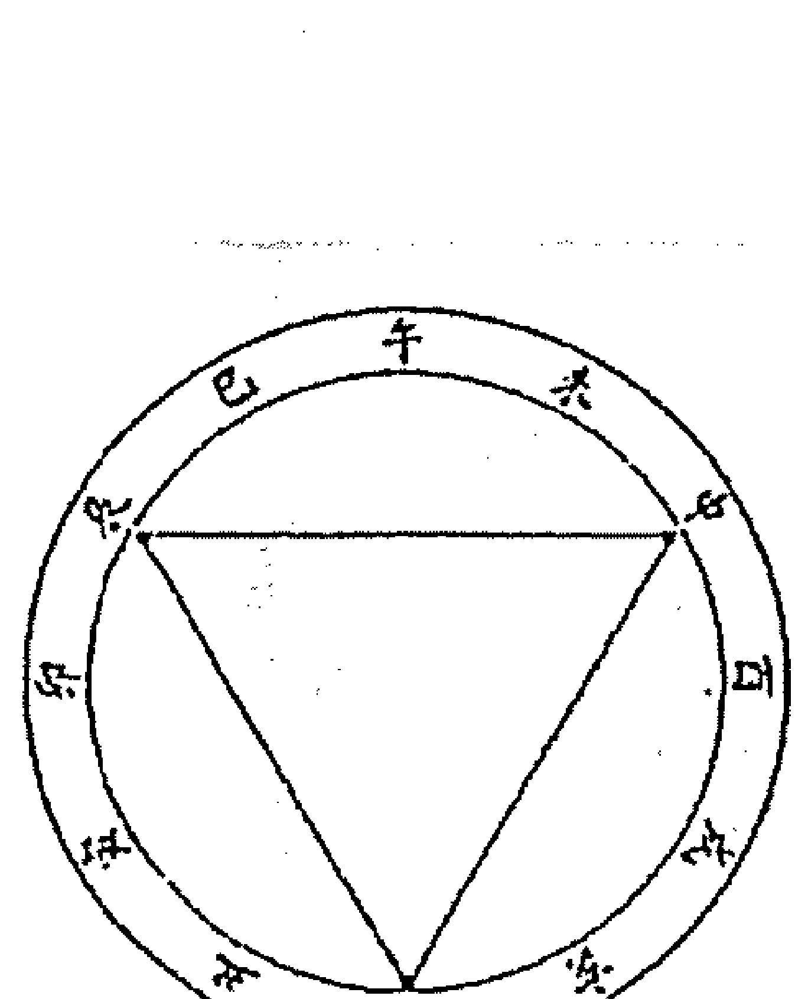
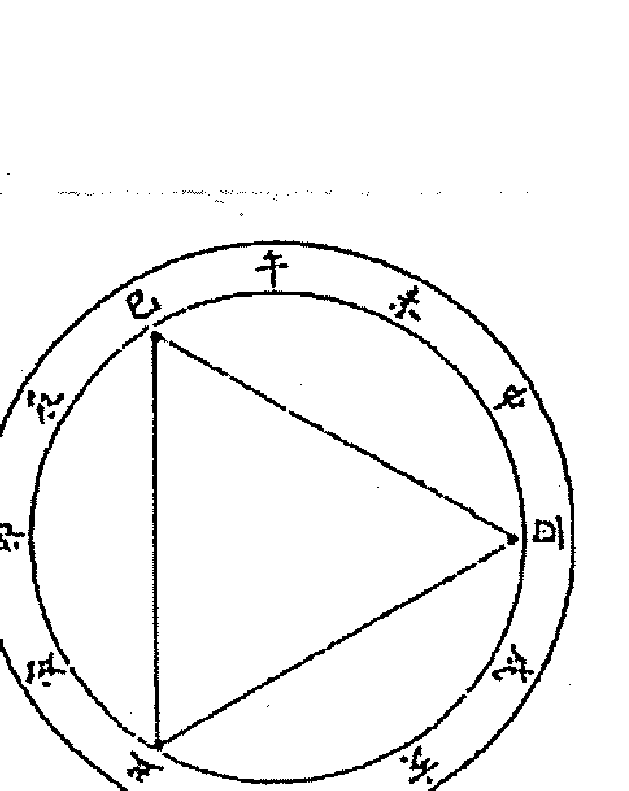
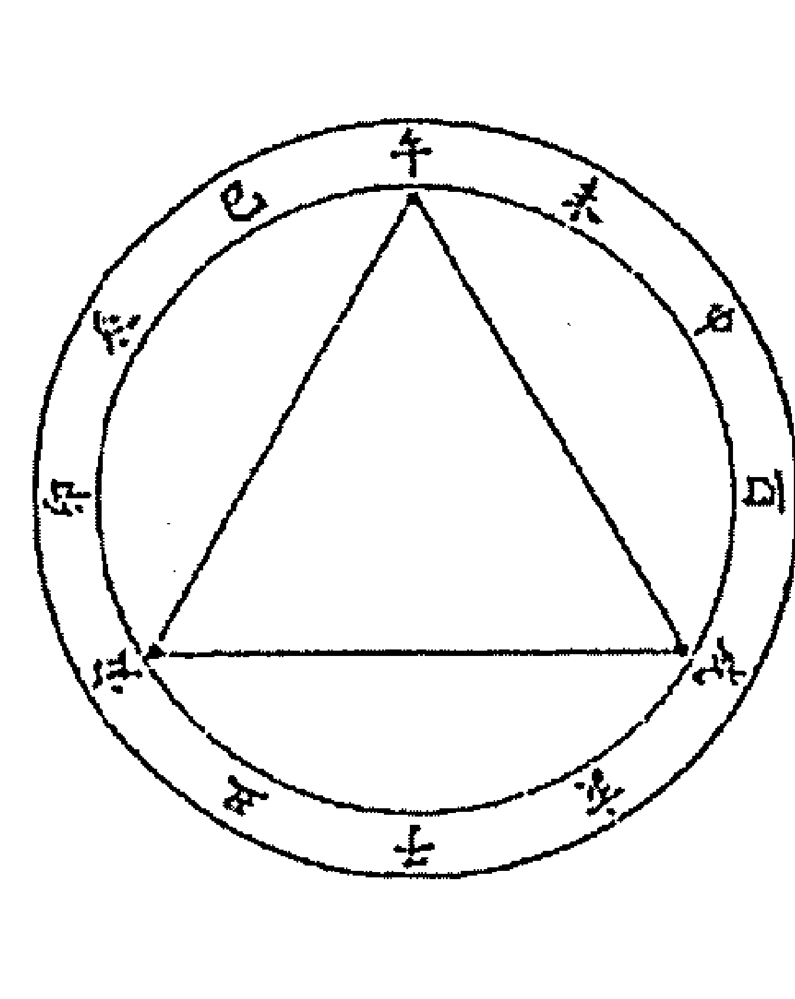
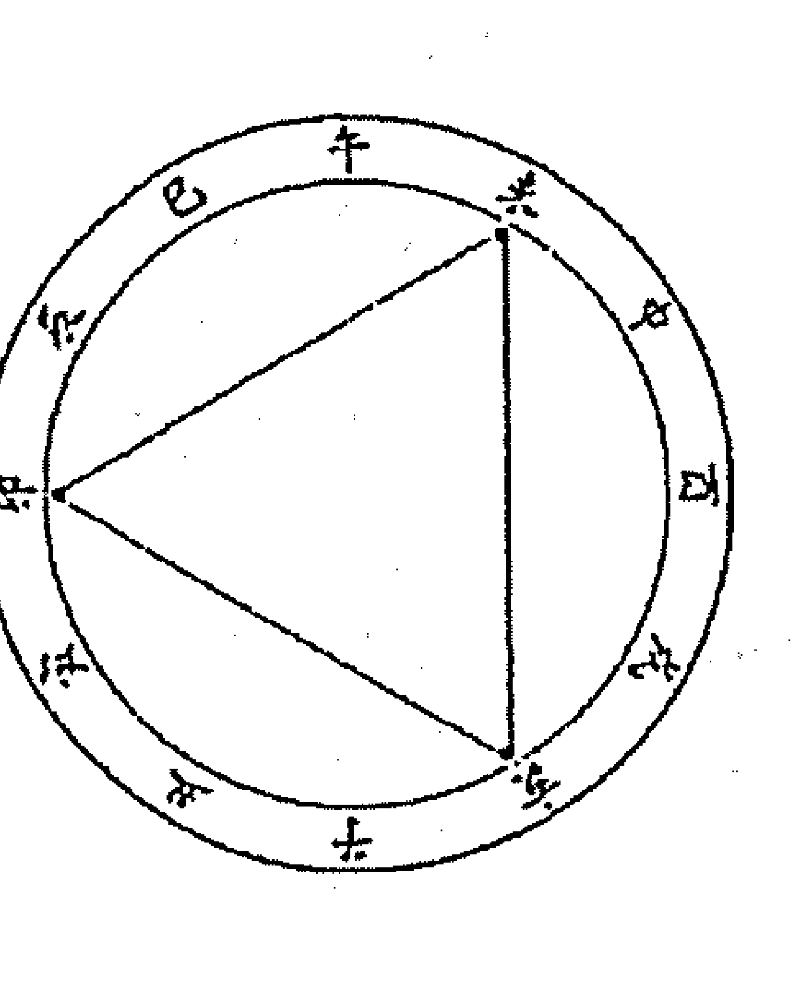
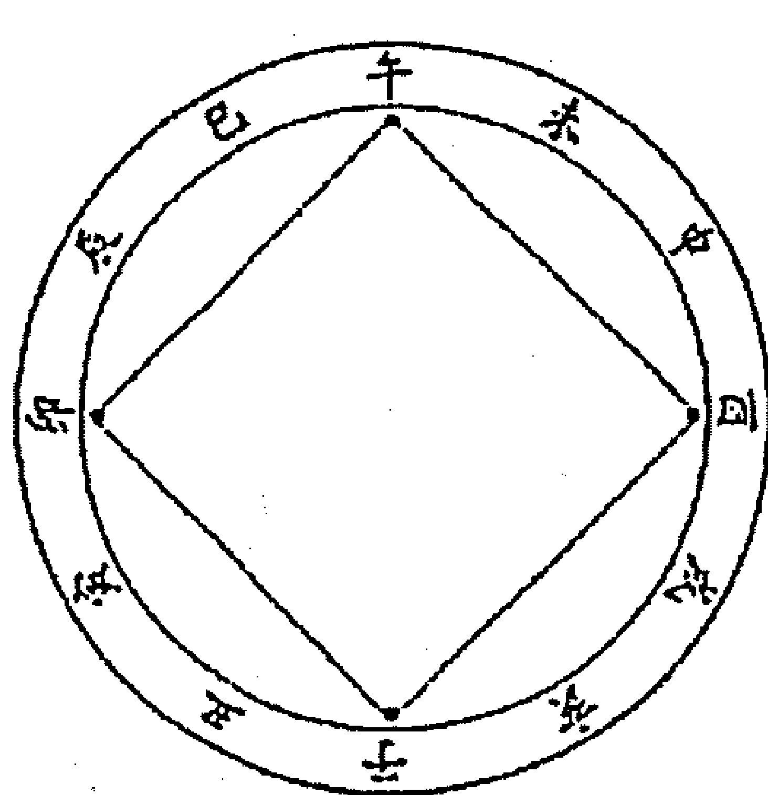
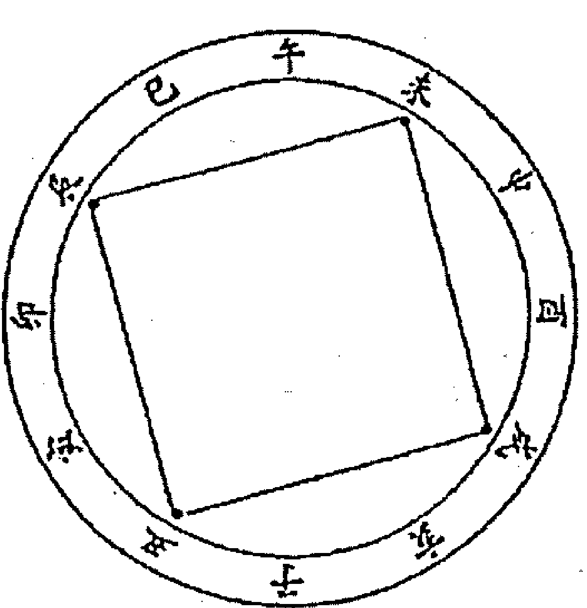
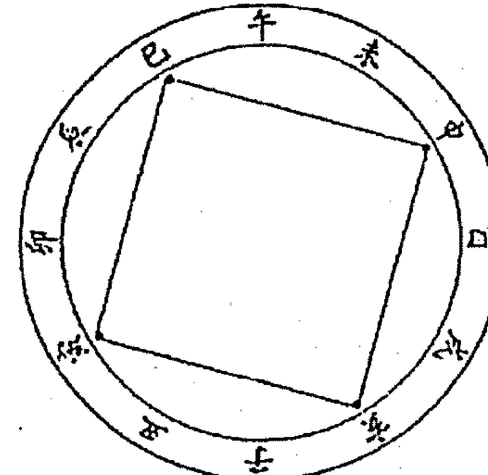
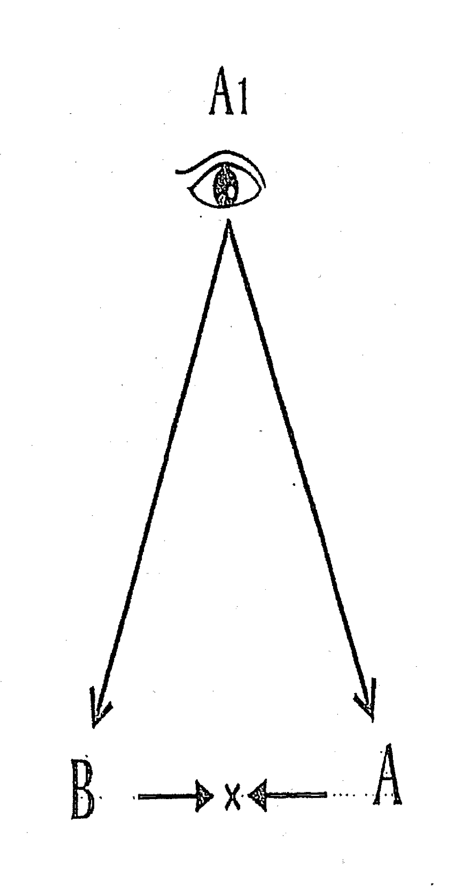

# 集成天地
INTEGRATION WORLD

# 紫微高階之三
## 四化與天機
龍興子齋主

## 蘇學齋主
### 斗數小語四化篇
對所有人來說，快樂與樂觀（祿）是可以學習的。
對許多人來說，快樂與樂觀是需要加強學習的。只因他的主要宮位沒有化祿，或是祿被破壞，或是不善用祿。
祿星誤用反為忌，忌星正用亦為祿。
「成功」是可以自我訓練的，成功者有賴權祿並用，還要將忌轉祿。
祿是樂觀，權是奮鬥、進取；忌轉祿是因勢利導，化腐朽為神奇。

## 新學齋主
### 斗數小語人生篇
人的「心」與「懷」各有一個開關，是不能故障的。要「開心」，也要「關心」；要「關懷」，也要「開懷」。

許多人「關心」別人，卻忘了「關心」自己，更忘了「關懷」。

許多人「關懷」別人，卻忘了「關懷」自己，更忘了「關心」。

人生最難的事是——見好即收；人生第二難的事是——見壞即收。一般人多半搞到焦頭爛額，癱軟在地，讓別人收。

## 自序
首先，还是要感谢所有來上課的學員，以及讓我論過命的人，有各位的發問及問題的發生，十足豐富了本書的內容。

這本書沒照預定時間出版，一來是《紫微高階之二。四化滴天髓》出書後，邀約論命、勘宅、取名者增多，以致時間不夠用。二來想要給四化做一個完美的詮釋，所以為《紫微高階之三。四化洩天機》行文的架構，費不少時間思考，又為舉例翻箱倒櫃，尋找命例，以致拖延下來。

二〇〇七年下半年金融風暴發生，二〇〇八年席捲全球，令人稱羨的台灣科技新貴，頓時不貴了。每一家科技產業都在裁員，被裁員的人，若無其他技能，真的走投無路。

同時，有位學生的好友，家境富裕，卻患了舌癌，平時與友人飲酒作樂的唯一樂趣，被醫生禁止了。他卻買了一瓶洋酒與美工刀，獨宿一家飯店，邊飲酒、邊割喉，自殺身亡。

感慨之餘，寫了三句話，與大家共勉：
- 金錢的庫存要夠，以應付經濟蕭條；
- 才能的庫存要多，以應付景氣突變；
- 興趣的庫存要豐，以應付人生無趣。

科技新貴屬高薪階級，很多人賺多少，就花多少，沒有設定金錢的安全庫存量。一遇無薪假，落得惶惶不可終日；如被裁員，又無其他才能，無法轉業，成了景氣不好的祭品。所以說：金錢與才能都要有足夠的庫存。金錢是物質面的，才能兼具物質與精神。而許多人為了生存而生活，以致不把興趣列入人生必需品，以致單一的興趣被吊銷之後，生活變得無趣。這是恐怖的。

我們主張：工作即享受、事事皆有趣。

如果我們不能主動享受生活時，生活會自動變成我們的負擔。

研究命理最崇高的目的是——作好人生管理，並提升人生境界。

企業管理只是管理好官祿宮，人生管理是全面性的，命盤十二宮所管轄諸事，都得臻於完善。進一步說，企業管理是以官祿宮為體，其餘十一宮為用；人生管理則以命宮為體，其餘十一宮為用。

現行企業管理，已談到相當廣泛，但還沒涵蓋其餘十一宮；而斗數的架構原已具足，卻鮮見研究者能持人生管理的觀點，將斗數『有機化』。我們應參考企業管理，管理好整個人生。

## 命運可否改變？眾說紛紜：
- 一、萬般皆是命，半點不由人。
  這是最重要的說法，是極度失意的人寫出的句子。不少人受它或深或深的影響，導致沒有鬥志，喪失有此一生的意義。凡我讀者，務必完全去除這種想法。這個說法，稍稍一想，不攻自破。請問：今晚吃麵或吃飯，是命定的嗎？
- 二、命不可改，運可改。
  這個說法被很多人接受，包括我的學生。有這個想法的人，想要改變自己的「運」時，常是力不從心，或是懷疑改運的可能性；運可改變，只淪落到有此一說而已，不會付諸行動。
試想：一個乞丐命的人，他在生活中，力行不迨，將行運創造成企業家。
請問：他是否改變了「乞丐命」？
## 三、命運皆可改。
從以上論述，當然各位會瞭解我是主張「命運皆可改」的人。常跟人說：我讀中文系畢業，性喜文學創作；一觸及命理研究，如果命運無可創作，我一定會拋棄它的。

在斗數上，我認為命格不可改，但可加大或提升。怎麼說呢？譬如總統府的建築樣式，就是它的格局。三十坪的格局，可提升至三百坪，或三千坪，甚至三萬坪，但樣式不變。但願我的書，能夠影響各位，即日起提昇自己，造福周遭的人。

為減少錯字，此次運用勸學齊學員，組成龐大的「校對群」，列之於後，並此致謝。

## 圖。
- 高雄：吳義和、褚翔雲、張麗滿
- 台南：陳友城老師、談永芬、郭俊宏
- 台中：王心智
- 中壢：周桐明教授、黃子潤老師
- 台北：林萬福老師、馬碧霞老師、楊春根老師、劉啟光老師
- 新加坡：洪美蓮

書成之際，台中勸學齋的據點已落成，隨筆誌之。但願讀此書者，全部受益。以是之為序

最後，感謝林萬福老師及楊春根老師，將上課筆記整理好，提供我做本書的藍圖。

己丑（二〇〇九）年孟秋 作者序於台北 勸學齋

# 紫微高階之三
## 目錄
- 第一章 認識宮性及活盤 1
  - 一、十二宮宮性 1
    斗數三要：宮、星、四化。 1
    十二宮有兩種，一順一逆。 2
    三十六宮，宮宮皆是春。
    地支十二宮宮性 5
    十二宮與十二方位 6
    十二宮與十二生肖 6
    十二宮與十二星座 7
    十二宮與天地人 11
    十二宮與三方 12
    十二宮與四正 14
    斗數的三方四正與三方、四正 15
    命宮比財官重要 16
    命、財、官等十二宮基本宮性 16
  - 二、十干四化與天地人 19
    夏、商之易已亡佚，散見命理中。 20
    十干四化與天地人 19
    十干四化透露人類用火是文明的開端 22
    甲、丁、庚干化祿的星，在甲、乙、丙干化忌。 25
    武貪主大，在戊己陸續化祿，在壬癸陸續化忌。 27
    天機依序在乙丙丁化祿權科，是「三奇嘉會」的來由。 27
    陽干紫微星系化忌、陰干天府星系化忌。 28
  - 三、十二宮宮性深研 29
    活盤原理——由宮序談起（附：寥宗星學與果老星宗之宮序） 29
    先天河圖一六共宗 31
    任何一宮都可立太極，以其第六宮論其本體。 32
    不明體用、不分陰陽，豈合命理？ 33
    有形體必有毀壞的一天 34
    談談太極與立太極 36
    一為命、為陽、為後天、為用，六為疾、為陰、為先天、為體 37
    疾厄宮論身心醫學 40
    疾厄論身心，「心」究竟在哪？ 41
    注意力集中心臟與眼觀鼻、鼻觀心，觀到「鼻室生白」。『心性』看命疾。『心情』看父疾。『性情』看命父。 46 47 48 49 50 51 52 53 54
    由一六推出一十，第十宮為田宅，故定名為庫。 4 7
    任何一宮的第十宮為該宮之庫位。 4 9
    一為命，九為官，一九合十是後天洛書的天地數。 5 0
    宮祿宮稱『氣數位』，而論後天事時，命宮可同論。 5 1 5 2
    任何一宮的第九宮，都是該宮的『氣數位』。 5 3
    由一九推出一八，稱第八宮交友宮為『一氣生死位』。 5 4
  - 一六推出一十、一九推出一八。 56
  - 活盤所論要留有本命盤原宮位意義 56
  - 「三三歸一」在斗數宮位 57
  - 靜態格局與動態格局 58
  - 靜態與動態的四象 59
  - 命財官符合企管說的三M的時代 60
- 第二章 詳解各宮四化 61
  - 第一節 命遷線 61
    - 命遷論個性 61
    - 四化在命遷論個性 62
    - 四化論個性之轉變 64
      - 剛性烈化 65
      - 剛性柔化 66
      - 柔性剛化 67
      - 柔性軟化 68
    - 命宮四化至其餘十一宮論性向 69
      命宮四化到兄友 69
      命宮四化到夫官 70
      命宮四化到子田 71
      命宮四化到財福 72
      命宮四化到父疾 73
    - 命理改個性才能改運，如何改呢？ 74
      個性不改，命運就不能改。 77 78
      人因學習而能，談談我曾學習的對象。 79
      分清表裡，才能幫助人。 80
      以爽朗的個性面對乖舛的命運 80
    - 命遷論頭與腳 81
      命宮是頭，遷移宮是腳。任何一宮沖命，該宮與我無緣。 81
      可控制的要掌控，不可控制的要放下。如何分辨可否掌控？ 82
    - 命疾論心性 85
      命表性與口，疾表心，命疾可看心性與口是否如一？ 85
      命化忌入疾厄，心性如一，心直口快。 86
      命化忌入疾厄，疾厄化忌入命，小時身體不好。 87
      不能言而能不言 88
    - 命遷論脊椎及中氣 89
      - 命遷有忌，脊椎有問題之論法。 89
      - 脊椎側彎的命盤舉例一 91
      - 脊椎側彎的命盤舉例二（含脊椎彎哪的看法） 92
      - 脊椎彎了至今我發現的兩種治法 93
      - 須打坐的兩種條件及耶穌教徒以祈禱代打坐 95
      - 命遷有忌除脊椎問題外，要知也有呼吸與食道問題。 96
      - 養腎簡便法 97
    - 車禍外災論法及解法（含遁干算法）
    - 遷移主導車禍的論法
    - 車禍命例一
    - 車禍命例二
    - 論車禍有救、無救之條件
    - 解車禍之法
    - 遷移宮主導外出格及驛馬天星
      外出格宜外出，“宜”只是建議，不一定會外出。
      生忌在遷移，能外出嗎？
      > 「祿照為虛、祿坐為實、虛比無好」
    - 經營三模式：蜘蛛網式、野狗式、蜜蜂採蜜式。 111
    - 外出格四態分析 112
      驛馬天星讓人類頻頻出國，或旅居國外，甚至移民 115
    - 外出求學 117
      > （空白頁附錄：勸學齋主的八不八沒有）
  - 第二節 財福線 121
    - 四化看財帛 121
      - 生年四化及自化在財帛
      - 財帛宮四化至其他十一宮論金錢與我或其他人事的關係
        財帛宮四化至命遷 125
        財帛宮四化至兄友 126
        財帛宮四化至夫官 126
        財帛宮四化至子田 128
        財帛宮四化至父疾 129
      - 哪些條件會賺錢？ 130
        入庫忌旺財、逆水忌旺官 131
        雙祿交流與雙祿都有及明暗祿交流 134
        三奇嘉會帶逆水忌或入庫忌 142
      - 七殺的坐干化祿入財田 144
      - 大限我宮化祿權科入本命我宮 145
        大限命財官化祿入本命或大父，也相當賺錢。 147
      - 如何增強財運與財氣？ 149
        增強財運與財氣第一法——努力與認真 149
        增強財運與財氣第二法——陽宅財位佈置與催財 151
        增強財運與財氣第三法——斗數方位強財運 152
        勸學齋斗數星曜守護神與經咒 155
      - 哪些條件會損財——細數漏財格 156
        財帛宮化忌沖命或沖疾，錢財與我無緣。 157
      - 如何改善漏財？ 167
        改善漏財第一法——開源（先天法與後天法） 167
        改善漏財第二法——節流（實施 A B 帳戶） 172
        先談 A B 帳戶的作法 172
        為何 A B 帳戶的作法有效 173
        執行 A B 帳戶事例 174
      - 如何防止兄友劫財？ 175
        財帛宮與兄友線化忌重疊或連結，都是兄友劫財。財帛宮與田宅宮化忌重疊或連結，都是住宅財位有破。 161 163
    - 四化看福德 177
      - 生年四化及自化在福德 177
        福德是遷移之財帛，關係著外出的穿著與付錢態度。 179
        福德是疾厄的疾厄，表示心靈深處，連結累世因果，顯現今世的癖好。 181
        福德宮主靈的好惡，稱之為「癖好」。 182
        個性是顯意識在命宮、癖好是潛意識在福德宮。 183
        福德的文學解釋：「以前所作所為的福利總得」。 184
        疾厄主身心，福德主靈，靈當在玄關處。 185
        右達爾文溝也連通玄關 186
        業障因果、祿權科忌都在玄關，指揮著我們一生。 187
        顯教很密、密教很顯。 188
        不偏顯也不偏密、不偏陰也不偏陽，要顯也要密、要陰也要陽。 190
        再談如何《關掉業障那部機器》？ 191
        用許多認知跳開福德宮的無事也煩 194
        NLP的反省才叫反省 197
        跟福德宮有忌星連結或重疊，才可說跟因果有關。 199
        牽扯福德宮的解法 199
        兄弟劫財跟因果有關與無關的命例與解法 200
        福德宮又稱自殺宮 201
        事先知道也無救的自殺案例 203
        家喻戶曉的倪敏然自殺案例 206
        很好的教學案例倪敏然命盤 206
        207
        陰煞不喜碰陰星又化忌 208
        貪狼的美感與理想主義 208
        機陰夾命與巨日夾命的威力 209
        夾的力量很大但幽隱 210
        剖腹生產擇格，命宮的逆水忌不要用。 211
        左右曲昌增加質量 212
        自殺的條件 213
        自殺條件成立，再看有無獲救的條件。 214
        流年、流月接續著自殺條件 215
        我們對倪敏然往往西方發展的意見（談先天法與後天法） 216
        用後天法要追著驗證 216
        一氣生死訣 219
        相同命盤一個常自殺、一個沒有 220
        相同命盤一個鬧自殺、一個當博士 221
      - 因站錯車道而自殺未遂的命例（台中班廖櫻芳2000年七月一日筆記） 223
        此一大限化忌入下一大限命遷，是為此一大限有缺氣留至下一大限。 224
        大命化忌入沖本福或大福有消極、自殺傾向，這是垂象。 225
        自殺不會死的條件 225
        夫星不明 227
        祿自化忌，事情一開始都很好，到最後都不得善終。 227
        命遷多忌，宜打坐以培氣。 228
      - 福德宮又可看陰宅（二〇〇八八月廿二日馬來西亞學生謝翰仁筆記） 229
      - 命盤看陰宅問題之發現 230
      - 陰宅有問題之命例 231
      - 陰宅有問題之解決 232
  - 第三節 夫官線 235
    - 四化看夫妻 235
      - 生年四化及自化在夫妻 235
      - 夫妻宮四化到其他宮位顯現和我的對待關係 238
        - 夫妻宮干四化至命遷 239
        - 夫妻宮干四化至兄弟 240
        - 夫妻宮干四化至官祿 242
        - 夫妻宮干四化至子田 242
        - 夫妻宮干四化至財福 243
        - 夫妻宮干四化至父疾 245
      - 夫妻宮四化談姻緣 246
      - 好壞姻緣的命理條件 247
      - 夫妻宮靜星坐守方安穩、動星佔據多紛擾 248
      - 思想星曜坐守夫妻宮逢化忌之解決 249
        | 星曜 | 影響 | 編號 |
        |------|------|------|
        | 天機忌擾夫妻宮 | 夫妻宮 | 249 |
        | 巨門忌吵夫妻宮 | 夫妻宮 | 253 |
        | 廉貞忌悶夫妻宮 | 夫妻宮 | 255 |
        | 貪狼忌亂夫妻宮 | 夫妻宮 | 258 |
        | 天同忌阻夫妻宮 | 夫妻宮 | 260 |
        | 武曲忌殺夫妻宮 | 夫妻宮 | 263 |
      - 甲干與乙干對夫妻的傷害 265
      - 夫妻宮化忌沖命宮或疾厄宮，謂之「夫妻與我無緣」。 268
        - 夫妻宮化忌沖命宮 268
        - 夫妻宮化忌沖疾厄宮 270
      - 破軍在命宮與夫妻宮的傷害 272
      - 生忌坐夫官福，八成婚姻有問題。 274
        - 生年忌在夫妻宮例 274
        - 生年忌在官祿宮例 276
        - 生年忌在福德宮例 277
      - 拆馬忌在夫妻宮 278
      - 如何看夫妻的對待關係 280
      - 妳（你）能嫁（娶）怎樣的老公（老婆）？ 283
        - 老婆對老公 283
        - 老公待老婆 286
      - 一個人可能嫁娶到的配偶其好壞幅度 287
      - 夫妻與桃花 291
      - 如何是結婚大限以及結婚年？ 292
      - 論離婚不能宿命 294
      - 夫妻宮為體，子田為桃花的用位。 296
      - 處理桃花案例參考 297
    - 四化看官祿 299
      - 生年四化及自化在官祿 299
      - 官祿宮四化到其他宮位顯現官祿的情狀種種
        | 宮位 | 編碼 |
        |------|------|
        | 命遷 | 302 |
        | 兄友 | 303 |
        | 夫妻 | 304 |
        | 子田 | 305 |
        | 財福 | 305 |
        | 父疾 | 306 |
      - 夫是官祿之遷，表官祿之外圍狀況。 307
      - 多數人忌星沖官，形成經濟不景氣。 308
      - 一個外交官談命 309
        共氣與氣感應，兼談蝴蝶效應。 311
      - 哪些條件有利或有害官祿？
        - 官祿宮雙祿交流 312
        - 官祿宮明暗祿交流 314
        - 官祿宮四化至父疾夫官 316
        - 官祿宮化忌沖命或疾——官祿與我無緣 318
          - 本官化忌沖本疾之命例 318
          - 大官化忌沖本命之命例 319
        - 官祿宮化忌到兄友——兄友劫官（有事業者） 321
          - 解讀「殺昌格」的苗而不秀 322
        - 官祿宮化忌到兄友——公司內部有問題或與上司不合（上班族） 325
          - 跟上思想不合的案例 327
        - 大官化忌沖本官——官倒 329
        - 官祿宮化忌沖財帛——不宜投資 331
        - 本官、大官坐生忌——安份上班去 333
  - 第四節 子田線 335
    - 四化看子女 336
      - 生年四化及自化在子女 336
      - 子女宮四化到其他宮位顯現和我的對待關係 338
        - 子女宮宮干四化至命遷 339
        - 子女宮宮干四化至兄友 340
        - 子女宮宮干四化至夫官 341
        - 子女宮宮干四化至田宅 342
        - 子女宮宮干四化至財福 343
        - 子女宮宮干四化至父疾 343
      - 子女宮四化漫談 344
        父母宮是我的情緒宮位，而是子女的氣數位。 345
      - 本子或大子化忌沖本命要注意啥？ 347
      - 大子化忌沖本子要注意啥？ 348
      - 大子化忌沖本疾要注意啥？ 349
    - 四化看田宅 349
      - 生年四化及自化在田宅 349
      - 田宅宮四化到其他宮位顯現田宅與我的情狀 352
        - 田宅宮干四化至命遷 352
        - 田宅宮干四化至兄友 353
        - 田宅宮干四化至夫官 354
        - 田宅宮干四化至子女 354
        - 田宅宮干四化至財福 355
        - 田宅宮干四化至父疾 355
      - 田宅宮的動靜態看住家周遭的動靜態環境 356
      - 田宅宮坐守星曜看靜態環境 357## 田宅宫四化看动态环境

田宅宫化忌入冲兄友为“兄友劫财”

选宅的先天法与后天 366

阳宅“实证法” 371

命盘中的太阳和巨门所在宫位，住家内局要亮及加强红色 374

## 第五节 父疾线

生年四化及自化在父母 377

### 父母宫四化到其他宫位显现和我的对待关系及我的情绪

1.  父母宫干四化至命迁 - 381
2.  父母宫干四化至兄弟 - 383
3.  父母宫干四化至夫官 - 384
4.  父母宫干四化至子田 - 385
5.  父母宫干四化至财福 - 386
6.  父母宫干四化至疾厄 - 387

### 父母宫是我的情绪宫位

1.  父母宫干自化忌或化忌自冲 - 情绪发作会伤身 - 389
2.  父母宫干化忌至子女、交友 - 情绪发作不会伤身 - 391
3.  父母宫干化忌入冲命宫 - 情绪发作会变丑 - 392
4.  父母宫干化忌入命宫 - 说话直而伤人 - 394

### 四化看疾厄

生年四化及自化在疾厄 395
疾厄宫四化到其他宫位显现内心与外界的关系 395

疾厄宫宫干四化至命迁 397
疾厄宫宫干四化至兄友 398
疾厄宫宫干四化至夫官 398
疾厄宫宫干四化至子田 399
疾厄宫宫干四化至财福 400
疾厄宫宫干四化至父母 400

| 宫位 | 命迁 | 兄友 | 夫官 | 子田 | 财福 | 父母 |
| :--- | :--- | :--- | :--- | :--- | :--- | :--- |
| 数值 | 397 | 398 | 398 | 399 | 400 | 400 |

疾厄宫是我的身心宫位 401

疾厄宫宫干四化至各宫显示我的心在哪？ 401

利用疾厄宫干四化知道他最近注重啥事？ 403

离家出走也用疾厄宫宫干化忌找人 405

疾厄宫论病 409

癌症第四期命例 411

遗憾的癌症命例 412

疾厄牵扯福德，容易误诊或查不出。 415

飞蚊症命例 416

久年胃痛命例 417

心脏、肾脏的大问题起源于心肾不交 418

星曜所属病症 420

## 第六节 兄友线

四化看兄友 424

生年四化及自化在兄友 424

二八易位，故兄友有交易、交换之意。 426

漫谈兄友之用 427

同性朋友、异性朋友的体都在交友宫，异性朋友以田宅为用位。 427

官禄为体，兄弟宫是公司内部之用位，交友是上司、老板之用位。

职务升级与职位升级 429

兄弟为小财库之用位，其体在财帛。 430
以田宅为体，交友为神位之用位。 430
兄友是正众生线、父疾是副众生线，其差别何在？ 431
兄弟是妈妈的用位，其体在父母宫。 432
兄弟为岳父母及公婆之用位，其体在夫妻。 432
把兄弟姊妹当作朋友，把朋友当作兄弟姊妹。 433

一气生死诀 434

## 【附录】劝学斋主斗数开讲斗数干四化与南北斗研究87.07.22／88.08.21

435

## 劝学斋主斗数、阳宅授课讲义目录
劝学斋斗数授课讲义目录

441
445
448

## 劝学斋斗数、阳宅、取名招生
- 42 -

## 紫微高阶之三

四 化 渌 天 机 励学斋主

# 第一章 认识宫性及活盘

### 一、十二宫宫性

◇ 斗数三要：宫、星、四化。

紫微斗数采用南斗星（人马座）、北斗星（大熊座），原本只有星曜，分布十二宫之后，多了环境问题，于是产生星性的第一度变化；又因命造出生年干、各宫宫干、大限宫干以及流年、流月等等天干四化，又使星性产生第二度变化。

所以，研习紫微斗数对于宫、星、四化的论述，要并驾齐驱。研究一段时间后，要自我评比，目前宫、星、四化三个范畴，哪一个比较弱？比较弱的，就要加强；再过一段时日，再做评比。如此周而复始，每个人都可进步。但论命时，宫、星、四化是要连成一气，综合论述。

### ◇ 十二宫有两种，一顺一逆。

#### 十二宫的宫性有两种：

一是子、丑、寅、卯、辰、巳、午、未、申、酉、戌、亥等十二宫的性质。
二是命、兄、夫、子、财、疾、迁、友、官、田、福、父等十二宫的性质。

子、丑、寅、卯、……等十二宫顺行（即顺时针方向），命、兄、夫、子、……等十二宫逆行（即逆时针方向）。顺为阳、逆为阴，一阴一阳。

> 《易》曰：『一阴一阳之谓道。』斗数之道，也到处可见一阴一阳。

如紫微己土为阴土，带领紫微星系六颗星曜逆行；天府戊土为阳土，带领天府星系八颗星曜顺行。又如天魁是阳贵人由未宫顺行、天钺是阴贵人由丑宫逆行；左辅阳土由辰宫顺行、右弼阴土由戌宫逆行；地劫阳火由亥宫顺行、地空阴火由亥宫逆行。

#### ◇三十六宫，宫宫皆是春。

道家有一句话：「三十六宫、宫宫皆是春。」这个概念让我想到了，紫微斗数的天地人三盘，一十二宫代表命兄夫子财疾等等的十二宫，一般我们都是看三盘。

因此，子、丑、寅、卯、……等十二宫的序数是子1、丑2、寅3、卯4、辰5、巳6、午7、未8、申9、酉10、戌11、亥12，简称『支序』。而命、兄、夫、子、……等十二宫的序数是命1、兄2、夫3、子4、财5、疾6、迁7、友8、官9、田10、福11、父12，简称『宫序』。

聪明的你，或许会想到，如果次序背成：命、父、福、田、官、友、迁、疾、财、子、夫、兄，不就是顺行了吗？不行！此十二宫逆序，除了与逆行的支序成符合河洛理数，从河洛理数解开宫性，使命盘十二宫的解释活络起来，我们将之称为『活盘』。逆序的十二宫，与河洛理数的关系，于后文将会详论。

盘十二宫，三盘总共三十六宫，「三十六宫、宫宫皆是春。」正也是研究命理的目的，不是吗？

我们不能够只着重在命财官，旧思维论命，除了命财官之外，最多只是加上夫妻和疾厄。女人多半问感情，男人只关心事业，身体有问题方问疾厄，几乎是千篇一律。大家从来不顾及其他宫位可以让我们快乐，学命理就是教你如何去运用那些让你快乐以及多点OK的事，更带动那些不舒服的地方。所以「三十六宫、宫宫皆是春。」，就是在教导我们要一宫宫回春。

我们常强调：「解厄的第一个原则就是还原。」还原这一套方法，真的很好用。
我们遭受的很多不必要的悲苦，都是不懂还原而徒然增加的。一对恩爱夫妻，先生讲了一辈子的甜言蜜语，有一天先生骂了老婆一句，这位老婆却悲伤地认为：以前的甜言蜜语都是虚情假意。若知还原，一辈子说了一千句甜言蜜语，今天说了一句坏话，她老公还是九十九点九九九的好老公。

我们总共有三十六宫，当我们感觉到不顺遂的时候，大概只是其中某几宫位出了问题，只要把问题还原了，即知没那么惨，就达到了解厄的效果。如果要三十六宫同时出问题的话，机率上是非常的低的。去还原他，你就会发觉我们的人生真的是太棒了。

只要懂得还原，就会发现贵人好多、小人好少。我常说：计程车司机是我们的贵人，「7-11」也是我们的贵人。数十年前，半夜想吃个东西，到哪儿买？现在他们确是二十四小时开着，方便大众，还得惊恐地预防半夜被抢。有的人说：便利店的东西一般贵一成。我们则认为：给贵人多点钱是应该的。
大家一定要把还原这个功夫做好。看了命盘，也要学着还原，不要老是看着化忌发呆，以为从此就没有了明天，真的没有那么严重，一定要记住事事还原。
当然还原的过程也有轻重之分，我们只要循序渐进地去一一还原，就不会被忌星吓到了，进而从忌中求禄了。

#### ◆ 地支十二宫性

的内涵如下：
十二地支绕成周天三百六十度，每个地支管三十度。我们要了解十二宫有关

## # ▽ 十二宫与十二方位

十二地支表十二方位，其度数请看《紫微高阶之二。四化滴天髓。第五章运用篇》第三五六至三五七页。可运用在外局及内局，外局何方对我有利？何方对我不利？利用地图，找出住家，论其外局方位。内局利用屋宅平面图，以其中心点，论内局方位。用法如：某人大命化忌在本疾而为戌宫，内局的戌宫方位，不能当用事点。用事点即常用做事的点，如睡床、办公桌以及常停留处。又如某人睡床在丙午宫，廉贞自化忌冲本疾，查知后即须挪开。否则易罹癌症。此法甚好用，在两本四化专著中，颇多论述。

## # ▽ 十二宫与十二生肖

- 子为鼠
- 丑为牛
- 寅为虎
- 卯为兔
- 辰为龙
- 巳为蛇
- 午为马
- 未为羊
- 申为猴
- 酉为鸡
- 戌为狗
- 亥为猪

举例来说：如见大官化忌冲本命子田，论为不得合伙；不得已必要合伙时，本命子田在子午，最须避开的合伙人生肖是鼠与马。

生肖宫位为暗命宫之一，请看《紫微高阶之一·星曜铁闸刀·第二章·宫盘两种命宫》。两人对待，将对方的生年干四化至自己命盘，又看自己命盘中，对方生肖宫位的宫干四化到我命盘；反之亦然，将我的生年干支，套到对方命盘，是他对我如何？请参看《紫微高阶之二·四化滴天髓·第五章运用篇》第三五九页。

善用如下解释，可以强运避祸。在《紫微高阶之一·星曜铁闸刀·第二章·宫盘与十二星座》中，已详细说明。这里要告诉各位如何记忆？由戌宫逆行至亥，对应身体部位正好由头到脚，

戌宫：牡羊座，对应部位为头部。这也很符合卦理，戌宫为乾卦，乾为首。
命财官在戌宫者，必要发展特殊才能，方能成就；当头部有病痛或急躁或自私，则是失运的表征。在命则运歹、在官则影响官禄、在财则财运差；在大限命财官，主十年；在流年命财官，主一年。以下各宫位同此理论之即可。

##### 酉宫：

金牛座，对应部位为颈部、喉部。若命财官在酉宫者，要讲究生活品味，即能强化命财官的运势；如果颈部痠紧、喉咙痛、声带沙哑、生活品味、贪求物欲，则是失运的表征。

##### 申宫：

双子座，对应部位为手部、肺部。申属金，金主肺；申宫属坤卦，也是「二四为肩」之「二」的位置。若命财官在申宫，加强活动力、加强学习、加强沟通，即能强化命财官的能量；如果手部骨折、肺部有问题、常感冒、讨厌人、没耐心、肤浅、敷衍，所属宫位主管的运势将会走衰。

##### 未宫：

巨蟹座，对应部位为胃部。未属土，土主胃。若命财官在未宫者，只要家中和乐，即可强运；若是胃部疼痛、家庭不和谐，敏感焦虑，运势随即下降。《紫微高阶之一·星曜铁关刀·第三章·廉贞星》一二四九页）中引德国癌症专家汉姆医师说：「与家人矛盾或为家人惊吓受怕，产生胃癌。」

> 「与家人矛盾或为家人惊吓受怕，产生胃癌。」

午宫：狮子座，对应心脏、性能力、背部。午宫属火，火主心脏，午宫属离卦，离主目。命财官在午宫者，若两眼无神，或骄奢自大，或不快乐，或没自信，或对应部位有问题，即是运势弱。开运秘诀是——自信不自大、快乐昂首向前行。

巳宫：处女座，对应肠子。巳宫为火，生肖为蛇，小肠为阳火，肠子与蛇形状相仿。若命财官在巳宫者，只要放松身心即可得运；若肠子出问题、紧张、爱批评人、挑剔唠叨，则主管宫位的运势就会下滑。

辰宫：天秤座，对应腰、肾。命财官在辰宫者，若腰肾病痛，或与朋友夫妻不和，或优柔寡断、摇摆不定，则命财官的运势会下滑；其开运秘诀是——内外和谐，择是为之。

卯宫：天蝎座，对应肝、生殖力、内分泌。命财官在卯宫者，如对应部位病痛，或得失心重，或不知蜕变，或钻牛角尖，或嫉妒心重，则命财官会出问题；只要知道蜕变，不要有得失心，运气自然好。

寅宫：射手座，对应筋骨皮、脊椎、脑神经、屁股、大腿。命财官在寅宫者，若对应部位有毛病，或过于自信，或逃避，或急躁，则命财官一定不好；只要兼顾读书与外出走动，面对所有事，能量自然激发。射手座又名人马座，人马座是一人一马，是人就要读书，是马就要奔驰。

丑宫：摩羯座，对应膝盖、关节、牙齿。命财官在丑宫者，若膝关节痛、牙痛，或悲观，或逃避压力，或居功诿过，或唯利是图，命财官的运势一定下滑；只要将压力化大为小、保持乐观、不居功，则可保强运。

子宫：宝瓶座，对应脑部、小腿。命财官在子宫者，若脑神经痛，或小腿骨折，或怕冷，或对人冷酷，或叛逆心起，则命财官的运势必下滑；只要抱持热诚、顺从情势，必然强运。

亥宫：双鱼座，对应脚部。命财官在亥宫者，若脚部有病痛、滥情软弱，命财官的运势一定不好；任何人都要有同情心，但牵扯此宫者，就要减低同情心，运势自然好。

如戊子二〇〇八年，大家都一样，流年命宫在子、流年财帛宫在申、流年官禄宫在辰，今年要强化命财官之运势，只要遵循申子辰三宫的强运原则，则可在今年交出漂亮的成绩单。

已丑(二〇〇九年)，丑为流命、酉为流财、巳为流官，摩羯座的强运原则：将压力化大为小、乐观、不居功诿过；金牛座的强运原则：讲究生活品味；处女座的强运原则：身心放松。以上述三星座的强运原则，实施于生活中即可。

> > 诗以志之：国在山河破，村居变土坡；天灾人更祸，不忍哭声多。

莫拉克飓风重创南台湾，看看政府官员居功诿过，可知国运必衰。伤感之余，

## ## ▽十二宫与天地人

子开天、丑辟地、寅生人。周历建正在子，法乎天道；商历建正在丑，法乎地道；夏历建正在寅，法乎人道。后世绝大多数的朝代，采用夏历，即因其法乎人道，近取后天人事之故。

邵雍（康节）的《皇极经世书》以十二地支为十二会，一会为一万零八百年，目前正在「午」会，一直到民国一百九十二年（西元二一〇三）止，隔年即是「未」会的开始。

既以子为天、丑为地、寅为人，续以天地人顺布如下图：

#### ▽十二宫与三方

> 《三命通会·卷二·论支元三合》

精乃气之元，气乃神之本，是以精为气之母，神为气之子，子母互相生，精气神全而不散之为合，盖谓支属人元，故以此论之。

| 人 | 天 | 地 | 人 |
| :--- | :--- | :--- | :--- |
| 巳 | 午 | 未 | 申 |
| 地 | | | 天 |
| 辰 | | | 酉 |
| 天 | | | 地 |
| 卯 | | | 戌 |
| 人 | 地 | 天 | 人 |
| 寅 | 丑 | 子 | 亥 |

子丑寅分别为天地人，卯辰巳分别为天地人、酉戌亥分别为天地人、午未申分别为天地人。如此则子午卯酉皆天位，辰戌丑未皆地位，寅申巳亥皆人位。申子辰则分别为天地人，其余巳酉丑与寅午戌与亥卯未亦是。此即三合，亦称三方，天地人三才皆具。

接着又论说：「如申子辰，申乃子之母，辰乃子之子，申乃水生、子乃水旺、辰乃水库。生即产、旺即成、库即收，有生、有成、有收，万物得始得终，乃自然之理。故申子辰为水局，若三字缺其一，则化不成局，不可以三合化局论。盖天地间道理，雨则化，一阴一阳之谓也；三则化，三生万物之谓也。巳酉丑、寅午戌、亥卯未皆然。」

十二地支排成一个圆，将三合局的地支连线，如子连辰，辰再连申，申再连子，皆成一等边三角形，如埃及之金字塔。这三角形颇具意义，在子平衡称三合局，在紫微斗数称三方，或三合方。

斗数命盘命、财、官必在三方，如命在子，则财在申、官在辰；命在寅，则财在戌、官在午等等。

#### 十二宫与四正

寅申巳亥四孟，子午卯酉四仲，辰戌丑未四季。《天元变化书》曰：「四孟名为四进之气，前进可达，故马坐是地，又名曰四长生。」又曰：「四仲曰四极，五行遥远不相拘受。」又曰：「四季名曰角，系阴阳各立之地。」四正位每支间隔九十度，故成正方形。如上图。

#### 斗数的三方四正与三方、四正

我们现在再来综合一下命财官，以标准的三方来讲就是命财官。再说，每一个宫位皆有其三方，命财官互为三方，意即命宫的三方是命财官，财帛宫的三方也是命财官；其余宫位的三方为：

- 兄疾田
- 夫迁福
- 子友父

以四正而言，总共有三组，就是：

- 命迁子田
- 兄友财福
- 父疾夫官

属于三方的命、财、官，每一个宫位带出了一组四正位。

若称「三方四正」（中间没有标点），就是命、财、官三宫加上迁移宫。十二宫皆须论其三方四正，只是在主事宫位加上对宫，对宫是吉星来照、凶星来冲的地方，当然重要。

三方四正命财官迁的迁移，代表了在外的命，以「在外的命」来诠释，是最能够兼容并蓄，且涵盖面也比较周到。迁移代表了动态的命，也包含了内性。我们谈到命运时，会更详细的说明，我们现在只是将命财官作一个综合的说明。

## ## ▽ 命宫比财官重要

以命财官三宫来比较，命宫比财官重要得多。命财官虽是三方，被我们视为重要的一环，但终究不是重叠的，如果命财官是相等的，那又何必要分为三宫？也唯有归纳成三宫，才会发生一些有意义牵扯和关联，但绝对不是画上等号。当各位知道了这种划分，之后就会了解如何去动手处理其中的牵绊。我体察到一个理论，就是「凡事能掌控的，得去掌控；不能够掌控的，将之放下。」各位能掌控的是命宫，不能掌控的是财官。放下算是第一步，否则漫无意义去操心、烦心，是最难过却是无知的事，也是无聊且是浪费时间的事。

## ## ◇ 命、财、官等十二宫基本宫性

#### 宫的基本宫性：

命、财、官等十二宫有其基本职掌，也就是它的宫性。宫性活化是透过活盘，分明体用，可得更多的宫性，如子田为桃花及股东的用位。现在，我们先谈十二

##### 命宫

一辈子的运势、面貌、个性，以及显意识。

##### 兄弟宫

主管兄弟姊妹的宫位，可以说是兄弟姊妹的综合命宫，论其个性及与命造关系。

##### 夫妻宫

主管配偶的宫位，可说是配偶的命宫，又主管命造与配偶的关系。

##### 子女宫

主管生儿育女的宫位，可以说是儿女的综合命宫，又主管命造与儿女的关系。还可看命造的性能力及性器官。

##### 财帛宫

主管金钱的收支方式及多寡。注意，财帛是两件事，一是钱财、一是衣帛。

##### 疾厄宫

主管命造的身心，其体在看心，其用在看病，是以「病由心生」，强调「身心医学」。

##### 迁移宫

主管在外的命，诸如行动能力、外出吉凶、外出贵人之有无，以及车祸意外灾。又表命造之内性。

##### 交友宫——古称「奴仆宫」或「仆役宫」。称「奴仆宫」甚好，因历代以来大多以男为仆、以女为奴。称「交友宫」，则是包括同性及异性朋友。交友宫主管与朋友交际之关系，情份之深浅。

##### 官禄宫——可说是「事业宫」。主管一生事业之兴衰，以及命造做事的智商。

##### 田宅宫——主管住家环境、家运、财库、禀赋、家教。

##### 福德宫——德者，得也。福德即是累世劫所作所为的福利总得。追溯及前生，而为今生的潜意识。显示在今生的是「癖」，说得文艺点是「心坎儿里」或「心灵深处」。

##### 父母宫——主管父母的宫位，可以说是父母的综合命宫。由父母引伸至父执辈、长官、父母官、政府机构。又为命造的文书宫，以及情绪宫位。

如果宫性仅只上述范畴，是不够用的。命理总能依据《易经》「由一而二，推行至无穷」的原理，再强化宫性的运用。下一节，我们接着谈。

### 二、十干四化與天地人

大家都知道十干四化，甲廉破武陽、乙機梁紫陰、丙同機昌廉、……等，它用在生年四化、各宮宮干四化、大限各宮宮干四化、流年四化、流月四化、流日四化、流時四化，還有各宮宮干自化。

> ◇ 夏、商之易已亡佚，散見命理中。

我們今天要來探討四化與天地人的關係，由此發現亡佚的三易（周易、歸藏易、連山易）痕跡。（按：漢語大辭典出版社出版之《漢語大辭典．第一卷．二０六頁三易》：《連山》、《歸藏》、《周易》的合稱。《周禮．春官．太卜》：「掌三《易》之法，一日《連山》、二日《歸藏》、三日《周易》。」相傳《連山》、《歸藏》為夏、商之《易》，書已失傳。）

### ◇十干四化與天地人

周曆法乎天道，建正于子；商曆法乎地道，建正于丑；夏曆法乎人道，建正于寅。簡單說：周朝的曆法以子月為正月，商朝的曆法以丑月為正月，夏朝的曆法以寅月為正月。朝代的次序是夏、商、周，後世絕大多數的朝代反而採用夏曆，乃因夏曆法乎人道，適合人統，符合後天人事之用。

這正也符合『子開天、丑闢地、寅生人』的說法。而夏、商、周的三易，正好也符合了天地人：

-   周易（天）——以「乾為天」為首卦，即稱『周易』。
-   商易（地）——以「坤為地」為首卦，稱為『歸藏易』。
-   夏易（人）——以「艮為山」為首卦，稱為『連山易』。

坤為地，地主收藏，故稱『歸藏易』；艮為山，上卦艮、下卦艮也是艮，故稱『連山易』。上述歸藏易與連山易均亡佚，有專家說散見命理中。我們有幸在『十干四化』中，看見三易的影子。茲將目前所瞭解的，分享大家，也期待你日後有更多的發現。

| 暴變 | 人（艮）乾管轄（天合人） | 地（坤）坤管轄（地是地） | 天（乾）艮管轄（人合天） | |
| :--- | :--- | :--- | :--- | :--- |
| | 人 | 地 | 天 | 人 | 地 | 天 | 人 | 地 | 天 |
| 癸 | 壬 | 辛 | 庚 | 己 | 戊 | 丁 | 丙 | 乙 | 甲 | 干 |
| 破 | 梁 | 巨 | 陽 | 武 | 貪 | 陰 | 同 | 機 | 廉 | 祿 |
| 巨 | 紫 | 陽 | 武 | 貪 | 陰 | 同 | 機 | 梁 | 破 | 權 |
| 陰 | 左 | 曲 | 陰 | 梁 | 右 | 機 | 昌 | 紫 | 武 | 科 |
| 貪 | 武 | 昌 | 同 | 曲 | 機 | 巨 | 廉 | 陰 | 陽 | 忌 |
| 天府 | 紫微 | 天府 | 紫微 | 天府 | 紫微 | 天府 | 紫微 | 天府 | 紫微 | 忌屬星系 |
| | | 七殺隨文昌化忌 | 太陽後天離先天乾 | 破軍隨文曲化忌 | | 太陰屬坤卦。 | | | 廉貞屬艮卦。 | 備註 |

將十天干分天地人：甲乙丙為天、丁戊己為地、庚辛壬為人、癸為暴變。甲為天之天、乙為天之地、丙為天之人；丁為地之天、戊為地之地、己為地之人；庚為人之天、辛為人之地、壬為人之人。甲乙丙為天，乾為天，然以人來合天，所以由艮卦管轄。庚辛壬為人，艮為人，然以天來合人，所以由乾卦管轄。丁戊己為地，坤為地，依然由坤卦管轄。

### ▽ 十四化透露人類用火是文明的開端

甲為天干之始，其四化卻也透露了人類文明的開端，人類文明由知道用火開始。甲干廉貞化祿，廉貞的藏干是乙木、丁火、戊土，而乙木、丁火表達了鑽木取火；戊土就是艮土（己土是坤土），艮土是山坡土，表達了穴居的開始。早期人類不知用火時，跟其它野獸沒兩樣，都是生食；知道用火烤肉燒菜，文明列車於是開動。廉貞屬艮卦（人），是連山易的首卦，因而在天之天的甲干化祿，卻在天之人的丙干化忌了。太陽屬離火，後天離乃是先天乾，乾為天是周易的首卦。故在人之天的庚干化祿，在天之天的甲干化忌了。由此可知，太陽屬丙火外，尚屬庚金（乾）。

太陰屬坎水，後天坎乃是先天坤，坤為地是歸藏易的首卦。故在地之天的丁干化祿，而在天之地的乙干化忌了。由此可知，太陰屬癸水外，尚屬己土（坤）。

有人統計過，世界偉人八成出生在甲、丁、庚年，剛好是天之天的甲、地之天的丁、人之天的庚，也就是天地人的第一個天干。
癸干是暴變，最後一個天干有汰舊換新的作用。不只天干如此，地支也不例外，地理的三元運也相同。各位試著去考證，民國七十二年（西元一九八三）剛好是癸亥年，中元運的最後一年，不也是數不完的淘汰風潮嗎？蔡辰洲就是在這一波被淘汰的。美國次級房貸風暴發生於二〇〇七年（丁亥年），一發不可收拾，直至今日世界景氣依然蕭條。

### ▽ 甲、丁、庚干化祿的星，在甲、乙、丙干化忌。

甲乙丙是乾為天，而由艮管轄，雖示現人合天，但天之天的甲干所化祿的廉貞，卻在天之地的丙干化忌了。這點讓我們體會到，廉貞的祿氣是不會久長的；換句話說，凡事一開頭的好處，很可能快速消失。庚辛壬是艮為山（人），而由乾管轄，雖示現天合人，但人之天的庚干所化的祿星太陽，早在天之天的甲干化忌了。丁戊己是坤為地，地之天的丁干由屬坤卦的太陰化祿，而太陰卻在天之地的乙干化忌了。是否古時真有十個太陽，而有一「后羿射日」之傳說？或者天地剛形成，日月經常灰濛濛的？只能想像，無法求證；反正，化忌是過猶不及，兩種極端現象都有可能。

但是，我願意提出比較有利於現代人的一種思維，就是：太陽是男人、太陰是女人，不經一番寒徹骨（忌），怎得梅花撲鼻香（祿）？男女都得受過「忌」的洗禮，最後必能得到「祿」的擁抱。

至於天之乙干化祿的天機，在地之地的戊干化忌；天之人丙干化祿的天同，在人之天的庚干化忌；地之地戊干所化的祿星貪狼，在人之人己干化祿（按：癸干化祿，在陰干化忌）；地之人己干化祿為武曲，卻在人之人壬干化忌；人之地辛干化祿為巨門，巨門卻在地之天的丁干化忌。

整體說來，化祿的星除了壬干的天梁祿沒化忌外，其餘化祿的星都在別的干化忌。（按：癸干的破軍祿，在己干時也化忌，因破軍隨文曲化忌，文曲是破軍的伴星。）

天梁只祿不忌，應有其特殊性。各位再看看：甲己合，甲干化武曲科、己干化武曲祿；乙庚合，乙干化太陰忌、庚干化太陰科；丙辛合，丙干化文昌科、辛干化文昌忌；戊癸如上段文字所述，戊干化貪狼祿、癸干化貪狼忌。唯獨丁壬，兩干四化沒交叉。

### ▽ 武貪主大，在戊己陸續化祿，在壬癸陸續化忌。

十干四化有其機密地排列組合，貪狼、武曲在戊己中央土分別化祿，而在己庚分別化權。可見武貪主大，也須在安穩的十天干中央處，成就好處。武曲、貪狼卻在天干之末壬癸，分別化忌。我常強調：壬干的天梁祿不敵武曲忌，癸干的破軍祿不敵貪狼忌，也因武貪主大之故。

### ▽ 天機依序在乙丙丁化祿權科，是「三奇嘉會」的來由。

紫微斗數的十干四化，乙、丙、丁剛好是天地軸星——天機星分別化祿、化權、化科，因此將生年祿權科在命財官者，稱為「三奇嘉會」格。

> > 宋·曾慥《道樞·入藥鏡上篇》：「天有三奇焉：日也、月也、星也。地有三奇焉：乙也、丙也、丁也。人有三奇焉：精也、氣也、神也。」

《奇門遁甲》的三奇，也就是乙、丙、丁為開、休、生。

### ▽ 陽干紫微星系化忌、陰干天府星系化忌。

請看前面表列「忌屬星系」欄，讓我們很詫異地查知，陽干甲、丙、戊、庚、壬所化的忌星，皆是紫微星系，陰干乙、丁、己、辛、癸所化的忌星，皆是天府星系。

紫微星藏干己土，亦即陰土，依據「陽順陰逆」的不變法則，排盤時紫微星系逆行；天府星藏干戊土，亦即陽土，所以排盤時天府星系順行。

在四化時，陽干由屬陰的紫微星系化忌，同理，陰干由屬陽的天府星系化忌。

斗數隨處可見陰陽並存，或者陰歸陰、陽歸陽，或者陰配陽、陽配陰。各執其理，有條不紊。

知道上述諸多奧秘，只有在深入研究的誠意，不敢懷疑四化的安排。曾在多年前，寫了一篇《斗數十干四化與南北斗研究》，請參考附錄（四三五頁）。

### 三、十二宫宫性深研

### ◇ 活盤原理——由宮序談起（附：密宗星學與果老星宗之宮序）

從十二宮深研——強化活盤開始，就要強化宮性運用。如果只知道子田為桃花的用位，而不知其體在夫妻，就無法論桃花；縱使論中了，也只是瞎貓碰到死耗子，碰巧而已。如果知道子田為股東的用位，而不知其體在官祿，就無法論合夥；縱使論準了，也只是瞎雞啄到米、瞎貓碰到死耗子，碰巧而已。

很多人既知稱『用位』，卻不審『用位』必有其『體』，若無『體』，『用位』何來？『體』為『本體』，『用』為『作用』。活盤就是利用一個『體』與『用』的關係，就能知其然，更能知其所以然。

重點是：要有本體，才有作用。這就是現在要研究的，在論事時，要有『體』、『用』，『用』才能當活盤來解釋。

-   命１、兄2、夫3、子4、財5、疾6、遷7、友8、官9、田10、福11、父12。

這個1至12的序數隱含先天河圖數與後天洛書數，依此可鑽研出更多、更廣、更活的宮性。

在此，順便介紹『密宗星學』其宮序：

-   1命（外象總綱）、
-   2財（營運收益）、
-   3助（兄弟朋友）、
-   4宅（財產積貯）、
-   5嗣（子女異性）、
-   6輔（部屬對下）、
-   7偶（婚姻家室）、
-   8疾（病患災禍）、
-   9行（遷移涉外）、
-   10官（奉職對上）、
-   11福（福澤壽元）、
-   12采（父母遺傳），更有身宮（內象總綱）。

-   「果老星宗」則是：
-   命宮1、
-   財帛2、
-   兄弟3、
-   田宅4、
-   男女5、
-   奴僕6、
-   妻妾7、
-   疾厄8、
-   遷移9、
-   官祿10、
-   福德11、
-   相貌12。

| 命1 | 父12 | 福11 | 田10 |
| :--- | :--- | :--- | :--- |
| 兄2 |      |      | 官9 |
| 夫3 |      |      | 友8 |
| 子4 | 財5 | 疾6 | 遷7 |

### 先天河圖一六共宗

說·先天再分先、後天，後天也可再分先、後天。

河圖的一六、二七、三八、四九、五十，都相差五。一為命宮、六為疾厄宮；二為兄弟宮、七為交友宮。三為夫妻宮、八為交友宮。若以兄弟宮起一，數到第六宮也是遷移宮；以夫妻宮起一，數到第六宮也是交友宮，餘此類推。因此以一六代表即可，這是先天河圖，最簡單的解釋「先天」就是：一件事的前提。而前提又有前提，也就是說先天又有先天；相對地，後天又有後天。以四象分析來

### # 任何一宮都可立太極，以其第六宮論其本體。

上次只談十二宮強化活盤的前言，現在稍微複習一下，從河洛理數，就是先河圖一六共宗，若直接套到命盤，一為命、六為疾厄，既然一六共宗北方水是河圖，最初是以命為1，第六宮是疾厄宮，原開始只是這樣而已。從這裡就要瞭解六是本體、一是作用。我記得剛開上課時講義是用手寫的，當時還有一篇叫體用論，後來將體用論打散在各個章節來說；因為我發覺，以前在上體用論時，好像在教博士班，聽得很累，講課可以從學員臉上知道反應。不過大家還是要瞭解：不明體用，不分陰陽，就違背了命理。我一直很喜歡命理，是基於認知陰陽哲學的絕妙，非常好的。所以我很公然的說：「如果鐵口直斷，這句話根本就是違背命理。」因命理是談陰陽哲學，陰靜不變，陽一動就是在變，也因為有這個陽動，命運才可以改變；如果是純陰的，那就完了，有多少飯就吃多少飯，都沒有什麼可以提昇進步的。

### △不明體用、不分陰陽，豈合命理？

所以每個地方都要知道體用在那裡？從現在開始，很多地方都要告訴各位體在那裡？用在那裡？我也是研究命理很久才發現的，如果不講體用，不分陰陽，根本不是在講命理，只是在江湖。像一六共宗，一是陽的，六是陰的，體用就是分陰陽。因為奇數為陽、偶數為陰，所以體是陰靜的，用是陽顯、陽動的。由此來看，一是用為命、六是體為疾厄。所以，疾厄是命的體。那體呢？因為陰靜，陰靜又就叫先天；那用就是後天，就分先天後天。

因此：兄弟宮的體在遷移宮；夫妻宮的體在交友宮；子女宮的體在官祿宮；財帛宮的體在田宅宮；疾厄宮的體在福德宮；交友宮的體在命宮；官祿宮的體在兄弟宮；田宅宮的體在夫妻宮；福德宮的體在子女宮；父母宮的體在財帛宮。

講先天一定是屬陰的、後天一定是屬陽的。只不過要更加瞭解，因為陰陽哲學就是從本來無極生太極、太極生兩儀、兩儀生四象，就是陰還可以分陰陽、陽又可分陰陽。從這些事情來，大家可以套用到人生，所有的全部可以由1分為2，再由1分為2，一直分下來，所以往後天推，就可以一直推到無窮無盡。

為什麼疾厄宮是命的體、命的先天呢？談疾厄不一定要疾厄，會有疾厄源於身心。這就是由體再分體用，也就是陰可以分陰陽、陽又可分陰陽。以這個體再來分「體」、「用」時，這個「體」在看心、「用」在看病。

### △ 有形體必有毀壞的一天

由這一層來談，病由心生，但病由心生很哲學，很抽象，講白一點，什麼才會病呢？要有「有形體」，譬如：有肉、有頭髮、有心臟這些，「有形體」以後，以佛家來講，有形必有壞。也就是已經形成一種形體以後，才會有產生毀壞的事，也一定會毀壞；這在物理學也做這樣的描述，研究是說：東西是不同的波長，就會產生量子，量子以後就結合成物體，有了物體以後，它一定會有時限，到某一期限就會毀壞掉。這是在物理學跟佛學在這方面，不同的領域確有相同的見解。現在也知道『體』在看心，『用』在看病，如果我沒有這個身，那來病呢？我常常講『病痛』，其實有些病是不痛的，像肝病會不會痛、頭髮有沒有病，有啊！分叉什麼的，會不會痛呢？總不能跟醫生講說我的頭髮痛，他會把你送到精神科的；也不能跟醫生講說離開我頭一公尺的地方在痛，他也會把你送到精神科的。這樣的描述就是說只要有『有形體』，它都可能有病或痛，但病不一定痛，所以先決要件就是簡單用命理來講就是身，我有這個身心是我命的前提，若沒有身那談什麼命呢？所以說疾厄是命的先天可能不好瞭解，那剛剛這樣的描述應該各位可以瞭解吧！由此來說，任何一宮，最初命宮是1，但是把它立為太極1，命宮是最大的太極，然後要論其他的事時，可以各宮各自立太極，就以那一宮為主，譬如：夫妻宮是在描述一個人婚姻、感情、配偶的命宮。各宮都可以當命宮，原本的命宮是總管，其他的只專管哪一類的事。所以可以把1挪到夫妻宮，那夫妻宮一樣有一六，若把夫妻宮當1時，那它的第六宮就在交友宮。一個人的體裁、體格是看命宮、遷移宮、疾厄宮，這三宮連看。所以配偶的體格，就看夫妻宮、官祿宮、交友宮，這是把太極立到夫妻宮。

### 談談太極與立太極

看你太極立在哪裏？關於立太極這一點，各位一定要好好去體會，我們在各種領域中，都會有各種不同的太極點，譬如我現在跟各位講課，在課堂上我所處的就是一個大太極，而各位又有各位的小太極，下了課后如果聚在一起小酌，我沒有在講課了，所以此時個個都成了相同的太極，這就是太極的定義之一。

所謂『物物皆太極』，就是每一樣東西都是太極，也是說每個地方或事物皆可立太極。重要的是如何在我們專注的事物中，把最重要的部份挑出來立為太極。

以命盤來講，命宮當然是太極。如果我是想了解有關夫妻之間的問題，那麼夫妻宮就成了太極，這個時候我們去論夫妻宮的星曜，或者是夫妻宮的四化，就是把太極立在夫妻宮了。

「太極移位而變形」對斗數來說，就是當你把太極移到財帛宮的時候，你就不能再去論夫妻了；當論田宅時，即是把太極移至田宅宮，也就不能論其他無關的宮位了。

> 『太極可大可小』對斗數來說，田宅宮小太極論陽宅內局，大太極可擴及外面、......等等。

局；夫妻宮小太極論婚姻配偶，大太極可擴及異性；子女宮小太極論子女，大太極......等等。

-   一為命、為陽、為後天、為用，六為疾、為陰、為先天、為體。

我們現在再來談一六，一六共宗北方水。一為奇數，奇數為陽；六為偶數，偶數為陰。陰為先天、陽為後天；先天為體、後天為用。由這裡可以看出來，以疾厄序數為6、為體，以命宮的序數為1、為用。我們想一想命宮與疾厄宮的關係是如何？先天是後天的前提，也就是說疾厄宮是命宮的前提，有命前要有疾厄。如果沒有身心，談啥命呢？疾厄宮不是專門在論病，就好像有夫妻宮不見得就會結婚，有疾厄宮不一定要生病。疾厄是在論「身」「心」，這裡又分體、用。以命跟疾厄來比對，疾厄是先天、命是後天。但疾厄這個先天，又可以分先天、後天，體為先天、用為後天。疾厄宮體（先天）在看心、用（後天）在看病。

病也有前提，就好像佛教講的「有形必有壞」，物理學講的波長交叉以後，會形成一個物體，既然有了物體就有毀壞的一天。在談病之前一定有一個「體」，這個體不是體用的體，是身體的體、形體的體。一定要有這個身體，才會生病。既然說體在看心、用在看病，疾厄宮無非是在強調身心醫學。

所以，如要對命理深入，「分陰陽、明體用」是非常重要的。我再為體用與陰陽，詳細為各位解說。先天為體、為陰、為靜，後天為用、為陽、為動。雖說先天為體，先天又可分體用，也就是說先天又可分先天；後天為用，用也可分體用，亦即可再分先後天。

換句話說：先後天是兩者比對後才分的，動靜也是比對而來。譬如：「道德」兩字，「道」為體、「德」為用，「道」為先天、「德」為後天，後天都比先天陽顯，後天也都比先天具體。再說，「德行」兩字，則是「德」為先天、為體，「行」為後天、為用。「氣色」兩字，「色」比「氣」具體可觀，所以「氣」為體、為先天，『色』為用、為後天。我們將命宮與疾厄宮來比對，命宮為陽、為後天、為用；疾厄宮為陰、為先天、為體，這也是比對來的。疾厄宮在此為先天，我們還可再追其先天，亦即以疾厄宮為1，逆數第6宮為福德宮，可知福德是疾厄的體，也是疾厄的先天。我們經常這樣描述：福德是疾厄的疾厄。任何一宮要追其先天，都可用該宮為命，追其疾厄即是。譬如：財帛的體即在財帛的疾厄，亦即田宅宮。官祿的體即在官祿的疾厄宮，亦即兄弟宮。過去我曾以哲學的層次，說病由心生，自覺蠻可以理解的。後来看到春山茂雄所著《腦內革命》一書，也談到病由心生，是以醫學的學理來談的，跟斗數主張的不謀而合。如果能夠保持一顆非常清朗的心，心情絲毫不被干擾，絕對沒有病。一般人很難保有這個心境，不過，也要趨向那個心境走、往那方面努力。各位可以試著去回想看看，每當生病之前，是不是有特別的不高興，或厭煩、心情低落等情形，所以把自己心裏面的垃圾清理乾淨是非常重要的。

### ◆疾厄宮論身心與身心醫學

有了形體才會毀壞，有了身體才會有病痛。身體包括我們的肉體及五臟六腑，總不能說離開頭部一公尺的地方在痛，醫生碰到這種病人，我看只能送精神科。所以，要有病痛必先有身體；縱使頭髮不會痛，但它也會有病。身體上的器官部位，有的會痛、有的不會痛，痛是病、不痛也是病，終究是身上的東西。所以一定要有形體，有了這個形體、有了這個心，是遠在生命之先，再來談命，所以命反而比較後天，這是它的作用。因此，我一直認定斗數的疾厄宮是在談「身心」的宮位。

十多年前（約1987年），讀了一本日本著名女醫師的書，也屬西醫系統，但卻強調他們主張的是「身心醫學」。書中記載不少病例，治療時是身心並治的。譬如：有一男孩經常發高燒，他媽媽一定帶他去找這位名醫門診。次數多了以後，這位名醫說：「妳想不想讓妳兒子不再發高燒？」這位媽媽回答說：「當然啊醫生！妳是名醫，所以每當兒子生病，妳在哪儿門診，我就帶到那兒，就因為相信你這位名醫啊！」醫生說：「那麼妳要坦白回答我的問題，並配合我的方法。當然這# △疾厄論身心、「心」究竟在哪？

位妈妈满口答应。医生问道：「你是否常在儿子面前骂你老公？」这位妈妈一时愣住，面色铁青，缓缓地说：「是的！」令人惊奇，竟然这是第一个论断。她开药时，还会嘱咐病患唸经。看了这本书，我不禁莞尔，因我从民国八十（1991）年起，论命同时要人唸某经，她则是因病症不同要人唸某经。

「心」这个字眼，大家都很熟悉，现在我要问各位：「心」究竟是指哪个部位？或是指哪个器官？
甲生答：大脑。
乙生答：心脏。

这可就让大家莫衷一是了。这个问题对斗数研究者，甚为重要。怎么说呢？我喜欢斗数，原因之一乃是斗数是「心的哲学」。大家看看，化忌的「忌」字，分开来不就是「己心」吗？不能「降伏其心」，焉能掌控命运？

我研读了一些书，也常深思此一问题，深感兴趣与重要，先将我读过且赞同的资料一一引述于后：

中医学认为对全身的机能活动起主宰和协调作用的是『心』，所以称其为『五脏六腑之大主也』。

传统中医将人脑的生理功能，和认识外界事物及其思维、判断能力等，都归诸于心。

> 所以任物者谓之心，心有所忆谓之意，意有所存谓之志，因志而变谓之思，因思而远慕谓之虑，因虑处物谓之智。

齐德瑞与霍华·马汀，他们提出心能商数法则（The Heart's Intuitive Intelligence），认为：

> 心脏的确具有足以影响知觉的智能，且思想性的心与生理上的心互动。经由一个灵魂与人性交界的直觉辖区，心脏让人们提升到更高的智慧层面。

> 科学的证据显示：心脏能够传送情感和直觉的讯号，帮助我们掌控自己的生命。除了运送血液外，它还负责管理体内的许多系统，使它们能互相合作。而且，心脏和脑部不断地在沟通，藉着本能进行许多自我决定。

> 新的发现揭露了新潜能：在每个人的内心里都存在着组织的中心智能，即使处在极恶劣的逆境中，它仍然能够带领我们暂时摆脱问题，而进入一个满足的新经验。它是一个高速本能智慧的清晰认知，能够同时结合、强化理智和感情的能量。称之为「心能智力」。

> 「心能智力」是一种知觉程度和洞察力。当我们感应到它的作用时，理智、情绪即会经由内在的自发过程，进入平衡、和谐的状态，并净化身心。

> 「古代文化包括美索不达米亚人、埃及人、巴比伦人和希腊人，都相信心是主导情绪、道德、决策的首要器官。」

> 「古犹太的经文中，心被表示为能量中心或美丽、和谐、平衡。」

> 「中医把心视为思想和身体之间的桥梁。心可以解释为思想的或性灵的，血管是沟通理智和灵魂的输送管，把心跳的节奏所蕴含的讯息带到全身的每一个部位。」

> 「神经科学新发现：心脏有独立的神经系统——一个复合的系统，称之为「心脑」在心脏内部约有四万个神经原，和脑下皮质中心所发现的一样多。这个心脏内部的脑和神经系统，将资讯转送到头盖骨里的脑，创造头部和心脏之间的双向沟通系统。」

>> 心理学家莱歇夫妇发现：当头脑经由神经系统将命令送达心脏时，心脏并非机械化地服从，反而根据自己的本能逻辑在做适当反应。譬如：当头脑送出亢奋的讯号来指挥身体对外来的刺激做出剧烈的反应时，心跳的速度照理说应该会加快。但是，若身体的其它器官都呈现加速的反应时，心脏往往会渐趋缓和。可知，心脏并非呆板地接受脑部的指令，而是根据任务的本质，及它所需要的心理过程做认可的反应。

>> 莱歇夫妇又发现：当心脏将讯息送回脑部时，脑部不但能够了解，而且完全服从。由此看来，真正能够影响个人行为的，是由心脏发出的讯息。

>> 当我们仔细倾听内心的声音时，智慧和直觉都会提升。

>> 先抛开心脏和头脑之间的差异，而仔细观察当我们以心能智力来认知周遭的世界时会有何不同。

>> 头脑执行的是一种线性的逻辑思维，虽规范情况的相应之道，也限制了想法，无法解析复杂问题或纠葛情绪。

>> 心能智力提供直接、本能的知识，帮助我们的意识跨越线性的逻辑思考。

>> 例如一对恋人散步逢大雨，淋成落汤鸡，心情亦甚愉快。因他们是用心在沟通。

如两个人正在吵架，恶劣的心情根本无法灵犀相通，小雨也更煞风景。此时的雨是被头脑所认知的。一样的雨，由「心」去看它，是自然现象；用「脑」去看它，是恼人的问题。

> 「脑的活动包括：关怀、先见、直觉、谅解、安心和感激。

> 「头脑决定什么是好、坏，什么是合适、不合适的。依过去经验，将各类情况进行分类、辨别，由此判断现况及预测未来。换言之，头脑组合成连贯的模式，在生活中即能以预设的立场做效率化的处理，不必重新学习一切，节省应对的时间与精力。但此一创造模式的能力，同时让我们陷入固定的思考中，阻碍接受新的可能」

> 「头脑是「知道」，但心能「了解」」

▽ 注意力集中心脏与眼观鼻、鼻观心，观到「鼻室生白」。

这本书还提供一个脑连心的方法，天天试着将奔驰的思绪及杂乱的情绪暂时置之一旁，让注意力集中在心脏周围的位置，想像呼吸的气息已进入心脏，再将能量聚集在这部位。如此专注十秒钟。

这与古人提出静坐方法中的眼观鼻、鼻观心，要观到鼻室生白，真有异曲同工之妙。注意力由眼观鼻引至鼻子，再由鼻观心而至心脏。观到鼻室生白，乃是凝视聚焦引起的视觉烟雾。

知道「心」的作用，有助于《紫微高阶之二·四化滴天髓·斗数心法——关掉业障那部机器》文中所诉求的目标，所以我不厌其烦地引用上述参考资料。

# ◇ 「心性」看命疾、「心情」看父疾、「性情」看命父

前面讲过了，先有身心，才会有命。而疾厄宫所论的「心」，展现在命宫为「性」。

疾厄宫为六、为阴，命宫为一、为阳，阳是阴的显现，故说「心」展现为「性」。

以疾厄宫立太极，除如上述，以疾厄为体、命宫为用外，任何一条线都互为阴阳。如疾厄（为阴）论心，父母在其迁移（为阳），即显现出其「情绪」。所以，

看一个人的「心情」，则是论其父疾线。

谈一个人的「心性」，在斗数命盘要论其「命疾」。修行者说「明心见性」，即是命宫与疾厄宫之间的融通。再说，经常听人夸某人说：「他性情很好。」这实已包括斗数的命宫与父母宫了。

# ◇由「一、六」推出「一、十」

在命理上有很多架构模式，都可以拷贝使用。如四正位，本来只是子午卯酉，将此四正的框框顺转三十度，就是辰戌丑未；再转三十度，又是寅申巳亥。因此，子午卯酉被称为「真四正」或「正四正」。

由一组四正子午卯酉，再推出两组：辰戌丑未、寅申巳亥。

所以刚刚探讨的一六，命的第六宫是命的本体、是命的先决条件，那么所有的宫位都可以把它视成1，它的第六宫都是它的本体，这都是根据一六共宗来论

# ◇由一六推出一十，第十宫为田宅，故定名为库。

由一六推出一十，因第十宫是田宅宫，田宅宫是财帛宫的第六宫，是财帛宫的本体，田宅宫又属阴静的宫位，于是变成库、财库。财库在田宅宫跟命宫的关系是一十，所以从一六推出一十出来。

以命为阴、财官为阳，财官为阳就还在阳动，所以财还是在进进出出，财帛宫不是在看一个人具有多少财，而是在看进进出出的财多不多？财有没有入库，则看财帛的第六宫，因财的本体刚好是田宅，所以财库在田宅宫，它的本体是阴静不动的。

# ▽任何一宫的第十宫为该宫之库位

田宅宫是第十宫，所以田宅宫称为「库」，任何一宫的第十宫也是该宫的库位，这是由一六可推演出一十的。因此：命宫是子女的田宅宫，所以命宫（即我）是子女的库。兄弟宫是财帛宫的田宅宫，所以兄弟宫是小财库。夫妻宫是疾厄宫的田宅宫，所以夫妻宫（配偶）是我疾厄宫（身心）的库。子女宫是迁移宫的田宅宫，所以子女宫是我迁移宫的库。（有了子女后，孕育并约限着我的外出幅度。）财帛宫是交友宫的田宅宫，所以财帛宫是我交友的库。（财帛的多寡孕育着交友的层次及广度。）疾厄宫是官禄宫的田宅宫，所以疾厄宫是官禄宫的库。（疾厄宫是上班场所或公司、工厂）

# ◇ 一为命、九为官，一九合十是后天洛书的天地数。

一九是由洛书推来的，一九合十、二八合十、三七合十、四六合十，为什么单单用一九，因一九刚好是子午线，后天以坎离代先天的乾坤为用，因此单单取用这个。第九宫是官禄宫，因此称官禄宫为气数位，就是后天行为表现的宫位。

官禄宫是以命宫为『体』，其它十一宫为『用』

中最重要的用位，因它是往后天推的。

从一六、一九来比对一下，好像是枢纽

> 交友宫是福德宫的田宅宫，所以交友宫是福德宫（业障因果）的库。官禄宫是父母宫的田宅宫，所以官禄宫（后天种种行为）是我情绪（父母宫为情绪宫）的库。

| 4 | 9 | 2 |
|---|---|---|
| 3 | 5 | 7 |
| 8 | 1 | 6 |

，要往先天推论它的第六宫，要往后天推论它的第九宫，所以在谈后天之事，命官同论就是这个道理。譬如：谈个性，因个性来自遥远的先天的心，然后产生后天的性。那个性如果没有做事情那来的表现呢？也就是要有行为才能表现。
在讲星曜时，常提到谈谈后天事，命、官同论就是根源于这个原理。它们之间又有不同，因官禄偏向做事，而命宫是可以无所不管的；只在谈论后天事这个层面，可以同论。因为符合的洛书一九合十，而洛书属于后天的关系。
我们称官禄为「气数位」，意思是一个人后天行为的表现宫位，不仅是看他的工作或事业而已。小的时候，健康是他唯一的事业；稍长，学业与健康是他的事业；长大后，再扩及工作与事业，还是包含着健康。小事连弯个腰、捡个东西，都由官禄宫管，只是一些小事不用劳心研究与论断罢了。

# ▽
官禄宫称「气数位」，而论后天事时，命宫可同论。

谈谈命、官可以同论。举例说来：命宫及官禄宫拥有五福寿星（廉贞、贪狼、天同、天梁、天府）者，聪明但不专心，而且正课不读读课外。如果命宫及官禄

宫拥有的五福寿星越多，上述性质就越强。譬如：命宫在亥，廉贪在迁移，借入命宫即有两颗，官禄在卯坐天府，如此总共三颗五福寿星了。既已举上例论述，我只好先将与此有关的完整命理观阐述一番。

# △ 劝学斋主张：论命之后，要立即提出造命之法。

既然命理论断出来后，要认命吗？劝学斋主张：第一个层次是论命，后面马上要提出造命方案。学医生的负责任，中医不可能脉把一把，只说重感冒就完了，要病人回去；中医师诊断后，当然要配药给病人。所以你自己的小孩、还是你自己、还是帮人算命的对象，如果是属于命宫有五福寿星的人，包含大限都是，流年可以不用计较，因为一年比较不会养成一个人的习惯，但大限十年很容易。那怎么办呢？像五福寿星在命官的人来上课，讲义是不看的，因讲义是正课，所以要多一点上课笔记，或周遭的资料要多读一点。小孩子也一样，就像游击战一样，乡村包围城市，给小孩子多一点课外的，但这个课外在干嘛？譬如：参考书他也不看的，会被列为正课，要他英文读得好，

就去买英文的小笑话、漫画给他看，两年以后，他的英文实力一定好过同学。
换成在座的各位，若本命盘或大限盘有此条件，会有如何的现象呢？大家来学说从哪COPY来的秘笈。

总之，知道一个人的个性后，就提出因应的对策，千万不要认命了事。
再说，当时决定走命理这条路时，决定论命同时，必定跟对方提出造命之方，不另收费。当时，我就很清楚，论命钱难赚，造命若另外收费必定好赚。为了不让自己做坏事，决定仅收论命润金，造命附送。

# ◇ 任何一宫的第九宫，都是该宫的「气数位」。

所以「以任何一宫为第一宫，它的第九宫就是它的气数位」。譬如：夫妻的气数位，也就是夫妻的官禄是在福德，福德为夫妻的气数位。
所以说：夫妻后天所有表现，源自因果。

子女宫的气数位是父母宫，除了表彰子女的后天行为，与我的父母遗传关系外，父母宫又是我的情绪宫位，所以，我的情绪也十足地影响子女的行为表现。

有识于此者，焉能不收敛乎？

财帛宫的气数位是命宫，财帛宫主管命造金钱的进出状况，命宫正是役使财帛的表现宫位。

任何一宫都可以论，兄弟宫是疾厄宫的气数位、夫妻宫是迁移宫的气数位等等。

# ◇ 由一九推出一八，称第八宫交友宫为「一气生死位」。

再来，从一九又推出了一八，第八宫就是交友宫，又称为「一气生死位」。

气生则生、一气绝则死。

为什么在交友宫会形成「一气生死位」？其实是从一九推来的，根据道家的理论说：「人乃是秉承父母一点精血，因缘寄胎而生。」也就是藉父亲一点精、母亲一点血，因缘寄胎而生；父母好像工厂一样，灵魂是原料，有另外的来源。所以兄弟姊妹可以有相同的部分，可以有很多不同的部份；这些不同的部份，就是来自不同的灵魂，材料不同、工厂一样而已。父母生我们，是后天行为，父母宫的官禄宫就是父母宫的气数位，就是在我们的交友宫。因此交友宫称为命宫的「一气生死位」。同理，任何一宫的「一气生死位」都在它的交友宫。

譬如：福德宫是子女宫的「一气生死位」，所以福德因果跟生儿育女很有关系。财帛宫的「一气生死位」在财帛宫的交友宫，也就是父母宫。官禄宫的「一气生死位」在官禄宫的交友宫，也就是子女宫。夫妻宫的「一气生死位」在夫妻的交友，即为田宅宫；疾厄的「一气生死位」在疾厄的交友，即为命宫。余此类推。大限交友是大限的「一气生死位」，大夫的一气生死位在大夫之交友、大子之一气生死位在大子之交友、大财之一气生死位在大财之交友，余此类推。一气生死位除了比较严重的看生死之外，它可以看各宫的重点，譬如：我第六大限走武破曲为本疾，大限交友（大命的一气生死位）为本命命宫壬干，壬梁紫左武，化武曲忌在大命、又为本疾，武曲为骨胳，亥宫为下部，这个大限最

梁紫左武，化武曲忌在大命、又为本疾，武曲为骨胳，亥宫为下部，这个大限最惨的就在这里，已挨两次刀，这是最快的的重点看法。下文当会做更详细的解说。

# ◇一六推出一十、一九推出一八。

有了一六推出一十、一九推出一八之后，任何一宫都可以当一，它的第六宫就是它的先天；它的第九宫就是它的后天；它的第十宫就是它的库；它的第八宫就是它的一气生死位。根据这些基调，就可以去谈谈活盘。但要谈论活盘时，尤其要注意的是：本命盘宫位的名称永远不会消失，而且永远是重要的。譬如：虽然已经推出第十宫为库，那财帛宫的第十宫，也就是财帛宫的田宅宫刚好为兄弟宫，能不能称它为库？

# △活盘所论要留有本命盘原宫位意义

如果以财帛宫当一，兄弟宫是它的第十宫，就是兄弟宫为财帛宫的田宅宫。简称「兄为财之田」，当然依据一、十来讲，兄弟宫也可以称库。但原来宫位的名称要考虑进来，这一点是很重要的。因兄弟是众生缘，代表兄弟宫这个财库还跟兄友有关系，也就是这个财库还跟兄友继续在交易，进进出出，尚未入库，简称「小财库」。如公司出纳的钱、口袋里面的钱、皮包里面的钱。都是还在进进出出的状态，尚未进入真正的库。

# 「三三归一」在斗数宫位

道家有一个论调：「三三归一」的存想法……。道家谈三三归一谈得非常广，诸如「守三一」三三归一对斗数的宫位，可以如此去理解的，以命为1、第三宫是夫妻3，又以夫妻为命为1，其第3宫夫妻为财帛，也就是我的配偶的配偶是财帛宫，还是我。再以财帛为命，其夫妻的夫妻，又是官禄宫；以官禄宫为命，其夫妻的夫妻

# ◇ 静态格局与动态格局

外出格看迁移宫，当然「静态格局」与「动态格局」都要看。何谓「静态格局」与「动态格局」？以前所讲的格局总解，不加宫干四化的，一概称为「静态格局」。宫干四化论出的吉凶，方称为「动态格局」。「动态格局」跟「静态格局」是我命名的，在其它的书看不见，不要觉得奇怪。我帮一个说法取专有名词，都很审慎，不希望设太多名词，让大家背不完。但我认为很有须要的，应该取个专有名词来提醒各位的，就会把它设出来。

田宅宫也称我宫，在《五行大义》里面提到「数过五则变」，所以十减掉五还是五，有财帛的意思。刚刚讲一六共宗的关系，财帛的第六宫是田宅宫，所以田宅宫也是财库；又依据「数过五则变」，十要减五，十减五还是五，五是财帛宫，所以田宅就有财的意思。因此田宅有事，除了阳宅之外，还有财运、财库。

妻又是命宫。从这里推出来就叫我宫，我宫就是命、财、官而已。

# △ 静态与动态的四象

道，先论静态，不论动态，那是不完整的。
动态跟静态本来就有分别，静态属阴、动态为阳，不论动静两态，岂不是犯了「孤阴不生、孤阳不长」的毛病了吗？静态就是刚开始、刚开头还没有动以前，很初始阶段的状况；进行了以后，动态就来了。
不错，包含生年四化，都是静态格局；但动态格局，要用宫干去四化。

分动静是须要的。就命理的理解，就是处处要懂得分阴阳、明体用。因体为阴、用为阳。命理不分阴阳，就不是在讲命理，只在胡扯。因命理最重要的就是阴阳哲学，所以到处要想到这个。换言之，动态要论，静态也要论，就是在分阴阳。
动静一分，就可能静态好、动态好；静态好、动态不好；静态不好、动态好；静态不好、动态也不好。（这就是我所称的「四象分析法」）

|  | 静态好 | 静态不好 |
|---|---|---|
| 动态好 | 一 | 二 |
| 动态不好 | 三 | 四 |

# ◇命财官符合企管说的三M的时代

以英文来讲，命是I（我），第一人称；财帛宫My Money，第二人称；官禄宫My Work，第三人称；田宅宫My home或My house，第三人称。

企管上有一个论调，说：「现在是三M的时代。」第一个M是Man，第二个是Money，第三个是Material，蛮符合命、财、官三宫的。Man是人→命，Money是财帛，Material是物資→官禄。企业上以Man最重要，用到斗数来用很通，以命最重要，因为用对的Man可以创造Money，跟获得Material，只有Money、Material，这个Man不对，都会损失的。

俗话说：「钱生不带来、死不带去。」仔细想想：岂止钱财如此？命盘十二宫所属事物，死后带走了啥？率皆短暂拥有，只有灵魂一直跟着我。命、财、官三方都很好，所以命财官都好的人最好，如果只能有一宫好，意即命好、财官不好，或财好、命官不好，或官好、命财不好，让我们选，当然要选命好的。

因为命好，可以创造财官。所以，奉劝命不好的人，记得先把命造就好，不要忘了，命宫是唯一我宫中的我宫──纯我宫，是可以自我掌控的宫位。

## 第二章 详析各宫四化

## 第一节 命迁线

命、迁可论啥？ 命宫论本性、迁移宫论内性。命运可论一生势。
命宫是头（含面貌）、迁移宫是脚（含对外行动力），命运线合论脊椎、中气、 衝服，还有呼吸道、食道。
迁移宫主宰对外一切事情：外出吉凶、车祸外灾、驿马星、……

-   ◆ 命运论个性

-   ◇ 命宫论本性、迁移论内性，其中之分辨。

### △ 四化在命迁论个性

先从命、迁这个关系来讲，命宫是在谈一生的运势，还有个性、本性。研究斗数的人经常疏忽了一点，一命管十二宫、本命管一辈子；但是论大限、论流年常常忘了本命宫的星，没有加进来论。命宫又谈本性，谈本性时迁移宫就是谈内性，隐藏在内的个性。如果常常往外跑，迁移宫的内性就会凸显；不常往外跑、不常跟外面接触，要到中晚年迁移宫的性才会显现出来。这是时空替换原则，若常常出去，就启动迁移宫，就会提早到；没有的话，就要等到中晚年。迁移宫称「变动位」，论时间叫「久」，论空间叫「远」。所以没有到外面去走动，时间久了一样会呈现的。因此迁移宫的格漂亮，定为「外出格」。「外出格」定义为「宜外出」。研究命理的人，应知道「宜」字自是建议之辞，并非「命定」。宜外出是最好外出，方能成就，或成就更大。命定的外出，是命中注定要外出。命定也非一翻两瞪眼，也有程度的差别，比如说命定外出机率十个百分比，或廿个百分比、……，以至一百个百分比。条件不同，机率当然有别。

#### ◇ 四化论个性之转变

统计在命迁的四化，包含生年四化、命迁自化及射出：

禄为乐观——在迁移，外出较乐观；生禄在命为乐观是实质的，命宫自化禄是表现乐观。又，柔星化禄难免过柔或过度乐观；刚星化禄，则可刚柔并济。

权为刚强奋斗——化权星遇刚星则刚强，遇柔星则刚柔并济。

科为温和斯文——做人不计较，最起码看起来像读过不少书。所以，有科之人最好珍惜此科，多读书以使表里如一。

忌为固执惜情——个性固执，最好「择事固执」，学习任何东西，前半个学程输人，只要坚持下去，后半个学程开始赢人。

禄忌为有时开朗、有时不开朗——个性反覆不定，有时开朗、有时不开朗。射出禄、自化禄或禄在迁移者，展现给他人的是乐观，而不开朗的部分却独自承受；如射出忌、自化忌或忌在迁移者，则是展现不乐观的一面给人，其实他还是有开朗的一面。

权忌为霸气或霸道——命迁的星曜化权忌，若星曜为刚星则霸道，柔星则为霸气。权忌的权若为命宫自化权或射出权、或权在迁移，其霸性较能为他人接受；若权忌的忌是命宫自化忌或射出忌、或忌在迁移，则其霸性会让旁人畏惧。科忌为囉唆打绕——思考打绕，走不出死胡同，想来想去，又绕回原点。若表现科者（即忌在命，命自化科或射出科，或科在迁移），讲话常会「错置成语」，如很自然地将「乱七八糟」讲成「乱八七糟」。若表现忌者（即科在命，命自化忌或射出忌，或忌在迁移），鸡毛蒜皮的小事常碎碎唸，或问过的事像没问过，一而再、再而三地问。

双忌为固执的二次方——固执到「九怪」（台语）。

- 禄权忌——既有禄忌，又有权忌之性。
- 禄科忌——既有禄忌，又有科忌之性。
- 权科忌——既有权忌，又有科忌之性。
- 禄权科忌——先禄科、后科忌、最后权忌。

#### △ 刚性烈化

本性一路走来，不会一成不变，我们来谈谈行运因四化的不同，而改变个性的看法如何？

就如上述化禄在命为乐观，当大限命宫化忌入本命迁时，化的固执在此大限于焉上身；又若本命坐刚星，大限化禄或化科来本命迁，都会让他转为刚柔并济。以下列出典型的转变：

- 一、刚性烈化。
- 二、刚性柔化。
- 三、柔性刚化。
- 四、柔性软化。

命迁坐刚星，而无禄科，个性较刚。

逢大限又化权或化忌入本命迁，或大限命迁，都会使他刚硬的个性，更加烈化。

如下命式，武曲是刚星，逆行第五大限壬午时，化忌入命者是。

个性刚硬的人，本就应该稍加柔化。

|      |      |      |      |
| ---- | ---- | ---- | ---- |
|      | 壬   |      |      |
|      | 武曲坐命 |      |      |
|      | 在丙戌 |      |      |
|      | 行壬午大限 |      | 武命 |

我讲的不是宗教式的劝善，而是宏观的命理，刚星不柔化必有伤害，不只是周遭的人受威逼而已，也戕害到本身的命势与健康。不要忘了，命理强调的是——刚柔并济。

#### △ 刚性柔化

命宫坐刚星，命迁有禄科（含生年禄科、自化禄科、射出禄科），小时即能自动调整为刚柔并济。若命迁无上述条件，则可看大限命迁化禄科到本命迁亦可。唯迁移化来者，必要常外出或外面活动多的人，方能有此效力。

如下命式，武曲坐命在壬戌，武曲本属刚星，命宫壬干又使之自化忌，个性更刚。逆行运者，直须走至第四大限己未时，方能柔化原本的刚性。顺行运者，行第三大限甲子，即有刚性柔化之功。

|      |      | 己    |      |
| ---- | ---- | ---- | ---- |
|      | 武曲坐命 | 在壬戌 |      |
|      | 行己未大 | 限    | 武命 |
|      |      | 甲    |      |

#### △ 柔性刚化

命宫坐柔星，而命迁有权忌（含生年权忌、自化权忌、射出权忌），小时即能自动调为柔性刚化。这种现象若是刚柔并济则好，但若自化忌或射出忌者，容易让人观感不佳，因展现不好的一面之故。
若命迁无上述条件，则可看大限命迁化权忌到本命迁亦可。唯迁移来者，必要常外出或外面活动多的人，方能有此效力。还有，若化忌者，须再注意其伤害性。

如下命式，天同坐命在甲戌，行丙子大限，化禄入命，使其太柔；行至第四大限丁丑，化权入本命，又使其刚柔并济。

|      |      |      |      |
| ---- | ---- | ---- | ---- |
|      |      |      |      |
|      | 天同坐命 在甲戌 |      |      |
|      | 行丁丑大 限    |      | 同命 |
|      | 丁    |      |      |

#### △ 柔性软化

总之，柔者刚之是好的，柔者柔之，岂不太过柔弱？

命宫坐柔星，而命迁有禄科（含生年禄科、自化禄科、射出禄科），小时即过度柔弱。

若命迁无上述条件，而大限命迁化禄科到本命迁，亦有此现象。应柔者刚之，方不致过度柔弱。

如下命式，天同化禄在戊戌，天同化禄已是太柔，岂堪再行丙申限，又化禄入命，焉能不过度散漫、过度乐观？

理想的命理观，其作法优于命盘所具备的条件，就是以最理想的命理原则改造自己。譬如，知道自己个性柔弱，要刚化自己；知道自己太倔强，则要柔化自己。亦即刚者柔之、柔者刚之，使成刚柔并济。

|      |                                        |    |
| ---- | -------------------------------------- | ---- |
|      |                                        |    |
|      | 天同坐命在戊戌行丙申大限 | 丙 |
|      |                                        | 同命 |

#### ◇ 命宫四化至其余十一宫论性向

命宫拥有生年四化论个性，前面已经讲解过。至于命宫宫干四化在命宫，即所谓『自化』，自化着重在展现，若命宫四化到其余十一宫，正好表达我的个性对其他人、或事、或物的好恶。下面容我一一解说：

#### △ 命宫四化到兄友

- 命宫化禄或化忌到兄友线（本命盘）——都是付出型的人，只不过化禄是『有才付出，化忌是『没有』也得付出。化禄是情谊，化忌是欠债。
- 命宫化权到兄友线——为了开展友谊，将后天权授与兄友。
- 命宫化科至兄友——科为小禄，也是有情谊，又喜欢讲道理给兄友听，算是一种平辈的教化吧！至于听不听，得看兄友宫干的四化，与我的对待关系。
- 命宫化忌至兄友——亦代表交友层次广，三教九流，无所不往来。

大限命宫化禄至本命兄友或大限兄友——此大限会交往比我有钱的人。

大限命宫化权至本命兄友或大限兄友——此大限会交往比我有权的人。

大限命宫化科至本命兄友或大限兄友——此大限会交往比我有学问的人，或常与友人谈论学问。

大限命宫化忌入本命兄友或大限兄友——此大限交游广阔，三教九流，因欠众生债。又须注意损财，或与人不睦，要注意床位问题。

#### △ 命宫四化到夫官

命宫化禄到夫妻，我对配偶好；命宫化禄入官禄，我关心事业及工作，对配偶也好，只是不如禄入夫妻。命化禄入官禄，就会照夫妻，此禄对夫妻来说是照而已，难免配偶会觉察不出，或觉得不足。站在夫妻宫的立场，禄坐为实，禄照为虚，但不要忘了，「虚比无好」。

命宫化权入夫妻，给配偶极高的自主权；命宫化权入官禄，我开创事业或努力工作，忙不过来，也会分派些工作给配偶。如是双星同宫组合，则两种现象同时存在。例如大限化贪狼权到大官，大官是武贪同宫，可借至大夫者即是。

命宫化科入夫妻，喜欢跟配偶说道理、谈谈学问，至于配偶听不听、甩不甩？则须看夫妻宫的宫干四化。命宫化科至官禄，喜欢谈论做事方面的经验及学问，要注意不要落入说得好、做不好的情况。

命宫化忌至夫妻，管束或操心配偶，而疏于事业（冲官禄宫之故）；命宫化忌入官禄，操心于工作或事业，而疏于夫妻感情（冲夫妻宫之故）。

#### △ 命宫四化到子女田

命宫化禄到子女，待子女很好，亦表有子缘；化禄到田宅，关心家务事。
命宫化权入子女，给儿女很高的自主权；化权入田宅，会扩增田宅。
命宫化科入子女，会教化子女，至于子女听不听，要看子女宫的四化如何了；
化科入田宅，会美化田宅。
命宫化忌入子女，操心或管束子女（没子女操心没子女，有子女也多所操心）；
命宫化忌入田宅，操心家务事。

#### △ 命宫四化到财福

命宫化禄入财帛，对赚钱、用钱的心态是轻松的；化禄入福德，喜欢心灵层次的学问。

命宫化权入财帛，主开创钱财；化权入福德，主开创心灵层次的领域。

命宫化科入财帛，科为小禄，参考化禄的解释，并代表能研究钱财的学问；
化科入福德，可研究心灵层次的学问。

命宫化忌入财帛，是掌控经济预算者，有「量未入而为出」的习惯。何谓「量未入而为出」？譬如：打算今年领到年终奖金，再买冰箱，不管现在有钱或没钱，
估量未来的收入，到时要买啥等等。
命宫化忌入福德，主观意识强烈。

#### △ 命宫四化到父疾

疾厄乃是交友宫之福德。

- 命宫化禄入父母——关心父母，并善于文书，善于处理情绪。
- 命宫化禄入疾厄——善于安抚自己的身心。
- 命宫化权入父母——是给父母作主的人。
- 命宫化权入疾厄——权入病位，不善于用权。
- 命宫化科入父疾——科为小禄，也如化禄之解释。
- 命宫化忌入父母——担心父母、约束父母，心直语直，易伤对方，因冲疾厄。
- 命宫化忌入疾厄——心性如一、心口如一，但心直口不快（因命为一阳、疾厄为六阴，由阳转入阴之故）。又因命宫为第一大限命宫，化忌入疾，小时身体容易不好；本命既已化忌入冲本疾，若大命又化忌入冲本疾或大疾，该大限难免病魔缠身。

#### ◇ 命理改个性才能改运，如何改呢？

命运的重点是：个性不改，命运无改。要积极去思考，如何改变个性？我认为：根据命理来改变个性，跟宗教以及励志哲学说的不太一样，宗教说人的个性要改，要谦卑，但命理不是。譬如：有了忌星以后会固执，那固执好不好呢？在宗教以及励志哲学会说不好；但命理上不这么说，固执看固执到哪里去？善用固执，这个固执也是好东西，也就是说，要用好忌星，其实固执是不错的，但要用得对。只要固执于事，不要固执对人，此一固执还可造就自己。宗教讲的某些事，从不同角度去看是很完备的，如果敢拿出来讨论的话，一定会发现破绽百出。其实，固执用得对那是很好的，譬如：我固执在斗数上研究，不相信读不会，别人用一个钟头，我就用三个钟头，以固执来研究学问，跟别人没有牵扯，有什么不好呢？在做学问时，可以告诉各位，我在研究任何一门学问，从来没有想到要拿出来教人、要来赚钱，只是善用固执，把这个固执性用到这里来，经常研究到天亮。

因此，鼓励大家研究东西，不要用苦恼的心，这么苦可能学不会，就是学会也不值得。不要苦恼！因为在学习时，有部份打不开，部份容易学会，就从会的部份一点一点增添，一点一点学会，自己都感觉高兴，真的我不希望学习变成各位的苦恼。要用好各种东西，就好像在谈论星曜，我说星曜毫无吉凶的分别，命运也没有好坏的分别。星曜看放在哪里再说，星曜只是代表一个性质，代表一个内容。每件事情都是一体两面，譬如：陀罗，若把陀罗拿到学问来陀罗，那有多好，它摆对、摆错才有好坏的分别。若跟人陀罗，陀罗个不清那就不好。这就是要根据个人的命盘，善用星曜去做。以我的为例，巨门坐命、天同在迁移宫，这可代表我的个性。老实说，我年轻以前，是一个非常悲观的人。在谈巨门星曜解析时，说：巨门很天蝎，天蝎巨门也是这样，好像小媳妇，怕别人伤害，它就先螫人；天蝎的人会怎么样？最先是蝎子，躲在洞里，怕别人伤害，它就先螫人；怕别人批评，但偏偏又遭到批评。这是天蝎的第一阶段。

我懂这个，赶快跳起，变成第二阶段，就是老鹰，老鹰一腾空就看到它的未来；第三阶段是火凤凰，它会把它所研究的来帮助别人。也就是年轻以前是一个非常悲观的人，从中年以后，懂命理把我改造成非常实质乐观的人。

这种实际的乐观，说难不难，只要愿意改造自己即可，我很高兴介绍给大家来用。以宿命来算命是不能用的，应该借助分析，找出实用的，我就是研究命理来运用的。

如果我停留在巨门那种恐慌、那种是非，那就无改；要针对这些去改变个性，每颗星没有必然的好坏，但一般人都会跑到坏。这与勤劳跟懒惰，人很容易懒惰的道理一样。

人生的真相就是这样，常讲一句话：吃毒随毒、吃补无随补（食毒立毒，食补不立补）。补药吃三个月后，才觉得有效；但吃毒药，立即见效。人就是那么脆弱，讲脆弱面就在这里，所以「好习惯很难养成，坏习惯很容易形成。」本来就是一个太极，它有比较正面的一面，也有比较负的一面。

那我的巨门呢？自我要求我的个性不要担心日常生活的，小细节，而去担心一些学术上的问题，在巨门星性解析课中，说：巨门最大的好处就是埋首研究。

#### △ 个性不改，命运就不能改。

命宫第一个是论性，一位西洋哲学家这么说：「行动可以养成习惯，习惯可以造成个性，个性可以改变命运。」一因命运就是在讲一个人一生的命运趋势，简称命势，所以个性决定一个人的命运。这就是命宫、迁移宫除了谈命运之外，它也是在谈个性，这不是很吻合西洋哲学家的理论吗？

这是斗数具有非常丰富哲理的地方。因此很大胆的讲一句，若要命运改观，就要改个性，若个性不改，命运不能改，这是一体的。

这个命理说的一部分，若不注意，它是一起来的，譬如大限财帛化忌入迁冲命，任何一宫化忌到迁移冲命，表该宫所主管的事物与我无缘；刚说大限财帛化忌冲命，代表这十年的财与我无缘，无缘就容易被倒，赚不进来。这是一体成型的。

譬如我现在被人家倒500万，是不是会影响到我的个性、脾气不好，笑不出来，整个脸好像泄蛋，这本是无牵扯，它会一起来的，所以懂命理之后，论到某一件事、某个宫位，一定要分清楚什么可控制、什么不可控制就是在里。钱被人家倒掉就是不可控制，就算拿冲锋枪去，没钱就是没钱，或不还就不还，这是不可控制；但个性高兴、不高兴，都长在脸上，因命宫也论头，脸在头上。我整个脸好像卤蛋，就是这个意思，财帛宫化忌冲命以后，钱财损失之事发生以后，脸就笑不出来，就烦、个性就开始毛燥。
所以说，钱被人倒掉，就是不可控制；但脸是可以控制的，只是刚开始不习惯吧！会说：“老师，你叫我笑就是笑不出来。”但一次又一次的学习，累积经验就有办法了，人是可以因学习而能的，只是有的人学习快、有的人学习慢而已。
当我讲出这个道理之后，许多人第一次碰到就用的很OK。
又如夫妻宫化忌冲命，夫妻与我无缘，若两夫妻吵架，刚巧被我看到，这个脸好像刚刚夫妻吵架一样，他会写在脸上。但你听我讲完这课以后，慢慢练习，就不会写在脸上，分开嘛！鱼归鱼、虾归虾，这是可以训练的。

#### △ 人因学习而能，谈谈我曾学习的对象。

跟各位举个例子，有些事情，我天生并不太好，是看到一些例子之后才开始学习的。广播界的大老林某，他也有需要检讨之处，但我告诉各位，人跟人相处，不要老是想到他不好的地方，他的不好又不影响我，干嘛管他？
我还是找到他的一个优点，这个优点是我学习的对象。他以前在播音室主持节目，因许多事老婆吵到电台来，他歌曲一播放，走出播音室，吵到翻天覆地，约两分多钟，跟老婆说：「稍等一下，不要走！」回头又进播音室，门一关，他的脸又笑嘻嘻的，继续主持节目。
我看了N次之后，我说：「林O，你确实厉害，你怎能如此？」他回我的一句话：「听众没有需要接受我的情绪。」所以，他门一关之后，跟刚刚与老婆吵架的脸，完全恢复回来，马上孕育主持节目、跟听众聊天的情绪。
那时候的我不行，我拿他当学习的对象，所以这方面，他是一百分，我现在是八十分，而以前的我是零分。用这样来告诉各位，任何事都可以因学习而能。因为论命，就是要论出来哪些需要改变，不是命运都没得改嘛！

> 分清表里，才能帮助人。

#### △ 以爽朗的个性面对乖舛的命运

我在论条件时，请注意听，譬如：一个人在表面上很快乐，有时候也要知道，她是表面上很快乐，但内心很烦闷，因这条件很清楚。我比较欣赏的是她没有快乐的条件，但表现快乐，这是她自己造命成功。

曾经有一个学生带一个朋友来算命，我一看不得了，她是从第二大限、第三大限、第四大限、第五大限、第六大限都化忌到本命命、迁，稍微看了一下，第一句话就讲：「无论你走过多少男人，或是多少男人走过你，你的人生值得我为你鼓掌与喝采。」

我为何一开口就这么说？虽然如此的命运，算是悲惨，但她还能笑脸迎人，真是难得。其实她的内心很苦，还把笑容、笑声道给人。带她来的学生问她，说：

「你真的这样？」她说：「对啊！你们都不知道？」学生又说：「平常都看你那么快乐！」

虽是命运使然，但能把自己造成爽朗的个性，这是无比的需要与重要。她更直爽地说：「好！我来讲一下，我第一任男朋友，两个人都未婚，不到一年就分手，我接着跟人同居，生一个小孩，赚一栋房子，又分手了；然后再跟另外一人同居，又赚一栋房子，就带着小孩到现在。」你看多爽朗，我不赞同胡搞瞎搞，但她的命运必须这样的话，就要乐观去面对，这是需要的。

#### ◆ 命迁论头与脚

#### ◇ 命宫是头、迁移宫是脚。任何一宫冲命，该宫与我无缘。

命宫除了讲一生命势（命运趋势）之外，命宫还谈论个性、以及正常的面貌，又谈论体格。看体格是命、迁、疾合参；命是头、迁是脚，命迁是从头到脚。嘴脸都在头上，所以命宫包括面貌；迁移宫是脚，人体是靠脚挪动的。

记住斗数这一句话：「任何一宫化忌冲命，谓之该宫与我无缘。」这样是不是很单纯，譬如：财帛宫化忌冲命，就有可能损财，因财跟我无缘，离我而去。但是，再仔细想一下，冲的是我的命宫，有没有冲到我的头、我的脸、以及我的个性？有啊！它一体成形的，被人欠钱、倒钱，心情不好，整个面腔（面貌）好像滷蛋，会笑不出来的。

因此任何一宫化忌冲命时，分析清楚，开始使用「分离术」，属于自己身上的，都列入自我能掌控的范畴，千万不要被命运欺侮了。

#### △ 可控制的要掌控，不可控制的要放下。如何分辨可否掌控？

告诉各位，任何一宫化忌冲命，要懂得用「分离术」。刚刚说的钱没了，又冲到我的头脸等等都一一呈现，这时就要考虑清楚，什么事是我可控制的？什么事是我不可控制的？

财帛宫化忌冲命，谓之财帛与我无缘，钱容易被倒，被倒之后，愁眉苦脸，是我不可控制？性情大坏。钱都被人倒了，就是拿枪去要也要不回来，那是不可控制的；但是，颜面在我头上，头在我身上，这是可以控制的。所以各位就要想清楚，我们在论任何事时，一忌冲就有很多层面一起呈现，要分清楚什么是可控制的？什么是不可控制的？可控制的就要掌控，不可控制的要放下。
譬如：被人倒三十万，要不回来，叫黑社会去讨债，搞不好弄出人命，又被查出原来的教唆者，犯法被关；不然，就是太忧心而成病，还要去看医生，所花费的不只三十万。若不知道分开，就一直恶化下去了。所以看开很要紧，可控制的就要掌控。
对待感情也一样，夫妻宫化忌冲命，当感情变坏时，面貌也跟着变坏。我都用这一套，去说服那些婚姻面临困难的人。如大限夫妻化忌冲命，感情的事情已经发生了，吃不下饭、心情不好，如此下去，面貌因而变丑。已亏一个老公，但不能再失掉自己的美貌，否则不是加倍损失吗？因此就要采取分离术。
以前帮一对双胞胎论命，双胞胎的老大（第一个先出来那个），婚姻出了问题，老二没有结婚。一进教室，我就觉得她们面貌怎么差那么多，我问了一句：「你们以前长相一不一样？」——她们说：「一样。」——再问：「那现在一样不一样？」——她们说：「不一样。」

「你真傻，已经失掉一个老公，又失掉美貌。你看你妹妹还那么美丽，不要再傻下去了，赶快再美丽回来，老公再嫁就有。」

我跟老大说：

她笑了，我立即说：

「就是要经常保持这个笑容，才不会赔了夫人又折兵。」

这就是尽量在各方面采取分离政策，不要整串都丢进去受摧毁，各位以后在论各种事，就要注意到什么是可控制？什么是不可控制？什么是可避免？什么是不可避免。

又如：大限在田宅宫化忌自冲，必须行入这个大运是不可控制，因人一定要走第四大运，总不能说因化忌就不要走吧！这是不可控制的。但是，它既然化忌自冲，致使命运走坏，其中必有田宅因素。田宅可不可以控制？可以啊！就往田宅下手，这是第一大帮凶。虽然「运」不能解决，但是把这个帮凶拿掉，这个运就会比较好过。

每一步行运，都一定要了解这个部分，不能像小孩子，遇事就哭，跌坐在地上，两脚不停地踢，那是不行的。要把它分开，什么事该怎样解决？什么事该轻轻放下？

如田宅宮不好，就用「勸學齋梅花心易斗數盤」來占卜，占卜到好就搬，若沒有錢，就借錢，那是可以賺回來的。我也是靠這套，不然我的忌星一堆如山，憑著這個想法與作法，處理得還不錯。

#### ◆ 命疾論心性

##### ◇ 命表性與口、疾表心，命疾可看心性與心口是否如一？

命宮有一個性的性，更因有身心才有命。若疾厄宮談論『心』時，那命宮同一層次是談『性』。

『性』的解釋一堆，但要根據須要去界定它的定義，這個『性』是後天的。

若說『性命雙修』，那個『性』是先天的。『性』『命』是兩件事，所以叫『性命雙修』，以前孟子所講的『性』是先天的，他說：『先天之謂性、後天之謂命。』這定義在先天。

命宮的『性』是個性，是後天的。有了這個心以後，我心裡面怎麼想，我的個性就怎麼表現，命為陽，屬於表現。

##### ◇ 命化忌入疾厄，心性如一、心直口不快；疾厄化忌入命，心性如一、心直口快。

命化忌入疾厄，疾厄化忌入命，都一樣叫心性如一。心裡怎麼想？個性就怎麼表達，因忌有黏住的意思，心性如一。因命有頭，頭有臉，臉有嘴，所以嘴也在命宮，因此命化忌入疾厄，疾厄化忌入命，除了『心性如一』之外，也是『心口如一』。也就是心裡怎麼想，個性就怎麼表現，嘴巴就怎麼講。

我們過去都想當然耳，『心口如一』就黏上心直口快，其實心直可口快、可不快。剛剛講命化忌入疾厄，疾厄化忌入命，『心口如一』。但是命化忌入疾厄跟疾厄化忌入命，一個是心直口快、一個是心直口不快。疾厄化忌入命的人，心直口快。因由陰轉陽，疾厄為六、為陰。由命化忌入疾厄，心直口不快，心直口不快的人，他心裡怎麼想？也會對你怎麼講，但一定會找適當的時機、足約的時間。這種人很容易被誤解，被誤解成有城府。殺破狼的人跟機巨同梁的人，都要好好商量一下。譬如：假設我們都是一家 人，你這一次犯一點我認為的錯誤，我不會講；第二次又犯了，我也不會講；第 三次，我可能就會講了。 我是想偶爾犯錯，可能下次不會，也不是太嚴重，我會累積二、三次以後才 講，但有的人就說這種人很奸詐。 殺破狼的人認為有事就要講，吵一架、大打出手都沒關係，事後都要和好。 這就是差距，就是我說兩方要好好說一下的重點。 我則認為：任何尖酸的言語利如刀刃，逞一時之快，句句話像把刀，一刀一 刀，留下傷痕。殺破狼的人，你不會嗎？

> 命化忌入疾厄，疾厄化忌入命，除上述所講外，基本上第一大限身體不好。

這是基本上，因本命的可以擴充，只是強調在第一大限，原則上本命疾厄不好。也就是除了心性、情慾外，還有身體不好。本來說心性如一、心口如一好像美德，其實不是美德，它的弊病就是身體不好。就好像陽宅的直沖煞，氣會變弱。若往好的方面想，心裡面如何想，個性就如何表達，這好嗎？譬如：你的頭髮髮型可能有別人欣賞，我本來要說醜，想一想，還是不說好。雖我們要說實話，但什麼叫實話？實話沒有標準的，老實的人也不一定對。

##### △ 不能言而能不言

憨厚的人沒有幸福，因他不懂得快樂，憨憨的，各位多思考就知道了，所以心性如一的人不見得好。像我小的時候身體非常不好，初中以後才變的。命化忌入疾或疾化忌入命，少說第一大限身體不好，不要忘了本命、本疾可管一輩子的。本來心性如一、心口如一認為是美德，卻同時產生身體不好的毛病；好像陽宅的直沖煞或穿堂煞，很通風，但洩氣。這一層我大約在二○○三年才悟出來。深思之後，採用《世說新語》上一句話：「不能言而能不言。」頓覺開通。」「不能言而能不言」，方是更高超的美德。

#### ◆ 命論脊椎及中氣

##### ◇ 命運有忌，脊椎有問題之論法。

各位我再強調，研究命盤最先講話要中性一點，不要一開始就說：「這個人的脊椎不好或彎了。」若如此，以後條件再加進來時，要怎麼強調呢？總不能說「不好、不好，兩倍不好。」所以本命運有生年忌、或自化忌、或射出忌，只說「品質不好」即可。品質不好就是說比較容易壞，因它只是本命盤的條件，它一定會有大限或流年來呼應，才可能定奪。

如果逢大限的命迁（命宫、迁移宫都要论），大限命迁的宫干又化忌到本命命迁，或化忌在大限的命迁（大限的命迁化忌在大限的命迁，就是自化忌、射出忌），这就已经呼应了，这个大限脊椎弯掉。

看看自己的命盘如果有上述这些条件，但都还没有怎么样？——经常有人这样的状况，只因年月份未到。刚刚只是先定这个大限有这个事，但并没有讲哪一年啊！这是理。

这个大限会这么样，不见得第一年的第一天就要发生，也就是流年的条件也要来符合才会发生。

哪个流年会开始呢？流年命要用太岁干，像二〇〇五年为丙干。也就是流年太岁干、流年迁移这两个干，化忌到本命命迁、或大限命迁、或流年命迁，这个流年的脊椎弯掉，弯久了就会腰酸背痛。

再来论流月盘也一样，那流月命、流月迁这两宫的宫干化忌，也只能论三盘，就是大限命迁、流年命迁、流月命迁，这样就会中奖了。

整理一下刚刚所说的：本命命迁有生年忌、自化忌。射出忌，脊椎品质不好，其中以生年忌为最。

##### △ 脊椎侧弯的命盘举例

某命文曲化忌在迁，脊椎品质不好。第一大限丙干，又化廉贞忌入迁，此限脊椎业已弯了。首先文曲忌，先弯命门处，后来廉贞忌，再弯心脏处。

第二大限丁卯，巨门自化忌，命门处弯得更厉害。

第四大限己巳，化文曲忌入本迁，更行严重。此限由三十六岁甲戌年至四十五岁癸未年，三十八岁流年丙子，化忌入本迁，流迁庚午化天同忌入大迁，此年若第一大限流年命迁又化忌入本命迁，该年脊椎弯了。前提一样，大限命迁化忌入本命迁，该大限脊椎弯了。

本命迁无生年忌，自化忌，射出忌，但大限化忌入本命迁或大限命迁，大迁又化忌入本命迁或大命迁，该大限脊椎弯了。

以上论大限，大限若脊椎弯了已经定调，再来流年流月如下论法：

流年太岁平或流迁化忌到本命命迁，大限命迁或流年命迁，该年脊椎弯了。

若流月平或流迁又化忌入大限命迁，流年命迁或流月命迁，该月脊椎弯了。

##### △ 脊椎側彎的命盤舉例一（含脊椎彎哪的看法）

脊椎病痛必大大發作。 再來，己卯年化文曲忌入本遷，流遷癸酉化貪狼忌入本命。這些都是發病年。七殺的坐干庚，化權忌入沖大疾，已有疾病者，開刀在所難免。本造庚干化武曲權入本大限之疾。 懂得看命盤的脊椎問題，可要積極處理這個問題。如本造極可能小時家長認為小孩成長，經常有骨頭酸痛情形，而不在意，導致最後非開刀不可。

| 四大限田 天梁科己 | 文昌官庚 七杀友辛 | 廉贞文曲忌遷壬 | 己亥年生女 | 疾癸 | 破军财甲 |
| :--- | :--- | :--- | :--- | :--- | :--- |
| 天相紫微福戊 | 第四大限行本田 | | | | |
| 巨门天机父丁 | | | | | |
| 贪狼权丙 命 | 太阴太阳兄丁 | 武曲禄夫丙 天府 | | | 子乙 |

文曲忌在本遷，脊椎品質不好。第二大限行己巳，又化文曲忌入本遷，此時脊椎持續不好，也開始彎了，只是沒上例條件多，一般人只以為腰酸背痛，或是成長期的自然現象，而不去重視。第四大限辛干又化文昌忌入本命，又更彎了，也因條件始終一個，所以沒像上例去開刀。
來論命時，我請其同伴幫其檢查，一看便知——命門處一大凹。就在肚臍正對後面那裡，因腰為腎之府。
大凡脊椎未彎時，是一條很直的溝槽，彎了以後，彎處變成稍大的凹槽。第一個忌星，其五行屬性主導第一彎處，如屬水乃命門處、屬金乃接近肺部的脊椎、屬土乃接近脾胃的脊椎、屬火乃接近心臟的脊椎、屬木乃接近肝膽的脊椎等。

| 官 | 田 | 福 | 父 |
| :--- | :--- | :--- | :--- |
| 紫微 | 天機 | 破軍 | 太陽 |
| 天府 | | | |
| 壬 | 辛 | 庚 | 己 |
| 太陰 | | | 武曲祿 |
| 癸 | | | 文昌命 |
| 友 | | | |
| 食狼權 | | 第四大限行本田 | |
| 甲 | | | |
| 文曲忌遷 | 一九六九己酉年九月 | | |
| | 〇日午時女命 | | |
| 巨門 | 廉貞 | 天梁科 | 七殺 |
| | 天相 | | 右弼 |
| 乙 | 丙 | 丁 | 丙 |
| 疾 | 財 | 子 | 夫 |

##### △ 脊椎彎了至今我發現的兩種治法

第二個忌星，乃是第二彎處。彎第一個地方，若不儘速調正，很快就會彎第二處，這也是病態的平衡。當跟人家算命時，如果有這些狀況，時間都到了，流月、流年、大限全部都中獎了。如果都沒有發生，就要請問他是否有打坐、或學瑜伽？因為脊椎會彎掉，到目前為止，解套方法只有兩個，就是打坐、或學瑜伽，還是兩者皆來。有一次，幫一國泰世華銀行的行員論命，看她連流月的條件都已具足，論她脊椎已彎，會腰酸背痛了沒？她說：不會。我問：「你有沒有練瑜伽或打坐？」她說：「喔！我已練瑜伽很久了，這次來要請教的問題，其中有一個是我能不能開班授課？」另外，有人脊椎已彎，而且腰已酸、背已痛，我推薦他做瑜伽或打坐，對方若回答我說已練好久了，我一定回他：你一定一曝十寒，三日打魚、十日曬網。沒有一個不害臊地說是。

其他有改善的辅助方法，也有相当功效，但文字难以描述，上课时，我能做动作给各位看，在书上只好从缺。

##### △ 须打坐的两种条件及耶稣教徒以祈祷代打坐

总之，帮人家算命，我会建议人家打坐，只有两种条件：第一、本命命还有忌；第二、武曲化忌。

还有一个如果是基督徒、天主教徒呢？若要叫他打坐，他会觉得怪怪的。其实打坐并非宗教的专利，打坐老早就有了，像观想，好多宗教都有，不只是佛教；禅宗叫冥想、佛教叫观想、道教叫存想，都是一样。

打坐，禅宗叫禅坐，禅坐有行禅、卧禅、坐禅、立禅，懂了这个道理之后，万一跟基督徒、天主教徒讲，他若有这个条件的话，要请他多祈祷。我曾问他们怎么祈祷？他说：「什么姿势都可以，躺着、坐着、走路也可以。」我说：「不对！我要你原来的。」他们真正祈祷的姿势是跪着，然后头垂下去，这跟打坐的意思是一样的。

因打坐後坐要墊高，前低後高，這是很有意義的，因前低後高以洩穢氣；打坐時，要求不能胡思亂想，祈禱也有這個規定，不能胡思亂想，否則撒旦就來到，撒旦就是魔鬼，跪著屁股就翹高起來。也就是對於不同宗教，要依據他們的規矩，而細加體會他的意義是相同的。如果命遷忌星一多，呼吸上也會有比較困難，當行運走到又有化忌，像今年（95）丙廉貞化忌，如果府廉在戌宮的人，不是就自化忌嗎？一個人在行運上其大限、流年、流月，碰到忌星容易雞飛狗跳、坐立難安，這是論命。那造命呢？既然會坐立難安，就盡量安撫自己的心情。為什麼要打坐？就是要安定心情。

##### ◇ 命遷有忌除脊椎問題外，要知也有呼吸與食道問題。

再來，若是屬於消化系統的星化忌，也要注意食道，譬如天同是消化系統、泌尿系統；巨門若化忌在命遷，很容易小的時候食慾不振，小孩要轉大人時就比較有問題，脊椎都一樣有問題，只是食道的問題就要看星。

##### △ 養腎簡便法

養腎最簡單的方法，就是平躺在床上十五分鐘，頭不要用枕頭，平躺時，腰的部份會形成防空壕，將腳自然彎曲，腳丫子貼地，想辦法使尾椎翹起來，使腰的部份貼緊木板床，就是要讓腎貼緊木板，氣才會灌到腎臟裡面。
腰為腎府，人體脊椎的自然結構，若躺著的話，腎是吊在上面的，氣就不會注入。氣好像水一樣，要低，氣才會進去；若吊高，氣就進不去了。
養腎是任何人所必須的，腎為後天之本，強腎才能強化生命力。

車禍是外災的一種，由遷移宮主導。若說星曜，天機可說是十足的「車禍星」。先說星曜導致的車禍，既說天機是車禍星，那麼天機化忌之年月，車禍特別容易發生，如果流年遁干的忌星屬於驛馬星的話，那年車禍就又更多。遁干如何來的呢？就以去年戊子年（二〇〇八）為例：戊子年即戊在子宮，以戊再五虎遁，適出甲干在寅，再順佈天干至子宮，如下圖所示，知道順佈至子宮為甲，甲干太陽化忌，太陽為驛馬星，所以戊子年車禍甚多。計有：天機、太陽、太陰、七殺。所有的動星皆是驛馬星，以主星來說，換句話說，流年驛馬星化忌，遁干為戊天機化忌亦然。回顧上一個戊年，是戊寅年。我們舉例論之，以使大家熟練遁數論法。戊寅年即戊在寅宮，以戊再五虎遁，遁出

| 丁 | 戊 | 己 | 庚 |
| :--- | :--- | :--- | :--- |
| 丙 | | | 辛 |
| 乙 | | | 壬 |
| 甲 | | 甲 戊 | 癸 |

甲干在寅，答案即得，与戊子年相同。我们试着论下一个戊年，是戊戌年，戊在戌宫，以戊再五虎遁，遁出甲干在寅，顺佈天干到戌宫为壬戌，壬干武曲化忌，武曲不是驿马星，那年只是天机化忌，车禍比往常多，但不是特别多。

火星逢天马谓之『战马』，虽主激发奋斗，但须注意车禍。火星在寅申巳亥者，流年走对宫，须注意车禍。

假使你的火星在寅，流年走申宫时，要注意车禍，原因是申年流马在寅，与火星同宫；如果你的火星在巳宫，流年走亥宫时，要注意车禍，原因是亥年流马在巳，与火星同宫。

同理，火星在申者，大限走寅宫，大限马在申，与火星同宫，此大限要注意车祸，尤其二〇一〇年（庚寅）更须要注意，火星在巳宫，大限走亥宫，亥的马在巳，此大限要注意车祸。于此类推。
上述皆是小车祸，要大车祸则要参论下述条件。

##### ◇ 迁移主导车祸的论法

-   生年忌在命迁子田者，车祸的第一个铜板已具备。
-   大命化忌入冲本命命迁子田、或大限命迁子田者，已有车祸垂象（第一个铜板即定数），再又从大迁四化，若又化忌入冲本命命迁子田、或大限命迁子田者，此大限车祸已成立（第二个铜板即应数）。此大限即有车祸。
-   大限已定，若流年太岁干化忌入冲本命、或大限、或流年的命迁子田，谓之太岁助纣为虐。若太岁来助纣为虐，尚须以流迁四化，若化忌入冲本命、或大限、或流年的命迁子田，则该年车祸。
-   流年已定，若流月干化忌入冲大限、或流年、或流月的命迁子田，谓之天时助纣为虐。若流月平来助纣为虐，尚须以流月迁移宫宫干化忌入冲大限、或流年、或流月的命迁子田，则该月车祸。若上这没化忌入命迁子田，而入寅申巳亥四马地，主小车祸；若入某盘命迁官，则是被撞损身。两者皆有，则是被撞也撞人。车祸条件既已成立，若重叠盘为兄友财福，是撞人损财；若重叠盘为父疾夫官，则是被撞损身。两者皆有，则是被撞也撞人。条件中有羊陀夹忌，则是中问那一台，跟车不要太近。禄忌是撞得四方乱抛、权忌是擦撞、科忌是撞得绕圈子、忌忌是硬碰硬对撞。

常有读者问我流年如何论？这其实很简单，我强调要熟稔大限论法，如法炮制即知流年论法。不同的是大限论两盘，流年论三盘；至于流月也论三盘，大限盘、流年盘、流月盘，不及于本命盘。

什么叫做只论三盘？譬如：流年四化在本命啥宫？大限啥宫？流年啥宫？这三盘都得论。如果流月戊干化天机忌在哪？只论大限啥宫？流年啥宫？流月啥宫？至于本命啥宫，无关乎吉凶，只是存在，有如教室中吊著两只鱼的石膏作品，

##### △ 車禍命例一

本生年忌在遷移，這是一輩子要注意車禍的條件。
大限行福德坐戊干，化天機忌沖命，此垂象大矣！再以大遷壬辰化武曲忌入本田，又為四馬地加重，此大限車禍成立。
流年戊寅自化天機忌在本命遷及流年命遷；流遷丙申化廉貞忌在本命兄友為災劫、在大子沖大田為車禍。
她在此年她老公已被告知會有嚴重車禍。要知道大遷這第二個銅板，形成車禍，但如大遷所化的祿科入生命有關的宮位（命、官、田、疾、福）。她的祿科都在本夫，就看她老公了。

| | | 七殺 兄 乙 | 右弼 命 丙 |
| :--- | :--- | :--- | :--- |
| 天相 子 癸 | 左輔 天梁 夫 甲 | 廉貞 乙 | 陀羅 丙 |
| 巨門祿王 財 | 一九七一(辛亥)年三月某日申時 | 祿存 父 丁 |
| 貪狼 紫微 疾 辛 | 大限行戊戌福德宮 | 羊刃 天同 福 戊 |
| 文昌忌 機陰 遷 庚 | 天府 友 辛 | 文曲科 太陽權 官 庚 | 破軍 武曲 田 己 |

##### △ 车祸命例二

此例（前例之夫）生忌亦在迁，亦是常性车祸例。大命辛巳化文昌忌，入冲本命兄友，七杀随文昌化忌，共有双忌在兄友，此大限有灾劫。
交友为福德的库，兄友重叠大福，被大限化忌来，冲破福德的库，可谓「业障现前」。这个条件可能发生兄友劫财，或与配偶有隔阂（因兄友是命与夫之间的桥梁）。既有大限福德上的问题，我们再看本命福德丙戌，不得了，又化忌入大福，这个灾劫非同小可，与配偶的隔阂更不可小觑。
所以再由大福与大夫去四化，大福癸未化贪狼忌入冲本疾与大夫，大夫己卯化文曲忌入夫福。結婚以後，大夫化忌入沖本福或大福，或大福化忌入沖本夫或大夫，謂之一配偶有事」。配偶有事，有啥事？看大夫化文曲忌入本兄，亦主配偶有災劫。再看破軍隨文曲化忌在本田，這是車禍的垂象（第一個銅板）；再看大夫之遷，乙酉化太陰忌入沖本命遷，第二個銅板已形成，車禍於焉成立。本造流年戊寅坐生忌又自化天機忌，天機又是車禍星，再看流遷甲申化太陽忌入流夫沖本夫，不符車禍的主要條件，但這點顯示不要跟配偶同行，否則容易有事。若以流夫戊子來論，化忌沖本命，流年車禍的第一個銅板出現，再看流夫之遷壬午，化武曲忌入本田沖本子，條件成立。以上論大夫、流夫時，本命盤各宮位可直接借用。如本命命遷子田，也是為大夫、流夫之命遷子田，大限命遷子田即不可借用。論其它事亦然，如大夫化忌沖本疾，此一本疾，也視為夫妻之疾厄，要再從大夫之疾去追，方知此一大限配偶有無疾厄之事發生。

##### △ 車禍命例一

| 甲 命 | 乙 父 | 丙 福 | 丁 田 |
| :--- | :--- | :--- | :--- |
| 廉杀 癸 兄 | 一九六五（乙巳）年十月某日卯时 | 天同 | 武曲 破军 |
| 曲昌 | 男命 | 太阳 | 戊 官 |
| 天梁权 壬 夫 | 大限行辛巳子女宫 | 天府 己 友 | 左右 |
| 天相 辛 子 | 巨门 庚 财 | 禄存 疾 | 紫贪科 己 |
| 羊刃 | 天机禄 戊 迁 | 太阴忌 | |

### △ 論車禍有救、無救之條件# △解車禍之法

當大遷（及流遷）化忌成立了第二個銅板，看其祿科是否進入生命有關的宮位（本命、官、田、疾、福）？入則有救，不入則無救。

上述例一，大遷壬辰化武曲忌入本田，成立了第二個銅板；壬辰化天梁祿、左輔科都入本夫，故屬無救。流遷丙干化忌入沖大限子田，成立了流年第二個銅板，丙干化祿入本福為有救，此時須再由本福戊戌四化，化忌沖命，這是有救而無救，不會死在車禍現場，送到醫院後十數天方死。如果福德宮自化忌，大概都在送到醫院前去世。

又，大遷壬干化忌入本田，是為大父，發生車禍的命遷子田，若重疊另一盤的父疾夫官（疾厄的四正位），是被撞損身。

上述例二，大遷未形成第二銅板，流遷甲干化太陽忌入子宮，子宮與寅宮同干同氣，視同此忌也到寅宮，成就第二個銅板。但甲干化武曲科入本田，為有救；再將本因丁干化忌入本財，並非沖導致車禍的命遷子田。

# 《紫微高阶之一・星曜铁关刀》

曾介紹若有車禍條件，必須在上車時，念溫天多寶耶打多升添南無呼曾霍必曾。我的作法是，鼓勵大家多唸，不管有無車禍條件，唸久了自然功效非凡，唸久了就是大師。有了車禍條件才唸，我們發現經常不足，只達減輕或降低車禍程度而已。一上車就唸，不管是被載或載人，長年唸下來，不只幫助自己，也可救同車者。

另外，若車禍條件太多，唸的又不夠久、也不夠多，還得多加一些功夫。車禍由命遷子田去看，遷移主導，遷移的四正位正是命遷子田。致使車禍的忌星，清一色在各盤的子田，則須看陽宅，找出毛病並化解。致使車禍的忌星，清一色在各盤的命遷，則須勤打坐，並調整開車習性。

若兩者皆有，則須兩者皆做。譬如某命，大命化忌沖本遷（辰戌），車禍的第一個銅板已有；大遷化忌自沖（子午），第二個銅板成立。流年化忌自沖，流遷自化忌，本命遷、大限命遷、流年命遷，就是清一色命遷，此人要勤打坐。又如某命，大限行至本田自化忌，本生年忌在本遷，適為大田，大遷化忌又入本遷沖本命，適為大田沖大子。這就是兩盤的命遷與子田都有，除了要打坐，還要改變開車習性，屋宅風水也須檢查調整。忌在命遷時，常令人開車時，『110』抓不對，車距也抓不準，所以寧可保持更多的距離。

# ◆ 遷移宮主導外出格及驛馬天星

遷移宮既是在外的命宮，在外的一切皆與之有關。先前說過，外出格定義為宜外出，『宜』字乃建議之詞，非必然外出。（參考《紫微高階之二。四化滴天髓》）有外出可能的條件，從低或然率到高或然率，甚至是『必然』外出，則須看驛馬天星。

# ◇ 外出格宜外出，「宜」只是建議，不一定會外出。

我們先談外出格：若遷移宮格好的話，定義為外出格，外出格的意思就是「宜」外出，這個「宜」只是建議，不一定會外出。

> 趙少康剛出道時，主持一個電視的座談節目，有一次座談標題是「命理可信嗎？」—我看到這個標題當然會看下去的，談的很廣，當時有現場觀眾，有特別來賓，來賓包含各行各業，如：專欄作家丹扉女士、藝人張俐敏、文學家、科學家。節目中，現場的觀眾問張俐敏說：「張俐敏小姐，聽說你很相信紫微斗數，你現在還沒結婚，是因為本來命理上，你就那麼晚婚？還是因為你相信你的命盤宜晚婚，所以你才晚婚？」

我記得張俐敏的回答，像是被絆住，轉不出來，講不出一個所以然，這位觀眾的頭腦就很清楚。我們在研究命理時，「必然」與「或然」要分清楚，宜外出只是建議，不一定外出，能努力去達成才必然好。必然與或然，論命時要清楚論之；宜外出而能積極外出，再得成功者，即是造命之果。

# △ 生忌在遷移，能外出嗎？

剛剛講這個「宜」，不一定會外出，只是就命理條件所做的建議。再說，遷移宮既是指外面，那生年忌在遷移宮的人能不能外出呢？這裡的外出是指出遠門。如果生年忌在遷移宮的人，短距離是不行的，譬如住高雄的來臺北做事，距離太短了。因為忌有欠債的意思，既然是欠債，短距離的不夠還債，最起碼時差要相距7、8個小時，「帶著故鄉的清晨，走入異鄉的黃昏，用無法逃避的心情，數不盡眼前的陌生。」啤酒瓶看做毒藥瓶，一切都很陌生，這樣才能嚐得了滋味，這樣就能很自然的去接受這個忌，這是由環境的陌生，對忌星的「移情作用」。所以一定要離開遠一點，若時差相差1、2個小時的，刑災難免，因這個忌也代表災厄。如果遷移宮的格很好，若要開門市，算了吧！因為好在外頭，怎麼可以開個

# △「禄照为虚、禄坐为实、虚比无好」

夫妻官好的，它是官禄宫的迁移，因此夫妻官好的跟迁移宫好的，若做生意就要做武市，而且要往外地去，越远越好。到外地去还是要做活泼的生意，不是等人家上门的。这是禄照，假设禄在迁移或禄在夫妻，禄权科以禄来代表好了，因禄权科都是三化吉，味道不大一样而已。「禄照为虚、禄坐为实」各位想一想也知道，若禄在迁移的话，跑出去外面也等于坐禄，因迁移是外面，要出去做就变成禄坐为实，因禄照为虚的，也就是你在里面禄在外面，你不跑出去就虚嘛！什么叫虚呢？不能说没用，以前有学生听错了，说：「老师，我的禄照也没有用，你不是说禄照为虚、禄坐为实吗？」所以，我后来又添了一句：「虚比无好」。这个「虚」是指若没有到外面去拿就没有，还可以去拿，但是蹲在家裡等就没有，若出去拿就有，所以「虚比无好」就是这个意思，不要以为「虚」就不好。

# ◇ 外出格四態分析

總比化祿跑到疾厄宮去還好，因化祿在遷移，只要認真出去拿就有了。

# △ 經營三模式：蜘蛛網式、野狗式、蜜蜂採蜜式。

記得以前在企業界時，經營事業有三種方式，傳統式的經營就好像蜘蛛網式的經營，蜘蛛網就是把網佈一佈，好了以後就等待顧客自動上網，就可以有飯吃了，這是傳統式的經營，這已經是過時了。像我全省有六個教室，這是野狗式的經營；時機如果壞的話就用野狗式的經營，就是在垃圾堆撿骨頭。經營，只採蜜；時機如果壞的話，也是跟命格有關係。像我，若在我的住居處開課，全省的人要來上課就來，不來就算了，這是蜘蛛網式的經營，那早就死了。所以各位在經營人、事裡面，多一些考慮，這些東西是要活潑的。

任何格局都可分動態與靜態，外出格當然也不例外。遷移宮的格局優於命宮，是屬靜態格局的外出格。靜態格局包括遷移宮的格局，外加生年四化及自化。動態格局則是由遷移宮四化，其三化吉有利我宮，更須注意忌不傷我。

+   因此形成四種狀態：
- 一、靜態格局好、動態格局也好。
- 二、靜態格局好、動態格局不好。
- 三、靜態格局不好、動態格局好。
- 四、靜態格局不好、動態格局也不好。

靜態、動態都好的外出格，就免煩惱囉！無往不利，隨處順遂。

靜態格局好、動態格局不好的外出格，一出遠地做事，剛開始很得意順遂，三五個月過後，開始覺得這裡不對、那裡也不行。這要針對忌星去化解。

如下例：左右在遷、昌曲夾遷、雙祿夾遷，也是祿科夾遷，這是絕佳的外出但是這些條件都是靜態格局。動態格局要由遷移宮的宮干四化，癸未化破軍祿入本官、貪狼忌入本財，祿忌皆入我宮而不同宮為好，唯因紫貪係屬雙星同宮組合，可惜至福德宮來沖，所以以三好一壞來論此命盤的動態格局。

| 機陰科甲 | 祿存曲煞 | 天府癸 | 左右遷 |
| --- | --- | --- | --- |
| 紫微乙 | 貪狼財 | 庚寅、四、○、辰 | 太陽祿壬 |
| 巨門丙 | 子 | 武打明星 | 文昌友 |
| 天相 | 夫丁 | 天梁戊 | 七殺 廉貞 |
| 父 戊 | 命 己 | 兄 戊 | 夫 丁 |

本造第三大限走福德宮時，本遷適為大官，夾的星組多，自然助力多。當時，因李小龍猝死，本造酷似李小龍，立即被發現，一躍而成大明星。本造乃屏東人，但成名時，十個香港人，八個知道有此位打仔，反而在台灣十個只有兩個知道。這是諸吉入或夾遷移所造成的。

靜態不好而動態好，外出初期不順，只要耐住一陣子，必會轉好。如下例，大命化忌入本遷，此大限外出格不好，本遷又自化忌，動態格局也不好。但本造卻須往國外發展，他告訴我任何國家都可以，他都有接觸。他既是大命化忌入本遷，本遷又自化忌，照說是不外出較好，但一定要得外出時，千萬不要往寅宮方向，因係屬本遷忌自化忌之處，碰不得；由甲干化廉貞祿、破軍權入酉宮，於是展開世界地圖，以台北為中心點，看酉宮方向有哪些國家？他前往印度開設工廠及公司，獲得成功。

靜靜態都不好的外出格，只好摒棄外出打天下的念頭。

| 紫微 七殺 子 丁 | 夫 戊 | 兄 己 | 命 庚 |
| --- | --- | --- | --- |
| 天機 天梁 財 丙 | 丁巳 第四大限行本子 | 癸巳年生男 | 廉貞 破軍 祿父 辛 |
| 天相 疾 乙 |  |  | 福 士 |
| 巨門 樞 遷 甲 | 武曲 貪狼忌 友 乙 | 天同 太陰科 官 甲 | 天府 田 癸 |

# 驛馬天星讓人頻頻出國、或旅居國外、甚至移民

外出格只是宜外出，不見得外出；驛馬天星則是讓人頻頻出國，甚至旅居國外，或移民。驛馬天星怎麼看呢？遷移宮的宮干四化至父母宮者，謂之『驛馬天星』。本遷、大遷、流遷皆可看，管轄時間的長短不同而已。父母宮在四馬地者更強，入疾厄父亦是驛馬天星，唯力量較弱。驛馬天星以祿忌皆有為最強，忌星與祿星次之，權科再次之。本遷、大遷驛馬天星皆有者，最可能移民，或在國外待一段時日。以下例說明：

本遷辛干化祿權入本父，本父又在四馬地。第四大限遷移甲戍，化太陽忌入本父。祿忌皆有，本造移民南美洲，後於第五大限又轉往美國，第六大限又轉居大陸深圳，無論如何就是不回台灣居住。又一例，大遷化祿忌入大父，又為四馬地，此大限在國外居住數年。我若要到香港或大陸，會盡量找流月遷移化科入大父或流父或流月父的流月，因為出去一趟，總想買到一些好書，或收集到好資料，所以用科。馬來西亞學生來台灣，問我那個月來比較好？他是來求知的，不是來玩的，當然也是找化科的月份囉！

| 己官 | 庚友 | 辛遷 | 壬疾 |
| --- | --- | --- | --- |
| 紫微七杀 | 戊辰 第四大限行本田 | 甲午年生男 | 廉貞祿癸 |
| 天機天梁田 戊 |  |  | 破軍權財 |
| 天相福 丁 | 貪狼武曲科 命 丁 | 天同 太陰 丙 兄 | 甲 子 |
| 巨門太陽忌父 丙 |  |  | 天府 乙 夫 |

外出旅遊，不要找流月化忌入大父或流父或流月父的月份，外出容易水土不服。又若是文昌或文曲忌，容易發生旅遊證件出問題，武曲忌容易丟失錢財，錢掉了或被扒了。驛馬天星是化祿，樂意出去的；化權，比較有計畫；化科，比較有文化的收穫；化忌，經常是不得不不出去的。

# ◇ 外出求學

一牽扯外出，都與遷移宮有關。論讀書，不外命、官、父三宮，若要看出求學則須加上遷移宮。下例鄭博士乃宜蘭人，高中畢業後，於民國八十一（一九九二）年考上台南成功大學，研究所碩士及博士都在成功大學完成。

十九歲大限在本父戊辰，大限在本父（文書宮）化貪狼祿入本命遷，當與外出求學有關。大官壬申化左輔科入本遷，亦是重要力量，若化祿則不一定與讀書有關。大遷甲干化武曲科照大父，又為四馬地。已巳大限的遷移乙干化紫微科入照本命遷，又為大官，化天梁權入大父（文書宮），大父又化武曲權入大遷。若以驛馬天星來論鄭博士，本遷化權入本父，第二大限遷移化權科照大父又為四馬地，第三大限遷移化權入大父，連續有驛馬天星。我大父化權入大限命遷，大官化科至大遷，該大限由南部考上北部大學，也是我外出求學的條件。

| 右弼 天相 | 文昌 天梁 | 七杀 廉贞禄 | 文曲 |
| --- | --- | --- | --- |
| 福 己 | 田 庚 | 官 辛 | 友 壬 |
| 巨门 | 郑 博 士 | 甲寅、六、〇、辰 | 左辅 |
| 父 戊 |  | 太阳忌 子 丙 |  |
| 贪狼 紫微 命 丁 | 天府 陀罗 夫 丁 |  | 破军权 武曲科 财 乙 |
| 禄存 机阴 兄 丙 |  |  |  |

新加坡洪小姐大限走本田，大遷壬子化左輔科入大父、武曲忌沖本父；流年己丑，流遷丁未化天機科照大父；正月行子宫，流月遷移丙干化文昌科照流父、天機權照大父。於是，拎著行李，隻身來台，加入勸學齊的學習行列。她預計來一年，但二〇一〇年換丁未限，大遷癸丑化忌至本父，也是強的驛馬天星，此大限常出國也是在所難免的。

| 七殺 戊 | 天梁 丁 | 廉相 丙 | 巨門忌 乙 |
| --- | --- | --- | --- |
| 天同權己 | 天機科 | 貪狼甲 | 太陰祿癸 |
| 太陽辛 | 天機科 | 紫微 | 天府 |
| 武曲庚 | 破軍壬 | 天機科癸 | 陀羅福 |
| 太陽辛 | 破軍壬 | 天機科癸 | 巨門忌乙 |
| | | | 祿存曲丙 |
| | | | 左右官丁 |
| | | | 文昌友戊 |
| | | | 天同權己 |
| | | | 遷 |
| 一九六七年四月 | | | 新加坡學員洪小姐 |
| ○日寅時 | | | |
| 命癸 | | 夫癸 | |
| 兄壬 | | 子壬 | 財辛 |

# # 没有八不

- 没有好品质不推出
- 没有好方法不出手
- 没有好对象不谈心
- 没有好动机不付出
- 没有好花不插瓶
- 没有好是不宣扬
- 没有好话不回嘴
- 没有好球不挥棒

# 第二節 財福線

### 四化看財帛

財、福可論啥？財帛宮論錢財與衣帛、福德宮論蔭財與外出之財帛。財帛是有形的收支，福德是無形的收支。財帛之有無、得失，須看財帛與各宮四化之互動。福德宮牽扯因果業障，展現今世的心靈深處與癖好。福德宮是自殺宮、亦可看陰宅。初學時，命宮是大命宮、大太極，福德宮是小命宮、小太極，深入後，命宮只是小命宮、小太極，福德宮才是大命宮、大太極。

#### 先谈生年四化在财帛：

禄为轻松赚——生年禄是先天禄，有财气，化禄之星曜为财星，方可论财丰。看待金钱是轻松的，不为金钱所苦。禄在财固为好，但怕大限命财官化忌来冲破。

权为开创金钱——擅长开创钱财。若是太阳化权在失辉的宫位，则善于帮人开创钱财，而不善于为己，因为失辉的太阳不照亮自己，也要照亮别人。

科为小利——科为小禄，故以小利称之。又善于谈金钱经，有利研究钱财方面的学问。

忌为重视利润主义——单纯生忌在财，不自化、也无禄存相伴，是重视利润主义者；若财帛又在辰戌丑未，则为「入库忌」。重视利润主义者，是凡事先要知道利润，其馀的事再谈。重视利润主义者，并非见钱眼开，只是他把要知道的重要事情，在优先顺序中，钱财排第一位而已。譬如应征工作作者，有人先问薪水，有人先问福利。跟重视利润主义者谈生意，要先说利润，否则你先说一堆产品优点，他根本无心听。

禄忌在财——禄在财、忌在财的特色，兼而有之，时而禄、时而忌。若生禄自化忌在财，有钱却常叫穷。注意！千万不要叫穷，否则真会穷了。生忌自化禄在财，没啥钱，但是要付钱却很快出手。若不知改善，迟早也会穷了。要如何改善？除撙节开支外，常向该宫方向走走，譬如生忌自化禄在子宫，即向北方一三（四五度至十五度）的景点、庙宇、餐厅、朋友家走走，每次要超过四十分钟。

权忌在财——权在财、忌在财的特色，兼而有之，时而权、时而忌。若生权自化忌在财，则钱财周转来、周转去，最后赚钱。财帛宫自化权或射出权，会抢付帐。自化忌在财，则钱财周转来、周转去，最后损财。若生忌自化权在财，则周转来周转去，最后赚钱。财帛宫自化权或射出权，会抢付帐。自化忌，有小财却叫穷，很快真的穷了；生忌自化科，没啥钱，却爱面子付钱，也会穷了。也须常往该宫方向走走，可增强财气。

生忌自化忌在财——有此条件，也千万别哭穷。应取诸众生，用诸众生，适合多层次传销事业。十多年前，某学生拿一张命盘给我看，正好有此条件，我惊问：“此人做啥工作？”学生答：“他就是某某传销商品的董事长。”我说：“太棒了，走对路。”本来他在外商公司服务，薪水不低。某日，他老婆跟他说已欠债四百万，他想不做生意怎转得过来，辞去工作，做起传销，风光一时。

> 学生答：“他就是某某传销商品的董事长。”
> 我说：“太棒了，走对路。”

#### ◇ 財帛宮四化至其他十一宮論金錢與我或其他人事的關係

祿自化祿、或權、或科在財——祿自化祿在財，輕鬆賺、輕鬆花。再進一步說，祿自化祿在財是有錢、有貴人而不知珍惜，詳看《四化滴天髓》。祿自化權在財，輕鬆賺，又懂得權衡開支，並開創。祿自化科在財，輕鬆賺、好面子花錢。但如太陽在失輝的戌亥子，擁生年權又自化祿，則此權不為己創，而善為人創，因失輝的太陽不照亮自己，而照亮別人。權自化權在財，有權而不知珍惜，一堆開創錢財的動作，卻白費力氣而不自知。權自化科在財，開創錢財、輕鬆花，有因面子花錢之嫌。

科自化祿、或權、或科在財——科自化祿在財，也是輕鬆賺、輕鬆花。科自化權在財，是不錯的，對賺錢與花錢有一套道理，卻能展現出來，是能說又會做的人。科自化科在財，有科而不知珍惜，論為有錢而因好面子不知珍惜。

無論本財或大財四化至其他十一宮，皆做如下論述：

#### △ 財帛宮四化至命遷

財帛宮化祿入命遷——財帛化祿入命是財帛與我有緣，入遷照命也是有緣，但「坐為實、照為虛」，好似將一個財庫擺在外面。入遷照命，要賺錢得勤跑外面，賺了錢也經常往外頭擺而不入庫；譬如某人賺了錢，不是跟會就是投資基金，手頭上變得沒啥錢，錢財往外走，會不會回來？得看遷移宮的四化。

財帛宮化權入命遷——財帛化權入命，我擁有錢財的支配權；財帛宮化權入遷，財帛往外投資開創，能否回來得看遷移宮四化。

財帛宮化科入命遷——科為小祿，參考上述財帛宮化祿入命遷即可。

財帛宮化忌入命宮——財帛宮化忌入命，儉吝之人；但財帛宮又自化祿，或化祿入兄、友、遷者對人不節儉，只是待自己節儉而已；如化祿入父母，則對長輩不吝嗇，但必要是他「心情爽快」的對象，因父母為長輩的宮位，同時又是本人的情緒宮；如化祿入田宅，對家務事及家人捨得，對自己依然節儉。餘此類推。

財帛宮化忌入遷移——財帛宮化忌入遷移沖命，錢財與我無緣。

#### △ 財帛宮四化至兄友

財帛宮化祿入兄友——財帛化祿入兄友有兩層意義：一是我賺錢的來源在兄弟，二是賺錢也要分享兄友。基本上化祿到兄友，是有才給的，是樂意給的。

財帛宮化權入兄友——財帛化權入兄友，財的分配權給了兄友。譬如某命大財化權入本友，很多朋友跟他借錢，也經常到三點半前，才賴著他要借錢，或是股東生意，卻常要他先墊錢，錢到對方手中，任憑開支，命造常管不著。

財帛宮化科入兄友——財帛化科入兄友，科為小祿，參考前述祿入兄友即可。

財帛宮化忌入兄友——財帛化忌入兄友，乃是兄友劫財。祿入兄友，是有才給；忌入兄友，是沒也得給，因為欠債嘛！

#### △ 財帛宮四化至夫官

財帛宮化祿入夫妻——財帛化祿入夫妻，有三種解讀：一是錢財與配偶（擴充至異性解釋），二是賺錢也捨得給配偶，三是夫妻是官祿的遷移，我賺錢的來源是官之遷，所以要外出賺錢，不能先坐辦公室或開門市。事，因為祿是因。若大財化祿入本官或大官，該大限常有人邀約投資。財帛宮化祿入官祿——財帛化祿入官祿，以本命盤來說，表示賺錢靠自己做夫的四化，若化忌沖命、財、官、田，絕大部分不回來。財帛宮化權入夫妻——財帛化權入夫妻，財的分配權給了配偶。譬如某命大財化權入本夫，賺錢交給配偶，配偶擁有支配權。至於配偶有無掌控好？得看本財帛宮化科入夫官——財帛化科入夫官，科為小祿，參考祿入夫官的解釋即財帛宮化忌入夫妻——本命財帛化忌入本命夫妻，就會沖本官，依文句解讀，就是財帛以化忌的方式沖撞官祿，當然會損失，所以是不宜投資的命格。換個角度來看，這也成立了第五大限的「反弓忌」。而且這種事情的發生，若是配偶建議的，或牽針引線的投資，則更嚴重。若是大命坐本財，化忌入大夫沖本命（大官），## △財帛宮四化至子田

- 財帛宮化祿入子田｜財帛化祿入子女，捨得給子女錢，財帛宮化祿入田宅，金錢捨得花在家務事上，或添購田宅。
- 財帛宮化權入子田｜財帛化權入子女，財的分配權給了子女，亦即給子女極高的金錢自主權。若財帛化權入田宅，有拿錢擴增田宅之象。譬如某命本財化權入本田，第五大限大財化權入大限子田。
- 財帛宮化科入子田｜財帛化科入子田，科為小祿，參考前述祿入子田即可。
- 財帛宮化忌入子女｜財帛化忌入子女，有數層意義：一、財帛不得不給子女。二、財帛化忌沖田宅，住家財位有破。三、容易買到不好的屋宅。（詳見下文解析因應之道）

財帛宮化忌入田宅——財帛化忌入田宅，除了表示財位有問題外，最起碼還有兩層極端意義：一、忌來抓財庫之財，抓去哪呢？看財帛化祿去哪？二、賺了錢硬放到屋宅來，也就是一有錢就買屋宅或家裡用。這兩層截然不同的意義，懂命理的人當然要以第二種方式來操作，我常說這是給懂命理的人最好揮灑的空間，詳見下文分析。

#### △財帛宮四化至父疾

財帛宮化祿入父疾——財帛化祿入父母，捨得給父母或長輩錢；財帛宮化祿入疾厄，是財多身弱的人，應捨得花點錢養生，以及主動捐錢給真正須要的人。疾厄宮是意識的宮位，凡事要用心，才能有效用，不能隨隨便便捐款。大限命財官化祿入父疾，都代表該大限賺錢，但入疾厄者，亦有財多身弱之象。

財帛宮化權入父疾——財帛化權入父母，財的分配權給了父母或長輩。若財帛化權入疾厄，錢財的支配權入病位，支配權生病了，一生常由別人支配，直等到本疾為大限命財官時，自己才有支配權，但依然無力感。譬如某命本財化權入本疾，第五大限大財化權入本命夫妻，錢財由配偶管，配偶管得如何？得看本夫宮干四化，如果本夫化忌沖命，為大損。忌入本疾或大疾同論。

財帛宮化忌入疾厄——財帛化忌入疾厄，亦主損財，金錢常擾我心。大財化忌入本疾或大疾同論。

財帛宮化忌入父母——財帛化忌入父母則沖疾厄，錢財與我無緣，沖命是明的，沖疾是暗的。

財帛宮化科入父疾——財帛化科入父疾，科為小祿，參考前述祿入父疾即可。

#### ◇哪些條件會賺錢？

研究命理的人或想算命的人，無非繞著幾個問題：一、事業。二、錢財。三、婚姻。四、災病。而金錢在這些問題中，又似乎像討喜的妾。於是乎環繞金錢的言語多了，什麼「金錢不是萬能，但沒錢萬萬不能」，什麼「錢財生不帶來、死不帶去」，……。仔細端詳，豈止金錢生不帶來、死不帶去？命盤十二宮所主管的事物，死後那個帶走呢？不過，不能否認：金錢之有無或得失，牽動了百分之九十九點九的人的神經。誰不想賺錢？但有不少人說錢很髒。若是指紙鈔含有太多細菌，則是不爭的事實；至於其他想要凸顯高風亮節的含意，則大可不必。我的意思是要大家正面看待金錢，不要為了高風亮節，貶抑對金錢的看法。斗數最實在，命宮是我、財帛宮是利、官祿宮是名，命財官三合，我要名利雙收；財帛宮要富、官祿宮要貴，我要富貴兩全。至於哪些條件是富有的？我將之臚列於后：

#### △ 入庫忌旺財、逆水忌旺官

入庫忌在本財或本田最好，因入庫忌旺財；逆水忌在財官都好，因可旺財官。

疾厄宮的逆水忌，旺在身體，故稱「健康忌」。參考《四化滴天髓》（二六三頁）。旺財必有官來旺，旺官可能空有官。

這裡我們先來論論入庫忌如何來旺財？下例乃知名藝人白冰冰（我的好朋友黃瑞祺的好朋友）的命盤，把福德宮的星曜借到財帛宮，第四大限甲申化太陽忌沖破庫大發。連續兩個大限都沖破庫，因爲第五大限乙酉化太陰忌也沖破庫。

據黃瑞祺說：白冰冰自從日本回來，很努力找事做。黃瑞祺做了幾首歌，陳盈潔不唱，才由白冰冰唱的。黃瑞祺與白冰冰都很了不起，有些故事不在本書範疇，恕我略過。但，他們的辛酸我可要提一些些。我只是對他們說句尊敬——跟白冰冰的政治立場無關——，更是要表彰入庫忌的威力。黃瑞祺跟我說：最先賣得不好，兩人思索到夜市叫賣，一炮而紅。開始有綜藝節目要白冰冰上節目，結果被綜藝大哥羞辱到哭。每次回來不想再去，但又去了。因為不去，路就在那裡。一入甲申大限，化太陽忌沖破庫——太陽太陰化忌在丑沒自化——，他受短暫的苦，贏得如此勝利成功，在此為黃瑞祺與白冰冰鼓掌。

再來解說一個入庫忌的案例。學員問我她的老公為何是非官非不斷？看到命盤後，我說：「你老公第三大限賺不少錢！」她說：「這就是我不懂之處。第三大限走辛巳，大官化忌到本田，本田已有生年忌，忌那麼多，怎會賺錢？那一大限，我老公做啥賺啥。」我說：「太陰忌在戌宮四墓庫，沒自化，在財田最好。你老公這張盤是在田宅，是標準的入庫忌，只待大限命、財、官化忌入，就是沖破庫——大發。大命比大財、大官有力。底下這一張盤即是。化太陰忌入本田，沖破庫忌，大發；如果是大命化忌去沖破的則更強，白冰冰的命盤就是大命化出的，而且一化就是兩個大限——甲申、乙酉。還有一個缺失，沖破入庫忌時，若太年輕，也會減低力道，這張盤是第三大限，雖說做啥賺啥，還是有因年紀太輕而減損的。我看過第一大限和第二大限沖破入庫忌的，都因年紀太小，或尚在讀書，見不到任何沖破入庫忌的呈現，真是可惜！」

#### △雙祿交流與雙祿都有及明暗祿交流

雙祿交流指的是祿存與生年祿在命財官，如果有一祿在遷移，也算是雙祿交流，但是要勤往外闖蕩，否則遷移的祿將不來交流。交流是有加成效果的，意思是一祿加一祿的力量有三祿以上。

上例廉貞生年祿與祿存坐命，謂之「雙祿交流」。可惜命坐丙干，廉貞自化忌，第五大限雙祿交流在大財。入此大限前後，虧了三、四千萬，之後三年內，不只還清債務，又結餘三、四千萬新台幣。雙祿交流不代表一生不負債，若敗了也會翻身，速度沒雙祿交流那麼快，聲勢也比較小。到底是雙祿交流的雙祿都是明的，明暗祿交流則是一明一暗。

雙祿交流若祿存的坐干化忌至生祿的宮位，會產生兩好夾一壞之運。若生祿的坐干化忌至祿存的宮位，下場則會被夾死。

如上例庚子年生男命，本來羊陀夾天同忌在官祿，對一生事業就很不利，更何況第五大限走本官，甲干化太陽忌沖命，這是反弓忌，絕不能投資。這就是由祿存的坐干化忌破生祿的例子。命造來問要做何事業好？我問他：「目前有啥工作或事業在做？」他說：「曾玩股票，及土地仲介。」我回答說：「努力研究土地仲介有關法規及知識，好好從事這個行業。千萬不要碰股票，你是很會分析股市，別人照著你的建議投資股票，都賺到錢了，偏偏就是你虧錢。」他說：「沒錯，每次都如此。」

我的根據是：羊陀夾忌乘反弓忌，絕不能拿錢出來，股票需要現金，所以極為不宜。我看股票以三顆星的飛星來看，哪三顆呢？就是天梁、武曲、文曲。天梁已被天同生年忌所破，而且被羊陀夾，再以坐干甲化廉貞祿入父疾，父疾乃兄友之財福，為人作嫁衣裳。甲干化太陽忌，沖破自己的生年祿又沖命，自己得不到好處。

另兩顆星文曲、武曲同宮在乙酉，乙干化天機祿入本財，意謂蠻有這方面的才識，偏是本財坐戊干，天機自化忌了，最後腦筋打結，還是賺不到。三顆股票星，分別化太陽忌及太陰忌，都破了太陽生年祿，怎可做股票呢？

羊陀夾忌的解法在《四化滴天髓》中已說明，要找忌中之科，所以我努力研究土地仲介有關法規及知識。土地房屋仲介看天府及太陰，天府坐己干化天梁科入本官（即大命），太陰坐庚干化太陽祿照本命（即大財），又自化科。雖化天同忌入沖本官（即大命），但只要不拿錢出來，由忌中之科出發，就不礙事了。

另例，癸年生女命，破軍化祿在官祿，祿存在遷移，也是雙祿交流，但須往外闖蕩，否則沒交流的條件了。但是，這個女命最好安居在家，作個家庭主婦就罷了。否則第五大限行本官，既是反弓忌，又是坐生祿却化忌入祿存的宮位，終歸羊陀夾忌。雙祿交流固然可喜，可別忘了四化。雙祿交流是靜態格局，宮干四化是動態格局。論命要動靜兩看，才合乎命理，否則不就落入孤陰（靜態）不生、孤陽（動態）不長之弊嗎？

再來一個命例，明的看「雙祿交流」，但她走第五大限時，卻分文不存。看動態，知道由祿存的宮位化忌至本命（即大官），有生祿坐守，理應兩好夾一壞才對，怎麼會搞到分文都無？

凡事無例外，例外皆有其因，知其因即非例外。這個女子天同忌在夫妻，第四大限夫妻宮化忌沖大命，離了婚，所以只得自己謀生。第五大限行本財，化忌入本命（即大官），大命化忌入大官的宮干，化忌入祿存的本財，羊陀夾忌在大命及本財，所以花盡所有，難以動彈。債有連動債，還有連動運。一棋錯，全盤輸。這張命盤，有兩個「反弓忌」，一是大官戊子沖本財、一是大財庚辰化忌自沖（即沖本官）。兩條反弓忌，就不能投資做事業或生意，否則血本無歸。不小心看，可能以為大財即本官具有「逆水忌」。本官化忌自沖，本夫有生年忌坐守。小心看！

天同忌坐丙干，天同自化祿，不成功的逆水忌。

雙祿都有，一在三方、一在田，最喜兩祿暗合，最忌兩祿相害。

雙祿未交流，一祿在命財官、一祿在田宅，戲稱「兩祿都有」，就是沒交流。兩祿都有，就是有兩祿都到我宮。例如甲年生人，祿存坐田宅在丙寅，廉貞生年祿在乙亥坐命宮。寅與亥六合，也形成「明暗祿交流」。針對命宮來說，生祿是明祿、祿存是暗祿；針對田宅宮來說，祿存是明祿、生祿是暗祿。

如辛年生人，巨門化生年祿在壬辰坐命宮，辛年的祿存在酉宮，辰與酉六合，此命盤單單是『明暗祿交流』，不說『雙祿都有』。

戊戌坐命，祿存在癸巳坐疾厄宮，命與疾厄一六共宗，為天干合，亦為『明暗祿交流』。

若如下一命例，祿存坐財帛在甲子，破軍生年祿在己未坐田宅宮，雖是雙祿都有，但因子未相害，致使雙祿相互抵銷。

相害宮位計有：子與丑、寅與亥、卯與戌、辰與酉、巳與申、午與未、亥與申、酉與申、戌與酉、亥與申、午與未。（稱為六害）

另外我宮與他的第六宮，形成天干合。例如祿存與生祿，一在命、一在疾厄，亦是『明暗祿交流』。其餘尚有：一在官、一在兄弟，或一在財帛、一在田宅，或一在田宅、一在疾厄。

#### △ 三奇嘉會帶逆水忌或入庫忌

三奇嘉會意即生年祿權科在命財官，若僅只這樣的條件，說實在話，不敢恭維。我一直主張，幫人選擇剖腹生產命盤時，若沒將生年忌安排成逆水忌或入庫忌，則不要用三奇嘉會格。正格的三奇嘉會是祿權科在命財官，必須走第五大限方能重逢三奇，因此也帶來一個狀況，第二大限至第四大限受忌干擾的程度加深。如果放鬆條件，讓三奇之一在遷移宮，反而比三奇在命財官好。

如果把忌星安排成逆水忌，則無上述之憂。如上页之例。甲辰年生人紫破帶生權在命，生祿在官（祿存在寅宮暗合），生科在財，更重要的，田宅宮射出忌，對宮生忌坐守，沒自化，成功的逆水忌。此人在第四大限行本田時，即擁有不少財富。

三奇嘉會怕忌星沖命或沖疾，又怕命財官的宮干化忌入生祿之宮。

如下例甲戌年生男命，祿權在財、科在命，是為三奇嘉會，可惜生忌在父沖疾。命造生於不錯的家庭，第二大限在省城讀書，戰爭延燒，慌亂中逃難至台灣。第二大限逢生忌，丙干又化忌沖破生年祿權（在大疾沖本福），此忌乃下一個大限的命迁，殃氣綿延至下一大限；第三大限丁干，化忌沖本疾，此忌化至上一大限，亦表承接上一大限之殃氣。第三大限疾厄甲干化忌沖本疾，一路來身體都不好。

#### △七杀的坐干化祿入財田

以飛星理論，七殺的坐干化祿入財田會暴發財富，若入命官則會事業暴發。當然科為小祿，可論小利。論七殺的坐干化權，入命官也可讓事業暴發。

如下例廉貞在戊申坐命，第四大限行本田，賺了數億元。不知者... 三奇嘉會本來熬到第五大限會飛黃騰達，可惜己干化文曲忌，破軍隨文曲化忌破生祿，只得平順而已。

#### △ 大限我宮化祿權科入本命我宮，而照流年我宮，該大限及流年都賺錢。

僅以本田雙祿交流的條件，就認為可賺得如此豐碩。雙祿交流以這個時代來說，賺個數千萬沒問題，要賺進一億元以上，同梁的雙祿是難以達到的，必要財星的雙祿交流方可。

更了不起的是：七殺坐丙干，化天同祿來本田，第四大限走到本田，真可說：怎一個「發」字了得！有此條件，雙祿交流又來附麗，日進斗金，財源廣進。

大限命財官化祿權科入本命我宮，大限為用、本命為體，用歸體最好。以白話解釋，便能瞭解。大限我宮化祿權科，入本命我宮，就是這一大限命財官田的表現，對本命命財官田有好的貢獻。

若是大限我宮化祿權科入大限我宮，興旺而已，不知是否能對管著一生的本命命財官田有貢獻。大限祿權科化到本命我宮的，是可留下來的；大限化祿權科到大限我宮的，在此大限熱鬧興隆，到限尾即結束。

而上述大限我宮化祿權科入本命我宮的，流年命財官田被照，該年很賺。為何呢？大限化至本命，用歸體，體為陰，如此才能穩定留住；而該四化照流年命財官田時，流年短暫，需要活絡，所以以照為好。如下命例，大限行己亥，大官辛卯化巨門祿照流命、太陽權照流命；流年在戌，巨門祿照流命、太陽權照流財；流年在寅，巨門祿照流財、太陽權照流官。這三年為好。大財乙干化祿入照本官，如此看來，寅宮為流年命財官時，這幾年都可以賺得不錯，或工作有所得。一般說來，大限命財官田，化祿權科入本命的命財官田，該大限不錯。

△大限命财官化禄入本父或大父，也相当赚钱。

上则谈大限我宫三化吉入我宫，都是好的。现在跟大家谈两条重量级的线，两条线就是四个宫位——父疾夫官。

本疾有禄，叫禄入病位，不是财多身弱，就是为人作嫁。但是论运行时，则有不同。大限命财官化禄入本命父母，是很赚钱的。总的说来：

大限命财官化禄权科入父疾夫官为赚钱，其优劣次序为：父母、官禄、夫妻、疾厄。
大限化禄权科至本命父疾夫官，强于大限父疾夫官；大限父疾夫官，强于流年父疾夫官。

当然化忌的杀伤力也是等同看待。如大限财帛化禄入本父，而化忌入大父，赚多损少。反之，大财化禄入大父，而化忌入本父，赚少损多。

己酉年生人刁先生，本生命格不错，命宫双禄交流，财帛宫逆水忌。目前行第四大限在本子丁卯，化太阴禄入本父疾、大夫官，两条重量级的线都踩到了，纵使大命自化忌也过得不错。我们再看大财乙亥，化紫微科入大父，这也是好条件。乙干化太阴忌入冲本命父疾，这就是大伤害。如果此一大限从商，因有大好条件，也有大坏条件，此一大限必是大起大落。他任职于外商药品公司，化禄到本父疾，除薪水高之外，尚能得上司老板的赏识。大官辛干化文昌忌入本命，形成羊陀夹忌，更是他在此大限不能行商与投资的重要条件。

| 兄 己 | 命 庚 | 父 辛 | 福 壬 |
|---|---|---|---|
| 天相 紫微 夫 戊 | | 己酉九月初三辰时 | 田 癸 |
| 天梁科 己 | 禄存昌 命 庚 | | 田 癸 |
| 大限 机巨 子 丁 | | 刁 先 生 | 破军 官 甲 |
| 贪狼权 丙 | 太阴 疾 丁 | 天府 武曲禄 迁 丙 | 天同 命马 友 乙 |

#### ◇ 如何增强财运与财气？

如果你没上述赚钱条件，千万不要气馁，山不转路转，路不转人转，人不转神转，神不转魂转，无论如何都要转。研究命理的终极目标——兵来将挡，水来土掩，总要面对解决。我毕生研究，就是想把不可能变为可能，所以我提出实质有效的方法，冀望劝学齐学员及读者，能知我心，希望你们从我的书上得到好处。大家都好，这个世界就好。我无能站在高位，呼吁群众；只有苦口婆心，劝进各位。天无绝人之路，除非人自绝；没有解决不了的事，只有不去解决的人。轮胎没气，要知道哪里有轮胎店，立即去打气，就解决了；财气弱，只要知道往何处增财气，勤而行之，财气就强了。

#### △ 增强财运与财气第一法——努力与认真

提出“努力与认真”为第一法，可能有人会笑我这是什么第一法，我坚持把“努力与认真”摆在第一法，绝对有我深知的必要性。

很多人懒惰，却自以为已经很努力了。我周遭就有亲友，工作懒散，不主动出击，只在等待运气。这些人真须要提振精神，否则告诉他下面的几招，也不会努力去做，岂能有功？所以，“努力与认真”当然为第一法。

很多人急功近利，没能坚持到底。我深知每种改善的法子，成功的比率是一两成的人，快到连提方法的我都不太相信；四成的人，是合理的速度；两成的人，很慢才成功；最后两成，无效。这无效的两成，是不做或短期即放弃的人。

很多人不增进自己的生存能力，天天空转。金融风暴，许多科技新贵突然失业，让我感叹才能的库存要多，不只是金钱库存要够而已。要让一生安适，只会一招半式是不够的。所以，人人要“努力与认真”去学习。

很多人只知努力，不知认真。“努力”是用力，“认真”是用心。凡事都要心力齐发，成效一定不同。用力不用心，做起事来没乐趣，也不会进步。

#### △ 增强财运与财气第二法——阳宅财位布置与催财

财官都不好，从催财下手。财气丰盛了，必有好的工作或生意自动来报到；不可能财气丰盛后，黄金自动从天上掉下来，还准准地掉到您手中。

1.  玄空心易的财位
2.  玄空飞星的财位
3.  九星飞泊的财位
4.  形势派的财位
5.  八宅东西四命的吉方

我尚未出书，读者可自行由他处了解你的财位在何处？又要如何催财？有缘者可来报名学阳宅。

详考所见过的命盘，使人得厄运的主要因素是自己的想法及做法，而催化厄运的帮凶，经常是福德宫或田宅宫。所以，我常呼吁我的学生，努力做事，赚了钱，买一间吉宅来回馈自己。当然，增强财运与财气是须要永恒去做的。

#### △ 增强财运与财气第三法——斗数方位强财运

> 《劝学齐斗数方位学》是劝学齐的压箱宝，来跟我学的学生，真要全盘学通，才能助己又助人。《劝学齐斗数方位学》用在增强财运与财气，很简单。

看哪个宫干化禄权科入本财或大财，该宫即为增财运之方位。当然同时化禄权最好，化禄其次，化权科更为其次，化科殿后。

而选宅先依《劝学齐梅花心易斗数盘》认定，再依《劝学齐阳宅学》布局，这就可安居而无忧了。财官都不好，从催财下手。财官同等重要，若同时催财又催官，当然更好；但抓住一个，影响两个，总是比较轻松。呼与吸都重要，但如要强调一个，就是“呼”了，为何呢？我们的胸腔就是老子说的橐籥（有如风箱），我们只要呼尽，就自动会吸进。

我从“空间换取时间”悟出此法，经个人及他人无数次之实验，发现成果相当好，不忍自珍，希望大家财运好。大家财运都好，就不用管哪一个政党执政了。举例来说：下例本财太阳在亥，庚干可使太阳化禄，辛干可化禄权入照本财，哪一个比较好呢？这两个方位都不错，一是财帛宫为我宫，疾厄宫也可由我控制。往戌亥方位，即可增本财之财运及财气。庚在戌宫，辛在亥宫，往戌亥方位走动即是。

拿出地图，找到自己的住家，住家是一个点，以罗盘尺放在地图上，中心点摆在住家上，北方在上看成（285度至315度），看成（315度至345度）在哪？往这方向去，可增财气。

一、亥（315度至345度）在哪？往这方向去，可增财气。

| 陀罗 | 巨门忌 | 禄存曲 | 廉相 | 左右 | 天梁 | 文昌 | 七杀 |
|---|---|---|---|---|---|---|---|
| 福 | 乙 | 田 | 丙 | 官 | 丁 | 友 | 戊 |
| 贪狼 | | 新加坡学员洪小姐 | ○日寅时 | 一九六七丁未年四月 | 迁 | 天同权己 |
| 父 | 甲 | 大限丙午最后一年 | | | 疾 | 庚 | 武曲 |
| 太阴禄癸 | | | | | | |
| 命 | | | | | | |
| 天府 | 紫微 | 天机科 | 破军 | 太阳 |
| 兄 | 壬 | 夫 | 癸 | 子 | 壬 | 财 | 辛 |

下个大限丁未，以丁干能化禄入大财（本命）、化权照大财（本命），禄权一线入照，当为首选，看未宫（一九五度至二二五度）在哪？往这方向去，可增财气。如果有空，要财官一起催，就以庚戌（285度至315度）为用。

如果有空，要财官一起催，就以庚戌（285度至315度）为用。往那个方向做啥事呢？

往那个方向做啥事呢？可往那个方位的景点溜达、访友、用餐、拜拜，最好一次去要超过四十分钟。

以上述命盘为例，若到戌宫方向拜拜，因戌宫坐武曲星，所以以住家或公司为中心点找戌宫方位的庙宇，拜关圣帝君最佳，有空唸“恩主公咒”及“关圣帝君应验桃园明圣经”。

若是亥宫的太阳，则是拜太阳星君，唸“太阳星君真经”；如该方位没太阳星君，则男神即可。

为何要四十分钟以上比较好？我采用“一时三刻”的说法，一个时辰分初刻、中刻、末刻，所以一刻为四十分钟。

在一个地方待上四十分钟，新的太极点便已形成。而去一个地方待上四十分钟，得气较为足够。

一般奇门遁甲主张一刻十五分钟，不能说没有功用，毕竟时间短，得气不够，太极点的形成也不够稳定。

一刻十五分钟是西洋的算法，中国自古以来对“刻”的说法有两种：一是“一时三刻”，一是邵康节的说法“一日一百刻”。一日一百刻合现代时间，一刻为十四分二十四秒，到了清朝舍弃一日一百刻的说法，改采西洋一日九十六刻。

#### △ 劝学斋斗数星曜守护神与经咒

-   上述武曲星在戌，就到戌方拜关圣帝君，唸桃园明圣经，诸如此类，截至目前所体会的，刊之于后：
-   紫微：紫微大帝、玉皇大天尊、弥勒佛、玄天上帝。（斗真宝诰）
-   天机：太上老君、姜子牙、刘伯温。（清静经、太上感应篇）
-   太阳：太阳星君、日光菩萨。（太阳星君真经）
-   武曲：关圣帝君。（关圣帝君应验桃园明圣经、恩主公咒）
-   天同：福德正神。（福德正神宝经）
-   廉贞：包公。（廉贞有事找天机——清静经）
-   天府：五府千岁、诸千岁。（斗真宝诰）
-   太阴：太阴星君、月慧菩萨、妈祖、观世音菩萨。（心经、太阴星君真经）

#### ◇ 哪些条件会损财——细数漏财格

没有人愿意损财的，花钱无度的人也常自觉禁不住。损大财的人，大多想要多赚些而亏多；事与愿违的事，常在你我周遭上演。只要从命盘得知将会损财，而厉行该做的，势必改善。

-   贪狼：始祖黄帝、道祖太上老君、教祖张天师。（斗真宝诰、道德经）
-   巨门：神农大帝、保生大帝、灶君。（药师佛咒）
-   天梁：释迦牟尼佛、阿弥陀佛、观世音菩萨、至圣先师。（心经）
-   七杀：城隍爷、钟离权。（斗真宝诰）
-   破军：齐天大圣。（斗真宝诰）
-   文昌：文昌帝君。（文昌帝君阴骘文）
-   羊刃：张天师、三太子。
-   天刑：冤亲债主。（观世音菩萨解冤秘咒）

先将损财与漏财的条件胪列于后，再一一举例解说，并告诉大家因应之道：

#### △ 财帛宫化忌冲命或冲疾，钱财与我无缘。

-   财帛宫化忌冲命或冲疾，钱财与我无缘。
-   财帛宫化忌冲父疾，容易被倒。
-   财帛宫自化忌，财帛失禁症。
-   财帛宫化忌入兄弟，兄弟劫财。
-   财帛宫化忌入冲田宅，财库破。

任何一宫化忌冲命或冲疾，该宫与我无缘，财帛宫亦不例外。财帛宫化忌冲命或冲疾，钱财与我无缘；表面上看来，好似金钱与我有仇，不近我身，一近我身，也会迅速远离。

化忌有“不得已”的意味，在花钱时或支付时，这个“不得已”让当事人直觉不这样支付是不对的。各位！不当的开支及要五毛给一块的情况，就混在这种心态下，鱼贯而出。

本财化忌冲本命或本疾，大命化忌冲本财，或大财化忌冲本命或大命或自冲，该大限损大财。

以此命盘为例：本财化廉贞忌冲命，大限走本财时，大财化忌自冲。
大命化忌冲命，主十年运晦涩，更何况此由本财所化，忌冲本命及大官，财官两不美。

> 本命盘之命、财、官者，若化忌冲

定第五大限逢反弓忌，不得投资做生意，或借钱给人，最起码该大限不得有新投资。

本例乃本财化忌冲本命，大财化忌冲本官，两条反弓忌。

忌自冲，到了第五大限，即是大命化忌冲本命、大财化忌冲本官，两条反弓忌。

| | 天机 陀罗 己 父 | 紫微 禄存 庚 福 | 羊刃 辛 田 | 破军 壬 官 |
|---|---|---|---|---|
| | 七杀 戊 命 | **大限行本财丙子** | **己丑年生男命** | 友 癸 |
| | 太阳 天梁科 兄 丁 | | | 廉贞 天府 迁 甲 |
| | 武曲禄 天相 夫 丙 | 天同 巨门 子 丁 | 贪狼权 丙 财 | 太阴 疾 乙 |

廉贞化忌在迁移甲戌，此为“忌出”，流年逢“忌出”，此年大损。
本造于甲戌年，倒四十亿。

| 破军 戊 | 右弼 | 羊刃 丁 | 紫微 禄存左夫 丙 | 天机科 乙 | 陀罗 子 |
|---|---|---|---|---|---|
| 命 | | 兄 | | | |
| 己 | 父 | 丁未年三月〇日申时 | 男 命 大限行本子乙巳 | 七杀 甲 财 | |
| 庚 | 福 | 阴煞 府廉 | | 太阳 癸 疾 天梁 | |
| 辛 | 田 | 壬 官 | 癸 友 巨门忌 天同权 | 壬 迁 武相 文昌 | 太阴禄 贪狼 文曲 |

财化忌冲命与财化忌冲疾，都是财与我无缘，其中之差别是：冲命为阳，明的无缘，冲疾为阴，暗的无缘。
论大限时，大财又化忌冲本命或本疾时，该大限就容易大损。
上例本财甲辰化太阳忌入冲本疾，往后大限就不耐大财又化忌冲入本疾或大疾。第四大限走本子乙巳，大财重疊兄友坐生年忌，已具备兄友劫财的条件，大财又化忌入大疾，前述及父疾夫官乃是重量级的线，此

大财忌刚好在本官及大疾，不保守绝对吃大亏。戊子年行大财忌与大官忌入之宫，还有大财壬

冲了数千万。命造下一个大限甲辰，除引动本财的化忌入冲父疾外，还有大财壬

子化武曲忌冲本命，胆敢造次，必然亏更大。

| 禄存昌命 | 紫杀丁 | 羊刃戊 | 庚 |
|---|---|---|---|
| 天梁兄 | 天机忌丙 | 第四大限行本田 | |
| 右弼科夫 | 天相乙 | | 辛 |
| 太阳子 | 巨门甲 | 贪狼禄财 武曲乙 | 壬 癸 |

克应─（因此大限损财是庚申发动，流年太岁干是庚之故。）流年刚好走到大限化忌入冲之宫，故亦称之为“地支克应”。流财甲干自化忌冲大命，也增加被倒帐之条件。该年损一、两千万元。

又一例：双禄交流是本盘的好条件。可惜本财乙丑，化忌入冲本疾，大限行本田庚申时，庚干化天同忌又入冲本疾，田宅带财化忌，亦是损财之兆。

#### △ 财帛宫与兄友线化忌重疊或連結，都是兄友劫财。

以下皆是兄友劫财的条件：

-   本财化忌入本命兄友。
-   大财化忌入本命兄友或大限兄友。
-   大命化忌入本命财福，重疊大限兄友，或忌入本命兄友，重疊大限财福。
-   大命行本财，化忌入本命兄友或大限兄友。
-   流年同论。

兄友劫财，只要将钱财交给别人，被劫机率甚高。大至投资、小至跟会及托人付钱，或借钱给人。所以，本财化忌入本命兄友，大财又化忌至本命兄友或大限兄友，流财又化忌入本命或大限或流年兄友，该大限与该流年，财之灾劫难逃。

上述乃是整齐的公式，当然不必完全一样，譬如：

| 命 天府
马 癸 | 左辅
同阴
夫 甲 | 华盖
武贪
兄 乙 | 太阳权
命 | 巨门禄
丙 |
|---|---|---|---|---|
| 五大限
财 壬 | | 男命 | 辛卯年三月〇日申时 | 禄存
父 丁 | 天相 |
| 破军
姚 疾 辛 | 廉贞 | | | 天梁
福 戊 | 天机 |
| 月马
迁 庚 | 文昌忌 | 友 辛 | 官 庚 | 文曲科 | 七杀
田 己 | 紫微 |

忌入冲本官，同时为大田。此大限也要安置好财位，方能永保无忧。

本财壬辰化武曲忌入本命兄弟，大命行本财即应，此时大财庚子化天同忌自冲，酿成“反弓忌”（第五大限大财化忌冲本官）。
武贪主大，一化忌后，就要亏很大，何况是从本财化来的忌？本兄又为大限田宅，大田乙未又化忌入冲大财。换句话说：财冲田、田又冲财，住家及公司的财位一定有破，不及早改善并催财，必然亏空上亿。
第六大限辛卯，大财已亥化文曲

#### △ 财帛宫与田宅宫化忌重疊或連結，都是住宅财位有破。

以下皆是财位有破的条件：
-   本财化忌入冲本命田宅、或本田入冲本财。
-   大财化忌入冲本命田宅或大限田宅。
-   大命化忌入本命财福，重疊大限子田，或忌入本命子田，重疊大限财福。
-   大命行本财，化忌入冲本命田宅或大限田宅。
以上以“忌冲财或冲田”为重、“入财或入田”为轻。

阳宅的财位若有破，不是赚不到钱，就是赚了也分文不留或存不多。看到财位有破的命盘，最令我头痛的有两种人：一是没有挣扎能力、二是没耐性的人。在苦难来之前，已把钱耗光，或是太慢找方法，要他搬个家都没能力，那不就是“束手无策”了吗？我曾有一个学生，他告诉我他要跑路了，我看看命盘后，说：屋宅惹的祸，你还有能力借到钱生，

来搬家吗？他便积极找房子，经梅花心易斗数盘认可后搬家，从此安定无事矣！第二种是没耐性，或不照我们提出的方法一一照做，偷斤减两，以致效果不彰。明白点出这两种人，希望劝学斋的学员及读者，不是这两种人。

| 天同 庚兄 | 天梁 庚兄 | 天相 己夫 | 昌曲 戊子 |
|---|---|---|---|
| 武曲 辛命 | 七杀 命 | 太阳 壬父 | 癸巳年十一月○日卯 时生女木三局 |
| 天机 甲田 | 禄存右 田 | 紫微 乙官 | 破军禄 官 |
| 左辅 甲友 | 友 | 乙 | 甲 |

岁（一九七五乙卯年）至卅二岁（一九八四甲子年），本造末两年转坏。

上例本财化忌冲本田。先说本财化忌入冲大命、或大财的这两个大限必有钱财问题。这是以大冲小，问题必有，但不严重；要严重，是要以小冲大。有了以大冲小的条件，必要查看有无以小冲大的条件？不要看到黑影就开枪，不要只见一个条件，就迳行论断。本造第三大限，癸亥化贪狼忌自冲，亦要借过来论自化忌，化忌到四马地主限尾转坏。第三大限是由廿三

再来是本财化忌冲的大限，又是本田，所以容易住到财位有破的屋宅。大财重疊本兄自化忌，当然兄友劫财，所赚亦被兄友掏空。第五大限大田丙辰化廉贞忌入冲本财，财位有破；大财辛酉化忌冲大命又为本官（反弓忌），钱财与我无缘。财化忌入冲官，或官化忌入冲财，就会有很多投资的诱饵；贪狼忌在大官坐守，投资的诱饵更加迷人，很少人能不上钩。命造自不例外，一个反弓忌，若胆敢投资，虽自有资金不多，最后也得背负三四千万债务。

第六大限大田重疊本财坐生忌，亦是财位有破，幸好此大限已知财位的维护与催财，因此经济安稳矣！

有一位女强人，婚姻不美满，事业却曾风光过，近来走下坡，而来问命。从命盘得知财位有破，而从她带来的图面上，很容易发现玄空心易的财位都是厕所，又将“玄空飞星”盘排好后，认定她住的屋宅是楼中楼，两层同一处都是厕所。

> >她说：“苏老师！人一生拼一间屋子，已属不易，还要换一家？好难喔！”我回答说：“年轻时，每个人都卖力买一间屋子，如无意外，十至廿年还清，但再过...

来的十至廿年，为何没买第二间？钱也没留下来。为何呢？因为不再有“梦”，我希望大家都要有梦，而且时时在“筑梦”，而不要“逐梦”，再买一间，任何人都行。

| | | | |
|---|---|---|---|
| 命马 田 | 天梁科 己 | 禄存官昌 庚 | 七杀右 辛 | 友 | 文曲忌迁 壬 | 廉贞左 壬 |
| | 天相 紫微 福 戊 | | | 己亥年生女命 | | 疾 癸 |
| | | 机巨 父 丁 | | | | 破军 财 甲 |
| 命 丙 | 贪狼权 | 太阴 太阳 兄 丁 | 天府 武曲禄 夫 丙 | | | 天同 子 乙 |

善；若无法改善，就要想办法搬家。将问题一一解决，运势自然无忧了。这正是
宅必然有毛病。检查出来后，一一改
没有问题；如果没毛病，当然就
后，拿来检查，如果没毛病，当然就
钱，也会有很多因素，让她存不住。
财，因此认定财位有破，纵使很会赚
大田癸干化忌入本命，又适为大
帮凶。随后，我们得看大田如何？
认定此大限诸多不顺之事，阳宅必是
行本官庚午，化天同忌冲本田，由此
我们来看看她的命盘。第五大限

#### ◇ 如何改善漏财？

如逢上述漏财条件，赚得钱存不住，得想办法堵漏。我提出两个方法，供给大家执行。当然，廿年来，这两个方法已提供许多须要的人，得到很好的成效。 今逢出书，不愿自秘，公开解説给大家运用，我只有一个目的——从今天开始，大家一天比一天过得好。

#### △ 改善漏财第一法——开源（先天法与后天法）

看哪一个宫位可以化禄权科入本财或大财，即常往该宫方位拜拜、访友、溜达。其中以同时化禄权为最强、化禄为其次、化权科更为其次、化科为殿后。这叫“先天法”。即如前述“增强财运与财气第三法——斗数方位强财运”，各位可参考该法举例。

「后天法」是以大限财帛宫干四化：

- 大限财帛宫化禄入之宫为财利位
- 大限财帛宫化权入之宫为劳碌位
- 大限财帛宫化科入之宫为安稳位
- 大限财帛宫化忌入之宫为损财位

以「趋禄避忌」的原则，往禄或科的方位去，避开化忌的损财位。如果大限财帛宫干同时化禄权入某宫，禄权刚柔并济，当然好过单纯化禄。

「后天法」是从外头赶禄、权、科进来本财或大财。

老天爷公平到令人赞叹，怎么说呢？我现在以主星在十二宫的几个变化来说明，如果你听明白我的意思，相信会跟我一样拍案。

我不标出命财官十二宫，是为要适合套用不同人的命盘，第一个盘如下：

紫微在巳亥的人，命盘必定最多空宫，造成双星同宫最多，而这些双星同宫组合，必有宫干让她们同时化禄权，计有：廉破、同阴、武贪、巨日、机梁等。要做强运强气，禄权齐发最强。廉破在财，就找命盘中甲干的宫位，如果你是戊、癸年生的，那么先恭喜你，你的甲干在子跟寅两宫，是则你有多一个可用的方位。其余生年，仅有一宫。同阴在财，找命盘中丁干的宫位，如果你是甲、己年生的，丁干在丑、卯两宫，其余生年，仅有一宫。武贪在财，找命盘中己干的宫位，如果你是乙、庚年生的，己干在丑、卯两宫，其余生年，仅有一宫。

| 天府 癸 | 太阴 天同 甲 | 贪狼 武曲 乙 | 太阳 巨门 丙 |
| --- | --- | --- | --- |
|  |  |  | 天相 丁 |
| 破军 廉贞 辛 |  |  | 天梁 天机 戊 |
| 庚 | 辛 | 庚 | 七杀 紫微 己 |

年生的，己干在丑、卯两宫，其余生年，仅有一宫。

巨日在财，找命盘中辛干的宫位，如果你是丙、辛年生的，辛干在丑、卯两宫，其余生年，仅有一宫。机梁在财，找命盘中乙干的宫位，如果你是戊、癸年生的，乙干在丑、卯两宫，其余生年，仅有一宫。

不过，刚刚说老天爷最公平，有好处的，必有坏处，就这个观点，我们论述于后：

同阴若在财，要防着乙干跟庚干来破坏，戊癸年生人有两个乙干，丙辛年生人有两个庚干。

巨日若在财，要防着甲干跟丁干来破坏，戊癸年生人有两个甲干，甲己年生人有两个丁干。

武贪若在财，要防着壬干跟癸干来破坏，丁壬年生人最倒霉，有两个壬干，也有两个癸干，四个宫位来破坏，大限行入子丑寅卯，整整四个大限，挨整四十年，真不忍卒睹。

廉破若在财，要防着丙干跟己干来破坏，甲己年生人有两个丙干，乙庚年生人有两个己干。

机梁若在财，比较幸运，因为天梁不化忌，仅需防着戊干来破坏，乙庚年生人有两个戊干。

其余命盘，同理论述。

照，也必要借到我宫，就变成禄坐或权坐或科坐了。

如果是上面这张盘，基本上与上面那张同论。双星在一线，同时接收禄权，亦可连成一气，其力道不相上下。

再说，紫微在寅申的盘，宫宫皆有主星，刚好与紫微在巳亥相反。宫宫皆有主星比较好，怎么说呢？宫宫皆有主星，忌入也是忌冲。双星同宫，当然，双星同宫组合，禄权科忌入时，也必要借到对宫去冲。

#### △ 改善漏财第一法——节流（实施 A B 账户）

> 《紫微高阶之二。四化滴天髓》第一〇五页「A B 账号解决漏财问题是体会名实问题后提出的妙法」，这一篇章是在解释化科的名实问题，也已告诉大家 A B 账户可以解决漏财问题。因该篇重点在谈化科，所以对 A B 账户的作法并无着墨。

#### 先谈 A B 账户的作法

一般人大都有几个户头，不管有几个，也不管自己使用的账户是不是自己的名字。A 账户我们称之为「动态账户」，只要一个户头；其余账户都归 B 账户，我们称之为「静态账户」。

接到薪水或此次收入，将下次发薪或收入前这段时间，预估的开销存入 A 账户，其余的钱都存入 B 账户。B 账户是静态户头，要把握两个原则：一、只进不出。二、可借要还。

只进不出，相信大家都了解，像是存钱筒（大扑满）；可借要还，即是 A 账户的钱预估错误，或临时增加的开支，导致不够用，就向 B 账户借，既是用借的，当然要还。领薪水的比较没还不还的问题，下个月领薪水后，如上操作即可。不定期收入者，钱一进来，优先给B账户。这个动作很重要，下面当会举实例详述。

#### 为何 AB 账户的做法有效

刚刚提到存钱筒，这就是想到这个方法的原因之一。B账户就是存钱筒，就是大扑满。只是有计划地将尽可能的结余，主动存入大扑满。免得可动用的钱过多，开支就会无度。大扑满的想法，是原理之一。

捐血血没少，汲井水水依旧。听一位朋友算他儿子一年花他廿万，廿年共花他四百万，我说：你若没养这儿子，也无法存下这四百万。就把B账户当儿子养吧！捐血、汲水、养儿的道理，是原理之二。

若你有两间屋子，经认定一间屋子是吉宅、一间屋子是凶宅，你住吉宅会得凶吗？你住凶宅会得吉吗？当然不会。住吉宅得吉，住凶宅得凶。所以A账户常进出，就会呈现你命盘的现象——没啥钱。住吉宅或凶宅的不同，是原理之三。

曾在企业界管过财务，学到户头不要太多，多则难管理，所以A账户只要一个。A账户显示命盘的财帛状况，有如凶宅，B账户有如吉宅，因A账户是动态账户，经常进出，就让他呈现在这户头。路冲的屋子，假如此路不常有人车进出，又无大风，路两旁又无屋宅，此路冲也没关系了。这也似B账户比较不受命盘影响的道理。

## # 执行 A B 账户事例

基于一堆道理，想出这套理财方法，自己实验，并介绍他人执行，效果甚好。有一次，帮一位牙医夫人论命，一看命盘，跟她说：「哇！严重漏财。」她说：「是呀！这正是我来问命的主因。」我接着说：「这个很容易解决，只要实施A B账户的管理即可。」等我把作法说明后，她惊呼道：「我知道了！真让我讶异，我没学过命理，但我以前就跟老师刚刚说的一样，管理我的户头，那时很有钱。现在经老师一提起，倒让我想我为何中断这种作法？好奇怪，想不出为何停止。现在我清楚了，从没用此法，我才开始穷的。我内心常感对不起我老公，他赚了很多钱，都被我搞光了。现在知道了，从新做起，问题可解决了。——有一天，我突然发现，我几个户头怎么都没钱，小孩大学注册在即，岂不要跟人借钱？心里突然慌张，定心一想，诸事繁忙，忙中欠缺思考，付房贷时也拿B账户去转帐。立即改过，遵守A B账户的作法，B账户又开始有钱了。B账户稳定后，我却自己找自己麻烦，自忖：钱是我花出去的，也是应该付的，怎会动到B账户，就会变得没钱？经过一些时日的探讨，终于找出答案。B账户松动之后，不当的开支多了，要五毛给一块的事也多了。所以，安定B账户等于改正了漏财者不自知的漏财习惯。还有，有些人认为要做这一套，基本上要有钱。这是错误的，错误的见解，也正是化忌的产物。我上课时就说：这一套方法，让没钱的人变有钱，有钱的人更有钱。没钱的人，只要有三五百块可入B账户，就要开始做。

## # **◆ 如何防止兄友劫财？**

> 如逢上上述兄弟劫财的条件，借钱给人多数不还，有的人还因此伤害友情。本来兄弟劫财，只要不借钱给人、不跟会、不投资、……等不必要的拿钱给人，即可避免。但，我不想因懂命理，而变得没人性。所以，对于借钱给人，我提出三个原则：

- 一、顾老本：要知道借钱给人，若对方不还，会不会影响日后家计？以此衡量能不能借人？或是降低金额？
- 二、论交情：这个人值得你借他那么多吗？借给他后，如果没还，要能不伤交情，也不影响自己生计。
- 三、要十给八：意思是透过上两则考虑，这个朋友要借十万，交情够，不还也不影响我生计，尚得考虑借十万给十万，会否让朋友感到资金来得容易，而带给他错误的理财观念？要知道，为何要借钱给朋友？帮助他嘛！不要在帮他的同时，带给他错误的认知。

如果你有兄弟劫财的条件，请从新依上述一一考虑，千万不要用原来的想法及作法。

### 四化看福德

#### 生年四化及自化在福德

先谈生年四化在福德：

禄在福德——有荫财，心灵深处愉悦。而自化禄，乐于付钱，一听到付钱，皮包马上打开，说不定那次付钱与他无关呢！

权在福德——自我期许高、自信心强。而自化权，会抢付帐。

科在福德——有小荫财，心灵深处平静。而自化科，常为面子付帐。

忌在福德——自我主观意识强烈，心灵深处多忧，常忧啥事要发生，无事也烦；如是武曲忌，或忌星有羊刃陪伴，无事也烦，烦到心如刀割；如是忌星有陀罗同宫，无事也烦，挥之不去，甚为纠葛。又，容易发生早结早离或早结晚离、晚婚或不婚之事。

禄忌在福德——禄在福德、忌在福德的特色，兼而有之，时而禄、时而忌。

若生禄自化忌在福德，除有荫财外，自己比较感受主观意识强烈，也比较感受无事也烦；千万不能再烦，否则影响荫财。生忌自化禄在福德，则无事烦的事自己会宽解，也就是烦一烦，又自己想一想，也就没事了。权忌在福德——权在福德、忌在福德的特色，兼而有之，时而权、时而忌。若生权自化忌在福德，无事烦的现象较凸显；若生忌自化权在福德，则较凸显自信，当然主观意识强烈，自不在话下。科忌在福德——科在福德、忌在福德的特色，兼而有之，时而科、时而忌。若生科自化忌，除有小荫财外，自己比较感受主观意识强烈，也比较感受无事也烦；千万不能再烦，否则影响小荫财。生忌自化科，则无事烦的事自己会宽解，也就是烦一烦，又自己想一想，也就没事了。生忌自化忌在福德——参考忌在福德，生忌自化忌在福德，则是双忌在福德的现象起码两倍强。禄自化禄、或权、或科在福德——禄自化禄在福德，有荫财，心灵深处甚为愉悦。禄自化权在福德，心灵深处愉悦，又具自信，自我期许也高。禄自化科在福德，有荫财，心灵深处既愉悦又幽雅。

权自化禄、或权、或科在福德——权自化禄在福德，自我期许高、自信心强，又能感受心灵深处的愉悦。权自化权在福德，自我期许高、自信心强、自我期许高。权自化科在福德，自我期许高、自信心强，又能感受心灵深处的幽雅。科自化禄、或权、或科在福德——科自化禄在福德，有荫财，心灵深处既愉悦又幽雅。科自化权在福德，心灵深处幽雅，又是自我期许高、自信心强。科自化化科在福德，小荫财，心灵深处幽雅。

#### ◇ 福德是迁移之财帛，关系着外出的穿著与付钱态度。

财帛是「财」与「帛」两件事，前面已说过。因此，外出的穿著跟外出的花费是在福德宫，这样讲是宿命论。所谓宿命，就是他还不懂调整自己之前，他会照命盘所示，发生任何状况。懂得命理之后，又会有两种状况，有的不懂命理但懂得检讨，他一样会改、会修正，这告诉我们就是论命不见得一五一十都照命盘走。像我的大限福德宫化忌到大限官禄，代表穿著在做事的时候会「零零落落」，懂了以后，我就可以偏偏不要让它这样发生。为什么穿著跟福德宫有关呢？因为福德宫是迁移的财帛，也是财帛的迁移。付款大多是外面，少有在内部付款的，所以一个人付款的方式与态度，看福德宫比财帛宫重，财帛宫可以说稍微有那个味道，但福德宫是一定的。譬如：福德宫自化权的人如上一则是抢付帐的人，抢付帐的人抢得凶时，就是有人把钱付清了，他会把帐单抢回来，边说：怎么可以由你来付帐呢？硬是自己来付。福德宫自化科的人斯斯文文的，他那种抢付帐是爱面子，一般会借尿尿之机，顺便付掉；福德宫自化禄的人，代表付款时是蛮乐意的。若生年禄代表荫财，也代表付款时是蛮乐意的，但不会表现的很突显，因自化都代表展现、突显，实质的是生年。如果福德宫自化忌的人，不能扩充到他是不付钱的人，不能这样讲，只显示他的主观意识强烈。以财帛的立场来讲，财帛就是财，那福德就属于荫财；荫财是什么意思呢？譬如：快要没有钱了，无须烦恼钱又来了，不会有青黄不接的状况，一生不用烦恼没有钱花，但无关金额的多寡。还可看星曜，论荫财之性质与内容。因荫财有大有小，如是财星化禄在福德宫，或者双禄在福德宫，荫财旺；科星入福，是小荫财。双禄入财帛是正财，比较好，因荫财是不会有青黄不接而已，并不代表多。

福德宫是疾厄的疾厄，就是比身心的心更内心。以文学来说，是内心的呼唤，心灵的呢喃，心灵深处、心坎深处。如果说命宫是个性上的喜好、嗜好，这些都是比较后天的。有人把福德宫当嗜好，我认为不太贴切，所以很少提。讲课有个习惯，若我不太强调的话，就是还不贴切，所以只是提提而已；直到深刻体会后，才予以强调。

因为讲国语的人多，会把癖好当嗜好来说，那是不对的。因癖好是讲不出所以然的好恶，那是无端无由的喜欢，这是福德宫从上一辈来，嗜好是很明显的，癖好是很深沉的。

当命宫、疾厄、福德的位置弄好，就可谈另外一种层次，相同层次的命是性、疾厄是身心、福德是灵，这个灵说来是蛮深、蛮广的，譬如说灵魂、心灵深处。

#### △ 福德宫主灵的好恶，称之为「癖好」。

由斗数这儿谈这方面的问题，也是很妙。当然根据一六共宗的原理，要先由命进入疾厄宫；因人的想法是心的作用而已，如果能够再往深的一层探讨，就是福德宫。就好像我们有许多事情，以一般想法就会懂了；若能再深入一层探讨，你会更加喜悦。

要再深入一层，即由疾厄宫再一次深入它的疾厄宫，也就是以疾厄为一，看它的第六宫，也就是福德宫。心在疾厄、灵在福德，已昭然若揭。灵的好恶，把它称为「癖好」是很合适的。

#### △ 个性是显意识在命宫、癖好是潜意识在福德宫。

现在讲华语的人，不太讲癖好，因为「癖」跟「放屁」的「屁」同音，所以不太讲。如果你查一般字典，「癖好」的解释就是嗜好。然而，我们很清楚，这两个词是不一样的，若懂台语的人用台语讲，「癖好」跟「嗜好」根本不一样。

以中文来说，明朝张潮的《幽梦影》里面提到「癖」这个字，有一则写的很好：「花不可以无蝶，山不可以无泉，石不可以无苔，水不可以无藻，乔木不可以无藤萝，人不可以无癖。」字字句句点出生命。

这个「癖」就在福德宫，因福德宫来自久远的。明知「癖」，不管好与坏，这个「癖」是没有理由的，为什么没有理由呢？其实有理由，但讲不出来，因为福德是阴的、久远的，来自那些遥不可及的累世，当然讲不出来。

这个「癖」，有时候会一直留下来，能不能改？若知道了就把它改了，如催眠术、或转世灵魂就可利用这个机会去斩断。

「癖」跟潜意识就可以划上等号，潜意识是心理学家提出来的名词，如果把潜意识、痴、灵、累世劫的所作所为的总和，这个总和的认知，很容易把相关的学问连成一气。大家都知道潜意识，那潜意识怎么样的？

日本有一个心理学家说：现在所察觉的、所知道的是显意识，如个性、感觉 这都是显意识。显意识很明显的受到潜意识的控制，但显意识却没办法去支配或 影响潜意识，潜意识却是无时无刻地指挥着显意识。他形容生命像一部车子，而 驾驶就是潜意识，我们的显意识没有办法去影响它。

在《关掉业障那部机器》那一篇文章里面，就是在告诉各位这方面的问题， 提出我研究出来的一套方法。当然我们也承认，要从命宫去主导、去主控、去影 响福德宫是不可能的，也就是他所谓的显意识没有办法去影响潜意识。而借助命 宫进入疾厄宫，再由疾厄进入福德宫，才是路径，而不是直接由命宫进入福德宫。

#### △ 福德的文学解释：「以前所作所为的福利总得」。

德——这两个字在文学上的解释是「以前所作所为的福利总得」。谈到宗教的灵魂学，涵盖到灵魂、还可以涵盖到通往以前的累世劫，所以「福」这个总得，可能是赤字、可能蓝字，可能是「十」、也可能是「一」，这些都可能。如果又把它拉到久远的前生，就加上「累世劫」即可。

当然文学并不去谈累世劫，宗教才谈。但命理可以加，也就是用什么层面来解释，稍加增删而已。

累世劫所作所为的福利总得，好的、坏的、正数、负数全部都在这里。

谈论比较文学的口吻，讲心灵深处、心坎里，那到底是在心里或是在哪里？又很难讲，我们就想从身心那个心，再往深的一层一直下去，很安静的、很宁静的、很深沉的地方就是。

### **△疾厄主身心，福德主灵，灵当在玄关处。**

我个人认为灵是在玄关，但还可以去连接以前的记忆，讲这个有很多我的推论，很多宗教主张的修持，都在修玄关这里。这个玄关有很多名词，如灵台、灵山，这是因宗教不同、名词不同，以前道家就有3、4个名词都在讲玄关。

道家讲的第三眼、二郎神杨戬的第三眼，就在玄关这里。我们第三眼就在玄关这里，这个位置有医学家说：「这里有一个已经退化的眼球组织。」道家说：「这裡有一个眼球组织有待开发。」这相同的一个东西，一个是积极的、一个是消极的。消极的说这个已经没有了，说是组织退化；道家说不完整，修修练练就好了，就变成第三眼，可以看到无形界的东西。

### # △ 右达尔文沟也连通玄关

有趣的是，德国有一个神经学之父达尔文，他发现左大脑、右大脑中间，靠近右大脑这里有一个沟（类似皱褶纹路），取名为「右达尔文沟」。他说：「如果将它加以刺激，如通过电流，就能看到普通的时候看不到的东西。」这跟道家说看到无形的东西一样，只是名词不同。

右达尔文沟直接通到道家所谓的玄关，就是与两个耳尖平齐，由百会穴垂直下去的十字，那个交叉点即是。禅宗的阿赖耶识也在此。研究东西，不要在名词的异同上作争论，比较高明的科学家，不会如此无聊。

道家形容玄关就像一粒泰米大的地方，若修到明心见性，玄关这里就会圆融、光汍汍。还有，美国神智学的博士说：「一粒米可以容纳多少灵魂？答案是：「无限。」因为灵魂不受时空限制。以医学来讲现在已经很清楚了，左大脑负责的是理工，右大脑负责的是文学的、艺术的、哲学的、长寿的、道德的、遗传的、祖先的。

#### △ 业障因果、禄权科忌都在玄关，指挥着我们一生。

因此，我主张化忌也在玄关这里，是指挥中心；业障、因果跟化忌都黏在那里，只是一个记忆晶片。现在科学越发达，记忆体很小，就可以容纳很多的东西；玄关是上帝的杰作，储藏量更是惊人。因灵魂不受时空限制，所以无论因果、业障、命理的各种方程式全部在里面，以斗数讲的禄、权、科、忌都在玄关，以这里为指挥中心，产生各种吉凶。若依宗教来说，玄关是指挥中心，产生各种果报或业报。由上所述多种的推论，福德宫的灵也在玄关，而且是指挥中心。

> 美国神智学的博士说：「一粒米可以容纳多少灵魂？答案是：「无限。」因为灵魂不受时空限制。

#### △ 显教很密、密教很显。

就斗数的立场来讲，把性(命)、身、心(疾厄)、灵(福德)结合在一起，叫做整体健康。雷久南博士结合佛教与饮食及环境的养生观，提出「身心灵整体健康」。这些都很OK。
以我的观点谈谈宗教，当然宗教很多可以嘉惠众生的理论，但也得静心思考否则某些人一开头就谈一些遥不可及的因果，肯定会影响部分人的接受。不接受是不对的，而接受后变得恐惧或消极或迷信，我相信也非佛祖本意。
一般的佛教叫显教，而密宗叫密教，我个人对这两大支派的认知是显教很密，而密教很显，刚好相反。怎么讲呢？各位参考一下。因很喜欢阴阳哲学，对阴阳哲学的体会良深，一把这样的观念套到这里来，马上很快发现显教很密、密教很显。
为什么说显教很密？如净土，就是说一直念佛号、唸经，不要有所期待，就这样修，唸了经、唸了佛以后会有怎样的反应，不要去想；密教是修到怎样的阶段，会有怎样的反应，一定知道。密教本来密却很显，而显教很显反而叫你不要想、不要问。

如果显教一直要求如此，有一些人会中途败阵下来，因为照你的意思一直念，念到我的运气还那么差、病也一直在痛，别人不会冷、我却会冷。因此有一些人就会狐疑，因对他来讲，好像都没有作用，一直念那不是疯子吗？所以会败阵下来。

显教就是一直念经、念咒，都不要问有什么反应。就好像把眼睛蒙住，要从台北载到高雄，到哪里了？都不要问，有些人就会受不了，就把眼罩打开，就是半途而废了。那密教呢？到新竹就要知道到新竹了，但坏处在那里呢？喔！到新竹了就下车去玩，忘记再上车了，就停留在那里，因为他显嘛！

什么的，觉得自己很行了，就不再精进了。

像通灵的人也一样，因为显，就容易有这种错误，自己认为可以看到什么、

我并不是说原先主张的不对，但主张总得要能让人听下、让人使用。要考虑这层面的问题，难道这些人退出，我们再来批评他业障重吗？这是有些宗教人士一个非常不当的想法与作法。

#### 不偏顯也不偏密、不偏陰也不偏陽，要顯也要密、要陰也要陽。

> 《北派七真修道傳奇》裡面談到一些事，可見他們都通靈了。但是我看到他們一直在自我提醒，打坐到某種程度，可以聽到仙樂，聽了就算了；或突然聽到空中有人語，講的事情明天應驗了，也是聽了就算了，不覺得有啥了不起。
七真講的就是說把它當做一種現象，經過就好了，聽到有人語、聞到有花香、聽到有仙樂，聽了就算了，還要往上走，這就是密教要加強的。如果他有顯教的經典基礎，他不至於在新竹下車以後，光吃新竹米粉就忘了還要上路。

我常常在批判，醫生嫌棄人病重、命理師嫌棄人命歹、宗教家嫌棄人業障重，都叫人不要來嗎？醫生看人家病那麼重，就不要醫了，怕醫了也會死，乾脆不要沾這個名；宗教家若說這個人的業障那麼重，就不幫了。如果如此，乾脆不要從事那個職務。命理師千萬不要說這個人命運很壞，就不要幫他看命，怕看了也沒有效果。拜託！要甘願冒著被譏的難堪，也要拼一下，這樣才稱得上命理師。因此，密教要有很深厚的顯教基礎，來行他的密教。

#### 再談如何《關掉業障那部機器》？

展。我們以陰陽哲學來講，還是要講究『中和』，不要偏陰、也不要偏陽，就是不要偏顯、也不要偏密。換句話說：要顯也要密，要密也要顯，這樣才能夠均衡發展。

由一六共宗找到路子，從一（命宮）進入到六（疾厄），再由疾厄再一次一六，一（疾厄宮）進入到六（福德宮），亦即由內心跳進去潛意識。怎麼跳進去呢？就是將目前所瞭解的道理，再冷靜深入一層去探討。因疾厄宮的心所想的，還是被世俗我們所知道的、現在的時空所感受的束縛住，這種思考煩惱還在。惟有先扒開這個束縛，再深入一層去思考，思考之餘，盡是喜悅，別無煩惱，就是已進入管轄心靈深處的福德宮。

人生的課題，一個個深入這一層，也就是一一打開了。譬如：感情的範疇，已經到心靈的深處，以後就知道感情的事情就是這麼做，也沒有其它煩惱，這是感情這檔事。

或許每個人的理解力不一樣，有的人男女之間的感情要一次深入思考，同性之間的感情也要再一次，長輩之間的感情再一次。因每個人的體會不一樣，有的人是體會一就等於三，有的是體會一就一，這是很實在的。上述原理與作法的發現，才膽敢寫《關掉業障那部機器》，以此奉獻給各位。當一六進入疾厄，再由疾厄一六進入福德，也等於是間歇性由命去影響福德，因直接跳不行，疾厄宮可為跳板。為什麼以前儒家要我們一日三省吾身？因不夠深入，只有在命跟疾厄，那部產出業障的機器若沒關掉，只好一日三省吾身、一日三清業障了。樂於自己修持不錯，天天清除業障的同時，我們能否用深心想想：開關在哪？開關找到了，一身奮起，兩肩脫落。福德宮剛剛講到靈，再解釋到跟現在有關的，就是心靈深處的快不快樂，而心靈深處的快不快樂，就是我們感受的快不快樂還深一層，而且是很隱的、很固定的、很深沉的，所以福德宮的那種不快樂、還是那種憂煩，都比疾厄宮的還深。不過，深層的憂煩，顯然是由疾厄宮侵蝕福德宮所致。這是在告訴各位去分辨它的性質，不瞭解到底是在煩什麼的，這就是靈；疾

厄宮如果煩，是可以知道的，而福德宮的煩是找不出原因的，或許是一點點原因。所以福德宮有忌有煞，就會「無事煩」，就是沒有什麼事情也煩，而且沒有什麼事情煩得要命。還有我形容福德宮的煩，就是一件事情當作三件事情來煩，它有無限擴充性。一份煩也擴充三份煩，這就是福德宮；疾厄宮的煩，就是有問題才會煩，譬如：明天要繳會錢，還不知道錢從那裡來，所以煩，這是很明確的，這很明確的都是疾厄宮。換句話說，疾厄宮若化忌多的話就是「有事煩」，而不是「無事煩」，如果是福德宮沒有什麼大事也煩得要命，無法將自己拉出來，小事變大事來談，小事也當大事來煩，這是很苦的。這是可以改掉的，改掉跟沒有改掉，就好像哲學家跟龍發堂一線之隔。讓疾厄宮的心去叨擾福德宮，或福德宮的心靈受煞忌欺凌，會導致「無事也煩」，必要有心去調整解決，就能臻於我上述之境。有的人無事煩，或天天悶悶不樂，或時時擾擾嚷嚷，卻不去想方法解決。我希望所有學員及讀者，深深記住在《四化滴天髓》中的呼籲：面對忌星，要想辦法解決。

#### 用許多認知跳開福德宮的無事也煩

如果改掉以後，就會豁然開朗，以後可以說一些道理給人家聽，跳開來就是哲學家，沒有跳開就是龍發堂。這一點我很高興，我跳開了，因為我的福德宮不好，我的福德宮主星很好，也不是我厲害，但煞忌太多，還得數度作戰之後，方成功跳開了。我以前真的會「無事煩」，一點小事煩得要命，後來我慢慢想，一直跳，就跳開來了；有了這番經驗，如今方能描述這些東西，提供大家參酌。是化忌一生年忌、自化忌、射出忌）。譬如我的福德宮有地劫、天刑、又化忌自沖，福德宮有煞忌、天刑，對福德宮皆有干擾，煞指六煞（羊陀火鈴空劫），忌就這些條件造成我無事也煩，常常活在陰影之中。我是靠很多認知跳開的，所以說這並不是不能改的，這也是觀察的重點。譬如我們跟朋友談事情時、或幫人論命時，對方為了一點點小事情就煩得不得了，看看他的福德宮（本福及大福）若有這些條件，顯然他還沒改善，這個時候就要幫他，講一些道理，叫他想開、看開、跳開。我不遺餘力的在講課時，會借用多種學問來穿插，就是希望大家都能藉助一

此不一樣的觀念。

問：請問老師的福德宮在午宮坐天梁為甲干，最後有改變，這是宮位的功能？還是星性的關係？

答：這是星性的關係，還有加上自己的努力，若不努力一樣沒有辦法，因星曜是不動的，要看當事人配不配合。所以說我懂命理是一回事，若懂命理不去做也沒用，當我還不太懂命理以前就在做，後來懂命理後更努力做，才有此成效。

因此，可以把我一生到現在為止，分好幾個階段，以前我怎麼跳開來，跳開來還不是很快樂，跳開以後只是不會「無事煩」，但不會很快樂，後來再改善至真的很快樂。

問：若上述問題沒有天梁呢？

答：也不是只有天梁這顆星才有這個作用，紫微也不錯，大概都是貴人星在這裡變得力的。

如果換一顆星廉貞化忌在福德宮，或天機化忌，難度就增加了。

如果是破軍，會有一陣沒一陣，破軍是不太穩的一顆星，有時候想的還蠻不錯的，有時候又開始掉入谷底。若沒有煞忌的話，就不至於說一件事情就煩得要

命，並不代表一直在很舒服當中，有時候很舒服、有時候沒有什麼事，也沒有什麼麼叫舒服或不舒服，因有一陣沒一陣嘛，這是因星性的不同。如果是廉貞忌、或武曲忌、或羊刃，這種人內心一煩起來，雖為一點小事、或沒有什麼事情，煩起來也會『心如刀割』，因武曲、羊刃都是刀。廉貞是那種悶，悶到胸部會抽痛、好像針在刺一樣。那巨門呢？莊子講的『醫門多疾』，這就是巨門完整的太極圓。以一個完整的太極來講，就是一張桌子，一邊坐著醫生、一邊坐著病人，當然最好是選擇坐在醫生的位子，但有的人卻牢坐在病人的位子。人家說：『巨門搞是非』是什麼意思呢？也就是心裡很吵雜、很擾嚷。要知道巨門是病符（九星）與天醫（八宅），瞭解這一層，再辛苦也要穩坐醫生的位子，縱使最先不知，已坐在病人位子，再困難也要從病人位子爬到醫生位子。這是巨門的雙性，也是相當的對立、相當的鮮明。一為病、一為醫。若醫得好，那相當好，天梁跟巨門一樣，天梁也可以當醫生，也要蔭人，但不要將別人醫好，自己卻生病了。

#### NLP的反省才叫反省

這一點我是看NLP（神經語言程式學）以後的心得，人有時候不曉得自己的嘴臉是什麼？譬如老公跟老婆講話比較硬時，若站在自己的觀點，認為：我剛剛跟他講這樣，會太硬嗎？應該不會吧！縱使硬一點，應該也沒有錯吧！一般人剛跟他講這樣，會太硬嗎？應該不會吧！縱使硬一點，應該也沒有錯吧！

大概都是這樣子地反省。

NLP的書上說得很好，譬如：我剛剛跟人口角，我反省的時候，剛剛不應該那麼大聲，但是他卻比我兇，我也是希望她好，我並沒有錯，錯在她。結果，反省好像沒有反省了。

在NLP的書裡面是這樣探討的，要等到這個事件結果以後，坐下來觀想，回想剛剛那一幕，從頭再倒帶一次，我跟她講些什麼話？她跟我回些什麼話？最重要就是回想的時候，假設我是在A的位置，她是在B位置，倒帶時，反省的我在A1位置，自己跳開在等腰三角形來觀賞A、B的對話，這樣就能看到自己的嘴臉，然後再站在B的後面，再倒帶一次。

我覺得很好，不然說反省，反省到後面都是別人不對。NLP叫我們要離開自己去看，因A站在B的後面，才會發現自己的嘴臉，才瞭解難怪B會生氣，因為剛剛A跟B講什麼？這樣看自己的嘴臉。
說了一堆，無非大家用對方法、費對心，才能有功。否則，福德宮所管轄的事一發生，將束手無策。

#### 跟福德宮有忌星連結或重疊，才可說跟因果有關。

以上是談到這一輩子可感覺的範疇，如果要談到因果業障，得要化忌跟福德宮有重疊或連結（接）。譬如：大命走丁干化忌到福德宮（巨門），這樣就是大命跟福德宮有連結；若忌入福德宮沖財，重疊大限兄友，這麼一個福德重疊大限兄友，因為大限化忌來，這個重疊就變成兄友劫財，這個就跟因果有關。

#### 命理與地理跟醫理毫無二致，找到原因，即可解決。

我反對論命還將全部吉凶推給因果業障，但是在論命的過程中，已有條件重疊或連結福德宮了，我們就不能不針對問題，解決問題。況且，知道跟因果業障有關後，就有如醫理，能找到病因，就可以醫治了。

#### 牽扯福德宮的解法

斗數命盤要有重疊或連結福德宮時，才跟因果有關，若與因果有關，就不

鐵齒。此時該燒陀羅尼被、該唸經唸咒、該用祈願文疏，就要去做，看看什麼性質，到底要用哪一種，只要符合性質都可以用。這是我常講：「無形來、無形去。」因福德宮是無形的，是久遠的因果，它又不呈現在有形的空間。所以，怎麼來的？就怎麼去。看命盤、梅花心易斗數盤，跟福德有牽扯，大小事都可燒陀羅尼被；至於其
它，像有親人重病，能不能燒？如果不看命盤的話，那只是試試看，因為你問我，變成我有壓力，燒的效果不太好，我只是跟你講試試看，這很清楚。因為不看命
盤，我也不曉得這個病是已經年老而致重病或因果牽纏，如果有因果牽纏才來燒
陀羅尼被。

#### 兄友劫財跟因果有關與無關的命例與解法

如命例一（於次頁）第四大限行本子丁未，化巨門忌入本財沖本福，又為大限
兄弟，兄友重疊財福逢大命之忌，此為兄友劫財，因重疊福德，所以此兄友劫財
也是因果來的。

#### 福德宮又稱自殺宮

福德宮主導自殺，至於自殺的命盤上課時已舉例甚多，我反對自殺，怎麼講

若換了大限走丙干，丙同機昌廉，化廉貞忌入本父疾為大限兄友，而大命是本財，大命重疊本財，卻化忌連結大限兄友，一樣兄友劫財；但跟因果無關。

這一點要確認清楚，兄友劫財跟因果有沒有關係？有關係，要依上述方法去做；沒關係，只要小心謹慎，不要借錢給人。如一定要借錢給人的話，遵守上面講過的三個原則，亦無大礙。

| 贪狼 廉贞 | 巨门 | 天相 | 天同 天梁 |
| 疾 乙 | 财 丙 | 子 丁 | 夫 戊 |
| 太阴 甲 |  | 武曲 七杀 | 兄 己 |
| 天府 友 癸 |  | 太阳 命 庚 |  |
| 官 壬 | 紫微 破军 田 癸 | 天机 福 壬 | 父 辛 |

呢？佛教的一個說法雖然不可證實，但這個說法是要把一個人從痛苦中，拉拔出來，無論真實與否都可以採用。

佛教有一個說法，說一個人自殺以後要連續自殺七次，就是七世都要自殺，所以勸人不要自殺，因為要再來出世還要自殺。他是說不要有自殺的開端，若這輩子自殺，可能上輩子也自殺，將此習性遺留下來的。遇到這種情形，要講盡道理，詳細論斷解說，以後就不用自殺。若這輩子第一次自殺，他還要連續自殺七次，下一輩子不知道有沒有人幫他斬斷，所以不要當開頭。

以福德宮來講，因來自久遠，為什麼自殺來自福德宮？好像也有這層意思，憑藉這個去重複。就好像剛剛講的催眠，我妹妹的兒子都保持他在照顧過世埃及墳墓時的靜默，今生還是經常沉默著，好像記憶是會重複的，習性也會重複。

所以說福德宮會保有一種「宿習」。

論命時，哪些條件有消極之傾向？哪些條件會自殺？

大命化忌沖本福，則有自殺之象；大命化忌入本福，則有消極之象，這是第一個銅板。

若大福又化忌入本福或大福，本命或大命，此為有消極傾向。若大福又化忌沖本福或大福，本命或大命，此為有自殺傾向。自殺不會死，也以第二個銅板化祿科入生命有關的宮位為斷。直接舉例好說明：

#### 事先知道也無救的自殺案例

這個自殺命例是台中班廖櫻芳同學提供，要我在課堂上說明的（時為二○○○年七月一日）。茲將廖同學的筆記，全文刊出。一張命盤如果拿到手之後，當然從大限先看。民國八十九（二○○○）年，命造四十歲，如果他現在是三十二歲或三十三歲，連上個大限都要看（這是要點）。他若在一個大限的初期，我們要連上個大限都看，這樣才有延續性。像命造已經四十歲，這個大限該發生的事情，差不多都已發生，差不多都已成形。

大命走在本命子女，辛干化文昌忌入本福，本福有生忌，力量两倍（大限化忌入本福又碰到忌，福德宫的七杀又随文昌化忌，够严重了。）

再过来，马上联想到要看大限福德。大限福德辛卯又化忌入本命福德，这裡虽然是不是忌冲，但是这一个忌严重了，所以启动这个人因果问题。

本福又为大友，这叫福德的库（交友重叠福德或者福德化忌到兄弟线），因为交友是福德的库（田宅）。兄弟线为因果出入的门户。兄弟重叠福德，有忌库就破了，还有这都是引申型，福德的库是交友，因为交友是福德的田宅。

若福德重叠田宅（子田）也算直接就是福德的田宅，福德重叠另外一盘的田

天梁
父
癸

文昌忌
福
甲

七杀
田
乙

文曲科
官
丙

天相
命
壬

日十点多喝巴松松，次

黄先生水二局

友
丁

巨门禄兄
辛

日六点亡

庚辰年农曆十月十四

破军
迁
戊

贪狼
夫
庚

太阳权
子
辛

武曲
财
庚

天府
己
疾

宅，有一盤是福德，有一盤是田宅，一顆忌星進去，叫做福德的庫破了。引用佛家的話講：叫做「業障現前」，這個「業障現前」現得很厲害。這就是忌入，業障現前，非常消極，跟因果都有關係，化忌入福德沖財帛，福德嚴重了，此時看財已經不太重要，大限福德祿很虛，因生祿又自化祿，有祿而不知珍惜。福德宮如此差，就拿絕命忌的方法出來看，絕命忌不是隨便亂看，但在這前題之下就須看。本造大遷乙干化太陰忌沖本田，大官癸干貪狼化忌沖本官，是屬第二類絕命忌，所以相當危險，來看這張命盤比較沒有救，為什麼？我們看看大遷乙干化太陰忌去沖那個有效的絕命忌，它的祿星跑去那裡？天機化祿入本兄，他宮無效；雖為大福，但較無力，且碰到自化祿，這叫做他也不珍惜，不管遇到什麼事情他也不珍惜自己的福份，不珍惜自己的生命，也容易自甘墮落，自暴自棄，不容易救。大官癸干有效的官位，化破軍祿入本遷又不是本命，此祿是虛的，旁人關照而已。

來個流日干占卜吧！八十九年七月一日，流日庚干太陽化祿，天同化忌，忌在己干轉祿，武曲化祿，祿在辛干轉忌文昌，在大限兄友線祿忌交戰。忌轉祿，祿轉忌千萬不要在流月盤或大限盤上形成祿忌交戰，否則都論為相當嚴重，都有生命交關的事情。

本造後來自殺身亡，當時提供唸經，廖櫻芳轉述說正常一陣子，後來終不敵福德的侵襲，誠為憾事。

庚辰年流福甲干化太陽忌沖大命（大命日月雙星同宮組合，入也可借到對宮沖），雖廉貞祿入本官為有救，然本官丙干自化忌，歸於無救。

流福太陽忌入沖十月福德，十月在亥坐流年忌，流月丁干化忌入沖大福。

#### 家喻戶曉的倪敏然自殺案例

#### 很好的教學案例倪敏然命盤

很好的教學案例，研究過一張，就學到很多論法、原理、原則及認知。研究平常的命例一百張，抵不過精彩的命例一張。

#### 命宮的逆水忌，好壞並存。

倪敏然這張命盤是命宮的逆水忌，逆水忌的成因，生年忌在遷移宮，這是命宮的逆水忌。生年忌在遷移沒有自化，又是單純只有生年忌，沒有祿權科，沒有祿存，然後命宮射出忌，不能同時射出祿忌、權忌、科忌，這樣才叫做逆水忌。

不過，命宮的逆水忌有缺點，逆水忌有利於財官，放在命宮卻有缺點。

今天能造就倪敏然這一號人物，他的逆水忌有功，但是因為在命遷的逆水忌不如財官田，因為命宮包含個性，其個性的問題就是雙忌的問題沒有免除，尤其其他的忌星是廉貞，而且是兩個忌，

| 祿存 | 天同祿 | 羊刃 | 武府 | 曲昌科 | 陰陽 | 陰煞 | 貪狼 |
|---|---|---|---|---|---|---|---|
| 子 | 癸 | 夫 | 甲 | 兄 | 乙 | 命 | 丙 |
| 陀羅 | 破軍 | | | | 丙戌年十月七日卯時 | 巨門 | 天機權 |
| 財 | 壬 | 倪敏然 | | | | 父 | 丁 |
| | | | | | | 天相 | 紫微 |
| 疾 | 辛 | | | | | 福 | 戊 |
| | 廉貞忌 | 大限 | 左右 | 七殺 | | 天梁 |
| 遷 | 庚 | 友 | 辛 | 官 | 庚 | 田 | 己 |

廉貞忌會引起精神官能症，更何況命宮有陰煞！

-   陰煞化忌不喜歡碰巨門、天機、廉貞，其次武曲、貪狼，再其次是其他所有的陰星。

命宮的陰煞，讓他的廉貞忌帶來更多的麻煩，如果廉貞忌是他產生精神官能症的主因，就這一點來解釋時，他的陰煞在命宮更加重了。

#### 貪狼的美感與理想主義

他出事的時候，電視上他的好朋友在回憶，說他以前怎樣怎樣的，他是理想主義者，所以被說成「倪瘋子」，人家叫他「倪瘋子」是尊重他，因為他的確有很多點子，很多作法都是非常理想化。他只是一個演員，所有導演碰到他，導演會變成助理導演。他為了要有爆炸效果，本來爆炸要申請，但是他半夜想要，沒有辦法，工作人員只好用香菸代替。

兩個工作人員把香菸捆二十根來抽，他說很好，要求他們兩個人大大吸幾口，這兩個人平常都是抽煙的，吸那幾口後，兩個月不敢抽煙。他就是這麼瘋，這是貪狼的理想主義、完美主義作祟。

#### 機陰夾命與巨日夾命的威力

這張命盤雖是貪狼坐命，也得要知道同時具備機陰夾命與巨日夾命。天機太陰有80%的人在感情上是馱孤帆，是鼎邊銼，因為他們為了要去交一個女友，會銼而不捨在旁邊等候機會，就好像鼎邊銼，有機會就下鍋；馱孤帆，就是只有一個人去。天機、太陰是軟軟的態度，柔和的態度，但一定要；雖柔和的來，要什麼他一定有耐心等到，這就是天機、太陰的星性。他是貪狼坐命，貪狼、廉貞都很桃花，也不必用剛剛所謂的鼎邊銼那一招。如果廉貪同宮在巳亥有生忌，又自化忌，是業務長才，是認識、不認識的都認識，也就是一見如故型的人。今天我如果要開大公司，我如果看到廉貪沒有化忌的人，我絕對請他當業務主管，我們有時候要去拜訪誰，還要想一想，會有心理上的疙瘩，而廉貪的人就沒有，第一次見面就很熟了，當然化忌自化忌也是，不過講話都會過份些。

他父母宮有巨機坐丁干，兄弟宮有太陽太陰坐乙干，我們不是說夾的力量比照大，照的力量比坐大嘛。要知道夾的力量很大但幽隱，主體表現看命宮，他還是表現很貪狼。但在交女朋友時，其機陰夾又加進來了，而且夾的好緊，由乙干化天機祿到父母宮，丁干化太陰祿到交友宮，這兩宮又互化，本來夾就有夾的力量，兩個一個化祿，有四化連結，有一個四化就多加重一層。除了機陰夾外，還有巨日夾，所以他也幽隱的巨日的味道，巨門的口才與太陽的表現（表演）。貪狼的人很容易主導一個場面，旁邊的巨日夾也會顯現，因太陽宮位亮，主表現，巨門在暗位，主口才，所以巨日很幽隱的表現出來，這些重重疊疊造就了倪敏然。

#### 剖腹生產擇格，命宮的逆水忌不要用。

看剖腹生產時，命宮的逆水忌是不得已才用，也就是不要用，不得已才用。何謂不得已？譬如辛年的三月，文昌忌一定在遷移宮。辛年跟己年的每個月份的忌星是固定的，因為它是時星系。又因命宮是由生月與生時來的，所以那一個月文昌忌是固定的，辛年的奇數月份，文昌忌一定在奇數宮位，所謂奇數偶數是由命兄夫子財等去編號的，偶數月份一定在偶數宮位。辛年正月文昌忌一定在財帛宮，二月一定在疾厄宮，三月一定在遷移宮，就這樣固定繞。我們研究東西就要透徹，否則有一天你的一個好朋友，要生小孩，找人排紫微斗數的命盤，剛好辛年三月，忌星一定在遷移宮。你朋友若請你覆核一下，你若不知而批判那位命理師怎可擇用生忌沖命的盤呢？這就太糗了。己年剛好相反。可試算一月子時、丑時，可知一月文曲忌固定在疾厄宮。所以我的說，如果辛年的三月，要我用剖腹生產，我只好找看看有沒有逆水忌，我剛剛講的不得已，就是這個意思。

左右曲昌增加質量

我們直接切入倪敏然的辛丑大限，辛巨陽曲昌化忌自沖，這裡左右曲昌都是增加數量，他形成了科忌，囉嗦麻煩一大堆，寅宮有忌，子也有忌，是同干則同氣，辛干文昌化忌，七殺又隨文昌化忌，所以子宮有忌，寅宮也有忌，現在子宮與寅宮各有兩顆忌，射出忌到遷移宮，而遷移宮乙干太陰自化忌，前面有兩顆忌來壓，寅宮、子宮各有兩顆忌在夾，左右曲昌增加質量，此壓力之大，有時候感受到這種壓力，有一分卻會膨脹成三、四分。

民國八十三年，一個廣播界的大老叫吳青陽被倒了一、兩千萬，兩個夫妻晚上照常泡茶給人喝，朋友去慰問他，他笑一笑，頭搖一搖，說：這樣一、兩千萬就出去了。另外有一個背景一樣，兩個都是同一師傅教出來的，兩個名氣相同，經濟背景差不多，黃瑞琪背著一個小包包，被人搶走了，裡面有50萬現金支票，他想要吃安眠藥自殺，這就是壓力感受不同。黃瑞琪去年死掉了，他是戊子年出生的，天機化忌在疾厄宮。

黃瑞琪在第五大限的時候，瞳孔放大了，眼神好像老人一般，第六大限又好不了，第五大限他隨時都有一個日本鬼跟著，他是我的好朋友，以前在南京東路五段上課時，他下節目，我就下課，他就來找我，聊天聊到三點，他還要聊，他說再聊一個鐘頭，不然回去會睡不著，我很擔心他，他身旁隨時帶著500顆安眠藥，我說你帶那麼多幹嘛？他說：「要死比較快，否則臨時買不到。」我為了這個好朋友不要這樣死掉，我都勉強跟他談到清晨四點，隔天八點要上課。你看感受不同，因為他們壓力既大又多，感受上又更多，好像被挾持著。像余天有恐慌症，就是一看都是黑白，沒有顏色，呼吸不過來，想要抓什麼也抓不到，這就是恐怖的恐慌症，好像跑也跑不掉，想要出門也出不了。你看這種壓力的感受，我們沒有受過的人是無法體會的。

#### 自殺的條件

壓力再大，可能因此生病死掉，不一定要自殺，對不對？所以自殺有自殺的理由，我們剛只是說他壓力實在大。我講標準自殺的條件：大命化忌沖本福或大福或本福或大福，這會自殺。若入呢？有消極傾向的人，常覺得生活得沒什麼意思！

倪敏然的大命在辛丑，辛巨陽曲昌，化文昌忌自沖，把忌星借到大命丑宮，丑宮有忌則卯宮也化忌，也就是大福也有忌，此為同干同氣的原理，這是第一個銅板。

再由大福化忌沖大命，又借至大命，又因同干同氣入大福，也就是沖大命會自殺，那麼入大福就是增加悲哀的條件，這樣就成立了。

這張命盤玩足了「同干同氣」跟「借來借去」，比別人多，忌星那麼多也是這兩招搞來的。

自殺條件成立，再看有無獲救的條件。

這個大限會自殺，有沒有救？看大福化祿到生命有關的宮位就有救。哪些叫生命有關的宮位？就是本命我宮命財官田，除去財（因為財跟生命無關），加上他宮的疾厄跟福德，即命、官、田、福、疾。但如果祿入有救的宮位，自化忌或忌沖，導致他自殺有救變成沒有救。

倪敏然大福辛干化巨門祿入本命的父母宮，本疾空宮故可借巨門入本疾，本來有救，但辛丑大命有一個文昌忌在那裡等，所以變成沒救。這個時候如果化祿去本田，但本田有己干，己武貪梁曲，馬上又到大福去，也變成沒有救。若大福化祿到本命就可以，因本命為丙干，沒有化忌沖大命或大福。

#### 流年、流月接續著自殺條件

二〇〇五年流年（民國九十四年乙酉年）乙機梁紫陰，沖大命這個部分，是說此年運不好，第五大限化忌沖大命是這個大限不好，那乙酉年流年化忌沖大命或本命，又在告訴你乙酉年真的不好，因大命辛丑為空宮，借未宮的星曜過來，變成辛丑有忌，辛卯也有忌，同干則同氣，就變成太歲干化忌入大福，就跟福德宮有關。

再看看流福，流福為己干，己武貪梁曲，化文曲忌入大福，若只有流年太歲干化忌沖大命，這裡只有說運不好，還牽扯不到自殺，但流福化文曲忌入大福，產生自殺條件；若是太歲干又增加力量，其必然性又增高。剛剛流命化忌沖大命，但借過去又到大福，又有推波助瀾，那流福化忌沖本命、大福、流福，若是化忌自沖，都成立乙酉年自殺。

再來破軍隨文曲化忌沖本福，而今年三月為庚干，庚陽武陰同年陀夾忌沖流福，連流月干也對他不利。流月福德呢？流月可以一直論到大限，今天若流月福，連本命、本福不論，因只論三盤，所以流年可以一直論到本命盤。流月只論到大限，而本命只做背景解釋。

我們對倪敏然往西方發展的意見（談先天法與後天法）

在電視上有人論倪敏然要往西方發展，若以我們的看法，是大命辛化祿到大限命財官化祿到哪一宮，你就往哪一宮衝，這是後天法。

「先天法」是看哪一宮可以化祿權科到本命或大限的我宮，這叫先天法。先天法是從不管哪一宮，它只要能趕祿權科進來，不特定的，大限命財官，本命命財官好像網一樣，我們去趕魚，哪邊有魚，住哪邊趕，這叫先天法。先天法有一點制機之先的意思，不管那是什麼宮位，我照樣去趕。

用後天法要追著驗證，為什麼要有先天法與後天法呢？方法多，給人的路子才多，不過用後天法時，要去驗證。既然辛大限化祿到大財為酉宮，若你教人家往西方去努力打拼的話，就要從酉宮的丁干去四化，驗證其成效如何？那酉宮丁干自化科忌，而科忌會產生囉唆、打擾，這就是代表最先去那邊興高采烈，最後囉唆麻煩來了，以這樣來論。以我們完整的論調，是不會叫他去西方發展。這叫做要一路看，不能只看前段，我們要看一整片，不要只看片段。

倪敏然又接著問，那我要跟男人合作或女人合作？這位夫人說：女人。若根據命理來看，這裡有點麻煩，若化祿到西方去，電視上排出來的，就是一盤電腦排的命盤是一般魁的排法，在酉宮是天魁，排法不一樣，要特別注意。我們會用先後天法，跟我所說的方位之趨吉避凶是一脈相承的，我們這些論法是很重要的，很完整而有效的。

我雖然說方位之趨吉避凶，其實不止，譬如：武貪的人，在本命或大命，或者武貪不同宮，在大限命財官或本命命財官有武貪即可，己干對他最好，在本命的就一輩子，大限就是十年，哪管他己干在那裡。就住在那個地方，這叫先天法，因先天法不必再驗證，只要注意忌星跑到哪裡就好。

若先天法的話，譬如己干化武貪入本命命財官，或大限命財官，剩下一個文曲忌，兩個理由，可以不必太擔憂，因為文曲忌比不過武貪權祿，所以第一個不用太擔憂，第二個文曲忌的方向不要去就好。

壬干天梁祿比不上武曲忌，這個祿就不要太追求，癸干的破軍祿也比不上貪狼忌，貪狼忌太恐怖了，但是武貪不太怕文曲忌，因武貪主大。

回到倪敏然命盤，若將辛干巨陽曲昌再分析透徹一點，就是文昌化忌，同宮的太陽太陰都要化忌，而文曲文昌化科忌主囉嗦，這就是「一粒屎壞了一鍋粥」的道理，除非你眼明手快趨吉避凶。

因太陽也化忌，太陽是男人的官祿主，他的事業會不順暢，會不好，因科忌會囉嗦一堆，而太陰化忌，女人會囉嗦一堆，若不知嚴重，就去玩女人；若要繼續走這個前途，能真正的反省，去分析的話，因太陰化忌，就少一點有女人的牽扯，因運氣那麼不好，又多來一個麻煩，真是自作孽。當我們跟人家算命時，有時不要死抱道德原則，要很直接的跟他講，等到運氣好再說吧。

還有它是田宅主，田宅也要注意，其財帛也會受影響，這些星性都要帶進來，日月在一起，本來日出月落，月出日落是很自然順暢的輪轉，一碰到化忌以後，就非常錯亂的輪轉。

上述大限命宮化忌，囉嗦現象跑出來以後，就繼續追大官，大官癸干，癸破巨陰貪，心想事不成。以大限田宅宮來講，壬梁紫左武，化忌沖本官，就是田宅不利於官祿；然後錢財有問題，又把財帶來，再看財帛，財帛可能科忌，科忌就是在那裡轉個不停，囉嗦沒錢，就是要一步步追下去。

### 一氣生死訣

還有一個很重要的一氣生死訣，大友化忌沖本友，本友自化，自化是不管祿權科忌，當然是忌星最慘，以倪敏然這張命盤來說，大友為甲干，甲廉破武陽，是沖本友，而本友辛自化權科忌，特別注意，可借來借去的星曜，它可以說自化自沖。剛剛乙年太陰化忌沖大命，才把這個化忌借到丑宮，然後同干同氣又到卯宮去。若犯了一氣生死訣而沒有死掉的也有，為什麼沒有死掉？我們十年繞在命盤上十二宮，一個大限一定空兩宮沒走到，若剛好要發生那兩年是在那兩宮，那就沒事的。還有大友化祿入生命有關的宮位，也論為有救。

#### 相同命盤一個常自殺，一個沒有

《四化滴天髓》三八二頁描述與下面命盤相同的另一位女命，在九十四建（二〇〇五年）準備第三次自殺。

餘率皆相同。
鬧自殺的命盤，只是昌曲在命遷，

大命走本福在戊子，化天機忌入沖本命。論命時，在子丑寅卯這四個宮位要注意，因為子與寅、丑與卯同干，一個宮四化，都會帶動其他相同的干一起四化出去。本來前面講的自殺條件事先由大命化忌沖本福或大福，但此命盤大限行福德宮時，大命化忌沖本命，因大命是本福，所以也成立了自殺的垂象，又因大福同干而一併化忌入沖命，成就了第二個銅板。

| 巨門 甲 太陽 夫 | 武貪 癸 華蓋 子 | 太陰忌 壬 同息 財 | 天府 辛 右命馬 疾 |
|---|---|---|---|
| 天相 乙 左虛 兄 | 一九七五乙卯年六月 ○日酉時生女命 | 大限在本福戊子 | 羊刃 庚 陰煞 遷 |
| 天機祿 丙 天梁權 命 | 廉破 己 祿存哭 友 | 天鉞 戊 紅鸞 福 | 紫微科 丁 七殺 父 |
| 陀羅 戊 天刑 官 | 文曲 己 文昌 田 | | |

自殺的原因，看天機忌為本命重疊大夫，都因男女感情。

#### 相同命盤一個自殺、一個當博士

《四化滴天髓》二七二頁談到陳世銘藥學博士，羊陀夾天機忌在丁巳，憑他的苦讀，別人一兩遍讀懂，他要七八遍，他成功了。

他是民國五十七（一九六八）年生，另有一女命四十七（一九五八）年生，命盤相同，此女卻一生為情、為錢自殺過數次。五十七年是戊申年，四十七年是戊戌年，所以官干都相同，所不同的是大限陽男順行、陽女逆行。

所以，我常說：命運是或然居多，必然較少。陳博士走對了路，雖一路辛苦，但卻跳到『忌有兩端』的好的那一端。我們先來論論女命。

時為大福，第一個銅板成立；大福丁巳化巨門忌沖本福，第二個銅板也成立。幸大限逆行，走乙卯跟乙丑大限時，都自殺過。乙卯大限化太陰忌沖本命，同乙丑大限夾帶大福乙卯，化太陰忌沖本命，一竿進洞，也因乙卯化祿化科入命，得以不死。

入命，每每獲救。
乙卯大限是本夫，化太陰忌入大財沖大福，前為情、後為財；大福化忌入本財（大夫）沖本福，也是財與情。

乙丑大限是本財，偕同大福（本夫）乙卯，化太陰忌入本遷（大夫）沖本命，還是財與情。

陳博士第四大限庚申化天同忌沖本福，大福壬戌化武曲忌沖大命，可說兩個銅板都已具足，雖兩個宮干庚與壬都化祿到本官，論為有救。但一個人如果能趨祿避忌，當可免災。不畏羊陀夾忌，只須找忌中之科，何況命宮又自化科，多讀書則前途完全不同。

| 命 丁 天機忌 祿存昌 | 父 戊 紫微 羊刃 | 福 己 戊戌年九月〇日巳時 土五局 | 田 庚 破軍 |
| ---- | ---- | ---- | ---- |
| 兄 丙 七殺 陀羅 | 大限逆行 女命 |  | 官 辛 文曲 |
| 夫 乙 太陽 天梁 |  |  | 友 壬 廉貞 天府 |
| 子 甲 武曲 天相 | 財 乙 天同 巨門 | 疾 甲 貪狼祿 左輔 | 遷 癸 太陰權 |

#### 因站错车道而自杀未遂的命例 (台中班廖樱芳二〇〇〇年七月一日笔记)

太阳坐命在辰，一般都好面子。看这张命盘不管男的女的，命格是不错的，因为太阳在旺位。男女的不同点在男孩子就是男孩子，女孩子就带有许男孩子气概，事业心不输男人。不过，太阳在辰巳午的人，要懂得韬光养晦，否则不用化忌，中年以后身体转弱。

她有太阴科在迁移，所以她看起来还是一个很标緻的女人，太阴科使她一样可以表现出太阴的样子，她日月反背，这是命格高，可惜她的运格并不不好，看看行运就知道。

- 命好运好，宾士车行顺顺畅畅的高速公路。
- 命歹运歹，宾士车行坑坑洞洞的石头路上。
- 命好运歹，宾士车行坑坑洞洞的石头路上。
- 命歹运歹，报废车行顺顺畅畅的高速公路。

此一大限化忌入下一大限命迁，是为此一大限有煞气留至下一大限。第一大限丙廉贞化忌入本疾，恰为第二大限，就是说我第一大限有某些不好的事情，或是凶运，要遗留下一个大限。

参酌一下古人的说法，福德不好的时候，对女人来说比较难过，而且第三大限是夫妻最热烈的时候，所谓热烈不一定指好的，坏也很热烈，好也很热烈，因第三大限是适婚年限。

| 天机 | 曲昌 | 紫破禄 | 官庚 |
| 福 戊 | 田 己 | 土五局 | 友 辛 |
| 大限顺行 | 女命 | 癸卯年九月○日卯时 | 天府 |
| 太阳 丙 | 命 | 武曲 | 七杀 |
| 天同 | 天梁 | 夫 甲 | 子 乙 |
| 禄存 | 巨门权 | 财 甲 | 陀罗 廉贞忌 疾 癸 |

大命化忌入沖本福或大福有消極、自殺傾向，這是垂象。
她行福德宮戊干天機自化忌，這樣就有事，上一個大限遺留下來，這時候還要看大限福德庚干天同化忌自沖，大命走到本福自化忌，代表大命自化忌，也代表本福自化忌在此大限引動，福德有問題要擔憂的是：有消極、自殺的傾向。
大限福德庚干天同化忌自沖，也可以叫自化忌。就有自殺之傾向：如大福化忌入本夫，又為大財，為情自殺，也為財想不開。

自殺不會死的條件
為什麼不會死？因為大限福德庚干太陽化祿入本命，只要化祿在我宮或跟生命有關的宮位（命、官、田、福、疾）就不會死，我宮當中被排除的是財帛，化祿到財帛若不會死，也要花很多錢，過往的案例都來不及花錢，就榮主寵召了。
大限福德化祿在本疾、本福一樣有救，但不要碰到化忌或自化忌。例如：命宮有化忌，大限福德化祿入命宮碰到，表示首先被發現時有救，送醫院之後沒有救，約略是這種狀況，論車禍也如此，什麼地方都如此。錢被倒會不會回來？也是如此論（財、官都一樣）。她在第三大限，自殺那麼多次都沒死。她曾有一次心灰意冷，打算上鐵軌讓火車輾死，昏昏沈沈走在鐵軌上，遠遠聽見火車汽笛急響，心中自覺好笑，想要死了，汽笛還響什麼響？火車突然轟隆轟隆地過，咦？怎麼沒死？原來站錯車道。第四大限坐生年祿，但己干讓文曲自化忌，叫做做好煞剉甲屎流（祿又自化忌）。本來好好的事，最後弄巧成拙，這叫祿轉忌。因為自化忌把祿氣洩掉，剛開始的時候很好，後來轉壞。（若忌又自化祿，有轉好的現象，但也要懂得如何做）。她連續走好幾個壞運，太陽好出風頭，離不開面子問題，當事人只會稍稍承認，卻改不掉這習性。走到這種壞運，更加好面子，這就是人的弊病（化忌），如果沒對面子問題痛加改變，說實在在這個運想要稍微快樂也很困難，所有的命格都是如此。命格美，運格不好時，面子問題更會凸顯出來，因為它還要撐住他的運，她不會死也不會倒到跑路，靠的是好命格。第五大限庚干天同射出忌，化忌自沖，偕過來為自化忌。

#### 第六大限辛干文昌化忌，七杀随文昌化忌自冲。

#### 夫星不明

夫妻甲干太阳化忌入命，此人夫星不明。夫星不明，没结婚，或对象一堆而莫衷一是，有夫若无夫，有妻若无妻。

第四大限己干文曲化忌，这里只能表现桃花来桃花去。因为一路逢化忌，所以内心很燥急，她变得比较凶，比较没理性；一个很理性的命格，却遇到不理性的运，真是命运捉弄人。

禄自化忌，事情一开始都很好，到最后都不善终。第四大限是本命的子田线，子田线禄忌不能太多，禄忌太多会使行运反复，桃花也反复，有时候好好鱼杀到无肉，这是禄自化忌的最大缺失。禄自化忌，所以有的事情一开始都很好，但是到最后都不善终。

文曲自化忌，文曲是对感情的叨扰，太阳是一个命格，你要撑住这种命格，但是对感情的纠葛还是相当杂乱，因为文曲的关系，文曲忌很扰嚷。

大命走在本命田宅自化忌，這叫洩氣，也代表陽宅會洩氣，財庫也洩；大限田宅太陰科應該她住的地方整理得有點幽雅樸素，但大田壬干武曲忌在大財又是本兄，兄弟宮也看陽宅，財位絕對洩氣，因為武曲在本兄，就當做陽宅中的財來看，武曲化忌財位都受損。
若碰到天機或巨門化忌而跟田宅、財帛有關的時候，最容易被偷。
天機化祿在財帛，賺錢要分給人家花，天機化祿在遷移賺錢大部分是人家的，自己多少撈一點而已。
命遷多忌，宜打坐以培氣。
行運命遷多忌，宜打坐以培氣，否則身心及行運皆弱，縱使命格高，也只是空殼子。
陽宅財位氣洩，以勸學齋陽宅的財位佈置法催財，功效頗佳。
坐忌會毛躁，有的人自以為忙碌，卻不知從容不迫，才能改運。
文曲忌在行運的命財官，常為金錢傷害交情。文曲，主金錢、感情是也。文曲又主口若懸河的口才，若遇化忌，要注意口若懸河時，也扯一些不需要的言語（不需要的曲折）。
昌曲射出忌或自化忌，容易文過飾非。

#### 福德宮又可看陰宅 (二〇〇八年八月廿二日馬來西亞學生謝翰仁筆記)

在論自殺有第一個銅板時，是可能；有第二個銅板，是成就了。假設第一個銅板（大命化忌沖本福或大福）沒有出現，只有第二個銅板（大福化忌沖本福或大命），或自沖，或大命化忌沖本命或大命），這都不會自殺，最多只是消極傾向，重要的是顯示祖先風水有問題。
祖先風水有問題，是屬於第二銅板，它也是自殺的第二條件。
這都不會自殺，最多只是有消極傾向，還有顯示家裡風水有問題！
家裡風水有問題，是屬於第二銅板，它也是自殺第二條件，所以心想著自殺的人，他的『心結因子』都存在，要用短時間去勸他，把他改變成很陽光的人，都很困難。

從斗數上的研究，似乎也意味著『他家裡的陰宅也影響著』，讓所有的人，想用簡單的言語拔除他消極的念頭，可能要很費力，時間要很多。

#### 命盤看陰宅問題之發現

我第四大限時旅居南美洲，適值家兄到訪。異地應酬少，夜間兩兄弟閒談命理。我忽然看到奇怪的巧合，為何兩人命盤的大福都有忌呢？而我的大福文昌生年忌又自化忌，宮內有紫貪，家兄的大福壬戌化武曲忌，忌沖本福，宮內有武貪。

不知哪來的靈感？突然想到：是否祖墳有問題？因兩人皆屬癸水的貪狼在本福或大福，我跟家兄說：回台灣後找地理師看看，我先假設有蔭屍。

家兄返台後，找了地理師去看。地理師一看家父的墓碑，即知是蔭屍，但當時已經六月，要等七月過後的八月才有吉課。我在電話中跟家兄說：從命盤推論陰宅，初步可說準確了，但還是等八月開棺後才確定。八月處理完畢，家兄以電話告知：一切無誤。

#### △ 阴宅有问题之命例

命造走第五大限丙申，丙同机昌廉，化出的廉贞忌在本疾（大兄），与福德宫无关；但大福戊干化天机忌入冲本福及大命，在在显示风水有问题。
以大福化天机忌在本福，太阴与之同宫。风水有问题的坟墓所在，有阶梯，或成梯田，此因天机；附近有水坑、池水或湖水，尸体成荫尸，此因太阴属水。
后来也证实他有祖先的骨骸进水了。以此先人坟墓，是否会影响到他吗？绝对会！

| 天梁 迁甲 | 七杀 疾乙 | 廉贞 | 大限 陀罗 财丙 |
| --- | --- | --- | --- |
| 天相 友癸 | | 男命 辛丑年十月〇日亥时 | 禄存 丁子 |
| 巨门禄壬 官 | | | 天同 戊夫 |
| 文曲科田 紫贪辛 | | | 文昌忌 武破 己兄 |
| 机阴 庚福 | 左右 天府 父辛 | 太阳权 庚命 | |

#### △ 陰宅有問題之解決

從命盤查知風水有問題，要不要跟當事人說，是一個很棘手的問題。風水牽連整個家族，如果只是當事人知道風水有問題，而他執意要遷移，通常會鬧家族革命。是則未蒙其利，先受其害，所以風水的論斷要思考周詳，說與不說要拿捏得當。

有一學生，他問我他家風水有無問題！我審視他的命盤：大命在本田自化天機忌，而大福庚干化天同忌自冲，大限財福適為本命兄友。我隨即回答道：「有！但沒影響你。」他隨即說：「老師！真厲害，風水師說我家風水對我大哥及我有好處，對其他兄弟則相當不利。」

|  | 祿存刑夫 天府 癸 | 陰羊 兄 天同 甲 | 武曲 乙 曲昌 命 乙 | 太陽 丙 父 丙 巨門 |
| --- | --- | --- | --- | --- |
|  | 陀羅 壬 華蓋 子 | 不影響命造例 | 風水影響兄弟而 | 天相 丁 天姚 福 天機 戊 田 |
|  | 破軍 辛 廉貞 |  |  | 天梁 七殺 己 官 |
|  | 命馬 庚 右弼 疾 | 遷 辛 | 友 庚 | 天喜 紫微 |

以命盤的條件：大福化忌入沖本福為大命，大命又為本財，影響行運影響財。

我順便告訴他：『以後看到這類問題，要知道當事人的個性，若是霸道的人就不要說，否則會引起他家族的激烈革命。』他說：『對！我大哥知道風水對他有利，就說：哪一個不要命的才去動風水。』有一學生，欠債甚多，他的命盤如下：

大命在本福乙亥，坐太陽生年忌，化太陰忌沖命；大福丁丑化巨門忌入本財沖本福（大命）。所化忌的星，一是太陰、一是巨門，都屬水，當然判斷有蔭屍。坦白跟他說之後，再強調說：『知道你不會魯莽行事，才直接分析讓你清楚問題根源。』

| 財 己 巨門 | 子 庚 天相昌 庚貞祿 | 夫 辛 天梁 | 兄 壬 七殺 文曲 |
| --- | --- | --- | --- |
| 疾 戊 貪狼 | 月○日辰時生男 一九六四甲辰年十二 | 命 癸 天同 | 父 甲 武曲科 |
| 羊刃 丁 太陰 遷 | | 空 | 空 |
| 友 丙 祿存 紫府 | 丁 官 陀羅 天機 | 田 丙 破軍權 | 福 乙 太陽忌 |

他說：『連我爸爸都不敢作主，當然我也無從主張。不過，這種狀況要如何解决？』我說：「如果這種狀況發生在我身上，除非全家族同意，否則我絕不會冒著紛爭的危險硬幹，更何況怎麼可以只為一己之私，而讓祖先遺體遷來遷去，造成他們的不安。」
我接著又說：「唸經吧！我主張福德宮有忌，唸「往生淨土神咒」或「七佛滅罪真言」，這是從宮位而言；若以星曜來論，再唸「太陽星君真經」、「太陰星君真經」。
我原本只想依斗數盤所顯示的缺失彌補，豈知過了七年，這位學生告訴我：「好不可思議，老師！我叔叔跟爸爸，竟然要我作主，解決祖先風水的問題。」雖是七年，但終究是順當地解決。

一家人住在一起，多人有事，從陽宅找毛病，才得以解決；不住一起的同一家族的人，多家有事，從陰宅找毛病，才得以解決。

## 第二節 夫官線

- 四化看夫妻
- 生年四化及自化在夫妻

夫、官可論啥？
夫妻宮可看配偶的個性、長相、緣分之有無。
夫、官、友可看配偶的體格。
官祿宮當作夫妻的遷移來論。
官祿宮稱氣數位，即是後天行為表現宮位。
官祿宮展現一個人做事的智商。
官祿宮可看一個人的事業旺衰，以及行業傾向。
夫妻宮乃官祿的遷移，展現官祿的外緣狀況。

### 生年四化主先天，先谈生年四化在夫妻（以下解说，皆不含夫妻宫的宫干四化）：

禄在夫妻——与配偶有先天缘，而且表示配偶的个性乐观。结婚以后比较会赚钱，而且赚了钱乐意给配偶或异性用。曾有一女生年武曲禄在夫妻，赚钱几乎都给男人花光了，他的第一任配偶问我：「为何只有我跟他在一起，反而是我花钱？」我说：「你生肖属猴，她的申宫壬干，正好化武曲忌破生禄，当然你成了例外。」所以，生肖属猴或者生年干为壬者，花不到他的钱。

权在夫妻——先天权给了配偶，所以大部分的事，配偶自自然然地裁决，不用问你。配偶的行事作风比较专权，当然如属柔星的生年权，感受上会好很多。

科在夫妻——科为小禄，比对生禄解释即可。

忌在夫妻——欠夫妻的债，容易发生早结早离或早结晚离、晚婚或不婚之事。

欠夫妻的债，却又偏偏喜欢管束配偶，所以我要生年忌星在夫妻者，不要以关心之名，行管束之实，而要将忌转禄，由操心转关心，如此做婚姻才没事。忌在夫妻者，宜晚婚；因忌星有黏性和斥性，晚婚以便消耗斥性。

### 祿忌在夫妻——祿在夫妻、忌在夫妻的情形，兼而有之，時而祿、時而忌。

生祿自化忌在夫妻，初期姻緣不錯，容易搞砸；夫妻宮的化星不喜多，多則多變化。又代表配偶的個性有時開朗、有時不開朗，而展現在外的是不開朗。生忌自化祿在夫妻，相處不佳，對外保持形象，婚姻也是易變。配偶個性有時開朗、有時不開朗，而展現在外的是開朗。

### 權忌在夫妻——權在夫妻、忌在夫妻的情況，兼而有之，時而權、時而忌。

若生權自化忌在夫妻，配偶個性剛強霸道或霸氣，婚姻易變，且越變越壞；權忌乃輾轉不定，換配偶的機率高。若生忌自化權在夫妻，配偶個性剛強霸道或霸氣，而旁人比較能接受。對婚姻的變化，也要相當小心。

### 科忌在夫妻——科在夫妻、忌在夫妻的特色，兼而有之，時而科、時而忌。

若生科自化忌，除表示配偶性格囉唆外，彼此的感情也相當糾葛，究竟是愛、或擔憂、煩擾，也經常分不清。生忌自化科，配偶個性及言行，常繞不出死胡同；但，也表示配偶能逆來順受。

### 生忌自化忌在夫妻——參考生忌在夫妻，生忌自化忌在夫妻，則等於是雙忌在夫妻，忌在夫妻的現象起碼兩倍強。

#### ◇ 夫妻宫四化到其他宫位显现和我的对待关系

夫妻宫四化到其他各宫，与命宫四化到其他各宫，皆属后天四化。夫妻宫四化到其他各宫，除解释配偶的事外，还显示和我的对待关系。

禄自化禄。或权。或科在夫妻——禄自化禄在夫妻，配偶很乐观，但夫妻宫不喜欢化星太多，虽是化禄，亦难免命造多情（以下皆同）。禄自化权在夫妻，配偶乐观进取。禄自化科在夫妻，配偶乐观和气。

权自化禄。或权。或科在夫妻——权自化禄在夫妻，配偶个性刚柔并济，别忘了我的先天权在他那儿（以下皆同）。权自化权在夫妻，配偶的作风有点虚张声势。权自化科在夫妻，配偶个性刚柔并济。

科自化禄。或权。或科在夫妻——科自化禄在夫妻，配偶乐观和气。科自化权在夫妻，配偶个性刚柔并济。科自化科在夫妻，配偶个性和气。

#### △ 夫妻宫宫四化至命运

#### 夫妻宫化禄入命迁

是有缘，但「坐為實、照為虚」，祿照之緣總像有似無。夫妻化祿入命，配偶待我很好；化祿照命，待我也是好，只是我不太能感受到，真是「遙遠的關懷」。再者，夫妻化祿入遷照命，即是夫妻化祿入夫妻之財帛，配偶對錢財的態度是輕鬆的、樂觀的。

#### 夫妻宫化权入命迁

夫妻化權入命，配偶將後天權給我，亦即啥事都會要我做決定，也是給我很高的自主權，夫妻宮化權入遷，配偶對我外出給予自主權，亦即我出去哪或在外的一切，不會管東管西。再者，夫妻化權入遷照命，即是夫妻化權入夫妻之財帛宮，是配偶努力開創財帛，又因化權照命，所以我外出時，也會要我順便幫他辦一些事。

#### 夫妻宫化科入命迁

科為小祿，參考上述夫妻宮化祿入命遷。又化科是教化，所以夫妻化科入命，配偶會講道理給我聽；若命宮自化忌，我不聽；命宮自化祿或自化科，我蠻喜歡聽或接受；若命宮自化權，我是否接受得自我衡量。

夫妻宫化忌入命宫——夫妻宫化忌入命，配偶管束我，也是配偶欠我的债。只因欠我债，又老是管我，才会闹出许多事。但命宫自化忌，配偶管我，但我不甩；若射出禄，我出去走走，配偶能不管，也就相安无事。

#### 夫妻宫化忌入迁移

夫妻宫化忌入迁移冲命，夫妻与我无缘。夫妻宫化忌入迁移，夫妻欠迁移宫的债，应该遵循以前公路局车子后面的八字真言——『保持距离，以策安全』，创造合理的小别胜新婚则无事。夫妻化忌入迁移，上述保持距离即可，但是夫妻化忌入我迁移，又会管束我在外一切，忌星不好处理，就是如此冲突，所以才说要创造『合理的』小别胜新婚。再者，夫妻化忌入迁移，即是夫妻化忌入夫妻的财帛，配偶是掌控经济、预算经济、量入为出的人。详看下文。

#### 夫妻宫化忌入迁移——夫妻宫化忌入迁移有两层意义：

友，纵使跟我吵架期间，兄友一来，却若无其事，热情接待，兄友一走，要冷战、要开骂再来。二是夫妻化禄入兄弟，也就是夫妻化禄入夫妻之父母，会拿钱给父母，并善待其父母；夫妻化禄入交友，也就是夫妻化禄入夫妻的疾厄，关心自己身心，凡事静下来就没事的人。

夫妻宫化权入兄弟——夫妻化权入兄友，配偶给兄友很高的自主权，也就是我交往谁，他都尊重。同时，如果是夫妻化权入兄弟，他（她）也给他（她）的父母支配权，因为夫妻化权入夫妻的父母；如果夫妻化权入交友，也就是夫妻化权入夫妻之疾厄，他（她）的权力生病了。

夫妻宫化科入兄弟——夫妻化科入兄友，科为小禄，参考前述禄入兄弟。如夫妻化科入兄弟，配偶喜欢讲道理给他（她）父母及我兄弟听，他（她）父母及我兄弟听不听？看兄弟宫的四化即知。

夫妻宫化忌入兄弟——夫妻化忌入兄友，乃是配偶管束我对兄友的往来。同时，夫妻化忌入兄弟，配偶心直口快、心性如一、心口如一；夫妻化忌入交友，配偶心性如一、心口如一，但心直口不快。

#### △夫妻宫四化至官禄

夫妻宫化禄入官禄——夫妻化禄入官禄，以本命盘来说，表示配偶关心我的事业，他（她）也是乐观的人，没事喜欢外出。

夫妻宫化权入官禄——夫妻化权入官禄，配偶对我的事业及工作，给予自主权。同时，他（她）也是喜欢往外开创的人。

夫妻宫化科入夫官——夫妻化科入夫官，科为小禄，参考夫妻化禄入官的解释即可。还有，难免配偶讲些事业及工作有关的道理给我听。

夫妻宫化忌入官禄——配偶干涉我的事业或工作，他（她）的脾气急，个性也比较直或急，脊椎品质也不好。

#### △夫妻宫四化至于田

夫妻宫化禄入子田——夫妻化禄入子女，关心子女，也会给子女钱；夫妻宫化禄入田宅，关心整个家。子田乃夫妻之兄友，所以夫妻化禄入子田，也是夫妻化禄入田宅，关心整个家。
夫妻宫化权入子田——夫妻化权入子女，配偶给我们的子女及他（她）的兄弟极高的自主权。若夫妻化权入田宅，配偶会扩增田宅，也给家人很高的自主权。
同时，若夫妻化科入子女，他（她）善于讲道理给我们的小孩及他（她）的兄弟姊妹听。他们听不听？再以其宫干四化论之。
夫妻宫化忌入子女——夫妻化忌入子女，配偶管束子女及其兄弟，跟老家无缘，必须另创新家。小心！配偶车祸外灾的第一铜板已形成。
夫妻宫化忌入田宅——这样的配偶，最起码有一个优点——很顾家。娶或嫁一个老婆或老公，谁不喜欢他（她）顾家？但，最好夫妻宫同时化禄入我宫（田宅除外）。

#### △ 夫妻宮干四化至財福

夫妻宮化祿入財帛——夫妻化祿入財帛，有許多層意義：一、配偶會助我財運。二、配偶也會用我的錢。在祿因忌果的原則下，配偶因我有錢或看中我有賺錢能力，而跟我成就婚姻。在飛宮的原理，則是夫妻化祿給我的財帛，是助我賺錢。這一點不能說結婚時，女方帶很多錢來，或男方本來就有錢，而大部分是結婚後，財運大增。夫妻宮化祿入福德宮，結婚後增加蔭財，配偶關心我的福德（諸如心靈深處之類），再者，夫妻化祿入福德，亦是夫妻化祿入夫妻的官祿，表示配偶關心自己的工作或事業。

夫妻宮化權入財福——夫妻化權入財帛，配偶給我極高的金錢自主權。若夫妻化權入福德，配偶會分配部分的開銷，由我支付。另外，夫妻化權入福德，即是夫妻化權入夫妻的官祿，表示配偶很會開創事業或工作。

夫妻宮化科入財福——夫妻化科入財福，科為小祿，參考前述祿入財福即可。

夫妻宮化忌入財帛——夫妻化忌入財帛，夫妻管束我的財帛。忌有「抓」的意思，夫妻化忌入財帛，即配偶會來「抓」我的錢，往那邊花呢？看夫妻宮化祿到哪一宮即知。

夫妻宮化忌入福德——夫妻化忌入福德，亦即沖財，配偶不利我的財帛，揮霍亂花、或無助、或破壞。夫妻化忌入福德，婚前恐有因果糾纏，擾亂姻緣；婚後，配偶會有事，至於哪方面的事？還要從大限夫妻宮去論。夫妻宮化忌入福德，即是夫妻姻緣有因果欠債，故有上述論斷。另外，夫妻化忌入福德，即是夫妻化忌入夫妻的官祿，表示配偶閒不住，會找事做，台語說「業命」。詳見下文分析。

#### △夫妻宮干四化至父疾

- 夫妻宮化祿入父疾——夫妻化祿入父母，配偶捨得給父母或長輩錢；夫妻宮化祿入疾厄，是配偶關心我的身心。
- 夫妻宮化權入父疾——夫妻化權入父母，配偶習慣讓父母或長輩作主；又，夫妻化權入父母，也就是夫妻化權入夫妻之田宅，表示配偶會努力擴增田宅。若夫妻化權入疾厄，配偶的自主權入病位，支配權生病了，一生常由別人支配。又，夫妻化權入疾厄，也是夫妻化權入夫妻的子女，配偶給兒女很高的自主權。
- 夫妻宮化科入父疾——夫妻化科入父疾，科為小祿，參考前述祿入父疾。夫妻化科入父母，又表示配偶善於講道理給父母或長輩聽；夫妻化科入疾厄，也是夫妻化科入夫妻的子女，又表示配偶善於講道理給兒女聽。
夫妻化忌入父母——夫妻化忌入父母，則沖疾厄，夫妻與我無緣，沖命是明的，沖疾是暗的。夫妻化忌入父母，配偶通常會管束我父母，導致我不愉悅，繼而無緣。又，父母乃是夫妻的田宅，許多案例顯示姻緣無著，也由居家桃花位被儲廁壓住所致。
夫妻化忌入疾厄——夫妻化忌入疾厄，配偶操心我的身心。疾厄即夫妻的子女，配偶會管束子女。

#### ◆ 夫妻宫四化谈姻缘

谁不想拥有美好的姻缘？但为何多数人不满意自己的婚姻？既然大家相信命理，为何不从命理中了解自己「命定」的姻缘如何？再从各种条件中改善得比「命定」的姻缘好，能够如此，任何人都该对婚姻抱着满意的感受，才不会毁损研究命理的真谛。

#### ◆ 好壞姻緣的命理條件

夫妻宮喜歡有主星，不喜空宮。夫妻宮喜歡靜星，不喜歡動星、思想星，也不喜歡化忌守宿的武曲星。夫妻宮不喜歡夫官線太多生年四化、自化及射出，多則易變。

夫妻宮、官祿宮、福德宮坐生年忌星，八成婚姻有問題。

婚姻問題不外兩種：

- 一是早結早離或早結晚離，一是不婚或晚婚。

夫官坐太陰或太陽，不喜歡命宮坐甲干或乙干。

大命、大夫不喜歡太多甲干跟乙干，雖然喜歡多些丁干或庚干，但也有弊病。

喜歡夫妻宮化祿入我宮及疾厄宮，不喜歡夫妻宮化忌沖命宮與疾厄宮。

大命化忌沖本夫或大夫、大夫化忌沖本命或大命，有損姻緣。

本命坐太陽，不喜夫妻宮宮干為甲；本命坐太陰，不喜夫妻宮宮干為乙。

戊癸年生人，子丑寅卯的宮干分別為甲乙甲乙，大命或大夫走入此地帶，不常見面反而好。當然，夫妻宮也不喜歡「拆馬忌」。

#### △ 夫妻宮靜星坐守方安穩、動星佔據多紛擾

夫妻宮喜歡有主星，不喜歡空宮。夫妻宮有主星，夫妻姻緣較為明確；夫妻宮無主星，夫妻姻緣變數大，難以捉摸。

夫妻宮不喜歡動星，動星在夫妻，夫妻不安寧。動星有哪些呢？殺、破、狼、機、陽、陰。還有主思想的星曜若在夫妻宮，一逢化忌，也相當難受。主思想的星曜有：天機、巨門、廉貞、貪狼，外加天同。

天同雖不主思想，而主協調，我們做協調時，協調什麼呢？當然是協調兩者之間的思想差異。當天同化忌在本夫或大夫時，怎麼協調也協調不來，真不知婚姻要怎麼走下去？！

動星逢祿科在夫妻，雖各自奔忙，也無壞事。但一逢化忌，怎能安穩相聚呢？

#### △ 思想星曜坐守夫妻宮逢化忌之解決

主思想的星曜在本夫或大夫，若逢化忌，天機忌則彼此狐疑、各自算計（天機主腦筋），巨門忌則觀念大不同，嫌棄對方，繼而吵嘴（巨門主口）；廉貞忌則兩個框框兜不攏，彼此執著於自己的框框（廉貞化囚），貪狼忌則美感差異大、理想大不同。

#### 天機忌擾夫妻宮

夫妻相處為何缺陷多？主要是雙方犯了一個錯誤：
要求對方過多、給予對方過少；要求對方過高，自我要求又過低。
原本希望對方好是好意，卻莫名其妙地產生要求對方百分百完美的形態，從此就斷定失敗了。如果回歸事實面，體認到配偶六十分的是合格的配偶，八十分的是優良的配偶，一百分是不可能存在的配角，再來以相同標準為自己打打分數，我想天下間的雙雙對對，才能真正雙雙對對牽手走完這一生。

再來談談天機忌在夫妻宮。曾有一親戚，他是某宗教的高層人士，有一次要我算命，我說：

> 「你的修持那麼好，不用算啦！」

過了一會兒，他又說：

> 「你能不能當作我沒修行，幫我算一算？」

我拗不過，勉為其難地為他排盤，排好命盤後，我又為難地說：

> 「大哥！其實你不用算，一件壞事而已，而那件壞事得以宗教化解，你跟嫂嫂又都修得那麼好！」

他繼續說：

> 「你直說好了，當作我們沒有修行。」

不說不行了，只好直說：

> 「大哥！如果你們沒有修行的話，現在正是要撕毀結婚證書的時候。」

大哥馬上回答：

> 「我們現在正是吵到如此。」

我回答道：

> 「怎麼可能？那麼，大哥！恕我直說，你們修行的內容可能有錯。」

為何我如此論呢？大夫化天機忌沖本夫，天機忌恰好也是大父（文書宮）。大夫化忌沖本夫，也是夫妻無緣，重疊文書宮，最容易離婚。天機是宗教星，逢忌星可由宗教解套，奈何十年一個大限太長，最初夫妻共同一個信仰，初期絕對過得不錯，和好相處。但是，日子一久，沒練好基本功，天機的狐疑又來了，於是一發難以收拾。啥是基本功？等我再舉一例，再行說明。

女命天府坐命在丁丑，天機、太陰以及文曲生年忌在丙寅坐本命父母。大限走本田戊辰，化天機忌入本父、又為大夫。慘了！鑽牛角尖的天機忌，加上牽腸掛肚的文曲忌，怎一個「愁」了得？
這個忌星在本父及大夫，以忌來說是「管束」，管束父母長輩以及老公；以天機忌來說，傷腦筋於狐疑這些人。
如果能對忌星鬆綁，則所有事就在這裡打住，不必繼續追忌；
繼續忌，即是大夫化忌沖本命，結局是無緣。
大夫丙化天同祿入本子，能繼續不離婚的就是孩子；此時，若孩子親爸爸而不理她，或親她而恨爸爸，就也離婚。
不對忌星鬆綁，不僅苦了自己，也累了別人；
不僅壞了脾氣，也壞了自家身心。

| 廉貞 七殺 疾 壬 | 天梁科 祿存 友 庚 | 天相 陀羅 官 己 |  |
| --- | --- | --- | --- |
| 財 癸 |  | 巨門 田 戊 |  |
| 天同 子 甲 |  | 紫微 貪狼權福 丁 |  |
| 武曲祿 破軍 夫 乙 | 太陽 文昌 兄 丙 | 天府 左右 命 丁 | 機陰 文曲忌 父 丙 |當忌星無法在丙寅打住，繼續追忌，大夫化忌沖本命，不僅表示夫妻無緣，本命又是夫子，當然婚姻沒搞好，也重重地影響到小孩。

婚前的男人充滿好奇心，婚後的女人充滿想像力，更何況此妹又逢天機忌！

男人往往不知女人在想什麼，女人往往不知男人在做什麼，與其花時間在猜測，在狐疑，不如將所有時間拿來愛。

懷疑的念力純度是百分之百，配偶的桃花經常是我們懷疑而致的。

十五年前，幫一位先生論命，大限命宮化天機忌在大夫或本夫，我說他們夫妻疑來疑去。他說：「對呀！我懷疑我老婆藏私房錢，然後偷偷拿回娘家。」哇！

真好笑！殊不知要偷要藏，要有人遠才刺激。若這位老兄不去狐疑他老婆藏私房錢，他老婆何必藏呢？若他將岳父母視同父母，鼓勵太太拿錢回去孝敬，他太太何必偷偷拿回去呢？

筆者對於此類事情，一概如此想、如此做，雖逢天機化忌也無啥。各位要有信心，只要思考得當，天機忌奈我何？

天機的好處是敏感。壞處是狐疑，敏感能多識世事，狐疑會多傷腦筋，繼而

#### 破壞人際關係。

所以把握住敏感範疇，一踰越有點傷腦筋，就立刻停止。這是基本功，平常就應該自我調練的。

#### 巨門忌吵夫妻宮

巨門化忌在夫妻宮，或大夫，或大夫化巨門忌入沖本夫或大夫，都因觀念不同，各執己見，因而吵嘴，繼而同床異夢，接著異床異夢。

巨門是代溝，一化忌在夫妻宮，夫婦本同代，卻如不同代，而產生代溝。兩代之間有代溝，這誰都知道；有代溝不一定會出問題，我想大家也知道。譬如我們這一代喜歡吃燒餅油條，下一代喜歡吃麥當勞，當巨門不化忌時，代溝不顯災，陪下一代吃麥當勞，吃不吃都無所謂；他們也會陪我們去吃燒餅油條，他們吃不吃也無所謂。

巨門一化忌，就以我的觀念強壓對方，強壓下一代吃燒餅油條，不准他們吃麥當勞；互批吃垃圾食品，互損食物營養。吃錯了食物，都沒對立的傷害那麼大，但卻無形間受巨門忌的影響，演起代溝劇。

所以當巨門化忌在夫妻時，容許夫妻觀念不一樣，容許夫妻喜好不一樣，做到陪伴配偶做他喜歡的事，不要批判。或許你會說：有些事情我的配偶真不像話！做我回答你：是的！真不像話！只是有些而已，生氣就算了，何必累積？終成怨偶。

下面命例一九六八年生男，本來夫妻宮甲干就有些不利，雖說命造是男的，夫妻宮甲干使太陽化忌，解釋為他的老婆夫星不明；又，雖然太陽不在命遷夫官，但也在夫妻的疾厄（夫妻的體），縱使不在上述宮位，太陽終究是星盤的夫妻宮。再說，破軍在夫妻也難處置。

大限走本田己未，早已有天機忌在大官虎視眈眈沖著大夫，己干

| 宫位 | 星曜与天干 | 备注 |
|---|---|---|
| 官 | 武曲 天相 庚 | |
| 田 | 天同 巨门 己 | |
| 福 | 贪狼 禄 戊 | |
| 父 | 太阴 权 丁 | |
| 友 | 太阳 天梁 辛 | |
| 迁 | 七杀 壬 | |
| 疾 | 天机 忌 癸 | 文曲 |
| 财 | 紫微 甲 | |
| 子 | 左辅 右弼 科 乙 | |
| 夫 | 破军 甲 | |
| 兄 | 文昌 乙 | |
| 命 | 天府 廉贞 丙 | |
| 生辰 | 戊申年十月〇日未时 | 生阳男土五局 |
| 大限 | 大限行本田己未 | |

#### 廉貞忌入夫妻宮

廉貞忌在夫妻宮，或大限命宮化廉貞忌入沖本夫或大夫，或大夫化廉貞忌入沖本命或大命，或大夫化廉貞忌入沖本命或大夫，都會因「視框」或「思框」或「行框」不同而起嫌隙。

大家都知道「視框」，也有人稱「框視」，顧名思義，乃是透過一個框框去看，假使你的框框和我的框框擺放角度不同，自然所見不同。所以這個框框就是角度和範圍的限制，透過這個框框去思考叫「思框」，透過這個框框去行動叫「行框」。

如果碰到廉貞化忌在夫妻，夫妻雙方都願意加多一個對方的框框來看、來想、來做，廉貞忌也就由忌轉祿了。只因忌星太黏，使當事人都不願意加大視野，寧可悶著，受化囚的廉貞囚著你的身心靈。小心！化囚的廉貞可也是癌症與精神官能症魔頭。

上述天機忌擾夫妻宮文中命例，大夫就是丙寅，化廉貞忌沖命，為夫妻事以得精神官能症而不自知。

夫要逢廉貞忌，加多一個配偶的框框去看、去想、去做，是所必須；或者逕行加大框框，逢廉貞忌是無法去除框框的。

框框不同有如台語說的「門扇板兜不攏」，亦即門板與門框本應相合，卻兜不攏。如逢廉貞忌，只須框框加大，管他門板啥形狀，都能框進來，當然不能要求密合。門板小於門框，能透風也不錯呀！

我們發現，當框框產生後，對夫妻的恩愛傷害很大，會覺得對方沒啥好愛的，到這步田地就慘了。所以以上述開解的言論及想法，必須在發生前雙方瞭解，一起照做，才能保無事。

0九己丑年）離婚的，大限行本田戊申，化天機忌沖本福，又為大限兄弟（友乃夫之疾），這個忌星在大命與大夫之間，彷彿在我跟配偶之間隔著一座煙霧迷濛的山，有如天機忌就在彼此之間猜疑著，更增加瞭解對方的困難度。大夫丙午廉貞自化忌，配偶不用了，在本文父是文書官，所以沒理由不離婚。己丑化文曲忌至流年夫妻，使之羊陀夹忌，流年夫妻羊陀夹忌为败局，真是雪上加霜。流夫辛干化文昌忌入本夫冲大父（文書宫）。

> 台語一首歌：『跟伊睡破三張席，抓伊的心肝抓不著。』

| 巨門 | 廉貞 | 天相 | 天梁祿 | 七殺 |
|------|------|------|--------|------|
| 命 乙 | 父 丙 | 福 丁 | 田 戊 |      |
| 貪狼 兄 甲 | 女命 | 壬子年火六局 | 天同 官 己 | 陀羅 武曲忌 庚 |
| 文昌 太陰 夫 癸 | 紫微權 壬 府左科子 | 天機 財 癸 | 破軍 羊刃右 疾 壬 | 太陽 祿存曲 遷 辛 |

另有一张盘如上例，命宫坐戊申，宫干皆同，本夫丙午廉贞自化忌，大限行夫妻时结婚，没过多久即闹得不可开交，只因丙午大限乃廿五岁至卅四岁，卅五岁为丙子年，属于气后行，所以在丙子年离婚。

#### 贪狼忌乱夫妻宫

贪狼化忌在夫妻宫，或大限命宫化贪狼忌入冲本夫或大夫，或大夫化贪狼忌入冲本命或大命，或大夫化贪狼忌入冲本夫或大夫，都会因「理想」或「美感」不同而起嫌弃。贪狼是理想主义者，若化忌跟夫妻宫有关，当然夫妻两人理想与美感大相迳庭。除上述条件外，贪狼在本夫或大夫者，与癸年生人结婚，都有美感与理想不同之憾。

如上页命例：贪狼在本夫，大限行本子癸亥，化贪狼忌入本夫、本夫原有贪狼禄，禄为有缘、忌为无缘，大夫有天梁，天梁老大，在戌年与一年长者结婚，亥年（二〇〇七）就离婚了。

不要用美感去衡量夫妻，否则一逢贪狼忌，夫妻就破局。没错！夫妻要美感与理想相同，那才是〇〇七——真是棒。不过，得看看有没有上述条件，若有，一遇上反而更糟。届时，你会倒尽胃口，自怨看错人了。

一逢贪狼化忌，我的解套建议是：

- 首先，瞒着眼睛说瞎话，配偶说美，跟着说美，只要是她（他）用在自己的；以此带动他（她），你（妳）说美时，她（他）也说美。
- 后来，妳（你）会体认到，妳（你）做的是真理，因为彼此都不是审美专家，何必在此争执？

这是义理型态的解厄，是我最推崇的，因为可以斧底抽薪、从根拔起，不必诉诸方术，却可全盘改善。

#### 天同忌阻夫妻宫

天同化忌在夫妻宫，或大限命宫化天同忌入冲本夫或大夫，或大夫化天同忌入冲本夫或大夫，都会因「协调不良」而起怨怼。沟通高手逢天同化忌，恐怕也要大叹时不我予、或江郎才尽、或秀才遇到兵。懂命理就有这个好处，遇到沟通不来时，看看命盘，喔！遇到天同化忌了。遇到天同化忌，沟通不来、协调不良，使尽浑身解数，还是一样。此时应知道，天同化忌时，就是老天爷要你升华沟通与协调的另一境界，千万不要妄自菲薄，放弃或毁了这局。

丙午年生男，双禄交流，命格颇高。大限行本田壬辰，化武曲忌入本父，又为大夫，武曲忌在大夫，小至冷战、大至动刀，岂能不慎？再看大夫庚寅，化天同忌入冲本命，此大限跟老婆闹得不可开交。

| 破軍 丙疾 | 遶乙 | 紫微 甲友 | 天机权 癸官 | 祿存 |
| --- | --- | --- | --- | --- |
| 天府 戊子 廉貞忌 | 丁财 | 丙午年○月○日○时 男命 大限行本田壬辰 | 七殺 壬田 陀羅 | 天梁 辛福 |
| 太陰 己夫 | 貪狼 庚兄 | 天同 辛命 巨門 | 武曲 庚父 天相 | |

协调不来，损了天同生禄。人一生中不碰到天同化忌，不知自己智慧不够；碰到天同化忌，懂得的人，知道是增进智慧的开始。笔者有幸至今碰过两个大限的天同化忌，所以对天同化忌自有一番不同的体认。

夫妻不协调，是家庭中最大罪恶；但不知协调真谛，更是罪过。大家均知夫妻要协调，但往往协调得有如权力斗争。双方协调无非造成如下结果：

- 一、妻要听夫的。（丈夫夺权成功，这好吗？）
- 二、夫要听妻的。（妻子夺权成功，这好吗？）
- 三、各让一步。（这也不好，双方都觉得委曲求全，却又莫名地产生让人的伟大，我们发现原来伟大可以寄生在委屈中。）
- 四、彼此截长补短。（这个好！但好难。）

因此，我们发现协调的骨子里藏着全然霸道，或大多的霸气，不然就是局部的放弃，仿佛老子的「无为而治」。或全部的放弃，都不是好方法。之后，我们更发现「不协调反而协调」的最高境界，仿佛老子的「无为而治」。

协调的真谛是：大原则不相违背即可。仿佛一家人一同围着一张桌子吃饭，即是协调的画面，千万不要要求大家一同出筷夹鱼、一同出筷夹白菜、一同出筷夹肉、……我的举例，可能大家马上理解，这是不对的。但，也请想想，我们协调家人时，是否出了这种不自觉的怪要求。

协调的真谛是：协调当中不能有不协调的气氛、语调、言辞及动作，否则马上停止协调，反而没事。这就是我说——「不协调反而协调」的最高境界。

夫妻要协调，不能要对方都听我的。很多人说：「我老公（老婆）很固执，甚至刚愎自用，我的建议他（她）都不会听。」这样的言辞，是误把建议当作命令而不自知，简直就是：假建议之名，行命令之实。

要知道：建议是建议、命令是命令。建议是对方采纳，对方决定。以前有一位金融人员，因学生介绍，而邀我去看他新买屋子的阳宅风水。看完后，问我：「知道老师在斗数的权威，我即将结婚，是否能给我们两个新婚夫妇一些建言？」

#### 武曲忌杀夫妻宫

武曲化忌在夫妻宫，或大限命宫化武曲忌入冲本夫或大夫，或大夫化武曲忌入冲本命或大命，或大夫化武曲忌入冲本夫或大夫，都会因「倔强」而起争执，从冷战开始，甚或杀夫、杀妻。

我说：「不用看命盘，我讲一些守则给你们两个，保证婚姻美满。」我除了说些上述的道理外，接着说：「分清楚夫妻各自主管的事，凡属于你老婆管的，你若有意见，跟老婆说：『我对这件事有些看法建议妳，记得喔！只是建议，妳参考就好，不见得要采用，妳不采用，我绝不生气。』你主管的事，你老婆也如是待你。为了彼此好，务实一点，不要假爱你之名，行管制之实；不要假关心之名，行管束之实。欣赏与体会《与神对话三》（方智出版）书中一段文字：

> 若我想给你的，是「你」想要我给你的，我就是真的爱你。
> 若我想给你的，是「我」想要给你的，则我爱的还是我自己，只不过藉着你。

朋友！让我们一起努力吧！

不起。这是我为人论命，唯一不敢造次的地方。

我看到这种盘，率皆小恸，随即松手，任由其离婚。只因后续发展，我担待

| | 破軍 戊 | 文曲 財 | 羊丁 疾 | 紫微 丙 | 祿存昌 遷 | 天機科 乙 友 | 陀羅 |
|---|---|---|---|---|---|---|---|
| | 己 子 | 天府 庚 夫 | 廉貞 | 丁酉年三月○日辰時 | 大限行本官甲辰 女命 | 七殺 甲 官 | |
| | | 太陰祿 辛 兄 | 壬 命 | 貪狼 | 天同權 癸 父 | 巨門忌 | 天相 武曲 壬 福 | 天梁 太陽 癸 田 |

人注意，如老公拿出菜刀时，千万不要嘴硬。

上例女命贪狼在壬子，大限行本官在甲辰，化太阳忌在本田，正好是大命与大夫之间，夫星不明；再看大限壬干，武曲自化忌，夫妻孤寡之灾显矣！

命造因其老公有外遇，以致争吵哭闹。有一天，她老公拿出菜刀，幸好她那段时间不再嘴硬，才能免除一场杀妻的悲剧。

连同这张命盘算在一起，至今已有数十起，因事先前论命，我提醒当事

#### △甲干与乙干对夫妻的伤害

不管太阳在命盘中的哪一宫，他就是星盘的夫妻宫，男人视为自己，女人视为夫星；相同的，太阴不管在哪一宫，她也是星盘的夫妻宫，女人视为自己，男人视为妻星。

太阳一化忌，夫星不明；太阴一化忌，妻星不明。何谓不明？没婚姻，或多婚姻及姻缘，结果莫哀一是，十足展现「忌有两端、过犹不及」的两个极端。所以，男人不喜欢命宫坐乙干，太阴在夫官；女人不喜欢命宫坐甲干，太阳在夫官。

再说，太阳坐命的女人，夫妻宫是甲干也不好；太阴坐命的男人，夫妻宫是乙干也一样不好。再进一步分析：太阳或太阴在命迁或夫官或父疾，大限逢甲乙，都会造成夫星不明或妻星不明。

若男人夫妻宫太阳化忌，是他的老婆夫星不明；女人的夫妻宫太阴化忌，是她的老公妻星不明。老婆夫星不明，老公岂一样？老公妻星不明，老婆也是一样。

所以戊癸年出生的人，要特别注意这一点，因为从子宫到卯宫的宫干顺序是甲、乙、甲、乙，大限不走这四宫则还好，若走这四宫，能因工作关系，夫妻不常见面，视最好的状况。

| 宫位 | 丁 | 戊 | 己 | 庚 | 辛 | 壬 | 癸 | 甲 | 乙 | 甲 | 乙 |
|---|---|---|---|---|---|---|---|---|---|---|---|
| **父** | | | | | | | | | | | |
| **福** | | **天機** | | | | | | | | | |
| **田** | | | **曲昌** | | | | | | | | |
| **官** | | | | **紫破祿** | | | | | | | |
| **命** | **太陽** | **大限順行** | **女命** | **土五局** | **癸卯年九月〇日卯時** | | **天府** | | | | |
| **兄** | **七殺** | | | | | | | | | | |
| **夫** | | | | | | | | **天梁** | **羊刃** | **祿存** | **巨門樑** |
| **疾** | | | | | | | | | | | **陀羅 廉貪忌** |

癸卯年生女命，太阳坐命，夫妻宫甲干，本命夫妻宫就让此女造成夫星不明。虽然大限顺行，未走子丑寅卯这四宫，也让她破掉两段婚姻，毁掉几朵桃花。这张命盘自化忌以及射出忌太多，导致大限夫妻宫也连续受自化忌（配偶不甩了）、射出忌（婚姻毁了）的影响。太早的不谈，看她第三大限走本福，除大命天机自化忌外，大夫限走本田，也是自化忌，大夫有廉贪生年忌又自化忌在对宫冲入，大夫丁干化忌冲本福，又为大夫之父（文书宫）。

第四大限步入本命田甲子，化太阳忌入大夫冲本疾。庆幸懂得命理，老公因工作外出，常不在家，所以婚姻无碍。

续第五大限乙干、第六大限甲干，分别化太阴及太阳忌入冲本疾。

#### △夫妻宫化忌冲命宫或疾厄宫，谓之「夫妻与我无缘」。

上一则论星，这一则让我们来讨论夫妻宫。夫妻宫化忌冲疾厄，暗的无缘。夫妻宫化忌冲命者，夫妻不合时，容易被察觉；夫妻宫化忌冲疾厄者，夫妻不合时，若未到决裂，旁人根本不知道。

如例子，夫妻宫庚子化天同忌入迁冲命，夫妻与之无缘。此命例除夫妻宫化忌冲命外，此忌尚且冲破生年禄，而且尚有「因忌得禄」的条件。

何谓「因忌得禄」？子宫与寅宫同干，若化忌至子或寅的对宫，即午宫或申宫，则两宫同时化忌入同一宫，这就是「因忌得禄」。以本命盘而言，命与夫同时化忌至迁移，解释为：因夫得迁，也因迁得夫。因夫得迁，乃是在远方得姻缘，也因夫妻得迁移。

另外，丑宫与卯宫同干，若化忌至未或酉，也一样同时化忌至同一宫。假设卯为迁移、丑为官禄，同时化忌入夫妻，则解释为：因夫得官，也因迁得夫，也因官得夫。

但是，两宫化忌冲破生年禄，则是另一种伤害。上述得归得，这里损归损。

| 祿存 田 | 廉貪忌 癸 | 羊刃 官 | 巨門 甲 | 天相 乙 | 天梁 遷 | 天同祿 丙 |
|---------|-----------|---------|---------|---------|---------|-----------|
| 陀羅 福 | 太陰 壬   | 大限順行 |         | 生男命土五局 | 丙申年十一月日戌時 | 七殺 疾 | 武曲 丁 |
| 天府 辛 | 父       |         |         |         |         | 太陽 戊   | 財     |
| 文曲 庚 | 命       | 破軍 兄 | 紫微 辛 | 文昌科 夫 | 天機權 庚 | 子 己     |

命造离过婚，新婚也缺协调性。

大凡夫妻宫化忌冲命，我们得如是解读：夫妻宫化忌入迁冲命。化忌三部曲：

- 一、发射忌（发射忌后果堪忧，看能否不发射？）
- 二、忌入是欠债（欠债要还）
- 三、忌冲是伤害（既已伤害，只好疗伤。）

以夫妻宫化忌冲命而言，若觉婚姻不好，干脆不结婚，也就是不发射之意。不结婚，即无婚姻不顺之忧；不结婚，也是顺了夫妻与我无缘之意。若要结婚，也须可闪开一些事项，才没那么多问题。

配偶不要選擇住在命盤北方的女子，因夫妻宮在子；不要選擇庚年或申年，最糟糕的是庚申年出生的；也不要選擇天同或太陰坐命的女子，同陰坐命更糟。既已結婚，就是發射了，進入忌入遷移階段。忌入是欠債，欠債要還；遷移是在外，夫妻欠在外的債，就是夫妻不能常相聚。我常戲稱，要遵守以前公路局車子後的八字真言——保持距離，以策安全。如單純少在一起即能無事，倒也簡單；但忌星難纏就在這裡，因夫妻忌入我的遷移，就是配偶管束我在外的一切。這樣矛盾的課題，須要用心創造一合理的「小別勝新婚」方可。譬如尋求經常要出差的工作，使外出合理化。假使無法辦到，忌入遷移就會沖命了，沖命就是傷害，不是離婚，就是不合。這樣的傷害，只好自行療養。我們研究斗數，要看清楚每個關鍵，才能在關鍵處找旋乾轉坤的契機。以上是夫妻宮化忌沖命的例子解說，再來談談夫妻宮化忌沖疾厄宮的例子，及其因應之道。

#### 夫妻宮化忌沖疾厄宮

下面命例乃一九八〇年（民國六十九庚申年）生女，七殺坐命在庚辰，夫妻宮坐武相在戊寅，化天機忌沖本疾，戊寅化貪狼祿入大夫，不會沒姻緣，但有姻緣卻不能成就婚姻。戊寅大限的夫妻宮是戊子，一樣化忌沖本疾，當然也是無緣。

天機是兄弟宮主，小太極主床位，大太極擴及陽宅，更何況父母乃夫妻之田宅，這種條件極容易因居住處犯孤，或床位擺錯，或桃花位被儲藏室、廁所所壓。

所以，我請當事人依比例畫平面圖，以便速出毛病。

當我接到平面圖，依座向度數畫好卦線，果然兩個桃花位都被壓住。一個是廁所佔滿生年支的桃花位、一個是大鞋櫃佔滿生日支的桃花位。

這個女孩在第四大限，大夫丁亥照樣化巨門忌入沖本田，也是大命沖本田。

| 左輔 辛 父 | 天機 庚 命 | 天梁曲兄 | 太陽祿己 | 武曲權戊 | 天相馬夫 |
| --- | --- | --- | --- | --- | --- |
| 天機 辛 父 | 七殺 庚 命 | 天梁曲兄 | 太陽祿己 | 武曲權戊 | 天相馬夫 |
| 壬 福 | 紫微 | 大限行本夫戊寅 | 女命 |  |  |
| 癸 田 | 陀羅 |  | 庚申年二月○日亥時 |  |  |
| 甲 官 | 祿存 | 破軍 |  |  |  |
| 乙 友 | 右弼 | 羊刃 |  |  |  |
| 丙 遷 | 廉貞 | 天府 |  |  |  |
| 丁 疾 | 文昌 | 太陰科 |  |  |  |
| 戊 財 | 貪狼 | 陰煞 |  |  |  |
| 己 子 | 天同忌 | 巨門 |  |  |  |

#### △ 破軍在命宮與夫妻宮的傷害

田宅對其婚姻的影響甚大，既知如此，焉能不處心積慮解決？

破軍是夫、子、僕的主星，破軍在命宮，一命管十二宮，代表命盤十二宮，宮宮皆有破軍。當然，命宮坐破軍，注重夫、子、僕受破軍的影響及傷害，是必須。

破軍化氣曰耗，主夫、子、僕，所以破軍在夫子僕更耗。因此，破軍在命或夫妻，最初很捨得耗給配偶，什麼都願意給。最初的「捨得」，看似無對價關係，其實是有。換句話說，最初的捨得，都自以為不求償的，到後來卻不甘願以前對配偶的好，配偶卻在某方面對不起他。

我們來分析破軍由「捨得」到「不甘願」的過程：因為「耗」，所以會「損」；因為「損」了，所以會「空」；因為「空」了，所以會「虛」；因為「虛」了，所以會「怨」；因為「怨」了，所以會「恨」。
開始耗損時，要在每一次都告訴自己：這是我的命格，願意耗損給他（她），縱使有一天，他說或做了一些我認為違背我的話或事，是必然的，我一定不予計較。

經驗告訴我們，如果到了空虛的階段，尚可以覺醒，以上述心態處之；否則一到怨或恨的階段，千軍萬馬也拉不回來。

下面女命破軍在甲申，更糟糕的是夫妻宮坐壬午，化孤寡的武曲忌沖命。大限行夫妻宮時，大夫庚干化忌入沖兄友，即為本夫之父疾（文書宮）是離婚之兆。

這張命盤又壞在卯時出生，因卯時昌曲在未宮，剛好是夫妻之父疾。到了第四大限辛巳，大夫己卯，都化忌入沖本夫之父疾；第五大限庚辰化天同忌沖本夫之父疾，大夫己卯，化文曲忌入沖本夫之父疾，大夫庚

| | 子 辛 | 夫 壬 | 兄 癸 | 命 甲 |
|---|---|---|---|---|
| | 七殺 財 庚 | 女命 大限逆行 | 庚子年十月〇日卯時 | 羊刃 父 乙 |
| 天梁 太陽祿 己 疾 | | | | 廉貞 福 丙 天府 |
| 天相 武曲權 戊 遷 | 巨同忌 己 友 | 貪狼 官 戊 | 太陰科 丁 田 |
| 天機 | 紫微 | 文昌 文曲 | 祿存 破軍 |

本夫之父（文書宮），大夫戊寅化天機忌沖大疾，都是無緣的條件。

此女離婚後，與人合夥，順勢同居，錢被花光，又被控制，苦不堪言。

#### △ 生忌坐夫官福，八成婚姻有問題。

生年忌在夫妻、或官祿、或福德，八成婚姻有問題。問題分兩大類：一是早結早離或早結晚離，一是晚婚或不婚。不管哪一種條件，都宜晚婚。當中以生年忌在夫妻宮者，晚婚最為有效。

因為忌在夫妻，忌星有黏性及斥性，晚婚已將斥性消耗掉了，剩下黏性，反而促使夫妻如膠似漆。忌在官祿者，因沖夫妻，要注意夫妻與官祿的平衡，不要重官輕夫，忽略夫妻感情的經營。忌在福德宮（夫妻的氣數位）者，都是業障因果關係，如生年干在夫妻宮者為重。

為何上面說八成有問題？其餘兩成，是夫妻宮干四化漂亮，或行運夫妻好合。

單一條件即能斷定八成，對我所研究的命理，成數已經很高了。

#### 生年忌在夫妻宮例

庚子年生男命，天同生年忌在夫妻宮，夫妻宮乙干化太陰忌自沖，姻緣不能早。夫妻宮化天機祿入第三大限己丑，第三大限夫妻宮丁亥化忌自沖（又為本命），此忌甚凶，姻緣必待此忌入沖過流夫之年，方能成就姻緣。

第三大限己丑，適值廿五歲（一九八四甲子年）至卅四歲（一九九三癸酉年），上述大夫化巨門忌在巳，流年至辛未，巨門在流夫，一般在此年年尾，姻緣才會成就。

此命在辛未年前，交女朋友一概不順，朋友介紹一堆女友，他都看不順眼。他自己認識的，只要進一步談感情，對方即退縮，不再接受約會，真的是「追著背著我的人，背著追著我的人」。

| 七殺 | 祿存 子 甲 | 天梁 | 陀羅 財 癸 | 天相 | 廉貞 疾 壬 | 巨門 辛 遷 |
| --- | --- | --- | --- | --- | --- | --- |
| 天同忌乙 | 羊刃 夫 | 庚子年生男命 | 土五局 | 大限順行 | 貪狼 友 庚 | 田 戊 紫微 |
| 武曲權丙 兄 | 兄 | 文曲 命 太陽祿丁 | 破軍 父 戊 | 天機 福 己 | 太陰科己 文昌 官 | 天微 |

此係大福化忌入大夫所致。夫化忌入沖福、福化忌入沖夫，婚前易有此象。

#### 生年忌在官祿宮例

這裡舉孔子之命為例，自然有我的用意。《紫微進階》四六四頁至四六五頁即有孔子命盤，還有我廿多年前的命盤解析。

當時我曾懷疑過，古人生命盤的正確性。但看孔子一生，也相當符合這張命盤。

孔子廿多歲即將妻子休掉，是屬於「早結早離」者。當時，應在第二大限，大命己丑化文曲忌沖本夫，大夫丁亥化巨門忌入本夫。

孔子生年忌在官祿，重官輕夫，十五歲志於學（《論語·為政》），是第二大限開始，一生以教學和關心天下事為己任。但官祿自化忌，也常不得志。

| 破軍 友 | 武曲權 辛 | 陰煞 遷 | 太陽祿 壬 | 陀羅 疾 | 天府 癸 | 太陰科 財 | 天機 甲 |
| :--- | :--- | :--- | :--- | :--- | :--- | :--- | :--- |
| 文曲 官 | 天同忌 庚 | **大限順行** | **孔子** | 時生火六局 | 庚戌年十一月初一子 | 貪狼 子 | 紫微 乙 |
| | | | | | | 文昌 夫 | 巨門 丙 |
| 田 己 | | | | | | | 天相 |
| 福 戊 | 父 己 | 命 戊 | 兄 丁 | | | | |

孔子生年忌在官祿，重官輕夫，十五歲志於學（《論語·為政》），是第二大限開始，一生以教學和關心天下事為己任。但官祿自化忌，也常不得志。

#### 生年忌在福德宮例

壬寅年生女命，武曲忌在福德宮，本夫丙午自化廉貞忌，大限行夫妻宮，卅五歲時結婚，卅一歲生一女兒，卅五歲離婚。大命在本夫自化廉貞忌，本來夫妻就會不同調，上述「門扇板兜不攏」是也。大夫甲干化祿入大命，這是「有姻緣的條件」；可惜廉貞自化忌，不要了、不甩了，大夫又化太陽忌入本田沖大夫之父（文書宮）。本來這個大限應該離了，拖到下一個大限第一年，乃因此年為丙子年（一九六一）──丙大限過完，三年內有丙流年，氣會後行。大夫甲干化忌沖大父，讓他們離婚；此忌是入本田，使他們離婚後，還住在

| 命 戊 | 兄 丁 | 夫 丙 | 子 乙 |
|---|---|---|---|
| 七殺 | 天梁祿 | 天相 廉貞 | 巨門 文昌 |
| 天同 文曲 父 己 | 壬寅年生土五局 | 大限逆行 女命 | 財 甲 貪狼 |
| 陀羅 武曲忌 福 庚 | | | 左輔 太陰 疾 癸 |
| 太陽 祿存右 田 辛 | 破軍 羊刃 官 壬 | 天機 友 癸 | 紫微權 天府 遷 壬 |

大夫甲干化忌沖大父，讓他們離婚；此忌是入本田，使他們離婚後，還住在一起多年。

#### △ 拆馬忌在夫妻宮

生年忌在四馬地，或四馬地自化忌，而夫妻宮居之，就是拆馬忌在夫妻宮。大限夫妻宮在四馬地，逢生年忌，或該宮自化忌，是為大夫拆馬忌。拆馬忌在夫妻宮者，一輩子難有不變的婚姻。大限夫妻逢拆馬忌者，該大限最好夫妻少住一起，否則吵鬧不休，不小心就會離異。下面命例是標準的拆馬忌在本命夫妻。若是男命，大限順行，我們來看看這張命盤，夫妻宮有多少

| 破軍 武曲 疾 丁 | 羊刃 太陽 財 戊 | 天府 己 | 太陰權 夫 庚 天機忌 |
|----------------------|----------------------|------------|------------------------------|
| 文曲 天同 遷 丙 |                      | 生 戊戌年九月○日子時 | 貪狼祿 兄 辛 紫微 |
|                      |                      |            | 文昌 命 壬 巨門 |
| 右弼科 官 甲 | 七殺 廉貞 田 乙 | 天梁 福 甲 左輔 | 天相 父 癸 |

#### 缺失？

夫妻宮有拆馬忌，偏又妻星太陰坐守，夫妻宮權忌交加，換老婆的條件夠了；夫妻宮庚申，化天同忌沖命，夫妻與之無緣；第三大限起至第六大限，大限宮干依序甲、乙、甲、乙。若是女命，她的老公妻星不明。大限逆行，第三大限走夫妻宮，化忌沖命；大夫戊午，化天機忌入沖大命為本夫。第四大限己未，化文曲忌沖命；大夫丁巳，化巨門忌入命，形成「犀牛照角忌」，要不要這個老公，真難取捨？第五大限戊午，化忌沖本官，是為「反弓忌」，大夫丙辰，化廉貞忌入本田沖大父（文書宮），婚姻也難保。第六大限夫妻乙卯，化祿忌入沖本夫。如此看來，無論男女出生時，領到這張命盤，沒有三兩套調適功夫，這一輩子如何過得了婚姻生活呢？前文因站錯車道而自殺未遂的命例，夫妻宮在壬寅坐太陽，命宮是甲辰，甲干化太陽忌入夫妻宮，也視為一生的拆馬忌。跟她作朋友，實在不錯；跟她作情人，太陽忌就發作。兩度婚姻、數朵桃花，就這樣開開謝謝。

#### ◆ 如何看夫妻的對待關係

命宮四化給夫妻什麼？就是我對配偶如何。夫妻宮四化給命盤什麼？就是配偶待我如何。
斗數談因果，有因必有果；斗數談對待，有對必有待。這個「有對必有待」，絕非「敬人者人恆敬之、愛人者人恆愛之」的對待。「敬人者人恆敬之、愛人者人恆愛之」的對待，對我來說，是勸善哲學，不是人生的真實面。
人生的真實面，應是命理上我所稱的「四象分析法」。以四象分析法，來看夫妻的對待關係是：

一、夫對妻好、妻亦對夫好。
二、夫對妻好、妻對夫不好。
三、夫對妻不好、妻對夫好。
四、夫對妻不好、妻對夫亦不好。

然而，對待的好在斗數有祿科與入照之別，對待之不好，斗數亦有沖剋與管制之別。

束之異。請參考夫妻四化至各宮，我們這裡只舉一例說明之。
辛卯年生男命，生年權在夫妻宮，就是先天權給了老婆，基本上會有不少事自然由老婆作主。
生年祿在官祿照夫妻，也就是生年祿在夫妻之遷移，對老婆的關懷，是有但也淡淡的；對老婆外出，是樂意的、容許的。
生科在夫妻的福德，些許關心（科為小祿）老婆心靈深處；生忌在夫妻之福德，也操心（忌）老婆的心靈深處。以上談先天。
命宮自化祿，亦即化祿到夫妻的福德，關心老婆心靈深處，這是後天的四化，後天厲陽，會有言語行動的。命宮化權到夫妻的財帛，給老婆財帛的自主權。命宮
宮化科到本父，為夫妻之田宅，些許關心岳父母，也會講道理給岳父母聽。命宮

| 太陽權 癸 夫 | 破軍 甲 兄 | 文曲科 命 乙 | 機昌忌 乙 命 | 天府 父 丙 | 紫微 丙 父 |
| 武曲 壬 子 | 大限逆行 | 金四局 | 辛卯年九月〇日卯時 | 福 丁 | 太陰 丁 福 |
| 天同 辛 財 |  | 男命 |  | 田 戊 | 貪狼 戊 田 |
| 七殺 庚 疾 | 天梁 辛 遷 | 天相 友 庚 | 廉貞 庚 友 | 官 己 | 巨門祿 己 官 |

化忌入夫妻的官祿，會管束或介入老婆的事業及工作。以上本命夫對妻。
夫妻宮癸巳，化破軍祿入兄弟，老婆善待他的兄弟；化巨門權入本官，他做啥？老婆給予極高的自主權。化太陰科入本福，老婆也會關心他的內心深處在想啥？化貪狼忌入田宅，老婆很用心管家。以上本夫待他。
大限走本疾庚寅，化太陽祿入本夫，關心她；也是大夫之交友，善待老婆的交往兄友。化武曲權入本夫之兄弟，給老婆兄友往來之自主權，也是大夫的官祿，此大限給老婆工作事業的自主權。化太陰科入本夫的官祿，些許關懷老婆的工作事業。化天同忌入本財（夫之夫），管束老婆與異性的往來；又為大夫之田宅，操心家務事。
大夫庚子，化太陽祿照本官，老婆隔層紗關懷他的事業工作；又為大田，老婆關心家務事。化武曲權入本子，子女為田之遷，老婆給他外出的自主權；又為大福，老婆會開創他的心靈層次的思維。化太陰科入本福（又為大疾），老婆些許關心他的身心靈。化天同忌入本財，老婆操心或管束他的財帛；又為大父，老婆操心或管束他的情緒。
本命與大限的對待都要論，兩者意義相同時，加強那方面表現；兩者意義相

左，則兩者間而有之，時而表現本命之對待，時而表現大限之對待。

#### ◇ 妳（你）能嫁（娶）怎樣的老公（老婆）？

本夫或大夫看夫妻對待是個範圍，若要更精準，則要套上對方的生年干支，這就是特定對象的論法。譬如生年忌在夫妻宮，若嫁娶的對象，其生年干化祿入夫妻宮，則會免除生年忌在夫之弊端。

以生年干支套入命盤，要如何套呢？拿出男的命盤，以女的生年干支四化到男命上，即知女對男如何？同理，拿出女的命盤，以男的生年干支四化到女命上，即知男對女如何？

#### 老婆對老公

以實例演說，比較容易理解。男命丙申年生，他老婆癸卯年生，先看男命命盤（在次頁），以癸干四化套入男命命盤，化破軍祿入兄弟，老婆善待夫家兄弟姊妹

妹，但因破軍之故，所以屬於有一陣、沒一陣的；此祿又在大遷，老婆樂觀對待他在這大限的外出。

化巨門權入本官，老婆給他工作及事業的自主權；此權又在大兄，老婆給予他工作往來對象的自主權。化太陰科入本福，些許關心他的心靈深處；此科又在大子，關心小孩。

化貪狼忌入沖本田，入則為管束田宅，算相當顧家的人，可惜羊陀夾忌，會過度管束而使家中氣氛凝滯；此忌又在大夫，本來又有廉貞忌，算是雙重的大夫「拆馬忌」，老婆過度管束他，管到變了調還不自知。貪狼忌使他們的理想與美感，完全不同。

| 天同祿 丙 | 天梁 遷 | 天相 乙 | 友 乙 | 巨門 甲 | 官 羊刀煞 | 廉貪忌 癸 | 祿存 田 |
| --- | --- | --- | --- | --- | --- | --- | --- |
| 武曲 丁 | 疾 七殺 | 太陽 戊 | 財 | 時生 | 丙申年十一月○日戌 | 男命丙申妻癸卯 | 大限行本友 |
| 天機權 庚 | 夫 文昌科 | 紫微 兄 辛 | 破軍 | 文曲 命 庚 | 天府 辛 | 父 | 太陰 壬 | 福 陀羅 |

一致。老婆過度管束他，管到變了調還不自知。貪狼忌使他們的理想與美感，完全不同。

此忌又可借至本子及大官，老婆管束小孩，這個大限還增加管束老公的事業及工作，甚至還管束老公的客戶。以上是用老婆的生年干癸，四化至老公命盤，如此僅論一半，必須再以老婆的生年支卯，看老公的卯宮是何干，四化至老公命盤，這才是完整的論述。

此男卯宮乃辛干，化巨門祿入本官，關心及樂觀看待，又為大兄，重疊本官，是老婆善待客戶及兄弟姊妹。化太陽權入本財，老婆給他金錢的自主權，但因太陽在戌失輝，表現上是不明顯的，化文曲科入命及大疾，老婆些許關心他的身心。

化文昌忌入本夫，老婆在夫妻之間的事是極度管束的；此忌又在大友，此大限始部份管束老公來往的朋友。

綜合上述所論，各位看似有部分衝突，其實不然，兩者衝突時，時而這樣、時而那樣。譬如：化到本命盤上的表現一輩子，如轉到大限卻不相同對待，就是有時這樣、有時那樣。

從這一點看：此男不宜跟戌年的女子結婚，因會化天機忌入夫妻；也不能跟屬狗的結婚，因他的命盤戌宮是戊干，也會化忌入夫妻。不能跟屬牛或兔的女子結婚，因丑宮跟卯宮是辛干，會化文昌忌入夫妻宮；知道這個道理，當然也不能

跟辛年出生的人結婚。此男命命盤本生年權就在夫妻，不管跟誰結婚，自然讓老婆有很高的自主權，我們再來看這位男人，如何待他老婆？將男命生男干支丙申，套入如下命盤；

#### 老公待老婆

丙干化天同祿入疾厄，她生病時，老公很關心；又是祿入大田，此大限老公關心家務事。化天機權入兄弟宮，老公給她與兄弟姊妹往來極高的自主權；又為大限父疾，跟他家父母長輩往來，也可自主。丙干化文昌科入本命，老公些許關心她，也會跟她說人生道理，但命宮丙干化廉貞忌沖本夫，她不太聽的。

| 廉貞 庚 | 華蓋 己 | 七殺 戊 | 天梁 丁 |
| 官 庚 | 田 己 | 福 戊 | 父 丁 |
| 辛 | 友 | 文曲煞遷 壬 | 破軍 壬 |
| 癸卯年九月○日午時 | 大限順行至本官 | 女命癸卯夫丙申 | 太陰科 乙 |
| 太陽寡 子 | 武府 甲 | 天同 癸 | |

丙干化廉貞忌入本官，老公管束她的工作及事業，忌沖夫妻，有礙夫妻情分。
目前女命大限正行本官，廉貞忌入大命，老公管束她。
以上論男的生年干，四化到女的命盤，是老公待她如何？還要論生年支，才是全部。
老公生年支是申，老婆命盤申宮的干是庚，以庚四化。
庚干化太陽祿入照本命子田，老公善待她的家人。
化武曲權入本財，老公給她財帛的管理權。
化太陰科入照子田，科為小祿，如上解釋。
化天同忌入本疾，老公操心她的身心，又想管束他的身心，每每協調不來；
化忌也是入大田，老公操心她的家務事，也不能協調好。
這對夫妻，夫想管婦婦不從，婦想管夫夫不應，若非有幾分祿科，早已分道揚鑣了。

#### 一個人可能嫁娶到的配偶好壞幅度

透過上面的研究，只要你將十天干四化到一張命盤，你就知道他娶（她嫁）怎樣的老婆（老公）最好，最好的程度到哪？怎樣的最壞，最壞的程度到哪？前面提過配偶的生年四化，化祿、權、科入我的命財官，而化忌入本田，這樣的配偶哪裡找？詳細來說，夫妻宮四化要論，配偶的生年干支四化到我命盤（如上述夫妻對待論法）也要論。
由此可知，無論如何不能怪配偶，自己的命盤如何張羅的，才致使如此接受配偶的四化；如果生就如此的命盤，就應該面對，不受命盤擺佈，逆自張羅為要。
我們舉例說明之：
設若如下戊申年生女命，若逢甲年生男，廉破祿權入子、科入父疾，化太陽忌損我財福，看來些許愛她身體（科入父疾），最後還是桃花（祿權入子）而已。
再來，大她幾歲的甲年生男，應是甲辰年，辰宮的干也須化一化，此男愛她；又化天機權入官，給她做事的自主權，太棒了，哪個女子不愛男人如此待她？化文昌科給兄友，此男待她兄友又是如此斯文有禮。可是化廉貞忌入子女，帶不回家的（沖田）；祿也廉貞在子女，忌也廉貞在子女，好壞都是桃花一場。（以上論甲年生男）

乙年生男，化天機祿、天梁權入照夫官，好好喔！卻是太陰忌入沖命，從陰私部分慢慢發覺不對盤，繼而溝通不良。大她幾歲的乙年生男是乙巳，在此命盤巳宮為丁干，丁干化太陰祿、天同權入照命，愛她、從她自不在話下；化天機科入照夫官，也是相當不錯；但化巨門忌入沖財福，福份能有多少？（以上論乙年生男）

丙年生男，化祿入照命，怎一個「好」字了得？化天機權入照夫官，給她、從她，有她存在，世上有幾人能夠？文昌科入照兄友，斯文有禮待兄友；最是遺憾，化廉貞忌在子女沖田宅。

再說午宮是戊干，化貪狼祿入父疾，魚水之歡無慮；太陰化權入照命遷，給她自主權；化右弼科入照財福，他對她小錢捨得。最後，化天機忌入沖夫官，難免懷疑到腦筋打結。（以上論丙年生男）

丁年生男，丁干化太陰祿、天同權入照命，愛她、從她自不在話下；化天機祿入照夫官，好好喔！卻是太陰忌入沖命，從陰私部分慢慢發覺不對盤，繼而溝通不良。大她幾歲的乙年生男是乙巳，在此命盤巳宮為丁干，丁干化太陰祿、天同權入照命，愛她、從她自不在話下；化天機科入照夫官，也是相當不錯；但化巨門忌入沖財福，福份能有多少？（以上論乙年生男）

科入照夫官，也是相當不錯；但化巨門忌入冲財福，福份能有多少？丁未年男再看己干，化武曲祿、貪狼權入照父疾，天梁科入照夫官，緣分有、佔有欲高；文曲忌入冲財福，也會產生一點煩。好多於壞。（以上論丁年生男）

己年生男，丁年生男中已論述。找比她小一歲的老公，是己酉年生的，她的酉宮坐辛干，化巨門祿、太陽權、文曲科入照財福，有助財福；唯一的缺點是文昌忌入遷移，亦有沖剋。若找年紀大於她的，則是己亥年生男，得以癸干四化，化破軍祿入子女、巨門權入照財福、太陰科入命、貪狼忌入冲父疾，碰上這個男人，桃花一場而已。（以上論戊年生男）

庚年生男，戊年生男中已論述；小他兩歲的男人是庚戌，得以壬干四化，天梁祿入照夫官，緣分無虞；化紫微權入交友，老公給她交友的自主權；化左輔科入照命宮，也還不錯；可是大大的一顆寡宿星武曲忌入冲父疾，很容易以惡緣收場。若找年齡大她的就是庚子年生的，還得以甲干四化，前文甲年生男已論述。（以上論庚年生男）

論至此，十干都已論過，大家如上述方法組合即可。不過，論歸論，若已結了婚，請各位針對缺失改善，絕不可以拿這些論說來批判配偶。夫妻四化來、四化去，彰顯夫妻是互動的，責怪一方，絕對錯誤。

#### 夫妻與桃花

論命除了財運、事業運及健康外，就屬婚姻最為人重視。婚姻又不外乎結婚與不結婚兩類，不結婚又分自願與非自願兩種；但結婚之後，各種狀況就顯得相當複雜。難得的是終生恩愛，不錯的是雖有齟齬而能共度白首，其餘不是貌合神離，就是同床異夢，不是吵鬧終身，就是吵到離婚。常跟同學開玩笑說：人一旦結婚，必定離婚，只差在自己辦理或老天爺辦理而已。有些夫妻不合時，各自對他人述及配偶種種的不是，瀕於離婚時更是。其實，想清楚一點，要離婚也不必把責任推給對方，只消一句「個性不合」或「感情不睦即可。

婚姻源自桃花，桃花成就即為婚姻，桃花不成就是「桃花一場」，想要結婚，不能沒有桃花；已經結婚，桃花成就的婚姻對象不希望你再有桃花。

##### △ 如何是結婚大限以及結婚年？

論命永遠要知道由上而下及由下而上兩條路徑。以婚姻來說，由上而下是指由本夫四化到大限盤，看哪一大限有姻緣？由下而上是指由大命或大夫四化到本命盤，看姻緣之有無？

本夫化祿或科入照哪一個大限的命、夫、福，該大限有姻緣。

有姻緣時，也不能遭受本夫之忌來破；再看大夫，是否成就姻緣？否則也是桃花一場。

該大限姻緣能成就，就得以大夫化科入照流命或流父，化忌入流疾，都是結婚機率很高的流年。

結婚機率高，也得流年太歲干與流夫干化忌不干擾，婚姻才能成就，否則一年、一年順延，直到流年太歲平與流夫平不破壞，婚姻始成。這是我們舉一例說明。生年忌在福德，是屬於八成婚姻有問題之列。本夫坐天機在癸丑，天機是動星，不利婚姻感情，這個不利是不能常相守，以及容易相互猜疑；癸干化破軍祿入本子，帶來的桃花居多，破軍之性有一陣、沒一陣。化太陰科入本命，由此論為此大限有姻緣。然大命坐影響婚姻之生忌，大命乙干，化天機祿入本夫，更強姻緣之產生，可惜化忌入本夫，姻緣雖有，但不能成就。再看大夫癸卯，化破軍祿入本子，貪狼忌沖本疾，必然最後無緣（沖疾故也）。破軍有一陣、沒一陣，又在子田，所以都是「桃花一場」。

第四大限受本夫所化的破軍祿所照，也是有姻緣的大限；可惜大命丙午廉貞自化忌，破壞了破軍祿。再說，大夫甲辰化廉貞祿入大命，必有追求者，但在本命田宅，桃花居多；甲干又化太陽忌沖本福，也是無福有婚姻。第五大限丁未化忌入大夫（又為本福），大夫乙巳化太陰忌入本命沖大福。綜上所述，生年忌在本福、第四大限夫妻化忌沖本福、第五大限夫妻化忌沖大福，都跟因果有關，宜做勸學齋的『祈願文疏』，必能改善。

八、九年前，宜蘭勸學齋學員聚餐，林明賢老師跟同學說：『各位同學！福德宮影響婚姻的，用老師的『祈願文疏』很有效，從我手頭中至少發出三百張，張張有效，個個成就婚姻了。』上述由大命或大夫四化至本命盤的，即是由下而上，當然大命化祿科至大夫，或大夫化祿科入大命或本命，亦是有姻緣。

##### △ 論離婚不能宿命

論命時，我首重如何解決問題，絕不跟問命者霧和在錯誤的思維。

約莫十年前，有一位媽媽帶她的女兒來問命，剛要排盤，她說：「我女兒結婚一年，夫妻不合，被一位命理師算過，斷定我女兒三年後必定離婚。我朋友介紹我來找你，你的功力比那位命理師強，所以今天最重要的問題，是幫我女兒鑑定是否三年後一定離婚？」
聽此一言，我隨即停筆，問她：「如果待會我也認定你女兒三年後離婚呢？」
她回答說：「那我就要我女兒今年離婚。」
我說：「如果你相信命理都是必然，那麽你怎有辦法讓你女兒今年離婚呢？」
我接著說：「如果你女兒果真今年離婚成功，那麽我們兩個命理師就不準了嗎？再說，你如有能力讓你女兒提前三年離婚，為何不將此能力用再讓你女兒延後離婚？延三年、延十年、延廿年，延卅年，多棒啊！」
我的學生若要離婚，我會要求他（她）把自己的部分做對，三年後如還有需要離婚，不要多話，也不用再跟我訴苦，逕自以「個性不合」離婚。長久以來，只有部分離意甚堅者不跟我說，而逕行離婚外，其餘都改善了夫妻關係。
再次呼籲：無論是男是女，把自己的部分做對，相信你的另一半也會改進的。

##### △ 夫妻宮為體，子田為桃花的用位。

這個題目，我思索良久，到底要不要全盤拖出？最後決定不要。我並非留一手，而是怕讀者斷章取義，每天都在煩惱自己的配偶有桃花條件，導致許多家庭因我的書而大亂。這個社會亂源已多，我絕不能再參一腳。大約在一九九六年間，有一位讀者打電話給我，向我求救。見了面以後，才知道她老公是我的書迷，自認把我的《紫微初階》、《紫微進階》讀通了（當時我只出這兩本書）。有一天，他問他老婆說：『妳現在有桃花，是不是？』他老婆說：『沒有啊！』再過三天，他又問：『妳已經有桃花了，不要騙我。』他老婆又說沒，他氣得揍她，她只好承認，他得意地說：『妳忽視我的命理功力，早承認不就不用挨打。』隔幾天，他又問他老婆：『妳外遇的對象叫啥名字？』他老婆當然答不出來，他又作勢要打，她只好出一個名字。再過幾天，他又問：『妳的那個他住址在哪？』當然不出來，那次被打得頭破流血，所以打電話跟我求救。

為此，我非常懊惱，他錯用我的書中內容，還自以為得到我的真傳呢！

以前有個命理師，每次跟婦女算命，都說她老公有桃花，所以被算命的女人，不是家庭破碎、就是雞犬不寧。這位命理師還不自知地說：「我看桃花的準確率百分之兩百。」

還有更多的經歷，讓我在處理桃花事件，不得不謹慎。我恪守我對命理的價值觀：命理是用來幫人解決問題的，縱使無能幫人解決問題，也絕不製造更多的問題給對方。

##### 處理桃花案例參考

約莫民國七十二（一九八三）年，曾幫一對男女朋友論過命。事隔十多年，這對男女早已成夫妻，又找我論命，我當著他們兩人面前，跟男的說：「你近來很煩是吧？我教你，放下不必要的事，到圖書館去，記得關掉BB、BB。」（當時沒有手機）

再過三個月，這位太太打電話給我：「老師！你實在厲害，算命時你已點出我老公的桃花，是我沒聽出來。」我說：「沒有啊！我沒說呀！」她說：「現在我發現...技巧的。」
當我已確認她已跟她老公的桃花見過面後，我開始分析：「妳老公陀羅坐命，處理事情是會打繞的，處理自己的桃花也是如此。他不會放棄你們，但口說要放棄桃花也不容易，今天決心放棄桃花顧住家庭，明天又不捨了。對他來說：「對家庭他有十多年的感情，放棄是不道德的；對那女人有半年感情，放棄也是不道德的。」
她說：「沒錯！她說不可能放棄我跟小孩，但總要有一段時間來結束與那女人的感情。」我說：「所以，除非妳想放棄妳老公，否則在此對時對段，千萬不要太激烈，導致把老公逼出去，送給那女人，那妳就輸了。」
我還是要主張：「把自己做得對，不要理配偶有無桃花。婚姻無論多長多短，不得己離婚者，記得感謝對方——感謝陪我三個月或陪我走過三年、十年。」
說怪不怪，這個月「二〇〇九年七月」同一天論命中，有兩個男子都因老婆有外遇而離婚，其中一個男子顯然有他的學術根基，他是博士，說：「我老婆喜歡有談戀愛的感覺，我卻醉心於學術研究，導致她有外遇，她是在尋找戀愛的感覺。」
這是自責型的人。

另一個男人說：「我老婆在零六年有外遇，我立即跟他分手，先不辦離婚，要逼急她，當人老婆怎可有外遇？」這是貴人型的人。無論啥事發生，總得以優雅的言語及動作處理，這樣的人生不就充滿智慧與藝術嗎？

#### ◆ 四化看官祿

##### ◇ 生年四化及自化在官祿

生年四化主先天，先談生年四化在官祿（以下解說，皆不含官祿宮的宮干四化）。

祿在官祿——做事的智商不錯，自然輕鬆應付事情。祿在夫妻之遷移，表示配偶生性樂觀，外出較樂，我關心事業多於關心他；祿照夫妻，關心實有只是淡。

權在官祿——開創事業，繁忙之際，也會自然地分配一些事給配偶做。

科在官祿——科為小祿，比對生祿解釋即可。還有，科在官祿產生說的比做的好，希望大家能排除此病，多讀書、書多讀一定有用，最適合顧問職。

忌在官祿——欠官祿的債，若搭配財帛宮好的人，可為企業家，否則定為「上班格」。若在辰戌丑未，只有生年忌，無祿權科及祿存同宮，也無自化，則為官祿宮之一「入庫忌」，有官祿宮入庫忌者，須注意大官化忌入本宮，此大限犯了「第一類絕命忌」。生忌在官祿沖夫，也是八成婚姻有問題的人，宜晚婚，也要盡量修正「重官輕夫」之弊。

祿忌在官祿——祿在官祿、忌在官祿的情形，兼而有之，時而祿、時而忌。若生祿自化忌在官祿，事業或工作初期都覺得不錯，但慢慢轉壞，是「弄巧成拙」的格；記住，自化忌那個方向不要去，自化忌那顆星曜所屬的工作不要做。生忌向去走、工作或拜拜，很有助力。

權忌在官祿——權在官祿、忌在官祿的情況，兼而有之，時而權、時而忌。若生權自化忌在官祿，工作不安定，經常變動，自化忌的方位不要去工作，忌星所屬工作不要從事；另外也顯示配偶個性剛強霸道或霸氣，婚姻易變。若生忌自化權在官祿，工作易變動，但可越變越好；顯示在配偶的個性，則與上述相同。

科忌在官祿——科在官祿、忌在官祿的特色，兼而有之，時而科、時而忌。
若生科自化忌，工作或事業多囉唆，宜多研究與事業有關的學問；也表示配偶性格囉唆，彼此的感情也相當糾葛，究竟是愛、或擔憂、煩擾，也經常分不清。生忌自化科，工作或事業也是囉唆，但結局比較好；配偶個性及言行，常繞不出死胡同。

生忌自化忌在官祿——參考忌在官祿，生忌自化忌在官祿，則等於是雙忌在官祿，忌在官祿的現象起碼兩倍強，宜向學術發展。

祿自化祿，或權、或科在官祿——祿自化祿在官祿，職場上有祿而不知珍惜，亦即過度樂觀，有錢而不知珍惜、有貴人也不知珍惜（詳參《紫微高階之二．四化滴天髓》）。祿自化權在官祿，工作或事業順當，有做事的智商，得以推展。祿自化科在官祿，也要注意類似祿自化的現象。

權自化祿，或權、或科在官祿——權自化祿在官祿，工作上奮鬥不懈，且樂觀進取。權自化權在官祿，工作上有權而不知珍惜，也有虛張聲勢之虞（詳參《紫微高階之二．四化滴天髓》）。權自化科在官祿，工作上剛柔並濟，文武皆行。

科自化祿、或權、或科在官祿——科自化祿在官祿，工作一片榮景，也可能因此而過度樂觀。科自化權在官祿，工作上剛柔並濟，文武皆行。科自化科在官祿，有科而不知珍惜，亦即有貴人而不知珍惜，亦有書讀而不知珍惜。

##### ◇ 宮祿宮四化到其他宮位顯現官祿的情狀種種

宮祿宮四化到其他各宮，屬後天四化。官祿宮四化到其他各宮，顯現官祿與我及他人的關係，還關乎官祿運勢之強弱。

##### △ 宮祿宮四化至命遷

官祿宮化祿入命遷——官祿化祿入命是官祿與我有緣（後天緣），入遷照命也是有緣，但「坐為實、照為虛」，祿照是祿在遷，好的工作機會都在外頭，不可死守家裡或辦公室。官祿化祿入命，官祿與我的關係是良善的，我也樂於接受。

官祿宮化權入命遷——官祿化權入命，亦即啥事要做都由我做決定，工作上我也有很高的自主權；官祿宮化權入遷，工作的開創是在外頭，得要勤於往遷移宮的方向走。

官祿宮化科入命遷——科為小祿，參考上述官祿宮化祿入命遷。

官祿宮化忌入命宮——官祿宮化忌入命，常有事情纏著我；命宮化忌入官祿宮，是我纏著事情。這是就命理的層次去纏的，因命理的條件不同，以致命造成感覺不同。真相則是我在《勸學齊覺察語》中所說：「我心纏世事，而非世事纏我心。」

官祿宮化忌入遷移——官祿宮化忌入遷沖命，官祿與我無緣，宜做變動性工作，譬如計程車司機。大官化忌沖本命或大命，是為官倒，所以不適合投資，上班族也要注意被撤職；化忌入的宮位所指的方向，不要往那方面做生意或工作。

##### △ 宮祿宮四化至兄弟

- 宮祿宮化祿入兄弟——善待工作伙伴。
- 宮祿宮化權入兄弟——工作的自主權給了同事。
- 宮祿宮化科入兄弟——官祿化科入兄弟，科為小祿，參考前述祿入兄弟。
- 宮祿宮化忌入兄弟：第一，自己不宜當老闆；第二，公司內部不合；第三，不宜合夥。（詳參《紫微高階之二。四化滴天髓》）

##### △ 宮祿宮四化至夫妻

- 宮祿宮化祿入夫妻——官祿化祿入夫妻，即是官祿化祿入官祿的遷移，做事有空喜歡往外走，往外走走反而對事業有幫助。
- 宮祿宮化權入夫妻——官祿化權入夫妻，有兩層意義：一、官祿要往外開展。二、官祿的自主權給了配偶。
- 宮祿宮化科入夫妻——官祿化科入夫妻，科為小祿，參考官祿化祿入夫妻的解釋即可。
- 宮祿宮化忌入夫妻——官祿化忌自沖，就是官祿化忌至官祿的遷移，顯示官祿自身的不安定。

##### △ 宮祿宮干四化至子田

官祿宮化祿入子田——官祿化祿入子田，關心部屬，利於合夥。

官祿宮化權入子田——官祿化權入子田，將官祿的權交給人或同僚。

官祿宮化科入子田——官祿化科入子田，科為小祿，參考前述祿入子田即可。科又為教化，所以也會在工作上教化部屬。

官祿宮化忌入子田——官祿化忌入子女，不宜合夥。如此即是以官祿為體，子田為股東之用位，由官祿化忌入子沖田，或入田沖子，皆不宜合夥。本官化忌入沖子田，一輩子不宜合夥；大官化忌入沖本命子田，或大限子田，此大限不宜合夥。還有，自己營商時，不宜住家與公司在樓上樓下。

### △ 官祿宮化祿入財福——官祿化祿入財帛，有兩層意義：一、事業與工作皆賺錢。二、常有人邀約合夥或投資。

官祿宮化權入財福——官祿化權入財福，事業或工作上易於開創錢財。

官祿宮化科入財福——官祿化科入財福，科為小祿，參考前述祿入財福即可。

官祿宮化忌入財帛——官祿化忌入財帛，有兩層意思：一、忌有「抓」的意思，官祿化忌入財帛，即事業會來「抓」我的錢，亦即投資，往那邊投資呢？看官祿化祿到哪一宮即知。以許多命例為證，大多不能投資。二、這種命理條件，最好逆向操作，以「祿因忌果」，往「祿」的方向賺錢，將錢入袋（忌入財）。

官祿宮化忌入福德——這會致使財官兩敗，若是本官化忌沖本財，已具備了第五大限一個「反弓忌」，第五大限是人生中重要大限，有此「反弓忌」，即注定不宜投資。若是大官化忌沖本財或大財，該大限不宜投資。

##### △ 宮祿宮四化至父疾

官祿宮化祿入父疾——官祿化祿入父母，上班族與上司或長官關係不錯。大限官祿化祿入本父或大父，該大限都會賺錢。

官祿宮化權入父疾——官祿化權入父母，上班族很聽從上司指揮。又，官祿化權入疾厄，官祿的自主權病了，也得聽由上司指揮。

官祿宮化科入父疾——官祿化科入父母，科為小祿，參考前述祿入父疾。又表示職場上善於講道理給上司或老闆聽。

官祿宮化忌入父母——官祿化忌入父母則沖疾厄，官祿與我無緣，沖命是明的，沖疾是暗的。官祿化忌入父母，上班族與上司不合。大官化忌入本父或大父，損多。

官祿宮化忌入疾厄——官祿化忌入疾厄，工作或事業纏我身心，若官祿在化祿入命，或命化祿入官祿，此人則為工作狂。

#### 夫是官祿之遷，表官祿之外圍狀況：

就官祿來講，夫妻是官祿的遷移宮，也就是官祿的外圍狀況，太極本來就可大可小，譬如：某人的官祿不好，可能就是坐在隔壁的同事也開始跟他不好，越往外圍越不好，甚至整個公司都不好。

The request was rejected because it was considered high risk該說實話不心軟，羊陀夾廉相、文曲忌在官祿，最好一開頭就往學術界走。如果沒得此機會，應自己自修，而於工作上不能堅持己見，廣結善緣，開口請益、閉口謝謝，先戰勝自己的缺點，亦可成就。

命造走第三大限丙子時，受官祿宮廉相、文曲、羊陀夾忌的沖照，自然身不由己而由忌，大官戊辰化天機忌入本兄（大父）沖大疾，容易跟上司思想不合，最後還搞壞自己身心，又待不住或丟掉工作。

以上是論斷，以下是報導實況。我說：「不要跟上思想不合（天機化忌）。」他說：「老師！你不知道我的主管有多固執，剛愎自用，不聽別人建議？」我回說：「我認識的是你，以及你的命盤，而不認識你的主管，所以不會站在你主管那邊講話。」

我又接著問：「你的主管如何不聽人建議？」他回答說：「每次我提給他的建議，他看都不看，隨手放進抽屜，以後就如石沉大海。」我說：「既是建議，你主管有權選擇何時看你的案子，他更有權決定採用與不採用，至於他事後須不須要告訴你採不採用，他也有權選擇。」

他又說：「主管若不採用我的建議案，總得指導我案子的缺失在哪？他都悶不吭聲。」我回答說：「這方面是你要主動請益，主管也有權決定怎麼跟你說，或不回應。」

這個學生的臉色，顯然不滿意我的說法，我已盡力好多次，直等他換大限後才說：「我現在才體會，當時老師說的是對的。」碰到這種狀況，我的內心是無奈的，只能感嘆：「人在忌中不知忌，抓著錯誤的思維繼續做錯誤的事。」

##### △大官化忌冲本官——官倒

大限官祿化忌沖本命、本官或沖本官為例：

民國四十六（一九五七）年生，大限行本財己酉，化文曲忌沖命，是為「反弓忌」，又看大官癸丑，

| 右弼 戊 | 紫破 丁 | 天機科 丙 | 祿存左友 | 陀羅 官 乙 |
| :--- | :--- | :--- | :--- | :--- |
| 天府 己 | 丁酉年三月〇日卯時 | 大限逆行 | 太陽 甲 | 武曲 癸 |
| 太陰祿庚 | 貪狼 廉貞 辛 | 巨門忌 壬 | 天相 壬 | 天同樑 父 壬 |

化貪狼忌沖本官，加一個「反弓忌」，絕對不能投資。這兩個反弓忌，恰巧是大命忌沖本命、大官化忌沖本官，命沖命是指十年運晦澀，官沖官會導致官倒。十年運晦澀，感覺處處不通、處處有問題；官倒是上班族，容易待到倒閉的公司，不會倒的公司，會將命造革職。命造於九十六丁亥（二〇〇七年）被待過數十年的公司裁員。大官化貪狼忌沖本官，流年走到貪狼這一條線都很危險，況且流官也是癸干。廉貪在官祿，逢行運如此不堪，應就廉貪是才藝星，一路發展自己的長才，免得老來被裁員後，下一步棋，真是無著。

另一年輕女命，命盤相同，也是同一年被裁員。兩盤宮干相同，

| 天機 破軍 紫微權 | 官 乙 | 右弼 太陽 田 甲 | 七殺昌福 武曲忌癸 | 天梁祿 天同煞 父 壬 |
| :--- | :--- | :--- | :--- | :--- |
| 友 丙 | 大限逆行 | 天相 命 癸 | 巨門 兄 壬 | 祿存曲 廉貪 夫 辛 |
| 遷 丁 | 生陽女木三局 | 壬戌年七月〇日未時 | 疾 戊 | 天府 財 己 | 左輔科子 太陰 庚 |

因有兩宮癸干，所以此例女命大限行辛亥，大官也是癸干，一樣化貪狼忌沖本官。丁亥（二〇〇七）年流官癸卯，化貪狼忌沖本官、大命及流命。被裁員後，要她常往西方走走或拜拜，戊子（二〇〇八）年初就找到工作。為何要往西方走？因酉官乃己干，可化武曲祿入大官、貪狼權入照本官（大命）。無奈流年戊子，化天機忌自沖，大官自化忌，人事不安定，全公司人心惶惶，至年底已被通知裁員。基於大官為本福，有生年忌坐守，所以要她燒陀羅尼被，最後老闆走人，她留下來了。

##### △ 宮祿宮化忌沖財帛——不宜投資

如果本官化忌沖本財，僅此已經具備了第五大限的「反弓忌」，第五大限絕對不能投資。以宮性來瞭解，就不難理解，官祿化忌沖財帛，就是事業一發動，會損到財帛，所以投資的資金會損掉。大官化忌沖本財、或沖大財，該大限不宜投資，大官化忌沖本財比沖大財嚴重，除非大財坐財庫之星或逢羊陀夾忌。

民國四十七（一九五八）年生男命，先看本官辛酉化文昌忌沖本田，就這一點值得注意的有下列幾點：

-   一、不宜合夥。
-   二、不宜住家與公司在一起或太近。
-   三、要注意公司的風水問題。

本官化忌入沖那個大限命宮或大官，該大限有官祿之殃，沖者為重。這張命盤第四大限，剛好為本田化忌來沖。

第四大限在庚申，化天同忌沖本命，主十年運晦澀；同時解讀重疊盤，大命在本田化忌入大田。此時，田宅扮演的角色吃重，所以必要從大田癸亥四化，化忌沖本田（大命），田宅影響此大運，招然若揭。

| 天梁 | 七殺 | 地劫 | 廉貞 |
| :--- | :--- | :--- | :--- |
| 命 丁 | 父 戊 | 福 己 | 田 庚 |
| 紫微 天相煞兄 丙 | 大限行本田 | 時陽男砂中土五局 戊戌年十二月○日申時 | 官 辛 |
| 天機忌乙 巨門左夫 | 太陰權乙 太陽 | 天府 甲 武曲 | 友 壬 破軍 |
| 貪狼祿甲 文昌 子 | 財 乙 | 疾 甲 | 遷 癸 右弼科 天同 |

回觀大官甲子，化太陽忌沖本命財福，意即我官損我財，當然不宜投資。另就大官化忌入沖大限兄友，是兄友劫官；大限兄友重疊本命財福，是本大限在官祿上兄友劫財。

##### △ 本官、大官坐生忌——安份上班去

前曾述及，除非財帛宮好或旺，不然生年忌在本官，一輩子上班去或研究學問去，人生才不致起起落落。若生年忌在大官，該十年還是被雇用比較好。

曾有一位學生帶她老闆來論命，第四大限還蠻旺的，剛走入第五大限在本官，合倒閉條件，不然不得不跑路時，可不美妙呢！

人生第二難的事是——見好即收；人生第二難的事是——見壞即收。一般人大半搞到焦頭爛額，癱塌在地，讓別人收。

有一命例大官坐生忌，該十年倒了好多次，還是「樂此不疲」，我們一起來看收。

看他的命盤。從廿六歲到卅五歲的大限行本夫，大命坐紫微在甲午，化太陽忌入沖父疾，發射台是翹起二郎腿指揮的官祿主紫微，化忌接收台是外交的官祿主太陽，這裡已顯示當老闆不行。大官有文昌忌坐守，本財化武曲忌入大財沖本命，當然財帛不好。他本在台南擔仔麵當主廚，又由內場管到外場，深得老闆們信任，薪資頗高。但是，他想自己開餐廳，老闆們也挺他，開沒多久就關門大吉，把積蓄花光又負債。只得回去上班，再過一陣子，債務還清，又有積蓄了，心就又癢了。在此大限，以上情節上演三、四次，直到換大限，才安穩開自己的店。

| 天機 | 紫微 | 陀羅 破軍 |
| :---: | :---: | :---: |
| 子 癸 | 夫 甲 | 兄 乙 命 丙 |
| 左曲科財 七殺 壬 | 大限行本夫甲午 | 陰男山下火六局 辛丑年七月○日子時 祿存 父 丁 |
| 天梁 疾 太陽權辛 | | 府廉戊 右昌忌福 |
| 天相煞遷 武曲孤庚 | 巨門祿友 辛 天同 | 息神 官 庚 貪狼 | 命馬 田 己 太陰 |

## 第四節 子田線

子、田可論啥？

子女宮可看子女的個性、長相、緣分之有無。

子女宮可看性慾、性能力、性器官。

子女宮可看住宅前及周遭環境狀況，子女與遷移同論在外。

子田線為桃花的用位，其體在夫宮。子女為幼齒的桃花，田宅則為壯齒。

子田線為股東的用位，其體在官祿宮。

田宅宮可看住宅環境與緣分。

田宅宮為財庫，並可看家運，包括家中成員。

田宅宮可看命造之天賦，以及家教之有無。

各宮之田宅，稱為該宮之庫，所以田宅是我命之庫。

田宅最忌「拆馬忌」。

### 四化看子女

#### ◇ 生年四化及自化在子女

生年四化主先天，先談生年四化在子女，次談自化：

-   祿在子女——與子女有先天緣，而且表示子女的個性樂觀。有小孩以後比較會賺錢，而且賺了錢樂意給子女用。不過，也不能把與子女有先天緣，過度運用；
-   權在子女——先天權給了子女，所以大部分的事，子女自自然然地裁決，不用問你。子女的行事作風比較專權，當然如屬柔星的生年權，感受上會好很多。
-   科在子女——科為小祿，比對生年祿解釋即可。還有，科在子女者，有教化子女的能力。
-   忌在子女——欠子女的債，卻又偏偏喜歡管束子女，操心子女。如不能對子女稍微鬆綁，當事人與子女都有壓力。子女的個性比較固執，而且不開朗。
-   祿忌在子女——祿在子女、忌在子女的情形，兼而有之，時而祿、時而忌。若生祿自化忌在子女，初期與子女的關係不錯，後來容易搞砸。又代表子女的個性有時開朗、有時不開朗，而展現在外的是不開朗。生忌自化祿在子女，與子女相處不佳，只是對外保持形象。子女個性有時開朗、有時不開朗，而展現在外的是開朗。
-   權忌在子女——權在子女、忌在子女的情況，兼而有之，時而權、時而忌。若生權自化忌在子女，子女個性剛強霸道或霸氣。若生忌自化權在子女，子女個性剛強霸道或霸氣，而旁人比較能接受。
-   科忌在子女——科在子女、忌在子女的特色，兼而有之，時而科、時而忌。若生科自化忌，表示子女性格囉唆。生忌自化科，子女個性及言行，常繞不出死胡同；但，也表示子女能逆來順受。
-   生忌自化忌在子女——參考忌在子女，生忌自化忌在子女，則等於是雙忌在子女，比忌在子女的現象起碼兩倍強。
-   祿自化祿，或權、或科在子女——祿自化祿在子女，子女很樂觀，但也有「有祿而不知珍惜」之象。祿自化權在子女，子女樂觀進取。祿自化科在子女，子女樂觀和氣。
-   權自化祿，或權、或科在子女——權自化祿在子女，子女個性剛柔並濟，別忘了我的先天權在他那兒（以下皆同）。權自化權在子女，子女的作風有點虛張聲勢。權自化科在子女，子女個性剛柔並濟。
-   科自化祿，或權、或科在子女——科自化祿在子女，子女樂觀和氣。科自化權在子女，子女個性剛柔並濟。科自化科在子女，子女個性和氣，但也有「有科而不知珍惜」之象。

#### ◇ 子女宮四化到其他宮位顯現和我的對待關係

子女宮四化到其他各宮，與命宮四化到其他各宮，皆屬後天四化。子女宮四化：

#### △子女宮十四化至命遷

-   子女宮化祿入命遷——子女化祿入命是子女與我有緣（後天緣），入遷照命也是有緣，但「坐為實、照為虛」，祿照之緣總像似有似無。子女化祿入命，子女待我很好；化祿照命，待我也是好，只是我不太能感受到，真是「遙遠的關懷」。再者，子女化祿入遷照命，即是子女化祿入子女之子女，子女喜歡往外跑。
-   子女宮化權入命遷——子女化權入命，子女將後天權給我，亦即啥事都會要我做決定，感受上是非常尊重我；子女宮化權入遷，子女對我外出給予自主權，亦即我出去哪或在外的一切，不會管東管西。再者，子女權入子女的子女，子女喜歡往外開創；又因化權照命，所以我外出時，也會要我順便幫他辦一些事。
-   子女宮化科入命遷——科為小祿，參考上述子女宮化祿入命遷。又化科是教化，所以子女化科入命，子女會講道理給我聽；若命宮自化忌，我不聽；命宮自化祿或化科，我蠻喜歡聽或接受；若命宮自化權，我是否接受得自我衡量。
-   子女宮化忌入命宮——子女宮化忌入命，子女管束我、煩擾我，也是子女欠我的債。只因欠我債，又老是管我，才會鬧出許多事。但命宮自化祿，則是我會聽，逆來順受；命宮自化忌，子女管我，但我不甩；若射出祿，我出去走走，子女能不管，也就相安無事。
-   子女宮化忌入遷移——子女宮化忌入遷，子女與我無緣。子女化忌入遷沖命，子女欠遷移宮的債，應該遵循以前公路局車子後面的八字真言——「保持距離，以策安全」，創造合理的不常見面，也就無事。子女化忌入遷移，上述保持距離即可，但是子女化忌入我遷移，又會管束我在外一切，忌星不好處理，就是如此衝突。再者，子女化忌入遷移，即是子女化忌入子女的子女，子遷同論在外，本命遷移也當作各宮的遷移，所以子女也常會不自知地外出。

#### 子女宮宮干四化至兄友

-   子女宮化祿入友——子女化祿入兄弟，一是子女與我的兄弟有緣，二是子女化祿入子女的財福，子女是輕鬆賺錢的人，對金錢的看法是樂觀的。
-   子女宮化權入友——子女化權入兄弟，子女給兄弟很高的自主權，也就是我交往誰，他都尊重。同時，子女化權入子女的財福，子女善於開創錢財。
-   子女宮化科入友——子女化科入兄弟，科為小祿，參考前述祿入兄弟。
-   子女宮化忌入友——子女化忌入兄弟，乃是子女管束我對兄弟的往來，或者與我的兄弟無緣。又是子女化忌入沖子女的財福，子女不是花錢損才，就是掌控預算，「量入而為出」的人。

#### △ 子女宮干四化至夫官

-   子女宮化祿入夫官——子女化祿入官祿，以本命盤來說，表示子女關心我的事業，他（她）也心地善良的人，因為官祿宮是子女的疾厄。子女化祿入夫，男命子女愛媽媽，女命子女愛爸爸。
-   子女宮化權入夫官——子女化權入官祿，子女對我的事業及工作，給予尊重，他們也善於開創事業。子女化權入夫妻，男命子女聽媽媽的話，女命子女聽爸爸的話。
-   子女宮化科入夫官——子女化科入夫官，科為小祿，參考夫妻化祿入夫官的解釋即可。
-   子女宮化忌入夫官——子女化忌入官祿，子女干涉我的事業或工作，也表示子女心性如一、心口如一、心直口不快，因官祿是子女的疾厄。子女化忌入夫妻，男命子女管媽媽，女命子女管爸爸。

#### △ 子女宮四化至田宅

-   子女宮化祿入田宅——子女化祿入田宅，子女關心家務事，也代表子女展現樂觀，得便就外出走走。
-   子女宮化權入田宅——子女化權入田宅，子女會開創田宅，也是外出奮鬥的人。
-   子女宮化科入田宅——子女化科入田宅，科為小祿，參考前述祿入子田可。
-   子女宮化忌入田宅——子女化忌入田宅，子女很顧家，但固執。

#### △ 子女宮干四化至財福

-   子女宮化祿入財福——一、子女會助我財運。二、子女也會用我的錢。三、子女也善於賺錢（祿是才能），也捨得分享兄友。
-   子女宮化權入財福——子女化權入財福，子女擅於賺錢（權是才幹）。
-   子女宮化科入財福——子女化科入財福，科為小祿，參考前述祿入財福即可。
-   子女宮化忌入財福——子女化忌入財帛，子女花我的財帛。忌有「抓」的意思，子女化忌入財帛，即子女會來「抓」我的錢，往那邊花呢？看子女宮化祿到哪一宮即知。子女宮化忌至福德沖財帛，也是花我的錢，要注意子女會兄友劫財。

#### 子女宮化祿入父疾

-   子女宮化祿入父母，子女孝順長輩。
-   子女宮化祿入疾厄，是子女關心我的身心。
-   子女宮化權入父母——子女化權入父母，子女習慣讓父母或長輩作主；又，父母乃子女的官祿，也就是子女擅於開創事業。若子女化權入疾厄，子女的自主權入疾位，支配權生病了，一生常由別人支配。
-   子女宮化科入父疾——子女化科入父疾，科為小祿，參考前述祿入父疾。
-   子女宮化忌入父母——子女化忌入父母則沖疾厄，子女與我無緣，沖命是明的，沖疾是暗的。子女化忌入父母，子女通常會管束我父母，導致我不愉悅，繼而無緣。又，父母乃是子女的官祿，子女忙於自己的工作或事業。
-   子女宮化忌入疾厄——子女化忌入疾厄，子女操心我的身心。疾厄即子女的夫妻，子女會管束配偶。

#### ◇ 子女宮四化漫談

哪家父母不「望子成龍」、「望女成鳳」？但，時代變了，以前的人「父母在，不遠遊，遊必有方。」現在的人：子女在，不遠遊，遊必限時。我們常聽到：哇！時間到了，我要去接小孩。以前的人，「養兒防老」；現代的人，「養老妨兒」。粗略分割民國四十（一九五一）年至六十（一九七一）年間出生的人，上要孝順父母，下要孝順子女；上被父母嚴格管教，下被子女東要西求；上被父母喝斥省點吃，下要子女吃多些。我說：這廿年間出生的人，好似夾心餅。（按：民國四十年正負五年、六十年也正負五年）剛好最近來了好多相同的案子，是父母帶他小孩來論命。我發現兩代間的問題，如出一轍。父母要小孩成龍成鳳的心意沒變，變的是時代，變的是小孩的意識抬頭。八年級（一九九一年）以後的新人類，不知賦予他們可以亂按鍵、可以犯錯？七年級（一九九〇）以前的小孩看到電腦，不像八年級生，出手亂按。一切都在變，為人父母者，可不深思乎？為了這些問題，做了長期的觀察與研究，現在我想從斗數的學理上，以及論命的經驗中，提出一些見解，供大家參考。

#### △ 父母宮是我的情緒宮位，而是子女的氣數位。

父母宮是我的情緒宮位，而父母宮是子女宮的官祿宮；任何一宮的官祿宮，即是該宮的氣數位。子女宮的氣數位，就是子女後天行為的表現宮位。子女後天行為的表現，與我的情緒重疊在父母宮，在在地顯示我的情緒，直接或間接、有形或無形地影響子女的行為表現。

這裡讓我們看到「身教」的重要。我從斗數宮位的活盤運用，瞭解這一點以後，更認定「身教」必不是口號了。反觀現在為人父母的我們，我們做到了嗎？我們是否經常要求子女一些我們做不到的事？

一九九五年間高雄有一位媽媽，因女兒讀○明中學，一直成績很好，突然那學期不想讀，當然成績一落千丈。我端詳她的命盤後，告訴這位媽媽說：「我幫她將書桌移到文昌位，因她有昌曲化忌，所以要唸經咒。」當然媽媽都說好，我接著說：「凡人都有惰性，我們大人都不例外，何況小孩？所以，我請妳協同你女兒唸。」過了半年，這位媽媽說很不得已，再請求我幫忙，她說：「經老師指點以後，我女兒成績恢復，但只有三個月，又落下來了。不知為何？」

我問這位媽媽，說：「有沒有繼續唸經？」這位媽媽說：「有！我女兒唸了三個月。」我說：「妳呢？」她回答道：「兩個月。」顯然母親比女兒沒恆心，女兒比媽媽多撐一個月，因累積的氣還不足，所以唸三個月，沒唸即無效能。多數的父母來為他小孩問命，一開頭就說：「老師！幫我小孩看看，他（她）為何那麼沒恆心？」我命盤尚未看，隨即反問家長：「先請問您有恆心嗎？」沒有家長不臉紅或支吾其詞的。為此，我更加強自己的執行力與學習的認真度，以便有必要時，能跟小孩說：「做事要像爸爸那麼認真、那麼專心、那麼努力。」

#### △本子或大子化忌沖本命要注意啥？

子女化忌沖命，謂之子女與我無緣。本命子女化忌沖命，一輩子無緣；大子化忌沖命，該大限無緣。大子化忌沖大命，亦是該大限子女與我無緣。另外，大子化忌沖命，亦是子女車禍外災的垂象，接著要看大子之遷，若再化忌沖本命之命遷子田（亦是本子之命遷子田），或大子之命遷子田者，車禍的第二個銅板已成立。若你有幾個子女，一張一張命盤拿出來察看哪個有車禍外災即可，不必硬生在原命盤找哪個子女有事。

#### △ 大子化忌沖本子要注意啥？

大子化忌沖本子，也是車禍外災的垂象。話說源頭，大子化忌沖本子，是大限子女的命宮化忌沖本命子女的命宮，有如大命化忌沖本命，現在只不過換成子女的命宮，以此觀點去看即是。所以，大子化忌沖本子也指子女的十年運晦澀，再去論該大限子女的命財官遷以及疾厄，看哪方面有事。如大子化忌沖本子，已有車禍外災的第一個銅板，再由大子之遷移四化，若化忌入沖本命命遷子田或大限命遷子田，則第二個銅板也就成立了。大子化忌沖本子，大子之遷移化忌入沖本命或本子或大子，則有子女脊椎彎了。其餘事情，依理類推。

#### △ 大子化忌冲本疾要注意啥？

大子化忌冲本疾，也是子女與我無緣。還有，本命各宮位之宮性可被大限各宮直接借論。如大子化忌冲本疾，本疾也借作子女的疾厄來看；因此，子女疾厄的第一個銅板業已出現，也得找大子之疾四化。若大子之疾化忌冲本命、或本疾、或本子、或本子之疾、或大子、或大子之疾，此大限子女有疾病。上一則，大子化忌冲本子，也要如上追論此大限子女是否有疾病。

夫妻宮與父母宮，同樣可如上追論各種狀況。

### 四化看田宅

#### ◇ 生年四化及自化在田宅

祿在田宅——小時家境小康，家中成員和樂。

權在田宅——先天權在田，是自然以家人為重，又表此生會擴增田宅。

科在田宅——科為小祿，比對生祿解釋即可。還有，科在田宅表示屋宅整理得清幽。

忌在田宅——一、看是否成立了「入庫忌」？二、欠田宅的債，說好聽一點是「重視家庭的人」，其實經常為家務事煩憂。有些人會將所賺的錢，拿去猛買房子。

祿忌在田宅——祿在田宅、忌在田宅的情形，兼而有之，時而祿、時而忌。

若生祿自化忌在田宅，要注意第一大限和第四大限，家運由好轉壞。生忌自化祿在田宅，初期已知家運及財運不好，卻裝作沒事，等生忌一冒出來，即成雙忌。

雖說忌自化祿，會由壞轉好，但彷彿水淹至鼻，將要氣絕，才見水退。（下文詳析）

權忌在田宅——權在田宅、忌在田宅的情況，兼而有之，時而權、時而忌。

又，住家容易變動。若生權自化忌在田宅，住家經常變動，有越變越壞之象，特別注意第一大限及第四大限；另外也顯示子女個性剛強霸道或霸氣。若生忌自化權在田宅，住家易變動，但可越變越好。

科忌在田宅——科在田宅、忌在田宅的特色，兼而有之，時而科、時而忌。若生科自化忌，家務事挺囉唆的。生忌自化科，家務事也是囉唆，但結局比較好；子女的個性及言行，常繞不出死胡同。

生忌自化忌在田宅——參考忌在田宅，生忌自化忌在田宅，則等於是雙忌在田宅，忌在田宅的現象起碼兩倍強。（下文有命例詳析）

祿自化祿、或權、或科在田宅——祿自化祿在田宅，家運不錯，但家人有「有祿而不知珍惜」之象。祿自化權在田宅，家運及財運興旺，並能擴增，這是靜態格局漂亮，得再看動態格局（以下皆同）。祿自化科在田宅，也要注意類似祿自祿的現象。

權自化祿、或權、或科在田宅——權自化祿在田宅，擴增田宅，家運興盛，這也是靜態格局漂亮，得再看動態格局。權自化權在田宅，擴增屋宅的動作多而虛。權自化科在田宅，與權自化科差不多。

科自化祿、或權、或科在田宅——科自化祿在田宅，家運與財運不錯，然須再看動態格局及財帛宮。科自化權在田宅，家運不錯，又能擴增田宅。科自化科在田宅，參考祿自化祿在田宅即可。

#### ◇ 田宅宮四化到其他宮位顯現田宅與我的情狀

田宅宮四化到其他各宮，屬後天四化。田宅宮四化到其他各宮，顯現田宅與我及他宮的關係，還關乎田宅運勢之強弱。

#### △ 田宅宮干四化至命遷

田宅宮化祿入命遷——田宅化祿入命是田宅與我有緣（後天緣），入遷照命也是有緣，但「坐為實、照為虛」。田宅化祿入命，田宅與我的關係是良善的，我也樂於接受。

田宅宮化權入命遷——田宅化權入命，田宅的支配權給了我，亦即家務事由我做決定；田宅宮化權入遷，田宅宮化權入變動位，容易搬家。

田宅宮化科入命遷——科為小祿，參考上述田宅宮化祿入命遷。

田宅宮化忌入命宮——田宅宮化忌入命，家務事常纏著我。

田宅宮化忌入遷移——田宅宮化忌入遷沖命，田宅與我無緣，常搬家，或與家人不和。大田化忌沖本命，該大限田宅與我無緣，最好「狡兔三窟」，或經常出差到遠地，始能無事。（下文詳析）

#### △ 田宅宮干四化至兄友

田宅宮化祿入兄友——田宅化祿入兄友，家人喜歡朋友來訪。

田宅宮化權入兄友——田宅化權入兄友，田宅的權給了兄友，譬喻某命大田化權入兄友，該大限購屋，本已選定，又有兄友來看，強烈建議更換另一間；換屋住進後，災運連連，因大田化權入本命兄弟，本兄逢生忌又自化忌。

田宅宮化科入兄友——田宅化科入兄友，科為小祿，參考前述祿入兄友。

田宅宮化忌入兄友——田宅化忌入兄友，乃是兄友劫田。

#### △ 田宅宮干四化至夫官

田宅宮化祿入夫官——田宅化祿入夫妻，田宅有助夫妻感情；田宅化祿入官祿，田宅有助事業開展。祿，田宅有助事業興盛。

田宅宮化權入夫官——田宅化權入夫妻，田宅的主控權給了配偶；田宅化權入官祿，解釋即可。

田宅宮化科入夫官——田宅化科入夫妻，科為小祿，參考田宅化祿入夫妻的解釋即可。

田宅宮化忌入夫官——田宅化忌入夫妻，家務事纏住配偶；田宅化忌入官祿沖官祿，住家風水或公司風水不利事業，須斟酌改善。

#### △ 田宅宮干四化至子女

田宅宮化祿入子女——田宅化祿入子女，田宅利於子女。

田宅宮化權入子女——田宅化權入子女，將田宅的權給了子女。

田宅宮化科入子女——田宅化科入子女，科為小祿，參考前述祿入子女即可。

田宅宮化忌入子女——田宅化忌入子女，即田宅化忌入田宅的遷移，住處前面經常是空地、廣場或高牆、或樓房牆面平整無凸出。

#### △ 田宅宮干四化至財福

田宅宮化祿入財福——田宅化祿入財帛，田宅有助於財運。

田宅宮化權入財福——田宅化權入財帛，財位的主控權在我。

田宅宮化科入財福——田宅化科入財帛，財運平順。

田宅宮化忌入財福——田宅化忌入財帛，財位有破，容易住到損財之屋，田宅忌沖財比較嚴重。

#### △ 田宅宮干四化至父疾

田宅宮化祿入父疾——田宅與我有緣。

田宅宮化權入父母——田宅的主控權給了父母或長輩。

田宅宮化權入疾厄——田宅的自主權病了，得聽由他人主張。

田宅宮化科入父疾——田宅化科入父疾，科為小祿，參考前述祿入父疾。

田宅宮化忌入父母——田宅化忌入父母則沖疾厄，田宅與我無緣，沖命是明的，沖疾是暗的。田宅化忌入父母，田宅不利身心。

田宅宮化忌入疾厄——田宅化忌入疾厄，家務事纏我身心，而且容易住到不利身心之屋。

#### ◆ 田宅宮的動靜態看住家周遭的動靜態環境

田宅宮四化到其他各宮，除如上述看屋宅與人、與事之關係外，尚能清楚瞭解住家的靜態狀況，與動態狀況。

#### △ 田宅宮坐守星曜看靜態環境

田宅宮的星曜，無論主星或從星，一定顯示在屋宅的內局或外局。外局的距離以局數來論，如本田在乙未，乙未為砂中金四局，在台灣以四百公尺為度，若本田紫貪坐守，則是住處方圓四百公尺內有屬於紫貪的環境。

本田所顯示的環境是一輩子的，無論怎麼搬家，都會有所屬的環境物；大田坐守的星曜，顯示該十年住家附近的地形、地物。

譬如某人田宅宮是空宮，空宮代表住處附近有空地。假設他的田宅宮在壬辰，壬辰是長流水二局，所以在他住處兩百公尺內會有空地。實際上，他小時候住鄉下，周遭都是田園，長大住台北市內，搬來搬去，不是有廣場，就是有學校的運動場，或是有公園的廣場。

茲將星曜呈現環境的種種，臚列於後：

*   **紫微**：住處在高處（高地或高樓），或附近有高處，高級的處所或品物，公家機構、別墅、大飯店、高級咖啡廳等等。如紫貪為附近有高級的娛樂場所或高級的、亮麗的大樓。
*   **天機**：灌木、花圃、茶樹、小工廠、宗教處所。如機陰則為稅捐機關、公園、花園。
*   **太陽**：學校、玻璃店或工廠、電子公司、電器行或公司、高地、鐵塔、馬達（設置馬達或有賣馬達的店、製造馬達的工廠）。
*   **武曲**：銀行、軍營、警察局、派出所、崗哨、鐵器、刀刃。
*   **天同**：小吃店、路邊攤、自來水、小水溝（池）、福德正神廟。如同陰則又有花園及池塘。
*   **廉貞**：風月場所、軍營、水果園、變電所、監獄、看守所。（廉貞為屠宰場）
*   **天府**：山坡地、高樓、銀行。
*   **太陰**：花園、水塘、套房、旅館、飲食店、陰廟、暗房。
*   **貪狼**：喬木、酒家、夜總會、水池、墳墓、納骨塔、以及五光十色的東西及場所。
*   **巨門**：綜合醫院、工地、暗溝、隱密地、墳墓、陰廟、藥房、鐵路、ㄇ字型大樓。
*   **天相**：高級餐廳、高級服飾店、噴泉、瀑布、樹叢。
*   **天梁**：大樹（逢化祿為茂盛的植栽或樹、逢化權為大樹、逢化科為盆景或苗圃、逢化忌樹被砍掉或整修）、古厝、證券公司、廟宇。
*   **七殺**：高地、軍營、派出所、鐵軌、火車、聯結車、打鐵店、商場、夜市、足節性動物（如蛇、蜈蚣、……）出沒處。
*   **破軍**：海邊、山溝、大水溝、沖積平原（如蘭陽平原）、市場、垃圾場、貨櫃、海運碼頭、儲藏室。
*   **昌曲**：學校、補習班、出版社、雜誌社。
*   **左右**：方向盤（會增加其他星曜所屬地物之數量）。
*   **祿存**：橋、古井、農牧、菜圃、稻田、荒草、荒地。
*   **羊刃**：三角窗、路沖、叉路、斷橋、五金行、鐵工廠、針織廠、鐵塔、直立高物。
*   **陀羅**：圓環、圓形花臺、石磨、破屋、斷垣、研磨店。
*   **魁鉞**：牌樓、亭臺、山崗、林園、花園。
*   **天刑**：當鋪、刀剪鋪、石塊、直立高物。
*   **天姚**：地溝、暗渠、水道、公廁、鴿籠、鳥籠、毒品。
*   **天馬**：（含命馬與月馬）車水馬龍的道路。
*   **火星**：外科、廟宇、山尖寺塔、火爐、打火機、火柱。
*   **鈴星**：鐵軌、玲瓏寺塔、窗口、溝口、廟宇。

#### △ 田宅宮四化看動態環境

田宅宮的宮干四化出去，把其它宮位的地形、地物拉近住處。另一方面，大限四化亦會引動。舉例說明，比較容易明白。

先談靜態。本命田宅宮坐廉貪在乙巳，乙巳火六局，因此在住處六百公尺內有廉貪。據他本人證實，小時住處面對軍營，旁邊有三、四間有照的「茶店仔」，目前行第五大限，住家附近有變電所。

談動態，本命田宅宮在乙巳，化天機祿至壬子，壬子木三局，因此在住處三百公尺內有天機及羊刃之地形、地物（核對上文所列）；化天梁權入照戊申，戊申土五局，因此在住處附近有茂盛的大樹，還有學校，以及屬於同梁、左輔、天馬之類的地形地物。化紫微科入癸丑，癸丑金四局，住家四百公尺內有紫破之地形、地物；化太陰忌入甲辰，甲辰火六局，六百公尺內有太陰及陰煞之地形、地物。

大限行本官祿宮，大田宅宮在己酉，己酉土五局，表示此大限除開具備本田宅宮所具有的外，尚可察覺住處五百公尺內，有武曲、七殺、文曲所屬之地形地物。

再就己干四化，武曲自化祿，表示五百公尺內有武曲七殺之類的地形地物（他二〇〇九年初搬新家，正是在警察局後面）；化貪狼權入乙巳，乙巳火六局，是在六百公尺內有廉貪及右弼之地形地物。

化天梁科入照戊申，戊申土五局，因此在住處附近有茂盛的大樹，還有學校，以及屬於同梁、左輔、天馬之類的地形地物（新家鄰近天馬——高速公路）；自化文曲忌，除如上所述武曲自化祿之解釋外，文曲化忌代表五百公尺內，有素質差的學校。

再來這十年住家附近的興建狀況。此一大限行本官祿宮，本命金四局，故此大限乃由四十四歲（民國九十四、西元二〇〇五、乙酉年）至五十三歲（民國一〇三、西元二〇一四、甲午年）。

算好這些基本資料後，即可一一提出：

己干自化祿忌在酉宮，己酉土五局，所以民國九十四（二〇〇五乙酉）年，肯定他住家五百公尺內，有建物完成，比他住的還漂亮（化祿），也有正在整地，還很凌亂的地方（化忌）。這兩種狀況，八成在他住家的西方（酉宮）。己干化權在乙巳（火六局）和辛亥（金四局），所以民國九十六（二〇〇六丁亥）年，肯定他住家四百公尺內，有建物完成，比他住的大（化權），八成在西北北；民國一〇二（二〇一三癸巳）年，他住家六百公尺內，有建物完成，比他住的大（化權），八成在東南南。己干化天梁科在戊申（土五局）和壬寅（金四局），所以民國九十九（二〇一〇庚寅），他住家五百公尺內有人裝潢、或裝修門面、或重新裝潢（化科）。這一招很好玩，可以當作驗證命盤的方法之一。十多年前，跟讀者約在PUB論命，那對夫妻肯定我不認識他們的住家區域，我卻如數家珍地述說，太太驚奇地問：『蘇老師，您會通靈？不然怎麼會那麼清楚。』

生性愛開玩笑的我答道：『我不會通靈，有人洗澡，冷不防跌了一跤，就會通靈；而我是費了多少時間跟精力，才探討出來的。』通靈有通靈的價值，我只是藉由當時認識的一位通靈者的經歷來開玩笑而已；她是基督徒，洗澡滑倒了，自此變成通靈者。剛會通靈，只是看得見，全不知看到的是哪一尊神佛？所以，都

#### △ 田宅宮化忌入沖兄友為「兄友劫田」

這是一張值得研究的命盤，許多緊要的條件他都有。首先，我們看本生年忌在兄弟，知道是欠眾生債的人；再看本命的命、財、官，本命戊戌化天機忌自沖，知道第五大限必是「反弓忌」，本財甲午化太陽忌入沖本夫官，也是第五大限的「反弓忌」，本官庚寅化天同忌入沖本財，也是第五大限「反弓忌」的預備犯。

適值第五大限，能不謹慎防之？欠眾生債的人，有轟轟烈烈的財官大事，似乎是天然的。但是，了知命理的人還是要想辦法逆向操作，或改弦易轍。

再說，他的本田辛丑，化文昌忌入沖財帛，一輩子的住家均要注意財位問題。

第五大限行庚寅，大田癸巳化貪狼忌入沖本田，田沖田是為「田倒」；此時本命田宅宮又為大限兄弟宮，故又是大田化忌入沖大限兄弟，是為「兄弟劫田」。

大官又化忌入沖本官，是為「官倒」，官倒又逢兄弟劫田，要防房子被拍賣，或動作快一點，過戶給人。

再一例，甲午年生女，太陽化忌又自化忌在子，她的名字中有一「麗」字，有一「麗」字的女人，越胖越會追錢，瘦則不會。

她本田戊辰化天機忌入本兄，大限行本子，太陽化忌自化忌沖本田，大田丁丑化巨門忌入本友，大官丙寅化廉貞忌入沖本官，官倒、田也倒，房子被拍賣了。

#### △ 選宅的先天法與後天法

陽宅學有陽宅的選擇方法，斗數也有選宅的原則。當然不能以斗數取代陽宅，而是兩者合參。而斗數有人主張，何年適合買屋？何年不適合買屋？陽宅學似乎無此限制。

經過多年研究，我也從主張何年買屋比較適合，進展到不管這個命題。

有人問我今年合不合適買屋？我打趣地回答：「有錢就可以買。」

我當有所本，自從創了《勸學齋梅花心易斗數盤》後，就由它打頭陣，只要屋子占卜出來的命盤漂亮，有錢就可買。

很多人主張，大限財帛宮化忌入沖田宅時，不可買屋子，我則持相反見解。

當事人說：「有命理師說我這大限不宜買房子，您為何主張我買房子？」

我說：「我知道那位老師為何不要你買，因為你的大財化忌沖本田，解釋為財帛放到田宅去是化忌的，這個見解我也不反對。但，如果你不把錢『強硬地』『化忌』塞進田宅，此忌將會去抓財庫（田宅）的錢，給了兄友（大財化祿到兄友）。試問：妳是否有錢給了兄友，而從不還妳。」她說：「一直都如此，所以我的存款不多。」化忌沖田，可能買到的屋子會跌價，但是若一千萬的屋子跌成八百，如果不買屋，可能分文不留。更何況要買的屋子，在命盤顯示可能跌價的前提下，我們以《勸學齋梅花心易斗數盤》把關，就要更嚴謹。

接著，我們來介紹選宅的方法：最好的屋宅是，本田化忌在本命之命遷子田，該宮不自化，又不能雙星同宮組合的星曜，此忌可為屋宅的坐山。這種條件是難得的。譬如：本宮庚子化天同忌入命（丁酉），所以坐酉（二五五度至二八五度）向卯（七十五度至一〇五度），是他一生中最好的屋宅。為何雙星同宮組合的宮位不行？設若本宮在乙卯，本命同陰在甲子，本宮化太陰忌入本宮，但因同陰同宮，同陰可借至午宮來沖子宮，所以子宮不能為坐山。若坐山之宮自化也不可，因會洩氣。當然能符合上述條件者甚少，我們接著介紹選宅後天法：本宮化祿權科入哪一宮，此宮可坐，其優劣次序依序為祿、科、權，而以入我宮者為優先。不過，還得看所選之宮，有無自化？還有宮干化忌有無產生壞處？本田選出者，其化忌無傷大限者最佳。

接著介紹選宅先天法：哪一宮可化祿權科入本命我宮或大限我宮者，該宮可為坐山。該宮的化忌是否有害本命或大限，是須避免的。先後天法不分優劣，只是區分選擇的不同而已。兩個方法都已簡單扼要的文字說明後，再來舉例，會比較清楚。如壬寅年生男命，同梁在遷移照命，命坐壬。

#### 命盤坐山分析

本田乙巳，化忌入本福，不在命遷子田，所以最難得的條件，本造也不得。

所以初步認定子、丑、寅、申可為坐山。

後天法以乙巳化天機祿到壬子、化天梁權到戊申及壬寅、化紫微科入癸丑，

如以大田宅宮來看，只顧十年，我們也來分析一下：大命丙午、大田己酉，己干自化祿忌在酉宮，故酉宮不用；化貪狼權入乙巳和辛亥、化天梁科入戊申和壬寅。這裡整理出來的坐山共有：寅、申、巳、亥。

先天法：若以甲干化廉貞祿入本命子田、武曲科入本疾、太陽忌入本財（主收藏），都是好條件，則以辰為坐山。若以辛干化巨門祿入本官、化太陽權入本財、化文曲科入本疾，都是好條件，可惜，化文昌忌入沖本田，先好之後居不易。

以上總共挑出子、丑、寅、申、巳、亥，其中寅、申以本田、大田來論都選上，最後以「實證法」驗證住進去之後如何？坐山為寅，寅宮壬干，化天梁祿、左輔科入照本命命遷、大限財福，很好；化武曲忌入本疾，為其缺失，若經《勸學齋梅花心易斗數盤》審定過關，則只須留心陽宅的病符星，以及是否被壁刀所沖即可。

申宮戊干，化貪狼祿、又弼科入照本命子田，很好；化太陰權入本福，也可；化天機忌沖本官及大命，是為不利。除非《勸學齋梅花心易斗數盤》認可，陽宅佈局得當，否則不可用。

各位可能會懷疑，我對《勸學齋梅花心易斗數盤》怎會如此信賴與推崇？當然，是歷經十數年的驗證的結論，給了我們做如是優劣次序的考慮。換一句話說：如《勸學齋梅花心易斗數盤》認定很好的屋宅，再經陽宅佈局得當，此「實證法」所論之缺失依然存在，只是小之又小、少之又少了。

據此，我們可以「實證法」驗證自己的住家，如所論之缺失，是你目前的痛，就表示你的屋宅不好，或陽宅佈局有問題。

| 宮位 | 天同馬 | 天梁昌疾 | 天相 | 巨門 | 文曲友 | 廉貞祿己 | 貪狼左官 | 天機 |
| :--- | :--- | :--- | :--- | :--- | :--- | :--- | :--- | :--- |
| **干支** | 壬 | 辛 | 庚 | 己 | 戊 | 丁 | 丙 | 乙 |
| **星曜** | 武曲科癸 | 七殺右財 | 華蓋刑子 | 太陽忌甲 | 陰煞田 | 太陰戊 | 天府丁 | 羊刀福 |
| **備註** | 太微 | 破軍陀命 | 祿存父丙 | 羊刀煞兄 | 陽女澗下水二局 | 甲午年二月○日寅時 | 大限逆行 | 紫微 |

| 宮位 | 壬 | 辛 | 庚 | 己 | 戊 | 丁 | 丙 | 乙 |
| :--- | :--- | :--- | :--- | :--- | :--- | :--- | :--- | :--- |
| **天同馬** | 天梁昌疾 | 天相 | 巨門 | 文曲友 | 廉貞祿己 | 貪狼左官 | 天機 |
| **武曲科癸** | 七殺右財 | 華蓋刑子 | 太陽忌甲 | 陰煞田 | 太陰戊 | 天府丁 | 羊刀福 |
| **太微** | 破軍陀命 | 祿存父丙 | 羊刀煞兄 | 陽女澗下水二局 | 甲午年二月○日寅時 | 大限逆行 | 紫微 |

| 宮位 | 同梁祿戊 | 馬左科遷 | 天相 | 巨門 | 廉貞昌乙 | 貪狼右田 |
| :--- | :--- | :--- | :--- | :--- | :--- | :--- |
| **干支** | 武曲忌己 | 殺曲息疾 | 陽男金箔金四局 | 大限順行 | 陰煞福甲 | |
| **星曜** | 太陽庚 | 陀羅蓋財 | 壬寅年六月〇日巳時 | | 天府父癸 | |
| **備註** | 祿存辛 | | | 破軍紫微兄癸 | 命壬 | |

| 宮位 | 巨門 | 廉貞 天相 | 天梁 | 七殺 |
| :--- | :--- | :--- | :--- | :--- |
| **干支** | 財 癸 | 子 甲 | 夫 乙 | 兄 丙 |
| **星曜** | 貪狼 |  |  | 天同 |
| **備註** | 疾 壬 |  |  | 命 丁 |
| | 太陰 |  |  | 武曲 |
| | 遷 辛 |  |  | 父 戊 |
| | 天府 紫微 | 天機 | 破軍 | 太陽 |
| | 友 庚 | 官 辛 | 田 庚 | 福 己 |

| 宮位 | 文曲馬丙 | 右弼科夫 | 羊刃 | 祿存甲 | 左輔財 | 紫微癸 | 七殺陀疾 |
| :--- | :--- | :--- | :--- | :--- | :--- | :--- | :--- |
| **干支** | 廉貞忌丁 | 破軍息兄 | 陽男木三局 | 丙午年七月○日戌時 | 庚寅 | 第五大限行本官 | 天機權壬 | 天梁右遶 |
| **星曜** | 左輔戊 | 華蓋命 | | | 天相辛 | 友 | |
| **備註** | 天府 | 己 | 父 | 陰同祿庚 | 文昌科福 | 武曲辛 | 田 | 巨門煞庚 | 太陽曲官 |

#### △阳宅实证法

以你住屋的坐山看多少度，即套入你的命盘去论即知。首先你要知道你的坐山是几度，去地政事务所申请「改良建物测量成果图」（非所有人亦可申请），利用「劝学斋罗盘尺」或者你自己想办法量出坐山度数。依如下所列认定宫位：

- 子宫：三十五度至四十五度
- 丑宫：十五度至四十五度
- 寅宫：四十五度至七十五度
- 卯宫：七十五度至一〇五度
- 辰宫：一〇五度至一三五度
- 巳宫：一三五度至一六五度
- 午宫：一六五度至一九五度
- 未宫：一九五度至二二五度
- 申宫：二二五度至二五五度
- 酉宫：二五五度至二八五度
- 戌宫：二八五度至三一五度
- 亥宫：三一五度至三四五度

以台北勸學齊教室為例，量出來是三度，故是子宮，我命盤子宮是庚干，再以庚干四化論吉凶得失，對本命盤如何？大限盤如何？流年盤如何？流月盤如何？

如化太陽祿在今年兄弟、六月的流月財，顯然本月在台北收入不錯，而且找我的人也多；化天同忌入流子、流月遷，這個月我在台北腳腫痛好幾次。

以前有一位學生，大限行丁未。上課時，我問他：「住家坐山為何？」他說：「子宫。」我發現壬子化武曲忌沖上一大限，隨即問：「上一大限有否住此宅？」

| | 破軍 戊 | | 紫微 | 天機 |
|---|---|---|---|---|
| 丁 | 子 戊 | 丁 酉年生 男命 | 丙 | 乙 遷 |
| 七殺 甲 友 | | 大限逆行 | | |
| 太陽 癸 官 | 天梁 | | 廉貞 天府 庚 兄 | 己 夫 |
| 武曲 天相 壬 田 | 天同 巨門 癸 福 | 貪狼 壬 父 | | 太陰 辛 命 |

他說：「住了八年。」我再問：「有否錢財問題？」他說：「一住進去才一年，就……」以手勢比「跑路」。下圖是「勸學齋羅盤尺」的檔案，需要者可逕自與我們聯繫。羅盤尺用在陽宅平面圖劃卦位或宮位都很方便。我的名片也印了簡易羅盤尺，方便問命者自己操作。斗數宮位與陽宅內局的宮位劃分，有著密不可分的關係；命盤又能用在外局，尋找趨吉避凶的方位，我才做了羅盤尺，以便運用。

#### △ 命盤中的太陽和巨門所在宮位，住家內局要亮及加強紅色

要結束田宅宮的解析前，我還是要強調勘學齋的絕招之一——命盤上巨門、太陽所在的宮位，對應住家內局所在的方位要亮（採光不好的要亮燈），也要加強紅色布置。這是我盛讚之一「小功夫、大作用」，不忍私藏，公諸於世。

尤其這兩顆星化忌時，屋內該方位不亮高達八成。太陽化忌難舒展、巨門化忌是非多，不要以為你沒化忌，十個時辰有一個甲干讓太陽化忌、有一個丁干讓巨門化忌。相同地，十日有一日甲干、有一日丁干；十個月有一個月甲干、一個月丁干。所以，弄亮這兩個方位，絕對有利。

須要注意的是：巨門、太陽在戌亥者，除弄亮和加強紅色布置外，還要有紅色布置，而且黃要大於紅。為什麼？因戌亥為乾卦，乾為金、為父、為天，所以加了紅色，會火燒天門，有如下效應：一、傷肺（火剋金，金主肺）。二、損財（火剋金，金為財）。三、主生逆子。（錢為父、為君、為天，竟敢有人來剋，當然是逆子、逆臣。）

「咳了，今天一直咳。」我知道前不久，她才學到「巨日處要亮要紅」這招，還記得她的太陽在戌，於是問道：「妳在住家巨門與太陽處，加強了嗎？」她說：「都照做了。
我又問：「妳的太陽在戌，成為乾卦，要紅也要黃。」她回答說：「知道，兩者都設了。」
我很自信地追問：「你怎麼設置紅與黃？」她說：「那兒剛好是我的書桌，我在書桌上鋪一條黃色桌巾。書桌前是走道，鋪紅色地毯。
我又問：「紅色地毯多大？」她說：「書桌的兩倍大。」我說：「你忘了要黃大於紅，所以紅色太多，則火氣強，火強剋乾」

| 列1 | 列2 | 列3 | 列4 |
| --- | --- | --- | --- |
| 食祿存疾 廉貞忌癸 | 巨門 財甲 | 天相 子乙 | 天梁 天同祿丙 |
| 太陰 壬 遙 | 大限逆行 | 丙辰年生陽女 | 七殺 武曲丁 |
| 天府 辛 友 |  |  | 太陽 戊 命 |
| 官庚 | 破軍 紫微 田辛 | 天機權 福庚 | 父己 |

金，金主肺，受刻所以咳嗽。 以此命盤為例，解說「巨日處弄亮弄紅」的好處：一、一輩子有利於命與財，亦即強化命與財之運氣。二、第三大限行本夫時，增加姻緣（巨門在大夫）及福份（太陽在大福）之運氣。三、第四大限走本子時，增加交際能量、減少人際是非（巨門在大兄）與增強家運（太陽在大財）。餘此類推。

以往的案例，若逢巨門忌，人際是非多，或黑函滿天，只消在巨門處加強，效果立即。若此兩顆星在疾厄，一經加強，不必太多時日，身心倍感舒暢。

開悟前，劈柴、挑水似乎是俗世中一項重複且無聊的雜事；開悟後他對劈柴、挑水，及生活中其他一切事物的感受，產生劇烈的變化。

> > 法波上師

## 第五節 父疾線

### ◇ 四化看父母

### ◇ 生年四化及自化在父母

父、疾可論啥？父母宮可看父母的個性、長相、緣分之有無，疾厄宮則是看我的身心狀況。父母宮是情緒宮，可知命造是否為情緒化動物？情緒發作是否傷及身體？父母宮可看言行，心口如一或心性如一？疾厄宮不僅論疾病，而且論身心。疾厄宮體在看心，用在看病。必先有身，才會有病。疾厄宮以心來論，知道他在想啥？以身來論，知道他去哪？抱啥心情去的？

祿在父母——与父母有先天缘，而且，命造善于文书工作；又表示最少父母之一生性乐观，父母将有财产给命造。

权在父母——先天权给了父母，所以大部分的事，父母自自然然地裁决，不用问你。父母的行事作风比较专权，当然如柔星的生年权，感受上会好很多。

科在父母——科为小禄，比对生禄解释即可。还有，科在父母者，有教化的能力，命造也善于文书工作。

忌在父母——分论如下：
- 一、欠父母的债，却又偏偏喜欢管束父母，操心父母，偏又无缘。
- 二、父母的个性比较固执，而且不开朗。
- 三、命造是情绪化动物——父母有忌皆是情绪化动物，以下皆同。
- 四、六祖慧能天机生年忌在父母，与父母无缘，故出家去（天机），不识文字，却讲出一部传世之《六祖坛经》。从天机忌与忌在父母两方面研究，六祖是表现最佳的命例。

### 祿忌在父母

- 一、祿在父母、忌在父母的情形，兼而有之，時而祿、時而忌，是情緒化動物。
- 二、若生祿自化忌在父母，初期與父母的關係不錯，後來容易搞砸；命造是情緒化動物。
- 三、生忌自化祿在父母，與父母相處不佳，只是對外保持形象。父母個性有時開朗、有時不開朗，而展現在外的是開朗。

### 權忌在父母

- 一、權在父母、忌在父母的情況，兼而有之，時而權、時而忌，是情緒化動物。
- 二、若生權自化忌在父母，父母個性剛強霸道或霸氣，
- 三、若生忌自化權在父母，父母個性剛強霸道或霸氣，而旁人比較能接受。

### 科忌在父母

- 一、科在父母、忌在父母的特色，兼而有之，時而科、時而忌，是情緒化動物。
- 二、若生科自化忌，表示父母性格囉唆。
- 三、生忌自化科，父母個性及言行，常繞不出死胡同，但，也表示父母能逆來順受。

生忌自化忌在父母——參考忌在父母，則等於是雙忌在父母，父母，比忌在父母的現象起碼兩倍強。是情緒化動物，要注意情緒化會影響身心健康；但父母宮如化祿或化科至命宮，情緒就會轉好了。

祿自化祿、或權、或科在父母——祿自化祿在父母，父母很樂觀，但也有「有祿而不知珍惜」之象。祿自化權在父母，父母樂觀進取。祿自化科在父母，父母樂觀和氣。

權自化祿、或權、或科在父母——權自化祿在父母，父母個性剛柔並濟，別忘了我的先天權在他那兒（以下皆同）。權自化權在父母，父母的作風有點虛張聲勢。權自化科在父母，父母個性剛柔並濟。

科自化祿、或權、或科在父母——科自化祿在父母，父母樂觀和氣。科自化權在父母，父母個性剛柔並濟。科自化科在父母，父母個性和氣，但也有「有科而不知珍惜」之象。

#### ◇ 父母宮四化到其他宮位顯現和我的對待關係及我的情緒

##### △ 父母宮宮干四化至命遷

###### 父母宮化祿入命遷

- 一、父母化祿入命是父母與我有緣（後天緣）、疼惜我，入遷照命也是有緣，但「坐為實、照為虛」，祿照之緣總是有似有似無。父母化祿入命，父母待我很好；化祿照命，待我也是好，只是我不太能感受到，真是「遙遠的關懷」。
- 二、再者，父母化祿入照命、遷，我的好情緒容易展現出來。

###### 父母宮化權入命遷

- 一、父母化權入命，父母將後天權給我，亦即啥事都會要我做決定，感受上是非常尊重我；父母宮化權入遷，父母對我外出給予自主權，亦即我外出去哪或在外的一切，不會管東管西。

#### **父母宮化科入命遷**

科為小祿，參考上述父母宮化祿入命遷。又化科是教化，所以父母化科入命，父母會講道理給我聽；若命宮自化忌，我不聽；命宮自化祿或自化科，我蠻喜歡聽或接受；若命宮自化權，我是否接受得自我衡量。

#### **父母宮化忌入命宮**

- 一、父母宮化忌入命，父母管束我、煩擾我，也是父母欠我的債。只因欠我債，又老是管我，才會鬧出許多事。但命宮自化祿，則是我會聽，逆來順受；命宮自化忌，父母管我，但我不甩；若射出祿，我出去走走，父母能不管，也就相安無事。
- 二、情緒不好時，會展現出來，而影響正常面貌。這種人應管理好自己的情緒，否則一生氣就越來越醜。

#### **父母宮化忌入遷移**

- 一、父母宮化忌入遷沖命，父母與我無緣。父母宮化忌入遷，父母欠遷移宫的债，应该遵循以前公路局车子后面的八字真言——「保持距离、以策安全」，创造合理的不常见面，也就无事。父母化忌入迁移，又会管束我在外一切，忌星不好处理，就是如此冲突。
- 二、情绪不好时，会展现出来，而影响正常面貌。这种人应管理好自己的情绪，否则一生气就越来越醜。

##### △ 父母宫干四化至兄友

父母宫化禄入兄弟友——父母化禄入兄弟有两层意义：一、父母善待我的兄弟。二、父母化禄入兄弟，也就是父母的夫妻，就是父母感情良好。

父母宫化权入兄弟友——父母化权入兄弟，父母对我与兄弟友交往给予很高的自主权，也就是我交往谁，他都尊重。同时，父母化权入兄弟也是父母化权入父母的夫妻，父亲给母亲自主权；父母化权入交友也是父母化权入父母的官禄，父亲开创事业，也会分配一些事务给妈妈做。

父母宮化科入兄友——父母化科入兄友，科為小祿，參考前述祿入兄友。父母宮化忌入兄友——父母化忌入兄友，乃是父母管束我對兄友的往來，或者我的兄友無緣。又是父母化忌入沖父母的夫官，父母感情不好，甚至生離死別。化忌入交友，也顯示命造是情緒化動物。

##### △ 父母宮四化至夫官

父母宮化祿入夫官——父母化祿入官祿，以本命盤來說，表示父母關心我的事業，甚至出錢資助；父母化祿入夫妻，以本命盤來說，表示父母關心及善待我的配偶。父母化祿入夫官，也是父母化祿入照父母的子田，父母對家庭及孫子很照顧。

父母宮化權入夫官——父母化權入官祿，父母對我的事業及工作，給予尊重，他們也擅長開創事業；父母化權入夫妻照官祿，爸媽有些事情也要分配給我。

父母宮化科入夫官——父母化科入夫官，科為小祿，參考父母化祿入夫官的解釋即可。

###### 父母宫化忌入夫官

父母化忌入官祿，父母干涉我的事業或工作；父母化忌入夫妻，父母管束我的配偶。

##### △ 父母宫四化至子田

###### 父母宫化禄入子田

父母化禄入田宅，父母關心家務事；父母化禄入子女，父母關心我的小孩。又，子女為父母之財帛，所以父母化禄入子女，也顯示父母對錢財比較無憂。

###### 父母宫化权入子田

父母化權入田宅，父母會開創田宅；父母化權入子女，父母比較縱容我的小孩。又，子女為父母之財帛，所以父母化權入子女，也顯示父母擅長開創錢財。

###### 父母宫化科入子田

父母化科入田宅，科為小祿，參考前述禄入子田可。

###### 父母化忌入子女

父母化忌入田宅，父母很顧家，但過度操心；父母化忌入子女，父母管束我的孩子，或與我孩子無緣。又，子女為父母之財帛，所以父母化忌入子女，也顯示父母是掌控錢財，先預算、後開支的人。化忌入子女，也显示命造是情绪化动物。

##### △ 父母宫干四化至财福

父母宫化禄入财福——有许多层意义：一、父母会助我财运。二、父母也会用我的钱。三、父母也善于赚钱（禄是才能）。父母化禄入福德，又显示父母善待祖父母。

父母宫化权入财福——父母化权入财福，父母擅于赚钱（权是才干）。

父母宫化科入财福——父母化科入财福，科为小禄，参考前述禄入财福即可。

父母宫化忌入财福——父母化忌入财帛，父母花我的财帛。忌有「抓」的意思，父母化忌入财帛，即父母会来「抓」我的钱，住那边花呢？看父母宫化禄到哪一宫即知。父母宫化忌至福德冲财帛，也是花我的钱。又，父母化忌入财帛，也是父母化忌入父母的疾厄，表示父母心性如一、心口如一，但心直口不快；冲父母之父母，父母与祖无缘。父母化忌入福德，也是化忌入父母的父母，不是父母操心祖父母，就是与之无缘。

##### △ 父母宫十四化至疾厄

父母宫化禄入疾厄——父母化禄入疾厄，父母关心我的身心。又，父母化禄至疾厄，即父母射出禄，父母没事喜欢往外跑。

父母宫化权入疾厄——父母化权入疾厄，父母擅於往外开创。

父母宫化科入疾厄——父母化科入疾，科为小禄，参考前述禄入父疾。

父母宫化忌入疾厄——父母化忌入疾厄，父母操心我的身心。疾厄即父母的迁 移，是父母的射出忌。以父母是情绪宫来说，父母化忌入疾厄，命造是情绪化动物，情绪一发作，就会伤身体。

### ◇ 父母宫是我的情绪宫位

父母宫是情绪宫位，所以在父母宫的生年四化，以及父母宫宫干四化在父母的三方四正（父、疾、子、友）者，是标准而且原汁原味的情绪化动物。他（她）喜怒哀乐都会表现出来，禄是快乐或得到报酬时，权是有一点成就时，科是获得一些知识时，忌是受到困顿时，都会表现出来。

但是，现在只要一个人情绪不好就写在脸上，或激烈表现出来，我们就会说他（她）是情绪动物。所以，我们只须看化忌即可。

情绪发作与情绪发泄，应有所不同；情绪到底应不应发泄，有诸多不同见解。老一辈的人常劝人：“不要生气啦！不要情绪发作啦！不然你会变丑。”国外有主张情绪要发作，才不会积累生事。

美国有一位企业家，他经营许多行业。某年年底，他刚开完刀，返家休养之际，他的银行出现危机。银行的执行长不得已要到他家去报告，执行长心有顾忌，因他平时脾气暴躁，找不到他的雪茄，会砸烟灰缸或车窗。

执行长迫于情势，只好硬著头皮，准备接受一番咆哮，向他报告说：“我们的银行必须宣告破产。”只见他冷冷地盯著执行长，缓缓地说道：“宣告破产就宣告破产吧！蛋不打破几个，是做不成煎蛋的。”

心理学家还为他做了研究，说：“因为他平时已将情绪发泄，反而有助于大事发生时的情绪控制。”是所有的人都可以这样吗？就我斗数的研究，可是不一定，命盘中一清二楚。有人情绪化会伤身，有人不会；有人情绪化会变丑，有人不会；有人发泄了就好，有人不行。就让我娓娓道来……

#### △ 父母宫宫干自化忌或化忌自冲——情绪发作会伤身

父母宮有生年忌，或父母宮宮干自化忌，或化忌自沖，都是情緒化動物。因為上述之忌都是入沖疾厄，所以情緒一發作，都會傷害身心。
此時，只有一種解套條件，就是父母宮化忌自化忌時，若父母宮化祿或化科至命宮或官祿宮，就化解了。
本來忌星在父母宮或父母宮自化忌，說話很直，所以容易出口傷人。研究斗數至此，令我慨嘆，說話恨直，可以被說可愛，可以被討厭，說話直則一樣，卻讓他人有兩種不一樣的感覺。我直呼：人無罪，是命盤條件不一樣。
所以，父母宮有生年忌，或父母宮宮干自化忌，或化忌自沖的人，請你當情緒的主人，不要發作情緒，否則會傷你身心。茲舉一命例，他是父母宮生忌自化忌的人，卻化科到命。他是廣播界大老吳青陽，因太陰坐命，講話溫和，但說話很直。只因父母宮化科到命，所以沒發生出口傷人之事。他說：做廣播，一輩子不賣藥的只有他，賣藥高利潤，吃完還要買，所以不賣。
這句話很容易得罪同行，但同行沒人損他，實是拜癸干化太陰科至命之賜。他雖然在今（己丑）年被好幾家電視踢爆，他還是老神在在，前幾天通電話，他說無事。
一路來，幫人論命，發現做情緒的主人是重要的，總是有事變無事，大災變小災。吳青陽是民國三十五（一九四六）年出生，已是六十幾歲的人，一生大風大浪見多、也遇多，卻沒在他臉上與身上留下痕跡，看起來總是五十歲不到的樣子。

| 天同祿 丙 官 | 天梁 | 天相 乙 田 | 巨門 甲 福 |
|---|---|---|---|
| 武曲 丁 友 | 七殺 | 丙戌年正月〇日戌時 生男 | |
| 太陽 戊 遷 | 右弼 | | 天府 辛 兄 |
| 疾 己 | 天機權 庚 財 | 紫微 辛 子 | 陰煞 庚 夫 |

#### △ 父母宮干化忌至子女、交友——情緒發作不會傷身

父母宮沒有生年忌，卻化忌到子女或交友，也是情緒化動物。但儘管找不傷自己的事，盡情發洩吧！如同上述之企業家，情緒發作以後就沒事。

舉辛卯年生男命為例：父母宮癸巳，化貪狼忌入兄弟，即如上述情緒發作不傷身。父母宮化巨門權到命宮，情緒不好時，講話比較硬（權），權為小忌，會傷害面貌。

以上是論本命盤，再來看大限，若第二大限行兄弟宮辛卯，大限父母壬辰，化武曲忌入本疾，情緒一發作就會傷身。餘此類推。

| 天馬父 癸 | 天相 | 天刑福 甲 | 天梁科 | 七殺田 乙 | 廉貞 | 陀羅官 丙 | 陰煞 |
|---|---|---|---|---|---|---|---|
| 火星 命 壬 | 巨門 壬 | | | | 祿存 友 丁 | | |
| 文昌忌 兄 辛 | 紫貪 辛 | | | | 天同 戊 | 天姚羊遶 | |
| 太陰 夫 庚 | 天機 庚 | 左右 子 辛 | | 太陽權 財 庚 | 紅鸞 | 文曲科 疾 己 | 武破 |

#### 父母宫宫干化忌入冲命宫——情绪发作会变丑

父母宫是相貌宫，其他命学也主张，但斗数只定义在“情绪变化的面貌”，正常的面貌在命宫。因此，父母宫化忌入冲命宫，情绪发作会影响正常面貌，换句话说：会变丑。爱美的朋友们！你一（好）可得好好审视自己命盘的条件，好好参考此一命例。

丁酉年出生，索性称丁女，来上课没几堂即问：“老师！你书上说贪狼坐命，生成窃姣，又有昌曲照，会更漂亮。我怎么不漂亮？”我自忖：上课还没多久，讲真正道理，可能听不懂。所以，如此答道：“漂不漂亮是别人认定

| 破軍 戊 | 右弼昌 財 | 羊刃 丁 | 疾 | 紫微左 丙 | 祿存曲 遷 | 天机 乙 | 陀罗 友 |
|---|---|---|---|---|---|---|---|
| 天府 庚 | 廉贞煞 夫 | 羊刃 己 | 子 | 丁酉年三月○日辰时 | 丁酉年三月○日辰时 | 丁酉年三月○日辰时 | 丁酉年三月○日辰时 |
| 巨门忌 父 | 天同权 癸 | 贪狼 壬 | 息神 命 | 太阴禄 辛 | 命马 | 天相 福 | 武曲權 壬 |我跟丁女说：「好好做功课，作自己情绪的主人，每次照镜子，若发现一次比一次漂亮，那么斗数这一课你就拿到满分了。」

「当然是，不是自己说的。」她坐前排，马上翻身问全班同学：「各位同学！我漂亮吗？」当然引起哄堂大笑。如是问题问了三四次，我都以不同话语打发掉。

上课上这个范畴了，我主动发问：「丁女！你知不知道你小时候长得很可爱，到了十三岁以后就越来越丑了？」丁女诧异地说：「知道。但，老师你怎么知道是十三岁以后？」我说：「你的命盘告诉我的。」

贪狼外加昌曲，一定是漂亮的。可惜父母宫有权忌，是情绪化动物，十三岁进入第二大限父母宫，癸丑化贪狼忌入命，情绪发作一分，便丑一分；大父壬寅，武曲自化忌，还是情绪化，不仅伤害面貌，也要伤害身心。

第三大限壬寅，武曲自化忌，个性不好，鸡飞狗跳，也要伤害面貌；大父癸卯化忌入本命，又是伤害面貌。第四大限癸卯，化贪狼忌入命，一样是个性不好，时就影响面貌；大父甲辰，化太阳忌入冲大命，又是情绪变化的面貌影响正常面貌。

「一次漂亮，那么斗数这一课你就拿到满分了。」

## △父母宫化忌入命宫——说话直而伤人

命宫化忌入父母冲疾，或父母化忌入命冲迁，都是讲话很直，但容易伤人。命宫化忌入父母，说话直而伤人，乃个性使然；父母宫化忌入命宫，说话直而伤人，乃因情绪不好。深知命理条件不同，使说话直的人，又分可爱型与可恶型，是造化以命理弄人，或命理符合造化？为何命宫化忌入父母，说话直而不讨欢心？因命宫化忌冲交友之福德。为何父母宫化忌入命，也一样呢？我的情绪宫（父母）化忌冲交友的情绪宫（迁移是交友之父母）。

上则丁女命例，父母化忌入命，亦符合此条件。深知此一条条件损害自家容貌，又不得别人欢心，对自己的情绪降温，以及训练说话，是所必须。命化忌入父母的人，要从个性改起；父母化忌入命的人，要从掌控情绪做起。

个性要改，从习惯改起；习惯要改，从行动开始。譬如思考并编纂一些经常性的用语，说得美妙且得体，碰上机会即说，就变成一种习惯了。

### 四化看疾厄

#### 生年四化及自化在疾厄

禄在疾厄——心地善良，有一「心宽体胖」之象。

权在疾厄——权为小忌，权在疾厄宫是有伤害性的，容易开刀；女人权在疾厄，有被强暴之可能。

科在疾厄——心地善良。科为贵人，生病就有贵人出现；但反过来说：为了让贵人出现，只好生病。这究竟是好事、抑或坏事？我认为应是次好吧！因最好是没病。

忌在疾厄——欠疾厄的债，身心不安。本疾既有一忌，每大限都要注意大命或大疾，有无在呼应生病之条件。有一女子子宫颈癌的汉医权威，他紫贪在乙卯坐疾厄宫，贪狼生年忌，这个命例给我许多启发。试想：权威就是每天有许多子宫颈癌患者，大摆长龙，若他没这专长，以相同的心力，来烦恼自己有关贪狼的病症，那他有多严重？

禄忌在疾厄——禄在疾厄、忌在疾厄的情形，兼而有之，时而禄、时而忌。

若生禄自化忌在疾厄，就心的层面来说，好好的心里，常会往坏的方面想；就身体来说，好好的身体，会变坏，尤其一分痛时，唉唉叫三分痛，不久就真的三分痛，越叫病痛越深。生忌自化禄在疾厄，就心的层面来说，心里烦闷的事，自己会看开；就身体来说，身体不好，最初像无病，有点病痛，也会掩饰病情，最好小病也要注意，立即检查医治，很快没事。

权忌在疾厄——权在疾厄、忌在疾厄的情况，兼而有之，时而权、时而忌。

若生权自化忌在疾厄，本来强壮，却有变坏之可能，不要唉唉叫，才不会越叫越严重。若生忌自化权在疾厄，不好的身体，可藉助调练而健康。

科忌在疾厄——科在疾厄、忌在疾厄的特色，兼而有之，时而科、时而忌。

若生科自化忌，生病若能笑得出来，病也很容易痊愈。生忌自化科，与生忌自化禄雷同。

生忌自化忌在疾厄——心里乱糟糟，身体要注意养生之道，若能从医，研究至权威，自然无事。

禄自化禄、或权、或科在疾厄——禄自化禄在疾厄，心地善良，但反而胖不了。禄自化科在疾厄，心地善良。权自化禄在疾厄，内心刚柔并济。权自化科在疾厄——权自化禄在疾厄，内心刚柔并济。权自化权在疾厄——权自化科在疾厄，内心刚柔并济。科自化禄在疾厄，内心善良。科自化权在疾厄，刚柔并济。科自化科在疾厄，内心善良。科自化权在疾厄，刚柔并济。

#### ◇ 疾厄宫四化到其他宫位显现内心与外界的关系

##### △ 疾厄宫干四化至命迁

-   疾厄宫化禄入命迁——疾厄化禄入命迁，心里有事，只要有空，就容易表达出来。
-   疾厄宫化权入命迁——疾厄化权入命，权为小忌，所以也是心性如一、心口如一，心直口快的人。疾厄化权入迁，身心常要往外开展，不喜闷坐家中。
-   疾厄宫化科入命迁——科为小禄，参考上述疾厄宫化禄入命迁。
-   疾厄宫化忌入命宫——疾厄宫化忌入命，心性如一、心直口快、心口如一。
-   疾厄宫化忌入迁移——疾厄宫化忌入迁冲命，身心待不住的人。

##### △疾厄宫干四化至兄友

-   疾厄宫化禄入兄友——疾厄化禄入兄友，是关怀众生的人。
-   疾厄宫化权入兄友——疾厄化权入兄友，心里总是想着开创与众生有关的事，你想身心的权都交给众生，是会做些啥事？众生一有需要，义不容辞。
-   疾厄宫化科入兄友——疾厄化科入兄友，科为小禄，参考前述禄入兄友。
-   疾厄宫化忌入兄友——疾厄化忌入兄友，心系众生，为兄烦忧为友愁。

##### △疾厄宫干四化至夫官

-   疾厄宫化禄入夫官——疾厄化禄入官禄，身心关注官禄。疾厄化禄入夫妻，身心关注配偶或异性。
-   疾厄宫化权入夫官——疾厄化权入官禄，身心交给官禄；疾厄化权入夫妻，身心交给配偶，以配偶为尊。
-   疾厄宫化科入夫官——疾厄化科入夫官，科为小禄，参考疾厄化禄入夫官的解释即可。
-   疾厄宫化忌入夫官——疾厄化忌入官禄，身心以赴官禄；疾厄化忌入夫妻，操心配偶。

#### △疾厄宫四化至子田

-   疾厄宫化禄入子田——疾厄化禄入田宅，身心关注家庭；疾厄化禄入子女，身心专注我的小孩。
-   疾厄宫化权入子田——疾厄化权入田宅，疾厄化权入子女——身心专注开创田宅；疾厄化权入子女，身心关注子女。
-   疾厄宫化科入子田——参考前述禄入子田。
-   疾厄宫化忌入子田——疾厄化忌入田宅，身心以赴地顾家，疾厄化忌入子女，身心以赴地顾子女。

##### △ 疾厄宫干四化至子女田

-   疾厄宫化科入子女田——疾厄化科入田宅，科为小禄，参考前述禄入子女田即可。
-   疾厄宫化忌入子女田——疾厄化忌入田宅，身心以赴地顾家，疾厄化忌入子女，身心以赴地顾子女。

##### △ 疾厄宫干四化至财福

-   疾厄宫化禄入财福——疾厄化禄入财福，关心财帛。女命若疾厄宫化忌入官禄、化禄入财帛，又逢桃花运，易卖身。
-   疾厄宫化权入财福——疾厄化权入财福，身心专注开创钱财。
-   疾厄宫化科入财福——疾厄化科入财福，科为小禄，参考前述禄入财福即可。
-   疾厄宫化忌入财福——疾厄化忌入财福，内心操心钱财。

##### △ 疾厄宫干四化至父母

-   疾厄宫化禄入父母——疾厄化禄入父母，关心父母。
-   疾厄宫化权入父母——疾厄化权入父母，内心相当尊重父母及长辈。
-   疾厄宫化科入父母——疾厄化科入父母，科为小禄，参考前述禄入父疾。
-   疾厄宫化忌入父母——疾厄化忌入父母，身体不好时，即影响情绪，情绪若受影响，又倒过来影响身体，如此恶性循环。所以，有此条件者，身体一有不适，以情绪把关，让情绪处于良好阶段，疾病也很容易好。

#### ◇ 疾厄宫是我的身心宫位

疾厄宫体在看心、用在看病。这一章节，我们先以心的层次来说：

##### △ 疾厄宫宫干四化至各宫显示我的心在哪？

疾厄宫四化到各宫，显示我的心在哪？本命盘是一辈子的事，若疾厄宫四化皆至我宫，用心虑及操心事不外自家事务，但，绝不能说此人自私。若四化都在他宫，用心触及操心事无非他人，也不能说他伟大。老一句话——星气使然。天同禄入迁、天机权入夫、文昌科入福，都是他宫；还好，化廉贞忌入田，还是要操心家庭。要他操心的家庭可多着呢！其实，我下面要说的事实，与疾厄化忌入田宅无关，我只想利用这篇记下这位与众不同的朋友。

当兵前即认识他，他是会编曲也会唱的歌者，曾唱一首电视剧主题曲轰动一时。

当兵回来，各忙各的，疏于联络。民国八十二（一九九三）年某日，我去拜望广播界大佬吴青阳老大哥，稍坐片刻，就要走人，吴青阳大哥说：「你以前不是跟他林〇〇很熟吗？你知不知道他已有九个老婆？他待会要来。」——当然留下来一叙。

| 宫位 | 星曜1 | 星曜2 | 备注 |
| :--- | :--- | :--- | :--- |
| 田宅宫 | 廉贞 | 天喜 | 天干壬 |
| 福德宫 | 文昌 | 羊刃 | 天干辛 |
| 福德宫 | 文曲 | 忌 | 天干辛 |
| 父母宫 | 七杀 | 禄存 | 天干庚 |
| 命宫 | 天梁 | 陀罗、科 | 天干己 |
| 交友宫 | 破军 | 左辅 | 天干甲 |
|  | 生男木三局 | 己丑年七月〇日卯时 |  |
| 兄弟宫 | 紫微 | 天相、右弼 | 天干戊 |
| 迁移宫 | 天同 | 命马 | 天干乙 |
| 疾厄宫 | 武曲 | 禄、天府 | 天干丙 |
| 财帛宫 | 太阴 | 太阳 | 天干丁 |
|  | 林〇〇 大限逆行 |  |  |
| 夫妻宫 | 巨门 | 刑、天机 | 天干丁 |
| 子女宫 | 贪狼 | 权、阴煞、惊 | 天干丙 |

林〇〇一进来看到我，就来坐我旁边，我好好请教一番，没想到民国八十四（一九九五）年时，已增至十一位。这是特例，各位可不必费心研究，纵使你的命盘跟他相同，也不可能那么多老婆，最多只是外面SEVEN多。

##### △利用疾厄宫干四化知道他最近注重啥事？

有人问命，你可从大疾、流疾（最多加流月疾）四化到哪些宫位？便知道他最近注重些啥事了。可能你一下子想到三个宫位都有四化，总共十二个，那要如何判断？不用紧张，一定会有重叠，重叠多的优先就是了。练习时，先以大疾跟流疾四化即可，等熟练以后，再加上流月疾。为何不用流日疾？份量太小，一个人不可能因单单今日之所思而来问命，一个人也不会被一日之所思所绊住。

兹举一例说明。壬寅年生女，大限行本财甲辰，大疾是辛亥，今年是己丑（二〇〇九年），流疾是戊申，我写书至此之月份是六月辛未在子宫，流月疾在丁未。我们以大疾辛亥、流疾戊申、流月疾丁未分析：

大疾辛亥化巨门禄、文昌忌入大父（亦为流官、流月友）、自化太阳权在大疾——亦为流夫、流月兄、化文曲忌入大友（亦为流财、流月子）。流疾戊申化贪狼禄入大命（又为流田、流月官）、太阴权入大兄（又为流福、流月田）、右弼科入大疾（又为流夫、流月兄）、天机忌入大子（又为流命、流月父）。
以上统计入兄三、友三共六居第一，夫二、官三与父三、疾二并居第二，子二、田二居第三。
若以流月疾丁未加入，化太阴禄入大兄（又为流福、流月田）、化天同权入大友（又为流财、流月子）、化天机科入大子（又为流命、流月父）、巨门忌入大父（又为流官、流月友）。是则兄友共九居第一、子田与父疾皆七并居第二、夫官为六居第三，相差无几，此人现在专注于兄友、子田与夫官。专注于兄友，为兄弟辛苦为友忙；子田、夫官则以我宫先论，他宫次之。

| 宫位 | 星曜1 | 星曜2 | 备注 |
| :--- | :--- | :--- | :--- |
| 子女宫 | 文昌 | 乙 |  |
| 子女宫 | 巨门 | 乙 |  |
| 夫妻宫 | 天相 | 丙 |  |
| 兄弟宫 | 天梁 | 禄、丁 |  |
| 命宫 | 七杀 | 戊 |  |
| 疾厄宫 | 太阴 | 癸 |  |
| 财帛宫 | 贪狼 | 甲 |  |
|  | 大限逆行 | 壬寅年十二月〇日巳时生女木三局 |  |
| 父母宫 | 天同 | 己 |  |
| 迁移宫 | 天府 | 权、壬 |  |
| 疾厄宫 | 左辅 | 科 |  |
| 福德宫 | 陀罗 |  |  |
| 福德宫 | 武曲 | 忌、庚 |  |
| 交友宫 | 天机 | 癸 |  |
| 官禄宫 | 羊刃 | 壬 |  |
| 官禄宫 | 破军 | 壬 |  |
| 田宅宫 | 禄存 | 右弼 |  |
| 田宅宫 | 太阳 | 辛 |  |

##### 離家出走也用疾厄宮宮干化忌找人

以疾厄宫为身，化忌到哪？人就到哪。

我常说：这是一套绝对正确，但却不实用的招数。为何呢？因为若有人的老婆离家出走，我们依理可论她往那个方向（譬如寅官方向）去了，问她老公：你知不知她这个方位有何落脚处？十个有九个答说不知，夫妻不合嘛！是不合才不关心？抑或不关心才不合？这是鸡生蛋或蛋生鸡的问题。

不过，穷则变、变则通、通则久，我也帮了不少人找到他要找的人。兹举一例，是穷则变、变则通、通的例子。壬寅年生男命，武曲生年忌在兄友，夫妻焉能无隔阂？大命行本田乙巳，化太阴忌入冲本夫，大夫癸卯化贪狼忌入冲本命兄友（本夫之疾），本友又是大田，夫妻不合，配偶易有离家之举。

事情发生在民国八十五（一九九六）年初，我一看盘：大命化忌入冲本夫官，再看大官，己酉坐廉破和天姚，化文曲忌入冲本夫官（大限父疾），大限夫妻癸卯化贪狼忌入冲本兄友（本夫之疾），又是入冲大田。

大夫与本夫一起化忌冲大田，是老婆离家出走的条件；而大命化忌冲本官，是命造所做的事与老婆出走有关。
他开口问我：老婆出走，如何找她回来？
我说：「你的坏习惯不改，找她回来有啥用？还不是又离家出走！」
他说：「老师！知道，我会改的。」

于是我开始判断，离家出走第一个落脚处。首先要注意，前几天出走，还在这个月份内，用流月疾；上个月出走，用流年疾；去年出走，用大疾。

| 宫位 | 星曜1 | 星曜2 | 备注 |
| :--- | :--- | :--- | :--- |
| 田宅宫 | 七杀 | 乙 |  |
| 官禄宫 | 紫微 | 权 |  |
| 官禄宫 | 左辅 | 丙 |  |
| 交友宫 | 文昌 | 丁 |  |
| 迁移宫 | 右弼 | 科 |  |
| 迁移宫 | 文曲 | 戊 |  |
| 福德宫 | 天梁 | 禄、甲 |  |
|  | 天机 | 辛酉 |  |
|  | 第四大限行本田 | 阳男金四局 |  |
| 疾厄宫 | 破军 | 姚 |  |
| 疾厄宫 | 廉贞 | 己 |  |
| 父母宫 | 天相 | 癸 |  |
|  |  | 壬寅年九月〇日申时 |  |
| 财帛宫 | 庚 |  |  |
| 命宫 | 文昌 | 右弼、壬 |  |
|  | 巨门 | 太阳 |  |
| 兄弟宫 | 贪狼 | 癸 |  |
| 兄弟宫 | 武曲 | 忌 |  |
| 夫妻宫 | 曲左 | 科、壬 |  |
|  | 天同 | 太阴 |  |
| 子女宫 | 天府 | 辛 |  |

他的老婆是当年离家出走，就看流年夫妻的疾厄宫。流年丙子，流夫在庚戌，流夫之疾在乙巳，乙干化太阴忌入壬子，子宫方向（一三四五度至十五度）是她第一个落脚的方位。
但因壬子自化科，自化就不会待太久，看壬子化忌到何方？化武曲忌至丑宫方向（十五度至四十五度）；癸丑又自化忌，更停不久，自化忌时就看癸干化禄到何处？化破军禄入己酉，己酉不再自化，就会在酉宫（一二五五度至二八五度）落脚。（按：自化禄或权或科，看化忌去哪？自化忌，则看化禄到哪？自化禄忌，则看化权到哪？自化禄权忌，则看化科到哪？）
我问他说：「由你住家为中心点往西方二五五度至二八五度这个范围，你知不知道你老婆有否朋友？抑或她常去玩的地方？」他说：都不知道。这就是我前述此招正确，却不实用的原由。
只好使出最后一招，要他往酉宫方位找一大庙拜拜，求神帮忙。过了半年，他又找我，说：「老师！我老婆又跑掉了。」我说：「上次老婆找回来了，怎没跟我说声？我不须要你说谢谢，只是知道她回来后，我要你做些改变，否则像如今她又跑了。」

他说他依我所说方位去找大庙，到庙口的水果摊买水果，巧遇他老婆也在那儿买水果，所以，一起进庙拜拜、一起回家。

我接着说：「此次我要明白说出你的坏习惯，以便验证。」他说：「老师！不要说出来啦！你上次讲得够明白了。」

我说：「不行！我上次只说坏习惯，没说什么坏习惯。你是不是吸毒？」他说：「是啦！是啦！不要再说了！」我说：「若不戒毒，再帮你把老婆找回来也没用。最后一次，下不为例，我不是生来为你找老婆的喔！」

于是，找到当月夫妻的疾厄辛亥，化文昌忌入壬寅，不自化，所以也是往寅宫方向找大庙。这次又奇迹似地让他在大庙里面，巧遇他老婆。

找到老婆这事，也是经过几年，他要我帮他找女儿，才由电话中得知。

我慨叹地说：「你老婆第三次离家，你不敢找我，后来离婚了，却又要我帮你找女儿。」

事隔多年，有一天，在往宜兰上课途中，接到他电话，说：「老师！你招数最多了，我现在被通缉，用什么招数，可以化解被通缉？」我随即回答：「当然有啊！」

他一听，紧张又紧急地问：「老师！赶快告诉我。」我慢条斯理地说：「去被关、被关去！我没骗他，被关就不再通缉了。唉！他认错我了！我怎可能助纣为虐呢！」

#### ◇ 疾厄宫论病

这一章节，我们来论疾病，疾病区分精神性疾病与器官性疾病。美国医学很发达，但也自承开错刀的成数很高。精神性的疾病，纵使再痛，开刀无效。一个患胃癌的妇女，她女儿为妈妈的病，急到胃痛，女儿的胃痛是精神性疾病，开刀是不会好的。

凡是思想星曜化忌（天机、廉贞、贪狼、巨门），都是精神性疾病，论疾厄时，可要考虑清楚。但是，紫微斗数的疾厄宫，其体在看心，其用才是看病，也符合「病由心生」的原理。

体在看心，用在看病，要有形体、器官才会有病痛，在人是这个身体，所以我说：紫微斗数是主张身心医学的。纵使是器官性疾病，我们也得研究因「心」引起的这个元凶。如此，方称完善。

我说：紫微斗数是主张身心医学的。纵使是器官性疾病，我们也得研究因「心」引起的这个元凶。如此，方称完善。

> 哪些条件，小时身体就不好？
命、迁、父、疾、兄、友、夫、官有生年忌。命宫化忌入冲疾厄，或疾厄化忌入冲命宫。

行限有疾病如何看？大命或大疾有生年忌，大命又化忌入冲本疾或大疾。大命化忌入冲本命、或本疾、或本福，大疾又化忌冲本命或大命、或本疾或大疾、或本兄或大兄、或本福或大福。本疾化忌入冲大命或大疾，该两大限「带病延年」。何谓「带病延年」？大病不患，小病不断。

已知大限有疾病，流年如何看？太岁平化忌入冲大命、大疾、流疾，流疾又化忌入冲本命或本疾、大命或大疾、流命或流疾。纵使太岁平，并未助纣为虐，亦即无上述条件，流疾产生上述条件，亦会生病。

### # 癌症第四期命例

以下就以一些重要命例，来解说疾病之产生与救治，

民国九十七（二〇〇八）年阳历五月初，友人介绍周女来论命，因状况危急，所以在当天晚上十一点下课后，十一点半谈论到凌晨两点半。

大命行己丑化太阴生年忌，己干化文曲忌冲本疾，此忌忌力加倍，因带生忌去撞击本疾。

| 宫位 | 星曜1 | 星曜2 | 备注 |
| :--- | :--- | :--- | :--- |
| 迁移宫 | 右弼 | 天梁权 | 天干辛 |
| 疾厄宫 | 七杀 | 壬 |  |
| 财帛宫 | 癸 |  |  |
| 子女宫 | 廉贞 | 甲 |  |
| 夫妻宫 | 乙 |  |  |
| 兄弟宫 | 丙 |  |  |
| 命宫 | 丁 |  |  |
| 交友宫 | 天相 | 煞 |  |
| 官禄宫 | 紫微 | 科、庚 |  |
| 官禄宫 | 禄存 |  |  |
| 官禄宫 | 巨门 | 禄、己 |  |
|  | 大限行本福己丑 | 周女 |  |
|  | 阴女五局 | 乙卯年六月〇日申时 |  |
| 夫妻宫 | 左辅 | 乙 |  |
| 兄弟宫 | 破军 | 丙 |  |
| 命宫 | 天同 | 丁 |  |
| 田宅宫 | 文昌 | 陀罗 |  |
| 子女宫 | 贪狼 | 戊 |  |
| 福德宫 | 太阳 |  |  |
| 疾厄宫 | 太阴 | 忌、己 |  |
| 父母宫 | 文曲 | 戊 |  |
| 命宫 | 天府 | 丁 |  |

化文曲忌，文曲除代表肠子之外，又会增加数量。刚刚大命化忌冲本疾，当然必须看大疾。大疾坐廉贞，自化廉贞禄，化太阳忌入冲大命，又为本福。疾厄成立了！论原因有两处：一是发射台（如大疾为发射台）、一是化禄（禄因忌果）；

#### △遗憾的癌症命例

民国九十二（二〇〇三）年下半年的某天，我在台北教室接到一通电话，对张命盘，发射台是专管癌症的廉贞，甲干化的禄星也是廉贞。

大命在本福是原始发射台，大疾化忌入大命，也是本福，这是接收台。发射与接收都是福德宫。更何况戊子年化天机忌入冲大福，流疾癸未化贪狼忌冲大疾，又为流年福德。重重叠叠的福德宫，怎不叫我暗自心惊？

所以，费了三小时，就是在说服她怎么做？一定没事！牵扯福德宫那么重，对我来说，别无选择，一定要她烧陀罗尼被，拜托跟她一齐来的妈妈和弟弟也帮忙做，总算在两个月后，安然无恙了。

当然，疾厄牵扯福德宫的人，我都会要他多看几家医院，因为疾厄牵扯福德宫，经常被误诊或诊断不出来。我又帮她找有利于她的医院，亦即以他家为中心点，哪个方位的医院可化禄或化科来解忌？也用八宅的天医方。如果两者重叠，为第一优先。

方說：「老師！我不能算是你的學生？大約十年前，我曾聽你的課大約三堂，……」沒等她說完，我直呼她的名字：「方方！」她一聽到，驚喜地說：「老師！你還記得我？」我說：「妳的名字好記，又方又方，我又善於記憶聲音。」
她繼續說：「我得了癌症，已經末期，剩下幾個月好活。我想繼續去聽你的課，直到最後一日，還沒交完的學費，我一次付清。」我聽了，不知是難過，抑或是感動。難過的是，她已經準備好了：感動的是，最後不長的歲月，她選擇聽我的課。心情錯綜複雜，立即說：「歡迎來聽課，學費不用繳。」
開頭那段時間，我運用所有資源幫助她，希望創造奇蹟。燒陀羅尼被，當然不能免，她這個案子也很奇怪，燒陀羅尼被時，她會很痛苦，燒完後很輕鬆。在燒陀羅尼被時的痛苦，讓她不敢再燒第二次；我請同學協助她，了不起燒不到五次。我真束手無策，……
中間有許多故事，恕我不佔篇幅，直接跳到最後。約莫民國九十三年下半年，她又打電話給我，說：「老師！這次應該是我最後一次打電話給你，你的恩情，我來世再報。」我聽了，還是罵她：「要妳把命留下來，妳為何不聽話？」她趕忙解釋，說：「就是有燒那幾次，已經跌破醫生眼鏡，多活一年了。」

故事說完，現在看命盤。己未大限化文曲忌沖大疾，破軍隨文曲化忌在大福，忌沖大疾，再看大疾甲寅，自化太陽忌，造成疾病的兩個銅板都有了。民國八十八（一九九九）年是己卯年，化文曲忌沖大疾，這是一天干剋應」，再看流疾壬戌化武曲忌沖大命，武曲是乳房、胸部、骨骼，這一年發現乳癌。
她說最後轉為骨癌，經常聽見癌細胞在吃骨頭的聲音。我很遺憾，她過了三、四年才找我；既然找到我，又不聽話。請問：我該怎麼說呢？口才不好，說服不了她？她該沒命，不被說服？逝者已矣！來者可追。上一個命例，我好整以暇，談了三小時，成功了！

| 文曲 庚 官 | 华盖 己 田 | 文昌 戊 福 | 紫微 丁 父 七杀马 父 |
| --- | --- | --- | --- |
| 廉贞 辛 友 破军禄 友 | 阴女士土五局 | 大限顺行在己未 方 O | 天机 丙 命 天梁右 命 |
| 左辅 壬 迁 | 陀罗 癸 疾 | 禄存 甲 财 同阴科 甲 | 武曲平 乙 子 贪狼忌 子 |
| 天府 癸 | 巨门权 甲 夫 太阳煞 夫 | | |

#### △ 疾厄牽扯福德，容易誤診或查不出。

當福德宮跟疾厄宮是重疊或連結，如在論疾厄時，疾厄化忌在某一盤的福德，就會比較不好醫治，跟因果有牽纏，所以不好醫、不好查，醫生容易誤診、誤查、誤斷。

醫生容易誤診、誤查、還是查不出來的毛病，以宮位而言是福德宮、以星曜而言是陰煞跟巨門。如果看到上述條件之命盤時，鼓勵人家——多看幾家醫院再說，若無立即性危險，不要急著開刀。

這就是我們學命理的好處，可以綜合中西醫的看法，全部都用進來，我不反對。若福德宮忌太多時，在精神上特別重要，要勸服他，將他的勇氣及信心激發出來。

命理跟醫理一樣，只要找到根由，一定可醫治。只怕醫生或命理師草率，不作廣泛分析，只要便宜行事，實在是誤人。論命要將牽扯的宮位一一解開，方能奏效。

#### △飛蚊症命例

談兩個癌症命例，發現病症多種，絕無法在本書談完全，但願有機會讓我再寫專談疾厄的書，以救助普羅眾生。
丁未大限化巨門忌沖本疾，本疾太陽坐守，太陽主眼睛；大疾壬寅化武曲忌沖命，兩個銅板皆已成立。
當主眼睛的星——太陽，在辰戌或巳亥化忌，或被忌沖，因辰巳為巽卦，所以主太陽的眼疾，都患「飛蚊症」。
因大限巨門忌沖太陽，所發生的巨日，可以辛干化祿權來救，或以庚干化太陽祿來救，庚辛皆在戌亥，都在西北方，可至西北方尋醫。

| 孤辰 巨門 父 乙 | 廉貞昌 天相 福 丙 | 天梁祿 田 丁 | 文曲 七殺 官 戊 |
| --- | --- | --- | --- |
| 右弼 貪狼 命 甲 | 大限順行至丁未 | 壬辰年七月〇日辰時 陽男火六局 | 天同 友 己 |
| 太陰權癸 兄 |  |  | 武曲忌庚 左輔科遙 |
| 紫微權 天府煞 夫 壬 | 寡宿 天機 子 癸 | 羊刀 破軍 財 壬 | 祿存 太陽 疾 辛 |

#### △ 久年胃痛命例

生年忌在兄友，小时身体就会不好，更何况此忌「武曲」乃本疾所发出！第一大限乙巳，化太阴忌冲官，除代表读书功课不好外，亦代表身体不好。太阴属坤卦，妇女之疾或腹肚之疾，脾胃也不好。 第二大限为本疾之忌所冲，是前述所谓「带病延年」。大命甲辰化太阳忌入大疾，形成羊陀夹忌；

| 文曲 命 乙 | 巨门 | 廉贞 右 父 丙 | 天相 |
| --- | --- | --- | --- |
| 贪狼 兄 甲 | 大限逆行 | 时阳女火六局 | 王子年五月十一日丑 |
| 太阴 权 夫 癸 |      |               | 陀罗 友 武曲忌庚 |
| 紫微 权 子 壬 | 天机 财 癸 | 羊刃 疾 壬 | 禄存 迁 辛 太阳 |

在酉、武曲忌在戌、太阳忌在亥所笼照。 大疾辛亥，化文昌忌入本官，辛的禄存在酉，所以也是羊陀夹忌。大命被文昌忌在酉、武曲忌在戌、太阳忌在亥所笼照。 命坐巨门，巨门先天主脾胃，自小即受胃病所苦。尤其，第二大限太阳忌冲巨门，引发心肾不交，若不把脾胃养好，问题更多。下面我们来谈谈「心肾不交」的问题。

#### △心臟、腎臟的大問題起源於心腎不交

論命多年，許多命例有個起先的小毛病，卻都被忽略了。所以談完剛剛那張命例後，我要特別呼籲大家重視這個「心腎不交」的問題。本命命遷或本命父疾、大限命遷或大限父疾，若有一屬水、一屬火的星曜，一逢化忌，就會心腎不交。

我問當事人，身體好不好，得到的答案經常是：「很好！」我不為所惑，接著問：「精神好不好？」對方答道：「不好！」我說：「第一期症狀。」再問：「頭會昏嗎？腰會酸嗎？」

有的頭不昏、腰會酸，有的頭會昏、腰不酸，有的頭昏腰酸。這是第二期症狀。若不趕緊治療，不知何時心臟的重大疾病如心肌梗塞、夾心症、心臟猝死、……等等發生了。腎臟的重大疾病如腎臟病、子宮肌瘤、……等等也發生了。

拿出命理的十字架，我來分析給各位聽聽。心火在上、腎水在下，這也是人體的結構——心臟在上、腎臟在下。正常的生理機能是——心火下以溫腎，使腎不寒；腎水上以滋心，使心不燥。此時，心腎相交，精神旺盛。

若機能出了問題，心火下不了、腎水上不了，就是心腎不交；心腎不交，就是「火水未濟」。心主神、腎主精，心腎不交、火水未濟，就是精神不濟。
毛病更重後，心火上亢則頭昏，腎水下注則腰酸。所以才說這是第二期症狀。

在發展更壞之前，務必調理好，以免重症纏身，甚至丢了小命。

要調理好很簡單，只須養脾胃即可。你看主脾胃的土就居中宮，養好脾胃，水火又既濟了。西醫沒養脾胃的藥，找中醫即可。

這裡介紹一個自療法，簡單、方便又有效，天天吃高麗菜，再買科學中藥「歸脾湯」一天吃一匙即可。者個方法介紹給學生及讓我論命的人，得到意想不到的效果。這個方法的來由甚長，為不佔篇幅，恕不贅言。

一水一火的星曜組合計有：日月、巨日、廉貪、廉相、廉破。同宮可論，兩星對宮坐亦可論。

#### △ 星曜所屬病症

-   紫微：脾胃、頭部（腦神經衰弱、六神無主、撞傷、……）、精神。
-   天機：肝臟、視力、神經系統、手腳、腦神經、精神官能症。
-   太陽：血液（如高血壓、腦中風、……）、頭昏、目眩、眼疾、心力不足、思考力遲鈍。
-   武曲：肺部、胸部（含女性乳房）、呼吸器官、鼻病、肺經、喀血、氣脈、經絡、骨骼。
-   天同：膀胱、泌尿系統、消化系統、代謝系統、免疫系統、濕寒、虛胖、下痢、膀胱经、耳鼻喉。
-   廉贞：心脏、血液、肿瘤、癌症、精神官能症、犯煞。
-   天府：脾胃、肌肉。
-   太阴：肾脏、视力、妇女病、腹肚、糖尿病（加羊刃）。
-   贪狼：胆、性神经、眼疾、妇女病、肾虧、花柳病。
-   巨门：脾胃、口齒、肾脏、暗雜之疾。
-   天相：泌尿系统、皮膚之疾。
-   天梁：胃部。
-   七杀：大肠、皮膚、心火。又主開刀。
-   破军：血液、肾脏。
-   文曲：神經、小腸、皮膚、過敏、發炎、併發症、潰爛、結硬塊。
-   文昌：大腸、肺部、皮膚、過敏、發炎、併發症、潰爛、結硬塊。
-   紫府：陰陽土比和，主身體佳。加陀羅，主慢性頭痛、精神虚耗；在寅宫受木剋：主脾胃弱，不耐疲劳。
-   紫破：土剋水，无以调火，故心脏不好。血压问题、脑神经，又主慢性病，
-   紫貪：陰土剋陰水，主腎神經衰弱、腎虧。
-   紫相：陰土剋陽水，本是無事，唯紫相落辰戌土宮，土性強，損腎水，注意泌尿、膀胱系統。
-   機陰：兩陰相生，主氣寒、皮膚、性神經、視力減退（尤以右眼為最）。
-   機巨：氣寒，主暗疾。
-   陽梁：兩陽相生，主剛，氣血過盛，心臟負荷重。
-   巨日：主腦、心腎不交、暗疾。
-   陰陽：心腎不交、兩目有礙。心腎不交，有的心火上亢，有的腎水有虧。
其餘組合，論斷皆同；受剋者傷，剋人者損。雖相生，亦須陰陽生，方為無礙；但若忌星一來，雖陰陽相生，亦須發病。

# 第六節 兄友線

兄、友可論啥？ 兄友可論我的交際，以及兄友與我之關係。 二八易位，故兄友有交易、交換之意。 兄弟宮是疾厄的氣數位，故疾厄在兄友線顯而易現。 兄友是命與夫之間的橋樑，有祿則連、有忌則斷。 再者，交友乃夫妻的體； 兄弟乃夫妻的文書宮。 兄弟為小財庫之用位，其體在財帛宮。 田宅宮為體，交友宮為用，交友是家中的神位。 官祿為體，兄弟宮是公司內部之用位，交友是上司、老闆之用位。 兄弟為岳父母及公婆之用位，其體在夫妻。 兄弟為媽媽的用位，其體在父母。 交友是因果之庫的用位，其體在福德。 交友宮是「一氣生死位」，一氣生則生，一氣絕則死。

### ◇ 四化看兄友

### ◇ 生年四化及自化在兄友

禄在兄友——与兄友有先天缘，而命造是付出型的人（有才付出）。又，跟我往来的兄友，大多比我有钱；生禄在大限兄友，或大限化禄在本命兄友、大限兄友，该大限往来多富人。

权在兄友——先天权给了兄友，给惯了，兄友都逕自做决定，久之，我难免会不舒服，偶而会纷争；看开点，争不过的，因先天权柄在兄友。又，跟我往来的兄友，大多比我有权势；生权在大限兄友，或大限化权在本命兄友、大限兄友，该大限往来多权贵。

科在兄友——科为小禄，比对生禄解释即可。又，跟我往来的兄友，大多谈学问；生科在大限兄友，或大限化科在本命兄友、大限兄友，该大限往来多读书人或有学问的人。

忌在兄友——欠众生的债，操心众生事。来往的人三教九流。又，生忌在大限兄友，或大限化忌在本命兄友、大限兄友，该大限往来的人较杂，或较操心兄弟姊妹。

禄忌在兄友——禄在兄友、忌在兄友的情形，兼而有之，时而禄、时而忌。

若生禄自化忌在兄友，初期与兄友的关系不错，后来容易搞砸；生忌自化禄在兄友，与兄友相处不佳，只是对外保持形象。

权忌在兄友——权在兄友、忌在兄友的情况，兼而有之，时而权、时而忌。又，交往之兄友，大多不可开玩笑；会因工作或其他理由，来往者一直换。如我生忌在兄弟，大限化权到兄弟，形成权忌，本兄又为大官，正好我上课一下子这班、一下子那班。

科忌在兄友——科在兄友、忌在兄友的特色，兼而有之，时而科、时而忌。

若生科自化忌，表示兄友性格多啰唆。生忌自化科，兄友个性及言行，常绕不出死胡同。

生忌自化忌在兄友——参考忌在兄友，生忌自化忌在兄友，则等于双忌在兄友，比忌在兄友的现象起码两倍强。

### ◇二八易位，故兄友有交易、交換之意。

兄友是二八，在易經上二八易位，生生不息，代表一直不停轉變的意思，有交易、交換的意思。將這個易理套進來，兄弟宮是「小財庫」，還在跟人家交易、交換中，不是穩定的財庫。

二八是後天的洛書，若把二八調回去，就成先天的河圖，依序成太極圖陰陽分界線的S型。既然有這種意味，若是論到疾厄時，譬如：大限化忌沖本命疾厄，大疾又化忌到兄友，表示容易被感染，因兄友是眾生線；第二、生病不會一次痊癒，不病則已，一病則接二連三，輪番而來。一病方癒，一病又起；或一病未癒，一病又起。

| 4 | 9 | 8 |
| 3 | 5 | 7 |
| 2 | 1 | 6 |

| 4 | 9 | 2 |
| 3 | 5 | 7 |
| 8 | 1 | 6 |

### ◇ 漫談兄友之用

### △ 同性朋友、異性朋友的體都在交友宮，異性朋友以田宅為用位。

兄就是兄弟姊妹，友以前叫奴僕宮或僕役宮。我認為稱奴僕比僕役還好，更能表達這個宮性的內容。大多數的朝代，以僕為男性、奴為女性；現在稱「交友宮」，也是男女皆有。交友宮是同性朋友、異性朋友的綜合，意即同性朋友、異性朋友的體在交友宮，同性朋友的用也在交友宮，異性朋友的用位在田宅宮，因田宅是交友的夫妻，夫妻就是異性。為什麼子田為桃花緣？理由之一就是這個。古代說交友宮是閒宮、是弱宮，這是可以理解的，因為古代交通工具不方便，人來人往沒有像現在那麼頻繁。但，現在兄友眾生緣變得很重要，已經不再閒了，很忙了，所以不再是弱宮，而是強宮了。

# # △ 官禄为体，兄弟宫是公司内部之用位，交友是上司、老板之用位。

以前叫奴仆宫、仆役宫好像都在称部属，那是整盘宫位尚未活化时的定义。
如果把太极立在官禄的话，交友是官禄的父母，也就是上司、老板、主管，这是把太极立在官禄来论交友，也就是以官禄为体，交友为用。
如是不是从官禄化到交友的就不算，交友还是交友。譬如大官化忌到大限交友或本命交友，就跟上同不合；如何不合的呢？再以星性解释即得。这一部份在第三节中已述明。
兄弟是官禄的疾厄，以官禄为体，兄弟为用，譬如：官禄化忌去兄弟，代表你的工作，你的上班，公司里面内部人事有问题。
哪一方面的问题呢？如大官戊干化天机忌入本兄或大兄，内部打架、思想不合，喜欢搞小圈圈；若廉贞忌，就是行政作业流程非常紊乱；若武曲忌，则有人搞钱。为什么一定要官禄化忌来才算？，因有体才有用，否则兄弟还是兄弟，怎么会称公司内部的人事呢？

### △ 職務升級與職位升級

任何一個人要自我訓練，一是有能力領導別人，二是有被人領導的度量。不要有能力領導別人，沒有度量被人領導，大家都要當頭，所有的群體都會亂的。

不管誰是我的上司，我一定服從他的命令。

如果懂這個道理，很多問題都解決了。只要上司不叫你作奸犯科、吸毒、販賣槍炮，怎麼可以跟上司思想不合呢？他叫上司，他的想法是對的，這樣才有倫理，一切都得服從。

建議上司，上司未採用，不能批評上司剛愎自用，因為建議就是建議，對方可以不必採納；若上司一定要接受你的建議，那你不就變成老闆了？現在很多人都犯了這個毛病。

當屬下的人，若建議很好，那上司還不接受時，要反省的是什麼呢？是不是我的口才不好，沒辦法說服主管接受？是不是我所思考的不夠周延，才不被採納？

假使副課長能站在課長的位階看事情，課長站在經理的位階思考，經理站在總經理的立場看事情，除了見解會接近外，還有學習當上一階主管的機會。這就是職務升級，而非職位升級。職位有限，會爭破頭，職務無限，能自求上進。

### △ 兄弟为小财库之用位，其体在财帛。

就财帛宫来讲，兄弟为财之田，即小财库。如皮夹子、裤袋里面的钱、公司出纳的周转金，因为它是财之田，但它重叠的是兄弟关系。兄弟宫是田宅的财帛，也是财帛的田宅。

兄弟是财之田，也是田之财，因此要买卖房子，兄弟宫要合看。更何況買賣房子，對方一定有人，有買方、有賣方，而重疊的是兄弟線，這是很自然的。

### ◇ 以田宅为体，交友为神位之用位。

交友宫是田宅的福德，陽宅中的陰宅，就是「神位」。如果田宅宫化忌到田宅的福德、或本命福聽、或大限的福德，先不論他家的陰宅有問題，而要先探討他家神位、公妈龛。 有的有神位、有的没有神位，像基督徒哪會有神位，只有十字架。更何況有的人刚入新居，根本没有神位。但如此就比较麻烦，因为可能新建的房子，它的建地可能有问题，如坟墓，没有弄乾淨。如果是二手的房子，有人住过的，他没有神位，可能上一手有神位。這個靈的問題永远存在，有的人把公媽移走，没有弄好，就是没有请过去。

# # △兄友是众生线，父疾是副众生线，其差别何在？

在谈兄友线时，如果論众生线，兄友是正的众生线，父疾是副的众生线。如果忌星到兄友线时，就是欠众生的债，忌入父疾也是欠众生的债，但是有分别的。以人来讲，兄友是比较平辈、父疾是比较长辈，而且兄友又会比较属于人的问题，父疾会有文书的问题。以一般的字眼来讲就是犯小人，又有性质上的不同。除了宫位外，也要参看星曜，譬如：兄友线是平辈，但如果是天梁在兄友，则是长辈却当朋友往来。天梁在我大限交友时，有很多长辈朋友，他们不要我把他們當長輩對待，而要跟我當朋友。

### △兄弟是媽媽的用位，其體在父母宮。

兄弟是媽媽的用位，因爸爸、媽媽的體都在父母宮，爸爸的用也在父母宮，而媽媽的用位在兄弟。若提到用位，就要知道它一定有本體，才能這樣論。總不能兄弟宮有忌時，就說媽媽會發生啥事。由父母四化到兄弟宮者，是爸爸對媽媽如何。另外，某盤父母重疊另一盤的兄弟，也是體用齊備，方可論媽媽。

### △兄弟為岳父母及公婆之用位，其體在夫妻。

兄弟是夫妻的父母，兄弟對男孩子來講，是岳父母的用位，但體在夫妻，如果沒有重疊或連結夫妻，沒有從夫妻論來時，就不能論兄弟是岳父母。又是女孩子子公婆的位子。

以男孩子來講，岳父母的體在兄弟，岳父的用也也在兄弟；岳母的用在子女宮，就是兄弟的夫妻。從這裡分體用後有這些事情才能正確。福德宮是父母的父母，所以祖父母在福德宮；祖父母的體，都在福德宮，祖父的用也也在福德宮，但祖母的用在命宮。這是因為福德為體、命宮為用時。在命論的過程當中，要有連結或重疊才這樣論。

### △ 把兄弟姊妹當作朋友，把朋友當作兄弟姊妹。

若把太極點移到遷移宮，兄弟是遷移的交友、交友是遷移的兄弟。這裡有些人生哲理可以探討，我很早以前就這樣運用，不把兄弟姊妹太看成兄弟姊妹，而當朋友；不把朋友僅當成朋友，而當成兄弟姊妹。這就是活盤的哲理運用。或許這樣的論調適合現代，把兄弟姊妹當作朋友，才不會有奇怪的要求；把朋友當作兄弟姊妹，這樣反而比較親。相同的道理，因為夫妻宮中也有我，是我跟配偶；子女是夫妻的兄弟，我也主張把子女看成兄弟姊妹，把父母親的權威，留在必要的才展現。

### ◇ 一氣生死訣

父母之氣數位為交友宮，謂之「一氣生死位」。推論至其他宮位，任何一宮的交友宮，都是該宮的「一氣生死位」。最兇惡的是｜｜大友化忌沖本友，而本友自化，無論自化祿、權、科、忌，都很凶。大友如化祿或科入生命有關的宮位，方為有救。另外，本友化祿不可碰生忌，本友之忌不可踏上生祿，碰上則該宮有破。說說好的條件：

-   大友化祿、科入本田｜｜該大限家運不錯。
-   大友化祿、科入照本財｜｜該大限財運不錯。
-   大友化祿、權、科入照本官｜｜該大限事業不錯。
-   大友化祿、權、科入照本命三方｜｜該大限財官兩旺。
-   大友化祿、科入本疾｜｜該大限身體健康。
-   大友化祿、科入本夫｜｜該大限夫妻不錯。

當然，化忌就是不好囉！

## 【附录】数术乾坤至斗数开讲
斗数十四化与南北斗研究 87.07.22/88.08.21

甲太阳（紫微星系、南斗）
十干化忌，由甲至癸，其星一为紫微星系，一为天府星系，轮替不紊。

> 开悟前，你劈柴、挑水；开悟后，你还是劈柴、挑水。
> 这是禅宗行者解释什么是开悟和什么是不是开悟的一种方式。
> ——法波上师

乙 太陰 (天府星系、北斗)
丙 廉貞 (紫微星系、北斗)
丁 巨門 (天府星系、北斗)
戊 天機 (紫微星系、南斗)
己 文曲 (紫微星系、北斗) 按：文曲為破軍之伴星。
庚 天同 (紫微星系、南斗)
辛 文昌 (天府星系、南斗) 按：文昌為七殺之伴星。
壬 武曲 (紫微星系、北斗)
癸 貪狼 (天府星系、北斗)

- 戊己中央土，戊為南斗天機化忌，己為北斗文曲化忌。
- 丙丁南方火，廉貞、巨門化忌，皆為北斗星。
- 壬癸北方水，武曲、貪狼化忌，亦同為北斗星。
- 庚辛西方金，天同、文昌化忌，皆屬南斗星。
- 甲乙東方木，甲為太陽忌，乙為太陰忌。
- 是則北斗化忌特多，除去日月，南三北五。若加日南月北，則是南四北六。

## 十干化權，以兩個天府星系和兩個紫微星系輪替，唯壬干有變。
- 甲 破軍 (天府星系、北斗)
- 乙 天梁 (天府星系、南斗)
- 丙 天機 (紫微星系、南斗)
- 丁 天同 (紫微星系、南斗)
- 戊 太陰 (天府星系、北斗)
- 己 貪狼 (天府星系、北斗)
- 庚 武曲 (紫微星系、北斗)
- 辛 太陽 (紫微星系、南斗)
- 壬 紫微 (紫微星系、北斗)
- 癸 巨門 (天府星系、北斗)

* 若依兩個天府星系，接著兩個紫微星系，一直輪替下來，壬干應為天府星系。
* 然此處變以紫微化權，故天府星系有五星化權，紫微星系也有五星化權。
* 若論南北斗，先不計紫微、太陽、太陰，則北斗有四星化權，南斗有三星化權。

若以紫微属阴归北斗，太阳归南斗，太阴归北斗，则北斗六星化权，南斗四星化权。

## 十干化禄
前五干，甲乙丙紫微星系，丁戊天府星系。后五干，己庚紫微星系，辛壬癸天府星系。
- 甲 廉贞（紫微星系、北斗）
- 乙 天机（紫微星系、南斗）
- 丙 天同（紫微星系、南斗）
- 丁 太阴（天府星系、北斗）
- 戊 贪狼（天府星系、北斗）
- 己 武曲（紫微星系、北斗）
- 庚 太阳（紫微星系、南斗）
- 辛 巨门（天府星系、北斗）
- 壬 天梁（天府星系、南斗）
- 癸 破军（天府星系、北斗）

## 二、天府三。
紫微星系與天府星系，各有五星化祿。由甲至癸，依次紫微三、天府二、紫微

- 除去太陽（庚干）、太陰（丁干），北斗有五星化祿，南斗有三星化祿。若以日為南、月為北，則南斗有四星，北斗有六星化祿。

## 十干化科
前五干除丙干為天府星系外，其餘四干皆是紫微星系。後五干，除壬干為紫微星系外，其餘四干皆為天府星系。
- 甲 武曲（紫微星系、北斗）
- 乙 紫微（紫微星系、北斗）
- 丙 文昌（天府星系、南斗） 七殺伴星
- 丁 天機（紫微星系、北斗）
- 戊 右弼（紫微星系、北斗） 紫微隨從
- 己 天梁（天府星系、南斗）
- 庚 太陰（天府星系、南斗）
- 辛 文曲（天府星系、北斗） 破軍伴星
- 壬 左輔（紫微星系、北斗）紫微隨從
- 癸 太陰（天府星系、南斗）

* 如主文所述，前五千丙干，後五千壬干特異，丙壬本相沖。
* 前五千：北北南北北。後五千：南南北北南。若干干為南斗化科，則亦有規律。
此狀況與化權在壬干有變相似。

> 真正開悟的另一特徵，即是他的幽默感。因為以開悟的眼光來看生命，無處不趣味。
> ——法波上師

## 紫微斗数授课讲义目录

### 第一单元
- 一、学命概念（讲解命理之所能与不能，以免误用、滥用或不知用。）
- 二、基础命理（从趣味的、科学的、实用的观点解析。）
  - ③命理就是人生，人生不离命理。／瞭解氣和陰陽，就可運用在生活中。
  - (一)天干與地支
  - (二)五行生剋
  - (三)九宮八卦
  - (四)三方四正

### 第二单元
- 三、掌上排盘（在課堂教到會排盤）
- 四、十二宮淺說（活盤初步）

### 第三单元
### 第四单元
- 五、星性剪影（系統化地介紹星性原理，提綱挈領，方便演繹。）
- 六、命盤結構（三方、四正、六合、六害原理及運用，掌握星曜軌跡，使排盤更快。）
- 七、格局總解
- 八、初階論命（勸學齋制式論命／取機／天地人占卜法）

### 第五单元
- 九、宮性深研（強化活盤／宮性運用／申論原理）
- 十、初階論命（四化大觀／四化在十二宮／自化）

### 第六单元
- 十一、各種忌（射出、流水忌、逆水忌、入庫忌、拆馬忌、反弓忌、絕命忌、……）
- 十二、十八飛星與十二飛宮

### 第七单元
### 十三、心性情感言行專論
### 十四、進階論命 (論性格之改變/論體型之改變/論命運之形勢)

### 第八单元
### 十五、各種觸機法 (概說／流日干占卜法／年歲占卜法／宮位占事法／觸機法雜談)
### 十六、勸學紫微斗數盤 (概說／排盤方法／占人、事、地、物、病)
### 十七、七星定點
### 一氣生死訣
### 十八、南北半球不同論法 (緣起／論法／杂談)

### 第九单元
### 十九、論命法要 (上)
- (一) 論命與運
  - ① 有關命盤
  - ② 論命格與運格
  - ③ 星性分類
  - ④ 論一生行運起伏
  - ⑤ 外出格與出國格
  - ⑥ 如何看外出求學
- (二) 論夫妻與桃花
  - ① 姻緣之缺失
  - ② 結婚之條件
  - ③ 桃花之發生
  - ④ 同居之看法
  - ⑤桃花之解決
  - ⑥婚姻不美滿之解決

### (三)論財運
- ①觀念並舉例
- ②方位
- ③論財星及諸星財性
- ④論財宮宮氣

### (四)論官運
- ①上班格與創業格
- ②創業時機
- ③官祿之旺衰
- ④行業性質參考
- ⑤論辦公桌之坐向
- ⑥論事業之變動

## 第二十单元
### 二十、論命法要（下）

### (一)論災病
- ①外災
- ②車禍
- ③疾病
- ④星曜論病症
- ⑤論斷舉例
- ⑥論官非

### (二)論生育與陽宅
- ①生育
- ②無子運、流產
- ③比較生兒育女之夫妻命盤
- ④手陀虛神遁
- ⑤論陽宅
- ⑥房子坐向問題
- ⑦營業場所
- ⑧錢櫃與收銀機方位

### (三)論讀書運及考運

## 勘學齋陽宅授課講義目錄

### 一、概說
- （一）何謂堪輿？
- （二）風水理論兩大流派
- （三）勘學齋要研究學習的陽宅學
- （四）勘學齋陽宅學的主張

### 二、風水重要名詞解釋

### 三、東西四命與東西四宅
- （一）什麼是東西四命與東西四宅？
- （二）命卦求法：
  - ①排山掌
  - ②勘學齋心算法
- （三）四吉卦位與四凶卦位：
  - ①基本認知
  - ②四吉與四凶
- （四）四吉四凶求法：
  - ①古法八式歌訣
  - ②勘學齋四吉四凶圖示法

### 四、簡易家相術
- (一)宅基 (含陽宅基地形狀及屋宅形狀)
- (二)陽宅各部與身體對應
- (三)屋內陳設與屋外物
- (五)宅命相配：
  - ①意義
  - ②命宅相配與不相配的用法
  - ②宅為我用
- (六)四吉四凶九星大義：
  - ①總論吉凶
  - ②分論用法——
    - A坐向 (山管人丁水管財 / 凶位解救法 / 參考資料)
    - B門路 (門有五種 / 門路 / 門路吉凶 / 參考資料)
    - C臥室與安床 (床向 / 床與房門 / 安床宜忌日)
    - D廚房與安灶
    - E廁所
    - F神明
- (七)遷移來路元空裝卦 (妙用陰陽方) ：
  - ①卦分陰陽
  - ②運用 (遷居／分房、分床)
- (八)尺法：門公尺與丁蘭尺
(廳與安香火概論／安神、安香火及其宜忌)

### 五、五子運與三元運
- (一)概說
- (二)五子運
- (三)三元九運
- (四)宅與運
- (五)三元各宅宅運分論

### 六、紫白飛宮
- (一)概說 (勸學齋九星飛泊新法)
- (二)八宅分論
- (三)補宅氣與去宅病
- (四)年星與飛星同宮之應
- (五月)九星與日九星 (勸學齋月九星記憶法)

### 七、催文昌、桃花、驛馬、財位

### 八、簡易擇日
※ 本來初級班的課程如上，因沒空寫中級班講義，索性將我懂得的陽宅全盤托出，當然包含玄空飛星。

## 讓斗數命盤成為你的人生指南
- 不查書，會排盤，一難。
- 會排盤，不會解，二難。
- 會解盤，不知趨避，三難。

我們是一群《紫微初階》、《紫微初階》與《紫微高階之一。星曜鐵關刀》的讀者，在報名上課後，沒想到上述三難，都一一解決了。你知道藉由命盤的宮位，就能找出化解災厄的方位嗎？你想運用化星與宮位的巧妙，體驗更加年輕貌美的魔力嗎？你想獲得求財的方位與方法嗎？你想進入斗數占卜的寬廣領域嗎？

> 斗數易學難精，吉凶易知難解。名師放眼可見，明師遍尋難遇。

## 【勸學齋斗數】全台開課近二十年，願您一起來沉浸在勸學齋的紫微園地中。
勸學齋門人推介代表：林明賢老師 0932-092-032 林傳傑老師 0933-456-777 蘇老師 0910-4897-77（歡迎電詢、報名、及邀約論命、取名、勘宅）

## 調家宅風水 讓好運相隨
您想探知風水地理的奧秘，卻有無人引導的困擾嗎？你有聽聞陽宅學派甚多，以致有不知如何使用的茫然嗎？你想在陽宅的神奇領域中，有更近一程的體悟與造詣嗎？相信同好常有如此感慨：興趣滿滿，卻不知從和下手。往往費盡金錢、耗盡時日，仍難用上一招半式，真有明師難逢之嘆。

我們有幸得以跟隨『勸學齋主蘇老師』學習，才能深切體悟到古傳地理對生命運程的影響力。對於形勢、理氣的運用，催財、催桃花與斬桃花等問題的處理，家電錯置造成夫妻口角的處置。甚至加強文昌位，讓你的努力沒有白費，讀書應試，都有意想不到的好運。

【勸學齋陽宅】北中南均開班，讓我們一起享用這惠而不費、助人助己的化解妙方。
勸學齋門人推介代表：林明賢老師 0932-092-032 林傳傑老師 0933-456-777 蘇老師 0910-4897-77 (歡迎電詢、報名、及邀約論命、取名、勘宅)

## 五堂課 教會您 取好名
取名如選衣，選衣要合身亮麗，取名要合命有助。

我們曾經在別處學過姓名學，但都無法快速而有效地為人取名。
往往要花上幾天的工夫，才能配出一些勉強可用的名字。

但是這個困擾，經蘇老師短期指導後，都迎刃而解了，取名字竟然變成那麼容易。
熊崎氏姓名學與生肖姓名學並重，讓您為自己、他人，以及公司重塑有遠景的生命。
五堂課，學習一套快速有效的命名方法。

【勸學齋陽宅】北中南均開班，若五堂課學不會，教到會為止。
勸學齋門人推介代表：林明賢老師 0932-092-032 林傳傑老師 0933-456-777
蘇老師 0910-4897-77(歡迎電詢、報名、及邀約論命、取名、勘宅)

## 紫微阶梯V
## 紫微高阶之三
# 四化派天机
本系列受著作权保护
☆励学斋主☆励学斋主☆励学斋主☆励学斋主☆励学斋主☆励学斋主☆励学斋主☆
编著者： 励学斋主
发行者： 励学斋
通讯处：台北市中山区林森北路306号10楼之5
电 话：0910-489-777
02-2563-9887
E-Mail:su.laus@msa.hinet.net
出版日期：九十八年 九月
定 价：500元
☆励学斋主☆励学斋主☆励学斋主☆励学斋主☆励学斋主☆励学斋主☆励学斋主☆
本书如有缺页请寄回交换