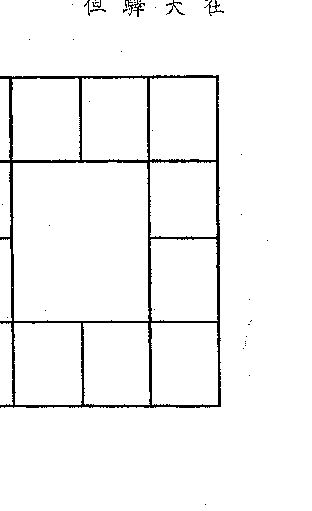
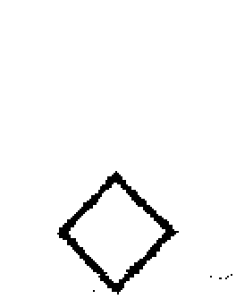
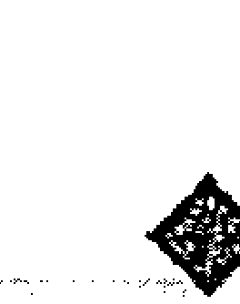
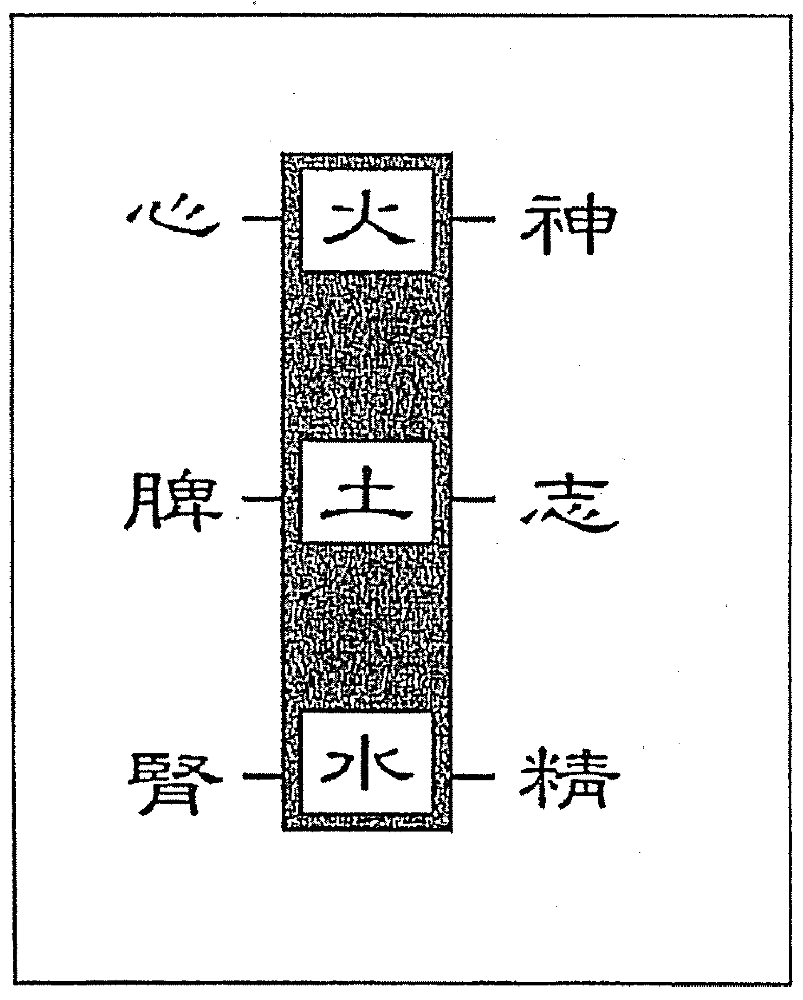
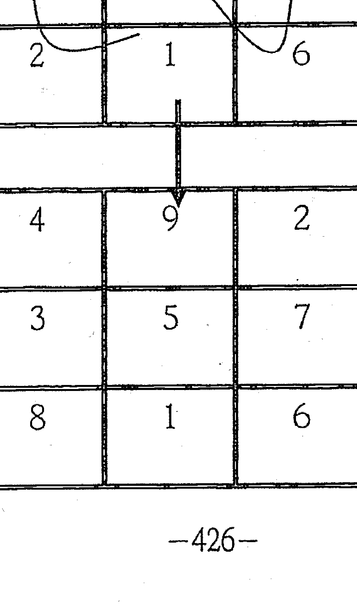

# 劝学斋紫微高阶之三

對所有人來說，快樂與樂觀（祿）是可以學習的。

對許多人來說，快樂與樂觀是須要加強學習的。只因他的主要宮位沒有化祿，或是祿被破壞，或是不善用祿。

祿星誤用反爲忌，忌星正用亦爲祿。

「成功」是可以自我訓練的，成功者有賴權祿並用，還要將忌轉祿。

祿是樂觀，權是奮鬥、進取；忌轉祿是因勢利導，化腐朽爲神奇。

- 1 -

勸學齋主

斗數小語人生篇

人的「心」與「懷」各有一個開關，是不能故障的。要「關心」，也要「開心」；要「關懷」，也要「開懷」。

許多人「關心」別人，卻忘了「關心」自己，更忘了「關懷」別人和自己的同時，要「開心」。

許多人「關懷」別人，卻忘了「關懷」自己，更忘了「關懷」別人和自己的同時，要「開懷」。

人生最難的事是——見好即收；人生第二難的事是——見壞即收。一般人多半搞到焦頭爛額，癱塌在地，讓別人收。

- 2 -

自序

勸學齋主

首先，還是要感謝所有來上課的學員，以及讓我論過命的人，有各位的發問及問題的發生，十足豐富了本書的內容。

這本書沒照預定時間出版，一來是《紫微高階之二。四化滴天髓》出書後，邀約論命、勘宅、取名者增多，以致時間不夠用。二來想要給四化做一個完美的詮釋，所以為《紫微高階之三。四化洩天機》行文的架構，費不少時間思考，又爲舉例翻箱倒櫃，尋找命例，以致拖延下來。

二〇〇七年下半年金融風暴發生，二〇〇八年席捲全球，令人稱羨的台灣科技新貴，頓時不貴了。每一家科技產業都在裁員，被裁員的人，若無其他技能，真的走投無路。

同時，有位學生的好友，家境富裕，卻患了舌癌，平時與友人飲酒作樂的唯一樂趣，被醫生禁止了。他卻買了一瓶洋酒與美工刀，獨宿一家飯店，邊飲酒、邊割喉，自殺身亡。

感慨之餘，寫了三句話，與大家共勉：

金錢的庫存要夠，以應付經濟蕭條；

才能的庫存要多，以應付景氣突變；

興趣的庫存要豐，以應付人生無趣。

科技新貴屬高薪階級，很多人賺多少，就花多少，沒有設定金錢的安全庫存量。

一遇無薪假，落得惶惶不可終日；如被裁員，又無其他才能，無法轉業，成了景氣不好的祭品。所以說：金錢與才能都要有足夠的庫存。

金錢是物質面的，才能兼具物質與精神。而許多人為了生存而生活，以致不把興趣列入人生必需品，以致單一的興趣被吊銷之後，生活變得無趣。這是恐怖的。
我們主張：工作即享受、事事皆有趣。

如果我們不能主動享受生活時，生活會自動變成我們的負擔。

研究命理最崇高的目的是——作好人生管理，並提升人生境界。

企業管理只是管理好官祿宮，人生管理是全面性的，命盤十二宮所管轄諸事，都得臻於完善。進一步說，企業管理是以官祿宮為體，其餘十一宮為用；人生管理則以命宮為體，其餘十一宮為用。

現行企業管理，已談到相當廣泛，但還沒涵蓋其餘十一宮；而斗數的架構原已具足，卻鮮見研究者能持人生管理的觀點，將斗數「有機化」。我們應參考企業管理，管理好整個人生。

- 3 -
- 4 -

命運可否改變？眾說紛紜：

一、萬般皆是命，半點不由人。

這是最要命的說法，是極度失意的人寫出的句子。不少人受它或淺或深的影響，導致沒有鬥志，喪失有此一生的意義。凡我讀者，務必完全去除這種想法。這個說法，稍稍一想，不攻自破。請問：今晚吃麵或吃飯，是命定的嗎？

二、命不可改，運可改。

這個說法被很多人接受，包括我的學生。有這個想法的人，想要改變自己的「運」時，常是力不從心，或是懷疑改運的可能性；運可改變，只淪落到有此一說而已，不會付諸行動。

試想：一個乞丐命的人，他在生活中，力行不迨，將行運創造成企業家。
請問：他是否改變了「乞丐命」？

三、命運皆可改。

從以上論述，當然各位會瞭解我是主張「命運皆可改」的人。常跟人說：我讀中文系畢業，性喜文學創作；一觸及命理研究，如果命運無可創作，我一定會拋棄它的。

在斗數上，我認爲命格不可改，但可加大或提升。怎麼說呢？譬如總統府的建築樣式，就是它的格局。三十坪的格局，可提升至三百坪，或三千坪，甚至三萬坪，但樣式不變。但願我的書，能夠影響各位，即日起提昇自己，造福周遭的人。

為減少錯字，此次運用勸學齋學員，組成龐大的「校對群」，列之於後，並此致謝。

- 5 -
- 6 -

高雄：吳義和、褚翔雲、張麗滿
台南：陳友城老師、談永芬、郭俊宏
台中：王心智
中壢：周桐明教授、黃子潤老師
台北：林萬福老師、馬碧霞老師、楊春根老師、劉啓光老師
新加坡：洪美蓮

最後，感謝林萬福老師及楊春根老師，將上課筆記整理好，提供我做本書的藍圖。

書成之際，台中勸學齋的據點已落成，隨筆誌之。

但願讀此書者，全部受益。以是之為序

己丑（二〇〇九）年孟秋
作者序於台北勸學齋

### 第一章 认识宫性及活盘  

#### 一、十二宫宫性  

斗数三要：宫、星、四化。  

紫微斗数采用南斗星（人马座）、北斗星（大熊星座），原本只有星曜，分布十二宫之后，多了环境问题，于是产生星性的第一度变化；又因命造出生年干、各宫宫干、大限宫干以及流年、流月等等天干四化，又使星性产生第二度变化。  

所以，研习紫微斗数对于宫、星、四化的论述，要并驾齐驱。研究一段时间后，要自我评比，目前宫、星、四化三个范畴，哪一个比较弱？比较弱的，就要加强；再过一段时日，再做评比。如此周而复始，每个人可进步。但论命时，宫、星、四化是要连成一气，综合论述。  

> 十二宫有两种：一顺一逆。  
>   
> 十二宫的宫性有两种：  
> - 一是子、丑、寅、卯、辰、巳、午、未、申、酉、戌、亥等十二支的性质。  
> - 二是命、兄、夫、子、财、疾、迁、友、官、田、福、父等十二宫的性质。  

- **顺行（即顺时针方向）**：子、丑、寅、卯……等十二支的序数性质。  
- **逆行（即逆时针方向）**：命、兄、夫、子……等十二宫的序数性质。  

顺为阳，逆为阴，一阴一阳。  

> 《易》曰：“一阴一阳之谓道。”斗数之道，也到处可见一阴一阳。如紫微已土为阴土，带领紫微星系六颗星曜逆行；天府戌土为阳土，带领天府星系八颗星曜顺行。又如天魁是阳贵人由未宫顺行、天钺是阴贵人由丑宫逆行；左辅阳土由辰宫顺行、右弼阴土由戌宫逆行；地劫阳火由亥宫顺行、地空阴火由亥宫逆行。  

因此，子、丑、寅、卯……等十二支的序数是：  
- 子1、丑2、寅3、卯4、辰5、巳6、午7、未8、申9、酉10、戌11、亥12，简称『支序』。  

而命、兄、夫、子……等十二宫的序数是：  
- 命1、兄2、夫3、子4、财5、疾6、迁7、友8、官9、田10、福11、父12，简称『宫序』。  

聪明的你，或许会想到，如果次序背成：命、父、福、田、官、友、迁、疾、财、子、夫、兄，不就是顺行了吗？不行！此十二宫逆序，除了与顺行的支序成一顺一逆、一阴一阳外，还符合河洛理数。如顺其序数，将无法寻著其理。『宫序』符合河洛理数，从河洛理数解开宫性，使命盘十二宫的解释活络起来，我们将之称为『活盘』。  

> 三十六宫，宫宫皆是春。  
>   
> 十二宫代表命兄夫子财疾等等的十二宫，一般我们都是看三盘。道家有一句活：“三十六宫、宫宫皆是春。”这个概念让我想到，紫微斗数的天地人三盘，一盘十二宫，三盘总共三十六宫，“三十六宫、宫宫皆是春”，正也是研究命理的目的，不是吗？  

我们不能只著重在命财官，旧思维论命，除了命财官之外，最多只是加上夫妻和疾厄。女人多半问感情，男人只关心事业，身体有问题方问疾厄，几乎是千篇一律。大家从来不顾及还有其他宫位可以让我们快乐，学命理就是教你如何运用那些让你快乐以及多点OK的事，更带动那些不舒服的地方。所以“三十六宫、宫宫皆是春”，就是在教导我们要一宫宫回春。  

我常强调：“解厄的第一个原则就是还原。”还原这一套方法，真的很好用。  

我们遭受的很多不必要的悲苦，都是不懂还原而徒然增加的。一对恩爱夫妻，先生讲了一辈子的甜言蜜语，有一天先生骂了老婆一句，这位老婆却悲伤地认为：以前的甜言蜜语都是虚情假意。若知还原，一辈子说了一千句甜言蜜语，今天说了一句坏话，她老公还是九十九点九九的好老公。  

我们总共有三十六宫，当我们感觉到不顺利的时候，大概只是其中某几宫位出了问题，只要把问题还原了，即知没那么惨，就达到了解厄的效果。如果要三十六宫同时出问题的话，机率上是非常的低。去还原他，你就会发觉我们的人生真的是太棒了。  
> 只要懂得还原，就会发现贵人好多、小人好少。我常说：计程车司机是我们的贵人，“一一”也是我们的贵人。数十年前，半夜想吃个东西，到哪儿买？现在他们确是二十四小时开着，方便大众，还得惊恐地预防半夜被抢。有的人说：便利商店的东西一般贵一成。我们则认为：给贵人多点钱是应该的。  
>   
> 大家一定要把还原这个功夫做好。看了命盘，也要学着还原，不要老是看着化忌发呆，以为从此就没有了明天，真的没有那么严重，一定要记住事事还原。当然还原的过程也有轻重之分，我们只要循序渐进地去一一还原，就不会被忌星吓到了，进而从忌中求禄了。  

##### 十二地支绕成週天三百六十度，每个地支管三十度。我们要了解十二宫有关：

##### ### ▼ 十二宫与十二方位  
>   
> 十二地支表十二方位，其度数请看《紫微高阶之二·四化滴天髓·第五章运用篇》第三五六至三五七页。可运用于屋宅外局及内局，外局何方对我有利？何方对我不利？利用地图，找出住家，论其外局方位。内局利用屋宅平面图，以其中心点，论内局方位。  
>   
> 用法如：某人大命化忌在本疾而为戌宫，内局的戌宫方位，不能当用事点。用事点即常用来做事的点，如睡床、办公桌以及常停留处。又如某人睡床在丙午宫，廉贞自化忌冲本疾，查知后即须挪开。否则易罹癌症。此法甚好用，在两本四化专著中，颇多论述。  

##### ### ▼ 十二宫与十二生肖  
>   
> - **子**为鼠、**丑**为牛、**寅**为虎、**卯**为兔、**辰**为龙、**巳**为蛇、**午**为马、**未**为羊、**申**为猴、**酉**为鸡、**戌**为狗、**亥**为猪。  
>   
> 举例来说：如见大官化忌冲本命子田，论为不得合伙；不得已必要合伙时，本命子田在子午，最须避开的合夥人生肖是鼠与马。  

生肖宫位为暗命宫之一，请看《紫微高阶之一·星曜铁关刀·第二章·宫盘两种命宫》。两人对待，将对方的生年干四化至自己命盘，又看自己命盘中，对方生肖宫位的宫干四化到我命盘；反之亦然，将我的生年干支，套到对方命盘，是我对他如何？请看《紫微高阶之二·四化滴天髓·第五章运用篇》第三五九页。  

###### ▼ 十二宫与十二星座  
>   
> 在《紫微高阶之一·星曜铁关刀·第二章·宫盘与十二星座》中，已详细说明。这里要告诉各位如何记忆？由戌宫逆行至亥，对应身体部位正好由头到脚，善用如下解释，可以强运避祸。  

- **戌宫：牡羊座**  
  - 对应部位为头部。这也很符合卦理，戌宫为乾卦，乾为首。  
  - 命财官在戌宫者，必要发展特殊才能，方能成就；当头部有病痛或急躁或自私，则是失运的表徵。在命则运歹、在官则影响官禄、在财运差；在大限命财官，主十年；在流年命财官，主一年。以下各宫位同此理论之即可。  

- **酉宫：金牛座**  
  - 对应部位为颈部、喉部。若命财官在酉宫者，要讲究生活品味，即能强化命财官的运势；如果颈部酸紧、喉咙痛、声带沙哑、生活没品味、贪求物欲，则是失运的表徵。  

- **申宫：双子座**  
  - 对应部位为手部、肺部。申属金，金主肺；申宫属坤卦，也是“二四为肩”之『二』的位置。若命财官在申宫，加强活动力、加强学习、加强沟通，即能强化命财官的能量；如果手部骨折、肺部有问题、常感冒、讨厌人、没耐心、肤浅、敷衍，所属宫位主管的运势将会走衰。  

- **未宫：巨蟹座**  
  - 对应部位为胃部。未属土，土主胃。若命财官在未宫者，只要家中和乐，即可强运；若是胃痛、家庭不和谐，敏感焦虑，运势随即下降。《紫微高阶之一》星曜铁斗刀·第三章·廉贞星（二四九页）中引德国癌症专家汉姆医师说：“与家人矛盾或为家人担惊受怕，产生胃癌。”不同的学问，却指出相同的关联——胃部与家庭关系，可供大家深思及运用。  

- **午宫：狮子座**  
  - 对应心脏、性能力、背部。午宫属火，火主心脏；午宫属离卦，离主目。命财官在午宫者，若两眼无神，或骄奢自大，或不快乐，或缺乏自信，或对应部位有问题，即是运势弱。开运秘诀是——自信不自大、快乐昂首向前行。  

- **巳宫：处女座**  
  - 对应肠子。巳宫为火，生肖为蛇；小肠为阳火，肠子与蛇形状相仿。若命财官在巳宫者，只要放松身心即可得运；若肠子出问题、紧张、爱批评人、挑剔唠叨，则主管宫位的运势就会下滑。  

- **辰宫：天秤座**  
  - 对应腰、肾。命财官在辰宫者，若腰肾病痛，或与朋友夫妻不和，或优柔寡断、摇摆不定，则命财官的运势会下滑；其开运秘诀是——内外和谐，择是为之。  

- **卯宫：天蝎座**  
  - 对应肝、生殖力、内分泌。命财官在卯宫者，如对应部位病痛，或得失心重，或不知蜕变，或钻牛角尖，或嫉妒心重，则命财官会出问题；只要知道蜕变，不要有得失心，运气自然好。  

- **寅宫：射手座**  
  - 对应筋骨皮、脊椎、脑神经、屁股、大腿。命财官在寅宫者，若对应部位有毛病，或过于自信，或逃避，或急躁，则命财官一定不好；只要兼顾读书与外出走动，面对所有事，能量自然激发。射手座又名人马座，人马座是一人一马，是人就要读书，是马就要奔驰。  

- **丑宫：摩羯座**  
  - 对应膝盖、关节、牙齿。命财官在丑宫者，若膝关节炎痛、牙痛，或悲观，或逃避压力，或居功诿过，或唯利是图，命财官的运势一定下滑；只要将压力化大为小、保持乐观、不居功，则可保强运。  

- **子宫：水瓶座**  
  - 对应脑部、小腿。命财官在子宫者，若脑神经痛，或小腿部骨折，或怕冷，或对他人冷酷，或叛逆心起，则命财官的运势势必下滑；只要抱持热诚、顺从情势，必然强运。  

- **亥宫：双鱼座**  
  - 对应脚部。命财官在亥宫者，若脚部有病痛、滥情软弱，命财官的运势一定不好；任何人都要有同情心，但牵扯此宫者，就要减低同情心，运势自然好。  

如戊子（二〇〇八）年，大家都一样，流年命宫在子、流年财帛宫在申、流年官禄宫在辰，今年要强化命财官之运势，只要遵循申子辰三宫的强运原则，则可在今年交出漂亮的成绩单。  

己丑（二00九）年，丑为流命、酉为流财、巳为流官，摩羯座的强运原则：将压力化大为小、乐观、不居功诿过；金牛座的强运原则：讲究生活品味；处女座的强运原则：身心放松。以上述三星座的强运原则，实施于生活中即可。  

莫拉克台风重创南台湾，看看政府官员居功诿过，可知国运必衰。伤感之余，诗以志之：  
> 国在山河破，村居变土坡；天灾人更祸，不忍哭声多。  

##### ### ◇ 十二宫与天地人  
>   
> - **子开天**、**丑辟地**、**寅生人**。周历建正在子，法乎天道；商历建正在丑，法乎地道；夏历建正在寅，法乎人道。后世绝大多数朝代，采用夏历，即因其法乎人道，近取后天人事之故。  
>   
> 邵雍（康节）的《皇极经世书》以十二地支为十二会，一会为一万零八百年，目前正在「午」会，一直到民国一百九十二年（西元二一0三）止，隔年即是「未」会的开始。  

既以子为天、丑为地、寅为人，续以天地人顺佈如下：  
> （此处省略图示说明，依文意理解即可。）  

##### ### ▼ 十二宫与三方  
>   
> > 《三命通会·卷二·论支元三合》曰：“精乃气之元，气乃神之本，是以精为气之母，神为气之子，子母互相生，精气神全而不散之为合，盖谓支属人元，故以此论之。”  
>   
> - **子丑寅**分别为天地人、**卯辰巳**分别为天地人、**午未申**分别为天地人、**酉戌亥**分别爲天地人。  
>   
> 如此则：  
> - **子午卯酉**皆天位，  
> - **辰戌丑未**皆地位，  
> - **寅申巳亥**皆人位。  

- **申子辰**则分别为天地人，其余巳酉丑与寅午戍与亥卯未亦是。此即三合，亦称三方，天地人三才皆具。  

|  | 天（午） | 地（未） | 人（申） |
|---|---|---|---|
| **巳** | **辰** | **酉** | **戌** |
| **卯** | **丑** | **子** | **亥** |
| **寅** | **地** | **天** | **人** |  

##### ### ◇ 斗数的三方四正与三方、四正  
>   
> 我们现在再来综合一下命财官，以标准的三方来讲就是命财官。再说，每一个宫位皆有其三方，命财官互为三方，意即：  
> - 命宫的三方是命财官，  
> - 财帛宫的三方也是命财官，  
> - 官禄宫的三方也是命财官；  
>   
> 其余宫位的三方为：兄疾田、夫迁福、子友父。  

以四正而言，总共有三组，就是：  
- **命迁子田**，  
- **兄友财福**，  
- **父疾夫官**。  

属于三方的命、财、官，每一个宫位带出了一组四正位。  

若称「三方四正」（中间没有标点），就是命、财、官三宫加上迁移宫。十二宫皆须论其三方四正，只是在主事宫位加上对宫，对宫是吉星来照、凶星来冲的地方，当然重要。  

> 三方四正（命财官迁）的迁移，代表了在外的命，以「在外的命」来诠释，是最能够兼容并蓄，且涵盖面也比较周到。迁移代表了动态的命，也包含了内性。我们谈到命迁时，会更详细的说明，我们现在只是将命财官作一个综合的说明。  

##### ### ▼ 命宫比财官重要  
>   
> 以命财官三宫来比较，命宫比财官重要得多。命财官虽为三方，被我们视为重要的一环，但终究不是重叠的；如果命财官是相等的，那又何必必要分为三官？也唯有归纳成三宫，才会发生一些有意义牵扯和关联，但绝对不是画上等号。  

当各位知道了这种划分，之后就会了解如何去动手处理其中的牵绊。我体察到一个理论，就是「凡事能掌控的，得去掌控；不能够掌控的，将之放下。」各位！能掌控的是命宫，不能掌控的是财官。放下算是第一步，否则漫无意义去操心、烦心，是最难过却是无知的事，也是无聊且是浪费时间的事。  

##### ◇ 命、财、官等十二宫基本宫性  
>   
> - **命宫**：一辈子的运势、面貌、个性，以及显意识。  
> - **兄弟宫**：主管兄弟姐妹的宫位，可以说是兄弟姐妹的综合命宫，论其个性及与命造关系。  
> - **夫妻宫**：主管配偶的宫位，可说是配偶的命宫，又主管命造与配偶的关系。  
> - **子女宫**：主管生儿育女的宫位，可以说是儿女的综合命宫，又主管命造与儿女的关系；还可看命造的性能力及性器官。  
> - **财帛宫**：主管金钱的收支方式及多寡。注意，财帛是两件事，一是钱财、一是衣帛。  
> - **疾厄宫**：主管命造的身心，其体在看心，其用在看病；是以「病由心生」，强调「身心医学」。  
> - **迁移宫**：主管在外的命，诸如行动能力、外出吉凶、外出贵人有无，以及车祸外灾。又表命造之内性。  
> - **交友宫**（古称“奴仆宫”或“僕役宫”）：包括同性及异性朋友；主管与朋友交际之关系，情份深浅。  
> - **官禄宫**：可说是「事业宫」。主管一生事业兴衰，以及命造做事的智商；又称「气数位」，意谓后天行为的表现宫位。  
> - **田宅宫**：主管住家环境、家运、财库、禀赋、家教。  
> - **福德宫**：德者，得也。福德即是累世劫所作所为的福利总得；追溯及前生，而为今生的潜意识。显示在今生的是「癖」，说得文艺点是「心坎儿里」或「心灵深处」。  
> - **父母宫**：主管父母的宫位，可以说是父母的综合命宫；由父母引申至父执辈、长官、父母官、政府机构；又为命造的文书宫，以及情绪宫位。  

如果宫性仅只上述范畴，是不够用的。命理总能依据《易经》「由一而二，推衍至无穷」的原理，再强化宫性的运用。下一节，我们接著谈。

## 十干四化與天地人三才

| 暴變 | 人（艮） 乾管轄 （天合人） | 地（坤） 坤管轄 （地是地） | 天（乾） 艮管轄 （人合天） | 干 | 忌屬星系 | 備註 |
|---|---|---|---|---|---|---|
| 癸 | 壬 | 辛 | 庚 | 己 | 戊 | 丁 | 丙 | 乙 | 甲 | 干 |
| 破巨陰貪 | 梁 | 巨 | 陽 | 武 | 貪 | 陰 | 同 | 機 | 廉 | 禄 |
| 紫 | 陽 | 武 | 貪 | 陰 | 同 | 機 | 梁 | 破 | 權 |
| 左 | 曲 | 陰 | 梁 | 右 | 機 | 昌 | 紫 | 武 | 科 |
| 武 | 昌 | 同 | 曲 | 機 | 巨 | 廉 | 陰 | 陽 | 忌 |
| 天府 | 紫微 | 天府 | 紫微 | 天府 | 紫微 | 天府 | 紫微 | 天府 | 紫微 | 忌屬星系 |
| | | 七殺隨文昌化忌 | 太陽後天離先天乾 | 破軍隨文曲化忌 | | 太陰屬坤卦。 | | 廉貞屬艮卦。 | | 備註 |

---

將十天干分天地人：甲乙丙為天、丁戊己為地、庚辛壬為人、癸為暴變。

天地人各有三個干，再分天地人，於是：

甲為天之天、乙為天之之地、丙為天之之人；

丁為地之天、戊為地之地、己為地之人；

庚為人之天、辛為人之地、壬為人之人。

甲乙丙為天，乾為天，然以人來合天，所以由艮卦管轄。丁戊己為地，坤為地，依然由坤卦管轄。庚辛壬為人，艱為人，然以天來合人，所以由乾卦管轄。

甲為天干之始，其四化卻也透露了人類文明的開端，人類文明由知道用火開始。甲干廉貞化祿，廉貞的藏干是乙木、丁火、戊土，而乙木、丁火表達了鑽木取火；戊土就是艮土（己土是坤土），艮土是山坡土，表達了穴居的開始。早期人類不知用火時，跟其它野獸沒兩樣，都是生食；知道用火烤肉燒菜，文明列車於焉開動。

▽ 十干四化透露人類用火是文明的開端

廉貞屬艮卦（人），是連山易的首卦，因而在天之天的甲干化祿，卻在天之人的丙干化忌了。

太陽屬離火，後天離乃是先天乾，乾為天是周易的首卦。故在人之天的庚干化祿，在天之天的甲干化忌了。由此可知，太陽屬丙火外，尚屬庚金（乾）。

太陰屬坎水，後天坎乃是先天坤，坤為地是歸藏易的首卦。故在地之天的丁干化祿，而在天之地的乙干化忌了。由此可知，太陰屬癸水外，尚屬己土（坤）。

有人統計過，世界偉人八成出生在甲、丁、庚年，剛好是天之天的甲、地之天的丁、人之天的庚，也就是天地人的第一個天干。

癸干是暴變，最後一個天干有汰舊換新的作用。不只天干如此，地支也不例外，地理的三元運也相同。各位試著去考證，民國七十二年（西元一九八三）剛好是癸亥年，中元運的最後一年，不也是數不完的淘汰風潮嗎？蔡辰洲就是在這波被淘汰的。美國次級房貸風暴發生於二〇〇七年（丁亥年），一發不可收拾，直至今日世界景氣依然蕭條。

▽ 甲、丁、庚干化祿的星，在甲、乙、丙干化忌。

甲乙丙是乾為天，而由艮管轄，雖示現人合天，但天之天的甲干所化祿的廉貞，卻在天之地的丙干化忌了。這點讓我們體會到，廉貞的祿氣是不會久長的；換句話說，凡事一開頭的好處，很可能快速消失。

庚辛壬是艮為山（人），而由乾管轄，雖示現天合人，但人之天的庚干所化的祿星太陽，早在天之天的甲干化忌了。

丁戊己是坤為地，地之天的丁干由屬坤卦的太陰化祿，而太陰卻在天之地的乙干化忌了。是否古時真有十個太陽，而有「后羿射日」之傳說？或者天地剛形成，日月經常灰濛濛的？只能想像，無法求證；反正，化忌是過猶不及，兩種極端現象都有可能。

但是，我願意提出比較有利於現代人的一種思維，就是：太陽是男人、太陰是女人，不經一番寒澈骨（忌），怎得梅花撲鼻香（祿）？男女都得受過「忌」的洗禮，最後必能得到「祿」的擁抱。

至於天之地乙干化祿的天機，在地之地的戊干化忌；天之人丙干化祿的天同，在人之天的庚干化忌；地之地戊干所化的祿星貪狼，在暴變的癸干化忌（戊癸合化火，貪狼在陽干化祿、在陰干化忌）；地之人己干化祿為武曲，卻在人之人壬干化忌；人之地辛干化祿為巨門，巨門卻在地之天的丁干化忌。

整體說來，化祿的星除了壬干的天梁祿沒化忌外，其餘化祿的星都在別的干化忌。（按：癸干的破軍祿，在己干時也化忌，因破軍隨文曲化忌，文曲是破軍的伴星。）

天梁只祿不忌，應有其特殊性。各位再看看：甲已合，甲干化武曲科、己干化文昌忌；乙庚合，乙干化太陰忌、庚干化太陰科；丙辛合，丙干化文昌科、辛干化文昌忌；戊癸如上段文字所述，戊干化貪狼祿、癸干化貪狼忌。唯獨丁壬，兩干四化沒交叉。

## 武貪主大，在戊己陸續化祿，在壬癸陸續化忌。

十干四化有其機密地排列組合，貪狼、武曲在戊己中央土分別化祿，而在己庚分別化權。可見武貪主大，也須在安穩的十天干中央處，成就好處。武曲、貪狼卻在天干之末壬癸，分別化忌。

我常強調：壬干的天梁祿不敵武曲忌，癸干的破軍祿不敵貪狼忌，也因武貪主大之故。

## 天機依序在乙丙丁化祿權科，是「三奇嘉會」的來由。

宋·曾慥《道樞·入藥鏡上篇》：「天有三奇焉：日也、月也、星也。地有三奇焉：乙也、丙也、丁也。人有三奇焉：精也、氣也、神也。」《奇門遁甲》的三奇，也就是乙、丙、丁為開、休、生。

紫微斗數的十干四化，乙、丙、丁剛好是天地軸星——天機星分別化祿、化權、化科，因此將生年祿權科在命財官者，稱為「三奇嘉會」格。

## 陽干紫微星系化忌、陰干天府星系化忌。

請看前面表列「忌屬星系」欄，讓我們很訝異地查知，陽干甲、丙、戊、庚、壬所化的忌星，皆是紫微星系，陰干乙、丁、己、辛、癸所化的忌星，皆是天府星系。

紫微星藏干己土，亦即陰土，依據「陽順陰逆」的不變法則，排盤時紫微星系逆行；天府星藏干戊土，亦即陽土，所以排盤時天府星系順行。

在四化時，陽干由屬陰的紫微星系化忌；同理，陰干由屬陽的天府星系化忌。

斗數隨處可見陰陽並存，或者陰歸陰、陽歸陽，或者陰配陽、陽配陰。各執其理，有條不紊。

知道上述諸多奧秘，只有在深入研究的誠意，不敢懷疑四化的安排。曾在多年前，寫了一篇《斗數千干四化與南北斗研究》，請參考附錄（四三五頁）。

### 三、十二宮宮性深研

#### 活盤原理——由宮序談起（附：密宗星學與果老星宗之宮序）

從十二宮深研——強化活盤開始，就要強化宮性運用。如果只知道子田為桃花的用位，而不知其體在夫妻，就無法論桃花；縱使論中了，也只是瞎貓碰到死耗子，矇到而已。如果知道子田為股東的用位，而不知其體在官祿，就無法論合夥；縱使論準了，也只是瞎雞啄到米、瞎貓碰到死耗子，碰巧而已。

很多人既知稱「用位」，卻不審「用位」必有其「體」，若無「體」，「用位」何來？「體」為「本體」，「用」為「作用」。活盤就是利用一個「體」與「用」的關係，就能知其然，更能知其所以然。

重點是：要有本體，才有作用。這就是現在要研究的，在論事時，要有「體」、「用」才能當活盤來解釋。

研究活盤原理，要由宮序談起。前已述及宮序是逆行的，如下圖。命 1、兄 2、夫 3、子 4、財 5、疾 6、遷 7、友 8、官 9、田 10、福 11、父 12。

這個 1 至 12 的序數隱含先天河圖數與後天洛書數，依此可鑽研出更多、更廣、更活的宮性。

在此，順便介紹『密宗星學』其宮序：
1 命（外象總綱）、2 財（營運收益）、3 助（兄弟朋友）、4 宅（財產積貯）、5 嗣（子女異性）、6 輔（部屬對下）、7 偶（婚姻家室）、8 疾（病患災禍）、9 行（遷移涉外）、10 官（奉職對上）、11 福（福澤壽元）、12 采（父母遺傳），更有身宮（內象總綱）。

『果老星宗』則是：命宮 1、財帛 2、兄弟 3、田宅 4、男女 5、奴僕 6、妻妾 7、疾厄 8、遷移 9、官祿 10、福德 11、相貌 12。

| 命 | 父 | 福 | 田 |
|---|---|---|---|
| 1 | 12 | 11 | 10 |
| 兄 | | | 官 |
| 2 | | | 9 |
| 夫 | | | 友 |
| 3 | | | 8 |
| 子 | 財 | 疾 | 遷 |
| 4 | 5 | 6 | 7 |

#### 先天河圖一六共宗

河圖的一六、二七、三八、四九、五十，都相差五。一為命宮、六為疾厄宮；二為兄弟宮、七為遷移宮；三為夫妻宮、八為交友宮。若以兄弟宮起一，數到第六宮也是遷移宮；以夫妻宮起一，數到第六宮也是交友宮，餘此類推。

因此以一六代表即可，這是先天河圖，最簡單的解釋「先天」就是：一件事的前提。而前提又有前提，也就是說先天又有先天；相對地，後天又有後天。以四象分析來說：先天再分先、後天，後天也可再分先、後天。

#### 任何一宮都可立太極，以其第六宮論其本體。

上次只談十二宮強化活盤的前言，現在稍微複習一下，從河洛理數，就是先天河圖一六共宗，若直接套到命盤，一為命、六為疾厄，既然一六共宗北方水是河圖，最初是以命為 1，第六宮是疾厄宮，原開始只是這樣而已。

從這裡就要瞭解六是本體、一是作用。我記得剛開上課時講義是用手寫的，當時還有一篇叫體用論，後來將體用論打散在各個章節來說；因為我發覺，以前在上體用論時，好像在教博士班，聽得很累，講課可以從學員臉上知道反應。

不過大家還是要瞭解：不明體用，不分陰陽，就違背了命理。我一直很喜歡命理，是基於認知陰陽哲學的絕妙，非常好的。所以我很公然的說：「如果鐵口直斷，這句話根本就是違背命理。」

因命理是談陰陽哲學，陰靜不變，陽一動就是在變，也因為有這個陽動，命運才可以改變；如果是純陰的，那就免了，有多少飯就吃多少飯，都沒有什麼可以提昇進步的。

因此：
兄弟宫的体在迁移宫；夫妻宫的体在交友宫；子女宫的体在官禄宫；
财帛宫的体在田宅宫；疾厄宫的体在福德宫；迁移宫的体在父母宫；
交友宫的体在命宫；官禄宫的体在兄弟宫；田宅宫的体在夫妻宫；
福德宫的体在子女宫；父母宫的体在财帛宫。

△ 不明体用、不分阴阳，岂合命理？

所以在每个地方都要知道体用在那里？从现在开始，很多地方都要告诉各位体在那里？用在那里？我也是研究命理很久才发现的，如果不讲体用，不分阴阳，根本不是在讲命理，只是在江湖。

像一六共宗，一是阳的，六是阴的，体用就是分阴阳。因为奇数为阳、偶数为阴，所以体是阴静的，用是阳显、阳动的。由此来看，一是用为命、六是体为疾厄。所以，疾厄是命的体。那体呢？因为阴静，阴静又叫先天；那用就是后天，就分先后天。

- 講先天一定是屬陰的、後天一定是屬陽的。只不過要更加瞭解，因為陰陽哲學就是從本來無極生太極、太極生兩儀、兩儀生四象，就是陰還可以分陰陽、陽又可分陰陽。從這些事情來，大家可以套用到人生，所有的事全部可以由 1 分為 2，再由 1 分為 2，一直分下來，所以往後天推，就可以一直推到無窮無盡。

為什麼疾厄宮是命的體、命的先天呢？談疾厄不一定要疾厄，會有疾厄源自於身心。這就是由體再分體用，也就是陰可以分陰陽、陽又可分陰陽。以這個體再來分「體」、「用」時，這個「體」在看心、「用」在看病。

△ 有形體必有毀壞的一天

- 由這一層來談，病由心生，但病由心生很哲學，很抽象，講白一點，什麼才會病呢？要有「有形體」，譬如：有肉、有頭髮、有心臟這些，一「有形體」以後，以佛家來講，有形必有壞。也就是已經形成一種形體以後，才會有產生毀壞的事，也一定會毀壞；這在物理學也做這樣的描述，研究是說：東西是不同的波長，就產生量子，量子以後就結合成物體，有了物體以後，它一定有時限，到某一期限就會毀壞掉。

這是在物理學跟佛學在這方面，不同的領域確有相同的見解。現在也知道「體」在看心、「用」在看病，如果我沒有這個身，那來病呢？我常常講「病痛」，其實有些病是不痛的，像肝病會不會痛、頭髮有沒有病，有啊！分叉什麼的，會不會痛呢？總不能跟醫生講說我的頭髮痛，他會把你送到精神科的；也不能跟醫生講說離開我頭一公尺遠的地方在痛，他也會把你送到精神科的。

這樣的描述就是說只要有「有形體」，它都可能有病或痛，但病不一定痛，所以先決要件就是簡單用命理來講就是身，我有這個身心是我命的前提，若沒有身心那談什麼命呢？所以說疾厄是命的先天可能不好瞭解，那剛剛這樣的描述應該各位可以瞭解吧！

太極，然後要論其他的事時，可以各宮各自立太極，就以那一宮為主，譬如：夫妻宮是在描述一個人婚姻、感情、配偶的命宮。

各宮都可以當命宮，原本的命宮是總管，其他的只專管哪一類的事。所以可以把 1 挪到夫妻宮，那夫妻宮一樣有一六，若把夫妻宮當 1 時，那它的第六宮就是交友宮。一個人的體裁、體格是看命宮、遷移宮、疾厄宮，這三宮連看。所以配偶的體格，就看夫妻宮、官祿宮、交友宮，這是把太極立到夫妻宮。

看你太極立在哪裏？關於立太極這一點，各位一定要好好去體會，我們在各種領域中，都會有各種不同的太極點，譬如我現在跟各位講課，在課堂上我所處的就是一個大太極，而各位又有各位的小太極，下了課后如果聚在一起小酌，我沒有在講課了，所以此時個個都成了相同的太極，這就是太極的定義之一。

所謂『物物皆太極』，就是每一樣東西都是太極，也是說每個地方或事物皆可立太極。重要的是如何在我們專注的事物中，把最重要的部份挑出來立為太極。以命盤來講，命宮當然是太極。如果我是想了解有關夫妻之間的問題，那麼夫妻宮就成了太極，這個時候我們去論夫妻宮的星曜，或者是夫妻宮的四化，就是把太極立在夫妻宮了。

『太極移位而變形』對斗數來說，就是當你 把太極移到財帛宮的時候，你就不能再去论夫妻了；当论田宅时，即是把太极移至田宅宫，也就不能论其他无关的宫位了。

『太极可大可小』对斗数来说，田宅宫小太极论阳宅内局，大太极可扩及外局；夫妻宫小太极论婚姻配偶，大太极可扩及异性；子女宫小太极论子女，大太极可扩至部属、外面、……等等。

# 一为命、为阳、为后天、为用，六为疾、为阴、为先天、为体。

我们现在再来谈一六，一六共宗北方水。一为奇数，奇数为阳；六为偶数，偶数为阴。阴为先天、阳为后天；先天为体、后天为用。

由这里可以看出，以疾厄序数为 6、为体，以命宫的序数为 1、为用。我们想一想命宫与疾厄宫的关系是如何？先天是后天的前提，也就是说疾厄宫是命宫的前提，有命前要先有疾厄。如果没有身心，谈啥命呢？

疾厄宫不是专门在论病，就好像有夫妻宫不见得就会结婚，有疾厄宫不一定要生病。疾厄是在論「身」、「心」，這裡又分體、用。以命跟疾厄來比對，疾厄是先天、命是後天。但疾厄這個先天，又可以分先、後天，體為先天、用為後天。

疾厄宮體（先天）在看心、用（後天）在看病。

病也有前提，就好像佛教講的「有形必有壞」，物理學講的波長交叉以後，會形成一個物體，既然有了物體就有毀壞的一天。在談病之前一定有一個「體」，這體不是體用的體，是身體的體、形體的體。一定要有這個身體，才會生病。既然說體在看心、用在看病，疾厄宮無非是在強調身心醫學。

所以，如要對命理深入，「分陰陽、明體用」是非常重要的。我再為體用與陰陽，詳細為各位解說。先天為體、為陰、為靜，後天為用、為陽、為動。雖說先天為體，先天又可分體用，也就是說先天又可分先後天；後天為用，用也可分體用，亦即後天可再分先後天。

換句話說：先後天是兩者比對後才分的，動靜也是比對而來。譬如：「道德」兩字，「道」為體、「德」為用，「道」為先天、「德」為後天，後天都比先天陽顯、後天也都比先天具體。再說，「德行」兩字，則是「德」為先天、為體，「行」為後天、為用。「氣色」兩字，「色」比「氣」具體可觀，所以「氣」為體、為先天，「色」為用、為後天。

我們將命宮與疾厄宮來比對，命宮為陽、為後天、為用；疾厄宮為陰、為先天、為體，這也是比對來的。疾厄宮在此為先天，我們還可再追其先天，亦即以疾厄宮為 1，逆數第 6 宮為福德宮，可知福德是疾厄的體，也是疾厄的先天。我們經常這樣描述：福德是疾厄的疾厄。

任何一宮要追其先天，都可用該宮為命，追其疾厄即是。譬如：財帛的體即在財帛的疾厄，亦即田宅宮。官祿的體即在官祿的疾厄宮，亦即兄弟宮。

過去我曾以哲學的層次，說病由心生，自覺蠻可以理解的。後來看到春山茂雄所著《腦內革命》一書，也談到病由心生，是以醫學的學理來談的，跟斗數主張的不謀而合。如果能夠保持一顆非常清朗的心，心情絲毫不被干擾，絕對沒有病。一般人很難保有這個心境，不過，也要趨向那個心境走、往那方面努力。

各位可以試著去回想看看，每當生病之前，是不是有特別的不高興，或厭煩、心情低落等情形，所以把自己心裏面的垃圾清理乾淨是非常重要的。

#### 疾厄宮論身心與身心醫學

有了形體才會毀壞，有了身體才會有病痛。身體包括我們的肉體及五臟六腑，總不能說離開頭部一公尺的地方在痛，醫生碰到這種病人，我看只能送精神科。
所以，要有病痛必先有身體；縱使頭髮不會痛，但它也會有病。身體上的器官部位，有的會痛、有的不會痛，痛是病、不痛也是病，終究是身上的東西。
所以一定要有形體，有了這個形體、有了這個心，是遠在生命之先，再來談命，所以命反而比較後天，這是它的作用。因此，我一直認定斗數的疾厄宮是在談『身心』的宮位。

十多年前（約 1997 年），讀了一本日本著名女醫師的書，也屬西醫系統，但卻強調他們主張的是『身心醫學』。書中記載不少病例，治療時是身心並治的。譬如：有一男孩經常發高燒，他媽媽一定帶他去找這位名醫門診。次數多了以後，這位名醫說：「妳想不想讓妳兒子不再發高燒？」這位媽媽回答說：「當然啊醫生！妳是名醫，所以每當兒子生病，妳在哪兒門診，我就帶到那兒，就因為相信你這位名醫啊！」醫生說：「那麼妳要坦白回答我的問題，並配合我的方法。」當然這一位媽媽滿口答應。醫生問道：「你是否常在兒子面前罵妳老公？」這位媽媽一時愣住，面色鐵青，緩緩地說：「是的！」

令人驚奇，竟然這是第一個論斷。她開藥時，還會囑咐病患唸經。看了這本書，我不禁莞爾，因我從民國八十（1991）年起，論命同時要人唸某經，她則是因病症不同耍人唸某經。

▽ 疾厄論身心，「心」究竟在哪？

「心」這個字眼，大家都很熟悉，現在我要問各位：「心」究竟是指哪個部位？或是指哪個器官？

甲生答：大腦。

乙生答：心臟。

這可就讓大家莫衷一是了。這個問題對斗數研究者，甚為重要。怎麼說呢？我喜歡斗數，原因之一乃是斗數是『心的哲學』。大家看看，化忌的『忌』字，分開來不就是『己心』嗎？不能『降伏其心』，焉能掌控命運？我研讀了一些書，也常深思此一問題，深感趣味與重要，先將我讀過且贊同的資料一一引述於后：

中醫學認為對全身的機能活動起主宰和協調作用的是『心』，所以稱其為『五臟六腑之大主也』。

傳統中醫將人腦的生理功能，和認識外界事物及其思維、判斷能力等，都歸諸於心。如《靈樞·本神》所說：「所以任物者謂之心，心有所憶謂之意，意有所存謂之志；因志而變謂之思，因思而遠慕謂之慮，因慮處物謂之智。」

時報出版的《心能量開發法》一書說：心比腦還聰明。作者是杜克。

齊德瑞與霍華·馬汀，他們提出心能商數法則（The Heartmath S. Iutin），認為：

「心臟的確具有足以影響知覺的智能，且思想性的心與生理上的心互動。經由一個靈魂與人性交界的直覺轄區，心臟讓人們提昇到更高的智慧層面。」

「科學的証據顯示：心臟能夠傳送情感和直覺的訊號，幫助我們掌控自己的生命。除了運送血液外，它還負責管理體內的許多系統，以使它們能互相合作。而且，心臟和腦部不斷地在溝通，藉著本能進行許多自我決定。」

「新的發現揭露了新潛能：在每個人的內心裡都存在著組織的中心智能，即使處在極惡劣的逆境中，它仍然能夠帶領我們暫時擺脫問題，而進入一個滿足的新經驗。它是一個高速本能智慧的清晰認知，能夠同時結合、強化理智和感情的能量。稱之為『心能智力』。」

「『心能智力』是一種知覺程度和洞察力。當我們感應到它的作用時，理智、情緒即會經由內在的自發過程，進入平衡、和諧的狀態，並淨化身心。」

「古代文化包括美索不達米亞人、埃及人、巴比倫人和希臘人，都相信心是主導情緒、道德、決策的首要器官。」

「古猶太的經文中，心被表示為能量中心或美麗、和諧、平衡。」

「中醫把心視為思想和身體之間的橋樑。心可以解釋為思想的或性靈的，血管是溝通理智和靈魂的輸送管，把心跳的節奏所蘊含的訊息帶到全身的每一個部位。」

「神經科學新發現：心臟有獨立的神經系統——一個複合的系統，稱之為『心腦』在心臟內部約有四萬個神經原，和腦下皮質中心所發現的一樣多。這個心臟內部的腦和神經系統，將資訊轉送到頭蓋骨裡的腦，創造頭部和心臟之間的雙向溝通系統。」

「心理學家萊歇夫婦發現：當頭腦經由神經系統將命令送達心臟時，心臟並非機械化地服從，反而根據自己的本能邏輯在做適當反應。譬如：當頭腦送出亢奮的訊號來指揮身體對外來的刺激做出劇烈的反應時，心跳的速度照理說應該會加快。但是，若身體的其它器官都呈現加速的反應時，心臟往往會漸趨緩和。可知，心臟並非呆板地接受腦部的指令，而是根據任務的本質，及它所須要的心理過程做認可的反應。」

「萊歇夫婦又發現：當心臟將訊息送回腦部時，腦部不但能夠了解，而且完全服從。由此看來，真正能夠影響個人行為的，是由心臟發出的訊息。」

「當我們仔細傾聽內心的聲音時，智慧和直覺都會提昇。」

「先拋開心臟和頭腦之間的差異，而仔細觀察當我們以心能智力來認知周遭的世界時會有何不同。」

「頭腦執行的是一種線性的邏輯思維，雖規範情況的相應之道，也限制了想法，無法解析複雜問題或糾葛情緒。」

「心能智力提供直接、本能的知識，幫助我們的意識跨越線性的邏輯思考。例如一對戀人散步逢大雨，淋成落湯雞，心情亦甚愉快。因他們是用心在溝通。」

- 如兩人正在吵架，惡劣的心情根本無法靈犀相通。小雨也更煞風景。此時的雨是被頭腦所認知的。一樣的雨，由『心』去看它，是自然現象；用『腦』去看它，是惱人的問題。
- 「腦的活動包括：思維、想像、記憶、策劃、計算、控制和偶爾的自責。心的活動包括：關懷、先見、直覺、諒解、安心和感激。」
- 頭腦決定什麼是好、壞，什麼是合適、不合适的。依過去經驗，將各類情況進行分類、辨別，由此判斷現況及預測未來。換言之，頭腦組合成連貫的模式，在生活中即能以預設的立場做效率化的處理，不必重新學習一切，節省應對的時間與精力。但此一創造模式的能力，同時讓我們陷入固定的思考中，阻礙接受新的可能。
- 「頭腦是『知道』，但心能『了解』。」
- 注意力集中心臟與眼觀鼻、鼻觀心，觀到「鼻室生白」。
- 這本書還提供一個腦速心的方法，天天試著將奔馳的思緒及雜亂的情緒暫時置之一旁，讓注意力集中在心臟周圍的位置，想像呼吸的氣息已進入心臟，再將能量聚集在這部位。如此專注十秒鐘。

這與古人提出靜坐方法中的眼觀鼻、鼻觀心，要觀到鼻室生白，真有異曲同工之妙。注意力由眼觀鼻引至鼻子，再由鼻觀心而至心臟。觀到鼻室生白，乃是凝視聚焦引起的視覺煙霧。

知道「心」的作用，有助於《紫微高階之二·四化滴天髓·斗數心法》——關掉業障那部機器》文中所訴求的目標，所以我不厭其煩地引用上述參考資料。

前面講過了：先有身心，才會有命。而疾厄宮所論的『心』，展現在命宮為『性』。

疾厄宮為六、為陰，命宮為一、為陽，陽是陰的顯現，故說『心』展現為『性』。

以疾厄宮立太極，除如上述，以疾厄為體、命宮為用外，任何一條線都互為陰陽。如疾厄（為陰）論心，父母在其遷移（為陽），即顯現出其「情緒」。所以，

# 「心性」看命疾、「心情」看父疾、「性情」看命父

看一個人的「心情」，則是論其父疾線。

談一個人的「心性」，在斗數命盤要論其「命疾」。修行者說「明心見性」，即是命宮與疾厄宮之間的融通。再說，經常聽人誇某人說：「他性情很好。」這實已包括斗數的命宮與父母宮了。

# 由「一、六」推出「一、十」

在命理上有很多架構跟模式，都可以拷貝使用。如四正位，本來只是子午卯酉，將此四正的框框順轉三十度，就是辰戌丑未；再轉三十度，又是寅申巳亥。由一組四正子午卯酉，再推出兩組：辰戌丑未、寅申巳亥。因此，子午卯酉被稱為「真四正」或「正四正」。

所以剛剛探討的一六，命的第六宮是命的本體、是命的先決條件，那麼所有的宮位都可以把它視成 1，它的第六宮都是它的本體，這都是根據一六共宗來論。

# 由一六推出二十，第十宫为田宅，故定名为库。

由一六推出二十，因第十宫是田宅宫，田宅宫是财帛宫的第六宫，是财帛宫的本体，田宅宫又属阴静的宫位，于是变成库、财库。财库在田宅宫跟命宫的关系是一十，所以从一六推出一十出来。

以命为阴、财官为阳，财官为阳就是还在阳动，所以财还是在进进出出，财帛宫不是在看一个人具有多少财，而是在看进进出出的财多不多？财有没有入库，则看财帛的第六宫，因财的本体刚好是田宅，所以财库在田宅宫，它的本体是阴静不动的。

- 任何一宫的第十宫为该宫之库位

田宅宫是第十宫，所以田宅宫称为「库」，任何一宫的第十宫也是该宫的库位，这是由一六可推演出十的。

因此：
- 命宫是子女的田宅宫，所以命宫（即我）是子女的库。
- 兄弟宫是财帛宫的田宅宫，所以兄弟宫是小财库。
- 夫妻宫是疾厄宫的田宅宫，所以夫妻宫（配偶）是我疾厄宫（身心）的库。
- 子女宫是迁移宫的田宅宫，所以子女宫是我迁移宫的库。（有了子女后，孕育并约限著我的外出幅度。）
- 财帛宫是交友宫的田宅宫，所以财帛宫是我交友的库。（财帛的多寡孕育著交友的层次及广度）
- 疾厄宫是官禄宫的田宅宫，所以疾厄宫是官禄宫的库。（疾厄宫是上班场所或公司、工厂）
- 交友宮是福德宮的田宅宮，所以交友宮是福德宮（業障因果）的庫。
- 官祿宮是父母宮的田宅宮，所以官祿宮（後天種種行為）是我情緒（父母宮為情緒宮）的庫。

# ◆ 一為命、九為官，一九合十是後天洛書的天地數。

一九是由洛書推來的，一九合十、二八合十、三七合十、四六合十，為什麼單單用一九，因一九剛好是子午線，後天以坎離代先天的乾坤為用，因此單單取用這個。第九宮是官祿宮，因此稱官祿宮為氣數位，就是後天行為表現的宮位。

官祿宮是以命宮為『體』，其它十一宮為『用』中最重要的用位，因它是往後天推的。

從一六、一九來比對一下，一好像是一個樞紐，要往先天推论它的第六宫，要往后天推论它的第九宫，所以在谈后天后之事，命官同论就是这个道理。譬如：谈个性，因个性来自遥远的先天的心，然后产生后天的性。那个性如果没有做事情那来的表现呢？也就是要有行为才能表现。

在讲星曜时，常提到谈论后天事，命、官同论就是根源於这个原理。它们之间又有不同，因官禄偏向做事，而命宫是可以无所不管的；只在谈论后天后事这个层面，可以同论。因为符合的洛书一九合十，而洛书属于后天的关系。

我们称官禄为「气数位」，意思是一个人后天行为的表现宫位，不仅是看他的工作或事业而已。小的时候，健康是他唯一的事业；稍长，学业与健康是他的事业；长大后，再扩及工作与事业，还是包含著健康。小事连弯个腰、捡个东西，都由官禄宫管，只是一些小事不用劳心研究与论断罢了。

▼ 官禄宫称「气数位」，而论后天后事时，命官可同论。

谈谈命、官可以同论。举例说来：命宫及官禄宫拥有五福寿星（廉贞、贪狼、天同、天梁、天府）者，聪明但不专心，而且正课不读读课外。如果命宫及官禄宮擁有的五福壽星越多，上述性質就越強。譬如：命宮在亥，廉貪在遷移，借入命宮即有兩顆，官祿在卯坐天府，如此總共三顆五福壽星了。

既已舉上例論述，我只好先將與此有關的完整命理觀闡述一番。

# ▲ 勸學齋主張：論命之後，要立即提出造命之法。

既然命理理論斷出來後，要認命嗎？勸學齋主張：第一個層次是論命，後面馬上要提出造命方案。學學醫生的負責任，中醫不可能脈把一把，只說重感冒就完了，要病人回去；中醫師診斷後，當然要配藥給病人。

所以你自己的小孩、還是你自己、還是幫人算命的對象，如果是屬於命官有五福壽星的人，包含大限都是，流年可以不用計較，因為一年比較不會養成一個人的習慣，但大限十年很容易。那怎麼辦呢？像五福壽星在命官的人來上課，講義是不看的，因講義是正課，所以要多一點上課筆記，或週遭的資料要多讀一點。

小孩子也一樣，就像游擊戰一樣，鄉村包圍城市，給小孩子多一點課外的，但這個課外在幹嘛？譬如：參考書他也不看的，會被列為正課，要他英文讀得好，就去買英文的小笑話、漫畫給他看，兩年以後，他的英文實力一定好過同學。

換成在座的各位，若本命盤或大限盤有此條件，會有如何的現象呢？大家來上斗數，上課聽課，但不重視講義，喜歡看其他的資料，如我另發的資料，或同學說從哪 COPY 來的秘笈。

總之，知道一個人的個性後，就提出因應的對策，千萬不要認命了事。
再說，當時決定走命理這條路時，決定論命同時，必定跟對方提出造命之方，不另收費。當時，我就很清楚，論命錢難賺，造命若另外收費必定好賺。為了不讓自己做壞事，決定僅收論命潤金，造命附送。

所以說：夫妻後天所有表現，源自因果。

數位，也就是夫妻的官祿是在福德，福德為夫妻的官祿、福德為夫妻的氣數位。
所以「以任何一宮為第一宮，它的第九宮就是它的氣數位」。譬如：夫妻的氣

# 任何一宮的第九宮，都是該宮的「氣數位」。

子女宫的氣數位是父母宫，除了表彰子女的後天行為，與我的父母遺傳關係外，父母宫又是我的情緒宮位，所以，我的情緒也十足地影響子女的行為表現。有識於此者，焉能不收斂手？

財帛宫的氣數位是命宫，財帛宫主管命造金錢的進出狀況，命宫正是役使財帛的表現宫位。

任何一宫都可以論，兄弟宫是疾厄宫的氣數位、夫妻宫是遷移宫的氣數位等等。

氣生則生、一氣絕則死。

為什麼在交友宫會形成「一氣生死位」？其實是從一九推來的，根據道家的理論說：「人乃是秉承父母一點精血，因緣寄胎而生。」也就是藉父親一點精、母親一點血，因緣寄胎而生；父母好像工廠一樣，靈魂是原料，有另外的來源。所以兄弟姊妹可以有相同的部份、可以有很多不同的部份；這些不同的部份，就是來自不同的靈魂，材料不同、工廠一樣而已。

# 由一九推出一八，稱第八宫交友宫為「一氣生死位」。

再來，從一九又推出了一八，第八宫就是交友宫，又稱為「一氣生死位」。

父母生我們，是後天行為，父母宮的官祿宮也就是父母宮的氣數位，就是在我們的交友宮。因此交友宮稱為命宮的「一氣生死位」。同理，任何一宮的「一氣生死位」都在它的交友宮。

譬如：福德宮是子女宮的「一氣生死位」，所以福德因果跟生兒育女很有關係。

財帛宮的「一氣生死位」在財帛宮的交友宮，也就是父母宮。官祿宮的「一氣生死位」在官祿宮的交友宮，也就是子女宮。夫妻宮的「一氣生死位」在夫妻的交友，即為田宅宮；疾厄的「一氣生死位」在疾厄的交友，即為命宮。餘此類推。

大限交友是大限的「一氣生死位」，大夫的一氣生死位在大夫之交友、大子之一氣生死位在大子之交友、大財之一氣生死位在大財之交友，餘此類推。

「一氣生死位」除了比較嚴重的看生死之外，它可以看各宮的重點，譬如：
- 我第六大限走武破曲為本疾，大限交友（大命的一氣生死位）為本命命宮壬干，壬梁紫左武，化武曲忌在大命、又為本疾，武曲為骨骼，亥宮為下部，這個大限最慘的就在這裡，已挨兩次刀，這是最快的重點看法。下文當會做更詳細的解說。

- ◇ 一六推出一十、一九推出一八。

有了一六推出一十、一九推出一八之後，任何一宮都可以當一，它的第六宮就是它的先天；它的第九宮就是它的後天；它的第十宮就是它的庫；它的第八宮就是它的一氣生死位。

- 根據這些基調，就可以去談論活盤。但要談論活盤時，尤其要注意的是：本命盤宮位的名稱永遠不會消失，而且永遠是重要的。譬如：雖然已經推出第十宮為庫，那財帛宮的第十宮，也就是財帛宮的田宅宮剛好為兄弟宮，能不能稱它為

# △ 活盤所論要留有本命盤原宮位意義

如果以財帛宮當一，兄弟宮是它的第十宮，就是兄弟宮為財帛宮的田宅宮。簡稱「兄為財之田」，當然依據一、十來講，兄弟宮也可以稱庫。但原來宮位的名稱要考慮進來，這一點是很重要的。因兄友是眾生線，代表兄弟宮這個財庫還跟兄友有關係，也就是這個財庫還跟兄友繼續在交易，進進出出，尚未入庫，簡稱「小財庫」。如公司出納的錢、口袋裡面的錢、皮包裡面的錢。都是還在進進出出的狀態，尚未進入真正的庫。

道家有一個論調：「三三歸一」，道家談三三歸一談得非常廣，諸如「守三一」的存想法……。道家談的存想，佛家稱觀想、冥想，都是一樣，名稱不一樣而已。

三三歸一對斗數的宮位，可以如此去理解的，以命為 1、第三宮是夫妻 3，又以夫妻為命為 1，其第 3 宮夫妻為財帛，也就是我的配偶的配偶是財帛宮，還是我。再以財帛為命，其夫妻的夫妻，又是官祿宮；以官祿宮為命，其夫妻的夫妻又是命宮。從這裡推出來就叫我宮，我宮就是命、財、官而已。

田宅宮也稱我宮，在《五行大義》裡面提到「數過五則變」，所以十減掉五還是五，有財帛的意思。剛剛講一六共宗的關係，財帛的第六宮是田宅宮，所以田宅宮也是財庫；又依據「數過五則變」，十要減五，十減五還是五，五是財帛宮，所以田宅就有財的意思。因此田宅有事，除了陽宅之外，還有財運、財庫。

◇ 靜態格局與動態格局

外出格看遷移宮，當然「靜態格局」與「動態格局」都要看。何謂「靜態格局」與「動態格局」？以前所講的格局總解，不加宮干四化的，一概稱為「靜態格局」。宮干四化論出的吉凶，方稱為「動態格局」。

「動態格局」跟「靜態格局」是我命名的，在其它的書看不見，不要覺得奇怪。我幫一個說法取專有名詞，都很審慎，不希望設太多名詞，讓大家背不完。但我認為很有須要的，應該取個專有名詞來提醒各位的，就會把它設出來。要知道，光論靜態，不論動態，那是不完整的。

動態跟靜態本來就有分別，靜態屬陰、動態為陽，不論動靜兩態，豈不是犯了「孤陰不生、孤陽不長」的毛病了嗎？靜態就是剛開始、剛開頭還沒有動以前，很初始階段的狀況；進行了以後，動態就來了。

就以遷移宮來講，就要看遷移宮的星曜組合是什麼？那是靜態格局。如果很不錯，包含生年四化，都是靜態格局；但動態格局，要用宮干去四化。

分動、靜是須要的。就命理的理解，就是處處要懂得分陰陽、明體用。因體為陰、用為陽。命理不分陰陽，就不是在講命理，只在胡扯。因命理最重要的就是陰陽哲學，所以到處要想到這個。換言之，動態要論，靜態也要論，就是在分陰陽。

動、靜一分，就可能靜態好、動態好；靜態好、動態不好；靜態不好、動態好；靜態不好、動態也不好。（這就是我所稱的「四象分析法」）

# ### 靜態與動態的四象

以英文來講，命是 I（我），第一人稱；財帛宮 My money，第三人稱；官祿宮 My work，第三人稱；田宅宮 My home 或 My house，第三人稱。

企管上有一個論調，說：「現在是三 M 的時代。」第一個 M 是 Man，第二個是 Money，第三個是 Material，蠻符合命、財、官三宮的。Man 是人→命，Money 是財帛·Material 是物資→官祿。企業上以 Man 最重要，用到斗數來用很通，以命最重要，因為用對的 Man 可以創造 Money，跟獲得 Material，只有 Money、Material，這個 Man 不對，都會損失的。

俗話說：「錢生不帶來、死不帶去。」仔細想想：豈止錢財如此？命盤十二宮所屬事物，死後帶走了啥？率皆短暫擁有，只有靈魂一直跟著我。命、財、官三方都很重要，所以命財官都好的人最好，如果只能有一宮好，意即命好、財官不好，或財好、命官不好，或官好、命財不好，讓我們選，當然要選命好的。

因為命好，可以創造財官。所以，奉勸命不好的人，記得先把命造就好；不要忘了，命宮是唯一我宮中的我宮——純我宮，是絕對可以自我掌控的宮位。

# ## 第二章 詳析各宮四化

# ### 第一節 命遷線

命、遷可論啥？

命宮論本性、遷移宮論內性。命遷可論一生命勢。

命宮是頭（含面貌）、遷移宮是腳（含對外行動力），命遷線合論脊椎、中氣、沖脈，還有呼吸道、食道。

遷移宮主宰對外一切事情：外出吉凶、車禍外災、驛馬天星、……。

命遷論個性

命宮論本性、遷移論內性，其中之分辨。

先從命、遷這個關係來講，命宮是在談一生的運勢，還有個性、本性。研究斗數的人經常疏忽了一點，一命管十二宮、本命管一輩子；但是論大限、論流年常常忘了本命宮的星，沒有加進來論。

命宮又談本性，談本性時遷移宮就是談內性，隱藏在內的個性。如果常常往外跑，遷移宮的內性就會凸顯；不常往外跑、不常跟外面接觸，要到中晚年遷移宮的性才會顯現出來。這是時空替換原則，若常常出去，就啟動遷移宮，就會提早到；沒有的話，就要等到中晚年。

遷移宮稱「變動位」，論時間叫「久」；論空間叫「遠」。所以沒有到外面去走動，時間久了一樣會呈現的。因此遷移宮的格漂亮，定義為「外出格」。「外出格」定義為「宜外出」。研究命理的人，應知道「宜」字自是建議之辭，並非「命定」。

宜外出是最好外出，方能成就，或成就更大。命定的外出，是命中注定要外出。命定也非一翻兩瞪眼，也有程度的差別，比如說命定外出機率十個%，或廿個%、…，以至於一百個%。條件不同，機率當然有別。

△ 四化在命遷論個性

## 統計在命遷的四化，包含生年四化、命遷自化及射出：

祿為樂觀——在遷移，外出較樂觀；生祿在命為樂觀是實質的，命宮自化祿是表現樂觀。又，柔星化祿難免過柔或過度樂觀；剛星化祿，則可剛柔並濟。

權為剛強奮鬥——化權星遇剛星則剛強，遇柔星則剛柔並濟。

科為溫和斯文——做人不計較，最起碼看起來像讀過不少書。所以，有科之人最好珍惜此科，多讀書以使表裡如一。

忌為固執惜情——個性固執，最好「擇事固執」；學習任何東西，前半個學程輸人，只要堅持下去，下半個學程開始贏人。

祿忌為有時開朗、有時不開朗——個性反覆不定，有時開朗、有時不開朗。射出祿、自化祿或祿在遷移者，展現給他人的是樂觀，而不開朗的部分卻獨自承受；如射出忌、自化忌或忌在遷移者，則是展現不樂觀的一面給人，其實他還是有開朗的一面。

權忌為霸氣或霸道——命遷的星曜化權忌，若星曜為剛星則霸道，柔星則為霸氣。權忌的權若為命宮自化權或射出權、或權在遷移，其霸性能為他人接受；若權忌的忌是命宮自化忌或射出忌、或忌在遷移，則其霸性會讓旁人畏懼。

## **科忌為囉唆打繞**——思考打繞，走不出死胡同，想來想去，又繞回原點。若表現科者（即忌在命，命自化科或射出科，或科在遷移），講話常會「錯置成語」，如很自然地將「亂七八糟」講成「亂七八糟」。若表現忌者（即科在命，命自化忌或射出忌，或忌在遷移），則其霸性會讓旁人畏懼。或射出忌，或忌在遷移），雞毛蒜皮的小事常碎碎唸，或問過的事像沒問過，一而再、再而三地問。

## **雙忌為固執的二次方**——固執到「九怪」（台語）。

祿權忌——既有祿忌，又有權忌之性。

祿科忌——既有祿忌，又有科忌之性。

權科忌——既有權忌，又有科忌之性。

祿權科忌——先祿科、後科忌、最後權忌。

## 四化論個性之轉變

本性一路走來，不會一成不變，我們來談談行運因四化的不同，而改變個性的看法如何？

就如上述化祿在命為樂觀，當大限命宮化忌入本命遷時，化忌的固執在此大限於焉上身；又若本命坐剛星，大限化祿或化科來本命遷，都會讓他轉為剛柔並濟。以下列出典型的轉變：一、剛性烈化。二、剛性柔化。三、柔性剛化。四、柔性軟化。

### ▲ 剛性烈化

命遷坐剛星，而無祿科，個性較剛。

逢大限又化權或化忌入本命遷，或大限命遷，都會使他剛硬的個性，更加烈化。

如下命式，武曲是剛星，逆行第五大限壬午時，化忌入命者是。

個性剛硬的人，本就應該稍加柔化。

| | 壬 | | |
| --- | --- | --- | --- |
| | 武曲在丙 | 坐命戊 | |
| | 行壬午大限 | | 武命 |
| | | | |

我講的不是宗教式的勸善，而是宏觀的命理，剛星不柔化必有傷害，不只是周遭的人受威逼而已，也戕害到本身的命勢與健康。不要忘了，命理強調的是剛柔並濟。

### △ 剛性柔化

命宮坐剛星，命遷有祿科（含生年祿科、自化祿科、射出祿科），小時即能自動調整為剛柔並濟。

若命遷無上述條件，則可看大限命遷化祿科到本命遷亦可。唯遷移化來者，必要常外出或外面活動多的人，方能有此效力。

如下命式，武曲坐命在壬戌，武曲本屬剛星，命宮壬干又使之自化忌，個性更剛。逆行運者，直須走至第四大限己未時，方能柔化原本的剛性。順行運者，行第三大限甲子，即有刚性柔化之功。

### - △ 柔性刚化

- 命宫坐柔星，而命迁有权忌（含生年权忌、自化权忌、射出权忌），小时即能自动调为柔性刚化。这种现象若是刚柔并济则好，但若自化忌或射出忌者，容易让人观感不佳，因展现不好的一面之故。

若命迁无上述条件，则可看大限命迁移权忌到本命迁亦可。唯迁移化来者，必要常外出或外面活动多的人，方能有此效力。还有，若化忌者，须再注意其伤害性。

- 如下命式，天同坐命在甲戌，行丙子大限，化禄入命，使其太柔；行至第四大限丁丑，化权入本命，又使其刚柔并济。

| |命坐戌|天同甲在行限丁|
|---|---|---|
| 大丑 |

| | | 
| --- | --- |
| 同命 | 

### -67-

### 總之，柔者剛之是好的，柔者柔之，豈不太過柔弱？。

### △ 柔性軟化

命宮坐柔星，而命遷有祿科（含生年祿科、自化祿科、射出祿科），小時即過度柔弱。

若命遷無上述條件，而大限命遷化祿科到本命遷，亦有此現象。應柔者剛之，方不致過度柔弱。

如下命式，天同化祿在戌戌，天同化祿已是太柔，豈堪再行丙申限，又化祿入命，焉能不過度散漫、過度樂觀？

理想的命理觀，其作法優於命盤所具備的條件，就是以最理想的命理原則改

| | |丙| |
| --- | --- | --- | --- |
| | 命坐戌申大 | | 同 |
| | 天同戊丙行限 | | 命 |
| | | | |

### -68-

### 造自己。譬如，知道自己個性柔弱，要剛化自己；知道自己太倔強，則要柔化自己。亦即剛者柔之、柔者剛之，使成剛柔並濟。

### ◇命宮四化至其餘十一宮論性向

命宮擁有生年四化論個性，前面已經講解過。至於命宮宮干四化在命宮，即所謂「自化」，自化著重在展現，若命宮四化到其餘十一宮，正好表達我的個性對於其他人、或事、或物的好惡。下面容我一一解說：

### △命宮四化到兄友

命宮化祿或化忌到兄友線（本命盤）——都是付出型的人，只不過化祿是「有」才付出，化忌是「沒有」也得付出。化祿是情誼，化忌是欠債。

命宮化權到兄友線——為了開展友誼，將後天權授與兄友。

### △ 命宫化科至兄友——科为小禄，也是有情谊，又喜欢讲道理给兄友听，算是一种平辈的教化吧！至于听不听，得看兄友宫干的四化，与我的对待关系。

命宫化忌至兄友——亦代表交友层次广，三教九流，无所不往来。

大限命宫化禄至本命兄友或大限兄友——此大限会交往比我有钱的人。

大限命宫化权至本命兄友或大限兄友——此大限会交往比我有权的人。

大限命宫化科至本命兄友或大限兄友——此大限会交往比我有学问的人，或常与友人谈论学问。

众生债。又须注意损财，或与人不睦，要注意床位问题。

### △ 命宫四化到夫官

命宫化禄到夫妻，我对配偶好；命宫化禄入官禄，我关心事业及工作，对配偶也好，只是不如禄入夫妻。命化禄入官禄，就会照夫妻，此禄对夫妻来说是照而已，难免配偶会觉察不出，或觉得不足。站在夫妻宫的立场，禄坐为实，禄照為虛，但不要忘了，「虛比無好」。

命宮化權入夫妻，給配偶極高的自主權；命宮化權入官祿，我開創事業或努力工作，忙不過來，也會分派些工作給配偶。如是雙星同宮組合，則兩種現象同時存在。例如大限化貪狼權到大官，大官是武貪同宮，可借至大夫者即是。

命宮化科入夫妻，喜歡跟配偶說道理、談談學問，至於配偶聽不聽、甩不甩？則須看夫妻宮的宮干四化。命宮化科至官祿，喜歡談論做事方面的經驗及學問，要注意不要落入說得好、做不好的情況。

命宮化忌至夫妻，管束或操心配偶，而疏於事業（沖官祿宮之故）；命宮化忌入官祿，操心於工作或事業，而疏於夫妻感情（沖夫妻宮之故）。

### △ 命宮四化到子田

命宮化祿到子女，待子女很好，亦表有子緣；化祿到田宅，關心家務事。

命宮化權入子女，給兒女很高的自主權；化權入田宅，會擴增田宅。

命宮化科入子女，會教化子女，至於子女聽不聽，要看子女宮的四化如何了；

命宮化科入田宅，會美化田宅。

命宮化忌入子女，操心或管束子女（沒子女操心沒子女，有子女也多所操心）；

命宮化忌入田宅，操心家務事。

### △ 命宮四化到財福

命宮化祿入財帛，對賺錢、用錢的心態是輕鬆的；化祿入福德，喜歡心靈層次的學問。

命宮化權入財帛，主開創錢財；化權入福德，主開創心靈層次的領域。

命宮化科入財帛，科為小祿，參考化祿的解釋，並代表能研究錢財的學問；化科入福德，可研究心靈層次的學問。

命宮化忌入財帛，是掌控經濟預算者，有「量未入而為出」的習慣。何謂「量未入而為出」？譬如：打算今年領到年終獎金，再買冰箱，不管現在有錢或沒錢，估量未來的收入，到時要買啥等等。

命宮化忌入福德，主觀意識強烈。

### ### △ 命宫四化到父疾

命宫化禄入父母——关心父母，并善于文书，善于处理情绪。

命宫化禄入疾厄——善于安抚自己的身心。

命宫化权入父母——是给父母作主的人。

命宫化权入疾厄——权入病位，不善于用权。

命宫化科入父疾——科为小禄，也如化禄之解释

命宫化忌入父母——担心父母、约束父母，心直语直，易伤对方，因冲疾厄，疾厄乃是交友宫之福德。

命宫化忌入疾厄——心性如一、心口如一，但心直口不快（因命为一为阳、疾厄为六为阴，由阳转入阴之故）。又因命宫为第一大限命宫，化忌入疾，小时身体容易不好；本命既已化忌入冲本疾，若大命又化忌入冲本疾或大疾，该大限难免病魔缠身。

### # 命理改個性才能改運，如何改呢？

命運的重點是：個性不改，命運無改。要積極去思考，如何改變個性？我認為：根據命理來改變個性，跟宗教以及勵志哲學說的不太一樣，宗教說人的個性要改，要謙卑，但命理不是。譬如：有了忌星以後會固執，那固執好不好呢？在宗教以及勵志哲學會說不好；但命理上不這麼說，固執看固執到哪裡去？善用固執，這個固執也是好東西，也就是要善用忌星，其實固執是不錯的，但要用得對。只要固執於事，不要固執對人，此一固執還可造就自己。

宗教講的某些事，從不同角度去看是很完備的，如果敢拿出來討論的話，一定會發現破綻百出。其實，固執用得對那是很好的，譬如：我固執在斗數上研究，不相信讀不會，別人用一個鐘頭，我就用三個鐘頭，以固執來研究學問，跟別人沒有牽扯，有什麼不好呢？

在做學問時，可以告訴各位，我在研究任何一門學問，從來沒有想到要拿出來教人、要來賺錢，只是善用固執，把這個固執性用到這裡來，經常研究到天亮。

因此，鼓勵大家研究東西，不要用苦惱的心，這麼苦可能學不會，就是學會也不值得。不要苦惱！因為在學習時，有部份打不開，部份容易學會，就從會的部份一點點增添，一點一點學會，自己都得感覺高興，真的我不希望學習變成各位的苦惱。

要善用各種東西，就好像在談論星曜，我說星曜毫無吉凶的分別，命運也沒有好壞的分別。星曜看放在哪裡再說，星曜只是代表一個性質，代表一個內容。它擺對、擺錯才有好壞的分別。

每件事情都是一體兩面，譬如：陀羅，若把陀羅拿到學問來陀羅，那有多好，若跟人陀羅，陀羅個不清那就不好。這就是要根據個人的命盤，善用星曜去做。

以我的為例，巨門坐命、天同在遷移宮，這可代表我的個性。老實說來，我年輕以前，是一個非常悲觀的人。在談巨門星曜解析時，說：巨門很天蠍，天蠍很巨門，就是這個意思。

天蠍的人會怎麼樣？最先是蠍子，躲在洞裡，怕別人傷害它，它就先螫人；巨門也是這樣，好像小媳婦，怕別人傷害，就躲躲藏藏，怕別人批評，但偏偏又遭到批評。這是天蠍的第一階段。

我懂這個，趕快跳起，變成第二階段，就是老鷹，老鷹一騰空就看到它的未來；第三階段是火鳳凰，它會把它所研究的來幫助別人。也就是年輕以前是一個非常悲觀的人，從中年以後，懂命理把我改造成非常實質樂觀的人。

這種實際上的樂觀，說難不難，只要願意改造自己即可，我很高興介紹給大家來用。以宿命來算命是不能用的，應該藉助分析，找出實用的，我就是研究命理來運用的。

如果我停留在巨門那種恐慌、那種是非，那就無改；要針對這些去改變個性，每顆星沒有必然的好壞，但一般人都會跑到壞。這與勤勞跟懶惰，人很容易懶惰的道理一樣。

人生的真相就是這樣，常講一句話：吃毒隨毒、吃補無隨補（食毒立毒，食補不立補）。補藥吃三個月後，才覺得有效；但吃毒藥，立即見效。人就是那麼脆弱，講脆弱面就在這裡，所以「好習慣很難養成，壞習慣很容易形成。」本來就是一個太極，它有比較正面的一面，也有比較負面的一面。

那我的巨門呢？自我要求我的個性不要憂心日常生活的小細節，而去憂心一些學術上的問題，在巨門星性解析課中，說：巨門最大的好處就是埋首研究。

### # △ 個性不改，命運就不能改。

命宮第一個是論性，一位西洋哲學家這麼說：「行動可以養成習慣，習慣可以造成個性，個性可以改變命運。」因命遷就是在講一個人一生的命運趨勢，簡稱命勢，所以個性決定一個人的命運。這就是命宮、遷移宮除了談命運之外，它也是在談個性，這不是很吻合西洋哲學家的理論嗎？

這是斗數具有非常豐富哲理的地方。因此很大膽的講一句，若要命運改觀，就要改個性，若個性不改，命運不能改，這是一體的。

這個命理訴說的一部份，若不注意，它是一起來的，譬如大限財帛化忌入遷沖命，任何一宮化忌到遷移沖命，表該宮所主管的事物與我無緣；剛說大限財帛化忌沖命，代表這十年的財與我無緣，無緣就容易被倒，賺不進來。這是會一體成型的。

譬如我現在被人家倒500萬，是不是會影響到我的個性、脾氣不好，笑不出來，整個臉好像滷蛋，這本是無牽扯，它會一起來的，所以懂命理之後，論到某一件事、某個宮位，一定要分清楚什麼可控制、什麼不可控制就是在這裡。

錢被人家倒掉就是不可控制；就算拿衝鋒槍去，沒錢就是沒錢，或不還就不還，這是不可控制；但個性高興、不高興，都長在臉上，因命宮也論頭，臉在頭上。我說整個臉好像滷蛋，就是這個意思，財帛宮化忌沖命以後，錢財損失之事情發生以後，臉就笑不出來，就煩、個性就開始毛燥。

所以說，錢被人倒掉，就是不可控制；但臉是可以控制的，只是剛開始不習慣吧！會說：「老師，你叫我笑就是笑不出來。」但一次又一次的學習，累積經驗就有辦法了，人是可以因學習而能的，只是有的人學習快、有的人學習慢而已。

當我講出這個道理之後，許多人第一次碰到就用的很OK。

又如夫妻宮化忌沖命，夫妻與我無緣，若兩夫妻吵架，剛巧被我看到，這個臉好像剛剛夫妻吵架一樣，他會寫在臉上。但你聽我講完這課以後，慢慢練習，就不會寫在臉上，分開嘛！魚歸魚、蝦歸蝦，這是可以訓練的。

### # △ 人因學習而能，談談我曾學習的對象。

跟各位舉個例子，有些事情，我天生並不太好，是看到一些例子之後才開始學習的。廣播界的大老林某，他也有須要檢討之處；但我告訴各位，人跟人相處，不要老是想到他不好的地方，他的不好又不影響我，幹嘛管他？

我還是找到他的一個優點，這個優點是我學習的對象。他以前在播音室主持節目，因許多事老婆吵到電台來，他歌曲一播放，走出播音室，吵到翻天覆地，約兩分多鐘，跟老婆說：「稍等一下，不要走！」回頭又進播音室，門一關，他的臉又笑嘻嘻的，繼續主持節目。

我看了N次之後，我說：「林○，你確實厲害，你怎能如此？」他回我的一句話：「聽眾沒有需要接受我的情緒。」所以，他門一關之後，跟剛剛與老婆吵架的臉，完全恢復回來，馬上孕育主持節目、跟聽眾聊天的情緒。

那時候的我不行，我拿他當學習的對象，所以這方面，他是一百分，我現在是八十分，而以前的我是零分。用這樣來告訴各位，任何事都可以因學習而能。因為論命，就是要論出來哪些需要改變，不是命運都沒得改嘛！

### △分清表裡，才能幫助人。

我在論條件時，請注意聽，譬如：一個人在表面上很快樂，有時候也要知道，她是表面上很快樂，但內心很煩悶，因這條件很清楚。我比較欣賞的是她沒有快樂的條件，但表現快樂，這是她自己造命成功。

曾經有一個學生帶一個朋友來算命，我一看不得了，她是從第二大限、第三大限、第四大限、第五大限、第六大限都化忌到本命命、遷，稍微看了一下，第三句話就講：「無論你走過多少男人，或是多少男人走過你，你的人生值得我為你鼓掌與喝采。」

我為何一開口就這麼說？雖然如此的命運，算是悲慘，但她還能笑臉迎人，真是難得。其實她的內心很苦，還把笑容、笑聲帶給人。帶她來的學生問她，說：「你真的這樣？」她說：「對啊！你們都不知道？」學生又說：「平常都看你那麼快樂！」

### ▲ 以爽朗的個性面對乖舛的命運

雖是命運使然，但能把自己創造成爽朗的個性，這是無比的須要與重要。她更直爽地說：「好！我來講一下，我第一任男朋友，兩個人都未婚，不到一年就分手，我接著跟人同居，生一個小孩，賺一棟房子，又分手了；然後再跟另外一人同居，又賺一棟房子，就帶著小孩到現在。」

你看多爽朗，我不贊同胡搞瞎搞，但她的命運必須這樣的話，就要樂觀去面對，這是須要的。

## 命遷論頭與腳

◇

命宮是頭、遷移宮是腳。任何一宮沖命，該宮與我無緣。

命宮除了講一生命勢（命運趨勢）之外，命宮還談論個性、以及正常的面貌，又談論體格。看體格是命、遷、疾合參；命是頭、遷是腳，命遷是從頭到腳。嘴臉都在頭上，所以命宮包括面貌；遷移宮是腳，人體是靠腳挪動的。

記住斗數這一句話：「任何一宮化忌沖命，謂之該宮與我無緣。」這樣是不是很單純，譬如：財帛宮化忌沖命，就有可能損財，因財跟我無緣，離我而去。但是，再仔細想一下，沖的是我的命宮，有沒有沖到我的頭、我的臉、以及我的個性？有啊！它一體成形的，被人欠錢、倒錢，心情不好，整個面腔（面貌）好像滷蛋，會笑不出來的。

因此任何一宮化忌沖命時，分析清楚，開始使用「分離術」，屬於自己身上的，都列入自我能掌控的範疇，千萬不要被命運欺侮了。

### ▲可控制的要掌控，不可控制的要放下。如何分辨可否掌控？

告訴各位，任何一宮化忌沖命，要懂得用「分離術」。剛剛說的錢沒了，又沖到我的頭臉等等都一一呈現；這時就要考慮清楚，什麼事是我可控制的？什麼事是我不可控制？

財帛宮化忌沖命，謂之財帛與我無緣，錢容易被倒，被倒之後，愁眉苦臉，性情大壞。錢都被人倒了，就是拿槍去要也要不回來，那是不可控制的；但是，顏面在我頭上，頭在我身上，這是可以控制的。所以各位就要想清楚，我們在論任何事時，一忌沖就有很多層面會一起呈現，要分清楚什麼是可控的？什麼是不可控制的？可控制的就要掌控，不可控制的要放下。

譬如：被人倒三十萬，要不回來，叫黑社會去討債，搞不好弄出人命，又被查出原來的教唆者，犯法被關；不然，就是太憂心而成病，還要去醫生，所花費的不只三十萬。若不知道分開，就一直惡化下去了。所以看開很要緊，可控制的就要掌控。

對待感情也一樣，夫妻宮化忌沖命，當感情變壞時，面貌也跟著變壞。我都用這一套，去說服那些婚姻面臨困難的人。如大限夫妻化忌沖命，感情的事情已經發生了，吃不下飯、心情不好，如此下去，面貌因而變醜。已虧一個老公，但是不能再失掉自己的美貌，否則不是加倍損失嗎？因此就要採取分離術。

以前幫一對雙胞胎論命，雙胞胎的老大（第一個出來那個），婚姻出了問題，老二沒有結婚。一進教室，我就覺得她們面貌怎麼差那麼多，我問了一句：「你們以前長相一不一樣？」她們說：「一樣。」再問：「那現在一樣不一樣？」她們說：「不一樣。」

我跟老大說：「妳真傻，已經失掉一個老公，又失掉美貌。妳看妳妹妹還那麼美麗，不要再傻下去了，趕快再美麗回來，老公再嫁就有。」她笑了，我立即說：「就是要經常保持這個笑容，才不會賠了夫人又折兵。」

這就是盡量在各方面採取分離政策，不要整串都丟進去受摧毀，各位以後在論各種事，就要注意到什麼是可控制？什麼是不可控制？什麼是可避免？什麼是不可避免。

又如：大限走田宅宮化忌自沖，必須行入這個大運是不可控制，因人一定要走第四大運，總不能說因化忌就不要走吧！這是不可控制的。但是，它既然化忌自沖，致使命運走壞，其中必有田宅因素。田宅可不可以控制？可以啊！就往田宅下手，這是第一大幫凶。雖然「運」不能解決，但是把這個幫凶拿掉，這個運就會比較好過。

每一步行運，都一定要瞭解這個部分，不能像小孩子，遇事就哭，跌坐在地上，兩腳不停地踢，那是不行的。要把它分開，什麼事該怎樣解決？什麼事該輕輕放下？

- 84 -

如田宅宫不好，就用「勸學齋梅花心易斗數盤」來占卜，占卜到好就搬，若沒有錢，就借錢，那是可以賺回來的。我也是靠這套，不然我的忌星一堆如山，憑著這個想法與作法，處理得還不錯。

## 命疾論心性

### 命表性與口、疾表心，命疾可看心性與心口是否如一？

命宫有「個性」的性，更因有身心才有命。若疾厄宫谈论「心」时，那命宫同一层次是谈「性」。

「性」的解释一堆，但要根据须要去界定它的定义，这个「性」是后天的。若说「性命双修」，那个「性」是先天的。「性」「命」是两件事，所以叫「性命双修」，以前孟子所讲的「性」是先天的，他说：「先天之谓性、后天之谓命。」这是定义在先天。

- 85 -

命宮的「性」是個性，是後天的。有了這個心以後，我心裡面怎麼想，我的個性就怎麼表現，命為陽，屬於表現。

# 命化忌入疾厄，心性如一、心直口不快；疾厄化忌入命，心性如一、心直口快。

命化忌入疾厄，疾厄化忌入命，都一樣叫心性如一。心裡怎麼想？個性就怎麼表達，因忌有黏住的意思，心性如一。因命有頭，頭有臉，臉有嘴，所以嘴也在命宮，因此命化忌入疾厄，疾厄化忌入命，除了「心性如一」之外，也是「心口如一」。也就是心裡怎麼想，個性就怎麼表現，嘴巴就怎麼講。

我們過去都想當然耳，「心口如一」就黏上心直口快，其實心直可口快、可不快。剛剛講命化忌入疾厄，疾厄化忌入命，「心口如一」。但是命化忌入疾厄跟疾厄化忌入命，一個是心直口快、一個是心直口不快。

疾厄化忌入命的人，心直口快。因由陰轉陽，疾厄為六、為陰。由命化忌入疾厄，心直口不快，心直口不快的人，他心裡怎麼想，但一定會找適當的時機、足夠的時間。這種人很容易被誤解，被誤解成有城府。

殺破狼的人跟機巨同梁的人，都要好好商量一下。譬如：假設我們都是一家 人，你這一次犯一點我認為的錯誤，我不會講；第二次又犯了，我也不會講；第 三次，我可能就會講了。

我是想偶爾犯錯，可能下次不會，也不是太嚴重，我會累積二、三次以後才 講，但有的人就說這種人很奸詐。

殺破狼的人認為有事就要講，吵一架、大打出手都沒關係，事後都要和好。

這就是差距，就是我說兩方要好好說一下的重點。

我則認為：任何尖酸的言語利如刀刃，逞一時之快，句句話像把刀，一刀一 刀，留下傷痕。殺破狼的人，你不會嗎？

### ◇ 命化忌入疾厄，疾厄化忌入命，小時身體不好。

命化忌入疾厄，疾厄化忌入命，除上述所講外，基本上第一大限身體不好。

- 87 -

這是基本上，因本命的可以擴充，只是強調在第一大限，原則上本命疾厄不好。也就是除了心性、情慾外，還有身體不好。

本來說心性如一、心口如一好像美德，其實不是美德，它的弊病就是身體不好。就好像陽宅的直沖煞，氣會變弱。若往好的方面想，心裡面如何想，個性就如何表達，這好嗎？

譬如：你的頭髮看起很醜，這是主觀認定，何必立刻跟你講。想一想，你的頭髮髮型可能有別人欣賞，我本來要說醜，想一想，還是不說好。雖我們要說實話，但什麼叫實話？實話沒有標準的，老實的人也不一定對。

# ▲ 不能言而能不言

憨厚的人沒有幸福，因他不懂得快樂，憨憨的，各位多思考就知道了，所以心性如一的人不見得好。像我小的時候身體非常不好，初中以後才變的。

命化忌入疾或疾化忌入命，少說第一大限身體不好，不要忘了本命、本疾可管一輩子的。本來心性如一、心口如一認為是美德，卻同時產生身體不好的毛病；

- 88 -

好像陽宅的直沖煞或穿堂煞，很通風，但洩氣。
這一層我大約在二 OO 三年才悟出來。深思之後，採用《世說新語》上一句話：「不能言而能不言。」頓覺開通。「不能言而能不言」，方是更高超的美德。

# # 命遷論脊椎及中氣

## ◇
### 命遷有忌，脊椎有問題之論法。

各位我再強調，研究命盤最先講話要中性一點，不要一開始就說：「這個人的脊椎不好或彎了。」若如此，以後條件再加進來時，要怎麼強調呢？總不能說「不 好、不好，兩倍不好」。
所以本命遷有生年忌、或自化忌、或射出忌，只說「品質不好」即可。品質 不好就是說比較容易壞，因它只是本命盤的條件，它一定會有大限或流年來呼應，才可能定奪。

- 89 -

如果逢大限的命遷（命宮、遷移宮都要論），大限命遷的宮干又化忌到本命命遷，或化忌在大限的命遷（大限的命遷化忌在大限的命遷，就是自化忌、射出忌），這就已經呼應了，這個大限脊椎彎掉。

看看自己的命盤如果有上述這些條件，說：「老師，我現在有這些條件，但都還沒有怎麼樣？」經常有人這樣的狀況，只因年月份未到。剛剛只是先定這個大限有這個事，但並沒有講哪一年啊！這是要理解的。

這個大限會這樣，不見得第一年的第一天就要發生，也就是流年的條件也要來符合才會發生。

哪個流年會開始呢？流年命要用太歲干，像二〇〇五年為丙干。也就是流年太歲干、流年遷移這兩個干，化忌到本命命遷、或大限命遷、或流年命遷，這個流年的脊椎彎掉，彎久了就會腰酸背痛。

再來論流月盤也一樣，那流月命、流月遷這兩宮的宮干化忌，也只能論三盤，就是大限命遷、流年命遷、流月命遷，這樣就會中獎了。

整理一下剛剛所說的：

本命命遷有生年忌、自化忌、射出忌，脊椎品質不好，其中以生年忌為最。

- 90 -

若第一大限流年命遷，該年脊椎彎了。前提一樣，大限命遷化忌入本命遷，該大限脊椎彎了。

本命遷無生年忌、自化忌、射出忌，但大限命化忌入本命遷或大限命遷，大 遷又化忌入本命遷或大命遷，該大限脊椎彎了。

以上論大限，大限若脊椎彎了已經定調，再來流年流月如下論法：

流年太歲平或流遷化忌到本命命遷、大限命遷或流年命遷，該年脊椎彎了。

若流月平或流月遷又化忌入大限命遷、流年命遷或流月命遷，該月脊椎彎了。

# ▲脊椎側彎的命盤舉例一

某命文曲化忌在遷，脊椎品質不好。第一大限丙干，又化廉貞忌入遷，此限 脊椎業已彎了。首先文曲忌，先彎命門處，後來廉貞忌，再彎心臟處。

第二大限丁卯，巨門自化忌，命門處彎得更厲害。

第四大限己巳，化文曲忌入本遷，更行嚴重。此限由三十六歲甲戌年至四十 五歲癸未年，三十八歲流年丙子，化忌入本遷，流遷庚午化天同忌入大遷，此年

[PAGE 136]

脊椎病痛必大大發作。

再來，己卯年化文曲忌入本遷，流遷癸酉化貪狼忌入本命。這些都是發病年。七殺的坐干庚，化權忌入沖大疾，已有疾病者，開刀在所難免。本造庚干化武曲權入本大限之疾。

懂得看命盤的脊椎問題，可要積極處理這個問題。如本造極可能小時家長認為小孩成長，經常有骨頭酸痛情形，而不在意，導致最後非開刀不可。

# ▲ 脊椎側彎的命盤舉例二（含脊椎彎哪的看法）

| 廉貞壬 | 文曲忌遷 | 辛友 | 七殺庚 | 文昌官 | 天梁科己 | 四大限田 |
| --- | --- | --- | --- | --- | --- | --- |
| 癸疾 | 破軍甲財 | 己亥年生女第四大限行本田 | 紫微戊天相福 | 天機丁巨門父 |
| 天同乙子 | 天府丙武曲祿夫 | 太陰丁太陽兄 | 貪狼權丙命 |

- 92 -

文曲忌在本遷，脊椎品質不好。第二大限行己巳，又化文曲忌入本遷，此時脊椎持續不好，也開始彎了，只是沒上例條件多，一般人只以為腰酸背痛，或是成長期的自然現象，而不去重視。
第四大限辛干又化文昌忌入本命，又更彎了，也因條件始終一個，所以沒像上例去開刀。

來論命時，我請其同伴幫其檢查，一看便知——命門處一大凹。就在肚臍正對後面那裡，因腰為腎之府。大凡脊椎未彎時，是一條很直的溝槽，彎了以後，彎處變成稍大的凹槽。第一個忌星，其五行屬性主導第一彎處，如屬水乃命門處、屬金乃接近肺部的脊椎、屬土乃接近脾胃的脊椎、屬火乃接近心臟的脊椎、屬木乃接近肝膽的脊椎等。

| 紫微 | 天府 | 天機 | 破軍 | 太陽 |
| --- | --- | --- | --- | --- |
| 壬 | 官 | 辛 | 庚 | 己 |
| 父 |
| 太陰 | 貪狼權甲 | 文曲忌遷 | 第四大限行本田 | 武曲祿戊 |
| 癸 | 友 | 一九六九己酉年九月 | 文昌命 |
| 巨門 | 廉貞 | 天梁科丁 | 七殺 |
| 乙 | 丙 | 丁 | 丙 |
| 疾 | 財 | 子 | 右弼 |
| 夫 |

- 93 -

二處，這也是病態的平衡。

△脊椎彎了至今我發現的兩種治法

當跟人家算命時，如果有這些狀況，時間都到了，流月、流年、大限全部都中獎了。如果都沒有發生，就要請問他是否有打坐、或學瑜伽？因為脊椎會彎掉，到目前為止，解套方法只有兩個，就是打坐、或學瑜伽，還是兩者皆來。

有一次，幫一國泰世華銀行的行員論命，看她連流月的條件都已具足，論她脊椎已彎，會腰酸背痛了沒？她說：不會。我問：「你有沒有練瑜伽或打坐？」她說：「喔！我已練瑜伽很久了，這次來要請教的問題，其中有一個是我能不能開班授課？」

另外，有人脊椎已彎，而且腰已酸、背已痛，我推薦他做瑜伽或打坐，對方若回答我說已練好久了，我一定回他：你一定一曝十寒，三日打魚、十日曬網。沒有一個不害臊地說是。

[PAGE 139]

其他有改善的輔助方法，也有相當功效，但文字難以描述，上課時，我能做動作給各位看，在書上只好從缺。

# △ 須打坐的兩種條件及耶穌教徒以祈禱代打坐

總之，幫人家算命，我會建議人家打坐，只有兩種條件：第一、本命命遷有忌；第二、武曲化忌。

還有如果是一個基督徒、天主教徒呢？若要叫他打坐，他會覺得怪怪的。其實打坐並非宗教的專利，打坐老早就有了，像觀想，好多宗教都有，不只是佛教；禪宗叫冥想、佛教叫觀想、道教叫存想，都是一樣。

打坐，禪宗叫禪坐，禪坐有行禪、臥禪、坐禪、立禪，懂了這個道理之後，萬一跟基督徒、天主教徒講，他若有這個條件的話，要請他多祈禱。我曾問他們怎麼祈禱？他說：「什麼姿勢都可以，躺著、坐著、走路也可以。」我說：「不對！我要你原來的。」他們真正祈禱的姿勢是跪著，然後頭垂下去，這跟打坐的意思是一樣的。

- 95 -

因打坐後座要墊高，前低後高，這是有意義的，因前低後高以洩穢氣；打坐時，要求不能胡思亂想，祈禱也有這個規定，不能胡思亂想，否則撒旦就來到，撒旦就是魔鬼，跪著屁股就翹高起來。也就是對於不同宗教，要依據他們的規矩，而細加體會他的意義是相同的。

如果命遷忌星一多，呼吸上也會有比較困難，當行運走到又有化忌，像今年（95）丙廉貞化忌，如果府廉在戌宮的人，不是就自化忌嗎？一個人在行運上其大限、流年、流月，碰到忌星容易雞飛狗跳、坐立難安，這是論命。那造命呢？既然會坐立難安，就盡量安撫自己的心情。為什麼要打坐？就是要安定心情。

再來，若是屬於消化系統的星化忌，也要注意食道，譬如天同是消化系統、泌尿系統；巨門若化忌在命遷，很容易小的時候食慾不振，小孩要轉大人時就比較有問題，脊椎都一樣有問題，只是食道的問題就要看星。

## ◇ 命遷有忌除脊椎問題外，要知也有呼吸與食道問題。

- 96 -

還有呼吸系統的問題，就是屬金跟屬火的星，如果命遷化忌，屬金或屬火的星，它會跟呼吸道也有關係。

# ▲養腎簡便法

養腎最簡單的方法，就是平躺在木板床上十五分鐘，頭不要用枕頭，平躺時，腰的部份會形成防空壕，將腳自然彎曲，腳丫子貼地，想辦法使尾椎翹起來，使腰的部份貼緊木板床，就是要讓腎貼緊木板，氣才會灌到腎臟裡面。

腰為腎府，人體脊椎的自然結構，若躺著的話，腎是吊在上面的，氣就不會注入。氣好像水一樣，要低，氣才會進去；若吊高，氣就進不去了。

養腎是任何人所必須的，腎為後天之本，強腎才能強化生命力。

# 車禍外災論法及解法（含遁干算法）

- 97 -

**車禍是外災的一種，由遷移宮主導。若說星曜，天機可說是十足的『車禍星』。**

先說星曜導致的車禍，既說天機是車禍星，那麼天機化忌之年月，車禍特別容易發生，如果流年遁干的忌星屬於驛馬星的話，那年車禍就又更多。

遁干如何來的呢？就以去年戊子年（二 00 八）為例：

戊子年即戊在子宮，以戊再五虎遁，遁出甲干在寅，再順佈天干至子宮，如下圖所示，知道順佈至子宮為甲，甲干太陽化忌，太陽為驛馬星，所以戊子年車禍甚多。

所有的動星皆是驛馬星，以主星來說，計有：天機、太陽、太陰、七殺。

換句話說，流年驛馬星化忌，遁干為戊天機化忌亦然。

回顧上一個戊年，是戊寅年。我們舉例論之，以是大家熟練遁數論法。

戊寅年即戊在寅宮，以戊再五虎遁，遁出甲干在寅，再順佈天干至子宮，如下圖所示，知道順佈至子宮為甲，甲干太陽化忌，太陽為驛馬星，所以戊子年車禍甚多。

所有的動星皆是驛馬星，以主星來說，計有：天機、太陽、太陰、七殺。

換句話說，流年驛馬星化忌，遁干為戊天機化忌亦然。

| 丁 | 戊 | 己 | 庚 |
| --- | --- | --- | --- |
| 丙 |  | 辛 |
| 乙 |  | 壬 |
| 甲 | 甲戊 | 癸 |

- 98 -

甲干在寅，答案即得，与戊子年相同。

我们试著论下一个戊年，是戊戌年，戊在戌宫，以戊再五虎遁，遁出甲干在寅，顺佈天干到戌宫为壬戌，壬干武曲化忌，武曲不是驿马星，那年只是天机化忌，车祸比往常多，但不是特别多。

火星逢天马谓之『战马』，虽主激发奋斗，但须注意车祸。火星在寅申巳亥者，流年走对宫，须注意车祸。火星在寅，流年走申宫时，要注意车祸，原因是申年流马在寅，与火星同宫；如果你的火星在巳宫，流年走亥宫时，要注意车祸，原因是亥年流马在巳，与火星同宫。

同理，火星在申者，大限走寅宫，大限马在申，与火星同宫，此大限要注意。

- 99 -

**車禍，尤其二〇一〇年（庚寅）更須要注意；火星在巳宮，大限走亥宮，亥的馬

在巳，此大限要注意車禍。於此類推。

上述皆是小車禍，要大車禍則要參論下述條件。**

# **◇ 遷移主導車禍的論法**

**生年忌在命遷子田者，車禍的第一個銅板已具備。**

**大命化忌入沖本命命遷子田、或大限命遷子田者。已有車禍垂象（第一個銅 板即定數），再又從大運四化，若又化忌入沖本命命遷子田、或大限命遷子田者。**

**此大限車禍已成立（第二個銅板即應數）。此大限卽有車禍。**

**大限已定，若流年太歲平化忌入沖本命、或大限、或流年的命遷子田。謂之 太歲助紂為虐。若太歲求助紂為虐，尚須以流運四化，若化忌入沖本命、或大限、 或流年的命遷子田，則該年車禍。**

**流年已定，若流月平化忌入沖大限、或流年、或流月的命遷子田。謂之天時**

**- 100-**

助紂為虐。若流月平來助紂為虐，尚須以流月遷移宮宮年化忌入沖大限、或流年、 或流月的命遷子田，則該月車禍。

子田，又是四馬地則加重。

車禍條件既已成立，若重疊盤為兄友財福，是撞人損財；若重疊盤為父疾夫 官，則是被撞損身。兩者皆有，則是被撞也撞人。

條件中有羊陀夾忌，則是中間那一台，跟車不要太近。祿忌是撞得四方亂拋、 權忌是擦撞、科忌是撞得繞圈子、忌忌是硬碰硬對撞。

常有讀者問我流年如何論？這其實很簡單，我強調要熟稔大限論法，如法炮 製即知流年論法。不同的是大限論兩盤，流年論三盤；至於流月也論三盤，大限 盤、流年盤、流月盤，不及於本命盤。

什麼叫做只論三盤？譬如：流年四化在本命啥宮？大限啥宮？流年啥宮？這 三盤都得論。如果流月戊干化天機忌在哪？只論大限啥宮？流年啥宮？流月啥 宮？至於本命啥宮，無關乎吉凶，只是存在；有如教室中吊著兩隻魚的石膏作品，

- 101 -

無關乎各位上課的吉凶，但它存在。

△ 車禍命例一

本生年忌在遷移，這是一輩子要注意車禍的條件。

大限行福德坐戊干，化天機忌沖命，此垂象大矣！再以大遷壬辰化武曲忌入本田，又為四馬地加重，此大限車禍成立。

流年戊寅自化天機忌在本命遷及流年命遷；流遷丙申化廉貞忌在本命兄友為災劫、在大子沖大田為車禍。她在此年她老公已被告知會有嚴重車禍。要知道大遷這第二個銅板，形成車禍，但如大遷所化的祿科入生命有關的宮位（命、官、田、疾、福）。她的祿科都

| |陀羅丙|右弼命|廉貞乙|七殺兄|天梁甲|左輔夫|天相癸|子|
|---|---|---|---|---|---|---|---|
| |祿存丁|父|天同戊|羊刃福|女命|大限行戊戌福德宮|巨門祿壬|財|
| |武曲己|破軍田|太陽權庚|文曲科官|天府辛|友|紫微辛|貪狼疾|
| |文昌忌遷|機陰庚| | | | |文昌忌遷|機陰庚|

一九七一（辛亥）年三月某日申時

- 102 -

在本夫，就看她老公了。

# ▲ 車禍命例二

此例（前例之夫）生忌亦在遷，亦是常性車禍例。大命辛巳化文昌忌入沖本命兄友，七殺隨文昌化忌，共有雙忌在兄友，此大限有災劫。

交友為福德的庫，兄友重疊大福，被大限化忌來，沖破福德的庫，可謂「業障現前」。這個條件可能發生 兄友劫財，或與配偶有隔閡（因兄友是命與夫之間的橋樑）。既有大限福德上的問題，我們再看本命福德丙戌，不得了，又化忌入大福，這個災劫非同小可，與配偶的隔閡更不可小覷。

所以再由大福與大夫去四化，大福癸未化貪狼忌入沖本疾與大夫，大夫己卯

|  | 甲命 | 乙父 | 丙天同福 | 丁武曲破軍田 |
| --- | --- | --- | --- | --- |
| 廉殺癸兄 | 曲昌 | 一九六五（乙巳）年十月某日卯時 | 男命大限行辛巳子女宮 | 太陽戊官 |
| 天梁權壬夫 | 巨門庚羊刃財 | 紫貪科己祿存疾 | 天府己左右友 |
| 天相辛子 |  |  | 天機祿戌太陰忌遷 |  |

- 103 -

化文曲忌入大福。結婚以後，大夫化忌入沖本福或大福，或大福化忌入沖本夫或大夫，謂之「配偶有事」。

配偶有事，有啥事？看大夫化文曲忌入本兄，亦主配偶有災劫。再看破軍隨文曲化忌在本田，這是車禍的垂象（第一個銅板）；再看大夫之遷，乙酉化太陰忌入沖本命遷，第二個銅板已形成，車禍於焉成立。

本造流年戊寅坐生忌又自化天機忌，天機又是車禍星，再看流遷甲申化太陽忌入流夫沖本夫，不符車禍的主要條件，但這點顯示不要跟配偶同行，否則容易有事。若以流夫戊子來論，化忌沖本命，流年車禍的第一個銅板出現，再看流夫之遷壬午，化武曲忌入本田沖本子，條件成立。

以上論大夫、流夫時，本命盤各宮位可直接借用。如本命命遷子田，也是為大夫、流夫之命遷子田，大限命遷子田即不可借用。論其它事亦然，如大夫化忌沖本疾，此一本疾，也視為夫妻之疾厄，要再從大夫之疾去追，方知此一大限配偶有無疾厄之事發生。

# ### △ 論車禍有救、無救之條件

- 104 -

## 當大遷（及流遷）化忌成立了第二個銅板，看其祿科是否進入生命有關的宮位（本命、官、田、疾、福）？入則有救，不入則無救。

上述例一，大遷壬辰化武曲忌入本田，成立了第二個銅板；壬辰化天梁祿、左輔科都入本夫，故屬無救。流遷丙干化忌入沖大限子田，成立了流年第二個銅板，丙干化祿入本福為有救，此時須再由本福戊戌四化，化忌沖命，這是有救而無救，不會死在車禍現場，送到醫院後十數天方死。如果福德宮自化忌，大概都在送到醫院前去世。

又，大遷壬干化忌入本田，是為大父，發生車禍的命遷子田，若重疊另一盤的父疾夫官（疾厄的四正位），是被撞損身。

上述例二，大遷未形成第二銅板，流遷甲干化太陽忌入子宮，子宮與寅宮同干同氣，視同此忌也到寅宮，成就第二個銅板。但甲干化武曲科入本田，為有救；再將本田丁干化忌入本財，並非沖導致車禍的命遷子田。

## 解車禍之法

- 105-

## 《紫微高階之一·星曜鐵關刀》曾介紹若有車禍條件，必須在上車時，唸溫天多寶耶打多升添南無呼魯霍必曾

我的作法是，鼓勵大家多唸，不管有無車禍條件，唸久了自然功效非凡，唸久了就是大師。有了車禍條件才唸，我們發現經常不足，只達減輕或降低車禍程度而已。一上車就唸，不管是被載或載人，長年唸下來，不只幫助自己，也可救同車者。

另外，若車禍條件太多，唸的又不夠久、也不夠多，還得多加一些功夫。車禍由命遷子田去看，遷移主導，遷移的四正位正是命遷子田。

致使車禍的忌星，清一色在各盤的子田，則須看陽宅，找出毛病並化解。致使車禍的忌星，清一色在各盤的命遷，則須勤打坐，並調整開車習性。若兩者皆有，則須兩者皆做。

譬如某命，大命化忌沖本遷（辰戌），車禍的第一個銅板已有；大遷化忌自沖（子午），第二個銅板成立。流年化忌自沖，本命遷、大限命遷、流

-106-

## 年命遷，就是清一色命遷，此人要勤打坐。
又如某命，大限行至本田自化忌，本生年忌在本遷，適為大田，大遷化忌又入本遷沖本命，適為大田沖大子。這就是兩盤的命遷與子田都有，除了要打坐，還要改變開車習性，屋宅風水也須檢查調整。
忌在命遷時，常令人開車時，「」抓不對，車距也抓不準，所以寧可保持更多的距離。

遷移宮既是在外的命宮，在外的一切皆與之有關。
先前說過，外出格定義為宜外出，「宜」字乃建議之詞，非必然外出。（參考《紫微高階之二・四化滴天髓》）有外出可能的條件，從低或然率到高或然率，甚至是「必然」外出，則須看驛馬天星。

## 遷移宮主導外出格及驛馬天星

- 107-

### 外出格宜外出，「宜」只是建議，不一定會外出。

我們先談外出格：

若遷移宮格好的話，定義為外出格，外出格的意思就是「宜」外出，這個「宜」只是建議，不一定會外出。

趙少康剛出道時，主持一個電視的座談節目，有一次座談標題是「命理可信嗎？」我看到這個標題當然會看下去的，談的很廣，當時有現場觀眾，有特別來賓，來賓包含各行各業，如：專欄作家丹扉女士、藝人張俐敏、文學家、科學家。

節目中，現場的觀眾問張俐敏說：「張俐敏小姐，聽說你很相信紫微斗數，你現在還沒結婚，是因為本來命理上，你就那麼晚婚？還是因為你相信你的命盤宜晚婚，所以你才晚婚？」

我記得張俐敏的回答，像是被絆住，轉不出來，講不出一個所以然，這位觀眾的頭腦就很清楚。我們在研究命理時，「必然」與「或然」要分清楚，宜外出只是或然，能努力去達成才必然好。必然與或然，論命時要清楚論之；宜外出而能

- 108 -

## 積極外出，再得成功者，即是造命之果。

### △ 生忌在遷移，能外出嗎？

剛剛講這個「宜」，不一定會外出，只是就命理條件所做的建議。再說，遷移宮既是指外面，那生年忌在遷移宮的人能不能外出呢？這裡的外出是指出遠門。如果生年忌在遷移宮的人，短距離是不行的，譬如住高雄的來臺北做事，距離太短了。

因為忌有欠債的意思，既然是欠債，短距離的不夠還債，最起碼時差要相距 7、8 個小時，「帶著故鄉的清晨，走入異鄉的黃昏，用無法逃避的心情，數不盡眼前的陌生。」啤酒瓶看做毒藥瓶，一切都很陌生，這樣才能嚐得了滋味，這樣就能很自然的去接受這個忌，這是由環境的陌生，對忌星的「移情作用」。

所以一定要離開遠一點，若時差相差 1、2 個小時的，刑災難免，因這個忌也代表災厄。

如果遷移宮的格很好，若要開門市，算了吧！因為好在外頭，怎麼可以開個

-109-

## 門市，等待客人自投羅網？那是不可能的。

### 「祿照為虛、祿坐為實、虛比無好」

夫妻宮好的，它是官祿宮的遷移，因此夫妻宮好的跟遷移宮好的，若做生意就要做武市，而且要往外地去，越遠越好。到外地還是要做活潑的生意，不是等人家上門的。這是祿照，假設祿在遷移或祿在夫妻，祿權科以祿來代表好了，因祿權科都是三化吉，味道不大一樣而已。

「祿照為虛、祿坐為實」各位想一想也知道，若祿在遷移的話，跑出去外面也等於坐祿，因遷移是外面，要出去做就變成祿坐為實，因祿照為虛的，也就是你在裡面祿在外面，你不跑出去就虛嘛！

什麼叫虛呢？不能說沒用，以前有學生聽錯了，說：「老師，我的祿照也沒有用，你不是說祿照為虛、祿坐為實嗎？」所以，我後來又添了一句：「虛比無好」。

這個「虛」是指若沒有到外面去拿就沒有，還可以去拿，但是蹲在家裡等就沒有，若出去拿就有，所以「虛比無好」就是這個意思，不要以為「虛」就不好。

-110-

總比化祿跑到疾厄宮去還好，因化祿在遷移，只要認真出去拿就有了。

### △經營二模式：蜘蛛網式、野狗式、蜜蜂採蜜式。

記得以前在企業界時，經營事業有三種方式，傳統式的經營就好像蜘蛛網式的经营，蜘蛛网就是把网布一佈，好了以後就等待顧客自動上網，就可以有飯吃了，這是傳統式的經營，這已經是過時了。

像我全省有六個教室，這是野狗式的經營；時機如果好的話，就用蜜蜂式的经营，只採蜜；時機如果壞的話就用野狗式的经营，就是在垃圾堆撿骨頭。這除了跟時機有關，也是跟命格有關係。像我，若在我的住居處開課，全省的人要來上課就來，不來就算了，這是蜘蛛網式的經營，那早就死了。所以各位在經營人、事裡面，多一些考慮，這些東西是要活潑的。

- 111 -

## 外出格四態分析

- 112-

任何格局都可分動態與靜態，外出格當然也不例外。

局。外加生年四化及自化。

遷移宮的格局優於命宮，是屬靜態格局的外出格。靜態格局包括遷移宮的格局，

動態格局則是由遷移宮四化，其三化吉有利我宮，更須注意化忌不傷我。

因此形成四種狀態：

一、靜態格局好、動態格局也好。

二、靜態格局好、動態格局不好。

三、靜態格局不好、動態格局好。

四、靜態格局不好、動態格局也不好。

靜態、動態都好的外出格，就免煩惱囉！無往不利，隨處順遂。

靜態格局好、動態格局不好的外出格，一出遠地做事，剛開始很得意順遂，

三五個月過後，開始覺得這裡不對、那裡也不行。這要針對忌星去化解。

局。

動態格局則是由遷移宮四化，其三化吉有利我宮，更須注意化忌不傷我。

因此形成四種狀態：

一、靜態格局好、動態格局也好。

二、靜態格局好、動態格局不好。

三、靜態格局不好、動態格局好。

四、靜態格局不好、動態格局也不好。

靜態、動態都好的外出格，就免煩惱囉！無往不利，隨處順遂。

靜態格局好、動態格局不好的外出格，一出遠地做事，剛開始很得意順遂，

三五個月過後，開始覺得這裡不對、那裡也不行。這要針對忌星去化解。

-113-

## 格，許多好條件都在這兒聚集，如在出生地是無法成就的。

如下例：左右在遷、昌曲夾遷、雙祿夾遷，也是祿科夾遷，這是絕佳的外出動態格局要由遷移宮的宮干四化，但是這些條件都是靜態格局。

癸未化破軍祿入本官、貪狼忌入本財，祿忌皆入我宮而不同宮為好，唯因紫貪係屬雙星同宮組合，可借至福德宮來沖，所以以三好一壞來論此命盤的動態格局。

本造第三大限走福德宮時，本遷適為大官，夾的星組多，自然助力多。當時，因李小龍猝死，本造酷似李小龍，立即被發現，一躍而成大明星。本造乃屏東人，但成名時，十個香港人，八個知道有此位打仔，反而在台灣十個只有兩個知道。這是諸吉入或夾遷移所造成的。

| 機陰科甲 | 祿存曲煞 | 紫微乙 | 巨門丙 | 天相丁 |
| --- | --- | --- | --- | --- |
| 貪狼財 | 子 | 天梁戊 | 廉貞己 | 七殺命 |
| 武打明星 | 庚寅、四、〇、辰 | 兄戊 | 父戊 | 田己 |
| 破軍官 | 天同忌庚 | 福己 | 文昌友 | 太陽祿壬 |

-114-

## 靜態不好而動態好，外出初期不順，只要耐住一陣子，必會轉好。如下例，

大命化忌入本遷，此大限外出格不好，本遷又自化忌，動態格局也不好。但本造卻須往國外發展，他告訴我任何國家都可以，他都有接觸。

他既是大命化忌入本遷，本遷又自化忌，照說是不外出較好，但一定得外出時，千萬不要往寅宮方向，因係屬本遷忌自化忌之處，碰不得；由甲干化廉貞祿、破軍權入酉宮，於是展開世界地圖，以台北為中心點，看酉宮方向有哪些國家？最後選擇了印度，他前往印度開設工廠及公司，獲得成功。

動靜態都不好的外出格，只好摒棄外出打天下的念頭。

大命化忌入本遷，此大限外出格不好，本遷又自化忌，動態格局也不好。但本造卻須往國外發展，他告訴我任何國家都可以，他都有接觸。

他既是大命化忌入本遷，本遷又自化忌，照說是不外出較好，但一定得外出時，千萬不要往寅宮方向，因係屬本遷忌自化忌之處，碰不得；由甲干化廉貞祿、破軍權入酉宮，於是展開世界地圖，以台北為中心點，看酉宮方向有哪些國家？最後選擇了印度，他前往印度開設工廠及公司，獲得成功。

動靜態都不好的外出格，只好摒棄外出打天下的念頭。

| 紫微 | 七殺 | 丁子 | 戊夫 | 己兄 | 庚命 |
| --- | --- | --- | --- | --- | --- |
| 天機丙天梁財 | 天相乙疾 | 第四大限行本子癸巳年生男 | 廉貞辛破軍祿父 | 壬福 |
| 巨門權甲太陽遷 | 武曲乙貪狼忌友 | 太陰科官 | 天府癸田 |

-115-

## 驛馬天星讓人頻頻出國、或旅居國外、甚至移民

外出格只是宜外出，不見得外出；驛馬天星則是讓人頻頻出國，甚至旅居國外，或移民。驛馬天星怎麼看呢？

遷移宮的宮干四化至父母宮者，謂之「驛馬天星」。

本遷、大遷、流遷皆可看，管轄時間的長短不同而已。

父母宮在四馬地者更強，入疾照父亦是驛馬天星，唯力量較弱。

驛馬天星以祿忌皆有為最強，忌星與祿星次之，權科更次之。

本遷、大遷驛馬天星皆有者，最可能移民，或在國外待一段時日。

以下例說明：

- 115-

## 本遷辛干化祿權入本父，本父又在四馬地。
第四大限遷移甲戌，化太陽忌入本父。祿忌皆有，本造移民南美洲，後於第五大限又轉往美國，第六大限又轉居大陸深圳，無論如何就是不回台灣居住。
又一例，大遷化祿忌入大父，又為四馬地，此大限在國外居住數年。

我若要到香港或大陸，會盡量找流月遷移化科入大父或流父或流月父的流月，因為出去一趟，總想買到一些好書，或收集到好資料，所以用科。

馬來西亞學生來台灣，問我那個月來比較好？他是來求知的，不是來玩的，

| 紫微 | 七殺 | 官 | 天機 | 天梁 | 田 | 天相 | 福 | 巨門 | 太陽 | 忌父 | 貪狼 | 命 | 武曲 | 科丁 | 太陰 | 天同 | 天府 | 夫 |
| --- | --- | --- | --- | --- | --- | --- | --- | --- | --- | --- | --- | --- | --- | --- | --- | --- | --- | --- |
| 己 | 戊 | 丁 | 丙 | 乙 | 甲 | 癸 | 壬 | 辛 | 庚 | 己 | 戊 | 辰 | 第四大限行本田 | 甲午年生男 | 破軍權財 | 廉貞祿癸 | 疾 | 遷 | 友 |

-116-

## 當然也是找化科的月份囉！

外出旅遊，不要找流月化忌入大父或流月父的月份，外出容易水土不服。又若是文昌或文曲忌，容易發生旅遊證件出問題，武曲忌容易丟失錢財，錢掉了或被扒了。

驛馬天星是化祿，樂意出去的；化權，比較有計畫；化科，比較有文化的收穫；化忌，經常是不得不出去的。

求學則須加上遷移宮。

一牽扯外出，都與遷移宮有關。論讀書，不外命、官、父三宮，若要看外出成功大學，研究所碩士及博士都在成功大學完成。

## 外出求學

[PAGE 162]

大限在本父（文書宮）化貪狼祿入本命遷，當與外出求學有關。大官壬申化左輔科入本遷，亦是重要力量，若化祿則不一定與讀書有關。大遷甲干化武曲科照大父，又為四馬地。

己巳大限的遷移乙干化紫微科入照本命遷，又為大官，化天梁權入大父（文書宮），大父又化武曲權入大遷。

若以驛馬天星來論鄭博士，本遷化權入本父，第二大限遷移化權科照大父又為四馬地，第三大限遷移化權入大父，連續有驛馬天星。我大父化權入大限命遷，大官化科至大遷，該大限由南部考上北部大學，也是我外出求學的條件。

大限在本父（文書宮）化貪狼祿入本命遷，當與外出求學有關。大官壬申化左輔科入本遷，亦是重要力量，若化祿則不一定與讀書有關。大遷甲干化武曲科照大父，又為四馬地。

己巳大限的遷移乙干化紫微科入照本命遷，又為大官，化天梁權入大父（文書宮），大父又化武曲權入大遷。

若以驛馬天星來論鄭博士，本遷化權入本父，第二大限遷移化權科照大父又為四馬地，第三大限遷移化權入大父，連續有驛馬天星。我大父化權入大限命遷，大官化科至大遷，該大限由南部考上北部大學，也是我外出求學的條件。

| 天同甲疾 | 左輔癸遷 | 廉貞祿辛七殺官 | 天梁庚田文昌 | 天相己右弼福 |
| --- | --- | --- | --- | --- |
| 武曲科乙破軍權財 | 太陽忌丙子 | 鄭博士火六局順行運甲寅、六、○、辰 | 巨門戊父 | 紫微丁貪狼命 |
| 機陰丙祿存兄 | 天府丁陀羅夫 |  |  |  |

-118-

## 新加坡洪小姐大限走本田，大遷壬子化左輔科入大父、武曲忌沖本父；流年己丑，流遷丁未化天機科照大父；正月行子宮，流月遷移丙干化文昌科照流父、天機權照大父。於是，拎著行李，隻身來台，加入勸學齋的學習行列。

她預計來一年，但二〇一〇年換丁未限，大遷癸丑化忌至本父，也是強的驛馬天星，此大限常出國也是在所難免的。

| 七殺 | 天梁 | 廉相 | 巨門忌 | 陀羅 |
| --- | --- | --- | --- | --- |
| 戊 | 丁 | 丙 | 乙 | 福 |
| 天同權 | 左右 | 新加坡學員洪小姐 | 貪狼 | 父 |
| 己 | 官 | 一九六七丁未年四月 | 甲 | 父 |
| 武曲 | 天機科 | 太陰祿 | 紫微 | 天府 |
| 庚 | 癸 | 癸 | 壬 | 兄 |
| 疾 | 夫 | 子 | 兄 | 兄 |
| 太陽 | 破軍 | 天機科 | 紫微 | 天府 |
| 辛 | 壬 | 癸 | 壬 | 兄 |
| 財 | 子 | 夫 | 兄 | 兄 |

-119-

## 八不八沒有

没有好球不挥棒
没有好话不回嘴
没有好是不宣扬
没有好花不插瓶
没有好动机不付出
没有好对象不谈心
没有好方法不出手
没有好品质不推出

- 120 -

## 第二节 财福线

财、福可论啥？

财帛宫论钱财与衣帛、福德宫论荫财与外出之财帛。

财帛是有形的收支，福德是无形的收支。。

财帛之有无、得失，须看财帛与各宫四化之互动。

福德宫牵扯因果业障，展现今世的心灵深处与癖好。

福德宫是自杀宫、亦可看阴宅。

初学时，命宫是大命宫、大太极，福德宫是小命宫、小太极；深入后，命宫只是小命宫、小太极，福德宫才是大命宫、大太极。

### 四化看财帛

### 生年四化及自化在财帛

-122-

## 先談生年四化在財帛：

**祿為輕鬆賺**——生年祿是先天祿，有財氣，化祿之星曜為財星，方可論財豐。看待金錢是輕鬆的，不為金錢所苦。祿在財因為好，但怕大限命財官化忌來沖破。

**權為開創金錢**——擅長開創錢財。若是太陽化權在失輝的宮位，則善於幫人開創錢財，而不善於為自己，因為失輝的太陽不照亮自己，也要照亮別人。

**科為小利**——科為小祿，故以小利稱之。又善於談金錢經，有利研究錢財方面的學問。

**忌為重視利潤主義者**——單純生忌在財，不自化、也無祿存相伴，是重視利潤主義者；若財帛又在辰戌丑未，則為「入庫忌」。重視利潤主義者，並非見錢眼開，只是他把要知道的知道利潤，其餘的事再談。重視利潤主義者，是凡事先要重要事情，在優先順序中，錢財排第一位而已。譬如應徵工作者，有人先問薪水，有人先問福利。跟重視利潤主義者談生意，要先說利潤，否則你先說一堆產品優點，他根本無心聽。

**祿忌在財**——祿在財、忌在財的特色，兼而有之，時而祿、時而忌。若生祿

-123-

## 自化忌在財，有錢卻常叫窮。注意！千萬不要叫窮，否則真會窮了。生忌自化祿在財，沒啥錢，但是要付錢卻很快出手。若不知改善，遲早也會窮了。要如何改善？除摶節開支外，常向該宮方向走走，譬如生忌自化祿在子宮，即向北方（三四五度至十五度）的景點、廟宇、餐廳、朋友家走走，每次要超過四十分鐘。

權忌在財｜權在財、忌在財的特色，兼而有之，時而權、時而忌。若生權自化忌在財，則錢財周轉來、周轉去，最後損財。若生忌自化權在財，則周轉來周轉去，最後賺錢。財帛宮自化權或射出權，會搶付帳。

科忌在財｜科在財、忌在財的特色，兼而有之，時而科、時而忌。若生科自化忌，有小財卻叫窮，很快真的窮了；生忌自化科，沒啥錢，卻愛面子付錢，也會窮了。也須常往該宮方向走走，可增強財氣。

生忌自化忌在財｜有此條件，也千萬別哭窮。應取諸眾生，用諸眾生，適合多層次傳銷事業。十多年前，某學生拿一張命盤給我看，正好有此條件，我驚問：「此人做啥工作？」學生答：「他就是某某傳銷商品的董事長。」我說：「太棒了，走對路。」本來他在外商公司服務，薪水不低。某日，他老婆跟他說已欠債四百萬，他想不做生意怎轉得過來，辭去工作，做起傳銷，風光一時。

- 124 -

## 禄自化禄、或权、或科在财 | 禄自化禄在财，轻松赚、轻松花。再进一步说，禄自化禄在财是有钱、有贵人而不知珍惜，详看《四化滴天髓》。禄自化权在财，轻松赚，又懂得权衡开支，并开创。禄自化科在财，轻松赚、好面子花钱。

权自化禄、或权、或科在财 | 权自化禄在财，懂得开创钱财，且轻松花，但如太阳在失辉的戌亥子，拥生年权又自化禄，则此权不为己创，而善为人创，因失辉的太阳不照亮自己，而照亮别人。权自化权在财，有權而不知珍惜，一堆开创钱财的动作，却白费力气而不自知。权自化科在财，开创钱财、轻松花，有因面子花钱之嫌。

科自化禄、或权、或科在财 | 科自化禄在财，也是轻松赚、轻松花。科自化权在财，是不错的，对赚钱与花钱有一套道理，却能展现出来，是能说又会做的人。科自化科在财，有科而不知珍惜，论为有钱而因好面子不知珍惜。

## 财帛宫四化至其他十一宫论金钱与我或其他人事的关系

-124-

## 無論本財或大財四化至其他十一宮，皆做如下論述：

### ▲ 財帛宮四化至命遷

**財帛宮化祿入命遷**——財帛化祿入命是財帛與我有緣，入遷照命也是有緣，但「坐為實、照為虛」，好似將一個財庫擺在外面。入遷照命，要賺錢得勤跑外面，賺了錢也經常往外頭擺而不入庫；譬如某人賺了錢，不是跟會就是投資基金，手頭上變得沒啥錢，錢財往外走，會不會回來？得看遷移宮的四化。

**財帛宮化權入命遷**——財帛化權入命，我擁有錢財的支配權；財帛宮化權入遷，財帛往外投資開創，能否回來看遷移宮四化。

**財帛宮化忌入命遷**——科為小祿，參考上述財帛宮化祿入命遷即可。

**財帛宮化忌入命宮**——財帛宮化忌入命，儉吝之人；但財帛宮又自化祿，或化祿入兄、友、遷者對人不節儉，只是待自己節儉而已；如化祿入父母，則對長輩不客嗇，但必要是他「心情爽快」的對象，因父母為長輩的宮位，同時又是本人的情緒宮；如化祿入田宅，對家務事及家人捨得，對自己依然節儉。餘此類推。

---

#### 財帛宮化忌入遷移——財帛宮化忌入遷沖命，錢財與我無緣。

##### △ 財帛宮四化至兄友

**財帛宮化祿入兄友**——財帛化祿入兄友有兩層意義：一是我賺錢的來源在兄友，二是賺錢也要分享兄友。基本上化祿到兄友，是有才給的，是樂意給的。

**財帛宮化權入兄友**——財帛化權入兄友，財的分配權給了兄友。譬如某命大股東生意，卻常要他先墊錢，錢到對方手中，任憑開支，命造常管不著。

**財帛宮化科入兄友**——財帛化科入兄友，科為小祿，參考前述祿入兄友即可。

**財帛宮化忌入兄友**——財帛化忌入兄友，乃是兄友劫財。祿入兄友，是有才給；忌入兄友，是沒也得給，因為欠債嘛！

##### △ 財帛宮四化至夫官

妻（擴充至異性解釋），二是賺錢也捨得給配偶，三是夫妻是官祿的遷移，我賺錢的來源是官之遷，所以要外出賺錢，不能先坐辦公室或開門市。

**財帛宮化祿入官祿**——財帛化祿入官祿，以本命盤來說，表示賺錢靠自己做
事，因為祿是因。若大財化祿入本官或大官，該大限常有人邀約投資。

**財帛宮化權入夫妻**——財帛化權入夫妻，財的分配權給了配偶。譬如某命大
財化權入本夫，賺錢交給配偶，配偶擁有支配權。至於配偶有無掌控好？得看本
夫的四化，若化忌沖命、財、官、田，絕大部分不回來。

**財帛宮化權入官祿**——財帛化權入官祿，將錢投入事業，也會有人邀約投資。

**財帛宮化科入夫官**——財帛化科入夫官，科為小祿，參考祿入夫官的解釋即可。

**財帛宮化忌入夫妻**——本命財帛化忌入本命夫妻，就會沖本官，依文句解讀，
就是財帛以化忌的方式沖撞官祿，當然會損失，所以是不宜投資的命格。換個角
度來看，這也成立了第五大限的「反弓忌」。而且這種事情的發生，若是配偶建議
的，或牽針引線的投資，則更嚴重。若是大命坐本財，化忌入大夫沖本命（大官），

---

**財帛宮化忌入官祿**——財帛化忌入官祿，跟化忌沖官祿，都會有很多誘惑的投資。財帛宮化忌沖官祿，一定要忍住，不得投資；至於財帛宮化忌入官祿，投資不輕鬆，硬擠出資金，成敗尚得看許多其他條件。

##### ▲ 財帛宮四化至子田

**財帛宮化祿入子田**——財帛化祿入子女，捨得給子女錢；財帛宮化祿入田宅，金錢捨得花在家務事上，或添購田宅。

**財帛宮化權入子田**——財帛化權入子女，財的分配權給了子女，亦即給子女極高的金錢自主權。若財帛化權入田宅，有拿錢擴增田宅之象。譬如某命本財化權入本田，第五大限大財化權入大限子田。

**財帛宮化科入子田**——財帛化科入子田，科為小祿，參考前述祿入子田即可。

**財帛宮化忌入子女**——財帛化忌入子女，有數層意義：一、財帛不得不給子
女。二、財帛化忌沖田宅，住家財位有破。三、容易買到不好的屋宅。（詳見下文解析因應之道）

**財帛宮化忌入田宅**——財帛化忌入田宅，除了表示財位有問題外，最起碼還有兩層極端意義：一、忌來抓財庫之財，抓去哪呢？看財帛化祿去哪？二、賺了錢硬放到屋宅來，也就是一有錢就買屋宅或家裡用。這兩層截然不同的意義，懂命理的人當然要以第二種方式來操作，我常說這是給懂命理的人最好揮灑的空間，詳見下文分析。

##### △ 財帛宮四化至父疾

**財帛宮化祿入父疾**——財帛化祿入父母，捨得給父母或長輩錢；財帛宮化祿入疾厄，是財多身弱的人，應捨得花點錢養生，以及主動捐錢給真正須要的人。疾厄宮是意識的宮位，凡事要用心，才能有效用，不能隨隨便便捐款。大限命財官化祿入父疾，都代表該大限賺錢，但入疾厄者，亦有財多身弱之象。

**財帛宮化權入父疾**——財帛化權入父母，財的分配權給了父母或長輩。若財
帛化權入疾厄，錢財的支配權入病位，支配權生病了，一生常由別人支配，直等到本疾為大限命財官時，自己才有支配權，但依然有無力感。譬如某命本財化權入本疾，第五大限大財化權入本命夫妻，錢財由配偶管，配偶管得如何？得看本夫宮干四化，如果本夫化忌沖命，為大損。

**財帛宮化科入父疾**——財帛化科入父疾，科為小祿，參考前述祿入父疾即可。

**財帛宮化忌入父母**——財帛化忌入父母則沖疾厄，錢財與我無緣，沖命是明的，沖疾是暗的。

**財帛宮化忌入疾厄**——財帛化忌入疾厄，亦主損財，金錢常擾我心。大財化忌入本疾或大疾同論。

---

## 哪些條件會賺錢？

研究命理的人或想算命的人，無非繞著幾個問題：一、事業。二、錢財。三、婚姻。四、災病。而金錢在這些問題中，又似乎像討喜的妾。於是乎環繞金錢的
言語多了，什麼「金錢不是萬能，但沒錢萬萬不能」，什麼「錢財生不帶來、死不帶去」，……。

仔細端詳，豈止金錢生不帶來、死不帶去？命盤十二宮所主管的事物，死後那個帶走呢？不過，不能否認：金錢之有無或得失，牽動了百分之九十九點九的人的神經。

誰不想賺錢？但有不少人說錢很髒。若是指紙鈔含有太多細菌，則是不爭的事實；至於其他想要凸顯高風亮節的含意，則大可不必。我的意思是要大家正面看待金錢，不要為了高風亮節，貶抑對金錢的看法。

斗數最實在，命宮是我、財帛宮是利、官祿宮是名，命財官三合，我要名利雙收；財帛宮要富、官祿宮要貴，我要富貴兩全。

至於哪些條件是富有的？我將之臚列於後：

#### △ 入庫忌旺財、逆水忌旺官

入庫忌在本財或本田最好，因入庫忌旺財；逆水忌在財官都好，因可旺財官。

---

### 疾厄宮的逆水忌，旺在身體，故稱「健康忌」。

入庫忌當然可以旺財，以旺財為主、旺官為次。入庫忌詳看《紫微高階之二》。
四化滴天髓》（二六三頁）。旺財必有官來旺，旺官可能空有官。

這裡我們先來論論入庫忌如何來旺財？下例乃知名藝人白冰冰（我的好朋友黃瑞祺的好朋友）的命盤，把福德宮的星曜借到財帛宮，第四大限甲申化太陽忌沖破庫大發。

連續兩個大限都沖破庫，因為第五大限乙酉化太陰忌也沖破庫。

據黃瑞祺說：白冰冰自從日本回來，很努力找事做。黃瑞祺做了幾首歌，陳
盈潔不唱，才由白冰冰唱的。黃瑞祺與白冰冰都很了不起，有些故事不在本書範圍，恕我略過。

但，他們的辛酸我可要提一些些。我只是對他們說句尊敬（跟白冰冰的政治立場無關），更是要表彰入庫忌的威力。黃瑞祺跟我說：最先賣得不好，兩人思索到夜市叫賣，一炮而紅。開始有綜藝節目要白冰冰上節目，結果被綜藝大哥羞辱
每次回來不想再去，但又去了。因為不去，路就在那裡。

太陽忌沖破庫（太陽太陰化忌在丑沒自化），他受短暫的苦，贏得如此勝利成功，
在此為黃瑞祺與白冰冰鼓掌。

再來解說一個入庫忌的案例。學員問我她的老公為何是非官非不斷？看到命盤後，我說：「你老公第三大限賺不少錢！」她說：「這就是我不懂之處。第三大限走辛巳，大官化忌到本田，本田已有生年忌，忌那麼多，怎會賺錢？那一大限，我老公做啥賺啥。」

我說：「太陰忌在戌宮四墓庫，沒自化，在財田最好。你老公這張盤是在田宅，是標準的入庫忌，只待大限命、財、官化忌入，就是沖破庫——大發。大命比大
財、大官有力。」底下這一張盤即是。

這張盤只是第三大限大官乙酉化太陰忌入本田，沖破在庫忌，大發；如果是大命化忌去沖破的則更強，白冰冰的命盤就是大命化出的，而且一化就是兩個大限——甲申、乙酉。

還有一個缺失，沖破在庫忌時，若太年輕，也會減低力道，這張盤是第三大限，雖說做啥賺啥，還是有因年紀太輕而減損的。我看過第一大限和第二大限沖破在庫忌的，都因年紀太小，或尚在讀書，見不到任何沖破在庫忌的呈現，真是可惜！

#### ▲ 雙祿交流與雙祿都有及明暗祿交流

| | 甲 | 紫微科癸 | 破軍命 | 天機祿壬 | 辛夫 |
|---|---|---|---|---|---|
| | 天府乙福 | 太陰忌丙田 | 巨門戊友 | 天相己遷 | 太陽庚子 |
| | 廉貞丁貪狼官 | | | | 武曲己七殺財 |
| | | | | | 天同戊天梁權疾 |

---

| | 貪狼壬 | 天機癸 | 紫微甲 | 天梁乙 |
|---|---|---|---|---|
| | 食神 | 巨門疾 | 天相財 | 子 |
| | 天同己 | 破軍權戊 | 甲午年生男命 | 七殺丙 |
| | 田 | 福 | | 夫 |
| | 廉貞祿丙 | | | |
| | 祿存命 | | | |
| | 武曲科官 | | | |
| | 天府庚 | | | |
| | 太陽忌友 | | | |
| | 太陰辛 | | | |
| | 天同己 | 破軍權戊 | 甲午年生男命 | 七殺丙 |
| | 田 | 福 | | 夫 |
| | 廉貞祿丙 | | | |
| | 祿存命 | | | |
| | 武曲科官 | | | |
| | 天府庚 | | | |
| | 太陽忌友 | | | |
| | 太陰辛 | | | |
| | 天同己 | 破軍權戊 | 甲午年生男命 | 七殺丙 |
| | 田 | 福 | | 夫 |
| | 廉貞祿丙 | | | |
| | 祿存命 | | | |
| | 武曲科官 | | | |
| | 天府庚 | | | |
| | 太陽忌友 | | | |
| | 太陰辛 | | | |
| | 天同己 | 破軍權戊 | 甲午年生男命 | 七殺丙 |
| | 田 | 福 | | 夫 |
| | 廉貞祿丙 | | | |
| | 祿存命 | | | |
| | 武曲科官 | | | |
| | 天府庚 | | | |
| | 太陽忌友 | | | |
| | 太陰辛 | | | |
| | 天同己 | 破軍權戊 | 甲午年生男命 | 七殺丙 |
| | 田 | 福 | | 夫 |
| | 廉貞祿丙 | | | |
| | 祿存命 | | | |
| | 武曲科官 | | | |
| | 天府庚 | | | |
| | 太陽忌友 | | | |
| | 太陰辛 | | | |
| | 天同己 | 破軍權戊 | 甲午年生男命 | 七殺丙 |
| | 田 | 福 | | 夫 |
| | 廉貞祿丙 | | | |
| | 祿存命 | | | |
| | 武曲科官 | | | |
| | 天府庚 | | | |
| | 太陽忌友 | | | |
| | 太陰辛 | | | |
| | 天同己 | 破軍權戊 | 甲午年生男命 | 七殺丙 |
| | 田 | 福 | | 夫 |
| | 廉貞祿丙 | | | |
| | 祿存命 | | | |
| | 武曲科官 | | | |
| | 天府庚 | | | |
| | 太陽忌友 | | | |
| | 太陰辛 | | | |
| | 天同己 | 破軍權戊 | 甲午年生男命 | 七殺丙 |
| | 田 | 福 | | 夫 |
| | 廉貞祿丙 | | | |
| | 祿存命 | | | |
| | 武曲科官 | | | |
| | 天府庚 | | | |
| | 太陽忌友 | | | |
| | 太陰辛 | | | |
| | 天同己 | 破軍權戊 | 甲午年生男命 | 七殺丙 |
| | 田 | 福 | | 夫 |
| | 廉貞祿丙 | | | |
| | 祿存命 | | | |
| | 武曲科官 | | | |
| | 天府庚 | | | |
| | 太陽忌友 | | | |
| | 太陰辛 | | | |
| | 天同己 | 破軍權戊 | 甲午年生男命 | 七殺丙 |
| | 田 | 福 | | 夫 |
| | 廉貞祿丙 | | | |
| | 祿存命 | | | |
| | 武曲科官 | | | |
| | 天府庚 | | | |
| | 太陽忌友 | | | |
| | 太陰辛 | | | |
| | 天同己 | 破軍權戊 | 甲午年生男命 | 七殺丙 |
| | 田 | 福 | | 夫 |
| | 廉貞祿丙 | | | |
| | 祿存命 | | | |
| | 武曲科官 | | | |
| | 天府庚 | | | |
| | 太陽忌友 | | | |
| | 太陰辛 | | | |
| | 天同己 | 破軍權戊 | 甲午年生男命 | 七殺丙 |
| | 田 | 福 | | 夫 |
| | 廉貞祿丙 | | | |
| | 祿存命 | | | |
| | 武曲科官 | | | |
| | 天府庚 | | | |
| | 太陽忌友 | | | |
| | 太陰辛 | | | |
| | 天同己 | 破軍權戊 | 甲午年生男命 | 七殺丙 |
| | 田 | 福 | | 夫 |
| | 廉貞祿丙 | | | |
| | 祿存命 | | | |
| | 武曲科官 | | | |
| | 天府庚 | | | |
| | 太陽忌友 | | | |
| | 太陰辛 | | | |
| | 天同己 | 破軍權戊 | 甲午年生男命 | 七殺丙 |
| | 田 | 福 | | 夫 |
| | 廉貞祿丙 | | | |
| | 祿存命 | | | |
| | 武曲科官 | | | |
| | 天府庚 | | | |
| | 太陽忌友 | | | |
| | 太陰辛 | | | |
| | 天同己 | 破軍權戊 | 甲午年生男命 | 七殺丙 |
| | 田 | 福 | | 夫 |
| | 廉貞祿丙 | | | |
| | 祿存命 | | | |
| | 武曲科官 | | | |
| | 天府庚 | | | |
| | 太陽忌友 | | | |
| | 太陰辛 | | | |
| | 天同己 | 破軍權戊 | 甲午年生男命 | 七殺丙 |
| | 田 | 福 | | 夫 |
| | 廉貞祿丙 | | | |
| | 祿存命 | | | |
| | 武曲科官 | | | |
| | 天府庚 | | | |
| | 太陽忌友 | | | |
| | 太陰辛 | | | |
| | 天同己 | 破軍權戊 | 甲午年生男命 | 七殺丙 |
| | 田 | 福 | | 夫 |
| | 廉貞祿丙 | | | |
| | 祿存命 | | | |
| | 武曲科官 | | | |
| | 天府庚 | | | |
| | 太陽忌友 | | | |
| | 太陰辛 | | | |
| | 天同己 | 破軍權戊 | 甲午年生男命 | 七殺丙 |
| | 田 | 福 | | 夫 |
| | 廉貞祿丙 | | | |
| | 祿存命 | | | |
| | 武曲科官 | | | |
| | 天府庚 | | | |
| | 太陽忌友 | | | |
| | 太陰辛 | | | |
| | 天同己 | 破軍權戊 | 甲午年生男命 | 七殺丙 |
| | 田 | 福 | | 夫 |
| | 廉貞祿丙 | | | |
| | 祿存命 | | | |
| | 武曲科官 | | | |
| | 天府庚 | | | |
| | 太陽忌友 | | | |
| | 太陰辛 | | | |
| | 天同己 | 破軍權戊 | 甲午年生男命 | 七殺丙 |
| | 田 | 福 | | 夫 |
| | 廉貞祿丙 | | | |
| | 祿存命 | | | |
| | 武曲科官 | | | |
| | 天府庚 | | | |
| | 太陽忌友 | | | |
| | 太陰辛 | | | |
| | 天同己 | 破軍權戊 | 甲午年生男命 | 七殺丙 |
| | 田 | 福 | | 夫 |
| | 廉貞祿丙 | | | |
| | 祿存命 | | | |
| | 武曲科官 | | | |
| | 天府庚 | | | |
| | 太陽忌友 | | | |
| | 太陰辛 | | | |
| | 天同己 | 破軍權戊 | 甲午年生男命 | 七殺丙 |
| | 田 | 福 | | 夫 |
| | 廉貞祿丙 | | | |
| | 祿存命 | | | |
| | 武曲科官 | | | |
| | 天府庚 | | | |
| | 太陽忌友 | | | |
| | 太陰辛 | | | |
| | 天同己 | 破軍權戊 | 甲午年生男命 | 七殺丙 |
| | 田 | 福 | | 夫 |
| | 廉貞祿丙 | | | |
| | 祿存命 | | | |
| | 武曲科官 | | | |
| | 天府庚 | | | |
| | 太陽忌友 | | | |
| | 太陰辛 | | | |
| | 天同己 | 破軍權戊 | 甲午年生男命 | 七殺丙 |
| | 田 | 福 | | 夫 |
| | 廉貞祿丙 | | | |
| | 祿存命 | | | |
| | 武曲科官 | | | |
| | 天府庚 | | | |
| | 太陽忌友 | | | |
| | 太陰辛 | | | |
| | 天同己 | 破軍權戊 | 甲午年生男命 | 七殺丙 |
| | 田 | 福 | | 夫 |
| | 廉貞祿丙 | | | |
| | 祿存命 | | | |
| | 武曲科官 | | | |
| | 天府庚 | | | |
| | 太陽忌友 | | | |
| | 太陰辛 | | | |
| | 天同己 | 破軍權戊 | 甲午年生男命 | 七殺丙 |
| | 田 | 福 | | 夫 |
| | 廉貞祿丙 | | | |
| | 祿存命 | | | |
| | 武曲科官 | | | |
| | 天府庚 | | | |
| | 太陽忌友 | | | |
| | 太陰辛 | | | |
| | 天同己 | 破軍權戊 | 甲午年生男命 | 七殺丙 |
| | 田 | 福 | | 夫 |
| | 廉貞祿丙 | | | |
| | 祿存命 | | | |
| | 武曲科官 | | | |
| | 天府庚 | | | |
| | 太陽忌友 | | | |
| | 太陰辛 | | | |
| | 天同己 | 破軍權戊 | 甲午年生男命 | 七殺丙 |
| | 田 | 福 | | 夫 |
| | 廉貞祿丙 | | | |
| | 祿存命 | | | |
| | 武曲科官 | | | |
| | 天府庚 | | | |
| | 太陽忌友 | | | |
| | 太陰辛 | | | |
| | 天同己 | 破軍權戊 | 甲午年生男命 | 七殺丙 |
| | 田 | 福 | | 夫 |
| | 廉貞祿丙 | | | |
| | 祿存命 | | | |
| | 武曲科官 | | | |
| | 天府庚 | | | |
| | 太陽忌友 | | | |
| | 太陰辛 | | | |
| | 天同己 | 破軍權戊 | 甲午年生男命 | 七殺丙 |
| | 田 | 福 | | 夫 |
| | 廉貞祿丙 | | | |
| | 祿存命 | | | |
| | 武曲科官 | | | |
| | 天府庚 | | | |
| | 太陽忌友 | | | |
| | 太陰辛 | | | |
| | 天同己 | 破軍權戊 | 甲午年生男命 | 七殺丙 |
| | 田 | 福 | | 夫 |
| | 廉貞祿丙 | | | |
| | 祿存命 | | | |
| | 武曲科官 | | | |
| | 天府庚 | | | |
| | 太陽忌友 | | | |
| | 太陰辛 | | | |
| | 天同己 | 破軍權戊 | 甲午年生男命 | 七殺丙 |
| | 田 | 福 | | 夫 |
| | 廉貞祿丙 | | | |
| | 祿存命 | | | |
| | 武曲科官 | | | |
| | 天府庚 | | | |
| | 太陽忌友 | | | |
| | 太陰辛 | | | |
| | 天同己 | 破軍權戊 | 甲午年生男命 | 七殺丙 |
| | 田 | 福 | | 夫 |
| | 廉貞祿丙 | | | |
| | 祿存命 | | | |
| | 武曲科官 | | | |
| | 天府庚 | | | |
| | 太陽忌友 | | | |
| | 太陰辛 | | | |
| | 天同己 | 破軍權戊 | 甲午年生男命 | 七殺丙 |
| | 田 | 福 | | 夫 |
| | 廉貞祿丙 | | | |
| | 祿存命 | | | |
| | 武曲科官 | | | |
| | 天府庚 | | | |
| | 太陽忌友 | | | |
| | 太陰辛 | | | |
| | 天同己 | 破軍權戊 | 甲午年生男命 | 七殺丙 |
| | 田 | 福 | | 夫 |
| | 廉貞祿丙 | | | |
| | 祿存命 | | | |
| | 武曲科官 | | | |
| | 天府庚 | | | |
| | 太陽忌友 | | | |
| | 太陰辛 | | | |
| | 天同己 | 破軍權戊 | 甲午年生男命 | 七殺丙 |
| | 田 | 福 | | 夫 |
| | 廉貞祿丙 | | | |
| | 祿存命 | | | |
| | 武曲科官 | | | |
| | 天府庚 | | | |
| | 太陽忌友 | | | |
| | 太陰辛 | | | |
| | 天同己 | 破軍權戊 | 甲午年生男命 | 七殺丙 |
| | 田 | 福 | | 夫 |
| | 廉貞祿丙 | | | |
| | 祿存命 | | | |
| | 武曲科官 | | | |
| | 天府庚 | | | |
| | 太陽忌友 | | | |
| | 太陰辛 | | | |
| | 天同己 | 破軍權戊 | 甲午年生男命 | 七殺丙 |
| | 田 | 福 | | 夫 |
| | 廉貞祿丙 | | | |
| | 祿存命 | | | |
| | 武曲科官 | | | |
| | 天府庚 | | | |
| | 太陽忌友 | | | |
| | 太陰辛 | | | |
| | 天同己 | 破軍權戊 | 甲午年生男命 | 七殺丙 |
| | 田 | 福 | | 夫 |
| | 廉貞祿丙 | | | |
| | 祿存命 | | | |
| | 武曲科官 | | | |
| | 天府庚 | | | |
| | 太陽忌友 | | | |
| | 太陰辛 | | | |
| | 天同己 | 破軍權戊 | 甲午年生男命 | 七殺丙 |
| | 田 | 福 | | 夫 |
| | 廉貞祿丙 | | | |
| | 祿存命 | | | |
| | 武曲科官 | | | |
| | 天府庚 | | | |
| | 太陽忌友 | | | |
| | 太陰辛 | | | |
| | 天同己 | 破軍權戊 | 甲午年生男命 | 七殺丙 |
| | 田 | 福 | | 夫 |
| | 廉貞祿丙 | | | |
| | 祿存命 | | | |
| | 武曲科官 | | | |
| | 天府庚 | | | |
| | 太陽忌友 | | | |
| | 太陰辛 | | | |
| | 天同己 | 破軍權戊 | 甲午年生男命 | 七殺丙 |
| | 田 | 福 | | 夫 |
| | 廉貞祿丙 | | | |
| | 祿存命 | | | |
| | 武曲科官 | | | |
| | 天府庚 | | | |
| | 太陽忌友 | | | |
| | 太陰辛 | | | |
| | 天同己 | 破軍權戊 | 甲午年生男命 | 七殺丙 |
| | 田 | 福 | | 夫 |
| | 廉貞祿丙 | | | |
| | 祿存命 | | | |
| | 武曲科官 | | | |
| | 天府庚 | | | |
| | 太陽忌友 | | | |
| | 太陰辛 | | | |
| | 天同己 | 破軍權戊 | 甲午年生男命 | 七殺丙 |
| | 田 | 福 | | 夫 |
| | 廉貞祿丙 | | | |
| | 祿存命 | | | |
| | 武曲科官 | | | |
| | 天府庚 | | | |
| | 太陽忌友 | | | |
| | 太陰辛 | | | |
| | 天同己 | 破軍權戊 | 甲午年生男命 | 七殺丙 |
| | 田 | 福 | | 夫 |
| | 廉貞祿丙 | | | |
| | 祿存命 | | | |
| | 武曲科官 | | | |
| | 天府庚 | | | |
| | 太陽忌友 | | | |
| | 太陰辛 | | | |
| | 天同己 | 破軍權戊 | 甲午年生男命 | 七殺丙 |
| | 田 | 福 | | 夫 |
| | 廉貞祿丙 | | | |
| | 祿存命 | | | |
| | 武曲科官 | | | |
| | 天府庚 | | | |
| | 太陽忌友 | | | |
| | 太陰辛 | | | |
| | 天同己 | 破軍權戊 | 甲午年生男命 | 七殺丙 |
| | 田 | 福 | | 夫 |
| | 廉貞祿丙 | | | |
| | 祿存命 | | | |
| | 武曲科官 | | | |
| | 天府庚 | | | |
| | 太陽忌友 | | | |
| | 太陰辛 | | | |
| | 天同己 | 破軍權戊 | 甲午年生男命 | 七殺丙 |
| | 田 | 福 | | 夫 |
| | 廉貞祿丙 | | | |
| | 祿存命 | | | |
| | 武曲科官 | | | |
| | 天府庚 | | | |
| | 太陽忌友 | | | |
| | 太陰辛 | | | |
| | 天同己 | 破軍權戊 | 甲午年生男命 | 七殺丙 |
| | 田 | 福 | | 夫 |
| | 廉貞祿丙 | | | |
| | 祿存命 | | | |
| | 武曲科官 | | | |
| | 天府庚 | | | |
| | 太陽忌友 | | | |
| | 太陰辛 | | | |
| | 天同己 | 破軍權戊 | 甲午年生男命 | 七殺丙 |
| | 田 | 福 | | 夫 |
| | 廉貞祿丙 | | | |
| | 祿存命 | | | |
| | 武曲科官 | | | |
| | 天府庚 | | | |
| | 太陽忌友 | | | |
| | 太陰辛 | | | |
| | 天同己 | 破軍權戊 | 甲午年生男命 | 七殺丙 |
| | 田 | 福 | | 夫 |
| | 廉貞祿丙 | | | |
| | 祿存命 | | | |
| | 武曲科官 | | | |
| | 天府庚 | | | |
| | 太陽忌友 | | | |
| | 太陰辛 | | | |
| | 天同己 | 破軍權戊 | 甲午年生男命 | 七殺丙 |
| | 田 | 福 | | 夫 |
| | 廉貞祿丙 | | | |
| | 祿存命 | | | |
| | 武曲科官 | | | |
| | 天府庚 | | | |
| | 太陽忌友 | | | |
| | 太陰辛 | | | |
| | 天同己 | 破軍權戊 | 甲午年生男命 | 七殺丙 |
| | 田 | 福 | | 夫 |
| | 廉貞祿丙 | | | |
| | 祿存命 | | | |
| | 武曲科官 | | | |
| | 天府庚 | | | |
| | 太陽忌友 | | | |
| | 太陰辛 | | | |
| | 天同己 | 破軍權戊 | 甲午年生男命 | 七殺丙 |
| | 田 | 福 | | 夫 |
| | 廉貞祿丙 | | | |
| | 祿存命 | | | |
| | 武曲科官 | | | |
| | 天府庚 | | | |
| | 太陽忌友 | | | |
| | 太陰辛 | | | |
| | 天同己 | 破軍權戊 | 甲午年生男命 | 七殺丙 |
| | 田 | 福 | | 夫 |
| | 廉貞祿丙 | | | |
| | 祿存命 | | | |
| | 武曲科官 | | | |
| | 天府庚 | | | |
| | 太陽忌友 | | | |
| | 太陰辛 | | | |
| | 天同己 | 破軍權戊 | 甲午年生男命 | 七殺丙 |
| | 田 | 福 | | 夫 |
| | 廉貞祿丙 | | | |
| | 祿存命 | | | |
| | 武曲科官 | | | |
| | 天府庚 | | | |
| | 太陽忌友 | | | |
| | 太陰辛 | | | |
| | 天同己 | 破軍權戊 | 甲午年生男命 | 七殺丙 |
| | 田 | 福 | | 夫 |
| | 廉貞祿丙 | | | |
| | 祿存命 | | | |
| | 武曲科官 | | | |
| | 天府庚 | | | |
| | 太陽忌友 | | | |
| | 太陰辛 | | | |
| | 天同己 | 破軍權戊 | 甲午年生男命 | 七殺丙 |
| | 田 | 福 | | 夫 |
| | 廉貞祿丙 | | | |
| | 祿存命 | | | |
| | 武曲科官 | | | |
| | 天府庚 | | | |
| | 太陽忌友 | | | |
| | 太陰辛 | | | |
| | 天同己 | 破軍權戊 | 甲午年生男命 | 七殺丙 |
| | 田 | 福 | | 夫 |
| | 廉貞祿丙 | | | |
| | 祿存命 | | | |
| | 武曲科官 | | | |
| | 天府庚 | | | |
| | 太陽忌友 | | | |
| | 太陰辛 | | | |
| | 天同己 | 破軍權戊

流則是一明一暗。

雙祿交流若祿存的坐干化忌至生祿的宮位，會產生兩好夾一壞之運。

若生祿的坐干化忌至祿存的宮位，下場則會被夾死。

如上例庚子年生男命，本來羊陀夾天同忌在官祿，對一生事業就很不利，更何況第五大限走本官，甲干化太陽忌沖命，這是反弓忌，絕不能投資。

這就是由祿存的坐干化忌破生祿的例子。命造來問要做何事業好？我問他：「目前有啥工作或事業在做？」他說：「曾玩股票，及土地仲介。」我回答說：「努力研究土地仲介有關法規及知識，好好從事這個行業。千萬不要碰股票，你是很會分析股市，別人照著你的建議投

| 貪狼 | 廉貞辛 | 巨門壬 | 天相癸 | 祿存官 |
| :--- | :--- | :--- | :--- | :--- |
| 父 | 太陰科庚命 | 庚子年生男命 | 武殺權乙曲羊友 | 梁同忌甲 |
| 兄 | 天府己 | 紫微己破軍子 | 天機戊財 | 太陽祿丙遷 |
| 夫 | 戊 | 丁疾 | | |

- 136-

資股票，都賺到錢了，偏偏就是你虧錢。」「他說：『沒錯，每次都如此。』

我的根據是：羊陀夾忌兼反弓忌，絕不能拿錢出來，股票需要現金，所以極為不宜。我看股票以三顆星的飛星來看，哪三顆呢？就是天梁、武曲、文曲。天梁已被天同生年忌所破，而且被羊陀夾，再以坐干甲化廉貞祿入父疾，父疾乃兄友之財福，為人作嫁衣裳。甲干化太陽忌，沖破自己的生年祿又沖命，自己得不到好處。

另兩顆星文曲、武曲同宮在乙酉，乙干化天機祿入本財，意謂蠻有這方面的才識，偏是本財坐戊干，天機自化忌了，最後腦筋打結，還是賺不到。三顆股票星，分別化太陽忌及太陰忌，都破了太陽生年祿，怎可做股票呢？

羊陀夾忌的解法在《四化滴天髓》中已說明，要找忌中之科，所以我要他努力研究土地仲介有關法規及知識。土地房屋仲介看天府及太陰，天府坐己干化天梁祿入本官（即大命），太陰坐庚干化太陽祿照本命（即大財）、又自化科。雖化天同忌入沖本官（即大命），但只要不拿錢出來，由忌中之科出發，就不礙事了。

另例，癸年生女命，破軍化祿在官祿，祿存在遷移，也是雙祿交流，但須往外闖蕩，否則沒交流的條件了。但是，這個女命最好安居在家，作個家庭主婦就

-137-

罷了。否則第五大限行本官，既是反弓忌，又是坐生祿卻化忌入祿存的宮位，終歸羊陀夾忌。

雙祿交流固然可喜，可別忘了四化。雙祿交流是靜態格局，宮干四化方是動態格局。論命要動靜兩看，才合乎命理，否則不就落入孤陰（靜態）不生、孤陽（動態）不長之弊嗎？

再來一個命例，明的看「雙祿交流」，但她走第五大限時，卻分文不存在。看動態，知道由祿存的宮位化忌至本命（即大官），有生祿坐守，理應兩好夾一壞才對，怎會搞到分文都無？

凡事無例外，例外皆有其因，知其因即非例外。這個女子天同忌在夫妻，第四大限夫妻宮化忌沖大命，離

| 廉貞庚福 | 七殺戊命 | 父己 | 天梁丁兄 |
| :--- | :--- | :--- | :--- |
| 破軍祿壬官 | 紫微丙天相夫 | 天機乙巨門權子 | 貪狼忌甲財 |
| 太陽疾 | 太陰科乙 | 府武甲祿存遷 | 天同癸友 |

-138-

了婚，所以只得自己謀生。第五大限行本財，化忌入本命（即大官），大命化忌入大官，努力找事做。

一做事就啟動大官的宫干，大官戊子化天機忌入沖本財（即大命），造成化禄夾忌在大命及本財，所以花盡所有，難以動彈。

債有連動債，還有連動運。一棋錯，全盤輸。這張命盤，有兩個「反弓忌」，一是大官戊子沖本財、一是大財庚辰化忌自沖（即沖本官）。兩條反弓忌，就不能投資做事業或生意，否則血本無歸。

不小心看，可能誤以為大財即本官具有「逆水忌」。本官化忌自沖，本夫有生年忌坐守。小心看！

| | 天相辛友 | 天梁壬遷 | 七殺癸疾 | 廉貞癸 | 大限甲財 | | | | | | | | | | | | | | | | | | | | | | | | | | | | | | | | | | | | | | | | | | | | | | | | | | | | | | | | | | | | | | | | | | | | | | | | | | | | | | | | | | | | | | | | | | | | | | | | | | | | | | | | | | | | | | | | | | | | | | | | | | | | | | | | | | | | | | | | | | | | | | | | | | | | | | | | | | | | | | | | | | | | | | | | | | | | | | | | | | | | | | | | | | | | | | | | | | | | | | | | | | | | | | | | | | | | | | | | | | | | | | | | | | | | | | | | | | | | | | | | | | | | | | | | | | | | | | | | | | | | | | | | | | | | | | | | | | | | | | | | | | | | | | | | | | | | | | | | | | | | | | | | | | | | | | | | | | | | | | | | | | | | | | | | | | | | | | | | | | | | | | | | | | | | | | | | | | | | | | | | | | | | | | | | | | | | | | | | | | | | | | | | | | | | | | | | | | | | | | | | | | | | | | | | | | | | | | | | | | | | | | | | | | | | | | | | | | | | | | | | | | | | | | | | | | | | | | | | | | | | | | | | | | | | | | | | | | | | | | | | | | | | | | | | | | | | | | | | | | | | | | | | | | | | | | | | | | | | | | | | | | | | | | | | | | | | | | | | | | | | | | | | | | | | | | | | | | | | | | | | | | | | | | | | | | | | | | | | | | | | | | | | | | | | | | | | | | | | | | | | | | | | | | | | | | | | | | | | | | | | | | | | | | | | | | | | | | | | | | | | | | | | | | | | | | | | | | | | | | | | | | | | | | | | | | | | | | | | | | | | | | | | | | | | | | | | | | | | | | | | | | | | | | | | | | | | | | | | | | | | | | | | | | | | | | | | | | | | | | | | | | | | | | | | | | | | | | | | | | | | | | | | | | | | | | | | | | | | | | | | | | | | | | | | | | | | | | | | | | | | | | | | | | | | | | | | | | | | | | | | | | | | | | | | | | | | | | | | | | | | | | | | | | | | | | | | | | | | | | | | | | | | | | | | | | | | | | | | | | | | | | | | | | | | | | | | | | | | | | | | | | | | | | | | | | | | | | | | | | | | | | | | | | | | | | | | | | | | | | | | | | | | | | | | | | | | | | | | | | | | | | | | | | | | | | | | | | | | | | | | | | | | | | | | | | | | | | | | | | | | | | | | | | | | | | | | | | | | | | | | | | | | | | | | | | | | | | | | | | | | | | | | | | | | | | | | | | | | | | | | | | | | | | | | | | | | | | | | | | | | | | | | | | | | | | | | | | | | | | | | | | | | | | | | | | | | | | | | | | | | | | | | | | | | | | | | | | | | | | | | | | | | | | | | | | | | | | | | | | | | | | | | | | | | | | | | | | | | | | | | | | | | | | | | | | | | | | | | | | | | | | | | | | | | | | | | | | | | | | | | | | | | | | | | | | | | | | | | | | | | | | | | | | | | | | | | | | | | | | | | | | | | | | | | | | | | | | | | | | | | | | | | | | | | | | | | | | | | | | | | | | | | | | | | | | | | | | | | | | | | | | | | | | | | | | | | | | | | | | | | | | | | | | | | | | | | | | | | | | | | | | | | | | | | | | | | | | | | | | | | | | | | | | | | | | | | | | | | | | | | | | | | | | | | | | | | | | | | | | | | | | | | | | | | | | | | | | | | | | | | | | | | | | | | | | | | | | | | | | | | | | | | | | | | | | | | | | | | | | | | | | | | | | | | | | | | | | | | | | | | | | | | | | | | | | | | | | | | | | | | | | | | | | | | | | | | | | | | | | | | | | | | | | | | | | | | | | | | | | | | | | | | | | | | | | | | | | | | | | | | | | | | | | | | | | | | | | | | | | | | | | | | | | | | | | | | | | | | | | | | | | | | | | | | | | | | | | | | | | | | | | | | | | | | | | | | | | | | | | | | | | | | | | | | | | | | | | | | | | | | | | | | | | | | | | | | | | | | | | | | | | | | | | | | | | | | | | | | | | | | | | | | | | | | | | | | | | | | | | | | | | | | | | | | | | | | | | | | | | | | | | | | | | | | | | | | | | | | | | | | | | | | | | | | | | | | | | | | | | | | | | | | | | | | | | | | | | | | | | | | | | | | | | | | | | | | | | | | | | | | | | | | | | | | | | | | | | | | | | | | | | | | | | | | | | | | | | | | | | | | | | | | | | | | | | | | | | | | | | | | | | | | | | | | | | | | | | | | | | | | | | | | | | | | | | | | | | | | | | | | | | | | | | | | | | | | | | | | | | | | | | | | | | | | | | | | | | | | | | | | | | | | | | | | | | | | | | | | | | | | | | | | | | | | | | | | | | | | | | | | | | | | | | | | | | | | | | | | | | | | | | | | | | | | | | | | | | | | | | | | | | | | | | | | | | | | | | | | | | | | | | | | | | | | | | | | | | | | | | | | | | | | | | | | | | | | | | | | | | | | | | | | | | | | | | | | | | | | | | | | | | | | | | | | | | | | | | | | | | | | | | | | | | | | | | | | | | | | | | | | | | | | | | | | | | | | | | | | | | | | | | | | | | | | | | | | | | | | | | | | | | | | | | | | | | | | | | | | | | | | | | | | | | | | | | | | | | | | | | | | | | | | | | | | | | | | | | | | | | | | | | | | | | | | | | | | | | | | | | | | | | | | | | | | | | | | | | | | | | | | | | | | | | | | | | | | | | | | | | | | | | | | | | | | | | | | | | | | | | | | | | | | | | | | | | | | | | | | | | | | | | | | | | | | | | | | | | | | | | | | | | | | | | | | | | | | | | | | | | | | | | | | | | | | | | | | | | | | | | | | | | | | | | | | | | | | | | | | | | | | | | | | | | | | | | | | | | | | | | | | | | | | | | | | | | | | | | | | | | | | | | | | | | | | | | | | | | | | | | | | | | | | | | | | | | | | | | | | | | | | | | | | | | | | | | | | | | | | | | | | | | | | | | | | | | | | | | | | | | | | | | | | | | | | | | | | | | | | | | | | | | | | | | | | | | | | | | | | | | | | | | | | | | | | | | | | | | | | | | | | | | | | | | | | | | | | | | | | | | | | | | | | | | | | | | | | | | | | | | | | | | | | | | | | | | | | | | | | | | | | | | | | | | | | | | | | | | | | | | | | | | | | | | | | | | | | | | | | | | | | | | | | | | | | | | | | | | | | | | | | | | | | | | | | | | | | | | | | | | | | | | | | | | | | | | | | | | | | | | | | | | | | | | | | | | | | | | | | | | | | | | | | | | | | | | | | | | | | | | | | | | | | | | | | | | | | | | | | | | | | | | | | | | | | | | | | | | | | | | | | | | | | | | | | | | | | | | | | | | | | | | | | | | | | | | | | | | | | | | | | | | | | | | | | | | | | | | | | | | | | | | | | | | | | | | | | | | | | | | | | | | | | | | | | | | | | | | | | | | | | | | | | | | | | | | | | | | | | | | | | | | | | | | | | | | | | | | | | | | | | | | | | | | | | | | | | | | | | | | | | | | | | | | | | | | | | | | | | | | | | | | | | | | | | | | | | | | | | | | | | | | | | | | | | | | | | | | | | | | | | | | | | | | | | | | | | | | | | | | | | | | | | | | | | | | | | | | | | | | | | | | | | | | | | | | | | | | | | | | | | | | | | | | | | | | | | | | | | | | | | | | | | | | | | | | | | | | | | | | | | | | | | | | | | | | | | | | | | | | | | | | | | | | | | | | | | | | | | | | | | | | | | | | | | | | | | | | | | | | | | | | | | | | | | | | | | | | | | | | | | | | | | | | | | | | | | | | | | | | | | | | | | | | | | | | | | | | | | | | | | | | | | | | | | | | | | | | | | | | | | | | | | | | | | | | | | | | | | | | | | | | | | | | | | | | | | | | | | | | | | | | | | | | | | | | | | | | | | | | | | | | | | | | | | | | | | | | | | | | | | | | | | | | | | | | | | | | | | | | | | | | | | | | | | | | | | | | | | | | | | | | | | | | | | | | | | | | | | | | | | | | | | | | | | | | | | | | | | | | | | | | | | | | | | | | | | | | | | | | | | | | | | | | | | | | | | | | | | | | | | | | | | | | | | | | | | | | | | | | | | | | | | | | | | | | | | | | | | | | | | | | | | | | | | | | | | | | | | | | | | | | | | | | | | | | | | | | | | | | | | | | | | | | | | | | | | | | | | | | | | | | | | | | | | | | | | | | | | | | | | | | | | | | | | | | | | | | | | | | | | | | | | | | | | | | | | | | | | | | | | | | | | | | | | | | | | | | | | | | | | | | | | | | | | | | | | | | | | | | | | | | | | | | | | | | | | | | | | | | | | | | | | | | | | | | | | | | | | | | | | | | | | | | | | | | | | | | | | | | | | | | | | | | | | | | | | | | | | | | | | | | | | | | | | | | | | | | | | | | | | | | | | | | | | | | | | | | | | | | | | | | | | | | | | | | | | | | | | | | | | | | | | | | | | | | | | | | | | | | | | | | | | | | | | | | | | | | | | | | | | | | | | | | | | | | | | | | | | | | | | | | | | | | | | | | | | | | | | | | | | | | | | | | | | | | | | | | | | | | | | | | | | | | | | | | | | | | | | | | | | | | | | | | | | | | | | | | | | | | | | | | | | | | | | | | | | | | | | | | | | | | | | | | | | | | | | | | | | | | | | | | | | | | | | | | | | | | | | | | | | | | | | | | | | | | | | | | | | | | | | | | | | | | | | | | | | | | | | | | | | | | | | | | | | | | | | | | | | | | | | | | | | | | | | | | | | | | | | | | | | | | | | | | | | | | | | | | | | | | | | | | | | | | | | | | | | | | | | | | | | | | | | | | | | | | | | | | | | | | | | | | | | | | | | | | | | | | | | | | | | | | | | | | | | | | | | | | | | | | | | | | | | | | | | | | | | | | | | | | | | | | | | | | | | | | | | | | | | | | | | | | | | | | | | | | | | | | | | | | | | | | | | | | | | | | | | | | | | | | | | | | | | | | | | | | | | | | | | | | | | | | | | | | | | | | | | | | | | | | | | | | | | | | | | | | | | | | | | | | | | | | | | | | | | | | | | | | | | | | | | | | | | | | | | | | | | | | | | | | | | | | | | | | | | | | | | | | | | | | | | | | | | | | | | | | | | | | | | | | | | | | | | | | | | | | | | | | | | | | | | | | | | | | | | | | | | | | | | | | | | | | | | | | | | | | | | | | | | | | | | | | | | | | | | | | | | | | | | | | | | | | | | | | | | | | | | | | | | | | | | | | | | | | | | | | | | | | | | | | | | | | | | | | | | | | | | | | | | | | | | | | | | | | | | | | | | | | | | | | | | | | | | | | | | | | | | | | | | | | | | | | | | | | | | | | | | | | | | | | | | | | | | | | | | | | | | | | | | | | | | | | | | | | | | | | | | | | | | | | | | | | | | | | | | | | | | | | | | | | | | | | | | | | | | | | | | | | | | | | | | | | | | | | | | | | | | | | | | | | | | | | | | | | | | | | | | | | | | | | | | | | | | | | | | | | | | | | | | | | | | | | | | | | | | | | | | | | | | | | | | | | | | | | | | | | | | | | | | | | | | | | | | | | | | | | | | | | | | | | | | | | | | | | | | | | | | | | | | | | | | | | | | | | | | | | | | | | | | | | | | | | | | | | | | | | | | | | | | | | | | | | | | | | | | | | | | | | | | | | | | | | | | | | | | | | | | | | | | | | | | | | | | | | | | | | | | | | | | | | | | | | | | | | | | | | | | | | | | | | | | | | | | | | | | | | | | | | | | | | | | | | | | | | | | | | | | | | | | | | | | | | | | | | | | | | | | | | | | | | | | | | | | | | | | | | | | | | | | | | | | | | | | | | | | | | | | | | | | | | | | | | | | | | | | | | | | | | | | | | | | | | | | | | | | | | | | | | | | | | | | | | | | | | | | | | | | | | | | | | | | | | | | | | | | | | | | | | | | | | | | | | | | | | | | | | | | | | | | | | | | | | | | | | | | | | | | | | | | | | | | | | | | | | | | | | | | | | | | | | | | | | | | | | | | | | | | | | | | | | | | | | | | | | | | | | | | | | | | | | | | | | | | | | | | | | | | | | | | | | | | | | | | | | | | | | | | | | | | | | | | | | | | | | | | | | | | | | | | | | | | | | | | | | | | | | | | | | | | | | | | | | | | | | | | | | | | | | | | | | | | | | | | | | | | | | | | | | | | | | | | | | | | | | | | | | | | | | | | | | | | | | | | | | | | | | | | | | | | | | | | | | | | | | | | | | | | | | | | | | | | | | | | | | | | | | | | | | | | | | | | | | | | | | | | | | | | | | | | | | | | | | | | | | | | | | | | | | | | | | | | | | | | | | | | | | | | | | | | | | | | | | | | | | | | | | | | | | | | | | | | | | | | | | | | | | | | | | | | | | | | | | | | | | | | | | | | | | | | | | | | | | | | | | | | | | | | | | | | | | | | | | | | | | | | | | | | | | | | | | | | | | | | | | | | | | | | | | | | | | | | | | | | | | | | | | | | | | | | | | | | | | | | | | | | | | | | | | | | | | | | | | | | | | | | | | | | | | | | | | | | | | | | | | | | | | | | | | | | | | | | | | | | | | | | | | | | | | | | | | | | | | | | | | | | | | | | | | | | | | | | | | | | | | | | | | | | | | | | | | | | | | | | | | | | | | | | | | | | | | | | | | | | | | | | | | | | | | | | | | | | | | | | | | | | | | | | | | | | | | | | | | | | | | | | | | | | | | | | | | | | | | | | | | | | | | | | | | | | | | | | | | | | | | | | | | | | | | | | | | | | | | | | | | | | | | | | | | | | | | | | | | | | | | | | | | | | | | | | | | | | | | | | | | | | | | | | | | | | | | | | | | | | | | | | | | | | | | | | | | | | | | | | | | | | | | | | | | | | | | | | | | | | | | | | | | | | | | | | | | | | | | | | | | | | | | | | | | | | | | | | | | | | | | | | | | | | | | | | | | | | | | | | | | | | | | | | | | | | | | | | | | | | | | | | | | | | | | | | | | | | | | | | | | | | | | | | | | | | | | | | | | | | | | | | | | | | | | | | | | | | | | | | | | | | | | | | | | | | | | | | | | | | | | | | | | | | | | | | | | | | | | | | | | | | | | | | | | | | | | | | | | | | | | | | | | | | | | | | | | | | | | | | | | | | | | | | | | | | | | | | | | | | | | | | | | | | | | | | | | | | | | | | | | | | | | | | | | | | | | | | | | | | | | | | | | | | | | | | | | | | | | | | | | | | | | | | | | | | | | | | | | | | | | | | | | | | | | | | | | | | | | | | | | | | | | | | | | | | | | | | | | | | | | | | | | | | | | | | | | | | | | | | | | | | | | | | | | | | | | | | | | | | | | | | | | | | | | | | | | | | | | | | | | | | | | | | | | | | | | | | | | | | | | | | | | | | | | | | | | | | | | | | | | | | | | | | | | | | | | | | | | | | | | | | | | | | | | | | | | | | | | | | | | | | | | | | | | | | | | | | | | | | | | | | | | | | | | | | | | | | | | | | | | | | | | | | | | | | | | | | | | | | | | | | | | | | | | | | | | | | | | | | | | | | | | | | | | | | | | | | | | | | | | | | | | | | | | | | | | | | | | | | | | | | | | | | | | | | | | | | | | | | | | | | | | | | | | | | | | | | | | | | | | | | | | | | | | | | | | | | | | | | | | | | | | | | | | | | | | | | | | | | | | | | | | | | | | | | | | | | | | | | | | | | | | | | | | | | | | | | | | | | | | | | | | | | | | | | | | | | | | | | | | | | | | | | | | | | | | | | | | | | | | | | | | | | | | | | | | | | | | | | | | | | | | | | | | | | | | | | | | | | | | | | | | | | | | | | | | | | | | | | | | | | | | | | | | | | | | | | | | | | | | | | | | | | | | | | | | | | | | | | | | | | | | | | | | | | | | | | | | | | | | | | | | | | | | | | | | | | | | | | | | | | | | | | | | | | | | | | | | | | | | | | | | | | | | | | | | | | | | | | | | | | | | | | | | | | | | | | | | | | | | | | | | | | | | | | | | | | | | | | | | | | | | | | | | | | | | | | | | | | | | | | | | | | | | | | | | | | | | | | | | | | | | | | | | | | | | | | | | | | | | | | | | | | | | | | | | | | | | | | | | | | | | | | | | | | | | | | | | | | | | | | | | | | | | | | | | | | | | | | | | | | | | | | | | | | | | | | | | | | | | | | | | | | | | | | | | | | | | | | | | | | | | | | | | | | | | | | | | | | | | | | | | | | | | | | | | | | | | | | | | | | | | | | | | | | | | | | | | | | | | | | | | | | | | | | | | | | | | | | | | | | | | | | | | | | | | | | | | | | | | | | | | | | | | | | | | | | | | | | | | | | | | | | | | | | | | | | | | | | | | | | | | | | | | | | | | | | | | | | | | | | | | | | | | | | | | | | | | | | | | | | | | | | | | | | | | | | | | | | | | | | | | | | | | | | | | | | | | | | | | | | | | | | | | | | | | | | | | | | | | | | | | | | | | | | | | | | | | | | | | | | | | | | | | | | | | | | | | | | | | | | | | | | | | | | | | | | | | | | | | | | | | | | | | | | | | | | | | | | | | | | | | | | | | | | | | | | | | | | | | | | | | | | | | | | | | | | | | | | | | | | | | | | | | | | | | | | | | | | | | | | | | | | | | | | | | | | | | | | | | | | | | | | | | | | | | | | | | | | | | | | | | | | | | | | | | | | | | | | | | | | | | | | | | | | | | | | | | | | | | | | | | | | | | | | | | | | | | | | | | | | | | | | | | | | | | | | | | | | | | | | | | | | | | | | | | | | | | | | | | | | | | | | | | | | | | | | | | | | | | | | | | | | | | | | | | | | | | | | | | | | | | | | | | | | | | | | | | | | | | | | | | | | | | | | | | | | | | | | | | | | | | | | | | | | | | | | | | | | | | | | | | | | | | | | | | | | | | | | | | | | | | | | | | | | | | | | | | | | | | | | | | | | | | | | | | | | | | | | | | | | | | | | | | | | | | | | | | | | | | | | | | | | | | | | | | | | | | | | | | | | | | | | | | | | | | | | | | | | | | | | | | | | | | | | | | | | | | | | | | | | | | | | | | | | | | | | | | | | | | | | | | | | | | | | | | | | | | | | | | | | | | | | | | | | | | | | | | | | | | | | | | | | | | | | | | | | | | | | | | | | | | | | | | | | | | | | | | | | | | | | | | | | | | | | | | | | | | | | | | | | | | | | | | | | | | | | | | | | | | | | | | | | | | | | | | | | | | | | | | | | | | | | | | | | | | | | | | | | | | | | | | | | | | | | | | | | | | | | | | | | | | | | | | | | | | | | | | | | | | | | | | | | | | | | | | | | | | | | | | | | | | | | | | | | | | | | | | | | | | | | | | | | | | | | | | | | | | | | | | | | | | | | | | | | | | | | | | | | | | | | | | | | | | | | | | | | | | | | | | | | | | | | | | | | | | | | | | | | | | | | | | | | | | | | | | | | | | | | | | | | | | | | | | | | | | | | | | | | | | | | | | | | | | | | | | | | | | | | | | | | | | | | | | | | | | | | | | | | | | | | | | | | | | | | | | | | | | | | | | | | | | | | | | | | | | | | | | | | | | | | | | | | | | | | | | | | | | | | | | | | | | | | | | | | | | | | | | | | | | | | | | | | | | | | | | | | | | | | | | | | | | | | | | | | | | | | | | | | | | | | | | | | | | | | | | | | | | | | | | | | | | | | | | | | | | | | | | | | | | | | | | | | | | | | | | | | | | | | | | | | | | | | | | | | | | | | | | | | | | | | | | | | | | | | | | | | | | | | | | | | | | | | | | | | | | | | | | | | | | | | | | | | | | | | | | | | | | | | | | | | | | | | | | | | | | | | | | | | | | | | | | | | | | | | | | | | | | | | | | | | | | | | | | | | | | | | | | | | | | | | | | | | | | | | | | | | | | | | | | | | | | | | | | | | | | | | | | | | | | | | | | | | | | | | | | | | | | | | | | | | | | | | | | | | | | | | | | | | | | | | | | | | | | | | | | | | | | | | | | | | | | | | | | | | | | | | | | | | | | | | | | | | | | | | | | | | | | | | | | | | | | | | | | | | | | | | | | | | | | | | | | | | | | | | | | | | | | | | | | | | | | | | | | | | | | | | | | | | | | | | | | | | | | | | | | | | | | | | | | | | | | | | | | | | | | | | | | | | | | | | | | | | | | | | | | | | | | | | | | | | | | | | | | | | | | | | | | | | | | | | | | | | | | | | | | | | | | | | | | | | | | | | | | | | | | | | | | | | | | | | | | | | | | | | | | | | | | | | | | | | | | | | | | | | | | | | | | | | | | | | | | | | | | | | | | | | | | | | | | | | | | | | | | | | | | | | | | | | | | | | | | | | | | | | | | | | | | | | | | | | | | | | | | | | | | | | | | | | | | | | | | | | | | | | | | | | | | | | | | | | | | | | | | | | | | | | | | | | | | | | | | | | | | | | | | | | | | | | | | | | | | | | | | | | | | | | | | | | | | | | | | | | | | | | | | | | | | | | | | | | | | | | | | | | | | | | | | | | | | | | | | | | | | | | | | | | | | | | | | | | | | | | | | | | | | | | | | | | | | | | | | | | | | | | | | | | | | | | | | | | | | | | | | | | | | | | | | | | | | | | | | | | | | | | | | | | | | | | | | | | | | | | | | | | | | | | | | | | | | | | | | | | | | | | | | | | | | | | | | | | | | | | | | | | | | | | | | | | | | | | | | | | | | | | | | | | | | | | | | | | | | | | | | | | | | | | | | | | | | | | | | | | | | | | | | | | | | | | | | | | | | | | | | | | | | | | | | | | | | | | | | | | | | | | | | | | | | | | | | | | | | | | | | | | | | | | | | | | | | | | | | | | | | | | | | | | | | | | | | | | | | | | | | | | | | | | | | | | | | | | | | | | | | | | | | | | | | | | | | | | | | | | | | | | | | | | | | | | | | | | | | | | | | | | | | | | | | | | | | | | | | | | | | | | | | | | | | | | | | | | | | | | | | | | | | | | | | | | | | | | | | | | | | | | | | | | | | | | | | | | | | | | | | | | | | | | | | | | | | | | | | | | | | | | | | | | | | | | | | | | | | | | | | | | | | | | | | | | | | | | | | | | | | | | | | | | | | | | | | | | | | | | | | | | | | | | | | | | | | | | | | | | | | | | | | | | | | | | | | | | | | | | | | | | | | | | | | | | | | | | | | | | | | | | | | | | | | | | | | | | | | | | | | | | | | | | | | | | | | | | | | | | | | | | | | | | | | | | | | | | | | | | | | | | | | | | | | | | | | | | | | | | | | | | | | | | | | | | | | | | | | | | | | | | | | | | | | | | | | | | | | | | | | | | | | | | | | | | | | | | | | | | | | | | | | | | | | | | | | | | | | | | | | | | | | | | | | | | | | | | | | | | | | | | | | | | | | | | | | | | | | | | | | | | | | | | | | | | | | | | | | | | | | | | | | | | | | | | | | | | | | | | | | | | | | | | | | | | | | | | | | | | | | | | | | | | | | | | | | | | | | | | | | | | | | | | | | | | | | | | | | | | | | | | | | | | | | | | | | | | | | | | | | | | | | | | | | | | | | | | | | | | | | | | | | | | | | | | | | | | | | | | | | | | | | | | | | | | | | | | | | | | | | | | | | | | | | | | | | | | | | | | | | | | | | | | | | | | | | | | | | | | | | | | | | | | | | | | | | | | | | | | | | | | | | | | | | | | | | | | | | | | | | | | | | | | | | | | | | | | | | | | | | | | | | | | | | | | | | | | | | | | | | | | | | | | | | | | | | | | | | | | | | | | | | | | | | | | | | | | | | | | | | | | | | | | | | | | | | | | | | | | | | | | | | | | | | | | | | | | | | | | | | | | | | | | | | | | | | | | | | | | | | | | | | | | | | | | | | | | | | | | | | | | | | | | | | | | | | | | | | | | | | | | | | | | | | | | | | | | | | | | | | | | | | | | | | | | | | | | | | | | | | | | | | | | | | | | | | | | | | | | | | | | | | | | | | | | | | | | | | | | | | | | | | | | | | | | | | | | | | | | | | | | | | | | | | | | | | | | | | | | | | | | | | | | | | | | | | | | | | | | | | | | | | | | | | | | | | | | | | | | | | | | | | | | | | | | | | | | | | | | | | | | | | | | | | | | | | | | | | | | | | | | | | | | | | | | | | | | | | | | | | | | | | | | | | | | | | | | | | | | | | | | | | | | | | | | | | | | | | | | | | | | | | | | | | | | | | | | | | | | | | | | | | | | | | | | | | | | | | | | | | | | | | | | | | | | | | | | | | | | | | | | | | | | | | | | | | | | | | | | | | | | | | | | | | | | | | | | | | | | | | | | | | | | | | | | | | | | | | | | | | | | | | | | | | | | | | | | | | | | | | | | | | | | | | | | | | | | | | | | | | | | | | | | | | | | | | | | | | | | | | | | | | | | | | | | | | | | | | | | | | | | | | | | | | | | | | | | | | | | | | | | | | | | | | | | | | | | | | | | | | | | | | | | | | | | | | | | | | | | | | | | | | | | | | | | | | | | | | | | | | | | | | | | | | | | | | | | | | | | | | | | | | | | | | | | | | | | | | | | | | | | | | | | | | | | | | | | | | | | | | | | | | | | | | | | | | | | | | | | | | | | | | | | | | | | | | | | | | | | | | | | | | | | | | | | | | | | | | | | | | | | | | | | | | | | | | | | | | | | | | | | | | | | | | | | | | | | | | | | | | | | | | | | | | | | | | | | | | | | | | | | | | | | | | | | | | | | | | | | | | | | | | | | | | | | | | | | | | | | | | | | | | | | | | | | | | | | | | | | | | | | | | | | | | | | | | | | | | | | | | | | | | | | | | | | | | | | | | | | | | | | | | | | | | | | | | | | | | | | | | | | | | | | | | | | | | | | | | | | | | | | | | | | | | | | | | | | | | | | | | | | | | | | | | | | | | | | | | | | | | | | | | | | | | | | | | | | | | | | | | | | | | | | | | | | | | | | | | | | | | | | | | | | | | | | | | | | | | | | | | | | | | | | | | | | | | | | | | | | | | | | | | | | | | | | | | | | | | | | | | | | | | | | | | | | | | | | | | | | | | | | | | | | | | | | | | | | | | | | | | | | | | | | | | | | | | | | | | | | | | | | | | | | | | | | | | | | | | | | | | | | | | | | | | | | | | | | | | | | | | | | | | | | | | | | | | | | | | | | | | | | | | | | | | | | | | | | | | | | | | | | | | | | | | | | | | | | | | | | | | | | | | | | | | | | | | | | | | | | | | | | | | | | | | | | | | | | | | | | | | | | | | | | | | | | | | | | | | | | | | | | | | | | | | | | | | | | | | | | | | | | | | | | | | | | | | | | | | | | | | | | | | | | | | | | | | | | | | | | | | | | | | | | | | | | | | | | | | | | | | | | | | | | | | | | | | | | | | | | | | | | | | | | | | | | | | | | | | | | | | | | | | | | | | | | | | | | | | | | | | | | | | | | | | | | | | | | | | | | | | | | | | | | | | | | | | | | | | | | | | | | | | | | | | | | | | | | | | | | | | | | | | | | | | | | | | | | | | | | | | | | | | | | | | | | | | | | | | | | | | | | | | | | | | | | | | | | | | | | | | | | | | | | | | | | | | | | | | | | | | | | | | | | | | | | | | | | | | | | | | | | | | | | | | | | | | | | | | | | | | | | | | | | | | | | | | | | | | | | | | | | | | | | | | | | | | | | | | | | | | | | | | | | | | | | | | | | | | | | | | | | | | | | | | | | | | | | | | | | | | | | | | | | | | | | | | | | | | | | | | | | | | | | | | | | | | | | | | | | | | | | | | | | | | | | | | | | | | | | | | | | | | | | | | | | | | | | | | | | | | | | | | | | | | | | | | | | | | | | | | | | | | | | | | | | | | | | | | | | | | | | | | | | | | | | | | | | | | | | | | | | | | | | | | | | | | | | | | | | | | | | | | | | | | | | | | | | | | | | | | | | | | | | | | | | | | | | | | | | | | | | | | | | | | | | | | | | | | | | | | | | | | | | | | | | | | | | | | | | | | | | | | | | | | | | | | | | | | | | | | | | | | | | | | | | | | | | | | | | | | | | | | | | | | | | | | | | | | | | | | | | | | | | | | | | | | | | | | | | | | | | | | | | | | | | | | | | | | | | | | | | | | | | | | | | | | | | | | | | | | | | | | | | | | | | | | | | | | | | | | | | | | | | | | | | | | | | | | | | | | | | | | | | | | | | | | | | | | | | | | | | | | | | | | | | | | | | | | | | | | | | | | | | | | | | | | | | | | | | | | | | | | | | | | | | | | | | | | | | | | | | | | | | | | | | | | | | | | | | | | | | | | | | | | | | | | | | | | | | | | | | | | | | | | | | | | | | | | | | | | | | | | | | | | | | | | | | | | | | | | | | | | | | | | | | | | | | | | | | | | | | | | | | | | | | | | | | | | | | | | | | | | | | | | | | | | | | | | | | | | | | | | | | | | | | | | | | | | | | | | | | | | | | | | | | | | | | | | | | | | | | | | | | | | | | | | | | | | | | | | | | | | | | | | | | | | | | | | | | | | | | | | | | | | | | | | | | | | | | | | | | | | | | | | | | | | | | | | | | | | | | | | | | | | | | | | | | | | | | | | | | | | | | | | | | | | | | | | | | | | | | | | | | | | | | | | | | | | | | | | | | | | | | | | | | | | | | | | | | | | | | | | | | | | | | | | | | | | | | | | | | | | | | | | | | | | | | | | | | | | | | | | | | | | | | | | | | | | | | | | | | | | | | | | | | | | | | | | | | | | | | | | | | | | | | | | | | | | | | | | | | | | | | | | | | | | | | | | | | | | | | | | | | | | | | | | | | | | | | | | | | | | | | | | | | | | | | | | | | | | | | | | | | | | | | | | | | | | | | | | | | | | | | | | | | | | | | | | | | | | | | | | | | | | | | | | | | | | | | | | | | | | | | | | | | | | | | | | | | | | | | | | | | | | | | | | | | | | | | | | | | | | | | | | | | | | | | | | | | | | | | | | | | | | | | | | | | | | | | | | | | | | | | | | | | | | | | | | | | | | | | | | | | | | | | | | | | | | | | | | | | | | | | | | | | | | | | | | | | | | | | | | | | | | | | | | | | | | | | | | | | | | | | | | | | | | | | | | | | | | | | | | | | | | | | | | | | | | | | | | | | | | | | | | | | | | | | | | | | | | | | | | | | | | | | | | | | | | | | | | | | | | | | | | | | | | | | | | | | | | | | | | | | | | | | | | | | | | | | | | | | | | | | | | | | | | | | | | | | | | | | | | | | | | | | | | | | | | | | | | | | | | | | | | | | | | | | | | | | | | | | | | | | | | | | | | | | | | | | | | | | | | | | | | | | | | | | | | | | | | | | | | | | | | | | | | | | | | | | | | | | | | | | | | | | | | | | | | | | | | | | | | | | | | | | | | | | | | | | | | | | | | | | | | | | | | | | | | | | | | | | | | | | | | | | | | | | | | | | | | | | | | | | | | | | | | | | | | | | | | | | | | | | | | | | | | | | | | | | | | | | | | | | | | | | | | | | | | | | | | | | | | | | | | | | | | | | | | | | | | | | | | | | | | | | | | | | | | | | | | | | | | | | | | | | | | | | | | | | | | | | | | | | | | | | | | | | | | | | | | | | | | | | | | | | | | | | | | | | | | | | | | | | | | | | | | | | | | | | | | | | | | | | | | | | | | | | | | | | | | | | | | | | | | | | | | | | | | | | | | | | | | | | | | | | | | | | | | | | | | | | | | | | | | | | | | | | | | | | | | | | | | | | | | | | | | | | | | | | | | | | | | | | | | | | | | | | | | | | | | | | | | | | | | | | | | | | | | | | | | | | | | | | | | | | | | | | | | | | | | | | | | | | | | | | | | | | | | | | | | | | | | | | | | | | | | | | | | | | | | | | | | | | | | | | | | | | | | | | | | | | | | | | | | | | | | | | | | | | | | | | | | | | | | | | | | | | | | | | | | | | | | | | | | | | | | | | | | | | | | | | | | | | | | | | | | | | | | | | | | | | | | | | | | | | | | | | | | | | | | | | | | | | | | | | | | | | | | | | | | | | | | | | | | | | | | | | | | | | | | | | | | | | | | | | | | | | | | | | | | | | | | | | | | | | | | | | | | | | | | | | | | | | | | | | | | | | | | | | | | | | | | | | | | | | | | | | | | | | | | | | | | | | | | | | | | | | | | | | | | | | | | | | | | | | | | | | | | | | | | | | | | | | | | | | | | | | | | | | | | | | | | | | | | | | | | | | | | | | | | | | | | | | | | | | | | | | | | | | | | | | | | | | | | | | | | | | | | | | | | | | | | | | | | | | | | | | | | | | | | | | | | | | | | | | | | | | | | | | | | | | | | | | | | | | | | | | | | | | | | | | | | | | | | | | | | | | | | | | | | | | | | | | | | | | | | | | | | | | | | | | | | | | | | | | | | | | | | | | | | | | | | | | | | | | | | | | | | | | | | | | | | | | | | | | | | | | | | | | | | | | | | | | | | | | | | | | | | | | | | | | | | | | | | | | | | | | | | | | | | | | | | | | | | | | | | | | | | | | | | | | | | | | | | | | | | | | | | | | | | | | | | | | | | | | | | | | | | | | | | | | | | | | | | | | | | | | | | | | | | | | | | | | | | | | | | | | | | | | | | | | | | | | | | | | | | | | | | | | | | | | | | | | | | | | | | | | | | | | | | | | | | | | | | | | | | | | | | | | | | | | | | | | | | | | | | | | | | | | | | | | | | | | | | | | | | | | | | | | | | | | | | | | | | | | | | | | | | | | | | | | | | | | | | | | | | | | | | | | | | | | | | | | | | | | | | | | | | | | | | | | | | | | | | | | | | | | | | | | | | | | | | | | | | | | | | | | | | | | | | | | | | | | | | | | | | | | | | | | | | | | | | | | | | | | | | | | | | | | | | | | | | | | | | | | | | | | | | | | | | | | | | | | | | | | | | | | | | | | | | | | | | | | | | | | | | | | | | | | | | | | | | | | | | | | | | | | | | | | | | | | | | | | | | | | | | | | | | | | | | | | | | | | | | | | | | | | | | | | | | | | | | | | | | | | | | | | | | | | | | | | | | | | | | | | | | | | | | | | | | | | | | | | | | | | | | | | | | | | | | | | | | | | | | | | | | | | | | | | | | | | | | | | | | | | | | | | | | | | | | | | | | | | | | | | | | | | | | | | | | | | | | | | | | | | | | | | | | | | | | | | | | | | | | | | | | | | | | | | | | | | | | | | | | | | | | | | | | | | | | | | | | | | | | | | | | | | | | | | | | | | | | | | | | | | | | | | | | | | | | | | | | | | | | | | | | | | | | | | | | | | | | | | | | | | | | | | | | | | | | | | | | | | | | | | | | | | | | | | | | | | | | | | | | | | | | | | | | | | | | | | | | | | | | | | | | | | | | | | | | | | | | | | | | | | | | | | | | | | | | | | | | | | | | | | | | | | | | | | | | | | | | | | | | | | | | | | | | | | | | | | | | | | | | | | | | | | | | | | | | | | | | | | | | | | | | | | | | | | | | | | | | | | | | | | | | | | | | | | | | | | | | | | | | | | | | | | | | | | | | | | | | | | | | | | | | | | | | | | | | | | | | | | | | | | | | | | | | | | | | | | | | | | | | | | | | | | | | | | | | | | | | | | | | | | | | | | | | | | | | | | | | | | | | | | | | | | | | | | | | | | | | | | | | | | | | | | | | | | | | | | | | | | | | | | | | | | | | | | | | | | | | | | | | | | | | | | | | | | | | | | | | | | | | | | | | | | | | | | | | | | | | | | | | | | | | | | | | | | | | | | | | | | | | | | | | | | | | | | | | | | | | | | | | | | | | | | | | | | | | | | | | | | | | | | | | | | | | | | | | | | | | | | | | | | | | | | | | | | | | | | | | | | | | | | | | | | | | | | | | | | | | | | | | | | | | | | | | | | | | | | | | | | | | | | | | | | | | | | | | | | | | | | | | | | | | | | | | | | | | | | | | | | | | | | | | | | | | | | | | | | | | | | | | | | | | | | | | | | | | | | | | | | | | | | | | | | | | | | | | | | | | | | | | | | | | | | | | | | | | | | | | | | | | | | | | | | | | | | | | | | | | | | | | | | | | | | | | | | | | | | | | | | | | | | | | | | | | | | | | | | | | | | | | | | | | | | | | | | | | | | | | | | | | | | | | | | | | | | | | | | | | | | | | | | | | | | | | | | | | | | | | | | | | | | | | | | | | | | | | | | | | | | | | | | | | | | | | | | | | | | | | | | | | | | | | | | | | | | | | | | | | | | | | | | | | | | | | | | | | | | | | | | | | | | | | | | | | | | | | | | | | | | | | | | | | | | | | | | | | | | | | | | | | | | | | | | | | | | | | | | | | | | | | | | | | | | | | | | | | | | | | | | | | | | | | | | | | | | | | | | | | | | | | | | | | | | | | | | | | | | | | | | | | | | | | | | | | | | | | | | | | | | | | | | | | | | | | | | | | | | | | | | | | | | | | | | | | | | | | | | | | | | | | | | | | | | | | | | | | | | | | | | | | | | | | | | | | | | | | | | | | | | | | | | | | | | | | | | | | | | | | | | | | | | | | | | | | | | | | | | | | | | | | | | | | | | | | | | | | | | | | | | | | | | | | | | | | | | | | | | | | | | | | | | | | | | | | | | | | | | | | | | | | | | | | | | | | | | | | | | | | | | | | | | | | | | | | | | | | | | | | | | | | | | | | | | | | | | | | | | | | | | | | | | | | | | | | | | | | | | | | | | | | | | | | | | | | | | | | | | | | | | | | | | | | | | | | | | | | | | | | | | | | | | | | | | | | | | | | | | | | | | | | | | | | | | | | | | | | | | | | | | | | | | | | | | | | | | | | | | | | | | | | | | | | | | | | | | | | | | | | | | | | | | | | | | | | | | | | | | | | | | | | | | | | | | | | | | | | | | | | | | | | | | | | | | | | | | | | | | | | | | | | | | | | | | | | | | | | | | | | | | | | | | | | | | | | | | | | | | | | | | | | | | | | | | | | | | | | | | | | | | | | | | | | | | | | | | | | | | | | | | | | | | | | | | | | | | | | | | | | | | | | | | | | | | | | | | | | | | | | | | | | | | | | | | | | | | | | | | | | | | | | | | | | | | | | | | | | | | | | | | | | | | | | | | | | | | | | | | | | | | | | | | | | | | | | | | | | | | | | | | | | | | | | | | | | | | | | | | | | | | | | | | | | | | | | | | | | | | | | | | | | | | | | | | | | | | | | | | | | | | | | | | | | | | | | | | | | | | | | | | | | | | | | | | | | | | | | | | | | | | | | | | | | | | | | | | | | | | | | | | | | | | | | | | | | | | | | | | | | | | | | | | | | | | | | | | | | | | | | | | | | | | | | | | | | | | | | | | | | | | | | | | | | | | | | | | | | | | | | | | | | | | | | | | | | | | | | | | | | | | | | | | | | | | | | | | | | | | | | | | | | | | | | | | | | | | | | | | | | | | | | | | | | | | | | | | | | | | | | | | | | | | | | | | | | | | | | | | | | | | | | | | | | | | | | | | | | | | | | | | | | | | | | | | | | | | | | | | | | | | | | | | | | | | | | | | | | | | | | | | | | | | | | | | | | | | | | | | | | | | | | | | | | | | | | | | | | | | | | | | | | | | | | | | | | | | | | | | | | | | | | | | | | | | | | | | | | | | | | | | | | | | | | | | | | | | | | | | | | | | | | | | | | | | | | | | | | | | | | | | | | | | | | | | | | | | | | | | | | | | | | | | | | | | | | | | | | | | | | | | | | | | | | | | | | | | | | | | | | | | | | | | | | | | | | | | | | | | | | | | | | | | | | | | | | | | | | | | | | | | | | | | | | | | | | | | | | | | | | | | | | | | | | | | | | | | | | | | | | | | | | | | | | | | | | | | | | | | | | | | | | | | | | | | | | | | | | | | | | | | | | | | | | | | | | | | | | | | | | | | | | | | | | | | | | | | | | | | | | | | | | | | | | | | | | | | | | | | | | | | | | | | | | | | | | | | | | | | | | | | | | | | | | | | | | | | | | | | | | | | | | | | | | | | | | | | | | | | | | | | | | | | | | | | | | | | | | | | | | | | | | | | | | | | | | | | | | | | | | | | | | | | | | | | | | | | | | | | | | | | | | | | | | | | | | | | | | | | | | | | | | | | | | | | | | | | | | | | | | | | | | | | | | | | | | | | | | | | | | | | | | | | | | | | | | | | | | | | | | | | | | | | | | | | | | | | | | | | | | | | | | | | | | | | | | | | | | | | | | | | | | | | | | | | | | | | | | | | | | | | | | | | | | | | | | | | | | | | | | | | | | | | | | | | | | | | | | | | | | | | | | | | | | | | | | | | | | | | | | | | | | | | | | | | | | | | | | | | | | | | | | | | | | | | | | | | | | | | | | | | | | | | | | | | | | | | | | | | | | | | | | | | | | | | | | | | | | | | | | | | | | | | | | | | | | | | | | | | | | | | | | | | | | | | | | | | | | | | | | | | | | | | | | | | | | | | | | | | | | | | | | | | | | | | | | | | | | | | | | | | | | | | | | | | | | | | | | | | | | | | | | | | | | | | | | | | | | | | | | | | | | | | | | | | | | | | | | | | | | | | | | | | | | | | | | | | | | | | | | | | | | | | | | | | | | | | | | | | | | | | | | | | | | | | | | | | | | | | | | | | | | | | | | | | | | | | | | | | | | | | | | | | | | | | | | | | | | | | | | | | | | | | | | | | | | | | | | | | | | | | | | | | | | | | | | | | | | | | | | | | | | | | | | | | | | | | | | | | | | | | | | | | | | | | | | | | | | | | | | | | | | | | | | | | | | | | | | | | | | | | | | | | | | | | | | | | | | | | | | | | | | | | | | | | | | | | | | | | | | | | | | | | | | | | | | | | | | | | | | | | | | | | | | | | | | | | | | | | | | | | | | | | | | | | | | | | | | | | | | | | | | | | | | | | | | | | | | | | | | | | | | | | | | | | | | | | | | | | | | | | | | | | | | | | | | | | | | | | | | | | | | | | | | | | | | | | | | | | | | | | | | | | | | | | | | | | | | | | | | | | | | | | | | | | | | | | | | | | | | | | | | | | | | | | | | | | | | | | | | | | | | | | | | | | | | | | | | | | | | | | | | | | | | | | | | | | | | | | | | | | | | | | | | | | | | | | | | | | | | | | | | | | | | | | | | | | | | | | | | | | | | | | | | | | | | | | | | | | | | | | | | | | | | | | | | | | | | | | | | | | | | | | | | | | | | | | | | | | | | | | | | | | | | | | | | | | | | | | | | | | | | | | | | | | | | | | | | | | | | | | | | | | | | | | | | | | | | | | | | | | | | | | | | | | | | | | | | | | | | | | | | | | | | | | | | | | | | | | | | | | | | | | | | | | | | | | | | | | | | | | | | | | | | | | | | | | | | | | | | | | | | | | | | | | | | | | | | | | | | | | | | | | | | | | | | | | | | | | | | | | | | | | | | | | | | | | | | | | | | | | | | | | | | | | | | | | | | | | | | | | | | | | | | | | | | | | | | | | | | | | | | | | | | | | | | | | | | | | | | | | | | | | | | | | | | | | | | | | | | | | | | | | | | | | | | | | | | | | | | | | | | | | | | | | | | | | | | | | | | | | | | | | | | | | | | | | | | | | | | | | | | | | | | | | | | | | | | | | | | | | | | | | | | | | | | | | | | | | | | | | | | | | | | | | | | | | | | | | | | | | | | | | | | | | | | | | | | | | | | | | | | | | | | | | | | | | | | | | | | | | | | | | | | | | | | | | | | | | | | | | | | | | | | | | | | | | | | | | | | | | | | | | | | | | | | | | | | | | | | | | | | | | | | | | | | | | | | | | | | | | | | | | | | | | | | | | | | | | | | | | | | | | | | | | | | | | | | | | | | | | | | | | | | | | | | | | | | | | | | | | | | | | | | | | | | | | | | | | | | | | | | | | | | | | | | | | | | | | | | | | | | | | | | | | | | | | | | | | | | | | | | | | | | | | | | | | | | | | | | | | | | | | | | | | | | | | | | | | | | | | | | | | | | | | | | | | | | | | | | | | | | | | | | | | | | | | | | | | | | | | | | | | | | | | | | | | | | | | | | | | | | | | | | | | | | | | | | | | | | | | | | | | | | | | | | | | | | | | | | | | | | | | | | | | | | | | | | | | | | | | | | | | | | | | | | | | | | | | | | | | | | | | | | | | | | | | | | | | | | | | | | | | | | | | | | | | | | | | | | | | | | | | | | | | | | | | | | | | | | | | | | | | | | | | | | | | | | | | | | | | | | | | | | | | | | | | | | | | | | | | | | | | | | | | | | | | | | | | | | | | | | | | | | | | | | | | | | | | | | | | | | | | | | | | | | | | | | | | | | | | | | | | | | | | | | | | | | | | | | | | | | | | | | | | | | | | | | | | | | | | | | | | | | | | | | | | | | | | | | | | | | | | | | | | | | | | | | | | | | | | | | | | | | | | | | | | | | | | | | | | | | | | | | | | | | | | | | | | | | | | | | | | | | | | | | | | | | | | | | | | | | | | | | | | | | | | | | | | | | | | | | | | | | | | | | | | | | | | | | | | | | | | | | | | | | | | | | | | | | | | | | | | | | | | | | | | | | | | | | | | | | | | | | | | | | | | | | | | | | | | | | | | | | | | | | | | | | | | | | | | | | | | | | | | | | | | | | | | | | | | | | | | | | | | | | | | | | | | | | | | | | | | | | | | | | | | | | | | | | | | | | | | | | | | | | | | | | | | | | | | | | | | | | | | | | | | | | | | | | | | | | | | | | | | | | | | | | | | | | | | | | | | | | | | | | | | | | | | | | | | | | | | | | | | | | | | | | | | | | | | | | | | | | | | | | | | | | | | | | | | | | | | | | | | | | | | | | | | | | | | | | | | | | | | | | | | | | | | | | | | | | | | | | | | | | | | | | | | | | | | | | | | | | | | | | | | | | | | | | | | | | | | | | | | | | | | | | | | | | | | | | | | | | | | | | | | | | | | | | | | | | | | | | | | | | | | | | | | | | | | | | | | | | | | | | | | | | | | | | | | | | | | | | | | | | | | | | | | | | | | | | | | | | | | | | | | | | | | | | | | | | | | | | | | | | | | | | | | | | | | | | | | | | | | | | | | | | | | | | | | | | | | | | | | | | | | | | | | | | | | | | | | | | | | | | | | | | | | | | | | | | | | | | | | | | | | | | | | | | | | | | | | | | | | | | | | | | | | | | | | | | | | | | | | | | | | | | | | | | | | | | | | | | | | | | | | | | | | | | | | | | | | | | | | | | | | | | | | | | | | | | | | | | | | | | | | | | | | | | | | | | | | | | | | | | | | | | | | | | | | | | | | | | | | | | | | | | | | | | | | | | | | | | | | | | | | | | | | | | | | | | | | | | | | | | | | | | | | | | | | | | | | | | | | | | | | | | | | | | | | | | | | | | | | | | | | | | | | | | | | | | | | | | | | | | | | | | | | | | | | | | | | | | | | | | | | | | | | | | | | | | | | | | | | | | | | | | | | | | | | | | | | | | | | | | | | | | | | | | | | | | | | | | | | | | | | | | | | | | | | | | | | | | | | | | | | | | | | | | | | | | | | | | | | | | | | | | | | | | | | | | | | | | | | | | | | | | | | | | | | | | | | | | | | | | | | | | | | | | | | | | | | | | | | | | | | | | | | | | | | | | | | | | | | | | | | | | | | | | | | | | | | | | | | | | | | | | | | | | | | | | | | | | | | | | | | | | | | | | | | | | | | | | | | | | | | | | | | | | | | | | | | | | | | | | | | | | | | | | | | | | | | | | | | | | | | | | | | | | | | | | | | | | | | | | | | | | | | | | | | | | | | | | | | | | | | | | | | | | | | | | | | | | | | | | | | | | | | | | | | | | | | | | | | | | | | | | | | | | | | | | | | | | | | | | | | | | | | | | | | | | | | | | | | | | | | | | | | | | | | | | | | | | | | | | | | | | | | | | | | | | | | | | | | | | | | | | | | | | | | | | | | | | | | | | | | | | | | | | | | | | | | | | | | | | | | | | | | | | | | | | | | | | | | | | | | | | | | | | | | | | | | | | | | | | | | | | | | | | | | | | | | | | | | | | | | | | | | | | | | | | | | | | | | | | | | | | | | | | | | | | | | | | | | | | | | | | | | | | | | | | | | | | | | | | | | | | | | | | | | | | | | | | | | | | | | | | | | | | | | | | | | | | | | | | | | | | | | | | | | | | | | | | | | | | | | | | | | | | | | | | | | | | | | | | | | | | | | | | | | | | | | | | | | | | | | | | | | | | | | | | | | | | | | | | | | | | | | | | | | | | | | | | | | | | | | | | | | | | | | | | | | | | | | | | | | | | | | | | | | | | | | | | | | | | | | | | | | | | | | | | | | | | | | | | | | | | | | | | | | | | | | | | | | | | | | | | | | | | | | | | | | | | | | | | | | | | | | | | | | | | | | | | | | | | | | | | | | | | | | | | | | | | | | | | | | | | | | | | | | | | | | | | | | | | | | | | | | | | | | | | | | | | | | | | | | | | | | | | | | | | | | | | | | | | | | | | | | | | | | | | | | | | | | | | | | | | | | | | | | | | | | | | | | | | | | | | | | | | | | | | | | | | | | | | | | | | | | | | | | | | | | | | | | | | | | | | | | | | | | | | | | | | | | | | | | | | | | | | | | | | | | | | | | | | | | | | | | | | | | | | | | | | | | | | | | | | | | | | | | | | | | | | | | | | | | | | | | | | | | | | | | | | | | | | | | | | | | | | | | | | | | | | | | | | | | | | | | | | | | | | | | | | | | | | | | | | | | | | | | | | | | | | | | | | | | | | | | | | | | | | | | | | | | | | | | | | | | | | | | | | | | | | | | | | | | | | | | | | | | | | | | | | | | | | | | | | | | | | | | | | | | | | | | | | | | | | | | | | | | | | | | | | | | | | | | | | | | | | | | | | | | | | | | | | | | | | | | | | | | | | | | | | | | | | | | | | | | | | | | | | | | | | | | | | | | | | | | | | | | | | | | | | | | | | | | | | | | | | | | | | | | | | | | | | | | | | | | | | | | | | | | | | | | | | | | | | | | | | | | | | | | | | | | | | | | | | | | | | | | | | | | | | | | | | | | | | | | | | | | | | | | | | | | | | | | | | | | | | | | | | | | | | | | | | | | | | | | | | | | | | | | | | | | | | | | | | | | | | | | | | | | | | | | | | | | | | | | | | | | | | | | | | | | | | | | | | | | | | | | | | | | | | | | | | | | | | | | | | | | | | | | | | | | | | | | | | | | | | | | | | | | | | | | | | | | | | | | | | | | | | | | | | | | | | | | | | | | | | | | | | | | | | | | | | | | | | | | | | | | | | | | | | | | | | | | | | | | | | | | | | | | | | | | | | | | | | | | | | | | | | | | | | | | | | | | | | | | | | | | | | | | | | | | | | | | | | | | | | | | | | | | | | | | | | | | | | | | | | | | | | | | | | | | | | | | | | | | | | | | | | | | | | | | | | | | | | | | | | | | | | | | | | | | | | | | | | | | | | | | | | | | | | | | | | | | | | | | | | | | | | | | | | | | | | | | | | | | | | | | | | | | | | | | | | | | | | | | | | | | | | | | | | | | | | | | | | | | | | | | | | | | | | | | | | | | | | | | | | | | | | | | | | | | | | | | | | | | | | | | | | | | | | | | | | | | | | | | | | | | | | | | | | | | | | | | | | | | | | | | | | | | | | | | | | | | | | | | | | | | | | | | | | | | | | | | | | | | | | | | | | | | | | | | | | | | | | | | | | | | | | | | | | | | | | | | | | | | | | | | | | | | | | | | | | | | | | | | | | | | | | | | | | | | | | | | | | | | | | | | | | | | | | | | | | | | | | | | | | | | | | | | | | | | | | | | | | | | | | | | | | | | | | | | | | | | | | | | | | | | | | | | | | | | | | | | | | | | | | | | | | | | | | | | | | | | | | | | | | | | | | | | | | | | | | | | | | | | | | | | | | | | | | | | | | | | | | | | | | | | | | | | | | | | | | | | | | | | | | | | | | | | | | | | | | | | | | | | | | | | | | | | | | | | | | | | | | | | | | | | | | | | | | | | | | | | | | | | | | | | | | | | | | | | | | | | | | | | | | | | | | | | | | | | | | | | | | | | | | | | | | | | | | | | | | | | | | | | | | | | | | | | | | | | | | | | | | | | | | | | | | | | | | | | | | | | | | | | | | | | | | | | | | | | | | | | | | | | | | | | | | | | | | | | | | | | | | | | | | | | | | | | | | | | | | | | | | | | | | | | | | | | | | | | | | | | | | | | | | | | | | | | | | | | | | | | | | | | | | | | | | | | | | | | | | | | | | | | | | | | | | | | | | | | | | | | | | | | | | | | | | | | | | | | | | | | | | | | | | | | | | | | | | | | | | | | | | | | | | | | | | | | | | | | | | | | | | | | | | | | | | | | | | | | | | | | | | | | | | | | | | | | | | | | | | | | | | | | | | | | | | | | | | | | | | | | | | | | | | | | | | | | | | | | | | | | | | | | | | | | | | | | | | | | | | | | | | | | | | | | | | | | | | | | | | | | | | | | | | | | | | | | | | | | | | | | | | | | | | | | | | | | | | | | | | | | | | | | | | | | | | | | | | | | | | | | | | | | | | | | | | | | | | | | | | | | | | | | | | | | | | | | | | | | | | | | | | | | | | | | | | | | | | | | | | | | | | | | | | | | | | | | | | | | | | | | | | | | | | | | | | | | | | | | | | | | | | | | | | | | | | | | | | | | | | | | | | | | | | | | | | | | | | | | | | | | | | | | | | | | | | | | | | | | | | | | | | | | | | | | | | | | | | | | | | | | | | | | | | | | | | | | | | | | | | | | | | | | | | | | | | | | | | | | | | | | | | | | | | | | | | | | | | | | | | | | | | | | | | | | | | | | | | | | | | | | | | | | | | | | | | | | | | | | | | | | | | | | | | | | | | | | | | | | | | | | | | | | | | | | | | | | | | | | | | | | | | | | | | | | | | | | | | | | | | | | | | | | | | | | | | | | | | | | | | | | | | | | | | | | | | | | | | | | | | | | | | | | | | | | | | | | | | | | | | | | | | | | | | | | | | | | | | | | | | | | | | | | | | | | | | | | | | | | | | | | | | | | | | | | | | | | | | | | | | | | | | | | | | | | | | | | | | | | | | | | | | | | | | | | | | | | | | | | | | | | | | | | | | | | | | | | | | | | | | | | | | | | | | | | | | | | | | | | | | | | | | | | | | | | | | | | | | | | | | | | | | | | | | | | | | | | | | | | | | | | | | | | | | | | | | | | | | | | | | | | | | | | | | | | | | | | | | | | | | | | | | | | | | | | | | | | | | | | | | | | | | | | | | | | | | | | | | | | | | | | | | | | | | | | | | | | | | | | | | | | | | | | | | | | | | | | | | | | | | | | | | | | | | | | | | | | | | | | | | | | | | | | | | | | | | | | | | | | | | | | | | | | | | | | | | | | | | | | | | | | | | | | | | | | | | | | | | | | | | | | | | | | | | | | | | | | | | | | | | | | | | | | | | | | | | | | | | | | | | | | | | | | | | | | | | | | | | | | | | | | | | | | | | | | | | | | | | | | | | | | | | | | | | | | | | | | | | | | | | | | | | | | | | | | | | | | | | | | | | | | | | | | | | | | | | | | | | | | | | | | | | | | | | | | | | | | | | | | | | | | | | | | | | | | | | | | | | | | | | | | | | | | | | | | | | | | | | | | | | | | | | | | | | | | | | | | | | | | | | | | | | | | | | | | | | | | | | | | | | | | | | | | | | | | | | | | | | | | | | | | | | | | | | | | | | | | | | | | | | | | | | | | | | | | | | | | | | | | | | | | | | | | | | | | | | | | | | | | | | | | | | | | | | | | | | | | | | | | | | | | | | | | | | | | | | | | | | | | | | | | | | | | | | | | | | | | | | | | | | | | | | | | | | | | | | | | | | | | | | | | | | | | | | | | | | | | | | | | | | | | | | | | | | | | | | | | | | | | | | | | | | | | | | | | | | | | | | | | | | | | | | | | | | | | | | | | | | | | | | | | | | | | | | | | | | | | | | | | | | | | | | | | | | | | | | | | | | | | | | | | | | | | | | | | | | | | | | | | | | | | | | | | | | | | | | | | | | | | | | | | | | | | | | | | | | | | | | | | | | | | | | | | | | | | | | | | | | | | | | | | | | | | | | | | | | | | | | | | | | | | | | | | | | | | | | | | | | | | | | | | | | | | | | | | | | | | | | | | | | | | | | | | | | | | | | | | | | | | | | | | | | | | | | | | | | | | | | | | | | | | | | | | | | | | | | | | | | | | | | | | | | | | | | | | | | | | | | | | | | | | | | | | | | | | | | | | | | | | | | | | | | | | | | | | | | | | | | | | | | | | | | | | | | | | | | | | | | | | | | | | | | | | | | | | | | | | | | | | | | | | | | | | | | | | | | | | | | | | | | | | | | | | | | | | | | | | | | | | | | | | | | | | | | | | | | | | | | | | | | | | | | | | | | | | | | | | | | | | | | | | | | | | | | | | | | | | | | | | | | | | | | | | | | | | | | | | | | | | | | | | | | | | | | | | | | | | | | | | | | | | | | | | | | | | | | | | | | | | | | | | | | | | | | | | | | | | | | | | | | | | | | | | | | | | | | | | | | | | | | | | | | | | | | | | | | | | | | | | | | | | | | | | | | | | | | | | | | | | | | | | | | | | | | | | | | | | | | | | | | | | | | | | | | | | | | | | | | | | | | | | | | | | | | | | | | | | | | | | | | | | | | | | | | | | | | | | | | | | | | | | | | | | | | | | | | | | | | | | | | | | | | | | | | | | | | | | | | | | | | | | | | | | | | | | | | | | | | | | | | | | | | | | | | | | | | | | | | | | | | | | | | | | | | | | | | | | | | | | | | | | | | | | | | | | | | | | | | | | | | | | | | | | | | | | | | | | | | | | | | | | | | | | | | | | | | | | | | | | | | | | | | | | | | | | | | | | | | | | | | | | | | | | | | | | | | | | | | | | | | | | | | | | | | | | | | | | | | | | | | | | | | | | | | | | | | | | | | | | | | | | | | | | | | | | | | | | | | | | | | | | | | | | | | | | | | | | | | | | | | | | | | | | | | | | | | | | | | | | | | | | | | | | | | | | | | | | | | | | | | | | | | | | | | | | | | | | | | | | | | | | | | | | | | | | | | | | | | | | | | | | | | | | | | | | | | | | | | | | | | | | | | | | | | | | | | | | | | | | | | | | | | | | | | | | | | | | | | | | | | | | | | | | | | | | | | | | | | | | | | | | | | | | | | | | | | | | | | | | | | | | | | | | | | | | | | | | | | | | | | | | | | | | | | | | | | | | | | | | | | | | | | | | | | | | | | | | | | | | | | | | | | | | | | | | | | | | | | | | | | | | | | | | | | | | | | | | | | | | | | | | | | | | | | | | | | | | | | | | | | | | | | | | | | | | | | | | | | | | | | | | | | | | | | | | | | | | | | | | | | | | | | | | | | | | | | | | | | | | | | | | | | | | | | | | | | | | | | | | | | | | | | | | | | | | | | | | | | | | | | | | | | | | | | | | | | | | | | | | | | | | | | | | | | | | | | | | | | | | | | | | | | | | | | | | | | | | | | | | | | | | | | | | | | | | | | | | | | | | | | | | | | | | | | | | | | | | | | | | | | | | | | | | | | | | | | | | | | | | | | | | | | | | | | | | | | | | | | | | | | | | | | | | | | | | | | | | | | | | | | | | | | | | | | | | | | | | | | | | | | | | | | | | | | | | | | | | | | | | | | | | | | | | | | | | | | | | | | | | | | | | | | | | | | | | | | | | | | | | | | | | | | | | | | | | | | | | | | | | | | | | | | | | | | | | | | | | | | | | | | | | | | | | | | | | | | | | | | | | | | | | | | | | | | | | | | | | | | | | | | | | | | | | | | | | | | | | | | | | | | | | | | | | | | | | | | | | | | | | | | | | | | | | | | | | | | | | | | | | | | | | | | | | | | | | | | | | | | | | | | | | | | | | | | | | | | | | | | | | | | | | | | | | | | | | | | | | | | | | | | | | | | | | | | | | | | | | | | | | | | | | | | | | | | | | | | | | | | | | | | | | | | | | | | | | | | | | | | | | | | | | | | | | | | | | | | | | | | | | | | | | | | | | | | | | | | | | | | | | | | | | | | | | | | | | | | | | | | | | | | | | | | | | | | | | | | | | | | | | | | | | | | | | | | | | | | | | | | | | | | | | | | | | | | | | | | | | | | | | | | | | | | | | | | | | | | | | | | | | | | | | | | | | | | | | | | | | | | | | | | | | | | | | | | | | | | | | | | | | | | | | | | | | | | | | | | | | | | | | | | | | | | | | | | | | | | | | | | | | | | | | | | | | | | | | | | | | | | | | | | | | | | | | | | | | | | | | | | | | | | | | | | | | | | | | | | | | | | | | | | | | | | | | | | | | | | | | | | | | | | | | | | | | | | | | | | | | | | | | | | | | | | | | | | | | | | | | | | | | | | | | | | | | | | | | | | | | | | | | | | | | | | | | | | | | | | | | | | | | | | | | | | | | | | | | | | | | | | | | | | | | | | | | | | | | | | | | | | | | | | | | | | | | | | | | | | | | | | | | | | | | | | | | | | | | | | | | | | | | | | | | | | | | | | | | | | | | | | | | | | | | | | | | | | | | | | | | | | | | | | | | | | | | | | | | | | | | | | | | | | | | | | | | | | | | | | | | | | | | | | | | | | | | | | | | | | | | | | | | | | | | | | | | | | | | | | | | | | | | | | | | | | | | | | | | | | | | | | | | | | | | | | | | | | | | | | | | | | | | | | | | | | | | | | | | | | | | | | | | | | | | | | | | | | | | | | | | | | | | | | | | | | | | | | | | | | | | | | | | | | | | | | | | | | | | | | | | | | | | | | | | | | | | | | | | | | | | | | | | | | | | | | | | | | | | | | | | | | | | | | | | | | | | | | | | | | | | | | | | | | | | | | | | | | | | | | | | | | | | | | | | | | | | | | | | | | | | | | | | | | | | | | | | | | | | | | | | | | | | | | | | | | | | | | | | | | | | | | | | | | | | | | | | | | | | | | | | | | | | | | | | | | | | | | | | | | | | | | | | | | | | | | | | | | | | | | | | | | | | | | | | | | | | | | | | | | | | | | | | | | | | | | | | | | | | | | | | | | | | | | | | | | | | | | | | | | | | | | | | | | | | | | | | | | | | | | | | | | | | | | | | | | | | | | | | | | | | | | | | | | | | | | | | | | | | | | | | | | | | | | | | | | | | | | | | | | | | | | | | | | | | | | | | | | | | | | | | | | | | | | | | | | | | | | | | | | | | | | | | | | | | | | | | | | | | | | | | | | | | | | | | | | | | | | | | | | | | | | | | | | | | | | | | | | | | | | | | | | | | | | | | | | | | | | | | | | | | | | | | | | | | | | | | | | | | | | | | | | | | | | | | | | | | | | | | | | | | | | | | | | | | | | | | | | | | | | | | | | | | | | | | | | | | | | | | | | | | | | | | | | | | | | | | | | | | | | | | | | | | | | | | | | | | | | | | | | | | | | | | | | | | | | | | | | | | | | | | | | | | | | | | | | | | | | | | | | | | | | | | | | | | | | | | | | | | | | | | | | | | | | | | | | | | | | | | | | | | | | | | | | | | | | | | | | | | | | | | | | | | | | | | | | | | | | | | | | | | | | | | | | | | | | | | | | | | | | | | | | | | | | | | | | | | | | | | | | | | | | | | | | | | | | | | | | | | | | | | | | | | | | | | | | | | | | | | | | | | | | | | | | | | | | | | | | | | | | | | | | | | | | | | | | | | | | | | | | | | | | | | | | | | | | | | | | | | | | | | | | | | | | | | | | | | | | | | | | | | | | | | | | | | | | | | | | | | | | | | | | | | | | | | | | | | | | | | | | | | | | | | | | | | | | | | | | | | | | | | | | | | | | | | | | | | | | | | | | | | | | | | | | | | | | | | | | | | | | | | | | | | | | | | | | | | | | | | | | | | | | | | | | | | | | | | | | | | | | | | | | | | | | | | | | | | | | | | | | | | | | | | | | | | | | | | | | | | | | | | | | | | | | | | | | | | | | | | | | | | | | | | | | | | | | | | | | | | | | | | | | | | | | | | | | | | | | | | | | | | | | | | | | | | | | | | | | | | | | | | | | | | | | | | | | | | | | | | | | | | | | | | | | | | | | | | | | | | | | | | | | | | | | | | | | | | | | | | | | | | | | | | | | | | | | | | | | | | | | | | | | | | | | | | | | | | | | | | | | | | | | | | | | | | | | | | | | | | | | | | | | | | | | | | | | | | | | | | | | | | | | | | | | | | | | | | | | | | | | | | | | | | | | | | | | | | | | | | | | | | | | | | | | | | | | | | | | | | | | | | | | | | | | | | | | | | | | | | | | | | | | | | | | | | | | | | | | | | | | | | | | | | | | | | | | | | | | | | | | | | | | | | | | | | | | | | | | | | | | | | | | | | | | | | | | | | | | | | | | | | | | | | | | | | | | | | | | | | | | | | | | | | | | | | | | | | | | | | | | | | | | | | | | | | | | | | | | | | | | | | | | | | | | | | | | | | | | | | | | | | | | | | | | | | | | | | | | | | | | | | | | | | | | | | | | | | | | | | | | | | | | | | | | | | | | | | | | | | | | | | | | | | | | | | | | | | | | | | | | | | | | | | | | | | | | | | | | | | | | | | | | | | | | | | | | | | | | | | | | | | | | | | | | | | | | | | | | | | | | | | | | | | | | | | | | | | | | | | | | | | | | | | | | | | | | | | | | | | | | | | | | | | | | | | | | | | | | | | | | | | | | | | | | | | | | | | | | | | | | | | | | | | | | | | | | | | | | | | | | | | | | | | | | | | | | | | | | | | | | | | | | | | | | | | | | | | | | | | | | | | | | | | | | | | | | | | | | | | | | | | | | | | | | | | | | | | | | | | | | | | | | | | | | | | | | | | | | | | | | | | | | | | | | | | | | | | | | | | | | | | | | | | | | | | | | | | | | | | | | | | | | | | | | | | | | | | | | | | | | | | | | | | | | | | | | | | | | | | | | | | | | | | | | | | | | | | | | | | | | | | | | | | | | | | | | | | | | | | | | | | | | | | | | | | | | | | | | | | | | | | | | | | | | | | | | | | | | | | | | | | | | | | | | | | | | | | | | | | | | | | | | | | | | | | | | | | | | | | | | | | | | | | | | | | | | | | | | | | | | | | | | | | | | | | | | | | | | | | | | | | | | | | | | | | | | | | | | | | | | | | | | | | | | | | | | | | | | | | | | | | | | | | | | | | | | | | | | | | | | | | | | | | | | | | | | | | | | | | | | | | | | | | | | | | | | | | | | | | | | | | | | | | | | | | | | | | | | | | | | | | | | | | | | | | | | | | | | | | | | | | | | | | | | | | | | | | | | | | | | | | | | | | | | | | | | | | | | | | | | | | | | | | | | | | | | | | | | | | | | | | | | | | | | | | | | | | | | | | | | | | | | | | | | | | | | | | | | | | | | | | | | | | | | | | | | | | | | | | | | | | | | | | | | | | | | | | | | | | | | | | | | | | | | | | | | | | | | | | | | | | | | | | | | | | | | | | | | | | | | | | | | | | | | | | | | | | | | | | | | | | | | | | | | | | | | | | | | | | | | | | | | | | | | | | | | | | | | | | | | | | | | | | | | | | | | | | | | | | | | | | | | | | | | | | | | | | | | | | | | | | | | | | | | | | | | | | | | | | | | | | | | | | | | | | | | | | | | | | | | | | | | | | | | | | | | | | | | | | | | | | | | | | | | | | | | | | | | | | | | | | | | | | | | | | | | | | | | | | | | | | | | | | | | | | | | | | | | | | | | | | | | | | | | | | | | | | | | | | | | | | | | | | | | | | | | | | | | | | | | | | | | | | | | | | | | | | | | | | | | | | | | | | | | | | | | | | | | | | | | | | | | | | | | | | | | | | | | | | | | | | | | | | | | | | | | | | | | | | | | | | | | | | | | | | | | | | | | | | | | | | | | | | | | | | | | | | | | | | | | | | | | | | | | | | | | | | | | | | | | | | | | | | | | | | | | | | | | | | | | | | | | | | | | | | | | | | | | | | | | | | | | | | | | | | | | | | | | | | | | | | | | | | | | | | | | | | | | | | | | | | | | | | | | | | | | | | | | | | | | | | | | | | | | | | | | | | | | | | | | | | | | | | | | | | | | | | | | | | | | | | | | | | | | | | | | | | | | | | | | | | | | | | | | | | | | | | | | | | | | | | | | | | | | | | | | | | | | | | | | | | | | | | | | | | | | | | | | | | | | | | | | | | | | | | | | | | | | | | | | | | | | | | | | | | | | | | | | | | | | | | | | | | | | | | | | | | | | | | | | | | | | | | | | | | | | | | | | | | | | | | | | | | | | | | | | | | | | | | | | | | | | | | | | | | | | | | | | | | | | | | | | | | | | | | | | | | | | | | | | | | | | | | | | | | | | | | | | | | | | | | | | | | | | | | | | | | | | | | | | | | | | | | | | | | | | | | | | | | | | | | | | | | | | | | | | | | | | | | | | | | | | | | | | | | | | | | | | | | | | | | | | | | | | | | | | | | | | | | | | | | | | | | | | | | | | | | | | | | | | | | | | | | | | | | | | | | | | | | | | | | | | | | | | | | | | | | | | | | | | | | | | | | | | | | | | | | | | | | | | | | | | | | | | | | | | | | | | | | | | | | | | | | | | | | | | | | | | | | | | | | | | | | | | | | | | | | | | | | | | | | | | | | | | | | | | | | | | | | | | | | | | | | | | | | | | | | | | | | | | | | | | | | | | | | | | | | | | | | | | | | | | | | | | | | | | | | | | | | | | | | | | | | | | | | | | | | | | | | | | | | | | | | | | | | | | | | | | | | | | | | | | | | | | | | | | | | | | | | | | | | | | | | | | | | | | | | | | | | | | | | | | | | | | | | | | | | | | | | | | | | | | | | | | | | | | | | | | | | | | | | | | | | | | | | | | | | | | | | | | | | | | | | | | | | | | | | | | | | | | | | | | | | | | | | | | | | | | | | | | | | | | | | | | | | | | | | | | | | | | | | | | | | | | | | | | | | | | | | | | | | | | | | | | | | | | | | | | | | | | | | | | | | | | | | | | | | | | | | | | | | | | | | | | | | | | | | | | | | | | | | | | | | | | | | | | | | | | | | | | | | | | | | | | | | | | | | | | | | | | | | | | | | | | | | | | | | | | | | | | | | | | | | | | | | | | | | | | | | | | | | | | | | | | | | | | | | | | | | | | | | | | | | | | | | | | | | | | | | | | | | | | | | | | | | | | | | | | | | | | | | | | | | | | | | | | | | | | | | | | | | | | | | | | | | | | | | | | | | | | | | | | | | | | | | | | | | | | | | | | | | | | | | | | | | | | | | | | | | | | | | | | | | | | | | | | | | | | | | | | | | | | | | | | | | | | | | | | | | | | | | | | | | | | | | | | | | | | | | | | | | | | | | | | | | | | | | | | | | | | | | | | | | | | | | | | | | | | | | | | | | | | | | | | | | | | | | | | | | | | | | | | | | | | | | | | | | | | | | | | | | | | | | | | | | | | | | | | | | | | | | | | | | | | | | | | | | | | | | | | | | | | | | | | | | | | | | | | | | | | | | | | | | | | | | | | | | | | | | | | | | | | | | | | | | | | | | | | | | | | | | | | | | | | | | | | | | | | | | | | | | | | | | | | | | | | | | | | | | | | | | | | | | | | | | | | | | | | | | | | | | | | | | | | | | | | | | | | | | | | | | | | | | | | | | | | | | | | | | | | | | | | | | | | | | | | | | | | | | | | | | | | | | | | | | | | | | | | | | | | | | | | | | | | | | | | | | | | | | | | | | | | | | | | | | | | | | | | | | | | | | | | | | | | | | | | | | | | | | | | | | | | | | | | | | | | | | | | | | | | | | | | | | | | | | | | | | | | | | | | | | | | | | | | | | | | | | | | | | | | | | | | | | | | | | | | | | | | | | | | | | | | | | | | | | | | | | | | | | | | | | | | | | | | | | | | | | | | | | | | | | | | | | | | | | | | | | | | | | | | | | | | | | | | | | | | | | | | | | | | | | | | | | | | | | | | | | | | | | | | | | | | | | | | | | | | | | | | | | | | | | | | | | | | | | | | | | | | | | | | | | | | | | | | | | | | | | | | | | | | | | | | | | | | | | | | | | | | | | | | | | | | | | | | | | | | | | | | | | | | | | | | | | | | | | | | | | | | | | | | | | | | | | | | | | | | | | | | | | | | | | | | | | | | | | | | | | | | | | | | | | | | | | | | | | | | | | | | | | | | | | | | | | | | | | | | | | | | | | | | | | | | | | | | | | | | | | | | | | | | | | | | | | | | | | | | | | | | | | | | | | | | | | | | | | | | | | | | | | | | | | | | | | | | | | | | | | | | | | | | | | | | | | | | | | | | | | | | | | | | | | | | | | | | | | | | | | | | | | | | | | | | | | | | | | | | | | | | | | | | | | | | | | | | | | | | | | | | | | | | | | | | | | | | | | | | | | | | | | | | | | | | | | | | | | | | | | | | | | | | | | | | | | | | | | | | | | | | | | | | | | | | | | | | | | | | | | | | | | | | | | | | | | | | | | | | | | | | | | | | | | | | | | | | | | | | | | | | | | | | | | | | | | | | | | | | | | | | | | | | | | | | | | | | | | | | | | | | | | | | | | | | | | | | | | | | | | | | | | | | | | | | | | | | | | | | | | | | | | | | | | | | | | | | | | | | | | | | | | | | | | | | | | | | | | | | | | | | | | | | | | | | | | | | | | | | | | | | | | | | | | | | | | | | | | | | | | | | | | | | | | | | | | | | | | | | | | | | | | | | | | | | | | | | | | | | | | | | | | | | | | | | | | | | | | | | | | | | | | | | | | | | | | | | | | | | | | | | | | | | | | | | | | | | | | | | | | | | | | | | | | | | | | | | | | | | | | | | | | | | | | | | | | | | | | | | | | | | | | | | | | | | | | | | | | | | | | | | | | | | | | | | | | | | | | | | | | | | | | | | | | | | | | | | | | | | | | | | | | | | | | | | | | | | | | | | | | | | | | | | | | | | | | | | | | | | | | | | | | | | | | | | | | | | | | | | | | | | | | | | | | | | | | | | | | | | | | | | | | | | | | | | | | | | | | | | | | | | | | | | | | | | | | | | | | | | | | | | | | | | | | | | | | | | | | | | | | | | | | | | | | | | | | | | | | | | | | | | | | | | | | | | | | | | | | | | | | | | | | | | | | | | | | | | | | | | | | | | | | | | | | | | | | | | | | | | | | | | | | | | | | | | | | | | | | | | | | | | | | | | | | | | | | | | | | | | | | | | | | | | | | | | | | | | | | | | | | | | | | | | | | | | | | | | | | | | | | | | | | | | | | | | | | | | | | | | | | | | | | | | | | | | | | | | | | | | | | | | | | | | | | | | | | | | | | | | | | | | | | | | | | | | | | | | | | | | | | | | | | | | | | | | | | | | | | | | | | | | | | | | | | | | | | | | | | | | | | | | | | | | | | | | | | | | | | | | | | | | | | | | | | | | | | | | | | | | | | | | | | | | | | | | | | | | | | | | | | | | | | | | | | | | | | | | | | | | | | | | | | | | | | | | | | | | | | | | | | | | | | | | | | | | | | | | | | | | | | | | | | | | | | | | | | | | | | | | | | | | | | | | | | | | | | | | | | | | | | | | | | | | | | | | | | | | | | | | | | | | | | | | | | | | | | | | | | | | | | | | | | | | | | | | | | | | | | | | | | | | | | | | | | | | | | | | | | | | | | | | | | | | | | | | | | | | | | | | | | | | | | | | | | | | | | | | | | | | | | | | | | | | | | | | | | | | | | | | | | | | | | | | | | | | | | | | | | | | | | | | | | | | | | | | | | | | | | | | | | | | | | | | | | | | | | | | | | | | | | | | | | | | | | | | | | | | | | | | | | | | | | | | | | | | | | | | | | | | | | | | | | | | | | | | | | | | | | | | | | | | | | | | | | | | | | | | | | | | | | | | | | | | | | | | | | | | | | | | | | | | | | | | | | | | | | | | | | | | | | | | | | | | | | | | | | | | | | | | | | | | | | | | | | | | | | | | | | | | | | | | | | | | | | | | | | | | | |

天同忌坐丙干，天同自化祿，不成功的逆水忌。

## 雙祿都有，一在三方、一在田，最喜兩祿暗合，最忌兩祿相害。

### 雙祿未交流
雙祿未交流，一祿在命財官、一祿在田宅，戲稱「兩祿都有」，就是沒交流。兩祿都有，就是有兩祿都到我宮。例如甲年生人，祿存坐田宅在丙寅，廉貞生年祿在乙亥坐命宮。寅與亥六合，也形成「明暗祿交流」。針對命宮來說，生祿是明祿、祿存是暗祿；針對田宅宮來說，祿存是明祿、生祿是暗祿。

如辛年生人，巨門擁生年祿在壬辰坐命宮，辛年的祿存在酉宮，
| | 紫微辛 | 天機庚 | 壬子 | 癸夫 | 甲兄 | 乙廉貞祿命 | 丙巨門父 | 丁天相福 | 戊太陽忌友 | 己遷 | 丁武曲科七殺官 | 丙同梁祿存田 |
|---|---|---|---|---|---|---|---|---|---|---|---|---|
| 甲年生人 | 破軍權財 | 疾 | 子 | 天府 | 太陰 | 貪狼 | 巨門 | 天相 | 太陽 | 遷 | 武曲 | 同梁 |

-140-

辰與酉六合，此命盤單單是「明暗祿交流」，不說「雙祿都有」。

又如丙年生人，天同擁生祿在戊戌坐命，祿存在癸巳坐疾厄宮，
| | 天機 | 紫微 | | | | | | | | | | | | | | | | | | | | | | | | | | | | | | |

亦是「明暗禄交流」。其余尚有：一在官、一在兄弟，或一在财帛、一在田宅，或一在田宅、一在夫妻。

### △三奇嘉会带逆水忌或入库忌

三奇嘉会意即生年禄权科在命财官，若仅只这样的条件，说实在话，不敢恭维。我一直主张，帮人选择剖腹生产命盘时，若没将生年忌安排成逆水忌或入库忌，则不要用三奇嘉会格。

正格的三奇嘉会是禄权科在命财官，必须走第五大限方能重逢三奇，因此也带来一个状况，第二大限至第四大限受忌干扰的程度加深。如果放松条件，让三奇之一在迁移宫，反而比三奇在命财官好。

|  | 天同 | 天机 | 紫微 | 廉贞禄乙 |

## 如果把忌星安排成逆水忌，則無上述之憂。如上頁之例。甲辰年生人紫破帶生權在命，生祿在官（祿存在寅宮暗合），生科在財，更重要的，田宅宮射出忌，對宮生忌坐守，沒自化，成功的逆水忌。此人在第四大限行本田時，即擁有不少財富。三奇嘉會怕忌星沖命或沖疾，又怕命財官的宮平化忌入生祿之宮。如下例甲戌年生男命，祿權在財、科在命，是為三奇嘉會，可惜生忌在父沖疾。

命造生於不錯的家庭，第二大限在省城讀書，戰爭延燒，慌亂中逃難至台灣。第二大限逢生忌，丙干又化忌沖破生年祿權（在大疾沖本福），此忌乃下一個：

| 紫微 | 左輔 | 文昌 | 右弼 |
| :--- | :--- | :--- | :--- |
| 七殺 | 友 | 遷 | 疾 |
| 己 | 庚 | 辛 | 壬 |
| 天機 | | 甲戌年生男 | 廉貞祿癸 |
| 戊 | | | 破軍權財 |
| 天相 | | | 甲 |
| 丁 | | | 子 |
| 巨門 | 武曲科 | 天同 | 天府 |
| 太陽忌父 | 貪狼命 | 太陰兄 | 乙夫 |
| 丙 | 丁 | 丙 | 乙 |

## △七殺的坐干化祿入財田

以飛星理論，七殺的坐干化祿入財田會暴發財富，若入命官則會事業暴發。當然科為小祿，可論小利。論七殺的坐干化權，入命官也可讓事業暴發。

如下例廉貞在戊申坐命，第四大限行本田，賺了數億元。不知者：

**大限的命遷，殃氣綿延至下一大限；第三大限丁干，化忌沖本疾，此忌化至上一大限，亦表承接上一大限之殃氣。第三大限疾厄甲干化忌沖本疾，一路來身體都不好。**

三奇嘉會本來熬到第五大限會飛黃騰達，可惜已干化文曲忌，破軍隨文曲化：

**忌破生祿，只得平順而已。**

| 廉貞 | 七殺 |
| :--- | :--- |
| 戊命丙夫 | 丁兄 |
| 己父 | |
| 庚福 | |
| 辛禄存右田 | |

| 天梁祿乙紫微權甲機巨癸貪狼壬文昌子天相財左輔科疾命馬遷 | 太陰癸太陽友武曲忌官天府壬 |

## -144-

僅以本田雙祿交流的條件，就認為可賺得如此豐碩。雙祿交流以這個時代來說，賺個數千萬沒問題，要賺進一億元以上，同梁的雙祿是難以達到的，必要財星的雙祿交流方可。

更了不起的是；七殺坐丙干，化天同祿來本田，第四大限走到本田，真可說：怎一個「發」字了得！有此條件，雙祿交流又來附麗，日進斗金，財源廣進。

## △ 大限我宮化祿權科入本命我宮，而照流年我宮，該大限及流年都賺錢。

大限命財官化祿權科入本命我宮，大限為用、本命為體，用歸體最好。以白話解釋，便能瞭解。大限我宮化祿權科，入本命我宮，就是這一大限命財官田的表現，對本命命財官田有好的貢獻。

若是大限我宮化祿權科入大限我宮，興旺而已，不知是否能對管著一生的本命命財官田有貢獻。大限祿權科化到本命我宮的，是可留下來的；大限化祿權科到大限我宮的，在此大限熱鬧興隆，到限尾即結束。

而上述大限我宮化祿權科入本命我宮的，流年命財官田被照，該年很賺。為：

- 145 -

何呢？大限化至本命，用歸體，體為陰，如此才能穩定留住；而該四化照流年命財官田時，流年短暫，需要活絡，所以以照為好。

如下命例，大限行己亥，大官辛卯化巨門祿入本命、太陽權入本財為好。流年在午，巨門祿照流官、太陽權照流命；流年在戌，巨門祿照流命、太陽權照流財；流年在寅，巨門祿照流財、太陽權照流官。這三年為好。

大財乙干化祿入照本官，如此看來，寅宮為流年命財官時，這幾年也都可以賺得不錯，或工作有所得。

一般說來，大限命財官田，化祿權科入本命的命財官田，該大限不錯。

| | | | | |
| :--- | :--- | :--- | :--- | :--- |
| 陀羅丙官 | 祿存丁友 | 天同戊遙 | 武破己曲科疾 | |
| 天相癸巨門祿壬火星命 | 大限己亥 | 廉貞乙七殺田 | | |
| 天梁甲福 | | | | |
| 天刑父 | 紫貪辛昌忌兄 | 天府辛左右子 | 太陽權庚財 | |
| 天機庚天陰夫 | | | | |

-146-

## ### △大限命财官化禄入本父或大父，也相当赚钱。

上则谈大限我宫三化吉入我宫，都是好的。现在跟大家谈两条重量级的线，雨条线就是四个宫位——父疾夫官。

本疾有禄，叫禄入病位，不是财多身弱，就是为人作嫁。但是论行运时，则有不同。大限命财官化禄入本命父母，是很赚钱的。总的说来：

大限命财官化禄权科入父疾夫官为赚钱，其优劣次序为：父母、官禄、夫妻、年父疾夫官。

大限化禄权科至本命父疾夫官，强于大限父疾夫官；大限父疾夫官，强于流年父疾夫官。

当然化忌的杀伤力也是等同看待。如大限财帛化禄入本父，而化忌入大父，赚多损少。反之，大财化禄入大父，而化忌入本父，赚少损多。

-147-

已酉年生人刁先生，本生命格不錯，命宮雙祿交流，財帛宮逆水忌。目前行第四大限在本子丁卯，化太陰祿入本父疾、大夫官，兩條重量級的線都踩到了，縱使大命自化忌也過得不錯。

我們再看大財乙亥，化紫微科入大父，這也是好條件。乙干化太陰忌入沖本命父疾，這就是大傷害。如果此一大限從商，因有大好條件，也有大壞條件，此一大限必是大起大落。

他任職於外商藥品公司，化祿到本父疾，除薪水高之外，尚能得上司老闆的賞識。大官辛干化文昌忌入本命，形成羊陀夾忌，更是他在此大限不能行商與投資的重要條件。

| 廉貞壬 | 文曲忌福 | 辛父 | 七殺庚 | 祿存昌命 |
| :--- | :--- | :--- | :--- | :--- |
| 天同乙 | 命馬友 | 天府丙 | 武曲祿遷 | 太陰丁 |
| 貪狼權丙 | 太陽疾 | 機巨丁 | 紫微戊 | 天相夫兄 |

-148-

## # ◇ 如何增強財運與財氣？

如果你沒上述賺錢條件，千萬不要氣餒，山不轉路轉，路不轉人轉，人不轉神轉，神不轉魂轉，無論如何都要轉。研究命理的終極目標——兵來將擋，水來土掩，總是要面對解決。

我畢生研究，就是想把不可能變為可能，所以我提出實質有效的方法，冀望勸學齋學員及讀者，能知我心，希望你們從我的書上得到好處。大家都好，這個世界就好。我無能站在高位，呼籲群眾；只有苦口婆心，勸進各位。

天無絕人之路，除非人自絕；沒有解決不了的事，只有不去解決的人。輪胎沒氣，要知道哪裡有輪胎店，立即去打氣，就解決了；財氣弱，只要知道往何處增財氣，勤而行之，財氣就強了。

## ## △ 增強財運與財氣第一法——努力與認真

- 149 -

提出「努力與認真」為第一法，可能有人會笑我這是什麼第一法，我堅持把「努力與認真」擺在第一法，絕對有我深知的必要性。

很多人懶惰，卻自以為已經很努力了。我周遭就有親友，工作懶散，不主動出擊，只在等待運氣。這些人真須要提振精神，否則告訴他下面的幾招，也不會努力去做，豈能有功？所以，「努力與認真」當然為第一法。

很多人急功近利，沒能堅持到底。我深知每種改善的法子，成功的比率是──兩成的人，快到連提方法的我都不太相信；四成的人，是合理的速度；兩成的人，很慢才成功；最後兩成，無效。這無效的兩成，是不做或短期即放棄的人。

很多人不增進自己的生存能力，天天空轉。金融風暴，許多科技新貴突然失業，讓我感嘆才能的庫存要多，不只是金錢庫存要夠而已。要讓一生安適，只會一招半式是不夠的。所以，人人要「努力與認真」去學習。

很多人只知努力，不知認真。「努力」是用力，「認真」是用心。凡事都要心力齊發，成效一定不同。用力不用心，做起事來沒樂趣，也不會進步。

- 150 -

## # 增強財運與財氣第二法——陽宅財位佈置與催財

財官都不好，從催財下手。財氣豐盛了，必有好的工作或生意自動來報到；不可能財氣豐盛後，黃金自動從天上掉下來，還準準地掉到您手中。

財位的認定依《勸學齋陽宅學》的主張有五種：

## ## 一、玄空易的財位

## ## 二、玄空飛星的財位

## ## 三、九星飛泊的財位

## ## 四、形勢派的財位

## ## 五、八宅東西四命的吉方

我尚未出書，讀者可自行由他處瞭解你的財位在何處？又要如何催財？有緣者可來報名學陽宅。

詳考所見過的命盤，使人得厄運的主要因素是自己的想法及做法，而催化厄運的幫凶，經常是福德宮或田宅宮。所以，我常呼籲我的學生，努力做事，賺了錢，買一間吉宅來回饋自己。當然，增強財運與財氣是須要永恆去做的。

- 151 -

而選宅先依《勸學齋梅花心易斗數盤》認定，再依《勸學齋陽宅學》佈局，這就可安居而無憂了。

財官都不好，從催財下手。財官同等重要，若同時催財又催官，當然更好；但抓住一個，影響兩個，總是比較輕鬆。呼與吸都重要，但如要強調一個，就是「呼」了，為何呢？我們的胸腔就是老子說的橐籥（有如風箱），我們只要呼盡，就自動會吸進。

### ▲增強財運與財氣第三法——斗數方位強財運

《勸學齋斗數方位學》是勸學齋的壓箱寶，來跟我學的學生，真要全盤學通，才能助己又助人。《勸學齋斗數方位學》用在增強財運與財氣，很簡單。

看哪個宮干化祿權科入本財或大財，該宮即為增財運之方位。當然同時化祿權最好，化祿其次，化權科更為其次，化科殿後。

-152-

我從「空間換取時間」悟出此法，經個人及他人無數次之實驗，發現成果相當好，不忍自珍，希望大家財運好。大家財運都好，就不用管哪一個政黨執政了。

舉例來說：下例本財太陽在亥庚干可使太陽化祿，辛干可化祿權入照本財，哪一個比較好呢？

這兩個方位都不錯，一是財帛宮為我宮，疾厄也可由我控制。往戌亥方位，即可增本財之財運及財氣。庚在戌宮，辛在亥宮，往戌亥方位走動即是。

拿出地圖，找到自己的住家，住家是一個點，以羅盤尺放在地圖上，中心點擺在住家上，北方在上，看戌（285 度至315 度）、亥（315 度至345 度）在哪？往這方向去，可增財氣。

| 七殺 | 戊 | 天同權己 | 武曲庚 | 太陽辛 |
| :--- | :--- | :--- | :--- | :--- |
| 文昌友 | 遷 | 疾 | 財 | |
| 天梁丁 | ○日寅時 | 一九六七丁未年四月 | 破軍壬 | |
| 左右官 | 新加坡學員洪小姐 | 大限丙午最後一年 | 天機科癸夫 | |
| 廉相丙 | | | | |
| 祿存曲田 | | | | |
| 巨門忌乙 | 貪狼甲父 | 太陰祿癸命 | 紫微壬兄 | |
| 陀羅福 | | | 天府 | |

-153-

下個大限丁未，以丁干能化祿入大財（本命）、化權照大財（本命），祿權一線入照，當為首選，看未宮（一九五度至二二五度）在哪？往這方向去，可增財氣。如果有空，要財官一起催，就以庚戌（285 度至315 度）為用。

往那個方向做啥事呢？

可往那個方位的景點溜達、訪友、用餐、拜拜，最好一次去要超過四十分鐘。

以上述命盤為例，若到戌宮方向拜拜，因戌宮坐武曲星，所以以住家或公司為中心點找戌宮方位的廟宇，拜關聖帝君最佳，有空唸「恩主公咒」及「關聖帝君應驗桃園明聖經」。若是亥宮的太陽，則是拜太陽星君，唸「太陽星君真經」；如該方位沒太陽星君，則男神即可。

為何要四十分鐘以上比較好？我採用「一時三刻」的說法，一個時辰分初刻、中刻、末刻，所以一刻為四十分鐘。在一個地方待上四十分鐘，新的太極點便已形成。而去一個地方待上四十分鐘，得氣較為足夠。

一般奇門遁甲主張一刻十五分鐘，不能說沒有功用，畢竟時間短，得氣不夠，太極點的形成也不夠穩定。一刻十五分鐘是西洋的算法，中國自古以來對「刻」的說法有兩種：一是「一時三刻」，一是邵康節的說法「一日一百刻」。一日一百

-154-

### △ 勸學齋斗數星曜守護神與經咒

上述武曲星在戌，就到戍方拜關聖帝君，唸桃園明聖經，諸如此類，截至目前所體會的，刊之於后；

**紫微**：紫微大帝、玉皇大天尊、彌勒佛、玄天上帝。（斗真寶誥）

**天機**：太上老君、姜子牙、劉伯溫。（清靜經、太上感應篇）

**太陽**：太陽星君、日光菩薩。（太陽星君真經）

**武曲**：關聖帝君。（關聖帝君應驗桃園明聖經、恩主公咒）

**天同**：福德正神。（福德正神寶誥）

**廉貞**：包公。（廉貞有事找天機——清靜經）

**天府**：五府千歲、諸千歲。（斗真寶誥）

**太陰**：太陰星君、月慧菩薩、媽祖、觀世音菩薩。（心經、太陰星君真經）

**刻合現代時間，一刻為十四分二十四秒**，到了清朝捨棄一日一百刻的說法，改採西洋一日九十六刻。

-155-

貪狼：始祖黃帝、道祖太上老君、教祖張天師。（斗真寶誥、道德經）
巨門：神農大帝、保生大帝、灶君。（藥師佛咒）
天梁：釋迦牟尼佛、阿彌陀佛、觀世音菩薩、至聖先師。（心經）
七殺：城隍爺、鍾離權。（斗真寶誥）
破軍：齊天大聖。（斗真寶誥）
文昌：文昌帝君。（文昌帝君陰騭文）
羊刃：張天師、三太子。
天刑：冤親債主。（觀世音菩薩解冤秘咒）

## 哪些條件會損財——細數漏財格

沒有人願意損財的，花錢無度的人也常自覺禁不住。損大財的人，大多想要多賺些而虧多；事與願違的事，常在你我周遭上演。只要從命盤得知將會損財，而厲行該做的，勢必改善。

- 156 -

先将损财与漏财的条件臚列於后，再一一举例解说，并告诉大家因应之道：

财帛宫化忌冲命或冲疾，钱财与我无缘。

财帛宫化忌入冲父疾，容易被倒。

财帛宫自化忌，财帛失禁症。

财帛宫化忌入兄友，兄友劫财。

财帛宫化忌入冲田宅，财库破。

### △财帛宫化忌冲命或冲疾，钱财与我无缘。

任何一宫化忌冲命或冲疾，该宫与我无缘，财帛宫亦不例外。财帛宫化忌冲

命或冲疾，钱财与我无缘；表面上看来，好似金钱与我有仇，不近我身，一近我

身，也会迅速远离。

化忌有一「不得已」的意味，在花钱时或之付钱时，这个「不得已」让当事人

直觉不这样支付是不对的。各位！不当的开支及要五毛给一块的情况，就混在这

-157-

種心態下，魚貫而出。

本財化忌沖本命或本疾，大命化忌沖本財，或大財化忌沖本命或大命或自沖，該大限損大財。

| 破軍壬官 | 辛田 | 紫微庚福 | 天機己父 | 陀羅 |
| :--- | :--- | :--- | :--- | :--- |
| 癸友 | 甲天府廉貞遷 | 己丑年生男命 | 大限行本財丙子 | 七殺戊命 |
| 乙太陰疾 | 丙貪狼權財 | 丁天同巨門子 | 丙武曲祿夫 | 天梁科兄 |
| 天相夫 | | | | |

以此命盤為例：本財化廉貞忌沖命，大限走本財時，大財化忌自沖。大命化忌沖命，主十年運晦澀，更何況此由本財所化，忌沖本命及大官，財官兩不美。

本命盤之命、財、官，若化忌沖本命之命、財、官者（含自沖），注定第五大限逢反弓忌，不得投資做生意，或借錢給人，最起碼該大限不得有新投資。

本例乃本財化忌沖本命，大財化忌自沖，到了第五大限，即是 大命化忌沖本命、大財化忌沖本官，兩條反弓忌。

- 158 -

廉貞化忌在遷移甲戌，此為「忌出」，流年逢「忌出」，此年大損。

本造於甲戌年，倒四十億。

財化忌沖命與財化忌沖疾，都是財與我無緣，其中之差別是：沖命為陽，明的無緣；沖疾為陰，暗的無緣。

論大限時，大財又化忌沖本命或本疾時，該大限就容易大損。

上例本財甲辰化太陽忌入沖本疾，往後大限就不耐大財又化忌沖入本疾或大疾。第四大限走本子乙巳，大財重疊兄友坐生年忌，已具備兄友劫財的條件，大財又化忌入大疾，前已述及父疾夫官乃是重量級的線，此戊子年行大財忌與大官忌入之宮，還有大財壬

大財忌剛好在本官及大疾，不保守絕對吃大虧。命造下一個大限甲辰，除引動本財的化忌入沖父疾外，還有大財壬虧了數千萬。

| 陀羅 | 天機科乙 | 紫微丙 | 羊刃丁 | 破軍戊 |
| :--- | :--- | :--- | :--- | :--- |
| 子 | 祿存左夫 | 男命 | 兄 | 命 |
| 七殺甲 | 大限行本子乙巳 | 丁未年三月○日申時 | 父 | 己 |
| 財 | 太陽癸 | 陰煞福 | 府廉庚 | |
| 天梁疾 | 武相壬 | 天同權癸 | 貪狼壬 | 太陰祿辛 |
| 文昌遷 | 巨門忌友 | 文曲官 | 田 |  

- 159 -

子化武曲忌沖本命，膽敢造次，必然虧更大。

| 紫殺丁祿存昌命 | 羊刃戊父 | 己福 | 庚田 | 廉破辛文曲官 | 壬友 | 癸天府左輔遷 |
| :--- | :--- | :--- | :--- | :--- | :--- | :--- |
| 天機忌丙天梁兄 | 第四大限行本田庚申 | 戊子年八月○日巳時 | 天同甲太陰權疾 | 武曲乙貪狼祿財 | 巨門甲太陽子 |  

剋應」(因此大限損財是庚申發動，流年太歲干是庚之故。) 流年剛好走到大限化忌入沖之宮，故亦稱之為「地支剋應」。流財甲干自化忌沖大命，也增加被倒帳之條件。該年損一、兩千萬元。

又一例：雙祿交流是本盤的好條件。可惜本財乙丑，化忌入沖本疾，大限行本田庚申時，庚干化天同忌又入沖本疾，田宅帶財化忌，亦是損財之兆。

本生年天機忌，此時剛好重疊大財，兄友劫財；大財丙辰，化廉貞忌沖大疾，此大限必虧損。

一九八九年己巳年化武貪祿權入本財暨流財，尚好；一九九〇年庚午年化天同忌自沖，這是「天干

-160-

## ### △財帛宮與兄友線化忌重疊或連結，都是兄友劫財。

以下皆是兄友劫財的條件：

本財化忌入本命兄友。

大財化忌入本命兄友或大限兄友。

大命化忌入本命財福，重疊大限兄友，或忌入本命兄友，重疊大限財福。

大命行本財，化忌入本命兄友或大限兄友。

流年同論。

兄友劫財，只要將錢財交給別人，被劫機率甚高。大至投資、小至跟會及託人付錢，或借錢給人。所以，本財化忌入本命兄友，大財又化忌至本命兄友或大限兄友，流財又化忌入本命或大限或流年兄友，該大限與該流年，財之災劫難逃。

上述乃是整齊的公式，當然不必完全一樣，譬如：

- 161 -

| 巨門祿丙 | 太陽權命 | 武貪乙 華蓋兄 | 同陰甲 左輔夫 | 天府癸 命馬子 |
| :--- | :--- | :--- | :--- | :--- |
| 天相丁 祿存父 | 辛卯年三月○日申時 | 男 命 | 壬 五大限財 | 廉貞辛 破姚疾 |
| 天機戊 天梁福 | 紫微己 七殺田 | 文曲科庚 官 | 友辛 | 文昌忌庚 月馬遷 |

本財壬辰化武曲忌入本命兄友，大命行本財即應，此時大財庚子化天同忌自沖，釀成「反弓忌」（第五大限大財化忌沖本官）。

武貪主大，一化忌後，就要虧很大，何況是從本財化來的忌？本兄又為大限田宅，大田乙未又化忌入沖大財。換句話說：財沖田、田又沖財，住家及公司的財位一定有破，不及早改善並催財，必然虧空上億。

第六大限辛卯，大財已亥化文曲忌入沖本官，同時為大田。此大限也要安置好財位，方能永保無憂。

-162-

# △財帛宮與田宅宮化忌重疊或連結，都是住宅財位有破

以下皆是財位有破的條件：

本財化忌入沖本命田宅、或本田入沖本財。

大財化忌入沖本命田宅或大限田宅。

大命化忌入本命財福，重疊大限子田，或忌入本命子田，重疊大限財福。

大命行本財，化忌入沖本命田宅或大限田宅。

以上以「忌沖財或沖田」為重、「入財或入田」為輕。

陽宅的財位若有破，不是賺不到錢，就是賺了也分文不留或存不多。看到財位有破的命盤，最令我頭痛的有兩種人：一是沒有掙扎能力、二是沒耐性的人。

當一個人受苦受難時，最怕沒掙扎能力。在苦難來之前，已把錢耗光，或是太慢找方法，要他搬個家都沒能力，那不就是「束手無策」了嗎？我曾有一個學生，他告訴我他要跑路了，我看看命盤後，說：屋宅惹的禍，你還有能力借到錢來搬家嗎？他便積極找房子，經梅花心易斗數盤認可後搬家，從此安定無事矣！

第二種是沒耐性，或不照我們提出的方法一一照做，偷斤減兩，以致效果不彰。明白點出這兩種人，希望勸學齋的學員及讀者，不是這兩種人。

上例本財化忌沖本田。先說本財化忌入沖大命、或大財的這兩個大限必有錢財問題。這是以大沖小，問題必有，但不嚴重；要嚴重，是要以小沖大。有了以大沖小的條件，必要查看有無以小沖大的條件？不要看到黑影就開槍，不要只見一個條件，就逕行論斷。

本造第三大限，癸亥化貪狼忌自沖，亦要借過來論自化忌，化忌到四馬地主限尾轉壞。第三大限是由廿三歲（一九七五乙卯年）至卅二歲（一九八四甲子年），本造末兩年轉壞。

| 天同庚 | 天梁庚兄 | 天相己昌曲夫 | 巨門權戊陰煞子 | 廉貞丁貪狼忌財疾 | 太陰科丙天府乙遷 | 左輔甲友 |
| :--- | :--- | :--- | :--- | :--- | :--- | :--- |
| 武曲辛七殺命 | 太陽壬父 | 癸巳年十一月○日卯時生女木三局 | 紫微乙破軍祿官 | 天機甲祿存右田 | | 福癸 |

再來是本財化忌沖的大限，又是本田，所以容易住到財位有破的屋宅。大財重疊本兄自化忌，當然兄友劫財，所賺亦被兄友掏空。

第五大限大田丙辰化廉貞忌入沖本財，財位有破；大財辛酉化忌沖大命又為本官（反弓忌），錢財與我無緣。財化忌入沖官，或官化忌入沖財，就會有很多投資的誘餌；貪狼忌在大官坐守，投資的誘餌更加迷人，很少人能不上鉤。命造自不例外，一個反弓忌，若膽敢投資，雖自有資金不多，最後也得背負三四千萬債務。

第六大限大田重疊本財坐生忌，亦是財位有破，幸好此大限已知財位的維護與催財，因此經濟安穩矣！

有一位女強人，婚姻不美滿，事業卻曾風光過，近來走下坡，而來問命。從命盤得知財位有破，而從她帶來的圖面上，很容易發現玄空心易的財位都是廁所，她住的屋宅是樓中樓，兩層同一處都是廁所。又將「玄空飛星」盤排好後，認定越快搬家越好。

她說：「蘇老師！人一生拼一間屋子，已屬不易，還要換一家？好難喔！」我回答說：年輕時，每個人都賣力買一間屋子，如無意外，十至廿年還清，但再過來的十至廿年，為何沒買第二間？錢也沒留下來。為什麼呢？因為不再有「夢」，我希望大家都要有夢，而且時時在『築夢』，而不要『逐夢』，再買一間，任何人都行。

我們來看看她的命盤。第五大限行本官庚午，化天同忌沖本田，由此認定此大限諸多不順之事，陽宅必是幫凶。隨後，我們得看大田如何？

大田癸干化忌入本命，又適為大財，因此認定財位有破，縱使很會賺錢，也會有很多因素，讓她存不住。

命盤的好處就在這兒，看出來以後，拿來檢查，如果沒毛病，當然就沒有問題；如果有所論出的問題，屋宅必然有毛病。檢查出來後，一一改善；若無法改善，就要想辦法搬家。將問題一解決，運勢自然無憂了。這正是研究命理及論命的用處。

## ◇ 如何改善漏財？

如逢上述漏財條件，賺得錢存不住，得想辦法堵漏。我提出兩個方法，供給大家執行。當然，廿年來，這兩個方法已提供許多須要的人，得到很好的成效。今逢出書，不願自秘，公開解說給大家運用，我只有一個目的——從今天開始，大家一天比一天過得好。

### △ 改善漏財第一法——開源（先天法與後天法）

看哪一個宮位可以化祿權科入本財或大財，即常往該宮方位拜拜、訪友、溜達。其中以同時化祿權為最強、化祿為其次、化權科更為其次、化科為殿後。這叫「先天法」。即如前述「增強財運與財氣第三法——斗數方位強財運」，各位可參考該法舉例。

「後天法」是以大財宮干四化：

*   大限財帛宮平化祿入之宮為財利位
*   大限財帛宮平化權入之宮為勞碌位
*   大限財帛宮平化科入之宮為安穩位
*   大限財帛宮平化忌入之宮為損財位

以「趨祿避忌」的原則，往祿或科的方位去，避開化忌的損財位。如果大財宮干同時化祿權入某宮，祿權剛柔並濟，當然好過單純化祿。

「後天法」就是已入大限，看大財化祿、權、科到哪？而到該處得祿權科之氣。「先天法」是從外頭趕祿、權、科進來本財或大財。

老天爺公平到令人讚嘆，怎麼說呢？我現在以主星在十二宮的幾個變化來說明，如果你聽明白我的意思，相信會跟我一樣拍案。我不標出命財官十二宮，是為要適合套用不同人的命盤，第一個盤如下：

| 天府癸 | 天同甲 | 武曲乙 | 巨門丙 |
| :--- | :--- | :--- | :--- |
| 廉貞辛破軍 | | | 天相丁 |
| 庚 | | | 天機戊天梁 |
| | 辛 | 庚 | 紫微己七殺 |

紫微在巳亥的人，命盤必定最多空宮，造成雙星同宮最多，而這些雙星同宮組合，必有宮干讓她們同時化祿權，計有：廉破、同陰、武貪、巨日、機梁等。要做強運強氣，祿權齊發最強。廉破在財，就找命盤中甲干的宮位，如果你是戊、癸年生的，那麼先恭喜你，你的甲干在子跟寅兩宮，是則你有多一個可用的方位。其餘生年，僅有一宮。

同陰在財，找命盤中丁干的宮位，如果你是甲、己年生的，丁干在丑、卯兩宮，其餘生年，僅有一宮。武貪在財，找命盤中已干的宮位，如果你是乙、庚年生的，己干在丑、卯兩宮，其餘生年，僅有一宮。

巨日在財，找命盤中辛干的宮位，如果你是丙、辛年生的，辛干在丑、卯兩宮，其餘生年，僅有一宮。機梁在財，找命盤中乙干的宮位，如果你是戊、癸年生的，乙干在丑、卯兩宮，其餘生年，僅有一宮。

不過，剛剛說老天爺最公平，有好處的，必有壞處。就這個觀點，我們論述於后：

*   同陰若在財，要防著乙干跟庚干來破壞，戊癸年生人有兩個乙干，丙辛年生人有兩個庚干。
*   巨日若在財，要防著甲干跟丁干來破壞，戊癸年生人有兩個甲干，甲己年生人有兩個丁干。
*   武貪若在財，要防著壬干跟癸干來破壞，丁壬年生人最倒楣，有兩個壬干，也有兩個癸干，四個宮位來破壞，大限行入子丑寅卯，整整四個大限，挨整四十年，真不忍卒睹。
*   廉破若在財，要防著丙干跟己干來破壞，甲己年生人有兩個丙干，乙庚年生人有兩個己干。
*   機梁若在財，比較幸運，因為天梁不化忌，僅需防著戊干來破壞，乙庚年生人有兩個戊干。

如果是上面這張盤，基本上與上面那張同論。雙星在一線，同時接收祿權，亦可連成一氣，其力道不相上下。再說，紫微在寅申的盤，宮宮皆有主星，剛好與紫微在巳亥相反。宮宮皆有主星比較好，怎麼說呢？宮宮皆有主星，忌入忌沖分明；雙星同宮組合，忌入也是忌沖。雙星同宮，當忌入時，也必要借到對宮去沖。當然，雙星同宮組合，祿權科照，也必要借到我宮，就變成祿坐或權坐或科坐了。其餘命盤，同理論述。

## ### △改善漏財第二法——節流（實施AB帳戶）

《紫微高階之二。四化滴天髓》第一〇五頁「AB帳號解決漏財問題是體會名實問題後提出的妙法」，這一篇章是在解釋化科的名實問題，也已告訴大家AB帳戶可以解決漏財問題。因該篇重點在談化科，所以對AB帳戶的作法並無著墨。

## ### 先談AB帳戶的作法

一般人大多有幾個戶頭，不管有幾個，也不管自己使用的帳戶是不是自己的名字。A帳戶我們稱之為「動態帳戶」，只要一個戶頭；其餘帳戶都歸B帳戶，我們稱之為「靜態帳戶」。

接到薪水或此次收入，將下次發薪或收入前這段時間，預估的開銷存入A帳戶，其餘的錢都存入B帳戶。B帳戶是靜態戶頭，要把握兩個原則：一、只進不出。二、可借要還。

只進不出，相信大家都瞭解，像是存錢筒（大撲滿）；可借要還，即是A帳戶的錢預估錯誤，或臨時增加的開支，導致不夠用，就向B帳戶借，既是用借的，當然要還。領薪水的比較沒還不還的問題，下個月領薪水後，如上操作即可。不定期收入者，錢一進來，優先還給B帳戶。這個動作很重要，下面當會舉實例詳述。

##### 為何A B帳戶的作法有效

剛剛提到存錢筒，這就是想到這個方法的原因之一。B帳戶就是存錢筒，就是大撲滿。只是有計畫地將盡可能的結餘，主動存入大撲滿。免得可動用的錢過多，開支就會無度。大撲滿的想法，是原理之一。

捐血血沒少，汲水井水依舊。聽一位朋友算他兒子一年花他廿萬，廿年共花他四百萬，我說：你若沒養這兒子，也無法存下這四百萬。就把B帳戶當兒子養吧！捐血、汲水、養兒的道理，是原理之二。

若你有兩間屋子，經認定一間屋子是吉宅、一間屋子是凶宅，兩間都是你的名字，你住吉宅會得凶嗎？你住凶宅會得吉嗎？當然不會。住吉宅得吉，住凶宅得凶。所以A帳戶常進出，就會呈現你命盤的現象——沒啥錢。住吉宅或凶宅的不同，是原理之三。

曾在企業界管過財務，學到戶頭不要太多，多則難管理，所以A帳戶只要一個。A帳戶顯現命盤的財帛狀況，有如凶宅，B帳戶有如吉宅，因A帳戶是動態帳戶，經常進出，就讓他呈現在這戶頭。路沖的屋子，假如此路不常有人車進出，又無大風，路兩旁又無屋宅，此路沖也沒關係了。這也似B帳戶比較不受命盤影響的道理。

##### 執行A B帳戶事例

基於一堆道理，想出這套理財方法，自己實驗，並介紹他人執行，效果甚好。有一次，幫一位牙醫夫人論命，一看命盤，跟她說：「哇！嚴重漏財。」她說：「是呀！這正是我來問命的主因。」我接著說：「這個很容易解決，只要實施A B帳戶的管理即可。」

等我把作法說明後，她驚呼道：「我知道了！真讓我訝異，我沒學過命理，但我以前就跟老師剛剛說的一樣，管理我的戶頭，那時很有錢。現在經老師一提起，倒讓我想到我為何中斷這種作法？好奇怪，想不出為何停止。現在我清楚了，自從沒用此法，我才開始窮的。我內心常感對不起我老公，他賺了很多錢，都被我搞光了。現在知道了，從新做起，問題可解決了。」

有一天，我突然發現，我幾個戶頭怎都沒錢，小孩大學註冊在即，豈不要跟人借錢？心裡突然慌張，定心一想，諸事繁忙，忙中欠缺思考，付房貸時也拿B帳戶去轉帳。立即改過，遵守AB帳戶的作法，B帳戶又開始有錢了。

B帳戶穩定後，我卻自己找自己麻煩，自忖：錢是我花出去的，也是應該付的，怎會動到B帳戶，就會變得沒錢？經過一些時日的探討，終於找出答案。B帳戶鬆動之後，不當的開支多了，要五毛給一塊的事也多了。

所以，安定B帳戶等於改正了漏財者不自知的漏財習慣。還有，有些人認為要做這一套，基本上要有錢。這是錯誤的，錯誤的見解，也正是化忌的產物。我上課時就說：這一套方法，讓沒錢的人變有錢，有錢的人更有錢。沒錢的人，只要有三五百塊可入B帳戶，就要開始做。

###### ### 如何防止兄友劫財？

如逢上述兄友劫財的條件，借錢給人多數不還，有的人還因此傷害友情。本來兄友劫財，只要不借錢給人、不跟會、不投資、……等等不必要的拿錢給人，即可避免。但，我不想因懂命理，而變得沒人性。所以，對於借錢給人，我提出三個原則：

## ### 一、顧老本：要知道借錢給人，若對方不還，會不會影響日後家計？以此衡量能不能借人？或是降低金額？交情，也不影響自己生計。

## ### 二、論交情：這個人值得你借他那麼多嗎？借給他後，如果沒還，要能不傷交情。

## ### 三、要十給八：意思是以透過上兩則考慮，這個朋友要借十萬，交情夠，不還也不影響我生計，尚得考慮借十萬給十萬，會否讓朋友感到資金來得容易，而帶給他錯誤的理財觀念？要知道，為何要借錢給朋友？幫助他嘛！不要在幫他的同時，帶給他錯誤的認知。

如果你有兄友劫財的條件，請從新依上述一一考慮，千萬不要用原來的想法及作法。

## # 四化看福德

### - - 生年四化及自化在福德

#### - - 先談生年四化在福德：

*   **祿在福德**——有蔭財，心靈深處愉悅。而自化祿，樂於付錢，一聽到付錢，皮包馬上打開，說不定那次付錢與他無關呢！
*   **權在福德**——自我期許高、自信心強。而自化權，會搶付帳。
*   **科在福德**——有小蔭財，心靈深處平靜。而自化科，常為面子付帳。
*   **忌在福德**——自我主觀意識強烈，心靈深處多憂，常憂啥事要發生，無事也煩；如是武曲忌，或忌星有羊刀陪伴，無事也煩，煩到心如刀割；如是忌星有陀羅同宮，無事也煩，揮之不去，甚為糾葛。又，容易發生早結早離或早結晚離、晚婚或不婚之事。
*   **祿忌在福德**——祿在福德、忌在福德的特色，兼而有之，時而祿、時而忌。

#### - - 若生祿自化忌在福德，除有蔭財外，自己比較感受主觀意識強烈，也比較感受無事也煩；千萬不能再煩，否則影響蔭財。生忌自化祿在福德，則無事煩的事自己會寬解，也就是煩一煩，又自己想一想，也就沒事了。

#### - - 權忌在福德——權在福德、忌在福德的特色，兼而有之，時而權、時而忌。若生權自化忌在福德，無事煩的現象較凸顯；若生忌自化權在福德，則較凸顯自信心，當然主觀意識強烈，自不在話下。

#### - - 科忌在福德——科在福德、忌在福德的特色，兼而有之，時而科、時而忌。若生科自化忌，除有小蔭財外，自己比較感受主觀意識強烈，也比較感受無事也煩；千萬不能再煩，否則影響小蔭財。生忌自化科，則無事煩的事自己會寬解，也就是煩一煩，又自己想一想，也就沒事了。

#### - - 生忌自化忌在福德——參考忌在福德，生忌自化忌在福德，則是雙忌在福，忌在福德的現象起碼兩倍強。

#### - - 祿自化祿、或權、或科在福德——祿自化祿在福德，有蔭財，心靈深處甚為愉悅。祿自化權在福德，心靈深處愉悅，又具自信心，自我期許也高。祿自化科在福德，有蔭財，心靈深處既愉悅又幽雅。

#### - - 權自化祿、或權、或科在福德｜｜權自化祿在福德，自我期許高、自信心強，又能感受心靈深處的愉悅。權自化權在福德，自信心強、自我期許高。權自化科在福德，自我期許高、自信心強，又能感受心靈深處的幽雅。

#### - - 科自化祿、或權、或科在福德｜｜科自化祿在福德，有蔭財，心靈深處既愉悅又幽雅。科自化權在福德，心靈深處幽雅，又是自我期許高、自信心強。科自化科在福德，小蔭財，心靈深處幽雅。

福德是遷移之財帛，關係著外出的穿著與付錢態度。

財帛是「財」與「帛」兩件事，前面已說過。因此，外出的穿著跟外出的花費是在福德宮，這樣講是宿命論。所謂宿命，就是他還不懂調整自己之前，他會照命盤所示，發生任何狀況。

懂得命理之後，又會有兩種狀況，有的不懂命理但懂得檢討，他一樣會改、會修正，這告訴我們就是論命不見得一五一十都照命盤走。像我的大限福德宮化忌到大限官祿，代表穿著在做事的時候會「零零落落」，懂了以後，我就可以偏偏不要讓它這樣發生。

為什麼穿著跟福德宮有關呢？因為福德宮是遷移的財帛，也是財帛的遷移。付款大多是外面，少有在內部付款的，所以一個人付款的方式與態度，看福德宮比財帛宮重，財帛宮可以說稍微有那個味道，但福德宮是一定的。

譬如：福德宮自化權的人如上一則所說是搶付帳的人，搶付帳的人搶得兇時，就是有人把錢付清了，他會把帳單搶回來，邊說：怎麼可以由你來付帳呢？硬是自己來付。

福德宮自化科的人斯文文的，他那種搶付帳是愛面子，一般會借尿尿之機，順便付掉；福德宮自化祿的人，代表付款時是蠻樂意的。若生年祿代表陰財，也代表付款時是蠻樂意的，但不會表現的很突顯，因自化都代表展現、突顯，實質的是生年。如果福德宮自化忌的人，不能擴充到他是不付錢的人，不能這樣講，只顯示他的主觀意識強烈。

以財帛的立場來講，財帛就是財，那福德就屬於陰財；陰財是什麼意思呢？譬如：快要沒有錢了，無須煩惱錢又來了，不會有青黃不接的狀況，一生不用煩惱沒有錢花，但無關金額的多寡。

還可看星曜，論陰財之性質與內容。因陰財有大有小，如是財星化祿在福德宮，或者雙祿在福德宮，陰財旺；科星入福，是小陰財。雙祿入財帛是正財，比較好，因陰財是不會有青黃不接而已，並不代表多。

福德是疾厄的疾厄，表示心靈深處，連結累世因果，顯現今世的癖好。

福德宮是疾厄的疾厄，就是比身心的心更內心。以文學來說，是內心的呼喚，心靈的呢喃，心靈深處、心坎深處。如果說命宮是個性上的喜好、嗜好，這些都是比較後天的。

有人把福德宮當嗜好，我認為不太貼切，所以很少提。講課有個習慣，若我不太強調的話，就是還不貼切，所以只是提提而已；直到深刻體會後，才予以強調。

直到兩三年前才赫然發現，原來福德宮叫「癖好」，癖好跟嗜好的差別，現在因為講國語的人多，會把癖好當嗜好來說，那是不對的。因癖好是講不出所以然的好惡，那是無端無由的喜歡，這是福德宮從上一輩來；嗜好是很明顯的，癖好是很深沉的。

當命宮、疾厄、福德的位置弄好，就可談另外一種層次，相同層次的命是性、疾厄是身心、福德是靈，這個靈說來是蠻深、蠻廣的，譬如說靈魂、心靈深處。

## # ▲ 福德宮主靈的好惡，稱之爲「癖好」。

由斗數這兒談這方面的問題，也是很妙。當然根據一六共宗的原理，要先由命進入疾厄宮；因人的想法是心的作用而已，如果能夠再往深的一層探討，就是福德宮。就好像我們有許多事情，以一般想法就會懂了；若能在深入一層探討，你會更加喜悅。

要再深入一層，即由疾厄宮再一次深入它的疾厄宮，也就是以疾厄為一，看它的第六宮，也就是福德宮。心在疾厄、靈在福德，已昭然若揭。靈的好惡，把它稱為「癖好」是很合適的。## 現在講華語的人，不太講癖好，因為「癖」跟「放屁」的「屁」同音，所以不太講。如果你查一般字典，「癖好」的解釋就是嗜好。然而，我們很清楚，這兩個詞是不一樣的，若懂台語的人用台語講，「癖好」跟「嗜好」根本不一樣。

以中文來說，明朝張潮的《幽夢影》裡面提到「癖」這個字，有一則寫的很好：「花不可以無蝶，山不可以無泉，石不可以無苔，水不可以無藻，喬木不可以無藤蘿，人不可以無『癖』。」字字句句點出生命。

這個「癖」就在福德宮，因福德宮來自久遠的。明知「癖」，不管好與壞，這個「癖」是沒有理由的，為什麼沒有理由呢？其實有理由，但講不出來，因為福德是陰的、久遠的，來自那些遙不可及的累世，當然講不出來。

這個「癖」，有時候會一直留下來，能不能改？若知道了就把它改了，如催眠術、或轉世靈就可利用這個機會去斬斷。

△個性是顯意識在命宮、癖好是潛意識在福德宮。

「癖」跟潛意識就可以劃上等號，潛意識是心理學家提出來的名詞，如果把潛意識、癖、靈、累世劫的所作所為的總和。這個總和的認知，很容易把相關的學問連成一氣。大家都知潛意識，那潛意識怎麼樣的？

日本有一個心理學家說：現在所察覺的、所知道的是顯意識，如個性、感覺這都是顯意識。顯意識很明顯的受到潛意識的控制，但顯意識卻沒辦法去支配或影響潛意識，潛意識卻是無時無刻地指揮著顯意識。他形容生命像一部車子，而駕駛就是潛意識，我們的顯意識沒有辦法去影響它。

在《關掉業障那部機器》那一篇文章裡面，就是在告訴各位這方面的問題，提出我研究出來的解套方法。當然我們也承認，要從命宮去主導、去主控、去影響福德宮是不可能的，也就是他所謂的顯意識沒有辦法去影響潛意識。而藉助命宮進入疾厄宮，再由疾厄進入福德宮，才是路徑，而不是直接由命宮進入福德宮。

△ 福德的文學解釋：「以前所作所為的福利總得」。

談到宗教的靈魂學，涵蓋到靈魂、還可以涵蓋到通往以前的累世劫，所以「福德」這兩個字在文學上的解釋是「以前所作所為的福利總得」。

這個總得，可能是赤字、可能藍字，可能是「十」、也可能是「一」，這些都可能。如果又把它拉到久遠的前生，就加上「累世劫」即可。
當然文學並不去談累世劫，宗教才談。但命理可以加，也就是用什麼層面來解釋，稍加增刪而已。累世劫所作所為的福利總得，好的、壞的、正數、負數全部都在這裡。

又很難講，我們就想從身心那個心，再往深的一層一直下去，很安靜的、很寧靜的、很深沉的地方就是。

## ▲ 疾厄主身心，福德主靈，靈當在玄關處。

我個人認為靈是在玄關，但還可以去連接以前的記憶，講這個有很多我的推論，很多宗教主張的修持，都在修玄關這裡。這個玄關有很多名詞，如靈台、靈山，這是因宗教不同、名詞不同，以前道家就有 372 個名詞都在講玄關。
道家講的第三眼、二郎神楊戩的第三眼，就在玄關這裡。我們第三眼就在玄關這裡，這個位置有醫學家說：「這裡有一個已經退化的眼球組織。」道家說：「這裡有一個眼球組織有待開發。」

這相同的一個東西，一個是積極的、一個是消極的。消極的說這個已經沒有用了，說是組織退化；道家說不完整，修修練練就好了，就變成第三眼，可以看到無形界的東西。

有趣的是，德國有一個神經學之父達爾文，他發現左大腦、右大腦中間，靠近右大腦這裡有一個溝（類似皺摺紋路），取名為「右達爾文溝」。他說：「如果將它加以刺激，如通些電流，就能看到普通的時候看不到的東西。」這跟道家說看到無形的東西一樣，只是名詞不同。

右達爾文溝直接通到道家所謂的玄關，就是與兩個耳尖平齊，由百會穴垂直下去的十字，那個交叉點即是。禪宗的阿賴耶識也在此。研究東西，不要在名詞的異同上作爭論，比較高明的科學家，不會如此無聊。

## ▲ 右達爾文溝也連通玄關

道家形容玄關就像一粒黍米大的地方，若修到明心見性，玄關這裡就會圓融、光沱沱。還有，美國神智學的博士說：「一粒米可以容納多少靈魂？」答案是：「無限。」因為靈魂不受時空限制。

以醫學來講現在已經很清楚了，左大腦負責的是理工，右大腦負責的是文學、藝術的、哲學的、長壽的、道德的、遺傳的、祖先的。

業障因果、祿權科忌都在玄關，指揮著我們一生。

因此，我主張化忌也在玄關這裡，是指揮中心；業障、因果跟化忌都黏在那裡，只是一個記憶晶片。現在科學越發達，記憶體很小，就可以容納很多的東西；玄關是上帝的傑作，儲藏量更是驚人。因靈魂不受時空限制，所以無論因果、業障、命理的各种方程式全部在裡面，以斗數講的祿、權、科、忌都在玄關，以這裡為指揮中心，產生各種吉凶。若依宗教來說，玄關是指揮中心，產生各種果報或業報。由上述多種的推論，福德宮的靈也在玄關，而且是指揮中心。

#### ## △ 顯教很密、密教很顯。

就斗數的立場來講，把性（命）、身、心（疾厄）、靈（福德）結合在一起，叫做整體健康。雷久南博士結合佛教與飲食及環境的養生觀，提出「身心靈整體健康」。這些都很 OK。

以我的觀點談談宗教，當然宗教很多可以嘉惠眾生的理論，但也得靜心思考否則某些人一開頭就談一些遙不可及的因果，肯定會影響部分人的接受。不接受是不對的，而接受後變得恐懼或消極或迷信，我相信也非佛祖本意。

一般的佛教叫顯教，而密宗叫密教，我個人對這兩大支派的認知是顯教很密，而密教很顯，剛好相反。怎麼講呢？各位參考一下。因很喜歡陰陽哲學，對陰陽哲學的體會良深，一把這樣的觀念套到這裡來，馬上很快發現顯教很密、密教很顯。

為什麼說顯教很密？如淨土，就是說一直唸佛號、唸經，不要有所期待，就這樣修，唸了經、唸了佛以後會有怎樣好的反應，不要去想；密教是修到怎樣的階段，會有怎樣的反應，一定知道。密教本來密卻很顯，而顯教很顯反而叫你不要想、不要問。

如果顯教一直要求如此，有一些人會中途敗陣下來，因為照你的意思一直唸，唸到我的運氣還那麼差、病也一直在痛，別人不會冷、我卻會冷。因此有一些人就會狐疑，因對他來講，好像都沒有作用，一直唸那不是瘋子嗎？所以會敗陣下來。

顯教就是一直唸經、唸咒，都不要問有什麼反應。就好像把眼睛矇住，要從台北載到高雄，到哪裡了？都不要問，有些人就會受不了，就把眼罩打開，就是半途而廢了。那密教呢？到新竹就要知道到新竹了，但壞處在那裡呢？喔！到新竹了就下車去玩，忘記再上車了，就停留在那裡，因為他顯嘛！

像通靈的人也是一樣，因為顯，就容易有這種錯誤，自己認為可以看到什麼、什麼的，覺得自已很行了，就不再精進了。

我並不是說原先主張的不對，但主張總得要能讓人聽下、讓人使用。要考慮這層面的問題，難道這些人退出，我們再來批評他業障重嗎？這是有些宗教人士一個非常不當的想法與作法。

我常常在批判，醫生嫌棄人病重、命理師嫌棄人命歹、宗教家嫌棄人業障重，都叫人不要來嗎？醫生看人家病那麼重，就不要醫了，怕醫了也會死，乾脆不要沾這個名；宗教家若說這個人的業障那麼重，就不幫了。如果如此，乾脆不要從事那個職務。命理師千萬不要說這個人命運很壞，就不要幫他看命，怕看了也沒有什麼效果。拜託！要甘願冒著被譏的難堪，也要拼一下，這樣才稱得上命理師。

因此，密教要有很深厚的顯教基礎，來行他的密教。

△不偏顯也不偏密、不偏陰也不偏陽，要顯也要密、要陰也要陽。

《北派七真修道傳奇》裡面談到一些事，可見他們都通靈了。但是我看到他們一直在自我提醒，打坐到某種程度，可以聽到仙樂，聽了就算了；或突然聽到空中有人語，講的事情明天應驗了，也是聽了就算了，不覺得有啥了不起。

七真講的就是說把它當做一種現象，經過就好了，聽到有人語、聞到有花香、聽到有仙樂，聽了就算了，還要往上走，這就是密教要加強的。如果他有顯教的經典基礎，他不至於在新竹下車以後，光吃新竹米粉就忘了還要上路。

我們以陰陽哲學來講，還是要講究「中和」，不要偏陰、也不要偏陽，就是不要偏顯、也不要偏密。換句話說：要顯也要密，要密也要顯，這樣才能夠均衡發展。

△再談如何《關掉業障那部機器》？由一六共宗找到路子，從一（命宮）進入到六（疾厄），再由疾厄再一次一六，一（疾厄宮）進入到六（福德宮），亦即由內心跳進去潛意識。怎麼跳進去呢？就是將目前所瞭解的道理，再冷靜深入一層去探討。

因疾厄宮的心所想的，還是被世俗我們所知道的、現在的時空所感受的束縛住，這種思考煩惱還在。惟有先扒開這個束縛，再深入一層去思考，思考之餘，盡是喜悅，別無煩惱，就是已進入管轄心靈深處的福德宮。

人生的課題，一個個深入這層，也就是一一打開了。譬如：感情的範疇，已經到心靈的深處，以後就知道感情的事情就是這麼做，也沒有其它煩惱，這是感情這檔事。

或許每個人的理解力不一樣，有的人男女之間的感情要一次深入思考，同性之間的感情也要再一次，長輩之間的感情再一次。因每個人的體會不一樣，有的是人是體會一就等於三，有的是體會一就一，這是很實在的。

上述原理與作法的發現，才膽敢寫《關掉業障那部機器》，以此奉獻給各位。

當一六進入疾厄，再由疾厄一六進入福德，也等於是間歇性由命去影響福德，因直接跳不行，疾厄宮可為跳板。

為什麼以前儒家要我們一日三省吾身？因不夠深入，只有在命跟疾厄，那部產出業障的機器若沒關掉，只好一日三省吾身、一日三清業障了。樂於自己修持不錯，天天清除業障的同時，我們能否用深心想想：開關在哪？

開關找到了，一身奮起，兩肩脫落。

福德宮剛剛講到靈，再解釋到跟現在有關的，就是心靈深處的快不快樂，而心靈深處的快不快樂，就是比我們感受的快不快樂還深一層，而且是很隱的、很固定的、很深沉的，所以福德宮的那種不快樂、還是那種憂煩，都比疾厄宮的還深。不過，深層的憂煩，顯然是由疾厄宮侵蝕福德宮所致。

這是在告訴各位去分辨它的性質，不瞭解到底是在煩什麼的，這就是靈；疾厄宮如果煩，是可以知道的，而福德宮的煩是找不出原因的，或許是一點點原因。

所以福德宮有忌有煞，就會「無事煩」，就是沒有什麼事情也煩，而且沒有什麼事情煩得要命。還有我形容福德宮的煩，就是一件事情當作三件事情來煩，它有無限擴充性。一份煩也擴充三份煩，這就是福德宮；疾厄宮的煩，就是有問題才會煩，譬如：明天要繳會錢，還不知道錢從那裡來，所以煩，這是很明確的，這很明確的都是疾厄宮。

換句話說，疾厄宮若化忌多的話就是「有事煩」，而不是「無事煩」，如果是福德宮沒有什麼大事也煩得要命，無法將自己拉出來，小事變大事來談，小事也當大事來煩，這是很苦的。這是可以改掉的，改掉跟沒有改掉，就好像哲學家跟龍發堂一線之隔。

讓疾厄宮的心去叨擾福德宮，或福德宮的心靈受煞忌欺凌，會導致「無事也煩」，必要有心去調整解決，就能臻於我上述之境。有的人無事煩，或天天悶悶不樂，或時時擾擾嚷嚷，卻不去想方法解決。我希望所有學員及讀者，深深記住我在《四化滴天髓》中的呼籲：面對忌星，要想辦法解決。

##### △ 用許多認知跳開福德宮的無事也煩

如果改掉以後，就會豁然開朗，以後可以說一些道理給人家聽，跳開來就是哲學家，沒有跳開就是龍發堂。這一點我很高興，我跳開了，因為我的福德宮不好，我的福德宮主星很好，也不是我厲害，但煞忌太多，還得數度作戰之後，方才成功跳開了。我以前真的會「無事煩」，一點小事煩得要命，後來我慢慢想，一直跳，就跳開來了；有了這番經驗，如今方能描述這些東西，提供大家參酌。

福德宮有煞忌、天刑，對福德宮皆有干擾；煞指六煞（羊陀火鈴空劫），忌就是化忌（生年忌、自化忌、射出忌）。譬如我的福德宮有地劫、天刑、又化忌自沖，這些條件造成我無事也煩，常常活在陰影之中。

我是靠很多認知跳開的，所以說這並不是不能改的，這也是觀察的重點。譬如我們跟朋友談事情時、或幫人論命時，對方為了一點點小事情就煩得不得了，看看他的福德宮（本福及大福）若有這些條件，顯然他還沒改善，這個時候就要幫他，講一些道理，叫他想開、看開、跳開。

我不遺餘力的在講課時，會借用多種學問來穿插，就是希望大家都能藉助一些不一樣的觀念。

**問：請問老師的福德宮在午宮坐天梁為甲干，最後有改變，這是宮位的功能？還是星性的關係？**
答：這是星性的關係，還有加上自己的努力，若不努力一樣沒有辦法，因星曜是不動的，要看當事人配不配合。所以說我懂命理是一回事，若懂命理不去做也沒用，當我還不太懂命理以前就在做，後來懂命理後更努力做，才有此成效。

因此，可以把我一生到現在為止，分好幾個階段，以前我怎麼跳開來，跳開來還不是很快樂，跳開以後只是不會「無事煩」，但不會很快樂，後來再改善至真的很快樂。

**問：若上述問題沒有天梁呢？**
答：也不是只有天梁這顆星才有這個作用，紫微也不錯，大概都是貴人星在這裡蠻得力的。如果換一顆星廉貞化忌在福德宮，或天機化忌，難度就增加了。如果是破軍，會有一陣沒一陣，破軍是不太穩的一顆星，有時候想的還蠻不錯的，有時候又開始掉入谷底。若沒有煞忌的話，就不至於說一件事情就煩得要命，並不代表一直在很舒服當中，有時候很舒服、有時候沒有什麼事，也沒有什麼叫舒服或不舒服，因有一陣沒一陣嘛，這是因星性的不同。

如果是廉貞忌、或武曲忌、或羊刃，這種人內心一煩起來，雖為一點小事、或沒有什麼事情，煩起來也會「心如刀割」，因武曲、羊刃都是刀。廉貞是那種悶，悶到胸部會抽痛、好像針在刺一樣。

那巨門呢？莊子講的「醫門多疾」，這就是巨門完整的太極圖。以一個完整的太極來講，就是一張桌子，一邊坐著醫生、一邊坐著病人，當然最好是選擇坐在醫生的位子，但有的人卻牢坐在病人的位子。人家說：「巨門搞是非」是什麼意思呢？也就是心裡很吵雜、很擾嚷。要知道巨門是病符（九星）與天醫（八宅），瞭解這一層，再辛苦也要穩坐醫生的位子，縱使最先不知，已坐在病人位子，再困難也要從病人位子爬到醫生位子。這是巨門的雙性，也是相當的對立、相當的鮮明。一為病、一為醫。若醫得好那相當好，天梁跟巨門一樣，天梁也可以當醫生，也要蔭人，但不要將別人醫好，自己卻生病了。

##### △ NLP 的反省才叫反省

這一點我是看 NLP（神經語言程式學）以後的心得，人有時候不曉得自己的嘴臉是什麼？譬如老公跟老婆講話比較硬時，若站在自己的觀點，認為：我剛剛跟他講這樣，會太硬嗎？應該不會吧！縱使硬一點，應該也沒有錯吧！一般人大概都是這樣子地反省。

NLP 的書上說得很好，譬如：我剛剛跟人口角，我反省的時候，剛剛不應該那麼大聲，但是他卻比我兇，我也是希望她好，我並沒有錯，錯在她。結果，反省好像沒有反省了。在 NLP 的書裡面是這樣探討的，要等到這個事件結果以後，坐下來觀想，回想剛剛那一幕，從頭再倒帶一次，我跟她講些什麼話？她說些什麼話？我跟她回些什麼話？她跟我回些什麼話？最重要的就是在回想的時候，假設我是在 A 的位置，她是在 B 位置，倒帶時，反省的我在 A1 位置，自己跳開在等腰三角形來觀賞 A、B 的對話，這樣就能看到自己的嘴臉；然後再站在 B 的後面，再倒帶一次。

我覺得很好，不然說反省，反省到後面都是別人不對。NLP 叫我們要離開自己去看，因 A 站在 B 的後面，才會發現自己的嘴臉，才瞭解難怪 B 會生氣，因為剛剛 A 跟 B 講什麼？這樣看自己的嘴臉。

說了一堆，無非要大家用對方法、費對心，才能有功。否則，福德宮所管轄的事一發生，將束手無策。

###### ## 跟福德宫有忌星连结或重叠，才可说跟因果有关。

以上是谈到这一辈子可感觉的范畴，如果要谈到因果业障，得要化忌跟福德宫有重叠或连结（接）。譬如：大命走丁干化忌到福德宫（巨门），这样就是大命跟福德宫有连结；若忌入福德宫冲财，重叠大限兄友，这么一个福德重叠大限兄友，因为大限化忌来，这个重叠就变成兄友劫财，这个就跟因果有关。

我反对论命还将全部吉凶推给因果业障，但是在论命的过程中，已有条件重叠或连结福德宫了，我们就不能不针对问题，解决问题。况且，知道跟因果业障有关后，就有如医理，能找到病因，就可以医治了。

###### ## 命理与地理跟医理毫无二致，找到原因，即可解决。

###### ## 牵扯福德宫的解法

斗数命盘要有重叠或连结福德宫时，才跟因果有关；若与因果有关，就不得牵扯福德宫的解法。鐵齒。此時該燒陀羅尼被、該唸經唸咒、該用祈願文疏，就要去做，看看什麼性質，到底要用哪一種，只要符合性質都可以用。這是我常講：「無形來、無形去。」因福德宮是無形的，是久遠的因果，它又不呈現在有形的空間。所以，怎麼來的？就怎麼去。

看命盤、梅花心易斗數盤，跟福德有牽扯，大小事都可燒陀羅尼被；至於其它，像有親人重病，能不能燒？如果不看命盤的話，那只是試試看，因為你問我，變成我有壓力，燒的效果不太好，我只是跟你講試試看，這很清楚。因為不看命盤，我也不曉得這個病是已經年老而致重病或因果牽纏，如果有因果牽纏才來燒陀羅尼被。

△兄友劫財跟因果有關與無關的命例與解法
如命例（於次頁）第四大限行本子丁未，化巨門忌入本財沖本福，又為大限兄友，兄友重疊財福逢大命之忌，此為兄友劫財，因重疊福德，所以此兄友劫財也是因果來的。

若換了大限走丙干，丙同機昌廉，化廉貞忌入本父疾為大限兄友，而大命是本財，大命重疊本財，卻化忌連結大限兄友，一樣兄友劫財；但跟因果無關。這一點要確認清楚，兄友劫財跟因果有沒有關係？有關係，要依上述方法去做；沒關係，只要小心謹慎，不要借錢給人。如一定要借給人的話，遵守上面講過的三個原則，亦無大礙。

**福德宮又稱自殺宮**
福德宮主導自殺，至於自殺的命盤上課時已舉例甚多，我反對自殺，怎麼講呢？佛教的一個說法雖然不可証實，但這個說法是要把一個人從痛苦中，拉拔出來，無論真實與否都可以採用。

佛教有一個說法，說一個人自殺以後要連續自殺七次，就是七世都要自殺，所以勸人不要自殺，因為要再來出世還要自殺。他是說不要有自殺的開端，若這輩子自殺，可能上輩子也自殺，將此習性遺留下來的。遇到這種情形，要講盡道理，詳細論斷解說，以後就不用自殺。若這輩子第一次自殺，他還要連續自殺七次，下一輩子不知道有沒有人幫他斬斷，所以不要當開頭。

憑藉這個去重覆。就好像剛剛講的催眠，我妹妹的兒子都保持他在照顧過去世埃及墳墓時的靜默，今生還是經常靜默著，好像記憶是會重覆的，習性也會重複。所以說福德宮會保有一種「宿習」。

論命時，哪些條件有消極之傾向？哪些條件會自殺？
大命化忌沖本福，則有自殺之象；大命化忌入本福，則有消極之象，這是第一個銅板。

## 若大福又化忌入本福或大福、本命或大命，此為有消極傾向。
若大福又化忌沖本福或大福、本命或大命，此為有自殺傾向。
自殺不會死，也以第二個銅板化祿科入生命有關的宮位為斷。
直接舉例好說明：

### △事先知道也無救的自殺案例

這個自殺命例是台中班廖櫻芳同學提供，要我在課堂上說明的（時為二〇〇〇年七月一日）。茲將廖同學的筆記，全文刊出。

一張命盤如果拿到手之後，當然從大限先看。

民國八十九（二〇〇〇）年，命造四十歲，如果他現在是三十二歲或三十三歲，連上個大限都要看（這是要點）。他若在一個大限的初期，我們要連上個大限都看，這樣才有延續性。

像命造已經四十歲，這個大限該發生的事情，差不多都已發生，差不多都已經成形。

- 203-

大命走在本命子女，辛干化文昌忌入本福，本福有生忌，力量兩倍（大限化忌入本福又碰到忌），福德宮的七殺又隨文昌化忌，夠嚴重了。

再過來，馬上聯想到要看大限福德。大限福德辛卯又化忌入本命福德，這裡雖然不是忌沖，但是這個忌嚴重了，所以啟動這個人因果問題。

本福又為大友，這叫福德的庫（交友重疊福德或者福德化忌到兄友線），因交友是福德的庫（田宅）。兄友線為因果出入的門戶。兄友重疊福德，有忌庫就破了，還有這是引申型，福德的庫是交友，因交友是福德的田宅。

若福德重疊田宅（子田）也算直接就是福德的田宅，福德重疊另外一盤的田宅，有一盤是福德，有一盤是田宅，一顆忌星進去，叫做福德的庫破了。引用佛家的話講：叫做「業障現前」，這個「業障現前」現得很厲害。

這就是忌入，業障現前，非常消極，跟因果都有關係，化忌入福德沖財帛，福德嚴重了，此時看財已經不太重要，大限福德祿很虛，因生祿又自化祿，有祿而不知珍惜。

福德宮如此差，就拿絕命忌的方法出來看，絕命忌不是隨便亂看，但在這問題之下就須看。

本造大遷乙干化太陰忌沖本田，大官癸干貪狼化忌沖本官，是屬第二類絕命忌，所以相當危險，來看這張命盤比較沒有救，為什麼？我們看看大遷乙干化太陰忌去沖那個有效的絕命忌，它的祿星跑去那裡？天機化祿入本兄，他宮無效；雖為大福，但較無力，且碰到自化祿，這叫做他也不珍惜，不管遇到什麼事情他也不珍惜自己的福份，不珍惜自己的生命，也容易自甘墮落，自暴自棄，不容易救。

大官癸干有效的官位，化破軍祿入本遷又不是本命，此祿是虛的，旁人關照而已。

- 204-

來個流日干占卜吧！八十九年七月一日，流日庚干太陽化祿，天同化忌，忌在己干轉祿，武曲化祿，祿在辛干轉忌文昌，在大限兄友線祿忌交戰。忌轉祿，祿轉忌千萬不要在流月盤或大限盤上形成祿忌交戰，否則都論為相當嚴重，都有生命交關的事情。

本造後來自殺身亡，當時提供唸經，廖櫻芳轉述說正常一陣子，後來終不敵福德的侵襲，誠為憾事。

庚辰年流福甲干化太陽忌沖大命（大命日月雙星同宮組合，入也可借到對宮沖），雖廉貞祿入本官為有救，然本官丙干自化忌，歸於無救。

流福太陽忌入沖十月福德，十月在亥坐流年忌，流月丁干化忌入沖大福。

### △ 家喻戶曉的倪敏然自殺案例

很好的教學案例倪敏然命盤

很好的教學命例，研究過一張，就學到很多論法、原理、原則及認知。研究平常的命例一百張，抵不過精彩的命例一張。

- 206-

## 命宮的逆水忌，好壞並存。

倪敏然這張命盤是命宮的逆水忌。

逆水忌的成因，生年忌在遷移宮，這是命宮的逆水忌。生年忌在遷移沒有自化，又是單純只有生年忌沒有祿權科，沒有祿存，然後命宮射出忌，不能同時射出祿忌、權忌、科忌，這樣才叫做逆水忌。

不過，命宮的逆水忌有缺點，逆水忌有利於財官，放在命宮卻有缺點。

今天能造就倪敏然這一號人物，他的逆水忌有功，但是因為在命遷的逆水忌不如財官田，因為命宮包含個性，其個性上的問題就是雙忌的問題沒有免除，尤其他的忌星是廉貞，而且是兩個忌，

| 貪狼 | 丙 | 陰煞 | 命 |
| --- | --- | --- | --- |
| 陰陽 | 乙 | 曲昌科 | 兄 |
| 武府 | 甲 | 羊刃 | 夫 |
| 天同祿 | 癸 | 子 | 祿存 |
| 破軍 | 壬 | 陀羅 | 財 |
| 倪敏然 | 丙戌年十月七日卯時 |
| 天機權 | 丁 | 巨門 | 父 |
| 紫微 | 戊 | 天相 | 福 |
| 天梁 | 己 | 田 |
| 七殺 | 庚 | 官 |
| 左右 | 辛 | 友 | 大限 |
| 廉貞忌 | 庚 | 遷 |

-207-

廉貞忌會引起精神官能症，更何況命宮有陰煞！

### 陰煞不喜碰陰星又化忌

陰煞化忌不喜歡碰巨門、天機、廉貞，其次是武曲、貪狼，再其次是其他所有的陰星。

命宮的陰煞，讓他的廉貞忌帶來更多的麻煩，如果廉貞忌是他產生精神官能症的主因，就這一點來解釋時，他的陰煞在命宮更加重了。

### 貪狼的美感與理想主義

他出事的時候，電視上他的好朋友在回憶，說他以前怎樣怎樣的，他是理想主義者，所以他被說成「倪瘋子」，人家叫他「倪瘋子」是尊重他，因為他的確有很多點子，很多作法都是非常理想化。

他只是一個演員，所有導演碰到他，導演會變成助理導演。他為了要有爆炸煙霧的效果，本來爆炸要申請，但是他半夜想要，沒有辦法，工作人員只好用香菸代替。

- 208-

兩個工作人員把香菸捆二十根來抽，他說很好，要求他們兩個人大大吸幾口，這兩個人平常都是抽煙的，吸那幾口後，兩個月不敢抽煙。他就是這麼瘋，這是貪狼的理想主義、完美主義作祟。

## 機陰夾命與巨日夾命的威力

這張命盤雖是貪狼坐命，也得要知道同時具備機陰夾命與巨日夾命。

天機太陰有80%的人在感情上是駛孤帆，是鼎邊銼，因為他們為了要去交一個女友，會鍥而不捨在旁邊等候機會，就好像鼎邊銼，有機會就下鍋；駛孤帆，就是只有一個人去。天機、太陰是軟軟的態度，柔和的態度，但一定要；雖柔和的來，要什麼他一定有耐心等到，這就是天機、太陰的星性。

他是貪狼坐命，貪狼、廉貞都很桃花，也不必用剛剛所謂的鼎邊銼那一招。

如果廉貪同宮在巳亥有生忌，又自化忌，是業務長才，是認識、不認識的都認識，也就是一見如故型的人。

今天我如果要開大公司，我如果看到廉貪沒有化忌的人，我絕對請他當業務主管，我們有時候要去拜訪誰，還要想一想，會有心理上的疙瘩，而廉貪的人就

- 沒有，第一次見面就很熟了，當然化忌自化忌也是，不過講話都會過份些。

#### - 夾的力量很大但幽隱

- 他父母宮有巨機坐丁干，兄弟宮有太陽太陰坐乙干，我們不是說夾的力量比照大，照的力量比坐大嘛。要知道夾的力量很大但幽隱，主體表現看命宮，他還是表現很貪狼。
- 但在交女朋友時，其機陰夾又加進來了，而且夾的好緊，由乙干化天機祿到父母宮，丁干化太陰祿到交友宮，這兩宮又互化，本來夾就有夾的力量，兩個一
- 化祿，有四化連結，有一個四化就多加重一層。
- 除了機陰夾外，還有巨日夾，所以他也有幽隱的巨日的味道，巨門的口才與太陽的表现（表演）。
- 貪狼的人很容易主導一個場面，旁邊的巨日夾也會顯現，因太陽宮位亮，主表現，巨門在暗位，主口才，所以巨日很幽隱的表现出來，這些重重疊疊造就了倪敏然。
- -210-

## 剖腹生產擇格，命宮的逆水忌不要用。

看剖腹生產時，命宮的逆水忌是不得已才用，也就是不要用，不得已才用。

何謂不得已？譬如辛年的三月，文昌忌一定在遷移宮。辛年跟己年的每個月份的忌星是固定的，因為它是時星系。

又因命宮是由生月與生時來的，所以那一個月文昌忌是固定的，辛年的奇數月份，文昌忌一定在奇數宮位，所謂奇數偶數是由命兄夫子財等去編號的，偶數月份一定在偶數宮位。辛年正月文昌忌一定在財帛宮，二月一定在疾厄宮，三月一定在遷移宮，就這樣固定繞。

我們研究東西就要透徹，否則有一天你的一個好朋友，要生小孩，找人排紫微斗數的命盤，剛好辛年三月，忌星一定在遷移宮。你朋友若請你覆核一下，你若不知而批判那位命理師怎可擇用生忌沖命的盤呢？這就太糗了。己年剛好相反的三月，要我用剖腹生產，我只好找看看有沒有逆水忌，我剛剛講的不得已，就是這個意思。

-211-

## 左右曲昌增加質量

我們直接切入倪敏然的辛丑大限，辛巨陽曲昌化忌自沖，這裡左右昌曲都是增加數量，他形成了科忌，囉嗦麻煩一大堆，寅宮有忌，子也有忌，是同干則同氣，辛干文昌化忌，七殺又隨文昌化忌，所以子宮有忌，寅宮也有忌，現在子宮與寅宮各有兩顆忌，射出忌到遷移宮，而遷移宮乙干太陰自化忌，前面有兩顆忌來壓，寅宮、子宮各有兩顆忌在夾，左右昌曲增加質量，此壓力之大，有時候感受到這種壓力，有一分卻會膨脹成三、四分。

民國八十三年，一個廣播界的大老叫吳青陽被倒了一、兩仟萬，兩個夫妻晚上照常泡茶給人喝，朋友去慰問他，他笑一笑，頭搖一搖，說：這樣一、兩仟萬就出去了。另外有一個背景一樣，兩個都是同一師傅教出來的，兩個名氣相同，經濟背景差不多，黃瑞琪背著一個小包包，被人搶走了，裡面有80萬現金支票，他想要吃安眠藥自殺，這就是壓力感受不同。黃瑞琪去年死掉了，他是戊子年出生的，天機化忌在疾厄宮。

黃瑞祺在第五大限的時候，瞳孔放大了，眼神好像老人一般，第六大限又好了，第五大限他隨時都有一個日本鬼跟著，他是我的好朋友，以前在南京東路五段上課時，他下節目，我下課，他就來找我，聊天聊到三點，他還要聊，他說再聊一個鐘頭，不然回去會睡不著，我很擔心他，他身旁隨時帶著500顆安眠藥，我說你帶那麼多幹嘛？他說：「要死比較快，否則臨時要買買不到。」我為了這個好朋友不要這樣死掉，我都勉強跟他談到清晨四點，隔天八點要上課。
你看感受不同，因為他們壓力既大又多，感受上又更多，好像被挾持著。像余天有恐慌症，就是一看都是黑白，沒有顏色，呼吸不過來，想要抓什麼也抓不到，這就是恐怖的恐慌症，好像跑也跑不掉，想要出門也出不了。你看這種壓力的感受，我們沒有受過的人是無法體會的。

### 自殺的條件
壓力再大，可能因此生病死掉，不一定要自殺，對不對？所以自殺有自殺的理由，我們剛只是說他壓力實在大。
我講標準自殺的條件：大命化忌沖本福或大福這是垂象，是第一個銅板，再來要看大福化忌沖本命或大命或本福或大福，這會自殺。若入呢？有消極傾向的人，常覺得生活得沒什麼意思！

-213-

倪敏然的大命在辛丑，辛巨陽曲昌，化文昌忌自沖，把忌星借到大命丑宮，

丑宮有忌則卯宮也化忌，也就是大福也有忌，此為同干則同氣的原理，這是第一個銅板。

再由大福化忌沖大命，又借至大命，又因同干同氣入大福，也就是沖大命會自殺，那麼入大福就是增加悲哀的條件，這樣就成立了。

這張命盤玩足了「同干同氣」跟「借來借去」，比別人多，忌星那麼多也是這兩招搞來的。

### 自殺條件成立，再看有無獲救的條件。

這個大限會自殺，有沒有救？看大福化祿去哪裡，大福如果化祿到生命有關的宮位就有救。哪些叫生命有關的宮位？就是本命我宮命財官田，除去財（因為財跟生命無關），加上他宮的疾厄跟福德，即命、官、田、福、疾。但如果祿入有救的宮位，自化忌或忌沖，導致他自殺有救變成沒有救。

倪敏然大福辛干化巨門祿入本命的父母宮，本疾空宮故可借巨門入本疾，本來有救，但辛丑大命有一個文昌忌在那裡等，所以變成沒救。這個時候如果化祿去本田，但本田有己干，已武貪梁曲，馬上又到大福去，也變成沒有救。若大福化祿到本命就可以，因本命為丙干，沒有化忌沖大命或大福。

流年、流月接續著自殺條件

二OO五年流年（九十四年乙酉年）乙機梁紫陰，沖大命這個部分，是說此年運不好，第五大限化忌沖大命是這個大限不好，那乙酉年流年化忌沖大命或本命，又在告訴你乙酉年真的不好，因大命辛丑為空宮，借未宮的星曜過來，變成辛丑有忌，辛卯也有忌，同干則同氣，就變成太歲干化忌入大福，就跟福德宮有關。

再看看流福，流福為己干，已武貪梁曲，化文曲忌入大福，若只有流年太歲干化忌沖大命，這裡只有說運不好，還牽扯不到自殺，但流福化文曲忌入大福，產生自殺條件；若是太歲干又增加力量，其必然性又增高。剛剛流命化忌沖大命，但借過去又到大福，又有推波助瀾，那流福化忌沖本命、大福、流福，若是化忌自沖，都成立乙酉年自殺。

再來破軍隨文曲化忌沖本福，而今年三月為庚干，庚陽武陰同羊陀夾忌沖流

-215-

福，連流月干也對他不利。流月福德呢？流月可以一直論到大限，今天若流月福沖本命、本福不論，因只論三盤，所以流年可以一直論到本命盤。流月只論到大限盤，而本命只做背景解釋。

## 我們對倪敏然往西方發展的意見（談先天法與後天法）

在電視上有人論倪敏然說要往西方發展，若以我們的看法，是大命辛化祿到大財為酉宮，我們把它列為「後天法」；由大限命財官化祿到哪一宮，你就往哪一宮衝，這是後天法。

「先天法」是看哪一宮可以化祿權科到本命或大限的我宮，這叫先天法。先天法是從不管哪一宮，它只要能趕祿權科進來，不特定的，大限命財官，本命命財官好像網一樣，我們去趕魚，哪邊有魚，往哪邊趕，這叫先天法。先天法有一點制機之先的意思，不管那是什麼宮位，我照樣去趕。

### 用後天法要追著驗證

為什麼要有先天法與後天法呢？方法多，給人的路子才多，不過用後天法時，要去驗證。既然辛大限化祿到大財為酉宮，若你教人家往西方去努力打拚的話，就要從酉宮的丁干去四化，驗證其成效如何？

那酉宮丁干自化科忌，而科忌會產生囉唆、打繞，這就是代表最先去那邊興高采烈，最後囉唆麻煩來了，以這樣來論。以我們完整的論調，是不會叫他去西方發展。這叫做要一路看，不能只看前段，我們要看一整片，不要只看片段。

倪敏然又接著問，那我要跟男人合作或女人合作？這位夫人說：女人。若根據命理來看，這裡有點麻煩，若化祿到西方去，電視上排出來的，就是一盤電腦排的命盤是一般魁的排法，在酉宮是天，跟我們的排法不一樣，但我們是天魁，排法不一樣，要特別注意。我們會用先後天法，跟我所說的方位之趨吉避凶是一脈相承的，我們這些論法是很重要的，很完整而有效的。

我雖然說方位之趨吉避凶，其實不止，譬如：武貪的人，在本命或大命，或者武貪不同宮，在大限命財官或本命命財官有武貪即可，已干對他最好，在本命的就是一輩子，大限就是十年，哪管他已干在那裡。就住在那個地方，這叫先天法，因先天法不必再驗證，只要注意忌星跑到哪裡就好。

若先天法的話，譬如己干化武貪入本命命財官，或大限命財官，剩下一個文

-217-

曲忌，兩個理由，可以不必太擔憂，因為文曲忌比不過武貪權祿，所以第一個不用太擔憂，第二個文曲忌的方向不要去就好。

壬干天梁祿比不上武曲忌，這個祿就不要太追求，癸干的破軍祿也比不上貪狼忌，貪狼忌太恐怖了，但是武貪祿不太怕文曲忌，因武貪主大。

回到倪敏然命盤，若將辛干巨陽曲昌再分析透徹一點，就是文昌化忌，同宮的太陽太陰都要化忌，而文曲文昌化科忌主囉嗦，這就是「一粒屎壞了一鍋粥」的道理，除非你眼明手快趨吉避凶。

因太陽也化忌，太陽是男人的官祿主，他的事業會不順暢，會不好，因科忌會囉嗦一堆，而太陰化忌，女人會囉嗦一堆，若不知嚴重，就去玩女人；若要繼續走這個前途，能真正的反省，去分析的話，因太陰化忌，就少一點有女人的牽扯，因運氣那麼不好，又多來一個麻煩，真是自作孽。當我們跟人家算命時，有時不要死抱道德原則，要很直接的跟他講，等到運氣好再說吧。

還有它是田宅主，田宅也要注意，其財帛也會受影響，這些星性都要帶進來，日月在一起，本來日出月落，月出日落是很自然順暢的輪轉，一碰到化忌以後，就非常錯亂的輪轉。

-218-

上述大限命宫化忌，囉嗦现象跑出来以后，就继续追大官，大官癸干，癸破巨阴贪，心想事不成。以大限田宅宫来讲，壬梁紫左武，化忌冲本官，就是田宅不利于官禄；然后钱财有问题，又把财带来，再看财帛，财帛可能科忌，科忌就是在那裡转个不停，囉嗦没钱，就是要一步步追下去。

## 一氣生死訣

還有一個很重要的一氣生死訣，大友化忌沖本友，本友自化，自化是不管祿權科忌，當然是忌星最慘，以倪敏然這張命盤來說，大友為甲干，甲廉破武陽，是沖本友，而本友辛自化權科忌，特別注意，可借來借去的星曜，它可以說自化自沖。剛剛乙年太陰化忌沖大命，才把這個化忌借到丑宮，然後同干同氣又到卯宮去。

若犯了一氣生死訣而沒有死掉的也有，為什麼沒有死掉？我們十年繞在命盤上十二宮，一個大限一定空兩宮沒走到，若剛好要發生那兩年是在那兩宮，那就沒事的。還有大友化祿入生命有關的官位，也論為有救。

-219-

### △ 相同命盤一個常自殺、一個沒有
《四化滴天髓》三八二頁描述與下面命盤相同的另一位女命，在九十四（二〇〇五）年準備第三次自殺。鬧自殺的命盤，只是昌曲在命遷，其餘率皆相同。
大命走本福在戊子，化天機忌入沖本命。論命時，在子丑寅卯這四個宮位要注意，因為子與寅、丑與卯同干，一個宮四化，都會帶動其他相同的干一起四化出去。本來前面講的自殺條件事先由大命化忌沖本福或大福，但此命盤大限行福德宮時，大命化忌沖本命，因大命是本福，所以也成立了自殺的垂象；又因大福同干而一併化忌入沖命，成就了第二個銅板。

| 巨門 | 甲 | 太陽 | 夫 |
| --- | --- | --- | --- |
| 天相 | 乙 | 天機祿 | 丙 |
| 紫微科 | 丁 |
| 武貪癸華蓋 | 子 |
| 太陰忌壬同息財 | 日酉時生女命 |
| 天梁權命 |
| 七殺父 |
| 天府辛右命馬疾 |
| 大限在本福戊子 |
| 一九七五乙卯年六月 |
| 天鉞戊紅鸞福 |
| 文昌己文曲田 |
| 羊刃庚陰煞遷 |
| 廉破己祿存哭友 |
| 陀羅戊天刑官 |

-220-

#### - △相同命盤一個鬧自殺、一個當博士

- 《四化滴天髓》二七二頁談到陳世銘藥學博士，羊陀夾天機忌在丁巳，憑他的苦讀，別人一兩遍讀懂，他要七八遍，他成功了。他是民國五十七（一九六八）年生，另有一女命四十七（一九五八）年生，命盤相同，此女卻一生為情、為錢自殺過數次。五十七年是戊申年，四十七年是戌成年，所以宮干都相同，所不同的是大限陽男順行、陽女逆行。

- 所以，我常說：命運是或然居多，必然較少。陳博士走對了路，雖一路辛苦，但卻跳到「忌有兩端」的好的那一端。我們先來論論女命。大限逆行，走乙卯跟乙丑大限時，都自殺過。乙卯大限化太陰忌沖本命，同時為大福，第一個銅板成立；大福丁巳化巨門忌沖本福，第二個銅板也成立。幸好第二個銅板化科入命，得以不死。

- 乙丑大限夾帶大福乙卯，化太陰忌沖本命，一干（桿）進洞，也因乙卯化祿。

- - 221-

入命，每每獲救。

乙卯大限是本夫，化太陰忌入大財沖大福，前為情、後為財；大福化忌入本財（大夫）沖本福，也是財與情。

乙丑大限是本財，偕同大福（本夫）乙卯，化太陰忌入本遷（大夫）沖本命，還是財與情。

陳博士第四大限庚申化天同忌沖本福，大福壬戌化武曲忌沖大命，可說兩個銅板都已具足，雖兩個官干庚與壬都化祿到本官，論為有救。但一個人如果能趨祿避忌，當可免災。不畏羊陀夾忌，只須找忌中之科，何況命宮又自化科，多讀書則前途完全不同。

| 破軍 | 庚 | 田 | 文曲 | 辛 | 官 | 天府 | 壬 | 廉貞 | 友 | 太陰 | 權 | 癸 | 遷 |
|---|---|---|---|---|---|---|---|---|---|---|---|---|---|
| 天機忌丁 | 七殺丙 | 陀羅兄 | 太陽乙 | 天梁夫 | 武曲甲 | 天相子 | 紫微戊 | 手刃父 | 己福 | 女命大限逆行 | 戊戌年九月○日巳時 | 土五局 | 貪狼祿甲 | 左輔疾 |

# △ 因站错车道而自杀未遂的命例（台中班廖樱芳二0000年七月一日笔记）

太阳坐命在辰，一般都好面子。看这张命盘不管男的女的，命格是不错的，因为太阳在旺位。男女的不同点在男孩子就是男孩子，女孩子就带有些许男孩子气概，事业心不输男人。不过，太阳在辰巳午的人，要懂得韬光养晦，否则不用化忌，中年以后身体转弱。

她有太阴科在迁移，所以她看起来还是一个很标致的女人，太阴科使她一样可以表现出太阴的样子，她日月没反背，这是命格高，可惜她的运格并不好，看行运就知道。

命好运好，宾士车行顺顺畅畅的高速公路。

命好运歹，宾士车行坑坑洞洞的石头上。

命歹运歹，报废车行坑坑洞洞的石头上。

-223-

此一大限化忌入下一大限命遷，是為此一大限有殃氣留至下一大限。
第一大限丙廉貞化忌入本疾，恰為第二大限，就是說我第一大限有某些不好的事情，或是凶運，要遺留到下一個大限。

相反的，若是化祿到下一個大限，就是說我這個大限有某些好處延續到下一個大限。
用祿忌代表好壞事。

第二大限她又碰到貪狼生年忌，大限丁干巨門化忌入本財（第三大限遷），接二連三的不好，第三大限（福德）自化忌。參酌一下古人的說法，福德不好的時候，對女人來說比較難過，而且第三大限是夫妻最熱烈的時候，所謂熱烈不一定指好的，壞也很熱烈，好也很熱烈，因第三大限是適婚年限。

| | 紫破祿己曲昌田 | 天機戊福 | 庚官 | 天府辛友 | 太陰科壬遷 | 廉貪忌癸陀羅疾 | 巨門權甲祿存財 | 天相乙羊刃子 | 天同甲天梁夫 |
|---|---|---|---|---|---|---|---|---|---|
| 女命 | 大限順行 | 丁父 | 丙命 | 乙兄 | 甲夫 |

-224-

# # 大命化忌入沖本福或大福有消極、自殺傾向，這是垂象。

她行福德宮戊干天機自化忌，這樣就有事，上一個大限遺留下來，這時候還要看大限福德庚干天同化忌自沖，大命走到本福自化忌，代表大命自化忌，也代表本福自化忌在此大限引動，福德有問題要擔憂的是：有消極、自殺的傾向。

大限福德庚干天同化忌自沖，也可以叫自化忌。就有自殺之傾向：如大福化忌入本福，只是消極傾向，沖本福、本命、大福，就會自殺。大福化忌入本夫，又為大財，為情自殺，也為財想不開。

# ## 自殺不會死的條件

為什麼不會死？因為大限福德庚干太陽化祿入本命，只要化祿在我宮或跟生命有關的宮位（命、官、田、福、疾）就不會死，我宮當中被排除的是財帛，化祿到財帛若不會死，也要花很多錢，過往的案例都來不及花錢，就榮主寵召了。

大限福德化祿在本疾、本福一樣有救，但不要碰到化忌或自化忌。例如：命宮有化忌，大限福德化祿入命宮碰到，表示首先被發現時有救，送醫院之後沒有

- 225-

救，約略是這種狀況，論車禍也如此，什麼地方都如此。錢被倒會不會回來？也是如此論（財、官都一樣）。

她在第三大限，自殺那麼多次都沒死。她曾有一次心灰意冷，打算上鐵軌讓火車輾死，昏昏沈沈走在鐵軌上，遠遠聽見火車氣笛急響，心中自覺好笑，想要死了，氣笛還響什麼響？火車突然轟隆轟隆隆地過，咦？怎麼沒死？原來站錯車道。

第四大限坐生年祿，但已干讓文曲自化忌，叫做好好鱷刈甲屎流（祿又自化忌）。本來好好的事，最後弄巧成拙，這叫祿轉忌。因為自化忌把祿氣洩掉，剛開始的時候很好，後來轉壞。（若忌又自化祿，有轉好的現象，但也要懂得如何做）。

她連續走好幾個壞運，太陽好出風頭，離不開面子問題，當事人只會稍稍承認，卻改不掉這習性。走到這種壞運，更加好面子，這就是人的弊病（化忌），如果沒對面子問題痛加改變，說實在這個運想要稍微快樂也很困難，所有的命格都是如此。

命格美，運格不好時，面子問題更會凸顯出來，因為它還要撐住他的運，她不會死也不會倒到跑路，靠的是好命格。

第五大限庚干天同射出忌，化忌自沖，借過來為自化忌。

[PAGE 271]

第六大限辛干文昌化忌，七杀随文昌化忌自冲。

# ### 夫星不明

夫妻甲干太阳化忌入命，此人夫星不明。夫星不明，没结婚，或对象一堆而莫衷一是，有夫若无夫，有妻若无妻。

第四大限己干文曲化忌，这里只能表现桃花来桃花去。因为一路逢化忌，所以内心很燥急，她变得比较兇，比较没理性；一个很理性的命格，却遇到不理性运，真是命运捉弄人。

# ### 禄自化忌，事情一开始都很好，到最后都不得善终。

第四大限是本命的子田线，子田线禄忌不能太多，禄忌太多会使行运反覆，桃花也反覆，有时候好好鱼杀到无肉，这是禄自化忌的最大缺失。禄自化忌，所

有的事情一开始都很好，但是到最后都不得善终。

文曲自化忌，文曲是对感情的叨扰，太阳是一个命格，你要撑住这种命格，但是对感情的纠葛还是相当杂乱，因为文曲的关系，文曲忌很搅嚷。

- 227 -

大命走在本命田宅自化忌，这叫洩气，也代表阳宅会洩气，财库也洩；大限田宅太阴科应该她住的地方整理得有点幽雅朴素，但大田壬干化武曲忌在大财又是本兄，兄弟宫也看阳宅，财位绝对洩气，因为武曲在本兄，就当做阳宅中的财来看，武曲化忌财位都受损。

若碰到天机或巨门化忌而跟田宅、财帛有关的时候，最容易被偷。

天机化禄在财帛，赚钱要分给人家花，天机化禄在迁移赚钱大部分是人家的，自己多少捞一点而已。

# 命速多忌，宜打坐以培气。

行运命迁多忌，宜打坐以培气，否则身心及行运皆弱，纵使命格高，也只是空壳子。

阳宅财位气洩，以劝学斋阳宅的财位佈置法催财，功效颇佳。

坐忌会毛躁，有的人自以为忙碌，却不知从容不迫，才能改运。

文曲忌在行运的命财官，常为金钱伤害交情。文曲，主金钱、感情是也。文曲又主口若悬河的口才，若遇化忌，要注意口若悬河时，也扯一些不需要的言语

-228-

> (不需要的曲折)。昌曲射出忌或自化忌，容易文过饰非。

## 福德宫又可看阴宅（二〇〇八八月廿二日马来西亚学生谢翰仁笔记）

在论自杀有第一个铜板时，是可能；有第二个铜板，是成就了。假设第一
个铜板（大命化忌冲本福或大福）没有出现，只有第二个铜板（大福化忌冲本命
或自冲，或大命化忌冲本命或大命），这都不会自杀，最多只是消极倾向，重要的
是显示祖先风水有问题。

祖先风水有问题，是属于第二铜板，它也是自杀的第二条件
这都不会自杀，最多只是有消极倾向，还有显示家裡风水有问题！

家裡风水有问题，是属于第二铜板，它也是自杀第二条件，所以心想要自杀
的人，他的『心结因子』都存在，要用短时间去劝他，把他改变成很阳光的人，
都很困难。

-229-

從斗數上的研究，似乎也意味著「他家裡的陰宅也影響著」，讓所有的人，想用簡單的言語拔除他消極的念頭，可能要很費力，時間要很多。

#### ### △ 命盤看陰宅問題之發現

我第四大限時旅居南美洲，適值家兄到訪。異地應酬少，夜間兩兄弟閒談命理。我忽然看到奇怪的巧合，為何兩人命盤的大福都有忌呢？而我的大福文昌生年忌又自化忌，宮內有紫貪；家兄的大福壬戌化武曲忌，忌沖本福，宮內有武貪。

不知哪來的靈感？突然想到：是否祖墳有問題？因兩人皆有屬癸水的貪狼在本福或大福，我跟家兄說：回台灣後找地理師看看，我先假設有陰屍。

家兄返台後，找了地理師去看。地理師一看家父的墓碑，即知是陰屍，但當時已經六月，要等七月過後的八月才有吉課。我在電話中跟家兄說：從命盤推論陰宅，初步可說準確了，但還是等八月開棺後才確定。

八月處理完畢，家兄以電話告知：一切無誤。

-230-

#### ### △ 陰宅有問題之命例

命造走第五大限丙申，丙同機昌廉，化出的廉貞忌在本疾（大兄），與福德宮無關；但大福戊干化天機忌入沖本福及大命，在在顯示風水有問題。

以大福化天機忌在本福，太陰與之同宮。風水有問題的墳墓所在，有階梯，或成梯田，此因天機；附近有水坑、池水或湖水，屍體成蔭屍，此因太陰屬水。

後來也證實他有祖先的骨甕進水了。以此先人墳墓，是否會影響到他嗎？絕對會！

| 陀羅 | 大限 | 廉貞 | 七殺 | 天梁 | 天相 |
|---|---|---|---|---|---|
| 丙 | 財 | 乙 | 疾 | 甲 | 癸 |
| 祿存 | 子 | 男命 | 巨門祿壬 | 友 |
| 丁 | 天同 | 戊 | 紫貪辛 | 官 |
| 夫 | 文昌忌兄 | 太陽權庚 | 天府辛 | 文曲科田 |
| 武破己 | 命 | 左右父 | 機陰庚 | 福 |

-231-

**以命盤的條件：大福化忌入沖本福為大命，大命又為本財，影響行運影響財。**

△陰宅有問題之解決

若從命盤查知風水有問題，要不跟當事人說，是一個很棘手的問題。風水經常牽連整個家族，如果只是當事人知道風水有問題，而他執意要改遷，通常會鬧家族革命。是則未蒙其利，先受其害，所以風水的論斷要思考周詳，說與不說要拿捏得當。

有一學生，他問我他家風水有無問題？我審視他的命盤：大命在本田自化天機忌，而大福庚干化天同忌自沖，大限財福適為本命兄友。我隨即回答道：「有問題！但沒影響你。」他隨即說：「老師！真厲害，風水師說我家風水對我大哥及我有好處，對其他兄弟則相當不利。」

**以命盤的條件：大福化忌入沖本福為大命，大命又為本財，影響行運影響財。**

△陰宅有問題之解決

若從命盤查知風水有問題，要不跟當事人說，是一個很棘手的問題。風水經常牽連整個家族，如果只是當事人知道風水有問題，而他執意要改遷，通常會鬧家族革命。是則未蒙其利，先受其害，所以風水的論斷要思考周詳，說與不說要拿捏得當。

有一學生，他問我他家風水有無問題？我審視他的命盤：大命在本田自化天機忌，而大福庚干化天同忌自沖，大限財福適為本命兄友。我隨即回答道：「有問題！但沒影響你。」他隨即說：「老師！真厲害，風水師說我家風水對我大哥及我有好處，對其他兄弟則相當不利。」

| 巨門 | 太陽 |
|---|---|
| 丙父 | 丁福 |
| 天相戊 | 天機己 |
| 紫微庚 | 七殺辛 |
| 官癸 | 命馬丑 |

| 天府癸 | 陀羅壬 | 廉貞辛 | 右弼庚 | 疾申 |
|---|---|---|---|---|
| 祿存刑夫 | 華蓋子 | 破息財 | 命馬丑 | 疾申 |

| 武貪乙 | 曲昌甲 | 天同甲 | 陰羊兄 | 遷辛 |
|---|---|---|---|---|
| 風水影響兄弟而不影響命造例

我順便告訴他：「以後看到這類問題，要知道當事人的個性，若是霸道的人就不要說，否則會引起他家族的激烈革命。」他說：「對！我大哥知道風水對他有利，就說：哪一個不要命的才去動風水。」

有一學生，負債甚多，他的命盤如下：

大命在本福乙亥，坐太陽生年忌，化太陰忌沖命；大福丁丑化巨門忌入本財沖本福（大命）。所化忌的星，一是太陰、一是巨門，都屬水，當然判斷有陰屍。坦白跟他說之後，再強調說：「知道你不會魯莽行事，才直接分析讓你清楚問題根源。」

他說：「連我爸爸都不敢作主，當然我也無從主張。不過，這種狀況要如何解

| 七殺壬 | 天同癸 | 武曲科甲 | 太陽忌乙 |
|---|---|---|---|
| 文曲兄 | 命 | 父 | 福 |
| 巨門己 | 貪狼戊 | 太陰丁 | 紫府丙 |
| 財 | 疾 | 羊刃遷 | 祿存友 |
| 天梁辛夫 | 一九六四甲辰年十二月○日辰時生男 | 破軍權丙田 |
| 天相昌庚 | 廉貞祿子 | 陀羅官 | 天機丁 |

- 233 -

決？」「我說：『如果這種狀況發生在我身上，除非全家族同意，否則我絕不會冒著紛爭的危險硬幹，更何況怎可以只為一己之私，而讓祖先遺體遷來遷去，造成他們的。不安。』

我接著又說：『唸經吧！我主張福德宮有忌，唸『往生淨土神咒』或『七佛滅罪真言』，這是以宮位而言；若以星曜來論，再唸『太陽星君真經』、『太陰星君真經』。'

我原本只想依斗數盤所顯示的缺失彌補，豈知過了七年，這位學生告訴我：『好不可思議，老師！我叔叔跟爸爸，竟然要我作主，解決祖先風水的問題。』雖是七年，但終究是順當地解決。

住在一起的一家人，多人有事，從陽宅找毛病，才得以解決；不住一起的同家族的人，多家有事，從陰宅找毛病，才得以解決。

-234-

# # 第三節 夫官線

夫、官可論啥？

夫妻宮可看配偶的個性、長相、緣分之有無。

夫、官、友可看配偶的體格。

官祿宮當作夫妻的遷移來論。

官祿宮稱氣數位，即是後天行為表現宮位。

官祿宮展現一個人做事的智商。

官祿宮可看一個人的事業旺衰，以及行業傾向。

夫妻宮乃官祿的遷移，展現官祿的外緣狀況。

# ## 四化看夫妻

生年四化及自化在夫妻

- 235 -

生年四化主先天，先谈生年四化在夫妻（以下解说，皆不含夫妻宫的宫干四化）：

**禄在夫妻**——与配偶有先天缘，而且表示配偶的个性乐观。结婚以后比较会赚钱，而且赚了钱乐意给配偶或异性用。曾有一女生年武曲禄在夫妻，赚钱几乎都给男人花光了，他的第一任配偶问我：「为何只有我跟他在一起，反而是我花钱？」我说：「你生肖属猴，她的申宫壬干，正好化武曲忌破生禄，当然你成了例外。」所以，生肖属猴或者生年干为壬者，花不到他的钱。

**权在夫妻**——先天权给了配偶，所以大部分的事，配偶自自然然地裁决，不用问你。配偶的行事作风比较专权，当然如属柔星的生年权，感受上会好很多。

**科在夫妻**——科为小禄，比对生禄解释即可。

**忌在夫妻**——欠夫妻的债，容易发生早结早离、晚婚或不婚之事。欠夫妻的债，却又偏偏喜欢管束配偶，所以我要生年忌星在夫妻者，不要以关心之名，行管束之实，而要将对转禄，由操心转开心，如此做婚姻才没事。忌在夫妻者，宜晚婚；因忌星有黏性和斥性，晚婚以便消耗斥性。

-236-

若生祿自化忌在夫妻，初期姻緣不錯，容易搞砸；夫妻宮的化星不喜多，多則多變化。又代表配偶的個性有時開朗、有時不開朗，而展現在外的是不開朗。**生忌**自化祿在夫妻，相處不佳，對外保持形象，婚姻也是易變。配偶個性有時開朗、有時不開朗，而展現在外的是開朗。

**權忌在夫妻**——權在夫妻、忌在夫妻的情況，兼而有之，時而權、時而忌。

若生權自化忌在夫妻，配偶個性剛強霸道或霸氣，婚姻易變，且越變越壞；權忌乃輾轉不定，換配偶的機率高。**若生忌自化權在夫妻**，配偶個性剛強霸道或霸氣，而旁人比較能接受。對婚姻的變化，也要相當小心。

**科忌在夫妻**——科在夫妻、忌在夫妻的特色，兼而有之，時而科、時而忌。

若生科自化忌，除表示配偶性格囉唆外，彼此的感情也相當糾葛，究竟是愛、或擔憂、煩擾，也經常分不清。**生忌自化科**，配偶個性及言行，常繞不出死胡同；但，也表示配偶能逆來順受。

**生忌自化忌在夫妻**——參考忌在夫妻，生忌自化忌在夫妻，則等於是雙忌在夫妻，忌在夫妻的現象起碼兩倍強。

-237-

禄自化禄、或权、或科在夫妻——禄自化禄在夫妻，配偶很乐观，但夫妻宫不喜欢化星太多，虽是化禄，亦难免命造多情（以下皆同）。禄自化权在夫妻，配偶乐观进取。禄自化科在夫妻，配偶乐观和气。

权自化禄、或权、或科在夫妻——权自化禄在夫妻，配偶个性刚柔并济，别忘了我的先天权在他那儿（以下皆同）。权自化权在夫妻，配偶的作风有点虚张声势。权自化科在夫妻，配偶个性刚柔并济。

科自化禄、或权、或科在夫妻——科自化禄在夫妻，配偶乐观和气。科自化权在夫妻，配偶个性和气。科自化科在夫妻，配偶个性和气。

夫妻宫四化到其他宫位显现和我的对待关系

夫妻宫四化到其他各宫，与命宫四化到其他各宫，皆属后天四化。夫妻宫四化到其他各宫，除解释配偶的事外，还显示和我的对待关系。

- 238 -

# # △ 夫妻宮宮十四化至命遷

夫妻宮化祿入命遷——夫妻化祿入命是夫妻與我有緣（後天緣），入遷照命也是有緣，但「坐為實、照為虛」，祿照之緣總像似有似無。夫妻化祿入命，配偶待我很好；化祿照命，待我也是好，只是我不太能感受到，真是「遙遠的關懷」。再者，夫妻化祿入遷照命，即是夫妻化祿入夫妻之財帛，配偶對錢財的態度是輕鬆的、樂觀的。

夫妻宮化權入命遷——夫妻化權入命，配偶將後天權給我，亦即啥事都會要我做決定，也是給我很高的自主權；夫妻宮化權入遷，配偶對我外出給予自主權，亦即我外出去哪或在外的一切，不會管東管西。再者，夫妻化權入遷照命，即是夫妻化權入夫妻之財帛宮，是配偶努力開創財帛，又因化權照命，所以我外出時，也會要我順便幫他辦一些事。

夫妻宮化科入命遷——科為小祿，參考上述夫妻宮化祿入命遷。又化科是教化，所以夫妻化科入命，配偶會講道理給我聽；若命宮自化忌，我不聽；命宮自化祿或自化科，我蠻喜歡聽或接受；若命宮自化權，我是否接受得自我衡量。

- 239 -

夫妻宫化忌入命宫——夫妻宫化忌入命，配偶管束我，也是配偶欠我的债。只因欠我债，又老是管我，才会闹出许多事。但命宫自化禄，则是我会听，逆来顺受；命宫自化忌，配偶管我，但我不甩；若射出禄，我出去走走，配偶能不管，也就相安无事。

夫妻宫化忌入迁移——夫妻宫化忌入迁移，夫妻与我无缘。夫妻宫化忌入迁移，夫妻欠迁移宫的债，应该遵循以前公路局车子后面的八字真言——「保持距离、以策安全」，创造合理的小别胜新婚则无事。夫妻化忌入迁移，上述保持距离即可，但是夫妻化忌入我迁移，又会管束我在外一切，忌星不好处理，就是如此冲突，所以才说要创造「合理的」小别胜新婚。再者，夫妻化忌入迁移，即是夫妻化忌入夫妻的财帛，配偶是掌控经济、预算经济、量未入而为出的人。详看下文。

## △夫妻宫宫十四化至兄友

夫妻宫化禄入兄友——夫妻化禄入兄友有两层意义：一是配偶善待我的兄

-240-

友，縱使跟我吵架期間，兄友一來，卻若無其事，熱情接待，兄友一走，要冷戰、要開罵再來。二是夫妻化祿入兄弟，也就是夫妻化祿入夫妻之父母，會拿錢給父母，並善待其父母；夫妻化祿入交友，也就是夫妻化祿入夫妻的疾厄，關心自己身心，凡事靜下來就沒事的人。

**夫妻宮化權入兄友**——夫妻化權入兄友，配偶給兄友很高的自主權，也就是我交往誰，他都尊重。同時，如果是夫妻化權入兄弟，他（她）也給他（她）的父母支配權，因為夫妻化權入夫妻的父母；如果夫妻化權入交友，也就是夫妻化權入夫妻之疾厄，他（她）的權力生病了。

**夫妻宮化科入兄友**——夫妻化科入兄友，科為小祿，參考前述祿入兄友。如夫妻化科入兄弟，配偶喜歡講道理給他（她）父母及我兄弟聽，他（她）父母及我兄弟聽不聽？看兄弟宮的四化即知。

**夫妻宮化忌入兄友**——夫妻化忌入兄友，乃是配偶管束我對兄友的往來。同時，夫妻化忌入兄弟，配偶心直口快、心性如一、心口如一；夫妻化忌入交友，配偶心性如一、心口如一，但心直口不快。

-241-

### ▲ 夫妻宮宮十四化至官祿

夫妻宮化祿入官祿——夫妻化祿入官祿，以本命盤來說，表示配偶關心我的事業，他（她）也是樂觀的人，沒事喜歡外出。

夫妻宮化權入官祿——夫妻化權入官祿，配偶對我的事業及工作，給予自主權。同時，他（她）也是喜歡往外開創的人。

夫妻宮化科入夫官——夫妻化科入夫官，科為小祿，參考夫妻化祿入官的解釋即可。還有，難免配偶講些事業及工作有關的道理給我聽。

夫妻宮化忌入官祿——配偶干涉我的事業或工作，他（她）的脾氣急，個性也比較直或急，脊椎品質也不好。

### ▲ 夫妻宮宮十四化至子田

夫妻宮化祿入子田——夫妻化祿入子女，關心子女，也會給子女錢；夫妻宮化祿入田宅，關心整個家。子田乃夫妻之兄友，所以夫妻化祿入子田，也是夫妻化祿入夫妻的兄友，配偶關心他（她）的兄友，在所難免。

- **夫妻宮化權入子田**——夫妻化權入子女，配偶給我們的子女及他（她）的兄弟極高的自主權。若夫妻化權入田宅，配偶會擴增田宅，也給家人很高的自主權。

- **夫妻宮化科入子田**——夫妻化科入子田，科為小祿，參考前述祿入子田可。同時，若夫妻化科入子女，他（她）善於講道理給我們的小孩及他（她）的兄弟姊妹聽。他們聽不聽？再以其宮干四化論之。

- **夫妻宮化忌入子女**——夫妻化忌入子女，配偶管束子女及其兄弟，跟老家無緣，必須另創新家。小心！配偶車禍外災的第一銅板已形成。

- **夫妻宮化忌入田宅**——這樣的配偶，最起碼有一個優點——很顧家。娶或嫁一個老婆或老公，誰不喜歡他（她）顧家？但，最好夫妻宮同時化祿入我宮（田宅除外）。

### ▲ 夫妻宮宫十四化至財福

夫妻宮化祿入財帛——夫妻化祿入財帛，有許多層意義：一、配偶會助我財。

## 夫妻宮四化談姻緣

誰不想擁有美好的姻緣？但為何多數人不滿意自己的婚姻？既然大家相信命理，為何不從命裡中瞭解自己「命定」的姻緣如何？再從各種條件中改善得比「命定」的姻緣好，能夠如此，任何人都該對婚姻抱著滿意的感受，也才不會毀損研

究命理的崇高價值。

# ◇ 好壞姻緣的命理條件

- 夫妻宮喜歡有主星，不喜歡空宮。
- 夫妻宮喜歡靜星，不喜歡動星、思想星，也不喜歡化寡宿的武曲星。
- 夫妻宮不喜歡夫官線太多生年四化、自化及射出，多則易變。
- 夫妻宮、官祿宮、福德宮坐生年忌星，八成婚姻有問題。

**婚姻問題不外兩種：**
1. 早結早離或早結晚離。
2. 不婚或晚婚。

- 夫官坐太陰或太陽，不喜歡命宮坐甲平或乙平。
- 大命、大夫不喜歡太多甲平跟乙平，雖然喜歡多些丁平或庚平，但也有弊病。
- 喜歡夫妻宮化祿入我宮及疾厄宮，不喜歡夫妻宮化忌沖命命宮與疾厄宮。
- 大命化忌沖本夫或大夫、大夫化忌沖本命或大命，有損姻緣。
- 本命坐太陽，不喜歡夫妻宮官平為甲；本命坐太陰，不喜歡夫妻宮官平為乙。
- 戊癸年生人，子丑寅卯的宮平分別為甲乙甲乙，大命或大夫走入此地帶，不常見面反而好。當然，夫妻宮也不喜歡「拆馬忌」。
- 夫妻宮化祿權科至命宮、財帛、官祿或疾厄，而化忌至田宅，這種配偶真難得。

# △ 夫妻宮靜星坐守方安穩、動星佔據多紛擾

- **夫妻宮喜歡有主星，不喜歡空宮。**
    - 夫妻宮有主星，夫妻姻緣較為明確；夫妻宮無主星，夫妻姻緣變數大，難以捉摸。
- **夫妻宮不喜歡動星**，動星在夫妻，夫妻不安寧。

**動星有哪些呢？**
殺、破、狼、機、陽、陰。還有主思想的星曜若在夫妻宮，一逢化忌，也相當難受。

**主思想的星曜有：** 天機、巨門、廉貞、貪狼，外加天同。

- **天同雖不主思想，而主協調。**
    - 我們做協調時，協調什麼呢？當然是協調兩者之間的思想差異。
    - 當天同化忌在本夫或大夫時，怎麼協調也協調不來，真不知婚姻要怎麼走下去？！
- **動星逢祿科在夫妻**，雖各自奔忙，也無壞事；但一逢化忌，怎能安穩相聚呢？

主思想的星曜在本夫或大夫，若逢化忌：
- 天機忌則彼此狐疑、各自算計（天機主腦筋）。
- 巨門忌則觀念大不同，嫌棄對方，繼而吵嘴（巨門主口）。
- 廉貞忌則兩個框框兜不攏，彼此執著於自己的框框（廉貞化囚）。
- 貪狼忌則美感差異大、理想大不同。

## △ 思想星曜坐守夫妻宮逢化忌之解決

**夫妻相處為何缺陷多？**
主要是雙方犯了一個錯誤：要求對方過多、給予對方過少；要求對方過高，自我要求又過低。原本希望對方好是好意，卻莫名其妙地產生要求對方百分百完美的心態，從此就斷定失敗了。如果回歸事實面，體認到配偶六十分的是合格的配偶、八十分的是優良的配偶，一百分是不可能存在的配偶，再來以相同標準為自己打打分數，我想天下間的雙雙對對，才能真正雙雙對對牽手走完這一生。

### 天機忌擾夫妻宮

**案例分享：**
曾有一親戚，他是某宗教的高層人士，有一次要我算命，我說：「你的修持那麼好，不用算啦！」過了一會兒，他又說：「你能不能當作我沒修行，幫我算一算？」

我拗不過，勉為其難地為他排盤。排好命盤後，我又為難地說：「大哥！其實你不用算，一件壞事而已，而那件壞事得以宗教化解，你跟嫂嫂又都修得那麼好！」

他繼續說：「你直說好了，當作我們沒修行。」
不說不行了，只好直說：「大哥！如果你們沒修行的話，現在正是要撕毀結婚證書的時候。」大哥馬上回答：「我們現在正是吵到如此。」我回答道：「怎麼可能？那麼，大哥！恕我直說，你們修行的內容可能有錯。」

**命理分析：**
為何我如此論呢？大夫化天機忌沖本夫，天機忌恰好也是大父（文書宮）。大夫化忌沖本夫，也是夫妻無緣，重疊文書宮，最容易離婚。天機是宗教星，逢忌星可由宗教解套，奈何十年一個大限太長，最初夫妻共同一個信仰，初期絕對過得不錯，和好相處。

但是，日子一久，沒練好基本功，天機的狐疑又來了，於是一發難以收拾。啥是基本功？等我再舉一例，再行說明。

**命例分析：**
女命天府坐命在丁丑，天機、太陰以及文曲生年忌在丙寅坐本命父母。大限走本田戌辰，化天機忌入本父、又為大夫。慘了！鑽牛角尖的天機忌，加上牽腸掛肚的文曲忌，怎一個「愁」了得？

這個忌星在本父及大夫：
- 以忌來說，管束父母長輩以及老公；
- 以天機忌來說，傷腦筋於狐疑這些人。

如果能對忌星鬆綁，則所有事就在這裡打住，不必繼續追忌；繼續忌，即是大夫化忌沖本命，結局是無緣。大夫丙化忌沖本命，能維持不離婚的就是孩子；此時，若孩子親爸爸而不理她，或親她而恨爸爸，就會離婚。

不對忌星鬆綁，不僅苦了自己，也累了別人；不僅壞了脾氣，也壞了自家身心。

| 陀羅 | 天相 | 祿存 | 天梁科 | 七殺 | 廉貞 | 壬 |
| :---: | :---: | :---: | :---: | :---: | :---: | :---: |
| **官** | **己** | **友** | **庚** | **遷** | **辛** | **疾** |
| 大限巨門 | | | | | 癸 | |
| 田戊 | | | | 財 | | |
| 貪狼權福 | 紫微 | | | 天同 | 甲 | |
| | 丁 | | | 子 | | |
| **文曲忌父** | **機陰** | **天府** | **文昌** | **太陽** | **破軍** | **武曲祿乙** |
| | 丙 | 左右 | 兄 | 丙 | 夫 | |
| | | 命 | | 丁 | | |

當忌星無法在丙寅打住，繼續追忌，大夫化忌沖本命，不僅表示夫妻無緣，本命又是大子，當然婚姻沒搞好，也重重地影響到小孩。婚前的男人充滿好奇心，婚後的女人充滿想像力，更何況此妹又逢天機忌！當然非同小可。

**建議：**
- 男人往往不知女人在想什麼，女人往往不知男人在做什麼，與其花時間在猜測、在狐疑，不如將所有時間拿來愛。
- 懷疑的念力純度是百分之一百，配偶的桃花經常是我們懷疑而致的。

十五年前，幫一位先生論命，大限命宮化天機忌在大夫或本夫，我說他們夫妻疑來疑去。他說：「對呀！我懷疑我老婆藏私房錢，然後偷偷拿回娘家。」哇！真好笑！殊不知要偷要藏，要有人逮才刺激。若這位老兄不去狐疑他老婆藏私房錢，他老婆何必藏呢？若他將岳父母視同父母，鼓勵太太拿錢回去孝敬，他太太何必偷偷拿回去呢？

筆者對於此類事情，一概如此想、如此做，雖逢天機化忌也無啥。各位要有信心，只要思考得當，天機忌奈我何？
- 天機的好處是敏感、壞處是狐疑：敏感能多識世事，狐疑會多傷腦筋，繼而破坏人際關係。

所以把握住敏感範疇，一踰越到有點傷腦筋，就立刻停止。這是基本功，平常就應該自我訓練的。

### 巨門忌吵夫妻宮

- **條件：**
    - 巨門化忌在夫妻宮；或大限命宮化巨門忌入沖本夫或大夫；或大夫化巨門忌入沖本命或大命。
    - 都因觀念不同，各執己見，因而吵嘴，繼而同床異夢，接著異床異夢。

- **代溝問題：**
    - 巨門是代溝，一化忌在夫妻宮，夫婦本同代，卻如不同代，而產生代溝。兩代之間有代溝，這誰都知道；有代溝不一定會出問題。譬如我們這一代喜歡吃燒餅油條，下一代喜歡吃麥當勞，當巨門不化忌時，代溝不顯災，陪下一代吃麥當勞，吃不吃都無所謂；他們也會陪我們去吃燒餅油條，他們吃不也無所謂。
    - 巨門一化忌，就以我的觀念強壓對方，強壓下一代吃燒餅油條，不准他們吃麥當勞；互批吃垃圾食品，互槓食物營養。吃錯了食物，都沒對立的傷害那麼大，但卻無形間受巨門忌的影響，演起代溝醜劇。

- **解決之道：**
    - 所以當巨門化忌在夫妻時，容許夫妻觀念不一樣，容許夫妻喜好不一樣，做到陪伴配偶做他喜歡的事，不要批判。或許你會說：有些事情我的配偶真不像話！我回答你：是的！真不像話！只是有些而已，生生氣就算了，何必累積？終成怨偶。

**命例分析：**
下面命例一九六八年生男，本來夫妻宮甲干就有些不利，雖說命造是男的，夫妻宮甲干使太陽化忌，解釋為他的老婆夫星不明；又，雖然太陽不在命遷夫官，但也在夫妻的疾厄（夫妻的體），縱使不在上述宮位，太陽終究是星盤的夫妻宮。再說，破軍在夫妻也難處置。

大限走本田己未，早已有天機忌在大官虎視眈眈沖著大夫，已干又化文曲忌為虎作倀沖大夫。當事人煩於事業（本生年忌與大限忌都在大官），通常會忽略老婆的感受與壓力，結果看大夫丁巳化巨門忌入沖大命，也是本田。

先由大命在本田化忌去沖大夫，再由大夫化忌入沖本田，陽宅影響夫妻甚為明顯。如果套到陽宅上來說，這個大限很容易住到「鬥牛煞」的屋子，若不化解，當然命運就如影隨形發生了。

上述的條件，使命造頗感事業不順，收入不豐，老婆又頻頻要支付娘家錢，命造又狐疑老婆有外遇，終究向智慧低頭，出手施暴。

天機狐疑、巨門憂疑，不化忌還好，一化忌就需要善用它。
- 巨門的優點是善分析，把此優點用在埋首研究，其他事自然少了。

二〇〇九年己丑，化文曲忌入流夫沖大夫（流夫多重「拆馬忌」），流夫癸亥化貪狼忌入大夫之父母（文書宮），夏日炎炎不好眠，因家暴被訴離婚。

### 廉貞忌闖夫妻宮

- **條件：**
    - 廉貞化忌在夫妻宮；或大限命宮化廉貞忌入沖本夫或大夫；或大夫化廉貞忌入沖本命或大命；或大夫化廉貞忌入沖本夫或大夫。
    - 都會因「視框」或「思框」或「行框」不同而起嫌隙。

- **概念解析：**
    - 「視框」（亦稱「框視」）：透過一個框框去看，假使你的框框和我的框框擺放角度不同，自然所見不同。所以這個框框就是角度和範圍的限制。
    - 「思框」：透過這個框框去思考。
    - 「行框」：透過這個框框去行動。

- **解套建議：**
    - 如果碰到廉貞化忌在夫妻，夫妻雙方都願意加多一個對方的框框來看、來想、來做，廉貞忌也就由忌轉祿了。只因忌星太黏，使當事人都不願意加大視野，寧可悶著，受化囚的廉貞囚著你的身心靈。小心！化囚的廉貞可也是癌症與精神官能症魔頭。
    - 上述天機忌擾夫妻宮文中命例，大夫就是丙寅，化廉貞忌沖命，為夫妻事以得精神官能症而不自知。
    - **方法：** 夫妻逢廉貞忌，加多一個配偶的框框去看、去想、去做，是所必須；或者逕行加大框框，逢廉貞忌是無法去除框框的。
    - **比喻：** 框框不同有如台語說的「門扇板兜不攏」，亦即門板與門框本應相合，卻兜不攏。如逢廉貞忌，只須框框加大，管他門板啥形狀，都能框進來，當然不能要求密合。門板小於門框，能透風也不錯呀！

我們發現，當框框產生後，對夫妻的恩愛傷害很大，會覺得對方沒啥好愛的，到這步田地就慘了。所以上述開解的言論及想法，必須在發生前雙方瞭解，一起照做，才能安保無事。

**命例分析：**
以下這張盤，也是今年（二〇〇九己丑年）離婚的，大限行本田戊申，化天機忌沖本福，又為大限兄友（友乃夫之疾），這個忌星在大命與大夫之間，彷彿在我跟配偶之間隔著一座煙霧迷濛的山，有如台語一首歌：「跟伊睡破三張席，抓伊的心肝抓不著。」天機忌就在彼此之間猜疑著，更增加瞭解對方的困難度。

- **盤面資訊：**
    - 大限行本田戊申。
    - 化天機忌沖本福。
    - 又為大限兄友（友乃夫之疾）。
    - 大夫丙午廉貞自化忌，配偶不甩了，在本父是文書官，所以沒理由不離婚。
    - 己丑化文曲忌至流年夫妻，使之羊陀夾忌，流年夫妻羊陀夾忌為敗局，真是雪上加霜。流夫辛干化文昌忌入本夫沖大父（文書宮）。

另有一張盤如上例，命宮坐戊申，宮干皆同，本夫丙午廉貞自化忌，大限行夫妻時結婚，沒過多久即鬧得不可開交，只因丙午大限乃廿五歲至卅四歲，卅五歲為丙子年，屬於氣後行，所以在丙子年離婚。

| 破軍 | 庚 | 己 | 紫微 | 戊 | 天機忌 | 丁 | 祿存 |
| :---: | :---: | :---: | :---: | :---: | :---: | :---: | :---: |
| **疾** | **辛** | **女命** | **大限行本子癸亥** | **丙** | **福** | | |
| 天府壬 | 廉貞財 | 太陽乙 | 天梁父 | | | | |
| 太陰權癸 | 子 | 貪狼祿甲 | 天同巨門武相 | | | | |
| 左輔曲夫乙 | 兄 | 甲右弼科命 | | | | | |

### 貪狼忌亂夫妻宮

- **條件：**
    - 貪狼化忌在夫妻宮；或大限命宮化貪狼忌入沖本夫或大夫；或大夫化貪狼忌入沖本命或大命；或大夫化貪狼忌入沖本夫或大夫。
    - 都會因「理想」或「美感」不同而起嫌棄。

- **分析：**
    - 貪狼是理想主義者，若化忌跟夫妻宮有關，當然夫妻兩人理想與美感大相逕庭。除上述條件外，貪狼在本夫或大夫者，與癸年生人結婚，都有美感與理想不同之憾。
    - **命例：** 如上頁命例：貪狼在本夫，大限行本子癸亥，化貪狼忌入本夫、本夫原有貪狼祿，祿為有緣、忌為無緣，大夫有天梁，天梁老大，在戌年與一年長者結婚，亥年（二〇〇七）就離婚了。
    - **建議：** 不要用美感去衡量夫妻，否則一逢貪狼忌，夫妻就破局。沒錯！夫妻要美感與理想相同，那才是棒。不過，得看看有沒有上述條件，若有，一遇上反而更糟。屆時，你會倒盡胃口，自怨看錯人了。
    - **解套建議：** 一逢貪狼化忌：
        1. 首先，瞜著眼睛說瞎話，配偶說美，跟著說美，只要是他（她）用在自己的；以此帶動他（她），你（妳）說美時，她（他）也說美。
        2. 後來，妳（你）會體認到，妳（你）做的是真理，因為彼此都不是審美專家，何必在此爭執？
        3. 這是義理型態的解厄，是我最推崇的，因為可以斧底抽薪、從根拔起，不必訴諸方術，卻可全盤改善。

### # 天同忌阻夫妻宫

- **條件：**
    - 天同化忌在夫妻宮；或大限命宮化天同忌入沖本夫或大夫；或大夫化天同忌入沖本命或大命。
    - 都会因「协调不良」而起怨懟。

- **現象：**
    - 沟通高手逢天同化忌，恐怕也要大叹时不我予、或江郎才尽、或秀才遇到兵。懂命理就有这个好处，遇到沟通不来时，看看命盘，喔！遇到天同化忌了。
    - 遇到天同化忌，沟通不来、协调不良，使尽浑身解数，还是一样。此时应知道，天同化忌时，就是老天爷要你升华沟通与协调的另一境界，千万不要妄自菲薄，放弃或毁了这局。

- **命例分析：**
    - 丙午年生男，双禄交流，命格大，我們發現原來偉大可以寄生在委屈中。因此，我們發現協調的骨子裡藏著全然霸道，或大多的霸氣，不然就是局部四、彼此截長補短。（這個好！但好難。）三、各讓一步。（這也不好，雙方都覺得委曲求全，卻又莫名地產生讓人的偉二、夫要聽妻的。（妻子奪權成功，這好嗎？）一、妻要聽夫的。（丈夫奪權成功，這好嗎？）結果：大家均知夫妻要協調，但往往協調得有如權力鬥爭。雙方協調無非造成如下夫妻不協調，是家庭中最大罪惡；但不知協調真諦，更是罪過的天同化忌，所以對天同化忌自有一番不同的體認。碰到天同化忌，懂得的人，知道是增進智慧的開始。筆者有幸至今碰過兩個大限可開交。

- **盤面資訊：**
    - 大限行本田壬辰，化武曲忌入本父，又為大夫，武曲忌在大夫，小至冷戰、大至動刀，豈能不慎？再看大夫庚寅，化天同忌入沖本命，此大限跟老婆鬧得不頗高。

| 破军 | 丙 | 疾 | 丁 | 天府 | 戊 | 太阴 | 己 | 夫 |
| :---: | :---: | :---: | :---: | :---: | :---: | :---: | :---: | :---: |
| **禄存** | **官** | **天机权癸** | **七杀壬** | **陀罗田** | **太阳辛** | **天梁福** | **武曲庚** | **天相父** |
| 紫微甲 | 手刃友 | 大限行本田壬辰 | 男命 | 丙午年〇月〇日〇时 | 贪狼庚 | 巨门命 | 天同禄辛 | 兄 |

或全部放棄，都不是好方法。之後，我們更發現「不協調反而協調」的最高境界，彷彿老子的「無為而治」。

協調的真諦是：大原則不相違背即可。彷彿一家人一同圍著一張桌子吃飯，即是協調的畫面，千萬不要要求大家一同出筷夾魚、一同出筷夾白菜、一同出筷夾肉、……。我的舉例，可能大家馬上理解，這是不對的。但，也請想想，我們協調家人時，是否出了這種不自覺的怪要求。

協調的真諦是：協調當中不能有不協調的氣氛、語調、言辭及動作，否則馬上停止協調，反而沒事。這就是我說——「不協調反而協調」的最高境界。

夫妻要協調，不能要對方都聽我的。很多人說：「我老公（老婆）很固執，甚至剛愎自用，我的建議他（她）都不會聽。」這樣的言辭，是誤把建議當作命令而不自知，簡直就是：假建議之名，行命令之實。

要知道：建議是建議、命令是命令。建議是對方採不採納，對方決定。以前有一位金融人員，因學生介紹，而邀我去看他新買屋子的陽宅風水。看完後，問我：「知道老師在斗數的權威，我即將結婚，是否能給我們兩個新婚夫婦一些建言？」

-262-

我除了說「不用看命盤，我講一些守則給你們兩個，保證婚姻美滿。」這些上述的道理外，接著說：「分清楚夫妻各自主管的事，凡屬於你老婆管的，你若有意見，跟老婆說：『我對這件事有些看法建議妳，記得喔！只是建議，妳參考就好，不見得要採用，妳不採用，我絕不生氣。』你主管的事，你老婆也如是待你。」

為了彼此好，務實一點，不要假愛你之名，行箝制之實；不要假關心之名，行管束之實。

欣賞與體會《與神對話三》（方智出版）書中一段文字：

「若我想給你的，是『你』想要我給你的，我就是真的愛你。
若我想給你的，是『我』想要給你的，則我愛的還是我自己，只不過藉著朋友！讓我們一起努力吧！」

武曲忌殺夫妻宮
武曲化忌在夫妻宮，或大限命宮化武曲忌入沖本夫或大夫，或大夫化武曲忌入沖本命或大命，或大夫化武曲忌入沖本夫或大夫，都會因「倔強」而起爭執，從冷戰開始，甚或殺夫、殺妻。

-263-

我看到這種盤，率皆小勸，隨即鬆手，任由其離婚。只因後續發展，我擔待不起。這是我為人論命，唯一不敢造次的地方。

上例女命貪狼在壬子，大限行本官在甲辰，化太陽忌在本田，正好是大命與大夫之間，夫星不明；再看大夫壬干，武曲自化忌，夫妻孤寡之災顯矣！

命造因其老公有外遇，以致爭吵哭鬧。有一天，她老公拿出菜刀，幸好她那段時間不再嘴硬，才能免除一場殺妻的悲劇。

連同這張命盤算在一起，至今已有數十起，因事先論命，我提醒當事人注意，如老公拿出菜刀時，千萬不要嘴硬。

| 破軍 | 紫微 | 羊刃 | 文曲 |
| :--- | :--- | :--- | :--- |
| 戊 | 丙 | 丁 | 戊 |
| 財 | 祿存昌遷 | 疾 | 財 |
| 己 | 女命 | 丁酉年三月○日辰時 | 子 |
| 天府 | 大限行本官甲辰 | 七殺 | 廉貞夫 |
| 庚 | 太陽 | 天機科乙 | 天梁田 |
| 癸 | 武曲 | 巨門忌父 | 天相福 |
| 辛 | 太陰祿 | 天同權癸 | 武曲壬 |
| 兄 | 命 | 壬 | 壬 |

-264-

# △ 甲干與乙干對夫妻的傷害

不管太陽在命盤中的哪一宮，他就是星盤的夫妻宮，男人視為自己，女人視為夫星；相同的，太陰不管在哪一宮，她也是星盤的夫妻宮，女人視為自已，男人視為妻星。

太陽一化忌，夫星不明；太陰一化忌，妻星不明。何謂不明？沒婚姻，或多婚及姻緣，結果莫衷一是，十足展現「忌有兩端、過猶不及」的兩個極端。所以，男人不喜歡命宮坐乙干，太陰在夫官：女人不喜歡命宮坐甲干，太陽在夫官。

再說，太陽坐命的女人，夫妻宮是甲干也不好；太陰坐命的男人，夫妻宮是乙干也一样不好。再進一步分析：太陽或太陰在命遷或夫官或父疾，大限逢甲乙，都會造成夫星不明或妻星不明。

若男人夫妻宮太陽化忌，是他的老婆夫星不明；女人的夫妻宫太陰化忌，是她的老公妻星不明。老婆夫星不明，老公豈不一樣？老公妻星不明，老婆也是一樣。

所以戊癸年出生的人，要特別注意這一點，因為從子宫到卯宫的宫干依序是。

- 265 -

甲、乙、甲、乙，大限不走這四宮則還好，若走這四宮，能因工作關係，夫妻不常見面，視最好的狀況。

癸卯年生女命，太陽坐命，夫妻宮甲干，本命夫妻宮就讓此女造成夫星不明。雖然大限順行，未走子丑寅卯這四宮，也讓她破掉兩段婚姻，毀掉幾朵桃花。

這張命盤自化忌以及射出忌太多，導致大限夫妻宮也連續受自化忌（配偶不用了）、射出忌（婚姻毀了）的影響。

太早的不談，看她第三大限走本福，除大命天機自化忌外，大夫丁干化廉貞忌入沖父疾，沖疾是無緣，入沖本父（文書宮）是離婚條件。第四大限走本田，也是自化忌，大夫有廉貪生年忌又自化忌在對宮沖入，大夫丁干化忌

| 紫破祿己 | 天機戊 | 庚官 | 廉貪忌癸 |
| :--- | :--- | :--- | :--- |
| 曲昌田 | 福 | 天府辛友 | 陀羅疾 |
| 女命 | 大限順行 | 太陰科壬遷 | 巨門權甲祿存財 |
| 癸卯年九月○日卯時 | 土五局 | 太陽丙命 | 天同甲夫 |
| 武曲乙七殺兄 | 天相乙羊刃子 | 丁父 | |

- 266-

沖本福，又為大夫之父（文書宮）。第五大限夫妻，天機自化忌；第六大限夫妻，文曲自化忌，破軍又隨文曲化忌，等於自化雙忌。還需看第七大限嗎？

癸巳年女命，命坐辛酉化文昌忌入夫妻宮，好管束老公；夫妻宮自化忌，老公不甩她的管束。幸好，夫妻宮化祿入命，老公還是對她很好。

這種條件所論出來的情況，看似矛盾，但實際狀況的確是存在。老公不用老婆的管束，無疑他對老婆的好。

第四大限步入本田甲子，化太陽忌入大夫沖本疾，無緣之象；繼續第五大限乙干、第六大限甲干，分別化太陰及太陽忌入沖本疾。慶幸懂得命理，老公因工作外出，常不在家，所以婚姻無礙。

| 天同 庚 | 天梁 兄 | 天相 己 | 巨門 權 戊 | 廉貞 丁 | 貪狼 忌 財 |
| :--- | :--- | :--- | :--- | :--- | :--- |
| 武曲 辛 | 七殺 命 | 太陽 壬 | 時女命 癸巳年十一月○日卯 | 太陰 丙 | 疾 |
| 父 | 天府 乙 | 大限順行 | 左輔 甲 | 友 |
| 陀羅 癸 | 天機 甲 | 祿存右田 | 紫微 乙 | 破軍祿官 |

-267-

#### ### △ 夫妻宮化忌沖命宮或疾厄宮，謂之「夫妻與我無緣」。
上一則論星，這一則讓我們來討論夫妻宮。夫妻宮化忌沖命，明的無緣；夫妻宮化忌沖疾厄，暗的無緣。夫妻宮化忌沖命者，夫妻不合時，容易被察覺；夫妻宮化忌沖疾厄者，夫妻不合時，若未到決裂，旁人根本不知道。

**夫妻宮化忌沖命宮**

如下例，夫妻宮庚子化天同忌入遷沖命，夫妻與之無緣。此命例除夫妻宮化忌沖命外，此忌尚且沖破生年祿，而且尚有「因忌得祿」的條件。

何謂「因忌得祿」？子宮與寅宮同干，若化忌至子或寅的對宮，即午宮或申

| 天同祿丙 | 天梁遷 | 武曲丁 | 太陽戊 | 己子 |
| :--- | :--- | :--- | :--- | :--- |
| 廉貪忌癸 | 巨門甲 | 天相乙 | 七殺疾 | 天機權庚文昌科夫 |
| 祿存田 | 羊刃官 | 友 | 丙申年十一月日戌時生男命土五局 | 紫微辛破軍兄 |
| 陀羅福 | 大限順行 | 天府辛父 | 文曲庚命 | |

-268-

宫，则两宫同时化忌入同一宫，这就是「因忌得禄」。以本命盘而言，命与夫同时化忌至迁移，解释为：因夫得迁，也因迁得夫。因夫得迁，乃是在远方得姻缘，也因夫妻得迁移。

另外，丑宫与卯宫同干，若化忌至未或酉，也一样同时化忌至同一宫。假设卯为迁移、丑为官禄，同时化忌入夫妻，则解释为：因夫得官，也因迁得夫，也因官得夫。

但是，两宫化忌冲破生年禄，则是另一种伤害。上述得归得，这里损归损。命造离过婚，新婚也缺协调性。

大凡夫妻宫化忌冲命，我们得如是解读：夫妻宫化忌入迁冲命。化忌三部曲：

# 一、发射忌（发射忌后果堪忧，看能否不发射？）

# 二、忌入是欠债（欠债要还）

# 三、忌冲是伤害（既已伤害，只好疗伤。）

以夫妻宫化忌冲命而言，若觉婚姻不好，乾脆不结婚，也就是不发射之意。不结婚，即无婚姻不顺之忧；不结婚，也是顺了夫妻与我无缘之意。若要结婚，也须可闪开一些事项，才没那么多问题。

-269-

配偶不要選擇住在命造北方的女子；因夫妻宮在子；不要選擇庚年或子年，最糟糕的是庚子年出生的；也不要選擇天同或太陰坐命的女子，同陰坐命更糟。

既已結婚，就是發射了，進入忌入遷移階段。忌入是負債，負債要還；遷移是在外，夫妻欠在外的債，就是夫妻不能常相聚。我常戲稱，要遵守以前公路局車子後的八字真言——保持距離，以策安全。

如單純少在一起即能無事，倒也簡單；但忌星難纏就在這裡，因夫妻忌入我的遷移，就是配偶管束我在外的一切。這樣矛盾的課題，須要用心創造「合理的小別勝新婚」方可。譬如尋求經常要出差的工作，使外出合理化。

假使無法辦到，忌入遷移就會沖命了，沖命就是傷害，不是離婚，就是不合。這樣的傷害，只好自行療養。

我們研究斗數，要看清楚每個關鍵，才能在關鍵處找旋乾轉坤的契機。以上是夫妻宮化忌沖命的例子解說，再來談夫妻宮化忌沖疾厄宮的例子，及其因應之道。

## 夫妻宮化忌沖疾厄宮

下面命例乃一九八〇年（民國六十九庚申年）生女，七殺坐命在庚辰，夫妻

-270-

宫坐武相在戊寅，化天機忌沖本疾；戊寅大限的緣卻不能成就婚姻。戊寅大限的夫妻宮是戊子，一樣化忌沖本疾，當然也是無緣。

天機是兄弟宮主，小太極主床位，大太極擴及陽宅，更何況父母乃夫妻之田宅，這種條件極容易因住居處犯孤，或床位擺錯，或桃花位被儲藏室、廁所所壓。所以，我請當事人依比例畫平面圖來，以便逮出毛病。

當我接到平面圖，依座向度數畫好卦線，果然兩個桃花位都被壓住。一個是廁所佔滿生年支的桃花位。是大鞋櫃佔滿生日支的桃花位。

這個女孩在第四大限，大夫丁亥照樣化巨門忌入沖本田，也是大命沖本田。

| 破軍甲 | 祿存官 | 陀羅癸田 | 紫微壬福 | 天機辛父左輔 | 七殺庚命 | 太陽祿己天梁曲兄 | 武曲權戊天相馬夫 | 女命大限行本夫戊寅 | 庚申年二月○日亥時 | 貪狼戊陰煞財 | 太陰科丁文昌疾 |

-271-

田宅對其婚姻的影響甚大，既知如此，焉能不處心積慮解決？

▲ 破軍在命宮與夫妻宮的傷害

破軍是夫、子、僕的主星，破軍在命宮，一命管十二宮，代表命盤十二宮，宮宮皆有破軍。當然，命宮坐破軍，注重夫、子、僕受破軍的影響及傷害，是所必須。

破軍化氣曰耗，主夫、子、僕，所以破軍在夫子僕更耗。因此，破軍在命或夫妻，最初很捨得耗給配偶，什麼都願意給。最初的「捨得」，看似無對價關係，其實是有。換句話說，最初的捨得，都自以為不求償的，到後來卻不甘願以前對配偶的好，配偶卻在某方面對不起他。

我們來分析破軍由「捨得」到「不甘願」的過程：因為「耗」，所以會「損」；因為「損」了，所以會「空」；因為「空」了，所以會「虛」；因為「虛」了，所以會「怨」；因為「怨」了，所以會「恨」。

開始耗損時，要在每一次都告訴自己：這是我的命格，願意耗損給他（她），

[PAGE 317]

縱使有一天，他說或做了一些我認為違背我的話或事，是必然的，我一定不予計較。

經驗告訴我們，如果到了空虛的階段，尚可以覺醒，以上述心態之；否則一到怨或恨的階段，千軍萬馬也拉不回來。

下面女命破軍在甲申，更糟糕的是夫妻宮坐壬午，化孤寡的武曲忌沖命。大

[PAGE 318]

本夫之父（文書宮），大夫戊寅化天機忌沖大疾，都是無緣的條件。
此女離婚後，與人合夥，順勢同居，錢被花光，又被控制，苦不堪言。

### △ 生忌坐夫官福，八成婚姻有問題。

生年忌星在夫妻、或官祿、或福德，八成婚姻有問題。問題分兩大類：一是早結早離或早結晚離、一是晚婚或不婚。不管哪一種條件，都宜晚婚。當中以生年忌在夫妻宮者，晚婚最為有效。

因為忌在夫妻，忌星有黏性及斥性，晚婚已將斥性消耗掉了，剩下黏性，反而促使夫妻如膠似漆。忌在官祿者，因沖夫妻，要注意夫妻與官祿的平衡，不要重官輕夫，忽略夫妻感情的經營。忌星在福德宮（夫妻的氣數位）者，都是業障因果關係，如生年干在夫妻宮者為重。

為何上面說八成有問題？其餘兩成，是夫妻宮干四化漂亮，或行運夫妻好合。單一條件即能斷定八成，對我所研究的命理，成數已經很高了。

### 生年忌在夫妻宮例

-274-

庚子年生男命，天同生年忌在夫妻宫，夫妻宫乙干化太阴忌自冲，姻缘不能早。夫妻宫化天机禄入第三大限己丑，第三大限夫妻宫丁亥化忌自冲（又为本命），此忌甚兇，姻缘必待此忌入冲过流夫之年，方能成就姻缘。

第三大限己丑，适值廿五岁（一九八四甲子年）至卅四岁（一九九三癸酉年），上述大夫化巨门忌在巳，流年至辛未，巨门在流夫，一般在此年年尾，姻缘才会成就。

此命在辛未年前，交女朋友一概不顺，朋友介绍一堆女友，他都看不顺眼。他自己认识的，只要进一步谈感情，对方即退缩，不再接受约会，真的是「追著背著我的人、背著追著我的人」,

| 七杀 | 禄存 | 天梁 | 陀罗 | 廉贞 | 巨门 |
| :--- | :--- | :--- | :--- | :--- | :--- |
| 甲 | 子 | 癸 | 财 | 壬 | 辛 |
| 天同忌乙 | 羊刃夫 | 庚子年生男命 | 土五局 | 大限顺行 | 贪狼庚友 |
| 武曲权丙 | 兄 | 太阴科己 | 文昌官 |
| 太阳禄丁 | 文曲命 | 破军戊父 | 天机己福 | 紫微戊田 |

- 275-

此係大福化忌入大夫所致。夫化忌入沖福、福化忌入沖夫，婚前易有此象。

生年忌在官祿宮倒

這裡舉孔子之命為例，自然有我的用意。《紫微進階》四六四頁至四六五頁即有孔子命盤，還有我廿多年前的命盤解析。

當時我曾懷疑過，古人生辰的正確性。但看孔子一生，也相當符合這張命盤。

孔子廿多歲即將妻子休掉，是屬於「早結早離」者。當時，應在第二大限，大命已丑化文曲忌沖本夫，大夫丁亥化巨門忌入本夫。

孔子生年忌在官祿，重官輕夫，十五歲志於學（《論語·為政》），是第二

限開始，一生以教學和關心天下事為己任。但官祿自化忌，也常不得志。

| 天機甲 | 太陰科財 | 天府癸 | 陀羅疾 | 太陽禄壬 | 武曲權辛 | 破軍友 |
| :--- | :--- | :--- | :--- | :--- | :--- | :--- |
| 紫微乙 | 貪狼子 | 庚戌年十一月初一子時生火六局 | 大限順行孔子 | 天同忌庚文曲官 | 己田 |
| 巨門丙文昌夫 | 天梁戊右弼命 | 廉貞己七殺父 | 左輔戊福 |

[PAGE 321]

# # 生年忌在福德宫例

壬寅年生女命，武曲忌在福德宫，本夫丙午自化廉贞忌，大限行夫妻宫，卅岁结婚，卅一岁生一女儿，卅五岁离婚。

大命在本夫自化廉贞忌，本来夫妻就会不同调，上述「门扇板兜不拢」是也。大夫甲干化禄入大命，这是有姻缘的条件；可惜廉贞自化忌，不要了、不用了，大夫又化太阳忌入本田冲大夫之父（文书宫）。本来这个大限应该离了，拖到下一个大限第一年，乃因此年为丙子年（一九九六）——丙大限过完，三年内有丙流年，气会后行。

大夫甲干化忌冲大父，让他们离婚；此忌是入本田，使他们离婚后，还住在

| 七杀 | 天梁禄丁兄 | 廉贞夫 | 巨门乙子 | 文昌子 |
| :--- | :--- | :--- | :--- | :--- |
| 戊命 | 壬寅年生土五局女命大限逆行 | 丙天相 | 贪狼甲财 | 紫微权壬天府遥 |
| 己天同父 | 武曲忌庚陀罗福 | 癸太阴癸左辅疾 |

太阳辛禄存右田破军壬羊刃官天机癸友

- 277 -

一起多年。

△ 拆馬忌在夫妻宮

生年忌在四馬地，或四馬地自化忌，而夫妻宮居之，就是拆馬忌在夫妻宮。

大限夫妻宮在四馬地，逢生年忌，或該宮自化忌，是為大夫拆馬忌。

拆馬忌在夫妻宮者，一輩子難有不變的婚姻。大限夫妻逢拆馬忌者，該大限最好夫妻少住一起，否則吵鬧不休，不小心就會離異。

下面命例是標準的拆馬忌在本命夫妻。若是男命，大限順行，我們來看看這張命盤，夫妻宮有多少

| | |天機忌庚|紫微辛|巨門壬|天相癸|
|---|---|---|---|---|---|
| |天府己|貪狼祿兄|文昌命|父 |
| |子生|戊戌年九月○日子時| | | |
|太陽戊|羊刃財| | | | |
|武曲丁|破軍疾| | | | |
|天同丙|文曲遷| | | | |
|乙友| | | | | |
|廉貞乙|七殺田|左輔福| | | |
|右弼科甲|官| | | | |

[PAGE 323]

# # 缺失？

夫妻宫有拆马忌，偏又妻星太阴坐守；夫妻宫权忌交加，换老婆的条件够了；
夫妻宫庚申，化天同忌冲命，夫妻与之无缘；第三大限起至第六大限，大限宫干依序甲、乙、甲、乙。

若是女命，她的老公妻星不明。大限逆行，第三大限走夫妻宫，化忌冲命；
大夫戊午，化天机忌入冲大命为本夫。第四大限己未，化文曲忌冲命；大夫丁巳，
化巨门忌入命，形成「犀牛照角忌」，要不要这个老公，真难取舍？

第五大限戊午，化忌冲本官，是为「反弓忌」；大夫丙辰，化廉贞忌入本田冲
大父（文书宫），婚姻也难保。第六大限夫妻乙卯，化禄忌入冲本夫。

如此看来，无论男女出生时，领到这张命盘，没有三两套调适功夫，这一辈子如何过得了婚姻生活呢？

前文因站错车道而自杀未遂的命例，夫妻宫在壬寅坐太阳，命宫是甲辰，甲干化太阳忌入夫妻宫，也视为一生的拆马忌。跟她作朋友，实在不错；跟她作情人，太阳忌就发作。两度婚姻、数朵桃花，就这样开开谢谢。

-279-

# # ◇ 如何看夫妻的對待關係

命宮四化給夫妻什麼？就是我對配偶如何。

夫妻宮四化給命盤什麼？就是配偶待我如何。

斗數談因果，有因必有果；斗數談對待，有對必有待。這個「有對必有待」，

絕非「敬人者人恆敬之、愛人者人恆愛之」的對待。「敬人者人恆敬之、愛人者人恆愛之」的對待，對我來說，是勸善哲學，不是人生的真實面。

人生的真實面，應是命理上所稱的「四象分析法」。以四象分析法，來看夫妻的對待關係是：

+   - 一、夫對妻好、妻亦對夫好。
- 二、夫妻好、妻對夫不好。
- 三、夫對妻不好，妻對夫好。
- 四、夫對妻不好、妻對夫亦不好。

然而，對待的好在斗數有祿科與入照之別；對待之不好，斗數亦有沖剋與管

-280-

東之異。請參考夫妻四化至各宮，我們這裡只舉一例說明之。

辛卯年生男命，生年權在夫妻宮，就是先天權給了老婆，基本上會有不少事自然由老婆作主。

生年祿在官祿照夫妻，也就是生年祿在夫妻之遷移，對老婆的關懷，是有但也淡淡的；對老婆外出，是樂意的、容許的。

生科在夫妻的福德，些許關心（科為小祿）老婆心靈深處；生忌在夫妻之福德，也操心（忌）老婆的心靈深處。以上談先天。

命宮自化祿，亦即化祿到夫妻的福德，關心老婆心靈深處，這是後天的四化，後天屬陽，會有言語行動的。命宮化權到夫妻的財帛，給老婆財帛的自主權。命宮化科到本父，為夫妻之田宅，些許關心岳父母，也會講道理給岳父母聽。

| 紫微 | 丙 | 天府 | 父 | 太陰 | 丁 | 福 | 貪狼 | 戊 | 田 | 巨門祿 | 己 | 官 |
|---|---|---|---|---|---|---|---|---|---|---|---|---|
| 太陽權癸 | 夫 | 破軍 | 甲 | 兄 | 機昌忌乙 | 文曲科命 | 辛卯年九月○日卯時 | 金四局 | 男 | 命 | 天梁 | 辛 | 遷 |
| 武曲壬 | 子 | 大限逆行 | 七殺 | 庚 | 疾 | 天相 | 友 | 廉貞 | 庚 |

- 281-

化忌入夫妻的官祿，會管束或介入老婆的事業及工作。以上本命夫對妻。

夫妻宮癸巳，化破軍祿入兄弟，老婆善待他的兄友；化巨門權入本官，他做啥？老婆給予極高的自主權。化太陰科入本福，老婆也會關心他的內心深處在想啥？化貪狼忌入田宅，老婆很用心管家。以上本夫待他。

大限走本疾庚寅，化太陽祿入本夫，關心她；也是大夫之交友，善待老婆的交往兄友。化武曲權入本夫之兄弟，給老婆兄友往來之自主權；也是大夫的官祿，此大限給老婆工作事業的自主權。化太陰科入本夫的官祿，些許關懷老婆的工作事業。化天同忌入本財（夫之夫），管束老婆與異性的往來；又為大夫之田宅，操心家務事。

大夫庚子，化太陽祿照本官，老婆隔層紗關懷他的事業工作；又為大田，老婆關心家務事。化武曲權入本子，子女為田之遷，老婆給他外出的自主權；又為大福，老婆會開創他的心靈層次的思維。化太陰科入本福（又為大疾），老婆些許關心他的身心靈。化天同忌入本財，老婆操心或管束他的財帛；又為大父，老婆操心或管束他的情緒。

本命與大限的對待都要論，兩者意義相同時，加強那方面表現；兩者意義相左，則兩者間而有之，時而表現本命之對待，時而表現大限之對待。

## ◆ 妳（你）能嫁（娶）怎樣的老公（老婆）？

本夫或大夫看夫妻對待是個範圍，若要更精準，則要套上對方的生年干支，這就是特定對象的論法。譬如生年忌在夫妻宮，若嫁娶的對象，其生年干化祿入夫妻宮，則會免除生年忌在夫之弊端。

以生年干支套入命盤，要如何套呢？拿出男的命盤，以女的生年干支四化到男命上，即知女對男如何？同理，拿出女的命盤，以男的生年干支四化到女命上，即知男對女如何？

## 老婆對老公

以實例演說，比較容易理解。男命丙申年生，他老婆癸卯年生，先看男命命盤（在次頁），以癸干四化套入男命命盤，化破軍祿入兄弟，老婆善待夫家兄弟姊妹，但因破军之故，所以属于有一阵、没一阵的；此禄又在大运，老婆乐观对待他在这大限的外出。

化巨门权入本官，老婆给他工作及事业的自主权；此权又在大兄，老婆给予他工作往来对象的自主权。化太阴科入本福，些许关心他的心灵深处；此科又在大子，关心小孩。

化贪狼忌入冲本田，入则为管束田宅，算相当顾家的人，可惜羊陀夹忌，会过度管束而使家中气氛凝滞；此忌又在大夫，本来又有廉贞忌，算是双重的大夫「拆马忌」，老婆过度管束他，管到变了调还不自知。贪狼忌使他们的理想与美感，完全不一致。

| |天同禄丙|武曲丁|太阳戊|己子|
|---|---|---|---|---|
|天梁遥|七杀疾|太阴壬|天府辛|文昌科夫
紫微辛
破军兄|
|巨门甲|羊刃煞官|大限行本友|男命丙申妻癸卯|时生
乙友
天相乙|
|廉贪忌癸|陀罗福|父|命庚|
|禄存田| | | |

-284-

此忌又可借至本子及大官，老婆管束小孩，這個大限還增加管束老公的事業及工作，甚至還管束老公的客戶。以上是用老婆的生年干癸，四化至老公命盤，如此僅論一半，必須再以老婆的生年支卯，看老公的卯宮是何干，四化至老公命盤，這才是完整的論述。

此男卯宮乃辛干，化巨門祿入本官，關心及樂觀看待；又為大兄，重疊本官，是老婆善待客戶及兄弟姊妹。化太陽權入本財，老婆給他金錢的自主權，但因太陽在戌失輝，表現上是不明顯的；化文曲科入命及大疾，老婆些許關心他的身心。

化文昌忌入本夫，老婆在夫妻之間的事是極度管束的；此忌又在大友，此大限開始部分管束老公來往的朋友。

綜合上述所論，各位看似有部分衝突，其實不然，兩者衝突時，時而這樣、時而那樣。譬如：化到本命盤上的表現一輩子，如轉到大限卻不相同對待，就是有時這樣、有時那樣。

從這一點看：此男不宜跟戊年的女子結婚，因會化天機忌入夫妻；也不能跟屬狗的結婚，因他的命盤戌宮是戊干，也會化忌入夫妻。不能跟屬牛或兔的女子結婚，因丑宮跟卯宮是辛干，會化文昌忌入夫妻宮；知道這個道理，當然也不能跟辛年出生的人结婚。

此男命命盘本生年权就在夫妻，不管跟谁结婚，自然让老婆有很高的自主权；

我们再来看这位男人，如何待他老婆？将男命生男干支丙申，套入如下命盘；

## 老公待老婆

丙干化天同禄入疾厄，她生病时，老公很关心；又是禄入大田，此大限老公关心家务事。化天机权入兄弟宫，老公给她与兄弟姊妹往来极高的自主权；又为大限父疾，跟他家父母长辈往来，也可自主。

丙干化文昌科入本命，老公些许关心她，也会跟她说人生道理，但命宫丙干化廉贞忌冲本夫，她不太听的。

| | | | | | | |
|---|---|---|---|---|---|---|
| | 廉贞庚官 | | 华盖己田 | | 七杀戊福息神 |
| | | 辛友破军壬文曲煞运 | | | |
| | 紫微丙天相昌命 | | 女命癸卯夫丙申大限顺行至本宫 | | |
| | 天机乙巨门权兄 | | | | |
| | 贪狼忌甲右弼夫 | | 太阴科乙太阳寡子 | | 武府甲左辅财疾天同癸 |

-286-

- 丙干化廉貞忌入本官，老公管束她的工作及事業；忌沖夫妻，有礙夫妻情分。
- 目前女命大限正行本官，廉貞忌入大命，老公管束她。以上論男的生年干，四化到女的命盤，是老公待她如何？還要論生年支，才是全部。

### 丙干化廉貞忌入本官

- 老公生年支是申，老婆命盤申宫的干是庚，以庚四化。庚干化太陽祿入照本命子田，老公善待她的家人。化武曲權入本財，老公給她財帛的管理權。化太陰科入照子田，科為小祿，如上解釋。化天同忌入本疾，老公操心她的身心，又想管束他的身心，每每協調不來；化忌也是入大田，老公操心配她的家務事，也未能協調好。

### 丙干化廉貞忌入本官

- 這對夫妻，夫想管婦婦不從，婦想管夫夫不應，若非有幾分祿科，早已分道揚鑣了。

### 丙干化廉貞忌入本官

- ### 一個人可能嫁娶到的配偶其好壞幅度
- 透過上面的研究，只要你將十天干四化到一張命盤，你就知道他娶（她嫁）怎樣的老婆（老公）最好，最好的程度到哪？怎樣的最壞，最壞的程度到哪？
- 前面提過配偶的生年四化。化祿、權、科入我的命財官，而化忌入本田。這

### 一個人可能嫁娶到的配偶其好壞幅度

- -287-

樣的配偶哪裡找？詳細來說，夫妻宮四化要論，配偶的生年干支四化到我命盤（如上述夫妻對待論法）也要論。

由此可知，無論如何不能怪配偶，自己的命盤如何張羅的，才致使如此接受配偶的四化；如果生就如此的命盤，就應該面對，不受命盤擺佈，逕自張羅為要。
我們舉例說明之：

設若如下戊申年生女命，若逢甲年生男，廉破祿權入子、科入父疾，化太陽忌損我財福，看來些許愛她身體（科入父疾），最後還是桃花（祿權入子）而已。

再來，大她幾歲的甲年生男，應是甲辰年，辰宮的干也須化一化，辰宮丙干化天同祿入照命，當然此男愛她；又化天機權入官，給她做事的自主權，太棒了，哪個女子不愛男人如此待她？化文昌科給兄友，此男待她兄友又是如此斯文有禮。可是化廉貞忌入子女，帶不回家的（沖田）；祿也廉貞在子女、忌也廉貞在子女，好壞都是桃花一場。（以上論甲年生男）

乙年生男，化天機祿、天梁權入照夫官，好好喔！卻是太陰忌入沖命，從陰私部分慢慢發覺不對盤，繼而溝通不良。大她幾歲的乙年生男是乙巳，在此命盤已宮為丁干，丁干化太陰祿、天同權入照命，愛她、從她自不在話下；化天機科入照夫官，也是相當不錯；但化巨門忌入沖財福，福份能有多少？（以上論乙年生男）

從她，有她存在，世上有幾人能夠？文昌科入照兄友，斯文有禮待兄友；最是遺憾，化廉貞忌在子女沖田宅。

再說午宮是戊干，化貪狼祿入父疾，魚水之歡無慮；太陰化權入照命遷，給她自主權；化右弼科入照財福，他對她小錢捨得。最後，化天機忌入沖夫官，難免懷疑到腦筋打結。（以上論丙年生男）

丁年生男，丁干化太陰祿、天同權入照命，愛她、從她自不在話下；化天機科入照夫官，也是相當不錯；但化巨門忌入沖財福，福份能有多少？丁未年男再看己干，化武曲祿、貪狼權入照父疾，天梁科入照夫官，緣分有、佔有欲高；文曲忌入沖財福，也會產生一點煩。好多於壞。（以上論丁年生男）

戊年生男，參照丙年生男，午宮是戊干。跟她同齡的申宮是庚干，化太陽祿入照財福、太陰科入照命遷，都可恩恩愛愛；化武曲權入父疾，老公佔有欲高；化天同忌入沖命，這個老公愛管她。（以上論戊年生男）

己年生男，丁年生男中已論述。找比她小一歲的老公，是己酉年生的，她的酉宮坐辛干，化巨門祿、太陽權、文曲科入照財福，有助財福；唯一的缺點是文昌忌入遷移，亦有沖剋。若找年紀大於她的，則是己亥年生男，得以癸干四化，化破軍祿入子女、巨門權入照財福、太陰科入命、貪狼忌入沖父疾，碰上這個男人，桃花一場而已。（以上論己年生男）

庚年生男，戊年生男中已論述；小他兩歲的男人是庚戌，得以壬干四化，天梁祿入照夫官，緣分無虞；化紫微權入交友，老公給她交友的自主權；化左輔科入照命宮，也還不錯；可是大大的一顆寡宿星武曲忌入沖父疾，很容易以惡緣收場。若找年齡大她的就是庚子年生的，還得以甲干四化，前文甲年生男已論述。（以上論庚年生男）

論至此，十干都已論過，大家如上述方法組合即可。不過，論歸論，若已結了婚，請各位針對缺失改善，絕不可以拿這些論說來批判配偶。夫妻四化來、四化去，彰顯夫妻是互動的，責怪一方，絕對錯誤。

# ## 夫妻與桃花

論命除了財運、事業運及健康外，就屬婚姻最為人重視。

婚姻又不外乎結婚與不結婚兩類，不結婚又分自願與非自願兩種；但結婚之後，各種狀況就顯得相當複雜。難得的是終生恩愛，不錯的是雖有齟齬而能共度白首，其餘不是貌合神離，就是同床異夢，不是吵鬧終身，就是吵到離婚。

常跟同學開玩笑說：人一旦結婚，必定離婚，只差在自己辦理或老天爺辦理而已。有些夫妻不合時，各自對他人述及配偶種種的不是，瀕於離婚時更是。其實，想清楚一點，要離婚也不必把責任推給對方，只消一句「個性不合」或「感情不睦」即可。

婚姻源自桃花，桃花成就即为婚姻，桃花不成就即是「桃花一场」；想要结婚，不能没有桃花；已经结婚，桃花成就的婚姻对象不希望你再有桃花。

#### ### △ 如何是结婚大限以及结婚年？

论命永远要知道由上而下及由下而上两条路径。以婚姻来说，由上而下是指由本夫四化到大限盘，看哪一大限有姻缘？由下而上是指由大命或大夫四化到本命盘，看姻缘之有无？

本夫化禄或科入照哪一大限的命、夫、福，该大限有姻缘。

有姻缘时，也不能遭受本夫之忌来破；再看大夫，是否成就姻缘？否则也是桃花一场。

该大限姻缘能成就，就得以大夫化科入照流命或流父，化忌入流疾，都是结婚机率很高的流年。

结婚机率高，也得流年太岁干与流夫平化忌不平扰，婚姻才能成就，否则一年、一年順延，直到流年太歲平與流夫平不破壞，婚姻始成。

這是由上而下，我們舉一例說明。生年忌在福德，是屬八成婚姻有問題之列。

本夫坐天機在癸丑，天機是動星，不利婚姻感情，這個不利是不能常相守，以及容易相互猜疑；癸干化破軍祿入本子，帶來的桃花居多，破軍之性有一陣、沒一陣。化太陰科入本命，第三大限時，此科正好在大夫，由此論為此大限有姻緣。然大命坐影響婚姻之生忌，大命乙干，化天機祿入本夫，更加強姻緣之產生，可惜化忌入大夫，姻緣雖有，但不能成就。

再看大夫癸卯，化破軍祿入本子，貪狼忌沖本疾，必然最後無緣（沖疾故也）。破軍有一陣、沒一陣，又在子田，所以都是「桃花一場」。

| 七殺 | 文昌 | 天梁 | 左右 | 廉相 | 祿存曲田 | 陀羅福 |
| :---: | :---: | :---: | :---: | :---: | :---: | :---: |
| 戊 | 友 | 丁 | 官 | 丙 | 田 | 福 |
| 天同權己 | 遷 | 一九六七丁未年四月 | ○日寅時 | 女命 | 貪狼甲 | 父 |
| 武曲庚 | 疾 | 太陰祿癸 | 命 |
| 太陽辛 | 財 | 破軍壬 | 子 | 天機科癸 | 夫 | 紫微壬 | 天府兄 |

-293-

第四大限受本夫所化的破军禄所照，也是有姻缘的大限；可惜大命丙午廉贞自化忌，破坏了破军禄。再说，大夫甲辰化廉贞禄入大命，必有追求者，但在本命田宅，桃花居多；甲干又化太阳忌冲本福，也是无福有婚姻。

第五大限丁未化忌入大夫（又为本福），大夫乙巳化太阴忌入本命冲大福。综上所述，生年忌在本福、第四大限夫妻化忌冲本福、第五大限夫妻化忌冲大福，都跟因果有关，宜做劝学斋的「祈愿文疏」，必能改善。

八、九年前，宜兰劝学斋学员聚餐，林明贤老师跟同学说：「各位同学！福德宫影响婚姻的，用老师的『祈愿文疏』很有效，从我手头中至少发出三百张，张张有效，个个成就婚姻了。」

上述由大命或大夫四化至本命盘的，即是由下而上，当然大命化禄科至大夫，或大夫化禄科入大命或本命，亦是有姻缘。

#### ### △ 论离婚不能宿命

论命时，我首重如何解决问题，绝不跟问命者穷和在错误的思维。

- 294 -

約莫十年前，有一位媽媽帶她的女兒來問命，剛要排盤，她說：「我女兒結婚一年，夫妻不合，被一位命理師算過，斷定我女兒三年後必定離婚。我朋友介紹我來找你，你的功力比那位命理師強，所以今天最重要的問題，是幫我女兒鑑定是否三年後一定離婚？」
聽此一言，我隨即停筆，問她說：「如果待會我也認定妳女兒三年後離婚呢？」她回答說：「那我就要我女兒今年離婚。」我說：「如果你相信命理都是必然，那麼妳怎有辦法讓妳女兒今年離婚呢？」
我又接著說：「如果妳女兒果真今年離婚成功，那麼我們兩個命理師不就不準了嗎？再說，妳如有能力讓妳女兒提前三年離婚，為何不將此能力用再讓妳女兒延後離婚？延三年、延十年、延廿年、延卅年，多棒啊！」
我的學生若要離婚，我會要求他（她）把自己的部分做對，三年後如還有需要離婚，不要多話，也不用再跟我訴苦，逕自以「個性不合」離婚。長久以來，只有部分離意甚堅者不跟我說，而逕行離婚外，其餘都改善了夫妻關係。
再次呼籲：無論是男是女，把自己的部分做對，相信你的另一半也會改進的。就不必在乎命盤中夫妻宮的祿與忌了！

##### △ 夫妻宮為體，子田為桃花的用位。

這個題目，我思索良久，到底要不要全盤拖出？最後決定不要。我並非留一手，而是怕讀者斷章取義，每天都在煩惱自己的配偶有桃花條件，導致許多家庭因我的書而大亂。這個社會亂源已多，我絕不能再參一腳。

大約在一九九六年間，有一位讀者打電話給我，向我求救。見了面以後，才知道她老公是我的書迷，自認把我的《紫微初階》、《紫微進階》讀通了（當時我只出這兩本書）。

有一天，他問他老婆說：「妳現在有桃花，是不是？」他老婆說：「沒有啊！」再過兩三天，他又問：「妳已經有桃花了，不要騙我。」他老婆又說沒，他氣得揍她，她只好承認，他得意地說：「妳忽視我的命理功力，早承認不就不用挨打。」隔幾天，他又問他老婆：「妳外遇的對象叫啥名字？」他老婆當然答不出來，他又作勢要打，她只好出一個名字。再過幾天，他又問：「你的那個他住址在哪？」當然不出來，那次被打得頭破流血，所以打電話跟我求救。

為此，我非常懊惱，他錯用我的書中內容，還自以為得到我的真傳呢！

以前有個命理師，每次跟婦女算命，都說她老公有桃花，所以被算過命的女人，不是家庭破碎、就是雞犬不寧。這位命理師還不自知地說：「我看桃花的準確率百分之兩百。」

還有更多的經歷，讓我在處理桃花事件，不得不謹慎。我恪守我對命理的價值觀：命理是用來幫人解決問題的，縱使無能幫人解決問題，也絕不製造更多的问题給對方。

處理桃花案例參考

約莫民國七十二（一九八三）年，曾幫一對男女朋友論過命。事隔十多年，這對男女早已成夫妻，又找我論命，我當著他們兩人面前，跟男的說：「你近來很煩是吧？我教你，放下不必要的事，到圖書館去，記得關掉B、B、Call。（當時沒有手機）」

再過三個月，這位太太打電話給我：「老師！你實在厲害，算命時你已點出我老公的桃花，是我沒聽出來。」我說：「沒有啊！我沒說呀！」她說：「現在我發現了我老公有外遇，在想想那次你跟我老公說的話，很明白，我知道你說話蠻有技巧的。

- 當我已確認她已跟她老公的桃花見過面後，我開始分析：「妳老公陀羅坐命，處理事情是會打繞的，處理自己的桃花也是如此。他不會放棄你們，但口說要放棄桃花也不容易，今天決心放棄桃花顧住家庭，明天又不捨了。對他來說：對家庭他有十多年的感情，放棄是不道德的；對那女人有半年感情，放棄也是不道德。」

- 她說：「沒錯！她說不可能放棄我跟小孩，但總要有一段時間來結束與那女人的感情。」我說：「所以，除非妳想放棄妳老公，否則在此對峙時段，千萬不要太激烈，導致把老公逼出去，送給那女人，那妳就輸了。

- 我還是要主張：把自己做得對，不要理配偶有無桃花。婚姻無論多長多短，不得已離婚者，記得感謝對方——感謝陪我三個月或陪我走過三年、十年。

- 說怪不怪，這個月（二〇〇九年七月）同一天論命中，有兩個男子都因老婆有外遇而離婚，其中一個男子顯然有他的學術根基，他是博士，說：「我老婆喜歡有談戀愛的感覺，我卻醉心於學術研究，導致她有外遇，她是在尋找戀愛的感覺。」

- 這是自貢型的人。

## 逼急她，當人老婆怎可有外遇？」這是責人型的人。
無論啥事發生，總得以優雅的言語及動作處理，這樣的人生不就充滿智慧與藝術嗎？

另一個男人說：「我老婆在零六年有外遇，我立即跟他分手，先不辦離婚，要四化看官祿。

### 生年四化及自化在官祿
生年四化主先天，先談生年四化在官祿（以下解說，皆不含官祿宮的宮干四化）：

**祿在官祿**——做事的智商不錯，自然輕鬆應付事情。祿在夫妻之遷移，表示配偶生性樂觀，外出較樂，我關心事業多於關心他；祿照夫妻，關心實有只是淡。

**權在官祿**——開創事業，繁忙之際，也會自然地分配一些事給配偶做。

-299-

科在官祿——科為小祿，比對生祿解釋即可。還有，科在官祿產生說的比做的好，希望大家能排除此病，多讀書、書多讀一定有用，最適合顧問職。

忌在官祿——欠官祿的債，若搭配財帛宮好的人，可為企業家，否則定為「上班格」。若在辰戌丑未，只有生年忌，無祿權科及祿存同宮，也無自化，則為官祿宮之「入庫忌」；有官祿宮入庫忌者，須注意大官化忌入本官，此大限犯了「第一類絕命忌」。生忌在官沖夫，也是八成婚姻有問題的人，宜晚婚，也要盡量修正「重官輕夫」之弊。

### 祿忌在官祿——
祿在官祿、忌在官祿的情形，兼而有之，時而祿、時而忌。

若生祿自化忌在官祿，事業或工作初期都覺得不錯，但慢慢轉壞，是「弄巧成拙」的格；記住，自化忌那個方向不要去，自化忌那顆星曜所屬的工作不要做。

自化祿在官祿，最初是「吉處藏凶」，得努力改善，終能由壞轉好；往自化祿的方向去走走、工作或拜拜，很有助力。

### 權忌在官祿——
權在官祿、忌在官祿的情況，兼而有之，時而權、時而忌。

若生權自化忌在官祿，工作不安定，經常變動，自化忌的方位不要去工作，忌星所屬工作不要從事；另外也顯示配偶個性剛強霸道或霸氣，婚姻易變。若生忌自化權在官祿，工作易變動，但可越變越好；顯示在配偶的個性，則與上述相同。

### 科忌在官祿——
科在官祿、忌在官祿的特色，兼而有之，時而科、時而忌。

若生科自化忌，工作或事業多囉唆，宜多研究與事業有關的學問；也表示配偶性格囉唆，彼此的感情也相當糾葛，究竟是愛、或擔憂、煩擾，也經常分不清。**生忌自化科**，工作或事業也是囉唆，但結局比較好；配偶個性及言行，常繞不出死胡同。

### 生忌自化忌在官祿——
參考忌在官祿，生忌自化忌在官祿，則等於是雙忌在官祿，忌在官祿的現象起碼兩倍強，宜向學術發展。

### 祿自化祿、或權、或科在官祿——
祿自化祿在官祿，職場上有祿而不知珍惜，亦即過度樂觀，有錢而不知珍惜、有貴人也不知珍惜（詳參《紫微高階之二。四化滴天髓》）。祿自化權在官祿，工作或事業順當，有做事的智商，得以推展。

### 自化科在官祿——
也要注意類似祿自祿的現象。

### 權自化祿、或權、或科在官祿——
權自化祿在官祿，工作上奮鬥不懈，且樂觀進取。權自化權在官祿，工作上有權而不知珍惜，也有虛張聲勢之虞（詳參《紫微高階之二。四化滴天髓》）。權自化科在官祿，工作上剛柔並濟，文武皆行。

### 科自化祿、或權、或科在官祿——
科自化祿在官祿，工作一片榮景，也可能因此而過度樂觀。科自化權在官祿，工作上剛柔並濟，文武皆行。科自化科在官祿，有科而不知珍惜，亦即有貴人而不知珍惜，亦有書讀而不知珍惜。

## 官祿宮四化到其他宮位顯現官祿的情狀種種
官祿宮四化到其他各宮，屬後天四化。官祿宮四化到其他各宮，顯現官祿與我及他人的關係，還關乎官祿運勢之強弱。

### 官祿宮宮干四化至命遷
**官祿宮化祿入命遷**——官祿化祿入命是官祿與我有緣（後天緣），入遷照命也是有緣，但「坐為實、照為虛」，祿照是祿在遷，好的工作機會都在外頭，不可死守家裡或辦公室。官祿化祿入命，官祿與我的關係是良善的，我也樂於接受。

**官祿宮化權入命遷**——官祿化權入命，工作的支配權給了我，亦即啥事要做都由我做決定，工作上我也有很高的自主權；官祿宮化權入遷，工作的開創是在外頭，得要勤於往遷移宮的方向走。

**官祿宮化科入命遷**——科為小祿，參考上述官祿宮化祿入命遷。

**官祿宮化忌入命宮**——官祿宮化忌入命，常有事情纏著我；命宮化忌入官祿宮，是我纏著事情。這是就命理的層次去纏的，因命理的條件不同，以致命造感覺不同。真相則是我在《勸學齋覺察語》中所說：「我心纏世事，而非世事纏我心。」

**官祿宮化忌入遷移**——官祿宮化忌入遷沖命，官祿與我無緣，宜做變動性工作，譬如計程車司機。大官化忌沖本命或大命，是為官倒，所以不適合投資，上班族也要注意被撤職；化忌入的宮位所指的方向，不要往那方面做生意或工作。

**官祿宮化祿入兄友**——官祿化祿入兄友，善待工作伙伴。

**官祿宮化權入兄友**——官祿化權入兄友，工作的自主權給了同事。

### 官祿宮宮干四化至兄友
**官祿宮化科入兄友**——官祿化科入兄友，科為小祿，參考前述祿入兄友。

**官祿宮化忌入兄友**——官祿化忌入兄友，有下數幾種狀況：首先，乃是兄友劫官；第二，公司內部不合；第三、不宜合夥。（詳參《紫微高階之二。四化滴天髓》）

### 官祿宮宮干四化至夫妻
**官祿宮化祿入夫妻**——官祿化祿入夫妻，即是官祿化祿入官祿的遷移，做事有空喜歡往外走，往外走走反而對事業有幫助。

**官祿宮化權入夫妻**——官祿化權入夫妻，有兩層意義：一、官祿要往外開展。二、官祿的自主權給了配偶。

**官祿宮化科入夫妻**——官祿化科入夫妻，科為小祿，參考官祿化祿入夫妻的解釋即可。

**官祿宮化忌入夫妻**——官祿化忌自沖，就是官祿化忌至官祿的遷移，顯示官祿自身的不安定。

### 官祿宮宮干四化至子田
**官祿宮化祿入子田**——官祿化祿入子田，關心部屬，利於合夥。
**官祿宮化權入子田**——官祿化權入子田，將官祿的權交給合夥人或同僚。
**官祿宮化科入子田**——官祿化科入子田，科為小祿，參考前述祿入子田即可。科又為教化，所以也會在工作上教化部屬。

### 官祿宮化忌入子田
官祿化忌入子女，不宜合夥。如此即是以官祿為體，子田為股東之用位，由官祿化忌入子沖田，或入田沖子，皆不宜合夥。本官化忌入沖子田，一輩子不宜合夥；大官化忌入沖本命子田，或大限子田，此大限不宜合夥。還有，自己營商時，不宜住家與公司在樓上樓下。

### 官祿宮宮干四化至財福
**官祿宮化祿入財帛**——官祿化祿入財帛，有兩層意義：一、事業與工作皆賺錢。二、常有人邀約合夥或投資。

**官祿宮化權入財福**——官祿化權入財福，事業或工作上易於開創錢財。

**官祿宮化科入財福**——官祿化科入財福，科為小祿，參考前述祿入財福即可。

**官祿宮化忌入財帛**——官祿化忌入財帛，有兩層意義：一、忌有「抓」的意思，官祿化忌入財帛，即事業會來「抓」我的錢，亦即投資，往那邊投資呢？看官祿宮化祿到哪一宮即知。以許多命例為證，大多不能投資。二、這種命理條件，最好逆向操作，以「祿因忌果」，往「祿」的方向賺錢，將錢財入袋（忌入財）。

**官祿宮化忌入福德**——這會致使財官兩敗，若是本官化忌沖本財，已具備了第五大限一個「反弓忌」，第五大限是人生重要大限，有此「反弓忌」，即注定不宜投資。若是大官化忌沖本財或大財，該大限不宜投資。

### 官祿宮宮干四化至父疾
**官祿宮化祿入父疾**——官祿化祿入父母，上班族與上司或長官關係不錯。大限官祿化祿入本父或大父，該大限都會賺錢。

**官祿宮化權入父疾**——官祿化權入父母，上班族很聽從上司指揮。又，官祿化權入疾厄，官祿的自主權病了，也得聽由上司指揮。

**官祿宮化科入父疾**——官祿化科入父母，科為小祿，參考前述祿入父疾。官祿化科入父母，又表示職場上善於講道理給上司或老闆聽。

**官祿宮化忌入父母**——官祿化忌入父母則沖疾厄，官祿與我無緣，沖命是明的，沖疾是暗的。官祿化忌入父母，上班族與上司不合。大官化忌入本父或大父，損多。

**官祿宮化忌入疾厄**——官祿化忌入疾厄，工作或事業纏我身心，若官祿在化祿入命，或命化祿入官祿，此人則為工作狂。

夫是官祿之遷，表官祿之外圍狀況。
就官祿來講，夫妻是官祿的遷移宮，也就是官祿的外圍狀況，太極本來就可大可小，譬如：某人的官祿不好，可能就是在隔壁的同事也開始跟他不好，越外國越不好，光是官祿宮就可大可小，如果把官祿的遷移就是夫妻加進來，更是它的外圍狀況。

大概在民國八十二年以前，幫人算命，經常在算對方，再過多久就順了。再過來好多年間，幾乎不敢跟對方說還要多久就順了，因為怕說出來，對方會失望，要等那麼久，不都完蛋了嗎？因此，更加開發我對造命的研究。

### 多數人忌星沖官，形成經濟不景氣
如果你能廣泛地論過各階層的命盤，整個統合起來，若大多數人忌星沖官祿，景氣絕對不好。誰來當總統、誰來當經濟部長都一樣，這就是共氣。

直到二〇〇五年後，遇到這個好命雙祿交流那個也好運祿馬交馳，這也是共氣；二〇〇六年台灣的景氣還是不錯的，房屋的買氣還是很強。有一加拿大回來的學生，他問我說：「老師！很奇怪！大家都唉爸叫母，房屋的買氣怎還那麼強，我去選屋要買，看大家都在搶購。」他覺得好矛盾。

陽宅班的許同學買了兩間三元不敗的房子，有一個學生已讓我卜過好幾間的**房子都不好，乾脆我幫她問許同學建案的電話**，她去问了，三元不败的房子全都卖完了，难道大家都知道那些是三元不败吗？我花了一点时间，瞭解中北部几个**三元不败的屋子，并没有其他带著地理师去选屋的人。**

由此可以瞭解气很好屋子，很容易被看中，买气自然就旺；也可以推论，运气好的人，可能也不知道三元不败，却很自然的去选择它。

**以前我看过一篇文章**，它的标题是「由满天星斗看人生」，是一个退休的外交官写的，他的老爸也是外交官。
当他还在日本留学时，有一天接到他妈妈的电报，说：「儿子，你今年学业就结束了，但你不要回来，随便找一些科目继续修。」他正高兴学业已完成，要回国与家人团聚，邵听妈妈无厘头的话，觉得好奇怪，就逼问他妈妈是什么理由。
他妈妈拗不过，坦白跟他说：**快过年了**，我为好好清理家裡，翻箱倒柜，无意间看到你爸爸年轻时给人批的命书，写到了今年三子送终，我看了吓一跳，你们

## 一個外交官談命
兄弟都到各國去留學，剛好今年大家都回來，不就剛好是三子送終，所以叫你不要回來就是這個原因。」「他說：『現在是什麼時代了，還在講這些東西？』他媽媽拗不過他，只得任他回來。

他爸爸很疼他，回來後，他爸爸很高興地說：『你們看我身體檢查報告，昨天剛出爐，一切都很正常，沒有什麼事，明天爸爸一大早帶你去吃你最喜歡的早點。』隔天一大早就出發，車子才開到一半，他爸爸開始咳嗽，咳嗽到不能再去，趕快回來送醫，驟轉病危。

媽媽看到這個轉變，驚嚇不已，馬上指揮三個兒子，說：『你們三個小孩趕緊始分頭遠離，一個去搭船、一個去搭飛機、一個去搭火車，不要待在家裡。』但，來不及走，他爸爸就駕鶴西歸了。

辦完喪事，他心想：『命理真的可信嗎？』要去日本完成學業前，買了二本書，一本是《三命通會》、一本是《窮通寶鑑》，待到日本自修。後來，他的命理研究有成。

民國三十八（一九四九）年前，他把政府重要官員的八字，拿來算算後，跟他的同事講：我們政府大概會撤退，要跑路了。這個作法也是求其共氣。

他在外交界也常常幫人算命，退休後，有一天又去找外交官的朋友，提著包去，他朋友的兒子一看到他就說：「爸爸，那個算命仙來了！」最後寫了一句話來陶侃自己，說：「學富五車，最後落得一個算命仙的美名。」

### 共氣與氣感應，兼談蝴蝶效應
這就是共氣，各位要知道「氣」很重要，以前也有舉例過，譬如；A同學跟B同學或許不認識、或許不常聯絡，結果A同學跟我講一件壞事情，這「事」的性質，待會兒或明天，B同學跟我講的壞事情之性質一樣，我就要小心。這樣的事情我也發生過，這不用從命盤瞭解。這是一種氣感應。各位不要忽略了，現在科學也證實了這一點，在學術界非常有名的「蝴蝶效應」：在亞瑪遜河流域的蝴蝶，牠拍動的空氣一個禮拜後，在加州產生大風暴。這是天文學家找來的道理，結果這個蝴蝶效應變成各個學術界都用，連那個時候美國攻打波斯灣的時候，軍事學家也提出來，說：請當局注意，不要產生蝴蝶效應。

### 哪些條件有利或有害官祿？
官祿宮是「氣數位」，即是後天行為的表現宮位，這是根據後天洛書一九合十推論而得。一個人不能沒有工作或事業，這由官祿宮來管轄；但，沒工作或事業，也由官祿宮來顯現。

有人喜歡不勞而獲，有人喜歡辛苦有成；有人喜歡以小博大，有人喜歡大展伸手。朋友，你喜歡哪一種？我是屬於無功不受祿的人，因此，畢生辛勤，希望辛苦有成。不過，這方面沒有對錯，只希望大家以自己最安心的想法，能天天進步，因而獲致快樂，擁抱幸福，過此一生。

### 官祿宮雙祿交流
前文講述財帛宮時，已列舉雙祿交流、明暗祿交流等等，其中命財官的雙祿交流，當然也有利於官祿，各位可以參酌，這裡單單只說直接是官祿宮的。

官祿宮的雙祿交流，是祿存與生年祿一在官祿、一在夫妻。如下例，生年祿在夫妻、祿存在官祿，雖是女身，卻能在職場上叱咤風雲。

研究命理有幾個方向要跟上，否則知好不知壞，或知壞不知好，都是毛病。哪些條件是好的？碰到啥條件會破壞它？碰到了又要怎麼辦？另一方向是：哪些條件是不好的？碰到了要如何反敗為勝？

剛好舉例此一命盤，順便論到這一層面。她本來雙祿交流在官祿，在事業上自有一番能耐，在職場上必會嶄露頭角。但大限走本官庚午時，化天同忌入子沖田（大限兄友），論官祿是不宜合夥，論職場是與同僚不合，難予溝通（天同忌）。再看大官甲戌，化太陽忌入沖本命兄友，又為大限父疾。一個本官忌、一個大官忌，在大限命遷的兩旁，使她有受縛之感。上司不支持，屬下不同心，真是苦了她。

緣自大命（本官）化忌沖本命田宅，住家及辦公室的風水不能不顧，尤其她的大官化忌入沖大疾，大疾即是大官之田宅。大田癸酉化貪狼忌入大財，財位有問題。

如果雙祿都在官祿宮，當然比上述一在夫、一在官好。一在夫、一在官，即是一祿在官祿的遷移，一定要勤跑外面，始得交流的效果，否則僅以一祿來看，也只是尋常順運而已。

### 官祿宮明暗祿交流
好友 F·MLee 是我尊敬的榜樣，他不知命理，但每次在避災卻能不動聲色地閃開。讓我們來欣賞他的命盤：

祿存在官祿居亥，亥與寅暗合，寅宮為疾厄，同梁祿坐守，是官祿宮的「明暗祿交流」。官祿宮己亥化武曲祿入本財、自化貪狼權，這都是好條件，因武貪主大，化祿權都入我宮。
己亥化文曲忌入命，官祿會去纏他，而且我化祿權科忌入我宮為好，化忌也入我宮，但不要同時化祿權科與忌同入我宮，這張命盤合乎條件。

本造大限順行，人生精華第四、五、六大限，讓我們來看看。第四大限戊戌化貪狼祿入本官，與祿存又形成「雙祿交流」；自化太陰權，大運頗能開展。大官庚寅自化忌，是第二類「拆馬忌」，此有限尾轉壞之象。

他在此大限任職於某外商銀行，行內中國人最大，大限倒數三、四年，在外商銀行整肅中國人之前，他轉往某國內知名大企業；只待半年，約在四十二歲（大限倒數第二年），突以小孩教育為由，迅速離職，舉家遷往美國。再過不到一年，該知名企業倒閉。

第五大限行本官，正是得運，因前述之明暗祿交流，及己干之四化。這一大限從任職美國某大銀行副總裁特助，升為副總裁。限尾，自行邀股，創設銀行。就這麼橫跨第六大限，庚子化太陽祿入大官，大官為本子，成果分享股東；化武曲權入本財，開創錢財。

第七大限第三年（二〇〇七）F·MLee 返台，與我見面時，告訴我他已將銀行轉賣，股東每年分紅，此時賣掉，又大大地賺一筆，不亦樂乎！我問他說：「您就此退休了？或還有另外的計畫？」

他說：「休息個半年，再開銀行。」我隨即以八十數幫他占卜，再參以命盤，建議他休息個兩三年再動，他接受了，也因此避開了這次的金融風暴。

### 官祿宮四化至父疾夫官
大限我宮化祿權科入本命我宮，都是不錯的條件。大官化祿權科入本命我宮，是此一大限官祿的成就，有利於一輩子，當然是好事一樁，這個遊戲規則，大家比較清楚。

若大官化祿權科入父疾夫官，亦是相當有利的事。反之，化忌入父疾夫官卻主損。

此例大命行本夫，大官在庚戌，化太陽祿入照本父疾，雖在廿五歲至卅四歲間，卻能白手起家，開起營造公司，賺了不少錢。大官化忌入沖大父，也要損；祿入本父、忌人大父，賺多損少。第四大限官祿已酉，化武曲祿入本遷，賺得錢都在外面，武曲坐壬干自化忌，會損掉。大官化文曲忌入沖大父亦損，文曲忌與貪狼同宮，沒化掉文曲忌，貪狼必定尾隨化忌，貪心一起，容易受騙。

賺的不能守，虧的照樣虧，如何過得了？

### 官祿宮化忌沖命或疾——官祿與我無緣
如果本命官祿化忌沖命或疾，一輩子與官祿無緣。若本官化祿入我宮，亦能建立他的事業，但不耐久。現在舉一本官化忌沖本疾之命例，來討論他的行運。

#### 本官化忌沖本疾之命例
民國三十七（一九四八）年生男，命坐文武雙曲在壬戌，就星盤觀念，武曲是財星，在命宮自化忌，是因自己的觀念及個性，會破財。財星在命，視為一個財帛宮重疊在命宮，如此就容易理解了。

本官甲寅化太陽忌入父沖疾，官祿與之無緣；但官祿化廉貞祿入本財。

## 第五大限我才看他命盤,一眼看到前一大限乙丑,天機生年忌自化祿,我脫口說:「你上個大限清潔溜溜!」他很快地說:「老師！但我沒有被關。」那個年代還有『支票法』，跳票要被判刑服役的。我說:「父母拿錢來解套的。」他說:「是爸爸拿錢出來幫忙的。」

我最怕忌星在田宅,除非是成功的『入庫忌』。生年祿自化忌,或生年忌自化忌,或單單自化忌，連生年忌自化祿都可怕。這張命盤生年忌自化祿,是危機到盡頭才有轉機,水將淹至鼻子,救星才出現。又,因係天機眾生星,我才會說清潔溜溜。

### 大官化忌沖本命之命例

民國四十七(一九五八)年生男，這是我經營圖書批發的優良客戶，由生意而為好友。他孝順父母,又照顧兄弟姊妹,一家族自己一肩扛,令人敬佩。

由命盤上看,生年忌在父母,命宮也化忌到父母,先後天忌都在父母,欠父母債甚多;命宮化祿權至兄弟、財帛化忌入兄弟，熱情照顧,錢財是欠兄弟的。

- 319 -
- 320 -

| | 巨門 | 太陽 |
|---|---|---|
| 庚兄 | 辛命 |
| 天相 | 天機忌壬 天梁昌父 |
| 武曲 | 貪狼祿夫 |
| --- | --- |
| 己戊戌年八月○日子時生陽男石榴木三局 |
| 天府丁祿存財 | 陀羅丙文曲疾廉破乙右弼科遷右弼甲命馬友天同羊戊太陰權子大限順行天魁乙官陰煞甲田紫殺癸空劫左福 |

- 321 -
- 322 -

當時我只有「佩服」兩字。
某天，他找我論命。命盤一排,訝異不已。第四大限甲子，化太陽忌入沖本命兄友，重疊大限財福，為兄友劫財。大官丙辰化廉貞忌沖本命，沖命謂之無緣，廉貞忌正是行政作業疏失，嚴重將導致官倒。
他似乎已嗅到危機,才找我論命。我因深知他所有的規模，所以很好建議，我說:「命盤上有官倒現象，我建議你自己選擇先收掉某一家分店，再看分曉。」
他立即著手，將某一家店便宜盤讓我的幹部。
事後，他決定盤讓所有分店,小輸為贏，為何如此果斷呢？他發現店長自動為自己加薪，所以一直沒賺錢。

### △官祿宮化忌到兄友——兄友劫官（有事業者）

八字的兄友劫財，在斗數是財帛宮化忌入兄友；財帛宮化忌入兄友,就是財帛宮與兄友有化忌來連接，亦即若膽敢將金錢交與兄友一定化忌，化忌就是損失，合起來說即類似「兄友劫官」。

- 321 -
- 322 -

相同的，如官禄化忌入兄友,就是「兄友劫官」。兄友劫官在现实社会中，发生的情形有哪些？如客户被抢、被踩线、公司被吃掉、作品被瞟窃……等，不胜枚举。

以三一七页的命例来说：第三大限行本夫，大官庚戌化天同忌入本命兄友,一定有客户被抢走，或竞标得手，又被奇怪地拐走。再举一例:
民国卅四（一九四五）年生，七杀、文昌坐命，是为「杀昌格」，主苗而不秀、秀而不实。古论如此，所以有不少人一看到此格，就认为没有成就了。真是如此吗？

## 解讀『杀昌格』的苗而不秀

我想趁著举这个例子,提出健康而有用的解读。杀昌格与杀曲格都是苗而不秀、秀而不实。苗而不秀，是说会长出苗来，但不会秀发；秀而不实，则是会秀发，但不会结果实。总的说来，是说这种人总是摆个架势，不会真功夫。

是的！我看过不少人最初是如此,但我基于命盘是人生地图，必须要懂得运用，才能得其价值。从苗而不秀来说，总比不会长苗还好，摆个架势总比架势摆用
- 322 -
- 323 -

不出來還好；就秀而不實而言，茂盛了總比幼苗好，花拳繡腿總比只會擺架勢好。
看了這種命格，我們知道他只要再進一步就完善了，哪一步呢？秀而實。我教過幾個殺昌、殺曲格的學生，他們懂了，的的確確由苗而不秀，進步到秀而不實；再由秀而不實，進步到秀而實。現在這個命例是我在正聲廣播公司時的長官，後來當了好朋友；我看他由上述路徑，成長到秀而實，得過好幾次金鐘獎。
他於第五大限（行本財庚辰）移民美國,難得的是他到美國之後，照樣從事華人的廣播工作。到美國去，大夫為大官之用，同時是大遷為大命之用，大遷之官乃大夫戊寅化天機忌入本友沖本兄，兄友劫官之事必有，除非都不做事。

| | 七殺甲 | 文昌命 | 天梁權癸兄 | 廉相壬夫 | 巨門辛子 |
|---|---|---|---|---|---|
| 天同乙地空 | 武曲丙陰煞福 | 大限逆行 | 貪狼庚羊刃財 | 太陰忌己祿存疾 |
| --- | --- | --- | --- | --- |
| 太陽丁命馬田 | 破軍戊左輔息官 | 天機祿己華蓋劫友 | 紫府科戊右弼陀遷 | |

-324 -
- 325 -

本官戊子化天機忌入兄沖友，大官又復如此,發生的機率更高了。一九九三（癸酉年）,有一華人投資集團，看中他的學經歷，聘他為總經理，設立華語廣播電視台，以成立後給乾股、及續任總經理為餌。他不知有詐，在設立好之後，他們告他挪用公款，落得兩三年的煩惱。各位可記得，我給貪狼化忌的八字真言——

## 估算錯誤、希望落空。

一生中,我在第四、五、六大限都犯兄友劫官。第四大限大官癸巳，化貪狼忌入沖兄友；第五大限大官壬辰，化武曲忌在大兄；第六大限大官在本兄辛卯，已有生年忌坐守，又自化忌，當人兄友劫官的事，不落人後。

馬來西亞學生謝翰仁（學得不錯）告訴我:「老師！中國大陸的網站有賣你上課的錄音帶,很貴喔！」呵呵！沒想到行情還那麼高。還有台灣種種「劫官」，開個玩笑；「族繁不及備載」。

有關心的學生問我對策，我的對策是：
- 不理他！
- 努力研究，讓他劫不完。

-325 -
- 326 -

### △ 官祿宮化忌到兄友——公司內部有問題或與上司不合（上班族）

如果沒有事業被劫的上班族,遇此條件會如何？兄弟是官祿的疾厄，所以兄弟是官祿內部的用位，兄友是眾生，所以官祿化忌入兄友，公司內部有問題；還有，交友是官祿的父母，以官祿為體，交友是上司或老闆的用位。

官祿宮化忌入父母者,除開官祿與我無緣之解釋外，亦表與上司不合；官祿化忌至父母者，是官祿以忌連結父母，故解釋工作之上司。

由於研究命理，朝向解決當事人所遇到的困難，所以碰到工作不順的人，發生在這方面的問題特多。所以,我舉多一例以說明之。

### 跟上司發飆的案例

某個女同學趁下課時，跟我說:「老師！能不能幫我看一看，我要找啥工作才合適？我換了好幾個工作，都做不住。」這句話代表她找得到工作，只是做不住。
我看看她的命盤,問道:「你以前待過哪類公司？」她說她待過航空公司櫃檯、銀行櫃檯……我說:「這些工作都不錯呢！妳還想找哪類工作？我倒認為妳怎麼行。」

-326 -
- 327 -

換都沒用，須要換的是你的想法及作風。
我接著說:「妳是不是認為跟上司難溝通，所以不協調，就卯起性子跟上司發飆？」她立即說:「對呀！看不慣，受不了，當然發飆。」我問:「妳的上司有沒有對妳性騷擾？有沒有要妳作奸犯科？」她說都沒有。
聽到這裡,我只能告訴她，沒改變脾氣及作風，找不到她所謂合適的工作。命盤中，大命在庚辰，化天同忌在本田、又為大父，這不只是跟父母協調不良，跟上司也協調不良，因一命管十二宮。大官甲申，化太陽忌本命之兄友（本官之父疾），交友是官祿之上司，太陽主脾氣、個性，所以會發飆。

| | 貪狼 | 天機 | 紫微 | 天梁 |
|---|---|---|---|---|
| 甲乙丙丁 |
| --- | --- | --- | --- |
| 遷巨門疾 辛破軍庚 | 大限行本福庚辰 七殺戊 田兄己 | 子夫戊 太陽天同 壬官友 | 太陰癸 |

-327 -
- 328 -

### △跟上司思想不合的案例

某個男同學上課時，說:「工作很不順，想要換。」我問他從事哪個行業後,才看他的命盤。民國五十八（一九六九）己酉年生男命，紫府坐命，官祿宮廉相外加祿存、文曲忌，是羊陀夾忌在官祿。
紫府坐命絕對是命格高，怕只怕出身低,又逢運氣背。所以，研究命理的人深知這種情狀，不過也有罩門，怕問命者不轉圜，在化忌中打轉。
我以前常說：幫別人論命要仁慈，為自己論命要嚴苛。現在多了一個問題，什麼問題呢？我幫學生論命應如何？答案是:執兩用中。

| | 七殺 | 天同 | 武曲 | 太陽 |
|---|---|---|---|---|
| 壬癸甲乙 :---疾陰煞命馬孤子 |
| ---巨門貪狼太陰紫微己戊丁丙陀羅福父田廉相曲大限逆行庚祿存忌官天梁科辛羊刃寡友生陰男火六局息神夫破軍天機華蓋兄丙丁 |

-328 -
- 329 -

該說實話不心軟，羊陀夾廉相、文曲忌在官祿,最好一開頭就往學術界走。如果沒得此機會，應自己自修，而於工作上不能堅持己見，廣結善緣，開口請益、閉口謝謝，先戰勝自己的缺點，亦可成就。
命造走第三大限丙子時，受官祿宮廉相、文曲、羊陀夾忌的沖照，自然身不由己而由忌；大官戊辰化天機忌入本兄（大父）沖大疾，容易跟上司搞思想不合，最後還搞壞自己身心，又待不住或丟掉工作。
以上是論斷，以下是報導實況。我說:「不要跟上司思想不合（天機化忌）。」
他說:「老師！你不知道我的主管有多固執，剛愎自用，不聽別人建議？」我回說:「我認識的是你，以及你的命盤，而不認識你的主管，所以不會站在你主管那邊講話。」
我又接著問:「你的主管如何不聽人建議？」他回答說:「每次我提給他的建
議案，他都看不看，隨手放進抽屜，以後就如石沈大海。」我說:「既是建議，你主管有權選擇何時看你的案子，他更有權決定採用與不採用，至於他事後須不須要告訴你採不採用，他也有權選擇。」
他又說:「主管若不採用我的建議案，總得指導我案子的缺失在哪？他都悶不

-329 -
- 330 -

吭聲。「我回答說：『這方面是你要主動請益，主管也有權決定怎麼跟你說，或不回應。」
這個學生的臉色,顯然不滿意我的說法，我已盡力好多次，直等他換大限後才說:「我現在才體會，當時老師說的是對的。」碰到這種狀況，我的內心是無奈的，只能感嘆：人在忌中不知忌，抓著錯誤的思維繼續做錯誤的事。

### △大官化忌沖本官——官倒

大限官祿化忌沖本命、本官或大命,都很容易官倒。以大官化忌沖本官為例:
民國四十六（一九五七）年生，大限行本財己酉，化文曲忌沖命，是為「反弓忌」；又看大官癸丑，

| | 右弼戊疾 紫破丁曲昌羊遷 | 天府己財 大限逆行生陰男木三局 丁酉年三月○日卯時 | 太陰祿庚陰煞子 | 廉貞辛貪狼夫 | 巨門忌壬兄 | 天相癸命 | 天同權壬父 | 武曲癸七殺福 | 太陽甲田 | 陀羅乙官 |
|---|---|---|---|---|---|---|---|---|---|---|

-329 -
- 330 -

化貪狼忌沖本官，加一個「反弓忌」，絕對不能投資。
這兩個反弓忌,恰巧是大命忌沖本命、大官化忌沖本官，命沖命是指十年運晦澀，官沖官會導致官倒。十年運晦澀，感覺處處不通、處處有問題；官倒如是上班族，容易待到倒閉的公司，不會倒的公司，會將命造革職。命造於九十六丁亥（二〇〇七）年被待過數十年的公司裁員。
大官化貪狼忌沖本官,流年走到貪狼這一條線都很危險，何況流官也是癸干。
廉貪在官祿，逢行運如此不堪，應就廉貪是才藝星，一路發展自己的長才，免得老來被裁員後，下一步棋，真是無著。
另一年輕女命,命盤相同，也是同一年被裁員。兩盤宮干相同，

| | 戊疾 乙官 | 紫微權丁遷破軍 | 天機丙友 | 壬戌年七月○日未時生陽女木三局 大限逆行 |
|---|---|---|---|---|
| ---太陽甲右弼田太陰庚左輔科子武曲忌癸七殺昌福廉貪辛祿存曲夫巨門壬兄天相癸命 |

-330 -
- 331 -

因有兩宮癸干，所以此例女命大限行辛亥，大官也是癸干,一樣化貪狼忌沖本官。
丁亥（二〇〇七）年流官癸卯，化貪狼忌入沖本官、大命及流命。
被裁員後，要她常往西方走走或拜拜，戊子（二〇〇八）年初就找到工作。
為何要往西方走？因酉宮乃已干,可化武曲祿人大官、貪狼權入照本官（大命）。
無奈流年戊子，化天機忌自沖，大官自化忌，人事不安定，全公司人心惶惶，至年底已被通知裁員。基於大官為本福，有生年忌坐守，所以要她燒陀羅尼被,最後老闆走人，她留下來了。

### △官祿宮化忌沖財帛——不宜投資
如果本官化忌沖本財，僅此已經具備了第五大限的「反弓忌」，第五大限絕對不能投資。以宮性來瞭解，就不難理解，官祿化忌沖財帛,就是事業一發動，會損到財帛，所以投資的資金會損掉。
大官化忌沖本財、或沖大財，該大限不宜投資；大官化忌沖本財比沖大財嚴重，除非大財坐財庫之星或逢羊陀夾忌。

-331 -
- 332 -

**民國四十七（一九五八）年生男命**,先看本官辛酉化文昌忌沖本田,就這一點值得注意的有下列幾點:
一、不宜合夥。
二、不宜住家與公司在一起或太近。
三、要注意公司的風水問題。
本官化忌入沖那個大限命宮或大官，該大限有官祿之殃，沖者為重。這張命盤第四大限,剛好為本官化忌來沖。

**第四大限在庚申**,化天同忌沖本命，主十年運晦澀；同時解讀重疊盤，大命在本田化忌入大田。此時，田宅扮演的角色吃重，所以必要從大田癸亥四化,化忌沖本田（大命），田宅影響此大運，招然若揭。

| | 廉貞庚田 辛官破軍壬友 | 地劫己福 時陽男砂中土五局 戊戌年十二月○日申**大限行本田** 天府甲武曲疾 | 七殺戊父 太陰權乙太陽財 | 天梁丁命 紫微丙天相煞兄 貪狼祿甲文昌子 |
|---|---|---|---|

[PAGE 376] (Continued from previous page context)
回觀大官甲子，化太陽忌沖本命財福,意即我官損我財，當然不宜投資。另就大官化忌入沖大限兄友，是兄友劫官；大限兄友重疊本命財福，是本大限在官祿上兄友劫財。

### △本官、大官坐生忌——安份上班去
前曾述及,除非財帛宮好或旺，不然生年忌在本官，一輩子上班去或研究學問去，人生才不致起起落落。若生年忌在大官，該十年還是被雇用比較好。
曾有一位學生帶她老闆來論命，第四大限還蠻旺的,剛走入第五大限在本官，本官羊陀夾忌。剛入大限，隨即滑落甚多，我勸他自動收掉公司，自動收掉也符合倒閉條件，不然不得不跑路時，可不美妙呢！
如果他第四大限尾即收掉公司，最美！但,人生最難的事是——見好即收；人生第二難的事是——見壞即收。一般人多半搞到焦頭爛額，癱塌在地，讓別人收。
有一命例大官坐生忌，該十年倒了好多次，還是「樂此不疲」，我們一起來看

-332 -
- 333 -

看他的命盤。從廿六歲到卅五歲的大限行本夫,大命坐紫微在甲午，化太陽忌入沖父疾，發射台是翹起二郎腿指揮的官祿主紫微，化忌接收台是外交的官祿主太陽，這裡已顯示當老闆不行。
大官有文昌忌坐守，本財化武曲忌入大財沖本命,當然財帛不好。他本在台南擔仔麵當主廚，又由內場管到外場，深得老闆們信任，薪資頗高。
但是，他想自己開餐廳，老闆們也挺他，開沒多久就關門大吉，把積蓄花光又負債。只得回去上班,再過一陣子，債務還清，又有些積蓄了，心就又癢了。在此大限，以上情節上演三、四次，直到換大限，才安穩開自己的店。

| | 破軍 丙命馬田貪狼庚官 | 陀羅戊父右昌忌福陰男山下火六局 辛丑年七月○日子時 | 紫微甲子天同辛巨門祿友大限行本夫甲午 | 天機癸子七殺壬太陽權辛天梁疾武曲孤庚天相煞遷 |
|---|---|---|---|

-334 -
- 335 -

## 第四節 子田線

子、田可論啥？
子女宮可看子女的個性、長相、緣分之有無。
子女宮可看性慾、性能力、性器官。
子女宮可看住宅前及周遭環境狀況，子女與遷移同論在外。
子田線為桃花的用位,其體在夫妻宮。子女為幼齒的桃花，田宅則為壯齒。
子田線為股東的用位,其體在官祿宮。
田宅宮可看住宅環境與緣分。
田宅宮為財庫，並可看家運，包括家中成員。
田宅宮可看命造之天賦，以及家教之有無。
各宮之田宅，稱為該宮之庫,所以田宅是我命之庫。
田宅最忌「拆馬忌」。

-335 -
- 336 -

### # 四化看子女

#### ## 生年四化及自化在子女

生年四化主先天，先谈生年四化在子女,次談自化:
**祿在子女**——与子女有先天缘，而且表示子女的个性乐观。有小孩以后比较会赚钱，而且赚了钱乐意给子女用。不过，也不能把与子女有先天缘，过度运用；
以前有一个学生，结业多年后告诉我，说：「老师！我想生一个小孩，所以挑生年禄在流年子女那一年生,想说这样会跟小孩比较有缘，哪知生下一个唐氏症的宝宝？」听了实在汗颜，没把学生教得融会贯通，只能悻悻然地回她说:「这样下来不是真有缘吗？」
**权在子女**——先天权给了子女，所以大部分的事，子女自自然然地裁决,不用问你。子女的行事作风比较专权，当然如属柔星的生年权，感受上会好很多。
**科在子女**——科为小禄，比对生禄解释即可。还有，科在子女者，有教化子

-336 -
- 337 -

女的能力。
**忌在子女**——欠子女的債,卻又偏偏喜歡管束子女，操心子女。如不能對子女稍微鬆綁，當事人與子女都有壓力。子女的個性比較固執，而且不開朗。
**祿忌在子女**——祿在子女、忌在子女的情形，兼而有之，時而祿、時而忌。
若生祿自化忌在子女,初期與子女的關係不錯，後來容易搞砸。又代表子女的個性有時開朗、有時不開朗。**生忌自化祿在子女**,與子女相處不佳，只是對外保持形象。子女個性有時開朗、有時不開朗，而展現在外的是不開朗。
是開朗。
**權忌在子女**——權在子女、忌在子女的情況，兼而有之，時而權、時而忌。
若生權自化忌在子女,子女個性剛強霸道或霸氣。若生忌自化權在子女，子女個性剛強霸道或霸氣，而旁人比較能接受。
**科忌在子女**——科在子女、忌在子女的特色，兼而有之，時而科、時而忌。
若生科自化忌,表示子女性格囉唆。**生忌自化科**,子女個性及言行，常繞不出死胡同；但，也表示子女能逆來順受。
**生忌自化忌在子女**——參考忌在子女，生忌自化忌在子女，則等於是雙忌在

-337 -

子女，比忌在子女的現象起碼兩倍強。

祿自化祿、或權、或科在子女——祿自化祿在子女，子女很樂觀，但也有「有祿而不知珍惜」之象。祿自化權在子女，子女樂觀進取。祿自化科在子女，子女樂觀和氣。

權自化祿、或權、或科在子女——權自化祿在子女，子女個性剛柔並濟，別忘了我的先天權在他那兒（以下皆同）。權自化權在子女，子女的作風有點虛張聲勢。權自化科在子女，子 個性剛柔並濟。

科自化祿、或權、或科在子女——科自化祿在子女，子女樂觀和氣。科自化權在子女，子女個性和氣，但也有「有科而不知珍惜」之象。

## 子女宮四化到其他宮位顯現和我的對待關係
子女宮四化到其他各宮，與命宮四化到其他各宮，皆屬後天四化。子女宮四化到其他各宫，除解释子女的事外，还显示和我的对待关系。

##### △ 子女宫宫十四化至命迁
子女宫化禄入命迁——子女化禄入命是子女与我有缘（后天缘），入迁照命也是有缘，但「坐为实、照为虚」，禄照之缘总像似有似无。子女化禄入命，子女待我很好；化禄照命，待我也是好，只是我不太能感受到，真是「遥远的关怀」。再者，子女化禄入迁照命，即是子女化禄入子女之子女，子女喜欢往外跑。

### 子女宫化权入命迁——子女化权入命，子女将后天权给我，亦即啥事都会要我作决定，感受上是非常尊重我；子女宫化权入迁，子女对我外出给予自主权，亦即我外出哪或在外的一切，不会管东管西。再者，子女化权入迁照命，即是子女化权入子女的子女，子女喜欢往外开创；又因化权照命，所以我外出时，也会要我顺便帮他办一些事。

##### 子女宫化科入命迁——科为小禄，参考上述子女宫化禄入命迁。又化科是教化，所以子女化科入命，子女会讲道理给我听；若命宫自化忌，我不听；命宫自化祿或自化科，我蠻喜歡聽或接受；若命宮自化權，我是否接受得自我衡量。

**子女宮化忌入命宮**——子女宮化忌入命，子女管束我、煩擾我，也是子女欠我的債。只因欠我債，又老是管我，才會鬧出許多事。但命宮自化祿，則是我會聽，逆來順受；命宮自化忌，子女管我，但我不甩；若射出祿，我出去走走，子女能不管，也就相安無事。

**子女宮化忌入遷移**——子女宮化忌入遷沖命，子女與我無緣。子女宮化忌入遷，子女欠遷移宮的債，應該遵循以前公路局車子後面的八字真言——「保持距離、以策安全」，創造合理的不常見面，也就無事。子女化忌入遷移，上述保持距離即可，但是子女化忌入我遷移，又會管束我在外一切，忌星不好處理，就是如此衝突。再者，子女化忌入遷移，即是子女化忌入子女的子女，子遷同論在外，本命遷移也當作各宮的遷移，所以子女也常會不自知地外出。

##### △ 子女宮宮干四化至兄友
**子女宮化祿入兄友**——子女化祿入兄友有兩層意義：一、是子女善待我的兄友。二、是子女化祿入兄弟，也就是子女化祿入子女的財福，子女是輕鬆賺錢的人，對金錢的看法是樂觀的。

**子女宮化權入兄友**——子女化權入兄友，子女給兄友很高的自主權，也就是我交往誰，他都尊重。同時，子女化權入子女的財福，子女善於開創錢財。

**子女宮化科入兄友**——子女化科入兄友，科為小祿，參考前述祿入兄友。

**子女宮化忌入兄友**——子女化忌入兄友，乃是子女管束我對兄友的往來，或者與我的兄友無緣。又是子女化忌入沖子女的財福，子女不是花錢損才，就是掌控預算，「量未入而為出」的人。

##### △ 子女宮宮干四化至夫官
**子女宮化祿入夫官**——子女化祿入官祿，以本命盤來說，表示子女關心我的事業，他（她）也心地善良的人，因為官祿宮是子女的疾厄。子女化祿入夫，男命子女愛媽媽，女命子女愛爸爸。

**子女宮化權入夫官**——子女化權入官祿，子女對我的事業及工作，給予尊重，他們也善於開創事業。子女化權入夫妻，男命子女聽媽媽的話，女命子女聽爸爸的話。

**子女宮化科入夫官**——子女化科入夫官，科為小祿，參考夫妻化祿入夫官的解釋即可。

**子女宮化忌入夫官**——子女化忌入官祿，子女干涉我的事業或工作，也表示子女心性如一、心口如一、心直口不快，因官祿是子女的疾厄。子女化忌入夫妻，男命子女管媽媽，女命子女管爸爸。

##### △ 子女宮宮干四化至田宅
**子女宮化祿入田宅**——子女化祿入田宅，子女關心家務事，也代表子女展現樂觀，得便就外出走走。

**子女宮化權入田宅**——子女化權入田宅，子女會開創田宅，也是外出奮鬥的人。

**子女宮化科入田宅**——子女化科入田宅，科為小祿，參考前述祿入子田可。

###### 子女宫化忌入田宅
子女很顾家，但固执。

###### 子女宫化禄入财福
一、子女会助我财运。二、子女也会用我的钱。三、子女也善于赚钱（禄是才能），也舍得分享兄友。

###### 子女宫化权入财福
子女擅于赚钱（权是才干）。

###### 子女宫化科入财福
子女化权入财福，科为小禄，参考前述禄入财福即可。

###### 子女宫化忌入财福
子女会来「抓」我的钱，往那边花呢？看子女宫化禄到哪一宫即知。子女宫化忌至福德冲财帛，也是花我的钱，要注意子女会兄友劫财。

###### 子女宫化禄入父母——子女孝顺长辈；子女宫化禄入疾厄
是子女關心我的身心。

**子女宮化權入父疾**——子女化權入父母，子女習慣讓父母或長輩作主；又，父母乃子女的官祿，也就是子女擅於開創事業。若子女化權入疾厄，子女的自主權入病位，支配權生病了，一生常由別人支配。

**子女宮化科入父疾**——子女化科入父疾，科為小祿，參考前述祿入父疾。

**子女宮化忌入父母**——子女化忌入父母則沖疾厄，子女與我無緣，沖命是明的，沖疾是暗的。子女化忌入父母，子女通常會管束我父母，導致我不愉悅，繼而無緣。又，父母乃是子女的官祿，子女忙於自己的工作或事業。

**子女宮化忌入疾厄**——子女化忌入疾厄，子女操心我的身心。疾厄即子女的夫妻，子女會管束配偶。

## ◆ 子女宮四化漫談
哪家父母不「望子成龍」、「望女成鳳」？但，時代變了，以前的人「父母在，不遠遊，遊必有方。」現在的人：子女在，不遠遊，遊必限時。我們常聽到：哇！時間到了，我要去接小孩。以前的人，「養兒防老」；現代的人，「養老妨兒」。

粗略分割民國四十（一九五一）年至六十（一九七一）年間出生的人，上要孝順父母，下要孝順子女；上被父母嚴格管教，下被子女東要西求；上被父母喝斥省點吃，下要子女吃多些。我說：這廿年間出生的人，好似夾心餅。（按：民國四十年正負五年、六十年也正負五年）

剛好最近來了好多相同的案子，是父母帶他小孩來論命。我發現兩代間的問題，如出一轍。父母要小孩成龍成鳳的心意沒變，變的是時代，變的是小孩的意識抬頭。

八年級（一九九一年）以後的新新人類，不知誰賦予他們可以亂按鍵、可以犯錯？七年級（一九九〇）以前的小孩看到電腦，不像八年級生，出手亂按。一切都在變，為人父母者，可不深思乎？

為了這些問題，做了長期的觀察與研究，現在我想從斗數的學理上，以及論命的經驗中，提出一些見解，供大家參考。

##### △ 父母宫是我的情绪宫位，而是子女的氣數位
父母宫是我的情绪宫位，而父母宫是子女宫的官禄宫；任何一宫的官禄宫，即是该宫的氣數位。子女宫的氣數位，就是子女后天行为的表現宫位。子女后天行为的表現，与我的情緒重疊在父母宫，在在地顯示我的情緒，直接或间接、有形或无形地影响子女的行为表现。

这里让我们看到「身教」的重要。我从斗数宫位的活盘运用，瞭解这一点以后，更认定「身教」必不是口号了。反观现在为人父母的我们，我们做到了吗？

我们是否经常要求子女作一些我们做不到的事？

一九九五年间高雄有一位妈妈，因女儿读○明中学，一直成绩很好，突然那学期不想读，当然成绩一落千丈。我端详她的命盘后，告诉这位妈妈说：「我帮她将书桌移到文昌位，因她有昌曲化忌，所以要唸经咒。」

当然妈妈都说好，我接著说：「凡人都有惰性，我们大人都不例外，何况小孩？」所以，我请你协同你女儿唸。」过了半年，这位妈妈说很不得已，再请求我帮忙，她说：「经老师指点以后，我女儿成绩恢复，但只有三个月，又落下来了。不知为什麼會這樣？」

我問這位媽媽，說：「有沒有繼續唸經？」這位媽媽說：「有！我女兒唸了三個 月。」我說：「妳呢？」她回答道：「兩個月。」顯然母親比女兒沒恆心，女兒比媽媽多撐一個月，因累積的氣還不足，所以唸三個月，沒唸即無效能。

多數的父母來為他小孩問命，一開頭就說：「老師！幫我小孩看看，他（她）為何那麼沒恆心？」我命盤尚未看，隨即反問家長：「先請問您有恆心嗎？」沒有家長不臉紅或支吾其詞的。

為此，我更加強自己的執行力與學習的認真度，以便有必要時，能跟小孩說：「做事要像爸爸那麼認真、那麼專心、那麼努力。」

##### △ 本子或大子化忌沖本命要注意啥？
子女化忌沖命，謂之子女與我無緣。本命子女化忌沖命，一輩子無緣；大子化忌沖命，該大限無緣。大子化忌沖大命，亦是該大限子女與我無緣。

另外，大子化忌沖命，亦是子女車禍外災的垂象，接著要看大子之遷，若再化忌沖本命之命遷子田（亦是本子之命遷子田），或大子之命遷子田者，車禍的第二個銅板已成立。

若你有幾個子女，一張一張命盤拿出來察看哪個有車禍外災即可，不必硬生生在原命盤找哪個子女有事。

##### △ 大子化忌沖本子要注意啥？
大子化忌沖本子，也是車禍外災的垂象。話說源頭，大子化忌沖本子，是大限子女的命宮化忌沖本命子女的命宮，有如大命化忌沖本命，現在只不過換成子女的命宮，以此觀點去看即是。

所以，大子化忌沖本子也指子女的十年運晦澀，再去論該大限子女的命財官遷以及疾厄，看哪方面有事。如大子化忌沖本子，已有車禍外災的第一個銅板，再由大子之遷移四化，若化忌入沖本命命遷子田或大限命遷子田，則第二個銅板也就成立了。

大子化忌沖本子，大子之遷移化忌入沖本命或本子或大子，則有子女脊椎彎了。其餘事情，依理類推。

##### △ 大子化忌沖本疾要注意啥？
大子化忌沖本疾，也是子女與我無緣。還有，本命各宮位之宮性可被大限各宮直接借論。如大子化忌沖本疾，本疾也借作子女的疾厄來看；因此，子女疾厄的第一個銅板業已出現，也得找大子之疾四化。

若大子之疾化忌沖本命、或本疾、或本子、或本子之疾、或大子、或大子之疾，此大限子女有疾病了。上一則，大子化忌沖本子，也要如上追論此大限子女是否有疾病。

夫妻宮與父母宮，同樣可如上追論各種狀況。

## 四化看田宅
### △ 生年四化及自化在田宅
**祿在田宅**——小时家境小康，家中成员和乐。

**权在田宅**——先天权在田，是自然以家人为重，又表此生会扩增田宅。

**科在田宅**——科为小禄，比对生禄解释即可。还有，科在田宅表示屋宅整理得清幽。

**忌在田宅**——一、看是否成立了「入库忌」？二、欠田宅的债，说好听一点是「重视家庭的人」，其实经常为家务事烦忧。有些人会将所赚的钱，拿去猛买房。

**禄忌在田宅**——祿在田宅、忌在田宅的情形，兼而有之，时而禄、时而忌。

若生禄自化忌在田宅，要注意第一大限和第四大限，家运由好转坏。生忌自化禄在田宅，初期已知家运及财运不好，却装作没事，等生忌一冒出来，即成双忌。

虽说忌自化禄，会由坏转好，但彷彿水淹至鼻，将要气绝，才见水退。（下文详析）

**权忌在田宅**——权在田宅、忌在田宅的情况，兼而有之，时而权、时而忌。又，住家容易变动。若生权自化忌在田宅，住家经常变动，有越变越坏之象，特别注意第一大限及第四大限；另外也顯示子女個性剛強霸道或霸氣。若生忌自化權在田宅，住家易變動，但可越變越好。

**科忌在田宅**——科在田宅、忌在田宅的特色，兼而有之，時而科、時而忌。若生科自化忌，家務事挺囉唆的。生忌自化科，家務事也是囉唆，但結局比較好；子女的個性及言行，常繞不出死胡同。

**生忌自化忌在田宅**——參考忌在田宅，生忌自化忌在田宅，則等於是雙忌在田宅，忌在田宅的現象起碼兩倍強。（下文有命例詳析）

**祿自化祿、或權、或科在田宅**——祿自化祿在田宅，家運不錯，但家人有「有祿而不知珍惜」之象。祿自化權在田宅，家運及財運興旺，並能擴增，這是靜態格局漂亮，得再看動態格局（以下皆同）。祿自化科在田宅，也要注意類似祿自祿的現象。

**權自化祿、或權、或科在田宅**——權自化祿在田宅，擴增田宅，家運興盛，這也是態格局漂亮，得再看動態格局。權自化權在田宅，擴增屋宅的動作多而虛。權自化科在田宅，與權自化科差不多。

**科自化祿、或權、或科在田宅**——科自化祿在田宅，家運與財運不錯，然須再看動態格局及財帛宮。科自化權在田宅，家運不錯，又能擴增田宅。科自化科在田宅，參考祿自化祿在田宅即可。

#### 田宅宮四化到其他宮位顯現田宅與我的的情狀
田宅宮四化到其他各宮，屬後天四化。田宅宮四化到其他各宮，顯現田宅与我及他宫的关系，還關乎田宅運勢之強弱。

##### △ 田宅宮宮干四化至命迁
**田宅宮化祿入命遷**——田宅化祿入命是田宅與我有緣（後天緣），入遷照命也是有緣，但「坐為實、照為虛」。田宅化祿入命，田宅与我的关系是良善的，我也乐于接受。

**田宅宮化權入命遷**——田宅化權入命，田宅的支配权给了我，亦即家务事由我做决定；田宅宫化权入迁，田宅宫化权入变动位，容易搬家。

**田宅宮化科入命遷**——科為小祿，參考上述田宅宮化祿入命遷。

**田宅宮化忌入命宮**——田宅宮化忌入命，家務事常纏著我。

**田宅宮化忌入遷移**——田宅宮化忌入遷沖命，田宅與我無緣，常搬家，或與家人不和。大田化忌沖本命，該大限田宅與我無緣，最好「狡兔三窟」，或經常出差到遠地，始能無事。（下文詳析）

##### △ 田宅宮宮干四化至兄友
**田宅宮化祿入兄友**——田宅化祿入兄友，家人喜歡朋友來訪。

**田宅宮化權入兄友**——田宅化權入兄友，田宅的权给了兄友，譬如某命大田化权入兄友，该大限购屋，本已选定，又有兄友来看，强烈建议更换另一间；换屋住进后，灾运连连，因大田化权入本命兄弟，本兄逢生忌又自化忌。

**田宅宮化科入兄友**——田宅化科入兄友，科為小祿，參考前述祿入兄友。

**田宅宮化忌入兄友**——田宅化忌入兄友，乃是兄友劫田。

##### △ 田宅宫宫干四化至夫官
**田宅宫化禄入夫妻**——田宅化禄入夫妻，田宅有助夫妻感情；田宅化禄入官祿，田宅有助事业兴盛。

**田宅宫化权入夫妻**——田宅的主控权给了配偶；田宅化权入官祿，田宅有助事业开展。

**田宅宫化科入夫妻**——田宅化科入夫妻，科为小禄，参考田宅化禄入夫妻的解释即可。

**田宅宫化忌入夫妻**——田宅化忌入夫妻，家务事缠住配偶；田宅化忌入夫妻冲官祿，住家风水或公司风水不利事业，须斟酌改善。

##### △ 田宅宫宫干四化至子女
**田宅宫化禄入子女**——田宅化禄入子女，田宅利于子女。

**田宅宫化权入子女**——田宅化权入子女，将田宅的权给了子女。

**田宅宫化科入子女**——田宅化科入子女，科为小禄，参考前述禄入子女即可。

**田宅宫化忌入子女**——田宅化忌入子女，田宅不利子女，得针对问题改善。又，田宅化忌入子女，即田宅化忌入田宅的迁移，住处前面经常是空地、广场或高墙、或楼房墙面平整无凸出。

###### 田宅宫化禄入财帛
**田宅宫化禄入财帛**——田宅化禄入财帛，田宅有利财帛。

**田宅宫化权入财帛**——田宅化权入财帛，田宅利于开创钱财。

**田宅宫化科入财帛**——田宅化科入财帛，科为小禄，参考前述禄入财福即可。

**田宅宫化忌入财帛**——田宅化忌入财帛，财位有破，容易住到损财之屋，田宅化忌冲财比较严重。

##### △ 田宅宫宫干四化至父疾
**田宅宫化禄入父疾**——田宅与我有缘。

**田宅宫化权入父母**——田宅化权入父母，田宅的主控权给了父母或长辈。又，田宅化权入疾厄，田宅的自主权病了，得听从他人主张。

**田宅宫化科入父疾**——田宅化科入父疾，科为小禄，参考前述禄入父疾。

**田宅宫化忌入父母**——田宅化忌入父母则冲疾厄，田宅与我无缘，冲命是明的，冲疾是暗的。田宅化忌入父母，田宅不利身心。

###### 田宅宫化忌入疾厄
**田宅宫化忌入疾厄**——田宅化忌入疾厄，家务事缠我身心，而且容易住到不利身心之屋。

#### 田宅宫的动静态看住家周遭的动静态环境
田宅宫四化到其他各宫，除如上述看屋宅与人、与事之关系外，尚能清楚瞭解住家的静态状况，与动态状况。。

##### △ 田宅宫坐守星曜看静态环境
田宅宫的星曜，无论主星或从星，一定显示在屋宅的内局或外局。外局的距离以局数来论，如本田在乙未，乙未为砂中金四局，在台湾以四百公尺为度，若本田紫贪坐守，则是住处方圆四百公尺内有属于紫贪的环境。
本田所显示的环境是一辈子的，无论怎么搬家，都会有所属的环境物；大田坐守的星曜，显示该十年住家附近的地形、地物。

譬如某人田宅宫是空宫，空宫代表住处附近有空地。假设他的田宅宫在壬辰，壬辰是长流水二局，所以在他住处两百公尺内会有空地。实际上，他小时住乡下，周遭都是田园；长大住台北市内，搬来搬去，不是有广场，就是有学校的运动场，或是有公园的广场。

兹将星曜呈现在环境的种种，臚列于后：

**紫微**：住处在高处（高地或高楼），或附近有高处；高级的处所或品物，公家机构、别墅、大饭店、高级咖啡厅等等。如紫贪为附近有高级的娱乐场所或高级的、亮麗的大樓。

**天機**：灌木、花圃、茶樹、小工廠、宗教處所。如機陰則為稅捐機關、公園、花園。

**太陽**：學校、玻璃店或工廠、電子公司、電器行或公司、高地、鐵塔、馬達（設置馬達或有賣馬達的店、製造馬達的工廠）。

**武曲**：銀行、軍營、警察局、派出所、崗哨、鐵器、刀刃。

**天同**：小吃店、路邊攤、自來水、小水溝（池）、福德正神廟。如同陰則又有花園及池塘。

**廉貞**：風月場所、軍營、水果園、變電所、監獄、看守所。（廉貪為屠宰場）

**天府**：山坡地、高樓、銀行。

**太陰**：花園、水塘、套房、旅館、飲食店、陰廟、暗房。

**貪狼**：喬木、酒家、夜總會、水池、墳墓、納骨塔、以及五光十色的東西及處所。

**巨門**：綜合醫院、工地、暗溝、隱密地、墳墓、陰廟、藥房、鐵路、口字型大樓。

**天相**：高級餐廳、高級服飾店、噴泉、瀑布、樹叢。

**天梁**：大樹（逢化祿為茂盛的植栽或樹、逢化權為大樹、逢化科為盆景或苗圃、逢化忌樹被砍掉或整修）、古厝、證券公司、廟宇。

**七殺**：高地、軍營、派出所、鐵軌、火車、聯結車、打鐵店、商場、夜市、足節性動物（如蛇、蜈蚣、……）出沒處。

**破軍**：海邊、山溝、大水溝、沖積平原（如蘭陽平原）、市場、垃圾場、貨櫃、海運碼頭、儲藏室。

**昌曲**：學校、補習班、出版社、雜誌社。

**左右**：方向盤。（會增加其他星曜所屬地物之數量）

**祿存**：橋、古井、農牧、菜圃、稻田、荒草、荒地。

**羊刃**：三角窗、路沖、叉路、斷橋、五金行、鐵工廠、針織廠、鐵塔、直立高物。

**陀羅**：圓環、圓形花臺、石磨、破屋、斷垣、研磨店。

**魁鉞**：牌樓、亭臺、山崗、林園、花園。

**天刑**：當鋪、刀剪鋪、石塊、直立高物。

## △ 田宅宫四化看动态环境

天姚：地沟、暗渠、水道、公厕、鸽笼、鸟笼、毒品。

天马：（含命马与月马）车水马龙的道路。

火星：外科、庙宇、山尖寺塔、火炉、打火机、火柱。

铃星：铁轨、玲珑寺塔、窗口、沟口、庙宇。

空劫：地空表空地；地劫表洼地、壕沟。

鸾喜：水坑、水道、鱼缸、水族箱。

孤寡：孤辰为孤树、孤峰、孤塔；寡宿为空地、空屋、空坟。

华盖：庙宇、亭台、牌坊。

阴煞：阴庙。阴煞逢廉贞化忌为乱葬岗。

诸位斗数达人尚可依理类推更多的地形、地物。

以本田论局数，即可知一辈子有哪些地形地物陪著我们。而局数之数以百公尺来论，是现今台湾的状况。如在蒙古，得再以当地人的命盘考证即知，水二局在蒙古或者是两千公尺内，或两个村庄。这就是「太极移位而变形」的原理运用。

-360-

田宅宫的宫干四化出去，把其它宫位的地形、地物拉近住处。另一方面，本田四化又显示某年住处附近的建设。
举例说明，比较容易明白。
先谈静态。本田坐廉贪在乙巳，乙巳火六局，因此在住处六百公尺内有廉贪。据他本人证实，小时住处面对军营，旁边有三、四间有照的「茶店仔」，目前行第五大限，住家附近有变电所。

谈动态，本田乙巳化天机禄至壬子，壬子木三局，因此在住处三百尺内有天机及羊刃之地形、地物（核对上文所列）；化天梁权入照戊申，戊申土五局，因此在住处附近有茂盛的大树，还有学校，以及属于同梁、左辅、天马之类的地形地物。化紫微科入癸丑，癸丑金四局，住家四百公尺内有紫破之地形、地物；化太阴忌入甲辰，甲辰火六局，六百公尺内有太阴及阴煞之地形、地物。

大限行本官，大田在己酉，己酉土五局，表示此大限除开具备本田所具有的之外，尚可察觉住处五百公尺内，有武曲、七杀、文曲所属之地形地物。
再就已干四化，武曲自化禄，表示五百公尺内有武杀曲之类的地形地物（他二〇〇九年初搬新家，正是在警察局后面）；化贪狼权入乙巳，乙巳火六局，是在六百公尺内有廉贪及右弼之地形、地物。
化天梁科入照戊申，戊申土五局，因此在住处附近有茂盛的大树，还有学校，以及属于同梁、左辅、天马之类的地形地物（新家邻近天马——高速公路）；自化文曲忌，除如上述武曲自化禄之解释外，文曲化忌代表五百公尺内，有素质差的学校。

再来看这十年住家附近的兴建状况。此一大限行本官，本命金四局，故此大限乃由四十四岁（民国九十四、西元二〇〇五、乙酉年）至五十三岁（民国一〇三、西元二〇一四、甲午年）。
算好这些基本资料后，即可一一提出：

-361-

己干自化禄忌在酉宫，己酉土五局，所以民国九十四（二〇〇五乙酉）年，肯定他住家五百公尺内，有建物完成，比他所住的还漂亮（化禄），也有正在整地，还很凌乱的地方（化忌）。这两种状况，八成在他住家的西方（酉宫）。

己干化权在乙巳（火六局）和辛亥（金四局），所以民国九十六（二〇〇六丁亥）年，肯定他住家四百公尺内，有建物完成，比他所住的还大（化权），八成在西北北；民国一〇二（二〇一三癸巳）年，他住家六百公尺内，有建物完成，比他所住的还大（化权），八成在东南南。

己干化天梁科在戊申（土五局）和壬寅（金四局），所以民国九十九（二〇一〇庚寅），他住家五百公尺内有人装潢、或装修门面、或重新装潢（化科）。

这一招很好玩，可以当作验证命盘的方法之一。十多年前，跟读者约在品论命，那对夫妻肯定我不认识他们的住家区域，我却如数家珍地述说，太太惊奇地问：「苏老师，您会通灵？不然怎会那么清楚。」

生性爱开玩笑的我答道：「我不会通灵，有人洗澡，冷不防跌了一跤，就会通灵；而我是费了多少时间与精力，才探讨出来的。」通灵有通灵的价值，我只是藉由当时认识的一位通灵者的经历来开玩笑而已；她是基督徒，洗澡滑倒了，自此变成通灵者。刚会通灵，只是看得见，全不知看到的是哪一尊神佛？所以，都得描述完整，才由旁人告诉她。

## △ 田宅宫化忌入冲兄友为「兄友劫田」

这是一张值得研究的命盘，许多紧要的条件他都有。首先，我们看本生年忌在兄弟，知道是欠众生债的人；再看本命的命、财、官，本命戊戌化天机忌自冲，知道第五大限必是「反弓忌」，本财甲午化太阳忌入冲本夫官，也是第五大限的「反弓忌」，本官庚寅化天同忌入冲本财，也是第五大限「反弓忌」的准备犯。

适值第五大限，能不谨慎防之？欠众生债的人，有轰轰烈烈的财官大事，似乎是天然的。但是，了知命理的人还是要想办法逆向操作，或改弦易辙。

再说，他的本田辛丑，化文昌忌入冲财帛，一辈子的住家均要注意财位问题。

第五大限行庚寅，大田癸巳化贪狼忌入冲本田，田冲田是为「田倒」；此时本命子田又为大限兄友，故又是大田化忌入冲大限兄友，是为「兄友劫田」。

大官又化忌入冲本官，是为「官倒」；官倒又逢兄友劫田，要防房子被拍卖，或动作快一点，过户给人。

再一例，甲午年生女，太阳化忌又自化忌在子，她的名字中有一「丽」字，有「丽」字的女人，越胖越会追钱，瘦则不会。

她本田戊辰化天机忌入本兄，大限行本子，太阳化忌自化忌冲本田，大田丁丑化巨门忌入本友，大官丙寅化廉贞忌入冲本官，官倒、田也倒，房子被拍卖了。

## △ 选宅的先天法与后天法

阳宅学有阳宅的选择方法，斗数也有选宅的原则。当然不能以斗数取代阳宅，而是两者合参。而斗数有人主张，何年适合买屋？何年不适合买屋？阳宅学似乎无此限制。

经过多年研究，我也从主张何年买屋比较适合，进展到不管这个命题。有人问我今年合不合适买屋？我打趣地回答：「有钱就可以买。」我当有所本，自从创了《劝学斋梅花心易斗数盘》后，就由它打头阵，只要屋子占卜出来的命盘漂亮，有钱就可买。

很多人主张，大限财帛宫化忌入冲田宅时，不可买屋子，我则持相反见解。就以一个案子为例，来说明我的见解。当事人说：「有命理师说我这大限不宜买房子，您为何主张我买房子？」

我说：「我知道那位老师为何不要你买，因为妳的大财化忌冲本田，解释为财帛放到田宅去是化忌的，这个见解我也不反对。但，如果你不把钱『强硬地（化忌）』塞进田宅，此忌将会去抓财库（田宅）的钱，给了兄友（大财化禄到兄友）。试问：你是否有钱给了兄友，而从不还妳。」她说：「一直都如此，所以我的存款不多。」

化忌冲田，可能买到的屋子会跌价，但是如果一千万的屋子跌成八百，那还有八百；如果不买屋，可能分文不留。

更何況要买的屋子，在命盘显示可能跌价的前提下，我们以《劝学斋梅花心易斗数盘》把关，就要更严谨。

接著，我们来说介绍选宅的方法：

最好的屋宅是，本田化忌在本命之命迁子田，该宫不自化，又不能双星同宫组合的星曜，此忌可为屋宅的坐山。这种条件是难得的。譬如：本田庚子化天同忌入命（丁酉），所以坐酉（二五度至二八五度）向卯（七十五度至一〇五度），是他一生中最好的屋宅。

为何双星同宫组合的宫位不行？设若本田在乙卯，本命同阴在甲子，本田化太阴忌入本田，但因同阴同宫，同阴可借至午宫来冲子宫，所以子宫不能为坐山。

若坐山之宫自化也不可，因会泄气。

当然能符合上述条件者甚少，我们接著介绍选宅后天法：

本田化禄权科入哪一宫，此宫可坐，其优劣次序依序为禄、科、权，而以入我宫者为优先。

不过，还得看所选之宫，有无自化？还有宫干化忌有无产生坏处？

本田选出者，其化忌无伤大限者最佳。

接著介绍选宅先天法：

哪一宫可化禄权科入本命我宫或大限我宫者，该宫可为坐山。

该宫的化忌是否有害本命或大限，是须避免的。

先后天法不分优劣，只是区分选择的不同而已。两个方法都已简单扼要的文字说明后，再来举例，会比较清楚。如壬寅年生男命，同梁在迁移照命，命坐壬寅。本田乙巳，化忌入本福，不在命迁子田，所以最难得的，本造也不得。

后天法以乙巳化天机禄到壬子、化天梁权到戊申及壬寅、化紫微科入癸丑，所以初步认定子、丑、寅、申可为坐山。

如以大田来看，只顾十年，我们也来分析一下：大命丙午、大田己酉，己干自化禄忌在酉宫，故酉宫不用；化贪狼权入乙巳和辛亥、化天梁科入戊申和壬寅。这里整理出来可用的坐山共有：寅、申、巳、亥。

先天法：若以甲干化廉贞禄入本命子田、武曲科入本疾、太阳忌入本财（主收藏），都是好条件，则以辰为坐山。若以辛干化巨门禄入本官、化太阳权入本财、化文昌科入本疾，都是好条件；可惜，化文昌忌入冲本田，先好的后居不易。

以上总共挑出子、丑、寅、申、巳、亥，其中寅、申以本田、大田来论都选上，最後以「实证法」验证住进去之后如何？坐山为寅，寅宫壬干，化天梁禄、左辅科入照本命命迁、大限财福，很好；化武曲忌入本疾，为其缺失，若经《劝学斋梅花心易斗数盘》审定过关，则只须留心阳宅的病符星，以及是否被壁刀所冲即可。

申宫戊干，化贪狼禄、又弼科入照本命子田，很好；化太阴权入本福，也可；化天机忌冲本官及大命，是为不利。除非《劝学斋梅花心易斗数盘》认可，阳宅布局得当，否则不可用。

各位可能会怀疑，我对《劝学斋梅花心易斗数盘》怎会如此信赖与推崇？当然，是历经十数年的验证的结论，给了我们做如是优劣次序的考虑。换换句话说：如《劝学斋梅花心易斗数盘》认定很好的屋宅，再经阳宅布局得当，此「实证法」所论之缺失依然存在，只是小之又小、少之又少了。

据此，我们可以「实证法」验证自己的住家，如所论之缺失，是你目前的痛，就表示你的屋宅不好，或阳宅布局有问题。

## △ 阳宅「实证法」

以你住屋的坐山看多少度，即套入你的命盘去论即知。首先你要知道你的坐山是几度，去地政事务所申请「改良建物测量成果图」（非所有权人亦可申请），利用『劝学斋罗盘尺』（或者你自己想办法）量出坐山度数。

依如下所列认定宫位：

子宫：三四五度至十五度
丑宫：十五度至四十五度
寅宫：四十五度至七十五度
卯宫：七十五度至一〇五度
辰宫：一〇五度至一三五度
巳宫：一三五度至一六五度
午宫：一六五度至一九五度
未宫：一九五度至二二五度
申宫：二二五度至二五五度
酉宫：二五五度至二八五度
戌宫：二八五度至三一五度
亥宫：三一五度至三四五度

以台北劝学斋教室为例，量出来是三度，故是子宫，我命盘子宫是庚干，再以庚干四化论吉凶得失，对本命盘如何？大限盘如何？流年盘如何？流月盘如何？
如化太阳禄在今年兄弟、六月的流月财，显然本月在台北收入不错，而且找我的人也多；化天同忌入流子、流月迁，这个月我在台北脚肿痛好几次。

以前有一位学生，大限行丁未。上课时，我问他：「住家坐山为何？」他说：子宫。我发现壬子化武曲忌冲上一大限，随即问：上一大限有否住此宅？
他说：「住了八年。」我再问：「有否钱财问题？」他说：「一住进去才一年，就……」以手势比「跑路」。

下图是「劝学斋罗盘尺」的档案，需要者可径自与我们联系。
罗盘尺用在阳宅平面图划卦位或宫位都很方便。我的名片也印了简易罗盘尺，方便问命者自己操作。

斗数宫位与阳宅内局的宫位划分，有著密不可分的关系；命盘又能用在外部，寻找趋吉避凶的方位，我才做了罗盘尺，以便运用。

## △ 命盘中的太阳和巨门所在宫位，住家内局要亮及加强红色。

要结束田宅宫的解析前，我还要强调劝学斋的绝招之一——命盘上巨门、太阳所在的宫位，对应住家内局所在的方位要亮（采光不好的要亮灯），也要加强红色布置。这是我盛赞之「小功夫、大作用」，不忍私藏，公诸于世。

尤其这两颗星化忌时，屋内该方位不亮高达八成。太阳化忌难舒展、巨门化忌是非多，不要以为你没化忌，十个时辰有一个甲干让太阳化忌、有一个丁干让巨门化忌。相同地，十日有一日甲干、有一日丁干；十个月有一个月甲干、一个月丁干。所以，弄亮这两个方位，绝对有利。

须要注意的是：巨门、太阳在戌亥者，除弄亮和加强红色布置外，还要有黄色布置，而且黄要大于红。为什么？因戌亥为乾卦，乾为金、为父、为天，所以加了红色，会火烧天门，有如下效应：一、伤肺（火克金，金主肺）。二、损财（火克金，金为财）。三、主生逆子。（钱为父、为君、为天，竟敢有人来克，当然是逆子、逆臣。）

有一太阳坐命的女学员，有一次见面，说：「老师！不好意思，记忆中很久没咳了，今天一直咳。」我知道前不久，她才学到「巨日处要亮要红」这招，还记得她的太阳在戌，于是问道：「妳在住家巨门与太阳处，加强了吗？」她说：「都照做了。
我又问：「妳的太阳在戌，戌为乾卦，要红也要黄。」她回答说：「知道，两者都设了。」
我很自信地追问：「你怎么设置红与黄？」她说：「那儿刚好是我的书桌，我在书桌上铺一条黄色桌巾。书桌前是走道，铺红色地毯。」我又问：「红色地毯多大？」她说：「书桌的两倍大。」我说：「你忘了要黄大于红，所以红色太多，则火气强；火强克乾金，金主肺，受克所以咳嗽。以此命盘为例，解说「巨日处弄亮弄红」的好处：一、一辈子有利于命与财，亦即强化命与财之运气。二、第三大限行本夫时，增加姻缘（巨门在大夫）及福份（太阳在大福）之运气。三、第四大限走本子时，增加交际能量、减少人际是非（巨门在大兄）与增强家运（太阳在大财）。馀此类推。

以往的案例，若逢巨门忌，人际是好多，或黑函满天，只消在巨门处加强，效果立即。若此两颗星在疾厄，一经加强，不必太多时日，身心倍感舒畅。

- 开悟前，劈柴、挑水似乎是俗世中一项重复且无聊的杂事；
开悟后他对劈柴、挑水，及生活中其他一切事物的感受，产生剧烈的变化。

- 法波上师

## 第五节 父疾线

父、疾可论啥？
父母宫可看父母的个性、长相、缘分之有无，疾厄宫则是看我的身心状况。
父母宫是情绪宫，可知命造是否为情绪化动物？情绪发作是否伤及身体？
父母宫可看言行，心口如一或心性如一？
疾厄宫不仅论疾病，而且论身心。疾厄宫体在看心、用在看病。必先有身，才会有病。
疾厄宫以心来论，知道他在想啥？以身来论，知道他去哪？抱啥心情去的？

## 四化看父母

### 生年四化及自化在父母

禄在父母——与父母有先天缘，而且，命造善于文书工作；又表示最少父母之一生性乐观，父母将有财产给命造。

权在父母——先天权给了父母，所以大部分的事，父母自然而然地裁决，不用问你。父母的行事作风比较专权，当然如属柔星的生年权，感受上会好很多。又表示命造擅长文书工作。

科在父母——科为小禄，比对生禄解释即可。还有，科在父母者，有教化的能力，命造也善于文书工作。

忌在父母——分论如下：

一、欠父母的债，却又偏偏喜欢管束父母，操心父母，偏又无缘。如不能对父母稍微鬆绑，当事人与父母都有压力。

二、父母的个性比较固执，而且不开朗。

三、命造是情绪化动物（父母有忌皆是情绪化动物，以下皆同）。

四、六祖慧能天机生年忌在父母，与父母无缘，故出家去（天机）；不识字，却讲出一部传世之《六祖坛经》。从天机忌与忌在父母两方面研究，六祖是表现最佳的命例。

### 禄忌在父母

一、禄在父母、忌在父母的情形，兼而有之，时而禄、时而忌，是情绪化动物。

二、若生禄自化忌在父母，初期与父母的关系不错，后来容易搞砸；命造很容易把父母给的财产搞砸。又代表父母的个性有时开朗、有时不开朗，而展现在外的是不开朗。

三、生忌自化禄在父母，与父母相处不佳，只是对外保持形象。父母个性有时开朗、有时不开朗，而展现在外的是开朗。

### 权忌在父母

一、权在父母、忌在父母的情况，兼而有之，时而权、时而忌，是情绪化动物。

二、若生权自化忌在父母，父母个性刚强霸道或霸气。

三、若生忌自化权在父母，父母个性刚强霸道或霸气，而旁人比较能接受。

### 科忌在父母

## 化動物

一、科在父母、忌在父母的特色，兼而有之，時而科、時而忌，是情緒能逆來順受。

二、若生科自化忌，表示父母性格囉唆。

三、生忌自化科，父母個性及言行，常繞不出死胡同；但，也表示父母健康；但父母宮如化祿或化科至命宮，情緒就會轉好了。

生忌自化忌在父母——參考忌在父母，生忌自化忌在父母，則等於是雙忌在祿而不知珍惜」之象。祿自化權在父母，父母樂觀進取。祿自化科在父母，父母樂觀和氣。

權自化祿、或權、或科在父母——權自化祿在父母，父母個性剛柔並濟，別忘了我的先天權在他那兒（以下皆同）。權自化權在父母，父母的作風有點虛張聲勢。權自化科在父母，父母個性剛柔並濟。

科自化祿、或權、或科在父母——科自化祿在父母，父母樂觀和氣。科自化權在父母，父母個性剛柔並濟。科自化科在父母，父母個性和氣，但也有「有科而不知珍惜」之象。

#### 父母宮四化到其他宮位顯現和我的對待關係及我的情緒

##### 父母宮宮干四化至命遷

###### 父母宮化祿入命遷

一、父母化祿入命是父母與我有緣（後天緣）、疼惜我，入遷照命也是有緣，但「坐為實、照為虛」，祿照之緣總是似有似無。父母化祿入命，父母待我很好；化祿照命，待我也是好，只是我不太能感受到，真是「遙遠的關懷」。

二、再者，父母化祿入照命、遷，我的好情緒容易展現出來。

###### 父母宮化權入命遷

一、父母化權入命，父母將後天權給我，亦即啥事都會要我做決定，感受上是非常尊重我；父母宫化权入迁，父母对我外出给予自主权，亦即我外出去哪或在外的一切，不会管束管西。

二、再者，父母化权入照命、迁，当我情绪不好时，讲话会比较硬。

###### 父母宫化科入命速

科为小禄，参考上述父母宫化禄入命迁。又化科是教化，所以父母化科入命，父母会讲道理给我听；若命宫自化忌，我不听；命宫自化禄或自化科，我蛮喜欢听或接受；若命宫自化权，我是否接受得自我衡量。

###### 父母宫化忌入命宫

一、父母宫化忌入命，父母管束我、烦扰我，也是父母欠我的债。只因欠我债，又老是管我，才会闹出许多事。但命宫自化禄，则是我会听，逆来顺受；命宫自化忌，父母管我，但我不甩；若射出禄，我出去走走，父母能不管，也就相安无事。

二、情绪不好时，会展现出来，而影响正常面貌。这种人应管理好自己的情绪，否则一生气就越来丑。

###### 父母宫化忌入速移

一、父母宫化忌入迁冲命，父母与我无缘。父母宫化忌入迁，父母欠迁移宮的債，應該遵循以前公路局車子後面的八字真言——「保持距離、以策安全」，創造合理的不常見面，也就無事。父母化忌入遷移，上述保持距離即可，但是父母化忌入我遷移，又會管束我在外一切，忌星不好處理，就是如此衝突。

二、情緒不好時，會展現出來，而影響正常面貌。這種人應管理好自己的情緒，否則一生氣就越來越醜。

####### 父母宮化祿入兄友

父母化祿入兄友有兩層意義：一、父母善待我的兄友。二、父母化祿入兄弟，也就是父母化祿入父母的夫妻，就是父母感情良好。

####### 父母宮化權入兄友

父母化權入兄友，父母對我與兄友交往給予很高的主權，也就是我交往誰，他都尊重。同時，父母化權入兄弟也是父母化權入父母的夫妻，父親給母親自主權；父母化權入交友也是父母化權入父母的官祿，父親開創事業，也會分配一些事務給媽媽做。

### 父母宮宮干四化至兄友

- 父母宫化科入兄友——父母化科入兄友，科为小禄，参考前述禄入兄友。
- 父母宫化忌入兄友——父母化忌入兄友，乃是父母管束我对兄友的往来，或者与我的兄友无缘。又是父母化忌入冲父母的夫官，父母感情不好，甚至生离死别。化忌入交友，也显示命造是情绪化动物。
- 父母宫化禄入夫官——父母化禄入官禄，以本命盘来说，表示父母关心我的事业，甚至出钱资助；父母化禄入夫妻，以本命盘来说，表示父母关心及善待我的配偶。父母化禄入夫官，也是父母化禄入照父母的子田，父母对家庭及孙子很照顾。
- 他们也擅长开创事业；父母化权入夫妻照官禄，爸妈有些事情也要分配给我。
- **父母宫化科入夫官**——父母化科入夫官，科为小禄，参考父母化禄入夫官的解释即可。

##### 父母宫化忌入夫官

父母化忌入官禄，父母干涉我的事业或工作；父母化忌入夫妻，父母管束我的配偶。

#### △ 父母宫宫十四化至子田

##### 父母宫化禄入子田

父母化禄入田宅，父母关心家务事；父母化禄入子女，父母关心我的小孩。又，子女为父母之财帛，所以父母化禄入子女，也显示父母对钱财比较无忧。

##### 父母宫化权入子田

父母化权入田宅，父母会开创田宅；父母化权入子女，父母比较纵容我的小孩。又，子女为父母之财帛，所以父母化权入子女，也显示父母擅长开创钱财。

##### 父母宫化科入子田

父母化科入田宅，科为小禄，参考前述禄入子田可。

##### 父母宫化忌入子田

父母化忌入田宅，父母很顾家，但过度操心；父母化忌入子女，父母管束我的孩子，或与我孩子无缘。又，子女为父母之财帛，所以父母化忌入子女，也显示父母是掌控钱财，先预算、后开支的人。化忌入子女，也顯示命造是情緒化動物。

### ▲父母宮宮干四化至財福

##### 父母宮化祿入財福

父母化祿入財福，有許多層意義：一、父母會助我財運。二、父母也會用我的錢。三、父母也善於賺錢（祿是才能）。父母化祿入福德，又顯示父母善待祖父母。

##### 父母宮化權入財福

父母化權入財福，父母擅於賺錢（權是才幹）。

##### 父母宮化科入財福

父母化科入財福，科為小祿，參考前述祿入財福即可。

##### 父母宮化忌入財福

父母化忌入財帛，父母花我的財帛。忌有「抓」的意思，父母化忌入財帛，即父母會來「抓」我的錢，往那邊花呢？看父母宮化祿到哪一宮即知。父母宮化忌至福德沖財帛，也是花我的錢。又，父母化忌入財帛，也是父母化忌入父母的疾厄，表示父母心性如一、心口如一，但心直口不快；沖也是父母化忌入父母的福德，也是化忌入父母的父母，不是父母之父母，父母與祖父母無緣父母化忌入福德，也是父母操心祖父母，就是與之無緣。

### ▲ 父母宫宫干四化至疾厄

##### 父母宫化禄入疾厄

父母化禄入疾厄，父母关心我的身心。又，父母化禄至疾厄，即父母射出禄，父母没事喜欢往外跑。

##### 父母宫化权入疾厄

父母化权入疾厄，父母擅於往外开创。

##### 父母宫化科入疾厄

父母化科入疾，科为小禄，参考前述禄入父疾。

##### 父母宫化忌入疾厄

父母化忌入疾厄，父母操心我的身心。疾厄即父母的迁移，是父母的射出忌。以父母是情绪宫来说，父母化忌入疾厄，命造是情绪化动物，情绪一发作，就会伤身体。

## 父母宫是我的情绪宫位

父母宫是情绪宫位，所以在父母宫的生年四化，以及父母宫宫干四化在父母宫的三方四正（父、疾、子、友）者，是標準而且原汁原味的情緒化動物。他（她）喜怒哀樂都會表現出來，祿是快樂或得到報酬時，權是有一點成就時，科是獲得一些知識時，忌是受到困頓時，都會表現出來。

但是，現在只要一個人情緒不好就寫在臉上，或激烈表現出來，我們就說他是情緒話動物。所以，我們只須看化忌即可。

情緒發作與情緒發洩，應有所不同；情緒到底應不應發洩，有有諸多不同見解。老一輩的人常勸人：「不要生氣啦！不要情緒發作啦！不然你會變醜。」國外有主張情緒要發作，才不會積累生事。

美國有一位企業家，他經營許多行業。某年年底，他剛開完刀，返家休養之際，他的銀行出現危機。銀行的執行長不得已要到他家去報告，執行長心有顧忌，因他平時脾氣暴躁，找不到他的雪茄，會砸煙灰缸或車窗。

執行長迫於情勢，只好硬著頭皮，準備接受一番咆哮，向他報告說：「我們的銀行必須宣告破產。」只見他冷冷地盯著執行長，緩緩說道：「宣告破產就宣告破產吧！蛋不打破幾個，是做不成煎蛋的。」

心理學家還為他做了研究，說：「因為他平時已將情緒發洩，反而有助於大事。'發生時的情緒控制。」是所有的人都可以這樣嗎？就我斗數的研究，可是不一定，命盤中一清二楚。有人情緒化會傷身，有人不會；有人情緒化會變醜，有人不會；有人發洩了就好，有人不行。就讓我娓娓道來……

### △ 父母宮宮干自化忌或化忌自沖——情緒發作會傷身

父母宮有生年忌，或父母宮宮干自化忌，或化忌自沖，都是情緒化動物。因為上述之忌都是入沖疾厄，所以情緒一發作，都會傷害身心。

此時，只有一種解套條件，就是父母宮化忌自化忌時，若父母宮化祿或化科至命宮或官祿宮，就化解了。

本來忌星在父母宮或父母宮自化忌，說話很直，所以容易出口傷人。研究斗數至此，令我慨嘆，說話恨直，可以被說可愛，可以被討厭，說話直則一樣，卻讓他人有兩種不一樣的感覺。我直呼：人無罪，是命盤條件不一樣。

所以，父母宮有生年忌，或父母宮宮干自化忌，或化忌自沖的人，請你當情緒的主人，不要發作情緒，否則會傷你身心。茲舉一命例，他是父母宮生忌自化忌的人，卻化科到命。他是廣播界大老吳青陽，因太陰坐命，講話溫和，但說話很直。只因父母宮化科到命，所以沒發生出口傷人之事。他說：做廣播，一輩子不賣藥的只有他，賣藥高利潤，吃完還要買，所以不賣。

這句話很容易得罪同行，但同行沒人槓他，實是拜癸干化太陰科至命之賜。他雖然在今（己丑）年被好幾家電視踢爆，他還是老神在在，前幾天通電話，他說無事。

一路來，幫人論命，發現做情緒的主人是重要的，總是有事變無事，大災變小災。吳青陽是民國三十五（一九四六）年出生，已是六十幾歲的人，一生大風大浪見多、也過多，卻沒在他臉上與身上留下痕跡，看起來總是五十歲不到的樣子。

| 天同祿丙 | 天梁官 | 武曲丁 | 七殺友 | 太陽戊 | 右弼遷 | 疾己 | 天機權庚 | 文昌科財 | 紫微辛 | 破軍子 | 文曲庚 | 陰煞夫 | 廉貞忌癸 | 貪祿存父 | 太陰壬 | 左輔命 | 天府辛 | 兄 |
| :--- | :--- | :--- | :--- | :--- | :--- | :--- | :--- | :--- | :--- | :--- | :--- | :--- | :--- | :--- | :--- | :--- | :--- | :--- |
| 天相乙 | 田生男 | 巨門甲 | 福 | 丙戌年正月○日戌時 | | | | | | | | | | | | | |

### ▲ 父母宫宫干化忌至子女、交友——情绪发作不会伤身

父母宫没有生年忌，却化忌到子女或交友，也是情绪化动物。但，尽管找不伤自己与别人的事，尽情绪发作以后就没事。

举辛卯年生男命为例：父母宫癸巳，化贪狼忌入兄友，即如上述情绪发作不伤身。父母宫化巨门权到命宫，情绪不好时，讲话比较硬（权），权为小忌，会伤害面貌。

以上是论本命盘，再来看大限，若第二大限行兄弟宫辛卯，大限父母壬辰，化武曲忌入本疾，情绪一发作就会伤身。余此类推。

| 阴煞丙 | 陀罗官 | 廉贞乙 | 七杀田 |
| :--- | :--- | :--- | :--- |
| 禄存丁友 | 天同戊天姚羊迁 | | |
| 武破己文曲科疾 | 太阳权庚红鸾财 | 天府辛左右子 | |
| 天相癸巨门壬火星命 | 文昌忌兄紫贪辛 | 天刑福天梁科甲 | |
| 天马父天机庚太阴夫 | | | |

### ▲ 父母宫宫干化忌入冲命宫——情绪发作会变丑

父母宫是相貌宫，其他命学也主张，但斗数只定义在「情绪变化的面貌」，正常的面貌在命宫。

因此，父母宫化忌入冲命宫，情绪发作会影响正常面貌，换句话说：会变丑。爱美的朋友们！你（妳）可得好好审视自己命盘的条件，好好参考此一命例。

丁酉年出生，索性称丁女，来上课没几堂即问：「老师！你书上说贪狼坐命，生成窃姣，又有昌曲照，会更漂亮。我怎麽不漂亮？」我自忖：上课没多久，讲真正道理，可能听不懂。所以，如此答道：「漂不漂亮是别人认定的，不是自己說的。」

「她坐前排，馬上翻身問全班同學：『各位同學！我漂亮嗎？』當然引起哄堂大笑。如是問題問了三四次，我都以不同話語打發掉。上課上這個範疇了，我主動發問：『丁女！妳知不知道妳小時長得很可愛，到了十三歲以後就越來越醜了？』丁女訝異地說：『知道。但，老師你怎知道是十三歲以後？』我說：『妳的命盤告訴我的。』

貪狼外加昌曲，一定是漂亮的。可惜父母宮有權忌，是情緒化動物，十三歲進入第二大限父母宮，癸丑化貪狼忌入命，情緒發作一分，便醜一分；大父壬寅，武曲自化忌，還是情緒化，不僅傷害面貌，也要傷害身心。第三大限壬寅，武曲自化忌，個性不好，雞飛狗跳，也要傷害面貌；大父癸卯化忌入本命，又是傷害面貌。第四大限癸卯，化貪狼忌入命，一樣是個性不好時就影響面貌；大父甲辰，化太陽忌入沖大命，又是情緒變化的面貌影響正常面貌。

我跟丁女說：『好好做功課，作自己情緒的主人，每次照鏡子，若發現一次比一次漂亮，那麼斗數這一課你就拿到滿分了。』

#### △ 父母宮忌入命宮——說話直而傷人

命宮化忌入父沖疾，或父母化忌入命沖遷，都是講話很直，但容易傷人。命宮化忌入父母，說話直而傷人，乃因個性使然；父母宮化忌入命宮，說話直而傷人，乃因情緒不好。

深知命理條件不同，使說話直的人，又分可愛型與可惡型，是造化以命理弄人，或命理符合造化？為何命宮化忌入父母，說話直而不討歡心？因命宮化忌沖交友之福德。為何父母宮化忌入命，也一樣呢？我的情緒宮（父母）化忌沖交友之情緒宮（遷移是交友之父母）。

上則丁女命例，父母化忌入命，亦符合此條件。深知此一條件損害自家容貌，又不得別人歡心，對自己的情緒降溫，以及訓練說話，是所必須。

命化忌入父母的人，要從個性改起；父母化忌入命的人，要從掌控情緒做起。個性要改，從習慣改起；習慣要改，從行動開始。譬如思考並編纂一些經常性的用語，說得美妙且得體，碰上機會即說，就變成一種習慣了。

## 四化看疾厄

### 生年四化及自化在疾厄

**禄在疾厄**——心地善良，有「心宽体胖」之象。

**权在疾厄**——权为小忌，权在疾厄宫是有伤害性的，容易开刀；女人权在疾厄，有被强暴之可能。

**科在疾厄**——心地善良。科为贵人，生病就有贵人出现；但反过来说：为了让贵人出现，只好生病。这究竟是好事、抑或坏事？我认为应是次好吧！因最好是没病。

**忌在疾厄**——欠疾厄的债，身心不安。本疾既有一忌，每大限都要注意大命或大病，有无在呼应生病之条件。有一妇女子宫颈癌的汉医权威，他紫贪在乙卯坐疾厄宫，贪狼生年忌，这个命例给我许多启发。试想：权威就是每天有许多子宫颈癌患者，大摆长龙，若他没这专长，以相同的心力，来烦恼自己有关贪狼的病症，那他有多嚴重？

### **禒忌在疾厄**

禒在疾厄、忌在疾厄的情形，兼而有之，時而禒、時而忌。

若生禒自化忌在疾厄，就心的層面來說，好好的心裡，常會往壞的方面想；就身體來說，好好的身體，會變壞，尤其一分痛時，唉唉叫三分痛，不久就真的三分痛，越叫病痛越深。**生忌自化禒在疾厄**，就心的層面來說，心裡煩悶的事，自己會看開；就身體來說，身體不好，最初像無病，有點病痛，也會掩飾病情，最好小病也要注意，立即檢查醫治，很快沒事。

### **權忌在疾厄**

權在疾厄、忌在疾厄的情況，兼而有之，時而權、時而忌。

若生權自化忌在疾厄，本來強壯，卻有變壞之可能，不要唉唉叫，才不會越叫越嚴重。若生忌自化權在疾厄，不好的身體，可藉助調練而健康。

### **科忌在疾厄**

科在疾厄、忌在疾厄的特色，兼而有之，時而科、時而忌。

若生科自化忌，生病若能笑得出來，病也很容易痊癒。**生忌自化科**，與生忌自化禒雷同。

### **生忌自化忌在疾厄**

心裡亂糟糟，身體要注意養生之道，若能從醫，研究至權威，自然無事。至權威，自然無事。

**禄自化禄、或权、或科在疾厄**——禄自化禄在疾厄，心地善良，但反而胖不了。禄自化权在疾厄，内心刚柔并济。禄自化科在疾厄，心地善良。

**权自化禄、或权、或科在疾厄**——权自化禄在疾厄，内心刚柔并济。权自化科在疾厄，心里活动频繁而无益。权自化权在疾厄，刚柔并济。

**科自化禄、或权、或科在疾厄**——科自化禄在疾厄，内心善良。科自化权在疾厄，刚柔并济。科自化科在疾厄，内心善良。疾厄，刚柔并济。科自化科在疾厄，内心善良。

## 疾厄宫四化到其他宫位显现内心与外界的关系

### △ 疾厄宫宫干四化至命迁

**疾厄宫化禄入命迁**——疾厄化禄入命迁，心里有事，只要有空，就容易表达出来。

**疾厄宫化权入命迁**——疾厄化权入命，权为小忌，所以也是心性如一、心口如ㄧ，心直口快的人。疾厄化權入遷，身心常要往外開展，不喜悶坐家中。

**疾厄宫化科入命遷**｜｜科為小祿，參考上述疾厄宫化祿入命遷。。

**疾厄宫化忌入命宫**｜｜疾厄宫化忌入命，心性如一、心直口快、心口如一。

**疾厄宫化忌入遷移**｜｜疾厄宫化忌入遷沖命，身心待不住的人。。

### ▲疾厄宫宫干四化至兄友

**疾厄宫化祿入兄友**｜｜疾厄化祿入兄友，是關懷眾生的人。

**疾厄宫化權入兄友**｜｜疾厄化權入兄友，心裡總是想著開創與眾生有關的事情，你想身心的權都交給眾生，是會做些啥事？眾生一有需要，義不容辭。

**疾厄宫化科入兄友**｜｜疾厄化科入兄友，科為小祿，參考前述祿入兄友。

**疾厄宫化忌入兄友**｜｜疾厄化忌入兄友，心繫眾生，為兄煩憂為友愁。

### ▲疾厄宫宫干四化至夫官

**疾厄宫化禄入夫妻**，身心关注配偶或异性。

**疾厄宫化禄入官禄**，身心关注官禄。疾厄化禄入夫妻，身心交给配偶，以配偶为尊。

**疾厄宫化权入夫官**——疾厄化禄入官禄，身心交给官禄；疾厄化权入夫妻，解释即可。

**疾厄宫化忌入夫官**——疾厄化忌入官禄，身心以赴官禄；疾厄化忌入夫妻，操心配偶。

#### 疾厄宫宫十四化至子田

**疾厄宫化禄入子田**——疾厄化禄入田宅，身心关注家庭；疾厄化禄入子女，身心关注子女。

**疾厄宫化权入子田**——疾厄化权入田宅，身心专注开创田宅田宅；疾厄化权入子女，身心专注我的小孩。

##### # △ 疾厄宫宫十四化至财福

**疾厄宫化禄入财福**——疾厄化禄入财帛，关心财帛。女命若疾厄宫化忌入官祿、化祿入財帛，又逢桃花運，易賣身。

**疾厄宫化权入财福**——疾厄化权入财帛，身心专注开创钱财。

**疾厄宫化科入财福**——疾厄化科入财帛，科为小禄，参考前述祿入財福即可。

**疾厄宫化忌入财福**——疾厄化忌入财帛，内心操心钱财。

##### # △ 疾厄宫化禄入父母

**疾厄宫化科入子田**——疾厄化科入田宅，科为小禄，参考前述祿入子田可。

**疾厄宫化忌入子女**——疾厄化忌入田宅，身心以赴地顾家；疾厄化忌入子女，身心以赴地顾子女。

**疾厄宫化权入父母**——疾厄化权入父母，内心相当尊重父母及长辈。

**疾厄宫化科入父母**——疾厄化科入父母，科为小禄，参考前述禄入父疾。

**疾厄宫化忌入父母**——疾厄化忌入父母，身体不好时，即影响情绪，情绪若受影响，又倒过来影响身体，如此恶性循环。所以，有此条件者，身体一有不适，以情绪把关，让情绪处于良好阶段，疾病也很容易好。

###### ### 疾厄宫是我的身心宫位

疾厄宫体在看心、用在看病。这一章节，我们先以心的层次来说：

####### ### 疾厄宫宫干四化至各宫显示我的心在哪？

疾厄宫四化到各宫，显示我的心在哪？本命盘是一辈子的事，若疾厄宫四化皆至我宫，用心处及操心事不外自家事务，但，绝不能说此人自私。若四化都在## 他宮，用心觸及操心事無非他人，也不能說他偉大。老一句話——星氣使然。

以下命例說明：本疾丙子，化天同祿入遷、天機權入夫、文昌科入福，都是他宮；還好，化廉貞忌入田，還是要操心家庭。

要他操心的家庭可多著呢！其實，我下面要說的事實，與疾厄化忌入田宅無關，我只想利用這篇記錄下這位與眾不同的朋友。

當兵前即認識他，他是會編曲也會唱的歌者，曾唱一首電視劇主題曲轟動一時。

當兵回來，各忙各的，疏於聯絡。民國八十二（一九九三）年某日，我去拜望廣播界大老吳青陽老大哥，稍坐片刻，就要走人，吳青陽大哥說：「你以前不是跟林○○很熟嗎？你知不知道他已有九個老婆？」他待會要來。」當然留下來一敘。

| 廉貞壬 | 天喜田 | 文昌辛辛文曲忌福 | 七殺庚祿存父 | 天梁科己陀羅命 |
| --- | --- | --- | --- | --- |
| 癸官 | 破軍甲左輔友 | 己丑年七月○日卯時生男木三局林○○ | 紫微戊天相右兄 | 天機丁巨門刑夫 |
| 天同乙命馬遷 | 天府丙武曲祿疾 | 太陰丁太陽財 | 貪狼權丙陰煞鶯子 |

林○○一進來看到我，就來坐我旁邊，我好好請教一番，沒想到民國八十四（一九九五）年時，已增至十一位。這是特例，各位可不必費心研究，縱使你的命盤跟他相同，也不可能那麼多老婆，最多只是外面 SEVEN 多。

##### △利用疾厄宮宮干四化知道他最近注重啥事？

有人問命，你可從大疾、流疾（最多加流月疾）四化到哪些宮位？便知道最近注重些啥事了。可能你一下子想到三個宮位都有四化，總共十二個，那要如何判斷？不用緊張，一定會有重疊，重疊多的優先就是了。

練習時，先以大疾跟流疾四化即可，等熟練以後，再加上流月疾。為何不用流日疾？份量太小，一個人不可能因單單今日之所思而來問命，一個人也不會被一日之所思所絆住。

茲舉一例說明。壬寅年生女，大限行本財甲辰，大疾是辛亥；今年是己丑（二○○九）年，流疾是戊申；我寫書至此之月份是六月辛未在子宮，流月疾在丁未。

我們以大疾辛亥、流疾戊申、流月疾丁未來分析：

大疾辛亥化巨門祿、文昌忌入大父（亦為流官、流月友）、自化太陽權在大疾（亦為流夫、流月兄）、化文曲忌入大友（亦為流財、流月子）。流疾戊申化貪狼祿入大命（又為流田、流月官）、太陰權入大兄（又為流福、流月田）、右弼科入大疾（又為流夫、流月兄）、天機忌入大子（又為流命、流月父）。

以上統計入兄三、友三共六居第一，夫二、官三與父三、疾二並居第二，子二、田二居第三。

若以流月疾丁未加入，化太陰祿入大兄（又為流福、流月田）、化天同權入大友（又為流財、流月子）、化天機科入大子（又為流命、流月父）、巨門忌入大父（又為流官、流月友）。是則兄友共九居第一、子田與父疾皆七並居第二，夫官為六居第三，相差無幾，此人現在專注於兄友、子田與夫官。專注於兄友，為兄辛苦為友忙；子田、夫官則以我宮先論，他宮次之。

##### △ 離家出走也用疾厄宮宮干化忌找人

以疾厄宮為身，化忌到哪？人就到哪。

我常說：這是一套絕對正確，但卻不實用的招數。為何呢？因為若有人的老婆離家出走，我們依理可論她往那個方向（譬如寅宮方向）去了，問她老公：你知不知她這個方位有何落腳處？十個有九個答說不知，夫妻不合嘛！是不合才不關心？抑或不關心才不合？這是雞生蛋或蛋生雞的問題了。

不過，窮則變、變則通、通则久，我也幫了不少人找到他要找的人。茲舉一例，是窮則變、變則通的例子。壬寅年生男命，武曲生年忌在兄友，夫妻焉能無隔閡？大命行本田乙巳，化太陰忌入沖本夫，大夫癸卯化貪狼忌入沖本命兄友（本夫之疾），本友又是大田，夫妻不合，配偶易有離家之舉。

事情發生在民國八十五（一九九六）年初，我一看盤：大命化忌入沖本夫官，再看大官，己酉坐廉破和天姚，化文曲忌入冲本夫官（大限父疾）；大限夫妻癸卯化贪狼忌入冲本兄友（本夫之疾），又是入冲大田。

大夫与本夫一起化忌冲大田，是老婆离家出走的条件；而大命化忌冲本官，大官又化忌入冲本夫官，是命造所做的事与老婆出走有关。他开口问我：老婆出走，如何找她回来？

我说：「你的坏习惯不改，找她回来有啥用？还不是又离家出走！」他说：「老师！知道，我会改的。」

于是我开始判断，离家出走第一个落脚处。首先要注意，前几天出走，还在这个月份内，用流月疾；上个月出走，用流年疾；去年出走，用大疾。

| 紫微權乙七殺田 | 文昌丙左輔官 | 丁友 | 文曲戊右弼科遷 | 廉貞己破軍姚疾 | 庚財 | 天府辛子 |
| --- | --- | --- | --- | --- | --- | --- |
| 天機甲天梁祿福 | 第四大限行本田陽男金四局壬寅年九月○日申時 | 同陰壬曲左科夫 | 武曲忌癸貪狼兄 |  |  |  |
| 天相癸父 |  |  |  |  |  |  |
| 文昌右命巨日壬 |  |  |  |  |  |  |

他的老婆是當年離家出走，就看流年夫妻的疾厄宮。流年丙子，流夫在庚戌，流夫之疾在乙巳，乙干化太陰忌入壬子，子宮方向（三四五度至十五度）是她第一個落腳的方位。

但因壬子自化科，自化就不會待太久，看壬子化忌到何方？化武曲忌至丑宮方向（十五度至四十五度）；癸丑又自化忌，更停不久，自化忌時就看癸干化祿到何處？化破軍祿入己酉，己酉不再自化，就會在酉宮（二五五度至二八五度）落腳。（按：自化祿或權或科，看化忌去哪？自化忌，則看化科到哪？自化祿忌，則看化權到哪？自化祿權忌，則看化科到哪？）

我問他說：「由你住家為中心點往西方二五五度至二八五度這個範圍，你知不知道你老婆有否朋友？抑或她常去玩的地方？」他說：都不知道。這就是我前述此招正確，卻不實用的原因。

只好使出最後一招，要他往酉宮方位找一大廟拜拜，求神幫忙。過了半年，他又找我，說：「老師！我老婆又跑掉了。」我說：「上次老婆找回來了，怎沒跟我說聲？我不須要你說謝謝，只是知道她回來後，我要你做些改變，否則像如今她又跑了。」他說他依我所說方位去找大廟，到廟口的水果攤買水果，巧遇他老婆也在那兒買水果，所以，一起進廟拜拜、一起回家。我接著說：「此次我要明白說出你的壞習慣，以便驗證。」他說：「老師！不要說出來啦！你上次講得夠明白了。」
我說：「不行！我上次只說壞習慣，沒說什麼壞習慣。你是不是吸毒？」他說：「是啦！是啦！不要再說了！」我說：「若不戒毒，再幫你把老婆找回來也沒用。最後一次，下不為例，我不是生來為你找老婆的喔！」
於是，找到當月夫妻的疾厄辛亥，化文昌忌入壬寅，不自化，所以也是往寅宮方向找大廟。這次又奇蹟似地讓他在大廟裡面，巧遇他老婆。找到老婆這事，也是經過幾年，他要我幫他找女兒，才由電話中得知。我慨嘆地說：「你老婆第三次離家，你敢找我，後來離婚了，卻又要我幫你找女兒。」
事隔多年，有一天，在往宜蘭上課途中，接到他電話，說：「老師！你招數多了，我現在被通緝，用什麼招數，可以化解被通緝？」我隨即回答：「當然有啊！」他一聽，緊張又緊急地問：「老師！趕快告訴我。」我慢條斯理地說：「去被關、被關去！」我沒騙他，被關就不再通緝了。唉！他認錯我了！我怎可能助紂為虐呢！

## 疾厄宮論病

這一章節，我們來論疾病，疾病區分精神性疾病與器官性疾病。美國醫學很發達，但也自承開錯刀的成數很高。精神性的疾病，縱使再痛，開刀無效。一個患胃癌的婦女，她女兒為媽媽的病，急到胃痛，女兒的胃痛是精神性疾病，開刀是不會好的。

凡是思想星曜化忌（天機、廉貞、貪狼、巨門），都是精神性疾病，論疾厄時，可要考慮清楚。但是，紫微斗數的疾厄宮，其體在看心，其用才是看病，也符合「病由心生」的原理。

體在看心，用在看病，要有形體、器官才會有病痛，在人是這個身體，所以我說：紫微斗數是主張身心醫學的。縱使是器官性疾病，我們也得研究因「心」引起的這個元兇。如此，方稱完善。

哪些條件，小時身體就不好？

命、遷、父、疾、兄、友、夫、官有生年忌。

命宮化忌入沖疾厄，或疾厄化忌入沖命宮。

行限有疾病如何看？

大命或大疾有生年忌，大命又化忌入沖本疾或大疾。

大命化忌入沖本命、或本疾、或本福，大疾又化忌沖本命或大命、或本疾或大疾、或本兄或大兄、或本福或大福。

本疾化忌入沖大命或大疾，該兩大限「帶病延年」。何謂「帶病延年」？大病不患，小病不斷。

已知大限有疾病，流年如何看？

太歲平化忌入沖大命、大疾、流疾，流疾又化忌入沖本命或本疾、大命或大疾、流命或流疾。

縱使太歲平，並未助紂為虐，亦即無上述條件，流疾產生上述條件，亦會生病。

以下就以一些重要命例，來說疾病之產生與救治，

### ▲ 癌症第四期命例

民國九十七（二〇〇八）年陽曆五月初，友人介紹周女來論命，因狀況危急，所以在當天晚上十一點下課後，十一點半談論到凌晨兩點半。大命行己丑欲太陰生年忌，已干化文曲忌沖本疾，此忌忌力加倍，因帶生忌去撞擊本疾。

尤其發射台是福德，牽扯因果；化文曲忌，文曲除代表腸子之外，又會增加數量。剛剛大命化忌沖本疾，當然必要看大疾。大疾坐廉貞，自化廉貞祿，化太陽忌入沖大命，又為本福。疾厄成立了！論原因有兩處：一是發射臺（如大疾為發射台）、一是化祿（祿因忌果）；此

| 廉貞甲子 | 左輔乙夫 | 破軍丙兄 | 天同丁命 |
| :--- | :--- | :--- | :--- |
| 七殺壬疾 | 癸財 | 陰女土五局 乙卯年六月○日申時 | 武府戊父 |
| 天梁權辛 | 紫微科庚 | 大限行本福己丑 | 文曲父 |
| 右弼遷 | 天相煞友 | 巨機祿己 | 太陽忌己福 |
| 祿存官 | 貪狼戊 | 文昌陀田 | |

- 張命盤，發射台是專管癌症的廉貞，甲干化的祿星也是廉貞。

大命在本福是原始發射台，大疾化忌入大命，也是本福，這是接收台。發射與接收都是福德宮。更何況戊子年化天機忌入沖大福；流疾癸未化貪狼忌沖大疾，又為流年福德。重重疊疊的福德宮，怎不叫我暗自心驚？

所以，費了三小時，就是在說服她怎麼做？一定沒事！牽扯福德宮那麼重，對我來說，別無選擇，一定要她燒陀羅尼被，拜託跟她一齊來的媽媽和弟弟也幫忙做，總算在兩個月後，安然無恙了。

當然，疾厄牽扯福德宮的人，我都會要他多看幾家醫院，因為疾厄牽扯福德宮，經常被誤診或診斷不出來。我又幫她找有利於她的醫院，亦即以他家為中心點，哪個方位的醫院可化祿或化科來解忌？也用八宅的天醫方。如果兩者重疊，為第一優先。

民國九十二（二〇〇三）年下半年的某天，我在台北教室接到一通電話，對方說：「老師！我不知道能不能算是你的學生？大約十年前，我曾聽你的課大約三堂，……」「沒等她說完，我直呼她的名字：『方○！』她一聽到，驚喜地說：『老師！你還記得我？』我說：『你的名字好記，又方又○，我又善於記憶聲音。』

她繼續說：「我得了癌症，已經末期，剩下沒幾個月好活。我想繼續去聽你的課，直到最後一日；還沒交完的學費，我一次付清。」我聽了，不知是難過，抑或是感動。難過的是，她已經準備好了：感動的是，最後不長的歲月，她選擇聽我的課。心情錯綜複雜，立即說：「歡迎來聽課，學費不用繳。」

開頭那段時間，我運用所有資源幫助她，希望創造奇蹟。燒陀羅尼被，當然不能免，她這個案子也很奇怪，燒陀羅尼被時，她會很痛苦，燒完後很輕鬆。在燒陀羅尼被時的痛苦，讓她不敢再燒第二次；我請同學協助她，了不起燒不到五次。我真束手無策，……

中間有許多故事，恕我不佔篇幅，直接跳到最後。約莫民國九十三年下半年，她又打電話給我，說：「老師！這次應該是我最後一次打電話給你，你的恩情，我來世再報。」我聽了，還是罵她：「要你把命留下來，妳為何不聽話？」她趕忙解釋，說：「就是有燒那幾次，已經跌破醫生眼鏡，多活一年了。」

故事說完，現在看命盤：己未大限化文曲忌沖大疾，破軍隨文曲化忌在大福，破軍與廉貞（癌症星）同宮；既然忌沖大疾，再看大疾甲寅，自化太陽忌，造成疾病的兩個銅板都有了。

民國八十八（一九九九）年是己卯年，化文曲忌沖大疾，這是「天干剋應」，再看流疾壬戌化武曲忌沖大命，武曲是乳房、胸部、骨骼，這一年發現乳癌。

她說最後轉為骨癌，經常聽見癌細胞在吃骨頭的聲音。我很遺憾，她過了三、四年才找我；既然找到我，又不聽話。請問：我該怎麼說呢？口才不好，說服不了她？她該沒命，不被說服？逝者已矣！來者可追。上一個命例，我好整以暇，談了三小時，成功了！

| 文曲 | 廉貞 | 天府 |
| :--- | :--- | :--- |
| 庚 | 辛 | 癸 |
| 官 | 破軍祿友 | 陀羅疾 |
| 左輔 | 遷 | |
| 壬 | | |
| 華蓋 | 癸卯年七月八日辰時 | 同陰科甲 |
| 己 | 陰女土五局 | 祿存財 |
| 天姚 | 方○ | 武曲手乙 |
| 文昌 | 大限順行在已未 | 貪狼忌子 |
| 戊 | | |
| 息神福 | | |
| 紫微丁 | 天機丙 | 巨門權甲 |
| 七殺馬父 | 天梁右命 | 太陽煞夫 |
| 天相乙 | 天刑兄 | |

### △ 疾厄牽扯福德，容易誤診或查不出。

當福德宮跟疾厄宮是重疊或連結，如在論疾厄時，疾厄化忌在某一盤的福德，就會比較不好醫治，跟因果有牽纏，所以不好醫、不好查，醫生容易誤診、誤查、誤斷。

醫生容易誤診、誤查、還是查不出來的毛病，以宮位而言是福德宮、以星曜而言是陰煞跟巨門。如果看到上述條件之命盤時，鼓勵人家——多看幾家醫院再說，若無立即性危險，不要急著開刀。

這就是我們學命理的好處，可以綜合中西醫的看法，全部都用進來，我不反對。若福德宮忌太多時，在精神上特別重要，要勸服他，將他的勇氣及信心激發出來。

命理跟醫理一樣，只要找到根由，一定可醫治。怕只怕醫生或命理師草率，不作廣泛分析，只要便宜行事，實在是誤人。論命要將牽扯的宮位一一解開，方能奏效

### △ 飛蚊症命例

談兩個癌症命例，發現病症多種，絕無法在本書談完全，但願有機會讓我再寫專談疾厄的書，以救助普羅眾生。

丁未大限化巨門忌沖本疾，本疾太陽坐守，太陽主眼睛；大疾壬寅化武曲忌沖命，兩個銅板皆已成立。

當主眼睛的星——太陽，在辰戌或巳亥化忌，或被忌沖，因辰巳為巽卦，所以主太陽的眼疾，都患「飛蚊症」。

因大限巨門忌沖太陽，所發生的巨目，可以辛干化祿權來救，或以庚干化太陽祿來救，庚辛皆在戌亥，都在西北方，可至西北方尋醫。

| 七殺 | 戊 | 天同 | 己 | 武曲忌庚 | 太陽 | 辛 |
| :--- | :--- | :--- | :--- | :--- | :--- | :--- |
| 文曲 | 官 | 友 | 左輔科遷 | 祿存 | 疾 | |
| 巨門 | 乙 | 貪狼 | 甲 | 太陰權癸 | 紫微權壬 | 天府煞夫 |
| 孤辰 | 父 | 右弼 | 命 | 兄 | 天機 | 癸 |
| 廉貞昌福 | 丙 | 大限順行至丁未 | 天相 | 破軍 | 羊刃 | 財 |
| 田 | 壬辰年七月○日辰時 | 陽男火六局 |

### ▲ 久年胃痛命例

生年忌在兄友，小時身體就會不好，更何況此忌（武曲）乃本疾所發出！第一大限乙巳，化太陰忌沖官，除代表讀書功課不好外，亦代表身體不好。太陰屬坤卦，婦女之疾或腹肚之疾，脾胃也不好。

第二大限為本疾之忌所沖，是前述所謂「帶病延年」。大命甲辰化太陽忌入大疾，形成羊陀夾忌；大疾辛亥，化文昌忌入本官，辛的祿存在酉，所以也是羊陀夾忌。大命被文昌忌在酉、武曲忌在戌、太陽忌在亥所籠罩。

這張命盤不只是胃不好，忌星太多，不好的部位亦多。命坐巨門，巨門先天## 主脾胃，自小即受胃病所苦。尤其，第二大限化太阳忌冲巨门，引发心肾不交，若不把脾胃养好，问题更多。下面让我们来谈谈「心肾不交」的问题。

### △ 心脏、肾脏的大问题起源于心肾不交

论命多年，许多命例有个起先的小毛病，却被忽略了。所以谈完刚刚那张命例后，我要特别呼吁大家重视这个「心肾不交」的问题。本命命迁或本命父疾、大限命迁或大限父疾，若有一属水、一属火的星曜，一逢化忌，就会心肾不交。

我问当事人身体好不好，得到的答案经常是：很好！我不为所惑，接著问：「精神好不好？」对方答道：「不好！」我说：「第一期症状。」再问：「头会昏吗？腰会酸吗？」

有的头不昏、腰会酸，有的头会昏、腰不酸，有的头昏腰酸。这是第二期症状。若不赶紧治疗，不知何时心脏的重大疾病如心肌梗塞、夹心症、心脏猝死、……等等发生了。肾脏的重大疾病如肾脏病、子宫肌瘤、……等等也发生了。

拿出命理的十字架，我来分析给各位听听。心火在上、肾水在下，这也是人体的结构——心脏在上、肾脏在下。正常的生理机能是——心火下以温肾，使肾不寒；肾水上以滋心，使心不燥。

此时，心肾相交，精神旺盛。

若机能出了问题，心火下不了、肾水上不了，就是心肾不交；心肾不交，就是「火水未济」。心主神、肾主精，心肾不交、火水未济，就是精神不济。

毛病更重后，心火上亢则头昏，肾水下注则腰酸。所以才说这是第二期症状。

在发展更坏之前，务必调理好，以免重症缠身，甚至丢了小命。要调理好很简单，只需养脾胃即可。你看主脾胃的土就居中宫，养好脾胃，水火又既济了。西医没养脾胃的药，找中医即可。

这里介绍一个自疗法，简单、方便又有效，天天吃高丽菜，再买科学中药「归脾汤」一天吃一匙即可。这个方法介绍给学生及让我论命的人，得到意想不到的效果。这个方法的来由甚长，为不占篇幅，恕不赘言。

一水一火的星曜组合计有：日月、巨日、廉贪、廉相、廉破。同宫可论，两星对宫坐亦可论。

## △ 星曜所属病症

- 痢、膀胱经、耳鼻喉。
- 廉贞：心脏、血液、肿瘤、瘟疫、癌症、精神官能症、犯煞。
- 天府：脾胃、筋肉。
- 太阴：肾脏、视力、妇女病、腹肚、糖尿病（加羊刃）。
- 贪狼：胆、性神经、眼疾、妇女病、肾亏、花柳病。
- 巨门：脾胃、口齿、肾脏、暗杂之疾。
- 天相：泌尿系统、皮肤之疾。
- 天梁：胃部。
- 七杀：大肠、皮肤、心火。又主开刀。
- 破军：血液、肾脏。
- 文曲：神经、小肠、皮肤、过敏、发炎、并发症、溃烂、结硬块。
- 文昌：大肠、肺部、皮肤、过敏、发炎、并发症、溃烂、结硬块。
- 紫府：阴阳土比和，主身体佳。加陀罗，主慢性头痛、精神虚耗；在寅宫受木克，主脾胃弱，不耐疲劳。
- 紫破：土克水，无以调火，故心脏不好。血压问题、脑神经，又主慢性病，加陀罗更显拖磨。
- 紫贪：阴土克阴水，主肾神经衰弱、肾亏。
- 紫相：阴土克阳水，本是无事，唯紫相落辰戌土宫，土性强，损肾水，注意泌尿、膀胱系统。
- 机阴：两阴相生，主气寒、皮肤、性神经、视力减退（尤以右眼为最）。
- 机巨：气寒，主暗疾。
- 阳梁：两阳相生，主刚，气血过盛，心脏负荷重。
- 巨日：主脑、心肾不交、暗疾。
- 阴阳：心肾不交、两目有碍。心肾不交，有的心火上亢，有的肾水有亏。

其余组合，论断皆同；受克者伤，克人者损。虽相生，亦须阴阳生，方为无碍；但若忌星一来，虽阴阳相生，亦须发病。

## 第六节 兄友线

兄、友可论啥？

兄友可论我的交际，以及兄友与我之关系。

二八易位，故兄友有交易、交换之意。

兄弟宫是疾厄的气数位，故疾厄在兄友线显而易见。

兄友是命与夫之间的桥梁，有禄则连、有忌则断。再者，交友乃夫妻的体；兄弟乃夫妻的文书宫。

兄弟为小财库之用位，其体在财帛宫。

田宅宫为体，交友宫为用，交友是家中的神位。

官禄为体，兄弟宫是公司内部之用位，交友是上司、老板之用位。

兄弟为岳父母及公婆之用位，其体在夫妻。

交友是因果之库的用位，其体在福德。

交友宫是「一气生死位」，一气生则生，一气绝则死。

## 四化看兄友

### ◇生年四化及自化在兄友

- **禄在兄友**——与兄友有先天缘，而命造是付出型的人（才有付出）。又，跟我往来的兄友，大多比我有钱；生禄在大限兄友，或大限化禄在本命兄友、大限兄友，该大限往来多富人。
- **权在兄友**——先天权给了兄友，给惯了，兄友都径自做决定，久之，我难免会不舒服，偶尔会纷争；看开点，争不过的，因先天权柄在兄友。又，跟我往来的兄友，大多比我有权势；生权在大限兄友，或大限化权在本命兄友、大限兄友，该大限往来多权贵。
- **科在兄友**——科为小禄，比对生禄解释即可。又，跟我往来的兄友，大多谈学问；生科在大限兄友，或大限化科在本命兄友、大限兄友，该大限往来多读书人或有学问的人。
- **忌在兄友**——欠众生的债，操心众生事。来往的人三教九流。又，生忌在大限兄友，或大限化忌在本命兄友、大限兄友，该大限往来的人三教九流。

### 禄忌在兄友

禄在兄友、忌在兄友的情形，兼而有之，时而禄、时而忌。

若生禄自化忌在兄友，初期与兄友的关系不错，后来容易搞砸；生忌自化禄在兄友，与兄友相处不佳，只是对外保持形象。

### 权忌在兄友

权在兄友、忌在兄友的情况，兼而有之，时而权、时而忌。

又，交往之兄友，大多不可开玩笑；会因工作或其他理由，来往者一直换。如我生忌在兄弟，大限化权到兄弟，形成权忌，本兄又为大官，正好我上课一下子这班、一下子那班。

### 科忌在兄友

科在兄友、忌在兄友的特色，兼而有之，时而科、时而忌。

若生科自化忌，表示兄友性格多啰唆。生忌自化科，兄友个性及言行，常绕不出死胡同。

### 生忌自化忌在兄友

参考忌在兄友，生忌自化忌在兄友，则等於是双忌在兄友，比忌在兄友的现象起码两倍强。

## ◆ 二八易位，故兄友有交易、交换之意。

兄友是二八，在易经上二八易位，生生不息，代表一直不停转变的意思，有交易、交换的意思。将这个易理套进来，兄弟宫是「小财库」，还在跟人家交易、交换中，不是稳定的财库。

二八是先天的洛书，若把二八调回去，就成先天的河图，依序成太极图阴阳分界线的 S 型。既然有这种意味，若是论到疾厄时，譬如：大限化忌冲本命疾厄，大疾又化忌到兄友，表示容易被感染，因兄友是众生线；第二、生病不会一次痊愈，不病则已，一病则接二连三，轮番而来。一病方癒，一病又起；或一病未癒，一病又起。

## 漫谈兄友之用

### △ 同性朋友、异性朋友的体都在交友宫，异性朋友以田宅为用位。

兄就是兄弟姊妹，友以前叫奴仆宫或仆役宫。我认为称奴仆比仆役还好，更能表达这个宫性的内容。大多数朝代，以仆为男性、奴为女性；现在称「交友宫」，也是男女皆有。

交友宫是同性朋友、异性朋友的综合，意即同性朋友、异性朋友的体在交友宫，同性朋友的用也在交友宫，异性朋友的用位在田宅宫，因田宅是交友的夫妻，夫妻就是异性。为什么子田为桃花线？理由之一就是那个。

古代说交友宫是闲宫、是弱宫，这是可以理解的，因为古代交通工具不方便，人来人往没有像现在那么频繁。但，现在兄友众生线变得很重要，已经不再闲了，很忙了，所以不再是弱宫，而是强宫了。

### △ 官禄为体，兄弟宫是公司内部之用位，交友是上司、老板之用位。

以前叫奴仆宫、仆役宫好像都在称部属，那是整盘宫位尚未活化时的定义。
如果把太极立在官禄的话，交友是官禄的父母，也就是上司、老板、主管，这是把太极立在官禄来论交友，也就是以官禄为体，交友为用。

如是不是从官禄化到交友的不算，交友还是交友。譬如大官化忌到大限交友或本命交友，就跟上司不合；如何不合的呢？再以星性解释即得。这一部分在第三节中已述明。

你的工作，你的上班，公司里面内部人事有问题。

哪一方面的问题呢？如大官戊干化天机忌入本兄或大兄，内部打架、思想不合，喜欢搞小圈圈；若廉贞忌，就是行政作业流程非常紊乱；若武曲忌，则有人搞钱。为什么一定要官禄化忌来才算？因有体才有用，否则兄弟还是兄弟，怎么会称公司内部的人事呢？

### △ 职务升级与职位升级

任何一个人要自我训练，一是有能力领导别人，二是有被人领导的度量。不要有能力领导别人，没有度量被人领导，大家都要当头，所有的群体都会乱的。
不管谁是我的上司，我一定服从他的命令。
如果懂这个道理，很多问题都解决了。只要上司不叫你作奸犯科、吸毒、贩卖枪炮，怎么可以跟上司思想不合呢？他叫上司，他的想法是对的，这样才有伦理，一切都得服从。
建议上司，上司未采用，不能批评上司刚愎自用，因为建议就是建议，对方可以不必采纳；若上司一定要接受你的建议，那你不就变成老板了？现在很多人都犯了这个毛病。

当属下的人，若建议上司，如果建议很好，那上司还不接受时，要反省的是什么呢？是不是我的口才不好，没办法说服主管接受？是不是我所思考的不够周延，才不被采纳？

假使副课长能站在课长的位阶看事情，课长站在经理的位阶思考，经理站在总经理的立场看事情，除了见解会接近外，还有学习当上一阶主管的机会。这就是职务升级，而非职位升级。职位有限，会争破头；职务无限，能自求上进。

### △ 兄弟为小财库之用位，其体在财帛。

就财帛宫来讲，兄弟为财之田，即小财库。如皮夹子、裤袋里面的钱、公司出纳的周转金，因为它是财之田，但它重叠的是兄友关系。兄弟宫是田宅的财帛，也是财帛的田宅。

兄弟是财之田，也是田之财，因此要买卖房子，兄弟宫要合看。更何况买卖房子，对方一定有人，有买方、有卖方，而重叠的是兄友线，这是很自然的。

### △ 以田宅为体，交友为神位之用位。

交友宫是田宅的福德，阳宅中的阴宅，就是「神位」。如果田宅宫化忌到田宅的福德、或本命福德、或大限的福德，先不论他家的阴宅有问题，而要先探讨他的家神位、公妈龛。

有的有神位、有的没有神位，像基督徒哪会有神位，只有十字架。更何况有的人刚入新居，根本没有神位。但如此就比较麻烦，因为可能新建的房子，它的建地可能有问题，如坟墓，没有弄干净。

如果是二手的屋子，有人住过的，他没有神位，可能上一手有神位。这个灵的问题永远存在，有的人把公妈移走，没有弄好，就是没有请过去。

### △ 兄友是正众生线、父疾是副众生线，其差别何在？

在谈兄友线时，如果论众生线，兄友是正的众生线，父疾是副的众生线。如果忌星到兄友线时，就是欠众生的债，忌入父疾也是欠众生的债，但是有分别的。

以人来讲，兄友是比较平辈、父疾是比较长辈，而且兄友又会比较属于人的问题，父疾会有文书的问题。以一般的字眼来讲就是犯小人，又有性质上的不同。

除了宫位外，也要参看星曜，譬如：兄友线是平辈，但如果是天梁在兄友，则是长辈却当朋友往来。天梁在我大限交友时，有很多长辈朋友，他们不要我把……（此处原文截断）他們當長輩對待，而要跟我當朋友。

## △ 兄弟是媽媽的用位，其體在父母宮。

兄弟是媽媽的用位，因爸爸、媽媽的體都在父母宮，爸爸的用也在父母宮，而媽媽的用位在兄弟。若提到用位，就要知道它一定有本體，才能這樣論。總不能兄弟宮有忌時，就說媽媽會發生啥事。

由父母四化到兄弟宮者，是爸爸對媽媽如何。另外，某盤父母重疊另一盤的兄弟，也是體用齊備，方可論媽媽。

## △ 兄弟爲岳父母及公婆之用位，其體在夫妻。

兄弟是夫妻的父母，兄弟對男孩子來講，是岳父母的用位，但體在夫妻，如果沒有重疊或連結夫妻，沒有從夫妻論來時，就不能論兄弟是岳父母。又是女孩子公婆的位子。

- 432 -
以男孩子來講，岳父母的體在兄弟；岳父的用位在子女宮，就是兄弟的夫妻。從這裡分體用後有些事情才能正確。福德宮是父母的父母，所以祖父母在福德宮；祖父母的體，都在福德宮，祖父的用也在福德宮，但祖母的用在命宮。這是以福德為體、命宮為用時。在命論的過程當中，要有連結或重疊才這樣論。

若把太極點移到遷移宮，兄弟是遷移的交友、交友是遷移的兄弟。這裡有些人生哲理可以探討，我很早以前就這樣運用，不把兄弟姊妹太看成兄弟姊妹，而當朋友；不把朋友僅當成朋友，而當成兄弟姊妹。這就是活盤的哲理運用。或許這樣的論調適合現代，把兄弟姊妹當作朋友，才不會有奇怪的要求；把朋友當作兄弟姊妹，這樣反而比較親。

相同的道理，因為夫妻宮中也有我，是我跟配偶；子女是夫妻的兄弟，我也主張把子女看成兄弟姊妹，把父母親的權威，留在必要的才展現。

## ▲ 把兄弟姊妹當作朋友，把朋友當作兄弟姊妹。

-433-
## 一氣生死訣

父母之氣數位為交友宮，謂之「一氣生死位」。推論至其他宮位，任何一宮的交友宮，都是該宮的「一氣生死位」。最兇惡的是——大友化忌沖本友，而本友自化，無論自化祿、權、科、忌，都很凶。大友如化祿或科入生命有關的宮位，方為有救。另外，本友化祿不可碰生忌，本友之忌不可踏上生祿，碰上則該宮有破。說說好的條件：

- 大友化祿、科入本田——該大限家運不錯。
- 大友化祿、科入照本財——該大限財運不錯。
- 大友化祿、權、科入照本官——該大限事業不錯。
- 大友化祿、權、科入照本命三方——該大限財官兩旺。
- 大友化祿、科入本疾——該大限身體健康。
- 大友化祿、科入本夫——該大限夫妻不錯。

當然，化忌就是不好囉！

命例請看二一九頁。

開悟前，你劈柴、挑水；

開悟後，你還是劈柴、挑水。

這是禪宗行者解釋什麼是開悟和什麼不是開悟的一種方式。

——法波上師——

【附錄】

勸學齋主斗數開講

斗數十年四化與南北斗研究 87.07.22 / 88.08.21

| 天干 | 星曜 | 星系分類 | 北斗/南斗 |
| :--- | :--- | :--- | :--- |
| **甲** | 太陽 | 紫微星系 | 南斗 |
| *乙* | 太陰 | 天府星系 | 北斗 |
| *丙* | 廉貞 | 紫微星系 | 北斗 |
| *丁* | 巨門 | 天府星系 | 北斗 |
| *戊* | 天機 | 紫微星系 | 南斗 |
| *己* | 文曲 | 天府星系 | 北斗 |（按：文曲為破軍之伴星。）|
| *庚* | 天同 | 紫微星系 | 南斗 |
| *辛* | 文昌 | 天府星系 | 南斗 |（按：文昌為七殺之伴星。）|
| **壬** | 武曲 | 紫微星系 | 北斗 |
| **癸** | 貪狼 | 天府星系 | 北斗 |

- *戊己中央土，戌為南斗天機化忌，已為北斗文曲化忌。*
- *丙丁南方火，廉貞、巨門化忌，皆為北斗星。*
- *壬癸北方水，武曲、貪狼化忌，亦同為北斗星。*
- *庚辛西方金，天同、文昌化忌，皆屬南斗星。*
- *甲乙東方木，甲為太陽忌，乙為太陰忌。*

- 是則北斗化忌特多，除去日月，南三北五。若加日南月北，則是南四北六。
-436-
## # 十年化權，以兩個天府星系和兩個紫微星系輪替，唯壬干有變。

- *若依兩個天府星系，接著兩個紫微星系，一直輪替下來，壬干應為天府星系。然此處變以紫微化權，故天府星系有五星化權，紫微星系也有五星化權。*
- *若論南北斗，先不計紫微、太陽、太陰，則北斗有四星化權，南斗有三星化權。*

| 天干 | 星曜 | 星系分類 | 北斗/南斗 |
| :--- | :--- | :--- | :--- |
| **甲** | 破軍 | 天府星系 | 北斗 |
| *乙* | 天梁 | 天府星系 | 南斗 |
| *丙* | 天機 | 紫微星系 | 南斗 |
| *丁* | 天同 | 紫微星系 | 南斗 |
| *戊* | 太陰 | 天府星系 | 北斗 |
| *己* | 貪狼 | 天府星系 | 北斗 |
| **庚** | 武曲 | 紫微星系 | 北斗 |
| *辛* | 太陽 | 紫微星系 | 南斗 |
| **壬** | 紫微 | 紫微星系 | 北斗 |
| **癸** | 巨門 | 天府星系 | 北斗 |

-437-
若以紫微屬陰歸北斗，太陽歸南斗，太陰歸北斗，則北斗六星化權，南斗四星化權。

辛壬癸天府星系。

十干化祿，前五干，甲乙丙紫微星系，丁戊天府星系。後五干，己庚紫微星系，

| 天干 | 星曜 | 星系分類 | 北斗/南斗 |
| :--- | :--- | :--- | :--- |
| **甲** | 廉貞 | 紫微星系 | 北斗 |
| *乙* | 天機 | 紫微星系 | 南斗 |
| *丙* | 天同 | 紫微星系 | 南斗 |
| *丁* | 太陰 | 天府星系 | 北斗 |
| **戊** | 貪狼 | 天府星系 | 北斗 |
| **己** | 武曲 | 紫微星系 | 北斗 |
| *庚* | 太陽 | 紫微星系 | 南斗 |
| **辛** | 巨門 | 天府星系 | 北斗 |
| **壬** | 天梁 | 天府星系 | 南斗 |
| **癸** | 破軍 | 天府星系 | 北斗 |

-438-
*紫微星系與天府星系，各有五星化祿。由甲至癸，依次紫微三、天府二、紫微為南、月為北，則南斗有四星，北斗有六星化祿。若以日除去太陽（庚干）、太陰（丁干），北斗有五星化祿，南斗有三星化祿。*

- 二、天府三。
十干化科，前五平除丙平為天府星系外，其餘四平皆是紫微星系。後五平，除壬平為紫微星系外，其餘四平皆為天府星系。

| 天干 | 星曜 | 星系分類 | 北斗/南斗 | 備註 |
| :--- | :--- | :--- | :--- | :--- |
| **甲** | 武曲 | 紫微星系 | 北斗 | |
| *乙* | 紫微 | 紫微星系 | 北斗 | |
| *丙* | 文昌 | 天府星系 | 南斗 | （七殺伴星） |
| *丁* | 天機 | 紫微星系 | 北斗 | |
| **戊** | 右弼 | 紫微星系 | 北斗 | （紫微隨從） |
| *己* | 天梁 | 天府星系 | 南斗 | |
| *庚* | 太陰 | 天府星系 | 南斗 | |
| **辛** | 文曲 | 天府星系 | 北斗 | （破軍伴星） |

[PAGE 484]（接續前頁內容）
- 壬左輔（紫微星系、北斗）紫微隨從
- *癸太陰（天府星系、南斗）*
- *如主文所述，前五干丙干，後五干壬干特異，丙壬本相沖。*
- *前五干：北北南北北。後五干：南南北北南。若壬干為南斗化科，則亦有規律。此狀況與化權在壬干有變相似。*

真正開悟的另一特徵，即是他的幽默感。因為以開悟的眼光來看生命，無處不趣味。

法波上師
> -440-
## # 勸學齋斗數授課講義目錄

### ## 第一單元

一、學命概念（講解命理之所能與不能，以免誤用、濫用或不知用。）

(一) 星無吉凶，命無好壞。
(二) 範圍說
(三) 斗數流派簡說
(四) 勸學齋斗數：①斗數三境界／三位一體／斗數藥言 ②斗數準與不準的問題 ③命理就是人生，人生不離命理。／瞭解氣和陰陽，就可運用在生活中。

### ## 二、基礎命理（從趣味的、科學的、實用的觀點解析。）

(一) 天干與地支
(二) 五行生剋
(三) 九宮八卦
(四) 三方四正

### # 第一單元

三、掌上排盤（在課堂教到會排盤）
四、十二宮淺說（活盤初步）

### ## 第二單元

- 441 -
五、星性剪影（系統化地介紹星性原理，提綱挈領，方便演繹。）

# 第四單元

六、命盤結構（三方、四正、六合、六害原理及運用，掌握星曜軌跡，使排盤更快。）
七、格局總解
八、初階論命（勸學齋制式論命／取機／天地人占卜法）

### # 第五單元

九、宮性深研（強化活盤／宮性運用／申論原理）
十、初階論命（四化大觀／四化在十二宮／自化）

### ## 第六單元

十一、各種忌（射出、流水忌、逆水忌、入庫忌、拆馬忌、反弓忌、絕命忌、……）
十二、十八飛星與十二飛宮

-442-
### # 第七單元

十三、心性情慾言行專論
十四、進階論命（論性格之改變／論體型之改變／論命運之形勢）

### ## 第八單元

十五、各種觸機法（概說／流日干占卜法／年歲占卜法／宮位占事法／觸機法雜談）
十六、勸學齋梅花心易斗數盤（概說／排盤方法／占人、事、地、物、病）
十七、七星定點、一氣生死訣
十八、南北半球不同論法（緣起／論法／什談）

### ## 第九單元

十九、論命法要（上）
(一) 論命與運：①有關命盤 ②論命格與運格 ③星性分類 ④論一生行運起伏 ⑤外出格與出國格 ⑥如何看外出求學
(二) 論夫妻與桃花：①姻緣之缺失 ②結婚之條件 ③桃花之發生 ④同居之看法

-443-
### ## 第十單元
二十、論命法要（下）

(三) 論財運：①觀念並舉例   ②論方位   ③論財星及諸星財性   ④論財宮宮氣
(四) 論官運：①上班格與創業格   ②創業時機   ③官祿之旺衰   ④行業性質參考

(三) 論災病：①外災   ②車禍   ③疾病   ④星曜論病症   ⑤論斷舉例   ⑥論官非
*(註：原文編號順序有誤，已依語意調整)*
(二) 論生育與陽宅：①生育   ②無子運、流產   ③比較生兒育女之夫妻命盤

(三) 論讀書運及考運
④羊陀虛神遁   ⑤論陽宅   ⑥房子坐向問題   ⑦營業場所   ⑧錢櫃與收銀機方位

*(註：原文編號混亂，已依語意重新整理)*
(三) 桃花之解決 (六) 婚姻不美滿之解決
(五) 論辦公桌之坐向   (六) 論事業之變動

- 444 -
### # 勸學齋陽宅授課講義目錄

#### ## 一、概說

(一) 何謂堪輿？ (二) 風水理論兩大流派 (三) 勸學齋要研究學習的陽宅學 (四) 勸學齋陽宅學的主張

#### ## 二、風水重要名詞解釋

#### ## 三、東西四命與東西四宅

(一) 什麼是東西四命與東西四宅？
(二) 命卦求法：①排山掌 ②勸學齋心算法
(三) 四吉卦位與四凶卦位：①基本認知 ②四吉與四凶
(四) 四吉四凶求法：①古法八式歌訣 ②勸學齋四吉四凶圖示法

- 445 -
#### ## 四、簡易家相術

(一) 宅基（含陽宅基地形狀及屋宅形狀）
(二) 屋內陳設與屋外物
(三) 陽宅各部與身體對應

*(五) 宅命相配：①意義*
*(六) 四吉四凶九星大義：①綜論吉凶*
*(七) 遷移來路元空裝卦（妙用陰陽方）：①卦分陰陽*
*(八) 尺法：門公尺與丁蘭尺*

- *命宅相配與不相配的用法*
- *分論用法——A坐向（山管人丁水管財／)*
- *②宅爲我用*
- *分論用法｜｜B門路（門有五種／門路／門路吉凶／參考資料）*
- C臥室與安床（床向／床與房門／安床宜忌日）D廚房與安灶E廁所F神明廳與安香火概論／安神、安香火及其宜忌）

-446-
※ 本來初級班的課程如上，因沒空寫中級班講義，索性將我懂得的陽宅全盤托出，當然包含玄空飛星。

八、簡易擇日
七、催文昌、桃花、驛馬、財位
六、紫白飛宮
(一) 概說 （二）五子運 （三）三元九運 （四）宅與運 （五）三元各宅宅運分論
(一) 概說（勸學齋九星飛泊新法） （二）八宅分論 （三）補宅氣與去宅病
(四) 年星與飛星同宮之應 （五月九星與日九星）（勸學齋月九星記憶法）

五、五子運與三元運

- 447 -
## # 讓斗數命盤成為你的人生指南

- 不查書，會排盤，一難。
- 會排盤，不會解，二難。
- 會解盤，不知趨避，三難。

我們是一群《紫微初階》、《紫微初階》與《紫微高階之一：星曜鐵關刀》的讀者，在報名上課後，沒想到上述三難，都一一解決了。你知道藉由命盤的宮位，就能找出化解災厄的方位嗎？你想運用化星與宮位的巧妙，體驗更加年輕貌美的魔力嗎？你想獲得求財的方位與方法嗎？你想進入斗數占卜的寬廣領域嗎？

- 斗數易學難精，吉凶易知難解。
- 名師放眼可見，明師遍尋難遇。

- 【勸學齋斗數】全台開課近二十年，願您一起來沈浸在勸學齋的紫微園地中。

- 勸學齋門人推介代表：林明賢老師 0932-092-032
- 林傳傑老師 0933-456-777
- （歡迎電詢、報名、及邀約論命、取名、勘宅）

- 勸學齋主：蘇老師 0910-4897-77（歡迎電詢、報名、及邀約論命、取名、勘宅）

- -448-
## # 調家宅風水，讓好運相隨

您想探知風水地理的奧秘，卻有無人引導的困擾嗎？
你有聽聞陽宅學派甚多，以致有不知如何使用的茫然嗎？
你想在陽宅的神奇領域中，有更近一程的體悟與造詣嗎？

相信同好常有如此感慨：興趣滿滿，卻不知從何下手。往往費盡金錢、耗盡時日，仍難用上一招半式，真有明師難逢之嘆。

我們有幸得以跟隨「勸學齋主蘇老師」學習，才能深切體悟到古傳地理對生命運程的影響。對於形勢、理氣的運用，催財、催桃花與斬桃花等問題的處理，家電錯置造成夫妻口角的處置。甚至加強文昌位，讓你的努力沒有白費，讀書應試，都有意想不到的好運。

**【勸學齋陽宅】**北中南均開班，讓我們一起享用這惠而不費、助人助己的化解妙方。

**勸學齋門人推介代表：**
林明賢老師 0932-092-032
林傳傑老師 0933-456-777
蘇老師 0910-4897-77（歡迎電詢、報名、及邀約論命、取名、勘宅）

- 449 -
## # 五堂課，教會您取好名

取名如選衣，選衣要合身亮麗，取名要合命有助。？

我們曾經在別處學過姓名學，但都無法快速而有效地為人取名。往往要花上幾天的工夫，才能配出一些勉強可用的名字。但是這個困擾，經蘇老師短期指導後，都迎刃而解了，取名字竟然變成那麼容易。熊崎氏姓名學與生肖姓名學並重，讓您為自己、他人，以及公司重塑有遠景的生命。

五堂課，學習一套快速有效的命名方法。
【勸學齋陽宅】北中南均開班，若五堂課學不會，教到會為止。

勸學齋門人推介代表：林明賢老師 0932-092-032 林傳傑老師 0933-456-777
蘇老師 0910-4897-77（歡迎電詢、報名、及邀約論命、取名、勘宅）
