## 四化海天开颜

## 基础篇IV
装载高维N=1

# 紫微高阶之二

## 四化满天机
劝学斋藏

## 斗数小语四化篇
紫学斋主

化禄权科称三吉，化忌称凶；所以，人生不如意事十仅二三。

化忌经常让人执着错误的经验，继续做错的事。

错误的期待是化忌。

化忌让人心虚，但它真正要给我们的是——虚心。

斗心是爱（禄），操心是债（忌）。只要降低操心的次数及深度，就是斗心，也就由债（忌）转爱（禄）了。

禄是兴趣，权是毅力，做任何事都要权禄并用。

忌中有禄权科，所以失败中的人不用悲观。

## 漱学斋主

## 斗数小语四化篇
- 禄是能力、权是权力，强调权力会损伤能力。
- 『忌中有科』：要突破命格，唯有找好书读，找好课听。
- 对小孩要少『管』（权忌）多『教』（科）。
- 太阳化忌，要我们低调行事，而非要我们躲藏，以致自闭。
- 容许（科）他人犯下我所谓的错（忌），是了知而非包容。
- 做事要努力（权在官），做人要随和（科在命）。
- 人生贵人（禄）多于小人（忌），只因在意小人而忽略贵人。

## 自序
勤学斋主

王国维的《人间词话》劈头就说：古之成大事业、大学问者，罔不经过三种之境界：

> 昨夜西风凋碧树，独上西楼，望尽天涯路。（引《晏殊．蝶恋花》）此第一境也。

> 衣带渐宽终不悔，为伊消得人憔悴。（引《柳永．凤楼梧》）此第二境也。

> 众里寻他千百度，蓦然回首，那人正在灯火阑珊处。（引《辛弃疾．青玉案》）此第三境也。

王国维引用让人心头小鹿乱撞的情爱美词，谱出人生三境界。我倒不在意能否成就大事业或大学问，只想：要在平凡中不平凡，且在不平凡中平凡，皆须依上述之三境界为阶梯，永不悔地向上爬升。

> 昨夜西风凋碧树，是遇到艰困。一夜过后，独上高楼，要看未来路怎么走？你看！「尽」天涯路，何等豪情！何等壮志！昨夜凋碧树的西风，正激励我去望尽天涯路。（逢忌望禄权科）

第二境：衣带渐宽终不悔——面对陌生的人生，这一路还是得走下去，原本的羞涩，在需要时淘洗殆尽。使出浑身解数，尚无法如意，落得一身憔悴。（禄忌交战，真情无禄忌。）

谁不在人生中，寻找自己的前程？岂止「寻他千百度」？谁知了解人生时，蓦然发现那简单的道理，我早就知道，只是当时不屑接受；何况前程并非在远方，只在手上。（忌中有禄谁能知）这是我的感慨解说。

宋代禅宗大师青原行思提出参禅的三重境界：

> 参禅之初，看山是山，看水是水；禅有悟时，看山不是山，看水不是水；禅中彻悟，看山还是山，看水还是水。

- 第一境：看山是山、看水是水。因迷，被物转，有如不谙水性，落水即沉。
- 第二境：看山不是山、看水不是水。因悟，不被物转，已谙水性，下水不沉。
- 第三境：看山还是山、看水还是水。因慈悲，转物，此时不仅下水不沉，尚可救人。

- 第一境：见禄则喜，见忌则惊
- 第二境：禄忌交战，禄随忌走

### 第三境 坐忌拥禄 禄忌两忘
说的是对斗数观念的提升阶梯，也是人生观念的升华步骤。

初学者，一开始自动进入第一境。看到化禄就高兴，看到化忌就心惊，这就是因迷惘，被「禄、忌」这两个字带着围团转。

学了不久，开始发现「禄」并不一定赚到钱，有的却是赚到一身肉，这就是第二境的上半阶段——禄非禄，忌还是忌。这上半阶段，是很容易进入的；然而，斗数与人生想要展开，使力进入下半阶段是重要的。

既已了解「禄非禄」，当然「忌也非忌」，体会之后，就进入第二境下半阶段，此时已达「脱胎」地步。

忌怕冲、不怕坐，何不坐忌拥禄呢？以第二境的禄随忌走，不也是表明与忌共处，禄会自己来吗？了解这些，就是第三境的上半阶段，进入「换骨」地步。最后是「禄忌两忘」，至此田地，禄也好、忌也好，一无干扰，一切美妙。

这本专谈四化的书，是我上课时，由台北班林万福所做的一字不漏的笔记，加上好一段时间的次序调整、内容增补而得。以上课笔记出书，其优点是谈得活泼广泛；费了不少时间修订增补，以免

> 仓卒吐言，焉能无误
来源：东汉·王充《论衡·问孔篇》语

之弊。

首先要感谢万福，他完全不会电脑，为做笔记，以独指敲出每一字句。他的贡献，劝学斋的学员全都受惠；同时，也解了自己的文昌忌，也增进命理程度，成了命理师。

这一本《紫微高阶之二》四化滴天髓》是上课时「四化诠释」的部分，若要将四化讲清楚，实应将上课中「十二宫深研」并入，当时想要合并成一本，恐怕要去除的甚多，以致读者不易了解，索性再接着出版一本，拜今年戊子天机化忌之赐，将书名定为《紫微高阶之三》四化泄天机》，约莫在戊子年孟冬，即可与读者见面。

己丑年预定写的书是《紫微高阶之四》飞星拦江网》。

这几本书的写作与出版，要感谢读者不时来电期盼，再来感谢所有劝学斋的学员，有大家的听课与发问，让我得以完全抒发我所知，并钻研原来所不知，真所谓「教学相长」。

这本《紫微高阶之二。四化滴天髓》写作过程，除感谢林万福的上课笔记、高雄班张丽满帮我画图外，中坜班周教授桐明的校正与提议，台南班的陈老师友城、黄昆隆、谈永芬以及高雄班王淑品，不分日夜地勘误，令我感念。

人生本在布满「加减乘除」机制的路上，希望大家利用命理，选择加与乘，避开灭与除，也就是达到「趋吉避凶」的目的。「趋吉避凶」在斗数即是「趋禄避忌」。在这几本书中，笔者不揣鄙陋，和盘托出，仅当作野人献曝可也。

但愿读此书者，全部受益。

以是之为序

戊子(二〇〇八年)仲春

作者序于台北漱学斋

## 紫微高阶之二 四化滴天髓

## 目录

## 第一章 认识四化

### 一、四化原理
- 四化：四即四象，化即变化。
- 化禄、化权、化科称三化吉，化忌称化凶。
- 四化永不单独存在

### 先河图转后天洛书与四化的关系

### 『一症数脉、一脉数症』与四诊心法用在斗数
斗数与望诊／斗数与闻诊／斗数与问诊／斗数与切诊

### 化禄是经济、化权是政治、化科是文化

### 二、四化话家常
四化在灯光、感情、接吻、树木、空间、饮食

### 三、四化话理想
禄权科最好禄在财、权在官、科在命
命与官只是三合而已，所以做人不计较，做事得计较。

### 科为小禄、权为小忌与禄科为柔、权忌为刚

### 直接执行禄权科忌的好处

### 四、四化与天地人

### 四化与天地人的关系

### 天地人论地点与包装

### （空白页附录：劝学斋主给陷入泥淖的人）

## 第二章 通论四化

### 一、广谈四化
四化的第一层意义：禄为财、权为势、科为名、忌为困

### 禄在命与他宫之情缘
禄为情缘，权为义理。
兴趣是化禄，毅力是化权。
禄是能力、权是权力，强调权力会损伤能力。

### 禄权在命财官的比较
权忌为刚，若遇柔星，刚柔并济。
禄权科在我宫者，为自立(力)格，又可分纯自立与非纯自立。
生年干所在的地方是四化的发射台很重要

### 权科在命官

### 禄权科忌在田宅

大限四化或生年四化在交友，此限会与哪种人来往。
禄或忌入兄友都是付出型的人，但其中有别。

### 命与夫都四化到兄弟

四化在子田

四化在田宅论家境及屋形

四化在财福线

四化在父疾线

禄科在疾厄宫，代表有贵人及心地善良。

四化在父母宫

情绪化动物条件有别，有的伤身、有的不会。

禄入疾厄为嫁衣裳

疾厄宫、福德宫都是意识的宫位，纵要捐款解厄也要用心。

生年四化是实质的、自化则是表现的

权忌在疾厄

### 二、先后天四化
- 何谓先天四化与后天四化？
- 化禄为缘份，先天缘好、还是后天缘好呢？
- 后天四化若吉，要有动作配合，因为后天为阳、为动。
- 禄在兄弟，我与他有情缘，他比我有钱。
- 生年四化到兄弟与大限四化入兄弟
- 先后天禄化到兄友线之别
- 生年权与后天权在兄友
- 先后天四化到子女
- 先后天权到田宅之异同

### 三、谈化禄
禄在命
禄星在命除非逢财星，否则不做财解
禄在命的财气程度
禄照为虚、禄坐为实，虚比无好。
禄星在命迁解释贵人
「活禄在迁，夫子文章盖世。」正解
化禄在田宅，兼谈本田与大田。
化禄或禄存在福德宫，谓之有荫财。

### 四、谈化权
权是一种力量，具有成就及伤害性。
化权最佳用法是用在权衡与权宜
权在命、官
权星在命，霸气或霸道之分辨。
命化权入或照夫妻，对配偶的态度差别甚大。
天机权在财的命例
权星在福德宫

### 五、谈化科
由化科谓名与实的问题

「名」只是法律、道德作用与被误解而已
A B 帐号解决漏财问题是体会名实问题后提出的妙法
科在官适合往学术方面研究
科星在命、官不同意恩
科为小禄，在命迁之不同。
生年科在兄友
科在财帛宫

### 六、淡化忌心
忌有两端，过犹不及。
偏阴或偏阳都有弊病，极阴极阳就是化忌。

### 忌星具有斥力跟黏力
解厄避凶最重要及最有价值的原则，就是化腐朽为神奇。

忌星的固执，「择善固执」有用吗？
要择事固执而不是择善固执，可化腐朽(忌)为神奇(禄)。

不要跟别人比，只要跟昨天的自己比。

### 忌在命迁种种毛病
判断脊椎弯了的方法/有助整脊的自我疗法及西藏板凳疗法

### 忌星在兄友线是欠众生债，在命是欠自己的债。

忌星在迁移论车祸及外出问题

### 忌星一多，就会「累」、「烦」、「病」。

忌星太多时，要稳住心情。

### 受忌有可原谅与不可原谅之分

急性的人讲话快慢都有，特性是讲话会掉句子、做事会掉步骤。

父母宫有生年忌或自化忌，出口直而伤人。

兄友有忌，要注意床位。

忌星在兄弟：最好送人钓竿，教人钓鱼，不要老是要钓鱼给人吃。

忌星在兄弟，夫妻有隔阂。

生年忌在交友，交友化禄权科忌都在三方四正，如何解释这个忌？

忌在夫妻

忌在田宅，如何才是标准的「入库忌」？

田宅宫自化忌时，要注意房子有泄气的地方。

生年忌在子田

子女宫自化忌，谈彼此对待。

忌星在财帛

## 第十二章 深论四化

### 飞星棋谱

### 命化忌入财、财化忌入官、官化忌入命，或逆序化忌，是少见的好

### 忌星在兄弟为生年啥宫对出生该年影响有别（命例）

### 生年忌或自化忌在福德

### 忌星在疾厄要怎么办？

### 忌星在疾厄、田宅与六亲之处置

### 三盘命父福的忌星计算及处理

## 一、四化真谛
忌有两端，禄权科则有两面性

禄中有忌、忌中有禄
《类经图翼》中所谓的「五行互藏」，四化禄权科忌也相互含藏。
禄中有权科忌、权中有禄科忌、科中有禄权忌、忌中有禄权科
解释禄中有权科忌
解释忌中有禄权科
以感情来了解禄中有权科忌 / 失败后以「忌中之科」转运的故事及命例
「忌中有科」：想要突破命格，唯有找好的书读，找好的课听。

### 二、月类自化

### 禄自禄、权自权、科自科的三种型态

### 命理的工具语言
禄自禄解释在乐观、金钱、贵人有所不同

权自权可能滥权、错失良机或花拳绣腿

科自科『有书读而不知珍惜』

忌自忌讳称一又四分之三忌

田宅生忌自忌，抢时机解救命例。

### 三、化禄或权或科逢忌

### 通论禄忌心、权忌心、科忌心、忌忌心

### 禄忌「反复不定」、权忌「辗转不停」、科忌「不停打绕」

### 权可以挡忌、忌可以挡禄、科可以解忌的必备条件

### 禄忌、权忌、科忌的组合

### 禄忌加阴煞、科忌加陀罗，更增其特性。

### 禄逢忌心

### 忌自化禄的数种状态

### 禄自化忌「弄巧成拙」

### 禄自化忌如何解？

### 禄忌同宫看权要如何看？

### 禄自忌看权，为了要改变，是否要硬拗？

命迁有禄、有忌的人有时开朗、有时不开朗

财帛宫生年忌自化禄

田宅宫生年禄自化忌，小时候家道中落。

田宅宫生忌自禄，由坏转好。

禄(权、科)自化忌与忌自化禄(权、科)在田宅

权逢忌心

田宅宫生忌自权，辛苦而后增加。

权自化忌、忌自化权有别

权忌在财帛宫是周转

权忌在夫妻宫

权忌在疾厄

### 科逢忌心
谈台视女记者忌自科在迁移
科忌就是啰唆、打绕、陀罗，要如何？

### 四、二或三个化星再自化
- 禄权自化禄或自化权
- 禄科自化禄或自化科
- 禄忌自化禄或自化忌
- 权科自化权或自化科
- 权忌自化权或自化忌
- 科忌自化科或自化忌

### 五、各种忌心
何谓射出禄、权、科、忌？
自化跟射出忌超过六个宫位，不可能朝八晚五安稳度日。

- 命宫射出禄或忌与命宫射出禄而迁移射出忌

射出禄权科忌

命迁互相射出忌，在家、外出都呆不住。

射出忌最怕对宫自化
射出忌或自化忌称为顺水忌或水流忌

### 逆水忌
逆水忌
逆水忌的条件，以及分辨我宫或他宫的逆水忌
逆水忌在疾厄宫，谓之健康忌。

容易被误解的健康忌命例

- 甲年的逆水忌研究
- 乙年的逆水忌研究
- 丙年的逆水忌研究

| 丁年的逆水忌研究 | 戊年的逆水忌研究 | 己年的逆水忌研究 | 庚年的逆水忌研究 | 辛年的逆水忌研究 | 壬年的逆水忌研究 | 癸年的逆水忌研究 |
|------------------|------------------|------------------|------------------|------------------|------------------|------------------|
| 2                | 2                | 2                | 2                | 2                | 2                | 2                |
| 4                | 5                | 5                | 5                | 5                | 6                | 6                |
| 9                | 0                | 2                | 5                | 7                | 0                | 2                |

### 入库忌

### 何谓入库忌
艺人白某的入库忌让他发二十年／入库忌让他做啥赚啥命例

### 可久发的入库忌组合
文昌星与生月的关系 ／辛年生人忌与出生月的规律 ／己年生人生忌与出生月、出生时的规律

### 二流的入库忌

### 十种羊陀夹忌及其脱身妙法
羊陀夹忌也有忌的两端——过犹不及 ／为何剖腹生产不要采用命宫的逆水忌或入库忌

### 拆马忌心

## 何谓拆马忌？
第二类入库忌同时为拆马忌命例

大限命宫的拆马忌要懂得「多态统一」，反使生命精彩。

本疾的拆马忌
财帛宫的拆马忌
第二类拆马忌
第二类拆马忌又有尾转坏现象

### 反弓忌

### 何谓反弓忌？

### 如何避开反弓忌？

反弓忌命例

### 何谓进退马？
命在卯、夫在丑，形成进马禄、退马忌的特殊命例／退马忌命例实事解说

### 绝命忌有两种
两种绝命忌都中奖的蔡辰洲命例／两种绝命忌都中奖而死于丁亥年命例／谈谈满贯的绝命忌命例／两个绝命忌，又被丙干整死的

### 纠缠忌
纠缠忌又称犀牛照角忌，让人难以取舍。
命例。

### 是非忌
是非忌就是禄来忌去，产生不均衡、不公平。

### 循环忌
循环忌就是互化忌，可好可坏，操控在我。

（空白页附录：劝学斋新人生主张）

## 第四章 趋避篇

### 一、学习与行动
学习书道、剑道与斗数的『近、破、离』
假设你是谁，依其风格行事，会有意想不到的效果。

### 从书法与斗数谈基础功夫
趋、避、解是动词，动词就必要有动作才能趋吉、避凶、解厄。适度借助，即可改变。

### 二、以禄、科解己忌
以科解忌、以禄解忌与科忌交战、禄忌交战之别
解厄分轻重缓急，重则全方位下手，轻则拿掉压垮骆驼的最后一根稻草。

### 如何趋禄权科而避忌？
碰忌，以禄、科来表现，是解忌心法## 三、解忌杂谈

### 巨门忌化解三部曲

### 自化忌太多要怎么办？

### 命化科至子女，而子女自化忌，子女讲不听要如何？

### 对小孩要少「管」多「教」

### 面对自己的「忌」，想办法解决。

### 做人做事，七分精明三分憨，最为有利。

### 改善几分就获益，无须全改。

### 从阴阳运用到做事的软硬原则

（空白页附录：劝学斋主给我自己答你346）

## 第五章 运用篇

### 一、流年遁数

流年遁数看丙戌年为何外灾频传？

流年遁数之法可用在许多方面

### 二、动、静态空间套入命盘

### 如何趋吉呢？

### 接洽生意的方位套入命盘，即知成不成。

> 问：若碰到大限忌入的方位，这十年要如何运用？

### 三、住宅套入命盘

屋宅VS命盘，要怎么看？

这是知识、资讯爆炸的时代，文昌位要弄好。

### 四、他人套入我命盘

另外一个人VS你命盘，要怎么看？
丙辰年生男套入壬戌年生女命盘

## 第六章 论命篇

### 一、论命的观念

本命、大限、流年三者如何串起来？

财帛宫化忌入命而化禄入父母

大官化忌入本官，要注意大官化禄到哪？

子田为桃花用位，体在夫妻。

命财官各带出一组四正位

论车祸撞人损财或被撞损身

论南半球，大命的体用移至大迁，论外出在北半球，大迁仅是大命之用位。

### 二、论命的实例

## 鼻咽癌的命例

既是反弓忌，也是绝命忌。
为何也要看田宅宫？
福德宫参一脚，要用陀罗尼被化解
忌自化禄的解厄问题
由其妻看他的疾厄
财宫有漏，要执行A、B帐号。

### 详析中风命例

有相同命盘者患精神官能症自杀
大官化禄入照本官而忌入冲大命之解释及解法
禄逢冲破与化禄解忌差别很大
发射台有生年忌，又化忌冲破生年禄，此忌非同小可。
重叠越多，状况越重。
一时不能改，不代表永远不能改。
阳宅解决后，每年要注意外局的影响
福德宫三盘皆破，不得掉以轻心，化解动作要不断。
检查流年可能招煞的三个宫位

### 双禄交流却自化忌之命例解说

### 【附录】《劝学斋主斗数开讲。两个广播明星之死》

（写于二〇〇六、十一、十五）

身材壮硕的陈京
陈京猝死，各方揣测。
拥有「禄马交驰」「双禄交流」，无奈忌来破双禄。
最怕疾福一路忌缠、一路忌破
火星及双马都会加快速度
由小贩摇身广播歌星的黄瑞琪
廉杀坐命，长相慈直，看不出有鬼才
太阳忌，要我们低调行事，而非要我们躲藏，以致于自闭。
艺人娱乐了别人，忘了娱乐自己。

### 【附录二】《劝学斋主斗数心法。关掉业障那部机器》

（写于二〇〇五、十二、七）

道家谈三障 斗数谈化忌
趋吉有理 避凶有由
菩萨畏因 众生怕果
防未患之患 治未病之病
由显意识返回身心 身心返回潜意识
性心灵之整体健康
业障好似机器 产出诸多灾病
人生路上唯有选择及实践 不须有是非
以身心为潜意识与显意识之桥梁
关掉业障那部机器
容许他人犯下我所谓的错
是了知而非包容
妈妈回归初衷
自无婆媳问题
好运赚钱
歹运赚学问

### 【附录三】《王淑品一条虫变一条龙》（劝学斋高雄班王淑品撰述）

### 【附录四】《劝学斋主斗数开讲·从斗数推论阳宅的鼻咽癌命例》（写于二〇〇六、十、十九）

大限忌入冲命或福，先查疾厄。
大疾化忌冲本宫及大福
大疾重叠本田，阳宅是帮凶。
福德宫皆破，陀罗尼被要加紧做。
向解忌之方求神求医
以梅花心易斗数盘占卜其住宅
勘查其宅之缺失
佛桌犯病符星
卧室犯「二五交加必损主」

### 【附录五】《劝学斋主斗数开讲·横剖思想星曜》

（二〇〇五、四、二写于高雄左营海总）

为【劝学斋主斗数开讲】说几句话
天机是思想的状能心
思想的进行态与停止态
天机与廉贞的关系
天机
运作方式之一
运作方式之二
运用天机与廉贞的特定关系
廉贞是思想的局限
思想的局限是一种范定，也是一种指引。
廉贞与天机的关系
廉贞在哪业障就在哪
运作方式之一
运作方式之二
运用廉贞与天机的特定关系
巨门是思想的交会
思想的交会，可以是交错，也可以是交融。
巨门与贪狼的关系
巨门在哪是非就在哪
运用巨门与贪狼的特定关系
贪狼是思想的动力
贪狼与巨门的关系
贪狼在哪欲望就在哪
运用贪狼与巨门的特定关系

## 新学斋斗数、阳宅、取名超生

## 新学斋阳宅授课讲义目录

## 新学斋斗数授课讲义目录

# 紫微高阶之二

## 四化演天髓

## 教学斋主

## 第一章 认识四化

### 一、四化原理

#### ◇ 四化：四即四象，化即变化。

「四」代表「四象」，「化」代表「变化」。「变」是越变越大、「化」是越化越小。今天既然要去解释它，并不是空有解释就好，是要根据解释去破解禄权科忌的性质及其质变。

有人说学理没有用，只因他没将学理运用到实际上去，可能是在研究时产生脱节，不是它没有意思。只听到「变是越变越大、化是越化越小」，好像说得很好；但是在论禄权科忌时，没有将这个观念套用进去，这一「变」是越变越大、化是越化越小——仅停留在理论，这是一般人在读书、或研究学问时的缺失。我记得当时在企业界时，有很多人说：企管理论都是那些专家在说的，说一些不实用的东西，理论归理论，实际上行不通。我本身不是科班出身的，但很珍惜企业管理里面的东西，读了以后，在当推行业务或带领营业部门时，都用上去。
读了书以后，一定列一张表放在桌上，一一力行这些事，做得到勾起来，没有做到再放着；一个月后重列，做得到就不列了。
所以，读书贵在能够把所读到的，用到生活及工作上。研究斗数也一样，如果没办法丰富到各位的人生，不仅遗憾而且是多余的。
只因为这四象，我对人生一切事物的分析丰富了，想法不再到处碰壁。重新思索人生，别有一番情趣，才发现以前安慰人或被安慰的一句好话——人生不如意事十常八九，是错的，是裹着糖衣的毒药。
啥是糖衣？受安慰了。啥是毒药？根深蒂固地误解人生。这个看法成立以后，我的人生不再悲情，所有人事地物在尽心尽力尽情后，一无遗憾，只有感恩与欢欣。
四象就是老阴、老阳、少阴、少阳。如下图所示：

（图片占位符）

#### ◎ 群体意识

易经上，乾曰「元、亨、利、贞」，也是四象，大概在韩愈那个年代，人如碰到不干净的地方，就唸：乾曰「元、亨、利、贞」，即可趋鬼。不同年代不太一样，我认为当时的确有效，皆因「群体意识」。
譬如：张天师道陵当时主张拜三官大帝，一般民间的三界公，你只要给五斗米，即将你的出生年月日写下，投到河里去，即可消灾解厄。所谓的天官赐福、地官消灾、水官解厄；当时，张天师将你的出生年月日写下，丢到水里，水官就帮忙解厄。我相信当时是有用的，否则不会那么多人相信。
朱熹那个年代的姓名学、朱熹的爸爸叫朱榛，木字旁加上一个秦朝的秦，所以叫朱熹，因熹有四点火，要木生火，朱熹的儿子叫朱坚，有土字，火来生土。
如此一代生一代，他那个时代相信这一套，若没有这一套，大概也是运气不好。
可见每一个年代有每一个年代所相信的，不然朱熹是文学家，怎么也会把他论五行。若现在用这一套，大多数人不信了，所以每一个年代有每一个年代相信的事，这个就形成了「群体意识」。

「元」很容易理解，一元复始，春天那个时候。我们讲原来的「原」字，本来是这个「元」字，是朱元璋改的，朱元璋打败元朝，建立明朝，岂容得下听到「元来」？所以「元来」改成「原来」，「元始」改成「原始」。我若生在那个年代，我会跟皇上说：「你创立明朝，为什么名字还用元朝的「元」字，还禁止人家用「元来」的「元」字。这个「元」才是元始、元来的「元」，全部被改过。但宗教中尚可看到遗迹，「元始天尊」那个「元」没有改，就可证实这一点。「亨」就是亨通、亨达，火很旺，树木、植物、稻谷，春生夏长就亨通。到了秋天，是化禄，就是利益的「利」，自行就是一把刀在割禾。化忌是「贞」，贞者固也，贞固就是珍藏。易经上也鼓励我们说：「贞下启元」。就是说它是一个贞藏、固定了、结束了，你还要再来一个周期，不要以为化忌就结束了。

紫微斗数也是，化忌在这里，你不要觉得懒了，还要用该宫干四化看看。看化禄去哪里？就去找禄；看化权去哪里？去找权；看化科去哪里？就去找科。不要常停留在忌那里，你可以「贞下启元」的。知道这个道理，我们可以理解到化忌是一个周期的结束，并不是整个的结束，我们可以「贞下启元」。这个化忌，只不过要让我们休息，准备走更长远的路。

#### ◇ 化禄、化权、化科称三吉，化忌称化凶。

所谓的「四化」是指化禄、化权、化科、化忌。我是从斗数古书上，翻阅无数次，才知道古书上所谓的吉星跟凶星，就是在讲四化，而非星曜分吉凶。三化吉、三吉化、有无吉解、全部都是在讲禄、权、科。三化吉就是禄、权、科，化凶叫做化忌；如果你看到古书写逢凶，就是逢化忌。

更有一「一忌抵三吉」之说，一个忌星可以抵掉三个吉星。这个意思是，化禄、化权、化科如果碰上化忌就砸了。换句话说，化忌专搞破坏，什么好东西碰上它，免不了被恶整恶搞的命运。

四化的「四」是四象，「化」是变化凸显的意思。如把两仪生四象的「象」，姑且把它解释作项目的「项」也何尝不可，只是粗略一点，但比较好理解；理解成四个层面、四种现象的变化凸显得更好，变化凸显得四种不同味道与现象的东西。变化的「变」，是越变越大；「化」是越化小，所以可大可小。

#### ◇ 四化不单独存在

四化永远不单独存在，我形容它好像是飞机上吊挂的空对空、还是空对地的飞弹，空对空、空对地的飞弹就是四化，飞机就是那些四化的星。研究东西就好比在部队的射击训练，枪只要拆解、结合；同理，研究四化也要拆解，就是把禄权科忌独立解释，这就是拆解。拆解下来，就没有办法直接论。我对紫微斗数很推崇原因就在它有四化，而且配合它的星性，内涵更加丰富。紫微斗数告诉我们：人生不是单行道，它告诉我们的是四线道，每一宫皆可四化，纵使现在我逢化忌，这一宫一定有宫干，一样可以化出四化，只是我们莫明奇妙，糊里糊涂，不自省、不自觉，都会跟着化忌走的。若稍微懂得自我省觉，可以想到无论何时何地何人都有禄、有权、有科，每一次的挫败是因为我们的命运逢化忌，要挣脱不难，就是从那一宫又化出去的禄、权、科去做。任何人都要有这种想法及作为，不怕跌倒，只怕不爬起来、不愿意站起来。

命，好像枪只分解以后，它的零件没有办法发射子弹的，结合后才能运用。若能分解、结合，是要提升对它的熟态度，细细琐琐都要知道。拆解以后，要对这些零件一一做解释，这是什么零件？如弹簧，弹簧就不能发射。拆解以后，对它的解释就好像名词一样。四化必须挂在星曜之下，好像空对空、空对地飞弹一定要挂在飞机上。以英文文法来比拟，四化仿佛是那颗星的形容词或副词。就是当星曜解释为名词时，四化是形容词；譬喻这颗星是一个名词，它在说一项东西、一件事情，四化就变成形容词。当星曜是动词时，四化就是副词；意即星曜解释为一个动作时，四化就是形容词。形容名词的叫形容词，形容动词的叫副词。

#### ◇ 先天河图转后天洛书与四化的关系

木，2、7是火；4、9是金。我们先把权跟禄交换，再来就可以变成后天的洛书。由先天转后天，就是火跟金对调而已，然后依位置布到九宫里面，就从先天转为后天。（如先天河图转后天洛书演变图）

这里给我们的启示是：权、禄是不隐定的，它从先天转后天是要变动的。科、忌无论在先天或后天都不变。有如道家所讲的：贫穷真好，因为贫穷没有人把我这两个字抢走。

忌、可以很隐定。科也很隐定，学问不会因为我教你们以后，我就不掉了。我蛮喜欢注重学问的，就是我对这个的体会，学问就是宝贝，因为不怕给人，越给人自己越多，也越懂，所以科是有够稳定的。
在這方面的體會之後，我在某本講義的後面就寫著：「先天之寶為道，後天之寶為德。」雖寫得太嚴肅了一點，就在講這個東西。學問真的要捨得，越捨得。
人生還有啥是越捨越得的事？

如果四化掛到星曜上去，就會變化無窮，而這個變化是一個範圍，不是一個固定的點。好像中醫把脈的道理一樣，「一症數脈、一脈數症」，一脈可能發生數種症狀；一個四化出去就像是一脈，可能發生很多狀況。把出一個脈，可能肩膀緊，可能頭暈，可能眼睛昏花，這些都有可能。
這就是一個脈把出來，它可能有上述幾項問題，中醫師就會問你，才知道妳有這幾項中的哪幾項，這叫「一脈數症」；他又把別的脈來交叉，才確定形成哪個症狀，這叫「一症數脈」。

光說一個症狀要確實發生，就要有很多條件來配合。所以說天下的道理，「一理通、萬理徹」。這個道理用在化忌，就是「一忌數災、一災數忌」。

中醫的四診心法：望、聞、問、切。在論命也可以用，在中醫的四診心法是這麼說的：

『望診』：觀察體表各部及其排泄物，以瞭解病情的變化，以面部和舌部為重點。也就是看氣色、看臉色，還有舌診。

『聞診』：聽病人言語、咳嗽等聲音，及聞其體味和排泄物，以瞭解內在病情。

簡而言之，就是嗅味道及聽聲音。一個中醫是否專業，專業就是化權，全部都要會，有的只會把脈而已，不會望診，不會聞診。如果他都會，會很敏感，會嗅到什麼味？

『問診』：問病人生活習慣、人事環境、遠因近因、起病過程和病人自覺何處病痛。

『切診』：脈診與按診。脈診即把脈，按診是按切或觸扣病人身體的肌表、手足、胸腹和額部等。切診必須結合望聞問三診。

#### ∇斗数与望诊

在看斗数时，也可以「望」。譬如：有些女孩子的感情出了状况，如破军的女孩子，破军的「破」就会让她「耗」，「耗」来就会「空」，「空」来就会「虚」，「虚」来就会「怨」，「怨」来就会「恨」，看她到哪一个阶段？都可以从她的眼神看出来。走到哪一个阶段不一定，用「望」的有很好的参考。每个人的抗压性不一样，有的人三年他才感到「虚」而已，有的人一年而已，事并无定论，以「望」字辅助即可。若什么东西都搞定的话，到最后还是变成宿命，没有办法转圜。

#### ∇斗数与闻诊

斗数可以用「闻」吗？「闻」不是打探消息，而后装作未卜先知。当来问命者，言语消极、精神颓丧，命盘未排前，就得开导他。正是所谓「未医病、先医心」，用到命理即是「未医命、先医心」。

如果不先建立他的信心，说再多的命理也没用。有一位望诊的中医师，应邀一位病患看诊，抵达之后方知该病患乃是某大医院的护理长，不是她求诊，而是她的好友硬凑合的。中医师「闻」此状况，决定不马上看诊，而是聊一些有关病理，直至护理长面露接纳之色，才开始帮她看诊。

曾有一位十大女杰青年，走第五大限时，问命于我。方在排命盘之际，她在一旁问道：「我以后还有无像以前一样飞黄腾达的机会？」我边排边答：「好的！」待会我仔细看看。」她又随即问：「还有看我哪时可以退休？」我一「闻」此矛盾心态，随即停笔，先解决此事，才不会论命时穷忙。

又有一位曾学过许多命理的老板，因公司严重亏损，不得己又来问命。我先详问：「为何放弃命理？」他说：「命理只能知道吉凶，知道以后又无法改变。我一「闻」此错误心态，当须端正其想法，否则他来找我也是白搭。研究命理最重要的是能趋吉避凶、消灾解厄。

我常强调：从命理得到的道理，直接去做，是最高等级的命理。换句话说：希望大家都能以命理命。

我「闻」之后，立刻打蛇随棍上，用上「问」这一招。

#### ▽斗数与问诊

「问」是有需要的。如一位适婚年龄的人来问命，命盘一看婚姻不好，尤其这一大限。此时，问对方结婚没？再论下去比较实际。或许有人认为：看了命盘，不是应该知道结婚了吗？这是全宿命论的看法。假设全宿命论是对的，那么研究命理作何用？哪时该结婚一定结婚，哪有改变的空间？
命运有80%的可能性让我们挪移，不然研究命理就不用。该死的就死、该活的就活，该结婚就结婚、该离婚就离婚吗？没有那回事，必然的也只有10%而已，大家要有这种觉知。

#### ▽斗数与切诊

综合问命者的心境、想法，以及实际境遇，详细核对命盘条件，提出最好的建议，这就是「切」。两个相同命盘的人，或许年龄不同，或许来问命的时间不同，当时遭遇的事情自是不同，其心境不同，套入相同的命盘，当然提供的最佳建议

有一妈妈为其刚刚国中毕业的女儿问命，她说她女儿很叛逆，跟她说啥事都不听，电话中我问道：「论命那天妳带女儿来吗？」她问说：「带去比较好，还是不带去？」我说：「女儿不是很不听话吗？带得来吗？」她说没问题。

当然，她女儿在场与不在场，论命的方式与讲话的气氛会迥然不同。当下我作个自我挑战的决定，请她带女儿来。

直接面对一个国中刚毕业的小女生，要她听懂并接受，首先要她愿意听，再来感兴趣，最后能接受，这是一大挑战。但，如果挑战成功，此事立即解决；如果透过妈妈传话转译，极可能被她的叛逆打败。这也是我「闻」、「问」之后，做个理想的「一切」。

母女到场前，我已做了准备，要如何开场？要如何切入？种种问题都要照顾到一个关键——小女生要有兴趣听。对一般人论命，已是家常便饭，无须费此周章。

那一次，就因我充分「望、闻、问、切」，得到相当好的反应，改变了小女生，如今她已考进最高学府读大学了。

## 化祿是經濟、化權是政治、化科是文化

大約在民國七十年（一九八一）間，陳怡安博士開了「企業心理學」的課，有幸聽到他對「社會行程的原動力」分析。他說：「社會行程的原動力有三個，一是經濟、二是政治、三是文化。」

他又說：「兩個人合在一起，就是社會。有如一對夫妻，夫賺錢？或妻賺錢？或兩個人都在賺錢，這是他們的經濟課題。對一切事物，誰是最終決定者？這是政治課題。夫妻各是什麼族的人？閩南人、客家人、四川人、……？各是什麼教育程度？這是文化課題。」

讓我想想到，這不就是斗數的三化吉嗎？化祿是經濟、化權是政治、化科是文化，那化忌呢？化忌可碰化祿，一碰經濟砸了；化忌可碰化權，一碰政治砸了；化忌可碰化科，一碰文化砸了。這又是一「一忌抵三吉」的最好寫照。

陳博士上課時，問了一個問題：「如果檢討當今社會問題，合共100%。現在台灣呈現經濟奇蹟，問題最小，約略算10%；政治穩定，一言堂，問題也不大，算20%，其餘70%是文化問題，請問如何下手解決問題？」

陳博士說：錯了！從文化下手解決文化問題，將事倍功半，甚至無功。經濟沒問題，拿錢出來；政治問題小，下令九年國民義務教育，即可改善文化問題。這讓我內心震撼不已，我瞭解解決問題的下手功夫，一輩子受用無窮。我們想想：前總統李登輝在任內末期推動心靈改革，到處演講，不遺餘力，但最後毫無成果。問題出在哪？就是以文化手段要解決文化問題。各位想把斗數學好，這是文化課題，如果僅僅聽些課、看些書，無法達成預期，就自省不是這塊材料，或是老師教得不好，這都錯了。把錢與興趣（祿）拿出來，多上課、多買書，再把毅力（權）拿出來，認真上課、認真自修，不要空轉。記住：與其臨淵羨魚，不如退而結網。這才是從祿——經濟、權——政治下手，得到文化的目的。

## 二、四化話家常

## ◆ 四化在燈光、感情、接吻、樹木、空間、飲食

祿權科忌都可以當形容詞、副詞來形容，在《紫微高階之一·星曜鐵關刀》

以燈光來講：
化祿——很亮，採光充足；化權——強光；化科——可調整、羅曼蒂克的光；
那忌呢？忌有兩端、過猶不及，在解釋忌星時，能夠用一句話就把過猶不及講明，
那很OK；如果不行的話，寧可用兩句話來講。
所以，化忌的燈光，不能說暗，暗只是一部份，因忌有兩端，所以用形容詞
很容易：110的電燈炮插到220的插座，亮不亮？很亮！但一亮即燒掉；晚
上開車時，對方開遠光燈、強光燈，亮不亮？很亮！但看不見。

以感情來講：
祿——纏綿悱惻；權——毛手毛腳，剛強、霸佔；科——羅曼蒂克；忌——
乾柴烈火。乾柴烈火這個詞句，就很能把忌有兩端都描述。因為乾柴碰到烈火，
當然很容易燃燒，一燃燒就沒了。所以，忌星並不是沒有感情，只是很快消失。

以親吻來講：
- 祿——熱吻
- 權——強吻
- 科——輕吻
- 忌——狂吻、偷吻

以樹來講：祿——不論大小，枝葉茂盛；權——樹木高大，不管茂不茂盛；科——小樹，如盆栽、苗圃；忌——砍掉、修剪。

以空間來講：祿——比較長方形；權——比較正方形；科——比較小；忌——比較亂。這強調亂，要知亂的定義。從小到現在好像髒亂講習慣了，實際上，髒不一定亂，亂不一定髒。

譬如：我上個大限大田是生年忌自化忌，雙忌。任何一宮都是一個太極，太極可大可小，大太極看周遭環境，那我周遭環境是亂又髒，有高樓大廈、有矮房子，有台電的宿舍，有軍眷的宿舍，也有垃圾堆，但我家髒不髒？應該可以講不髒，但我老婆對這方面還整理得很OK的。但後來我發現如何的亂法？不髒但可以亂，因為每一層的樓梯都不一樣，每一層的通道不一樣，這也叫亂。

以飲食來講：祿——好吃；權——硬吃；科——優雅的吃；忌——猛吃、或不吃。

## 三、四化論理想

## ◇ 祿權科最好祿在財、權在官、科在命

若以四化套入三方命財官，祿權科最好祿在財、權在官、科在命。忌星形成逆水忌或入庫忌那是最棒的，各得其所。科星在命，好在哪裡？科星在官或財，當然科星在財不如祿，了不起科為小祿而已，化科是一顆小小的祿星，當然祿在財比科在財好。科星在官呢？論利益，只是小利，論學問只是處理事情的學問，也比較沒有開展性；要有開展性要權，因權有開展、奮鬥的意思。若把科擺在命呢？科是代表隨和、不計較，若把一個隨和、不計較的星曜，擺到官祿去是不對的，做事情若隨和、不計較，遲早會倒閉。

## ◇ 命與官只是三合而已，所以做人不計較，做事得計較。

做事一定要計較，台語的「頂真」就是會計較，會計較有無盡心、盡力、盡情。化科就是不計較，所以做人不要計較、做事要計較最好。以前我在當主管時，一直是嘻嘻哈哈的，但一面很認真在做。當時，我以下的主管，誤認我蠻喜歡開玩笑的，不會計較他們的鬆散。

我以下的主管從副理以上不用打卡，有位經理以為我很隨和，所以每天都遲到。我認為不行，就下手管了，上班時間一到，我就坐到他的座位，跟他的屬下說：「經理還沒有到之前，我代行職務，有什麼卷宗拿來我簽。」等他來了，我說：「我幫你簽了，自己看一看，再送給我。」

我經常跟他們講：「我們要保持一個快樂的心情，同時認真做事，不能說我平時與各位相處喜歡開玩笑，你們就馬虎。難道大家要繃緊臉孔做事嗎？

所以大家要輕輕鬆鬆地相處，這是做人，這是命宮；但是做事一定要認真，認真不一定要愁眉苦臉才叫認真。因面貌的寬鬆笑容以及開開玩笑，都是命宮的範疇（命宮論面貌及個性），但是手頭中做的事情，就要很頂真的做。

再來，好久以前有一學生跑到南部，在我開的書局幫忙。有一天，我剛好在二樓倉庫，剛好要他拿一張單子，到樓上補貨。他拿上來時，我撕一半，他一半，請他幫忙找一些，這樣比較快。結果呢？他看到一本書，很高興，就在那邊翻了起來，還笑得嘰嘰叫，我就說：「你怎麼如此做事？做人可以鬆散，你現在在做事，難道忘了樓下在趕著要貨嗎？」這就是把隨和的化科在官祿宮，發揮得淋漓盡致。大家想想看，那是可以一步一步改善的。譬如：我講課時也喜歡講笑話，講笑話歸講笑話，但總不能隨便，要來就來，不來就請假嗎？大家也一樣呀，難道你們可以要聽就來聽，不想聽就不來嗎？如果這樣，叫做命、官不分。

## ◇ 科爲小祿、權爲小忌與祿科爲柔、權忌爲剛

剛剛提到科爲小祿、權爲小忌，這一點又是四象把它歸回陰陽。易經上除了談陰陽之外，還談剛柔，當然也可以說剛就是陽、柔就是陰，在易經上這兩個詞是並列的。

在斗數四化的祿權科忌，以祿科爲柔、權忌爲剛，大體上要知道剛星碰柔的化星才好。同是化星碰在一起，也要剛柔並濟如權碰科或權碰祿，一剛一柔才好；如果剛星碰權忌就會過剛，柔星碰祿科就會過柔。

## ◇ 直接執行祿權科忌的好處

上述說明四化都各有一個範圍，因為有範圍，這樣比較好選擇，選擇對我們比較有利的。若只論一項而已，好像單行道，無可奈何，這樣的命理不研究也罷。
再來，研究四化，無非是在論命時要怎麼解釋？化出去要擴及化入之宮來解釋，然後再做選擇。再來，有忌，要如何以祿、科來解忌？
再說，最高級的命理根本不要命盤，知道祿權科忌好在哪裡就照做，當做一種學習，好像企管那些東西，公司要怎麼做？做人就要怎麼做？這是最快的。也可以齊頭並進，一面直接做四化的好處，另一面照樣以祿解忌、科解忌。
人生的目標依照祿權科忌，擺在何官何事比較好？就遵循其意義直接做去。
但是直接做有時候成績不怎麼好，因為起初嘛！我講以祿解忌就好像頓悟、漸悟的「漸悟」。直接做的，似乎不受命理約限，像頓悟一樣，在時機成熟時，「啄同時」，一下子就成。所以，雙管齊下最好。
命宮裡面有權自化科，很不錯吧！剛柔並濟。難道要真的命盤有，或等到命盤有，才能這樣表現嗎？難道要那麼虛假，自己把它填進命盤去？不用！就像座右銘一樣，在日常生活中要求自己要這樣做，要求自己做到習慣，台灣話說：「慣」要求自己怎樣做時，習慣就成自然，就好像自己有，其實本來沒有，反而不被命盤所牽制。如此做，有沒有用到命理呢？還是用命理啊！不是光以處世哲學去做而已，反而直接用命理上剛柔的道理，一直注意剛柔就是陰陽，一直在採用陰陽哲學，就是命理的最高境界。
命理上，我最喜歡的就是這個層面。我一直握住陰陽哲學，尤其在論命時，一定要掌握陰陽的層面。陰陽就是由一而二，可以找出無限可能。網路上流傳一篇『都有兩種可能』，就是陰陽原理的具體表現。

把命理弄得很利用，有何不可？可以有多重用途，不都是很好嗎？不要死盯盯地只看那幾顆星，太慢了，也不足夠。如大限走疾厄宮自化雙忌，稍微一點痛，就要唉唉叫，那又何必呢？這個情況，就要自己創造，要以自化祿、自化科來表現，不要被自化忌綁架，這是可以的。

有的人會說：『哪有辦法？心情壞都壞透了，哪有辦法這樣呢？』這是可以訓練的。我從年輕就一直在想像這一點，同樣的事情這次遇到，煩了三個月，下次遇到希望只煩三天，再下次遇到希望三小時，再下次遇到希望三分鐘、甚至三秒就解決，這樣的人生才叫進步。

## 漸悟、頓悟一起來，進步更無涯。

一般學習是聽得懂的、很欣賞的，就很容易學到。比如圖中下方這一條線，是我們目前的水準，稍高於這水準的東西，我們很容易欣賞，而將之學起來，這高於我們水準的，不要排斥，存留以便來日達成一氣，就是頓悟。

目前欣賞的區塊，只高於我們的水準一點點。

上方那一條線，是我們目前的程度不了解的、不懂的，看到這些東西，不只欣賞不來，甚至會批評：說什麼瘋話？因為太前衛、或離我太遙遠，一般人都會排斥。不過我告訴各位：聽到上方這一條線的東西，應該將之存留。這種進步不要拒絕，縱使存疑也沒有關係，不要棄除、不要把它推掉。有一天，累積久了以後，會連接起來，形成「頓悟」。一生中都在「頓、漸」中成長，永遠給自己機會，那些無傷大雅的，都可以保留。雖然現在不喜歡，保留著可以一輩子不喜歡；若丟掉以後，想要喜歡就沒機會了。

## ◎ 要有問題意識，天天都在進步。

以前在企業界，談企業管理時，每辦完一件事，就要有「問題意識」。譬如：我今天跟某某人談一筆生意，事後腦裡面要思考一些問題：下一次若再遇上這種人、或是這種問題，今天以三小時將這件事情講妥，若是下次再遇到這種事，有什麼簡潔的話，可以在一個半鐘頭內就談妥？這就是「問題意識」。有問題就要有對策，就是每次處理事情後，都要這樣檢討。在初期，會覺得很麻煩，若能實施一段時間以後，就會變成一種習慣，處理事情後就會習慣地想到，下一次如果有這種情形要怎麼樣？它會變成自動的思維。好多層面都一樣，千萬不要以為不可能，若以為不可能，就真的不可能了。因為你不去做，若做了就變成一種慣性。我有一次在三秒之內，想十幾種可能，那一條是牽扯到支票的事情，若這個票被對方拿走，可能產生的狀況，馬上拿起票打個叉，防止了一次公司的大損失。若思考習慣了，就能在好短的時間內，很多的可能性同時呈現。這種速度快到用講的也來不及，習慣以後，反應就快。

## ◇ 四化與天地人的關係

## 四、四化與天地人

祿權科忌跟天地人之關係：
祿在天位（子午卯酉），那是天賜之祿，天賜的、很自然。

若祿在地位（辰戌丑未）呢？這個「祿」字就像換了部首，是比較勞碌的「碌」。因為地位辰戌丑未是四墓地，落在這墓庫地就有所有約束，這個約束就跟它的性質一樣。所以祿星跑到辰戌丑未的人，先以命宮來解釋，他的觀念是「天下沒有白吃的午餐」、「無功不受祿」的人，做一份功得一份祿。

若祿在人位（寅申巳亥）呢？這就是「人要翻食」、「人要翻身」的四馬地，所以化祿就是忙碌的「碌」，東奔西跑，有錢賺就好。

這種人有時候到外國走走，若剛好看到自己喜歡的貨品，買回來，卻有朋友喜歡，轉賣給他一些，自己又有錢賺，也就是可以走動又有錢賺，他最喜歡的了。

若要他靜靜的坐在那裡賺，就比較不合意。

如林同學的生年祿星在寅申巳亥，以後當命理師也要皮包拿著到處去賺。如果只坐在一間教室，就會很鬱卒，最起碼也要像我一樣，這裡有一個點，那裡也有一個點，這是不同性質的。我的祿星在辰戌丑未，就很能待得住，你們想我好像趴趴走，其實我好像跟外界隔離，來到台北就悶了好幾天。

相同的，祿在天位是天賜的，那忌在天位也是天賜的，這告訴我們什麼呢？忌星在子午卯酉就比較不好處理，因為天賜的，套上一句話說：「天要你亡，過不了三更」，類似這樣的意思，很不好處理嘛！

大家要注意到它的性質，不是每樣都好處理的，不是每樣都相同，這是天地人帶來這些東西。

權科可以不必記得那麼多，祿忌要記得熟；權科也不必解釋太多，但祿忌就很突顯。在第一單元就提到祿忌三境界，用祿忌代表，因為祿因忌果，權為過程，科是附麗的東西。

譬如我有什麼病，都很好處理，對這個大限的高血壓就特別在意，為什麼？因為子午卯酉，大疾在甲午化太陽忌自沖，所以在南北住處都買血壓計，不是要緊張而是要謹慎面對，記住在子午卯酉的忌比較不好處理。

忌星在天位是因果的傷害，因果就比較不好處理；忌星在地位是比較認命；忌星在人位是比較浮動。

當然對科星也可以做另外定義，若科星在天位也是天賜的，在地位就比較悶，這個科若解釋為斯文，這個斯文就比較悶；科星在人位就不會那麼悶，比較爽朗、開朗。

權在天位也是天賜的，如太陽化權在天位為財帛宮，因太陽在子宮無力，感覺有許多錢是天賜的一樣，天賜的開創能力、開創錢。如果太陽在亮的宮位，就可以看得很明顯，嚇嚇叫。這些還是要透過星曜，整個結合，好比一症數脈，整個加上去解釋出來，就可細膩描述。

權在人位，就比較變動，因權本來是一種變動，也可以說是波動、奔動。權本來就是一種力量，它可以變動。反過來說，這種就可以根據它的性質，若權在人位的人，就要跑動，跑動就比較有權威、比較有權力、比較有權勢，同樣的意思。譬如：林同學的祿權忌都在四馬地，就會四處去溜溜，在家是待不住的，這也是星氣使然。權在地位，也是奮鬥型的，是悶著苦幹型的，這是論性質。這個權在辰戌丑未的人，若埋頭苦幹奮鬥就能得權，是不是要出來跟人家爭爭奪奪。

## ◎ 星氣使然、氣性使然與天性使然

東漢王充的《論衡》一書裡面，提到「氣性使然」這個名詞，跟我在《紫微高階之一。星曜鐵關刀》裡面，在紫微這顆星提出的「人都是星曜的傀儡」，人就像傀儡，星曜就是控制傀儡的手指頭。在命理、在斗數上稱「星氣使然」，就是星的氣使我們這樣，一般人就是說「天性使然」。王充在解釋「氣性使然」，他說：「火不畏熱、水不怕寒」，因為這是旁邊的人怕火在燒，火本身如果不燒、不熱就不是火了，所以說「火不畏熱、水不怕寒」，這也表彰了「若有人害你，他自己也不知道那是在害你。」這是氣性使然。

## ◇ 天地人論地點與包裝

如果論地點的話，子午卯酉是熱鬧的地區；辰戌丑未是偏遠地區；寅申巳亥是這兩者之間。

再來，如果巨門解釋做吃的，若在辰戌丑未，就要做包裝盒漂亮一點，辰戌丑未就是包的；寅申巳亥是塑膠袋提著邊走邊吃的；子午卯酉是華麗的碗盤。寅申巳亥可以簡單的包裝，像麥當勞，也可以用塑膠袋包著就吃，就要看那個地區的衛生習慣發展，總不能固定一個定點，只是看它的性質而已。

麥當勞是怎麼來的？這個總裁本來是賣便當紙盒的業務員，後來轉到一家賣漢堡的餐廳，他跟老闆建議說：「老闆，我們可以把以前我在賣的紙便當盒裝漢堡給人家，要帶回去吃也可以。」

現在看到麥當勞的包裝，覺得這些都很自然，在當時漢堡店是用很漂亮的盤子裝，而且在餐廳吃。所以，老闆一聽大怒，罵他說：「你這個人胡說八道，來餐廳吃漢堡，是高級的東西，要用高級的盤子放著，來餐廳吃，也是享受餐廳的氣氛。你真不懂事，胡亂建議。」

這個老闆不知道發什麼神經，或許老天爺要造就一個偉大的麥當勞。他被罵得灰頭土臉，乾脆辭職，心想：這又有什麼錯誤？乾脆我自己來做。這就是偉大的麥當勞的緣起。勞拉·羅翠斯的面相學提到：突出型耳，不受他人影響的風格性向就愈明顯。將會帶來許多感情上的煩惱，他帶有違抗性格，卻領導其獨具的通俗文化潮流。如麥當勞就是拜 RAY KROC 不順從耳朵之賜。這是外國的面相學，我國說這種耳朵叫招風耳，就是豎起來的，這種人是開創型的，不會蕭規曹隨，偉大的企業家就是這樣，像王又曾，王永慶也是。中國的命理學老師稱為背骨型，真奇怪，喜歡罵人而已。我又把它運用到食品的包裝，無非是讓各位知道，在許多事情的穿叉上，能夠很靈活的運用。若在夫妻宮，可以是大限、流年、流月的夫妻宮，有化祿、化科在那裡，春情於焉蕩漾，開始有男朋友、女朋友，是在寅申巳亥？子午卯酉？辰戌丑未？約研究會在什麼地方？這些都可以擴充使用，也可以研究看看。對這些年輕人做一個研究與觀察，說不定它是個必然性或助益性。桃花在四墓地，或者會關在小房間裡，這都合乎性質的。若子午卯酉，是在都市比較熱鬧的地方；在寅申巳亥，兜風去了，還是往外跑的車床族。

## ◆ 給陷入泥淖的人

- 有一種傷害叫計較
- 有一種幸福叫忘掉
- 有一種傷感叫觸礁
- 有一種幸運叫過了
- 有一種人生叫琢磨
- 有一種愛情叫著魔
- 有一種選擇叫經過
- 有一種快樂叫放過

## 第二章 通論四化

## 一、廣談四化

### ◇ 四化的第一層意義：祿為財、權為勢、科為名、忌為困

祿權科忌的第一層，祿就是財；權就是權力、權威、權勢；科就是名。再蛻變之後，第二層，祿就是熱情、樂觀、樂意，這裡給我們的啟示是什麼？樂觀的人比較容易有錢，只是比較容易，不一定會有錢。以陽宅來講，房子的門裡、門外要通暢、要乾淨，否則財神爺不會來，意思一樣。若一味悲觀，錢是不會來的。再來，祿解釋為情緣、緣份，如祿星在兄弟宮，就跟兄弟姊妹有情緣，在夫妻宮有情緣。

## ◆ 祿在命與他宮之情緣

剛剛強調祿星是一種樂觀，在命宮樂觀也可以代表錢，也代表情緣，本來情緣解釋在兄弟宮、六親宮第一個是很好，先解釋這個親人，如果把祿星放在六親宮時，把它理解成跟先天有緣，還是後天有緣，這是OK的。生年祿是先天緣，宮幹化祿是後天緣。

再進一步說，生年祿在命宮的人是對自己有情緣，從這裡可瞭解：一個樂觀的人就是對自己有情緣的人。當然，我們可以直接選擇對自己有情而樂觀，一個人要樂觀，這樣才對自己有情。想想：對自己何必無情呢？

對自己無情，不是很奇怪嗎？對自己無情，也沒什麼好樂觀的，因此我常講：人要仁慈一點，但首先要對自己仁慈，不懂得對自己仁慈的人，永遠不懂得如何對別人仁慈。

仁慈要有內容，要有指標，不然就會變成婦人之仁。我給仁慈下了一個定義，別人仁慈，對小孩仁慈就是在這裡，不是婦人之仁，若婦人之仁就沒有用。

為什麼給學生回鍋？就是基於這個原則，我能做到的仁慈，給各位機會。

## ◇ 祿爲情緣，權爲義理。

祿星是情緣的話，權就是義理，我認爲人需要義理，但不需要太多，如果人生的義理佔太多，生活就無趣（無祿）。並不是只有家裡是講情的地方，講情是講祿，家裡不是講理的地方，就是不講權。

但在社會上如果太多義理的話，這個社會就不好了。常說：人應該當個堂堂正正的人，應該怎麼樣做？這是權。太多應該，反而被絆住了，太多的「應該」都不應該存在，重點幾樣就好，只要不殺人放火、犯毒吸毒，這類大非之事不幹之外，其他的若有人光著屁股在街上走路，也不須要批判他，隨他吧！

不理這些小是非，算了！不要太多應該、應該。各位，權可以讓一個人進步，但全用權的話，讓一個人生活枯燥無味，會很痛苦。為了背負著無數個應該，人生路上難以喘息。我認爲人生有很多條路走，不只是「應該」這條路。

做人家的丈夫應該要怎樣？做人家的老婆應該要怎樣？做人家的老師應該要怎樣？這個應該可以無限上綱。

曾經有一次到親戚那邊，剛好他有個朋友在。剛開始要喝酒，這個親戚就跟他的朋友講：「我這個親戚就是某某人在講的那個蘇老師。」結果他那個朋友馬上說：「就是你喔！你怎麼穿這樣？為什麼長這樣？」就這樣被罵半個鐘頭，因為他以為我是仙風道骨，真是哭笑不得，我在那裡只好苦笑。我打趣地跟他說：「我長得怎樣？若有不對，麻煩你打電話給我媽媽，我媽媽在天堂。」真是遇到瘋子，他自己想像我是仙風道骨、長袍馬褂。過度地認為我應該要怎麼樣？豈不太痛苦了！以前，我開圖書批發時，沒課時要幫忙，夏天我穿著短褲，我老婆就說：「你穿衣服穿正式一點，萬一學生或讀者來找你，會被看輕。」我就說：「這樣有關係嗎？他們來是要我的腦袋瓜裡面的東西，又不是來看我穿西裝，若因我的穿著不如他意，那就請便吧！」我常常開玩笑說：「只要不光著屁股，就不會不禮貌了。如果一定要穿什麼，那不是太累了嗎？這就是我一直認為人不要活在「權」太多的環境，不要自己製造，也就是不要光用「權」而不加「祿」。高階的命理，知道情緣為祿、義理為權，權祿要並用，就要有情有義。

## ◇ 興趣是化祿，毅力是化權。

學習東西，請帶兩樣東西來，就是『毅力』跟『興趣』，缺一不可。
『興趣』是化祿，『毅力』是化權。若只有毅力沒興趣，會學得很苦、幹得很苦；若只有興趣而沒毅力，可能哪一天剛好被某一件事情澆熄了興趣，就不再繼續了，之前所用的時間白白耗掉，可說是浪費生命了。
我主張：祿是樂觀、權是奮鬥，兩者要一齊來，光奮鬥太痛苦了，光樂觀不能當飯吃，一定要兩個合起來，兩個合起來就是剛柔並濟。剛剛所講的祿科為柔、權忌為剛嘛！毅力跟興趣也要並駕齊驅，隨時擁有。簡單講，一直擁有興趣和毅力，就可達到《易經》講的「可長可久」。
學問都是這樣做出來的，不能有間斷。譬如我在研究斗數，以前在企業界比較忙，少一點時間，就少看一點、少研究一點；只要有空就多看、多研究，不曾間斷。
如果把「權」用在恆心毅力上，要思考一般人大多誤解恆心毅力形成的真相，導致後來來自認沒有恆心毅力而放棄，怎麼說呢？
相信每個人都有寫日記的習慣，寫了日記，今天忙或心情不好，導致沒空寫或不想寫，明天才補寫。有時，真的補了；有時，明天也是相同的心情，相同的狀況又沒有補寫，後天再補。空了兩三天之後，想要補寫，補不完就斷了。從此自認是沒恆心毅力的人。這是對恆心毅力錯誤的界說，致使誤認自己是沒有恆心毅力的人。我發覺，若今天沒空寫，今天不要寫，明天有空先寫明天的，有剩餘時間再補今天的，這樣就能繼續。空了一兩天是無所謂的，只要還是繼續寫，也可永恆。世間事沒有一件是不斷的。所謂不斷的，一定有斷，只是再繼續而已。譬如：人每天都要吃飯，但不是每個鐘頭、每秒鐘都在吃飯，吃飯也是有間斷的，吃了一餐，間斷一些時間再吃一餐，再間斷，再吃一餐。還是一樣，斷斷續續，直到永恆。不要以為永恆是沒有間斷，導致了放棄很多事。只要斷了能再繼續，都無傷大雅，這樣才不會被恆心毅力的錯誤認知壓垮。再次強調：斷斷續續，不怕斷，只怕不續；不怕斷，只要再續，斷斷續續，直到永恆。

## ◆ 祿是能力、權是權力，強調權力會損傷能力。

表面上這個祿權都很好，我們發覺權是權力，祿是能力。太強調權力會致使一個人沒有能力，從這裡也可以發覺權也會傷害祿。如果不正面使用的話，強調權力就會忽略並損傷能力，例子太多了，各位自己去想，可想出一堆。
有的人會說：「我要是有權利、權力，就能做好這些事情。」難道沒有就不行嗎？忽略了很多可以展現我們能力的地方。
這個「權力」，力量的「力」是化權；如果是「權利」，是有權有祿。
太強調權力的人，損傷了自家能力。以前，我由業務部調升管理處時，原來我帶的業務員來找我說：「我們新的主管，沒有權力給我們，我們好難做事。」我說：「你錯了，太要權力，會忽略你的能力。當我任經理時，我都把我當做沒有權力的人，還不是照樣創出佳績。」
譬如：一個人有個位子在，不代表他有權。如果我把我當有權，就會經常做錯事。譬如：經銷商會跟我講：喂！經理要這樣、要那樣的，講的那些要求，都超過我的權限。
想一想，那個經理職稱，只不過是要我去完成公司的託付而已，而沒有任何答應人家的權力；如果誤以為我有權力，一定死的很難看，或許會被老闆炒魷魚，這點我很清楚。所以，我都把我自己當成沒有權力（權），才能一路展現能力（祿），看看要怎麼做，才能完成公司的企圖。

所以我常講：權力是裹著糖衣的毒藥。彰顯權力，損害能力。希望每一個人在自己日常生活中，不要膨脹自己權力，虛胖自己的權力，也會侵犯到別人，只是倚賴別人的忍耐度，而沒發生事情而已。

以命財官來講，化祿跟化權來比較，化祿可以論為能力、才華、智慧、喜歡、樂觀；化權可以論為能幹、才幹、奮鬥、努力、開創、增加。其中當然有差別，化權在財、官會代表增加、奮鬥、努力、開創，在命也是一個努力奮鬥的人。
但是命宮代表一個人的個性，化權有點太硬了。只講有一點，就是要保留一點空間，加入星曜後，再定強弱。如果星曜是柔星，化權是剛星，不必說個性有一點硬，因剛柔並濟；要說他剛柔並濟也好，不說也無所謂。

## ◇ 權忌為剛，若遇柔星，剛柔並濟。

祿在財是入本位，即是財帛星入財帛宮。祿入官最凸顯做事智商，祿入命表明聰明與樂觀。權入官是入本位，即是官祿星入官祿宮。權入財只是開創財，處理財帛的事；權入命，個性較剛，也屬奮鬥型的人。

如果命遷的星曜是剛星，又是化權，那就很剛囉！權為小忌，化忌比權星更剛硬，化權跟柔星在一起則剛柔並濟；忌星跟柔星在一起，當然也是剛柔並濟。不過忌星總是有壞處，刑傷難免，惹了麻煩，或是敗了以後，東山再起、光武中興。

東山再起，當然是敗後再成；光武中興是漢光武帝劉秀，再復興國家。談談兩個詞，「中興」與「興中」，台灣有許多地方有這兩條路；我還曾看過一家素食館，取名叫「中興」，若是一開始就取此名，不是在暗示以前敗過，不然就是準備經營一段時間後，衰敗再興。

## ◇ 祿權科在我宮者，為自立（力）格，又可分純自立與非純自立。

凡是祿權科在我宮者，為自立（力）格，自立也是自力，因為好的化星都在你的宮位。自立又分為純自立，與非純自立兩種。
如果對命理研究更加深刻，最先是二分法，就是道分陰陽，再來要分四象。也就是最先分我宮、他宮，後來又分我宮中的我宮、我宮中的他宮、他宮中的我宮、他宮中的他宮，就是四象。
如何分辨純自立、還是不純自立（力）格呢？就要看發射臺了。大家都知道生年四化皆源生年干，而四化在十二宮。而生年干就是發射台，也是「氣結點」。
建立「氣結點」的觀念，詳加理解便有助於命理的研究與開發，《紫微進階》中「一干論命法」與《紫微高階之一。星曜鐵關刀》中「暗命宮」的用法，完全由「氣結點」的觀念帶動的。非純自立就是剛開始開拓還要借住他力。怎麼分呢？
生年的祿權科一定是生年干化來的，生年干在我宮者為純自立，而生年干在他宮者為非純自立。
生年干在我宮，而祿權科都在我宮，如果不全在我宮，那只是分數的關係，如果三顆都進來叫純自立格，若進來兩顆就是三分之二，也是自立格，差一顆有什麼要緊？純自立好不好，好啊！要好好壞自己來，因祿權科忌都是自己來的。把命盤排好、宮干佈好了以後，譬如：乙年出生的人，乙干在酉宮，酉宮又是命盤的什麼宮呢？命兄夫子財疾……的什麼宮，如果生年干在本命盤的我宮，如果生年干在他宮，在開頭還需要靠別人，這點蠻重要的。林同學跟我都是辛年出生的，辛年與壬年出生的人，他的生年干在命盤都有兩宮；其餘八個天干年生的，在命盤都只有一個宮位。林同學的生年干辛，一個在疾厄，一個在交友，有一半要算自己的，雖然疾厄宮不算我宮，但要算自己的身、心，就是自己的想法，這個我宮還不是很純粹，因為不是命財官田。我的辛干，一個是在兄弟、一個在子女，都非我宮。我的祿權在本命我宮、少一個科，也算自立（力）格，但兩個生年干都不在我宮，不是純自立格，雖然蠻自立的，但起頭都是別人。我現在以命理為業，起頭是我哥哥書架上一本《五術占卜全書》。我以前喜歡玩那些小方術，如鬼谷子算命術、孔明神數、秤骨術、……。當我太太懷孕時，想到小孩子要誕生了，乾脆找一門完整的命理好好研究，可提供小孩成長一些幫助。在此前提下，跟我哥哥借書。這兩件事，辛干在兄弟宮及子女宮都呈現了。

## △ 生年干所在的地方是四化的發射台很重要

生年干所在的地方是生年四化的發射台，一發出來有祿權科忌，所以是「成也蕭何、敗也蕭何」的源頭，成也是那一宮化來，敗也是那一宮化來。

雖然說我是自立格，但偏偏生年干那個宮干是在他宮，所以由別人起頭；若不是自立格會變成什麼？就是他會帶我、教我，譬如：紫微斗數會教到我會幫他教，而他不教了，我才教，此即不是自立格的狀況。

如林同學兩個辛干：一個在疾厄宮、一個在交友宮。有一些也要有朋友起頭，去別人那裡學三兩招，就開始自己做了。再來，疾厄宮是在講你的心，所以起頭有一些是你自己想的，有一些是你朋友。朋友的定義就很寬了，受僱於人也是朋友範疇，做一做、看一看自己就搞了，不會依附太久，因為你祿權在命。

三化吉都是，這個就是一個很基本的概念，就是祿權科在命、財、官、田都可以算自立（力）格。再來分生年干在我宮、還是他宮？這就是細微的去分辨。

## ◇ 權科在命官

談科，科是柔的化星，不喜歡跟柔星如天梁、天同、太陰在一起，太柔會優柔寡斷。林同學是做事情聲勢大，但做事情不徹底，就是柔星（天同、太陰）在官祿之故。化權才會徹底，科星就要靠自己的毅力來研究到透徹，再指揮別人去做。

呂同學說：如權星在官的話，就會帶頭做？

答：對！我官祿沒有星，借夫妻宮的星過去，自化權，我做事也是身先士卒。

科星在官比較不好，做事情比較表面，深入研究，可知科是不計較而馬虎，不計較一定是馬虎。命宮論做人，可以不計較；但官祿論做事，不能不計較。一個作法就是依我最高段的命理觀去造命，不然你就是研究到透徹然後指揮別人去做。

柔者剛之，剛者柔之，實者虛之，虛者實之，繁則簡之，簡則繁之，這是孫子兵法的論調，我認為人生路上對人、對事也須如此。繁則簡之，簡則繁之，研究學問就是這樣，那個太龐雜，要把它簡化；但之後會變得單調，就要將其繁衍。一如我開始上課時講到的陰陽，歸納、演繹，演繹、歸納，簡之就是歸納，繁之就是演繹，這些不外乎陰陽。

## ◆ 祿權科忌在田宅

化祿是漂亮的，化科是樸素的，化權有增加的可能，所以化權在本田的話，這一輩子可能增加，小時候父母會增加。化權在田宅宮表示房子格局比較方正，化祿稍微長方一點，化科就比較樸素漂亮，化忌會亂。
亂不一定髒亂，髒不一定亂，亂不一定髒，但可能髒跟亂一起來。我現在若地板不掃，髒不一定是髒，但不一定會亂；若沒灰塵，但桌子沒有擺好，那是亂。
我上一個大限田宅生忌自化忌，住的地方附近是亂的，但髒不髒就要看當時清潔大隊有沒有做好。以前做圖書批發，我老婆把店面與住家整理得不錯。我大男子來時，講了一句說：這屋子好亂，每一層的樓梯走道都不一樣。這也是亂。
剛說化權是方正，化祿有點長，化科比較小，化權有增加之意，化科有裝潢之意，有權有忌為違建，權是增加、化忌是違建。要注意哦！自化忌很容易被拆哦！
流年權跑到大限田宅宮，有增加田宅之意，大田逢生忌自忌，違建容易被拆。
若大田化祿入命，處理得宜，沒事。若流年田宅化忌沖命，違建也會被拆。
上面講的是田宅，本田、大田加起來論。其實任何一宮都一樣，本命、大命、流命也要加起來，這樣一串下去都是三層。如果不論宮干四化，這叫做靜態，如果加上宮干四化，就是動靜兩看。

## ◇ 大限四化或生年四化在交友，此限會與哪種人來往。

以這個條件論大限也一樣，譬如：命宮有生年祿，而在這一大限的交友宮，代表在這個大限往來的友人有錢的蠻多。大限命宮化祿至本命交友或大限交友，都有相同狀況。
生年權在大友，還是大限權到大友或本友，都代表那個大限我交往的對象都比我有權；因為我權化給他們，代表他們比更有權，比我有權勢，所以我要靠他。本命的權在本命兄友，代表一輩子，但在大限還是會有變化。命造本人感受到交往不少有權有勢的人。
當然權入交友，不少我不認為權勢高於我的人，此時也仿佛高高在上，彼此的事，他卻作主了。
這個時候我們要懂得，要把最重要的，需要兄友先告訴我們的先說好，其餘的就不要後悔，不要不舒服。因為本來的權已經授權給人，因為命已經化了，要抓住幾樣就好，不要什麼事都要人家跟你報告、或要人家跟你磋 商，就讓人家決定。但總有幾樣，人家幫我決定，會不舒服，就抓這幾樣就好。
凡是權星跑到六親宮，像父母、夫妻、兄弟、交友、子女都要這樣做。只能抓一些，不能抓太多，如果抓太多就會經常爭吵，因權星有爭吵、爭鬥之現象，但越不抓，人家越會給我們。
若科呢？來往的都是比較有讀書的、或講話比較斯文的人。若化忌呢？代表所交往的是三教九流，代表上上、下下、高高、低低都有。

## ◇ 祿或忌入兄友都是付出型的人，但其中有別。

祿在兄友線又是付出型的人，因為祿在別人那裡；忌在兄友線，也是付出型的人。生年祿、生年忌在兄友線都表示『我是付出型的人』，差別在『祿在兄友的付出是自己有而樂意給人的付出，『忌在兄友的付出是沒有也得給的付出，因欠債。』
譬如：我們都是鄰居，某人在煮飯燒菜，剛好沒醬油，問我說：『你有醬油嗎？』我說：『哇！我用完了。來！來！你等會兒！我到隔壁借給你。』好像欠她一樣，表面好像很高興，這就是忌。若祿呢？就會說：『我用完了，你去隔壁借看看。』也就是有東西就給，若沒有則免了；所以，忌有不得已的意思。忌跟祿的差別在這裡。
上面所說的事是最輕鬆的，有的還得拿錢去放人，這是不得已的，被人家倒也是不得已。生年忌在兄友線的人，一輩子沒被倒，就不太像他的命盤了。如果生年忌在兄友線，又逢大限忌入兄友線時，那就更突顯了。
我們想想看，林同學做上課筆記是化祿還是化忌？他是化忌。化祿是閒閒沒事而做筆記，化忌是硬擠出時間來做的。當然化忌也包含這樣，如果作業規定不做不行時，因為你不想做，但被規定了，就只好做，這也是化忌。

## ◇ 命與夫都四化到兄弟

生年忌不管在兄友線或在命遷時，如果又兼顧到生年干在那裡，它又能增加一些內容。譬如生年忌在兄友，生年忌是由生年干所化出，如果生年干在命盤的財帛宮，這個付出內容就是財帛了。所以，可以定下一個規則：財帛化忌到兄友，就是兄友劫財。
命宮化祿到兄友，夫妻化忌到兄友，這代表命造跟配偶吵架時，都是由配偶先發動，因為由配偶化忌來的，最後都是由命造先軟化，講好話來解決；反之，若命宮化忌到兄友，夫妻化祿到兄友，夫妻吵架，彼此不讓，誰也不想先軟化。值得一提的是命或夫化忌到兄弟，夫妻吵架不為人知，直到決裂時，旁人方知。

## ◇ 四化在子田

以子女宮來說，生年祿在子田，有如祿在子女的命運，代表子女樂觀、聰明；權代表個性剛強，不管在子或在田都一樣；科代表斯文；忌在子女，代表欠小孩的債。忌在田，要注意小孩子的個性，以及生兒育女時容易出狀況，尤其生第一胎時，特別要注意。
以田宅來講，忌星在子田，一輩子要注意陽宅，尤其買第一間房子時，特別要注意。忌在子女，對於田宅宮來講，一輩子可能住的地方，會有下列景觀。住的地方不是面對高牆，或者樓房沒有凹凸，什麼叫沒有凹凸，譬如：對面樓房沒有凸出來的陽台，也就是看對面的大樓整個都是平的，或者是空地。
簡單而言，忌星在子女宮，住家的對面是什麼呢？

-   1.  高牆
-   2.  樓房的壁面平平的
-   3.  空地

為什麼可以說一面牆豎立來，或是空地呢？就命理來講是一樣的，一個平面倒下去是空地，豎立起來是平的壁面。

> 以前在講空劫，可以是：①高空落物。②自己成高空落物，③橫衝直撞。根據的學理都一樣，就是：宇宙沒有上下左右之分。

## ◇ 四化在田宅論家境及屋形

祿星在田宅，小時家境不錯，因沒有星曜只能這樣講，家境包含家裡的財、家裡的環境，如小康。化祿在田宅的屋型是比較長方形、化權比較正方形，但不一定；化忌可以髒、可以亂，可以不髒而亂，可以亂而不髒。
權星在田宅宮，有增加田宅的能力，權星在子女宮代表①小孩的個性。②給小孩子有很高的自主權。
田宅宮是我宮，如果單純論生年祿權科忌，實在太單純，還要看其變化，光說化祿在田宅宮，那不錯啊！化權在田宅宮會增加。屋的形狀，也不能只用本田去設定，還有大田。

## ◇ 四化在財福線

祿在財帛，正是它的位置，代表財帛的進出蠻旺盛的，因財帛宮是後天的，命財官三方是用，四正為體，三方為用，為用就是後天的，所以財帛宮是代表錢還在進出的狀況、收支的狀況，而非代表一定很有錢。但旺盛的話，代表在身上的錢多，以現代的認知代表很有錢，因進進出出很旺盛。它不是穩定的財，穩定的財看田宅宮，田宅宮是庫，當然還要看它是什麼星化祿，是財星還是什麼星。

## ◇ 四化在父疾線

無論什麼星曜，還是什麼化星到什麼宮位，就是把宮性分幾個層面來講，一的去解釋。單就化星來講，有的化星在一個宮位解釋某一個層次，對現在來講，有的是好的、有的是不好的，不一定。
譬如：化科在疾厄宮，對心思來講是好的，對疾病來講可不是很好。因為科星就疾病來說是貴人，一個人是沒病最好，為了讓貴人出現，只好生病，如看身心，就心地來講是好的。
我的科星就在疾厄宮，現在大限又走疾厄宮，說不定沒有這顆科星或許不用去開刀，我要開刀，名醫就跑出來，又變成好朋友，這就是貴人。
對於貴人的定義，研究命理以來，一反過去，問命的人常要問說：「我有沒有貴人啊？」其實這句話已經污染一般的人，人最好不要有貴人，有災病時才需要。
若沒啥事發生，也在問有沒有貴人，就好像沒事也在強調堅強。很多人錯用堅強的個性，平順的環境不須要堅強，堅強反而造成個性的倔強。堅強在哪個時候用呢？就是逆境；若沒有逆境，平平順順的過就好了，不要堅強，此時的堅強就變成倔強。
一個人若不想論命，也要研究如何調整、改善人生。堅強的人，希望他不要用錯，可以順順地過時，就不要錯用堅強，錯用堅強，導致倔強。若一味表彰自己的堅強，到最後會招來苦境，以便符合你的堅強，好像疾厄宮有貴人星，就得生病讓貴人跑出來，這是一樣的道理。

## ◇ 祿科在疾厄宮，代表有貴人及心地善良。

祿科一樣都可代表貴人，祿科在疾厄宮，以祿或科對心地來講是OK的，因為祿科是柔性。內心柔有一個好處，若一個人在一般的表現，好像土匪那麼兇惡，個性剛烈無比，一生氣就要打要殺，但一坐下來就沒事，因疾厄宮裡面有柔星。當坐下來、冷靜下來時，是疾厄宮在運作，動起來時，是命宮在運作。
因此看到一個人的疾厄宮裡面的星是柔的，化星是祿或科，他嗆起來時你千萬不要跟他嗆，你安靜、他安靜就沒事。這種人他命宮的星在主導著他的表現，被朋友氣得要命，恨不得拿一顆手榴彈把對方炸掉，他如果坐下來、冷靜下來，你跟他說：『唉！你不是要拿手榴彈，將他炸掉嗎？』他就會說：『算了吧！大家朋友一場，何必呢！』
這時已是疾厄宮在運作。
祿與科在疾厄，所化祿或科的星曜是柔星或剛星，也須分辨。

## ◇ 四化在父母宮

祿權科忌在父母宮，父母宮可以解釋父母、長輩、文書、情緒，一個一個來，也可以連成一氣，一併發生。
祿在父母，以父母來講，父母之中起碼有一個樂觀的人、聰明的人；權是比較奮鬥型的，或個性較剛的；科是有比較文質彬彬的；忌呢？父母親有一個比較固執的人。
就文書宮來論，祿、權、科在父母宮，擅長或善於文書作業。忌在父母宮，有沒讀書的人、有不喜歡文書工作的人、有死讀書的人。注意：忌有兩端，過猶不及。《六祖壇經》中有六祖慧能的生辰，天機化忌在父母，很妙的，這一忌表示與父母無緣，出家去了，是忌星讓他黏住宗教；化忌在文書宮，他不識字，卻又蘊含深厚哲理，忌的兩端都有了。
父母宮有生年忌，父母中至少有一個個性硬梆梆。父母宮同時是我的情緒宮位、子女的官祿宮，要知道我的情緒相當影響小孩的行為表現，這個更須要注意。
忌星在父母宮容易出口傷人，若自化權，會再講一些話題平衡一下；若自化科或自化祿，先講很嚴重的話，然後很漂亮的收場。

◇ 情緒化動物條件有別，有的傷身、有的不會。

以情緒宮位來講，化忌是標準的情緒化動物，本生年忌在父母宮、或父母宮自化忌、或父母宮化忌到父母的三方四正（父、疾、子、友），都是情緒化動物。
情緒化有的人會傷身、有的人不會，有的人是在洩恨，是把它洩掉。
哪一種不會呢？一樣是情緒化，父母宮化忌到子女跟交友，只是在發洩，與疾厄宮無涉，故不傷身；若自化忌一樣沖疾厄宮，化忌到疾厄宮，都會傷身。
心理學上有宣洩情緒的作法，不過就命理來講，有的人可以、有的人不可以。
有的人一發洩，就影響身體，有的人影響面貌，這種人就不屬於宣洩型的，在命理上條件分明。
那麼，生年忌在父母宮要怎麼辦呢？就要想辦法當情緒的主人，不要用宣洩這一招，這個時候就要用稀釋的，亦即不當一回事。
譬如：為了一些小事發作情緒，如果發作前仔細想想，為了一些小事發飆或情緒發作，繼而影響身體健康，我怎麼那麼傻？做這得不償失的事。若是自己錯，
改過就好；若是別人錯，幹嘛發飆，傷及自家身心，何必以別人的錯誤來懲罰自己？我發飆或在意的這件事，歷史永遠不會記載，連笑話書都不會刊載，何必那麼笨呢？這樣就能稀釋掉，所謂稀釋就是要把時空展開來思考。
如果情緒的宮位有生年忌，而且其宮干又化忌入沖本命遷、或者大限命遷時，情緒變化的面貌會影響正常的面貌，完全取決這些條件，不但損身體，又損美貌。
現在說容易情緒不好的人，叫做情緒化動物。但標準的情緒化動物應該是喜怒哀樂都表現出來的人；看父母宮以及父母的宮干所化出來的四化祿、權、科、忌，在父母的三方四正，就符合這個條件。
因時代的改變，現在說情緒化動物都是在講壞的，所以狹義的只講化忌即可，廣義的就要祿權科忌都有才豐富，喜怒皆形於色。

## ◇ 禄入疾厄为人作嫁衣裳

禄解释为财时，禄入疾厄是不好的，本生年禄、禄存都一样，为人作嫁衣裳是免不了的。這就是一般人的觀點，都是在替人賺錢，若被人倒，也是替人家打拼。如果自己做老闆，做一做就被人家倒，不然就生病看醫生。這是論命的層次。

如何造命呢？樣如果在疾厄宮要怎麼？大概從兩個方向下手：

- 為自己的身心健康花一點錢。
- 捐錢給人。

因為主動捐給人，比被損高興；主動捐給人，比拿錢去吃藥開刀好。
命官、疾厄官、福德官都是意識的官位，既然它是意識、思想的單位，錢要給人就不能沒有意識。若沒考慮到意識，就做得不那麼徹底及完整；若要徹底完整，就要用意識，要捐給真正需要的人，不要亂捐。

> 在道教或佛教的古籍中，曾說：『捐錢建廟宇有功德。』

我個人認為：這句話不能夠橫亙古今一成不變，當時因廟宇少，當然捐錢建廟宇有功德。現在廟宇太多了，就不能死守在這點，不管宗教人士怎麼想，我不認為這句話是橫亙古今皆然的。

我也不希望宗教給人戴上這頂帽子，使大家一直迷惘，一直在捐錢蓋廟。

> 悟空禪師在一本《如何認識佛教》的書中講的：『供養師父供養多了，他的存款簿越來越多、金額越高，道心卻降低了，所以不要再供養。』

我覺得很棒，這位和尚膽敢這樣說，我覺得很好。

## ⊙貧者因書而富，富者因書而貴？

王安石說：『貧者因書而富，富者因書可貴。』──擺在現在就不對，因當時很少人讀書，所以要鼓勵大家。如果這句話還拿來現代強調的話，貧者因書而富，不就是要教我們讀書是為了搞錢嗎？有錢以後，趕快去買官嗎？

我曾開過一家出版社，叫『因書賢出版社』，所有出版品上都有『貧者因書而賢，富者因書而慧。』這句話。

這句話永遠說得通，讀了書不是要讓你有錢，有沒有錢是另外一回事，不能說讀書人不能有錢，但不能強調讀書就會有錢。或許本來很貧窮，有很多事情不會，但讀了書以後，憑著讀書而賢能，賢能以後就具備基本生活的條件。那富者呢？因書而慧，不要有錢了，卻還是個膿包、草包，而是要有智慧。

## ▽疾厄宮、福德宮都是意識的宮位，縱要捐款解厄也要用心。

祿在福德也好，或忌在福德沖財，這都跟因果有關，因此應該積一些陰德。
忌星由福德沖財，就可以捐款解忌。剛講無論命宮、疾厄宮、福德宮都是意識的宮位，就需要有意識，意識無非就像我剛講的，要用心思考過，而不要一層不變。

這種想法，當然不是開始研究命理就有，一路來幫人論命，提議對方可以捐一些錢，常聽對方回答說：「我都有在捐款給廟宇，為什麼到現在還是這樣？」以前還有一位學生，到越南去，換一大袋的鈔票，到廟裡捐獻，拿一張紙鈔丟入賽錢箱，將這個畫面照一張相片，真是沽名釣譽，不是有心的。

我說要有心，譬如有：鄰居有一個小孩蠻喜歡讀書的，家裡沒有錢，幫他付註冊費、付補習費，比你把錢丟到廟箱還好，這才叫用心。

又如廟裡印了很多善書，也一直在鼓吹印啊！印啊！卻擺在那邊風吹日曬雨淋，不曉得這做了什麼功德？職司其事的人不重視，只要大家助印就好。我要求大家《勸學齋聖經靈咒寶鈔》要給人時，要稍微煽動一下，讓對方重視，使每一本都能達成功效，而不是放在著讓人亂拿。所謂的用心就是這樣。

這個用心的需求，讓我想到一件事，是我年輕時聽到的真實故事。有一個南部人到北部來打天下，後來事業有成，想要回饋，就向社會局要孤兒院的名冊。從北部一直拜訪到南部，他穿布鞋、穿比較破舊的褲子，他不開自己的賓士車，而跟朋友借發財車，裝扮成一般人家。
後來將錢捐給台南縣的某一家孤兒院，因為一路上沒有一家看得起他，大家都要理不理，只有這一家孤兒院，照樣很客氣的接待；他說：「像我穿這樣，他們就不理，他會有心照顧這些孤兒嗎？」這個故事也讓我們瞭解，這叫做用心，不是捐就好。如果牽扯到命宮、疾厄宮、福德宮，若要捐獻時，就要用心，它是意識的宮位。

## ## 「同聲相應」、「同氣相求」

總之，就疾厄宮來講，祿有「為人作嫁」，祿科對心地來講是柔善的；祿科對疾厄來講是不好的，祿對財來講是為人作嫁衣裳，為什麼是為人作嫁衣裳呢？除了祿入疾厄，可解釋為「祿入病位」，財生病了；但祿入疾厄就是祿照兄弟的財福。依據易經「同聲相應」、「同氣相求」的道理，物以類聚，既然祿為財，入照兄弟的財帛宮，就會被吸收，所以要為人作嫁衣裳。包含去看病也是，成就醫生。
兄弟的財帛宮，就會被吸收，所以要為人作嫁衣裳。包含去看病也是，成就醫生。再來要捐獻，還是為自己養生做一點，其實為自己養生做一點，不是只有吃補品，還要去研究，因為它是意識的宮位，研究養生。研究養生要不花錢？要啊！像買書啊！買一些材料，研究好了就回饋給人，給人家學問，比給人家錢好，因為對宮是文書宮。把宮性、星性整個結合，做最好的發揮。就像企業上講的，不希望釣魚給你吃，喜歡送你釣魚竿，教你釣魚，這是最好的善事。釣魚給人家吃是偶爾的事，總不能送一輩子的魚。送一輩子的魚，對方可能感謝你一輩子，但你同時做錯一件事，就是讓人依賴你。
這一點都要深思熟慮，我不要做一個永遠讓你們倚賴的老師，若你們一輩子有什麼問題都要問我，那是你們沒長進，也是我沒把你們教好。若教會了，什麼事都能處理了，就不用問我了。以後見面要幹嘛呢？喝酒、開玩笑、唱歌、笑談人生，快快樂樂不多好。

## ◆ 生年四化是實質的、自化則是表現的

以生年祿跟自化祿來比較，自化表現在外，生年四化是表現於內。生年四化是實質的，自化則是表現如此。譬如生年祿在命與命宮自化祿兩個人來比較樂觀，其性質根本不同，生年祿是實質樂觀的人，雖表現不太像。命宮自化祿的人，表現很樂觀，而實質並非如此。
權是奮鬥，自化權的奮鬥比生年權的奮鬥表現明顯，但實質上生年權比較奮進。不要比較生年四化與自化何者較強？何者較弱？譬如：化忌在命為固執，但命宮自化忌，給人感受的固執較重。

## ◇ 權忌在疾厄

權在疾厄宮，對權來說是權入病位，對權力有所損傷。權跟忌在疾厄，對疾厄來講是不好。權在疾厄，權有傷害性，權星也蠻容易開刀；忌星除非碰到開刀的星，否則忌星本身是一種疾病，但不一定要開刀。如果權星在疾厄的人，在還沒有發生以前，就要鍛鍊身體，而且要用柔功夫，不要用硬功夫；柔功夫如太極拳、伸展運動，不是做早操，因早操蹦蹦跳跳，那算硬功夫；因為權是硬的、剛的，還用剛硬的功夫，正好自己傷害自己。本來權也是一種改變，可以改變一些狀況，譬如：有盲腸割掉變成沒盲腸。那就要制機之先，就是自己先變動；先變動是不是自己去割它，而是自己去鍛鍊它，鍛鍊它就是不要被它害了，就是不要用硬功夫，因為權是硬的，硬的剛好自我傷害。
生年干在官或在友，而且權星在疾厄宮的女孩子很容易被強暴。為什麼限定在官或在友呢？因為來源是你做事的時候，交友就是外面的交往。為什麼限定女孩子？因為在台灣男孩被強暴的比較少，若在日本都可能，男女都要注意。命理當然也要談時空，天干表時間，地支表空間，既然天干地支就在表時空了，為什麼不能就時空來論事情呢？若很透徹思考命理研究的條件，可以無所不包。不必用假設的，本來就可以，本來就需要，如果五術不談時空，那根本不是這個世界上的學問。

## ◇ 何謂先天四化與後天四化？

大凡四化從生年干的四化只有一組祿權科忌，稱為先天四化，之後的四化都是後天四化。講更清楚一點，生年四化叫先天，其他化的，包含大限四化、流年、流月、流日四化以及各宮四化都屬後天。
假設我的生年四化的化祿在夫妻宮，表示我跟配偶先天有緣。生年四化在十二宮，談起來內容比較呆板，因生年四化只有四顆進入十二宮的解釋；後天四化就多了，本命宮、本命之外的十一宮，大限又十二宮，流年又十二宮。
生年四化是先天的，譬如：生年祿在夫妻宮，就是夫妻很有先天緣；如果後天緣呢？就是命宮干化祿入夫妻，或是夫妻宮干化祿入命。因為後天屬陽，就有明顯的動作及對待關係。
論命時，都得看三盤。道家有一句話「三十六宮，宮宮皆是春。」三十六宮在斗數就是三盤各有十二宮，合起來就是三十六宮。出自聖賢的經典，都適用於各種學問。
根據吳怡博士寫的《禪學的黃金時代》，他提到一句話，我覺得很有趣。他說：無形世界是絕對的，有形世界是相對的。有你就有我、有白天就有晚上、有因必有果、有前面就有後面、有老人就有小孩，都是相對的。
人世間善惡也是相對的，善惡是互為相反詞，所以修行是藉用有形世界「惡」的相反詞——善，藉由這個相對立的「善」，修到無形世界絕對的「善」。相對的「善」是因為善是惡的相反詞，但絕對的「善」，它的純然的「善」，不是「惡」的相反詞。

## ◇ 化禄为缘份，先天缘好、还是后天缘好呢？

這句話也在告訴我們，有形世界是沒有唯一，有形世界是沒有絕對而是相對的。因為後天的緣，命化祿入夫妻，命造對配偶好，對配偶很有緣，配偶對命造怎樣不知道，這是對待問題。
各位不要受到「先天」這個名詞的迷惑，要知道先天有緣，不如後天有緣。因後天有動作，先天有緣就是兩個人相敬如賓，沒有什麼事、也沒有鶼鰈情深的表現，在一起沒有愛情動作，因先天有緣是屬陰，是以前帶來的，以前的緣終究是過去式。
先天緣好、還是後天緣好呢？因受到民間習俗、宗教觀念的影響，常常會認為先天的好。在我研究命理初期，也有這樣的誤解，好像在拜拜一樣，因為拜的是一尊比一尊大，是先天的，就好像拜的那尊比較大。拜拜的神好像布袋戲的主角一樣，
深入研究命理以後，突然發現，那是不對的，因人在後天，所以後天重要。
以人事的對待關係，後天緣比較好。祿星在夫妻宮，就是兩夫妻有先天緣，這一輩子就這樣過，好好的相處，也沒什麼；但，後天緣會有愛意的言語與行動。

## ◇ 後天四化若吉，要有動作配合，因後天為陽、為動。

既然講先天、後天，一定要瞭解後天屬陽，要有動作，若沒有動作就不能強化它；這也表示如果有忌星時，若沒有動作、沒有去配合，其損失就會比較少。後天屬陽，陽動就有行為、有動作，先天就比較安靜，沒有什麼表現。因此論，修行者當然可以去論先天，後天的實務還是以後天為重。這就是要看情形而以感情來講，先天跟你有緣幹嘛？當然這一輩子的緣才重要。所以我們主張解厄要有動作，解厄的「解」是動詞，趨吉的「趨」也是動詞，因此要有動作配合。

> 「動吉生吉、動凶生凶，不動不生吉凶。」

放在斗數及命理的趨吉避凶，意義是一樣的。有利的祿、權、科要趨近它，不利的忌要避開他，趨近祿、權、科即是「動吉」，「動吉」即是「趨吉」，「避忌」即是「避凶」。

## ◎ 緣起必緣滅、有因必有果、有對必有恃。

夫妻不管有先天緣或有後天緣，不代表不會離婚。為什麼？緣起緣滅，如果一有先天緣或有後天緣就不會離婚，那豈不表示緣起之後就不會緣滅？斗數除了談「有因必有果」，也談「有對必有恃」，對恃是兩件東西、因果是兩件東西，當中有關係，但沒有絕對必然。有因必有果，結婚就會離婚、認識才能談分手、有開始就有結束、有頭就有尾。有人會問：結婚一定會離婚嗎？一定的！縱使一輩子恩愛的夫妻，有一天老天爺一定幫他們辦離婚的。夫妻本是同林鳥，大限來時各自飛，這個時候就離婚了。有對必有恃是什麼呢？那個「必」不是說我對你好，你一定待我好，這是分開來論的。
因果關係也可以分四象：

- 一、我好好做，可能得到好果。
- 二、我好好做，也可能得到惡果。
- 三、我沒好好做，沒得到好結果。
- 四、我沒好好做，卻是無心插柳柳成蔭。這樣才是命理。我相信宇宙的道理，有一些勸善哲學，還是有一些被虛偽掩飾著。

對待關係也分四象：

- 一、我對人好，人對我好。
- 二、我對人好，人對我不好。
- 三、我對人不好，人對我不好。
- 四、我對人不好，人依舊對我好。

這就是陰陽分四象的「四象分析法」，才是宇宙天地間的真理，它著實存在著這四種狀況。我對人是「對」，人對我是「待」，有對必有待就是談這個關係。為什麼會有「痛快」這個名詞？「痛」不一定「苦」，還有痛快，痛可苦、痛可快，這就是實際的人生。不能以為我對別人好，別人就要對我好，所以有對必有待，如果命宮對夫妻宮好，也要看夫妻宮化來命宮是怎樣的星？夫妻宮不一定投桃報李，自古這個名詞用下來了，以我現在的觀點是不對的，現在要「投桃報李」，要看李子的行情比較好，還是桃子的行情比較好？也要看桃子比較有營養，還是李子比較有營養？但可以肯定的是，投桃報李還不錯，總是有得嘛！因時空的不同不一樣，現在最怕的是「投桃報石」，丟桃子給人，他卻丟石頭給我。
在四化當中不一定均等，譬如：命宮化祿給某個宮位，那個宮位不見得又化祿回來。這讓我們發現命理就是人生，人生就是命理，理由就在這裡，它可以有各種變化，如投桃報李、投李報桃、投桃報桃、投李報李、投桃報石、投桃沒報。它都可能發生。

## ◇ 祿在兄友，我與他有情緣，他比我有錢。

生年祿在兄友線，如果這個祿來論錢，是兄友比我有錢，這個錢是兄友的。化星或星曜，在他宮就要考慮到兩個層次，第一、他擁有什麼？第二、他跟我的關係是什麼？最起碼這兩個都要注意，再由這兩個去發揮。因此化祿在兄友，若論錢是他的，還能論什麼呢？就是情緣，我跟他很有先天緣（生年祿）。
剛剛所講的生年祿在夫妻宮也是有情緣，生年祿在夫妻，是夫妻有先天緣；命化祿入夫妻、夫妻化祿入命，是有後天緣。有先、後天的情緣會不會離婚？都可能，千萬不要以為有緣就不會離婚，因為緣起緣滅，要看有沒有緣滅的條件來，有緣起才有緣滅，這一點觀念要建立。

- 第一、他擁有什麼？
- 第二、他跟我的關係是什麼？

## ◇ 生年四化到兄友与大限四化入兄友

以前有一個學生問我：『老師！你以前不是說生年祿是先天緣嗎？我想生一個跟我有緣的小孩，就選在生年祿在流子那一年生。』我說：『哪有教你這樣選？』她說：『沒有，我照你的道理去組裝運用。』但是我卻生了一個唐氏症的小孩。』我說：『對啊！那好有緣。』緣份剛好就好，不要太有緣。
生年祿在本命兄友，對命造來講，是命造跟兄友有情緣。若論大限就比較鮮明，生年祿在大限兄友除了代表這個大限跟兄友蠻有情緣的之外，也代表這個大限的兄友會比較有錢，因祿是代表錢。
大限命宮化祿到本命兄友或大限兄友，代表這一大限兄友比我有錢。當然，不是說所有的兄弟姊妹或朋友，但絕對是大部分。
若是權，兄友比我有權力；若科呢？此大限交往的都比較斯文，或有學問的人，一碰到就講一些人生道理。忌呢？就是三教九流，各層次都有，上至皇帝、下至販夫走卒。

## 先後天祿化到兄友線之別

譬如：天機祿，錢反其次，腦筋聰明，也代表他樂觀，我跟他有情緣。再講清楚一點，有情緣是指那顆星曜所代表的人生事務，可以很投緣。有人跟朋友相處很好，可能是酒友，這是以酒相會；有的朋友碰在一起，就論命；有的朋友一接觸在一起，就風花雪月。這就是星曜不同所致。所以，情緣要用星曜去決定內容及性質。
先後天祿到兄友線，要順便談一點飛宮，兩個才有所比較，譬如：生年祿在兄友線跟命宮化祿去兄友線，差別在那裡呢？生年祿是生年四化，是先天緣；命宮化祿到兄友、或大限命宮化祿到本命兄友或大限兄友，叫做後天緣。先天屬陰、後天屬陽，凡是生年四化都是先天，其他四化都叫後天。既然後天屬陽，陽就陽顯、有動作，就人是生活在後天，論先、後天，當然後天比較值得；先天有緣、好好就沒事；如是後天有緣，就是後天四化到兄友線，表示我對他們很好，有動作，很陽顯的，夫妻宮也一樣。
星曜也一樣、化星也一樣，生年祿在兄友線，代表兄友的命宮有生年祿，那我的命宮有生年祿跟兄友的命宮有生年祿，只是前者是我、後者是兄弟有祿罷了。
我的命宮有生年祿就是我樂觀、可能有一點錢、有才藝、聰明，但生年祿在兄友，代表兄友中有樂觀的人，若是財星代表他有錢。
第二層談我與兄友的關係，命化祿入兄友，我對兄友好；生年祿在兄友，屬於先天緣，對兄友好，較無熱情的言語及舉動。兩者也是表示我是付出型的人。

## ◇ 生年權與後天權在兄友

生年權在兄友線，就兄弟姊妹朋友來講，他們的權利比我大，他們的個性比我硬，硬到什麼程度？一樣要看看它是剛星或柔星。再來，跟我的關係是我的權柄已經給他了，生年權是很自然的，如有一件事要做，他不會問我，很自然由兄弟姊妹作主。
後天權呢？命化權到兄友線，若兄弟之間有任何事時，命造會說：「沒關係，由你們作主就好。」會出口給權。先天權很自然的人家作主，做決定只是跟命造告知而已。
不管先天權、後先天權，久而久之，命造會有一點滴咕：為什麼兄弟每次都這樣？連問我什麼都沒有，由他們作主是沒有關係，但竟然從頭到尾，經過那麼久，都沒有問過我？
所以懂命理以後，不管先天權、後先天權，跑到兄友線時，為了不要落到滴咕，解決的方案就是先想好，跟兄弟姊妹朋友有什麼事，要一點點磋商的權力，先提一兩件重要事項要磋商，其他的由他們作主。
但不能要太多，因為權本來在他們身上，提太多就好像權在命造的身上。就是把授權弄好，大多他們作主，重要的一兩件才大家商討。把企業的授權用到這方面來，這是非常好的。
剛剛說久久會磨擦，那麽磨擦誰贏呢？他們贏，我輸。因為本來權柄就給他們了。
先天權的話，也要看生年干在哪裡，若是我宮，譬如：生年權在兄友線，生年干在命宮，哇！先、後天權都給了，自然是別人作主，我也主動地直說你們作主。

## ◇ 先後天四化到子女

以子女宮來講，生年祿在子女，代表命造跟小孩子都蠻有情緣的，至於對待關係是另外一回事，要看命宮四化給子女啥？子女宮四化給命宮啥？
如果權在子女宮，就是授權給子女，講好聽的就是給小孩子很高的自主權，像以前在夫妻宮講過，權一樣也可以套到子田線來，譬如有：命宮化權到田宅照子女，跟命宮化權到子女宮不一樣。命宮化權到子女宮，有如生年權在子女宮，就是給他們很高的自主權，只差在生年權是先天權，命宮化的權是後天權。
命宮化權到子女宮是後天的，就是在日常生活中，都由小孩子自行做決定。
後天權是當小孩問我時，我會說：你們作主好了。後天屬陽，陽顯示有動作語言將權給子女的。
又如我這一大限子女自化權，雖然不是我化權給他們，但那一個宮自化權，權在田宅照子女，會編派子女幫忙做這些事。

## 先後天權到田宅之異同

如果生年權在田宅宮，代表很自然的家裡的人大家都很有權，但難免有時候會摩擦，也就是各有各的理的現象。如果命宮化權到田宅宮，這個權就有整頓、增加的意思，也是給權的意思；但照子女，就會編派子女一起來參與，分派工作給子女，商討如何把家裡弄成怎麼樣。

有如命宮化權到官祿，就有開創事業的現象，但因為照夫妻宮，所以也會把配偶編派進來，如分派配偶去寄個信、或分派配偶做些事。

但如果命宮化權入夫妻或入子女，就是我的權給他，就不能編派他做什麼事。

當然會碰到，如果子田雙星同宮組合，就是命宮化權入子女、也是化權入田宅，這種狀況就會變成兩種都有，有很多事情讓子女有很高的自主權，也會編派他們來做點家裡的事。

這就是子田線有一個我宮、一個是六親宮；夫妻也是，有一個我宮、一個是講一些「教化」的話給小孩子聽，如果命宮化科去會比較明顯一點。

論對待，命宮化科到子女宮，我會講道理給小孩子聽、很會講一些「教化」的話給小孩子聽，但小孩子聽不聽？就要看子女宮怎麼四化。如果子女宮自化忌，你講你的，他才不甩你。

## 三、談化祿

### ◇ 祿在命

命宮化祿的星曜不是財星的話，盡量不要論財，第一層的意思是他做事情的態度與做事情的智商，就是他這個人很樂觀，又有錢賺，再過來是做事的智商，越是才華的星就偏向才華解釋，譬如廉貞都是才藝星。

巨門化祿是很會說話，還有巨門化祿講話是比較感性，化權是比較硬，化科是比較文。若在官祿的話，他在事業上的講話表達，比較沒有問題。

再進一步說，巨門化祿在命，一般算命的看到就會說：你這個人在小的時候很會講話。但這只是大部分的案例。以我的例子來說不對，有兩成不對，我屬於這兩成。若改說：巨門化祿在官或在命，是有會說話的種子。原因何在？有一些條件尚未論足之故。

以我為例：第一大限雖在本命宮坐巨門祿，然命宮干壬化忌入疾厄宮，命宮為一、為陽，疾厄宮為六、為陰，把善於說話的巨門祿轉入陰靜處，導致我小時不僅不善說話，甚至畏懼說話。

第二大限也不行，因走辛干生年忌自化忌，我稱這個叫做「源頭不淨」。當時還小，很想把跟人說話的障礙排除，也弄不好，我到第四大限又走辛干，才把巨門祿挑動成功。

### ◇ 祿星在命除非逢財星，否則不做財解。

我們講過祿在財最好，祿星在命宮不要偏向解釋財，好像林同學巨日同宮巨門化祿在命宮，不要以解釋為財排第一位。命宮是一命管十二宮，雖有財但很弱，命宮不是財政部而是總統府。

### ◇ 禄在命的财气程度

哪个时候命宫生年禄可以论财？是要看星曜是财星才论。一般财星都比较孤，如武曲化禄在命宫是可以解释财，但也要同时注意到这个人会比较孤。所以，林同学禄星在命宫解释为乐观，他比我乐观，因为我禄星在命宫是在四墓地，他是在四马地，他的禄星又跟太阳权星在一起，太阳在申宫还亮，借到迁移寅宫更亮，他的乐观幅度会比我大，我只是巨门又是明暗交背，这就是差别。要先分开来，才知道会影响什么？巨门化暗，来个生年禄，了不起让巨门不太像巨门，不太畏缩而已，但跟林同学比，当然差一大截。

禄权刚柔并济，权是刚的，禄权、权科最好要在一起；权忌组合跟禄科组合都不好，权忌太刚、禄科太柔。禄星在财帛宫乃得位，但又可以再比较，像武曲星化禄在财跟天机星化禄在财，这两个岂能不分大小？

禄在命或官，星曜在命与官同论，但化星却稍有差别。比如化禄可以解释为财，化禄在命有没有财呢？当然可以，什么意思都能解释，就要看什么状况可以解释多一点？什么状况要解释少一点而已。因为命是无所不管，所以可以指财。而这个财多不多呢？因为命是无所不管而非专管财，因此不能论多，除非武曲星化禄。斗数三要：宫、星、四化，有管财的宫位，有管财的星曜，有管财的星。命宫不是专管财，化禄可为财，但成份不高，只有三分之一而已；若星曜武曲星化禄，虽在命宫也可说带财了。若单独以这三个资料来讲，武曲入命又碰生年禄，当然是有财。

要详述其分别就是外出比较乐观，若外出机会多了，他的乐观就展现的比较自然。星曜，就可以分别出来。禄在迁移也可以解释为乐观，因命迁都可以论个性的，不然，就解释『乐观』即可，命坐生年禄的乐观，其气份、味道，还是要看星曜。

### ◇ 禄照为虚、禄坐为实，虚比无好。

如果禄解释为财时，禄在命是我的，禄在迁不一定是我的，所谓『禄照为虚、禄坐为实』。谈到虚、实，早期上课，我说：『禄照为虚、禄坐为实。』也讲了好几年，后来发现有一些学生在谈到个人命盘时，我说你下个大限有禄照，学生会说：「老师，你不是说禄照是虚吗？那也没有用啊！」不是我谈的不完整，就是学生有所误解，后来干脆补了一句话「虚比无好」。当然禄入最好，禄坐就是禄入，如果禄没有入，也没来照那才不好，禄跑到别的地方了。禄在迁，就是禄跑到门外，为什么为虚？若不去拿，别人就拿走了，所以是虚的，不能视为我们的，大家共有的，你不出去拿就是别人的。因此，在论任何事情有禄照时，就不能开门市，坐在店里，会坐吃山空，须要往外跑的，最起码要做武市，或者加强外送。所以说禄在迁移是别人的，忌在是迁移却是命造的。禄如果是一包黄金的话，把它摆在门口，会被拿走的；忌是一包垃圾，如果现在不是有清洁队处理，把自己的垃圾摆在门口，是没有人会去拿的。禄星跑到迁移宫是在他宫，他宫我还有份，只要跑出去还可以分一杯羹。

### 禄星在迁移解释贵人

禄星在迁移宫，还可以解释乐观，他是内性；禄也可以解释贵人。命迁有禄都可以叫有贵人，但命宫有禄是自己要当人家的贵人，自然别人也会是命造的贵人；迁移宫有生年禄，代表外出有贵人，之后在外面也能当人家的贵人，这是彼此互相的。

禄还能解释什么呢？解释为情缘，命宫化禄的人乐观，乐观就比较有情缘，因对自己有情的人是乐观的，继之而得人缘；禄是乐观的又代表贵人，乐观的人是对自己有情，所以有一句话说：「生气是藉着别人的不是来惩罚自己。」乐观的人不生气，对自己是仁慈的。理解这之中是相互形成的优点。

乐观的人朋友最多、贵人也最多；愁眉苦脸的人，别人初期会有恻隐之心，久而久之，大家劝你、帮助你的脑筋都用完了，你还在唱一样的哭调，人家一定跑掉的。当你的垃圾桶，结果一辈子都倒一样的垃圾，人家帮你倒了都倒不完，毫无成就感，不跑才怪。

乐观的人，别人很喜欢跟你在一起，有任何事情人家也愿意帮忙处理；悲观的人，别人是在初期帮忙你，如果长期没法扭转你时，会泄气跑掉了。因此，不要等待命盘乐观才乐观，紫微斗数研究到一种境界时，就直接用，这样比较快，能够直接用的人最聪明；能用心去转，用行为去做，那是最好的。

### ◇「活祿在遷，夫子文章蓋世。」正解

祿在遷移也代表喜歡外出，喜歡歸喜歡，能不能外出，或許還有其他牽絆，還要看其他條件。孔子祿在遷移，古書上寫「活祿在遷，夫子文章蓋世。」大家比較不採用，因為實際案例顯示，生年祿在遷移的人，不可能文章蓋世。為何古書這麼寫呢？這是駢體文的體裁，是在寫條件，而非講他的功用。這句話解釋為功能一點都不通。雖然祿可以代表聰明，但構不上文章蓋世。斗數古賦大多如此，如：「廉貞七殺同位，路上埋屍」也是。「活祿在遷，夫子文章蓋世。」應該這樣翻譯：「文章蓋世的孔夫子，他的生年祿在遷移宮。」這樣就是在述說他的命盤，以這樣的理解就對了。若要真正描寫功能應該寫：「活祿在遷，夫子周遊列國。」這種人在現今社會，就要開「顧問公司」，到處去輔導公司，否則受僱於人是待不住的，很會跳巢。

### ◇化禄在田宅，兼谈本田与大田。

化禄在田宅宫，小时家中算是小康。先定义小康，因为不知道是什么星？论住家环境也不错，这是小时候的住家环境，以后就要本田加大田来论，本田永远跟着我们一辈子。

若本田廉杀，大田机阴，现在不管怎么住，廉杀跟机阴的都会出现，这要加起来才是对的。当然难免本田不好、大田好，或者两个都好或都坏。廉杀解释为商场或市场的地方，或成铁轨、军营、派出所、看守所、……等等。那机阴呢？公园、花园、苗圃、税捐处、……等等。这只是静态格局。

### ◇化禄或禄存在福德宫，谓之有荫财。

化禄在福德宫，谓之有荫财，禄存跟化禄都一样。什么叫荫财？不必狭义到说祖先庇荫的，荫财就是很阴暗的意思，这个钱从那里出来的，是不在预知内的。

有蔭財的人一輩子在用錢方面，不會有青黃不接之狀況，也不見得錢數很大，蔭財不決定錢之多寡。

譬如：月底快到了，怎麼沒錢了呢？正愁缺錢時，某A突然來說：「老師，這三萬寄放你這兒，下個月十日，某B要來收會錢，麻煩幫我繳。」那麼，有三萬塊可先挪用了，我初一就有錢，雖然這個是要給人家的，這都是在蔭財的範圍裡。當然，突然冒出來而不用還的也有啊！突然間人家要你介紹一筆生意，包個紅給你，這些都是。

譬如：有一個男的很會賺錢，但都守不住，結婚以後守住了，這也是妻帶財來，這也是夫妻蔭的，但我也不贊同他的老婆說：「這是我庇蔭你的，你才會有錢。」

做人不要這樣子，但命盤可以這樣談，談得出來，有的人無論怎樣賺都守不住，偏偏要有一個老婆才守得住，也不是說他老婆節儉才守住的，不必一廂情願的邏輯思考。命理就是這樣，娶這個老婆來，縱使老婆很會花錢，但偏偏財富豐碩了。

蔭財是說人會有青黃不接的時候，但他沒有。這個武貪坐命的人上到這課時就說：「老師，我們的命盤，不就是把化祿或祿存在福德宮最好？」

我回答說：「你仔細想想看，這是蔭財而已，財帛不一定豐富。」

「最好財帛很豐富，絕無青黃不接的情況；蔭財只是無青黃不接時，或得及時雨。」

## 四、談化權

> ◇ 權是一種力量，具有成就及傷害性。

權是一個力量，能使一件事從A狀況改變到B狀況，也就是毀壞A狀況、成就B狀況。成就沒有必然是好的，成就就有好成就、壞成就之分。

這是在提醒自己，權是一種變動，大部份的人都很怕變動，其實變動是生而為人所必須的，要建立這樣的思維。好比一個人的命盤裡，一定會有化權；又好像太極裡面一定有陰陽，陽是動的部份，陽動，就是變化、變動。

人不可能不變動，就好像睡醒之後，一定要下床，一定要張嘴吃飯，這就是動啊！但卻都莫名其妙地怕變動。如果對這個變動有正確的認知，趁勢變動，抓住越變越好的方向，豈不更好？如果怕變動，沒有一條路是好的。

俗話說：怕怎麼樣，偏偏這樣發生。這樣的心態狀況，導致過得不太舒服，就會繼續怕變動發生。

隨著變動，一定毀壞A狀況成就B狀況。有時候毀壞的是好的，有時候毀壞的是壞的，再說壞狀況裡面也一定有好狀況，一味的怕都不是好方法。

權是毀壞A狀況、成就B狀況，因此，權必定有它的傷害性。以人自私的立場，可以很清楚的瞭解權擺在財、官、田，那種傷害性、變動性是人所認可；其實，抽絲剝繭想一想，它的傷害性都在，凡是人都一樣，我贏你我就高興，權嘛！

尤其在官祿，譬如：我們大家都是同行，某A是龍頭老大，A的市場佔有率第一，今年某B拼贏了，B變成龍頭老大，某A變成第二。見面喝酒時，某A跟某B恭喜，其實某A公司的人罵某B罵得要命，罵他們搶客戶，不顧商業倫理，這就是人現實的一面，不察覺箇中的傷害。

我不太贊同打麻將，贊同喝酒，當然有我的想法。人就是很奇怪，四個好朋友打麻將，每一個人都想把其他三個人的錢，贏進自己的口袋裡為光榮，大家都有如此的想法。但喝酒呢？今天若是我請客，都會說：喝喔！喝喔！若是別人請客，也同樣會說：喝喔！喝喔！鼓勵人的都是出錢的人。

民主制度的選舉也是官祿的範疇，以美國總統為例也一樣啊！為什麼美國的總統經常內政不好？一路選舉選到總統，樹敵太多了，對手會想盡辦法打擊他的施政。所以說美國總統真的很好做，誰來做都一樣。反正內政不好時，他有兩支牌，一支是把經濟搞好，民眾都不會計較他有多少緋聞；一支是找個國家來打，以美國軍事的優勢，很容易獲得光榮，聲望又高起來，反對黨又沒話說了。上述講『權』一定有傷害的，剛剛講一個政治，一個是商業的，所以要知道，這個『權』放在哪裡都有傷害的。若這個『權』放在疾厄宮，身體就要變動了，好好的也要變壞，導致開刀或做什麼治療，使它好轉。疾厄宮不是忌星才開刀，權也是很容易開刀的。譬如：我第六大限的疾厄宮甲午，甲干破軍這個『權』星入大命又為本疾，引發開刀，而不是太陽忌開刀，與破軍同宮的星曜有武曲是骨頭，亥宮是下半身。流年也可以這樣論，我是甲申年開刀的，乙酉年又開一次，天梁權跑大疾；在甲申年的疾厄宮辛干，化太陽權又沖照大疾；乙酉年除天梁權跑大疾外，流年疾厄壬干，化紫微權入沖流年命宮，化武曲忌又入本疾為大命。當然忌星也會開刀，剛剛述說的重點是權，所以說『權為小忌』就是這個意思，它有傷害性。

### ◇ 化權最佳用法是用在權衡與權宜

權也代表「義理」。凡是「義」字開頭的東西大多是假的，如：義警、義工、義肢、義乳。

剛剛所講的權力、權威、權位、權勢這些，如果沒有透過化權裡面比較好的用法，它的價值是很薄弱的。說清楚一點，「權」要用在「權衡」跟「權宜」，權衡一下須不須要採用這個權宜之策？不是有權威、權位、權勢很好，反而「權」要著重在這兩個。

我開玩笑，跟人家開玩笑，說：最近科學很發達，人工的髖關節不錯，你要不要換？總不能說這個髖關節很好，好好的人也要去換。現代科學發達，義肢造得很好，把好好的腳切掉來換義肢，那不是瘋子嗎？這就叫權衡，或是要權宜後再來用。換言之，腳在痛了或是無腳，或小兒麻痺時，權宜之計裝義肢。

警察不夠，權宜之計用義警，要權衡。義警不是真的警察，是權宜之後用的。

如果沒有權衡、沒有權宜的話，一直強調這個權所代表的權利、權威、權位、權勢的話，會變成莫大的傷害。甚至太講究義理的話，會殺人、會變流氓，說：你怎麼可以對我老大哥瞄一眼？就把他幹掉，這就是將義理無限上綱。你瞄我大哥一眼，我瞄你兩眼」不就加倍處份了嗎？太強調義理，太不合理了。

### ◇ 權在命、官

初階段講權在命是奮鬥型的，林同學因為權在命，所以他做起事來乒乒叫，聲勢很大；太陽為剛星，所以會比較霸氣，我沒說霸道，只是比較霸一點；他又比單獨太陽化權在命不霸氣，因有巨門祿來緩和。

當然我們也希望他改到不霸氣，照祿權科去做，該逆向操作就逆向操作，該去創造就去創造，有如我大限自化忌，就要改成自化祿，不要唉唉叫就得了。彭同學忌星也蠻多的，年紀不夠大，難免經常唉唉叫。

去體會、去扭轉的能力要加強。要不斷的加強，現在問時是三個鐘頭解決，以後要看能否有辦法一個鐘頭解決？要自己不斷的改善與努力。

權星我們現在來分分看，各位認為巨門是剛星還是柔星？

陳同學說：外柔內剛。

老師說：很有道理。你們看巨門屬金是剛的，但還是有柔的屬性，巨門辛金就是陰金，有如電線，裡面銅的，外面有皮包著，可以拿來折，但折不斷。我們講剛柔就大致上分兩類，就好像分男女一樣，我們可以分為什麼樣的男生與什麼樣的女生，就好比什麼樣的剛與什麼樣的柔。所以林同學巨門祿、太陽權在命，文昌忌在遷，大約是四分之三剛、四分之一柔，所以我們要剛柔並濟最好。

### ◆ 權星在命，霸氣或霸道之分辨

在命，所以做事情就會嗆嗆叫那型的。因為權在命，太陽為剛星，權也是剛，但他不完整。為什麼沒那麼霸氣呢？他剛好太陽權在命，還有化巨門祿，所以單純太陽權在命的人比他霸道，須要如何比較，這是論命的範疇。林同學可以改變到不那麼霸氣，這是造命的範疇；命理到最後，就要照祿權科忌的正面意義去做，不管他有沒有，這是最高境界，就是造命。該逆向操作時就逆向操作，該去創造就創造出來，有如大限自化忌的，可以把它變成自化祿，不要唉唉叫就是了。

遇到事情，以前要三個鐘頭才能解決，現在要思考看能否兩個鐘頭解決，再來變成一個鐘頭，就是要漸次的，自己要有這樣的想法跟作法。

講剛、柔，其實是兩大分類，好像分男女一樣，女的又分好幾類、男的也分好幾類，如果能這樣認知，就能因星性的不同，論它是什麼剛、它是什麼柔？就是什麼種類的剛、什麼種類的柔。

所以，林同學可以初步評估，他是四分之三剛、四分之一柔，這是論命；若以造命的立場來講，剛柔並濟最好，他就是要修四分之一的剛變柔就好了。

命理沒有那麼麻煩，有的人說：「我就是這樣，叫我要怎樣改？」這就想錯了，當作全部要把剛變成柔。

所有的問題都一樣。如果太柔就要改剛一點，就是要「中和」而已，也就是中和、中庸，這樣去評比，真的不困難。

◎ 一樣的太陽權，不一樣的來源及環境也有差別。

化權在命宮的話，就要看啥星化權以及啥星同宮，還有一個資料就是生年干在啥宫？坐啥星？像林同學的生年干辛在卯宮坐廉破，還有一個辛在丑宮坐武貪，若再把這些加起來時，就不只四分之三剛，因四分之三是75％，若加這些大概在80％至85％。因為武貪是剛星，有一部份是由這些來的；但好處也有，因武貪藉由辛干化巨門祿到命宮，這是透過化祿也是剛柔並濟，但同時化權也到命宮，因此這裡要增加；那廉破呢？廉貞跟巨門差不多，廉貞化囚，可剛可柔，廉貞的性質是什麼呢？有在意跟不在意的，不在意的表現就很柔，在意的就很剛。後面會講飛星，現在把它加進來，這樣講比較實用，若單單在論飛星，就好像像在吃甘蔗渣；若拿飛星那個段落來跟人家論命，論三天三夜都論不完。什麼叫飛星呢？譬如林同學是巨門化祿、我也是巨門化祿，但來源不一樣，他命盤的辛干是廉破跟武貪，我的辛干是紫貪跟天府；一樣的巨門祿，就有不一樣的味道。以發射台辛干所坐之星性來論，這就是飛星。人是活在這樣的環境，也就是他帶有廉破跟武貪味道的巨門祿，所以講話的語氣會強調，是由武貪來的，因武貪主大；而我巨門祿的來源是紫府貪，味道就不一樣。每個地方都得這樣看，對命理解析才可細膩化。

### ◆ 命化權入或照夫妻，對配偶的態度差別甚大。

命宮化權入夫妻，給配偶極高的自主權；入官祿照大夫，命造會分派配偶做一些事。配偶要如何接住這些事，還要看大夫怎麼化？我對她，她待我是兩件事，這才叫命理。

命理絕對不能講「愛人者人恆愛之，敬人者人恆敬之。」這是不符合命理的，沒有「想當然耳」的事。「某人對她老公那麼好，當然她老公會對她好」，這是兩件事，不能用這樣比對的。

這一層到底存不存在？我對人家好，人家也會對我好，是存在的，但不能劃上等號。或許有的人在初期對你不好，但你對他非常好，然後他才對你好些，這是存在的，不過，也有你一直對他很好，他一直對你不好的。

至於命化權入夫妻，給夫妻哪方面的自主權？就看化權那顆星。命化權照夫妻，會分派配偶幫一些事情，幫哪些事呢？就是有關化權那顆星所主的事，但與我事業有關。

### ◆ 天機權在財的命例

廣播界有個大老，他是民國三十五年（西元一九四六年）出生的，他看起來很年輕。他的命宮坐太陰在辰，天機權在子宮為財帛宮。今年二〇〇六年正好六十歲，走交友宮最後一年，明年走遷移宮，目前大限走丁干，在這個大限算這一輩子是最好的，因為他太陰坐命，丁陰同機，祿科到命財。他讓人家覺得很奇怪，因為他在廣播界的作法跟別人不一樣，不像其他廣播人大多在賣藥，他是什麼都賣，就是不賣藥，他的東西有一兩千種。他到底怎麼介紹的？可能在塑造凡是吳青陽賣的，就是好東西。現在全省最多的節目，可能破金氏世界紀錄，這讓我們察覺命理是可信的，因為現在走丁干。

| 天同祿丙 梁命馬官 | 天相乙 寡火田 | 巨門甲 羊刃福 | 廉貪父 祿祿存 |
| 武曲丁 七殺友 | 廣播大老命例 〇日午時生 | 一九四六丙戌年九月 | 太陰壬 陀昌科命 |
| 天府辛 兄 | 曲蓋煞遷 太陽戊 |  |  |
| 天機權庚 左輔財 | 紫微辛 破軍子 | 右弼庚 夫 | 天鉞己 孤辰疾 |上一個大限，三不五時就要被倒一大筆，天同自化祿，化廉貞忌入本父沖本疾，大疾化忌沖本疾，大財壬梁紫左武，大財化武曲忌入本命兄友，兄友劫財，他從來不倒別人，只是被人倒。

吳青陽跟黃瑞琪一命盤請看《勸學齋主斗數開講・兩個廣播明星之死》在附錄一是同門師兄弟，黃瑞琪曾揹個背包裡面有一張六十萬的現金支票被人家搶了，煩惱的要命，想要自殺。

他們兩個的家庭背景差不多、名氣差不多、經濟狀況差不多；一個兩、三千萬被倒了，兩個夫妻還是笑嘻嘻，只是搖搖頭，還繼續泡著功夫茶跟朋友品茗。另外一個，想要死掉逃避。

人的心態很重要，黃瑞琪的機陰生忌在疾厄宮，廉殺坐命在己未。吳青陽是生年忌在父母宮為廉貪，丙戌年出生的。吳青陽的財帛宮有天機權，權就是轉來轉去，進進出出；化祿時，進出比較豐盛。

天機是兄弟宮主，更代表轉動，他現在的大限丁酉化太陰祿入本命，而且科加大，他也會很有錢。

我還是認為，什麼叫做有錢？人的錢就是進進出出，若進多出少，就代表他很有錢，但天機財就是除了賺智慧財之外，它更會轉來轉去。過來再看行運，丁酉大限當然也化巨門忌沖本財，但大財又化祿到大官，代表損了還會賺回來。

祿星在財，代表錢財進出的旺盛；權星在財，代表對財的開創。吳青陽的和氣，是科星在命，權星在財就是很會開創財，但開創財不一定為我用。像我權也在財帛宮為太陽，太陽在子失輝，就不會給人感覺到開創財時，聲勢很大。

## ◇ 權星在福德宮

權跟忌在福德宮來比較，它有類似之處，因為權為小忌，忌是自我主觀意識強烈，那權剛好是它力量的一半，所以解釋為自我期許高、自信心強。自信心強烈，跟自我主觀意識強烈，是自信心強的一倍；自信心強到乘以二，就是主觀意識強烈。

福德宮自化權的人會搶付帳，化權也會，但是自化權比化權更會，因自化是在表現。這個行為源自於自信心強，自我期許高。為什麼看福德，不看財帛？財帛也會，但重點在福德，因為福德是遷移的財帛，遷移是在外的一切。

我說財帛也會，因為財帛管的事情太多，財帛自化權會不會搶付帳？會的，但沒有福德那麼強。福德自化科——愛面子花錢，因愛面子而付錢的。

## 五、談化科

### ◇ 由化科談名與實的問題

談科特別要談到「名」與「實」。本來科是「名」，跟「實」是對立的。斗數講化科，諸如科名、名聲、聲名、風聲、風聞、傳聞這都屬於「科」的範疇。聽說這一瓶藥很好，「名」嘛！結果放一段時間就壞了。以前食品或藥品都有標示檢驗合格的單位及字號，那都是騙人的。哪一罐通過檢驗的？檢驗的那幾罐，廠商根本就沒有拿回去。只是製造商把那檢驗合格的字號，標示在產品上。如我們使用後，並無標示的效果，卻不能拿這個去告檢驗單位，這跟實際在差很遠。又如這一瓶藥說是感冒藥，服用後不一定會好，上面所標示的只是「名」。

考上狀元並不是那群人的第一名，只是那一次考試的第一名，在很多錯綜複雜的因素，使那次他的分數最高。可能真正是第一名的那個人剛好頭痛，出了狀況。所以「名」與「實」差很遠。尤其搞命理的人，特別要去分辨「名」與「實」問題。這個「名」與「實」的問題解決以後，很多問題隨之而解。我從以前幫人家論命、取名字也好、選擇掛名負責人也好，回答這類問題真多，永遠解釋不完。所以各位也要很清楚，不要被牽著鼻子跑。

常有人問：我運氣不好，是不是以我的兄弟姊妹掛名為負責人即可？我探究這些問題，答案是不可。

- 一、兄弟姊妹的運氣是否好過自己？
- 二、「託你的福」是客套話，實際上很難存在。
- 三、還是以實際操作者的運氣為主。
- 四、如信用破產後，買一間屋子，找個朋友登記為所有權人，這時候誰怕誰？雙方都有極正確須要擔心理由。

我處理過的案子多了，有被掛名的人怕，有出資的人怕。雙方都有極正確須要擔心理由。

## ◆ 「名」只是法律、道德作用與被誤解而已

「名」只是法律作用而已，其餘只是道德作用或誤解。譬如：某人有個老婆，「名」登記上她是某人的老婆，如果他外面又有一個女人，而天天跟她睡覺、吃飯，實際上他對她比老婆好。那誰得到夫妻之間最好的？當然是經常相處的那個。

再比喻，房子是你的名字、你之所有，卻是租我，這個房子是好的房子，是我實際住的人得到好處，你只不過得到那些租金，還有法律上這是你的。

各位一定要打消這個念頭：運氣不好，絕對不要以為掛誰的名字就可以避開了，這絕不成立，但坊間幾乎都是這樣處理。

就理論，某A的運氣不好，掛上妹妹的名字，那就要看妹妹的運氣好不好，如果要論命理，那命理不好的人會找到命理好的人嗎？

再來，你運氣不好，你妹妹的運氣好，而你做得要命，然後整個被拿走，因名字是她的，這也是她好、你不好，這也是一種可能。不對的路子，老是在搞這些東西，還是不對，還是吃虧，因此要把不好改成好，不是這樣改，不是靠「名」。

有人婚姻不太好，不能結婚，只有同居，還有很多人反能平安無事，所以說…還有一點作用。為什麼呢？因我認為跟她又不是真正夫妻，所以不能就像真正夫妻一樣要求，不要求反而無事。人就是那麼奇怪，登記之後就有很多問題。舉個例子，有一對夫婦經常打架，先生打老婆，把老婆打得跑回娘家，沒有多久就回來了。有一天離婚，手續都辦好了，老婆開始整理行李，男的問：『你找到住的地方嗎？』回說：『沒有，等搬出去再找。』男的又說：『還沒有找，就暫時住下來。』結果一住，就是三、四十年，兩個變老公婆了，男的從此就不再打她了。這個男的說：『怎麼那麼奇怪？以前我當她老公時，我對老婆氣起來就打，打一打，跑了又回來。離婚後，雖然還住在一起，她又不是我老婆，怎能打呢？』你看，他就是這個觀念，若打了以後，沒有回來要怎麼辦？這種人反而沒有婚約就沒事。本來名沒怎麼樣，人都有一個錯誤的觀念，如果名掛上去以後，就有太多太多的要求，其實它也影響到實際的作為，可不是本身名的牽扯。所以像太陽忌那些夫星不明的人，若沒有登記結婚或同居，剛好符合『不明』，它產生一個不明嘛！這剛好符合了夫星不明、或妻星不明。沒這個名義，反而實際相處甚好。

### △ AB帳號解決漏財問題是體會名實問題後提出的妙法

這裡牽扯到很多問題，譬如曾跟大家介紹過解決漏財問題的AB帳號，為什麼都是你的名義，竟然能夠有作用？因為A帳號實際上都在進進出出，就像極了你的命盤；B帳號是靜態的，雖然也是你的名字，就可以不像你的命盤，你才能累積出財富。

若幫一家公司取名字，譬如有家公司是某A的，但某A申請完由某B來管理，某A只是幕後老闆，這種狀況就要兩個人的八字都看。這又引發一個問題，譬如某A有很多公司，他一定有很多子公司，要不要看某A的命盤呢？

那就不必了，因為公司一大，其體制一大後，這家公司分派某人去當某家分公司公司的總經理或董事長，就看這個人就好了，就不必看那麼多，因為你實際在那裡執掌。當然在看陽宅時也一樣，要看桌子的位置，還是要以執掌人的卦命來看，而不是用某A的卦命。

我用很多很多的角度來告訴各位，實際還是要緊，這在很多地方都可以去體會，只是人常常很多迷惘。

談修養、修行，公修公得、婆修婆得，這是的確的話，但講久了就會癢。我喜歡講：「你吃你飽，我吃我飽。我可以拜託你吃、勸你吃、逼你吃、教育你吃，最後還是你要吃，我不能替你吃，這叫實際，因為我替你吃我飽嘛！很多地方都可知道，人修行就要注重實際，飯依啥宗教？飯依教派？飯依某大師？這都不是最重要的。最重要的是——我們自己怎麼修？怎麼做？

又如夫妻有多親，你對她、她對你，都只是助力，主要的力量還是在本身，本身才是實際的，這就是「實」，實際動作者、實際需要的，最後都是自己。

## ◆ 科在官適合在學術方面研究

科星在官祿宮的人，最好往學術上走，指導人做事情，所以要多讀書、多研究，才能符合它的意義，它的強項絕對不是開創。若不強調於做事情的學問、學術去，會變成散散的，做人可以散散的，但做事情不能懶散的。命、官雖然在後天事可以同論，但在這裡就不同了；如果所有的都相同，那命、官乾脆歸成一宮就好了。論後天事有一些事情可同樣，但論科就不行。

美國祖母級的企業家玫琳凱的故事，讓我有一個體會——永遠不要說：我們已經老了。她當祖母後才離婚，剛開始還是去做冰塊運送的苦工，僅為餬口而已。心想這種工作做不了多久，後來找到年輕時常去的美容工作坊，賣起綿羊油，沒多久卻變成一個跨國企業。她不像一般到了那種年紀的人，就說：「我現在活到這一把年紀，沒沒用了。」

她對管理的觀念講得很好，她說：「做事情，人跟事要分開，一般人的毛病就在人、事不分，而這一點以中國人最差。」她這一句話說得夠啥，事實上，中國人真的特別差。既然如此，我們就要特別注意，她不是專門來凸糟我們的啊！

如果科星在官祿的人，儘可把科轉到命宮，亦即做到有如科星在命宮。如果科星在命，權星在官會是怎樣呢？做事鼎力認真、做人隨和不計較，這是可以分的。再來，科星為學問，學理都由經驗濃縮而得，不是用掰的。

我舉一些小細節，大家就會清楚了，所以有很多人做事跟做人搞不清楚，卻又批評別人「人、事不分」，或批評別人說：「那個人很會計較。」

科在官適合學術方面研究，不然就會經常講些五四三的事，講起來還蠻有道理的，但做起事來就馬虎了。

林同學說：「我就是。（按：文曲科在本命官祿宮。）」

老師說：講起工作有一大堆道理，但是真正做起來卻不是這樣。既然科在官的專業的部分，那個學問、學理要再深入。的話要怎麼辦？要往學術路線走，可不要想成我還要你去考研究所，只要針對你林同學要不要我來告訴你，你的缺點在哪？

林同學說：好。

老師說：像你在裝冷氣，你估計的時間完全不對，從兩三個鐘頭可以弄好，最後弄到十幾個鐘頭，我小弟科星也在夫官，也犯這個毛病，我看到的就只有高雄梁同學估計的時間最準，他顧得很周全。

如果你跟我一起做三個月，就可以幫你們估計時間了。你們最初不在意，後來就變成習慣了，這是因為文曲科在本官。從學問下手，卻要以實際作為作根基。每次的經驗，濃縮成研究或學術，作為下次改進或改善的借鏡。

以化星來說，文曲在本官自化忌，會文過飾非。

在工作上，文過飾非是不好的，但在其他方面就不一定了。我針對自己這個大限訂出處事原則，因本大限命宮文曲自化忌，在這個大運辦了兩攤喪事，我沒麻煩到任何人，沒有通知任何人，辦喪事只有我家人到，低調行事，有事好像沒事，這也是文過飾非。

啥都不是絕對好？也都不是絕對壞？端看用在何處。

## ◆ 科星在命、官不同意

生年科在命，生年干在哪里，就是科的來源。大限四化也要知道發射台是什麼星曜，如林同學走的大限是廉破，所發射出去的祿權科忌就帶有廉破的味道，這就是把飛星加進來論的，當然會不一樣的。

科是柔星，所以不喜歡跟柔星在一起，先分辨如天同、天梁這些星在一起，會太柔了。太柔會形成怎樣呢？因宮位不一樣，就有不一樣的表現。若在命宮的星太柔，產生優柔寡斷；若在官祿宮，化科在官祿，又遇同陰之類的柔星，做事情就太柔，所謂太柔就是做事情不徹底，或有做就好。

做事情要徹底，要有化權，所以說官祿最好是權。如是科在官，要怎麼造命呢？以林同學來說，科在官要怎麼做？就是要靠自己的毅力，假設以裝冷氣為主題，要把冷氣研究透徹，再指揮或指導別人去做；若自己做，永遠難徹底。

科星在官的缺失是做事情比較表面，若沒有往學、學問方面去研究，就會很表面、很隨便。科也代表不計較，不計較叫馬虎。不馬虎的人一定計較，所以放在命宮最適合，命宮可以不計較，但官祿不得不計較。

有一個做法，除了用最高段的命理觀去造命外，就是要科變成權就可以。

所謂柔者剛之，剛者柔之；實則虛之，虛則實之，這是孫子兵法的論調。人生就是如此，繁則簡之，簡則繁之，研究學問也要這樣，如果繁而不簡化，就很散亂，故須要簡化；簡化以後，又有一個毛病來了，就是太單調。

這樣繁雜的把它簡化，簡化以後原則比較清楚，但會不豐富，再來繁衍它，有如歸納、演繹、歸納、演繹、……，一直做就對了。繁是陽、簡是陰；簡是歸納、繁是演繹；這樣不斷陰陽、陰陽、……，都沒背離命理。因此可以說：斗數的課題可以無所不談，就是這個道理——不外乎陰陽。

### ◇ 科為小祿，在命遷之不同。

科星在命、在遷，科為小祿，雖也是樂觀，但不會有大動作、不會那麼開朗、明朗，小小的、斯斯文文的。命遷有科，表現都斯文，還有看起來好像有學問，因為科是名；有了名，就有名實問題，可能真的有學問、可能沒有，只是看起來。

因此有科星的人，要鼓勵多讀書，不要只看起來像是，要讓名實相符；這是造命的第一層，造命的最高層是——沒科也要做出科來。

要突破自己的命格，一定要找好的書讀，找好的課去聽，這是必然的；不然命運牽扯著我們，只是『龍交龍、鳳交鳳』，你的運氣這段時間會碰到什麼就碰到什麼，這是沒有辦法突破的，這樣的學習是有限的。

惟有讀書，可以突破自己的命格，因為你可以看的書，我也可以看，但是要有幾個願意——願意去買書、願意去看書、願意照著做。

科星在遷移宮的人，代表在外名氣不錯，風評好。科星在遷移宮女孩子，外出都會淡妝，大限盤以下更是，本命盤太寬了，總不能說本命遷移宮有科星，連出生的小孩子外出也會淡妝，有點不符合實際。

譬如：有女人來算命，看到大限遷移有科星，就說妳出門都會淡妝喔！在這個時候印證一下，對命理更加理解。

科星大抵上述講的這些，科星在遷移宮也有可能外出格。這樣的說詞是有所保留的，因為還要看大限，這個只是一個條件，只有一個條件要論比較細小的事，是不合法度的，因現在只講本命遷移而已。科星跟祿星相同的部份都有，只是科為小祿。

### ◇ 生年科在兄友

生年科在兄友線，除了兄弟姊妹朋友裡面，有人看起來好像有讀書之外，我跟他有先天一點緣，因科為小祿。再來，我也蠻喜歡講道理給他們聽。科代表教育、教化，他們聽不聽、喜歡不喜歡？要再看兄友宮干的四化。

### ◇ 科在財帛宮

科在財帛宮，可以科為小祿來理解，論利益，當然比祿還小。科，它是科名的意義，其實科在財也要注意，有時候對金錢比較不在意，雖然不是化忌，但也有化忌的表徵。因為科是不計較、馬虎，在財帛當然不太好，科在命最好，做人可以不計較，但錢財完全不計較是不行的。因此科在官、在財都一樣，要往往學術的方面多研究，這樣才能把這個能量消耗到這方面，才不會過度的無所謂，而且也能發揮。譬如對金融已經到了專家的地步，科星至少可以讓人在理財的方面比較多方法，或賺學術的錢，其他小利就可以不用顧。在保險業界看過很多人，經理替人家做資金規劃、做基金都很賺錢，但自己的資金投入去做卻倒了。這樣的人好多，他們都不知道命理，這方面讓我們不得不相信命理的存在。

很多人因為不懂命理，自認替人賺那麼多，怎麼不自己賺呢？就開始把阿伯、叔叔等等的錢借來投資，一投資下去，卻被卡住。慌了手腳，不知為何如此？這樣的事，讓人不解，同樣的在操作基金，就是沒想到幫別人操作，跟操作自己的錢不一樣。

年輕的時候，很欣賞統一的高清愿，當時外國的企業管理大師來台灣，他們說：全台灣講企業管理，能對答如流的只有一個人，就是高清愿，他是從基層爬上來的。

當時他名聲響亮，食品業界有些財團來拉他，說：「出來自己當老闆吧！依你的才華沒有問題。」高清愿拒絕，他的理由有兩個：第一、我不想當老闆，現在統一有一個計劃，有二十億、三十億，用我的才華可以盡情的發揮，很爽快；如果是用我的錢，我不可能那麼爽朗了，在用的時候就會綁手綁腳。你看人家就想的很透徹，所以他不要。

第二、我是領高薪的，高興今天就把它花掉，反正每個月還有薪水可領；如果我投資，縱使領了薪水也不敢花，因為投資以後，不知道何時不足，還要拿來貼補。所以一直沒有離開公司，他真是懂得自己的角色。

## 六、談化忌

### ◆ 忌有兩端，過猶不及。

忌有兩個極端，過或不及，等於極左或極右的兩端。我曾提到這個觀念，如果當時沒有發現『忌有兩端，過猶不及』這樣的一個層次，或許我不會答應教紫微斗數。

中庸、中和都是談到這個東西。『中』解釋為『不偏不倚謂之中』，這其來有自，就是中間那個陰陽分界線，不偏陽、不偏陰。

「執兩用中」也是在談這個。執兩的「兩」，是指兩儀；「用中」就是用陰陽分界線，也是中心線。中華民國的「中」，就是這樣造來的。「華」是怎麼來的？是「曄」變來的，「曄」是日光，因為整個華夏民族都是一個太陽神的崇拜者，包含十干，古代十個天干，是相傳有十個太陽，它的名字就叫甲、乙、丙、丁、戊、己、庚、辛、壬、癸，所以自古以來，中國人一直是崇拜太陽。

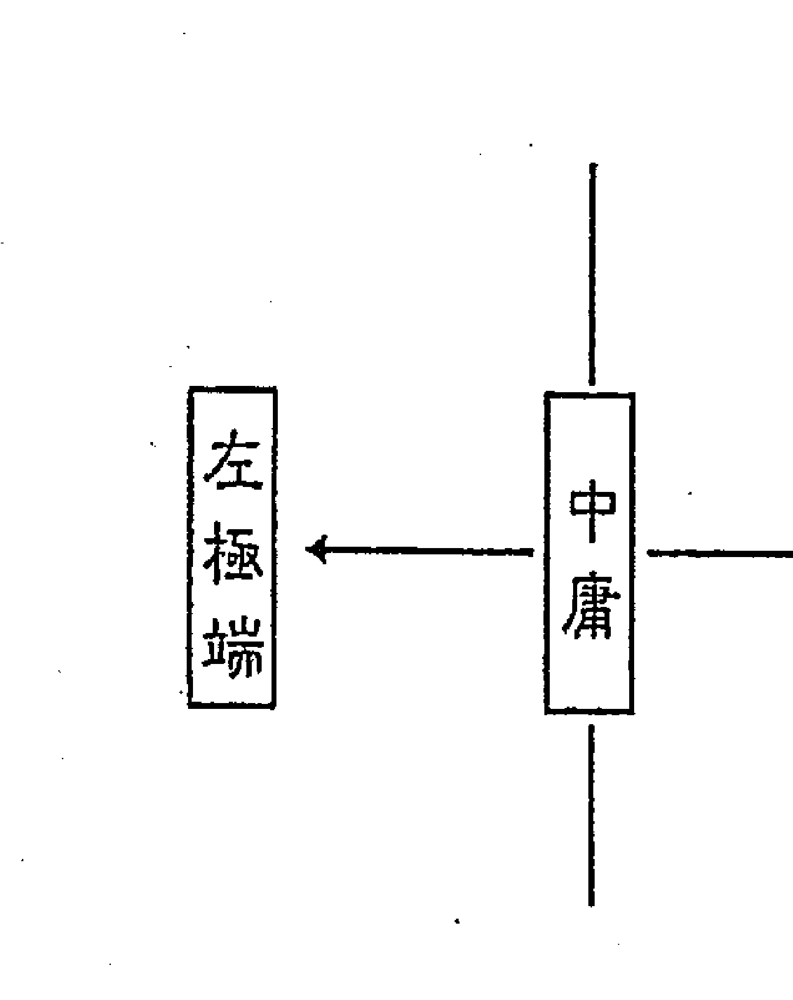

換句話說，我發現這個忌星的原理，就是我願意當斗數老師的原因之一。因為發現這個，才有解套；如果不能解套，只是在論生論死，命理有何意義？

「忌有兩端，過猶不及。」

陰陽本來就是在談「調和」，陰陽調和之後，就是中庸，儒家講的「中庸」，道家講的「中和」。

### ◇ 偏陰或偏陽都有弊病，極陰極陽就是化忌。

不中庸——偏陽、偏陰，就有弊病。中醫並不是在治病，而是調和陰陽而已。陰陽不調就是極右、極左，過猶不及就有病。忌星就是這個病，因為過猶不及，陰陽不調所以產生病。行為如此，身心的病也是如此。

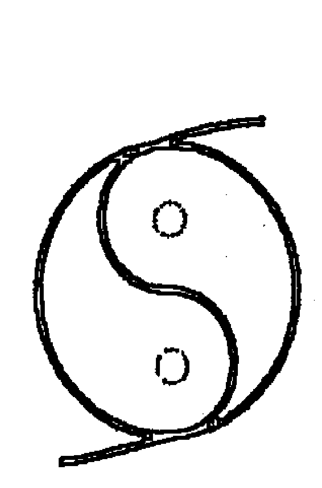

連中華的「華」、華夏的「華」都是日光的代表，這在說文解字就有。最近看到一些資料，近代甲骨文的專家。他說：「龍」跟「鳳」也是太陽的象徵。龍是源自「虹」的想像。

「執兩用中」也影響中華民族非常深遠。譬如：講價錢，開價十元，出價八元，九元成交，殺價都在這模式裡。先把開價拉下，結果中間價成交，這是執兩用中。

過猶不及，起初好似兩個極端，其實可以原本是一件事、一個力量，產生兩種力量出來。

史蒂芬・霍金所寫的《時間簡史》一開端就說：本來星球就只有一種內聚力；譬喻大家都是星球，我內聚時，對你來講產生一個拉力；你也有內聚力，內聚時對我來說是拉力。

對我這個星球內聚力比較強的部分，我內聚成山谷，就把另一星球拉出一座山，拉到你比較鬆或軟的地方；相同的，我鬆軟的被你們拉出變成山，所以本來一個內聚力就變成「拉」跟「被拉」，大概就這樣。

### ◇ 忌星具有斥力跟黏力

忌星有一個「斥」力與「黏」力，這是兩個很極端的力道，而且同時存在。

這個社會就是這樣，人生的機制也是這樣，衷情於這裡、一定忽略那裡。這也是固執的原貌，所以忌星會固執，其實固執就帶有「斥」與「黏」。好比我的個性就是要這樣，你怎麼勸也勸不了，就是把你排斥掉，這就是一件事變成兩件事，也似道分陰陽這種觀念。我感覺很奇怪，八卦應該是上一週期的人類創出來的，我還是不太相信是伏羲，伏羲可能是發現這些符號，而不是創作這些符號。我做這種推論，不是胡說，而是在這一方面，以前常看對於宇宙的研究著作推論的。美國也在做一件事情，用簡單的符號記載現在的科學文明，然後埋到地底下。我在懷疑上一個週期的人類，或地球上的生物創造了陰陽八卦的符號，讓後人去研究。伏羲是當時代一個很長遠時代的聖人，當時的人很容易獲得聖人之美名，只要能有創造，利於民生。伏羲劃八卦，還有結網捕魚。有巢氏教人築巢而居，在樹上居住；後來又出現燧人氏，教人鑽木取火。神農嘗百草，還教我們種植作物，農耕時代的開始是神農氏。一個聖人名義領導一萬多年，在那個時代都以他稱呼。

▽ 解厄避凶最重要及最有價值的原則，就是化腐朽為神奇。我發現「忌有兩端，過猶不及」，原本就是一體兩面。所以要瞭解這兩面，## ◇ 忌星的固執，「擇善固執」有用嗎？

因事制宜，要取「過」、還是「不及」？要取「斥」、還是「黏」？要在病態中，找一個比較好的，然後候機把它變成更好的。

好比垃圾不要擺在桌上，要擺在桌子底下，放到垃圾桶，然後看有沒有辦法做成有機肥？是這樣的一個過程中。所以命理上解厄避凶，最重要且是最有價值的原則，就是「化腐朽為神奇」。把壞的變成好的，這是最棒的，當然忌就是人所煩惱的壞。

再來，忌星可以「固執」與「坐立難安」，這是一個很重要的觀念。逢忌星大部份的人都會坐立難安與固執。

固執表面上好像固定在那邊，好像被黏住一樣，坐立難安比較晃動，這是在形象上。這個坐立難安與固執，卻有如流行歌曲的「你儂我儂」中——我泥中有你、你泥中有我。

換句話說，坐立難安當中有固執、固執當中有坐立不安。坐立難安沒有好處，不安就不好；固執會有固執的好處，看你如何固執。我跟人家算命時，看到命盤，如果命造是固執的，如只有一點點固執就不說；但如果很固執，而且會影響到他的命運的話，我會說你這個人有點固執，大多數的人都會說：「對！我會擇善固執。」這一點又不對了。「擇善固執」不是自己對自己的評論，而是別人對我們的評論才能算，自認為擇善固執，犯了「擇自己所謂之善而固執」之病。命理的目的在制機之先，如果把「固執」選在「擇善固執」上，這樣就會失去制機之先的命理目的。制機之先就是先能怎麼做，堅定地做對的事，不必等後來接受檢驗。再說，等別人評論你擇善固執，不是太慢了嗎？

## ◇ 要擇事固執而不是擇善固執，可化腐朽(忌)為神奇(祿)。

命理的原則制機之先，就是說：「遇到忌星，要制機之先就要知道怎麼做，不是等到最後才獲好評。」所以這裡我們為了將「固執」化腐朽為神奇，挑來挑去、比來比去，認定要「擇事固執」，選擇一件事來固執，而不是「擇善固執」。

當然也要將「人」與「事」分開，就是所選擇的事不跟別人有牽扯。譬如：躲起來學紫微斗數，躲起來讀英文，但不能跟人爭論。

初期，你將固執做得對了，最先還會有點坐立難安，因為一時無法消耗固執的能量。換一個角度說，一時無法完全轉換成優質的固執。直到固執於事有了一點成效時，就不會坐立難安。

做一件事，一開始，好像開店一樣，第一天不會很多顧客都到，因為很多人還不知道你開店。我們剛開始擇事固執，這一件事，也剛起步，還沒有辦法把這忌星的能量用盡、或大部份用上，難免有一些能量還在坐立難安。

所以，初期「擇事固執」時，還要自我要求；若已做上手之後，很快進入此境，下次再碰到就有心得了，就可很快又選一件事情來固執。

各位可以運用這一套來「因忌得祿」。忌星不是我願意碰上，碰上了就糟蹋自己，何必呢？因此從固執到「擇事固執」，就能「因忌得祿」，所以我說：「忌是偉大的貴人，讓不可能的事變成可能。」

忌星常常有這樣的一個狀況，就像彈簧門：當推到九十度以前，一鬆手就彈回來了；若超過九十度以後，就會跳到另一邊。所以命遷有忌的人特別要注意這一點，在學東西初期都很慢，很想要放棄，若放棄就沒有了，等於浪費生命、浪費時間。有很多實例，命運有忌的人，在學東西的初期，在同一班中，他的教育水準不見得比別人低，但一同來學時，老師講三分，同學懂二分或二分半，他偏只懂半分或一分，老師講了五分，同學懂三分了，他懂一分。同學在問問題時，他都搞不清楚這個問題是什麼。如果常與週遭的人比較，就會學不下去。

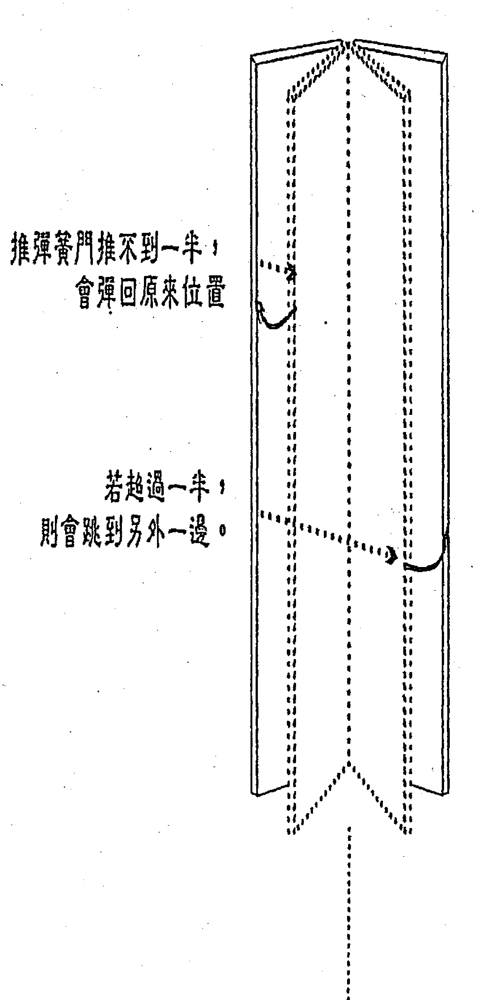

### △ 不要跟別人比，只要跟昨天的自己比。

忌星在命運，學東西初期都會比別人慢，最怕的是放棄。我說忌星有如彈簧的門，如果沒有把門硬撐到一半以上的話，它就會自動跳回原點了；只要撐過一半多一點點，他就會跳到另一邊了。
這種人最需要注意的是：在學習與工作上，前半段不要跟別人比、不要聽別人的批判，自己努力學習就好，管它懂一分、二分，一年也不管，努力不放棄，到了一半學程以後一定豁然開朗，以前他聽得懂的同學要反過來請教他了。
命理就是要搞這個，我一直主張：千萬不要跟別人比，只要跟昨日的自己比。
我甚至主張：任何人都只須跟昨天的自己比，這樣的進步，才無可限量。
若跟別人比，贏別人就會感覺自己很了不起嘛！學習命理，也不要跟別人比，只跟自己的昨天比。
「忌有兩端」很重要，各位也要在這方面多加思考，比較好脫逃，忌有兩端可以從固執下手，再去找它的祿權科，這很管用，也可做到我常主張的「好運賺錢、歹運賺學問、一生都在賺」，我一輩子都是這樣做。後來更從紫微斗數找到相同的路徑。

再來，我們論忌在命，如果論個性的話就是固執，如果行運的命碰到化忌比較會坐立不安。坐立不安跟固執是一體兩面，好像「你儂我儂」這首歌的歌詞描述的一樣，「你泥中有我，我泥中有你」，叫你不要坐立不安，你偏偏要坐立不安，「偏偏要」就是固執。
我以前在企業界，根本不跟別人比較，一馬當先，勇往直前。不是去超越別人，是要超越自己，超越昨天的自己。有一天，不小心會發現贏別人好多。這是從經驗中得到的作法，後來拿到命理來用。
這套不管他人的模式，只顧如何在這方面獲得好成效，眼中不要有他，只要創出自己的績效，一不小心，業績就超越別人了。
各位也一樣，只要學我，不要追我，不要跟我比，只要跟自己的昨天比。如果我跟他比，了不起像他；如果你跟我比，再了不起超越我一點點而已。如果只跟自己的昨日比，你可以遠遠地把我拋在後面，只要不踹我一腳，這都是好事一樁。

為要超越某人，可能產生恩怨，不是要超越某人，而是超越自己，哪來恩怨？

## ◇ 忌在命運種種毛病

忌星在命運，前半段一定不要跟別人比，這樣就不會失望，失望就很容易敗退下來。台北某班班長陳博士就是羊陀夾忌，要不是這樣做，就沒有今天的博士，當初是十分辛苦。

他在們上忌星在命運時，感慨作了見證，他說：『同學讀一兩遍就可以了，我就得讀上七八遍，心裡之苦，別人很難清楚，幾乎要放棄。』我們剛談的是個性，忌星在命宮，我們不要感覺好像輸人很多，否則會放棄的。

希望大家有問題就問，但更希望你們的問題都是想過的。我跑業務時，體會一件事，須要問路時，若對方詳述路怎麼走，心存感激；若對方僅指個方向，難免有些惆悵。但後來發現，別人講得很清楚，那次很快找到目標，但只認識那一條路；若對方僅指個方向，我須要去打擾，但卻認識整個區塊。

教學也一樣，如果凡事都幫你們弄得清楚了，以後你們的發展就不大了，因為你們不會自己主動找資料。不要以為書是我寫的，就可以一五一十的講，初期都須準備的。不看講義，下課后要想想我到底有没遗漏？有的话就记下来，提醒自己下次讲。忌星就要用在固执于事，这样忌星就会有好处的；固执并不差，但看你用在哪？将固执用在研究一件事上，是相当有利的。还有，忌星在命迁，脊椎品质不太好。命迁也是练气功的冲脉。如果命迁有忌就是中气弱，脊椎品质不好，哪个器官有问题的？是食道或呼吸道的问题？这就要看星，属金或属火的星化忌，就是呼吸道，食道不好的星就是天同或巨门。

上述：命宫迁移宫有生年忌脊椎品质不好。进一步说，命迁自化忌或是射出忌，也有此现象，但最严重的还是生年忌。第二层是大限命迁化忌到本命或大命命迁，脊椎会弯。假使已进入大限，你问他会不会腰酸背痛？他说不会。就得查一下流年有否脊椎弯了的的条件？大限有弯了的条件，该大限一定会弯，但何时弯就要看流年了。流年要看流年命迁，若化忌到本命命迁、或是大限命迁、或是流年命迁，那一年就發生了。流年有條件了，流月也要有條件，流月遷或流月命有化忌到流年命遷、或流月命遷、或是大限命遷。再過來，就要看流日了，方法一樣，僅論三盤。

脊椎的哪個地方會彎？以大限來說，以化忌那顆星的五行來論：屬水的星是命門，大約肚臍對到背後那邊；跟他同宮或對宮的星，是接著會彎的地方。

林同學遷移有文昌忌，第一個要彎的地方是你肺部後面的地方，再來就是巨門跟太陽的地方。你現在就彎了，以前就有問題了，因為有很多顆星，你一定會彎好幾個地方，你看出干時就彎了，以前就有問題了，因為有很多顆星，你一定會彎好幾個地方，你看你動到巨門，雖然巨門屬性雜，但以水為主，你又有太陽，太陽主火，代表心臟

### ▽ 有助整脊的自我療法及西藏板凳療法

若僅是整脊，是治標不治本，要治本的就得打坐與做調整脊椎相關的瑜珈動作。

我要人打坐，主要有兩個前提：第一個是命遷有忌，第二個就是武曲忌。

還有輔助脊椎矯正有用的動作，一是瑜珈術的抱膝姿勢，可拉開脊椎，這是脊椎拉的最長的動作。第二個是用木板床在床鋪上薄墊或薄被，抱膝躺下，身體成半圓，如木馬在墊被前後滾壓。動作三就是吊單槓，身體向左與向右轉，觀想脊椎如軸心左右自轉。孫國城同學說：我在中壢平鎮執業時，有一種叫板凳療法，躺在板凳上，將四肢往下垂，每天躺個四十分鐘，真的有效。這種躺法看似輕鬆，但躺個十五到三十分鐘，就會感到很累。這套療法在電視上也有介紹，叫做西藏的板凳療法。

## ◇ 忌星在兄弟線是欠眾生債，在命是欠自己的債。

生年忌解釋為固執，又解釋為欠債，忌星在兄弟線是欠眾生債，如果在命呢？就是欠自己的債。自己的債很難還，這隻手還另外一隻手，乾脆不還，就一直固執下去；叫你不要固執，偏偏要固執，就是欠自己的債，不放過自己。有些觀念很好，固執的人好像不放過某人，其實是沒有放過自己，沒有讓自己寬鬆的過。真的討厭你，就可以把你忘掉，幹嘛在那邊擾擾嚷嚷，這就是固執。忌在命遷，除了固執，還會坐立不安，尤其大限、流年、流月逢之。逢忌還會執過去錯誤的經驗，執行現在的事，當然又會錯誤。

## ◇ 忌星在迁移宫论车祸及外出问题

忌星在迁移宫的人，一辈子都要小心车祸。论命时，应该注意每一个大限，推算哪个时候有车祸，提出警告，并告诉他要怎么化解。
有读者问我，说：“迁移宫有生年忌的人，是不是不能外出？外出有刑伤？”
或许他看的书语焉不详，或者他体会错误。粗浅地说：没错。但详细来论：忌星在迁移宫，代表“债欠在远方”，怎么不可外出还债？只不过外出的距离不够，刑伤难免。
这两个意思加总起来，忌星在迁移宫，就是债欠在远方，因迁移宫是一个距离，迁移宫在空间是远，换成时间是久；所以说迁移宫的星，如果不常外出，迁移宫的星曜性质，老来才会呈现，老来就是时间久。
忌星在迁移，要出远门，时差最好要超过七小时。套上我一首没发表的歌词：

> > “我带著故乡的清晨，走入异乡的黄昏，用无法逃避的眼神，数不尽眼前的陌生。”

身處陌生之地，也是在受忌，以此來債債。

## ◇ 忌星一多，就會「累」、「煩」、「病」。

忌星一多，就會「累」、「煩」、「病」。「累」、「煩」有時候同時產生，那一「煩」一定要先拿掉，「累」有時候比較沒有辦法控制，「累」就已經累了，就趕快休息。「累」、「煩」不一定同時來，忌星一多一定累，不然就煩，事情多的人叫累，事情少的人叫煩；這些都要擋掉，不然病就來了。
還不知道什麼星時，也可以有對策。宮、星、四化可做分解與結合，也就是先論忌星，也可以知道要有哪些方案，這麼一來，你看命盤還會沒有命盤嗎？
有這些基本架構以後，然後再去注意什麼連結、重疊，就像今天我舉的那個例子，各位應該很清楚，一項牽一項，再來查這一项，查一查就是這幾項，要不要做而已。

### ▽ 忌星太多時，要穩住心情。

父疾、命遷忌星太多的話，各位記住要穩住心理，如果談比較大的盤，譬如：大限、流年的話，很可能讓一個人沒什麼工作，所謂運氣很差，如果不受束縛的話，就是努力的去做一些事，他會變成很忙，它不可能讓一個人安安靜靜的。忌有兩端，過猶不及，不是讓你沒事做，不然就讓你忙，它的目地就是讓你煩，沒事做也煩、太多事情也煩，忌星就是在搞這一毒招的，因此，我們寧可忙而不煩；若煩，病就來。

古人造字，良有以也。各位看看「細」字跟「累」字，相同的組合，只因不同位置，造成不同結果，「細」心並不會夢「累」。

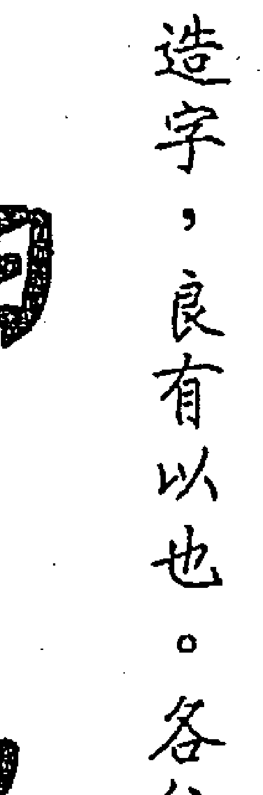

兩字皆由「田」與「糸」組成，以農立國，耕田是要務；系者絲也，治絲為衣著。這兩件要務，一一做去，細心絕對不累；兩者重疊，治絲又要耕田，耕田又要治絲，那就累了。

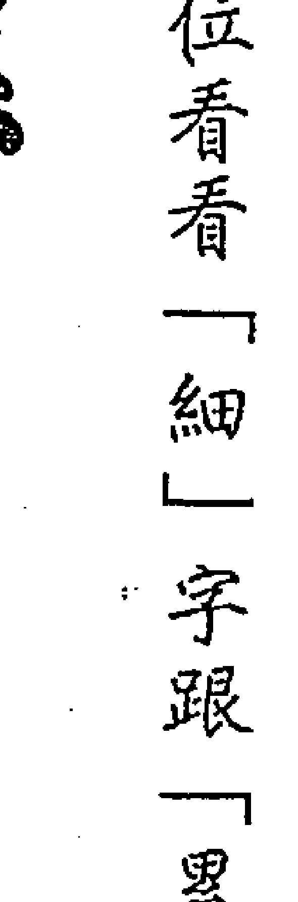

人在此時，要被人說動，想想只要做這些事，毫無損失，就有可能改善。研究命理到現在，看對方常被卡住，只因不被說動，而不去行動。父母宮是情緒宮位，要怎麼去解決情緒呢？就是願意去做，這也跟心理學家講的相同，當情緒有問題，就用疾厄宮的特性去解決；疾厄有問題，用情緒解決。
心胸常常悶悶的，可做擴胸、深呼吸，不要看地下，昂首闊步，三步當二步走，你想要沮喪也難，這是心理醫生提出的方法。悶悶不樂、沮喪都是情緒宮位主管的，而以擴胸、深呼吸、昂首闊步來解決，不就是用疾厄宮的身心嗎？
如果生病了，把情緒弄得好好的，自然容易痊癒。西洋的幽默療法，即是以情緒治好疾病之法。
這裡先跟各位提到，本命盤的祿入疾厄是不好的，但是大限有點不同。大限的祿入父疾，不會光是為人作嫁衣裳，而只是分利給他人。如財帛宮化忌沖命、沖本財、沖官祿、沖田宅這對財都不利，但忌沖疾厄也非常不利。財帛宮化忌沖命，是明的損財；財帛宮化忌沖疾厄，是暗的損財。財帛宮化祿到遷移宮，好像錢老是喜歡往外跑。
但是大限財帛化祿入父疾，就沒有原來生年祿那麼差，化祿入父母是很棒的，是賺錢的。就大財來講，大財化祿入本父，化忌入大父，賺多損少。反過來說，化忌入本父，化祿入大父，賺少損多。因本父比大父大，這是以相同的線來比較。

## ◇ 受忌有可原諒與不可原諒之分

一個人在倒大霉的時候，就用這個原理去看：是屬於可原諒、還是不可原諒？若純自己搞出的，是屬於不可原諒。上面講的是生年干，還可以用到大限，如走六大限走疾厄時，也是有一半要算自己的；若走子女宮時，成是別人幫我，敗也是別人給我，我只是得到這樣的運，那很無奈呢！別人要把我壓下去，短時間又起不來，這叫做可原諒。

如果大限走財帛宮、官祿宮、田宅宮就是不可原諒。當然，幫人論命若說不可原諒，對方聽了太多不承認。這是一個研究者，看自己命盤時要自我坦承的，才能有解救之方；若論命時，就當事人的想法、作法檢討並建議，即可趨吉避凶。

把可原諒、不可原諒當個主題，方便分辨命運形勢，不然任何事都可原諒，只要不去吃毒、殺人就好了。某人大限在本田坐庚辰，天同生年忌自化忌，他一入這個大限，兵敗如山倒，這不可原諒。他由住宅引發一連串問題，他不懂陽宅學，從他不懂陽宅學而敗這個層面來看，又似可以原諒。但他不能辭其咎，屋子是自己選的，不善於運用瞭解陽宅的人，不能不說是一個瑕疵。

這就是沒有很深刻地自我反省，就像雞毛撢子撣灰塵，只是一般的反省，很難解決問題；如果能深刻的自我反省，就是我在《勸學齋主斗數開講》關掉業陣那部機器》（如附錄二）文中主張的，痛下決心，自己一肩扛起。如果賴到別人身上就免了，縱使說可以原諒，但最好還是不要。

是非沒有一定的標準，很難分別，所以也不想太多的什麼不好、什麼不對。

一定要的。

假設我現在落魄了，會將自己藏起來學電腦或研究某種學問，這種時機是最好運用。常跟同學說：要紫微高階之二趕快寫出來，要上課與論命及看宅的一生這樣想，意一不好了，就有時間寫了，不然要怎麼辦？一天就只有二十四小時。這樣講、我們都會誤解，急性的人講話都很快，其實不對，急性跟講話快慢不必劃上等號，急性的人講話快慢都有，特性是講話會掉句子、做事會掉步驟。

## ◇ 急性的人講話快慢都有，特性是講話會掉句子、做事會掉步驟。

講話歸講話，急性歸急性。依照四象分析法，急性的人有講話快的、有講話慢的；慢性的人有講話快的、有講話慢的。這是不搭嘎的。

急性的人有一個共同特色，就是講話容易掉句子、做事容易掉步驟。三句縮成二句講，重點那一句沒有講，這是急性的特色。第一、從你的表現分析，第二、你的命盤自化忌，除非你修整過，這就是掉句，把重要的掉了，或是話說不完整。

萬福是屬於急性的，而且是急的看得出來的；有的人講話慢吞吞的，也是急性的，這是急得看不出來的。

有一女命，命坐巨門在丁巳，是以前我在做圖書批發時的會計，在顧店時，顧客要買書，那些書放在入門處，她走到門口，突然在門口喊叫：「老闆！機車不見了。」我趕快跑出去，說：「機車不是還在這裡！」她說：「不是啦！考機車駕照那本手冊。」我又隨手一指，說：「機車考照手冊不是在這兒嘛！」你看！每項都掉，一直掉一直掉。

這種人要如何改善？無論講話快慢，要出口時，先把講話的主題想好。主要的那個詞，就是她要說「考駕照」，不要落掉「考」字，才不致產生溝通的問題。

所以萬福，你若沒有注意，你來指揮那些員工工作時，有時交代會不周延，這些都可以解決的；你可以做一個表，標準工作模式，平常時就想好了，因為臨時會落東落西，把它寫得詳細詳細。

有如企業上的職務說明、工作說明，在事前寫好，要講也會完全，甚至於寫一張給他，用這樣去彌補一些我們在情急之下所沒有注意的，昌曲更容易情急，除非調整過。

為什麼昌曲忌容易情急？因昌曲是時系星，當它化忌時，就會雞飛狗跳，每一個時辰換一個，跳動快，不調整則會亂七八糟，它不像主星那麼穩定。

## ◇ 父母宮有生年忌或自化忌，出口直而傷人。

父母宮有生年忌或自化忌，為什麼出口直而傷人呢？因為忌沖疾厄，疾厄即為交友的德福，所以讓人家聽起會不舒服。
祿星如果在父母宮，還有一個經常發生的現象，就是父母都會留給他財產。像蔡辰洲的命盤，同梁在寅宮為父母宮，兩年生人天同化祿，但父母宮為庚干自化忌，代表父母所給的財產被他花光，父母也無能為力。當時蔡辰洲是敗在他的好大喜功，好大喜功也是自我協調不良所致，所以祿就轉忌。
身體、心理會影響情緒，情緒會影響心理跟身體，這是父疾彼此的關係，再注意化星的力量——力道的方向，就很容易分辨清楚：是由情緒影響疾厄？或是由疾厄影響情緒？清楚來龍去脈，就知道要怎麼處理。假設大限疾厄化忌到父母宮自沖，代表身體不好就會影響情緒，不是情緒不好去影響身體。假使身體不好影響情緒，情緒又沒有解決，則更影響身體，如此惡性循環，詳細的過程就是這樣。如果父母宮自化祿，就很容易把情緒調好，讓身體就不會惡性循環。說很容易把情緒調好，因為有這個條件；但有這個條件，是不是更加強去做，與隨順命盤又有差別，這都還在論命的範疇。造命則須順此條件加強，以免調整的不徹底，依然有些許毛病。更高一層的，我要求各位的、也要求自己的，縱使沒有自化祿也要自化祿。身體不好，不是人所能控制的，我很瞭解這一點。我們無法像關公，他的作法真是一個功夫，各位看章回小說，關公刻骨取毒箭，不用麻醉，只是一面下棋罷了，他這種「轉移」的功夫，值得我們讚佩與學習。如果能夠轉移到很好，身體要生病也很難。不過我們還是沒辦法，所以要具備，如果身體沒辦法掌控，就要掌控情緒；我很明顯的知道，哪一天稍微情緒不好，隔幾天身體就不舒服了。

## ◇ 兄友有忌，要注意床位。

另外，兄友線有忌，還需要注意床位，本生年忌在兄弟宮，一輩子要注意床位，若大限碰到，這個大限要注意，因兄友又論陽宅，以床位為主。床位首重頭向，次重落卦，床向再其次。任何人的頭向，皆須向東與南，即是四十五度至二二五度皆可；頭向北是特殊運用，在此不贅述。林同學年干辛化文昌在大兄，大限辛卯也化文昌忌到大限兄弟宮，再看大田，大田甲干化太陽忌沖文昌。

## ◇ 忌星在兄友。最好送人釣竿，教人釣魚，不要老是要釣魚給人吃。

剛剛講忌星在兄友線，接著要說明我經常講的話：當我們幫人選擇剖婦生產日期時，若無法將忌星安排成入庫忌、逆水忌、健康忌時，只好把生年忌擺在兄## ◇ 化忌在兄友线，是欠众生的债

但是，化忌在兄友是欠众生的债，不少人因此化忌而落得灾难连连，是无法求得好的化忌，只好退而求其次。但总也得有方法减轻其灾难，想到这点，就须要从欠债还债的方法解套。欠众生的债，一定要以钱还债吗？有无方法顶替呢？在年轻时，思考及历练不够，大多应命受灾受难，亏钱了事。企业管理上讲的，送你钓竿，教你钓鱼，不要老是要我钓鱼给你吃。如果能把欠众生的债，用学问来偿还，学问无价。给人一十万，就少了十万；我只有一百万，给人一百万，我就没了。如以学问给人，我的学问还在，更何况教学相长。这种作法，也是一种“法施”。以大限来讲，生年化忌在大限兄弟，大限命宫化忌到本命兄弟，大限化忌在大限兄弟，也代表这个大限交往的人三教九流，像林同学就是，本生年化忌在大限兄弟，大限也化忌到大限兄弟，所以这个大限的来往也会三教九流。还有另外一个问题，兄友线有化忌，是欠众生的债，到底要人家来倒你的钱，还是要用学术来服务人家，就端看自己的努力，要处心积虑好好研究学问，来帮助众生，是最好的还债方式。如果本命兄友有化忌，大限又化忌到大限兄弟，若没有被倒，那功夫真不错，因为你欠众生的债。

## ◇ 化忌星在兄友，夫妻有隔阂

兄友线是命与夫之间的桥梁，这是“形势”而言。所以生年化忌在兄友，纵使夫妻还能白头偕老，当中一定有隔阂。就理气而言，交友是夫妻的疾厄，有化忌星入冲夫妻宫的体（夫妻的一、六宫位）。

换句话说：生年化忌在兄友线的人，若夫妻不和时，不说也没有人知道，别人会以为他们两夫妻很好，要比较接近的人才知道有问题。就夫妻宫化忌来讲，入冲疾厄也好、入冲夫妻的疾厄也是，都属于暗位。冲夫妻，对婚姻来讲是明的，入冲夫妻的疾厄是暗的。

因一六共宗，一为阳、六为阴。譬如：财帛宫化忌冲命跟冲疾厄，一样是财帛跟我无缘，其差别在那里呢？若冲命，没钱别人看得出来，感觉得出来命造没什么钱，好像写在脸上（命宫是头也包括脸部）；冲疾厄就不会，没钱还被人误认有钱。这个冲阴、冲阳，分开来一个是不明显、一个是鲜明的。

命理分阴阳、明体用很重要，这样才能细腻。生年化忌在兄友线，夫妻之间有隔阂，若生年干在夫妻宫则加重，因为化忌星是从生年干来的，所有的条件都可以这样考虑。生年干在哪一宫，即是隔阂之因。

生年化忌在兄友线不得不付出，生年干在命宫，加重；若生年干在财帛宫，遇到钱的事情，又加重，人家需要钱，硬是要帮他借钱，都不怕被倒。

## ◇ 生年化忌在交友，交友宫干化出的禄权科忌都在三方四正，如何解释这个忌？

问：生年化忌在交友宫，交友宫的宫干化出的禄权科忌全部都在三方四正，这样如何解释这个忌？

答：这样子是欠对众生的债，付出给众生，众生还是能回报你。而你所提的交友宫宫干是丁，化巨门忌在迁移宫，就有一部分引发是非；若交友宫所化的巨门忌入命财官田，而不与交友宫所化的禄、权、科同宫，就漂亮了。

但忌入命，命宫如是双星同宫组合的，可借到迁移来冲，代表对人家的付出，有的人会回报，有的人不会回报，甚至产生是非。

又如生年化忌在兄弟宫又自化忌，但兄弟宫化禄入命、化权入财。兄弟宫化禄入命、化权入财代表对众生付出后，获得不少回报；但免除不了被人倒帐，还要被嫌弃，这就是自化忌。

要全部都论，不要只看禄、不看忌，这会过度乐观；也不要只看忌、不看禄，这又会过度悲观。看清楚，碰忌的时候才看得开。

## ◇ 化忌在夫妻

如果化忌在夫妻冲官禄，论行运时，会因时运对他不利，所以他做起事情来，周遭环境对他不好，别人做来赚钱，换他做时，时机就不好；如果有很多人的大限都化忌冲官禄时，就是景气不好。因大部分的人都化忌冲官禄，或化忌冲本官，透过夫妻，夫妻是官禄的外围。
若少数的人拥有这个条件，只是这些人的运气不好，做什么事都会翻盘。什么叫翻盘？别人做都赚钱，他一做就反了。若大多数人大限夫妻有忌或大限命宫化忌入本夫冲本官或入大夫冲本官，就形成景气不好。
大限化忌入本夫冲本官或入大夫冲本官，做事最好不透过配偶的主张。如果透过配偶，化忌星更忌，怎么讲呢？因为化忌星是透过夫妻冲官禄，所以夫妻介入官禄又是一大主因，若能避开即能减轻灾害。

事业做不好以致失败，不光是大官化忌入本夫冲本官、大官化忌自冲而已，大限官禄化忌冲本命或大命也会。就好像亏钱也不一定要化忌入福冲财，财帛宫化忌冲田宅，还有财帛宫化忌到兄弟也是损财，还有财帛宫化忌冲田宅。

所以官要倒、事业做不好，也不见得大官要化忌入夫冲官，入迁冲命也会，跟一对夫妻算命，我说：“下个大限不要因为老婆说某件生意利润不错，叫老公一定要投资，那稳死无疑，因为你们又遇到父疾线化忌。”

这点自己要特别注意，有些人发生事情了，才来怪配偶，那是没什么意思的事。但，不见得每个人拥有判断力，想要赚就能赚。化忌星专搞破坏，干扰判断，让人固执于错误的作法。

论命时，夫妻一起来那是最好的，可以一起讲明白，互相叮咛，因为入夫冲官，很容易产生透过配偶来的讯息或鼓励。如林同学这个大限官禄乙未化太阴忌入本夫冲本官，你老婆拿出去投资的钱，明年能拿回来就赶快拿回来，因为透过配偶，不是配偶不好，而是你自己的命盘这样。

## ◇ 化忌在田宅，如何才是标准的“入库忌”？

化忌星在田宅宫时，特别注意是不是“入库忌”？标准的“入库忌”要具备下列条件：

- ①化忌星要在辰戌丑未，而为田宅宫或财帛宫。
- ②该宫不能自化。
- ③只能化忌星在田宅或财帛宫，不能有禄、权、科或禄存。

所谓“忌冲破库大发”，那个库就是“入库忌”的库。譬如：白冰冰日月在福德太阴忌，财帛宫没有主星，把它借到己丑就是财帛宫，财帛宫没有自化，她的福德虽有自化，但不影响；日月一借过来丑宫，逢甲干、乙干两个大限，一发二十年。（“入库忌”详看后文）

## ◇ 田宅宫自化忌时，要注意房子有泄气的地方

一定要加上阳宅的看法，紫微斗数能提供检查，像田宅宫自化忌就是宅气弱，宅气弱大概会有几种可能性呢？

譬如：田宅宫在辰宫自化忌，就找实际房子辰宫的地方，那边有没有泄气的设备，如开窗、抽油烟机、厕所，不然就中宫有厕所，中宫有厕所就全部都泄了。

如果有这样的命盘，就容易住到这样的屋子，但懂得以后就特别不要住这样的房子，所以也可以改变，但十个有八个碰到这样的命运，要找理想的屋子，是要找很久的。

我刚到高雄时，一直要找坐北朝南的屋子，找好几个月，最后只好屈服，当时我要开书店，怎么找都是坐南朝北，就没有办法找到坐北朝南的屋子，就只好坐南朝北，过了好几年，才找到坐北朝南，开始赚钱了。

## ◇ 生年化忌在子女田宅线

化忌入子女冲田宅、化忌入田宅冲子女，对于田宅来讲，第一次买房子就要小心，本来是一辈子，但最重要还是第一次。化忌入子女、化忌入田宅，对子女宫来讲，小孩子的个性、脾气问题，要谨慎、要小心；那更重要的就是生第一胎的时候，要注意、要谨慎。这是大小太极的问题。

化忌星在子女宫，常常会为子女的问题困住？看什么星再说，如天机星化忌，就是要为小孩子伤脑筋。

> 有一位学生，命宫戊干化天机忌入子女宫，上课中途借电话打给他小孩，之后说：“我来上课，小孩还没回来，煮了饭怕他不晓得吃。”怕他没吃，怕他吃太多，真是天机化忌啊！

我常说：不要随顺着化忌星，只须在某一个生活当中的某一个层次的行为跟语言改一改而已。若不从这方面去改，到时候出问题，才来以禄解忌，都已担忧好一阵子了。其实，改弦易辙，抢先改一下就没问题了。

## ◇ 子女宫自化忌，谈彼此对待

子女宫自化忌时，坏处就多了。现在就来探讨一下，譬如：化禄给子女，子女自化忌，我们疼他，他也不信；化权给子女，子女自化忌，给他主权，他滥权；化科给子女，子女自化忌，讲一些道理给他听，他才不理呢！化忌给子女，你要管他，他不用你管什么？所以自化忌，本身就不好的结果。
如本命子女有没自化忌，看大限子女有没自化忌？假设子女宫天机自化忌，子女的反应或表现都会让你伤脑筋。再来，子女宫自化忌，本来就不容易怀孕，也容易流产。

## ◇ 化忌星在财帛

若生年化忌在财帛，如果又是辰戌丑未，除了生年化忌以外，没有其他的化星（禄权科），也没有禄存，那就是很好的入库忌。如果不在辰戌丑未，还堪称二流的入库忌，只是跟一流的差很远，但它还是有用的。化忌星在财帛宫，不能说他是守财奴，而是重视利润主义者。不管利润多寡，因为多寡还有其他星管。一个人重视什么都不一样，表面上看可能很多一样，但事实上不一样。重视利润的人，他是不是要很多利润？不见得。但他做什么事、卖什么商品，首先他第一个要关注有多少利润，吃头路他要有多少薪水。应征的人有百百种，有的人坐下来就问说：『请问到你们公司来，一个月能休几天？』这种人不是先问薪水，但生年化忌在财帛宫的人，一定先问薪水。如果跟生年化忌在财帛宫的人谈生意，你先告诉他：这个能赚多少？他才会继续听下去，若只谈你的产品有多好，好到什么程度，讲半个钟头，我看他听不下去，不走掉也心不在焉。化忌星在财帛宫，只要不自化、没禄存，也算第二类的入库忌，是重视利润主义者，武贪在命，武贪主大，这个加起来他就很讲究大利润，武贪不一定在财帛宫，因命无所不管。

像这张命盘，因财帛宫有化忌，就是重视利润主义者，又因命宫为武贪主大，就变成喜欢大利润，他专门找利润大的生意做。

他的描述是这样讲：以前乡下没有钱怕到，所以来都市都找利润好的生意来做，他的原始思想是这样来的。他卖的产品是车子的油精，他说：“老师，因为你是我的老师，我才坦白跟你讲，像这一箱，若便宜卖一万元，原来卖一万二，我宾士的后车箱可以载十箱，一个下午出去就可以卖完，若卖快一点就卖一万元，若要利润好一点就卖一万二。”他若卖一万可以赚九千七，利润是97%，他说：

> “老师，不要跟人家讲喔！”

## ◎ 一颗星曜包含许多事物，一件事物涵盖许多星曜

化忌在财帛宫，不能说他是“守财奴”，“重视利润”跟“守财奴”毫无关系，不能说“重视利润”就是守财奴、视财如命。我认为斗数就要一个、一个条件加起来论，像他这个本来就是“重视利润”，重视利润也不一定要论大小，是他武贪主大才又加上来的。

这样的道理就好像在讲“一脉数症”、“一症数脉”的道理一样；不要把一颗星当成一种东西，可能一种东西是很多颗星合成，也就是一物数星。譬如：马达的能源是太阳；马达的线圈是文曲；马达的承轴是天机，这三颗星都有。再来，甲干化忌，才有可能让它能源产生问题；戊干化忌，才会让它的承轴产生问题；己干化忌，才会让它的线圈产生问题。这个人是重视利润者，但他很“苛”。他很苛的问题，不出在财帛宫有生年化忌，而是财帛宫化忌入命。财帛宫化忌入命的人很苛，若命宫化忌入财帛的人是“量未入而为出”。“量入为出”是说，每个月的薪水有五万，就计划一个月可花三、四万，总想要有些剩下；而“量未入而为出”，是说对未来的收入都计算在内，不代表现在没有钱可以支应。这个还可以弄到什么地步呢？譬如今年丙年，丙同机昌廉，廉贞是在某人的大财，这样也视为流命化忌入大财，代表他在掌控钱，他有一百多万现金，预计还房子贷款一百万，当然没问题，但偏偏要等到存到两百万时才还一百万，这就是掌控，也就是我说的量未入而为出。

## ◇ 三盘命父福的化忌星计算及处理

有学生约我算命，我说：为什么突然约我呢？若没有什么大事，你慢慢学习就好了，何必急呢？她说：“这几天突然很烦，不知有没有大事情？——为什么那么烦呢？异乎自己所想像的烦，这就是化忌星落在三盘的命、父、福这三宫。三盘如何界定呢？三盘有三忌，三盘可以是本命盘、大限盘、流年盘，也可以是大限盘、流年盘、流月盘，当然也可以是流年盘、流月盘、流日盘。若分开来说，有可能三颗化忌星全部入命、父、福，但若刚好这颗化忌星入这盘的命、那一盘的福、另外一盘的父，那么一忌扩成三忌了。这位学生三盘结算为六忌，就烦得不得了。
我告诉各位，这个功夫可以进步的。如果逢六忌，以我现在来说，一点感觉都没有；我最初逢六忌时，也是烦。看看命盘，不禁莞尔，笑说：喔！原来是六忌，就这样好了。
各位！这套功夫要学好，心想：喔！原来这几个搞的，就这样好了，也没有什么大事情，烦干嘛呢？但是你要去找出这个理由，有时候心里面还是有些疙瘩，怕有些啥事发生。要告诉自己：喔！原来这三个忌变成六个忌，没啥事，只是忌多，后来有一次好烦，一看命盘：喔！原来是九个忌，一知道后也好了。

你看多好用，这一招各位要应用，知道原来是这几个忌搞的，心想好了，没事。但后来又有一次烦的程度是少有的感受，本来三盘三个忌，3×3等于9，应该是极限。

后来才发现这一次是十一个忌，是因为破军随文曲化忌；以这样算来极限是十五，七杀随文昌化忌、破军随文曲化忌，假设在三盘内有一个辛、有一个己，即可能达到十五忌。

那一次很烦，奇怪？在烦什么呢？算一算有十一忌，我就捏一捏中指的肺心穴。很烦，心、肺功能一定有问题，因此要学习能算几个忌，忌多而烦闷时，按压肺心穴，然后再做扩胸，抓单杠，大约五分钟内就好了。

三天烦了四、五次，好了以后变胸肿，这是始料所未及的，原来忌那么多，虽然处理好，但接着胸肿、脚肿都来，因那一次是武曲忌，而且是三月，流月壬辰与流年命重叠。

化忌星很烦，先要学会看开，就像《关掉叶障那部机器》（附录二）那篇所说的，于公于私都尽情想过，尽力做到就OK了。看开，不希望是万事懒散；看开，还是要努力，这样才不会失之偏颇。就算天逼下来、地裂开来，碰到再说，烦恼那么多干嘛？要努力放下，不要烦，因烦有时候是“无事烦”，无事烦是因为一点点小事，内心不自觉地扩充。

如果想开了以后，纵使须要离婚、住院，也没有什么大事。想通了就没事，不签字怎么离婚？快乐养生有啥大病？烦那么多干嘛！烦是没有用的，只要自己做好，最后对方也会来学你。如果老公学老婆、老婆学老公，到了老公、老婆彼此学习的境地，必然能和好。

## ◇ 化忌星在疾厄、田宅与六亲之处置

化忌星在疾厄宫，就去想几个方面：如心情，化忌在疾厄宫就跟身体有关系，因此把情绪搞好最重要，因为疾病一来，就会影响心情，若把心情弄好，就在解决疾厄。

- 化忌星在财帛宫，也只有两种，不是兄友劫财、就是漏财。兄友劫财就不要借钱给人家，若要借人就要记住我所提的三个原则。一、斟酌与此位朋友的感情，借的钱如不还亦不伤友情。二、考虑他不还时会不会伤到自己的根本。三、借朋友是为了帮助他，但不能让他觉得钱来得很容易，所以可能他要十万而借他八万。如果漏财，就用A、B帐号，财位检查。

论一论，就是这些准则，剩下的只是辅助。这些是釜底抽薪的方法，辅助就是看哪一宫化禄来解忌，即可帮助解决。最多也是如此，这样大家就有一个谱了，不至于没有什么好做。

化忌星在田宅宫，阳宅问题要处理。剩下六亲宫，就看开一点，可以好就好，若不好也不用吵架，把他当作第三碗饭就好了。

## ◇ 化忌星在疾厄要怎么办？

化忌星在疾厄，一辈子要注意身体，以造命的立场来讲，若能研究医学直到权威，反而没事。以前在讲紫贪命格时，提到我在年轻时，看到杂志上的一张命盘，让我对斗数的观念提升不少，这张命盘是紫贪在疾厄宫，贪狼化忌，他是一个有名的妇女子宫颈癌的中医权威。当时看到这张命盘，简直不敢相信，化忌星在疾厄宫怎么可以变成权威？我又一再思索，慢慢转化，体会出化忌星是伟大的贵人；融会贯通以后，不限定在疾厄，父母宫也一样。我常说：星曜也是一股能量，化星也是一股能量，这种能量就是气，在很多能量交错之下所产生的吉凶。这是一位医学院女老师的命盘，走到第四大限，突然在丙戌（二〇〇六）年老师出了一点状况，闹得很激烈。就疾厄来讲，化忌星冲疾厄，大限又化天机忌来，没变成权威，这个能量就消耗不掉，只好在大限夫妻与本命父母（情绪）爆发出来。

各位多了解这个道理，就能把化忌星转成好的。她如在这个大限之前，造就自己成医学权威，一切问题都没了。刚刚谈谈贪狼化忌在疾厄的命盘，他竟然成为权威。为什么要到权威呢？因为变成权威以后，多少人排队等着他看病，他要处理多少人有关于宫颈癌的病。
如果他并没有达到权威，就不能把化忌星的能量消耗掉，就变成自己麻烦，可能自己的肾要坏掉，因紫贪容易败肾，不只败肾，肾脏会出大毛病的。若没有把这个能量移情到那些病患，只好忧烦自己。
这位女老师，除了做到疾病上的权威，最好加上心理学的权威，再加上情绪控制的权威，还有处理夫妻方面的权威，这样绝对没事。

- 化忌星的三步曲：
  1. 发射台
  2. 化忌入的宫位，化忌入是欠债。
  3. 化忌冲是伤害。

像她化忌星由大限化来的，另一个是本生年忌，若善于处理自己的情绪，这叫欠债还债，如果处理情绪没事了，疾厄宫就不用受伤害。
当然说要处理情绪，做情绪的主人不容易，如果都不去做，才真的不容易。

人是碰到事情了，设法去处理，处理了就有功夫；虽然头一两次，效果很小，甚至没效果，但只要契而不舍地做去，纵然没完全解决，也一定能获得极大的改善。
我处理自己的灾厄，一开始一样有这些问题，但是逮住机会就做，发现每次都有进步，终究改善了。所以鼓励大家，有一点点端倪出现就要动手，不要等到诸多坏条件齐来时，变得更困难解决，自己也一无心力了。一个人是碰到事情时，敢于面对，而去解决，才变得伟大的，没有一个生而伟大的人。

这位女老师现在没人能救得了她，只有她自己，因为任何建议的话已讲尽了、道理也讲尽了。只要她稍微开一下窍，本着知识分子的勇气与能耐，将此一事件，处理出一个很好的范本。

这个观念很重要，我们在处理他人的命理问题，有好多状况：一、论命时，对方的厄运将到，他还没知觉。二、对方厄运刚起，他还不知严重性。三、厄运已起，备受踩躏，他还在做困兽之斗。四、被厄运肆虐得遍体鳞伤，正须我们提供疗伤药方。

我今天帮日本人算命，有两个人都刚换大限，而有反弓忌，他们还没发生，这是他们已坐上大限这个发射台，准备发射。若他们已做出投资，就是已经发射了，在欠债这里处理，欠债还债，或者以少亏为赢做了结。若不快刀斩乱麻，最后就是受伤害了，要告诉他怎么疗伤？这叫三部曲让我们知道。

接受到命理的个案，对方走到哪个阶段都可能？我们得把所有关键，理得一清二楚，要知道任何关键都有转折的做法，若不晓得这些是关键，就无从思考，更遑论帮人解决了。

我上个大限疾厄宫为乙干坐廉贞，化太阴忌，刚好用化忌星链接廉贞跟天机，一干进洞，很容易精神官能症的。当时碰到一些难题，足可以让你精神官能症发作；不过，当时我告诉自己，什么坏事情发生都可以，我就是不能患上精神官能症，管它什么事情丕变，我绝不随着周遭环境起舞。

## ◇ 生年忌或自化忌在福德

生年忌在福德，還是自化忌在福德，還是福德化忌自沖，這個都是自我主觀意識強烈。自我主觀意識強烈跟固執沒有關係，若把自我主觀意識強烈跟固執這兩件事擺在一起，就可以分四象。

所謂的四象分析法：
- 有人不固執、自我主觀意識強烈。
- 有人固執，自我主觀意識也強烈。
- 有人固執，自我主觀意識不強烈。
- 有人兩者都不會。

固不固執看命遷，主觀意識強烈看福德。像某A機梁在福德宮，戊干自化忌，主觀意識強烈；遷移宮有生年忌，也會固執。但他的固執比較軟一點，因他命宮也有生年祿，生年祿有和諧的作用，不是一味地固執。像這樣的人，就是屬於固執而且主觀意識強烈，當然不能忽略命宮有祿權。

我是一個主觀意識強烈而不固執的人，本福化太陽忌自沖，而命遷只有生年祿。這當然僅就本命盤來論，大限還沒有加上去；我上個大限開始固執，因為上個大限走庚干化忌沖本命，這是大限給我的固執，生年的就是一輩子，除非你自己改變，都有它增、減的地方。
固執是會讓旁人感覺出來的；主觀意識強烈，則不會勉強別人。如果有人批判某A說：「你不要以為某A很好說話，不要以為他不固執，其實他很固執。」或有人說：「某A那個人看起來不固執，其實他很固執。」
這種話都是很矛盾的，經過命理這一課以後，如果有某人告訴你某A是這樣的人，馬上轉成如下的解讀：某A這個人主觀意識強烈而不固執。更可以理解，某人不懂固執跟主觀意識強烈的分界，他搞不清楚，轉不過來，才講這些。
如果我們知道這個分際之後，就不會污衊一個人，人家不會固執，你還要說：「雖然他不固執，其實他很固執。」
那到底是固執，還是不固執搞不懂。
再來，跟主觀意識強烈的人談話，若不提昇到意識的層次交談，他是無法聽進去的，不過他也不會跟你槓就是了。我說主觀意識強烈而不固執的人，最標準的語言，譬如有邀說：「喂！我們今晚下課去吃薑母鴨好嗎？」他會回答說：「好啊！下課再看看。」他絕對不會馬上跟你答應，他這樣講已經保留他不去的後路。
如果固執的人就會說：「好啊！好啊！」或說：「薑母鴨有什麼好吃？」
固執自己的想法，憑著就說出來。
所以跟主觀意識強烈的人講話，除了要拉抬意識外，在講話的方式上不要有壓迫感，就要像以前我在正聲廣播公司，每天晚上要播報一篇「今日短評」你

## △ 忌星在兄友為生年啥宮對出生該年影響有別（命例）

說對不對？」我只是講這些給大家參考，讓人各自評論對不對？聽眾反而聽得進去。

所以，不要忘了，有時候我們要跟晚輩講話時，也不要有壓迫感，他們才能聽進去。當父母的人，也可以搖身一變，不要當人父母就有個壓迫幼輩的習慣——我是他們的父母，子女就是要聽我認為對的話。可以搖身一變，變成別人一般，說：「ㄟ！這個可能如何？那個可能如何？你可以考慮一下。」如果造成壓迫感，對方會閃躲，閃躲就不是好事了。

前几天看到一個今年（丙戌）出生的小孩子，雙祿交流，天機權星在命。你看他化祿在財，祿存在官，這是標準的雙祿交流，可惜呀！我們粗淺地看兄友有忌，小的時候身體不好。只要是命遷兄友父疾有忌，小的時候身體就不好。這個小孩子的病症，從我們的斗數中能看出來的，卻沒辦法像西醫那般精確，他有尿道下裂，而且沒有肛門。剛講生年忌在兄友是不構成那麼嚴重症狀的。他沖流年福德，所以我追論他在媽媽的肚子內就招煞，只要追到這點就好了，

再往前追是通靈者的責任了，我們只要研究現在這一世就好了。 生年忌在兄友，我們只能說他小時候身體不好。我的生年忌也在兄友，但為出生那年的命宮，而他卻是在出生年的福德，在福德宮的都屬先天。 這張命盤我追論好久，驗證他媽媽在懷他時，到底出了什麼事？追到他媽媽媽懷她時，在她舅舅那邊住了一陣子，他臥室的電視剛好是五黃煞，她常看電視，煞就一直從那邊衝來。 無肛症我尚無法從斗數盤中找出理由。這個在陽宅來說是我們的屋子的下水道，也就是排水溝壞了，整修時有人懷孕，這樣小孩子生出來就沒有肛門了，這很靈驗。 看到廉貞忌，就開始追陽宅的五黃煞，而且這個小孩本命田壬干化忌自沖，這個小孩是土五局的，一到四歲時命宮的辛干不起作用，因為五歲以前有命無運，只論本命生年四化與流年四化。

| 七殺 丙 | 天梁 乙 | 廉貞忌甲 | 巨門癸 |
| 疾 丙 | 遷 乙 | 友 甲 | 官 癸 |
| 天同祿丁 | 文昌科財 | 右弼 子 戊 | 武曲 戊 |
| 太陽 夫 己 | 破軍 兄 庚 | 天機權 命 辛 | 紫微 父 庚 |

既然兄弟與福德，直覺想到這蠻難處理的。看癸破巨陰貪，推得出肺腎的問題，至於尿道下裂我是第一次聽到，剛好那天下午幫一個五十歲的西醫算命，剛好請教他。他說：小孩子在胎兒時，最先性別是不明的。如是男嬰，小鳥會慢慢長出來，分裂的地方就合起來了，但他卻是該合起來的沒有合起來。簡單講，轉男孩是沒有完全轉好。告訴各位一個經驗，廉貞如跟屋子有關，要追五黃煞，巨門如果跟屋子有關，要追病符方。我很多case都是這樣追出來的，從這方向去解決就可以了。五黃煞是陽宅學中的九星之一，病符星飛到哪一方，及稱該方為病符方，病符星也是九星之一的二黑。他天同祿算是有財，但是他雙祿交流就不可同日而語了。雙祿交流我們可以這樣想，雙祿交流不代表不會失敗，這個是行運上的問題，遇到財損的運，縱使被倒了兩三千萬，他也會很快東山再起的。如是明暗祿交流，遇失敗要東山再起，在動作與聲勢上不如雙祿交流快，因為為雙祿交流都是明的。

## ◇ 命化忌入財、財化忌入官、官化忌入命，或逆序化忌，是少見的好。

順便跟各位講，還有一種忌星很好，但很少見。就是命化忌入財，財化忌入官，官化忌入命，這三個條件要同時具有，所以才說是少見的。反過來也可以，就是：命化忌入官，官化忌入財，財又化忌入命。順轉或逆轉都可以，這個就很漂亮。普通都看到二條就沒有了，要找到完全不容易。

因好在命財官，因忌入叫收斂，忌星怕沖，如果能這樣就沒事了，代表命財官都發達，比較沒有財災、官災。如果二個就不行，還有一個在沖，因為三個就等於沒有沖，剩下的就是好的，也就是沒有什麼壞處。

一般人常常好一陣子，又壞一陣子。生意人若賺錢，都不敢歡喜太久，因為賺的錢，不知道何時又要崩掉？

## ◇ 飛星棋譜

遷移宮就是明堂，田宅的遷移就是子女宮也是明堂，明堂就是屋前的空地，也稱變動位。「飛星棋譜」一說，命是將、帥的位子，兩臨宮是士的位子，夫妻跟福德是相、象的位子，子，田是馬的位子，財官是車的位子，疾厄宮跟交友宮是兵、卒的位子，遷移宮砲的位子，若砲移到將帥前面來，將一下抽車。所以，忌星是砲手，跑到遷移宮對命宮「將」一下，就會抽車，抽車的解釋就是會敗財或敗官。

| 帥 命 | 士 父 | 象 福 | 馬 田 |
|-------|-------|-------|-------|
| 仕 兄 | 飛星棋譜 |       | 車 官 |
| 相 夫 | 飛星棋譜 |       | 卒 友 |
| 馬 子 | 車 財 | 兵 疾 | 砲 遷 |

## 第三章 深论四化

## 一、四化真谛

## ◇ 忌有两端，禄权科则有两面性。

除了發現忌星有兩個極端——過猶不及，又發現祿權科皆有兩面性。這個觀念一展開，就很清楚地知道好的當中有壞的，它並不是在正中央。所以祿是最中庸的，但也有靠左、靠右的部份，而且都有其範圍。科是往往外挪一步，所以科就很明显了，某某看起好像讀書人，某某人看起好像怎樣、怎樣。科星會讓人家這樣，這就是名的問題，實際上有沒有讀那麼多書，不知道。因為科也是兩面，比祿更外面。權只不過比忌稍靠裡面而已，它接近兩極。這權要解釋一下，是死硬奪取權位，或許爭取權力？或是否有權衡？這種爭權、權衡已接近忌星了。科星可利用那個科、那個名，它有這個名

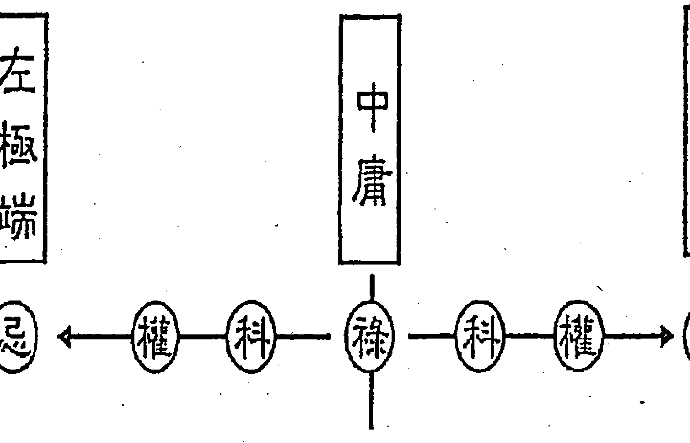

## ◇ 祿中有忌、忌中有祿

我在研究紫微斗數初期，對四化比較深入的第一層，是先發現「祿中有忌、

以後，就好比有了位子，但要實際上爬上去；有科的人要讀書，比沒有科的人要讀書容易。但是一些有科的人不讀書，只是看起來而已。這就是兩面性，並非一致。

忌中有禄」，這是在講它學理。『忌中有禄』在生活中本來就存在，是怎麼講呢？譬如：生病了，有可能好；沒講一定好，為什麼會好呢？因為『忌中有禄』。窮了有可能再富有，因為『忌中有禄』。這是有道理的層面來講。『禄中有忌』當然也是，富有會變窮，身體好會變壞。這是就人生的道理來講。
但是如果以命理的學理來說的話，是從『陰中有陽、陽中有陰』推論而來的。道家的思想『有生無、無生有』，是一個非常宏觀的思維。大陸封閉數十年，是為無；一開放，大家搶著，是為有。
有了怕失去，沒了可再有。擁有之後兩個可能，更多或失去。
如果直接用到命盤上呢？『禄中有忌』，怎麼看禄中的忌，就看『禄』跑到哪裡去？它的宮干化忌去那裡，那就是禄中之忌，所以一個人好要變壞也可以，所謂的變壞，或許是人為，或許是不小心的。
比如生年禄在命宮，命宮干化忌到疾厄宮，這個禄中之忌就在疾厄。所以疾厄不好，是一個比較大的傷害，這是好中之壞；那壞中之好呢？就是看忌在哪一宮，轉禄到那一宮。

## ◇ 《類經圖翼》中所謂的「五行互藏」，四化祿權科忌也相互含藏。

在《類經圖翼》中，提到五行互藏，請參考《紫微高階之一。星曜鐵關刀》第四百四十頁，詳引五行互藏，在書中也提到：植物倒生，動物橫生，唯有人是正生。

我發現「祿權科忌」也是互相含藏，用四化來的互相含藏，特別強烈而且一律存在，任何狀況都成立。祿中有權科忌，祿中有忌已講過，那權科呢？更是啊！有錢去找祿中之權更簡單，以前有錢的人就可買個官職，現在有錢的人就可結交權貴；有錢之後，有人附庸風雅，這是祿中之科。

## ◇ 祿中有權科忌、權中有祿科忌、科中有祿權忌、忌中有祿權科

完整的四化互相含藏是：「祿中有權科忌」、「權中有祿科忌」、「科中有祿權忌」、「忌中有祿權科」。再補充一下，祿是一個「得」，「得」中就包含了「失」，忌是一個「失」、「失」中有祿權科。

## ◎熟練書法的人竟然能像命理師一樣知人

那是一一定的。人喜悅於出生，出生就註定要死，沒有「生」就不會有「死」、沒有「因」就不會有「果」、沒有「來」就不會有「去」，既然來了就會有去，既然手舉起來了就會有放下的時候，既然有吸氣就會有呼氣的時候。這是是有形世界之中是相對的，在事實上已經包含著，「得」跟「失」本來就像鐵鍊鍊住了。

譬如：賺了錢，一定有去處，祿為財的來源，忌為財的去處。那財的去處，端看如何去？有一天總會消失的，等人再見時錢就會消失。所謂「生不帶來、死不帶去」。
在有生之年，祿來了也一定有去的地方，譬如：若錢去到銀行就比較好，存在銀行；還是去到田宅，這些都比較好；如果去到別人的口袋，就比較不好、它一定會有去處的。

各位，說實在的，學問假不了，也不要妄自菲薄，覺得自己不是那塊料子，這個學問是讀越多、浸越久就進到某個境界了，那是假不了的。
我有個大學同學，大學畢業後，一直從事書法教學及畫畫。有一次來我書局，

我指著櫃臺旁邊吊了一幅字——是一個朋友寫的，他在公餘時也當書法老師。我指著那幅字問同學說：「同學！畢業以後，你一直鑽研書畫，評論一下，這幅字寫的怎麼樣？」他不用心地說：「漂亮！漂亮！」我就說：「哎呀！今天我要問你的，是因為你大學畢業後一路專攻這一行，你應該有精闢的論調，不要只說漂亮、漂亮，糊弄我。」
他說：「這個人寫字的架構還好，但這個人沒讀什麼書。」我一聽驚訝地站將起來，他不認識這個人，我認識這個朋友是喜歡附庸風雅的人。我同學就是那麼內行，一看筆劃，竟然知道他沒讀什麼書。你看，夠不夠犀利？寫字可以寫到這種地步，跟我們算命沒兩樣。
又一次，在高雄某素食餐廳吃飯，他不喜歡吃素，我勉強他去的。結果他吃兩碗飯，沒跟我聊天，一邊吃一邊盯著牆壁那幅「心經」，我問他：「你不是不喜歡素食嗎？還連吃兩碗飯呢！」他回答說：「寫這幅字的人我認識，我在欣賞他寫這幅字時，當時的經濟狀況如何？」我聽了，差一點昏倒，所以人家說：「行行出狀元。」他若用字來幫你算命，你也會被嚇死。

## ◇ 解釋祿中有權科忌

「祿中有權」：古時有錢可買官來做，現代有錢可投資事業。有的人因此得貴，但也有硬撐，一直揮霍著他的財產，只為了維持他是董事長的職稱。

「祿中有科」：有的人如果有錢，就會附庸風雅。所以「科」才會有「看起來好」而已」。有些人科星入命運時，看起來像有讀書，但一出口，味道就對了，那也是科星，科星包含到這種層次，他可以是真的有讀書，但很多人就看起來像有讀書。所以講「祿中之科」，當然有了錢以後可以附庸風雅，有了錢以後可以買更多的書充實學問，這是兩條路。

「祿中之忌」：由好變壞。過度樂觀，樂極生悲，或者溫室中的花朵難耐風雨，這些都是祿中之忌冒出頭了。

## 解释忌中有禄权科

再来谈到「忌中有禄权科」，当然知道「忌」就是坏嘛！所以在「忌中有禄权科」才有得去找到禄、权、科，这才是重点，缩短受忌的时间。

「忌中有禄」：刚受忌，要找到禄还很遥远。对啊！穷了可以再富，哇！可能会几年吧！但若知道了，去找就会比较快，有的人还要等时机，会比较慢，所谓等时机就是等到运好时自然好，在家里藏着，学习姜太公钓鱼，这是很不务实的，只是把他神化，在当时可能在训练他的耐性吧！不是说这样就会钓到皇帝。

「忌中有权」：权，姑且不要解释为权威，我们说奋斗努力，当一个人失败后，有多少的事情给你努力，你想要努力可能两个钟头就搞完了。知道这个之后，当人失败时，不要什么事都不做。就像刚刚说到癌症的那个人，应该他还不至于躺在床上，如果不工作了，似乎好像也不太对，既然生病以后，就不要做事，那都是非常糟糕的。说是养病，养病有几种，有的人是需要养的，有的人是不需要的，有的是需要出来动一动的，若只有在家呆着，那会越来越坏的。

「忌中有科」：一受忌以后，最能够的就是找书读，这个没有限制，限制的是你的心情，而心情是可以培养的。在初期遇到坏事情，讲比较严重的，生意失败、垮了，若烦恼债务，那债务也没有办法借来贴？还有什么可烦恼的呢？烦恼人家找黑道来讨债，要怎么应付？除非债权人硬把你团团住，但也不会24小时吧！因为已经成定局了，这是一种假设，那你其他时间干嘛！就是读书，可以再去赚一点点钱的，这就是「忌中有禄」，那一「忌中有权」就是刚失败，没有太多钱让你赚，没有太多事让你奋斗，但是有无限的时间让你读书，这就是我常说的「好运赚钱、歹运赚学问」，都要赚。我没有那么没人性，说刚失败不会烦恼，当然会嘛！但只是要求自己或别人遇到这种事，不要那么傻一天用二十四小时去烦恼，就算用两三个钟头来烦恼，烦恼到哭也无所谓，哭的大声一点，完了之后就要回归到应该做什么，就读书嘛！以便下个好运来时就可以运用。我没说不去做事，只是当时没有很多事让你去做，所以说「好运赚钱、歹运赚学问」，因为「忌中有科」最好找。

## ▽ 以感情来瞭解除中有权科忌

以上述禄权科忌论感情，来理解禄中有权科忌是很容易的。禄是缠绵悱恻，缠绵悱恻当中一定也有毛手毛脚（权），也有罗曼蒂克（科），也有干柴烈火（忌）。从各种事务去体会就会比较容易，不然能解释这个、不能解释那个，到时候对于禄权科忌怎么转、怎么变化就比较难。

## ▽ 失败后以「忌中之科」转运的故事及命例

我记得有一男子，他姊姊、妹妹与他老婆带着他来算命，这男子开宾士来的，我先算他老婆的命，我讲一句，他就顶两三句，说话蛮粗暴的。他老婆及姊姊都觉得不好意思，离开前频频道歉，我说：「没关系，医生帮病人打针，病人痛苦，随手一挥，给了医生巴掌，医生不会误解的。」。算命中我跟他说：「哎哟！惨了！你已撞掉好几部车子，还会撞毁一部，以前是车毁人没事，再来是人毁车没事。」再说：「你现在洋洋得意，告诉你，你的公司很快就会垮。过没有多久，车子又毁了一部，他开始紧张，跟他姊姊、妹妹说：「他要来学斗数。学习间很认真，学了三个月以后，私下跟我讲：「老师，我要跑路了。」他是日月坐命在丑宫，五十一（西元一九六二）年次的，武府在兄弟宫，武曲生年忌、又是壬干自化忌，走到第四大限，刚好本命兄弟为大限财帛，生年忌自化忌，武府是一财一库，财跟库全部都破，大财重叠本兄逢忌，又是兄弟劫财。这个大限在本命田宅坐甲辰，甲廉破武阳，太阳入冲本命，又是大田，阳宅毛本财；大命化的太阳忌，太阳是官禄主，所以又看大官戊申，化天机忌又冲本财。他跟我讲：「我可能要跑路，一些黑道的都会来要债。」我跟他说：「黑道来

| 昌煞 廉貞 疾 戊 | 遷 丁 | 友 丙 | 官 乙 |
|----------------|-------|-------|-------|
| 財 己 | 一九六二壬寅年生 | 大限在本甲辰 忌中科轉運命例 | 天梁祿 |
| 陀羅 庚 | 破軍 子 | 天相 田 | 紫微機甲 |
| 祿存 辛 | 天同權 夫 | 巨門 癸 | 天機 福 |
| 天梁祿 命 癸 | 太陽 太陰 | 武曲忌 兄 壬 | 天府 |

时，你就闪一下；黑道走时，你就回来。「跑路」不是好方法，因为要跑好几年。在锋头上，稍微避一避。人是在关键的时候，有时候什么事情都会发生，稍微避一避，拖一拖，没有办法嘛！又不是恶性倒闭。我再以「一忌中有科」这套教他，说：「你不要跑路，现在你等于倒了，要记住头要转过去，才不会闷着鼻子，才能喘息，意即还是要让自己心情很舒畅。爬不起来嘛！刚跌倒，把头转转，让你呼吸顺畅。再来，有空就读书，刚受忌，要找忌中之禄必定少，因为刚倒，哪个地方可以挣钱呢？要找忌中之权必有限，因为刚倒，可以奋力的一定少。一年半后，他就解决了，若跑路要跑几年。这就是当时我鼓励他先找忌中之科，至于债务的问题，一项一项的来，跑路绝对不是好方法。

## ◎ 天地之间不必有英雄，太阳每天依依旧由东起。

人千万不要在节骨眼演出大变化，纵如夫妻的争吵也一样。要平心静气，慢慢来。我这几年来特别特别发现，有些事情是应该把它放下，只有自己研究进步要积极一点；若跟人家协调的事，大多不去协调也没事。

没有你、没有我，太阳一样从东边起来，真的！天下间不必有英雄，不要去烦恼。有很多事情不必太担忧，把它放着，不理会也没事。我有一个心得，在不如意时，自己要很认真地做当时所能做的，到最后什么事情都解决。

## ◎ 劝学斋主背负劝学的十字架

我写命理书的笔名叫「劝学斋主」，本来不希望叫劝学斋主，当时取了两个笔名，因为我要跟我哥哥共同印稿纸，取了「劝学斋主」及「勤学斋主」，先让我哥哥挑，我哥哥选了勤学斋主，我只好用另外一个。我用了，他一直都没有用，既以用了劝学斋主，就定下来了。好像冥冥中注定，我一路走来，我不只是教命理，光昨天一堂课上下下来，介绍多少书？我一直在介绍学生看书。还没有从事命理之前也是一样。后来自己想一想，虽然「劝学」是要劝人家学，有一点傲气。为了这一点，曾写一篇短文，说：劝学是彼此互劝，若有一天我比较懒于学习了，你们也可以劝我。

## ◇「忌中有科」：想要突破命格，唯有找好的书读，找好的课听。

后来又进一步地想到：人想要突破命格，唯有找好的书读，找好的课听。这样就可以突破你的命格，因为命格是代表某种性质的命运内容，她是可以提升的，譬如：巨门坐命，巨门主研究，可以不断研究，不嫌多，命格就提升了。不能摆脱这个，但可以拉抬。

人生有一个很奇怪的现象，譬如一个小孩在某间学校读书，成绩一直是中上，换一间更好的学校，还是中上，换到更坏的学校去读，还是中上，真是奇怪。

## 二、同类自化

## ◇ 禄自禄、权自权、科自科的三种型态

盘就看得出来的，就是禄入的那一宫自化禄，权入的地方自化权，科入的地方自化科，这是常见的型态。

譬如府廉在戌宫，甲年出生，廉贞化禄，在甲戌又自化禄（如图一）；机巨在酉宫，乙年出生，天机化禄，在乙酉又自化禄；同梁在申宫，丙年出生，天同化禄，在丙申又自化禄；阴阳在未，丁年出生，太阴化禄，在丁未又自化禄；贪狼在午，戊年出生，贪狼化禄，又在戊午自化禄；武破在巳，己年出生，武曲化禄，又在己巳自化禄；太阳在辰宫，庚年出生，太阳化禄，又在庚辰自化禄；机巨在卯，辛年出生，巨门化禄，又在辛卯自化禄；同梁在寅，壬年出生，天梁化禄，又在壬寅自化禄；同巨在丑，辛年出生，巨门化禄，又在辛丑自化禄；天梁在子，壬年生人，天梁化禄，又在壬子自化禄；武破在亥，癸年出生，破军化禄，又在癸亥自化禄。

另外一种，靠流年太岁干自化禄的。假设天同生年禄在戌宫，亦即丙年出生的，丙干在申宫，但碰到今年丙戌年（二〇〇六），今年流年命宫就是生禄自禄（如图二）；太阴生年禄在亥宫，丁干在未宫，但丁亥年的流年命宫生年禄自化禄（如图三）。余此类推，这一类禄自禄的现象，就只产生在这一年。

刚刚讲的本命盘里面禄自化禄，那是一辈子的，所不同的是本命什么宫，走到大限又是什么宫，走到流年又是什么宫，它一直存在着，待会儿要解释的各种现象。

|      | (图一生禄自化禄) |      |
| ---- | ---------------- | ---- |
|      |                  | 廉府 |
|      |                  | 禄甲 |
|      |                  |      |

图三。余此类推，这一类禄自禄的现象，就只产生在这一年。

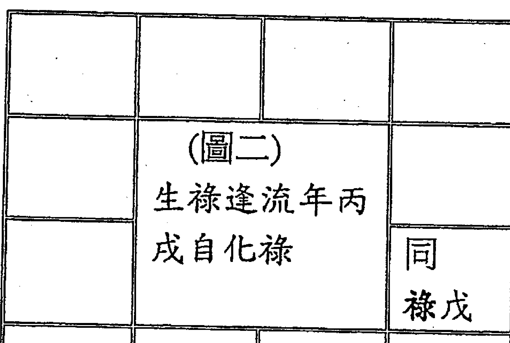

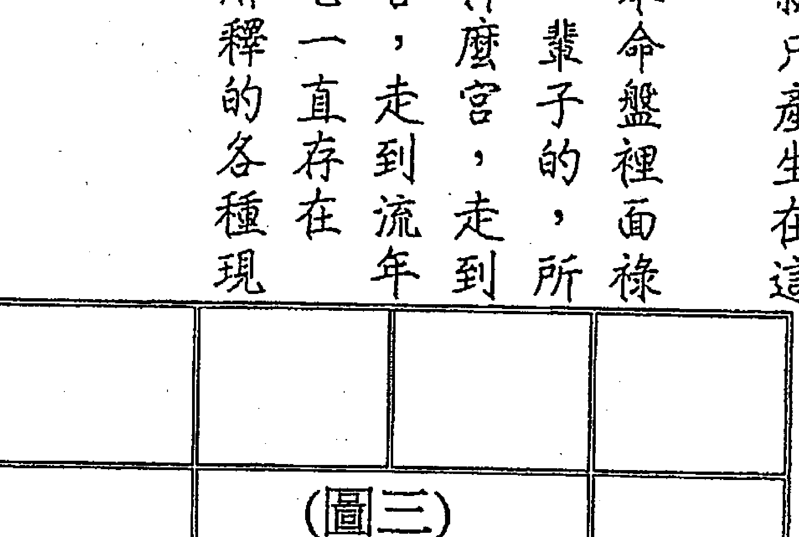

若是化权自化权，生年权的状况是：破军在戊，甲年出生，破军化权，在甲戌又自化权；阳梁在酉，乙年出生，天梁化权，在乙酉又自化权；机阴在申，丙年出生，天机化权，在丙申又自化权；同巨在未，丁年生人，天同化权，在丁未又自化权；阴在午，戊年生人，太阴化权，在戊午又自化权；廉贪在巳，己年出生，贪狼化权，在己巳又自化权；武曲化权，在辰，庚年出生，武曲化权，在庚辰又自化权；阳梁化权，在卯，辛年出生，太阳化权，在辛卯又自化权；紫府在寅，壬年出生，紫微化权，在壬寅又自化权；阴阳在丑，辛年出生，太阳化权，在壬子又自化权；紫微化权，在辛丑又自化权；巨门在亥，癸年出生，巨门化权，在癸亥又自化权。（如图四）

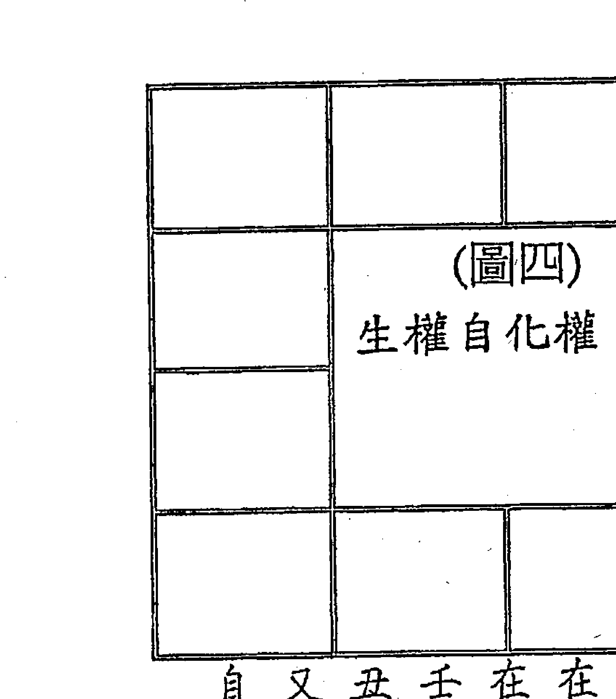

另外还有一种，靠流年太岁干自化权的。如：戊年生人，太阴化权在子，戊干在午，戊子（二〇〇八）年太阴又自化权；己年生人，武曲生年禄、贪狼生年权在丑，命盘己干在巳，但己丑（二〇〇九）年武贪又自化禄权（如图五）；庚年生人，武相在寅，武曲化权，逢庚寅（二〇一〇）年武曲又自化权（如图六）。余此类推。

| | | | |
|---|---|---|---|
| 庚 | (图六)
生年权逢庚寅
流年自化权 | | |
| 武相权戊 | | | |

与生年禄（权）逢流年太岁干自化禄（权）自行演练。

以上谈了两种型态，生年禄权科逢宫干自化，与逢太岁干自化，都属于同类自化，其意思以后会详论。

第三种型态，如大限禄入某宫，而该宫自化禄，或如流年太岁干化权入某宫，而该宫自化权。大限可论、流年可论，当然流月亦可论。

| | | | |
|---|---|---|---|
| | (图七) | | |
| 大命 戊 | | | |
| 机阴 丙 | | | |

生年科自化科与生年科逢流年自化科，请各位比照上述生年禄（权）自化禄（权）与生年禄（权）逢流年太岁干自化禄（权）自行演练。

扩充之，大财也可论、大官也可论，如大官化禄入某宫，而该宫又自化禄，大限的命、财、官化的科，它那边又自化科，这些都可能碰上。

举例言之，如大命在戊辰，化太阴权入丙寅，丙寅又让天机自化权（如图七）；又如天梁在己巳，己丑（二〇〇九年）化天梁科至流官己巳，己巳又自化科。这是第三种类型。（如图八）

## ▽ 命理的工具语言

当然禄自禄、权自权、科自科在我宫会关乎自己，值得深入研究。禄自禄在初段解释为「有禄而不知珍惜」，权自权是「有权而不知珍惜」，科自科是「有科而不知珍惜」。我把这样的话，称为「工具语言」，这些「工具语言」可以使用在任何方面，方便继续的解释，好像可资利用的工具。

我学习或研究东西，蛮喜欢设置一种我称之为「工具语言」，命理上也设了一些「工具语言」。学习他国语言时有「工具语言」，命理上也设了一些「工具语言」。学他国语时的「工具语言」，如「一、二、三、四、……」这些阿拉伯数字，还有问人「早安」、问人「晚安」、「你叫什么名字？」、「你家有几个兄弟姊妹？」、「你刚讲的那个单字是什么意思？」等等，把这些话语先背起来，再靠这些「工具语言」深入其他话语，可以跟他人交谈到越来越懂，所以学语言就是这样，把一些「工具语言」练好，总不能常说：「这句话我听不懂。」而是该问：「那一个字要怎么拼？啥意思呢？」人家就会满山遍野地讲解，让你了解他刚才那个单字是什么意思，这个就是「工具语言」。

命理也有命理的「工具语言」，像刚讲「有禄而不知珍惜」，禄要解释什么呢？可以解释钱、可以解释贵人、可以解释乐观，所以禄自禄，有些地方是OK的、有些地方是不行的。

## ◇ 禄自禄解释在乐观、金钱、贵人有所不同

以禄为乐观来解释，禄自化禄在命宫的话，自化禄会将禄带到迁移宫，迁移宫也表个性，所以一样乐观；如果在官禄宫呢？禄自禄，代表做事情太乐观，散散的，把禄带到夫妻宫就没有用了，散散的，不认真于事，这就是有禄而不知珍惜。

一辈子，在大限管十年，禄自禄解释在命、财、官都可以，只是它的成份多寡而已，有钱而不知珍惜，因财一带出就到福德、官一带出就到夫妻、命一带出就到迁移，钱带出了。将禄带到迁移，论钱财不象论乐观，因迁移是内性，乐观还是乐观，不会带掉的；若论钱财，带到迁移就是带到外面去了，财就损了，这就是有钱而不知珍惜。

有钱而不知珍惜，要很在意地去珍惜吗？我个人的观念，凡事不要一概而论。

假设此一大限有钱而不知珍惜，而未来的大限一样不愁钱用，那又有啥关系呢？顺着性子花吧！如果未来钱财拮据，这个大限可不能有钱而不知珍惜，须要订一套存钱的措施，要做有效的管理，存一些钱，以便下个大限用，或是做了有限度的节约，不时提醒自己，逆向操作。要分清楚再论，要因整体条件之不同而有不同论述。

一个人有钱花是很舒服的事，以前有一个中正预校的国文老师，他的论调很怪，但可做参考，他赚了钱就花，喝酒、买东西，我说：「喂！你怎么都不储蓄？」

他说：「ㄟ！你不知道吗？钱是正在花时，才能证实是自己的，放着不是被小偷偷了，就是被人家倒了，那是别人的。」好像也对啊！不过，我们采用他一点点论调，可不要全部采用。

来，禄跟科有相同的道理，但科自科的时候，论财为小财，也就不用去计较；但禄自禄、科自科的禄与科表现在贵人的时候，这一点就需要注意了。有贵人而不知珍惜，是有缺失的。

有贵人而不知珍惜，大概是什么状况呢？譬如：周遭常有人对我说：

> 「老兄！这个我可帮你忙。」

但科自科、禄自禄的人，他会犯一个错误，不经意地说：

> 「不用！」

语气是无心的冷，却让人感觉热脸贴在冷屁股上，等到需要时，人家已经不理我了，或是人已经离开你的工作环境了。

所以禄自禄、科自科的人，要改变回话的说词。当有人要帮你忙的时候，就要回话说：

> 「好啊！等我需要，一定找你帮忙。」

说不定你很讨厌这个人，照样讲这句话，但一辈子不找他就好了，不得罪人嘛！也不要在无意中得罪人，教导自己的嘴巴讲这句话。相信每个人都做得到，这样就能永远保有贵人，留着你要运用或帮忙的机会。

## ◇ 权自权可能滥权、错失良机或花拳绣腿

权自化权，谓之「有权而不知珍惜」。此「权」可以为权力、可以为权威、可以为权势、可以为奋斗。若是有权力而不知珍惜，是一开始是有此权力，却不知运用，导致错失良机；若是有权威而不知珍惜，是过程有其权威，却不知运用，彷如无其权威；若是有权势而不知珍惜，是自有其权势，或被授与自主权，却不知珍惜，导致滥权；若权表现奋斗，权自化权则易成花拳绣腿。若大命化权到大夫，大夫又自化权，或是做起事来声势很大，却没啥成效，或事倍功半而不自知，这就是上述的花拳绣腿。若大夫有权而不知珍惜；更详细地说：我给大夫十足的自主权，配偶不知珍惜，我行我素，也是滥权。

命宫或迁移宫有化权又自化权的人，要仔细检讨自己出了太多空拳，没作用的动作让自己忙而少功。更要注意的是，命为本性、迁为内性，存在如此的个性而不自知；迁移的行动，累积成命迁的习惯，更造就了个性，都是命迁所管辖的。

兄友线有权自权的表现；但要小心，权自权是先后天权都给了兄友，不能与兄友有所争执，一有争执我必输。

夫妻宫有生年权又自化权，滥权、错失良机、花拳绣腿、忙而少功是配偶的表现；但要小心，权又自权是先后天权都给了配偶，不能与配偶有所争执，一有争执我必输。

官禄宫有化权又自化权，前述已明，要深省并修正自己，要知道矛盾是用来戳的，以矛敌得漫天价响，则劳而少功。

子女宫有生年权又自化权，滥权、错失良机、花拳绣腿、忙而少功是子女的表现；但要小心，权又自权是先后天权都给了子女，不能与子女有所争执，一有争执我必输。

田宅宫有生年权又自化权，对于增加田产，不是不当扩充、增加，就是劳而无功，一直在找，却没真正下手；田宅宫包括家中成员，动作、声势大而少成，小心各自专权而不相让。

记得禄自禄、权自权、科自科，这种同类相抵销的状况是论其结果，要注意的是他的开始及过程都是有，结果是因某个环节不知珍惜而泡汤。要知其始末，始可在其间转圜。

## 科自科『有书读而不知珍惜』

禄自禄跟科自科还有一个不同，科自科『有书读而不知珍惜』。譬如：家里的人要他去读书，或者有人找他去哪边读书，有机会他就是不要，那很可惜；有书读太可贵了，干嘛不知珍惜呢？这个包含正式去报名、去考试的，或者有读书的时间与机会，一来不想去获得，二来获得了而不去看，这些都是有书读而不知珍惜。

这很容易松散掉，因为它会抵销；『有』是在开端及过程，抵销是结果，讲到那么详细，就是在过程里就去重视它，不要等到它的结果，就是有也等于没有。

所以禄自禄是钱的话，是先有而不珍惜，才变成没有的；认知那么详细，才要改变自己的话，不要把贵人推掉；那有书读而不知珍惜也是相同的。

有书读而不读，造成虚有其表，或常讲一些中听不中用的话。因此要藉此科，努力读书，以使名实相符。

## ◇ 忌自忌谦称一又四分之三忌

这个同类带掉的性质，偏偏在忌又自忌不会。这一来，让我们想到人生的机制也是如此。怎么说呢？有很多地方可以证实。譬如一天服用一帖补药，三个月以后，方觉这帖补药不错，但吃毒药却立刻见效，所谓的「吃补不立补、食毒立毒」。

生活习惯也是如此，好习惯难以「养成」，坏习惯很容易「形成」。你看好习惯要用「养成」的，还不容易；坏习惯的「形成」是很自然的容易事。所以说忌自忌没有把它忌带掉，而形成有忌而不知珍惜，宁可把它看成双忌。

不过长久研究下来，如果要说忌又自忌有否带掉？只带掉一点点，但很难估量，所以忌自忌我把它戏称为一又四分之三忌。是不是带掉四分之一？不知道，恐怕很多，但还留下很多忌。譬如：我有一位要好的朋友，只为了一点小事却闹翻了，内心好痛苦，这叫做化忌。

后来，闹翻的朋友要投资事业，若不闹翻一定找我合夥，因已闹翻，所以不用我了（自化忌），当然就不再找我合作。他去找另一位朋友某君，后来某君亏一亿，我却闪开了。这就是我所说化忌自化忌，亦有所带掉，但无法估量。说灭掉四分之一的忌，也只是用四分之一去形容。讲个例子，有人成立出版社，本来要我合夥，讲到最后却没动静，后来才知道，找另一批人马合夥。我不计较，反正我有我的事业在做，他们赚了钱，但决裂了，刚好我闪开他们的恩怨。人家不要我是忌，不必后来有恩怨，也就是忌自忌所少的四分之一忌。

真的，人生要想宽一点，就知道忌有时候要採长痛不如短痛，这短痛的事小，以后不会找你，闪开长痛。人不用乡愿，乡愿反而会有妇人之仁，会带来后患无穷。想通了，须要短痛时，没有什么好伤心的。

## ▽ 田宅生忌自忌，抢时机解救命例。

有一丙申年生男命，同梁坐迁移丙申，第四大限走入本命田宅，羊陀夹廉贪忌。一入大限，住破屋、生活无着，这须要由阳宅下手，因是大限在本田生忌自忌，大田丙申又化忌入冲本田（大命）。

大限前五年很差，当然没能力下手改善田宅。等他生活有点改善，在亥年时，跟他说：「你快找房子买。」为什么抓这一年呢？因为他大限走田宅生忌又自化忌冲亥宫，忌冲过会稍好，可在当年年底抢先动手，因为大多忌冲半年，到年底忌星已弱。忌冲过后，如果没有这样抢救是不行的。为什么这样呢？我跟他讲了以后他说好，隔了三天又打电话给我说：「不行啦！你可以明年再来买吗？」我说：「不行啦！你现在就要抢时机。」为什么这么讲？因为他认为有客票，还要拿票去周转，或过两年以后再买。我给他的答案是：如果不这样做，这两年都一样，没有现金、只有客票。这就是要抢一步做的意思，因为初阶段嘛！虽然没有钱，但是还有客票可以转，忌冲的流年年底，就可以抢时机改善，亦即赶快把阳宅最根源的问题解决。如果没有改变，运气就是这样过。这就是①为什么找田宅下手？②为什么找亥年下手？

| 天同禄丙 | 天梁 迁 | 天相 刑惊寡 友 乙 | 巨门 甲 |
| 武曲 丁 | 七杀 疾 | 月〇日戌时生 | 一九五六丙申年十一 |
| 太阳 戊 | 天哭 财 | 田宅忌自忌转运 | 命例 大限行本田癸巳 |
| 天姚 己 | 钺孤 子 | 天机权庚 右昌科夫 | 紫微 辛 破喜兄 |

## 三、化禄或权或科逢忌心

-   禄忌「反覆不定」
-   权忌「輾转不停」
-   科忌「不停打绕」

通论禄忌心、权忌心、科忌心、忌心忌心。再来，谈禄忌、权忌、科忌的组合。若跟忌在一起都可以称「交战」，如禄忌交战、权忌交战、科忌交战，禄、权、科与忌的组合就是两颗化星在一宫，禄忌就是「反覆不定」，好的、坏的、情绪也好，就是反覆不定，权忌就是改这、改那，「輾转不停」，科忌就是陀螺自转，「不停打绕」、「打绕不停」。在力道上、现象上都不太一样，反覆就是有好一阵又坏一阵，好好坏坏又坏坏好好，心情一下子平静、一下子又不平静，这叫反覆不定，先瞭解这个，再来解释它表现在钱上、心情上、个性上。权忌是輾转不停，輾转就是硬要怎样，所以权忌解释在个性上是霸气、甚至霸道；解释在钱财上是周转。

科忌是不停打绕，是属于绕不出一个死胡同的那个味道。因为科忌在一起，科无法解忌，混战一团，可以解忌的科，必然是外来之科。

## ◇ 权可以挡忌、忌可以挡禄、科可以解忌的必备条件

告诉各位，权可以挡忌、忌可以挡禄、科可以解忌，它都有相当的条件。权在我宫，忌在对宫，两宫不自化、不射出，这种权挡忌，才能把忌挡在外面，而不致权忌交战。权可以挡忌，但权忌在一起，它是权忌交战，那权挡忌是怎么才能挡呢？

若两宫之中有一宫自化或射出，就会让权忌交战，因为它已经有一个沟通的管道，都已经混战成一团，还挡什么呢？就是官兵跟强盗合作，哪来官兵抓强盗呢？

还有生年禄在命宫、生年忌在迁移宫，两宫不射出、不自化，就财的范畴是好的，因为此忌可以挡禄。所谓射出，就是迁移宫四化到命宫，或命宫四化到迁移宫都算。此忌可以挡禄，让禄不洩，就是他的钱不会洩掉。相同的，把这个条件摆到福德去，财福线也可以，不过禄要在我宫（财帛）。

相反的，生年忌在命宫、生年禄在迁移宫，一样两宫不自化、不射出，就是把财挡在外面。有一命例：乙年生人，太阴忌在命宫辛巳、天机禄在迁移丁亥，虽丁亥有射出禄太阴、自化科天机，是混战一团，但也有把好的给人，坏的自己留下之情况。

再说，权亦可挡禄，要禄在我宫，权在对宫；如果两宫有自化或射出，会不会影响权挡禄呢？答案是会。不过，只要自化或射出的不是忌，并无大碍。有自化跟射出在一条线上，两对宫又有权禄，形成这一条线上的化星甚多，多则忙碍。

权可以挡禄、忌可以挡禄，重点禄要在我宫，权跟忌就变成在我宫的对宫；第二、不能自化、不能射出。理论是当命跟迁移有射出或自化，会把星气带到对宫去交会，两宫已经交混，就是禄忌交战了。

这一点的观点很重要。还有权可以挡忌，那忌星也要在它宫，权在我宫，两宫不自化、不射出，这个忌就不会来伤害我们。

一宫或一条线上化星多（含生年四化、自化及射出），是闲不了的，这是通则。

## ◇ 禄忌、权忌、科忌的组合

禄忌、权忌、科忌的组合，只是型态上的不同。先讲禄忌同宫，没有自化，可能是生年禄忌，可能是大限化出去的禄忌，就是两颗星同在一宫，可以是本命的、可以是大限的、可以是流年的，或在论命当中一抛就是两颗星过去。譬如：大限在己亥，武曲、破军、文曲同宫，己干自化禄忌，亦是禄忌同宫，以最粗浅的解释是「反覆不定」，好了又坏、坏了又好。从表面上看可以说是一好一坏，就如此轮替不定，但是有可能变成更坏，因为禄忌交战为双忌。权忌是輾转不定，科忌是打绕不停。这三种组合，下面陆续详论。上述是讲最简单、最没有危机的，事实上禄忌在一起很容易变成禄忌交战为双忌。禄忌交战为双忌，为了不让它交战，就要有动作来化解，要趋吉避凶，即是要趋禄避忌，那颗化禄的星所代表的事情尽可做，化忌那颗星所属的事情尽量不要去碰它。这是很容易理解而容易做到的。

◇祿忌加陰煞、科忌加陀羅，更增其特性。

祿忌在命遷，有時開朗、有時不開朗（後文「祿逢忌」詳論）。如果命遷線上再加上陰煞，在論命時就先強調這一點。因為陰煞讓一個人，有時無端無由的納悶；這個有時無端無由的納悶，就等於有不開朗一面，不會納悶時就有如祿，所以加了陰煞，就會更加突顯這個問題。所以首先都會先講這個，因為太強了。

開朗、有時不開朗並不是最要緊的，但加上陰煞就有了，在排序上會提前說。雖然有時我講命理時，不喜歡有什麼固定的次序，只以重要的先講為原則。雖然有時那科忌呢？如果加上陀羅，在次序上也會提前說。因為科忌很陀羅，陀羅很科忌。科忌會打擾、陀羅也會打擾。科自化忌，那種打擾會讓人聽起來不舒服，忌自化科，給人聽起來好像很古錐。（後文「科逢忌」詳論）

同於科自化忌的組合，如：生科在命而自化忌、生科在命而命射出忌、生科在命而生忌在遷移、生科在命而命自化忌、生科在遷移自化科、生科在命而遷移自化忌、生科在命而命宮自化科而遷移自化忌、生科在遷移自化科、生忌在命而命自化科、生忌在命而命射出科、生忌在命而遷移自化科、生忌在命而遷移自化忌、生忌在命而命宮自化科、生忌在命而命宮自化忌、生忌在命而遷移自化科、生忌在命而遷移自化忌……

在遷移而遷移自化科、……。

科自化忌，他問說：「老師，請問一下，和尚跟尼姑如何解決他們的性需求？」我回答說：「這非斗數課程，我怎麼知道？」

隔沒多久又問一次，問話的口氣及字句，每次就如從未問過，上課在半年內，先後總共問了約十次，我都勉強給他不同的答案。

最後一次，我跟他說講：「你以後最好不要問了，其實我都隨便回答你的，我沒有做過和尚，你問我，我只能道聽途說隨性回答。你如果要瞭解真正的答案，自己去當和尚，就知道了。」真的很無聊，半年問這個問題問十次。

有時候，我們開玩笑，說某某人很科忌，甚至說某某人是科忌大學畢業的喔！還在一家大的科忌公司上班，意思就是很科忌，說話很打擾的。

如果忌自化科比較好，因忌自化科的人講話常「錯置成語」，也就是講的成語，字句顛倒了。譬如要說「時來運轉」，偏說成「運來時轉」；明明要說「胸有成竹」，偏說成「胸竹有成」。

有一位上了一年課學生，有一次跟同學很認真而驚異地問道：「好奇怪！我明知道六十甲子中沒有丁丁年，偏偏昨天要排一張命盤，換算生年干支，算了老半天，還是丁丁年。」所有同學都忍不住笑說：「是丁卯年啦！」又一次又是驚異地說：「昨天排了一張命盤，命宮都沒星曜，只有一顆天桃。」資質不錯，學了一年斗數，竟將「天姚」說成「天桃」。她是生年忌自化科在命宮。妳我都可能偶爾犯此毛病，只因那天的流日或流月產生科忌。因為不是命宮的，而是在流月、流日形成的，自己遇到，真的會感覺到很好笑。若故意要講顛倒，真的又沒有辦法，那一天顛倒得蠻順的，這就是流日、流月發生的。

◇忌自化祿的數種狀態

忌自化祿，比祿自化忌好，忌自化祿是本裡面有問題，外表好好的，這是初期的狀況。如果不去改善它，那個忌會冒出來，變成雙忌；如果好好的去處理它，就是忌轉祿，由壞轉好，所以差別很大。幫人論命時，看到當事人逢忌自化祿，或忌自化科的條件，絕對叫他從這裡下手去改善行運。因為效果明顯而快速，就像水已經淹到鼻子快要受不了，很快把它降下來，馬上爽快。

譬如：忌自化祿在子宫、或忌自化科在子宫，忌星所屬的壞事發生後，趕快往子宫的方面去解厄，如拜拜、找貴人，或常去該方位得轉好的磁場。拜拜找神明就看坐的那一顆星是什麼神？找貴人，就是去找住那個方向的朋友。因為你跑到那個方向，就是啟動宫干，自然自化祿了。

但要注意自化祿、忌自化科，若往那個方位去解厄，很快讓人覺得改善，但要持之以恆，雖見改善，要知道也只是表面改善而已，必要持之以恆，做一段時間，方能改善到裡面。我指導過的人，常常耐性不足，就是表面好了，誤以為完全沒事而不繼續做。要長期才能把這個底部的化忌拔掉，不是一兩次就得了。

人常常輕鬆以後，就不在意了，人性就是這樣。

權自化忌，是『輾轉不定』，也不好，那個宮位也不能去做，忌自化權就可以，因由壞轉好。權忌的組合，怕都是剛星，若都是剛星的話，權忌太剛了，論個性會霸道。

◆ 祿自化忌『弄巧成拙』

祿自化忌用閩南語的俗話講就是『好好驚，刨到尿流』，國語就是『弄巧成拙』。當走到這種運時，不管身上帶多少錢，總覺得莫名其妙地花掉了，有錢一下子就變沒有錢，所以祿自化忌是最難搞的。那一顆化忌的星曜所屬的事情不要做，那個星曜所在宮位的方位不要去，那個天干的人少一點往來，也不要跟那個天干的人有金錢往來，更不要跟那個天干的人借钱。行運走到自化忌，要不被自化忌所洩，就須遵循上述的話。這是避忌之方，行運已經走到了，總不能說這個行運不要走。祿自化忌的避忌蠻消極的，消極的避免。而積極的作為，是那個讓他自化忌的天干，化祿為啥星？化至哪一宮？往那個宮位的方向發展，做那顆星曜所屬的事情。這是趨祿的部分。祿入財帛宮又自化忌，代表有錢後來沒錢。還有，自化忌在那一宮，那一宮所主管的事情發生，多數人會唉唉叫，譬如：財帛宮自化忌，談到錢的事會唉唉叫，唉唉叫也是出去，最後唉到沒錢。

把陽宅分形勢跟理氣的架構，移植來解釋斗數蠻好用。如自化忌就是理氣，唉唉叫就是形勢。陽宅上說，縱使理氣是凶，沒形勢來配合，也不會凶；自化忌已形成理氣的凶，就不要在形勢配合，自然無事。所以對這種事情，我們要逆向操作，任何一宮自化忌時，那種事情發生時就不要唉唉叫，譬如：疾厄宮自化忌，小有病痛時就不要唉唉叫，反而用笑的。談笑風生，小病即癒，不會有大病；縱使大病，也容易治癒。這叫做逆向操作。以前有一位學生，看起來斯斯文文的，講到錢的事情就完全不一樣，因為她的財帛宮在壬辰坐武曲，講到錢的事，唉唉叫說：「錢賺得不夠用，怎麼辦？」才換新車，就要賣車，我問她為何要如此？她說每個月要付房子貸款、車子貸款，都要倒貼。詳問之下，才知沒那麼慘。她也不瞭解付房子貸款後即變成資產，把付房貸的錢當開銷，就在唉唉叫，我跟她警告：「不要這樣唉唉叫，若繼續唉，最後會真的沒錢」。我的小女兒，財帛宮生年忌自化忌，她不太理會錢，她跟我拿2000元要繳學吉他的費用，沒一會兒功夫，會發現2000元掉在地上。真的不太在意。她也會唉沒錢，但她會唉的習慣，已經被我改掉。我們要從命盤的重點，輔助小孩子的教育。

◇ 禄自化忌如何解？

禄自化忌，第一、不要唉唉叫，像我疾厄宫自化忌，就要知道，痛苦也要笑咪咪的。所以刚讲禄自化忌，无论在那一方面，都是好转坏，若事情遇到坏时，千万不要唉唉叫，财帛宫也是，任何一宫都是。若夫妻宫呢？夫妻若有事情，不要唉唉叫给别人听，如果有本事就当作笑话来讲即可，像夫妻吵架，也可以当作笑话讲给别人听，千万不要愁眉苦脸，唉唉叫。若在官禄宫自化忌，做事容易凸槌，除加强做事的谨慎度外，事情坏了也不要愁眉苦脸唉爸叫母。记住！做事要谨慎，而不要紧张；要用心，而不要灰心。如不懂道理、不懂反省，顺着人生也是顺着命盘表现，大多数逢自化忌就唉唉叫。懂了之后，就不要唉唉叫，就故意表现的很乐观，这就是逆向操作。说是故意表现很乐观，就是台湾俚语所说的：‘惯习成自然。’（按：国语说‘习惯’，台语说‘惯习’，两字对调，国语的‘热闹’，台语不也是倒着说‘闹热’吗？）

◇禄忌同宫看权要如何看？

禄忌同宫看权，因为权是「成也萧何、败也萧何」的关键。以论命来讲，禄忌会变成双忌，是权星搞的鬼，此即禄忌同宫看权的意思，这是论命。如果要造命，也是从权星看起，权星那颗星曜的星性，若用到坏的、负面的就会让禄忌交战变为双忌，用到正面的就不会。譬如：上述武曲、文曲禄忌同宫在大命，看权，权星是贪狼在大官，先就论命的立场来讲，贪狼在大官辛卯，有紫、贪、昌，文昌生年忌又自化忌，亦视为贪狼自化忌，做起事来理想高、欲望强，却因自化忌而无法达成，这是论命。论命即是从贪狼那一宫再化化看，结果自化忌，代表不好搞，一般人会挡不住，会犯错。贪狼的负面意义就是贪，贪利多，以前跟各位讲过很多次，这种运会有无利多的投资邀约，纵使一开头没兴趣，也常因周遭邀约之勤、说词之美、人情之困、利益之大，而致动心投入。若要造命，则须由正面意义下手。贪狼正面的意义是什么呢？因为个人适度的欲望是OK的，正确的欲望能让一个人向上提昇；人若没有欲望就垮了，有欲望才会更加理想、更加完美，所以在所做的事情上，尽量要求理想、完美，不辞辛劳。

不要让理想、完美的欲望变成压力。常思考：只要没有画蛇添足之虞，无论做什么事，加多一点点就是美；那理想呢？记住，理想的「理」字是动词，处理好美好的想法，就是理想。没有去处理、没有动作，就是空有理想，变成空想，空想一点都不理想。

如果能坚守上述这几点，祿忌交战的成分就降低了。再谈趋祿避忌，就是趋武曲的祿，避文曲的忌，怎么避文曲的忌？伤感情的事，不要让它发生，如果既已发生了就让它发生，自心不去纠葛那个问题。

还有一不能借钱给人，若借钱给人，就打算要不回来，因为文曲最直接的解释就是感情跟金钱。借钱给人，纵使是小钱，开口要他还钱，就会「欠钱跑主顾」。

（按：台湾谚语），人家不理你了，又在背后丑化你。这个就是祿忌交战看权，看权有两面性，一个是论断，一个是造命，就要往权星的正面意义做去。

▼ 禄自忌看权，为了要改变，是否要硬拗？

提问：禄自忌看权，这个权的过程中，为了要改变这权，是否硬拗的来改变这种星气使然吗？

答：这样的思考是片面的，导致有硬拗的感觉。硬拗偏向对化忌的逆向操作，要把忌分离掉，变成我硬要去做贪狼的正事，由星曜的特性下手，分正面与负面意义，当然从正面意义进行。垃圾不要乱放，累积后将之做成有机肥。这是用忌之写照。忌有黏性跟斥性，若用它的黏性时，也不是硬拗，而是正面思考之后，逆向操作。若不去操作忌的话，会不经意外掉好的，黏到坏的。这种逆向操作还是在用它的能量，我的理论是把它的能量正用就对了，还是在用它，离硬拗有段距离。忌星正用不忌，禄星正用方为禄。在一本张天师的书中，看到一句话：「邪法正用是为正法，正法邪用仍为邪法。」这道理是相通的。每颗星曜有其正面跟负面的意义，贪狼也不例外，逆向操作就要去黏它的正面、排斥它的负面。因为人好话不听，专听坏话，好习惯不易养成，坏习惯偏偏容易形成，就是这样的机制难搞而已，想通这一点，努力执行就没事。

⊙ 认知度越够，执行力越强。

星气使然是在论命，刚刚所讲的是造命，分两个层次来论，最先以论命来讲，因逢忌，要导正也很困难，纵使研究了命理、懂了道理，要实行起来还是困难多。执行力不强，是不行的。我曾经跟各位讲过：认知越够，执行力越强。譬如：我们听到某A说“刺五加”不错，不错归不错，心里想着如须要再去买；隔天又听到某B说“刺五加”不错，某B又讲了些功用；第三天再听某C讲，后又听某D讲。这下子，我们必然马上抽空去买“刺五加”。真的，坏的是三人成虎，好的也可以三人成虎，把相同的道理运用到正面来。我希望各位，学了我的命理观之后，那三人成虎要自我扮演。就是自己在内心形成这三个人，三人成虎，而这只“虎”就是我们认定不错的事。把认可的话，一直反刍，常常去想到，累积之后，就会积极进行。不然，听了道理，过了就忘了，大多不会执行。看了《生命的答案，水知道》、《来自水的讯息》两本书，相当不错，可以建立我相当好的观念；于是，我南来北往将这两本书随身携带三个月，一有空或睡前总得翻翻看看；再来，周教授桐明介绍的《QBQ问题背后的问题》一书，我也带在身上三个月，车上看、睡觉前看。这几本书都不厚，一晚可看完一本，为什么要三个月？就是加强认知度，一直反刍到我根深蒂固，这些观念就融入我思想中，行动自然跟上。各位已经认为对的或好的观念及事情，应该也不少了。但，为什么没有行动？就是认知度不够。我对待我自己的方法是如此，各位若想学习，话从我这里听到的，就把我的话持续反刍，让它成为你生活的一部份。这样的举例，大家应该可以理解，对好的东西要一直反刍，那行动力就来了。

◎ 应付忌星真的很累，但有经验以后就轻松了。

忌星真的很累，我相信若没借助长期研究紫微斗数的心得，要应对这些忌星都还没有现在好，假设有些事早在二十年前碰到，当然，那个时候对人生跟斗数的认知过犹不及。逢忌星，繁忙是好的；逢忌星，不忙即闪。为何有此不同现象呢？忌有两端，逢忌星，不管忙不忙，最怕烦；忌星让我们忙，也不能烦，一烦，病就来到，这一点千万要记住。

◇ 命運有祿、有忌的人有時開朗、有時不開朗

除了不要閒，忌星會一個人沒有工作的，閒得發慌的忌轉過後，一定是繁忙的景況，因為「忌」有雜亂的性質，必須一一接手，先整頓到「雜而不亂」，最後反能享有「豐富」。

我現在的工作，剛剛符合忌星，好亂喔！一下子斗數、一下子陽宅，一下子要論命、一下子要取名。這也是一種亂，但亂中要有序；有如美學上的「多態統一」，雜亂是多態把它統一就好了。若讓我固定做單純的某一項工作，可能又是雞飛狗跳了。

命運合起來論，包括生年、四化、射出三種，有祿、有忌的人，就是這個人有時開朗、有時不開朗。

如果祿自化忌，週遭的人都感受他的不開朗，其實他也是「有時開朗」，只是週遭的人感受不到；忌自化祿呢？有時開朗、有時不開朗，不過週遭的人都感受他是開朗的人，不曉得他有不開朗的一面。

有時開朗、有時不開朗，而遇遭的人只感受他不開朗的條件，諸如：生祿在命而自化忌、生祿在命而命射出忌、生祿在遷移而遷移自化忌、生祿在命而遷移自化忌、……。

有時開朗、有時不開朗，而遇遭的人只感受他開朗的條件，諸如：生忌在命而命自化祿、生忌在命而命射出祿、生忌在遷移而遷移自化祿、生忌在命而遷移自化祿、……。

只要掌握一個原則，遷移是表現出來的、自化也屬於表現的，以此原則去解釋各種組合就對了。如果自化祿忌在遷移，都一樣明顯，就可以看出有時真的開朗、有時真的不開朗。

◇財帛宮生年忌自化祿

財帛宮生年忌自化祿，就不是入庫忌了。生年忌在財帛宮是『重視利潤主義』者，多了自化祿，還是不是『重視利潤主義』者？還會不會『重視利潤主義』？但因自化祿要表現得不寒酸，所以在言語上不敢那麼苛，表現上要和氣，所以本來要「重視利潤」主義，到最後會放棄立場，這是變化之一。內心永存「重視利潤主義」，只是礙於現況，較為柔和表達，這也是變化之一。

財帛宮生年忌自化祿，窮時亦不失禮，付錢是很樂意的。財已化忌，卻要自化祿，亦即裡面有問題，還要表現好好的。忌自化祿的模式，不可掉以輕心，要積極將生年忌的部分去除，否則一輩子最多只是外表好看而已。

要如何去除？要先瞭解忌自化祿的幾個演變過程。初階段，忌自化祿像裡面爛掉、外表紅通通的蘋果；再來，忌會冒出來破祿，蘋果爛出表皮；最後，祿被破掉，也是祿忌交戰成雙忌。至少我們要在第二階段初期，趕快解厄，即可免於掉到祿忌交戰為雙忌的惡果。

舉例來說：壬年出生，財帛宮武曲生忌在巳酉，巳干自化祿，要如何解厄？拿出地圖來，找出你的住家，以此為中心點，找出酉宮方向（一二五度至二八五度），找那個區塊的關聖帝君去求拜，或找住那個區塊武曲坐命的朋友聊聊，每次至少四十分鐘。

◇ 田宅宮生年祿自化忌，小時候家道中落。

① 生年祿在田宅宮卻自化忌，這樣的命盤就不能掉以輕心，代表兩種狀況：

② 若順行運走第四大限的田宅宮，也要注意，本來是生年祿，好好的，但自化忌，台灣俚語說：「好好驚，刨到尿流。」國語叫「弄巧成拙」。

我的考證是不見得一定發生在第一大限，照學理來說是在第一大限，但有的不見得，第二大限也會，當然說不定第一大限掉落一次，第二大限又來一次。總之，就是「家道中落」會在第一大限或延到第二大限。

祿自化忌在田宅，在第四大限總是無可奈何，也是想努力去賺錢，卻是越做越糟，一下子就沒有了。之前跟各位提過：田宅宮很怕忌，除非入庫忌。

這句話已經涵蓋所有的。當然加強解說大家會比較清楚，除非生年忌在田宅宮是入庫忌，否則忌自化祿、祿自化忌，都蠻慘的。

當看到命盤如此時，要提供方案解救，方法有很多，最好的方法要能制機之先。所謂的制機之先，就是還沒有進入那個大限時，該怎麼做就要怎麼做，到時候才不必費那麼大的功夫。好比一個人剛踏入社會，要趕快學開車，萬一找到的工作是業務員要會開車，才跟老闆說要去學開車，那不是太慢了嗎？我們在運作所謂的制機之先、趨吉避凶，大概可以這樣的例子來理解。

◇田宅宮生忌自祿，由壞轉好。

田宅宮生忌自化祿也怕，因為大限走到田宅宮時，外表維持好好的，裡面爛得要命。如果不是一個懂得的人，可以說不好，因為生年忌自化祿，就好像水快淹到鼻子才獲救，那豈是好呢？因此命理要知道它的過程，忌又自化祿，簡單講就是壞轉好，但要注意，好像水快淹到鼻子才獲救，一個人最怕的是被威脅，人生吃好吃壞沒關係，但是有壓力、有威脅，這樣的命怎麼算好呢？譬如：天機忌在田宅宮乙丑位，乙丑自化祿，大限走到，風光不久即知敗象，最後他老爸拿錢出來，因為天梁在對宮，所以沒有被關。

如果單純的生年祿、生年權、生年科那是OK，不要自化忌，這是因為田宅宮經常主導這些東西，所以特別舉例這些。

祿(權、科)自化忌與自化祿(權、科)在田宅

祿自化忌、權自化忌、科自化忌在田宅，也是不好的，如何不好呢？因自化忌會洩，而且這些由祿、權、科再自化忌的，會由好轉壞；反過來，生年忌自化祿、權、科就比較好，會由壞轉好。與前面所談的意思一樣，只是把現象轉到田宅宮解釋而已。

忌自化科，代表房屋宅表面美美的、內部還是亂的，內部亂有些還可接受，如果髒亂則不好。髒、亂是兩回事，有些環境亂而不髒，有的是髒而不亂，當然最壞的是不髒不亂，最壞的是又髒又亂。

什麼叫做雜亂？譬如我以前住的那一棟透天厝，每一層樓的走道都不一樣的路線，這種雜亂有一點另類的美。因上樓梯後的轉向不一樣，所以爬到哪一樓都知道；現在住的這一棟，上樓梯後都一樣，常常搞不清楚走到哪一樓了，曾經走到樓頂才知走過頭了。這是因為環境來論。以家運來說，忌自化祿、忌自化權、忌自化科，都是由壞轉好。小時家運，由壞轉好；若第四大限走田宅宮，又來一次，由壞轉好。

◆ 權洛達己心

◇ 田宅宮生忌自權，辛苦而後增加。

如果忌自化權，不好，但可因為奮鬥而增加，最先不好是忌，自化權是說改善以後會增加，權在田宅宮它會增加。不過權在田宅宮除了屋形的關係之外，權在田宅宮也不太好，因為權為小忌，代表家裡多少會有一點鬥爭或爭權。 我的權在田宅宮是代表我個人的權力給整個家庭的人，大家都很有權，有時候要主張什麼都沒有辦法，那只好自己看著辦。唯有心甘情願，讓家裡所有的人自主權都高。一般看來，不是很好的現象，只是不得已已給家裡的人權力大一點。

像我剛好相反，第六大限大田化權來大命，代表家裡的人給我很多的權力，一輩子家裡不是我作主，也沒有當過戶長，這個大限很自然形成。

◆ 權自化忌、忌自化權有別

權自化忌，是一種霸道、霸氣的個性，這是它的表現特性。若權忌配合剛星，就會有霸道的表現；如果是柔星，那還好，剛柔並濟。 我要某人給我一些啥東西，他硬是不給，我會說他好霸喔！命理就要跳開這個講，因為命理都是要有條件的，才去論它；所以剛柔並濟的時候，就是柔星加上權忌。

尤其忌自化權，因表現權，他講的話會比較鏗鏘有力，這個時候還不到霸道，因他講的話就照這樣執行，這樣的人就有一點威嚴，在處理事情起來就很好，所以還不必論到霸道。

一個人做事果敢，跟人家講，人家會聽，都按照他的話去做，這也不壞啊！ 這個都因自化權。若自化忌，人家就會不舒服，人家就比較聽不下去，權自化忌就比较听不下去。
自化是表现在外的，迁移也是表现在外的。也是像刚刚所讲的禄忌一样，把它分开两种，一样的道理，就是把禄忌改为权忌就可以。

### ◇权忌在财帛宫是周转
在财帛宫权自化忌，最好不要跟人有钱财周转的事情。如果说星气使然，就是很自然地在钱财上，跟人周转来周转去；但是知道了，就要逆向操作，禁止周转。因为权自化忌在财帛宫，会越转财务越差。
忌自化权则属于越转越多，因权有增加之意，所以这种人可以放高利贷。这只是初步说可以；第二、因生年忌在财帛自化权，那财帛宫的宫干化禄去哪里？化忌去哪里？都要看一看，才有最完整的论断。
譬如：财帛宫的宫干自化权，化禄去命宫、化忌去田宅宫，这是最安稳的；因为禄忌皆入我宫而不同宫。这是一个游戏规则，因为禄忌皆入我宫，只要禄不同宫，此忌代表收藏。

化星太多，就不可能过平淡生活。因为一颗化星一股气，两颗化星两股气，化星就是会突显所属星曜，因要突显就显得忙碌，超乎正常的忙碌。再说，化星

### ◇ 权忌在夫妻宫
忌不在我宫的话，差不多80%冲我宫；其余20%是入父疾线及兄友线，入这两条线都不好，父疾非我宫，但入疾也是我自己，冲疾厄也是我自己；剩下兄友线，兄友线好坏参半，因忌星入兄友线，兄友线忌星一进去叫灾劫。以大限来讲，若本生年忌在本命兄弟，大限又化忌到本命兄弟或大限兄弟，这个大限要不被人倒帐很难。若逢流年又化忌到本命兄弟或大限兄弟或流年兄弟，这一年要不被人倒、不被人拐、不被人骗很难。对于一些事情，要怎么处理？要预先想好，有如我讲明年巨门的是非，万一遇到是非，现在都模拟好了，给大脑下指令，届时反射动作才会对。就是巨门的三步骤：道谢、道歉、再见。全都想好了，减少啰嗦，天下间不必要那么磨；若没有先想好，不小心就掉进是非。

使人变化多，也可因所化之星，知其好坏。简单说：三化吉即化禄、权、科为好，化凶即化忌为坏。譬如命迁线四化、自化、射出多，就代表那条线所属两宫所掌管的事务很忙。若夫妻宫的化星太多，夫妻俩想要维持就难，总要让他的星气显现。以前帮一个香港人论命，他的权忌在夫妻宫，而且左右也在夫妻宫，我跟他说：「你的老婆用得很凶喔！」他说：「我现在的老婆是第八个太太。」因权忌是一种转换，若不换配偶，处理人生的功夫要很好。所以命盘的条件有很多不一样，若只凭粗看，很难论断与建议。权忌在夫妻，亦代表配偶霸道或霸气。当然权自化忌会让人难以忍受，离异的机会更大；如是忌自化权，让人最多只感到霸气，夫妻纷争较有转圜的余地。无论权或忌，都是刚星，这是自我调整的课题。权忌它就是转动，若星曜是硬的话，就糟糕了；若柔和来处理，还是变化多端，处理不来。

### ◇ 权忌在疾厄
权忌在疾厄，身体常变化，权星跟忌星都可能开刀。权星容易开刀，忌星是一种伤害，权星是一种变动，开刀就是变动。我这个大限为什么要开刀呢？大疾甲午化权来大命又为本疾，武破同宫，武曲为骨骼。虽大疾甲午化太阳忌自冲，但我是权星开刀的，不是太阳忌开刀的。破军就是破坏后再建设，我换人工髋关节，即是破坏后的建设。由此可见，星性跟实务上的配合，有其妙趣。化星要配合其星曜，才知显现在何事或何物或何部位。不然在论命时，如大限化忌冲疾厄，疾厄又化忌冲本命，把这些星集合一起，才知道是哪个地方有问题？由星性知道显现什么毛病？这样才有办法去处理。如王淑品写的《一条虫变一条龙》（如附录三），她说手及掌不能伸张，当然知道是天机的问题，找出天机忌，再以禄去解忌，马上好了。我大限己亥四化武贪梁曲，大命在本疾，武破曲都有可能；再来，看大疾甲廉破武阳，太阳冲天梁，阳梁都有问题。但是，我现在犯的什么呢？是骨骼的问题，就要知在武破哪里。我也轻度高血压，太阳忌才是。胃肠不太好，就是太阳

### 科逢己心
### 谈台视女记者忌自科在迁移
某电视公司的记者问我说：「我能不能问一两个问题？」她说：「以前被别的老师论过紫微斗数，这个老师跟我说：妳命宫坐空宫，星曜都在迁移宫，所以外出比较好。」
她这么一说，感到命理的观点有别，星曜集结迁移宫，这样可以论外出格吗？我跟她说：「妳是可以外出，但要很远喔！时差起码超过七个钟头。」这位记者者，命坐酉宫，紫贪在卯为迁移宫，民国六十二（西元一九七三）年出生，岁次癸卯，贪狼为生年忌。我论他要出远门，是因为忌星在迁移宫时，可以外出，但要出远门，而且自化科，要好好读书。她自己说：「我考上博士，但还没有申请到奖学金，英国有一所大学在等我，我的目标是当教授。」我说很好。因为忌自化科，而且到英国，这样时差也够。这个记者的忌星在命迁，我又说：「你在学习的前半段都比别人差，后期才出头。」她睁大眼睛说：「老师，从来没有人这样讲过，你真的说中我的感触。」以整个历程来讲，她小的时候书读不好，到长大后，现在是硕士，还在继续读。

太阳忌冲到天梁，因太阳属火，火的六腑是小肠，才造成小肠泻肚子。发生什么，都会在这些条件里面，总不能往阳梁的地方去医骨头，这样就错了。

| 天相 | 天梁 | 七杀 | 廉贞 |
| :--- | :--- | :--- | :--- |
| 财 丁 | 子 戊 | 夫 己 | 兄 庚 |
| 巨门权 丙 |  | 台视女记者 | 一九七三癸丑年生女 |
| 贪狼忌 迁 | 紫微 乙 | 大限在本田甲子 |  |
| 机阴科 友 | 右弼 甲 | 羊刃 天府 | 太阳 田 甲 |
|  |  | 禄存 | 武曲 破军 禄 癸 |

所以，忌星在命迁的人要记住：永远不要跟别人比，若跟别人比，真的会气死。只要跟昨天的自己比，才不会丧志，导致半途摔下马来。

### 科忌就是啰嗦、打转、陀罗，要如何？
科逢忌就会打转，绕不出一个死胡同。科忌有如陀罗，不停打转，这就是啰嗦现象。前面已说过忌自化科与科自化忌的差别，这里要提出的就是如何善用它？
无论科自忌或忌自科，都要多读书，多做研究工作，这就能将打转用在对的地方。对学问啰唆，学问会长进；对人啰唆，无人喜欢。打转在学问，越打转越深入，再也无暇对人啰唆。
陀罗是石磨，石磨不磨东西，是推空磨，即是台语所谓之「拖磨」；如石磨磨这些东西，磨米得米浆，磨豆成豆浆，东西一产出，人人争着要。
科忌如陀罗，科是学问，磨出学问，人人欢迎。学问多了，这个人人都问，每句话都得说上好多次，这是大家所期待的打转。从研究到分享，都是打转。

### 四、二或三个化星再自化
### ◇ 禄权自化禄或自化权
禄权自化禄，前提是有禄有权，结果是禄被自化禄带掉，剩下权，继续奋斗吧！这还不错。不过知命以后，有关禄自禄的问题，就要如前述，改善钱财与贵人的处置。
禄权自化权，权自化权，剩下禄，也不错。只是有点虚，剩下乐观势，最后可能剩下乐观或者还有钱吧！这也还不错，毕竟人生乐观还是重要的。
不过，若能不要打空拳，人生不是更有意义吗？
除了生年禄权自化禄或自化权之外，如机梁在壬戌自化禄，大限行乙丑或乙卯时，大限乙干化禄权入戌宫，戌宫壬干自化禄，也同此理。

### ◇ 禄科自化禄或自化科
禄科自化禄，前提是有禄有科，结果是禄被自化禄带掉，剩下科，表现斯文，就要看科在何宫，再论断其好坏。记得科要读书，禄不要只是乐观。
禄科自化科，前提亦是有禄有权，只因科被自化科带掉，最后可能剩下乐观或者还有钱吧！这也还不错，毕竟人生乐观还是重要的。不过，这些柔性的化星，到底要自己硬一点，才能刚柔并济。

### ◇ 禄忌自化禄或自化忌
禄忌自化忌，详看忌自化忌的解说，还有禄忌交战成双忌，这一点分析要注意，不要初期太乐观，最后会死得好惨。原则提醒要「趋禄避忌」，是必要彻底执行的法则。看自化忌的宫干化禄到哪？即是所要趋的禄，自化忌的忌是必要避开的。
禄忌自化禄，禄自化禄，禄最后被带掉，剩下忌。这在这个过程就要很注意，过度的乐观将使好事成空，甚至带来双忌。

### ◇ 权科自化权或自化科
权科自化权，权科本来是刚柔并济，很不错，但因权自化权，权被带掉剩下科，还好而已。这真可惜，可以刚柔并济，却剩下科而已。
权科自化科，科自化科，科被带掉，剩下权。还不错，继续奋斗吧！不过原来的刚柔并济没得到，好可惜啊！

### ◇ 权忌自化权或自化忌
权忌自化权，权自化权，剩下忌（辛苦挫折）。权自权的花拳绣腿，虚张声势是要检讨的，否则辛苦的过程，毫无价值。
权忌自化忌，忌自忌不会带掉忌，还会是加成的权忌，比权忌自化权糟糕。看自化忌的宫干化禄到哪？即是所要趋的禄，自化忌的忌是必要避开的。

### ◇ 科忌自化科或自化忌
科忌自化科，科忌本属啰唆，自化科当会掩饰，但难掩剩下忌。
科忌自化忌，忌自忌不会带掉忌，还会是加成的科忌，比科忌自化科糟糕。看自化忌的宫干化禄到哪？是所要趋禄的地方。

### 五、各种忌
### 射出禄权科忌
### 何谓射出禄、权、科、忌？
宫干四化的星曜正好在对宫者，称为射出。若射出为化禄，称为射出禄；若射出为化权，称为射出权；若射出为化科，称为射出科；若射出为化忌，称为射出忌。

| | | | |
| :--- | :--- | :--- | :--- |
| 太阳 癸 | 破军 甲 | 天机 乙 | 紫微 丙 天府 |
| 武曲 壬 | 射出例一 | | 太阴 丁 |
| 天同 辛 | | | 贪狼 戊 |
| 七杀 庚 | 天梁 辛 | 廉贞 庚 天相 | 巨门 己 |

| | | | |
| :--- | :--- | :--- | :--- |
| 天府 癸 | 天同 甲 太阴 | 武曲 乙 贪狼 | 巨门 丙 太阳 |
| 壬 | 射出例二 | | 天相 丁 |
| 破军 廉贞 辛 | | | 天机 戊 天梁 |
| 文昌 庚 | 辛 | 文曲 庚 | 紫微 己 七杀 |

为化忌，称为射出忌。
如例一：癸巳化巨门权至对宫，是癸巳宫射出权；甲午射出廉贞禄、乙未射出天梁权、丁酉射出天同权。
又如例二：庚子射出太阴科及天同忌、庚寅射出太阳禄、壬辰射出天梁禄、丙申射出文昌科、戊戌射出天机忌（机梁借至辰宫）。

### ◇ 自化跟射出忌超过六个宫位，不可能朝八晚五安稳度日。
任何一张命盘十二宫算一算，有多少自化跟射出忌，自化包含禄权科忌，射出禄权科不用算。如果总数超过六个宫位，这个人想要安稳度日，做安稳的工作，朝八晚五是不可能的事。因自化着重在表现，要有展现的动作。
射出禄权科为什么不用算呢？因为力量没那样强，射出忌就强了。这两个条件加起来如果超过六个宫位，就别想过得清闲、朝八晚五。
以下述第一个的命盘为例：
从子宫算起，庚子宫——自化科、忌（借对宫太阴、天同）；
辛丑宫——无；
庚寅宫——自化禄（借对宫太阳）；
辛卯宫——无；
壬辰宫——自化禄（借对宫天梁）；
癸巳宫——无；
甲午宫——无；
乙未宫——无；
丙申宫——自化科（借对宫文昌）；
丁酉宫——无；
戊戌宫——自化忌（天机）；
己亥宫——无。
这样就有五个宫位，当然这只是说个大约数，并不是说五宫就不会。只是八十分，没有一百分而已。
又如下述第二个命例，就超过了，总共八个宫位：
庚子宫——自化禄（太阳）；
辛丑宫——射出忌（七杀随文昌化忌）；

| 阳权陀 丙 巨禄右 命 | 武曲 贪狼 兄 乙 | 天同 太阴 夫 甲 | 天府 子 癸 |
| :--- | :--- | :--- | :--- |
| 天相 禄存 父 丁 | 一九五一年辛卯年三月○日申时生男 自化与射出忌命 例一 大限在本疾辛卯 | 天机 天梁 福 戊 | |
| 紫微 七杀 田 己 | 文曲科 官 庚 | 友 辛 | 文昌忌 迁 庚 |

庚寅宫——自化科（太阴）；
辛卯宫——自化忌（文昌）；
壬辰宫——无；
癸巳宫——射出禄（破军）；
甲午宫——射出忌（太阳）；
乙未宫——无；
丙申宫——自化权（借对宫天机）；
丁酉宫——无；
戊戌宫——无；
己亥宫——自化双忌（文曲、破军）。
因为自化就要有所表现，流年、流月、流日就是在命盘十二宫打转，要有动，表现的宫位一多，一定要让这些星曜有所表现，当然不可能安安稳稳、清闲度日。

| 列1 | 列2 | 列3 | 列4 |
| :--- | :--- | :--- | :--- |
| 命马 天相 父 癸 巨门禄 壬 命 文昌忌 兄 辛 太阴 天机 夫 庚 | 天刑 天梁 福 甲 例二 自化及射出忌命  左右 子 辛 | 七杀 廉贞 田 乙 ○日未时生男  红鸾 太阳权 财 庚 | 陀罗 阴煞 官 丙 一九五一年辛卯年十月 禄存 友 丁 文曲科 武破 疾 己 |

### ◇ 命宫射出禄或忌与命宫射出禄而迁移射出忌
命宫射出禄跟命宫射出忌，对一个人的行为来讲，命宫射出禄的人是时间有余时，就欢欢喜喜地出去走走，想要出门走走就乘舆出门；命宫射出忌的人是无端无由，好像在家里闷闷的，就想到某人家里走走，不是有兴致，不知为了什么就往外走。
我第五大限就是迁移宫射出忌，大限前一年我就开课了，也就是第四大限的最后一年，台北的课，其实只有上一天而已，我会想办法留两天。当时想：不要说来一天上一上课就走了，到书局走走也好，或到出版社拜访。但到了第五大限时，下课就马上走，因为迁移宫射出忌，射回大命，是不留的。
从这里开始理解有很多奇妙的组合：
命宫射出禄、迁移宫射出忌，就是命化禄到迁移，迁移化忌到命，这样就是乘舆出门，败兴而归；迁移宫射出忌的人，出外待不住，心在家中，办完事急忙赶回家。

### ◇ 命迁互相射出忌，在家、外出都呆不住。
命官化忌到迁移、迁移化忌到命的人，在家待不住，老是往外跑、在外头也待不住又回来，在那儿出出进进，行尸走肉不知道在干嘛！如果配合大限看，大命化忌到本迁、本迁化忌到大迁、大迁化忌到本子、本子又化忌到大子、大子又化忌到本迁，这就是大命化出去，都在两盘的迁移跟子女。这种人在家里待不住，去某A那里，坐不到五分钟想走了，再去找某B，也待不住；又再去找某C，也待不住。因子女、迁移同论在外，任何一个地方都待不住。因为是化忌，所以无端无由去那里走一下，往这里走一下。

| 贪禄存 田 | 廉贞忌 癸 | 羊煞 官 | 巨门 甲 | 刑恋寡 友 | 天相 乙 | 天梁 迁 | 天同禄 丙 |
| :--- | :--- | :--- | :--- | :--- | :--- | :--- | :--- |
| 太阴 壬 | 陀罗盖 福 |  | 一处待不久命例 | 一九五六丙申年十一月○日戌时生 | 武曲 丁 | 七杀 疾 | 天哭 财 |
| 天府 辛 | 息神 父 |  |  |  | 太阳 戊 | 天哭 财 | 钺孤 子 |
| 文曲 庚 | 左虚 命 | 破喜 兄 | 紫微 辛 | 天机权 庚 | 右昌科 夫 | 天姚 子 | 己 |

如此一命盘就是。命宫庚寅射出天同忌，迁移宫丙申化廉贞（借对宫）忌入子女，子女己亥化文曲（借对宫）忌入迁移。真是标准，每个条件都有了。至于迁移丙申化廉贞忌入田、子女己亥化文曲忌入命，则表示有时会外面待不住而回家。命宫射出忌而迁移官射出禄的人，在家待不住，一味往外跑，到外面又觉得无趣，还是回家好。子田线亦是相同表现，以田宅当命、以子女当迁移，看其相互的射出如何即知。
射出忌最怕忌入那个宫位又有自化，也就是对宫自化。因射出忌好像从我们的水池拉一条水管抽水出去，它本来就在泄，对宫有自化就像是在是水管的尾端，装一个马达加速它泄。自化禄权科都是一样，自化忌是强力的马达。当然这若是我宫的射出忌，会泄得很厉害。
遇此状况，我们要怎么办呢？就是做生意时，不要囤积货品，别想囤货居奇，也不要开工厂，因开工厂要囤积物料，要囤积成品、半成品。最先会以为买到便宜物料，一囤积后，一定翻盘，导致血本无归。这个也牵扯到我们现在要讲的各种忌，最先就讲射出忌。

### ◇ 射出忌或自化忌称为顺水忌或水流忌
像万福的官禄宫庚干射出科（太阴）忌（天同），幸好对宫没有自化。因同阴在夫妻为甲干，官禄宫为庚干，就不能囤货居奇，要做现金买卖，最好买空卖空。
譬如有：货源在上游厂商，我去招生意，人家要多少就叫多少，只是赚中间的价差，不是货叫进来囤积，再慢慢的卖。因射出忌、自化忌都叫顺水忌或水流忌，都不能囤货居奇、开设工厂，一定会翻盘。
假设大命自化，而大迁射出忌，这代表外来的伤害，也不要切货，试图囤货居奇，决定吃大亏。有一命例即是如此，与两人合伙开出版社，两个股东极力赞成吃下一本畅销书《中共国防科技大观》。当时正是波斯湾战争期间，这种书在世界有战争时，很是畅销，定价八百元。买断这本书，每本一百，附送版权，总共花了一百多万。一进货就翻盘了。好准。战争一结束，这种书就惨了，囤积在仓库数年，最后以一本十块卖出。
射出忌、自化忌都叫顺水忌或水流忌，不得囤货居奇、不得开设工厂，道理就在这里。
命宫化禄到迁移宫叫射出禄、化权到迁移宫叫射出权、化科到迁移宫叫射出科、化忌到迁移宫叫射出忌；如果是迁移宫化忌入命宫，就迁移宫射出忌，这是发射台的问题，就从发射台称之为射出。
其他的宫位，皆做如是论。

### 逆水忌
### ◇ 逆水忌的条件，以及分辨我宫或他宫的逆水忌
以生年忌星在辰宫为例，戌宫射出忌，生年忌这一宫不能有禄权科及禄存，科忌、还是权忌都不行，就成就戌宫是逆水忌。因为生年忌这一宫没有自化，戌宫射出忌，生年忌这一宫有如一堵挡水墙，把它逆回来，所以成就是逆水忌。进一步以此例申述，太阳忌是甲年生人，戌宫甲干单纯射出忌至辰宫，辰宫戊干，四化是贪阴右机，所以七月生人右弼在辰，产生自化科，就不算逆水忌了。
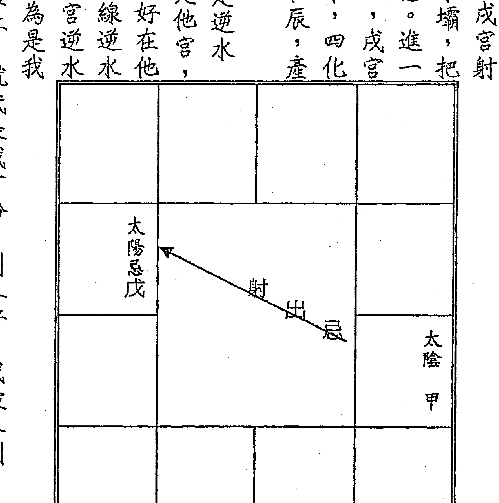
再来一个重要的认定，戌宫是逆水忌，戌宫是他宫？还是我宫？若是他宫，对我来讲是不好的，他宫逆水忌是好在他人，相对的对我大损；同理，兄友线逆水忌，忌对命造来讲是不好的，无论兄弟宫逆水忌、还是交友宫逆水忌都不好，因为是我周遭的人逆水忌，产生在我的命盘上，就代表我有份，别人好，我被人倒了。

### ◇ 逆水忌在疾厄宫，谓之健康忌。
如果逆水忌在疾厄宫也很棒，称之为健康忌。古书写天府在疾厄、天梁在疾厄，一生少疾病，早期有一些书又说：空劫在疾厄宫，也会空掉疾病。这些话都错了，因为空劫也有五行属性，一碰化忌就有病了；像地空、地劫属火，属火的问题也会冒出来。有五行属性就会有病，就好像人有形体就会有病痛一样的意思，惟有逆水忌在疾厄的健康忌一生少病，但不太容易碰到。
再来，逆水忌最好在本命盘的财、官、田；在命宫也算逆水忌，但是不好，因为逆水忌在命宫，也代表命运有两个忌，它一样形成运气上的逆水忌，但也形成了对身体以及个性上的伤害。所以，帮人选择剖腹生产日期时，最好不要采用命宫逆水忌。不能说它没有好处，但是干嘛为了获得逆水忌的好处，却又招来倍多坏处。他的坏处在个性固执，以及身体问题，如脊椎品质不好。
研究命理那么久了，见到健康忌的命盘不多，记忆中不超过二十个。

### △ 容易被误解的健康忌命例
有一个学生问我，他说：「很奇怪！这个小男孩有健康忌，为什么今年肠子破裂去开刀，在十月份开刀以后就一直昏迷？」
这个就是容易被误解的命盘，虽然父母宫文曲有生年忌，疾厄宫为己干射出忌到父母宫，可形成逆水忌，但因双星同宫组合，可以借来借去，这样就变成射出权忌，就不符合健康忌了。
再来，疾厄宫己干，己武贪梁曲，化权忌入父疾线，权与忌都容易造成开刀。
今年是丙戌（二00六）年发生了，民国八十八（一九九九）年出生，丙戌年八月

| 天同 天梁科 夫 壬 | 天相 左右 子 辛 | 巨门 禄存 财 庚 | 贪狼权 廉贞陀罗 疾 己 |
| :--- | :--- | :--- | :--- |
| 武曲 七杀 兄 癸 | 太阳 天哭 命 甲 | 一九九九己卯年四月○日时生 | 丙戌年十月因肠子破裂而开刀后一直昏迷 易误解的健康忌 |
| 太阴 姚空 迁 戊 | 文昌 天府 友 丁 | 官 丙 | 田 丁 |
| 紫微 破军 福 丙 | 天机 天刑 福 丙 | 文曲忌 父 乙 | |

## ◎ 再舉一不能說是健康忌之例

歲，他是火六局的，六歲起運，亦即六歲以後命宮干的四化要論。本命、大命、流命重疊，丙同機昌廉，化廉貞忌入疾厄宮。

如果在遷移宮、夫妻宮、子女宮、福德宮的逆水忌最好，到這裡變成對宮，子女宮、福德宮的逆水忌，因為移民到南半球，就是整個搬過去，這樣大命就可變成大遷，就可賺到逆水忌。

前半段衣食無虞，後半段覺得好無聊。

假設這張命盤武貪在未宮，武曲有生年忌，這個也不能當逆水忌，為什麼呢？可惜過來化，若自化祿還無所謂，但它自化忌。假設癸丑是財帛宮，就是財帛宮的逆水忌，那逆水忌有沒有成立？

|   |   | 武曲忌丁 |   |
|---|---|---|---|
|   |   | 貪狼 |   |
|   |   |   |   |
|   |   |   |   |
|   |   | 癸 |   |

有的，但是，因為逆回來，讓你賺大錢，然後自化忌又衝先，這是分開來說，它是成立的。

如果在疾厄宮就不能這樣論了，總不能說你這個人很健康，然後又不健康了，這不是廢話嗎？

這就是命理很有趣的地方，它是相同的原理，但論事情時就要知道該怎麼解釋了，在財官可以這樣論，在疾厄宮就歸為一般狀況，就沒有健康忌了。

## ◇ 甲年的逆水忌研究

甲年出生的人，甲廉破武陽，將廉貞祿安在乙亥官祿宮，武曲科安在丁卯財帛宮，破軍權安在辛未命宮，這樣就形成三奇嘉會，而將太陽忌星放在戊辰子女宮，因田宅宮為甲戌，所以形成田宅宮的逆水忌。甲年祿存在寅，與乙亥官祿宮形成明暗祿交流。（如例一）

相同的盤，而將命宮移到丁卯，一樣是甲年出生的，同樣是三奇嘉會，也在疾厄宮形成健康忌。（如例二）甲年祿存在寅，與乙亥財帛宮形成明暗祿交流。由此這兩個都可以用，到時在看怎麼排。不過，七月右弼在戊辰，自化科，就無逆水忌了。

**例一 甲年生人逆水忌**

| 父 壬 | 命 辛 紫微 破軍祿 | 兄 庚 天機 | 夫 己 |
| 福 癸 | 例一 甲年生人逆水忌 | 太陰 甲 | 子 戊 太陽忌 |
| 田 甲 | 武曲科丁 武曲科 祿 | 祿存 同梁 疾 丙 | 杀羊财 |
| 官 乙 貪狼 廉貞祿 | 友 丙 巨門 | 遷 丁 天相 陀羅 | 疾 丙 天梁 祿存 |

**例二 甲年生人逆水忌**

| 壬 友 | 癸 遷 | 甲 疾 | 乙 財 |
| :--- | :--- | :--- | :--- |
| 紫微 破軍 權 | | 天府 | 太陰 |
| 辛 官 | | | |
| 天機 | | | 廉貪 貪狼 祿 |
| 庚 田 | | | |
| 巨門 | | | |
| 丙 子 | 夫 丁 | 兄 丙 | |
| 天相 陀羅 | | 同梁 祿存 | 殺羊 命 |
| 父 戊 | | 武曲 科 丁 | 太陽 忌 |
| 己 福 | | | |

三奇嘉會如果沒有將忌星處理好，在二、三、四大限災難連連，縱使生命還在，到第五大限或許只有平順而已。如武貪在丑宮立命，廉破在酉為本財，甲年出生的人，就是三奇嘉會，祿權在財、科在命，可惜忌星沖疾，就是這個狀況。

至於武殺是損財格，將它放在財帛宮或命宮，一樣有損財，那要不要緊呢？不要緊的，因大賺就不怕小損，只怕沒有賺只損而已。所以，在看條件時要衡量，因三奇嘉會、外加逆水忌就不怕。

再來考慮還有沒有其他方法，可以形成逆水忌。各位可思考：利用己干、辛干，這是其次的思考，也來排排看。因甲年的己干在巳宮、辛干在未宮，若太陽在丑、文昌在丑，有可能，但稍稍一看就不行，因太陽在丑，太陰一定同宮，文昌在丑、文曲也一定在丑，辛未射出太陽權、文曲科、文昌忌，就不成立。

大家一定要這樣的思考，十個天干都要如此去演練。

己干在巳宮，文曲若安在亥宮，將太陽也預設在亥，這樣可不可以？可以的，這樣就成了標準的逆水忌，巳宮就是坐巨門，文曲就在亥宮，文昌就在卯宮，所以巳宮可以形成逆水忌。（如例三）再來選擇，看是要讓財、或田、或官在巳？

如果巳宮為財帛宮時，就要看祿權科跑到哪裡去？就是要這樣推演。化廉貞祿在午宮為子女，化破軍權在子宮為田宅，化武曲科在戌宮為父母宮，化太陽忌在亥宮為福德，這樣還算不錯，當然沒有上述武殺坐丁卯好，這也是閃不掉，但還有化權在田宅、化祿在子女宮。稍微排一下就知道了，這就是財帛宮的逆水忌。

**例三 甲年生人逆水忌**

| 巨門 己 | 廉貞祿 庚 天相 | 天梁 辛 | 七殺 壬 |
| 貪狼 戊 | 例三 甲年生人逆水忌 | 天同 癸 | |
| 昌羊 太陰 丁 | | 武曲科甲 疾 | |
| 祿存 紫府 丙 | 陀羅 天機 丁 | 破軍權 丙 | 太陽忌 乙 文曲 |

排出後，就可比對一下，如果要田宅宮變成逆水忌，那命宮就為紫府，這就要看父母要生這個兒女時，是適合紫府的、還是適合機巨同梁的。也就是適合機巨同梁的子女，就把命宮排在酉宮。

若要命宮在寅宮，田宅宮就變成逆水忌，如果這樣的話，官祿宮化祿，而甲年的祿存在寅宮，也形成雙祿交流，更漂亮；因雙祿交流就很漂亮，外加田宅宮有逆水忌。所以，可能的話，將命宮安在寅宮，更漂亮。

如果把官祿宮擺在巳宮，命宮就跑到丁丑為天機，這樣官祿就比較不利，沒有雙祿交流。因此用這一組的話，紫府坐命最好，雙祿交流，這兩個都是明祿，田宅宮逆水忌。

文曲被固定在亥，必然是未時生人，那麼幾月生的命宮才會在寅？答案是八月。怎麼算出來呢？本來命宮是由寅宮起，順數生月、逆數生時，現在知道生時是未，命宮在寅，那麼就由命宮寅逆數生時，子（寅）、丑（丑）、寅（子）、卯（亥）、辰（戌）、巳（酉）、午（申）、未（未），剛好在未，再由未宮起正月，數到命宮寅宮為八月。

其餘命宮在丑，或在酉，都如上法演算。

## ◇ 乙年的逆水忌研究

乙年出生的人，乙干在酉，若把太陰忌安在它的對宮，就不是變成逆水忌了。腦筋要靈敏一點的人，會馬上想到乙年的祿存在卯宮，形成羊陀夾忌，所以無法成立逆水忌。

有人思維紊亂，問我說：「老師，祿存可以不可以解忌？」有這個問題，就是頭腦不清楚，如果祿存可以解忌，怎麼會有羊陀夾忌呢？

再來，考慮辛干、己干。乙年生人，己干一定在丑與卯。將文曲放在卯的對宮酉宮，當然太陰忌也要在酉宮，能不能成立呢？不行，因為酉宮乙干太陰自化忌。

又把文曲挪到未宮，太陰忌也要在未，太陽在未同宮，文曲、文昌也

| 甲 | 乙 | 丙 | 丁 |
|---|---|---|---|
| 癸 | | | 戊 |
| 壬 | 乙年生人逆水忌研究 | | 己 |
| 辛 | | | 戊 |
| 庚 | | | |
| 己 | | | |

在未同宮，未宮癸干太陰自化科，也不行。

用辛干看看，乙年生人辛干在巳，文昌與太陰忌安在亥宮，亥宮丁干自化祿，當然不能成立。

整個全部找過了，就可宣佈乙年生人都沒有辦法擁有逆水忌。

歸納一句，就是把忌星擺在生年干對宮，這是第一個；然後再利用辛干、己干的昌曲，如果沒有辦法形成逆水忌，就沒有了。

## ◇ 丙年的逆水忌研究

丙年出生的人，丙干在申宮，把廉貞忌安在寅宮為庚干，貪狼就在申宮，申宮是丙干，丙同機昌廉，是不是申宮的逆水忌呢？

這就要注意有無文昌在寅宮，有的話文昌化科，會與廉貞忌一起射出。所以，不管哪一月份出生，出生時是申時就不行，因申時文昌在寅宮。（如丙年生人逆水忌例一）

如果把申宮當財帛宮，那命宮就在子宮，這樣就可以驗算，因申時，就由寅宮起正月數至命宮，故知是七月。所以，七月也不能成。

當然也可以把它當成田宅宮，那命宮就在巳宮，這樣就可以驗算哪一月不行。因申時，就由寅宮逆數申時至午，再由午宮起正月數至命宮，故知是十二月，所以十二月申時出生，田宅宮也不能成為逆水忌。

如果把它當成官祿時，那命宮就在辰，由寅宮逆數申時至午，再由午宮起正月數至命宮，故知是十一月，所以十一月申時，也不能成為官祿宮的逆水忌。

所以，丙年的逆水忌也是蠻漂亮的，只要不跟文昌同宮就好。

**例一 丙年生人逆水忌**

| 貪狼 丙 | 太陰 太陽 乙 | 天府 武曲 羊 甲 | 天同 祿存 癸 |
| :--- | :--- | :--- | :--- |
| 天機 巨門 丁 | | 例一 丙年生人逆水忌 | 破軍 陀羅 壬 |
| 紫微 天相 戊 | | | 父 辛 |
| 天梁 己 | 七殺 庚 | 辛 | 廉貞忌 庚 |

**例二 丙年生人逆水忌**

| 紫杀 | 羊刃 | 天相 | 丙 |
| :--- | :--- | :--- | :--- |
| 文曲 禄存 癸 | 甲 | 乙 | 廉忌 丁 破昌科疾 |
| 天机权 壬 天梁陀罗 | 例二 丙年生人逆水忌 |  | 戊 |
| 天相 辛 |  |  |  |
| 巨门 太阳 庚 | 贪狼 武曲 辛 | 天同 禄 太阴 庚 | 天府 己 |

## ◇ 丁年的逆水忌研究

同巨雙星組合，丁年出生的人，丁干在未宫，把巨门忌放在丁未的對宫癸丑，巨门在丑宫是丁年出生的人，丁干在未宫，把巨门忌放在丁未的對宫癸丑，巨门在丑宫是有再來，利用一個己干、兩個辛干。以己干來講，己干在亥，己武貪梁曲，文昌放在已宮，當然廉貞忌也要在癸巳宮，廉貪同在已宮，癸干自化貪狼忌，而亥宮的己干也射出權忌，當然不能成立，不合格的條件有兩個。

那辛干呢？辛干在酉宮，辛丑與辛卯；若把文昌放在辛卯的對宮丁酉宮，當然廉貞忌也要在酉宮，廉貞、破軍同宮在丁酉，卯宮就是天相，辛巨陽曲昌，也不能成立卯宮的逆水忌（如丙年生人逆水忌例二），因為丙年文昌化科，與廉貞忌在一起。

如果把廉貞忌擺在乙未，廉貞、七殺同在未宮，文昌也須在未宮，文昌、文昌一定在未同宮，辛丑射出科忌，不能構成逆水忌。

所以，丙年出生的人逆水忌只有一個可能，就是在申宮。

## ◇ 戊年的逆水忌研究

兩個不合格的條件。再來找辛干、己干。辛干在亥宫，就把巨門忌放在乙巳宮，文昌也放在巳宮，辛巨陽曲昌，同時射出祿忌，也是不行。己干呢？己干在酉宮，把巨門忌放在對宮癸卯，巨門、天機同宮在卯，文曲也在癸卯，癸破巨自化權，就無法成立了。結論是丁年出生的人，沒有逆水忌。

戊年出生的人，戊干在午宮，把天機忌設在戊午的對宮甲子，巨門就在午宮，射出科忌。因此，出生月是十一月就不行，因十一月右弼在子宮。其餘月份沒問題，都可形成午宮的逆水忌。以午宮為疾厄，則為健康忌。

**戊年生人逆水忌**

|   | 丙 | 丁 | 戊 |
|---|---|---|---|
| 甲 | 丁年生人逆水忌研究 | 己 |   |
| 癸 |   | 庚 |   |
| 壬 | 巨同癸 | 壬 | 辛 |

如果把午宮當財帛宮，那命宮就在戌宮，這樣就可以驗算出寅時不能產生財帛宮的逆水忌。怎麼算呢？上述十一月右弼在子，逆數生時，子在子宮、丑在亥宮、寅時在命宮壬戌。當然也可以把它當成田宅宮，那命宮就在卯宮，這樣就可以驗算，不讓右弼在子，一樣是十一月，命宮在卯，由十一月的子，逆數生時至命宮，即是十一月酉時不能用此盤。

如果把它當成官祿時，那命宮就在寅宮，右弼十一月在子，逆數生時到命宮為戌時。故十一月戌時不能用此盤。

**例 戊年生人逆水忌**

| 貪狼祿 廉祿存疾 丁 | 巨門 羊刀 財 戊 | 天相 子 己 | 天同 天梁 夫 庚 |
|----------------------|-------------------|--------------|-------------------|
| 太陰權 陀羅 迶 丙 | 例 戊年生人逆水忌 |              | 武曲 七殺 兄 辛 |
| 天府 文昌 友 乙   |                   |              | 太陽 命 壬     |
| 官 甲                | 紫微 破軍 田 乙 | 天機忌 福 甲 | 父 癸             |

再來，還是考慮辛干、己干，如果己干，文曲放在丑宮、天機忌也在丑宮，能不能成立呢？不行，因為乙干自化祿，不能成立。如果辛干，文昌放在卯宮、天機忌也在卯宮，能不能成立呢？不行，因為乙干自化祿也不能成立？不行，因為乙干自化祿也不能用。所以，戌年出生的人，逆水忌只可能產生在午宮。

## ◇己年的逆水忌研究

己年出生的人，己干在巳宫，把文曲忌放在巳巳的对宫乙亥，就要注意巳亥两宫的主星是双星对宫坐或双星同宫的组合，在乙亥宫不能有自化，所以天机、天梁、紫杀、太阴在乙亥者，不能形成巳宫的逆水忌；己巳只能射出文曲忌，武破在亥或廉贪在巳亥者，皆不能形成逆水忌。

其余如太阳在亥、天同在亥、天府在亥、巨门在亥、天相在亥者都可以成就巳宫的逆水忌。（如己年生人逆水忌研究例一）

如果辛干，把文昌忌摆在丑宫，文曲也一定在丑宫，因昌曲同宫在丑未，那就射出科忌，

**己年生人逆水忌研究例一**

|己|庚|辛|壬|
|---|---|---|---|
|戊|己年生人逆水忌研究例一|癸|
|丁|甲|
|丙|丁|丙|乙 曲忌|

也不能構成逆水忌。
己年跟辛年比其他年有更多的可能。

從子宫考慮起：將文曲忌擺在午宫，將廉相也擺在午宫，本來會形成子宫的逆水忌，但己年祿存在午，因此無法成立逆水忌了。
考慮丑宫，丑宫丁干，勢必將同巨擺在未宫，丁干射出權忌，故文曲在未不
寅宫丙干，將廉貞擺在申宫、文曲忌也在壬申，即形成丙寅宫的逆水忌。（如
己年生人逆水忌研究例二）文曲在申，必
是辰時生人，可如上述推演各月辰時，各
是何宫的逆水忌？另須注意，申宫壬干，
會使左輔自化科，所以五月生人，不用考
慮了。
卯宫丁干，將機巨擺在酉宫，丁射出
科忌，不必考慮了。
辰宫戊干，將機梁擺在戌宫，文曲忌也在戌，形成辰宫的逆水忌。文曲在戌，是午时生人，可如上述推演各月午时，各是何宫的逆水忌？另须注意，可以形成辰宫逆水忌，但机梁借至戊辰自化忌，纵使有效的逆水忌，賺了再虧，若辰宮為疾厄，也不能稱健康忌。

**己年生人逆水忌研究例二**

| 廉貞文曲忌 壬 | 羊刃 辛 | 七殺祿存文昌 庚 | 天梁陀羅 己 |
|---|---|---|---|
| 財 癸 | | 己年生人逆水忌 研究例二 | 紫微 戊 |
| 破軍陀羅 子 甲 | | | 巨門天機 丁 |
| 天同權祿存 夫 乙 | 天府 武曲忌 兄 丙 | 太陽太陰 丁 | 貪狼 丙 |

巳宮己干，前面已論。
午宮庚干，將同陰摆在子宫，庚干射出科忌，不可能形成了。
未宮辛干，前面已論。
申宮壬干，將武相摆在寅宫，文曲忌在丙寅，能不能形成申宫的逆水忌？
答案是不能。因己年武曲化祿，與文曲化忌在寅，當然不行。
酉宮癸干，將紫貪摆在丁卯，文曲忌也。在卯，因己年化貪狼權，所以不能形成酉宮的逆水忌。
戌宮甲干，將太陽摆在辰官，文曲忌也在辰宫，形成戌宫的逆水忌。(如己年生人逆水忌研究例三)文曲在辰，必為子時生人。

**己年生人逆水忌例三**

| 壬 | 辛 | 庚 | 己 |
| :--- | :--- | :--- | :--- |
| 天府 癸 | 紫微 辛 破軍 羊刃 辛 | 天機 庚 祿存 | 陀羅 己 |
| 太陰 甲 文昌 | 己年生人逆水忌例 三 | | 文曲忌 太陽 戊 |
| 貪狼權 乙 康貞 | 巨門 丙 | 天相 丁 | 七殺 武曲祿 丁 |
| 天同 丙 天梁科 | | | |

## ◇庚年的逆水忌研究

庚年出生的人，庚干在辰宫，把天同忌放在庚的对宫丙戌，巨门在辰宫，丙同机昌廉，是不是辰宫的逆水忌呢？不行，因为丙戌自化禄。再来，只能利用一个辛干、两个己干。如果以己干来讲，若把文曲放在酉宫，已武貪梁曲，當然天同忌也須在酉宮，酉宮的乙干沒自化，所以成立了卯宮的逆水忌。

如果把天同忌擺在未宮，巨門同在未宮，文曲也在未宮，未宮為癸干巨門自化權，不能構成逆水忌。那辛干呢？若把文昌放在亥宮，當然天同忌放在亥宮，那巳宮就是天梁，在亥宮為丁干天同自化權，就不成立，自化掉了，不能構成逆水忌。所以庚年出生的人，就只有天同忌在酉，將文曲同時擺在酉，才能成就卯宮的逆水忌。（如庚年生人逆水忌研究）

+   正月子时命宫在丙寅，戌宫为财帛宫逆水忌；
二月子时命宫在卯，戌宫为疾厄宫之逆水忌；
三月子时命宫在辰，为迁移宫逆水忌；
四月子时命宫在巳，戌宫为交友宫逆水忌，损财至甚；
五月子时命宫在午，戌宫为官禄宫逆水忌；
六月子时命宫在未，戌宫为田宅宫之逆水忌。
以上皆须太阳在辰方是，其余无用。
亥宫乙干，把太阴摆在己巳，文曲忌也在己巳，即成生忌又自忌，不能成立了。

**庚年生人逆水忌研究**

+   - 正月巳時，命宮在酉，是遷移宮的逆水忌，要移民到南半球，方能受益；
- 二月巳時，命宮在戌，是交友宮的逆水忌，很差；
- 三月巳時，命宮在亥，是官祿宮的逆水忌，很好；
- 四月巳时，命宫在子，是田宅宫的逆水忌，很好；
- 五月巳时，命宫在丑，是福德宫的逆水忌，不好；
- 六月巳时，命宫在寅，是父母宫的逆水忌，不好；
- 七月巳时，命宫在卯，是命宫的逆水忌，坏处多於好处；
- 八月巳时，命宫在辰，是兄弟宫的逆水忌，很差；
- 九月巳时，命宫在巳，是夫妻宫的逆水忌，不好；
- 十月巳时，命宫在午，是子女宫的逆水忌，不好；
- 十一月巳时，命宫在未，是财帛宫的逆水忌，很好；
- 十二月巳时，命宫在申，是疾厄宫的逆水忌，形成健康忌。

| 七殺 甲 | 祿存 | 天同忌乙 | 文曲羊 |
| 陀羅 天梁 癸 | 天相 廉貞 壬 | 巨門 辛 | 文昌 |
| 貪狼 庚 | 研究 庚年生人逆水忌 | 文曲羊 |  |
| 太陰科己 | 天機 己 | 破軍 戊 | 太陽祿 丁 |

## ◇ 辛年的逆水忌研究

辛年出生的人，辛干在丑、卯宫。若把文昌忌放在酉宫为丁干，那辛年的禄存在酉宫，逢文昌忌，变成羊陀夹忌，因此不构成逆水忌。

如果把文昌忌放在未宫，那文曲也在未宫，因昌曲同宫在未，而丑宫的辛干同時射出科忌，故不能構成逆水忌。再來，是考慮己干，己干在亥，既要文昌忌在巳宮，文曲一定在酉宮，不可。另外跟己年出生的一樣，可考慮各宮射出忌，看能否形成？文昌忌在午，庚子同時射出科忌，已不可能。文昌忌在未，辛丑同時射出科忌，也不可能。文昌忌在申，庚寅射出天同忌，故將同梁擺在丙申宮，文昌忌也在申宮，已是自化祿科，不能形成寅宮的逆水忌。文昌忌在酉時，紫貪在酉、武殺在酉、廉破在酉、天府在酉，都形成卯宮的逆水忌，那就要將卯宮擺在財、官、田或疾，比較其優缺，再做決定。

**研究例一**

壬辰可射出武曲忌，武曲在戌戌，也将文昌忌摆在戌戌，形成辰宮的逆水忌

**辛年生人逆水忌研究例一**

| 癸 | 甲 | 乙 | 丙 |
| --- | --- | --- | --- |
| 壬 | 辛年生人逆水忌研究例一 | | 文昌忌 丁 |
| 辛 | | | 戊 |
| 庚 | 辛 | 庚 | 己 |

(如辛年生人逆水忌研究例二)。
成立；正月右弼在戊戌自化科，也不能成立。其余月份，可如上述推演各月子时，各是何宫的逆水忌？
癸巳可射出贪狼忌，廉贪摆在己亥，己干贪狼自化权，故不能形成逆水忌。
甲午可射出太阳忌，太阳摆在庚子，庚子太阳自化禄，故亦不能形成逆水忌。
乙未可射出太阴忌，太阳、太阴在辛丑，辛丑太阳自化权，故不能形成逆水忌。
丙申可射出廉贞忌，廉贞摆在庚寅，然丙申同时射出科忌，亦不能形成逆水忌。
丁酉可射出巨门忌，然机巨在辛卯自化禄，故不能形成逆水忌。
戊戌可射出天机忌，然机梁在壬辰自化禄，故亦不能形成逆水忌。

**辛年生人逆水忌研究例二**

七杀 陀罗 丙
天同 禄存 丁
武曲 文昌忌 戊
太阳权 己

天梁 乙
破军 庚

廉贞 天相 甲
天相 辛

巨门禄 癸
贪狼 壬
文曲科
太阴 辛
紫府 庚己亥可射出文曲忌，文曲若在癸巳，文昌忌不可能同时在巳宫，所以也无法成立逆水忌。

## ◇ 壬年的逆水忌研究

壬年出生的人，壬干在子、寅宫。把武曲忌放在戊申，天相同宫，戊贪阴右机，壬梁紫左武，是不是寅宫的逆水忌呢？（如壬年生人逆水忌研究例一）就要注意三月右弼自化科在申，五月左辅在申，壬寅射出科，这就不要考虑。

如果把寅宫当财帛宫，那命宫就在午宫，这样就可以验算。三月戌时、五月子时，即犯上述问题，不能成为逆水忌。当然也可以把寅宫当田宅宫，那命宫就在亥宫，这样就可以验算。三月巳时、五月未时，都不能构成逆水忌。

### 壬年生人逆水忌研究例一

|  |  |  |  |
|---|---|---|---|
| 太阴 乙 | 贪狼 丙 | 天同 巨门 丁 | 武曲忌 戊 天相 |
| 廉贞 天府 甲 | 研究例一 壬年生人逆水忌 |  | 太阳 天梁 己 |
| 父 癸 |  |  | 七杀 庚 |
| 破军 壬 | 癸 | 紫微权 壬 | 天机 辛 |

如果把它当成官禄时，命宫就在戌宫，三月午时、五月申时，不能构成逆水忌。

又以壬子来论，将武府摆在丙午，此宫不能自化，所以辰时生人，文昌在丙午自化科，不能成为逆水忌；还有三月生人，左辅在午宫，壬子同时射出科忌，也不能成为逆水忌。（如壬年生人逆水忌研究例二）

排除上述条件之后，若命宫设在乙巳，是为健康忌，迁移宫是双禄交流，或命宫设在戊申，是官禄宫的逆水忌，双禄交流在田宅。把此逆水忌设在财帛，是最不利的，因双禄交流在交友。

再来，还是考虑辛干、己干，如果己干，文曲放在卯宫、武曲忌也在卯宫，能不能成立呢？不行，因为己干射出禄，也不能用。

如果辛干，文昌放在巳宫、武曲忌也在巳宫，武破在乙巳同宫，可以形成亥宫的逆水忌。

### 壬年生人逆水忌研究例二

| 天同 乙 | 天府 武曲忌 丙 | 太阴 太阳 丁 | 贪狼 戊 |
| :---: | :---: | :---: | :---: |
| 破军 甲 | 壬年生人逆水忌研究例二 | 巨门 天机 己 | 紫微天相 擎羊 庚 |
| 父 癸 | 兄 癸 | 七杀 羊刃 壬 | 天梁禄 禄存 辛 |
| 廉贞 壬 |  |  |  |

## ◆ 癸年的逆水忌研究

癸年出生的人，癸干在亥宫，把贪狼忌放在丁巳，廉贞同宫，构成逆水忌。但是廉贪在巳，也可借至癸亥宫自化忌，要注意赚了又花掉，也不能称为健康忌。再来，考虑己干、辛干，以巳未来讲，巳武贪梁曲，文曲放在丑宫，文昌同宫，当然贪狼忌放在丑宫，武曲也在丑宫，而未宫的己干也射出禄权，这是不合条件。那辛干呢？辛干在酉，若把文昌放在卯宫，当然贪狼忌放在卯宫，紫微同宫，辛巨阳曲昌，然紫贪忌在乙卯自化科，无法成立。

## ◆ 入库忌

## ◇ 何谓入库忌？

辰戌丑未为四墓库，生年忌入四墓库，而无禄权科及禄存，又无自化，此忌称为“入库忌”。入库忌在本命财田最好，命官皆有弊病；当然，入他宫是别人好，对自己亦不利。

入库忌要大限命宫再化忌入即大发，若大财、大官化忌入亦可，然大命的力道大于大财或大官。化忌入“入库忌”那宫，即所谓“冲破库大发”。

若第二大限化忌冲破库，一般都无大发之举，只因年龄太小，大多在学之故；第三大限化忌冲破库，虽当事人颇觉满意，但也因经验不足，实已减低大发之程度。

入库忌在命官，容易犯上第一类“绝命忌”，详参“绝命忌”。

### △ 艺人白某的入库忌让他发二十年

白冰冰本来太阳、太阴生年忌在福德宫，不是入库忌，是借到财帛宫己丑，己丑没自化，是标准的入库忌。入库忌必须大限命、财、官化忌入入库忌之宫位，即可冲破库而大发，其中以大命优于大财与大官。时逢大限甲干、乙干连发二十年，白冰冰是走甲申大限这一宫就发了。她之前非常糟糕，只有短暂的快乐。虽一入第四大限甲申即发，但又发生白小燕命案，只因日月同宫组合。双星同宫组合，如成入库忌，即有一好一坏。本来入库忌就是好的，但又多出一坏，一好就是连发二十年，一坏就是福德受损。虽然福德宫癸未自化科无所谓，将太阳、太阴借至己丑，与癸干自化科无关。有人问是否可将自化科借过去？那是不行的，因为自化是该宫的宫干才称自化，自化不能借过去，丑宫有自己的己干，看己丑没有自化即可。

| 贪狼 甲 田 | 太阴忌 太阳 癸 福 | 天府 武曲 王 父 | 天同 辛 命 |
|---|---|---|---|
| 天机禄 乙 巨门 官 | 紫微科 丙 天相 友 | 入库忌例一 | 破军 庚 兄 羊刃 |
| 天梁权 丁 昌虚 迁 | 七杀 戊 疾 |  | 禄存 己 夫 文曲 |
|  |  | 财 己 | 廉贞 戊 子 陀罗 |

一入第四大限甲申即发，但又发生白小燕命案，

### △ 入库忌让他做啥赚啥命例

另一例乙未（一九五五）年生人，太阴化忌在本田丙戌，是标准的入库忌。大限行本夫，大官在乙酉，乙干化太阴忌入丙戌，冲破入库忌。此人第五大限，大迁乙干亦可运作冲破入库忌。如何运用大迁？要往外跑，尤其其往酉宫（二五五度至二八五度方向）。再来，大限走本迁时，乙干适为大财，亦可冲破库。理论如此，但前提是要命造届时身体还健康，尚能打拼，否则亦是无用。

### ◇ 可久发的入库忌组合

| 甲 父 | 癸 命 | 壬 兄 | 辛 夫 |
|---|---|---|---|
| 乙 福 | 乙未年生男命 | 第三大限辛巳，大官在乙酉。 | 庚 子 |
| 丙 田 | 入库忌例二 | 天相 | 己 财 |
| 丁 官 | 巨门 友 戊 | 廉贞 贪狼 | 庚 子 |

日月同宫的组合，它可以发二十年，因甲、乙干是连续的；若武贪也是走二十年，但还是一样，双星同宫，发归发，但要赔上另外的事，因武贪同宫，若入库忌是武贪的话，走壬、癸也是二十年。要帮孕妇排剖腹生产命盘的话，双星同宫组合如日月、武贪就不考虑用入库忌，因为有一好一坏。

庚、辛两个干是连续的，辛年生人命盘中的庚辛各有两宫，若将天同跟文昌摆在四墓库辰戌丑未处，可以发觉天同在丑未是与巨门同宫。若在辛丑即自化禄，不能成立；若在乙未，则因双星同宫组合，又犯上述一好一坏的毛病。将天同、文昌忌摆在戊戌（一如可久发的入库忌例），即可成立了。照道理可冲破入库忌的宫干有四个，连发四十年。

| 天相 夫癸 | 天梁 兄甲 | 七杀 命乙 | 廉贞 父丙 |
| 文曲科子 巨门禄壬 | 可久发的入库忌 例 | 辛年六月○日子时生 | 禄存 福丁 |
| 贪狼 紫微 财辛 | 羊昌忌田 戊 | 天同 田 戊 |  |
| 太阴 天机 疾庚 | 天府 迁辛 | 太阳权 友庚 | 破军 武曲 官己 |

各位看看，若将戊戌设为田宅宫，走到庚辛时，男命第五大限辛卯、第六大限庚寅，都是大发，当然第七大限也可，不过是否太劳碌些。女命逆行，要到第六大限庚子方才得到。庚辛两干为大财或大官时亦可。若将戊戌设为财帛宫，命宫即在庚寅（正月子时），大命走庚辛时，年纪都太小，也只能用大财或大官来冲破。虽说如此，也是难得的久发。将天同、文昌忌摆在壬辰亦可成立，而将财帛或田宅设在壬辰。谈谈庚年有否办法成立？天同忌、文昌摆在己丑宫，因昌曲同宫在丑未，自化忌了，不能成立库忌；若摆在癸未，自化巨门权，亦无法成立。若天同忌、文昌在庚辰或丙戌，都自化了，不能成立库忌。

### △ 文昌星与生月的关系

文昌是时系星，若生月是偶数（二、四、六、八、十、十二）的，就会在偶数宫位（兄、子、疾、友、田、父）；生月是奇数（正、三、五、七、九、十一）的，就会在奇数宫位（命、夫、财、迁、官、福）。再回头讲逆水忌，《紫微高阶之一。星曜铁关刀》推出宫干冠盖新招之一，甲年甲干在戌、乙年乙干在酉、丙年丙干在申、……，此法并非在我研究排盘时发现的，而是在研究逆水忌发现的。为了研究每年的逆水忌，把每年的可能性都列出来，才发现这个规则，才会有甲年甲干在戍这一招。

## ◇ 辛年生人忌与出生月的规律

因辛年的文昌忌，如是偶数月份出生的人，文昌忌会在偶数宫位；奇数月份出生的人，文昌忌一定在奇数宫位。所谓的偶数、奇数就是命(1)、兄(2)、夫(3)、子(4)、……等这些奇偶宫序。验算可以算出来，因化忌的是时系星，所以会变成一种规律出来。因命宫是靠生月以及生时排出来的，所以在时系星化忌的年份出生，当然月份跟命宫会产生一种规律性。来验算一下吧！多涉入这种研究以后，就会觉得很有趣。若曾算过，以后只须算两个月份，其规律就出来了。先讲辛年的：

- 辛年正月子时｜命宫在寅，文昌忌就在财帛宫；
- 辛年正月丑时｜命宫在丑，文昌忌也在财帛宫；
- 辛年正月寅时｜命宫在子，文昌忌也在财帛宫；
- 辛年正月卯时｜命宫在亥，文昌忌也在财帛宫；
※代表辛年正月出生的人，文昌忌一定在财帛宫。
- 辛年二月子时｜命宫在卯，文昌忌就在疾厄宫；
※代表辛年二月出生的人，文昌忌一定在疾厄宫。
- 辛年二月丑时｜命宫在寅，文昌忌就在疾厄宫；
因此在帮人家看剖妇生产时，看是否能提前在正月份剖腹，或者可以延后？否则生年忌一定在疾厄宫。在帮人家看剖妇生产时，这是需要避免的，最怕的是没有办法。预产期在月底的人就比较烦恼，若要提前一个月，医生是没有办法接受的。
- 辛年三月｜文昌忌就在迁移宫；
- 辛年四月｜文昌忌就在交友宫；
- 辛年五月｜文昌忌就在官禄宫；
- 辛年六月｜文昌忌就在田宅宫；
- 辛年七月｜文昌忌就在福德宫；
- 辛年八月｜文昌忌就在父母宫；
- 辛年九月｜文昌忌就在命宫；
- 辛年十月｜文昌忌就在兄弟宫；
- 辛年十一月｜文昌忌就在夫妻宫；
- 辛年十二月｜文昌忌就在子女宫。

## ◇ 己年生人忌与出生月、出生时的规律

还有文曲也有这个规律，但跟文昌又不一样，因为文昌是逆行，排命宫时，是顺数生月，逆数生时，它就跟着逆行，所以更规则。再来讲己年的文曲：

- 正月子时——命在寅，文曲忌就在福德宫；午时——命在申，文曲忌就在福德宫；
- 正月丑时——命在丑，文曲忌就在官禄宫；未时——命在未，文曲忌就在官禄宫；
- 正月寅时——命在子，文曲忌就在迁移宫；申时——命在午，文曲忌就在迁移宫；
- 正月卯时——命在亥，文曲忌就在财帛宫；酉时——命在巳，文曲忌就在财帛宫；
- 正月辰时——命在戌，文曲忌就在夫妻宫；戌时——命在辰，文曲忌就在夫妻宫；
- 正月巳时——命在酉，文曲忌就在命宫；亥时——命在卯，文曲忌也在命宫。
- 二月子时——命在卯，文曲忌就在父母宫；午时——命在酉，文曲忌也在父母宫；
- 二月丑时——命在寅，文曲忌就在田宅宫；未时——命在申，文曲忌也在田宅宫；
- 二月寅时——命在丑，文曲忌就在交友宫；申时——命在未，文曲忌也在交友宫；
- 二月卯时——命在子，文曲忌就在疾厄宫；酉时——命在午，文曲忌也在疾厄宫；
- 二月辰时——命在亥，文曲忌就在子女宫；戌时——命在巳，文曲忌也在子女宫；
- 二月巳时——命在戌，文曲忌就在兄弟宫；亥时——命在辰，文曲忌也在兄弟宫。

## ◇ 二流的入库忌

上述入库忌是一流的，就是生年忌在辰戌丑未的财田，而不自化，且未与禄、权科及禄存同宫。其次是在官禄，在命宫也是，但是也形成第一类的绝命忌的先决条件。第二流的入库忌比起标准的入库忌是差很远，就是财田不在辰戌丑未，但一样是生年忌不自化。

## ◇ 十种羊陀夹忌及其脱身妙法

- 甲年的禄存在寅宫，巨日在寅为羊陀夹忌；
- 乙年的禄存在卯宫，太阴在卯为羊陀夹忌；
- 丙年的禄存在巳宫，廉贪在巳为羊陀夹忌；
- 丁年的禄存在午宫，巨门在午为羊陀夹忌；
- 戊年的禄存在巳宫，天机在巳为羊陀夹忌；
- 己年的禄存在午宫，文曲在午为羊陀夹忌；
- 庚年的禄存在申宫，同梁在申为羊陀夹忌；
- 辛年的禄存在酉宫，文昌在酉为羊陀夹忌；
- 壬年的禄存在亥宫，武破在亥为羊陀夹忌；
- 癸年的禄存在子宫，贪狼在子为羊陀夹忌。

台南有个劝学齐学员曾仕男中医师，医术好，所以生意很好。他的命盘是羊陀夹巨门忌在午宫，又有文昌自化科，纵使没有自化科，只要专精一个学问研究下去，因巨门主研究；陈世铭药学博士也一样，羊陀夹天机忌在丁巳。曾医师当中医师做得很好，巨门的特性，埋头研究，若这一关没过，羊陀夹忌就会被夹死。所以我们认为，真的要重视学问，做学问要认真一点，做学问要像煎鱼一样，不要烤焦了，所以要常翻来翻去。我们在研究斗数也要翻来翻去，怎样弄、怎样论、怎样解，没完没了的研究。我们看到许多这样的命盘都很惨，有一命例，羊陀夹忌在官禄宫，第四大限走本田时，生意还做得很好，一步入第五大限官禄宫，就关门大吉，没戏唱了。前述中医师因努力研究，终成名医，门庭若市；陈博士因咬紧牙根，努力研究，一路挺进，终成药学博士。

### △ 羊陀夹忌也有忌的两端——过犹不及

我紫贪昌在卯宫为兄弟宫，借到交友宫也是羊陀夹忌，羊陀夹忌在交友，有两种非常不一样的状况，有的是没有什么朋友，我是很多朋友，三教九流。 因羊陀夹忌死该宫主管的事物；再来，忌也会显示多而乱。这两种命例，见过许多，没脱离“忌有两端——过犹不及”的星性。

### △ 为何剖腹生产不要采用命宫的逆水忌或入库忌？

在谈逆水忌时，说过命宫的逆水忌有其缺失，入库忌在命宫、官禄宫也是。 究竟为啥呢？因入库忌就是要行运化忌进入“入库忌”那一宫才发，万一行运是大命化忌进入本命的入库忌，那就糟糕！就变成绝命忌。 除非在绕行运时绕不到那个干，利用大财跟大官化忌入“入库忌”那一宫，才没有生命的危险，不然就变成赚得到、吃不到。再者，“入库忌”在命宫也免不了个性固执，还有脊椎的问题，不是说“入库忌”是好忌，就可以免除另类问题。“入库忌”是好在财帛，若在命宫对个性、对身体照样妨碍。所以，在帮人家看剖妇生产时，最好不要用。但在帮人家看剖腹生产时，事实上也有某个年份的某个月份是无法避开的，无法避开命宫就是生年忌或迁移宫就是生年忌，辛年生人就是。

## 拆马忌

## 何谓拆马忌？

生年忌在寅申巳亥四马地，或寅申巳亥自化忌，称之为“拆马忌”。顾名思义，“拆”是分裂的意思；拆马忌固然不必理解成“五马分尸”那么恐怖，只是忌星在四马地，会让人分裂，或是四马地遇到忌星，分崩离析。理解拆马忌由六亲宫开始，再来体会别的宫位。我们以一个命例来解说，各位即可明了。

### △ 第二类入库忌同时为拆马忌命例

以下面命盘为例，太阳忌为田宅宫在亥宫，而不是在戌宫，他的迁移宫禄马交驰。这个人的老爸很有钱，娶了姨太太，所以有好几个兄弟，他是姨太太的小孩，听说他们的家产大约有四十亿，当然不是这个第二类的入库忌让他有钱，而是禄马交驰。利用这张命盘来告诉大家，这张命盘是第二类的入库忌，又是拆马忌。这是第一类的拆马忌，直接看。像这张命盘，是田宅宫的拆马忌，所以家族里面的人比较复杂，这是本命就已经存在了，因为他们有不同妈妈的兄弟姊妹。我直接问他：“你二十四至三十三岁在干嘛？”他说：“在读书。”我又问说：“有没有跟父母住一起？”他说：“在外面读书，没有跟父母住一起。”我说：“那没事！”

没事！ 他大限顺行，第三大限行戌，大父为拆马忌，若跟父母住一起。会有事情的，有两种事，不是吵架，就是父母身体不好，常常去住院。第四大限行亥，刚好为大限的命宫，就是大命的拆马；第五大限行子，大兄为拆马。论他命时，刚入第五大限的第一年，我说：“你们既然有那么多的家产，兄弟间不要为了分财产而起争执，多让人家一些！就算多让人家，分下来也比我的财产还多。”他说：“不会啦！不会啦！我们兄弟相处很好。”他本来当晚要住高雄，但命一论完，接到一通电话后，他说：“我要回台北了。我说：“你今晚不是要住高雄吗？”他说：“我太太挖了家族的钱五佰万，被我嫂子发现，我回去摆平一下。”我颇为讶异地说：“这样子，兄弟相处没事吗？”他说：“没事啦！我们都是这样，有办法挖就挖，能挖到就是我的”。这样的命盘，绝对不漂亮，因第五大限是兄弟的拆马忌，兄弟拆马若不知回避，一定兄弟阋墙；再来是第六大限行丑，是夫妻的拆马忌，不是配偶死，就是吵架。所以这样的命算不好，有钱是他家的事，但家里的人逐一大限轮流拆马，亲人一一疏远了，这如何是好？我也有第一类的拆马忌，就是在亥宫这个宫位，文曲生年科自化忌，因破军随文曲化忌。在亥宫的拆马忌时，第四大限行丑，就是夫妻的拆马忌；第五大限行子，大兄为拆马忌。研究命理，老早就要看出来，第四大限要开书局做图书批发，为避开兄弟的拆马忌，就从台北搬到高雄去开。当时虽还有七八年，才会碰到兄弟的拆马，总不能说在台北开业八年以后，再搬到南部。论命时，看盘要看远一点，才不必为因应而一直变换处或行业。有一位学生，闲谈时，我要他注意已步入兄弟拆马的大限，他与弟弟又共事，必须凡事退让，回话隐忍，方能降低伤害。他说：他们兄弟感情很好，放心啦！才没多久，就发生了；还好，他愿意听我的话，不决裂，回归和好。人是感情动物，碰到六亲宫拆马时，心中必有痛。心痛时，可能反应过度，雪上加霜。此时应少接触，必要接触时，注意不要再撕裂感情。

| 巨门 子 己 贪狼 财 戊 半刻 疾 丁 禄存 马迁 丙 紫府 | 天相 太阴 陀罗 | 廉贞禄 夫 庚 时为拆马忌同 第二类入库忌例 天机 丁 | 天梁 兄 辛 甲午年生男命 破军权 丙 | 七杀 命 壬 天同 父 癸 武曲科甲 福 太阳忌 田 乙 |
| --- | --- | --- | --- | --- |

## ◇ 大限命宫的拆马忌要懂得『多态统一』，反使生命精彩。

现在这个大限，就是大命的拆马忌，大命的拆马忌跟官禄的拆马忌，命官可以同论，就是生活、工作多态，我这样形容大家就知道了，要解决的方法就是美学上『多态统一』。若没有统一，那生活、工作就会杂乱无章，好像裁缝师的裁缝机底下的碎布一堆，统一就是拿起来接一接、缝一缝，变成一块很美的布料、好像原住民的裙子。多态没有统一以前是杂乱无章的，这就是命宫跟官禄的拆马忌，这儿一块、那儿一块。当然在上个大限一开头就知道，我未来将碰到命宫的拆马忌，就开始训练了。来台北上课时，训练自己不要担忧南部图书批发的事，这要训练的，不然也会挂心，因为我在职掌兵符，就会担忧那儿是否遇到困难？他们会不会处理？现在训练到什么地步呢？若有南部的人跟我约事情，我会跟他讲：“你要记得我星期三回到南部时，再打电话给我。”我在台北不想高雄的事，包含学生的事；同样的，我回到南部，台北这边的事还是先摆着。就是为了要专注于目前所做的，其余暂时不放心上；若分心于其他事情，是无用的，是没真正用命宫的拆马。像现在上斗数课，晚上上阳宅，一下子要出门看阳宅、一下子有人来论命，还加上帮人取名、改名、公司行号撰名，这就是大运拆马带来的繁杂。面对它、安排它之后，一一做去，本来繁杂的事，也能井然有序地处理。繁杂是“多态”，面对它、安排它，井然有序地一一做去，是“统一”。多态统一之后，是丰富精彩的人生。

## ◇ 本疾的拆马忌

本疾的拆马忌，疾厄宫体在看心、用在看病，疾厄宫的拆马忌导致心上的想法多，这样也不是、那样也不是，这样好像也对、那样好像也对，若还没统一之前很痛苦、很闷，甚至闷出病来。拥有疾厄宫拆马忌的人，还是要用“多态统一”的功夫，繁杂的心思整顿，会形成丰盛的哲思。多态统一以后，一秒钟可以想到很多不同层次的东西。一般人，事多则心乱，思多则事乱；其实，人不怕事多，只怕心乱。

有個故事這麼說的：有一個銀行櫃檯出納員，每次見到櫃檯外排著長龍等候領款時，馬上變得非常緊張和煩躁。一位博士告訴他說：『你只要一件一件地辦，等候是他們的事，用不著你來煩惱！』

## ◆財帛宮的拆馬忌

如果是財帛宮的拆馬忌呢？代表收支多重，還是要統一，規劃好，不然就會亂掉，亂掉就會凸挺。
某命財帛在壬寅，武相生年忌自化忌，生年忌和自化忌在四馬地都是拆馬忌。
從小拿到壓歲錢，不一會兒就東丟一包、西丟一包。讀書期間，要繳錢，常忘了跟家長講，好似不在乎。又蠻會花錢的，東一筆、西一筆。都是分崩離析的現象，須要列表統一自我管理。
上述所有的宮位應該都涵蓋了，我們的宮位大致上可以這樣分，命官一類、財帛一類，田宅又有家族成員，其他六親宮、再來福疾，這樣把它分開，同類的比照解釋，不必每一宮都講到。

上述太陽忌在乙亥本田的例子，為本命田宅的拆馬忌，又為第三大限拆馬忌在大父、第四大限拆馬忌在大命、第五大限拆馬忌在大兄、第六大限拆馬忌在大夫。

## ◇ 第二類拆馬忌

再來講第二類的拆馬忌，大限無論任何宮位化忌到四馬地，稱之為第二類拆馬忌。第二類拆馬忌是活潑型的看法，前面所講的第一類拆馬忌是固定的，是靜態的。在寅、申、巳、亥有生年忌或自化忌，一看即知，這是第一類；再來就可用四化，化到寅申巳亥的是第二類。

像萬福，他本生年忌文昌在本遷，命宮是雙星同宮組合，命遷的星曜可借來借去，所以就本命盤來說是命遷皆有拆馬忌。現在大限走本疾，文昌忌就在大限兄弟，是此大限的兄弟拆馬忌。論大命遷、大限兄弟的拆馬忌，都是第一類的。大命又是辛干，又化一個忌星入本命遷、大限兄弟，這是第二類的拆馬忌。這已形成雙重的拆馬忌，所以對多態統一更要努力。將一些雜亂無章的，改變成井然有序。沒空歸沒空，這一件該怎麼做？那一件該怎麼做？我看你應該是慢慢改善了，你每次來上課，背那個背包，這就是一種整頓的方法。
勸學齋的羅盤尺沒用它，一個就嫌多，是多花費的；若有在運用，四、五個也不夠用。我有一個背包專門在看地理的，初期也沒有這樣做，出去時，才發覺到掛一漏萬，這一次缺了羅盤尺，下一次又缺了羅盤。後來乾脆整理兩組，台北一組、高雄一組放著，有誰要叫我去看房子，提了就出門，啥都不缺，這就是整頓。
萬福的生忌在庚寅，已是大兄的拆馬忌，大命又化忌到庚寅，又形成兄弟宮的拆馬忌，也是大命的拆馬忌。第二類的拆馬忌要看兩個宮位，忌星是變成大限的什麼宮，又是那一宮發射出去的，所以大命也是拆馬忌，就是化去連結的，連結是一件事，重疊的又是一件事。大命化忌到本遷、大兄，意指這大限拆馬在命遷及兄弟，至於發射台大命原是本疾，解釋進來，更加清楚。
再舉例大官為本命化忌到本疾為大兄，基本上是我（本命）的大官拆馬，連帶與官祿有關的兄弟（大兄）也拆馬，接著身心（本疾）也拆馬。
大夫為本遷化忌到本夫為大福，而為四馬地。夫妻分手或不住一起（本遷），惹得心靈深處受創或緣滅（大福）。
大夫化忌入沖本子田，又為大夫官。夫妻、田宅都拆馬，妳說對的我反對，

## ◇ 我欣賞的妳中傷。

## ◇第二類拆馬忌又有限尾轉壞現象

大限的命財官如果化忌到四馬地，是第二類的拆馬忌，同時又代表限尾轉壞。其他各宮也做如是解釋，只不過著重在命財官而已。所謂限尾轉壞大約最後三年。但轉壞不一定大敗，這裡並不決定大敗，敗不敗不是以此條件即可決定。現在講的條件只有入四馬地，限尾轉壞只是說最後三年，沒前七年的好。譬如大限中前7年，每個月賺一百萬，後三年每個月卻只賺二十萬，這也叫限尾轉壞。當然後也包含壞到都虧錢的，那是要摻合其他條件來看。萬福是大限命宮的拆馬忌，我也是大命拆馬忌，亦即大命化忌在四馬地，兩人都會限尾轉壞。知道會轉壞，初期就多拚一點，賺一些錢存起來，不要以後才來煩。不然，到時再用陽宅的財位來催，也不用怕了。拆馬忌在自己的，要多態統一，在人事的就盡量遠離，避開使它沒有發生的可能性。

## ◇何謂反弓忌？

反弓忌就是大限走到本命三合，大限三合化忌沖本命三合，謂之「反弓忌」。

也就是第五大限走本財或本官時，大限的命、財、官化忌沖本命的命、財、官。

有的人可能一條、可能二條、可能三條，越多條越累。

凡大限走本財或本官時，才可能有反弓忌。反弓忌忌力為一般忌星的兩倍，這是最輕的；從處理過的命例看來，都不只兩倍，三、四、五倍都不止。只犯一條反弓忌，投資一千萬，虧三四千萬的例子甚多。

憑什麼說反弓忌，忌力兩倍以上？各位想想一個原理就知道：大限沖本命我宮損失比較大，為什麼損失比較大呢？因為影響一輩子，沖大限我宮影響十年。

一樣是大限所發出來的忌，沖本命我宮會影響一輩子，會留下烙印的。因此，反弓忌是大限走我宮，發射台跟接收台都是我宮，是這個關係，所以忌力兩倍以上。

準此而言，當然不稱它為反弓忌，但行限走田宅宮的人也有這個味道，好就很好，壞就很壞，順行運的人多走一個我宮，比逆行運的人多一個好或壞的機會。

## ◇ 如何避開反弓忌？

如何避開這個災難？不要投資做生意即可。萬一尚未走入反弓忌前，早已在做生意，若看情形很好，要增加投資，也只能一次百分之五增加就好，不要增加太多，因為反弓忌比一般的忌大上兩倍以上。跟它玩小的，還賺得到；但也不要賺到後，心又大了，忽略了命理。若膽敢大大地投資，保證穩住總統套房，難以翻身。忌星就是這樣，它要損大的，就要讓你先賺，給足加入迷藥的甜頭，會迷昏人就在初期。有些命理師為什麼會倒？就是倒在這種條件，當做自己的功夫好，或自認已經破解。很大的忌星就是這樣，縱使你有本事，只許跟它玩小的，不要貪，玩小的一直賺就好。還有一種狀況，本來經營的規模，生意越來越壞時，就要一直跟著萎縮、一直到結束，最後去上班也無所謂，這樣就不會受到傷害。所以反弓忌真的很厲害，如果投資做生意，若沒有損二、三千萬以上都不可能，除非他真的很厲害，就趕快逃跑的人。

高雄一對中醫師的夫婦，兩個人都有上述的命式，兩個一起來最好，兩個一起叮嚀，才不會一個要遵守，配偶卻要硬幹，就多一分傷害，到頭來配偶成了引君入甕的幫兇。

他們夫妻一起來，我跟他們說：「下個大限，聽到好的投資機會，先生聽了硬要老婆投入，老婆聽了硬要先生參與。你們兩個人反而是互相叮嚀，若先生你忘了，老婆要叮嚀；若老婆提出的，老公要叮嚀：蘇老師講過的喔！」

另外，台北某學員，她們兩個夫妻即將步入第五大限，兩個夫妻都是反弓忌，她本就很注意，來問我要如何處理？我說：「不要投資，若要投資，只能小額試試。假設你有一千萬的存款，就拿五分之一試試。我也不要妳那麼迷信我說的，拿小額試試看，我也不反對。」

後來，真的有機會可投資，想投資兩百萬，她蠻謹慎，再問我說：「老師，兩百萬沒有關係吧？」我講：「這兩百萬有可能拿不回來，有一件事更重要，你老公有沒有辦法跟人家訂明合約，寫清楚若這二百萬毀掉，不要再來要求分攤債務？」她跟我講：「沒有辦法！」我說：「沒有辦法，就不要投資。」知道我講的意思吧！

不要說想試，但無法防止以後再涉入，因反弓忌的力量很可怕，會越陷越深的。
那有反弓忌的人要怎麼辦呢？就去買房子來租人吧！我跟你講，台北有很多的地方，你們自己去找，買房子賺租金，一間若一萬，十間就有十萬了，若你有那個本錢買到十間，租一間出去有二萬多，一個月就有二十幾萬，還怕什麼反弓忌？因反弓忌是對投資產生損害而已，縱使跌價，跌一半還有一半；若跟人家投資，就不能玩下去，只好舉雙手投降。
有一次幫人論命，陪賓三、四個，當時宜蘭的學生來台北上課，有一個學生幫我排命盤，排完時就跟我講：「老師，反弓忌有好幾條，財官兩敗。」
接過命盤就開始論，我並沒說他財官兩敗，我先問他：「你在做什麼？你有沒有跟會？有沒有買股票？有沒有做其他投資？」他都應說：沒有。我回說：「那沒有金錢上的事。」
大家要小心，我常強調：不要以為命運都是必然的，它經常是個或然。這個例子就可以證明，只要一個人想要投資生意時，叫他不要，就不會發生反弓忌的缺失。
反弓忌不是沒有辦法解，但也不能說：「老師，你幫我改一改，讓我投資不失敗。」—沒有辦法如此，只能用「避」這一招，該避就要避，可以正常賺其他的錢，最好賺抽佣的，買空賣空，也就無事。反弓忌就是怕大筆錢拿出去就死了，或一開始只拿出小筆錢，後來越陷越深，已經擋不住了。

## ◇ 反弓忌命例

以這張命盤為例，走第五大限為財帛宮化廉貞忌沖命，這個就是反弓忌，可以稱財帛宮的反弓忌。發射台也是原因之一，大命坐貪狼，因為貪，祿因忌果，化天同祿也是原因。因為貪（貪狼）及自我協調不良（天同），導致行政作業（廉貞）沒做好，就損了很多財庫（天府）。

這個人有兩條反弓忌，因大財壬申化忌自沖，在反弓忌要讀成：大財化忌沖本官。化忌的星曜是武曲，拉高了錢財的數字。

這個是男的，擁有這樣的命式，極可能他老婆在旁邊捅火，說這個投資不錯。因為丙子的反弓忌，是忌入大夫，亦即透過大夫；還有大財壬申化武曲忌入本夫。

| 破軍 官 壬 | 紫微 福 庚 | 天機 父 己 |
|---|---|---|
| 友 癸 | 大限行本財丙子 反弓忌命例 | 七殺 命 戊 |
| 廉貞 遷 甲 | | 太陽 天梁 兄 丁 |
| 太陰 疾 乙 | 貪狼 財 丙 | 天同 巨門 子 丁 | 武曲 天相 夫 丙 |

像上述的命盤，流年走到戌宮時，因他有兩條爻與忌，倒四十億，為何流年行忌入之宮（戌）發生？因此忌屬「忌出」，就是忌星在我宮之對宮，這叫忌出。 化廉貞忌在本遷沖本命，就是我宮之對宮，同機昌廉，忌出最怕的是流年走到忌的那一宮，可不是對宮，流年走到忌入的對宮是第二傷害；什麼道理呢？因這顆忌星是在他宮，流年走到他宮好像深陷敵營，踏著地雷。

## ◆ 進退馬

## ◇ 何謂進退馬？

我們要看進馬忌、退馬忌，從子、丑、寅、卯這幾個宮位去找比較快，因為有就有、沒有就沒有。因在此子、寅同干，丑、卯同宮。如命盤圖，為什麼自化我喜歡劃個箭頭在命盤裡面？就是在看進退馬時，很好理解。

| 丁巳 |  |  |  |
| --- | --- | --- | --- |
| 丙辰 |  |  |  |
| 乙卯 |  |  |  |
| 甲寅 |  |  |  |
| 戊辰 |  |  |  |
| 丁卯 |  |  |  |
| 丙寅 |  |  |  |
| 乙丑 | 太陰太陽夫 |  |  |
| 甲子 |  |  |  |
| 癸亥 | 夫 |  |  |

假設命坐機巨為乙卯，命化忌入夫妻，既然卯宮化忌到夫妻丑宮時，因為丑、卯同干，丑宮一定自化忌。那麼，卯宮化忌至丑，有如一拋物線，丑宮自化忌就像噴泉，這個拋物線忌星一過來，這個噴泉要起來時，有一些被推擠跳過隔宮，也就是亥宮去。這樣就會連帶這三宮皆有忌的關連。如果亥宮又自化忌，又要拋到酉宮。 換句話說：乙卯化太陰忌至乙丑是一條拋物線，乙丑自化太陰忌似噴泉，拋物線將噴泉推擠，逆跳至癸亥。又，乙丑化天機祿至乙卯是一條拋物線，乙卯天機自化祿似噴泉，拋物線推擠噴泉，使其順跳至丁巳。 這裡卯宮自化祿，丑宮一定化祿來卯宮，也一樣靠這個方向一拋就到巳宮，因此形成巳亥有祿忌。

，使之順跳至丁巳。 這裡卯宮自化祿，丑宮一定化祿來卯宮，也一樣靠這個方向一拋就到巳宮，因此形成巳亥有祿忌。

## △ 命在卯、夫在丑，形成进马禄、退马忌的特殊命例。

像這張命盤，命化忌入夫妻，夫妻宮自化忌，表示命造要管配偶，但配偶不甩命造。若只有自化忌，也很容易離婚，不甩了，離一離；但在這裡又很複雜，因夫妻宮又化祿到命宮，就不是那麼單純，還有情有義，那有情有義還會吵架，這真是「打是愛、罵是情」，那如何來配合星性呢？以前我幫一個閨娘算命，就是這樣的命盤。我說：「欸！你們很會吵來吵去，就是不會離婚，尤其到遠地的地方特別會吵。」遠地就是機陰連結起來解釋的，不一定機陰要在寅宮，這樣一連結構機陰的性質就有了。她笑出來說沒錯，她說：「我們住在臺北，星期六、日倆夫妻常到台中找朋友，去就打麻將，因為打麻將，可能礙到老公不爽快，砰的一聲！馬上回台北，我下一班車就回來，回來也沒事了。下一個月，夫妻又到新竹，跟人家打麻將，換我不悅，砰的一聲！馬上回台北，我老公下一班車就回來，回來也沒事了。」你看，他們這些朋友不是很倒楣嗎？他們就是這樣，吵一輩子喔！

## △ 退马忌命例實事解說

某個學生，大限走子女宮，流年剛好在對宮甲戌年（一九九四年），三月的時候，流月剛好重疊命宮，他說：「老師，我最近不知走什麼運，突然賺進一大筆錢。」因本財丁卯化權忌到本遷，本遷丁丑自化權忌，把權忌推到官祿，官祿乙亥自化忌，將忌星推到福德癸酉。他為何突然賺進一大筆錢來？姑且先不研究，我比較在意這筆錢後續有無不利變動。因為有這些退馬忌，而且又是甲戌年流年，甲廉破武陽，太陽忌在大限跟流年的兄友，將有兄友劫財的現象。因為流年甲干化太陽忌入大限兄弟、流年交友，恰為本命財帛。化忌重疊某象。

| 陀羅 天機 夫 己 | 祿存 紫微 兄 庚 | 華蓋 羊刀 命 辛 | 破軍 父 壬 |
| :---: | :---: | :---: | :---: |
| 七殺 戊 子 | 大限行本子戊辰流年 退馬忌命例 甲戌流月在本命 | 一九五九己亥年男命 | 福 癸 |
| 天梁科財 太陽 丁 | | 廉貞 田 甲 | 天府 |
| 武曲祿丙 天相 疾 | 巨門 天同 遷 丁 | 貪狼權丙 友 | 太陰 官 乙 |

一盤兄友、另一盤財福，則會兄友劫財。因太陽忌，所以對象會戴眼鏡；因太陽與天梁同宮在兄友，所以兄弟姊妹以哥哥為先，朋友以輩份長我者為主。
我說：「有無戴眼鏡的哥哥，或是較似長輩的朋友，要跟你借钱？」他說：「這樣的分析是第一層，還沒牽扯退馬忌，我說：「這樣就借給你哥哥，不要借給朋友。」他說：「好！那我就不借給我朋友，借給我哥哥很安全的啦！」
我繼續分析：再來，若依命盤來看，你不會安安穩穩的將它入庫，這就是進退馬忌的作用，它還在飄，財要飄到遷移，就是在外面，又飄到官祿，那飄一飄若遇到化忌自沖時，那就沒了。所以懂得命理以後，就強硬的讓它入庫。
因為先退馬到遷移，就會很不安穩，要讓它入庫是聽聽而已，一般不會照做的。我替他想個法子，當時知道他在汐止買一間房子，還沒交屋，我跟他說：「你後面還有工程款尚未交，乾脆跟建設公司洽談所有的款項一次繳清，看能否賺回一點兒利息？縱使建商不給利息，也是付清比較好，免得有錢在身邊作怪。」
我建議他將錢挪去付屋款，是因退馬忌的過程中，在本官太陰自化忌。太陰是田宅主，雖自化忌會留不住，但如他能被說服，就可聽話地逆向操作。

+   ◎ 相同梅花心易斗數盤，不同論斷的例子。

過沒有多久，他來上課時，說：「老師，你的梅花心易盤我不敢用了，會被害死！」我就：「拜託，沒有拿出來討論，你怎麼可以這樣為一種工具判死刑？」

他說：「老師，我知道你不以斗數回答股票的論斷，我學了勸學齊梅花心易斗數後，常占卜供朋友買股票或期貨，結果朋友賺翻了。我只是嘗試嘗試，他們都賺了，我豈可不占卜一支更漂亮的，讓自己賺呢？結果占卜以後，不敢問老師，打電話去問當和尚的師兄，在電話中師兄說：『哇！買這支你會賺翻了。』怎麼知道一買下，一天虧一、二十萬，我被這個害死了。」

我說：「你拿出梅花心易斗盤讓我看看。」我一看到這張盤，隨即丟到桌上，說：「你真該死！這個原理我教過，而且跟這張盤完全相同的命例，在三個月前剛好舉例過。」

高雄有個學生占卜到這張盤，我問：「你投資了沒？」這個學生說：「先拿五十萬。」我隨口說：「那完了，你打算投資多少？」他說：「兩百萬。」我說：「趕快收回五十萬，若收不回來，寧可看破，只虧五十萬，不要再投資，這會出事情。」

我又說：「這張盤是三奇嘉會，忌星在父母宮，兩張命盤一模一樣，三個月前，忌，這個和尚也是很糟，闖祿忘查忌。」

我已舉例給你們聽，是你自己學藝不精？還是利欲燻心？你們這樣叫做看祿不看

你們應該知道我的個性，不要你們打電話問命盤，因為你們都講一個條件，要我斷一切，那怎麼可能呢？你們不知道，你們只依你們想的條件要來問符合你們所想的推理對不對，那是不完整的，這都是要看盤的，不然我得另起盤，回答才能詳細完整。

這個學生緊張了，問說：「老師，要怎麼辦？」我說：「你這一件不會像高雄那一件那麼差。梅花心易斗數盤，是武貪對宮坐，太陽生忌在父，高雄那一件還沒合法，父母宮有忌星，代表有法律問題，就是他倒了，你也要跟著倒；股票是合法的，不過要知道有沒有融資？」他說：「沒有！」我說：「那還不要緊，就放著，當做丟掉。但那家公司會有涉嫌內線交易的法律事件，可以不要管它，不關你的事。

對於這一件，我的結論會跟高雄的不一樣，因為把股票留著，除非政府剛好在這一、兩年倒了，那就算倒楣；不然股票的價值都在，放著以後還是會賺。

「過兩個禮拜來上課，他將報紙摺到剩下一角，說：」老師來，你看，不用看太多，看這個就好。」接著說：」我就是買這一家的，真的是內線交割，現在要處罰了。」他存放一年半就賺了。

像他這樣就是連續違規，我本來叫他把錢放在房子，他就是不要，又去投資。
我說：「你這個人這樣就是不聽話，還要怪罪人和工具，又不知當和尚的那個師兄

是樂觀派的？—

我常常形容十個研究斗數的人，十個人中有八個看忌不看祿，導致一看命盤就哀怨聲起；十個有一個看祿不看忌，過份樂觀。希望大家成為十個人中最後一個，祿忌都看，這樣才能均衡。

上述這張命盤，就是跟大家講，如果你的命盤形成這樣時，知道利用星性在那宮，就可以把它擋起來。如果沒有擋起來，視為財帛宮化忌自沖，後來是運用梅花心易盤和靠我的判斷，才給他賺錢的。

問：進、退馬忌如何把星性帶進去解釋呢？
答：首先重視宮性就可以了，再看什麼樣的星性符合他的案件，再行解釋。

像上述命盤，同巨對他來講，只是觀念【巨門】上自我溝通【天同】不良【忌】，並沒有什麼好讓他去把這筆錢擋住的動作，所以再跳，從遷移宮到官祿宮，他會去投資，太陰的屬性恰有他可以做的動作，所以如上述之建議。

像萬福的命盤也一樣一直跳，由寅宮庚干化忌到子宮的同陰，再由子宮跳到戌宮的機梁，天機一樣可以論陽宅，陽宅比較具體。有人說：「可以蓋廟、當廟公，因為機梁是宗教星。」我說：「那裡又自化忌，你會傷透腦筋。」自化忌又跳回命

宮。

問：以萬福的命盤，在寅宮有文昌生年忌，大限又化忌到寅宮，這樣就起動寅宮的宮干，造成退馬忌，此忌又跳到子宮的同陰，此退馬忌是否會沖到本夫呢？
答：會，而且會跟兄弟有關，像走這樣的大限，也要將大限的宮位跟本命的宮位交叉解釋，因卯宮的辛干化忌到寅宮為大兄，才起動寅宮，又跳到子宮為本命夫官，也等於是大兄的夫官，表示由兄弟那邊開始，會影響本命的夫官，也是大限兄弟的夫官，就是說兄弟那邊有風吹草動，對你的夫官不利，也是大限子田。
何時才比較會啟動呢？就是丁年、辛年、甲年這些都是起動的年份。一般來說，若有壞事情會一直跳過去，跳幾宮就是幾宮受影響。當然這是退馬忌才說壞事情，像剛才那個學生是賺到錢，但我看到那裡有退馬忌，我才說：哇！這些錢會跟著忌星一直飄，飄到最後都沒有了解釋。
所以說，如果萬福的弟弟財力很好的話，乾脆跟他做分的，兄弟宮有拆馬忌，也可以解釋，你弟弟讓給你獨立了，你開始在那邊飄，由夫官協調不良，然後再影響子田，再來影響到福德、身體。所以自己要獨立，也要有完整的規劃。
你弟弟兒就讓他去兇，你就不吭聲，這也是一個方法，不過這樣會很鬱卒就是。
因為昌曲忌一定要穩定心情，不要毛躁，每樣事情要學會慢慢來、慢慢講，不是拖延，慢慢來不一定要拖，就是不急嘛！不急不是不做，就是不要那麼急性。

## ◆ 絕命忌

## ◇ 絕命忌有兩種

絕命忌的條件分兩類：

第一類的絕命忌，生年忌在本命、本官者：

生年忌在本命，大命再化忌入本命者，是犯「絕命忌」。一條就夠了。

生年忌在本官，大官再化忌入本官者，是犯「絕命忌」。一條就夠了。

這是忌入，有救無救看法跟第二類絕命忌一樣。

第二類的絕命忌：生年忌不在本命、本官者，這是任何人皆可看。

大限命、遷、官、田，化忌沖本命、官、田，有兩條或兩條以上，就有危險。

犯了絕命忌，有沒有救怎麼看？當形成絕命忌，無論第一類的、第二類的，

如果化忌形成絕命忌，其化祿或化科入生命有關的宮位就有救。入生命有關的宮

位就是本命我宮去掉財帛，他宮加上疾厄、福德，就是命、官、田、疾、福。這

## ▽ 兩種絕命忌都中獎的蔡辰洲命例

想一想就知道，比較好記，要想它的道理。

本來我宮是命、財、官、田，但考證的結果，真的財帛跟生命毫無關係，網路上有一篇文章說得好：金錢可以買到高貴的藥品，買不到健康；金錢可以買名貴的床，買不到好眠。

我看過的例子，若祿、科到財帛宮，為什麼不能論為有救？我發覺到來不及花，已經危險發生了，像現在發生車禍這個要花錢也來不及花。疾厄就是身體，福德是生命的福份。

來舉蔡辰洲的命盤，第一類、第二類全部都中獎。早期命理界，繪影繪聲說：

蔡辰洲沒死，有一個高明的地理師用金蟬脫殼之法，讓他跑到美洲去了；不少雜誌捕風捉影，有的說在北美看到他，也有人說在中美看到他，風聞甚多。

若照命理來看，大概會沒命，因為他太嚴重，就好幾個角度來分析，他的命大概完蛋了。

以絕命忌的立場，他廉貪在亥，可以借到本官，蔡辰洲若沒有死，第五大限

也要倒，因為廉貪借過去官祿宮，就是羊陀夾忌在本官。大限在壬辰時，本官是生年忌，大官丙干，丙同機昌廉，化忌入本官；雖然天同化祿在父母宮，借到疾厄宮論為有救，雖然化祿入疾厄為有救，不過要馬上看疾厄宮的宮干，哇！又是丙干，馬上又形成絕命忌，代表是有救而無救的。本來有救，後來變無救；如果寅宮是疾厄宮也是一樣，庚干天同自化忌，有救馬上無救；再來丙干的文昌科在父母宮，一樣借過去，同樣是絕命忌，也是有救而無救，所以這一條他也沒有救。再來以第二類絕命忌來看：大命壬梁紫左武，沒有成立；大遷戊貪陰右機，沒有成立；大官丙同機昌廉成立了，大官化忌沖本官；大田乙機梁紫陰，沖本田。丙同機昌廉化忌，跟第一類的絕命忌一樣，也變成無救；乙機梁紫陰，化祿在交友，化科在遷移，都沒有可救條件。

| 禄存 官 癸 | 天機權 羊刀 友 甲 | 紫微 破軍 遷 乙 | 命馬 疾 丙 |
| --- | --- | --- | --- |
| 太陽 陀羅 田 壬 | 第四大限本田壬辰 絕命忌例一 | 丙戌一九四六年八月 ○日申時生男 | 天府 息神 財 丁 |
| 武殺 福 辛 | 天相 命 辛 | 曲煞 巨門 兄 庚 | 廉貪 貞忌 夫 己 |
| 天同祿 梁昌科 父 庚 |  |  | 貪狼 廉貞忌 夫 己 |

## ◎ 掌人壽基的祿存與五福壽星皆破，焉能有命？

再來，祿存是「掌人壽基」，我為了這句話研究好久，祿存是掌人的壽命，還有五福壽星。要知道，羊陀夾忌為敗局，同時是損傷壽命的一個條件，其他的福壽星全部被沖就沒命了。還要注意一個問題，三盤的福德宮若全破，也有生命問題。

蔡辰洲大命壬干，壬梁紫左武，從本福沖到本財，以宮位來講，大命化忌入本福沖本財；以星曜來講，化忌為武曲，沖天府，天府是五福壽星之一，沖到一顆。

順著論命的程序，沖到本財，馬上看大財，大財庚陽武陰同，同梁同宮，一個忌星進去就沖到兩個，這樣總共有三顆。再來，大財沖本疾又為大官，看大官丙同機昌廉，廉貪同宮，五顆五福壽星全部沖到了，又沖到祿存。

再以宮位來論，大命一化忌就到本命福德宮，再看大福，大福也化忌到大命，福德沒了。論宮、論星全部都忌了，不知道要怎麼活？

他的大財庚陽武陰同，大財化忌沖本疾時，是大財與他無緣。任何一宮化忌沖命、沖疾，謂之該宮與我無緣。同時，沖命會個性毛躁，憂心寫在臉上；沖疾

厄是沖到身體、沖到心情。所以，懂命理後要記住：像他命盤的條件錢會倒，倒就倒了，要看開一點，身體就沒問題。看何時才翻身？什麼樣的事可以積極？但不能煩惱，若煩惱就應了它沖疾厄。

## ◎ 亮麗的太陽，他的缺失是好大喜功。

蔡辰洲在博愛路設一個儲蓄中心，你看大財巨門、文曲就是分期、付利息，巨門大多地下不曝光的，或者沒合法登記的。太陽在辰宮很亮，化忌沖財，太陽在發射臺是原因，解釋壞處就是好大喜功，因太陽太愛面子，蔡辰洲在這方面是非常敗筆。大限坐太陽，若好好大喜功就會虧大錢，因為忌星是正財星、所沖的星又是財庫星天府。

太平洋的蘋果西打本來都是小瓶的，專門供應餐廳；蔡辰洲一接手之後，放棄餐廳，改賣家庭號，瓶子、箱子重新訂製。沒多久，財務危機顯現了，香吉士乘虛而入主餐廳界，當時香吉士，家鄉食品是由陳勝年博士掌舵，他輕而易舉地佔領餐廳路線。你看這樣的星性都顯露出來。

這個就是蔡辰洲的絕命忌，我們說沒有救，那是在論命；若看到命盤時，他

還沒有死，跟他講沒有救，那不是我們的宗旨。本來兩天同化祿在疾厄宮為有救，那是再化一次才沒救的。要造命時，就要自己注重自己的身心，因為疾厄嘛！還有他是大官同梁，不要想賺大。同梁是沒有什麼大財的，天同了不起賺一些佣金；天梁是蔭財，蔭財也不大。所以事業安穩的做，不要想要擴大，然後把自己的身體養好。

## ◎ 大田化忌冲本田及大命要如何？

再來，大田化忌沖本田，乙機梁紫陰，紫微在大田自化科，但田宅主的太陰卻化忌沖本田，就要對於住宅的陽宅風水要好好的處理。大田化忌也沖大命，住家與我無緣，化解的方法是多幾個住處，每個住處都不是很有緣；若以他原本的財力，比我們好得多，要創造狡兔三窟是沒問題的。我現在是大田化忌沖本命，作一個假設性，如果我只有一個住家，很快又有問題讓我住不下去，現在很好，台北有七天，高雄有五天、又有兩天在台中。不像你們怎麼睡都在那張床，一覺醒來還在那張床鋪；我坐夜車，一覺醒來，睡過好幾個都市，也應了這種現象。

## △ 兩種絕命忌都中獎而死於丁亥年命例

再舉一絕命忌之例，民國四十九年生人，男命。第三大限最後一年論他命，知其第四大限外災車禍連連，囑其速搬吉宅。因大限行本田，丙戌自化廉貞忌，這等同於化忌入沖本子田、大限命遷，更有生年忌在本命遷、大限子田，車禍外災垂象甚重；再看大遷庚辰，又化天同忌入沖本命遷、大限子田，已肯定第四大限有車禍外災。
因大命重疊本田引發車禍外災，又由大遷化忌入大田，故論車禍外災的重要幫兇是田宅。在大限前已叮嚀，卻是 擴大限還無動作；大多人如此，相信卻是服從得慢。所以我常說：信服是兩件事，相信卻不從，或是服從得太慢。

| 天機 夫 辛 | 紫微 兄 壬 | 陀羅 左右 命 癸 | 祿存 破軍 父 甲 |
| --- | --- | --- | --- |
| 華蓋 七殺 子 庚 | 本田丙戌大限車禍外<br災丁亥大限絕命忌 絕命忌命例二 | 一九六〇庚子年四月 ○日戌時男命 | 羊刃 福 乙 |
| 天梁 太陽祿 財 己 | | | 廉貞 天府 田 丙 |
| 天相 武曲權 疾 戊 | 巨門 天同忌 遷 己 | 貪狼 天刑 友 戊 | 太陰科 官 丁 |

命造入第四大限第一年壬申年，化武曲忌入流遷，又是四馬地，再看流遷戊寅，化天機忌入流子沖流田。車禍於焉發生。
第五大限丁亥，化巨門忌，同巨化忌在本遷，可借入本命，已符合第一類絕命忌。若以大命化忌沖本命，大田戊寅化天機忌沖本官，也符合第二類絕命忌。
丁亥（二〇〇七）年夏天，命造血管爆裂而亡。

## ▽ 談談滿貫的絕命忌命例（勸學齋斗數台中班王心智筆記）

大命己卯為本宮自化文曲忌，亦視同化忌自沖。
官祿宮自化忌時，其在公司的職務應為花錢的單位。如在營業的單位，會經常有收不到款項的事情發生，所以官祿宮自化忌的最好，是當公務員，否則要待在公司花錢的單位，如研發或採購、總務等職務才能待得住。

◎ 大命、大夫同干，一化忌出去，夫與妻之災病有同異。
大夫亦為己干，化文曲忌入沖本夫，表示夫妻之間尚有這些問題，雖化祿照命

為好，但比較多讓其牽腸掛肚之事。

## ◎ 由夫看妻之疾

大夫化文曲忌冲本夫，為夫妻之間感情的糾葛；大夫化忌冲本夫如同大命冲本命一樣，就要論到夫妻的身體。這是垂象，所以還要看大夫的疾厄宮，宮干為甲化太陽忌入本命盤的疾厄宮，表示配偶的身體不好。本人大命自化忌也有身體上的問題，再看大疾丙干化廉貞忌入本福，今年為丙年又重疊廉貞忌，疾化忌入福德宮、陰煞表示暗看不出且大而不好處理，依星性而論有癌症、腫瘤之象。

| 武曲權辛 破軍 遷 辛 | 太陽祿 疾壬 | 天府 陀羅 財癸 | 機陰科甲 祿存子 甲 |
| --- | --- | --- | --- |
| 紫微 乙 貪羊夫 | 一九六○庚子年九月 ○日亥時生 滿貫絕命忌命例 | 大限在本官己卯 | 天同忌庚 友 |
| 巨門 丙 陰煞兄 | 文曲 己 官 |  |  |
| 天相 丁 命 | 天梁 戊 父 | 廉貞 己 福 | 右弼 戊 田 |

## ◎ 少見的滿貫絕命忌

此造犯了第二類絕命忌：

-   一、大命己干重疊本官化文曲忌自沖。
-   二、大遷乙干化太陰忌沖本田。
-   三、大田壬化武曲忌沖命。
-   四、大官癸化貪狼忌沖本官。（此又為反弓忌，大限我宮沖本命我宮時是很大的忌星且累人，官沖官為官倒）
-   五、破軍隨文曲忌沖命。

他的絕命忌特多，被沖的有命、官、田，代表隨時有危機，不特定哪一年、哪一事引起。這是最傷腦筋的。

## ◎ 車禍明顯，焉能不化解？

大命己化忌自沖、大遷乙化太陰忌入子田且為四馬地為車禍的現象，今年丙

年化忌入流年子田，同干同氣又入大限命遷，流遷庚生年忌自化忌，所幸化祿入本疾。

丁年化巨門忌入本兄重疊大疾，而為丙年的命遷，且內有陰煞，而流年遷移會引動陰煞。

戊年化忌入本子田為四馬地，流遷壬化忌沖命也為四馬地，戊年雖化祿入照大命，可惜大命自化忌。

◎ 若大病一起，三盤福德宮皆破，神仙難救。

大命化文曲忌自沖，破軍隨文曲化忌在大福，且又為進馬忌入大福，大福化文昌忌，七殺隨文昌化忌入本福；戊年化天機忌入沖流福；兩盤福德已破，最忌大疾，因大疾丙化廉貞忌入本福（諸象看來皆是福德問題，福德之事最難處理），所以身體要照顧好，身體若有病，即導致福德宮三盤皆破，就無法解決了。

◎ 化解福德宮的招數，最好都作。

福德宮有忌應唸解冤密咒、往生咒，以星性來講廉貞忌要唸斗真寶詰、太上清靜經及多燒陀羅尼被，以方位來講到西南去找觀世音菩薩及太上老君。大命自化忌，無主星借對宮星曜，內有貪狼（陰宅），以此來看，陰宅有問題，要勤唸經及打坐。

-   ◎ 三個大限皆自化忌，應打坐；大田化武曲忌沖命，壁刀、穿堂煞應掃。

三個大限皆自化忌，應多打坐培氣，否則有如破洞不補好，就會像漏氣一樣。大田化武曲忌沖命，表示容易住到屋子有穿堂煞或屋外有天斬煞。實際上他們目前住家，有穿堂煞。武曲忌代表壁刀，實際上他家面對好幾個壁刀。

-   ◎ 由妻看夫，夫之身體一樣有問題。

大命乙重疊本田化忌入本夫，大夫也為乙干，以妻看夫則證實其夫身體有問題；大夫之疾厄干化天同忌入本福，牽扯福德宮不是容易解決的。

本夫為配偶的命宮，大夫為配偶的大限命宮，大夫化忌到本夫為車禍的垂象，大夫之遷己化文曲忌又入本夫，此為夫之車禍之象。

## ◎ 妻本身也有問題

命造大命化忌到大疾，表示本人身體也有問題，再以大疾壬化武曲忌入大命，要注意肺、腎的問題。

## ◎ 大田天機自化忌，宅氣亦洩、床位有問題。

大田戊自化天機忌，田宅洩氣。還有床位問題，目前他們的頭向向東北，但他家的東北是三十三度，頭向必須在四十五度至二二五度之間。

| 左輔 財 庚 | 紫微 破軍祿 疾 己 | 天機 右弼 遷 戊 |
| --- | --- | --- |
| 天府 子 辛 | 一九七三癸丑年五月○日午時生 大限在本田乙卯 滿貫絕命忌之妻 |  |
| 太陰科壬 文曲 夫 |  | 太陽 丙 文昌 官 丙 友 丁 |
| 貪狼忌癸 廉陀 兄 |  | 武曲 乙 七殺 田 |
| 巨門權 甲 祿存 命 甲 | 天相 羊刀 父 乙 | 天同 甲 天梁 福 |

大財癸化貪狼忌自沖重疊本命兄友為兄友劫財，其夫之命盤大財丁化巨門忌入本兄，也顯示兄友劫財。

## ◎ 夫有車禍條件而妻無，將會如何？

大命化太陰忌入本夫沖官（沒有什麼車禍的垂象），大遷辛化文昌忌也入夫官線，七殺隨文昌化忌在大命，忌星皆在夫官線，本身車禍的可能性不大，但有可能是夫妻同出車禍，夫的情形較嚴重。

## ◎ 連續兩個大限化忌到下一大限

乙卯大限化太陰忌入下一大限的遷移宮，表示不好的事情延續到下一大限；丙辰大限時化廉貞忌入沖下一大限，這種命盤其苦況可知。丙辰限化廉貞忌入沖父疾遇貪狼生年忌同宮，大疾癸干生年忌自化忌，這很容易得到精神官能症，大福戊自化天機忌，其機率更高。

## ▽ 兩個絕命忌，又被丙干整死的命例。

此命造今年（丙戌）潤七月底過世，他的心臟在去年就不好，醫生要他裝支架，但他沒有錢，老爸遺留下來的家產，投資開公司，全部泡湯。此命造走本官時，犯了兩條『絕命忌』，第一條是大遷庚干化天同忌入沖本官為大命，第二條大田丁干化巨門忌沖本命。因生年忌不在本命、本官者，若大限命、遷、官、田，有兩宮以上化忌沖本命、官、田者，是犯了第二類的『絕命忌』。他是被丙干害死的，丙同機昌廉，化忌入本父沖本疾，因廉貞有本生年祿，祿忌交戰為雙忌，忌星一入變成雙忌，忌破生年祿，廉貞忌入本父沖本疾，因廉貞有本生年祿，祿忌交戰為雙忌，忌星一入變成雙忌，忌破生年祿，本命忌入本田，丙同機昌廉，七殺隨文昌化忌，也是兩倍。丙同機昌廉，這個忌星已經很大了。再來大疾化忌沖本田，如此會是怎樣呢？就

| 紫微 殺昌 子己 | 夫 庚 | 兄 辛 | 命 壬 |
| --- | --- | --- | --- |
| 天機 戊 天梁 財 | 丙戌年潤七月逝世 | 大限在本官丙子 | 兩個絕命忌命例 二月○日巳時生男 一九五四三甲午年十 |
| 天相 丁 左羊 疾 | 貪陀 友 丁 | 武曲科 友 丁 | 福 甲 |
| 太陽忌 丙 巨祿存遷 | 太陰 官 丙 | 天同 官 丙 | 天府 田 乙 |

是身體跟家裡無緣，輕則住院，重則移民天國。 今年（丙戌）丙年，去年就開始有了，為什麼？去年叫地支剋應，走在大限中，因為大命化廉忌來酉宮，去年酉年，就發生了，這就是地支剋應。今年又加重，因今年丙戌，又是天干剋應，又來挑動大命的丙干。 大疾化忌剛好在流疾，流疾化忌又沖本疾，更加重廉貞，怎麼會受得了呢？ 這就定案了。 以月份來講，一月在辰宮，七月在戌宮，閏七月在亥宮，連續經過兩個丙干的摧殘，閏七月在亥宮為丙干也化廉貞忌又再加重，而流月疾厄為庚干化天同忌自沖，就在閏七月底時，躺在沙發休息，等朋友一起出門，朋友到時才發現他沒呼吸了。 此命造走第四大限時，大命在乙亥為本田，乙機梁紫陰，化太陰忌沖本官， 當田化忌入沖官、入沖財時，千萬不要拿自己的田宅去貸款來投資，或賣掉來投資，這樣就是順著命運走，那就完了。 這時反而要背道而馳，跟它唱反調。不要以為化天機祿到本財，那是初期好而已，結果是虧慘了，因為本財戊干自化天機忌。第五大限走本官化廉貞忌沖本疾，也是官祿與我無緣。像這種人要以上班族為宜。 第五大限走本官，化廉貞忌沖本疾，官祿也有問題，再來看大官，大官戊干

自化忌，也等於化忌自沖也成為反弓忌；大財壬干化武曲忌，入沖本兄友，兄友劫財。
尤其在看子、丑、寅、卯的宮位時要特別小心，本來在丙子為大命時，丙同機昌廉，大命化廉貞忌沖本疾而已，不要忘了大福也來參一腳。他的本生年忌是從福德宮來的，把父母的財產弄垮掉，就跑路了。現在換他老婆不知道如何處理？

## 糾纏忌

## 糾纏忌又稱犀牛照角忌，讓人難以取捨。

糾纏忌又稱犀牛照角忌，怎麼去發現呢？
第一個生年忌的對宮，阿煌的生年忌在武殺一命例在三一二頁，對宮天府剛好不能化忌，所以第一套方法檢查出來，不可能有糾纏忌。假如：生年忌在酉宮為己干，對宮是文曲，因己干化文曲忌，跟生年忌產生遙遙相對，這樣稱為犀牛

照角忌，也就是糾纏忌。
第二、以兩個宮干化忌，分別在一條線的兩宮。如某命天機在甲子、巨門在戊午，丁干在巳，化巨門忌，而戊干化天機忌，此即形成糾纏忌。又如同巨對宮坐，庚干、丁干可使之化忌成糾纏忌。
第三、以行運流年來四化，如大限在戊申，戊貪陰右機，化天機忌在本疾，在八、九年前，剛好是丁干，就是丁丑年，那丁丑年（一九九七年）丁陰同機巨，化巨忌在本父，這個要有幾個加上來，這裡剛好是大限的夫官，就是對於工作上，產生一個難以取捨的狀況，做這個好呢？或做那個好？若尚未娶老婆，娶這個好？
如果在夫官產生犀牛照角忌，這當中一定有食之無味、棄之可惜，捨不得又不想要，這個工作想做、又不想做。不要煩，因犀牛照角忌就是煩，遇到就做、遇到就交，沒有遇到就算了。此忌會讓人心煩，到底這個是好或是不好，要放又放不下，要拿好像又不盡理想。既然遇到了，就不要想這個問題，見招拆招，這樣就沒事。
糾纏忌在夫官，比較屬於工作或愛情方面的事情，遇到之時，不必煩，看該怎樣做？就怎樣做；若犀牛照角忌在父疾，會產生相同的煩，也會發生在身體上，不要煩，就當做自己有病去檢查，不要等到真的病發才就醫。

所以跟生命有關的，馬上下手；跟生命無關的，像工作、愛情方面的，遇到了考慮一下，即做抉擇，煩都是多餘的。
像阿煌的命盤，大限走戊申，那丁年就會化忌到本父為大夫，這樣就形成大限夫官的犀牛照角忌。本福也可以考慮進去，因為是流年（丁丑）的遷移，丁干在本福，縱使是丁亥年，它也是起動本福的丁干，若摻上福德，代表會增加煩的程度。它又是流年的遷移，代表在外；也是大限的兄弟，也可以拉出來，代表發生這件事情跟兄弟朋友有關係；再來，本命田宅，代表家務事。
對於產生的宮位或發射的宮位，這些事情都拉進來，所以難於取捨。知道這個構造以後就不要煩了，只要分事情跟身體兩類來論，相同的都是不要煩。
糾纏忌為何又稱犀牛照角忌呢？用另外的一種形容，就是高手過招、難以出拳，端著繞圈子，誰也不願輕易出招。

| 天同 天梁祿 田 戊 | 天相 福 丁 | 巨門 父 丙 | 貪狼 廉貞 命 乙 |
| :--- | :--- | :--- | :--- |
| 武曲忌己 七殺 官 |  |  | 太陰 兄 甲 |
| 太陽 陀羅 友 庚 |  |  | 天府 夫 癸 |
| 祿存 遷 辛 | 天機 羊刀 疾 壬 | 紫微權 破軍 財 癸 | 子 壬 |

## ◆ 是非忌
◇ 是非忌就是祿來忌去，產生不均衡、不公平。

簡單以人形容，我化祿給你、你化忌給我；還是我化忌給你、你化祿給我。形成一種不均衡，即是「是非忌」。如：命化祿入夫妻、夫妻化忌入命；就是我對你好，你管束我，產生一種不平衡。

人事宮位產生是非忌，會有是非，就是說：怎麼那麼不公平？我對你那麼好，你沒有好好的回報我，還這樣約束我？我千方百計都聽你的，但你對我的約束越來越多。

命化祿入子女、子女化忌入命；命化祿入父母、父母化忌入命；父母化祿入命、命化忌入父母；命化祿入兄弟、命化忌入兄弟；兄弟化祿入命、命化忌入兄弟。這些都是是非忌，兩者之間產生的不均衡。

解法：如果是我對人好，人對我不好，那就算了，調整一下，代表度量大，## 【勤學齋案奮】進步、快樂、幸福

明知道這樣就好。如果我對人家不好，人家對我好，自己就要修正，要對人好一點。化忌是操心，化祿是關心；只要從這裡下手，過度的關心就變成操心，所以操心十項，改成五、六項，這樣忌就變成祿了。本來命化忌入子女，就會百般去操煩，就不要啊！減少一些事項，不要去理會，讓他有自由的空間，這樣無形中忌就轉祿；操心就變成關心了。忌轉祿不難，要常常叮嚀自己，每個人都可以自我練習，本來這件事我要管的，好！打算從這件開始，若小孩子怎樣做，這一件事我都不管、都不說話，一直削減，如此命化忌到六親宮的管束就可減低，無形中管束操心變成關心，忌也轉祿了。

## 循環忌

> 循環忌就是互化忌，可好可壞，操控在我。

兩官互化忌即是循環忌。以六親為主來談論這個，命化忌入夫，夫化忌入命，亦即命與夫互化忌，謂之「循環忌」。這很對等，反而很好操控。我對配偶有情，配偶就對我有義；但我給你一拳，你會還我一腿。類似天秤座的人，不喜歡佔人的便宜。

王中和老師曾經講一個有趣的事，你如果知道某個朋友是天秤座的，你對他有一點恩惠，或買個東西給他吃，都不給他有還的機會，他會一輩子想要回報。

如果六親化忌來，你有主控權，你對他好就對了，他也會以好的回報你。

談此循環忌，有如胡適一句名言：「想要怎麼收穫，就要怎麼栽。」命理談多

## 勤學齋主

## 勤學齋新人生主張

- 知命而不宿命
- 受困而不退步
- 積極而不心急
- 成熟而不衰老
- 樂觀而不忘情
- 爭氣而不生氣
- 熱誠而不嘮叨
- 勇言而不言勇
- 事多而不多事
- 虛心而不心虛

## 第四章 超遊篇

## 一、學習與行動

### ◇ 學習書道、劍道與斗數的『近、破、離』

> 「成功的第一步是學習。」

> 「學習的第一步是模仿。」

我從兩個地方抓兩句話來，第一句話是：「成功的第一步是學習。」第二句話是：「學習的第一步是模仿。」

模仿很重要，初期在學習的時候，有很多人怕模仿別人，怕什麼呢？就好像在寫字帖一樣，以前我的書法老師講的，學寫書法最先就是怕寫的不像字帖。當寫了像字帖以後，就是怕跳不開，寫的還像字帖，但還是要經過模仿。

書道後來變成日本的劍道，它的三部曲就是『近、破、離』。『近』就是寫字帖時，要寫得很近似，完全一樣；『破』就是已經完全一樣了，若字帖裡面沒有的字，一樣可以寫出跟它完全一樣的神韻跟架構。

評鑒書法可分兩種，以字的本身來講，一個是神韻、一個是架構。臨摹字帖是兩件事，我是讀了大學以後，去找這些書法家寫的書才知道的，以前讀小學、中學，老師都沒教。「臨」就是字帖在旁邊，這樣看著寫叫「臨」；「摹」就是直接套在底下，套著寫。而且要「先摹後臨」，「摹」是學習架構，「臨」是學習神韻，缺一不可。學命理也一樣，在初期跟我學習時，只要懂得我所教的，聽進去、完整說出來即可，這就是「近」。「破」就是你們想這張命盤我會怎麼論，到底要講什麼，以後你們還要創新你們的方法。我講課的所有言語都是「因手指月」的手，我以手指著月亮，要你們看的是月亮而不是手指頭，你們知道我指哪裡，就叫「近」；你能站在與我相同的位置，正確地指月，表示你完全瞭解，就叫「破」。再來，你換個位置也曉得指哪裡，這樣就是「離」了。但不需要去說我跟老師的說法不同了，這叫器量小的人。如果能經過「近、破、離」的人，就能很成熟了。總之，祿權科忌在任何一個地方都可以講，忌中有科真的可以學習、模仿。如果要跟一個人交談，最能夠獲得對方的心，就是在無形中跟他的姿勢一樣，讓對方沒有感覺，這樣最容易跟人家聊上。這是模仿用在交談上。

### ◇ 假設你是誰，依其風格行事，會有意想不到的效果。

我也常這樣講，誰是你最好的老師？就是自己。像你們學到這樣子，就像剛剛所講的，若看到命盤，你想我會怎麼論？當你要跟人家講時，就當作你是我，這樣的進步會很快。

以前有一個學生因屋子問題跟人有些衝突，他必須在管委開會時力爭。他想如果是我來處理這件事情，一定可完成，但我無法替他出席。我說：「很簡單，你要發言的時候，你想想你是我，當你是我時會用怎樣的姿態、什麼論調去講。你既然知道，這件事情由我出面時，就能解決，你當然瞭解我在處理這件事情是什麼態度？你在當時就把自己想像成我。」開會結束後，他跟我講：「老師，很成功！」是啊！人的心態一定要對，所以對我說：你是你最好的老師，這個老師很重要，我是在說服你那個老師，讓這個老師來帶你，而不是我在直接說服你。你把自己當成老師，不是那個搖擺的老師就好了，當你在跟人家論命時、或跟人家建議什麼時，你已經往上跳躍一層，每一個人都要去設置。

比如我開始上命理課時，一開始就設定不看講義。所以要熟，因為這樣一個設定以後，越來就越熟，標題看一看，就可無所不談。

### ◇從書法與斗數談基礎功夫

《書法指南》一書中說：寫書法時，若開始就懸肘，在初期大概要痛苦兩年，之後一輩子你都能懸肘。我是在三十多歲才看到這本書，為時較晚。以前我怎麼練習懸肘？右手拿毛筆，左手握拳墊在執筆的右手腕下，一段時間後，再將左拳頭移至右手肘下。練一段時間比較穩時，再移開左手，這樣就會懸肘寫了。但過一段時間沒寫，就又不會了。

你看書法家早就把優缺點講得很清楚，在初期接受痛苦，就得到一輩子都能懸肘寫法。

學命理也一樣啊！不會排命盤，引發研究上與論命上的缺失與不便；如果能在一禮拜內密集安打，把它學好弄熟，豈不是一輩子舒服嗎？說真的，沒有熟練排盤，是一時懶惰，一時沒有想通；在想通後，只要一星期的努力，就會排盤，一輩子都受惠。

熟悉排盤，在聽課時，就不會覺得課講得太快，講四化轉到那裡，又轉到這裡，聽得一頭霧水。所以，最先的苦功夫一定要下，就好像在學書法的懸肘。這就是模仿，我教你們斗數，我是把盤排熟才突破的，各位就依樣模仿吧！

若要創新的時候，就要等到非常純熟了，就很容易去創新，什麼道理呢？就好像對車子的性能很懂了，馬路也很熟了，就可以一邊開車，一邊啃瓜子；不像有的人開車，開一輩子都沒有進步，開長途的兩個手臂會酸，這就是兩個手臂緊握方向盤，一路緊張，放鬆不了。命盤不熟，光只是找星曜就要費心費時，哪有時間考慮如何詮釋呢？

有關祿權科忌都要瞭解，又要知道怎麼去解決。不要大怕忌，可以專門進攻忌，譬如：忌星在本身，有可能許多問題，像個性、心情，如命宮受忌、遷移宮受忌，會坐立難安、會煩嘛！

既然解厄，或者趋吉、或者避凶，各位不要忘了，趋、避是动词，解是动词，凡是动词就必要有动作才能解厄，解厄没有办法自动解厄的。

縱如忌自化祿或自化科，他能轉好，也需要配合動作。如沒動作配合，其改善是微乎其微的。舉例來說：某命大限走本田天機生年忌，在乙丑故自化祿；此大限風光不久，陷入困境，幸得父親拿錢救助，否則難逃牢獄之災。父親拿錢出來救助是自化祿，但之前已是苦不堪言。

如一入此限，知其外強中乾，金玉其外、敗絮其中，就要謹慎檢討內部真實缺點；如難題一出現，就須要有化解動作。以上例來論其化解動作，往往家或公司的東北方（即丑宮方向十五度至四十五度），找寺廟拜拜，或往該方向找貴人。

再一例：有一檢驗師却有玄天上帝附身濟世，初期他僅用晚上，後來信徒多了，要他做的事也多了，索性結束檢驗所，專心濟世，住持一間宮壇。有一天，他透過我學生要我論命，我問：『可以為眾生辦事，何必找我論命？』學生說：『他一路濟世，救助很多人，成績很不錯，不少擔架抬來的人，經他化解之後，即可自己走著回家。但為何他卻得到妻離子散的下場？所以他想從命理找答案。』

我聽了，馬上回答說：『我知道癥結之所在，今天不用論命，論理即可。』碰面之後，我問那位住持說：『你收煞的功夫很棒，是你的本事？或是玄天上帝的神威？』

他連忙說：「當然是玄天上帝。」

我又問：「如果只是玄天上帝即可化解，祂直接幫眾生即可，為何要你？」

「當然要透過我。」

「問題就在這兒。眾生有事，你藉玄天上帝之助，玄天上帝透過你之身，為眾生消災解厄。你有你的災厄，有否藉助玄天上帝，化解自己？」

不要以為靈媒為神做事，神佛會自動幫靈媒化解災厄。如果神佛能直接替我們解厄，他們都是慈悲的，直接動手即可，哪須乩童、哪須靈媒？這就是民間常說的：「也要神、也要人。」命理師也要注意這一點，為數不少的命理師，為人指點迷津，造就別人，卻忘了指點自己。

神佛也沒辦法直接把壞人變成好人，還是費力地透過各種方式善勸世人。老天爺還訂了一個獎懲措施，做好人上天堂、做壞人下地獄，但似乎成效不大，做壞事的人還是那麼多。任何一種救助方式，只能救到願意被救的人；願意被救，配合行動，終能出脫。以上是我想要強調消災解厄、趨吉避凶，須要本人「起而行」的重要。

## 適度藉助，即可改變。

荀子的《勸學篇》用許多的比喻，強調人要藉助學問、學習，得以改善或提升。如：

> 青取之於藍而青於藍，冰水為之而寒於水。

這是表彰改變後的提升，所以以此段文字結尾說：『君子博學而參省乎己，則知明而行無過矣。』人要以博學、反省來改變自己，便能提升。

> 不登高山，不知天之高也；不臨深壑，不知地之厚也；不聞先王遺言，不知學問之大也。

此段表明要我們經由改變位置，方能有更正確而深厚的觀點，以藉助他人思想、經驗，用以提升自己。

又說：我墊腳尖看，不如登高看得遠；登高招手，手臂並未加長，卻能讓更遠的人看見。

斗數可以藉助祿、科去解忌，以上舉出各方認知來說明其可行性及必要性。

## 二、以禄、科解忌

### ◇以科解忌、以禄解忌與科忌交戰、禄忌交戰之別

禄跟科解忌都很好，禄的力量比科強。但除了官禄宮之外，不要用權解忌，本來並沒有以權解忌這個名詞。若官禄宮有忌星，可以化權去把忌星解決，權星是可以用在官禄宮的，但不能用在別處。用在疾厄更不行，權星就會變成一種傷害。那官禄宮呢？利用權星是我努力去來把這個忌星弄掉，所以可「以權去趨吉避凶」。譬如：像田宅宮照理說是可以，不過，若以硬體的陽宅是可以的，但田宅宮裡面包含人、家中的成員，所以還是不要用權來解忌。

以科解忌、以禄解忌，有些人會誤解說：「若禄忌同宮，這個禄可以去解忌嗎？」不行的，那會形成交戰，科忌同宮，科可以去解忌嗎？還是不行。所謂禄去解忌、科去解忌，是要從別的地方，化一個禄或科去忌星那一宮，那此禄、此科才可以解忌。

科忌同時在一宮，譬如：辛巨陽曲昌，文曲、文昌若同宮的話，就變成科忌，科忌的科就不能解忌，因科忌已經混戰一起，怎麼解忌呢？跟原先談的科忌一樣一直打繞，總不能加強辛干這個地方化文曲科來解文昌忌，那是不行的，因同時化出科忌，這時就要找丙干的方位去解忌。如果科忌在一起，為什麼科不能解忌？有如我認識一個警官，有一天，他跟我去找某A，某A有個朋友在，我也認識，但不曉得他是毒販，結果檢調單位尾隨，入屋逮人，一網打盡。害得這位警官難以脫身，比我們更慘，更遑論幫我抽絲剝繭，證實我沒罪。

### ◇ 解厄分輕重緩急，重則全方位下手，輕則拿掉壓垮駱駝的最後一根稻草。

解厄並不困難，就是要積極、全方位下手，如果沒有那麼嚴重的，只須把壓倒駱駝的最後一根稻草拿掉，就不會倒了。如果不那麼緊急，不是生死攸關，就不用那麼緊張。譬如：大限、本命的都已存在，又都已呼應了，再來如今（丙戌）年，流年的廉貞忌來配合，可能就是壓垮駱駝的那一根稻草，就不必急著解本命或大限的忌，先把廉貞忌解掉。

換句話說，先不要管其它什麼事，因為流年來呼應既定的事情，就先把流年的忌拿掉，那功課不是變成簡單了嗎？之後再往上，一樣一樣的來。

如今年（丙戌）流年的廉貞忌沖大限福德，就把今年新到的廉貞忌拿掉，大限的忌慢慢來。忌入沖福德，唸唸「往生淨土神咒」或燒陀羅尼被即可解。切莫使流年忌與大限忌，甚至其他忌合流，那就難過了。

在解厄時，自己在忙、閒之間要有分寸，才不會說我哪有辦法？什麼都急的來，誰都沒辦法。就好像王永慶，若所有的銀行同時收回他的貸款，他也沒有辦法，也要倒的。總之，找到新近所化的忌，此忌致使壞事發生，就先解掉這個忌。

### ◆ 碰忌，以祿、科來表現，是解忌心法。

補充一下，碰忌，主動以祿、以科來表現，這是最解厄方式。光以這句話為原則，可以解釋到各方面去，譬如：自化忌很會唉唉叫，若把它變成自化祿，就是改成笑笑的，就是要逆向操作，若以科來表現，研究那一方面的學問，就解忌了，因忌中有科。另外化忌，要善用它的斥力跟黏力，因為化忌，忌有兩端，過猶不及，一邊是黏、一邊是斥。化忌坐立不安就是斥，固執就是黏，產生不好的現象。化忌是黏到不該黏的，排斥不該排斥的，換句話說，黏著該排斥的，排斥該黏的，這就是化忌。所以，我們應該找個東西，固執的去研究，就黏到應該黏的，不要光在那邊坐立不安，這就已經排斥到應該排斥的；抱個東西或學問來研究，忌星的固執，就轉祿了。固執不見得壞，忌星很容易讓我們秉持著錯誤的認知觀念，去執行所碰到的事，當然結果是錯的、是壞的，這就是忌星。所以當逢忌時，不要再堅持已知，就把它當未知，重新審視，用心做去即可。

在宮位的宮干化忌出去的地方。權中有忌，這也要小心，權力在握，會因何事喪失？直接從命盤上看，權所忌中也有權，忌所在的宮位，可化權至何處？它也可以化出祿、可以化出權、可以化出科。我們這裡不好，就往祿權科努力，這在學理上及在論命上的應用，都很值得。

譬如：大官辛卯是生年忌自化忌，那如何找忌中的祿權科呢？辛干巨陽曲昌，就是祿入本命巨門、太陽權入本命財帛，文曲科在大限命宮，這不是很漂亮嗎？就不管忌了，只要努力一點，避開紫貪昌的負面作為。

忌的宮位內所有星曜所屬的事不要做；該宮是紫貪昌，貪就不要貪，有人家邀請要投資什麼都不要，可以運用理想及美感在自己原先的工作上。怎麼講完美感及理想呢？所做的事如無畫蛇添足之虞，加多一點點都是美。

那文昌忌呢？文昌忌可以努力唸經，可以加強所做的事有關的文書作業。要唸經念不下，無心作文書作業，這是必然的事，要努力衝破。

有些事是要避的，有些事是可以直接去做的，用這樣去分就知道了。

不要以為生年忌在夫妻宮，就可以多結幾次婚來試驗一下；你可以多收集幾好的婚姻中，要在那種狀況下研究婚姻，那是不容易的。感情的事是要跳開一旁看比較容易，深陷其間比較難。

## 三、解己心难谈

### ◇ 巨门忌化解三部曲

同学问起明年巨门化忌，如何因应？
明年丁亥（二〇〇七）年，大家都是巨门忌，巨门是在我本命、流年交友、大限交友，明的看「是非一堆」。既已知道明年有什么是非，我会远离的，不会去参战；若不知道会被气倒，既已研究命理，就要提前想好如何因应，否则学来的命理连垃圾都不如。

要对付巨门的三部曲：第一、听一听，若人家讲的有道理，跟他道谢。若没道理，想要辩解就辩解一下，但最好不要辩解，说道歉即可。所以第二是道歉，如果对方还是继续污蔑，只好使出第三招——再见，再见的艺术是心中的世界没有他。我们曾说过一个三碗饭的实验，得到「不理会一个人比责骂他的惩罚更重」的結論，可一併參考。

### ◇ 自化忌太多要怎麼辦？

還有一張命盤處處都是自化忌，她的老公不知道跑到那裡去了。

自化忌太多要怎麼辦？就要「打坐」或跟打坐有相同功能的動作。打坐是要靜下來，如果能夠在普通時候的言行舉止也都有打坐的心態，也很了得。

所有解厄的方式，不一定要死守我所講的，不過我提出的比較具體，而且已經行之有年。若你們有發現新的，而且是相同的效果，一樣可以推介給需要的人。

譬如：我推介燒陀羅尼被時，有位學生說，密宗的「食供」也很有效。我的看法是：「食供」就是供食物給餓鬼道，燒陀羅尼被則六道都給了。

財自化忌而化祿到兄友，這種人就是要從個性直接改，不然好的給別人、自己溜光光，看忌知祿，忌就是兄友來劫財，因祿星跑到兄友那裡；看祿知忌，譬如：貪狼祿是由財帛宮化到兄友線，天機的忌星也會呈現出來，這叫看看祿知忌。

### ◇ 命化科至子女，而子女自化忌，子女講不聽要如何？

跟子女的對待，我算不錯，因我命宮化科到子女，子女化祿入命宮，表示他們會聽；若子女宮自化忌，就是我講什麼大小道理，他們也不會聽。假設命宮化科到子女而子女自化忌，如果我不學命理、不檢討，就會為了教小孩子，而小孩子都不理而怨嘆。如果有這種條件，要怎麼辦呢？就要把科去掉，不再嚕嗦，然後在他們週遭，聽得到的範圍說，看得到的範圍做，做到他們想要問我。改弦易轍，不針對他們說話。你沒化科過去的動作，他的自化忌就不是針對你。我一直在告訴我自己，如果我講什麼人家都不聽時，絕對不會再講，不管親疏遠近。這不是叫絕情，只因為要講求實效。講了沒有用，幹嘛講呢？但我也懂，有些東西講了不見得馬上有用，有時候跟小孩子講或跟朋友講，要保持我講過了就好，不見得要一直講，說不定過一陣子，對方就來問了。如果人家不要聽，千萬不要一直講，也不要拜託人家聽；而是要自身做到，別人看到欣賞後，拜託我們講才講。要想辦法，有很多人都是這樣，你要給他，他不要，就要用引誘的。林萬福做的上課筆記，如果不公開發給各位，我只拿一份給某甲，大家知道某甲有，也會偷偷的跟他要，拷貝一份，保證當成寶來讀。這也是引誘的好方法，你們知道意思嗎？以前有一個台北的學生，筆記做得不錯，簡單、扼要、明瞭。現在你們看的講義，是修訂過的。要修訂講義的時候，我借他的來參考，因為當中有很多隨機取材的，借過來增訂。我老婆看到以後，就叫我一個學生，說：「這是老師台北學生做的筆記，寫得不錯，去幫我影印一份，我要看。」結果高雄的學生全部都有了，都是偷偷去影印的。那個學生跟同學說：「這是老師的秘笈，要不要？」結果全部都有。我開玩笑，要大家認真讀太簡單了，故意留給某學生，那就全部都有了，而且大家都會去看、去讀，又很認真。如果光明正大发給大家，就會變成有時間才慢慢看，人就是這種心理。對小孩也要來這一招，這樣才有吸引力。我們都知道，東西沒得吃，什麼都好吃，硬弄一堆給小孩吃，他什麼都不吃。有很多父母為了小孩這個不吃、那個不吃而煩惱，必要改弦易轍用這招。我從來沒有過，我的主張很簡單，他不要吃就不要吃，甚至這一餐不吃，連下一餐也可以不要吃，若幾餐沒給他吃，什麼都好吃了，為什麼有人那麼苦惱呢？隨順就好了，什麼事情都可解決，不必發瘋。

### ◇ 對小孩要少「管」多「教」

跟大家共同勉勵：對小孩子多「教」少「管」。我看台灣的父母管教、管教，說實在的有九成九在「管」，零點一才是「教」，「教」幾乎看不見。什麼叫管呢？

管他這一項、管他那一項，這叫管，要他努力讀書！這也是管。

以前的我也沒想到那麼深刻，我是看了方智出版的《與神對話Ⅱ》一書，才知道「管」與「教」的分別。引用該書的一些話，供大家參考：

智慧是知識的展用。

所以我們不應該試圖給我們後代知識，而應試圖給後代智慧。

不要為智慧而忽視知識，這會致命。反過來說，也不要為知識而忽視智慧，這也會致命。

你們教你們的孩子去想什麼，而不是如何去想。

當你們給小孩知識時，你們是在告訴他們去想什麼。

當你們給孩子智慧時，你並不告訴他們知道什麼，或是什麼是真的，而寧是如何自求真理、自求真相。

讓孩子自己去發掘。要知道：知識會失去，智慧永遠不忘。

你們不要你們的後代知道真正發生的是什麼事情。你們要他們知道你們的籍口，知道從你們的觀點看起來是什麼樣子。

在美國，你們並不教孩子清楚知道，這個國家是如何下決心在日本的兩個城市丟下原子彈、屠殺和傷害了數以萬計的人。你們只告訴孩子你們所看到的事實和你們想要叫他們看到的事實。

因此，你們教的根本不是歷史，而是政治。

歷史本應對真正發生的是，做充分而精確的記載。政治卻從來就不關乎真正發生的事，政治總是關於所發生的事的某個人的觀點。

歷史揭示事實，政治則將之正當化。歷史揭發、說明一切；政治則掩蓋，只說一面之詞。

為什麼你們不站在別人的肩上，從往日學習，而不再做同樣的事呢？我告訴你們為什麼。因為允許你們的孩子以批判的態度回顧與分析你們的過去——要求他們以此為他們教育的一部份——等於是冒險要他們不同意你們的所作所為。

教他們概念，而不是資料。

這才叫做教育，因教育不能直說這是對、那是錯；如果說這樣做就是對的，那樣做是錯的，這是政治。我們老是在管小孩子，根本沒有教他。我們要加強，讓他去思考，指導或提醒他們去思考。

我認為只要告訴他們思考的諸多方向，而不是架著他們走向我們認為對的事項。我瞭解這層以後，對小孩子的管教改變了，譬如小女兒手機電話打太多了，我二女兒就跟我講：「爸爸，我買預付卡給妹妹，打完就沒了。」我說：「不要！這樣我是在限制她，我不希望我是在限制我的小孩，我要的是教她，要教她如何節制打電話，所以不要用預付卡。」就是要想想在教育的方面下手，管要少一點，管要用在最後的關鍵。

小女兒的財帛宮生年忌自化忌，她不太在意錢，有兩種狀況：第一、錢丟了也不太在意。第二、花多少錢也不太在意。這更是我要從教育下手的根由。

## ◆ 面對自己的『忌』，想辦法解決。

要萬福把鑰匙掛在褲頭，要我小女兒如何不會丟掉錢，就是就要把這些行為找出來。我一出門，就把這個小包包揹著，就是為了解決我文昌生年忌自化忌。因為它帶來我太多的缺點，我為了解決這些缺失，便把揹小包包養成背著的習慣。以前很多人報名，但要開課時卻找不到二、三個，這就是文昌化忌的壞習慣，記都記了，要用時卻找不到。背這個小包包以後，有了很多的改善；包包裡面有三本筆記，經銷商訂書、報名的各一本筆記，還有一本是用來作梅花心易斗數盤的，以便保留資料。不像以前一卜不知道收到哪裡去？或讀者報名、經銷商訂書，不知寫在哪了？萬福鑰匙掉了很多次了，也可以去買個小包包拴在腰上，把鑰匙放在裡面，這樣就不容易丟了。

一定要想出方法來，改變自己的缺失。命盤上的條件會導致生活中的行為，命盤上那個忌，才會有那麼奇怪的缺失。那要怎麼辦呢？把行為上的缺失改掉，忌星改掉後，那是多麼漂亮，就等於沒有什麼忌星。

## ◇做人做事，七分精明三分憨，最為有利。

人生的經驗告訴我，我一直秉持著做人、做事，七分精明、三分憨，這三分憨就用在這裡。我有很多不知道的事，對於不知道的事秉持我已知來做判斷，做裁決，就是化忌。我為了要賺一些我不知道的事，有一些地方不是裝憨、而是真憨，不必裝啊！因為你若瞭解這個道理，就不必裝，譬如：我一接近電腦行業，我就不必精明了，一定問你們、相信你們，這樣就好了，這部分叫憨，不要自己裝精明。以前我在圖書界時，那些賣套書的業務員，都是裝精明，我都教他們要憨，所以因為我當時告訴我的小孩，不准你們找賣套書的工作。一個業界有一個業界的文 化，因為他們的公司規定不能降價，他們就創出另外一套，就是送客戶的東西，送其他的書。他們不讓人家講價，就來批發商這裡買書要去送他的客戶時，就會隨便殺價，久而久之，這樣的一個心態都錯了，你不給人家殺價，那為什麼你要跟人家殺價呢？這就是這個業界的產物。

## ◇ 改善幾分就獲益，無須全改。

有一群要考藥劑師的人去台中算命，命理師直斷的說：『她會中，妳不會中，妳如果中了，來拆我的招牌。』命理師這樣講，我認為太江湖了；縱然有一點功夫，但太江湖了不好。

我接手時就說：『我的看法是妳七分不會中，三分會中，所以妳不會中。』不過，想想看，你只要改三分，就有六分，你就會中了。沒有這麼困難，你聽我的就會中了，中了之後，不要去跟別人拆招牌。』

我們出發點要正確，不是要他全改，改四分之一就好了，這樣就容易多了。一個人如果太柔，要改成稍剛，沒有什麼原則，只是要讓他中和，這是不困難的。每一件事就是像我講的這樣，修改局部，不是全部。所以化權在命宮的話，你就要看命宮旁邊的星，如林同學太陽權在命，同時有巨門祿在命。還有一個，要看生年干在哪，萬福生年干辛在卯宮坐廉破，生年干辛又在丑宮坐武貪，廉破、武貪是命宮祿權的來源。這樣加起來，你不只四分之三剛的，武貪以化祿的方式來命宮，那也有好處，你的巨門祿的來源是武貪，這是剛的，所以說你是八成剛的；廉破，廉貞跟巨門差不多，廉貞化囚表示他在意的就很剛，他不在意的就很柔。

## ◇ 從陰陽運用到做事的軟硬原則

跟人或公司打交道，要很快能夠抓到那家公司的硬原則與軟原則，只要把他們的硬原則做到百分之兩百，那其它的軟原則你就百分之兩百受到優惠。人無非如此，我也是這樣，像我學生也都知道，對我來說就感到很苦惱，我舉例，若要我書面批命，我一定不答應，因為講五分鐘的話，要費數倍的時間打字；如簡要評述，我又自嫌潦草，不符我做事原則。

斗數、陽宅筆記因可嘉惠大家，所以我願意。假使邵同學要我書面批個命，呂同學也要我書面批個命，我會怕，真要我的命。這可以視為我的硬原則，說啥我都不會接受的。剛剛論生年干的坐星，又是多一層，這是飛星的範疇。我們單以飛星來跟別人論命，三天三夜都講不完，是論命中逢著，就加入論述。林同學的巨門祿是武貪跟廉破化來的，我的巨門祿是天府跟紫貪化來的，一樣的巨門祿，它的來源就不一樣。我們人是活在這種環境，你是廉破跟武貪所塑造出來的，所以萬福在講話會強調大，我的是紫府貪，味道就不一樣，每個地方就是要這樣看，這樣子論命就細膩化了。

# 满学斋主

# 給我自己And你

- 有一種朋友叫獨自
- 有一種情人叫圖書
- 有一種快樂叫進步
- 有一種痛苦叫無知
- 有一種勇氣叫忘情
- 有一種習慣叫前行
- 有一種垃圾叫傷心
- 有一種黃金叫隨興

# 第五章 運用篇

### 一、流年遁数

### ◇流年遁數看丙戌年為何外災頻傳？

今年的外災特別多，一個廉貞忌怎麼會搞成這樣？這就是流年遁數。今年是丙戌年，以丙再遁一次，再順數到戌：一月為庚寅、二月為辛卯、三月為壬辰、四月為癸巳、五月為甲午、六月為乙未、七月為丙申、八月為丁酉、九月為戊戌，戊干化天機忌，天機是車禍星，什麼都來了。不是只有大陸客來台灣發生，我們去大陸的旅行團也發生，世界各國好幾個地方，車子翻覆、飛機又如何了。所以今年不是旅遊的好年。什麼叫做流年遁數？今年丙同機昌廉，就好像我們在看他的表面，遁數就是把它翻到背後，看他背後到底有隱藏什麼東西？我用這樣來形容，多遁一個就可正反面都看。今年丙干遁出來戊干，就不看丙干了嗎？不是。總不能以背面為正面。

### ◇ 流年遁数之法可用在许多方面

有同学问说：流年遁数可否请老师再讲一次？老师回答说：以丙戌年为例，丙再五虎遁，遁出庚干，佈于寅宫，顺数至戊宫为戊。（如下图所示）就好比今年丙戌年出生的人，她的命盘上戊宫是戊干。

| 癸 | 甲 | 乙 | 丙 |
|---|---|---|---|
| 壬 | | | 丁 |
| 辛 | 丙戌年流年遁数 | | 戊 |
| 庚 | | | |

原先的丙干，我们称之为明干，是廉贞忌，遁出的戊干，称之为暗干，是为暗干，天机忌。两忌一同合作，天机忌就车祸祸星，我们单纯从廉贞忌无法知道这么多。这也不是在讲谁，流年是大家共同的。还要对这个深入的话，可以看我写的《紫微进阶》中《四化集錦》、流年遁數看經濟》。我那本書《紫微進階》、四化集錦》中，許多主題都可以寫一個章節，這樣你們可以一邊看，一邊學著論。

遁干還有很多用途，好比林同學走辛卯大限，可以再將之遁一次是庚，庚佈在寅，順數至卯也是辛。看大命化忌入沖本命，就有車禍外災的垂象，再以大遷丁干化巨門忌入沖命遷，又為四馬地，真的有車禍外災。

林同學的大遷丁陰同機巨，已經成立車禍了，那我們還可以用丁再遁一次（如下圖所示），那得到是文曲忌在大限子田，那你車禍的必然性增高了。

| | | | |
|---|---|---|---|
| 癸巳 | 甲午 | 乙未 | 丙申 |
| 壬辰 | 辛卯大限遁干 | | 丁酉 |
| (辛)印 | | | 戊戌 |
| 庚寅 | 辛丑 | 庚子 | 己亥 |

| | | | |
|---|---|---|---|
| 乙 | 丙 | 丁 | 戊 |
| 癸巳 | 甲午 | 乙未 | 丙申 |
| 甲 | | | 己 |
| 壬辰 | 辛卯大限(丁酉)遁干 | | (辛)印 |
| 癸 | | | 戊戌 |
| 庚寅 | 辛丑 | 庚子 | 己亥 |

你看這有巨門忌，就是視線不清楚的地方；再看文曲忌，又有天同，就是積水的地方。這個全部都可以加上來的，不要光看哪一顆星，文曲忌也是在文教區、學校附近。全部加起來論，不會衝突的。

### 二、動、靜態空間套入命盤

### ◆動、靜態空間套入命盤

以空間來講，一個是靜態的，我在台北做事時，選擇上看子宮就好；在南部做事，看午宮就好；靜態格局看星曜，動態格局看子宮或午宮的宮干四化。空間的動態，就像我南來北往，即是空間的動態：一往台北去，就看庚寅東北，若往南部去，就看丙申西南，因從東北回去西南。一樣地，靜態格局看星曜，動態格局看子宮或午宮的宮干四化。這是實際來論。如果人家問你說：『我是在北部做比較好，還是在南部做比較好？』這是屬於靜態的，也就是南部看午宮，宮干化出來漂不漂亮？北部看子宮，宮干化出來漂不漂亮？兩相比較優缺即得。中部就看成宮，為什麼中部看成宮呢？中央土寄在四方，即是辰戌丑未，因中部是在台灣的西方，戌宮就在西方的隔壁，寄在四方就是寄在戌宮。有一次，用《勸學齊梅花心易斗數盤》占卜一個颱風，忌星剛好在辰戌，下結論說：這次的颱風會從台東那邊到花蓮中部，然後再從台中出去，果真如此。辰就是東部的中間，戌就是西部的中間。今年（丙戌）的天同化祿，我的天同在戌宮，上課的班數增多，所以要去台中兩天，要過一夜，這是拜天同化祿之賜；廉貞忌在未，是屬西南，在高雄就差了。長期開課下來，台北若有六班，高雄最少也有三班、五班，現在高雄只剩一、兩班。以我看來，台灣島不是蕃薯，它好像是一個彎腰，上半身往前傾而蹺屁股的人，額頭是宜蘭，頭頂是台北，屁股最翹的部分是台南的七股，從台中的豐原彎向東北。所以像我南來北往，跑來跑去，就要用動態，回去就是西南；若論靜態，高雄、台南等等就是南部，但針對台北來講，它不在南。台北論北、東北，剛好子宮、寅宮同干。在高雄做事，想要轉到台南，也要看子宮的星曜及宮干四化，乃至於靜態的格局。

### ◇如何趨吉呢？

如何趨吉呢？看哪一個宮干可以化祿權科入本命或大命我宮，就住那個方位去，這叫趨吉。以我來講，住南部對我很好，因午宮為甲，甲廉破武，很漂亮，要防的是身體。因廉貞祿剛好為大財、為本田，破武為大命，這樣祿權科都進來，代表我在南部會促進大命、大財；但是要注意身體，因為甲干化太陽忌自沖大限疾厄。因為我的大命是武曲、貪狼在官祿，武貪主大，又坐己干，行運一進來，也不必要怎樣趨吉，自然得吉，這叫天時；如果我經常往太極點（住處或經常的落腳處）的西北北方方向（即亥宮方向三一五度至三四五度）走動，諸如訪友、做生意、溜達、旅遊、拜拜，這又是趁天時、得地利。如果己干不是在我的大命，甚至不在大財或大官，而是在別的宮位，就要常往己干那個方位去起動，這是地利，沒天時只得取地利，我稱之為『超接法』。無論如何，都要很自然地在日常行徑裡啓動，這在勸學齊趨吉避凶的法則中是很重要的。

### ◇ 接洽生意的方位套入命盤，即知成不成。

最辛苦的就是上班族的人，要如上趨吉避凶，大多要特意在日常生活中加入要到那個方位去，要多做點什麼事，這叫造運。人要得運，無非天時、地利、人和兼俱，天時可遇不可求，縱使我的武貪是本命的我宮，或大命我宮，又沒有走到巳干，即是天時不來；地利可以選擇，像我的甲干在午宮可以化祿權科到大限的命財官，這樣就可以往南走動，這就是地利；人和呢？就是要人配合去做。

我兩個禮拜都要往回南北一趟，這是我的行徑。當然效果沒有天時配合地利來的那麼好。

今（丙戌）年廉貞化忌，在我命盤的未宮西南南，也就在台北或是高雄教室的西南南，若有讀者接洽報名，大多不會成，是因今年丙年的關係，這個觀點蠻靈驗的。

又如：以前高雄有一個Team，副總經理要去恆春的遊樂場接洽生意。她認為那個活動很有希望接得到，我拿出地圖，查一下恆春是高雄的巳官方向，這位副總的巳宮為丁干，剛好化忌沖流年，所以我说：「你今年接不到這檔活動。」她說：「嗯！我覺得很有希望呢！」我接著又說：「雖然今年無望，但不是希望你不去接，客戶也要連繫，像企業的客戶管理，把客戶列為A、B、C級，今年不要把他列為A級，若列為A級，妳興緻沖沖，多跑好幾趟，最後拿不到，會失望的。你把他列為C級客戶，稍微維繫一下即可，期待來年。」後來果真如此。

生意人眼光也要遠，不能說今年做不到，就不要去拜訪。人真的不能現實。我非常清楚，曾說過「一目之網」的寓言，網子沒有一目的，網子都要有很多目編織而成的，網子有許多目都抓不到魚、抓不到野獸，但沒有靠那些抓不到的目來張開，不可能有可以抓到魚、獸的這一目。所以，人有時候要做一些傻功夫，都是必然，不要想做每一樣工作，都要獲得回報，那是不一定。

再來流月也都可以套，只是管的時間不一樣而已。我生日前十天，至今尚未睡足，所以感到很累，為什麼會這樣呢？因武曲在大命亥宮，流月在巳宮，大命為已干，這個月也是已干，這樣三盤都可以看。

光這樣就有一堆祿忌在命遷，因為流月遷移為大命又是己干，而流月也是己干，又在流年（丙戌）父疾線。因此各位要多加思考，不知道就要問，對命盤要怎麼去運用，要怎樣去指導人，這是重點。

### ▽ 問：若碰到大限忌入的方位，這十年要如何運用？

答：大限忌入的宮位，那十年就不要去；再來，大限忌入的宮位，在內局不要當你的主要用事點，如床位、辦公桌，因到那裡會受忌。如大限忌在西北北（亥宮三一五度至三四五度）就不要作為主要的用事點。各位要把這一套模清楚，像本命的、大限的，譬如：武貪在本命我宮的人，幾乎都會叫他走己干的地方，他們任何大限皆可用，因為在本命。若武貪在大限我宮呢？那就這十年，往己干所在的方位。又可以安排怎樣呢？如果房子跟公司尚未決定，可以安排房子在公司己干的宮位，或反過來公司在家裡的己干宮位，天天這樣去上班，這些都可以考慮在內。我覺得這種套很好用，除了內局、外局皆可用。

### 三、住宅套入命盤

### ◇ 屋宅 VS 命盤，要怎麼看？

再來，要談的就是將命盤用在屋宅的實證法，就是你家座幾度，用座山去論，剛好是紫微斗數的哪一宮，以其宮干來四化，對本命、大限、流年的吉凶，一套即知。這一論法的思考來源如出一轍，只是套在時間、空間不一樣而已。最初想到這個方法，立即運用，不料竟然那麼準確，不禁感嘆命盤之神妙。要注意的一點，這裡僅代表住宅帶來的吉凶，如行運不錯，住宅帶來吉則加吉，住宅帶來凶則難免污損行運的吉氣。

- 命盤十二宮所代表的度數是：
- 丑宮——十五度至四十五度
- 子宮——三十五度至五十五度

| 宫位 | 度数范围 |
| --- | --- |
| 寅宫 | 四十五度至七十五度 |
| 卯宫 | 七十五度至一〇五度 |
| 辰宫 | 一〇五度至一三五度 |
| 巳宫 | 一三五度至一六五度 |
| 午宫 | 一六五度至一九五度 |
| 未宫 | 一九五度至二二五度 |
| 申宫 | 二二五度至二五五度 |
| 酉宫 | 二五五度至二八五度 |
| 戌宫 | 二八五度至三一五度 |
| 亥宫 | 三一五度至三四五度 |

以住家坐山的度數，對照上述即知何宮？再以命盤該宮宮干四化。如坐山為二八一度，即為酉宮。假設屋主命坐武殺在辛酉，即以辛干四化，化巨門祿入本子、大官、流遷（戊子年），解釋為一輩子對子女有利，這大限有利官祿，戊子年出外得利。辛干化太陽權入本父、大夫妻，即是給予自主權，入大財即是有利增加財富。文曲科、文昌忌入本夫，又為大友、流疾，科忌為囉唆，解釋為夫妻感情有點囉唆，此大限往來的友人也有點囉唆，今年身體亦有點囉唆。

這些都是住家帶來的部分，必然存在或發生。至於七殺隨文昌化忌，也需論列。自化忌在本命，固執或坐立難安；在大疾，再說一例，巨日在丙申坐命，住家坐六十五度即寅宮，寅宮為庚干。庚干化太陽祿入本命，有強命作用；本命為大友，增強交際，又為戊子年流財，旺及流年財運。庚干化武曲權入兄弟，兄弟作主，並增加有權勢的友人。庚干化太陰科、天同忌入本夫官，配偶及事業較囉唆；入大限子田，本大限小孩及家務事有點囉唆，難溝通。這是從家的座向論出來的，縱使根據陽宅佈局完善，用此方法論出的缺點依然存在，只是影響較小而已。

### ◆ 這是知識、資訊爆炸的時代，文昌位要弄好。

談到文昌，對這個知識、資訊爆炸的時代，我很鼓勵每個人都要把文昌位弄好，免得跟不上時代。若文昌位有化忌或非吉方時，會坐不住，就得跟它作戰。

台北教室，我的文昌位在廁所，而且命盤上太陽在子，也正是廁所，所以拜託大家不要關燈，有效果但不如理想；後來，再加上紅色地毯，隨即改善了，現在可以坐得住、如意地寫文章了，這個過程就是作戰。

有人說：「老師，你幫我找的文昌位都坐不住。」坐不住就是化忌，作戰就是以忌星帶來的坐立難安跟固執，選用固執，不相信坐不住，如此作戰，作戰成功就坐得住。

### 四、他人套入我命盤

### ◇ 另外一個人As你命盤，怎麼看？

剛剛套流年、大運、陽宅外，再來就是套人，首先把對方的生年干套在自己的命盤上，看看就知道怎麼回事？

譬如：某男天同坐命在戊辰，他的女友壬戌年出生，首先以壬干四化套到此男命盘，天梁禄入本财，此一條件有兩種狀況：一是此女因錢財與此男在一起。另一狀況是此男若為生意人，此女會幫此男賺錢，當然也有因錢生緣之成分。化天梁祿入大限交友，此女在此大限會和氣地對待此男的朋友。壬干化紫微權入本命兄弟，此女給此男在交友上充足之自主權；又為大限財福，入大財是此女給此男金錢上的自主權，照大財是會編派此男哪些錢用在哪些地方，因紫貪是雙星同宮組合，所以入照兩種狀況都有。壬干化左輔科入照本父疾、大限夫官，科為小祿，比照祿星解釋即可，亦即和氣對待此男之長輩，對此男的大限錢財小有助益。壬干化武曲忌入本父沖本疾，此女會使此男的情緒大壞，大呼「來摃我」（按：台語）的心肝，手阮心會疼痛。

| 天機 壬 官 | 紫微 癸 友 | 巨門 甲 遷 | 天相 乙 疾 |
| :--- | :--- | :--- | :--- |
| 太陰 壬 官 | 贪曲 癸 友 | 巨門 甲 遷 | 左輔 乙 疾 |
| 天府 辛 田 | 紫微 癸 友 | 巨門 甲 遷 | 天相 乙 疾 |
| 太陽 庚 福 | 福 庚 | 辛 田 | 壬 官 |
| 破權昌 己 父 | 天同 戊 命 | 右弼 丁 兄 | 丙 夫 |
| 武曲科 己 父 | 命 戊 | 兄 丁 | 夫 丙 |
| 破軍 己 父 | 天同 戊 命 | 右弼 丁 兄 | 夫 丙 |

一九七四甲寅年八月○日巳時生男
壬戌年生女友套入
命盤命例
大限行本田辛未
一九七四甲寅年八月
○日巳時生男
壬戌年生女友套入
命盤命例
大限行本田辛未## ▽丙辰年生男套入壬戌年生女命盘

再举一例，壬戌年生女，认识一位丙辰年生男，丙化廉贞忌入冲本夫官，又为大限命迁；此女命盘辰宫为甲自化忌，虽化禄入本夫官，也只是显现两人有缘认识，若两人无法调整彼此的视野（廉贞）与美感、理想（贪狼），亥年必见真章。

歌词～若此男未控制好情绪，继而伤及身心，因冲疾厄之故。武曲乃寡宿星，化忌即显灾，冲疾厄即是无缘；更何况在此大限夫妻，若强求结合，则打打杀杀的恶果是免不了的。结论很明显，绝非好对象。

此女壬戌年生，刚刚以壬干四化套入此男命盘，第二步要看此男命盘成宫为甲干，要再以甲干四化套入命盘解释，则此女对此男的所有状况，昭然若揭。

甲干化廉贞禄入本子，两人仅为桃花而已。化破军权入本父，尊重此男之长辈；化权入大夫，若继续交往，此女专权且滥权，同时此女也给此男交女友之自由。入大兄，兄友线乃命与夫之间的桥梁，忌入则桥断；太阳忌转为个性不合，大发脾气。

在二〇〇五年，我跟这位当事人说：「丁亥年（二〇〇七）底若没分手，这个男孩才真的是你终身的伴侣。」在二〇〇七年夏秋之际，她告诉我：想法不同，分手了。

| 官乙 | 友丙 | 迁丁 | 疾戊 |
|---|---|---|---|
| 太阳 田甲 | 壬戌年生女命例 | 丙辰年生男套入 | 天府 财己 |
| 武曲忌癸 七杀 福 | | | 太阴 陀罗 子庚 |
| 天同 天梁 父壬 | 天相 命癸 | 巨门 羊刃 兄壬 | 贪廉 禄存 夫辛 |

## 第六章 论命篇

### 一、论命的观念

#### ◇本命、大限、流年三者如何串起来？

某一书中说：依斗数的理论，本命好、大限不好是该大限不好，本命不好、大限好，该大限也不错；大限不好、流年好，该流年不错，大限好、流年不好，该流年也不好。一直讲到流月，又说：好像越小盘越重要，这好像有点不对。是他一开端就错了。

我画个图，大家就知道了。因为我是举例而言，会比较制式化。上下两条平行的粗线，代表本命盘，本命盘就这么宽。我们再把本命分成三等就好了，看到

#### ◇ 财帛宫化忌入命而化禄入父母

财帛宫化忌入命，此人俭吝；而财帛宫化禄入父母、父执辈会网开一面，不

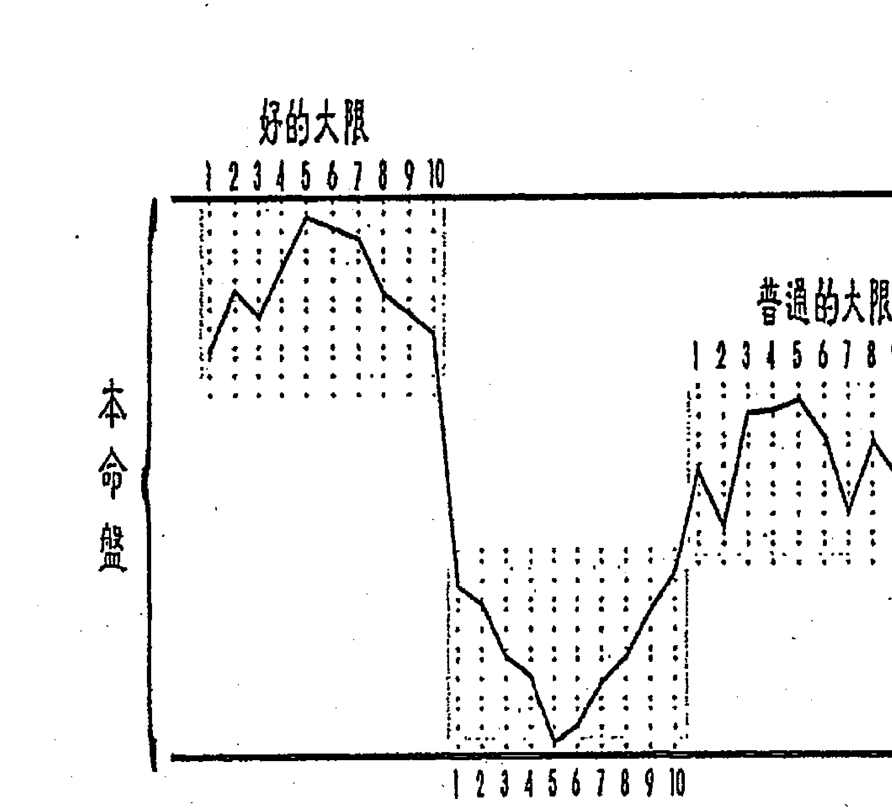

大限很好，那一个大限十年，就在上面部分起伏；那一个大限是普通的，该十年流年就在中间部分起伏；不好的大限，该十年就在下面部分起伏。

本命盘

#### ◇ 大官化忌入本官，要注意大官化禄到哪？

大官化忌入本官或大财化忌入本财，就这一层来讲没有关系，代表收敛、收份，也谈到可以造命的部分；除非你去更改，代表能更改。无形中，人是命理在操纵；有知、有识之后，你是可以更改命运的。
命理好玩就在这里，它有就是有，除非你去更改它。这里也谈到宿命论的部分，
所以，财帛宫化忌入命的人，他很啬吝，但别人并不感觉，一定同时配备财帛宫化禄到有众生意思的地方。啬吝的条件具备了，不啬吝的条件也具足了，结果只是啬吝到自己。也就是说自己吃阳春面，朋友来都带去海鲜，类似这种情形。
详细说来，啬吝的条件成立了——财帛宫化忌入命；那财帛宫化禄到哪里，会变成对外都是不啬吝，如自化禄、化禄到迁移、化禄到兄友线。兄友、迁移就是大家，财帛宫自化禄就是财显露在外，要付钱很乐意，所以对大家不啬吝。
吝于花钱。换句话说，财帛宫既已化忌入命就是啬吝，化禄到哪一宫即是纲开一面的地方。

藏。但要注意什么呢？若大官化忌入本官，要看大官化禄去哪里？若化禄到他宫去，代表自己拚得要命，结果好的都给别人。若大财化忌入本财，要看大财化禄去哪里？如果顺着命运，就是这样！但懂命理以后就要以『禄因忌果』的原则来处理。譬如：大财化忌入本财、化禄到兄友，就不能拿钱去借朋友或去投资，如有此禄之因，必有化忌之果；但可以逆向操作，努力帮人做事而赚钱，赚任何钱，财的来源都是朋友，因朋友而赚钱，忌星可将钱直入财帛，这是造命的层次来论。若就论命的角度来说，当大财化忌入本财，化禄入兄友，交钱给兄友会不会损失呢？要再由兄友的宫干去四化，也就是大财化禄去本兄、本友或大兄、大友，化出来看禄对自己有没有用，忌对自己有没有损？为什么要如上述造命逆向操作呢？因为当财化禄入兄友，再四化的结果大部分都不好。这跟事业投资的成功率差不多，一般投资成功率大约１０％，意思就是做十件事情，只有一件赚钱。

#### ◇ 子田为桃花用位，体在夫妻

孙同学问：夫妻宫化到本命子田线是配偶的桃花？
老师回答说：这是本人的桃花，如果要论配偶的桃花要夫妻宫化到父疾线，此即夫妻化到夫妻的子田。
再问：老师曾经讲过说本命盘可以看家中的人？
答：这个要分别，大限盘化忌到本命盘，这可以论个人的桃花，也可能是配偶的桃花，这就是你刚才讲的可以借用，但大部分是个人的桃花。
孙同学问：就好比大限夫妻四化到子田线？
老师说：若是大限夫妻四化到大限子田，这是个人的桃花，若化到本命子田，两者都有可能。
再问：若这样是算子田为体，还是夫妻为体？
答：夫妻为体、子田为用。所以，无论如何，子田论为桃花的用位。再说大限走子田，四化到夫妻，是用归体。用到体、体到用，都可以论。不因化的方向不同而有不同。
有很多例子，譬如说大限化到本命盘是用归体，本命盘化到大限盘是体到用。

#### ◇ 命财官各带出一组四正位

以冲的立场来说：用到体是以小冲大，事情比较严重；体到用是以大冲小，问题比较小。可以比较大小。体到用、用到体都可以论，事情的轻重，还是用到体比较重。

我们以命财官来说，为何四化中三吉不要全部都在命宫？三方为体、四正为用，三方为阳为动，四正为阴为静，这个是三方跟四正来比较对的。

阳可以再分阴阳，阴也可以再分阴阳，以命财官本来是阳动的，阳动比较属于后天的，命同时具有阴阳的特性。以命财官自身来论，命为阴、财官为阳；以命迁子田来说，命田为阴、子迁为阳。既然说命是阴的，财官是阳的，所以禄权科都在命就会变成比较没有动力，要在财官为阳才会有活力。我现在要讲清楚的是：如果禄权科都在命，代表是个好命的人，没有行动力。

#### ◇ 论车祸撞人损财或被撞损身

论车祸看冲命迁子田，这是冲迁移的四正位。如果我们光在记忆就是大命化忌冲命迁子田，话虽如此，我们要很清楚地知道其学理是化忌冲迁移的四正位，

体。

命、财、官各带出一组四正位，命的四正是命迁子田，官禄的四正是父疾夫官，财帛的四正是兄友财福。我们看车祸从大命化忌到命迁子田？你看这个就是由用冲体，这个就会产生大问题。这个是用冲体，三方为阳为用，冲四正位为阴为

### 命迁子田

### 兄友财福

### 父疾夫官

我们才会继续追着下去论车祸。

如林同学的是大命化忌冲本命，如果就迁移的四正位来论，得追有无车祸？

如果就大命化忌冲本命论冲本命则代表十年运晦涩，两件事都得论。如果清楚这点的话，就不会问到底要论哪一个？一层一层来，很清楚的。

以四正位来论，出车祸，林同学化忌到本命命迁，大限兄友，是属于兄友财福这一组的，如果以这个大限来论，不论流年，兄友是财的四正，所以是撞人损财。万一流年是化忌入父疾夫官，那就是撞人损财、被撞损身都会有。

如果迁移逢羊陀夹忌，顶多车屁股被撞。开车尽量不要跟着太紧，要保持安全距离，这样就不会变成年陀夹忌，顶多车屁股被撞。

林同学大命化忌冲本迁的四正位，这是垂象，是第一个铜板。再来看大迁，找第二个铜板，大迁丁干，化忌又冲本迁四正位，成立了车祸。大命与大迁皆化忌入冲本命迁，所以要打坐。

我癸酉年有车祸条件，重点日子不出门，还是骨头酸痛三个月；到了民国八十六年，我没打坐了，有一天又出现相同滋味的骨头酸痛，无法言语形容，我警觉后，马上打坐解厄，后来灾祸也发生，但比较轻了。搭计程车，停红绿灯时，被酒鬼的车撞了，计程车被撞离十多公尺，人车均安。

我们说另一件事，熬夜想睡觉，跟阴煞入侵想睡觉，两个完全不同的，遇上

时仔细体会，就可以搞清楚，慢慢去研究就会知道了。

## ◎粗糙看法得粗糙答案，细腻看法得细腻答案。

不要一直追求方便法门，追到最后变成没有门可以进入。我早期在学习紫微斗数初十年，功夫当然不好，都在追求方便法门，看看有没有办法一看就能够知道所有问题。后来才知道：越粗糙的看法，只能看出粗糙的答案；想要细腻的答案，下手时要细腻。要凡事皆看，要一直交叉，一样呀！从这里就可以看出我其中的细腻手法，就是一直穿插比对出来的。

## ◇论南半球，大命的体用移至大迁，论外出在北半球，大迁仅是大命之用位。

如果常常外出，迁移宫的星曜的性质就会跑出来，就是以空间换取时间。既然是化忌是欠债，迁移是远方，化忌在迁移即是“债欠在远”，方越远越好，最好南、

北半球互换。
讲到迁移宫，假设论大限的话，移民到美国、英国、泰国，这是北半球；如果是移民、或长期居留、或出差旅游，因为在北半球，故以大迁为大命的用，大命的体还在大命。如果跑到南半球去了，整个大命的体用都移到大迁，反而大命变成大迁，彻底改变了。
以后在讲南北半球干支之异同的时候，各位即可了解，这可以提供人家是否移民的参考，移民对他有没有好处，因为在命与迁的宫干，有一两个差得蛮多的。
所以有的移民出去没什么好处，有的移民出去一下就变好。
譬如：在台湾是大限甲干，化太阳忌冲官禄的话，在这里就会尝受失败；若将大限移至迁移宫去，甲的对宫大多是庚，一挪过去后，变成太阳化禄，本来被太阳化忌害惨了，一换过去变成太阳化禄，这是鲜明的。

### 二、论命的实例

## 鼻咽癌的命例

此命造为四十八年次，这张命盘也不能等闲视之，命坐阳梁，禄存在田宅，不能算阳梁昌禄。不过，阳梁格加化科，因昌曲都进来，也不错，但本财生忌自忌就差矣！ 他大限走本命财帛，有生年忌又自化忌，虽化天机禄到本福为大迁，英雄无用武之地，受大命双忌所冲，况且大财辛巨阳曲昌，化文昌忌，入命也可借来冲命，这是反弓忌。

既是反弓忌，也是绝命忌。做生意也不行，大官为丁干，丁阴同

| 破军 王 友 | 羊刃 辛 官 | 紫微 庚 田 | 天机 己 福 陀罗 |
|---|---|---|---|
| 迁 癸 | ○日未时生 | 大限行本财乙亥 | 七杀 戊 父 |
| 天府 甲 疾 | 廉煞 疾 | 鼻咽癌命例 | 太阳 丁 命昌梁科命 |
| 太阴 乙 财 | 文曲忌 财 | 巨门 丁 夫 | 武曲禄 丙 兄 |

机巨，巨门忌冲本官，也是反弓忌。这两个反弓忌，也形成绝命忌。
大命有忌，又是冲本福，特别须要看疾厄，大疾庚阳武阴同，会跟同巨有关的毛病；天同忌也冲本官，就是痛起来没有办法做事情。他目前在家，也没有工作可做，虽然他大官化忌冲本官，但大官化太阴禄入大命，应该不错，但随即自化忌，好得不久就溜掉了，若没有整顿改善，完全依照命发生就是这样。

## ▽ 为何也要看田宅宫？

刚讲庚阳武阴同，就要注意到田宅，这张命盘有几个迹象提醒我们注意田宅呢？第一、大命太阴自化忌，太阴是田宅主。第二、大疾重叠本田。大疾化天同忌入大福，这疾跟福一但以忌连接，就产生难诊难医之况，乃因果关系致使。
既然知道跟田宅有关系，就再看大田，大田丙同机昌廉，就是他的住家很容易引起他有关廉贞的事情，这样加起来就是天同加廉贞，是免疫系统的问题，可能耳鼻喉有问题，
若只有论到同巨，可能红斑性狼疮，是免疫系统的问题，可能耳鼻喉有问题，
田宅上的问题，他们的经济状况不允许他们说搬就搬，要怎么办呢？先加强

他能做，做一做，说不定他的运气就可以改善，改一改或就可以有机会搬家。我马上帮他们做了“劝学齐梅花心易斗数盘”，其父母宫廉贪生年忌自化忌，这代表这一户的主人有廉贞的问题，因大田化廉贞忌入本疾，这也暗示田宅跟身体有关，因此廉贞也要加进来，这点很重要。

另外，像林某不是肝癌的癌，就是住家住错了，他的廉相在丙午自化忌，是大限夫妻本命父母，就不能睡在午宫，但他却常在女朋友家过夜，床位正好在午宫，赶快叫他搬离。若没问清楚一点，就找不出毛病，人在走衰运时就会这样。这也是将屋宅加进来论，就可以很清楚地看出端倪，说它难吗？它有简便的地方，只要你将屋宅改一改。让影响不那么重，等一小段时间过后，伺机搬家，一了百了。

## 福德宫参一脚，要用陀罗尼被化解。

始查疾厄，而大疾又化天同忌入大福，由这里开始，我给他几个方向，像此鼻咽癌命造的大命化太阴忌冲本福，由这里开始，我记得烧陀罗尼被用到癌细胞消失的案例，在我手头中就有三件。有一件还

是宜兰学生建议他做的，学生打电话给我说他有一个朋友要我帮忙买陀罗尼被，一次都来载一、二千张。后来我告诉他已经没有癌细胞了，再来载一千，我问这个学生说：“他都好了，为什么还要来载？”他说：“他们希望再保养好一点。”像这样的观念就对了。

第二、屋宅要不要改？我没有去看屋宅，叫他把图画过来，请另一个学生帮忙申请地籍图誊本，我纸上作业奉送，先救命再说，这个具有挑战性。再过来，有免疫系统的问题，因天同有忌的关系。我希望他吃一点有机的食物，当事人没有来，为什么不要当事人来？若当事人听一听，他自己想一想，那麻烦，干脆死掉算了，就拿他没辄。

## ◎ 叶绿素是癌细胞杀手

人比较没有事情，但有病的人有时候会做得不耐烦，或会产生一些问题出来。

像我问他老婆，给他吃有机的食物，他老婆说：“他不会吃的。”我就跟她讲，若今天我得癌症，我一定吃，而且清一色都吃叶绿素，绿色的东西。等我痊愈后，要吃大鱼大肉再来，人为什么不要有这个决心呢？

## ▽ 忌自化禄的解厄问题

第三、选两个地方让他去拜拜，这个方位学也必要。从命盘看不管他什么卦命，在寅宫、戌宫不能睡，也就是发射台跟忌星入的宫位。往哪两个地方去拜拜呢？偏偏我跟他选择寅宫、戌宫。因为拜拜跟睡觉不一样，睡觉一直停留在那边，拜拜只是拜一拜就走了，所以不在手那边有忌。我要他在寅宫找关圣帝君，因为丙干化禄去解天同忌，因大疾化天同忌。鼻咽癌就是一个天同、一个廉贞结合起来的，因此这两个都要解。当然也可以找辛干化巨门禄，若找未宫的方向就找土地公。能不能找子宫呢？可以的，但贪狼的神比较不好找，比较没有专属的神。

再来廉贞还没解，廉贞要用廉贞禄，廉贞不化科，而且府廉都不化科，因此只有甲干廉贞禄而已；若往这一宫的方向去拜拜，会好得很快，但不会完全。因忌自化禄或忌自化科，若那个地方出了问题，往那个宫位去求神、问卜，很快好转，但只是表面。表面就很漂亮了，然后再从表面持之以恒一直解下去。譬如：太阴有生年忌在亥宫为财帛宫，若亥宫有自化禄或自化科，如果缺钱，

往亥宫的方向去找观世音菩萨求一求，钱就进来，最起码能周转得过，这是最快的。但是有没有解决问题？没有。就好像人被水淹到鼻子，若先降下来，一口气先吐出来再说，因为不是只有一种药方而已，要给他一些很快好转的感觉。像这样的人若有效，好转后应该跟我讲一下，只要打一通电话来，我会再跟他鼓励，多去一段时间，如果好了以后就不去，若再发作，是很难处理的。因为他们不知道道理，所以礼貌地跟我讲：“老师，我好了。”我会再跟他强调说：“你还要继续去，不要说好了就不去了，多走几年，把它当作休闲活动也好。”我会跟他加强这些观念。“人在福中不知福、人在祸中不知祸、人在忌中不知忌。”还是要去问问比较好，这也没有什么坏处。

## ▽ 由其妻看他的疾厄

这个人是在丙戌年初发现鼻咽癌，他老婆是民国五十六（西元一九六七）年出生的，机巨坐癸卯为本命，现在大限走丙午，大夫甲干，化太阳忌冲本夫，是为夫星不明，就是有丈夫像无丈夫。这个条件不一定是感情不好，一方生病就不

能如一般的夫妻，享有伦理之乐。
这个大夫化忌去本夫，入或冲都算，就有如大限夫妻的命，化忌冲本命盘夫妻的命，或大限化忌自冲，就要检查疾厄。大夫的疾厄为辛干，化文昌忌入本夫的疾厄宫，冲动本夫的疾厄宫中的廉贞，这不是无巧不成书吗？代表她的配偶都有这样的命格。

## ▽ 财宫有漏，要执行 A、B 账号。

男命财帛宫有漏应该怎么办？第一、用 A、B 账号。第二、不要借钱给人家。再来检查阳宅的财位有否问题。像此命造本田干化天同忌冲大财，不只是大命乙干化太阴忌而已，再来大财辛干化文昌忌冲本命，这样等于是三条反弓忌，如果做生意是不行的，应为上班族为

冲本宫为大财，这样等于是三条反弓忌，如果做生意是不行的，应为上班族为宜。

| 廉贞 | 昌煞 | 左辅 | 右弼羊 | 七杀 | 曲禄存 | 天梁 | 陀罗 |
|------|------|------|--------|------|--------|------|------|
| 戊   |      | 丁   |        | 丙   |        | 乙   |      |
|      |      |      |        | 鼻咽癌患者之妻 |        |      |      |
|      |      |      |        | 大限在本田丙午 |        |      |      |
|      |      |      |        |      |        |      |      |
|      |      |      |        |      |        |      |      |
|      |      |      |        |      |        |      |      |
|      |      |      |        |      |        |      |      |

## ◇ 详析中风命例

问：此命造做装潢，跟他的工作环境是否有关系？应如何看？
答：因大田丙干，丙同机昌廉，化廉贞忌到本疾，虽然疾厄宫是官之田，若无连接，也不能说跟他的工作环境有关系，但此命造的大田化文昌科到大官，就可以把官拉进来，所以在这里可以说工作环境是有关。也就是化星最少要有一颗跟官禄有连接或重叠，才能说跟工作场的问题有关。此命造的大田可以说拉了两个盘的官禄，所以忌星到疾厄宫就可以解释为工作场也一样有问题，让他更加有肯定的关系。

此女生于一九七五年农历六月某日酉时，于二〇〇六年农历九月二日下午中风。右脑血管破裂，所以左边半身不遂，因神经是交叉的。
先谈一谈中风，在我童年时，乡下是很迷信的，如果哪一户人家有人中风，邻居就窃窃私语，说那户人家就是因为没道德，所以他老爸才会中风。才过没几年，大家都不敢再那么说了，为什么？他刚讲人家没有道德，不久他家也有人中

风。后来，中风好像流行病一样，此起彼落。
有一段时间说：太胖或要四十岁以上才会中风。实际上，没这回事，现在最
死人，不是在装老人。一中风已不在分年
龄老少、不在胖瘦，条件具足就中风。
看了这张命盘，也可以很肯定的告诉
各位，如果乙年帮人家排剖腹生产时，千
万不要用机梁。为什么？机梁又化禄权，
如果在戌宫的话，禄存在卯宫，成了明暗
禄交流，那不是很漂亮吗？帮人家排好命
盘后，还要大限绕一绕，若顺行运，走两
个戌干，本是美美的天机生年禄，却要数
度受摧残。
某同学提供的命盘是相同的，她也是
一九七五年出生的女孩子，只是昌曲在命
迁，当时她是为情所困，准备第三次自杀。如果从命盘上看出端倪，但却不去调
整，或是不懂反省并调整的话，命理的条件会给人的是一种必然性，就是很宿命。

| 巨门甲 | 太阳夫 | 武贪癸 | 华盖子 |
|--------|--------|--------|--------|
| 天相乙 | 左虚兄 | 一九七五乙卯年六月 | 中风命例 |
| 天机禄丙 | 天梁枢命 | ○日酉时生女命 | 大限在本福戊子 |
| 紫微科丁 | 七杀父 | 天钺戊 | 红鸾福 |## 有相同命盤者患精神官能症鬧自殺

當時拿這張命盤到南部講課時，上述那位小姐哈哈大笑，說：「如果沒有來上課，也差不多，也可能自殺好幾次。」這是在告訴各位，如果接受了道理，想通了就調整，因此相同的命盤，她卻能免除為情所困而去自殺的蠢事。

先來論自殺這個層面，大限走福德為戊干，大命化天機忌到大夫，而且是本福化來的，本福、大福同干同氣，代表因果對於姻緣的糾纏，讓她很傷腦筋。若繼續傷腦筋，就以大夫丙干四化同機昌廉，化廉貞忌，天機也忌，就是精神官能症，想不開也是精神官能症的一種。

至於會自殺，因為大命在本福，大福一樣是戊干，本來自殺是大命化忌沖本福或大福，大福化忌沖本命、本福或化忌自沖；因她大命走到本福、而大福也一樣的宮干，這樣一起沖命就算。這樣就很有明顯。

命運可不可以改呢？可以的。

這種命盤要自己瞭解，巨日在夫妻宮，太陽自化忌就是「夫星不明」，若硬要理想化就會太在意；太在意，這個忌星就發生了，心就會被綁住，為情所困，導致自殺。

因此整體看來，該不能怎樣、就不要怎麼樣；要不到的，已盡力就好，不必強求。有此認知及作為，命運上該壞的就不會那麼壞。給各位一段話：

> 須要最無情，求之不得，恨無情、怨滿懷；須要有情，思之即得，喜有情、樂開懷。因此想要除怨得樂，只須將求之不得的須要，趕緊轉為不須要。人生絕非事事盼望不得，只怕盼錯對象及方向。老天爺給了我們會轉動的脖子及可以轉向的雙腳，須要時。不要忘了轉向。

## ∇ 大官化祿入照本官而忌入沖大命之解釋及解法

當時在分析她命盤時，我就說：『你的身體一定很糟糕，陪伴而來的兩件大因素，就是兩個大幫兇：一個是田宅，另一個是福德。』至於工作，像她這樣的命盤，絕對沒有辦法去找一個穩定的工作，所以反而要逆向操作，不要自動請辭，盡量拗久一點。
若換了工作，就要勤於學習，也就是不主動換，若一直要換，就中『忌』了；
不得不換時，要越換越好。她的命盤有一個優點，就是很好找工作。
關於這一點，為了利益起見，當然自己要盡量待久一點，每一個工作、每一個環境。
當時勉勵她：有一些人想要換工作不可得，一待就是十年，你剛好有這一個機會，可以一年換一個老闆。所以要改變心態，就好像換房子，不要煩，要越換越好，而且在每一個環境都要學習。人生中，學習有許多方向，向環境學習是一個最便宜的途徑。
研究命理那麼久，沒有辦法幫這種命盤的人，找個永遠安穩的工作。那是沒辦法的，命理本來就有所限制。命理跟人生一樣都有限制，就像我現在看南方，北方就看不見，如果試圖弄個設備讓我三百六十度都看得見，你想這樣累不累？
不是東西南北都錯亂了嗎？
這是老天爺仁慈且高明之處，叫我們有些事情不要看得太清楚，否則在頭的兩側各設一顆眼睛，後面再兩顆，這樣三百六十度都看得見，不過這樣的人一定早死，看太多了，太不幸了。
為什麼身體會不好呢？不要忽略了剛剛講的，乙年剖腹生產，不要幫人家排機梁坐命，就是因為機梁為生年的祿權，福德宮與官祿宮的戊干化天機忌入命。

這是古書上說的：「祿逢冲破，吉處藏凶。」僅就祿逢冲破的初期，提出對人警告的語言而已，不是它的全貌。也就是說祿逢冲破，不要以為現在很好，警告你吉處藏凶；實際結論是大損，因為祿逢冲破為雙忌，不只是祿轉忌，是祿被忌冲破以後，祿忌交戰為雙忌。

### ▽ 祿逢冲破與化祿解忌差別很大

這裡要特別釐清，假設忌星在命，大限化祿入命，這是祿去解忌，就不能講雙忌。如果覺得好像也是祿忌交戰，這種交戰也不會變成雙忌，這是什麼意思呢？也就是我欠一筆債，在這個大限還掉，此大限有一點義務勞動的感覺，賺一賺去還債務，懂得這樣才不會傷心。

有些人對人生的觀念，我不太贊同，若跟朋友說：「喔！你現在賺得不錯呢？」他回說：「那也沒有用，現在所赚的都在還以前的債務。」你看，這大限若沒有去賺，債務不是還掛著嗎？這些人太悲觀了。能賺錢去還債務，也是一種美，難道債務一直掛著好嗎？

忌星在某一宮，而大限行運化祿去，是祿去解忌，雖然沒有辦法留存原本你所賺到的祿，也會被忌所損，但那個是好的，是祿去解忌。

### ▽ 發射台有生年忌，又化忌冲破生年禄，此忌非同小可。

再來，不幸的是戊子為空宮，將午宮同陰忌借過來也是忌，忌星所在的宮位又發出忌星，這個忌更重，剛剛講祿逢沖破變雙忌，它又帶著忌星去，這個忌星夠大。本來大命化忌入沖本命，主十年運晦澀，晦就是暗，澀就是不通暢。她大命戊干化貪狼祿入本田是好的，可惜本田卻又自化忌，表示好的部份不長久，又洩掉。這是論命的範疇。一五一十的臚列出來以後，再來看為什麼會漏掉？就是屋宅的關係，那是本田，能那麼詳細分析就知道，要補她這個運要怎麼辦？就是把陽宅弄好，這是一個10A。

### ▽ 重疊越多，狀況越重。

但還沒有論到陽宅，只是在這麼一個戊貪陰右機，貪狼祿跟天機忌，就是一個大綱先理解，其他什麼事都可抽絲剝繭一路追下去。告訴各位，研究命盤真的很美，這樣一路追下去，一定可以重疊到很多，怎麼會看不懂？一路追下去，必有重疊，重疊越多越重，就能分辨哪個比較重、哪個比較輕？既然化祿到本田是好事，但又自化文曲忌，就再去看大田；大田為己干，化文曲忌入本田為大父沖大疾，肯定本田田宅對疾厄有損、對身體有傷。本來大命入沖本命，除了主十年運晦澀外，還要身體，因為身體重要，運是一回事，若身體不好，有錢等著讓你賺，也沒有辦法賺。若大命化忌沖本命時，大家都要注意，尤其大命在福德宮或疾厄宮，就要優先看疾厄。十年運晦澀，只是一個形容詞，不具體的，怎麼樣讓她晦澀呢？有時會因身體不好而晦澀，有時會因心情不好而晦澀。大疾為癸干，又自化貪狼忌，對身體不好，又重疊子田，這又告訴我們田宅對她的身體有影響；癸干化破軍祿，祿因忌果，破軍又在大田，代表她的身體會因田宅而改善，但目前沒有改善，因破軍隨文曲化忌。這樣追下去，就知道她的身體不好，就是因田宅跟福德。田宅好弄，雖說好弄，還是要有決心及積極作為；若福德，就比較慢。田宅比較實體，有辦法就要趕快改善。

### ▽ 一時不能改，不代表永遠不能改。

不過太年輕時，總是有些障礙，像彭同學一樣，他說：「沒辦法，我弄一弄，媽媽又弄回去啦！」像此命造知道她的田宅宮不好，馬上用《勸學齋梅花心易斗數盤》幫她家排一張盤，排出來什麼缺點都有，她說：「對！老師，全部都有。除非搬出去住，否則沒有辦法改，因媽媽買那棟也沒有很久，若搬出住，一定被打死。」以前也有年輕的學生，跟這位小姐一樣，有相同的經驗，在家說話沒份量，學命理、地理之後，慢慢會跟媽媽、姊姊聊天，也慢慢的取得信任，結果田宅問題就這樣被她解決了。

### ▽ 陽宅解決後，每年要注意外局的影響。

陽宅弄好以後，還有什麼問題呢？就是外局，像二〇〇六年（丙戌）多事，除非住的地方附近，建物已是穩定期，也就是附近的房子、馬路都不可能整修或重建了；若還有空地可建、或馬路可挖的就完了。為什麼呢？因丙戌年招煞的地方太多了，不是只有丙同機昌廉。因今年的病符方在巽卦東南，就佔45度了；西南的坤卦，五黃大煞也是45度；西方兌卦又是45度，是年煞。要檢查一下自己的住家附近，能防就防吧！煞分散就有這個壞處，如果集中就看誰比較衰，若分散大家都一樣多，看你有沒有防患而已。

### ### ▽ 福德宮三盤皆破，不得掉以輕心，化解動作要不斷。

那福德呢？我也在檢討這件事。這位小姐知不知道她的運那麼不好？她非常清楚，她有時候也笑笑的說：「我不曉得戊子年（二〇〇八）要怎麼過？」就是戊子大限、戊子年重疊在本福，大福是戊寅，流福也戊寅，再來戊子年的戊午月又走到甲申，流月福也破，而且又有三條絕命忌。就這些來講，對福德的事情不要掉以輕心，假設鎖定陀羅尼被要做，別人是有事情才做，她就要加強，沒有天天做，最少也要初一、十五都要做，這樣比較保險，不然那麽多層福德宮，還能等它發作嗎？

### ▽ 檢查流年可能招煞的三個宮位

流年干、流田干、大田干化忌入沖年煞、五黃煞、病符、太歲，若有的話，八成她住家的那個方位有人在動土。檢查一下，如果有屋子擋住，而工程不大則無所謂；如果工程很大，有建物遮擋或距離遙遠而登高可見，都須化解。

所謂；如果工程很大，有建物遮擋或距離遙遠而登高可見，都須化解。她有沒有犯上呢？流年丙干，丙同機昌廉，化廉貞忌沖兌卦（流年五黃），這裏是西方，她住東北向西南，她說她有用一個安忍水放在前面。根據經驗，如果那邊有人在挖，安忍水會消失的很快，忘記去檢查而未填補，一樣會出事的。因為此要特別記住，當自己有此現象時，就要勤於檢查。

另外流田己干、大田也是己干化忌在丑，亥子丑為年煞。

- 她有多少的戊干呢？
- ① 大命、
- ② 本福、
- ③ 大福、
- ④ 流福、
- ⑤ 流月福、
- ⑥ 流月。

流月又走本命，農曆九月又是戊干，才走第二天就中風了。她的運氣還很好，因為自己一個人住，倒下去時，要拿電話也困難。她剛好在上班，當她發生事情時，她的老闆立刻送到醫院，醫生本來說要開刀，現在不用了，已經移到普通病房。

她下個大限走田宅宮，己干文曲自化忌，又是田宅問題，再看大田庚干，化忌，就是有身體上的問題。再來，追查大疾為己干，從這裡看就可知道破軍隨文曲化忌，便已經成立了。文曲在本命田宅，代表疾厄跟田宅有關係，這是第一個銅板。再來看大田也是本田為丁干，丁陰同機巨，巨門忌入沖本命及大命，田宅對身體及大運的影響成立了。追了好幾年，知道論疾厄時，出現廉貞、巨門，如果巨門跟田宅宮有關時，一定她的住家，無論內、外局巨門代表病符，廉貞代表五黃煞。在《勸學齋主斗數開講》中有一篇《從斗數推論陽宅的鼻咽癌命例》（如附錄四），陽宅的卦位畫出來後，即知五黃、病符全部犯上。她也都有，今年（丙戌）丙同機昌廉很合理，又在大疾也是本疾；流年疾厄辛干，辛巨陽曲昌、化文昌忌也來了又是大疾，七殺隨文昌化忌也入大田，也知道今年她的病跟田宅有關。

| 太陽祿 甲 | 巨祿存命 | 武曲權癸 貪陀兄 | 天同忌夫 太陰科壬 |
|-----------|-----------|-----------------|-------------------|
| 天相 乙   | 右羊父    | 二〇〇〇庚辰年二月 | ○日未時生女命    |
| 天機 丙   | 天梁福    | 陰煞            | 雙祿交流自化忌    |
| 紫微 丁   | 七殺曲田  | 官 戊           | 命例             |
| 大限在本命甲申 | 華蓋庚 | 財 庚          | 昌息疾 己        |

她在丁月（八月）就發病，症狀是出疹子，疹子也可以是廉貞，廉貞的症狀很多，如膿包，疹子就是小膿包，膝蓋都有。

以流田來說，己干化文曲忌沖流疾，剛剛說丙同機昌廉化忌入大疾，流疾辛巨陽曲昌，化忌入大疾，七殺隨文昌化忌，七殺在本田，也是大田，所以田宅有關係，這是第一層。

再看流田己干化文曲忌入大田，破軍隨文曲化忌入大疾，田宅還是有關係。

這是學親戚的小孩，因案子緊急，就用「」處理，很希望看看她家的平面圖，但沒有人能配合做這件事。因此，就用她的地址做了一張占卜盤，父母宮丙子廉相文曲忌又自化忌，代表住家附近有人動土，最先不知道，後來證實有。

我費了不少時間，從地圖上找出她家。

她最先是去林口的某醫院，出疹子、發燒，以為是出麻疹，後來不是，之後，發燒好了就回來，回家以後又開始發燒，又出疹子，不能走路，就馬上送板橋某醫院。學生在「」上寫著說：「懷疑林口某醫院用錯藥，理由是那家醫院細菌培養不出來，但發燒好了又回家。」

這過程當中，讓我想到為什麼去林口某醫院，找不到病因卻好了，回家又發病了，是不是家裡的五黃煞、病符方都有了問題？在家裡就冒起來，去住院就沒病了。

## 【紫微斗數】卦命、卦力、卦情

事；更讓我詫異的，是她的家住戊宮方向，就是板橋某醫院，更往遠一點也是戊宮方向就是林口某醫院。
戊宮是丙干，就要想辦法要把壓倒駱駝的最後一根稻草拿掉，她的主因就是在本疾的廉破，就可以找甲干讓廉貞化祿，或找癸干讓破軍化祿，問題來了，如果這個小孩子是屬於需要住院的，我看那兩個方位都沒有醫院，就是未宮方向跟申宮方向。
第二、如果那邊有自化忌時，縱使找到醫院，也不主張去那邊住院。有生年忌、有自化忌，那個宮干可以化祿去解忌，去那個方位拜拜、看醫生沒問題，但住院屬於停留在那邊就不行了，這是有分辨的。
最後，只能往未宮方向去拜拜，還有請他燒陀羅尼被，因今年引起的丙干是本福也是大福化忌來疾厄宮，又挑起來，這是跟福德有關。

## 【附錄一】《勸學齋主斗數開講．兩個廣播明星之死》（寫於二〇〇六、十一、十五）

### 身材壯碩的陳京

身材壯碩，崛起廣播界多年的陳京，讓人意外地在民國九十二年三月二十八日，因急性胃出血入院，當天即因腎衰竭，併發尿毒症，而與世長辭，享年五十歲。

### 陳京猝死，各方揣測。

陳京的猝死，各方諸多揣測。有說他吃太多的冬蟲夏草，來自大陸的冬蟲夏草，灌了太多的鉛；有說他的豪宅，犯了朿光煞；有說他收藏太多雞血石，導致屋子陰氣太重。

這些揣測很難構成他猝死的理由，雖他當時已在洗腎，也還沒洗多久，真異手一般洗腎者。上述所吃的冬蟲夏草，因灌了鉛，當然不好，是否因此猝死？應由醫學單位印證，不遑我等多說。

犯了光煞之說，此乃陽宅風水疇，我們認為沒那麼嚴重，有很多這類的光煞，使人心神不安，以玫神經緊繃，導致運氣下滑、精神官能症，而說猝死，未免太過。

至於雞血石，則是家中不要擺飾太多，陰氣太重之故。另如其他石頭、古董之類，都不宜多，值得注意。

從命盤來解析，可以跳脫揣測。

擁有「祿馬交馳」、「雙祿交流」，無奈忌來破雙祿。

陳京生祿在命，雙馬也在命，十足的「祿馬交馳」，祿存又在遷移，又形成「雙祿交流」，在第五大限，本命為大財時，發揮得淋漓盡致。讓他成為家喻戶曉的廣播明星，讓他日進斗金，讓他倍受政商倚重。

可惜，第五大限在丙子，丙干化廉貞忌，一忌破雙祿。在課堂上，我常強調：好的條件擺在一塊固然好，但要注意忌星一來全都打倒。

### 最怕疾福一路忌缠、一路忌破

大命化忌入本命，若無雙祿的傷害，就沒那麼大。此時須再看大疾，辛干化文昌忌沖本福，一發病難查、難醫。大命化廉貞忌時，已破大福，至此兩盤的福德已破。

本疾自化科忌在丁卯，生年忌太陽在丁丑，同干同氣，合力作用沖大疾。大疾辛干雖化巨門祿入本疾，有掩飾及保護作用，無奈本疾自化科忌而無救。

民國九十二（2003）年，歲次癸未，流年福德癸酉，化貪狼忌入本遷沖本命，又為大福，大命與大福同干同氣，視同忌入大命。流年疾厄丙寅，化廉貞忌自沖，又為大福，至此流福也破了。

| 天梁 子 己 左昌財 羊刀疾 祿存煞遷 | 七殺 夫 庚 陳京 大限在本官丙子 太陰 友 丁 | 廉貞祿 命 壬 ○日午時生 廣播公務員 一九五四甲午年正月 武曲科 官 丙 天府 田 乙 | 父 癸 右曲福 破軍權甲 天同 |
| --- | --- | --- | --- |
| 紫相 戊 機巨 丁 | 太陽忌 | | |
| 貪狼 丙 | | | |

### 火星及雙馬都會加快速度

癸未年陽曆三月二十八日，乃陰曆二月二十六日。命造斗君在遷移，故流年斗君在丑為正月，二月行寅，適為流疾化忌自沖的宮位；流月干乙，化太陰忌沖大疾及流命；流月疾適為流福癸酉，化貪狼忌入流疾及流月命。一化忌，雙馬也增快壞的速度；火星在大疾及流命，也加速病情轉壞，若未死也很快沒事。逝者已矣，生者須汲取教訓。

### 由小販躋身廣播歌星的黃瑞琪

我在民國六十一年就認識黃瑞琪，一句話評論他：是個好人，但命運多乖舛。年輕時，我任職於正聲廣播公司，當一個閩南語的播音員，要值班，值班時間內負責節目順利播出，以及播報新聞、氣象、評論。黃瑞琪就是我值班時，相當長期的現場節目主持人。他看我經常在寫些東西，好奇探看，知我寫些文章及詞曲，就力薦我幫海山唱片公司寫詞，可見他是很主動幫人的人。後來我開始教斗數，好一段時間，他下節目、我下課後，就到教室來聊天。諸如他負債去日本，賺錢還債，回來後碰到剛從日本逃婚回台的白冰冰，創作「唱袂煞」，使白冰冰一唱成名，又寫了許多膾炙人口的好歌。他在第四大限，常有一個日本鬼魂跟著他、護著他。他跟我是無所不談的。因心肌梗塞，他於民國九十三（2004）年五月八日辭世，適為陰曆三月二十日辰時。沒能幫上這位好友，心裡真有戚戚焉。

| 文昌 庚 父 | 廉貞 己 命 | 天梁 戊 兄 | 天相 丁 夫 |
| :--- | :--- | :--- | :--- |
| 辛 福 | 一九四八戊子年八月○日寅時生男 | 廣播歌星 黃瑞琪 | 巨門 丙 子 陀羅 |
| 壬 田 天同 |  | 紫貞祿 乙 右弼科 財 |  |
| 癸 官 武曲 破軍左 | 甲 友 太陽 陰煞 | 乙 遷 天府 | 甲 疾 天機忌 太陰權 |

廉殺坐命，長相憨直，看不出有鬼才；廉殺在疾，反而顯露點慧。黃瑞琪的鬼才，是從日本回來後，展露無餘。早先，在詞曲方面，還常找我幫忙，回台後，它的才華就迸出來了。

第四大限壬戌化武曲忌入本官，天梁祿入本兄，不利投資，把好的給人，壞的自己承受。大官化太陽忌沖大財，亦不利投資。

第五大限行本官自化祿，但化貪狼忌入沖本命財福、大限夫官，只要不貪，事業上可期。

此大限常有消極傾向，乃因貪狼忌沖本福，復因貪狼忌在卯，卯丑同干同氣，丑宮為大福之故。

本大限背包被搶，內有六十萬現金票，讓命造一時想不開。大財化文曲忌入本兄，兄友劫財之故。

太陽忌，要我們低調行事，而非要我們躲藏，以致於自閉。

步入第六大限，甲子太陽自化忌，自己不願曝光；本疾天機生年忌在大福，加强作用，使他越来越黯淡。先前第五大限，如我打电话给他，他会立即询问我是否在台北？如是则下课立即来找我聊天。这一大限显然不同，我在台北，他会在电话中说：约个时间再见面。
直到他过世，才由他女儿口中得知，晚年不愿见人，纵使好友，还需先约，他要梳妆打扮，光是梳头就要一小时，很在意越来越稀疏的头发，很在意越来越发福的体裁。这是天机忌惹出来的胡思乱想，谁会笑他头发稀疏？谁会嫌他略微发福？天机、廉贞的精神官能症，他也没摆脱。
我上课讲到太阳忌，要我们低调行事，而非要我们躲藏，以致于自闭。这两者之间，有很大的差别，不能不留意而犯上。
大限自化忌在子，与本疾同干同气，视同忌入本疾，天机与太阳化忌为凶，血压、脑神经的问题就来了。再看大疾坐廉杀己未，化文曲忌冲大命，廉贞的惊恐、心肌梗塞，文曲的血管问题，综合出它的死亡因素——心肌梗塞。
甲申年，时值五十七岁，方进入大限第二年，天干刻应的甲年到了。甲化忌入大命，同干同气又入本疾、大福，冲流命，流疾乙干化太阴忌入冲本疾、大福，冲流命。流月疾适为大命甲干自化忌，同干同气故亦入大福、冲流命。本月为流福壬戌的武曲忌所冲；流月福己干化文曲忌。

曲忌冲大命，破军随文曲化忌冲流月命。

## 艺人娱乐了别人，忘了娱乐自己。

大家都想快乐，却放不开。很多艺人带给人幸福快乐，但为何他们不快乐？娱乐了别人，忘了娱乐自己。以此为殷鉴，我们希望别人好，却常把希望寄托在别人，忘了放松自己；遇事应放过别人，放别人才能放过自己。诚心的呼籲，让自己快乐，不要欺负自己了。

## 四餘偶感

- 散盡餘暉西落去 飛花獨自吐餘香

- 雨餘撒滿人間道 不見餘言訴感傷

## 【附錄二】《勸學齋主斗數心法·關掉業障那部機器》（寫於二〇〇五、十二、七）

### 道家談三障 斗數談化忌

宗教談業障，斗數談化忌。業障可在任何事展現，化忌可在任何宮搗亂。道家有三障：曰魔障、曰業障、曰災障。邪魔精怪，能為修道者之障礙，稱為魔障；惡業能障礙真道，稱為業障；三災八難能障礙修道，稱為災障。然而三障從何而出？一、因貪嗔癡之惑，而生魔障。二、因五逆十惡之業，而生業障。三、因三災八難之遭，而見災障。簡單說一句：心受過去、現在、未來所受的種種遭遇與疑懼，妨礙修道。

### 趨吉有理 避凶有由

筆者有幸沈潛於紫微斗數多年，從前期認定斗數是一門豐盛的哲學，到後期更覺正信的命理觀符合科學本質。費曼的《那個不科學的年代》書中談到：科學本質是有它的不確定性。正信的命理觀永不離「一陰一陽之謂道」，陰是陰靜而不變，陽是陽動而可變，因可變，方才有趨吉避凶之可能。

「孤陰不生、孤陽不長」是每位研究命理者朗朗上口的話，卻有不少人停留在宿命論，無異於天天掌摑自己，不只欺人，同時欺己。只要回歸到命理的原理，相信可以拈花微笑矣！以宗教的立場來說，陽動的部分是老天爺恩賜的機會。

一路研究斗數下來，深感創作斗數的聖賢，在斗數中埋藏甚多的智慧，高者見其高，低者見其低。我認為斗數中涉及業障的主要宮位有命宮、疾厄宮以及福德宮，其他宮位皆視為次要，主要星曜有廉貞、天刑，其他皆為次要。以化星來說，化忌簡直洩漏天機。

四化中的化祿是「因」、化忌是「果」，菩薩畏因、眾生怕果，初習斗數的人都怕「忌」，忌會令人受困、遭災、被損，是以習斗者有學習佛菩薩畏因之慮。

「忌」字拆開來說，是為「己心」。魔由己心生，業由昔心作，災由己心造。知道化忌之所由，更應鬆綁己心，放過自己，則一生肩負的重擔，自此由雙肩脫落，無掛無礙。無掛無礙，並非閒雲野鶴，無所事事，無掛無礙在心，一切世事，當更能盡心盡力盡情為之。即如法波上師所云：開悟前，挑柴擔水，開悟後，挑柴擔水。

### 防未患之患　治未病之病

斗數上諸多趨吉避凶之法，尚有已發生或瀕臨發生之以禒解忌法，究竟屬於後天法。然而命理的目的，亟須制機之先，防未患之患，治未病之病，始為高妙。

緣河圖之一六共宗，一為命宮、為陽、為性；六為疾厄、為陰、為身心。了知身心乃命之體，命乃身心之用。為求命之安適，焉能不顧體（疾厄所主之身心）之互調？

勸善之學或修養之學，常有修身養性之說，對人之貢獻頗大。然深思之，亦非妥善。僅在命與疾厄間來往反省，似乎沒幾人臻於善境，達於心靈深處。

日本某心理學家說：潛意識乃生命之真正司機，主宰顯意識及一切，然願意識卻無法影響潛意識。難怪修身養性常難竟全功。

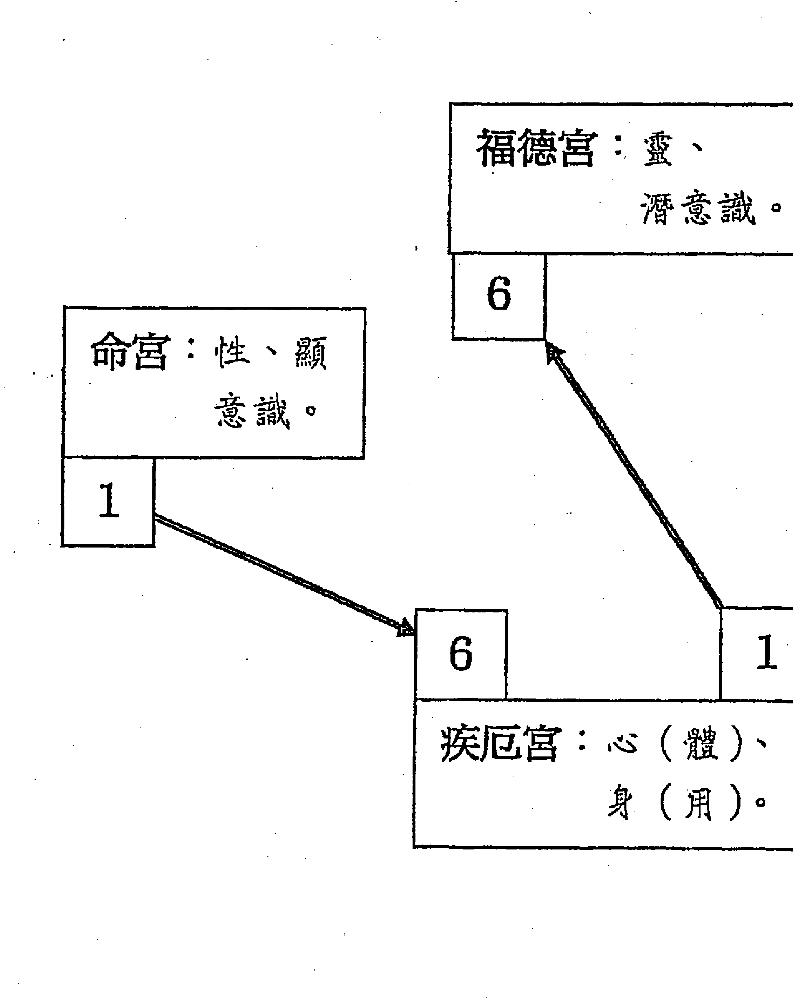

由顯意識返回身心
由身心返回潛意識

茲以管窺斗數所獲心法，分享並就教於同好。斗數以命宮論本性，遷移宮論內性。疾厄宮之體在論心，用在論身。福德宮先天論因果業障，後天論心靈深處之憂喜。是以潛意識在福德，顯意識在命。研習斗數初期，以命宮為大命宮、大太極，福德宮為小命宮、小太極；若能登於高境，即知命宮為小命宮、小太極，福德宮為大命宮、大太極。命宮僅是福德宮之夫妻，仿若命宮只是福德之關係企業或子公司。

### 性身心靈之整體健康

所以若講究健康幸福，不只是要一般所謂的身心靈整體健康，更須講究性、身、心、靈之整體健康。

### 業障好似機器 產出諸多災病

上圖16乃宮位之序數，依河圖一六共宗之理，疾厄為命之體，福德位於疾厄之第六宫，故又為疾厄之體。鑑於以往所用之修身養性，有若在上述圖中，僅是命與疾厄之間不斷往還，即如一日三省吾身者就是。這種狀況，有如我形容業障好似一部機器，它的產出物就是災病，災有財災、官災、外災、……等等，病有心病、身病、情病、……等等，修身養性者要疲於奔命在清除打理這些產出物，所以要一日三省吾身，終其一身，不可一時或忘。談到這裡，聰明的讀者，一定會想到我要提出的方法，就是把這部業障機器關掉。或許有人認為我痴人說夢，或許有人認為我人微言高。不過，衷心地希望各位能做做看，莫在此時論是非，只要你選擇做與不做。

人生路上盡是選擇題，只要選了，就要身體力行，不要一直改變你的選擇，而絲毫不去做。人生路上不須有是非題，我們經常處於認知不夠，卻忘情所以地論是論非，導致盡是批評別人，忘了批評自己。

## 人生路上唯有選擇及實踐  不須有是非

### 以身心為潛意識與顯意識之橋樑
關掉業障那部機器

從一六共宗的原理，我們找到了進入福德宮的路徑。既知命宮為一、疾厄宮為六，疾厄宮為一時，福德宮為六。一層一層歸回先天，簡而言之，以疾厄宮為橋樑。
由命宮所屬的性返回疾厄宮所屬的身心，以心思考，以身力行，如此可得修身養性之功。再來，以心思考、以身力行，返回福德宮所屬的靈及潛意識。
哪一範疇的事，若已返回心靈深處思索過，而且業經身體力行，此後，此一範疇即不再疑懼，有所本而為，自然輕鬆且合度。

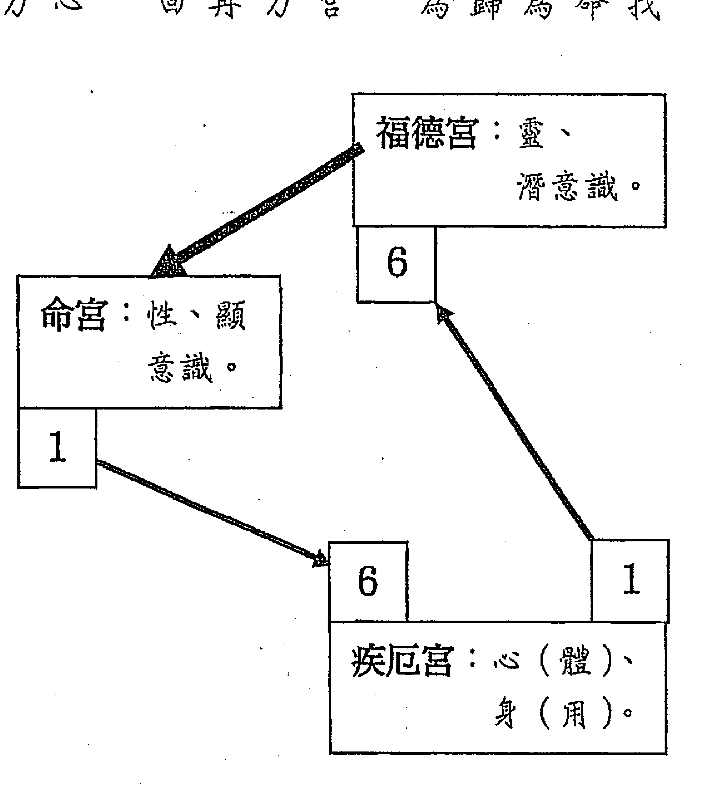

### 容许他人犯下我所谓的错 是了知而非包容

我们过去有太多不须要的误解，一一更革之后，会感受生命的圆融与喜悦。
哪些是不须要的误解呢？诸如：
喜欢论人是非，检讨别人，不检讨自己。台湾谚语有云：「有嘴说别人，无嘴说自己。」不要批判别人所作所为，容许他人犯下我所谓的错，给出空间，这个社会会更和谐。容许他人犯下我所谓的错，并非包容，而是了知自己并非圣贤，并不代表真理而已。

### 妈妈回归初衷 自无婆媳问题

天下所有的妈妈，无一不盼望她的儿子婚姻美满，但为何总有不少的「婆媳问题」发生呢？只要回归初衷，必然不会再有此问题。

人生不如意事，十常八九。這句話是裹著糖衣的毒藥，讓一時受苦難的人，得到短暫的安慰，這是糖衣的部分；再次感受人生不如意事居多，又再深一層戕害心靈，這是毒藥。您想過嗎？

### 好運賺錢 歹運賺學問

不努力，等運氣。殊不知道已違反正信的命理觀，命理一陰一陽，了知此點，必能在任何時候皆有可努力的事。筆者常強調：好運賺錢，歹運賺學問，隨時有得賺。請勿怨嘆命運，或者怨天尤人。

- 脫去受盡創傷的死皮
- 今天是我新生命的開始

## 【附錄三】《王淑品一條蟲變一條龍》

（勸學齋高雄班王淑品撰述）

- * 2003/6/15（癸未5/16）星期日 18:00 命造痛得忍無可忍，提起勇氣請教老師解決之道。

- * 命造症狀：頭痛「神經拉得極緊，且抽痛又發燒（38.3度）」實際體溫卻不超過38度，四肢抽筋，手指一度呈現半驅逐手印，大拇指完全貼於掌紋，肚子痛。

- * 老師判斷：目前行第三大限（戊子一戊子），天機化忌於大疾，又沖本田，再看大田己卯化文曲忌又入大疾，今年流年（癸未）剛好坐大疾，化貪狼忌入流田，即本命。顯然，命造身體不適，與家宅有關。

| 紫微 夫府 甲 | 天機祿 子 癸 | 破軍 財 壬 | 太陽 疾 辛 |
|--------------|--------------|------------|------------|
| 太陰忌 乙 | 女命 一九七五乙卯年生 王淑品 | 大限在本福戊子 | 武曲 庚 羊刃 遷 |
| 貪狼 丙 | 天相 康貞 福 戊 | 天同 祿存 友 己 | 陀羅 七殺 官 戊 |
| 巨門 丁 | 天梁 權 田 己 | 天同 祿存 友 己 | 天同 祿存 友 己 |

- ★又断曰：神經抽痛乃天機忌，腸子問題與感冒發燒乃文曲忌。以乙酉天機化祿解忌，酉乃西方（255度—285度），往西方就醫即可；又有昌曲，宜念清靜經。

- ★但苦於不知如何解，前一天（6/14）自己的解法是到南方中醫院看診，當天有稍好。（6/15）卻痛到一星期以來的最高峰，此峰不可長。

- ※其實，命造身體不適，早從第二大限第三年，民國80年（辛未）至今，前年（辛巳）健保卡紀錄是ABCDEFGH的I卡。米老師您應該可以理解為何我在聽完您解說之後、等待朋友接我去就醫之際、忍著痛念六遍清靜經。

- ★來高雄將近二年，我印象中家宅西方有翠華路、馬卡道路，那兒是一片新開僻地帶，怎麼可能有醫院？老師告訴我內惟應該也是在西方，要我查查地圖，真的朋友來接我，我帶著地圖往西方方向去，姑且搜尋，沒有預料星期日又非鬧區會有醫院。我們的心情就像拿著藏寶圖、按圖索驥；走到西方最底，竟然有一間

- ★對照地圖才決定進入就診，掛號後、朋友倒一杯開水給我，只喝了一口。

- ☆坐下來等待傳喚10分鐘內，我感覺好像根本就不必看醫生。醫生仔細聽診，發現小腸不正常，他表示可能是感冒引起並無大礙。挨了一針比損血還痛的針。回到家洗頭髮，流鼻血。除了這兩則小插曲外，整體過程好像沙漠中遇到綠洲。

## 【附錄四】《勸學齋主斗數開講·從斗數推論陽宅的鼻咽癌命例》

（寫於二〇〇六、十、十九）

大限忌入沖命或福，先查疾厄。

命造行第五大限本財，逢文曲生年忌，又自化太陰忌。若論本財，一輩子漏財；若論本大限，則財帛失禁必矣！

> 而事以本大限命宮來論，帶著生年忌又自化忌沖本福，影響最大的是身體與福份。為何呢？沖福德，比較怕沒福份了，而不是漏財；人若不在世上，啥都漏了，豈止財帛？生忌自忌在大限命遷，除行運不佳與車禍垂象外，氣弱或氣洩致使身體不好，這是亟須再往下追論的。

### 大疾化忌沖本官及大福

當然，再往大疾追。大疾在本田庚午，化天同忌入沖本夫官，大財福。大疾化忌沖官，不病則已，一病則無法工作；大疾化忌沖福財，生病花錢事小，沖起福德，最是要命。本福已被大命生年忌又自化忌沖破，大福丁丑自化權忌，也破；眼看明年流命與大命重疊，流年福德也破，更何況明年又是丁亥年？看了不禁叫人緊張。

| 陀羅 福 己 | 天機 | 祿存 田 庚 | 紫微 | 羊刃 官 辛 | | 破軍 友 壬 |
|------------|------|------------|------|------------|---|------------|
| 七殺 父 戊 | | 鼻咽癌命例 大限行本財乙亥 | ○日未時生 | 一九五九己亥年九月 | 遷 癸 | 天府 康煞 疾 甲 |
| 太陽 梁科命 丁 | | | | | | 太陰 文曲忌 財 乙 |
| 武曲祿 相右 兄 丙 | 巨門 夫 丁 | 天同 | 左輔 子 丙 | 貪狼權 | | |

如以上所述，僅知疾厄有問題，大致上與天同、巨門有關的病症，因星曜涉及巨門，宮位涉及福德，故論為醫生容易誤診，或病症難查，以致難醫治而已。

### 大疾重疊本田，陽宅是幫凶。

進一步的追索，相當重要。因大命為大限發射台，坐太陰，太陰是田宅主；

又因追論疾厄時，大疾重疊本田，陽宅是疾厄的幫凶，昭然若揭。再論大田丙寅，化廉貞忌入本疾，結合天同與廉貞忌，耳鼻喉的腫瘤與癌症，以及肺癌都可能發生了。

本造發病為鼻咽癌，也就是上述因素形成。

本造不得以東北、西北為用事點（用來做事的地點，如臥室、辦公桌、……），因大疾化忌入丑，大田在寅，合為東北；大命自化忌在亥，大田化忌至戌，合為西北。

而大疾為本田化天同忌，巨門與天同同宮，巨門出現，顯示陽宅礙及二黑病符星；大田化廉貞忌，廉貞出現，顯示陽宅礙及五黃煞。

### 福德宮皆破，陀羅尼被要加緊做。

幾盤的福德宮都破，陀羅尼被得加緊做，且需加強做，最好《聖經靈咒寶鈔》中的「觀世音菩薩解冤咒」天天念。

### 向解忌之方求神求醫

為解天同忌，到住家的寅宮方向(45度—75度)求關聖帝君(武曲)，或未官方向(105度—225度)求福德正神(天同)，因寅宮丙干可化天同祿解天同忌，未官辛干化巨門祿解天同忌。

還有，廉貞忌也須解，剛好廉貞在甲戌，廉貞自化祿，就往戌宮方向(285度—315度)求千歲如五府千歲、李府千歲、五年千歲、……(天府)即可。求神最好停留在該廟四十分鐘以上，還可以在當地買礦泉水數瓶，擺在神桌上，請神明賜藥。也可以往該二處求醫，功效必然卓著。還有，天同忌出現時，最好天天吃些有機蔬菜，尤其是葉綠素豐富的蔬菜，葉綠素是癌細胞的殺手。

### 以梅花心易斗數盤占卜其住宅

### 勘查其宅之缺失

既知陽宅搞鬼，先以勸學齊梅花心易斗數占卜其住家，得其盤如下：盤一排出，令人訝異。男主人的體用在父母宮，竟是廉貞忌，而其祿星是天同，祿因忌果，一氣呵成。天同在東北，廉貞在西北。男主人之疾厄，即父母宮的疾厄宮甲午，化太陽忌沖命，命為其住處，殊為不利。幸好尚化廉貞祿來，不過以此盤看來，還是趕緊搬家為要。

| 紫微 破軍 子 乙 | 夫 丙 | 天府 右曲 兄 丁 | 太陰 陀羅 命 戊 |
|-----------------|-------|------------------|-----------------|
| 天機樑 財 甲 | 時 丙戌年二月二十日巳 | 勸學齊梅花心易斗數盤占住宅 | 巨門 羊刃 福 庚 |
| 左祿存 疾 癸 | 文昌科 | 太陽 遷 壬 | 武曲忌 七殺 友 辛 |
| 天同祿 官 庚 | 田 辛 | 天相 | 父 己 貪狼 廉貞忌 |

传真：
房子大概于民国62年建造

北

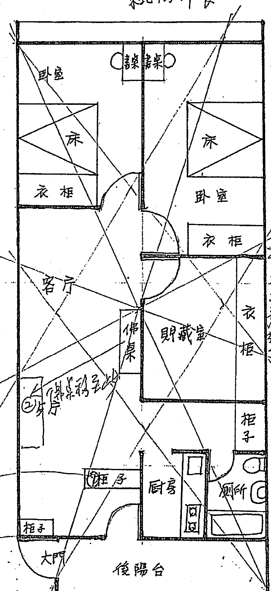

| 五 | 一 | 东三 |
|----|----|------|
| 4 1 | 8 5 | 6 3 |
| 四 | 六 | 八 |
| 5 2 | 3 9 | 1 7 |
| 九 | 二 | 七 |
| 9 6 | 7 4 | 2 8 |

③
壬 丑 丙
天 铜 钟
敌 或
普 钱

宽 2.48 → 5钱(坤)

①
西南在
天卦 丑位
敌位 内置
普 或
铃 铜
or 镜

南

西南

搬家沒那麼快，命盤中財務吃緊，當事人也喊窮，這更是要命。只好先審其住宅，就其可調整處，先行調整。而且還可做命盤之陽宅印證。

### 佛桌犯病符星

此屋九星飛泊，二黑病符星（巨門）入中宮，恰為佛桌處，甚為不利。中宮即圖中菱形區域。前曾遇一例，住入新家三年後，才請客入宅並安神位，恰欲該年病符星在神位，請客當天有客人跌死在樓梯。經告訴主人後，他才發現安神後，引起癌症的。圖中右上為玄空飛星，西北方飛28，2為山星、8為水星，山管人丁水管財。所以西北方亦不能安神位，安在西北必然財多身弱。因為財星是旺8，山星卻是2為病符星。

### 臥室犯「二五交加必損主」

### 門向、爐向皆吸二黑病符星之氣

東方的玄空飛星是52，5是五黃、2是二黑，正是古云「二五爻加必損主」之處，男主人正好睡這兒。此間能不用為佳，若不得已，必須在東方的陰陽正配卦處——東南，置放銅鐘或鈴杵，且需天天搖動或敲響。

此屋雖坐西南向東北，但從後門入，門在西方，卻吸西北之氣，西北有管人丁的二黑病符星，故也需在西北陰陽正配卦處——西南，置放銅鐘或鈴杵，且需天天搖動或敲響。

爐灶也吸二黑病符星之氣，真是所有的壞處都碰上了。

如果研究命理，至此應立即搬家，而且須無犯二黑與五黃之住宅方可。常云：「事出必有因。」只要把原因找出來，一一解決，即無問題。最怕找一些做不到的理由，推拖延宕，終至無救，甚為可嘆。

## 【附錄五】《勸學齋主斗數開講。橫剖思想星曜》

（二〇〇五、四、二寫於高雄左營海總）

- 天機是思想的狀態
- 廉貞是思想的侷限
- 巨門是思想的交會
- 貪狼是思想的動力

### 為《勸學齋主斗數開講》說幾句話

### 思想的進行態與停止態

天機是思想的狀態

良久以來，除寫書外，常想不定期地將斗數一些見解或學生經常的迷惑，訴諸筆端，俾讓勸學齊人有多一份的進修參考，也能為我未來的新書，先提出一些論點。

二〇〇四甲申年末，為左關節手術，住進左營海總醫院，就興起「勸學齋主斗數開講」這個單元，可惜當時病房沒有適合我復健姿勢之桌椅，出院後又被諸事所拘絆。這次，為右關節開刀，於術後昨日清晨三四點，腦海就盤旋著上述四顆星曜的異同。今日清晨五點，起身將此論點加以論述，開始「勸學齋主斗數開講」。

次序是論述時間的先後，而非論述內容的淺深，方便勸學齊人知道缺漏哪篇。也請多加深入探討，若有不明，還望不吝提問。

### 天機與廉貞的關係

天機是思想的狀態，包括進行態與停止態。天機的思想進行態，即所謂軸星的性質不停地轉著，藉轉動而前進，自然順暢，不疾不徐；至其轉動不順，快慢無據，是為化忌狀態，自傷腦筋，亦足以擾及旁人。天機的思想停止態有二，停止轉動與定點急轉。定點急轉是化忌之重，鑽牛角尖之況，繼而腦神經衰弱，以導致精神官能症。適時而適度的停轉，可治療此一毛病，更可臻於「棄聖絕智」的境界。詳細說來，棄聖絕智是由天機化祿、化權而至化科，再到適時適度停轉的化忌。

天機的交友永是廉貞，兄友有交換、交易之意，所以天機必要由思想被有意義的範定，而且適時適度地轉換豐富的視框，必能成就天機之真、善、美。設若天機化忌，則廉貞之轉換範定與視框，大多受影響，使之錯亂；但，若知有效地掌控廉貞的範定與視框，則亦能遏止天機忌的負面效應。前者的差異，乃在後者的主動出擊。

### 天機在哪煩惱就在哪

就論命的層次來說：天機在哪煩惱就在哪，如天機在夫妻宮，其煩惱就在夫妻等。因為思想就在那兒進行著，等著讓行運化祿、權、科、忌來（運作方式一），或天機所在宮干化祿、權、科、忌到行運各宮（運作方式二）。當然，化祿、權、科、忌的煩惱是人之所自願而喜愛的；化忌的煩惱，亦是人之所自願而不喜歡的。

# 運作方式之一

上述運作方式一，譬如天機在官祿，逢大命或大官乙干時，是智慧有所發揮在官祿之行運，此煩惱乃是自願而喜愛的；又如天機在交友，逢大命或大友乙干，樂於助友，責無旁貸；如天機在財帛，逢大命或大財為乙干時，所發揮的智慧利於進財。

# 運作方式之二

上述運作方式二，譬如天機在官祿，其宮干化祿入大命或大官是智慧有所發揮在官祿之行運，此煩惱乃是自願而喜愛的；又如天機在交友，其宮干化祿入大命或大友時，樂於助友，責無旁貸；如天機在財帛，其宮干化祿入大命或大財時，其力較微。

大官為戊干時，為事業工作傷透腦筋，這個條件逆行運而戊干在交友者，此生難犯此條件。

至如天機在財，大命或大財逢戊干，天機在夫妻，大命或大夫逢戊干，天機在疾厄，大命或大疾逢戊干等等都需注意，這也是檢查化忌的方法。

值得一提的是天機在田宅，大命或大田逢乙干時，並無法顯現像其他宮位天機化祿的美，因為：

- 一、天機是動星。
- 二、雖天機化祿，但同時太陰化忌，太陰為田宅主，無論太陰在何宮，都是星盤的田宅。

# 運用天機與廉貞的特定關係

相同的，化忌方面可以如下檢查：
- 天機在命，坐干化忌入冲大命
- 天機在夫，坐干化忌入冲大夫
- 天機在財，坐干化忌入冲大財
- 天機在疾厄，坐干化忌入冲大疾
- 天機在官祿，坐干化忌入冲大官
- 天機在田宅，坐干化忌入冲大田等等。

因為天機與廉貞有個特定關係：天機永在廉貞的疾厄，廉貞永在天機的交友。所以，不善用者，此關係相互為害；善用者，相互救助。二十一世紀是精神官能症的世紀，要特別避免此關係相互為害，否則一旦患了此症，殊難根治。我認為所有人都是可能的患者，都需以此二星的關係相互救助，即可遠離此症。

如果天機已化忌，鑽牛角尖、死拗，硬是不離開那個狐疑與心結，自認這份糾葛是對的。這就是廉貞的視框不移、觀點不變的作用力。當天機不化忌時，這份作用力對天機的思想狀態，有著穩定而且指引的作用；但當廉貞化忌時，這份作用力卻成了幫兇，好像電鑽不改地方一直鑽著，導致傷害。所以，應該不停改變。

# 換視框，繼續思想。

譬如天機化忌在夫妻，若已發生夫妻問題，索性不去思索，將思想挪移別個事物，也須放寬夫妻對待的視框，莫對夫妻問題作擠壓式的壓迫思考，把自己從夫妻問題的狹隘空間釋放出來。 又如天機化忌在財帛，若財帛問題已發生，盡力思索解決方式後，依此方案進行即可，再大的問題都無須全副心思去陪葬。 又如天機化忌若與子田有關，發生的家務事一概放過，任由他人處理，切莫死抓不放。 跟人際有關的天機忌一發生，不必去管曲直，不必去分黑白，不必去論是非，告訴自己：容許別人犯下我所謂的錯，因為我不是聖人，也不代表真理。 再來，每個人都有義務與責任為自己設立放鬆自己的方法，至少五種。放鬆吧！繃緊反會治絲益棼。放開問題，不只放過別人，更是放過自己。

# 廉貞是思想的侷限

# 思想的侷限是一種範定，也是一種指引。

廉貞是思想的侷限。此一侷限可以說是一種範定，有了這一層範定，可以不讓思想氾濫，思想無邊無際，也是一種指引作用；相對地，此一範定也可能造成思想的束縛，使之狹隘，跳不出特定的框框。從另一角度來解說，這是一種視框。既有視框，可以跟他人共鳴，也可以對立。共鳴時，只代表呼應同於己者；對立時，卻相互折磨異於己者。對立時，絲毫不容他性，造成心結。此時，並不發覺自己的不容他，也已造成自己的糟蹋。

# 廉貞與天機的關係

廉貞的疾厄永是天機，疾厄為體，所以天機是廉貞的本體，廉貞是天機的作用。廉貞是由天機產生的作用，但是它的框框也可能傷害它的本體天機。這個現象有如煙生於火，煙盛反晦火；亦有如冰生於水，冰盛反礙水。這個現象，是研究這兩顆星最重要的環節。

# 廉貞在哪業障就在哪

就論命的層次來說：廉貞在哪業障就在哪。如廉貞在田宅，業障就在家裡，因為業障就在那兒等著，等著讓行運化祿、權、科、忌來（運作方式一），或廉貞所在宮干化祿、權、科、忌到行運各宮（運作方式二）。當然，化祿、權、科的業障是人之所甘願而喜愛的；化忌的業障，是人之所不甘願也不喜歡而逃脫不掉的。

# 運作方式之一

上述運作方式一，譬如廉貞在官祿，逢大命或大官丙干時，是官祿之行運受到業障的重挫，這是先天因素；後天則須注意公司或工作的行政作業流程。又如

# 運作方式之二

上述運作方式二，譬如廉貞在官祿，其宮干化忌入大命或大官是官祿之行運受挫於業障，也需檢討內部行政作業流程；又如廉貞在交友，其宮干化忌入大命或大友時，要注意損友，來討債了，嚴重的話將演變成官非；如廉貞在財帛，其宮干化忌入大命或大財時，金錢的損失，也要檢討金錢出入的流程。廉貞在命，坐干化忌入沖大命或大疾；廉貞在夫妻，坐干化忌入沖大命或大夫；廉貞在疾厄，坐干化忌入沖大命或大疾；廉貞在田宅，坐干化忌入沖大命或大田等等都須。若化忌入其他宮位時，其力較微。

廉貞在交友，逢大命或大友丙干，朋友突然翻臉；如廉貞在財帛，逢大命或大財為丙干時，錢財的進出受困，對金錢收付的視框出問題。如廉貞在田宅，逢大命或大田丙干時，家務事與錢財受困。若其他宮位丙干時，其力較微。至如廉貞在財，大命或大財逢丙干，廉貞在夫妻，大命或大夫逢丙干，廉貞在疾厄，大命或大疾逢丙干等等都需注意該方面的業障已現，這也是檢查化忌的方法。

# 運用廉貞與天機的特定關係

因為廉貞與天機有個特定關係，廉貞永在天機的交友，天機永在廉貞的疾厄。當廉貞化忌時，要由天機再度思考，加大廉貞的框框。廉貞既有框框，要去除是不可能的，所以用加大框框的方法。或許有人會說：是不是想開一點就好了？沒錯！但想開要有方法，一般所謂的想開還帶悲觀成分，不符治療廉貞要去除心結的要求。我們談談如何想開吧！如以廉貞的框框加大，這是空間的訴求，我們想想：所發生的這件事或這些事，在一生中，僅佔些許，何必拗在這裡？空間轉換時間，就時間拉長來說：這些事在一百年後，連笑話都不如，何必如此自責或自怨？

# 巨門是思想的交會

# 思想的交會，可以是交錯，也可以是交融。

巨門是思想的交會，這個交會往好的方向發展得以交融，往壞的方向發展必至交錯。交融則人生精彩豐富，交錯則一生煩亂折磨。自古以來，命理家一直錯誤巨門，主憂疑啦，又主是非啦。顯然，古人知道「文窮而後工」，並無法推及哲學家與龍發堂（或稱精神病院）比鄰而居。精彩豐富出自複雜，單純是無法精彩豐富的。

巨門的屬性暗且雜，己土、辛金、癸水。我一直認為巨門很天蠍，瞭解天蠍的人，直接拿天蠍座的特性來解釋巨門，無一不可。

天蠍的三部曲：
- 一、蠍子。
- 二、老鷹。
- 三、火鳳凰。

這方面請參看《紫微高階之一。星曜鐵關刀》中天蠍的解釋。

巨門原先很憂疑，所以惹出自家的是非，這是蠍子。但憂疑是智慧，發現問題的不單純，若能昂首闊視，就是老鷹。將所知道的疑慮，詳加研究，瞭解必多，哲理必豐，可提供他人參考，甚至救助他人，這是火鳳凰。思慮之多，不加以整理，必然煩亂。見到理由中有是有非，心中就有是非，不懂得處理人際關係的巨門人，自然惹出是非來。巨門化暗，所以必要埋首，憂疑繁多，所以必要研究。不輕易出言，方能臻於學多識豐的境地。

## 巨門在哪是非就在哪

## 巨門與貪狼的關係

巨門的兄弟永是貪狼，兄友有交換、交易之意，所以巨門也因欲望的不同，產生不同程度的思想交會。設若巨門化忌，則貪狼之慾望如能自我調整，也不致產生與人的是非。

就論命的層次來說：巨門在哪是非就在哪，如巨門在財帛宮，其是非就在財帛等。因為思想就在那兒交會著，或交融、或交錯，等著讓行運化祿、權、科、忌來〈運作方式一〉，或巨門所在宮干化祿、權、科、忌到行運各宮〈運作方式二〉。其運作方式不再詳論，本文僅就與思想有關的層面做論述。

# 運用巨門與貪狼的特定關係

因為巨門與貪狼有個特定關係：巨門永照貪狼的疾厄，貪狼永在巨門的兄弟。所以，不善用者，此關係相互為害；善用者，相互救助。巨門是思想的交會，以慾望之神貪狼與人交往。無論巨門是交融或交錯，若未與人交往，僅是自家中的是非，可以不導致外界的是非。人就是很奇怪，既知自己並非聖人，卻在不知不覺中把自己神聖化，對外希望別人以我之是非為是非，十足產生巨門的思想交錯與貪狼的私欲展現之負面作用。正面的巨門，利用思想的交會，埋首研究，使之交融，繼而瞭解思想之豐富面，故與人來人往，各種慾望接能欣賞與接受。巨門的思想交融，是一種理解，不是一種認定，理解事物必有其是非，不貪求加諸眾人身上。

# 貪狼是思想的動力

貪狼是思想的動力，可以成就，也可以毀壞。成就有如甲干的啟蒙，毀壞有如癸干的結束。貪狼古稱神仙之宿，乃因甲木，稱欲望之神乃因癸水。我常說：須要最無情。這是須要的負面，其正面正是本文所謂貪狼是思想的動力。因為須要，所以有思想。當然，善不善用欲望，就成了成就與毀壞的分水嶺。

# 貪狼與巨門的關係

巨門永照貪狼的疾厄，照著貪狼的本體，亦即貪狼以巨門為體，貪狼是巨門的作用。巨門思想的交會，產生貪狼的欲望，是其所是，所以欲求之；非其所非，所以避忌之。

# 貪狼在哪欲望就在哪

就命理的層次來說：貪狼在哪欲望就在哪，如貪狼在財帛宮，其欲望就在財帛等。因為欲望就在那兒起伏著，或成就、或毀壞，等等行運化祿、權、科、忌到行運各宮（運作方式一），或貪狼所在宮干化祿、權、科、忌到行運各宮（運作方式二）。

其運作方式不再詳論，本文僅就與思想有關的層面做論述。

# 運用貪狼與巨門的特定關係

因為巨門與貪狼有個特定關係：巨門永照貪狼的疾厄，貪狼永在巨門的兄弟。如能正本清源，使巨門的思維交融，必能正用貪狼的欲求，使貪狼的欲望臻於成就，而非毀壞。讓巨門思想的交融，分享周遭，而不將是非心強加周遭。慾望可以是一種分享，不要成為一種強迫。提醒你，也提醒我自己。

- 大家喜歡清淨快樂，但偏偏不願抖落塵泥；
- 大家都喜歡活在愛中，但偏偏不願拋棄怨恨；
- 大家都希望得到尊重，但偏偏不願掃除自是。

# 紫微斗数授课讲义目录

# 第一单元

一、学命概念(讲解命理之所能与不能，以免误用、滥用或不知用。)

- （二）星无吉凶，命无好坏。
- （三）范围说
- （四）斗数流派简说
- （五）勘学斋斗数：①斗数三境界/三位一体/斗数药言 ②斗数准与不准的问题 ③命理就是人生，人生不离命理。／瞭解气和阴阳，就可运用在生活中。

二、基础命理(从趣味的、科学的、实用的观点解析。)

- （一）天干与地支
- （二）五行生剋
- （三）九宫八卦
- （四）三方四正

# 第三单元

三、掌上排盘(在课堂教到会排盘)

四、十二宫浅说(活盘初步)

# 第二单元

五、星性剪影（系统化地介绍星性原理，提纲挈领，方便演绎。）

# 第四单元

六、命盘结构（三方、四正、六合、六害原理及运用，掌握星曜轨迹，使排盘更快。）

七、格局总解

八、初阶论命（劝学斋制式论命／取机／天地人占卜法）

# 第五单元

九、宫性深研（强化活盘／宫性运用／申论原理）

十、初阶论命（四化大观／四化在十二宫／自化）

# 第八单元

十一、各种忌(射出、流水忌、逆水忌、入库忌、折马忌、反弓忌、绝命忌、……)

十二、十八飞星与十二飞宫

# 第七单元

十三、心性情欲言行等論

十四、進階論命(論性格之改變／論體型之改變／論命運之形勢)

# 第八单元

十五、各種觸機法(概說／流日干占卜法／年歲占卜法／宮位占事法／觸機法雜談)

十六、勸學梅花心易斗數盤(概說／排盤方法／占人、事、地、物、病)

# 十七、七星定点。一氣生死訣

# 十八、南北半球不同論法（緣起/論法/什談）

# 第十九單元

# 十九、論命法要（上）

- (一)論命與運：
  - ①有關命盤
  - ②論命格與運格
  - ③星性分類
  - ④論一生行運起伏
  - ⑤外出格與出國格
  - ⑥如何看外出求學

- (二)論夫妻與桃花：
  - ①姻緣之缺失
  - ②結婚之條件
  - ③桃花之發生
  - ④同居之看法
  - ⑤桃花之解決
  - ⑥婚姻不美滿之解決

- (三)論財運：
  - ①觀念並舉例
  - ②論方位
  - ③論財星及諸星財性
  - ④論財宮宮氣

- (四)論官運：
  - ①上班格與創業格
  - ②創業時機
  - ③官祿之旺衰
  - ④行業性質參考
  - ⑤論辦公桌之坐向
  - ⑥論事業之變動

# 第二十四单元

二十、论命法要（下）

- （一）论灾病：①外灾 ②车祸 ③疾病 ④星曜论病症 ⑤论断举例 ⑥论官非

- （二）论生育与阳宅：①生育 ②无子运、流产 ③比较生儿育女之夫妻命盘 ④年陀虚神遁 ⑤论阳宅 ⑥房子坐向问题 ⑦营业场所 ⑧钱枢与收银机方

- （三）论读书运及考运

> 我心缠世事，而非世事缠我心。

# 勸學齋陽宅授課講義目錄

## 一、概說
### (一)何謂堪輿?
### (二)風水理論兩大流派
### (三)勸學齋要研究學習的陽宅學
### (四)勸學齋陽宅學的主張

## 二、風水重要名詞解釋
### (一)什麼是東西四命與東西四宅?
### (二)命卦求法：
#### ①排山掌
#### ②勸學齋心算法
### (三)四吉卦位與四凶卦位：
#### ①基本認知
#### ②四吉與四凶
### (四)四吉四凶求法：
#### ①古法八式歌訣
#### ②勸學齋四吉四凶圖示法
### (五)宅命相配：
#### ①意義
#### ②命宅相配與不相配的用法
#### ②宅為我用
### (六)四吉四凶九大義：
#### ①綜論吉凶
#### ②分論用法——
##### A坐向（山管人丁水管財／凶位解救法／參考資料）
##### B門路（門有五種／門路／門路吉凶／參考資料）
##### C臥室與安床（床向／床與房門／安床宜忌日）
##### D廚房與安灶
##### E廁所
##### F神明廳與安香火概論／安神、安香火及其宜忌）

## 三、東西四命與東西四宅

### (七)迁移来路元空装卦（妙用阴阳方）：①卦分阴阳  ②运用（迁居／分房、分床）

### (八)尺法：门公尺与丁兰尺

## 四、简易家相术

- (一)宅基(含阳宅基地形状及屋宅形状)

- (二)屋内陈设与屋外物

- (三)阳宅各部与身体对应

## 五、五子运与三元运

- (一)概说

- (二)五子运

- (三)三元九运

- (四)宅与运

- (五)三元各宅宅运分论

## 六、紫白飞宫

- (一)概说（劝学斋九星飞泊新法）

- (二)八宅分论

- (三)补宅气与去宅病

- (四)年星与飞星同宫之应

- (五)月九星与日九星（劝学斋月九星记忆法）

## 七、催文昌、桃花、驿马、财位

## 八、简易择日

# 讀斗數命盤 成就你的人生指南

- 不查書，會排盤，一難。
會排盤，不會解，二難。
會解盤，不知趨避，三難。

我們是一群《紫微初階》、《紫微初階》與《紫微高階之一·星曜鐵關刀》的讀者，在報名上課後，沒想到上述三難，都一一解決了。你知道藉由命盤的宮位，就能找出化解災厄的方位嗎？你想運用化星與宮位的巧妙，體驗更加年輕貌美的魔力嗎？你想獲得求財的方位與方法嗎？你想進入斗數占卜的寬廣領域嗎？

斗數易學難精，吉凶易知難解。

名師放眼可見，明師遍尋難遇。

# 【勸學齋斗數】

全台開課近二十年，願您一起來沉浸在勸學齋的紫微園地中。

- 勸學齋門人推介代表：林明賢老師 0932-092-032 林傳傑老師 0933-456-777
蘇老師 0910-489-777 (歡迎電話諮詢、報名、及邀約論命、取名、勘宅)

# 調家宅風水 獲好運相隨

您想探知風水地理的奧秘，卻有無人引導的困擾嗎？你有聽聞陽宅學派甚多，以致有不知如何使用的茫然嗎？你想在陽宅的神奇領域中，有更進一程的體悟與造詣嗎？

相信同好常有如此感慨：興趣滿滿，卻不知從何下手。

我們有幸得以跟隨「勸學齋主蘇老師」學習，才能深切體悟到古傳地理對生命運程的影響力。

對於形勢、理氣得運用，催財、催桃花與斬桃花等問題的處理，家電錯置造成夫妻口角的處置。甚至加強文昌位，讓你的努力沒有白費，讀書應試，都有意想不到的好運。

【勸學齋陽宅】北中南均開班，讓我們一起享用這惠而不費、助人助己的化解妙方。

勸學齋門人推介代表：林明賢老師0932-092-032 林傳傑老師0933-456-777

出書者... 蘇老師0910-489-777(歡迎電詢、報名、及邀約論命、取名、勘宅)

# 五堂課 教會您 取好名

取名如選衣，選衣要合身亮麗，取名要合命有助。

我們曾經在別處學過姓名學，卻無法快速而有效地為人取名。往往要花上幾天的功夫，才能配出一些勉強可用的名字。

但是這個困擾，經蘇老師短期指導後，都迎刃而解了，取名字竟然變成那麼容易。

熊崎氏姓名學與生肖姓名學並重，讓您為自己、他人，以及公司重塑有遠景的生命。

五堂課，學習一套快速有效的命名方法；若五堂課學不會，教到會為止。

> 【勸學齋取名】

北中南均開班。

- 林明賢老師 0932-092-032
- 林傳傑老師 0933-456-777
- 蘇老師 0910-489-777(歡迎電詢、報名、及邀約論命、取名、勘宅)

# 紫微阶梯IV

# 紫微高阶之二

# 四化滴天髓

本系列受著作权保护

☆劝学斋主☆劝学斋主☆劝学斋主☆劝学斋主☆劝学斋主☆劝学斋主☆劝学斋主☆

编著者：劝学斋主

发行者：劝学斋

通讯处：台北市中山区林森北路306号10楼之5

电话：0910-489-777
02-2563-9887

E-Mail: su.laus@msa.hinet.net

出版日期：九十七年 五月

定价：500 元

☆劝学斋主☆劝学斋主☆劝学斋主☆劝学斋主☆劝学斋主☆劝学斋主☆劝学斋主☆

本书如有缺页请寄回交换

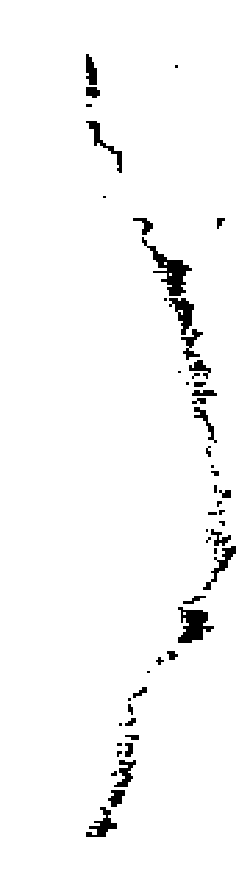