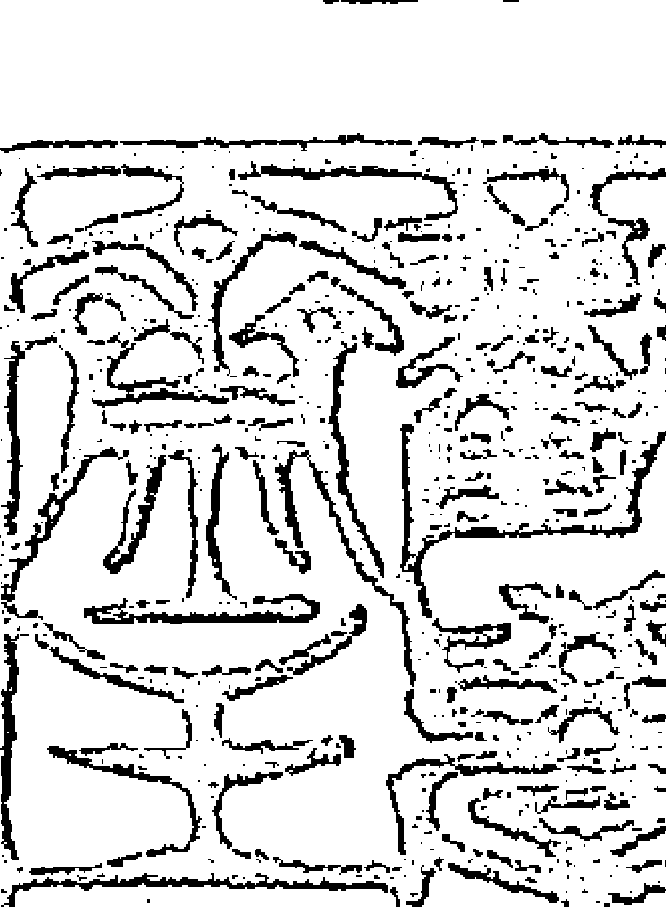
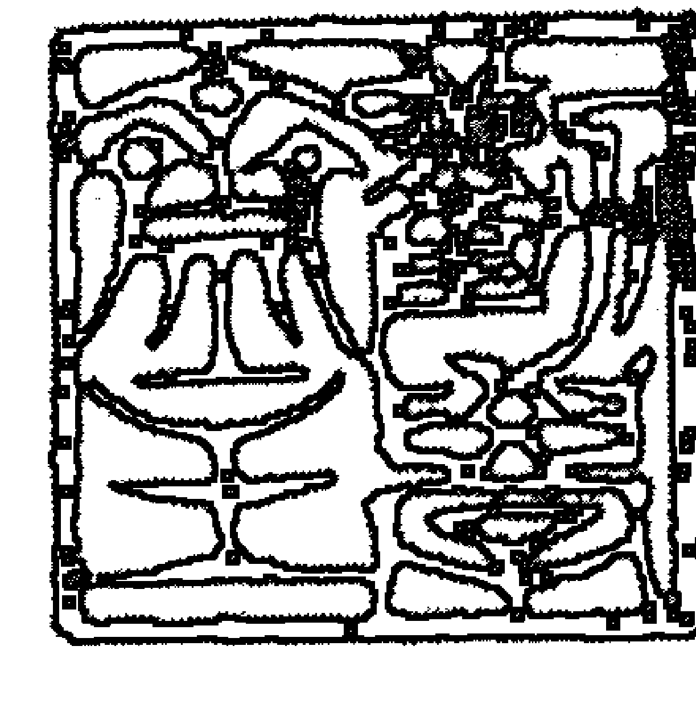
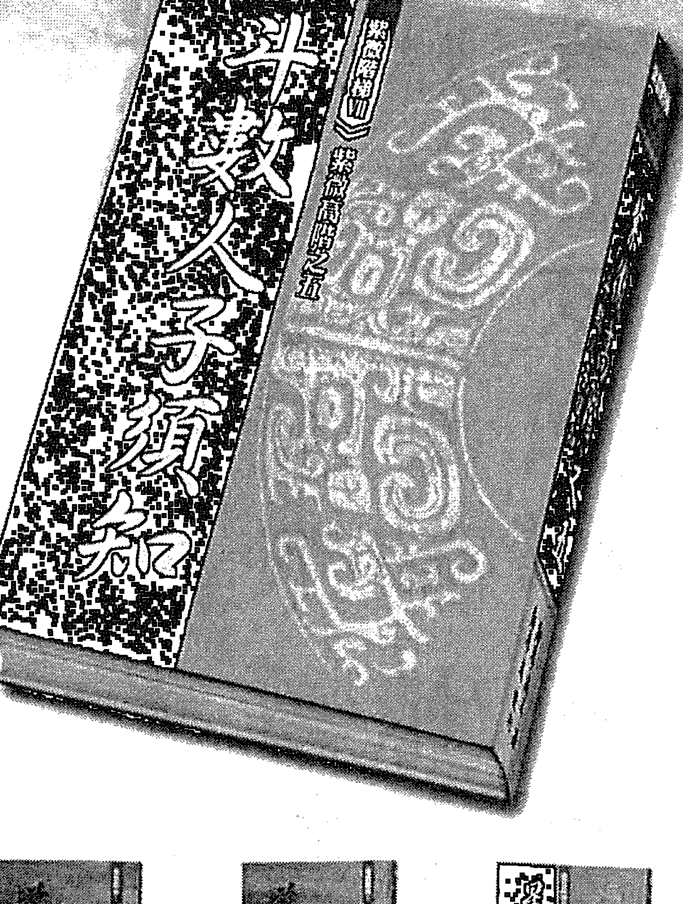
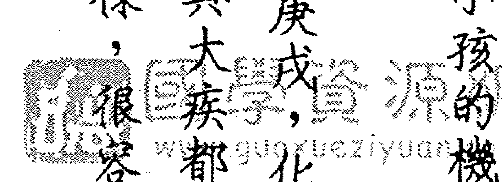
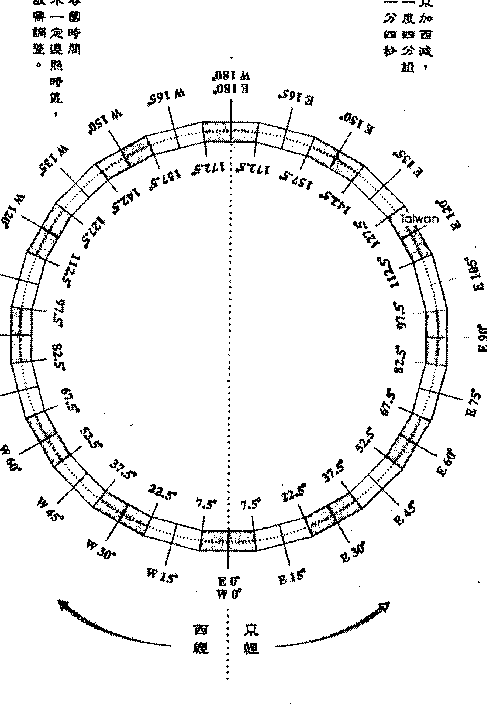

## 紫微闇陸之五

## 斗數人須知

## 希夷先生著

## 千金人子須知

# 紫微高階之五

漱學齋主

## 易學精要下冊

- 煉鋼技術
- 煉鋼技術
- 電弧爐閉切
- 化學煉天機
- 化學煉天機
- 飛星調運綱

【篆書書法，古文字，具體內容需專業釋讀】

【篆書書法，古文字，具體內容需專業釋讀】

【篆書書法，古文字，具體內容需專業釋讀】

【篆書書法，古文字，具體內容需專業釋讀】

（側款：敬書裔主）

（側款：壬寅季秋月吉日）

> 春耕紫微園，早長天機智。
> 夏享太陽光，精華自來滋。
> 秋收武曲利，補皮更補骨。
> 冬統天同福，和融貫四時。

魏華題齋主寫於
二〇一三、六、八

靜學齋主

### # 人生小語話人生

莫嘆造化玩弄，且來觀味造化。

靜心可知變，明志以應變。

口吃喜開口，低下好爭強。

朝三暮四告訴我們，猴子不懂數字加總。

默默得真境，朗朗吐金言。

不要理會無能者的酸言，他也是不得不這樣表現的。

居功，膨脹自己；譏過，汙蟻他人。

水不加溫變冷，事不勤習必疏。

新學齋主

### 人生小語話人生

若經常煩其所煩，會忘了樂其所樂。

領導眾人如拉繩，不懂領導常推繩。

關乎一己，要知自動；關乎兩者，就須互動。

不知天高地厚，常致胡言亂語。

無須療傷時，莫在同溫層，以免集體弱智。

歷經寒暑身是寶，幾度春秋志愈高。

若遇到好知識，要想辦法內化，切莫空留讚歎。

挑剔桌巾的花色，忽略桌上的菜色。

## 徹學齋暢通自然五行

慈外齋正

1=C 8/4 J=68

走過那綠油油的草坡
你看那紅紅的花朵
走上那黃黃的山坡
遙望那銀色的瀑布
再看那藍藍的天空

綠草頂著露珠抬頭
在陽光下向我招手
盛開無數黃色花朵
吐盡一身瘴氣汙濁
對映下方藍藍水波

一步一步地跨過
一步一步地躍過
安安穩穩的坐著
一口一口的吸著
一陣一陣的霧雨

心胸向無垠開闊
心情把藍天穿透
唱起心腹中的歌
讓新鮮進入心窩
漫潤如花木的我

## 自序

賽斯資料
王季慶

不曾滄桑，空歎滄桑；
幾經滄桑，笑談滄桑。

「人生」之前，從不可知的地方來。
「人生」之後，向不可知的地方去。

縱有宗教上的說法、靈魂學的論調、民間鄉野的臆說，我們都可聽到無數種。說的說，聽的聽，終究是信的信、疑的疑，信與疑若沒行動，那麼信與疑有啥意義呢？但，有生之年的歲月，任誰都實實在在地感受著、體驗著，我們怎能不正視與重視「當下」呢？

感傷過去，盼望未來；前者空歎，後者空轉。殊不知想要開創未來，就須把握現在。「與其臨淵羨魚，不如退而結網。」沒結好網，根本就不要「臨淵」；若因緣際會「臨淵」了，也無須羨魚，趕緊退而結網。

被學術界認定的靈學賽斯書，提到靈魂的特質有三：一、不受限制。二、喜好自由。三、喜愛經驗摸索。祂許多的演繹，我赫然發現與我們研究斗數中的『化忌』，簡直是融合的。

賽斯說：人的一生，無論啥事都是靈魂自己設計的，他想要的經驗，自己設計來體驗。這個設計，好似寫好電腦程式，人一出生，就按了啟動鍵，人生就依循靈魂寫的劇本演出，無論窮通禍福、美醜康病。

這不就是斗數忌星這個『忌』字，拆開來是『己心』的真諦嗎？這也解釋了所謂的『因果』，我們豁然開朗，為何《金剛經》要我們『降伏其心』了！

我們認為『萬般帶不走，惟有業隨身』，太悲觀了，也太沉重了。我從《靈魂永生》的論點得到許多啟發，所以相信『萬般帶不走，惟有靈隨身』。在斗數的研究裡，靈在福德宮，是命的本源，所以樂此不疲，分享鑽研，提供靈魂最好的經驗摸索，以便在此次人生旅途，交出較好的成績。

疫神欲走還留，趁此時機，將這本書完稿付梓。完稿之日，突然發現開寫這書的檔案日期是二零一二年九月三日，剛好十年。然而，書中不少篇章，早在十五年前就整理好了。這本書的構想，當然須要橫亙二、三十年的研究經驗，才能完成。

書名《斗數人子須知》，是寫上一本書《飛星闌江網》時，突然冒出來的。所以，把一些已編入的篇章拉出來，因為比較適合放在《斗數人子須知》書中。我想大家應該了解我們高階書名的風格吧？！說穿了，我喜歡帶有古意的書名。
打從《星曜鐵關刀》開始，接著《四化滴天髓》、《四化洩天機》，再來《飛星欄江網》。

清朝雲谷山人著《神相鐵關刀》，我藉其鐵關刀之名，再度剖析斗數星曜；而《滴天髓》是八字的書，相傳為宋朝京圖著，明初劉伯溫注，我藉滴天髓之意，關發四化精髓；清朝即有《洩天機》之書，後來以《洩天機》為名的命理書繁多，我亦藉其名，以言斗數四化之秘。

這本《斗數人子須知》則是藉取明朝徐善繼（維志）所著《地理人子須知》，來寫斗數。將我一生斗數研究中，所認定的一些重點與疑點，斗數秉持的原理，論命的目的與價值，還有論命的路徑一一寫出。或恐有疏漏，但願提出個人觀點，是分享，也願就教於高明。

紫微斗數這塊園地是屬於大家的，自王守仁（陽明）的弟子羅洪先編纂《紫微斗數全書》之後，到民國六十年之前，少有傳書；不像八字，歷代皆有經典著作。
紫微斗數會有如今這番榮景，是近半個世紀以來，不少老師努力耕耘的成果。

我只是紫微園中一個園丁，會把握時間，繼續寫我想寫、還未寫完的斗數，希望讀者諸君也投入，耕耘灌溉。在此，以我三十多年前寫的一首詩，為自序作結：

> 勸君勤墾紫微園。
> 學道習儀醒勿眠。
> 齋戒我心循理路。
> 主人契入命中玄。

以是之為序

壬寅（二〇二二）年季夏
作者序於高雄
蔡增宏

## 紫微高階之五斗數人須知

## 目錄

# 第一章 紫微斗數的來源

- 一、先從明澄派談起
  - ◇ 明澄派亦稱透派
- 二、再談陳希夷祖師
- 三、有關紫微斗數古籍

## 南派與北派

# 第二章 斗数排盘的重點與疑點

一、出生资料的準確性很重要

- 要有命造正確的出生地及出生年月日時分 6
- 出生地影響出生的正確時分 10
- 怎麼推算出生的正確時分 12
- 馬來西亞經緯時校正（勸學齋馬來西亞學員謝翰仁先生撰） 15

- ◇ 由「刻」的問題談到時辰之純氣與雜氣 31
- ◇ 時辰別稱 27
- ◇ 十二時辰哪來早子晚子 26
- ◇ 古代計時工具 26

## 二、子時須否分早子及晚子 25

- ◇ 各國實施夏令時間也須還原 24
- ◇ 其餘各國主要城市校正一覽表（勸學齊主大女兒蘇筱晶製作） 21
- ◇ 新加坡經緯時校正（勸學齊新加坡學員洪其蓮小姐撰） 20

### ◇ 十二經配十二時辰 (32)

## 三、閏月生人的排盤與逢閏月論命 (33)

### ◇ 「閏」字由來 (34)

### ◇ 閏月的由來及如何設置 (36)

- △ 陽曆的閏年 (36)
- △ 陰曆的閏年 (38)

### ◇ 我說「閏月」之排盤，「閏月」排盤之「我說」。 (40)

### ◇ 閏月論命 (43)

## 四、火星及鈴星排法之異同

- ◇ 先提出梁湘潤的意見
- ◇ 臚列具有代表性的各種排法

## 五、天馬星有兩種

## 六、空星之我見

- ◇ 空星有多少
- △△金空則鳴嗎？△句空速算及其用途
- ◇ 空官與空星的意義

> ◇ 空宫借对宫来论只是论其内性
> 61

- 七、天魁與天鉞之正確排法
  62
- 八、小限之我見
  64
- 九、第一大限有在災兄之說
  66
- 十、廟旺失陷之我見
  67
- 十一、最常說紛紛的庚干四化
  70

> ◇ 我认同庚干阳武阴同
> 71

- ◇ 觀察庚干天相與太陰有無化忌 72
- 十二、談斗君 73
- ◇ 斗君算法——由流命推算 73
- ◇ 斗君法訣——斗首藏寅 74
- ◇ 流年斗君的作用 75
- △ 流年斗君為流年正月 75
- △ 流年斗君為流年斗君盤命宮 76
- 十三、斗數之局數來源與作用 76

- ◇ 納音原理 77
- ◇ 納音原理另一說 79
- ◇ 五行局局數 80
- ◇ 五行局的記憶法 81
  △ 五行局就是六十甲子花納音，即是干支的納音五行。 82
- ◇ 十四、南半球斗數怎麼排盤？怎麼論？ 88
  （南北半球干支異同論） 88
- ◇ 緣起 88
- ◇ 《易經證釋》之佐證 90

- △ 二十四節氣 62
- ◇ 南半球依北半球年月干支退後五年半 65
- 先談南半球生人之生肖換算 67
- 次談南半球生人之生年干支換算 68
- 再談南半球生人之生月干支數及生月干支換算 66
- 南北半球年干支與月份對照表（表一） 80
- ◇ 北半球生人旅居南半球怎麼論命？（北命南運） 104
- △ 此人又從南半球回到北半球怎麼論命？（北命北運） 109
- ◇ 南北半球命運四象：北命北運、北命南運、南命南運、南命北運 110
- 十五、對於雙胞胎的論法之我見 111

### ◇ 一對龍鳳胎之驗證 111

- △ 一對美國學生兄弟之驗證 112

### ◇ 詳論學生姊妹為範例 113

- △ 一美一醜，從何論起？ 114
- △ 一有婚姻、一無婚姻，為何如此？ 114
- △ 一為財苦、一為有財，復因何起？ 116
- △ 第二胎流年用位的看法 116

## 十六、驗盤與定盤 117

### ◇ 驗盤常見問題 117

### ◇ 驗盤須知 120

# 第三章 斗数论命重点与造命价值

## 一、命理产生的背景 125

- ◇ 何谓命理？ 125
- ◇ 为何须要命理？ 126
- ◇ 命理有其崇高价值 128
  - △ 命盘是一个人的人生地图
  - △ 须就命盘提出消灾解厄、趋吉避凶的方案 130
- ◇ 命理的选择问题 131

- △ 命理工具的選擇
- △ 命理論述的選擇

## 二、斗數三要

- ◇ 宮性
  - △ 命財官等十二宮
  - △ 子丑寅卯等十二宮
  - △ 十二宮分天地人
  - △ 宮位干支及五行局的作用
  - ☆ 五行局特性
    - ◎ 木局特性
    - ◎ 火局特性
    - ◎ 土局特性
    - ◎ 金局特性
    - △ 水局特性
      158
  - △ 宮與星結合的結構
      160
    - ◎ 四正原理
      161
    - ◎ 三方原理
      161
    - ◎ 六合原理
      162
    - ◎ 六合論個人行運
      163
    - ◎ 六合論人際關係
      165
    - ◎ 六害（穿）原理
      166
    - ◎ 六害論個人行運
      168
    - ◎ 六害論人際關係
      169
  - ◇ 運用甚廣的宮位體用論
      171
    - △ 何謂體用？
      172
    - △ 體用論雙胞胎
      174
    - △ 體用論六親
      175
    - △ 體用論股東
      177
    - △ 體用論桃花
      178
    - △ 體用論財庫
      179
    - △ 體用論三方四正
      180

### ◇ 星性

  - △ 星無原罪、星無吉凶論
      181
  - △ 星曜皆有其正面與負面性
      184
    - ⊙ 紫微、天機
      185
    - ⊙ 太陽
      186
    - ⊙ 武曲、天同、廉貞
      187
    - ⊙ 天府、太陰
      188
    - ⊙ 貪狼、巨門
      189
    - ⊙ 天相
      190
    - ⊙ 天梁、七殺、破軍
      191

- ◎祿存、羊刃、陀羅
      162
- ◎命馬與月馬、孤辰與寡宿、空星（天空、地空與地劫）
      164
- ◎左輔與右弼、文昌與文曲、化祿
      195
- ◎化權、化科
      195
- ◎化忌
      195

## ◆ 四化之性
      193

  - △宫、星與四化的關係比喻
      195
  - △星曜與四化要能剛柔並濟
      199
  - △雙祿交流與明暗祿交流
      201
  - △評比雙祿交流與明暗祿交流
      211
  - △祿馬交馳
      214
  - △祿最怕忌星沖破
      218
  - △忌星的入與沖
      219
  - △一忌抵三吉並談祿忌交戰之解決
      220

- △ 祿或科卻可解忌
      222
- △ 莫信忌多反吉及福星不忌
      225
- △ 五福壽星全破、掌人壽基的祿存也沖破，真要命！
      226

# 第四章 斗數論命進行曲
      231

## 第一部、先了解命造的格局及個性
      231

- ◇ 首重我宮格局
      231
  - △ 四化在我宮的格局
      232
  - △ 命、財、官的宮干四化論動態格局
      233

## 第二部曲、每個大限順著看一遍
      236

- ◇ 他宮的格局也要看
      235

### ◇ 三方四正冲三方是反弓忌
      239

### 第二部曲，迅速看出命造一辈子的功课
      240

- ◇ 忌星在哪一宫特别注意
      246
  - △ 忌在命宫之例
      247
  - △ 忌在迁移宫之例
      248
  - △ 忌在兄友线之例
      249
  - △ 忌在夫官线之例
      250
  - △ 忌在子田线之例
      253
  - △ 忌在财福线之例
      255
  - △ 忌在父疾线之例
      257
- ◇ 忌在兄弟宫之例
      241
  - △ 忌在夫妻宫之例
      242
  - △ 忌 in 命迁线之例
      245

## 第四部曲、論大限
      258

- ◇ 本生年祿權科忌在大限盤哪個宮很重要
      258
- ◇ 運用四化論大限
      261
  - △ 大限與本命的好條件合起來看
      264
- ◇ 每個大限化忌如何追論（也論重點事項之祿權科）
      267
  - △ 大限在本命命宮
      268
    - Ω 大限在本命命宮化忌到本命命遷
      268
    - Ω 大限在本命命宮化忌到本命兄友
      269
    - Ω 大限在本命命宮化忌到本命夫官
      270
    - Ω 大限在本命命宮化忌到本命子田
      271
    - Ω 大限在本命命宮化忌到本命財福
      271
    - Ω 大限在本命命宮化忌到本命父疾
      272

Δ交限在本命夫妻宫

Ω大限在本命夫妻宫化忌到本命命
Ω大限在本命夫妻宫化忌到本命兄
Ω大限在本命夫妻宫化忌到本命夫
Ω大限在本命夫妻宫化忌到本命子
Ω大限在本命夫妻宫化忌到本命财

284
284
285
286
287
288

Δ交限在本命兄弟宫

Ω大限在本命兄弟宫化忌到本命命
Ω大限在本命兄弟宫化忌到本命兄
Ω大限在本命兄弟宫化忌到本命夫
Ω大限在本命兄弟宫化忌到本命子
Ω大限在本命兄弟宫化忌到本命财
Ω大限在本命兄弟宫化忌到本命疾

274
275
276
277
278
279
280

△ 大限在本命夫妻宫化忌到本命父疾
大限在本命父疾

290

△ 大限在本命子女宫
大限在本命子女宫化忌到本命父疾
大限在本命子女宫化忌到本命财福
大限在本命子女宫化忌到本命子田
大限在本命子女宫化忌到本命夫官
大限在本命子女宫化忌到本命兄友
大限在本命子女宫化忌到本命命迁

301
296
297
295
294
292

△ 大限在本命财帛宫
大限在本命财帛宫化忌到本命父疾
大限在本命财帛宫化忌到本命财福
大限在本命财帛宫化忌到本命子田
大限在本命财帛宫化忌到本命夫官
大限在本命财帛宫化忌到本命兄友
大限在本命财帛宫化忌到本命命迁

302
303
306
308
307
310

- △ 大限在本命迁移宫
- Ω 大限在本命迁移宫化忌到本命命迁
- Ω 大限在本命迁移宫化忌到本命兄友
- Ω 大限在本命迁移宫化忌到本命夫官
- Ω 大限在本命迁移宫化忌到本命子田
- Ω 大限在本命迁移宫化忌到本命财福

324
332
331
330
320
328

- △ 大限在本命疾厄宫
- Ω 大限在本命疾厄宫化忌到本命命迁
- Ω 大限在本命疾厄宫化忌到本命兄友
- Ω 大限在本命疾厄宫化忌到本命夫官
- Ω 大限在本命疾厄宫化忌到本命子田
- Ω 大限在本命疾厄宫化忌到本命财福
- Ω 大限在本命疾厄宫化忌到本命父疾

315
317
308
308
310
320

- Ω 大限在本命财帛宫化忌到本命父疾

312

| 左列 | 中列 | 右列 |
|---|---|---|
| △ 大限在本命官禄宫 Ω 大限在本命官禄宫化忌到本命命迁 Ω 大限在本命官禄宫化忌到本命兄友 Ω 大限在本命官禄宫化忌到本命夫官 Ω 大限在本命官禄宫化忌到本命子田 Ω 大限在本命官禄宫化忌到本命财福 345 346 347 348 349 351 | △ 大限在本命交友宫 Ω 大限在本命交友宫化忌到本命命迁 Ω 大限在本命交友宫化忌到本命兄友 Ω 大限在本命交友宫化忌到本命夫官 Ω 大限在本命交友宫化忌到本命子田 Ω 大限在本命交友宫化忌到本命财福 Ω 大限在本命交友宫化忌到本命父疾 336 338 341 341 342 343 | Ω 大限在本命迁移宫化忌到本命父疾 333 |

Ω 大限在本命福德宫
Ω 大限在本命福德宫化忌到本命财福
Ω 大限在本命福德宫化忌到本命子田
Ω 大限在本命福德宫化忌到本命夫官
Ω 大限在本命福德宫化忌到本命兄友
Ω 大限在本命福德宫化忌到本命命迁
366 366 370 371 372

Ω 大限在本命田宅宫
Ω 大限在本命田宅宫化忌到本命命迁
Ω 大限在本命田宅宫化忌到本命兄友
Ω 大限在本命田宅宫化忌到本命夫官
Ω 大限在本命田宅宫化忌到本命子田
Ω 大限在本命田宅宫化忌到本命财福
Ω 大限在本命田宅宫化忌到本命父疾
354 355 356 360 362 363

Ω 大限在本命官禄宫化忌到本命父疾
353

## 第五部曲 、論流年、流月

### 甚麼是流年、流月？

年月日時干支

先明白如何論大限，莫急於論流年。

本命、大限、流年的比重

### △大限在本命父母宮

- 大限在本命父母宮化忌到本命遷
- 大限在本命父母宮化忌到本命兄
- 大限在本命父母宮化忌到本命官
- 大限在本命父母宮化忌到本命田
- 大限在本命父母宮化忌到本命福
- 大限在本命父母宮化忌到本命父疾

### △大限在本命福德宮化忌到本命父疾

# 紫微高階之五
## 斗數入門須知
## 勸學齋主

# 第一章 紫微斗數的來源
## 一、先從明澄派談起
### ◇明澄派亦稱透派

一門好學問，其創始者（舊稱鼻祖）的重要性，對後輩的我們來說，尊敬之意大於一切。但，偏偏好多學問的創始者，都不可考。於是眾說紛紜，只要不失尊敬，又有何妨。

筆者自一九七五年開始涉獵紫微斗數，首先接觸的書籍是《五術占卜金書》（台灣大眾書局出版），約莫一兩年，斗數稍稍興起。方知斗數有南北派之分，《五術占卜金書》是北派，後來陸續出版的書，則是南派。

明澄派第十三代張耀文的《五術占卜全旨》記載著明朝奇女子梅香開創了透派，而稱明澄派，則是明朝的澄派之意，澄與透，詞意相關。北派與南派的唯一差別是，北派論節氣即以月令排盤，南派只論月份。譬如筆者生於十月初，若論節氣則屬九月令，以北派排盤則命宮在卯，以南派排盤則命宮在辰。

只要懂得排盤的人，一定知道命宮在不同宮位，命盤排出來的差距是很大的。這個問題只發生在月底與月初出生的人，所以最初並無爭論。跟北派的老師學，就論節氣；跟南派的老師學，就不論節氣。

筆者很快就從北派轉為南派，乃因本人就是活生生可比對的例子，更何況斗數乃依據太陰文化，節氣乃是太陽文化，南派的老師們秉持著《陳希夷紫微斗數起例歌訣總括》一文中「何用經堂論五星」，作為不必論節氣之理論根據。按：「何用經堂論五星」，一說「不用琴堂講五星」。

回憶一下我所知道的歷史。精通明澄派五術的張耀文老師，全家移民日本，將五術帶到日本傳播，約二八四年一位來跟筆者問命的日本命理老師告訴我，張耀文老師歸化日本，改姓川島，他的大弟子阿部泰山還在執業，在日本是頂尖的斗數大師。我們須要感謝的是，因為張耀文老師的傳授，他的弟子出了書，而當時台灣的出版環境，大多出版社是去日本買了書，回台翻譯，才不會有買稿的壓力，斗數是在台灣漸漸為人所接受，直接或間接地激發出南派老師的出現。早期的斗數著作作者是日本人的，率皆是張耀文老師的徒子徒孫。這是第一波，紫微斗數還是鮮少人知道；一九九一年筆者應邀到一讀書會演講，現場約四十人，我問：『聽過紫微斗數這四個字的人請舉手！』兩個人舉手。後來經過二十年，許多人再問：『讓紫微斗數老師算過命的請舉手！』有四個人舉手。老師的投入研究，約有兩波的風行，才奠定日後的榮景。

筆者在《紫微初階。第一章第三節。陳希夷其人其事》（第二十六頁），敘述了他大概的生平。他乃仙家人物，仙家分東、西、南、北、中五派，他在世時只有南北派，據聞他與南北派皆有往來，所以南北派的學問都有涉獵，他在仙家最大的成就之一是集睡功之大成。

有一說：七政四餘乃帝王之學，不得傳授民間，希夷乃根據七政四餘改編成紫微斗數，始得傳予一般百姓，也有說是陳希夷改良《果老星宗》而成《紫微斗數》。雖這麼說，卻無正史記載。陳希夷可考的作品是《人倫大統賦》、《河洛理數》、《神相金編》、《河洛真數》。

## 二、再談陳希夷祖師

紫微斗數的發源，可見道教中的《道藏經》。據《道藏經》記載，紫微斗數為唐代呂純陽所創。其術以八卦的太極為中心，分列十二宮位，並將人的農曆生年、月、日、時辰代入諸星，用以推研人生造化和際遇等等諸事。

據說呂洞賓曾傳於麻衣道者，『至陳摶（希夷），紫微斗數才真正地多元化。』又說：麻衣道者再傳陳搏。

眾說紛紜，莫衷一是。古代的書，常有高人寫了，卻掛上名人姓名，此一現象讓後世人莫可奈何，但沒關係，只要著作有價值，照樣嘉惠後人。坊間稱嘉靖版的《紫微斗數全書》，是明朝嘉靖年間的進士羅洪先撰序推薦，文中謂：陳希夷的十八代孫出示予羅洪先。陳希夷生於西元八七二年至九八九年，羅洪先生於西元一五○四年至一五六四年，羅洪先是王陽明（守仁）的學生，筆者只找到羅洪先十四首醒世詩，看來羅洪先是一位外儒內道的人。台灣的嘉靖版《紫微斗數全書》是竹林書局出版的，保留木刻版原貌，錯字或誤植處不少。進源書局重新打字，分段落，加了標點，較易閱讀。大陸出版的紫微斗數全書，則是重新打字，以簡體字呈現。筆者手中的版本，乃是一九九四年十月河南省鄭州市中州古籍出版社出版發行的。

## 三、有關紫微斗數古籍

紫微斗數的古籍，除了嘉靖版的《紫微斗數全書》（一五五○年）外，查了百一九三五年觀雲主人王裁珊的《紫微斗數宣微》，亦屬北派。 王亭之的八卷樓鈔本，可見斗數在民間流傳，受到增删改易。

而復始
遊藝錄四
一歲起於申運行十一歲起於戌二十歲起於亥三...（部分）
有身命同一宮如甲時生人
宮
數至辰時在亥宮順數至辰時亥宮...（部分）
紫微斗數全書
九宮紫微斗數推人年命先安命宮再安身宮
假如正月辰時生人二月建卯即於卯宮起子時初刻

度尚有：《紫微斗數全集》《紫微斗數捷覽》（一五八一年）。 清朝道光進士俞樾，除了在國學上有其成就，作《群經平議》《諸子平議》， 《古書疑舉例外，尚有木刻版的《遊藝錄》（武陵出版社出版）傳世，內有紫微斗數的篇章，可惜僅是排盤資料，無任何論斷。

竊以為嘉靖版的《紫微斗數全書》，應該也數度遭受增删改易，畢竟從陳希夷到羅洪先約莫六百年。至於香港樹勤出版社出版的林真秘藏《北派道家紫微斗數》與台灣鐵板道人
陳岳鈴（英華）的北派紫微斗數是相同的。此二書排盤及內容與現代流通的紫微
斗數完全不同，星曜也大多不同。

### ◇ 南派與北派

基於上述林林總總，筆者將斗數的南北派如是分類。

北派：稱真藏本與陳英華的紫微斗數是也。

南派：又分南北派。南派中的北派，明澄派與觀雲主人是也。而現在較為通行的斗數，歸為南派中的南派。

筆者僅就結構的不同分派別，一點都沒興趣近數十年來，自命的祖師與派別，本書不會敘述的。

提一下北派紫微斗數，證明北派的存在，以與南派有別。

官位有：一命宫、二财帛宫、三兄弟宫、四田宅宫、五男女宫、六奴仆宫、七妻妾宫、八疾厄宫、九迁移宫、十官禄宫、十一福德宫、十二相貌宫。

星曜有：紫微、天虚、天贵、天印、天寿、天库、文昌、红鸾、贯索、天福、天禄、天杖、天异、毛头、天刃、天刑、天姚等等。

# 第二章 紫微斗數排盤的重點與疑點
## 一、出生資料的準確性很重要

◇要有命造正確的出生地及出生年月日時分

如果生辰資料不準確，不就好像拿了路人甲的命盤，來論你的命嗎？古代計時工具不發達，所以《陳希夷紫微斗數起例歌訣總括》一文中才有「不準但用三時斷，時有差誤不可憑」之警句。說明白點，古代計時工具並不是家家戶戶都有，率皆大約哪個時辰而已，不是準確的生辰，當然不可憑藉，只好前後時辰也論論看，驗證出正確生辰。

譬如報出午時生，那麼午時排一張盤，午時的前一個時辰巳時也排一張盤，後一時辰未時也排一張盤，以三張盤來驗證哪張是正確的。

筆者開始論命的十年間，來論命者說：我爸爸天亮出門挑三擔水回來，我媽就生下我了！也有三擔柴的，但都不知挑柴挑水的距離，天亮的時刻也不明確。

我是今人，都碰到如此情況，古人更不用說了。

◇ 出生地影響出生的正確時分

命理運用天干地支蘊含陰陽五行，並且區分性質及強弱。而人出生時與出生地的不同，也各有其不同的陰陽五行之氣。地球運行，因太陽的照射，在不同時間或不同地點，所得陽氣自當不同，所以出生地與出生時都必須校對準確，不能有所誤失。

本來月份由月亮決定，所以中文直接稱『月』，英文月亮是MOON，月份是MONTH，是由MOON所演變。一夜一夜，由太陽決定，所以稱『日』。時辰的「時」字，從日從寸，太陽決定陽氣的升降，陽升陰就降，陽降陰就升，所以太陽與地球的互動關係要搞清楚，才能校正標準而正確的出生時辰。

以前的人，觀察太陽的角度（時角）決定時間，所以不同經度的地方就有不同的時間，是為該地的地方時。

一八六三年首度使用時區的概念，一八八四年在華盛頓召開國際經度會議時，為了解決時間上的紊亂，規定全球分為二十四個時區，以英國格林威治天文臺舊址為中時區，亦稱零時區。東半球與西半球各十二個時區，一個時區佔經度十五度，二十四個時區剛好三百六十度。為了方便大家，同一時區所認定的時間是一致的，但就實際的陽氣，不同經度接受度是不同的。現在我們以人在地球為主體來談，因地球的自轉，太陽由東而西，每走一個時區十五個經度，要用一小時（即六十分鐘），所以每走一個經度是四分鐘，同一束陽光越東方越早看到。所以，依照上面的說法來推算該時區的時間，同一個時區時間相同，雖非某地的真正太陽時，但已表示出該時區統一的時間，稱為『理論時區』。但是，為了國界線或州線不規則，或是為了政治或經濟的理由，依附到隔鄰的時區，稱為『法定時區』。我們須先知道法定時區，再回歸理論時區，再依據理論時區，校正真正太陽時，才符合命理排盤的要求。以台灣來說，稱為台北時間；以大陸來說，稱為北京時間。事實上台北時間與北京時間同屬於一個時區，是為法定時區，而非理論時區。此時區以東經一百廿度為中心線，理論上此時區是以此線往東七度半至往西七度半為UTC/GMT+8，中國幅員遼闊，為了政經方便，全部屬於此時區，是謂法定時區。若論理論時區，在東經一百一十二度半（約山西省太原市）以西，理論時區是UTC/GMT+7。所以台北時間與北京時間，都須以東經一百廿度來調整為真正出生時。

◇ 怎樣推算出生的正確時分

先確定出生城鎮屬於哪個理論時區，再看該城鎮在其中心線的東方或西方，以「東加西減，一度四分鐘」的原則推算。一度是一經度，那麼分度與秒度呢？六十分度為經度，一分度是四秒钟，六十秒度为一分度，亦即六十秒度才四秒钟，太小了，可以不计。为何一度为四分钟？地球一周三百六十度，分东经一百八十度，与西经一百八十度。一天廿四小时，所以分廿四时区，三百六十度除以廿四等于十五，一个时区占十五度，亦即太阳通过一个时区是一小时，所以六十分鍼除以十五，可謂太阳走一个经度是四分鐘。

以大陸為例，若二〇一八年陽曆十二月十二日下午三點十八分出生在湖北武漢，武漢屬於UTC+8時區，而此時區中心線在東經一百廿度，再查武漢在東經一一四經度二十分度，在中心線西方，一百二十度減去武漢的經度，是五經度四十分度，一經度四分鐘，五經度為二十分鐘，四十分度為一百六十秒，即二分四十秒。換句話說，生於武漢者，須依照當地時間減去二十二分，此例即是十二月十二日下午兩點五十六分，由申時變為未時。

台灣本島在中心線之東，澎湖、金門、馬祖在中心線之西，本島出生的要加，澎湖及金馬要減。在時辰頭尾出生的，就牽扯要調整的問題。特別要注意的是，台灣各城市的加減分秒，已表列在《紫微進階》第五十二頁。

> 按：下一頁（第十四頁）「經緯度換算時差」，其運用舉例，請看本書第四四二頁「附錄四」

### 經緯度時差換算

故不各
帶一國
時定間
照時區。

——一東
分度加
四四西
秒分減
鍾，

西經

東經

近年來，察覺華人世界，有頗多的勸學齊讀者群。因此，本篇請勸學齊馬來西亞學員謝翰仁與新加坡學員洪英蓮，協助完成兩個國家出生時的校正。其餘華人世界之經緯時差，由我女兒蘇筱晶核算製表，作為本篇總結。

### ◇ 馬來西亞經緯時校正（勸學齊馬來西亞學員謝翰仁先生撰）

馬來西亞，簡稱大馬，東南亞的國家之一。馬來西亞是一個由十三州和三個聯邦直轄區組成的聯邦體制國家，面積有329,845平方公里，首都為吉隆坡，政治中心則位於布城。

馬來西亞共分為兩大部分，之間有南中國海相隔著：一個是位於馬來半島的西馬來西亞，北接泰國，南部隔著柔佛海峽，以新柔長堤和第二通道與新加坡接壤；另一個是東馬來西亞，位於婆羅洲島上的北部，南鄰印度尼西亞的加里曼丹，而汶萊國則地處沙巴州和砂拉越州之間，由於地理位置接近赤道，故氣候屬於亞洲熱帶型雨林氣候。

馬來西亞標準時間（Malaysian Standard Time，MST）所採用的標準時間，比世界標準時間快八個小時，也即是與位於UTC+8時區的國家及地區一致。

馬來亞半島在一八八〇年最初採用的平均時間是UTC+6:46:48，在此之後則是與新加坡相同的UTC+6:55:25。在世界大戰期間，曾採用全天候的夏令時間；至一九六三年馬來西亞成立之間，馬來亞半島採用的時間是UTC+7:30，被稱之為英屬馬來亞標準時間。

在一九八一年十二月卅一日廿時卅分，西馬政府宣佈把馬來亞半島時間調快三十分鐘使之與東馬時間相同，新加坡政府也隨之更改，一直沿用至今。

由格林威治零度起算，馬來西亞應在以東經一〇五度為中心線的時區，理應比世界標準時間快七小時為是。故自一九八一年十二月卅一日廿三時卅分以後出生者，依表列加減，才是真正生辰；論流時，也應以調整後的時辰為準。

至於一九八一年十二月卅一日廿三時卅分以前出生者，須照表列少減半小時。

| 屬性 | 峇株巴轄 | 居鑾 | 昔加末 | 新山 | 詩巫 | 古晉 | Pulau Labuan | 山打根 | 哥打京那峇汝 |
| :--- | :--- | :--- | :--- | :--- | :--- | :--- | :--- | :--- | :--- |
| 州 | 柔佛 | 柔佛 | 柔佛 | 柔佛 | 砂拉越 | 砂拉越 | 沙巴 | 沙巴 | 沙巴 |
| 東經度 | 102 | 103 | 102 | 103 | 111 | 110 | 115 | 118 | 116 |
| 東經分 | 55 | 19 | 49 | 43 | 49 | 19 | 14 | 03 | 04 |
| 北緯度 | 1 | 2 | 2 | 1 | 2 | 1 | 5 | 5 | 5 |
| 北緯分 | 50 | 01 | 30 | 38 | 18 | 32 | 19 | 51 | 57 |
| 時差分 | 68 | 66 | 68 | 65 | 32 | 38 | 19 | 07 | 15 |
| 時差秒 | 20 | 44 | 44 | 08 | 44 | 44 | 04 | 48 | 44 |
| 加減 | 減 | 減 | 減 | 減 | 減 | 減 | 減 | 減 | 減 |

（馬來西亞表一）

| 州/城市 | 霹靂 怡保 | 彭亨 關丹 | 首都 吉隆坡 | 雪蘭莪 | 森美蘭 波德申 | 森美蘭 芙蓉 | 馬六甲 野新 | 馬六甲 馬六甲市 | 柔佛 麻坡 |
| :--- | :--- | :--- | :--- | :--- | :--- | :--- | :--- | :--- | :--- |
| 東經度 | 101 | 103 | 101 | 101 | 101 | 101 | 102 | 102 | 102 |
| 東經分 | 04 | 17 | 41 | 32 | 48 | 56 | 26 | 14 | 34 |
| 北緯度 | 4 | 3 | 3 | | 2 | 2 | 2 | 2 | 2 |
| 北緯分 | 35 | 50 | 05 | | 33 | 43 | 16 | 12 | 02 |
| 時差分 | 75 | 66 | 73 | 73 | 72 | 72 | 70 | 71 | 69 |
| 時差秒 | 44 | 52 | 16 | 52 | 48 | 16 | 16 | 04 | 44 |
| 加減 | 減 | 減 | 減 | 減 | 減 | 減 | 減 | 減 | 減 |

（馬來西亞表二）| 州 | 城市 | 登嘉樓 | 吉蘭丹 (哥打答汝) | 吉蘭丹 | 檳城 (玻璃) | 檳城 | 吉打 (亞羅士打) | 霹靂 (太平) |
|---|---|---|---|---|---|---|---|---|
| 东经 | 度 | 103 | 102 | 101 | 100 | 100 | 100 | 100 |
| 东经 | 分 | 08 | 14 | 50 | 23 | 18 | 21 | 43 |
| 北纬 | 度 | 5 | 6 | - | 6 | 5 | 6 | 4 |
| 北纬 | 分 | 19 | 08 | - | 23 | 28 | 06 | 52 |
| 时差 | 分 | 67 | 71 | 72 | 78 | 78 | 78 | 77 |
| 时差 | 秒 | 28 | 04 | 40 | 28 | 48 | 36 | 08 |
| 加减 | | 减 | 减 | 减 | 减 | 减 | 减 | 减 |

(馬來西亞表三)

(以上謝翰仁製表)

### ◇ 新加坡经纬时校正（勤学斋新加坡学员洪其莲小姐撰）

新加坡位于东经一O三度五十分左右，处于陇西时区，以一O五度为基準。本来应该慢台湾一小时即六十分鐘（一五度），再算更精准，差台湾十七度五十分，所以是慢台湾六十四分四十秒。

但在一九八一年十二月卅一日午夜23：30前，新加坡台面的时间只慢台湾半个小时，即比正确的时钟快了半小时，精准的来说应该是快了卅四分钟。之后将时间调快半个小时，采用与台湾一样的中原时间，真正的快了六十四分钟。

所以，如果有新加坡的客户要算命之前，还需要先做经纬时的调整，一九八一年十二月卅一日午夜23：30以后出生的要减六十四分四十秒。一九八一年十二月卅一日午夜23：30以前出生的，要减掉三十四分钟，一九八一

一二O度以西的一O三度，差了十六度十分。差一度就是差四分鐘，十六度就是六十四分；差一分就是差四秒鐘，十分就是四十秒。

### 其餘各國主要城市校正一覽表（勸學齋主大女兒蘇筱晶製作）（表一）

| 國家 | 城市 | 東經（度） | 東經（分） | 時差（分） | 時差（秒） | 加減 |
|---|---|---|---|---|---|---|
| 中國 | 滬陽 | 123 | 23 | 29 | 32 | 加 |
| 中國 | 武漢 | 114 | 20 | 22 | 40 | 減 |
| 中國 | 北京 | 116 | 28 | 14 | 08 | 減 |
| 中國 | 青島 | 120 | 19 | 01 | 16 | 加 |
| 中國 | 上海 | 121 | 26 | 05 | 44 | 加 |
| 中國 | 福州 | 119 | 19 | 02 | 44 | 減 |
| 中國 | 廣州 | 113 | 18 | 26 | 48 | 減 |
| 中國 | 澳門 | 113 | 33 | 25 | 48 | 減 |
| 中國 | 香港 | 114 | 05 | 23 | 40 | 減 |
| | | | | | | 減 加 |
| 中國 | 南京 | 118 | 47 | 04 | 52 | 減 |
| 中國 | 深圳 | 114 | 03 | 23 | 48 | 減 |
| 中國 | 哈爾濱 | 93 | 27 | 106 | 12 | 減 |
| 中國 | 和闐 | 79 | 55 | 160 | 20 | 減 |
| 中國 | 昆明 | 102 | 42 | 69 | 12 | 減 |
| 中國 | 重慶 | 106 | 33 | 53 | 48 | 減 |
| 中國 | 西安 | 108 | 55 | 44 | 20 | 減 |
| 中國 | 吉林 | 126 | 36 | 26 | 24 | 加 |
| | | | | | | 減 加 |

| 國家城市 | 神戶 | 廣島 | 千葉 | 東京 | 釜山 | 仁川 | 濟州 | 平壤 | 首爾 |
|---|---|---|---|---|---|---|---|---|---|
| 東經 | 135 10 | 132 27 | 140 07 | 139 46 | 129 03 | 126 38 | 126 29 | 125 45 | 126 58 |
| 時差分 | 0 | 10 | 20 | 19 | 20 | 33 | 34 | 37 | 32 |
| 時差秒 | 40 | 12 | 28 | 04 | 12 | 28 | 04 | 0 | 08 |
| 加減 | 加 | 減 | 加 | 加 | 減 | 減 | 減 | 減 | 減 |
| 國家城市 | 鹿兒島 | 福岡 | 札幌 | 旭川 | 橫濱 | 大阪 | 奈良 | 名古屋 | 京都 |
| 東經 | 130 33 | 130 23 | 141 20 | 142 22 | 139 39 | 135 30 | 135 50 | 136 55 | 135 45 |
| 時差分 | 17 | 18 | 25 | 29 | 18 | 02 | 03 | 07 | 03 |
| 時差秒 | 48 | 28 | 20 | 28 | 36 | 0 | 20 | 40 | 0 |
| 加減 | 減 | 減 | 加 | 加 | 加 | 加 | 加 | 加 | 加 |

（表二）

（表三）

| 国家城市 | 泰国清迈 | 泰国曼谷 | 缅甸仰光 | 老挝万象 | 柬埔寨金边 | 越南胡志明 | 越南河内 | 菲律宾马尼拉 |
|---|---|---|---|---|---|---|---|---|
| 东经（度分） | 125 98 | 100 31 | 96 10 | 102 38 | 104 55 | 106 40 | 105 51 | 120 59 |
| 时差（分秒） | 0 40 | 24 08 | 17 56 | 05 20 | 09 28 | 0 40 | 06 24 | 03 56 |
| 加减 | 加 | 减 | 减 | 减 | 减 | 加 | 加 | 加 |

| 国家城市 | 印度博帕尔 | 印度新德里 | 孟加拉达卡 | 不丹廷布 | 锡金甘托克 | 尼泊尔加德满都 | 印尼万隆 | 印尼雅加达 | 文莱斯里巴加湾 |
|---|---|---|---|---|---|---|---|---|---|
| 东经（度分） | 77 24 | 77 12 | 90 22 | 89 39 | 88 37 | 85 39 | 107 36 | 106 48 | 114 55 |
| 时差（分秒） | 20 24 | 21 12 | 01 28 | 01 24 | 18 36 | 02 0 | 03 20 | 07 40 | 03 0 |
| 加减 | 减 | 减 | 加 | 减 | 加 | 加 | 加 | 加 | 加 |

### 各國實施夏令時間也須還原

另有一個影響真正出生時的是夏令時間，夏令時間又稱日光節約時間。夏令時間就是以當地的時間撥快一個小時，也就是以當地的標準時間加一小時，夏令時間結束就恢復到當地原來的標準時間。

台灣實施的年度與起訖日期，筆者已刊在《紫微進階》第五十三頁，本書不再贅述。

美國和加拿大的夏令時間：每年開始於三月的第二個星期日上午02：00，將時鐘撥快一個小時，變成03：00（1時59分59秒接著就是3時0分0秒），結束於十一月的第一個星期日上午02：00，時鐘才恢復到02：00當地原來的標準時間（1時59分59秒接著就是1時0分0秒）。

美國實施夏令時間的地區，並不包含美國的「夏威夷、薩摩亞、關島、波多黎哥、維京群島和亞利桑那州」等地區。
歐洲的夏令時間：2006～2011年每年開始於三月的最後一個星期日，結束於十月的最後一個星期日，時間以01:00 GMT 格林威治標準時間為基準（部分地區沒有實施）。

俄羅斯的夏令時間：每年開始於三月的最後一個星期日上午02:00，結束於十月的最後一個星期日上午03:00。

澳洲的夏令時間：北部地區沒有實施，西部地區從2006年開始試行，每年開始於十月的第一個星期日上午02:00，結束於次年四月的第一個星期日上午03:00。

紐西蘭的夏令時間：每年開始於九月的最後一個星期日上午02:00，結束於次年四月的第一個星期日上午03:00（部分地區沒有實施）。

巴西的夏令時間：每年開始於十月的最後三個星期日上午08:00，結束於次年二月的第三個星期日上午08:00（部分地區沒有實施）。

各國夏令時間的實施，請上網查詢，是很清楚的。

## 二、子時須否分早子及晚子

### ◆古代計時工具

人類最早判斷時間的方法，是利用太陽射影的方向及長短，以圭表來測量日中時間、定四季和辨方位，以日晷來測量時間。兩者都是利用太陽來測的，故統稱太陽鐘。

西漢的刻漏，以水來驅動，須要在白天和夜間分別參照日晷和星宿核對；因刻漏冬天易結冰，明朝初年改由流沙驅動。東漢張衡的渾天儀用漏水驅動，儀器指示出時間，與天文觀察結果相符。

這些工具或設備，不可能家家戶戶都有，只是官方或專家持有並運用。古代皇宫值班人員分五個班次，按時更換，所以才有五更之稱。初更為戌時、二更為亥時、三更為子時、四更為丑時、五更為寅時，按更擊鼓以報時。

看古代的章回小說，常有敘及趕馬進城，趕到城門，城牆上已掛申牌了。推想可知，酉時關城門，就進不了城了，所以緊張兮兮地策馬趕路。

### ◆十二時辰哪來早子晚子

### ◇ 時辰別稱

《左傳·昭公五年》杜預注有：夜半、雞鳴、平旦、日出、食時、隅中、日中、日昳、晡時、日入、黃昏、人定等名目，雖不立十二支之目，但已分十二時。
至於以十二支紀時，《南齊書·天文志》才開始有的。北宋開始將十二個時辰中每個時辰平分為「初」、「正」兩部分，時辰的前半為初、後半為正，恰為二十四時，每一時辰分初、正，如子初、子正、丑初、丑正、……等等。
由此知道，古代但分十二時辰，後來細分，將一個時辰一分為二，方為二十四時。待西洋一日二十四小時的概念傳入中國，子時正好為西洋之廿三點至一點，丑時為一點至三點，餘此類推。為何稱小時？一時為西洋兩個鐘點，所以一個鐘點稱「小時」，半個時辰為一小時故也。
但僅將子時分早子時、夜子時，卻又分屬不同兩天，百思不得其理。所以，針對紫微斗數子時出生者，也就是晚上廿三時起出生者，我一律算他是新的一天。

十二時古代別稱，還有其他稱呼，茲列之於後：

子時：夜半、半夜、子夜、午夜、三更。

丑時：雞鳴、四更。

寅時：平旦、平明、黎明、五更。（台灣古稱「雞報寅時」）

卯時：日出。

辰時：食時。（台灣古稱「日出辰時」）

巳時：隅中。

午時：日中。

未時：日昳。

申時：日晡。（台灣古稱「日落申時或大肚申時」）

酉時：日入。

戌時：黃昏、初更。

亥時：人定、二更。

以前許多年輕人，一覺醒來，家人罵說：「昨晚去哪玩到三更半暝（台語）才回家？” “沒想到以前的人，已將三更與半夜合稱；而現在的父母，已不適用這句話責罵小孩晚歸了。我常開玩笑說：「晚上上課都上到三更半夜才下課。」（按：以前晚上班上課，都上到十一點下課。）再來，我們先看《史記·留侯世家第二十五》中一段文字記載：

> > 良嘗從容步遊下邳圯上，有一老父，衣褐，至良所，直墮其履圯下，顧謂良曰：“孺子，下取履！”良愕然，欲毆之。為其老，彊忍，下取履。父曰：“履我！”良業為取履，因長跪履之。父以足受，笑而去。良殊大驚，隨目之。父去里所，復還曰：“孺子可教矣！後五日平明，與我會此。”良因怪之，跪曰：“諾。”五日平明，良往。父已先在，怒曰：“與老人期，後，何也？”去，曰：“後五日，早會。”五日雞鳴，良往。父又先在，復怒曰：“後，何也？”去，曰：“後五日，復早來。”良夜未半往。有頃，父亦來，喜曰：“當如是。”

這是張良得到黃石公賜與《太公兵法》的故事，圯上老人即是黃石公，太公兵法乃傳自姜子牙。這個故事很多人知道，所以以上段文字，不須我翻譯。我刊出古文，主要是要大家知道：文中以「平明」替代寅時，以「雞鳴」替代丑時，以「夜未半」說明尚未子時中。

# 李商隱一首有名的詩《登樂遊原》：

> 向晚意不適，驅車登古原；
> 夕陽無限好，只是近黃昏。

尤其後兩句，幾乎是大家耳熟能詳、朗朗上口的佳句。但是，我以前好懷疑，夕陽不就是在黃昏時候嗎？為何會說：夕陽無限好，只是近黃昏呢？原來，後世的人，又把黃昏挪前，混搭到日入的夕陽了。研究命理，方知夕陽無限好，但酉時很快過，戌時的黃昏即將到來。

# 《玉台新詠》為焦仲卿妻作》：

> 淹黃昏後，寂寂人定初。

由「黄昏」與「人定」，指的都是時辰，確切的時間，而不是模糊的描述。

### ◇ 由「刻」的問題談到時辰之純氣與雜氣

西周以前，就有將一晝夜均分為一百刻，折算現代計時單位，一刻等於十四分廿四秒。

由於百刻不能與十二個時辰整除，漢朝時改為一百廿刻，一刻等於現代計時單位的十二分鐘。南朝梁國改為九十六刻，又改為一百零八刻，反反覆覆。到了清朝初年，才正式規定一晝夜為九十六刻，與西洋制相同，一刻等於十五分鐘。

> 邵雍（康節）節的《皇極經世書》：一元十二會、一會三十運、一運十二世、一世三十年、一年十二月、一日三十日、一日十二時辰。

> 《達摩一掌經》又有一時辰分三刻之說，三刻即初刻、中刻、末刻，是則一刻為四十分鐘。

氣的轉換，就像色彩學上所謂的「漸層」。所以，時辰的頭還雜著前一時辰的氣，時辰的尾已有下一時辰的氣進來，因此初刻與末刻都屬氣雜，中刻最是氣純。

### ◇ 十二經配十二時辰

一個時辰的前半是進氣、後半是退氣，所以剖腹生產擇日，筆者都規定要幾點幾分用刀，就是要在時辰的進氣與氣純的廿分鐘。
譬如：選出好命盤後，如果是未時，筆者會清楚地要求在下午一點四十分用刀。在台灣，如在台北，可用九點三十五分，因經度要加六分鐘，所以實際已是一點四十一分了；台灣中部以南，加的時間不多，就囑咐一點四十分用刀即可。
其他地區的華人，請依照此法加減，經緯度的時間調整，已在前面清楚述及。

下表的子、丑、寅、卯、……等是時辰，甲、乙、丙、丁、……等是其所屬之五臟六腑。列表乃方便記憶。

+   甲平陽木為膽，子時生人膽經弱；乙平陰木為肝，丑時生人肝經弱；丙平陽火為小腸，未時生人小腸經弱；丁平陰火為心，午時生人心經弱；……餘此類推。
論命時，丑時生人若逢行限肝有問題，加倍提醒注意。餘此類推。

## 三、閏月生人的排盤與逢閏月論命

表中子丑寅卯辰巳午未申酉戌亥是十二時辰，甲乙丙丁戊己庚辛壬癸是臟腑的天干，標示上去，用以幫助記憶。

| 脾經 己巳 | 心經 丁午 | 小腸經 丙未 | 膀胱經 壬申 |
|---|---|---|---|
| 胃經 戊辰 | 十二經配十二時 |  | 腎經 癸酉 |
| 大腸經 庚卯 |  |  | 心包經 戌 |
| 肺經 辛寅 | 肝經 乙丑 | 膽經 甲子 | 三焦經 亥 |

### ◇「閏」字由來

> 根據衛聚賢所著《咬文嚼字》（黎明文化出版）第六、七頁寫着：「明堂」就是「四合院」，北房三間，南房三間，東房三間，西房三間，十二間房屋合成一幢四合院。（如上圖）古代祭神，規定每月在一間尊房中祭：第一個月，在北房中間的一間，第二個月在北房的東間一間，第三個月在東房的上間一間，第四個月在東房的中間一間，第五個月在東房的下間一間，第六個月在南房的東面一間，第七個月在南房的中間一間，第八個月在南房的西面一間，第九個月在西房的下面一間，第十個月在西房的中間一間，第十一個月在西房的上間一間，第十二個月在北房的西邊一間。（按：此係以地圖之方位描述，而非以八卦或十二宮南上北下而論。）如果這一年是「閏月」，即比「十二個月」多出一個月，就沒有專房祭祀「主」

| 六月 | 七月 | 八月 |
| :---: | :---: | :---: |
| 五月 | 正月 | 九月 |
| 四月 |  | 十月 |
| 三月 |  | 十一月 |
| 二月 | 正月 | 十二月 |

就在「門」中祭神，是以「閏」字為「王在門中」。
中國北方冬季多風，人就居住在山南向陽的地南，故人君稱「南面」（見《論語》），人臣稱「北面」（見《孟子》）。
在這「四合院」中，就以「北房」為「上房」，上房正中一間就為「正房」，是以犯第一月叫「正月」。

由此可知，「閏」是「多餘」出來的；俗稱「利潤」，也是多餘出來的利益。
現在的字典，「閏」字在「門」的部首，而漢朝許慎的《說文解字》，將之編在「玉」部，而解釋說：

> 《周禮》：閏月，王居門中，終月也。
> 閏，餘分之月，五歲再閏也。告朔之禮，天子居宗廟，閏月居門中，王在門中。

衛聚賢顯然採用許慎之說。
多出來的，當然與正常的不同。所以，閏月的排盤與論命，只能各尋其「用」，而其「體」並無不同。跟論述雙胞胎一樣，除非曆法更改，否則「體」不分，只能各尋其「用」，每個研究者或命理師各自主張，誰都沒權力說別人錯。俗話說：「三年一閏，好壞照輪。」這「三年一閏」，只是大約數；「五年兩閏」，也是大約數。實際上，是「十九年七閏」。所以，出生後每過十九年，陰曆與陽曆生日相同（或相差一天）。

### ◇「閏月」的由來及如何設置

陽曆的閏年是閏（多餘）一天，陰曆則閏一個月。意即陽曆平年時，二月只有二十八日，閏年即多加一天，有了二十九日。陰曆閏年時，則閏一個月，該年有十三個月。

### △陽曆的閏年

地球公轉，繞太陽一周三百六十五日又六小時九分十秒，稱之為「恆星年」。

太阳从近地点，循黄道东行一周，再到近地点，须三百六十五日又六小时十三分五十二点五九秒，称之为「近點年」。

由地球上观察，太阳从春分点，循黄道东行一周，再到春分点须三百六十五日又五小时四十八分四十六秒，称之为「回歸年」，亦稱「歲實」。「歲實」是中国用的回归年，是从冬至再回到冬至所经历的时间。

这三种年的时间长短不同，为了使每年之节气寒暑不变，所以取「回歸年」为制历之年。

阳历从元月一日到次年元月一日，称为「一年」。一年之日数，必须是整数，故以三百六十五日为一年。不足「歲實」的时间还有五小时四十八分四十六秒，累积四年，约满一日，为闰日，该年称之为「闰年」。没闰日之年，称为「平年」，一年三百六十五日；闰年则有三百六十六日，将闰日加在平年二月二十八日之后，即是闰年二月有二十九日。

详细算来，累积四年，应只有二十三小时十五分四秒，但历法却闰一日，实际上又超过四十四分五十六秒，累积二十五闰即一百年，大约多了一又四分之三日。为了调整，西洋年为四整除的年，该年闰年，但每一百年少闰一次，每四百...## △ 陰曆的閏年

年又恢復閏一次。

簡而言之：

西元年數能被4整除者，該年閏年。如2012年、2016年、2020年、2024年。世紀年可以被100整除後，無法被4整除者，不為閏年，如1900年、2100年；若被100整除後，可再被4整除者，仍為閏年，如2000年。何謂近日點？地球繞日的軌道為橢圓形，所以距離太陽就有遠近之分，地球大約在每年元月三日最接近太陽，而在七月四日左右離太陽最遠。

陽曆如上述「回歸年」，一年是三百六十五日又五小時四十八分四十六秒；而陰曆是靠太陰（月亮）的望朔來計月，大月三十天、小月廿九天，一年共三百五十四日。陰曆一年比陽曆一年少了十一日，為了不與回歸年越差越多，累積三年就有三十三天，所以設置一個閏月；再過兩年多，就可再設置一個閏月。陰曆就三年、兩年、三年、兩年、……設置閏月，恰好十九年七閏，因此大多數人滿十九歲時，陽曆生日與陰曆生日同一天。

至於設置閏月那一年，要設閏在幾月呢？

既然陰曆要調整與陽曆並駕齊驅，就得抓太陽曆的二十四節氣來運用。二十四節氣是十二個入節與十二個中氣合起來的，所以每個月先有個入節，約管十五天，再加一個中氣，也約管十五天，譬如正月令入節是立春，中氣是雨水，一節一氣合成一個月。

因每月陰曆的日子少於陽曆，所以節氣點會慢慢往陰曆月底移動，終於有一個月的中氣拋到陰曆的次月了，就在這個月設置閏月，因為是這個月多出來的，所以在這個月數上加個「閏」字。

譬如二〇二〇庚子年四月的中氣在陰曆廿八日了，等到下個月的中氣夏至，還約要過三十一天後的初一了，多出了這個月就設置閏月，因為在四月之後，所以稱閏四月。

這樣看來，可以了解閏月會只有入節，而沒有中氣。

### ◇ 我說「閏月」之排盤，「閏月」排盤之「我說」。

而且選擇的「用法」，當然要有其「適用性」與「準確性」。研究斗數以來，許多不同的用法，我都試驗過，最後截長補短，採取「自己最安心」的用法，述之於后：閏月十五日亥時之前，以該月排盤；十六日子時以後，以次月排盤。閏月的排盤，譬如閏四月初一子時起至十五日亥時止出生者，比照四月出生者排盤；閏四月十六日子時起至月底亥時止；比照五月排盤。先舉例二〇〇九己丑年（民國九十八年）閏五月十五日亥時生人，設若其為男性，其命盤如下：閏五月十五日亥時（含）之前，都算五月。所以，閏五月十五日亥時出生的命盤，與五月十五日亥時出生所排出的命盤沒啥兩樣。

比照五月十五日亥時排盤，無論年干系星、年支系星、月系星、時系星都一樣。

再來舉例：二〇〇九己丑年（民國九十八年）閏五月十六日子時生人，設若其為女性，其命盤如下：

| 天梁科己 陀羅夫 | 祿存右兄 七殺庚 | 羊刃 辛 命 | 左輔 壬 父 廉貞 |
|-------------------|-------------------|--------------|-------------------|
| 天相子 戊 紫微 | 閏月命盤舉例上 大限逆行 | 己丑年閏五月十五日 亥時生男 土五局 | 福 癸 |
| 文曲忌財 機巨丁 |                   |              | 田 甲 破軍 |
| 疾 丙 貪狼權 | 遷 丁 太陰 太陽蓋 | 友 丙 左輔息 府武祿 | 官 乙 天同 命馬昌 |

閏五月十六日子時（含）之後，都算六月。所以，閏五月十六日子時出生的命盤，與該同一年六月十六日子時所排的命盤沒啥兩樣。

請看看「月系星」是根據六月來排：六月左輔在酉、右弼在巳，天刑在寅、天姚在午……等等。

凡遇閏月出生者，排命盤皆如上述以十五日亥時與十六日子時來區分即可，前者視同該月，後者即以次月來排盤。

為了讓大家知道閏月排盤與閏月論命不同，下面先論述流年閏月之論法。

| 天機 壬 父 | 太陰 福 | 紫府 命 辛 | 太陽 庚 兄 | 破武祿 夫 己 | 右弼 夫 |
| --- | --- | --- | --- | --- | --- |
| 紫貪權 癸 | 左輔 福 | 文昌 田 甲 | 巨門 田 | 天同 戊 文曲忌 子 | 大限順行 閏月命盤舉例下 子時生女 土五局 己丑年閏五月十六日 |
| 天相 官 乙 | 天梁科 友 丙 | 廉貞 遷 丁 | 七殺 遷 | 天刑 疾 丙 | 財 丁 |

### ◇ 閏月論命

閏月論命也只是一「用法」，好用、準確就好。不同命理師，各自不同用法，殊不足怪！我當然也是介紹我所研究出來的「用法」。

我採用正月命宮在流年斗君，是這個說法就很分歧，但我為何衷衷於這個說法，當然有我長足而堅固的驗證基礎。

設若流年斗君在流年夫妻的盤，以二〇二〇庚子年為例，流年夫妻在戊，正月在戌，以流月干來四化；二月在亥，流月干為己；三月在子，流月干為庚；四月在丑，流月干為辛；閏四月在寅，流月干仍為辛（換宮不換干），五月仍在寅，流月干為壬（換干不換宮）；

| | | | |
| :---: | :---: | :---: | :---: |
| 七殺 父 乙 | 紫微 福 丙 | 文昌 田 丁 | 文曲 官 戊 |
| 天梁 命 甲 | 天機 | 命坐辰位 | 破軍 友 己 |
| | 天相 兄 癸 | | 廉貞 遷 庚 |
| 太陽 夫 壬 | 巨門 子 癸 | 貪狼 武曲 財 壬 | 太陰 天同 疾 辛 |

六月在卯，流月干為癸；七月在辰，流月干為甲；八月在巳，流月干為乙；九月在午，流月干為丙；十月在未，流月干為丁；十一月在申，流月干為戊；十二月在酉，流月干為己。

如此以戌為正月，順行十二宮至酉為十二月。閏月的部分就以「換宮不換干」，次月與閏月同宮，而自用其流月干，即上述之「換干不換宮」。至於流年、流月之論法，應讀者之請，後面專章說明。

## 四、火星及鈴星排法之異同

早期台北周日下午班柯班長夫婦提出「火、鈴二星兩種不同排法的版本」，問之於余，我才發現這是我研究斗數以來，一路上未曾察覺的問題。先感謝兩位！再行翻閱諸書，提出報告於後。

### ◇ 先提出梁湘潤的意見

一般皆以年支三合，先定火、鈴子時起行定位，再順行至生時。但據梁湘潤編著之《紫微斗數四系大辭淵》（民國七十八年六月二版）中有如下之描述：

- 一、「火星、鈴星」有些版本取「時支」？有些版本取「年支」？（P.14）
- 二、火鈴起例（本生年支，亦有由時支取者）
寅午戌人丑卯方，申子辰人寅戌歸；
巳酉丑人卯戌是，亥卯未人酉戌當。（P.24）
- 三、時系星座表依上述二為子時起順列生時，又附記曰：「火星、鈴星」明版「紫微斗數」取年支起例。（P.42）

我會先提出梁湘潤的看法，理由有：

- 一、我所有斗數的藏書中，梁湘潤、謝繁治及南山人或多或少涉及這個問題，梁湘潤雖多質疑而無定見，但正好參酌。
- 二、該書顯見梁大師擁有足夠古籍，只做比對、整理，以致疑問重重，其未深入研究，或有版本之錯，亦如實呈現，正好據以參考。

### ◇ 臚列具有代表性的各種排法

接著，我們臚列各種排法，及比較具代表性的作者與書籍。

- 壹、寅午戌年生人火丑鈴卯，申子辰年生人火寅鈴戌。巳酉丑年生人火卯鈴戌，亥卯未年生人火酉鈴戌。
- 三、該書提出的火鈴查表，以明版紫微斗數為依據，先以生年支三合定出子時火鈴的起行宮位，再依出生時順行。
- 四、書中提有有些版本取時支，可能意味以生時支三合定火、鈴宮位，是否尚須順行至出生時？書中並未提及。

一九九四年十月大陸中州古籍出版社出版《紫微斗數全書》，稱湮沒數百年首次根據孤本整理成書的天下第一神數。宋。陳搏撰，伊力點校。伊力在前言說：「《紫微斗數全書》自陳搏之後，數百年間一直以孤本在其弟子、後代中流傳，未見著錄和刊刻。根據書前羅洪先序，可知在明嘉靖年間始由其第十八代孫了然大師出示此書，才可以刊刻流傳。然已經過增刪改易，從卷四的古今富貴貧賤天壽命圖中有嚴介溪（嚴嵩）、胡總制（胡宗憲）等人的命盤即可考知。但即便如此，這已經是傳世的唯一底本了。清代雖幾經翻印，如文誠堂刊本、繼述堂刊本、祿元堂刊本等，但至今已傳世不廣，很難見到了。此次整理係根據文誠堂版四卷本為底本進行點校。點校過程中，明顯錯誤徑改，個別脫漏之處，以□標出，均不出校記。

## 第83頁「安火鈴二星訣」

- 寅午戌人丑卯方，申子辰人寅戌方；巳酉丑人卯戌方，亥卯未人酉戌房。

以年支三合安火鈴，不再按生時支順數。看其書後古人命例，亦僅以生年支定火鈴宮位，如寅午戌年生人，無論任何生時，都是火星在丑、鈴星在卯。綜上所述，我提出一些意見，當中定有不明之處，用做來日尋求的方向。

- 1. 清刊本有文誠堂、繼述堂、裕元堂，本書據文誠堂刊本，不知其餘兩種刊本如何？
- 2. 安星歌訣的確僅以生年支定火鈴位，然觀雲主人所著《紫微斗數宣微》亦本此訣（採用之安星訣與此訣一字不差），然亦須順數至本人生時。是否伊力在點校時逕自改易？

## 貳、寅午戌年生人火丑鈴卯，申子辰年生人火寅鈴戌。巳酉丑年生人火戌鈴卯，亥卯未年生人火酉鈴戌。

一九九四年夏天謝繁治寫於洛杉磯，民國八十四年六月於高雄出版《周易與紫微斗數》，作此主張。與上述不同者僅是巳酉丑年生人，上者火卯鈴戌。在本書中，作者亦提及坊間又據此順數至出生時，但他並不同意。他說：「古本斗數並沒有子時起在相關宮位上的口訣，這方法之所以可疑，乃因斗數在理論上並沒有年和時的直接關係，要有的話只有月份和時辰的關係，例如命宮、身宮、斗君；所以要說可能的話，左輔、右弼比火星、鈴星混合時辰的可能性更大，……，所以火星、鈴星起法，本書寧可只用生年地支。「這些話並非鏗鏘有力，沒說出為何斗數不能有年與時的直接關係，若照坊間排法，先以生年支定火鈴子時在宮，再順至生時，不就是唯一同時考慮年與時的星曜嗎？再者，亦未提及為何左輔、右弼比火鈴混合時辰的可能性更大的理由何在？
又說：「火星、鈴星怎麼來的？其實那只是「象」而已，代表著南火北上、北水南下，火止於丑、戌，水止於寅、酉，而形成子午、子午，亥巳、亥巳水火交替之象，再以子午線上的午在丑宮，子在寅位，巳亥線上的巳（火）在戌、亥（水）在酉為準。惟一的組合乃午、寅、戌年生的組合置於丑宮，申、辰、子年生的置於寅宮，巳、酉、丑年在戌宮，卯、未、亥生的在酉宮。水火交替代表什麼？那就是雷雨閃電，閃電威力不言可喻。」這是說明火星怎麼來的，其中似乎意猶未盡，理有未逮，不過可視為研究論調之一。

以下安星訣皆先定子時後，順數至生時支。

## 巳酉丑人卯戌位，亥卯未人酉戌房。

寅午戌年生人火星子時在丑、鈴星在卯，再順數至生時支，餘此類推。

乘此法者計有：

- 一、梁湘潤《紫微斗數四系大辭淵》（民國78年6月行卯出版社）
- 二、觀雲主人《紫微斗數宣微》（民國68年10月集文書局）
- 三、陸在田《紫微斗數評注》（一九九八年十月香港文堂出版有限公司）
- 四、破空《紫微斗數之易性根源》（民國75年8月瑞成書局）
- 五、天滴子《紫微詳解》（民國72年4月希代書版公司）
- 六、天乙上人《現代斗數真訣1》（民國85年10月蓮田出版社）
- 七、李達威《指天玄微掌中紫微斗數》（民國76年7月眾文圖書公司）
- 八、余雪鴻、江柏逸《紫微斗數精萃》（民國70年5月1日出版）
- 九、翰學居士張寶丹《高段紫微斗數》（民國75年2月武陵出版社）
- 十、顧祥弘《亂數命理寶鑑》（民國74年5月文源書局）
- 十一、張耀文《五術占卜全書》（民國69年5月大眾書局）

### 十二、廣照禪群《追蹤紫微斗數》（民國71年1月出版）

☆諸多書籍採用此法，以上僅列較有研究性之著作。

## 肆、申子辰人寅午戌火卯鈴，亥卯未人酉戌火戌鈴，巳酉丑人戌火卯鈴。

同上述貳，唯須順數至生時支。與上述參不同處，僅在巳酉丑生人，此說火在戌、鈴在卯起子時，上述參以火在卯、鈴在戌起子時。

- 執此論者計有：
- 一、南北山人《明版今註筮命奇笈紫微斗數全書》（民國73年3月集文書局）
- 二、阿部泰山《吳文紫微斗數》（民國73年9月武陵出版社）
- 三、吳情《紫微斗數七段式斷命法》（民國70年2月魔室出版社）
- 四、清朝·俞樾《紫微遁甲子平游藝錄》（民國74年6月武陵出版社）

梁湘潤編著之《紫微斗數四系大辭淵》（民國78年2月行卯出版社）第二十四頁：「火鈴起例（一本生年支，亦有由時支取者）」

### 本文綜論

- 一、尚無確論，須再考究。但火鈴的位置，牽扯著火貪格與鈴貪格，筆者一向採用上述參安火鈴，論火貪與鈴貪皆驗，惟須更多角度參研，再作定論，方可無誤。
- 二、雖有以古本並無依生時再順數之說，但清朝俞樾的《游藝錄》亦須再順數至生時，我所持之版本亦屬清朝刻本，相信俞樾必有所本。
- 三、文誠堂的版本，與俞樾正好巳酉丑火鈴在位相反；又，前者不依生時再順數，後者須要。這正是今後還須釐清的問題。

## 五、天馬星有兩種

初學斗數時，只知有天馬星，而讀至觀雲主人之《斗數宣微》，又知道此書稱「天馬星」為「驛馬星」，更久，發現依據不同書排盤或以電腦軟體排盤，相同生辰的天馬星，卻在不同宮位，而此問題從未有人議論過。若不花點時間搞清楚，無法滿足自己求真求實之個性。

稍稍比對，很容易發現有的以生年地支來排天馬，有的以生月地支來排天馬。

當然最先會想要求得何者為確？經長期驗證，生年與生月排的天馬都有其作用，所以決定兩個排法都使用。

以生年地支排的天馬，本來要取名「年馬」，生月排的天馬取名「月馬」，後因流年地支亦有天馬，稱「流年馬」。為使口頭溝通時，年馬與流年馬不因講話速度快或咬字不清而有所混淆，決定將「年馬」稱「命馬」。

有趣的是，命馬的稱呼已寫入我書，書成不久，讀一本《陰陽元經》，赫然發現該書已有一「命馬」之稱呼。

### 以年支安天馬星者

- 一、梁湘潤《紫微斗數四系大辭淵》（民國78年6月行卯出版社）
- 二、觀雲主人《紫微斗數宣微》（民國68年10月集文書局）

### 以月支安天馬星者

- 一、張耀文《五術占卜金書》（民國69年5月大眾書局）
- 二、觀雲主人《紫微斗數宣微》（民國68年10月集文書局）
- 三、南北山人《明版今註等命等笈紫微斗數金書》（民國73年3月集文書局）
- 四、陸在田《紫微斗數評注》（一九九八年十月香港也文堂出版有限公司）
- 五、破空《紫微斗數之易性根源》（民國75年8月瑞成書局）
- 六、天滴子《紫微詳解》（民國72年4月希代書版公司）
- 七、天乙上人《現代斗數真訣1》（民國85年10月蓮田出版社）
- 八、李達成《指天玄微堂中紫微斗數》（民國76年7月眾文圖書公司）
- 九、余雪鴻、江柏逸《紫微斗數精義》（民國70年5月1日出版）
- 十、翰學居士張賀丹《高段紫微斗數》（民國75年2月武陵出版社）
- 十一、顧祥弘《氣數命理寶鑑》（民國74年5月文源書局）
- 十二、阿部泰山《天文紫微斗數》（民國七十三年九月武陵出版社）
- 十三、陸斌兆編著、王亭之補註《紫微斗數講義》（民國七十六年三月時報文化出版）

### 十四、廣照禪群《追蹤紫微斗數》

梁湘潤編著之《紫微斗數四系大辭淵》（民國78年2月行卯出版社）第二十三頁：

- 「天馬起例（驛馬，亦有由生月取天馬者）

## 六、空星之我見

### ◇ 空星有多少

- 天空
- 地空地劫
- 旬中空亡
- 截路空亡

> 「駕」一位是天空。周王不協你具中。」

就是生肖宮位。天空星就是在生肖宮位的順前一宮，如子年生人，天空星在丑；丑年生人，天空星在寅；……等等。因此天空屬於年支系星，不該與地劫同屬一個組合。

有些書及排盤軟體沒地空星，而是天空星與地劫星並列，此天空星即是地空星，而缺了原本的天空星。

天干只有十個，地支卻有十二個，所以從甲配子、乙配丑、丙配寅，直到癸配酉，天干配完了，地支還有戌亥，這十組干支稱甲子旬，空亡在戌亥，這就是旬空。接著是甲配戌、乙配亥、丙配子，一直到癸配未，剩下申酉，這十組干支稱甲戌旬，空亡在申酉。同理，甲申配至癸巳，剩下午未，這十組干支稱甲申旬，空亡在午未；甲午配至癸卯，剩下辰巳，這十組干支稱甲午旬，空亡在辰巳；甲辰配至癸丑，剩下寅卯，這十組干支稱甲辰旬，空亡在寅卯；甲寅配至癸亥，剩下子丑，這十組干支稱甲寅旬，空亡在子丑。這麼一來，以生年干支找出旬空，必佔兩個宮位。

截路空亡，簡稱截空。截路入陽宮，甲年生人在申宮，逐年逆行，乙年入午宮、丙年入辰宮、……。空亡入陰宮，甲年入酉宮、乙年入未宮、丙年入巳宮、……。

所以，截路空亡亦必佔兩宮。有人稱截路為正截空、空亡為傍截空。

如此一來，空星總共七顆，倘若某個命盤分散不同宮位，必然在十二宮佔有七宮，是則不管大限、流年、流月、流日之命宮若無空星，其遷移必有空星。若不分辯其強弱，勢必寸步難行。

經一段時間的研究比對，決定只留三顆：天空星與地空、地劫星。去除小空留大空，才不會步步驚魂。下面我也來談談我所知的截路空亡與旬中空亡。

### # △ 金空則鳴嗎？

命理有一論述：

### 旬空速算及其用途

某個時間，斗數的著作，將之引進，至於逢哪個空星才符合，也各說各話。有說必要逢截路空亡，才能符合上面論述；有人打臉說，有人命坐屬金的星，逢截路空亡，卻被槍斃，此是「金空則鳴」嗎？我看到許多火星逢空的命盤，一生未曾發過。因此，本人並未採用此論。

- 木空則折。
- 火空則發，
- 土空則陷，
- 金空則鳴，
- 水空則氾。

旬中空亡用在兩個地方還蠻好用的：一是卜六爻卦時，要查當日旬空；一是開運名片，名字不能放在生日干支的空亡位。簡單說，六爻卦須找當日干支的空亡位，開運名片須找出生日干支的空亡位。

讓我來告訴各位不用查書的方法。譬如要找丁未的空亡，將丁放到上面未宮處，順數戊在申、己在酉、庚在戌、辛在亥、壬在子、癸在丑。數到癸在丑後，寅、卯即為其空亡，屬於甲辰旬。再如壬寅的空亡在哪？將壬放到寅，順數癸在卯，己數到天干之末，之後的辰、巳，即為其空亡，而且又可知屬於甲午旬。又如乙亥的空亡位在哪？將乙放在亥，順數丙在子、丁在丑、戊在寅、己在卯、庚在辰、辛在巳、壬在午、癸在未，己數到天干之末，接下來申酉即為其空亡位，屬於甲戌旬。

| 巳 | 午 | 丁未 | 戊申 |
|:---|:---|:----|:----|
| 辰 |  | 丁未算空亡例 | 己酉 |
| 空亡 卯 |  |  | 庚戌 |
| 空亡 寅 | 癸丑 | 壬子 | 辛亥 |

皆可。因此，命坐空宮的人可塑性甚高，也是標準「近朱者赤，近墨者黑」的命。

空宮有如空杯子，任人裝任何物品，要裝補藥或毒藥皆可，要裝啤酒或烈酒皆可。

有人說：命坐空宮的人，容易學壞。我認為只說了一半，完整的說法是：容易學好，也容易學壞。但因人性好習慣難以『養』成，壞習慣容易『形』成，導致命坐空宮的人，被誤解容易學壞。
『養成』須要用心用力，『形成』是順勢形成。所以，要知所運用，方能除弊興利，不致落到學壞。
孫中山有云：孫文擷取歐美之民族主義、民權主義、民生主義，加上我國固有倫理道德，以及孫文本人之創見，寫下《三民主義》、《建國方略》、《建國大綱》。這句話正好說明了命坐空宮或空星的最好狀況。
我也可以说：勸學齋主博採古今斗數之典籍，以及諸多案例，加以精心研究，獲致許多心得，寫下《紫微初階》、《紫微進階》、《紫微高階之一。星曜鐵關刀》、《紫微高階之二。四化滴天髓》、《紫微高階之三。四化洩天機》、《紫微高階之四。飛星欄江綱》。
如此說來，各位應可聽出一些運用的端倪。大凡空宮有如空杯或空桶，嚴選優良材料，一一丟入桶中，加上自己的特調，會產生特殊產品的。換言之，命坐空宮，不要忘了要一直吸收與學習各種事物，不要拒絕老天爺給的禮物。
再說，如空著這個功能不用，大多自然學壞，有如車子不開、房屋不住，反而容易壞。除本命外，本官、大命、大官都得珍惜運用。記住！空宮不要空過。
論個性，命坐空宮的人因可塑性高，所以個性難以捉摸，命宮有主星，而有空星者，不解釋個性難以捉摸（因有主星之故），但依然可論可塑性高。
空宮加空星，誰稱之為『太空』，個性更是難以捉摸。大限逢之，也要注意，常有生性老實，卻有突然暴怒，毆他人之例，讓旁人看走眼，自己事後也不解，為何自己突然如此？

### ◆ 空宮借對宮來論只是論其內性

上面說：一般對命坐空宮要借對宮來看，只是論其內性。遷移宮論內性，內性是年紀大了才顯現，或者經常在外打滾的人，才會提早顯其內性。
以命宮為陽，則遷移宮為陰，故遷移宮為內性。遷移宮論空間為遠，論時間為久。所以常往外跑，會顯其內性；不然，就是等年紀大了，才顯其內性。借對宮來論時，大小星曜及生年四化都可借過來，但宮干自化則不能借。宮干自化是該宮獨有，不能借到對宮，自化只是星性影響對宮。譬如命坐空宮在甲寅，遷移宮巨日在庚申，如是癸年生人，巨門化權，在遷移是巨日化權自化祿；若借巨日至命宮甲寅，巨日化權皆須一併借過來甲寅，是則太陽自化忌矣！巨日在庚申的自化祿，不得借過來。

## 七、天魁與天鉞之正確排法

天魁是陽貴人，天鉞是陰貴人，一般安星法訣皆云：
- 甲戊庚牛羊
- 乙己鼠猴鄉
- 丙丁豬雞位
- 壬癸兔蛇藏
- 六辛逢馬虎
- 此是貴人方

有段时间，尚有「甲戊庚牛羊」与「甲戊兼牛羊」之争论。我的问题不在這儿，而是怎么排出魁钺，都无法符合「天魁天钺，盖世文章」、「魁钺命身，位至台辅」之论。开始思考是否将此二星屏除之际，读一古本《奇门遁甲》，里面分论天魁与天钺排法，不是一般斗数与奇门诸书，只藉上述之口诀，排成两颗星。天魁与天钺各有口诀，而且说明：天魁法乎先天河图，天钺法乎后天洛书。于是据以排天魁与天钺二星。后来写书时，竟然找不到那本书，所以就无法将口诀刊载之前的书上，甚为遗憾。最近花了不少时间，从《古今图书集成·艺术典第七百八卷·术数部彙考二 十二·奇门遁甲》中，看到阳贵人与阴贵人不一样的口诀，这就是我一路来排天魁、天钺的依据。
- 阳贵人：庚戌逢辛甲见羊，乙猴己鼠丙鸡方；丁猪癸蛇壬是兔，六辛逢虎贵为阳。
- 阴贵人：甲戊庚牛羊，乙己鼠猴乡；丙丁猪鸡位，壬癸兔蛇藏；六辛逢马虎，此是贵人方。

## 八、小限之我见

斗数除本命盘外，有大限、小限，又有人创“中限”。除大限外，小限我暂时不用，中限可能永远不用。我研究斗数多年，至今尚不主张用小限，一定有我的疑虑，让我娓娓道来。
小限排定的原则是：
- 寅午戌年生人，一岁起於辰，男顺女逆行。（意即二岁男在巳，女在卯，以下皆同。）
- 申子辰年生人，一歲起於戌，男順行。女逆行。
- 巳酉丑年生人，一歲起於未，男順行。女逆行。
- 亥卯未年生人，一歲起於丑，男順行。女逆行。

### 再來研究小限設立的原則：

- 一、無論男女，一歲起於辰戌丑未四墓庫，自此男順行、女逆行。
- 二、寅午戌三合火局，一歲起於辰，辰為水庫；申子辰三合水局，一歲起於戌，戌為火庫。此二者，水火相剋，互發為用。
- 三、巳酉丑三合金局，一歲起於未，未為木庫；亥卯未三合木局，一歲起於丑，丑為金庫。此二者，金木相剋，互發為用。

一路來，筆者採用太歲派論流年，而不採用小限，原因是太歲是宇宙間流行的氣，譬如今年是壬寅，而以寅宮為流年命宮，以壬來四化，壬干是宇宙流行的氣數。人是小宇宙，處在大宇宙，當然不能自外於壬寅之流行氣數。
小限採該歲所在干支與星曜發用，論來較為呆板，只是原本之命運，並未考慮身處之流年。以流年太歲論不出的事件，應再加強功力，千萬不要抓小限來當事後諸葛；所以，當未發現有大用前，不考慮採用。至於中限之說，乃是他人之論，無權置喙。

## 九、第一大限有在父兄之說

坊間某些人堅持第一大限順行運者在父母宮，逆行運者在兄弟宮，是因嘉靖版的《紫微斗數全書》卷二。《安大限訣》：「陽男陰女從命前一宮起是父母宮，陰男陽女從後一宮起是兄弟宮。」
民國七十三（一九八四）年南北山人童彭年出版的《明版今注筮命奇笈紫微斗數全書》，其編後記載明乙卯年，應是一九七五年成書。三百一十一頁「大限順逆起始之論」謂：「起大限計有自『命宮』起始及『命前』或『命後』起始三種，……」。
今據本南北山人多載之累積經驗，乃至廣覽秘笈之所得，即勿論陽男陰女或陰男陽女，悉自命宮起大限，依陽男順佈、陰男逆行，而陽女逆行、陰女順佈為準確。清朝俞樾的《游藝錄》，第一大限在命宮，陽男陰女順行，陰男陽女逆行。民國廿四年（一九三五）觀雲主人王裁珊的《紫微斗數宣微》亦是從命宮起。民國七十四年道家修士顧祥弘在文源書局出版的《氣數命理寶鑑·卷六·飛星紫微斗數》，其大限之排法，亦是從命宮起。筆者自始即接受由命宮起大限，論斷皆準確無疑。

## 十、庙旺失陷之我见

诸星在十二宫之曜度，众说纷纭。有分庙、平、陷三个等级者，有分庙、旺、失、陷或庙、旺、平、陷四个等级者，有分庙、旺、地、平、陷五个等级者，有分庙、旺、得地、利益、平和、不得地、陷七个等级者。比对之下，许多星曜的分等，差异太大，莫衷一是，没任何书说明其分等之理由及依據。如：貪狼在卯，甲書列在廟、乙書列在平和、丙書列在利益、丁書又列在地；巨門在丑，甲書列在旺、乙書列在陷、丙書又列在不得地；巨門在戌，許多書都列在陷或平，中洲派獨列在旺。
根據廟旺失陷論星曜，論者曰：「諸星廟旺，吉則大吉，凶則不凶；陷者，吉則無力，凶者大凶。」意即：只要星曜在廟、旺的曜度，逢祿、權、科則大吉，逢化忌則不忌；星曜在失、陷的曜度，逢祿、權、科則無力，逢化忌則大凶。
經長期論命心得，無論採用哪本書的曜度，皆無在廟旺逢忌就不凶的剋應，況且曜度之分，並無標準，且不一致，若強求解釋，則無必要。
【協紀辨方書】對於毫無義理的論調，率皆刪去，以免迷信。筆者對廟旺失陷的論調，先予擱置，待日後有憑據時，再行採用。
然而星曜在不同宮位，自當有別。筆者的觀念是：斗數的星曜自有其星性，排入命盤後，星曜在它的宮位，就是落入某個環境中，會與其它星曜會遇，這是星性的第一度變化。入某宮位，除有其他星曜會遇，產生變化外，還有宮位有天干五行、地支五行、納音五行，將會與星曜藏干（陰陽五行）產生生、旺、退、煞的作用。
雖然複雜，但有根有據。相剋都亦使宮氣與星氣削弱，逢忌當亦破壞宮氣與星氣，產生負面的星性。《陰陽元經》有三命支干之說，恰合此意。

### 三命支干即是：

- 一命：如癸亥，癸為水、亥為水，癸亥納音五行為大海水，二者皆為水，故稱一命。
- 二命：如辛卯，辛為金、卯為木，辛卯納音五行為松柏木，有金、木兩種，故稱二命。
- 三命：如甲子，甲為木、子為水，甲子納音五行為海中金，有木、水、金三種，故稱三命。

一命表示該宮位的環境單純，三命表示該宮位的環境複雜。星曜的藏干五行，有一個的，如天機乙木；有兩個的，如貪狼甲木跟癸水；有三個的，如巨門己土、辛金、癸水。宮及星的五行複雜的，逢之，好中有壞，壞中有好，單純的，非好即壞。

> 勸學齊斗數七書，可見到詳細的論述。

## 十一、众说纷纭的庚干四化

宇宙以『庚干』为主体，引发斗数研究者对庚干四化有诸多不同见解。乾为天，乾为阳金，故为『庚干』。大凡一物凸显，必引致诸多不同见解，有如大众人物，会受群众从各个角度去观察并解读。笔者研究斗数历程，历经百花齐放、百鸟齐鸣的年代。一路来，见过的庚干四化计有：
- 阳武阴同
- 阳武同阴
- 阳武府同
- 阳武辅同
- 阳武辅相
- 阳武府相
- 阳武同相
- 阳武阴曲

### ◇ 我认同庚干阳武阴同

見聞雖多，我卻衷心於『陽武陰同』的四化。早期出現最多的是『陽武陰同』與『陽武同陰』，有本書的作者說：『要陽武同陰才對，為什麼呢？假使庚干四化陽武陰同，太陰化科，癸干四化破巨陰貪，太陰又化科，太陰怎麼可以兩次化科呢？』所以要陽武同陰才對。
這個解釋，反讓我對庚干的四化──『陽武陰同』更忠心，因那位作者不小心，說了太陰怎能兩次化科？卻沒顧到『陽武同陰』會使太陰兩次化忌，他也沒解釋太陰可以兩次化忌之因。
我倒認為太陰兩次化科有理，因太陰主清明，此『清明』並非廿四節氣的『清明』，而是清潔明亮之意，化科亦有清整之意，所以太陰兩次化科，一點都不須懷疑。
庚的四化陽武陰曲，是清朝著名國學大師俞樾的《游藝錄》一書中所刊載，在其他書未曾見及。

### ◆ 觀察庚干天相與太陰有無化忌 ◆

又經研究，如逢庚干整理家務，該入樞的入樞，會整理得窗明几淨，乃因庚干太陽化祿之故，太陽主光明。若逢癸干整理家務，東西落一落就好，不能說沒整理，只是一堆堆好而已，此因癸干破軍化祿之故。
庚干諸多四化，經歲月的沈澱，幾乎只剩下『陽武陰同』及『陽武同相』的主張。後來，我反而激起其他的研究，到目前為止，我的主張是：
庚干還是陽武陰同，庚干天同一定化忌。還有，可以觀察逢庚干的當事人有無太陰化忌或天相化忌？
觀察天相有無化忌很簡單，只消看他衣服穿著合身否？天相化忌嚴重的人，穿著邋遢，男孩子還常不經意地掉出一邊衣襟。若他天相在大福或本福，將會影響財運，甚或破財。
觀察太陰有無化忌比較困難，因為須要看他住處，整理得如何？若問當事人住家整理得乾淨整齊嗎？一般不是客氣說不好，就是不客觀說不錯。不過，也得提醒對方注重家裡的整齊。

| 年份 | 化祿 | 化權 | 化科 | 化忌 |
|------|------|------|------|------|
| 己 | 武曲 | 太陰 | 天機 | 天同 |
| 庚 | 太陽 | 武曲 | 太陰 | 天同 |
| 辛 | 巨門 | 太陽 | 文曲 | 巨門 |
| 壬 | 天梁 | 紫微 | 左輔 | 武曲 |
| 癸 | 破軍 | 巨門 | 太陰 | 貪狼 |

## 十二、談斗君

坊間斗數書籍，查斗君在哪？要先查子年斗君的表格，再查流年斗君在哪宮？
曾經看到某書，僅有一張表格，那是錯的。

### ◆ 斗君算法——由流命推算

流年斗君的算法，是從流年太歲宮位（簡稱流年命宮）起正月，逆數至生月，再從該宮順數生時，即為「流年斗君」。
譬如庚寅年，某人九月辰時生人，由寅宮起正月，逆數至九月在午宮，再從午宮起子時，順數至辰時為戌宮，即為庚寅年流年斗君。
戌宮為庚寅年流年財帛，由此知道，此人每年流年斗君都在流財。
即命盤寅宮為命宮者，流年斗君永在流年命宮；寅宮為兄弟宮者，流年斗君永在流年兄弟宮；寅宮為夫妻宮者，流年斗君永在流年夫妻宮；……，餘此類推。
流年斗君在流年命宮者，庚寅年流年斗君在寅宮、辛卯年流年斗君在卯宮、壬辰年流年斗君在辰宮……。流年斗君在流年兄弟宮者，庚寅年流年斗君在丑宮、辛卯年流年斗君在寅宮、壬辰年流年斗君在卯宮……。流年斗君在流年夫妻宮者，庚寅年流年斗君在子宮、辛卯年流年斗君在丑宮、壬辰年流年斗君在寅宮……。

### ◇ 流年斗君的作用

流年斗君有兩個作用：一是流年斗君，即是該流年正月命宮。一是流年斗君，是斗君盤命宮，自成斗君盤。

### △ 流年斗君为流年正月

流年逐月命宮的論法有多種，以流年斗君為正月命宮，是我們採用的方法。以流年斗君為正月命宮，也是逆佈流月的兄、夫、子、財、疾、遷、友、官、田、福、父，即

| 正 | 十二 | 十一 | 十 |
| :--- | :--- | :--- | :--- |
| 二 | 寅宮為交 | | 九 |
| 三 | 友，流年斗 | | |
| 四 | 君在流 | | 八 |
| 五 | 友。 | | |
| 六 | | | 七 |
| | | | 友 |

以命宫在酉，如何论辛卯年为例：
寅宮為交友，流年斗君在流年交友，辛卯年流友在申宮，即以申宮為正月，依序酉宮為二月、戌宮為三月、亥宮為四月、子宮為五月、丑宮為六月、寅宮為七月、卯宮為八月、辰宮為九月、巳宮為十月、午宮為十一月、未宮為十二月。

### △ 流年斗君為流年斗君盤命宮

流年正月命宮為斗君盤的命宮，簡稱「斗命」，逆佈斗兄、斗夫、斗子、斗財、斗疾、斗遷、斗友、斗官、斗田、斗福、斗父，這一盤就是流年的「斗君盤」。
斗君盤的重要論法：
太歲干化忌沖斗命，該年縱使叫好也不叫座。
斗君盤命宮化忌入沖大限盤或流年盤命宮，須注意。

## 十三、斗數之局數來源與作用

斗數之五行局：水二局、木三局、金四局、土五局、火六局。其中之五行，是「納音五行」，亦稱「六十甲子納音」或「六十甲子花納音」。

> 朱子曰：「樂聲是土、金、木、火、水；洪範是水、火、木、金、土。蓋納音者，以干支分配於五音，而本音所生之五行，即為其干支所納之音也。」

- 一、宮商角徵羽——依次安排甲乙、丙丁、戊己、庚辛、壬癸之天干，而各繫於子丑之地支，而宮商角徵羽為土金木火水，依次生金水火土木。如下所列：
    - 宮為土，土生金，故甲子、乙丑納音金。
    - 商為金，金生水，故丙子、丁丑納音水。
    - 角為木，木生火，故戊子、己丑納音火。
    - 徵為火，火生土，故庚子、辛丑納音土。
    - 羽為水，水生木，故壬子、癸丑納音木。

### 二、商角徵羽宮

寅卯之地支，而商角徵羽宮為金木火水土，依次生水火土木金。如下所列：商為金，金生水，故甲寅、乙卯納音水。角為木，木生火，故丙寅、丁卯納音火。徵為火，火生土，故戊寅、己卯納音土。羽為水，水生木，故庚寅、辛卯納音木。宮為土，土生金，故壬寅、癸卯納音金。

### 三、角徵羽宮商

辰巳之地支，而角徵羽宮商為木火水土金，依次生火土木金水。如下所列：角為木，木生火，故甲辰、乙巳納音火。徵為火，火生土，故丙辰、丁巳納音土。羽為水，水生木，故戊辰、己巳納音木。宮為土，土生金，故庚辰、辛巳納音金。商為金，金生水，故壬辰、癸巳納音水。

### ◇ 納音原理另一說

四、再來，午未與上述一相同，申酉與二相同，戌亥與三相同。由此可知甲子、乙丑與甲午、乙未納音相同，甲寅、乙卯與甲申、乙酉納音相同。餘此類推。
六十甲子之納音，以金木水火土之音而名之也。一六為水，二七為火，三八為木，四九為金，五十為土。而五行之中，唯金木有自然之音，水火土必須假藉他物，而後有聲。所以，水假藉土，火假藉水，土假藉火，故金音四九、木音三八、水音五十、火音一六、土音二七。
- 9甲己子午
- 8乙庚丑未
- 7丙辛寅申
- 6丁壬卯酉
- 5戊癸辰戌

### 五行局局數

- 一、如甲子、乙丑，甲子為十八、乙丑為十六，相加共三十四，四為金。
- 二、如戊辰、己巳，共二十三，三為木。
- 三、如庚午、辛未，共三十二，二為火，土以火為音，故為土。
- 四、如甲申、乙酉，共三十，十為土，水以土為音，故為水。
- 五、戊子、己丑，共三十一，一為水，水以火為音，故為火。

斗數之納音五行，為何以水二、木三、金四、土五、火六為局數呢？
《談星要論》曰：「斗數按五局數目起大限，理宜水一、火二、木三、金四、土五、火六為局數呢？按天地本位，乾南坤北，離東坎西中五。考後天乾屬六數，坤屬二數，是取先天乾卦火位，而用後天坤二之數。其餘仍依原數，並無變化。」

### ◇ 五行局的記憶法

學斗數的人都知道，沒有命宮的五行局，就無法定出紫微星在何宮。這是他的第一個作用。
排好盤之後，要定大限，局數即是第一大限起運的歲數。如水二局，第一大限在命宮，主管二歲至十一歲；木三局，第一大限即是三歲至十二歲；金四局，第一大限即是四歲至十三歲。其餘，土五局、火六局同理類推。
五行之先天數：一六水、二七火、三八木、四九金、五十土。一、二、三、四、五為其「生數」，六、七、八、九、十為其「成數」。如取其生數，則為水一、火二、木三、金四、土五，當中只有水一改水二、火二改火六，這是先天的本體，改為後天之用的關係。
先天乾卦在後天離（火）南之處，後天洛書乾為六，先天乾居火位，用洛書六乾之數，故為火六。先天坤卦在後天坎（水）北之處，後天洛書坤為二，先天坤居水位，用洛書二坤之數，故為水二。
未起（啟）運前，即是「有命無運」。何謂有命無運？譬如土五局，一到四歲只看生年四化及流年四化，大命四化不論。
再說，五行局本是「六十甲子納音」，其意義當有可採，我在《紫微初階》第五章、《五行局關微》中，已詳為論述。有學生反應，該篇太多古文，要我簡述，因此於二〇〇五年九月十四日於高雄勸學齋寫下《五行局（六十甲子花納音）記憶法及其簡釋》，先刊記憶法於后，而其簡釋則在第三章述之。

### △ 五行局就是六十甲子花纳音，即是干支的纳音五行。

一行有六個名稱，五行計有二十個名稱，又各有陰局、陽局，計為六十甲子。因此，一組干支計有三個五行屬性：天干五行、地支五行、納音五行。此即《郭璞·陰陽元經》中所謂的「三命支干」。早期許多老先生教命理，要學生死背六十甲子花納音；如果要我背，我就是背不起來的一個。曾有學過命理二十多年的學生問我要如何背？我說：不要背，用記的就好。「背」跟「記」是不一樣的，背是死背，記是靠理解或找一個巧合，就可以記助了。將方法告訴他，等下次上課，他滿心高興地說：會了。
最先當然要會勸學齊五行局掌訣，再來依位置記憶即可。分述如下：

### 十二宮計分六組：

- 子、丑（下）
- 寅、卯（左下）
- 辰、巳（左上）
- 午、未（上）
- 申、酉（右上）
- 戌、亥（右下）

以掌訣計算出五行局屬木時，依其地支位置（不必管天干），記其名稱。如：

| | 楊柳木 | |
| :--- | :---: | :--- |
| 大林木 己巳 戊辰 | 壬午 癸未 | 石榴木 庚申 辛酉 |
| 松柏木 辛卯 庚寅 | | 平地木 戊戌 己亥 |
| | 桑柘木 癸丑 壬子 | |## 火局

在下者為桑柘木，在上者為楊柳木（午未火位，楊柳細長。）左上大林木，右下平地木。左下松柏木（庚辛金、寅卯木，木帶金性，松柏堅貞。）右上石榴木（干支皆屬金，石榴木硬。）

十二宮計分六組：
- 子、丑（下）
- 寅、卯（左下）
- 辰、巳（左上）
- 午、未（上）
- 申、酉（右上）
- 戌、亥（右下）

以掌訣計算出五行局屬火時，依其地支位置（不必管天干），記其名稱。如：

| 覆燈火 | 天上火 | 山下火 |
| :--- | :--- | :--- |
| 乙巳 甲辰 | 戊午 己未 | 丙申 丁酉 |
| 爐中火 | 霹靂火 | 山頭火 |
| 丁卯 丙寅 | 己丑 戊子 | 甲戌 乙亥 |

### 土局

十二宮計分六組：
- 子、丑（下）
- 寅、卯（左下）
- 辰、巳（左上）
- 午、未（上）
- 申、酉（右上）
- 戌、亥（右下）

以掌訣算出五行局屬土時，依其地支位置（不必管天干），記其名稱。如：

左上覆燈火。
右上山下火，右下山頭火。左下爐中火（天干火、地支木，有如木入爐燒。）
在下者為霹靂火，在上者為天上火。一位置在上，叫天上火，也蠻好記的。）

| 砂中土 (丁巳 丙辰) | 路旁土 (庚午 辛未) | 大驛土 (戊申 己酉) |
| :---: | :---: | :---: |
| 城頭土 (己卯 戊寅) | 壁上土 (辛丑 庚子) | 屋上土 (丙戌 丁亥) |

### 金局

在下者為壁上土，右下屋上土。在上者為路旁土，右上大驛土。

十二宮計分六組：
- 子、丑（下）
- 寅、卯（左下）
- 辰、巳（左上）
- 午、未（上）
- 申、酉（右上）
- 戌、亥（右下）

以掌訣算出五行局屬金時，依其地支位置(不必管天干)，記其名稱。

如：地支位置(不必管天干)，記其名稱。

在下者為海中金，在上者為砂中金。右下釵釧金，右上劍鋒金。

| 左 | 中 | 右 |
|---|---|---|
| 辛巳 庚辰 白鑛金 | 砂中金 甲午 乙未 | 壬申 癸酉 劍鋒金 |
| 癸卯 壬寅 金箔金 | 海中金 乙丑 甲子 | 庚戌 辛亥 釵釧金 |

左下金箔金，左上白鑵金。

### 水局

十二宫计分六组：
- 子、丑（下）
- 寅、卯（左下）
- 辰、巳（左上）
- 午、未（上）
- 申、酉（右上）
- 戌、亥（右下）

以掌訣算出五行局屬水時，依其地支位置（不必管天干），記其名稱。

- 在下者為潤下水
- 在上者為天河水
- 左下大溪水
- 右下大海水
- 左上長流水
- 右上井泉水

| 位置 | 水类型 | 干支 |
|------|--------|------|
| 左上 | 長流水 | 癸巳 壬辰 |
| 中上 | 天河水 | 丙午 丁未 |
| 右上 | 井泉水 | 甲申 乙酉 |
| 左下 | 大溪水 | 乙卯 甲寅 |
| 中下 | 潤下水 | 丁丑 丙子 |
| 右下 | 大海水 | 壬戌 癸亥 |

## 十四、南半球斗数怎麼排盤？怎麼論？
（南北半球干支異同論）

### ◇緣起

干支源自古代，一說為天皇氏所創（見《劃悠外紀》），黃帝時，始以干支相配作甲子，如甲子、乙丑、……等等。東漢以前，只以紀日；建武以後，始以紀年月日時。一說是黃帝命大撓氏作干支，開始時，天干以紀日、地支以紀月。（見《隋・蕭吉・五行大義・卷一・第一釋名・二論支干名》）

然先哲不知有南北半球之分，若以相同之年、月、日、時干支用在南半球，即是違反「太極移位則變形」之法則，而且有視寒為暑、視暑為寒之明顯錯誤。

因此，干支用於南半球，必須知其變。

凡依理而變者，其變有理，有理則通；不依理而變者，其變必謬，不得為用。

至於該變而不變，必失其理，其氣自窒。以地支而言，研究命理者應都瞭解其所屬五行，合於春溫、夏熱、秋涼、冬寒之理；南半球與北半球之季節適好相反，北半球入冬，南半球正要入夏，反之亦然，所以必要通變。筆者曾旅居南美數年，方覺與台灣差異甚鉅，季節適巧相反；又，與人論命時，準確度大幅降低，十僅得一。正納悶之際，看天上明月，她的黑影部分，形狀與台灣之月，完全不同；九月二十一日見該國人民，紛紛捧花上街遊行，說是迎接「春節」（「POSADA」意譯），查一下萬年曆，約略是「秋分」。種種狀況，迫使我不如何更動干支，以符季節。思考「子」為「北」、「午」為「南」，先將之套入北半球與南半球，保持在子午衝的狀態；後又以年、月都須相衝，是則南北半球相距不是五年半，就是六年半。經過相當多的驗證，以相差五年半為理想。剛好有一天，在西班牙語的教師家中，老師去接電話，她女兒過來跟我哈拉，她說：「你們中國人都以動物作爲年歲，好有趣！」我說：「是啊！妳怎麼知道？」她說：「一位日本朋友告訴我的，我們一家人，他都幫我們換算過。」談到這兒，我興致來了，急忙說：「妳先把妳全家生辰告訴我，我算好後，妳再告訴我答案，以便核對。」我將她所報給我的生辰，退後五年半，換算生肖，再告訴我答案，以便核對。

再請她一一報出，結果完全一樣。真是所謂「莫謂君行早，更有早行人！」我興奮極了，急忙問道：「還能找到這位日本人嗎？」她說已失去聯絡了。如能找到這位日本人，我一定去請益，終究他發現得早。

### ◇《易經證釋》之佐證

返國後，家兄後源介紹一部佳作《易經證釋》，內文述及有關文字，深獲我心，摘錄於后，以證吾道之不孤。

*當五行之初見於數也，雖有南北東西之分，實則所指屬虛空之象。如以中國論，自當北為水、南為火，木居東、金居西，而土在中央。若合天下言之，則有不然。蓋赤道南，則反其寒熱方位矣！此理原易明。蓋所云方位者，為其氣之所宜也。

*今以土為本，土之所在，當以大陸屬之，則凡赤道以北，大陸為多，而南則少。故當以北溫帶為中央，而順是以次南北焉。若果赤道南之大陸，則正與北反，即宜以南之北，當北之南，而反其五行之位。

*蓋河圖五行，本無定方，僅有定位：上火下水、左木右金。若在北溫帶，則下為北，上為南；若移南溫帶，則下為南，上為北。此固就所居地而定，不易耳。

*更推而言之，水雖居北，而中國北方皆陸；火雖在南，而中國南方多水；東方亦為水居，西方則多高地。是即按之吾國，亦難以物質求之。況水雖屬陰，而根於陽；火雖屬陽，而根於陰。是寒熱亦永盜水火之體用。……故五方云者，乃就氣而言。就先天之氣言，與一歲之所合同，初非一一按之實物也。

*春溫秋涼，冬寒夏熱，皆氣之變耳。物或隨之或否，不得以物執其說也。

從上述亦知，只須反其南北，則其氣亦合。所以，南北半球節氣必異，以代表月份之干支應該相沖，以月份應該相差六月。我們先來談談「二十四節氣」。

### △二十四節氣

> > 《辭海》解釋「二十四節氣」為：
天文家將周天分為三百六十度。
自春分起算，春分為零度，夏至九十度，秋分一百八十度，冬至二百七十度；
更近而至春分，合成三百六十度，即復於零度。其間每相距之九十度各六分之。
实得二十四節氣，亦稱二十四節、二十四氣。合二十四節氣為四時，合四時而成歲。

> > 《玉海》：「五日為一候，三候為一氣，故一歲有二十四氣。每月二氣，在月首者為節氣，在月中者為中氣。」

兹列二十四節氣如下表：

### 北半球二十四节气表

| 季节 | 节气 | 周天度 | 阳历起始 | 阴历 |
|------|------|--------|----------|------|
| 夏 | 大暑 | 一二〇 | 七月廿二日 | 六月 |
| 夏 | 小暑 | 一〇五 | 七月六日 | 六月 |
| 夏 | 夏至 | 九〇 | 六月廿一日 | 五月 |
| 夏 | 芒种 | 七五 | 六月五日 | 五月 |
| 夏 | 小满 | 六〇 | 五月廿二日 | 四月 |
| 夏 | 立夏 | 四五 | 五月五日 | 四月 |
| 春 | 穀雨 | 三〇 | 四月廿一日 | 三月 |
| 春 | 清明 | 一五 | 四月四日 | 三月 |
| 春 | 春分 | 〇 | 三月廿二日 | 二月 |
| 春 | 驚蟄 | 三四五 | 三月五日 | 二月 |
| 春 | 雨水 | 三三〇 | 二月十八日 | 正月 |
| 春 | 立春 | 三一五 | 二月三日 | 正月 |
| 冬 | 大寒 | 三〇〇 | 一月廿一日 | 十二月 |
| 冬 | 小寒 | 二八五 | 一月五日 | 十二月 |
| 冬 | 冬至 | 二七〇 | 十二月廿一日 | 十一月 |
| 冬 | 大雪 | 二五五 | 十二月六日 | 十一月 |
| 冬 | 小雪 | 二四〇 | 十一月廿二日 | 十月 |
| 冬 | 立冬 | 二二五 | 十一月七日 | 十月 |
| 秋 | 霜降 | 二一〇 | 十月廿三日 | 九月 |
| 秋 | 寒露 | 一九五 | 十月八日 | 九月 |
| 秋 | 秋分 | 一八〇 | 九月廿三日 | 八月 |
| 秋 | 白露 | 一六五 | 九月七日 | 八月 |
| 秋 | 處暑 | 一五〇 | 八月廿三日 | 七月 |
| 秋 | 立秋 | 一三五 | 八月七日 | 七月 |

所以，無庸置疑，南半球的節氣剛好跟北半球相反。除了上述理由外，我們再來談談大家想一想就能明白的道理。何謂「夏至」？

> >中華書局出版的《辭海》解釋說：「節氣名。每年六月二十一日或二十二日為夏至，即太陽經過夏至點之日也。」

何謂「夏至點」？

> >《辭海》解釋說：「天文學名詞（SUMMER SOLSTICE），黃道上最北之點。太陽自春分後，行於赤道之北，其赤緯最大時為二十三度二十六分五十九秒，約在六月二十一日；此時太陽所居之位置，謂之夏至點。」

我以最清楚的話來解釋：「夏至」顧名思義，夏天太陽直線照射最北至此，也就是「北回歸線」，當然就是北半球最長、夜最短之日；相對地，南半球此日必是晝最短、夜最長之日。務實一點，南半球應稱「冬至」。

何謂「回歸線」？也看看《辭海》的解釋，說：

> >「天文學名詞（TROPICS），地球上及天球上，在赤道南北各二十三度二十七分，與赤道平行之圈線也。太陽赤緯最大時，適照此二線之一。南曰南回歸線，一名冬至線、亦名畫短圈；北曰北回歸線，一名夏至線、亦名畫長圈。」

細讀文字，即知是就北半球立場說的。

茲將南半球二十四節氣表列於後：

### 南半球二十四節氣表

| 季 | 節氣 | 周天度 | 陽曆起始 | 陰曆 |
| :--- | :--- | :--- | :--- | :--- |
| **春** | 立春 | 一三五 | 八月七日…九日 | 節七月 |
| | 雨水 | 一五〇 | 八月廿二…廿四日 | 中七月 |
| | 驚蟄 | 一六五 | 九月七日…九日 | 節八月 |
| | 春分 | 一八〇 | 九月廿二…廿四日 | 中八月 |
| | 清明 | 一九五 | 十月八日…九日 | 節九月 |
| | 毅雨 | 二一〇 | 十月廿三…廿四日 | 中九月 |
| **夏** | 立夏 | 二二五 | 十一月七…八日 | 節十月 |
| | 小滿 | 二四〇 | 十一月廿二…廿三日 | 中十月 |
| | 芒種 | 二五五 | 十二月六…八日 | 節十一月 |
| | 夏至 | 二七〇 | 十二月廿一…廿三日 | 中十一月 |
| | 小暑 | 二八五 | 一月五日…七日 | 節十二月 |
| | 大暑 | 三〇〇 | 一月廿…廿一日 | 中十二月 |
| **秋** | 立秋 | 三一五 | 二月三…五日 | 節正月 |
| | 處暑 | 三三〇 | 二月十八…廿日 | 中正月 |
| | 白露 | 三四五 | 三月五…七日 | 節二月 |
| | 秋分 | 〇 | 三月廿…廿二日 | 中二月 |
| | 寒露 | 一五 | 四月四…六日 | 節三月 |
| | 霜降 | 三〇 | 四月十九…廿一日 | 中三月 |
| **冬** | 立冬 | 四五 | 五月五…七日 | 節四月 |
| | 小雪 | 六〇 | 五月廿…廿二日 | 中四月 |
| | 大雪 | 七五 | 六月五…七日 | 節五月 |
| | 冬至 | 九〇 | 六月廿一…廿二日 | 中五月 |
| | 小寒 | 一〇五 | 七月六…八日 | 節六月 |
| | 大寒 | 一二〇 | 七月廿二…廿四日 | 中六月 |

### ◇ 南半球依北半球年干支退後五年半

上表說明南半球與北半球的節氣相對，如夏至對冬至、春分對秋分、立春對立秋等等，使季節與事實相同。但問題來了，總不能說相同一年，南半球先過秋冬，再回過頭來過春夏。

照說南半球應有其自己的季節次序，只是因同在一個球體，而自然與北半球正好相對而已。為此尋思甚久，初步認為不只季節相對，也須年干支相對，南半球方能自有其序地做干支循環。所以產生了年干支相對的思考。

如果年干支相對，就是相差六年整，如此又會形成季節不相對。因此，考慮差五年半或六年半的可能性。經過許多命盤追蹤驗證，包含台灣出生移居南美者，以及南美洲出生者，確定差五年半無誤。

就如上述我西班牙文老師的女兒，跟我談及一位日本人對他全家推算的生肖，完全一致。

### △ 先談南半球生人之生肖換算

如何換算南半球生人之生肖？

須知北半球生肖以立春為轉換點，亦即立春以前是舊年的生肖，自立春以後出生的人則為新一年的生肖。南半球當然也以他的立春當分界點，南半球的立春適為北半球的立秋。

再來談退後五年半的換算技巧：假設生於二〇〇九年（己丑生肖為牛），基本上先退回對沖宮，即未宮（生肖為羊）。再分前半年在未、生肖屬羊，後半年進一宮在申、生肖屬猴。

前半年與後半年的分界點，在北半球的立秋日（西曆二〇〇九年八月七日酉時），也就是南半球的立春。在此日之前，誕生於南半球者，生肖屬羊；此日之後，誕生於南半球者，生肖屬猴。

再舉更先前的例子：如一九五一年出生在南半球，首先換算北半球生年干支，是為辛卯年，生肖屬兔。再問對方，如是北半球立秋（南半球立春）以前出生者，生肖為兔的對沖宮，即為雞；之後出生者，生肖為狗。

### △ 次談南半球生人之生年干支換算

如何換算南半球生人之生年干支？先如上述，換算生肖，即知生年支。如一九五一年南半球立秋以前生者，生年支為酉；立秋以後出生者，生年支為戌。至於生年干，由「辛」退後六位——

- 一庚、二己、三戊、四丁、五丙、六乙，故為乙酉年；若立秋以後，則為丙戌年。倒數至酉宮為民國三十四年（一九四五），換算干支為乙酉。年干難倒數，則以年數倒數至酉宮亦可。如該年為民國四十年（一九五一），

### △ 再談南半球生人之生月數及生月干支換算

如何換算南半球生人之生月數？生月數很簡單，北半球正月，南半球就是七月；北半球二月，南半球就是八月，北半球三月，南半球就是九月；北半球四月，南半球就是十月；北半球五月，南半球就是十一月；北半球六月，南半球就是十二月。北半球九月，南半球就是次年三月；……，以此类推。以換算過的年月干支，南北半球剛好相沖剋。譬如：民國四十年（一九五一）是辛卯年，其四月依五虎遁月為癸巳月，換算南半球為乙酉年十月，乙酉年的十月，依五虎遁月算出為己亥月。辛卯與乙酉，乙辛沖、卯酉沖。癸巳與己亥，己亥沖，己土剋亥水。又如：民國四十年十月，乃為辛卯年己亥月，而南半球已為丙戌年四月，丙戌年四月為癸巳月。丙戌與辛卯，雖丙辛合、卯戌合，然丙火剋辛金、卯木剋戌土。至於生日數，則與北半球相同，因為南北半球之望朔是一樣的。曾看過西班牙巴塞隆納出版的月曆，在陽曆的日子下，標記望朔及上弦月、下弦月，與北半球無異。

### (表一) 南北半球年干支與月份對照表

| 北半球年與月 南半球年與月 | 甲子正月 至六 | 甲子七至十二 | 乙丑正月 至六 | 乙丑七至十二 | 丙寅正月 至六 | 丙寅七至十二 | 丁卯正月 至六 | 丁卯七至十二 | 戊辰正月 至六 | 戊辰七至十二 | 己巳正月 至六 | 己巳七至十二 |
| :--- | :--- | :--- | :--- | :--- | :--- | :--- | :--- | :--- | :--- | :--- | :--- | :--- |
| 北半球年與月 南半球年與月 | 戊午七至十二 | 戊午正月 至六 | 己未七至十二 | 己未正月 至六 | 庚申七至十二 | 庚申正月 至六 | 辛酉七至十二 | 辛酉正月 至六 | 壬戌七至十二 | 壬戌正月 至六 | 癸亥七至十二 | 癸亥正月 至六 |
| 北半球年與月 南半球年與月 | 庚午正月 至六 | 庚午七至十二 | 辛未正月 至六 | 辛未七至十二 | 壬申正月 至六 | 壬申七至十二 | 癸酉正月 至六 | 癸酉七至十二 | 甲戌正月 至六 | 甲戌七至十二 | 乙亥正月 至六 | 乙亥七至十二 |
| 北半球年與月 南半球年與月 | 甲子七至十二 | 甲子正月 至六 | 乙丑七至十二 | 乙丑正月 至六 | 丙寅七至十二 | 丙寅正月 至六 | 丁卯七至十二 | 丁卯正月 至六 | 戊辰七至十二 | 戊辰正月 至六 | 己巳七至十二 | 己巳正月 至六 |
| 北半球年與月 南半球年與月 | 丙子正月 至六 | 丙子七至十二 | 丁丑正月 至六 | 丁丑七至十二 | 戊寅正月 至六 | 戊寅七至十二 | 己卯正月 至六 | 己卯七至十二 | 庚辰正月 至六 | 庚辰七至十二 | 辛巳正月 至六 | 辛巳七至十二 |
| 北半球年與月 南半球年與月 | 庚午七至十二 | 庚午正月 至六 | 辛未七至十二 | 辛未正月 至六 | 壬申七至十二 | 壬申正月 至六 | 癸酉七至十二 | 癸酉正月 至六 | 甲戌七至十二 | 甲戌正月 至六 | 乙亥七至十二 | 乙亥正月 至六 |

### (表二)

| 北半球年與月南半球年與月 | 丁亥七至十二 | 丁亥正月至六 | 丙戌七至十二 | 丙戌正月至六 | 乙酉七至十二 | 乙酉正月至六 | 甲申七至十二 | 甲申正月至六 | 癸未七至十二 | 癸未正月至六 | 壬午七至十二 | 壬午正月至六 |
|-------------------------|--------------|--------------|--------------|--------------|--------------|--------------|--------------|--------------|--------------|--------------|--------------|--------------|
| 北半球年與月南半球年與月 | 壬午正月至六 | 壬午七至十二 | 辛巳正月至六 | 辛巳七至十二 | 庚辰正月至六 | 庚辰七至十二 | 己卯正月至六 | 己卯七至十二 | 戊寅正月至六 | 戊寅七至十二 | 丁丑正月至六 | 丁丑七至十二 |
| 北半球年與月南半球年與月 | 丁丑正月至六 | 丁丑七至十二 | 丙子正月至六 | 丙子七至十二 | 乙亥正月至六 | 乙亥七至十二 | 甲戌正月至六 | 甲戌七至十二 | 癸酉正月至六 | 癸酉七至十二 | 壬申正月至六 | 壬申七至十二 |
| 北半球年與月南半球年與月 | 壬申正月至六 | 壬申七至十二 | 辛未正月至六 | 辛未七至十二 | 庚午正月至六 | 庚午七至十二 | 己巳正月至六 | 己巳七至十二 | 戊辰正月至六 | 戊辰七至十二 | 丁卯正月至六 | 丁卯七至十二 |

### 表三

| 北半球年與月 | 甲午正月至六 | 乙未正月至六 | 丙申正月至六 | 丁酉正月至六 | 戊戌正月至六 | 己亥正月至六 | 庚子正月至六 | 辛丑正月至六 | 壬寅正月至六 | 癸卯正月至六 | 甲辰正月至六 | 乙巳正月至六 |
| :--- | :--- | :--- | :--- | :--- | :--- | :--- | :--- | :--- | :--- | :--- | :--- | :--- |
| 南半球年與月 | 庚子正月至六 | 辛丑正月至六 | 壬寅正月至六 | 癸卯正月至六 | 甲辰正月至六 | 乙巳正月至六 | 丙午正月至六 | 丁未正月至六 | 戊申正月至六 | 己酉正月至六 | 庚戌正月至六 | 辛亥正月至六 |
| 北半球年與月 | 丙午正月至六 | 丁未正月至六 | 戊申正月至六 | 己酉正月至六 | 庚戌正月至六 | 辛亥正月至六 | 壬子正月至六 | 癸丑正月至六 | 甲寅正月至六 | 乙卯正月至六 | 丙辰正月至六 | 丁巳正月至六 |
| 南半球年與月 | 辛亥正月至六 | 壬子正月至六 | 癸丑正月至六 | 甲寅正月至六 | 乙卯正月至六 | 丙辰正月至六 | 丁巳正月至六 | 戊午正月至六 | 己未正月至六 | 庚申正月至六 | 辛酉正月至六 | 壬戌正月至六 |
| 北半球年與月 | 戊午正月至六 | 己未正月至六 | 庚申正月至六 | 辛酉正月至六 | 壬戌正月至六 | 癸亥正月至六 | 甲子正月至六 | 乙丑正月至六 | 丙寅正月至六 | 丁卯正月至六 | 戊辰正月至六 | 己巳正月至六 |
| 南半球年與月 | 壬戌正月至六 | 癸亥正月至六 | 甲子正月至六 | 乙丑正月至六 | 丙寅正月至六 | 丁卯正月至六 | 戊辰正月至六 | 己巳正月至六 | 庚午正月至六 | 辛未正月至六 | 壬申正月至六 | 癸酉正月至六 |
| 北半球年與月 | 戊午正月至六 | 己未正月至六 | 庚申正月至六 | 辛酉正月至六 | 壬戌正月至六 | 癸亥正月至六 | 甲子正月至六 | 乙丑正月至六 | 丙寅正月至六 | 丁卯正月至六 | 戊辰正月至六 | 己巳正月至六 |
| 南半球年與月 | 壬戌正月至六 | 癸亥正月至六 | 甲子正月至六 | 乙丑正月至六 | 丙寅正月至六 | 丁卯正月至六 | 戊辰正月至六 | 己巳正月至六 | 庚午正月至六 | 辛未正月至六 | 壬申正月至六 | 癸酉正月至六 |

| 北半球年與月 | 南半球年與月 |
| :--- | :--- |
| 戊午正月至六 | 壬子七至十二 |
| 己未正月至六 | 癸丑七至十二 |
| 庚申正月至六 | 甲寅七至十二 |
| 辛酉正月至六 | 乙卯七至十二 |
| 壬戌正月至六 | 丙辰七至十二 |
| 癸亥正月至六 | 丁巳七至十二 |

南半球年月干支，比北半球慢五年半。這不只符合學理，也做過許多南半球生人與寓居南半球的北半球生人命盤行運驗證無誤。有一位姓接的男子，在巴西、阿根廷、巴拉圭三國交界處的城市做生意。從自助餐開始打拼，到擁有十數家商店，極為風光。因緣際會為其論命，我問說：『老接！您五、六年前在台灣是否很風光？而在三、四年前迅速下滑而破敗？』他一聽，愣了一下，說：『是！沒錯！』我接著說：『所以，請您不要再擴充，而且趁旺，把你的店高價頂讓，留下兩家，無礙成敗。』他即刻貼出頂讓告示，沒幾天，我又看他撕掉了。聽說，那幾天又更旺，他想不可能重蹈覆轍，決定放手一搏，又繼續擴充。

後來，我離開那個城市，不久也返回台灣。時過兩三年，有一位在該城市認識的好友李□□告訴我：「老接跑路了，某個晚上，突然全家捲鋪蓋而逃。看來你退後五年半的理論，的確無誤。」當然命例不只三兩個，只是聊舉些許，以證吾言之不虛。

### ◇ 北半球生人旅居南半球怎麼論命？（北命南運）

在北半球出生，旅居（含旅遊、移民、暫居、出差）南半球，如何論命與運？北半球出生，所以排命盤就照正常排盤，因為出生決定命盤，旅居南半球僅是行運問題而已。

北半球生人旅居北半球其他國度，僅須以大限遷移為大限命宮之用即可，火命之體仍在火命，而體用都須論及。北半球生人旅居南半球，則須將火命之體用，一併移至大限遷移。

茲舉一例，說明其命與運。一九五四年生於台灣，一九八四年移居南美洲。

| 七殺 官 己 | 紫微 友 庚 | 天機 戊 田 | 天相 丁 福 | 巨門 丙 父 太陽忌 丙 父 | 貪狼 命 丁 武曲科 命 丁 | 太陰 兄 丙 天同 兄 丙 | 右弼 辛 遷 左輔 辛 遷 | 陰煞 壬 疾 文曲 壬 疾 | 廉貞祿癸 破軍權財 子 甲 天府 |
| :--- | :--- | :--- | :--- | :--- | :--- | :--- | :--- | :--- | :--- |

依其在台灣的出生年月日時排命盤如下：

本遷辛未化巨門祿、太陽權入本父，為「驛馬天星」一見《紫微高階之三。四化洩天機》，又為四馬地，成就了他一生的出國運或移民的首要條件之一。

第三大限走本福丁卯，化巨門忌沖本疾（大兄），大官辛未化文昌忌入沖本命兄友，是為兄友劫官。民國七十三年（一九八四）甲子，化太陽忌沖本疾，又為大限兄友、流年財福，此年，兄弟劫財，是一個瘦瘦高高、戴眼鏡的男子（太陽忌）劫他財，流官戊辰天干年底他父親要他去南美洲走走，尋找東山再起的機會，這一年是第三大限最後一年。民國七十四年（一九八五乙丑）他三十二歲，步入第四大限，大遷甲戌化太陽忌入本父，驛馬天星又動，舉家移民南美洲。

本來第四大限走本田戊辰，亦即大限命宮在戊辰；因移居南美，所以大命移至甲戌，戊辰變成大遷。

當時他問我從事啥行業最好？我從大限命財官去四化（後天法）——請看《四化洩天機》），大命甲干化廉貞祿、破軍權入本財是最佳條件，他又是西語系畢業，所以建議他從事電子零件或成品、半成品（廉貞）的進出口生意（破軍）。因為太陽化忌在大官，所以不能做境內的電子零件或成品、半成品買賣。

除了太陽化忌在大官外，大遷天機自化忌，也是射出忌，形成水流忌（亦稱順水忌），不得開設工廠，或囤貨居奇。

從上述可以很明白地瞭解我所謂的「趨祿避忌」。他如所建議，在巴西聖保羅做起進出口貿易，財運豈止一日斗金可形容？可惜「趨祿」之後，往往讓人「見祿忘忌」，開設起工廠了。工廠一設，災厄如影隨形，如響斯應。

上面只談到移居南半球的大限盤，再來讓我們來談談南半球的流年。

民國七十四年（一九八五）是為乙丑年，北半球正月至十二月干支，由戊寅至己丑，正月到南半球，南半球的年支，由丑移至對宮未，是為『羊年』；至于年干，可以年數逆數至未，再換算其天干為己，故南半球為『己未年』。北半球的乙丑年正月至六月，正值南半球的己未年七月至十二月，南半球的流月干支，亦以己年五虎遁月即得。讓我們臚列此一命盤南北半球一整年年月干支及流月命宮的對照表，以便大家練習時比對：

**北半球西元一九八五年**

| 年干支 | 月份 | 干支 |
| :--- | :--- | :--- |
| 乙丑 | 正月 | 戊寅 |
| 乙丑 | 二月 | 己卯 |
| 乙丑 | 三月 | 庚辰 |
| 乙丑 | 四月 | 辛巳 |
| 乙丑 | 五月 | 壬午 |
| 乙丑 | 六月 | 癸未 |
| 乙丑 | 七月 | 甲申 |
| 乙丑 | 八月 | 乙酉 |
| 乙丑 | 九月 | 丙戌 |
| 乙丑 | 十月 | 丁亥 |
| 乙丑 | 十一月 | 戊子 |
| 乙丑 | 十二月 | 己丑 |

**南半球西元一九八五年**

| 年干支 | 月份 | 干支 |
| :--- | :--- | :--- |
| 己未 | 七月 | 壬申 |
| 己未 | 八月 | 癸酉 |
| 己未 | 九月 | 甲戌 |
| 己未 | 十月 | 乙亥 |
| 己未 | 十一月 | 丙子 |
| 己未 | 十二月 | 丁丑 |
| 庚申 | 正月 | 戊寅 |
| 庚申 | 二月 | 己卯 |
| 庚申 | 三月 | 庚辰 |
| 庚申 | 四月 | 辛巳 |
| 庚申 | 五月 | 壬午 |
| 庚申 | 六月 | 癸未 |

以上是民國七十四年（一九八五年）乙丑年北半球上半年，比對南半球己未年下半年。再來，續是北半球乙丑年下半年，比對南半球庚申年上半年。

這張命盤的流年干與流月干如上述論之。流年命宮在流年支，如己未年流命在未宮，而以己干四化；流月一樣以流年斗君為正月，依據「斗首藏寅」知道此人流年斗君皆在流年父母。所以，己未年的正月在申，流月干為丙；二月在酉，流月干為丁；三月在戊，流月干為戊；四月在亥，流月干為己；五月在子，流月干為己；六月在丑，流月干為辛；七月在寅，流月干為壬。八月至十二月皆如表列，依序順行卯、辰、巳、午、未。

### △ 此人又從南半球回到北半球怎麼論命？（北命北運）

這個朋友聽我的建議回到北半球，一九九八年轉居美國，一九九八年是為戊寅年，他正值四十五歲，大限行己巳，因居美國，所以以己巳為大命之體，大遷乙亥為大命之用位。

二〇〇三年底轉居上海，他已五十歲，大命依然在己巳，論法如上；五十二歲（二〇〇五年）起，大限行庚午，而以大遷丙子為大命之用。

如果他回到台灣，則真正回歸到「北命北運」。我們一般在談論的命盤，就是「北命北運」。南北半球命和運，產生了四種論法，我們將之稱為「南北半球命運四象」。

### ◇ 南北半球命運四象：北命北運、北命南運、南命南運、南命北運

北命北運：在南半球認識一位朋友，夫妻皆生於台灣，在台灣亦育有一女，來到南半球前，一家三口都屬「北命北運」。北命即以生辰排盤，依所排大限、流年論之，即為北運。

北命南運：一家三口移居南美，命盤不變，如前例將大限移至大遷，流年退後五年半，此即「北命南運」。

南命南運：這對夫妻在南美，生了一個兒子，這小孩就如同當地人一樣，排盤時要先將年月退後五年半。排就命盤，大限不變，而流年要照退後五年半的來論。南半球出生者，在南半球生活，即是「南命南運」。

南命北運：設若這個朋友舉家返台，夫妻與女兒回歸「北命北運」，而他在南美出生的兒子，卻要以「南命北運」視之。「南命北運」是以退後五年半的年月來排盤，而大限仍須移至大遷，流年則以北半球論之，如二〇一〇年度庚寅為命。

## 十五、對於雙胞胎的論法之我見

我對於雙胞胎的論法，無論孿生姊妹或兄弟，抑或龍鳳胎，第一胎以命宮為體用，第二胎以命宮為體，而以兄弟宮為命宮之用；大限亦復如是，如第一胎第二限行兄弟宮，本兄為其大命之體用，而第二胎則以本兄為大命之體，大兄即本夫為大命之用。

換言之，第二胎論起命來比較複雜，無論本命盤或大限盤，都須多看一宮。如此說來，第二胎有機會比第一胎好，也有機會比第一胎壞。

### ◇ 一對龍鳳胎之驗證

有對夫婦生一對龍鳳胎，第一胎女嬰，第二胎男嬰。她們的命盤排出來是：破軍在申。所以，第二胎男嬰的命宮以破軍在申為命宮之體，而本命用位卻在兄弟宮。以此看來，第二胎男嬰有個本命用位是「明珠出海格」。

| 戊 命 | 丁 兄 | 丙 夫 | 乙 子 |
| :--- | :--- | :--- | :--- |
| 己 父 羊刃 | 龍鳳胎頭龍尾鳳。女 嬰命宮體用皆在命，男 弟，大限女逆男順。 | 紫微權 | 天機 |
| 庚 福 天府 廉貞 | | | 甲 財 七殺 |
| 辛 田 太陰 祿存 | 壬 官 貪狼 羊刃 | 癸 友 天同 巨門 | 癸 疾 太陽 天梁祿 |
| | | | 壬 遷 武曲忌 天相 |

說：第二胎男嬰要比第一胎女嬰英明甚多。一入幼稚園，這對夫妻就跟我说：「老師！讀幼稚園一年，就分辨出來了，果然男孩比女孩睿智。」

當時小孩子還小，我跟這對夫婦

### △ 一對美國學生兄弟之驗證

以前還遇到一位由美國在台協會退下來的美國法學碩士葛定安，這位葛定安很有趣，對東方神祕之學研究甚多，對紫微斗數也能掌上排盤。

有一天，他問我：「我是一九五一年（辛卯）生人，機巨在丁酉照命，我有一個雙胞胎弟弟，怎麼論他的命和運？我回答他說：「以你的命宮為體，兄弟宮為用；你的大限逆行，他也是男的，所以大限也逆行。你目前在第五大限，行本財，所以他的大限命宮以本財為體、本疾為用。」他端起掌盤，屈指一算，由本命至每一大限，頻頻點頭，連稱正確。

有一次，來了一對雙胞胎姊妹論命。排盤時間頗為經濟，只須一張命盤，卻論兩人命；論命時，以體來說則兩人都叮嚀，第二胎則另以用補充之。如頭腦不夠清醒，可能要打結。茲以此為例，詳加解說，做成範例。

### △ 一美一醜從何論起？

命坐同梁在寅，雙胞胎姊妹在這範疇都一致，譬如我從未看過同梁的婚姻沒變化過的；但第二胎姊妹，得須多看一個用位，就可能有所不同。同梁的長相是SOSO，但第二胎有個本兄為命宮用位，天相在丑，相貌自然比姊妹漂亮得多，事實也是如此。

### △ 一有婚姻、一無婚姻，為何如此？

夫妻宮庚子化天同忌入沖命宮，化太陽祿入夫妻的氣數位福德宮，經常是結後離。姊妹是結了婚，揹著老公一屁股債後離婚，此事發生在第三大限，容後分析。化武曲祿入其福德宮之用位，妹妹本命盤之用位在本兄，福德宮之用位在本父，也應有婚姻緣，但化文曲忌入本官沖本夫，這就有可能投入事業，忽略婚姻，導致妹妹沒嫁人。行第三大限姊妹離婚，大命在本夫化忌入沖本命，又為大福；大夫戊戌化天機忌沖本夫，又為大命；大夫所化的貪狼祿入本子，只代表若雙方皆以兒女為重，還可維繫婚姻，甚或有因兒女而有離異之兆。本來，貪狼祿可借入本田，而不離異，但本田癸巳自化忌，不甩了、不要了。

| 右弼 丙 | 文昌科 遷 | 紫微 | 破軍 |
| :--- | :--- | :--- | :--- |
| 天府 丁 | 疾 | 一九六六丙午年三月 | ○日寅時陽女火六局 |
| 太陰 戊 | 財 | 學姊姊妹 | 大限逆行 |
| 廉貞忌 己 | 子 | 貪狼 | 巨門 |

### △ 一為財苦、一為有財，復因何起？

論到第三大限庚子化天同忌亦沖大財，有夫侵財之象；大財自化祿，或稱化祿入命，卻化忌入沖本田。不懂操作的人，經常是挖老本往外丟。而妹妹也因有用位就好得多，大命用位巳亥化祿權入大命用位之官與命；大財用位乙未化祿入本官、化權入本命、化忌入本財，很好（按：忌入我宮為好，只要不要與祿權科同時進入同一我宮就很好）。此一大限，妹妹賺錢資助妹妹。

### △ 第二胎流年用位的看法

論命當時，已進入第四大限，我安慰妹妹說：你這幾年來漸入佳境了，不是嗎？她說是的。這就是走入與妹妹第三大限用位相同條件之故。此一大限（第四大限），大官辛卯化文昌忌沖命，妹妹大官之用位在庚寅天同自化忌，兩忌入沖九十三年流命；流官庚子化天同忌如上述，妹妹流官之用位已亥化文曲忌沖流官。當然，此年於工作場所有不協調、不順心，而且牽腸掛肚之事發生。

## 十六、驗盤與定盤

幫人論命，對方報出生辰，除如上述調整出生時有否夏令時間、出生地的經緯時差等等後，總得論論之前所發生的事，是否符合命盤？此謂之『驗盤』，亦有人稱為『定盤』。驗盤正確後，命盤始定，名詞有別，方法一致。

- 驗盤常見問題

只有出生年月日，而時辰不知或不確定，是最常見的問題。早期經常聽到報出的時辰千奇百怪，有說爸爸一早出門去挑水或砍柴，才挑三擔水（或柴），媽媽就開始陣痛，不久就生了。這是個猜不來的敘述，問不出挑水或砍柴地點的遠近，也無從得知「不久」有多久？這時祭出祖師爺陳希夷的方法：「不准但以三時斷。」亦即可能的時辰，都排出命盤來驗證，可能兩張命盤、可能三張命盤。如果只知道出生日，而不知道出生時，也問不出白天或晚上，只好一天十二個時辰都排出命盤來了，共有十二張盤，慢慢比對。報出的陽曆生日，與陰曆生日不同一天。曾有一學生給了陰曆生日，排出命盤，幾次問事事論盤，總是覺得不像他的言行個性。有一天看到他，不知哪來的靈感，拿出萬年曆，反問他陽曆生日是否為某月某日？他說：不是！差一天。我出示萬年曆給他看，問他：到底陽曆正確或陰曆正確？自此，他才有正確的命盤。

只知大約幾點出生，不知幾分鐘出生。兩位香港讀者來台找我論命，盤一排出，兩人都是破軍坐命。這種狀況經常碰到，相同命盤的人，擠在同一段時間來論命；但是，我總覺得其中一位不像破軍坐命，從長相及說話展現的個性直覺不是。香港因為經緯度問題需要減去廿三分四十秒，因她不知道出生時分，要假設成兩種時間排盤，總有不踏實之感。這位小姐要求先以破軍坐命論述，我告訴她若找到出生醫院，應可查出詳細時間。事隔約莫三個月，這位小姐從香港打電話給我，說：老師！我剛從醫院出來，查到我的詳細出生時分。您說的沒錯，我應提前一個時辰。為此，我最近再安排一次到台北找您。

### 不知生日月生日者

曾遇過一個學生，不知生日及生日，只因對命理感興趣而來上課。這比海底撈針更難，我不喜歡一點根據都無，只抓住一些論點正確，就論定該張命盤是他。

### ◇ 驗盤須知

業界有人論命，一不準就幫人改生辰，斬釘截鐵說生辰錯了，這種作法相當不可取。

遇有生辰始終無法查考者，我主張用『勸學梅花心易斗數盤』為其服務。

但，並非表示排出的梅花心易斗數盤，就是他的命盤，只是為了解答他的問題，幫助當事人解決問題，相當好用、論事神準的斗數盤，日後當有專著分享。

### 驗盤須知

對星性不夠了解或誤解，當然有礙驗盤。對星性充分了解其優缺點是重要的，有人對星曜有其個人好惡，這對驗盤也是妨礙。

有一婦女來問命，報生辰時，她直接報出時辰是卯時，我順口問：早上五點到七點之間？我這一問，她愣住了，解釋說：本來是辰時，因辰時排出命盤是破軍坐命，我提前一個時辰，排出是天同坐命；我自己認為，我不像破軍坐命，我比較像善良的天同。

她說話的同時，我也在掌上排盤，然後笑笑地跟她說：我一句話就可以讓妳認知妳是破軍坐命。

我說：依照妳以卯時來排盤，天同在巳宮坐命，是梁同巳亥格，男多浪蕩女多淫。請問你自認淫嗎？她立即改口說：我破軍、我破軍、……。

每顆星曜皆有優缺，不要有好惡觀。還有，對星性的理解夠的話，從談話過程中，可察覺其個性是否吻合星性。

### 核對成長過程的重大事件

如果有兩個生時不確定，可請當事人舉出一些重大事件，一一核對，便可知道何者為確！最好多一點事件，譬如：車禍外災、結婚生子、胖瘦轉變、盈虧大錢、大病年歲、六親關係、……。

曾有一人，舉他車禍年歲驗證，卻是兩張命盤都一樣，在該年都有車禍，所以以單一事故，常無法驗出正確的盤。

有一美丽高雅的少妇，每每谈到他老公对她有多好，令人称羡，引发我的兴趣，想欣赏一下何种命盘婚姻如此美满。研究一些时日后，一头雾水，干脆问她说：「我看妳本夫及大夫都有忌星入冲，又往前追溯近十年，没有一年可以结到那么好的婚姻，干脆直接问妳，究竟是哪一年结婚的？」她腼腆地说：「我没有结婚。」这个案例之后，也验证了许多婚姻，有些命盘的确是…正常的婚姻反而正常。

### 命运是范围论，不是定点说。

听过无数次初学斗数者，欣喜若狂地跟同学说：昨天我看一张盘，是某某星坐官禄，我断定他从事某某行业，果然！这是看盘不够多的错解，又刚好瞎猫碰到死耗子，矇到了。

有个读者问我：七杀坐命的人，不会去修行吧！？我说：你问错人了！我教过的学生，不多也不少，却只有一个七杀坐命的男学生出家去了。大概他没读到

> 《紫微斗数全书》『僧道宜之』之论。

又有个读者问：巨门坐命的人不懂命理吧！？我当然回说：你问错人了！我正好是如假包换、命宫巨门独坐的斗数研究者。

星曜内容是个范围，并非小小一个定点。我们研究命理，就是要依据命理达到上限，而非常处于下限。

曾有个命理师，拍了许多大头照，分类成：紫微在子坐命的、天机在子坐命的、太阳在子坐命的、武府在子坐命的、同阴在子坐命的、廉相在子坐命的，再来丑宫至亥宫。

看同样星曜的照片，会发现长相不一样，如果你认为命理是定点论者，一定会乱了方寸，不知如何是好？

我们必须看出相同星曜的长相相同处，以及相同星曜的长相有哪些类别，这才是重点。

> 结庐在人境，而无车马喧。

> 问君何能尔？心远地自偏。

拟陶潜诗句 以为逢忌而不忌之参悟

# 第三章 斗数论命重点与造命价值

## 一、命理产生的背景

◇ 何谓命理？

一说是天命，自然法则是也。《六韬·龙韬》：「审知命理，殊能异技，万事毕矣！」「道法自然」是老子哲学中十分重要的命题，天道就是自然法则。

一说是命运，指生死、贫富和一切遭遇。唐·沈千运《赠史修文诗》：「岂曰无其才，命理应有时。」一人活于天地之间，从天道、地道中体察出人道，用以知道人一生中之盛衰。

一说是算命之术。清·纪昀《阅微草堂笔记·滦阳消夏录五》：「吾于命理，自谓颇深，尝推某当大贵，而竟无验。」从命理找出命术，命理是理，命术是术。理是纹理、道理、理路，术是方术、方法。懂命术，不见得懂命理；懂命理，可得许多命术。

笔者曾于某大学演讲，开宗明义就说：「甚么是命理？命理就是研究生命的道理。」—道理是道路、事理（事物的规律）、规矩及情理、处理事情的方法。紫微斗数的命盘，可以当作一个人的人生地图，察知道路的走向，有无山水阻隔？是否须要开路或搭桥？

「道理」有一个解释是处理事情的方法，所以正确的命理观是积极的，绝非消极的。

◇ 为何须要命理？

> 《老子西昇经》有云：「我命在我不在天。」这是以人（我）为主的观念，而非推托于天。因此道家圣贤发展出五术——山、医、命、相、卜，用以帮助人们解决问题。

不管紫微斗数是出自吕纯阳或陈希夷，出自道家思维则无疑义。道家尚阴，斗数承袭之。笔者授课时戏称：若「紫微斗数」不尚阴而尚阳的话，就不会称「紫微斗数」而会称「天府斗数」了。紫微是己土、天府是戊土。属阴土己的紫微，带领着紫微星系逆行；属阳土戊的天府带领天府星系顺行。阳顺阴逆，是不变的规律。

> 若以斗数排盘先排紫微星，所以叫紫微斗数，则是不明其理。《太微赋》有云：「帝居动则列宿奔驰。」「帝」即紫微。若只是为了排盘，设公式先推算天府在哪一宫，则一点困难都没有。
紫微斗数处处显露了一阴一阳，譬如：

一、上述紫微阴土、领导紫微星系逆行；天府阳土、领导天府星系顺行。
二、子、丑、寅、卯、辰、巳、午、未、申、酉、戌、亥等十二宫顺行，而命、兄、夫、子、财、疾、迁、友、官、田、福、父等十二宫则是逆行。
三、双星同宫组合，一定是一颗紫微星系，另一颗天府星系。
四、命盘星曜两大系统：一是杀破狼属阳动、一是机巨同梁属阴静。行运无论顺行或逆行，一定是一阴一阳。
从无而有的各种命理，绝对是圣贤取法天地而来，用以助人解决各种问题，

### △命理有其崇高价值

绝非增加人的恐惧或问题。因此研究命理者，不可不明白圣贤之用心。

如果论命很准，但无益于人，请问有用吗？

如果论出事实，却引发当事人更多问题，请问这样好吗？

如果神准论出某人寿元几岁，他如期辞世；但若论其关卡，提出解决之道，而得以不死，请问哪个较好？

如果我们深知圣贤之用心，就不会用错命理。用错命理，命理是凶器；用对命理，命理是利器。

笔者读大学时，夜间任职正声广播公司，有一位斗数同好老郭，我们两个常与长官乔兄泡茶聊天。有一次，老郭跟乔兄要生辰，想帮乔兄排盘论命，乔兄一口回绝。经过很多年，方知乔兄为何不想要算命，他说：「我干嘛先知道何时好？何时坏？知道何时好，只是空欢喜；知道何时坏，却要提前烦恼，不如顺其自然努力向前。」

这句话说得一点都没错。但一定有人会说，如果现在不好，知道何时会好？总可稍微宽慰地苦下去。知道何时会坏？我们总可预防。前者将命理当安慰剂，后者将命理当保养品。不过，前者的等待，绝对是太消极；后者的加强，有可能太盲目。因此，我们提出命理第一个的价值如下：

### △命盘是一个人的人生地图

天平表时间，是垂直的；地支表空间，是水平的。生辰在水平与垂直的座标上，擘画出人生的趋势图。又或把它看成地图，前路有几种选择？有无逢山挡住去路？有无遇水阻断去路？

人生如无路可绕，逢山就得寻山路，无路就得自己开路，开路要准备些啥？遇水就得搭桥或造舟，就得当机立断，寻求搭桥造舟的材料。绝不可能等山崩、待水乾。

在命盘上，我们就得处理好一生行程的各种规划，方是研究命理的目的，也要如此才能彰显命理的价值。

### △须就命盘提出消灾解厄、趋吉避凶的方案

有人说：「论命是用来趋吉避凶的。论命是拿来参考的，不可迷信。」不可迷信是对的，但看到大部分的人，拿命理来参考，却无任何作为，结果「吉」也无「趋」、「凶」也没「避」，落得最后说：命理好准、好可怕的废话。因此我们提出第二个价值是：

我之前的书述及：消灾解厄、趋吉避凶的「消」、「解」、「趋」、「避」都是动词，动词就须有动作。绝不能只是听听，参考一下，啥都没做，那是没有用的。千万不要惊叹命理的神准，务必看出造命之道，才是命理的价值。

在企业界时，从企管顾问学年度销售预测及企划，知道很多年度企画只将董事长董事会的成长决议数字，分配给各单位，却没任何行动方针及方案，这就是一个烂计划。一家公司的企画单位，若给这么一个烂计划，能不能达到营业目标，只能听天由命。

我学到的年度销售企画，则须要有行动方针与方案。营业目标列出来后，须

### △命理工具的选择

把命理当工具，诸多命理即是有诸多工具，所以第一个选择问题即是：

◇ 命理的选择问题

有人认为：知道命运不好时，论命可以提醒注意。根据我长久的观察，被提醒注意的，十之八、九依旧发生，问题就出在小心注意，并无法解决问题。狭义的趋吉避凶及消灾解厄，我认为尚属消积极，必也造命，方见其功。「与其临渊羡鱼，不如退而结网。」「临渊羡鱼」，是羡慕别人人生顺遂；「退而结网」，是开始造命的动作。

要有清楚的企划，如何达成目标？原来市场要如何提高营收？还有哪些潜在市场与潜在顾客？可增加多少营收？……等等。反观我们来看命理，能不具备这种思维及作为吗？只能应命而生、应运而为吗？

要用该命术的强项，而不能强用某命术而强解，甚至强辩。劝学齐斗数研究出很多跟阳宅有关的诀窍，亦即可从命盘看出命造是否有阳宅问题？是哪一方面的问题？知道后，转用阳宅学解决，绝不能以斗数取代阳宅。

有一次受邀勘宅，看到最后一个区块是书房，女主人说：「苏老师！麻烦您特别看这书房有啥问题？因我儿子今年突然读书成绩下降许多，这是邀您来勘宅的主要因素。」我回她说：「我刚刚因找停车位，在你家绕了一两圈，你家周遭没有任何地方有动工迹象，进到你家，也绕了一圈了，没有新装修与异动。你儿子本来书读得好好的，今年突然差了，肯定跟阳宅无关。若你在电话中跟我明说，我就会告诉妳，来论命即可，不必花较多的钱看宅。」

用错命理工具，是无法得到解决的。有如不小心被刀割伤，却去找医生看感冒。有个学生，因其友人被倒钱，要我帮忙占卜（梅花心易斗数），标题是：此钱能否要回来？虽然我的学生很钟情于我所创出的梅花心易斗数很高兴，但更希望大家了解所有工具的适用时机及适用事项。

我分析说：未占卜前即应知道，占卜出来，一定只有三个结果，一是要得回来、二是要不回来、三是要回来些许，而且前提是解读占卜盘的功力要好。那么各位想想看，这样的结果有啥积极意义呢？只有钱要得回来的答案，可给当事人一丝希望及安慰，其他的答案，并不能让当事人有所得。如果我们选择论其命盘，探讨当事人为何会有此事发生？找到原因、给其方法，使这种事不再发生；再寻求增强其财气的方案，敦促当事人照做，早日畅通其财运，不是更好的选择吗？

### △命理论述的选择

研究命理许久，历经许多不同层面的思考与验证，确认：命理人生，有绝大多数的或然，与极少数的必然。假若一个命理研究者，选择极大多数的必然与极少数的或然，自必沦为宿命论者，如果研究得不错，则会沉浸在此而被赞神准以鉴取汤，以勺煎鱼，错用工具，难竟其功的氛围中。为人贵在反省，当一个命理研究者更须要。我亦乐于被赞神准，只因一个念头的醒转，开始进入积极的命理观。话说一九九一年前后，有位亲友找我论命，是要了解工作升迁有无希望。看了命盘，我先提出警告：三年后，因开车擦撞而损大财。其实我讲过就忘记，该亲友三年后告诉我：「你真厉害！三年前说我今年会因擦撞的车祸损大财，我已发生了。」一句「真厉害」没让我迷失，自问这样的厉害或神准，对当事人有用吗？我须要这种虚誉吗？曾在一九七九年被论命，直言我一九九三年会车祸，导致残废。我经过约十年的接受期，我一路研究的精进，也让我清楚地知道车祸的条件是正确的，而且还知道残废的部位。到一九八九年，突然想到：自己为何要憨憨地等待命运的来临？为何不要改变命运？于是如火如荼研究如何改变命运，不仅是免除车祸，还扩及遇到与想到的问题。可惜帮亲友论命时，他将发生车祸的时间与我同一年，我的研究还没验证，所以没有提出解法。直到那一年，我没发生，而他如命盘条件无增无减地发生。至此，确信命理的价值：在帮人解决问题，不是确定问题，更不是增加问题。

### 研究命理，何必成为一个论生论死的判官？应是想尽办法解决人生问题的科学家。

二十多年前，有位妇人带着她女儿来问命，我开始排盘，她说：『我女儿被一位老师算命，说她三年后一定离婚，我朋友说苏老师比较厉害，要我找您做鉴定，是否三年后一定离婚？』我一听，暂停排盘，反问道：『若待会我的答案跟前一位老师一样，三年后会离婚，你要如何？』她马上回覆我说：『我明天就要他们离婚。』我听了，禁不住的讶异，说：『那我们两个命理师，不就被你狠狠地甩了巴掌，我们两个都说三年后离婚，你却是让你女儿明天离婚了。我们都说不准了，为何你还相信？』我又接着说：『再来，如果你能将命定的离婚提前三年，为何不要将此能力用在延后三年？』

接受命理的分析后，还要有应对方向的选择，不要一厢情愿她堕入命理的负面思考，而自吓吓人，进而无止境的惊吓。

有一朋友问我：『帮我算一下，我可活到几岁？』我回说：『算这干嘛？』他说：『如果我早死，知道哪年会死，我就买多点保险，让我老婆下半辈子好过些。』这样的话，乍听之下很有道理，殊不知无理之至，类似的错误思考经常遇到，只是大家没去细细分辨而已。

我说：『如我论出你的寿元，是肯定的、是必然的，这是全宿命论，那么也得看你老婆，下半辈子有否过好命的条件？为啥？你总不能将你的寿元，与你老婆下半辈子的好运，这两个命题用不同论点；前一命题用全宿命论，后一命题用非宿命论。』

研究命理的人，应头脑清楚的面对寿元问题。前面已论述过，我绝不论寿元，只论关卡，再论如何不卡关？举几个例子，来凸显全宿命论之不合理及危害：

二〇一六年三月二十八日十一点多，才三岁的刘姓女童（小灯泡），在台北内湖被王姓见手持锅钢菜刀，砍头而亡。试问台湾与小灯泡同年同月同日同时生的绝对还有，但没有第二个发生相同状况，或不同状况却重伤或死亡的。此乃全宿命论站不住脚之一例。

十多年前，一学生带其老公来论命，论完了，我问她老公明年有啥事吗？我说没事，就把盘递给了她。她接着又说：曾有一位命理师说，她老公明年会有生命危机。我一听，着实一惊，偌大的问题，我竟然没丁点儿发现，赶快要回命盘，仔细端详。看后松一口气，说：没事！她又问：『要做些啥解厄来加强吗？』我说：『没病不用吃药，没事何须解厄？』她老公到目前都还活得好好的，三年前才又提到此事，因她的亲友被这老师论几岁驾鹤，无一不西归的。这又是全宿命论危害之一例。

五、六年前，又有一先生因腮腺瘤坚持不开刀，我问：『为何不想开刀？』他说：『苏老师！不瞒您说，我十六岁就在南部学紫微斗数了，我老师说谁活到几岁，没有一个不是该年死的，连老师说他自己几岁死，也没例外。我老师说我寿命到明年，既然明年会死，何苦再去开刀挖腮呢？』

我说：『有理！』口说有理，心中却暗暗叫苦。他已长久信仰他老师之论述，我 very 难一席话就翻转他的认知。但职责在身，不得不尽力救之，灵机一动，说：『你之前那位老师真的很厉害，可算准寿命。大凡能在命理界长久立足，一定要有几把刷子，你那位老师的刷子是，论何时死，不会留隔天；我也立足命理界久矣，我也有两把刷子，我的刷子刚好是让人不死，当个关卡，出个招数，让你不卡关，不就解决了。』他接受了我的论调，现在还活得好好的。这是金宿命论厄审之二例。

还有一例值得一提，先说明一下，我提的例子都不是单一性的，希望各位看官能闻一知十、扩大了解。一个朋友问我：「帮我看一下我老婆有没外遇？」我习惯性回答道：「知道要干嘛？」他说：「我们男孩子比较坏，所以我老婆若有些许桃花，不严重的话，我会容许的，不会计较的！」我说：「你绝对会计较的。」他说：「不会！」我说：「不计较的话，你问干嘛？」

常在算命端详命盘时，被论命者紧张了，说：「老师！您直说无妨！若我的命很差，您就坦白说，我可以接受的。」告诉各位，他们都无法接受的，只是吹口哨壮胆。

为了解决他的问题，绝不能再制造他的问题。问命者问啥事，不一定依其问题目回答，否则会害了他。

## 一、斗数三要

斗数三要：宫、星、四化。

宫有宫性，星有星性，四化有四化之性。斗数，顾名思义，『斗』是星斗，亦称星曜；『数』是气数。将星曜排入十二宫，宫位有如星曜所在环境，星性与宫性产生交合，星曜即产生第一度变化。宫位又有宫干，宫干可四化，又产生第二度变化。说穿了，斗数就在研究这样的变化，吉者趋之，凶者避之。趋吉避凶再上一层，即是『造命』。

◇ 宫性

宫性须要理解的有：

- 命财官等十二宫

命：命为一生命运趋势，迁为在外的命；命为本性，迁为内性；命为头、迁为脚，命迁为头到脚。由此可知，命宫亦主面貌，平常的面貌。
兄友：兄为兄弟姊妹、友为同侪朋友，兄友合称众生线。
夫官：夫为夫妻姻缘的经营；官为工作事业的经营；夫为异性对象、官有同僚战友。官为气数位，意即后天行为的总表现宫位。
子田：子为子女、田为田宅；子为部属学员、田有家中成员；子为性器官与性能力、田为秉赋与家教，由为财库、命库。
财福：财为正财、福为荫财；财为后天收支、福为先天收支。还有，财帛的「财」是财物，「帛」则是布帛，故财帛除看财之收支外，另有穿着之表现。
父疾：父是父母、长辈、文书、情绪，疾是体在看心、用在看病。父母是相貌宫，遗传父母的相貌，及情绪变化时的面貌。

命迁：命为祖母的用位（体在福德）、夫妻的福德，迁为官禄的福德、车祸外灾的主事官位。

兄弟：兄弟为福德之子田、疾厄之夫官，故又为灾劫线，兄为疾厄的气数位、友为福德的库；兄弟官是妈妈的用位（体在父母）因兄弟是父母的夫

夫官：官为夫之迁，夫之命迁疾，看配偶之体格身材；夫为官之迁，意即事业工作的外围情况，为少数人的工作境遇，多数人则成景气。夫妻是财帛之福德，所以夫妻关乎财帛的暗助与暗败。

子田：子乃田之迁，所以子迁同论「在外」，也论住家外围状况；子田为夫之兄弟，故为桃花之用位（体在夫妻），子女主幼齿、田宅主壮齿；子田为官禄之兄弟，故为股东之用位（体在官禄）。

财福：福德是意识的宫位，灵魂之所在，累世劫所作所为的福利总得，主因果、深層的幽思。此宫管阴宅、自杀、修行。福德是祖父母，因福德是父母的父母。

父母：父母是我的情绪宫、文书宫，又主父母遗传。父母是子女的官禄，表示子女后天行为表现，跟父母遗传以及我的情绪是重叠的。疾厄是官禄的田宅，故当公司、工作、营业场所来论（体在官禄）。父母是夫妻的田宅，故论为夫妻之住家风水（体在夫妻）。

在我们之前紫微阶梯的六本宫，已对宫性做详尽分析。这里仅择其要而言，请各位再回头翻看。

下一章，我们将胪列各宫重要论法及造命之方。

### △子丑寅卯等十二宫

子：属阳水，方位在北（345度~15度），生肖为鼠，月令为十一月，时辰别称为子夜、午夜、夜半为三更，为阴极阳起（一阳），星座为宝瓶座（水瓶座），道家守护神为北斗第一阳明贪狼太星君，佛家守护神为千手千眼

- **丑**：属阴土（湿土），方位在东北北（15度～45度），生肖为牛，月令为十二月，时辰别称为鸡鸣、为四更，为二阳，星座为魔羯座（山羊座），道家守护神为北斗第二阴精巨门元星君，佛家守护神为虚空藏菩萨。

- **寅**：属阳木，方位在东北东（45度～75度），生肖为虎，月令为正月，时辰别称为平旦、平明、黎明为五更，为三阳，星座为射手座（人马座），道家守护神为北斗第三真人禄存真星君，佛家守护神为虚空藏菩萨。

- **卯**：属阴木，方位在东（75度～105度），生肖为兔，月令为二月，时辰别称为日出，为阳始盛、阴始衰（四阳），星座为天蝎座，道家守护神为北斗第四玄冥文曲纽星君，佛家守护神为文殊师利菩萨。

- **辰**：属阳土（沃土），方位在东南东（105度～135度），生肖为龙，月令为三月，时辰别称为食时，为五阳，星座为天秤座，道家守护神为北斗第五丹元廉贞纲星君，佛家守护神为普贤菩萨。

- **巳**：属阴火，方位在东南南（135度～165度），生肖为蛇，月令为四月，时辰别称为隅中，为六阳，星座为处女座（室女座、少女座），道家守护神为观世音菩萨。

午：属阳火，方位在南（165度~195度），生肖为马，月令为五月，时辰别称为日中，为阳极阴起（一阴），星座为狮子座，道家守护神为北斗第七天关破军星君，佛家守护神为普贤菩萨。

未：属阴土（焦土），方位在西南南（195度~225度），生肖为羊，月令为六月，时辰别称为日昳，为二阴，星座为巨蟹座（天蟹座），道家守护神为北斗第六北极武曲纪星君，佛家守护神为大势至菩萨。

申：属阳金，方位在西南西（225度~255度），生肖为猴，月令为七月，时辰别称为日晡时、日晡所，为三阴，星座为双子座，道家守护神为北斗第五丹元廉真星君，佛家守护神为大日如来。

酉：属阴金，方位在西（255度~285度），生肖为鸡，月令为八月，时辰别称为日入，为阴始盛、阳始衰（四阴），星座为金牛座（牡牛座），道家守护神为北斗第四玄冥文曲纽星君，佛家守护神为不动明王。

戌：属阳土（硬土），方位在西北西（285度~315度），生肖为狗，月令为九月，时辰别称为黄昏、为初更，为五阳，星座为牡羊座（白羊座、公羊亥：屬陰水，方位在西北（315度-345度），生肖為豬，月令為十月，時辰別稱為人定、為二更，為六陰，星座為雙魚座（南魚座），道家守護神為北斗第二陰精巨門元星君，佛家守護神為阿彌陀如來。

### ◎運用說明並舉例

☆宮位的陰陽五行，跟宮內星曜會產生生剋。如太陽屬火，在子宮，受子水所剋；在午宮，與之比旺；在寅宮，寅木生太陽火；在申宮，太陽火剋申金。

☆方位用法很廣，茲舉數例說明較常用的用法。如某人大限天機忌沖本財，為解天機忌，得用乙干使天機化祿，看某人命盤乙干若在未宮，則以住家或公司為中心點，往未宮方向（105度-125度），找大廟拜求解厄，或尋求貴人，或走走逛逛以集氣，此為解忌解厄法。若某人本命或大限命財官有武貪，其命盤己干在酉，則往酉宮方向（255度-285度）拜廟、祈禱，或走走逛逛以集氣，此為強運強氣法。後面將關專章詳述。

### ☆星座與宮位的重疊

有其深意，可用於本命、大限、流年。如某人命宮在辰，辰為天秤座，不管某人西洋星座是否為天秤座，他必帶有天秤座的特質。大限若在申宮，申宮為雙子座，雙子座的對應部位為喉嚨，這大限若感冒咳嗽，必定失運。詳看《紫微階梯Ⅲ》星曜鐵關刀》第二章四、宮盤與十二星座。

### ☆十二生肖宮位的運用

譬如有命大官化忌沖本命子田，論為該大限不得合夥，假使該命造所做事業一定得合夥，就必須避開入沖宮位的生肖，舉例說，某命大官癸干化貪狼忌入沖本命子田，子田在丑未，是則以不合夥為最高原則，若實務須有合夥人，則必定要避開生肖屬牛及羊的人。

### △十二宮分天地人

子午卯酉為天位：天位有天賜、天然、樂天、由天之意。

辰戌丑未为地位：地位有勞碌、奮鬥、保守、認命之意。寅申巳亥为人位：人位有忙碌、奔動、浮動、漂萍之意。

运用上，要知道像紫微屬土的星本有其穩重性，設若落在人位寅申巳亥，自必增其活動性。天機、太陰、太陽等驛馬星，設若落在地位辰戌丑未，自必增其穩定性。

命宫在子午卯酉者，個性比較樂天，想法本乎天然，好事壞事都一樣。

命宫在地位辰戌丑未者，個性比較保守，是無功不受祿的人，想法偏向那邊動動的人，想法偏向到處遊走、同時營生最棒。

命宫在人位寅申巳亥者，個性不喜靜，喜歡這邊走走、那邊動動的人，想法偏向到處遊走、同時營生最棒。

財帛宮是對待金錢收支的心態與感受，官祿宮則是做事的心態及感受。

宮位是基本心態或形態，如某人命坐辰戌丑未，主星逢生年祿，你看他表現的樂觀，是生年祿帶來的；其實，他的基本心態是保守的，因在地位辰戌丑未之故。

朋友間聊天，偶或談及某人個性，有人認定他是樂觀的，可能有人持相反看法，說：「你們有所不知我比較了解他，他是悲觀的。」樂觀與悲觀是截然不同的個性，為何對同一個人卻有如此差距的看法？原因出在二分法的不足。 如以坐宮論基本個性，坐星論外加個性，即可更加細緻。這就是我們常用的四象分析法：

- 樂觀
  - 積極的樂觀主義者
  - 消極的樂觀主義者
- 悲觀
  - 積極的悲觀主義者
  - 消極的悲觀主義者

### △ 宮位干支及五行局的作用

上面已談了宮位地支五行，宮位地支（簡稱「宮支」）是不變的，宮位天干（簡稱「宮干」）是有變化的。每一個宮宮干各有五種：子、寅、辰、午、申、戌等陽宮，可能安上甲、丙、戊、庚、壬等五種陽干；丑、卯、巳、未、酉、亥等陰宮，可能安上乙、丁、己、辛、癸等五種陰干。一個宫位有天干、有地支，天干有陰陽五行，地支也有其陰陽五行，而天干地支加起來，又有納音五行。納音五行又稱六十甲子納音或六十甲子花。如此一來，星曜好像一個人，生活在這三個條件產生的複雜環境中。

+   一、 生日數與五行局數，決定紫微星在哪一宮，再來才繼續排出紫府兩大星系等十四顆主星。
+   二、 決定幾歲啟運。命宮水二局的人，命宮是第一大限由兩歲啟運，至十一歲止；第二大限是十二至二十一歲，第三大限是二十二至三十一歲，餘此類推。第二大限在兄弟宮或父母宮，依照陽男陰女順行、陰男陽女逆行即可。
+   三、 田宅宮的五行局，洩漏了環境地物的距離。譬如某人本田或大田坐廉殺在丁未，丁未是水二局，在台灣以住家為中心，兩百公尺內有廉殺的地物。廉貞是風月場所、水果園、監獄、看守所、屠宰場，七殺是高地、派出所、打鐵店、軍營、賣場。（參照《紫微階梯Ⅱ。紫微進階》每顆星的介紹。（一）在台灣以百公尺為單位，水二局兩百公尺，火六局則為六百公尺。（二）若在其他國，或以千公尺或村落為單位，譬若在新疆、蒙古，水二局是兩個村落等等，只要排出當地人命盤，考證幾張命盤即可確定。

四、 金錢數。譬如有人大限命宮化忌沖本疾，再來看大疾化忌沖大命疾厄，條件已然確立。若大遷適為本財，剛剛說的忌沖大命，即是入大遷，則可看大遷若為甲午，甲午為水二局，在台灣則趕快花錢兩萬元在保養身體與醫治疾病上，此疾很容易治好。若在其他國，請依照上法考證幾張命盤，即可以千元、萬元、十萬元為單位了。

五、 五行局在六十甲子計有三十個名稱，分陰陽，就是六十組干支。這三十個名稱的意涵，很值得參考，或修正自己，或了解自己，在《紫微階梯Ⅰ。紫微初階。第五章五行局闡微》已詳述，但有不少讀者及學生，希望我更口語化敘述五行局，茲應所求，述之后。

### ☆五行局特性

### ◎木局特性

桑柘木：壬子、癸丑為桑柘木。桑樹柘樹之葉，皆可養蠶，其木可造紙、製弓、做耕具，其皮可做黃色染料。所以表現在一個人身上，作用大、助力強，可善可惡。可助人為善，亦可助人為惡，本命是桑柘木者，要用點心分別善惡；大限是桑柘木者則是該十年。不要迷惘於展現自己之所能，更重要的是釐清能為不能為、該做不該做。

松柏木：庚寅、辛卯為松柏木。松柏木其木不畏霜雪，顯其堅貞。於人不畏艱險，不以苦為念，越苦越奮發。本命或大限縱有許多忌星，松柏木的精神相當有益於排解及度過困境。

大林木：戊辰、己巳為大林木。大林木即為原野之樹林，有凌雲之志、蔽日之功。個性隨和，形象隨俗；縱處困境，亦有鴻鵠之志。然為了隨俗，或有人...

楊柳木：壬午、癸未為楊柳木。楊柳木的枝條下垂而輕盈，韌性極強而不易斷。於人性柔和而非脆弱，謙恭而無心機。本命或大限為楊柳木者，要能善用韌性，使之成為耐性，勿使之成為任性；耐性可抗凶運，任性迎來凶運。

石榴木：庚申、辛酉為石榴木。石榴木其味辛如薑花，色紅如火，能耐刀斧所伐，可長山石之上。於人個性陽剛、倔強，表面平靜而內心多煩，雖非無情卻是鐵石心腸。本命或大限為石榴木者，當心有千千結時，不妨找人訴說，聽聽別人的見解，千萬不能再固執己見。心結既說出，同時拋掉。

平地木：戊戌、己亥為平地木。平地木即地上之茂才，人間之屋木；戊戌是棟，己亥是樑。喜雨露滋養，畏霜雪凍傷。於人有智慧而不外露，恐懷才不遇；若遇順境，尚可嶄露頭角，最懼逆境，遭受摧殘。本命或大限為平地木者，要能不懼怕惡劣環境，展現一己之能，即可以有不錯的成績。

### ◎火局特性

### 霹靂火：
戊子、己丑為霹靂火。霹靂火一閃數條電光，滿天金蛇，行如鐵馬，飛奔疾馳，但此火須藉風、雨、水、雷之資助，方為變化。於人思想敏捷，動作迅疾，重排場，也須藉助周遭助陣，否則不持久。本命或大限為霹靂火者，將每次的結束，視為下一次的開始，是必要的。

### 爐中火：
丙寅、丁卯為爐中火。爐中火以天地為爐，陰陽為炭，方能光輝宇宙，照耀乾坤，陶冶萬物。於人須以天地為心，則可成就大志業。若懷抱小，則光輝亦小，只能嘉惠同黨。本命或大限為爐中火者，要往上看天，不下望井中天；從大處造天地，莫在小處爭天地。

### 覆燈火：
甲辰、乙巳為覆燈火。覆燈火與爐中火相似，以日月為燈，光覆天下，此燈大；若是一般燈盞，光被一隅，則此燈小。於人：日間生人，有志氣、責任，肯肩負重任，勇往邁步；夜間生人，閒靜一旁，不出風頭，有愛心而不喜表現。本命或大限為覆燈火者，要知有旺盛之時，必有衰退之日，衰退時，要運用更多的時間與空間，自我添油，亦即自我檢省。

### 天上火：
戊午、己未為天上火。戊午代表太陽之陽德，陽德亮麗，照耀天空，為陽剛之火；己未代表太陰之陰德，陰德柔和，銀光瀉地，為陰柔之火。於人：戊午似太陽之光，普照大地，喜出風頭，愛心博施，毀譽參半；己未如月亮之光，有愛心而無熱心，情緒亦如月之圓缺。本命或大限為天上火者，只須盡一己之責，處世不為風頭而現身。

### 山下火：
丙申、丁酉為山下火。山下火是日將西落之光，其氣將息，其形已藏。於人如強弩之末、過氣之人，力不從心，常是理論一堆，行動一無。本命或大限為山下火者，心中的理論要行諸日常，方才說出於口。

### 山頭火：
甲戌、乙亥為山頭火。山頭火乃用山以藏形，內明外暗，隱而不顯，宛如天邊斜暉、天邊彩霞。於人內心有真知，無奈外界隱晦，無法身體力行，空留理論，這是須要調整的。本命或大限山頭火者，隨時把握當前，莫盼來日，才不致蹉跎。

### ◎土局特性

壁上土：庚子、辛丑為壁上土。壁上土即牆壁，要依恃棟樑，方能穩立；牆一立，即有內外之分。於人善隱藏，不喜表現；善護自己人，不合則摒之於外。本命或大限為壁上土者，應善自修持，使壁上土不畏風雨；意即多自修、多精進，才能抵擋厄運，或在順境中開展。

城頭土：戊寅、己卯為城頭土。城頭土為城外之山，以為屏障者。為人個性孤高，喜歡範定事理，作為行事之依據。本命或大限為城頭土者，要加強處事的圓融性。

砂中土：丙辰、丁巳為砂中土。砂中土乃波浪沖積而成之沙洲，此土清秀，龍蛇雜處，形勢奇變。於人表面鬆散，卻老於世故；所處情勢多變，龍蛇雜處，運好如龍，運歹如蛇。本命或大限為砂中土者，不能太散漫，居安要思危，統合一己之所知。

路旁土：庚午、辛未為路旁土。路旁土乃大地連途，平田萬頃，此土後勁十足，滋生農物、草木。於人心性光明直爽，然有大器晚成之象。本命或大限為路旁土者，等待時機時，不要空轉；縱在逆境，亦要不斷充實自己。

大驛土：戊申、己酉為大驛土。大驛土即堂堂大道，坦坦平途，路旁土成長即為大驛土。於人有地德，大方、公平、愛心、通達。本命或大限為大驛土者，平靜時安享平靜，疾行時樂於疾行，加強學習開朗，使開朗不中斷。

屋上土：丙戌、丁亥為屋上土。屋上土即土瓦，蔽霜雪、防風雨。於人有愛心、執著，但脆弱。本命或大限為屋上土者，要能歷經衝擊、對立，才能突破、蛻變；對某事的脆弱，將造成一生破口。

### ◎金局特性

海中金：甲子、乙丑為海中金。海中金藏在龍宮之寶藏，孕育蚌腹之明珠，須待人挖出，方為寶物。於人有天賦，須要他人提拔。本命或大限為海中金者，須激勵自己、借力使力，切莫過度沉潛，以致壯志難伸。

金箔金：壬寅、癸卯為金箔金。金箔金經槌打而成似薄紙之金片，有金之名實，無金之氣性。於人淡泊、柔順，沒有自我，但非圓滑；可塑性高，但近朱者赤，近墨者黑。本命或大限為金箔金者，要懂得選擇夥伴，跟人也要跟對人，才能彼此互增光輝。

白鑵金：庚辰、辛巳為白鑵金。白鑵金乃礦山中未經琢磨之玉石，亦是礦中之金，金氣剛剛形成，尚未堅利。於人思想質樸，個性爽朗，須要琢磨與歷練。

砂中金：甲午、乙未為砂中金。砂中金之金氣已成，然與砂相混，尚須提煉。於人本質堅實，但嫌含混，須經淘洗、提煉，方能造就。本命或大限為砂中金者，必要接受磨練，使自己去蕪存菁，才不至於錯誤地高估自己。

劍鋒金：壬申、癸酉為劍鋒金。劍鋒金乃利劍之鋒，已受千錘百鍊，劍光萬丈、劍氣逼人。於人剛毅、果斷、老練，然嫌冷酷，鋒芒外露。本命或大限為劍鋒金者，不要太露鋒芒，要沉得住氣；不要一味激進，要能靜心眼觀四周、耳聽八方。

釵釧金：庚戌、辛亥為釵釧金。釵釧金乃金鍛鍊成的飾物，尚有金氣藏伏，但形質已變，已非剛硬之金。個性柔順，腦子較不活潑，將自己定型了；初時看似外剛內柔，久識則知外柔內剛。本命或大限為釵釧金者，勿以虛名自限，應多方嘗試，開發潛能。

### ◎水局特性

澗下水：丙子、丁丑為澗下水。澗下水非江河，卻是江河之源，匯聚細流，流向不拘，可聞聲響，而不明其深淺。於人心性清明，好惡心強，有定性而無定向，其缺失乃在無放眼整個情勢之雄渾氣概，若以其細膩，又能放眼天下，必成大功。本命或大限為澗下水者，隨時提醒自己：『眼界放寬，視野放遠。』

大溪水：甲寅、乙卯為大溪水，大溪水乃山間之水，水勢強勁，逢山轉彎。於人心大、心機深，但不陰沈；一生做事轉變角度大，我常戲稱其今日賣臭豆腐，明日可轉行賣電器。本命或大限為大溪水者，不要因得勢而不顧周遭，僅知直闖；留些恩惠予人，少惹他人怨言。

長流水：壬辰、癸巳為長流水。長流水水源不絕，源源流出，其流甚長；時而水面似海汪洋，時而河面如峽谷狹窄。於人一生旺起弱跌，飄泊而不絕；然其性堅韌，終能抵達目標。本命或大限為長流水者，要培養恆心與毅力，不畏波折。

天河水：丙午、丁未為天河水。天河水即銀河之水，下瀉六野，是天上甘露，可生發萬物。於人有博愛之心，視人一律平等，善以待人，有時卻非對方所需而遭怨。本命或大限為天河水者，要學習看事看人，既有善心，更要求善法。

井泉水：甲申、乙酉為井泉水。井泉水力量不洪，卻是取之不盡，用之不竭。於人有善心，卻不主動；有求必應，不求即無。如井水般，要用者自來汲取，不會自動流到你家。本命或大限為井泉水者，要能積極主動，可找知己者敦促自己。

大海水：壬戌、癸亥為大海水。大海水總納百川，聚集諸水，而成無際之汪洋。於人可善可惡、可福可禍、可愛可恨，英雄烈士、偉人怪傑、奸人浪人，皆有此性。本命或大限為大海水者，要能分辨是非、善惡與正邪，才不致破壞周遭的和諧，以及既有的美好。

### △ 宮與星結合的結構

紫微星系六顆星曜與天府星系八顆星曜，總共十四顆星曜，即是所謂的主星。紫微星系六顆星，管六條線，亦即此宮有一顆紫微星系的星曜，對宮即無紫微星系的星曜。

天府星系八顆星曜，從天府、太陰、貪狼、巨門、天相，再至天梁，乃依序順行，正好管六條線。剩下七殺必在天府對宮，破軍必在天相對宮。所以，六條線中，四條各有一顆天府星系的星曜，而有兩條線必是府、殺對宮坐，與破、相對宮坐。

+   紫微星系與天府星系排入命盤後，形成三種狀況：
- 一、府殺與破相這兩條線，必有一顆紫微星系的星曜，形成「三星一條線」。
- 二、其餘四條線，必有一顆紫微星系的星曜和一顆天府星系的星曜。這兩顆星曜，也可能同宮，若同宮則對宮為空宮，簡稱「雙星同宮坐」。這兩顆星曜，也能對宮坐，簡稱「雙星對宮坐」。

因此，她們自然形成固定的軌跡，瞭解此一層面，除了對命盤星曜結構掌握清楚外，還能探討不少功用。
一九九二年深入探討，一九九三年，發現了這些軌跡，取其名為「三方原理」、「四正原理」、「六合原理」、「六害原理」。

### ◎三方原理

先從「四正原理」談起，再談「三方原理」比較容易清楚。
凡雙星同宮坐者，這兩顆星在相同四正的另一條線，一定對宮坐。

+   - 如同陰在子午同宮坐，到卯酉必定對宮坐；
- 如日月在丑未同宮坐，到辰戌必定對宮坐；
- 如廉貪在巳亥同宮坐，到寅申必定對宮坐。

雙星同宮坐的兩顆星，不同宮或對宮坐時，兩星必互相會照三方。

### ◎四正原理

### ◎六合原理

如紫貪同宮在卯酉，當紫微在寅時，貪狼必在辰，紫微照貪狼之官祿（申）、貪狼照紫微之財帛（戌）。當紫微在丑時，貪狼必在巳，此時紫微在貪狼之財帛、貪狼在紫微之官祿。餘此類推。

六合宮位為：

+   子丑合化土為地
寅亥合化木為春
卯戌合化火為夏
辰酉合化金為秋
巳申合化水為冬
午未合化天。

任何一张命盘，在两个相合的宫位，一宫紫微星系、另一宫天府星系，这两颗星曜在别的命盘，依旧在相合宫位。整理出来，正好五组星曜：同贪合、阳府合、机破合、廉梁合、武阴合。上述五组星，前者为紫微星系，后者为天府星系。如天同在子者，贪狼必在丑；天同在丑者，贪狼必在子。天同在巳者，贪狼必在申；天同在申者，贪狼必在巳。其余皆同，不再赘述。

### ◎六合论个人行运

首先，谈论断。同贪是欲望协调的组合，阳府是人际热络的组合，机破是破耗佈施的组合，廉梁是庇荫与业障的组合，武阴是财星与库星的组合。
若本命贪狼化禄，又逢大限天同化禄，则欲望得以满足；反过来，本命天同化禄，大限贪狼化禄，亦同。若一为大限、一为流年，则论该年如是。（下同）
若本命太阳化禄，逢天府大限，该大限外交热络，锋头甚健。
若本命武曲化祿，逢大限太陰化祿，財庫充盈。
若本命天梁化祿，逢大限廉貞化祿，該大限圓滿還業障。
反之，若武曲生年忌者，逢大限太陰忌，則該大限會苦哈哈。
若本命貪狼忌，又逢大限天同忌，該大限一事無成，終日鬱卒。
若本命破軍逢化忌，大限天機化忌，是則破耗奉獻之餘，還可能有人背叛。
若天府命，逢太陽化忌的年限，鋒頭盡失，光芒已無，須自我安撫心靈。
若天梁命，逢廉貞忌的大限，或廉貞大限化忌沖天梁，散盡所有，飄蕩去了。
細細體會上述舉例，可用在本命與大限或流年，也可用在大限與流年。甚至，本命官祿與大限官祿、本財與大財等等。如破軍在本財甲戌，又逢天機自化忌在大財丁卯，頻頻奉獻、常常施捨，似乎沒完沒了。
基本上，大限命、財、官走到相合的兩顆星之一，兩顆星都不化忌或化忌沖本命命財官，相合的兩顆星也沒互化忌，此運不錯。其中一顆星化忌，好壞參半；兩顆星都化忌，或互化忌，為不吉。

### ◎六合论人際關係

### 論夫妻

夫妻一為天府、一為太陽坐命，好排場、面子，夫妻對朋友有較量熱情的現象。然兩個相處，太陽陽火生天府陽土，生之無情為焦土，無事生口角。若天府命宮干為甲化太陽忌，則不能結合。若命宮化忌入沖夫妻宮者，亦不可。
夫妻一為武曲、一為太陰坐命，正財與財庫結合，成為「搶錢一族」，對賺錢的看法與作法一致。若武曲命宮干為乙化太陰忌；或太陰命宮干為壬化武曲忌，則不能結合。若命宮化忌入沖夫妻宮者，亦不可。
夫妻一為貪狼、一為天同坐命，人生理想與美感的結合，相互扶持、相互勉勵。但，貪狼命宮干為庚，或天同命宮干為癸者，不能當夫妻。如貪狼命宮坐戊干，化天機忌入沖天同命者之夫妻，天同命宮坐丙干化廉貞忌入貪狼命者之夫妻，此一男一女，當不能為夫妻。餘此類推。

### 論兄弟朋友

### ◎六害（穿）原理

相合星组在两者的相同宫位者，相处起来甚好。 譬如某甲天同坐命，某乙天同坐命；或某甲天同在迁，某乙贪狼在迁；或某甲贪狼在迁，或某甲天府在官，某乙太阳在官；或某甲破军在官，某乙天机在官；或某甲廉贞在友，某乙天梁在友；……等等皆是。 但是，若某甲的贪狼在交友坐庚干，或某乙的天同在交友坐癸干，初见面，一见如故，不久就散了。若某甲男天同在大限官禄，某乙女贪狼在大限官禄，两人在工作事业上合作愉快，也可能进展为外遇，但只是外遇，因贪狼只在乙女的，不能借到大夫。 兄弟朋友以和为贵，请各位参考，若两人已有忌相冲，则建议保持距离，以便长长久久。终究情缘易变，珍惜初缘，彼此珍惜，永生不忘最佳。

六害（穿）宫位为：

+   - 子未相害，因未旺土，害子旺水，名叫『势家相害』。
- 丑午相害，因午旺火，害丑旺金，名叫『官星害』。
- 寅巳相害，因寅刑巳，巳刑寅，名叫『恃势相害』。
- 卯辰相害，因卯旺木，害辰旺土，名叫『五墓相害』。
- 申亥相害，因申旺金，亥旺水，名叫『争进相害』。
- 酉戌相害，因戌中辛金，害酉中丁火，名叫『嫉妒相害』。

### ◎六害论

- 丑午相害，因丑午死金，名叫『官鬼相害』。
- 寅巳相害，因寅巳都是臨官，各恃其能，所以相害。
- 卯辰相害，因卯旺木，沒辰死土，所以相害。
- 申亥相害，因申亥都是臨官，各妒其能，所以相害。
- 酉戌相害，因戌死火，酉旺金，所以相害。

- 亥害子
- 午害丑
- 寅巳相刑
- 卯害辰
- 申亥相刑
- 戌害酉

任何一張命盤，在兩個相害的宮位，一宮紫微星系、另一宮天府星系，這兩顆星曜在別的命盤，依舊在相害宮位。整理出來，正好三組星曜：巨紫相害、殺陽相害、天機相害。

上述三組星，前者為天府星系，後者為紫微星系。如巨門在子者，紫微必在未，巨門在丑者，紫微必在午。七殺在申者，太阳必在亥；太阳在申者，七殺必在亥。天相在酉者，天机在戌。其餘皆同，不再贅述。

### ◎六害论个人行运

我們再來討論相害兩顆星的狀況：
巨門陰土與紫微陰土，比旺；巨門又有陰水，被紫微陰土所剋，剋之無情；
巨門又有陰金，被紫微陰土所生，生之無情。論生旺剋，都屬無情；但不要忘了，有比旺、有相生、有相剋。
太陽陽火與七殺陰火，比旺有情；七殺陰金被太陽陽火所剋，剋之有情。由此可知，七殺與太陽比旺與相剋，都屬有情。
天相陽水與天機陰木，相生而有情。
當我們在論相害時，以上兩方面狀況，都要顧及。

巨門命在辰，逆行運者，第二大限行卯，坐紫微、貪狼。就相害來說：卯害辰。就星曜生剋來說：生旺剋都無情。這一大限，就是生活著，壞也死不了，懵懵懂懂也是過。巨門在戊坐命逆行運者，第二大限行酉，坐紫貪，因戊害酉，紫微無情生旺剋巨門，第二大限若與巨門坐辰者相比，無奈之餘，多些開創勇氣。

七殺命在卯，順行運者，第二大限行辰坐太陽，就相害來說：卯害辰。就星曜生剋來說：比旺與相剋都屬有情。這種行運比較好，因命宮刑大限，對遭遇雖有不滿，但終究星曜比旺與相剋，皆屬有情。

七殺命在酉，順行運者，第二大限行戊坐太陽，就相害來說：戊害酉。就星曜生剋來說：比旺與相剋都屬有情，因行運剋本命，遭遇艱困之象，然第二大限本屬父母宮，所坐星曜與本命七殺，比旺與相剋皆屬有情，所以艱困之餘，不失溫馨。

### ◎六害论人際關係

### 论夫妻

男女一個巨門坐命、一個紫微坐命，或一個七殺坐命、一個太陽坐命，或一個天相坐命、一個天機坐命，不宜當夫妻。兩個相害的星曜，結合成夫妻，豈不造孽？

紫微己土比旺巨門己土，生巨門的辛金，生旺無情，初時紫微待巨門還好，但無情愫；久之，紫微己土剋巨門癸水，陰剋陰，剋之無情，紫微的表現，會令巨門扼腕。

太陽丙火比旺七殺陰火，旺之有情；太陽丙火剋七殺陰金，剋之有情。雖旺剋皆有情，但七殺豈可被剋？七殺本身陰火剋陰金，自我矛盾，在知錯後不認錯，或者是概括承認的外交辭令，當然受不了太陽的沖剋。

天相壬水生天機乙木，生之有情，為何不能相處？當然在六害宮位的關係不能免，復因天相的貴氣，最先是欣賞天機的眾生相，所以初階段天相是喜歡天機的，天機也受天相的貴氣所吸引，終究味道、感覺不同而分手。

再者，要看雙方擁有的星耀坐在何宮？在加害的午、未、卯、戌？抑或在被害的子、丑、辰、酉？又或是相互抗衡的寅、申、巳、亥？

### 论兄弟朋友

相害星組在兩者之相同宮位者，相處久來必有變。

譬如某甲巨門坐命，某乙紫微坐命；或某甲巨門在遷，某乙紫微在遷；或某甲七殺在官，某乙太陽在官；或某甲天相在官，某乙天機在官；或某甲七殺在田，某乙太陽在田；……等等皆是。

至若某甲七殺在命，某乙太陽在財，兩者對於金錢收支的想法與作法不合；某甲巨門坐命，某乙紫微在官，兩者對於事業、工作的理念與作法不合；某甲天相坐命，而某乙天機在夫妻，對夫妻相處亦多格格不入。餘此類推。
有上述條件者，須知保持適當距離，不可強求親近，否則越求越失望，終至破裂。

### ◇運用甚廣的宮位體用論

雙胞胎或多胞胎同一個生辰出生，論命時怎麼讓他們有分辨？
爸爸都在父母宮，若要分辨問題是在爸爸還是媽媽，怎麼辦？
命盤並沒有爺爺奶奶，怎麼辦？
命盤並沒有合夥的股東，怎麼辦？
命盘并没有小三或小王，怎么办？命盘只有财帛宫，财库怎么看？诸如此类问题，都有赖宫位的体用来解决。

### △何谓体用？

『体用』是哲学用语。『体』就是本体，『用』就是作用；『体』是最根本的、内在的、本质的，『用』是『体』的外在表现表象。一般说来，古代哲学中，所谓『体』，就是根本的、第一性的；所谓『用』，就是从生的、第二性的。这 是『体』与『用』最简单而最主要的意义。

事物的本质，谓之『体』；事物的功能，谓之『用』。

> 唐实叉难陀译《大乘起信论》云：『能显示大乘体、相、用故。』

静是『体』，动态是『用』。

> 《朱子语类·卷一·太极天地上》云：『在阴阳言，则用在阳而体在阴。然动静无端，阴阳无始，不可分先后。』

能发生作用的事物器官谓之『体』，因事物器官而产生的作用谓之『用』。

> 《朱子語類·卷一·太極天地》云：「耳便是體，聽便是用。」

自古以來，在儒、釋、道諸家論述中，建立了完整的體用概念，方便了今人對事理的探究，無論往前追根溯源，或往後擴充延伸，給予莫大的幫助。我鑽研人生管理，在斗數的範疇探究，承襲先賢體用諸論，發用於斗數，茲整理一下我們用上的觀點：本體是原本存在者，所以是先天；作用是後來作為何用，所以是後天。先天屬陰，後天屬陽。所以分體用，即是論陰陽，命理談陰陽，怎能不分體用？命宮為一、為奇、為陽、為有形、為用，疾厄宮為六、為偶、為陰、為無形、為體。推演至每一宮的第六宮，皆為其體。有體斯有用，有用必有體。體有如道，用有如理。道根一也，推其理卻可多端。簡而言之，一個道理，可以有諸多論述：體有如樹幹，用是開枝展葉，所有的枝葉，出於同一樹幹。以此，我們將體用運用在各個問題上。

### △體用論雙胞胎

雙胞胎或多胞胎，若跨時辰出生則毫無疑義，分別排盤即可，但經常遇到同一時辰出生，命盤是同一張。但接觸過雙胞胎的人一定知道，雙胞胎必有其相同處與不同處。

兩個小時、一百二十分鐘、七千兩百秒，算一個時辰。同一時辰，必有其相同處：不同分秒，必有其不同處。所以，我認定命理是範圍論。

以雙胞胎來說，第一個出生的，排出的命盤，就如一般論法論之。第二個出生的，為了分出差別，則以命宮為本命命宮之體，以兄弟宮為本命命宮之用。大限也是，第二個以大命為大命之體，大兄為大命之用。

換句話說，第一個是一個盤，第二個有兩個盤。所以，第二個有機會比第一個好，也有機會比第一個壞，因為有兩個盤接受祿、權、科、忌之故。

龍鳳胎亦如是論。若有第三胎，則是以命宮為命宮之體，夫妻宮為命宮之用。

有一龍鳳胎，該時辰排出命宮是破軍在申宮，第一個是女生，命宮的體用都是在申宮的破軍；第二個是男的，以申宮的破軍為命宮之體，以在未宮的兄弟宮為命宮之用。還沒看四化，第二個男生比第一個女生勝出許多，因為未宮是明珠出海格，一入學幼稚園，就顯然分出優劣。
本書有專篇，舉例細論，以供參考。（本書一二二頁至一一一八頁）

### △體用論六親

父母宮當然就是看父母，但若想進一步分辨是父？或是母？就得找到可靠的『用』法。父母的體都在父母宮，父親的用位也在父母宮，母親的用位在兄弟宮，因為父母宮的夫妻宮在兄弟宮。我們常說媽媽的用位在兄弟宮，不要忘了媽媽的體宮，不能忽略媽媽。

福德宮是父母宮的父母宮。所以，福德宮是祖父母的用位；再進一步，祖父的體用在福德宮，祖母的體在福德宮，用在命宮。相同地，也須體用雙全，才能有『用位』之用。

> （本書一二二頁至一一一八頁）

### 兹举一例，以明妈妈及奶奶的用位，如何呈现在论命实务中。

第四大限走本田丁巳，化巨门忌入本命冲大田，当知家务事特多来烦，家中成员的健康平安更须注意。先看大父戊午化天机忌入冲本福及大兄（妈妈的体）化忌到兄弟（妈妈的用位），丁亥年初妈妈摔断腿（天机）。又，大限父母化忌到本福（祖父母的用位），当知也要在追论祖父母，大福己未化文曲忌冲本命，福德化忌来命宫，奶奶的体用双全。丁亥年初，奶奶生病住院。

男人的命盘，以夫妻为体，兄弟宫为岳父母的用位，子女宫为大小舅子、大小姨子的用位。女人的命盘，以夫妻宫为体，兄弟宫为公婆的用位，子女宫为大伯小叔、大小妯的用位。另外，若夫妻

| | | | |
|---|---|---|---|
| 紫微七杀田丁 | 文昌官戊 | 友己 | 文曲迁庚 |
| 天机天梁福丙 | 妈妈的用位奶奶的用位举例 | 破军廉贞疾辛 |
| 天相父乙 | | | 财壬 |
| 巨门太阳命甲 | 武曲贪狼兄乙 | 天同太阴夫甲 | 天府子癸 |

宮化忌入沖父母，也可能是配偶的父母有問題，不要僅限於配偶與我的關係。

再說，子女宮只有一個宮位，但子女有可能兩個以上。以體用來說，所有子女的體都在子女，而第一個小孩用位在子女、第二個子女用位在財帛宮、第三個子女用位在疾厄宮，餘此類推，不分男孩女孩。但從自己的命盤得知子女有忌時，建議隨即拿他們各自的命盤檢查，不要死守在用位的看法；若尚未生小孩的人，則注意懷孕生產之事。

### △體用論股東

以官祿宮為體，子田是股東的用位，因子田為官祿的兄弟友。若官祿直接連接兄弟，亦無不可。所以，我們以官祿為體，子田為股東線、兄弟為副股東線。

某女命逆行運走第四大限本子辛酉，化巨門祿、太陽權入本命財福，化文昌忌沖本命；大官乙丑化天機祿、太陽權入本官，化太陰忌入沖本命。她找的命理師說他的好運來了，要跳出自己開業，結果一敗塗地。

她疑惑萬分地問：之前那個命理師怎會這麼說？我說：大官化忌入沖本命，忌是結果，沖命是無緣，結果事業與我無緣，不就是倒閉收攤嗎？而且本命遷是大限田，絕不能合夥；若一定得有合夥人才能進行，必要避開生肖屬老鼠和馬的人，因大限田在子午，子為鼠、午為馬之故。

上述子田為官祿之兄友，故以官祿為體，子田為股東的用位。若以夫妻為體，子田也是夫妻的兄友，則子田為桃花的用位。若不論體，子田還是子田，不是股東位，也不是桃花位。

### △ 體用論桃花

以大夫來說，四化到本命子田或大限子田，即是體用雙全。化祿是熱情桃花，化權是強迫性或選擇性桃花，化科是斯文桃花，化忌是敗桃花，乾柴烈火，火烈瞬間成灰。

### △ 體用論財庫

田宅是財帛的疾厄，以財為一，逆數至田宅宮是第六宮，一為陽、六為陰，陰為體、陽為用，所以稱田宅為財庫。財帛宮最忌諱化忌沖田宅，怎麼賺都存不住，真屬『有財無庫』，必要從居家風水的財位處理，才能改善。

由此推演，我們又將任何一宮的田宅宮，稱為該宮之庫。譬如：田宅是命庫，兄弟宮是財帛的田宅，稱小財庫，因為就是兄弟宮，亦即尚與眾生進進出出的錢財；交友宮是福德的庫，若福德化忌入沖交友，就是衝破因果的庫。有如宗教所謂的『業障現前』。

從剛剛的第六宮，是每一宮的本體，是一種體用，後又推演至第十宮為其庫，這個庫位，也是用位，都要體用皆具，方才能論。

疾厄宮化忌沖田宅，是身心有問題，衝擊命庫，當然很要緊；疾厄的庫在夫妻，所以疾厄宮化忌沖夫妻，可不能小覷，是身心自破其庫，要改善生活及活動環境，當然住家風水，不能不要善加處理。由此也可知，配偶對身心健康的重要。

官祿的田宅是疾厄宮，一般將疾厄宮論為工作場所，即是本於此理。但若再深究官祿的田宅為疾厄，我們應更了解，工作場所的氣場與我身心的合與不合，更是重點。
體與用都藏有深意，宜深究之。

### △ 體用論三方與四正

命的三方，是命、財、官；命的四正，是命、遷、子、田。

三方與四正比對，四正為體，為陰，三方為用、為陽。

三方四化到三方，無論好壞，只是在變動中而已，因為由陽化到陽；

四正化到四正，其吉凶是確定的，是會塵埃落定的，因為由陽化到陰。

命、財、官三方自行比對，命為陰，財、官為陽。所以，祿、權、科在財、官，比在命好，因財、官屬陽，較具活動力，活化祿、權、科之故。命、遷、子、田四正自行比對，命、田為陰，子、遷為陽，所以子、遷同論。在命、財、官這三個宮位，各有其四正位。命是命、遷、子、田，財是兄、友、財、福，官是父、疾、夫、官。

### △ 星无原罪·星无吉凶论

### ◇ 星性

星性在坊間諸書，敘述已多，勸學齊紫微階梯前六本書，自不例外。在此特別說明，看《紫微階梯Ⅱ》的星性分類，要能將每一顆星在人、事、地、物各解釋為何，都可理解，進一步加以闡述，看《紫微階梯Ⅲ》。星曜鐵關刀》的星性延伸，將星性深耕廣掘。在此，我要提出對星性研究的重點：

上課講義第一單元的第一句話就是：

### 星無吉凶　命無好壞

這份講義，是我上課使用的第二代講義，第一代講義是手寫版，第二代是打字版，修訂於民國八十四（一九九五）年。

這是重要的命理觀念，命理觀念主導著命理價值。初學者常憂心於某大限或某一流年，遇到凶星；有的人也真的發生諸多不幸，因而信以為真，引致不吉利的「心想事成」。

有的人追求著命理的高準確度，而忘卻它還有更高的價值。我們很清楚，「準確」是命理學的一種價值，但「準確」與「有用」是無法劃上等號的；講究準確之後，若無法帶來改善，終究是遺憾。

所以，研究命理者應秉持崇高的價值，讓命理成為一門對人類有貢獻、可利用的學問。

二十多年前，我除了命理教學外，還經營圖書批發，有學生問我：「老師！您很懂命理，招募員工時，都先看過他們的命盤吧？」我說：「我很懂命理，所以不用命盤選員工；如果我不把自己的氣培好，從命盤挑到好員工，他也不會來上班的。」

數年前，有個學生時或拿一張女孩命盤，時或拿兩三張，論述娶來當老婆如何……經過幾次後，我笑著跟他說：「像你如此的挑法，勢將無法選到對象。要知道命格高、命盤美的女人，將嫁入豪門，那你該著重的是建立你的豪門，而非在命盤上找老婆。」

某年，有位學生在上課中問我：「老師！你的命盤具備離婚的條件，你又那麼懂命理，為何不離婚，運用自己高明的命理，換個更好的老婆？」我的回答是：「因為我很懂命理，所以不離婚。深懂命理的人，怎能把離婚的責任歸罪到老婆身上，而是要針對問題，成就好的婚姻狀況，重點並不在換老婆（老公）。」

不同的觀念，對相同的命盤，會有不同的解讀，當然會給出不同價值的建議。因此，我當然有我很強烈的信念，篤定命理是為要幫人解決問題才存在，凡會增加煩惱或問題的論述，一律摒棄。

星曜只有性質與內容，它沒有原罪或原過，彷彿一把刀，在未使用前，不能定義它是利器或凶器。況且，斗數吉凶是由化祿與化忌決定，星曜只是表現它正面與負面的分別而已。

### △ 星曜皆有其正面與負面性

我們有許多方術幫助趨吉避凶，以前在紫微高階之一至紫微高階之四，零零星星已談了許多，這本書後面我將會和盤托出。
但方術就是方法，一旦有問題，可靠對應方法解決或改善，畢竟不是根絕，有如感冒，犯上的條件若再來，又得再感冒了。若是要根絕，必定要釜底抽薪，找出病因並解決它。諸多的研究及長期的臨床試驗與觀察，我們發現了釜底抽薪的方法，也開展了『造命』的範疇。
請參考《紫微階梯Ⅵ·飛星欄網》每顆星曜後『以命理理命』部分，說明了各顆星曜在人生中產生的事項。要知道每顆星都有其正面及負面，當逢化忌時，其負面就主導當事人的生活，導致壞事連連。

> 所以，只要我們深深瞭解其正面，將之執行在任何時候，照著做，成為自己的習慣，一旦運限有忌，就能駕輕就熟絲毫不受影響，或影響很小。若有壞的影響，其影響程度，端看自己對星曜的正面性，執行的純熟度而定。在此，我要簡要地提出每顆主星的正面性及負面性。每顆星的正面，都要在日常生活中自我鍛鍊與檢討，不必管本命或大限有否哪顆星，畢竟流年行運都會輪到任何一顆星。

### ◎紫微

- 負面：耳根子軟，聽取片面之言，未知自己是否合適主宰，就不自覺地主宰或幫人下決定。
- 正面：集思廣益，綜合各方意見，做足準備，有功歸諸眾人，有過一肩扛起。

### ◎天機

- 負面：憂愁善感，好事怕短暫，壞事憂長留；鑽牛角尖，思考不夠寬廣，惶惶不可終日；看不開，想不透。該想的不想，不該想的想一堆。
- 正面：將狐疑轉為分析，把煩惱變為思考，充分瞭解有得必有失，必要時長痛不如短痛；每件事都有兩種可能，一個好的、一個壞的，好的可能又可能有兩種可能，壞的可能又有兩種可能。這樣一直分析下去，好壞並陳，甚至稀釋壞的。我稱此法為『排開天機的陰陽傘』。

### ◎太陽

- 負面：風頭過健，欲罷不能；不知能量將耗盡，還要撐著場面；有氣忍不住，瞬間發飆。失輝的太陽想發飆，卻飆不出來，沉悶到極點。該表現的不表現，不該表現的偏表現。
- 正面：內在陽光，自然顯露的熱心；韜光養晦，恰如其分的行止；無論成敗，欣然接受的心行。

### ◎武曲

- 负面：个性刚毅，不听建言；自以为坚强，实际是倔强；对金钱过度大方或过度小气，常常省小损大。
- 正面：外刚内柔，外柔内刚；知所取舍，执行力强；顺境中知节制，逆境中知坚忍。

### ◎天同

- 负面：生活散漫，没目标过活；言语紊乱，前后句矛盾；自我协调不良，对外协调也无方，处处不顺。
- 正面：先协调好自己，再协调他人；协调诸事，使诸事协调，绝不勉强任何一方。

### ◎廉贞

- 正面：先协调好自己，再协调他人；协调诸事，使诸事协调，绝不勉强任何一方。

### ◎ 天府

- 負面：工作流程或作業程序紊亂，甚至毫無章法；作繭自縛，畫地自限，固執單一觀點，有氣悶住，不知紓解。
- 正面：加大框框，可容下各種不同的框框，亦即擁有更大的視框、思框與行框，容下他人種種不同的視框、思框與行框，不自我設限，但接受不可扭轉的限制。

### ◎ 太陰

- 負面：自以為是，想法一定，就沒耐心聽別人的意見；贏在起跑點，忘記還沒到終點。
- 正面：自信但不自大，有耐心由始至終傾聽；雖已勝人一籌，還不恃寵而驕，從環境中學習。

### ◎贪狼

- 负面：樂不知分享人，苦不欲人分擔，事事關在自家心裡，自以為心靜自守，卻不自覺掉落陰沉，苦在內心而不知解；涓滴而損不自知，一旦發覺事已遲。
- 正面：時時心靜而清明，男人外剛而內柔，女人外柔而內剛；事事都能聚沙成塔、滴水穿石。

### ◎巨门

- 负面：一切以私慾為考量，或許還會分人一杯羹，但不在乎別人願不願意；貪心不足蛇吞象，美夢不醒抱黃粱。
- 正面：以簡約方式獲取理想和美感，務實而不貪，規劃最不浪費的藍圖，並能立即著手進行。

### ◎天相

**负面：** 为诸多小事而狐疑，为诸多狐疑而不安，继而对人说长道短；一有是非，用太多心神与言语，去烦恼与辩解；或者得理不饶人，或者诡辩堵人嘴巴。该说的不说，不该说的偏说。

**正面：** 善于分析，所得结论与所持论调，对彼此诸多裨益；话少而有深意，话多而不乏味；埋首研究，成果与众人分享。

**负面：** 有些人忽略了打扮自己，不在意穿著，丧失了贵气；有些人打扮了外表，忽略了内在，逢人浅浅一笑尚可，苟一开口就泄了底。又，过度的同情心，亦是缺失。

**正面：** 行为举止与言谈内容呼应，透露高雅底蕴；尽一己之所能，行其爱心，而非同情心。

### ◎ 天梁

负面：执其所有，而过度吹嘘；苦其所难，而过度茫然。
正面：随时随地以爱心荫人，对能荫人的知识，如医药、命理、励志、……等，有兴趣，并时时精进、处处助人。

### ◎ 七杀

负面：不知弹药、粮草是否足够，只知一路冲锋陷阵，败了还不知原因，甚或不知检讨，忘了找军师，或有了军师，却不采纳建言。
正面：行动力强，说到做到，勇于前行，使命必达。

### ◎ 破军

负面：背叛他人以及自己建立的事物，进行破坏，没留下经验的结晶。

### ◎ 禄存

正面：为了前行，披荆斩棘；有了改造蓝图，再进行除旧布新。

负面：心性孤僻，且不合群；孤芳自赏，却不耐他人批评或攻击。

### ◎ 羊刃

正面：孤独自处能自乐，重视自己不轻人。

负面：言语犀利易伤人，行动过速易伤己。

### ◎ 陀罗

负面：一直打转，绕不出死胡同，忙乱一段时间，依旧回到原点。

正面：干劲无穷，摸索研究，理出许多事理，不仅解决自己的困局，还能分享他人。

### ◎命马与月马

负面：一直跑动，毫无目标；一直奋力，却是空转。

正面：活动力强，对于精神与物质两方面，皆有收获。

### ◎孤辰与寡宿

负面：落寞寡欢，又没兴趣或信心，投入群众。

正面：能独自快乐地过著，也能独立完成诸事。

### ◎火星（天火、地火与地劫）

### ◎ 左辅与右弼

负面：个性飘忽，学好不易易学坏；不知增进，空叹一路的失去。

正面：安排时间，一路学习；容纳各种知识，产生丰富的学养。

### ◎ 文昌与文曲

负面：没考虑必要性，画蛇添足；帮倒忙或被帮倒忙，甚至被扯后腿。

正面：深知「只要没有画蛇添足之嫌，加多一点点就是美」的道理，并执行在生活中。

### ◎ 化禄

负面：过度反应，鸡飞狗跳；文过饰非，掩盖实情。

正面：文质彬彬，讲道理而不啰嗦。

### ◎化权

负面：过度乐观，疏忽居安思危，不耐厄运突袭；乐观过于浮面，不知扎稳乐观的根基，丰富乐观的底蕴。

正面：乐观来自信心，信心来自能耐，能耐来自不断地学习。

负面：藉势藉端以夺取，花拳绣腿而无力，动作很大而无功。

正面：努力奋斗，知所权衡；努力中同时增进能力，奋斗中随处开展前路。

### ◎化科

负面：金玉其外，败絮其中；看来斯文，开口见真章。

正面：表现斯文，多学多闻，言之有物。

### ◎化忌

负面：对人固执，任事急性，就没耐心听别人的意见；受因发愁，耗费时间于愁苦茫然间。

正面：择『事』固执，沉得住气。遇到困难，研究解决之方法；时运不济，充实胸中之学养。

### ◇四化之性

劝学斋的紫微斗数高阶前四本书，对四化的论述已多，本书将论述一般研究者易于误解的，或混淆的，或坊间不要论调。同时，也要在此强调一些重要论述。

### △宫、星与四化的关系比喻

### 宫——骨架

### 星——肌肉、脏腑
四化——神经系统

以人来认识紫微斗数，宫位有如人的骨骼、骨架，骨架撑起一个人；然后五脏六腑与肌肉各安其位，仿佛星曜安在十二宫；而四化飞入各宫，又如人的神经系统联系或操控人体各部位。宫、星、四化是斗数三要，借用宗教的名词『三位一体』，套在斗数三要上，我们坚定主张：三位一体，缺一不可。意思是：斗数三要在论命过程中，要併重视。不能只看宫、星，也不能只看星及四化，或宫及四化。如果只论宫及星，而不论四化，我们只是在论植物人。如果我们只论四化，而不重视宫及星，我们岂不只是看到幽魂？进一步，我以实务来说明：先说化禄入财，知道会有钱赚。但所化禄之星为武曲，或为天同，赚钱的数

再说化忌冲财，知道会损财。但所化禄之星为武曲，或为天同，损财的数量或性质，相距甚远。

**大凡星性与宫性相类者，其数量自大。**

**假使星性与宫性相异者，其性质不同。**

**禄是赚、忌是损。** 化禄入财为赚钱，然武曲为正财星，禄入财为赚大钱，忌冲财为损财多，因武曲为财星，禄入或忌冲财宫之故。至于天同是福星、主协调，禄入财是福星送财、福气得财，为数不大，是吃红、或佣金、或服务费之所得。

如果钱数大，必有其他条件配合，譬如双禄交流；假如只是一禄，为数不大。

**星曜的性质，因同宫的星曜，或在不同宫位，也会有不同。**

譬如：文曲与属土的星曜（如天府、天梁）同宫，是肠子；与属火的星曜（如太阳、廉贞）同宫，是血管。

譬如：天机在命迁，是脑神经或足部神经；在兄友，是手足神经；在父疾，是身体神经。

### △ 星曜与四化要能刚柔并济

禄科为柔、权忌为刚。若星曜为刚星，逢化禄或化科为刚柔并济；若逢化权或化忌，必有过刚之病；若星曜为柔星，逢化禄或化科，虽无大碍，毕竟过于柔弱；逢化权或化忌，为刚柔并济。柔星逢化忌，损伤难免，然损伤之后，必有收获，另起一片江山。

譬如：天同为柔星，丁干使之化权，则天同刚柔并济，不会懒散，而能振奋发挥协调功能；庚干使之化忌，丧失协调能力，或使尽浑身解数，都无法协调，然而失败之后，必能另辟一片江山。

又如：武曲为刚星，己干使之化禄、甲干使之化科，则武曲在命为个性刚柔并济，在财则财气丰沛；庚干使之化权、壬干使之化忌，武曲化权或化忌在命则个性过于刚烈，化忌在财则财损颇钜，化权在财虽能增加钱财，但过于艰辛，能赚不见得能享用。

现在，我们将诸星之刚柔论列于后：

紫微：刚星。

天机：刚星。无形的刚星，就是不易被发现的刚星，而且是诸星中最刚之星。如电风扇之轴心，把风叶拆除，打开电源，轴心急速转着，不易看出，用手也按不住。

太阳：刚星。在失辉的宫位，依然是刚星，只是比较不表现。

武曲：刚星。

天同：柔星。

廉贞：外柔则内刚、外刚则内柔。廉贞化囚，一个囚性，分出里外。重视里面，则外柔内刚；重视外面，则外刚内柔。

天府：刚星。

太阴：柔星。

贪狼：时柔时刚。贪狼为欲望之神，逢其所好时为刚，逢其所不好时为柔。

巨门：外柔内刚。外表看似柔弱，内心实是刚强。有如电线，塑胶皮包住铜线，任你弯折，可曲可直，但折不断。

天相：柔星。

天梁：柔星。

+   七杀：刚星。
破军：刚星。
禄存：也刚也柔。得意时为刚星，失意时为柔星。
擎羊：刚星。羊刀是明的，陀罗是暗的。
左辅：柔星。正月起于辰，带有木之余气，行善令。
右弼：柔星。正月起于戌，带有金之余气，行制令。
文曲：柔星。子时起于辰，带有木之余气，行善令。
文昌：刚星。子时起于戌，带有金之余气，行制令。

### △ 双禄交流与明暗禄交流

双禄指的是化禄以及禄存。就本命命盘而言，最标准的双禄交流是——生年化禄（简称「生禄」）与生年禄存在本命。财、官三方。而在财官比在命好，理由是三方以命为阴、以财官为阳，双禄在财官比较活络。

### 双禄交流例一，即是双禄交流的标准命例。

另外，若忌迁移宫列入，譬如禄存在命、生年禄在迁移，或反过来生禄在命、禄存在迁，亦可视双禄交流。但因有一禄在外，必要在外活动力强，方能得到双禄交流，否则只归回一禄。一在迁，一在财，亦作如是论。

（一禄跟双禄交流差很多，双禄交流不仅是二禄，而是两个禄交流，起了化学变化，禄大了，可以禄的三倍、四倍，甚至五倍。）

在大限形成双禄交流，也是很难得的十年。大限的双禄交流，可由本命的双禄，跟大限的双禄组合而成。

譬如大命有生年禄、大限有大命禄存，或大官有生年禄存、大财有大限禄，

| 天机 己 疾 | 紫微 庚 财 | 破军 壬 夫 |
|------------|------------|------------|
| 七杀 戊 迁 | 双禄交流例一 | 兄 癸 |
| 太阳 天梁 友 丁 | 禄存在财禄在官 | 命 甲 |
| 武曲禄 官 丙 | 贪狼 福 丙 | 父 乙 |

或大命有生年禄存、大官有大限禄存。大限禄与本生年禄存则该大限命财官，或本生年禄存与大限命禄存，都属该大限的双禄交流。（双禄交）
流例三下页）
看来好像很多，其实形成的机率也不高。如果大限的双禄交流，双禄所在宫位仅是大限命财官，无一禄在
本命我宫（命财官田），则只亨通十
年，对于亨通时所得要有计划、有方
法地积蓄一些，以供未来的大限使
用。

| 紫微 天府 | 天机 | 破军 | 太阳 |
|-------------|------|------|------|
| 戊 田 己 官 | 丁 福 | 丙 父 | 乙 命 |
| 太阴 贪狼 | 双禄交流例二 | 禄存在迁 禄在财 | 武曲 甲 兄 天同 癸 夫 |
| 巨门 禄存 辛 迁 | 廉贞 天相 壬 疾 | 天梁 禄 癸 财 | 七杀 壬 子 |

流年也可以如是运用，本命、大限及流年的禄与禄存，总共有六个，在流年的命财官，则是该年的双禄交流，该年
不错。

要注意的是，上面都说双禄到来命财官，还没提到化忌来破坏，或来阻碍。有的禄简直像极灾难的钓饵，一旦忌星冲来，欢喜时日真的不多；有的禄受制于忌，好事没来，倒是幸运；有的禄的好坏参半，忧喜更迭。所以，如何解决忌星，是研究斗数最重要的课题之一。

兹举一例，没有本命的双禄交流，我们逐一巡视有无大限的双禄交流（大限双禄交流例在下页）本命生年禄在辰坐迁，禄存在酉坐兄弟宫。我们从第三大限开始。第三大限在本夫丙申，生年禄在大财，生年禄存在大父，丙的禄存在巳为大子，丙的化禄在大福，只有一禄，没有双禄。第四大限在本子乙未，生年禄在大子，生年禄存在大父，乙的禄存在午为大子，乙的化禄在大财，只有一禄，没有双禄。

### 双禄交流例三

第四大限在本田 双禄交流例三 大限禄存在大命 生年禄在大官

| 破军 | 紫微 | 天机 |
|------|------|------|
| 庚田 | 戊父 | 丁命 |
| 廉贞天府 | 七杀 | 太阳天梁 |
| 辛官 | 丙兄 | 乙夫 |
| 太阴 | 贪狼禄 | 武曲天相 |
| 癸迁 | 甲疾 | 甲子 |
| 天同巨门 乙财 |

可惜到大财，乙的禄存也在大财，乙的化禄在大疾，生年禄存与大限禄存都在大年大限，坏的是一辈子的本官，得不偿失的。

乙干的禄忌交战入冲本官，好的是第四大限的双禄交流；但是

再来，不是本命的双禄交流，而是本命盘的财帛、或官禄、或田宅的双禄交流。本生年禄与禄存，一在财、一在福，是为本财的双禄交流；本生年禄与禄存，一在官、一在夫，是为本官的双禄交流；本生年禄与禄存，一在田、一在子，是为本田的双禄交流。

### 举一本田双禄交流的命例：

命坐廉贞在丙申：丙年生人天同禄在本田、禄存在本子，第四大限行本田时，

| | 夫 丙 | 子 乙 | 财 甲 | 疾 癸 |
|---|---|---|---|---|
| 命 戊 | 禄存 | 廉贞 七杀 | 天梁 | 天相 |
| 兄 丁 | 天同 | | | 巨门禄 王 |
| 父 己 | 武曲 破军 | 太阳 | 天府 | 天机 太阴 官 庚 |
| 田 辛 | | | | 贪狼 紫微 友 辛 |

双禄就分别在大限命迁，大限命宫己干，又化武曲禄入本官、化贪狼权照本命，武贪可同干同气集结本官，大官在辛卯，辛化巨门禄到大官辛卯，辛的禄存又在丁酉，酉宫空宫故可借入大官辛卯，也形成另一个双禄交流在大官。命造在此大限就亨通了，这个举例比上面描述的更多，请多体会。再来讲明暗禄交流。顾名思义，明暗禄即是一个明禄、一个暗禄，在本宫的是明禄，在暗合位的是暗禄。暗合有两种：一是地支六合、一是天干五合（亦即一六共宗的两宫）。地支六合有六组，如下图一与1配为子丑合，二与2配为寅亥合，三与3配为卯戌合，四与4配为辰酉合，五与5配为巳申合，六与6配为午未合。

本命双禄交流例
| 子 癸 | 夫 甲 | 兄 乙 | 命 丙 |
| 财 壬 | | 丁 | |
| 疾 辛 | | 戊 | |
| 迁 庚 | 友 辛 | 官 庚 | 田 己 |
| 子癸：天梁禄存 |
| 夫甲：七杀 |
| 兄乙： |
| 命丙：廉贞 |
| 财壬：紫微天相 |
| 丁： |
| 戊：破军 |
| 疾辛：天机巨门 |
| 庚： |
| 友辛：太阴太阳 |
| 官庚：天府武曲 |
| 田己：天同禄 |

我们编出这张图，可以用位置帮助记忆，不必死背。斗数的明暗禄交流，若命、财、官、田在一、二、三、四、五、六而有生年禄时，生年禄存在1、2、3、4、5、6，为明暗禄交流，生年化禄是明禄，生年禄存是暗禄。譬如命宫在寅（二）有生年禄，而生年禄存在亥（二），即是命宫的明暗禄交流。反之亦然，如命宫在亥有生年禄坐守，而生年禄存在寅，也是命宫的明暗禄交流。
上述命宫在寅与在亥，都形成明暗禄交流，还是可以分辨在亥比在寅好，因为命宫在寅，其暗合宫位亥宫，只是子女宫；而命宫在亥，其暗合宫位寅宫，却是我宫田宅宫。是则不仅是命宫的明暗禄交流，也是田宅宫的明暗禄交流。

| | | | |
|---|---|---|---|
| 五 | 六 | 6 | 5 |
| 巳 | 午 | 未 | 申 |
| 四 | | 4 | |
| 辰 | 地支六合 | 酉 | |
| 三 | | 3 | |
| 卯 | | 戌 | |
| 二 | 一 | 1 | 2 |
| 寅 | 丑 | 子 | 亥 |

如下命例。由此看来，命宫在巳、田宅宫在申，使禄存在田宅、生年禄在命，或如上看來，命宫在巳、田宅宫在申，都是比较好的明暗禄交流。至于命、财、官、田在卯辰、或酉戌、或子丑、或午未，请如上述，看其暗合位是否为我宫？如是我宫，当然加分；若不是，就是单纯的明暗禄交流。另一种明暗禄交流，是天干合的原理；放到紫微斗数，以一六共宗的原则较易理解。以命为一，逆数到六为疾厄宫，是一为阳、六为阴，生年禄或禄存在命是明禄，生年禄存或化禄在疾厄是暗禄，是命宫的明暗禄交流。

| 己 太阳 友 戊 七杀 官 丁 禄存 同梁 田 丙 | 庚 天机 疾 庚 明暗禄交流例 都是 天相 福 丁 | 辛 破军 财 辛 命宫与田宅宫 巨门 父 丙 | 壬 紫微 子 壬 天府 夫 癸 太阴 兄 甲 贪狼 廉贞禄 命 乙 |

以财帛宫为一，逆数到六为田宅宫，生年禄与禄存分别在财帛宫与田宅宫，以财帛宫为明禄、在田宅者为暗禄。是财帛宫的明暗禄交流，而且双禄都在我宫。以官禄宫为一，逆数到六为兄弟宫，一为阳、六为阴，生年禄与禄存分别在官禄宫与兄弟宫，在官禄者为明禄、在兄弟者为暗禄，是官禄宫的明暗禄交流。以田宅宫为一，逆数到六为夫妻宫，生年禄与禄存分别在田宅宫与夫妻宫，在田宅者为明禄、在夫妻者为暗禄，是田宅宫的明暗禄交流。

自然了如指掌，运用自如。让我来举几个变化性比较丰富的命例，搞懂了，对于各式各样的明暗禄交流

| 五巳 | 四午 | 六未 6 疾 | 二申 5 |
| 六辰 田 | 命财举例 一六共宗 | | 一酉 4 财 |
| 卯 | | | 3 戌 |
| 寅 | 丑 | 1 命 子 | 2 亥 |

此例财帛宫坐禄存在丁酉，财帛的疾厄（即其第六宫）有生年禄，这就是财帛宫的明暗禄交流，禄存是明禄、巨门禄是暗禄。但是这两个宫位辰酉却又是地支六合，所以就六暗合而言，又是田宅的明暗禄交流，也是财帛宫的明暗禄交流。假使命宫在丁酉，巨门禄在疾厄，是命宫的明暗禄交流。符合一六共宗，也符合六暗合；只是命宫的明暗禄交流，不称疾厄宫的明暗禄交流。假使命宫在壬辰，丁酉的禄存在交友，是命宫的明暗禄交流，不称交友的明暗禄交流。

| 疾 丙 | 迁 乙 | 友 甲 | 官 癸 |
|-------|-------|-------|-------|
| 禄存 丁 | 财 丁 | 巨门禄 壬 | 田 |
| 天同 戊 | 财帛宫的明暗禄交流加分之例 | 紫微 贪狼 辛 | 福 |
| 破军 武曲 己 | 夫 | 天府 辛 | 命 |

再换另一张命例。禄存在财帛甲子，破军生年禄在田宅己未，是财帛宫的明暗禄交流，也是田宅与财帛都有禄。（命例在下页）

### △评比双禄交流与明暗禄交流

但是子未相害（又称「相穿」），虽子未有一六共宗之利，但子未相害之弊也是存在的。在这样的位置，一利一弊，也是不争的事实。

这种存在相害关系的明暗禄交流，几乎可视为财帛与田宅各有禄，交流已被相害所碍，不再加分，而且相互妨碍。当财帛有利时，田宅会出点状况；当田宅获利时，财帛会出点状况。真可谓「福无双至」。

双禄交流在展现上，强于明暗禄交流。因为双禄交流是两个明禄，而明暗禄交流是一明一暗。譬如一个人受困，若他拥有双禄交流，他会声势浩大地再度崛

| 紫微 | 破军禄 | 天机 | 父丁 |
| 福戊 | 田己 | 官庚 |  |
| 命丙 | 太阳 | 明暗禄交流减分之例 | 财帛宫的 |
| 友辛 |  |  |  |
| 七杀武曲兄乙 | 天相 | 禄存巨门 | 贪狼廉贞疾癸 |
| 天梁天同夫甲 | 子乙 | 财甲 |  |

起；若他拥有的是明暗禄交流，也一样会窜起，但速度较慢，好似闷不吭声地又起。首先考虑的是拥有双禄交流，其次明暗禄交流，最后才是入库忌和逆水忌。毕竟双禄交流对一辈子都能起作用，纵使失败，他让你再起，真是定海神针；而入库忌必须大限命财官去冲破方发，年纪太轻太老，或投入职场太慢或不对，都无法产生作用。

在紫微斗数的研究里，我对双禄交流的评价很高。帮人选择剖腹生产吉课，

我举一个冲破入库忌的例子，同一张命盘的两个人，相差三十岁，值得了解其境遇之异同。一个是民国四十四（一九五五）年生人，一个是民国七十四（一九八五）年生人。命盘是紫破坐命在癸未，太阴忌坐田宅在丙戌，是很不错的入库忌。男命大限逆行，第三大限走本夫辛巳，大官乙酉化太阴忌冲破入库忌，冲破入库忌应大发。一九五五年生的命造是大发了，他自己说：这大限做甚麽赚什麽；一九八五年生的命造并没有大发，第三大限读完硕士出社会，此一大限剩下三年，冲破入库忌只让他获得一个高薪的工作。

这个案例告诉我们，冲破入库忌时，当事人在做什麽关系至钜。一九五五年生人在他第三大限时，台湾读大学的人很少，遑论读研究所，所以高中一毕业就踏入社会，冲破入库忌正好展现；一九八五年生人在他第三大限时，没读大学的人很少，继续读硕士的也多的是，冲破入库忌让他学顺利，毕业后大限也快过完，让他获得高薪而已。冲破入库忌，就是上述两种状况，了不起大发十年；而双禄交流可嘉惠一辈子，只要大限不化忌入冲生年禄或禄存。明暗禄交流若能加强暗禄的宫位，必能一路往上加分；若对暗禄宫位疏于经营或经营不善，则会丧失暗禄，只剩一禄。

|  | 天机 | 破军 | 紫微 |
|---|---|---|---|
| 夫 辛 | 兄 壬 | 命 癸 | 父 甲 |
| 太阳 子 庚 |  | 第三大限的大官 | 天府 乙 福 |
| 七杀 武曲 财 己 |  | 冲破入库忌 | 太阴忌 丙 田 |
| 天梁 天同 疾 戊 | 天相 迁 己 | 巨门 友 戊 | 贪狼 廉贞 官 丁 |## 禄马交驰

先说六合的明暗禄交流，跟命宫暗合的宫位，可以是兄弟、父母、子女、田宅、疾厄、交友，当中四个六亲宫，要经营好该六亲，若是疾厄，要养好身体；若是田宅，要弄好住家风水。

跟财帛宫暗合的宫位，可以是疾厄、子女、兄弟、交友、田宅、父母；跟官禄宫暗合的宫位，可以是命宫、迁移、福德、官禄、夫妻、财帛。

再说一六共宗的明暗禄交流，命宫的第六宫是疾厄、财帛的第六宫是田宅、官禄的第六宫是兄弟、田宅的第六宫是夫妻。这里更透露了人生哲学：

-   命疾——命运要好，要先有健全的身心。
-   财田——财气要旺盛，财要存得住，住家风水要弄好。
-   官儿——事业要有成，人事要稳定。
-   田夫——家运要昌隆，配偶要合拍。

### 上面都谈禄星，现在我们给禄星配一匹天马，就是禄马交驰。

> 《紫微斗数全书·卷一·太微赋》云：“禄马最喜交驰。”

小小一本紫微斗数全书，不仅太微赋这么说，这句话出现好几处。禄，可以是禄存、生年禄；马，可以是命马、月马。

什么是禄马交驰？禄如果是印钞机，马就是加速马达，印钞速度加快，钞票叠叠堆高；禄如果是钞票，马就是运钞车，运往各处，扩大开展版图。

无论命马、月马，一定在寅、申、巳、亥等四马地，若以生年禄存配成禄马交驰的命盘，必定是甲、丙、戊、庚、壬等五个阳干年出生者，才可能碰到；如以生年禄配成禄马交驰的命盘，生年禄必须在寅、申、巳、亥，才可能发生。

最重要的是要在本命我宫，也就是本命盘的命、财、官、田；若在本迁禄马交驰，就得出门发展，至少要在外面勤跑，方能作用。大限、流年、流月都可加入论述，只是管辖时间不同而已。

以禄存逢命马而言：甲年禄存在寅，申、子、辰的命马在寅，所以甲子、甲申、甲辰年或三月、七月、十一月生人禄马交驰在寅。丙年、戊年的禄存在巳，亥、卯、未的命马在巳，无法形成禄马交驰，只能靠二月、六月、十月生人的月马，才能形成禄马交驰。其余申宫与亥宫的禄马交驰，依上述自行论列。如无本命的禄马交驰，只能期待大限可否形成禄马交驰。首先，我们看命马或月马有否在本命我宫？如果有，只要大限禄存或大限禄入命马或月马那宫，即是该大限成就了本命盘的禄马交驰；如果命马或月马在大限我宫，而大限禄存或大限禄入命马或月马那宫，即是该大限成就了大限盘的禄马交驰。前者此禄马交驰有功于一生，后者荣耀此大限。

再者，以大限马或流年马，去配本生年禄或禄存、大限禄或禄存、流年禄或禄存。准此而言，并非本命盘没有禄马交驰，一辈子就没有禄马交驰了。本命盘没有，就以大限去配；大限又配不到，就以流年去配。很少流年配不到的，只是本命、大限差的人，流年配到禄马交驰，只像久旱逢甘霖；本命、大限差如久旱，流年禄马交驰，有如逢甘霖。

为让大家了解，我们来举一个没有本命禄马交驰的例子，一起找找大限或流年的禄马交驰。

此命例命马、月马都在巳宫父母，盘中打出天马，即代表两匹马，禄存在酉宫交友，当然不是禄马交驰。两匹马与天相同宫，天相不化禄，所以任何大限及流年都别想有化禄进来。再来看看大限禄存，丙大限、戊大限的禄存在巳。此盘丙在官禄，大限走本官时，大限禄存在巳，形成禄马交驰，可惜巳宫为本父、大子，都不在我宫。大限无望，却可在流年获得，巳宫为流年命、财、官、田时，可以获得禄马交驰之利。如果逆行运大限走本命夫妻庚寅，

| 天相 天馬 父 癸 | 天梁 福 甲 | 七殺 廉貞 田 乙 | 官 丙 |
| 巨門 命 壬 | 祿馬交馳例 | 大限或流年 | 祿存 友 丁 |
| 貪狼 紫微 兄 辛 |  |  | 天同 遷 戊 |
| 太陰 天機 夫 庚 | 天府 子 辛 | 太陽 財 庚 | 破軍 武曲 疾 己 |

再如走本迁戊戌的大限，戊的禄存在巳，形成禄马交驰，可惜在本父跟大疾，因为是本官，所以有益于一生。

不能为大限所用，只能裨益流年。癸巳为本大限的流年命、财、官、田时，为该流年的禄马交驰。

### 禄最怕忌星冲破

上面谈的都是禄星的好处，要知道禄星有个天敌，就是忌星。
《紫微斗数全书。卷一太微赋》云：「禄逢冲破，吉处藏凶。」
《紫微斗数全书。卷一太微赋注解》云：「假如身命宫逢禄存，或三合有禄存，被忌来冲破，反为凶兆；如限步到于禄存，凶星同聚，亦以为凶。」
论命实务上，我们证实不仅禄存，化禄亦如是。还有，「吉处藏凶」容易被误解而轻忽它，误以为情势大好，只是内部一点点缺失而已。实际状况是《紫微斗数全书。卷二》所云：「禄逢冲破，吉也成凶。」
以禄存而言，若逢忌入禄存所在之宫，是为「羊陀夹忌」，《紫微斗数全书。卷三》云：「羊陀夹忌为败局。」既是受夹，即是受困。命宫羊陀夹忌，命运受困；财帛宫羊陀夹忌，财运受困；官禄宫羊陀夹忌，事业工作受困；田宅宫羊陀夹忌，家运受困。

以生年禄及大限禄等逢忌入或冲，都是禄逢冲破，禄忌交战为双忌。禄存受忌冲，亦是禄逢冲破。

曾有读者打电话问我，说：“常在书上看到忌星入冲某宫，是否忌星入也是冲？”事后，我在上课也跟学生提及，竟然也有学生说：“还好，老师今天说明了，不然我一直认为化忌入也是冲。”这是我想开篇此问答的前因。
“入”与“冲”本来只是描述字词，譬如大限命宫化忌入本命田宅，很单纯的只是大命“化忌入”本田，譬如大命庚干化天同忌，而天同就在本命田宅宫。
假使本田在午宫，天同、太阴同宫，大限庚干也是化忌入本田；因天同、太阴同宫在午，子宫即是空宫（无主星即是），所以可借至子宫来冲田宅宫。如天同在辰为本田，大限庚干化天同忌入本田，因戌宫有巨门，所以不能将天同忌借至戌宫来冲。

### 一忌衹三吉並談祿忌交戰之解決

再来，谈专有名词。我在《紫微进阶》第四章四化古今谈。第六节四化集锦。

忌入与忌出》中所谈，就是专有名词。此处所说的『忌入』，专指化忌入本命我宫；『忌出』，专指化忌在本命我宫的对冲宫。

化禄、化权、化科称三化吉(简称三吉)，化忌称化凶。化忌岂只是《紫微斗数全书》说的多管之神，更是破坏之魔，专搞破坏。

化禄、化权、化科一逢化忌，都会交战，难免禄随忌走，禄逢冲破为双忌；权忌交战，辗转不停，辛苦异常；科忌交战，不停打扰，啰嗦不断。所以说：一忌抵三吉。

禄忌同宫是禄忌交战，大限化忌入生禄之宫是禄忌交战，大限化禄入生忌之宫是禄忌交战。

运逢禄忌交战，一开始就要有对策，否则一交战，就难以自拔。对策如下：
首先要禄忌分离，禄归禄、忌归忌，以便进行趋禄避忌。

接着，忌星所属之星曜，要行其正性（本章有各星之正面解说），即可忌转禄，最起码降低伤害。再来，禄忌同宫看权，此「权」是掌控禄忌交不交战的枢钮，权星所属之星曜，要行其正性，就可安然。举例来说：譬如机阴同宫，逢大限乙干，化天机禄、太阴忌，禄忌同宫，先禄忌分离，亦即从事天机，避开太阴。天机所属之好事尽量做，如动脑筋、用阳谋，赚取智慧财；太阴所属之事不碰，如阴谋、女人及女人用品。禄忌同宫看权，天机禄、太阴忌时，天梁化权，要能庇荫人，不能有茫然感。各位参看《紫微高阶之一。星曜铁关刀。第三章天梁》（三七二页）：天梁凶兆来临前，会有一「孤晕景象，呼应者少。前恩成仇」。做天梁的正性，避开天梁的负面性，即可无事。再举一例，武曲、文曲同宫在己巳，大限逢之，禄忌交战在大命，贪狼权在大官。如何解决禄忌交战？禄归禄、忌归忌，武曲禄是有钱赚，文曲忌是容易因小钱起纠纷，所以赚钱的同时，对小钱绝不计较。

再来，贪狼权是成也萧何、败也萧何的地方，必要戒之在贪，行贪狼之正面，即可无事，甚至有新收获。贪狼的正面是：以简约方式获取理想和美感，务实而不贪，规划最不浪费的蓝图，并能立即着手进行。假使这个大限表现贪狼的负面，则会一败涂地。贪狼的负面是：一切以私欲为考量，或许还会分人一杯羹，但不在乎别人愿不愿意，贪心不足蛇吞象，美梦不醒抱黄粱。

| 武破 文曲 友 己 | 太阳 庚 迁 | 天府 疾 辛 | 天机 太阴 财 壬 |
|-----------------|------------|------------|----------------|
| 天同 宫 戊      | 禄忌交战看权例 | 紫贪 文昌 子 癸 | 巨门 夫 甲 |
| 田 丁           | 七杀 糜贞 父 丁 | 天梁 命 丙 | 天相 兄 乙 |

### 禄或科却可解忌

前面说禄忌交战，科忌也交战，现在又说禄可解忌，科亦可解忌。这到底怎么一回事？

祿能解忌、科能解忌，但祿忌同宮，科忌同宮，此祿與科不能解忌。詳細說：生年祿忌或科忌。本來就同宮，祿忌或科忌同宮交戰，當然不能解忌。大限或某宮同時化出的祿忌或科忌，也是交戰，不能解忌。簡言之，凡祿或科與忌同在，則混戰不已，不能解忌。混戰則初時讓人感到時好時壞，最後亂成一團，甚至無一是處。但是，若：某宮有忌，若大限化祿（科）入忌所在之宮，此祿（科）可解忌。祿解忌比科解忌強。這是行運走到，有此解忌之功，可謂『得天時』。天時是時間範疇，若加上『空間』運用，則得地利。如何運用呢？看大限在那個地支宮位？住那個方位去就是。這個法則發現後，運用在無『天時』時，可選用『地利』，還能『超接』好處，於是『勸學齊方位解忌法』與『勸學齊方位強運強氣法』就產生了。凡有化忌，此忌已傷及某事或自身，即可找何宮宮干可化祿來解忌，即往該宮方位走。若某宮宮干可化祿權科入本命我宮或大限我宮，常往該宮方位走，即可強運強氣。

如下例文曲忌在本官，甲戌大限可化廉贞禄去解文曲忌，若能往家或公司的戌官方向（285度~315度）

求神或找贵人或踩气，则力道更强。

要强气强命，一辈子都可往戌宫方向努力；要强一生财气，则往巳宫方向（135度~195度）努力，因巳宫的己干可化武贪禄权入照本财，禄有权

来加强则更旺。本书最后一章，有专文解说方位解厄解忌、强命强运，请参考。

如上例生年武曲在本财，最怕禄在某官，大限化忌入生禄之官，是忌破生禄，视为双忌。

| 田己 | 福戊 | 父丁 | 命丙 | 巨门 | 贪狼权 | 太阴 | 天府 紫微 |
| 兄丁 | 天机 | 夫丙 | 破军 | 友辛 | 天梁科 | 疾癸 | 天同 | 武曲禄甲 | 财 | 子乙 | 太阳 | 官庚 | 文曲忌 廉相 | 迁壬 | 七杀 | 禄解忌之例 |

壬癸在大限命、财、官，因会化忌来冲破生年禄。又如下例，第七大限走本迁甲寅，廉贞化禄在大命，亦即自化禄，禄气本来就松

动，第二年流年丙申化廉贞忌，破了大限廉贞禄，该年亏了不少。
忌破生禄与化禄解忌，不能混淆。虽都有禄忌交战的一面，忌破生禄是本来有而被破掉，化禄解忌是偿还本有的债，或是消弭既有的缺失。化禄解忌，结局是无所剩余，或剩余不多，这是禄忌交战的一面，但终究化解了原先的忌。

### 莫信忌多反吉及福星不忌

坊间有「一忌凶、二忌大凶、三忌反主平、四忌反主吉」之说，愚意以为不然。此一说，想是因「物极必反」的道理推论的。
纵使说「物极必反」，这个「极」字，到底要到怎么的地步，才能反转？绝不能自我催眠地安慰自己。事要至极、物要至极，必要有挺得住的功夫，坚持到底，方能享用「物极必反」的天然法则。否则，「壮志未酬身先死」者有之，「半途而废」者有之。

再说，补药加补药，可能成为毒药；毒药加毒药，成为补药者，未尝有闻。斗数临床研究发现：忌星越多，越难解脱。稍有研究的人，逢一颗忌星，根本无惧；逢两颗忌星，开始紧张；逢三颗忌星，不寒而栗；逢四颗忌星，手足无措。

还有，忌星一多，一开始不是一团乱糟糟，就是死气沈沈。乱糟糟时，不懂「拨乱反正」或「多态统一」，则会越搞越糟。死气沈沈时，不懂「强运强气」及「挺膺而出」，会越来越没气的。

忌星一多，不烦也累，不败也惨。

在《紫微高阶之二。四化滴天髓。第二章。三盘命父福的忌星计算与处理》（一五一页）中，已详细说明：我最初逢六忌时，也是烦。我自信逢两三个忌星

时，尚可若无其事；若再多些，也得拿出功夫来抵挡。所以，可如此认知：解一个忌，若须一分功力；解两个忌，就须两分功力；解三个忌，当然就要三分功力。余此类推。

### 福星化忌损福，岂能说福星不化忌？

福星狭义说来，是指「天同星」；广义说来，是指「五福寿星」——天府、廉贞、贪狼、天同、天梁。

说福星不化忌者，我想是受《紫微斗数全书》说「天同不怕煞忌」的影响。我在《星曜铁关刀》说过：天同过度乐观，不见棺材不流泪，见了棺材泪汪汪。所谓「不怕」，并非不怕，初期不知怕而已，好似台湾俚语所谓「瞎子不怕鎗」。如果福星不化忌，岂不是有福的人，永远有福、永远用不尽？同理，有钱的人永远有钱，永远不变穷？健康的人永远健康，永远不生病？此理甚易明白，稍微思考，即可不攻自破。正确说来，福星逢化忌，一定损福，最惨的是损到福尽。若没损尽，刑伤之后，必能得到刚柔并济之功，且是另辟一片江山。这也是天同不怕煞忌的正确认知，不能单就表面理解。

大师不逢灾则已，一逢灾必是大灾。

曾跟学员及朋友提起：「大师不逢灾则已，一逢灾必是大难。」听到此话的人，都露出不解神色。

大凡大师必有其应对招数，中小型之灾难，能奈他何？他必能避之，甚至化腐朽为神奇。但，任何事必有极限，大师亦不免有其极限，超越极限的灾难必大。所以，才有上述之理解。

许多多年前，有位大师出事，遭到收押。媒体皆以其教育程度为小学毕业，大家数落，说：「○○○仅仅是小学毕业，……。」同时，有一位从事瘦身美容的老师被踢爆，媒体亦奚落说：「她仅仅是○○○专科毕业，竟做起……。」我不知道要读到啥程度，才不会被媒体以这种轻蔑的言语奚落？

据我所知：这位大师极富研究精神，命理界少有如此奇才，仅是小学毕业，

反而更令人敬佩；纵使他的方法，我不习惯采用，但也不能不坦言对他的尊崇。
或有人说：他究竟是违法。
我认为：他受人检举，所卖的东西不实，这是一种纠纷，难以有罪定调。纵使此事有罪，也不能抹煞其他的贡献；这也是我说的，他碰到他解厄的极限了。

### 五福寿星全破，掌人寿基的禄存也冲破，真要命！

论命当中，若五福寿星一一被破，再看掌人寿基的禄存也被忌冲破，真要注意生命问题了。举一例说明：

某名人，第四大限走本田壬辰，化武曲忌入本福冲本财，本财天府坐守，武曲忌不仅冲破财帛宫，也冲破天府星（五福寿星之一）。这一点要注意，一般人只论大命化忌冲本财，疏忽冲宫也冲星。

本财既已被冲，再来看当看大财，大财庚子，化天同忌冲本疾，又为大官，天同与天梁同宫，一起冲破（两颗五福寿星），再看大官丙申，化廉贞忌冲本官，廉贞、贪狼同宫，一起被冲破，又冲破禄存。

一路论来，五福寿星全破，顺便冲破禄存，禄存掌人寿基。此人此限过不了，己驾鹤西归了。

| 祿存 官 癸 | 天機權 友 甲 | 破軍 邊 乙 | 紫微 疾 丙 |
| --- | --- | --- | --- |
| 太陽 田 壬 | 大限行本田 | 丙戌年八月○日申時 | 天府 財 丁 |
| 七殺武曲 福 辛 |  |  | 太陰 子 戊 |
| 天梁昌 父 庚 | 天同祿 命 辛 | 巨門 兄 庚 | 貪狼 夫 己 廉貞忌 |

# 第四章 斗数论命进行曲

## 第一部曲，先了解命造的格局及个性

依照第二章斗数排盘的重点与疑点，该注意的注意，排好命盘后，我们一步一步地看下去。

### ◆ 首重我宫格局

格局有如一间房子的格局，不管有无格局，其实都是格局。怎么说呢？在斗数书上，有不少格局名称，有些命盘没有书上有名称的格局，不能说他没格局，只是自古以来，对其格局没取名而已。

大凡星曜一佈入宫位，即形成格局，取名只是为了凸显好记。命宫没有主星，

都还称作「命无正曜格」，或直接称呼「命坐空宫」，就是说明条件。所以我们一看盘就要知道本命盘的命、财、官、田各是什么格局。有格局名称的，要了解其要义，要讲得出来；没格局名称的，这些星曜在这些宫位，是什么意义，也要解释得来。

### 四化在我宫的格局

四化在我宫的作用很大，一般也多有格局名称。

-   三奇嘉会：禄、权、科在命、财、官。迁移宫也可以加入，只是要此人加强对外活动，方能有功。要注意三奇嘉会的忌讳是：忌入冲疾厄，还有命、财、官的宫干，化忌入生年禄之宫，等于自废武功，不能飞黄腾达，但还能平顺。
-   禄权巡逻、禄科巡逻：三奇少了一奇。
-   双禄交流、明暗禄交流、禄马交驰：上一章节已清楚说明了。
-   权禄夹命、权科夹命、禄科夹命：夹命、夹财、夹官、夹田都可以。禄权夹命，就是禄、权分别在父母及兄弟，初学者常没发现，这是环境周遭都有人助我。
-   禄忌夹命、权忌夹命、科忌夹命：夹命、夹财、夹官、夹田都要看。禄忌夹命，就是一生像坐云霄飞车，时高时低。像喷泉的水，上面拉着，下面推着，不得不上；下面拉着，上面压着，不得不下。
-   左、右及昌、曲的夹、照、坐：左右、昌曲可提升格局。夹的力量大于照，照的力量大于坐。

### 命、财、官的宫干四化论动态格局

命、财、官的宫干四化，我们称之为「静态格局」，命、财、官的宫干四化，我们静态格局主导初时状况，短则三个月，长也不超过三年，接着由动态格局主导。于是，形成四象：

-   静态格局好，动态格局也好。
-   静态格局好，动态格局不好。
-   静态格局不好，动态格局好。
-   静态格局不好，动态格局也不好。

### 怎样知道动态格局的好与不好？

命、财、官的宫干四化皆入我宫，而化禄、权、科，不与忌同宫者为好。

命、财、官的宫干化禄、权、科入我宫，而化忌冲我宫或疾厄宫者，为有好有坏。

命、财、官的宫干化禄、权、科少入我宫，而化忌冲我宫或疾厄宫者为坏。

静态、动态皆好，其好不用赘述。 静态好、动态不好，要如何呢？分两种情况建议：第一种是选择放弃，第二种是不能放弃的，要造命解决。举例来说，如迁移宫静态好，动态不好的，表示

外出初期很好，过不了多久就不好了，这可以选择不出远门去外地打拼。若如本命、本财、本官静态好、动态不好的，不能选择不要，就得造命，其法后面专章论述。

静态不好、动态好的，忍耐一阵子，终见天日。静态、动态都不好的，当然可以选择不要的就放弃，不能选择不要的，更须造命解决。因两个都不好，其造命须下的功夫要更大，让自己脱胎换骨。

### ◇ 他宫的格局也要看

他宫除疾厄宫、福德宫、迁移宫外，就是兄弟宫、交友宫、夫妻宫、子女宫、父母宫等六亲宫，六亲宫的格局好，是指命造的该六亲格高，好在该六亲。

但是大限走到该宫，那十年也会不错，与该六亲共荣，或分一杯羹。运限一过，又归回本来命运，要在该大限多获得一些经验，而不只是该大限好过就好，经验是会留下来的，以便在日后运用。

## 第二部曲，每个大限顺着看一遍

这个动作，是要了解一下各个大限的吉凶。

有些命盘很漂亮，但行运却很糟。虽说命好不怕运来磨，但自己及其亲人却都很难受。曾看过命盘命格颇好，又兼具双禄交流，却在第三大限英年早逝。

兹举一例，用以说明先前须要了解的这一部分。

*贪狼在子坐命，四月生人，不是冬天天生人，以现代人来论，不能成就『泛水桃花』，而是漂亮有人缘。

*紫微在午坐迁移，是迁移宫的『极居离明格』，在外能展现领导风范，吸引群众，科星也在迁，增加名气，也对

| 破軍 | 左輔右弼 | 紫微科 | 天機祿文昌 | |
|---|---|---|---|---|
| 財 甲 | 疾 癸 | 遷 壬 | 友 辛 | |
| 文曲 | 乙卯年四月卅日巳時 | 女明星 | 七殺羊刃官庚 | |
| 子 乙 | 夫 丙 | | 祿存陽梁權己田 | |
| 太陰忌 | 貪狼 | 天同巨門 | 武曲天相 | |
| 兄 丁 | 命 戊 | 父 己 | 福 戊 | |外貌及外表，有加分作用。

* 权星与禄存都在田宅宫，田宅又为“阳梁昌禄格”（文曲替代文昌），七杀在官禄宫庚干化太阳禄入田，是暴发田产的最佳条件。
* 命财官静态格局，是杀破狼的变动格局。命宫的动态格局，戊干自化禄，展现乐观；化权至兄弟，常会将决定权给兄友；化忌至交友，付出型的人，欠债似地付出；化科到疾厄，很能自我安慰，或照顾身体。
* 财帛宫的动态格局，甲干化禄至夫妻，将钱交给配偶或放到外面；自化权在财帛宫，扩增钱财；化太阳忌入冲田宅，冲则破库、入可入库。
* 官禄宫的动态格局，庚干化太阳禄入田宅，七杀在发射台，化禄至田宅，会爆发田财；化武曲权入福，有利于走福德大限时，事业的扩增或权威的竖立；化太阴科入兄，善于教导人；化天同忌入冲疾厄，戮力做事，身心以赴甚至伤身。

### 再来也看看他宫：

兄弟宫化忌入父母，是母亲与父亲的对待问题；夫妻宫丙干化禄入疾厄有缘，自化忌易转为无缘；子女宫乙干自化权，易有生产问题；疾厄宫左辅、右弼，无病则已，有病则连番上阵，癸干化贪狼忌入命，疾厄以忌连接命，这点须特别注意，大限有疾厄问题时，这个先前存在的问题，会一并发作。

### 接着大限四化顺一遍。

第一、二、三大限都还不错，一到第四大限，虽也走己干，但化文曲忌自冲，第一个该继续查有无身体问题，一看大疾丙戌廉贞自化忌，文曲加廉贞，心脏、心血管的问题要特别注意。
第五大限庚辰化天同忌冲本疾，大疾丁亥化巨门忌，又冲本疾。巨门忌恰为大子，跟上一个大限大命己干化的文曲忌在本子，说实在生小孩是相当不利的。
拿到命盘就须要如上浏览一遍，就知道此张命盘的梗概。
这样的步骤，也要在帮人选择剖腹生产吉课时运用。选择剖腹生产吉课，可能用上三奇嘉会、双禄交流、入库忌或逆水忌，光看本命盘，真是完美无疑，殊不知大限巡一遍，才会知道这个盘，原来是金玉其外、败絮其中的命盘。如果用

### ◇ 三方化忌冲三方是反弓忌

本命的命、财、官宫干，化忌冲本命的命、财、官，第五大限必定是“反弓忌”。这要在看命、财、官的时候，一并看出来。

戊年生男命，命坐天同在壬戌，本官甲寅化太阳忌冲本财，本财戊午化天机忌入本官，因对宫申宫空宫，就要借过来冲本官，这样就是两条反弓忌。

阳男的大限顺行，至第五大限走本官，条件就读成：大命甲寅化忌冲本财，大官戊午化忌冲本官，因是第五大限，所以是两条反弓忌。看本命盘的时候，就可知道第五大限有极为难缠的运等著，看大限时就须着意开释。

> “反弓忌”

|      |      |          |      |
| :--- | :--- | :------- | :--- |
| 天相 丁 疾 | 天梁 戊 财 | 七杀 廉贞 己 子 | 夫 庚 |
| 巨门 丙 迁 |        | 兄 辛       |
| 紫微 贪狼 乙 友 | 两条反弓忌命例   |          | 天同 壬 命 |
| 天机 太阴 甲 官 | 天府 乙 田 | 太阳 甲 福 | 武曲 破军 癸 父 |

## 第三部曲、迅速看出命造一辈子的功课

### 浮世不外几类人：

没什么大好大坏的平凡命，他们仍忧心于小灾小难，企求有更好的发展。生就好命，也在他们不必烦恼的人生中，找些烦恼来困住自己。说钱有钱，说工作也不用烦恼，却烦恼身体、或感情、或亲情。努力上进，加七加八，随即减十五，前功尽弃，再起炉灶。当然也有些人根本没啥大问题，却因没安全感，遑遑不可终日。

帮人看命盘，如能简洁扼要提出他一辈子的功课，要他花点时间解决，就能凸显论命的价值。看法并不困难，可根据下面几点论断：

- 一、一辈子的功课常在生年忌中，但不绝对。生年忌虽须注意，但可能不是命造最重要的功课。
- 二、看生年忌在哪宫？如夫妻宫，得看看他大限命宫与大限夫妻宫的四化是否一直纠缠着？若有则是，若无则否。
- 三、生年忌入之宫有无转禄或科入命、官、田、疾、福，若有，此忌力降低，看此宫转忌入哪宫？在用上述二的方法检视即知。

兹举数例，用以阐明。

### △ 忌在兄弟宫之例

忌在兄友本是欠众生的债，以兄弟宫来说坐乙干，化紫微科入命，谓之此忌可转好，忌力降低，如上述二，再看此宫乙干转太阴忌入子冲田。
再扫描一下，从第二大限到第五大限乙甲乙甲分别化太阴忌与太阳忌入冲子田，第六大限癸亥化贪狼忌入大田，大田甲亦是化太阳忌入冲本子田。由此可知，欠众生的债这一功课尚不为难，子田才是重要功课。田宅可花三五年弄好，子女就看造化了。但是，此命造只要将田宅弄好，子女的问题、欠众生债的问题也更轻松了。

| 廉贞 官 庚 | 田 己 | 福 戊 | 父 丁 天梁 |
| :--------- | :---- | :---- | :--------- |
| 友 辛      |       |       | 天相 紫微 命 丙 |
| 迁 壬      |       | 戊申年生女 忌在兄友 |            |
| 天同 疾 癸 | 武曲 天府 财 甲 | 太阴 太阳 子 乙 | 贪狼 夫 甲   |

### △忌在夫妻宫之例

忌在夫妻宫，本是欠夫妻的债，以夫妻宫坐壬寅，化天梁禄入命，却化忌入子女，子女又自化忌。看看行运，第三大限走本福丙午，化廉贞忌冲大子；大子癸卯，化贪狼忌入冲本子。第四大限丁未，受本子自化忌冲，大子甲辰化太阳忌冲本命夫官、大限父疾。第五大限戊申，化禄入本子，化忌入冲本命又为大福，禄因忌果，为子女伤透脑筋。

|          | 禄存 丙 | 丁 | 官 戊 |
| :------- | :------ | :--- | :--- |
| 七杀 紫微 父 乙 | 忌在夫官 丁未年生女 |      | 破军 廉贞 友 己 |
| 天梁 命 甲 |         |      | 迁 庚 |
| 文曲 兄 癸 | 太阴 禄 财 壬 | 天同 权 壬 | 文昌 天府 疾 辛 |

第六大限己酉，武曲禄入本子，文曲忌自冲，为子女颇多伤感，以是知子女为其重大功课。

再一例：
己未年生女命，生年忌文曲在夫妻宫辛未，自化科忌，自化忌自是冲官，官禄宫丁丑，禄入父母，忌入田宅，禄入他宫、忌入我宫，当然不好。
大限顺一下，从第三大限起，大限癸酉化贪狼忌入冲大命，同时为本福；第四大限夫甲戌，化太阳忌自冲，太阳又为夫星；第五大限行本官受本生年文曲忌在本夫，又自化文昌忌冲，大夫乙亥化太阴忌冲本疾。论到这里，应足够确立其夫妻是这生重要功课之一了吧！

| 天机 子 庚 | 紫破 昌曲忌 夫 辛 | 兄 壬 |
| :--------- | :--------------- | :---- |
| 财 己      | 己未年生女       | 天府 命 癸 |
| 太阳 疾 戊 |                  | 太阴 父 甲 |
| 七杀 武曲 迁 丁 |                  | 廉贞 贪狼 福 乙 |
| 天梁 天同 友 丙 | 天相 官 丁       | 巨门 田 丙 |

至于本夫辛未化巨门禄入本田，是为有姻缘，无奈本夫自化忌，终是含苞不开花，或开花不结果。另外，禄是好的，同时是忌的原因，所谓‘禄因忌果’，意即导致这种结果，跟住家风水有关，须请行家解决。要做的功课，解决昌曲忌，如是佛道信徒，多唸经咒；如是耶稣信徒，常虔诚祷告。
再来谈官禄：第二大限行父母（文书宫），甲戌化太阳忌自冲，太阳是官禄主；大官丙寅化廉贞忌入本福、大父（文书宫）冲大疾，廉贞是官禄主。第三大限乙亥，化太阴忌入本父冲本疾，大官丁卯化巨门忌入大父冲大疾；第四大限丙子行本田，大官戊辰化天机忌冲大命，同时为本田，天机是人事星伤脑筋的星。第五大限丁丑行本官，化巨门忌入本田，同时为大兄，巨门为是非星，跟众生有是非，与自己的行事风格有关，也因住家风水所碍；大官己巳化文曲忌冲大命，同时为本官，文曲忌易说错话、伤感情，小事纠缠，牵肠挂肚。第六大限丙寅，大官庚午化天同忌入冲大命，同时为本命兄友，大命化天同禄，大官化天同忌，天同主沟通，平时与人沟通良好，做起事来就沟通不易，不善自反省者，很难察觉这个反差。

### △ 忌在迁线之例

忌在迁移，可借入命。先就在迁移庚寅而论，化太阳禄入命，太阴科入夫官，此忌缓解。

然庚寅化天同忌入夫官，刚刚亦化太阴科来，形成科忌，啰嗦而已，要论为一辈子的重要功课也不至于。

庚寅化天同忌入庚子，庚子自化忌而形成退马忌，退至福德宫戊戌，戊戌天机自化忌，再退至命宫。由此可知，此一退马，牵出福德，倒打命宫。以此论福德为其一生最重要的功课，第四大限癸巳化忌入大限财福，又为本命兄友，兄友劫财，酿成劫难。

|                  | 巨门禄 命 丙 太阳权 | 天相 父 丁 禄存 | 天机 福 戊 天梁 | 紫微 田 己 七杀 |
| :--------------- | :------------------ | :------------- | :------------- | :------------- |
| 武曲 兄 乙 贪狼 |                     | 辛卯年生男     |                |                |
| 天同 夫 甲 太阴 |                     |                |                |                |
| 天府 子 癸      |                     |                |                |                |
| 王 财           |                     |                |                |                |
| 廉贞 疾 辛 破军 |                     |                |                |                |
| 庚 迁 文昌忌    | 辛 友               | 庚 官 文曲科   |                |                |

### ◇ 忌星在哪一宫特别注意

以“气”的观点来说，忌在哪一宫，即是凶气聚集在那一宫。就宗教的观点，就是欠债在那一宫；以人生哲学的论调，说是一辈子的功课在那一宫。

大家都有生年忌，但忌星在哪，各自不同，所以每个人的苦，当然不同了。

忌的凶性，亦有轻重之分，但受苦的人，大多认为自己比别人苦，看命盘多了，就可以分辨轻重。

凶性较少的忌是：入库忌、逆水忌。这两种忌在我们的《紫微高阶》之二、之三这两本书叙述已多，在此只是提醒。常有人看了盘愁眉深锁，我问：怎么了？

回答说：忌在财帛宫。我说：是财帛宫的入库忌耶！

再说，忌在哪宫，还可分轻重，就是从忌星这宫，再化禄、忌即知。

忌星所在的宫干，化禄或科入本命我宫，此忌可以转好；化忌到哪，就是凶性再延到哪，或延伸到哪。生年忌可能在十二宫，化禄或化科也可能化到十二宫，化忌也可能到十二宫，简单写都须写出一千七百二十八则，如果要把所有的状况都写清楚，恐怕得占半本书。而且写出了，容易有文字障，不如我举一些例子加以解说，让大家活泼运用。

### △ 忌在命宫之例

忌在命宫，若命宫自化禄或自化科，或者化禄或科入本命的官禄田宅则此生年忌有转圜，再来看化忌到哪？化禄或科入财的作用较少，只是财的方面较不烦恼，其他的事还是纠葛着。

| 宫 | 丁 | 戊 | 己 | 庚 |
| :--- | :--- | :--- | :--- | :--- |
| 巨门 | 天相 廉贞 | 天梁 | 七杀 |
| 官 | 友 | 迁 | 疾 |
| 田 | 贪狼禄丙 | 忌在命自化禄例 | 天同 |
| 福 | 太阴权乙 | | 武曲 |
| 父 | 天府 紫微 甲 | 天机忌 乙 | 破军 甲 | 太阳 癸 |
| 命 | 兄 | 夫 |

化忌到哪？就是纠葛那些事。命例忌在命宫自化禄，本可转衰可惜化太阴忌入福德，形成进马忌，忌又进马至官禄，官禄丁巳自化巨门，忌又进马至迁移，自毁原本命宫的转好或转寰。这是我看过 的命盘，有转好的条件，却又自毁的可惜命例。如果命宫化禄或科入他宫，则须靠该宫减低忌在命宫之凶性。如命例命宫化

### △ 忌在迁移宫之例

忌在本命迁移宫，而迁移宫化禄或科入本命的命、官、田，因此忌可转好。至于迁移宫化忌到哪，就要注意那宫的纠葛。
命例忌在迁移，迁移宫丙化禄至本官，此忌可转好。但迁移宫丙干转忌至父疾线，就会将此忌的纠葛挪移至父母和自己的身心。因为是迁移宫转来疾厄宫的，就须注意意外灾及运动伤害。

| 官 甲 | 田 癸 | 福 壬 | 父 辛 |
| :--- | :--- | :--- | :--- |
| 紫微科 破军 忌在迁移 化禄到官禄例 | 天机禄 天相 子 己 | 巨门 财 戊 | 贪狼 廉贞 疾 丁 |
| 天府 友 乙 | 太阴忌 迁 丙 | 天梁权 天同 夫 戊 | 太阳 命 庚 七杀 武曲 兄 己 |

### △ 忌在兄友线之例

忌星在兄友线，欠债在众生，若转禄或科至本命盘的命、官、田，则欠众生的债，得以缓解，还是有回报的。忌到哪？就会把凶性延到哪。

此例生年文昌忌在兄弟，在辛卯自化忌，然化禄入命。

先谈化禄入命，即是欠众生的债，付出后会有回报；文昌忌的缺点，第二次限会转为优点。

自化忌即是部分众生债没完没了，文昌忌的缺点，也未完全改善。

这个命例比较特殊，文昌忌可借至交友宫，交友宫丁酉化禄、科入官，是可转好的部分；然化忌入命，冲破生年禄，一生难免受众生拖累，甚至受害。
假设生年忌在兄友，转禄、科入命、官、田，而转忌冲财，就是财损于众生。

| 天相 | 天梁 | 七杀 廉贞 | |
| 父 癸 | 福 甲 | 田 乙 | 官 丙 |
| 巨门禄王 | 转禄到我宫例 | 生忌在兄友 | 友 丁 |
| 命 | 文昌忌兄 紫贪辛 | | 天同 迁 戊 |
| 太阴 天机 夫 庚 | 天府 子 辛 | 太阳权 财 庚 | 破军 武曲 疾 己 |

### △ 忌在夫官线之例

忌在夫妻，若转禄、科到命、官、田，夫妻的问题缓解了，但须看夫妻宫的忌转哪？
某命廉贞忌在甲午夫妻宫，自化廉贞禄，是表示表面好好时，其内在尚有不同框框，或者时好时坏。夫妻宫转太阳忌入田宅，田宅是家务事，太阳是个性脾气，因家务事或做事的表现方式不同而起纠纷。住家风水处理好，会减少问题，但是住家是硬件，家中成员的修为是软件，软硬件若能一并改善，必能完全解决。

| 七杀 丙 命 | 天梁 乙 兄 | 廉贞忌 甲 夫 | 巨门 癸 子 | 文昌科 |
| :--------- | :--------- | :----------- | :--------- | :----- |
| 天同禄 丁 父 |            |              | 贪狼 壬 财 |        |
| 武曲 戊 福 |            |              | 太阴 辛 疾 |        |
| 太阳 己 田 | 破军 庚 官 | 天机权 辛 友 | 紫微 庚 迁 | 天府   |
|            |            |              |            |        |
|            | **忌在夫妻自化禄** |              |            |        |
|            | **转忌入田宅宫例** |              |            |        |

忌在夫妻，就人生而言是大事，多举几个例子，供大家参考，以便思考改善之方。

巨门忌在壬寅夫妻宫，壬化天梁禄入命，夫妻的忌星可以缓解，但化武曲忌入子女，对子女的问题则无可解决，武曲是财星，武曲是纪律星，小孩孩子对花钱的纪律，夫妻不同调，因子女宫又自化忌，所以很难解决。

这命例也很特殊，因官禄宫是空宫，巨门忌须借至官禄，官禄戊申化贪狼禄至田宅，亦可缓解，但化天机忌入冲命，终究有烦恼。贪狼禄在子女，天机忌在命，禄因忌果，因子女而伤透脑筋。事业宫所主的事都缓解了，只剩下子女的伤脑筋。

剩下了子女的伤脑筋。

| 紫微 七杀 |  |  | 戊 官 |
| :-------- | :--- | :--- | :---- |
| 乙 父     | 丙 福 | 丁 田 | 己 友 |
| 天机 天梁 命 甲 | 转忌入子女宫例 | 忌在夫妻转禄入 | 廉贞 破军 |
| 天相 兄 癸 |  |  | 庚 迁 |
| 巨门忌 壬 夫 | 武曲 贪狼 子 癸 | 天同 太阴 财 壬 | 天府 疾 辛 |

再来举一例，忌在夫妻，而夫妻宫化禄，科都不入命、官、田，如何解释？

廉贞忌在夫妻丁酉宫，丁化太阴禄入本命父疾、化天机科入兄友，都非命、官、田，而化巨门忌入子田。廉贞忌由丙干所化，丙干在子女，亦即生年干丙遁在子女，由子女化廉贞忌入本夫；本夫丁酉，化巨门忌入子田，显然夫妻的忌与子女有绝的关系，廉贞的框框（观点），巨门的观念，导致生闷气（廉贞忌）、吵架（巨门忌），继而发脾气（忌到太阳了）。

| 丙 子 | 乙 财 | 甲 疾 | 癸 迂 |
| :--- | :--- | :--- | :--- |
| 廉贞忌丁 夫 | 忌在夫妻 转禄入父疾例 | 文昌 | 紫微 七杀 |
| 破军 兄 戊 | | 天梁 友 壬 天机权王 天相 官 辛 | 巨门 田 庚 太阳 |
| 天府 命 己 | 天同禄庚 太阴 父 庚 | 武曲 福 辛 贪狼 | |

就夫妻化禄至父疾线而言，无法自动转好。但入父母，听长辈之言：入疾厄，夫妻一有争端且深思，以和（天同）为贵、以柔（太阴）为法，当自可解。

### △忌在子女因禄之例

生年忌在子女，有的为了无法生子女而苦，有的因生了子女而苦，总之忌在子女，欠债于子女也。
忌在子女，而子女的坐干化禄、科入命、官、田，还有福德，皆可缓解上述问题。为何此处加入福德呢？因为福德是子女的一气生死位，攸关生儿育女的问题至巨。
这里举一个相当波折的例子。
廉贞忌在子女丁酉，丁化太阴禄入命，本可如上述缓解子女问题，然命宫自化忌，破坏了这个好的条件。再来，只有睁眼看子女化忌到福德去肆虐了。

| 七杀 紫微 | 文昌 | 文曲 |
| :-------- | :--- | :--- |
| 友 癸     | 迁 甲 | 疾 乙 | 财 丙 |
| 天梁 天机权壬 | | 忌在子女 转禄入命之例 | 破军 廉贞忌丁 |
| 官 | | | |
| 天相 | | | |
| 田 辛 | | | 夫 戊 |
| 太阳 巨门 | 贪狼 武曲 | 太阴 天同禄 | 天府 |
| 福 庚 | 父 辛 | 命 庚 | 兄 己 |

我一直对自化忌戒慎恐惧，因为看到好多受其害者。如此命例，命宫自化忌导致个性问题，自我不协调，啰嗦事不断，加上忌到福德，岂有福消受哉？
如果忌在田宅，要看是否为入库忌？如果是入库忌，好处多，问题少了；如果不是，我们得好好处理。
田宅坐生忌，自化禄、科或转禄、科至命、官，都可缓解。但田宅自化禄或科，常有表面没事，里面问题无解之象，我们举一例来谈谈。
命例生年忌武曲坐田宅在甲辰，田宅自化科，须将住家风水搞好，否则忌到官禄冲夫妻，影响夫妻及事业。
本来忌星在田宅，又为辰宫，是很棒的入库忌，可惜自化科，就没了入库忌。忌自化科，还是有一好一坏的现象。

| 天府 (疾 戊) | 天机 (迁 丁) | 破军 (友 丙) | 太阳 (官 乙) |
| :---------- | :---------- | :---------- | :---------- |
| 太阴 (财 己) | 之例 | 武曲忌甲 (田) |
| 贪狼 (子 庚) | 忌在田宅自化科 | 天同 (福 癸) |
| 巨门 (夫 辛) | 天相 廉贞 (兄 壬) | 天梁禄 (命 癸) | 七杀 (父 壬) |

### △ 忌在财福线之例

好处是坏可以转好，坏处是常常外表好、里子还是有问题，要特意处理阳宅问题，以及改善家人相处的冷硬气氛。

忌星在财，若财帛宫化禄或科入命、官、田，则财帛化忌的状况会转好。

如果财帛宫的忌不是入库忌，财帛宫的宫干又没有化禄、科到命、官、田，这个忌可凶了，很难改善财运的，须要通盘审酌，思索方法。

命例命坐丙午，财帛在壬寅，武曲忌又自化忌。

论生忌坐财，转天梁禄、科入田，是忌对财帛的伤害，有可转圜。但财帛宫又自化忌，代表对花钱有不妥的习性，部分改不掉，或有不得不花之处。

| | | | |
| :--- | :--- | :--- | :--- |
| 右弼 天机 兄 乙 | 紫微权 命 丙 | | 破军 福 戊 |
| 七杀 夫 甲 | 忌之例 忌在财帛又自化 | 左辅科 田 己 |
| 天梁禄 太阳 子 癸 | | 廉贞 天府 官 庚 |
| 天相 武曲忌 财 壬 | 巨门 天同 疾 癸 | 贪狼 迁 壬 | 太阴 友 辛 |## 不損財的機率。自化忌在財，我常戲稱財帛是祭瘟，得好好管束金錢才好。

忌在福德，若福德化祿、科入命、官、田，則福德之忌得以緩解。

命例戊戌年出生，天機忌在福德，化忌到命宮，意謂此忌影響本命一輩子；天機忌在福德自化祿，表示可改善轉好。

忌自化祿，要記得須有改善之作為，否則只是初期似乎無事，實際是一直冒出壞事來。

此命福德化忌入命，命又自化忌，鐵齒不信邪，退馬忌至夫妻沖官祿，官祿丁巳化巨門忌入福，如此惡性循環，一再循環，大嘆何時才能轉運，是無濟於事的。

| | 七殺 友 戊 | 廉貞 疾 庚 |
|---|---|---|
| 天梁 官 丁 | 紫微 天相 田 丙 | 天機忌 乙 巨門 福 |

命造第五大限走本官丁已、第六大限走本友戊午，兩個大限二十年都化忌入沖本福，從本命盤的忌星推論，已知福德之傷害，大限的呼應，能不洞燭先機，先行佈署，預作解套嗎？

### △ 忌在父疾線之例

此例貪狼忌在父疾，若無法管控情緒，一生想要不受病魔蹂躪也難。何況伴隨增加數量的左輔及文曲？這些星曜有主頭部與脾臟的紫薇，主腎臟及膽的貪狼，又有主血管、腸子的文曲。

本來父母宮辛干，射出科或自化科，有轉好的條件，但必須當事人有意識地進行改善，否則只是浮面的或短暫地轉好。疾厄宮乙干雖化祿入命，是可以自己好轉的，可惜同時化太陰忌入命，最糟糕時是祿忌交戰。再看第四大限癸亥，又化貪狼忌入沖本疾；第五大限化太陽忌自沖，大疾己未化文曲忌入沖本疾；第六大限乙丑化機陰祿忌入沖本命，又為大疾。這幾個大限輪番上陣，絕不好受。

| 右弼 武破祿 子 丁 | 太陽 夫 戊 | 天府 兄 己 | 天機 太陰科 命 庚 |
| 天同 財 丙 | 癸卯年生女 忌在父疾線之例 | 左輔 父 辛 | 紫貪忌 辛 |
| 文曲 疾 乙 | | | 巨門權 士 |
| 遷 甲 | 七殺 友 乙 | 祿存 天梁 官 甲 | 文昌 天相 田 癸 |

## 第四部曲、論大限

### ◇本生年祿權科忌在大限盤哪個宮位很重要

全部論述羅列，太佔篇幅，在此僅談生年忌須注意的要點：

生年忌在大限命遷，首重續查有無災病？查災，由大遷四化；查病，由大疾四化。因忌在命遷，難免影響行運，大財、大官再四化看看便知。

生年忌在大限兄友，這一大限來往的朋友，層面比較複雜，高中低都有，碰上兄弟朋友因事交惡，也不奇怪。如有忌星是本官或大官化來，注意兄友劫財。如是本疾或大疾化來，注意身體健康，容易被感染。兄弟宮是床位，注意床位要擺得對。

生年忌在大限夫官，怕忌影響夫妻，由大夫四化看看；怕忌影響官祿，由大官四化看看。

生年忌在大限子田，有小孩的，看看大子的四化，或直接看小孩的命盤；正是要生小孩的大限，更要注意大子之四化，或恐有生育上的問題。看大田四化，以便進一步了解，是住家不安穩、或住家影響了什麼？

生年忌在大限財福，傷財可怕，傷福更要命。查財帛，由大財四化，查福德，由大福四化。

生年忌在大限父疾，忌傷父母，有父母的，看看大父的四化，或直接看父母的命盤；已無父母，則論自己的情緒或文書，或恐有身體上或文書上的問題。看大疾四化，以便進一步了解身體健康狀況。茲舉一例來論，供作參考。

丙午年生女，天同、太陰坐命，天同生年祿，機梁在官，天機生年權，文昌科在福德，可借至財帛，可謂三奇嘉會格。廉貞忌在子女，命造無子女，應了忌星之妨礙，倒也無妨。但是第五大限時，行本命財帛宮丙申，大命忌與本生年忌，在大父沖大疾。現就前述觀點論之。大限命宮就是丙干，是她的生年干，大限走入，廉貞再化忌，亦即廉貞雙忌在大父沖大疾。大父丁干化巨門忌入沖大命，也是本福。注意本福可直接視為大父的福德，大父傷了福德；再看大父之疾壬辰，化武曲忌入沖本命父疾。本大限父親久病去世。

| 丙 財 文曲 | 乙 疾 | 甲 遷 文昌 | 癸 友 紫微 七殺 |
|---|---|---|---|
| 丁 廉貞忌 子破軍 | 第五大限丙申 丙午年生女 | 天機權壬 天梁官 | 天相 |
| 戊 夫 | | | 田 辛 |
| 己 兄 天府 | 庚 命 天同祿 太陰曲 | 辛 父 武曲 貪狼 | 文昌科 巨日 福 庚 |

廉貞忌沖大疾辛卯，化文昌忌入沖本福，又為大命。這真是要命的條件，大命化廉貞忌沖大疾，是論有病的第一個銅板成立；再看大疾化文昌忌沖大命，成立了第二個銅板。到此確立會生病，因是廉貞，所以跟腫瘤、癌症很容易搭上線。文昌忌是容易擴散。

壞就壞在文昌忌在本福，論疾厄時，特別怕忌星與福德重疊或連結，一傷到福德，平常不積福者，焉有福份留在人間？

### ◇ 運用四化論大限

大限除看三方四正的星曜格局外，成敗得失須看四化。

第一眼：先看看本生年的四化及格局給大限什麼好的。

就如上面所說，本生年四化在大限盤什麼宮位，是看大限須要注意到的。

生年四化稱為先天四化，在大限盤的什麼宮位？先天四化比對後天四化，先天屬陰、後天屬陽，陰則陰靜、陽則陽動。陰靜意謂存在而不熱烈明顯，陽動意謂鮮明而不保穩定。

舉一命盤以述之。

庚寅年生男，廉殺坐命在己丑，陽男大運順行，第三大限走入本命福德己卯。本生年祿太陽，在本命交友，而在大限田宅，本生年權武曲在本命官祿，而在大限福德照財帛；本生年科在本命父疾，而在大限兄友。

| 破軍 官 辛 | 武曲權 辛 | 文昌 友 壬 | 太陽祿 壬 | 左右 遷 癸 | 天府 癸 | 文曲 疾 甲 | 機陰科 甲 |
|---|---|---|---|---|---|---|---|
| 田 天同忌 庚 | 第三大限在福德己卯 | 庚寅生男 | 財 乙 | 巨門 丙 | 紫微 乙 | 貪狼 財 乙 | 巨門 丙 |
| 福 己 | 父 戊 | 兄 戊 | 夫 丁 | 天相 丁 | 天梁 戊 | 廉貞 命 己 | 七殺 命 己 |

庚寅生男
第三大限在福德己卯

由上述可知本生年三化吉，生年祿在大田，旺於田宅；本生年權照大財，外出大限交友往來，多是斯文或是有才學之人。

再看左右在本遷，又為大官，外出做事左右逢源；昌曲夾本遷，祿科夾本遷，本遷為大官，外出得助，又得科名祿利擁著。

以上知道是外出條件甚強的組合，判斷上會自然有其力道牽引他出外發展。但僅表示外出機率高而已。

看看驛馬天星，由大遷四化，大遷乙酉化祿忌入本父，四化入父母是為驛馬天星，祿忌最強，忌次之，祿又次之。落在四馬地寅申巳亥，又更加強了。

命造台灣南部人，此大限時來運轉，赴香港拍片，是那時代港家喻戶曉的打仔。

第二眼：再來看看大限四化給本命盤與大限盤什麼好的。

上面看的是本生年四化帶給大限的好處，再來以大限四化看奉獻給本命盤什麼好處？同時看提供大限盤什麼好處？這是論大限四化必須涉及的範疇，意即看兩盤。

大限化給本命盤的，影響一輩子；大限化給大限盤的，只影響這十年。

我們還是借用上一張命盤來論：大命己卯，化武曲祿入本官照大財，化貪狼權入本命財福而為大限命遷，祿入本命我宮照大限我宮，權入本命及大限我宮，大命的祿、權，對本命與大限都有利。

大命化祿入本官，必然旺官，我們再看大官的四化，追其有否增益？

本來這範疇是談好的，但看到癸干貪狼化忌沖大命，先帶上一筆。貪狼忌沖命，在外奔走尚可無虞，貪狼忌戒之在貪，不能賭，商人不能逃漏稅，公務人員不能貪汙，亦可安然。

大命化權入本財，對財帛必然增加，我們在看大財四化，追其有否增益？

大財丁亥，化機陰祿科入本父疾，父疾是兩條重量級的線之一（另一條是夫官），財運亨通，大小財排隊來。化天同權入本田，有些錢擴增了房產。

### △ 大限與本命的好條件合起來看

基本上看本生年四化的祿、權、科，有多少在大限我宮？大限我宮（大命、大財、大官、大田）的祿、權、科，有多少化入本命我宮或大限我宮？意即本生年三化吉入大限我宮有用，大限我宮的三化吉，化入本命及大限兩盤的我宮，都必須一眼看出。

- Ω 三奇祿權科有否在大限我宮？本命盤的祿馬交馳有否在大限我宮？
- Ω 大限祿或祿存，有否與本命的命馬或月馬在本命或大限我宮形成祿馬交馳？
- Ω 大限天馬有否與本命或大限祿或祿存，在本命我宮或大限我宮形成祿馬交馳？
- Ω 本命祿或祿存，與大限祿或祿存，有否在本命及大限我宮形成雙祿交流，或明暗祿交流，或雙祿夾？當然祿權、權科、祿科，也要列入論述。

### 第三眼：詳看大限四化給本命盤與大限盤什麼壞的。

論命的最大目的，除了幫忙解決困境外，就是預知未來障礙，提供預防措施。

還是用同一張命盤，延續論之。

第三大限己卯化文曲忌入本疾，而為大友。忌入本疾，是看到傷害疾厄的第一個銅板，須追第二個銅板，若出現必有事，兩個鋼板相碰才有響聲嘛！

先來解說一些吉凶運作機制，方知其所本，也才能在其中找到趨吉避凶，甚或造命的蹊徑。

- 第一個銅板是垂象、是定數。
- 第二個銅板是感召。是應數。

> 中醫有個論調：一脈數症，一症數脈。換成斗數可說：一忌數災，一災數忌。

前一句話說的是第一個銅板，第二句話說的是第二個銅板。

陽宅有一個重要架構，就是形勢與理氣。所謂「煞方不犯不生殃。福地不修不召祥」，煞及福是理氣，犯及修是形勢。說白話：動吉生吉、動凶生凶。不動不生吉凶；吉凶是理氣，動是形勢。這也符合我們兩個銅板的理論，要吉要凶，都須有形勢及理氣進兩個銅板。

上面談到己卯化文曲忌入本疾，而為大友。入本疾是第一個銅板，找第二個銅板，就是看大疾四化。

大疾丙戌化廉貞忌入命，入比校無妨，沖遷則注意外傷；丙化天同祿自照，原則上並無啥疾病。

文曲忌沖本父，則看大父。大父庚干，天同忌自化忌，與父母的溝通有問題。

至於文曲忌在大友，忌在大友就基本而論，此大限交友是三教九流，意即高中低階層的朋友皆有往來，文曲是助力星，化忌不缺幫倒忙或扯後腿者，要看傷害有多大？且看大友四化。

大友甲申，化廉貞祿入本命，破軍權、武曲科入本官，這都不錯。惟化太陽忌入本友，又為大田，這就有幫倒忙或扯後腿的，戴眼鏡的男子，個子高瘦的。

但綜合來說，好的多於壞的。

繼續論第四大限庚辰，天同生年忌，又天同自化忌，這個大限就不妙了。主要是順行運的第四大限走本命田宅（我宮），四化好加倍好，四化不好加倍不好。

本田除入庫忌外，是最怕化忌的宮位之一，因為田宅是財庫、是命庫、是家運，大限走到本田化忌又自化忌，行運一瀉千里，真如小便失禁似地財運失禁、行運失禁，一切下滑止不住。更看太陽化祿入本友、太陰化科入本疾，好處沒進我宮。縱使武曲化權入本官，太陰化科入大官，大官甲申化忌入本友沖大財，兄弟劫官，太陽是官祿主，傷害很大。雖廉貞祿入本命，廉貞是靜態型官祿主，他是武打明星，廉貞祿較無用，太陽忌卻大傷。

舉例論畢，下面我們來對每一個大限化忌出去，如何繼續追索，用以確立其妨礙。

### ◇ 每個大限化忌如何追論（也論重點事項之祿權科）

### △ 大限在本命命宮

就是第一大限，无论阴阳男女，第一大限命宫就是在本命命宫，所有十二宫重叠。

五行局有水二局、木三局、金四局、土五局、火六局，水二局两岁起运，木三局三岁起运、……、火六局六岁起运，所以水二局第一大限是管二至十一岁，木三局管三岁至十二岁，金四局管四岁至十三岁，土五局管五岁至十四岁，火六局管六岁至十五岁。

水二局者的一岁，木三局者的一、二岁，金四局者的一岁至三岁，土五局者的一岁至四岁，火六局者的一岁至五岁，称为有命无运。有命无运的意思就是这几年论命，只看生年四化及流年四化，大限命宫的四化不用。

### Ω 火限在本命命宮化忌到本命命遷

大限在本命命宫化忌到本命命迁，也是大限命迁，即是自化忌或射出忌。

就本命盘而言，是个性问题，大多急性及固执者，也须注意健康问题，脊椎、中氣。屬火、金的星曜，注意呼吸系統；屬土的星曜或天同，注意消化系統。

就大限而言，化忌在命遷，首重災病的追查，尤其第一大限，尚是孩提，以身體健康為先，故須看大疾，也就是本疾，如已有生年忌坐守疾厄，或疾厄自化忌，或化忌入沖命、官，就確立本大限身體健康堪憂。我會建議補充鈣質。

次看外災，找外災的第二個銅板，就是從大遷的宮干化忌，忌到命遷子田、寅申巳亥四馬地，就會有外災發生，外災以發生車禍較多，其他如跌倒之類，都屬外災。如大遷化忌到兄友，兄友是災劫線，也會有外災，大多是手足外傷，八成在手。

### Ω 大限在本命命宮化忌到本命兄友

大限在本命命宮化忌到本命兄友，也是大限兄友。兄友是災劫線，是副文書宮，是疾厄宮的氣數位。

一命管十二宮，大命化忌去哪？不就明白地指出這個大限壞事的範圍嗎？這是斗數的重要概念之一，也就是上面所說的第一個銅板了，接著我們要找第二個銅板，就是要縮小上面的範圍，也在確定壞事的輕重，才能提出對策。

查災劫，看大遷四化；查疾厄，看大疾四化。文書官關乎讀書考試，須看大命、大父、大官、大兄，化祿、權、科入命、父、官、兄，有利讀書考試；化忌入命、父、官、兄，不利讀書考試。化忌到兄友，到學校也要注意被霸凌或被排擠的問題。

### Ω 大限在本命命宮化忌到本命夫官

大限在本命命宮化忌到本命夫官，也是大限夫官。

就本命盤而言，化忌到兄友是付出型的人，很在意他人，沒有也想辦法付出。也因為太在意他人，反而很容易受傷；這樣的互動，反而造成別人的欺凌。

就大限盤而言，第一大限沒有夫妻問題，夫妻是為官祿之遷移，做為官祿的外圍環境解釋。小時候的官祿，以身體為主，入學後，再加入學業。所以大疾化忌到哪是重要看點；大官化忌，才看學業的妨礙。看讀書考試，也須看大父。

### Ω 大限在本命命宮化忌到本命子田

大限在本命命宮化忌到本命子田，也是大限子田。

就本命盤而言，本命化忌到本田，說好聽的是極重視家庭，但過猶不及是他不可避免的困擾。若化忌沖田，是跟家裡無緣，可以不回家就不回家，縱使不外出，也不太理家人，不足為奇。

就大限盤而言，第一個鋼板化忌到命、遷、子、田，是外災車禍的垂象，找第二個鋼板就是從大遷四化，因為遷移是外災的主導宮位，若化忌到命、遷、子、田或寅、申、巳、亥，外災車禍就確立了。

### Ω 大限在本命命宮化忌到本命財福

大限在本命命宮化忌到本命財福，也是大限財福。

第一大限化忌入沖財，須要擔憂的是他的父母的經濟狀況，直接看他父母的命盤，比較受用。但是入沖福德，就須要考虑福德對命造的影響，若生病則福德因果脫不了干係，得看看大疾化忌，是否又入沖福德，如是就確立這大限所生的病，跟因果脫離不了關係。

另外，入沖福德，須注意這小孩的內心世界，是否並不一般？

### Ω 大限在本命命宮化忌到本命父疾

大限在本命命宮化忌到本命父疾，也是大限父疾。

就本命盤而言，命宮化忌入沖父疾，有關心性情慾言行的論述，請看以前幾本書，在此不再贅言。

就大限盤而言，入沖疾就要注意命造的健康，就須看大疾，自化忌、化忌自沖、化忌入沖命，都確立了第一大限的主要問題是不健康。

若大疾化忌到兄友，是容易隨流行性疾病而遭感染；化忌到夫官，身體也易出狀況，大致是上學環境或壓力引起。

入沖父母，也有父母的問題，由大父四化，才能查明父母有啥問題。大命化忌入大父，是我讓父母操心的多，因為第一大限年紀尚小。

茲舉一例，本命壬辰，第一大限命宮當然也是壬辰，化忌入本疾巳亥，壬干的祿存也隨之落於亥宮，形成羊陀夾武曲忌在疾厄，第一個銅板就羊陀夾忌就一般看待；第二個銅板找大疾，大疾巳亥，文曲自化忌。命盤看似類型不多，但副星及四化的搭配，就變化多端了。此處文曲自化忌，破軍隨文曲化忌，已是自化雙忌了；巳亥不只自化文曲忌，又是自化武曲祿，祿忌交戰為雙忌，如不善於處置，則不只雙忌，算一算可說三忌以上。發射台是壬辰，巨門坐守，巨門的藏干己辛癸，己土是脾土，是病從口入的星曜。武曲忌入疾厄，疾厄文曲自化忌，文曲是腸子，整體合論可知，腸胃出了問題，原因是吃，武曲肺金，本可生文曲水，兩顆星都化忌，機能就故障了，肺金成了幫凶。

| 天相 父 癸 | 天梁 福 甲 | 七殺 廉貞 田 乙 | 官 丙 |
|---|---|---|---|
| 命 祿存 壬 | 疾厄自化忌 | 命化忌入疾 | 友 丁 |
| 昌忌 紫貪 兄 辛 | | | 天同 遷 戊 |
| 天機 太陰 夫 庚 | 天府 子 辛 | 太陽權 財 庚 | 武破 曲科 疾 己 |

由此可知大限走疾厄宮時，腸胃問題也必要注意。其中不同者是，第一大限靠父母，若父母無人點破，這小孩就只好撐著，走疾厄宮時，較有機會自行處理。

## △ 大限在本命兄弟宮

大限走本命兄弟宮，就是逆行運第二大限，大限命宮疊在本命兄弟宮上。

以大命在本兄，逆佈大兄（在本夫）、大夫（在本子）、大子（在本財）、大財（在本疾）、大疾（在本遷）、大遷（在本友）、大友（在本田）、大官（在本父）、大父（在本命）。這就是所謂的大限盤。

我們來看看斗數強調的三方四正，大限盤與本命盤的關係。大限命宮在本命兄弟宮，這個大限與兄弟的關係特別重要；大限財帛恰為本疾，本父照著，顯示這大限的財帛與身體跟學業（父母是文書宮）的關係；大官重疊本田，本大限的學業及一切後天行為，與家裡及住家環境關係重要。

若生年忌在本命兄友，大限走到，縱使讀書讀得不錯，也會有其他原因讓他輟學，求學期間易被霸凌或排擠，也是常見的。

### Ω 大限在本命兄弟宮化忌到本命命遷

大限在本命兄弟宮化忌到本命命遷，也是大限父疾。

就本命盤而言，兄弟化忌入命，是兄弟常擾我；兄弟宮化忌沖命，不是么兒女，没有弟妹，就是兄弟姊妹與我沖剋無緣。

就大限盤而言，化忌在本命遷，又為大限父疾，基於一命管十二宮的原理，命宮重疊父疾，以自身疾厄為重點，再看父母。當然父母是文書宮、情緒宮，這些關聯性也必須涵蓋。大命忌入本命，本大限會較固執，也要注意這是脊椎側彎的第二個銅板。

忌入本命遷，外災車禍的追查，也不能放過。外災車禍的第一個銅板已形成，第二個銅板就是從大遷四化，又化忌到本命命遷子田、大限命遷子田，或四馬地寅、申、巳、亥，車禍外災已確立。

化忌入沖大疾，再來須找疾厄的第二個銅板，即以大疾四化去論。如已有生年忌坐守大限疾厄，或大限疾厄自化忌，或化忌入冲命、官，就確立本大限身體健康堪憂。

再談大命在本兄，化忌入本遷，為大疾沖大父，要注意情緒問題，常與父母反目，或者有隔閂。

### Ω 大限在本命兄弟宮化忌到本命兄友

大限在本命兄弟宮化忌到本命兄友，也是大限命遷。兄友是災劫線，是副文書宮，是疾厄宮的氣數位。

就大限盤而言，是化忌到本命兄弟或交友，也是大限命宮自化忌或化忌到大遷（大命射出忌）。大命化忌到本命兄友，可能的問題，也就是第一個鋼板出現，需要檢查的問題，可能陽宅有礙，尤其是床位；可從大田去四化，知道陽宅住家的影響程度或範圍，若大兄有生年忌或自化忌，除非事先有人指導勘宅，否則床位擺錯的機率，就相對提高了。

大限忌在本命兄友，此大限會有層次不同、好壞都有的人往來，是讀書限，## Ω 大限在本命兄弟宮化忌到本命夫官
大限在本命兄弟宮化忌到本命夫官，也是大限兄友。
也有被同學霸凌的情事；可從大限兄友四化，看其嚴重程度及影響範圍。大限命宮自化忌或射出忌，這是災病的第一個銅板。查其災，看大遷四化，查其病，看大疾四化。當然有忌在大限命遷，安定是很難的事，事多也是難避免的。脊椎側彎的第一個銅板也出現了，只要本命遷化忌到大限命遷，或大遷化忌入本命遷或大限命遷，脊椎側彎的第二個銅板就確立了。第二在兄弟宮，是讀書限，兄弟宮是副文書宮，有忌會影響讀書，有輟學者，有中斷學業者。再看大官、大父、本父、本官、本兄及大命、大官、大父、大兄，其祿、權、科入本命、本父、本及大限宮位，有礙讀書考試。利與礙相比，即知其程度，亦可作為強化其利、革除其礙之依據。

第二大限在本命兄弟宮化忌到本命夫官，夫妻是為官祿之遷移，做為官祿的外圍環境解釋。小時候的官祿，以身體為主，入學後，再加入學業。所以大疾化忌到哪？是重要看點；大官化忌，才看學業的妨礙。化忌到大限兄弟，到學校也要注意被霸凌的問題。就本命盤而言，化忌到兄弟是付出型的人，很在意他人，沒有也想法付出。也因為太在意他人，反而很很容易受傷；這樣的互動，反而增加別人的欺凌。

### Ω 大限在本命兄弟宮化忌到本命子田
大限在本命兄弟宮化忌到本命子田，也是大限夫官。第一個銅板化忌到命、遷、子、田，是外災車禍的垂象，找第二個銅板就是從大遷四化，因為遷移是外災的主導宮位，若化忌到命、遷、子、田，或寅、申、巳、亥，外災車禍就確立了。就本命盤而言，本兄化忌沖本田，是有兄弟姊妹跟家裡無緣，可以不回家就不回家，縱使不外出也不太理家人。化忌入田，則是顧家。
就大限盤而言，大命化忌入沖大官，第二大限重在讀書，就得綜合大命、大官、大父、大兄的四化，評估讀書的有利條件跟不利條件。有利條件是祿、權、科入本命盤與大限盤的命、官、父、兄，不利條件是化忌入沖本命盤與大限盤的命、官、父、兄。
- 前述大命化忌入沖田，有外災車禍之垂象，第二個銅板應由大遷四化，若化忌入本命盤或大限盤的命、遷、子、田，則外災車禍確立。若也是四馬地寅、申、巳、亥，再加重；若只是寅、申、巳、亥，則是小外災車禍。

### Ω 大限在本命兄弟宮化忌到本命財福
大限在本命兄弟宮化忌到本命財福，也是大限子田。第二大限化忌入沖財，重疊大限子田，年紀還輕，大多是父母家庭經濟問題，或許少數人也在承擔家庭經濟了。
入沖福德，內心層次的憂心不能沒有。但最怕年紀輕輕就有消極傾向，須看大福四化，若化忌沖本福、沖大福（即化忌自沖）、沖本命、沖大命，會嚴重到自戕；若大福化忌入本福、大福、本命或大命，則大多只是消極，想輕生而沒有動作。若大福化祿或科，入生命有關的宮位（本命、官、田、疾、福），則輕生也不會死。
因忌入大限子田，疾有外災車禍之垂象，得看大遷四化，方知有無或輕重。

### Ω 大限在本命兄弟宮化忌到本命父疾
大限在本命兄弟宮化忌到本命父疾，也是大限財福。
> 《密宗星數》說：「疾凶，福不得再凶。」
因為福德執掌著福份因果，受忌即無福或損福、減福，此時一病，就不可輕忽。
兩盤有疾厄與福德重疊，以疾厄優先探討。
此時，大疾與大福之四化都須合論，要解決或醫治，都須從福德下手。其心靈深處的糾葛，也須予以開導，畢竟年紀輕，這個層面的問題，絕非三言兩語所能解決的，要請其家人長期從旁協助。
至於此大限的財帛，比起上面的問題，就微不足道了。處理好上面疾厄與福德問題，再看大財四化。

## △ 大限在本命夫妻宮
大限走本命夫妻，就是逆行運第三大限，大限命宮疊在本命夫妻宮上。以大命在本夫，逆佈大兄、大夫、大子、大財、大疾、大遷、大友、大官、大田、大福、大父。這就是所謂的火限盤。
大限走夫妻宮，是適婚年限，所以也稱它為『結婚限』，大多數的人在此大限結婚。大限命宮疊在本命夫妻宮上，多數人談戀愛、忙找對象與結婚，良有以也。大家都知道，雖人人命盤有夫妻宮，但並非人人都會結婚。我認為只是習慣稱夫妻宮罷了，事實上它是在論感情姻緣的宮位；談戀愛，就是紅鸞星動，桃花運來，成就而有結果是為婚姻，不能成就婚姻就是桃花一場。換句話說，婚前交往異性朋友，以及分手，或結婚離婚，都歸它管。
姻緣看法，科，無緣看化忌。
本命夫妻宮干化出的祿、科，可看緣分拋到哪？這是由上化到下的看點：本夫化祿或科入照大限的命、夫、福，為該大限有姻緣。
由下到上的觀點則是：大命化祿、科到本命夫要或大限夫要，大夫化祿、科到本命命宮或大限命宮或本夫夫要，為該大限有姻緣。
符合上述條件之大限，確定該大限有姻緣，再看大限有否破壞姻緣的條件？若確定有姻緣，卻又有破壞姻緣條件，大多淪於緣起緣滅，空留回憶。部分應對得宜，尚可成婚，這一部分就是研究命理最須用心精進的。大限破壞姻緣的條件是：
大命化忌入冲本夫或夫夫，夫夫化忌冲本命、本疾或夫命、夫疾或本夫。
後完婚。
茲舉一例，內含我們的建議最
生年忌在本命夫、官、福，
成婚姻有問題：不婚或晚婚，早結早離，或晚結晚離。
命造生年忌在本官冲本夫，大限走本夫時，是廿三歲至卅二歲，流年從一九八○庚申年至一九八九己巳年，共十年。
接受論斷這張命盤時，是她的友人幫忙問的，我當時說：
先提一個「如果」呢？因為她若在結婚這檔事，問過懂命理的老師，她生年忌在

| | 祿存曲 | ○○廉貞 天相 | 天梁 | 七殺 |
|---|---|---|---|---|
| | 財 丁 | 子 戊 | 夫 己 | 兄 庚 |
| | 貪狼祿 丙 | | 戊戌年九月丑時生女 | 文昌 命 辛 |
| | 疾 | | | 天同 武曲 父 壬 |
| | 太陰權 乙 | | | 太陽 福 癸 |
| | 天府 紫微 | 天機忌 | 右弼科 破軍 | |
| | 友 甲 | 官 乙 | 田 甲 | |

### Ω 大限在本命夫妻宮化忌到本命命宮
官祿沖夫妻，會早結早離，她若接受而不結婚，哪來離婚呢？
既已結婚，離婚率必然高，不只因生年忌沖本夫，大夫自化忌，化太陰祿只到遷移（照命為虛），卻又自化忌，化天機科入本官逢生年忌。其時，她已結婚，又已離婚。
一入第四大限問何時能再結婚？言下之意，已有人要娶她。本夫化武曲祿入第四大限的官祿，是這大限有姻緣，但大命戊午化天機忌沖本夫，這是障礙；還得看大夫丙辰，化天同祿、文昌科入命，亦是有人追，但化忌入大命，為有問題，不是沖，沖則無緣。忌還是有困擾，大命為本田沖本田，是家裡有人反對。
要結婚，必要等大夫化忌入沖流年夫妻之年，至少要讓忌入沖流年命。以此例來說，大夫忌到午宮，至少午年過後，最好申年過後。此女媽媽極端反對，她於未年私自結婚，申年生小孩，電告媽媽，媽媽隨即來顧孫，彷彿她從未反對過這檔事。

### Ω 大限在本命夫妻宮化忌到本命命遷
大限在本命夫妻宮化忌到本命命遷，也是大限財福。 就本命盤而言，本夫化忌入命，是配偶管束我；本夫化忌沖命，是夫妻與我無緣。 就大限盤而言，大命化忌沖本命遷，又為大限財福。 發射台有兩個身份，一是本夫，一是大命。 大命帶著本夫化忌入沖命，是適婚年齡，姻緣的糾葛逃不掉，當然沖命比入命嚴重，所以須由大夫四化去找第二個銅板。 有個重點，命宮是夫妻的福德，夫妻宮化忌入沖命，即沖其福德，無姻緣或婚姻不順，都跟福德因果有關。 大命化忌入大財，控制預算；化忌沖大財，財運有損，與個人個性（本命）與福德（大福）有關。 找第二個銅板，即以大財四化論之。 入沖大福，由大福四化，亦須探討，可感知命造此大限之心靈深處。 大限在本命夫妻宮化忌到本命兄友，也是大限父疾。 兄弟宮是床位，重疊大疾，檢查床位對身體健康有幫助。
就本命盤而言，本夫化忌到本夫之父疾，也就是夫妻自傷其體，意即夫妻本體有礙；又，兄弟為命與夫妻之間的橋樑，夫妻化忌自傷橋樑，兩人相處難免有隔閨。
就大限盤而言，大限命宮化忌到本命兄弟，要知此大限來往朋友層次多，也不乏幫倒忙或扯後腿者，想知道危害嚴重度，再找第二個銅板，也就是以大限兄弟的宮干四化。大命化忌到本命兄弟，是為本夫之疾，對夫妻姻緣有暗傷，第二個銅板得看大夫宮干四化。
至於大限命宮化忌入沖大疾，則看大疾四化。

### Ω 大限在本命夫妻宮化忌到本命夫官
大限在本命夫妻宮化忌到本命夫官，是自化忌，或射出忌到大遷（亦稱化忌自沖）。
就本命盤而言，夫妻宮化忌自沖或自化忌，忌是不安穩的化星，夫妻宮化出忌，落在本宮為自化忌，射出忌則會沖回來，都表示姻緣容易生變；若夫妻宮化出的祿或科，入本命命宮、官祿宮、田宅宮、疾厄宮、福德宮，則是有姻緣，只有化忌，以致後來多變。

### Ω 大限在本命夫妻宮化忌到本命子田
大限在本命夫妻宮化忌到本命子田，也是大限兄友。
就本命盤而言，大命在夫妻化忌入本田，是配偶大多很顧家，或許多度操心家務事而勞心，畢竟忌入比忌沖田好很多。本夫化忌入本子，夫妻宮含括我與配偶，化忌入本子，操心子女，其嚴重程度，再看本子四化。不管忌入或忌沖，要夫妻圓滿和好，住家風水須弄好。夫妻宮四化至子田，有體有用，產生桃花，在
就大限盤而言，大命在本夫化忌入沖大疾，是在垂象這個大限我或配偶身體有問題，以大夫宮干四化時，須額外注意大夫化忌有無沖本夫、本疾或本夫之疾？
若有，則又形成大夫有疾的第一個銅板，須找其第二個銅板，由大疾與大夫之疾分別四化，查看本人及配偶疾厄確立否。
下面接著論述。就大限盤而言，大命化忌入沖大限兄弟，如前所說，兄弟宮是床位，此處又是本命子田，小則床位，大則整個陽宅都須注意其風水佈局。再來，兄弟是命與夫之間的橋樑，此處又是本夫所化的忌，當然更形嚴重凸顯。大命化忌沖本田，是說這一大限的行運之壞，與住家陽宅風水關係至重，再看大田四化，可更縮小範圍，如大田化忌沖疾，影響身體，化忌沖財，影響財運；化忌沖夫官，影響夫妻與官祿。
且看大限兄弟，此大限來往的朋友多層次，要知扯後腿或幫倒忙嚴重與否，權衡要否或強行霸佔皆可能；忌為乾柴烈火，速起速滅之敗桃花。

## # 論桃花，以夫妻宮為體，子田為用。
夫妻宮四化至子田，是為桃花。祿，科緣深，祿為熱情，科乃斯文；權之緣淡，權衡要否或強行霸佔皆可能；忌為乾柴烈火，速起速滅之敗桃花。化至子女，年輕幼齒，在外私通；化至田宅，年長壯齒，可能同居。
然本命盤為陰為體，縱有上述條件，行運不配合，也只是空有此條件，有如一臉桃花相，卻是一路單身。
用在大限，大父四化到本命子田或大限子田，就有發生的條件。再說，也可以由大子四化至本命或大夫。
我幫人論命，對桃花問題是不論的，除非證實已發生，雙方對壘過。原因是：我堅持論命是為了解決問題，而無助於幫忙解決問題，我是堅決不說的，縱使被批評不會看桃花，又有什麼妨？
桃花條件有強弱，強者難避，弱者可因個性或道德觀免除。祿忌皆有最強，其次是忌，再其次是祿，最後是科。

### Ω 大限在本命夫官宮化忌到本命財福
大限在本命夫妻宮化忌到本命財福，也是大限夫官。第三大限在本命夫化忌入沖本命財福，也是大限夫官，一看就知道此忌非凡，因為忌入沖一盤的財、一盤的官，一忌雙殺。
就本命盤而言，本夫化忌入沖福，是有礙姻緣的忌；化忌入沖財，配偶花我的錢或我花配偶的錢，這兩種狀況都有，主要看本夫若化祿、權、科入本命的命、

## 紫微斗數講義
大限在本命夫妻宮化忌到本命父疾，也是大限子田。兩盤有疾厄與田宅重疊，以疾厄優先探討。因其重疊，以此即知身心的健康與子田有關。發射台是本命夫妻，另一角色是大命；本夫是配偶，大命是我這個大限的行運。意指這個大限的我以及配偶，都有身體健康問題的第一個銅板。至於第二個銅板，就得大疾（本友）及大夫之疾（本田）分別四化。大夫之疾化忌沖本命或本疾，或本夫或本夫之疾，或大夫或大夫之疾，都論為配偶身體有健康問題。當然，未結婚者就無此擔憂。

## △ 大限在本命子女宮
大夫之疾重疊本田，化忌入沖本疾又為大田，亦可由大田化忌，得知此一大限的住家風水或家務事，究竟傷害哪一方面較為嚴重？
大命化忌入大田，操心家務事，重疊本父，要從大父去查父母有何事？家務事波及什麼，則由大田四化。
住家風水應參酌陽宅學，更有助益於命造本人。我雖從命盤研究出許多住家風水的論斷，但堅確認為，不能不回歸陽宅學的運用。
大限走本命子女，就是逆行運第四大限，順行運第十大限，大限命宮疊在本命子女宮上。
以大命在本子，逆佈大兄（在本財）、大夫（在本疾）、大子（在本遷）、大財（在本友）、大疾（在本官）、大遷（在本田）、大友（在本福）、大官（在本父）、大福（在本兄）、大父（在本夫）。這就是這個大限的大限盤。
我們來看看斗數強調的三方四正，大限盤與本命盤的關係。大限命遷在本命子女，這個大限與子女的關係特別重要；大限財帛恰為本友，本兄照著，顯示這大限的財帛與兄友眾生的重要關係；大官重疊本父，本大限的工作事業，與長輩上司以及自身情緒，關係綿密。若生年忌在本命子田，大限走到，要特別注意意外災車禍，因為一個忌就在本命子田與大限命遷，車禍外災的垂象至重，應優先追論。

### Ω 大限在本命子女宮化忌到本命命遷
大限在本命子女宮化忌入本命遷，也是大限子田。就本命盤而言，子女宮化忌入命，是子女纏住我，或子女問題困擾我；若是子女化祿入本命什麼宮位，則可論子女為了什麼事操心我，如子女化祿入本疾而化忌入命，此忌為好，為我身體管束我；若子女化祿入本友（子之財）而化忌入命，此忌則不好，子女只為自己而困擾我。這是『祿因忌果』的論法。
子女宮化忌沖命，是子女與我無緣，但這不是整體答案，只是忌星的部份；再來分兩種，子女化祿或科入命、官、田、疾，尚為有緣，是則有緣無緣各半。
若祿科照命、官、田、疾，則緣淺；若子女祿入兄友或自化祿，則子女自顧自，與我無些許緣。就大限盤而言，化忌到本命命遷，又為大限子田，化忌沖本命，主十年運晦澀；化忌入沖本命命遷，注意災病。查病的第二個銅板看大疾（本官）的四化，查災的第二個銅板看大遷（本田）的四化。因本命命遷又為大限子田，一有忌，就相當重。再來，大限走本子化忌入沖本命命遷，又為大限子田。就本命而言是本子，化忌入沖的宮位，就大限而言是大限子女，這個大限又是一般人生小孩的十年，得特別注意生小孩的問題，所以大子（本遷）的四化必須看。大子如化忌沖本命或本疾、大命或大疾、本子或大子（亦即化忌自沖），懷孕即須安胎，陽宅問題須解決，生產時最好安排剖腹生產。已生下之子女就直接看其命盤，查看有何事該預防。總說一句，本命既然重疊大田，無論上述哪種問題，都與住家風水有關，陽宅風水佈局，不能不重視。既是入沖本命，發射台又是大命，命造的個性思維，常是一個欠債似的障礙。

## # Ω 大限在本命子女宮化忌到本命兄友
大限在本命子女宮化忌到本命兄友，也是大限財福。兄友財福合起來，大命化忌入，第一個概念就是兄友劫財，劫財是否嚴重？看大財四化就知道了。
就本命盤而言，本子化忌入沖兄友，是我的小孩與我的兄友比較無緣；本子化忌入沖子女的財福，是子女的財福問題，有重視財的（忌入友）、不重視財的（忌入兄）。
就大限盤而言，化忌到本命兄弟或交友，此大限會有層次不同、好壞都有的人往來，上至學者，下至工人；可從大限兄友四化，看其嚴重程度及影響範圍。
同時是大限財福，化忌入大財，只是多了個控制收支的習慣，我常戲稱「量入而出」；若化忌沖財，則屬財損，第二個銅板須找大財（本友）四化。
茲舉一例，以闡明上述看點。
辛卯年生男命，大限走本子辛丑，天府左右坐大命，辛丑大命化文昌忌入本兄沖本友。本兄坐紫貪及文昌忌，本友坐祿存，仍視為空宮，所以祿存可借至卯宮，紫貪及文昌忌可借至酉宮。
大限辛卯化祿入本命命宮、化忌入本命兄友，助力者有之，幫倒忙或扯後腿者皆有之。
可以從大兄庚子自化祿在本財，化忌沖本命，一好一壞；也可以從大限忌入的辛卯四化，巨門祿入本命命宮，文昌忌入本命兄友，也敘述著一好一壞。
以兄友劫財而論，發射台坐天府，天府是庫財星，化文昌忌到本命兄友，本命兄友有紫貪、祿存，祿存也是庫財星，紫微逢財損會加大數字，嚴重到損及尊嚴，貪狼逢忌則理想盡失，估算錯誤，希望落空。
論至此，已知財損至為嚴重。看大財丁酉，化太陰祿、天機科入本官而化忌入本命命宮，祿忌皆入我宮而不同宮為好。大財的祿科化入本命夫官，只因巨門忌破生年祿，導致興盛一時，終究潰敗。

| 天相 | 天梁 | 七殺 廉貞 | 陰煞 陀羅 |
|---|---|---|---|
| 父 癸 | 福 甲 | 田 乙 | 官 丙 |
| 巨門祿壬 | | 大命在本子 化忌到本命兄友 | 祿存 丁 友 |
| 文昌忌兄 紫貪 辛 | | | 羊刃 天同 遷 戊 |
| 太陰 天機 夫 庚 | 左右 天府 子 辛 | 太陽權 財 庚 | 文曲科 武破 疾 己 |

## # Ω 大限在本命子女宮化忌到本命夫官
大限在本命子女宮化忌到本命夫官，也是大限父疾。就本命盤而言，子女化忌入沖本命夫官，夫妻官包括我及配偶，子女化忌來纏繞；子女化忌入沖子女的疾厄宮，小孩的身體健康得注意，這也是子女纏繞我及配偶的事情之一。
就大限盤而言，大限命宮化忌入沖本命夫官及大限父疾。化忌入沖本命夫官，第二個銅板要看大夫四化及大官四化；化忌入沖大限父疾，第二個銅板要看大父及大疾四化，以便確定我的身體有無問題和有啥問題，後者確定這大限父母有啥問題。
以重疊盤來說，本命夫官重疊大限父疾，官祿與父母結合成工作上的上司或老闆，自營商的上游公司或廠商，會有不合的事，看星曜知為了何事，天機是想法和人緣，武曲則與金錢有關，廉貞則為作業程序。

## # Ω 大限在本命子女宮化忌到本命子田
大限在本命子女宮化忌到本命子田，也是大限命宮自化忌或化忌自沖。第一個銅板化忌到命遷子田，是外災車禍的垂象，找第二個銅板就是從大遷四化，因為遷移是外災的主導宮位，若化忌到命、遷、子、田或寅、申、巳、亥，外災車禍就確立了。就本命盤而言，子女自化忌則沖本田，是跟家裡無緣，可以不回家就不回家，縱使不外出也不太理家人，這也不足為奇；當然也得看化祿權科到哪？若化至我宮，則是也有緣也無緣，或是先緣起後緣滅。化祿入疾厄，只關心身體。就大限盤而言，除如上述查看有無車禍外災外，還得查看大限疾厄，大凡命遷有忌，災病都應分別追論。忌星在大限命遷，第一個銅板也垂象行運阻滯，很難安定，產生災病問題，這個現象是直接或間接影響的因素。因係化忌入沖本田，住家陽宅風水是必須注重的。從大田即本命命宮化忌到哪，即可知道住家風水影響最大的是哪一方面？如大田化忌自沖或自化忌，影響行運、家運及子女；如化忌入本命兄友即大限財福，影響財運、人際關係，或導致兄友劫財；化忌入沖本命夫官即大限父疾，影響夫妻、事業運，以及身體健康；餘此類推。
以命例解說：大命在本子乙丑，坐日月，太陰生年權，乙干使之自化忌或化忌自沖，大限行運因權又自忌，會輾轉不定，而且會越變越差，除行運外，又擴及家運和子女問題。
再看大田丙辰，化廉貞忌入本官沖本夫，又為大限父疾。由是知本大限住家風水首要影響夫官父疾，又產生牽連出來的事情，是第一個銅板。第二個銅板，找大夫、大官、大疾、大父追查其應數。大夫癸干化貪狼忌入本夫，雖沒

| 天梁 丁 祿存 父 | 羊刃 七殺 戊 福 | 田 己 | 廉貞 庚 官 |
|---|---|---|---|
| 右弼科命 紫相 丙 | 第四大限 走本子乙丑 | 友 辛 | 左輔 破軍 遷 壬 |
| 巨門 兄 天機忌乙 | | | 天同 疾 癸 |
| 陰煞 夫 貪狼祿 | 太陽 子 太陰權乙 | 武曲 財 甲 天府 | |## Ω 大限在本命子女宫化忌到本命财福

大限在本命子女宫化忌到本命财福，也是大限兄友。此大限化忌入冲财福，冲的问题严重，忌入总是困扰，贪狼忌是理想美感不一致；大官丁巳化巨门忌入冲本命兄友、大限财福，会有财官两不美，甚至财官两败之事，还有事业上会兄友劫财；大疾庚申化天同忌入本疾，身体健康有问题。

以上是论命，论命的价值在造命，所以只要将住家风水处理好，四两拨千斤，就不必再苦于命运乖舛。

再说，此命忌在兄友，一辈子于小太极注意床位，大太极注意整个住家风水。

又看到第二大限至第五大限，都是甲、乙干轮两次，化太阳忌、太阴忌入冲本命子田。第6大限癸亥化忌入大田，大田甲寅化太阳忌冲本田；第7大限的大田乙丑自化太阴忌冲本田。算到这里共六十年，知道这点，只要费力三年、五年，将阳宅处理好，就可获得几十年的顺运。这是命理上的算术，要懂得算，不要只会重叠大限兄友，直接可论兄友劫财。

就本命盘而言，本子化忌入冲财福，忌有两端，过犹不及，子女花费我财者有之，子女操心我财者有之，只不过前者多见、后者少见而已。有子女者，最好一一排出他们的命盘，看哪一个具有兄友劫财的命或运，加以叮咛，并告诉救助方法。

就大限盘而言，化忌入本财时，要看化禄去哪？化禄到本命我宫则无妨，若化禄到他宫，则此忌多是来抓财（我的老本），然后抛到化禄那里。若化忌冲本财，第二个铜板看大财，看财损以及兄友劫财的严重程度，这时大财化忌冲本命、本田、本疾是最严重的，化忌冲大命、大财、大田、大疾次之。

化忌到大限兄弟，此大限来往的人层次多且杂，看大限兄弟及交友的四化，由大田四化，可供勘宅之参考。另外，忌星在兄弟，总会产生夫妻之间的隔阂，再从大夫四化，以便知道夫妻之间好坏程度。也须注意床位，以及慎选来往的朋友。

### Ω大限在本命子女宫化忌到本命父疾

大限在本命子女宫化忌到本命父疾，也是大限夫官。

就本命盘而言，本子化忌冲本疾，子女跟我无缘；本子化忌入本疾，也要注意小孩的身体健康，已有小孩者，直接排出小孩命盘，特别追论他们的身体健康，较为实际。

就大限盘而言，本命父疾重叠大限夫官，当中官禄与父母连结成上司，官禄和疾厄连结成工作场所（因疾厄为官之田）。再看大官四化，若化忌入冲本父、本官之父或大父、大官之父，就会与上司不合；同时也跟疾厄产生关系，疾厄乃官之田，上班处所的阳宅风水是帮凶，若无权处理公司的风水问题，起码也要将住家风水处理好，免得多一份障碍。

就大命入冲本疾而言，第一个铜板也垂象身体健康问题，第二个铜板就得查看大疾的四化。就因与本官重叠，工作的压力、或风水之妨碍、或与上司的紧张关系，也不能脱其咎。

大命化忌入冲大夫，配偶的问题也须追查。一般有忌星入冲夫妻宫，狭隘论为夫妻不和，是狭隘的见解，大凡配偶身体有问题，也在忌星入冲夫妻宫的论述范畴。

## △ 大限在本命財帛宮

所以，大命化忌入冲大夫，第二个铜板要从大夫论起，若大夫化忌入冲本疾或本夫之疾，是配偶身体有问题的垂象，是配偶身体不好的第一个铜板，必要从大夫之疾四化，确定此大限配偶是否有健康问题。

大限走本命财帛，就是逆行运第五大限，顺行运第九大限，第九大限大多只论健康。这个大限是本命三合重叠大限三合，大限命宫叠在本命财帛宫上，大限官禄重叠在本命命宫上。

一个人在第四大限是茁壮期，第五大限是稳定期，现代人寿命较长，第六大限尚可驰骋职场。看到第五大限财倒或官倒的人，可知其人生旅程之艰辛，有的人倒了就没东山再起之机，有的人仍可再现风华，但到第六大限尚得兢兢业业，打工养家，若不心酸，也是辛酸。

### ## 大限走本命我宫有个特质

因为一命管十二宫，大命既在本命我宫，四化出去，若禄、权、科入本命我宫，则此大限的成就，可为人生留下光辉。若化忌冲本命我宫，则此大限遭到的灾难，将烙印一生。因为发射台跟接收台，都是本命我宫之故。同于此理，其他大限若四化到大限我宫，其成败只是影响该大限十年。

大限行我宫，所造成的毁誉成败，皆因自己的想法及做法，纵使有其他因素，命造本人才是最主要的。

### ## 反弓忌

大限在财帛，化忌冲本命命宫、或本命财帛宫、或本命官禄宫，都是可怕的反弓忌。在看本命盘四化时，须有这个敏感度。

### ## Ω大限在本命财帛宫化忌到本命命迁

大限在本命财帛宫化忌到本命迁，也是大限夫官。

就本命盘而言，财帛宫化忌入命，是对财俭吝，化禄到哪？是网开一面的地方；财帛宫化忌冲命，是财帛与我无缘。

就大限盘而言，化忌冲本命，是财帛的反弓忌，忌冲的是大官，由本财化忌冲大官，多能造成财官两败。反弓忌称忌力两倍，实则论为忌力两倍以上才对，端看个人涉入深浅及处置态度。忌入之宫为大夫，常因配偶或异性朋友穿针引线。

举一例，己年生男，大命在本财坐贪狼权，丙子化廉贞忌冲本命，即是财帛的反弓忌；大财壬申化忌冲本官，也是反弓忌。我们可以说大财壬申，化武曲忌自冲，但是颠盘的技巧就是先读出符合严重论断的条件。知道是第五大限，所以读成大命化忌冲本命，就知道是反弓忌；大财化忌冲本官，也是反弓忌。大命在本财化忌冲本命，也是大官，意即此大限财化忌冲官，大财在本官化忌自冲，自冲即是冲本宫和大财，财冲官，官也冲财。大命坐贪狼，欲望及理想驱使，却没搞好行政作业程序（廉贞），使得财官两败，影响家产（天府）；更况大财化武曲忌，武曲是正财星，又破了生年禄。此人此大限倒了新台币四十亿。

一看到反弓忌，二话不说，先论为安。有反弓忌者，只要没有新的及大的投资，就没有反弓忌的伤害。

什么是反弓忌的伤害？话虽说忌力两倍，实务告诉我们，胆敢有新的或大的投资，投资一千万绝对让你倒亏两千万以上，这只是基本数，处理不好就一路加码。

若有两个反弓忌，投资一千万倒亏三千万以上。

什么是新的投资？没做过的行业，好朋友或认为可靠的人邀约投资，这就是新的投资。

什么是大的投资？正在从事的行业，碰上好时机，加码投资，超过原资本额百分之十以上。

若无新的、大的投资，再如下追论。

依照我想要引导大家追论的步骤，就本命盘而言，财帛宫化忌入命，是财黏住我，我愿受黏，就成了俭吝的个性，能大方的方面，就看财帛化禄到哪？换句话说，财帛化忌入命，已确定此人俭吝的个性，看财帛化禄到哪？即知他的俭吝在哪纲开一面。

由此，各位可以检视一下，财帛宫化忌入命，若自化禄，或化禄到迁移，或化禄到兄弟，他对外是纲开一面的，俭吝还是在，只是对自己，诚如一句玩笑话说：自己一人吃阳春面，朋友来了猪牛海鲜。财帛宫化禄去哪宫？纲开一面，乐意花钱。又如化禄入官禄，即是跟事业工作有关的就舍得花；化禄入夫妻，对配偶或异性朋友舍得花。最须要注意的是：财帛宫化忌入命，而化禄入疾厄，俭吝舍不得花钱，最后疾厄给花了，这种人要记住：先行养生，莫养医生。

财帛宫化忌冲命，谓之财帛与我无缘，最怕财帛宫所化的禄、权、科，都到他宫。化到父母，藉父母帮忙守财；化到夫妻，让配偶帮助理财；化到子女，子女长大后，尽可能将收入存入子女户头。但是父母配偶若不知理财者，此法亦无用。

就大限盘而言，大命化忌入本命迁，外灾车祸的追查，也不能放过。外灾车祸的第一个铜板已形成，第二个铜板就是从大迁四化。化忌入冲本命，也须找疾厄的第二个铜板，即以大疾四化去论。大命化忌入冲大限夫官，第二个铜板，大夫要看，大官也要看。再说，化忌入本命迁，个性或比较固执，固执非纯坏事，要固执得好，真须好好参详深究。

### Ω 大限在本命財帛宮化忌到本命兄友

大限在本命财帛宫化忌到本命兄友，也是大限子田。就本命盘而言，财帛以忌连接兄友，表示此命造一辈子兄友劫财，不同大限，轻重不同而已。而兄友为财帛之子田，所以要化解兄友劫财，须要长期在住家安财位并催财，终能解决。就大限盘而言，是化忌到本命兄友、大限子田，兄友是灾劫线，子田须注意外灾车祸，所以第二个铜板以看大迁四化为要。大迁若化忌入本命或大限的命、迁、子、田，就要注意意外灾车祸，化忌到寅、申、巳、亥，外灾车祸较小。因涉及兄友，手脚的伤害增加，手部占八成。发射台与忌星接收台，有命迁、也有子田，化解的作为就增多了，命迁要唸经咒，增加打坐更好；子田则须从住家风水去查勘，化解凶星及山星、水星之相克，方能妥当。

大命化忌到本命兄友，也须注意床位之处置，还有此大限来往之人五花八门，慎选往来者，以免造成许多人际之间的杂事。可再查，大兄及大友四化，了解更多的人际问题。

大限命宫化忌入大限子田，一看大子四化，看这大限子女有何问题，已有子女的话，就将全部子女命盘排出来看，则更为清楚。二要看家运究竟有何事？从大田去看，若化忌冲财，表示财损，冲疾，影响身体。以上都须从住家风水改善。

### Ω 大限在本命財帛宮化忌到本命夫官

大限在本命财帛宫化忌到本命夫官，也是大限财福。一盘夫官，一盘财福，大限忌一入就得小心看，因为两盘皆有我宫，一财一官，大限发射台也是我宫，命造闯祸的责任在己，论命更须端详。

再者，论命须有个敏感度，若本财坐干化忌冲本官，势必造成第五大限的反弓忌。限忌入本夫冲本官，一为大限忌入大夫冲大官，相似度高，只须注意发射台与接收台所坐星曜之不同。

就本命盘而言，财帛宫化忌入本夫官，夫妻是财帛之福德，有忌乃是此生营利若有不顺，与因果有关。其过程出现的人物，是配偶或异性朋友。

就大限盘而言，大命在本财化忌冲本官，如上论述反弓忌。大命在本财化忌入本官，也是大财，常有投资机会，因为是忌，所以坏者居多；最怕化禄到本命他宫，此忌来抓财，放到禄去之方。

当然，再从大财及大官四化，综合论述，必能详尽。因大限忌入或冲夫妻，由大夫四化，方知夫妻发生什么事。

### Ω 大限在本命财帛宫化忌到本命子田

大限在本命财帛宫化忌到本命子田，也是大限父疾。

就本命盘而言，本财化忌入冲本田，一辈子要注意住家财位的风水禁忌及布局，财位有破就要解决，安财位并催财。当然，忌冲田比忌入田严重。另外，要注意本财化禄到哪？禄到他宫最不利，因为此忌常会抓财，而往往所去之方丢。

这个不利的条件，懂得的命理师是可以反败为胜的。运用『禄因忌果』的原理，即可迎刃而解。假设本财化禄入兄弟，而化忌入田宅，经常发生的状况是拿老本借人，大多肉包子打狗，壮士一去不复返。禄因忌果的操作是：不借钱给人，从众生处赚来的钱，储蓄买房。

就大限盘而言，大命在本财化忌入冲本田，除如上述检查财位、安财位催财外，再看大田四化，由第二个铜板确认田宅的伤害。本田同时为大疾，忌星来入冲，第一个铜板也垂象有身体健康的问题，也指出跟住家风水有关；第二个铜板看大疾四化，方知疾厄之内容及轻重。大迁四化，看外灾是否确?

## # Ω大限在本命財帛宮化忌到本命財福

大限在本命财帛宫化忌到本命财福，也是大限自化忌或化忌自冲。就本命盘而言，是财帛宫自化忌或财帛宫化忌自冲，都是漏财格，其解救方式请参考本人之前的著作《紫微高阶之三・四化泄天机》页），以留帐户之财务管理，功效卓著。财帛宫之自化忌或化忌自冲，是为财帛之水流忌，不可开设工厂或囤货居奇。尤以大限行至本财时，为发生之期。

财帛宫自化忌，戏称财帛失禁症，谈到花钱事，切忌唉唉叫，越叫财越漏；自化忌只是理气，唉唉叫则是形势，形势配合理气，其灾必显。

就大限盘而言，大命在本财自化忌，此大限漏财更显。化忌自冲，也是形成反弓忌；若逢双星同宫组合自化忌，因可惜至对宫，故亦为反弓忌。财帛宫的反弓忌请参考前文──大命在本财化忌冲命，与大命在本财化忌冲本官。

第一个铜板既已垂象损财，当须找第二个铜板，第二个铜板是看大财四化，用以知道损财之轻重及牵连。

另一个问题是入冲福德，也就是第一个铜板也垂象福德问题，内心层次的忧心不能没有，轻则忧心不乐，有消极倾向，重则烦事羁绊，有自杀倾向。第二个铜板须看大福四化，若化忌冲本福、大福、本命或大命，则大多只是消极，想轻生而没有动作。若大福化禄或科，入生命有关宫位（本命、官、田、疾、福），则轻生也不会死。

### Ω大限在本命財帛宮化忌到本命父疾

大限在本命财帛宫化忌到本命父疾，也是大限兄友。

就本命盘而言，本财化禄或化忌入疾，为他人作嫁衣裳、或被倒钱、或花钱看医生，当然忌较不好，是不情愿的，苦哈哈的情况中也得挤出钱来给。既是要为他人作嫁衣裳，有工钱可拿，何不欣然受之？想要不被人倒钱，则须对钱财的收支，要有谨慎的法度，必可避免；还有一种现象，就是花钱看医生，宁可花钱养生，莫待花钱养医生。

就大限盘而言，大命化忌入冲本疾，第二个铜板当然先找大疾，以论定是否成就疾厄的条件。重叠大限兄友，容易受人传染，所以疫病流行期间，进出大众场合须要特别注意防范；另外，也会有一病未愈、一病又起，或一方愈、一病又起之现象。

大命在本财化忌到大限兄友，连结成兄友劫财之条件，再查大财四化，可知其损之轻重，大命化忌到大限兄友，注意床位，还有此大限来往朋友层次多且广，损友、益友都有，再从大兄及大友四化，方知损益之轻重。

## # △大限在本命疾厄宫

大限走本命疾厄宫，就是逆行运第六大限，顺行运第八大限。

斗数排盘，有两颗星，不依据「帝座动而列宿奔驰」，也不属年干系星、年支系星，抑或月系、日系、时系星，那就是天伤星与天使星。天伤星永在交友宫，天使星永在疾厄宫。

> > 且看《紫微斗数全书・诸星问答论》问天伤、天使所主若何？希夷先生答曰：「天伤乃上天虚耗之神，天使乃上天传使之神。太岁二限逢之，不问得地否，只要吉多为福，其祸稍轻；如无吉，值巨门、羊、陀、火、铃、忌、天机，其年必主官灾、丧亡、破败。」歌曰：「限至天耗号天伤，夫子在陈也绝粮；天使限临人共忌，石崇巨富破家亡。」

我们认为创作斗数者的初衷，应是考量当时环境，人到第六大限，顺行运者走本友，逆行运者走本疾，水二局者五十二岁，火六局者已五十六岁了，任谁都要注意身体健康，否则身心虚耗，上苍要传呼回天了。

古人与今人相比，古人不及今人长寿，传说中的彭祖、陈俊、李清云，就是特殊的几个。出土于中国江苏东海县的一份汉成帝时期官员述职册，详细记述了当时东海郡的总人口数一百三十九万四千一百九十六人，男子七十万六千零六十人，女子六十八万八千一百三十二人；八十岁以上人口三万三千八百七十一人，占总人口数2.4%，九十岁以上一万一千六百七十人，占比0.8%。

这是看过长寿者还不少的古代资料，但其他的朝代，虽不见详细资料，但看到一些修道者及名人，也罕见长寿。现代因为医学发达，造就了今人平均寿命超过古人是毋庸置疑的，倒是值得我们忧虑的是延长的寿命几乎毫无作为，而且增加老年人的失智等种种照顾问题，衍生前所未有的养老课题。

说来说去，无非表明我们还是得重视第六大限的身心问题。大限走到本命什么宫位，从宫干四化出去，这个宫位就是发射台，四化禄权科忌，指明了穷通祸福，祸因发射台，福也因发射台；当然大限走本疾，穷通祸福皆因我之身心。

古今相距甚远，这个论调却可横亘古今。大命在本疾，大疾在本福，可知此大限的疾厄跟福份因果黏着，大财在本田，一辈子的田产财库，与这十年的财帛重叠；大官在本兄，年纪大了，事业工作得倚重人际众生。绵绵密密的关联，可以悟出人生许多道理来。

### Ω 大限在本命疾厄宫化忌到本命命迁

大限在本命疾厄宫化忌到本命命迁，也是大限兄友。就本命盘而言，疾厄宫化忌入冲本命，皆有身体体质较差的一面，毕竟是我的疾厄是以忌连接本命。本疾化忌入冲本命，心性如一、心口如一、心直口快，虽然别人听起来很不舒服。何以故？

疾厄化忌入本命，本命是本友之疾厄，我的疾厄化忌入本友之疾厄，就是我的心直冲朋友的心，所以直话直说，别人听起来很不舒服；反之，若本疾化忌冲本命，就是我的心直冲朋友的心，一样的直话直说，别人听起来爽快。何以故？

还有，疾厄化忌冲命，没有病痛则已，一有病痛则会痛不可支，身体仿若很不受控。这个条件，在大限、流年、流月，会更感觉如此。

就大限盘而言，大命化忌冲本命，主十年运晦涩；化忌入本命，则较没那么差，但是也得小心固执、烦闷，自己羁绊自己。化忌入冲本命，都得注意身体健康及外灾，发射台是本命疾厄，化忌出去的接收台是本命。第二个铜板当然要看大疾四化，以及大迁四化。前者查外灾，后者查疾病。

此大限大疾正好在本福，化出的忌星是很凶的，会凸显福德的不足或伤害。所以，大疾化忌再冲本命或大命、本疾或大疾（亦即化忌自冲），都非常凶。大疾化忌冲大福，增其悲观；化忌冲官，一生病就无法做事；当然也不喜欢冲田，会要命的。

是何病症，由星曜解说，宫位则是牵连的层面或者是帮凶。如命宫，个性不能免责；兄友，多是感染源；官禄，工作环境或操劳；田宅，住家风水或家务事扰心；福德，牵扯因果；父母，则为情绪控管不佳。

至于大命化忌入冲大限兄友，注意床位，以及往来的际关系。床位及阳宅影响的范围及轻重，可从大田四化去看。人际关系则因年岁渐高，较知进退与取舍，人际有问题，多只是些许感叹就过了，常言道：年纪越来越大，老天爷会从你的周遭拿掉一些人或事物，让你轻松地过好自己吧！

### Ω 大限在本命疾厄宫化忌到本命兄友

大限在本命疾厄宫化忌到本命兄友，也是大限夫官。就本命盘而言，疾厄化忌到兄友，表示心容易受朋友影响，体质属于较容易被感染的。本命盘的条件，在大限流年又有条件呼应，则必凸显出来。就大限盘而言，是化忌到本命兄友、大限夫官，最先须要注意的是兄友劫官。什么是兄友劫官？工作被抢走了、订单被抢走了、客户被抢走了、业绩被抢走了，作品被盗用、书籍被盗印，地盘被霸占、客户被踩线，……。因其严重程度或牵连，可再从大官四化即知。因大命冲大官，有在工作者，大官的四化当然要看。还有，发射台是本疾，化忌冲大官，生病时就无法工作，不论大小病。所以，大疾四化要看，才能周延。大命化忌到本命兄友，注意床位以及人际关系，如上文大命在本命化忌到本命兄友或大限兄友所论，请参考。

### Ω大限在本命疾厄宫化忌到本命夫官

大限在本命疾厄宫化忌到本命夫官，也是大限子田。

就本命盘而言，疾厄宫化忌入本夫，是会挂心或操心配偶的人；疾厄宫化忌入本官，是身心以赴去做事的人。当然重官易轻夫，重夫易轻官。

就大限盘而言，大命在本疾化忌冲本官，官禄受损，得看大官四化，以知其详；化忌入冲本夫，夫妻有碍，得看大夫，以知其详。因本命夫官为大限子田，田宅就是帮凶，可从住家风水去改善。再从大田四化，可知本大限住处有啥好处(禄)及坏处(忌)。

当然，从大子、大田、大迁四化也是必要的，以知有无子田及外灾问题。

### Ω大限在本命疾厄宫化忌到本命子田

大限在本命疾厄宫化忌到本命子田，也是大限财福。

### 大限在本命疾厄宫化忌到本命财福

就本命盘而言，本疾化忌入本田，主操心家务事；本疾化忌入子，主操心子女；本疾化忌入冲子田，住家风水影响身心健康。操心子女的，还跟因果有牵缠，肇因子女为疾厄之福德。就大限盘而言，大命在本疾化忌入冲本田，以大命来说，冲田是住家不安稳，容易搬家变动；以本疾来说，劳心劳命于子田，若生病必与住家风水有关。第二个铜板，从大田四化，若化忌冲本命或大命、本田或大田（亦即化忌自冲），搬家的机率更高了；从大疾四化，可知身体不健康的程度及关连。大命化忌入冲大限财福，从大财四化，可知财损之轻重；从大福四化，可知忧心的程度与层面。最后大子也须四化，查知有无子女问题，有的话，最好将子女的命盘拿出来论，两相比对。更知其详。

關連，本命盤有此暗示，只要大限流年有牽扯福德的生病條件，屆時所生的病，因果的牽纏必重。本疾化忌入財，又表憂心於財。就大限盤而言，大命在本疾自化忌或化忌自沖，等於大命化忌入沖本疾，然疾厄是重點，就須看大疾的四化。大疾就在本福，此大限的身體健康大有因果注定之感，大疾四化可知。

### 第大限在本命疾厄宫化忌到本命父疾

大限在本命疾厄宫化忌到本命父疾，也是大限自化忌或化忌自沖。就本命盤而言，本疾自化忌，是疾厄宮洩氣，導致體質耗弱。另外，以陽宅學的形勢與理氣兩大架構來認知，有助於對這方面的理解與細膩解釋。自化忌是理氣，但是若身體稍微不舒服，就唉唉叫，勢必加重病情，唉唉叫就是形勢。懂得這一點，疾厄宮自化忌的人，莫要一分痛三分唉叫，否則過不久就會三分痛，三分痛又要五分唉叫，病情隨之升高。這就是形勢配合理氣，其凶必顯。尤其在大疾自化忌時，更加明顯。

生病的原因在哪？一是化祿之星與宮，一是發射台。發射台是疾厄，疾厄主管身心，病由心生；疾厄宮若化祿到子女，則與子女有關，化祿之曜則是事情的類別或內容。

本疾化忌自沖，則是內心有瓜葛，直接影響情緒，若情緒沒管控得當，就會倒打一把，再度傷害自家身體，會惡性循環的。

就大限盤而言，大命化忌自沖或自化忌，第二個銅板當然先找大疾，以論定是否成就疾厄的條件。大疾適為本福，所化的忌星，都與因果有關，很怕化忌沖本疾、或本命、或大命、或化忌自沖，福德積存不夠，榮主寵召或駕鶴西歸。

男性命例，大命走本疾己亥，有生年科坐守。先來談談科星在疾好不好？一般認為不錯，我也不反對，站在人之一生難免生病的前提，這是對的。但，我們還是要知道，這不是最好的，人生最好的是無病。換個角度來說：因有這個貴人星，我不得不生病，以便貴人出現。更何況這張命盤的疾厄宮是生年科自化忌，是科轉為忌，不能科解忌，這一點要分清楚，請參考拙著《紫微高階之二。四化

本疾己亥除了文曲生年科外，尚有武破，因坐己干，論起四化就複雜了。

### 「滴天髓」之三二六頁。

文曲自化忌外，破軍隨文曲化忌，如此已自化兩忌；武曲祿跟文曲忌同宮，祿忌同宮交戰為雙忌，如果處理不得當，是往兩忌上再加。因此可知大命在本疾自化忌三個以上，對身體的轉壞，危機重重。
武曲是肺部、筋骨，破軍與文曲忌同宮者心臟麻痺，文曲是血管、腸子；大命在本疾自化忌，也等於大命化忌到本疾，第二個銅板當然找大疾。大疾在本福甲午，甲午化太陽忌自沖，太陽是血壓、心臟。要注意的是，大疾化忌自沖，沖的也是本福，疾與福同時受沖是很要命的。
命造在二〇〇四年與二〇〇五年分兩次開刀，換人工髖關節；二〇一〇年因心梗分兩次裝支架。大限頭尾都有疾厄事，有趣的是沒病則已，有病都分兩次處理，这是拜文曲之赐。左右、昌曲的功用之一是——增加数量。以上是谈大命在本疾自化忌，最重要的课题是疾厄。就大命自化忌的观点，当须再查车祸外灾之有无，看大迁四化；行运之不顺或困顿，看大财及大官，一追论，必可明白。

|  |  |  |  |
|---|---|---|---|
| 天相 父 癸 | 天梁 福 甲 | 七殺 廉貞 田 乙 | 陰煞 陀羅 官 丙 |
| 巨門祿 壬 命 |  | 大命在本疾自化 忌 | 祿存 友 丁 |
| 昌忌 紫貪 兄 辛 |  |  | 羊刃 天同 遷 戊 |
| 太陰 天機 夫 庚 | 天府 子 辛 | 太陽權 財 庚 | 曲科 武破 疾 己 |

疾厄主管身心，人生最重要的事莫過於健康，任誰都知道，卻經常忽略。在《斗数医病》的事著未完成之前，藉此一篇章，先分享些许。

大命在本疾自化忌，冲的是父母，父母是情绪宫位，发射台是本疾，意即生病後会影响情绪，生病後得管控情绪，免得愈发严重；若是化忌冲疾者，则是情绪先受某事影响，继而影响身体健康。

情绪的管控很重要，在斗数的宫位结构里，我们发现一条线两个对冲宫，具备对治的功能。如父疾一线，疾厄主管身心，父母主管情绪。当情绪沮时，用疾厄宫的身心治之，怎麼做呢？切莫垂头深思，反而要起身，昂首看天，阔步前行，步伐加大。早有心理学家与养生家说过：这样做，想沮丧也难。

> > 生病时，用对宫的情绪治之，西洋有幽默疗法，让自己生活在幽默有趣的空间；明朝道家人士石天基的《却病歌》：『人或生长气血弱，不会快活疾病作。病

## △ 大限在本命迁移宫

就是第七大限，無論陰陽男女，第七大限命宮都在本命迁移宫。十二宮當六條線來論，即是命遷線、兄友線、夫官線、子田線、財福線、父疾線，第七大限剛好本命六條線，重疊大限六條線。大限命遷重疊本命命遷，大限兄友重疊本命兄友，大限夫官重疊本命夫官，⋯⋯。餘皆如此，不再贅述。只不過命與遷對調，兄與友對調，夫與官對調，⋯⋯。亦即本命為大遷，大命為本遷；本夫為大官，大夫為本官；本財為大福，大財為本福；⋯⋯。所以大命一化忌入哪條線，一傷就是兩盤同一條線，如此可謂吉凶分明。第七大限漸漸步入暮年，順行運者第八大限走本疾，逆行運者走本友。因醫學之進步、科學之發達，現代才興起養老課題，我們還在談論第七大限時，提醒大家注意「衰老問題」。

論命的經驗裡，遇到不少人頭痛於養老。老者或驚慌、或恐懼、或受苦於自身的養老，子女或煩惱、或推卻、或逃避父母的養老。人生自古誰無死，養老是死前必經之事。養兒防老的時代已過，現在是養老妨兒的時代。

當人子女者，有一天也會老。無論是現在的老者，或是未來的老者，都須正視這個課題。養老不是問題，而是人生中最後的成熟饗宴，所以要有樂老的心境，展開熟老的豁達。

唐朝極富盛名的大詩人白居易，感嘆年邁的種種悲情，寫了《詠老贈夢得》一詩：（夢得是與他同年出生的另一位大詩人劉禹錫）

與君俱老也，自問老如何？眼澀夜先臥，頭慵朝未梳。
有時扶杖出，盡日閉門居；懶照新磨鏡，休看小字書。
情於故人重，跡共少年疏；惟是閒談興，相逢尚有餘。

白大詩人的詩，萬世流傳，其寫詩的功力及意境，自不在話下。然已至暮年，卻不知樂老，不能不視為養老障礙。我們用白話文來訴說他這首詩：

我跟你都老了啊！常常想著老了究竟會如何？原来眼睛会乾涩，所以夜晚早就去睡，早上起床也懒得梳头发。出门须要扶著拐杖，索性整天闭门不出；磨亮了镜子，却不想看到镜中的自己，更别说看字体太小的书。我还是喜欢老友的情谊，跟年轻人很少往来；要激起谈话的兴致，也只能期待老朋友了。

显然白大诗人念旧，无法接受年轻朋友，无法接受老来一切。他的好友刘禹锡完全不一样的心境，可以当乐老的借镜。他写了《酬乐天咏老见示》回应了白居易。诗云：

> > 人谁不顾老，老去有谁怜；身瘦带频减，发稀冠自偏。
> 废书缘惜眼，多炙为随年；经事还阅事，阅人如阅川。
> 细思皆幸矣，下此便翛然；莫道桑榆晚，微霞尚满天。

白居易看了劉禹錫的回覆，若不能幡然受用，是一件相當可惜的事。劉禹錫是這麼說的：

> 有誰想變老呢？老了也沒啥好可憐的。身形漸漸消瘦，衣服穿不住，腰帶減短就好；頭髮稀疏了，戴不住帽冠，自然會歪斜啊！為了愛惜眼睛，我早就不看書了；常請醫生幫我調養身體，希望可以延年益壽啊！年長的人生活經驗豐富，也見過形形色色的人。細細想想這些林林總總的事，全是相當幸福的事啊！現在的一切，聚集了人生的精華，不要感嘆我們老了，晚霞還是盈滿天邊的。

劉禹錫的樂老與享老，正是現代人要擁有的心境，希望讀到我書的你，無論已步入暮年，或是未來的老者，趁早植入這種心態，安老、樂老、享老。老當益壯與年老力衰是兩張牌，選前面那張牌，才不會枉費人生走這遭。

第七、八、九大限都得以如此心態過著，老了不是等死，是要趁機做自己想做且能做的事，想做卻無法做了，換個方式，能做的就做，不能做的就算了，絕不可氣惱。

### Ω大限在本命迁移宫化忌到本命命迁

大限在本命遷移宮化忌到本命遷，也是大限命遷，是自化忌或射出忌。無論順行運或逆行運，都是第七大限。

就本命盤而言，是個性問題，大急性及固執者，也須注意健康問題，脊椎、中氣，屬火、金的星要注意呼吸系統，也須要注意一生的外災車禍。

就大限盤而言，化忌在命遷，首重災病的追查，因是第七大限了，以身體健康為先，故第二個銅板須看大疾，也就是夫父，如已有生年忌坐守疾厄，或疾厄自化忌，或化忌入沖命、官，就確立本大限身體健康堪憂。

次看外災，找外災的第二個銅板，就是從大遷的宮干化忌，忌到命遷子田、寅申巳亥四馬地，就會有外災發生，外災以發生車禍較多，其他如跌倒之類，都屬外災。如大遷化忌到兄友，兄友是災劫線，也會有外災，大多是手足外傷，八成發生在手部。

## # 大限在本命遷移宮化忌到本命兄友

大限在本命遷移宮化忌到本命兄友，也是大限兄友。就本命盤而言，本遷化忌入沖本命兄友，一生須注意外出的人際關係，或易遭騙、或易吃虧、或易遇損友。雖這麼說，也非要是這樣的人外出時戰戰兢兢，只是須要提醒自己，謹慎對待人際關係，人總是要面對，才能精進與前進。就大限盤而言，大命化忌到兄友，大命重疊本遷，兄友為災劫線，我們不得不注意意外災。年紀大了，怕摔倒；穿越馬路，以前過得了，反應遲鈍了不自知，時間點抓不準而遭撞。所以，第二個鋼板就須由大遷四化來查。忌在兄友，手腳的傷害不少。忌到兄友，有些交往久的朋友，細故反目了，這也是常見的。故友反目，內心自然不舒服，但這是碰上了，只能看開，年紀大了，一路上老天爺會從你身上拿走一些東西，免得你繼續擔負著。

忌在兄友，也得防著詐騙集團對老人家的詐騙，看看大財四化，是否有損？

忌在兄友，是命與夫之間的橋樑，也得看看大夫四化。看看究竟是兩人處久生厭，而無話可說；還是配偶身體有恙，有無生離死別的危機？

### Ω大限在本命迁移宫化忌到本命夫官

大限在本命迁移宫化忌到本命夫官，也是大限夫官。

就本命盘而言，本迁移化忌冲本命夫官，基本上影响著夫与官的安定性，尤其外出时。

就大限盘而言，大命化忌冲夫官，化忌入本夫则冲本官，入大夫则冲大官。

从两盘并看，冲夫也冲官，纵使是双星同宫组合。所以就第一个铜板论垂象，夫与官都有问题。第二个铜板，当然要看大官四化跟大夫四化。

就大夫而言，若其化忌冲本命或大命，本疾或大疾，自化忌或化忌自冲，得再看大夫之疾（即本兄），查看是否有身体问题；若无身体问题，则须注意彼此感情冷淡，甚至相处有问题。然年事已高，大多能彼此相让而无大事，不过若化忌的星曜屬於剛星，開得不可開交，亦不少見。還有大夫化忌入兄弟，也須再查配偶的健康問題。因為兄弟是夫妻之父疾，大夫化忌入沖兄弟，當然就是大夫化忌入沖本夫之疾，再由大夫之疾四化，用以確定是否配偶有健康的疑慮。再來論官祿，尚在工作或經營事業者，當須看大官四化，看是否有傷害官祿的問題。也得看疾厄，尤其沒工作者，唯一的事業是健康，追論清楚，用資防患或改善。

## # Ω 大限在本命迁移宫化忌在本命子田

大限在本命迁移宫化忌在本命子田，也是大限子田。就本命盘而言，本命迁移化忌入沖本田，是說在外居處不定或不安。就大限盤而言，大命在本遷化忌入沖本命子田與大限子田，兩盤發射台與忌的接收台，都是命、遷、子、田，第一個銅板垂象的是外災車禍，找第二個銅板

巳、亥，外灾车祸祸就确立了。第七大限年事已高，化忌冲本田比化忌冲大田严重，毕竟田宅是命库，有灾有病时，都不可轻忽。

### Ω 大限在本命迁移宫化忌在本命财福

大限在本命迁移宫化忌在本命财福，也是大限财福。

就本命盘而言，本迁化忌冲本命财福，显示外出时的财运受阻的一层因素，以及无福消受的一面。

为何说一个层面或一面呢？因为这里只谈化忌，没谈化禄。

就大限盘而言，大限在本命迁移宫化忌在本命财福，也是大限财福。年届六、七旬，损财若伤及本，当亦伤及福。属此年龄，福比财重要，财少安心过，总比财多闷心活，强上许多。

以此基调，我们会先看大福四化，化忌到哪？容易让我们揪心于哪。

毕竟人生经历已多，往往背负著两种相对的特质，一是看开看破的思维，一是一路上胶、黏得很紧、撼动不了的固执，此时我们建议对忌松绑，不必在意，过好自己。

到此大限，忌又入冲福，也得注意，大疾，纵使大疾四化无伤，如化忌到兄友，也得注意。因为大限已伤福，大疾虽无伤，流年流疾有碍，该年亦是难过。当然大财也得四化看看，有损财的条件，也须提醒，尤其莫受内外的诈骗。

### Ω 大限在本命迁移宫化忌在本命父疾

大限在本命迁移宫化忌在本命父疾，也是大限父疾。就大限盘而言，大限命宫化忌入冲本命父疾及大限父疾，以此明朗条件，毫无悬念，就要注意命造的健康，须从大疾四化看看。命例第七大限走本命乙卯，化太阴忌，破生年科，冲大疾。上面简短一句话，将大限忌的重点读出来，这是盘的技巧。科在疾，是代表心地的良善，大限或流年忌一到，是忌破科，不能当科解忌来看；若要科解忌，要知太阴科乃来自生年干癸，须从命造的癸亥下手，癸亥为福德宫，从福德下手，要勤唸经，且要清净心灵，方位解厄则往往住家西北（三一五度至三四五度）。

第二個銅板看大疾，大疾壬戌，亦為本父，化武曲忌入本命沖大命，宿命論至此，疾厄已成立。至於會有哪些病痛？下面羅列的都是其範圍，而視流年、流月的條件，重疊或關連的症狀，就會呈現出來。

發射台的宮性與星性：頭部、平時性情（大命），脾胃（天府），情緒（本父）、心血（太陽）。

接收台的宮性與星性：情緒（大父）、心腎不交、高低血壓、眼睛（太陰、太陽），胸肺、經絡、筋骨（武曲），頭部（忌入本命沖大命），突發性（七殺）。

有了以上的分析，當不可消極及驚恐，好似所有毛病皆已蓄勢待發，甚至感覺其攻勢已起。反面要從這些條件裡，理出整套造命方案。正面思考養性情，注意飲食保腸胃，情緒不起護身心，按摩頭胸理經絡；尚可往西南西申官方向，啟動庚干，化日祿月科，解日月之忌；往西南南未宮方向，啟動己干，化武曲祿解忌，並強命強運。

| 天同 庚 兄 | 天相 己 夫 | 巨門 權 戊 子 | 廉貞 丁 貪狼忌財 |
|---|---|---|---|
| 武曲 辛 七殺命 | 大限在本遷 化忌入本疾沖大 | 太陰科 丙 疾 | 天府 乙 遷 |
| 太陽 壬 父 | 天府 乙 遷 |  |  |
| 天機 甲 田 | 紫微 祿 官 | 左輔 甲 友 | 福 癸 |

## △大限在本命交友宫

論順行運或逆行運的第六大限，疾厄重疊的都是福德。另一個角度，順行運的第六大限，大限在本友，大福重疊本疾；大命在本疾，大疾重疊本福。由此亦可知：無健康問題更須嚴肅對待。前文大限走疾厄宮，已詳述斗數排盤，天傷星永在交友宮，天使星永在疾厄宮。無非我們在順行運的第六大限，注意身心健康問題，若逆行運第八大限，大限命宮走本命交友宮，就是逆行運第八大限，順行運第六大限。此一大限，大疾重疊本命，也顯示疾厄的重要；大財重疊本父，就命造本身而言，好情緒是財富之本；大官重疊本子，經營事業者部屬很重要，子女的傳承也是時候了。

逆行運的第六大限，大疾重疊本命；順行運的第六大限，大命重疊本疾。這也顯示命與疾的同等重要。

### Ω大限在本命交友宮化忌到本命命遷

大限在本命交友宮化忌到本命命遷，也是大限父疾。

就本命盤而言，交友宮化忌入沖本命，表示此生與朋友有債欠及摩擦情事；交友忌沖命，朋友與命造之爭門較烈。

就大限盤而言，大命化忌沖本命，主十年運晦澀；化忌入本命，則較沒那麼差，但是也得小心固執、煩悶，自己羈絆自己。但從大命化忌入沖本命，同時是入沖大疾的層面來看，疾厄之危害是蠻嚴重的。

大疾重疊本命，加重疾厄的重要性。既然大限忌入沖本疾，同時傷及本命，就可明瞭其嚴重。第二個銅板當然是看大疾四化，大疾為本命，化忌入沖本命或大命、本疾或大疾，都是特別須要注意的。

因為大疾化忌入沖本命，就是化忌自沖或自化忌；化忌入沖本疾，又是大限福德。入沖命，危害加重；入沖福，傷及福德。

命例大命在本友丁酉，化巨門忌入本命為大疾，沖破生年祿，三也。大疾壬辰化武曲忌入本疾，又為大福；大疾壬干會同時帶個祿存到亥宮，形成羊陀夾忌。一層一層往嚴重的層面加上去，絕不容小覷。我們來解析一下，如何處理這麼多的壞條件？專對身體健康的問題，發射台是大命與本友，大命是自己的個性造成的生活習慣，本友是往來朋友帶來的。化巨門忌到大疾與本命，分開兩面來論：一是巨門主口，病從口入，自己或與朋友吃東西所致。二是巨門主觀念、是非，大命借對宮的紫貪昌來，因自己與朋友觀念（巨門）、理想或美感（貪狼）不同，引發爭辯（巨門），互覺自尊心（紫微）受損而鬱卒在心，繼而生暗雜病（巨門）。如果自己無法充分釋懷，大疾的壬干就再啟動，化武曲忌，再擴及破軍、文曲，更嚴重的是傷及大限福德。所以，看清楚上述分析，不與人爭勝，小心飲食，放寬胸懷，悶心事宜忘不宜記，這是造命的起手式。萬一有了一點病，顯示忌已入大疾，特意營造自己的歡愉情緒，莫讓忌星沖本父（情緒宮），才不至於惡性循環，傷害身心。另外，福德的加強是須要的，唸經養氣，方位強氣。若要解巨門忌，往辛丑比辛卯好，因為辛卯有本生年忌文昌，做起來會比較多障礙。再來，大命既然化忌入沖本命，第一個銅板除了垂象疾厄，也垂象外災車禍，所以第二個銅板也得看大遷，看是否成立？當然，大遷已有文昌生年忌，又自化忌，十足成立大限外災車禍的條件。

| 天相 父 癸 | 天梁 福 甲 | 七殺 田 乙 | 廉貞 官 丙 |
|---|---|---|---|
| 巨門祿 王 命 | 化忌入本命為大 疾 | 大命在本友 | 祿存 友 丁 |
| 昌忌 紫貪 兄 辛 |  | 太陽權 財 庚 | 天同 羊刃 遷 戊 |
| 太陰 天機 夫 庚 | 天府 子 辛 |  | 武破 曲科 疾 己 |

### Ω大限在本命交友宮化忌到本命兄弟

大限在本命交友宮化忌到本命兄弟，也是大限化忌自冲或自化忌。

就本命盤而言，一生總有與兄友之間的繁雜事，稀鬆平常，無奇可談。

就大限盤而言，大命化忌到本命兄友，兄友是災劫線，人際問題當得小心；大命自化忌或化忌自沖，當然是垂象災病，第二個銅板分別看大遷與大疾之四化。

當然忌在大限命遷，脊椎、中氣問題，行運卡卡及坐立不安的問題，都得注意。

命例（在次頁）大命在本友，己酉化文曲忌自沖，破軍隨文曲化忌，故大命亦視為自化忌，可說大限命遷已有兩個忌。就身體而言注意脊椎、中氣，因文曲忌，也要注意血光之災、感冒；文曲與廉貞結合，須注意心血管。

就行運而言，大限重疊本命兄友，人際間的瑣碎事就會多了，關心兄友為度氣，若操心或煩心即為過度，切莫涉入紛爭。文曲忌容易因小錢而傷感情，並非小事。

就化忌在命遷而言，是災病的垂象，第二個銅板應由大遷及大疾四化。大遷癸卯化貪狼忌入本子沖本田，車禍外災成立；癸卯化忌至癸丑，癸丑自化忌，形成退馬忌，忌至辛亥本命疾厄，車禍的忌重疊或連結疾厄，可嚴重至身體有傷。

所以化解的功夫不能馬虎。大命化忌起頭在命遷，唸經、打坐或練瑜珈可解；大遷化忌沖本命子田，住家風水的佈局或化解的工作要確實做到。大疾甲辰化太陽忌至官祿，雖非入沖命或疾，但年紀稍長，身體健康就是事業，不生病則已，一生病則生小病亦無法如常工作，流年一有疾厄條件，該年則病痛難免，如流年在寅時，大命己干即為流疾，化文曲忌自沖，血光或感冒就難免了。還有一個重點，昌曲左右會增加數量，這大限命遷有右弼及文曲，所以以上事情一發生，都會有不一而足的現象。因此，平和心情看待層出不窮的雜事，不給自己壓力，對周遭的壓力無感，有風趁風，有雨賞雨，一樣過著好日子。

| 紫殺 左陀 父乙 | 禄存 福丙 | 羊刃 田丁 | 官戊 |
| :--- | :--- | :--- | :--- |
| 天梁 命 甲 |  | 大限在本友己酉 化忌在本命兄友 | 右弼 庚破 友己 |
| 天相 文曲 兄癸 |  |  | 遷庚 |
| 太阳 巨門忌 夫壬 | 贪狼 武曲 子癸 | 太阴禄 財壬 | 天同權 疾辛 文昌 天府 |

## Ω 大限在本命交友宮化忌到本命夫官

大限在本命交友宮化忌到本命夫官，也是大限兄友。
就本命盤而言，交友宮化忌入本命夫官，一生事業或工作，或有朋友介入，
既是忌星，煩心難免，或許成為常態，也會習慣。
就大限盤而言，大命在本友化忌沖本命夫官，不是夫妻事，就是官祿事。若
追論官祿，本命夫官適為大限兄友，忌星重疊夫官兄友，首論夫妻，本命夫官適為大限兄友，首論夫妻間有隔閡，再以大夫
四化細論之。
大命化忌到大限兄友，此大限要注意床位，還有三教九流，各層次朋友的往
來接觸，稍作選擇，以免耗費時間及心情。

## Ω 大限在本命交友宮化忌到本命子田

大限在本命交友宮化忌到本命子田，也是大限夫官。

就本命盤而言，本友化忌入沖本命子田，朋友對子田有不好的影響；另就活盤來看交友是田宅之福德，此生或恐有陰宅沒處理好的問題，家中或有神明廳或神桌者，要找懂得的專家選好位置，再安座或安香為宜。

就大限盤而言，大命在本友化忌入沖本命子田，入田或恐有家務事揪心；沖田是住家不安穩，容易搬家變動。得以大田四化再細論之、入沖本子，以大子四化細論之。

大命化忌入沖大限夫官，從大官四化，追論官祿之吉凶；從大夫四化，追論有何事故。又，大限夫官重疊本命子田，上述諸事，皆與住家風水有關，從住家風水下手，必得解決。

### Ω大限在本命交友宮化忌到本命財福

大限在本命交友宮化忌到本命財福，也是大限子田。

就本命盤而言，本命交友化忌入沖財福，是朋友關乎我的因果，屬於靈學範疇，一般论命，一语带过，莫多赘言。也牵扯我的财，这得注意。

就大限盘而言，大命在本友化忌入冲本命财福，亦为大限子田，垂象财损福损、子田不安。第二个铜板得从大财四化，以知财损轻重；大福四化以知福损轻重。

子田与财福重叠，住家风水的改善与福德的增进，是釜底抽薪的绝佳方式。

### Ω大限在本命交友宫化忌到本命父疾

大限在本命交友宫化忌到本命父疾，也是大限财福。

就本命盘而言，交友化忌冲本疾，朋友与我缘深，易受扰心，是深缘或是孽缘。还有一点，身心健康易受朋友影响，

友与我缘深，易受扰心，或是群體感染而生。

本父疾是本友之财福，当中含带不易查明的因果关系。

就大限盘而言，大命化忌入冲本父疾，重叠福德，疾厄重叠福德，其伤害必重。

重。所以大疾四化是查明第二个铜板之所必须，这是一个看点；大疾化忌入冲本

命或大命、本疾或大疾，這就成立了這個大限的疾厄問題。當然，大疾化忌入沖本疾，重疊大限福德，必須關注到兩個銅板的忌星，皆重疊了福德；大疾化忌入沖本福，健康的危害不可小覷，此時本命財福重疊大限子田，住家風水的佈局，當應對命造的健康須特宜處理。
另一個看點是大命化忌入沖大限財福，分論財帛與福德。財帛看大財四化，福德看大福四化。

## △ 大限在本命官祿宮

大限走本命官祿宮，就是逆行運第九大限，順行運第五大限，第九大限大多只論健康。這個大限是本命三合重疊大限三合，大限命宮疊在本命官祿宮上，大限財帛宮重疊在本命命宮上，大限官祿宮重疊在本命財帛宮上。
大限走本命我宮有個特質，因為一命管十二宮，大命既在本命我宮，四化出去，若祿權科入本命我宮，則此大限的成就，可為人生留下光輝。若化忌沖本命我宮，則此大限遭到的災難，將烙印一生。因為發射台跟接收台，都是本命我宮。

### Ω大限在本命官禄宫化忌到本命命造

曾聞有人將大命在本命三合，大限三合化祿入本命三合，稱之為反弓祿，這
是不要的。反弓忌之名詞，來自陽宅學的反弓水，跟反弓水完全相反的形勢是玉
帶環腰，識者當不會稱豐盛的祿為反弓祿吧？！

命、財、官，是為反弓忌，發射台跟受忌沖的宮位都是本命三合，也是大限三合，
這就是忌力驚人的理由。若化祿、權、科入本命三合，也是大限三合，其吉力自
亦驚豔。

自沖，都是可怕的反弓忌。看本命盤四化時，須有這個敏感度。
大限在本命官祿，化忌沖本命命宮、或本命財帛宮、或本命官祿宮（即化忌
命造本人才是最主要的。
大限行我宮，所造成的毀譽成敗，皆因自己的想法及做法，縱使有其他因素，
之故。同於此理，四化只到大限我宮者，其成敗只是影響該大限十年。

大限命宫在本命官禄宫化忌入本命迁，也是大限财福。就本命盘而言，本官化忌入本命，是事情缠我，其实含藏我愿意被事情所缠，所以愿被缠的事一来，仿若工作狂，没日没夜，非搞好或搞完不罢休；本官化忌冲本命，是官禄与我无缘，宜从事变动性工作，办公室是坐不住的。就大限盘而言，化忌冲本命，是官禄的反弓忌，忌冲的是大财，由本官化忌冲大财，能造成财官两败，是官败财的类型。亦即投资错误，导致金钱转不过来。只要恪守我们的建议，不要有新的或大的投资，就不会受反弓忌的摧残。（请参考大限在本命财帛宫）

约莫二十年前，帮人论命尚用手排盘，某次论命前，学生代为排盘，客人到了，学生刚好排就命盘，递给我时小声说了一句“财官两败”。我接手一看，大限在本官化忌冲本命，是官禄的反弓忌。

论命开始我问对方：您有没有投资？有没有买股？有没有跟会？有没有借钱给人？……一连串的问题，他都说没有。我还是不放心，问他从事什么行业？他说当高中数学老师，我再罗嗦问：在学校没跟会？没跟同事或朋友有借贷关系？他都说没事，我随即说：那没事！

### Ω大限在本命官禄宫化忌到本命兄友

既然沒有投資，就不會有反弓忌的危害。過來須要追論的是身體健康，因為大命化忌沖本命，不是災就是病，況且這裡已出現忌入大福，所以論災論病，都得注意第一個銅板已傷到福德。

### 第二個銅板，大疾與大遷的四化，查知有無病或有無災，有則提出改善方案。

大限在本命官禄宫化忌到本命兄友，也是大限父疾。

就本命盤而言，官祿以忌連接兄友，表示此命造一輩子兄友劫官，不同大限，輕重不同而已。而兄友為官祿之父疾，所以經營事業注意公司內部，工作注意與上司或老闆或上游公司的不適。

就大限盤而言，大命化忌到本命兄友、大限父疾，兄友是災劫線，父疾是上司或內部本體，須注意與上司的和諧或內部的管理，所以第二個銅板以看大官為要。大官若化忌入沖本命父疾、大限父疾，或本命兄友、大限兄友（兄友為官祿之父疾），上述與老闆或上司或上游公司的摩擦，就更凸顯了。天機忌是思想不合，

### Ω 大限在本命官禄宫化忌到本命夫官

武曲忌是对金钱的见解与执行的方式不同，廉贞忌是对工作的作业流程不一。餘此類推。還有一點須要注意的，由官祿化忌至兄弟，兄弟乃官祿之疾，是為官祿之本體、公司之内部，兄弟為眾生，所以公司内部人事問題不能不注意。可能大命或大官化禄至本命我宫，公司賺錢沒問題，但忌星入冲兄弟，内部問題不會没有，得用心了解，對症下藥。大限命宫化忌入冲大限父疾的另一個垂象是疾厄，第二個鋼板要看大疾。既 是化忌入冲本命兄弟，床位、陽宅的問題，容易受感染的問題，都須一併論列。大命化忌到本命兄弟，此大限往来的朋友，高高低低都有，要善於應對，以免遭 受拖累。大限在本命官禄宫化忌到本命夫官，也是大限命遷，自化忌或化忌自冲。就本命盤而言，本官化忌自冲，表示工作或經營事業，會遇到不利的環境，

當然論大限時加上來，才知嚴重與否？本官自化忌，則是做事的耐心不足，容易未達目標而放棄，應提升自己的毅力，並徹底堅固做事的恆心。就大限盤而言，大命在本官化忌自沖，是為官祿的反弓忌；若自化忌，而是雙星同宮組合，可惜到對宮，也是化忌自沖，還是反弓忌。請參考前述大命在本財化忌沖本命，皆為反弓忌。如本官在甲申坐巨日，原本是自化忌，因巨日是雙星同宮組合，借至寅宮，即形成化忌自沖，亦為反弓忌。官祿的反弓忌，當然第二個銅板要看大官四化。另外，大命在本官自化忌或化忌自沖，影響行運，瑣碎事必多；還有得查大遷及大疾，方知外災車禍之有無或大小，以及身體健康問題。

### Ω大限在本命官禄宫化忌到本命子田

大限在本命官祿宮化忌到本命子田，也是大限兄弟友。就本命盤而言，本官化忌入沖本田，是本命盤顯示不宜合夥，以及做事或開公司時，辦公室若不講究風水佈局，容易不合，導致不順或更嚴重。

就大限盤而言，大命在本官化忌入沖本田，最起碼這大限是不宜合夥，若再追論大官，化忌沖本命或大限子田、本命兄弟或大限兄弟，不能合夥的條件更強。當然一定有人說：我的事業沒合夥是無法的。我來分享一件很久以前的案例：有一命造從事營造業，紫殺在癸巳坐命，大命在本官丁酉，化忌入沖本命子田（在寅申），大限官祿辛丑化忌入沖大限子田（在子午）。無論大命或大官，都是不能合夥的條件，說他資金不足，不能沒合夥人，問我該怎麼辦？我回答道：原則上是不能合夥，但不得已須要合夥，至少合夥人要排除生肖屬虎（寅）、猴（申）、鼠（子）、馬（午），問題才不會那麼大。他聽了一愣，苦笑說：我剛好有四個合夥人，怎麼那麼碰巧？我回他說：在還沒倒以前，趕快換股東，換得快尚可安全，無法換的話，只好等著倒閉。後來，過了約莫一年，倒了！除了上述之外，化忌入沖本命子田，也呈現外災軍禍的垂象，必也看大遷四化，看是否成立？還有太子、大田都得四化，追論有無小孩問題，以及有無家務事牽纏。大命在本官化忌入沖本田，開公司者須注重公司的陽宅佈局，也不宜住辦

起，因為官祿化忌入沖田，意即住家與工作在一起，其關係是化的。

### Ω 大限在本命官祿宮化忌到本命財福

大限在本命官祿宮化忌到本命財福，也是大限夫官。

就本命盤而言，是官祿宮化忌沖本財，是不宜投資的命式，官祿化忌入財帛，

能否投資還得考慮複雜的條件，結論是可以的很少，因為官祿與財帛的關係是化忌之故。若本官化忌沖本財，要有敏感度，無論順逆行的第五大限，必定是反弓忌。

就大限盤而言，大命化忌入本財，也是化忌入大官，這大限一定有很多投資機會。只要官祿四化至財帛，或財帛四化至官祿，無論是本命的財官或大限的財官，四化越多，邀約投資的機會就越多。

先來談大命在本官，化忌入本財，這樣的條件能否投資？剛剛說得透過複雜的考慮，如何複雜呢？官化忌入財，意即官祿以忌到本財抓錢，抓了錢會到哪裡呢？看看官祿化祿到哪裡？如化祿到本命兄弟，若兄友沒化祿回本命我宮，這投資

資是肉包子打狗了。再談大命在本官化忌沖本財的反弓忌，不得有新的或大的投資，否則因官倒財，意即不當投資或過度投資，導致錢財周轉不過來。化忌入本福沖本財，此時本財是大夫，由配偶或異性朋友推介的投資更慘。命例大限在本官戊午，化天機忌入本福沖本財，是反弓忌。大財在本命甲寅，甲寅坐巨日，直接看是自化忌，大財自化太陽忌，自化忌在財，仿佛患了財帛失禁症；巨日是雙星同宮組合，借至對宮申宮，讀盤讀成大財化忌沖本命，又是反弓忌。兩條反弓忌，當然更嚴重。反弓忌之所以恐怖，是在這大限，引誘投資的力量很強，陷入期間絕對會想不到日後

| 七殺 紫微 | 田 丁 | 天梁 天機 福 丙 | 天相 |
| :--- | :--- | :--- | :--- |
| 文昌 官 戊 | 反弓忌 | 化忌沖本財 | 大命在本官戊午 |
| 文曲 遷 庚 | 破軍祿疾 | 廉貞 辛 | 財 壬 |
| 貪狼忌 兄 乙 | 武曲 | 祿存 夫 甲 | 天府 子 癸 |

的危險。論命時見到此條件，會很詳細地說明舉例、舉例說明，無奈也有不少案例，照樣跳入火坑。

這種事令人慨嘆，很清楚身入其境的心情，我不會苛責，除了扼腕，只能怪自己說服力不足。

大命既然化忌沖大夫，就得看大夫四化，大夫丙化廉貞忌入本疾，視為本夫有疾厄問題；再看大夫之疾癸亥，化貪狼忌沖本夫之疾，配偶的疾厄成立，這個大限也須注意配偶的身體健康。

### Ω大限在本命官禄宫化忌到本命父疾

大限在本命官禄宫化忌到本命父疾，也是大限子田。

就本命盤而言，本官化忌入沖本父，本命基本盤已顯示做事與上司或老闆不合拍，只要大限又有類似命式，這種現象就會凸顯；本疾乃本官之田，官與田有忌連結，告訴我們工作場所或辦公處所，會產生障礙，應致力陽宅風水之改善。

就大限盤而言，大命化忌入沖本疾，第二個銅板當然先找大疾，以論定是否成就疾厄的條件。重疊大限子田，因煩心子女或部屬引起，抑或因住家風水造成，都有可能。再從大田四化，其化忌即指明這大限的住家，給甚麼宮位帶來壞的影響，可供勘宅參考；從大子四化，以查明子女有何事。

大命既在本官，若化忌到本命父母沖本疾，有兩個垂象也須查明，官祿忌沖疾有官倒之虞，也有與上司不合之事，都須由大官四化，方更明確。

## △大限在本命田宅宮

大限走本命田宅，就是逆行運第十大限，順行運第四大限，大限命宮疊在本命田宅宮上。

逆行運第十大限，至此大限鮮少論命，已臻高壽，養生樂老而已；順行運第四大限，是常論命的大限。

以一般人而言，順行運與逆行運者的最大差別，是順行運者多走了一個本命我宮的大限，也就是第四大限走本命田宅。老天爺並無厚此薄彼，給順行運者多

一個行我宮的大限，不保證一定比較好，也不保證一定比較壞。

大限行我宮，四化的祿、權、科入本命我宮，則比一般大限好，因為發射台跟接收台都是本命我宮；若化忌冲本命我宮，則比一般大限壞，原因一樣，真所謂「自作孽，不可逭」。

大限在本田，官干四化，就很容易了解這個大限的住家，在沒特別講究風水時，帶給命造甚麼好的？什麼壞的？若再從大田四化，綜合論述，更是一目了然。好的加強，壞的當作選宅，以及住家風水佈局的重點參考，這才是論命的目的與價值。

### Ω大限在本命田宅宫化忌到本命命迁

大限在本命田宅宫化忌到本命迁，也是大限子田。

就本命盤而言，若田宅宫化忌入命，是家務事纏住我；若田宅宫化忌冲命，是田宅與我無緣。本命田宅與我無緣者，未成家前住家裡，很容易與家人不合拍；成家後，看大限還有此條件，最好多經營幾個住處。因為只有一個住處，很容易

不安穩，會有各種原因搬家；若有好幾個住處，就把緣分散了。這是我們獨特的見解，經實驗成功的方法，將垃圾變黃金的做法。

就大限盤而言，大命在本田化忌入沖本命命遷，又為大限子田，化忌沖本命，主十年運晦澀；化忌入沖本命命遷，注意災病。查病的第二個銅板看大疾（本夫）的四化，查災的第二個銅板看大遷（本子）的四化。因本命命遷又為大限子田，一有忌，就相當重。這個大限生小孩的機會多，大命化忌入沖大子，不能不關心此一問題。

命例（在次頁）：女命大命在庚戌，化天同忌入沖本命命遷，本生年忌巨門就在本遷。當然第二個銅板，看大遷與大疾都是須要的，大疾乙巳化太陰忌自沖，疾厄是確立了；大疾天機科又自化祿，很容易讓當事人忽略病情，感覺自身身體沒啥問題。

大命化天同忌，會同生年巨門忌沖大子，此大限是生小孩的熱門大限，尤須特別注意。由大子丁未化權忌自沖，算一算有三個忌沖大子，此大限在辰、戌、丑、未年，要避免生小孩，因為是大子化忌入沖流命與流子的年份，如流年太歲干是庚或丁，則更為嚴重。

這張命盤是庚戌大限、庚辰年生小孩，分娩後發生案例極少的羊水栓塞，母女皆無法自主呼吸，產婦是一位學生的好友，學生求助於我，緊急一看，就指出從住家陽宅下手去救。學生立即找到產婦的公公，跟他說：我的老師說住家陽宅出了問題，要住家陽宅資料。產婦的公公一愣，喃喃自語說：又是陽宅問題！前十年耗掉我的錢，現在要人命了。明顯地，產婦的公公早就瞭解住家有問題。學生很快地將住家藍晒圖拿來找我，我一看大呼不妙，因為是無法短時間解決的連茹卦。後來，很難過地，新生小孩沒救了，產婦也成了植物人。

再說這命盤的大田癸丑，化忌入本友為大福，對命造來說，沒把陽宅問題搞

| 夫 乙 天機科乙 | 兄 丙 紫微 | 命 丁 化忌入沖本命遷 大命在本田庚戌 | 父 戊 破軍 |
| :--- | :--- | :--- | :--- |
| 子 甲 七殺 |  |  | 福 己 天府 廉貞 田 庚 |
| 財 癸 太陽 天梁 |  |  |  |
| 疾 壬 武曲 天相 | 遷 癸 天同權 巨門忌 | 友 壬 貪狼 | 官 辛 太陰祿 |

好是損福的，而且損得很重，因為交友是福德的庫，交友重疊福德，因果的庫被打開了，等同於佛教徒所說的「業障現前」。
所以綜合論來，大命在本田化忌入沖本命，除了上述查大疾、大遷、大子之外，大田化忌到哪？也可知道住家風水之弊指向何方？譬 如：某命大命在本田癸酉，化貪狼忌入大田沖本命，大田丙子化廉貞忌入本官為大父沖大疾，即知住家風水沒弄好，其弊指向夫、官、父、疾，可再從大限夫官父疾去四化，看化忌有否成立條件。就以其大父而言，大父甲戌化太陽忌沖本田為大命，知道父母與我無緣，大父在本官甲戌，本官又是本父之田，追論大父之田丁丑自化權忌沖本父，父母家的風水也要好好勘查。
論大父的過程出現廉貞忌，也出現巨門忌，廉貞在九星陽宅是五黃煞，巨門是二黑病符星。勘宅時，對於五黃與病符要特意化解，年五黃與年病符亦然。斗數與陽宅合論，屢見其玄妙，運用之法，率皆如此。

### Ω大限在本命田宅宫化忌到本命夹宫

大限在本命田宅宮化忌到本命兄友，也是大限財福。兄友財福合起來，大命化忌入，第一個概念就是兄友劫財，劫財是否嚴重？看大財四化就可以知道了。
就本命盤而言，本田化忌入沖兄弟，兄弟是田宅之財福，田宅是大財庫，兄弟是小財庫，大財庫的忌連通小財庫，可知小不守則流失大。
就大限盤而言，大命化忌到本命兄弟或交友，此大限會有層次不同、好壞都有的人往來，上至學者，下至工人，可從大限兄友四化，看其嚴重程度及影響範圍。
同時是大限財福，大命化忌入大財，只是多了個控制收支的習慣，我常戲稱「量未入而為出」；若大命化忌沖大財，則屬財損，第二個鋼板須找大財（本兄）。
發射台既然在本田，化祿、權、科是住家風水帶來的好處；化忌入沖大財無論損財或兄友劫財，也是住家風水引起，著重檢查財位有無受損，以及安財位及催財，即可改善。

### Ω大限在本命田宅宫化忌到本命子田

大限在本命田宅宫化忌到本命夫官，也是大限父疾。就本命盤而言，田宅化忌入沖本命夫官，是容易住到影響夫或官的屋宅，大限若有相同條件，則該大限凸顯，建議保持講究住家風水對夫官的良好佈局。就大限盤而言，大限命宮化忌入沖本命夫官及大限父疾。化忌入沖本命夫官，第二個銅板要看大夫四化及大官四化；化忌入沖大限父疾，第二個銅板要看大父及大疾四化，以便確定我的身體有無問題和有啥問題，後者確定這大限父母有啥問題。以重疊盤來說，本命夫官重疊大限父疾，官祿與父母結合成工作上的上司或老闆，自營商的上游公司或廠商，會有不合的事，看星曜知何事，天機是想法和人緣，武曲則與金錢有關，廉貞則為作業程序。

### Ω 大限在本命田宅宮化忌到本命父疾

就大限盤而言，化忌入本財時，要看化祿去哪？化祿到本命我宮則無妨，若化祿到他宮，則此忌多是來抓財（我的老本），然後拋到化祿那裏。若化忌沖本財，第二個銅板看大財，看財損以及兄友劫財的嚴重程度，這時大財化忌沖本命、本田、本疾是最嚴重的，化忌沖大命、大財、大田、大疾次之。
大命在本田化忌入沖財，安財位與催財是所必須，以改善或禁絕損財或兄友劫財。
化忌到大限兄友，此大限來往的人層次多且雜，看大限兄弟及交友的四化，可知抬轎者幾分、扯後腿者幾分。忌星在兄友，注意床位，最好擴及住家風水，由大田四化，可供勘宅之參考。
另外，忌星在兄友，總會產生夫妻之間的隔閡，再從大夫四化，以便知道夫妻之間好壞程度。
Ω 大限在本命田宅宮化忌到本命父疾，也是大限夫官。

就本命盤而言，本田化忌沖本疾，田宅與我無緣，沖命是明的、沖疾是暗的；
本田化忌入本疾，跟我有緣，是家務事纏繞我心。請參考「大限在本田化忌入沖
本命」。

就大限盤而言，本命父疾重疊大限夫官，當中官祿與父母連結成上司，官祿
和疾厄連結成工作場所（因疾厄為官之田）。再看大官四化，若化忌入沖本父、本
官之父或大父、大官之父，就會與上司不合；同時也跟疾厄產生關係，疾厄乃官
之田，上班處所的陽宅風水是幫凶，若無權處理公司的風水問題，起碼也要將住
家風水處理好，免得多一份障礙。
就大命入沖本疾而言，第一個銅板也垂象身體健康問題，第二個銅板就得查
看大疾的四化。就因與本官重疊，工作的壓力、或風水之妨礙、或與上司的緊張
關係，也不能脫其咎。大命在本田，忌星的發射台，住家風水的因素當不可排除，
也要從這裡找到因素，加以解決。

大命化忌入沖大夫，配偶的問題也須追查。一般有忌星入沖夫妻宮，遽爾論
為夫妻不和，是狹隘的見解，大凡配偶身體有問題，也在此星入沖夫妻宮的論述
範疇。

## △ 大限在本命福德宮

所以，大命化忌入沖大夫，第二個銅板要從大夫論起，若大夫化忌入沖本疾或本夫之疾，是配偶身體有問題的垂象，是配偶身體不好的第一個銅板，必要從大夫之疾四化，確定此大限配偶是否有健康問題。
大限走本命福德宮，就是順行運第三大限，大限命宮疊在本命福德宮上。
以大命在本福，逆佈大兄（在本命）、大夫（在本父）、太子（在本兄）、大財（在本夫）、大疾（在本子）、大遷（在本父）、大友（在本命）、大官（在本遷）、大田（在本友）、大福（在本官）、大父（在本田）。這就是所謂的大限盤。
大限逆行走夫妻宮，是適婚年限，所以也稱它為『結婚限』，大限順行走福德宮，福德宮的好壞影響第三大限，也可說第三大限是福德宮的縮影。
古論認為女命首重福德，除了時代背景不同外，我們認為對人生價值的認知不同，才會這麼說的。我們認為：如果深知人生的意義及價值，了解福德乃靈魂所寄，無論男女都得重視福德，且要在有生之年多做增進福德之事。常言道：『錢，生不帶來，死不帶去。』但我們詳審斗數命盤十二宮，錢是財帛宮，其他除代表靈魂的福德宮外，哪一宮所掌管的事物，不也是生不帶來、死不帶去嗎？

> > 宗教說的『萬般帶不走，唯有業隨身』的概念，呼籲大家一起重視福德，增進福德，乃是生而為人的義務及權益。

### Ω 大限在本命福德宮化忌到本命命遷

大限在本命福德宮化忌到本命命遷，也是大限夫官。就本命盤而言，本福德忌入沖命，福德的缺失連結了本命，性格上主觀意識凸顯成固執的個性。生命的歷程，會遭受預料之外的遭遇，宗教上的因果感受深刻，命理上的命運拉力特別明顯。就大限盤而言，大命化忌入沖本命，第一個銅板垂象命遷及夫官，命遷則包括災病、行運，夫官則包括婚姻感情及工作事業。第二個銅板則須分頭論述：有無外災車禍，看大遷四化；有無疾病，看大疾四化；有無工作上的困擾，看大官四化。

不要忘了大命在本福，四化由此化出，發射台永遠是造成好壞的重要因素之一。所以這大限產生的問題，必與福德宮有關，要解決問題，沒先解決福德宮，就是緣木求魚。

甲地有兩位學生拿一張命盤給我，說是她們的共同朋友，目前準備自殺第三次。聽了直想此事甚怪，自殺竟然記次，可見前兩次沒成功。這張命盤如下：

大命在本福化忌入沖本命為大夫，大命在本福戊子，化忌入沖本命，此命造即有消極甚至輕生傾向，當然急著看大福。注意大限走子丑時，大福一定相同宮干，即所謂的「同干同氣」，一氣呵成；意即大命化忌入沖本命，消極自殺的第二個銅板同步完成，大福戊寅一樣化忌入沖本命。

自殺因素不是為了工作，就是為了感情。但化貪狼祿入田宅，是不會死的，除非祿星被破壞的年月，當事者的親友，當然也不能掉以輕心。但是這種命盤對我來說，僅憑一招半式是無法解決的，必要有命造親友願意幫忙做，命造處於這心境，是無法耐心配合的。
在乙地上課，該班亦有一學生相同命盤。我講了這張命盤，順便提醒那位學生，她哈哈哈大笑說：如果沒來上課，我的自殺次數也會一樣多。當時，她已上了好幾年的課了，可知需要的是時間，而非一次論命可解。
再以此例解說其他的。大命化忌入沖本命為大夫，沖破生年祿，緣份被破壞，再看大夫丙化祿入照大命，大夫與大命形成祿來忌去、祿去忌來的是非忌，是相當不均衡的，對感情的殺傷力頗大；大夫丙化廉貞忌逢祿存，形成羊陀夾忌在交友，交友乃夫之疾（本體），是無法成就姻緣的。

| 巨門甲夫 | 太陽癸子 | 武曲癸子 | 貪狼壬財 | 太陰忌壬財 | 天府辛疾 |
| --- | --- | --- | --- | --- | --- |
| 天相乙兄 | 天機祿丙天梁權命 |  |  |  | 遷庚 |
| 紫微科丁父 | 七殺戊福 |  |  |  | 祿存友己廉破友己 |
|  |  |  |  |  | 官戊田己 |

大官庚化太陽祿入照本官，找工作容易，庚干化天同忌沖大命，容易待不住。

綜合說來，找工作容易，但不是被老闆解職，就是自己開除老闆。

大遷壬干化武曲忌沖子田，車禍外災成立；因化天梁祿入命，性命無虞。大疾癸干自化貪狼忌沖本田，有關腎臟的種種問題，沒處理好的話，會漸漸影響武曲的肺胸、筋骨等毛病。開始是本福引起，繼而田宅當幫兇，福德與田宅須同步賣力，方能竟其功。

大命化貪狼祿入大疾，這是好的條件，是還有好的因果協助，讓命造有機會去救治自己。但大疾自化貪狼忌，又會由好轉壞；因沖本田，與住家風水有關。

### Ω大限在本命福德宮化忌到本命兄弟友

大限在本命福德宮化忌到本命兄弟友，也是大限子田。兄弟宮是床位，田宅宮是整體陽宅，檢查床位及住家風水，對行運有助。

就本命盤而言，本福化忌到本命之兄友，交友為福德之田宅，稱福德的庫，打開福德的庫，容易業障現前；這時，本福化祿、權、科到哪很重要，化入本命我宮則不錯，只須注意大限行兄友之時。

### Ω大限在本命福德宮化忌到本命夫官

就大限盤而言，大限命宮化忌到本命兄弟，要知此大限來往朋友層次多，也不乏幫倒忙或扯後腿者，想知道危害嚴重度，再找第二個銅板，也就是以大限兄友的宮干四化。（大命射出忌）。大命化忌到本命兄友，是為本夫之疾，對夫妻姻緣有暗傷，第二個銅板得看大夫官干四化。
至於大限命宮化忌入沖大限子田，則須分別由大子與大田四化，方可查明。

大限在本命福德宮化忌到本命夫官，也是大限財福。
就本命盤而言，本命福德化忌入沖本命夫官，是福德放個忌到主管一生的夫與官，要注意行限若夫妻或官祿化忌，再與本福或大福連結時，夫妻的問題或官祿的問題，就與業障因果產生糾纏，若不知道從福德下手去解開，縱使使盡渾身解數，就是得不到解決。

就大限盤而言，大命在本福化忌入沖本命夫官，也是在暗示這個大限有夫妻或官祿的問題，是福德因果引動的。以大夫官干四化時，須額外注意大夫化忌有無沖本夫、本疾或本夫之疾？若有，則又形成大夫有疾的第一個銅板，須找其第二個銅板，由大夫之疾四化，化忌沖本命、本疾、大夫、大夫之疾，就確定配偶有疾。當然大官、大財、大福都得四化追論。

### Ω大限在本命福德宮化忌到本命子田

大限在本命福德宮化忌到本命子田，也是大限父疾。

就本命盤而言，大命在本命福德化忌沖本命子田，是因果問題連上子田，或有子女難解問題，或有田宅難解問題。大限子女或田宅，化忌連上福德時，該大限凸顯。若不逢這樣的大限，問題就比較小，小到無感。

就大限盤而言，大命化忌沖大限父疾，重疊本命子田，這裡最凸顯身體若有不適，受陽宅影響或家務事煩心。第二個銅板看大疾，若化忌沖本命或大命、本疾或大疾，本大限身體有問題即已確立。若大疾化忌沖大田（入本兄），身體不好，也得查陽宅問題，才能斷其根。

既然大命化忌入沖本命子田，也是垂象或有田宅事，或有子女事，其第二個銅板當得分頭追論大子及大田之四化。若大命化忌沖本命，大田化忌沖本命或大命，住處是相當不安穩的，不是常搬家，就是家務事特別煩人。大命在本福，大限開頭的發射台在福德，福德原本的福份，其化忌出去是表示耗損出去，或許多不知覺有太多不堪，若耗至不足或本來就不好的，要知道隨時添增福德，是制機之先的好方法。如何增進福德呢？勤唸經咒，多增正念，並以正念放送周遭，學習心悅，並將愉悅散佈周遭。

### Ω大限在本命福德宮化忌到本命財福

大限在本命福德宮化忌到本命財福，也是大命自化忌或化忌自沖。

就本命盤而言，本福自化忌或化忌自沖，指明因果上有財帛問題，亦即莫明地遭財損或受財所困。同時，表示命造是自我主觀意識強烈的人。

就大限盤而言，大命自化忌或化忌自沖，第二個銅板要看大財或大福。大命重疊本福，福德較緊要，有消極或自我傾向，若大福化忌沖本命或大命（即本福），本福（即大命）或大福（即化忌自沖），就相當危險了。

### Ω大限在本命福德宮化忌到本命父疾

命例大命在本福戊午，自化天機忌，再看第二個銅板大福庚申，化天同忌在本夫與大財，命造為情為財，自殺兩次，因大福庚化太陽祿入本命，得以不死。若大福沒如上化忌入沖本命、大命、本福、大福，要注意流年，流年太歲干化忌入沖本福、大福或流福，流福化忌入沖本命、大命、流命，或本福、大福、流福，該年也須注意，惟其凶險降低不少。大財看四化，了解大限財運如何壞；當然亦須就化忌在大限命遷，查大疾有問題否？大遷有外災車禍否？

| 父 丁 | 右弼 | 福 戊 | 天機 | 田 己 | 曲昌 紫破祿 | 官 庚 |
| --- | --- | --- | --- | --- | --- | --- |
| 命 丙 | 太陽 | 自化天機忌 | 大命在本福戊午 | 友 辛 | 左輔 天府 | 遷 壬 | 太陰 |
| 兄 乙 | 七殺 武曲 | 子 乙 | 羊刃 天相 | 財 甲 | 祿存 巨門權 | 疾 癸 | 貪狼忌 廉貞 |
| 夫 甲 | 天梁 天同 |  |  |  |  |  |  |

## △ 大限在本命父母宮

大限走本命父母宮，就是順行運第二大限，大限命宮疊在本命父母宮上。

以大命在本父，逆佈大兄（在本命）、大夫（在本兄）、太子（在本夫）、大財（在本子）、大疾（在本財）、大遷（在本命）、大友（在本遷）、大官（在本友）、大父（在本福）。這就是所謂的大限盤。

順行運第二大限在本父，逆行運第二大限在本兄，意謂著第二大限都在十來歲，一般都跟父母兄弟姊妹同住，也都在讀書階段，所以稱讀書限。當然他的四化，影響著與家人的相處狀況，也跟讀書成績好壞有關。
曾在六祖壇經讀到六祖之生辰，好奇地排出命盤，其條件顯示與六祖的出身符合，而且是逢忌的正面發展，且有不凡的成就。
惠能俗姓盧，祖籍范陽（即今河北、北京一帶）誕生於唐貞觀戊戌歲西元六三八年二月初八子時，父親原本為官，唐武德三年被「左降遷流嶺南」而貶為新州（今廣東新興）百姓。惠能三歲遭父喪，從此家境「艱苦貧辛」，稍長，不得不於市賣柴，靠每日砍柴鬻柴維生。（以上擷取自聯經出版公司出版。賴永海編著《六祖壇經》

| 文曲 庚 | 紫微 丁 | 文昌 戊 | 己 官 | 友 庚 | 紫微 丁 |
|---------|---------|---------|-------|-------|---------|
| 廉破 辛 | 天機忌 丙 | 父 丙 | 子時 | 右弼科 遷 | 紫微 丁 |
| 文昌 壬 | 命 乙 | 子時 |  | 文昌 壬 |  |
| 天府 癸 | 太陽 甲 | 太陰權 甲 |  | 天府 癸 |  |
|  | 巨門 甲 | 天同 甲 |  |  |  |
|  | 夫 乙 | 子 甲 |  |  |  |
|  |  | 六祖惠能 戊戌年二月初八 子時 |  |  |  |

天機生年忌在本父，天機是人事星，戊干所化，戊干在本父，化忌在父母宮，可謂與父母無緣。三歲庚子年自化科忌沖本田，家中易有煩心事；流父與流田皆乙干，化忌沖流命，且為本父之福，這些條件應了丁父憂。
歷史上說他沒讀書，不識字，這也應了天機忌在文書宮。一般人有了這忌星幾乎就是讀不好書，或讀起書來傷透腦筋，或環境讓他沒書好讀。
我們從《紫微初階》的書中，談化忌的真諦就是——忌有兩端，過猶不及。
所以，逢天機忌，也不必嘆氣，也可以專精於某些智慧，而成為權威。六祖惠能做了最佳演示，學佛者須知此意。

### Ω大限在本命父母宮化忌到本命命遷

大限在本命父母宮化忌到本命命遷，也是大限兄友。
就本命盤而言，父母化忌入命，是父母操心或管束我，操心或管束實是一體兩面，為何管束我？因為操心我；父母宮化忌沖命，是父母與我沖剋無緣。
另外，以父母為情緒宮，父母化忌入命，會因情緒發作，有話直說，而出口傷人；父母化忌沖命，也是情緒發作，有話直說，但別人卻能接受。因為父母化忌入命，是『沖』交友的父母，也就是我的情緒化忌沖交友的情緒，沖則對抗，別人聽起來很不爽；父母化忌沖命是我的情緒化忌『入』交友的情緒，因是『入』，別人聽得進去。但無論父母化忌沖命或入命，最好要控制好情緒，因為父母是情緒變化的面貌，命宮是正常面貌，父母化忌入命或沖命，情緒一不好，就會影響正常面貌，變醜了。

就大限盤而言，大命化忌入沖本命遷，第一個銅板垂象災病及讀書考運，第二個銅板要從大疾追論疾病之輕重，也要注意這是脊椎側彎的第一個銅板，若大遷又化忌入本命遷或大限命遷，此大限脊椎會側彎。忌入本命遷，外災車禍的追查，也不能放過，第二個銅板就是從大遷四化，又化忌到本命命遷子田、大限命遷子田，或四馬地寅申巳亥，車禍外災已確立。讀書考試的第二個銅板，須從大官及大父四化，其祿、權、科入本命及大限之命、父、官者為好，化忌入沖本命及大限之命、父、官者為壞，一一記數，可知其讀書考試之優、中、劣。

化忌入沖大限友，此大限碰觸的人形形色色，求學期間容易被霸凌或排擠，慎選往來之同學朋友，是所必須。然年齡太小，其父母應多予關心並教導。大限忌在兄友，注意床位。

### Ω 大限在本命父母宮化忌到本命兄友

大限在本命父母宮化忌到本命兄友，也是大限夫官。就本命盤而言，父母化忌入沖本命兄，一般是父親比母親親兒，爸爸兇媽媽之象，因為兄弟乃媽媽之用位。就大限盤而言，是大命化忌到本命兄友，也是大限夫官，因是第二大限，還是是讀書限，沒有兄友劫官之事，只會有影響學業之事。所以，第二個銅板必須從大父跟大官四化。大限命、父、官化祿、權、科入本命及大限之命、父、官者為好，化忌入沖本命及大限之命、父、官者為壞，一一記數，可知其讀書考試之優、中、劣。大限忌在本命兄友，此大限會有層次不同、好壞都有的人往來，是讀書限，也有被同學霸凌或排擠的情事；可從大限兄友四化，看其嚴重程度及影響範圍。

### Ω 大限在本命父母宮化忌到本命夫官

大限在本命父母宮化忌到本命夫官，也是大限子田。就本命盤而言，本命父母化忌入沖本夫官，意謂父母操心或管束我的夫官。就大限盤而言，第二大限在本命父母宮化忌到本命夫官，大限在文書宮（父母宮），化忌入沖小時管學業的官祿宮，當然要注意學業，如上則「大限在本命父母宮化忌到本命兄友」去看大限父、官。母宮化忌到本命兄友。

既然大田重疊本官，有忌來沖，住家找出文昌位，在文昌位讀書、安文昌位、唸文昌咒，功效很好。懂斗數排盤者，很容易算出兩個文昌位。由生年干推算出來的文昌位，我們稱之為火星文昌；由生日干推算出來的文昌位，我們稱之為日主文昌。

兩個文昌位的推算方法是一樣的。先要知道生年干及生日干的祿存位：

- 甲在寅
- 乙在卯
- 丙戊在巳
- 丁巳在午
- 庚在申
- 辛在酉
- 壬在亥
- 癸在子。

再由祿存位起一，順數到第四位，即為文昌位。天干祿存位順數到第四位，即是：

- 甲在巳
- 乙在午
- 丙戊在申
- 丁巳在酉
- 庚在亥
- 辛在子
- 壬在寅
- 癸在卯。

舉例來說：丁年壬日出生者，由上述可知丁的天星文昌在酉，壬的日主文昌在寅，在家裡書桌落在酉方向寅方，或落在寅方向酉方皆可。

小時候的官祿，也要注意身體，最好看一下大疾化忌到哪？以確定對身體有無妨礙。

### Ω大限在本命父母宮化忌到本命子田

大限在本命父母宮化忌到本命子田，也是大限財福。

就本命盤而言，大命在本命父母化忌沖本命子田，是因果問題連上子田，或有子女難解問題，或有田宅難解問題。大限子女或田宅，化忌連上父母宮時，該大限凸顯。若不逢這樣的大限，問題就比較小，小到無感。

就大限盤而言，大命化忌沖大限財福，重疊本命子田，這裡最凸顯財運若有不濟，受陽宅影響或家務事煩心。第二個銅板看大財，若化忌沖本命或大命、本財或大財，本大限財運有問題即已確立。若大財化忌沖大田（入本兄），財運不好，也得查陽宅問題，才能斷其根。

既然大命化忌入沖本命子田，也是垂象或有田宅事，或有子女事，其第二個銅板當得分頭追論大子及大田之四化。若大命化忌沖本命，大田化忌沖本命或大命，住處是相當不安穩的，不是常搬家，就是家務事特別煩人。大命在本父，大限開頭的發射台在父母宮，父母宮原本的情緒與文書，其化忌出去是表示耗損出去，或許多不知覺有太多不堪，若耗至不足或本來就不好的，要知道隨時添增福德，是制機之先的好方法。如何增進福德呢？勤唸經咒，多增正念，並以正念放送周遭，學習心悅，並將愉悅散佈周遭。

### Ω大限在本命父母宮化忌到本命財福

大限在本命父母宮化忌到本命財福，也是大命自化忌或化忌自沖。

就本命盤而言，本父自化忌或化忌自沖，指明因果上有財帛問題，亦即莫明地遭財損或受財所困。同時，表示命造是情緒主觀意識強烈的人。

就大限盤而言，大命自化忌或化忌自沖，第二個銅板要看大財或大福。大命重疊本父，父母宮較緊要，有情緒或文書傾向，若大父化忌沖本命或大命（即本父），本父（即大命）或大父（即化忌自沖），就相當危險了。

### Ω大限在本命父母宮化忌到本命父疾

大限在本命父母宮化忌到本命父疾，也是大限兄友。
就本命盤而言，父母化忌入沖疾厄，即是父母問題與疾厄產生牽連，父母一般顯示文書、情緒、上司問題、或造成去之不掉的病灶。
就大限盤而言，大命化忌入本命父疾，一則影響身體，二則影響文書、考試、與上司關係。要確立影響身體有多重？第二個銅板看大疾四化；為何會影響文書考試？因第二大限是讀書限，父母宮也是文書宮，化忌入沖本父，傷及文書宮，會妨礙學業，第二個銅板還得看大官及大父的四化。

化忌入沖大限友，此大限碰觸的人形形色色，求學期間容易被霸凌或排擠，慎選往來之同學朋友，是所必須。然年齡太小，其父母應多予關心並教導。大限忌在兄友，注意床位。

### Ω大限在本命父母宮化忌到本命兄弟友

大限在本命父母宮化忌到本命兄弟友，也是大限夫官。
就本命盤而言，父母化忌入沖本命兄友，一般是父母操心或管束我的交友與兄弟，因為兄弟乃媽媽之用位，交友為福德之田宅。就大限盤而言，是大命化忌到本命兄友，也是大限夫官，因是第二大限，還是是讀書限，沒有兄友劫官之事，只會有影響學業之事。所以，第二個銅板必須從大父跟大官四化。大限命、父、官化祿、權、科入本命及大限之命、父、官者為好，化忌入沖本命及大限之命、父、官者為壞，一一記數，可知其讀書考試之優、中、劣。大限忌在本命兄友，此大限會有層次不同、好壞都有的人往來，是讀書限，也有被同學霸凌或排擠的情事；可從大限兄友四化，看其嚴重程度及影響範圍。

### Ω大限在本命父母宮化忌到本命夫官

大限在本命父母宮化忌到本命夫官，也是大限子田。
就本命盤而言，本命父母化忌入沖本夫官，意謂父母操心或管束我的夫官。就大限盤而言，第二大限在本命父母宮化忌到本命夫官，大限在文書宮（父母宮），化忌入沖小時管學業的官祿宮，當然要注意學業，如上則「大限在本命父母宮化忌到本命兄友」去看大限父、官。

既然大田重疊本官，有忌來沖，住家找出文昌位，在文昌位讀書、安文昌位、唸文昌咒，功效很好。懂斗數排盤者，很容易算出兩個文昌位。由生年干推算出來的文昌位，我們稱之為火星文昌；由生日干推算出來的文昌位，我們稱之為日主文昌。

兩個文昌位的推算方法是一樣的。先要知道生年干及生日干的祿存位：

- 甲在寅
- 乙在卯
- 丙戊在巳
- 丁巳在午
- 庚在申
- 辛在酉
- 壬在亥
- 癸在子。

再由祿存位起一，順數到第四位，即為文昌位。天干祿存位順數到第四位，即是：

- 甲在巳
- 乙在午
- 丙戊在申
- 丁巳在酉
- 庚在亥
- 辛在子
- 壬在寅
- 癸在卯。

舉例來說：丁年壬日出生者，由上述可知丁的天星文昌在酉，壬的日主文昌在寅，在家裡書桌落在酉方向寅方，或落在寅方向酉方皆可。

小時候的官祿，也要注意身體，最好看一下大疾化忌到哪？以確定對身體有無妨礙。

### Ω大限在本命父母宮化忌到本命子田

大限在本命父母宮化忌到本命子田，也是大限財福。
就本命盤而言，大命在本命父母化忌沖本命子田，是因果問題連上子田，或有子女難解問題，或有田宅難解問題。大限子女或田宅，化忌連上父母宮時，該大限凸顯。若不逢這樣的大限，問題就比較小，小到無感。
就大限盤而言，大命化忌沖大限財福，重疊本命子田，這裡最凸顯財運若有不濟，受陽宅影響或家務事煩心。第二個銅板看大財，若化忌沖本命或大命、本財或大財，本大限財運有問題即已確立。若大財化忌沖大田（入本兄），財運不好，也得查陽宅問題，才能斷其根。
既然大命化忌入沖本命子田，也是垂象或有田宅事，或有子女事，其第二個銅板當得分頭追論大子及大田之四化。若大命化忌沖本命，大田化忌沖本命或大命，住處是相當不安穩的，不是常搬家，就是家務事特別煩人。大命在本父，大限開頭的發射台在父母宮，父母宮原本的情緒與文書，其化忌出去是表示耗損出去，或許多不知覺有太多不堪，若耗至不足或本來就不好的，要知道隨時添增福德，是制機之先的好方法。如何增進福德呢？勤唸經咒，多增正念，並以正念放送周遭，學習心悅，並將愉悅散佈周遭。

### Ω大限在本命父母宮化忌到本命財福

大限在本命父母宮化忌到本命財福，也是大命自化忌或化忌自沖。
就本命盤而言，本父自化忌或化忌自沖，指明因果上有財帛問題，亦即莫明地遭財損或受財所困。同時，表示命造是情緒主觀意識強烈的人。
就大限盤而言，大命自化忌或化忌自沖，第二個銅板要看大財或大福。大命重疊本父，父母宮較緊要，有情緒或文書傾向，若大父化忌沖本命或大命（即本父），本父（即大命）或大父（即化忌自沖），就相當危險了。

### Ω大限在本命父母宮化忌到本命父疾

大限在本命父母宮化忌到本命父疾，也是大限兄友。
就本命盤而言，父母化忌入沖疾厄，即是父母問題與疾厄產生牽連，父母一般顯示文書、情緒、上司問題、或造成去之不掉的病灶。
就大限盤而言，大命化忌入本命父疾，一則影響身體，二則影響文書、考試、與上司關係。要確立影響身體有多重？第二個銅板看大疾四化；為何會影響文書考試？因第二大限是讀書限，父母宮也是文書宮，化忌入沖本父，傷及文書宮，會妨礙學業，第二個銅板還得看大官及大父的四化。
化忌入沖大限友，此大限碰觸的人形形色色，求學期間容易被霸凌或排擠，慎選往來之同學朋友，是所必須。然年齡太小，其父母應多予關心並教導。大限忌在兄友，注意床位。

因果有關。
就大限盤而言，第二大限在父母，化忌沖本福，又為大父（忌入大疾），父母大限在本命父母宮化忌到本命財福，也是大限父疾。
就本命盤而言，本父化忌入沖父母的父疾，重疊本福，父母或恐有痼疾，與理家人，這也不足為奇。大命化忌沖本財福，重點在福，小時候福德出了問題，如果父母不注意，等凸顯後很難處理。所以要追諗大福，是否有消極傾向？因本田重疊大福，常因與家人不合拍產生消極傾向，其父母若知此，當放開胸襟，特別關照，方能安然。
大命化忌沖大田，是跟家裡無緣，可以不回家就不回家，縱使不外出也不太確立了。
四化，因為遷移是外災的主導宮位，若化忌到命遷子田或寅申巳亥，外災車禍就第一個銅板化忌到命遷子田，是外災車禍的垂象，找第二個銅板就是從大遷。

### 大限在本命父母宫化忌到本命父疾

是情緒宮，疾厄是身心，福德是心靈深處。忌的發射台、接收台及沖宮，都屬心靈性情的宮位，其傷害因串聯而難解。
所以重點看大福，看是否成立自殺傾向？這樣的條件，很難避免精神官能症。必須用心處理。經驗告訴我們：精神官能症的人，是自己走進去的，也要靠自己走出來。話雖如此，多數人自己走進去卻走出來，須要有周遭的親友長期協助，才能解決。本命文書宮化忌入沖大限文書宮，大父、大官四化，追論讀書考試。
大限在本命父母宮化忌到本命父疾，也是大限命宮自化忌或化忌自沖。
就本命盤而言，父母宮自化忌或化忌自沖，父母有性急或固執者；父母宮為我的情緒宮位，自化忌或化忌自沖，表示命造是情緒化的人，而這種命式，情緒一發作，就會傷自己身體。因為自化忌沖疾厄，化忌自沖是忌入疾厄之故。父母宮是情緒宮，其宮干自化忌或化忌到其三方四正（即父、疾、子、友），都是情緒化者，化忌到疾或自化忌，方才傷身。
父母宮是文書宮，自化忌或化忌自沖，已具傷害，看來求學階段，不能忘了己有此條件，須一併計入，幫忙完全解決。
就大限盤而言，化忌或自化忌，正是容易鬧情緒，傷害身體，第二個銅板不能不看大疾。因係讀書限，大命在文書宮，自化忌或化忌自沖，有礙讀書，就得大官、大父都四化，先知其詳，才有想辦法解決的餘地。
有一婦女經人介紹，來了之後給了生辰，一看就知道不是她本人，說是她女兒。這婦女沒笑容、少言語，當然不主動說她女兒問命的目的，排好命盤後，我問：是否你的女兒突然不讀書或功課轉壞，跟父母也無法溝通了？她聽了才說：是！是為了這事來的！我接著問：變壞前，你們的住處有否動過？譬如裝修。她馬上回應：有！因她老公出車禍，有朋友說因陽宅問題導致車禍的，因此找老師看陽宅，大大整修一番。當然為了一家之主，怎能不處理呢？但，是不是不小心動了不利女兒的地方？
我們以命盤追論，才能提出上述問題。大命在本父坐機巨，丁干自化科忌，自化忌是從沒事轉為有事的。星曜四化可以說是理氣，必有形勢配合，忌星才會顯其凶。巨门是观念不合、吵嘴，大命是自己，重叠本父，跟父母吵；在文书宫、情绪宫，闹情绪；不读书、功课退步，天机让彼此伤脑筋。天机是兄弟宫主，可看床位，扩及整个阳宅，所以看大田庚午化忌冲本田，有了上述条件，我们才会提问：变坏前，你们的住处有否动过？譬如装修。了解之后，方知他们的住家是楼中楼，女儿的房间本在楼上，楼下是厨房，重新装修后，女儿的房间依旧在厨房楼上，但床铺直接移到炉灶上方。本来厨房楼上就不宜设房间，更不能直接在炉灶上，直接接受火气影响，脾气一定不好，再来心脏会负荷不了。我要她将床铺挪回原来地方，就没问题了！

| 列1 | 列2 | 列3 | 列4 |
|-----|-----|-----|-----|
| 陀罗 天梁科 田 | 禄存 七杀 官庚 | 羊刀 友辛 | 廉贞 迁壬 |
| 天相 紫微 福戊 | 大限在本父丁卯 自化忌 | 疾癸 |  |
| 巨门 天机 父丁 |  | 破军 财甲 |  |
| 贪狼权 命 | 太阳 太阴 兄丁 | 武曲禄 天府 夫丙 | 天同 子乙 |

因為卯宮有忌，同干同氣丑宮也有忌，丑宮有太陽、太陰，太陽是玻璃，太陰是鏡子，沖的是西南的未宮，女人的西南不能有聲、光、氣、影，若有，會致精神耗弱。她房間書桌向西南，因愛美，西南擺鏡子，常常攬鏡自照。

## 第五部曲：論流年、流月

### ◇ 甚麼是流年、流月？

就文義來說，「流」是流動之意，不斷流逝的年歲叫「流年」。
就命理來說，「流」也是流動之意，且含藏著五行之氣的流動，正在流逝，也正在湧來。以年歲來計，稱「流年」；以月份來計，稱「流月」；以日夜來計，稱「流日」；以時辰來計，稱「流時」。
而出生那年的流年，又稱「生年」。
古人稱出生那年，是自己的天命；本命元辰，或當生本命元辰，是出生年干支；道教疏文最後寫上天運歲次，是該年的流年干支。
源源不絕而來，也魚貫而逝。干支怎麼來的？根據隋朝開國官蕭吉所撰《五行大義·論支干名》：『支干者，因五行而立之。昔軒轅之時，大撓之所制也。蔡邕月令章句云：『大撓採五行之情，占斗機所建也。始作甲乙以名日，謂之幹；作子丑以名月，謂之枝。有事於天，則用日；有事於地，則用月。陰陽之別，故有支干之名也。』』

### △年月日時干支

如上述，無論流年、流月、流日或流時的干支，都是六十甲子各自循環，當然可以找出其間關聯性，知道列出四柱八字的人，一定可以發現：流月干支根據流年干來推算，流時干支根據流日干來推算。所以，八字學就有了五虎遁月以及五鼠遁時之法。
相信許多讀者已經知道，只要會掌上排盤，流月干支的推算，易如反掌。因為你命盤的十二宮干支，就是你出生年的十二個月的干支，寅宮是正月、卯宮是二月等等。譬如丁年出生者，命盤排好，寅宮是壬干、卯宮是癸干等等，所以丁年的正月是壬寅月、二月是癸卯月，餘此類推。
在拙著《紫微高階之一·星曜鐵關刀》第一頁至第六頁述明，恕不贅言。
論流年、流月時，我們須要流年干支、流月干支，所以不能不會算。與其每次翻找萬年曆，不如花一點點時間學會推算，熟了以後，是可以『一秒知』的。

### △ 先明白如何論大限，莫急於論流年。

在長久的斗數教學歷程，在講到某命盤某大限，因哪些條件，會有哪樣的壞事發生，會有同學會急著問：會發生在那一年？這樣的反應很自然，但細思之餘是有缺失的。
其實，學懂看大限之後，看流年是很簡單的事。懂看大限的標準，不是我論了你懂，而是聽懂我的論述後，拿任何一張命盤，你都能論出端倪。還在一知半解中，急於知道流年怎麼看，無異於加多混亂，以及拖長混亂的時日。
再來，會看大限，得同時學會，將禍患阻絕於大限之前，而非急於論流年，落入全宿命論，直認災難之必然，有違論命之目的，閹割命理之價值。

### △ 本命、大限、流年的比重

無庸置疑，本命重於大限，大限重於流年；但，流年常是壓倒駱駝的那一根稻草（參考《紫微高階之二、四化滴天髓》第三三一頁），並非流年重於大限或本命，只是本命及大限已有了壞的條件，流年相同的壞條件加上來，凶事就刻應了。
本命，生下來就具備，雖最重要，但已範定自家規格，而大限的不同，其好壞卻讓當事人頗有感覺，所以實務上，常以大限為重。本命表「命」，大限、流年、流月等表「運」。「命」為體、為陰，「運」為用、為陽；命有如電腦的軟體，運有如電腦的硬體。修改軟體，必須藉由硬體進入；改變本命，當然也須由運下手。
我們耗了好多篇幅論述大限，說實在，還是覺得不足。因為想要詳細，怕太囉嗦；若是精簡，勢必不詳盡。希望大家每個大限的論述都看，比較可以融會貫通。至於流年，只要會看大限，下面幾句話，就可以知道怎麼論，最後靠自己常看盤論盤，增進熟悉度，就沒問題了。

### ◇ 如何論流年？

熟讀本書論大限之後，必會發現論大限要看兩盤，意即看大限盤與本命盤，本命盤的四化在本命盤哪些宮位，又在大限盤哪些宮位？大限四化在本命哪些宮位，又在大限盤哪些宮位？
論流年就是看三盤，流年四化上至本命盤、中至大限盤、下至流年盤，比論大限多看一盤，如果論大限看兩盤，已目不暇給，那麼，論流年，更是茫然。不是嗎？
還有，只論流年，不論大限，則易流於輕重難分。所以如果從流年四化去看時，無論看到好的或壞的，趕快回到大限四化，查明清楚，有無相同的好與壞，就可以知道輕重了。
一到流年，知道凶在哪？經常來不及解厄。我們一直主張將禍患阻絕於大限之前，所以強調著重大限。大限未至，先知道如何防患，先行動作，一入大限，順手順腳的，若有不足，兇惡之年再予以加強，較有把握。

### △ 流年命宮與流年太歲干

流年命宮落在該年年支的地支宮位，如二〇二二年（民國一一一年）為壬寅年，以寅宮為流年命宮；二〇二三年（民國一一二年）為癸卯年，以卯宮為流年命宮，餘此類推。無論男女老少，流年命宮都是一樣的。
至於採用命盤上的宮干或太歲干，兩種都有斗數界的老師採用。我們採用太歲干，稱為太歲派。理由是各宮宮干是不變的，流年太歲干則是宇宙流動的氣，人是小宇宙，在大宇宙間活動，當是接受大宇宙的影響為重，絕不是自外於流年流動的氣。
因此，丁壬年出生的人，寅宮本來就是壬寅，卯宮就是癸卯，恰巧流年太歲值壬寅、癸卯、甲辰、……，流年命宮干與太歲干一致。其餘八個天干年生人，可就不是了。
甲己年生人，是丙寅、丁卯、……；乙庚年生人，是戊寅、己卯、……；丙辛年生人，是庚寅、辛卯、……；戊癸年生人，是甲寅、乙卯、……。就卯年來說，只有丁壬年生人，流年命宮干與流年太歲干，一樣是癸卯；其餘出生年，流年命宮干與太歲干，是不一致的。
為了好分辨，流年命宮干是命盤上早就排定的，我們稱之為舊宮干；流年太歲干是因流年太歲給的，我們稱之為新宮干。
論流年當以流年太歲干為主，也就是新宮干。然而舊宮干的運用，就是新舊宮干若同樣論出今年損財，則是此財非今年拿出的，只是今年才知道損了；若是新舊宮干同樣論出今年賺錢，則是今年賺的錢是因今年以前的投資或努力，今年收成了。
換言之，若流年太歲干論出今年損財，而流年命宮干沒損財條件，則是今年所損之財，是今年才會拿出的。若在年初就看到這分別，當有機會防止。

### △ 流年太歲干四化論三盤

流年太歲干四化至本命盤、大限盤、流年盤，其吉凶判斷如下：

**談吉：**
其祿、權、科化入三盤我宮者為吉，兩盤我宮者為次吉，一盤我宮者為小吉。祿為財利，權為擴展，科為小利或聲名。屬財利之祿入財、田最佳，屬擴展之權入命、官、田最佳，屬小利或聲名之科入命財官遷為好。

**論凶：**
忌以入我宮較不為害，以忌沖我宮造成傷害。忌沖本命我宮大於忌沖大限我宮，忌沖大限我宮大於忌沖流年我宮。忌沖流年我宮，若沒同時忌沖本命及大限我宮，其為害小，但很有感覺，威脅性大。我們還是要再強調，先論大限四化到本命盤及大限盤，先了解大限吉凶，吉在哪裡？凶在何方？再論流年，若流年之吉與大限同其吉，自然豐碩；流之凶若與大限同其凶，其凶自然嚴重。所以流年重疊大命，太歲干又與大限命宮干相同，吉凶甚為鮮明。命例：大限在乙亥，化忌入本疾，又為大夫；入本疾則沖本父，夫則沖大官。敏感一點，發射台有法律星巨門，忌沖大官為本父（文書宮），若從大官丁化巨門忌入大命，巨門亦是法律星、是非星、官非星；縱使從大疾看，大疾重疊本官，坐著業力刑罰的天刑，官祿惹起的官非浮出檯面。若此人沒做事，身心遭疾，定是難免；若是做事，惹出身心不自由的牢獄之災，機率甚高。我們一遇有官非前提條件者，二話不說，趕緊看天刑的官祿，其化忌沖命或疾，一有事，容易被逮，且速審速結。命造天刑在庚午，其官祿在甲戌，甲干化太陽忌沖大命，符合有事被逮、速審速結的條件。恰巧一九九五年太歲乙亥，重疊大命，則太歲論出結果與大命相同，此災會神差鬼使般來到。陰曆十月丁亥發生，丁亥走到酉宮；丁乃大官、流官的天干剋應，酉乃大命乙、流年太歲乙化太陰忌的地支剋應。這個命例，大限干支乙亥，在這個大限的十年間，太歲在亥那一年，恰巧太歲干一樣是乙，所以，毫無懸念，乙亥大限最凶的事，最可能在乙亥年發生。這種機率是20%，因為亥年可以是丁亥、己亥、辛亥、癸亥。我們得同時注意所謂的「天干剋應」和「地支剋應」，藉此我們來詳細解說何謂天干剋應？何謂地支剋應？發射台乙干使太陰化忌沖本父跟大官的，大官丁化巨門忌入大命的，所以流年或流月走乙或丁時，豈不就是壓倒駱駝的那根稻草之一，以此命造乙年丁月就是爆發點，若此謂之天干剋應。上述太陰忌，流年或流月走到，亦是爆發點，此謂之地支剋應。查此命火六局，第四大限是三十六至四十五歲，告訴各位一種快速算法，亥年出生一歲，順行一圈十三、廿五、卅七，很快知道卅七歲在亥，卅六歲在戌，所以進入此大限，流年已過太陰，到了乙亥年，不只有天干剋應，也有地支剋應，這事就難應付了。

### △ 流年太歲平四化與大限四化所論吉凶相同者，該年應驗。

上面所談的比較單純，所以容易判斷。但大多數的命盤並非如此單純，要如何判斷呢？下面來談一些重點式的準則，沒談到的很容易從談到的推理而知。我們以化忌來說，如上一章節論大限應可知大限忌不只一處，差別在傷害的輕重，所以：

- 大限有損財條件，太歲平與流財要四化，若也損財，此一流年損財。
- 大限有傷官條件，太歲平與流官要四化，若也傷官，此一流年傷官。
- 大限有傷身條件，太歲平與流疾要四化，若也傷身，此一流年傷身。
- 大限有沖田條件，太歲平與流田要四化，若也擾田，此一流年田宅有事。
- 大限有外災條件，太歲平與流遷要四化，若也有外災，此一流年外災車禍。
- 大限有灾要问题，太岁干与流灾要四化，若也有灾要问题，此一流年应验。太岁干是流年命宫的新宫干，每件事都须要看它四化，因它是流年的气，又主导著流年命，一命管十二宫的体现。

兹举一例说明：

先论大限，壬干化武曲忌入本命，是外灾车祸的垂象，又冲破生年禄，此一垂象加重矣！
第二个铜板看大迁丙寅，化忌入冲大限子田，至此已确立外灾车祸。
同时为四马地（寅申巳亥），加重，又冲本福，此一重叠盘，甚为不妙，因为车祸外灾损及福德，此时大福化禄入本福，却化忌自冲，以定数而言，一补一漏，无济于已产生的伤害。
命造火六局，此一大限五十六岁至六十五岁，流年从甲午年进入大限，历经甲午年、乙未年、丙申年、丁酉年、戊戌年、己亥年、庚子年、辛丑年，每一年的太歲干與流遷都得四化，其中丙年、丁年、戊年、己年、庚年、辛年都為有危機，唯獨辛年最凶。
辛年文昌忌沖本命，七殺隨文昌忌入本命，又合併大限武曲忌沖破生年祿，又在流年福德，至此三盤福德皆破；流年遷移亦是辛，傷害如上又一次。
論命論到流年就夠了，有事真怕來不及救助，最好大限有事，阻絕於大限之前。
此命盤應多累積福德，當然累積福德以供消耗，我們無法從命盤得知其損益，因為命盤是依據出生時辰排定的定數，一路走來所增福德，當然不會顯示在命盤。
所以，『事後』我們可以推定，此人積累不少福德，在上述丙至庚年，或已耗盡。這就是我們上課時，經常呼籲同學朦著頭累積福德，不要急著看到功效。我們增進福德的方法是——唸經咒以培氣。可依據命盤須要選擇經咒，必要時再加上燒陀羅尼被。
上面命例已發生，以實際發生之月日時探討，用資體會命理之神奇存在，不希望大家用在論命時，斷定月日時的宿命論上。還是強調阻絕於大限之前，莫幸災樂禍於發生之日時。
十月己干走到酉宫，化武曲祿與大限忌產生祿忌交戰，而文曲忌冲大命又為四馬地，破軍隨文曲化忌冲流命；流月遷丁卯，化巨門忌入流月田冲子，結合了流年文昌忌、大遷巨門忌。另有大遷丙化的廉貞忌，破了流月福德。 初三為已未日行亥宮，流日干跟流日遷都是已，化文曲忌入冲日子田，又為四馬地，破軍又随文曲化忌冲流命；文曲忌同時傷了流年疾，破軍随文曲忌傷了流日福德。

### △ 流月、流日與流時

篇幅，論述各家長短，僅介紹我們的認定。

### 流月的看法

流月干即是八字五虎遁月的天干，上文已有介紹我們在《星曜鐵關刀》書中公開的簡捷方法。至於每一年正月由哪一宮起行？我們採用流年斗君為正月的方法。
流年斗君的算法：從流年命宮起正月，逆數生月，再從生月落宮起子時，順數至生時，是為流年斗君。譬如二月亥時生人，當流年在卯時，由卯起正月，逆數二月到寅，再從寅宮起子時，順數出生時亥，剛好落在丑宮，為流年夫妻宮。此人流年夫妻宮，為其流年斗君。
流年斗君的便捷法：不必如上推算，看命盤的寅宮是本命盤啥宮，譬如是寅宮是本命盤夫妻宮，那麼流年斗君。永在流年夫妻宮；又如寅宮為本命疾厄宮，流年斗君永在流年疾厄宮。
以流年斗君起正月，流月干則是五虎遁月的正月干。以癸卯年為例，可以當作癸年生人排命盤，寅宮為甲干，即可知道癸年的正月為甲寅月。若以上例癸年流斗在丑的命盤來說：正月在丑，以甲干四化；二月在寅，以乙干四化；三月在卯，以丙干四化；四月在辰，以丁干四化；五月在巳，以戊干四化；六月在午，以己干四化；七月在未，以庚干四化；八月在申，以辛干四化；九月在酉，以壬干四化；十月在戌，以癸干四化；十一月在亥，以甲干四化；十二月在子，以乙干四化。就這樣繞一圈，一年十二個月；閏月在本書前文，已有專文說明。

### 流日的看法

以流月命宮為初一，初二順行一宮，是則初一、十三日、廿五日，都會在流月命宮，流日干可查萬年曆。
拙著《紫微進階》第四十七頁，有流日干支的公式演算法，只要用陽曆的年月日替入公式，即可算出該日干支。西元一九八五年，筆者所在國度，若未隨身攜帶萬年曆，則無法知道該日干支；為了需要，花了四十八小時沒睡覺，演算出來的公式。
在手機都可下載萬年曆，演算公式似已過時，然對於喜歡磨練腦筋的人，在此提醒，有此一法，可供玩味。

### 流時的看法

子時在流日命宮，丑時順行一宮，如此繞一圈，剛好十二時辰。
流時干就是八字的五鼠遁時。《紫微高階之一。星曜鐵關刀》第五頁有日干求時干的圖示，非常便捷，熟用後，也可「秒知」時干。

再用一條列法，讓各位運用：
- 甲己之日，起甲子時
- 乙庚之日，起丙子時
- 丙辛之日，起戊子時
- 丁壬之日，起庚子時
- 戊癸之日，起壬子時

### ◇ 論命論三盤

論命只論三盤，亦即四化只跨三盤，向上三盤，向下也三盤。三盤以外，只是存在，無關吉凶。所以生年四化，上至本命盤、中至大限盤、下至流年盤，不及於流月盤，流月盤已是第四盤；大限四化，上至本命盤、中至大限盤、下至流年盤，不及於流月盤，流月盤已是第四盤；流年四化，上至本命盤、大限盤與流年盤，流年盤與流月盤，下至流年盤、流月盤與流日盤，流月四化，上至大限盤、流年盤與流月盤，下至流月盤、流日盤與流時盤。三盤以外，只是存在，無關吉凶。這句話怎麼理解呢？我在上課，教室掛著一幅書法家的墨寶，這墨寶跟我上課無直接關係，但它確實存在。上面所舉的命例，詳細論及各盤的，各位可以注意，沒有超越三盤而論的。

### ◇ 吉凶行運的承接與下放

有些運好，澤及下一個運；有些運歹，殃及下一個運。澤及下一個運，就下一個運，可說承接上一個好運；殃及下一個運，就下一個運，可說承接上一個歹運。

這個看法，適用於大限、流年、流月，當然也適用於流日、流時，只是論命無須算到那麼小，無啥所得，卻耗費時間，也扭曲了論命的目的與價值。

我們先從流年論起，如今年壬寅年，天梁化祿，若陽梁在卯酉的盤，武曲忌在寅，今年一定有如坐針氈之事，天梁在卯酉，對他今年好不好，得看天梁祿有否到本命或大限我宮，但天梁就在明年命宮遷，肯定今年的努力，明年一定有所收穫。同理，武曲在卯酉的，就要有所警惕，因為今年的忌，落在明年命迁。再來，我們舉大限為例。命例是我命理老師最資深的門生，一九三四年出生的老者，其次年紀的學生，少他兩歲。當時論他第二、三大限還活下來，就是萬幸。他一聽，回說：『是！有個命理師說我第三大限飛黃騰達，我雖已繳了學費，一聽這論斷，我就沒去上課了。』或許看到祿權在大遷，就率爾言之吧？！我們的看法是：第二太限在丙寅，寅宮已是羊陀夾忌，丙化廉貞忌入本財沖破生年祿權，又為大疾。我們更該注意到，此忌在下一個大限命遷，亦即此大限的苦難，殃及下一個大限；第三大限丁卯，化巨門忌到第二大限命，也是承接上個大限的苦難。第二、三大限互化忌，使其忌力將兩個大限繃緊得緊緊的。

另外，值得一提的是，後來遇到一九五四年出生相同命盤的人，我只論其「苦」，不論其「難」，原因為何？論命，要加入他的「時空」背景，一九三四年出生，其第二、三大限是會遇到第二次世界大戰與國共戰爭的。

> 陳希夷曰：
> 
> 無物心自空，無心境自寂，無知神自清，無念感自靈。
> 
> 如能超於象外，自能得其圓中也。

# 第五章 斗數造命

論命不造命，有如醫生診斷病症，而不醫治。學命理的人，很容易落入全宿命論。試問：有病看醫生時，醫生診斷後，不就是期望醫生給診治方法或醫藥嗎？之後就會聽醫生的話照做，希望早日康復，縱使不勤快吃藥或養生的人，也是希望早日健康，不是嗎？

但是，命理就很奇怪，一旦接受命理，就好像被下了魔咒，彷彿命定了就無可轉圜了。假設是如此，論命做啥用？論到好的，提前高興；說到壞的，提前煩惱。提前的高興，很空虛；提前的煩惱，卻很實在。

不少人會說：事先知道，有壞的事，我們可以小心，或提前防患。根據我們的論命經驗，提醒小心而能避免災難的，不是沒有，但比例甚低；提前防患的，不是沒解厄方案，淪為空談，就是有了方案，命造不努力執行。

我們認為：首先，要加強認知造命之可行，命理師要有正確的概念與合理的依據，若有豐富的操作經驗則更好。

### ◇ 為何可以造命？

一陰一陽之謂道。陰乃陰靜不動，陽乃陽動而變。日月推移，陰陽消長，五氣流行，不變中一直在變。

知道陰陽五行輪替，並無不變之理。古人日出而作，日入而息，就是因應陰陽而做的生活編排。如果早上我們抓一把椅子，坐著面向東方，太陽一出，照射著眼睛，照久了，眼睛一定受傷。

如果我們閉上眼睛，會更好些；若頭向左右轉，又會更好些。我們也可索性移位或進屋，不就完全解決了嗎？該不會有人認為向東睜眼，是不可逆天的宿命吧！

> > 老子《道德經·第二十五章》有云：「道大，天大，地大，人亦大。域中有四大，而人居其一焉。人法地，地法天，天法道，道法自然。」
> 
> 這不就說明了人有順應天地自然的法則嗎？

> > 《荀子·勸學篇第一》有許多啟發我們造命的道理，我們列舉數則並釋之於後：
> 
> 青取之於藍，而青於藍；冰水為之，而寒於水。

大家耳熟能詳的「青出於藍而更勝於藍」的成語，就是出典於此。這句話告訴我們，青色是從蓼藍裡提煉出來的，但是顏色比蓼藍還深。蓼藍可以提煉出更深的青色，人可以修練成更好的境界。

木受繩則直，金就礪則利。君子博學而日參省乎己則知明，而行無過矣！繩是墨線，木工的工具，使木材筆直；礪是磨刀石，可使刀具鋒利。曲木可直，刀鋒可利，告訴我們這些都可以改變，人也一樣，豈可死守宿命？

吾嘗終日而思矣，不如須臾之所學也；吾嘗跂而望矣，不如登高之博見也。跂是提起腳跟，提起腳跟望遠方，怎比得上登高？終日空想，當然不如花些許時間學習。怎能坐以待斃？不學習如何活得亮麗？

登高而招，臂非加長也，而見者遠；順風而呼，聲非加疾也，而聞者彰。為了快速，順風呼叫，聲音並沒加快，而聽到的人更加明白。這也是談到借助某物，可以成就更好；人可以借助命理、地理、醫學、科學等等，讓自己臻於佳境。

還有許多，我們就此打住，希望能增進大家對於造命的動力。再來略舉我們處理過的命例，經過命盤的研究，針對問題解決，創造不同的人生。

有一命例從第二大限到第五大限，都化忌沖本田，第六大限化忌沖大田。論命盤時，約在第三與第四大限之交，囑其努力找好一間，我們認可的屋宅，再用勸學齊陽宅學做陽宅體局，約三年後開始走運，直到目前，剛入第六大限。

有人考公家人員，歷經五年，均未被錄取。我們論命時，找出讀書考試的障礙，再安文昌位，就錄取了。這種案例，不勝枚舉。

改變命運，我們從徹底脫胎換骨與方術強運解厄兩方面來談。

當然我們最推崇徹底脫胎換骨，這是釜底抽薪，獲益最多，也最穩固的路徑。

不過，這個路徑並非一蹴可幾，須在生活

### ◇徹底脫胎換骨

中點點滴滴，依據斗數星曜的正性應世待人。在這個範疇，我們主張先受忌，先受忌是防患於未然的好方法。

我們開發出不少強運解厄的方術，諸如方位強運強氣、方位解厄、福德增進與問題解方、斗數配合陽宅增財解厄等等，又有梅花心易斗數之占卜法（來日專書發表），用在選擇以及幫助解決問題。

既然徹底脫胎換骨的路徑，無法一蹴可幾，所以我們得一邊進行，來不及的先行以方術強運解厄，方為萬全之策。現在就讓我們一一道來⋯⋯

我經常稱此法為義理型態的解厄，說是解厄，其實同時建立更完美的自己，讓自己一輩子受益。我們認為斗數每顆星曜，皆有其正面及負面性，當逢化忌時，其負面性悄然臨身，經常不預告，等它肆虐到難以抵擋時，才發現遍體鱗傷了。

假設此一災難方才開始，我們會根據命盤告訴對方怎麼做，大多依據星曜的正性，譬如碰到天機忌，當事人鑽牛角尖了，我們建議他如何處理？當事人有人際問題，我們要他怎麼做？試想：這些正確的事為何不提前做呢？這就是我近年來推廣先受忌的概念。

先受忌是造命的範疇。

> 《禮·中庸》：“凡事豫則立，不豫則廢。”又《樂記》：“樂於哀發之謂豫。”

我常說：「演戲者須要採排，不是說人生如戲嗎？我們要解決即將面對的苦難或災厄，豈能不認真採排呢？」

人生是一連串不斷的學習與調整。如果你充滿宗教思維，認為此生是背負業障而來，那我告訴你：請不要辜負老天爺給你這一生歲月的美意，祂要我們一路拋棄業障的包袱，而非一路增加。要一路拋下業障，就必須不斷的學習與調整；

斗數命盤正好提供「預知」，而先行受忌。

先受忌，忌至之時，亦是忌結束之日；不先受忌，忌至之時，才是倒楣的開端。

### △ 為何要先受忌？

先受忌是自願的，不先受忌，將會被迫接受，是痛苦的。
先受忌有如保健身體、鍛鍊身體；後受忌，就如任病魔摧殘，或花大功夫治療病痛。

### △ 不少事是成事在後

安東尼羅賓在他的《潛能開發》一書中，提及其小孩首度想在暑假打工，爸爸很欣慰兒子有自己的點子，真有乃父之風。小孩想每天提三桶不同顏色的油漆，每天跟爸爸出門，在途中挑個社區下車，挨家挨戶徵求要將門前信箱重新油漆的客戶。

第一天，到下午三、四點，安東尼羅賓心想，兒子第一天工作，提前下班去關心一下。沒想到，到那社區時，遠遠地就看到兒子垂頭喪氣地獨坐草皮上。一見兒子，兒子說：「沒想到問了幾家都不要重新油漆，我的想法錯了。」安東尼羅賓說：「兒子！這正是爸爸的專業，可以教導你的地方。來！我問你，你本來認為每家都會答應讓你油漆他們的信箱嗎？

爸爸又問說：『那你認為有幾成呢？』兒子說：『大約有兩成。』爸爸說：『這裡大約有兩百戶，你還沒讓一百六十戶拒絕，怎麼可放棄呢？』

兒子聽懂了，隔天開始工作了。

這是一『先受忌』的一種狀況，忌過必有祿。人只要一口氣尚存，縱使運歹到極點，也不可能好運的成數是零。如果逢著歹運，若不候住，堅心前行，當不會等到歹運結束後的好。

俗話說：谷底反彈。但許多人沒耐心等到谷底就放棄了，殊堪嗟嘆！

### △ 忌多至，先受忌。

我在處理命運問題，顧大不顧小。大前提顧好，小事就能輕易過。

換句話說：大限該如何趨吉避凶？詳細推論後，最起碼在大限未到之前三年，就開始演練，也就是前面所說：人生如戲，要先行採排。至於流年，比較重要的年份，再行加強即可。

### △ 先受忌，忌盡祿來。

下一個大限，在這個大限的倒數第三年，開始進行下一個大限的趨吉避凶。再來，談如何因應下個大限的忌星？就是提前三年，演練忌星的正性。二〇一二年（壬辰）我將步入戊戌大限，天機化忌入沖本命夫官。在二〇〇八年（戊子）我開始演練天機化忌，研究、寫書並行，充分將天機忌轉為有用，如此每年寫一本用腦筋完成的書，駕輕就熟地進入下一個大限。曾有一位讀者找我論命，她大限戊寅化天機忌自沖，她說：「看懂老師之前寫的書，逢天機忌的大限，跑去讀研究所的生命學，頗有所得。」

「看懂老師之前寫的書，逢天機忌的大限，跑去讀研究所的生命學，頗有所得。」她的「忌星正用」，讓我相當欣慰。

近二十年前，若我看命盤，大田自化忌、或化忌自沖、或化忌沖命，田宅運不好，當時我跟一般論調略略相同——最好不要在這一大限買房子。隨著命理研究的進展、觀念的提升，與目的、價值之確立，我早已提出一套因應措施，不再等待忌過後，而是先受忌，忌盡祿來。如此，不必等待一個大限，

經驗中告訴我，最多三年，很多半年即得以轉祿。
如果你現在問我何時可以買屋？我的回答是：有錢就可以買，沒錢催財及寶施呂帳號（見《紫微高階之三。四化潁天微》）。

### △ 如何先受忌？

有了錢以後，以「勸學齊梅花心易斗數盤」把關，找到滿意的屋宅，就要用梅花心易斗數盤占一占。若屋宅運不好，一直找不到好屋子，要一直被刷掉，這就是先受忌。我保證，忌盡祿來，田宅運不好，原來只是壞屋子排在前頭、好屋子排在後頭。

凡預知以後有危難事，先行學習與精鍊，時日一至，即可駕輕就熟，輕騎過關。學習與精鍊哪些事呢？凡星曜皆有正面及負面性，行其正性即是。每顆星的正性，請參考本書一八三頁星性，以及《紫微高階之四。飛星欄江綱第二章。以命理理命》。

### ◆斗數與陽宅、因果

有人說斗數歸斗數，陽宅歸陽宅，占卜歸占卜，井水不犯河水，河水不犯井水。

研究斗數初期，我也這麼認為。殊不知沈潛斗數久了，一路發現斗數與人生周遭的事物，關聯之深，互動之頻，令我咋舌。

因為斗數十二宮，看三盤即有三十六宮，每一宮有兩次機會與其他宮位重疊；加上四化，又可讓兩宮連接。透過重疊與連接兩種運作，讓好多原本不相干的宮位產生關聯。

另外，星性亦有田宅主、財帛主、福德主之分，讓星曜也成『星盤』（『星耀鐵關刀』已提出之主張）。在如此豐富的特性穿插其中，看其重疊與連接多者為重，少者為輕，無論吉凶，都可查出。

不管一命、二運、三風水的排列次序是否正確？我總認為斗數具備總體檢的功能，理由無他，也是因斗數有三盤各十二宮的重疊，與各宮四化的連接，使得容易找出病因，方便下手解決。

### △ 主兇是命宮

多年前，曾有位太太邀約勘宅。看到最後一間，是他兒子的書房，她說：『老師！我兒子的書房，是今天邀您來看屋宅的重點，因為他本來功課很好，突然今年不喜歡讀書，成績大退步。』

我回答說：『妳不早說，這個問題不見得受陽宅影響啊！』

內外局都沒任何改變，怎能毫無根據地把帳算在陽宅上呢？！

命理、地理與醫理有個原理是一致的，就是找到病因，任何疾病都可醫治；若找不到病因，如紅斑性狼瘡、僵直性脊椎炎……等等，還無法醫治。

斗數盤上，若發覺問題是陽宅引起的，就從陽宅下手；若是命宮引起的，自己不能辭其咎，要改變自己的個性、觀念、思維及作法。

我們發現：從命盤檢查是何原因，導致行運不佳，發現主兇是命宮，而最常見到的幫兇是田宅宮，其次是福德宮。這方面的論斷，凸顯了斗數的崇高價值，才不致掉落落在論吉論凶的窠臼。讓我們一一說明主兇與幫兇：

成教育，是重要的分水嶺。

我們先來看看，有兩位命盤大致相同，只有些許相異的案例。先看一位四十七年次的女子：

第四大限行本子辛酉，化文昌忌冲本命，主十年運晦澀。研究命理者、或為命理師者，須深思這一點，捫心自問：歹運者能否找到好的命理師？答案是：很少。

這張命盤，我在民國八十三年（一九九四）碰到，與當事人一番談話後，有如上之感慨與自省，也自勉自己與學生：要努力研究命理、認真為人分析，否則毫無疑問地自動歸類於惡師或劣師。

當事人於她居住的城市，問命於人，得到答案是：妳的好運來了，要跳出來自己做。真有異於我們的論斷：十年運晦澀。

再看看他大官乙丑，化太陰忌入冲本命，亦為大限子田。大官化忌冲本命，是不宜投資；大官化忌入冲子田，是不宜合夥。若她的事業，無法不合夥，一定要擯除生肖屬鼠或馬的，因大官化忌入沖子（鼠）午（馬）。她聽我這麼一論，驚叫：怎麼完全相反？他除了說我好運來了，還說我一定要找人合夥，更說要找生肖屬鼠與馬的！為什麼呢？我說：妳照他的做了，結果呢？她說：倒了，現在與先生努力賺錢還債。

### △ 命宮格高，逢凶化吉、因禍得福。

我們再來看一張相同命盤，宮干一樣，也同是逆行運的男命。只是此命命宮多一顆祿存，卻讓他逢凶化吉、因禍得福。這是民國六十二年出生的男命，目前行第四大限，同上命例在本子辛酉。

還有生時不一樣，但都是沖重要宮位。此男命，我一看：本命甲子化太陽忌沖本財，本財庚申化天同忌入沖本命。這兩個條件，到第五大限，必然成立『反弓忌』，人生一起步就要慎選行業。

再看，目前適值第四大限在本子辛酉，化文昌忌沖本財；再看大財丁巳，化巨門忌又沖本財。財帛不好，不要經商。

再看大官乙丑，化太陰忌入沖本命，亦為大限子田。跟上例一樣，不得投資、不得合夥。

我因大官化忌沖本命，好奇於其第五大限官祿甲子，化太陽忌沖大命；第六大限官祿癸亥，化貪狼忌沖大命。連續三個大限官祿都化忌沖命，他行限的官祿條件如何？以便做綜合論斷與建議。

無論本命或大命，此條件一樣。既是沖命，即是化忌入遷移，才會沖命。
官祿化忌沖命，論為官倒，是一種論斷；論官祿與我無緣，是論述之一。要造命，須細細分析，官祿化忌入遷移，是官祿欠債在遷移，若能還此債，則可無憂。
所以，行業的性質，最是重要。
於是問他從事啥行業？他說：航空公司的機師。我一聽，隨即豎起大拇指，稱讚說：選對了行業，讓你少了受忌之災。他是第三大限時，為要幫助家裡解決金錢困境，才去報考機師的。

我們看他第三大限的官祿甲寅，自化太陽忌，亦可借到對宮，形成大官化忌自沖。大官化忌自沖，意即大官化忌至大官的遷移；比比皆是欠遷移的債，選擇行業就不能死守辦公室的工作。

筆者大官亦是自化忌，所以每兩週一巡迴，要到北中南五個教室。最多時，要跑七個教室；心想年紀日大，得慢慢調整成北中南各一個點即可。我再過一年，二○一二年開始行第七大限，大限官祿也是化忌沖本命，還是不能死守一方。

這位機師，因孝順所以做了正確的選擇；也因命坐祿存，才能因禍得福。如果命格不夠好的，要多讀好書、多聽好課，到行運不佳時，才能有正確的選擇。

### ◇ 斗數宮位看陽宅

除田宅宮關乎陽宅外，兄弟宮大則擴及陽宅，小則專指床位。以下列舉論斷條件：

### △ 忌在子田或兄友，要注意陽宅。

生年忌在子田或兄友，一輩子要注意陽宅；大限命宮化忌入沖本命子田或兄友，抑或化忌入沖大限子田或大限兄友，該大限要注意陽宅。

假如化忌入沖兄友的，首要勘查床位。

有以上條件者，下一步要看大限田宅化忌沖哪？化忌入沖命宮，影響行運；化忌入沖父疾，影響身心及長輩；化忌入沖夫官，影響事業工作及夫妻感情；化忌入沖財福，住家財位有破，影響財運及財庫。

### 住家哪些地方不能當作用事點

何謂用事點？屋宅內常用來做某事的地點，如床位、書桌、客廳、……等等，越常待的地方越重要。

### 自化忌的宮位

如下例：大限行本田戊申，化天機忌沖本福，而且因丑卯「同宮同氣」，而使大疾癸卯亦有忌。至此，此大限有疾之垂象明矣！

再看大疾，化貪狼忌在兄弟沖大福。一個天機乙木、一個貪狼甲木貪化忌，肝膽的問題崩出來了。

| 巨門 命 乙 | 廉貞 天相 父 丙 | 天梁祿 福 丁 | 七殺 田 戊 |
| :--- | :--- | :--- | :--- |
| 貪狼 兄 甲 | | 大限行本田 壬寅生男命 | 天同 官 己 |
| 太陰 夫 癸 | | | 陀羅 武曲忌 友 庚 |
| 天府 紫微權 子 壬 | 天機 財 癸 | 羊刃 破軍 疾 壬 | 祿存 太陽 遷 辛 |大限在本田，化忌引致疾厄；大疾化忌至本兄，成就第二個銅板。這兩個條件，在在凸顯疾厄跟陽宅有關；檢查命造睡在午宮（一六五度至一九五度），午宮丙干自化廉貞忌沖本疾，癌症於焉發生。

依此原則，若以自化忌的宮位為用事點：

自化忌在本命遷宮，則遷衰。
自化忌在本命財福或大限財福，則損財又損福。
自化忌在本命夫官或大限夫官，則工作不順、夫妻感情欠佳。
自化忌在本命子田或大限子田，則家運衰落、家中成員不安。
自化忌在本命兄友或大限兄友，則與兄友感情出狀況，或遭人誣陷。
自化忌在本命父疾或大限父疾，則身心健康出問題，或受長輩疏遠或苛責。

當然，以自化忌之處為用事點，得再看該宮化祿權科至何宮？化祿權科至我宮，為對我有利；化祿權科至他宮，則以此宮為用事點，有害而無利。

另外，哪宮自化忌，該宮所在屋宅內局，不得有星曜所屬之雜亂、破敗陳設或物體，如：

- 天機自化忌在子，屋宅內局三四五度至十五度的空間，不能有枯萎盆景或破敗木製品。若在其他宮位，自行推算。若此宮為財帛，兄友劫財；若為疾厄，腦神經、手腳神經或肝臟出問題。於此類推，以下皆同。
- 太陽自化忌在寅，屋宅內局四十五度至七十五度的空間，不能有破裂的玻璃器皿及其它玻璃製品、電子產品。
- 武曲自化忌在辰，屋宅內局一零五度至一三五度的空間，不能有破敗的金屬物，或堆積雜亂的金屬品。
- 天同自化忌在午，屋宅內局一六五度至一九五度的空間，不能有滲水、漏水處，或破裂的馬桶、水桶及盛水器。
- 廉貞自化忌在申，屋宅內局二二五度至二五五度的空間，不得有飛閃、氣煞的空間，或雜亂的文書等等。
- 太陰自化忌在丑，屋宅內局十五度至四十五度的空間，不得有雜亂的女人用品或清潔用品。

贪狼自化忌在卯，屋宅内局七十五度至一〇五度的空间，不得有杂乱、破败之水製品及盆景，也不能有污水。巨门自化忌在巳，屋宅内局一三五度至一六五度的空间，不能阴暗，也不能有污水及黑暗的杂物堆积。

### ◎ 大限化忌的宫位：

大限命宫化忌去的宫位，就是此一大限的衰气化至该处，当然不宜常停留该处接衰气。如下例（在次页）：一九七〇庚戌年生人，大限行本子戊寅，化天机忌入冲本命兄弟在辰戌，所以不能以辰（一〇五度至一三五度）、戌（三一五度至三四五度）为用事点，尤其睡在这两宫。如以辰戌为用事点，会加重本已形成的「兄友劫财」。再说，以辰戌为用事点，因以辰官为用事点，要再以庚干化天同忌，入冲本命父疾，所以影响健康，同时，天同忌在大限夫官，当然也影响夫官的协调。再以戌官的丙干化廉貞忌入大疾，也是本官，影響跟上述相同。

後面這個論法，我在《四化洩天機》中談論過，請參考。

### △ 配偶因陽宅問題枉死命例

論命有時是驚辣的，論來嚴峻的情況，並不代表不好解厄，或難以造命。

有一命例（在次頁），第四大限痛失老公，我說：死得真冤枉。她說：是的！很多人說，我老公死得很冤枉。我心知肚明，告訴她說：我認為死得很冤枉，跟你說的一定不一樣，你先說你認為的冤枉。

她說：老公跟大伯與公公一同出去喝酒，都喝茫了，回到家後，大伯扶公公上樓，忘了後座還有人，結果就悶死在車上。
我說：我從命盤上看，有救助的方法，因你們不知，無從防範，所以發生悲劇。如果知道防範，將屋宅稍加調整，可以免死。
大命戊午化太陰權、天機忌入本官、沖本夫，夫妻有事的第一個銅板已形成；須再看大夫找第二個銅板，大夫丙辰化廉貞忌沖本田，亦為大疾，第二個銅板成立了。
大夫化忌沖田宅，配偶與田宅無緣，輕則生離，重則死別；忌沖疾厄，與配偶無緣。這些論斷，大多嚇人，是吧？
但就造命的觀點，大夫化忌沖本田，幫兇是田宅，而且廉貞是五黃煞，只要當事人避開並化解五黃煞，即可安然。

| 陀羅 疾丁 | 天相 | 祿存 財戊 | 天梁科 | 七殺 子己 | 廉貞 | 夫庚 |
| --- | --- | --- | --- | --- | --- | --- |
| 右弼 遷丙 | 巨門 | 女命戊戌、七、○、戌 | 大限行本財戊午 | | 兄辛 | 天同 左輔 命壬 |
| 貪狼 祿友乙 | 紫微 | | | | | 武曲 破軍 父癸 |
| 天機忌 官甲 | 太陰權 | 左右 田丁 | 天府 | 文昌 福丙 | 太陽 | |

經查：命造之老公乃巽命，巽為木，睡床頭東南、腳西北，床尾置放電視，也就是在西北乾卦，乾為金，看電視時，放射乾金之氣，剋巽木命，此為傷害之一；西北方玄空飛星飛五九，九紫火生五黃煞土，經由電視放射傷害。

### ◇ 福德宮的影響

還是要強調一句老話：論命時，如星曜與巨門、陰煞，宮位與福德有關，如不相信那是無形的影響，將無法解決。

剛好上課有位同學提及他鄰居的小孩，武貪坐命，己年出生，化祿權，大限又逢己干，雙祿權在本命，質疑為何不發？

除了「武貪不發少年郎」外，看命盤總不能只看祿、不看忌；更要知道祿權在命時，何宮會化忌來破？由本命盤知道父母壬申、福德癸酉，分別讓武貪化忌。

父母宮除父母外，可以是長輩，他們的管束，影響了他本應得的祿權；壬申又正好是大田，化忌除入沖本命外，也是入沖大財，證實若賺不到錢，即是住家財位有破。

本福癸酉，正好是大官，化忌入冲本命，也是大限财福，叫做『财官两不美』。
大命化文曲忌冲本田，也冲起阴煞；破軍随文曲化忌，故亦冲本福。
既冲本福，当然要看大福，大福辛未化忌入本田，七殺随文昌化忌，所以也是冲大命。
綜上所述，知道福德宫有大礙，財位有破，運氣焉能順？財位要透過陽宅佈局，福德宫有忌，相信有很多方法可以改善或解決，僅提供我們的方法：

一、唸『往生咒』。
二、唸『觀世音菩薩解冤秘咒』。
三、看福德宫唸星唸唸經咒。（請查《四化洩天機》一五五頁）
四、燒陀羅尼被。（請以本書版權頁的[四五—四六]或手機簡訊詢問）

### ◇ 讀書進步、考試上榜

在論大限的篇章中，數篇論到讀書成績不好、不利考試的，無非以大限命、父、官四化，祿、權、科入本命與大限之命、父、官者為好，忌入沖本命與大限之命、父、官者為傷。

我們會請他補強文昌位，以及唸化忌所屬經咒（請查《四化洩天機》一五五頁）。

文昌位請看本書三百七十九頁，說明了天星文昌與日主文昌的算法。

我們經常常用三個文昌位，另一個是陽宅九星的，方法是將書桌放在一個文昌位，向另一個文昌位，所以兩個也夠用。譬如某人天星文昌在子，日主文昌在酉，看住家空間的方便性，可以將書桌放在房子的子（北）方，而向酉（西）方，也可放在房子的酉（西）方，而向子（北）方。

在書桌上安文昌位，其法乃買一木質筆架，吊掛四支毛筆，毛筆四支不一樣大，由大至小或由小至大吊掛，意謂節節高升。取一張小紅紙，紙上右行書寫文殊菩薩六字咒，中行寫 OM VA KYA DZ NA MA HI，左行當事人簽名：○○○恭錄。

每天讀書時，勤對文昌筆以日照法唸四句咒語：

OM VA KE DA NA MAH

溫天多寶耶打多
升添南無呼魯霍必魯
哈魯基烏姆基茲茲基

### ◇ 方位解厄解忌法

先從以前書中的實例談起，因該實例發生在學生，當時傳給所有勸學齋的學員，有部分回問的問題，或恐讀者亦有相同問題，值得再次提出。命例在《紫微高階之二。四化滴天髓》第四一二頁，該篇是當事人撰述，現我們僅就解厄之法說明。王女手指及手臂拉緊抽筋，手指內曲不能張開，右臂貼胸不能伸展，情急問我解法。

當時在福德大限戊子，癸未年五月。大命戊子化天機忌入大疾，大疾癸化忌入命，疾厄成立。流年走到未宮，為地支剋應；流年癸，恰為大疾之天干剋應。五月流月干又是戊，化天機忌入大疾，又是流命。聽其病徵，與天機忌相符，因此提出以祿解忌之法。天機獨坐，其忌得找乙干化祿來解；乙干在命造命盤之酉宮，酉宮即二五五度至二八五度之西方，當下即囑其往住家酉宮方向找醫生，記住須以地圖量測，方才不會失準。

當時在電話中，她回我：「老師！我家西方沒有醫院診所，我對這裡很熟。我回答說：「妳對妳家附近很熟，我對化忌很熟，化忌容易讓人用錯誤的認知，繼續做錯的事。」接著又說：「妳就當作不熟，拿著地圖找一找。」所幸她是一位聽話照做的學生，換成另外的人可能唯唯諾諾，心想：明明我很清楚的地區，幹嘛要我去找？她由朋友載往西方方向，約莫五分鐘，愣住了，這兒怎麼有那麼大的醫院診所？進去掛了號，人多，等了十分鐘，還沒輪到她，卻不藥而癒、沒醫而好。並非我知道那兒有醫院診所，我只是執意要她往那方向走一遭，若有醫院診所，看醫生也是在該方位逗留。當時以電郵傳此案例給所有學員參考，有幾位學員回問：「酉宮不是自化太陰忌嗎？我回覆：只是去看醫生，到那方位走走，又不是要住院，宮干有如宮位的鑰匙，到那方位就可以啟動，發個祿來解忌，不必驚恐，請問哪個干不化忌？如果自化忌有小損，同時化個祿去解正在受難的忌，是值得的。打個比方，肚子餓了，去吃碗麵，付點錢是受得了的。實際驗證，從未出其它事。再說壬寅年受武曲忌所困者，找命盤的己干，看在何宮？有疾病，往該宮方位找醫生、找神明；有困難，往該宮方位找朋友、找神明、找地方走走；癸卯年受貪狼忌所困者，找命盤的戊干，看在何宮？有疾病，往該宮方位找醫生、找神明：有困難，往往該宮方位找朋友、找神明、找地方走走。命盤有不少雙星同宮組合的，如同陰，不管是天同忌或太陰忌，都可用丁干；巨日，不管是巨門忌或太陽忌，都可用庚干；武貪，不管是武曲忌或貪狼忌，都可用己干。陰陽，不管是太陰忌或太陽忌，都可用己干。因為同時化出祿權或祿科，比單純化祿強。

### ◆ 方位強運強氣法

斗數是以祿、權、科夾、照、坐我宮，來成就一個人的強運或順運。不管是本命給的，或是大限給的，或是流年給的，都是命盤中本來就具有的。如果我們只盼著它們來到，豈不是太消極了嗎？人家端飯到面前就吃，沒人端飯來就挨餓，這對嗎？我想，沒有人不會去找食物填飽肚子吧？！命運不也是可以如此思考嗎？當我們判斷某命某大限運勢強，是因某個天干化祿、權、科來夾、照、坐本命我宮或大限我宮，這可謂為天時；如果這個天干未到或已過，我們可以以往該天干所在宮位去走動，啟動該宮的鑰匙，就會送祿權科到本命我宮或大限我宮，這叫做地利。

我們常說：天時可遇不可求，地利可隨時取用，那麼人和是甚麼？我們願意配合去取地利，就是人和。縱使天時不遇，我們配合取用地利，則可得六十六點七分，可矣！

找一個天干，可以化祿、權、科到本命我宮的，這就是強命。

找一個天干，可以化祿、權、科到大限我宮或流年我宮的，這就是強運。

找一個天干，可以化祿、權、科到我想要的宮位，這就是強飛。

如前則所論，用祿、科去忌所在宮位，這就是解忌或解厄。

假設某命天機忌在大官，我們找乙干化祿到大官，既可解忌，又可強大官之運，可謂一箭雙鵰、一舉兩得。

茲舉一例，來說明上數的種種運用。丁卯年生男，武貪在命遷對宮坐，如要強命可用戊干或己干，戊干在申、己干在酉，申宮是西南西（二二五度至二五五度），酉宮是西方（二五五度至二八五度）。往這兩方位去走走、去拜拜，行程至少四十分鐘。如去拜拜，西方可找土地公廟，西南西大廟即可。

火六局，逆行運，第四大限癸卯化貪狼忌入本命，貪狼忌會心想事不成，往上述西方及西南西，更形必要，既可解忌，又可強命、強運。本生年巨門忌正好在大官，辛干可化祿科解忌，又強大官之氣。辛干在亥(西北北三一五度至三四五度)，拜拜可求太陽星君。若往午宮(南方一六五度至一九五度)方向，丙干可化天同祿文昌科入大財，對提升財運甚有幫助。因生年忌沖本疾，此大限化忌入命，大疾化天機忌入大命。有眼睛或雜病，往亥宮西北北找醫生，有手腳或神經或肝膽問題，找乙巳(東南南一三五度至一六五度)方位的醫生。

| 陀羅曲父 | 巨門忌乙 | 祿存福 | 廍相丙 |
| --- | --- | --- | --- |
| 羊刀左田 | 天梁右丁 | 陰煞官 | 七殺戊 |
| 貪狼甲 | 命 | 解厄解忌 | 強運強氣 |
| 太陰祿癸 | 兄 | 丁卯生男 | 文昌友 |
| 天府紫微 夫 | 天機科癸 子 | 破軍壬 財 | 太陽辛 疾 |

## 【附录一】讀書筆記——天文曆算與六十甲子

英國生物化學家兼漢學家李約瑟說：「木星與土星每隔五十九點五七七九年，在空中同點會合一次，與六十甲子週期接近。木、火、土星每隔五一六點三三年會合一次，與孟子所言五百年必有聖人出之論接近。」

英國物理學家克拉克曰：「饉饉與經濟恐慌，每隔十至十一年一次。」

蘇俄康德拉季耶夫說：「物價指數、證券最高價和利率，在五十至六十年，由繁榮到繁榮，由蕭條到蕭條。」

上個世紀初，英國一生費里斯，和德國心理學家斯沃博特，同時發現一個奇怪的現象：有一些病人，因頭痛、精神疲倦等，每隔二十三天或二十八天就來治療一次。他們就稱二十三天為「體力週期」，二十八天為「情緒週期」。人從出生開始，直到離開世界為止，這三種週期，不受天候影響，始終沒有變化。三種週期都有自己的高潮期、低潮期跟臨界期；前半段為高潮期，後半段為低潮期，最後一兩天為臨界期。六十年才會出現三者皆處於最好，或最壞的一天。

太陽系由十二個天體組成：日、月及十大行星（金、木、水、火、土、地球、天王、冥王、海王以及火、木星之間暫稱木王星球）。

木星體積為地球之一千三百多倍，質量為地球之三百一十八倍，是太陽系中最大之行星，繞日一周十一點八六年。

所有行星在哪一年成一直線或重疊，為一個甲子年的開始。從黃帝到現在，是第七十九個花甲。

四分曆（春秋戰國）·十九年七閏

大明曆（魏晉南北朝）：三百九十一年一百四十四閏

授時曆（元郭守敬）：一年三百六十五點二四二五日。

每日一百刻，每刻分為六十分，所以每日為六千分。

一日十二時，一時五百分，每個時辰為八刻二十分。

一歲有六步二十四氣，每氣為十五日二時五刻時二分半，計九萬一千三百一十二點五分。

四氣為一步，每步為六十日十時四刻十分，計三十六萬五千兩百五十分。

每歲得三百六十五日廿五刻，計兩百一十九萬一千五百分，乃一歲之定數。

然以每月三十日計之，則每歲只有三百六十日，又除小月六日，則只三百五十四日，共少於前數十一日。乃積餘日，大約六十五氣，當得一閏，統十九年，以成七閏。

## 【附录二】讀書筆記——臟腑、夢與病

- ◇ 臟者，藏精氣而不洩，應實；實則氣旺，運化周流。
- ◇ 腑者，傳化物而不藏，應虛；虛則通暢，無積滯之患。
- ◇ 胃+食物+蠕動→機械能→透過腦的神經系統。
- ◇ 肺+氣→光能及電能→透過脾調配，通過淋巴系統。
- ◇ 心通過毛細血管+氣+肝釋放的紅血球結合氧化後→化學能→心臟→沿動脈血管到全身。
- ◇ 夢與五臟毛病的關係：
肝：夢到人吵架、生氣，夢到綠樹。
心：夢到失火、救火、喜慶、大笑。
脾：夢到聚餐、吃喝不飽、甚喜、唱跳而沉重跳不起。
肺：夢到收割、成熟、收穫、處決、死亡、喪葬。
腎：夢到水、落水、救落水者、江河、驚恐、畏懼、腰腿脊椎不靈。
- ◇ 以顏色治病
- ◇ 失眠：閉目想綠地，引發休息意願；再想藍天，產生安寧情緒；後想橙黃，感覺柔和溫暖。
- ◇ 肝鬱脾虛。痛瀉症：乃木剋土之病。用青、藍、綠疏肝解鬱，用黃、橙、橙黃，益脾培土。（瀉肝補土法）

## 【附录三】讀書筆記——陰陽

> ◇ 《素問·天元紀大論》：「天有陰陽，地亦有陰陽。木火土金水，地之陰陽也，生長化收藏。」

> ◇ 《素問·陰陽應象大論》：「天為陽，地為陰；日為陽，月為陰。」

> ◇ 《素問·陰陽應象大論》：「水為陰，火為陽；陽為氣，陰為味。」

> ◇ 《素問·寶命全形論》：「人生有形，不離陰陽。」

> ◇ 《素問·金匱真言論》：「言人身之陰陽，則背為陽、腹為陰，言人身之臟腑中陰陽，則臟為陰、腑為陽。肝、心、脾、肺、腎五臟皆為陰，膽、胃、大腸、小腸、膀胱、三焦六腑皆為陽。」

> ◇ 《素問·陰陽應象大論》：「陰在內，陽之守也；陽在外，陰之使也。」

> ◇ 《素問·四氣調神大論》：「夫四時陰陽者，萬物之根本也。所以聖人春夏養陽，秋冬養陰，以從其根，故與萬物沉浮於生長之門。」

> ◇ 《素問·天元紀大論》：「夫五運陰陽者，天地之道，萬物之綱紀，變化之父母，生殺之本始，神明之府。……在天為氣，在地成形，形氣相感，而化生萬物矣。」

> ◇ 《素問·天元紀大論》：「動靜相召，上下相臨，陰陽相錯，而變由生也。」

> ◇ 《素問·陰陽離合論》：「天為陽，地為陰；日為陽，月為陰。」
◇ 《素問·陰陽離合論》：「重寒則熱，重熱則寒。……故重陰必陽，重陽必陰。」

## 【附录四】經緯度時差換算說明及舉例

故不各 無一圖 定時 運間 照期 ，時 差

一 度度 加 西 ， 一 分度 減 四 秒 加 三

本圖提供換算海外華人出生地或所在地的標準經緯時。除本圖外還須知道當地的經度與現行行政時間。經度可利用Google搜尋，現行行政時間可透過GMT標準時間—全球時區查詢。

設若中國內地武漢，於二〇二三年陽曆二月十五日當地時間下午三點二十分出生的小孩，如何換算標準經緯時？依法定時區，武漢為北京時間，是以東經一百二十度為中心標準線，所以只須查知武漢的經度即可。經查武漢市在東經一百一十四經度十八分度二十秒度，是在東經一百二十度以西，差了五經度四十二分度，一經度四分鐘、一分度四秒鐘，所以總共差了約二十二分四十秒，依據東加西減的原則，從三點二十分去減二十二分四十秒，真正經緯時為下午兩點五十七分二十秒。查本書第二十二頁表格相同）

設若馬來西亞吉隆坡於二〇二三年陽曆二月十五日當地時間下午三點二十分出生的小孩如何換算標準經緯時？當然可以查本書第十八頁，吉隆坡在東經一〇二度四十九分度，減掉六十八分四十四秒，就是下午兩點十一分十六秒。若以此圖推算，吉隆坡應以以东经105度为中心线的时区，但因跟着大中国经济圈，调成与北京时间、台北时间相同，故应将现行时间先减一小时，所以成为下午两点二十分。复因吉隆坡的经度在105度之西还差两度十一分，两度是八分钟，十一分是四十四秒，尚须减八分四十四秒，就成为下午两点十六分。

设若在英国纽约，同样是当地时间二〇二三年阳历二月十五日下午三点二十分，又如何换算标准太阳时呢？

先找纽约经度，为西经74度。现以台北时间辅助推算，从上图左上标示——Taiwan那区起算，外围东经105度为一、90度为二、75度为三、60度为四、45度为五、30度为六、15度为七、0度为八、西经15度为九、30度为十、45度为十一、60度为十二，75度为十三。

为何数到这儿？因纽约在西经74度，在75度前后七度半内。据此知道纽约与台北时差为十三小时。再上网[全球时区]标准时间查询，可查当时纽约时间刚好差台北时间十三小时，证实纽约的法定时区与理论时区吻合，因此只须小调整即可。74度在75度之前（东），差一度，东加西减，所以是下午三点廿一分。居海外华人，可参考此法，由你的所在地推算。

## 紫微斗數課程講義目錄

## 第二單元

- 一、學命概念（講解命理之所能與不能，以免誤用、濫用或不知用。）
- 二、基礎命理（從趣味的、科學的、實用的觀點解析。）
- 三、命理就是人生，人生不離命理。／瞭解氣和陰陽，就可運用在生活中。
  - （一）天干地支
  - （二）五行生剋
  - （三）九宮八卦
  - （四）三方四正
- 三、掌上排盤（在課堂教到會排盤）
- 四、十二宮淺說（活盤初步）

## 第三單元

## 第四單元

- 五、星性剪影（系統化地介紹星性原理，提綱挈領，方便演繹。）

## 第四單元

- 六、命盤結構（三方、四正、六合、六害原理及運用，掌握星曜軌跡，使排盤更快。）
- 七、格局總解
- 八、初階論命（勸學齋制式論命／取機／天地人占卜法）

## 第五單元

- 九、官性深研（強化活盤／官性運用／申論原理）
- 十、初階論命（四化大觀／四化在十二宮／自化）

## 第六單元

- 十一、各種忌（射出忌、流水忌、逆水忌、入庫忌、拆馬忌、及々忌、絕命忌、……）
- 十二、十八飛星與十二飛宮

## 第七單元

- 十三、心性情慾言行專論
- 十四、進階論命（論性格之改變／論體型之改變／論命運之形勢）

## 第八單元

- 十五、各種觸機法（概說／流日干占卜法／年歲占卜法／宮位占事法／觸機法雜談）
- 十六、勸學篇梅花心易斗數盟（概說／排盤方法／占人、事、地、物、病）
- 十七、七星定點，一氣生死訣
- 十八、南北半球不同論法（緣起／論法／什談）

## 第九單元

- 十九、論命法要（上）
  - （一）論命與運：
    - ① 有關命盤
    - ② 論命格與運格
    - ③ 星性分類
    - ④ 論一生行運起伏
    - ⑤ 外出格與出國格
    - ⑥ 如何看外出求學
  - （二）論夫妻與桃花：
    - ① 姻緣之缺失
    - ② 結婚之條件
    - ③ 桃花之發生
    - ④ 同居之看法

## 第二十單元

## 二十、論命法要(下)

- （二）論夫妻與桃花（續）：
  - ⑤桃花之解決
  - ⑥婚姻不美滿之解決
- （三）論財運：
  - ①觀念並舉例
  - ②論方位
  - ③論財星及諸星財性
  - ④論財宮宮氣
- （四）論官運：
  - ①上班格與創業格
  - ②創業時機
  - ③官祿之旺衰
  - ④行業性質參考
  - ⑤論辦公桌之坐向
  - ⑥論事業之變動
- （五）論災病：
  - ①外災
  - ②車禍
  - ③疾病
  - ④星曜論病症
  - ⑤論斷舉例
  - ⑥論官非
- （六）論生育與陽宅：
  - ①生育
  - ②無子運、流產
  - ③比較生兒育女之夫妻命盤
  - ④羊陀虛神遁
  - ⑤論陽宅
  - ⑥房子坐向問題
  - ⑦營業場所
  - ⑧錢櫃與收銀機方位
- （七）論讀書運及考運

## 勸學齋陽宅授課講義目錄

## 一、概說

- （一）何謂堪輿？
- （二）風水理論兩大流派
- （三）勸學齋需要研究學習的陽宅學
- （四）勸學齋陽宅學的主張

## 二、風水重要名詞解釋

## 三、東西四命與東西四宅

- （一）什麼是東西四命與東西四宅？
- （二）命卦求法：
  - ①排山掌
  - ②勸學齋心算法
- （三）四吉卦位與四凶卦位：
  - ①基本認知
  - ②四吉與四凶
- （四）四吉四凶求法：
  - ①古法八式歌訣
  - ②勸學齋四吉四凶圖示法

## 四、簡易家相術

- （一）宅基（含陽宅基地形狀及屋宅形狀）
- （二）陽宅各部與身體對應
- （三）宅命相配：
  - ①意義
  - ②命宅相配與不相配的用法
  - ③宅為我用
- （四）四吉四凶九星大義：
  - ①總論吉凶
  - ②分論用法——
    - A坐向（山管人丁水管財/凶位解救法／參考資料）
    - B門路（門有五種／門路／門路吉凶／參考資料）
    - C臥室與安床（床向／床與房門／安床宜忌日）
    - D廚房與安灶
    - E廁所
    - F神明廳與安香火概論／安神、安香火及其宜忌）
- （五）遷移來路元空裝卦（妙用陰陽方）：
  - ①卦分陰陽
  - ②運用（選居／分房、分床）
- （六）尺法：門公尺與丁蘭尺

## 五、五子運與三元運

- （一）概說
- （二）五子運
- （三）三元九運
- （四）宅與運
- （五）三元各宅宅運分論

## 六、紫白飛宮

- （一）概說（勸學齋九星飛泊新法）
- （二）八宅分論
- （三）補宅氣與去宅病
- （四）年星與飛星同宮之應
- （五）月九星與日九星（勸學齋月九星記憶法）

## 七、催文昌、桃花、驛馬、財位

## 八、簡易擇日

※ 本來初級班的課程如上，因沒空寫中級班講義，索性將我懂得的陽宅金盤托出，當然包含玄空飛星。

## 造斗命 成为你的人生指

- 不查书，会排盘，一难。
- 会排盘，不会解，二难。
- 会解盘，不知趋避，三难。

劝学斋斗数自民国七十九（一九九零）年夏季开课至今，一直在教导紫微斗数的同好，解决上述三难。

让你知道藉由命盘的宫位，找出化解灾厄的方位、强运强气的方位；教你找到行运卡在哪？还有如何解？我们不以论命为满足，而以造命为荣耀。

斗数三要——宫、星、四化，三位一体，缺一不可，这是劝学斋斗数的主张。

劝学斋梅花心易斗数，也一併在课程中，毫不保留。

## 【劝学斋斗数】

台北、高雄开班授课，全球各地华人可同步远距视讯上课。

劝学斋 蘇老师 0910-489-777（欢迎电话、报名、及邀约论命、取名、勘宅）

## 明家宅风水 吉凶应诀

您想探知风水地理的奥秘，却有无人引导的困扰吗？

你有听闻阳宅学派甚多，以致不知如何使用的茫然吗？

你想在阳宅的神奇领域中，有更近一层的领悟与造诣吗？

相信同好常有如此感慨：兴趣满满，却不知从何下手。往往浪费金钱、耗费时日，仍难用上一招半式，真有明师难遇之叹。

阳宅的派别很多，我们给大家的是实际有用的阳宅布局，采八宅、九星、玄空飞星为主，以五行生克、玄空心易为辅。阳宅布局是提升运势，以及健康身心的利器。对于形势、理气的运用，催财、催桃花与斩桃花等问题的处理，家宅错置造成夫妻口角的处置。甚至加强文昌位，让你的努力没有白费，尝试应该，都有意想不到的好运。

【勸學齋陽宅】台北、高雄開班授課，全球各地華人可同步遠距視訊上課。

蘇老師 0910-489-771（歡迎電詢、報名、及邀約論命、取名、勘宅）

## 五堂課 教會您 取好名

取名如選衣，選衣要合身亮麗，取名要合命有助。

取名不難，但絕不是拿姓名學的吉，隨便取個格就用。

取名需要先知道生辰八字的喜忌，以熊崎氏姓名學的五格補五行之不足。

再以生肖姓名學選擇宜用字，避開忌用字，再來組配，即可大功告成。

取名課程即以熊崎氏姓名學與生肖姓名學並查，教您為自己、他人，以及公司立塑有遠景的生命。

【勸學齋取名】台北、高雄開班授課，全球各地華人可同步遠距視訊上課。

姓名學專家 蘇老師 0910-489-777（歡迎電詢、報名、及邀約論命、取名、勘宅）

## 紫微階梯Ⅶ

# 紫微高階之五

## 斗數入門須知

本系列受著作權保護

☆勸學齋主☆勸學齋主☆勸學齋主☆勸學齋主☆勸學齋主☆勸學齋主☆勸學齋主☆

編著者：勸學齋主

發行者：

通訊處：台北市中山區林森北路306號10樓之5

電話：0910-489-777

E-Mail:sulaus@gmail.com

出版日期：2022年 8 月

定價：500元

☆勸學齋主☆勸學齋主☆勸學齋主☆勸學齋主☆勸學齋主☆勸學齋主☆勸學齋主☆

本書如有缺頁請寄回交換

## 國家圖書館出版品預行編目（CIP）資料

斗數入門須知／勸學齋主編著 ——台北市：勸學齋 2022.08

面： 公分 ——（紫微階梯：7）

ISBN 978-986-80041-6-0（精裝）

1. CST：紫微斗數 293.11 111012018