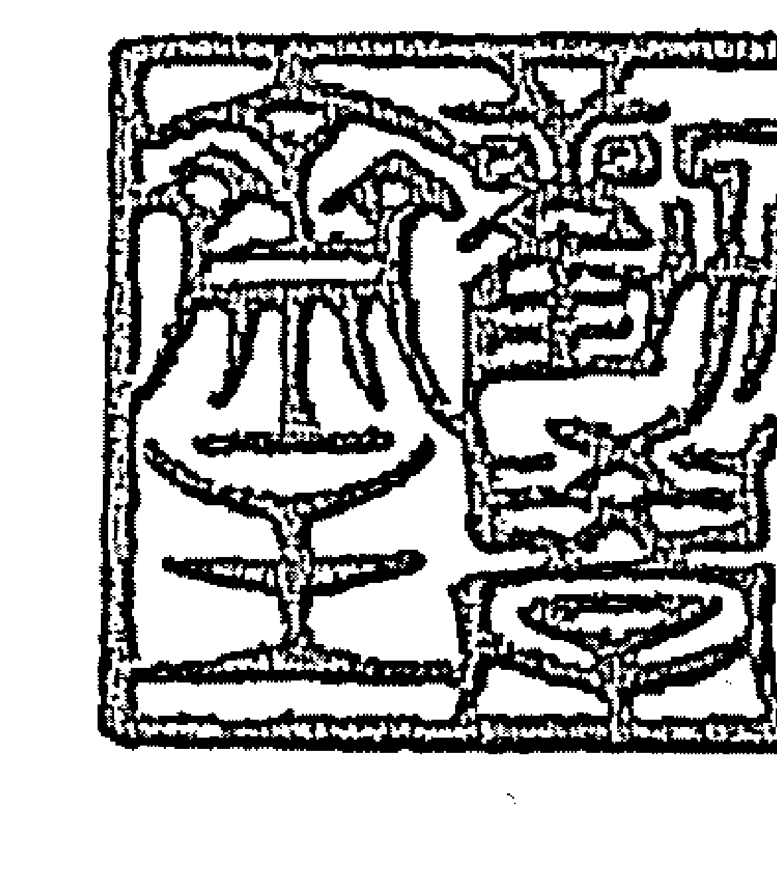
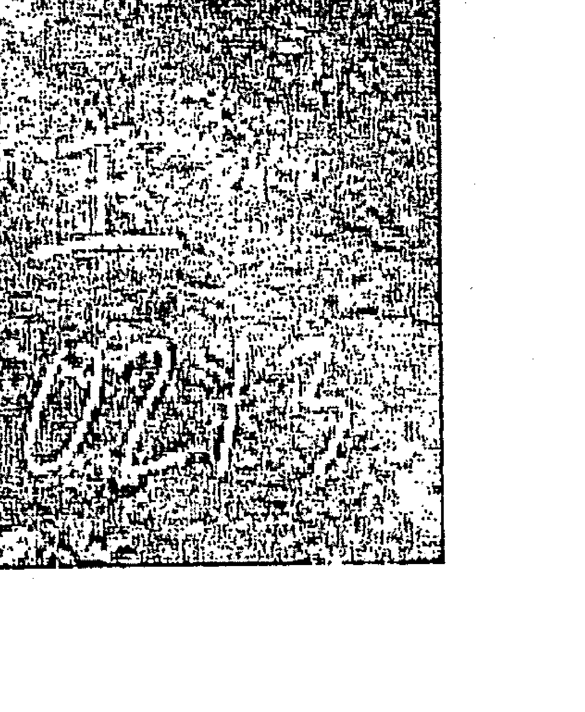
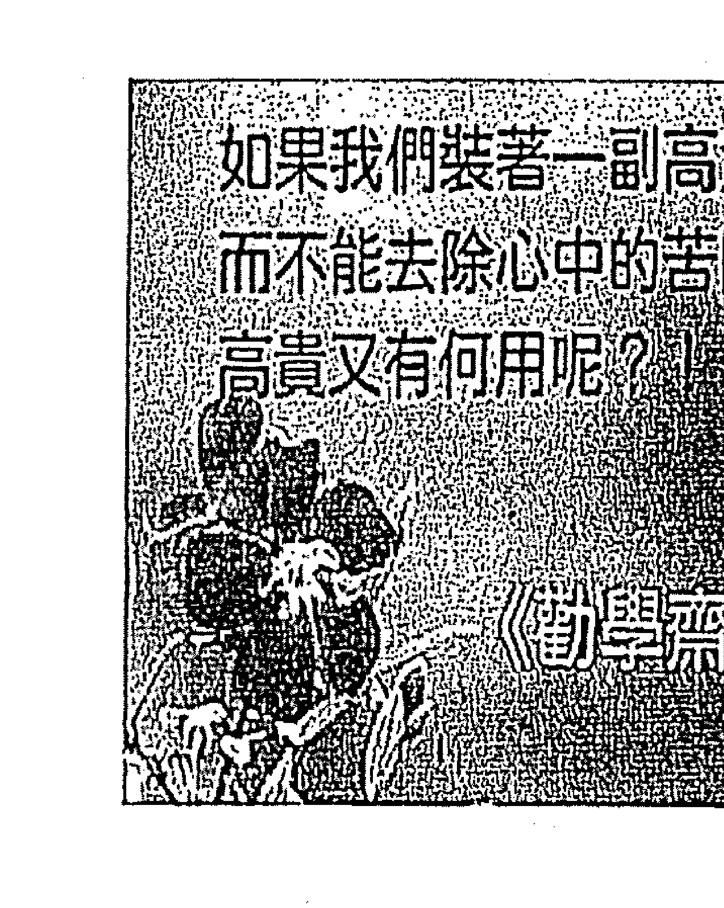
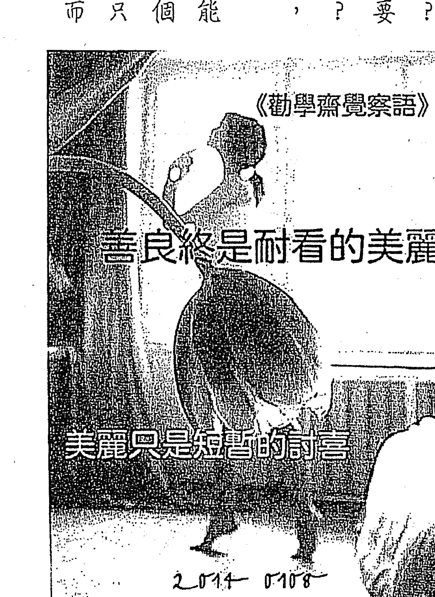
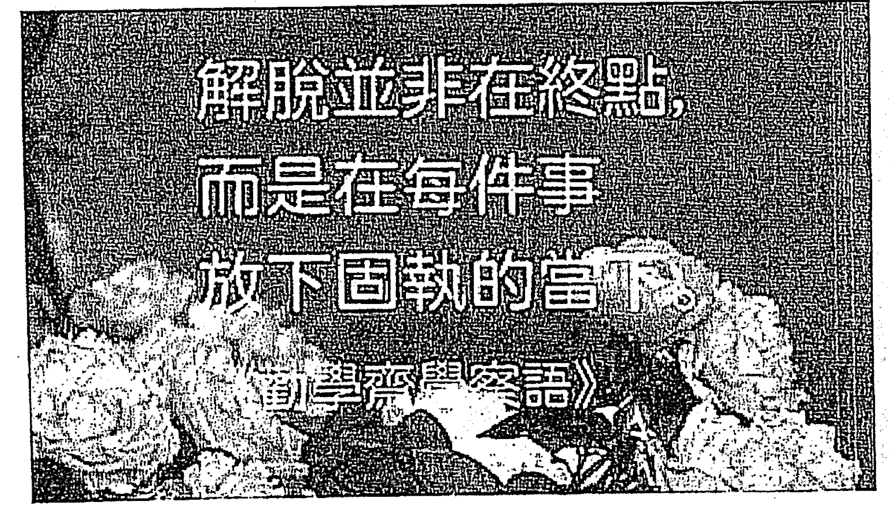
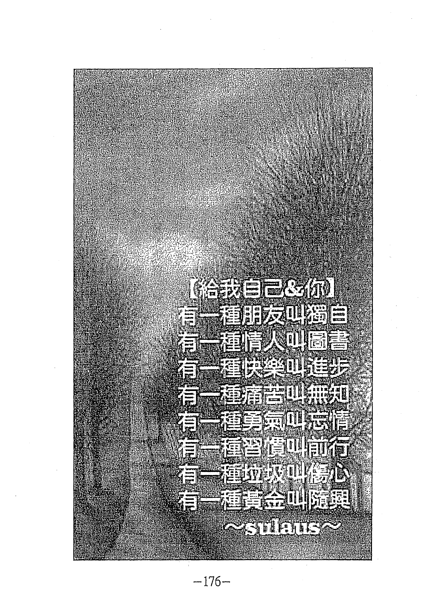
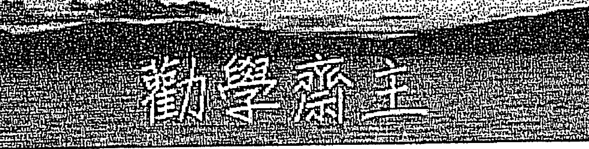
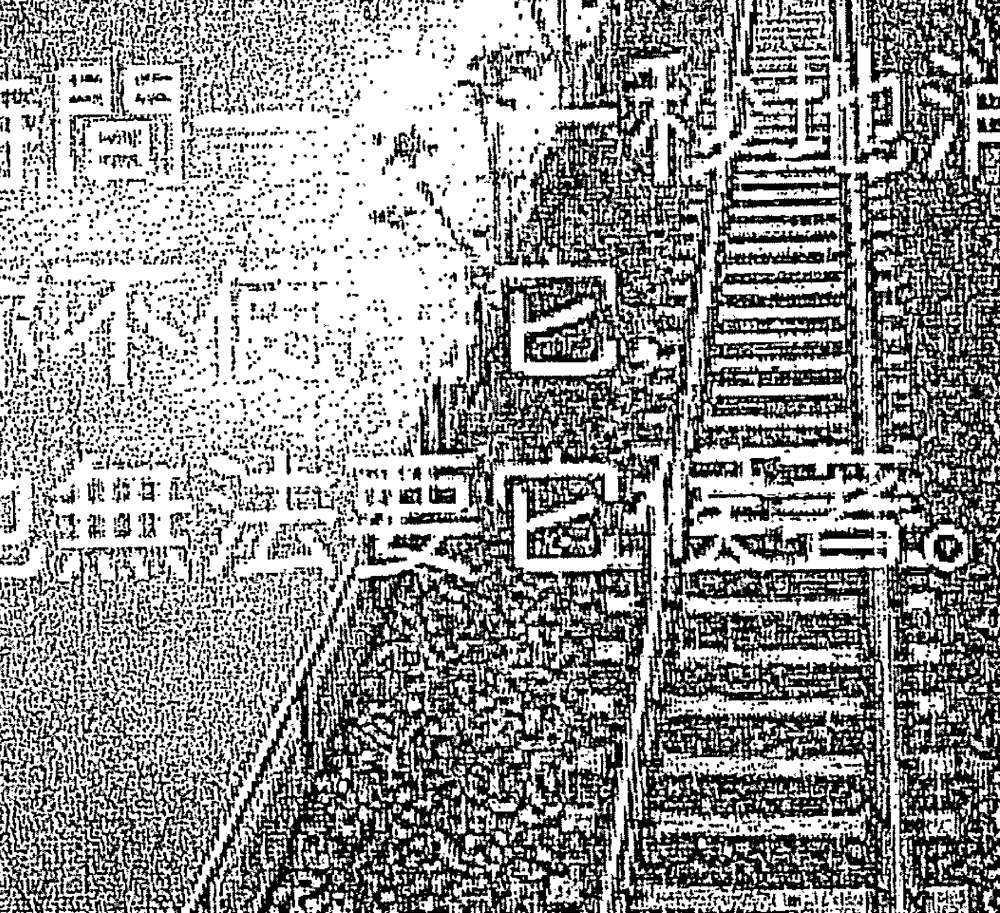
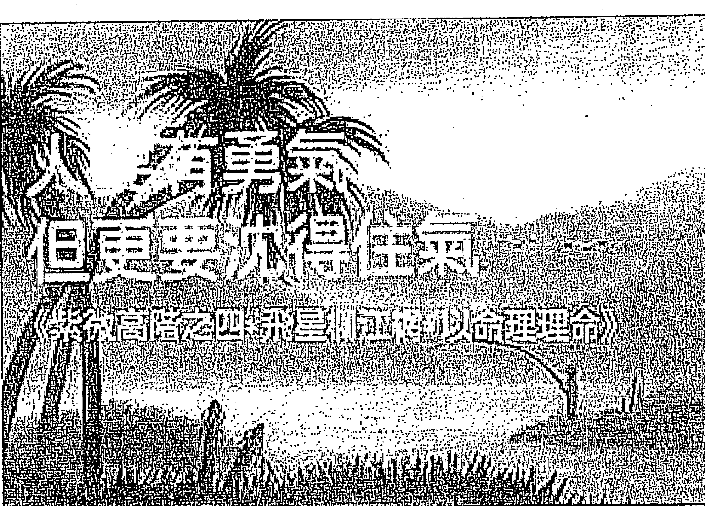

# 雲山相望圖

# 紫微星盤江河圖

# 紫微高階之四

紫微掌廟印

# 斗数小语哲理篇

-   回憶若對眼前有助益，請加強回憶；回憶若只能帶來嘆息，請立即忘記。
-   人生必有破耗，只求耗之無悔。
-   人生許多事，真的不要「刪除」得太快，甚至有些事可「間置」一陣子或一輩子。
-   人要有勇氣，更要沉得住氣。
-   真勇氣，沉的住氣；假勇氣，沉不住氣。
-   寧為墊腳石，不為絆腳石。
-   未醫病，必先醫心；要醫命，也先醫心。
-   要傲骨，不要傲氣；要爭氣，不要生氣。
-   敏感的好處是善於分析，壞處是事事生疑。
-   不理是非，是非自少；不談是非，是非自遠。
-   有觀念的人是火車頭，沒觀念的人是車廂。
-   「理想」的定義：處「理」好「想」法。

# 敬學齋主

# 斗數小語哲理篇

-   靜心要讓心靜，切莫墜入陰沈。
-   涓滴之得，聚沙成塔；涓滴之失，轉眼成空。
-   男為陽，陽中要有陰；女為陰，陰中要有陽。
-   不要『贏在』起跑點，卻一路『輸到』終結點。
-   要『贏過』昨天的我，不要『輸在』自是的我。
-   賢才用來創造事物或解決問題，絕非用來製造問題或引發爭端。
-   美好的人生是鬆中有緊，緊中有鬆。
-   『命理』是用來『理命』的。
-   人不要自我設限，但要接受別人設限。
-   冀求他人或環境對我不設限，就是自我設限。
-   協調的本意就是協調，絕對不容破裂。
-   柔能護剛，剛能挺柔。
-   聰明人尋煩惱，智慧人無煩惱。

# KARL VON FRISCH

蜜蜂的舞蹈语言

> 好書是一匙真理
是一匙好書
翻開解讀
拥抱深入

# 劝学篇畅通自然五行

勤学斋主

1=C 3/4 J=88

5 5 5 3 3 3 2 2 1 | 3  0  0  | 0 6 1 1 6 1 6 5 | 3  0  0 |
走过那绿油油的草 坡      绿 草顶着露珠抬头
你看那红红的花 朵      在 阳光下向我招手
走上那黄黄的山 坡      盛 开无数黄色花朵
遥望那银色的瀑 布      吐 尽一身瘴气污浊
再看那蓝蓝的天 空      对 映下方蓝蓝水波

| 0 5 6 6 5 6 5 3 | 2  0  0  | 2 3 5  5 3 3 7 | 6  0  0  |
一步一步地跨 过      心胸向      无垠开 阔
一步一步地跳 过      心情把      蓝天穿 透
安安稳稳地坐 着      唱起心      腹中的 歌
一口一口的吸 着      汲新鲜      进入心 窝
一阵一阵的飘 雨      浸润如      花木的 我

# 序

鄭興甯 主

這本書《飛星欄江網》遲到了，遲到了將近四年，先跟國內外一直等待著且詢問的讀者說聲：抱歉！
延遲問世，必有其因，我不想費唇舌、佔篇幅去訴說因由。總覺得一本書的出版，最重要的是因緣俱足；如期或延遲出版，總須因緣俱足。
人生何事不因緣？吉也好、凶也好，因緣俱足，皆來眼前；愛也是、恨也是，因緣俱足，都來心上；榮也好、辱也好，因緣俱足，盡來人間。萬事皆「因緣」，並非訴說人生的無奈，反而是在說明真相。
雖說吉凶、愛恨，榮辱，都是因緣俱足，但對「人生是苦海」的悲觀論調，以及「萬般皆是命」的宿命論，我卻不予苟同。
「人生是苦海」的悲觀論調，應是由「苦海無邊，回頭是岸」的宗教觀而來。但說成「人生是苦海」，是朝悲觀發展的，我相信宗教應是積極的，是在提醒大家：當你墜入苦海，那苦海可是無邊無際的，趕快掉頭或轉個方向吧！

以宗教的觀點，我寧可相信：人世間，是一所學校、是一間修練場，有此一生是多麼喜悅和感恩的事！是老天爺賜給我們修行、學習、長智慧的歲月。只要能「善緣善用、惡緣亦善用」，

> 「萬般皆是命」也常被悲觀的宿命論者掛在嘴邊，殊不知《老子西昇經》有云：「我命在我不在天。」由這個認知來談「萬般皆是命」，「我」就須一肩扛起，無由卸責，下面那句就不能接「半點不由人」了！

以命理的觀點，我一直認為：命運是可以運命的，命理是用來理命的。運命是運作我的一生，理命是處理我的一生。如果命運是全宿命，半點不由人，那醫院無用、醫藥無效，勤奮不是白費了？拜拜不就白搭了？相信大家不致如此認為吧！一九八八（戊辰）年《紫微階梯I。紫微初階》、《紫微階梯II。紫微進階》問世後，為了尋根，也為了提升自己，沉寂十三年，只是授課、論命，暫不寫書。一直到二〇〇二（壬午）年，方才出版《紫微階梯III。紫微高階之一。星曜鐵闡刀》，由此書開始，積極地提出「造命」的觀念及方法。二〇〇八（戊子）年春，出版《紫微階梯IV。紫微高階之二。四化滴天髓》；二〇〇九（己丑）年秋，《紫微階梯V。紫微高階之三。四化洶天機》陸續問世。

就一直將論命與造命並陳。誠摯地希望所有讀者，有所獲、有所得，更有提升。

二〇〇六（丙戌）年伊始，萌生將上課時主張的『義理型態的解厄』，完整陳述，俾能提供大家平時運用。『義理型態的解厄』，方能釜底抽薪，其他的解厄方術，僅是雕蟲小技，旁枝末節而已。隨後開筆寫了『以命理理命』，期能運用於日常生活中，使人生忌少祿多、凶少吉多。而這部份就刊載在本書每顆飛星之後。

打從一九九〇（庚午）年夏天開始講授紫微斗數至今，直認命理師在研習過程，絕不能去繁就簡，反而要鉅細靡遺，而在做命理服務時，則須提出簡便而有用的造命方案。

基於這個思維，發現改善命運的第一個障礙是自己（命宮），再來有兩個幫兇：

1.  有形的居家風水——田宅宮（簡稱『田』）
2.  無形的業障因果——福德宮（簡稱『福』）

宗教上，要我們種福田；我們發現，斗數也要重福田。而命宮是自己，只要自己願意重視福田，由這兩方面下手，所有人的人生都可亮麗起來。

有關這方面的做法，我會陸續出書敘明。
這本書拖了幾年，終於出版了！感謝勸學齋吳慶泰老師，製作各個生年的主星基本盤，讓我複製轉貼，減少命盤上的錯誤。勸學齋的老師群的校對，讓我放心不少，計有：李志敏、吳慶泰、林萬福、馬碧霞、楊春根、楊賀茵、蔡慶文、鄭哲臣（姓氏筆畫序）等老師。感謝校對，並指出我寫得不夠清楚之處；為了完美、為了少了錯誤，我們會不遺餘力的。

接著，我會自我鞭策，加快腳步，完成《紫微階梯VII》。紫微高階之五。斗數人子須知》；還有《梅花心易斗數》、《斗數醫病》（暫定書名），也會陸續推出。

有讀者的期待，有熱愛的灌溉，我會努力不懈的！
以是之為序

甲午（二〇一四）年孟夏
作者序於台北

# 紫微高阶之四 飞星网

## 目录

-   第一章 飞星原理 1
-   一物一太极 1
-   星与宫各司其职 4
-   飞星与飞宫不能偏废 5
-   何谓十八飞星紫微斗数？ 6

# 【紫微的飞星】

13

## 前言 9

以命理理命 11

# 第二章

主要飞星阐述 9

飞星不必限制在十八颗星曜 7

飞星与原先四化的差别 8

## 紫微的坐平四化至命、财、官 14

### 论化气日尊的领袖风范 14

### 紫微的坐平化禄、权、科入命、官 14

### 紫微坐我宫与他宫有别 14

### 紫微在我宫之例 15

### 紫微在他宫之例 16

### 紫微坐平化禄、权、科至财帛 17

### 紫微坐平化禄、权、科至田宅 19

### 紫微坐平化忌至各宫 22

### 紫微坐干化忌至命、迁 23

| 紫微坐干化忌至六親宮 (兄、友、夫、子、父) | 紫微坐干化忌至官祿宮 | 紫微坐干化忌至田宅宮 | 紫微坐干化忌至財帛宮 | 紫微坐干化忌至福德宮 | 紫微坐干化忌至疾厄宮 |
| :--- | :--- | :--- | :--- | :--- | :--- |
| 26 | 30 | 32 | 35 | 37 | 38 |

## 【以命理理命——紫微星】

集思廣益，無懼無畏地主宰一切，一肩扛起。
不要居功諉過，要一肩扛起。
領導好自己，才能領導好別人。
每一個人都是領導者

# 【天機的飛星】

-   天機的坐平四化至命財官 47
-   論化氣曰善的施捨氣度 47
-   論兄弟宮主的交際手腕 47
-   天機的坐平化祿、權、科入命、遷、兄、友 48
-   天機坐我宮與他宮有別 48
-   天機在我宮之例 49
-   天機在他宮之例 52
-   天機的坐平化祿、權、科入命、財、官、田 53
-   天機坐平化祿、權、科至財帛 54

## 天機的坐干化祿、權、科入六親宮（兄、友、夫、子、父）

56

## 天機坐干化忌至各宮

58

63

### 天機坐干化忌至命遷

58

### 天機坐干化忌至六親宮（兄友夫子父）

63

### 天機的坐干化忌入父母

65

### 天機的坐干化忌入夫妻

67

-   天機坐干化忌至官祿宮 69
-   天機坐干化忌至田宅宮 71
-   天機坐干化忌至財帛宮 72
-   天機坐干化忌至福德宮 73
-   天機坐干化忌至疾厄宮 74

## 【以命理命——天機星】

75
不怕想太多，只怕想得不夠深、不夠廣。
75

### 想得開的方法

76
懷疑的念力純度百分之一百
76
聰明人尋煩惱，智慧人無煩惱。
77

# 「太陽的飛星」

79

## 太陽的生平四化至命財官

80

### 論化氣曰貴的光芒展現

80

### 論官祿宮主的外交排場

81

## 太阳的坐平化禄、科入命、迁、官 83

### 太阳坐亮位与失辉有别 83

### 太阳在亮位之例 84

### 太阳在暗位之例 84

## 太阳的坐平化权入命、迁、官 86

### 太阳坐亮位与失辉有别 86

### 太阳在亮位之例 87

### 太阳在暗位之例 90

## 太阳是官禄主（尤其是男命） 93

## 太阳是夫星 94

## 太阳的坐平化禄、权、科、忌入田宅 96

## 太阳坐平化禄、权、科、忌至财帛 98

太陽的生干化祿、權、科、忌入六親宮（兄、友、夫、子、父）
100
先談太陽的生干化祿、科入六親宮
100
再來談太陽的生干化權入六親宮
101
最後談太陽的生干化忌入六親宮
101
太陽生干化忌至疾厄宮
102

## 【以命理命——太陽星】

105
要像陽光燦爛，也要韜光養晦。
105
要有傲骨，不要有傲氣；鋒頭很健，不如堅定行。
106
該上台就上台，絕不要羞澀；該下台就下台，只須一鞠躬。
107
不要關掉心中的太陽！
108

# 「武曲的飛星宮」 109

## 武曲的坐平四化至命、財、官、遷 111

### 論化氣曰寡的冷漠心神 111

### 論財帛宮主的正財盈虧 111

## 武曲的坐平化祿、權、科入命、官、財、田 112

### 武曲坐我宮與他宮有別 112

### 武曲在我宮之例 113

### 武曲在他宮之例 114

## 武曲的坐平化祿、權、科入六親宮（兄、友、夫、子、父） 115

## 武曲坐平化忌至各宮 117

### 武曲坐干化忌至命遷

118

## 武曲生年忌坐命的建議

120

### 武曲坐干化忌至六親宮（兄、友、夫、子、父）

124

### 武曲坐干化忌至官祿宮

124

### 武曲坐干化忌至田宅宮

127

### 武曲坐干化忌至財帛宮

128

### 武曲坐干化忌至疾厄宮

129

# 【以命理理命——武曲星】

131
起而行，錢財跟著來。
131
剛因過剛而折，柔因過柔而弱。
133
順境中的美德——節制；逆境中的美德——堅忍。
135

不須堅強時堅強，堅強化身為倔強。

附：南斗六星皆屬人馬座

# 【天同的飛星】

## 天同的坐平四化至命、遷、官

### 論化氣曰福的天下大同

### 論主協調的和事佬

## 天同的坐平化祿、科至各宮

天同化祿與天同坐干化祿有別

天同坐干化祿或科至命宮主善於協調

### 天同化忌自化禄在命宫之例

-   天同坐干化禄或科至财官田
-   天同坐干化禄或科至六亲宫（兄、友、夫、子、父）
-   天同坐干化禄或科至疾、福
-   天同的坐干化权、忌至各宫
-   天同坐干化权至命、财、官、田
-   天同坐干化权至六亲宫（兄、友、夫、子、父）
-   天同坐干化权至迁、疾、福
-   天同的坐干化忌入命
-   天同的坐干化忌入迁移
-   天同的坐干化忌入兄友
-   天同的坐干化忌入夫妻

160

| 宫位 | 数字 |
| :--- | :--- |
| 天同的坐干化忌入官祿 | 160 |
| 天同的坐干化忌入子女 | 161 |
| 天同的坐干化忌入田宅 | 162 |
| 天同的坐干化忌入財帛 | 163 |
| 天同的坐干化忌入福德 | 164 |
| 天同的坐干化忌入父母 | 165 |
| 天同的坐干化忌入疾厄 | 166 |

### 綜論天同的坐干化祿、忌

167

## 【以命理論命——天同星】

169
自我協調很重要，一生輕鬆樂逍遙。
169
協調的本意就是協調，絕對不容破裂。
170
身體的協調是要上下、左右、前後都協調。
身心靈整體健康，須基於身心靈整體協調！

172
174

# 【廉貞的飛星】

177

## 廉貞的坐干四化至命遷宮

179

### 論化氣曰囚的規範與心結

179

### 論主官祿之行政作業流程

180

### 論主次桃花之交際情狀

181

## 廉貞的坐干化祿、科至各宮

181
廉貞坐干化祿或科至命、遷、疾、官主善於作業流程
182

-   廉贞坐干化禄或科至财、田 184
-   廉贞坐干化禄或科至六亲宫（兄、友、夫、子、父）185
-   廉贞坐干化禄或科至福 186
-   廉贞的坐干化权至各宫 186
-   廉贞坐干化权至命、财、官、田 186
-   廉贞坐干化权至六亲宫（兄、友、夫、子、父）187
-   廉贞坐干化权至迁、疾、福 188
-   廉贞的坐干化忌至各宫 190
-   廉贞的坐干化忌入命、迁 190
-   廉贞的坐干化忌入兄友 193
-   廉贞的坐干化忌入夫妻 194
-   廉贞的坐干化忌入官禄 198

## 【以命理理命——廉貞星】

人不要自我設限，但要接受別人設限。
211
加大視框、思框、行框，無須去除框框。
213
大事大太極，小事小太極，無論大小事，都有其流程。
215
美好的人生是鬆中有緊，緊中有鬆。
216

| 入宫位 | 对应数值 |
| :--- | :--- |
| 入子女 | 200 |
| 入田宅 | 202 |
| 入財帛 | 204 |
| 入福德 | 205 |
| 入父母 | 206 |
| 入疾厄 | 207 |

## 【天府的飞星】

-   天府的生平四化至命、迁、官 219
-   论化气曰贤的自信与自是 220
-   论主财田之库财得失 221
-   论主财田之一星两用 222
-   天府的生平化禄、科至各宫 223
-   天府的坐干化禄或科至命、迁、官主雄才 223
-   天府的坐干化禄或科至财、田主禄库 225
-   天府的坐干化禄或科至六亲宫（兄、友、夫、子、父） 228

天府的坐干化权至各宫
230
天府坐干化權至命、官主掌權當老闆
230
天府坐干化權至財、田主擴增財田
233
天府坐干化權至六親宮（兄、友、夫、子、父）主該六親有雄才
234
天府坐干化權至遷、疾、福
235
天府的坐干化忌至各宮
237
天府的坐干化忌入命、遷
237
天府的坐干化忌入兄弟友亦主兄弟友劫財
239
天府的坐干化忌入夫妻
240
天府的坐干化忌入官祿
241
天府的坐干化忌入子、田
242
天府的坐干化忌入財帛
244

## 【以命理命理—天府星】

賢才應事，切莫強爭。賢才用來創造事物或解決問題，絕非用來製造問題或引發爭端。切莫自以為是，且讓眾皆曰是。不要贏在起跑點，卻一路輸到終點。

-   天府的坐干化忌入福德 246
-   天府的坐干化忌入父母 248
-   天府的坐干化忌入疾厄 249

【附：北斗七星皆屬大熊座】
256
251
252
253
254
256

# 【太陰的飛星】

-   257

### 太陰的坐平四化至命、財、田

論化氣曰富的涓滴得失

論主財田之庫財得失

論主女人及清明

## 太陰的坐平化祿、科至各宮

太陰的坐平化祿或科至命、遷主個性柔順

-   261

## 太陰的坐平化祿、科至各宮

太陰的坐平化祿或科至財、田主小祿庫

-   262
-   263

## 太陰的坐平化祿、科至各宮

太陰的坐平化祿或科至福、疾

-   265
-   太陰的坐平化祿或科至六親宮（兄、友、夫、子、父）
-   266
-   267

## 【以命理命——太阴星】

温柔四象，妳是哪一項？275
男為陽，陽中要有陰；女為陰，陰中要有陽。
柔弱生之徒，老氏諠剛強。
涓滴之得，聚沙成塔；涓滴之失，轉眼成空。

### 太陰坐干化權至命，邁主個性的剛柔與行運的漸進 267

### 太陰坐干化忌至命，邁主個性的陰沈與行運的漸衰 269

### 太陰坐干化權入照財、田主財田之得失 270

### 太陰坐干化忌入沖至財、田主財田漸損 271

### 太陰坐干化權至六親宮（兄、友、夫、子、父）主該女性六親掌權 273

### 太陰坐干化權、忌至疾厄宮 274

> 靜心要讓心靜，切莫墜入陰沈。

-   281

# 【貪狼的飛星】

-   283

## 貪狼的坐平四化至各宮

-   285

### 論神仙之宿的靈感如神

-   285

### 論主欲望之理想美感

-   285

### 論主桃花

-   287

### 論主壽與解厄

-   288

## 貪狼的坐平四化至各宮看理想與美感

-   288

## 貪狼的坐干化祿、權、科至命、官、遷以及六親宮

-   288

貪狼的坐干化忌至命、官、遷及六親宮
290
貪狼的坐干四化至財、田
293
貪狼的坐干四化至疾厄宮
295
貪狼的坐平四化至各宮看桃花與解厄
295
貪狼的坐干化祿、科至命、遷、子、田、夫
295
貪狼的飛星論解厄
297
飛星論貪呂
297

## 【以命理命——貪狼星】

299
『理想』的定義：處『理』好『想』法。
299
滿足是進步的障礙，抑或知足常樂？
301
雖說無欲則剛，但剛又能如何？
302# 「巨門的飛星」

> 圓一己之美夢，不如一舉成就眾望。

- 巨門的生平四化至各宮
- 論主口的三效應
- 巨門的飛星論口才與口舌
- 巨門的飛星論口福與口才
- 論巨門的病符
- 論巨門隔角煞
- 論巨門化暗

# 【以命理——巨門星】

人人有『口』，要用來吃出『健康』、說出『好話』。

敏感的好處是善於分析，壞處是事事憂疑。

埋首研究，創造價值；沉潛學問，不理是非。

有觀念的人是火車頭，沒觀念的人是車廂。

# 【天相的飛星】

## 天相的坐干四化至各宮

### 論化氣曰印的用印吉凶

## 用印何時須注意

## 論貴氣與衣食之星

天相的坐忌到哪？貴氣喪失在哪？

天相要注重穿著，以免損貴氣。

> > 「以命理理命——天相星」

> > 話說『吉人自有天相』。

同情而助人，要兼顧有無讓他上進。

- 要傲骨，不要傲氣；要爭氣，不要生氣。

穿著不必高貴，言行舉止要不失貴氣。

# 【天梁的飛星】

## 天梁的坐干四化至各宮

### 論化氣曰陰

## 天梁的蔭法

### 論天梁的醫與藥

### 天梁是醫星與藥星

### 上醫、中醫與下醫

### 天梁飛星論病

## 【以命理理命——天梁星】

### 『天梁』與『天良』

- 七杀的生平化忌主暴敗
- 七杀的生平化祿、權、科至命官
- 七殺的生平化權科至財田
- 七殺的生平化祿至財田主暴發

### 論七殺的暴起暴落

七殺的生平四化至各宮

# 「七殺的飛星」

寧為墊腳石，不為絆腳石。未醫病，必先醫心；要醫命，也先醫心。

## 論七殺的游手好閒與開刀

七殺的生平化權、忌入沖命、疾主游手好閒

七殺的生平化權或化忌入沖大命或大疾亦主開刀

## 【以命理理命——七殺星】

人要有勇氣，更要沉得住氣。

可任隨改變，但萬變不離其宗。

衝！衝！衝！衝破眼前困境；打！打！打造日後心境。

# 【破軍的飛星】

## 破軍的坐干四化至各宮

### 論破軍的化氣曰耗

破軍的坐干化祿、權、科、忌至命、夫、子、僕皆主耗

## 論破軍的舶來品與垃圾

破軍的坐干化祿、權、科、忌至命、官、夫、財

### 破軍的坐干忌入沖命田

## 再談破軍的雜亂對心性的影響

> 【以命理理命——破軍星】
人生必有破耗，只求耗之無悔。
回憶若對眼前有助益，請加強回憶；回憶若只能帶來嘆息，請立即忘記。

> 為了建設再行破壞，不要破壞隨即停手。耗了自己而肥了別人，就是本事；耗了別人而肥了自己，只是醜事。

# 第三章 副星之飛星舉例

## 左輔右弼的飛星

## 文昌文曲的飛星

## 祿存的飛星

### 先談祿存主財及貴人

### 祿存的坐干化祿、科，主貴人、解厄

### 祿存的坐干化忌主孤，也是財的去向。

## 阴煞的飞星

# 第四章 四化之飞星真谛

四化也可再四化

| 化忌的生平化祿、權、科、忌 | 化科的生平化祿、權、科、忌 | 化權的生平化祿、權、科、忌 | 化祿的生平化祿、權、科、忌 |
|---|---|---|---|
| 428 | 427 | 425 | 423 |

# 第五章 格局星組之飛星活用

- 格局之飛星
- 格局星組之飛星舉例及其活用
- 武貪主大
- 武貪不同行之活用
- 武相主二
- 府廉主記憶
- 斗數、陽宅授課講義目錄
- 陽宅授課講義目錄
- 斗數、陽宅、取名招生

# 紫微高階之四 飛星機關網

# 第一章 飛星原理

# 瀚學齋主

◇ 一物一太極

根據邵雍（康節）「一物一太極」之理，宮位可立太極，星曜也可立太極。
以宮位立太極，以其宮干四化，我們稱之為「飛宮」；以星曜立太極，以其所在之宮干四化，稱之為「飛星」。
宮位依命、兄、夫、子、財、疾、遷、友、官、田、福、父，逆佈十二宮。
星曜則有：

主官祿的紫微、太陽、廉貞、天相。
主財帛的武曲、天府、太陰、祿存。
主田宅的天府、太陰、天機（小太極看床位、大太極看陽宅）。
主兄弟的天機。
主福德的天同。
主夫妻、子女、交友的破軍。
以上不依上述宮位次序，而以另一種規律，散佈在十二宮位中，我們稱此為「星盤」。
星曜主掌宮位者如上，其餘尚有不主掌宮位，而是主掌某一事務者，計有：

- 貪狼：主桃花、禍福。
- 巨門：主口才、口舌、是非、憂疑。
- 天梁：主壽、主蔭。
- 七殺：主厲、主肅殺。
- 廉貞：主次桃花。
- 曲昌：主科甲。
- 左右：主廣祐、助力。
- 禄存：主食禄、主解厄。
- 羊陀：羊刃主刑傷，陀羅主是非。
- 魁鉞：天魁主廣協陽貴，天鉞主廣協陰貴。
- 刑姚：天刑主孤獨，天姚主風流。
- 火鈴：火星主剛暴（外），鈴星主烈暴（內）。
- 空劫：地空主劫出，地劫主劫入。
- 哭虛：皆主憂傷，哭為刑剋、虛為空亡。
- 鸞喜：皆主婚姻喜慶。
- 孤寡：孤辰主孤，為陽孤；寡宿主寡，為陰孤。

因此，宮干四化以宮性解釋者為「飛宮」。如命宮化祿入夫妻，命宮為我、夫妻為配偶，化祿主情緣、喜歡、愛，故解釋為我愛我的配偶。在我的著作《紫微高階之二・四化滴天髓》與《紫微高階之三・四化洩天機》，大多在研討這個範疇。

再者，宮干四化若以宮內之星性解釋者為『飛星』。如大命坐天府，若化忌入或沖本財或大財，因天府是庫財星，化忌入或沖財帛宮，其財損必重。若所化忌之星又為財星，或忌星所沖之星為財星，其損財又更重。這個範疇，正是本書的重頭戲。

## ◇ 星與宮各司其職

論四化，不能只是談化祿、化權、化科、化忌，必要知道是啥星化忌入啥宮而沖啥星，啥星化忌好像少有人談，沖啥星更是無人論及，所以常常聽到在手沖啥宮的驚恐。詳細思考上述那段話，驚恐的原因就在裡面。人會驚恐，率皆因為可能不好，但不知道有多不好？或如何的不好法？所以論命就須要知其性質與範疇，才不會驚恐而手足無措。

要知道哪顆星化忌，更要知道化忌所沖之星為何星。我早就提出『沖宮也沖星』的概念，論命時必須落實。試想：若拿石頭砸雞蛋，豈有只破蛋殼、不壞蛋殼內蛋黃、蛋白之理？若僅沖破宮位，不沖破坐星，忌星哪有可怕處？知道化忌之星為哪顆星、沖的是哪顆星？有利於轉忌為祿。

## ◇ 飛星與飛宮不能偏廢

前一本書《四化洩天機》，提出『斗數三要』：宮、星、四化。此三者一體，缺一不可。論命時，要飛宮與飛星同論，就能符合這個要求。
命宮或財帛宮或官祿宮等等，四化至哪些宮位，不能忽略此一發射宮位——以下簡稱發射台——坐啥星？如只論飛宮、不論飛星，抑或是只論飛星、不論飛宮，都只是「論一半」，不能見到全貌。

紫微星是領導型的官祿主，假如某人紫微在兄弟線，或子女宮，難道此人就沒有領導風格或能力嗎？如加上飛星來論，即可解決這個問題。

## ◇ 何謂十八飛星紫微斗數？

相信很多人看過『十八飛星紫微斗數』的名稱，但不知為何以『十八』命名？下面來談談我的看法。

早年台灣一家出版社出了一本《十八飛星紫微斗數》，內容卻與坊間一般雜抄的斗數書籍無異，難怪香港某位斗數大師說：『看了台灣出版的十八飛星紫微斗數，看不出與一般有何不同。所以，認為台灣没人知道飛星。』

十八這個數字，是指紫微星系六顆星、天府星系八顆星，外加左右、曲昌，總數十八顆。這十八顆星性凸顯，拿來當飛星，故稱『十八飛星』。在我上課的講義中，為提醒學斗數的學員要將『飛星』與『飛宮』相提並論，所以將飛宮稱之為『十二飛宮』。

## ◇ 飛星不必限制在十八顆星曜

經長年的論命驗證，深刻瞭解不必限制在十八顆飛星，而是每顆星都可當飛星來看。譬如：陰煞在命，命宮干化忌到大限命宮，此一大限陰煞也巴巴地干擾這一大限。

打個比方，比較容易瞭解。從某宮宮干四化，無論宮性及星性，都透過化祿、或化權、或化科、或化忌四種型態，飛到其他宮位，並與之交合。

上課時，為讓學生理解，我特別這麼說：

斗數十二宮，可先別管三方四正、三合六合的關係，直認十二宮為十二個互不相通的空間或房間，每一宮端賴四化到其它宮位，打開通路，產生門路。如命宮與兄弟宮雖是臨宮關係，但須視命宮有四化到兄弟宮，或兄弟宮有四化到命宮，方才使兩宮之間，產生文化交流，繼而有好與壞、吉與凶的關係。

我們沒有理由主張，當兩宮的主星產生文化交流時，其它副星（或稱從星）不必或不可以產生關係。

## ◇ 飛星與原先四化的差別

大家都知道，紫微逢乙干化科、逢壬干化權，而無天干使其化祿跟化忌。然而到底紫微化不化祿？紫微化不化忌？在此要跟大家說明：雖有些星曜沒四化，但有兩種運用狀況，使每一顆星曜，都會遭逢四化，或發出四化。

第一種：同宮的星曜有四化，沒四化的星曜也『隨後』四化。如紫貪同宮，戌年生人，貪狼化祿，紫微也會『隨後』化祿。又如紫貪同宮，大限逢癸干，貪狼化忌，紫微也會『隨後』化忌；貪狼因貪受損，之後損失尊嚴，這就是紫微隨後化忌的簡單解釋。

第二種：就是飛星。如紫微以其坐干論其四化，即是紫微以其化祿、化權、化科、化忌的性質，飛到其他宮位。

# 第二章 主星飛星論述

## ◇ 前言

解釋飛星，該星坐干化祿、化權、化科出去，大多以正面意義呈現；反之，化忌則以負面意義解釋。

我常強調：研究命理，好的條件要注意碰會受傷？壞的組合要研究如何改善它，並執行改善。
人，一生繞著命盤跑，要想辦法過得好。
人一出生，即可排就命盤，活到第十大限的人很少，所以大限繞不到一圈。流年則每十二年，剛好命盤繞一周，一個大限十年，流年太歲干將十天干巡迴一遍；命盤繞一周，剛好十二個流年，十天干不夠用，還得多用兩個。每個流年有十二個月，也一樣命盤繞一周。一個月的流日，則須繞兩圈半，或少於兩圈半。

這麼分析，是為了要讓大家明瞭，不管你本命的命財官坐啥星曜，跟你一輩子的關係較深，但也不要忽略了其他星曜，在流日、流月、流年，也會闖進你的命宮的。

上課初期，講基礎命理時，提到古人一句話：『一日之計在於晨，一年之計在於春，一生之計在於勤。』《梁元帝纂要》云：『一日之計在於晨，一年之計在於春，一生之計在於勤。』

開創，此生不就更亮麗嗎？

前面我們提到，要如何改善壞的組合，這就是一般所謂的解厄。熟悉星性，徹底發揮星曜的正性，亦即以其正面意義為用，讓負面意義沒有空間及能量展現，這是我最推崇的解厄法，我將之稱為『義理型的解厄』。這種解法，既可以直接釜底抽薪，又可以化腐朽為神奇。

所以，只要在日常生活中，秉持每顆星曜的正性，作為做人處事的依歸，以安心立命的圭臬，即可趨吉避凶。

再說，我不贊同碰到啥星化忌時，再來解厄。因為我們發現，忌星來到時，大多來不及解救，或只是減少傷害而已。大家不是常說『人生如戲、戲如人生』嗎？在舞台上供觀賞的戲，都須事先彩排；讓我們親受苦樂的人生，更須彩排。每顆星曜的正性，在日常生活中，隨時演練，不要等化忌才做，這就是亟須的彩排。因此，論述每一顆飛星後，都會有一篇『以命理理命』的標目，就是為了這個目的而寫的。任何人可以不看命盤，而僅『以命理理命』，更能自然逢凶化吉。

### △ 以命理理命

### 緣起

寫這篇文章的靈感，來自《問題背後的問題》一書；買《問題背後的問題》，來自二〇〇六年六月一日側聽周桐明與其朋友的對話。這本書的書名，就很吸引我。問題背後的問題，本來就很重要，更何況很多人不顧問題背後的問題，甚至不知問題背後有問題。六月六日趁一點空檔，即去買了這書。本來知道的只有一本，書店小姐告訴我，已出版第二本了，當然全買。第二本書名，叫做《富的五項修練》。

當天下午，搭阿羅哈客運南下，車上休息的時間居多，僅用些許時間，就看了第一本書的三分之一。

喜悦的是，我所看到的七、八成，在斗數授課時都強調過，而且用語相同；若道理相同者，將近九成。

感謝的是，它也點醒我的錯誤。譬如：該問我應如何？而不是為什麼如此。
我常感嘆：大家很尊重我，為何不照我提出的理念做去？如今，我知道了，應該自問：我該如何讓大家依著理念做去，而得到價值？

我一向主張：人生是一連串不斷地學習與調整種種問題。我也體會到：不用命盤，可以以命理處理命運的種種問題。看了此書，我啟筆寫了這篇。今將分述於每顆星曜之后——

## 【紫微的飛星】

以紫微的坐干四化至各個宮位，而解釋其意義，這就是「飛星」。紫微的坐干化祿、權、科到哪個宮位，就是將紫微的正面星性，也就是好的一面，帶到該宮去。紫微的坐干化忌到哪個宮位，就是將紫微的負面星性，也就是壞的一面，帶到該宮去。因此，要懂得飛星的論斷，先要掌握紫微的星曜特性。我們先將紫微星性，整理於後：紫微己土，為陰土、為脾土。紫微化氣曰尊，為貴星中之最。一國之君、群眾之王、一家之長、一事之主、一身之首；又為尊貴象徵，得勢則眾人擁戴，失勢則損及自尊。紫微為官祿主，具領導風格。

### 論化氣曰尊的領袖風範

紫微星若坐命、官，此人有領導風範或威權或才幹，但是若紫微不在命、官者，豈不無領導才能？非也！以上是就星曜落宮而論，若紫微不在命、官，以「飛星」來論即知。若紫微的坐干化祿權科入命、官時，化祿或科即是此人有領導才華，化權即是有領導才幹。

## ◆ 紫微的坐干四化至命財官

### ◇ 紫微的坐干化祿權科入命、官

## ▲ 紫微坐我宮與他宮有別

紫微坐我宮而其宮干化祿權科入命、官，這表示雖先天無領導風範，但後天或行限走到，領導風格方才顯現。

### 紫微在我宮之例

下例紫微在財帛，坐甲辰，化廉貞祿入命、武曲科入官，就是先天雖無領導風範，但後天自然擁有。
紫微在財帛，金多多時更能加強其領導才能。
順行運走福德宮時，紫相在大遷，經常在外與人往來，亦會增強。
而且，紫微的坐干甲化廉貞祿入命，他的領導風格，具有廉貞的特質。
廉貞的特質，如對領導的程序、的認定、……等，皆有其特殊之才華。

### 紫微在他宮之例

下例紫微在兄友，兄弟宮坐辛卯、交友宮坐丁酉。辛卯化巨門祿入本命，丁酉化太陰祿、天機科入照本官，這些條件都能使命造後天擁有領導才華。但是，是由兄友線化來，意謂與眾生往來頻繁後，才能擁有。

如逆行運，第二大限走兄弟宮，步入此運，又更多一層的加強。

進一步說：若此人很少跟人往來，則此作用當然減少，甚至趨近於無。本命造兄弟宮辛卯，宮中有文昌化忌，逢辛卯又自化忌，必然開端會倍見艱辛，然後才得其領導風範。辛卯是發射台，已有化忌，或自化忌，要化祿權科出去，必然先受忌，這點在我以前的書中談過，叫做「源頭不淨」。

另有一種狀況：如紫微的坐干化祿入命，紫微的坐宮並無生年忌，亦無自化忌，化祿到命宮，命宮卻自化忌。這又如何解釋？就是已獲得領導才華，一陣子過後，卻不珍惜，或濫用。

### ◇ 紫微坐干化祿、權、科至財帛

紫微的坐干化祿、權、科入財帛，這表示命造具備對錢財的指揮能力。進一步說：有調度錢財的能力。祿是能力（善於）、權是能幹（擅長）、科是小撇步（小點子）。紫微若在我宮，則此能力，與生俱來；若紫微在他宮中的六親宮（兄、友、夫、子、父），則是須透過該宮之人，方能獲得。譬如：紫微在夫妻宮，化祿權科至財帛，則須行夫妻宮的大限，或結婚之後，始有上述能力。

如上例，紫微在兄友，化權至財帛。須與兄友（眾生）多接觸後，受兄友（眾生）生一啟迪，或藉由眾生之助，開始有開創錢財之才幹。
重要的是下一個轉折，財帛宮怎麼化？譬如紫微的坐干化祿入財帛，但財帛宮的宮干若化忌沖命或疾厄，表示命造擅長調度金錢，但是調度進來以後，沒辦法管制的話，將會損掉。如遇上述條件，怎麼因應或解決呢？
從宏觀的角度看來，不要調度就沒有後續損財的惡果；所謂「菩薩畏因，眾生畏果」，眾生是到了結果才怕，而佛菩薩是在一開頭就怕造因。
所以，我們在此可學學佛菩薩，不要展現調度的才幹，不就沒事了。
再說，若財帛宮化忌入沖兄友，也是最慘的。下例：紫微坐在己亥，化天梁科入財福，財帛宮壬辰，化武曲忌入沖兄友，造成「兄友劫財」。遂由最先的「善於調度」，終至「兄友劫財帛。此命盤若第五大限行財帛宮，紫微的坐干己，適巧化文曲忌入沖大財，豈可不慎？任金錢大筆出入，而不加以管制。研究命理，與人生處事一樣，一生要注意：好的事情，有何轉壞的可能？壞的事情，有何轉好的方法？

### ◇ 紫微坐干化祿、權、科入田宅

紫微的坐干化祿、權、科入田宅，這表示命造具備對田宅的指揮能力。進一步說：有指揮調度家務事的能力。祿是能力（善於）、權是能幹（擅長），科是小撇步（小點子）。

紫微在官祿，坐乙干化天機祿入本田，表示命造對家務事善於指揮調度。如下命例：## 紫微坐干化忌至各宫

设另有一人的紫微不在宫，而化禄亦是到田宅宫，是则此人要有此能力，是透过该宫给的。

譬如：紫微在兄弟宫，是跟人常往来后，就会有此能力，或者行限走入兄弟宫亦会有，两者都具备为强。

又一例：紫微在命宫坐戊干，化太阴权在子田，意即命造对家务事及小孩的事，很会处理。

再说，权有增加之意，因发射台一紫微所在之宫一在命宫，表示命造会增加田产的购置。

紫微若在兄弟友，化权到田宅，要增加田产的购置，须透过兄弟友。譬如：
- 透过兄弟友的协助
- 或催促
- 或鼓励
- 或兄弟友给予的机会。

紫微若在夫妻宫，化权到田宅，要增加财产的购置，须透过夫妻，或异性朋友（友一夫妻宫可涵盖男女关系之异性）。

紫微若在疾厄宫，是紫微入病位，而化权到田宅，若欲增置田宅，苦思无力时，要增加福德即可如愿。另一例：紫微在交友，自化权，解释为：蛮会打理家事，又因朋友的影响，而能添置田宅。所谓影响，包括观念的吸收，或朋友的慾愿等。本造田宅坐天府星，是田宅主，正得其位。田宅化忌入财，要抓财来买宅，千万不要拿屋贷款借给人。财帛自化禄，付钱很快的；但化忌入父冲疾，容易被倒。若常给父母钱，是最好的替代方式。整个说来：存钱买屋，因屋赚钱，分享父母及长辈。因田宅化忌入财，抓钱买屋；田宅化禄至父母，分享父母。此造因兄弟宫是空宫，所以紫微可惜至兄弟宫，而以乙干论飞星。

| 庚 | 辛 | 壬 |
|---|---|---|
| 七杀 福 | 田 | 廉贞 官 |
| 紫微 天相 命 戊 |  | 友 癸 |
| 天机 巨门 兄 丁 |  | 破军 迁 甲 |
| 太阳 太阴 子 丁 | 武曲 天府 财 丙 | 天同 疾 乙 |
| 贪狼 夫 丙 |  |  |

| 天相 辛疾 | 天梁 壬财 | 七杀 子癸 | 廉贞 夫甲 |
|---|---|---|---|
| 巨门 庚迁 | 兄 乙 |  |  |
| 紫微 科己 友 |  | 天同 丙命 |  |
| 天机 禄戊 官 | 太阴 忌 | 天府 己田 | 太阳 戊福 破军 父丁 武曲 |

#### 紫微坐干化忌至命、迁

紫微的坐干化忌至命宫，主孤克、错失贵人、固执之心积重难返。如下例：紫微在兄弟宫，坐丁干，化巨门忌入命，此条件即是。不过，紫微的坐干丁，化禄科入照官禄，结婚后或在做事方面，亦有其领导风范。如此优缺点并存一身，总的看来，似乎缺点被稀释了。但就人生管理上，却须自我调整，以免错失贵人，固执待人，甚至自尊心过重，与自卑感交相戕害而不自知。此例紫微在兄弟，为他宫，大多展现在与众生的交往中；若是紫微在我宫，则仅关乎自己的作为；若在疾厄宫，则是自己的想法；若是在福德宫，则是来自习癖。

下例紫微在疾厄宫，坐戊干，化天机忌冲命。论领导能力，因化忌到迁移，在外丧失领导能力。因紫微在疾厄，表示想法的问题；因化天机忌，表示会搞坏人际关系。论疾厄，因紫微在疾厄，主头或脑，化忌为天机，天机又为脑神经，所冲之官为命宫，命宫又主头，命宫坐生年干癸，化生年忌贪狼，冲主头的紫微星。真是集头疾于一身。据当事人第三大限来说：从小到现在，从未好好睡过。这也免除不了自尊心过重，处处保卫自己，居功诿过，令人无奈。

紫微的坐干化忌入迁移，还表示：在外奔忙，有福不能享，尤以所化忌之星为福寿之星天府、廉贞、贪狼、天同、天梁更是。

若紫微在命宫化忌至迁移——个性致使自尊心过重，对外诸事常六神无主。

若紫微在财帛宫化忌至迁移——会因金钱问题，而丧失自尊心。所以，最好不要借贷，不借贷比较没此问题。紫微一在财帛，调度起金钱，自然大笔，初期甚感风光，一旦忌来，反而因此丧失自尊心。注意：这个条件必然形成第五大限的「反弓忌」。

若紫微在官禄宫化忌至迁移——会因事业搞大，却撑不住，而丧失自尊心。因紫微是官禄主，正坐官禄，是为得位，故论「静态格局」为好；但化忌冲命，论「动态格局」是极差的。正是「大好必大坏」，爬越高，摔越惨。注意：这个条件也必然形成第五大限的「反弓忌」。

若紫微在田宅宫化忌至迁移——若掌理家务事或处理田宅事，要小心会因没综合大家的意见，最后导致无人听从，自尊心受损。

| 官 壬 | 田 辛 | 福 庚 | 父 己 |
|---|---|---|---|
| 廉贞 七杀 | 天梁 | 天相 |
| 友 癸 |  | 巨门 命 戊 |
| 天同 迁 甲 |  | 贪狼 紫微 兄 丁 |
| 疾 乙 破军 武曲 | 财 丙 太阳 | 子 丁 天府 | 夫 丙 太阴 天机 |

| 天机 迁 丁 | 紫微 疾 戊 | 财 己 | 破军禄 子 庚 |
|---|---|---|---|
| 七杀 友 丙 | 女 命 | 夫 辛 | |
| 天梁 太阳 官 乙 | | 天府 廉贞 兄 壬 | |
| 天相 武曲 田 甲 | 巨门 天同 权 福 乙 | 禄存 贪狼忌 父 甲 | 陀罗 太阴科 命 癸 |

#### 紫微坐干化忌至六亲宫（兄、友、夫、子、父）

紫微的坐干化忌至六亲宫，主孤克六亲。紫微主孤克，入六亲宫本有孤象，化忌入即显。化忌至兄友，孤克兄友；化忌至父母，孤克父母。但自化禄权科，或紫微的坐干又化禄权科至命、官、田、疾、福，又可有好的一面。

若化忌至兄友，一生中，会有事情发生，让你在众生中抬不起头来，或有难言之隐（自尊心受损）。只要人生经验丰富，倒也可以不放在心上。老话一句：「岂能尽如人意？但求无愧我心。」

大限同论。如紫微化忌入兄友，重叠大限官禄，会在事业或工作上，发生有损尊严的事。健全心理，不与他人一般见识，也能安然无忧的。

举凡大限要重叠本命盘论述，也要分开本命与大限论述，方为完整。事情都会发生，当事人如何因应？可激烈、可隐忍、可不当一回事，决定问题的收场。

如下例：紫微在本田乙丑，化太阴忌入本迁，就此一层面而论，是家务事不堪对外说，说了丢脸，所以当事人若不说，可隐忍，或不当一回事。这是本命盘，是一辈子的事。又，此为男命，太阴忌又更指老婆损其尊严。

第四大限行己未，破军随文曲化忌，又伤及紫微，紫微的坐干化太阴忌冲大田，故此大限严重，老婆事事不把他看在眼里。

第五大限亦然，因太阴忌亦在大夫。第六大限，太阴忌在大兄，大兄重叠本迁，亦即在外众生。因故，被打断大腿。

紫微化气曰尊，自尊或尊严是人人所需，但过度重视或过度需求，将引来伤害。为了维护自己的尊严，或常感自尊心受损，因而出言不逊，或行为不检，正是紫微化忌的大忌。

| 庚 (夫) | 辛 (兄) | 壬 (命) | 癸 (父) |
| :--- | :--- | :--- | :--- |
| 天同 天梁 | 武曲 七杀 | 太阳 | 天机 |
| 己 (子) | 庚 (夫) | 辛 (兄) | 壬 (命) |
| 天相 | 巨门 | 廉贪 (疾) | 天府 (友) |
| 戊 (财) | 己 (子) | 庚 (夫) | 辛 (兄) |
|  |  |  |  |
| 乙 (田) | 甲 (福) | 乙 (田) | 甲 (官) |
| 紫微 破军 | 天机 | 紫微 破军 |  |

紫微坐干化忌至兄弟，基本上是在兄弟间，会有损伤自尊之事。若紫微在兄弟，自化忌，第二大限行兄弟宫时发生。想能在众生中受尊重，难免因过度需求而自尊心受损。紫微在命，坐干化忌至兄弟，领导众生无力，化忌却让人更想获得众生拥护，导致自尊心受损。因系本命盘，一辈子都可能发生。或许有人会大叹：怎的生成这种命？

各位若有此命者，且别担忧。多人凭其智慧，自行调整得很好。若尚未调整者，请听我一席话，自可化解无虞。因是一辈子，乍听之下，自是惊恐。然而就命运是可以改变的观点跟实例中，反而告诉我们，有更多的时间去改变自己、调整自己，甚至成为专家。只要一直培养：有被领导的度量，与领导人的能力。全然适应领导人与被领导

若紫微的坐干化忌入父母，先以父母为文书宫来解释，是不擅长文书工作。但是如下例，父母自化禄，只须不放弃，继续做，亦得以改善。再就紫微坐干化忌入父母来谈父母。对待父母，总觉有损自尊。据命造本人五十岁时称：回老家见妈妈时，妈还是像骂小孩似的骂他，丝毫没给他一点尊严。还好，这是对长辈，所以还是相安无事，只是遗憾而已。我建议他唸「福德正神宝经」。两年后，他告诉我：唸了半年无效，不想唸了；但不唸心里怪怪的，所以为了心里舒服继续唸，已不是为妈妈对他凶的事。奇怪的事来了，两年后妈妈不再骂他。

| 天机 兄 丁 | 紫微 命 戊 | 父 己 | 破军禄 庚 福 |
| 七杀 夫 丙 | 例 坐干化忌至兄弟 | 紫微在命 | 田 辛 |
| 天梁 太阳 子 乙 |  | 廉贞 官 壬 | 天府 |
| 天相 武曲 财 甲 | 巨门 权 疾 乙 | 禄存 迁 甲 | 贪狼忌 陀罗 太阴科 癸 友 |

| 破军福壬 | 羊刃父辛 | 紫微命庚 | 天机兄己陀罗兄己 |
|----------|----------|----------|------------------|
| 七杀夫戊 | 男命     | 己丑年生 | 田癸             |
| 太阳子丁 | 天梁科子 | 廉贞     | 官甲             |
| 武曲禄丙 | 天相     | 巨门丁   | 太阴友乙         |

#### 紫微坐干化忌至官禄宫

紫微的坐干化忌至官禄宫，容易滋生事业或工作上的领导问题。本页命例与次页命例，同为紫相坐命在辰的女人。就静态格局而论，都是具有领导风格的人；若论其动态格局，就须以其宫干来四化。此页命例紫微在丙辰，化廉贞忌至官禄。静态格局管初期，或论其本能；动态格局管事情进行后，及其转变。此妹聪明地将事情发包，而自己总其成。所以一人公司，也能抵上别人的大公司。紫微在命，而化忌至官禄，在事业或工作上，会因个性产生领导问题。因为命宫含有自己的个性，产生生命势。

假如紫微在兄弟，会因吸取兄友错误观念，或受坏朋友引诱，或因朋友暗中作梗，产生领导问题。若在夫子父等六亲宫，参考此解。若在财帛宫，是由金钱问题导致的。若紫微在疾厄宫，因紫微在病位本已无力又牵扯思维问题导致的。若在田宅宫，乃因田宅所致，应从阳宅找问题解决。若紫微在官禄自化忌，因自己处事风格所致；若在福德宫，应由因果下手解决。下一个命例，紫微在戊辰，与前者皆为女强人，但他无须坐镇，只消随时巡视，随时电话遥控即可，因她紫微坐命的静态格局与动态格局，对官禄宫来说，都有助益。至于官禄宫坐壬申，化紫微权入命，又增其主宰权威。紫微的坐干化忌入兄友，参考上述紫微的坐干化忌至六亲中的兄友解读。

| | | | | | |
|---|---|---|---|---|---|
| 天梁 | 七杀 | 廉贞 | | |
| 父 丁 | 福 戊 | 田 己 | 官 庚 | |
| 天相 紫微 | 女命 | 戊戌年生 | 友 辛 | |
| 命 丙 | | | | |
| 巨门 天机忌 | | | 破军 | |
| 兄 乙 | | | 迁 壬 | |
| 贪狼禄 | 太阳 太阴权 | 武曲 天府 | 天同 | |
| 夫 甲 | 子 乙 | 财 甲 | 疾 癸 | 。

| 父（己） | 福（庚） | 田（辛） | 官（壬） |
|----------|----------|----------|----------|
| 天梁 紫微 | 七杀 | （无） | 廉贞 |
| （无） | （无） | （无） | 友 癸 |
| 巨门 天机 | （无） | （无） | 破军 迁 甲 |
| 贪狼 太阴 太阳 | 武曲 天府 | （无） | 天同 疾 乙 |

#### 紫微坐干化忌至田宅宫

如紫微不在我宫，化忌至官禄宫，当紫微在大限命财官迁时，要特别注意。又如前例，紫相坐命在丙辰，化廉贞忌在本官，大限行夫妻宫时，廉贞忌冲大命，是则易发生事业或工作上选择的错误，行政作业疏失。再看大官戊午，化天机忌入冲兄弟，是为『兄弟劫官』；天机忌入冲大疾，是为官倒。幸好有大官化贪狼禄入大命，因此，尚不至跑路。

紫微的坐干化忌至田宅宫，容易因家务事心力交瘁，甚至损了自尊而不自知。如癸巳年生女之命例：紫微在疾厄宫，是紫微入病位，领导型的官禄主星已无力，又化忌入本田，自是对家庭身心以赴（疾厄化忌入田宅），无奈至心力交瘁。本田又化天机忌入冲本命，家务事又缠着她来，让她伤脑筋。不过，化忌常使人不由自主，有时间她烦吗？她可能回说：这是应该的，没啥好烦啦！

斗数禄忌难分，人生苦乐交错。有人苦乐不分，好一点的是「苦中作乐」，总比不上「转苦为乐」或「化苦为乐」。我赞赏有个朋友把家务事处理得很好，继而知道她是紫微的坐干化权入田。她说曾介绍我认识的那位朋友，处理家务事处理得更周到。我说：你那朋友应该是化忌的，而你化权，权为小忌，权又有权衡的手法，所以我还是不赞同以化忌表现在任何地方。上例就是她的朋友。

权为小忌，终究力道不同，须要细心分辨，否则容易混淆。不仅权忌如此，禄与忌在生活中，也让人不自知身在禄中，抑或身在忌中？

常言道：「人在福中不知福。」套上禄忌之论，是「人在禄中不知禄」。我倒也常感叹：「人在祸中也不知祸。」这就是「人在忌中也不知忌」。

至于「苦中作乐」，只是「忌中作禄」，过度用禄反为忌，只好「以忌为禄」，或「以忌为禄」而不自知。

有些「苦中作乐」者身处苦中，一时无法脱苦海，只好「苦中作乐」。我认为这也是一种升华，但不是最好的。

希望大家都能「转苦为乐」或「化苦为乐」，换成禄忌之论，是「转忌为禄」、「化忌为禄」。「转」与「化」是不同的功夫，大家可交互应用。细细体会，「欢喜做、甘愿受」，是前禄后忌；若能「甘愿做、欢喜受」，则是前忌后禄。

#### 紫微坐干化忌至财帛宫

紫微的坐干化忌至财帛宫，容易产生调动金钱之恶果，或在金钱上有损自尊之事。有一命例：紫微的坐干化忌入财帛，又自化科。一般说来，自化都会改变。从命理的角度说，紫微的坐干化忌入财，都有阮囊羞涩之事，但自化科一或自化禄一，则会有贵人，或自有解决方案或心情，时日一久，自会改善。

如下例：紫微在壬辰，化武曲忌入本财。若大限命宫行壬辰的人，也是相同解释。是本命的，要注意一辈子；是大限的，须注意该大限。

| 宫位 | 天干 | 主星 | 备注 |
|---|---|---|---|
| 父 | 癸 | 天梁 | |
| 福 | 甲 | 七杀 | |
| 田 | 乙 | | 丙辛年生人 |
| 官 | 丙 | 廉贞 | |
| 命 | 壬 | 紫微 天相 | |
| 友 | 丁 | | |
| 兄 | 辛 | 天机 巨门 | |
| 迁 | 戊 | 破军 | |
| 夫 | 庚 | 贪狼 | |
| 子 | 辛 | 太阳 太阴 | |
| 财 | 庚 | 武曲 天府 | |
| 疾 | 己 | 天同 | |

本命在壬辰者，尤其注意大限行庚子之大限。除大限进入，紫微坐干所化的武曲忌之外，庚子化天同忌，冲破紫微的体，该大限的己年，更是抬不起头来。又一例：紫微的坐干在大财化忌自冲，紫微在大财，静态格局表示能处理或调动大金额款项；但因化忌自冲，最后因调动金额太大，而产生有损颜面及尊严之况。所以，在此大限，切莫因事业或任何发展须要，跟人或银行借贷，最初会自觉神通，或颇感身价高，可借到高额款项。时日一到，防不胜防，一夕坠落万丈深渊。

| 文曲科 疾 癸 | 天梁 财 甲 | 七杀 廉贞 子 乙 | 夫 丙 文昌忌兄 丁 天同 命 戊 破军 武曲 父 己 |
| 巨门禄壬 迁 | 男命 | 辛年生人 | |
| 贪狼 紫微 友 辛 | | | |
| 太阴 天机 官 庚 | 天府 田 辛 | 太阳权 福 庚 |  |

#### 紫微坐干化忌至福德宫

紫微的坐干化忌至福德宫，容易产生心灵深处的矛盾，是怕孤寂？是爱单独？连自己都不知。

下例：女命壬辰年生，紫微在本迁壬寅，天府同坐，化武曲忌入本福。在本迁，表示在外或晚年；亦即若常外面跑动，现象会提早发生。甲辰大限，紫微正好在大限夫妻，化武曲忌入本福冲大命，武曲是寡宿星，紫微是高处不胜寒的孤星，坐干壬，所来住的对象大多不错（因静态格局是紫府），但不能常相处，因为化忌冲大命之故（动态格局）。所以，心灵深处是孤寂的，然而又觉得自己这样处理比较好，因此也不自知。

心灵的不安了。上例紫微在本命迁移壬寅，壬干也是他的生年干，我们习惯说生年干是发射台，有人尽管叫它『来因宫』，所以此忌力量加倍。紫微在迁移，表示出门在外，会引出现象；而且所化之忌星是武曲，武曲是孤寡星。综合说来，容易产生心灵深处的『孤僻』。又如第五大限行本命财帛，紫微在大夫，这个现象会与老公有关。若离婚者，要跟哪种男人共度一生，会多所矛盾。

| 文昌 子 | 巨门 乙 | 廉贞 夫 丙 | 天相 兄 丁 | 天梁禄 兄 丁 | 七杀 命 戊 |
| --- | --- | --- | --- | --- | --- |
|  | 贪狼 财 甲 | 女命 壬辰生人 |  | 文曲 父 己 | 天同 父 己 |
| 左辅科 疾 癸 | 太阴 疾 癸 |  |  | 陀罗 福 庚 | 武曲忌 福 庚 |
| 天府 父 壬 | 紫微权 父 壬 | 天机 友 癸 | 羊刃 官 壬 | 破军 官 壬 | 禄存 田 辛 | 太阳 田 辛 |

#### 紫微坐干化忌至疾厄宫

紫微的坐干化忌至疾厄宫，就紫微主官禄而言，创业无力。忌有两端，过犹不及。指挥型的官禄主已是无力，有人自觉矮人一截，不再指挥他人，凡事自己来；有人汲汲营营，不服输，还是一路试图指挥人，稍有受挫，则惹自尊受损而发飙。

命例紫微在本命官禄，静态格局主做事自然有指挥人的气势，化禄入田宅，优于指挥家人；但化忌入疾厄，反而自觉处处碰壁，指挥无力。就紫微坐干化忌入疾厄，解释疾厄「体在看心」，如上所述。若就疾厄「用在看病」，则须注意有便秘、大便不通，头昏等等之毛病。

另外，紫微化气曰尊的部分，尊星受挫于内心，是外表看不出的好面子，自尊心过强，却又容易受伤害。假设将过强的自尊心降低，正可尊贵其心。如何『降伏其心』，正是修行的课题，不是吗？不能降伏己心，苦是苦，乐不实乐，也是苦！苦乐由心不由境，若苦乐由境者，实是不能降伏己心所致。

| 廉贪 | 巨门 | 天曲相昌 | 天梁同 |
|---|---|---|---|
| 财丁 | 子戊 | 夫己 | 兄庚 |
| 太阴 | | 癸卯生人 | 七武杀曲 |
| 疾丙 | 女命 | | 命辛 |
| 天府 | | | 太阳 |
| 迁乙 | | | 父壬 |
| | 紫破微军 | 天机 | |
| 友甲 | 官乙 | 田甲 | 福癸 |下例：紫微在兄弟辛卯，因对宫丁酉无主星，故可借至丁酉，丁干化巨门忌入本命命宫，而此人大限行夫妻宫时，巨门忌适为大限福德。因有时付不出房租，而跟房东躲猫猫，等钱一进来，速缴清房租。举此例，主要让读者知道，逢空宫时，必要两宫都论。描述上，习惯说：空宫可以借对宫来论。曾有学生问我：能不能不借？当然不能。

还有，大限也要论。紫贪能借至酉宫，禄存也能借至卯宫。

|      | 父 癸 | 福 甲 | 田 乙 | 官 丙 |
| :--- | :---: | :---: | :---: | :---: |
| 命 壬 | 天相  | 天梁  | 七杀 廉贞 | 禄存 友 丁 |
| 兄 辛 | 巨门  | 贪狼 紫微 |       | 天同 迁 戊 |
| 夫 庚 | 大限 机阴 | 左右 天府 子 辛 | 太阳 财 庚 | 破军 武曲 疾 己 |

## 【以命理理命——紫微星】

有人本命盘我宫就有紫微，有人则是大限盘我宫才有紫微，但不管如何？每个人都有或长或短的机会，受到紫微的恩赐或凌虐。要注意紫微受忌入冲之时，或紫微的坐干化忌入冲本命或大限我宫时。但，事到临头，往往来不及，或为解决问题疲于奔命。命理的目的是『制机之先』，期能『治未病之病、防未患之患』。所以，我们不能等到上述条件来临，要如前述先行彩排。无事时，即已演练纯熟；时日一到，如昔操作，一点都不费功夫。我写了一些紫微的正性，希望大家以之为平日行事的准则。集思广益，无惧无畏地主宰一切，一肩扛起。

谁都想作主，有担当却很少。这样的人生，是没想清楚，导致该做的与不该做的混淆。当一件事发生问题，大多数的人会颓丧地问：“为什么会这样？”某人为何如此？——有担当的人，只会一肩扛起，寻求解决之道。

### 不要居功诿过，要一肩扛起。

再来，不少人不自觉地居功诿过。成功时，最多只是分享予人，而不是归功于人；失败时，苟知检讨，其结论也只是别人配合不好、或时机不对、或景气不好等等。

- 应裁判自己的是非，而不裁判别人的是与非，免得浪费生命与心情，也不致惹出是非。
- 把自己当皇帝来思考，要当明君，莫当昏君。明君下诏罪己，昏君愚弄百姓。

领导好自己，才能领导好别人。

### 每个人都是领导者

要知道：领导自己，优先于领导别人。领导自己成功的人，应知广采众智、多藉诸方。采用与借助，都是我的选择与决定，当然之后的错误与失败，毫无疑义，与他人无关，皆须一肩扛起。
借助别人的主张，采用别人的智慧，这是大家都会的事：只是借助的不够多，采用的不够广。
领导自己，永远比领导别人不容易；自认领导好别人的人，不见得能领导好自己。

领导好自己的人，要懂得剪裁广泛的意见，再做决定，挺膺而出。从不怪罪他人，永不怨恨时机，尽心思之、尽力为之、尽情爱之。

任何时候都要培养自己：“具备领导他人的能力”，同时“拥有被领导的度量”。

领导人时，要广纳建言；被领导时，要衷心服从，尽心尽力完成交付的任务。

每一个都是管理者，不管你是上司或属下。纵使你是属下，跟你的上司一样，一天有二十四小时可管理，所有的事也须自行排程，排程就是一种管理。更何况还可以管理你的上司。《专心能量开发法》一书提及：在十七世纪时，一位欧洲的发明家克里斯汀·尤金（Christian Huygens）在钟摆的发明上，颇具声誉。他拥有许多精致的钟摆收藏品，放在工作室里。有一天。他注意到一件很特别的事：所有的钟摆，都依同一个方向左右摆动着。他动手将这些钟摆逐一拨弄，搅乱了它们的同步现象。令他大为惊异的是，这些钟摆很快又回复了同步摆荡的规律。每一次他将它们弄乱之后，它们都能够找到相同的节奏。克里斯汀没解开这个谜题，但后来科学家找到了答案：这些钟摆在一起时，其中最大的钟摆具有最强的节奏，能够吸引其他钟摆与之同步。这种现象称之为“带走”，在自然界经常都会发现。领导好自己的人就是大钟摆，自然能吸引其他人与之同步。

## 【天机的飞星】

以天机的坐干四化至各个宫位，而解释其意义，这就是天机的“飞星”。天机的坐干化禄、权、科到哪个宫位，就是将天机的正面星性，也就是好的一面，带到该宫去。天机的坐干化忌到哪个宫位，就是将天机的负面星性，也就是坏的一面，带到该宫去。因此，要懂得飞星的论断，先要掌握天机的星曜特性。我们先将天机星性，整理于后：天机乙木，为阴木、为肝木。乙木为成品，甲木为原材料；甲木为童蒙、启蒙，乙木已为思想、智慧。所以天机又主脑筋，好一化禄”时是“智多星”，坏一化忌”时是“伤脑筋”。以此，天机又主脑神经。

> > 《素问》曰：“肝者，魂之所居。阴中之小阳，故通春气。”

天机又主魂，明矣！

天机化气曰善，天机所在之宫，是得其善气。为何天机又称『布施星』？因为得善气，须行善之故。何谓行善？何谓施舍？善待于人，不求回报，可矣！天机为兄弟主，故须善待众生，由此引伸『善于应对』，交际『手腕』不错。我特别框起『手腕』两字，自有其特别意义。古人说『情同手足』，以『手足』比喻兄弟。古人的比喻词句，能流传下来的，必有其微妙的关连；因此，我考证天机的兄弟宫主，是否关乎人体的手足，得到确证。天机主手足之外，又主手足神经。兄弟宫小太极看床位，大太极看阳宅。主兄弟宫的天机，亦有此作用——看床位，甚至阳宅。连接上述天机主肝、主魂，经实际验证，床位与肝木之宁不宁？魂之安不安？有着极密切的关联。天机又主楼梯、阶梯之类。只要一阶一阶的都是天机，一阶也算，梯田也是。木梯是纯天机，其余材质虽不纯，也算。天机乙木，是花草、灌木之属。

## ◆天机的坐干四化主命、财、官

### 论化气曰善的施舍气度

天机星若坐命、迁、财、官，此人应有施舍的作为，但是透过我们长期的观察，天机在于人，有人将之做大，有人将之做小了；做大的天机，以其高人一等的智慧，雍容阔达的气度，与人相处；做小的，仅凭小聪明，好施小惠，似有机心之嫌。

在我的观念里，好施小惠，以合群众，也是天机者该有的风范；只怕另有目的，施人以小惠，而打人以主意。

### 论兄弟宫主的交际手腕

若天机不在命、迁、财、官，以『飞星』来论即知。若天机的坐干化禄权科入命、迁、财、官，即是此人拥有上述气度。

## ◇ 天机的坐干化禄、权、科入命、迁、兄、友

### △ 天机坐我宫与他宫有别

天机星若坐命、迁、兄、友，此人善于应对。我说的是应对，并非应酬。善于应对的人，碰到不同类型的人，都能应对得当，并非偏指应酬手法。为何在命迁有此特性？命宫管所有的宫位是也。为何迁移也有此特性？迁移是在外的命，更主在外与人际的交往。而兄友正是众生位，天机是兄弟宫主，正是得位。只要不逢化忌，在人际关系上，即可得心应手。逢禄、权、科，则更佳。若天机不在命、迁、兄、友，以“飞星”来论即知。若天机的坐干化禄、权、科入命、迁、兄、友，即是此人拥有交际手腕。若天机的坐干化忌至命、迁、兄、友，则是伤脑筋于人际关系。

天机坐我宫而其宫干化禄、权、科入命、迁、财、官，这表示先天即有施舍气度，后天自然显现。
天机坐我宫而其宫干化禄、权、科入命、迁、兄、友，这表示虽先天即有交际天分，但后天自然显现。
但若天机不在我宫，而在他宫，则此领导风范，须待他宫事物产生时，或行限走到，上述施舍气度与交际手腕，方才显现。

### 天机在我宫之例

下例天机在官禄，坐庚寅，表示在职场上有施舍之作为，以及善于人际关系，又代表处事的智商不错。

兹举例如下：

| 丙 夫 | 乙 子 | 甲 财 | 癸 疾 ||
|---|---|---|---|---|
| 禄存 丁 文昌忌兄 | 辛卯年十月○日丑时 男命 | 廉贞 七杀 | 天梁 ||
| 天同 戊 陀罗命 | | | |
| 武曲 己 破军 | 太阳权 庚 红鸾 福 | 天府 辛 左右 田 | 天机 庚 太阴 官 ||
| | | 巨门禄 壬 迁 | 天相 癸 文曲科 疾 ||
| | | 紫微 辛 贪狼 友 | |

这是静态格局，代表初期状况。而庚干化天同忌入本命，则代表慢慢地漏出破绽，破坏人际关系，施舍之心也变质。
本命例天机与太阴同宫在官禄宫，自应借至夫妻宫来论。天机在夫妻宫，表示配偶智商不错，亦有其应对能力，与施舍之心。但天机与太阴皆是驿马星、变动星，小变动为夫妻常不见面或常出游，大变动则为换夫换妻。这是静态格局。
心。夫妻宫丙干，化天同禄入命、化天机权入官，更主婚后上述能力之增加。
天机在夫妻，表示命造结婚后，或大限行夫妻宫时，更具交际手腕与施舍之心。
天机一在庚干、一在丙干，刚好一化禄、一化忌到命宫，不小心的话，容易好坏参半，甚至被归到牛鬼蛇神之流。假若能善体人生，冷暖由他，保持自我风范，则能自树一格。
天机坐命，而化忌自冲者，亦须防上述之质变。
天机在财帛，钱多多时更能加强其交际之活络，与施舍作为之展现。
天机在田宅，田宅有财帛之意，如上述。若大限行田宅，或自己组家庭后，即开始有交际能力与施舍心行。以飞星来论，天机在田宅，若化禄、权、科入命、迁、兄、友，则亦有交际手腕，尤其行田宅限时。

如下例：天机在甲子坐田宅宫，化武曲科入命即是。尤其行第四大限田宅宫时，启动了宫干甲，实质发射科星入命，天机的施舍气度与交际手腕，随即跟着了，她也自觉开窍了。因行运的启动，环境自然造就科星灌入命宫。至于天机的坐干甲化廉贞禄入本财，是脑筋乐意用于赚钱上；化破军权入本官，是用脑筋于开创事业，只是破军是一阵、一阵的。上述尽皆好现象，但因甲干化太阳忌入父母，父母是情绪宫位，到头来，常为人际关系，惹了情绪，这是须要注意的。我常说：不要让聪明带来烦恼，而要带来智慧。

| 食狼 廉贞 财 丁 | 巨门 子 戊 | 昌曲 天相 夫 己 | 天梁 天同 兄 庚 |
|-----------------|------------|-----------------|-----------------|
| 太阴 疾 丙     |            | 时生女 癸卯年十一月〇日卯 | 七杀 武曲 命 辛 |
| 天府 迁 乙     |            |                 | 太阳 父 壬     |
| 左辅 友 甲     | 破军 紫微 官 乙 | 右弼 天机 田 甲 | 福 癸           |

## ◆ 天机在他宫之例

下例天机在兄弟，兄弟宫坐甲午，化廉贞禄入官、破军权入命，因天机在兄弟，只要跟人常往来，从来往经验中，就会获取极多的交际能力及方法。
若大限逆行，至第二大限，又更获得一份能量。总之，兄弟宫的宫性一发挥（跟人往来），就可启动宫干甲，使他化禄权入命宫；若行限走到甲午，又可再启动甲干一次；若行限走到度至一九五度，去走走、拜拜或种种活动，则更是一路加强。

| 夫 癸 | 兄 甲 | 命 乙 | 父 丙 |
| 子 壬 (太阳) |  | 福 丁 (天府) |  |
| 财 辛 (武曲七杀) |  | 田 戊 (太阴) |  |
| 疾 庚 (天同天梁) | 迁 辛 (天相) | 友 庚 (巨门) | 官 己 (廉贞贪狼) |

## ◇ 天机的坐干化禄、权、科入命、财、官、田

天机坐我宫而其宫干化禄、权、科入命、财、官、田，就天机是智多星来说，此人智商高。

天机坐他宫而其宫干化禄、权、科入命、财、官、田，就天机是智多星来说，此人须有他宫的宫性配合，方能提升智慧。

如下例：天机在兄弟宫乙卯，自化禄，也就是天机的坐干化禄入兄友，主有交际手腕，但因天机生年忌，就有『源头不净』的影响；亦即须经一番辛苦，才能获得交际的窍。

乙卯化紫微科入命，亦即跟众生往来后，智慧势必提升。天机生年忌的『源头不净』，也必带来她初期的痛苦。

| 庚 (官) | 己 (田) | 戊 (福) | 丁 (父) |
| :--- | :--- | :--- | :--- |
| 廉贞 | | 七杀 | 天梁 |
| 辛 (友) | 戊戌年生 女命 | | 紫微 天相 命 (丙) |
| 破军 壬 (迁) | | | 天机忌 (兄) 巨门 |
| 天同 癸 (疾) | 天府 武曲 (财 甲) | 太阴权 太阳 (子 乙) | 贪狼禄 (夫 甲) |

把机巨借至辛酉，以天机的飞星来说，亦是化禄在本命兄友，与人交往获得交际经验，跟上述天机在乙卯的影响相同。而辛酉权入田宅，亦表跟人往来后的智慧提升，然权星须权衡对象及事项为要。

## ◇ 天机坐干化禄、权、科至财帛

命造擅长于用脑筋赚钱，化科是代表命造对赚钱能说出一套独有的见解。进一步说：天机的坐干化禄到哪宫，是乐于用脑筋于哪？化权到哪宫，是努力用脑筋于哪？化科到哪宫，是喜欢研究那宫的学问或问题。天机若在我宫，则此能力，与生俱来；若天机在他宫中的六亲宫（兄友夫子父），则是须透过该宫之人，方能获得。譬如：如天机在兄友，化权至财帛。须与兄弟一众生一多接触后，受兄弟一众生一启迪，或藉由众生之助，方能有开创钱财之才干。

天机在夫妻宫，化禄权科至财帛，则须行夫妻宫的大限，或结婚之后，始有上述能力。如下例：天机在夫妻宫庚寅，化太阳禄入本财，第三大限行夫妻宫之后，或结婚后，即开始有赚钱的智慧但是，因太阳失辉，所以动作不大，温温的来；又因失辉的太阳，照亮别人，不照亮自己，图众利远超过图一己之利。天机的坐干庚化武曲权入疾厄——论脑筋用于心，是好的；论脑筋用于身，是不好的。用脑筋于自心，将成智慧；用脑筋于自身，或恐身体不安。天机的坐干自化科，也可将机阴借至官禄宫，表示第三大限行夫妻宫之后，或结婚后，即开始增加做事的智商。

| 官 丙 | 田 乙 | 福 甲 | 父 癸 |
|-------|-------|-------|-------|
| 廉贞 | 七杀 | 天梁 | 天相 |
| 禄存 |       |       | 巨门 |
| 友 丁 |       |       | 命 壬 |
| 天同 |       |       | 文昌忌 |
| 迁 戊 |       |       | 兄 辛 |
| 破军 武曲 | 太阳 | 左右 天府 | 大限 机阴 |
| 疾 己 | 财 庚 | 子 辛 | 夫 庚 |

将天机移至官禄丙申，丙干化天机权入官禄，越做事、智商越高。化文昌科入兄友，越做事、越增加交际应对的学问。但是，文昌有生年忌，所以在应对众生的课题上，也会碰到困难。

## ◇ 天机的坐干化禄、权、科入六亲宫（兄、友、夫、子、父）

天机的坐干化禄、权、科入兄友，除如上述外，还表示兄弟姊妹中有智多星；化禄权科入夫妻，还表示配偶聪明。
化禄、权、科入子女，还表示子女聪明；化禄权科入父母，还表示至少父母有一个智商高。天机的坐干化禄、权、科入父母，还表示此人的文书工作不错。因父母宫，又是文书宫。

## ◇ 天机坐干化忌至各宫

天机的坐干化忌到哪一宫？是飞星更须要细究的课题。天机主脑筋，化忌到哪？伤脑筋于该宫所主事务。天机化气曰善，化忌到哪？该宫所主事务，自然不善。天机是兄弟宫主，表交际应对，化忌入有关人事的宫位，会有该宫所属的人际问题。天机是兄弟宫主，故亦表手足，化忌入有关手足的宫位，要注意手脚。天机主脑神经与手足神经，化忌入的宫位如跟身体有关，要注意脑神经或手足神经。天机又主肝及魂，可一并论述。天机化忌，主伤克，主伤脑筋于哪？或有克于哪？现在，让我们一一详解：天机在哪一宫，以该宫为发射台，也决定了他的原因，不能不加入论述。

### △天机坐干化忌至命宫

天机的坐干化忌至命宫，为人不开朗，好钻牛角尖，小聪明多，自身多矛盾。

如下例：天机在疾厄宫，坐丙干化廉贞忌入命，此条件即是。天机在疾厄，疾厄主自己的身心，天机主脑筋，这两个条件重叠，以自己的内心为主因。自己内心不断地想，直到让自己受困一廉贞化气囚，好难脱困。要小心这样的条件，很容易患上精神官能症。我常说这是一杆进洞的条件，发射台及忌星接收台，一为天机、一为廉贞。因化天同禄在田宅，所以另一因由是为了家务事。
如果天机在命，是作茧自缚；在兄友，是为众生事；在夫妻，是为配偶；在官禄，是为工作及事业；在子田，是为家务事或子女，或因阳宅、床位而起；在福德，是因金钱事；在疾厄，是身体之灾，以手足为重，亦须注意肝的问题。
天机的坐干化忌入命者，宜拜神契，多奉献众生，否则兄弟朋友无助且多克，与其遭受伤克，不如主动偿还。
天机的生干化忌至迁移，主六亲无缘，又主变动、迁移，大多由人事问题所产生。若论身体之灾，以手足为重，亦须注意肝的问题。

| | | | |
|---|---|---|---|
| 破军 田 戊 | 羊刃 福 丁 | 紫微 禄存 父 丙 | 天机科 命 乙 陀罗 |
| 官 己 | 丁年生人 | 女命 | 兄 甲 太阳 天梁 夫 癸 天相 武曲 子 壬 |
| 廉贞 天府 友 庚 | | | |
| 太阴禄 迁 辛 | 贪狼 疾 壬 | 巨门忌 财 癸 天同权 | 巨门忌 财 癸 天同权 |

下例天机在命宫，为我宫，化忌到迁移，要注意人际关系，因迁移代表外面，无缘，又主变动、迁移，大多由人事问题所产生。若论身体之灾，以手足为重，亦须注意肝的问题。
又代表内性——表面看不出的个性——。又天机自化禄，自化是表现聪明，是藏不住的聪明，若不韬光养晦，换句话说：内敛不足，她的聪明尽现，只是那些而已。一禄一忌看权，权为天梁，阳梁

下例天机在夫妻宫，坐庚干，
化天同忌入迁移天机忌冲命。
发射台是夫妻宫，所以论其因
是因配偶；或因事业的外界因素一
天机的坐干在夫妻宫，化天同
忌至迁移，解释为：因与配偶对于
人际关系的观念不同，导致对外协
调不良。
因天机为手足，化忌至迁移，
迁移代表脚，两个重叠，会有脚的毛病，如手足神经，或足部血液不通。因配偶

| 天相 | 天梁 | 七杀 | 廉贞 |
|---|---|---|---|
| 父 癸 | 福 甲 | 田 乙 | 官 丙 |
| 巨门 | | 辛丑年生男命 | 禄存 |
| 命 壬 | | 友 丁 |
| 贪狼 紫微 | | 天同 |
| 兄 辛 | | 迁 戊 |
| 太阴 天机 | 左右 天府 | 太阳 | 破军 武曲 |
| 夫 庚 | 子 辛 | 财 庚 | 疾 己 |而產生的足疾，鮮少發生，所以大多因工作事業，在外奔忙的生活環境所致。一夫為官之遷安，或頭疾，或傷腦筋，或難眠等等。

若天機在兄友線化忌至命遷——因兄弟姊妹，或眾生事，或床位引起人事不

若天機在財帛宮化忌至命遷——會因與人之金錢問題，而帶來傷腦筋之事。

注意：若天機在財帛宮，化忌沖命，這個條件必然形成第五大限的『反弓忌』。若有上述現象，床位及財位都須調整改善。

若天機在官祿宮化忌至命遷——會因事業上或其人事傷腦筋。注意：若天機在官祿宮，化忌沖命，這個條件必然形成第五大限的『反弓忌』。若有上述現象，床位必要改善。

若天機在田宅宮化忌至命遷——若掌理家務事或處理田宅事，要小心會因忽略融合大家的意見，最後導致無人聽從，自尊心受損。若有上述現象，床位必要改善。

## 天機生年忌生命的建議

某男命，天機生年忌坐子宮，戊年生人，天機才化忌，而戊年生人的命盤戊干必然在午宮，是本造之遷移。生年干在遷移，遷移即是命造生年四化之發射台。

發射台在遷移，遷移表外面，一定對人際的經營很傷腦筋。

本造研究所畢業，一路為人作嫁，因感生涯規劃，茫然無著，故來問命。

最後問及拙於經營人際關係，讓他吃驚不少，此點如何改善？

我說：既拙於經營人際關係，若強加經營，不僅成效不彰，甚至沒多久就無信心了。建議改弦易轍，既拙於經營人際關係，何不造就自己，而讓人來經營你？不怕化忌在命，只怕不知找忌中之科。以忌中之科來造就自己，何懼乎拙於經營人際？到其時，只須和氣待人，別人會來經營你的。

天機的坐干化忌至人事的宮位，皆可取法上述原則。人的宮位是六親宮及遷移，事的宮位是財、官、田。

### △ 天機坐干化忌至六親宮（兄、友、夫、子、父）

天機的坐干化忌至六親宮，主孤剋六親。天機主傷剋，入六親宮本有孤象，化忌入即顯。
化忌至兄友，傷剋兄弟姐妹或眾生，因思想不同，老是格格不入。化忌至夫妻，傷剋夫妻：因思想不同，而且互起疑心，產生隔閡。化忌至子女，傷剋子女，與子女思想不同，很是傷腦筋。化忌至父母，傷剋父母。

但天機的坐干自化祿權科，或天機的坐干又化祿、權、科至命、官、田、疾、福，又可有好的一面。大限同論。如天機的坐干化忌入大限兄弟，重疊本命遷移，解釋為外面的兄弟，即如交友，亦即在外往來的人。舉凡大限要重疊本命盤論述，也要分開本命與大限論述，方為完整。天機在本福甲子，化太陽忌入本命，就此一層面而論，是累世劫積案的『癖』，或是因果業障引起。這一層是論源由。化忌為太陽入命，命宮是個性，太陽亦表個性。失輝的太陽，有時不展現其心思——天機——之雜亂——忌——，但細看則明。第五大限天機在大遷，表示在外人際關係。本福不得不論，解釋為本大限天機的因果，顯現在對外的交際上，若沒處理好，必然敗官，不要忘了太陽是官祿主，又正好在大限官祿。第六大限，天機在大疾，疾厄論心，天機論思想，合起來叫『心思』。此時因果藉其心思，毀壞與眾生的交往，太陽雖失輝，積久亦會爆發大脾氣的。太陽個性脾氣，化忌亦損原先的光明磊落。

天機在癸卯福德宮，化忌至父母，就福德宮化忌入父母，是因果業障與父母有牽纏，是累世欠債於父母，但人不知，常會要賴，甚而反欺。就天機的飛星來論，傷腦筋於父母，卻又傷剋於父母。如此一來，有人認了，努力還債；有人對抗，反而事親不孝。若符合此條件的人，請深自反省，何不趁此生良機，清償債務呢？不要忘了，「百善孝為先」！

化忌入父母，父母可擴充至父執輩，或師長。不要忘了，「一日為師、終生為父」！

上述命盤有一例，就是很不孝；下例一樣天機的坐干化忌入父母，卻很孝順。

天機坐田宅在甲子，化太陽忌入父母的；上例也非因貪狼忌，而不孝順本父，並非此例為太陽忌，而孝順父母的。

就論命而言，上述命例之命宮亦為癸干，欠債越多，越想躲債；本例命宮辛酉，化太陽權給父母，將主導權給了父母。

最重要的，乃是「忌有兩端，過猶不及」。

逢忌，往好的那端走的人，總是不多。有此一生，希望莫錯過走對的路，不要再增添過錯。錯過，就是過錯。

### 天機的坐干化忌入夫妻

若天機的坐干化忌入夫妻，先以天機主思想來解釋，是夫妻思想不一致，想法不一樣。

如下例，天機在官祿，自化忌解釋在自己官祿。

夫妻宮無主星，可借至夫妻宮；亦即發射台在官祿，坐天機，化忌的接收台可在夫妻，化忌的星曜也是天機。

官祿為氣數位，後天行為的表現宮位。天機的坐干化天機忌至夫妻，與配偶思想不合，很傷腦筋。如將天機借至甲申夫妻宮，化太陽忌至本命福德，夫妻的思想不合，讓心靈深處頗為受傷。

下例天機在夫妻庚子，化天同忌入本命命遷。天同可借至命宮庚寅，子宮、寅宮同干同忌，所以天機坐夫妻化忌入命遷，也入夫妻。單純以天機的坐干化忌入命，已是精神官能症的預備犯。天機又在夫妻，為夫妻事傷腦筋，化出天同忌，又是協調不良。兩個忌一結合，要看開似乎不易；但不看開，過生活更不易。兩個不易間，認真斟酌，應可自我開脫。天機坐夫妻，化天同忌，又因同干同氣，忌回夫妻，配偶間諸事狐疑，彼此相欺。此一「欺」字，既欺瞞且欺侮，既欺騙也欺負。

### △天機坐干化忌至官祿宮

天機的坐干化忌至官祿宮，容易滋生事業或工作上的人事問題。為工作傷腦筋，為職場上的人事或人際傷腦筋。

下例天機在福德乙丑，化太陰忌在本官。發射台在福德，跟因果有關，天機主思考，在福德也是心靈深處思考的『癖』，引發工作上的選擇，或人際之間的問題。天機已有生年忌，加重。

第三大限行夫妻宮，天機忌在大官，為找工作傷腦筋；找到工作，也容易為工作或人際傷腦筋。

大官乙丑化忌至本官沖大命，問題更是糾葛。流年辛卯年時，流命正坐太陰，化文昌忌入流官沖大官，流官己未，文曲自化忌沖大官，此年找工作真難。

這張命盤，自己乙丑化忌至乙卯，乙卯自化忌，故進馬至丁巳；丁巳又自化忌，進馬至己未；己未自化忌，故又進馬至辛酉。從天機開始，進馬忌至辛酉，天機的傷腦筋，一路感染，而至大命。

所以若擁有同一張命盤，不僅如本例命坐亥，有此傷腦筋的問題，命坐丑、坐卯都是。為何呢？命坐丑的話，天機的坐干化忌至福德，又進馬到官祿與遷移；命坐卯的話，天機在夫妻，化忌到本命，又進馬到本福與本官。都有為工作傷腦筋，為人際費心機之事。

又如下例，天機在夫妻，若以夫妻庚寅，化天同忌在戊戌，當以行財帛宮之大限，為夫妻事傷腦筋。若借至丙申，化廉貞忌至乙未，當以大限在兄弟及子女時，會有為官祿傷腦筋之事。

### △ 天機坐干化忌至田宅宮

天機的坐干化忌至田宅宮，容易因家務事或田宅事傷腦筋。

如下之命例：天機在兄弟宮，化忌入本命子田，當大限走子田時，當為田宅事及家務事傷腦筋。家務事包括兄弟及父母，尤其是母親，因天機在兄弟一媽媽的用位一宮之故。

再來要注意第五大限，因天機本已有生年忌，正好在此限大田，化太陰忌又入沖本田。大限甲子，亦化太陽忌入沖本命子田。

此命，先將陽宅弄好，其餘的問題就顯得容易了。尤其，屋內卯一七十五度、丑一十五度至四十五度、未一九五度至二二五度”的宮位，要亮，也要加上紅色佈置。

### △ 天機坐干化忌至財帛宮

天機的坐干化忌至財帛宮，會因金錢傷腦筋。

下一命例：天機坐命在庚子，庚干化天同忌入財帛。大限行本財或本官時，會特別凸顯。

天機在命，對金錢收支的想法與作法，出了問題，以致對錢財的調度不良。

會為錢傷腦筋者，應早日實施A B 帳號（請參考《紫微高階之三·四化洩天機》一）。為日後的命運問題，嚴格執行一項措施，讓自己無後顧之憂，當是研究命理與被論命者，不能怠惰的事。

### △ 天機坐干化忌至福德宮

天機的坐干化忌至福德宮，容易產生心靈深處的多思，甚至感覺像似靈魂在哭泣。不想去想，偏又自然想了。

下例天機在本命官祿庚申，甲寅空宮，借過來論，化太陽忌入本福，因天機在夫妻，所以對感情事，常觸動心靈。福德宮戊午，又化天機忌入夫妻，此一現象更形嚴重。若所遇非人，心靈受傷而不時苦著，甚至暗自啜泣。太陽若在子，是暗自啜泣；若在午，則會公然掉淚。若所得人，則會感動涕零。天機本屬多思，又忌入主心靈深處之福德宮，引發累世劫的因果問題，是所難免。

### △ 天機坐干化忌至疾厄宮

天機的坐干化忌至疾厄宮，就疾病而言，須注意腦神經、肝臟與魂的問題。更廣泛來說，為身體傷腦筋。就疾厄之體在看心而言，須注意心思的雜亂。病由心生，若掌控好心，疾病自然少了。

命例天機在本命子女，化太陽忌入本疾，所化的忌星為太陽，眼睛、血壓也一併要注意。還有，大限走子女宮時，化太陽忌入大夫，女命尤須注意老公。以此一盤來說，傷腦筋於老公，太陽是夫星，也是法律星，大夫之官祿為甲寅，亦化太陽忌入疾沖父一文書宮一，或恐有官非。

## 【以命理理命——天機星】

雖說事事要注意。但，事到臨頭，往往來不及，或為解決問題疲於奔命。

命理的目的是『制機之先』，期能『治未病之病、防未患之患』。所以，我們不能等到天機受忌入沖之時，或天機的坐干化忌入沖本命或大限我宮時，要如前述先行彩排。無事時，即已演練純熟；時日一到，如昔操作，一點兒都不費功夫。以下根據天機的正性論述，以之為平日行事的準則。

不怕想太多，只怕想得不夠寬、不夠廣。

大家都是思想動物，有人想得多，有人想得少；有人越想越美，有人越想越糟糕；有人盡為自己想，有人多為他人想。都是同樣的『想』，卻有很大的差別。常聽人勸說：不要想太多。事實上，想太多並沒錯；只怕在單一點，或小範圍想太多，就成了鑽牛角尖。只要想的層面夠廣、夠深，想多些是很美的。

### 想得開的方法

想不開的人都是因為拗在一點，想個不停，終將精神衰弱，甚至精神官能症。把各種可能性，一一想過，最壞的也只不過如此，就沒啥好煩的。對於任何讓我憂心的事，只須思考有幾種解決方法，選擇一個去做，就毋須再煩。請記住，心煩絕對不要列為選項；要清楚，這些事永不可能記載歷史中，連笑話書也不會登載。煩它做啥？聖人不多，你想當聖人嗎？不想當聖人，每個人都會很快樂。

### 懷疑的念力純度百分之一百

當一個人懷疑他（她）的配偶有外遇，就變得很天才，自然的事都可以拿來懷疑。譬如：每天準時上班，一懷疑他（她）有外遇，會恍然大悟地說：「早就知道有問題，準時出門就怕對方等太久。」

我常說：「懷疑的念力純度百分之一百。」在幫人論命的歷程中，發現不少男人發生桃花或桃花提早幾年到，乃因他老婆的念力催促來的。當然，也有女人的桃花是她老公錯誤的念力所致。

思想是人的奇特元素，使人可鬼可神、可智可愚、可貴可賤。思想胡亂則可鬼、可愚、可賤。思想圓融則可神、可智、可貴。

### 聰明人尋煩惱，智慧人無煩惱。

聰明少求，智慧多要。聰明的人，常會想到一些不是之處，而憂心忡忡，悒惶不可終日。有智慧的人，針對不是之處，想出解決之道。

思想是抉擇的憑藉，憑藉思想可以雕塑自己。換句話說，思想可以把你我帶到某個境界，有了美好的境界，隨之身體力行，必能提昇自己、獲致進步。

思考不要死守在點上，還可以擴及線、擴及面，甚至立體思考。有些耳熟耳詳的名言，也犯了死守點、線思考的毛病，如：退一步即海闊天空。惹得正失意的人，須要吃驚地接受退一步。面的思考是：往左或往右挪一步，亦能海闊天空。

換成立體思考，則是：往上、下、左、右、左上、右上、左下、右下挪一步，皆能海闊天空。

## 【太陽的飛星】

以太陽的坐干四化至各個宮位，而解釋其意義，這就是太陽的「飛星」。

太陽的坐干化祿、權、科到哪個宮位，就是將太陽的正面星性，也就是好的一面，帶到該宮去。
太陽的坐干忌到哪個宮位，就是將太陽的負面星性，也就是壞的一面，帶到該宮去。

因此，要懂得飛星的論斷，先要掌握太陽的星曜特性。我們先將太陽星性，整理於後：

太陽丙火，為陽火、為小腸火。丙火為太陽，丁火為燈火；太陽是玻璃，太陰是鏡子；太陽主動；太陰被動；太陽施而不受，太陰受而後施；太陽為日為陽，太陰為月為陰。

太陽是能源、馬達；太陽主光明、功名；太陽主教育、文化、學校。太陽化明，巨門化暗。

### 太陽的坐干四化至命財官

### 論化氣曰貴的光芒展現

太陽為官祿主，外交型的官祿主。太陽好的呈現，光明磊落、博愛好施；壞的呈現，愛出風頭或愛現。

太陽化氣曰貴，太陽所在之宮，是得其貴氣。太陽在亮的宮位，熱情洋溢，好排場。

太陽主男，上為父親，中為男性命造之自己、女性命造之配偶，下為兒子。

太陽主目，細論之，太陽為左眼，太陰為右眼。

太陽主個性、脾氣。

太陽主心血、眼疾、小腸、氣悶、頭昏。

太陽星若坐命、遷、官，此人應有光明博愛的作為，但是太陽要在亮的宮位，# 論官祿宮主的外交排場

其作為才明顯。太陽在財帛，好善樂施，若失輝，則有心而行動較少。

古書說：太陽在寅卯為「初昇」，辰巳為「昇殿」，午宮為「日麗中天」，未申為「偏垣」，酉宮為「西沒」，戌亥子為「失輝」。

上述古云，唯獨漏掉丑宮。我們認為：太陽與太陰在丑未同宮，我們稱日月以丑未為同宮軸線。丑未日月並明，太陽過了未宮則論為不亮，一直到子宮。丑宮為二陽生，未宮為二陰生，所以丑宮的太陽優於未宮。

太陽在昇殿的辰巳，與日麗中天的午宮，縱不化忌，也須注意韜光養晦，否則中年後，光芒銳減，陽氣衰落，影響身體及行運。

太陽在偏垣的未申，做事先勤後惰，若中年行運佳，晚年得以含飴弄孫，或閒散安享，則又何妨？若中年行運不佳，則須警惕自己，不時自我鞭策才行。

西沒及失輝的太陽，照亮別人，不照亮自己，尤以失輝為甚。

若太陽不在命、遷、財、官，以「飛星」來論即知。若太陽的坐干化祿權科入命、遷、財、官，即是此人擁有上述氣度。

太陽星若坐命、遷、官，在亮的宮位，此人落落大方，個性開朗，亦即其個性很陽光。在不亮的宮位，僅是溫順而已，很難見其陽光個性。當然不亮的宮位，太陽逢祿權科會改善；而無論亮不亮，太陽逢化忌，個性反成冷漠，或桀骜不驯。太陽是官祿主所落的宮位，可知其所愛的活動。如在父母，與爸爸互動，太陽在亮位則熱絡，失輝則有心而較無行動；在兄友，太陽在亮位，與兄弟熱絡，失輝則不熱絡；在夫妻，亮位則常一起曝光，失輝則否。在六親宮位，皆做如是論。太陽在福德，喜愛跟福德有關的活動，如修行、法會、消災等等活動；太陽在亮位，熱烈參加；失輝則低調參與，而且常為別人做，反而把自己排在第二位。太陽在財帛，亮位喜歡財施捐款；失輝則有心無行，也會幫人捐獻，自己手中有多少錢，常搞不清楚。若太陽不在命、遷、官，以「飛星」來論即知。請看如下細論。

## ◆ 太陽的坐干化祿、科入命、遷、官

### ▲ 太陽坐亮位與失輝有別

太陽所在宮位為亮位或失輝？其意義為何？已如上述。太陽坐亮位而其宮干化祿、科入命、遷、官，自亦有其意義。太陽在亮位，化祿或科到命、遷、官，也會將此光明磊落之特性帶到命、遷、官。茲舉例如下：

### 太陽在亮位之例

太陽在本宮甲辰，自化忌但化廉貞祿入本夫，借至本官。太陽在亮位，自化忌是表示“源頭不淨”，田宅宮是表示在家中所受影響，綜合說來：受家庭影響，最初有困難，終究培養出做事的磊落性格。

### 太陽在暗位之例

如下例：太陽在辰，是東南東一一〇五度至一三五度，若住處在該方位有開門或開窗，因太亮，常有人以窗簾遮擋，擋到毫無陽光，會影響此人之開朗。務必打開些許窗簾，以便獲取陽光，這是重要的。這將會改善上述之『源頭不淨』。屋宅與命盤的契合，在已探知的項目裡，已使我們嘖嘖稱奇，我們更努力起來開發更多，還望所有愛好斗數者一起來開發，福利眾生。

太陽若在暗位，一樣將暗的特性帶到化出的宮位，如下例：

| 右列 | 中列 | 左列 |
|------|------|------|
| 疾戊 | 天府己 | 財己 |
| 左輔科子庚 | 壬戌年生人 | 女命 |
| 廉貞 | 命癸 | 天梁祿父壬 |
| 貪狼 | 兄壬 | 七殺福 |
| 夫辛 | 友丙 | 武曲忌癸 |
|      | 遷丁 | 右弼田甲 |
|      | 天機 | 官乙 |
|      | 破軍 |      |

太陽在命宮，坐壬戌，暗位。化天梁祿入本夫，借至本官，亦即太陽的坐干，化祿入官祿。熱心於事，因暗位，看不出生龍活虎，卻對別人請托之事，毫不馬虎；對自己之事，反而比較無力。

至於太陽坐干化祿入夫妻，是太陽不亮的性質，也灌入配偶的個性中。而夫妻宮天同自化忌，是兩人協調不良，天同與天梁同宮，協調不良有兩人竟相老大一天梁一所致。人就是那麼怪，明明夫妻個性相仿，也可以不合。

太陽在戌，是命造以失輝的太陽為其個性，照亮別人，不照亮自己；太陽的坐干，化祿給夫妻，也是將此一特性灌入配偶個性中。因夫妻宮自化忌的轉折，導致一樣的個性，夫妻倆各自認定

| 廉貪 貪狼忌疾 丁 | 巨門權 戊 | 天相 己 | 天同 天梁 夫 庚 |
| --- | --- | --- | --- |
| 太陰科 丙 遷 | | 七殺 武曲 兄 辛 | |
| 天府 友 乙 | | 太陽 命 壬 | |
| 官 甲 | 紫微 破軍祿 田 乙 | 天機 福 甲 | 父 癸 |

自己是對的，配偶是錯的。

## ◇ 太陽的坐干化權入命、遷、官

### ▲ 太陽坐亮位與失輝有別

太陽在亮位，其坐干化權入命、遷、官，此人愛現。

若化權入的宮位有紫微、太陽、武曲、天府、天梁、七殺等星則更嚴重。

太陽在暗位，其坐干化權入命、遷、官，此人表現反而得體，不會讓人有愛現的感覺。

若化權入的宮位有紫微、太陽、武曲、天府、天梁、七殺等星，則又稍有愛現之嫌。

### 太陽在亮位之例

太陽在本福乙卯，亮位，自化權。自化權本就在福德，跟命、遷、官無關，奈何在子、丑、寅、卯的宮位，要注意兩個原則：一、是『同干同氣』。二、是『進退馬』的問題。

本造因福德的乙卯，與命宮的乙丑同干同氣，使太陽與天梁的權星，灌入命宮乙丑。
又因『進馬』，使陽梁的權星推進到官祿宮丁巳。如此一來，命官都有了，遷移空宮，可借至遷移，命遷官俱全了。

這個命造的老婆私下打電話給我，說：『老師！我老公很愛現，麻煩老師幫忙糾正。』我說：『我知道，但很難，我可能無能為力。』他本身若不自我察覺，

| 天機丁 官 | 紫微戊 友 | 遷己 | 破軍祿庚 疾 |
| --- | --- | --- | --- |
| 七殺丙 田 | 男命 | 癸卯年生人 | 財辛 |
| 天梁乙 福 太陽 |  |  | 廉貞子壬 天府 |
| 天相甲 父 武曲 | 乙 命 巨門權 天同 | 兄甲 祿存 貪狼忌 | 夫癸 太陰科 陀羅 |

我奈他何？ 希望有此命式的人，自我反省，否則難免有『年紀一直長，智慧卻停滯』之識。例子頗多，舉幾個，俾能讓讀者知其變化。壬辰年生男命，太陽坐命在癸丑，化巨門權入癸卯，癸卯自化權，進馬權至本官；本官乙巳自化權，又進馬權至本遷丁未。如此一來，官與遷都有了。太陽在命癸丑，化權至癸卯，丑與卯同干同氣，命也有了。此例與前例，愛現的程度不相上下；細論之，此例稍遜於前例，因前例太陽在卯，亮於本例太陽在丑，如此而已。再舉一男命，壬寅年生，天機坐命在乙巳，太陽、天梁在夫妻癸卯，化巨門

| 天梁祿 官 乙 | 七殺 友 丙 | 遷 丁 | 廉貞 疾 戊 |
| --- | --- | --- | --- |
| 紫微權 天相 田 甲 | 男命 | 壬辰年生人 | 財 己 |
| 天機 巨門 福 癸 | 太陰 太陽 命 癸 | 天府 武曲忌 兄 壬 | 祿存 天同 夫 辛 |
| 貪狼 父 壬 |   |   |   |

權至本財，財帛宮癸丑自化權，因此退馬權到遷移，帶有天梁，太陽又在亮位，所以也是愛現，經財帛退馬至遷移，不知不覺在談錢時愛現了。
此例的愛現，當又不及上述二例，條件一比，很容易明白的。
如果把此命盤稍改一下，命宮坐丁酉，陽梁在本遷辛卯，自化權，與官祿宮同干同氣，官祿亦有了；陽梁在遷移，借至命宮，命宮也有了。

他人時間及精神之弊。
中一說話，無不引人注意。這樣的性格，並非不好，但太愛現了，反而會有佔用

這是一位民國五十年次一一九六一的女人，外型亮麗，行為招搖，在群眾

| 乙 命 | 丙 父 | 丁 福 | 戊 田 | 己 官 | 庚 友 | 辛 遷 | 壬 疾 | 癸 財 | 壬 子 | 癸 夫 | 甲 兄 | 乙 命 | 丙 父 | 丁 福 |
| --- | --- | --- | --- | --- | --- | --- | --- | --- | --- | --- | --- | --- | --- | --- |
| 天機 | 左輔科 | 紫微權 | 右弼 | 破軍 | 廉貞 | 天府 | 貪狼 | 祿存 | 太陰 | 天同 | 巨門 | 天梁祿 | 太陽 | 天相 |
| | | | | | | | | 羊刃 | | 武曲忌 | | | | |
| | | | | | | | | | | | | | |
| | | | 男命 | | | | | | | | | | |
| | | | 壬寅年生人 | | | | | | | | | | |

以下是她的命盤，刊出供大家比對條件。再說，若把陽梁借至命宮來論，命宮丁酉，化天同權至本宮辛丑，就這點來說，並不愛現，因太陽在酉宮為西沒。

### 太陽在暗位之例

但是，因丑宮與卯宮同干同氣，卯宮有陽梁，所以又有時會愛現了。這又增添了一些愛現的條件，合計起來，當然更是愛現囉！

前述太陽在暗位，化權至命、遷、官，即無愛現之虞，反而顯現在應對上，不會因太陽失輝而畏縮。究其因由，太陽在亮位，不能再透過剛強的化權，進入命、遷、官；失輝的太陽，反而喜歡透過剛強的化權，進入命、遷、官。

| 天機 財 癸 | 紫微 子 甲 | 夫 乙 | 陀羅 破軍 兄 丙 |
| --- | --- | --- | --- |
| 七殺 疾 壬 | 女命 | 辛丑年生人 | 祿存 命 丁 |
| 太陽 權 辛 天梁 遷 |  | 廉貞 父 戊 | 天府 |
| 武曲 友 庚 | 巨門 祿 官 辛 | 貪狼 田 庚 | 太陰 福 己 |

如下例：太陽在福德宮戊子，化太陰權入本官，因太陽在暗位，所以化權到
本官戊寅，太陰又屬陰星，所以在
應對上，並不會有愛現虛誇的表現
，讓人有實在的感覺。
又，將機陰借至甲申夫妻宮，
是則太陽的坐干戊化權忌入夫妻，
化權是夫妻行事低調，化忌是夫妻
鮮少一起曝光。
至於夫妻甲申，化太陰忌入本
福，使上述現象更凸顯。
另有一例：太陽在戊戌坐命，
亦化太陰忌入本遷。其行事亦是從
容，並無愛現之舉，或虛誇之言。
命理要瞭解陰陽合，以及剛柔並濟的原則，套上條件，真可以套上孟子的
一句話說：「人焉廋哉！」

| 甲 夫 | 癸 子 | 王 财 | 辛 疾 文曲 |
|-------|-------|-------|------------|
| 乙 兄 文昌 | 乙年生人 | | 康 遷 巨門 |
| 丙 命 天同 | | | 己 友 祿存 紫貪 |
| 丁 父 武曲 破軍 | 戊 福 太陽 | 己 田 天府 左右 | 戊 官 天機祿 太陰忌 |

至於太陽的坐干若化權入命、遷、官，該宮若有紫微、太陽、武曲、天府、天梁、七殺等星，如下二例說明：

太陽失輝在父母宮，坐壬戌，化紫微權入官祿，是則會在處理事情上，若涉及尊嚴問題，產生愛現或虛誇之況。又因紫微與破軍同宮，勢將時而有之，時而無之。

再將此一命盤完全對調，太陽在父母壬辰，紫破在官祿乙未，是

則太陽在亮位，化紫微權入本官，愛現在所難免，紫微又拉高其氣勢

破軍使其有時更嚴重。

還好，乙未讓紫微自化科，顯示其愛現虛誇之後，尚能以柔和的言行軟化，

讓大家不會厭惡。

| 天同庚兄 | 天梁 | 天相己夫 | 巨門戊子 | 廉貞丁財貪狼祿 |
| --- | --- | --- | --- | --- |
| 武曲辛命七殺 |  |  | 太陰丙疾 |  |
| 太陽壬父 |  |  | 天府乙遷 |  |
| 天機忌甲田 | 紫微乙官破軍 |  |  | 友甲 |

## 太陽是官祿主（尤其是男命）

太陽是官祿主，細分之：男命以太陽為其官祿主，以太陰為其妻星，更為其夫之官祿主。女命以太陽為其夫星，更為其官祿主。
所以，太陽與太陰的坐干化忌沖命、官、疾者，夫妻不宜共事一職，或共營一業。否則有爭执，以致感情破裂。以下太陽、太陰的位置，最容易形成上述條件：
一、太陽在寅，則太陰在子。
二、太陽在子，則太陰在寅。
三、太陽、太陰同宮在丑。
四、太陽太陰同宮在未。
因為這樣的組合，太陽與太陰相同天干。如命例。

| 疾 壬 | 廉貞 七殺 遷 辛 | 天梁科 祿存 友 庚 | 天相 陀羅 官 己 |
| :--- | :--- | :--- | :--- |
| 財 癸 | | | 巨門 大限 田 戊 |
| 子 甲 | 天同 | | 紫微 貪狼權福 丁 |
| 夫 乙 | 武曲祿 破軍 | 太陽 文昌 兄 丙 | 天府 左右 命 丁 | 機陰 文曲忌 父 丙 |

### ▲ 太陽是夫星

不過，沒有相當氣度，真的不容易做到呢！
太陽化忌入沖官祿，男命要注意事業，女命要注意她老公的事業。

若夫妻不得不共同經營，或共事一職，要協調好，分主從，能做到即可無事。

女命命盤，太陽的坐干化忌入命宮或夫妻宮，此女「夫星不明」，大限同論。太陽是夫星，化忌則不明。
男命命盤，太陽的坐干化忌入夫妻，他老公「夫星不明」。大限同論。

脾氣個性不好，化忌入夫妻，他老婆「夫星不明」。大限同論。

女命，太陽坐干化忌入夫妻，亦表其夫「大男人主義」，故也容易有此老公似無此老公，失去夫妻該有的恩愛。此例太陽在癸亥，化忌到貪狼，命造

| | | | |
|---|---|---|---|
| 祿存 巨曲 財 丁 | 廉貞 天相 子 戊 | 天梁 夫 己 | 七殺 兄 庚 |
| 陀羅 貪狼祿 疾 丙 | | | 文昌 天同 命 辛 |
| 太陰樑 遷 乙 | | | 武曲 父 壬 |
| 右弼科 紫府 友 甲 | 天機忌 官 乙 | 左輔 破軍 田 甲 | 太陽 福 癸 |

大限走子女宮時，貪狼為夫妻宮，要注意此大限，本造「夫星不明」。
再來，第五大限走本財時，大夫太陰自化忌，亦即命造的老公「妻星不明」。
連續兩個大限，不是她夫星不明，有老公不像有老公，就是老公妻星不明，老公
好像沒把她當老婆看待。
再說，讓太陽化忌的甲干，讓太
陰化忌的乙干，要注意戊癸年生人，
因為他們的命盤上，從子宫至卯宮的
宮干是甲、乙、甲、乙，剩下來就要
看他的太陽、太陰在本命盤啥宮，或
大限盤啥宮了。如下例：
太陽、太陰在命遷，大限走夫妻
宮時，大夫乙干，命造的配偶妻星不
明；大限走子女宮時，大夫甲干，命
造的配偶夫星不明；走財帛大限時，
命造及其配偶都是乙干，妻星不明；
一直到第六大限，都是夫星不明。

| 天梁 夫 丁 | 七殺 兄 戊 | 命 己 | 廉貞 父 庚 |
|--------------|--------------|------|--------------|
| 天相 紫微 子 丙 |  | 福 辛 | 破軍 田 壬 |
| 巨門 天機 財 乙 |  | 天同 官 癸 |  |
| 貪狼 疾 甲 | 太陽 太陰 遷 乙 | 武曲 天府 友 甲 |  |

## ◇ 太陽的坐干化祿、權、科、忌入田宅

太陽在亮位，且在田宅，所住屋宅，應該採光不錯。太陽在暗位，且在田宅，所住的房屋，採光大多不好。而且，不太願意讓朋友來家裡。但是，有的當事人也不知自己不願意，先是答應朋友來，來了以後卻很後悔。有的人很自然地從未想過帶朋友來家裡坐坐。大限亦做此論。舉例說來：有一女人太陽在亥為本田，她即是如此。有一男人太陽在亥為大田，該大限少提到他住處，也不帶朋友到他家，過了大限就不會了。太陽若在亮位，其坐干若化祿、權、科入田宅，所住屋宅大多採光不錯。太陽若在暗位，其坐干若化祿、權、科入田宅，所住屋宅採光不致太差。太陽若在暗位，其坐干化忌到田宅，就須注意，縱使採光不差，也得注意太陽所在之宮位，以及化忌入之宮位。廣泛地說：太陽失輝在哪一宮，不一定在

田宅，要檢查屋內該宮位是否光亮？太陽坐干化忌去的宮位，也須檢查。不亮的話，要讓它亮，且加上紅色佈置。舉例說來：

太陽在庚子坐命，失輝但宮干自化祿，屋內子宮一三四五度至十五度一方位，變數多，有採光好，也有採光不好的。

庚子化天同忌入戌宮，須檢查屋內戌宮一三一五度至三四五度一亮不亮。若不亮則須設「長明燈」，亮了以後，還須有紅色佈置。詳細作法請參考《紫微高階之三·四化洩天機》中的「小作為、大作用」。

子宫若不亮，影響本命。若子宫為大夫時，影響婚姻或夫妻情感；在大官時，影響事業或工作；在大田時，影響家運；在大財時，影響財運。餘此類推。

| 天相 癸 友 | 天梁 甲 遷 | 七殺 廉貞 乙 疾 | 丙 财 |
| :--- | :--- | :--- | :--- |
| 巨門 壬 官 | 辛年生人 | | 祿存 丁 子 |
| 紫微 貪狼 辛 田 | | | 天同 戊 夫 |
| 天機 太陰 庚 福 | 天府 辛 父 | 太陽 庚 命 | 武曲 破軍 己 兄 |

## ◇ 太陽坐午化祿、權、科、忌至財帛

因太陽博愛之故。太陽在亮處坐財帛，樂善好施，如有一命盤，太陽在丙辰宮，還有陀羅相伴。他問我：「太陽在財帛何解釋？」我說：「你的太陽在亮位，喜歡捐款。」因當時是秋天，我接著說：「如你之前有錢要捐，因故尚 未捐出的話，時至秋天，將不再捐出，會想明年再捐。」他說：「是啊！怎麽看的？」我說：「因陀羅屬金，現值秋天金，陀羅用事，陀羅打繞，所以暫不捐出。」他說：

| 丁 子 | 戊 夫 | 己 兄 | 庚 命 |
|---|---|---|---|
| 祿存 | 羊刃 天機 | 破軍 紫微 | |
| 太陽 丙 財 | | | 天府 辛 父 |
| 陀羅 | | | |
| 武曲 乙 疾 | | | 太陰 壬 福 |
| 七殺 | | | |
| 天同 甲 遷 | 乙 友 | 甲 官 | 癸 田 |
| 天梁 | 天相 | 巨門 | 貪狼 廉貞 |

「是啊！我本要夏天捐出，身上有二十五萬，因忙，過了夏天，想說累積四十萬再捐。」
人就是那麼奇怪，先捐二十五萬元，下次再捐也可，不知不覺中受到星氣影響，做了沒啥意義的改變。
太陽在暗位坐財帛，對捐錢有心無行，對自己的錢財不太注意，所以很少知道自己現在有多少錢。因失輝的太陽，照亮別人，不照亮自己，所以，是管理他人錢財的可靠人選，卻拙於管理自己的錢財。
所以，論太陽飛星到財帛，先以此為基調。太陽的坐干若化祿、權、科入財，此人也喜歡捐款，太陽在亮位則熱絡，在暗位則有心無行或少行。
再者，太陽為官祿主，化祿、權、科入財帛宮，是善於或擅於處理金錢的事。
失輝的太陽，善於「化祿科」或擅於「化權」處理他人的錢財。
太陽化忌在財帛，而太陽在亮位時，金錢見光死；太陽在失輝處，居財帛，且化忌，金錢不見光也死。大家都知道見光死，何謂不見光也死呢？譬如最近有一筆收入，明明沒人知道，卻有一友人來借錢，偏偏這位友人一開口，是我拒絕不了的，或不會拒絕的。

## ◇ 太陽的坐干化祿、權、科、忌入六親宮（兄、友、夫、子、父）

### 先談太陽的坐干化祿、科入六親宮

個性開朗，尤以太陽在亮位為顯著。太陽的坐干化祿、科入夫妻，表示配偶有太陽化祿或科在命的個性。男命表

個性開朗，尤以太陽在亮位為顯著。太陽的坐干化祿、科入子女，表示子女中有太陽化祿或科在命的個性。個性

開朗，尤以太陽在亮位為顯著。太陽的坐干化祿、科入父母，表示父母中有太陽化祿或科在命的個性。個性

個性開朗，尤以太陽在亮位為顯著。太陽的坐干化祿、科入兄友，表示兄弟姊妹中有太陽化祿或科在命的個性。

## 再来談太陽的坐干化權入六親宮

太陽的坐干化權入兄弟，表示兄弟姊妹中有太陽化權在命的個性。個性雖開朗，但嫌太剛烈，尤以太陽在亮位為凸顯。

太陽的坐干化權入夫妻，表示配偶有太陽化權在命的個性。個性雖開朗，但嫌太剛烈，尤以太陽在亮位為凸顯。公是『大男人主義者』，男命表示他老婆是『大女人主義者』，若太陽在亮位，又更凸顯。以前說：男命不宜有太陽的坐干化權或忌入夫，否則他的老婆個性倔強或剛烈，是個『大女人主義者』。現在要說：時代變了，女命也不宜太陽的坐干化權或忌入夫，否則她的老公個性倔強或剛烈，是個『大男人主義者』。

太陽的坐干化權入子女，表示子女中有太陽化權在命的個性。個性雖開朗，但嫌太剛烈，尤以太陽在亮位為凸顯。

太陽的坐干化權入父母，表示父母中有太陽化權在命的個性。個性雖開朗，但嫌太剛烈，尤以太陽在亮位為凸顯。

最後談太陽的坐干化忌入六親宮。

### ◇ 太陽坐干化忌至疾厄宮

太陽的坐干化忌入兄弟，表示兄弟姊妹中有太陽化忌在命的個性。個性不好，容易發脾氣，尤以太陽在亮位為顯著。若在交友，即是顯示在來往友人。

太陽的坐干化忌入夫妻，表示配偶有太陽忌在命的個性。男命表示他老婆有男子個性，若太陽在亮位，又更凸顯。（參考前一頁『太陽的坐干化權至夫妻』）

太陽的坐干化忌入子女，表示子女中有太陽忌在命的個性。個性不好，容易發脾氣，尤以太陽在亮位為顯著。

太陽的坐干化忌入父母，表示父母中有太陽忌在命的個性。個性不好，容易發脾氣，尤以太陽在亮位為顯著。

太陽的坐干化忌到疾厄宮，會怎樣呢？要先知道，太陽主眼睛、心血。所以，要注意血壓不正常、眼壓、心臟、血管、血液的問題。

如下例：太陽坐壬戌，化武曲忌入本命，可以反推，大限走交友宮時，本命武曲、七殺適為大疾，就須要注意上述毛病。尤其這張命盤，本友為大限時，大限宮干為甲，甲干化太陽忌入本父沖本疾，已有太陽化忌的身體毛病；再以太陽坐干化武曲忌入大疾，眼睛的問題，血壓的問題，眼壓的問題，心臟的問題等等，更須注意。飛星論疾厄，要把太陽帶進疾厄中，疾厄又有武曲、七殺，又得混在一起論。太陽火結合七殺火，剋武曲金，當然傷肺，心肺功能自然下降。太陽失輝，剋武曲金，會是慢慢燒灼的情況，不能以為慢慢損害而不知，或不在意。

| 宫位 | 星曜与天干 | 宫位 | 星曜与天干 | 宫位 | 星曜与天干 |
| :--- | :--- | :--- | :--- | :--- | :--- |
| 命宫 | 癸卯生人 | 兄弟宫 | 天同、天梁 庚 | 夫妻宫 | 天相、曲昌 己 |
| 子女宫 | 巨门 戊 | 财帛宫 | 廉贞、贪狼 丁 | 疾厄宫 | 太阴 丙 |
| 迁移宫 | 天府 乙 | 交友宫 | 甲 | 官禄宫 | 紫微、破军 乙 |
| 田宅宫 | 天机 甲 | 福德宫 | 癸 | 父母宫 | 太阳 壬 |
| 命宫 | 武曲、七杀 辛 | | | | |

意。

## CHAPTER 1: INTRODUCTION

This document provides an overview of the key concepts and methodologies discussed in this chapter. The content is structured to guide the reader through foundational topics.

- 1. First key point: Understanding the basics.
- 2. Second key point: Exploring advanced techniques.
- 3. Third key point: Practical applications and case studies.

Further details are elaborated in the following sections, including examples and references to support the main ideas presented.

> > "Innovation distinguishes between a leader and a follower." — Steve Jobs

## 【以命理命——太陽星】

以下根據太陽的正性論述，以之為平日行事的準則。不管你的太陽在亮位，或在暗位，都要懂得調節：光芒太多，須知收斂；熱度太少，須知加溫。

要像陽光燦爛，也要韜光養晦。

每見個性很陽光的人，我們會隨之舒眉開顏，對他印象極佳。換句話說：大多數的人欣賞個性陽光的人。既是欣賞別人陽光，何不也做個陽光的人？別人也會欣賞的。

但是，也不能過度陽光，過度陽光難免落入招搖、輕佻。還有，過度陽光是一直散發陽氣，陽光散盡，生命難免凋敝，生活彈性疲乏。所以，要知「動靜有節」、「韜光養晦」。

畢竟，太陽照眾生，終非二十四小時不變，照耀同一處。

要有傲骨，不要有傲氣；鋒頭很健，不如堅定行。

愛現不如實踐，邀功不如成功。學習陽光普照大地，太陽何嘗愛現？太陽何曾邀功？我們可以傲笑天下，不可以傲笑群生。

## 《四餘偶感》

- 散盡餘暉西落去，
- 飛花猶自吐餘香；
- 雨餘撒滿人間道，
- 不見餘言訴感傷。

我有不如人，誠心學習；人有不如我，誠意拉拔。

### 该上台就上台，绝不要羞涩；该下台就下台，只须一鞠躬。

老天爺告訴我們：白天過了，夜晚會到來；夜晚過了，白天會到來。這也是「天行健」的真諦之一。就命理而言，上台是陽，下台是陰，人生本是陰陽交替而來。陰陽消長，產生了白天與夜晚；白天與夜晚交替而來，人人須有作與息來因應。陰陽主導著日夜、上下、去留、離散，相當自然，該白天怎可轉夜晚？值夜晚怎可變白晝？該上怎可下？該下怎可還在上？所以，該留則留、該去即去，該聚則聚、該散即散。理之所至，勢之必然，何必喪氣？更不必意氣用事。有人為著場面，為了面子，發大脾氣，或傷心失意，或想在人間蒸發，想是沒想到熱烘烘的太陽，也有下山的時候；或者沒想到一直熱烘烘，也是無法長存的。不要自傲於業績好，也要感謝別人願意接受；不要埋怨運氣差，應該接受老天每天的恩賜。

### 不要關掉心中的太陽！

「熱心」一詞很有意思。在五行上，心屬陰火，陰火是溫熱的，燥熱、過熱、不熱都有問題。心不能涼，心一涼是失望至極。常聽到人對某事失望時，會說：「心都涼了！」心屬火，一涼了，不就是火滅了嗎？不要管自己出身如何？不要管自己的學經歷如何？不要管過去曾有多少傷心史？每人心中都有太陽，或許不小心關掉了，或許忘了打開，或許覺得自己的太陽不亮，不管任何理由，打開吧！不要關掉！永遠不要關掉心中的太陽！

## 【武曲的飛星】

以武曲的坐干四化到各個宮位，而解釋其意義，這就是武曲的「飛星」。武曲的坐干化祿、權、科到哪個宮位，就是將武曲的正面星性，也就是好的一面，帶到該宮去。武曲的坐干化忌到哪個宮位，就是將武曲的負面星性，也就是壞的一面，帶到該宮去。

因此，要懂得飛星的論斷，先要掌握武曲的星曜特性。我們先將武曲星性，整理於後：

武曲辛金，為陰金、為肺金。陰則孤、冷，金為殺、硬。金融、刀鐵、鋸齒、軍警屬之。武曲由肺金，又可推演主胸部以及女人的乳房，又主經絡、皮毛。肺開竅於鼻，故又主鼻。

武曲為肺金。《素問》曰：「肺者，魄之所處。陽中之少陰，故通秋氣。」武曲又主魄，明矣！

武曲化氣曰寡宿，武曲所在之宮，是得其寡宿之氣，所以武曲又稱『寡宿星』。武曲不逢化忌，亦有寡宿味；一逢化忌，即顯寡宿之災。武曲有權無勢，故不認輸而善爭，弄點小點子，爭些勢面來，所以武曲也是主小點子。武曲因勢孤，故善學，學則易精，所以又稱實行星。武曲是小點子，天機才是大策劃；若說天機是設計家，武曲則是實行家。武曲為財帛主，是正財星。在我宮是正財星擺在自己的家，在他宮好比自個兒的一個財庫擺在別人家。武曲在九星屬六乾金，在八宅也是六乾金。六乾金是陽金，而斗數原著只說陰金，但審諸命盤呈現在人身上，實有陽金的明顯成分。在論命上，以武曲為陰陽金，更符合實際表現。斗數上所有的星曜，若八宅、九星有主張的陰陽五行，我們都可將之引用，更能豐富命盤的分析，而且分析得更傳神，筆者在此書明白提出，還望大家一起來研究。

### ◆武曲的生平四化至命、财、官、遷

### 論化氣曰寡的冷漠心神

武曲星若坐命、遷、官，不笑時，帶有幾許冷漠心神，尤其武曲獨坐時，化忌更甚。武曲雖是財星，坐命、遷，尤以冷硬個性為主，財帛次之。武曲在官祿，論其做事時，帶有冷硬的行事作風。若是上班族或公務人員，實行力強；若是生意人，此星較主財帛，但也具備實行力。若武曲不在命、遷、官，以『飛星』來論即知。若武曲的坐干化祿、權、科、忌入命、遷、官，即是此人擁有上述狀況。

### 論財帛宮主的正財盈虧

武曲在財帛，正得其位，財星入財位，逢祿、權、科皆主財運極佳，逢忌則財帛損多。

武曲星若坐六親宮（兄、友、夫、子、父），論財帛是六親的，又表示我有一財庫寄放在六親處。該六親亦有武曲之個性。
武曲若在疾厄，財入病位，為人作嫁，或花錢看醫生。當然武曲在疾厄，要注意胸肺、呼吸系統、鼻子、經絡、筋骨等問題，武曲為刀，亦容易開刀。
以「飛星」來論，若武曲在我宮，武曲的坐干化祿、權、科入財、田，即是此人擁有此財庫，又可為己增財。若武曲在他宮，坐干化祿、權、科入財、田，即是此人有一財庫在他處，須透過別人，方能進財。
茲將武曲的飛星分述於后：

### ◇ 武曲的坐干化祿、權、科入命、官、財、田

### ▲ 武曲坐我宮與其他宮有別

武曲坐我宮而其宮干化祿、權、科入財、田，這表示先天有財氣，而後天自然創造出更多的財產。但若武曲不在我宮，而在他宮，則此財庫，須待他宮人、事產生時，或行限走到，方能創造財產。

茲舉例如下：

## 武曲在我宫之例

下例武曲在財帛，坐甲子，化廉貞祿入本官，武曲自化科在財，自己帶財來，自己再開創。甲干化權至本遷，還須往外開創。

因武曲在財帛，所以大限行財帛時，會特別顯著。尤其，武曲與天府同宮，武曲是財，天府是庫，所以大限行財帛時，會特別顯著。順便一提，此造日月在子女，也可借至田宅，而逆行運者，從第二大限至第五大限，剛好兩度甲乙，都化忌入沖子田，所以，一定要注重陽宅，才不致『一路風光，只能觀光』。

| 天梁 七殺 父丁 福戊 | 田己 | 官庚 | 廉貞 友辛 |
| :--- | :--- | :--- | :--- |
| 天相紫微 命丙 |  |  | 破軍 |
| 巨門天機 兄乙 |  |  | 遷壬 |
| 貪狼 夫甲 | 太陽太陰 子乙 | 武曲天府 財甲 | 天同 疾癸 |

## 武曲在他宫之例

下例武曲在交友，交友宮坐庚子，化太陽祿、太陰科入命遷，因武曲在交友，只要跟人常往來，從來往的頻繁中，就可獲取賺錢之機會。
因武曲在他宮，所以要善盡該宮之性能，即可開啟該宮之功能，而化祿科到命遷。還有，可以經常往住家或工作處之子宮方向（三十四五度至十五度），去走走、拜拜、訪友，都可增強財氣。要記得，往這方向去，最好每次超過四十分鐘。

| 天梁 夫 癸 | 七殺 兄 甲 | 廉貞 父 丙 |
| :--- | :--- | :--- |
| 天相 子 壬 | 紫微 | 福 丁 |
| 天機 財 辛 | 巨門 | 破軍 田 戊 |
| 貪狼 疾 庚 | 太陰 遷 辛 | 武曲 友 庚 | 天府 | 天同 官 己 |

武曲的坐干化祿科到命，祿科為柔，武曲為剛，化到命宮時，也將剛柔並濟帶到命造之個性中。若武曲的坐干，化權、忌至命宮，權忌亦為剛，則命造之個性會過剛，尤其命宮又坐剛星。
如武曲坐父母宮，坐干化權入命，何解？若命宮坐剛星，如紫微、天機之類的星曜，則會有過剛之嫌。若命宮坐柔星，如天同、太陰之類的星曜，僅是剛柔並濟而已，而且是因遺傳父母，或者因情緒不好，稍微堅強起來。如武曲坐兄友線，其坐干化權入命，則是與人交往，習得剛柔並濟。餘此類推。
武曲的坐干化祿、科到官，祿科為柔，武曲為剛，化到官祿宮時，也將剛柔並濟帶到命造之做事的態度中。若武曲的坐干，化權、忌至官祿宮，權忌亦為剛，則命造之做事的手腕會過剛，尤其官祿宮又坐剛星。

### ◆ 武曲的坐干化祿、權、科入六親宮（兄、友、夫、子、父）

武曲的坐干化祿、權、科入兄弟，賺錢會分享六親，也代表武曲的冷硬個性， 藉由飛星帶到六親的個性中。先談個性部分。武曲的坐干，化祿或科入兄弟宮，則兄弟姊妹中有剛柔並濟者，也如上所言，若為化權或忌，則個性稍嫌剛強。如下面命例：

## 武曲坐己亥，化貪狼權入本命兄友

先就武曲的個性來論，本造的兄弟姊妹中，一定有不少個性剛强者。而紫貪可惜至交友宮，一生來往的朋友剛強倔強者多。以此論來，武曲的坐干若化權或忌入夫妻，都不是本人之福，表示配偶個性比較剛硬，而且這顆星是『寡宿星』。

再來論武曲的財星，先以同個例子論述：武曲在疾厄，為人作嫁，自化祿忌更是；化權至兄友，賺錢會分享人，縱使不願分享，也會有人自動來分享。武曲的坐干化祿、權、科、忌給六親，賺錢都須分享予人。祿與科，心甘情願給；權與忌，沒有也得給。

### ◇武曲坐干化忌至各宫

武曲的坐干化忌出去，到哪一宮？是飛星更須要細究的課題。

武曲主財帛，化忌到哪？財帛損於該宮所主之事。

武曲化氣曰寡，化忌到哪？該宮所主人事孤寡。

武曲主肺胸（女性又主乳房）、筋骨，化忌入的宮位如跟身體有關，要注意上述身體部位的毛病。

武曲化忌，主傷害、為寡宿，武曲在哪？寡宿就在那兒，生平化忌出去，又把寡宿與傷害帶到那宮。武曲在哪一宮，以該宮為發射台，也決定了他的原因之一，不能不加入論述。

### △ 武曲坐干化忌至命、遷

現在，讓我們一一詳解：

武曲的坐干化忌至命宮，即是寡宿透過飛星入命，寡合是非，冷漠難測其心思，肺胸部、經絡易有問題。

宜做神契子，又宜修道練氣，如何練氣？打坐是也。（按：武曲生忌坐命者亦然。）

如下例：武曲坐子女宮戊寅，化天機忌入命。有子女之後，或行子女大限，上述現象越加凸顯。

又，武曲的坐干化天機忌入命，或天機的坐干化武曲忌入命者，宜持齋。大限亦然，亦即武曲的坐干化天機忌入大命，或天機的坐干化武曲忌入大命者，該限亦然。

| 天機命辛 | 紫微父壬 | 陀羅福癸 | 祿存田甲 |
| 右弼七殺兄庚 | 女命 | 庚子年七月○日卯時 | 羊刃官乙 |
| 天梁太陽祿己夫 | 巨門天同忌財己 | 貪狼疾戊 | 太陰科丁遷 |
| 天相武曲權戊子 | 巨門天同忌財己 | 貪狼疾戊 | 太陰科丁遷 |

大限宜持齋。

武曲的坐干化忌至遷移，即是寡宿透過飛星將寡宿性（含冷硬）帶到命造內性；又武曲屬金，坐干化忌到遷移，要注意外出有災，行運走到也要注意有開刀之事。
下例武曲在父母，為他宮，化忌到遷移。父母代表遺傳，或父母給的影響；父母也代表自己的情緒，情緒不好時才會發生。
換句話說：本造內性有冷硬的一面，不要看他天同自化祿，表現溫和的一面，具備了此一條件，其內性也有硬的一面，是父母遺傳或影響，或在他情緒不好的時候，內性的冷硬，就會凸顯出來。這樣一來，反而能剛柔並濟；由此可知，命盤不能只看一面。到了第六大限行交友宮，以及第七大限行遷移宮，要注意出外刀鐵之傷，或刀厄，或因病開刀。

|  | 破軍 武曲 父 丁 | 太陽 福 戊 | 天府 田 己 | 太陰 天機 官 庚 |
| :--- | :--- | :--- | :--- | :--- |
| 天同 命 丙 |  |  | 貪狼 紫微 友 辛 |
|  |  |  | 巨門 遷 壬 |
| 兄 乙 |  |  | 七殺 廉貞 子 乙 | 天梁 財 甲 | 天相 疾 癸 |
| 夫 甲 |  |  |  |

## 武曲生年忌坐命的建議

武曲是一顆硬星，化忌也硬，硬上加硬，個性難免過剛；縱使表現和氣，亦免不了露出冷硬氣息，不知不覺會讓周遭的人，難以喘過氣來。這種情況，也許並非武曲坐生忌者的原意，只是沒去察覺別人的感受罷了。

武曲忌坐命者，必定是壬年生人，而壬年生人在他的命盤上，也必定有兩個壬干，一在子、一在寅。這兩宮又是他產生武曲忌的源頭，也是加重武曲化忌的宮位，子、寅兩宮又有下列可能：

- 子為命宮、寅為福德：命宮乃因自己個性使然，而福德則是因果帶來。個性要自己反省檢討，自行改善；福德基本上要唸經，或更多作為，方為有功。
- 子為兄弟、寅為父母：兄弟與父母在命之左右，除因父母遺傳和教養，以及兄弟姊妹相處相互學習外，即是其成長環境使然。雖說成長環境使然，但難免是自己負面思考，自以為要這樣的表情、心態才是對的。
- 子為夫妻、寅為命宮：在夫妻，是因與夫妻對待產生負面影響，誤以為要冷硬對待，方為人生之道；在命宮，是個性使然。
- 子為子女、寅為兄弟：在子女，是因與子女對待產生負面影響，誤以為要冷硬對待，方為人生之道；在兄弟，是因與兄弟姊妹相處相互學習外，即是其成長環境使然。雖說成長環境使然，但難免是自己負面思考，自以為要這樣的表情、心態才是對的。
- 子為財帛、寅為夫妻：在財帛，是因與財帛的對待關係，產生緊張而不必要的保守心態；在夫妻，是因與夫妻對待產生負面影響，誤以為要冷硬對待，方為人生之道。
- 子為疾厄、寅為子女：在疾厄，即是內心思考；在子女，是因與子女對待產生負面影響，誤以為要冷硬對待，方為人生之道。
- 子為遷移、寅為財帛：在遷移，是因在外活動多了，產生的負面思考；在財帛，是因與財帛的對待關係，產生緊張而不必要的保守心態。
- 子為交友。寅為疾厄：在交友，乃因與人來往多了，產生的負面思考；在疾厄，即是內心思考。
- 子為官祿。寅為遷移：在官祿，是因做事業或工作，產生的負面心態；在遷移，是因在外活動多了，產生的負面思考。
- 子為田宅。寅為交友：在田宅，或因陽宅問題，或因家務事引起；在交友，乃因與人來往多了，產生的負面思考。
- 子為福德。寅為官祿：在福德，是由因果引起；在官祿，是因做事業或工作，產生的負面心態。
- 子為父母。寅為田宅：在父母，因遺傳，或父母所影響，或因自己情緒使然；在田宅，或因陽宅問題，或因家務事引起。

以上是說武曲生年忌坐命者，因生年干在命盤有兩宮，所以要知道武曲忌跟哪兩宮有關連。而這部分並非飛星，若論飛星，則須知壬子與壬寅坐啥星？譬如：甲辰坐武曲忌，財帛宮在壬子必坐廉貞、天相，則以廉貞、天相的飛星論飛忌入命為何意？這才是飛星。夫妻宮在壬寅必坐七殺，以七殺的飛星論飛忌入命为何意？这就是论飞星的层次。常说：论飞宫只论一半，必也飞星同论，方才完整。

以此例来说：论飞宫，夫妻化忌入命，太太管束我。若此人的配偶，是七杀命格，是则此人被管束得难以言喻；若此人的配偶，是破军、贪狼、天相：……等等“杀破狼系列”，也是管束得凶，只是七杀更严重而已。

若此人的配偶，是一机巨同梁系列，则可参以夫妻的疾厄宫已酉来论，是则化禄入命。

这是“宫位对待”必须再深入的一层。

太阳 乙 父 | 文昌 破军 丙 福 | 天机 丁 田 | 天府 紫微权 戊 官
武曲忌 甲 命 | 男命 | 太阴 己 友 |
天同 癸 兄 |  | 贪狼 庚 迁 |
七杀 壬 夫 | 天梁禄 癸 子 | 天相 廉贞 壬 财 | 禄存 巨门 辛 疾

## △ 武曲坐干化忌至六亲宫（兄、友、夫、子、父）

武曲的坐干化忌至六亲宫，主孤剋六亲。武曲主寡宿、伤害，入六亲宫本有寡宿象，化忌入即显。

- 化忌至兄友，兄友缘薄，或因钱财起争端，或因寡情而疏远。可以所化忌之星之阴阳论男女。
- 化忌至夫妻，夫妻寡情，常因金钱而致寡情。又，其配偶恐有财灾。
- 化忌至子女，钱财不给不给子女，终致寡情。又，其子女恐有财灾。
- 化忌至父母，伤剋父母。又，其父母恐有财灾。

## △ 武曲坐干化忌至官禄宫

武曲的坐干化忌至官禄宫，不管武曲在哪一宫，可以将武曲当财帛宫来看，则表示不知不觉将金钱挹注到工作或事业上。至于赚不赚钱，得看官禄宫的四化；更应注意的是，武曲的坐干化忌冲官禄，视同财帛宫化忌冲官禄，不宜投资。

下列命盘：丁酉年生男，廉贞在夫妻，官禄空宫，所以借廉贞入官禄。武曲在福德癸卯，化贪狼忌入夫官，恰好一个例子两个解读。

若以武曲的坐干癸，化贪狼忌入官禄，是以资金挹注事业，能否赚钱呢？看官禄宫乙干，化天机禄入交友，太阴忌入子女冲田宅，则知“肉包子打狗”，有去无回。

若以武曲的坐干癸，化贪狼忌入夫妻冲官禄，则视为财帛宫化忌冲官禄，当然不宜投资。

再以原本论命的方法来看：此人本官化忌冲田宅，不宜合伙；本财化忌冲命，在第五大限一定形成“反弓忌”。所以，命盘无论任何论法，是呼应的。

| 乙 官 | 丙 友 天机科 | 丁 迁 曲昌 紫破 | 戊 疾 |
| :--- | :--- | :--- | :--- |
| 甲 田 太阳 | 男命 | 丁酉、三、〇、卯 | 己 财 天府 |
| 癸 福 七杀 武曲 | | | 庚 子 太阴禄 |
| 壬 父 天梁 | 癸 命 天相 | 壬 兄 巨门忌 | 辛 夫 廉贞 贪狼 |

大限同论。如武曲的坐干化忌冲大限官禄，该大限不宜投资。如下命例：武曲在本疾己亥，自化文曲忌。若大限行至子女宫，是则武曲的坐干自化忌冲大官，此大限不宜投资。

这是一个很方便的论法，宫盘与星盘合论，只要知道上述原则，武曲化忌冲父母，当大官在本父时，也就是大限走本子之时，要注意投资。亦即看本命盘，即知第四大限要注意投资。

第四大限辛丑，化文昌忌冲本兄友。又为大限财福，是为“兄友劫财”，安能投资？大官癸巳化贪狼忌，入冲本命兄友，论为“兄友劫官”；也是化忌入冲大财，意指不宜投资。

| 命 | 夫 | 兄 | 子 | 财 | 疾 | 迁 | 友 | 官 | 田 | 福 | 爸 |
|---|---|---|---|---|---|---|---|---|---|---|---|
| 壬 | 庚 | 辛 | 辛 | 庚 | 己 | 戊 | 丁 | 丙 | 乙 | 甲 | 癸 |
| 巨门 | 天机 太阴 | 紫贪 文昌忌 | 天府 左右 | 太阳 | 武破 文曲科 | 天同 | 禄存 |  | 七杀 廉贞 | 天梁 | 天相 |
|  |  | 兄 | 子 | 财 | 疾 | 迁 | 友 | 官 | 田 | 福 | 爸 |

## △ 武曲坐干化忌至田宅宫

武曲的坐干化忌至田宅宫，这个『忌』有两解：一为入、一为抓。
『入』是抓钱入田宅，『抓』则是由田宅抓钱出去。懂命理的人，可在此施展“扭转乾坤”之法。兹以实际命例解说之。
如下之命例：武曲在财帛宫甲干，化太阳忌入冲本命子田，先论化忌入本田。
论忌为『抓』，即是从家里拿钱出去，放到哪呢？看禄入何宫？甲干化太阳忌入本田，从家里拿钱出去，或拿房子去贷款；而甲干化廉贞禄入官禄，即投资到事业。假设禄入兄友、父疾，则大致上要断掉的。

| 天梁 父 丁 | 七杀 福 戊 | 田 己 | 廉贞 官 庚 |
| :--- | :--- | :--- | :--- |
| 紫微 天相 命 丙 | 女命 | 戊戌年生 | 辛 友 |
| 天机 巨门 忌 兄 乙 |  |  | 壬 迍 破军 |
| 贪狼 禄 夫 甲 | 太阳 太阴 权 子 乙 | 武曲 天府 财 甲 | 天同 疾 癸 |

论忌为『入』，即是将钱挪入田宅，钱从哪里来呢？看化禄在何宫？甲干化禄在官禄，化忌入田宅，即是将工作所得，累积入田宅，如置产等等。这就是以“禄因忌果”来操作。
若武曲的坐干化忌冲田，则须注意田宅的财位。财位没弄好，财不聚；财位有损，财必破。

## △ 武曲坐干化忌至财帛宫

武曲的坐干化忌至财帛宫，财星入财宫本是好事，唯须注意财星化禄至哪？
不喜化禄入他宫。若化禄至他宫，则此忌亦会来“抓”存款，借贷予他人，或散发掉。
有此条件者，务必操作“禄因忌果”，以武曲坐干化禄去的宫位，作为财的来源，而将所得存入。
武曲的坐干化忌冲财帛，属于漏财格，请参照《紫微高阶之三・四化泄天机》中所述漏财如何解救。

## △ 武曲坐干化忌至疾厄宫

武曲的坐干化忌至疾厄宫，就疾病而言，须注意肺部、经络与筋骨的问题。还要注意有关刀之虞。

就疾厄之体在看心而言，好处是心思冷静，坏处是过冷。如能保持冷静，而不要有过冷之情况，疾病自然少了。

就疾厄之用在看病而论，如下命例，又因有文曲、破军，须注意血管、血液问题。另外，文曲为小肠，所以也要注意肠胃问题。

此命盘最须注意的大限是第一大限及第六大限行疾厄宫时。

| 天相 | 天梁 | 七杀 | 廉贞 |
| 父 癸 | 福 甲 | 田 乙 | 官 丙 |
| 巨门 |  | 辛丑年生男命 | 禄存 |
| 命 壬 |  | 友 丁 |  |
| 紫贪 |  | 天同 |  |
| 文昌忌兄 | 辛 | 遁 戊 |  |
| 太阴 | 天机 | 太阳 | 文曲科 |
| 夫 庚 | 子 辛 | 财 庚 | 疾 己 |

# 《地书基本成篇》

- 话说济世六十年
- 过去的观念
- 未来的新鲜
- 再来千百年
- 也不厌倦

- 人生处处有诗意
- 忙时当圣贤
- 闲时是神仙
- 无论晴雨天
- 总是向阳开

# 【以命理理命——武曲星】

武曲是硬星、是财星。是硬星，该使之刚柔并济；是财星，必要取之有道。武曲是实行星，要坚定意志，实而行之；武曲是修道星，修道可使之刚柔并济。武曲化忌时，别忘打坐喔！

以下根据武曲的正性论述，以之为平日行事的准则。

### 起而行，钱财跟着来。

虽然我从事命理研究工作多年，虽然我帮人论命无数，但碰到跟我大叹找不到工作、赚不到钱的人，我一概直说：『赚不赚钱？看努力不努力。存不存得了钱？才看命理。』

看看周遭的人，有多少想要攀龙附凤？有多少人想平步青云？有多少人想要不劳而获？有多少人在伺机大赚？因此汲汲营营，或日夜皆梦。再看看，有多少人真能如愿？

大多数人想要成大功、或立大业、或赚大钱，得想想有无付出『等值』的努力与认真。光努力是不够的，还得认真，努力用力，认真用心，必也心力齐用，方能成就。别忘了：

> 与其临渊羡鱼，不如退而结网。

起而行，不要光说不练。气球灌的气越足，飞得也越高。而且，气球的皮不够厚，飞上高空时，受不了气压，容易爆破；气球的皮若厚，要灌气灌到饱满，必有其难度。《与神对话三》有言：

> 是（冒）→做（冒）→有（HEAV）

大部分人皆反其道而行。如果他们『有』某种东西（如时间、金钱、爱等等），他们就可以『做』某些事（如事业、嗜好、交友），而这又会让他们『是』如何如何（如快乐、和平、满足，或在恋爱等等）。

宇宙中的实况是：“有”不能产生“是”，“是”却能产生“有”。

首先，你要“是”某种（如快乐、或知、或智慧、或慈悲等等）的人，然后从这“是”的境地，去“做”一些事情。不久，你就会发现你所做的，会带给你一直想要“有”的东西。

钱是人做的，曾几何时？钱却来做人！英文称 Make Money，良有以也！我们得回归原本，不要本末倒置。

起而行，钱财跟着来，不要跟着钱财走。

### 刚因过刚而折，柔因过柔而弱。

《易・说卦传》有云：“立天之道，曰阴与阳；立地之道，曰柔与刚；立人之道，曰仁与义。”《易传・系辞上传》亦云：“一阴一阳之谓道。”

由此可知：立天之道是阴与阳，立地之道是柔与刚，立人之道是仁与义。柔与刚、仁与义都是阴与阳演变而来。所以，人生在世，必须兼顾阴阳、刚柔与仁义。凡事力求刚柔并济、阴阳调和、仁义并施。

大家都知道：柔能克刚。但我们更进一步发现：柔能护刚，刚能挺柔，两者相须。过刚必折，过柔必弱。自知刚强个性的人，必以柔来应事待人，才不致伤害自己，也伤害别人。

平时寄送刚硬的东西，要以柔软的包装保护着；寄送柔软的东西，必要以刚硬的东西包装着。可见“柔能护刚，刚能挺柔”之理。

我们活动时，显于外者已刚，所以藏于内心者要柔；停歇时，显于外者已柔，内心要检讨，方能进步。亦即显于外者已刚，内心要冷静，才能不乱；停歇时，显于外者已柔，内心要检讨，方能进步。

刚者柔之，柔者刚之，使之能刚柔并济。不能一味地刚，或一味地柔，更要注意，刚柔并济与有刚有柔是不同的。刚柔并济，是刚中有柔，柔中有刚；有刚有柔，难免该刚时反柔，该柔时反刚。

### 顺境中的美德——节制；逆境中的美德——坚忍。

人之一生，仿如走在布满加、减、乘、除的路上，一路在为这个选择题作答。选多了加与乘，平顺必多；选多了减与除，坎坷必多。平顺是顺境，坎坷是逆境。无论是顺境、逆境，总要漂亮地走好这一生。有人顺境多而逆境少，有人逆境多而顺境少。顺境须知节制，用以延长顺境；逆境须知坚忍，用以度过逆境。顺境中节制，是一种学习；逆境中坚忍，是一种琢磨。学习与琢磨，是老天爷的恩赐，焉能不乐于接受？曾问及多人：有此一生做啥？我想该不会怪爸妈没经我同意，而生下我吧！没有人类，宇宙天体依然运转，所以我也难以苟同“创造宇宙继起之生命”的说法。若说有此一生，可成大功、立大业，再想到“秦宫汉冢，依旧起秋风！”一则又感到此生虚有，此世虚设。若相信『灵魂永生』，这就有意义了。这一辈子，只是灵魂的一个旅程。灵魂为何须要有这个旅程？依赛斯的说法：灵魂是喜好自由、不喜欢受限，还有喜欢经验、摸索。

灵魂因累世而成长，当然每一世的收获，也有多寡或优劣。我的认知是：

灵魂是我的总公司，时时要给总公司好的成绩，不管哪一生、哪一世？或生为何物？生在何处？为灵魂增进知识、智慧，是在所必须的。换句话说：给灵魂最好的成绩，就是不断地求知与成长。

我们必须奋起，一路学习与成长，给自家灵魂增加智慧，这是有意义的。我经常强调：人生是一连串不断地学习与调整。就是基于这个认知，所做自我鞭策的话。

不须坚强时坚强，坚强化身为倔强。

前述逆境中的美德是坚忍，是大家都知道的美德，也是中国人大多具有的美德。

经销劝学斋书籍，业绩最佳的老板娘，曾跟我说：我们女人白天要扮演女强人，晚上又要扮演贤妻良母，常常面具来不及换。

听了这句话，相当震撼。真的！有心的人，才会想到要扮演好两个截然不同的角色。尤其是女人，真是难为了天下的女人。不过，我们一起想想，不是说人生如戏、戏如人生吗？把自己当个出色的演员吧！该演两个角色，就演两个角色，演好它！相信自己的能力，没问题的。无论男女，都须要知道角色的转变，不要只扮演一个角色。晚上该躺着睡觉，你何曾站着？该站立时，你何曾躺着？总不要因为坚持坚强，站着睡觉吧！该坚忍时坚忍，该放松时放松，千万不要一成不变。每个人都拥有不可限制的能力，那是自然的。所以说，每个人都有能力扮演好几个角色，只不过——行住坐卧就行住坐卧而已。

# # 南斗六星皆入人马座

| 天文学星名 | 占星星名 | 古名 | 英文名 | 拜耳恒星命名法 | 能见度视星等 | 距离光年 |
| :--- | :--- | :--- | :--- | :--- | :--- | :--- |
| 斗宿一 | 南斗六 | 七杀 | Polis | μ Sgr | +3.86 | 5000 |
| 斗宿二 | 南斗五 | 天相 | Kaus Borealis | λ Sgr | +2.81 | 74 |
| 斗宿三 | 南斗四 | 天同 | Ain al Rami | φ Sgr | +3.17 | 240 |
| 斗宿四 | 南斗三 | 天机 | Nunki | σ Sgr | +2.02 | 210 |
| 斗宿五 | 南斗二 | 天梁 | Hecatebolus | t Sgr | +3.32 | 74 |
| 斗宿六 | 南斗一 | 天府 | Ascella | ζ Sgr | +2.60 | 82 |

# 【天同的飞星】

以天同的坐干四化至各个宫位，而解释其意义，这就是天同的“飞星”。天同的坐干化禄、权、科到哪个宫位，就是将天同的正面星性，也就是好的一面，带到该宫去。天同的坐干化忌到哪个宫位，就是将天同的负面星性，也就是坏的一面，带到该宫去。因此，要懂得飞星的论断，先要掌握天同的星曜特性。我们先将天同的星性，整理于后：天同壬水，为阳水、为膀胱水。壬水为膀胱，癸水为肾。天同的膀胱，又借由膀胱经上达耳鼻喉，所以天同虽是柔星，却上下都管，也可以说由下管到上。“柔能克刚”，在此可以见及；天同主协调，亦在此可见。天同化气曰福，所以是可食用的水，也是可使用的水。另一也属壬水的天相，因系贵星，所以是高贵的水，或喷泉之水。

## 论化气曰福的天下大同

天同为福德主，掌管福德宫的主星。嘉靖版的《紫微斗数全书・诸星问答论》曰：“天同星属水，乃南方第四星也，为福德宫之主宰，后云化福。”

天同化气曰福，天同所在之宫，是得其福气。天同在啥宫位，福气就在那儿，所以，又带出现象：

- 天同主福寿、解厄、享受。
- 天同主协调、沟通。
- 天同主膀胱、膀胱经、耳鼻喉、免疫系统、消化系统、新陈代谢。

### ◆天同的坐平四化至命、迁、官

天同星若坐命、迁、官，此人原有天下大同、世界和平的思维。认为人性本善，做错事总有悔改的一天。

凡事，多半是一体两面：认为天下本无事，心善行自『散』。天同的人，喜欢做或自然而然地当『和事佬』，自然须要不计较自己付出，不看重自己时间的人，才可能胜任。当和事佬，而乐在其中，花时间，甚至花钱，都在所不惜，只因为

嘉靖版的《紫微斗数全书・诸星问答论》，谈到天同，原文是这样的：

> 天同星化禄为善逢吉，祥身命值之主为人谦逊，禀性温和必慈鲠直文墨精通，有奇志无凶激，不忌七杀相侵不畏，诸凶同度，十二宫中皆为福论。

不必有很好的中文造诣，读过这本全书的人，必知书中错字不少，如上文天同却为天一向，心慈却为必慈。至于鲠直之鲠，古通梗字。笔者将上文改过错字后，再行标点，才能研究古人对天同星的看法。

希夷先生曰：“天同，南斗益算、保生之星。化禄为善，逢吉为祥。身、命值之，主为人谦逊，禀性温和，心慈鲠直，文墨精通有奇志。无凶激，不忌七杀相侵，不畏诸凶同度。十二宫中，皆为福谕。天同是善星、福星、祥星，为人谦逊、禀性温和。此论现在尚通，但“文墨精通”，在现代可能不凸显了；有奇志，应是其“天下大同”的初衷吧！更须注意者，是接下来的论调。不忌七杀相侵，不畏诸凶同度的前提是“无凶激”。尚未经过一番寒彻骨，还未经过凶星之激荡，他在十二宫中都是福。这里指的是没受到化忌的冲激前，天同才是福星，各位不可不注意。但是天同是柔星，逢刚星一权、忌一，刑凶难免，但只要没有其他致死条件，灾难过后，必能再开创一片新天地。此一天地，大多不是先前的行业，故曰新天地。天同若不在命、迁、官，则以天同的坐干，化禄、科至命、迁、官，亦主此人有此特性。当然，天同的坐干化权至命、迁、官，则是刚柔并济；化忌至命、迁、官，则不享福矣！

### ▲ **天同的坐干化禄、科至各宫**

### ▲ **天同化禄与天同坐干化禄有别**

若天同不在命、迁、官，以“飞星”来论即知。请看如下细论。

善心可消弭纷争，善念可化解干戈。这个世界不能缺少不怕被骂好事或多事的和事佬，全凭他们的善心善念，化成善行，使这世界温暖起来。

天同星主协调、主沟通。天同天性善良，不喜纷争，所以遇到别人纷争，都自愿或主动说好话，以消弭两造之间的嫌隙。所以，我们也戏称天同是善良的鸡婆星。

天同化禄，有懒散之虞；天同的坐干，化禄出去，旧因为是化出去的，有其动力，故有刚柔并济之功。
如丙年生人，天同坐命，必然与生年禄同宫，难免有懒散之嫌。若你看那人并不懒散，一定天同的坐干四化起了作用，譬如如下列命例：
丙戌年生，男命。天同化禄坐命在戊戌。天同化禄坐命，固然有懒散的一面。
但，命宫坐戊戍，化太阴权、天机忌入官，官禄坐庚寅，化天同忌入命。
命宫化权入官禄，是开创事业、努力工作；命宫化忌入官禄，是缠住工作做。
官禄化忌入命，是事情来缠住我。
有些人一看到这两个截然不同表现的条件，会顿感矛盾，而不知怎么解释。

| 禄存 天相 | 羊刃 天梁 | 七杀 廉贞忌 | 丙 夫 |
| :--- | :--- | :--- | :--- |
| 疾 癸 | 财 甲 | 子 乙 | 丁 兄 |
| 陀罗 巨门 | | | 丙戌年生人 |
| 迁 壬 | | | 戊 命 天同禄 |
| 贪狼 紫微 | | | 己 父 破军 武曲 |
| 友 辛 | | | 庚 福 太阳 |
| 太阴 天机权 | 天府 | | 庚 官 |

其实，斗数就是那么简单，这个人就是——两者都有。
这张命盘的主人，是一位虔诚的基督徒，还从事自发功教学的老师。这位老师安排教学，一期课程两周，两周只上班周一、周三、周五，其他时间就是休闲；周一、周三、周五分早上上班跟晚上上班，下午就是休息。
如果单从上面情节来看，说是懒散也就得了。可是，这位老师偏在休息时段，又找事做，显示天同坐干与官禄宫坐干四化互动的关系。如果不知他生活的全貌，也就无法瞭解斗数如此细腻。
坐宫的宫干四化出去，会有力道。

### ▲天同坐干化禄或科至命宫主善于协调

天同不在命宫，而其坐干化禄入命，亦表示此人有协调能力，尤其自我协调的能力。天同在我宫，仿如天生；天同在他宫须赖该宫所主事物发生，或大限行天同时，方才展现协调能力。
如下例：天同在官禄辛卯，化巨门禄入命宫。此人仿若与生俱来的协调能力，而且越做事，越懂得協調。從她的身上，讓我們發現，最具協調能力的人，是自我協調良好的人。

主要是天同坐在我宮一官祿宮，官祿宮是氣數位，氣數位是後天行為的表現宮位，生活中及工作中的點點滴滴，都能增進命造的協調能力。

## 天同化忌自化祿在命宮之例

天同在丙戌坐命，天同生年忌又自化祿。天同生年忌在命，表示自我協調不良，當然生年忌在命的固執性，在所難免。

然而，天同又自化祿，這個條件使上述情況起了更多的變化。

| 紫微 天府 | 天機 | 破軍 | 太陽 |
| :--- | :--- | :--- | :--- |
| 丙 子 | 乙 財 | 甲 疾 | 癸 遷 |
| 太陰 丁 夫 | | | 武曲 壬 友 |
| 貪狼 戊 兄 | | | 天同 辛 官 |
| 巨門 己 命 | 廉貞 天相 庚 友 | 天梁 辛 福 | 七殺 庚 田 |

- 樂觀其外、悲觀其內。
- 因其樂觀，改變了內在的悲觀。
- 因其內在的悲觀，湧現出來，破壞了外在的樂觀，使其更加悲觀。

當然，我希望有此命式的人，行上述第二則。

另外，此命盤若是乙年生人，天同無生年忌，坐在丙戊自化祿，除開有善良溫馴的個性外，善於自我協調，並協調他人。可惜遷移宮庚辰，化天同忌入命。

以飛宮來說，命宮自化祿、遷移射出忌，一祿一忌，有時開朗（祿）、有時不開朗（忌）。

以飛星來說，天同自化祿，有善良、開朗的個性，以及善於自我協調，善於協調他人的一面。巨门射出天同忌，则以巨门的飞星来解释，常会有外来莫名的是非，产生我的协调不良；而天同自化禄，则要费点时间将这些莫名的是非消化，又回到良好的自我协调。

| 疾 辛 | 財 壬 | 子 癸 | 夫 甲 |
|-------|-------|-------|-------|
| 天相  | 天梁  | 七殺 廉貞 | 祿存 |
| 巨門  | 庚年生人 |       | 兄 乙 |
| 庚    |       |       | 天同忌 丙 |
| 貪狼 紫微 |       |       | 破軍 武曲樞 |
| 友 己 | 田 己 | 福 戊 | 父 丁 |
| 太陰科 官 戊 |       |       |       |

## ▲天同坐干化禄或科至財、官、田

天同的坐干化禄或科至財帛，善于财帛方面的协调；化禄或科至大限財帛，该大限善于财帛方面的协调。所谓钱财的调度，当然是钱财的调度，须要钱时，善于调度固然好，但万一大限财运走差，难免有亏更多之弊。

天同的坐干化禄或科至官祿，善于事业或工作的协调；化禄或科至大限官祿，该大限善于事业或工作上的协调。

天同的坐干化禄或科至田宅，善于协调家务事，也代表家人都具有协调能力。

天同的坐干化禄或科至大限田宅，即指该大限善于协调家务事。

举例如下：天同坐己酉，化武曲禄在福德庚戌宫。福德宫为财帛宫的迁移，主荫财。此人善于运作正财之外的荫财。协调钱财，换一句比较容易明白的话，就叫做運作錢財。

此人在大限善於協調工作或事業上的金錢一因武曲一。第三大限行夫妻宮，武曲在大官，第五大限行財帛宮，武曲在大限遷移，對在外的金錢頗具調度能力。

至於天同坐干自化忌，是一源頭不淨，一開頭必有困難；所化祿的武曲星，坐著生年忌，風險是有的，必須戒慎恐懼才好。當然，化武曲祿來解忌，亦是此人表現出的能耐。

## ▲ 天同坐干化祿或科至六親宮（兄、友、夫、子、父）

天同的坐干化祿至六親宮，主善於協調該六親，又主該六親具有協調能力。

化祿至兄友線的人，善於與眾生溝通協調。化祿至夫妻，善於與配偶溝通；化祿至子女，善於與子女、屬下溝通。化祿至父母，善於與父母、上司或長輩溝通。

所以也是善於對外溝通的人。化祿至子女，也是善於協調自我的情緒；化祿至子女，子女與遷移同論在外。

## ▲天同坐干化祿或科至疾、福

疾厄表內心，福德表心靈，所以天同的坐干化祿至疾厄或福德者，主善於協調自我的內心或心靈深處。

## ◆天同的坐干化權、忌至各宮

## ▲天同坐干化權至命、財、官、田

天同的坐干化權至命宮、官祿宮，為福星帶權，主擅於溝通。福星帶權，乃剛柔並濟，努力於溝通協調，但不以為苦，而以為福。

帶權至財帛，擅於協調金錢之事。天同的坐干化權至財帛宮，福星帶權至田宅，擅於協調家務事，且能增加田產。

下例乃天同坐干，化權入本命。天同在兄弟宮，協調的能量來自眾生，可惜坐庚申自化忌，源頭不淨，得先受些苦，方能成就。天同是柔星，化權出去乃剛柔並濟，然所化權之星為武曲，武曲乃硬星，故有稍剛之嫌。七殺隨文昌化忌，命宮坐辛酉，亦論為自化忌，所以性子一急時，會不自覺地出言過剛。

| 貪狼祿 財 丁 | 廉貞 | 巨門 子 戊 | 夫 己 | 天相 | 天梁 兄 庚 | 天同 |
|--------------|------|------------|------|------|------------|------|
|              | 太陰權 丙 疾 |            | 戊年生人 | 七殺 命 辛 | 武曲      |      |
|              | 天府 遷 乙   |            |      |      | 太陽 父 壬 |      |
|              |      | 破軍 紫微 官 乙 | 天機忌 田 甲 | 福 癸 | 友 甲      |      |

## ▲天同坐干化權至六親宮（兄、友、夫、子、父）

天同的坐干化權至六親宮，主該六親擅於溝通，亦主我擅於與該六親協調。但，因彼此有『權』，彼此都『擅於協調』，也會產生摩擦現象。若懂得協調時，稍有摩擦現象出現，隨即讓步，方是懂得協調藝術的人。

下例的天同在辛亥，化太陽權入交友，交友在癸丑自化科；未宮空宮，可借入太陽、太陰，視同天同的坐干辛，化權入兄弟，兄弟宮丁未自化祿。擅於協調眾生，眾生會聽他的。再說明進一步的理解：此人一走入第四大限時，上述現象更強。

又一例：天同在己亥，化貪狼權入父母，表示擅於與長輩溝通，長輩也是擅於溝通的人。注意！貪狼坐庚寅，化天同忌回來，會初期溝通良好，後期溝通破敗。因天同在夫妻，尤以有男女感情存在更是。

| 天梁乙 | 七殺丙 | 兄丁 | 廉貞戊 |
| :--- | :--- | :--- | :--- |
| 紫微天相財甲 | | | 父己 |
| 天機巨門疾癸 | | | 破軍福庚 |
| 貪狼壬 | 太陽太陰友癸 | 武曲天府官壬 | 天同田辛 |

## ▲ 天同坐干化權至遷、疾、福

天同的坐干化權至遷移宮，為福星帶權，主在外擅於溝通。天同的坐干化權至疾厄宮，為福星帶權，進入疾厄，亦即進入病位，此溝通才幹生病了。

天同本已具生年權，只要走到父母限，自會增強溝通的才幹，無奈此權在轉行父母宮時，此權尚在大遷，會有擅於對外溝通之展現。然行限一過，彷如事過境遷，似乎別人不似往常，將她看在眼裡。並非人心善變，是星性使然、飛星使然、命運使然。去年講話有人聽，今年說話沒人聽，有人聽時，或許對人有利；說話無人理時，或許他人已無須此利。不說便是，開始當聽眾也不錯。無須怨、無須嘆！只須內省，說理。

天同的坐干化權至福德宮，為福星帶權，主擅於對自我內心深處的協調。

| 欄位1 | 欄位2 | 欄位3 | 欄位4 |
| --- | --- | --- | --- |
| 祿存 右官 天梁 癸 | 羊刀 姚友 七殺 甲 | 遷 乙 | 糜貞忌 疾 丙 |
| 文昌科田 紫相 壬 | 女命 | 丙午年六月○日午時 | 左輔 財 丁 |
| 巨門 福 天機權辛 |  |  | 破軍 子 戊 |
| 貪狼 父 庚 | 太陽 太陰 命 辛 | 武曲 天府 兄 庚 | 天同祿 夫 己 |

| 天同權乙 | 武曲天府福丙 | 太陽太陰祿丁 | 文曲貪狼官戊 |
| 右弼破軍命甲 | 女命 | 丁酉、七、〇、辰 | 巨門忌友天機科己 |
| 地劫兄癸 | | | 天相紫微遙庚 |
| 鈴星廉貞夫壬 | 華蓋子癸 | 七殺財壬 | 孤辰疾辛天梁 |

## ▲ 天同的坐干化忌入命

天同的坐干化忌入命，主自我协调不良。天同在哪一宫？是自我协调不良的源头。

下例：天同坐己酉，化文曲忌入命，自我协调不良。命宫坐文曲及巨门，可以从他说话中听出。天同坐官禄，所以在做事时，会特别凸显。天同坐命，又化忌入命，即是命宫自化忌，自己的思维及个性，搞乱了自己，使自我协调不良。天同坐迁移，外出易凸显，也大多外来的人与事，引发自我协调不良。天同在兄弟，乃因众生事，导致自我协调不良；天同在夫妻，乃因夫妻事，又因夫為官之遷，也指官祿外圍事務。天同在子女，因子女、部屬之事；天同在父母，乃因父母長輩，或因自身情緒，導致自我協調不良。

天同在財帛，處理有關財帛事務，就會自我協調不良；天同在田宅，有關家務事，導致自我協調不良。

天同在疾厄，生病或多思時，就會自我協調不良；天同在福德，大都因為因果問題，而致自我協調不良。

| 七杀 左辅科 田 戊 | 天梁禄 福 丁 | 廉贞天相 父 丙 | 巨门文曲命 乙 |
|---|---|---|---|
| 天同 己 官 | 王子、五、〇、丑 | 女命 | 贪狼 兄 甲 |
| 武曲忌庚 友 | 陀罗 | | 太阴 夫 癸 |
| 太阳 辛 迁 | 禄存 | 破军 羊刀 疾 壬 | 天机 财 癸 |
| | | | 紫微权 天府 子 壬 |

## ▲天同的坐干化忌入迁移

天同的坐干化忌入迁移，主在外自我協調不良。

天同在哪一宮？是在外自我協調不良的源頭。

下例：天同、太陰忌坐財帛壬午，可借至福德宮戊子，化天機忌入命，也可借至遷移，故亦論為天同的坐干化忌入遷移宮。

天同有太陰忌陪伴，由此化忌出去，忌力加倍，不可不慎！

因忌可在命、可在遷移，所以不分內外，容易自我協調不良，問題出在福德，即是因果。尤其大限走福德宫时，此命经常闹自杀。但有一学员，命盘雷同，生年一样，当我告诉她有此命例时，她也说：「若不是来这里上课，我大概也要自杀好几次了。」

天同是福德主，居福德宫化忌入冲命，对福德的损伤是很大的。须要从福德及自我协调下手，方能有功。

天同、太阴忌本在财帛宫壬午，化忌入子女及田宅，与家裡协调不良；武曲在大疾，是主协调的天同化忌入大疾，使该大限的内心更难自我协调。

天同在福德，起因与福德有关；在财帛，处理财帛事务，引发自我协调不良。另外，若论大限走本福时，天同在大限命迁，亦会加重影响。

| 巨門 甲 夫 | 太陽 甲 夫 | 武曲 癸 子 | 貪狼 癸 子 | 天同 壬 財 | 太陰忌 壬 財 | 天府 辛 疾 | 天刑 辛 疾 |
| :--- | :--- | :--- | :--- | :--- | :--- | :--- | :--- |
| 天相 乙 兄 | 天姚 乙 兄 | 乙卯、九、〇、子 | | 女命 | | 文曲 庚 遷 | 羊刃 庚 遷 |
| 天機祿 丙 命 | 天梁權 丙 命 | | | | | 廉破 己 友 | 祿存 己 友 |
| 紫微科 丁 父 | 七殺 丁 父 | 左輔 戊 福 | | 田 己 | | 右弼 戊 官 | 陀羅 戊 官 |

## ▲天同的坐干化忌入兄、友

天同的坐干化忌入兄、友，主不善于（劣于）与众生协调，亦表来往的人不善于协调。天同在哪一宫？是致协调不良的原因之一。

下例：天同的坐干甲申，化忌入交友。此人生年忌在兄弟，本是欠众生的债；但是天同的坐干，化忌入交友，劣于与众生沟通。同梁借至戊寅，化忌至疾厄，连自心都劣于沟通。疾厄宫常表示一个人静下来时的状态。对内对外，都劣于沟通。据闻此人，表现质朴，见人微笑点头，没啥话语。其实是劣于与众生沟通的人，老实做事，没啥话语，也是好人一个。

| 文昌 廉貪 | 地空 巨門 | 天相 | 天梁權 天同 |
| 命 辛 | 父 壬 | 福 癸 | 田 甲 |
| 地劫 太陰忌庚 | 男命 | 乙未、九、○、巳 | 曲姚 官 乙 |
| 祿存 天府 己 |  | 太陽 | 友 丙 |
| 陀羅 右弼 子 戊 | 破軍 紫微科 財 己 | 左輔 天機祿 疾 戊 | 遞 丁 |

## ▲天同的坐干化忌入夫妻

天同的坐干化忌入夫妻，主不善於（劣於）與配偶協調，亦表配偶不善於協調。天同在哪一宮？是致使協調不良的原因之一。

下例：天同的坐干辛巳，化忌入夫妻。因化文昌忌，所以有關文事方面一諸如文書、讀書、禮儀之類一無法溝通。天同在兄弟，表示往來的兄友不同，使夫妻對文事學養產生了差距。若不以此較勁，而能互重，亦能相安無事。

當然，最怕所化忌的星曜，屬於思想星曜（天機、巨門、廉貞、貪狼），畢竟是思想動物，思想的星曜化忌，當然最苦。又，天同自化忌在夫妻亦苦。

| 貪狼 甲 福 | 太陰忌 癸 父 | 天府 壬 命 | 天同 辛 兄 |
| 天機祿 乙 田 | 巨門 乙 田 | 天相 紫微科 丙 官 | 破軍 庚 夫 |
| 廉貞 戊 財 | 左輔 | 祿存 己 子 | 七殺 右弼 戊 遷 |
| 天梁樑 丁 友 | 疾 己 | 遷 戊 | 友 丁 |

## △天同的坐干化忌入官祿

天同的坐干化忌入官祿，主不善於（劣於）與做事上的溝通協調。天同在哪一宮？是致使協調不良的原因之一。

下例：天同的坐干乙酉，化太陰忌入本宮。天同本有生年忌，所以化出的忌星更重。在做事上的協調能力，似乎無以展現。因天同在夫妻宮，所以結婚後，或第三大限後，或受制於老婆，或過度尊重老婆，導致工作或事業上的溝通或協調，似乎做不了主。

| 子 甲 七殺 | 癸 天梁 | 壬 天相 廉貞 疾 | 辛 巨門 文曲 週 | 戊 紫府 左輔 田 |
| --- | --- | --- | --- | --- |
| 文昌 夫 天同忌乙 | 庚子、十一、○、丑 | 男命 | 貪狼 友庚 | 太陰科己 官 |
| 武曲樁丙 兄 |  |  |  |  |
| 太陽祿 命丁 | 破軍 父 戊 | 右弼 福己 | 天機 福己 | 紫府 左輔 田 戊 |

## △ 天同的坐干化忌入子女

天同的坐干化忌入子女，主不善於（劣於）與子女溝通，亦表子女也不善協調。

天同在哪一宮？是致使協調不良的原因之一。

下例：天同的坐干癸亥，化忌入甲寅子女宮。癸干化貪狼忌，是指在理想美感方面無法溝通。

天同在遷移，是指命造本人若經常在外，更會凸顯上述情形。據悉：此人經常在外交際，後因故飄浪外鄉，聯絡自然困難，更遑論理想與美感了。

| 命 丁 | 父 戊 | 福 己 | 田 庚 |
|---|---|---|---|
| 天梁 | 七殺 |  | 廉貞 |
| 兄 丙 |  |  | 官 辛 |
| 天相 紫微 |  | 男命 |  |
| 夫 乙 |  | 戊戌、十二、〇、申 | 友 壬 |
| 巨門 天機忌 |  |  | 破軍 |
| 子 甲 |  |  | 遷 癸 |
| 貪狼祿 | 太陰權 太陽 | 天府 武曲 | 天同 右弼科 |

## ▲ 天同的坐干化忌入田宅

天同的坐干化忌入田宅，主不善於（劣於）與家中協調，亦表家裡的人不善於協調。

天同在哪一宮？是致使協調不良的原因之一。

下例：天同的坐干丙申，化廉貞忌入田宅。廉貞忌是表示在『視框』上，不易協調；貪狼與廉貞同宮，若沒迅即處理好廉貞忌，貪狼忌必然繼之而起。

天同在遷移，表示命造本人若經常在外，將會引發與家庭的協調不良，尤其在各種事情的看法（視框），以及理想與美感方面。

再者，天同可借至命宮庚寅，不是自化忌，就是射出忌，自我協調不良，更

| 廉貞忌 癸 貪祿存 田 | 巨門 甲 官 | 天相 乙 友 | 天梁 遷 丙 | 天同祿 丙 |
| 太陰 壬 福 | 男命 | 丙申、十一、〇、戌 | 七殺 丁 疾 | 武曲 丁 |
| 天府 辛 父 | | | | 太陽 戊 財 |
| 左輔 文曲 庚 命 | 紫微 破軍 辛 兄 | 文昌 天機 權 庚 夫 | | 子 己 |

## ▲ 天同的坐干化忌入財帛

天同的坐干化忌入財帛，主不善於（劣於）錢財方面的協調。天同在哪一宮？是致使協調不良的原因之一。

下例：天同的坐干壬申，化武曲忌入財帛宮，表示對財帛的協調不良；天同在疾厄宮，表示命造本人內心的思維，不利於財帛的調度。據悉：此人的老公收入豐厚，卻自己喜歡營商，生意搞大了，大肆調度資金，最先還自以為能幹，最後當然不支倒地了。

| 天同 王 | 天梁 疾 壬 | 天相 遷 辛 | 巨門 | 文曲 友 庚 | 貪狼祿 | 左輔 官 己 |
| 武曲科癸 | 七殺 財 | 甲午、二、〇、寅 | | | | |
| 太陽忌甲 | 子 | | | | | |
| 夫 乙 | | | | | | |

## ▲天同的坐干化忌入福德

天同的坐干化忌入福德，天同主福德，化忌入福德，福德之損更鉅。天同在哪一宮？是致使損福的原因之一。

下例：天同的坐干丙申，化廉貞忌入財帛，一如上述。將廉貞、貪狼借至福德宮，即是天同的坐干，化廉貞忌入本福；福德的問題，至為嚴重。

命造的獨生子於一九八九年七月被擄走後撕票，歷經多年，皆未破案，此痛豈止是小事？此事豈止損小福？

| 天同祿丙兄 | 天梁兄 | 武曲丁七殺命 | 太陽戊父 | 福己 |
|---|---|---|---|---|
| 天相乙曲昌科夫 | 巨門甲羊刃子 | 男命丙申、十一、○、卯 |  |  |
| 廉貞忌癸祿存財 | 食祿存財 |  |  |  |
| 太陰壬陀羅疾 | 疾 | 天府辛遙 |  |  |
| 紫微辛破軍官 | 官 | 天機樞庚右弼田 | 田 |  |
| 地劫庚左輔友 | 友 |  |  |  |

## ▲天同的坐干化忌入父母

天同的坐干化忌入父母，主不善于（劣于）与父母及长辈协调，亦表父母及长辈不善于协调。

天同在哪一宫？是致使协调不良的原因之一。

下例：天同的坐干庚子，自化忌亦即化忌入父母。因遗传、因情绪自我协调不良，导致与父母或长辈沟通不良。

第四大限行丙申，化天同禄到本父，又为大官，这是改善的好机会。

把天同借至疾厄宫甲午，化太阳忌至子田，幸好田宅自化禄，虽有改善的条件，更须自己着意改善。

| 紫杀 癸 文昌科 遶 | 左辅 甲 疾 | 财 乙 | 右弼 丙 子 |
| 天机权 壬 天梁 友 | 女命 | 丙辰、三、〇、巳 | 廉贞忌 丁 破军 夫 |
| 天相 辛 官 | | | 兄 戊 |
| 巨门 庚 田 太阳 | 贪狼 辛 福 武曲 | 天同禄 庚 父 太阴 | 天府 己 命 |

## 天同的坐干化忌入疾厄

自我协调不良，且须要注意有关天同的疾病。天同在哪一宫？是致使内心协调不良，或身体不好的原因之一。下例：天同的坐干己丑，化文曲忌入本疾。此造特别的是，己干化武曲禄、文曲忌，禄忌交战，所以要注意的病症更多。文曲主心血、血管、肠子，武曲主肺脏、筋骨、皮毛。因天同本有生年忌，所以化出的忌星，更形严重。若论『禄忌同宫看权』，己干的权是贪狼，贪狼在交友，此时损友、益友岂能不分乎？

| 破軍 甲 祿存 | 陀羅 癸 左右 | 紫微 壬 兄 | 天機 辛 夫 |
| :---: | :---: | :---: | :---: |
| 羊刃 乙 福 | 庚子年四月○日戌時 | 男命 | 七殺 庚 子 |
| 天府 丙 田 | 廉貞 | 太陽祿己 財 | 武曲權戊 疾 天相曲 |
| 太陰科 丁 官 | 貪狼 戊 友 | 天同忌 己 遷 | |

## ◇ 綜論天同的坐干化祿、忌

天同的坐干化祿至兄弟，是善於與眾生溝通；天同的坐干化祿入官祿，是善於協調工作或事業上的事。如下例：天同的坐干化祿入兄弟，卻化權、忌入夫官。化祿入兄弟，善於跟眾生溝通協調；加上化忌入官，亦即劣於溝通與自己工作有關的事。化忌入夫，不善於與配偶溝通。同時化權、忌入夫官，化權入官祿是擅於溝通工作上的事，化忌是劣於溝通工作上的事，綜合起來是，有時擅於、有時劣於溝通。至於化權、化忌入夫妻，化權是兩者皆擅於溝通，雖免摩擦，互不相讓；化忌則是兩者皆劣於溝通。

| 疾 癸 | 財 甲 | 子 乙 | 夫 丙 |
| :---: | :---: | :---: | :---: |
| 天相 | 天梁 | 七殺 廉貞 | |
| 遜 王 | 丙辛年生人 | | 兄 丁 |
| 貪狼 紫微 友 辛 | | | 天同 命 戊 |
| 官 庚 | 田 辛 | 福 庚 | 父 己 |

## 《简体》

（由于图片为竖排扫描件且质量较差，此处为对模糊文字区域的概括性描述。该区域为竖排中文文本，因图像噪点过多，无法准确识别所有字符，推测为一段正文内容。）

## 【以命理命——天同星】

以下根据天同的正性论述，以之为平日行事的准则。不管你的天同在哪一个宫位，总是关乎自我协调，与协调他人。

自我协调很重要，一生轻松逍遥。

一个无法自我协调的人，没有资格与权力协调别人。

一个无法自我协调的人，不是见到自己过多的错，就是见到自己过多的对，或见到别人过多的错。

一个自我协调不良的人，老是要别人接受他协调，殊不知这样的协调，简直就是命令。

善于自我协调的人，外圆内方。外圆，不易跟人摩擦，也不会为外界所伤；

内方，心中自有分寸，为与不为，自有定见。善于自我协调的人，会生活在自己的意识中，不会活在别人的意识下，但会尊重别人的意识。大多数不善于自我协调的人，并非完全不懂得自我协调，只不过成数不高，层面不广而已。只要放下莫须有的身段、放弃不必要的面子，再自我醒觉，必能豁然开朗。

### 协调的本意就是协调，绝对不容破裂。

常听到：他们双方协调破裂了。大至国家，小至个人，经常听闻此事。无论为名、为利、为情、为爱，总有人协调破裂，更有不经协调就破裂的。无论哪一种？闻之，皆令人扼腕。大凡人在一起，皆属有缘，理应和谐相处。无须协调，亦须处处显得协调。若双方皆知礼让对方一点，问题自然没有。倘若有问题，就须双方协调。

协调顾名思义是「协力调和」。「协力」是双方都要出力，双方出力先要双方有心；「调和」是调整到双方和顺。从「协调」这个词里，丝毫没有「破裂」的意涵，奈何人常将之「狗尾续貂」？协调至破裂。

如果暂时无法协调，再协调恐将破裂，必须知道适时停止，双方自我协调后再看时机。所以，我在前一两本书中提到两句话，愿在此重述一遍，再次叮咛：

没有碰到天同化忌，不知道自己的智慧不够。

协调的最高艺术，是暂时停止协调。

再说，或许很多人会认为：谁不知道，让步就容易协调了？依我这辈子的经验，让步固然容易协调，但，我的确碰过几次，大大地让步，还是无法取得协调呢！我静心深思，因为还有我的利益卡在其间，所以变得复杂了。所以说让步，也非全让，让步本来就不是容易的事！

倘若能断尾求生，从对立的世界抽离出来，何尝不又是一个海阔天空的世界？世界何其大！想一想，你我都做得到的。

清朝时有一则故事，说的是宰相张英及其子廷玉，与一位叶姓侍郎，他们都是安徽桐城人。两家毗临而居，都要起造房屋，为争地皮，发生了争执。张府管家便修书北京，要张宰相出面干预。这位宰相到底肚能撑船，看罢来信，立即写了一首诗回复道：

千里家书只为墙，让他三尺又何妨？万里长城今犹在，不见当年秦始皇。

管家收到后，立即把墙退后三尺；叶家见此情景，甚感惭愧，也让墙后退三尺。这样，张叶两家的院墙之间，就形成了六尺宽的巷道，成了有名的「六尺巷」。

张廷玉失去的是祖传的几分地，换来的却是邻里的和睦及流芳百世的美名。

身体的协调是要上下、左右、前后都协调。

因为向前的动作，日常生活已多，我们正是缺乏向后的运动，用以均衡；能均衡，就能协调了。神经耗弱者，可以经常在运动场倒退走，可不药而愈。

伸懒腰的时候，为何手要往上挺举？因为日常生活中，双手下垂的姿势太多了，，太多了就会累，所以往上伸、用力举，会觉得舒服。

能瞻前，也要顾后；能下，也要能上。假设一个人的肢体，只能前进，不能后退；只能下放，不能上举。我们都知道，他的健康状况已坏掉一半了。

古代中医早已发现『左右对应』，亦即以脊椎为中心线，左右对称；如左膏肓穴痛时，不要按压左膏肓，而是按压右膏肓。本是不痛的右膏肓，在按压几下后，开始痛了；再按压左膏肓时，明显感觉并没原先那么痛了。等到按压左膏肓痛感加剧时，又换右膏肓；如此换左换右、换右换左，原先的痛感被驱除了。

外国的费兹杰罗博士发现『上下对应』，譬如左上臂对应右大腿，左手肘以下至左手腕，对应左膝盖至左足踝；左手掌对应左脚掌。右手对应右脚亦然。假如右脚掌某处痛，按压右手掌相对位置，一开始几下不觉得痛，按推几下后，就开始痛了。

我们注意到身体有此对应，都保持持续察的协调关系，更应从身推及心，从心推及行，以致人生种种。

### 身心灵整体健康，须基于身心灵整体协调！

人的基本麻烦是身心不协调，更大的问题是灵魂与身心脱离。心里不听身体，身体不从心里，更将灵魂抛诸千里之外，几至各自为政。这样的人生，纵使命好运好，也难免烦恼；至若命歹或运歹的人，更不知人生为何而来了！

一般说：身心健康，指的是身强体健，还有一颗阳光的心。具有这样条件的人，并不多见，原因就是身心灵无法整体协调。

大家都承认灵魂的存在，却鲜少了解灵魂对此一生的抱负，也从不问灵魂对生活与工作的意见。相信所有灵魂都具有其高尚意识的，但却不少人一生浑浑噩噩，不少人经常灵魂不守舍，真可谓光怪陆离，却不受大家重视。

研究紫微斗数，知道天同是『福德宫主』，福德宫主，即是主掌福德宫的主星。福德宫主灵魂，联系着累世劫，记忆累世劫产生的『癖好』与灵魂的计划，发展出宗教所说的「业障」，命理所谓的「命运」。

天同又主「协调」，我们相信它必有协调身心灵的任务。这个功课很重要，这个课程很高深，这个课目很有趣，这个工作很值得。我们愿在此书，先抛出这个课题，大家一起来研究，一起来执行。

## 【廉贞的飞星】

以廉贞的坐干四化至各个宫位，而解释其意义，这就是廉贞的「飞星」。

廉贞的坐干化禄、权、科到哪个宫位，就是将廉贞的正面星性，也就是好的一面，带到该宫去。

廉贞的坐干化忌到哪个宫位，就是将廉贞的负面星性，也就是坏的一面，带到该宫去。

因此，要懂得飞星的论断，先要掌握廉贞的星耀特性。我们先将廉贞的星性，整理于后：

廉贞乙木、丁火、戊土。乙木为精神、思想、智慧；丁火为电子、电器、化学；戊土为阳土、为胃土。

乙木为阴木、为肝木；丁火为阴火、为心火；戊土为艮土、山坡土、空地、石头、山产。

廉贞三个藏干，属性杂，杂则多变难测，可善可恶。斗数星曜中，三个五行属性的只有廉贞及巨门，故都是属性杂的星；而巨门二个藏干都属阴，故又称暗杂之星。

廉贞化气曰囚，不化忌即有囚性，一化忌则囚性显其凶。一个囚性产生，同时产生不囚之处。换句话说：太注意某处，因注意力集中在某处，所以自然会疏忽其它地方。

廉贞为官禄主，化囚的官禄主，是对内部的一种规范。规范得好，事事就绪；规范太松，满眼散乱；规范太紧，缚手缚脚。这个规范，就是行政作业流程。行政作业流程不只是公司、机关才有，家庭、个人亦有。后文明。

廉贞又主福寿、解厄、次桃花。虽是次桃花，亦主清白自守，所以我们说：廉真是自我感觉心理的清白，而不保证生理的清白；或保证不同时有二，而不保证从一而终。又，廉贞得桃花时，其解厄之功会消失的。古书说：入命身主次桃花。我则认为入命迁子田，主次桃花。

廉贞又为赌星，属于不定性的赌，不是赌股票。幼年过苦日子，能刻苦耐劳，长大一有成就，即喜追求物质享受，以弥补孩提时之不足。又有不赌钱，而转向赌事者。

廉贞在病证多疑难杂症，主心血、火气，从惊恐、郁郁寡欢，以致心律不整、夹心症、心肌梗塞、肿瘤、癌症、精神官能症等等皆属之，是一颗须要注意的星曜。它是业力星，所有的事来自业力。

## ◆廉贞的坐于四化主命、迁、官

### 论化气曰囚的规范与心结

廉贞星若坐命、迁、官，此人对人生有自己的一套想法，也可能因小时候过得贫困或自觉不顺，长大赚了钱，会有弥补过往的情形。

古书说「廉贞清白自守」，乃因化囚而来。化气曰囚，得其气则囚性显，在此要特别注意『由一而二』的自然法则，亦即囚性一显，囚于某处或某事，其他的疏忽，而成不囚了。

嘉靖版的《紫微斗数全书・诸星问答论》说：「在斗司品秩，在数司权令。」又说：「化因为杀，触之不可解其祸，逢之不可测其详。」

若廉贞不坐命、迁、官，则以廉贞所坐的宫干，化禄或权或科入命、迁、官，亦做如上之论。

### 论主官禄之行政作业流程

廉贞星主官禄，亦即为官禄主。廉贞化囚，是为内部的、静态的官禄主，所以是行政作业流程；不要以为公家机关、大公司、企业才有行政作业流程，每个家庭、每个人、每件事都有其行政作业流程。

虽说是内部的、静态的，但行政作业流程，也控管到所有外面的行动及工作。

静态的作业安排，也隐含在所有的行动中。

啥是个人的行政作业流程？生活中所有大小事的进行次序，都属个人的行政作业流程。学生做完功课，笔记簿有无随手收入书包？出门上课，是否拎着书包即可出门？或者还是东一本、西一册地找，最后还是没带全？洗澡时，是否东拿内衣、西拿内裤，而浴室在北？这些都属个人行政作业流程。

### 论主次桃花之交际情状

廉贞星主次桃花，这个『次』是对贪狼主桃花而来。换句话说：贪狼是大桃花，廉贞是二桃花。若就性质来说：贪狼是肉体桃花，廉贞是精神桃花。贪狼可因男人长得俊，女人人生得俏，而生爱欲，即是视觉引起色欲；廉贞则因男人有本事，女人很贤慧，而彼此欣赏，继而乐于结合，至于肉体的给予，至此地步，是彼此奉献而已。就观察实际桃花命例而知，廉贞属阴，贪狼属阳。贪狼的桃花，可以显现火热；廉贞的桃花，则显得内敛，若有火热，只不过是内心而已。若廉贞不在命、迁、官，以『飞星』来论即知。请看如下细论。

## 廉贞的坐干化禄、科至各宫

### 廉贞坐干化禄或化科，主官禄、桃花缘。

廉贞的坐干化禄或化科，主官禄、桃花缘。入命财官，主做事顺利，宜公职；又主保守自立营商，因其囚性所致。

### 廉贞坐干化禄或化科至命、迁、疾、官主善于作业流程

廉贞的坐干化禄至命、官，主官禄。入命，对于一切事务，善于安排，流程不紊；若入官禄，则只对于事业、工作上的流程，不包括其他生活事务。入迁，主对外事务。

如下例：廉贞在疾厄辛酉，化巨门禄、太阳权入命宫。善于并擅于安排一切事务之流程。不过，廉贞在疾厄宫，比较缺乏广泛的考虑，或者着重自我感觉或自己所要考虑而已。另一命例：廉贞、贪狼在财帛丁巳，可借到福德宫癸亥。这个盘，可由两处去论。从财帛丁巳论，化太阴入疾厄；从福德癸亥论，化破军入官禄。廉贞在财帛丁巳，化太阴禄入疾厄。单就廉贞的飞星而言，化禄入疾厄，主人深缘。何谓深缘？深缘是浅缘的相反词。浅缘会让人初见面即印象好，久之便感到普普通通的；深缘则是初见面不起眼，久之却深感美好。又就四星而言，不会凡事都告诉人。再就廉贞在财帛宫而言，化禄在疾厄宫，对财帛的安排，仅就自己一人的想法，安排其流程。若就廉贞的坐干化禄到疾厄宫而言，要注意禄因忌果，亦即巨门忌冲大疾或大命时。廉贞借至福德癸亥，化破军禄入本官，善于安排工作之作业流程，破军是有一阵、没一阵的。

| | 紫微 七殺 | | | |
| :---: | :---: | :---: | :---: | :---: |
| 田 丁 | 官 戊 | 友 己 | 遷 庚 |
| 天梁福 天機忌丙 | | | 破軍疾 廉貞辛 |
| | 天相 父 乙 | | 財 壬 |
| 太陽命 巨門甲 | 貪狼祿 兄 乙 | 太陰權 夫 甲 | 天府 子 癸 |

| 贪狼 廉贞 财 丁 | 巨门 子 戊 | 天相 夫 己 | 天梁 天同 兄 庚 |
| :---: | :---: | :---: | :---: |
| 太阴 疾 丙 | | | 七杀 武曲 命 辛 |
| 天府 迍 乙 | | | 太阳 父 壬 |
| 友 甲 | 破军 紫微 官 乙 | 天机 田 甲 | 福 癸 |

## ▲ 廉贞坐干化禄或科至财、田

廉贞的坐干化禄或科至财帛，善于处理钱财进出的作业流程。廉贞的坐干化禄或科至田宅，善于处理家务事的作业流程。

| 官 己 | 友 庚 | 遷 辛 | 疾 壬 |
| :---: | :---: | :---: | :---: |
| 田 戊 | | | 財 癸 |
| 福 丁 | | | 子 甲 |
| 父 丙 | 命 丁 | 兄 丙 | 夫 乙 |

表内星曜：
第一行：陀罗 天相 | 禄存 天梁科 | 七杀 廉贞 |
第二行：天限 巨门 | | | |
第三行：贪狼权 紫微 | | | 天同 |
第四行：文曲忌 机阴 | 左右 天府 | 文昌 太阳 | 破军 武曲禄 |

如下例：廉贞在本迁坐辛未，化巨门禄入本田。命造故能将家务事安排处理得井然有序，但我们依然发现廉贞化因的现象，造成在家中很难放松。
廉贞的坐干化忌到兄弟，兄弟为众生，大家去他家都会感受到约束吧！
兄弟冲夫妻之疾，其配偶最清楚吧！

## ▲ 廉贞坐干化禄或科至六亲宫（兄、友、夫、子、父）

廉贞的坐干化禄至六亲宫，主善于处理与该六亲之间事宜，又主该六亲善于安排一切工作事务流程。
化禄至父母，也主人深缘，又主善于文书作业流程；论父母主情绪，化禄到情绪宫位，是善于处理自己的情绪，但亦有些许压抑，也不会凡事都告诉人，因为廉贞化囚之故。

## ▲ 廉贞坐干化禄或科至福

福德表心灵，廉贞主规范，所以廉贞的坐干化禄或化科至福德者，主善于规范自我的心灵深处。

## ◇ 廉贞的坐干化权至各宫

## ▲ 廉贞坐干化权至命、财、官、田

廉贞的坐干化权至命宫、官禄宫，主擅于安排生活或工作一切事务之工作流程。官禄星带权，对安排的流程会更强力执行，成为一种习性。

廉贞的坐干化权至财帛宫，对于钱财的收付，擅于安排及执行。

廉贞的坐干化权至田宅，擅于安排家务事，有条不紊，且能增加田产。下例乃廉贞坐夫妻甲辰，化破军权入本财。

|  | 太陰 兄 乙 | 貪狼 命 丙 | 巨門 天同 父 丁 | 天相 武曲 福 戊 |
| :---: | :---: | :---: | :---: | :---: |
| 廉貞 天府 夫 甲 |  |  | 天梁 太陽 田 己 |
| 子 癸 |  |  | 七殺 官 庚 |
| 破軍 財 壬 | 疾 癸 | 紫微 遷 壬 | 天機 友 辛 |

廉贞在夫妻宫，亦即结婚后或大限行夫妻后，对于金钱的收付，擅于安排管理。因化权之星为破军，所以也不是随时都展现如此精干，有一阵、没一阵的。

### 廉贞坐干化权至六亲宫（兄、友、夫、子、父）

廉贞的坐干化权至六亲宫，主该六亲擅于安排工作流程，亦主我擅于与该六亲安排两者之间之事务。但，因彼此有『权』，彼此都『擅于』安排，也会产生摩擦现象。若稍有摩擦现象出现，随即活泼变更行程，才不致各自坚持，以致少了交集。

| 廉貞 戊 | 七殺 丙 | 天梁 乙 | 天機 癸 |
| :---: | :---: | :---: | :---: |
| 父 己 | | | |
| 破軍 庚 | | | |
| 福 辛 | | | |
| 天同 辛 | 天府 壬 | 武曲 壬 | 太陰 癸 |
| 田 辛 | 官 壬 | 友 癸 | 遷 壬 |

下例的廉贞在戊申，化太阴权入交友，交友在癸丑自化科；未宫空宫，可借入太阳、太阴，故亦化权入兄弟，兄弟宫丁未自化禄。擅于安排与众生的事务，众生会接受他的安排（因为兄友自化禄及科）。廉贞的坐干化权入父母，亦擅于文书工作及其管理。

## ▲廉贞坐干化权至迁、疾、福

廉贞的坐干化权至迁移宫，主擅于外出事务及流程之安排。

下例：廉贞在本子坐癸未，化巨门权入迁移，凡须外出处理之事，无不一计划妥善，期能顺利地办完。

廉贞的坐干化权至疾厄宫，为五黄煞星，进入疾厄，亦即进入病位，权星生病了。更要注意精神官能症、肿瘤及癌症之发生。如下例：

廉贞在子女宫庚辰，化武曲权入父母，这里不举例化权到疾厄，而举例化权到父母，是为了告诉大家论命要活泼。此权入本父照本疾，本不应解释疾厄，但如无法处理好情绪问题，就会使为小忌的权冲向疾厄。廉贞化囚，权为小忌，坐干化权入父母。论父母，父母之一有擅于安排工作流程者；论文书，命造擅于文书作业；论情绪，化囚的廉贞，让武曲化权，权为小忌，心头及胸部会常闷闷的，若无法抒解，此病冲向疾厄，容易引起精神官能症一廉贞一、骨骼一武曲一的问题。另一例：乙巳年生女，第四大限行丙戌，第一年即患精神官能症。丙戌化廉贞忌，大疾辛巳化忌入大命，又冲廉贞。第五大限丁亥，化巨门忌入冲命，大疾壬午化武曲忌冲本疾，爆发类风湿性关节炎。

| 夫 甲 | 子 癸 | 財 壬 | 疾 辛 |
| :---: | :---: | :---: | :---: |
|  | 廉貞 七殺 | 天梁 | 天相 |
| 兄 乙 | 廉貞在癸未 |  | 巨門 庚 貪狼 紫微 友 己 |
| 命 丙 天同 |  |  | 天機 太陰 官 戊 |
| 父 丁 武曲 破軍 | 太陽 福 戊 | 天府 田 己 |  |

| | | | |
| :---: | :---: | :---: | :---: |
| 太陰 辛 夫 | 貪狼 壬 兄 | 巨門 癸 命 | 武曲 甲 父 |
| 文曲 子 庚 | 女命 | 乙巳、六、○、子 | 太陽 乙 福 |
| 財 己 | | | 文昌 田 丙 |
| 破軍 疾 戊 | 遷 己 | 友 戊 | 天機 官 丁 |## ◇ 廉貞的坐干化忌至各宮

廉貞化忌主囚、主業力、主災、主敗桃花、主口角糾紛。廉貞的坐干化忌到哪兒？業障也在那兒顯現。

## ▲ 廉貞的坐干化忌入命、遷

廉貞的坐干化忌入命，主雜亂思維甚多，個性拘限，不易變通，導致命運也亦亂成一團，業障所致。
廉貞在哪一宮？是業障的源頭。

廉貞是業力星，所以我在前幾本書就提及：廉貞在哪兒？業障即在那兒。
現在談飛星，其坐干化祿、權、科到哪宮，都帶有業力的性質，力道小些而已。
廉貞的坐干化忌去哪宮？力道自然強，直接說業障可矣！

下例：廉貞坐疾厄宮在甲子，化太陽忌入本命在丁巳。
變化詭譎，受業力干擾故也；論命運
有莫名的固執與放不開；論疾厄，
要注意心腎不交、神經衰弱以致精神官能症，
這跟業力與因果，當然脫離不
了關係。
若化忌入遷移，主在外奔波，無
時安定。若無法在外界動盪中，自求
身心安穩，則心結、心病引發各種因果
病。

### ▲ 前兩頁女命命例一乙已、六、0

| 太陽 | 破軍 | 天機 | 天府 | 紫微 |
|------|------|------|------|------|
| 命丁 | 父戊 | 福己 | 田庚 |      |
| 兄丙 | 女命 | 癸丑、八、0、辰 | 官辛 | 太陰 |
| 夫乙 |      |      | 友壬 | 貪狼 |
| 子甲 | 财乙 | 疾甲 | 遷癸 | 巨門 |

子一，廉貞在庚辰，上面講的是化權到父母，現在我們要講的是庚干化天同忌入命遷。即如上述，在外奔波，福不耐久，變化詭譎，心有所求，卻忽略別人所要。若有子女，將受糾纏，不能割捨，縱使為子女拖累，亦在所不惜。

命、官論後天事同論，因此廉貞若在本命或大限我宮時，其宮干化忌入流命或流官時，要特別注意因作業流程紊亂所產生的弊端。

下例：己年出生女命，廉貞在本財，大限行本官時，廉貞在大官。廉貞坐辛未化文昌忌入本兄，流年丙戌一二00六年，流年命宮在戌宮，命造公司的作業流程，經常出錯，命造天天盯著，狀況依然無法改善。

廉貞在本財，又為大官，自然較為嚴重；流年又為丙戌，化廉貞忌入大官，當然更行嚴重。

廉貞的坐干化忌入本兄是部屬，為大命之父疾線，又為大官之子田，當是部屬慌亂（廉貞、七殺），協調不良所

| 壬 子 | 辛 財 七殺 廉貞 | 庚 疾 天梁科 祿存 | 己 遄 天相 陀羅 |
|-------|----------------|------------------|----------------|
| 癸 夫 | 己年生人       | 女命             | 戊 友 文曲忌 巨門 |
| 甲 兄 天同 文昌 | | 女命 | 丁 官 貪狼權 紫微 |
| 乙 命 武曲祿 破軍 | 丙 父 太陽 | 丁 福 天府 左右 | 丙 田 天機 太陰 |

### ▲ 廉貞的坐干化忌入兄友

廉貞的坐干化忌入兄友，主欠债於眾生協調，所以為兄弟姊妹或眾生付出，無所不至。

廉貞在哪一宮？是業障的來源。

下例：廉貞在疾厄坐壬子，化武曲忌入兄弟宮。命造在家非排行老大，但始終大家皆以她為中心，凡事找她，有事必參與，事事如己事。

假若生年忌星在兄友，欠兄弟及眾生的債，還不至於如此，生年忌星由何處化來？當然是生年干。而生年干在命盤哪一宮？那一宮坐啥星？命造壬年出生，在命盤上有兩處，一在壬子、一在壬……

| | 太陽乙 | 破軍丙 | 天機丁 | 紫微權戊 |
|---|---|---|---|---|
| 命 | 父 | 福 | 田 |
| 武曲忌甲 | | 壬辰年生人 | 太陰己 |
| 兄 | 女命 | | 官 |
| 天同癸 | | | 貪狼庚 |
| 夫 | | | 友 |
| 七殺壬 | 天梁祿癸 | 廉貞天相壬 | 巨門辛 |
| 子 | 財 | 疾 | 遷 |

寅。壬子是疾厄宮，代表會身心以赴，但是坐的是廉貞星，要注意不可因償還兄友的債，而使自己氣結而生出病來。

### ▲ 廉貞的坐干化忌入夫妻

廉貞的坐干化忌入夫妻，主債欠於夫妻，亦表配偶個性直拗，不易變通，業障重也。亦恐配偶有因果病。再者，亦會造成工作上作業流程之紊亂。

廉貞在哪一宮？是業障的來源。

下例：巨門在命宮壬辰，廉貞在田宅乙未，化天機祿、太陰忌入本夫，亦可借入本官。我們這裡要闡述同一張盤，同為辛年出生的一男一女，所以宮干一樣，本命

| 天相 | 天梁 | 七殺 | 廉貞 |
|------|------|------|------|
| 父 癸 | 福 甲 | 田 乙 | 官 丙 |
| 巨門 壬 | 辛年生人 | 天同 | 友 丁 |
| 貪狼 紫微 兄 辛 |  |  | 遷 戊 |
| 太陰 天機 夫 庚 | 天府 子 辛 | 太陽 財 庚 | 破軍 武曲 疾 己 |

盤的四化也會一樣；但男命逆行、女命順行，行運不同，大限宮干四化也不同。
由廉貞的坐干化忌到夫妻而論，一如上述：主債欠於夫妻，亦表配偶個性直拗，不易變通，業障重也。這一點就具有相同命盤的人，都會有相同的際遇。但是，因行運不同，也始有了不少差距。
上述女命第四大限走本田廉貞、七殺，乙干發動，化忌入沖本夫，再看大夫癸巳化貪狼忌入沖本夫之疾。該大限她老公罹癌，突然仙逝。癌症乃因大限坐廉貞，突然發生乃是大限坐七殺。這些都是飛星的作用，少看了發射台的坐星，就是少顧了飛星，勢將少看一半。
大限坐廉殺，坐干化忌入沖本夫，這個大限夫妻有問題；所以，要再看大夫，大夫癸巳化貪狼忌入沖本命兄友，為本夫之父疾。由此可知夫妻無緣矣！
夫妻無緣，不一定是吵架或離婚，得看大夫所化的貪狼忌，是沖本夫之疾，顯示配偶有病，真的無緣了。一命宮是夫妻的福德）
反觀男命，第四大限走子女宮辛丑，化的文昌忌，並不在本命夫官，故狀況殊為不同。若論廉貞在大遷，化祿、化忌都到大限父母，此為『驛馬天星』。祿忌

都有，又在四馬地，這個驛馬天星讓命造浪跡天涯，發射台有廉貞，業障引發的。在講述飛星的課堂中，曾有一位學員問道：「飛星很有意思，但我聽了還是不會運用。請老師以我的命宮坐廉貞、七殺在辛未飛飛看！」我回答說：「好！」他緊急地補充說：「你先不要套大限喔！否則我又會亂掉。」我接著回道：「好！好！我接受你的約束。你讀國小的時候，是否家庭作業不太做，家庭作業簿亂丟，簿子封面及內頁都捲角了？」他緊張回問道：「是啊！老師你怎麼會知道？」我回答說：「你不是要我論你廉貞、七殺的飛星嗎？我先論你小時候，其實你的工作作業流程是很不好的，表現在小時候，我以小學給的家庭作業來論，你會比較有印象。直到第四大限走巨門時，才稍稍改善。稍稍改善而已，

除非你大費心力去改善，否則只是稍好而已。
這是怎麼論的？廉貞、七殺坐命在辛未，化文昌忌入夫妻沖官祿，本命就是第一大限，第一大限五歲至十四歲，國小六個年頭都在這大限。廉貞是行政作業，不要以為要大機構、大公司或公家機關才有文書作業，或行政作業，小至個人、小至年幼時，都有其做事的流程問題。
文昌是文書星，小時候跟讀書功課作業有關，因發射台是主管作業流程的廉貞，經由化忌結合文昌，因此小時候對功課、作業就顯得紊亂無章了。
七殺隨文昌化忌，故視同命宮自化忌，等同廉貞在命宮自化忌，自是文書作業流程的根基不好。根基不好，不是不能解決，只是須要莫大的毅力與決心，還要有長期自我要求方可。
七殺與廉貞同宮，則會「烈化」廉貞的缺失，使其更加嚴重、更加凸顯，改善的困難度也於焉增加。
為何說他第四大限會稍稍改善？因為廉貞坐命在辛未，辛干化巨門祿入本子，第四大限行本子，正是忌轉祿的宮位。因係本命自化忌，所以經過千辛萬苦，也只能稍稍改善而已。

### ▲ 廉貞的坐干化忌入官祿

廉貞的坐干化忌入官祿，主債欠於事業或工作，也表示劣於工作作業流程，也要注意官非問題。

廉貞在哪一宮？是業障的來源。

下例亦是上例，因廉貞的坐干化忌入本夫，而本官空宮，自然須將機陰借入。因此，可說是廉貞的坐干，化祿也化忌入官祿宮，既化祿又化忌入官祿，是我想再舉用此例的主因。若論廉貞的坐干化祿入官祿，表示命造善於行政作業流程；若論化忌入官祿，則是劣於行政作業流程。先解釋一下，何謂『平盤』？平於命盤是也。亦行政作業流程一半優來一半差。

| 父 癸 | 福 甲 | 田 乙 | 官 丙 |
|-------|-------|-------|-------|
| 天相 | 天梁 | 七殺 廉貞 |      |
| 命 壬 |      |      | 友 丁 |
| 巨門 |      | 辛年生人 |      |
| 兄 辛 |      |      | 遷 戊 |
| 貪狼 紫微 |      |      | 天同 |
| 夫 庚 | 子 辛 | 財 庚 | 疾 己 |
| 太陰 天機 | 天府 | 太陽 | 破軍 武曲 |

即如命盤條件表現，一無改善，又沒沈淪。要知道命盤可因命造提升或沈淪。再說，廉貞的坐干化忌入官祿也應瞭解欠債於官祿，無限付出，遭受委屈，應是平常故事。廉貞的坐干化忌入官祿，一輩子也應注意官非；化忌入大官，該大限要注意官非。若廉貞的坐干化忌入本官，又為大財時，因財起官非。

命造第四大限行本田，依照制式論命，大命庚干化天同忌入沖本父，逢文昌星在文書宮，亦可知道此大限須要注意事業上容易產生官非。若以飛星來論，庚申坐文曲是文書星，借對宮巨門、太陽入大命，這兩顆又都是法律星，也是官非難免。以廉貞在本官辛酉化文昌忌入沖大官，又為本父，亦可論定，沒事也會有事，官非條件太多之故。平時做事與談話的次序，是須要檢討的。

|  |  | 文昌 | 文曲 |
|---|---|---|---|
| 七殺 紫微 |  |  |  |
| 命 丁 | 父 戊 | 福 己 | 田 庚 |
| 天梁 天機忌丙 | 右弼科夫 天相乙 |  | 破軍 廉貞 |
| 兄  |  |  | 官 辛 |
| 巨門 太陽 | 贪狼禄 武曲 | 太阴权 天同 | 左辅 天府 |
| 子 甲 | 财 乙 | 疾 甲 | 迁 癸 |

### ▲ 廉貞的坐干化忌入子女

廉貞的坐干化忌入子女，主債欠於子女，亦表子女不善於安排各種作案流程。

廉貞在哪一宮？是業障的來源。

下例：廉貞的坐干化癸巳，自化貪狼忌，可視為廉貞的坐干化忌入子女與田宅，命造債欠於子女與家務事。

子女中大部分行，事雜亂無章，讓命造憂心不已、寬心不多。

再闡述大限，命造行第六大限交友宮乙未時，本子適為大官，廉貞在本田，又是大夫，化忌到本子，又為大官。無關賺不賺錢，總是家務事與工作糾纏，讓自己喘不過氣來，子女難靠，部屬無能，老命只好拖著幹去。

| 天同祿 丙 | 天梁 遷 | 天相 友 乙 | 巨門 官 甲 | 廉貞忌 癸 | 貪祿存田 |
| 武曲 丁 | 七殺 疾 | 丙申、十一、0、戌 | 男命 | 太陰 王 福 | 天府 辛 父 |
| 太陽 戊 財 | 子 己 | 天機樑 庚 夫 | 文昌科 | 紫微 破軍 兄 辛 | 文曲 庚 命 | 左輔 |

再說一個命例，命造是個很多億的企業家。他的廉貞在本遷庚申，化天同忌入本子，他債欠在子女，因為他是企業家，所以也債欠部屬員工。廉貞在本遷，若離開出生地，越遠越凸顯。第六大限行本友，廉貞在大父，庚申化天同忌入本子，又是大官。對子女與部屬，內心真的放不開，有錢有錢人的擔憂。唉！擔憂一樣，沒錢的人也有沒錢人的擔憂。卻是不一樣，這就是我對命理興趣之所在，希望各位同好，一起來研究。有一個命例：命坐天同，自化祿而化廉貞忌入本子，若與廉貞的坐干化忌入本子相比對，頗富饒趣。前者命宮化忌入本子，當亦主欠債於子女或管束子女，但其命宮天同自化祿，個性主隨和，化忌入子女會無所不至的關心一其實

是操心一若論管束起子女，較不強硬；但是亦須注意，哪天溝通不良而逾越了隨和的個性時，會為之氣結。

### ▲ 廉貞的坐干化忌入田宅

廉貞的坐干化忌入田宅，主欠債於家裡（家中成員、家務事），亦表家務事流程凌亂，沒啥規章。又要注意，住家容易犯上「五黃煞」。

廉貞在哪一宮？是業障的來源。

有一例：廉貞的坐干甲午，化太陽忌入田宅己亥。廉貞生年忌本在夫妻宮，欠夫妻的債；廉貞的坐干，又化太陽忌入本田，表示欠債於家裡。

另外，壬辰二0一二年有一見諸媒體及網路的新聞，一孕婦產子，生下一女，因產婦患了罕見的羊水栓塞，母女都不能自主呼吸，母親後來雖然可以自主呼吸了，但從未醒過來，最後成了植物人。至於小孩子，一直都須要呼吸輔助器，當時臉書很多人都幫她集氣，過了幾

個月，無法繼續活下來，走了！一個可愛的小生命，還未呼吸到人間空氣就走了。
產婦的命盤如下：
命宮坐丁未，大限順行至本田庚戌，天府、廉貞坐守，化天同忌入沖本命，也是大田。
就大命化忌沖本命而言，主十年運晦澀。
就大命在本田化忌沖本命而言，主田宅與我無緣。
就大命在本田化忌沖大子而言，本大限受陽宅風水影響，生育不利。

| | 陀羅 天機科 夫乙 | 祿存 紫微 兄丙 | 羊刃 命丁 | 破軍 父戊 |
|---|---|---|---|---|
| | 七殺 子甲 | 大限行本田庚戌 女命 | 丁巳年生人 | 福己 |
| | 天梁 太陽 財癸 | | | 廉貞 天府 田庚 |
| | 天相 武曲 疾壬 | 巨門忌 天同樞 遷癸 | 貪狼 友壬 | 太陰祿 官辛 |

就飛星而言，大命坐廉貞在本田，化忌入沖大田，住家容易犯上『五黃煞』，大田有巨門星，也容易犯上『病符星』。壬辰年的流子，適好為大田，真是大限不宜，流年更不利生子。

### ▲ 廉貞的坐干化忌入財帛

廉貞的生干化忌入財帛，主欠債於錢財，或劣於錢財的規範。下例：廉貞星坐疾厄宮戊申，化天機忌入財帛宮與福德宮。入財帛，表示欠財帛的債，並對財帛的規範不良；廉貞在疾厄宮，表示命造本人內心的思維，對財帛的規範有誤。據悉：此人大限行本田，大官正好是廉貞，或忌入沖本財。流年亦行辰宮時，倒了，打算跑路。當然當時大請看下文。

| 左輔科官 | 天梁祿乙 | 文曲友丙 | 七殺丁 | 文昌疾戊 | 廉貞 |
|----------|----------|----------|--------|----------|------|
| 天相田甲 | 紫微權甲 | 男命    | 壬年生人 | 右弼己   |      |
| 巨門福癸 | 天機癸  |          |        | 陀羅子庚 | 破軍庚 |
| 貪狼父壬 | 太陽命癸 | 太陰兄壬 | 武曲忌兄壬 | 天府兄壬 | 祿存夫辛 |

### ▲ 廉貞的坐干化忌入福德

廉貞的生年化忌入福德，廉貞業力，化忌入福德，業力更行嚴重。廉貞在哪一宮？是業力損福的來源之一。下例：廉貞的坐干甲午本命子女宮，化太陽忌入福德。發射台在本命子女，可見此人對小孩的疼惜，不只是心頭肉，而且可以說是上輩子甚至是牽連久遠的關係。無限付出縱使煩了，也永無止境地繼續承搪下去。上例廉貞在疾厄，化忌到本福，疾厄是己心，化忌到福德，自顧自己罷了。

| 巨門 癸 財 文曲科 | 天相 甲 子 廉貞 | 天梁 乙 夫 | 七殺 丙 兄 陀羅 |
| --- | --- | --- | --- |
| 貪狼 王 疾 |  |  | 同祿存丁 文昌忌命 |
| 太陰 辛 迂 |  |  | 武曲 戊 父 羊刃 |
| 紫府 庚 友 右弼 | 天機 辛 官 | 左輔 破軍 庚 田 | 太陽 權 己 福 |

### ▲ 廉貞的坐干化忌入父母

廉貞的坐干化忌入父母，主與父母長輩有業障，思想的框框不合。
廉貞在哪一宮？是業障的起源或思框不合的來源之一。
下例：廉貞星坐官祿丁未，化巨門忌入父母。因發射台在官祿，所以特別表示工作上，因思框與上司不合，常與上司觀念（巨門）迥異，甚至吵嘴。
官祿宮為氣數位（後天行為的表現宮位），廉貞的思框來自業力，累世劫積累下的思維，透過後天行為，產生與父母、長輩、上司在觀念上的差異。因父母宮是情緒宮位，所以同時影響其情緒。

| 天相 | 天梁 | 七殺 廉貞 |  |
|---|---|---|---|
| 福 乙 | 田 丙 | 官 丁 | 友 戊 |
| 巨門 甲 | 丁壬年生人 |  | 遷 己 |
| 貪狼 紫微 命 癸 |  |  | 天同 疾 庚 |
| 太陰 天機 兄 壬 | 天府 夫 癸 | 太陽 子 壬 | 破軍 武曲 財 辛 |

### ▲ 廉貞的坐干化忌入疾厄

廉貞的坐干化忌入疾厄，主業力或思樞引起身心之疾。疾病得注意癌症，以及精神官能症。

廉貞在哪一宮？是業障透過該宮所主事物，引發身心之疾。下例：廉貞星坐田宅在壬戌，化武曲忌入本疾。發射台是田宅，乃因家務事或家教，帶著與生俱來的思樞，導致身心的過度僵硬一武曲。

廉貞引起的毛病可多呢！驚恐、腫瘤、心肌梗塞、癌症等等，也多與業障有關。而廉貞在田宅宮，住家患了「五黃煞」，若不知化解，自然癌症上身。

破軍祿 庚父 | 文昌 己命 | 文曲 己命 | 紫微 戊兄 | 天機 丁夫
辛福 | 癸卯年生人 | 女命 | 七殺 丙子
王田 | 廉貞 天府 | 太陽 乙財
癸官 | 太陰科 陀羅 | 貪狼忌 祿存左友 | 巨門樞 天同乙 | 武曲甲 天相右疾

再來一例：廉貞在大田，坐干化忌入冲本疾，從直腸癌到肝癌的命例。此命巨門祿、太陽權、文曲科生年三化吉全都在父母，可說是入照本命父疾。這種命盤最怕大命或大疾化忌入本命父疾，所謂『一忌抵三吉』就是說這個情況。好的條件集中，固然對那個宮位很好，但只要一顆忌星飛來，會使三化吉全毀的。

| 七殺 紫微 |        | 陰煞 陀羅 |        |        |
| 官 癸     | 友 甲 | 遷 乙     | 疾 丙 |        |
| 天梁 天機 |        | 祿存 糜破 |        |        |
| 田 壬     |        | 財 丁     |        |        |
| 天相      |        | 羊刃      |        |        |
| 福 辛     |        | 子 戊     |        |        |
| 陽權科 父 庚 | 巨祿曲 | 左右 武貲 | 文昌忌 同陰 | 天府 |
| 命 辛     | 兄 庚 | 夫 己     |        |        |

本命造就是行第六大限甲午時，化太陽忌入冲本疾，此大限要特別注意身體！大疾辛丑化文昌忌冲大命，結合本生年忌，忌力更強；子宮與寅宮同干同氣，也更加重本疾的衝擊力。星曜多、化星多，一逢化忌，問題就更多，更何況昌曲會增加數量！至於癌症怎麼來？大家都知道癌症是廉貞星管的，甲午大限廉貞化祿在大限## 【以命理理命——廉貞星】

田宅，祿因忌果，祿是原因，廉貞祿在大田，解釋為因為田宅有引發癌症的五黃煞侵擾，導致身體有問題（一忌在本命父疾）。另外，廉貞在大田坐丁干，化巨門忌入沖本疾，這也是箭頭直指田宅五黃煞引起的。

下例乃精神官能症，提供參考。
大限在本田丙戌，化廉貞忌自沖。大疾有太陰生年忌，辛巳化文昌忌入。大命沖廉貞，七殺隨文昌化忌，使忌力更強，廉貞的坐干庚，化天同忌入沖本命及大田。

一入大限即患精神官能症的鬱症。當時看了命盤，知道是陽宅為大幫兇，即前往勘宅。命造開店與住家同一棟透天厝，詳查之後真是無巧不成書，所有命造的用事點，都為五黃煞所沖。

命盤實是命運問題的總體檢表，由命盤查知問題根源，再下手解決。

| 宮位 | 星曜與天干 | 宮位 | 星曜與天干 |
| :--- | :--- | :--- | :--- |
| 父母宮 | 天相、天梁權、天梁 | 命宮 | 巨門、天同癸 |
| 兄弟宮 | 貪狼壬 | 夫妻宮 | 太陰忌、右弼辛 |
| 福德宮 | 太陽乙、天梁權 | 天干/大限 | 乙巳年六月○日子時，丙戌大限（女命） |
| 子女宮 | 天府庚、廉貞 | 田宅宮 | 七殺丙、文昌 |
| 財帛宮 | 祿存己 | 疾厄宮 | 破軍戊、陀羅 |
| 官祿宮 | 天機祿丁 | 朋友宮 | 紫微科戊 |
| 遷移宮 | 遷己 |  |  |

以下根據廉貞的正性論述，以之為平日行事的準則。不管你的廉貞在哪一個宮位，總是關乎生活的規範，或生存的桎梏，或生命的業力。

人不要自我設限，但要接受別人設限。

有些人自信心不足，常自我設限，導致能做的沒做到，能達成的沒達成，誠屬可惜。

有些人想得不徹底，很怕被設限，導致故步自封，逢山自止。終至自怨自艾，怨命運乖舛，嘆有志難伸。

人要接受環境或他人設限，在被設定的限制裡，努力找出口。這才是不自我設限的精神。

在設限的環境裡，故步自封，會感覺生不逢辰，時不我與；在設限的環境裡，找到出口，都會發現新世界，展現新自我。不接受環境或他人的設限，只能在順境中發展；若你有這個命，也只是溫室中的花朵。記住：

冀求他人或環境對我不設限，就是自我設限。

大學時，教授告訴我們：他們以前作文時，若連續兩次作文，文中用到相同的詞句，老師會強制規定三個月或六個月內，不得再用這個詞句。譬如：兩次用到「因為……，所以……」，老師會強制規定一段時間內，作文不得再使用「因為……，所以……」。被限制後，還是要把文章寫出來，只得另闢蹊徑，再找新句，作文就進步了。

這讓我想起初二時的導師於世達老師，他博學多聞，和藹可親，但改作文時，相當嚴厲。有一次，作文題目是：「紀念 國父百年誕辰」，老師在我文中一句「經過相當嚴厲」，上批「述而不作」，扣五十分。經過這樣的約限，我不再寫一般人常用的句子，我進步了。

後來，下半輩子，超過三十年，從事命理工作，我限制自己、希望學生，也要做到：

- 一、論命時，不要只說你這大限好或不好，要說內容，這樣論命就進步了。也不會江湖了。
- 二、取名如創作一篇文章，給自己的靈感有時時發揮的時空。這個自我要求，也是一種限制；這個限制，將會帶給我們無限的進步空間與快樂。

### 加大視框、思框、行框，無須去除框框。

視框，決定觀點的寬窄度；思框，決定思考的深淺度；行框，決定行動力的強弱。
觀念在行為之先，行為在觀念之後。但行為又會增進新的觀念，如此循環著。
鮮少沒思維的行為，是沒刻意去想罷了。所以，視框影響思框，思框影響視框與行框。
如果你看過斗數，就會想到學斗數，這是視框影響思框；真的去學斗數了，這就影響行框了。
如果你想到人生種種問題，著手去尋找書籍或老師，這是思框影響視框與行框。

總之，人生有不少框框，一直在良性循環，或惡性循環。

當我們的視框、思框、行框受到約限時，不要急於去除框框，只須加大框框。

去除框框是不可能的事，加大框框才是我們須要時時秉持的想法與作法。

我們的眼睛長在前面，腦後無眼，這是事實，這個事實就是天生的受限。曾想過：如請求老天爺在我們頭部後側再生兩隻眼睛，左右兩側各生一隻眼睛，這樣不就能時時眼觀四面了嗎？聰明的老天爺，萬能的萬物主，就是給我們一人兩隻眼睛？應該是怕我們太累而早夭吧！

我們要深體上天好生之德，善觀所必觀，不看所不必看。這樣的限制，豈能不讚嘆而順受？

常有人形容人生如一旅程，搭著遊覽車出遊，總不能「上車睡覺、下車尿尿」？沒到處走走、隨處看看，而結束此一行程。多看、多聽，自能增廣見聞。

命運的約限，常致使人際形成「龍交龍、鳳交鳳」的宿命，能從周遭學習而進步的，實在有限。只要「找好的書來看、找好的課來聽」，必能突破命格的限制。

我提出這個方法，一定有人質疑：選來的書籍或課程，還不是受到命格的影響？說的是，問得好！雖然學習要從喜好處下手，但是務必放寬喜好的範圍。對於當下尚無法接受或理解或欣賞的東西，先存置或存留，絕對不要排斥或反對或拒絕。這樣就可增廣視野，加多層次，有一天會產生『頓悟』的絕佳成果。

### 大事大太極，小事小太極，無論大小事，都有其流程。

一物一太極，一事也一太極；大事大太極，小事小太極。『太極』一詞是孔子為《易經》作《繫辭傳》時提到的。太極指的是萬物萬事的本原，具備造化的功能，通過陰陽二氣演化萬物的所有過程。

陰陽演化萬物，最基本的作用力就是開闔；開闔順當則順暢，開闔不順則阻滯。生活中大小事，順暢則天天愉悅，阻滯則時時煩悶。

我們在工作場合中，經常談到『作業流程』。作業流程的順暢與否，可影響工作的成敗，或導致事半功倍或事倍功半，最小也影響工作生活的有條不紊或雜亂無章。

有條不紊與雜亂無章，直接或間接地影響生活品質，以及生命的耗損率。想要改善命運者，豈能不注意到這個層面，而善加調整？

我們也不要以為政府機構、大公司或工作場合，才有作業流程，更要知道每一個人在生活的分分秒秒都有。除了工作外，自己的生活如何安排？居家工作流程順暢否？是否常掛一漏萬？是否工作的動線不順？是否該事先準備的沒準備，臨事勿忙為之？

大事大太極，小事小太極，理好過程，順暢流程，命運會大不同的。

### 美好的人生是鬆中有緊，緊中有鬆。

經我上面一說，各位不要以為如此的生活會更緊張。最先，稍稍費心調整，很快就習以為常；習慣以後，反而更無機會緊張。

> 《周易。繫辭》說：「一陰一陽之謂道。」我長久以來，用在生活及工作上，主張：「一緊一鬆謂之管理之道」。

「管理」，並非是公司或團體才須要，「管理」，並非高層或幹部才有的權力與責任。「管理」，是每個人的權利與義務；「管理」，是改善人生種種，包括命運，必要的「尚方寶劍」。

在此我要再度呼籲，希望大家把命理當作人生的管理學，而不要再期盼命理作為命運的符咒。
「命理」是用來「理命」的，「理」是動詞，須要有動作的。縱使一般所謂的「理想」，我也把這個「理」字當動詞。處理好所有構想，才是「理想」；沒處理的「理想」，終究是「空想」，絕不「理想」。
管理自己與管理他人，都須要一鬆一緊。
為何管理自己與管理他人一樣？一因眾生平等，二因如此平等，方見慈悲，也不因慈悲而成婦人之仁。
為何要一鬆一緊？一味鬆，將一路鬆散，終生難成；一味緊，將過渡緊繃，戕害性命。
紫微斗數的命盤，有本命盤十二宮，命宮有如總統府，其餘十一宮是各部會；其次有大限盤，分順行或逆行兩種；再來有流年盤、流月盤、流日盤、流時盤，都是順行十二宮，週而復始。
我們繞著命盤跑，過得要更好，不要忘了「管理」這一招，努力走出厄運的苦牢。

## 【天府的飞星】

以天府的坐干四化至各个宫位，而解释其意义，这就是天府的「飞星」。
天府的坐干化禄、权、科到哪个宫位，就是将天府的正面星性，也就是好的一面，带到该宫去。
天府的坐干化忌到哪个宫位，就是将天府的负面星性，也就是坏的一面——自以为是——带到该宫去。
因此，要懂得飞星的论断，先要掌握天府的星曜特性。我们先将天府的星性，整理於后：
天府戊土，戊土为阳土、为表土；戊土广大无垠，无所不覆、无所不载，也无所不在。土有蓄积的功能，故为「库」。简言之，天府为财帛主、田宅主。
天府化气曰贤，所以天府之人，与同侪相较，大多高人一等。

> > 《紫微斗数全书·诸星问答论》有云：「在斗司权，在数则职掌财帛、田宅、衣禄之神。」寿解厄之星。天府是南斗第一星，斗宿六，人马座ζ。天府又主福寿。解厄。《紫微斗數全書・諸星問答論》有云：「天府乃南斗延

## ◆天府的生平四化至命、遷、官

### 論化氣曰賢的自信與自是

天府星若坐命、遷、官，與同儕相較，大多高人一等。這個優點，經常帶來缺點。因為許多事高人一等後，若不自覺，則會落到「自以為是」的錯誤。所以，我常勉勵天府之人，在「自以為是」的同時，要注意眾人的反應，注意到有否「眾皆曰是」？方能免除因優點帶來的缺點。過度的自信，會不自覺地轉化成自以為是。大家都很清楚「龜兔賽跑」的故事吧！天府之人若不時時警惕，勢將成為那隻兔子。如此的結果，豈不可惜？

> >嘉靖版的《紫微斗數全書・諸星問答論》說：「在斗司品秩，在數司權令。」

若天府星不坐命、遷、官，則以天府所坐的宮位之宮干，化祿或權或科入命、遷、官，亦同上述所論。若其宮干化忌入命、遷、官，特別要注意是否已悄然變成「自以為是」了？

## 論主財田之庫財得失

天府星主田宅，亦主財帛，故稱「庫財星」。因此，天府在田宅、財帛，是為得位。

天府在命、財、官任何一宮，天相必在他的三方。詳細說來：天府坐命，天相一定在官祿；天府在財帛，天相一定在命；天府在官祿，天相一定在財帛。天府或天相在命、財、官任何一宮，都叫「府相朝垣格」。

有關府相在古書上的描述，有曰：「府相朝垣，食祿千鍾。」又曰：「天府、天相乃為衣祿之神，為仕為官，定主亨通。」又曰：「府相同來會命宮，全家食祿。」又曰：「天府與紫微的描述，有曰：「紫府同宮，終身福厚。」又曰：「紫府朝垣，食祿萬鍾。」

### 论主财田之一星两用

千钟、万钟，都是古代当官的俸禄单位一钟：六斛四斗一。照字面上来解读，紫府的万钟，当比府相的千钟，官大俸禄高。现在已经不是『万般皆下品，唯有读书高』的年代，而是一行行出状元『的时代，食禄千钟也好，食禄万钟也罢，根据我们的研究，解释为『吃穿不愁』，最为实际。若天府并不在命、财、官，是则以天府的坐干，化禄或权或科到命、财、官、田，则亦可如上述。但是，天府的坐干若化忌，入冲田宅、财帛，则为破库。大田、大财，则主该大限。

如上所述，天府是财帛主，亦为田宅主，是为『一星两用』。把『一星两用』放在人身上，就是『一心两用』。能一心多用，也能展现他的『化气曰贤』。天府是古代『仓廪之官』，相当于现在经济部、财政部、审计部、人事局、粮食局的合体。

## ◇ 天府的坐干化禄、科至各宫

天府的坐干化禄或化科，主禄庫、聰明、解厄、貴人。
入命宮、官祿宮，主聰明賢能，擁有營利之方、謀生之技，又主解厄。
入遷則要往外打拼，亦同上述。
入財帛宮、田宅宮，主祿庫。

### ▲ 天府的坐干化祿或化科至命、遷、官主雄才

天府的坐干化祿、科至命、遷、官，主雄才。對於一切事務，有其過人之處。

天府之人，一乘其「賢」，再加上他能一心多用，常能以低價買高級，哪個地方有優惠的好東西，不必打聽，即能獲悉。
若天府不在命，以「飛星」來論即知。請看如下細論。

入遷，須往外打拼，亦是雄才。如下例：天府在夫妻甲子，化廉貞祿入遷移宮。命造就是前面曾舉過例，有很多億的企業家。他長年居住美國，指揮著跨國企業，重點不是展現他的多金，而是他的雄才大略。

附帶論一下，天府與武曲同宮，所以天府的坐干化祿到哪，當然也代表武曲的坐干也化祿到哪。如此，更表明往外發展的必要，也顯示往外發展，不只能展現其雄才大略，更可獲得豐盛的祿庫與財富。此造武府的坐干亦化權至財帛，更具開創財帛之才幹。

| 宮位 | 星曜與天干 | 宮位 | 星曜與天干 |
| :--- | :--- | :--- | :--- |
| 田宅宮 | 七殺、文昌科、丁 | 官祿宮 | 七殺、羊刀、戊 |
| 朋友宮 | 友己 | 遷移宮 | 廉貞、庚 |
| 福德宮 | 天相、紫微、丙 |  |  |
| 命宮 | 男命 | 天干/生時 | 戊戌、六、〇、巳 |
| 疾厄宮 | 辛 |  |  |
| 父母宮 | 巨門、天機忌、乙 |  |  |
| 財帛宮 | 破軍、壬 |  |  |
| 兄弟宮 | 太陽、乙 |  |  |
| 夫妻宮 | 武曲、天府、甲 |  |  |
| 子女宮 | 天同、癸 |  |  |

### 天府坐干化祿或科至財、田主祿庫

天府是庫財星，入財、田是為得位；它的坐干化祿入財、田，亦為可讓祿庫入其位。 下例天府坐命宮己亥，化武曲祿入福德，財帛是空宮，依理當可借入財帛。天府在命，其坐干化祿入財帛，命造有與生俱來的祿庫。 我們再來分析一下，化祿入福德，再借入財帛，與直接化祿入財帛，細論之亦有不同。 天府的坐干，化祿入財帛宮，一如上述。若先化祿入福德宮，再借入財帛宮，乃是先透過福德。福德厚時，財祿豐盛；福德薄時，財祿較缺。 命定的福德厚薄，可由福德宮來論。命造福德宮坐辛丑，武貪無生年忌，亦无自化忌，也无生年禄权科，就静态格局来说，算是不错。就动态格局来说：辛丑化禄权至本田，而文昌忌至本迁，七杀随文昌化忌，得失参半。
因此，此造应造命，使福德增厚。
再论，财帛宫乙干化禄权入兄友，对兄友大方；化太阴忌入父冲疾，存不住钱，涓滴消损。是我在《紫微高阶之三・四化洩天机》一书中述及，『细数漏财格』中的一种，请参考该书改善。

| 宮位 | 星曜與天干 | 宮位 | 星曜與天干 |
| :--- | :--- | :--- | :--- |
| 遷移宮 | 文昌科 | 疾厄宮 | 左輔、甲 |
| 朋友宮 | 天梁 | 財帛宮 | 乙 |
| 官祿宮 | 天相、辛 |  |  |
| 田宅宮 | 太陽、庚 |  |  |
| 父母宮 | 巨門 |  |  |
| 兄弟宮 | 武曲 |  |  |
| 命宮 | 天府、己 |  |  |
| 朋友宮 | 天機權、壬 |  |  |
|  |  |  |  |
|  |  |  |  |
| 天干/生時 | 女命，丙辰、三、〇、巳 |  |  |
| 夫妻宮 | 破軍、廉貞忌、丁 |  |  |
| 兄弟宮 | 戊 |  |  |

### 天府在他宮之不同

天府在我宮，與生俱來。天府在他宮，必須透過該宮，才能啟動。
譬如：天府在子女宮坐辛丑，化巨門祿入本命、太陽權入本財，此造必要走第四大限，或有小孩之後，天府的作用，方才啟動。走第四大限，增一股能量；有小孩，又增一股能量。
天府若在夫妻宮，要走第三大限，或結婚後始有。天府若在兄友，走第二大限，或常與眾生往來即有。天府若在遷移宮，必要經常外出，否則只能等到第七大限。請看下例：

天府在本命遷移乙卯，化天機祿入本田，論為有財庫。然而天府在遷移，若老是守在家中，則此效應不彰。必要等第七大限，方能彰顯；但第七大限，或年老力衰，或亦無與外界接觸，祿庫也是不大的。
若常外出，而往東方走，這個祿庫必能顯現。時間與空間，對於一個人來說，是重要的。命理不論時空，彷彿去除干支，還在談命理。
要知道，干支原先，天干表時間，地支表空間。
再說，命理並非只有一顆星曜，或一個宮位在主導。若天府的坐干化祿入田宅，論為有財庫，是則本命財帛宮與田宅宮都得看，方能窺其全貌。

| 宮位 | 星曜與天干 | 宮位 | 星曜與天干 |
| :--- | :--- | :--- | :--- |
| 財帛宮 | 廉貞、貪狼忌、丁 | 子女宮 | 巨門、戊 |
| 夫妻宮 | 天相、己 | 兄弟宮 | 天同、天梁、庚 |
| 疾厄宮 | 太陰、丙 |  |  |
| 命宮 | 七殺、武曲、辛 |  |  |
| 遷移宮 | 天府、乙 |  |  |
| 父母宮 | 太陽、壬 |  |  |
| 官祿宮 | 紫微、破軍、乙 | 田宅宮 | 天機、甲 |
| 福德宮 | 癸 |  |  |

### 天府的坐干化祿或科至六親宮（兄、友、夫、子、父）

財帛宮廉貪，又有生年忌，借到福德宮，又有福德的問題；要注意，此貪狼忌乃是癸干所化，癸干在福德，更凸顯福德問題。貪狼已化忌，必須行其甲干神仙之宿的行徑，方能無礙。又就田宅宮而言，坐天機乃眾生星，取諸眾生，用諸眾生。田宅坐甲干雖化廉貞祿入財福，卻化太陽忌入父沖疾，若不知取捨，終究與我無緣。

天府在六親宮一兄、友、夫、子、父，論為有祿庫在該六親。而若天府的坐干化祿或科至六親宮，而該宮又化祿或化科回本命我宮，則表示我將祿庫與該六親分享，而該六親亦知回報。最怕的是，若天府坐財田，其坐干化祿或化科到六親宮，主該六親賢能。

若就化氣曰賢的方面來說：天府的坐干化祿或化科到六親宮，主該六親賢能。

### ▲天府坐干化祿或科至福、疾

天府的坐干化祿或科入福德，表示命造福德不錯，蔭財不少。若命坐天府者，化祿入福德，有擺闊之嫌。
天府的坐干化祿或科入疾厄，疾厄乃兄友之財福，為人造財庫。對自己的好處，是內心聰慧。
當然大限可論該十年，如下例：
命坐乙亥，天府在本子壬申，化天梁祿入本福，左輔科入本遷，命造恰好行第五大限官祿宮，左輔在大福，因此蔭財甚多，生活無虞。
因天府在本子，已行過第四大限，若有子女則力道更強，若無子女則減分。

| 天干 | 壬 | 癸 | 甲 | 乙 | 丙 | 丁 | 戊 | 己 | 庚 | 辛 | 壬 |
| :--- | :--- | :--- | :--- | :--- | :--- | :--- | :--- | :--- | :--- | :--- | :--- |
| **紫微** | 天府 | 太陰 | 貪狼 | 巨門 | 天相 | 天梁 | 七殺 | 破軍 | | | |
| **天機** | | 右弼 | | | 廉貞祿 | | | | 天梁 | 破軍權 | 天機 |
| 宮位 | | 夫妻宮 | | | 父母宮 | | | | 福德宮 | 疾厄宮 | 財帛宮 |
| 天干 | | 癸 | | | 丙 | | | | 丁 | 庚 | 辛 |
| **男命** | 甲辰年生 | | | | | | | | | | |
| 星曜 | | 貪狼 | | 巨門 | | | 天同 | 武曲科 | 太陽忌 | 破軍權 | 天機 |
| 宮位 | | 兄弟宮 | | 命宮 | | | 官祿宮 | 朋友宮 | | 疾厄宮 | 財帛宮 |
| 天干 | | 甲 | | 乙 | | | 丁 | 戊 | 己 | 庚 | 辛 |
| 星曜 | | | | | 祿存 | 天梁 | | | | | |
| 宮位 | | | | | 田宅宮 | 福德宮 | | | | | |
| 天干 | | | | | 丙 | 丁 | | | | | |

## ◆ 天府的坐干化權至各宫

天府的坐干化權主能幹、掌權、霸道。

- 天府是老闆星，化權有開創之意。入命、官，能幹，掌權；入財帛、田宅，擅於開創錢財；入六親，主該六親能幹，或較霸道；入疾厄，權入病位，較不霸道，但要注意脾胃問題；入福，主享受時霸道，亦即要享受時，不理會或在乎他人的看法。

### ▲ 天府坐干化權入命、官主掌權當老闆

天府的坐干化權入本命跟本官者，受僱時間甚短，很快自己當老闆；若不當老闆，權力也有如老闆；若在公家機構或大公司，會是一個有實權的主管，如無實權，常會跟上司鬧得不愉快，應善自調整心態，否則兩者都倒楣。

如下例：天府在本友辛酉，化太陽權入本命丙辰。命造第二大限走本命父母丁，受僱於服飾店，約莫三、四個月，即自行開店。後來第五大限，曾受僱於某公司，自感授權不夠，難以發揮，不久就離職了。現已是第五大限尾，不到十年，數度自己營商。另舉一例：巨日坐命在丙申，天府坐本子在癸巳，化巨門權入命，大學畢業後踏出社會，受僱於電器用品商，不到半年，即自行開業；後來雖因失敗而在弟弟公司幫忙，某部分權力也不亞於老闆。幾年後，也獨力作戰了，生意甚為興隆。

| 宮位 | 星曜與天干 | 宮位 | 星曜與天干 |
| :--- | :--- | :--- | :--- |
| 父母宮 | 右弼、丁 | 福德宮 | 天機、戊 |
| 田宅宮 | 曲昌、己 | 官祿宮 | 紫破祿、庚 |
| 命宮 | 太陽、丙 | 朋友宮 | 左輔、天府、辛 |
| 兄弟宮 | 七殺、武曲、乙 | 遷移宮 | 太陰科、壬 |
| 夫妻宮 | 天梁、天同、甲 | 子女宮 | 天相、乙 |
| 財帛宮 | 祿存、巨門權、甲 | 疾厄宮 | 貪狼忌、廉貞、癸 |
| 天干/生時 | 女命，癸卯年生人 |  |  |下例在公家单位服务，其天府坐本子在辛卯，化巨门禄入本命，而化太阳权入本官。虽天府的坐干，化太阳权入本官，可惜太阳失辉，失辉的太阳只会照亮别人，不能照亮自己。俗云：「一将功成万骨枯。」若不放开胸怀，恐成帮助将军成大功，我却在成千上万的枯骨中；照不亮自己的太阳，却能照亮别人，也是好事一桩，不要认为功德一件。

命造转念前，常有不舒服事；转念后，不舒服的事顿减。

> 俗云：「山不转，路转；路不转，人转。神转；神不转，魂转；魂不转，灵转。」

> 我常续之曰：「人不转，心转；心不转，神转；神不转，魂转；魂不转，灵转。」重点是提醒自己及同

| 贪狼 兄 癸 | 巨门禄 命 甲 | 天相 父 乙 | 天梁 福 丙 | 天同 福 丙 |
|------------|--------------|------------|------------|------------|
| 太阴 夫 壬 | 女命         | 辛亥年生人 | 七杀 田 丁 | 武曲 田 丁 |
| 天府 子 辛 |              |            | 太阳权 官 戊 |            |
| 破军 疾 辛 | 紫微 疾 辛   | 天机 迁 庚 | 友 己      |            |

### ▲ 天府坐干化權至財、田主擴增財田

好，該轉則轉，沒有不能轉的。

天府為田宅主、財帛主，化權入田宅，主擴增田宅；化權入財帛，主擴增財帛。如下命例：天府在子女宮丙寅，天機權入本財，此財至第四大限啟動丙千方得，而能繼續在外打拼，將可收穫至第五大限。為何說在外？因為天府在子女宮，子、遷同論在外。若以為本生年武曲祿在大財，才在第四大限有此收穫則不然。大財雖有武曲生年祿，但此係靜態格局，其動態格局要看其宮干甲，化太陽忌沖本命，忌為結果，好不耐久。

| 列1 | 列2 | 列3 | 列4 |
| --- | --- | --- | --- |
| 文曲忌命 巨門己 貪狼權戊 兄 太陰丁 夫 天府紫微 子丙 | 廉貞父庚 天相 第四大限丙寅 男命 天機財丁 | 羊刃福 天梁科辛 己未年五月○日丑時 破軍疾丙 | 左輔田壬 七殺 文昌官癸 天同 武曲祿甲 友 太陽遷乙 |

### ▲天府坐干化权至六亲宫(兄、友、夫、子、父)主该六亲有雄才

天府的坐干化权至六亲宫，主该六亲有雄才擅于创业。命造的天府在本财坐丙子，化天机权入本兄。命造有一个兄长在台北开一家蛮出色的餐厅，又拓展另一跟「喝」有关的行业，是个成功者。多谈一些后续看法：天府的坐干化权入兄弟，其兄弟姊妹有雄才，一如上述；然其兄弟宫丁卯，自化科忌，又是如何？即是其兄长应注重本身的命盘行运，有走差的时候，将会转坏。所以不能恃才傲物，否则势将自喜于楼起，后又悲于楼塌！

| 天梁 父 己 | 七杀 福 庚 | 田 辛 | 廉贞 官 壬 |
|---|---|---|---|
| 紫微 天相 命 戊 | 女命 | 己酉年生人 | 友 癸 |
| 天机 巨门 兄 丁 |   |   | 破军 迁 甲 |
| 贪狼 夫 丙 | 太阳 太阴 子 丁 | 武曲 天府 财 丙 | 天同 疾 乙 |

## # 天府坐干化權至遷、疾、福

天府的坐干化權至遷移宮，遷移是在外的命，出遠門即可展雄才。前面有一例，是賺很多億的企業家，他長年坐鎮在美國，偶爾回台開會。貪狼在甲寅坐命，天府在甲子，化廉貞祿入本遷。再來舉一個例子，比較活潑的看法，否則太制式了，大家會死守遷移才是在外。天府在遷移癸丑，化巨門權在本子，子女、遷移同論在外，要能往國外發展最好。尤其命造本財、本田、本父都自化忌，往國外發展反佳。

| 天相 | 天梁 | 七殺 廉貞 |  |
| 夫 乙 | 兄 丙 | 命 丁 | 父 戊 |
| 巨門 |  | 天府在癸丑 | 福 己 |
| 子 甲 |  |  | 天同 |
| 貪狼 紫微 |  |  | 田 庚 |
| 財 癸 |  |  |  |
| 太陰 天機 | 天府 | 太陽 | 破軍 武曲 |
| 疾 壬 | 遷 癸 | 友 壬 | 官 辛 |

天府的坐干化權入疾厄，雄才入病位，宜為人作嫁；論疾厄，得注意脾胃問題。入福，有爭付帳之象。
天府的坐干化權入疾厄，論其雄才，入病位，只宜為人作嫁，不宜自行創業；若論身體，應注意脾胃問題。大限同論。
天府在本命田己丑，本化權入兄弟友，然走第五大限本官時，貪狼權即在大限父疾，若論雄才創業，此大限不宜。論疾病，則須知與脾胃有關；而天府本是田宅主，又在本命田，幫兇是陽宅跑不掉。
就五行的道理，有土剋水，兩相受傷之象；土是脾胃，水是腎臟。陽宅要注意的，也是要看飛星有否土剋水的卦位，將相剋化解即無事，或醫生也容易醫治了。

| 天相 辛 疾 | 天梁權 壬 財 | 七殺 子 癸 | 廉貞 夫 甲 |
| --- | --- | --- | --- |
| 巨門 庚 遷 | 第五大限戊寅 女命 乙未年生人 | 兄 乙 | 天同 命 丙 |
| 貪狼 友 紫微科 己 | 天府 田 己 | 太陽 福 戊 | 武曲 破軍 父 丁 |

## ◇ 天府的坐干化忌至各宫

天府主财、田，化禄、化权令，
它的坐干化忌到哪一个宫位，即上述
所主丧失到那个宫位。又会将自以
为的缺点输入那宫。

### ▲ 天府的坐干化忌入命、遷

天府的坐干化忌入命，因自以为
是，使其贤才不见了；天府的坐干化
忌入迁移，不宜出门发展。

下例府廉坐命在丙辰，自化忌，视同天府坐干化忌入命。天府坐命的人，本具贤才，只因自化忌，老是感觉使不上力，或事与愿违。此命应往外发展，切不可在出生地。毕竟迁移是壬戌，化禄给兄友，分享他人；化权入本财，为自己扩增财帛；化忌入本官，也是好事，忌冲我宫才不好。

反之，天府的坐干化忌到迁移，出远门创业，会感觉好像被废了武功。

如下命例：天府在巳酉，化文曲忌入本迁。原本论为不应出远门营商或创业，但此盘迁移有生年禄，静态格局是外出营商有利，动态格局看壬干，自化禄或化禄入命，

这是有效的。综合论来，先不利、后有利。

重要的是壬干化忌入疾厄，须要注意身体，尤其肺胸部的问题；

还有，天梁已有生年禄，又再自化禄，恐有『有禄不知珍惜』之虞，『禄』大多指金钱及贵人。

| | 左辅科 戊 命 | 紫微权 丁 兄 | 天机 丙 夫 | 乙 子 |
|---|---|---|---|---|
| | 天府 己 父 | 壬寅年五月〇日戌時 | 男命 | 太阳 甲 财 |
| | 太阴 庚 福 |  |  | 武曲忌 癸 疾 七杀 |
| | 廉贞 辛 田 | 巨门 壬 官 | 天相 癸 友 | 同梁禄 壬 迁 文曲 |

## # ▲天府的坐干化忌入兄友亦主兄友劫财

天府的坐干化忌入兄友，主财田的天府不得不移给众生。纵使财田被劫而拙于处理。天府主财田，固然不喜其坐干化忌冲本财或本田，冲大财、大田亦不利。然而化忌入冲兄友，即有不得不移财库予众生之弊。下例：天府在本子癸巳，化贪狼忌入兄弟宫。第四大限行本子，第五大限行本财壬辰，化武曲忌入本兄，前者为星盘论主财田的天府飞星，化忌入冲兄友；后者为宫盘的财帛宫，亦化忌入冲兄友。武贪主大，这两个大限，不宜做寄卖或托卖生意，只宜做现金生意，否则损失必大。

| 巨门 禄丙 | 武曲 贪狼 兄 乙 | 天同 太阴 夫 甲 | 天府 命马 子癸 |
|----------|----------------|----------------|---------------|
| 太阳 权 命 |                |                | 财 壬         |
| 禄存     |                |                | 破军 廉贞 疾 辛 |
| 天相 父 丁 | 文曲科 官 庚   | 友 辛          | 文昌忌 迁 庚   |

### △ 天府的坐干化忌入夫妻

天府的坐干化忌入夫妻，主不当管束夫妻而自以为是，亦表配偶对待错用权令。若处理不当，继而冲官。

天府化气曰贤，又化权令，其坐干化忌入夫妻，容易以最不聪明的方法，管束其配偶；配偶也容易以笨拙的方法对待。

下例：天府在命宫己亥，化文曲忌在夫妻丁酉。此盘有趣，因破军随文曲化忌，而破军也在夫妻宫，夫妻宫又有廉贞生年忌了！！刚说有趣，实际说来是忌多。天府是贤才，生命更指当事人贤能，不过坐干化忌入夫妻宫，却会不自觉地以笨拙的方式对待或管束配偶，也会自以为是地对待或管束其配偶；夫妻宫主管夫妻彼此的对待，导致谁对谁都可能笨拙，都可能自以为是。必要提升对配偶的尊重与赞赏，才能免除无谓的争端，继而影响事业或工作。

| 右弼 | 财 乙 | 疾 甲 | 紫杀 癸 | 昌科 迁 |
|------|-------|-------|---------|---------|
| 子 丙 |       |       |         |         |
| 廉贞 忌 丁 | 破曲 夫 |       | 天机 权 壬 | 天梁 友 |
| 兄 戊 |       |       | 天相 官 辛 |         |
| 天府 命 己 | 天同 祿 父 庚 | 贪狼 福 辛 | 巨门 | 太阳 田 庚 |

### △ 天府的坐干化忌入官祿

天府的坐干化忌入官祿，主对于事业或工作容易自以为是，或用其笨拙的一面处理某部份的事。

下例紫微、天府坐命，七杀在迁移，本是朝斗仰斗格，是有本事的格局。然而天府的坐干化忌入本官，特别要注意在有本事、有才能之下，也会有自以为是，或不自觉地展现其笨拙的一面，尤其是作业流程的编排，以及作事思维的开通，是须留意的。

| 夫 丙 | 子 乙 | 命 丙 | 兄 丁 | 田 己 | 官 庚 | 友 辛 | 迁 壬 |
| :--- | :--- | :--- | :--- | :--- | :--- | :--- | :--- |
| 破军文昌 | 太阳 | 紫府文曲忌 | 天机 | 巨门陀罗 | 禄存 | 天梁科羊刃 | 七杀 |
|  |  | 太阴 |  |  | 贪狼权 |  |  |
|  |  | 父 丁 |  |  | 福 戊 |  |  |
|  |  |  |  |  |  |  | 天同疾癸 |
|  |  |  |  |  |  |  | 武曲禄财甲 |

### △天府的坐干化忌入子、田

天府的坐干化忌入田，主不当管束子女以及处理家务事而自以为是，亦表与子女对待错用权令。小心处理不当，继而乱了家也损了财。

下例：天府在本命田宅宫，天府是田宅主，又是财帛主，照道理来说是很好的。很多人看到这都知道好，但命造在家里发生一连串的事故后，就不知道为何如此？我们为了让大家清楚，把星曜及化星在某宫，称之为动态格局。以此命例而言，天府在本田，如上所述，当是好的。但再加以天府的飞星，亦即它的动态格局。丙戊自化忌在田……宅冲子女，命造以笨拙的方式处理家事，以及管教子女，结果老婆好赌、小孩翘家。另有一张命盘，天府在本官，甲戌化太阳忌入本子，本田空宫，虽可借入，但还是以入为第一要论，借过去为次论。天府在本官而其坐干化太阳忌入本子，论其行事风格或行事范围，有疏于对子女的管教或不当的示范。万一此事发生，将会一发不可收拾，乱及全家。

| 天机夫辛 | 紫微兄壬 | 陀罗命癸 | 禄存父甲 | 破军 |
|----------|----------|----------|----------|------|
| 七杀子庚 | 男 命    | 庚子年四月〇日戌時 | 羊刀福乙 | 天府 |
| 天梁财己 | 太阳禄   | 廉贞田丙 |          |      |
| 天相疾戊 | 武曲权   | 巨门迁己 | 文昌友戊 | 贪狼 | 太阴科官丁 |

太阳主行为表现，化忌是该表现的不表现，不该表现的偏表现。所以，想要趋吉避凶必要先为表率，行事切莫高调，引导儿女韬光养晦，否则事情一发生，气急败坏，势必吵成一团，有失家庭和融之氛围。毕竟太阳一化忌也将会败坏个性，发大脾气，不可不慎。

### ▲ 天府的坐干化忌入財帛

天府的坐干化忌入财帛，主拙于累积大财，甚或损财。必须参看所化的星曜，方能定其大小；且可看其宫干化禄去哪个宫位，论其财损至何处。

下例：天府在本田己丑，化文曲忌入本财，而化武曲禄入父母宫。若论损财，文曲是小财；若论其化武曲禄入父母，则大财、小财都会给父母。这是好事一桩，孝顺父母及长上，总是令人称羡。

假设所化的忌星，属于财星则相当不利，其他大星次之；其他星曜依其星性，究其性质。如下例：天府在本友坐丁酉，化巨门忌入本财，而化太阴禄入本迁。拙于处理财帛方面的事，巨门以暗，杂星之属，搞得姹乱，又不清楚。太阴禄在本迁，把财点点滴滴地理出去了。命造本人倒是一个勤奋做事的女人，太阳在亮位坐命的女人，蛮符合所谓女儿身、男孩志。可惜理财观念欠缺，从年轻借钱，一路借到老，借钱成习惯，真不知道是用到哪里、或亏到哪里？人之一生最好不缺，尤其不要缺钱，这是人尽皆知，也是人人所想要的。但是当逼不得已，只好向人告贷，却有不少人不知道借钱却借成习惯，这才是可怕的事。要从思维改变起，才能早日脱离借钱的日子。

| 天相 疾 辛 | 天梁 财 壬 | 七杀 子 癸 | 廉贞 夫 甲 |
|---|---|---|---|
| 巨门 迁 庚 |  |  | 兄 乙 |
| 紫贪 友 己 |  |  | 天同 命 丙 |
| 太阴忌 官 戊 | 天机禄 田 己 | 天府 福 戊 | 破军 父 丁 |

| 丙 官 | 乙 田 | 甲 福 | 癸 父 | 
| :---: | :---: | :---: | :---: |
| 天府 丁 友 | 紫微 破军 | 天机 | 太阳 壬 命 |
| 太阴 戊 迁 | 丙申、五、〇、寅 | 女命 | 七杀 武曲 辛 兄 |
| 廉贞 己 疾 | 巨门 庚 财 | 天相 辛 子 | 天梁 天同 庚 夫 |

### 天府的坐干化忌入福德

天府的坐干化忌入福德，拙于修福，误用福气，终将无财可用、无福可享。

下例：天府坐丙辰在本命福德宫自化忌，亦即为天府的坐干化廉贞忌入福德。

此女自稱小時候窮怕了，等待長大結婚後，她老公銀行戶頭有多少錢，就想辦法把它花掉，衣服、鞋子多到相當誇張。沒錢時，車子也拿去當，家裡來了一堆催帳通知，竟也一點都不慌張，這又是另一種誇張。丙干化的天同祿、天機權、文昌科，沒有一個入我宮，真的拙劣得搞到一無所有。悲哉！

另一例：天府坐命在己丑，化文曲忌入冲财福。首先是入福冲财，因财帛是空宫，所以称入冲财福。除如上述，不知惜福、拙于理财外，我们来探讨己干化禄、权、科到哪里？化武曲禄入夫妻、贪狼权入财福、天梁科到交友。禄入夫妻，理财、造福要靠他老婆；权入福德，本可自我造福，但自化忌使其不屑为之，或没耐心而放弃；权入财帛，财帛乙干自化科，伴随己干的权忌，终究是不稳定，耐心不足，惰性有馀，变成空话颇多，空拳不少；科入交友，自然是无用的。总结一句：入我宫的遭破坏，入他宫的却一无用处。哀哉！

| 田 丁 太阴权 | 官 戊 贪狼禄 | 友 己 巨门 天同 | 迁 庚 天相 武曲 |
|--------------|--------------|----------------|----------------|
| 福 丙 廉贞 天府 | 女 命 | 戊戌、十二、〇、亥 | 疾 辛 天梁 太阳 |
| 父 乙 文曲 左辅 |              |                | 财 壬 七杀    |
| 命 甲 破军   | 兄 乙        | 夫 甲 紫微     | 子 癸 天机忌 右弼科 |

| 天相 | 天梁 | 七杀 | 廉贞 |
| 官 辛 | 友 壬 | 迁 癸 | 疾 甲 |
| 巨门 | 男命 | 庚子、十一、○、亥 | 天同忌 |
| 田 庚 |  |  | 子 丙 |
| 文曲 紫贪 |  |  |  |
| 福 己 |  |  |  |
| 太阴科 天机 | 天府 | 右弼 太阳禄 | 破军 武曲权 |
| 父 戊 | 命 己 | 兄 戊 | 夫 丁 |

这一点并非无救，只须去除自以为是的种种，继之做到「众皆曰是」，即可振衰起弊，一新前程了。

### ▲天府的坐干化忌入父母

天府的坐干化忌入父母，主不善于对待长辈，以及处理情绪问题和文书工作。

下例：天府的坐官禄甲寅，化太阳忌入父母。因是太阳忌，一来表示其父亲自以为是，二来表示命造本身以自以为是的情绪处理事情，三来造成拙于对待父亲。拙于文书及情绪的管控，然因天府的缺失乃是自以为是，所以本人应不这么认为；又因甲干化武曲科入命，所以外人会看不出上述现象。

不过，这些问题不能太严重，否则事业不成（发射台在官禄），继而影响身体（忌冲疾厄），特别注意脾胃（天府）、心血（太阳）方面的问题。

| 巨门权丁疾 | 天相廉贞财戊 | 天梁子己 | 七杀夫庚 |
|------------|--------------|----------|----------|
| 贪狼忌丙迁 |              |          | 天同兄辛 |
| 太阴科乙友 |              |          | 武曲命壬 |
| 天府紫微官甲 | 天机田乙 | 破军禄福甲 | 太阳父癸 |

### ▲天府的坐干化忌入疾厄

天府的生平化忌入疾厄，论心主易流于自以为是；论疾厄要注意因脾胃引发的各种问题。

下例：天府坐夫妻在庚戌，化天府忌入冲本疾。先入父母宫冲疾厄，疾厄宫，所以亦视为入疾厄。结婚后或行第三限后，容易自以为是地发脾气。

现在谈天府的坐干化忌入疾厄。

结婚以后，心想的常自以为是，开始得注意脾胃、感冒、新陈代谢、免疫系统、红斑性狼疮等等问题。如此看来，大病其实是起于小小的原因，大家能不检讨而导致得不偿失吗？

| | 友 乙 天机科 | 迁 丙 禄存昌 紫微 | 疾 丁 羊刃 | 财 戊 文曲 破军 |
| :--- | :--- | :--- | :--- | :--- |
| 官 甲 七杀 | | 女命 | 丁酉年生人 | 子 己 |
| 田 癸 天梁 太阳 | | | | 夫 庚 廉贞 天府 |
| 福 壬 天相 武曲 | 父 癸 巨门忌 天同权 | 命 壬 贪狼 | 兄 辛 太阴禄 |人不犯我，我不犯人；人若犯我，我必犯人。
《紫微斗数高级之四·飞星棋组·以命理理命》

## 【以命理命——天府星】

以下根據天府的正性論述，以之為平日行事的準則。不管你的天府在哪一個宮位，總關係乎你是聽賢應事，或自以為是，或讓聰明掩蓋智慧。

賢才應事，切莫強爭。

人人都喜遇賢才的人，更希望自己是個賢才。

具有賢才的人，基本上像握有利器，用得好則無堅不摧、無路不行。但，也有可能濫用，或該用時不用，不該用時卻猛用。

矛是用來刺的，不是用來敲的。拿矛來敲，任憑你敲得漫天價響，也是無濟於事。

我們可以發現，有賢才的人的確可分兩種：一是聰明人、一是智慧人。所以，會形成兩種不同風範與過程。

聰明的人動作很大，周遭的人很容易發現他；他會隨事情的高低潮，而有不同的表現。

有智慧的人深知陰晴圓缺乃是自然的事，頗知兵來將擋、水來土掩，大部分的時間動作優雅，不疾不徐，動靜有節，快慢合拍。

有智慧的人自然有領導他人的能力，也會有被人領導的氣度；該行則行，該止則止。

有智慧的人為眾人取利，但不強取。苟為私利，亦會顧及彼此或眾人之利。為何不強取？因知時機不對、條件不合，所以會等待時機，或創造時機和條件。

賢才用來創造事物或解決問題，絕非用來製造問題或引發爭端。

天生我材必有用，無用者只是不知善用自己所知所能罷了。瞭解這一點，誰非賢才？當可憑藉各自的賢才，開創自己一生榮景與開創世界某些價值。

為了要找回有用的自己，要常常想到：這個世界不能沒有我，不然世界好像缺了什麼；但不要變成不可一世的我，要同時想到：這個世界沒有我，太陽一樣天天由東方升起。

世界之大、世事之多，而人生之短暫，豈能不盡憑一己之長，開創美好的一切，隨時解決大家的問題？

常與大家共勉，在幫人論命時，必要站在對方的最高利益上，幫他解決問題。

千萬不要在論述命理時，增加或創造他更多的問題。

「天下本無事，庸人自擾之！」明明大家都具有或多或少的賢能，卻常使用不賢的思維，落得庸人自擾的地步。

與其憂心悲悽，不如振臂前行！

切莫自以為是，且讓眾皆曰是。

有些人生而高人一等，或許本人謙虛不會自己這麼認為，也不會這麼直接說。

容我們一起想一想，是否我跟同學、同事或同儕在一起，舉眼望去，好像別人懂得事物或學識沒我那麼多，這個現象就是了。

本來高人一等是好事一樁，只可惜因常感覺懂得比人多，而忽略了繼續進步。更因太早察覺對方的言談，我早已知道，耳朵自動產生耳塞，後面沒聽進去了。殊不知他人後面所言，是我還不懂的。

靜下心來聽聽，或許是別人生活學識的結晶，我正好順勢接受；或許是別人尚未成熟的概念，只要加上自己的思考，說不定就是發光發亮的創意。自以為是，只落得自鳴得意，可能貽笑大方；自以為是，或許是真的，但可能引發他人的厭惡；自以為是，若能稍加注意他人是否贊同或讚賞，創造眾皆曰是，豈不更好？

### 不要贏在起跑點，卻一路輸到終點。

時時所見、處處所聞，必有我認為的好或壞。相信大家都懂得『善者為之師，其不善者為之資。』這個道理，只是臨事忘了用此多贏策略而已。

凡事沒有一百分，自認一百分就沒有進步的空間，自以為是的人是不想再進步了。一開始表現就比周遭的人強的，絕不能自傲、自詡，否則往往成為『龜兔步了。』

#### 賽跑」的兔子。

龜兔賽跑的故事，正是在告訴我們：
兔子贏在起跑點，卻是一路輸到終點。
人生說長不長，嘆短不短，正須要以馬拉松的心態，不疾不徐、不急不慢的向前躍進。絕不能像跑百米，瞬間結束。
不要「贏在」起跑點，
卻一路「輸到」終結點。
要「贏過」昨天的我，
不要「輸在」自是的我。

| 星名 | 古名 | 英文名 | 拜耳恒星命名法 | 視星等 | 距離（光年） |
|------|------|--------|----------------|--------|-------------- |
| 天樞 | 貪狼 | Dubhe | α UMa | 1.79 | 124 |
| 天璇 | 巨門 | Merak | β UMa | 2.34 | 79 |
| 天璣 | 祿存 | Phecda | γ UMa | 2.41 | 84 |
| 天權 | 文曲 | Megrez | δ UMa | 3.32 | 81 |
| 玉衡 | 廉貞 | Alioth | ε UMa | 1.76 | 81 |
| 開陽 | 武曲 | Mizar | ζ UMa | 2.23 | 78 |
| 瑤光 | 破軍 | Alkaid | η UMa | 1.85 | 101 |

北斗七星皆属大熊座

# 【太陰的飛星】

以太陰的坐干四化至各個宮位，而解釋其意義，這就是太陰的「飛星」。太陰的坐干化祿、權、科到哪個宮位，就是將太陰的正面星性，也就是好的一面，帶到該宮去。太陰的坐干化忌到哪個宮位，就是將太陰的負面星性，也就是壞的一面，帶到該宮去。因此，要懂得飛星的論斷，先要掌握太陰的星曜特性。我們先將太陰的星性，整理於後：太陰癸水，癸水為陰水，陰水為靜水、湖泊之水、小河之水；靜水只是表面靜靜的，似靜非靜、似流不流，直似小時我們常唱的一首歌，歌詞有一句：「小河的水靜靜地淌著。」既是淌一淌著，又說靜靜地。故論其為財帛主，是點點滴滴的，絕非旺旺的一大筆財。太陰是坤卦，坤為己土，為婦女、為腹肚，又論其為田宅主。《紫微斗數全書·諸星問答論》有云：『男為妻宿，又作母星。』或云：『男女得之皆為母星，又作妻宿。』

總而言之，太陰為財帛主、田宅主，知曉上述解說，亦知與天府之財帛主與田宅主，在規模與型態上有所不同。

太陰化氣曰富，此富亦不得不知是涓滴而來。

太陰也主清明，清潔明亮，故清潔整理之事宜及用品屬之。

太陰在病症多主水疾、寒疾、婦女病及腹肚之疾。又主右眼、低血壓，加羊刃主糖尿病、加陀羅主目疾。

### 論化氣曰富的涓滴得失

### 太陰的坐平四化至命、財、田

太陰星若坐命、財、田，其財之得與失，絕非大筆進、大筆出，都是涓滴而得，也涓滴而失。得時因大限命、財、官化祿來，如某命太陰在本財，大限命宮丁干或大財丁干者，其財涓涓而得；失時因大限命、財、官化忌來，如某命太陰在本財，大限命宮乙干或大財乙干者，其財涓涓而失。換成飛星，太陰的坐干四化至命、財、官、田，也會對命、財、官、田造成涓滴而得或失。

> 嘉靖版的《紫微斗數全書·諸星問答論》說：「太陰乃水之精，為田宅主，化富，與日為配天儀表，有上弦下弦之用。」

談到有上下弦之用，先瞭解上弦月、下弦月為何？月亮繞地球運動時，當農曆每月初七、初八左右，從地球上看，傍晚時月亮位於子午線附近，月亮形狀約為滿月的一半，亮面朝西，叫上弦月。而每月二十三、四日，謂之下弦月。

要知造命造生於農曆十五日之前或之後，在上弦月之前出生，太陰是不旺的，但以後會旺；在上弦月之後而於十五日之前出生，太陰會漸漸旺起來；在十五日之後而於下弦月期間出生，太陰日漸衰退，其氣日衰；至今下弦月之後出生的，可作一生太陰無氣論。

太陰氣旺，坐命越有女人味，坐財、田則涓滴得財之氣越旺。飛星也須論及出生時，太陰旺不旺？

## 論主財田之庫財得失

太陰星主田宅，亦主財帛。跟天府亦主田宅、財帛，差別在財之大小，以及得財、失財之型態。天府的財，得失皆大；太陰的財，涓滴而得或涓滴而失。
然太陰永在天府的父母宮，這意謂著：涓滴之財乃是大財之母。
論飛星，天府的坐干若化祿入財，而太陰的坐干化忌入沖財，是則大進財之同時，也涓滴而損；反之，若太陰的坐干化忌入沖財，而天府的坐干化祿入財，是則點滴進財，卻大筆損財。若天府與太陰的坐干都化祿入財，則大小財皆有；反之，若雙雙化忌入沖財，則大小財皆損。

## 論主女人及清明

《紫微斗數全書・卷二》說：「太陰水，南北斗，化富，為母宿，又為妻星，為田宅主。太陰面方圓，心性溫和，清秀耿直，聰明花酒，文章博學，橫立功名。」

太陰主女人，入命頗有女人味。但須論及落宮，以及出生在白天或晚上、月之圓缺。而男人太陰坐命，若在旺位，又加祿、科，即頗有脂粉味。但若不知飛星，則可能只知其表而不知其裡。而命宮坐剛星者，看其表現，也沒像該星性那麼剛，若知在其它宮位有柔星的宮干化祿或科入命宮，就可明瞭飛星的重要。

> >所以說：「飛星不看，只看一半。」

### ◇太陰的坐干化祿、科至各宮

太陰的坐干化祿、科入命宮主個性柔順，男命又主老婆有事業；化科入遷主晚年有錢可享、喜藏私房錢。太陰的坐干化祿入財、田，主祿庫；化科入財、田，主盈餘、私房錢。化科入田，有暗中借他人名義購屋之情事。入官祿宮，主適合做有關太陰的事業或工作，如女人用品服飾美容、清潔用品與工作之類，又男命主其妻有事業可為。入六親宮，主該六親有太陰入其命之象。

#### ▲太陰的坐干化祿或科至命、遷主個性柔順

太陰的坐干化祿、科至命、遷，主個性柔順。如命宮坐硬星如武曲、七殺等，則可柔化原來命宮的硬個性。如命宮坐的是柔星如天同、天梁等，則命造之個性更柔。

入遷，須看往外跑的幅度大小，方能論其個性柔化的程度。

如下例：太陰在交友乙亥，化紫微科入命宮。命造紫微坐命，因交友坐太陰乙干化科來，所以柔化了紫微，使紫微的尊與威減少許多。此命為人敦厚，靜默不多言，言語不揚聲。

| 破軍 壬 | 天府 甲 | 廉貞 官 | 太陰 友 乙 |
|---------|---------|--------|------------|
| 紫微 庚 | 辛丑年生人 | 貪狼 遷 丙 | 天同 疾 丁 |
| 天機 己 兄 | 七殺 戊 夫 | 武曲 財 丙 | 巨門 天相 丁 子 |
| 天梁 子 丁 | 太陽 丁 | 天梁 丁 | 天相 丁 |
| 命 庚 | 父 辛 | 田 癸 | 福 壬 |

#### ▲太陰坐干化祿或科至財、田主小祿庫

太陰是庫財星，涓滴而得，故謂小祿庫；它的坐干化祿入財、田，可得小祿庫。太陰在大限命、財、官、遷、田時，會顯現出來。
下例太陰坐父母宮庚子，化太陽祿入田宅，在第四大限走本子時，特別凸顯。
第四大限太陰在大官，化太陽祿入本田，又為大限命遷，點點滴滴由上班薪水之所得，以及換屋子小賺，成就大房子。這個命盤，命造把錢留在房地產是對的，否則大財化忌沖本財，財也難存。

| | 文昌 疾 甲 | | 文曲 子 丙 |
|---|---|---|---|
| | 女命 丙辰年生 | | 破軍 廉貞 夫 丁 |
| | | 天相 官 辛 | 兄 戊 |
| | 貪狼 武曲 福 辛 | 太陰 天同 父 庚 | 天府 命 己 |
| 七殺 紫微 遷 癸 | 天梁 天機 友 壬 | 太陽 巨門 田 庚 | |

另有一例：太陽太陰在田宅宮丁未，太陰自化祿，可惜化忌入沖兄友。
命造在第三大限時，望著命盤告訴我：下個大限走本田，丁干自化祿，應該比較賺錢。
等到第四大限來臨，某日該命造跟我說：老師！真的沒賺到錢，只賺到一身肉。
我笑著說：恐怕只賺得一身肉。

大凡自化祿，其錢財是蠻鬆動的，沒好好管理，易因化忌沖大財一命兄友一而兄友劫財；又因大財化忌入本官沖大疾，而點點滴滴流失。
我在第六大限，大田太陰自化科，也化忌到大限兄友，知所趨避，也點點滴滴買了幾間小屋子。

| 天同 父 乙 | 武曲 天府 福 丙 | 太陽 太陰 田 丁 | 貪狼 官 戊 |
|---|---|---|---|
| 命 甲 破軍 |  | 天機 巨門 友 己 |  |
| 兄 癸 |  | 紫微 天相 遷 庚 |  |
| 夫 壬 廉貞 | 子 癸 | 七殺 財 壬 | 天梁 疾 辛 |

太陰自化忌在田宅，要注意『自化則出』，不用心住在屋宅，錢財也會涓滴而失的。

#### ▲太陰的坐干化祿或科至六親宮（兄、友、夫、子、父）

太陰在六親宮（兄、友、夫、子、父），論為該六親有溫和個性及小財庫。而若太陰的坐干化祿或科至六親宮，主該六親有人個性溫和，亦有小財庫，又偏指該六親之女性。命造也會長期小額資助或給該六親。

下例太陰在疾厄宮坐丙干，化天同祿入本命兄弟，本指兄弟姐妹中有人個性溫和（偏指姊妹），但因自化天同忌，兄弟姊妹的個性會變得固執，難以協調。又因太陰在疾厄宮為暗位，化祿入兄弟，命造會暗地資助姊妹；又因天同自化忌，姊妹會不知恩。

| 貪狼 廉貞 | 巨門 | 天相 | 天梁 天同 |
| --- | --- | --- | --- |
| 財 丁 | 子 戊 | 夫 己 | 兄 庚 |
| 太陰 疾 丙 |  |  | 七殺 武曲 命 辛 |
| 天府 遷 乙 |  |  | 太陽 父 壬 |
| 友 甲 | 破軍 紫微 官 乙 | 天機 田 甲 | 福 癸 |

#### ▲太陰坐干化祿或科至福、疾

疾厄是內心，福德是心靈深處；內心的想法很容易表現在個性，心靈深處卻能連結因果。

就疾厄為內心而言，太陰的坐干化祿或科入疾厄，是內心的溫和，給予他人，也會常有小錢被倒帳。若不是常小錢，而疾厄乃兄弟之財福，如下例：太陰在夫妻癸酉，化破軍祿入疾厄，即如上述。

若太陰的坐干化祿或科入福德，則其心靈深處，頗為平靜。

| 太陽忌 己 左輔 遷 | 破軍權 疾 庚 | 天機 辛 甲辰年生人 | 紫微 王 太陰 癸 貧狼 甲 巨門 乙 |
| --- | --- | --- | --- |
| 武曲科 戊 友 | 男命 | 天府 子 右弼 夫 |  |
| 天同 丁 官 | 天梁 福 丁 | 天相 父 丙 廉貞祿 父 丙 |  |
| 七殺 丙 祿存 田 |  |  |  |

### ◇ 太陰的坐干化權、忌至各宮

太陰的坐干化權主涓滴而成，卻另一面涓滴而毀。為何涓滴而成？因化權主增加、開創。為何涓滴而毀？因權為小忌。太陰的坐干化忌，主涓滴而損、涓滴而失、涓滴而毀、涓滴而敗。所以，太陰化權或忌入哪一宮，其害是讓人防不勝防，亦或是不知所防，導致發生時，為時已晚。若與生命有關，當然更為遺憾。
造命之道：以太陰的坐干化權有成有毀、有得有失而言，首先必須清楚成毀得失之辨，成與得加強，毀與失禁止。以太陰的坐干化忌而言，就是涓滴而損、涓滴而失、涓滴而毀、涓滴而敗，當然要明察，降低或截止再洩。

#### ▲ 太陰坐干化權至命、遷主個性的剛柔與行運的漸進

太陰的坐干化權入命宮或遷移宮者，就個性而言，太陰為柔、化權為剛，兩者結合是剛柔並濟。所以所化權之星為剛或柔，決定此一條件偏剛或偏柔。大限同論。另就權星之開創而言，太陰主導著漸進開創。然而，權為小忌，故有某方面漸成，另一方面漸毀之象。大限更形凸顯。如下例：太陰在本父丁卯，化權入本疾癸酉。命造第四大限走本命子女宮，酉宮適為大夫，太陰是女人的官祿主，其妻意外有人找她工作，原本不看好她，卻越做越好。要注意第六大限，走本命疾厄時，太陰的坐干化天同權入本疾而為大命，此時行運漸旺，或恐健康漸損。太陰化權入大夫時，其配偶於行運漸旺，夫妻之感情或恐漸薄。太陰的坐干化權入大命，總有增些啥、減些啥之憾。

| 七殺 壬 遶 | 天梁 辛 友 | 廉貞 庚 官 | 天相 |
| 天同 癸 疾 | 己酉年生 | 男命 | 貪狼 戊 福 |
| 武曲 甲 財 |  |  | 太陰 丁 父 |
| 太陽 乙 子 | 破軍 丙 夫 | 天機 丁 兄 | 紫微 丙 命 |

#### △ 太陰坐于化忌至命、遷主個性的陰沈與行運的漸衰

太陰的坐干化忌入命宮或遷移宮，有使個性陰沈之虞。若命遷本有生年祿或權或科，則會改善一些。換言之，論命總得總覽條件後，再下定論。當然，若個人懂得反省、自我改造，亦可成就個性之沉靜，而非陰沈。如下例：其太陰在夫妻庚寅，化天同忌到本遷，沖本命巨門祿，形成祿忌，一般即認定為「祿忌交戰」。細膩的論法，絕不率爾認定，必須論其各種可能的轉折，才能知道有提昇和沈淪的兩個截然不同的結果。

| 天相 父 癸 | 天梁 福 甲 | 七殺 廉貞 田 乙 | 官 丙 |
| 巨門祿 命 壬 | | | 友 丁 |
| 貪狼 紫微 兄 辛 | | | 天同 遷 戊 |
| 太陰 天機 夫 庚 | 天府 子 辛 | 太陽權 財 庚 | 破軍 武曲 疾 己 |

#### ▲太陰坐干化權入照財、田主財田之得失

因其命宮有生年祿，太陰在夫妻宮，若有夫妻麻煩事發生，或大限行庚干時，帶著太陰性質的天同忌，開始進攻巨門祿。一開始巨門祿備受威脅，聰明的人會將戰場留在遷移宮的天同，決戰境外。決戰境外，保全了命宮的巨門祿，使其樂觀不受損、信心不受憾。縱使天同忌的協調不良，只要不致破裂，運過即可恢復平靜。我們論化忌三部曲，一是發射、二是忌入、三是忌沖。忌入是欠債，欠債要還；忌沖是傷害，傷害就須療傷了。

太陰的坐干化權入照財、田，主財帛或田產涓滴而得，權為小忌，不要忘了亦有小損。絕大部份得多損少，畢竟化權主開創。人生一得一失的事本多，只要得多損少，或損得有意義，亦不失化權之意。譬如無目的的吃喝玩樂，與買生財器具自然不同，花時間研究功課與耽於線上遊戲當然有別。

#### ▲ 太陰坐干化忌入沖至財、田主財田漸損

下例：大限走本田，本田坐廉貪，廉貞生年忌、貪狼自化忌。太陰在本福壬辰，化紫微權至大財。涓滴而開創錢財，要點滴積累。因大命在本田，羊陀夾忌又自化忌，行運甚差。命造三十三歲進入此一大限，三十三歲是戊辰年，生活很苦，日不敷出，從未年漸漸有所得，直到亥年，方才累積一些錢財。很糟糕的事是，太陰的坐干也化武曲忌入大官丁酉，使他的工作也有漸失的破壞條件。

| 貪狼 廉貞忌 田 癸 | 巨門 官 甲 | 天相 友 乙 | 天梁 天同祿 遷 丙 |
|-------------------|------------|------------|-------------------|
| 太陰 王 福 | 男命 | 丙申、十一、○、戊 | 七殺 武曲 疾 丁 |
| 天府 父 辛 | | | 太陽 財 戊 |
| 文曲 命 庚 | 破軍 紫微 兄 辛 | 文昌科 天機權 夫 庚 | 子 己 |

太陰的坐干化忌入冲財、田，主財帛或田產涓滴而損，若不夠謹慎，或不善自我檢討，會自認小錢無妨，漸漸散去，到最后才發現虧空成一大窟窿，不可不慎、不可不察。化忌入冲財、田者，涓滴損財外，入沖田者，尚主田宅易損壞，也易有潮濕處，以及家運的漸落。太陰的坐干入冲命者，因一命管十二宮，亦須同論。如下命例：太陰在交友宮戊子，天機忌入冲本田。太陰本已有生年忌，又化忌入冲本命子田，此忌更凶。命造已經步入第六大限在本友，太陰忌又有天同陪伴，化忌入冲本田，住家西北房潮濕，就是一般所謂的「壁癌」。房子的損壞是一件事，家運的落，才是令人擔憂的事。

| 最右列 | 次右列 | 次左列 | 最左列 |
|--------|--------|--------|--------|
| 父 甲 | 命 癸 | 兄 壬 | 七杀 夫 |
| 破军 福 乙 | 乙未年生人 | 女命 | 天机 禄 庚 |
| 田 丙 |  | 贪狼 武曲 己 | 天相 己 财 |
| 天府 | 天同 太阴忌 | 贪狼 遷 己 | 太阳 疾 戊 |又须注意者，男人命盘的太阴，主其母、其妻、其女；女人命盘的太阴，主本盘。例行本盘在戊子，戊寅疾厄宫「同干同气」，视同疾厄宫有忌，再查大限疾厄癸未，化贪狼忌自冲，须特别注意自己的身体健康。

## 太阴坐干化权至六亲宫（兄、友、夫、子、父）主该女性六亲掌权

太阴的坐干化权至六亲宫，主该女性六亲掌权或掌家。太阴的坐干化权到兄弟宫，兄弟姊妹间的事，由姊妹主导；化权入交友，与朋友间的事，由女性友人主导。太阴坐干化权入夫妻，其配偶掌权；女人命盘如此，虽其夫掌权，本人亦有掌家的部分。入父母者，母亲掌权；入子女者，女儿长大亦掌权。

若兄友为双星同宫组合，如紫贪在兄弟，太阴坐己干，则上述入兄弟、入交友之论点，兼而有之。若夫官为双星同宫组合，如机阴在夫妻，太阴坐丙或戊干。

## 太阴坐干化权、忌至疾厄宫

太阴的坐干化权，忌至疾厄宫，主身体渐衰，女人又主妇女病。遇羊及主糖尿病，逢陀罗主目疾。太阴在疾病上，尚须顾及水疾、寒疾，以及腹肚之疾。太阴的坐干化忌自冲，大限走到既有月事问题，亦常喊着肚子痛。下例，大限走本命迁移，因大官有太阴坐庚寅，化天同忌入大命，大命有羊刃，这样就连接起来了。入大限第二年，糖尿病悄地上身了。因大命化天机忌，若未解决天机忌，继而影响太阴也忌，就会有目疾，因对宫有陀罗之故。

| 父 癸 天相 | 福 甲 天梁 | 田 乙 七杀 | 官 丙 廉贞 |
|------------|------------|------------|------------|
| 命 壬 巨门 |            |            | 友 丁      |
| 兄 辛 贪狼 紫微 |          |            | 迁 戊 羊刃 天同 |
| 夫 庚 天机 太阴 | 子 辛 天府 | 财 庚 太阳 | 疾 己 破军 武曲 |

## 【以命理命——太阴星】

以下根据太阴的正性论述，以之为平日行事的准则。不管你的太阴在哪一个宫位，总是关乎你是聪慧柔顺，或静默自哀，甚或神经质而自寻烦恼。

### 温柔四象，妳是哪一项？

说一个女人温不温柔，可能大家看法不一。对同一个女人，有的说她很温柔，有的说还好而已，有的人才不呢！

为何会这样呢？原因是温柔本是「温」与「柔」的合称，有的人把温归到柔，有的人不把温视为柔。当然温是温、柔是柔，两者可兼而有之，也可分别拥有。

- 以「四象分析法」可将温柔分为：
  一、既温且柔
  二、温而不柔
  三、柔而不温
  四、不温不柔

请问你是哪一项呢？
我个人的看法，并不认为哪一项是最好，而是哪时候该怎么表现，才是最好。
男为阳，阳中要有阴；女为阴，阴中要有阳。
男人属阳，该有臂膀；女人属阴，自当温柔。
但是，孤阴不生，孤阳不长，必要阳中有阴、阴中有阳。男人须外阳内阴，女人要外阴内阳。男人内柔须不损外刚，外刚要不害内柔；女人外柔须不碍内刚，内刚更挺外柔。
男人外阳内阴，才不致过刚，过刚则易折；女人外阴内阳，才不致过柔，过柔则易靡。换句话说：男人也要有温柔的一面，女人也要有刚强的一面。

> 隋朝上仪同三司城郡开国公萧吉在他所著的《五行大义》中说：「水虽阴物，阳在其内，故水体内明；火虽阳物，阴在其内，故火体内晦。」

在命理上，太阳属阳火、太阴属阴水，殆无疑义。在大家的认知里，以月亮比喻女人，以女人归属水，也是众所周知。曹雪芹在《红楼梦》中说：女人是水做的。曹雪芹是个博学多闻的才子，我认为这句话是根据命理而说出来的。我们当个曹雪芹的知音，补上一句：男人是火做的。相信在天上的曹雪芹会莞尔一笑。

人生三宝：阳光、空气、水。太阳给予静光，太阴给予动水。以前以为月亮上，应有很多水，所以属水。后来阅读天文资料，才知道月亮上根本没有水。于是，过了一段迷惑不解的日子。突然有一天，想到朔望的潮汐，领略了初一、十五的涨退潮，不就是月球的伟大杰作吗！？

### 柔弱生之徒，老氏诫刚强。

整个地球的水，因月球而动。这更是阴中有阳的大自然现象。

### 崔瑗的《座右铭》：

> 无道人之短，无说己之长；
> 施人慎勿念，受施慎勿忘。
> 世誉不足慕，惟仁为纪纲；
> 隐心而后动，谤议庸何伤？
> 无使名过实，守愚圣所臧；
> 在涅贵不缁，暧暧内含光。
> 柔弱生之徒，老氏诫刚强；
> 行行鄙夫志，悠悠故难量。
> 慎言节饮食，知足胜不祥；
> 行之苟有恒，久久自芬芳。

通篇显示阴阳之道。第一、二句谈的是人我之间的该与不该；第三、四句谈的是人生中该重视与不该重视的事；第五、六句说的是名与实、内与外孰轻孰重；第七、八句论刚与柔，以及无材之大用；第九、十句申明长生久视之道。
这里我们特别要提的是：第七句「柔弱生之徒」，老氏诫刚强。」柔能长生，老子告诫我们不要刚强，因为刚则易折。
常说：现代人少年装帅、要酷，年长装绅士；少女装萌、装可爱，年长装贵妇。殊不知已让全身僵硬了，但愿大家皆能知道柔之可贵，不只身段柔软，身子更要柔软，思考也须柔和。

涓滴之得，聚沙成塔；涓滴之失，转眼成空。

近年来出现「软实力」这个名词，我很喜欢这个概念。因为，它也表彰了「阴阳合一」的真谛。实力，一般以实力坚强见称。实力坚强，或恐盛极一时而已；然而，软实力方可历久不衰。软实力着重在渐行成长，而非在爆发实现。

人的短视，让我们忘了关照全程；人的急性，让我们忽略思考整体。古人说：「登高必自卑，行远必自迩。」大家应明了不会因为科学发达，而推翻这句话。

「性本爱丘山」的陶渊明，赋罢「田园将芜胡不归」，归回故里，享受他怀念三十余年的田园生活。

> 「勤学则进步，辍学则退步。没啥妙法的！」一边说，一边拉著年轻人到后面他的稻田，指著稻苗说：「你看看，能否看到它一直在长高？」

有一天，邻居一位年轻的读书人，登门求教，说：「您学识渊博，能否教我读书妙法？」

> 「没法看出它正在长高。」

> 「是的！每个时候都无法看到它在长高。但是上个月，他还是刚播种下去的小小稻苗；现在已长高一倍了，我们都知道再过一段时间，它会长得更高，并吐出稻穗了，是吧！」又说：「任何时间点，都无法看出稻苗在成长，但它的的确确是分分秒秒都在努力增长；读书也是一样，时时刻刻的努力，无法见到点点滴滴的增加，但只要勤学不辍，终究能见及成长。」

> 陶渊明说完，接著指向溪边一块磨刀石问年轻人说：「那块磨刀石怎么下凹了呢？」「年轻人回答说：「磨损的啊！」陶渊明又接著问：「那又是哪一天磨损的呢？」

年轻人摇头，陶渊明又说：「绝非某一天，而是天天，每天磨损一点是看不出的，而日积月累，终见其损。学问也是一样，不持之以恒，日损一点儿不自知，但最后就知道了！」

最后，陶渊明提笔写了一句话，送给年轻人：

> 勤学如春起之苗，不见其增，日有所长；
> 辍学如磨刀之石，不见其损，日有所亏。

学问如此，财富也如此。莫嫌钱少而不赚，钱少也能积沙成塔；莫以钱小而乱花，钱小也会滴水穿石。

静心要让心静，切莫堕入阴沉。

阴静阳动，互为表里。但阴静时，有人却阴沉、阴森、阴深深了，这是矫枉过正的现象。

很多学生看到我时，大多在上课，会以为我能言善道，或以为我话多。不管如何，切莫忽略了我虽身动、口动，我一直保持心静，所谓的『外阳而内阴』。下课大家都走了，我可是静下来，思考着上课讲的可有哪些遗漏？哪句话能否稍加修改，使学员更容易懂？一连串的问题，在心中盘旋，这时候正是『外阴而内阳』。不要我讲话时，我很喜欢静下来，无论周遭如何吵杂，我一样享受宁静。我们都听过：要当一个很好的听众。我更体会：要当一个很好的演讲者，先要当最佳听众。我们要学习『动如脱兔、静如处子』，这样的人生必然处处有得、时时皆美好。

静心时，就要让心静下来，享受心灵深处的宁静，这时候没有悲怨，只有全然的愉悦，此时与自己的灵魂最接近，此时是跟自己灵魂谈心的最佳时机。

陶渊明有诗曰：

> 结庐在人境，而无车马喧；
> 问君何能尔？心远地自偏。

# 【贪狼的飞星】

以贪狼的坐干四化至各个宫位，而解释其意义，这就是贪狼的「飞星」。

贪狼的坐干化禄、权、科到哪个宫位，就是将贪狼的正面星性，也就是好的一面，带到该宫去。

贪狼的坐干化忌到哪个宫位，就是将贪狼的负面星性，也就是坏的一面，带到该宫去。

因此，要懂得飞星的论断，先要掌握贪狼的星曜特性。我们先将贪狼的星性，整理于后：

贪狼是癸水，

> 《紫微斗数全书·诸星问答论》云：「贪狼，北斗解厄之神，第一星也。化气为桃花、为标准，乃主祸福之神。」

这也是阳宅九星学中的「坎一白贪狼水」。既是桃花星，又是标准星。桃花星中的老大，是桃花星的大头目，二头目是廉贞；标准引申为水准，有了标准或水准，就是一种目标、一种欲望，所以贪狼是欲望之神，可涵盖各种欲望，包括色欲。因此，贪狼又主理想、美感、以及完美主义。贪狼也是甲木，与阳宅八宅学中的『第一吉贪狼三震木』，毫无二致。《紫微斗数全书·诸星问答论》有云：『授学神仙之术。』称为『神仙之宿』。又云：『希夷先生曰：贪狼为北斗解厄之神、陟明之星。其气属木、体属水，故化气为桃花，乃主祸福之神，在数则乐为放荡之事。遇吉则主富贵，遇凶则主虚浮。』一 既是甲木、又是癸水，既是神仙、又是桃花。贪狼坐命者，是神仙？抑或是重桃花？端看其生日月，春生神仙、冬长桃花。

贪狼主祸福，遇吉为福，遇凶为祸，真所谓『福祸无常』；又是五福寿星之一。五福寿星：天府、廉贞、贪狼、天同、天梁。

贪狼有偏性及冷性，做这事又偏爱那事，也喜欢偏冷门的东西。

贪遇空、劫，反能习正。

贪遇火、铃，为『火贪格』、『铃贪格』，主暴发。

贪遇昌、曲，为『贪昌格』、『贪曲格』，逢禄为无心插柳柳成荫、东作西成，逢忌则政事颠倒、粉身碎骨。

贪狼在病症多主肾疾、肝胆、性器官之疾。

## 论神仙之宿的灵感如神

贪狼星若坐命、迁、官，时感自己料事如神，就是因贪狼星乃神仙之宿。若习命不久，偶尔为人论命，说出一些细腻事，令人咋舌称奇，点头如捣蒜；等对方一走，想要记录一下刚刚论得很准的项目，并记下其命理条件，却找不到理由。

此乃神仙之宿给予极佳之灵感。换成飞星，贪狼的坐干化禄、权、科至命、迁、官，也会有这份灵感，只是较为不纯而已。譬如巨门坐命的人，贪狼坐辛干，化巨门禄入命，巨门本善分析，贪狼的坐干又送灵感来。本善于分析，外加灵感，不单纯只是灵感而已。

## 论主欲望之理想美感

贪狼星化气为标准，换言之，有其目标与水准。人有欲望，生存变得有意义；人有欲望，人生从无色提升至灰色、从灰色提升至黑白、从黑白提升至彩色。

有欲望没罪过，只怕欲望太过或不务实、只怕欲望不正或太妄想，造成我所谓的「估算错误，希望落空。」这正是贪狼化忌所造成的。

癸年出生者，率皆贪狼忌，须看此忌在何宫？癸干在何宫？此两宫所主事务，务必务实看待，还须松绑，方不为其所苦、为其所困、为其所扰、为其犯错、为其遭嫌。

若非癸年生人，命盘中必有癸干，癸干为本命我宫、大限我宫，或流年癸干，而贪狼忌入冲三盘我宫时，皆须注意「估算错误，希望落空。」纵使只是流年命、财、官受到贪狼忌，不是流年一过即可好转，至少让此人苦三年。

譬如某人逢流年太岁癸，或流官、或流财为癸，而其贪狼忌入冲三盘的命、财、官时，若受邀一个利益颇高的投资，势必陷入长期困顿。若逢条件，再好的投资案，听听就好，千万不可「动心」，绝对要能「忍性」。

论飞星，贪狼的坐干若化忌入冲三盘的命、财、官时，就须注意，尤其贪狼也在三盘我宫时。进一步说明：若贪狼的坐干化忌入冲本命我宫或大限我宫时，而贪狼也在大限我宫或本命我宫时，最为严重。

## 论主桃花

《紫微斗数全书·卷二》谈到贪狼有关桃花的有：『化气为桃花』、『会破军，迷花恋酒而丧命』、『与七杀同守身命，男有穿窬之体，女有偷相之态』、『若身命与破军同居，更居三合之乡、生旺之地，男好饮而好赌博游荡，女无媒而自嫁，淫奔私窃，轻则随客奔驰，重则游于歌妓』、『羊、陀交并，必作风流之鬼』、『与七杀、日、月同缠，男女淫邪虚花』。 上述之论，大多数的人不懂。譬如最后一句『与七杀、日、月同缠，男女淫邪虚花』，贪狼永在七杀三方，贪狼在命、七杀在官，或七杀在命、贪狼在财，如何同缠呢？古书上许多此类问题，皆作如下运用：贪狼命走七杀大限时，或七杀命走贪狼大限时。 至于飞星之论，则更为灵活，以其坐干化忌出去，论为败桃花；化禄或权或科，则不以败桃花论之。再者，贪狼的坐干化禄至命迁子田，亦作桃花论。

## 论主寿与解厄

贪狼为五福寿星之一，五福寿星除主寿外，又主解厄。最重要的是：若须贪狼解厄时，绝不能犯桃花；因犯桃花，贪狼即失解厄之功。星性其能量，能量宛如一本存摺内的存款，开销到某处，即无余额支付他处。当享有贪狼的桃花时，将无能量或减低能量来解厄。

以下我们换另一种方式，来陈述贪狼的飞星：

- ◇ 贪狼的坐干四化至各宫看理想与美感
- △ 贪狼的坐干化禄、权、科至命、迁以及六亲宫

贪狼的坐干化禄、权、科入命宫或官禄宫，主命造有其理想与美感。
下例壬寅年生女，贪狼坐甲干化破军权入本官，贪狼也在我宫本财。做事有其理想及美感，因七杀坐命，贪狼所化的权星为破军，敢于大刀阔斧除旧布新。

贪狼在财帛宫，当她走第五大限时，大命在本财，这个状况就特别凸显。

| 巨门 乙 子 | 天相 廉贞 丙 夫 | 天梁禄 丁 兄 | 七杀 戊 命 |
|---|---|---|---|
| 贪狼 甲 财 | 女命 | 壬寅、十一、○、辰 | 天同 己 父 |
| 太阴 癸 疾 |  |  | 武曲忌 庚 福 |
| 紫微权 壬 迁 | 天机 癸 友 | 破军 壬 官 | 太阳 辛 田 |

假设某命贪狼坐乙干，化天机禄入命，则其理想与美感偏向巧思、或思维、或技艺。再若某命贪狼坐辛干，化巨门禄入命，则其理想与美感显现在观念、研究、口才等等。

又若某命贪狼在本福癸亥，化破军禄入官禄，很乐意将其营业场所或住家，依其美感与理想变动。

若化忌入命宫或官禄宫，则大多其美感与理想，经常受挫；少数人依然可以登峰造极，毕竟「忌有两端，过犹不及」。化忌可以是迟来的大禄，大多数的人因求好心切，或因性急难耐，导致挫败。

下例：贪狼坐兄弟丁亥，化巨门忌入本命，其理想与美感周遭影响，颇多受挫，唯有抱定单打独斗，不畏周遭荆棘丛生，亦可逐步实现其理想。虽非原本的理想，也可就后来之所能，建立出自己的殿堂。

| 宫位 | 迁 壬 | 疾 癸 | 财 甲 |
|------|-------|-------|-------|
| 友 辛 | 天机禄 | 紫微科 | 天府 乙 |
| 官 庚 |       | 破军   |       |
| 田 己 |       | 乙卯年生人 | 太阴忌 丙 |
| 福 戊 | 父 己 | 命 戊  | 兄 丁 |
| 天梁权 | 天相 | 巨门   | 贪狼 廉贞 |

另一例禄忌皆有，值得一提。辛卯年生人贪狼在兄弟辛卯，自化文昌忌而化巨门禄入命；因双星同宫组合，借至对宫丁酉，化禄科至夫官而化巨门忌入命。

前半段的条件，若论贪狼的坐干化禄入命，已如上述。而其坐宫生年忌，坐干自化忌，则是在命造众生往来频繁后，历经艰辛，始能开启其理想与美感的观念与研究。

另外，同时存在贪狼的坐干化忌入六亲宫。本造可视为贪狼的坐干化忌入本兄弟、交友宫。亦有理想与美感，受挫于众生或环境。真是「成也萧何、败也萧何」！但可从中挑出不受制于人事物的理想，作尽情地挥洒。

| 天相 父 癸 | 天梁 福 甲 | 七杀 田 乙 | 廉贞 官 丙 |
|---|---|---|---|
| 巨门禄 命 壬 |  |  | 友 丁 |
| 贪狼 紫昌忌 兄 辛 |  |  | 迁 戊 |
| 太阴 天机 夫 庚 | 子 辛 | 财 庚 | 疾 己 |

后半段贪狼借至丁酉，化太阴禄、天机科至本命夫官，而化巨门忌入命。入官禄乃是命造做事有理想与美感，入夫乃指命造的配偶有理想美感。
化忌入命宫，即如上述会受挫的。

## 贪狼坐命化忌入兄弟

此命式特殊，贪狼坐命自然是理想主义、完美主义者，命宫却化忌入兄弟，对周遭的同僚、同侪、部属、家人，甚至其长上，也以其完美主义、理想主义要求之。

此例命坐贪狼在庚戌，化天同忌入交友宫，曾任银行高阶主管，对部属要求甚严，很少人招架得住。

| 紫微权 戊 夫 | 天府 | 天机 丁 子 | 破军 丙 财 | 太阳 乙 疾 |
|---|---|---|---|---|
| 太阴 己 兄 | | | 武曲忌 甲 迁 | |
| 贪狼 庚 命 | | | 天同 癸 友 | |
| 巨门 辛 父 | 廉贞 壬 福 | 天梁禄 癸 田 | 七杀 壬 官 | |

## 贪狼的坐干四化至财、田

又有一例：贪狼坐命在戊子，虽自化禄，却化天机忌至交友辛巳，戊干的禄存在巳，所以形成交友羊陀夹忌。此人对上下左右皆批判，包括其老板、父母，少有不被严厉怒骂的，少有朋友却不知道是自己造成的。

贪狼的坐干化禄、科至财、田，主偏财。化禄、科入财，亦主命造赚钱如意，如下例丙午年生人，贪狼坐壬干化天梁禄入第四大限之财帛。尤其其他的贪狼坐本财，化禄到大财，所赚的钱当然比较多。这就是飞宫、飞星都符合的例子。若贪狼的坐干化禄、科入田，除主偏财外，亦主命造喜于整顿其住家，挪来挪去，使符合其美感。

| | 巨门 子 癸 | 天相 夫 甲 | 廉贪忌 | 天梁 兄 乙 | 七杀 命 丙 |
|---|---|---|---|---|---|
| | 贪狼 财 壬 | 男命 第四大限行本田 | | 丙午年生人 | 天同禄 父 丁 |
| | 太阴 疾 辛 | | | | 武曲 福 戊 |
| 天府 迁 庚 | 紫微 友 辛 | 天机权 官 庚 | 破军 | 太阳 田 己 |

若贪狼的坐干化禄、科入田，除主偏财外，亦主命造喜于整顿其住家，挪来挪去，使符合其美感。

反之，贪狼的坐干若化忌入财、田，财帛与田宅的经营，恐难如愿。不过，论命千万不能以一个条件，就做出结论；看命盘万万不得以偏概全。如下例：廉贪在丁巳，可借至癸亥。在丁巳为本财，化天机科至田宅；在癸亥化破军禄入本官、化贪狼忌至本财。可谓好坏都有，只要是得来的要，要不来的潇洒放手，也可拥有一些的。上述是就本命盘而论，影响一生。又可就大限来论，丁巳化天同权入第四大限财帛（本兄）、化天机科入大命（本田）、化巨门忌冲大命。化天同权入大财，能依照理想开发财路，可惜天同自化忌，调度不良或兄友劫财而漏财；化天机科入大命，想开发财路，可惜天同自化忌，调度不良或兄友劫财而漏财；化天机科入大命。

| 天同 庚 兄 天梁 | 天相 己 夫 | 巨门 权 戊 子 | 廉贪 丁 财 |
|---|---|---|---|
| 武曲 辛 命 七杀 |   |   | 太阴 科 丙 疾 |
| 太阳 壬 父 |   |   | 天府 乙 迁 |
| 天机 田 甲 福 癸 | 紫微 乙 官 破军 禄 |   | 友 甲 |## ▲ 贪狼的坐干四化至疾厄宫

有脑筋实践增加财富的机会，但因化巨门忌冲大命，也有填不满的黑洞。就贪狼的理想与美感而言，化禄、权、科入疾厄，乃指命造内心有理想、美感，如贪狼的坐干所化的禄、权、科之一，入我宫，则命造的内心有理想与美感，而且有行动。假设只有化禄、权、科之一入疾厄，而其余两个化星都不入本命我宫，则空有想法。若入大限我宫，该大限有理想付诸行动，终归是该大限有而已。

## ◇ 贪狼的坐干四化至各宫看桃花与解厄

### ▲ 贪狼的坐干化禄、科至命、迁、子、田、夫

贪狼主桃花，坐命是桃花星坐命，但总不能说桃花星坐命就是有桃花，桃花星在迁移宫就是外出有桃花。桃花星坐命，仅代表人缘好，偏异性缘而已。必要加上化星或飞星的催化，才会发生。下例壬寅年生人，男命。贪狼在迁移壬寅，化天梁禄入子女宫，若左辅科又入子田，桃花的力量则更强。另例贪狼在疾厄，亦坐壬干，化天梁禄入夫官、化武曲忌入子女，桃花也多。忌星是来得快、去得也快。大凡贪狼在迁移，在外活动产生桃花，包括逢场作戏，亦有外出带出场或称外妻或外夫者。至于贪狼在疾厄，则偏属好色风流，用心机来者。若在兄友，则是相处久了，日久生情者，或在众人中巧遇不可多得的对象而生情者。在夫妻者，视桃花如夫妻。

| 廉贞 | 七杀 | 天梁禄 |
|---|---|---|
| 命 戊 | 兄 丁 | 夫 丙 | 子 乙 |
| 父 己 |  | 男命 | 壬寅年生人 |
| 福 庚 | 破军 | 紫微权甲 | 天相财 |
| 田 辛 | 天同 | 天府 | 巨门 疾 癸 |
|  | 武曲忌 官 壬 | 太阴 太阳 友 癸 | 贪狼 迁 壬 |

### ▲ 贪狼的飞星论解厄

贪狼的坐干化禄、科至生命有关的宫位（命、官、田、疾、福），主寿，亦即有助长寿。五福寿星计有：天府、廉贞、贪狼、天同、天梁。五福寿星皆有解厄之功，若用在飞星，则以其坐干化禄或科所入的宫位，可解厄，也可解忌。

## ◇ 飞星论贪昌

“贪昌格”、“贪曲格”是说：政事颠倒、粉身碎骨。听来吓人，验证之余，自有相信的人，也有不信的人。尽信书不如无书，必要活用，方能得其意。《庄子·外物》有云：“言者所以在意，得意而忘言。”斗数论断，必要注意两件事：一是星曜只论内容及性质，禄忌方论吉凶；一是要分盘之大小。譬如贪昌、贪曲的政事颠倒，“政”者“正”也，正事是指该做的事或该如何做的事；颠倒，是该做的不做，不该做的做一堆。而粉身碎骨，可谓零零落落、散落一地。盘之大小，意指本命盘大于大限盘，大限盘大于流年盘，余此类推。综合说来，若非贪昌逢化忌在本命盘，即不可直接引用“政事颠倒、粉身碎骨”之惨况。若逢化禄，还可以是无心插柳柳成荫呢！依此而论飞星，贪狼的坐干若为丙——化文昌科一，或化禄权科所到的宫位有文昌，无心插柳柳成荫，随便做做就赚钱的机会就高了。反过来说，文昌的坐干若为戊己——化贪狼禄、权一，或化禄权科所到的宫位有贪狼者亦是。若贪狼的坐干为辛，化文曲科是好的，化文昌忌是坏的。昌曲同宫的人，一好一坏，同时存在；不同宫的人，分别论好坏，文昌那宫所主事物是坏的，文曲那宫是好的。

## 【以命理理命——贪狼星】

以下根据贪狼的正性论述，以为平日行事的准则。不管你的贪狼在哪一个宫位，总是主导着欲望，引导着理想与美感，或指出了我们心想事不成之处。

### 『理想』的定义：处『理』好『想』法。

大家都有理想，或者一直在追求理想。有些人，追到理想后，才知道这个并不理想。我习惯把『理想』的『理』字，当动词来解释，并加以运用。也就是说：把自己的想法理出来，加以处理，这就是『理想』，也就是最理想的事了。不要空有理想，而没去进行，到头来只是空想。不要空有理想，而没去实行，到头来只是妄想。不要做白日梦，而没去执行，到头来只是梦想。如果我们一直盼着遥远的理想，而不知高楼平地起，简直就像望着海市蜃楼，一直到生命的终点站。人若有目标，必先披荆斩棘，清除周遭的障碍，方能向目标挺进；人若尚无目标，或不知道目标何在？也须将周遭障眼的荆棘剔除，方能发现目标。再说，理想的事物，经常由表面看不出理想的事物支撑着。以前有个寓言故事，是这么说的：

一个想要捕猎的人，去找织网的师傅。见面就说：“师傅啊！你一定很清楚，通常捕到鱼、网到兽的地方，是在网子中央那一目。今天，我特来请你帮我结个网，只要中间那一目，其余的都不要。”

师傅听了哈哈大笑，说：“那就不叫『网』了啊！充其量，只能叫『目』，目标是无法网鱼捕兽的。大凡网子中间那一『目』，经常捕到鱼、网到兽，一定须要由其它许多网不到鱼兽的『目』拉撑着，否则亦是一无所得。”

从这个寓言中，我们可以知道，凡事不能投机，不能捡便宜，都要实实在在地做，方能成其事、竟其功。

### 满足是进步的障碍，抑或知足常乐？

> 《尚书·大禹谟》曰：『满招损，谦受益。』

现代人也说：『满足是进步的障碍。』但，又经常说：『知足常乐。』人们在这冲突的说法中，各取所需，或因当时须要而引用，好似也没造成太多的混淆。不过，静心想想：应有不少人，有时候或有此事，尚有进步空间，却因感『知足常乐』，而故步自封。更有许多人，为了追求幸福及富足的人生，却不要命地拚死拚活干去，为了生活而不顾生命。我在《紫微初阶》自序一开头就说：

> 我们多么热爱生存，但也多么欠缺对生命的认同感！

就是基于这个感叹而言的。毕竟有了生命，才有生存问题。然而许多人，为了生存而不顾生命；为了创造幸福，却时时毁坏幸福；为了好好爱，却找些枝节来怨。常言道：“上天有好生之德。”我们岂可无好生之志？所以，我们不能为了追求生存而戕害生命，不能为了爱而恨，更要在知足常乐与满足招损中，找到最佳平衡点。大学时，帮某庙宇的刊物写专栏，已为这问题找出分水岭：享受取用上，知足常乐；修德展业上，满足招损。欲望能让人进步，使人活得精彩；但不要忘了，它也能让人沉沦，甚至沉没。

### 虽说无欲则刚，但刚又能如何？

古人说了许多经典名言，今人却常不恰当地套用。就以这句“无欲则刚”来说：有人因秉持“无欲则刚”，批评起人，不留余地；有人因自认“无欲则刚”，对待别人，无情无义；有人因自诩“无欲则刚”，做人处事，自命清高。虽然无欲，可不向人低头，但不代表可对人不友善。我认为，无欲仅是不要把希望或欲望寄托在别人身上，期待他人帮我圆梦。至于个人必须要有梦想，要筑梦，而非逐梦。筑梦是所做的点点滴滴，都是梦想中的一部分；逐梦，可能追一辈子，也没达到梦想。我们进步，它能带给我们快乐，它能赏赐我们幸福。只要让生命更光辉，人生更愉悦，而不侵害他人，有欲望是好的，它能敦促我们进步，它能带给我们快乐，它能赏赐我们幸福。不然，无欲则刚，刚了又能干嘛！？圆一己之美梦，不如一举成就众望。想要进步，必要迈出脚步。想要圆梦，必要时时筑梦。在筑梦、圆梦的同时，若能观察出众人的所需，一并筑梦、一并圆梦则更好。欲望似水，水能载舟，亦能覆舟。善用贪欲者昌，误用贪欲者亡。

# 第一编 普通心理学

### 第一章 心理学的对象和任务

#### 第一节 心理学的对象

心理学是研究心理现象及其规律的科学。它研究心理过程的发生、发展和个性心理特征的形成与变化。

#### 第二节 心理学的任务

心理学的任务是揭露心理现象的客观规律，预测和控制人的心理活动，为社会实践服务。

# 【巨门的飞星】

以巨门的坐干四化至各个宫位，而解释其意义，这就是巨门的“飞星”。巨门的坐干化禄、权、科到哪个宫位，就是将巨门的正面星性，也就是好的一面，带到该宫去。巨门的坐干化忌到哪个宫位，就是将巨门的负面星性，也就是坏的一面，带到该宫去。因此，要懂得飞星的论断，先要掌握巨门的星曜特性。我们先将巨门的星性，整理于后：巨门是癸水、辛金，《紫微斗数全书·诸星问答论》云：“巨门属水金，北斗第二星，为阴精之星。化气为暗。”巨门在八宅属八艮土，为天医星；巨门在九星属二坤土，为病符星。紫微斗数最棒之处在此，有如大海之纳百川，汇成一流。所以，其五行有土金水。一般藏干只列己、辛、癸，毕竟要显其戊（八艮）一土的天医特质，有其难度。巨门先天性属土，主脾胃；后天性属水，属肾。先天属阴，阴隐的；后天属阳，阳显的。巨门主是非忧疑，《紫微斗数全书·诸星问答论》云：“在身命，一生招口舌是非。”又云：“希夷先生曰：巨门在天司品万物，在数则掌执是非，主于暗昧，疑是多非，欺瞒天地，进退两难。其性则是面背非，六亲寡合，交人初善终恶。”巨门的人实际上没那么坏，也跟其他星曜一样，好坏都有。巨门倒像西洋星座中的天蝎座，天蝎有三个阶段：第一阶段是蝎子，躲在黑洞里，因惊恐外物侵入，防卫过当而蜇人。第二阶段，腾空而起，变成老鹰，眺望远方，看清楚自己的未来。第三阶段对生命或工作的神秘产生极大的兴趣，进而研究，终将心得分享大家，是为“浴火凤凰”。没走出来的巨门，永远是第一阶段的蝎子，保有古书对巨门的恶评；没完全走出来的巨门，是第二阶段的老鹰，还有所不足；完全走出来的巨门，则是第三阶段的火凤凰。

## 巨门的生年四化至各宫

巨门既是天医、又是病符。巨门坐命者，是天医？抑或是病符？端看命造是否由蝎子提升至火凤凰？巨门主是非忧疑，有忧疑者其敏感度必高，要能将其敏感度，用在研究事物上，方为上策；巨门化暗，不能太张扬，张扬则惹是非。所以，我说：老天爷给巨门者最佳礼物是——“埋首研究”。巨门又主口，口福、口才与口舌主之，是一颗病从口入、祸从口出的星曜。巨门永在天府的田宅宫，天府是天之府第，可知其大其广，天大的府第当须有巨大的门，方为相称。古人说“侯门一入深似海”，人身上最大、最深的门是口，说“喉门一开深似海”也不为过。是几十年都填不满的“喉门”！巨门又是隔角煞，《紫微高阶之一・星曜铁关刀・巨门》中有图示及说明，化忌时会太强调自己所见所闻，不愿接受对方的所见所闻，而产生对立；不能接受他人所见所闻，就是产生是非的主因。

## ◇ 论主口的三效应

### 巨门的飞星论口才与口舌

巨门主口才与口舌，有人因口才不好遭口舌是非，但更多人因口才好，逞一时口舌之快，招来更多是非。巨门在命、官，只要不化忌，一般说来，口才都不错。在迁移，要常与外界接触，口才也会不错。若巨门化禄或有化禄同宫，讲话七分情、三分理；若巨门化权或有化权同宫，讲话七分理、三分法；巨门若与化科同宫，则偏属文质彬彬的谈话风格。大限逢之，亦同此论。巨门化忌或逢化忌，该说的不说、不该说的偏说，偏又不自觉错误。以上是就落宫而言。现就飞星而论，巨门的坐干化禄、权、科入本命命宫、官禄宫，亦表命造口才不错，化禄、化权、化科如上述解释。若入迁移，则须常与外界互动方论。巨门的坐干化忌入命或官禄，亦如上述化忌解释。若巨门的坐干化禄、权、科，入大限命、迁、官，表示该大限比以前口才好，仿佛突然开了窍。难免有些命盘，有禄又有忌，会感受到自己讲话之能耐，却不容易发现部分之差错，如：巨日同宫在命，本具口才；辛年巨门化禄，更是能言善道。可惜坐庚寅，化禄又自化禄，致使有禄而不知珍惜。巨门的坐干庚，除化禄在命迁外，又化天同忌入本命夫官。因系夫官，故对其配偶或在工作时，容易讲一些不协调的话。因所化之星为天同，又太阴与天同同宫，若协调问题没改善，会导致两人不对盘（太阴忌）。

|       | 子 己 | 丑 庚 | 寅 辛 | 卯 壬 | 辰 癸 | 巳 甲 | 午 乙 | 未 丙 | 申 丁 | 酉 戊 | 戌 己 | 亥 庚 |
| :---- | :---- | :---- | :---- | :---- | :---- | :---- | :---- | :---- | :---- | :---- | :---- | :---- |
| **紫微七杀** |       |       |       |       |       |       |       |       |       |       |       | 田 癸 |
| **天机天梁** |       |       |       |       |       |       |       |       |       |       | 福 壬 |       |
| **天相**     |       |       |       |       |       |       |       |       |       | 父 辛 |       |       |
| **太阳巨门** |       |       |       |       |       |       |       |       | 命 庚 |       |       |       |
| **武曲贪狼** |       |       |       |       |       |       |       | 兄 辛 |       |       |       |       |
| **天同太阴** |       |       |       |       |       |       | 夫 庚 |       |       |       |       |       |
| **天府**     |       |       |       |       |       | 子 己 |       |       |       |       |       |       |
| **廉贞破军** |       |       |       |       | 财 戊 |       |       |       |       |       |       |       |
| **天机天梁** |       |       |       | 疾 丁 |       |       |       |       |       |       |       |       |
| **廉贞破军** |       |       | 迁 丙 |       |       |       |       |       |       |       |       |       |
| **（标注）** | 辛年生人 |       | 友 乙 | 官 甲 | 田 癸 |       |       |       |       |       |       |       |

再说，也有命盘明明巨门化禄在命宫，却不是从小口才就很好，究为何因？巨门化禄在命宫，八成从小就能言善道。然如下命例，小时却木讷，不敢与人交谈。只因巨门在命坐壬干，化武曲忌入疾厄宫。命为一、为阳，疾厄为六、为阴，命宫化忌入疾厄，由阳入阴，即由阳转入阴，能言善道的巨门禄隐藏了、不表现了！命理的阴阳很有趣，也很重要。这一点没注意或没顾及，或许会被误认为例外或有啥毛病吧！到第二大限辛卯，化巨门禄入命，本可改善，只因辛卯逢生年忌又自化忌，源头不净，费心去改，进步有限。直到第四大限辛丑，方才展现其口才。辛丑与辛卯同干同气，尚有影响，但两者的进步大大不同了！

| 父 癸 天相 | 福 甲 天梁 | 田 乙 七杀 廉贞 | 官 丙 |
| :---: | :---: | :---: | :---: |
| 命 壬 巨门禄 |  |  | 友 丁 |
| 兄 辛 昌忌紫贪 |  |  | 迁 戊 |
| 夫 庚 太阴天机 | 子 辛 天府 | 财 庚 太阳权 | 疾 己 破军 武曲 |

巨门化禄在命宫，命宫干自化忌，本善于说话，但往往一會，那些不该说的话一一出笼。巨门化忌在命，命宫干自化禄，说不当的话，却善于圆场。巨门在命或在官，有生年忌坐守，或宫干自化忌，常因说了不该说的话而惹出是非。在官禄大多在做事时，在命则泛指所有谈话。具有上述现象的人，宜在出口前，想好该说的话再说。巨门的坐宫化忌入命，很容易招惹是非，看巨门在哪儿，是非就从哪儿来。巨门在迁移、兄友，外面众生老是在我背后说三道四。不要理他！这仅表示他无法超前的无奈控诉，我的前途不会因此葬送的！巨门在财帛或官禄宫，因财官引起的是非。要注意！巨门是法律星，或恐因财或因官惹出官非。巨门在福德或疾厄，自己内心搅和是非，自寻烦恼！巨门若在六亲宫——兄、友、夫、子、父——化忌入命，会由该六亲引发是非；巨门若在命，六亲宫坐丁干或会化忌入命，也一样会有该六亲说三道四。再说，父母化忌入命，而命坐巨门的话，父母为长辈，化忌入命为父母管束我，我若接受父母管束，问题就小了！兹举一例，并谈及大限之运用。巨门在命，也可借入迁移，要以庚来四化，也要以丙来四化。以庚来论：化太阳禄入迁，能言善道，说起话来，会很凸显，因太阳在亮位；有文昌忌同在，要注意话语中夹杂过硬的字句或声调，文昌行制令，又化忌之故。庚干化天同忌入夫官，职场中或与配偶谈话容易争嘴，而引发协调问题。以丙干论：化天同禄入夫官，上述庚干是化天同忌入夫官，两者合起来，论为时而善协调、时而卡住。第六大限行疾厄宫，本命的巨门适为大限交友，此大限会有朋友言语的伤害。不理他，就过了；一理他，是非就来了；太理他，会吵个不完的！

| 天府 子 癸 | 太阴 天同 甲 夫 男命 | 贪狼 武曲 乙 兄 辛卯、三、〇、申 | 太阳权 命 天梁 福 七杀 田 | 巨门禄 丙 命 天相 丁 父 天机 戊 福 紫微 己 田 |
|---|---|---|---|---|
| 壬 财 | | | 文曲科 庚 官 | |
| 廉贞 破军 疾 辛 | | | | |
| 文昌忌 庚 迁 | 友 辛 | 官 庚 | 田 己 | |

总之，论是非，巨门在他宫，其宫干化忌入我宫，是非由他人引发，我受其殃而已；若巨门在我宫，他宫之宫干化忌来我宫，亦是他人发动的是非。我要能不介意、不理会，很快就没事的！倘若巨门在我宫，化忌入我宫——如命财官田——或他宫，我则不能辞其咎。上述两项同时存在的话，至少我也是造成是非的从犯。譬如：巨门在命，化忌入本疾，本主是非往肚子内吞，但若大限行至疾厄宫时，巨门在大友属他宫，是则是非的造成，别人都有责任。我曾提过“巨门化忌三部曲”：一道谢、二道歉、三再见。人毕竟很难无过，他人有心点出我的不是，所以要“道谢”；如若对方不停地贬损我，人生毕竟不是来吵架的，所以继之以“道歉”；倘若不理他也不行，只好当作彼此不在同一世界，这是“再见”之意！显然人都喜欢听好话，说好听、有理、有学问的话，大多数的人都爱听。口才好、嘴巴甜，会给你带来好人缘，让你获得很多粉丝；但口才再好，也有人听不惯、也会得罪人的。

> 《道德经第五章》有云：『多言数穷，不如守中。』《世说新语》中说江道群『不能言而能不言』，方不至于『数穷』，也方能『守中』。

## ◇ 巨门的飞星论口福与口才

上面谈巨门祸从口出，下面谈巨门病从口入。健康是可以吃出来的，病菌也大多是吃进去的。大家对有口福的定义，因讲话的需要而异。经常吃山珍海味，固然是有口福，但只吃山珍海味，其他不吃的人，只能说他命好，也算是个挑嘴挑食的人，不能算是真有口福。真有口福，是啥都吃，也啥都吃得到或吃过，吃啥都是美味。巨门在命、迁、福，只要不化忌、或被忌冲、或同宫的星有忌，是有口福的人。若逢禄、科则更强，逢权则自我权衡，一半一半。逢忌时，因“忌有两端、过犹不及”，大多极无口福，少数极有口福。又须探讨者，巨门有三个组合：机巨、同巨、巨日。机巨在子午对宫坐，卯酉同宫守；同巨在丑未同宫守，在辰戌对宫坐；巨日在寅申同宫守，在巳亥对宫坐。以静态格局来说：同巨（在地位）最有口福，机巨（在天位）最有脑筋，巨日（在人位）最会说话。因为天同是福星，与巨门在一起，就成口福；天机主思考，巨门主观念及研究，所以说最有脑筋；巨门主口才，太阳主表现，把口才表现出来，所以说最会说话。要论动态，则看其飞星，就可以清楚了！若巨门的坐干，化禄、权、科与天机、天同、太阳连接，或者天机、天同、太阳的坐干，化禄权科与巨门连接。倘若是化忌，就会有过犹不及的状况发生。譬如巨日在寅，本是口才表现绝佳。辛年生人化禄权，就怕文昌在寅申，文昌忌会使他在优良的口才表现中，扣分不少；巨日在寅，同阴就在子，同干同气，亦表示有口福，更因同坐庚干，太阴化科使其连接，但也因天同自化忌，在口才的表现上，有不协调之象，口福的享受上，也不尽然了。又如巨日在寅，若是戊年生人太阴化权，癸年生人巨门化权、太阴化科也本来无优干口才表现与口福享受，只是戊癸年生人，子宫、寅宫都是甲干，甲寅太阳自化忌，在说话方面需要注意表现过度，或脾气过激。要记住：是非总因强出头。另如巨门在辰，若乙庚年生人，是则巨门在庚辰。庚干太阳化禄，连接了太阳……陽，也主口才表現佳，但因太陽在子失輝，行事低調，說話也視需要才出口。庚干化太陰科入寅宮，天機與太陰同宮，主其思考、觀念都不錯，然戊干自化權忌，也容易產生變動、或不穩、或打結。巨門與天同在辰戌對宮坐，本屬有口福，但庚辰卻化天同忌自沖，天同在丙戌又自化祿，要小心腸胃，有口福卻難消受，時好時壞、好好壞壞。

## 論巨門的病符

巨門在命宮、或疾厄宮、或田宅者，要注意住家陽宅九星的病符星，很容易犯上。因為巨門在命、疾、田等著行運化忌來，或者巨門的坐干化忌至命、疾、田。大限、流年同論。

陽宅的九星中，二黑巨門是病符星。有屋宅的九星飛泊與玄空飛星的病符星、有個人卦命的病符星、有流年的病符星。玄空飛星的病符星，要坐山明確，並知道哪運起造，無法在此詳述。在此僅提供陽宅九星飛泊的病符方，給大家參考。坐北朝南的房子病符方在西北方，坐西南朝東北病符方在中宮；坐東朝西的屋子病符方在東南方，坐東南朝西北的屋子病符方在東方；坐西北朝東南的屋子病符方在北方，坐西朝東的屋子病符方在南方；坐東北朝西南的屋子病符方在東北方，坐南朝北的屋子病符方在西北方。下例：巨門在疾厄。第三大限行夫妻宮，大疾已有天同忌，同干同氣，使本疾的巨門也化忌，大疾與本疾都是戊干，化天機忌沖田宅；繼之看大田甲申，化太陽忌入沖本疾，又爲大田，可論田宅的病符星影響致病。此女二十八歲一丁丑年一罹患尿毒症、二十九歲腎臟移植、三十歲肝功能喪失，心肺衰竭而亡。丁丑年化巨門忌入沖本疾，又爲大田，也因同干同氣忌入大疾戊子；流疾甲申化太陽忌，又加重了巨門的傷害。

| 祿存 甲 | 父 | 庚戌、十一、〇、巳 | 命 癸 | 陰煞 兄 壬 | 文昌 夫 辛 | 紫殺 | 庚 | 天機 子 | 天梁 | 天相 財 己 | 巨門 疾 戊 | 太陽祿 | 天府 官 丁 | 天同忌 戊 | 太陰科 友 | 武曲權 遷 己 | 貪狼 | 天府 | 田 丙 | 破軍 福 乙 | 廉貞 乙 | 天府 |

看流田庚辰化天同忌入冲大疾，同干同氣，又是忌入寅宮冲大田與流疾。巨門會致使疾病難診、難查、難醫、甚至誤診，亟須先將其根源去除。

## 論巨門隔角煞

巨門的坐干，化忌至本夫或大夫。隔角煞對夫妻的影響最大，因為夫妻同住一起，總不能視而不見、聽而不聞。

下例第四大限在本田，本已有巨門的坐干，化忌至本夫或大夫。文曲忌在大夫，大命戊辰卻又化天機忌入沖大夫。飛星就是要看發射台，大命坐巨門，所以不不只是天機的思想不合、文曲的感情糾葛而已，巨門的隔角煞產生傷害，夫妻兩人越談越不懂對方，言行舉止及思維越離越遠。

| 天相 | 天梁科 | 七殺 | 廉貞 |
| 官己 | 友庚 | 遷辛 | 疾王 |
| 巨門戊 | 女命 | 己酉、十、〇、戌 | 財癸 |
| 田戊 |  |  | 天同甲 |
| 紫微 | 貪狼權福丁 |  | 子甲 |
| 機陰曲忌父丙 | 天府命丁 | 太陽兄丙 | 破軍武曲祿夫乙 |

## 論巨門化暗

巨門化氣曰暗，靜態的格局只看巨門在哪？檢查那個宮位，對應住家內局該方位是否昏暗，昏暗則加燈並加紅色佈置。經驗告訴我們，逢化忌時，昏暗的機率高達八成；還有，原本該方位採光不錯，卻有暗褐色傢俱，或黑色大理石之類的地板。

下例巨門在丁卯自化忌，卻又在本命田宅，目前大限又走本官戊辰，化天機忌又入本田。所以卯東與酉西都要亮且要有紅色佈置。

|  | 天梁科 己 友 | 七殺 庚 遷 | 辛 疾 | 廉貞 壬 財 |
|---|---|---|---|---|
| 紫微 天相 戊 官 |  |  | 癸 子 |
| 天機 巨門 丁 田 |  |  | 破軍 甲 夫 |
| 貪狼權 丙 福 | 太陽太陰 丁 父 | 武曲天府 丙 命 | 天同 乙 兄 |

化解巨門隔角煞之法：不要強調眼見為憑，不要只相信自己所見所聞，不要否定對方所見所聞。

以上是就住家內局而言，若巨門的坐干化忌所到的宮位，其化暗的性質不能不注意，以免我們在不知不覺中受其影響。

巨門的坐干化忌入命、疾、福：會有莫名的憂疑影響個性（命）、內心（疾）、心靈（福），輕則嘀咕，稍重則吵嘴，再重則生病。去除憂疑是不二法門，如何去除呢？抱著「寧可人負我、不可我負人」之心，顧住我待人這塊，即可遠離憂疑。畢竟憂疑是損害身心的惡魔，若能遠離憂疑，我會得到最有利的福報——身心健康。

巨門的坐干化忌入財、田：錢財暗損，或別人忘了還我錢，不想跟他要則心裡嘀咕，開口要了或恐生出是非及吵嘴。

巨門的坐干化忌至六親宮（兄、友、夫、子、父）：與該六親觀念不一樣，彼此搞不懂，太在意則吵嘴，鴻溝越來越深。容許別人的觀念跟我不同，而且給予尊重，再來站在對方的立場想，會學到更多的領域。絕不要站在批判的立場，很傷感情的。

## 【以命理理命——巨門星】

以下根據巨門的正性論述，以之為平日行事的準則。不管你的巨門在哪一個宮位，總是主導著是非與病符，如何除弊興利，正是我們的重要課題。

人人有『口』，要用來吃出『健康』，說出『好話』。

老天爺創造了人，給人的嘴巴有兩大功能：吃喝與說唱。人的一生當中，隨時隨地所接觸的事物，鮮少不是人生的功課。從嬰兒呱呱落地的初次啼叫聲，以嘴巴宣示『我的到來』，以哭叫聲證明真正生命的開始。嘴巴開始不學而能的吃食，從最先只會哭叫，進而天真的笑，繼之牙牙學語。從飽食以供身體所需，到美食享受，人類的確進步了。但不久，開始發現：好吃的東西大多不健康，健康的東西大多不好吃。走到這步田地，很難回得去，這是人生『吃』的功課。

嘴巴是言語的機關，言語是表達的工具；以表達來溝通，以溝通來互助。由此觀之，嘴巴用來溝通，實是利人利己的事。或許是生活的壓力，或許是人際的競爭，自私自利、自衛罵人、欺壓詐騙、……等等諸事日漸增多，言語成了幫兇；到底人心有善，畢竟人會自省，有禮問候、好言相慰、互相惕勵、……等等好事未曾消失，言語有如天音。善念與惡念的交戰，說好話與吐惡言，成了人生「說」的功課。

「病從口入，禍從口出。」我們豈能不做好「吃」與「說」的功課？

敏感的好處是善於分析，壞處是事事憂疑。

人生中的大小事，率皆一體兩面，沒有絕對的好，也沒有必然的壞。上面所說嘴巴的「吃」與「說」，何嘗不是？怎麼吃才健康？怎麼說才得體？接著我們來談困擾大家的「憂疑」。人沒思維，豈不成了植物人？有了思維，卻又惹起三千煩惱絲。

> 《禮記中庸》說：「凡事豫則立，不豫則廢。」這是說：凡事要先做規劃，就容易成功；如果不先做规划，会招致失败的。问题出在做规划时忧心疑虑，忧心伤神，疑虑生非。紫微斗数的「巨门星」主是非忧疑，古书古论几乎无好评。曾有一位学者对斗数有兴趣，他又是巨门坐命，心想自己有那麼坏吗？一直耿耿於怀。事实上，很多人早将忧疑转为正面力量而不自知。他是一位认真的学者，带著团队做专题研究，全心灌注於研究，已用到巨门的正性了，发挥了正面能量，负面的事就渐消失。我们来想想：善忧疑的人，不就是敏感度高的人吗？如将其敏感用於研究事物上，其分析力一定比他人强，比他人见得深、看得细、识得广。试想：若把这份能力，用在日常生活中的细琐事物，铁定疑神疑鬼，不惹起是非才怪。《易经》的第十六卦是「豫」，豫者，乐也。豫有两个意思：一是快乐；二是预备、准备。能预先知道，而先做准备，本应快乐，何来烦恼？所以，无论善疑也好、善虑也可，拿来作通盘分析，继之提出因应之道，自己可用，也可提供他人参考。到此地步，自己不仅摆脱「病人」身分，且登上「医师」宝座了。

### 埋首研究，創造價值；沉潛學問，不理是非。

不少人吃自己的飯，卻愛說別人的話。台語俗諺有云：「有嘴說別人，沒嘴說自己。」縱使知道檢討自己的人，最後找出缺失的原因不在己，把罪過推給別人，就安心地做了結論。這樣的世界，誰無是非？假使我們掉落在這是非的漩渦，勢必憂心忡忡，終至焦頭爛額。

大家都不喜歡招惹是非，卻常不小心的掉入是非；大家都不喜歡是非人，卻不知道自己已成是非人。其實，「不理是非，是非自少；不談是非，是非自遠。」

只是簡單的事，對許多人來說，卻是好難好難！我認為不難，只是大家不願努力去做這簡單的事，不願時時叮嚀自己做到罷了。

把自己的敏感用到學問的研究上，研究的成果一定非凡；不理日常芝麻小事，是非自然聽不到。聽不到是非，自然不用理；縱使聽到一些是非，忙於自己的研究功課，也不用理的。

如此一來，敏感的觀察力，轉成精密的分析力，正是研究各種事物的最佳利器。是非對我何礙？

### 有觀念的人是火車頭，沒觀念的人是車廂。

生活在這紛擾的世界，建立正確觀念是重要的。

年輕時在企業界，聽企管顧問一句話：「有觀念的人是火車頭，沒觀念的人是車廂。」一聽頗覺有理！自此開始，無論做任何事，首重觀念的建立及秉持。

車廂雖清閒，只能跟著火車頭跑；火車頭雖辛苦，但可以引領風騷。

拿香跟人拜，根本不知拜拜的意義；跟人起鬨，根本很難入戲，入戲也不知幹嘛演戲。

大家都聽過「父子騎驢」的故事吧！沒有觀念的人，就有如這父子，被旁人搞得昏頭轉向的。

## 2022年秋季学期期末考试

| 列1 | 列2 | 列3 |
|-----|-----|-----|
|  |  |  |

2019级 2022年秋季

# 【天相的飞星】

以天相的坐干四化至各个宫位，而解释其意义，这就是天相的「飞星」。

天相的坐干化禄、权、科到哪个宫位，就是将天相的正面星性，也就是好的一面，带到该宫去。

天相的坐干化忌到哪个宫位，就是将天相的负面星性，也就是坏的一面，带到该宫去。

因此，要懂得飞星的论断，先要掌握天相的星曜特性。我们先将天相的星性，整理于后：

> 天相是壬水，《紫微斗数全书·诸星问答论》云：「天相属水，南斗第五星也；为司爵之宿，为福善，化气曰印。」天相星是南斗第五星，斗宿二，属人马座入在道经，南斗六星的排列却有不同，称：南斗第二天相司禄上相镇狱真君。

- 府
- 相
- 梁
- 同
- 昌
- 机

- 火
- 相
- 梁
- 同
- 昌
- 机

身主的次序第一为「火」，疑为「府」之口误。

## ◇天相的坐平四化至各宮

> 天相司爵祿，是宰相、是行政院長，也是貴星。化氣曰印，掌印，平常人與用印有關；天相為福善，心地好、富同情心。《紫微斗數全書·諸星問答論》云：「言語誠實，事不虛為。見人難，有惻隱之心；見人惡，抱不平之氣。」天相是衣食之星，《紫微斗數全書·諸星問答論》云：「主人衣食豐足。」

## ◇論化氣曰印的用印吉凶

觀察與考究。

改採簽名。簽名與用印效力相同，但方式不一樣，簽名是否也受天相管轄，有待

## ◇用印何時須注意

天相為印星，絕對關乎用印；外國以簽名為主，現在國內也慢慢捨棄用印，

印相學古今皆有，主張卻大異其趣，我們不在討論孰是孰非，僅就斗數命

盤中，天相受忌對用印的傷害，提出看法，以為防範並解決。

天相的生平化忌入沖命、財、官時，要注意用印，尤其忌沖為凶。大限同論。

入沖財要注意支票用印，或其他支付憑證之用印；入沖官要注意公事行文用印，或商業契約用印；入沖命則各方面用印的事，都須注意。

下例第五大限行本財，天相在丁酉化巨門忌入沖本命，又為大官，此大限在事業上，特別要管控買賣的合約。巨門化暗，看不見的弊端必多；若一再不小心、不用心，最後會失敗得莫名其妙。

| 天府 子 癸 | 太陰 夫 甲 | 天同 兄 乙 | 貪狼 武曲 命 丙 太陽 權 命 巨門 祿 丙 |
|------------|------------|------------|--------------------------------------|
|            | 男命       | 辛年生人   | 天相 父 丁                           |
| 破軍 廉貞 疾 辛 |            |            | 天梁 天機 福 戊                       |
| 遷 庚       | 友 辛       | 官 庚       | 田 己                                 |

### 天相的坐宮自化忌，或受武曲忌傷害，印章容易缺角。

丁未年生人武曲、天相在遷移壬寅，壬干武曲自化忌，傷了天相，我們來算一算它的傷害有多少？天相在遷移，若不注意穿著，會損傷命造之貴氣，因天相為衣食之星，又為貴星；貴氣損了，繼而損失財氣，因武曲為財星。這是一輩子的事，得隨時注意穿著，絕對不能邋遢。

第三大限走夫妻宮丙午，壬寅的武相在大財。武曲自化忌傷了天相，是否銀行那顆印章有缺角？答說：是的！大約三、四百萬。繼續問：是否不少借款，或應收帳款無法收回？

| 天機科 子乙 | 紫微 夫丙 | 丁未年生人 | 破軍 命戊 |
| 七殺 財甲 | 男命 | 父己 | |
| 太陽天梁 疾癸 | | 廉貞天府 福庚 | |
| 武曲天相 遷壬 | 巨門忌天同權 友癸 | 貪狼 官壬 | 太陰祿 田辛 |

我建議他，銀行印章趕緊換一顆，印章的材質要堅固的。

### 天相的坐干化忌看是自己用印？或他人用印嫁禍？

### 天相的坐干化忌入沖大限命、財官時，要注意用印。是自己用錯印？或別人用印，然後嫁禍於命造？端看化忌入的宮位，是本命我宮或他宮而定。他宮是別人用的印，我宮是命造自己用印的。

下例很有意思，大限行本田丙子，他有一合夥企業，公司支票由他保管，而印章由另一股東保管。天相在丙寅，雖化廉貞忌入本父，只因丙寅與丙子同干同氣，他使喚一部屬甲盜刻關係企業的支票印章，交由部屬乙用印，事情爆發後，他嫁禍給部屬丙。

|  |  |  |  |
| --- | --- | --- | --- |
| 右弼 天機 財 己 | 紫微 子 庚 | 夫 辛 | 破軍權 兄 壬 |
| 七殺 疾 戊 | 男命 | 甲申、六、○、戌 | 左輔 命 癸 |
| 天梁 太陽忌丁 祿存曲友 丙 | 巨門 天同 官 丁 | 文昌 貪狼 田 丙 | 廉貞祿父 甲 天府 福 乙 |
|  |  |  | 太陰 |

假如天相的坐干，化忌入本命他宮一如兄友一，而此忌沖大財，要注意別人偽造有價證券，而嫁禍給他。如此忌沖大官，要小心事業上的訂約用印，別人幫他刻印、幫他用印。
假如天相的坐干，化忌入本命我宮時，用錯印則是自己糊里糊塗用錯，或居心叵測，故意用錯印。以三二九頁辛卯年生男命例而言，天相在丁酉，化巨門忌入本命，又可借至本遷；第五大限時行本財，本命即為大官，本遷即為大夫，生意上用印是自己糊塗？或是老婆朦懂？實難分明。

## 論貴氣與衣食之星

- ◇ 天相的坐干化忌到哪？貴氣喪失在哪？

先說貴氣喪失是指啥？因為穿著不住，被人看扁；因為願意幫人打雜，被人看低。其實，穿著只要得體，何必穿金戴玉？願意大小事都做，別人就把不想做的雜事丟來，錯不在我，卻被當打雜的，實無道理；只要自己有個分寸，大方取

捨，不必時而熱心勤做，時而自覺很囉。貴氣喪失到哪？煩惱也在哪！

天相的坐宮化忌到命官，貴氣損在命或官。到命要注意穿著，以免被看輕，而丟一些不符你所望的事情給你；縱使你穿著沒問題，也會因自己好意，願意主動去做或接受別人不做的事，久之難免心裡嘀咕。

下例天相在命癸丑，化貪狼忌到本命夫官，先論官祿，上班大事、小事及雜事大家都往她身上丟，啥都能做，只是自覺很囉。

天相的生平化忌到夫遷，貴氣損在夫或遷。損在夫，對配偶的家務事，處理得無微不至，導致配偶在一邊涼快。命造最先願意總攬大小事，她的配偶也滿意於她的表現，久之習以為常，她的配偶似是自私地過自己的生活，睡他的大頭覺，

|  |  | 紫微權 破軍 遷 丁 | 天機 友 丙 | 官 乙 |  | 天府 疾 戊 | 太陰 財 己 | 廉貪 貪狼曲 夫 辛 | 巨門 兄 壬 | 天相 命 癸 | 天梁祿 天同 父 壬 | 武曲忌 七殺昌福 田 甲 | 右弼 太陽 | 天機 友 丙 | 紫微權 破軍 遷 丁 | 天府 疾 戊 | 太陰 財 己 | 廉貪 貪狼曲 夫 辛 | 巨門 兄 壬 | 天相 命 癸 | 天梁祿 天同 父 壬 | 武曲忌 七殺昌福 田 甲 | 右弼 太陽 |

出門做他的運動，不管她在焦頭爛額，而將絕大部分的，研究的案例中，有天相在官祿的男人，即下面例子：其坐干化忌入夫妻，反
這個現象可說是『忌有兩端』的因素，但畢竟是少，而且必有其他條件存在。
天相主貴，化忌到哪一宮是貴氣喪失在那一宮。這不代表她本人沒貴氣，如果天相早已受損，自然不同。
本造天府坐命，天府化氣曰賢，若流於缺點，乃是自以為是。坐己干
化文曲忌至本福，本福已卯自化忌，所以此忌又進馬至辛巳。自以為是的個性，帶著因果，進而破壞天相的貴氣。
若損在遷，只是在外對人，大小事都承接，容易被定位在總攬雜事。

| 官辛 天相 | 友壬 天梁 | 遷癸 七殺 | 疾甲 廬貞 |
| 田庚 巨門 | 命 | 財乙 庚子、十一、〇、亥 | 子 丙 天同忌 |
| 福己 文曲 紫貞 | 命己 天府 | 兄戊 右弼 太陽祿 | 夫丁 破武機 文昌 |
| 父戊 太陰科 天機 |  |  |  |

天相的坐平化忌到兄友，貴氣損在眾生，對眾人的大小事樂於承接，導致他人常不加思索地要他幫忙。只要守住範疇，知所婉拒，亦可安然。

天相的坐平化忌到子田，貴氣喪失在子田。忌到子女，子女是六親宮，如上述六親宮解釋，對象改成子女或部屬。忌到田宅，田宅指的是家務事。

如下命例：天相在庚申，化天同忌入本田，亦可借入本子，貴氣喪失在子田。為家裡的事與為小孩的事，都願意做。他學過斗數和陽宅，竟然有一次說：「房東不讓人開伙，但我很喜歡煮食；我明知在廁所煮東西不好，何況五黃煞也飛在那兒，但我喜歡煮煮東西，跟小孩一起吃。於是，我要煮東西時，把瓦斯爐擺在馬桶上使用。」真是天才！胡搞亂來！

| 太陽 辛 天梁 友 | 七殺 壬 遷 | 天機忌 癸 疾 文曲 | 天相 庚 官 | 武曲 庚 官 |
|---|---|---|---|---|
| 天府 丙 命 廉貞 | 男命 戊申、十、○、未 | 紫微 甲 財 | 左輔 乙 子 右弼科 | 破軍 甲 夫 |
| 太陰權 丁 父 | 貪狼祿 戊 福 | 巨門 己 田 | 天同 己 田 |  |
| 兄 乙 文昌 |  |  |  |  |

天相的坐午化忌到財福，貴氣喪失在財福。忌到財，貴氣喪失在財，不知是別人吃定他，還是自己總覺得該付。下例壬申年生女命，天相與武曲同宮坐壬干，自化忌，視同天相的坐干化忌至財帛宮。此女從小學開始，大部分的同學生日，她都送小禮物祝賀；直至國中時，跟其爸媽說：「怎麼把我生在這個時候？放暑假不久的日子！「爸爸問：「有何不要？」她回答說：「我幾乎每個同學都送生日禮物，但我的生日卻在放暑假，回送生日禮物的，大多只有兩、三個同學！「爸爸笑著說：「如果你在意就少送給同學啊！「她卻回答說：「算了！不計較那麼多啦！「大凡貴氣喪失在哪的矛盾，率皆如此。

| 右曲 天機 兄 乙 | 紫微權 命 丙 | 父 丁 | 破軍 福 戊 |
| 七殺 夫 甲 | 女命 | 壬申、六、○、丑 | 文昌 田 左輔科己 |
| 天梁祿子 太陽 癸 |  |  |  |
| 天相 武曲忌 財 壬 | 巨門 天同 疾 癸 | 貪狼 遷 壬 | 太陰 友 辛 |## ◇ 天相要注重穿着，以免损贵气。

化忌至福德，贵气丧失在福德。心灵深处老是有些负面思维，快乐不起来。

下例：天相在交友，化天机禄到夫妻，交友是发射台，化禄在夫妻是因，所以交友与夫妻是两个原因。再者，第五大限行本官，太阴忌在大夫，此一大限夫妻事让他心灵深处相当受伤；第六大限行本友，太阴忌在太子，此大限又是为了孩子的事，有说不出的痛。

庚干有否使天相化忌？看他穿着是否邋遢，邋遢则损其贵气。譬如某人大限走庚干，若其穿着邋遢，而其天相在命迁则损其运气，在六亲宫则被该六亲看扁，在夫官则损工作事业之运气，在财福则损其财气。以飞星来看，天相的坐干化忌到命、迁、夫、官、财、福最为要紧，不必穿金戴玉，但绝不能邋遢。本命、大限都能看。

下例天相在庚午，化天同忌至本官，一辈子在职场上，要注意穿着，纵使是穿工作服也要合身，看起来有精神，否则会影响工作运，如升迁或事业的扩大。

第三大限走本夫，天同忌在大迁，穿得邋遢则影响在外行运；第四大限行本子，天同忌在大疾，穿得邋遢则影响心态；第五大限行本财，天同忌在大财，穿得邋遢则影响财运，财神爷不喜邋遢，财气会不聚的。

| 祿存 田 | 贪狼忌 癸 | 羊刃 官 甲 | 巨门 友 乙 | 天相 | 天梁 疾 丙 | 天同禄 丙 |
|---------|-----------|------------|------------|------|------------|-----------|
| 陀罗 太阴 福 壬 | 天府 父 辛 | 男命 | 丙申、十一、○、戊 | 武曲 七杀 疾 丁 | 太阳 财 戊 | 武曲 七杀 疾 丁 |
| 文曲 命 庚 | 破军 兄 辛 | 夫 庚 | 天机权 | 子 己 | 太阳 财 戊 | 太阳 财 戊 |

| 命 | 兄 | 夫 | 子 | 财 | 疾 | 迁 | 友 | 官 | 田 | 福 | 父 |
|---|---|---|---|---|---|---|---|---|---|---|---|
| 文曲忌 己 | 巨门 | 贪狼权 戊 | 太阴 丁 | 天府 紫微 丙 | 天机 丁 | 破军 丙 | 太阳 乙 | 武曲禄 甲 | 天同 癸 | 天梁科 辛 | 七杀 壬 |
| 己 | 戊 | 丁 | 丙 | 丁 | 丙 | 乙 | 甲 | 癸 | 辛 | 庚 | 壬 |
| 命 | 兄 | 夫 | 子 | 财 | 疾 | 迁 | 友 | 官 | 田 | 福 | 父 |

## 【以命理理命——天相星】

以下根据天相的正性论述，以之为平日行事的准则。不管你的天相在哪一个宫位，总是主导穿着与贵气，如何不必穿着高贵，也不失贵气？是我们要做到的义务。

> 话说『吉人自有天相』。

从《易经·乾卦》以『天人感应』的法则，诉说着『吉人自有天象』，后来古典小说常说：自古道『吉人自有天相』。一般的解释是：吉祥的人，自然有老天爷来庇佑。

不管是天象或天相，我觉得这句话却透露着非凡的意义。以前的人，把这句话用在两个时机：一是夸奖人时说的，带着褒扬及期许。一是遇到危难时说的，难免有自我安慰，与祈求未知的天助之意。

我则认为这句话在诉说一个天然的法则，它的意思是：吉祥的人，当然是具有天的气度与能耐的。吉祥的人是带着吉利祥和的气，无论到哪，都会让整个环境的人事地时物，充满祥和。吉人不是自私自利的人，而是无所不吉的人。紫微斗数的天相星，固然与『吉人自有天相』的『天相』并不相关。然其妙义，毫无二致；天相的同情心，与上天有好生之德，颇为类似。天相星是贵星，

### 同情而助人，要兼顾有无让他上进。

同情他人的遭遇，出手相助，是人性的光明面。但是基于『送佛送到西天』的心理，既想要帮助人，都想做得无微不至。殊不知被帮助的人，忘了藉他人一臂之力，而自我跃起。

一九九九年台湾九二一大地震，救援团体涌进灾区，或许是救援物资多了，灾民却开始嫌东嫌西；有一次大台风，恒春枫港的桥断了，有关单位正积极抢修，急着赶回北部上班的人，开始破口大骂，或许他们忘了，大台风天他们还去旅游。

曾在南美洲待过一段时间，雇了一个当地的工人胡立欧，相处久了，彼此对待也很好。一个从台湾去的林先生，看胡立欧那么善解人意，要我把工人让给他；当时因已计划离开，也乐意帮胡立欧找个新东家，随即转给林先生雇用。

才一个星期，林先生很气愤的把胡立欧赶走，跟我说：他用不来！胡立欧回来找我，我问他：怎么啦？胡立欧说：林经常骂他。我说：我也骂过你啊！怎么他一骂你，你就回嘴？他说：不一样！他是在谩骂，你是在教我。

无论是在帮助人或骂人，不要忘了！既然我比对方行，要注意须有让对方长进的作为。

要傲骨，不要傲气；要争气，不要生气。

爱心被利用了，是误用同情心，或不加思索，滥用爱心。

能吃亏，固然代表我还有，但如能把我的还有，用在对的地方，不是更好吗？
所以，大家都必要培养更多的能力，累积更多的实力，方便随时可以助人。

有了能力以后，怕的是同时增长了傲气。大家都知道『傲气与傲骨』截然不同，

但对大多数的人来说，却是好难分辨。『傲气』是看轻人，『傲骨』是不在乎被看轻。自己行了、有了实力了，不要看轻比不上我的人，就没有傲气了。自己真的行了、真的有实力了，不怕别人看扁，就是有傲骨了。相信自己一直走在进步的路上，不怕别人取笑我目前还不足的；取笑我的人，只是『傲气凌人』罢了，与我追求的『傲骨』，毫不相干，又何必在意呢！要为现在的不足，争气点、卖力点，千万不要生气！穿着不必高贵，言行举止要不失贵气。虽说『佛要金装、人要衣装』，但是穿着的高贵，绝非贵气。穿着只须得体：一个穿西装的人要搬货时，只须把西装脱下、领带解下；搬完货，再洗洗手、系上领带、穿上西装。穿工作服的人，也要穿得合适、有精神，工作完毕，一样穿着合适的挺拔衣物。贵气不在衣物，而是在气度与内涵、言行与举止。

# 【天梁的飞星】

以天梁的坐干四化至各个宫位，而解释其意义，这就是天梁的「飞星」。天梁的坐干化禄、权、科到哪个宫位，就是将天梁的正面星性，也就是好的一面，带到该宫去。天梁的坐干化忌到哪个宫位，就是将天梁的负面星性，也就是坏的一面，带到该宫去。因此，要懂得飞星的论断，先要掌握天梁的星曜特性。我们先将天梁的星性，整理于后：

天梁是戊土，《紫微斗数全书·诸星问答论》云：「天梁属土，南斗第二星也；司寿，化气为荫，为福寿，乃父母之主，命宰杀帝之权。」天梁星是南斗第二星，斗宿五，属人马座。在道经，南斗六星的排列却有不同，称：南斗第三天梁延寿保命真君。身主的次序第一为「火」，疑为「府」之口误。

天梁是福寿之星，是五福寿星—天府、廉贞、贪狼、天同、天梁—之一；化气曰荫，凡可荫我们的，如父母、长辈、上司、父母官、老师等等皆属之。《紫微斗数全书・诸星问答论》希夷先生又曰：『佐上帝威权，为父母宫主。』天梁为吹嘘星，是善良无恶意之吹嘘。又是医星，也是药星。

## 论化气曰荫

## 天梁的坐干四化至各宫

## ◇天梁的荫法

天梁为荫星，坐我宫是我得到荫星之气，我须先荫人，之后方得人荫；在他宫也得荫人，纵使在六亲宫也是，在兄弟宫则荫弟弟、妹妹。
论飞星，若天梁在六亲宫，其坐干化禄、科入我宫，方为人荫我。若天梁在我宫以及疾厄、福德、迁移，其坐干化禄科入六亲宫，则是我荫人。
天梁的坐干化禄、科至哪一宫？则有该宫之荫。如化禄入田宅，为有屋荫，一辈子不会为了住的问题伤脑筋，但不代表是自己的屋子，还有会得父母遗留的田产。化禄入财帛，为有财荫，一辈子很少青黄不接。化禄入疾厄，为身体有荫，身体比较健康；若有微恙，也容易治好。

若论天梁的生干化忌至哪一宫？但不得该宫之荫解释。不得该宫之荫，但可荫该宫；虽得过一段苦日子，但亦可反败为胜。以下分别来论：
天梁的生干化忌入命宫：
以下例来论，最为精彩与复杂。天梁在迁移丙申自化禄，借至命宫庚寅自化忌；
在外颇得荫，在家不得荫。因星曜可借来借去，搞得受荫、不受荫交迭，
自己应调整心态，才能过得更快乐。
如天梁在我宫，生干化忌到我宫，
不得荫是自己的观念或作法导致的。

| 天同禄 丙 | 天梁 迁移 | 天相 友 乙 | 巨门 官 甲 |
|---|---|---|---|
| 武曲 丁 七杀 疾 | 丙申年生人 | 男命 | 太阴 壬 福 |
| 太阳 戊 财 | 辛 父 天府 | 庚 命 | 庚 夫 天机权 己 子 |
| 辛 兄 紫微 破军 | 庚 命 |  |  |

天梁在迁移、疾厄、福德也是，迁移专指外出，疾厄事指自己的身心，福德是自己的因果与癖好。如天梁在他宫，坐干化忌到我宫，则为该宫不荫我。如下例天梁在兄弟宫，与天同同宫坐丙申，自化禄视同化禄在兄弟，这是要荫弟弟、妹妹；而丙干化廉贞忌入财帛宫，是兄弟姊妹不荫我财。此人财帛宫生年忌又自化忌，又是年陀夹忌，可谓甚差！观其一生，好运三年不到，厄运十年不止，实应归咎其理财的观念错误。若天梁在福德，其坐干化忌至财帛，不得荫财，或财不得荫，导因其因果或至根深蒂固的“癖”。如天梁在我宫，坐干化忌到他宫，不得他宫之荫。如天梁在财帛宫，化忌到父母宫，财不得父母之荫，反而可以荫父母，本来化忌是不得不，可转念为喜悦荫父母，则更幸福。

| 天同禄 丙（兄） | 天梁 兄（丙） | 天相 乙（夫） | 巨门 甲（子） | 廉贞忌 癸（财） | 贪狼 财（癸） |
|------------------|----------------|----------------|----------------|------------------|----------------|
| 七杀 命 丁 | 丙戌年生人 | 男命 | 太阴 疾 壬 | 天府 迁 辛 | |
| 太阳 父 戊 | 天机 权 庚 | 田 庚 | 友 庚 | 官 辛 | 紫微 破军 |

## 论天梁的医与药

### 天梁是医星与药星

医生与药品都是荫人的，人一有病找医生并服药，药到病除，自是视同受到医与药的庇荫。虽然天梁是一颗漂泊星，也是一颗茫然星，若从事医与药的荫人工作或事业，他的飘泊是为了救助更多、更广的人，只要以此为安心立命，也绝对不会茫然了。

因此，命宫、财帛宫、官禄宫、迁移宫、田宅宫坐天梁者，从事医与药是一个不错的选项；再者天梁在兄弟、交友、父母、福德者，也相当合适，因为可以荫众生，亦可造福之故。其间不同者，乃是天梁的坐干化禄、权、科不入本命盘或大限盘我宫者，不可以利润作优先考量，而须以利益众生为主。

若论飞星，天梁的坐干化禄、权、科入命、财、官、迁、田者亦是。若问化忌如何？我的答案是可以的！但需要经过一番寒彻骨，也要有坚实的学术基础，不畏艰难方可。

### 医药经销例

下面的命例，是药厂的业务代表，又进展至医药经销，使他的人生亮丽起来了。天梁在兄弟宫乙未，化天机禄在交友、天梁自化权，自应是荫众生的充足条件；化紫微科在迁移，从事医药工作后，在外形象好、声名佳。
第四大限走本田，天梁在大财，化禄权在大限财福，化科在大田，自是从事医药业的好时机。
第五大限行本官，大官在本财壬辰，化天梁禄至本兄，追着命、财、官的禄、权、科作为行业的选择，是「后天法」。禄星得大利、权星可大展、科星得名及小利。
当然本财壬辰化天梁禄，本田己亥化天梁科，由后天法来选择行业，荫人的医药自是其重要选项之一。

| | 七杀 | 天梁 | 天相 | 巨门 |
|---|---|---|---|---|
| 命 | 兄 | 夫 | 子 | |
| 丙 | 乙 | 甲 | 癸 | |
| 父 | 福 | 财 | 疾 | |
| 丁 | 戊 | 壬 | 辛 | |
| 田 | 官 | 友 | 迁 | |
| 己 | 庚 | 辛 | 庚 | |
| 男命 丙午年生人 | 天同禄 | 廉贞忌 | 贪狼 | 太阴 |
| 武曲 | 天机权 | 紫微 | 天府 | |
| | 破军 | 太阳 | | |

### 药学博士例

命宫羊陀夹忌的朋友，千万不要认为自己完了，且看看这个苦读成功的药学博士，他也是羊陀夹忌在命宫，但他是有成就的药学博士。

当然，他受尽艰辛，吃尽苦头，他自述：别人读一、两遍就会，我得读七、八遍才会，自己内心无比煎熬，终于熬到博士学位。

太阳、天梁在夫妻乙卯，借至官禄辛酉。乙干化天机禄入本命，化天梁权入本官；辛干化巨门禄入财福，化太阳权入本官。

| 田 庚 破军 | 福 己 紫微 羊刃 | 父 戊 羊刃 紫微 | 命 丁 天机忌 禄存 |
| 官 辛 | 戊申年生人 男命 | 兄 丙 七杀 陀罗 | 夫 乙 太阳 天梁 |
| 友 壬 廉贞 天府 | 疾 甲 贪狼禄 | 财 乙 巨门 天同 | 子 甲 天相 武曲 |
| 迁 癸 太阴权 | | | |

走而已；命运是可以改造的，只看愿不愿改造而已。

### 医学博士例

命宫在辛丑，同巨坐命，太阳、天梁在福德辛卯，可借至丁酉财帛。天梁是医、药星，在卯宫与丑宫同干同气，丑宫的巨门也是天医星。天梁坐辛卯化巨门禄入命、太阳权入财；天梁借至丁酉，化禄、科入照本官。至于丁干化巨门忌入本命，要能一路坚持埋首研究，否则无疑地要经历不少风波及是非。他老婆是医学硕士，天梁在交友庚午，化太阳禄在兄弟、太阴科在父疾。这些条件，都符合上述。若有人已长大，符合上述条件，但已来不及读医学院，除了可以加入卖药的行列外，还有不少路子，且让我们继续探讨下去！

| 天机权 禄存 官 癸 | 羊刃 紫微 友 甲 | 迁 乙 | 破军 疾 丙 |
| --- | --- | --- | --- |
| 陀罗 七杀 田 壬 | 男命 | 丙午年生人 | 财 丁 |
| 天梁 太阳 福 辛 | | 廉贞忌 子 天府 戊 | |
| 天相 武曲 父 庚 | 巨门 天同禄 命 辛 | 贪狼 兄 庚 | 太阴 夫 己 |

## ◇ 上医、中医与下医

医圣孙思邈在其著作《千金要方》中，将医分为三品：上医医国、中医医人、下医医病。当然，掌握国家机器者，才称得上是上医；能使众生身心都健康者，才称得上是中医；人一有病，能治愈他，则称下医。

上、中、下之分，无非是医治范围的大小。民间亦有人说：上医医心、中医医人、下医医病。这又是以医治一个人的范畴不同来分，不言可喻，医心高于医人、医人高于医病。

孙思邈还提出：上医医未病之病、中医医欲病之病、下医医已病之病。未病、欲病、已病，正是人类健康问题的三种状态，能医已病之病是高，能医欲病之病则更高，能医未病之病更尤高。

所以，医心、医病、医命，都可荫人。举凡提升人生境界、引领人生前行、提振生涯进步的种种学问或工作，都可如医或药荫人，或有过之而无不及。

### 六祖慧能祖师

> 根据《六祖坛经笺注·旧序》（无锡丁氏藏版）：「大师名惠能，父卢氏，讳行瑤，母李氏，诞师于唐贞观十二年戊戌岁二月八日子时。

本来对于如此的生辰资料，不敢率尔信之。

但审其天机忌在父母，与父母无缘；父母宫为文书宫，慧能祖师不识字；

天机是宗教星，化忌则更能深入。慧能祖师出家，终完成为一代祖师。

天机忌而自化权，是能转忌为权，

天梁也在父母宫，兄友为众生线；父疾为副众生线；其坐干丙，化天同禄至田宅，自化权而化文昌科自照。

| 紫杀 | 左辅 | 丁 | 福 | 田 | 戊 | 官 | 己 | 友 | 庚 | |
| 天机忌 丙 | 天梁 曲 父 | 天相 | 命 | 乙 | 慧能祖师 | 戊戌、二、八、子 | 右弼 科 迁 | 康破 | 辛 | 文昌 | 疾 | 壬 | |
| 太阳 | 巨门 | 兄 | 甲 | 贪狼 禄 | 夫 | 乙 | 武曲 | 太阴 权 | 子 | 甲 | 天府 | 财 | 癸 | |

如命理师、地理师、神职人员以及灵性导师，凡能开启人心、引导向上、助人脱困者，皆可比对上面论述，作为行事参考。下例丁未年生男命，天梁虽在夫宫癸丑，然其四化至我宫者居多，癸干化破军禄入田宅、巨门权入本财、太阴科照本命。所以从事荫人的工作，本身亦可获利。命造想从事命理工作，以之向我咨询；除开上述条件外，我又再看华盖。他的华盖在本官，大限目前在本财，所以本命华盖在大财，大限华盖也在本官一大财。

| 列1 | 列2 | 列3 | 列4 |
| --- | --- | --- | --- |
| 太阳 福乙 | 破军 田丙 | 华盖 官丁 | 天府 友戊 |
| 武曲甲 父 | 男命 | 丁未、正、○、亥 | 太阴禄己 迁 |
| 天同权 癸 文曲 命 | | | 贪狼 疾庚 |
| 七杀壬 兄 | 天梁癸 夫 | 天相 子壬 | 文昌 巨门忌 财辛 |

下个大限在戌，大限华盖也在戌，可说本命华盖在本命我宫、大限华盖在大限我宫。我给他的答案是肯定的！

## ◇ 天梁飞星论病

天梁为戊土，戊土是胃。当然，胃不好的人，脾也不会太好。所以，天梁在命疾，不喜忌来冲；论飞星，天梁的坐干化忌入冲命疾，都得注意脾胃。
天梁的坐干化忌冲本命命宫及疾厄宫者，一辈子要注意脾胃，只要行运条件配合生活条件不好，胃部就会痛起来。
下例：天梁在迁移坐辛丑，化文昌忌入命，小时胃就不好，因有文曲，容易发炎、溃疡。
第二大限行甲午本兄，天梁正处大限疾厄，化文曲科、文昌忌自冲，还是经常胃痛。限尾三年与笔者认识，当时我听说公卖局的五加皮酒，天天斟满三个瓶盖喝掉，有益胃病。他本因胃不好，从不喝酒，反正也不用喝多，就听了我的建议。不到一年，胃奇迹似地好了，酒量也千杯不醉了。

后来研究紫微斗数，发现第三大限行本夫癸巳，化破军禄入上个大限命宫，表示上个大限的问题，这个大限会改善；大限迁移己亥，又让天梁化科，意谓若人在外会改善胃的问题；天梁既在辛丑，化巨门禄照第三大限，亦表示胃的问题会在这大限改善。

或许是改善的运到了，就会有人提议他吃一些东西，顺势好了；或者，别人没有改善的条件，就是喝三年五加皮也没用。命理与人生合参，其趣无穷！

大凡属土的星曜，都有脾胃问题，戊土为阳土主胃，己土为阴土主脾，脾胃只是一阴一阳、一表一里。只要脾不好了，胃也好不到哪里去；胃坏了，脾也好不了的。

文昌容易结痂或生硬块，文曲容易发炎、溃烂或溃疡。最糟糕的是，属土的星曜，其坐干化忌又为属土的星曜，或所入的宫位又有属土的星，或冲宫中有属土的星曜。请看下面举例：

| 紫微 丙 | 天府 父 | 机昌忌 乙 | 文曲科 命 | 破军 甲 | 兄 | 太阳权 癸 | 夫 |
|---|---|---|---|---|---|---|---|
| 太阴 丁 | 福 | 辛卯、九、○、卯 | 男命 | 武曲 壬 | 子 | 天同 辛 | 财 |
| 巨门禄 己 | 官 | 廉相 庚 | 友 | 天梁 辛 | 迁 | 七杀 庚 | 疾 |
| 贪狼 戊 | 田 | | | | | 右弼 庚 | 疾 |下例：壬子年生人，巨门在乙巳坐命，而天梁在福德宫丁未，化巨门忌入本命，本命又有文曲星，所以第一大限胃痛、胃溃疡，着实折腾了她。天梁在福德，当有先天性因素；巨门亦有己土，又是暗杂星，自是难医；当然，文曲使她溃疡，更是痛不可支。据她自述，当时痛得受不了，妈妈得经常带她看医生，常看又看不好，看医生时也痛得受不了，一个小女生竟然破口飙国骂。另有一命例，一样是壬子年生，命宫亦是巨门坐乙巳，胃亦不好，只因文曲不在命宫而在迁移，就没那么严重了。又有命例，本来胃应到改善的大限，可是天府在大命坐己干化文曲忌，而文曲与天梁同宫，大疾又化忌冲天梁，反而胃溃疡加重了。

| | 七杀 戊 | 左辅 | 天梁禄 丁 | 廉相 丙 | 右弼 | 巨门 乙 | 文曲 |
| :--- | :--- | :--- | :--- | :--- | :--- | :--- | :--- |
| 田 | 戊 | | 福 | 丁 | | 命 | 乙 |
| 己 | 天同 | 文昌 宫 | 壬子、五、○、丑 | 女命 | | | |
| 兄 | 甲 | 贪狼 | 太阴 | 夫 癸 | | | |
| 武曲忌 庚 | 友 | | | | | | |
| 太阳 辛 | 迁 | 破军 壬 | 疾 | 天机 癸 | 财 | 紫微权 壬 | 天府 子 |

## 「以命理理命——天梁星」

以下根据天梁的正性论述，以之为平日行事的准则。不管你的天梁在哪一个宫位，总是主导着荫人或被荫，如何运用荫星，荫人的同时也荫出自己一片远景，是让人生多赢的做法。

## 「天梁」与「天良」

我上《紫微斗数》的课，讲授「天梁星」，习惯如此说：

> 「前人种树，后人乘凉。」

讲到「天梁」，我们要从一棵树谈起。自古道：「前人种树，后人乘凉。」乃因有树就有树荫。树有树荫，是树干与树枝撑起树叶形成的。

大家都知道，树叶再茂密，一定有缝隙。风起枝叶摇动，缝隙更显，日晒无法全遮，雨下更是难挡。如果我们知道，祖上有荫、长上有荫、父母有荫、朋友有荫等等的「荫」，是由树荫的「荫」延伸来的。我们当不会那么没「天良」地计较得「荫」的多寡与不均了。

常闻兄弟争产，动辄兴讼，甚至大打出手、闹出人命。常见同侪争宠，心机尽出，是非不止，甚至诬陷栽赃、枉顾他人死活。所站位置不同，得荫自然不同，无由计较；或者得荫已多，只因贪心不足，更是不该。倘若看看那些无荫可得的人，我们还须计较吗？想想自己是否来当个施荫的人者，岂不更好！

### 宁为垫脚石，不为绊脚石。

这是一个互荫的世界，受荫也要荫人；这是一个互为垫脚石的国度，藉人做垫脚石，也做别人的垫脚石。一个人生下来，受荫于周遭的人、事、地、时、物，长大以后，成为大小不等的人物，也一路多寡荫着别人。荫人多者为大人物，荫人少者为小人物。若一生受荫而丝毫无法荫人者，却又怨叹为人所误！

纵使是知名的学者，也是一路受荫于父母、师长，后来学问比小学、中学、大学的老师更好了，成为知名学者，也是一路有许多垫脚石，让他一步步高升；他也要教导许多人，这时他作为学生的垫脚石，想要教出比他棒的学生。这就是台语俗谚所说的：有状元学生，没状元老师。

能当垫脚石，代表已具某种高度；能当垫脚石，也表示已具有相当器度。当了别人的垫脚石，成就了别人，自己的成就更为殊胜；当了别人的垫脚石，也代表自己有能力，而且是人家受用的能力。

若我们尚无能力能当垫脚石，千万不要当人家的绊脚石。人与人之间，应互为垫脚石，有利彼此的进步与提升，这是良性循环；若是互为绊脚石，不是玉石俱焚，就是集体沉沦，这是恶性循环。

> 来医病，必先医心；要医命，也先医心。

> 佛教所谓「生苦」、「老苦」、「病苦」、「死苦」等四苦，乃指人生下之后，历经衰老、生病，以至死亡的自然过程，却成为所有人对生、老、病、死的无奈。

有生必有死，人生最后的结局，死是必然。只要在有生之年，无灾病或少灾病，无疑地成了大家最称羡的命运，然而灾病却常不期而至。

> 《素问·四气调神大论》中提出：「是故圣人不治已病治未病，不治已乱治未乱，此之谓也。夫病已成而后药之，乱已成而后治之，譬如渴而穿井、斗而铸锥，不亦晚乎？—这是告诉我们预防的重要，若等到病已发再投药，乱已成再治理，就像没水了再凿井、要打仗了再铸造武器，不是太晚了吗？

传说一则寓言，说：

某人盛赞华佗医术高明，那么大的肿瘤，他都能治好，所以门庭若市。华佗说：我二哥更高明，刚长出肿瘤，他就能查出并治愈。某人又去拜访华佗的二哥，病患不多，可谓门可罗雀。某人也跟华佗的二哥赞扬一番。华佗的二哥说：我大哥更是了得，他让人不长肿瘤。某人当然更有兴致地去拜访华佗的大哥，一到他的悬壶处，竟然没有半个病人，真可谓门无雀可罗。

孙思邈说：上医医未病之病，中医医欲病之病、下医医已病之病。这则寓言告诉我们，华佗的大哥是上医，华佗的二哥是中医，华佗只是下医。但对于预防灾病，总是不在意，对于提供我们预防的智者，也不重视，更遑论尊重了！

人的灾病很多，身体有，心理有，行为有，而“病由心生”，行为的病也由心生。

有人命运乖舛，应知造命改运也要由心开始，也须以预防为要！

# 【七杀的飞星】

以七杀的坐干四化至各个宫位，而解释其意义，这就是七杀的「飞星」。

七杀的坐干化禄、权、科到哪个宫位，就是将七杀的正面星性，也就是好的一面，带到该宫去。七杀的坐干化忌到哪个宫位，就是将七杀的负面星性，也就是坏的一面，带到该宫去。

因此，要懂得飞星的论断，先要掌握七杀的星曜特性。我们先将七杀的星性，整理于后：

> 七杀是丁火、辛金，《紫微斗数全书·诸星问答论》云：「七杀，南斗第六星也，属火金。乃斗中之上将，实成败之孤辰；在斗司斗柄，主于风宪。其威，作金之灵；其性，若清凉之状。主于数，则宜僧道；主于身，定历艰辛。」

七杀星是南斗第六星，斗宿一，属人马座μ。在道经南斗六星的排列没有七杀星。七杀自身阴火克阴金，克之无情，产生自身的矛盾。在天为僧道，在地为大杀将。《紫微斗数全书·诸星问答论》云：「七杀，斗中之上将。遇紫微，则化权降福；遇火铃，则杀长其威。」七杀主肃杀、烈化，化多威。

我常说：七杀是很勇敢的无胆人，也是很没胆的勇敢人。常常计划赶不上变化，不喜欢老在一条跑道上，每要换跑道，理由横空而来，反正好、坏就是坏，今天说好的理由，可以是明天说不好的理由。

七杀是竹一节性动物，竹子一节一节，因堆接而上，终能成其高，甚至耸入云霄，这是好运的七杀。运歹的七杀呢？长了一节，顿感无味，其实一个节是要人休息，而休息是为走更长远的路，运歹的人却想换跑道，而且执意地换跑道了。后来造成满地的竹节，没堆接高起的竹节。

足节性动物是蜈蚣、蛇之属。大概七杀坐命的人，特别怕蛇及蜈蚣；七杀在官禄一贪狼坐命的人，偏向怕老鼠及蟑螂。很多外科医师是七杀坐命或官，敢于为病人开刀，却有很多事是怕的，可证实我所说的：七杀是很勇敢的无胆人，也是没胆的勇敢人。

七杀的飞星，好的「禄权科」让人暴起，坏的「忌」让人暴落。坏的若跟身体有关，非常容易因病开刀。

## ◆ 七杀的坐干四化至各宫

论七杀的暴起暴落

### ◇ 七杀的坐干化禄至财、田主暴发

下面的例子是我论命至今，论过的人中赚最多钱的。除开他田宅宫明暗禄交流外，最重要的是：七杀在本夫甲子，化廉贞禄入命；到第五大限走本官时，本命命宫就成了大财，此时最赚。

| 天同右丁 禄存昌田 | 天府武曲 官戊 | 太阴权 太阳 友己 | 贪狼禄 迁庚 |
| :--- | :--- | :--- | :--- |
| 破军 福丙 | 男命 | 戊戌年生人 | 天机忌辛 巨门左疾 |
| 父乙 | | | 紫微 天相 财壬 |
| 廉贞 命甲 | 兄乙 | 七杀 夫甲 | 天梁 子癸 |

在《紫微高阶之三·四化泄天机》第一四四页，有张廉贞在戊申坐命的命例，他走第四大限在本田，天同与禄存同宫，天梁禄在本子、为大限迁移，只要有在外活动营生，当可得双禄交流之宫。但，更好的是七杀坐丙午，化天同禄入本田，又为大命，此大限命造赚进好几亿。下例曾是首富，命盘得自网络。本来就双禄交流，若把寅宫的星曜借至申宫，又可造成左右、昌曲皆拱命。天同化忌，当会发生一些协调问题。在第四大限即大发，乃因七杀坐己干，化禄到本田，又为大命；化贪狼权在大财，武贪主大，所以此大限窜起神速。

第五大限行庚辰，虽说化禄自化禄，有禄而不知珍惜，但庚大限的禄存又在本财、大官；羊陀夹忌的事，只要工作计划好、钱财管控好，依然没事。第六大限行辛巳，化文昌忌入本命，助力扯后腿，老臣变内鬼。下个大限壬午倒是要注重，武曲忌有七杀陪伴，损失是突然的，因七杀会烈化它；又，己干化忌入冲本财及大财，谨慎处理暴落。这是论命，若知道造命，当可无事。

| 禄存 甲 | 紫微 破军 癸 | 天机 壬 | 辛 友 |
| :--- | :--- | :--- | :--- |
| 天府 乙 | 庚寅、九、○、戌 | 男命 | 太阳禄 庚 官 |
| 太阴科 丙 | 巨门 文昌 左 命 戊 | 天相 己 | 武曲权 己 田 |
| 廉贪 狼 丁 | | 梁同忌 戊 文曲右 福 | |

下例是羊陀夹忌在命，但能一年赚一亿以上，提供大家参考，望能激励羊陀夹忌的人。
第三大限尾，开始从事房仲业；
第四大限行本田庚申，庚干的禄存在大命，又为本田，两盘皆是我宫，这点很重要；庚干化禄到本官，又与大限禄存形成明暗禄交流。
不过，上述的条件都无法造就他赚那么多钱，最重要的是：七杀在大财坐丙干，化天同禄入本财，天机权入本命，使他在限尾两三年，每年都赚上一亿元。至于大限庚干化忌入冲本命财福，我最初亦甚感怀疑，后来才知道他们的员工来买陀罗尼被，都是他烧的，这正好化解了福德宫的忌。

| | | | | | | | |
| :--- | :--- | :--- | :--- | :--- | :--- | :--- | :--- |
| | | | 破军 田 庚 | | | | |
| | | | 文曲 官 辛 | | | | |
| 禄存昌命 丁 | 天机忌 | 羊刃 父 戊 | 紫微 | 福 己 | 戊申、九、○、巳 | 廉贞 天府 友 壬 | |
| 陀罗 兄 丙 | 七杀 | | 男命 | | | | |
| 天梁 夫 乙 | 太阳 | | | | | | |
| 右弼科 子 甲 | 武相 | 巨门 财 乙 | 天同 | 左辅 疾 甲 | 贪狼禄 | 迁 | 太阴权 癸 |

第五大限辛酉，大限禄存又在本官与大命，化巨门禄入本财（大官），太阳权入本官（大命），更重要的是：七杀的坐干化禄入本财，又为大官，化天机权入本命，化文昌忌入本命冲大福，这是须要注意的！

下面这一例，是早期学生的老婆，学生认为他能去大陆赚回近十亿，实应归功于他老婆的命格高。

看看她的本官紫杀，其坐干癸化破军禄入本财，七杀烈化了紫微，紫微拉抬了七杀，使七杀的坐干化禄，更具爆发性。

她第五大限走本官时，大官在本财，已有生年禄存，大限启动癸干，自能暴发，到限尾赚了近十亿，与老公退休返台。还须注意者，她有左右夹迁、昌曲在迁，所以外出更吉。在台湾没赚那么多，到大陆才爆发。

| 右弼 丙 | 陀罗疾 | 文曲科 乙 | 文昌忌 迁 | 左辅 甲 | 友 | 紫微 癸 | 七杀 官 |
| :--- | :--- | :--- | :--- | :--- | :--- | :--- | :--- |
| 廉破 丁 | 禄存 财 | 辛卯、三、〇、卯 | 女命 | 天机 壬 | 天梁 田 | 天相 辛 | 福 |
| 羊刃 戊 | 子 | 天府 己 | 夫 | 天同 庚 | 太阴 兄 | 武曲 辛 | 命 |

#### 不发或少发

接着，来谈谈七杀的坐干化禄至本命财帛或田宅，但发得不多或不发之因。下例：七杀坐命在戊申，化贪狼禄入本财，理应在第五大限走本财时大发，可惜本生年忌武曲在本福，在大迁挡住大命。

| 七杀 戊 | 天梁禄 丁 | 廉贞 天相 | 巨门 文昌 |
| :--- | :--- | :--- | :--- |
| 文曲 天同 父 己 | 壬寅、十二、○、巳 女命 | 贪狼 甲 财 | 左辅科疾 癸 |
| 武曲忌 庚 福 | 太阴 | 天府 紫微权 壬 迁 | 天机 友 癸 破军 官 壬 右弼 太阳 田 辛 |

虽然在这大限颇有斩获，推估约积累六、七千万的资产。与她以前比好多了，与普罗大众比也好多了，但是若不是生年忌在福德，而且挡在大限门口，相信其收获不只如此。这个问题要从福德解起，念经、行善、做陀罗尼被等等。再者，若其七杀的坐干化禄入本财的星是武曲星，而不是武曲忌在福德，又挡住大命，就是没当首富，也可挤入排行榜。

另一命例目前尚在困顿中，值得研究。

本财有禄存，是其优点；大限顺行，第四、第六大限都走甲干，化太阳忌，使本财两度羊陀夹忌，是其缺点。而两个缺点，可以很残酷地消灭禄存在本财的优点。

第四大限走本田，七杀在甲寅，化廉贞禄入本田、又为大命，理应大发，但因化太阳忌入本财，年陀夹忌，又是大友，与本生年忌夹大限迁移，可以理解在外多受束缚，当然无以伸展。

| 紫微 天府 庚 兄 | 天机忌 己 夫 | 破军 戊 子 | 太阳 禄存 丁 财 |
| :--- | :--- | :--- | :--- |
| 太阴权 辛 命 | 戊戌、正、○、巳 | 男命 | 武曲 左辅 丙 疾 |
| 贪狼禄 壬 父 | 天同 乙 迁 | 七杀 甲 友 | 廉贞 天相 甲 田 |
| 巨门 癸 福 | 天梁 乙 官 | | |

甲干是本田与大福，太阳忌又冲本福，再看大田为本迁乙卯化忌自冲，可知此人福、田有缺，当从此二处下手。

目前已进入第六大限甲寅第四年，甲寅坐七杀，化廉贞禄入本田亦可发，太阳羊陀夹忌在本财冲本福，本财又是大田，此宫丁巳化忌自冲，亦须从福、田下手。动作要快，免得坐失良机。若是七杀的坐干，化禄入大限财帛宫或田宅宫有用吗？有！只是暴发的程度小之又小，约莫本命的十分之一。小归小、少归少，聊胜于无，大家也应把握，详审其阻碍处，努力排除，必能如愿。

### ◇ 七杀的坐干化权、科至财、田

上面谈七杀的坐干化禄至财田，现在谈七杀的坐干化权或化科至财田又是如何？

### ◇ 七杀的坐干化禄、权、科至命、官

化禄主利多，化权主金额大，化科主小利，以此准则来解释即可。

七杀的坐干化禄至财田，暴发财田易于理解，也容易感受到。若七杀的坐干化禄至本官，是暴发官禄；突然来个事业或工作，是无所不管的，看所化禄的星曜是官禄星或财库星，才决定他是暴发财或官。

| 巨门忌 福 乙 | 天相 廉贞 田 丙 | 天梁 官 丁 | 七杀 友 戊 |
| :--- | :--- | :--- | :--- |
| 贪狼 父 甲 | 男命 | 丁亥年生人 | 天同权 迁 己 |
| 太阴禄 命 癸 | | | 武曲 疾 庚 |
| 天府 紫微 兄 壬 | 天机科 夫 癸 | 破军 子 壬 | 太阳 财 辛 |

当然若七杀的坐干化权至本命，也容易暴发官禄，因为禄为财、权为官、科为名。如下例七杀在戊申，化太阴权入本命，第五大限本命的太阴已是大官，所做的行业是始料所未及的。到了第七大限，太阴在大迁，竟然从台湾跑到大陆开起课来，所上的课是无所不谈，来听课的学生竟然不乏是显赫地位的人，譬如某著名大学副校长，而且上课时还自动下跪，不可思议之至。回台还问我：我也不知为何走这种运？

## ◇ 七杀的坐干化忌主暴败

七杀的坐干化忌至哪一宫？该宫所主人事物，一生中有暴败或暴变之事。上述七杀的坐干最好化禄入财田，现在我们先来看七杀的坐干化忌入财田，当然会使财田暴败。下例：七杀的坐干化禄入本田，而化忌入本财，第四大限行本田，真的暴发暴败！七杀刚好在大官，化禄到本田为大命，大火发！火贪也会暴发，贪昌让他无心插柳柳成荫，着实让他料想不到地暴起。可是，七杀在大官的坐干戊，化忌入本财、又为大限交友，兄友劫财；戊干的禄存在巳，大官造成羊陀夹忌在本财，限尾癸亥年即暴败。

| 破军权 壬 | 夫 辛 | 紫微 庚 | 右弼 天机 财 己 |
| :--- | :--- | :--- | :--- |
| 左辅 癸 命 | 甲申、六、○、戌 | 男命 | 七杀 疾 戊 |
| 天府 甲 父 | 廉贞禄 | | 太阳忌 丁 迁 |
| 太阴 乙 福 | 贪狼昌 丙 田 | 火星 | 巨门 天同 官 丁 |

如果七杀的坐干同时化禄忌入本命财帛宫或田宅宫，要注意财田的暴发与暴败，都在同一大限内，都得谨慎处理。同理，若七杀的坐干化禄忌入本官，大限逢之，突然从事或开创始料未及的工作或事业，没过几年，又突然丢了工作，或事业嘎然而止。

若七杀的坐干化忌入命，要特别注意七杀在哪一宫？或化忌的是什么星曜？如下例：七杀在疾厄，要注意突发的疾病；七杀与廉贞同为戊干，故要注意突发的肿瘤、癌症或精神官能症（因廉贞与天机以忌链接）。

命造在中部从事建筑业，成绩斐然，第五大限行本官被倒，暴瘦，检查出大肠癌，才三个月即撒手人寰，时为癸巳年八月。

再举一例：出生不久，即被医生诊断为基因遗传横肌肉瘤癌，当时医生即说不会活太久的；跌破医生眼镜，一路读上大学，毕业后还在年薪百万的公司服务。因横肌肉瘤癌严重恶化，开始做化疗，发现有鼻窦炎，顺便开刀，岂料却因感染，而于癸巳年十一月初逝世！大限在本子辛未，本有文曲生年忌，自化科忌冲本田一命库，也是大命自化忌。再看大疾丙寅，化廉贞忌入大命，冲本田。以七杀的飞星来看，自会事起突然，文曲忌会发炎。大疾与本福同干同气，化忌入大命，本福破了；大福癸酉化贪狼忌自冲，大福破了；流年癸巳一大福的天干克应一，化忌又破大福，流福辛未自化忌，又有本生年忌，当然也破了。三盘福德皆破，自是回天乏术。

| 太阳 辛 夫 | 左辅 破军 壬 兄 | 天机禄 癸 命 | 天府右 父 甲 | 太阴忌 乙 福 | 贪狼 丙 田 | 巨门 丁 官 |
| :--- | :--- | :--- | :--- | :--- | :--- | :--- |
| 武曲 庚 子 | 女命 | 乙巳、三、〇、酉 | | | | |
| 天同 己 财 | | | | | | |
| 七杀 戊 疾 | 曲昌 天梁权 己 迁 | 天相 廉贞 戊 友 | | | | |

| 天相 陀罗 疾 己 | 天梁科 禄存 财 庚 | 昌曲忌 廉杀 子 辛 | 王 夫 |
| :--- | :--- | :--- | :--- |
| 巨门 阴煞 迁 戊 | 男命 | 己未、十二、○、卯 | 癸 兄 |
| 紫贪权 左辅 友 丁 | | 天同 甲 命 | |
| 天机 太阴 官 丙 | 天府 田 丁 | 太阳 福 丙 | 武曲禄 破军忌 父 乙 |

七杀的坐干化忌入六亲宫，感情不稳、暴变或仳离。以夫妻宫为例：冲本友，交友宫是夫妻的疾厄，疾厄为体，亦即交友是夫妻的本体，夫妻宫化忌破了自己的本体，化忌的星又是夫星（太阳），太阳与太阴一妻星同宫，很容易夫星不明、妻星也不明，突然夫不夫、妻不妻的。

这命盘在第三大限行本夫时结婚，基础相当薄弱，大命在本夫化廉贞禄入本命，是唯一有缘份的条件，其余如上段所述，常有突变机会；大夫壬戌化武曲忌冲大命为本夫，很容易情冷的，没演变成铁公鸡已是万幸，化天梁禄入本子，万事皆看在孩子的情面上而已。

| 天同 丁 田 | 天府 戊 武曲 官 | 太阴权 己 太阳 友 | 贪狼禄 庚 迁 |
| :--- | :--- | :--- | :--- |
| 破军 丙 福 | 女命 | 巨门 疾 天机忌 辛 戊午、十、○、酉 | 父 乙 |
| 紫微 壬 天相 财 | | | |
| 廉贞 甲 命 | 左右科 乙 兄 | 七杀 甲 夫 | 天梁 癸 子 |## 論七殺的游手好閒與開刀

- ◇ 七殺的坐干化權忌入沖命、疾主游手好閒

第四大限行本子癸亥，大夫已有天機忌，又沖本父一文書宮，很容易離異的！大夫辛干化文昌忌，入沖本夫之父母，亦是離異條件；七殺隨文昌化忌在本夫，又為大父，也是離婚條件，扯到七殺，亞變、仳離，能不慨歎？

先說『游手好閒』這個詞，只是讓大家有個標籤式的定義。實際上，七殺的坐干化權或化忌入沖命宮或疾厄宮，有些人真的游手好閒，但絕大多數的人是——不專事一事、不專處一處。不專事一事，如在公家單位或大機構，自己的單位沒啥事，老是在支援別的單位，今天甲單位、明天乙單位，總是無法專心於自己單位的事；如是自己營商或自由業，一下子做甲事，一下子做乙事，一下子又做丙事，總是無法專心於一件事。

不專處一處，是不管在公家單位、或私人公司、或個人工作及營商，一下子甲地，一下子乙地，總不會固定在一處；遊手好閒是沒事幹，到處走走；不專事一事、不專處一處，是有事幹，到處忙著。化權或化忌入沖本命或本疾，是一輩子的事；化權或化忌入沖大命或大疾，只主該大限。下例七殺在疾厄己丑，自化文曲忌，視為化忌在本疾。此女貌美，風度水準在常人之上，英文程度佳，先天生有錢，生活優渥。曾有補習班力聘她去教英文，她勉為其難答應教一年，結果教了三個月，不是程度不行，只是無法專事一事，再也撐不下去，要求一位留美的朋友代課。這位留美的朋友，當時的狀況，實在有

| 甲 | 乙 | 丙 | 丁 | 戊 | 己 | 庚 | 辛 | 壬 | 癸 | 福 | 父 | 兄 | 命 | 財 | 疾 | 遷 | 友 | 官 | 田 | 甲 |
|---|---|---|---|---|---|---|---|---|---|---|---|---|---|---|---|---|---|---|---|---|
| 機陰科 | 紫微 | 巨門 | 天相 | 天梁 | 廉殺 | 天同忌 | 武曲權 | 太陽祿 | 天府 | 祿存 | 陀羅 | 破軍左輔 | | | 昌曲 | 陰煞 | | 貪狼右弼 | | 福 |
| | | 官 | | | 疾 | 夫 | 兄 | 命 | 父 | | | | | | | | | 田 | | 父 |
| | | 丙 | | | 己 | 庚 | 辛 | 壬 | 癸 | | | | | | | | | 戊 | | 兄 |
| | | | | | | | | | | | | | | | | | | | | 命 |
| | | | | | | | | | | | | | | | | | | | | 財 |
| | | | | | | | | | | | | | | | | | | | | 疾 |
| | | | | | | | | | | | | | | | | | | | | 遷 |
| | | | | | | | | | | | | | | | | | | | | 友 |
| | | | | | | | | | | | | | | | | | | | | 官 |
| | | | | | | | | | | | | | | | | | | | | 田 |

工作需求，以助家庭經濟，英文程度又綽綽有餘，於是接受了。

結果這位朋友偏偏是七殺的坐干是壬，化武曲忌沖本疾，也是很難一事一務、專處一處的人，教了一個月，無法再繼續，把工作還了回去。

有些時候，真會感嘆命理捉弄人，我們必要在遇到此命或此運時，順隨命理，找到一條順遂的道路。

大部分人在大限遇到，不從命盤上檢視，可能只在生活中感受不順，或東忙西忙，一無所獲。必要穩住心情，忙東則專心於東，忙西則專心於西，讓每事有所得，到處有所獲；再者，忙東不要想西，忙西不要想東。放鬆心情，東忙西忙，感受自己能力之強，能耐之佳，試想：比他人承受更多的事，不是能力強、耐力佳嗎？

| 太陽 乙 福 | 破軍 丙 田 | 天機科 丁 官 | 天府 戊 友 紫微 |
| --- | --- | --- | --- |
| 武曲 甲 父 | 女命 | 丁未年生人 | 太陰祿己 遷 |
| 天同權癸 命 |  | 貪狼 庚 疾 |  |
| 七殺 壬 兄 | 天梁 癸 夫 | 天相 壬 子 廉貞 | 巨門忌 辛 財 |

若這個條件產生在大限，則論為該大限有此現象。所有的命盤必會遇上這個條件，若能及早準備，屆時再調整心態，才不會忙得昏頭轉向，邊忙邊嘆氣。及早準備啥呢？安排一些有產出性的工作，樣式要多，地點也要多，屆時東忙西忙都有意義，都有收穫。譬如從事命理工作，一下子論命、一下子勘陽宅、一下子取名字、一下子授課；這幾天台北，過幾天高雄、台中、宜蘭、中壢、台南……。又調整如何的心態呢？放鬆心情，一一做去，做甲事不因乙事未做而心慌，做乙事不因甲事未了而分心，亂中有序，以清靜的心，去理多而亂的事。相信一小段時間後，會莞爾一笑，自己有如此能耐。

## ◇ 七殺的坐干化權或化忌入沖大命或大疾亦主開刀

條件雖如游手好閒，但前提必要有疾厄的問題。七殺的坐干化權或化忌，入沖大命或大疾，不見得有疾厄的問題。疾厄有問題，是從大命和大疾去看，有了疾厄不好的條件，再加上七殺的坐干化權或化忌的條件，開刀機率就高了。

舉下例女命來說，大限行本財庚子，此大限有疾厄問題的條件計有：一、大命化忌沖本命，以先論有無疾厄問題為優先，衝破生年祿，加重；二、同干同氣，帶著大福庚子，去沖本命的；三、大疾有生年忌廉貞；四、大疾乙未化忌入沖大福，此時，大疾乙未化忌入沖大福，庚寅、庚子同干同氣，視為忌到大命，開刀機率高矣！二〇一四甲午年正月十九日因卵巢瘤以及大腸癌開刀十小時。三七一頁的男命命例，大命走本子辛未，廉貞七殺和昌曲，文曲本有生年忌，又自化文昌忌，也是七殺的坐干化忌到大命。大命有忌，大疾丙寅化廉貞忌入大命，條件都具足了！

| 天相 父 癸 | 天梁 福 甲 | 七殺 廉忌 田 乙 | 官 丙 |
| --- | --- | --- | --- |
| 巨門 命 壬 | 女命 | 丙午、十二、○、酉 | 友 丁 |
| 紫微 貪狼 兄 辛 | 天同祿 戊 遶 |  |  |
| 天機 夫 庚 | 曲昌 天府 子 辛 | 太陽 財 庚 | 破軍 武曲 疾 己 |

## [艺术风格标题文字]

[正文段落内容]

## 【以命理命——七殺星】

以下根據七殺的正性論述，以之為平日行事的準則。不管你的七殺在哪一個宮位，總是主導人生的步伐，如何調整心態衝鋒陷陣？如何運用既有的能力衝破困境？做對了，可以免除很多傷害，還能造就自己、成就別人。

人要有勇氣，更要沉得住氣。

人人都有勇氣，你認為嗎？如果你認為你沒有勇氣，現在請問你：你會生氣嗎？你可知道，生氣是由勇氣病變的嗎？

我常說：生氣是向智慧投降。現在我更要說：生氣是錯用了勇氣。錯用勇氣來生氣，真是可惜。試問：若用勇氣來面對問題，進而解決問題，不就對了嗎？

怎堪讓勇氣用在「敢於」生氣呢？

許多人有了勇氣，就沉不住氣。各位可看到擂台上的高手，可是穩住步伐，很慢出手的嗎？而那些沉不住氣的勇者，卻是一開始就出手，死纏爛打。所以，

人要有勇氣，更要沉得住氣；不能光有勇氣，而沉不住氣。有人說：沉得住氣，著實不易。也有人說：這幾年一直努力，要做到沉得住氣，但還是潰敗。我回復他們：只要認識勇氣的本質，給大腦下指令，凡事勇於承擔，不立即以生氣回應，就在進步。要知道：

> 真勇氣，沉的住氣；假勇氣，沉不住氣。

> 請相信自己擁有的是真勇氣吧！

可任隨改變，但萬變不離其宗。

有些人的個性是「計畫趕不上變化」，現在又是一個「計畫趕不上變化」的時代。不變，會趕不上時代；亂變，又會徒增許多障礙。以前讀大學，是要獲得一些專長，畢業後服務社會，也能養家活口一輩子。現代科技一日千里，大學讀科技的科系，大一所讀，大二已過時；大二所讀，大三已過時；大三所讀，大四已過時；大四所讀，畢業後已過時。

### 如何接納新科技，視為最重要的教育科目；教導學生如何時時跟進？如何時時更新？

三已過時。當然畢業以後，根本不符使用。美國教育部早就注意到這個問題，把

> 《易經·繫辭下》有說：「窮則變，變則通，通則久。」

「很明白地告訴我們「變」的必要性和時機點。人生中有許多變化，能讓我們進步的，當然要變，但是要「萬變不離其宗」，把做過與學過的經驗結晶留住，沿路累積，串聯起來，這樣的變化更增添生命力，並豐富了內涵。

### 衝！衝！衝！衝破眼前困境；打！打！打！打造日後心境。

遇到困境，絕不能懈怠；遇到逆境，絕不要退縮。掙扎是人的本能，睜大眼睛必能找到出口，再伺機而動，必能掙脫困境。

無論窮通，當須冷靜看事；熱心做事。無論順逆，隨時打造心境、安頓心靈。
千萬不要在困境中，苦悶其心；也不能在衝破困境後，忘情所以，甚至忘了我是誰？

# 【破軍的飛星】

以破軍的坐干四化至各個宮位，而解釋其意義，這就是破軍的「飛星」。本來的坐干化祿、權、科到哪個宮位，就是將破軍的正面星性，也就是好的一面帶到該宮去，但破軍的性質比較特殊，不能如此論斷，看完本篇就知道。破軍的坐干化忌到哪個宮位，就是將破軍的負面星性，也就是壞的一面，帶到該宮去。因此，要懂得飛星的論斷，先要掌握破軍的星曜特性。我們先將破軍的星性，整理於後：破軍是辛金、癸水，《紫微斗數全書・諸星問答論》云：「破軍屬水，北斗第七星也。司夫妻、子息、奴僕之神，……在天為殺氣，在數為耗星，故化氣曰耗。」破軍星是北斗第七星，屬大熊座η。在北斗七星的排列第七。破軍自身陰金生陰水，生之無情，所以說耗。在天為殺氣，在地為破耗。宅與九星皆以破軍為七赤兌金。

破軍是夫、子、僕的主星，對一個人來說，往往是樂意去耗在夫、子、僕身上，而不能想到回報的；但往往時日一久，耗之更多，對方的反應，不如自己不刻意的預期，反成寇讎。難怪《紫微斗數全書・諸星問答論》會說：「視六親如寇仇，骨肉無仁義。」

我們詳細來了解破軍由愛生恨之過程，期能在半途折返，不要走到怨恨的地步。破軍對夫、子、僕為何願意耗？因為愛。因為愛夫、子、僕，一開始真的很願意無盡地耗：但耗久了會空，空久了會虛。（按：空是剛耗盡，虛是空之已久。）虛久了會怨，怨久了會恨。
我們將之整理成下面次序：

- 愛↓耗↓空↓虛↓怨↓恨

因此，最初愛得要命，最後卻演變成——恨得要他的命。
所以，破軍不喜入夫妻宮、子女宮以及交友宮，因為會更耗；更不喜入命宮，

因為一命管十二宮，破軍一入命，即是夫子僕皆破軍，更耗。但，如果真的認定終身甘願被耗而無憾，又奈我何？

破軍是大海水，是貨櫃，是遠洋，是舶來品，也是垃圾。破軍有時也呈現大山溝。破軍於病，是血液，要注意瘀血；又主青草藥。

破軍的飛星，要注意其坐干化祿權科忌入命、夫、子、僕，當易引發夫、子、僕之耗我。

## ◆破軍的坐干四化至各宮

### 論破軍的化氣曰耗

## ◇破軍的坐干化祿、權、科、忌至命、夫、子、僕皆主耗
破軍在夫主配偶耗、在子主子女耗、在僕主朋友耗、在命主夫子僕皆耗。論

飛星則是破軍的坐干四化，到命則夫、子、僕都耗，到夫則夫耗，到子則子耗，到僕則友耗，到田宅則配偶、子女都耗，當中自然是化忌最兇。若化祿、權、科照命、夫、子、僕，雖耗而夫、子、僕尚知恩；破軍的坐干若化忌沖命、夫、子、僕，則一樣耗之而無恩。

茲舉一例，既是破軍坐命，其坐干又化忌沖子田的。破軍坐命在甲辰，化太陽忌入本田；本子空宮，所以借至本子，概稱入沖子田。

破軍在命，已視同夫、子、僕都有破軍，對她來說，對夫、子、僕一開始都很好，很願意耗，但最後都生怨了。更何況破軍的坐干化忌沖子田，自然是夫妻與子女更嚴重了。

命造離婚後，將女兒帶在身邊，女兒稍長，兩人即常吵嘴，終至各奔前程。命造也不知道女兒去哪了！雖沒釀出

|  | 貪狼 戊 官 | 太陰祿 丁 田 | 天府 丙 福 | 天同權 乙 父 |
| --- | --- | --- | --- | --- |
| 紫微 庚 遷 | 巨門忌 友 己 | 丁酉年生人 | 女命 | 破軍 甲 命 |
| 天相 | 天機科 己 |  |  |  |
| 天梁 辛 疾 | 七殺 壬 財 | 子 癸 | 廉貞 壬 夫 | 兄 癸 |

人倫悲劇，但也是悲傷事一樁啊！人要看開看透，千萬不要等到後頭，應在事情的開頭，就認清自己的價值在哪？能自始至終耗給最親近的夫、子、僕，有啥好計較的？能耗給他們，一定不是功德，但肯定是破軍者的本事。

## ◇ 破軍的坐干化祿、權、科、忌至命、官、夫、財

破軍是海水，一個浪打上岸，再後退回去，還沒退到海裡，另一個浪又打上來；你要說：一波未平、一波又起，可以！你要說：一個浪起，等下個浪起，其間空檔蠻多、蠻久，也可以！ 人真的很在意感覺，因在意感覺，所以相同的條件，放在不同的事，一定有截然不同的感覺。破軍的海水，正讓人對不同的事情有很大的差異。對於感情與金錢，希望分分秒秒不停歇地享有；對於工作或事情，總希望有讓我休息的時間。 一般人如此，破軍人更是。 所以，破軍在命宮或官祿宮的人，總覺得他好忙，大多不會察覺他有很多空檔；破軍在夫妻宮者，一段時間後，總覺得他享有配偶的愛不足，而付出得太多；破

軍在財帛宮者，總覺得他得財不夠多、進財不夠快。
論飛星，若破軍的坐干化祿權科忌到命、官，視同破軍在夫、財，又以化忌為最嚴重，其解釋如上述；若破軍的坐干化祿權科忌到夫、財，視同破軍在夫、財，又以化忌為最嚴重，其解釋亦如上述。
下例破軍在遷移壬戌，化武曲忌在本財。破軍在遷移，在外常忙得不得了，感覺一事未了，一事又來；又化權入本命，裡外都得忙。化天梁祿入本父，忙父母的事，也感少有空檔。
壬干化武曲忌在本財，縱使賺再多，也感覺不足。窮時如此，富時也不覺得滿足，總希望錢財滾滾來，頃刻間也不要中斷才好。

| 廉貞 庚 官 | 天府 武曲 財 甲 | 太陰權 太陽 子 乙 | 貪狼祿 夫 甲 |
| :--- | :--- | :--- | :--- |
| 庚 官 | 戊申年生人 | 女命 | 丙 命 紫微 天相 |
| 破軍 壬 遷 |  |  | 乙 兄 天機忌 巨門 |
| 辛 友 |  |  | 丁 父 天梁 |
| 癸 疾 天同 | 己 田 | 戊 福 七殺 | 丁 父 天梁 |

## ◇破軍的坐干化祿、權、科、忌至疾厄

破軍具有叛逆性，在疾厄，論心主心思叛逆；論病，則須注意血液的問題。破軍主青草藥，患上破軍的毛病，可尋求青草藥治療。

論破軍的飛星，其坐干若化祿或雜亂；論病則注意血液，婦女亦須注意婦女病。破軍的坐干化忌入命遷者，亦有此象。化忌最強。

下例丁未年生人，女命。破軍在子女壬子，化武曲忌入本疾。心思雜亂，想東想西，幸好武曲坐庚干自化權，一陣子自己會權衡一下，讓心裡舒服些；要注意血液、婦女病的問題，武曲自化

| 福 | 乙 | 巨門忌 | 田 | 丙 | 天相 | 廉貞 | 官 | 丁 | 天梁 | 友 | 戊 | 七殺 |
| --- | --- | --- | --- | --- | --- | --- | --- | --- | --- | --- | --- | --- |
| 父 | 甲 | 貪狼 | 女命 | 丁未、四、○、寅 | 遷 | 己 | 天同權 |  |  |  |  |  |
| 命 | 癸 | 太陰祿 |  |  |  |  | 疾 | 庚 | 武曲 |  |  |  |
| 兄 | 壬 | 紫微 | 天府 | 夫 | 癸 | 天機科 | 子 | 壬 | 破軍 | 財 | 辛 | 太陽 |

權，很難不開刀。心思雜亂，只要整頓，即是豐盛的思維；許多優良的經驗，都

## 論破軍的舶來品與垃圾

破軍是舶來品，也是垃圾。在民國七十三——一九八四年立春以前，跟人論命時，若見命盤破軍在本命命宮或田宅宮、大限命宮或田宅宮，即說：你家裡有舶來品，但某個區塊常清不乾淨，宛如垃圾堆。對方會很驚訝，回說：這個您也知道！一九八四年立春以後，不再談舶來品，只談垃圾堆。為什麼呢？一九八四立春開始進入下元運，七赤兌金一破軍一專管二十年、統管六十年，破軍當令，垃圾問題，也成了政府與百姓的大問題。世界各國的保護主義下場，台灣也不例外，舶來品自然多起來，以前未曾發生的論飛星，破軍的坐干四化至本命命宮或田宅宮、大限命宮或田宅宮者，論內局，屋內至少有一處整理不好，甚至幾近整個屋子；論外局，住家附近會有垃圾

堆或雜亂處。若是化祿、權、科者，還算亂中有序；若是化忌的，則是亂到不行。

## ◇ 破軍的坐干忌入沖命、田

下例，破軍坐辛丑，化忌入沖夫妻宮，命宮與夫妻宮同干同氣，視同破軍的坐干也化忌到命遷；七殺隨文昌化忌，所以也忌到疾厄宮。破軍的坐干化忌入疾厄，如前解。入命，除主一輩子個性的惡雜陳，又一命管十二宮，田宅宮亦屬之；廉貞忌在田宅，其坐干又自化忌。有這兩個條件，其雜亂可知。破軍要設儲藏室，儲藏室必要架設儲物架，分類丟上儲物架，沒整理也不會太亂；廉貞要多設櫥櫃，分類丟進櫥櫃，櫥櫃內雖亂，總是關著。此造破軍的坐干，化巨門祿入本官，其工作或事業，亂中有序。

| 祿存 田 | 貪廉忌 癸 | 巨門 官 甲 | 天相 友 乙 | 天梁 遷 丙 | 天同祿 丙 |
| --- | --- | --- | --- | --- | --- |
| 太陰 王 | 福 | 男命 | 丙寅、十一、〇、戌 | 七殺 疾 丁 | 武曲 丁 |
| 天府 辛 | 父 |  |  | 太陽 財 戊 |  |
| 文曲 庚 | 命 | 紫微 兄 辛 | 文昌 夫 庚 | 天機權 子 己 |  |

## 再談破軍的雜亂對心性的影響

談心情性的宮位，無非是命遷、父疾與福德。命宮是本性、遷移宮是內性、父母宮是情緒、疾厄宮是內心、福德宮是靈。一請參看《四化洩天機》一

破軍若在上述宮位，就要小心雜亂問題，因若本命沒與化忌同宮或受忌沖，也要注意行運化忌入或來沖，也要記得破軍隨文曲化忌。

何謂本性或內性的雜亂？或許該固執的不固執，不該固執的偏固執；或許相同狀況，以前遇之很樂，這次卻不愉快，雖本人可說出一堆理由，但說實在聽來很亂，理不出頭緒。何謂心情的雜亂？想法太多，也容易自相矛盾而不自知。何謂靈的雜亂？內心深處，凌亂得難以釐清。

破軍的坐干若化祿、權、科入上述宮位，亦是解釋為亂中有序；

如果化忌到上述宮位，就會多而雜，不整頓再加調整的話，會讓自己的個性焦躁，或心緒不穩，或莫名的憂悶，會影響自己的生活品質及生命尊貴，甚至影響周遭的人。

只要自我下點功夫整頓，你將會成為思維豐盛的人！

## 【以命理論命——破軍星】

以下根據破軍的正性論述，以之為平日行事的準則。不管你的破軍在哪一個宮位，總是主導一些破壞的事，破壞後總是要建設，否則破壞就沒意義了，不是嗎？要有心理建設與目標設定，才不至於落得只有破壞的感嘆。

人生必有破耗，只求耗之無悔。

任何人這一生，都是空手而來，空手而去。

> 俗話說：錢財生不帶嚟，死不帶去。

- 命宮
- 兄弟宮
- 夫妻宮
- 子女宮
- 財帛宮
- 疾厄宮
- 遷移宮
- 交友宮
- 事業宮
- 田宅宮
- 福德宮
- 父母宮

哪一宮的人、事、物，生就帶嚟、死也帶走的？

我想大家很容易理解，只有代表靈魂的福德宮，帶著一或跟著一我們一起來到人間，也帶著我們離開。其他所有的人、事、物，生不帶嚟、死不帶去！上至## 且看唐朝詩僧寒山一首《爭意氣》的詩：

> 我見世間人，個個爭意氣；
> 一朝忽然死，只得一片地。
> 闊四尺、長三丈，
> 汝若會出來爭意氣，我與汝立碑記。

那是唐朝還有闊四尺、長三丈，現在呢？長、寬、高都不會超過三十公分了！
還能計較甚麼呢？人生必有破耗，只求耗之無悔；此「求」乃是求自己的心，明白上述之理，耗之根本不必悔。更何況能吃虧，表示我還有；一無所有的人，必定無物可虧的。

### 回忆若对眼前有助益，请加强回忆；回忆若只能带来叹息，请立即忘记。

有所得、有所失，既是人生常态，不少人根据宗教的观点说：人来世上都是相互欠债的。似乎也没错！有人得自于我，是我欠？是我给？是我应给？是人侵占了我？不管是哪种状况，其实都是我失人得。
我要失去，必有前提。是我要先有，但是生不带来，为何我会有？当然是得自于他人。所以，我得必是人欠、人给我、人应给我、我侵吞人，不然我怎会有？
想通了这些，还有什么可计较的？
回过来看看！有人记挂过去的损失，有人记恨以前谁对我不好，有人惊恐着那段被害的日子，有人一朝被蛇咬、终生怕草绳，有人以更多的谎言去圆过去一句谎言等等。
还有，感叹着过去的成功、现在的失败，回忆过去的美好、现在的悲惨，埋怨着过去的年轻、现在的老迈等等。
诸多过去事，都是过去式；无论好或坏，常令人挂怀。落魄的时候，想着过去风光时的得意，有助於提振现在的精神，再迈向成功，这样的回忆，请特意加强；若落魄的時候，想著過去的風光永不再來，繼而悲怨現在的種種，這樣的回憶，有害而無利，請使力拒絕去想。

又有人悲嘆著一路來的不幸，殊不知活到現在已是萬幸，這樣的回想，只會讓自己更沉淪。

我曾寫過一句話，提供大家參考：

不要有受折磨的慨嘆，而要有琢磨的喜悅。

天生我材必有用，要成為更有用之才，琢磨是須要的。而折磨與琢磨是同一件事，認知受琢磨是喜悅的，會奔向高峰；感受到折磨，會讓自己氣餒，將導致落魄。

為了建設再行破壞，不要破壞隨即停手。

光陰不斷流逝，歲月不停更新；昨天去了今天來，明天準備來報到。天天都有新的歲月來臨，無須為流逝的光陰感傷；但是，應自責的。我的字典裡，沒有『等待』，只有『現在』。歲月不會管你珍不珍惜，舊的去、新的來，老天爺天天幫我們更新。接受電腦後，我學會電腦要經常Update與Update，突然心頭一陣驚、一陣喜，我們人生的種種，不也是要經常Update與Update嗎？電腦可『刪除』永不須要的，也可『閒置』一段時間。

人生許多事，真的不要『刪除』得太快，甚至有些事可『閒置』一陣子或一輩子。

房子要重建，才須要先行拆除；房子不重建，何須無端去破壞？人生諸事，都不須逞一時之快；人際言語，又何必逞口舌之利？

> 《戰國策·燕策二》說：「君子交絕，不出惡聲。」

我們更何要說：

沒有建設，幹嘛破壞？不再讚賞，何必怨罵？

我不是反對破壞，而是在強調破壞後，一定要建設；破壞與建設，要看成配套的措施，如此才能日新月異，持續進步。

耗了自己而肥了別人，就是本事；耗了別人而肥了自己，只是醜事。

不要因我不滿意或一時之氣，而破壞與他人有關的美好：也不要因我的喜好，不顧他人的需要而逕行破壞。施比受更有福，能付出就代表自己本有。不要以為自己經常在付出給人，忘了別人也一直在付出給你。

年輕時，在企業界服務，跟老闆建議：高薪是給員工最好的福利，另一種更重要的福利與義務是教育訓練。老闆說：你要花錢做員工教育訓練，我不反對，但要選能待久的員工去接受教育訓練，這樣花錢才有價值。

老闆的指示，似乎合理，但我的回答卻是：我反對老闆這樣的要求，這個世界是別人教導的人我們來用，我們教導的人別人去用，用來用去，教來教去。譬喻我一路來受過不少教育訓練，現在是讓老闆您來使用；我們又何必計較教育員工，而讓別人使用呢？

# 第三章 副星之飛星舉隅

斗數除上述十四顆主星外，其餘皆是「副星」，或稱「從星」。我們的觀察及研究，不僅是古人所說的「十八飛星」，而是每顆星皆可飛。

我們用另一個角度，來解說這個原理。斗數原本一個盤，從子到亥共十二個宮位，有如十二個沒有門路的房間，而每個宮位皆有干支，有天干必能四化，四化到其他宮位，即是讓該宮與他宮打開一條通路，使兩宮的星曜產生文化交流，也讓兩宮的人、事、物產生難以切割的關係。
四化祿、權、科、忌，是四種不同形式、或味道、或氣息而已。所以，實際的狀況是：某宮的宮干四化到另一個宮位，是將某宮的宮性以及諸星星性，透過化祿、或化權、或化科、或化忌的型態或性質，帶到另一宮，與之文化交流，產生另一種形勢或結局。

所以，論主星的飛星，同宮中的副星要一起飛；論飛宮四化，也是主、副星都要一起論的。我先來解釋一下基本論命，本章就要主副星一起論述的：

話說某天有一友人的夫人弄璋，他從婦產科打電話給我，要我幫他小孩取名，報出生辰後，隨即掌上排出命盤如下。在電話中跟他說：「你這小孩很會哭，會哭得很慘！」很會哭就好了，幹嘛說得那麼嚴重？論命的說詞，本應有輕有重，不該輕重都說重。不嚴重的，我從不說得讓人驚嚇，我一直都忠實於命盤條件的。這張命盤是天哭入照命宮，小時易哭。但看羊陀夾忌，夾的是太陽忌，不當的表現；陪伴的星是巨門，巨門主口，太陽是個性、脾氣。脾氣一來，個性大發，張口嚎啕大哭，沒人時哭，人來更哭。這就是我所說本來只要論天哭，若不把羊陀夾巨日忌並論，則不知其重。

| 天哭 壬 遯 | 破軍權疾 廉貞祿癸 | 財 甲 | 天府 乙 |
| :--- | :--- | :--- | :--- |
| 七殺 田 己 | 紫微 | 官 庚 | 友 辛 |
| 天梁福 戊 | 天機 | 男命 | 甲年生人 |
| 羊刀父 丁 | 天相 | 武曲科 | 太陰天同 夫 丙 |
| 祿存命 丙 | 巨陽忌 | 兄 丁 | 子 乙 |

### ◇左輔、右弼的飛星

其他從星，我們挑出影響較明顯的，一一舉例論列於後：

左右是助力星，靜態格局的力量，夾的力量大於照，照的力量大於坐。

夾的形式是左右夾命、左右夾財、左右夾官、左右夾田。大限同論。

照的形式是左右在財官遙照命，或在夫照官，或在子照田，或在福照財。大限同論。

坐的形式，嚴格來說，只有左右在命。若左右在財或在官，形式上亦是左右坐財或左右坐官，但因照命，力量沒左右坐命那麼弱。

另外，左右夾遷有利於遠地發展。

以力量最強的左右夾命或遷為例，論飛宮時，最怕行運化忌入父、疾及兄、友，會毀壞原本的助力，變成阻力，或幫倒忙，或扯後腿。如果本命盤左右夾命，而兄友或父母已有生年忌坐守，則一生助力變阻力、幫忙沒幫到忙卻幫倒忙的事，會層出不窮。

兹举一例，曾是武打明星，第三大限迅即蹿起，命盘上凭藉甚麽条件，且让我们看看！

命造的迁移宫太漂亮了，一来左右在迁移照命，二来昌曲夹迁，三来双禄一生年禄及禄存一夹迁。
第三大限走本命福德在巳卯，大官适为本迁，在外地助力特多。
他是台湾南部出生，第三大限在台北蹿起，却在香港出名。本迁重叠大官，就是在外地的事业。

同年龄层中，在台湾十个人中，两个人知道这号人物；在香港十个人中，高达八个人一听到他的大名，就会竖起拇指说『打仔明星』。

| 機陰科甲 祿存由疾 天府癸 左右遷 太陽祿壬 文昌友 武曲權辛 破軍官 |
| :--- |
| 紫微乙 貪狼財 庚寅、四、〇、辰 巨門丙 子 |
| 男命 |
| 天同忌庚 田 福己 |
| 天梁 兄戊 七殺 廉貞 命己 夫丁 天相 |
| 父戊 |

大官癸未，化貪狼忌入冲大命及本财，民国七十二一九八三年三十四岁，岁次癸亥天干剋应，突然转衰。从飞星的观点，左右在大官化忌冲大命，助力会丧失的；所以，论命时飞宫及飞星一起看，更加明瞭。

再举一例，以明飞星之论。壬寅年生人，左右夹命，可惜至对宫夹迁。无论夹命或夹迁，对命造里里外外诸事，都有人抬轿，助力可补命宫之生年忌。

第四大限在本田甲辰，化太阳忌冲左辅，大迁庚戌化天同忌冲右弼。左右两颗助力星，都被破坏了，这就是就飞宫而论。

就飞星而论，左辅在壬寅、右弼在壬子，都是壬干，化忌入冲本命，又为大官；左辅借至戊申，化天机忌冲大命。本有左右夹命的优势，在这大限挫折败了。这位是因脚尾饭事件，助理做出脚尾饭模拟录影带，他未查明，而以侧录带子在议会质询，引发反弹，随之断送政治前途的议员。

| 父 王 | 命 癸 | 兄 王 | 夫 辛 |
| :--- | :--- | :--- | :--- |
| 左輔科王 |  | 羊刃 右弼 | 七殺昌 紫微權 |
| 田 甲 | 第四大限在本田 | 壬寅、十一、○、亥 | 財 己 |
| 破軍曲福 廉貞癸 | 男命 |  | 天相 己 |
| 官 乙 | 友 丙 | 遷 丁 | 疾 戊 |
| 天府 | 太陰 天同 | 貪狼 武曲忌 | 太陽 巨門 |

### ◇文昌、文曲的飞星

昌曲也是助力星，其飞星论法如上述左右。
又为文书星，所以文昌坐干化禄、权、科，入文书有关的宫位一命、迁、官、父、兄，都有利于文书、文采。如某命文昌生年忌又自化忌在兄弟宫，兄弟宫为副文书宫，本相当不利于读书，以及文书处理，或者文章写作，但若文昌的坐干化禄或化科入命或官或父，则可败部复活，苦读有成，或保持半好半坏的状态。
文曲或文昌若在田宅宫的三方四正一田、子、兄、疾一，若所在宫位是辛卯，辛卯为松柏木三局，在台湾可论住家方圆三百公尺内有学校，有禄权科同宫则为素质好或名声好的学校，有化忌同宫则为素质差或名声不好的学校。
若论飞星，则以文曲或文昌的坐干四化至大田的三方四正，亦可知道住家附近有学校，而以化星所至的宫位干支的局数论其距离。譬如文昌的坐干为己未，化天梁科入庚申，庚申为石榴木三局，则是三百公尺内有素质不错的学校。
跟昌曲有关而比较坏的事，应属文书问题，引起的官非。下面举一例，以供参考，俾能防范。命坐贪狼在壬辰，文昌化忌又自化忌在兄弟宫，文曲化科又自化忌在疾厄宫；到第六大限，等于文昌的坐干化忌入大命，文曲的坐干化忌入大命，说轻一点，容易引起文书方面的麻烦或纷争。再看天刑的官禄即戊戌，化天机忌冲大财，天机忌在辛丑，同干同气又在辛卯大官，与文昌忌又自化忌结合更凶，故引发官司。这种行运，若能做不被告的事最好，若须与人订合约的，一定要请律师拟定契约，以防纠纷时，有凭有据，简单解决。

另外，要注意福德问题，命盘条件是：一、大命文曲忌，破军随文曲化忌冲本福。二、文昌忌又自化忌在辛卯，同干同气在辛丑为大福。三、天刑的官禄化天机忌在大福。烧陀罗尼被以及唸解冤秘咒可解。

其次，阳宅问题，其条件是：一、七杀随文昌化忌冲大田。二、文昌化忌在辛卯，辛丑同干同气，冲本田。三、与文昌忌同宫的太阴星，是田宅主。以玄空飞星勘宅时，特别注意二三与三二「鬥牛煞」的组合，二是巨门坤土、三是禄存震木。还有三七与七三，三是蚩尤星、官非星，七是盗贼星，七赤金剋三碧木，致使『得财复遭劫，病癒又遭官。』

讲过昌曲的大麻烦之后，再谈文昌化忌到疾厄，容易结痂；文曲化忌到疾厄，容易发炎、溃烂、溃疡。文昌化忌至迁移，易被开交通罚单。

谈过飞星的化忌，再来谈文昌坐干的三化吉。

文昌文曲的坐干化禄或化科入命财官迁，主喜好文学、好礼乐、勤礼佛。

文昌文曲的坐干化权入命财官迁，主喜好文学口辩之事。

凡跟昌曲忌有关的凶灾，要在保持心情的平静；因为昌曲是时系星，波动频率高，一化忌容易鸡飞狗跳、气急败坏，所以保持心情平静，不要随境起舞，才不犯错，一犯错不只自己受伤，旁人亦受波及。昌曲是礼乐之星，多唸、常唸经咒，有不错的辅助，较能平心静气。

### 禄存的飞星

先谈禄存主财及贵人

禄存主财及贵人，禄存不在我宫，只要它的坐干化禄到命财官田，还是不错的财。

下例：禄存在本子，走第四大限本田时，禄存在大迁，虽非本命我宫，此大限要勤跑外面，也能有所得。

不过，只是大限逢到，不是本命我宫，自然差距很远。

禄存的坐干癸，化破军禄，破军在本官，所以有利于一生营商，尤其第五大限行本官时。然破军是大海水，有一阵，没一阵的；禄存在本子，又为大友，财源是透过子女、朋友，尤其是营业上的客户。顺便一提，庚子大限，庚的禄存在本命，又为大财，不错；辛丑大限，辛的禄存在非本命我宫，所以利益分享他人。
禄存的生年化权入命财官田，主自力开创、奔竞；化权入迁，须出外打拼。
下例禄存在丁酉，化禄权到夫官，迁移与官禄同干同气，视同化禄权到迁移。化禄权到官禄，主自力开创，全力奔竞而得财；化禄权到迁移，主往外打拼。
命造出生于彰化，小时随爸妈举家东迁至花莲；长大在北部读大学，大学毕业后，即在台北创业。如果他不离开出生地，说不定就上上班而已。

| 巨門祿 丙 命 | 太陽權 命 | 武曲 乙 兄 | 貪狼 夫 甲 |
| :--- | :--- | :--- | :--- |
| 天相 父 丁 | 祿存 父 丁 | 辛卯、五、○、戊 | 男命 |
| 天機 戊 福 | 天梁 戊 福 |  |  |
| 紫微 田 己 | 七殺 田 己 | 文曲科 官 庚 | 文昌忌 遷 庚 |

禄存的生平化禄、科，主贵人、解厄；化科到哪一宫，对那宫有解厄之功。
如化科入大命或大疾、流命或流疾，常有病危，却死里逃生的案例。
戊子年生人，男命，第二大限行戊午，天机双忌冲大官，工作事业不顺，过度伤脑筋或劳累；大官化武曲忌冲大疾，终至积劳成疾。
命造己酉年患了肺结核，已至病危阶段，又救了回来，从此身体健无大碍。

详审禄存坐丁巳，化太阴禄入本疾，也入照大命；化天机科入己酉年之流疾。妙哉！

禄存本有锦上添花，不雪中送炭，但又绝处逢生之特质。所以，禄存这颗贵人星对于身体健康，没事时让人身强体健，一有病又不来救，快没命了却又起功效了。更是妙哉！

| 祿存 丁 命 | 紫微 天機忌 丙 兄 | 天相 夫 乙 | 太陽 子 甲 | 巨門 甲 | 貪狼祿 財 乙 | 武曲 乙 | 天同 權 疾 甲 | 天府 遷 癸 | 破軍 官 辛 | 廉貞 壬 友 | 羊刃 父 戊 | 福 己 | 田 庚 |
| :--- | :--- | :--- | :--- | :--- | :--- | :--- | :--- | :--- | :--- | :--- | :--- | :--- | :--- |
| | | | | | | | 太陰 權 疾 甲 | | | | | 戊子年生人 | | |
| | | | | | | | | | | | 男命 | | |

禄存的坐干化忌主孤，也是财的去向。
先来谈主孤的问题，禄存在夫妻宫的人，男的怕太太、女的怕老公，但有的感觉不是怕，只是尊重而已。原因为何？因为夫妻宫还有其他主星及化星，综合的结果，转成了尊重。
如下女命例，廉贞忌在兄弟，夫妻之间本有隔阂，彼此很难完全了解对方，更何况想法的框架不同，一廉贞忌一！大限走夫妻宫，癸巳化贪狼忌入大兄，上述隔阂更显。
第三大限命造找我，啜泣着说
不要大硬；她说：您的讲义中说的
没错，禄存坐夫妻，女命怕老公，我是怕我老公的没错啊！怎会对他说话太硬？我说：怕老公与跟老公说话太硬，可同时存在的！因怕而防卫过当，就太硬了。妳命宫自化权，权是硬星，自化则会显现；大命巨门自化权，巨门又主口，所以我要妳讲话不要太硬。她还是无法理解，所以也无法承认她讲话太硬。我问他这次夫妻不和始末，
才让她知道是哪些话太硬了。禄存在夫妻宫的人——

若工作事业不错时，配偶对他百依百顺，助力十足，这是锦上添花的阶段；一有挫败，配偶也会不时给予指责或指摘，这是不雪中送炭的状况；直到快要一败涂地了，配偶又会跳出帮忙，这又是绝处逢生的反应。

若论飞星，禄存的坐干若化禄、权、科至夫妻宫，也是怕配偶，偏向尊重，也有上述锦上添化、不雪中送炭、绝处逢生的际遇。禄存的坐干化忌入夫妻，则偏向怕配偶，绝处逢生的机率也少了。若三化吉入本夫，一辈子有用；若三化吉入大夫，该大限有用。有一亲戚于一九九五年遭遇一件危及生命的事，全家展开营救，我当然前去关心，排就命盘，为了验证生辰是否正确，问他说：「你们夫妻是否现在很不合？但表面上没让人知道，假装和好如常，直到要离婚才说，是吧？」他潸然泪下，说：「我们真的说好，离婚之前在双方父母面前要假装和好。」大家同心协力，展开营救，她更是抛开一切，拼全力张罗。一年后，终于完全解危，自此一路和好至今。

看命盘大限走本子乙亥，化太阴忌入大夫为本疾，知道夫妻间有问题；太阴忌冲天同，先是不对盘，继之沟通不良。大夫癸酉化贪狼忌冲大夫之道一冲疾是冲阴之故。

禄存在庚午，化太阴科入大夫，由上述情节可知，最危急的时候，老婆跳出来了，也让他绝处逢生了。

| 紫微 天府 遷 壬 | 天機 羊刃 友 辛 | 破軍 祿存 官 庚 | 太陽 陀羅 田 己 |
| :--- | :--- | :--- | :--- |
| 太陰 疾 癸 | 己亥、十、〇、酉 | 男命 | 武曲祿戊 福 |
| 貪狼權甲 財 |  |  | 天同 父 丁 |
| 巨門 子 乙 | 廉貞 天相 夫 丙 | 天梁科 昌曲忌 兄 丁 | 七殺 命 丙 |

最后谈禄存的坐干化忌到哪一宫？是财的去向。
不宜禄存的坐干化禄入他宫，化忌入我宫，此忌抓我财给他宫。
不宜禄存在我宫而化禄与化忌都入他宫，财都泄到他宫。
当然，上两则财给他宫，若是父母宫、夫妻宫、子女宫最无妨，但是如果他们得财后处理不当，则又是极大的无奈了！
至于他们会处理不当，应该怎么看呢？如禄存的坐干化忌入财而化禄入父母，忌抓我财给父母；若父母宫的宫干化忌入迁移一父母之交友，父母得财之后，借钱给人没还、跟会被倒、被诈骗等等，肥了别人，自己又没享受到。
如禄存的坐干化忌入命而化禄入夫妻，忌抓我财而给配偶；若夫妻的宫干化忌入迁移一夫妻之财帛一，配偶得财之后，还是往外损，虽然他还是很撙节一夫妻化忌入夫妻之财帛一。
禄存的坐干化忌入迁冲命，入迁则是自己贪花而损财。
禄存的坐干化忌入疾厄，花在自己身体上，不是养生，就是养医生。
所以，禄存的坐干最好化禄与化忌都入我宫，而禄与忌不能同宫，禄忌同宫是会交战的，交战则会全损，谁损的？自己。

## ◇ 阴煞的飞星

我对阴煞的定义是：在阴为邪祟，在阳为小人。

在命宫常会无端无由的纳闷，在财会阴损，在疾病容易犯煞而患病，在迁移则外出容易遭煞，在官禄则于工作场所易遭煞或一般说的犯小人，在田宅则住家易有阴煞，在福德则于心灵深处深藏莫名的隐忧，在六亲宫则该六亲有点阴里怪气。

应再解释的是阴煞在官禄，上述『一般说的犯小人』，为哈还须啰嗦的加上一般说的？因我一直认为人间小人极少、贵人极多。为什么小人极少而大家经常怕著犯小人呢？

一般所谓的小人，根本不是小人，只是利益冲突或个性不合而已；真正的小人，是隐私小人，明的对你很好，却在暗地里陷害你。另一层理解是，阴的一面有阴煞，一上辈子的冤亲债主，舞弄著周遭的人，籍事籍端来找我麻烦，所以也不必把他当小人来看，只当被债主逮到。

阴煞不逢化忌，根本不必在意；逢化忌又最忌讳与天机、或巨门、或廉贞同宫，其次藏干属阴的星，如武曲、贪狼、太阴等等；加羊刃，一煞到就很兇；加陀罗，很难一次搞定。先举一例：
武曲、文曲、阴煞坐命，所以最须注意的是行运化忌来命迁。命造第四大限行本田乙丑，流年壬戌一九八二，武曲化忌在流年与本命命宫，而为大限子女冲大田。
「二曲相逢防水厄」，又逢阴煞，发生水厄总会扯出一些怪事。
他当年在中南部游泳，险些溺毙，幸获贵人相救；他颇为知恩，每年至少登门感恩贵人一次。

事隔十年，我论及此盘，问他：「事后有无问神收惊？」他说有，我又问：「神明有否说你是被许多水鬼压下水的？」他惊讶地说：「有耶！老师这怎么看？」我的回答，条列如下：

| 宫位 | 天干 | 星曜 |
|------|------|------|
| 疾厄宫 | 丁 | 巨门 |
| 财帛宫 | 戊 | 廉贞、天相、左辅 |
| 子女宫 | 己 | 天梁 |
| 夫妻宫 | 庚 | 七杀、右弼、科 |
| 兄弟宫 | 辛 | 天同 |
| 命宫 | 壬 | 武曲、阴煞、命 |
| 父母宫 | 癸 | 太阳 |
| 福德宫 | 甲 | 破军 |
| 田宅宫 | 乙 | 天机、忌 |
| 官禄宫 | 甲 | 紫微、天府 |
| 交友宫 | 乙 | 太阴、权 |
| 迁移宫 | 丙 | 贪狼、禄、文昌 |

注：
- 中心标注：男命
- 出生时辰：戊子、三、〇、午

- 一、二曲相逢防水厄，必也逢化忌，壬辰年武曲化忌，水厄发生了。
- 二、有阴煞，在水中，故称水鬼。
- 三、昌曲会增加数量，所以说许多水鬼。

第五大限行本官甲寅，民国八十年一一九九一次岁辛未，化文昌忌冲命，又冲到阴煞了。当年正月是庚寅，接着二月以后月干是辛、壬、癸、……，辛壬癸都会冲动阴煞，贪昌化忌不能喝花酒，或有人陪酒，就据实提醒他。

他说：「老师！您知道我是做建筑的，总要交际应酬，您教过贪昌逢忌不能喝花酒，我去酒店特别注意，不叫小姐陪酒，只有经理来陪座忝倒酒，还是发生了啊！」

我急问发生啥事？

继续回答道：「您知道我很胖、有肚子，晚上回家睡觉，躺下去，就有一个好像是女孩子把我推坐起来，我很铁齿，再躺下去，又把我推坐起来，一连十几次。我开始慌了，不敢睡觉了。」

过了这三个月，本来挺着大肚子的董事长，免费瘦身了，肚子不见，所有的裤子都不能穿了。我跟他开玩笑说，第一次遇到遭阴煞侵扰，竟可免费减肥的案例。妙哉！

上述论断是以飞宫即可看出，至于飞星的看法，是以阴煞的坐干化忌来看，上例是壬干，答案一样。
下例阴煞在兄弟宫戊戌，府廉同宫，以飞宫来论，怕丙干跟辛干一七杀随文昌化忌，譬如刚出生的辛卯年七月是丙申、十二月是辛丑；每年的丙月、辛月以及丙年、辛年，都是容易犯阴煞的年月。阴煞在兄友，与人相处时，就容易卡到阴煞。

就飞星而言：阴煞坐戊干，化天机忌入迁移冲命，外出见到人，年、月、日是戊干，往西北（戌）或东南（辰），都容易带煞回来；因羊刃与阴煞同宫，一犯阴煞，就很凸显。
至于戊干化贪狼禄入庚子，若在戊年，流年或流月或流日走到子宫，遭阴煞

| 破军 丙 子 | 陀罗右 | 禄存 文曲科丁 夫 | 府廉戊 兄 | 阴煞羊 |
| :--- | :--- | :--- | :--- | :--- |
| 女命 | | 辛卯、三、〇、巳 | | |
| 七杀 士 友 | 天梁 官 太阳权辛 | 武曲 庚 田 天相 | | |
| 天同 辛 福 巨门禄 | 贪狼 庚 父 | 太阴 己 命 | | |

则此阴煞并无恶意，遇到了卡点油水而已。其化权与科，同作此论。还有，廉贞加阴煞，逢化忌时，住西北方，特别容易受乱葬岗的阴煞侵扰。如阴煞在丙申，廉贞在乙未，机阴在庚寅一可借到申一干化太阴忌使两者连结，所以住西南方向外出时，逢乙、丙、戊干的大限、流年、流月、流日，都会受侵扰。又须注意者，是流年、流月之运用，如下例阴煞在甲申，论飞星是化太阳忌入冲卯酉。但第四大限丙戌，

| 破军 | 阴煞 | 左右 | 陀罗 | 紫微 | 天机 |
|------|------|------|------|------|------|
| 甲 | | 癸 | | 壬 | 辛 |
| 父 | | 命 | | 兄 | 夫 |
| 羊刃 | | | | | 七杀 |
| 乙 | | | | | 庚 |
| 福 | | | | | 子 |
| 天府 | 廉贞 | | | | 太阳禄 |
| 丙 | | | | | 己 |
| 田 | | | | | 财 |
| 太阴科 | | 贪狼 | | | 天梁 |
| 官 | | 戊 | | | |
| 丁 | | 友 | | | |
| | | 文昌 | 天同忌 | | 武曲权 |
| | | | 己 | | 戊 |
| | | | 迁 | | 疾 |
| | | | 巨门 | | 天相曲 |

阴煞条件具足，第一年壬申就以破军、阴煞为飞星，化武曲忌入大官而自冲。他上班一大官一十刮台风，下一雨水一破军、文曲一，骑机车陷落坑洞，昏迷十一天，问神也说有鬼魂绊倒他的。

# 第四章 四化之飞星真谛

## ◇ 四化也可再四化

斗数全书将四化之禄、权、科称『三化吉』，化忌称『化凶』。劝学斋斗数以『两仪生四象』的原理，归纳为两仪，演绎成四象，提出如下观点：

禄科为柔，权忌为刚。科为小禄，权为小忌。
禄科为柔，自是喜与刚星为伴；权忌为刚，最恨再逢刚星相残。
禄科虽好，若与柔星同宫，难免有过柔之憾：权忌虽刚，喜与柔星同度，纵有损亦有其得。

化禄或化科逢刚星（主星或副星），是生之有情；化禄或化科逢柔星（主星或副星），是生之无情。
化权或化忌逢柔星（主星或副星），是尅之有情；化权或化忌逢刚星（主星或副星），是尅之无情。

如果我们只把生年四化解释在它的落宫，是吉则喜，是凶则忧，忧喜皆由命盘，丝毫不由我，这是我所不喜的消极命理观。殊不知老天爷虽只给我们单程的往返车票，但在旅途中，从不给我们单行道。

从前面三章论述，相信大家都知道无论啥状况？碰到任何主星或副星？他都给我们四条景致不一样的大道——禄、权、科、忌。命盘上的禄、权、科、忌，自是不能例外，还可利用其坐干转出四化。总不会好的不再变更好或变坏，坏的不再变更坏或变好！

我常开玩笑地提醒说：不要以为跌到谷底就会反弹回升，谷底下还有十八层地狱，现在还追加预算，往下加建十八层。我一点都不悲观，只是在提醒那些等待谷底反弹的人们，要积极提升自己、改善自己，命盘上没有紧箍咒，也没有宿命符，倒是处处给我们四条景致不同的大道。

先简单说：纵使逢忌，看宫干化禄到哪？即可往那儿改善或转好。既使逢禄，看化忌到哪？要避免往那儿沉沦或转坏。

## ◇ 化禄的坐干化禄、权、科、忌

在《紫微进阶》第三二三页「三转禄忌追追追」，是在谈两个模式：一是化禄出去，再转忌，三转禄。一是化忌出去，再转禄，三转忌。现在我们要谈的是无论化禄、或化权、或化科、或化忌出去，都可以所落之宫的宫干再四化。所以说，人生不会一成不变，好可更好或变坏，坏可更坏或更好，端看我们如何去因应或掌控。

化禄所在之宫干化禄出去到某宫，如生年禄在命宫，命官干化禄至福德，以下皆简称「化禄转禄至福德」；命宫化权至兄弟宫，简称「化禄转权至兄弟宫」；命宫化科至子女宫，简称「化禄转科至子女宫」；命宫化忌至疾厄宫，简称「化禄转忌至疾厄宫」。

化权、化科、化忌之坐干四化出去，同此简称，譬如：权转科至何宫、权转禄至何宫、权转忌至何宫、……；科转科入何宫、科转禄至何宫、忌转禄至何宫、忌转忌至何宫、……

禄转禄：若禄在我宫，转禄出去，是指我的禄可往哪里延伸？时空皆可论。
若禄在他宫，则是一开始禄在他人之处，转禄入我宫为好。
禄转权：若禄在我宫，转权出去，是指我的禄可往哪里开展。
禄转科：转科出去，即是我可往哪里再得小利、或名声、或学问。
禄转忌：即是往哪里会转坏，或终结我的利益。
下例女命第四大限行本田，破军生年禄在本官乙丑，化天机禄到大命，天梁权到大财，使她在这个大限一开始就有个批发生意可做，不必等到第五大限走到生年禄的本官。
化禄自化科在第五大限，发展风评不错。但是要注意，化星一多，必不是一个行业可以满足，常会有转投资的机会，尤其这大限走的是本官。好机会或坏机运？
一来看乙干化太阴忌入本疾（兄友之财福），会一点一滴被掏光。
二来看大官，贪狼忌坐守，忌本主收藏或收敛，贪狼又主欲望，这现象很冲突，抉择决定成败；大官丁巳化太阴禄、巨门忌在两邻宫，会有兼业或转投资之诱因，一好一坏，兼业为巨门属性者为凶，太阴属性者为吉，然大限乙化太阴忌，故亦不吉。忍住则江山在，肆意则人马奔。

> 「趋吉避凶」的作为，就斗数来说，就是「趋禄避忌」，做忌所属星曜的事怎会好呢？「趋」是「趋近」之意，坊间某书写成「驱吉」，要知道「驱吉」是驱除吉祥，那不就成「驱吉必凶」了吗？

| 友 甲 | 官 乙 | 田 甲 | 父 壬 | 命 辛 | 兄 庚 | 夫 己 | 子 戊 | 财 丁 | 疾 丙 | 迁 乙 | |
|---|---|---|---|---|---|---|---|---|---|---|---|
| | 紫微 破军禄 | 天机 禄存 | 太阳 | 武曲 七杀 | 天梁 天同 | 天相 | 巨门权 | 廉贞 太阴科 | 天府 贪狼忌 | | 女命 癸年生人 |

## 化权的坐干化禄、权、科、忌

化权所在之宫干四化出去，即有权转禄、权转权、权转科、权转忌等四种。

权转禄：我的权势、权力或努力、奋斗，往哪可获延伸或扩充？或我的官禄可往哪再扩建？
权转科：我的权势、权力或努力、奋斗，往哪可获小利或声名或学问？
权转忌：我的权势、权力或努力、奋斗，往哪会白费或尽失？

下例权在福德，生权有官禄之意，在福德主先天具有包括祖传的权威之意，更何况生权正在大官！纵使化忌在大命，但转天同禄入大官、天机权入大财，开创有成，获利亦丰。

| | 财 甲 | 疾 癸 | 迁 壬 | 友 辛 |
|---|---|---|---|---|
| | 天府 乙 | 乙年生人 | 男命 | 太阳 庚 |
| | 子 | | | 官 庚 |
| | 太阴忌 丙 | | | 武曲 己 |
| | 夫 | | | 田 己 |
| | 廉贪 贞狼 丁 | 巨门 戊 | 天相 己 | 天同 戊 |
| | 兄 | 命 | 父 | 天梁权 福 戊 |

顺遂？时空皆可论。

## ◇ 化科的坐干化禄、权、科、忌

化科所在之宫干四化出去，即有科转禄、科转权、科转科、科转忌等四种。

科转禄：小利往哪转大利？学问往哪可受欢迎并得财？
科转权：所拥有的才能或学问，往哪可展现？
科转忌：所拥有的学问，往哪不够用？

科在疾厄癸卯，化破军禄在本官，巨门权在本子，太阴自化科在本疾，贪狼忌在本财。太阴是田宅主，破军主破坏，第四大限走本子，一大限即开始买屋，大肆拆建（破军），营造古色古香的温馨氛围（太阴）；限尾三年告别上班族，

| 命 戊 | 父 己 | 福 庚 | 田 辛 ||:---|:---|:---|:---|| 天同 | 武曲忌 | 太阳右禄存 || 兄 丁 | 夫 丙 | 子 乙 | 财 甲 || 天梁禄 | 廉贞天相 | 巨门 | 贪狼 || 壬寅、十二、○、巳 | 女命 | 乙 | 甲 || 官 壬 | 友 癸 | 迁 壬 || 破军羊刃 | 天机 | 紫微权天府 |

做个专业的设计师，不改其拆墙改设计之本色。到第五大限，破军在大财、贪狼在大命，赚了不少，也碰到许多麻烦；科转科在本疾，第六大限的命宫，可研究养生，适得其时。科转忌，不是不能做，但是准备功夫要够，检讨工作要勤，改善错事要快，研究精神要旺。

## ◇ 化忌的坐干化禄、权、科、忌

化忌所在之宫干四化出去，即有忌转禄、忌转权、忌转科、忌转忌等四种。

- 忌转禄：不好的事，要往哪儿能转好？这个规则很重要，让人忌转禄，而非一直困在忌中，在劝学斋的论命体系中，归属后天法。先天法是由别的宫位化禄来解忌。
- 忌转权：不好的事，能往哪儿打拼？脱出困境，杀出重围。
- 忌转科：不好的事，往哪儿能得小纾困？
- 忌转忌：不好的事，往哪儿去又更不好？惨澹的运，若往转忌处猛冲，又会更惨。

下例廉贞忌在田宅癸巳，化破军禄到兄弟，家里若有理想有异、美感不同一贪狼忌一，或者门扇板一门槛一兜不拢一廉贞忌一十，可有时向兄友取暖；家运、财运不好时，向人探索有关拆旧建新的工作或行业一破军一。

忌转巨门权到官禄，巨门是中古的、二手的，或吃的。命造做过吃的，不够理想，一边收集人家不要的电视、音响，拆拆装装，弄出半新好用的电视音响，再出租给人，也创造了他的一片江山。由此亦可体会，禄权合论的职业，较强而有利。

| 天同禄 丙 迁 | 天梁 | 天相 乙 友 | 巨门 甲 官 | 贪廉忌 癸 田 |
| :--- | :--- | :--- | :--- | :--- |
| 武曲 丁 疾 | 七杀 | 丙寅、十一、○、戌 | 男命 | 太阴 壬 福 |
| 太阳 戊 财 | | | | 天府 辛 父 |
| 天机权 庚 子 | 文昌科 夫 | 紫微 兄 辛 | 破军 | 文曲 庚 命 |
| | | | | 左辅 |

忌转忌还在子田，若一直困在家庭或子女的问题，人生必是黯淡。忌星只能当一门学问来探讨，研究它、体会它，千万不要困在忌星中叹气！

忌转禄，只要转禄至我宫，大限走到忌星或转禄到的宫位，会自动转好的。
如辛卯年两个男命，文昌忌都在兄弟宫，一在辛卯转巨门禄入命宫、一在癸巳转破军禄入命宫；两个都不喜欢音乐，但第二大限走兄弟宫时，都突然转变，前者玩音乐玩到很快会作曲作词，后者猛买唱片买到家里可开唱片行。昌曲是礼乐之星。

忌转权，只要转权至我宫，大限走到忌星的或转权到的宫位，会拚出一条路来。前一页的命例，大限走癸巳，也约在癸酉年，就披荆斩棘，开出一条路来了。

忌转科，只要转科至我宫，大限走到忌星或转科到的宫位，会开始喜欢读书或追求某种学问。某命忌星在丁巳，化天机科入本田，大限走至本田，开始喜欢读书；某命忌星在戊寅，化右弼科入本福，大限走本福时，开始学很多五术。

# 第五章 格局星组之飞星活用

## ◇ 格局之飞星

前人给予一个名称，称之为格局。如『日照雷门格』、『月朗天门格』、『日月同宫格』、『明珠出海格』等等，可分论两颗星之飞星，再论其格局之飞星。事实上，星曜布排命盘上，即成格局，前人有无定下名称而已。譬如命宫无主星，称『命无正曜格』，无主星都有格局名称，何况有星曜落某宫，或某两颗星同宫呢？只能说未被定名，不能说它不是格局。有格局名称也好，无格局名称也好，两颗星以上在某宫相逢，视为星曜组合，简称『星组』，为了捕捉两星在一起，产生的化学变化，我们不能拘泥于格局名称之有无。

## ◇ 格局星组之飞星举例及其活用

### 武贪主大

武贪的格局称为『武贪同行格』，指的是武贪在丑或未同宫，以及在辰戌对宫坐，两者虽有轻重之微幅差距，但其解释不外乎：『武贪主大』、『武贪好色』、『武贪不发少年人，发也虚发』。

现在我们就『武贪主大』来解释：武贪在本命财帛，最喜禄权，最怕化忌；因逢禄权则赚多，逢化忌则损多。譬如逢大限命财官是戊己宫干时，化禄权入本财，可以赚多；逢壬癸宫干时，化忌入冲本财，当然损多。

- 一、武贪的坐干化禄权科入本命盘命财官，而武贪在大限命财官时。
- 二、武贪在大限命财官，而其坐干化禄权科入本命我宫或大限我宫。

假如武贪并不在我宫，可就飞星的论法，若能符合条件，亦可得『武贪主大』之功。论飞星，可从两个方向去看：

上述第一则，如武贪在大财辛丑，大命在癸巳，辛丑化巨日禄权入命迁，其进财必大，然大命癸巳化贪狼忌入冲大财、其损也大；禄权入本命我宫，忌冲大限我宫，赚赔之余尚有余，然已有危机。
上述第二则如下例。武贪在本兄乙丑，机梁化禄权入本命财福，大限走本田丁巳时，武贪即在大财，此时乙丑化禄权入本命财福，一个女人，独力经营起石材生意，是本事，亦是造化！
另一癸巳年生女，大出本命造二十岁，命盘一样，亦在丁巳大限，做起图书出版及经销生意，展现『一女当关、万夫莫敌』之成就。
第六大限己未，化武贪禄权在大命，此条件当然不错，外加大迁乙丑化机梁禄权入本财，只要保持对外生意的营运，自然得『武贪主大』之功。

| | 七杀 田丁 | 紫微 右弼 文昌 官戊 | 友己 | 左辅 文曲 迁庚 |
| --- | --- | --- | --- | --- |
| | 天梁 天机 福丙 | 女命 | 癸丑、五、○、辰 | 破军禄疾 辛 |
| | 天相 父乙 | | | 财 壬 |
| 太阳 巨门权 命甲 | 羊刀 武贪忌 兄乙 | 禄存 同阴科 夫甲 | 陀罗 天府 子癸 |

### 武贪不同行之活用

武贪在辰戌丑未同行，其余不同行。但武曲在子者，贪狼必在寅；武曲在寅者，贪狼必在子。而子宫必与寅宫相同宫干，无非甲、丙、戊、庚、壬这五种，若本命或大限我宫是廉破、同机、贪狼、太阳、天梁坐守，必能享有武贪之功；相反地，若本命或大限我宫是太阳、廉贞、天机、天同、武曲坐守或在对宫，则须注意大损。

譬如武贪分守子寅，而子宫是甲干的人，会使武贪同时飞出廉破禄权，如下例戊申年生女，第五大限行本财甲子，化廉贞禄入本官，又为大财。此大限即为武贪的飞星化禄入大财，然因太阳化忌冲本田，要注意财库有损，要注意阳宅布局以及财位的维护，方能免除得而复失之憾。

|||戊申年生人||
|---|---|---|---|
|天梁 父丁|七杀 福戊|田 己|廉贞 官庚|
|天相 紫微 命丙|女命|戊申年生人|友 辛|
|巨门 天机忌乙 兄|||破军 迁 壬|
|贪狼禄甲 夫|太阳 太阴权乙 子|武曲 天府财甲|天同 疾癸|

### 武曲、贪狼不同宫干举例

再举例武曲、贪狼不同宫干者。武曲在乙酉，贪狼在辛巳，可借至丁亥。

格局星组不同宫干，只要所坐宫干四化，两者有化星会于同一条线，就会产生作用。当然希望两者所化的禄、权、科，分别相遇，而不与化忌相逢，则可百利无一害矣！

| 甲 天同 | 权 官 天梁 | 田 癸 天相 | 福 壬 巨门 | 父 辛 文昌 | 廉贞 贪狼 |
|---------|------------|------------|------------|------------|------------|
| 乙 友 武曲 | 七杀 | 男命 乙未、七、○、辰 | （空） | （空） | 庚 右弼羊命 太阴 忌 |
| 丙 迂 太阳 | 左辅 | （空） | （空） | （空） | 己 兄 禄存 天府 |
| 丁 疾 | （空） | 戊 财 天机 | 己 子 科 紫微 | 破军 | 戊 夫 陀罗 |

### 武相主二

武相主二，其实不只是二，不单一而已。在命宫是双重个性，在夫妻则配偶不一而足，余此类推。

武相同宫在财，这表示财的来源多、去处也多。

论飞星，其坐干化禄入田，一辈子常有两个或两个以上的住处；化权入命，也常有两种个性，让人猜不透。

又一例：武相在田宅，住处两个以上不在话下，坐干化禄到夫官，夫妻宫又是己干，即是夫妻与田宅互化禄，有好几个光明正大往来的老婆，知其命盘，就不觉得奇怪了。

若武曲与天相不同宫干，如天相坐辛，武曲坐丁，是一化巨门禄、一化巨门忌。若巨门在命，则亦属双重个性；在夫妻，则配偶会多；在财帛，则财源多；在官禄，则事业工作多。

先举一例说明：乙巳年生男天相坐辛，武曲坐丁，辛干化巨门禄、丁干化巨门忌入迁移，迁移是内性，表示内性阴晴不定（双性）。命宫自化禄，迁移宫射出忌，命还有禄有忌，本即有时开朗、有时不开朗。然迁移宫射出忌入命，主纳入；命宫自化禄科，主显出。所以对一般人只会看到他开朗及和气的一面，要在他心绪不佳时，疾厄辛干与主情绪的父母宫丁干，发出武相主二的脾气，选择可骂的人发飙。
命造壬辰年赚赔都是两三百万，他说他很怕走巨门的流年。其实不用怕的，武相主二，禄忌都到，好坏同时，加一个文曲科，多了不啰嗦。赔钱是武曲的坐干丁，化巨门忌来辰宫，壬辰年又化武曲忌，大限壬午也化武曲忌；上一个辰年是庚辰，化忌自冲，大财已干也化忌来辰。

| | 廉贞 七杀 | 天梁 权 | 天相 |
|---|---|---|---|
| 夫 甲 | 子 癸 | 财 壬 | 疾 辛 |
| | 乙巳、九、○、子 | | 文曲 巨门 迁 庚 |
| 兄 乙 | | 男命 | 紫微科 贪狼 友 己 |
| 文昌 天同 命 丙 | | | 天机禄 太阴忌 官 戊 |
| 武曲 破军 父 丁 | 太阳 左辅 福 戊 | 天府 田 己 | |

又若天相坐乙干，武曲坐丁干，乙干化天机禄与丁干化天机科同在本夫，乙干化天梁权与丁干化天同权同在命迁，乙干化太阴忌与丁干化太阴禄同在本福。
看来武曲与天相两颗星不同宫，因飞星造成命盘中有三宫，受武相主二的影响。
太阴的禄忌在本福，产生他时而心灵愉悦、时而心灵受创；天同与天梁的双权，使他有用不完的战斗力；当然，天机的禄与科，带给他不只一次的婚姻。

| 禄存 田 | 贪狼忌 癸 | 羊刃 官 | 巨门 甲 | 天相 友 乙 | 天梁 迁 丙 | 天同禄 丙 |
| :--- | :--- | :--- | :--- | :--- | :--- | :--- |
| 陀罗 福 | 太阴 壬 | 天府 父 辛 | 男命 | 丙寅、十一、○、戊 | 七杀 疾 丁 | 武曲 丁 |
|  |  |  |  |  |  | 太阳 财 戊 |
| 左辅 命 庚 | 文曲 | 破军 兄 辛 | 紫微 | 文昌科 夫 庚 | 天机权 庚 | 子 己 |

再说，走第六大限本友时，太阴的禄忌在大子，要注意子女，有表现称其意的，也有表现让其忧心的；与本福重叠，若要解决子女问题，必要从福德下手。曾建议他烧陀罗被，短期即有改善，可惜没再继续努力，就停留在改善一些些而已。

有用的东西或作为，若可解决严重问题，何妨当作饭，天天吃它？

### 府廉主记忆

古书的『天府守垣格』，纵使诗云：『乾为君象府为臣，得地来朝福自新；辅弼忠臣身报国，腰金衣紫拜重瞳。』我喜欢以『臣侍君侧』释之，故有府廉是电脑之说。电脑是储存资料、记忆资料，并非理解资料，所以府廉是电脑储存。

曾有一位学员府廉在迁移，七杀与文曲忌坐命，是我教过的学生记忆力最好的；他不太做笔记，偶尔提笔记下一两句，然而我上课讲过的字句，百分之九十九点九都可复诵。

府廉在辰戌，不怕生年忌，就是怕自化忌。因为辰戌是墓库，化忌更主收藏；但自化忌则洩，收藏不住了。所以府廉在命迁官的人，记性都很好，但怕在丙辰或丙戌，使它自化忌；还有看命造有无兴趣，有兴趣则开启记忆系统，没兴趣就不会把资料放进记忆机。

府廉自化忌的人，记性本来不错，只是常当机罢了。府廉在官禄的人，工作上的资料都舍不得丢；在田宅的人，一堆可用不可用的东西，舍不得丢。所以我常說：廉贞在命田的人，家里要多设橱橱柜柜，把一堆东西分类『囚禁』，才能看见住家的清净。

下例戊申年生女，天府在财甲子，化廉贞禄入本官，府廉已经连结，而且是以化禄连结的，她做的事喜欢的一定牢牢记住，有关工作上须要的都会储存。这一点实是职场上一大利器。廉贞庚化太阳禄，天府坐甲化太阳忌，入照子田，也显示住家有整理有序与杂乱无章并陈的景观，若多设橱柜收纳，即可改善。

廉贞庚干化武曲权入本财，天府甲干自化武曲科在本财，应该有积累钱财的能力；大限走甲子，视同府廉化科在大命，记性依旧良好。

| | 天梁 丁 父 | 七杀 戊 福 | 己 田 | 廉贞 庚 官 |
|---|---|---|---|---|
| 紫微 丙 命 | 天相 | 戊申年生人 女命 | 辛 友 |
| 天机忌 乙 兄 | 巨门 | | 壬 迁 | 破军 |
| 天府 甲 财 | 武曲 | 太阴权 乙 子 | 太阳 | 天同 癸 疾 |
| 贪狼禄 甲 夫 | | | | |

## 斗数授课讲义目录

### 第一单元

- 一、学命概念（讲解命理之所能与不能，以免误用、滥用或不知用。）
  - （一）星无吉凶，命无好坏。
  - （二）范围说
  - （三）斗数流派简说
  - （四）劝学斋斗数：①斗数三境界／三位一体／斗数药言 ②斗数准与不准的问题 ③命理就是人生，人生不离命理。／了解气和阴阳，就可运用在生活中。

- 二、基础命理（从趣味的、科学的、实用的观点解析。）
  - （一）天干与地支
  - （二）五行生克
  - （三）九宫八卦
  - （四）三方四正

### 第二单元

#### 三、掌上排盘（在课堂教到会排盘）

#### 四、十二宫浅说（活盘初步）

#### 五、星性剪影（系统化地介绍星性原理，提纲挈领，方便演绎。）

### 第六单元

- 六、命盘结构（三方、四正、六合、六害原理及运用，掌握星曜轨迹，使排盘更快。）

- 七、格局总解

- 八、初阶论命（劝学斋制式论命／取机／天地人占卜法）

### 第五单元

- 九、宫性深研（强化活盘／宫性运用／中论原理）

- 十、初阶论命（四化大观／四化在十二宫／自化）

### 第六单元

- 十一、各种忌（射出忌、流水忌、逆水忌、入库忌、拆马忌、反弓忌、绝命忌、……）

- 十二、十八飞星与十二飞宫

### 第七单元

- 十三、心性情欲言行导论
- 十四、进阶论命 (论性格之改变/论体型之改变/论命运之形势)

### 第八单元

- 十五、各种触机法 (概说／流日干占卜法／年岁占卜法／宫位占事法／触机法杂谈)
- 十六、劝学斋梅花心易斗数盘 (概说／排盘方法／占人、事、地、物、病)
- 十七、七星定点、一气生死诀
- 十八、南北半球不同论法 (缘起／论法／什谈)

### 第九单元

- 十九、论命法要(上)
  (一)论命与运：①有关命盘 ②论命格与运格 ③星性分类 ④论一生行运起伏 ⑤外出格与出国格 ⑥如何看出外求学
  (二)论夫妻与桃花：①姻缘之缺失 ②结婚之条件 ③桃花之发生 ④同居之看法

### 第二十单元

#### 二十、论命法要（下）

- (三) 论财运：
  1. 观念并举例
  2. 论方位
  3. 论财星及诸星财性
  4. 论财宫宫气

- (四) 论官运：
  1. 上班格与创业格
  2. 创业时机
  3. 官禄之旺衰
  4. 行业性质参考
  5. 论办公桌之坐向
  6. 论事业之变动

- (五) 论婚姻桃花的解决
  5. 桃花之解决
  6. 婚姻不美满之解决

- (六) 论灾病：
  1. 外灾
  2. 车祸
  3. 疾病
  4. 星曜论病症
  5. 论断举例
  6. 论官非

- (七) 论生育与阳宅：
  1. 生育
  2. 无子运、流产
  3. 比较生儿育女之夫妻命盘
  4. 羊陀虚神遁
  5. 论阳宅
  6. 房子坐向问题
  7. 营业场所
  8. 钱柜与收银机方

- (八) 论读书运及考运

## 勘学斋阳宅授课讲义目录

### 一、概说

- (一) 何谓堪舆?
- (二) 风水理论两大流派
- (三) 勘学斋要研究学习的阳宅学
- (四) 勘学斋阳宅学的主张

### 二、风水重要名词解释

### 三、东西四命与东西四宅

- (一) 什么是东西四命与东西四宅?
- (二) 命卦求法
  ① 排山掌
  ② 勘学斋心算法
- (三) 四吉卦位与四凶卦位
  ① 基本认知
  ② 四吉与四凶
- (四) 四吉四凶求法
  ① 古法八式歌诀
  ② 勘学斋四吉四凶图示法
- (五) 宅命相配：①意义 ②命宅相配与不相配的用法 ③宅为我用
- (六) 四吉四凶九星大义：①综论吉凶 ②分论用法——A 坐向（山管人丁水管财）/ 凶位解救法／参考资料） B 门路（门有五种／门路／门路吉凶／参考资料） C 卧室与安床（床向／床与房门／安床宜忌日） D 厨房与安灶 E 厕所 F 神明厅与安香火概论／安神、安香火及其宜忌）
- (七) 迁移来路元空装卦（妙用阴阳方）·①卦分阴阳 ②运用（迁居／分房、分床）
- (八) 尺法：门公尺与丁兰尺

### 四、简易家相术

- (一) 宅基（含阳宅基地形状及屋宅形状）
- (二) 屋内陈设与屋外物

### 五、五子运与三元运

- (一) 概说
- (二) 五子运
- (三) 三元九运
- (四) 宅与运
- (五) 三元各宅宅运分论

### 六、紫白飞宫

- (一) 概说（劝学斋九星飞泊新法）
- (二) 八宅分论
- (三) 补宅气与去宅病
- (四) 年星与飞星同宫之应
- (五) 月九星与日九星（劝学斋月九星记忆法）

### 七、催文昌、桃花、驿马、财位

### 八、简易择日

※ 本来初级班的课程如上，因没空写中级班讲义，索性将我懂得的阳宅全盘托出，当然包含玄空飞星。

## 让斗数命盘 成为你的人生指南

- 不查书，会排盘，一难。
- 会排盘，不会解，二难。
- 会解盘，不知趋避，三难。

劝学斋斗数自民国七十九（一九九○）年夏季开课至今，一直在教导紫微斗数的同好，解决上述三难。

让你知道藉由命盘的宫位，找出化解灾厄的方位、强运强气的方位；教你找到行运卡在哪？还有如何解？我们不以论命为满足，而以造命为荣耀。

- 斗数三要——宫、星、四化，三位一体，缺一不可，这是劝学斋斗数的主张。

劝学斋梅花心易斗数，也一并在课程中，毫不保留。

> 【劝学斋斗数】北中南都开课，愿您一起来沉浸在劝学斋的紫微园地中。 苏老师0910-489-777（欢迎电询、报名、及邀约论命、取名、勘宅）

## 调家宅风水 让好运相随

您想探知风水地理的奥秘，却有无人引导的困扰吗？你有听闻阳宅学派甚多，以致有不知如何使用的茫然而吗？你想在阳宅的神奇领域中，有更近一程的体悟与造诣吗？

相信同好常有如此感慨：兴趣满满，却不知从何下手。往往费尽金钱、耗尽时日，仍难用上一招半式，真有明师难逢之叹。

阳宅的派别很多，我们给大家的是实际有用的阳宅布局，采八宅、九星、玄空飞星为主，以五行生克、玄空心易为辅。阳宅布局是提升运势，以及健康身心的利器。对于形势、理气的运用，催财、催桃花与斩桃花等问题的处理，家电错置造成夫妻口角的处置。甚至加强文昌位，让你的努力没有白费，读书应试，都有意想不到的好运。

【劝学齐阳宅】北中南均开班，让我们一起享用这惠而不费、助人助己的化解妙方。 并加：苏老师 0910-489-777 (欢迎电询、报名、及邀约论命、取名、勘宅)

## 五堂课 教会您 取好名

取名如选衣，
选衣要合身亮丽，
取名要合命有助。

取名不难，
但绝不是拿姓名学的书，
随便取个格就用。

取名需要先知道
生辰八字的喜忌，
以熊崎氏姓名学的
五格补五行之不足。

再以生肖姓名学
选择宜用字，
避开忌用字，
再来组配，即可大功告成。

取名课程即以
熊崎氏姓名学与
生肖姓名学并重，
让您为自己、他人，
以及公司重塑
有远景的生命。

五堂课，学习
一套快速有效的
命名方法。

【劝学斋取名】
北中南均开班，
若五堂课学不会，
教到会为止。

劝学斋主 苏老师 0910-489-777(欢迎电询、报名、及邀约论命、取名、勘宅)

## 紫微阶梯VI

# 紫微高阶 之四

## 飞星网江网

本系列受著作权保护

编著者：劝学斋主

发行者：劝学斋

通讯处：台北市中山区林森北路306号10楼之5

电话：0910-489-777 0975-338-101 02-2563-9887

E-Mail: su.laus@msa.hinet.net

出版日期：2014年 5月

定价：500元

本书如有缺页请寄回交换