# 图解紫微斗数下推理卷
事业运 …… 1053

# 第拾肆章 大小限与流年行运

- 1. 大限行运 …… 1082
- 2. 小限与流年行运 …… 1084
- 3. 流月、流日、流时行运 …… 1086
- 4. 流年将前星 …… 1088
- 5. 流年岁前星 …… 1090

## 推理卷·附录

六十个历史人物斗数命盘 …… 1092

## 本书内容导航

### 本节主标题

本节所要探讨的主题。

序号
用醒目的序号来提示该文在本章中的排列顺序。

### 9 天干地支

合、冲、化、刑、害

作为古代代表时空体系的符号，天干与地支各自的相互组合代表着不同的含义，不同搭配合则利，冲则斥，化则生，刑则伤，害则不吉。

### 天干

- 1. 天干五合
甲己合（中正之合），化土，主信；乙庚合（仁义之合），化金，主义；丙辛合（威势之合），化水，主智；丁壬合（仁寿之合），化木，主仁；戊癸合（多礼之合），化火，主礼。
- 2. 天干相冲
甲庚相冲，乙辛相冲，丙壬相冲，丁癸相冲。

正文小标题
明确揭示正文中每一段文字的思想内容。

### 地支

- 1. 地支三合（力量仅次于地支三会）
申、子、辰三合，化阴水；亥、卯、未三合，化阳木；寅、午、戌三合，化阴火；巳、酉、丑三合，化阳金。
- 2. 地支半三合（以地支三合的子、午、卯、酉为中心，而分为地支前半三合和后半三合）
前半三合（力量次于地支三会，三合）：申、子半三合，化水；亥、卯半三合，化木；寅、午半三合，化火；巳、酉半三合，化金。
后半三合（力量再次于地支前半三合）：子、辰半三合，化水；卯、未半三合，化木；午、戌半三合，化火；酉、丑半三合，化金。
- 3. 地支六合（力量再次于地支后半三合）
子、丑合，化阴土；寅、亥合，化阳木；卯、戌合，化阴火；辰、酉合，化阳金；巳、申合，化阴水；午、未合（日月、阴阳之合），化阳性火、阴性土。
- 4. 地支六冲
子、午相冲；巳、亥相冲（为水克火）；卯、酉相冲；寅、辰相冲（为金克木）；辰、戌相冲；丑、未相冲（为同类刑冲）。
- 5. 地支六害
子、未、丑、午、寅、巳、卯、辰、申、亥、酉、戌相害。其中，子、未、丑、午象征不平衡（即欲望的不满或失衡，对疾病的推占尤其重要）；寅巳、申亥代表困逆、受阻；卯、辰、酉、戌象征转机。
- 6. 地支三刑
无礼之刑：子、卯相刑，代表刚直、粗暴、怠惰、姑息；无恩之刑：丑、戌、戌、未、丑、未相刑，代表冷酷无情；恃势之刑：寅、巳、寅、申、巳、申相刑，代表狡猾、粗暴；自刑：辰、辰，午、午，酉、酉，亥、亥自刑，代表愚痴。

正文
通俗易懂的文字，让你轻松阅读。

图解标题
针对内文所探讨的重点，进行图解分析，帮助读者深入领悟。

## 天干地支的合、冲、化、刑、害

在古代天文历法以及命理学等传统文化体系中，天干与地支各自的相互组合代表着不同的含义，不同配合合则利，冲则斥，化则生，刑则伤，害则不吉。

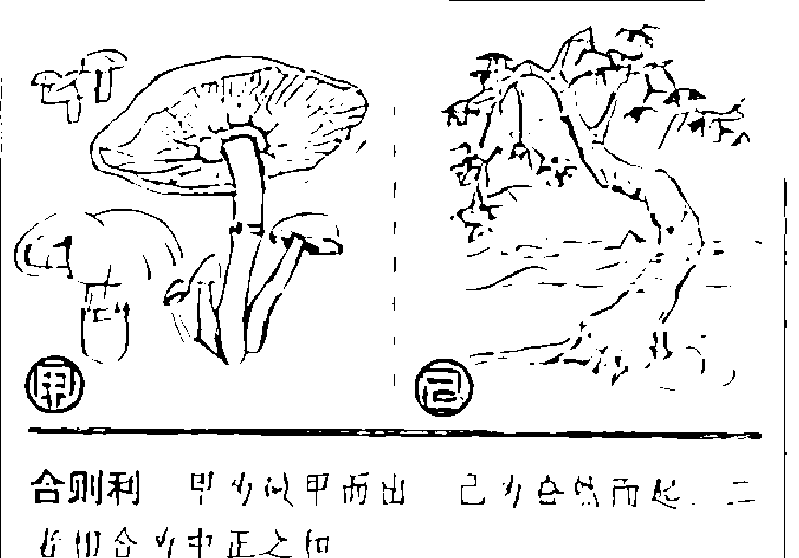

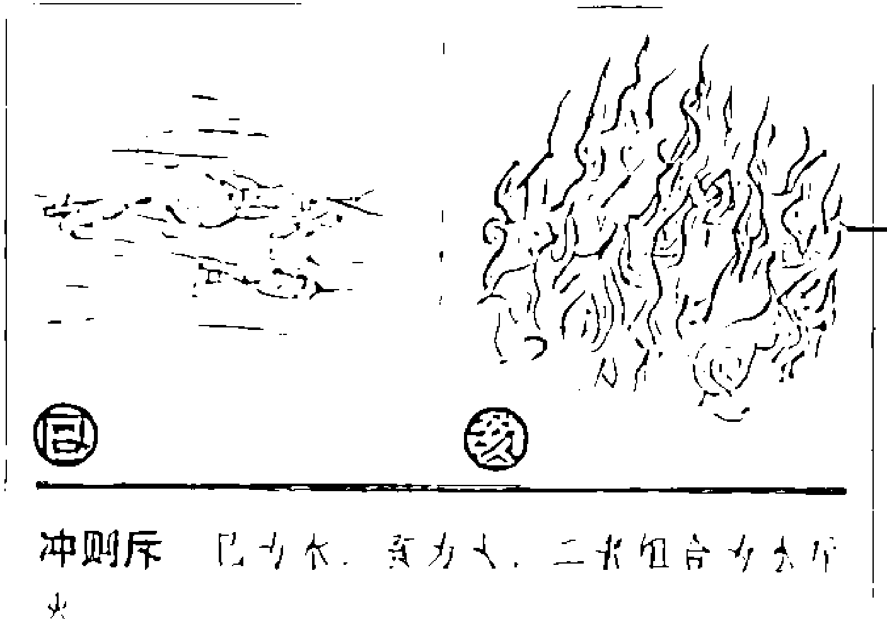

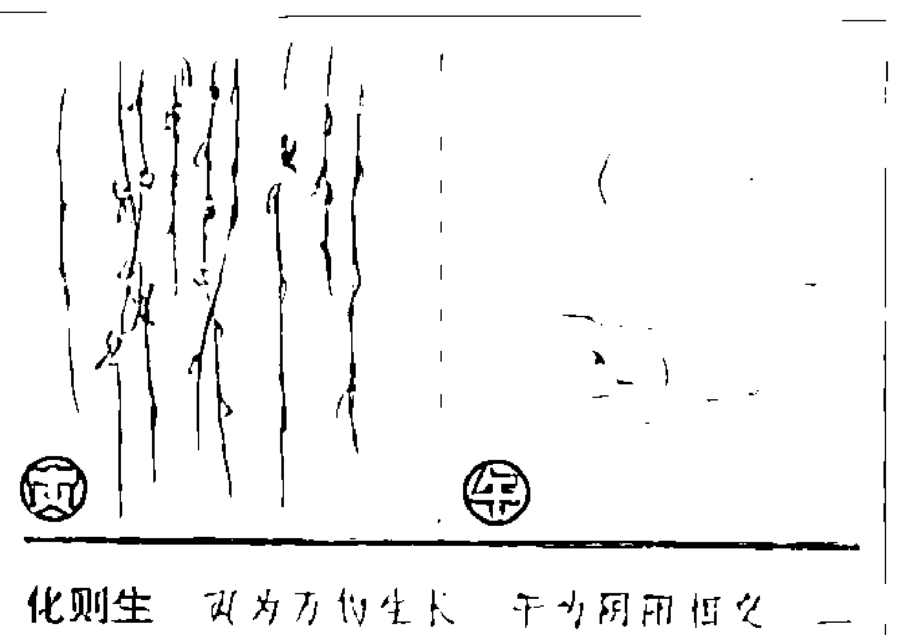

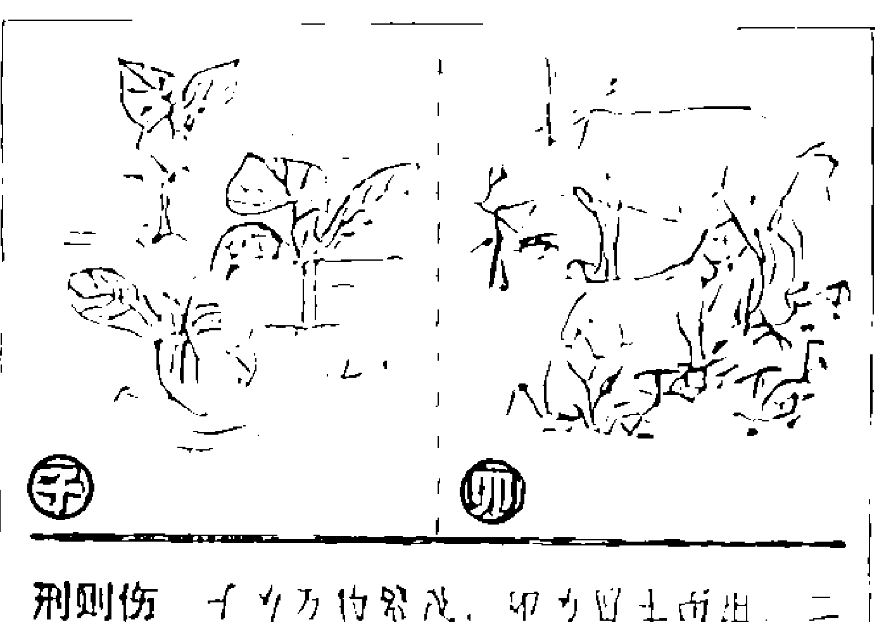

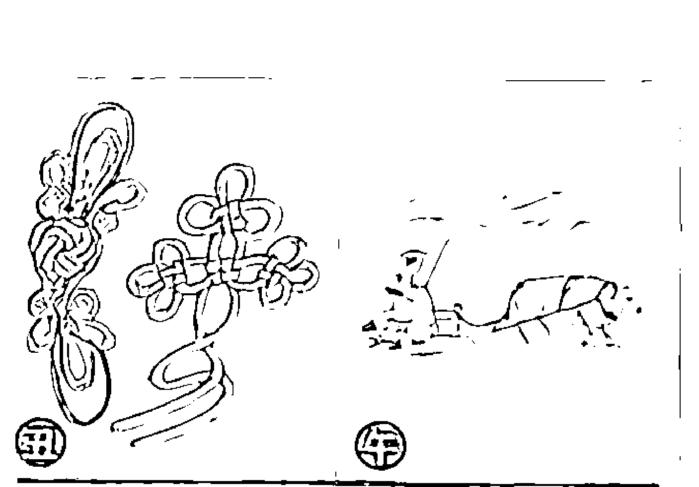

### 地支与时辰对照表
| 地支 | 时辰 | 地支 | 时辰 |
| :--- | :--- | :--- | :--- |
| 子 | 23-1时 | 午 | 11-13时 |
| 丑 | 1-3时 | 未 | 13-15时 |
| 寅 | 3-5时 | 申 | 15-17时 |
| 卯 | 5-7时 | 酉 | 17-19时 |
| 辰 | 7-9时 | 戌 | 19-21时 |
| 巳 | 9-11时 | 亥 | 21-23时 |

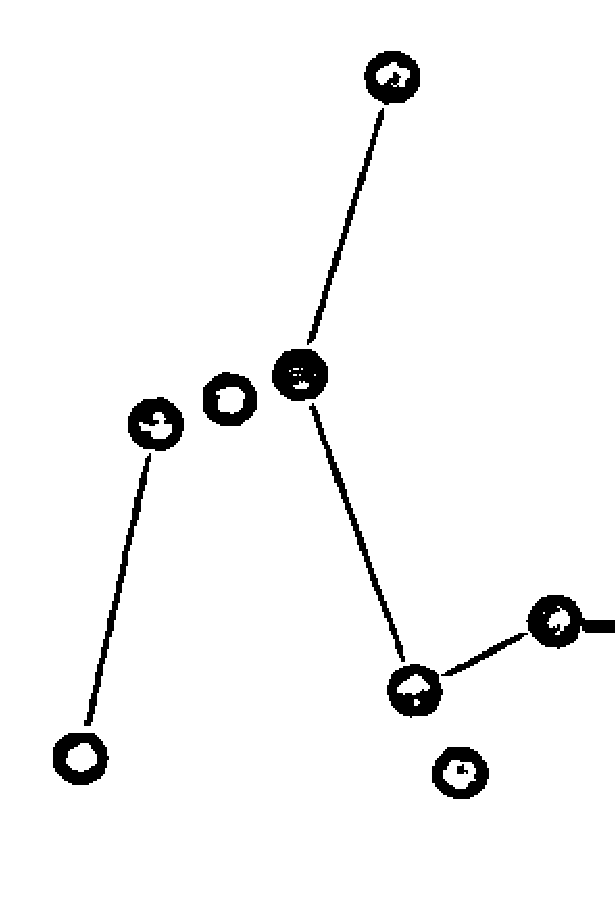

## 第玖章 紫微星系坐身命宫命理参断

紫微斗数对于命理的参断以星曜为基本依系，不同星曜坐身命宫有不同的命理参断。而在所有星曜中，又以十四主星最根本。本章就是对十四主星中紫微星系诸星坐身命宫的命理参断。

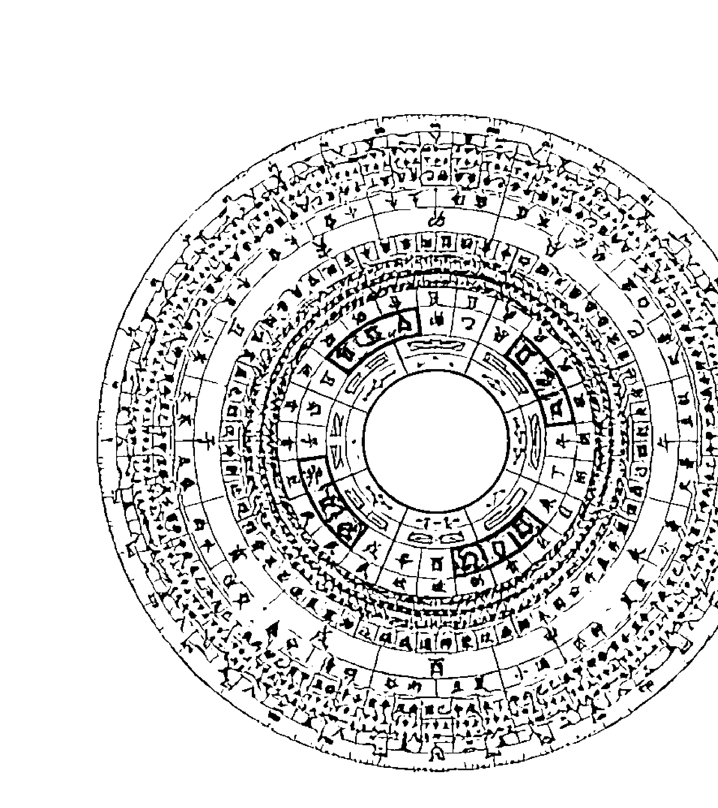

## 图版目录

- 十四主星的分类 / 587
- 紫微星坐命十二宫图解及亮度 / 589
- 紫微星坐命子、午宫 / 590
- 紫微星坐命丑、未宫 / 593
- 紫微星坐命寅、申宫 / 595
- 紫微星坐命卯、酉宫 / 598
- 紫微星坐命辰、戌宫 / 601
- 紫微星坐命巳、亥宫 / 605
- 天机星坐命子、午宫 / 609
- 天机星坐命丑、未宫 / 612
- 天机星坐命寅、申宫 / 615
- 天机星坐命卯、酉宫 / 617
- 天机星坐命辰、戌宫 / 620
- 天机星坐命巳、亥宫 / 623
- 太阳星在各宫的亮度 / 626
- 太阳星坐命子宫 / 628
- 太阳星坐命丑宫 / 630
- 太阳星坐命寅、卯宫 / 632
- 太阳星坐命辰宫 / 635
- 太阳星坐命巳宫 / 637
- 太阳星坐命午宫 / 639
- 太阳星坐命未宫 / 641
- 太阳星坐命申、酉宫 / 643
- 太阳星坐命戌宫 / 646
- 太阳星坐命亥宫 / 649
- 武曲星在各宫的亮度 / 651
- 武曲星坐命子、午宫 / 653
- 武曲星坐命丑、未宫 / 656
- 武曲星坐命寅、申宫 / 659
- 武曲星坐命卯、酉宫 / 662
- 武曲星坐命巳、亥宫 / 667
- 福星天同星 / 671
- 天同星坐命子宫 / 673
- 天同星坐命午宫 / 674
- 天同星坐命丑、未宫 / 676
- 天同星坐命寅、申宫 / 678
- 天同星坐命卯、酉宫 / 680
- 天同星坐命辰、戌宫 / 684
- 天同星坐命巳、亥宫 / 687
- 廉贞星在各宫的亮度 / 691
- 廉贞星坐命子、午宫 / 693
- 廉贞星坐命丑、未宫 / 696
- 廉贞星坐命寅、申宫 / 698
- 廉贞星坐命卯、酉宫 / 701
- 廉贞星坐命辰宫 / 703
- 廉贞星坐命巳宫 / 706

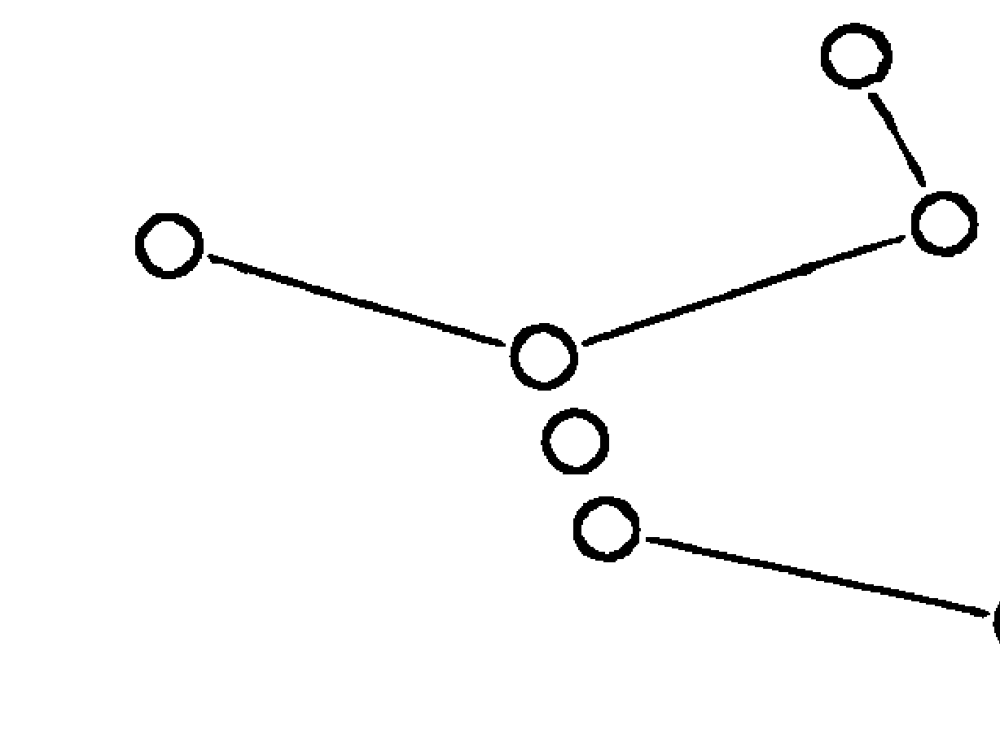

## 1 十四颗主星概说

紫微斗数论命，以主星为基础。在众多星曜中，影响命运最大的主星有十四颗。它们分属于“杀、破、狼”动态星系与“机、月、同、梁”静态星系，互相之间紧密联系，影响整个命盘的解读。

紫微斗数的星曜众多，其中，影响命运最大的为十四颗主星。十四颗主星可概分为“杀、破、狼”动态星系：紫微、天府、武曲、天相、廉贞、七杀、破军、贪狼等八颗星曜；以及“机、月、同、梁”静态星系：天机、太阴、天同、天梁、巨门、太阳等六颗星曜。各星系内的诸星曜常同宫、对宫或三合会照，互相产生密切的关联，而这两组星系中最主要的变化关键分别在破军星与天机星。

紫微斗数命盘有十二个宫，十四颗主星往往会双星并坐在同一宫内。此时，某些宫位就常常会有无主星的现象，必须借其对宫的主星来推断吉凶，但其星曜功能必须打七折。如：若命宫无主星，就必须借看对宫（迁移宫）的主星；若财帛宫无主星，则福德宫的主星就可用来借看“财帛”的现象。如此，命盘十二宫与其对宫皆为对看关系，则各宫也都具有主星的功能。

由于命宫可以落在命盘十二宫中的任何一个宫内，而十四颗主星也可能出现在十二个宫中的任一宫内，因此，命盘的主结构就共有一四四（十二乘十二）种不同的组合变化。再加上六吉星、六煞星、四化星、禄存星、天马星等十八颗甲级助星，以及乙、丙、丁、戊级星等百余颗次级星的排列组合，构成了千变万化的紫微斗数命盘。

由第三章安紫微及天府星系的说明得知，十四颗主星中，紫微、天机、太阳、武曲、天同、廉贞等六颗星，属紫微星系（随紫微星而安之）；天府、太阴、贪狼、巨门、天相、天梁、七杀、破军等八颗星，属天府星系（随天府星而安之）。两星系星曜都有一定的排列法则。我们稍加观察就会发现，动态星系与静态星系的星曜常彼此间隔相邻，而命盘十二宫原本也是一阴一阳的交互排列，如此一来，命与运的变化，便在一阴、一阳，一动、一静的轮替中进行。人生也永远在准备、酝酿、计划（静态星系的特征）与开始、创新、变化（动态星系的特征）中交替度过。善于掌握命运的人，可以配合机运，在静态星系的运限中，先行养精蓄锐，再在动态星系的运限中，选择适当的时机，先驰得地，一举突破而改变命运。不懂得命运的人，常虚耗精力，到处碰壁，事倍功半之后，以为自己永远没有作为，从此就自暴自弃，虚度此生。研究命理的重要性，也就不言而喻了。

## 十四主星的分类

在紫微斗数众多星曜中，十四颗主星在命盘格局与命理论断中发挥的作用最大。而根据星曜特性的不同，十四主星又可以归入不同类别，或动或静，或紫或府，了解主星所归属的类别，对于了解它们的特性并正确进行命理论断有重要的意义。

### 动静之分

| 星系 | 星曜 |
| :--- | :--- |
| 动态星系 | 紫微、天府、武曲、天相、廉贞、七杀、破军、贪狼 |
| 静态星系 | 天机、太阴、天同、天梁、巨门、太阳 |

### 紫府之分

| 星系 | 星曜 |
| :--- | :--- |
| 紫微星系 | 紫微、天机、太阳、武曲、天同、廉贞 |
| 天府星系 | 天府、太阴、贪狼、巨门、天相、天梁、七杀、破军 |

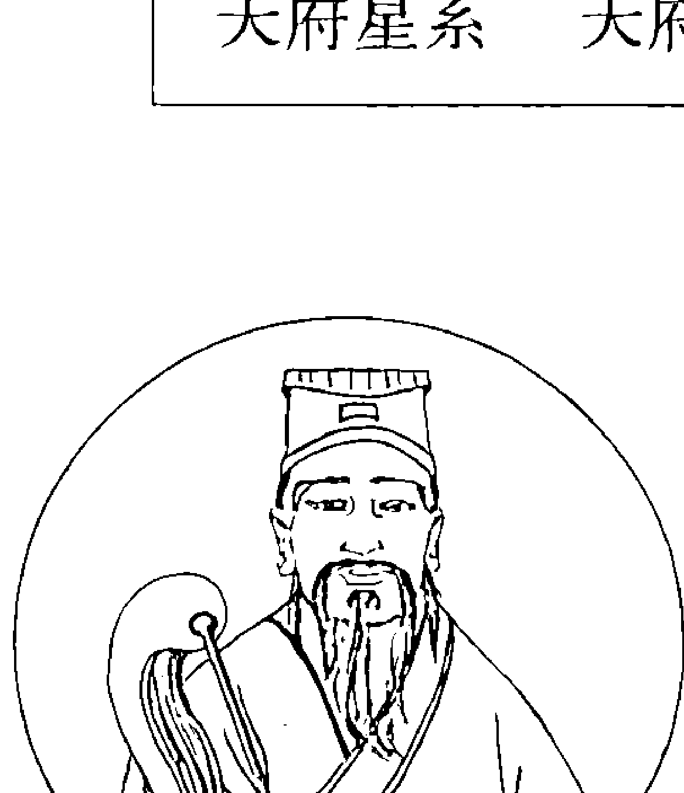

十四颗主星在命盘中往往会出现双星并坐在同一宫内的现象。此时，某些宫位就常常会有无主星的现象，必须借其对宫的主星来推断吉凶，但其星曜功能就没有那么明显了。与此同时，动态星系与静态星系的星曜在命盘中常彼此间隔相邻，加上宫位的阴阳交错，使得命盘宫位与星曜常在一阴、一阳，一动、一静中轮替进行。

## 紫微星系坐身命宫的命运

紫微星阴阳五行属阴土，为北斗帝星，化气为尊贵，主官禄，司爵禄，有解厄、延寿、制化的功能，并有包容涵盖的能力，至高无上，拥有无比的权威。

### 容态与性格

紫微星坐命身宫的人，面色紫黄，体态肥满，相貌厚实稳重，眼神清澈明亮。男命，肩宽背厚，挺拔威严；女命，厚重清秀，丰润圆浑，雍容华贵。

个性谦恭耿直，忠厚老成，外刚内柔，自重自爱，心地善良，有仁厚之心，多能替别人着想，具有尊贵气质，略带倨傲之气，爱恨分明。自负任性，好虚荣，爱面子，自信又好胜，能言善辩，心胸较狭小，占有欲强，多疑善变，缺乏主见，易感情用事而随心所欲，常自感委屈，容易自寻烦恼。聪明博学，管理才能卓越，具领导能力。做事认真，热心服务，讲求生活情趣，要求完美，喜欢新鲜的事物，求知欲强。

命身宫入紫微星的女性，除了有前述的特征外，还拥有细腻的皮肤与美丽的容貌，仪态端庄，深具教养，是典型的贤妻良母。大都能觅得社会地位高的配偶，在精神和物质上都能过着幸福而美满的生活。若会见吉星，旺夫益子。

### 命理推断

紫微星虽贵为帝座，有唯我独尊的气势，至高无上的权威，是众星的主宰，但坐命身宫并不表示一定会荣华富贵，尚需参看其同宫、相邻宫、对宫及三合会宫中的诸星曜吉凶而定。

紫微星不喜欢独坐。独坐的紫微星好比孤君，缺少贤臣辅佐，又因凡事无主见，常自缚在尊贵的茧里，易为奸臣小人所乘，容易独断专行，精神上不免于孤独，若不知变通，难免会有窒碍难行之处。

紫微星坐命身宫的人，喜欢别人接受自己的意见，爱发号施令，常爱给别人建议，易有唠叨之嫌。由于紫微星有维持自己尊贵的倾向，希望获得别人的尊重与肯定。因此，稳重坚定，自我要求很高，做任何事都很认真，有改进向上的能力，并要求完美，喜欢表现自己外在美好的一面，多可由后天的努力，在分内工作上表现突出，成为某方面的权威。在功成名就之后，必须继续充实自我，钻研特殊的知识或技术，以突破现状，并理智接纳朋友的意见，维持对任何事物都具有好奇心的本能，必有飞黄腾达的好运，否则，易有浪得虚名的倾向。

紫微星最喜欢同宫或加会六吉星辅佐，也爱天府、天相、太阳、太阴、禄存、天马等吉星同宫或加会支助，如此，才能发挥帝星真正的威力。

推断紫微星坐命身宫的吉凶，必须同时参看三台，紫微星所坐宫位为中台，前一宫位是上台，后一宫位是下台，三台诸星曜皆是庙旺的吉星，自然甚妙，若三台诸星曜皆为落陷的凶星，则不佳美。

### 1 紫微星坐守子、午宫：个性独立，卓然不群

命坐午宫，紫微星入庙坐命，若无擎羊、陀罗二煞星或化忌星相凑，为“极向离明格”，又因三合会照天府、武曲、天相等吉星，故也为“紫府朝垣格”，卓然不群，见解独特，理想高起，气度宽宏，能风云际会，清高福寿，衣食无缺，富贵双全；女命：旺夫益子，高贵端庄。若无左辅、右弼星同宫辅佐，孤君难免会精神感到孤独，且脾气较暴躁。

命坐子宫，由于六吉星辅佐力量有限，本身却又无力，最忌六煞星冲会，易沦为空有理想而无法付诸行动，满腹牢骚而怀才不遇的人物；女命：美玉瑕疵，日后不美。

### 紫微星坐命十二宫图解及亮度

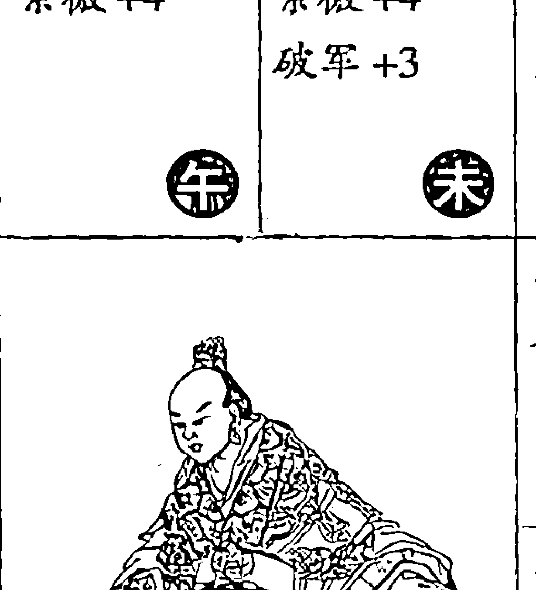

| 宫位 | 星曜与亮度 | 宫位 | 星曜与亮度 |
| :--- | :--- | :--- | :--- |
| 巳 | 紫微+3 七杀0 | 午 | 紫微+4 |
| 未 | 紫微+4 破军+3 | 申 | 紫微+3 天府+2 |
| 辰 | 紫微+2 天相+2 | 酉 | 紫微+3 贪狼+1 |
| 卯 | 紫微+3 贪狼+1 | 戌 | 紫微+2 天相+2 |
| 寅 | 紫微+3 天府+4 | 丑 | 紫微+4 破军+3 |
| 子 | 紫微0 | 亥 | 紫微+3 七杀0 |

**说明**

左表中的数字表示星曜的亮度，其对应关系如下：

+4 庙
+3 旺
+2 地
+1 利
0 平
-1 不得地
-2 陷

本书后文中对应表格同此。

## 星曜布局

紫微星在子、午二宫守命，皆为独坐，在子宫为平势，在午宫为入庙（注：诸星曜在各宫的明暗亮度分为庙、旺、地、利、平、不得地、陷等七级）。此时，对宫（迁移宫）有旺势贪狼星对照，财帛宫有天相（入庙）、武曲（地势）二星，官禄宫有天府（入庙）、廉贞（利势）二星，彼此三合会照。

## 基本命运

紫微星在子、午二宫独坐守命时，由于最多仅能得到左辅、右弼之一星同宫或会照，辅佐力量不足，有独立的个性，脾气较暴躁，精神易孤独，壮志难伸展。以在午宫入庙安命远比在子宫平势安命要吉利得多。由于对宫（迁移宫）始终有欲望之魔——第一大桃花星贪狼星对照，爱表现，喜刺激，喜欢都市生活，生活多变化，有风花雪月的桃花，应自我节制色欲，而往求知的方向去求发展。财帛宫有天相印星及武曲财星，财运亨通，善于理财及经营企业，多可白手起家，对钱财出手大方，遇困难多有贵人支助，钱财常有多种来源，在金融、实业界更能相得益彰。官禄宫有天府、廉贞星，对事业很专注，工作上很有耐性，在政治、外交、公家机构任职，多能表现才华，早年稍欠安定，中年后宜赴外地发展，可获得意外成功。

## 不同生年的命运

**甲年生人**：官禄宫廉贞星化禄，财帛宫武曲星化科。官运甚佳，工作顺...

### 紫微星坐命子、午宫

紫微星坐命子、午，皆为独坐，其亮度分别为平、入庙，而且最多仅能得到左辅、右弼星其中之一一星同宫或会照，辅佐力量不足。

#### 坐命子宫

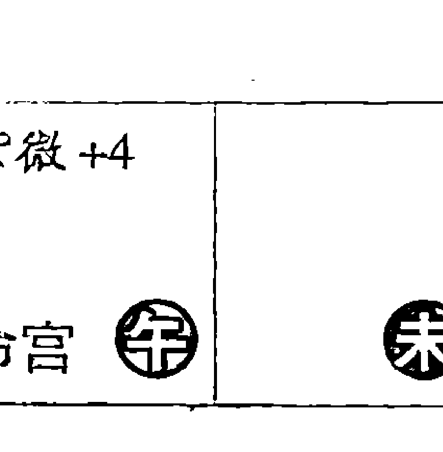

#### 坐命午宫

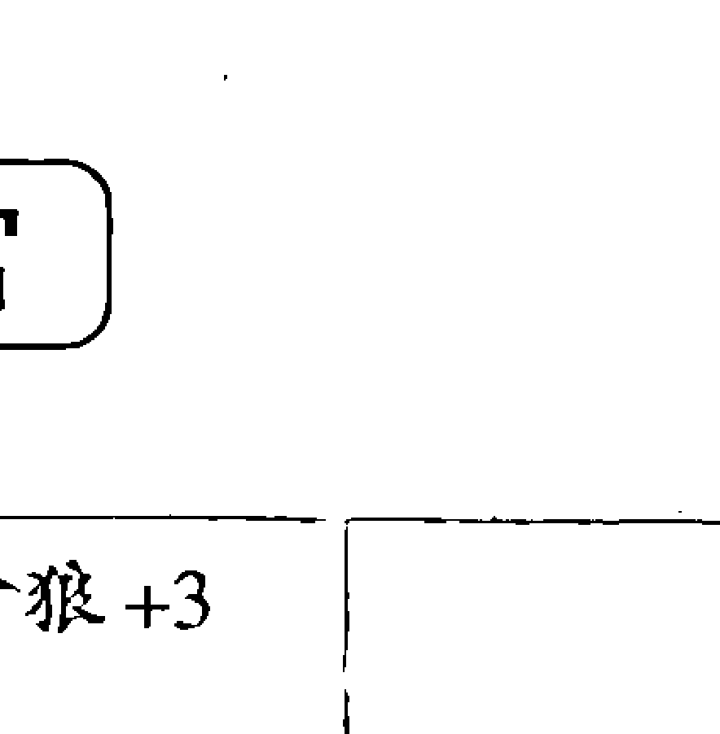

利，年少时难以发挥才干，中年后始能逐渐崭露头角，晚运安稳，慎防桃花；具有声望，得财安稳，财名两利，宜壮年后发，财名才能守得住。

命坐午宫，甲申、甲子、甲辰年生人，或命坐子宫，庚寅、庚午、庚戌年生人，禄存、天马（命马）、天相星在财帛宫三合会照命宫，若无火、铃星冲破，为“禄马配印格”，权大财大，愈奔动愈有财，多在环境变化发展中生财，转职、专业可获良机，一生多旅游机会。

**乙年生人**：命宫紫微星化科。一生中必有贵人相助，在学术研究上常有优异表现，尤以命坐午宫更为吉美。

命坐子宫，乙、己年生人，或命坐午宫，辛年生人，天魁、天钺双贵星分别在命宫、财帛宫三合会照，为“天乙拱命格”，文章盖世，贵人多助。

**丙年生人**：官禄宫廉贞星化忌。工作上常感怀才不遇，陷于逆境，多爱投机，但多不顺利，宜防行政官非，男命常靠女人吃饭。

命坐午宫，丙、戊年生人，擎羊星落陷同坐命宫，为“马头带箭格”，非天折则主刑伤，离乡背井，漂泊不定，危困重重。大、小限或流年逢之，对妻、子不利，易惹是非，若中年残病逢之，要特别留意身体健康。

**戊年生人**：迁移宫贪狼星化禄。聪明，出外受欢迎，应酬多，常与酒、色、财、气亲近，桃花难免，可多进财物。

**己年生人**：财帛宫武曲星化禄，迁移宫贪狼星化权。生财有道，财禄丰盛；有冲劲，喜掌权，异性缘佳，出外应酬多，桃花不少。

命坐午宫，己年寅时生人，禄存星与文曲星化忌同坐命宫，又逢擎羊、陀罗双煞星夹命宫，为“夹陀夹忌格”，孤贫，多口舌是非。

**庚年生人**：财帛宫武曲星化权。财运旺盛，赚钱忙碌，闹中取财。

**壬年生人**：命宫紫微星化权，财帛宫武曲星化忌。坚定自主，能力强，具卓越领导长才，有权威，爱掌权，但不免于孤独；钱财、感情皆不利，常为钱财烦恼，辛劳但事业尚有成，感情多波折、困扰。

**癸年生人**：迁移宫贪狼星化忌。多才多艺，出门喜寻桃花，易有风流事，宜防酒色惹祸上身。

## 2 紫微星坐守丑、未宫：仪表堂堂，我行我素

紫、破二星在丑、未宫安命的人，思虑多，辛劳不免，容貌仪表颇具魅力，可得异性助力。在社交场合常引人注目，独立性强，为人耿直，具领导力与决断力，表面上看起来很平静，内在的个性却可能波涛汹涌，凡事喜欢创新，喜欢生活多姿多彩，理想高而欲望又多，做事常超平常理，我行我素而自以为是，常处于各种矛盾之中，让人认为有些急躁。由于紫、破二星在丑宫时，迁移宫的天相星为入庙，故较为吉利。

## 星曜布局

紫微星在丑、未二宫入庙守命，必与旺势破军星同坐。此时，对宫（迁移宫）有天相星（丑宫为入庙，未宫为地势）对照，财帛宫有七杀（旺势）、武曲（利势）二星，官禄宫有落陷廉贞、贪狼二星，彼此三合会照。

## 基本命运

紫微星在丑、未二宫入庙守命，破军星旺势同坐，若三方四正加会吉星，为“紫府朝垣格”，清高福寿，衣食无缺，食禄万钟。紫微帝星遇上破军殿前将军，一个尊贵有领导能力，喜欢发号施令，一个听命行事，冲锋陷阵，勇猛无比，干劲十足，全力出击，可说是知人善用，但破军星暴躁、好胜、报复心强烈、大幅度变动的本性，使紫微星必须耗费较多精力与智慧，才能使之驯服。

紫微、破军二星在丑、未宫同守命，迁移宫有天相掌印官，出外有贵人扶助，人缘佳，风评好，乐于助人，受人欢迎，迁居或转业多事先有妥善的计划，大都能顺利完成。三合会照财帛宫七杀、武曲星，官禄宫贪狼、廉贞星。财运不错，不爱做单调或固定的工作，喜欢从事冒险性工作，钱财的得失变动性很大，常横发横破，能独当一面，多能自立而白手起家，中、晚年後可有所成就；事业起伏多变，事业欲强烈，对事业很专注，不喜爱受拘束，喜爱富变化、冒险性的行业，如从政、军警职、娱乐、美容业，工作勤奋又有效率，宜在大都市中发展，位高且收入丰盛。在感情上易有畸恋及波折，宜晚婚。若无左辅、右弼星辅佐，又无吉星加会，多为“凶恶胥吏之徒”。由于命宫有破军星，财帛宫有七杀星，官禄宫有贪狼星，为“杀、破、狼”格局，一生多大幅度变化，其性质较偏重于钱财、感情。

紫微、破军星同坐未宫守命，必有旺势太阴星坐守田宅宫，又有旺势太阳星朝照田宅宫，为“日月照壁格”，不动产多，可承继祖业，为富豪之命，唯须防桃花劫。

紫微、破军星同坐丑、未宫，不会照吉星，无左辅、右弼二星协助，也能有成，但比遇吉星时要差一些，且波动难免，为人过于耿直，往往易遭非议。若有华盖星同宫，而福德、夫妻宫不吉利，多信仰宗教，且可为领导人才，但缺少家庭温暖。

## 不同生年的命运

**甲年生人**：命宫破军星化权，官禄宫廉贞星化禄，财帛宫武曲星化科，为“三奇嘉会格”，名誉昭彰，富贵双全，财官双美，因必须在第五个大限，才可会齐禄、权、科三化星，故属“大器晚成型”，且因命宫遇破军星，虽可成就，唯世路多艰。领导力卓越，具决断力，环境多变动，多属于自己主动去改变，且常能往好的方面发展，事业顺利，唯感情上易有波折和困扰，桃花多，若身宫落官禄宫，多可得异性帮助；财名两利，具开创能力，得财安稳，有声誉，尤以服务金融界更佳。

甲、戊、庚年生人：天魁、天钺双贵星分别在命宫、迁移宫相对照，为“坐贵向贵格”，文章盖世，贵人多助。唯命坐丑宫，甲年生人，或命坐未宫，庚年生人，紫微星遇破军、武曲及陀罗星，欺公祸乱，只宜经商。

**乙年生人**：命宫紫微星化科。一生多贵人助，在学术研究方面常有优异表现。

**丙年生人**：官禄宫廉贞星化忌。工作上常感怀才不遇，陷于逆境，喜爱投机，但多不顺利，事业多波折，须防行政官非，男命常靠女人吃饭。

命坐未宫，丁、己年生人，或命...

### 紫微星坐命丑、未宫

紫微星坐命丑、未二宫，其亮度必为入庙，且必与旺势破军星同坐。此时，对宫有天相星对照，财帛宫有七杀、武曲二星，官禄宫有廉贞、贪狼二星三合会照。

#### 坐命丑宫

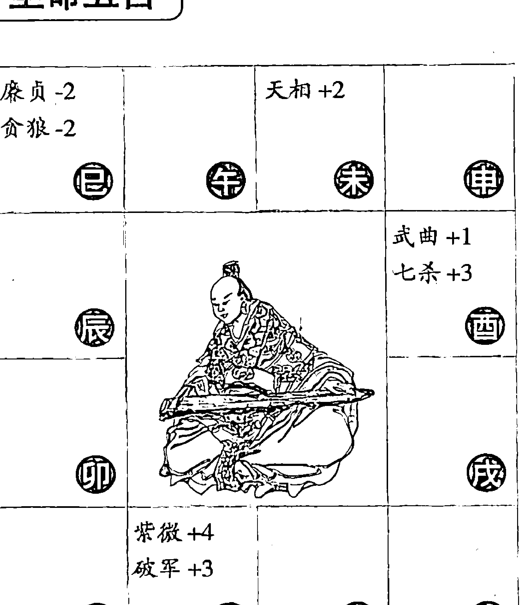

#### 坐命未宫

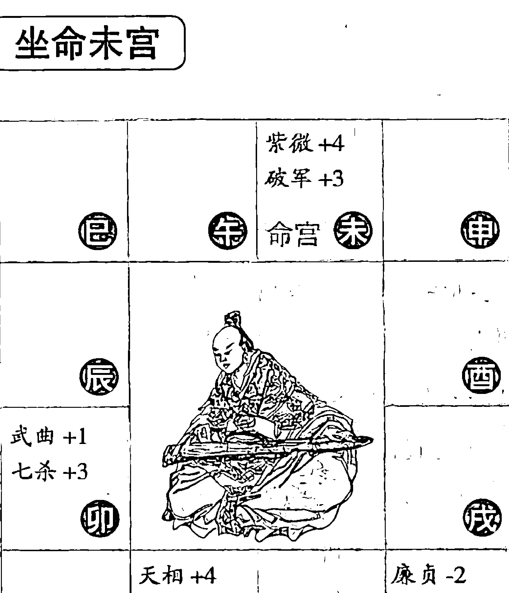坐丑宫，癸年生人，入庙擎羊星同坐命宫，为“擎羊入庙格”，可因擎羊星的威强与冲劲，权威出众，富贵声扬，逢凶星则刑伤难免，遇火星，权威更卓著。

戊年生人：官禄宫贪狼星化禄。事业上多得异性之助，有投机、娱乐性的偏财，劳碌奔波，事业多波折。

己年生人：财帛宫武曲星化禄，官禄宫贪狼星化权。武曲财星化禄入财帛宫，财禄入库位，一生不欠缺钱财，赚钱功夫一流，宜于财经界服务，可有一番作为；贪狼星化权入官禄宫，肯拼，有冲劲，有意外机运，异性缘佳，性好客，喜挥霍，爱近女色，宜往工商、娱乐界服务。

庚年生人：财帛宫武曲星化权。具有奋进的精神，事业心重，喜欢自行创业，财运旺盛，多在闹中取财，宜注意改善人际关系，以和气生财。武曲星也主孤，化权则变得更固执、孤僻，女命逢遇，孤独难免，会影响婚姻的缘份和生活的和谐。

壬年生人：命宫紫微星化权，财帛宫武曲星化忌，帝星化权，更坚定自主，有领导统御长才，权威十足，喜爱掌权，稍嫌孤立，若加会左辅、右弼星则大权在握；武曲财星在财帛宫化忌，主破财，一生为钱财烦心，守财不易，艰辛奋斗，常是财来财去总成空，宜防为财起是非。武曲星也主孤，化忌对感情不利，易有困扰、波折。

癸年生人：命宫破军星化禄，官禄宫贪狼星化忌。破军星司夫妻、子女、奴仆之宿，化禄入命，变迁机会多，在夫妻、子女、交友方面有所得，处世较积极，名利双得；贪狼桃花星化忌，多才多艺，对桃花不利，出外乡喜寻花问柳，易有风流事；谨防酒色惹祸，宜从事较冷门或现金交易的生意，或往娱乐界发展，较有利可图。

## 不同生时的命运

命坐丑宫，九、十一月生人，或命坐未宫，三、五月生人，左辅、右弼双辅佐星同夹命宫，为“辅弼拱主格”，或“左右守垣格”，多贵人相助，人际关系佳，男命宜往政界发展，终身富贵。

命坐丑宫，十月生人，或命坐未宫，四月生人，左辅、右弼双辅佐星，与紫微、破军二星同坐命宫，又有天相星在对宫朝照，为“君臣庆会格”，也是“左右同宫格”，富企划力，有治国经邦之才，得众人拥戴，一呼百诺，凡事逢凶化吉，福禄终身，男命宜往政界发展。

命坐丑宫，酉、申、戌时生人，或命坐未宫，卯、寅、辰时生人，文昌、文曲双星同坐或同夹命宫，为“文桂文华格”，或“昌曲夹命格”，男命贵显，可在学术、文艺界彰显荣耀，不贵即富。女命有姿色、才智，多情。

## 3 紫微星坐守寅、申宫：双帝入命，富贵双全

紫微星在寅、申二宫旺势守命，天府星必定同坐，为“紫府同宫格”，衣食无忧，财物不缺，福贵兼有；同时，也为“府相朝垣格”，人际关系佳，有贵人助，富贵双全。

命坐寅宫，九、十一月生人，或命坐申宫，三、五月生人，左辅星或右弼星坐命宫，尊居万乘；再逢文昌、文曲星，高第恩荣。

## 星曜布局

紫微星在寅、申二宫旺势守命，必有天府星（寅宫为入庙，申宫为地势）同坐。此时，对宫（迁移宫）有入庙七杀星对照，财帛宫有入庙武曲星，官禄宫有入庙天相星、平势廉贞星，彼此三合会照。

## 紫微星坐命寅、申宫

紫微星坐命寅、申二宫，天府星必定同坐（寅宫为入庙，申宫为地势）。此时，对宫有入庙七杀星对照；财帛宫有入庙武曲星，官禄宫有入庙天相星、平势廉贞星，彼此三合会照。

## 坐命寅宫

## 坐命申宫

坐命寅宫图表：
宫位分布：
- 午宫：天相+4，廉贞0
- 未宫：七杀+4
- 酉宫：武曲+4
- 寅宫（命宫）：紫微+3，天府+4

坐命申宫图表：
宫位分布：
- 巳宫：武曲+4
- 午宫：紫微+3，天府+2，命宫
- 申宫：（同宫位置）
- 寅宫：七杀+4
- 亥宫：廉贞0，天相+4

## 基本命运

紫微星为北斗帝座，天府星为南斗君王，二者皆为至尊的帝王星，双帝王星同座，其势过旺，能加以辅佐的星曜有限，反以孤论，因而使幼年时身体有灾伤，或与父母缘薄，或家庭有缺陷。为人宽厚温良，聪明有才智，有远大的志向，处事谨慎保守，具有领导能力，遇到竞争时，常在一番内心挣扎后，体悟到礼让和尊重，而秉持合作的关系，六亲缘薄，常感精神苦闷和空虚，有周期性孤独感，宜晚婚，早婚易生变化，以在寅宫（天府星入庙）坐命较在申宫（天府星为地势）坐命较佳。由于天府星是天上的财库，三合会照财帛宫又有入庙的武曲财星，一生财禄不断，丰衣足食。女命，有封赠。加吉，贵美，旺夫益子。

紫、府双帝主星入命，对宫（迁移宫）有入庙七杀星来朝照，三合又会照财帛宫入庙武曲星与官禄宫的入庙天相、平势廉贞星。由于武曲星为正财星，刚强，果断，孤独；天相星行事稳重，处事公正，任劳任怨，忠心耿耿；七杀星理智独立，有威权，变动性大；廉贞星多变化，具桃花性质。七杀星入迁移宫，活动力强，在家待不住，生活变化大，可突然成功；武曲星入财帛宫，钱财不匮乏，多出生于富豪之家，掌有权势，宜财政、金融、工商界；天相、廉贞星入官禄宫，对事业很专注，工作效率，适合公职或民营大企业等行政机构，以为人服务为宜，多能将事务处理得井井有条，有表现而掌权威。女命则宜家庭主妇，且需注意修身养性。

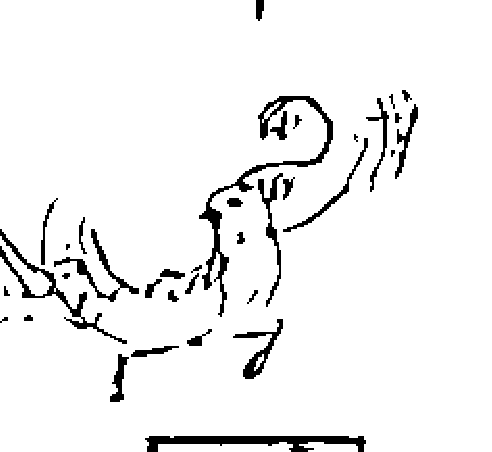

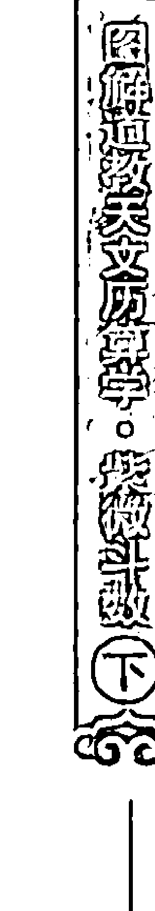

## 不同生年的命运

甲年生人：官禄宫廉贞星化禄，财帛宫武曲星化科。工作顺利，有权贵，桃花性质强烈，易有感情上的困扰，或流于风花雪月。若身宫在官禄宫，可得异性的助力；财名两利，得财安稳，稳定能守。

命坐寅宫，甲年生人，禄存星同坐命宫，又三合会照官禄宫廉贞星化禄，为“双禄朝垣格”，财官双美，有名望，受人敬重，福气高，有才华，再遇文昌、文曲星，有万贯家财。

甲申、甲子、甲辰、庚寅、庚午、庚戌年生人，禄存、天马星同坐命宫或迁移宫，若无火、铃星冲破，为“禄马交驰格”，愈奔动愈生财，富贵双全，但必先积祖德，才能安享福荫。若与火、铃星会合，为人奸诈。女命，遇吉星，旺夫益子。

乙年生人：命宫紫微星化科。处理事务能力强，才艺出众，事业上有好的表现，一生多贵人相助。

命坐申宫，乙、己年生人，或命坐寅宫，辛年生人，天钺、天魁双贵星分别在命宫、官禄宫三合会照，为“天乙拱命格”，文章盖世，贵人多助。

丙年生人：官禄宫廉贞星化忌。工作上常感怀才不遇，陷于逆境，喜投机，但多不顺，宜防行政官非，男命常靠女人吃饭。

己年生人：财帛宫武曲星化禄。正财星化禄入财帛宫，原本一生不欠缺钱财，赚钱有一套，但辰、戌为天罗地网宫，赚钱很辛劳，财运也会有损。

庚年生人：财帛宫武曲星化权。具奋进精神，能排除万难而成功，财运旺盛，愈形忙碌，闹中取财。男命事业心重，不喜受拘束，喜欢自行创业，宜注意改善人际关系，才能和气生财。女命孤独难免，会影响婚姻缘分及生活的和谐。

壬年生人：命宫紫微星化权，财帛宫武曲星化忌、帝星化权，有统御领导长才，更坚定自主，权威十足，事业有成。武曲财星化忌，对钱财不利，常为钱财而烦心，易因财而生是非，武曲星也主孤，化忌则不利感情，多有困扰、波折。

## 4 紫微星坐守卯、酉宫：为人爽直，风流倜傥

为人爽直，个性坚强，兴趣广泛，反应敏捷，懂得为人处世之道，时时要求自己，具有好的工作态度，并能推己及人，才能优越，喜好文艺并有表现，兼具音乐及语言方面的天赋，异性缘多，交际多，能在事业上崭露头角，担任重要职务。此外，男命，好酒食、喜风流；女命，擅理家，精女红。

## 星曜布局

紫微星在卯、酉二宫旺势守命，必有利势贪狼星同坐。此时，财帛宫有平势的武曲、破军二星，官禄宫有入庙七杀星、利势廉贞星三合会照，若无六煞星、化忌星同坐命宫，为“紫府朝垣格”，清高福寿，衣食无缺。

## 基本命运

紫微星在卯、酉二宫旺势守命，利势贪狼星必定同坐。由于贪狼为多才多艺的第一大桃花星，若无六煞星、化忌星同宫，紫微帝星管得住贪狼星，使它不犯桃花，并督促其检讨配合，发挥才艺方面的才能。

紫微、贪狼星同坐卯、酉宫，若无六煞星、化忌星同坐命，财帛宫有平势武曲、破军星，具独立策划能力，有独特的思维方式，常因突发奇想而生财，钱财多一手来、一手去，常散尽而无法累积；官禄宫有入庙七杀星、利势廉贞星，事业起伏变化大，对事业很专注，具工作效率，喜欢富竞争性、挑战性、变化性的工作。由于命宫有贪狼星，财帛宫有破军星，官禄宫有七杀星，为“杀、破、狼”格局，为人生变化的枢纽，其性质较偏重于酒、色、财、气性质的变动。

紫微、贪狼二星同坐命于卯、酉宫，若再逢六煞星及化忌星，为“极居卯酉格”，凡事百般蹉跎，宜有宗教信仰，方得安身。

紫微、贪狼星同坐卯、酉宫，再逢咸池、天姚、沐浴、红鸾、大耗等桃花星同宫或三合加会，若无吉星制化，或化忌、空亡星克制，则为‘桃花犯主’，风流好色，易滋生感情困扰。

由于贪狼星最怕擎羊星，故紫微、贪狼星同坐卯、酉宫，遇擎羊星，会使原先所配置的美好现象减少，反而适于往美容、烫发、缎带花编制等技艺方面发展。

紫微、贪狼星同坐卯、酉宫，虽然贪狼星喜与火、铃星同宫，但紫微星却控制住火、铃星，反使贪狼星不能发挥力量。同时，虽然化忌星可减轻贪狼星的桃花，但也影响了紫、贪同坐时的才艺及语言表现。

命坐卯宫，八、十二月生人，或命坐酉宫，二、六月生人，左辅、右弼双星分别在命宫、财帛宫三合会照，共同辅佐紫微帝星，若未遇六煞星、化忌星同坐命宫，为‘辅弼拱主格’，多贵人相助，才艺出众，事业成功，终身富贵。

## 紫微星坐命卯、酉宫

紫微星坐命卯、酉二宫，必为旺势，并有利势贪狼星同坐。此时，财帛宫有平势武曲、破军二星，官禄宫有入庙七杀星、利势廉贞星三合会照。

## 坐命卯宫

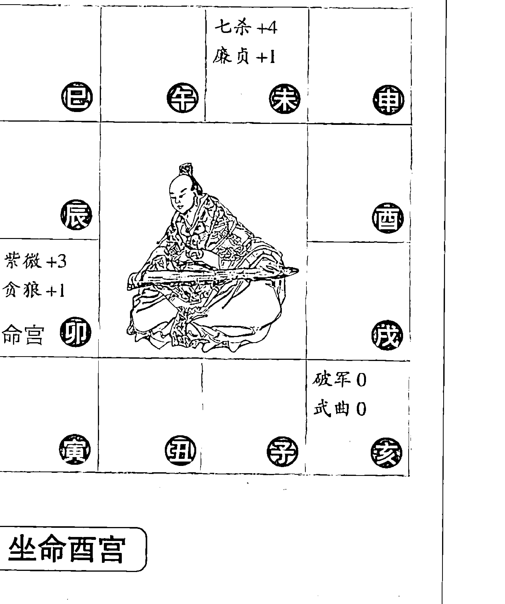

## 坐命酉宫

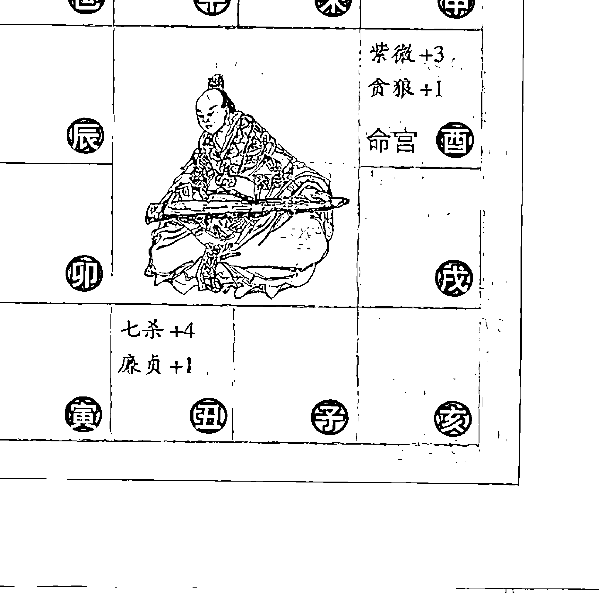

## 不同生年的命运

命坐酉宫，甲年生人：官禄宫廉贞星化禄，财帛宫破军星化权、武曲星化科，若未遇六煞星，为“三奇嘉会格”，名誉昭彰，富贵双全，财官双美，有祖荫或福气，有侥幸之惠，遇困难有贵人助，可致意外成功，唯三合会照破军星，虽可成就，但世路多艰，属“大器晚成”型；工作顺利，善于理财，有权贵及桃花，若身宫落官禄宫，多能获得异性的助力；钱财波动大，晚得之财较稳定，先去后来，或先破后得者，较能守得住钱财，赚钱很辛劳；具有声誉，得财较安稳，有突发性的表现，但钱财常会得而复失，守财不易，宜中年后发财，比较守得住。

命坐卯宫，甲年生人，或命坐酉宫，庚年生人，擎羊星同坐命宫，为“极居卯酉格”，凡事百般蹉跎，宜有宗教信仰，方得安身。

命坐卯宫，辰、申时生人；或生年支为寅、午、戌年，子、寅时生人；或生年支为申、子、辰年，丑、巳时生人；或生年支为巳、酉、丑年，子、巳时生人；或生年支为亥、卯、未年，巳、午时生人，地空、地劫、火星或铃星同坐命宫，为“极居卯酉格”。

命坐酉宫，寅、戌时生人；或生年支为寅、午、戌年，午、申时生人；或生年支为申、子、辰年，未、亥时生人；或生年支为巳、酉、丑年，午、亥时生人；或生年支为亥、卯、未年，子、亥时生人，地空、地劫、火星或铃星同坐命宫，为“极居卯酉格”。

癸年生人：命宫贪狼星化忌；命坐卯宫，巳年亥时生人，或命坐酉宫，巳年巳时生人，命宫文曲星化忌；命坐卯宫，辛年未时生人，或命坐酉宫，辛年丑时生人，命宫文昌星化忌，为“极居卯酉格”。

乙年生人：命宫紫微星化科。若无六煞星同宫，处理事务能力强，多才多艺，才艺出众，多贵人相助，具声望，事业能有表现，多可功成名就。

丙年生人：官禄宫廉贞星化忌。在工作上常感怀才不遇，陷于逆境，喜投机，但多不顺利，宜防行政官非。男命多靠女人吃饭。

命坐酉宫，丙亥、丙卯、丙未、戊亥、戊卯、戊未年生人，或命坐卯宫，壬巳、壬酉、壬丑年生人，禄存、天马（命马）星同坐财帛宫，若无六煞星同坐命宫，或火、铃星冲破，为“禄马交驰格”，愈奔动愈生财，多在环境变化发展中得财，转业、换职可获转机，一生多旅游机会。

戊年生人：命宫贪狼星化禄。若无六煞星同宫，聪明，多享高寿，多才多艺，应酬多，有食禄之福，人缘佳，文艺、音乐、语言方面有才华，且多有成就，宜服务于财经界，可位居要职。

己年生人：财帛宫武曲星化禄，命宫贪狼星化权。若无羊、陀、空、劫四煞星、化忌星同坐命宫或冲照命宫，赚钱得法，但较辛劳，并有波动，钱财尚不至缺少；能干，有作为，具辩才，好交际，风流且异性缘佳，固执又爱掌权。若得火、铃星同坐命宫，多事业有成，生活富裕。

庚年生人：财帛宫武曲星化权。女命逢之，孤独难免，会影响婚姻的缘分及生活的和谐；若无六煞星同坐命宫，财运旺盛，具奋进精神，赚钱忙碌，多为闹中取财。

壬年生人：命宫紫微星化权，财帛宫武曲星化忌。武曲星主财，也主孤，化忌则对钱财、感情不利，容易破财，常为钱财烦心，甚至引起是非，感情方面也多波折、困扰，若逢羊、陀、火、铃四煞星同坐财帛宫，各方面的不顺反而能减缓，破坏力也会减低；若命宫无六煞星同宫，具领导统御能力，坚定自主，权威十足，喜爱掌权，常给人有压迫感，自显孤独。

癸年生人：命宫贪狼星化忌，为“极居卯酉格”，凡事百般蹉跎，宜有宗教信仰，方得安身。贪狼星多欲望，化忌虽仍主多才多艺，却常爱凭空幻想，适合研究命、相、卜等五术，或从事冷门、偏门的学术研究或生意，多辛劳，桃花是非多，性欲强，应注意肾亏类的疾病。

## 5 紫微星坐守辰、戌宫：拒绝稳定，财源丰裕

虽然紫微星与天相星的星性极为稳定，但由于本身受困而又仅为地势，力量不足，再加上对宫破军星的引诱，使紫微、天相二星较不安于现状，勇于创新，行动积极，富进取心，能以合理的态度，面对自己的工作，事业运旺盛。若身宫又逢迁移宫，由破军星坐守，一生环境多变，流离颠沛在所难免，“富而不贵有虚名”，“君臣不义，为臣不忠”，“为子不孝”，女命情绪多变化。

## 星曜布局

紫微星在辰、戌二宫地势守命，必有地势天相星（掌印官）同坐。此时，迁移宫有旺势破军星朝照，财帛宫有天府星（子宫为入庙，午宫为旺势）、旺势武曲星，官禄宫有入庙廉贞星三合会照。

## 基本命运

紫微星在辰、戌二宫地势守命，地势天相星必定同坐。由于辰、戌二宫为天罗（辰宫）、地网（戌宫），使同为地势的帝星和掌印官受困而有志难伸，具有特殊的技能，一生中也会有幸运之神的眷顾。

紫微、天相星地势同坐辰、戌宫守命，迁移宫有旺势破军星，出外劳碌奔波，常因不得已的环境变迁，造成身心不得安宁，在转业方面尚能有所表现；财帛宫有天府、武曲二颗财星坐守，财源宽广而丰裕，可得意外之财，善于理财，一生富足，并不惧与煞星同坐，即使和地空、地劫星同坐财帛宫，也仅表示钱财有进有出，仍为富足之家，尤其以命坐辰宫，财帛宫在子宫天府星为入庙，更为吉美；官禄宫有入庙廉贞星，廉贞星为官禄主，使更能发挥卓越的领导统御能力，对事业很专注，工作效率又具耐性，多能不屈不挠独立完成，宜于从政或在外交、公家机构、行政单位、教育界服务，女命也宜于从事娱乐或美容等需手艺性的工作，可早获成功。

一、七月生人，左辅、右弼双星分别在命宫、迁移宫相朝照，为“左右守垣格”，又因天相、天府星也分别同宫或三合会照，也为“君臣庆会格”，可辅佐困于天罗地网中，受因而奋力挣扎的紫微星，使环境变化减少，受困现象获得疏解，而可达成己愿，女命情绪较稳定。富企划能力，人际关系良好，多得贵人相劝，凡事多可逢凶化吉，一呼百应，终身富贵。

子、午时生人，文昌、文曲双星分别在命宫、迁移宫相朝照，为“文星拱命格”，举止优雅，富知性，劝学好读，多有经国济世之才，在学术、文艺界，可显荣耀。女命逢之多情。

命坐辰宫，一、五、七、九月，午时生人；或命坐戌宫，一、三、七、十一月，子时生人，文昌星同坐命宫，左辅星又在三方四正拱照，为“辅拱文星格”，有敏捷的才华，可出将入相，享受尊崇。

## 不同生年的命运

甲年生人：官禄宫廉贞星化禄，迁移宫破军星化权，财帛宫武曲星化科，为“三奇嘉会格”，名誉昭彰，富贵双全，财官双美，唯命有三奇，少年多艰，为“大器晚成”型。命坐辰宫，丑、卯、巳、酉、亥时生人，或命坐戌宫，丑、卯、未、酉、亥时生人，遇地空、地劫星相会照，虽可成就，世路多艰。工作顺利，具文艺才华，擅长交际，常经营与艺术有关联的事业；劳碌奔波，具领导能力，事业有表现；财名两利，安稳能守，办事效率高，有声望，得财安稳。

## 紫微星坐命辰、戌宫

紫微星坐命辰、戌二宫，必为地势，并有地势天相星同坐。此时，迁移宫有旺势破军星朝照；财帛宫有天府星（子宫为入庙，午宫为旺势）、旺势武曲星，官禄宫有入庙廉贞星三合会照。

## 坐命辰宫

## 坐命戌宫

| 巳 | 午 | 未 | 申 |
| :---: | :---: | :---: | :---: |
| | | | 廉贞+4 |
| **辰** (命宫) 紫微+2 天相+2 | | **酉** |
| | 卯 | | 破军+3 |
| | **寅** | 丑 | **子** (财帛宫) 武曲+3 天府+4 | **亥** |

| 巳 | 午 (财帛宫) 武曲+3 天府+3 | 未 | 申 |
| :---: | :---: | :---: | :---: |
| | | | |
| 破军+3 | | **酉** |
| **辰** | | | **戌** (命宫) 紫微+2 天相+2 |
| 卯 | | | **亥** |
| **寅** | 丑 | **子** | |

## 乙年生人：

命宫紫微星化科。处理事务能力强，才艺出众，有特殊技能，对某一专门技术或学术有特别的研究，或有独特的见解，具有声誉，多有贵人相助。

命坐辰宫，乙年生人，或命坐戌宫，辛年生人，入庙擎羊星同坐命宫，为“擎羊入庙格”，辰、戌、丑、未四墓宫，可制擎羊星的凶焰，并保留其威强及冲劲，权威出众，富贵声扬，遇凶星则刑伤难免。命坐辰宫，生年支为寅、午、戌年，卯时生人，或生年支为申、子、辰年，寅时生人，或生年支为巳、酉、丑年，丑时生人，或生年支为亥、卯、未年，未时生人；命坐戌宫，生年支为寅、午、戌年，酉时生人，或生年支为申、子、辰年，申时生人，或生年支为巳、酉、丑年，未时生人，或生年支为亥、卯、未年，丑时生人，加遇火星同坐命宫，权威卓著。

命坐辰宫，乙、己、壬、癸年生人，或命坐戌宫，辛、丙、丁年生人，天魁、天钺双贵星分别在财帛、官禄宫三合会照命宫，或在相邻宫同夹命宫，为“天乙拱命格”，文章盖世，贵人多助。

## 丙年生人：

官禄宫廉贞星化忌。在工作上常感怀才不遇，陷于逆境中，喜爱投机，但多不顺利，多行政官非，思虑多，心胸不能开阔，遇事多计较，心情和情绪易受干扰而多变化。男命常靠女人吃饭。

命坐辰宫，丙、戊年生人，或命坐戌宫，壬年生人，陀罗星同坐命宫，诸事较不顺遂，宜防暗箭中伤，只宜为人服务、经商或以巧艺谋生。

## 己年生人：

财帛宫武曲星化禄。武曲财星在财帛宫化禄，又与天府库藏之星同坐，财源不绝，且得库储，一生不欠缺钱财，赚钱有一套，但若福德宫不吉，会影响原本的吉美现象。

## 庚年生人：

财帛宫武曲星化权。财运旺盛，具有奋进精神，愈加忙碌，多为闹中取财。

## 壬年生人：

命宫紫微星化权，财帛宫武曲星化忌。有领袖欲，但缺乏实际领导能力；易为钱财而烦心，须防因钱财而生是非，感情方面较不顺利。

## 癸年生人：

迁移宫破军星化禄。处世较积极，出外开销大，偏又喜欢出去消费，在金融机构任职多能发挥效率。

## ⑥ 紫微星坐守巳、亥宫：运筹帷幄，独断专行

紫微、七杀二星同在巳、亥宫安命的人，独立自主，雄心万丈，有承担一切的勇气，坚毅果决，好强健谈，做事积极有魄力，能吃苦耐劳，肯努力向上，有运筹帷幄、统率千军的才能，能白手起家而自创事业，男命较易有表现，女命宜职业妇女，多能独当一面，有所表现，但个性稍嫌刚愎自用，且易有先勤后惰，虎头蛇尾的倾向。

## 星曜布局

紫微星在巳、亥二宫旺势守命，必有平势七杀星同坐。此时，对宫（迁移宫）有地势天府星朝照；财帛宫有入庙的武曲与贪狼星，官禄宫有平势廉贞星、落陷破军星三合会照。

## 基本命运

紫微星在巳、亥二宫旺势守命，平势七杀星必定同坐。紫微帝座逢运筹帷幄的七杀主帅，声势浩大，排山倒海，气势万千，但理智而独立的七杀星，个性坚强果决，有“将在外，君命有所不从”、独断专行的个性，能使七杀星的权威完全发挥出来。

紫微、七杀星同坐巳、亥宫守命，迁移宫必有天府星对照，为“紫府朝垣格”，此亦符合“紫府同宫格”，衣食无忧，财物不缺，出外受扶持，终身福厚，但精神上易有周期性的孤独感，宜迟婚。女命，若得左、右扶持，再加上化吉，必定富贵。由于三合会照破军、贪狼星，为“杀、破、狼”格局，为人生变化的枢纽，一生起伏多变化，且显得落寞寡欢，感情上不免孤独。

紫微、七杀星在巳、亥宫同坐命，迁移宫有地势天府星，出外喜助人，也爱结交比自己强的人，有贵人提拔，环境移动或转业会逐步高升；财帛宫有入庙武曲、贪狼星，为获得钱财可不计一切手段，常因横财而致富，所赚多为异性与娱乐之财，但“武贪格”有晚发的趋势，三十岁以前常为财而受苦受累，宜持较保守的态度，三十岁之后，可放手去做，常可突发横财而致富，若逢贪狼星化忌，空想赚钱而耗损精力，可减低酒、色、财、气的桃花，在才华上得以发挥；官禄宫有平势廉贞星和落陷破军星，工作有效率，事业多起伏、变化，宜以巧艺谋生，或进入公家机构，由基层公务员做起，不宜从事一般商业、劳心工作、学术研究，难望能安定。

命坐巳宫，二、六、十月生人，或命坐亥宫，四、八、十二月生人，左辅、右弼双星在命宫、财帛、官禄宫三方会齐，为“辅弼拱主格”，贵人多助，一呼百诺，终身富贵。

命坐巳宫，午、巳、未时生人，或命坐亥宫，子、丑、亥时生人，地空、地劫双煞星同坐或同夹命宫，为“命里逢空格”，或“空劫夹命格”，常有“半天折翅”的打击，一生中有如“浪里行船”般，充满惊险而又不安稳。尤以命坐巳宫，辛年巳时生人，或命坐亥宫，辛年亥时生人，命宫文昌星化忌，又逢空、劫双煞星夹命宫，为“空劫夹忌格”，更是不吉利。

## 不同生年的命运

甲年生人：官禄宫廉贞星化禄、破军星化权，财帛宫武曲星化科，若无地空、地劫星同坐命或同夹命宫，为“三奇嘉会格”，名誉昭彰，富贵双全，财官双美，唯三合会照官禄宫破军星，世路多艰，属“大器晚成”之格。

乙年生人：命宫紫微星化科。有雄心，具有独立开创的能力，处事能力强，才艺出众，多得贵人相助，具有声望。

丙年生人：官禄宫廉贞星化忌。人生、感情多波折，常自感怀才不遇，陷入逆境之中，喜爱投机，但多不顺利，事业上易犯行政官非。

丙亥、丙卯、丙未、戊亥、戊卯、戊未、壬巳、壬酉、壬丑年生人，禄存、天马（命马）星同坐命宫或迁移宫，若无火、铃星冲破，为“禄马交驰格”，愈奔动愈生财，多在环境变化发展中得财，转业、换职可获良机，一生多旅游机会。女命，若命宫有天马星同坐，喜爱专权。

戊年生人：财帛宫贪狼星化禄。财运丰裕，有投机性的偏财运，遇火、铃星同坐可发横财，能如愿赚钱，应酬多，可从事文艺方面的生意。

命坐巳宫，戊年生人，禄存星同坐命，又三合会照财帛宫的贪狼星化禄，为“双禄朝垣格”，财官双美，受人敬重，有名望、福气和才华。

己年生人：财帛宫武曲星化禄、贪狼星化权。一生不缺钱财，赚钱有一套；多才多艺，具冲劲，能创业，可掌财，好客，可横发旺得，唯发后宜能守，否则花天酒地后，到头来仍是一场空。

庚年生人：财帛宫武曲星化权。具有奋进精神，财源广进，愈加忙碌，多为闹中取财。女命逢之孤独难免，会影响婚姻缘分和生活的和谐。

壬年生人：命宫紫微星化权，财帛宫武曲星化忌。坚定自主，具领导统御能力，权威十足，有主见，在事业上有突出表现；对钱财、感情不利，常为钱财而心烦，易因钱财而幻想，空耗精力而多惹是非，在才艺方面得以发挥，酒、色、财、气桃花波动减少。

癸年生人：官禄宫破军星化禄，财帛宫贪狼星化忌。处世较积极，具开创性，有意外横财，在金融界任职，能发挥工作效率，常花钱买桃花，不易守财，多才多艺，多以才艺谋生，易为桃色纠纷而破财。

## 紫微星坐命巳、亥宫

紫微星坐命巳、亥二宫，必为旺势，必有平势七杀星同坐。此时，对宫有地势天府星朝照；财帛宫有入庙的武曲与贪狼星，官禄宫有平势廉贞星、落陷破军星三合会照。

### 坐命巳宫

| 巳 (命宫) | 午 | 未 | 申 |
|-----------|----|----|----|
| 紫微+3 七杀 0 |  |  |  |
| 辰 |  |  | 酉 (廉贞0 破军-2) |
| 卯 |  |  | 戌 |
| 寅 | 丑 (贪狼+4 武曲+4) | 子 | 亥 (天府+2) |

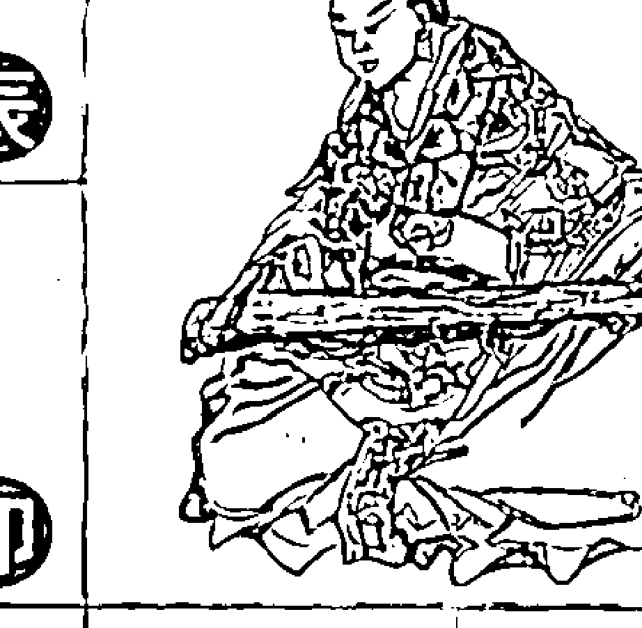

### 坐命亥宫

| 巳 | 午 | 未 (贪狼+4, 武曲+4) | 申 |
|----|----|----------------------|----|
| 天府+2 |  |  |  |
| 辰 |  |  | 酉 (廉贞0 破军-2) |
| 卯 |  |  | 戌 |
| 寅 | 丑 | 子 | 亥 (紫微+3 七杀 0, 命宫) |

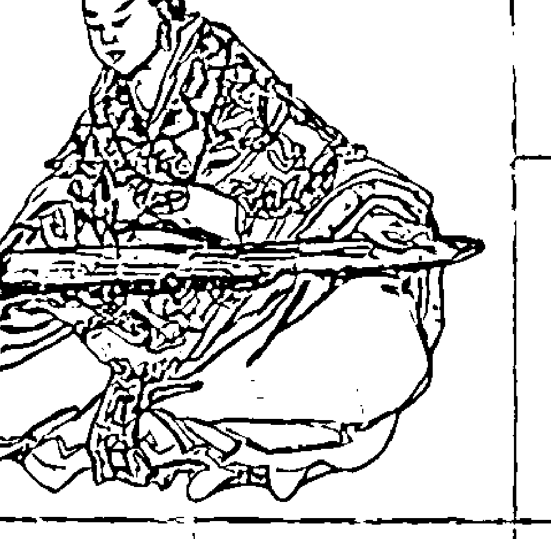

## 天机星坐命身宫

天机星阴阳五行属阴木，为南斗第三星，化气为“善”、为“兄弟”宫主，主“智慧”。

### 容貌与特性

天机星坐命身宫的人，多半身材高矮适中，入庙肥胖，落陷则躯瘦，眼神机灵，仪态端正而精悍，面容亲切和善，彬彬有礼，穿着得体，言辞优雅，举止潇洒。

聪明秀丽，性急心慈，温和忠厚，乐善好施，孝义六亲，勤于礼佛，无不仁不义之行，获人信赖。好学好动，多才多艺，多学而不精，权谋机变，反应敏捷，冷静有魄力，足智多谋，处事有条理，善于适应环境，临危不乱。心思缜密，具洞察力，富研究心，擅长分析、企划、交涉，点子多，能不断提出独创的构想。急公好义，乐于服务贡献，具有团队精神，对易学、宗教、命理有兴趣。神经过敏或多愁善感，多幻想，具弹性，酒量好，固执己见，不服输，有异性缘，感情上稍嫌绝情，易钻牛角尖，心性、工作、事业、居住环境变迁性大。

女命，面容清丽，服饰洁净，善解人意，落落大方。若天机星为庙旺，则性刚机巧，有权柄，旺夫益子。若再得化权、化禄（或禄存）星，则为贵妇。天机星落陷，逢四煞、化忌星冲破，主孤独、残疾，不吉。

### 命理推断

天机星伴随着紫微星而运转，由于它的引导带动，诸星曜才能循轨道而行，为“机、月、同、梁”静态星系中主宰变化的枢纽，故具有“动”的特性。

天机星的动并非如七杀、破军、贪狼星般为人生历程大幅度的波动，而是动脑、动身体。在一定范围内作小幅度的变化，头脑不时在脑力激荡，身手也闲不下来，因而反应敏捷，足智多谋，是一颗智多星。但也因此而容易罹患神经衰弱、失眠、四肢病变，或变得有一些神经质。

天机星随缘，是一颗不断变化的星曜，通常在固定的范围内来回或反复地变化，变来变去，还是回到原点，但却具有还原的功能。由于天机星聪明、反应快，适应能力又强，在变化中，常能收放自如，弹性运用，随着环境机动调整策略，在冷静中有不失活泼的表现，因而能启发自己在观念上和行动上不断转换。使旧有的烦恼和痛苦抛开，为僵化而呆滞的运气带来转变的生机。

这种与生俱来适应变化，并进而主动掌握并策动变化的本能，可促进更好的学习能力，有许多的学习机会，使天机星很容易学会新的事务，学会了以后，很快地又想学习其他新的事务，促使天机星本身不断进步，阅历和智慧都增加，晚年常成为一言九鼎，为他人沟通协调的人。

天机星是一颗“善”星、智多星，喜欢出主意，替人分忧解难，排除困难，宜为人服务，专门技术，设计策划及大众传播等工作。天机星坐命身宫的人，从军可成为战略家，从文可成为文学、艺术家，从政可成为技术官僚、专业民意代表，从商可成为金融投资人才，从科技可成为电脑或电机工程师。

天机星多学多动，使人觉得既能干又多才多艺，但其才艺的性质与贪狼、文昌和文曲星不同。天机星的才艺较偏重于运动、企划与分析、创新及发明、交涉和联络、大众传播等方面；贪狼星的才艺则偏重于交际应酬、棋琴书画、歌艺射猎、设计等方面；文昌星的才艺系偏重于文学、学术研究、考试、写作、技术等方面；文曲星的才艺是偏重于艺术、口才、外语、特殊才艺、音乐、绘画、舞蹈、戏剧、娱乐等方面。

天机星具有动的特性，难安于固定不变的环境，喜欢自己制造新鲜，产生变化，有运动的潜能，容易时常变换工作或环境，或多有兼职的机会，总是身心两忙，劳碌奔波，稳定性不够，最忌经商和创业，宜于从事运动、交通运输、观光旅游等行业。

天机星多变喜创新，具有投机的性质，故天机星坐命身宫的人，多对股票、期货、土地买卖有兴趣或有机会接近。

天机星坐命的人，夫妻宫必有太阳星坐守，若适逢太阳星落陷或化忌（甲年生人），或天机星本身落陷、化忌或与凶、煞星相缠，对婚姻生活不利，宜格外小心，以免中途生变。

> > 天机星是一颗智多星，足智多谋，喜欢替人分忧解难，从军可为战略家，从文可为文学、艺术家，从政可成为技术官僚，从商可为投资人才。这一点从天机星的代表人物姜子牙身上就能看出来，图中所绘即是姜子牙妙计劫营破闻仲的场景。

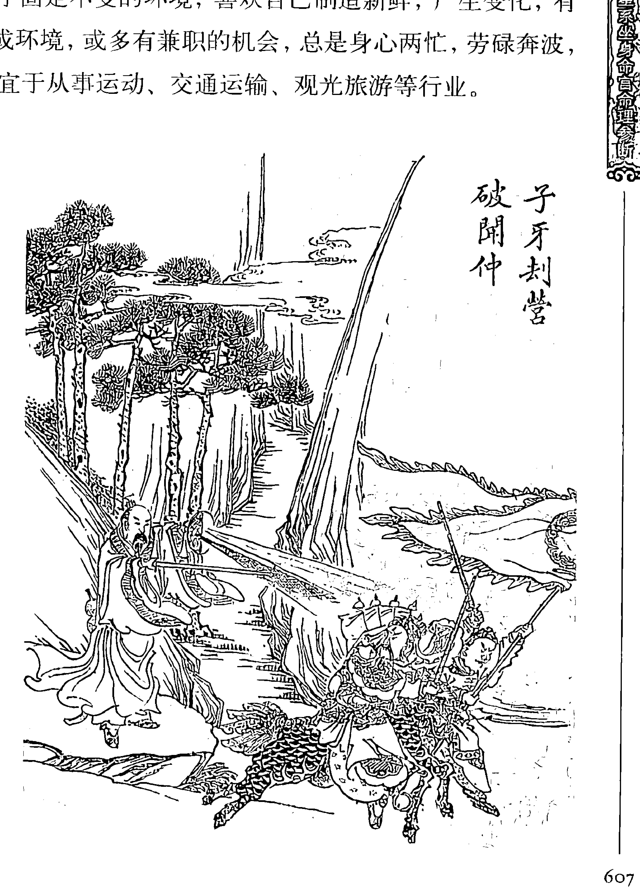

天机星在命盘所坐宫位的相邻两个宫位，一邻永远有紫微星入守，另一邻的星曜则不固定，其吉凶善恶，在大、小限、流年行运时，足以影响天机星变化的方向。大、小运或流年顺行者，必须先看此宫星曜的吉凶善恶，若属吉利，则天机星宜“顺手推舟”，迎接下一运限，往好的方面去发展；此宫若不吉利，且奋斗仍无效，天机星应冷静下来，收拾残局，认真分析和检讨过去，以扛起策励将来的重责大任。

大、小运逆行者，若此宫不吉利，在天机星行运时，可得战战兢兢，别未经分析就胡乱去变化，以免变来变去，接上了坏运；若此宫吉利，在天机星行运时，倒是一个乘机补运的大好时机。

补运的方式有运动、进修、独处思考等，以冲淡天机星本身的浮动，厚植天机星的潜能，使自己能冷静面对人生中永不停止的变动，并充分体认静与动、变与不变的人生哲理。

天机星庙旺则化吉，富贵；陷地则平常，以奸诈论。天机星与天梁、左辅、右弼、文昌、文曲等吉星三合会照，文为清显，武为忠良，好礼乐，通情达理，尽忠职守。天机星逢七杀、天梁星，为清闲之人。天机星与天梁星三合会照，善于谈兵，为极佳的军师人才。天机星与天才星同宫，智商很高，聪明过人。女命天机星遇吉星在三方四正拱照，旺夫益子，有化权、化禄星则为贵妇。

天机星对煞星的抵抗力较弱。天机星甚怕落陷，不喜欢与六煞星同宫，也甚惧化忌星，若天机星落陷或遇煞、忌星，而无吉星扶助，易有波折，内心紊乱痛苦，以从事公职或外务工作为佳，慎防疾厄及刑克，以守成为上。

天机星化忌，伤脑筋，头脑打结，凡事皆阴错阳差，愈是顾虑就愈出差错，易见异思迁，婚前桃花不断，婚后更喜欢拈花惹草，多以技艺维生，颇多理工方面专才，或喜欢研究中医或命理。

## 1. 天机星坐守子、午宫：权谋机变，反应敏捷

天机在子、午二宫守命，为入庙独坐最能发挥天机星的本性，多能保持新鲜感，并保持机动性，工作中常有学习的机会和意愿，也能有所创造。对宫（迁移宫）又得到旺势巨门星的协助，权谋机变，反应敏捷，处事条理分明，善于分析、企划、交涉，点子多却常支使别人去执行，口才及应对能力俱佳，讲话有深度，具说服力，为最佳幕僚人才，在外易生口舌是非，心神不宁。若巨门星再遇化禄、化权、化科，利于文化、教育、大众传播界发展。女命，不安于家务，宜职业妇女，性刚机巧，有权柄，旺夫益子，有福有寿。

## 星曜布局

天机星入庙独坐子、午宫，财帛宫有天同星（寅宫为利势，申宫为旺势）、天梁星（寅宫为入庙，申宫为落陷），官禄宫有太阴星（辰宫为落陷，戌宫为旺势）三合会照，为“机月同梁格”，擅长企划，处事及辅佐能力强，为绝佳的军师人才，在公家机关能出人头地，宜公教、传播、文化事业，或从事艺术性、费脑筋、技术性的工作，或中间商、代理商、门市生意，可白手起家，自己创业。能理财，喜做稳健投资，衣食无虑，对钱财看得很淡，顺其自然，凭借着对工作的热忱立下基业，中年以后事业蒸蒸日上，宜远赴外地、海外投资，可招得钱财；事业平稳，少异动，适任于需思考、企划的工作，不宜从事经营、管理的工作，多在公、民营企业任职，或从事大众服务业。

## 基本命运

天机星在午宫入庙坐命（官禄宫太阴星为旺势，财帛宫天梁星为入庙）比在子宫（官禄宫太阴星、财帛宫天梁星皆为落陷）吉利，即使没有吉星相扶助，也能独当一面，在事业上有所表现。

天机星在子、午二宫，有六吉星辅助，再遇擎羊、地劫星，可为专门技术人才，可有所建树，若遇擎羊、天刑星，再加遇六吉星或化禄、化权、化科星，很可能成为名医、名律师或名工程师。

## 天机星坐命子、午宫

天机星坐命子、午二宫，为入庙独坐，最能发挥天机星的本性，多能保持机动性，工作中常有学习的机会和意愿，也能有所创造。

### 坐命子宫

| 巳 | 午 | 未 | 申 |
|---|---|---|---|
| 太阴-2 | | | 巨门+3 |
| | [人物插图] | | 天梁-2 |
| | 天机+4 | | 天同+3 |
| 寅 | 丑 | 子 | 亥 |
| | 命宫 | | |

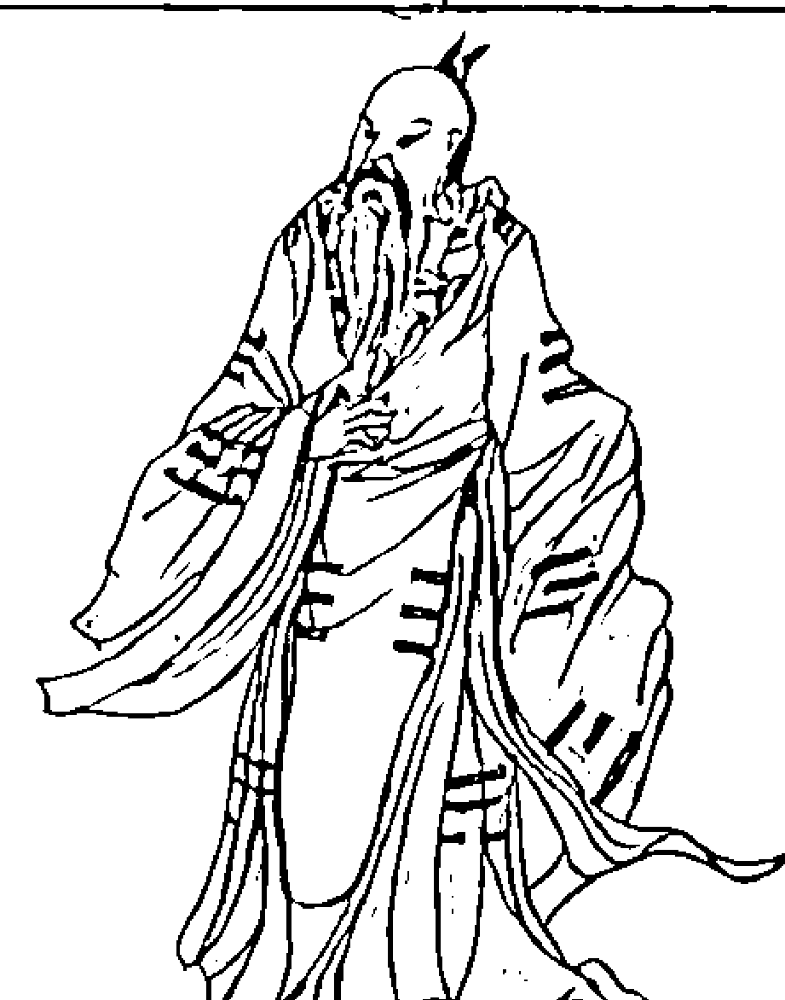

### 坐命午宫

| 巳 | 午 | 未 | 申 |
|---|---|---|---|
| | 命宫 | | 天机+4 |
| | [人物插图] | | |
| | 太阴+3 | | |
| 天梁+4 | | 巨门+3 | |
| 天同+1 | 寅 | 丑 | 子 | 亥 |

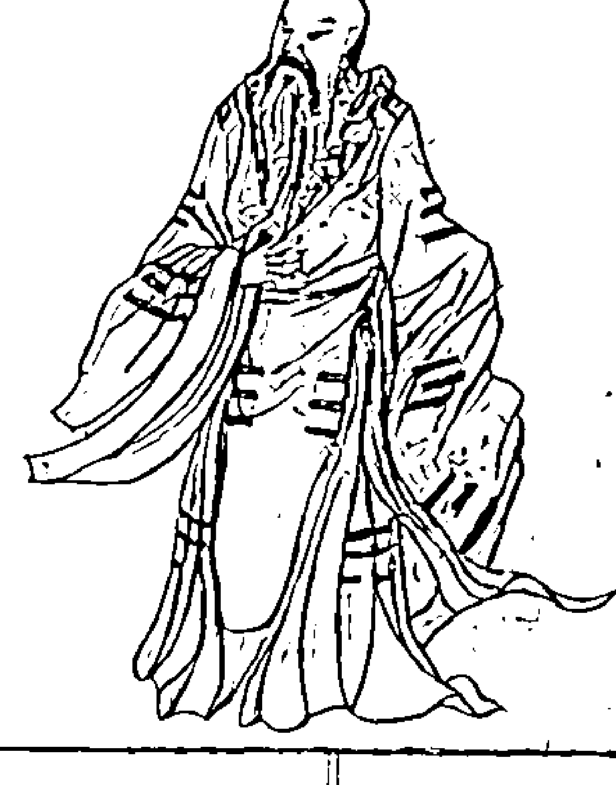

## 不同生年的命运

甲年生人：命坐午宫，甲申、甲子、甲辰年生人，或命坐子宫，庚寅、庚午、庚戌年生人，禄存、天马星同坐财帛宫，为“禄马交驰格”，愈奔动愈生财。

乙年生人：命宫天机星化禄，财帛宫天梁星化权，官禄宫太阴星化忌。思维敏捷，智商高，联想力丰富，喜爱宗教、哲学、命理，所计划的事情可以实现，但需劳心费神，财来财去，表面好看；事业上能掌权，易生麻烦，但均能化解（天梁星居寅宫入庙化权，化解较快速），辛劳得财；大器晚成，或先破后成，切勿经营房地产，事业工作中多小人暗害，或女人作梗阻挠（尤以太阴星居辰宫为甚），若恶星同坐，难免多波折，或一事无成。

命坐子宫，乙、己年生人，或命坐午宫，辛年生人，天钺、天魁双贵星，分别在命宫、财帛宫三合会照，为“天乙拱命格”，文章盖世，贵人多助。

丙年生人：财帛宫天同星化禄，命宫天机星化权，若无凶、煞星冲破，为“权禄巡逢格”，财官双美，一生顺稳，出世荣华。有福气与悠闲，常有贵人相助，多不劳而获，事业进展顺利，有钱享受；领导、交际、策划能力强，管理能力佳，办事能力强，具舌辩、谋略、外交的才能，凡事精打细算，主动积极，辛勤忙碌，动则有成。

命坐午宫，丙年子、辰、申、戌时生人，或命坐子宫，丙年寅、辰、午、戌时生人，文昌星化科在命宫，或在命宫的三方四正拱照，为“三奇嘉会格”，名誉昭彰，财官双美，富贵双全，但属“大器晚成”之格。除有上述丙年“权禄巡逢格”的特性外，考试运佳，可以充分表现文艺才华。

命坐午宫，丙、戊年生人，擎羊星落陷同守命，为“马头带箭格”，非夭折则主刑伤，离乡背井，漂泊不定，危困重重。但三合会照化禄、化权星，若逢左、右、昌、曲吉星相助，为专门技术人才，可在专业领域有所建树；十月生人，天刑星同坐命，可为名医、名律师或名工程师。

丁年生人：官禄宫太阴星化禄，财帛宫天同星化权，命宫天机星化科，迁移宫巨门星化忌，为“三奇嘉会格”，名誉昭彰，富贵双全，财官双美，但为“大器晚成”之格，若遇空、劫星，虽可成就，但世路多艰。财运旺盛，男命娶妻贤慧，妻可为女老板；女命可自己为老板；命坐午宫太阴星旺守，事业顺遂；命坐子宫太阴星落陷，事业晚成。创业容易，多可坐享其成，赚的钱比预期中要多。考试顺利，办事能力强，计划常被人称道而出风头，声誉日隆，动脑筋的事情皆无往不利，遇煞星则多虚名。命坐子宫，巨门星在午宫，是非、困扰多；命坐午宫，巨门星在子宫，较不嫌化忌星，反具有激发力，增加辩才。

戊年生人：官禄宫太阴星化权，命宫天机星化忌。男命，可创业，且能得女人帮助；女命，具才华，劳碌奔波，可掌权；命坐子宫，太阴星在辰宫为落陷失辉，喜欢干预，滥用职权。天机星化忌，头脑打结，伤脑筋，命坐子宫影响最轻，但仍不免于奔波劳碌；命坐午宫，喜钻牛角尖，遇事常想不开，多自寻烦恼，桃花不断，易夜晚失眠。

己年生人：财帛宫天梁星化科。文艺方面有表现，所得均为清白之财，可获得他人的赠与，或施舍济助他人。

庚年生人：官禄宫太阴星化科，财帛宫天同星化忌。命坐午宫时，太阴在戌宫为旺势，善于理财，配偶喜藏私房钱，在学术上有更进一步的追求，公务员清白贵显，可赚艺术之财；赚钱不易，收入较少，财守不住，收支不易平衡。

辛年生人：迁移宫巨门星化禄。有辩才、口福，善于外交，可凭口赚钱，利于文教、大众传播界发展。

壬年生人：财帛宫天梁星化禄。有长上福荫之财，也有意外之财，但天梁星本身清高，对意外之财，常成为无法妥善处理的沉重心理负担，甚至因而引起纠纷。

命坐子宫，壬年生人：擎羊星同坐命，三合会照化禄星，若再逢左、右、昌、曲吉星相助，为专门技术人才，可在专业领域有所建树；四月生人，天刑星同坐命，可为名医、名律师或名工程师。

癸年生人：迁移宫巨门星化权，官禄宫太阴星化科。具辩才，说话有分量，让人信服，若配合行动则无往不利，但是非争论难免，误会得以解释，利于文教、大众传播界发展。命坐午宫时，太阴星在戌宫为旺势，善于理财，配偶喜藏私房钱，在学术上有更进一步的追求，可赚艺术之财，公务员则清白贵显。

## 2. 天机星坐守丑、未宫：为人服务，最佳幕僚

天机星在丑、未二宫守命，皆为落陷独坐，难以表现其“动”的特性，可以面对和尝试各种高危险度或枯燥的工作。由于天机星主“动”，落陷则稳定性更不够，不能聚财，不宜自力经商，宜为人服务，可以有好的表现，有所收获。

## 星曜布局

天机星在丑、未二宫落陷守命，迁移宫有旺势天梁星朝照，出外有长上贵人相助，凡事皆有机缘，能逢凶化吉，生活、工作喜求变化，为人服务为薪水阶级，可事业有成，获得声名；财帛宫有平势天同星，淡泊金钱，追求悠闲，能理财，可储蓄，不愁吃、穿；官禄宫有旺势巨门星，任劳任怨，多从事教师、律师、政治家、行销贸易等与口才有关的行业，多获得众人敬重。

## 天机星坐命丑、未宫

天机星坐命丑、未二宫，必为落陷独坐。由于天机星主“动”，落陷则稳定性更不够，其“动”的特性很难表现出来。迁移宫有旺势天梁星朝照，出外有长上贵人相助。

### 坐命丑宫

### 坐命未宫

| 巳 | 午 | 未 | 申 |
|---|---|---|---|
| 巨门+3 |  | 天梁+3 |  |
| 辰 |  |  | 酉 |
| 卯 |  |  | 戌 |
| 天机-2 |  |  |  |
| 寅 | 丑 | 子 | 亥 |

| 巳 | 午 | 未 | 申 |
|---|---|---|---|
|  |  | 天机-2 |  |
| 辰 |  |  | 酉 |
| 天同0 |  |  | 戌 |
| 卯 |  |  | 亥 |
| 寅 | 丑 | 子 | 亥 |

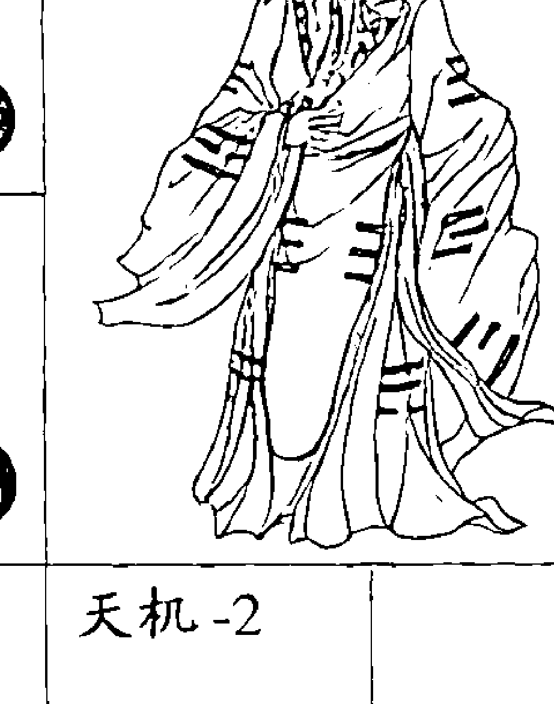

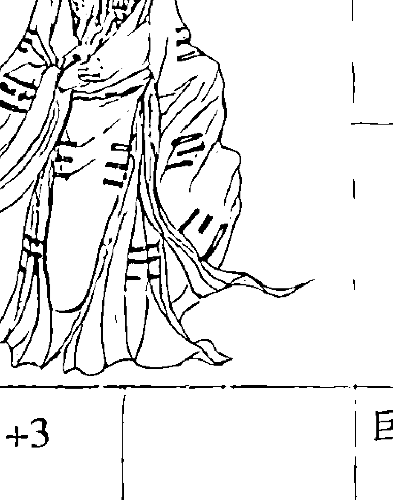

## 天机星代表人物——姜子牙

天机星坐身命宫的命理参断来源于天机星的星曜特性，而天机星的星曜特性与其对应的封神人物姜子牙密不可分。姜子牙是周文王倾商、武王克殷的首席谋主、最高军事统帅与开国元勋，是齐文化的创始人，亦是中国古代的一位杰出的韬略家、军事家与政治家。正是如此，天机坐命也就预示着聪慧寂静，足智多谋。

> > 相关链接
>
> 姜元帅赞
> ——《封神演义》作者许仲琳
>
> 六韬留下成王业，妙算玄机不可穷。
> 出将入相千秋业，伐罪吊民万古功。
> 运筹帷幄欺风后，燮理阴阳压老彭。
> 亘古军师为第一，声名直并泰山隆。

## 不同生年的命运

- 甲、戊、庚年生人：天魁、天钺双贵星分别在命宫、迁移宫相朝照，为“坐贵向贵格”，文章盖世，贵人多助。
- 乙年生人：命宫天机星化禄，迁移宫天梁星化权，为“权禄巡逢格”，一生顺稳，出世荣华。落陷天机星化禄，钱财流动性高，劳心费神，若再与煞星同宫或加会，有破财之兆，财来财去而常入不敷出；成熟稳健，出外多得长上荫助，在事业上能掌权。
- 丙年生人：财帛宫天同星化禄，命宫天机星化权，为“权禄巡逢格”，财官双美，一生顺稳，出世荣华。有福气，喜悠闲，贪图享受，进取心不足，多有贵人相助而获不劳之财，有钱可享，衣食无缺；精打细算，具领导和交际能力，富舌辩、策划的才能，办事效率佳，天机星落陷化权，则不免于辛劳。
- 丁年生人：命宫天机星化科，财帛宫天同星化权，官禄宫巨门星化忌，为“甲第登庸科格”，非泛泛之辈，可在众人中崭露头角，凸显地位；若遇煞星冲破，则多虚名，中看不中用，或怀才不遇。聪明机警，善于用脑，考试顺利，企划常被采用，声名日隆，但波动难免；有坐享其成之财；事业上多口舌是非，宜防因而引起的官非，若转移为以口为业，如教师、律师、推销员、政治家等，可避凶趋吉。
- 命坐未宫，丁、己年生人，或命坐丑宫，癸年生人，入庙擎羊星同坐命宫，为“擎羊入庙格”，辰、戌、丑、未四墓地可制擎羊星的凶焰，并保留其威强与冲劲，权威出众，富贵声扬，加遇火星则权威卓著。
- 戊年生人：命宫天机星化忌。伤脑筋，头脑打结，喜钻牛角尖，遇事常想不开，多自寻烦恼；事业难以发展，感情也多困扰，夜晚易失眠，若有吉星相助，才稍能改善。
- 己年生人：迁移宫天梁星化科。出外有贵人，有学习能力，名声佳，人缘好。
- 庚年生人：财帛宫天同星化忌。赚钱不易，收入较少，财守不住，收支不易平衡。
- 辛年生人：官禄宫巨门星化禄。常以口或口福为业，或需竞争的工作，如教师、文化传播、律师、民意代表、推销员等，说话有分量，使人口服心服，可凭口而进财，如凭口才赚钱。
- 壬年生人：迁移宫天梁星化禄。出外有长上福荫照顾。
- 癸年生人：官禄宫巨门星化权。说话有分量，可掌权势，适合往政界发展，或从事与口才有关的行业。
- 命坐未宫，三、四、五月生人，或命坐丑宫，九、十、十一月生人，左辅、右弼双星同坐或同夹命宫，为“左右同宫格”，或“左右守垣格”，富企划力，人际关系佳，凡事可逢凶化吉，福禄终身，但命宫天机星为落陷，先成后败，先荣后衰。

第九章
紫微斗数
坐命宫
命理
参断

## 3 天机星坐守寅、申宫：命运平顺，浪漫温柔

太阴星与天机星同坐寅、申二宫守命的男性，多浪漫，易与女性接近，温柔体贴，懂得女人的心理，外出机会多，离乡背井能开运，心思敏捷，富幽默感，常在别人需要时，去配合援助，让人感到温暖。一生命运较平顺，中年后有吉运；若加遇煞星，应多谨慎；加遇文昌、文曲、天姚、咸池、沐浴等星，时有艳遇，适合演艺工作。女命，则为贤妻良母，柔中带刚，外貌秀丽，具女性美；加遇煞星，较易有感情波折；遇红鸾、天姚、大耗、咸池、沐浴等桃花星，适合演艺工作。

天机星在寅、申二宫地势坐命，必有太阴星同坐（寅宫为旺势，申宫为利势）。由于太阴星是天上的月亮，于男命为母星、妻星、女儿星，于女命为母星、女儿星及自己。

## 星曜布局

天机、太阴星同在寅、申宫守命，三合会照财帛宫的平势天同星，官禄宫的入庙天梁星，为“机月同梁格”，擅长企划，处事及辅佐能力强，宜为人服务，在公家机关能出人头地，担任要职，适合公教、传播、文化事业，或费脑筋的技术方面工作，但不利感情，有些阴沉或神经质。淡泊金钱，喜爱悠闲，能理财，可储蓄，财源不缺，衣食无虑；事业稳定，工作勤奋，颇得上司信赖，适于教师、公务员、专门学术研究，评价很高。

## 不同生年的命运

- 甲庚年生人：甲申、甲子、甲辰、庚寅、庚午、庚戌年生人，若无火、铃星冲破，为“禄马交驰格”，愈动愈有财，常在环境变化发展中而得财，转业、调职可获转机，一生多旅游机会。
- 乙年生人：命宫天机星化禄、太阴星化忌，官禄宫天梁星化权。思维敏捷，联想力丰富，智商高，计划之事多可实现，为财忙碌，但多属“过路财神”，常财来财去，为人作嫁；财运不佳，有耗财现象，常寅吃卯粮，捉襟见肘，入不敷出，但尚不至于穷困，有离乡背井，跋涉他乡之兆。主观又自负，霸道但讲理，宜从事公职，能掌权。
- 命坐申宫，乙、己年生人，或命坐寅宫，辛年生人，天钺、天魁双贵星分别在命宫、官禄宫三合会照，为“天乙拱命格”，文章盖世，贵人多助。
- 丙年生人：财帛宫天同星化禄，命宫天机星化权，若无煞星冲破，为“权禄巡逢格”，财官双美，一生顺稳，出世荣华。喜欢悠闲，稍嫌进取心不足，易沉迷于酒色，财禄有贵人助，常不劳而获，衣食无缺，多口舌是非；精打细算，具领导与策划能力，具舌辩、谋略之才，擅长于交际，办事效率佳，事业发展顺利，出外至远方发展较为吉利，动则有成。
- 命坐寅宫，丙年子、寅、辰、申时生人，或命坐申宫，丙年寅、午、申、戌时生人，文昌星在命宫或其三方四正拱照，若无煞星冲破，为“三奇嘉会格”，名誉昭彰，富贵双全，财官双美。除了有丙年生人“权禄巡逢格”的特性以外，考试运佳，文艺才华得以发挥。
- 丁年生人：命宫太阴星化禄、天机星化科，财帛宫天同星化权，为“三奇嘉会格”，名誉昭彰，富贵双全，财官双美，唯为“大器晚成”格。财运旺盛，有异性缘；聪明智慧，善于企划，动脑筋的事情，皆循序渐进，有条不紊，无往不利，声名日隆，但波动难免；虽不免于辛劳，颇适合静态的学术研究工作，可坐享其成，所得的比预期中要来得多。唯若遇煞星在命宫三方四正冲破，为“科星逢破格”，书虽读得不错，却年年名落孙山，虽有贵人却不卖力，越帮越忙，虽可成功，但路途多艰。
- 戊年生人：命宫太阴星化权、天机星化忌。劳心费力，女性可掌权，好享受，自得其乐；伤脑筋，头脑打结，喜钻牛角尖，常常想不开而自寻烦恼，夜晚易失眠，学业、感情、事业皆多变动。
- 己年生人：官禄宫天梁星化科。只要不遇文曲星化忌，在工作上风评很好，颇有名气，爱出风头，考试顺利，宜从事文职工作。
- 庚年生人：命宫太阴星化科，财帛宫天同星化忌。有女贵人，风评不错，可因女人而成名；赚钱不易，收入较少，钱财守不住，常收支不平衡，原该到手的钱财，常转眼就又失去。
- 壬年生人：官禄宫天梁星化禄。多得长上福荫与照顾，公教、文职人员，能享有清高的声誉，地位高超。
- 癸年生人：命宫太阴星化科。有女贵人，风评不错，可因女人而成名。

## 天机星坐命寅、申宫

天机星坐命寅、申二宫，必有太阴星同坐（寅宫为旺势，申宫为利势）。三合会照财帛宫平势天同星，官禄宫入庙天梁星，为“机月同梁格”。

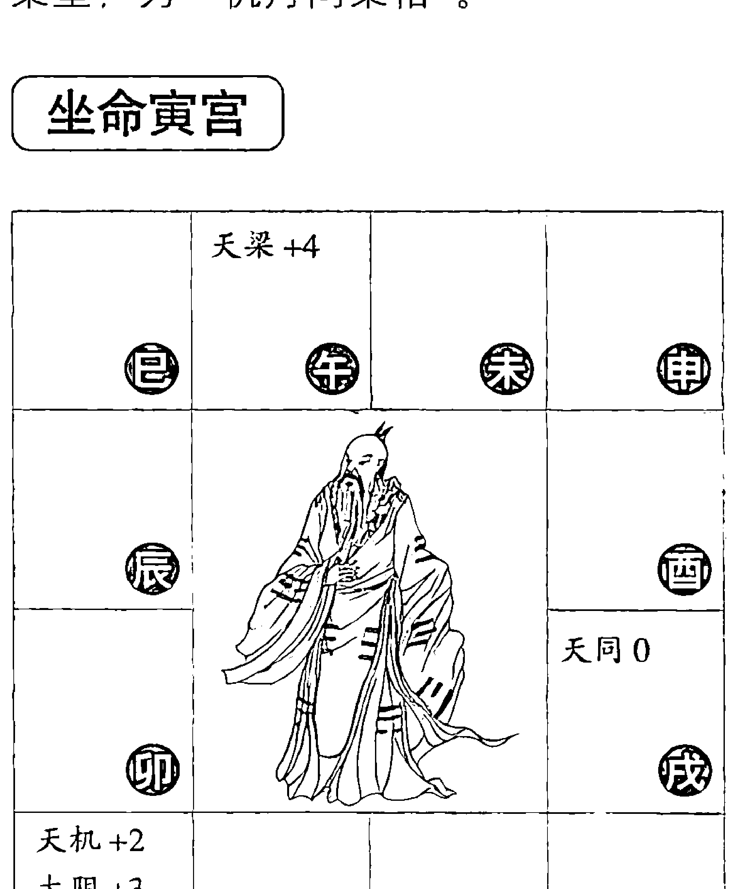

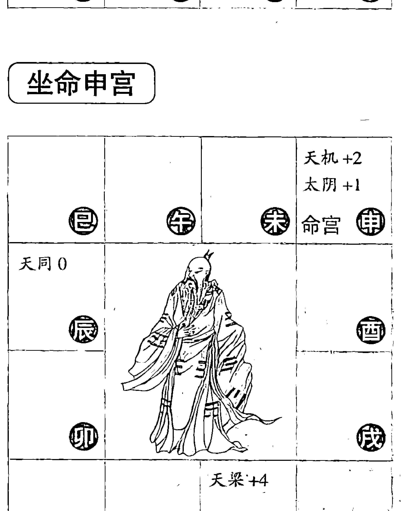

## 4 天机星坐守卯、酉宫：利事业，不利感情

巨门、天机星同坐卯、酉二宫守命，为“巨机同临格”，思维敏捷，具辩才，富研究心，分析、理解及记忆能力俱佳，博学多能，习惯在工作中变化，可在高科技、高智能，或艺术方面获得成就。多有升迁的机会，常有利于升学、考试方面的变化，能独创新事业，早年苦劳，历尽艰辛，中年后才平稳有成。但恃才傲物，个性固执，易惹是非，利事业而不利感情。所以，宜男命，不宜女命，若研究命理或哲学可趋吉避凶。女命，虽富贵，但感情、婚姻易有波折。

## 星曜布局

天机星在卯、酉二宫旺势坐命，必有入庙巨门星同坐。巨门星化气为暗，长于口才，但也多是非，个性坚强，颇有主见。

## 基本命运

天机、巨门星同在酉宫守命，丁、戊、庚年，或己年丑、巳、酉、亥时，或辛年丑、巳、未、酉时生人，同宫或三方四正宫位加会化忌星，为“巨机化酉格”，劳苦奔波，心高慧勇，但世态炎凉，多一事无成，女命必有破，且飘荡难免。

天机、巨门星同坐卯、酉宫守命，财帛宫有入庙天同星三合会照。淡泊金钱，喜欢悠闲，一生财禄不缺，纵然支出大，也能靠着储蓄、稳健的投资，或参加互助会而有节余，并凭着对工作的热忱，中年之后，得贵人的帮助，白手起家，财富渐增。

命坐卯宫，未、亥时生人，或命坐酉宫，丑、巳时生人，文昌、文曲双星分别在命宫、财帛宫三合会照，为“文星拱命格”，富知性，勤学好读，有经国济世之才，在学术、文艺界可显荣辉。女命逢之多情。

命坐卯宫，四、六、八、十二月，未时生人，或命坐酉宫，二、六、十、十二月，丑时生人，文昌星坐命，又在三方四正遇左辅星，为“辅拱文星格”，有敏捷的才华。

命坐卯宫，酉时生人，文曲星与入庙太阴星同坐夫妻宫，逢太阳星，为“蟾宫折桂格”，男招贵妻，女生贵子。

## 不同生年的命运

- 乙年生人：命宫天机星化禄。聪明智慧，思维敏捷，联想力丰富，具有辩才，计划多可以实现，为财忙碌，必须经由一番口舌的竞争，劳心费力，才能得财，钱财仍具有波动性，多对宗教、命理、哲学感兴趣。
- 命坐卯宫，乙年生人：命宫天机星化禄，又逢禄存星同坐命，为“禄合鸳鸯格”，财官双美，受人敬重，有名望，福气高，有才华；乙年子、寅、辰、申、戌时生人，遇地空、地劫星冲破，为“两重华盖格”，吉处藏凶，宜注意表面美好，背后所隐伏的危机，孤高贫困，与僧佛有缘。
- 命坐卯宫，乙年亥时生人，禄存、文曲星同坐命宫，财帛宫又会照文昌星，为“禄文拱命格”，富且贵，若无煞凑，必为富有的知名人士。
- 命坐酉宫，乙年生人：命宫天机星化禄（暗禄），迁移宫又有禄存星（明禄）对照，为“明禄暗禄、锦上添花”，主富贵。
- 丙年生人：命宫天机星化权，财帛宫天同星化禄，若无煞星冲破，为“权禄巡逢格”，财官双美，一生顺畅，出世荣华。主动积极，精打细算，有舌辩、谋略、外交之才华，具领导、策划能力，办事效率佳，动则有成，但不免于辛劳；有福气，喜悠闲，多贪图享受，易沉迷于酒色，缺乏进取心，钱财常有贵人助，衣食无缺。
- 命坐酉宫，丙年生人：天魁星同入命宫，又三合会照财帛宫禄存星及天同星化禄，为“双禄朝垣格”，财官双美。
- 命坐酉宫，丙亥、丙卯、丙未、戊亥、戊卯、戊未年生人，或命坐卯宫，壬巳、壬酉、壬丑年生人，禄存、天马星同坐命宫，若无煞星冲破，为“禄马交驰格”，愈奔动愈生财。
- 命坐卯宫，丙、丁年生人：或命坐酉宫，壬、癸年生人，天魁、天钺双贵星分别在命宫的三方四正拱照，为“天乙拱命格”，文章盖世，贵人多助。
- 命坐卯宫，丙年丑、卯、未、亥时生人，或命坐酉宫，丙年丑、巳、未、酉时生人，文昌星化科同坐命，或在命宫三方四正会照，又逢命宫天机星化权，财帛宫天同星化禄，为“三奇嘉会格”，名誉昭彰，富贵双全，财官双美，唯为“大器晚成”之格。除有丙年“权禄巡逢格”的特性之外，考试运甚佳，具文艺才华。
- 丁年生人：命宫天机星化科、巨门星化忌，财帛宫天同星化权，为“甲等登庸格”，非泛泛之辈，可在众人中崭露头角，凸显地位。头脑灵活，为企划高手，声誉日隆，唯波动难免，多口舌是非，小人多缠，多辛劳，以口才为业者，可避凶趋吉；运气好，创业容易，可坐享其成，所得的比预期中要多。
- 命坐酉宫，丁年生人：也为“巨机化酉格”，劳苦奔波，心高意勇，但世态炎凉，一事无成，女命必有破，且飘荡难免。
- 命坐卯宫，丁年生人：化科星坐命，逢擎羊星冲破，为“科星逢破格”，书虽读得不错，但却年年名落孙山，虽有贵人却不卖力，越帮越忙。
- 戊年生人：命宫天机星化忌。伤脑筋，不开朗，头脑不灵光，喜欢钻牛角尖，凡事常想不开，多自寻烦恼，容易失眠，常感怀才不遇，不易施展抱负；若与红鸾、咸池、文昌、文曲星同坐，在娱乐界发展，可趋吉避凶。
- 庚年生人：财帛宫天同星化忌。收支不易平衡，钱财守不住。命宫又逢擎羊星同坐守，有刑伤及明显的挫折。
- 辛年生人：命宫巨门星化禄。口才好，说话具有说服力，有口福，可从事凭口才或与口福有关的行业，虽不免于辛劳，但晚年多有所获，有钱财。
- 命坐酉宫，辛年生人（丑、巳、未、酉时生人除外），命宫巨门星化禄，又逢禄存星同坐命，为“禄合鸳鸯格”，福气高，有才华，财官双美；若遇地空、地劫星冲破，为“两重华盖格”，吉处藏凶，宜注意美好表面中所隐伏的危机，孤高贫困，与僧佛有缘，遁空门反主清福。
- 命坐卯宫，辛年生人：命宫巨门星化禄“暗禄”，又逢迁移宫禄存星“明禄”对照，为“明禄暗禄、锦上添花”，富且贵。
- 壬年生人：命宫天梁星化禄，迁移宫天机星化忌，财帛宫天同星化禄，为“双禄朝垣格”。迁移宫天机星化忌，易有交通意外或出外不顺。命坐酉宫，壬年生人，禄存、天马星同坐命宫，若无煞星冲破，为“禄马交驰格”，愈奔动愈生财。
- 命坐卯宫，壬年生人：天梁星化禄在命宫，天魁星同坐命，又三合会照财帛宫禄存星，福德宫（巳宫）天梁星化禄，又会照对宫（亥宫）禄存星，为“明禄暗禄、锦上添花”的富贵命。
- 命坐酉宫，壬年生人：命宫天机星化忌，逢擎羊、陀罗星夹命宫，为“羊陀夹忌格”，孤贫不吉。
- 命坐卯宫，癸年生人：天钺贵星同坐命，又逢命宫巨门星化权，能发挥口舌的威力，使成果显现。
- 命坐卯宫，八、十二月生人，或命坐酉宫，二、六月生人，左辅、右弼星分别在命宫、财帛宫三合会照，乐观进取，助力多。

## 天机星坐命卯、酉宫

天机星坐命卯、酉二宫，必为旺势，且必有入庙巨门星同坐。巨门星化气为暗，长于口才，但也多是非，个性坚强，颇有主见。

### 坐命卯宫

一个紫微斗数命盘图示。
图中包含一个中央人物画像。
四周为十二宫位格子，内有天干地支标识：巳、午、未、申、辰、酉、卯、戌、寅、丑、子、亥。
其中：
- 卯宫（左下格）标注：天机+3，巨门+4，命宫。
- 戌宫（右下格上方）标注：天同+4。

### 坐命酉宫

一个紫微斗数命盘图示。
图中包含一个中央人物画像。
四周为十二宫位格子，内有天干地支标识：巳、午、未、申、辰、酉、卯、戌、寅、丑、子、亥。
其中：
- 巳宫（左上格）标注：天同+4。
- 酉宫（右中格）标注：天机+3，巨门+4，命宫。

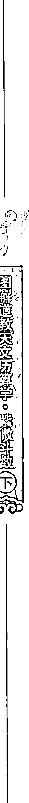

## 5 天机星坐守辰、戌宫：聪明机智，福寿双全

天机星“善星”、天梁（荫）星同在辰、戌宫（纲）宫守命，为“善荫朝纲格”，心地慈善，品格清高，温和而有才能，聪明机智，足智多谋，有先见之明，具策略、创造与分析能力，口才佳，多计较，有巧技在身，乐善好施，凡事皆处理得尽善尽美，福寿双全，唯必须历经艰难困苦，才能成功；女命，善手艺、烹饪，有神经质，爱钻牛角尖，婚姻易有波折，不是晚婚，就是夫妻生活不顺遂。

## 星曜布局

天机星在辰、戌二宫利势坐命，必有入庙天梁星同坐。天梁星主寿、贵，最具有逢凶化吉、遇难成祥的能力，但必须先遇难，使其有机会化解，才能呈祥。

## 基本命运

天机、天梁二星同在辰、戌宫坐命，必三合会照财帛宫天同星（子宫为旺势、午宫为落陷）和太阴星（子宫为庙、午宫为不得地），故也为“机月同梁格”，擅长企划，处事及辅佐能力强，在公家机关多能出人头地，担任要职，宜公教、传播、文化事业；财运良好，收入稳定，有储蓄观念，善于理财，尤喜欢购置不动产。加遇六吉星，富贵慈祥，才华卓著，有辅佐、参谋、顾问等才能，多为人服务，能担任要职。遇煞星（擎羊星除外），较无抵抗力，会减低其成就，女命多苦恼烦闷。遇化忌星或逢天梁星化禄，常使人心神不宁，多困扰。逢空亡星（地空、地劫、天空、截空、旬空），宜修习宗教或玄学，可得安泰。

天机、天梁星同在戌宫守命时，由于三合会照财帛宫的天同星为落陷、太阴星为不得地，虽仍符合“机月同梁格”，但其表现就不如天机、天梁星同在辰宫守命（天同、太阴皆属庙旺）。钱财也不易守住，常为子女、女人或他人而散财。若会照擎羊星，虽历经艰难困苦，但终能获得成功。

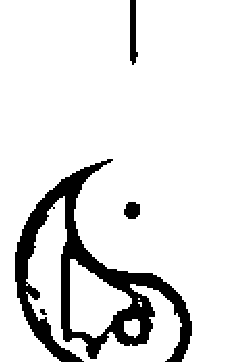

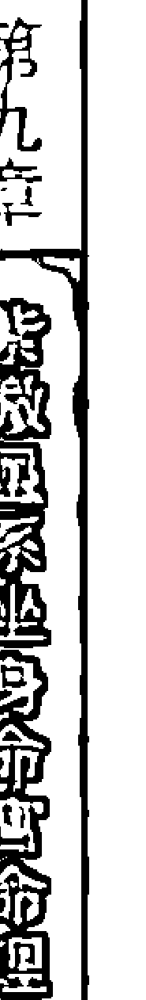

## 不同生年的命运

- 乙年生人：命宫天机星化禄、天梁星化权，财帛宫太阴星化忌。思维敏捷，富联想力，智商高，计划多可实现，但劳心费神，钱财不稳而多变动，不宜经商；个性特异独行，好管闲事，爱打抱不平，对事务有独特见解，颇令人折服，为钱财奔忙，易为钱财而烦恼，易有心神不宁，每多困扰；太阴星在子宫入庙化忌，财运有波折，太阴星在午宫不得地化忌，易有损财及透支现象。
- 命坐辰宫，乙年生人，或命坐戌宫，辛年生人，入庙擎羊星在墓宫同坐命，为“擎羊入庙格”，可制擎羊星之凶，并保留其威强与冲劲，权威出众，富贵声扬；加遇火星则权威更卓著，但刑伤难免，或早年父母不全，或中年婚姻变化，或晚年子女不聚。
- 命坐辰宫，乙、己年生人，或命坐戌宫，辛年生人，天魁、天钺双贵星分别在财帛、官禄宫会照命宫，为“天乙拱命格”，文章盖世，贵人多助。
- 丙年生人：命宫天机星化权，财帛宫天同星化禄，为“权禄巡逢格”，出世荣华，一生顺稳，财官双美，若有煞星冲破（如命坐辰宫，有陀罗星同坐），则有瑕疵、困扰、阻碍。机变能力强，有舌辩及策划之才，具谋略及外交的才能，长于领导与交际，遇事主动积极，动则有成。多不劳而获，衣食无虞，常有贵人相助财禄，男命多得异性相助。

## 天机星坐命辰、戌宫

天机星坐命辰、戌二宫，必为利势，且必有入庙天梁星同坐。天梁星主寿、贵，最具有逢凶化吉、遇难成祥的能力，但必须先遇难，使其有机会化解，才能呈祥。

### 坐命辰宫

| 巳 | 午 | 未 | 申 |
|----|----|----|----|
| 辰 |    |    | 酉 |
| 卯 |    |    | 戌 |
| 寅 | 丑 | 子 | 亥 |
| 星曜：天机+1、天梁+4、天同+3、太阴+4 | 人物插图（坐命辰宫） |

### 坐命戌宫

| 巳 | 午 | 未 | 申 |
|----|----|----|----|
| 辰 |    |    | 酉 |
| 卯 |    |    | 戌 |
| 寅 | 丑 | 子 | 亥 |
| 星曜：天同-2、太阴-1、天机+1、天梁+4 | 人物插图（坐命戌宫） |

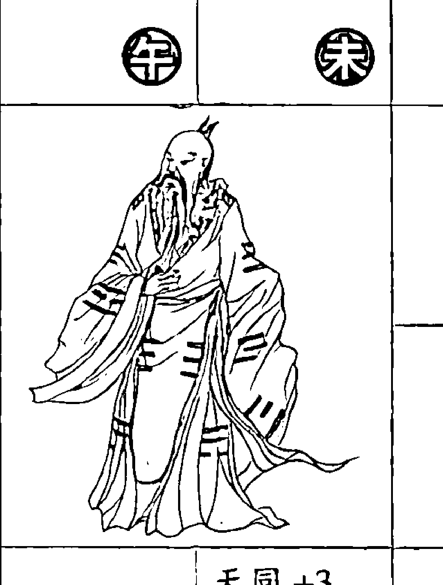

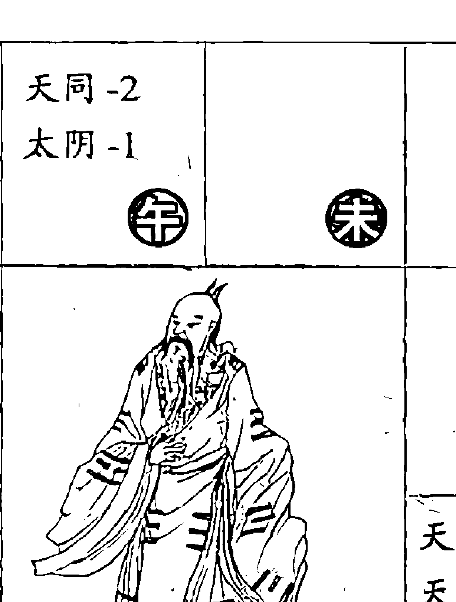相助。

命坐辰宫，丙年子、寅、午、戌时生人，或命坐戌宫，丙年子、辰、午、申时生人，财帛宫天同星化禄、命宫天机星化权外，又三合会照文昌星化科，为“三奇嘉会格”，名誉昭彰，富贵双全，财官双美。除了具有“权禄巡逢格”的特征外，文艺上有才华和表现，学业有成。

丁年生人：财帛宫太阴星化禄、天同星化权，命宫天机星化科，为“三奇嘉会格”，名誉昭彰，富贵双全，财官双美，但属“大器晚成”之格；若遇地空、地劫星会照，虽可成就，世路多艰。钱财来自于远方，男性可得异性的帮助，或间接获得钱财，女命可有老板运，能掌实权；天同为福星，化权能激发享乐天同星的奋斗意志，具有开创能力，运气佳，创业容易，在事业上有表现，可坐享其成，所得比预期的还要多，命坐辰宫者，终身有财；外表斯文，头脑灵活，为企划高手，动脑之事皆无往不利，宜往大众传播界发展，男女皆宜于迟婚，若再加遇六吉星，可发挥才华，办事能力强，为人所赞赏。

戊年生人：财帛宫太阴星化权，命宫天机星化忌。太阴财星化权入财帛宫，善于运用金钱，事业常变化，女命办事能力强，可创业，辛苦有成；伤脑筋，喜钻牛角尖，凡事多困惑，常心神不宁，想不开，多自寻烦恼，易失眠。

己年生人：命宫天梁星化科。有理论及技术方面的才华，对各类研究常有突破性的创见，声名佳，人缘好，有长上缘，常获父母、长辈及贵人相助，宜大众传播或文艺界。若三方四正有空、劫、四煞或凶星冲破，为“科星逢破格”，书虽读得不错，但却常名落孙山，虽有贵人却不卖力，常越帮越忙。

庚年生人：财帛宫太阴星化科、天同星化忌。有女贵人暗助钱财，多赚清白之财，女性具高雅气质，在学术界颇有表现；钱财收入不易，常守不住，易心神不宁而多困扰。命坐戌宫，庚年生人，禄存星与太阳星化禄同坐夫妻宫，为“禄合鸳鸯格”，男因妻富，女以夫贵。

壬年生人：命宫天梁星化禄。有长上福荫，具解厄功能，一生遇难成祥，身体健康长寿，但常心神不宁，多困扰。

癸年生人：财帛宫太阴星化科。多赚清白之财，有女人暗助钱财。

不同生时的命运

一、七月生人，左辅、右弼星分别在命宫、迁移宫相朝照，使困在天罗（辰宫）、地网（戌宫）中的天机、天梁星获得很大的助力，使其更有表现。

子、午时生人，文昌、文曲星分别在命宫、迁移宫相朝照，为“文星拱命格”，举止优雅，富知性，勤学好读，有经国济世之才，在学术、文艺界可显荣耀。女命逢之，多情。

## 天机星坐守巳、亥宫：白手起家，巧艺安身

不喜欢为钱财而工作，也不爱依赖父母和长辈，多为白手起家；奔波劳苦竞争中，才能够得财，财源时断时续，多有进出，常以巧艺安身，或公教、文职。能因工作热忱而奠下基业。早年多苦劳，中年后才较稳定。

## 星曜布局

天机星在巳、亥宫守命，为平势独坐，力量不强，易受对（迁移）宫太阴星的影响。财帛宫必有不得地的天同、巨门星三合会照。

## 基本命运

天机星在巳宫守命时，对宫（亥宫）的太阴星为入庙，且为“月朗天门格”，十分吉美，对天机星有非常好的影响；天机星在亥宫守命时，对宫（巳宫）的太阴星为落陷，无法影响到天机星，故不如巳宫守命吉利。无论男女命，皆温柔多情，男性有异性缘，易与异性接触，多有学习的机会，对各种学习多有兴趣，因而可从事各种性质不同的工作。尤其是天机星独坐巳宫守命，入庙太阴星在亥宫朝照，男性异性缘更为显著，一生常有艳遇，易得异性相助，能获得端庄贤淑的好妻子；耐力足，凡事能随缘，宜出外发展。

天机星在巳、亥宫守命，不逢吉星者，性格多乖张，薄情而无义，好酒食，多背井离乡。若遇六煞星、化忌星，男命博而不精，多波折，常有变化；女命则易有感情困扰。

## 不同生年的命运

乙年生人：命宫天机星化禄，迁移宫太阴星化忌。思想敏锐，联想力丰富，劳心费神，钱财变动大，多属过路财神，不宜经商。太阴星化忌，对女性六亲不利，易损财，出外有小人暗算，与女性常合不来，常跋涉他乡，但太阴星在亥宫入庙化忌，反有“变景”之妙，对太阴星反而有帮助，在事业上得以充分发挥。

丙年生人：财帛宫天同星化禄，命宫天机星化权，若无煞星冲破，为“权禄巡逢格”，财官双美，一生顺稳。贪图享受，易沉迷于酒色，财源常有贵人相助，有不劳而获之财；精打细算，机变能力强，凡事主动积极，辛勤忙碌，动则有成，宜往外地发展。同时，禄存星同坐命，或在迁移宫朝照命宫，为“禄合鸳鸯格”，或“双禄朝垣格”，财官双美，有名望，福气高，有才华。

命坐巳宫，丙年丑、巳、酉、亥时生人，或命坐亥宫，丙年卯、巳、未、亥时生人，命宫的三方四正会齐天同星化禄、天机星化权和文昌星化科，为“三奇嘉会格”，名誉昭彰，富贵双全，财官双美，但年少多艰，大器晚成。除了有“权禄巡逢格”的特征外，具文艺才华，考试运佳，宜往学术方面发展。

丙亥、丙卯、丙未年，或壬巳、壬酉、壬丑年生人，禄存、天马星同坐命宫或迁移宫，若无火、铃星冲破，为“禄马交驰格”，愈动愈生财，常在环境变化发展中得财，转职、转业可获良机，一生多旅游机会。

命坐巳宫，丙年生人，或命坐亥宫，壬年生人，天魁、天钺双贵星分别在官禄、迁移宫会照命宫，为“天乙拱命格”，文章盖世，贵人多助。

丁年生人：命宫天机星化科，又三方四正会照到迁移宫太阴星化禄、财帛宫天同星化权，为“三奇嘉会格”，名誉昭彰，富贵双全，财官双美，但属“大器晚成”，若遇空、劫星会照，虽可成就，但世路多艰。思考敏锐，善于动脑，为企划高手，波动性大，声誉佳，虽有晚发之势，但可名利双收；喜欢旅游、接近大自然，出外有财；运气好，可坐享其成，所得比预期更多，创业容易，有耗财的现象。同时，财帛宫巨门星化忌，赚钱多辛劳，易与人争财而生是非，或该来之财，却因其他事故从中阻碍而失去，宜防被诈欺。

戊年生人：迁移宫太阴星化权，命宫天机星化忌。女命可创业，劳碌奔波，男命常出外，并多与女性接触；喜钻牛角尖，想不开，多自寻烦恼，易失眠。

命坐巳宫，戊年生人，禄存星坐命，命宫天机星化忌，擎羊、陀罗双煞星分别在左右邻宫同夹命宫，为“羊陀夹忌格”，孤贫刑克，百事不吉。

## 天机星坐命巳、亥宫

天机星坐命巳、亥二宫，必为平势独坐，力量不强，易受对（迁移）宫太阴星的影响。天机星在巳宫时，对宫太阴星为入庙，对天机星有非常好的影响；天机星在亥宫时，对宫太阴星为落陷，无法影响到天机星。

### 坐命巳宫

| 列1 | 列2 | 列3 | 列4 |
|-----|-----|-----|-----|
| 天机0 |  |  |  |
| 命宫 巳 | 午 | 未 | 申 |
| 辰 |  |  | 酉 |
| 卯 |  |  | 戌 |
| 寅 | 天同-1 巨门-1 | 子 | 太阴+4 |

### 坐命亥宫

| 列1 | 列2 | 列3 | 列4 |
|-----|-----|-----|-----|
| 太阴-2 |  | 天同-1 巨门-1 |  |
| 巳 | 午 | 未 | 申 |
| 辰 |  |  | 酉 |
| 卯 |  |  | 戌 |
| 寅 |  | 子 | 命宫 亥 天机0 |

庚年生人：迁移宫太阴星化科，财帛宫天同星化忌。喜欢存私房钱，晚年有财享用，出外有贵人，宜外出发展；收支不易平衡，财守不住，常常得而复失。

辛年生人：财帛宫巨门星化禄，凭嘴巴赚取钱财。

癸年生人：财帛宫巨门星化权，迁移宫太阴星化科。多以口为业，竞争得财；喜存私房钱，晚年有财享用，出外有贵人，宜外出发展。

命坐巳宫，二、六月生人，或命坐亥宫，八、十二月生人，左辅、右弼星分别在命宫、官禄宫三合会照，乐观进取，助力多。

命坐巳宫，丑、巳、酉时生人，或命坐亥宫，卯、未、亥时生人，文昌、文曲双星分别在命宫或其三方四正会照，为“文星拱命格”，举止优雅，富知性，勤学好读，在学术、文艺界可显荣耀。此格女命逢之多情。

命坐巳宫，巳、午、未时生人，或命坐亥宫，子、丑、亥时生人，地空、地劫双煞星同坐或同夹命宫，为“命里逢空格”，或“空劫夹命格”，行运有如浪里行船，多波折，常会半天折翅，遇挫折。若空、劫夹命宫，再逢化忌星坐临，为“空劫夹忌格”，更是不吉利。

## 4 太阳星坐命身宫

太阳星阴阳五行属阳火，为中天斗吉星，化气为权贵，为官禄宫正主，主“贵”，“富”次之。

### 容态与性格

太阳星坐命身宫的人，相貌堂堂，体格魁梧健美，面如满月，声音洪亮。敢爱敢恨，聪明慈爱，光明磊落，为人忠厚，不计较是非。个性开朗，热情博爱，立场超然，乐观诚信，好善乐施，急公好义，服务大众。度量宽宏，慷慨大方，充满自信，积极进取，具有行动力，行动敏捷，魄力虽足，难免浮华。活泼好动，具领导性格及组织能力，能说善辩，坦率直言，容易得罪人。精力充沛，不拘小节，好面子，不愿受他人颐指气使，反带有支配他人的强烈倾向。善交际，爱出风头，乐天爽直，福寿遐龄。女命，活泼外向而任性，独立自主，开朗大方，有男人性格，刚强能干，乐于服务，有异性缘，能周旋在众男人之间，感情多波折，对男女感情之事拿得起、放得下，宜嫁性情温和的配偶。太阳星庙旺，旺夫益子；加遇吉星，则富贵；若再遇化权、化禄或禄存星，有封赠；若逢煞星，则以平常论。若太阳星落陷，则不美，以平常论；若落陷再加上六煞、化忌星，多为贞节之妇。

### 命理推断

太阳星主“权贵”，其权威仅比紫微帝星略逊，但因太阳是中天斗星，故光芒四射：永远普照人间，可同时兼顾南、北斗诸星。凡事容易强出头，并喜欢据理力争，一生难免会辛劳、孤独，亲情不足。太阳每日东升而西沉，故其在命盘各宫中的光芒，依时辰而变化，在命盘的寅、卯宫，象征寅、卯时（早晨3时至5时）的太阳，好比“旭日东升”；太阳在命盘的午宫，象征午时（中午11时至下午1时）的太阳，好比“日丽中天”；太阳在命盘中的申、酉宫，象征申、酉时（下午3时至7时）的太阳，好比“夕阳西沉”。太阳星的阴阳五行属“阳火”，象征“阳”性。无论男女命，命宫中太阳星的庙陷光芒，父亲在世时，可用来推论父亲的吉凶；父亲不在世时，男命代表自己，女命则代表丈夫；女命丈夫不在世时，命宫中的太阳则代表儿子。因此，无论男女命，不管太阳星是庙旺或落陷，有没有加会吉星或煞星，皆主幼年与父亲缘薄；中年则男命自己多病；女命，则中年与丈夫缘分薄，晚年与儿子缘分薄。至于缘分的程度，依太阳星所在的宫位，及其同宫或会照的星曜而决定。幼年与父亲缘分薄，或是父亲健康不佳，或与父亲有代沟，或与父亲很少见面，或父亲事业失败；较严重者，或是幼年丧父，或少小离家与父亲难再团聚，或过继改姓等。

一般来说，太阳星落陷，再遇煞星，对父亲最为不利。女命太阳星落陷坐命，容易挑剔或埋怨丈夫，对家庭也格外付出金钱或精神体力。太阳星的生命力恒久不衰，并能提供其他星曜的生命力，具有光明、希望、勇气与博爱。因而独立自主，不畏艰难，积极又充满行动力，具有权威，能保护他人。

太阳星坐命的人，对清高、具文艺性质、与过去有关的事务特别有兴趣，最利于研究、考试、写作、公教职，易罹患眼疾、头痛、神经衰弱、心脏、血压、糖尿病。

太阳星的光芒万丈，威力十足，在寅、卯、辰、巳、午宫庙旺宫位，煞、忌星只会影响其阳性近亲，对自己应有的表现，只会增添些辛劳，并无明显的减色，只有巨门星，因其化气为“暗”，会遮蔽太阳的光芒，使其失辉，因而影响其表现。此外，太阳星的光芒也能透过天罗地网，仅会平添些辛劳而已，不会限制其成就。太阳星除在入庙的卯宫外，不喜欢化忌星，尤其是亥、子两落陷宫位，对眼睛不利。

太阳星喜爱与左辅、右弼、文昌、文曲、天魁、天铖等六吉星同宫或会照，一生可获贵人相助，身份显赫，凡事顺遂，尤爱三台、八座、恩光、天贵星，可增添光辉，蒙受殊恩而荣耀加身。太阳星也喜会照太阴星与禄存星，为财官双美，富贵兼得，唯较操劳。唯与太阴星同宫，则一生在工作上变化多端，经常转换职业，或从事与本行无关的工作；女命则感情多变化。

太阳星喜白天及春、夏季生人，夜生人，太阳星失辉，故较无表现；冬季生人，则一生劳碌。太阳星失辉，再会天刑星，易有刑讼；太阳星庙旺会天刑星，宜服军警之职。太阳星不喜会擎羊、陀罗星，易身体有伤。太阳星失辉，纵得荣耀，华而不实。

太阳星入命的人，应尽可能养成长期阅读的习惯，并从事具长期研究性质的工作，或从事与大众利益有关的事务，将“光明、希望、勇气、博爱”向外照耀，并常把阴郁的心情翻出来面对阳光，以减少亲情的不足，而发挥最大的潜能。还可以拜认义父母，自幼控制饮食，以保持身体健康，一生慎防小人及口舌是非，且应注意受朋友欺骗，必能趋吉避凶。

### 太阳星在各宫的亮度

太阳星主“权贵”，其权威仅比紫微帝星略逊，但太阳星的权威还要看它的亮度，越亮便越吉，对凶星的抵抗能力也就越强。

| 巳 太阳+3 | 午 太阳+3 | 未 太阳+2 太阴-1 | 申 太阳+2 巨门+4 |
|------------|------------|-----------------------|-----------------------|
| 辰 太阳+3 | 中间有插图 | 酉 太阳0 天梁+2 |
| 卯 太阳+4 天梁+4 | 戌 太阳-1 |
| 寅 太阳+3 巨门+4 | 丑 太阳-1 太阴+4 | 子 太阳-2 | 亥 太阳-2 |

> 太阳每日东升而西沉，故其在命盘各宫中的光芒，依时辰而变化，在命盘的寅、卯宫，象征寅、卯时（早晨3时至5时）的太阳，好比“旭日东升”；太阳在命盘的午宫，象征午时（中午11时至下午1时）的太阳，好比“日丽中天”；太阳在命盘中的申、酉宫，象征申、酉时（下午3时至7时）的太阳，好比“夕阳西沉”。

## 1 太阳星坐守子宫：任劳任怨，先苦后甘

太阳星在子宫守命，由于子时（深夜二十三时至翌日凌晨一时）的太阳毫无光芒，是为“落陷失辉”，故无论是否有吉星加会相助，皆主“劳心费力”。而劳心费力的表征有：求学时期家境不好，需辛勤地半工半读，才能完成学业；或在乡下教书，班上学生程度不佳，必须费尽心思，才勉强恪尽职责；或在公家机关任职，职位低又工作繁重。工作有恒心，对于枯燥的工作，也少有抱怨，并能在工作中找到乐趣。若无吉星加会，则劳而无获，且多阻碍；有吉星加会相助，凡事先苦后甘，劳苦后能有收获。

## 基本命运

命宫有落陷失辉的太阳星坐守，不利于“阳性”近亲，大多幼年坎坷，女命则宜晚婚；落陷失辉的太阳星也不利于眼睛，若无吉星加会相助，眼睛多近视、散光，若再加遇煞、忌星，易患眼疾之苦，倘福德宫也不吉，恐有失明之虞。遇地空、地劫星，易使平稳的心情波动，且多不得志。

太阳星在子宫落陷守命，对宫（迁移宫）必有入庙天梁星朝照，三合会照官禄宫落陷巨门星。一生劳碌穷忙，眼睛易有伤，多从事与“口”有关的行业，尤适合做育英才的教师工作，心直口快，常与人合不来，易惹口舌是非，需防桃花，迁居、转业、出国留学等出外变化，总有贵人相劝。

## 不同生年的命运

甲年生人：太阳星在命宫化忌，对男命及阳性近亲（父亲、丈夫、儿子）不利，对眼睛也不利，多半会有近视眼。

乙年生人：天钺贵星入命，三合会照财帛宫天魁星，为“天乙拱命格”；对宫（迁移宫）又逢入庙天梁星化权，贵人多助，遇难能逢凶化吉，在事业上能掌权，环境变迁（居家、转业、出国等）能顺利进展。

丙、戊年生人：三方四正（官禄宫及迁移宫）会见擎羊、陀罗星，身体易有伤害。

己年生人：天魁贵星入命，三合会照财帛宫天钺星，为“天乙拱命格”；对宫（迁移宫）有禄存星及入庙天梁星化科，贵人多助，出外不愁衣、食，并可得财，出国留学顺利，可学有所成。

庚年生人：命宫太阳星化禄，又三合会照财帛宫禄存星，为“双禄朝垣格”，财官双美，受人敬重，可减少辛劳程度，出外可财禄连绵不缺，尤其是庚寅、庚午、庚戌年生人，命马与禄存星同入财帛宫，为“禄马交驰格”，可在出外奔动中得财。

辛年生人：命宫太阳星化权，三合会照官禄宫巨门星化禄，若无凶、煞、忌星冲破，为“权禄巡逢格”，财官双美，一生顺稳。

壬年生人：擎羊星入命，自己或阳性近亲，易防身体及眼睛的伤害，天梁星在对宫（迁移宫）化禄，会因一些非意料中之钱财，造成自己心理上的负担。

庚、癸年生人：寅、辰、午、戌时生人，命宫、财帛宫、官禄宫、迁移宫等三方四正会齐了太阳、天梁、文昌及禄存星，为“阳梁昌禄格”，财官双美，适宜经商，参加公职或国家考试，有好成绩。

四月生人，天刑星与太阳星同坐命，主“武贵”。

丑时生人，地劫星入命；亥时生人，地空星入命，心情不稳定，且多不得志。

### 太阳星坐命子宫

太阳星在子宫守命。由于子时（深夜二十三时至翌日凌晨一时）的太阳毫无光芒，是为“落陷失辉”，对宫（迁移宫）必有入庙天梁星朝照，三合会照官禄宫落陷巨门星。

> 太阳意喻光明，眼睛则是光明的窗口。在紫微斗数中，太阳星同样与眼睛息息相关，若太阳星落陷守命，且无吉星加会相助，多对眼睛不利。若再加遇煞、忌星，更是如此。

## 2 太阳星坐守丑宫：男命保守，女命富贵

丑时的月亮为入庙而“得垣”，明月当空，虽限制了蠢蠢欲升太阳的表现机会，然也沾了月亮的光芒，无论男女命皆为个性保守、谨慎，为人循规蹈矩，能自得其乐，思想和性格稍有些怪异，一生多戏剧性变化，经常转业、旅行或改变环境，工作上没有时间（常昼夜颠倒）和性别（男性从事女性较适宜的工作、女性从事男性较适宜的工作）的观念。

女命，由于太阴星入庙，为贵妇命，不但具有女性的温柔与美丽，并兼具男性的刚强与坚毅，家庭与事业能兼顾，为成功的职业妇女；但须历经多次恋爱，才能成婚。

## 星曜布局

丑时是凌晨一时至三时，丑时的太阳虽然仍是“不得地”而失辉，但已有升起之意，而同宫又有太阴星（月亮）同坐。

## 基本命运

太阳星（日）与太阴星（月）同守命，不如在三方四正并明合照命，日、月在丑宫同守命，或命宫在丑宫，太阳、太阴星同在未宫照命，为“日月同临格”，智慧特优，早年开窍，学以致用，逢科、禄、权星，允文允武，大贵之命，但保守谨慎、防感情、婚姻波折。加会吉星多则主吉，为贵显之人；吉少则不为美，与六亲缘薄；加会凶星多则主凶。

日、月在丑宫同坐命，必三合会照官禄宫落陷天梁星，适合公、教、大企业等文职，或专门类科的学术研究，不宜经商，才能发挥天梁星不喜与钱财为伍，脱俗的特性。

丑宫日、月同坐命，不喜遇六煞、化忌星。因煞、忌星会破坏太阳与太阴星彼此之间的和谐关系，以至于固执己见，过于重视财物，空有理想与抱负，却无法实现，与父母缘薄。

### 太阳星坐命丑宫

太阳星坐命丑宫，太阳仍是“不得地”而失辉，但已有升起之意，而同宫又有太阴星（月亮）同坐，月亮为入庙而“得垣”，明月当空，虽限制了太阳的表现机会，但也借给了太阳光芒。同时，太阳星坐命丑宫，必三合会照官禄宫落陷天梁星。

## 不同生年的命运

甲年生人：命宫太阳星化忌；

甲、戊、庚年生人，天魁、天钺双贵星，一贵星在命宫守命，另一贵星必在对宫（迁移宫）朝照，为“坐贵向贵格”，出外遇贵，贵人多助。

甲年生人，陀罗星同坐命，身体易有暗疾或内伤；癸年生人，擎羊星同坐命，为“擎羊入庙格”，具权威与冲劲，富贵声扬，加遇火星更具威权，但自己或近亲易有手术或外伤。

乙年生人：命宫太阴星化忌，与父母缘薄，且分别不利于阳性或阴性的近亲。

丁年生人：命宫太阴财星化禄，十分吉美，主财源滚滚，财禄顺稳，且由于太阴星阴柔的特性，使男性与异性接触、交往的机会增多，对异性具吸引力，但虽可因此而得娇妻美眷，但须防艳遇所带来的桃花，且易惹口舌争端；女命，更具女性柔美的特性，但在感情上多波折，进展不顺遂。

戊年生人：命宫太阴星化权，女命，判断及办事能力增强，更具权威，驭夫之道更为顺畅，非常吉美。

庚年生人：命宫太阳星化禄、太阴星化科，能减低太阳星的辛劳；女命则具自然高雅的气质，在学术追求上能有所表现，但易仅重视表面的文凭，而忽略了学术的实质。

辛年生人：命宫太阳星化权，更增加了太阳的权贵。

癸年生人：擎羊星入庙同坐命，为“擎羊入庙格”，权威出众，富贵声扬。

## 不同生时的命运

九、十、十一月生人，左辅、右弼双星同宫，或分在子、寅宫夹命，为“左右同宫格”，或“左右守垣格”，富企划力，人际关系佳，凡事可逢凶化吉，福禄终身。

申、戌时生人，文昌、文曲双星夹命，若无煞星同宫或会照，为“昌曲夹命格”(或称“文星暗拱格”)，男命贵显，不贵即富，一生多贵人相助；女命，有才智及美色，多情。

酉时生人，文昌、文曲双星同坐命宫，为“文桂文华格”，举止优雅，富知性，勤学好读，有经国济世的天才，在学术、文艺界可显荣耀，可出世荣华，一生多贵人相助，有异性缘。女命多情。

寅、戌时生人，地劫或地空星入命，心情多不稳定，且多不得志。

## 太阳星坐守寅宫：勤勉努力，蒸蒸日上

太阳、巨门星同坐寅宫的人，为“巨日同宫格”，为人勤勉，不畏艰难，富进取心，能力强而颇受人赏识，具雄辩之才，个性固执，稳重谨慎，有修养与风度，具有工作意愿，能学以致用，热心公益，财运旺盛。唯因竞争对手过多，一生劳碌奔波，生活在紧张之中，必须勤勉努力，像寅时的太阳冉冉上升，才能先苦后成。只要不会照煞星，终有卓越表现，事业与学养因而蒸蒸日上。太阳、巨门星皆非财星，故二星安命于寅宫的人，不宜经商，而适于研究学问和艺术，担任教职必可“桃李满天下”。

## 星曜布局

寅时（凌晨三时至五时）的太阳为“旭日初升”的旺势，太阳稍露曙光，前程正待开拓，无论男女命，皆有远大的志向，并有崇高的理想。同宫又有入庙的巨门星，由于巨门星化气为“暗”，“是非”，故最喜欢与“光明、希望、勇气、博爱”的太阳同宫。太阳的光和热，能够照亮、温暖、鼓舞、扶助、改变它，使巨门星得以发挥善于公关交涉，长于口才与外交的优点，并减低了其多口舌是非的缺点。但如此却拖累了博爱宽容的太阳星，因它必须费尽心思，小心谨慎地去照顾巨门星，因而使自己的锋芒减弱。

## 不同生年的命运

甲年生人：命宫太阳星化忌，又逢禄存星坐命，擎羊、陀罗双煞星夹命宫，为“羊陀夹忌格”，孤贫不吉。

丁年生人：命宫巨门星化忌，易惹口舌是非，与父母缘薄，易与上司不合而无法沟通。

甲申、甲子、甲辰年生人，禄存、命马星同入命宫；庚寅、庚午、庚戌年生人，禄、马同入迁移宫，为“禄马交驰格”，常在奔动中生财。

庚年生人：命宫太阳星化禄，可助长事业上的表现，并减少辛劳的程度，若又逢红鸾、大耗、咸池、天姚等星，则可在演艺圈有发展。

辛年生人：命宫巨门星化禄、太阳星化权，若无凶、煞、忌星冲破，为“权禄巡逢格”；又逢天钺贵星坐命，而天魁星在官禄宫会照，为“天乙拱命格”，财官双美，贵人多助，一生顺稳，处世荣华，宜于法界发展，若再加红鸾、大耗、咸池、天姚、化科等星，可居传播界的要职。

癸年生人：命宫巨门星化权，能发挥口舌上的威力，为文化、教育、外交界的佼佼者。

## 不同生时的命运

卯、酉时生人，地劫或地空星入命，心情不稳定，且多不得志。

太阳、巨门星同坐寅宫，申时生人，太阴、文曲星同坐夫妻宫，为“蟾宫折桂格”，男招贵妻，女生贵子。

## 太阳星坐命寅、卯宫

寅时的太阳为“旭日初升”，卯时的太阳为“旭日东升”。因此，太阳星坐命寅、卯，分别为旺势与入庙。

## 坐命寅宫

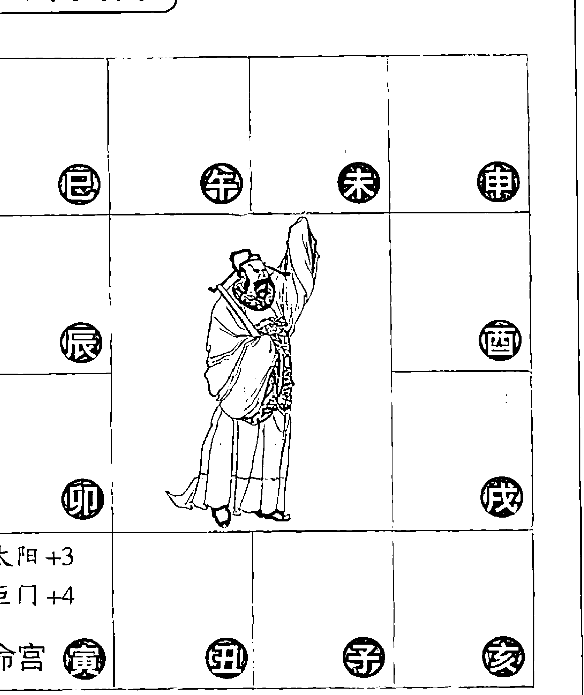

## 坐命卯宫

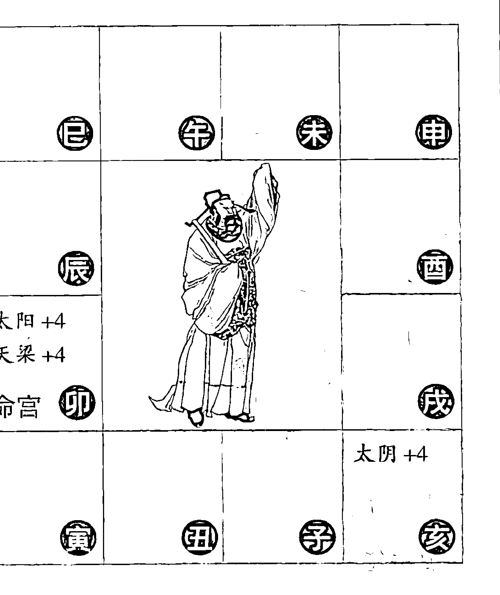

## 4 太阳星坐守卯宫：豪放磊落，生活富足

入庙太阳、天梁星同坐守卯宫，财帛宫必有入庙太阴星会照，白天生人，为“日照雷门格”，又称“日出扶桑格”。为人热情正直，心胸宽大，乐于助人，豪放磊落，心地善良，心思细腻，具卓越领导能力，富有责任感和正义感，交际能力佳，不是生于富贵之家，就是少年有成，扬名于世，钱财顺利，生活富足，富贵兼有，可享有崇高的社会地位与名声，但缺乏定性。易受环境影响而改变初衷，见诸吉守照，必大贵；见诸凶，为公卿门下士；女命有男人志，且夺夫权，多情。
命坐未宫，太阳星在卯、太阴星在亥宫入庙会照，为“明珠出海格”。财官双美，具蟾宫折桂之荣。若命宫无左、右、昌、曲星，又逢羊、陀、忌星冲破，华而不实，浪得虚名。

## 星曜布局

卯时为清晨五时至七时，卯时的太阳为“旭日东升”的入庙势，太阳渐渐破晓而出，霎时就光芒万丈，急欲一展抱负，显得志向远大，而有操之过急之虑。
太阳星入庙坐守卯宫，同宫必有入庙天梁星，解厄制化、遇难呈祥的天梁星适时化解了太阳星的急躁和困顿，能够很清楚知道自己该做什么，紧张中尚能悠闲，轻松中不失积极，富贵中不失本性，贫穷中能自得其乐，虽然仍多有惊险，但终能早遂青云之志，在事业上有所表现。

## 不同生年的命运

甲年生人：命宫太阳星化忌，由于卯宫的太阳，光芒太烈，为人处世稍嫌急进，于成功的路途上颇多惊险，此时太阳化忌，恰可减缓其急进，挫其锋芒，有如瞬间的朵云遮日，在人生旅程中有“变景”来点缀与缓冲，化忌反有助益，但仍与父母无缘；且甲年生人，有擎羊星入命，身体易有外伤（自己或阳性近亲）。

乙年生人：命宫天梁星化权，又有禄存星入命，财帛宫太阴星虽化忌，仅不利于阴性近亲，而因具有卓越才能，在事业上有发挥的空间，常于险境中化险为夷，于公职、考试可有表现，为前途奠定良好基础，经营工商业可获巨富。

乙、壬年：丑、卯、未、亥时生人，命宫的三方四正会齐了太阳、天梁、文昌、禄存星，为“阳梁昌禄格”，参加公职或国家考试，定有好成绩，财官双美，适合经商。

己年生人：命宫天梁星化科，更凸显了天梁星逢凶化吉、遇难成祥的一面。

庚、癸年生人：命宫三合会照太阴星化科，在新闻、演艺界可占有一席之地，获得名声；但庚年生人，又逢命宫太阳星化禄，在钱财上会添增一些困扰。
辛年生人：命宫太阳星化权，多在社会上居要职，在政坛上也很活跃。
壬年生人：三合会照财帛宫禄存星，命宫又天梁星化禄，考运很好，因而前程奠定了良好的基础，但会因钱财带来困扰与精神负担；壬巳、壬酉、壬丑年生人，禄存、命马星同人财帛宫，为“禄马交驰格”，愈奔动愈生财。

## 不同生时的命运

八、十二月生人，左辅、右弼星分别在命宫与财帛宫三合会照，一生可获贵人扶助。

未、亥时生人，文昌、文曲星分别在命宫与财帛宫三合会照，为“文星拱命格”，举止优雅，富知性，勤学好读，有经国济世的天才，在学术、文艺界可显荣耀，出世荣华；女命，易有感情困扰。

辰、申时生人，地劫或地空星入命，心情不稳定，且多不得志。

命坐未宫，宫中无主星，但太阳、太阴星分别在卯、亥宫入庙会照，为“日月并明格”，或称“丹墀桂墀格”，或“明珠出海格”，有才华，可获名声，早遂青云之志。

## 5 太阳星坐守辰宫：吉美之命，心想事成

无论男女命，皆为热情正直，聪明机敏，心地光明磊落，能少年得志，能随随机处理事情，具有定力，在逆境中仍能朝向目标努力，耕耘即有收获，在文教、传播、外交界皆可发展长才，担任要职；女命，可早配贤夫，在事业上的表现也不让须眉，无煞星相加会也可旺夫益子。

## 星曜布局

辰时（早晨七时至九时）的太阳为初升殿的旺势，是充满蓬勃朝气与希望“少年”时期的太阳。辰宫虽然是天罗地网中的“天罗”，但却困不住旺势“少年”太阳星的热力与光芒，再加上对宫（戌宫）又有旺势的太阴星朝照，为“日月并明格”，又称“丹墀桂墀格”，“日辰月戌并争辉，权禄非浅，早遂青云之志”，不加会吉星也十分吉美；若有幸再加遇吉星，更是成就非凡的富贵兼得之命；即使有煞星加会，成就也在一般人之上。

## 基本命运

太阳星旺势入辰宫守命，对宫（迁移宫）有旺势太阴星并争辉，又三合会照财帛宫旺势巨门星，出外有财，且多有异性结伴同行，转业、迁居可得长者相劝，并因职业升等而加薪；喜欢凭自己实力去赚钱，有掌握钱财的欲望，赚钱很辛苦，不要有高不可攀的目标，否则易蒙受重大的损失。

## 不同生年的命运

甲年生人：命宫太阳星化忌，劳碌奔波，事业多波折不顺，与父母缘薄，眼睛有毛病。

乙年生人：对宫（迁移宫）太阴星化忌，易离乡背井，漂荡不定；命宫有入庙擎羊星同坐，为“擎羊入庙格”，四墓之地可制擎羊星之凶，并保留其威强与冲劲，权威出众，富贵声扬，加遇火星则更加权威卓著，但自己或阳性近亲，易有外伤或动手术的刑伤；命宫三合会照天魁、天钺双贵星，为“天乙拱命格”，常有贵人扶助。

丁年生人：命宫的对宫（迁移宫）有太阴星化禄，三合会照财帛宫巨门星化忌，财禄顺稳，出外有异性缘，易犯桃花，处事多困扰，易生口舌是非，须防金钱纠纷。

己年生人：命宫三合会照天魁、天钺双贵星，为“天乙拱命格”。

庚年生人：命宫太阳星化禄，对宫又有太阴星化科。奔波忙碌，事业有成就，做官者能高升，上班族可当主管而掌实权，生意人有老板命，常有女性贵人暗中相助，喜存私房钱，晚年身边有钱可享用。

辛年生人：命宫太阳星化权，又三合会照财帛宫巨门星化禄，若没有凶、煞、忌星冲破，为“权禄巡逢格”。财官双美，一生顺稳，处世荣华，说话有分量，可凭“口”赚钱，具统御能力，自信心强，主观意识强烈，多有自行创业的野心。

癸年生人，命宫的对宫（迁移宫）太阴星化科，三合会照财帛宫巨门星化权。口才得以发挥，再配合行动，则无往不利而顺利生财，并减少是非，常有女性贵人暗助，喜存私房钱，晚年身边有钱可享用。

## 不同生时的命运

一、七月生人：左辅、右弼星，一星坐命宫，另一星则在对宫朝照，若无凶、煞星冲照，为“左右守垣格”，富企划力，人际关系佳，凡事可逢凶化吉，福禄终身。

子、午时生人：文昌、文曲星，分别在命宫、迁移宫对照成为“文星拱命格”，举止优雅，富知性，勤学好读，有经国济世的天才，在学术、文艺界，可显荣耀；女命，易有感情波折。

巳、未时生人：地空或地劫星入命，常心神不宁，且多不得志。

## 太阳星坐命辰宫

辰时的太阳为初升，因此，太阳星坐命辰宫为旺势，同时，对宫（迁移宫）有旺势太阴星并争辉，财帛宫三合会照旺势巨门星。

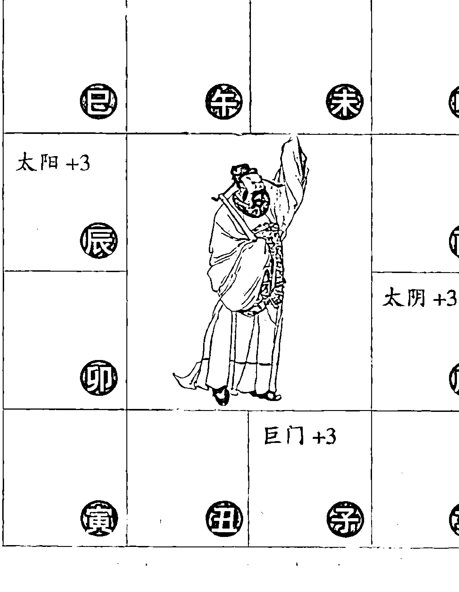

## 6 太阳星坐守巳宫：少年得志，后继乏力

太阳星在巳宫守命的人，一生口福奇佳，多能将工作与生活结合，因而已能找到适合自己兴趣的工作，也能在工作中自我成长。虽也志向远大，热情正直，少年得志，有所作为，但自信心不足，且在青少年期稍会有后继乏力的现象，若不能持续坚持奋进，则易由盛而衰；中年之后，就会有新的变化而逐渐好转。无论男女命，在婚姻方面也会有后继乏力的现象，也许在新婚初期如胶似漆，过些时日又感到婚姻枯燥乏味，节外生枝而亮起红灯，产生波折，但最终都会回心转意而白首偕老。女命，若无煞星加会，可旺夫益子。

## 星曜布局

巳时（早晨九时至十一时）的太阳为已升殿的“青少年”旺势，光芒渐渐耀眼，比辰时的太阳强烈，但因对宫有旺势巨门星朝坐，巨门星的“暗”会减弱太阳的光芒，故力量反而比辰时太阳要差。

## 基本命运

旺势太阳星坐守巳宫，酉宫（官禄宫）必有旺势太阴星二合会照，为“丹墀桂墀格”，或称“日月并明格”，少年即因才学而具声名，尔后功名生转鼎盛，才华得以彰显。同时，对宫有旺势巨门星，财帛宫有旺势天梁星三合会照，出外或移动会心神不宁，常出生于权贵之家，对钱财有清高脱俗的意味，一切顺其自然，常处于高竞争性的工作环境。男性为政治家、律师、建筑师，女性则可从事导游或餐饮服务业，男女皆喜居领导指挥地位，“宁为鸡头而不为牛后”，具大魄力，能开创新的行业。

## 不同生年的命运

- 甲年生人：命宫太阳星化忌。一生坎坷多变，比较劳碌命，以上班族为宜。
- 乙年生人：财帛宫天梁星化权，官禄宫太阴星化忌。辛劳得财，对财富欲望高，可掌财经权，偶有偏财运，事业心重，不宜经商，以上班领薪水为宜，事业与工作环境易变动。
- 丙、戊年生人：禄存星入命，可得财富与名声，尤其是丙亥、戊亥、丙卯、戊卯、丙未、戊未年生人，命马与禄存星同坐命宫；壬巳、壬酉、壬丑年生人，禄、马星同坐迁移宫，若无四煞星冲破，为“禄马交驰格”，愈奔动愈生财，常在环境变化中发展而得财，转业可获良机，一生多旅游机会。

丁年生人：官禄宫太阴星化禄，迁移宫巨门星化忌。财源持续不断，一生运气甚佳，可得贵人助，男命参艳遇，女性更能表现女性柔美的气质与风度；一生易生意外之灾，出外不顺遂，劳碌奔波，易受小人之灾。陀罗星同入命，身体易有暗疾或内伤。

丁亥、丁卯、丁未、己亥、己卯、己未、癸亥、癸卯、癸未年生人，命马星坐命，相邻二宫有禄存（或化禄）、武曲星夹命，为“财禄夹马格”，财源广进，愈动愈生财。

戊年生人：太阴星在官禄宫化权。可自行创业，多从事劳心工作，可掌权，因事必躬亲，难免劳累，能力易受赏识，升迁机会多，能任要职。男命在事业上易获异性助力。

己年生人：财帛宫天梁星化科。天梁星为清高的荫星，化科则财源平稳，能得清白之财，善于理财，能量入为出，以上班领固定薪水为宜，可得他人赠与，或施舍济助他人，利于升迁、参加考试，以及研习新知识、新技能，可增进学习能力。陀罗星同入命，身体易有暗疾或内伤。

庚年生人：命宫太阳星化禄，官禄宫太阴星化科。智商高，独立自主，主动助人，人缘佳，有女性贵人相助，凡事能逢凶化吉，一生运势平顺，能照顾和扶持配偶，事业有成，工作稳定，可掌实权，适合坐办公桌的上班族，或从事中间商，或与艺术有关的工作。

辛年生人：迁移宫巨门星化禄，命宫太阳星化权，若无煞星冲破，为“权禄巡逢格”，财官双美，一生顺遂，出世荣华，劳碌命，出外发展有人缘，并得贵人相助，为人机智，自视高，能力强，任性而不易接受别人的意见，说话有分量，具说服力，可凭“口”赚钱，喜欢干涉别人，却不受人管制，事必躬亲才会放心，能掌实权；女命则能干、劳碌，或有“妻夺夫权”的现象，使婚姻生活并不美满。

壬年生人：财帛宫天梁星化禄。有意外之财，但这些钱财常造成心神不宁，增加困扰，甚至会引起纠纷。

癸年生人：迁移宫巨门星化权，官禄宫太阴星化科。在家待不住，出外喜出风头，可依凭口才而受人赏识，工作稳定，一生运势平稳，有人缘，可得女性贵人助，凡事能逢凶化吉，可照顾到配偶，适合当上班族，或从事艺术方面工作，或从事中间商。

## 不同生时的命运

二、六月生人，左辅、右弼二星分别在命宫与官禄宫三合会照，可得贵人相助。

丙、戊年巳时生人，太阳、禄存、文昌星同坐命宫，又三合会照财帛宫天梁星，为“阳梁昌禄格”，财官双美，参加公职或国家考试，一定会有好成绩，适合经商；同时，因文昌星在官禄宫三合会照，为“文星拱命格”，举止优雅，富知性，勤学好读，出世荣华，但女命福不全，好色。

九月生人，天刑与太阳星同坐命，适合军警职。

丙、戊年丑时生人，禄存、文曲星同坐命，又三合会照官禄宫文昌星，为“禄文拱命格”，富贵兼得，能因文而进财，若无煞凑，必为富有的知名人士。

午、巳、未时生人，地空、地劫双星同入命宫，或同夹命宫，为“命里逢空格”，或“空劫夹命格”，常会“半天折翅”或“浪里行船”，心神不宁，且多不得志。甲年巳、未时生人，化忌星坐命，又逢空、劫夹命，为“空劫夹忌格”，更是不吉利。

## 7 太阳星坐守午宫：性格孤僻，才华卓越

太阳星在午宫守命，为“金灿光辉格”，或称为“日丽中天格”，为人豪迈磊落，思维敏捷，志向远大，自信心强，才华卓越，交游广阔，有专权之贵，敌国之富。此时，迁移宫必有入庙天梁星，转业、迁居、出国等变迁，总有贵人相助；三合必会见官禄宫落陷的巨门星，恃才傲物，性格孤僻，多从事与“口”有关的行业，尤其适合做育英才的教师工作，心直口快，易引起他人反感，使人际关系受损，甚或有口舌是非，或文书官非。女命，可配贤夫。

## 星曜布局

午时（中午十一时至下午一时）的太阳为“日丽中天”的旺势，此时的阳光是一天之中最强烈耀眼的时刻，由于锋芒太露，且午宫太阳星为独坐，有激发进步的能力，而无包容、涵盖的度量，工作有恒心、少抱怨，并能找到乐趣，在事业上虽然能成功，但多与父亲无缘，孤独无倚，在健康方面常有疾患。

## 不同生年的命运

**甲年生人：** 命宫太阳星化忌。个性率直、固执，与父母缘薄，奔波劳碌，易犯小人，常受朋友拖累，事业波折不顺，成败不一，较不稳定，以上班族为宜；女命，感情生活不顺利，易有失恋的痛苦经验，且大都为晚婚。甲申、甲子、甲辰年生人，禄存、命马星同入命宫，为“禄马交驰格”，愈奔动愈生财。

**乙年生人：** 迁移宫天梁星化权。在家待不住，出外爱出风头，可得长上助力，一层才华而受人赏识，掌握实权。

**丙、戊年生人：** 擎羊星落陷入命，为“马头带箭格”，自己或阳性近亲，易有外伤或手术，生活较奢侈浪漫。

**丁年生人：** 官禄宫落陷巨门星化忌，禄存星也同入命宫。多口舌是非，有时，一句无心的话也会得罪人，一时激愤之词竟导致他人怀恨终身，一生是非多，似乎冥冥之中几乎无法摆脱小人的纠缠，经营事业易遭诈欺而倒闭，与人兴讼容易败诉，多不务正业，以从事律师、教师、命相等开口饭为宜。

### 太阳星坐命午宫

**己年生人：** 迁移宫天梁星化科。利于考试、研习新知识及新技能，可增加学习能力与知名度，出外有贵人相助；同时，有禄存星入命宫，财源绵绵不断，富贵兼有，但往往在富有之后遭人猜忌、排挤而产生纷争。

午时的太阳为日丽中天，因此，太阳星坐命午宫为旺势，为“金灿光辉格”，或称为“日丽中天格”，且三合必会见官禄宫落陷的巨门星。

丁、己年辰时生人，太阳、天梁、文昌、禄存四星曜在命宫的三方四正会齐，为“阳梁昌禄格”，参加公职或国家考试有好成绩，财官双美，适宜经商。

| | | 太阳+3 | | |
| :---: | :---: | :---: | :---: | :---: |
| 辰 | 巳 | **命宫** | 午 | 未 | 申 |
| 卯 | | | | | 酉 |
| | | | 巨门-2 | 戌 |
| 寅 | | 天梁+4 | 丑 | 子 | 亥 |

**庚年生人：** 命宫太阳星化禄。主贵不主富，智商高，独立自主，人缘佳，奔波忙碌，事业有成，能掌实权，风光一时，凡事能逢凶化吉，一生顺遂，唯幼年不利于父亲，或健康不佳，或年幼失怙。

辛年生人：命宫天钺贵星入坐，又三合会照财帛宫天魁贵星，为“天乙拱命格”，文章盖世，贵人多助；同时，命宫太阳星化权，官禄宫巨门星化禄，为人机智，主观意识强烈，自视很高，具统御能力，奔波忙碌，能掌实权，说话有分量，可从事政治工作，或经营餐饮业与口福享受有关的工作，女命易有“妻夺夫权”的倾向，婚姻生活常不美满。

壬年生人：迁移宫天梁星化禄。出外有长上缘，能得长上福荫。

癸年生人：官禄宫巨门星化权。可充分发挥巨门星“口”舌的威力，也因而减少了巨门星的口舌是非。

## 不同生时的命运

十月生人，天刑星与太阳星同坐命，适合军警职。
巳、未时生人，地空或地劫星入命，常心神不宁，且多不得志。

## 8 太阳星坐守未宫：宜男不宜女

太阳、太阴星同在未宫入命，或命在未宫，太阳、太阴星同在丑宫照命，为“日月同临格”，智慧特优，早年开窍，学以致用，若逢化科、化权星，允文允武，官居伯侯，为大贵之命，但需防感情及婚姻的波折。

## 星曜布局

未时是下午一时至三时，太阳为将“偏印”的地势，阳光因略偏西方而稍减弱，同宫又有不得地势的太阴星同坐，因而有受制于太阴星的现象。

## 基本命运

太阳星在丑宫也有太阴星同坐，但丑宫的太阳为失辉（不得地势），月亮却皎洁明亮（入庙）；而未宫的太阳虽略偏西仍然力道很强，月亮则无光辉。在丑宫的太阴照顾太阳，利于女命；在未宫是太阳扶持太阴，宜于男命。因为必须顾虑他星而受制，为人谨慎保守，适合较稳定性的公、教职，或有制度的民营企业工作，不宜经商。工作上常日夜颠倒，或从事异性较适合的工作（如男性从事护理工作）。若个性如太阳而刚强好动的人，因日略偏西，容易先勤后惰，做事有虎头蛇尾的倾向；但若个性如太阴而外静内急者，则不作此论。

命宫在未宫，太阳星在巳宫、太阴星在酉宫共同朝照财帛、官禄宫，为“日月并明格”，或称“丹墀桂墀格”，心地光明磊落，少年即因才学而具声名，尔后越来越稳，功名生转鼎盛，但逢擎羊、陀罗或化忌星，则与双亲缘分薄。

## 太阳星坐命未宫

未时的太阳，为将“偏印”的地势，阳光因略偏西方而稍减弱，同宫又有不得地势的太阴星同坐，因而有受制于太阴星的现象。

命坐未宫，太阳星在卯、太阴星在亥宫入庙三合会照，为“明珠出海格”，兴趣广泛，朝气蓬勃，具有才华，处事光明磊落，稳步蟾宫，可获声名，女命则才德双备，若无左、右、昌、曲星而又逢羊、陀、忌星冲破，华而不实，浪得虚名。命坐未宫，若遇煞星，会破坏太阳与太阴星原来所维持的和谐局面，使太阳星“孤立”。凡事忌孤行，只求表面而不顾虑现实，因而有成、有败，对财务也格外的珍惜。

## 不同生年的命运

- 1. 甲年生人：天魁、天钺双贵星，分别在命宫及迁移宫对照，为“坐贵向贵格”，文章盖世，贵人多助。同时，命宫太阳星化忌，与父母缘薄，一生劳碌奔波；女命，感情、婚姻易生波折，或有晚婚的可能。
- 2. 乙年生人：官禄宫落陷天梁星化权，命宫太阴星化忌。主观意识强，做事有原则，工作有表现，对女性近亲不利，男命多漂泊他乡；女命心情不稳定，易有感情纠纷。
- 3. 丁年生人：擎羊星入庙坐命，为“擎羊入庙格”，具冲劲而权威出众，富贵声扬，加遇火星则权威卓著；逢凶星则刑伤难免。同时，命宫太阴星化禄，有异性缘，财禄顺遂，男命，可娶娇妻美眷，但易因桃花艳遇而有过失；女命，感情多波折。
- 4. 戊年生人：天钺、天魁双贵星分别在命宫及迁移宫对照，为“坐贵向贵格”，文章盖世，贵人多助。同时，命宫太阴星化权，心绪多波动，女命具权威，驭夫有道，劳禄命；男命可创业。
- 5. 己年生人：擎羊星入庙坐命，为“擎羊入庙格”。同时，官禄宫天梁星化科，在事业上虽无实权，但风评甚佳，薄具名声，但爱出风头。
- 6. 庚年生人：天钺、天魁双贵星分别在命宫及迁移宫对照，为“坐贵向贵格”，出外多贵人相助；但陀罗星同时入命，会破坏日、月间的和谐，因而肯孤行，成败无定论。同时，命宫太阳星化禄，且太阴星化科，奔波忙碌，事业有成，有女性贵人暗助，艺术方面的才华有表现，较注重表面而忽略实质，例如，较重视文凭的获得，而不注重实际的所学。
- 辛年生人：命宫太阳星化权。更具有统御能力，充满自信，主观意识强烈；女命，能干、劳碌，有“妻夺夫权”之嫌，婚姻生活多不美满。
- 壬年生人：官禄宫天梁星化禄。以从事文、教职为佳，能享有声誉。
- 癸年生人：命宫太阴星化科。有女性贵人，艺术才华有表现，较注重表面而忽略实质。

## 不同生时的命运

三、五月生人，左辅、右弼双星同夹命宫；四月生人，左辅、右弼双星同坐命宫，若无凶、煞星交会，为“左右守垣格”，或“左右同宫格”，富企划能力，人际关系佳，凡事可逢凶化吉，福禄终身。

寅、辰时生人，文昌、文曲星同夹命宫，无煞星相凑为“昌曲夹命格”，或称“文星暗拱格”，不贵显即富；女命有才智及姿色，多情。卯时生人，文昌、文曲双星同坐命宫，为“文贵文华格”，举止优雅，富知性，勤学好读，有经国济世之才，在学术、文艺界，可显荣耀而出世荣华。

辰、申时生人，地空或地劫星入命，常心神不宁，且多不得志。

## 太阳星坐守申宫：先苦后甘，方能成器

太阳、巨门星同在申宫守命，为“巨日同宫格”（寅宫比申宫强，因其巨、日皆为庙旺）。财运旺盛，富进取心，具雄辩之才，热心公益，必须与对手激烈竞争，并勤勉努力，才能先苦后成，因而易生是非，逢化忌星则是非更多，适宜文、教职，多能恪尽职守地培育英才，桃李满天下。

## 星曜布局

申时（下午三时至五时）的太阳为逐渐西沉，已“偏印”的地势，阳光渐渐转弱，申宫又有入庙的巨门星与太阳星同坐，巨门星的“暗”喜爱太阳星同宫照耀，可发挥其口才及交涉的长处，而减低了其口舌是非的缺点，但因申时的阳光较弱，再分心费力去照顾巨门星，使其成就发展苗而不秀，往往有虎头蛇尾、先勤后惰的现象。

## 基本命运

为人随和，凡事较能不计是非，而可随遇而安的自得其乐，能面对工作，并可学以致用；而寅宫虽也是巨日同宫，但寅宫的太阳为旭日东升的旺势，虽分心去照顾巨门星，但仍多能一本初衷，奋发向上。

巨、日同坐申宫加会六吉星，可减低其苗而不秀及先勤后惰的缺点。女命则多迟婚，若逢太阳星化忌或遇六煞星，易有感情波折，甚或有堕落风尘之虞。

## 不同生年的命运

- 甲年生人：命宫太阳星化忌。事业波折不顺，一生劳碌奔波，多口舌是非，宜从事教师、律师、民意代表等动“口”的职业。女命，感情、婚姻易生波折，多有失恋和晚婚的现象。
- 乙年生人：天钺贵星坐命，三合会照官禄宫天魁贵星，为“天乙拱命格”，文章盖世，贵人多助。
- 丁年生人：命宫巨门星化忌。易因口舌是非而害己，多小人纠缠，与父母、上司多有歧见和代沟，宜吃开“口”饭，如律师、教师、命相师等。女命，有感情困扰，宜晚婚。
- 己年生人：天钺贵星入命，又三合会照官禄宫天魁贵星，为“天乙拱命格”。
- 庚年生人：命宫太阳星化禄，禄存星又同坐命，为“禄合鸳鸯格”，财官双美，受人敬重，有才华；唯丑、卯、巳、未、酉二亥时生人，遇地空或地劫星冲破，为“两重华盖格”，吉处藏凶，孤高贫困，与僧佛有缘。庚寅、庚午、庚戌年生人，命宫禄存、命马星同坐；甲申、甲子、甲辰年生人，迁移宫禄存、命马星同坐，若无羊、陀、火、铃四煞星冲破，为“禄马交驰格”，愈奔动愈得财。

## 太阳星坐命申、酉宫

申时的太阳逐渐西沉，太阳星坐命申宫为地势；酉时夕阳西下，太阳星坐命酉宫为平势。且申宫又有入庙的巨门星与太阳星同坐，酉宫的平势太阳星与地势天梁星同坐。

### 坐命申宫

| 巳 | 午 | 未 | 申 |
| :---: | :---: | :---: | :---: |
| 辰 | | | 酉 |
| 卯 | | | 戌 |
| 寅 | 丑 | 子 | 亥 |

（表格右上角注有“太阳+2 巨门+4”）

### 坐命酉宫

| 巳 | 午 | 未 | 申 |
| :---: | :---: | :---: | :---: |
| 辰 | | | 酉 |
| 卯 | | | 戌 |
| 寅 | 丑 | 子 | 亥 |

（表格右上角注有“太阳0 天梁+2”）

辛年生人：命宫巨门星化禄、太阳星化权，若无凶、煞、忌星冲破，为“权禄巡逢格”，财官双美，一生顺稳，出世荣华。

癸年生人：命宫巨门星化权。说话有分量，令人信服，能将是非解释清楚而澄清，在文、教方面可获得成就。

## 太阳星坐守酉宫：晚发之象，贵而不显

酉宫的平势太阳星与地势天梁星同坐，虽然和卯宫类似，但卯宫的太阳星与天梁星皆为入庙，二者在星曜的光度上相差很多，使命坐酉宫的人，缺乏定性，易受环境影响，但仍清楚自己该做什么，常有贵而不显，秀而不实之憾，徒增劳碌奔波，有晚发的趋势。宜迟婚，事业在中年以后才有良好的表现。

## 星曜布局

酉时（下午五时至晚上七时）的太阳为“夕阳西沉”的平势，艳丽的晚霞，虽让人流连欣赏，但仍令人有“夕阳无限好，只是近黄昏”的感受。与天梁星同坐。

## 不同生年的命运

- 甲年生人：命宫太阳星化忌。人生历程多坎坷，且多惊险，与父母缘薄，感情生活易有波折，宜晚婚。
- 乙年生人：命宫天梁星化权，财帛宫落陷太阴星化忌。性喜独来独往，对事物有独特见解，好管闲事，能在险境中化险为夷，于公职和考试方面有表现；唯对阴性近亲不利，对钱财也有不利的影响，有远离乡土之兆，女性则常心绪不定而容易烦躁。
- 丙年生人：天魁星入命，有贵人助，一生顺利。丙亥、丙卯、丙未年生人，禄存与命马星同坐财帛宫，为“禄马交驰格”，常在奔动中生财。丙亥、丙卯、丙未年，丑、巳、未、酉时生人，太阳、天梁、文昌、禄存星在命宫及其三方四正会齐，为“阳梁昌禄格”，财官双美，参加公职或国家考试定有好成绩。
- 丁年生人：天钺星入命，有异性贵人帮助，能逢凶化吉。同时，财帛宫落陷太阴星化禄，女命更具温柔个性，财禄尚顺遂；男命有异性缘，虽尚有发展，但成果稍逊，历程较艰辛，在感情方面易生困扰。
- 戊年生人：财帛宫太阴星化权。劳心费力，男命可创业，女命可掌权。戊亥、戊卯、戊未年生人，禄存、命马星同入财帛宫，为“禄马交驰格”。戊亥、戊卯、戊未年，丑、巳、未、酉时生人，太阳、天梁、文昌、禄存星在命宫的三方四正会齐，为“阳梁昌禄格”。
- 己年生人：命宫天梁星化科。对理论与技术方面的研究常有突破性的创见，人缘好，名声佳，有贵人提拔，利于升迁和考试。
- 庚年生人：命宫太阳星化禄，财帛宫太阴星化科。奔波忙碌，事业有成，但因与天梁星同宫，对钱财易增添困扰，可赚清白之财，有女性贵人暗助，较注重外表而不注重内在。同宫有擎羊星同坐，幼年有刑伤，易有意外，宜从事文、教、公、武职、外科医生或专门技艺的工作。
- 辛年生人：命宫太阳星化权，禄存星同坐命。具统御能力与自信心，可担任要职，财源不断，女命有“妻夺夫权”之虞，婚姻生活不美满。辛年丑、巳、未、酉时生人，太阳、天梁、禄存星同入命宫，本宫或三方四正宫位又加会文昌星，为“阳梁昌禄格”，财官双美，参加公职、国家考试定有好成绩。
- 壬年生人：命宫天梁星化禄。身体健康长寿，有长辈福荫，一生多遇难成祥，对钱财易造成精神负担。
- 癸年生人：财帛宫太阴星化科。多赚清白之财，或因女人之助而得财，较注重外在而不重内涵，需防桃花纠纷。

二、六月生人，左辅、右弼星，一星坐命，另一星则在财帛宫三合会照，一生多辅佐力量。尤其，二、六、十、十二月，丑时生人，文昌星坐命，三方四正又有左辅星拱照，为“辅拱文星格”，有敏捷才华，可出将入相，享受尊荣。

丑、巳、酉时生人，文昌、文曲星，同在命宫及其三方四正拱照，为“文星拱命格”，勤学好读，有经国济世之才，可在学术、文艺界显荣辉，出华荣华。女命多情。

## 太阳星坐守戌宫：劳碌奔波，大器晚成

## 星曜布局

戌时，是晚上七时至九时，此时太阳的光芒全失，为“失辉”不得地势。同时，其对宫的太阴星也是落陷失辉，为“日月反背格”。

## 基本命运

太阳星坐守戌宫的人，劳碌的状况随加会的星曜吉凶而不同，加会吉星，只是事倍功半，付出得多，收获得少，但仍有代价和成果；若加会煞星，则劳而无获，徒劳而无功；逢煞星又遇化忌星，反能在劳碌后有收获，但易有眼疾。太阳星坐命的人，性格坚强，具奋斗精神，对劳碌往往自己会不以为苦。

与父母缘薄也会随同宫星曜的吉凶而异，或许是自幼离家只身在外工作或求学，或许是自幼父母体弱或经商失败；若同宫遇六煞星或化忌星，则在幼年时易与父亲有生离死别的现象。

太阳星在戌宫坐命，太阴星在对宫朝照，财帛宫必有旺势巨门星三合会照，出外多阻碍，一动不如一静，须劳心费力凭自己的卒勘奋斗去生财，宜公、教职。

## 不同生年的命运

- 甲年生人：命宫太阳星化忌。有眼疾之灾，与父母无缘，一生劳碌奔波，事业波折不顺；女命，婚姻、感情易生波折，有失恋、晚婚的现象。
- 乙年生人：迁移宫太阴星化忌。不利于阴性近亲，有跋涉他乡之兆，迁移宫又有擎羊星同坐，并三合会见天魁及天钺星，可减低化忌星的凶煞。
- 丁年生人：迁移宫太阴星化禄，财帛宫巨门星化忌。出外发展可得异性帮助，或从异性间接获财，但处事多困扰，易生口舌是非，该来之财常因突有阻碍而失去，甚至反而破财，易与人争财而生是非。
- 戊年生人：迁移宫太阴星化权。在家待不住，出外易受人赏识，但不免财来财去，女命则办事、判断能力强。
- 庚年生人：命宫太阳星化禄，迁移宫太阴星化科。奔波忙碌，困苦奋斗才能有成，喜存私房钱，晚年身边有钱享用。
- 辛年生人：命宫三合会见天魁和天钺双贵星，为“天乙拱命格”，文章盖世，贵人多助。

### 太阳星坐命戌宫

戌时，太阳的光芒全失，因此，太阳星坐命戌宫为“失辉”不得地势。同时，其对宫的太阴星也是落陷失辉，成“日月反背格”，辛劳难免。如加会吉星，则历经辛劳能有所回报。

| 巳 | 午 | 未 | 申 |
| :---: | :---: | :---: | :---: |
| 太阴-2 | | | 巨门+3 |
| 辰 | | | 酉 |
| 卯 | | | 太阳-1 |
| | | | 命宫 戌 |
| 寅 | 丑 | 子 | 亥 |

多助。财帛宫巨门星化禄，命宫太阳星化权，说话有分量，可凭“口”赚钱，充满自信，具统御能力。女命多劳碌、能干，有“妻夺夫权”之嫌，婚姻生活多不美满。同时，擎羊星入庙坐墓宫，为“擎羊入庙格”，具威强与冲劲，权威出众，富贵声扬，加遇火星则权威卓著，逢凶、煞星则刑伤难免。
- 壬年生人：陀罗星入命，身体易有暗疾。
- 癸年生人：财帛宫巨门星化权，迁移宫太阴星化科。口才得以发挥，可凭“口”而生财，出外得异性暗助，喜存私房钱，晚年身边有钱可享用，需防桃花纠纷。

## 不同生时的命运

一、七月生人，左辅、右弼星分别在命宫及迁移宫对照，为“左右守垣格”，富企划能力，人际关系佳，凡事可逢凶化吉，但命、迁宫的日、月皆为失辉，为先成后败，先荣后衰。
子、午时生人，文昌、文曲星分别在命宫及迁移宫对照，为“文星拱命格”，勤学好读，具经国济世之才，在学术、文艺界可显荣耀；女命多情。

## 太阳星坐守亥宫：宜离乡背井，自力奋斗

太阳星坐守亥宫。对宫（迁移宫）有旺势巨门星对照，三合会照财帛宫旺势天梁星和官禄宫落陷太阴星。个性刚强，见解独特，不善与人交往，易惹是非上身，多思虑，常奔忙，易罹患眼睛疾病。若不遇吉星，幼年不利于父亲，多有改姓或过继的现象，对钱财十分淡泊，可从事艺术工作。女命，若加遇吉星，事业能有表现，中年以后，家庭生活幸福美满。

## 星曜布局

太阳星在亥宫，是晚上九时至十一时的太阳，虽为“落陷失辉”而毫无光芒，但恰似黎明前的黑暗，正期待着明早黎明的来临，暗藏着无限的生机，所以，比戌宫的太阳增添许多希望与人生的期待。

## 基本命运

太阳星落陷坐守亥宫，三合会照官禄宫的太阴星也为落陷失辉，为“日月反背格”，披星戴月，无福清闲和享乐之劳碌命，与父母缘薄，须离乡背井，自力奋斗，有桃花困扰，多能将工作与生活结合在一起。

## 不同生年的命运

- 甲年生人：命宫太阳星化忌。与父母缘薄，需防眼睛疾病，一生奔劳，事业波折不顺。若遇六吉星，可有专门学识与技能，事业有表现，宜从事公、教或大众传播工作。
- 乙年生人：财帛宫天梁星化权，官禄宫太阴星化忌。辛劳得财，一生命运多变化，大器晚成，或先破后成，事业上能掌权，若凶、煞星同坐，则多波折或一事无成，对阴性近亲不利，宜晚婚。乙年卯、巳、未、亥时生人，阳、梁、昌、禄星在命宫的三方四正会齐，为“阳梁昌禄格”，财官双美。
- 丙年生人：天钺星坐命宫，有异性贵人暗助，机运良好，凡事可逢凶化吉，一生顺遂。丙亥、丙卯、丙未、戊亥、戊卯、戊未年生人，迁移宫禄存星与命马星同坐，或壬巳、壬酉、壬丑年生人，禄存、命马星同坐命宫，为“禄马交驰格”，愈奔动愈生财。丙、戊、壬、乙年卯、巳、未、亥时生人，太阳、天梁、文昌、禄存四星曜在命宫的三方四正（命、迁、财、官）宫位会齐，为“阳梁昌禄格”，参加公职或国家考试定有好成绩，财官双美。
- 丁年生人：天魁星坐命，在最需要人帮助时，总有贵人协助，凡事可逢凶化吉，进展顺利。同时，官禄宫太阴星化禄，迁移宫巨门星化忌，事业发展倍感辛劳，可有成就，也较能持久，男命多艳遇，女命则更有气质；出外多是非，感情也多困扰，宜晚婚，具有专门学识与技能，宜公、教或大众传播业。
- 戊年生人：官禄宫太阴星化权。可从事劳心工作，也可创业、掌权，感情多纷扰，宜迟婚，男命在事业上可获得异性助力，女命判断、办事能力增强，对驭夫也颇得其道。戊亥、戊卯、戊未年生人，禄、马星同坐迁移宫，为“禄马交驰格”，愈奔动愈生财。戊年卯、巳、未、亥时生人，阳、梁、昌、禄四星曜同在命宫的三方四正会齐，为“阳梁昌禄格”，财官双美。
- 己年生人：财帛宫天梁星化科。可得清白之财，利于考试、研习新知，可获得他人赠与，或施舍济助他人。
- 庚年生人：命宫太阳星化禄，财帛宫太阴星化科。奔波忙碌，事业有成，为官者能高升，上班族能任主管，生意人可做老板；可从事艺术或中间商生意而得财名。
- 辛年生人：命宫太阳星化权，迁移宫巨门星化禄，若无凶、煞、忌星冲破，为“权禄巡逢格”，财官双美，一生顺稳，出世荣华，说话有分量，具说服力，可凭“口”赚钱，充满自信心，具统御能力，奔波忙碌才会有收获。女命多能干、劳碌，喜掌权，易有“妻夺夫权”之嫌，婚姻生活多挫折。
- 壬年生人：禄存星坐命宫，一生财源不断，勤俭不浪费。壬巳、壬酉、壬丑年生人，禄存、命马星同坐命宫，为“禄马交驰格”，愈奔动愈生财。戊年卯、巳、未、亥时生人，太阳、天梁、文昌、禄存四星曜同在命宫的三方四正会齐，为“阳梁昌禄格”，参加公职、国家考试定有好成绩，财官双美。同时，财帛宫天梁星化禄，有意外之财，但天梁星主清高，却往往难以承受此意外之财，或成为沉重精神负担，或无法妥善处理而产生困扰，甚至会引起纠纷。
- 癸年生人：迁移宫巨门星化权，官禄宫太阴星化科。可发挥巨门星口舌上的威力，令人信服，并减少是非，可在艺术、中间商生意得财名，唯须防桃花纠纷。同时，陀罗星坐命，需注意身体上的暗疾。癸巳、癸酉、癸丑年生人，天马星同坐命，相邻二宫又有武曲、禄存及化禄星（破军星化禄）夹命，为“财禄夹马格”，财运佳，愈动愈生财。

## 不同生时的命运

- 八、十二月生人，左辅、右弼星分别在命宫及官禄宫三合会照，一生多辅佐之助。
- 未、亥时生人，文昌、文曲星分别在命宫及官禄宫三合会照，为“文星拱命格”，富知性，勤学好读，多有经国济世之才，在学术、文艺界可显荣耀，出世荣华；女命不宜，福不全，好色。
- 二、四、八、十二月亥时生人，文昌星坐命，左辅星在三方四正拱照，为“辅佐文星格”，有敏捷才华，可出将入相，享受尊崇。
- 子、丑二亥时生人，地空、地劫星同坐命宫，或同夹命宫，为“命里逢空格”，或“空劫夹命格”，一生多起伏，犹如“浪里行船”，并常会突遭失败，犹如“半天折翅”，必须信仰宗教且常离家，才能清闲延寿。甲年丑二亥时生人，化忌星坐命，又逢空、劫星夹命，为“空劫夹忌格”，更是不吉利。

### 太阳星坐命亥宫

亥时，太阳毫无光芒，因此，太阳星坐命亥宫为“落陷失辉”，但也恰似黎明前的黑暗，暗藏着无限的生机。所以，比戌宫的太阳增添许多希望与期待。太阳星落陷坐守亥宫，三合会照官禄宫的太阴星也为落陷失辉，同样是“日月反背格”，工作辛劳难免。

| 巳 | 午 | 未 | 申 |
| :---: | :---: | :---: | :---: |
| | 巨门+3 | 天梁+3 | |
| 辰 | | | 酉 |
| 太阴-2 | | | 戌 |
| 卯 | 寅 | 丑 | 子 | 亥 | 太阳-2 |

## 武曲星坐命身宫

武曲星阴阳五行属阴金，为北斗第六星，化气为“财”，为“财帛宫”主。

### 容态与性格

武曲星坐命身宫的人，脸方圆，身材中小，中年后，骨架挺拔或肩宽背厚，眼神坚毅慈和，动作敏捷，声高而洪亮，易引人注意，面带威严，不笑时好像很凶，具领袖风范。男性体壮而肌肉结实，多通晓各项运动，活力充沛；女性多貌美。

性格刚毅而爽朗，处事冷面而果决，稍嫌急躁短虑，易倾向于独断，待人处世欠融通，心直善良，对不满意的事务，皆直接反应，主观倔强，自我要求高，不屈不挠而不畏挫折，诚实信用且重义气，权利欲望大，活动力强，工作热心，富实行力。

女命，脾气稍嫌刚强，婚后喜外出工作，较保守认命，劳碌孤独，喜拥握家权，对丈夫的过错过分苛责，多主张“妇唱夫随”的反调，因而夫妻之间易生口角。

### 命理推断

武曲星是紫微斗数诸星曜中一颗好比金矿的财星，天生即具有财性，与钱财特别有缘，一生脱离不了努力赚钱的愿望和兴趣，肯持续努力工作，但是必须要挖掘、冶炼、铸造之后，才能发挥其流通性，即必须先有事业，然后才有钱财，往往要中年事业发达之后，始见财源滚滚而来。

武曲星为将星，又为寡宿星，故孤独无援，形势孤立，性喜争夺，争则有权，争则势愈孤，所以武曲星有权无势，白手起家，有相当的自我成就感。但是，这种死不认输的性格，学起东西来较能精通，这一点与太阳星恰好相反。

天机星是企划家，武曲星则是实行家，有领导力与权力欲，自我期许高，可攻可守，可动可静，富执行能力，但因为处处要争，有时会兴起新奇点子，这些点子虽非全盘性的计划，但靠着果断的执行力，做起来也常是有板有眼。因此，命带武曲星的人，较适合与“金”有关，或偏重执行力的银行、证券公司等金融业，军警执法人员，或有固定蓝图遵循的土木建筑界。女命，则宜经营餐饮业、珠宝业及公教人员；武曲星庙旺守身、命宫，三方四正有吉星拱照，为贵妇。

武曲星刚毅果决，又为寡宿星，使人偏重理智而产生激励作用，虽有利于事业上的冲刺，而多有表现，且又为象征金矿的财星，是一颗吉星，但其孤克对婚姻则具有破坏## 武曲星在各宫的亮度

在紫微斗数诸星曜中，武曲星是一颗好比金矿的财星，天生即具有财性，与钱财特别有缘。武曲星同时也是将星、寡宿星，因此较为孤独无援，也有死不认输的性格，学艺较能精通。武曲星星性的发挥程度根据其在各宫亮度的不同而不同。

| 宫位 | 武曲亮度 | 同宫星曜及亮度 |
| :--- | :--- | :--- |
| 巳 | 0 | 破军 0 |
| 午 | +3 | 天府 +3 |
| 未 | +4 | 贪狼 +4 |
| 申 | +2 | 天相 +4 |
| 辰 | +4 | 无 |
| 酉 | +1 | 七杀 +3 |
| 卯 | +1 | 七杀 +3 |
| 戌 | +4 | 无 |
| 寅 | +2 | 天相 +4 |
| 丑 | +4 | 贪狼 +4 |
| 子 | +3 | 天府 +4 |
| 亥 | 0 | 破军 0 |

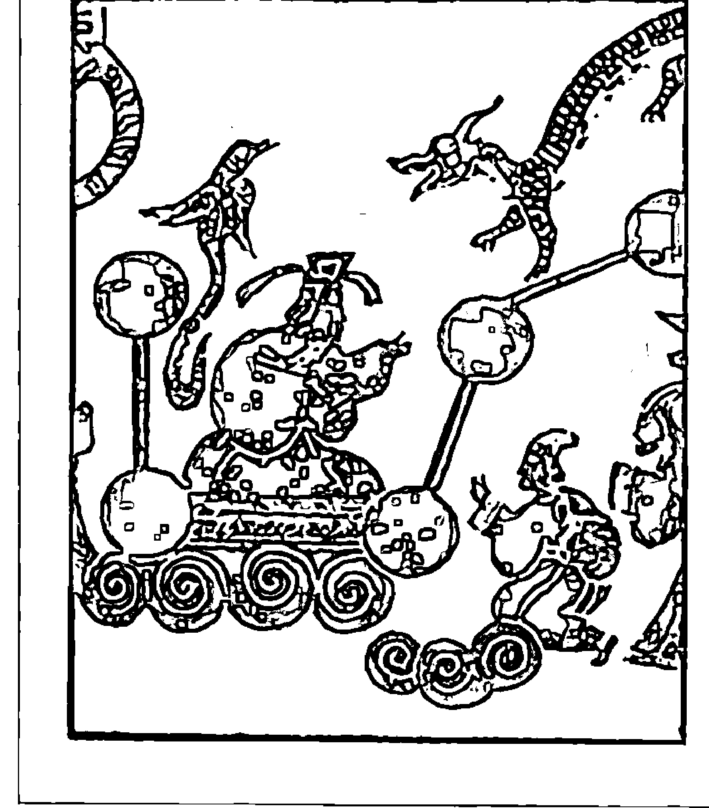

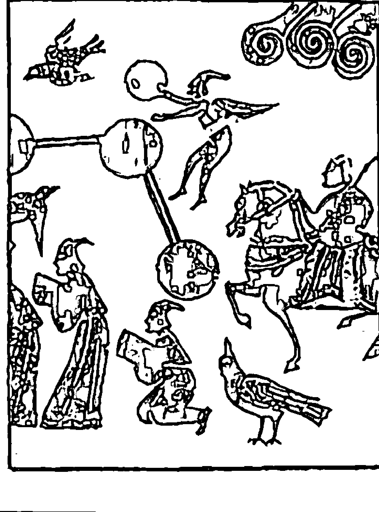

在古代天文学中，武曲星是北斗七星中的一颗。北斗七星分别为：贪狼、禄存、巨门、文曲、武曲、破军、廉贞。图为古代北斗七星拓片。

武曲星对婚姻的影响，或为迟婚，或是夫妻感情不睦，或是聚少离多，要不就是生离死别，这一切均视武曲所坐宫位，及其所会照星曜的吉凶而定，但不论坐何宫位，逢化忌星及火星，皆对婚姻不利。

女命武曲星坐命，古人有“妻夺夫权”之说，此因武曲星刚毅果断，性喜争夺的个性，若不外出工作而成为职业妇女，只有在家里发挥，难免有妻夺夫权之嫌。但职业妇女可将武曲星的特性，发挥在社会上与其他男性一争长短，不但可趋吉避凶，在事业上也能有一番作为。所以，女命武曲星坐命，最宜职业妇女。

武曲星坐命的人，肯工作，不会让自己闲下来，喜欢没事找事，工作积极而有创造性，不断开发，不断努力，充满了生机，并且有机会从事与财经或轻、重工业或与矿藏直接或间接有关的工作（如建筑业），必须秉持锲而不舍的毅力，辛勤工作，凡事须三思且预留退路，且发挥等待与忍耐力，经千锤百炼才得延伸扩展而发挥潜能。

武曲星对四化星格外敏感，武曲星化禄可增加财源及各种进财的机会，经商可发；武曲星化权则有独当一面的能力，具有权威，宜往武职方面发展；武曲星化科具有文艺学养，利于文艺方面的研究发展，可望功成名就；武曲星化忌则易引发各种事情的“中断”现象，凡事困扰重重，诸多不顺，缺乏回旋的余地。

武曲星喜与六吉星同宫或会照，可增加武曲星的气势，并发挥其优点。武曲星也喜遇禄存星增添财源，遇化禄、化权、化科星增添其光辉。

武曲星遇七杀、破军、贪狼三星之一，以及四化星同宫或会照，因杀、破、狼为人生大变化的枢纽，武曲星介入其中，再加上其对四化星的敏感，所激发出来的特别力量，实在不可忽视。

## 1 武曲星坐守子、午宫：长寿，可成大事

武曲与天府星同坐子、午宫的人，具领导与行动能力，长于企划与管理，也能付诸实行，表达能力强，富经营手腕，可成大事业，在金融界可掌大权，并能长寿。女命多有为有守，有丈夫志，遇吉星，有领导才干，逢武曲星化权则刚毅有主见，宜选择个性温和的对象为佳。

## 星曜布局

武曲星在子、午二宫旺势守命，必有天府星同坐（子宫天府星为入庙，午宫天府星为旺势）。天府星是天上的“财库”，武曲星是“金矿”，二财星重逢实在有助于财源。而且天府星的温厚稳重，与聪明及刚毅独断的武曲星相遇，产生中和、平衡的作用，形成循序而顺利发展的力量，天府星的保守稳定性，也减少了武曲星孤克争夺而不利于女命的现象。

## 基本命运

武曲、天府星同坐子、午宫守命，对宫（迁移宫）必有旺势七杀星对照，三合必会照财帛宫入庙廉贞星，以及官禄宫地势紫微和天相星。喜四处游荡，在家待不住；衣食终生无忧，经商虽有波折，但可因而致富；精于领导，常是公司的高阶主管，可望功成名就，多不轻易变换职业，为最佳的幕僚（女性为秘书或文书）人才，适合须要协调的职业，如民意代表、保险或推销业，可名利双收，不过常名大于利。

武曲、天府星同坐午宫，朝照子宫，贪狼、破军星必分别在官禄及财帛宫会照子宫，务必谨防水厄，有投河溺水的征兆。

武曲、天府星同于子、午宫守命，若与禄存星同宫，再加遇六吉星，财官双美，能成巨富，如遇煞星同宫或冲照，难免减色，并增添卒劳，宜公职，可有表现。

武曲、天府星同坐子宫较午宫为吉，因子宫的天府星为入庙。

## 不同生年的命运

甲年生人：命宫武曲星化科，财帛宫廉贞星化禄，若无凶、煞星，为“科名会禄格”，才华卓著，远近知名，财名皆美。具文艺学养，办事能力增加，可提高声望，利于文艺方面的研究发展，可望功成名就，金融人员有升迁的机会，生意人可稳平稳之财，公职人员能获清誉，一般人则名声显赫；做事顺利，具权威及文艺才华，能彰显廉贞星善于交际的特性，常经营与艺术有关的事业，可得到朋友及部属的助力、爱戴而能进财，且多带桃花。

命坐午宫，逢武曲、天府星，甲申、甲子、甲辰年生人，禄存、命马星同坐财帛宫，为“禄马交驰格”，财运亨通，愈奔动愈生财。

乙年生人：官禄宫紫微星化科。有特殊的技能，利于从事企划工作，广告业尤佳，对某一专门技术或学问有特别的研究或独到的见解。

命坐子宫，逢武曲、天府星，乙年生人，天钺星坐命，财帛宫又有天魁星坐守，为“天乙拱命格”，天生具统御力，文章盖世，贵人多助。

丙年生人：财帛宫廉贞星化忌。多靠女人吃饭，思虑多，心胸较狭窄，遇事多计较，感情与心绪多变化，易受干扰。

武曲、天府星同坐午宫，丙、戊年生人，擎羊星落陷同坐命，为“马头带箭格”，可习得一技之长，身体易有残疾或外伤。

丁年生人：禄存星同坐命，财禄广进，一生顺利。

己年生人：命宫武曲财星化禄，同宫又有财库天府星同坐。一生财源不绝，有赚钱的本领和机会，且能库藏，经商可发。尤其命坐午宫，己年生人，禄存星同坐命，双财星又逢双禄交驰，为“禄合鸳鸯格”，富贵可期。

武曲、天府星同坐子宫，己年生人，天魁贵星坐命，财帛宫又有天钺星坐守，为“天乙拱命格”。

武曲、天府星同坐午宫，己年寅时生人，文曲星化忌，逢禄存星坐命，擎羊、陀罗双煞星同夹命宫，为“羊陀夹忌格”，孤贫刑克，百事不吉。

命坐午宫，己年丑、卯、巳、未、酉、亥时生人，禄存、化禄星（武曲星化禄）同坐命，逢空、劫星冲破，为“两重华盖格”，吉处藏凶，宜注意表面美好，背后所隐藏的危机，孤高贫困，与僧佛有缘，遁入空门反主清福。

庚年生人：命宫武曲星化权。事业心重，具有权威与奋战精神，喜欢自行创业，有独当一面的能力，多不愿受制于人。“金”星化权，适合从事军警等武职工作，可升迁与掌权，天府财库星同坐，能增加进财的力量；女命则多在社会上占有一席之地，在事业上颇有成就。

武曲、天府星同在子宫坐命，庚年生人，命宫武曲星化权，又逢禄存星在财帛宫，不逢凶、煞、忌星，为“权禄巡逢格”，财官双美。尤其是庚寅、庚午、庚戌年生人，禄存、命马星同坐财帛宫，为“禄马交驰格”，财运亨通，愈奔动愈生财。

辛年生人：天钺星坐命，财帛宫又逢天魁星坐守，为“天乙拱命格”。

壬年生人：官禄宫紫微星化权。有领袖欲，一生必有贵人提拔；命宫武曲星化忌，常靠专门技术谋生，凡事困扰重重，缺乏回旋的余地，事业及感情皆不顺利，多为孤独的人。

武曲、天府星同坐子宫，壬年生人，擎羊星坐命，可学得一技之长，身体易有残疾或外伤。

癸年生人：禄存星同坐命，财禄广进，一生顺遂。

## 武曲星坐命子、午宫

武曲星坐命子、午二宫，均为旺势，且必有天府星同坐（子宫天府星为入庙，午宫天府星为旺势）。天府星为“财库”，武曲星为“金矿”，二财星重逢，大益财源。

### 坐命子宫

| | 七杀+3 | | 廉贞+4 |
|---|---|---|---|
| 巳 | 午 | 未 | 申 |
| 紫微+2 天相+2 辰 | （人物插图） | | 酉 |
| 卯 | | | 戌 |
| 寅 | 丑 | 武曲+3 天府+4 命宫 **子** | 亥 |

### 坐命午宫

| 武曲+3 天府+3 命宫 **午** | | |
|---|---|---|
| 巳 | 未 | 申 |
| 辰 | （人物插图） | 紫微+2 天相+2 酉 |
| 卯 | | 戌 |
| 廉贞+4 寅 | 丑 | 子 | 亥 |

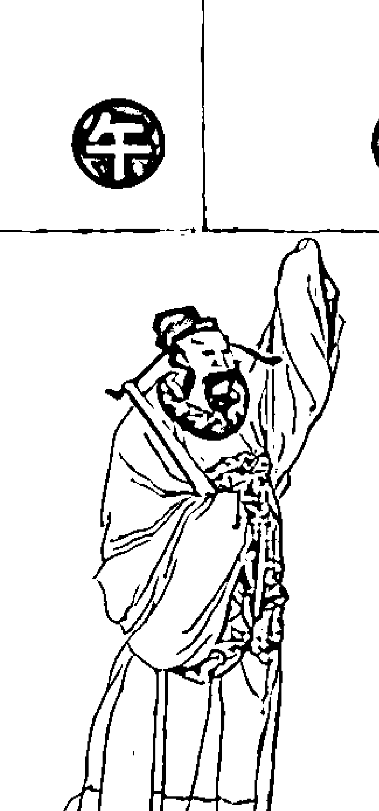

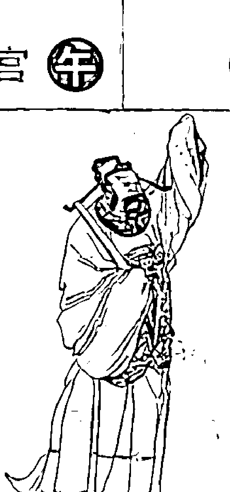

## 2 武曲星坐守丑、未宫：精于算计，性刚有才

武曲星与贪狼星同坐丑、未宫的人，对于钱财甚为吝啬，较为自己打算，别人常视为小儿科，自己却自认很大方，性刚而有才艺，多不喜受人拘束，有开创冒险的精神，宜远离赌博，并应控制酒量。多有工作的意愿，并能努力表现，在工作中能不断地检讨自己，以力求表现，多有不为人知悉、隐秘的桃花。

## 星曜布局

武曲星在丑、未二宫入庙守命，必有入庙贪狼星同坐。贪狼星多才多艺，颇懂得做人的道理，占有欲强，时有应酬，且偏重于酒色财气；女命擅长女红和家事。

## 基本命运

武曲、贪狼星同坐丑、未宫，为“贪武同行格”，又因此时太阳和太阴星同夹命宫，也为“日月夹命格”，一生富足，财官双美。但两颗力道均强的甲级星，同落在丑、未墓库，反而受困，有少年不利，大器晚成，先贫后富的现象。早年必须辛勤努力，并多不依祖业，必须远赴他乡，三十岁以前，多不顺遂，中年以后，运气亨通，遇良机则一举而缔发。所以才有“贪武墓中居，三十才发福”，及“贪武同行格，不发少年人，早发必破”的说法。

武曲星在丑、未宫入庙守命，生年支为辰、戌、丑、未的人，为“将星得地格”，意气风发，威权服众，智慧过人，位居高官，武职能出人头地。但丑、未宫为贪、武同行，不发少年人，早发必破，晚发（多为横发）为吉。

武曲星与贪狼星同坐丑、未宫，三合必会照财帛宫落陷破军星、平势廉贞星同坐，官禄宫平势七杀星、旺势紫微星同坐。不怕竞争激烈和困苦的行业，早年困苦度日，晚年时，较能随心所欲地过日子。同时，七杀、破军、贪狼星在命宫的三方四正会照时，为“杀、破、狼”格，是人生变化的枢纽，贪狼星坐命，其性质较偏重于酒色财气。若再逢敏感的四化星，其所发挥的特别力量，实在不可忽视。

武曲、贪狼星入庙同于丑、未宫坐命，与火星同宫则为“火贪格”，与铃星同宫，则为“铃贪格”，少年即出远门到外地求学或发展，以巧艺安身，常有突破性的表现，遇良机则骤然横发。火贪格或铃贪格，若再逢化禄星同宫，更有突发之财；遇擎羊、陀罗星同宫则难以招架而易色灾成祸。

武曲、贪狼星逢擎羊、陀罗、火星、铃星、地空、地劫六煞星同宫或会照，多有专门技术。

武曲、贪狼星同坐丑宫较同坐未宫为吉，此因丑宫为“入庙”太阴星和“旺”势太阳星同夹命；未宫为“不得地”势太阴星和“地”势太阳星同夹命。

## 武曲星坐命丑、未宫

武曲星坐命丑、未二宫，均为入庙，且必有入庙贪狼星同坐。贪狼星多才多艺，颇懂得做人的道理。

### 坐命丑宫

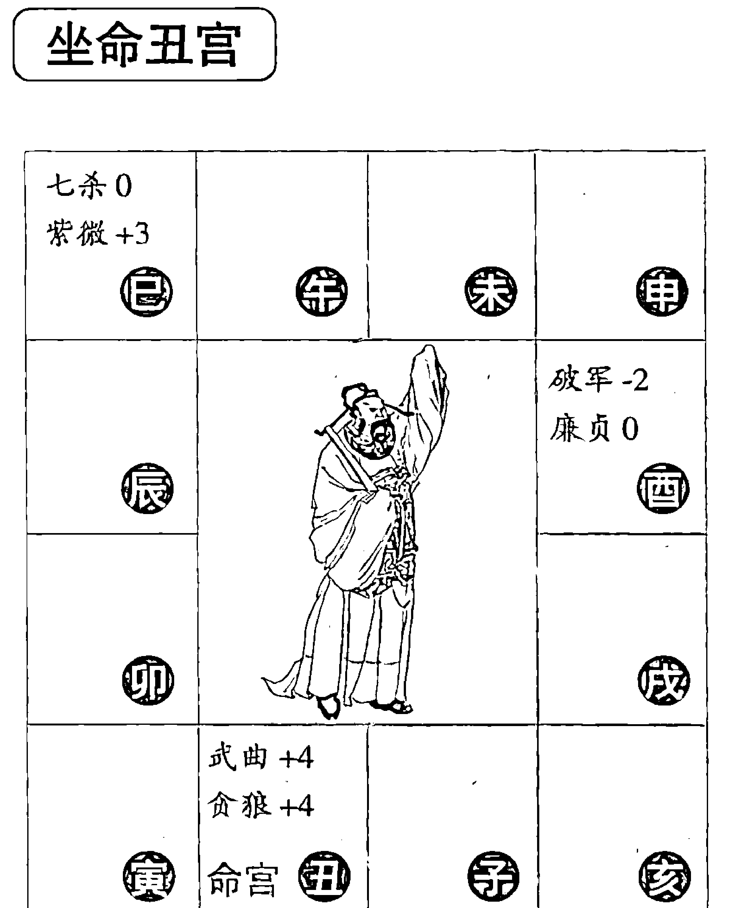

### 坐命未宫

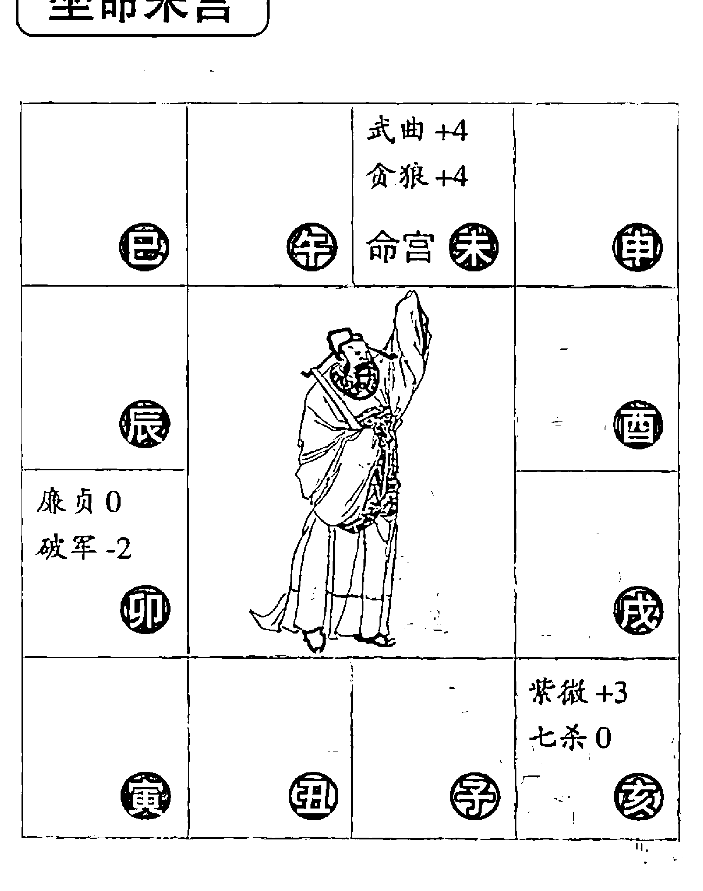

## 不同生年的命运

甲年生人：财帛宫廉贞星化禄且破军星化权，命宫武曲星化科，为“三奇嘉会格”，名誉昭彰，财官双美，有祖荫或福气，具文艺学养，利于文艺方面的研究发展，有侥幸之惠，遇困难有贵人助，可致意外成功，唯命盘第五大限才会齐科、禄、权三化曜，故属“大器晚成”之格；较注重精神生活享受，具领导能力，但不宜经商与创业，以免蒙受破军星钱财波动的损失。同时，天钺、天魁双贵星，分别在命宫及迁移宫对照，为“坐贵向贵格”，文章盖世，贵人多助。

命坐丑宫，甲年生人，有陀罗星同坐命，多有专门技术，宜远离酒色财气。

乙年生人：官禄宫紫微星化科。富企划能力，在事业上的独立开创雄心得以充分发挥。

丙年生人：财帛宫廉贞星化忌。由于有破军星同坐，使人生易产生大的波动，尤其是在钱财和感情方面多波折，有桃花纠纷，常靠女人吃饭。

丁年生人：命坐未宫，擎羊星同坐命，为“擎羊入庙格”，权威出众，富贵声扬，逢凶星则刑伤难免，遇火星则权威卓著，多有专门技术，宜远离酒色财气。

戊年生人：命宫贪狼星化禄。丑、未墓库使贪狼星的桃花受制，人必多高寿，应酬多，有食禄之福，人缘佳，感情方面可有收获，可经营与文艺有关的事业。同时，天魁、天钺双贵星，分别在命宫及迁移宫相对照，为“坐贵向贵格”，文章盖世，贵人多助。

己年生人：命宫武曲星化禄及贪狼星化权，若无凶、煞、忌星冲破，为“权禄巡逢格”，多才多艺，表达能力及主观意识强，财运旺盛，惜财而又有赚钱的本领，爱掌权，好客又风流，财官双美，经商可发，可将武贪晚发的现象提前。

己年生人：命坐未宫，擎羊星同坐命，为“擎羊入庙格”，权威出众，富贵声扬，逢凶星则刑伤难免，遇火星则权威卓著，多有专门技术，宜远离酒色财气。

庚年生人：命宫武曲星化权。具有权威，事业心重，有独当一面的能力，喜欢自行创业，以从事军警工作为宜，女命孤克难免，会影响婚姻及感情生活的缘分与和谐。同时，天科、天钺双贵星，分别在命宫及迁移宫对照，为“坐贵向贵格”。

命坐未宫，庚年生人，陀罗星坐命宫，多有专门技术，宜远离酒色财气。

壬年生人：官禄宫紫微星化权，命宫武曲星化忌。有领袖欲，一生多有贵人提拔，与七杀星同宫，能掌权势，在事业上可有突出的表现；凡事多困扰，个性孤僻，常依专门技术谋生，多为孤独的人。

癸年生人：财帛宫破军星化禄，命宫贪狼星化忌。处世较积极，可有暴发或意外的财富，较适合在金融业任职，仍应避免大规模的投资；多才多艺，风流成性，性生活频繁，易影响身体健康，感情难专一，对婚姻及感情不利，容易离婚，宜远离异性。

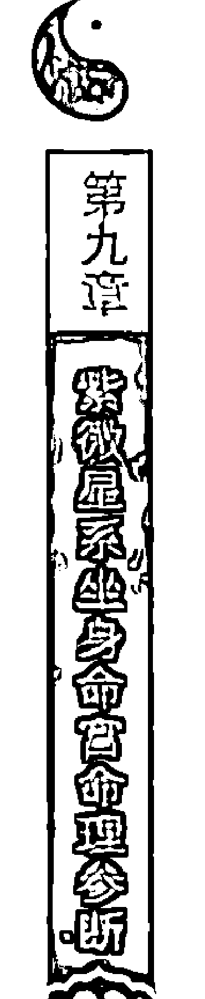

命坐丑宫，癸年生人，擎羊星同坐命，为“擎羊入庙格”，权威出众，富贵声扬，逢凶星则刑伤难免，遇火星则权威卓著，多有专门技术，宜远离酒色财气。

## 不同生时的命运

命坐丑宫，九、十、十一月生人；命坐未宫，三、四、五月生人，左辅、右弼星同坐命宫，或同夹命宫，若无凶、煞冲破，为“左右同宫格”，富企划能力，人际关系佳，凡事可逢凶化吉。

命坐丑宫，寅、戌时生人；命坐未宫，辰、申时生人，地空、地劫星分别在命宫及财帛宫三合会照，多有专门技术。

命坐丑宫，酉时生人；命坐未宫，卯时生人，文昌、文曲星同坐命宫，为“文桂文华格”，富知性，勤学好读，多有经国济世之才，在学术、文艺界可显荣耀；女命多情。

命坐丑宫，申、戌时生人；命坐未宫，寅、辰时生人，文昌、文曲星同夹命宫，为“昌曲夹命格”，男命贵显，不贵即富；女命有才智及姿色，多情。

命坐丑宫，生年支为寅、午、戌，子时生人；生年支为亥、卯、未，辰时生人；生年支为申、子、辰，亥时生人；生年支为巳、酉、丑，戌时生人，为“火贪格”。

命坐未宫，生年支为寅、午、戌，午时生人；生年支为亥、卯、未，戌时生人；生年支为申、子、辰，巳时生人；生年支为巳、酉、丑，辰时生人，为“火贪格”。

命坐丑宫，生年支为寅、午、戌，戌时生人；其余生年支为申、子、辰、巳、酉、丑、亥、卯、未，卯时生人，为“铃贪格”。

命坐未宫，生年支为寅、午、戌，辰时生人；其余生年支为申、子、辰、巳、酉、丑、亥、卯、未，酉时生人，为“铃贪格”。

## 3 武曲星坐守寅、申宫：生活富足，感情易变

武曲星和入庙天相星同坐，财帛宫必有入庙天府星、利势廉贞星同坐，若无煞星冲破，为“府相朝垣格”，富贵双全，人际关系良好，勤勉而多才艺，有贵人助，食禄千钟，生活富足，得人景仰，由于夫妻宫为“杀、破、狼”的格局，故需小心婚姻和感情生活。同时，官禄宫必有紫微星（子宫紫微星为平势，午宫紫微星为入庙），迁移宫为地势破军星，有冲劲与创造的能力，男性宜朝政治家、实业家方向发展，女性适合当秘书之类的工作，多有职业或迁移的变动，易有离乡发展的现象，也适宜经商，因乐于为人服务，是最佳幕僚。

## 武曲星坐命寅、申宫

武曲星坐命寅、申二宫，均为地势，必有紫微帝星身边的掌印官——天相星入庙同坐，财帛宫必有入庙天府星、利势廉贞星同坐。

### 坐命寅宫

| 巳 | 午 | 未 |
| :---: | :---: | :---: |
| 辰 | 午位插图 | 申位（申宫） 武曲 +1 七杀 +3 |
| 卯 | | 酉位（酉宫） 廉贞 +1 天府 +4 |
| 寅位（命宫寅） 武曲 +2 天相 +4 | 丑 | 子 | 亥 |

> 命坐寅宫，甲申、甲子、甲辰年生人，禄存星及命马星同坐命宫或迁移宫，为“禄马交驰格”，于女命，爱专权。

### 坐命申宫

| 巳 | 午 | 未 | 申位（命宫申） 武曲 +2 天相 +4 |
| :---: | :---: | :---: | :---: |
| 辰位（辰宫） 廉贞 +1 天府 +4 | 午位插图 | | 酉 |
| 卯 | | 戌 |
| 寅位（寅宫） 破军 +2 | 丑 | 子位（子宫） 紫微 0 | 亥 |

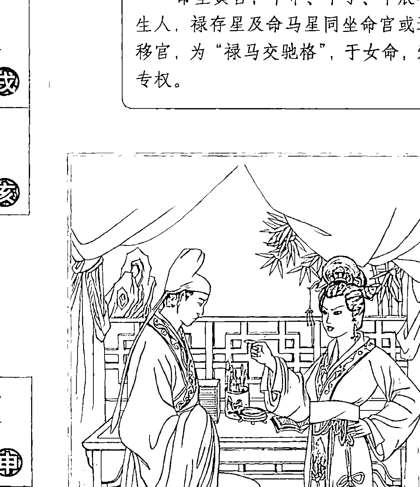

## 星曜布局

武曲星在寅、申二宫地势守命，必有入庙天相星同坐。天相星是紫微帝星身边的掌印官，庙旺的天相星，为人诚恳谦虚，多能为人设想，有正义感，乐于助人，行事谨慎而稳重，思虑周密，能包容和忍让武曲星的刚直，使武曲星的孤克减轻。在逆境中工作也多能泰然处之，并能累积失败的感受与经验，尽显平衡协调，体会出一套属于自己的工作原则。

## 基本命运

命坐寅宫，生年支为申、子、辰生人；命坐申宫，生年支为寅、午、戌生人，天马星同坐命，为“财印坐马格”，名利双收，富贵双全。武曲（财）、天相（印）星同坐寅、申宫，以寅宫较为吉利，此因命坐寅宫时，官禄宫的紫微星为入庙；命坐申宫时，官禄宫的紫微星为平势。无论命坐寅或申宫，皆不喜会照煞星，会影响福泽或增加孤克，若煞星过多甚至会有伤残的顾虑。若逢文昌、文曲星，多才智过人，有特殊技艺。

## 不同生年的命运

甲年生人：财帛宫廉贞星化禄，迁移宫破军星化权，命宫武曲星化科，为“三奇嘉会格”。

命坐寅宫，甲年生人，禄存星与武曲、天相星同坐命，又三合会照财帛宫化禄星，为“双禄朝垣格”，福气高，有才华，具名望，受人敬重，财官双美。

甲申、甲子、甲辰年生人，禄存星及命马星同坐命宫或迁移宫，为“禄马交驰格”，愈奔动愈生财，女命则爱专权。

乙年生人：官禄宫紫微星化科。富企划能力，对某一专门技术或学问，有独特的研究和见解。

命坐寅宫，乙年生人，陀罗星入命，会影响福泽或增加孤克；命坐申宫，乙年生人，天钺贵星坐命，天魁贵星在官禄宫三合会照，为“天乙拱命格”。

丙年生人：财帛宫廉贞星化忌。反而使落于辰、戌天罗、地网宫中的天府、廉贞星脱离束缚，而得以发挥力量，可由经商而致富，但宜防桃花困扰。

己年生人：命宫武曲星化禄。一生财运亨通，惜财又有赚钱本领，经商可发。命坐申宫，己年生人，天钺、天魁双贵星分别在命宫及官禄宫三合会照，为“天乙拱命格”。

庚年生人：命宫武曲星化权。有独当一面的能力，事业心重，喜欢自行创业，具权威性，多在稳定中成长，在稳定中求财，宜往武职方面发展；女命孤独难免，会影响婚姻及感情生活的缘分与和谐。庚寅、庚午、庚戌年生人，禄存、命马星同坐命宫或迁移宫，为“禄马交驰格”，愈奔动愈生财，女命则爱专权。

辛年生人：命坐寅宫，天魁、天钺双贵星，分别在命宫及官禄宫三合会照，为“天乙拱命格”。

命坐申宫，辛年生人，陀罗星入命，会影响福泽或增加孤克。

壬年生人：官禄宫紫微星化权，命宫武曲星化忌。具权威性和领导欲，多孤僻自主；依专门技术谋生，多辛劳，事业可有成就。

癸年生人：迁移宫破军星化禄。处世积极，在金融业较能发挥效率，应避免大规模的投资。

## 4 武曲星坐守卯、酉宫：具开创性，成败一线

武曲、七杀星同坐卯、酉宫，三合交会照财帛宫落陷贪狼星和廉贞星，官禄宫旺势破军星和入庙紫微星，迁移宫必有天府星（卯宫为地势，酉宫为旺势）。会不惜一切并不择手段地工作，成败常在一线之间，常会突发横财而致富，又会突然因意外失财，到头来却一无所有而贫穷一生；富开创精神，宜选择公职、政界、民营大企业、或治安单位等较为严肃的行业任职；移动和转业会得到长辈的提携，可逐步往上攀登。

## 星曜布局

武曲星在卯、酉宫利势守命，必有旺势七杀星同坐。七杀星是紫微帝星运筹帷幄的主帅，拥有“将在外，君命有所不从”独断专行的主帅威望，具有独立作战的能力，能压制火星和铃星的暴烈之恶，也能使地空、地劫、擎羊、陀罗等煞星俯首就范，在战场上为主尽忠效命，性直爽而善交际，聪明机智，有胆识与谋略，刚毅而能干，有企划能力，乐于助人，在工作中常处于备战状态，少有休闲，常易成为领导者。七杀星也能克制武曲星，不仅可减少其孤克，在事业上，也会有大局面的表现。

## 基本命运

七杀、破军、贪狼星在命宫的三方四正会照时，为“杀、破、狼”格局，一生成败起伏很大，七杀星坐命，具有冒险犯难的特性，无论男女命，皆会显得寂寞寡欢而难觅知音，在感情上常不免于孤芳自赏。

武曲、七杀星同坐酉宫，太阴星落陷坐疾厄宫，为“日月疾厄格”，宜从事医生、命相业，反能化吉。

武曲、七杀星同坐卯、酉宫，遇六吉星，事业有成，利于为人服务，可任主管之职，逢煞星则减色。

武曲、七杀星同坐卯、酉宫，遇火星或化忌星，常因感情或意外灾害，而使钱财或事业受劫害。如遇擎羊星，则易有财务争执。

## 不同生年的命运

甲年生人：命宫武曲星化科，财帛宫廉贞星化禄，官禄宫破军星化权，为“三奇嘉会格”，富贵双全，名誉昭彰，有祖荫或福气，遇困难有贵人助，可致意外成功，唯世路多艰，属“大器晚成”之格。廉贞、贪狼二桃花星同宫，再逢廉贞星化禄，助长了桃花性质，使感情增添波折与困扰，多重精神享受；破军星化权与紫微星同坐，可增加决断与领导能力，使破军星的变动往好的方向发展；武曲星在命宫化科与七杀星同坐，可减少武曲星的孤克，使其更具开创性与文艺方面的表现，可提高声望而居管理之职。
命坐卯宫，甲年生人；命坐酉宫，庚年生人，擎羊星同坐命，易有财务纠纷。

乙年生人：官禄宫紫微星化科。富企划力，声望与地位得以提升。
命坐卯宫，乙年生人；命坐酉宫，辛年生人，禄存星同坐命宫，可经商。

丙年生人：财帛宫廉贞星化忌。廉贞星化气为“囚”，化忌代表困于逆境之中，人生多波折，男命常靠女人吃饭。

命坐卯宫，丙、丁年生人；命坐酉宫，壬、癸年生人，天魁、天钺双贵星，分别在命宫的三方（财帛宫）四正（迁移宫）会照，为“天乙拱命格”，文章盖世，贵人多助。

戊年生人：财帛宫贪狼星化禄。有偏财运，赚钱多带投机性，但其赚钱历程中多增加困扰。

己年生人：命宫武曲星化禄，财帛宫贪狼星化权，若无凶、煞、忌星冲破，为“权禄巡逢格”，财官双美，一生平稳，出世荣华。好客、风流，一生财运旺盛，有赚钱的本领，爱财如命，工商界或财经单位服务，或自己经商，可有发展，武、贪星相逢，又分别化禄和化权，可横发，但发后宜能守，否则钱财都花费在酒色财气上，到头来仍是一场空。

庚年生人：命宫武曲星化权。具奋战精神，有独当一面的能力，具权威，可有大局面的发展，适合军警职，男命事业心加重，想一步登天，喜欢自行创业，女命则孤克难免，婚姻及感情生活多困扰。

壬年生人：官禄宫紫微星化权，命宫武曲星化忌。可增加其领导欲，在事业上可有一番作为；武曲星化忌，多为孤独之人，在钱财、感情上多不顺利，会有一番艰困奋斗的人生历程，常依技术谋生。

命坐卯宫，壬巳、壬酉、壬丑年生人；命坐酉宫，丙亥、丙卯、丙未、癸亥、癸卯、癸未年生人，禄存、天马星同坐财帛宫，为“禄马交驰格”，愈奔动愈生财。

癸年生人：官禄宫破军星化禄，财帛宫贪狼星化忌。破军星化禄再遇入庙紫微星，使破军星的开创性更为积极，名利方面皆进展顺利，但仍应避免大规模的投资经营；贪狼星化忌入财帛宫，多有破失，感情上多困扰，常为了桃花纠纷而破财。

## 不同生时的命运

八、十二月生人，左辅、右弼双辅佐吉星，分别在命宫及财帛宫三合会照，一生多辅佐与支持力量。

未、亥时生人，文昌、文曲双文贵星，分别在命宫及财帛宫三合会照，若无凶、煞星冲破，为“文星拱命格”，富企划能力，凡事可逢凶化吉，福禄终身。

## 5 武曲星坐守辰、戌宫：善于理财，名利双全

武曲星入庙独坐辰、戌宫守命，迁移宫有入庙贪狼星对照，同时，财帛宫必有入庙天相星和平势廉贞星，官禄宫必有旺势紫微星和天府星（寅宫为入庙，申宫为地势）。一生财运亨通，并善于理财，经商虽有波折，但却可因而致富。一生中可望功成名就，权贵双全而名利双收。

## 星曜布局

武曲星在辰、戌宫为入庙独坐守命，对宫为入庙贪狼星，这种命盘配置，与武曲、贪狼星同坐丑、未宫时类似。生年支为辰、戌、丑、未年生人，为“将星得地格”，威权服众，智慧过人，武职能出人头地。因辰、戌、丑、未宫为四墓库，皆主晚发，必须三十岁以后才较为顺利。武曲和贪狼星在辰、戌宫对坐，此同坐丑、未宫要有力量，在事业上的成就也远超过在丑、未宫安命者，虽常住在城市闹区，不免于劳碌，但可有发财的机会。

## 基本命运

武曲星独坐辰、戌宫守命，男命，喜武曲星化权，或对宫贪狼星化权会照，加遇六吉星，虽然年轻时较辛劳，中年后皆能有所成就，命坐辰宫比戌宫为吉。女命，较不宜，尤以命坐戌宫者为甚，喜诸吉星会照，若有煞星来冲，多为幼年坎坷。

武曲星在辰、戌宫独坐守命，如遇煞星，反可助武曲星突破天罗地网的束缚，发挥决断力。

## 不同生年的命运

-   甲年生人：财帛宫廉贞星化禄，命宫武曲星化科，无凶、煞、忌星同宫或冲破，为“科名会禄格”，才华卓著，具文艺修养，远近知名，财名双美。多重视精神享受，做事顺利，易有感情困扰，或有风月桃花。
-   命坐辰宫，乙年生人；命坐戌宫，辛年生人，擎羊星入庙同坐命，为“擎羊入庙格”，具擎羊的威强和冲劲，权威出众，富贵声扬，加过火星则权威卓著，逢凶星则刑伤难免。乙年生人，官禄宫紫微星化科。聪明干练，具领导能力，才艺出众，在工作上有声望，并能有好的表现。命坐辰宫，乙年生人，天钺、天魁双贵星，分别在财、官宫三合会照命宫，为“天乙拱命格”，文章盖世，贵人多助。
-   丙年生人：财帛宫廉贞星化忌。由于有谨慎保守的天相星同坐，使廉贞星化忌趋于不美的桃花性质得以疏解。
-   命坐辰宫，丙、戊年生人；命坐戌宫，壬年生人，入庙的陀罗星同坐命宫，反可助武曲星突破天罗地网的束缚，发挥其决断力，而能有好的表现。

戊年生人：迁移宫贪狼星化禄。贪狼、化禄皆为桃花星，贪狼星化禄入辰、戌、丑、未四墓宫，为桃花受制，虽可减轻贪狼星的酒、色、财、气的桃花性质，也相对限制了贪狼星欲脱困天罗地网的冲击力量，而无飞扬之期。

己年生人：命宫武曲星化禄，迁移宫贪狼星化权，无凶、煞、忌星冲破，为“权禄巡逢格”，财官双美，但不免于辛劳。

庚年生人：命宫武曲星化权。具奋战精神，能排除万难，获得最后的胜利。男命，事业心重，喜欢自行创业；女命，孤克难免，会影响婚姻及感情生活的和谐。

命坐戌宫，辛年生人，天钺、天魁双贵星，分别在财、官宫三合会照命宫，为“天乙拱命格”，贵人多助，文章盖世。

壬年生人：官禄宫紫微星化权，与天府星同坐，命宫武曲星化忌。更具坚定的自主性，增加领导欲，多贵人相助，事业有成；唯个性较孤僻，常依技术谋生，多困扰横生，在感情上也多不顺利。

癸年生人：迁移宫贪狼星化忌。多才多艺，在专业技能上能有所突破，出外易有桃花。

## 不同生时的命运

-   一、七月生人，左辅、右弼双辅佐吉星，在命宫和迁移宫相朝照，对困在天罗地网中奋力挣扎的武曲、贪狼星，具有保护、辅助、激发与支持等多种力量。

子、午时生人，文昌、文曲双吉星，分别在命宫和迁移宫相对照，为“文星拱命格”，男命贵显，不贵即富；女命多情。

命坐辰宫，乙寅、乙午、乙戌年，卯时生人；乙申、乙子、乙辰年，寅时生人；乙巳、乙酉、乙丑年，丑时生人；乙亥、乙卯、乙未年，未时生人，擎羊星入庙再加遇火星，权威卓著。

命坐戌宫，辛寅、辛午、辛戌年，酉时生人；辛申、辛子、辛辰年，申时生人；辛巳、辛酉、辛戌年，未时生人；辛亥、辛卯、辛未年，丑时生人，擎羊星入庙再加遇火星，权威卓著。

## 6 武曲星坐守巳、亥宫：幼年辛劳，中年后发

武曲、破军星同坐巳、亥宫守命。个性刚强自信，具冒险精神，永远保持着备战状态的行动力，不断地迎接各种挑战，凡事多冲动而遽下决定，刚愎自用，花钱不知节制，性情怪异令人捉摸不定。幼年辛劳不免，宜离家出外发展，必须辛勤努力，踏实工作，中年以后才经得起考验，白手起家而有所成就。

## 星曜布局

武曲星在巳、亥宫平势守命，必有平势破军星同坐。破军星是紫微帝星殿前，勇猛无比、骁勇善战，卫戍京畿的禁卫军大将，唯有紫微星才能使其俯首称臣，听命行事。巳、亥宫破军星与武曲星同坐，由于缺少了紫微星的控制，使破军星刚强暴躁，奔波不定，多波动的缺点皆显现出来，也因此影响了同坐的武曲星，使原本为财星的武曲星，即使逢化禄与禄存等财星，也不宜经商，只宜服务于财经或工商界，为人作嫁。

## 基本命运

武曲、破军星同坐巳、亥宫，三合必会照财帛宫入庙七杀星和利势廉贞星，官禄宫利势贪狼星和旺势紫微星，迁移宫必有地势天相星。喜欢从事冒险性的工作，因而使钱财的得失变动幅度很大，一生中有意外的横财，精于领导，喜欢投机和冒险，并爱独立创业，工作勤奋，欲望强烈，能掌握行业的发展方向，对既定目标绝不放弃，可享职业上的高位；对于移动和转业非常慎重，并多能得到贵人扶助而顺利完成，命坐亥宫较命坐巳宫为吉利。

七杀、破军、贪狼星在命宫的三方会照时，为“杀、破、狼”格局，为人生变化的枢纽，一生多变动，成败呈现大幅度的变化，足以影响一生，对钱财和女命的感情都不利。

> 图解道教天文学 紫微斗数

### 武曲星坐命巳、亥宫

武曲星坐命巳、亥宫，必为平势，必有平势破军星同坐。三合必会照财帛宫入庙七杀星和利势廉贞星，官禄宫利势贪狼星和旺势紫微星，迁移宫必有地势天相星。

| 地支 | 武曲0 | 破军0 | 贪狼+1 | 紫微+3 | 廉贞+1 | 七杀+4 | 天相+2 |
| :--- | :--- | :--- | :--- | :--- | :--- | :--- | :--- |
| 巳 | 武曲0 | | | | | | |
| 午 | | 破军0 | | | | | |
| 未 | | | 贪狼+1 | 紫微+3 | | | |
| 辰 | | | | | 廉贞+1 | 七杀+4 | |
| 戌 | | | | | | | 天相+2 |

| 地支 | 天相+2 | 廉贞+1 | 七杀+4 | 贪狼+1 | 紫微+3 | 武曲0 | 破军0 |
| :--- | :--- | :--- | :--- | :--- | :--- | :--- | :--- |
| 巳 | 天相+2 | | | | | | |
| 未 | | 廉贞+1 | 七杀+4 | | | | |
| 辰 | | | | 贪狼+1 | 紫微+3 | | |
| 亥 | | | | | | 武曲0 | 破军0 |

武曲星在巳、亥二宫守命，必有破军星同坐。破军星是紫微帝星殿前，勇猛无比、骁勇善战，卫戍京畿的禁卫军大将。巳、亥宫破军星与武曲星同坐，由于缺少了紫微星的控制，使破军星的缺点皆显现出来，因而也会影响到同坐的武曲星，使之不宜经商。

武曲、破军星同坐巳、亥宫守命，逢文昌、文曲星，金、水相生，聪明而有巧艺，甚宜学术研究或公、教职，一生多奔劳辛苦，且也有成败起伏，但辛劳终会有成就。

## 不同生年的命运

甲年生人：财帛宫廉贞星化禄，命宫破军星化权、武曲星化科，为“三奇嘉会格”，名誉昭彰，富贵双全，财官双美，为“大器晚成”之格。擅长理财，自行创业，或任职于金融业皆能有所成就。具领导能力，多变迁，宜于武职。声望得以提高，有突发性的表现。

乙年生人：官禄宫紫微星化科。多才多艺，富企划与处理事务的能力，可功成名就。

丙年生人：财帛宫廉贞星化忌。感情和情绪方面多波折、困扰。

丙亥、丙卯、丙未、戊亥、戊卯、戊未、壬巳、壬酉、壬丑年生人，禄存、天马星同坐命宫或迁移宫，为“禄马交驰格”，愈奔动愈生财。

戊年生人：官禄宫贪狼星化禄。应酬多，钱财和感情方面有所获，在文艺、语言、音乐等方面有天赋，并能获得成就，能在财经界担任要职，再遇火星，为“火贪格”，多有横发之财。

己年生人：命宫武曲星化禄，官禄宫贪狼星化权，若无凶、煞、忌星冲破，为“权禄巡逢格”，财官双美，一生顺稳。有赚钱的本领，惜财如命，多有意外的机遇，若官禄宫再遇火星，则构成“火贪格”，有创业的野心。

庚年生人：命宫武曲星化权。能在极端困难的环境下，完成别人所不能完成的事，男命事业心重，喜欢创业；女命孤克难免，易影响婚姻及感情生活的和谐。

壬年生人：官禄宫紫微星化权，命宫武曲星化忌。更坚定自主，可增加领导欲，一生多贵人助；个性较孤僻，多以技术谋生，辛劳难免，但能有所成。

癸年生人：命宫破军星化禄，官禄宫贪狼星化忌。能将破军星暴戾之气，化为积极处世的态度，应避免大规模的投资；宜从事较冷门、现金交易或娱乐行业，需防桃花纠纷。

## 不同生时的命运

二、六、八、十二月生人，左辅、右弼双辅佐吉星，分别在命宫及官禄宫三合会照，一生多辅佐力量。

命坐巳宫，丑、巳时生人；命坐亥宫，未、亥时生人，文昌、文曲双吉星，分别在命宫及官禄宫三合会照，为“文星拱命格”，富知性，勤学好读，有经国济世之才，在学术、文艺界可显荣耀。女命多情。

命坐巳宫，午、巳、未时生人；命坐亥宫，子、丑、亥时生人，地空、地劫双煞星同坐命宫，或同夹命宫，为“命里逢空格”，或“空劫夹命格”，多贫贱，多凶祸，求名求利总成空，富贵荣华不可得，一生多起伏，犹如“浪里行船”，并常突遭失败，犹如“半天折翅”，必须信仰宗教，且常离家，清闲方能延寿。壬年生人，再逢化忌星坐临命宫，武曲星化忌，为“空劫夹忌格”，更是不吉利。

## 6 天同星坐命身宫

天同星阴阳五行属阳水，为南斗第四星，化气为“福”，为“福德宫”主，有解厄制化的功能，不怕劫杀相侵，不畏诸凶同度，十二宫中皆为福。

### 容态与性格

天同星坐命身宫的人，体型丰圆，相貌丰满，孩童脸，眉清目秀，眼神柔和，一脸福相；女性肤白貌美。

为人谦逊温和，信守承诺，应对有礼，仁慈耿直，流于软弱，文墨精通，有奇志，凡事大而化之，喜新厌旧，好奇心强，博学而不精，常有远大的抱负、构想和计划，但多较不着边际，说得多而做得少。具有幽默感和童心，平时与人无争，容忍性大，烦恼较少，不善与人计较，就是发脾气也不大，发过就算了，所以人缘好，具有公关能力。思维敏捷，理解力佳，适应性强。喜欢行善，多爱文艺，注重生活情趣和享受，穿着讲究，喜好吃食，好逸恶劳，喜欢过悠闲的生活，急事缓慢，乐观而不积极，得过且过，衣食无缺，是“知足常乐”的人。

女性肌肤细致，聪明伶俐，为人亲切柔顺，充满魅力的微笑，深受男性瞩目，具有人缘，婚后多能相夫教子，具贵妇风范，然易疏于料理家事。

### 命理推断

天同星是一颗福星，天同星的“福”是“凡事不操心”，喜欢悠闲自在，顺境时享受生活，逆境时也“往好处看”，“苦中作乐”，自求多“福”。天同星坐命的人，天生就有福气，可自然得到比他人较好的物质享受，或出生富裕之家，即使家境贫穷，也总会获得超过家人的物质享受。并且天同星坐命的人，容易发胖。

-   天同星和天梁星都具有天生少劳多获的福气，但也有下列的不同：
    1.  天同星有福德正神的模样和心肠，娃娃脸，又有点童心未泯，像个小顽童；天梁星则老模老样，好吹嘘，像个老大，喜欢别人像老佛爷一样地捧他。
    2.  天梁星为“荫”星，一生多蒙受庇荫，外表看起来似乎一直都在享福，内心却也有“荫”，自有其苦水；天同星则不然，它总是“表里合一”，内外皆乐，即使有苦，通常也比较单纯，容易叙述，更容易处理。
    3.  天梁星虽然有“荫”贵，但更主“清高”，也比较无福享受太好的物质生活；天同星则贵人运强，能在完全没有心理压力与困扰中，去真真实实地享受美好的物质生活。

由于天同星自己懂得去追求精神和物质上的生活享受，不但全心投入，更可推己及人，并能进一步享受自己所营造出来的良好环境。因此，食、衣、住、行中任何一种可使人身心愉快，有福可享的工作，都能使天同星大展长才。

天同星并不是不想努力奋斗，而是觉得人生何苦这样奔波劳碌，并常在忙碌之后，以享受的方式给自己一些鼓励。

天同星坐命的人，安分守己，平易近人，被动保守，与人为善，由于知足常乐，并且喜欢过悠闲、安稳、自在的生活，因而心情比常人稳定些，难免得过且过，逃避现实，但也因此缺乏雄心与魄力在事业上奋斗和开创新局面，故宜女不宜男。应该选择适合自己个性的工作，不必受他人影响，而勉强自己去与别人竞争。有文艺、读书、金石、书法、园艺等嗜好，并能有所表现。若没有适合自己的工作，则宜选择有关儿童和老人的管理，以及社会福利的工作。

天同星在命盘中，有其特殊功能，此因人生在世奔波劳碌的时候居多，安闲舒适的机会较少，往往需要天同星及时出现以作为调剂。所以，不论命盘的格局为何，限行遇天同星，都会有一段休息懒散的时光，以养精蓄锐，充电学习，为下一段动态生活预做准备。

天同星也带有桃花的性质，其桃花则偏重于与异性社交活动为主，易走偏锋，感情重于理智。所以天同星坐命的人，在精神上与感情上较易有空虚之感，喜欢向外寻找刺激，应保持安定中的幸福，并切忌太过热情，以免产生感情纠纷，女性尤须慎重。

天同星独坐的机会不多，由于任何星曜都不如天同星有福，因此，与天同星同宫的星曜，对其“福气”会有或多或少的影响，其影响为：

-   一、使天同星享福的程度降低，或享福的时间减少。
-   二、使天同星享福的路途上较有崎岖。
-   三、由于有福难享，因而使得婚姻和感情生活易有波折。

天同星化禄偏向食禄，反使人更加懒散。天同星化权、化科，不再懒散，乐观之外，还积极进取。天同星化忌，主劳碌，也是乐观主义者，但常协调不良，事与愿违，或身体机能失调。

天同星是一颗福星，不怕同宫或会照诸煞星。可无须抵抗就自然化解擎羊、陀罗、火星、铃星、地空、地劫等六煞星的凶焰，煞星不仅对天同星没有损害，反而喜爱煞星来激发天同星的开创力，使其不致长期沉湎于“享福”的停滞，但也会在忙碌与开创中，时有“有福不能享”及“劳碌命”的感叹。应学习语文，向文艺方面求发展，并学习一种手艺自娱。

天同星入命的人，如不遇煞星，反而使喜欢享福的天同星耽于安乐而难有作为。

# 福星天同星

天同星是紫微斗数中的福星，化气为“福”，为“福德宫”主，有解厄制化的功能，而且不怕劫杀相侵，不畏诸凶同度，在命盘十二宫中皆为福。

# 天同星之福

天同星作为福星，其“福”是“凡事不操心”，喜欢悠闲自在，顺境时享受生活，逆境时也“往好处看”，“苦中作乐”，自求多“福”。正是如此，天同星坐命的人，即使家境贫穷，也能悠闲自得。

## 相关链接

> 中国人重福，从贴“福”字的民俗与“福如东海”的祝愿便可窥见一斑。但究竟怎样才算真正的幸福和福气呢？语言学的界定为“使人心情舒畅的境遇和生活”、“生活称心如意”、“享受幸福生活的命运”，而要达到这样的境界，拥有天同星所独具的心境是一个必不可少的条件。

# 天同星在各宫亮度

| 巳 | 午 | 未 | 申 |
| :--- | :--- | :--- | :--- |
| 天同+4 日 | 天同-2 太阴-1 月 | 巨门-1 天同-1 | 天同+3 天梁-2 斗 |
| 辰 |  | 酉 |  |
| 天同0 辰 |  | 天同0 酉 |  |
| 卯 |  | 戌 |  |
| 天同0 卯 |  | 天同0 戌 |  |
| 寅 | 丑 | 亥 | 亥 |
| 天同+1 天梁+4 寅 | 巨门-1 天同-1 | 天同+3 太阴+4 | 天同+4 亥 |

# 天同星与天梁星福气比较

| 天同星 | 天梁星 |
| :--- | :--- |
| 有福德正神的模样和心肠，娃娃脸，童心未泯。 | 老模老样，好吹嘘，有老大风范。 |
| 内外皆乐，即使有苦，通常也比较单纯，容易叙述，更容易处理。 | 一生多蒙受庇荫，外表看起来似乎一直都在享福，内心却有其苦水。 |
| 贵人运强，能在完全没有心理压力与困扰中享受美好的物质生活。 | 主“清高”，也比较无福享受太好的物质生活。 |

天同星喜会左辅、右弼、天机、太阴、天梁星，更主高寿。天同星喜会昌、曲星，具文学天赋。但女命会右弼、太阴、昌、曲星，感情多风波。

天同星坐命的人，只要改变观念和习性，暂时不去享福，而积极地面对人生，全力以赴地工作，让享福与努力并存，一定能获致意想不到的成功。

天同和陀罗星同坐命宫，多肥满而眼近视。天同和擎羊星同坐命，身体易遭伤害。天同星守命，遇羊、陀、火、铃、忌星，主开刀、破相，否则易小病缠身。

# 1 天同星坐守子、午宫：福禄兼得，忌感情纠纷

任劳任怨，为人设想，乐于助人，也乐于与人分享自己的工作成果，努力而不执著，只问耕耘而不求收获，能长期固守在工作岗位，常保工作活力，多能事半功倍。

## 星曜布局

天同星在子、午二宫守命（子宫天同星为旺势，午宫天同星为落陷），必有太阴星同坐（子宫太阴星为入庙，午宫太阴星为不得地），同时，三合会照官禄宫利势天机星和入庙天梁星，为“机月同梁格”，擅长企划，处事及辅佐能力强，在公家机构、传播文化界能出人头地，担任要职。

## 基本命运

天同、太阴星同坐守子宫，因二者皆在庙旺宫位，天同福星加上太阴富星，自是福禄兼得，加遇吉星，更是富贵兼有。由于太阴星为阴性，男命得之，多温柔开朗，风流倜傥，易得异性青睐，得到异性鼎力相助。夜生人，得以全力发挥太阴星的力量；日生人，再加逢煞星，宜注意感情纠纷。

女命天同、太阴星同坐子宫，遇吉星多容貌秀丽，温柔贤淑，聪明伶俐，乐于理家及整容，与异性交往频繁，可获得物质上的满足。若加遇煞星，虽亦贤淑美丽，但易有感情波折。

天同、太阴星同在子宫守命或守田宅宫，为“月生沧海格”，或“水澄桂萼格”，聪明秀气，举止优雅，具幽然感，富谦让美德，深得异性助力，人缘佳，宜服公职，可得清要之位，有财富与名声。女命则感情生活易生波折，应晚婚。

天同、太阴星同坐守午宫，因二者皆属落陷宫位，无论男女命皆为漂泊不定之命，女命多辛劳，若加遇吉星则生活富足，唯不宜早婚；若加逢煞星，为“月同遇煞格”，身体赢弱，应注意身体健康，凡事操劳，诸事不如意。

## 不同生年的命运

乙年生人：官禄宫天机星化禄和天梁星化权，命宫太阴星化忌。化禄、化权同入命宫三合宫位的官禄宫，为“权禄巡逢格”，天机星的浮动性质，使事业及金钱方面多变动，为钱财奔忙，常财来财去，不免易生金钱上的烦恼，而命宫太阴星化忌，但子宫太阴星为入庙，虽逢化忌仍能在事业上有表现，与异性接触频繁；午宫太阴星为不得地势，逢化忌则奔波劳累，并有跋涉他乡之兆。

命坐子宫，乙、己年生人；命坐午宫，辛年生人，天魁、天钺双贵星同在命宫及财帛宫三合会照，为“天乙拱命格”，文章盖世，贵人多助。

丙年生人：命宫天同星化禄，官禄宫天机星化权，为“权禄巡逢格”，财官双美，具领导与策划能力，一生顺稳，出外创业或谋职皆有成，愈动愈有成，女命有不让须眉的作为，男命有异性缘，但稍嫌进取心不足。

命坐子宫，丙年寅、午、戌时生人；命坐午宫，丙年子、辰、申时生人，命宫、财帛宫或官禄宫同时逢天同星化禄、天机星化权和文昌星化科，为“三奇嘉会格”，名誉昭彰，富贵双全，财官双美，唯在中年后才能成大器。

命坐午宫，丙、戊年生人，擎羊星落陷守命，为“马头带箭格”。丙年生人，为权禄巡逢，丙年寅、午、戌时生人，逢三奇嘉会，虽财官双美，但亦为“马头带箭格”之人，必须离乡背井，远赴他乡，在惊涛骇浪中创业，且福不耐久。戊年“马头带箭格”生人，则危困重重，离乡背井，漂泊不定，非夭折即主刑伤。

丁年生人：命宫太阴星化禄和天同星化权，官禄宫天机星化科，为“三奇嘉会格”，富贵双全，财官双美。尤其是命坐子宫，禄存星在对宫朝照，且命宫太阴、天同星皆为庙旺，也为“双禄朝垣格”，更为吉美。命坐午宫，丁年生人，禄存星与化禄星同坐命，为“禄合鸳鸯格”，甚为吉美，但因同坐命宫的太阴、天同星皆为落陷，气势上弱了许多，且易流于疏懒，尤其是丑、卯、巳、未、酉、亥时生人，逢地空、地劫星冲破为“两重华盖格”，吉处藏凶，宜注意表面美好，背后所隐伏的危机，孤高贫困，与僧佛有缘，遁空门反主清福。

## 天同星坐命子宫

天同星在子宫守命，为旺势，且必有入庙太阴星同坐，同时，三合会照官禄宫利势天机星和入庙天梁星，为“机月同梁格”。

## 天同星坐命午宫

天同星在午宫守命，为落陷，且必有不得地太阴星同坐，同时，三合会照官禄宫利势天机星和入庙天梁星，同样为“机月同梁格”。

戊年生人：命宫太阴星化权，官禄宫天机星化忌。可从事劳心工作，或自己创业；成功之途虽多坎坷和变化，使心神不得安宁，但事业可有表现，男女皆可获得异性的助力。命坐午宫者，落陷擎羊星同坐命，为“马头带箭格”，凡事危困重重，离乡背井，漂泊不定，非天折则主刑伤。

己年生人：官禄宫天梁星化科。交友广泛，文艺方面有表现，宜于大众传播或文艺界工作。命坐子宫，天魁贵星坐命，天钺贵星在财帛宫三合会照，为“天乙拱命格”，文章盖世，贵人多助。命坐午宫，己年生人，禄存星同坐命宫，可增添财禄。

庚年生人：命宫太阴星化科和天同星化忌。文艺方面表现佳，有女性贵人暗助，宜任职于公家机构；子宫天同星为旺势，化忌影响不大；午宫天同星为落陷，好逸恶劳，有福不会享，大都坐失良机，内心常自感矛盾，人际关系及身体各部位多协调不良。

命坐子宫，庚寅、庚午、庚戌年生人；命坐午宫，甲申、甲子、甲辰年生人，命马与禄存星同坐财帛宫，为“禄马交驰格”，可在奔动中得财。

壬年生人：官禄宫天梁星化禄。公、教、文职者可享清誉，对意外之财，将成为精神负担而困扰。命坐子宫，擎羊星同坐命，易破相或有开刀等刑伤。

癸年生人：命宫太阴星化科。文艺方面可有表现，有女性贵人暗助，宜任职于公家机构。命坐子宫，禄存星坐命，可增添财禄。

# 2 天同星坐守丑、未宫：波折不断，中年后安定

天同、巨门星同坐丑、未宫皆为落陷，此时，天同星本身无力，已无法发挥天同星的“顺”，再加上巨门“暗”星的施虐，无论男女命，皆多忙碌，烦恼多，话多，好表现，语言表达能力欠圆融，易遭人误会。乐观积极，肯付出，恋爱和婚姻多坎坷，早年多劳苦，中年以后较安定，成功得来不易，波折不断，一生发展有限，若欲强出头，反而易招惹是非，常感怀才不遇。只要不化忌，懂得计划，也擅长交际，无奈知音难觅，识者寥寥。

## 星曜布局

天同星在丑、未二宫不得地势守命，必有不得地势巨门星同坐。巨门星为是非之星，主口舌是非。

## 基本命运

天同、巨门星同坐丑、未宫，官禄宫必有平势天机星。有独特的思想，常在复杂的环境下工作，可因不断的学习而受人肯定，适合为人服务性质的工作、从事学术研究、报社或杂志社的编辑、艺术家，不宜自己经商或创业。

命坐未宫，本宫无主星，入庙太阳星在财帛宫，卯宫入庙天梁星同坐、入庙太阴星在官禄宫（亥宫）三合会照，天同、巨门星同在迁移宫（丑宫）对照，为“明珠出海格”。朝气蓬勃，兴趣广泛，具有才华，处世光明磊落，稳步蟾宫，可获声名。女命得之，才德兼备。若命宫无左、右、昌、曲星，又逢羊、陀、忌星冲破，华而不实，浪得虚名。

## 不同生年的命运

甲年生人：命坐丑宫，命坐未宫，戊、庚年生人，天钺、天魁双贵星分别在命宫和迁移相对照，为“坐贵向贵格”，文章盖世，贵人多助。

> > 天同坐命丑、未，必为不得地，且有不得地巨门星同坐。巨门星为是非之星，主口舌是非。天同、巨门星皆为落陷，天同无力，巨门施虐，易有口舌是非。

命坐丑宫，甲年生人；命坐未宫，庚年生人，陀罗星同坐命宫，多身体肥胖而眼睛易患近视。

乙年生人：官禄宫天机星化禄。可凭智慧赚钱，事业变动性大，但多属好的变动。尤其是命坐丑宫，天机星居巳宫，对宫太阴星入庙化忌，多有变景之妙，更有好的表现。

丙年生人：命宫天同星化禄，官禄宫天机星化权，若无凶、煞、忌星冲破，为“权禄巡逢格”，财官双美，一生顺稳，尤其是命坐丑宫更为吉利。

命坐丑宫，丙年丑、巳、酉时生人；命坐未宫，丙年卯、未、亥时生人，命宫、财帛宫及官禄宫三合会齐化禄、化权、化科星，为“三奇嘉会格”，名誉昭彰，富贵双全，财官双美。

丁年生人：命宫天同星化权，官禄宫天机星化科，命宫巨门星化忌。由于命宫天同、巨门星皆为落陷，分别化权和化忌，一生多辛劳，精神欠安定，多因口舌而有是非困扰，但婚姻生活多美满；天机星在巳、亥官禄宫化科，事业有变动，有晚发的趋势，天机星在巳宫化科比在亥宫化科较有表现。

命坐丑宫，癸年生人；命坐未宫，丁、己年生人，擎羊星同坐命宫，身体易有刑伤。

戊年生人：天魁、天钺双贵星分别在命宫、迁移宫相对照，为“坐贵向贵格”，文章盖世，贵人多助。

庚年生人：天魁、天钺双贵星分别在命、迁移宫相对照，为“坐贵向贵格”，文章盖世，贵人多助。

## 坐命丑宫

## 坐命未宫

辛年生人：命宫巨门星化禄。口才佳，具说服力，可从事以口才为主，或口福享受的行业，如教师、推销员、播音员、律师、记者、经纪人或餐饮业，可以进财。

癸年生人：命宫巨门星化权。说话有分量，可在困苦中力求生存，而有所表现。

## 不同生时的命运

命坐丑宫，九、十、十一月生人；命坐未宫，三、四、五月生人，左辅、右弼双辅佐星同坐或同夹命宫，为“左右同宫格”（或“左右守垣格”），人际关系佳，凡事可逢凶化吉，但命宫天同、巨门星皆为落陷，好景难长久。

命坐丑宫，未时生人，太阴、文曲星同坐夫妻宫，为“蟾宫折桂格”，男招美妻，女生贵子。命坐丑宫，申、酉、戌时生人；命坐未宫，辰、寅、卯时生人，文昌、文曲双星，同坐或同夹命宫，为“文桂文华格”（或“昌曲夹命格”），在学术、文艺界能贵显，女命则有才智且多情。

命坐未宫，本宫无主星，入庙太阳、太阴星分别坐守财帛和官禄宫（入庙天梁星同时坐守财帛宫），天同、巨门星又在迁移宫相对照，为“明珠出海格”，具有才华，可获声名。丁、己、庚年生人，逢羊、陀、忌星冲破，华而不实，浪得虚名。但丁、己、庚年，三、四、五月，寅、卯、辰时生人，左、右、昌、曲四吉星同坐或同夹命宫，仍具有才华，可获得声名。

# 3 天同星坐守寅、申宫：福荫相聚，处世随和

> 天同、天梁星同坐命，福荫相聚，性情温和而善夏，注重内涵修养，不讲求外观。少欲寡求。处世随和，精力充沛，喜爱外出旅游，有能力化解危难，但不免于困扰和麻烦，最终能得以解决。

## 星曜布局

天同星在寅、申二宫守命（寅宫为利势，申宫为旺势），必有天梁星同坐（寅宫为入庙，申宫为落陷）。天梁星为“荫”星，最具有逢凶化吉、遇难成祥的功能；天同星是“福”星，有制化解厄的功能。

## 基本命运

天同、天梁星同坐守寅、申宫，必三合会照官禄宫（午、子宫）入庙天机星和财帛宫太阴星（戌宫为旺势，辰宫为落陷）。此为“机月同梁格”，擅长企划，有特殊技术，辅佐及处事能力强，在公教、传播、文化事业能出人头地，担任要职，但多不利于感情，有些阴沉或神经质。

天同、天梁星同坐守寅宫，较同坐守申宫吉利。此因寅宫天梁星为入庙，而申宫天梁星为落陷，化解困难能力小，易使人添增困扰。并且，坐命在寅宫时，财帛宫太阴星为旺势；坐命在申宫时，财帛宫太阴星为落陷，太阴星主“富”的性质，又对庙旺或落陷的光芒特别敏感，因而影响了财运。但无论坐命在寅宫或申宫，加遇吉星可增添力量，逢煞星则平添忧心、焦虑和困难。

天梁星在申宫落陷守命，太阴星在辰宫落陷会照，为“天梁拱月格”，一生多变动，漂泊他乡，或因酒色而身亡，为家产荡尽之命。

女命天同、天梁星同坐命，虽同时兼有福荫庇护，但却常会“人在福中不知福”，喜欢自寻烦恼。若再有命马星同坐守寅、申宫，易犯桃花，如无吉星辅佐，应尽量避免外界的诱惑。

## 不同生年的命运

甲庚戊年生人：甲申、甲子、甲辰、庚寅、庚午、庚戌年生人，禄存和命马星同坐命宫或迁移宫，为“禄马交驰格”，愈奔动愈生财。

乙年生人：官禄宫天机星化禄，命宫天梁星化权，财帛宫太阴星化忌。化权、化禄星同巡守命宫、官禄宫，为“权禄巡逢格”，财官双美，有忌星冲破，则有瑕疵、困扰。事业变动性大，但多属好的变动；性喜独来独往，好管闲事，对事务有独特的见解；财务上易有透支的情形，多离乡背井，漂泊不定。

命坐寅宫，辛年生人；命坐申宫，乙、己年生人，天钺、天魁双贵星分别在命宫及官禄宫三合会照，为“天乙拱命格”，文章盖世，贵人多助。

丙年生人：命宫天同星化禄，官禄宫天机星化权，若无凶、煞、忌星冲破，为“权禄巡逢格”，财官双美。男命在事业上进展顺利，女命易有感情上困扰；具办事及领导能力，出外创业或谋职均佳，动则有成。

命坐寅宫，丙年子、辰、申时生人；命坐申宫，丙年寅、午、戌时生人，化禄、化权、化科（文昌星化科）在命、财、官宫三合会齐，为“三奇嘉会格”。名誉昭彰，富贵双全，财官双美。

丁年生人：财帛宫太阴星化禄，命宫天同星化权，官禄宫天机星化科，为“三奇嘉会格”。

戊年生人：财帛宫太阴星化权，官禄宫天机星化忌。善于运用金钱，常更换职业，劳碌奔波。

己年生人：命宫天梁星化科。具有文艺及技术方面的才华，有突破性的研究、创见及成就，有扬名的机会。

庚年生人：财帛宫太阴星化科，命宫天同星化忌。命坐寅宫，财帛宫太阴星为旺势，可赚清白之财，或因女人之助而得财。先苦后甘。

壬年生人：命宫天梁星化禄。福寿兼得，甚具人缘，能受长辈之荫，一生遇难成祥，说话善益，天下没有不懂的事。

癸年生人：财帛宫太阴星化科。命坐寅宫，财帛宫太阴星为旺势，可赚清白之财，或因女人之助而得财。

命坐寅宫，戌时生人，天梁、文曲星同坐命，为“文梁振纪格”，位至台纲，福寿双全，神机妙算，武职显贵。

## 天同星坐命寅、申宫

### 坐命寅宫

| 宫位 | 星曜与庙旺利平信息 |
| :--- | :--- |
| 寅 | 天同+1 天梁+4 |
| 卯 | |
| 辰 | 天阴-2 |
| 巳 | 天机+4 |
| 午 | |
| 未 | |
| 申 | 天阴+3 |
| 酉 | |
| 戌 | |
| 亥 | |
| 子 | |
| 丑 | |

### 坐命申宫

| 宫位 | 星曜与庙旺利平信息 |
| :--- | :--- |
| 寅 | |
| 卯 | |
| 辰 | 天机+4 |
| 巳 | |
| 午 | |
| 未 | 天同+3 天梁-2 |
| 申 | |
| 酉 | |
| 戌 | |
| 亥 | |
| 子 | |
| 丑 | |

# 4 天同星坐守卯、酉宫：行运稳健，忌动荡变化

出外异性缘好，好表现、爱刺激。喜欢新奇的事物。太阴星在酉宫为旺势，转业或迁居可得异性或长者相助；太阴星在卯宫为落陷，一动不如一静。有掌握钱财的欲望，因竞争而得财。由口辩舌论而生财，钱财赚取得格外辛苦，目标不要定得太高，否则易遭受重大的损失。具策划能力，适合为人服务的工作。天机星落陷其变动性多属不利，宜选择变动性较小的公家机构，才能在稳定中求发展。

## 星曜布局

天同星在卯、酉二宫平势独坐，对宫（迁移宫）为太阴星（酉为旺势，卯为落陷），三合会照财帛宫的旺势巨门星和官禄宫的落陷天机星，能以安定的心情工作，喜欢从单一事情中获得成就感，行运稳健，可在稳定中求发展。

## 基本命运

坐命于卯、酉的天同星为平势，力量不强，减少了爱享福的缺点，在行为上也较保守谨慎。天同星坐守卯宫，对宫又有旺势太阴星会照，增添了女性的贤淑和美丽，较适合女命。

## 不同生时的命运

甲年生人：命坐卯宫，命坐酉宫，庚年生人，擎羊星同坐命，身体易受伤害。

乙年生人：官禄宫天机星化禄，迁移宫太阴星化忌。钱财及事业的变动性大，若加遇煞星，多财来财去空忙一场，甚至有入不敷出的现象；有跋涉他乡之兆，出外易遭小人。

丙年生人：命宫天同星化禄，官禄宫天机星化权，若无凶、煞、忌星冲破，为“权禄巡逢格”，财官双美，一生顺稳。

丁年生人：命宫天同星化权，官禄宫天机星化科，迁移宫太阴星化禄。具策划及领导能力，出外有成；可得异性相助，但感情多波折。

戊年生人：迁移宫太阴星化权，官禄宫天机星化忌。善于运用钱财，但事业多变动，劳碌奔波，心神不宁。

己年生人：官禄宫天机星化科。有文艺及技术方面的才华，在事业上有突破性的创见。

庚年生人：迁移宫太阴星化科，命宫天同星化忌。有女性贵人暗助，可赚清白之财，但好逸恶劳，有福不会享，常坐失良机。

壬年生人：财帛宫巨门星化禄。可从事以口才生财的行业，能进财。

癸年生人：财帛宫巨门星化权。说话有分量，可在困苦中力求生存，而有所表现。

## 天同星坐命卯、酉宫

天同星坐命卯、酉二宫，为平势独坐，对宫（迁移宫）为太阴星（酉为旺势，卯为落陷），三合会照财帛宫的旺势巨门星和官禄宫的落陷天机星。

### 坐命卯宫

| 宫位 | 内容 |
| :--- | :--- |
| 巳 | |
| 午 | 天机-2 |
| 未 | |
| 申 | |
| 辰 | |
| 酉 | 太阴+3 |
| 卯 | 天同 0 |
| 戌 | |
| 寅 | |
| 丑 | 巨门+3 |
| 子 | |
| 亥 | |

### 坐命酉宫

| 宫位 | 内容 |
| :--- | :--- |
| 巳 | 巨门+3 |
| 午 | |
| 未 | |
| 申 | |
| 辰 | |
| 酉 | 天同 0 |
| 卯 | 太阴-2 |
| 戌 | |
| 寅 | |
| 丑 | 天机-2 |
| 子 | |
| 亥 | |被人暗算，或与女人合不来，而有破财之事。卯、酉为四败之地，太阴星居此化忌，于感情方面也多生困扰，宜晚婚。

丙年生人：命宫天同星化禄，官禄宫天机星化权，若无凶、煞、忌星冲破，为“权禄巡逢格”，财官双美。增加福气与悠闲，男命稍嫌进取心不足，易缺乏开创精神，较宜于女命；肯为事业费心，唯不免于辛劳。

命坐卯宫，丙年卯、未、亥时生人；命坐酉宫，丑、巳、酉时生人，化禄、化权、化科（文昌星化科）星在命宫、财帛、官禄宫三合会照，为“三奇嘉会格”，名誉昭彰，财官双美，富贵双全。

命坐卯宫，丙、丁年生人；命坐酉宫，壬、癸年生人，三方四正会照天魁和天钺双贵星（财帛宫、迁移宫），为“天乙拱命格”，文章盖世，贵人多助。

丁年生人：迁移宫太阴星化禄，命宫天同星化权，官禄宫天机星化科，财帛宫巨门星化忌，为“三奇嘉会格”，财官双美，富贵双全。与人争财而是有是非，或该来的钱财却因其他事故的阻碍而损失破财，在感情上也有困扰。

戊年生人：迁移宫太阴星化权，官禄宫天机星化忌。男命出外有异性缘，女命可创业掌实权（尤其是命坐卯宫，因酉宫的太阴星为旺势），但在感情上多困扰，宜晚婚。计划经常失败，事业和感情多变化、波折。

庚年生人：迁移宫太阴星化科，命宫天同星化忌。喜存私房钱，晚年身边有钱可享用；好逸恶劳，常坐失良机，内心常自感矛盾，身体各部分及人际关系常协调不良。

辛年生人：财帛宫巨门星化禄。说话有分量，以口舌的竞争而生财。命坐卯宫，亥时生人；命坐酉宫，巳时生人，文曲星同坐命，又三合会照财帛宫的化禄星，为“科名会禄格”，才华卓著，远近知名，财名皆美。

命坐卯宫，壬巳、壬酉、壬丑年生人；命坐酉宫，丙亥、丙卯、丙未、戊亥、戊卯、戊未年生人，禄存与命马星同坐财帛宫，为“禄马交驰格”，愈奔动愈有财，在环境变化中发展而得财。

癸年生人：财帛宫巨门星化权，迁移宫太阴星化科。口才得以发挥，可凭借口舌而生财。喜存私房钱，晚年身边有钱可享用。

## 不同生时的命运

命坐卯宫，八、十二月生人；命坐酉宫，二、六月生人，左辅、右弼星分别在命宫及财帛宫三合会照，使人喜好文艺，宜在大众传播或文教界任职。

命坐卯宫，六、八、十二月未时生人；命坐酉宫，二、六、十二月丑时生人，文昌星同坐命，左辅星同坐或在三方四正拱照，为“辅拱文星格”，才思敏捷，可出将入相，享受尊崇。

## 5 天同星坐守辰、戌宫：先苦后甜，终必有成

天同星平势坐辰、戌宫，迁移宫有落陷巨门星对照，财帛宫入庙天梁星、官禄宫有地势天机星和太阴星（寅宫为旺势，申宫为利势）三合会照。在外地是非多，不宜转业和迁居。天梁星为清高脱俗之星，因此天梁星入财帛宫，多不以钱财为重，顺其自然而得之。入庙天梁星临财帛宫，多出生于富贵之家。宜从事为人服务性质、艺术性或研究性的工作，创业过程先苦后甘，终必有成。

## 星曜布局

天同星在辰、戌二宫为平势独坐，对宫为落陷巨门星。巨门星为主口舌是非的“暗”星，其对天同星的影响虽不若在丑、未宫与巨门星同坐来得大，但若不会照吉星，不免有口舌是非。巨门星所惹的口舌是非，并非指当事人爱惹事，喜欢说话挑逗人，有时是环境所造成的，而最佳的补救办法是将“口舌是非”转移成凭口舌赚钱，即从事于教职、新闻工作者，或为民喉舌的民意代表。

## 基本命运

天同星坐守辰、戌宫，财帛宫有天梁星、官禄宫有天机星和太阴星，为“机月同梁格”，擅长企划，处事及辅佐能力强，在公教机构、传播界、文化界或费脑筋的技术工作，能担任要职。

天同星本身虽宜于女命，但辰、戌二宫为天罗地网，而天同星又为平势，会使女命原有的秀丽减色，故较宜男命。

## 不同生年的命运

乙年生人：官禄宫天机星化禄，财帛宫天梁星化权，官禄宫太阴星化忌。化禄、化权在命宫、财帛宫，若无凶、煞、忌星冲破，为“权禄巡逢格”，财官双美。凭智慧赚钱，善于赚取智慧财，事业变动性大，在钱财处理上常“寅吃卯粮”，易因透支而造成赤字，但往往于耗损之后，也能适时地进财，以便收支平衡。辛劳得财，事业上能掌权，凡事多能逢凶化吉，遇难成祥。事业工作中，多小人暗害，或女人作梗阻挠，不善理财，常有捉襟见肘的现象，多大器晚成，先破后成。命坐辰宫，擎羊星同坐，身体易有伤害。

丙年生人：命宫天同星化禄，官禄宫天机星化权，若无凶、煞、忌星冲破，为“权禄巡逢格”，财官双美。运气好，贪图享受，增加其口舌是非困扰。肯用智慧于事业中，机变能力强，有改变工作的能力，遇事主动积极，出外创业谋职均佳，动则有成。

此外，命坐辰宫，丙年寅、午、戌时生人；命坐戌宫，丙年子、辰、申时生人，除命宫天同星化禄和官禄宫天机星化权外，另在命宫、财帛宫或官禄宫加会文昌星化科，为“三奇嘉会格”，名誉昭彰，财官双美，富贵双全，具学术及文艺才华。丙年子、午时生人，文昌、文曲双星分别坐命宫及迁移宫，为“文星拱命格”，举止优雅，富知性，勤学好读，有经国济世之才，在学术、文艺界可显荣耀。女命坐辰宫，丙年生人，陀罗星同坐命，身体常肥满而眼睛多有近视。

丁年生人：官禄宫太阴星化禄、天机星化科，命宫天同星化权，迁移宫巨门星化忌。化禄、化权、化科星会齐在命宫三方四正宫位（命、财、官、迁），为“三奇嘉会格”，名誉昭彰，财官双美，富贵双全。有异性缘，诸事顺遂吉美，男命妻子贤惠操掌事业，女命自己有老板格而掌实权。能激发奋斗意志与毅力，少劳多获，快乐安详，最宜于从事静态的研究工作，但不免于辛劳和奔波。善于策划事业，点子多，凡是需要动脑筋的事情皆无往不利，利于考试和升迁，一生顺遂。在外易惹口舌是非，常被视为“异类”，但可激发巨门星长于口才的特性，辛劳难免。

戊年生人：官禄宫太阴星化权及天机星化忌。有才华，可创业，或从事劳心的工作，男命在事业上可获得异性的助力。喜欢动脑筋和变动，但总是判断错误，常因策划失败，增添困扰，往往进退维谷，求学多博而不精，事业常有变幻莫测的不稳定状态，感情也多波动。命坐辰宫，戊年生人，陀罗星同坐命，身体常肥满而眼睛多有近视。命坐辰宫，七月生人；命坐戌宫，一月生人，除官禄宫太阴星化权外，命宫尚有右弼星化科，为“甲第登庸（科）格”，可在众人中崭露头角，但逢忌星冲破（天机星化忌），易怀才不遇。

己年生人：财帛宫天梁星化科。可得清白之财，能获得他人赠与，或施舍济助他人，参加考试可顺利金榜题名，倘若文曲星化忌没有在命宫，或在命宫的三合会宫位，在工作上也能有所表现。

庚年生人：财帛宫太阴星化科，命宫天同星化忌。善于理财，从事中间商或艺术生意，可得“财”和“名”，公务员多清贵，配偶喜欢存私房钱。好逸恶劳，纵然赚了钱也有福不会享，大都坐失良机，内心常自感矛盾，人际关系及身体各部位多协调不良。

> 天同星平势坐辰、戌宫，迁移宫有落陷巨门星对照，在外乡是非多，不宜转业和迁居。

## 天同星坐命辰、戌宫

## 坐命辰宫

| 巳 | 午 | 未 | 申 |
| :--- | :--- | :--- | :--- |
| 天同 0 | | | 太阴 +1 天机 +2 |
| 命宫 辰 | | | |
| 卯 | | | 巨门 -2 |
| | | 天梁 +4 | |
| 寅 | 丑 | 子 | 亥 |

## 坐命戌宫

| 巳 | 午 | 未 | 申 |
| :--- | :--- | :--- | :--- |
| 巨门 -2 | | 天梁 +4 | |
| 辰 | | | |
| 卯 | | | 天同 0 |
| 天机 +2 太阴 +3 | | | |
| 寅 | 丑 | 子 | 亥 |

辛年生人：迁移宫巨门星化禄。口才好，口福佳，多以口为业赚钱。命坐戌宫，辛年生人，擎羊星同坐命，身体多有伤害。命坐辰宫，辛年子时生人；命坐戌宫，辛年午时生人，命宫文曲星化科，又会照迁移宫的化禄星，若无凶、煞、忌星同宫或冲破，为“科名会禄格”，才华卓著，远近知名，财名皆美。

壬年生人：财帛宫天梁星化禄。常受长上福荫而得财，并有意外之财，但这些意外之财，却往往使当事人难以承受，或无法妥善处理，甚至会引起纠纷。命坐辰宫，一月生人；命坐戌宫，七月生人，命宫左辅星化科，再会照财帛宫天梁星化禄，为“科名会禄格”。命坐戌宫，壬年生人，陀罗星同坐命，多身体肥满而眼睛又近视。

癸年生人：迁移宫巨门星化权，官禄宫太阴星化科。口才不错，出外多以口为业，但是非争论难免。善于理财，从事中间商或艺术生意，可得财与名，公务员多清贵，配偶喜藏私房钱。

## 不同生时的命运

-   一、七月生人，左辅、右弼双星，一星坐命，另一星则在迁移宫对照，为“左右守垣格”，富企划能力，人际关系佳，凡事多可逢凶化吉，但命宫天同星为平势，迁移宫巨门星又为落陷，先成后败，先荣后衰。
-   子、午时生人，文昌、文曲双星，分别在命宫及迁移宫对照，为“文星拱命格”，举止优雅，富知性，勤学好读，有经国济世之才，在学术、文艺界可显荣耀，此格女命逢之多情。
-   命坐辰宫，一、五、七、九月午时生人，或命坐戌宫一、三、七、十一月子时生人，文昌星同坐命宫，左辅星又在三方四正拱照，为“辅拱文星格”，有敏捷的才思，可出将入相，享受尊崇。

## 6 天同星坐守巳、亥宫：一生平顺，衣食无忧

天同星在巳、亥宫安命者，多好享受，希望工作单纯，工作中有休闲，有搜集物品的嗜好，颇懂得生活情趣。喜好煞星加会，以减低其好逸恶劳的习性，以收激励的效果，尤其是行运好时，更可以有所成就。

## 星曜布局

天同星在巳、亥宫为入庙独坐，对宫为落陷天梁星，亥宫为天同星最好的宫位。天同星为福星，而已、亥二宫又为入庙，其福大增，但太有福，常使人沉溺于享福，凡事拖延、懒散，而不积极进取，因而难有足以为傲的成就。所以，天同星在巳、亥宫，最好是坐福德宫，而不宜坐命宫。

## 基本命运

但凡事“过犹不及”，天同福星虽喜煞星冲击，但也只指羊、陀、火、铃、空、劫六煞星中的一二煞星来达成，若六煞星中有四煞以上坐命或冲照，反而不美，易有残障或疾病，也会有孤克的现象。女命，性格非常随和，不加会煞星，多容貌秀丽，人缘颇佳，尤其更受异性欢迎，因而常有感情上的困扰；若有一二颗煞星冲击，宜为职业妇女，婚后应注意修身养性，不宜太“随和”，以免横生枝节。

天同星入庙坐守巳、亥宫，迁移宫有落陷天梁星，官禄宫有旺势天机星和入庙巨门星。出外（转业、迁居、出国留学）有贵人，贵人多为年长者，本身也交游广泛。具策划能力，有独特思想，口才佳，具说服力，多以“口”为业，适合变动性大，专门学术研究，艺术方面，以及费脑筋的智慧性竞争行业，如律师、大学教授、政治家、法官、报章杂志的编辑、书法家、设计师、画家、出版商、业务员等。

## 不同生年的命运

乙年生人：官禄宫天机星化禄，迁移宫天梁星化权，若无凶、煞、忌星冲破，为“权禄巡逢格”，财官双美，一生顺稳，出世荣华。凭智慧赚钱，善于赚取智慧财，若未加会煞星，事业常往好的方面变动，与巨门星同宫，表示必须凭借口舌之争，才能在竞争中辛苦得财，钱财仍具有波动性。注重自己风度，具成熟感，出外际遇佳，能得长上的“荫”助，多忙碌。男命多浪迹天涯；女命易有感情纠纷。

### 丙年生人：

命宫天同星化禄，官禄宫天机星化权，若无凶、煞、忌星冲破，为“权禄巡逢格”，财官双美，一生顺稳，出世荣华。运气佳，贪图享受，男命稍嫌缺乏开创和进取力；女命则外貌清秀，贤淑而人缘佳，但易有感情上的困扰，宜注重自身的修养。机变能力强，肯将智慧用在事业上，办事有条理，理解及记忆力强，富研究心，有辩才，能在高科技、高智能及艺术方面，获得成就。

命坐巳宫，丙年丑、巳、酉、亥时生人；命坐亥宫，丙年卯、未、巳、亥时生人，除命宫天同星化禄、官禄宫天机星化权外，另外在命宫的三方四正（命、财、官、迁）宫位，加会文昌星化科，为“三奇嘉会格”，名誉昭彰，富贵双全，财官双美。智商高，才华出众，考运佳。命坐巳宫，丙年寅、午、戌时生人，禄存、化禄星同坐命宫，逢空、劫星冲破，为“两重华盖格”，吉处藏凶，孤高贫困，遁空门反主清福。

丙亥、丙卯、丙未、戊亥、戊卯、戊未、壬巳、壬酉、壬丑年生人，禄存和命马星同坐命宫或迁移宫，无火、铃星冲破，为“禄马交驰格”，愈奔动愈有财，在环境变化中发展而得财，转职、转业可获良机，一生多旅游机会。

### 丁年生人：

命宫天同星化权，官禄宫天机星化科及巨门星化忌。能激发奋斗的意志力和毅力，少劳多获，事业有表现，快乐安详。善于筹划事业，点子多，适合费脑筋的工作，利于考试和升迁，事业上成就非凡。事业工作中口舌是非层出不穷，宜注意因工作所引起官非和诉讼，工作非常辛劳。命坐巳宫，丁年生人，陀罗星同坐命，多身体肥满而眼睛近视。

### 戊年生人：

官禄宫天机星化忌。是非和变动频繁，计划常失败，怀才不遇，常有进退维谷之苦。戊亥、戊卯、戊未年生人，禄存和命马星同坐命宫或迁移宫，为“禄马交驰格”。

### 己年生人：

迁移宫天梁星化科。出外人缘佳，能得长上扶助。命坐巳宫，己年生人，陀罗星同坐命，多身体肥满而眼睛近视。

### 庚年生人：

命宫天同星化忌。因巳、亥宫天同星为入庙，影响不大。

### 辛年生人：

官禄宫巨门星化禄。多以口为业，可从事司法工作、民意代表、经营餐饮或与口福享受有关的工作，一生虽不免于辛劳，但晚年有获而可聚财。命坐巳宫，巳时生人；命坐亥宫，未时生人，命宫文曲星化科，又三合会照官禄宫的巨门星化禄，若无凶、煞、忌星冲破，为“科名会禄格”，才华卓著，远近知名，财名皆美。

### 壬年生人：

迁移宫天梁星化禄，出外多得长辈的扶助与关爱。壬巳、壬酉、壬丑年生人，禄存和命马星同坐命宫或迁移宫，为“禄马交驰格”。

## 天同星坐命巳、亥宫

天同星坐命巳、亥宫，必为入庙独坐，对宫为落陷天梁星，迁移宫有落陷天梁星，官禄宫有旺势天机星和入庙巨门星。

### 坐命巳宫

### 坐命亥宫

癸年生人：官禄宫巨门星化权。以口为业，说话有分量，官位易升迁，可掌权势，唯一的毛病是太强硬了些，有些人会受不了。命坐亥宫，癸巳、癸酉、癸丑年生人；命坐巳宫，癸亥、癸卯、癸未年生人，天马星坐守，相邻二宫有武曲、化禄星（破军星化禄）夹命，为“财禄夹马格”，财源广进，愈动愈生财。命坐亥宫，癸年生人，陀罗星同坐命，多身体肥满而眼睛近视。

## 不同生时的命运

命坐巳宫，二、六、十月生人；命坐亥宫，四、八、十二月生人，左辅、右弼双星同在命宫的三合宫位加会，一生多辅佐力量。

命坐巳宫，巳、午、未时生人；命坐亥宫，子、丑、亥时生人，地空、地劫双煞星同坐或同夹命宫，为“命里逢空格”，或“空劫夹命格”，常会“半天折翅”，突遭失败，一生行运犹如“浪里行船”，起伏不定。命坐巳宫，庚年巳、未时生人，辛年巳时生人，命坐亥宫，庚年丑、亥时生人，辛年亥时生人，地空、地劫双煞星同夹命宫，又逢天同或文昌星化忌坐命，为“空劫夹忌格”，更是不吉利。

## 廉贞星坐命身宫

廉贞星阴阳五行属阴火，为北斗第五星，化气为“囚”“杀”，在官禄宫则主官禄，在命身宫则为次桃花。

## 容貌与性格

廉贞星坐命身宫的人，身材适中，眉宽、口阔、面横，眼露光，眉露骨，口齿清晰，说话快速，语调抑扬有致，外表精神旺，有野性美。心狠性狂，不习礼仪，个性强硬，心直口快，不怯生，表达能力强，放任不拘，浮荡洒脱，反应敏锐，表达能力强。脾气暴躁，具豪气，好猜疑，情绪不稳定，好争胜，易愤怒，性风流，喜冒险，喜欢赌博，多有“自知之明”，且大都“六亲无靠”。讲理但不合群，是非分明，敢作敢当，负责尽职，喜好新观念，有点投机取巧的“小聪明”，常识渊博，道德观念较差，自视甚高。富旺盛进取心，具领导能力，热心助人，敬业乐群，行事则用全力，不屈不挠，贯彻执行，终可获致成就。喜欢热闹，遇有闲暇，则寄情于玩乐。性喜挑剔，容易得罪人，成功固可受众人羡慕，失败则易遭他人嘲笑。对朋友慷慨，不惜尽全力相助，公众缘佳，多桃花，具异性缘。与人意见相异时，毫不顾忌加以批评攻击。

女命，聪明貌美，气质端庄，清秀机巧，轮廓分明，性情刚烈，自尊心强，凡事皆很执著而毫不松怠，善妒，对丈夫则监视不懈。年轻时深受异性爱慕，婚后可致力于家事，而获得丈夫的尊敬。

### 命理推断

廉贞星是一颗多变化的星曜，在官禄宫主官禄，在身命又为次桃花，主囚、杀，又主邪，这些使廉贞星的身份变得相当复杂，说它是祸，又带有点福分，说它是福，却是祸多于福。

廉贞星是囚星，“囚”字的象形含义，为“人”关在四壁不透风的框内（“□”），含有怀才不遇、受制、关起来之意，是非也较多。廉贞星也是杀星，代表权威，利于从政、军警、公职，在命盘十二宫位，皆有作用，也都能有一番表现，尤其在官禄宫，更能表现廉贞星的特性。廉贞星又主邪，为人狂妄，不受拘束，不畏场面，不在乎别人异样的眼光，关他也罢，放他也好，是从不流泪难过的英（枭）雄人物，难免会牵扯是非。

廉贞星是仅次于贪狼星的次桃花星，不同的是贪狼星美艳，又多才多艺，而廉贞星清秀端庄，又气质高尚，异性缘佳。廉贞星的桃花，往往伴随着工作而来，或者是因为工作性质必须与许多异性接触，如餐饮业、服饰业、或女性从事空中小姐、柜台服务等。这种桃花，公关能力强，是“为君宽衣终不悔”的类型，有点放任和洒脱，不只是肉欲的桃花。

廉贞星主官禄，太阳星也主官禄。太阳星的官禄是动态的，必须付出劳力才能有收获。廉贞星的官禄是静态的，代表营业和赚钱状态，由于廉贞星好贪、好争的本质，有勇有谋，又主邪，因而喜欢以投机赌博等不正当手段去获取代价，可说是善恶兼备，它的造化是“近朱者赤，近墨者黑”。

廉贞星坐命的人，敬业乐群，在青少年时期，多半艰辛困苦，养成吃苦耐劳的本能，但长大以后，事业一有了成就，便会注重物质生活的享受，禁不起欲望的诱惑，充分流露出贪、争、邪的本性，走上冒险、投机、赌博等歧路。

廉贞星喜欢交际应酬，乐于表现，爱作秀，在人与人之间的双向沟通上，懂得“先付出就先赢得收获”“独乐乐不如众乐乐”的道理，并以圆融的处世技巧，去建立良好的人际关系。

廉贞星的囚，是把人围在框框里，才能自成天地，具有安全感。因此，廉贞星坐命的人，善于“保护”和“装饰”自己，也懂得去保护团体。合理的保护，使廉贞星具有许多超越其他星曜的优点，不合理的保护则易有下列的倾向：

-   （1）对“人”或环境，有较多的恐惧，往往会长期陷于不安和焦虑中。
-   （2）过度的保护，常会引发过敏的体质，如皮肤、鼻子和呼吸气管的过敏，药物和食物的过敏等。
-   （3）错用人际关系，如讨好一些对自己不好的人，结果使自己更为愤恨；央求帮不上忙的人来帮助自己，最后反而弄巧成拙。

> > 廉贞星是囚星，即人被关进四壁不透风的屋子里，含有怀才不遇、受制、关起来之意，是非也较多。

充分发挥廉贞星主杀（权威）、主囚（保护和装饰）和次桃花（与异性接触多），以及爱交际，善沟通、爱作秀的特性，其适合的职业有：

- （1）军警、从政、公职、儿童保育和保姆，以保护国家、百姓及幼儿。
- （2）室内装潢设计家、美发师、美容师、服装公司和整形外科医师，装饰品、珠宝、化妆品和艺品店，以保护和装饰房屋、头发、颜面及身体。
- （3）演艺和娱乐工作，以发挥爱作秀的特性。
- （4）餐饮业和大众服务，空中小姐、导游和柜台服务（女性），以与异性多接触。
- （5）公共关系、大众传播、行政管理和社会工作，以运用爱交际、善沟通的特性。

廉贞星坐命的人，若能将保护自己延伸为双向性，既保护自己，同时也保护他人，才能使廉贞星的身心合一。如更能以保护他人为优先，那么加在“人”之外的“口”，就自然消失了，廉贞星从此不再被“囚”困，而能充分发挥才能，成为顶天立地、无忧无虑的人，做任何事，才能得心应手，得以充分表现。

此外，廉贞星有潜伏性暴躁易怒的个性，外表并不易察觉，而廉贞星的物质欲望又特别强，所以，后天的修身养性，生活规律，婚前和婚后感情专一，可将廉贞星的缺点抑制，将其特性充分发挥出来，而有所表现。

廉贞星逢紫微星执掌威权；遇禄存星主富贵；逢文昌星好礼乐；遇七杀星可在武职荣显，但过分固执，个性太强。在官禄宫有威权，在身命好风流，是一颗变化多端的星曜，在十二宫中均应仔细参断。

廉贞星喜会天相星，若再会照左辅、右弼星，可掌大权。但廉贞、天相同坐命，再加会擎羊星，就成为“刑囚夹印格”，刑伤灾重，是非不断，一生讼争。

廉贞星坐命，官禄宫必有武曲星，若再逢文昌、文曲星同宫，或在三方四正会照，为“廉贞文武格”，允文允武。廉贞星在寅、申宫入庙独坐，则平生福气全，但寿命不长，感情不顺，刑伤不断。

廉贞星忌羊、陀、火、铃四煞星，易有刑讼、是非、车祸。会羊、陀星则皆主刑伤。

## 廉贞星在各宫的亮度

| 地支 | 组合1 | 组合2 | 组合3 | 组合4 |
| :---: | :--- | :--- | :--- | :--- |
| 巳 | 廉贞-2 贪狼-2 | 廉贞0 天相+4 | 廉贞+1 七杀+4 | 廉贞+4 |
| 午 | | | | |
| 未 | | | | |
| 申 | | | | |
| 辰 | 廉贞+1 天府+4 | | | 廉贞0 破军-2 |
| 酉 | | | | |
| 卯 | 廉贞0 破军-2 | | | 廉贞+1 天府+4 |
| 戌 | | | | |
| 寅 | 廉贞+4 | 廉贞+1 七杀+4 | 廉贞0 天相+4 | 廉贞-2 贪狼-2 |
| 丑 | | | | |
| 子 | | | | |
| 亥 | | | | |

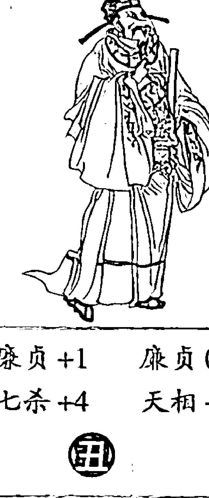

廉贞星较能忍受空、劫二煞星，廉贞独坐，逢空、劫星，多为职位高的公职人员，或学有专长的工程师。

廉贞星加会破军或天府星，再遇到火星，容易自寻烦恼，自找麻烦。
廉贞星化禄入命、身宫，为次桃花，有威权。廉贞星化权入命、官禄宫，为官禄主。

所有星曜都怕化忌星，尤其是廉贞、贪狼和天机星更怕化忌星。廉贞星为囚星，廉贞星化忌，就成为死结，打不开，身心受囚，百难临头，为害不轻。天机星主深谋远虑，面面俱到，天机星化忌，凡事皆阴错阳差，愈是顾虑愈出问题。贪狼星为欲望之魔，贪狼星化忌，往往因为欲望太高，一切努力终究是镜花水月，化为泡影。

## 1 廉贞星坐守子、午宫：财运亨通，生活富足

做事有原则，懂得拿捏分寸，有机智，清楚知道自己在做什么，非常适合担任公职。只要命宫没有煞星同坐，多蒙受长上精神和物质双方面的资助，平步青云，而获致事业成功。

## 星曜布局

廉贞星平势坐守子、午宫，必有入庙天相星同坐。天相星是紫微帝星身边的掌印官，替紫微星执掌印玺，为人谨言慎行，处事公正，思考周密。二星同宫，稳重的天相星可制廉贞星的邪恶与狂妄，使廉贞星与天相星的特性相互配合而发挥。

## 基本命运

廉贞、天相星同坐守子、午宫，迁移宫有入庙破军星，财帛宫有旺势紫微星和天府星（申宫为地势，寅宫为入庙），官禄宫有入庙武曲星。一生中常奔波变动，身心往往难以平静，但子、午宫破军星为入庙，迁移或转业尚能崭露头角，紫微星入财帛宫主善于理财；天府星是天上的财库，又为财帛主，因此，财帛宫有天府星，财源广达，善于理财；紫、府双帝星同临财帛宫，一生财运亨通，生活富足。武曲星临事业宫，在工作上有决断力和执行力，面对困难皆有勇气和信心去克服，无论任职或创业，均能有所表现，适宜金融、企业界，财务、会计、军警、五金业或技术性的工作。但因此时七杀星单居福德宫，一生多忙碌而辛劳，心情常烦闷，多不合群，有孤独忧郁的周期性异常行为，而使生活不正常，是自寻烦恼的类型，因而健康通常都较差。

## 不同生年的命运

甲年生人：命宫廉贞星化禄，迁移宫破军星化权，官禄宫武曲星化科，为“三奇嘉会格”，名誉昭彰，富贵双全，财官双美，但属“大器晚成”型。廉贞星化禄入命宫，具领导能力，有威权；可得朋友的助力，并获部属的爱戴与支持，做事顺利，有地位提升而持续性领导的现象，但化禄易使廉贞星的桃花性质更为显现，易有感情上的困扰，或沉溺于风花雪月。迁移宫破军星化权，劳碌奔波，具领导气势和能力，常主动去改变环境，使事业上的改变更为美好。武曲星坐官禄宫，宜服务于金融、财经或军警职，事业有成，名利双收。

命坐午宫，甲申、甲子、甲辰年生人；命坐子宫，庚寅、庚午、庚戌年生人，禄存和命马星同坐财帛宫，为“禄马交驰格”，愈奔动愈有财，可在环境变化中发展而得财，转职、转业可获良机而获财富，一生多旅游机会。

乙年生人：财帛宫紫微星化科。具领导及处事能力，才艺表现突出，有贵人相助，有偏财运，事业上有好的表现，紫微星化科临财帛宫，照福德宫，对福德宫有解厄的功效，可改善七杀星单居福德宫的奔劳、孤独、烦闷等现象。

命坐子宫，乙、己年生人；命坐午宫，辛年生人，天钺、天魁双贵星，分别在命宫及财帛宫三合会照，为“天乙拱命格”，文章盖世，贵人多助，功名早成。

### 廉贞星坐命子、午宫

廉贞星坐命子、午宫，必为平势，且有入庙天相星同坐，迁移宫有入庙破军星，财帛宫有旺势紫微星和天府星（申宫为地势，寅宫为入庙），官禄宫有入庙武曲星。

坐命子宫

| 宫位 | 星曜 |
| :--- | :--- |
| 巳宫 | 破军 +4 |
| 申宫 | 紫微 +3、天府 +2 |
| 辰宫 | 武曲 +4 |
| 子宫 (命宫) | 廉贞 0、天相 +4 |

坐命午宫

| 宫位 | 星曜 |
| :--- | :--- |
| 午宫 | 廉贞 0、天相 +4 |
| 酉宫 | 武曲 +4 |
| 寅宫 | 紫微 +3、天府 +4 |
| 戌宫 | 破军 +4 |

丙年生人：廉贞星在命宫化忌。叛逆性强，又受制于环境的囚困，常感怀才不遇而烦闷不乐，身心好似有难解的死结般难受，由于长期的压抑，易胡思乱想，而有失眠、神经衰弱等症状。

命坐午宫，丙、戊年生人，擎羊星落陷坐命，为“马头带箭格”，非夭折则主刑伤，离乡背井，漂泊不定，危困重重。

命坐午宫，丙、戊年生人；命坐子宫，壬年生人，廉贞（囚）、天相（印）和擎羊星（刑）坐命，为“刑囚夹印格”，虽主武勇，但刑伤灾重，一生讼争，是非不断。女命，配偶早逝，易有开刀、流产的厄运。

命坐午宫，丁、己年生人；命坐子宫，癸年生人，禄存星同坐命宫，事业循次发展，可得财富。

己年生人：官禄宫武曲星化禄。事业及财运皆顺遂，常从事与金融有关的职务或事业。庚年生人，官禄宫武曲星化权。事业心重，喜欢孤注一掷，想一步登天赚大钱，不受上司约束，上班领薪水常觉得无法展长才，喜欢自行创业，多能排除万难，获得最后的成功。武曲星化权易使武曲星变得更固执、更孤僻，宜注意改善人际关系，才能和气生财。女命，孤克难免，会影响婚姻的缘份和感情生活的和谐。

壬年生人：财帛宫紫微星化权，官禄宫武曲星化忌。紫微星在财帛宫化权，可创业，掌财有方，理财有术，事业有成，并伴随着有钱财收入，在财经机构可担任高级主管。武曲星在官禄宫化忌，劳碌奔波，事业上困扰横生，易引起亏空公款等工作麻烦。

癸年生人：迁移宫破军星化禄。能担负重责，仍避免从事大规模的投资经营，喜欢外出消费，在外开销大。

## 2 廉贞星坐守丑、未宫：早年艰辛，坚韧不拔

廉贞、七杀星同坐守丑、未宫的人，多喜欢文艺，并有多种嗜好。善于理财，注重物质和精神方面的享受。适宜在公家机构服务，多能在辛劳之后有所表现。若多加会吉星，有横发的好运；若多与凶星加会，易遭受一败涂地的厄运，身体易遭受刑伤。

## 星曜布局

廉贞星在丑、未宫利势坐命，必有入庙七杀星同坐。七杀星是紫微帝星运筹帷幄的主帅，拥有“将在外，君命有所不受”独断专行的主帅威望，有胆识，有谋略，有主见，由于必须冒险犯难，本身具有危险性与波动性，艰辛难免。廉贞星受七杀星喜冒险犯难及波动性的影响，个性强硬，胆大，好冒险，喜欢一意孤行，无论成败皆不会中途而废。

不但忙于工作，更在意工作中的表现，一生成败起伏很大，离乡赴外较易成功，年轻时多艰辛劳苦。七杀星能使廉贞星的次桃花得以正常地发挥。

## 基本命运

廉贞、七杀星同坐守丑、未宫，迁移宫有人庙天府星，财帛宫有旺势紫微星和利势贪狼星，官禄宫有平势武曲星和破军星。天府星临近迁移宫，在移动、转业中得福，有长上提拔，在外喜助人，喜欢结交比自己强的人，凡事较爱计较。财帛宫有紫微、贪狼星坐守，爱财，善于理财和谋财，工作欲很强，不计一切地只为财，所赚之财多为异性之财、娱乐之财，多以横财致富，早年必须先守住家业，避免做大规模的投资或拓展，中年后可放手去做，可以光宗耀祖，聚财有成。武曲、破军星同坐官禄宫，工作上有决断力，富开创精神，面对困难有勇气与信心去冲破，多半不免踏入军警行业，可荣显，女性也可能成为女权运动者。

七杀星坐命，必三合会照破军星与贪狼星，构成‘杀、破、狼’格局，为人生变化的枢纽，一生往往有大幅度的起伏变化，限行遇之，称为‘竹萝三限’，必有程度或大、或小不同程度的变化，其特立独行的特性，不需吉星相助（可略增气势），也不畏煞星侵犯（以实力硬拼，备尝艰辛），使七杀星更显得寂寞寡欢，在感情上常不免孤芳自赏。

廉贞星在未宫入庙坐命（七杀星同坐），无煞、忌星冲破，为‘雄宿朝元格’，为积福之人，擅长交际，辩才无疑，才华横溢，兴趣广泛，个性豪迈，在工作上有表现，能任要职，富贵声扬名远播。但易近酒、色、赌博，女命桃花太重，感情多波折，宜晚婚。怕四煞（羊、陀、火、铃）星来冲，应注意高空坠落之灾。

## 不同生年的命运

甲年生人：命宫廉贞星化禄，官禄宫破军星化权、武曲星化科，为‘三奇嘉会格’，名誉昭彰，富贵双全，财官双美，具突发性的表现，唯遇杀、破星会照，虽可成就，但世路多艰。善于理财，工作顺利，有异性缘，具威权，可得朋友相助及部属爱戴；富领导能力，应注意充分授权，可减少自己奔波，并使事业更辉煌，环境及职位多变迁，若主动则可控制其改变，宜于武职；具有声望，有扬名的机运，在财经、军警界能出人头地。同时天魁及天铖双贵星，分别坐守命宫、迁移宫，为‘坐贵向贵格’，文章盖世，贵人多助。

乙年生人：财帛宫紫微星化科。有偏财运，并可因贵人相助而得财，具有处理事务的能力，才艺出众，在事业上能崭露头角，功成名就。

丙年生人：命宫廉贞星化忌，为‘杀拱廉贞格’，叛逆性强，但受环境束缚而常感有志难伸，浪漫不安，多官非，易接近酒、色、财、气，多变动与波折，尤在感情上易产生困扰，对钱财也不利，爱赌博，但多输少赢。

戊年生人：财帛宫贪狼星化禄。多对文学、艺术有兴趣与天赋，交际应酬多，带桃花性质，有偏财运，赚钱多带投机性。同时天钺、天魁双贵星分别坐守命宫、迁移宫，为“坐贵向贵格”。

己年生人：官禄宫武曲星化禄，财帛宫贪狼星化权。事业上金钱进出顺途如意，多从事与金融或财经有关的工作；可掌财，创业时很能冲刺，多可横发，但发后宜能守，否则，钱财多花费在酒色财气上，到头来仍是一场空。

庚年生人：财帛宫武曲星化权。事业心重，喜欢自行创业，具奋战精神，能在极端困难的环境下，完成别人无法完成之事，可得财权，在金融界或武职，职位不低，但孤克难免，宜注意人际关系，才能和气生财。女命，婚姻与感情生活多困扰。同时天魁、天钺双贵星，分别坐守命宫、迁移宫，为“坐贵向贵格”。

壬年生人：财帛宫紫微星化权，官禄宫武曲星化忌。掌财有方，理财有术，可创业，或担任财经机构高级主管；劳碌奔波，易有亏空公款类工作上钱财的麻烦。

### 廉贞星坐命丑、未宫

#### 坐命丑宫

廉贞星坐命丑宫，必为利势，必有入庙七杀星同坐。迁移宫有入庙天府星，财帛宫有旺势紫微星和利势贪狼星，官禄宫有平势武曲星和破军星。

#### 坐命未宫

廉贞星在未宫利势坐命，同样必有入庙七杀星同坐，入庙天府星临近迁移宫，旺势紫微星和利势贪狼星入财帛宫，平势武曲星和破军星居官禄宫。

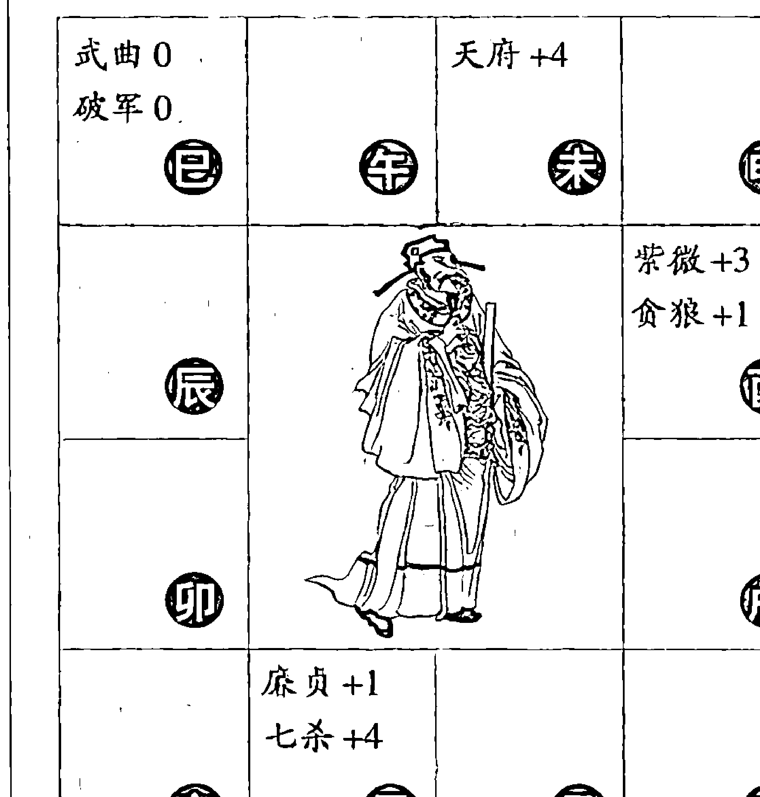

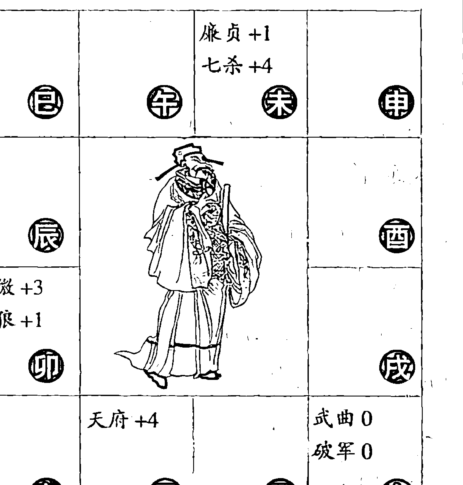

癸年生人：官禄宫破军星化禄，财帛宫贪狼星化忌。与配偶相处良好，能得配偶扶助，开创积极，事业顺途，在金融业更能发挥长才；多才多艺，多辛劳，但辛劳后有表现，守财不牢，常会因桃色纠纷而破财。

命坐丑宫，癸年生人；命坐未宫，丁、己年生人，入庙擎羊星同坐命宫，为“擎羊入庙格”，辰、戌、丑、未四墓地，可制擎羊之凶，并保留其威强与冲劲，权威出众，富贵声扬，但刑伤难免，遇火星，则权威卓著。

## 不同生时的命运

命坐丑宫，二、四、六、九、十、十一月生人；命坐未宫，三、四、五、八、十、十二月生人，左辅、右弼双辅佐星，同坐命宫，或同夹命宫，或在命宫的三方四正拱照，为“左右同宫格”，或“左右守垣格”，人际关系佳，富企划能力，凡事可逢凶化吉；若逢凶、煞星，则先成后败，先荣而衰。

命坐丑宫，寅、午、戌年，子时生人，亥、卯、未年，辰时生人，申、子、辰年，亥时生人，己、酉、丑年，戌时生人；命坐未宫，寅、午、戌年，午时生人，申、子、辰年，巳时生人，己、酉、丑年，辰时生人，亥、卯、未年，戌时生人，为“擎羊入庙格”加遇火星，权威卓著。

命坐丑宫，丑、卯、巳、申、酉、戌时生人；命坐未宫，寅、卯、辰、未、酉、亥时生人，文昌、文曲双文星，同坐命宫，或同夹命宫，或在命宫的三方四正拱照，为“文桂文华格”“昌曲夹命格”或“文星拱命格”，举止优雅，富知性，勤学好读，有经国济世之才，在学术、文艺界，可显荣耀；女命逢之多情。文昌、文曲星在命宫的三方四正会照时，也为“廉贞文武格”，允文允武，但寿命不长，感情不顺。

## 3 廉贞星坐守寅、申宫：多才多艺，女命多情

> 命坐申宫，廉贞星入庙独坐，为“雄宿朝元格”，辩才无碍，才华洋溢，擅长交际，兴趣广泛，个性豪迈，在工作上有表现，能任要职，唯易近酒、色和赌博，并怕羊、陀、火、铃四煞星相冲，应注意高空坠落之灾。女命多情，桃花重，感情多波折，宜晚婚。

## 星曜布局

廉贞星在寅、申宫为入庙独坐，能将廉贞星多变化、次桃花（有异性缘）、欲望强、好贪、好争、喜冒险、权威（杀）、受制而怀才不遇（囚）、狂妄不拘（邪）的性质完全发挥出来，又因其对宫是平势贪狼星，所以多才多艺，具有工作能力，希望在挑战中展现自己的才能，擅长交际，时有应酬，易与赌博及酒、色、财、气声色场所接近。

## 基本命运

廉贞星入庙独坐寅、申宫，迁移宫必有平势贪狼星，财帛宫必有地势紫微和天相星，官禄宫必有天府星（子宫为入庙，午宫为旺势）和旺势武曲星。爱表现，喜刺激，喜好新奇事务，喜欢往外跑，大都出外发展，甚至在国外落地生根，异性缘佳；善于理财、谋财、用财，一生财禄丰厚，衣食无虞；多得长上信赖和提携，工作有决断力，具领导能力，并受部属支持，事业发展稳健，可位居高位，掌握权力。

## 不同生年的命运

甲年生人：命宫廉贞星化禄，官禄宫武曲星化科。具领导能力与文艺才华，有威权，能获得朋友相助及部属爱戴，做事顺利，有财且带桃花，交际应酬多，常经营与文学、艺术有关联的事业，多能有所收获。具办事能力和声望，服务于财经界，或军警职，可名利双收。

命坐寅宫，甲、丁、巳、庚年生人；命坐申宫，甲、庚、癸年生人，禄存星同坐命宫，或在命宫的三方四正会照，为“禄合鸳鸯格”，或“双禄朝垣格”，有名望、福气及才华，财官双美。

命坐寅宫，甲年丑、卯、巳、未、酉、亥时生人，禄存、化禄星同坐命宫，逢空、劫星冲破，为“两重华盖格”，吉处藏凶，孤高贫困，与僧佛有缘，遁空门反主清福。

甲申、甲子、甲辰、庚寅、庚午、庚戌年生人，禄存与命马星同坐命宫或迁移宫，为“禄马交驰格”，愈奔动愈有财，可在环境变化中发展而得财，转业、转职可获良机，一生多旅游机会。

乙年生人：财帛宫紫微星化科。处理事务能力强，才艺出众，有特殊技能，对某一专门技术或学问有独特的研究和见解，有偏财运，在公家机构或做公家机构生意，可有贵人相助而安稳得财。

命坐寅宫，乙年生人，陀罗星同坐命，脓血不免，多有忧烦之事，女命尤甚。

- 丙年生人：命宫廉贞星化忌。廉贞囚星化忌，成为打不开的死结，身心受囚，叛逆心强，思虑颇多，心绪易受干扰而多变化，心胸狭窄，遇事多计较，常感怀才不遇，陷于困境之中，赌博易输又不信邪，容易有官非。
- 戊年生人：迁移宫贪狼星化禄。聪明，辛劳，出外受欢迎，常有酒食等应酬，经商可得财，桃花难免。
- 命坐午宫，丙、戊年生人，廉贞（囚）、天相（印）和擎羊（刑）星同坐命，为“刑囚夹印格”，虽武勇，但刑伤灾重，一生讼争，是非不断。
- 己年生人：官禄宫武曲星化禄，迁移宫贪狼星化权。财源不绝，且得库储，工作顺送，事业上金钱进出顺遂如意，多从事与金融有关的职务或事业；有冲劲，能掌权，外出好客、好酒食，桃花不少，有异性缘，男性可得一干练而善于理财的妻子，女命则宜迟婚，配偶为事业有成之士。
- 庚年生人：官禄宫武曲星化权。具奋战精神，事业心重，喜欢自行创业，可获得财禄，宜注重人际关系的改善，女命孤克难免，会影响婚姻及感情生活。
- 命坐未宫，丁、己、庚年生人，擎羊或陀罗星同坐命宫，脓血不免，多有忧烦之事，女命尤甚。
- 命坐寅宫，辛年生人；命坐申宫，乙、己年生人，天钺、天魁双贵星分别在命宫、官禄宫三合会照，为“天乙拱命格”。
- 壬年生人：财帛宫紫微星化权，官禄宫武曲星化忌。自主性强，有领袖欲，掌财有方，理财有术，可担当财经机构高级主管。

命坐子宫，壬年生人，廉贞、天相、擎羊星同坐命，为“刑囚夹印格”。

- 癸年生人：迁移宫贪狼星化忌。多才多艺，男命凭特殊技艺养家，女命在家事方面很有才华，喜出门寻桃花，易有风流事，谨防酒色惹祸。

## 不同生时的命运

- 子、午、辰、戌、寅、申时生人，命宫廉贞星坐守，官禄宫有武曲星，再逢文昌、文曲星，为“廉贞文武格”，允文允武，平生福气全，再会禄存星，一生富有，但寿命不长。

### 廉贞星坐命寅、申宫

廉贞星坐命寅、申宫，为入庙独坐，对宫为平势贪狼星，能将廉贞星的星性发挥殆尽且多才多艺。

#### 坐命寅宫

|     | 午 |     | 申 |
| --- | --- | --- | --- |
|     | 武曲+3 天府+3 |     | 贪狼0 |
| 辰 |     |     | 酉 |
|     |     |     | 紫微+2 天相+2 |
| 卯 |     |     | 戌 |
| 命宫寅 |     |     |     |
| 廉贞+4 |     |     |     |

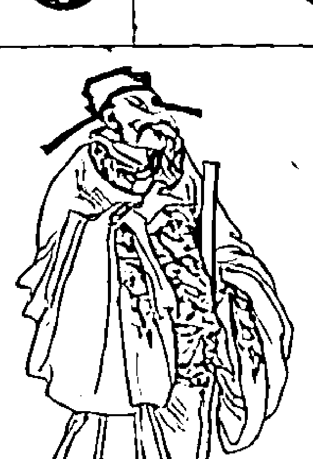

#### 坐命申宫

|     |     | 未 | 申 |
| --- | --- | --- | --- |
|     |     |     | 命宫申 |
| 午 |     |     | 廉贞+4 |
| 辰 |     |     |     |
|     | 紫微+2 天相+2 |     | 酉 |
| 卯 |     |     |     |
|     |     |     | 戌 |
|     |     |     |     |
| 贪狼0 | 寅 |     | 武曲+3 天府+4 |

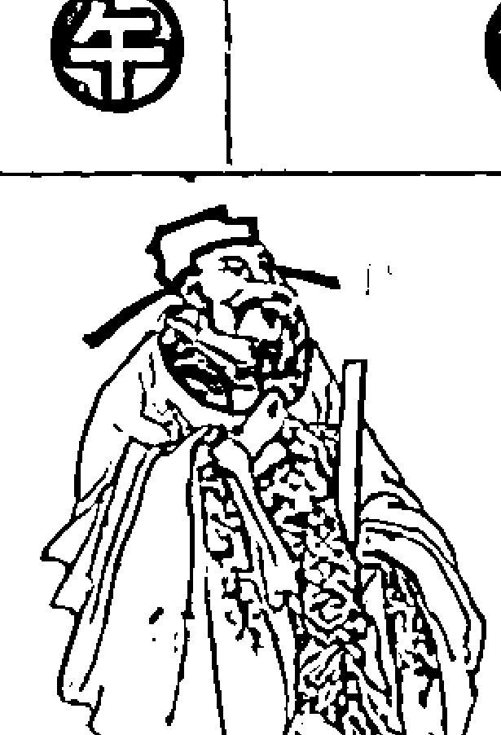不长，感情不顺，刑伤不断。

卯、酉时生人，地空或地劫星同坐命，有专门技能，或为理工人才，只要不会照羊、陀、火、铃四煞星及化忌星，可有所表现。

## 4 廉贞星坐守卯、酉宫：巧艺之人，白手起家

二星同宫，具有冒险开创的精神和领导能力，忍耐力强，工作积极稳重，冲劲大，有抱负和志气，颇具工作能力，能以坚忍的毅力，长期埋头苦干，终可克服逆境，白手起家，获得一鸣惊人的成功，或为巧艺之人。但个性孤僻，生活圈子较小，幼年体弱多病，或为早产儿。女命处理事务干脆利落，在事业上有表现，宜迟婚。会照吉星多，宜从政、公职或大众传播界，能有特殊表现。遇四煞星，为“贞居卯酉格”，凡事较想不开，处理事务有困扰，多做公门胥吏，仆役之流，或以专门技术为生。但若化忌星和煞星同宫，反使凶焰相抵，损害较轻。

## 星曜布局

廉贞星在卯、酉宫平势坐命，必有落陷破军星同坐。破军星是紫微帝星殿前卫戍京畿的禁卫军大将，骁勇善战，勇猛无比。

## 基本命运

廉贞、破军星同坐守卯、酉宫，迁移宫必有落陷天相星，财帛宫必有旺势紫微星和平势七杀星，官禄宫必有入庙武曲、贪狼星。若三方四正会照文昌、文曲星，为“廉贞文武格”，允文允武，唯感情不顺，刑伤不断，寿命不长。喜出风头，爱管闲事，对迁居或转业很慎重，多能顺利完成；可靠自己的智慧及双手赚钱，白手起家，有横财运，但钱在手中不安稳，变动性大，易防横发横破，暴得暴失；欲望强，工作勤奋而有决断力，对投机性和冒险性的工作特别有兴趣，事业多变动，宜娱乐界、影剧圈，或金融、财经、军警界，戒之在贪，以免在财务的职位上动手脚，或收受贿赂、做假账，而误触法网。

廉贞、破军星同坐守酉宫，太阴、天同星在子宫守田宅，为“月生沧海格”，或称“水澄桂萼格”，聪明秀气，具幽然感，富谦让美德，人缘佳，深得异性助力，有财富和名声，但此格不宜女命，感情生活多波折，宜晚婚。

七杀、破军、贪狼星在命宫的三方会照时，为“杀、破、狼”格局，为人生变化的枢纽，一生多变动，其成败呈现大幅度的变化，足以影响一生，对钱财和女命的感情有不利的变动。

## 不同生年的命运

甲年生人：命宫廉贞星化禄、破军星化权，官禄宫武曲星化科，为“三奇嘉会格”，名誉昭彰，富贵双全，财官双美，具突发性的表现，唯遇杀、破星会照，虽可或就，但世路多艰。具威权和领导能力，能得到朋友的支持和部属的服从，做事顺利，有带桃花的钱财；居领导地位，环境多变动，但破军星为落陷，其变动多趋向坏的变化；声望得以提高，宜从事军警职，或服务于财经界，为优秀的经理人才，事业有成，并获得荣誉，但不宜经商。命坐卯宫，甲年生人，擎羊星同坐命，多有困扰，并应防车祸。

乙年生人：财帛宫紫微星化科。有偏财运，具有雄心和独立性，开创事业颇有成就，在公家机构或做公家机构生意，能得贵人助而安稳得财。

丙年生人：命宫廉贞星化忌，若再会四煞星，为“杀拱廉贞格”，浪漫不安，祸殃不断，好运不至，钱财不留。叛逆性强，冲劲大，因受制于环境的束缚，常感烦闷不乐，身心受困，有如打不开的死结般难受，而感叹怀才不遇，人生历程及感情多波折、困扰，变动性很大，宜注意桃花和官非，赌博易输又不信邪。

戊年生人：官禄宫贪狼星化禄。贪狼星化禄入辰、戌、丑、未四墓库，为桃花受制，主财，有偏财运，赚钱多带投机性、娱乐性，因与武曲正财星同宫，财禄颇丰，也可凭经营文艺方面的生意进财，工作多得异性之助。

命坐酉宫，丙亥、丙卯、丙未、戊亥、戊卯、戊未年生人；命坐卯宫，壬巳、壬酉、壬丑年生人，禄存星和命马星同坐财帛宫，若无火、铃星冲破，为“禄马交驰格”，愈动愈有财，在环境变化中发展而得财，转职和转业可获良机，一生多旅游机会。

己年生人：官禄宫武曲星化禄、贪狼星化权。多才多艺，财气旺盛，工作顺遂，事业上金钱进出顺遂如意，或从事与金融有关的职务或事业；有冲劲和拼劲，具强劲竞争力，并有意外的机遇，并有异性缘，容易脱颖而出，有自行创业的倾向。

庚年生人：官禄宫武曲星化权。事业心重，喜欢孤注一掷冒险，并喜自行创业，应注意改善人际关系，以和气生财，具有奋进的精神，宜从事军警职，可升迁和掌权。女命则易固执和孤僻，难免于孤克，会影响婚姻的缘份及生活的和谐。

壬年生人：财帛宫紫微星化权，官禄宫武曲星化忌。紫微星化权，主贵不主富，坚定而自主性强，有时不免予人有压迫感，劳碌奔波，在感情方面不顺利。命坐卯宫，壬巳、壬酉、壬丑年生人，命马和禄存星同坐财帛宫，为“禄马交驰格”，可在环境变化中发展而得财，愈动愈有财。

癸年生人：命宫破军星化禄，官禄宫贪狼星化忌。处世较积极，虽能进财，但仍避免大规模的投资；多才多艺，以才艺谋生，宜从事冶炼、现金交易或娱乐界的生意，应防异性桃花。

## 5 廉贞星坐守辰、戌宫：事业有成，感情易挫

廉贞、天府星同坐辰、戌宫，若无煞星冲破，为“天府朝垣格”，也为“府相朝垣格”，富贵双全，食禄千钟，得人景仰，女命忠贞有节。多半家庭环境优越，具有创意，口才佳，有异性缘，重视家庭观念，人际关系良好，可得贵人扶持及亲属助力，事业因而得以发展，或为文艺界名人，一生多财富和地位。若得文昌、文曲星在三方四正会照，为“廉贞文武格”，允文允武。若适逢廉贞星化禄，主少年难以得志，三十岁以后，才可崭露头角，但此时若有化忌星及六煞星之一同宫，可帮助廉贞、天府星冲出辰、戌宫天罗地网的束缚，虽然不免于辛劳，但终能事业有成。女命，廉贞、天府星同坐命宫，在感情上易有挫折，宜迟婚。

## 星曜布局

廉贞星在辰、戌宫利势坐命，必有入庙天府星同坐。天府星是南斗帝星，也是天上的财库，天府星和天相星，同为紫微星的左右手，一为财库主，一为掌印官。天府星虽具领导能力，但保守厚重，个性内敛，与廉贞星同宫，不仅能发挥天府星重实际而稳重，爱惜钱财并得以库存，具领导力和延寿解厄的力量，同时，也可约束廉贞星的“邪”和“桃花”，化解廉贞星的“囚”，并使廉贞星的“权威”得以正常发挥。

## 基本命运

廉贞、天府星坐守辰、戌命宫，迁移宫必有入庙七杀星，财帛宫必有紫微星（子宫为平势，午宫为入庙），官禄宫必有地势武曲星和入庙天相星。七杀星入迁移宫，活动力强，喜四处游荡，在家待不住，工作和生活变化很大，宜赴外地发展，或有突发成功的机会；紫微星入财帛宫，财运佳，或出生于富豪之家，一生衣食无虞，可得贵人资助，或有不劳而获之财；武曲、天相星同入官禄宫，具有面对和冲破困难的勇气和信心，事事力求完美，工作上有决断和领导能力，并具有旺盛的行动力，在事业上皆能有所表现，对职业的忠诚度相当高，多不轻易更换职业，擅长处理繁杂问题，为最佳主管和幕僚人才，常有兼职的机会，宜赴外地发展、从事大事业或在大企业内任职。

廉贞、天府二星同坐戌宫较辰宫吉利，此因命坐戌宫时，财帛（午）宫的紫微星为入庙；命坐辰宫时，财帛（子）宫的紫微星为平势。

## 廉贞星坐命辰宫

廉贞星利势坐命辰宫，有入庙天府星同坐。迁移宫必有入庙七杀星，财帛宫必有平势紫微星，官禄宫必有地势武曲星和入庙天相星。

| 宫位 | 星曜 | 状态 |
|------|------|------|
| 辰   | 廉贞 | +1   |
| 辰   | 天府 | +4   |
| 申   | 武曲 | +2   |
| 申   | 天相 | +4   |
| 酉   | 七杀 | +4   |
| 子   | 紫微 | 0    |

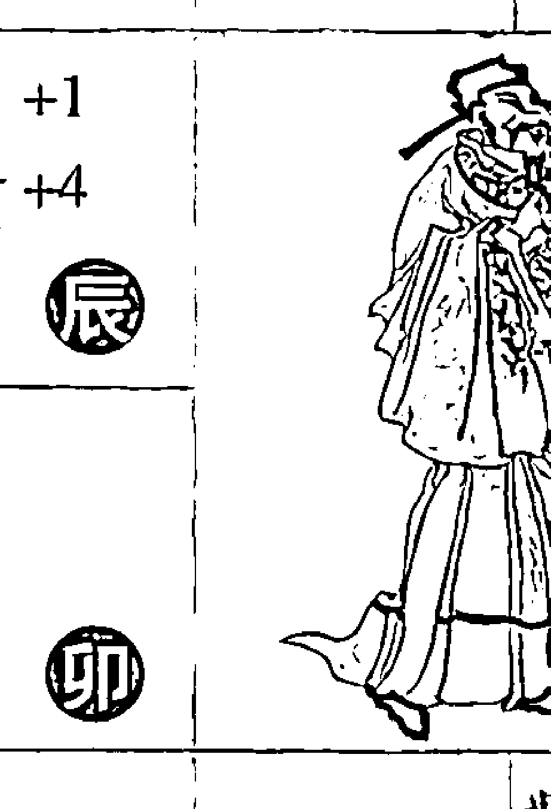

> 廉贞、天府星同坐，会照天相星，为“府相朝垣格”，富贵双全，食禄千钟，得人景仰，女命忠贞有节。

## 不同生年的命运

甲年生人：命宫廉贞星化禄，官禄宫武曲星化科，若无凶、煞、忌星同宫或冲破，为“科名会禄格”，才华卓著，远近知名，财名皆美。具威权及领导能力，能得到朋友和部属的助力，桃花性质明显，钱财多来自异性，少年时多不得志，难以发挥才能，三十岁以后，能逐渐崭露头角，晚运安稳。虽多辛劳，事业上能有所表现，尤其是服务于财经、军警界可名利双收。

乙年生人：财帛宫紫微星化科。具有处理事务的能力，有偏财运或挂名的财富（公门之财安稳），并得贵人相助，才艺出众，宜往学术、文艺界发展，可在专门学术研究上大放异彩，成为专家或名学者，尤以命坐戌宫而午宫的紫微星为入庙，更为吉美。

命坐辰宫，乙年生人，入庙擎羊星同坐四墓宫，为“擎羊入庙格”，具冲劲，权威出众，富贵声扬，若逢凶星，刑伤难免。

丙年生人：命宫廉贞星化忌。叛逆心强，可使廉贞、天府二星有力量脱离天罗、地网的束缚，而得以发挥其力。遇桃花星则易有桃花纠纷。

命坐戌宫，丙、丁年生人；命坐辰宫，壬、癸年生人，天铖、天魁双贵星同夹命宫；命坐戌宫，辛年生人；命坐辰宫，乙、己年生人，天铖、天魁双贵星在命宫的三方会照，为“天乙拱命格”，文章盖世，贵人多助。

己年生人：官禄宫武曲星化禄。财气旺盛，事业上金钱进出顺遂如意，或从事与金融有关的行业。

庚年生人：官禄宫武曲星化权。具有奋进精神，事业心重，喜欢自行创业，能在稳定中成长而得财，在军警、金融界可掌权，宜注意人际关系的改善。女命，多在社会上占有一席之地，唯婚姻缘分和感情生活难以和谐，孤克难免。

命坐戌宫，辛年生人，入庙擎羊星同坐命宫，为“擎羊入庙格”，权威出众，富贵声扬，若逢凶星，刑伤难免。

壬年生人：财帛宫紫微星化权，官禄宫武曲星化忌。具权威性，但多孤傲自主，对钱财享有支配权，可担任财经机构高级主管。劳碌奔波，不知自己所为何事，但辛劳后事业有成，在工作上容易有钱财方面的麻烦，感情上也较不顺遂。

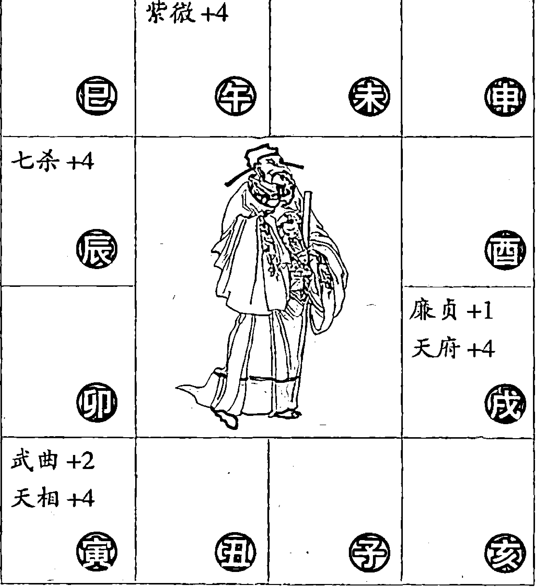

> > 廉贞星坐命戌宫
> 
> 廉贞星坐命戌宫，必为利势，有入庙天府星同坐。三合会照入庙七杀星、入庙紫微星、地势武曲星和入庙天相星。

## 不同生时的命运

一、七月生人，左辅、右弼双吉星，分别在命宫、迁移宫对照，为“左右守垣格”，富企划能力，人际关系佳，凡事皆可逢凶化吉，若逢凶、煞星，先成后败，先荣后衰。

子、午时生人，文昌、文曲星双吉星，分别在命宫、迁移宫相对照，为“文星拱命格”，举止优雅，富知性，在学术、文艺界可显荣耀。女命逢之多情。

## ⑥ 廉贞星坐守巳、亥宫：桃花之命，一世风流

廉贞、贪狼星同坐巳、亥宫的人，一生多艳遇，容易卷入桃花纠纷中，尤其以亥宫坐命，为“泛水桃花格”，男风流，女多情，若再逢文昌、文曲、红鸾、天喜、沐浴、天姚、咸池等桃花星，有感情困扰，恐将因酒色而引起丑闻。

## 星曜布局

廉贞星在巳、亥宫落陷守命，必有落陷贪狼星同坐。贪狼星是一颗能言善道，喜好文艺，懂得为人处世之道，多才多艺，偏向酒、色、财、气桃花性质的星曜。贪狼第一桃花星和廉贞次桃花星二颗超级桃花碰在一起，一个贪杯（贪狼星），一个好赌（廉贞星），二星又同时落陷，更使人容易沉迷于风花雪月和赌博贪争的邪途而无法自拔。廉贞、贪狼星同坐巳、亥宫的人，因为有了欲望之魔——贪狼星的推波助澜，赌瘾迷了心窍，越赌越大，有倾家荡产而不可收拾的可能。所以，最好戒赌，或干脆将兴趣转移到研究五术哲理的学术研究，才能避凶趋吉。

## 基本命运

廉贞、贪狼星同坐守巳、亥宫，由于廉贞星具有权威，善于交际应酬，利于从政，再加上贪狼星多才多艺，能言善道，欲望强烈，求好心切，有竞争心。二星同宫，宫中无其他甲级星，也不逢四化星，自然形成特殊的贵格，使人具有理想和抱负，并有独特的政治见解，能在辛劳后，突破困境，而有一番表现，尤利于从政。

廉贞星不喜欢在巳、亥宫化忌再逢六煞星，为“杀拱廉贞格”，浪漫不安，诸事不顺。廉贞星在巳、亥宫，也不喜廉贞星化禄，反有画蛇添足之嫌，有喜好经商的现象，但经商易多波折，如在财经界工作，也失去了廉贞星应有的冲劲，多在中年以后，才能使家庭和事业完全稳定下来。但同宫的贪狼星较不嫌化禄，也不嫌化忌，反而有特殊的才艺表现。廉贞、贪狼星同坐巳、亥宫，不喜爱与六吉星之左辅、右弼、天钺、天魁星，以及六煞星中的擎羊、陀罗、地空、地劫星同宫，但较喜欢与六煞星中的火星、铃星同宫，多走偏锋，具有特殊技能，也多能有所表现。

## 廉贞星坐命巳宫

廉贞星坐命巳宫，必为落陷，且必有落陷贪狼星同坐，并有七杀、破军二星在命盘中在三方与贪狼相互会照。

廉贞星为次桃花星，清秀端庄，异性缘佳，易迷恋赌博贪争。

贪狼为第一桃花星，能言善道，爱好文艺，易沉迷于风花雪月。

贪狼、廉贞二颗桃花星碰在一起，一个贪杯，一个好赌，二星又同时落陷，容易使人沉迷于风花雪月和赌博贪争，易有桃花纷争。

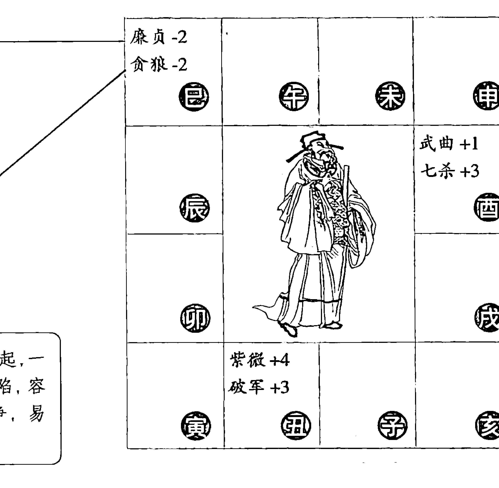

贪狼、七杀、破军三星，在命盘中永远在三方相互会照，同为人生变化的枢纽，只要遇到任何一颗星，人生机运皆会有或大、或小不同程度的变动。其中，破军星的波动最大，常产生足以影响一生的变动，其变化是勇往直前，几乎不顾一切的，并偏向于钱财和感情方面；七杀星的波动性居次，其变化是孤独中有智有谋，并偏向于感情上的孤芳自赏而寂寞寡欢；贪狼星的波动较小，其变化则出于想要追求更好前途的与人竞争，并偏向于酒色财气。

廉贞、贪狼星同坐守巳、亥命宫，财帛宫必有入庙紫微星和旺势破军星，官禄宫必有利势武曲星和旺势七杀星。财帛宫持紫微和破军星，一生衣食无虞，对钱财有独特的看法，财运亨通，有贵人扶助，适宜从事股票等高报酬、高风险的事业，可以过富足的生活，唯钱财欠缺稳定。武曲、七杀星同入官禄宫，行事果断，不怕困难，具执行力，适合金融、财经界，军警、职业运动选手等，富有突破性和挑战性的工作，或从事投机性、流通性、自由性的职业，事业多起伏变化，宜离祖外出求发展。

## 不同生年的命运

甲年生人：命宫廉贞星化禄，财帛宫破军星化权，官禄宫武曲星化科，为“三奇嘉会格”，名誉昭彰，富贵双全，财官双美，唯世路多难，属“大器晚成型”。命宫廉贞星化禄，具威权和领导能力，可使人服从和支持，喜好经商，但多波折，桃花性质明显，有桃花财，但感情易增困扰和波折。财帛宫破军星化权，具有决断力，常主动去改变环境，而往好的方面发展，有偏财运，能横发财富，但花钱较慷慨，常财来财去，晚得的钱财较稳，先去后来、先破后得的钱财可守得住。官禄宫武曲星化科，具有开创性，更有表现，服务于财经、军警界，可名利双收。

乙年生人：财帛宫紫微星化科。热情正直，具有处理事务能力，才艺出众，有偏财运。

丙年生人：命宫廉贞星化忌。具叛逆性，常陷于逆境中而感到怀才不遇，人生多坎坷、波折，易有官非和败桃花。若再逢六煞星，为“杀拱廉贞格”，浪漫不安，诸事不顺。命坐巳宫，丙年生人，禄存、化忌星同入命宫，擎羊、陀罗星同夹命宫，为“羊陀夹忌格”，孤贫刑克，百事不吉。

戊年生人：命宫贪狼星化禄。人缘佳，应酬多，有偏财运，多辛劳，容易卷入桃花纠纷中。命坐巳宫，戊年生人，化禄、禄存星同坐命，为“禄合鸳鸯格”，财官双美。

戊亥、戊卯、戊未、壬巳、壬酉、壬丑年生人，命马和禄存同坐命宫或迁移宫，为“禄马交驰格”，能在环境变化发展中得财，愈动愈有财。

命坐巳宫，戊年寅、午、戌时生人，化禄、禄存星同坐命，逢空、劫星冲破，为“两重华盖格”，吉处藏凶，孤高贫困，遁入空门反主清福。

己年生人：官禄宫武曲星化禄，命宫贪狼星化权，若无煞、忌星冲破，为“权禄巡逢格”，财官双美。官禄宫武曲星化禄，财源茂盛，赚钱有一套，事业上金钱进出顺遂如意，宜于财经、金融界服务，可闯出一番局面。命宫贪狼星化权，能干有为，主观意识强，具有理财，风流好客，挥霍好色，喜欢掌权，利于从政或往工商界发展。

庚年生人：官禄宫武曲星化权。事业心重，具有奋进的精神，喜欢自行创业，宜注意人际关系的改善，以和气生财。女命，孤独难免，婚姻及感情生活多波折。

壬年生人：财帛宫紫微星化权，官禄宫武曲星化忌。财帛宫紫微星化权，坚定自主，喜居层领导地位，对钱财有支配权，可担当财经机构的高级主管。官禄宫武曲星化忌，劳碌奔波不知所为何事，事业发展不顺，在工作上易有亏空公款类的麻烦。

癸年生人：财帛宫破军星化禄，命宫贪狼星化忌。财帛宫破军星化禄，可将破军星的暴戾之气化为积极处世，名利皆有获，有暴发或意外之财，但仍应避免大规模的投资经营。命宫贪狼星化忌，多才多艺，喜爱幻想，常有遁世之念，宜研究命理或冷偏门的学术或生意，风流成性，桃花是非多，感情纷扰多，易有离异或再婚的现象，性生活频繁，易导致肾亏。

命坐亥宫，子、丑、辰、午、申、亥时生人；命坐巳宫，子、寅、巳、午、未、戌时生人，地空、地劫双煞星，同坐或同夹命宫，或在命宫的三方四正会照，为“命里逢空格”，或“空劫夹命格”，贫贱多祸，求名求利总成空，必须信仰宗教，且常离家，清闲才能延寿。尤以命坐巳宫，丙、癸年巳、未时生人；命坐亥宫，丙、癸年丑、亥时生人，化忌星在命宫，又逢地空、地劫星夹命宫，为“空劫夹忌格”，更是不吉利，一生中有如“浪里行船”，并常有“半天折翅”的突然打击。

| 巳 | 午 | 未（紫微+4、破军+3） | 申 |
| --- | --- | --- | --- |
| 辰 | （人物插图） |  | 酉 |
| 卯（武曲+1、七杀+3） | （人物插图） |  | 戌 |
| 寅 | 丑 | 子 | 亥（廉贞-2、贪狼-2） |

廉贞星坐命亥宫 廉贞星落陷坐命亥宫，有落陷贪狼星同坐，三合会照七杀、破军二星，所成格局与廉贞星坐命巳宫类似。

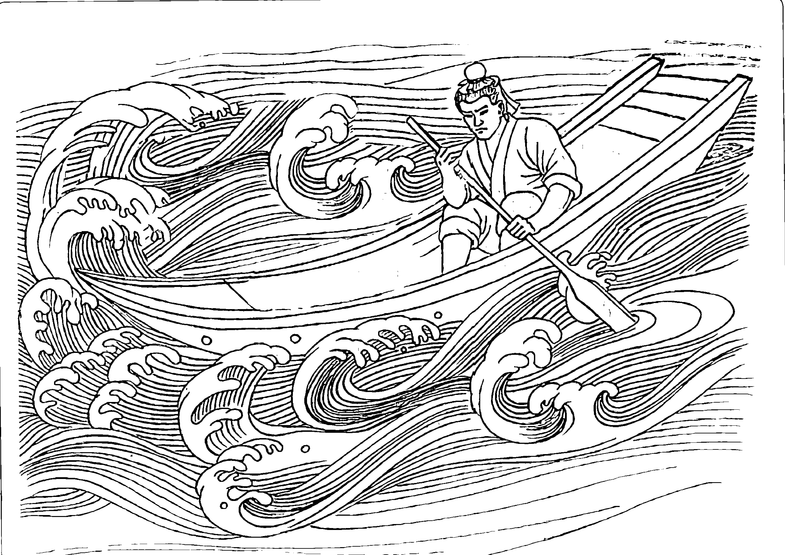

廉贞星坐命巳、亥宫，若化忌星在命宫，又逢地空、地劫星夹命宫，为“空劫夹忌格”，一生中有如“泪里行船”，并常有“半天折翅”的突然打击。

# 第九章 紫微星系坐命宫命理诊断

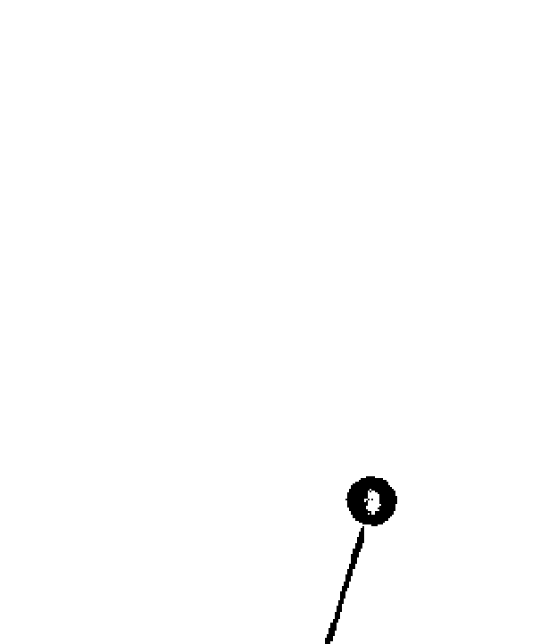

# 第拾章

## 天府星系主星坐身命宫 命理参断

在十四主星中，天府、太阴、贪狼、巨门、天相、天梁、七杀、破军等八颗星属天府星系，在安星时是随天府星而确定的。本章将分别论述此八星居身命宫时所预示的命理。

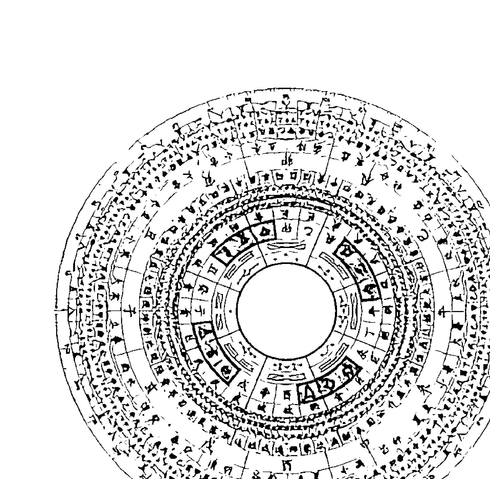

## 图版目录

天府星坐命各宫的亮度 / 714
太阴星在各宫亮度 / 721
诸星财运与太阳星财运的比较 / 722
太阴星坐命卯宫 / 724
太阴星坐命辰宫 / 725
太阴星坐命巳宫 / 729
太阴星坐命酉宫 / 731
太阴星坐命戌宫 / 733
太阴星坐命亥宫 / 736
贪狼星在各宫的亮度 / 739
贪狼星坐命子宫 / 741
贪狼星坐命午宫 / 742
贪狼星坐命寅、申、辰、戌宫 / 745
巨门星在各宫的亮度 / 750
巨门星坐命子、午宫 / 752
巨门星坐命辰、戌宫 / 755
巨门星坐命巳、亥宫 / 758
天相星在各宫的亮度 / 760
天相星坐命丑、未宫 / 762
天相星坐命卯、酉、巳、亥宫 / 764
天梁星在各宫亮度 / 770
天梁星坐命子宫 / 772
天梁星坐命午宫 / 773
天梁星坐命丑、未宫 / 775
天梁星坐命巳、亥宫 / 778
破军与七杀二将星的区别 / 781
七杀星在各宫的亮度 / 782
七杀星坐子、午宫 / 784
七杀星坐寅宫 / 785
七杀星坐申宫 / 786
七杀星坐辰、戌宫 / 788
“杀、破、狼”三星之变 / 791
破军星在各宫的亮度 / 793
破军星坐命子、丑宫 / 794
破军星坐命寅、申宫 / 797
破军星坐命辰、戌宫 / 798

## 天府星坐命身宫

天府星阴阳五行属阳土，为南斗第一星，化气为“令”，为财帛、田宅主、又为禄库，在斗司福权，在数掌财、宅、禄，有延寿、解厄的功能。

### 容态与性格

天府星坐命身宫的人，女性体态丰满；男性中年以前身材适中，中年后身材略显宽胖凸腹。面方圆，容红齿白，眼神活泼有魅力，相貌清奇，精神饱满。
心性温和机变，聪明清秀，具优雅气质，浪漫多情，有人缘，节行高致，学习能力强，多学多能。保守稳重，较少创意，安分守己，天性乐观，有临危不乱的镇定，随遇而安，重实际而略带现实，多爱惜钱财，重视名利，自信又有点自负，大而化之，缺乏耐性，爱面子，好吹嘘，讲究排场。外柔内刚，言语亲切，乐于助人，有权利欲，喜欢驾驭别人，不爱被人管束，高傲而略有些孤芳自赏的心态，颇能适应环境的变化，对事情喜欢循序渐进，在安定中求进步，处理复杂事物，缺乏耐心，冲力不足，常常会在事前计划得头头是道，事到临头却完全不是那么一回事。一生多酒食、欢乐，中年后易发胖，宜预防心脏病、高血压等疾病，应有适度的运动。
女命，聪明貌美，清秀高雅，清正机巧，重理智，好穿着，有特殊审美观，喜欢布置家庭，多不喜变化波动，旺夫益子。

### 命理参断

天府星是天上的财库，为财帛、田宅主，是南斗诸星之首，与北斗之首紫微星，同为首领之星。但紫微帝星犹如万王之王，号令所有的星曜，而天府星有如臣封边疆的君王，只管太阴、贪狼、巨门、天相、天梁、七杀、破军等七颗星曜，二星性质和意义皆不相同。
天府星虽具有领导能力，但偏安一隅，责任及压力不重，心情自然轻松愉快，能随遇而安，悠闲自在，不逾矩，也较少创意，不如紫微星独立。独坐时，没有紫微星独坐所具有的独立思想和行为，反而会因身为财库之主而引起觊觎之心。
天府星之所以不如紫微星独立，主要是因为天府星为财库主，天相星为掌印官，二星同为紫微帝星身边的左右手，在命盘中，天府星系以天相星的庙陷程度来定其吉凶，此即所谓的“逢府看相”“逢财看印”。若天相星为“庙”“旺”势，天府星虽为“平”势，也属吉利；反之，若天相星为“平”势，天府星虽为“庙”“旺”势，也缺乏实际的力量。

天府星为财库，属于俸禄之财，而非积富之财，且本性保守谨慎，缺乏冒险精神，顾虑较多，故不适宜经商，天府星也主官爵，适合公职人员。女命较喜安定，不喜变化与波动，故天府星甚宜女命，若得紫微星在三方四正拱照，多为贵妇人。

天府星与天相星永远在三合会照，为紫微斗数诸星中性质最稳定的两颗星曜。天府星本性保守、专注、安定、稳重、自信，临危不乱，又主宰财库，在命盘中扮演“守”和“定”的角色，这种特色，使天府星坐命身宫的人，多有下列的现象：

- (1) 个性保守，有容让之心，适应力强，有归属感，谨守工作岗位，做自己分内的事，沉着，不退缩，不轻易更换工作、改行，不主动管他人的闲事，也不主动参与工作以外的种种交际应酬。
- (2) 有实力，一生努力工作，较少主动创造未来，多因环境的变化，自然地水到渠成，而循序升发，稳定前进。
- (3) 为人处世有一定的原则，谨言慎行，凡事皆按部就班，循序渐进，稳扎稳打，如果现况超出自己的范围时，常采取“守”的策略，故一生中较少有大波折或闯大祸。由于稳重，故重感情，总是愿意尽量维持亲情、爱情和友情的持续长久。
- (4) 懂得储蓄，但未必计较，常自然的使“财库”内有所积存。
- (5) 常在直接或间接需要守及库存之处工作，如在货柜公司、风景区、动物园、财经机构、保险公司担任各种管理性的工作。杀、破、狼所带来的开始、创造、奋斗和变化，固然可借以转变命运，但适时的充电和休息，更是任何人都需要的。

> 天府星入命，女命聪明貌美，清秀高雅，喜欢布置家庭，多不喜变化波动，旺夫益子。

天府星本来就具有稳定性，它在命盘中扮演把心“定”下来，不受外界打扰，好好地休息一下，乘机动动脑筋，以产生更多的计划和构想。与其永远三合会照的天相星，则扮演“平衡”的角色，以增加稳定度。

天府星为财帛、田宅主，对生活环境的好坏，有举足轻重的影响，大、小限或流年遇到，总会有置产或增加财富的机会。

天府、天相二星，皆有机会与紫微、武曲、廉贞三星曜同宫，府、相的稳定与平衡，对尊贵的紫微星，不断开创的武曲星，以及被囚困的廉贞星，有缓解压力、平衡情绪的功能，使他们的缺点不致显现出来。

天府星的“守”“稳定”和“财库”的性质，使天府星坐守命身宫的人，一生平稳、少波折，并能自给自足，在任何环境，做任何工作皆能适应。只要勿使天府星的“守”，消极演变为自扫门前雪，而积极抱持“人溺己溺，人饥己饥”的精神，将“自给自足”的特性，推己及人扩大至家庭、工作团体及社会，秉持本身稳重的特质，朝既定的目标持续努力，并避免独断独行，从事财经、交通运输、观光旅游等行业，必将成为其中的佼佼者。

天府星喜与禄存、武曲星同宫，主富足。天府星与太阳、文昌、文曲星会合，主贵显。天府星喜与六吉星同宫或会照，成功机会大，尤喜左辅、右弼星夹辅，必能循序升发，步步高升。

天府星忌会空亡星，会有孤立无援的现象。天府财星最嫌独坐，易引起觊觎之心，若会照擎羊、陀罗、火星、铃星、地劫、地空等煞星，纵使无“监守自盗”之举，也必有“投机取巧”之心，从而产生拂逆不顺的情境。天府星遇地空、地劫星侵袭，不宜经商，以免财来财去，到头来是“为谁辛苦为谁忙”。

## 天府星坐命各宫的亮度

天府星是天上的财库，为财帛、田宅主，是南斗诸星之首，如臣封边疆的君王，号令太阴、贪狼、巨门、天相、天梁、七杀、破军等七颗星曜。天府星在各宫的星曜组合状况和亮度如右图所示。

| 巳 | 午 | 未 | 申 |
|---|---|---|---|
| 天府+2 | 天府+3 武曲+3 | 天府+4 | 天府+2 紫微+3 |
| **辰** | | | **酉** |
| 天府+4 廉贞+1 | (插图：人物坐像) | | 天府+3 |
| **卯** | | | **戌** |
| 天府+2 | | | 天府+4 廉贞+1 |
| **寅** | **丑** | **子** | **亥** |
| 天府+4 紫微+3 | 天府+4 | 天府+4 武曲+3 | 天府+2 |

## 1 天府星坐守子、午宫：长寿，可成大事

天府星在子、午二宫守命，必与武曲星同坐，请参看武曲星。

## 2 天府星坐守丑、未宫：日月夹命，一生富足

天府星在丑、未宫入庙独坐，迁移宫必有入庙七杀星和利势廉贞星。官禄宫必有地势天相星。七杀、廉贞星入迁移宫，劳碌、好动，活动力强，在家待不住，喜欢往外跑，转业或搬家会带来好运而生财，有突然成功的机会。天相星入官禄宫，求学过程平顺，对职业忠诚度相当高，为最佳幕僚人才，多能胜任需要协调性质的工作。天府星在丑、未宫守命，武曲、破军星必入坐夫妻宫，婚姻生活多不和谐。

## 星曜布局

天府星在丑、未宫为入庙独坐，但“逢府看相”“逢财看印”，其所会照的巳、亥宫天相星仅为“地”势，力量稍嫌不足，但工作有计划，要求很高，表现良好。若无六吉星相会，除主孤立外，也嫌保守谨慎过度，易有半途而废的现象。

## 基本命运

天府星在丑、未宫坐命，相邻的二邻宫有太阳、太阴星同夹命宫，为“日月夹命格”，主贵。日月夹未宫，较日月夹丑宫吉利，此因，夹未宫的太阳星为旺势，太阴星为利势，仍适得其所，一生富足，财运极佳，有钱财，有地位。日月夹丑宫，太阴星虽为旺势，但太阳星为落陷反背，破坏了天府星的保守和安定，徒具虚名，也平添了许多烦恼。

> 天府星
> 天府星虽为财库，却忌会空亡星，会则宛若在黑暗之中独行，孤立无援。

## 不同生年的命运

- 甲年生人：迁移宫廉贞星化禄。善于理财，出外能得异性之助。
- 丙年生人：迁移宫廉贞星化忌。易发生车祸、跌伤等意外灾祸，在外常有外遇，易招桃色纠纷。
- 癸年生人：命坐丑宫，命坐未宫，丁、己年生人，擎羊星入庙坐命，为“擎羊入庙格”，权威出众，富贵声扬。
- 戊年生人：天钺、天魁双贵星分别在命宫、迁移宫朝照，为“坐贵向贵格”，文章盖世，贵人多助。

## 不同生时的命运

- 命坐丑宫，九、十、十一月生人；命坐未宫，三、四、六月生人，左辅、右弼双星，同坐命宫，或同夹命宫，为“左右同宫格”，或“左右守垣格”，富企划能力，人际关系佳，凡事可逢凶化吉。
- 命坐丑宫，申、酉、戌时生人；命坐未宫，寅、卯、辰时生人，文昌、文曲双星，同坐命宫，或同夹命宫，为“文桂文华格”，或“昌曲夹命格”，男命贵显，在学术、文艺界，可显荣耀。女命有姿色、才智，多情。
- 命坐丑宫，寅、戌时生人；命坐未宫，辰、申时生人，地空、地劫双煞星，分别在命宫及财帛宫三合会照，为“命里逢空格”，不宜经商，以免财来财去而空忙一场。

## 天府星坐守寅、申宫：双帝人命，富贵双全

天府星在寅、申二宫守命，必有紫微星同坐，请看紫微星。

## 天府星坐守卯、酉宫：衣食富足，领导人物

天府星在卯、酉宫独坐守命，衣食富足，喜欢享受，可成为其生活圈内的领导人物，常自认必须忙碌，而有逸与劳，选择上的矛盾，较无独立性。

## 星曜布局

天府星在卯、酉宫为独坐（卯宫为地势，酉宫为旺势），卯宫所会照的天相星为地势，酉宫所会照的天相星为入庙。

> 禄马交驰
> 天府星坐命卯、酉二宫，禄存、命马星有机会同坐财帛宫，这是命盘将出现“禄马交驰”的格局，可在环境变化中生财，愈奔动愈生财。

## 基本命运

由于天府星在酉宫为旺势坐命，而会照的天相星又为入庙，故能充分发挥天府星稳定、蓄财，天相星平衡、管理与协调的特长，若无煞星冲破，为“府相朝垣格”，人际关系良好，工作专注，有贵人助，得人景仰，富贵双全，唯须留意婚姻和感情生活。天府星在卯宫为地势坐命，会照的天相星也为地势，则稍嫌乏力。

天府星在卯、酉宫守命，迁移宫必有旺势七杀星和利势武曲星，官禄宫必有天相星（未宫为地势，丑宫为入庙）。七杀、武曲星入主迁移宫，活动力强，在家待不住，喜欢往外跑，必须经常移动，无法静守在一处或一业，必须在外劳心劳力，与对手竞争，工作、生活变动性大，有突然成功的机会。天相星入坐官禄宫，对职业的忠诚度高，多不轻易改变职业，适宜公职机构幕僚、教员或需要协调工作的职业，能发挥其特质，受上司倚重，而有所成就，尤以天相星在丑宫更为显著。

天府星独坐卯、酉宫，喜与禄存星、六吉星同宫或会照。若遇空亡或煞星，则会破坏天府星保守稳重、安分守己的本性，而形成怨天尤人，只会批评别人的个性，而无“思齐”之心，因而影响其应有的发展。

## 不同生年的命运

- 甲年生人：迁移宫武曲星化科。具开创性，出外有贵人帮助。
- 命坐酉宫，丙亥、丙卯、丙未、戊亥、戊卯、戊未时生人；命坐卯宫，壬巳、壬酉、壬丑时生人，禄存、命马星同坐财帛宫，为“禄马交驰格”，可在环境变化中生财，愈奔动愈生财。
- 己年生人：迁移宫武曲星化禄。出外有贵人助，可得财禄。
- 庚年生人：迁移宫武曲星化权。具有奋进精神，为创业而奔波、忙碌。
- 壬年生人：迁移宫武曲星化忌。个性较固执、孤僻，多依技术谋生，自立自助，艰苦奋斗，在外耗财，或因财而起纠纷。

命坐卯宫，四、八、十二月生人；命坐酉宫，二、六、十月生人，左辅、右弼星在财帛或官禄宫三合会照命宫，事业有表现。

## 5 天府星坐守辰、戌宫：事业有成，感情易挫

天府星在辰、戌二宫守命，必有廉贞星同坐。请参看廉贞星。

## 6 天府星坐守巳、亥宫：交游广阔，出外得贵

天府星坐守巳、亥宫，活动力强，在家待不住，积极追求变化性的生活，能在转业或迁居的移动中获得好运，交游广阔，人际关系良好，出外得贵，可获得良好的机缘而成功。

## 星曜布局

天府星在巳、亥宫为地势独坐，所会照的天相星为落陷，使天府星的稳定性减少，辛劳度增加，但懂得一分耕耘、一分收获的道理。

## 基本命运

天府星在巳、亥宫地势独坐，迁移宫必有旺势紫微星和平势七杀星，官禄宫必有落陷天相星。天相星入官禄宫，不轻易改变职业，但由于天相星为落陷，事业成败难卜。

## 不同生年的命运

乙年生人：迁移宫紫微星化科。出外有贵人相助，具有雄心和开创力，独立性强，在事业上表现良好。
丙亥、丙卯、丙未、戊亥、戊卯、戊未、壬巳、壬酉、壬丑年生人，命马和禄存星同坐命宫或迁移宫，为“禄马交驰格”，能在环境变化中生财，愈奔动愈生财。
壬年生人：迁移宫紫微星化权。坚定有自主性，出外得贵，在事业上有突出的表现。
命坐巳宫，二、六、十月生人；命坐亥宫，四、八、十二月生人，左辅、右弼双星，同在命宫的三方会照，人际关系良好，可获辅佐的助力。

## 不同生时的命运

命坐巳宫，子、寅、巳、午、未、戌时生人；命坐亥宫，子、丑、辰、午、申、亥时生人，地空、地劫双煞星，同坐或同夹命宫，或在命宫的三方四正会照，为“命里逢空格”，或“空劫夹命格”，求名求利常成空，必须信仰宗教，且常离家，清闲才能延寿。

## 2 太阴星坐命身宫

太阴星阴阳五行属阴水，为中天斗吉星，化气为富，为财帛、田宅主，为阴性的象征，男命代表母、妻、女，女命代表母、自己、女，与太阳星分主阴、阳及昼、夜。

### 容态与性格

太阴星坐命身宫的人，面方圆白润，眉清目秀，端庄斯文，五官端正，言行举止优雅，颇具魅力风度。聪明温柔，浪漫多情，度量宽宏，博学多能，耿直好花酒，稳重正直，个性内向而善思考，观察入微，理解力强，具有耐心，猜忌心强，感情脆弱，有洁癖。月明生人，快乐安逸，好享受，注重生活情趣，衣着讲究，好自由，人缘好，异性缘佳，有艺术文采的天赋。

失辉之人，胆小，懒散，娘娘腔，好清洁但力不从心，易溺于幻想，对感情看不开，可为风格特异的艺术家，思想自由奔放，难让人理解。

女命，肌肤白皙柔细，眼眸似水，女人味十足，孩子气重，多情，重视外观，喜欢浪漫的气氛，有艺术的天分，个性温柔，甜美和善，心地善良，但缺乏主见，心里有事就会说出来，易受他人所左右。婚后可为贤妻良母，为贤内助，但不耐单调生活，喜欢改变室内布置、外出旅游，以求变化。若太阴星逢庙旺，三合会照太阳星，多为贵妇人。太阴星落陷，加四煞星，不吉。

### 命理推断

太阴星主富，多于主贵，为财帛、田宅主。在命盘中，太阴星的光芒随着时辰不同而有所变化，以卯、辰、巳宫为光芒最暗的落陷势；午、未宫为光芒次暗的不得地势；以申宫为中度光芒的利势；酉、戌宫为光芒次强的旺势，亥、子、丑宫为光芒最强的入庙势；寅宫又降为旺势。寅宫的太阴星象征寅时的月亮，为月亮的落降点，申宫的太阴星象征申时的月亮，为月亮的起升点。

太阴星象征“阴”性，代表母亲。所以，无论男女命，母存时，命宫中的太阴星可用来推断母亲的吉凶；母殁后，女命太阴星代表自己；男命则代表妻子，妻殁后，命宫的太阴星代表女儿。因此，欲推断母、妻、女的吉凶，均应以太阴星为根据。

在紫微斗数中，凡为首主星者，如北斗星系的紫微星，南斗星系中的天府星，中天斗星系分主阴、阳及昼、夜的太阳、太阴星，若独坐命宫，多主孤独，且皆以幼年期为主。因此，太阴星坐命的人，男女命皆主与父母、配偶、子女三者其一，有亲情不足的现象，或聚少离多，或生离死别，或感情不睦，或沟通不良，或对方长期健康不佳，或是事业长期失败。若命宫太阴星落陷，再逢化忌星，女命不利自己，男命则不利妻、女。

日、月为中天斗分司阴、阳与昼、夜之星，月亮绕地球旋转而生生不息，故太阴星主驿马，代表辛劳奔波，尤其当位居四马之地（寅、申、巳、亥宫），与天机星同宫，不喜受人约束，喜爱自由自在的生活，易有跋涉他乡，在外谋生求发展的现象。

月亮有上弦月与下弦月的分别。上弦月（阴历初八左右）月弦朝上，因是由月初（阴历初一）至月中（阴历十五日），月渐渐圆满，故上弦月生人，运势由坏转好；下弦月（阴历二十二、二十三日左右），月由圆满而渐渐残缺，故下弦月生人，运势由好转坏。太阴星坐命宫，喜月中生人、夜晚生人、上弦月生人、中秋生人，忌失辉时生人。

太阴星主禄库，一生中物质上富有，精神上满足，虽不十分在意钱财，但是懂得如何运用钱财，钱财为慢慢积存而来，绝非横发暴富，能够满足与快乐，浪漫又多情。

太阴、武曲、天府星皆为财星，但却相互有别：
武曲星的钱财是开创事业所得；天府星乃投资储蓄而来；太阴星则是勤俭工作攒积。
太阴和天府星皆为田宅主，但天府星的田宅着眼于保值；太阴星则重视实用。

白天太阳供给光明，黑夜月亮折射太阳的光芒，给人们光明、希望、援助、配合与爱，有如家庭中“慈母”的角色，故太阴星适合护理、教育、秘书、文艺、社会福利等工作。

太阳和太阴星本身皆具有生命，并共同赋予命盘中其他星曜生命，它们发挥的方式，有下列的不同点：

(1) 太阴星的光明来自光热的太阳星，而将太阳星的光与热折射，而转变为慈爱而宁静祥和的光辉，照耀人间。太阳星是以积极与热情，直接提供光明和温暖；太阴星则以婉转与柔和的方式，间接提供援助和希望。

(2) 太阳星有热度，强、弱有别；太阴星则温度始终不变，在夜间赐予人们平静和温馨。

(3) 太阳星无论阴、晴与寒、暑，总是恒久不变地普照大地；太阴星却有阴、晴、圆、缺与朔、望之别，也因而产生人世间的悲、欢、离、合。

太阴星坐命的人，常有下列的现象：

(1) 太阴星和太阳星一样，自然而然而不求回报地主动去帮助照顾老、弱、孤、独的不幸者。但太阳星皆以出钱、出主意，以整体博爱的方式去安排、照顾；太阴星多在生活细节上予以安慰、关怀，给予直接的慈爱照顾，使人信赖。

(2) 很自然地从事社会福利工作，或担任义工，期许能回馈社会。

(3) 有母性的光辉，安内守成，讲求生活情趣，重视家庭工作，女命多擅长家事。

(4) 经常从事需要“援助与配合”、夜间或轮班性质的工作，如护士工作需要轮班或夜间工作，以援助病患，配合医生的诊疗。

(5) 常从事与国外有直接、间接关系的工作，如贸易、交通、旅游等，可因时差作用，而符合太阴星夜间工作的性质。

太阴星坐命的人，具有宁静、心地平和细致、温柔而有韧性、乐观明朗等女性的种种特质。往往能在多次磨炼后，培养出安定、沉静而坚忍不屈的个性，其外表虽看来冷静，其实内心是热情且慈悲的。面对人生中不如意的事，其直接反应多半是忍耐、不积极争取或表示意见，内心多较委屈，但太阴星的本能为间接、配合的，凡事急躁反而欲速则不达。

任何宫位有了太阴星，都会使人先安于内在，体会到宁静与平和，再推动转换于外在，在转换的那一刻，正是太阳星之始，也是太阴星之终。

太阴星坐命的人，应养成长期阅读的习惯，并从事具有长期研究性质的工作，多与

## 太阴星在各宫亮度

太阴星为中天斗吉星，为阴性的象征，分主阴、夜，对应的天体是月亮。因此，夜间庙旺，白昼落陷（如亥、辰）。

| 太阴-2 | 太阴-1 天同-2 | 太阴-1 太阳+2 | 太阴+1 天机+2 |
| 太阴-2 |  | 太阴+3 |
| 太阴-2 |  | 太阴+3 |
| 太阴+3 天机+2 | 太阴+4 太阳-1 | 太阴+4 天同+3 | 太阴+4 |

第十章 紫微斗数命盘解读

721家人沟通，以减少亲情不足的现象，并需防口舌是非及小人、朋友的欺骗，自幼控制饮食，保持身体健康，才能趋吉避凶，迈向成功之路。

太阴星喜化吉星，无论化禄、化权、化科，都可增辉。逢化禄、禄存星，一生中有享用不尽的财源；逢化权可创业、掌权；逢化科则多因财而得名。

世上生物，缺月光犹可存活，无阳光则难久存。所以，无论男女命，命宫太阴星化忌，尚能以太阳星的化禄来接济，而减少损害。

在亥宫，太阴星为“月朗天门”，不怕化忌星捣蛋，反而有变景的功能。太阴星落陷化忌，因本身无光芒，无法构成太大的威胁。

太阴星喜遇六吉星，遇左辅、右弼星，有福分；遇文昌、文曲星，有文艺才华；遇天魁、天钺星，有贵人，在公家机构任职，平安顺利。

太阴星不喜遇六煞星，主有挫折。落陷遇羊、陀、火、铃四煞星，恐有肢体伤残之灾；于庙旺宫位较不惧地空星，虽然于财不利，但不妨害功名。太阴星最忌与擎羊、陀罗星同宫，必人离财散，若再逢煞星反较吉利。太阴星落陷再遇煞星，表示禄库有缺口，必财来财去，一生多劳碌，远离家乡发展为佳，宜注意与亲友间的金钱往来，易因钱财而引起纠纷。

## 诸星财运与太阴星财运的比较

| 类型 | 星名 | 特点 |
| :--- | :--- | :--- |
| 财星 | 武曲星 | 财为开创事业所得。 |
| 财星 | 天府星 | 财乃投资储蓄而来。 |
| 财星 | 太阴星 | 财是勤俭工作的攒积。 |
| 田宅主 | 天府星 | 着眼于保值 |
| 田宅主 | 太阴星 | 重视实用 |
| 日月 | 太阳星 | 光来自自身，有热度，无阴晴圆缺，因此积极与热情。 |
| 日月 | 太阴星 | 光来自太阳，无热度，有阴晴圆缺，因此婉转与柔和。 |

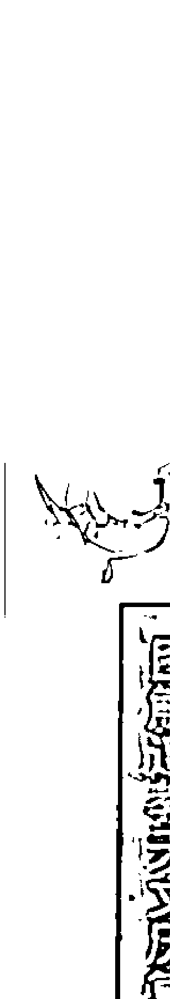

### 1 太阴星在子宫安命：福禄兼得，忌感情纠纷

太阴星在子宫，必有天同星同坐，请参看天同星。

### 2 太阴星在丑宫安命：男命保守，女命显贵

太阴星在丑宫，必有太阳星同坐，请参看太阳星。

### 3 太阴星在寅宫安命：命运平顺，浪漫温柔

太阴星在寅宫，必有天机星同坐，请参看天机星。

### 4 太阴星在卯宫安命：家人相劝，适应性强

太阴星落陷坐守卯宫，迁移宫必有平势天同星，财帛宫必有落陷太阳星，官禄宫必有旺势天梁星。天同星入主迁移宫，外出运佳，有贵人相劝，适应性强，人缘好，在外口福好。落陷太阳星入财帛宫，善于帮人理财，对钱财的使用不知节制，支出浪费，但尚不至于穷困。

## 星曜布局

太阴星在卯宫为落陷独坐，卯宫的太阴星，有如早晨五点至七点（卯时）的月亮，几乎没有什么光亮，同时，三合会照财帛（亥）宫的太阳星也逢落陷失辉，为“日月反背格”，披星戴月，奔波劳碌，与父母缘薄，少小即须离乡背井，自力奋斗，或有过继离宗的可能，桃花难免，断断续续，旧去新来，缠缠绕绕。在工作上常配合与援助他人，肩能挑，手能提，内外兼顾，可以站在前面，也能退居于幕后。

## 基本命运

天梁星入官禄宫，事业稳定，适宜文教职、公务员或专门学术研究，可以发挥其脱俗的特性，应避免经商，以免为钱财烦恼。

## 不同生年的命运

- 甲年生人：财帛宫落陷太阳星化忌。与父母缘薄，财运暗淡，得财辛苦，需由竞争得来，且多是非。擎羊星同坐命，多挫折，有人离财散现象，易有肢体伤残之忧。
- 乙年生人：官禄宫天梁星化权，命宫落陷太阴星化忌，擎羊、陀罗星同夹命宫，为“羊陀夹忌格”，孤贫刑克，百事不吉。天梁星化权入官禄宫，增加天梁星遇难成祥的解厄能力，主观意识强，择善固执，从事公职尚能有所表现。太阴星化忌入命宫，对女性六亲不利，不论男女命皆宜晚婚，有跋涉他乡之兆，常吃暗亏，心中有难言的心事而苦不堪言，常为住宅烦心，有损财的现象。所幸禄存星同坐命，稍能稳住财运。
- 丙年生人：迁移宫天同星化禄。天同为福星，化禄则福禄相扶，能增加福气和悠闲，为人乐观，出外有享受，但易缺乏进取心，故较宜于女命。丙未年生人，文昌星同坐命又化科，无凶、煞、忌星冲破，为“科名会禄格”，才华卓著，财名皆美。
- 丁年生人：命宫落陷太阴星化禄，迁移宫天同星化权，若无凶、煞星冲破，为“权禄巡逢格”，一生较顺稳，财官尚佳。有财，有异性缘，处事多困扰，易生口舌是非；在外有福可享，较有开创力。
- 丙、丁年生人，天魁、天钺双贵星分别在财帛宫、迁移宫会照，为“天乙拱命格”，文章盖世，贵人多助。
- 戊年生人：命宫落陷太阴星化权。男命尚能创业，无福享受；女命劳碌奔波，感情多纷扰，宜迟婚。
- 己年生人：官禄宫天梁星化科。爱出风头，人缘佳，有声名，有研究才华，宜研究历史、哲学、医药、命理。
- 庚年生人：财帛宫落陷太阳星化禄，命宫落陷太阴星化科，迁移宫天同星化忌。财帛宫落陷太阳星化禄，善于为人谋财、理财，爱面子，很会花钱，奔波劳碌赚钱。命宫太阴星化科，人品还不错，有异性贵人，易有血光之灾，喜存私房钱和赚取佣金。迁移宫天同星化忌，出外奔波劳碌，常有协调不良的情事。
- 辛年生人：财帛宫落陷太阳星化权。善于为人理财，但不善守财，权威多虚有其表。
- 壬年生人：官禄宫天梁星化禄。有上司、长者照顾，公、文、教职有声誉，意外的钱财常成为沉重的精神负担，带来许多困扰。
- 癸年生人：命宫落陷太阴星化科。人品还不错，有异性贵人，喜赚取佣金和存私房钱，易有桃花纠纷。

## 不同生时的命运

- 四、八、十二月生人，左辅、右弼双星，在命宫及其三合宫会照，有助力，凡事较顺遂。
- 子、辰、申时生人，地空、地劫双星分别在命宫的三方会照，为“命里逢空格”，贫贱多祸，一生多劳碌，凡事总成空，宜信奉宗教、清闲才能延寿。
- 卯、未、亥时生人，文昌、文曲双星，分别在命宫及三方会照，为“文星拱命格”，在学术、文艺界可有成就，女命逢之多情。

#### 太阴星坐命卯宫

太阴星坐命子、丑、寅三个宫位分别于天同、太阳、天机三星同坐。太阴星坐命卯宫时，为落陷独坐，迁移宫必有平势天同星，财帛宫必有落陷太阳星，官禄宫必有旺势天梁星。

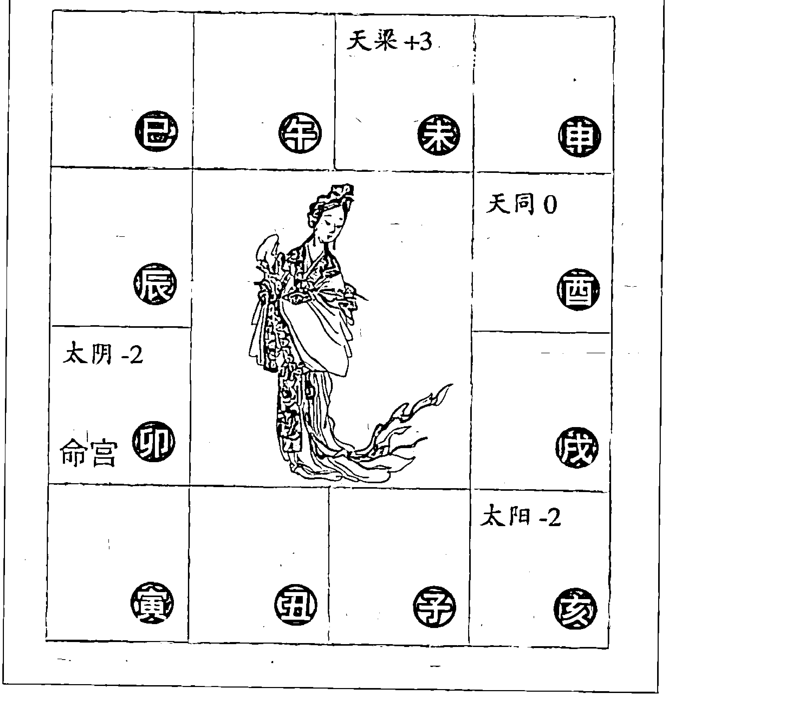

### 5 太阴星在辰宫安命：一生多变，中年顺利

太阴星在辰宫安命比在卯宫安命不吉，此因辰宫为“天罗地网”的地网宫，容易受困而有志难伸，且无法与禄存星同宫，财禄受影响。但困在地网宫中的太阴星，对于同时受困的煞星较有抵抗力。如遇见最忌讳的擎羊星，反能激发潜力。

## 星曜布局

太阴星在辰宫也是落陷独坐，辰宫的太阴星，有如早晨七点至九点（辰时）的月亮，毫无光亮，同时，对宫朝照的太阳星也逢不得地失辉，为“日月反背格”，披星戴月，劳碌奔波，男命不利母、妻及女，女命不利母、自己及女，须离乡背井，自力奋斗。桃花难免，断断续续，旧去新来，缠缠绕绕。喜欢顺其自然的工作，工作上不强求，也不要求自我表现。

## 基本命运

太阴星落陷坐守辰宫，迁移宫有不得地失辉太阳星，财帛宫有入庙天机星，官禄宫有旺势天同星和落陷天梁星，为“机月同梁格”，擅长企划，处事及辅佐能力佳，在公教、传播、文化事业有出人头地的机会。太阴星在辰宫落陷守命，天梁星在申（官禄）宫落陷会照，为“天梁拱月格”，一生多变动，漂泊他乡，或因酒色而身亡，为家产荡尽之命。

迁移宫有失辉太阳星，出外精神烦闷，性格不开朗，花费大，难发展。财帛宫有天机星，无意外之财，必须靠自己的智慧及双手，劳心费力，才能获得对等的钱财，白手起家，不能抱持守株待兔的心情，必须一分耕耘，才有一分收获，钱财流通性大，而天机星主兄弟宫，故钱财常在兄弟姊妹手足间流通。官禄宫有天同、天梁星，做事较不积极，不喜与钱财为伍，因宽待部属而自招劳苦，不适任管理之职，宜从事没有明显目标，而有吃、有乐、有福气、有协调性、不碰钱财、富社交性和变化性的工作，如文化、娱乐、餐饮、服务、装饰品、教育、传播、公务员或专门学术研究等工作，中年后得贵人助力，而发展顺遂。

## 不同生年的命运

- 甲年生人：迁移宫落陷太阳星化忌。与父母缘薄，在外劳碌，招是非，精神耗尽还不想回家，宜防眼疾、车祸等灾厄。
- 乙年生人：财帛宫天机星化禄，官禄宫天梁星化权，命宫落陷太阴星化忌。天机星化禄入财帛宫，钱财流通性大，多为过路财神，不宜经商。天梁星化权入官禄宫，个性主观，霸道但讲道理，宜公、教职，在事业及感情上易生困扰，但均能化解。落陷太阴星化忌守命，对女性六亲不利，有损财的现象，常为住宅烦心，易吃暗亏，心中常有难言的心事，苦不堪言，有跋涉他乡之兆，宜注意身体健康（与生殖器官有关的疾病）和婚姻和谐。
- 乙年生人，入庙擎羊星同坐命，为“擎羊入庙格”，权威出众，富贵声扬，可激发太阴星自力奋斗脱困，遇火星则权威卓著，逢凶星则刑伤难免。同时，天钺、天魁双星，分别在财帛、官禄宫三合会照，为“天乙拱命格”，有贵人帮助，文艺方面有成就，但辛劳不免。
- 丙年生人：官禄宫天同星化禄，财帛宫天机星化权。天同星化禄入官禄宫，多贪图享受，缺乏雄心斗志和创造活力，女命则易有感情上困扰。天机星化权入财帛宫，有领导能力，做事较积极主动，善于筹划和协调，有周转金钱，调头寸的现象，创业需凭贷款。
- 丁年生人：命宫落陷太阴星化禄，官禄宫天同星化权，财帛宫天机星化科，为“三奇嘉会格”，名誉昭彰，财官双美，遇困难有贵人助，可致意外成功，但因第三大限才可会照部分化曜，第五大限才会齐三化曜，故属“大器晚成”之格，唯命宫太阴星为落陷，影响成就，也使成功之路崎岖些。
- 太阴星化禄入命宫，有财，有异性缘，处事多困扰，易生口舌是非。天同星化权入官禄宫，奔波劳碌，辛劳后有表现，可合伙创业，创业得靠社交，宜从事服务、餐饮、服饰业，感情多困扰。天机星化科入财帛宫，可增强办事能力，善于处理流动性资金，但多属过路财神，如会计、出纳等。
- 戊年生人：命宫落陷太阴星化权，财帛宫天机星化忌。太阴星化权入命宫，可创业，劳心劳力，无福享受。天机星化忌入财帛宫，劳碌奔波，钱财变动性大，为财费尽心机，绞尽脑汁。
- 己年生人：官禄宫天梁星化科。爱出风头，事业上并无实权，但风评甚佳，在文艺方面有成就，有扬名的机会。同时，天钺、天魁双贵星，分别在官禄、财帛宫三合会照，为“天乙拱命格”，有贵人帮助，文艺方面有成就，但辛劳不免。
- 庚年生人：迁移宫失辉太阳星化禄，命宫落陷太阴星化科，官禄宫天同星化忌。失辉太阳星化禄入迁移宫，奔波劳碌，困苦奋斗，有声名，喜远游。落陷太阴星化科守命，有女性贵人暗助，喜存私房钱，或赚取不用报账的佣金，易有血光之灾。天同星化忌入官禄宫，事业上缺少贵人相助，徒劳无功，成就不易。
- 庚、癸年，丑、卯、巳、未、酉、亥时生人，化科星坐命，三方四正有地空、地劫星会照（有火、铃会照亦同），为“科星逢破格”，书虽读得不错，但却年年名落孙山，虽有贵人却不卖力，越帮越忙。
- 辛年生人：迁移宫太阳星化权。具权威，但多虚有其表，奔波劳碌，男命可创业，女命有异性缘。
- 壬年生人：官禄宫天梁星化禄。非意料之内的钱财，会带来许多困扰，成为沉重的精神负担，公、教、文职人员，能享有清誉和超然地位。
- 癸年生人：命宫落陷太阴星化科，有女贵人暗助，喜存私房钱，或赚取不用报账的佣金，易有桃花纠纷。

## 不同生时的命运

- 一、七月生人，左辅、右弼双星，分别在命宫、迁移宫相朝照，为“左右守垣格”，富企划能力，人缘佳，多助力，但命宫太阴星为落陷，多先成后败，先荣后衰。
- 子、午时生人，文昌、文曲双星，分别在命宫、迁移宫相朝照，为“文星拱命格”，在学术、文艺界可有成就，女命逢之多情。

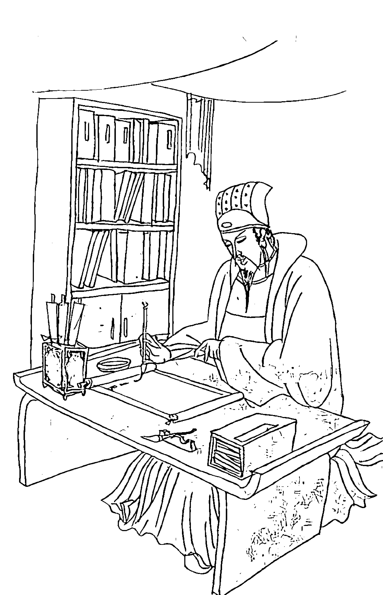

> 太阴星坐命辰宫，子、午时生人，文昌、文曲双星，分别在命宫、迁移宫相朝照，为“文星拱命格”，在学术、文艺界可有成就。

### ⑥ 太阴星在巳宫守命：本地不利，宜往远处

太阴星在巳宫落陷守命，迁移宫有平势天机星，官禄宫有平势太阳星和地势天梁星。天机星入迁移宫，性急，好动，适合变动性的工作或活动，留居本地，易和他人产生纠纷，是非不断，宜往远处、海外发展。太阳、天梁星入官禄宫，喜居领导地位，事业运变化多端，具工作能力，名声、信用佳，事业有表现。

## 星曜布局

太阴星在巳宫为落陷独坐，巳宫的太阴星，有如早晨九点至十一点（巳时）的月亮，毫无光亮。由于太阴星本身无力，应配合命宫的三方四正所加会的星曜，加以研究。喜六吉星帮忙，可以增加力量。

## 基本命运

在巳宫落陷的太阴星对直系女性近亲不利，无论有无吉星加会，都主幼年坎坷辛劳，身体欠佳，或失学、或失怙、或失恃，宜离乡背井，出外发展，多有为人服务的观念，宜公、教职，不宜经商创业。男命有谋略，善策划，有异性缘；女命多晚婚。若有煞星加遇，应防感情困扰。

## 不同生年的命运

- 甲年生人：官禄宫太阳星化忌。对男性近亲不利，对眼睛也有不利的影响，人生多惊险、坎坷，工作多波折，与父母亲缘薄，宜晚婚。
- 乙年生人：迁移宫天机星化禄，官禄宫天梁星化权，命宫落陷太阴星化忌。天机星化禄入迁移宫，环境易转变，有远行或迁居到国外的机会。天梁星化权入官禄宫，主观意识强烈，个性直爽，霸道但讲理，处险境常能化险为夷，利于公职、考试，能有所表现。落陷太阴星化忌守命，不利于女性近亲，易损财，常吃暗亏，或心中有难言的心事，苦不堪言，常为住宅烦心，有远离乡土，跋涉他乡之兆。
- 丙年生人：迁移宫天机星化权。有远行。丙巳、丙酉、丙丑年生人，天马星同宫，有出国运。
- 丙亥、丙卯、丙未、戊亥、戊卯、戊未、壬巳、壬酉、壬丑年生人，禄存、天马星同在命宫或迁移宫，为“禄马交驰格”，可在环境变化发展中得财，愈奔动愈生财。
- 丙、丁年生人，天魁、天钺双贵星，分别在官禄宫、迁移宫会照命宫，为“天乙拱命格”，文笔佳，有贵人。
- 丁年生人：命宫落陷太阴星化禄，迁移宫天机星化科。命宫落陷太阴星化禄，有异性缘，男命稍有发展，但历经艰辛，在感情方面易生困扰。迁移宫天机星化科，常有变动之事，晚发，名利皆佳。
- 戊年生人：命宫落陷太阴星化权，迁移宫天机星化忌。落陷太阴星化权入命宫，劳碌奔波，无福享受。天机星化忌入迁移宫，易发生交通事故，事业、感情多波折。
- 己年生人：官禄宫天梁星化科。工作上有声名，宜从事文职工作。
- 庚年生人：官禄宫落陷太阳星化禄，命宫落陷太阴星化科，无煞星同宫或冲破，为“科名会禄格”，有才华，有名望。奔波忙碌，多困扰，事业有成。注重外表，忽视内在，有女性贵人，喜存私房钱，或赚取佣金，应防血光之灾。
- 辛年生人：官禄宫落陷太阳星化权。奔波忙碌，有创业雄心，凡事喜欢事必躬亲。
- 壬年生人：官禄宫天梁星化禄。受长者、上司照顾，易为意外的钱财困扰，常成为沉重的精神负担。
- 癸年生人：命宫落陷太阴星化科。重视外表，不注重内在，有女性贵人，喜存私房钱，或赚取佣金，宜防桃花纠纷。

## 不同生时的命运

- 二、六、十月生人，左辅、右弼双星，分别在命宫、财帛、官禄宫相互会照，多辅佐力量。
- 子、寅、巳、午、未、申、亥时生人，地空、地劫双煞星，同坐或同夹命宫，或在命宫的三方四正会照，为“命里逢空格”，或“空劫夹命格”，多祸。
- 乙年巳、未时生人，命宫太阴星化忌，再逢地空、地劫双煞星夹命宫，为“空劫夹忌格”，更为不吉利，一生有如浪里行船般不稳，并常有半天折翅的突然打击。

#### 太阴星坐命巳宫

太阴星在巳宫守命，为落陷独坐，迁移宫有平势天机星，官禄宫有平势太阳星和地势天梁星。

| 宫位 | 午 | 未 | 申 |
| :--- | :--- | :--- | :--- |
| 太阳 0 天梁 +2 | 巳 | | |
| | 辰 | | 太阴 -2 命宫 酉 |
| 天机 0 | 卯 | | 戌 |
| | 寅 | 丑 | 子 | 亥 |

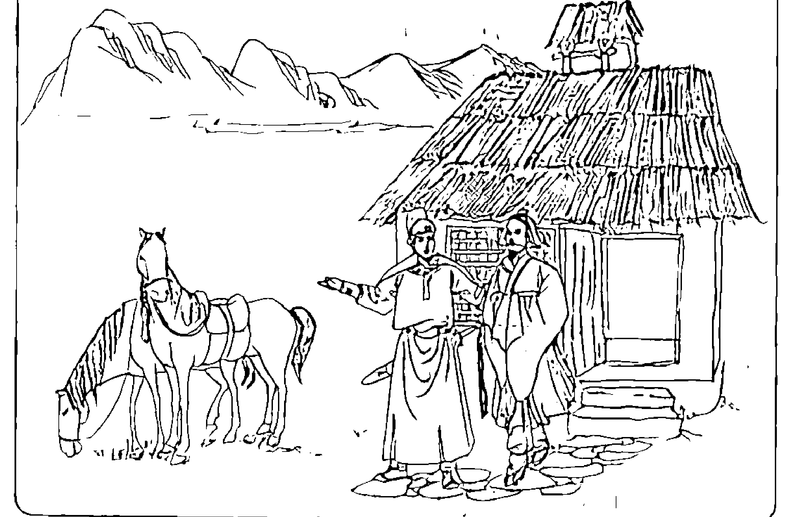

> 天机星入迁移宫，性急，好动，适合变动性的工作或活动，留居本地，易和他人产生纠纷，是非不断，宜往远处、海外发展。

> 太阴星在巳宫落陷守命，无论有无吉星加会，都主幼年坎坷辛劳，身体欠佳，或失学、或失怙、或失恃，宜离乡背井，出外发展，不宜经商创业。

### 7 太阴星在午宫守命：福禄兼得，忌感情纠纷

太阴星在午宫，必有天同星同坐，请参看天同星。

### 8 太阴星在未宫守命：宜男不宜女

太阴星在未宫，必有太阳星同坐，请参看太阳星。

### 9 太阴星在申宫守命：命运平顺，浪漫温柔

太阴星在申宫，必有天机星同坐，请参看天机星。

### 10 太阴星在酉宫守命：光明磊落，少年得志

太阴星在酉宫旺势守命，三合会照财帛（巳）宫的太阳星也为旺势，若无煞星、化忌星同宫或会照，为“日月并明格”，或称“丹墀桂墀格”，心地光明磊落。钱财富足，事业有成，虽然太阴星不免刑克女性近亲，但仍能少年得志，早遂青云之志。

## 星曜布局

太阴星在酉宫为旺势独坐，酉宫的太阴星，有如傍晚五点到七点（酉时）的月亮，此时，月亮刚刚露面，光芒渐强，前途充满着希望，有远大的理想和抱负，能配合与援助他人，可内外兼顾，能站在前面，也能退居于幕后，能早遂青云之志。

## 基本命运

由于酉宫为桃花宫，太阴星又带桃花性质，故太阴星在酉宫守命，有异性缘，富罗曼蒂克，很得人缘，出外得贵，但也会因此而有感情困扰，逢煞星尤甚。

太阴星在酉宫旺势守命，平势天同星在迁移宫，旺势太阳星在财帛宫，旺势天梁星在官禄宫。天同星入迁移宫，出外有贵人相助，适应能力强，人缘佳，有口福。太阳星在财帛宫，具有经营理财能力，财富多，花费也大。天梁星在官禄宫，工作勤奋，事业稳定，因天梁星本身清亮脱俗，不喜与钱财为伍，适宜公、教、大众传播及专门学术研究。

太阴星在酉宫旺势守命，对宫为天同星，太阴、天同二星皆利于女命，若加遇吉星，必定容貌秀丽，端庄娴淑，聪明能干，治家有方。

## 不同生年的命运

- 甲年生人：财帛宫太阳星化忌。对男性近亲不利，得财辛苦，必须由竞争得来，男命不利于创业，女命感情生活常不顺利，多有失恋的痛苦经验，且多有晚婚的现象。
- 乙年生人：官禄宫天梁星化权，命宫太阴星化忌。个性直爽，霸道但讲理，主观意识强，择善固执，利于公职、考试，能有所表现。太阴星化忌入命，对女性六亲不利，有损财的现象，常为住宅烦心，易吃暗亏，心中有难言的心事，苦不堪言，有跋涉他乡之兆，宜注意身体健康（与生殖器官有关的疾病）和婚姻和谐。
- 丙年生人：财帛宫太阳星化权，迁移宫天同星化禄。太阳星化权入财帛宫，善于理财，有创业雄心，但奔波劳碌。天同星化禄入迁移宫，出外有福可享，人缘好，有口福。
- 丁年生人：命宫太阴星化科，迁移宫天同星化权，财帛宫太阳星化忌。太阴星化科入命，人品不错，有异性贵人。天同星化权入迁移宫，出外有开创力，但奔波劳碌。太阳星化忌入财帛宫，对男性近亲不利，得财辛苦，多竞争，财运暗淡。
- 戊年生人：命宫太阴星化禄，官禄宫天机星化忌。太阴星化禄入命，有财，有异性缘，但易生困扰。天机星化忌入官禄宫，事业多变动，劳心费力。
- 己年生人：官禄宫天梁星化科。爱出风头，事业上风评佳，在文艺方面有成就。
- 庚年生人：命宫太阴星化权，财帛宫太阳星化禄，迁移宫天同星化忌。太阴星化权入命，男命可创业，女命劳碌奔波。太阳星化禄入财帛宫，善于理财，财源广进。天同星化忌入迁移宫，出外奔波劳碌，常有协调不良的情事。
- 辛年生人：财帛宫太阳星化科，命宫太阴星化忌。太阳星化科入财帛宫，理财有名声。太阴星化忌入命，对女性六亲不利，易损财，常吃暗亏。
- 壬年生人：官禄宫天梁星化禄。有上司、长者照顾，公、文、教职有声誉，意外的钱财常成为困扰。
- 癸年生人：命宫太阴星化科，官禄宫天机星化忌。太阴星化科入命，人品不错，有异性贵人。天机星化忌入官禄宫，事业多变动，劳心费力。

#### 太阴星坐命酉宫

太阴星坐命酉宫，为旺势独坐。平势天同星在迁移宫，旺势太阳星在财帛宫，旺势天梁星在官禄宫。

酉宫为桃花宫，太阴星又带桃花性质，故太阴星在酉宫守命，有异性缘，富罗曼蒂克，很得人缘，出外得贵，但也会因此而有感情困扰，逢煞星尤甚。

| 宫位 | 午 | 未 | 申 |
| :--- | :--- | :--- | :--- |
| 太阳 +3 | 巳 | | |
| | 辰 | | 太阴 +3 命宫 酉 |
| 天同 0 | 卯 | | 戌 |
| | 天梁 +3 | 寅 | 丑 | 子 | 亥 |

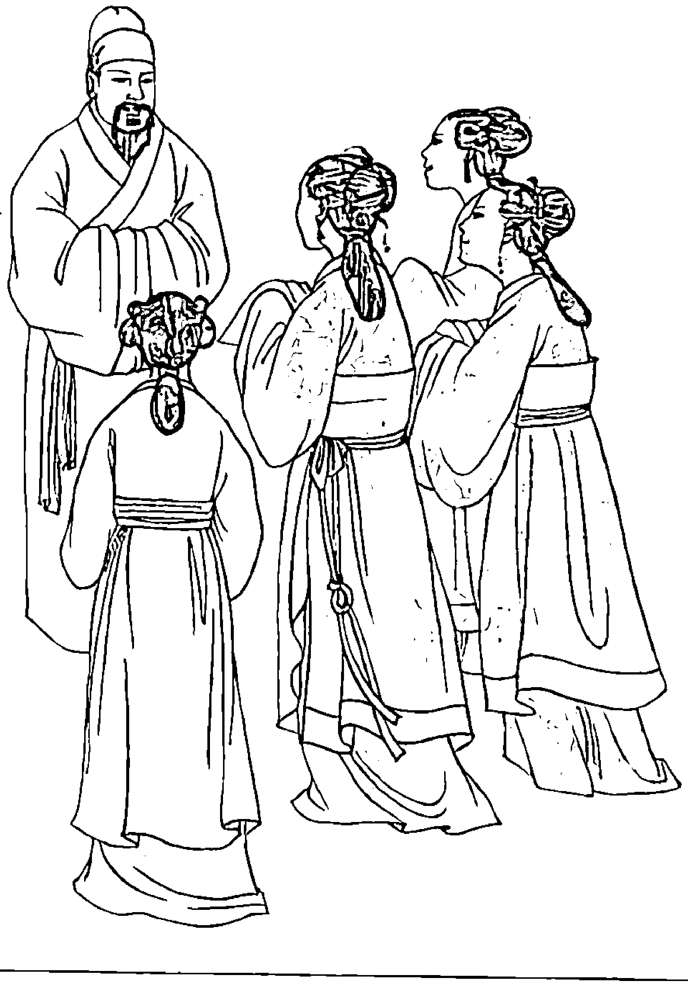意识强烈，逢厄难皆能自然化解，从事公职，多能掌权，自力经商当老板，不宜太严肃，否则，劳资关系会很僵。

丙年生人：迁移宫天同星化禄。出外有福，有享受，为人乐观，但悠闲而不积极进取。

丙亥、丙卯、丙未、戊亥、戊卯、戊未年生人，禄存、天马星同入财帛宫，能在环境变化中得财，愈奔动则愈生财。

丁年生人：命宫太阴星化禄，迁移宫天同星化权，若无凶、煞星冲破，为“权禄巡逢格”，财官双美，一生顺稳。太阴星化禄入命宫，财运顺遂，有异性缘，生活安逸。天同星化权入迁移宫，出外有福可享，可一展长才，受人赏识，事业稳定有成。

戊年生人：命宫太阴星化权。办事能力强，事业有表现，好享受，能自得其乐。女命，劳碌奔波，有干劲，能掌权。

己年生人：官禄宫天梁星化科。风评甚佳，具有声名，人缘好，可得贵人扶助，运势平稳，利于学习新知，爱出风头，宜文、教职。

庚年生人：财帛宫太阳星化禄，命宫太阴星化科，迁移宫天同星化忌。太阳星财帛宫化禄，善于理财，奔波忙碌中得财，一生较平顺，事业有成，能掌实权。太阴星化科入命，有人缘，具艺术才华，有女性贵人相助，风评不错。天同星迁移宫化忌，在外忙碌，常有协调不良的情事。

辛年生人：财帛宫太阳星化权。具有权威，多喜欢自行创业，善于理财，赚钱多辛劳。

壬年生人：官禄宫天梁星化禄。一生运势平顺，能蒙上司眷顾，长上福荫，公、教、文职人员能享清誉。

癸年生人：命宫太阴星化科（同庚年太阴星化科）。

## 不同生时的命运

- 二、六、十月生人，左辅、右弼双吉星在命宫三合会照，使人积极进取，多友人辅佐，遇困难多能乐观面对。

- 丑、巳、酉时生人，文昌、文曲双吉星在命宫三合会照，为“文星拱命格”，在学术、文艺界可显荣耀。女命多情。

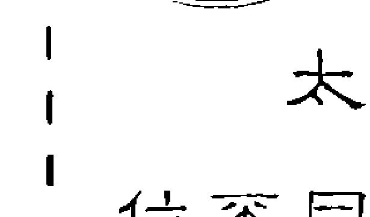

## 太阴星在戌宫守命：一生平稳，辛劳有获

太阴星坐守戌宫，一生平稳较少波动，工作较稳定，虽然仍会有服务单位不同的变化，但多能保持其原有的性质，在历经辛劳之后皆可实现其远大志向。

## 星曜布局

戌宫的太阴星为旺势独坐，旺势太阳星在对宫（辰宫）相对照，为“日月并明格”，或称“丹墀桂墀格”，“日月并争辉，权禄非浅，早遂青云之志”，若逢羊、陀星会照，多刑克双亲，化忌亦然。

## 基本命运

戌宫的太阴星象征晚上七时至九时的月亮，光皎洁亮，带给人们皎洁明朗，宁静温柔，充满了爱与希望，是古今中外文学家歌咏赞美的对象。因此，太阴星戌宫坐命的人，温柔内向，体贴大方，聪明又善解人意，感情纤细，善于思考，机智有礼，有异性缘。能顺其自然的工作，不强求，也不要求自我表现，多能获得他人的认同。

太阴星象征阴性，无论男女命皆主幼年与母亲缘分薄，或顽皮好动。月亮因需绕地球旋转而生生不息，所以，太阴星在戌宫独坐命，多劳碌奔波，但辛劳后有表现，多可少年得志。

太阴星在戌宫旺势坐命，迁移宫有旺势太阳星对照，财帛宫有入庙天机星、官禄宫有入庙天梁星及利势天同星三合会照，为“机月同梁格”，擅长企划，处事及辅佐能力强，宜公教、传播、文化事业，能出人头地，担任要职。旺势太阳星入迁移宫，出外得贵，对外关系更好；入庙天机星坐财帛宫，无意外之财，必须凭自己的智慧和努力，劳心费力而白手起家，一分耕耘，才有一分收获；入庙天梁星和利势天同星同坐官禄宫，事业稳定，宜从事富社交性、变化性的自由工作，如文、教、公务员、专门学术研究、作家、服装设计师、传播、娱乐界、旅游、服务业等，不适于管理之职，中年后可得贵人相助与部属敬重，而发展顺遂，但会因对部属过度庇护而自遭劳苦。

太阴星在戌宫旺势坐命，喜欢六吉星同宫或会照；不喜六煞星，多会增加心情的困扰，使表现减色，一生易遭遇惊险之事，但多能逢凶化吉。

## 太阴星坐命戌宫

太阴星守戌宫为旺势独坐，旺势太阳星在对宫（辰宫）相对照，财帛宫有入庙天机星、官禄宫有入庙天梁星及利势天同星三合会照。

| | 天机 +4 | | |
| --- | --- | --- | --- |
| | 巳 | 午 | 未 | 申 |
| 太阳 +3 | | 太阴 +3 命宫 戌 | |
| | 辰 | | 酉 | |
| | 卯 | | | |
| 天同 +1 天梁 +4 | | 寅 | 丑 | 子 | 亥 |

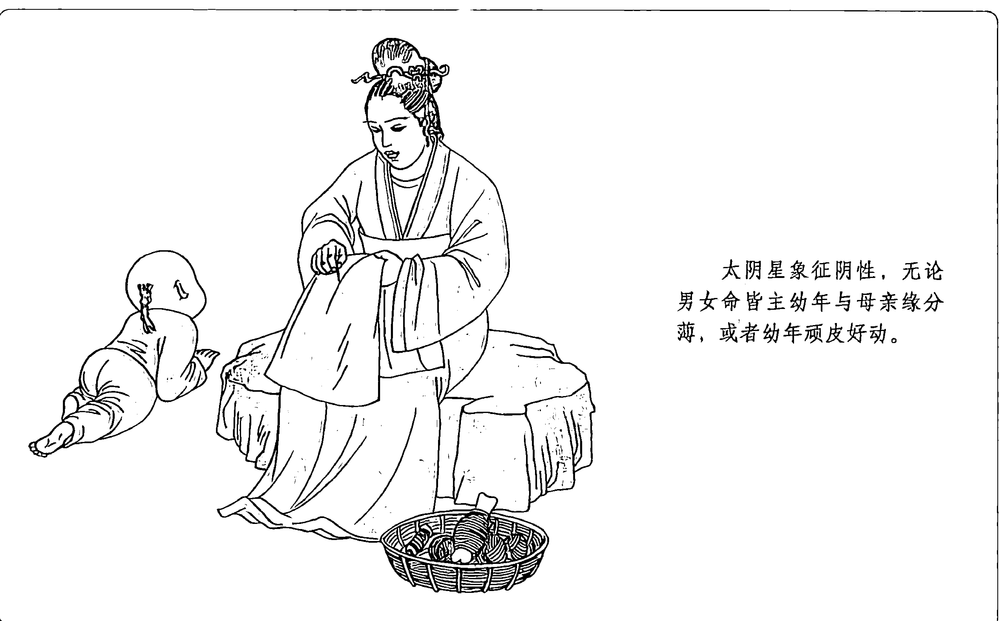

太阴星象征阴性，无论男女命皆主幼年与母亲缘分薄，或者幼年顽皮好动。

## 不同生年的命运

甲年生人：迁移宫太阳星化忌，冲命宫。易有灾厄，眼睛多有毛病，与父母缘薄，出外劳碌奔波，易惹是非，事业易有波折，女命感情多波折。

乙年生人：财帛宫天机星化禄，官禄宫天梁星化权，命宫太阴星化忌。钱财流动性大，少有闲置的资金，辛勤忙碌。主观意识强，霸道但讲理，为官多清显，感情、事业方面易生困扰，但均能一一化解。有损财的现象，常为住宅烦心，漂泊不定而常离乡背井，女性心绪欠安宁。

丙年生人：官禄宫天同星化禄，财帛宫天机星化权。较喜欢安逸的工作，并贪图享受，一生运势甚佳，女命易有感情困扰；具领导能力及办事效率，机变能力强，善于理财，动则有成，赚钱很辛劳。子、辰、申时生人，文昌星化科入命、财帛或官禄宫，为“三奇嘉会格”，名誉昭彰，财官双美，但多大器晚成，且易有周转的现象。丑、卯、巳、未、酉、亥时生人，遇空、劫星同宫或会照，虽可成就，但世路多艰。

丁年生人：命宫太阴星化禄，官禄宫天同星化权，财帛宫天机星化科，为“三奇嘉会格”，名誉昭彰，富贵双全，财官双美，但因第三大限仅能对照化权星（阴男、阳女）或化科星（阳男、阴女），第五大限才能会齐科、禄、权三化星，故属“大器晚成”格；丑、卯、巳、未、酉、亥时生人，遇地空、地劫星同宫或三合会照，虽可成就，但世路多艰。同时，化禄星在命宫，禄存星在财帛宫三合会照，为“双禄朝垣格”，有才华、名望、福气，财官双美。太阴星化禄坐命宫，财源旺盛、顺遂，异性缘佳，唯处世多困扰，易生口舌是非，但多能逢凶化吉。天同星化权坐官禄宫，奔波劳碌，富社交手腕，有开创新局面的能力，辛劳后多有表现，并能掌权，宜合伙创业而不适宜自行创业，以从事公、教、律师、文化、传播、服务、餐饮、推销、服饰业较有发展，感情上则多困扰。天机星化科入财帛宫，思考敏捷，聪明机警，办事能力强，所赚皆为清白之财，善于处理流动性资金，对宫巨门星化忌，多口舌是非，处事多困扰。

丙、丁年生人，天钺、天魁双贵星夹命宫，为“天乙拱命格”，文章盖世，贵人多助。

- 戊年生人：命宫太阴星化权，财帛宫天机星化忌。机智，自负而任性，奔波劳碌，好享受，女命可掌权。钱财波动大，为钱财劳心费力，绞尽脑汁，且常于事后懊恼。

- 庚年生人：迁移宫太阳星化禄，命宫太阴星化科，官禄宫天同星化忌。奔波忙碌，事业有成，出外有贵人相助，可获得声名。喜好文艺，风评不错，注重衣着装扮，有女性贵人。事业和工作多变动，社交欠佳。

- 辛年生人：擎羊星入庙同坐命，为“擎羊入庙格”，权威出众，富贵声扬。迁移宫太阳星化权，在家待不住，出外有权威，可一展才华。

- 壬年生人：官禄宫天梁星化禄。一生运气甚佳，可得长上福荫与照顾，公、教、文职者可享清誉而得高位。

- 癸年生人：命宫太阴星化科。喜好文艺，风评不错，注重衣着装扮，有女性贵人。

## 不同生时的命运

- 一、七月生人，左辅、右弼星分别在命宫、迁移宫相对照，为“左右守垣格”，凡事可逢凶化吉，福禄终身，若逢凶、煞星，先成后败，先荣后衰。

- 子、午时生人，文昌、文曲星分别在命宫、迁移宫相对照，为“文星拱命格”，在学术、文艺界可显荣耀，女命多情。

## 12 太阴星在亥宫守命：工作多变，喜居高位

太阴星在亥宫入庙守命，迁移宫必有平势天机星，官禄宫必有入庙太阳星和天梁星。性子急，好动，宜赴外地或海外发展，适于多变动性质的工作；事业运变化多端，常处于高度竞争的工作环境。且具有外交性质，喜居领导指挥的地位，宁为鸡头也不为牛后，事业发展顺利，工作能力卓越，宜从事政治、律师、建筑、文教或公职、专门学术研究、企业、大众传播等行业。

## 星曜布局

亥宫的太阴星为入庙独坐，有如晚上九时至十一时的月亮，清朗明亮，是太阴星在十二宫中最吉利的宫位。

## 基本命运

太阴星在亥宫入庙守命，太阳和天梁星必在卯宫入庙会照，夜晚生人，为‘月朗天门格’，聪明多智，学术、才艺出众，财运丰盛，早年得志，富贵堪期，最宜于公教职、文化或艺术界。男命眉清目秀，举止优雅，风流倜傥，有异性缘，但易有感情困扰，有为人服务的观念，也能助人向善，事业上虽然有表现，可平步青云，却不免于辛劳和风波；女命美貌多姿，表现较男性更为突出，不仅事业上有表现，也能兼顾家庭，并能觅得事业有成的对象，但在情感上波折不免。

命坐未宫，太阳星在卯宫、太阴星在亥宫入庙会照，为‘明珠出海格’，财官双美，具蟾宫折桂之荣。若命宫无左辅、右弼、文昌、文曲星，又逢擎羊、陀罗、化忌星冲破，则华而不实，浪得虚名。

太阴星在亥宫入庙守命，若得文昌、文曲星同坐，能在文艺界成名；若得左辅、右弼星辅佐，更能增辉而有最佳的表现。

太阴星在亥宫，较不怕六煞星，虽会减色，在文艺界也能有所发挥，或具有专门技术之长。

太阴星在亥宫，并不惧化忌星，只要不再遇六煞星同宫，是谓‘变景’，虽会有短暂的乌云遮月，使人不如意而心情郁闷，但片刻间又变景，造成奇特的建树，令人叹为观止，羡慕不已。

## 不同生年的命运

甲年生人：官禄宫太阳星化忌。事业或环境多变动，但此可视为点缀、缓冲之‘变景’，可减低躁进，与父母缘仍较薄。

乙年生人：迁移宫天机星化禄，官禄宫天梁星化权，命宫太阴星化忌。出外得贵，有变景之妙，大限或流年行运到迁移宫，环境常会有好的转变，并多有远行迁动之事，甚或会移民到国外；

太阴星在亥宫为入庙独坐，迁移宫必有平势天机星，官禄宫必有入庙太阳星和天梁星。

| 天机0 | （巳） | （午） | （未） | （申） |
| --- | --- | --- | --- | --- |
| （辰） | （酉） |  |  | （戌） |
| 太阳+4 天梁+4 | （卯） |  |  | （酉） |
| （寅） | （丑） | （子） | 太阴+4 命宫亥 | （亥） |

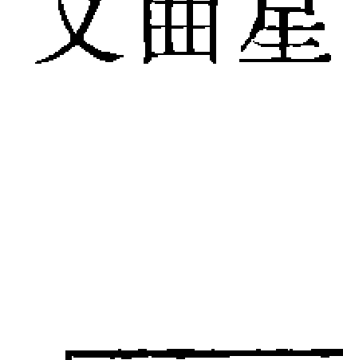

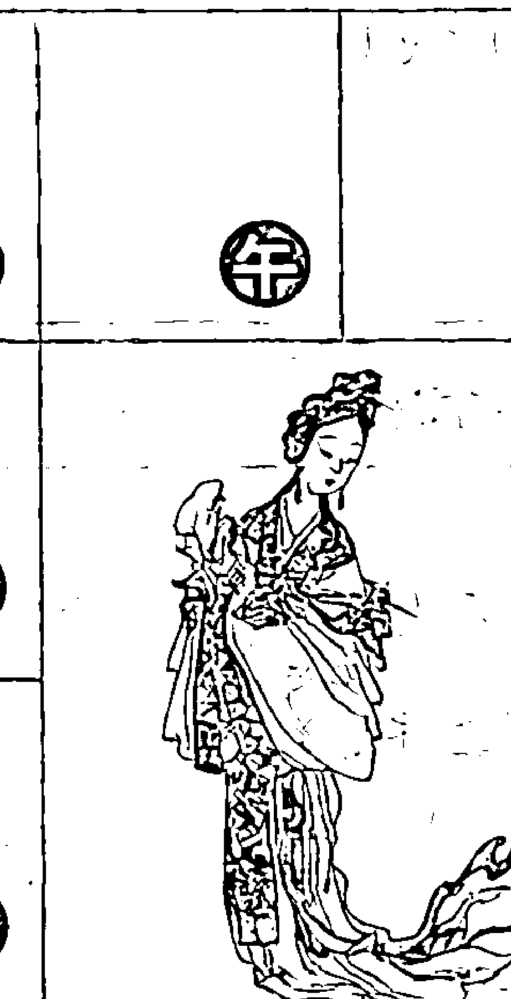

> 太阴星在亥宫入庙守命，性子急，好动，宜赴外地或海外发展，适于多变动性质的工作，常处于高度竞争的工作环境，且具有外交性质，喜居领导指挥的地位，宁为鸡头也不为牛后。

主观意识强烈，霸道但讲理，多辛劳，能掌权，在险境中常能化险为夷，利于公职和考试；太阴星在亥宫化忌，有变景之功，事业上可充分发挥，但仍不利于阴性近亲。

乙、壬年卯、未、亥时生人，为“阳梁昌禄格”，财官双美，参加公职或国家考试，一定有好成绩。

丙年生人：迁移宫天机星化权。机变能力强，出外发展甚佳，有远行之兆。

丙亥、丙卯、丙未、戊亥、戊卯、戊未、壬巳、壬酉、壬丑年生人，禄存、天马（命马）星同坐命宫或迁移宫，有出国运，且为“禄马交驰格”，能在环境变动中得财，愈奔动则愈生财。

丁年生人：命宫太阴星化禄，迁移宫天机星化科。财源茂盛，有异性缘，凡事多可逢凶化吉；出外多得贵人助，环境多变动，可名利双收，但属晚发之格。

戊年生人：命宫太阴星化权，迁移宫天机星化忌。自视高，能力强，男命可创业，女命劳碌奔波，有作为，可掌权；事业、感情多变化，易发生交通事故。

己年生人：官禄宫天梁星化科。风评佳，有声名，能得长上福荫。

辛年生人：官禄宫太阳星化权。具领导能力，喜欢事必躬亲，故多辛劳，在社会上多居要职，且多活跃于政坛。

壬年生人：官禄宫天梁星化禄，命宫又有禄存星同坐命，为“双禄朝垣格”，爱吹嘘，有名望、才华、长上福荫，财官双美。壬巳、壬酉、壬丑年生人，命马星同坐命宫，为“禄马交驰格”，愈奔动愈生财，女命爱专权。

庚、癸年生人：命宫太阴星化科，多有艺术才华，风评不错，有女性贵人。

子、丑、亥时生人，地空、地劫双煞星，同坐命宫，或夹命宫，为“命里逢空格”，或“空劫夹命格”，易有半天折翅的打击，行运易有浪里行船的惊险。乙年生人，化忌星同坐命宫，为“空劫夹忌格”，更为不吉。

## 3 贪狼星坐命身宫

贪狼星阴阳五行属阳木（在体为阴水），为北斗第一星，是寿星，偏财星，化气为桃花，主祸福，为多欲之魔，是第一号大桃花星。

## 容貌与性格

贪狼星坐命身宫的人，眉清目秀，对异性深具魅力，入庙则身长肥胖；落陷则身材矮小，嗓门大而高，眼神性活泼。个性粗犷豪迈，外向好动，与人相处融洽，深谋远虑，自我期许高，性情喜怒无常，任性倔强，足智多谋，直率敢言，语多幽然，心多计较，喜新厌旧，爱恨难定。工作勤劳，有干劲，做事明快，不畏辛苦，学习力强，不耐静守，多才多艺，博学不精，好高骛远，喜爱投机冒险，常弄巧成拙。奸诈阴狠，有异性缘，浪荡形骸，能言善道，善交际应酬，善解人意，表现欲强，嗜好广泛，诸恶俱备，酒、色、赌博样样精通，性喜挥霍，好享受，生活多彩多姿。

女命，体健貌美，玲珑有致，婀娜多姿，早熟，活泼热情，异性缘佳，第六感敏锐，婚后喜外出工作，喜好社交，多不愿持家。

### 命理推断

贪狼星是一颗多才多艺的星曜，其才艺涉猎很广，不仅喜好文艺，兼具口才之辩，有设计才华，也颇懂得待人处世之道。生活上，男命多精于棋、琴、书、画，女命则巧于家事、女红之艺。贪狼星属阳木，代表高大的乔木，

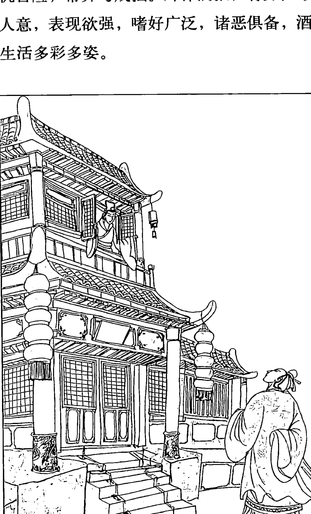

> 贪狼星坐命的女性，体健貌美，婀娜多姿，活泼热情，异性缘佳，喜好社交，多不愿持家。

因而看得较远，也比较现实，又贪狼星在体为阴水，因而多欲望，虚荣心、贪婪心重，好享受，又因贪狼星为第一大桃花星，本身对异性深具魅力，故常会因环境自然造成而时有应酬，或常涉足于声色场所，乐为放荡之事，桃花易走偏途，并长于交际应酬，灵敏机巧。

贪狼星主祸福，其为善或为恶，常系于一念之间，通常种善因则得福果，种恶因则生祸果。

贪狼星与七杀、破军星，在命盘中永远三合会照，是人生变化的枢纽，共同显示出变化性、创造性和竞争性。但贪狼星的变化及波动性，不仅较小于七杀星，更小于破军星，其性质较偏向于酒、色、财、气。七杀星的变化系孤独中有勇有谋，破军星是不顾一切地勇往直前，贪狼星则为了求得更好的前途，或与他人竞争而变化。

贪狼星坐命身宫的人，常有下列现象：

- 自信并善于凸显自己的长处，能勇于面对竞争，适应各种变化，并进而能创造变化。
- 求好心切，能评估、检讨过去竞争中的得失，因而不断地进步和超越，进而充分掌握未来竞争的成败，并要求完美。
- 善于运用酒色、美食、财物等去促进人际关系，并有排解灾难的潜能。
- 具有新颖观念，能带动新潮，在人群中常能引人注意而行为出众。
- 勇于尝试各种新奇的事物，见闻广博。
- 为坚持己见，经常不肯认输，也因此而欠缺一些自知之明。
- 常有竞争之心，工作中也常遇到竞争，在竞争时又很在意得胜，因而很计较得失，并常患得患失，内心不平衡时，常会迁怒他人。

贪狼星擅长于交涉与应酬，但却和天机星或廉贞星有些不同：

天机星的交涉沉稳细心，长于策划和剖析，并偏重于变化，在得失方面，较能随缘；廉贞星的交涉长于作秀，有浮夸之处，并偏重于桃花性质，由于有自知之明，得失之间，

## 贪狼星在各宫的亮度

贪狼星是一颗多才多艺的星曜，主祸福，其为善或为恶，常系于一念之间，通常种善因则得福果，种恶因则生祸果。但其福祸还要依据其亮度、所坐的宫位、星曜组合综合论断。

| 贪狼 -2 廉贞 -2 **巳** | 贪狼 +3 **午** | 贪狼 +4 武曲 +4 **未** | 贪狼 0 **申** |
| :---: | :---: | :---: | :---: |
| 贪狼 +4 **辰** | **（中央区域）** | 紫微 +3 贪狼 +1 **酉** |
| 紫微 +3 贪狼 +1 **卯** | **（中央区域）** | 贪狼 +4 **戌** |
| 贪狼 0 **寅** | 贪狼 +4 武曲 +4 **丑** | 贪狼 +3 **子** | 贪狼 -2 廉贞 -2 **亥** |

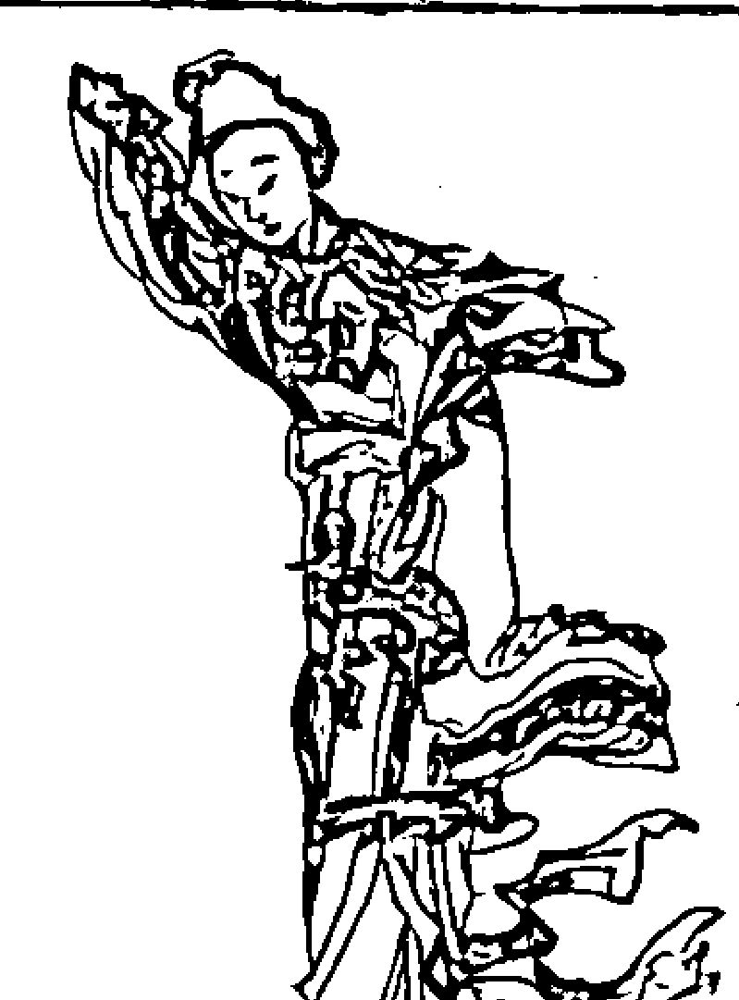

贪狼星坐命，心灵手巧，也颇懂得待人处世之道。生活上，男命多精于棋、琴、书、画，女命则巧于家事、女红之艺。

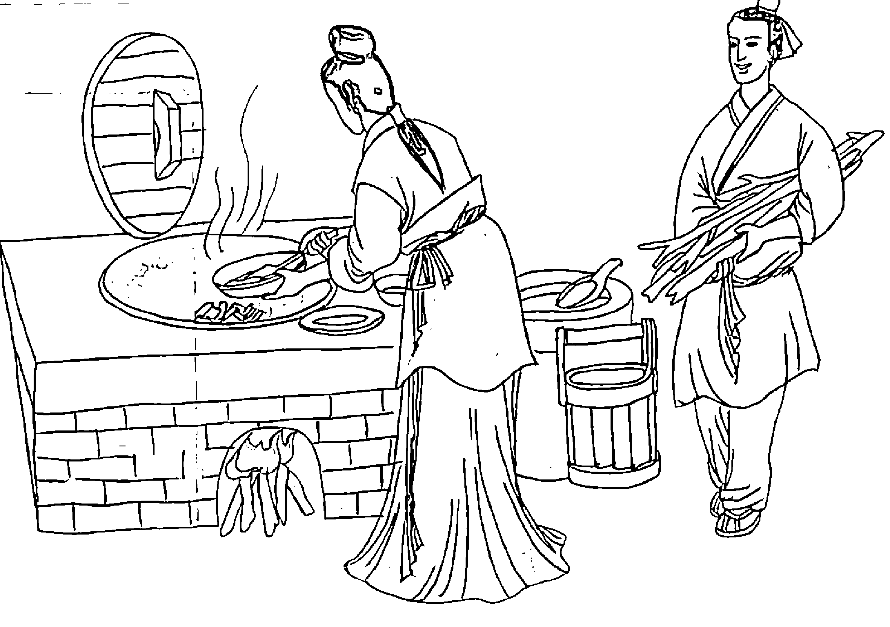

常能了然于胸。而贪狼星天生多才多艺，举凡琴棋书画、吟诗作对、唱歌跳舞，样样精通，交际应酬中所需要的才艺，常能触类旁通，闻一知十，举一反三，轻而易举就能学会，再加上特别介意得失，所以会刻意要求自己成为交际应酬场合中的佼佼者。

贪狼星若能正面运用其爱计较，常检讨和评估过去得失的特性，改掉自己不良的习性，使自己心胸更加开阔，进而发挥其交际应酬的长才，并充分运用其变化性、创造性和竞争性的特征，不断地进步和超越，自然能够发挥潜能有所突破。有时候主动地去避免竞争，并多培养文学、艺术方面的才艺，反而能养精蓄锐容易成功。

贪狼星不宜于女命，此因贪狼星为第一大桃花星，又为偏财星，女命逢贪狼星守命，多有钱又清闲，再加上外向好动，多欲又好享受，交友广泛，常有交际应酬，难免会耐不住寂寞，较容易不安于室。宜多修身养性，并洁身自好。

贪狼星入辰、戌、丑、未四墓（库）宫，为财入库位而又属入庙势，不仅寿命长，且反能减低酒、色、财、气之弊，而在才艺上得以发挥。

贪狼星最喜与火、铃星同宫守命，此因火、铃星皆属火（火星属阳火，铃星属阴火），可制贪狼星的阴水，并泄阳木之气。尤其是火星的阳火克阴水，阳克阴为“有情克”，克中有生，为适度的刺激，若无擎羊、陀罗星同宫，则构成“火贪格”或“铃贪格”，爆发力强，有将相之名，威震诸邦，家资豪富，贵如侯伯。若化禄星与火贪或铃贪同宫，限行遇之，多有突发的横财。

贪狼星喜与截空星同宫，可以使偏向酒、色、财气之弊降低，并能使其才艺得以发挥。入庙贪狼星与化忌、地空、地劫星同宫，多有专门技术，宜以巧艺安身。

贪狼星多欲望，又为第一大桃花星，逢化忌，空有幻想，有福不会享，空想一些天方夜谭又不可能实现的事，且桃花是非多。

贪狼星虽喜火、铃、空、劫四煞星，但甚忌羊、陀二煞星，易因色灾成祸。

贪狼星下喜与文昌、文曲星同宫，因昌、曲皆为时系星，易使贪狼星的多欲日夜更迭，才艺虚而不实，桃色是非层出不穷。

贪狼桃花星，居子、亥水乡，贪狼星在子、亥宫守命，为“泛水桃花格”，男浪漫，女多情。

贪狼星与擎羊星同坐命宫，为“风流彩杖格”，为人聪明，但多风流。

## 1 贪狼星在子、午二宫安命：活动力强，追求变化

贪狼星在子宫守命，受对（迁移）宫入庙紫微星的影响很大，较午宫守命来得吉利，使其具有文艺修养，且活动力强，并积极追求变化，因而有较多的机缘，得以进步和超越而获得成果。贪狼桃花星在子宫水乡守命，为“泛水桃花格”，男浪漫，女多情。

## 星曜布局

贪狼星在子、午宫为旺势独坐，对宫（迁移宫）是紫微星（午宫紫微星为入庙、子宫紫微星为平势）。独坐的贪狼星能将它的性质完全发挥，无论男女命皆具有口才，也颇懂得待人处世之道。

## 基本命运

贪狼星在午宫守命，因对宫紫微星为平势，力量较子宫弱，活动力也较弱。

贪狼星在子、午宫安命的人，工作小心谨慎，不轻易更换工作环境，并希望能顾全大局，虽然有些人衣着时髦，外表看起来很开放，其实心思很细致。

## 贪狼星坐命子宫

贪狼星坐命子宫，必为旺势独坐。对宫（迁移宫）为入庙紫微星，财帛宫必有地势破军星，官禄宫必有入庙七杀星。

贪狼星在子、午二宫守命，财帛宫必有地势破军星，官禄宫必有入庙七杀星。具有独立策划能力和独特的观察力，常因奇想而生财，钱财波动性大，宜从事特殊职业，或以巧艺安身；不惧困难，竞争愈激烈或愈具有挑战性、突破性、变化性的工作，愈能得心应手，事业成败起伏大；工作环境也变动大，中年后较能安稳。

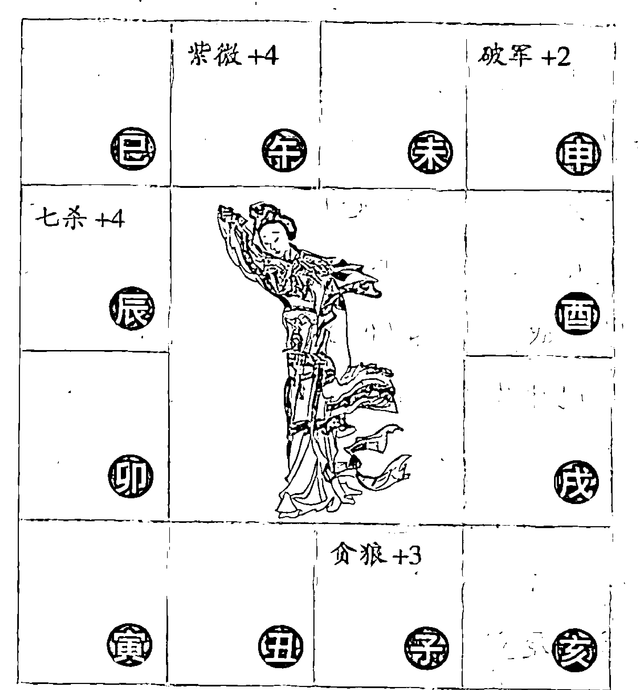

## 不同生年的命运

甲年生人：财帛宫破军星化权。有偏财运，赚钱很辛苦，钱财多变动，多横发横破，财来财去不易守，晚得之财较稳，先去后来、先破后得者，较能守得住。

命坐午宫，甲申、甲子、甲辰年生人；或命坐子宫，庚寅、庚午、庚戌年生人，禄存、天马星同坐财帛宫，为“禄马交驰格”，愈奔动愈生财。

乙年生人：迁移宫紫微星化科。一生出外多有贵人助，在学术或专门技术研究上可有优异的表现，尤以紫微星入庙在午宫更为突出。

命坐子宫，乙、己年生人；或命坐午宫，辛年生人，天魁、天钺双贵星，分别在命宫、财帛宫三合会照，为“天乙拱命格”，文章盖世，贵人多助。

命坐午宫，丙、戊年生人，擎羊星落陷同坐命，为“马头带箭格”，非夭折则主刑伤，多离乡背井，漂泊不定，危困重重。大、小限、流年逢之，则刑克妻、子，惹是生非，若中年残疾逢之，宜特别留意身体健康。贪狼、擎羊星同坐命，易因色灾成祸。

戊年生人：命宫贪狼星化禄。聪明，人缘佳，有食禄之福，得享高寿，有偏财运。命坐子宫，戊申、戊子、戊辰、戊巳、戊酉、戊丑、戊亥、戊卯、戊未年，寅时生人，或戊寅、戊午、戊戌年，酉时生人，铃星同坐命；命坐午宫，戊寅、戊午、戊戌年，巳时生人，或戊申、戊子、戊辰年，辰时生人，或戊巳、戊酉、戊丑年，卯时生人，或戊亥、戊卯、戊未年，酉时生人，火星同坐命，更有突发之财。

己年生人：命宫贪狼星化权。机智能干，自负任性，具有辩才，主观意识强烈，好应酬，有异性缘，多风流，喜欢掌权和近女色。

命坐午宫，己年寅时生人，命宫文曲星化忌，禄存星同坐命，擎羊、陀罗双煞星夹命宫，为“羊陀夹忌格”，孤贫刑克，诸事不吉。易神经过敏，思想与众不同，易惹口舌是非及文书、支票、金钱上的麻烦，感情多困扰。

命坐子宫，辛年戌时生人；或命坐午宫，辛年辰时生人，命宫文昌星化忌，才华易被埋没，多有文书上的困扰，多不明事理，或太严守规定而自我苦闷。

壬年生人：迁移宫紫微星化权。在家待不住，出外得贵人扶持，可一展才华，受人赏识。

命坐子宫，壬年生人，擎羊星同坐命，多以巧艺安身，易因色灾成祸。

癸年生人：财帛宫破军星化禄，命宫贪狼星化忌。辛勤忙碌赚钱，有意外横财，横发暴破。多空想而不切实际，桃花是非多。

命坐子宫，癸年生人，命宫贪狼星化忌，又逢擎羊、陀罗星夹命宫，为“羊陀夹忌格”，孤贫刑克，诸事不吉。

## 贪狼星坐命午宫

贪狼星坐命午宫，同样必为旺势独坐，对宫（迁移宫）的紫微星呈平势。与子宫一样的是，财帛宫必有地势破军星，官禄宫必有入庙七杀星。

| 巳 | 午 | 未 | 申 |
|----|----|----|----|
| 贪狼+3 | 命宫 | | |
| | 七杀+4 | | |
| 破军+2 | | 紫微0 | |
| 寅 | 丑 | 子 | 亥 |

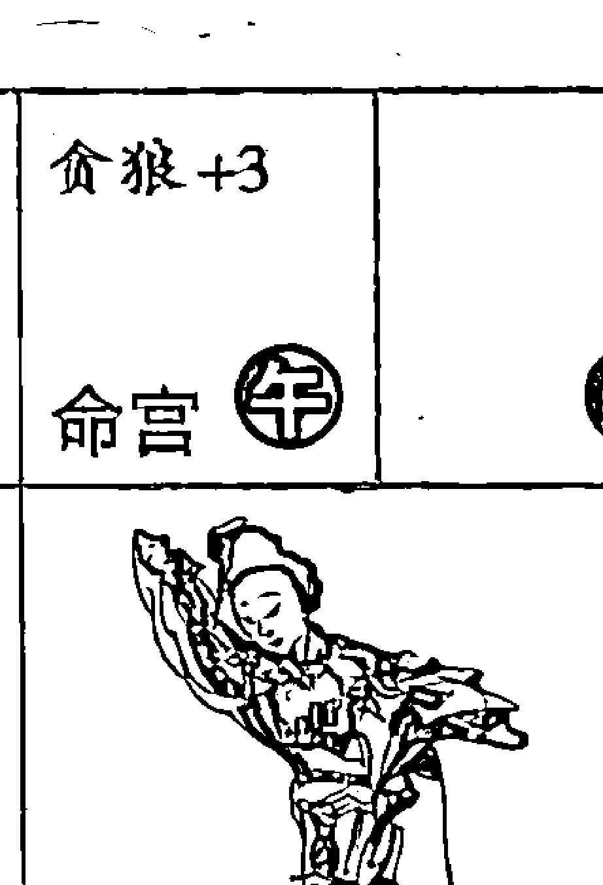

## 2 贪狼星在丑、未二宫安命：精于计算，性刚有才

贪狼星在丑、未二宫安命，必有武曲星同宫，请参看武曲星。

## 3 贪狼星在寅、申二宫安命：不惧困难，巧艺安身

贪狼星在寅、申二宫守命，财帛宫必有旺势破军星，官禄宫必有旺势七杀星。具有独特的策划和观察力，常因奇想而生财，可遽然成功而得钱。钱财波动性大。宜从事特殊职业，或以巧艺安身；不惧困难，愈具有竞争性、挑战性、突破性、变化性的工作，愈能得心应手。事业成败起伏大，工作环境也变动大，中年后较能安稳。

## 星曜布局

贪狼星在寅、申二宫为平势独坐，对宫（迁移宫）为入庙廉贞星。由于贪狼星为平势，力量较弱，受对宫入庙廉贞星的影响很大，除多才多艺，善于待人处世以外，也带有志高气傲，对政治感兴趣等廉贞星的性质。

## 基本命运

劳碌好动，外出交际广，可得贵人扶助，宜往都市发展，可从事娱乐、美容，或活动频繁的行业。有领导欲望与才华，希望以亲切合理的方式领导他人，有时易遭人误解，觉得有志难伸。

## 不同生年的命运

甲年生人：迁移宫廉贞星化禄，财帛宫破军星化权。注重精神享受，异性缘佳，出外可得异性相劝，善于交际应酬，常经营与艺术有关的行业；赚钱很辛苦，具有偏财运，钱财多变动，多横发暴破，财来财去不易守，晚得之财较稳，先去后来，先破后得之财，较能守得住。

甲申、甲子、甲辰、庚寅、庚午、庚戌年生人，禄存、天马星同坐命宫或迁移宫，为“禄马交驰格”，可在环境变迁中生财，愈奔动愈生财。

命坐寅宫，乙年生人；或命坐申宫，辛年生人，陀罗星同坐命宫，易因色灾成祸。

命坐申宫，乙、己年生人；或命坐寅宫，辛年生人，天钺、天魁双贵星，分别在命宫、官禄宫三合会照，为“天乙拱命格”，文章盖世，贵人多助。

丙年生人：迁移宫廉贞星化忌。在外易招桃色纠纷，外遇也多，宜防意外灾祸及交通事故，思虑多，心胸不开阔，遇事多计较，感情和情绪多波动及困扰。

戊年生人：命宫贪狼星化禄。聪明，人缘佳，有食禄之福，得享高寿，有偏财运。

己年生人：命宫贪狼星化权。机智能干，具办才，自负、任性，主观意识强烈，有异性缘，好应酬，多风流，喜欢掌权和近女色。

癸年生人：财帛宫破军星化禄；命宫贪狼星化忌。赚钱很辛苦，有横财，钱财波动大，多横发暴破；多空想而不切实际，桃花是非多。

## 4 贪狼星在卯、酉二宫安命：为人直爽，风流倜傥

贪狼星在卯、酉二宫安命，必有紫微星同坐，请参看紫微星。

## 5 贪狼星在辰、戌二宫安命：遽然成功，中年转运

贪狼星在辰、戌二宫入庙守命，财帛宫必有入庙破军星，官禄宫必有入庙七杀星。凭着自己独特的策划力和敏锐的观察力，常能遽然成功而生财，钱财波动大，宜从事特殊职业，或以巧艺安身；愈具有竞争性、挑战性、突破性、变化性的工作，愈能不惧困难而得心应手，事业、环境多变动，中年后较能安稳。

## 星曜布局

贪狼星在辰、戌二宫为入庙独坐，对宫（迁移宫）为入庙武曲星。辰、戌二宫为天罗地网宫，入庙贪狼星落入天罗地网中，反使其沉湎于酒、色、财、气的缺点减低，并得以发挥其文艺才华。

### 贪狼星坐命寅、申、辰、戌宫

贪狼星坐命寅、申二宫，均为平势独坐，对宫（迁移宫）为入庙廉贞星。贪狼星坐命辰、戌二宫，均为入庙独坐，对宫（迁移宫）为入庙武曲星。

### 坐命寅宫

| 巳 | 午: 七杀+3 | 未 | 申: 廉贞+4 |
|----|------------|----|------------|
| 辰 | [插图] | 酉 |            |
| 卯 |            | 戌: 破军+3 |            |
| 寅: 贪狼0 (命宫) | 丑 | 子 | 亥 |

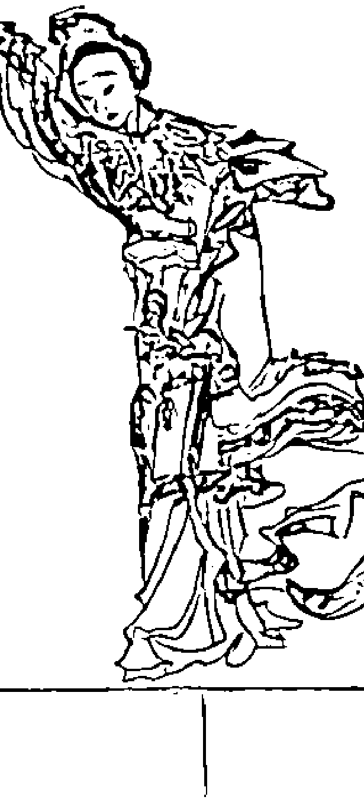

### 坐命申宫

| 巳 | 午 | 未 | 申: 命宫 (贪狼0) |
|----|----|----|------------------|
| 辰: 破军+3 | [插图] | 酉 |                  |
| 卯 |            | 戌 |                  |
| 寅: 廉贞+4 | 丑: 七杀+3 | 子 | 亥 |

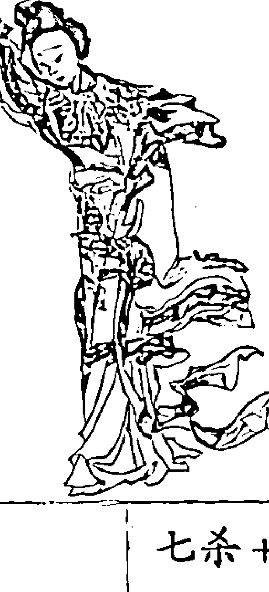

### 坐命辰宫

| 巳 | 午 | 未 | 申: 七杀+4 |
|----|----|----|------------|
| 辰: 贪狼+4 (命宫) | [插图] | 酉 |            |
| 卯 |            | 戌: 武曲+4 |            |
| 寅 | 丑: 破军+4 | 子 | 亥 |

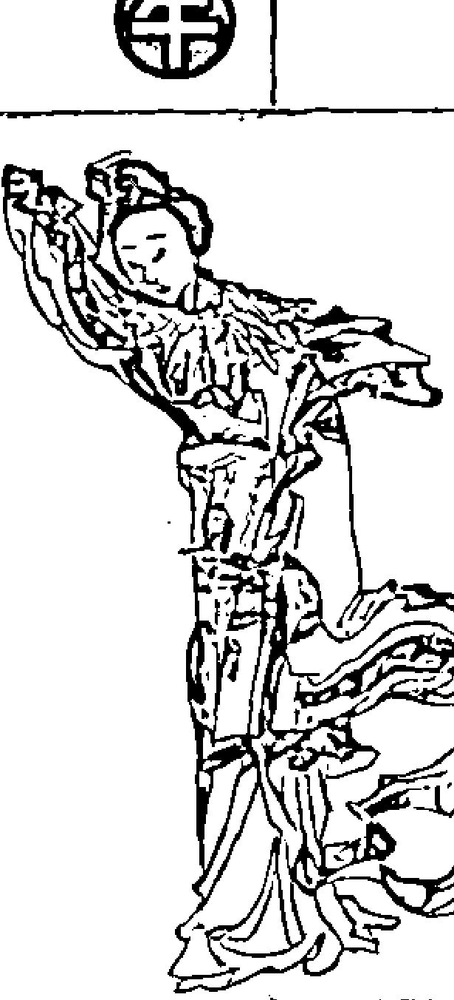

### 坐命戌宫

| 巳: 破军+4 | 午 | 未 | 申 |
|------------|----|----|----|
| 辰: 武曲+4 | [插图] | 酉 |    |
| 卯 |            | 戌: 贪狼+4 (命宫) |    |
| 寅: 七杀+4 | 丑 | 子 | 亥 |

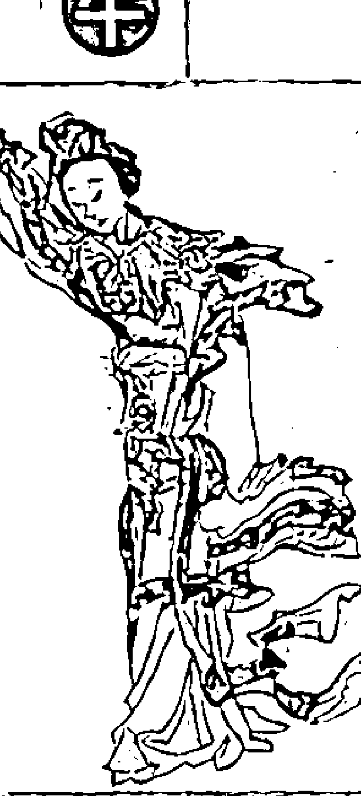

> 贪狼星坐命，若得火星或铃星同坐，即为“火贪格”或者“铃贪格”，少年时多出外求学或发展，常有机运遽然而发，但不宜从事单调的工作，宜以巧艺安身。

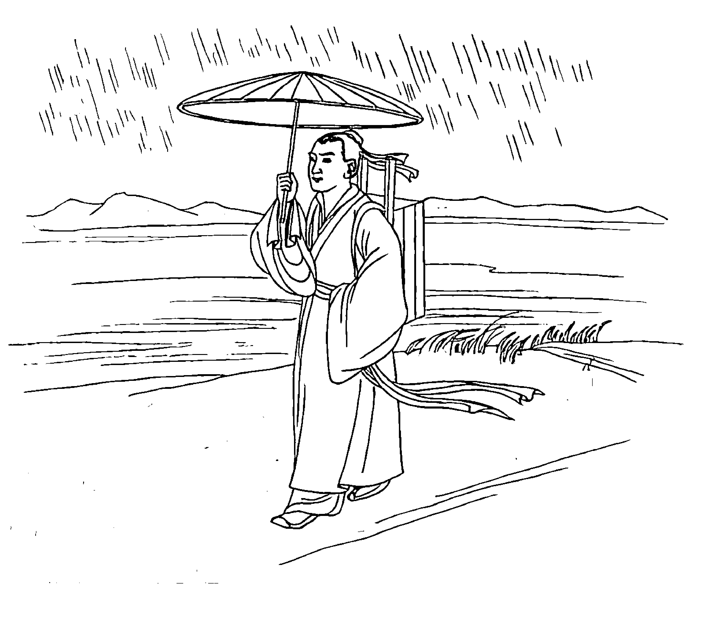

## 基本命运

对外关系良好，交际广泛，积极主动，常逢竞争对手，在工作中只要求自己，避免过度要求他人，劳心费力，宜闹中安身，不宜静守。女命，在事业上有表现，但在感情上易有波折，择偶时须特别留意。

贪狼星在辰宫守命，太阳星必落陷坐疾厄宫，为“日月疾厄格”，多有身体障碍，或有多头痛、视力不佳的疾病，宜从事医生、命相业，反能趋吉避凶。

## 不同生年的命运

甲年生人：财帛宫破军星化权，迁移宫武曲星化科。赚钱很辛苦，具有偏财运，钱财波动大不易守，多横发暴破，晚得之财较稳，先去后来，先破后得者，较能守得住；出外得贵人助，必历尽艰辛才能获得成就。

命坐辰宫，乙年生人；或命坐戌宫，辛年生人，入庙擎羊星同坐命宫，为“擎羊入庙格”，权威出众，富贵声扬，但刑伤难免，宜防色灾成祸。

命坐辰宫，丙、戊年生人；或命坐戌宫，壬年生人，陀罗星同坐命宫，易因色灾成祸。

戊年生人：命宫贪狼星化禄。聪明，人缘佳，有食禄之福，得享高寿，有偏财运。

己年生人：迁移宫武曲星化禄，命宫贪狼星化权。出外有贵人助，可得财禄，赚钱辛劳；机智能干，自负任性，具辩才，主观意识强烈，有异性缘，好交际，多风流，喜欢掌权和近女色。

庚年生人：迁移宫武曲星化权。具有奋战精神，事业心重，在家待不住，创业多奔波劳碌，出外才华能受人赏识，女命孤独难免。

壬年生人：迁移宫武曲星化忌。劳碌奔波，多孤独无依，出外耗财或惹财务是非，感情方面多波折，常会想不开，多依专门技术谋生。

癸年生人：财帛宫破军星化禄，命宫贪狼星化忌。赚钱很辛苦，有横财，钱财波动大，多横发暴破；能减低沉迷于酒、色、财、气之弊，并是具有专门技术的人才。

## 不同生时的命运

-   一、七月生人，左辅、右弼星分别在命宫、迁移宫对照，为“左右守垣格”，富企划能力，人际关系佳，凡事多可逢凶化吉，福禄终身。若逢凶、煞星，多先成后败，先荣后衰。

命坐辰宫，寅、午、戌年，卯时生人，或巳、酉、丑年，丑时生人，或申、子、辰年，寅时生人，或亥、卯、未年，未时生人；命坐戌宫，亥、卯、未年，丑时生人，或巳、酉、丑年，未时生人，或寅、午、戌年，酉时生人，或申、子、辰年，申时生人，火星同坐命宫，为“火贪格”。

命坐辰宫，寅、午、戌年，丑时生人，或申、子、辰、巳、酉、丑、亥、卯、未年，午时生人；命坐戌宫，寅、午、戌年，未时生人，或申、子、辰、巳、酉、丑、亥、卯、未年，子时生人，铃星同坐命宫，为“铃贪格”。

“火贪格”“铃贪格”的人，少年时多出外求学或发展，常有机运遽然而发，家资豪富，贵如侯伯，唯不宜从事单调的工作，宜以巧艺安身。尤以命坐戌宫之火、铃星皆属入庙，自然较命坐辰宫之火、铃星属落陷势更来得吉利。

命坐辰宫，乙年出生的“火贪格”之人；或命坐戌宫，辛年出生的“火贪格”之人，又属“擎羊入庙格”，权威更加卓越。

子、午时生人，文昌、文曲双星分别在命宫、迁移宫相对照，为“文星拱命格”，勤学好读，有经国济世之才，在学术、文艺界可显荣耀。女命逢之多情。

## 6 贪狼星在巳、亥二宫安命：桃花之命，一世风流

贪狼星在巳、亥二宫安命，必有廉贞星同坐，请参看廉贞星。

## 第十章 天府星坐命宫命运解析

### 巨门星坐命身宫

巨门星阴阳五行属阴水，为北斗第二星，化气为暗、主是非、象征“口”，和“口”密切相关。

### 容貌与性格

巨门星坐命身宫的人，眼神诚挚，面容肃穆，声高而速，行动有力。入庙则身长肥胖敦厚温良；陷地则五短瘦小。

耿直明快，性多疑惑，有其天真面，也有木讷处，六亲寡合，主观又自信，不满现状，多招是非，善欺瞒而面是背非，多学少精，做事反复而少成就，奔波劳碌而难得清闲。性唠叨多疑，说话快速，与人交往，初善终恶。心思细腻，头脑冷静，行事中规中矩，注重形象，具卓越分析力、观察力、判断力、记忆力与联想力，富研究心，具有创见，知识领域广泛，虽不擅长于交际，但表达力强，辩才优越。着重踏实生活，甘于清贫，不重生活情趣，以工作为第一优先。

命身宫有巨门星的女性，自尊心强，心细自信，心直口快，活动力强，多疑，常杞人忧天而自寻烦恼。在家喜干涉丈夫，宜留意言语，择偶宜选温和又善解人意的对象。工作勤奋认真，料理家事细心周到，工作和家庭可兼顾。

### 命理参断

巨门是嘴巴，所以巨门星象征“口”，总和“口”分不开，有口福，长于口才，多适合以“口”为主的行业，如教师、店员、推销员、歌星、演艺人员、命相家、大众传播、广播员、外交经贸工作、节目主持人、保险员、公关人员、法官、律师、餐饮业、娱乐业、旅游业等。并善于处理公共关系，是良好的外交人才。

巨门星多动“口”，所以耿直明快，是一个大嘴巴，但“言多必失”，也多惹是非。女命，宜平稳安定，不喜是非，所以巨门星不适宜女命。

巨门星的是非，并非有意招惹而来的，巨门星坐命的人，分析力强，颇明是非，并尽量躲避不去招惹，但仍然脱离不了是非。

巨门星和贪狼、天机星均属外向交际型，但彼此之间的性质各不相同：贪狼星多才多艺，其交际性质偏向于酒、色、财、气的才艺浪漫；天机星的交际偏重在交涉联络，为人服务的辛勤奔走；巨门星则以口才为主，偏向演讲表演。

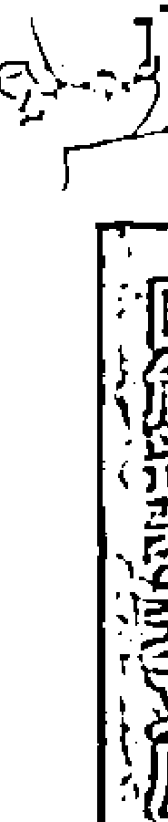

> 巨门为嘴，所以巨门星象征“口”，长于口才，并善于处理公共关系，多适合以“口”为主的行业，如教师、店员、导游、演艺人员、命相家、外交家等。

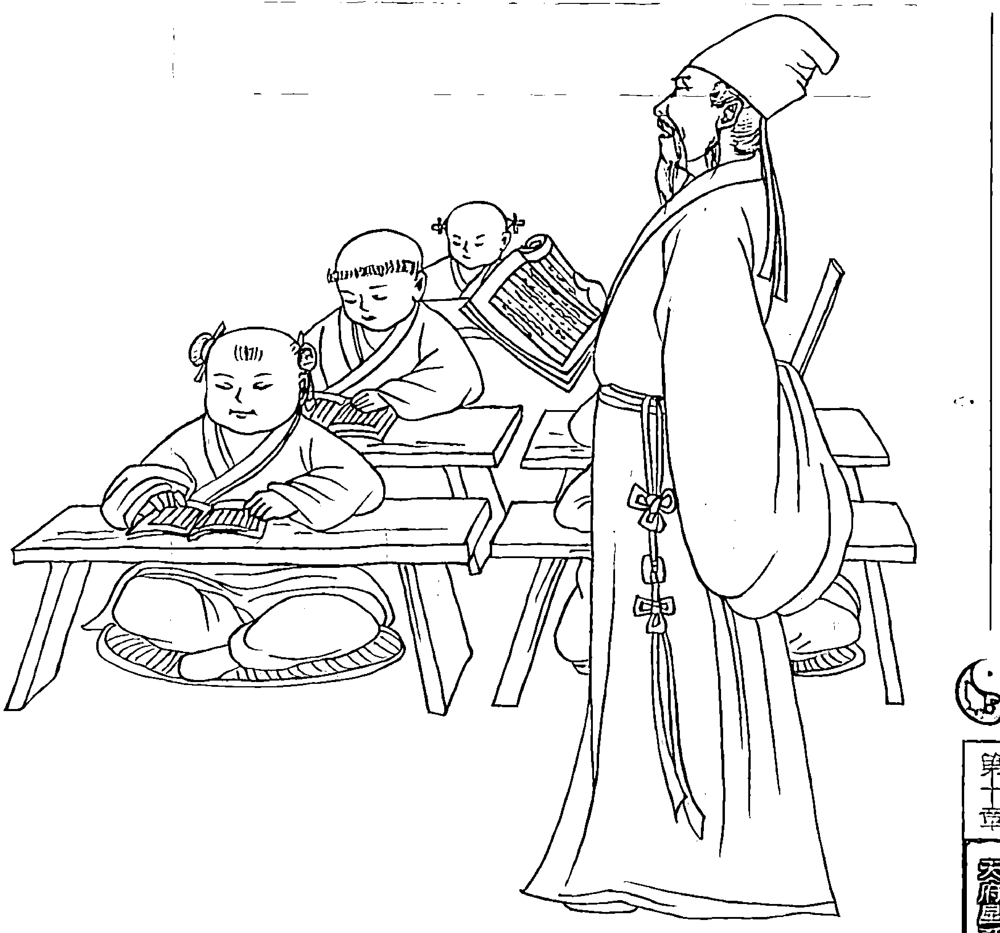

巨门星和文曲星皆长于口才，但文曲星的口才多属巧辩，注重修辞而能言善道，也含有“财”及“桃花”之意；巨门星的口才则较实际，含有分析及联想，也具有内容，而“财气”较少。

巨门星化气为“暗”，居暗地视明亮处格外清晰，故巨门星观看事物比别人透彻，具有观察力。

巨门星也属驿马星，主辛劳，多幼年坎坷，在辛劳奋斗后才能有所收获。

巨门星坐命宫的人，多有下列现象：

-   (1) 无论处境多么黑暗，多能疏通内心的障碍，总会存有一线光明的希望。
-   (2) 心胸宽大，知道得饶人处且饶人的道理。
-   (3) 能够体会多样化的人生，并表现于言语、行为中，受人肯定和欢迎。
-   (4) 能有效沟通事物，并传达资讯、排解纠纷。
-   (5) 介于是非、正反之间，但不迷失其善良本性，并能保持中庸之道。
-   (6) 心中隐藏有不可告人或欲盖弥彰之事。
-   (7) 常陷于幻想中而自寻烦恼，甚或自暴自弃。
-   (8) 好管闲事，多说多错，常为流言所苦，被人误会、冤枉。
-   (9) 未受社会肯定前，多历经辛劳，只要贯彻初志，终能成功。
-   (10) 胆识过人，常做一些大家所想不到，或不被认同的事情，而遭人议论。
-   (11) 动口机会比别人多，也常因运用口才而得利。
-   (12) 一生有许多必须竞争的机会。

巨门星坐命的人，应从事以口为主的行业，否则，宜学习并精通多种外国语言，以等待机会，并以正派方式工作和学习。同时，将易惹是非特性中的“批评”，转变为需要“良性批评他人”的行业去发展，如宣传、广告等。此外，巨门星坐命的人，子女运佳，晚年多能获得子女的照顾。

### 巨门星在各宫的亮度

巨门星为北斗第二星，阴阳五行属阴水，化气为暗，是一颗主是非的凶星，但其凶恶程度要依据亮度、所处宫位与星曜组合来定。

| 巳 | 午 | 未 | 申 |
| :---: | :---: | :---: | :---: |
| 巨门+3 | 巨门+3 | 巨门-1 天同-1 | 巨门+4 太阳+2 |
| 辰 | | 酉 |
| 巨门-2 | | 天机+3 巨门+4 |
| 卯 | | 戌 |
| 天机+3 巨门+4 | | 巨门-2 |
| 寅 | 丑 | 子 | 亥 |
| 巨门+4 太阳+3 | 巨门-1 天同-1 | 巨门+3 | 巨门+3 |

巨门星也主孤，唯有禄存星可解厄。巨门星入六亲宫多主与六亲缘薄，大限或流年行至巨门星所在宫位时，若无禄存或化禄星同宫，易心神不宁或有孤独的现象。

巨门星化禄、权、科，食禄更丰，口才更好，但性质有别：化禄讲理而带感性，随和，不强迫，看场合说话；化权讲理而带权威性，条理分别，增加说话的分量，并多能取信于人而减少是非；化科则讲话文质彬彬，有君子风度。

巨门星最喜化权，庙旺时化权，再遇六吉星，多是肩负重任，折冲樽俎的外交官；若非属庙旺遇化权星，也宜为人师表而桃李满门。巨门星庙旺时化禄，加遇吉星，事业能有表现，若化禄再遇红鸾、天喜、文昌、文曲、天姚、咸池、化科等星，宜往娱乐界发展，多为知名的演艺人员。

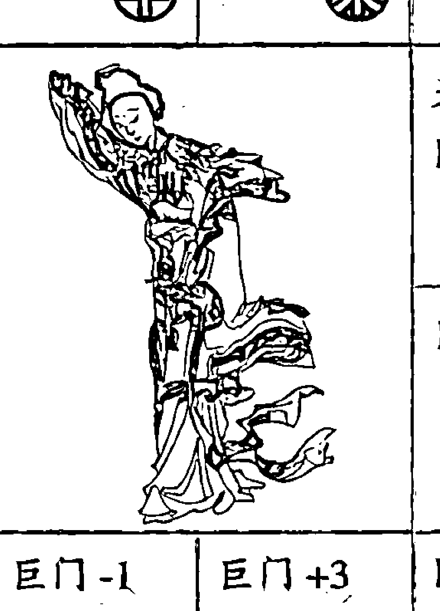

巨门星不喜化忌，言辞锐利，说话不好听，偏又喜欢说，易引人反感，得罪人而不自知，若化忌再遇煞星，宜注意官非。

巨门星最嫌擎羊、陀罗星，感情多波折，一言足以偾事，多是非困扰，一波未平，一波又起。巨门星遇火、铃星，易增困扰。巨门星与地空、地劫星同坐命宫，一生坎坷劳碌，甚至幼年即遭遗弃。

### 1 巨门星在子、午二宫安命：性急好动，家人相助

巨门星在子、午二宫旺势守命，迁移宫必有入庙天机星，官禄宫必有太阳星（辰宫为旺势、戌宫为不得地势）。入庙天机星坐迁移宫，性子急，好动，出外有贵人助，宜赴远地或海外发展，适于多变动性质的工作。

## 星曜布局

巨门星在子、午二宫为旺势独坐，是巨门星最吉利的宫位，能将其优点充分发挥出来，也比其他宫位都适合女命。即使不加会吉星，若无煞星同宫或会照，能努力工作，等待或创造机会，希望自己的理念和才华得以发挥，受人肯定，事业因而能有所表现。若有煞星会照，只要加会吉星或化禄、化权星，事业也能有表现，但格外艰辛，表现的程度也受到影响。

## 基本命运

巨门星在子宫，只要不化忌，必口才特佳，口若悬河。

巨门星在子、午二宫坐命，三方四正加会化禄、化权或化科星，为“石中隐玉格”，有抱负，肯奋斗，早年必须历经风霜琢磨，中、晚年才会显现“玉”面的光辉。

太阳星坐官禄宫，事业多变动，并具有高度竞争性，辰宫太阳星为旺势（命坐子宫），事业发展顺利，可任高职，宜政界、企业、贸易和独立事业；戌宫太阳星为不得地势（命坐午宫），早年工作多劳苦，纵有名声，也难得财，中年以后才能安定，宜从事一般劳动性事业。

由于命坐子宫时官禄宫太阳星为旺势，命坐午宫时官禄宫太阳星为不得地势，故命坐子宫比较来得吉利。

## 不同生年的命运

- **甲年生人**：官禄宫太阳星化忌。事业或工作环境多波折、变动，男同事或上司多刁难，男命，不宜经商和创业，以上班族领固定薪水为宜。
- 命坐午宫，甲申、甲子、甲辰年生人；或命坐子宫，庚寅、庚午、庚戌年生人，禄存、天马星同坐财帛宫，为“禄马交驰格”，能在环境变化发展中生财，愈奔动愈生财。
- **乙年生人**：迁移宫天机星化禄。忙碌，有远行、迁居，出外有贵人助，多财来财去，为人作嫁。
- 命坐子宫，乙、己年生人；或命坐午宫，辛年生人，天魁、天钺双贵星分别在命宫、财帛宫三合会照，为“天乙拱命格”，文章盖世，贵人多助。
- **丙年生人**：迁移宫天机星化权。在家待不住，有远行，出外可展才华。
- 命坐午宫，丙、戊年生人；或命坐子宫，壬年生人，擎羊星同坐命宫，多是非困扰，感情多波折。
- 命坐午宫，丙、戊年生人，擎羊星落陷坐命，为“马头带箭格”，非夭折则主刑伤，多离乡背井，漂泊不定，危困重重。
- **丁年生人**：迁移宫天机星化科，命宫巨门星化忌。常有调动、变动之事，出外有贵人；大嘴巴，常因一句无心的话，或激愤之词得罪人，受人怀恨，多是非、麻烦，大小限、流年遇之，宜防意外车祸。
命坐午宫，丁年生人，命宫巨门星化忌，又逢擎羊、陀罗星夹命宫，为“羊陀夹忌格”，孤贫刑克，百事不吉。
戊年生人：迁移宫天机星化忌。出外劳碌奔波，易有小人之灾，宜注意身体的四肢保健，并须防交通事故。
命坐午宫，己年生人；或命坐子宫，癸年生人，禄存星同坐命宫，可减低巨门星的是非及孤独现象。
命坐午宫，己年寅时生人，命宫文曲星化忌，又逢擎羊、陀罗星夹命宫，为“羊陀夹忌格”，孤贫刑克，百事不吉。
庚年生人：官禄宫太阳星化禄。奔波劳碌，事业有成，多有老板或主管命。
辛年生人：命宫巨门星化禄，官禄宫太阳星化权，若无凶、煞星冲破，为“权禄巡逢格”，财官双美，一生顺稳。有口才及口福，多以口赚钱；辛劳，多能掌权及自行创业，可从政或从事外交工作（以太阳星在辰宫较佳）。
命坐子宫，辛年子、辰、申时生人；或命坐午宫，辛年寅、午、戌时生人，命宫巨门星化禄，官禄宫太阳星化权，同时文曲星化科在命宫、财帛宫或官禄宫，为“三奇嘉会格”，名誉昭彰，富贵双全，但属“大器晚成格”。女命不宜，多水性杨花。
癸年生人：命宫巨门星化权。口才好，说话条理分明，言辞铿锵有力，具权威性，动则有利，开口得财，宜注意避免得理不饶人。
乙、丙、丁、庚、辛、癸年生人，命宫三方四正加会化禄、化权或化科星，为“石中隐玉格”，有抱负，肯奋斗，早年必须历经风霜琢磨，中晚年才会显现光辉，富且贵（丁年生人仅命坐子宫符合石中隐玉格，但富而不贵）。命坐子宫，比命在午宫强得多（因官禄宫太阳星为旺势）。

## 不同生时的命运

命坐子宫，午时生人，旺势太阴星和文曲星同坐夫妻宫，为“蟾宫折桂格”，男招贵妻，女生贵子。同时，旺势太阳星和文昌星同坐官禄宫，为“皇殿首班格”，富贵全美，必任要职。
命坐子宫，丑、亥时生人；或命坐午宫，巳、未时生人，地空或地劫星同坐命宫，一生多坎坷劳碌，甚至幼年即遭遗弃。

## 巨门星坐命子、午宫

巨门星坐命子、午宫，为旺势独坐，迁移宫必有入庙天机星，官禄宫必有太阳星，这是巨门星最吉利的宫位，能将巨门星的优点都发挥出来。

### 坐命子宫

### 坐命午宫

## 巨门星在丑、未二宫安命：波折不断，中年后安定

巨门星在丑、未二宫安命，必有天同星同坐，请参看天同星。

## 巨门星在寅、申二宫安命：先苦后甘，方能成器

巨门星在寅、申二宫安命，必有太阳星同坐。请参看太阳星。

## 巨门星在卯、酉二宫安命：利事业、不利感情

巨门星在卯、酉二宫安命，必有天机星同坐，请参看天机星。

# 第十五 天府星系诸星坐命宫命理分析

## 巨门星在辰、戌二宫安命：适应力强，善于理财

巨门星在辰、戌二宫落陷坐命，迁移宫必有平势天同星，财帛宫必有太阳星（子宫为落陷、午宫为旺势）。外出运佳，适应力强，出外有贵人，在外有口福。由于人缘好，出门常是身不由己；善于理财，可因财而得名，命坐戌宫时，财帛宫太阳星为旺势，有财运。命坐辰宫时，太阳星为落陷，支出庞大，较浪费。

## 星曜布局

巨门星在辰、戌二宫为落陷独坐，又受辰、戌二宫天罗、地网的局限，会有无力感，非常辛劳，难有真正的表现，但却富研究精神，适合在文教界发展，若肯沉得住气，埋头苦干研究学理，不急于求一时的表现，在三十岁以后，始能渐入佳境。

## 基本命运

辰、戌二宫的巨门星，甚喜与地空、地劫、擎羊、火星、铃星等五煞星及化忌星同宫，可助其冲出天罗地网的束缚，在困难挫折中，反能更努力，更进步，可成大贵。
巨门星在辰、戌二宫落陷坐宫，再逢羊、陀、火、铃四煞星坐命宫，为“巨逢四煞格”，无吉星相救，多会畏罪逃亡。

## 不同生年的命运

甲年生人：财帛宫太阳星化忌。收入不稳定，得财辛苦，且须经由竞争而来，花钱浪费，男命不利于创业。
命坐辰宫，乙年生人；或命坐戌宫，辛年生人，入庙擎羊星同坐命宫，为“擎羊入庙格”，富贵声扬，权威出众。尤其是命坐戌宫，辛年生人，命宫巨门星化禄，财帛宫太阳星为旺势化权，为“权禄巡逢格”。若财帛宫无煞星同宫，或财帛宫的三方四正未遇煞星，反为奇格。中年以后，在辛劳中，能凭三寸不烂之舌及冲劲，多能创业或做生意，在钱财方面大有收获，成为大富大贵，财官双美。
丙年生人：迁移宫天同星化禄。为人乐观，但多不知进取，出外有享受，有贵人。
丁年生人：迁移宫天同星化权，命宫巨门星化忌。在家待不住，出外有福可享，宜于文教界发展，从事学术研究工作，可一展才华，受人赏识；劳碌奔波，从事吃开口饭的行业，如教师、律师、推销员、命相师等，反可避凶趋吉，减少是非，并产生激发力，以锐利的口才而有所发展。
庚年生人：财帛宫太阳星化禄，迁移宫天同星化忌。辛勤忙碌赚钱，善于理财，多有财出财入的现象，太阳星在午宫旺势坐财帛宫，多事业有成；出外忙碌，有福不会享，多欠缺协调能力。
癸年生人：命宫巨门星化权。口才佳，说话具权威性，条理分明，吃开口饭者，可凭口得财。

## 不同生时的命运

一、七月生人，左辅、右弼双星分别在命宫、迁移宫相对照，为“左右守垣格”，富企划力，人际关系佳，凡事多可逢凶化吉。
子、午时生人，文昌、文曲双星分别在命宫、迁移宫相对照，为“文星拱命格”，在学术、文艺界可显荣耀。女命多情。
命坐辰宫，巳、未时生人；或命坐戌宫，丑、亥时生人，地空或地劫星同坐命宫，可助巨门星冲出天罗地网的束缚，在中年以后，凭着犀利的口才，及强烈的企图心，在辛劳之后，可创出一片天地，成就一番事业。
命坐戌宫，辛亥、辛卯、辛未年，丑时生人；或辛巳、辛酉、辛丑年，未时生人；或辛寅、辛午、辛戌年，酉时生人；或辛申、辛子、辛辰年，申时生人，入庙擎羊、火星同坐命宫，为“擎羊入庙格”，又加遇入庙火星，且财帛宫太阳星又为旺势，富贵声扬，权威卓著，财官双美，大富大贵。

## 巨门星坐命辰、戌宫

巨门星坐命辰、戌二宫，为落陷独坐，迁移宫必有平势天同星，财帛宫必有太阳星（子宫为落陷、午宫为旺势）。

### 坐命辰宫

### 坐命戌宫

## 巨门星在巳、亥二宫安命：乐于享受，中年转运

巨门星在巳、亥二宫坐命，财帛宫必有落陷天机星，官禄宫必有平势天同星。无意外之财。必须靠自己的智慧和双手，劳心费力挣钱，一分耕耘，一分收获，钱财不安稳，流通性大，来了又去，去了又来，中年后，才开始有财运；喜欢悠闲，乐于享受，做事不积极，适宜自由、不受拘束、没有明显目标、富社交性的工作，如文化、娱乐、餐饮、旅游、服务业、作家、自由业、装饰、服装、百货、大众传播等行业，早年事业欠稳定，多调职、转业，中年后可待机好转。

## 星曜布局

巨门星在巳、亥二宫为旺势独坐，对宫（迁移宫）为太阳星（巳宫为旺势，亥宫为落陷），受太阳星影响很大，太阳星的庙陷差异颇大。

## 基本命运

巨门星在巳宫坐命，太阳星在亥宫为落陷失辉，奔波劳碌，心情不开朗，一生是非多且重，遭冤难洗清，出外花费大，难以发展，加遇吉星，事业尚有表现；不遇吉星，女命多有感情困扰。巨门星在亥宫坐命，太阳星在巳宫为旺势朝照，驱暗有力，出外得贵，神清气爽，虽少年仍须辛勤奋斗，但中、晚年后得以发展，食禄驰名。
巨门星在巳、亥宫坐命，甚嫌地空、地劫星，幼年易遭遗弃，少年多辛劳坎坷，但并不影响日后的表现。

## 不同生年的命运

+ 甲年生人：迁移宫太阳星化忌。在外劳碌，还招是非，事业波折不顺，易有隐疾，迁移宫化忌冲命宫，多有灾厄显现，尤其当大、小限或流年太阳星化忌入迁移宫冲命宫，易有车祸或罹患与血液有关的疾病；女命，感情易生波折，多有失恋的痛苦经验，且多有晚婚的现象。尤其命坐巳宫，太阳星在亥宫落陷化忌，上述现象更显著，与父母缘薄。
乙年生人：财帛宫天机星化禄。钱财流通性大，若再与煞星同宫或加会，则多属过路财神，有破财之事，财来财去而入不敷出，不宜经商。
丙年生人：官禄宫天同星化禄，财帛宫天机星化权，无凶、煞、忌星冲破，为“权禄巡逢格”，财官皆佳。贪图享受，具福气和悠闲，喜欢安逸的工作，稍嫌进取心不足，缺开创力，可得贵人相助，一生运气甚佳，较宜于女命。机变能力强，善于理财，钱财波动性大，不免于辛劳，有周转的现象。
命坐巳宫，丙年生人，禄存星同坐命宫，又三合会照官禄宫的天同星化禄，为“双禄朝垣格”：福气高，有才华，财官双美；女命丙亥、丙卯、丙未年生人，天马星同坐，爱专权。
丙亥、丙卯、丙未、戊亥、戊卯、戊未、壬巳、壬酉、壬丑年生人，禄存、天马星同坐命宫或迁移宫，为“禄马交驰格”，能在环境变动中得财，愈奔动愈生财。
丁年生人：官禄宫天同星化权，财帛宫天机星化科，命宫巨门星化忌。事必躬亲，奔波劳碌，多艰辛和波折，但劳而有成，多以社交手腕获得，宜以投资、合股、增益等方式合伙事业，不宜自行创业，宜以服务、餐饮、服饰业较有发展性；善于处理流动性资金，赚清白之财，以上班族领固定薪俸，或从事会计、出纳工作为宜；多口舌是非及小人纠缠，感情也多困扰，吃开口饭可避凶趋吉。
命坐巳宫，丁、己年生人；或命坐亥宫，癸年生人，陀罗星坐命宫，感情多波折，多是非困扰。
戊年生人：财帛宫天机星化忌。为财耗费心机，钱财波动大。
庚年生人：迁移宫太阳星化禄，官禄宫天同星化忌。奔波忙碌，命坐亥宫，太阳星为旺势，出外有贵，上班族可任主管而掌权。
辛年生人：命宫巨门星化禄，迁移宫太阳星化权，无凶、煞、忌星冲破，为“权禄巡逢格”，财官双美。有人缘，口才佳，口福好，多以口或口福为业，凭口才赚钱。若与文昌、文曲星同宫，不宜女命，多水性杨花，奔波劳碌，劳而有获，尤以命坐亥宫，太阳星为旺势，较为吉利。
命坐亥宫，辛年卯、丑、未、亥时生人；或命坐巳宫，丑、巳、酉、未时生人，化禄、化权、化科三星在命宫的三方四正会齐，为“三奇嘉会格”，名誉昭彰，富贵双全，财官双美，唯属大器晚成，中年后才有发展，以命坐亥宫，巳宫太阳星为旺势，较为灵验。
癸年生人：命宫巨门星化权。具有辩才，说话有分量，言辞铿锵有力、条理分明，令人信服，是非得以澄清或化解，动则有利，开口得财。

## 不同生时的命运

命坐巳宫，二、六、十月生人；或命坐亥宫，四、八、十二月生人，左辅、右弼星分别在命宫、财帛宫、官禄宫三合会照，可多得辅佐助力。
命坐亥宫，巳时生人，旺势太阴星和文曲星同坐夫妻宫，为“蟾宫折桂格”，男招贵妻，女生贵子。
命坐巳宫，巳、午、未时生人；或命坐亥宫，子、丑、亥时生人，地空、地劫双煞星同坐或同夹命宫，为“命里逢空格”，或“空劫夹命格”，行运犹如浪里行船般不稳，常有半天折翅的打击，幼年易遭遗弃，信仰宗教且常离家，清闲才能延寿。尤其是“空劫夹命格”者，丁年生人；或命坐巳宫，巳时生人；或命坐亥宫，亥时生人，又逢命宫巨门或文昌星化忌，为“空劫夹忌格”，更是不吉利。

## 巨门星坐命巳、亥宫

### 坐命巳宫

巨门星坐命巳、亥二宫，为旺势独坐，对宫（迁移宫）为太阳星（巳宫为旺势，亥宫为落陷），财帛宫必有落陷天机星，官禄宫必有平势天同星。

### 坐命亥宫

> 巨门星在巳、亥二宫坐命，财帛宫必有落陷天机星，无意外之财，就像农夫一样，必须靠自己的智慧和双手，劳心费力挣钱，一分耕耘，一分收获。

## 天相星坐命身宫

天相星阴阳五行属阳水，为南斗第五星，化气为印，主官禄，司爵位，能制廉贞之恶。

## 容貌与性格

天相星坐命身宫的人，体型中等或略矮，皮肤白皙，举止端庄，相貌敦厚，眉清目秀。性情温和，言语诚实、动人，心地善良，有恻隐心，随和慷慨，能够牺牲奉献，乐于助人。好饮食，衣着光鲜，聪明稳重，思虑周全，富于智谋，谨言慎行，任劳任怨，做事有始有终。谦虚有智谋，待人接物斯文有礼，进退有据，应对得体，忠耿可靠，长于协调，人际关系良好。阅历丰富，喜好文艺，富企划才能。虚荣心重，心大胆小，耳根软易轻信他人，欠缺雄心壮志。
天相星坐命身宫的女性，姿容端丽，具内在美。聪明、自信心强，好勤勉，具宽容心，言辞谨慎，人品优秀，喜交际，多朋友，婚后可相夫教子，为贤妻良母。若天相星庙旺，衣禄遂心。

## 命理参断

天相星顾名思义是紫微星天子的宰相，为紫微帝星执掌玉玺，所以行事稳重，格外谨言慎行，步步为营，处事踏实公正，思考周密。

> > 顾名思义，天相星是紫微星天子的宰相，为紫微帝星执掌玉玺，所以行事稳重，谨言慎行，处事踏实公正，思考周密，是理想的幕僚人才，是长官的最好帮手。

由于天相星稳重、诚恳、踏实的特性，使庙旺天相星坐命身宫的人，凡事循规蹈矩，坚守原则，做事有始有终，多终身从事一种职业。同时，客观而有正义感，负责又求好心切，乐于助人，其奉献与助人多发自内心，诚恳热情别无所求，又具有管理协调能力，善于为人排解困难，任劳任怨，忠心耿耿，能牺牲小我，有恻隐之心，能设身处地地替人着想。所以，最适宜担任秘书的工作，能将事情处理得非常圆满。
天相星坐命的人，为理想的幕僚人才，为长官的最好帮手，常成为亲信。多主勤劳，一分耕耘，即有一分收获。天相星坐命的人劳而有获，比破军星坐命的人波动，七杀星坐命的人艰辛与孤独，天梁星坐命的人多忧虑，要好得多，故天相星属于吉星。
天相星在数司爵位，是衣食之星，讲究吃、穿，穿着绝不会邋遢。
天相星为紫微星天子的宰相，“宰相肚里能撑船”，所以，天相星坐命宫的人，心胸开阔，个性宽厚，内心平稳，严于律己，宽以待人，协调能力强，不怕恶势力，能够济弱扶贫，打抱不平，容易让人信任，产生足以托付重任之感。
天相星固然忠心，但其所效忠的对象有好有坏，使天相星坐命的人，虽然循规蹈矩，坚守原则，却不能够完全自己掌握命运，遇到仁慈的主管固然吉利，若不幸碰到理念不同的主管，或处于缺乏规矩或秩序的环境，要在自己的原则与他人的规范之间拉锯，以求取平衡点，这种心境，常使得天相星感情冲动，而产生与自己本性的矛盾，需要费很多的心力去调整，才能恢复。
天相星坐命的人，若能从事秘书等幕僚服务的工作，或从事于社会工作，并避免经商，才能将潜能有所发挥，也能为众人谋福利，产生趋吉避凶的效果。
天相星喜欢与紫微、天府等有力主星及六吉星相会，尤喜左辅、右弼或龙池、凤阁星相夹，必能增加气势，为显贵的人服务，而能独当一面，大展其才。
天相星庙旺时，对煞星的会照尚有抵抗能力，在才艺方面能够有所表现；天相星在平势或落陷时，若没有吉星相助，又加遇煞星、化忌星，会使其优点减少，变成只关心

## 天相星在各宫的亮度

| 宫位 | 亮度/组合 | 宫位 | 亮度/组合 | 宫位 | 亮度/组合 | 宫位 | 亮度/组合 |
| :--- | :--- | :--- | :--- | :--- | :--- | :--- | :--- |
| (巳) | 天相 +2 | (午) | 天相 +4 廉贞 0 | (未) | 天相 +2 | (申) | 天相 +4 武曲 +2 |
| (辰) | 紫微 +2 天相 +2 | (中) | (人物插图) | | | (酉) | 天相 -2 |
| (卯) | 天相 -2 | | | | | (戌) | 紫微 +2 天相 +2 |
| (寅) | 天相 +4 武曲 +2 | (丑) | 天相 +4 | (子) | 天相 +4 廉贞 0 | (亥) | 天相 +2 |## 天相星在子、午二宫安命：财运亨通，生活富足

天相星在子、午二宫安命，必有廉贞星同宫，请参看廉贞星。

## 天相星在丑、未二宫安命：富贵双全，食禄千钟

天相星在丑、未二宫安命，以在丑宫较未宫为吉。此因命坐丑宫，天相星为入庙坐命，财帛宫天府星也为旺势，若无煞星冲破，为“府相朝垣格”，富贵双全，食禄千钟，得人景仰，能独当一面，一展长才，但须防感情、婚姻生活。命坐未宫，天相星及天府星皆为地势，气势弱了些，以为人服务较佳。

## 星曜布局

天相星在丑、未二宫为独坐（丑宫为入庙、未宫为地势），对（迁移）宫是入庙紫微星和旺势破军星，财帛宫有天府星（酉宫为旺势、卯宫为地势）。有原则，能按部就班，踏实地工作，肯上进，能吃苦耐劳，具有冲击力，活动力强，交友广阔，人际关系良好，出外能得贵人助，常有奔波与环境变动，身心闲不下来，多能在事业上有所表现；财源茂盛，一生衣食无忧，生活富足，善于理财，肯济助他人。

## 基本命运

天相星坐丑、未二宫安命，若有左辅、右弼、文昌、文曲星同宫或会照，财官双美，有文艺方面的兴趣和才华。若有吉星协助，又有煞星会照，在事业上仍有表现，但表现的程度会减低。若有地空、地劫星会照，甚宜从事公、文、教职，事业仍有表现，只要不经商，钱财波动不大，但女命易有感情波折；若有火、铃星会照，心绪不宁，事业也减色；若会照擎羊、陀罗星，易影响福泽；若只会照六煞星之一二煞星，多有技艺方面的才能。

## 不同生年的命运

- 甲年生人：迁移宫破军星化权。具有领导和决断能力，在家待不住，劳碌奔波，出外可一展才华，受人赏识，能主动去改变环境，使往好的方面去发展。同时，天魁、天钺双贵星分别在命宫、迁移宫相对照，为“坐贵向贵格”，文章盖世，贵人多助。
- 乙年生人：迁移宫紫微星化科。有人缘，出外有贵人助，具有处理事务的能力，才艺出众。
- 戊、庚年生人：天魁、天钺双贵星分别在命宫、迁移宫相对照，为“坐贵向贵格”，文章盖世，贵人多助。
- 壬年生人：迁移宫紫微星化权。具坚定的自主性，出外有贵人扶持，可一展才华。
- 癸年生人：迁移宫破军星化禄。出外有贵人，处世较积极，名利方面皆有收获，钱财波动大，开销也大。
- 命坐丑宫，癸年生人；或命坐未宫，丁、己年生人，入庙擎羊星同坐命，为“擎羊入庙格”，权威出众，富贵声扬，若遇凶星刑伤难免。
- 命坐丑宫，九、十、十一月生人；或命坐未宫，三、四、五月生人，左辅、右弼双吉星同坐或同夹命宫，为“左右同宫格”，或“左右守垣格”，富企划能力，有文艺才华，凡事多可逢凶化吉，福禄终身，财官双美，若逢凶、煞星，则先成后败，先荣后衰。

## 不同生时的命运

命坐丑宫，丑、卯、巳、申、酉、戌时生人；或命坐未宫，寅、卯、辰、未、酉、亥时生人，文昌、文曲双吉星同坐或同夹命宫，或同在命宫的三方四正相会照，为“文桂文华格”，或“文星拱命格”，或“昌曲夹命格”，在学术、文艺界可显荣辉，不贵即富；女命有姿色、才艺，多情。

### 天相星在寅、申二宫安命：生活富足，感情易变

天相星在寅、申二宫安命，必有武曲星同宫，请参看武曲星。

### 天相星在卯、酉二宫安命：有始有终，取得平衡

天相星在卯、酉二宫落陷坐命，在工作中有一定的原则，常保持高度的警觉与细心，在冲突、变化、矛盾中能够取得平衡。事业虽仍能维持一贯不变，有始有终，但易受行运的影响。一生中或许也会有更换职业的现象，但多属自然情况下的转变。变化后仍然能够呈现较稳定的状态。

## 星曜布局

天相星在卯、酉二宫为落陷独坐，对（迁移）宫有平势廉贞星及落陷破军星，财帛宫有地势天府星。

天相星在卯、酉二宫为落陷独坐，对（迁移）宫有平势廉贞星及落陷破军星，财帛宫有地势天府星。在巳、亥宫为地势独坐，对（迁移）宫为平势武曲、破军星同坐。

#### 坐命卯宫

|    |    |    |    |
|---|---|---|---|
| 巳 | 午 | 未 | 申 |
| 辰 |    | 廉贞 0 破军 -2 酉 |    |
| 天相 -2 命宫 卯 |    | 戌 |    |
| 寅 | 丑 | 子 | 亥 |

#### 坐命酉宫

|    |    |    |    |
|---|---|---|---|
| 天府 +2 |    |    |    |
| 巳 | 午 | 未 | 申 |
| 辰 |    | 天相 -2 命宫 酉 |    |
| 廉贞 0 破军 -2 卯 |    | 戌 |    |
| 寅 | 丑 | 子 | 亥 |

#### 坐命巳宫

|    |    |    |    |
|---|---|---|---|
| 天相 +2 命宫 巳 |    |    |    |
| 辰 |    |    |    |
| 卯 |    |    | 西 |
| 天府 +4 |    | 武曲 0 破军 0 |    |
| 寅 | 丑 | 子 | 亥 |

#### 坐命亥宫

|    |    |    |    |
|---|---|---|---|
| 破军 0 武曲 0 |    | 天府 +4 |    |
| 巳 | 午 | 未 | 申 |
| 辰 |    |    | 西 |
| 卯 |    |    | 天相 +2 命宫 亥 |
| 寅 | 丑 | 子 | 亥 |

## 基本命运

由于天相星为落陷，本身势弱无力，易受财帛宫天府星的影响，为人保守谨慎，善于理财，财源广。同时，也易受迁移宫廉贞、破军星的影响，有个性，具才华，多思虑，劳碌好动，常交际，环境多有变动，较宜公职，女命，具办事能力，有桃花，婚姻多不美好。

卯、酉二宫守命的天相星虽然为落陷，但若大、小限及流年尚吉，也能有表现，只是天相星本身为落陷无力，虽行运吉利，但因本身不喜变化，不爱出风头，在判断时，宜留意相会照的其他星曜，一并参考。

## 不同生年的命运

- 甲年生人：迁移宫廉贞星化禄、破军星化权。做事顺利，着重精神享受，出外有异性缘，能得异性之助；劳碌奔波，多变迁，有偏财运，花钱慷慨，常财来财去，故不宜经商或创业。
- 丙年生人：迁移宫廉贞星化忌。易发生车祸、跌伤等意外的灾厄，感情与情绪多波动、困扰，易有外遇，也容易招惹桃色纠纷。
- 命坐卯宫，丙、丁年生人；或命坐酉宫，壬、癸年生人，天魁、天钺双贵星分别在财帛、迁移宫拱照命宫，为“天乙拱命格”，文章盖世，贵人多助。
- 命坐酉宫，丙亥、丙卯、丙未、戊亥、戊卯、戊未年生人；或命坐卯宫，壬巳、壬酉、壬丑年生人，禄存、天马星同坐财帛宫，若无火、铃星冲破，为“禄马交驰格”，愈动愈有财，常在环境变化发展中得财，转职、转业可获良机，一生多旅游机会。
- 癸年生人：迁移宫破军星化禄。出外开销大，偏又喜欢外出消费，常有意外之财。

## 不同生时的命运

- 命坐酉宫，二、六月生人；或命坐卯宫，八、十二月生人，左辅、右弼双星分别在命宫、财帛宫三合会照，多辅佐力量，行事较顺利。
- 命坐卯宫，卯、未、亥时生人；或命坐酉宫，丑、巳、酉时生人，文昌、文曲双星，分别在命宫、或三合会照命宫，为“文星拱命格”，在学术、文艺界可显荣耀。女命逢之多情。

### 天相星在辰、戌二宫安命：拒绝稳定，财富丰裕

天相星在辰、戌二宫，必有紫微星同宫，请参看紫微星。

### 天相星在巳、亥二宫安命：衣食无忧，生活富足

天相星在巳、亥宫安命的人，有工作热忱，愿意与别人分享工作成果。多注重生活享受，善于理财，聪明而不拘小节，适合公教、文职。

## 星曜布局

天相星在巳、亥宫为地势独坐，对（迁移）宫为平势武曲、破军星同坐。由于天相星为地势本身虽弱，但可得到武曲、破军二星相助，适合向外地发展，虽然艰辛波折，劳心费力，但毅力强，不畏挫折，能冷静面对现实，终能冲破难关，力争上游，获得成就。

## 基本命运

天相星在巳、亥宫安命，财帛宫必有入庙天府星。善于理财，财运良好，具有投资能力，肯储蓄，衣食无忧，生活富足。

天相星在巳、亥二宫安命，夫妻宫为旺势紫微星和利势贪狼星同坐。男命多娶能干而有个性的妻子，妻子注重生活情趣，必须迟婚或婚前多波折，可美满偕老；女命，若命宫、夫妻宫未遇煞星，夫妻皆生活美满，具有情趣。

天相星在巳、亥二宫安命，喜欢六吉星相助；不喜欢遇武曲星化忌，多有波折；也不爱地空、地劫星夹命，易使人生历程增加困难，宜有宗教信仰。若与地空、地劫二星同宫，女命感情多波折，以亥宫较轻。若与六煞星同宫或会照，主有技艺，且可凭此进财谋生。

## 不同生年的命运

- 甲年生人：迁移宫破军星化权、武曲星化科。劳碌奔波，具领导能力，宜于武职；出外有贵人，具有声望，辛勤中常有突发性的表现。
- 丙亥、丙卯、丙未、戊亥、戊卯、戊未年生人；或壬巳、壬酉、壬丑年生人，禄存、天马星同坐命宫或迁移宫，若未遇火、铃星冲破，为“禄马交驰格”，愈奔动愈生财，一生多旅游机会。
- 命坐巳宫，丙、丁年生人；或命坐亥宫，壬、癸年生人，天魁、天钺双贵星分别在迁移、官禄宫拱照命宫，为“天乙拱命格”，文章盖世，贵人多助。
- 己年生人：迁移宫武曲星化禄。武曲财星化禄，出外可得财禄，并减低辛劳程度，宜于在军警界担任财务工作。
- 庚年生人：迁移宫武曲星化权。易坚持己见，具有奋战精神，能在艰困环境中完成别人所无法完成之事。男命，事业心重，喜欢孤注一掷，自行创业，因而格外奔波劳碌；女命，孤克难免，易影响婚姻缘分与和谐。
- 壬年生人：迁移宫武曲星化忌。个性较孤僻，自主独立，多依专门技术谋生，钱财、事业多波折，女命则对情绪、感情不利。命坐亥宫的人，由于禄存星同宫，可制化忌星，虽不免于辛劳，但仍能有所表现，在情绪、感情上困扰也较少。
- 癸年生人：迁移宫破军星化禄。破军星冲动又具有波动性，出外开销大，注重精神享受，任职于与军职有关的财经单位可有表现。

## 不同生时的命运

- 命坐巳宫，二、六、十月生人；或命坐亥宫，四、八、十二月生人，左辅、右弼双吉星在命宫或其三合宫拱照命宫，辅佐力多，行事顺利。
- 命坐亥宫，子、丑、亥时生人；或命坐巳宫，巳、午、未时生人，地空、地劫双煞星同坐或同夹命宫，为“命里逢空格”，或“空劫夹命格”，人生有如浪里行船，起伏凶险，并常会遭遇“半天折翅”般的突发挫折，宜有宗教信仰。

## 天梁星坐命身宫

天梁星阴阳五行属阳土，为南斗第二星，司寿，化气为荫，主福寿、贵，是清高之星，为父母宫主，能解厄制化。

### 容貌与性格

天梁星坐命身宫的人，相貌厚重清秀，体型瘦削，眼神平和，态度温文，举止从容。性情温和，谦虚有礼，言谈中肯，秉性稳重耿直，心地善良，慈悲为怀，聪明磊落，有机谋、有口才，思想超然，正直无私，临事果决，处世有原则，淡泊名利，有侠义心，乐善好施，能替他人设想，喜济弱扶贫，具长者之风，老气横秋，多受人尊敬。感情用事，喜受奉承，过度热心，爱多管闲事，注重面子，不善于处理金钱。喜欢研究宗教、医药、哲理等学术。

天梁星坐命身宫的女性，容貌秀丽，祥和慈悲，端庄娴淑，温柔体贴，感情丰富，乐善好施，举止大方，应对稳重，具大姐风范，能照顾别人，关心子女教育，为贤妻良母型。天梁星庙旺，主富贵，旺夫益子。

### 命理参断

天梁星是紫微斗数诸星中最具逢凶化吉、遇难成祥力量的星曜。因为必须表现“解难”及“化吉”的特性，天梁星坐命的人，无论命宫在命盘中任何宫位，是否会照吉星或煞星，不免会遭遇困难，以等待天梁星解厄制化，故虽在清高安泰中，却一直闲不下来。

所谓“难”，有大、小之别。例如，遭遇生命危险，为大难；为人父母者，为子女生病、功课担心忧虑，为小难。大、小限或流年遇天梁星，虽有波折，总能化险为夷，顺利过关，若生命危险平安度过，子女生病痊愈、功课进步，一切危难就化解开而成为过去了。

天梁星主寿，尤以入庙或旺势坐命或坐迁移宫，最具力量，老年人，大限或流年遇天梁星，多能延年益寿。

天梁星的化“荫”，既可承继祖上庇荫，也能福佑自己和子孙。在现实生活中，有长上缘，常受长者垂爱，对部属晚辈也能心存关爱，屡施援手，因而人望甚佳。

天梁星为善星，为贵星，但其善、贵多不明显。其善既不如天相星的多积极主动助人，也不如天机星的心软慈善。其贵既不如太阳星贵气凌人的气势，也不如天魁、天钺星的总是有贵人明助、暗助。
天梁星的善是充满了爱心。所以，医学、教育界，若充满了天梁星坐命的人，一定使病人、学子常怀感恩的心。此外，天梁星具有耐心，需要耐心的服务业、娱乐业，也少不了天梁星坐命的人。
天梁星的贵是超然清高，不喜名利权势，不爱与人争执，更能“逢凶化吉，遇难成祥”，故甚适宜担任有清望的公教、文职，艺术、文化、休闲旅游、司法或从事社会公益活动。最忌自力经商，以免因钱财而烦忧不宁，钱财必有波动。
天梁星坐命的人，不论外在环境如何复杂多变，别人如何争权夺利，自己总能安于悠闲、清高的环境中，不为所动，不与人竞争，并秉公处理，做好自己分内的事，因而常得福荫，受到贵人相劝，自然天成地获得成就，受人敬重。

天梁星本性清高，喜欢过没有压力、限制的日子，常悠然自得，对于自己认为没有必要追求的事，总是保持距离，设法拖延，让人误以为不积极、懒散、名士派，自命清高。

天梁星的清高与荫的本质，使它具有“不介入”而只是反映的特性，适宜从事下列的工作：

- (1) 司法、监察工作。
- (2) 所有具客观性、独立性的中介性质的工作。
- (3) 具有指导性、介绍性的教师、导游工作。
- (4) 社会服务工作。

天梁星化气为“荫”，主福寿、贵，能够得到长上的照顾与福荫，可受祖上庇荫，甚至还能荫及晚辈。

## 天梁星在各宫亮度

天梁星坐命，在子、寅、卯、辰、午、申、戌皆为入庙，丑、未为旺，酉宫得地，在巳、亥为落陷。

| 巳 | 午 | 未 | 申 |
|---|---|---|---|
| 天梁-2 | 天梁+4 | 天梁+3 | 天梁-2 天同+3 |
| 辰 | | 酉 | |
| 天梁+4 天机+1 | | 天梁+2 太阳0 | |
| 卯 | | 戌 | |
| 天梁+4 太阳+4 | | 天梁+4 天机+1 | |
| 寅 | 丑 | 子 | 亥 |
| 天梁+4 天同+1 | 天梁+3 | 天梁+4 | 天梁-2 |

- (1) 常在制度好、福利佳的大机构工作，受到“荫”的效果，不必为钱财操心，只要努力工作就好。
- (2) 长期跟随某位长辈或上司，甚得其宠爱与信赖，凡事皆事半功倍，显得运气特别好。
- (3) 一生中总有继承祖业，或中大奖，或频频中小奖，或偶有意外之财，或捡别人已开创现成的事业。
- (4) 过着随遇而安，悠闲惬意，不需要操劳的日子，得到别人的照顾。

天梁星独坐命宫的人，只要面对自己内心真正的感觉，哪怕只是随着自己的心情变化而加以调适，也会有找回自我的感觉。若与其他星曜同宫时，则天梁星淡泊名利、不愿多劳的“出世”基本性质，容易受到干扰，而使心绪无法平衡。

天梁星为清高之星，所以不喜化禄，也不喜欢禄存星。若有禄存或化禄星同宫，虽可能会有意外之财，但伴随而来的是背后难以处理的问题，使天梁星必须费尽力量去“解难”，倍增辛劳，并平添了许多困扰。

天梁星为父母星，故若逢化忌星同宫或对冲时，要注意六亲长辈的身体健康，宜防恐遭不测之兆。

天梁星最喜化科，可以使清高的性质得以发挥，若再遇六吉星，可在公、教、文职界任要职，在学术研究上也有表现。

天梁星喜六吉星同宫或会照，纵遇困难也较易化解，也能有所表现。天梁星对六煞星虽有抵抗力，但会因忙于化解厄难而倍增辛劳。天梁星若只会照煞星而没有吉星帮忙，则会惊险重重，化解费力。

## 天梁星在子、午二宫安命：吉星会照，做事顺利

天梁星在子、午二宫安命，甚喜六吉星会照，做事较顺利，也能有所表现。

## 星曜布局

天梁星在子、午二宫为入庙独坐，属“寿星入庙格”，能将天梁星的特性完全发挥。

## 基本命运

正直无私，超然、客观、公正，不同流合污，学识优越，福寿双全，性格稳健，具长者风，富侠义心、性喜助人，具领导能力，淡泊名利，富贵清显，广受尊敬。一生中虽难免有波折，但入庙天梁星均能予以化解。

天梁星在子、午二宫入庙独坐，迁移宫必有太阳星（午宫为旺势、子宫为落陷），财帛宫必有地势天机星和太阴星（寅宫为旺势、申宫为利势），官禄宫必有平势天同星，为“机月同梁格”，擅长企划，处事及辅佐能力强，在公、教、文职能出人头地，担任要职。太阳星在迁移宫，喜欢旅游，支出多，劳心劳力，难得清闲，午宫太阳星为旺势，对外关系良好，外出运佳，出外得贵人助；子宫太阳星为落陷，出外心情烦闷，较难发展。凭自己的智慧赚钱，白手起家，常有两种以上的收入，财运安定，收入丰厚，尤其是寅宫太阴星为旺势，一生富足。求学过程平顺，喜欢悠闲稳定的生活，适合于自由业等，不受环境拘束的工作，或没有明显目标的文化、娱乐、服务、饮食、装饰、旅游等行业。

天梁星在子、午宫坐命，太阳星在迁移宫朝照，若在命宫的三方四正再会齐文昌星和禄存星，为“阳梁昌禄格”，参加公职考试定有好成绩，财官双美，也宜经商。

天梁星在午宫坐命，若逢文曲星同坐命，或在子宫拱照，为“文梁振纪格”，神机妙算，福寿双全，位至台纲，武职显贵。

### 天梁星坐命子宫

天梁星坐命子宫，必为旺势，对宫有旺势太阳星，三合会照财帛宫地势天机星和利势太阴星，官禄宫平势天同星，为“机月同梁格”。

命坐午宫，甲、丁、己、癸年，子、辰、申、戌时生人；或命坐子宫，丁、己、庚、癸年，寅、辰、午、戌时生人，天梁星坐命，太阳星在迁移宫朝照，命宫的三方四正又会照到文昌和禄存星，为“阳梁昌禄格”，参加公职考试定有好成绩，财官双美，也宜经商。

命坐午宫，甲申、甲子、甲辰年生人；或命坐子宫，庚寅、庚午、庚戌年生人，禄存、天马星同坐财帛宫，为“禄马交驰格”，愈奔动愈生财，一生多旅游机会。

## 不同生年的命运

- 乙年生人：财帛宫天机星化禄、太阴星化忌，命宫天梁星化权。钱财流动性大，少有闲置的资金，常财来财去，为人作嫁，多属过路财神，易有寅吃卯粮的现象；多不善于理财，而有捉襟见肘财务常有透支的现象；不太合群，常独来独往，好打抱不平管闲事，对事情常有独特的见解，颇令人折服，逢难虽仍不免于辛劳，但有能力解决，情绪上也较稳定。
- 命坐子宫，乙、己年生人；或命坐午宫，辛年生人，天魁、天钺双贵星分别在命宫、财帛宫三合会照，为“天乙拱命格”，文章盖世，贵人多助。
- 丙年生人：官禄宫天同星化禄，财帛宫天机星化权，若无煞星冲破，为“权禄巡逢格”，财官双美，一世顺稳。有福气，生活悠闲享受；机变能力强，出外可获良机，动则有财。
- 甲年生人：迁移宫太阳星化忌。在外劳碌，还易惹是生非。对阳性近亲不利，尤其大限、流年逢太阳星化忌入迁移宫冲照命宫，易有灾厄，需防阳性近亲（男命为父亲，父不存在则为自己；女命为父亲，父不存在则为丈夫，夫不存在则为儿子）有意外的灾厄。太阳星在子宫为落陷失辉，较不怕化忌，但若再逢煞星，则对眼睛有害；太阳星在午宫旺势化忌，会减低太阳星的威力，与父母较无缘。

## 天梁星坐命午宫

则有成，善于理财，有周转的现象，遇六吉星可得财，逢煞星则常周转不灵。

命坐子宫，丙年寅、辰、午、戌时生人；或命坐午宫，子、辰、申、戌时生人，官禄宫天同星化禄，财帛宫天机星化权，又在命宫的三方四正会照到文昌星化科，为“三奇嘉会格”，名誉昭彰，富贵双全，财官双美，唯属大器晚成型，逢空、劫星，虽可成就，世路多艰。除了有权禄巡逢格的特性外，尚有学术及文艺方面的才华。

命坐午宫，寅、申时生人，天梁、文曲星同坐命，或在子宫拱照命宫，为“文梁振纪格”，位至台纲，福寿双全，神机妙算，武职显贵。

命坐午宫，丙、戊年生人，擎羊星落陷守命，为“马头带箭格”，非夭折则主刑伤，离乡背井，漂泊不定，危困重重。大、小限或流年逢之，刑克妻、子，惹是生非，若中年残病逢之，要特别留意身体健康。

丁年生人：财帛宫太阴星化禄、天机星化科，官禄宫天同星化权，若无空、劫星相逢，为“三奇嘉会格”，名誉昭彰，富贵双全，财官双美。太阴财星化禄入财帛宫，财源茂盛，财来自远方，有异性缘，可得异性相助而得财，生活愉快；思考敏锐，具办事能力，有出风头的机会，能享受为人服务的乐趣，善于处理流动性的资金，手中流动的钱财也多，但多属过路财神，如会计、出纳等；比较积极，有开创新局面的能力，创业靠社交手腕，不免于辛劳，比较适合学术研究、合伙事业、餐饮、服务或服饰业。

丁年生人，财帛宫太阴星化禄，又逢禄存星在命宫，或在迁移宫朝照命宫，为“双禄相垣格”，财官双美，受人敬重，福气高，有名望和才华。

戊年生人：财帛宫太阴星化权、天机星化忌。女命，有判断能力，辛苦有成，男命，可得异性相助；为钱财耗费心机，绞尽脑汁，钱财、事业变动大，多困扰，会有博学而不精的现象，唯靠智慧可补其不足。

己年生人：命宫天梁星化科。有理论与技术方面的才华，常有突破性的创见，只要读书，就有好成绩，考试运佳，常金榜题名，名声佳，人缘好。

天梁星坐命午宫，必为入庙，对宫有落陷太阳星，三合会照财帛宫地势天机星和旺势太阴星，官禄宫平势天同星，同样是“机月同梁格”。

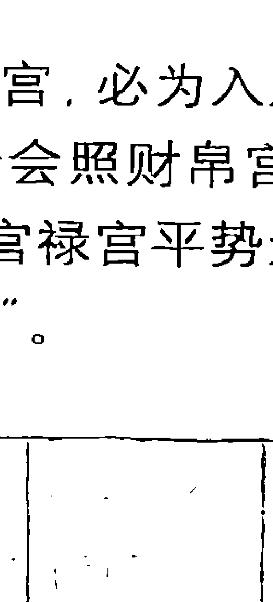

有长上贵人荫助，逢困难可化解，并因而更加进步。

庚年生人: 迁移宫太阳星化禄，财帛宫太阴星化科，官禄宫天同星化忌。奔波忙碌，喜欢远游；艺术能力表现佳，才华得以显现，赚清白之财，或因女人相助而得财；辛勤劳碌，成就不易。

辛年生人: 迁移宫太阳星化权。具有权威，辛劳奔波，午宫太阳星为旺势，权威伴有实权；子宫太阳星为落陷，多虚有其表。

壬年生人: 命宫天梁星化禄。身体健康长寿，有人缘，能得长辈福荫，一生遇难成祥，意外的钱财易使自己难以消受。

癸年生人: 财帛宫太阴星化科。艺术能力表现佳，才华得以显现，有女性贵人，赚清白之财，或因女人相助而得财。

## 2 天梁星在丑、未二宫安命：气定神闲，注重休闲

天梁星在丑、未二宫安命的人，不愿自己成为工作的机器，常气定神闲地工作，在工作之外也格外的注重休闲生活。

## 星曜布局

天梁星在丑、未二宫为旺势独坐，对（迁移）宫为落陷天机星。由于天梁星必须分心去照顾落陷天机星，每次遇到困难，天梁星得发挥力量去化解，因而力量减弱，尤其是落陷天机星又逢六煞星、化忌星同宫或相会，天梁星更是欲振乏力，平添许多波折。

## 基本命运

如能从事公、教、文职，最能趋吉避凶。个性好动，坐不住，喜欢外出旅游，宜赴外地发展，常为了顺应外地生活习俗而受苦劳，宜防驾车分神而出车祸。

天梁星在丑、未宫坐命，财帛宫必有太阴星（卯宫为落陷、酉宫为旺势），官禄宫必有太阳星（亥宫为落陷、巳宫为旺势）三合会照。收入稳定，喜欢置产；常处于高度竞争的工作环境中，喜居领导地位，宁为鸡头也不愿为牛后。

羊、陀罗、化忌星会照，多会与双亲缘分薄。

## 不同生年的命运

- 甲年生人：官禄宫太阳星化忌。事业波折不顺，与父母无缘，对眼睛也有害。
- 甲、戊、庚年生人，天魁、天钺双贵星分别在命宫、迁移宫相朝照，为“坐贵向贵格”，文章盖世，贵人多助。
- 乙年生人：迁移宫天机星化禄，命宫天梁星化权，财帛宫太阴星化忌，财来财去，多属过路财神，为人作嫁，常会入不敷出；不太合群，常独来独往，好管闲事，爱打抱不平，对事物多有独特的见解，颇令人折服，遇难多能化解，命居丑宫者，事业上多能掌权；财务上有波折（命居丑宫）或透支（命居未宫），感情上也不太顺利，对女性近亲不利。
- 丙年生人：迁移宫天机星化权。有远行，出外发达，主动积极，机变能力强，辛勤劳碌。
- 丁年生人：财帛宫太阴星化禄，迁移宫天机星化科，若无煞星冲破，为“科名会禄格”，才华卓著，远近驰名，财名双美；若有煞星冲破，为“科星逢破格”，书虽读得不错，却常名落孙山，虽有贵人却不卖力，越帮越忙。钱财来自远方，有异性缘，可从异性帮助得财，命坐丑宫，财帛宫太阴星为旺势，财运旺盛；动脑之事皆很顺利，环境多变迁。

命坐未宫，丁、己年生人；或命坐丑宫，癸年生人，入庙擎羊星同坐命，为“擎羊入庙格”，具威强与冲劲，权威出众，富贵声扬，加遇火星则权威更卓著。

戊年生人：财帛宫太阴星化权，迁移宫天机星化忌。事业有表现，善于运用金钱，男命可创业，女命可掌权，尤以命坐丑宫，财帛宫太阴星为旺势，更为吉利；出外辛劳，变动性大，事业难以开展，感情也颇多困扰，宜防交通事故。

己年生人：命宫天梁星化科。心地善良，具有才华，对各类研究常有突破性的创见，有贵人提携，利于升迁和考试，人缘佳，名声好，有长上缘，常得到照顾。

庚年生人：官禄宫太阳星化禄，财帛宫太阴星化科。奔波劳碌，事业有成，命坐丑宫，巳宫太阳星为旺势，男命可创业或成为主管，风光一时，女命则先生能干可为老板或主管；多赚清白之财，有女人缘，可由女性贵人相助而得财，命坐丑宫，财帛宫太阴星为旺势，一生富足。

辛年生人：官禄宫太阳星化权。具领导能力，凡事都喜欢自己参与，命坐丑宫，官禄宫的太阳星为旺势，具有实权，可成为老板、主管、政治家、外交家等。

壬年生人：命宫天梁星化禄。为人聪明祥和，身体健康长寿，有人缘，能得长上的福荫，一生遇难皆能顺利化解，意外得到的钱财，易使自己平添许多烦恼。

癸年生人：财帛宫太阴星化科。多赚清白之财，有女人缘，可由女性贵人相助而得财，命坐丑宫，财帛宫太阴星为旺势，一生富足。

## 不同生时的命运

命坐丑宫，九、十、十一月生人；或命坐未宫，二、四、五月生人，左辅、右弼双吉星同坐或同夹命宫，为“左右同宫格”，富企划能力，人际关系佳，凡事可逢凶化吉。若逢煞星，先成后败，先荣后衰。

命坐丑宫，丑、卯、巳、申、酉、戌时生人；或命坐未宫，寅、卯、辰、未、酉、亥时生人，文昌、文曲双吉星同坐或同夹命宫，或在命宫的三方四正拱照，为“文桂文华格”，或“昌曲夹命格”，或“文星暗拱格”，在学术文艺界可显荣耀，男命不贵则富。女命有姿色和才智，多情。

## 天梁星坐命丑、未宫

天梁星在丑、未二宫为旺势独坐，对（迁移）宫为落陷天机星。财帛宫必有太阴星（卯宫为落陷、酉宫为旺势），官禄宫必有太阳星（亥宫为落陷、巳宫为旺势）三合会照。

### 坐命丑宫

| 宫位 | 星名与状态 |
|------|------------|
| 巳   | 太阳 +3    |
| 午   |            |
| 未   | 天机 -2    |
| 申   |            |
| 酉   | 太阴 +3    |
| 戌   |            |
| 亥   |            |
| 子   |            |
| 丑   | 命宫 天梁 +3 |
| 寅   |            |
| 卯   |            |
| 辰   |            |

### 坐命未宫

| 宫位 | 星名与状态 |
|------|------------|
| 巳   |            |
| 午   |            |
| 未   | 命宫 天梁 +3 |
| 申   |            |
| 酉   |            |
| 戌   |            |
| 亥   | 太阳 -2    |
| 子   |            |
| 丑   | 天机 -2    |
| 寅   |            |
| 卯   | 太阴 -2    |
| 辰   |            |

## 3 天梁星在寅、申二宫安命：福荫相聚，处世随和

天梁星在寅、申二宫，必有天同星同坐命，请参看天同星。

## 天梁星在卯、酉二宫安命：勤勉努力，蒸蒸日上

天梁星在卯、酉二宫，必有太阳星同坐命，请参看太阳星。

## 天梁星在辰、戌二宫安命：聪明机智，福寿双全

天梁星在辰、戌二宫，必有天机星同坐命，请参看天机星。

## 天梁星在巳、亥二宫安命：热忱有余，定性不足

天梁星在巳、亥二宫落陷守命，受对宫入庙天同星的影响很大，也有好享受、喜悠闲的现象。热忱有余，定性不足，人缘好，感情不稳，出外移动有贵人相助，适应能力强。

## 星曜布局

天梁星在巳、亥二宫为落陷独坐，对（迁移）宫有人庙天同星。由于天梁星落陷无力，在遭遇困难时，化解能力薄弱，应尽量避免经商，以减少辛劳和波折。

## 基本命运

男命多漂泊，常居无定所，或环境多变迁，或为海员，以四海为家，或须赴海外工作，很少回家，宜多注重维系婚姻的和谐；女命易受外界引诱，宜洁身自爱。

天梁星在巳、亥二宫守命的人，常把工作当做生活的一部分，有新的机会来临，常会毅然的更换工作，并常随工作的变化而变化，让人误以为没有工作目标，但这也印证了天梁星坐巳、亥二宫安命的人，有极强的应变能力。

天梁星在巳、亥二宫守命，财帛宫必有太阴星（丑宫为入庙、未宫为不得地）和太阳星（丑宫为不得地、未宫为地势）三合会照。财运佳，善于理财，钱财和精神上皆感富足，先少后多，早年或较困苦，中、晚年后财运稳定而富足。

## 不同生年的命运

- 甲年生人：财帛宫太阳星化忌。对男性不利，得财辛苦，必须经由竞争而得来，不利创业，与父母缘薄。
- 乙年生人：命宫天梁星化权，财帛宫太阴星化忌。性喜独来独往，不太合群，好管闲事，爱打抱不平，对事务多有独特的见解，颇能令人折服，遇问题多可化解，事业上可有表现；不利于女性，有损财的现象，财务上易有透支情形，与父母缘薄，丑宫太阴星为入庙，情况稍好一些。
- 丙年生人：迁移宫天同星化禄。出外有福气，能享受，为人乐观，喜爱悠闲自在的生活。
- 丁年生人：财帛宫太阴星化禄，迁移宫天同星化权。钱财多来自远方，可得异性帮助而得财，丑宫太阴星为入庙，财运亨通；出外有福可享，事业上有表现，一生多变迁，易有是非。
- 戊年生人：财帛宫太阴星化权。善于运用金钱，女命可掌权，丑宫太阴星为入庙，可因不动产而致富。
- 己年生人：命宫天梁星化科。具有才华，对各类研究常有突破性的创见，心地善良，名声佳，人缘好，有长上缘，能得贵人相助，利于考试、研习新知，遇困难往往在化解后，更入佳境。
- 庚年生人：财帛宫太阳星化禄、太阴星化科，迁移宫天同星化忌。善于理财，可在奔波忙碌中得财，可掌权；多赚清白之财，或因女人帮助而得财，才华稍有虚而不实的现象，丑宫太阴星为入庙，中年后可享富足的生活；好逸恶劳，出外常有协调不良的情事。

**辛年生人：** 财帛宫太阳星化权。具有自信，可掌权，但多虚有其表。

**壬年生人：** 命宫天梁星化禄。身体健康长寿，为人聪明温和，能得长上荫助，遇难多能化解，意外之财易造成困扰。

**癸年生人：** 财帛宫太阴星化科。多赚清白之财，或钱财得自女人相助，才华稍有虚而不实的现象，丑宫太阴星为入庙，中年后可享富足的生活。

命坐巳宫，亥、卯、未年生人；或命坐亥宫，巳、酉、丑年生人，天马星同坐命宫，为“梁马飘荡格”，为人飘荡风流，男命浪漫，不思安居，女命多情。多为人忙碌，但劳多少获。

## 不同生时的命运

命坐巳宫，二、六月生人；或命生亥宫，八、十二月生人，左辅、右弼双吉星分别在命宫、官禄宫三合会照，多辅佐力量，行事顺利。

命坐巳宫，丑、巳、酉时生人；或命坐亥宫，卯、未、亥时生人，文昌、文曲双吉星分别在命宫、财帛或官禄宫三合会照，为“文星拱命格”，在学术、文艺界可显荣耀。此格女命逢之，多情。

命坐巳宫，巳、午、未时生人；或命坐亥宫，子、丑、亥时生人，地空、地劫双煞星同坐或同夹命宫，为“命里逢空格”，或“空劫夹忌格”，一生行运有如“浪里行船”般波折不断，并常会遭受“半天折翅”般的打击。若空、劫夹命宫，再逢化忌星坐命，为“空劫夹忌格”，更是不吉利。

## 七杀星坐命身宫

七杀星阴阳五行属阴金、阴火，为南斗第六星，化气为将星，主肃杀、孤克，为成败的主宰，遇紫微帝星则化为权。

### 容貌与性格

七杀星坐命身宫的人，眼大貌威，眼神锐利，身材稍显厚圆，动作敏捷，嗓门大；女性眉骨稍显隆起，轮廓分明，五官端正，容颜可爱。性急暴躁，喜怒无常，做事疑恐不定，喜、怒、哀、乐都表现在外，发脾气时，狂风暴雨后瞬间就雨过天晴。独立冒险，富斗志，有英雄气概，喜欢竞争，不爱受人拘束、干涉，毅力坚强，智勇果断，有抱负，有远见，有顾全大局之心和做大事的气派，不拘小节。喜发号施令，情绪不稳定，言语易起冲突，喜欢做大事，常专断独行，率性而为，不计后果，时而标新立异。

七杀星坐命身宫的女性，个性外向，行事大方，独立有个性，婚后宜外出工作，否则在家常不容丈夫有置喙的余地，让丈夫招架不住，婚姻和谐难免受影响。七杀星庙旺，遇化权、化禄（或禄存）星，财权压众，志过丈夫，旺夫益子。七杀星落陷，或有四煞星冲破，多孤克。

### 命理参断

七杀星与破军星均为紫微帝星座下的大将，但破军星属北斗星系，是帝座勇猛无比的殿前大将，必须听命于紫微星；七杀星属南斗星系，为运筹帷幄的边疆主帅，有“将在外，君命有所不从”独断专行的特性。

七杀星有运筹帷幄能力和独断专行的特性，最喜欢独坐以发挥其理智和独立的力量，任何吉星对它没有什么帮助，只能增些气势，任何煞星也胁迫不了它，只会增添些辛劳。因而使它在人际关系及感情上，不易与人接近，常有知音难觅的落寞感怀，在情感上也很难与他人共鸣，易被人误以为自命清高。所以，七杀星坐身命的人，虽有谋略，能独当一面，在事业上能有成，在公、武职发展可位居高位，却不宜创业经商，在感情上也常不免于孤芳自赏而孤独无依。故宜晚婚，以免为对方付出太多。

七杀星主孤独，人身、命、六亲宫，均主六亲缘薄，少年坎坷奔波，但可凭其独立、智勇、果断的特性，白手起家。

女命，七杀星独守身宫，主夭折。七杀星单居福德宫，多情。

### 破军与七杀二将星的区别

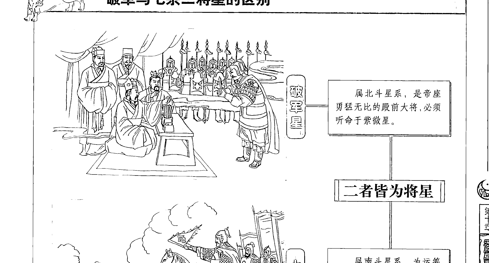

### 二者皆为将星

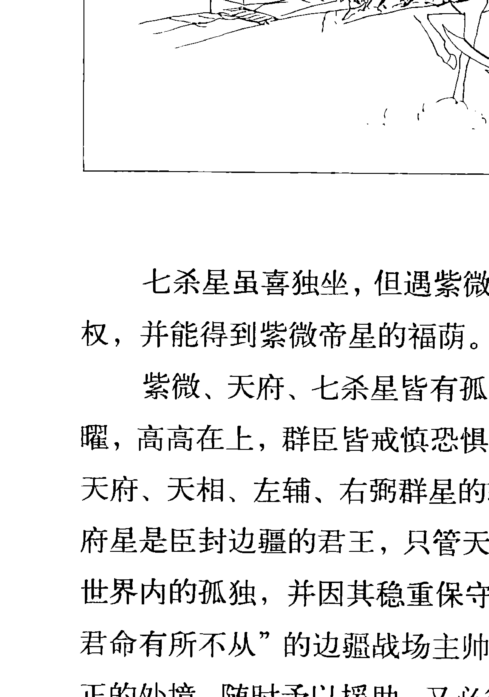

七杀星虽喜独坐，但遇紫微帝星则化杀为权，可降低其肃杀之气，而得以掌主帅之权，并能得到紫微帝星的福荫。

紫微、天府、七杀星皆有孤独的特性。且紫微星是万王之王的皇帝，统领所有的星曜，高高在上，群臣皆戒慎恐惧，小心应对，难免会有高处不胜寒的孤独，但若能得到天府、天相、左辅、右弼群星的辅佐，只需发号施令即可，也还能够避免孤君之虑；天府星是臣封边疆的君王，只管天府星系的七颗主星，也有其一人之下、万人之上，固定世界内的孤独，并因其稳重保守的性格，只能得到天相星的援助；七杀星是“将在外，君命有所不从”的边疆战场主帅，凡事须一马当先，智勇兼备，无法让皇帝明了自己真正的处境，随时予以援助，又必须独自肩负战争成败的责任，自己的心境也无法让士兵们体认，自然会有孤独、艰辛、落寞不足为外人道的疏离感。

七杀星的孤独常会是一人独处，内心又自觉孤独，甚至虽与众人在一起，但内心仍觉得孤独。所以，常会在经历一段时间或热闹喧哗之后，会想孤独一会儿，来调整心情，面对并认清自己，在深入孤独，存在于孤独之后，久而久之也就视孤独为一种享受了。

七杀星除了须对自己负责以外，还要对大家负责，这种独自肩负的责任感，不是旁人可以体会的，这或许是七杀星真正感到孤独的原因。

七杀、破军、贪狼三颗动态星曜：永远在命盘中的三合宫位互相会照，形成“杀、破、狼”（或称“竹箩三限”的组合）。大、小限或流年进入三星坐守的任何一宫内，命运必有变动。

“杀、破、狼”三星共同表现出变化性、创造性和竞争性。它们变化小组的首领是七杀星，七杀星是成败的主宰，必须策划和领导，并面对成败的结果，必须勇敢、冒险、不畏艰难，有时还得明知不可为而为之，因而培养出惊人的胆识和定力，以及坦然面对成败得失开阔的心胸。

杀、破、狼三星的变动各有所不同，七杀星的变动具有延伸性和发展性，其性质偏重于孤独与落寞，变动幅度居中；破军星的变动具有更张性和开创性，其性质偏重于钱财和感情，变动幅度最大；贪狼星的变动具有名利性和欲望性，其性质偏重于酒色财气，变动幅度最小。

七杀星坐命的人，多有离乡背井的机会，或从事与海外有关的工作，宜有宗教信仰，并定期运动。有六煞星之一同宫时，有容易冲动，情绪不稳的特性，较难改变，一生多有起落较大的变化，宜从事与文艺有关的工作，或培养与文艺有关的兴趣。

七杀星不喜欢与贪狼、廉贞、文曲、右弼、红鸾、天喜、天姚、咸池、沐浴等桃花星同宫，遇之易有桃花纠纷。女命七杀星入命、夫妻或福德宫，宜修身养性，改变倔强的个性，对本命及运势定有帮助。

### 七杀星在各宫的亮度

七杀星坐命，在丑、寅、辰、未、申、戌为入庙，在子、卯、午、酉为旺势，在巳、亥为平势。

| 宫位 | 星曜亮度 |
| :--- | :--- |
| 丑宫 | 七杀0, 紫微+3 |
| 寅宫 | 七杀+4 |
| 卯宫 | 七杀+3, 武曲+1 |
| 辰宫 | 七杀+4 |
| 巳宫 | 七杀0, 紫微+3 |
| 午宫 | 七杀+3 |
| 未宫 | 七杀+4, 廉贞+1 |
| 申宫 | 七杀+4 |
| 酉宫 | 七杀+3, 武曲+1 |
| 戌宫 | 七杀+4 |
| 亥宫 | 七杀0, 紫微+3 |
| 子宫 | 七杀+3 |## 1 七杀星在子、午二宫安命：面面俱到，适合公职

七杀星坐子、午宫安命的人，个性坚强，独立有主见，能面对工作上的顺、逆境，由于常有万全的准备，只问工作，不问枝节与收获，肯承担责任，能替他人着想，借以调整自己的步调或计划，若能得到掌声和肯定，则更能面面俱到，很适合公职。若能加会六吉星，文武双全，为大将之才。即使不会照吉星，只要有煞星冲照，在公职上也能有所表现。

## 星曜布局

七杀星在子、午二宫为旺势独坐，三方四正若未逢四煞及化忌星，为“七杀朝斗格”，为人有谋略，才能佳，富忍耐力，具创造、企划、分析、思考力，勇猛果敢，一生多变，奔波辛劳，易惹是非，早年多艰难，但可克服艰困，获致成功。

## 基本命运

七杀星在子、午二宫安命，若得天刑、擎羊星会照，加遇吉星，可成为名外科医师或牙医师。若对（迁移）宫武曲星适逢化禄，再与禄存星同宫，可任财经主管。

七杀星在子、午宫旺势坐命，对（迁移）宫必有天府星（子宫为入庙、午宫为旺势）和旺势武曲星，财帛宫必有平势贪狼星，官禄宫必有旺势破军星。交际广阔，出外有贵人助，移动或转业有人提携，变动大，劳心劳力，历经艰辛，百折不挠，终能成就，宜往闹区发展；赚钱欲望强，常不择手段，工作不踏实，喜投机，有偏财运，应酬多，花费大，常不知节制；可习得一技之长，事业多变化，精明干练，常从事开创性、危险性的工作，可凭着毅力，突破层层限制，获致成功，男性适宜变动频繁的军警职或交通运输业，女性常成为女权工作者，或于男性职业范围内工作。

## 不同生年的命运

- **甲年生人**：官禄宫破军星化权，迁移宫武曲星化科。环境多变动，可增加天罗地网中破军星的开创力量，能主动往好的方面求发展，突破种种困难，在辛劳后有所表现；具有声望，出外得贵人相助，办事效率佳，有升迁机会，可赚平稳之财，心情较开朗。
- **命坐午宫，甲申、甲子、甲辰年生人；或命坐子宫，庚寅、庚午、庚戌年生人**，禄存、天马星同坐财帛宫，若无火、铃星冲破，为“禄马交驰格”，愈动愈生财，一生多旅游机会。
- **命坐子宫，乙、己年生人；或命坐午宫，辛年生人**，天魁、天钺双贵星分别在命宫、财帛宫三合会照，为“天乙拱命格”，文章盖世，贵人多助。
- **命坐午宫，丙、戊年生人**，擎羊星落陷坐命宫，为“马头带箭格”，非夭折则主刑伤，离乡背井，漂泊不定，危困重重。大、小限、流年逢之，易惹是非，若中年残病逢之，要特别留意身体健康。

## 七杀星坐命子、午宫

七杀星坐命子、午二宫，为旺势独坐，对（迁移）宫必有天府星（子宫为入庙、午宫为旺势）和旺势武曲星，财帛宫必有平势贪狼星，官禄宫必有旺势破军星。

## 坐命子宫

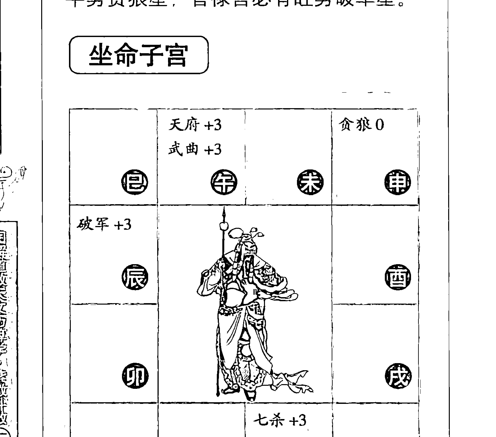

## 坐命午宫

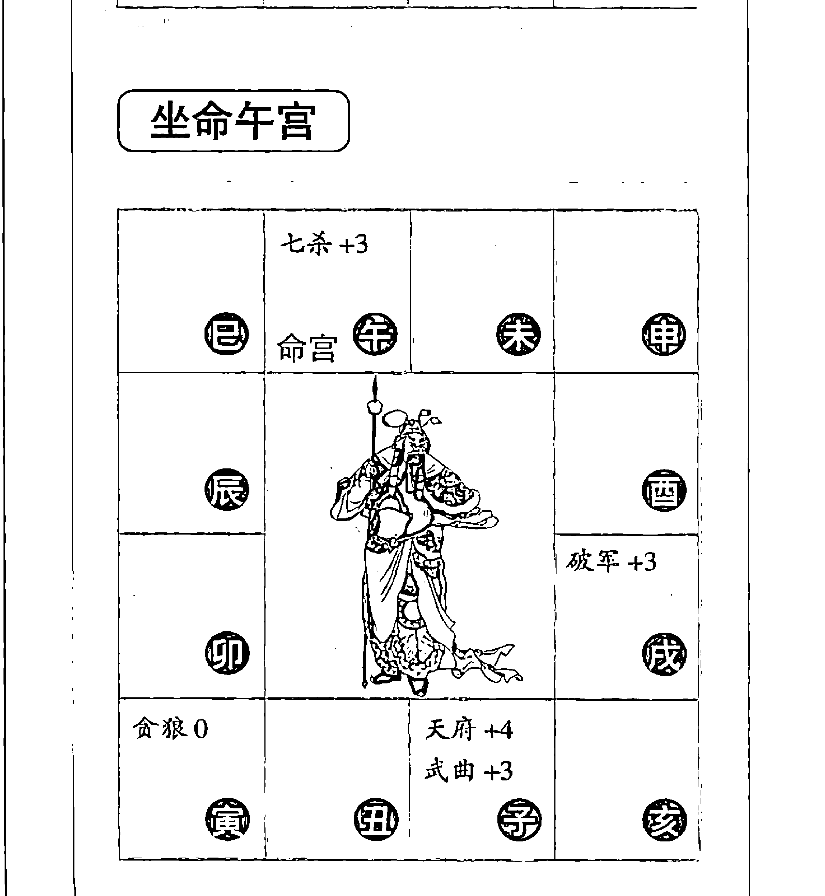

### 戊年生人：

财帛宫贪狼星化禄。有助于经商，有食禄之福，得享高寿，人缘佳，赚钱如意，有偏财运，赚钱多带有投机性，常请客应酬，或与朋友互送礼物，并带有桃花性质。遇火、铃星，有横发之财。

### 己年生人：

迁移宫武曲星化禄，财帛宫贪狼星化权。出外得财禄，多与钱财接触；能掌握钱财，肯冲刺，常在竞争中，凭着个人的努力脱颖而出，能创业，好客，有横发旺得的机会，若逢化忌星冲破，易近女色而耗财。

命坐子宫，己年生人，迁移宫武曲星化禄，又逢禄存星同坐，为“双禄朝垣格”，具才华，有福气，受人敬重，财官双美，可任财经主管。

### 庚年生人：

迁移宫武曲星化权。进财顺利，创业奔波劳碌，能掌权，在财经、军警界可担任主管。

### 壬年生人：

迁移宫武曲星化忌。个性孤僻，多以专门技术谋生，出外耗财，常因财起争执，守财不易，钱财常有中断的现象，常须自立自助，情绪和感情上常困扰不宁。

### 癸年生人：

官禄宫破军星化禄，财帛宫贪狼星化忌。破军星司夫妻、子女、奴仆，破军星化禄入官禄宫照夫妻宫，夫妻感情良好，能得配偶之助，自己又积极开创事业，使工作、事业顺遂，但破军星主波动，故仍应避免大规模的投资经营，宜往财经单位发展；多才多艺，钱财守不住，易因桃花纠纷而破财。

## 2 七杀星在丑、未二宫安命：早年艰辛，坚韧不拔

七杀星在丑、未二宫安命，必有廉贞星同宫，请参看廉贞星。

## 3 七杀星在寅、申二宫安命：克服万难，获致成功

七杀星在寅、申宫安命的人，虽仍有“将在外，君命有所不从”的基本性格，在工作中，却希望得到关心、指导或建议。所以，寅、申二宫的七杀星，有如太平盛世的主帅，或有更高阶层的长官可为依靠，虽有稳定、保守的工作心境，却还有那么一丝难以察觉到的、无法完全开展自我的遗憾。

## 星曜布局

七杀星在寅、申二宫，为入庙独坐，对(迁移)宫为紫微和天府双帝星。

## 基本命运

七杀星在子、午、寅、申四宫庙旺守命，若三方四正无四煞星及化忌星，为“七杀朝斗格”。“斗”，所指的是紫微、天府星，七杀星在子、午二宫坐命也属“七杀朝斗格”，但子、午二宫的七杀星为旺势，又仅能朝照到天府星；七杀星在寅、申二宫为入庙，且能同时朝照到紫微和天府双帝星，故更为吉美。具谋略，才能佳，富忍耐力，有主张，肯上进，勇猛果敢，具有创造、企划、分析、思考能力，一生多变化，可克服万难，事业多有所表现，能担任主管要职，获致成功，生活不虞匮乏。唯七杀星力量太强，对宫又有南、北斗双帝星，虽然气势万千，但难免会感到孤寂；女命，除了事业上能有表现外，应兼顾到家庭，才能趋吉避凶，增添福泽。

## 七杀星坐命寅宫

七杀星在寅宫坐命，为入庙独坐，对(迁移)宫必有旺势紫微星和地势天府星，财帛宫必有入庙贪狼星，官禄宫必有入庙破军星。

| 破军+4 | 天府+2 紫微+3 |
| :---: | :---: |
| 巳 | 午 | 未 | 申 |
| 辰 | 酉 |
| 卯 | 贪狼+4 | 戌 |
| 七杀+4 | 寅 | 丑 | 子 | 亥 |

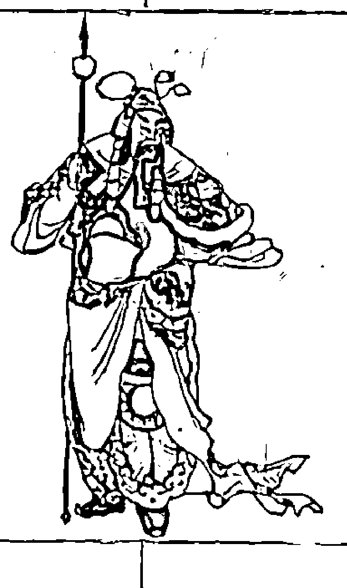

## 七杀星坐命申宫

七杀星在申宫坐命，为入庙独坐，对（迁移）宫必有旺势紫微星和入庙天府星，财帛宫必有入庙贪狼星，官禄宫必有入庙破军星。

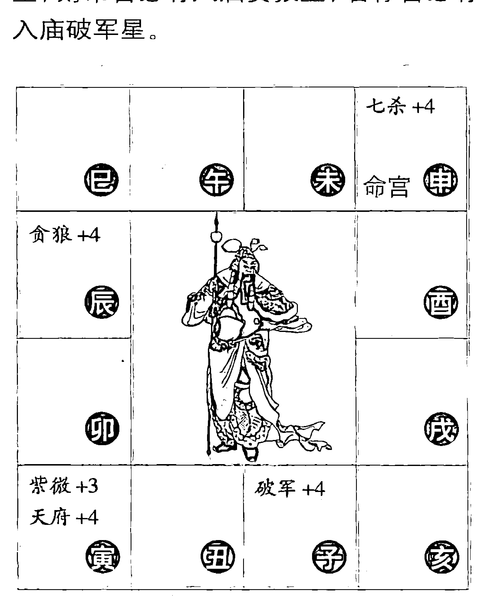

七杀星在寅、申二宫入庙坐命，迁移宫必有旺势紫微星和天府星（申宫为地势、寅宫为入庙），财帛宫必有入庙贪狼星，官禄宫必有入庙破军星。活动力旺盛，具交际手腕，出外、移动、转业福运很强，对外关系良好，有人缘，常得贵人照顾或暗助，凡事可逢凶化吉，喜出外旅游，甚至到国外移民定居，宜赴外地发展，生活优裕；工作欲很强，赚钱具竞争性、变化性；常不择手段，有偏财运，喜欢投机，生性挥霍，交际应酬多，用钱十分广泛，花钱常不知节制，支出大，常赚异性或娱乐之财；具有领导才能，求学过程较不顺遂，可习得一技之长，工作常具有开创性、动作性、表演性、危险性，事业富变化，宜从事于军警、娱乐、职业运动选手、外勤业务等，富挑战性和突破性的工作。

七杀星在寅、申二宫入庙坐命，若有禄存、化禄星同宫或会照，主富足；若有煞星来会，则会非常辛劳。

## 不同生年的命运

- **甲年生人：** 官禄宫破军星化权。环境、事业多变迁，多属主动往好的方面去发展，工作辛劳，对属下宜注重充分授权，再予以教导和辅助，才能掌控全局，有所表现。
- 甲申、甲子、甲辰、庚寅、庚午、庚戌年生人，禄存、天马星同坐命宫或迁移宫，若无火、铃星冲破，为“禄马交驰格”，愈动愈生财，常在环境变化发展中得财，转职、转业可获良机，一生多旅游机会。
- **乙年生人：** 迁移宫紫微星化科。出外有贵人相助，事情进展的很顺利，工作上多能有表现。
- 命坐申宫，乙、己年生人；或命坐寅宫，辛年生人，天钺、天魁双贵星分别在命宫、官禄宫三合会照，为“天乙拱命格”，文章盖世，贵人多助。
- **戊年生人：** 财帛宫贪狼星化禄。能如愿赚钱，有偏财运，赚钱多带有投机性。
- **己年生人：** 财帛宫贪狼星化权。具竞争力，独立性强，能冲刺，可掌握钱财，横发旺得，好客；若有煞、忌星冲，易防因女色而耗财。
- **壬年生人：** 迁移宫紫微星化权。具权威性，领袖欲强烈，出外得贵人相助，能掌权势，事业上能有一番作为。
- **癸年生人：** 官禄宫破军星化禄，财帛宫贪狼星化忌。夫妻相处融洽，能得配偶的帮助，开创积极，事业进展顺利，但破军星波动性大，宜避免大规模的投资经营；贪狼财星化忌，主破财，钱财不顺，守不住，易因桃花纠纷而损财，有专业技能。

## 4 七杀星在卯、酉二宫安命：具开创性，成败一线

七杀星在卯、酉二宫安命，必有武曲星同宫，请参看武曲星。

## 5 七杀星在辰、戌二宫安命：遭受波折，脱颖而出

七杀星入庙独坐辰、戌宫的人，多具有专门技能，或文艺修养。尤其在辰宫更有独立个性和独特见解。若有左辅、右弼、文昌、文曲、化禄、化权、化科等吉星相助，再逢煞星，多为文艺工作者，虽历经千辛万苦，遭受各种波折，仍然能够脱颖而出，有所表现。

## 星曜布局

七杀星在辰、戌二宫为入庙独坐。辰、戌二宫为天罗地网宫，天罗地网虽然有束缚力，但遇到坚强、独断、理智、有主见的七杀主帅星，却难以限制拘束他，七杀星必定奋力挣脱，以力求表现，虽然历经艰苦，惊险百出，但终能冲出重围，有所成就。

## 基本命运

七杀星在辰、戌二宫，为七杀星最辛劳、最易有惊险的宫位，但只要会照吉星，也多能有表现，其成就往往与七杀星在寅、申二宫不相上下，只是更为艰辛惊险。由七杀星来看人生，更可印证：努力才是创造命运的最佳保证。

由于辰、戌天罗地网宫的夹制，易使原本独断坚强的七杀星感到压迫和不安，因而逐渐失去自信心。故七杀星入庙独坐辰、戌宫安命的人，易对自己有较高的期许，时刻要求自己与众不同，在工作中力求完美与尊重，以建立自信心。并在尊重中得到肯定，使自己有更高的期许，并产生更坚强的自信心。

七杀星入庙独坐辰、戌宫，迁移宫必有入庙天府星和利势廉贞星，财帛宫必有旺势贪狼星，官禄宫必有地势破军星。劳碌好动，不宜久居在家，宜出外发展，时常搬家或转业，出外关系良好，能得贵人相助，常在移动中得福，宜迁往闹区发展，经商可致富；赚钱常不择手段，有偏财运，会投机，生性挥霍，运用钱财十分广泛，经常交际应酬，支出多，常赚异性、娱乐之财，赚钱常须竞争，并多带变化性；求学较不顺遂，可习得一技之长，开创积极，有冲劲，应变能力强，可见机行事，常从事具有开创性、危险性、动作性、表演性的工作。

七杀星虽不畏惧煞星和化忌星，但不喜欢对宫的廉贞星化忌，若再逢六煞星，则危困重重。若流年、大小限，夫妻宫不吉，多有感情困扰；若流年、大小限，财帛宫不吉，多有财务波折；若流年、大小限，疾厄宫不吉，则宜注意身体健康。

## 七杀星坐命辰、戌宫

七杀星在辰、戌二宫为入庙独坐，迁移宫必有入庙天府星和利势廉贞星。财帛宫必有旺势贪狼星，官禄宫必有地势破军星。

## 坐命辰宫

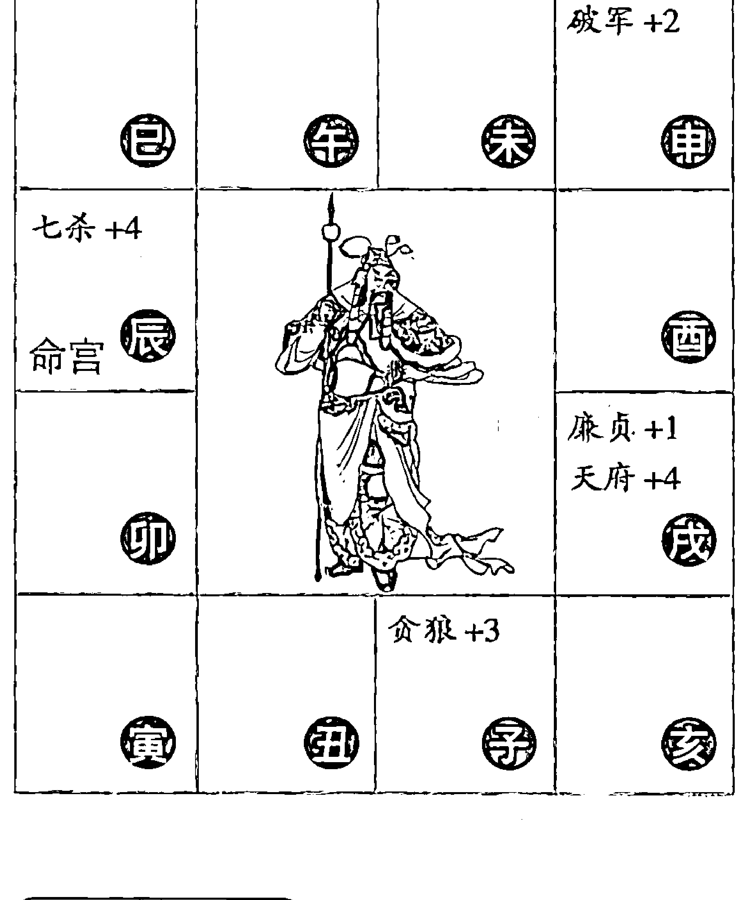

## 坐命戌宫

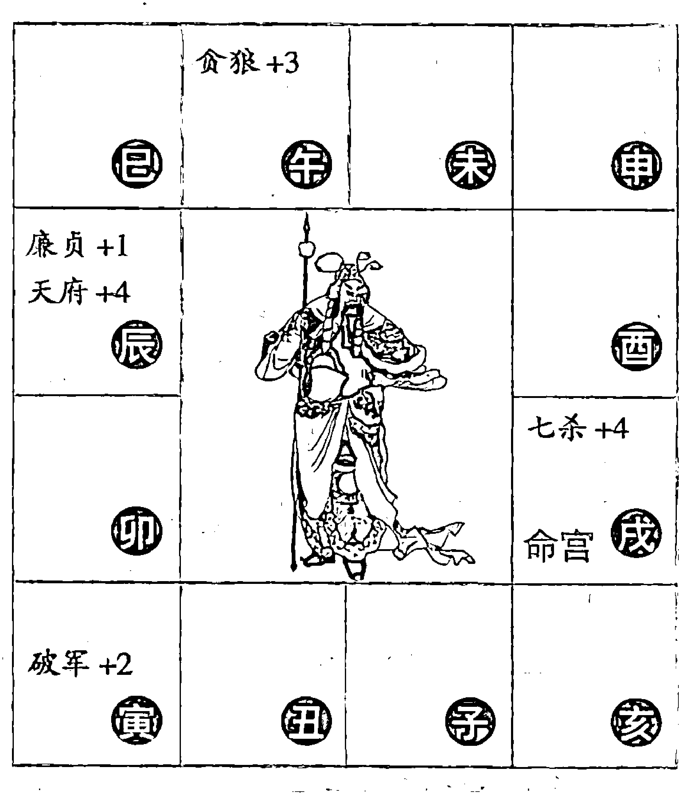

## 不同生年的命运

- **甲年生人：** 迁移宫廉贞星化禄，官禄宫破军星化权。有异性缘，出外得异性帮助，做事顺利，少年难以发挥才能，中晚年才逐渐安稳。具有领导开创能力，事业多变动，辛劳后会有表现，宜于军警职。
- 命坐辰宫，乙年生人；或命坐戌宫，辛年生人，入庙擎羊星同坐命宫，为“擎羊入庙格”，具有威强和冲劲，权威出众，富贵声扬，但刑伤难免。加遇火星则权威更卓著。
- 命坐辰宫，乙、己年生人；或命坐戌宫，辛年生人，天魁、天钺双贵星分别在财帛、官禄宫，三合会照命宫，为“天乙拱命格”，文章盖世，贵人多助。
- **丙年生人：** 迁移宫廉贞星化忌。工作及感情多波折不顺，易发生车祸、跌伤、交通罚款等意外灾祸，出外易有外遇，会惹桃色纠纷。若再逢六煞星，则危困重重。
- **戊年生人：** 财帛宫贪狼星化禄。能如愿赚钱，有偏财运，赚钱多带有投机性，常有吃花酒等带桃花性质的应酬。遇火、铃星，可有横发之财。
- **己年生人：** 财帛宫贪狼星化权。能冲刺，横发旺得，好客，可掌握钱财，常因赚钱而应酬。逢煞、忌星冲，常会因近女色而耗财。
- **癸年生人：** 官禄宫破军星化禄，财帛宫贪狼星化忌。夫妻关系融洽，能得配偶相助，开创积极，能在困难中建立事业，但仍应避免大规模的投资经营；钱财守不住，易因桃色纠纷而破财。

## 不同生时的命运

- 一、七月生人，左辅、右弼双吉星，分别在命宫、迁移宫相对照，为“左右守垣格”，富企划能力，人际关系佳，凡事易逢凶化吉。逢凶、煞星，先成后败，先荣后衰。
- 子、午时生人，文昌、文曲双吉星，分别在命宫、迁移宫相对照，为“文星拱命格”，富知性，勤学好读，在学术、文艺界可显荣耀。此格女命逢之多情。

## 七杀星在巳、亥二宫安命：运筹帷幄，独断专行

七杀星在巳、亥二宫，必有紫微星同宫，请参看紫微星。

## 破军星坐命身宫

破军星阴阳五行属阴水，为北斗第七星，化气为耗，主祸福、孤，司夫妻、子女、仆役，不利于六亲，遇紫微帝星则主有威权。

## 容貌与性格

破军星坐命身宫的人，身材五短，背厚，眉宽，行坐腰斜。性刚不仁，凶暴而易冲动，任性狂傲，寡合争强，不信邪，好勇斗狠，敢言善辩，狡诈奸猾，报复心强，恩怨分明，好行惊险，动辄损人，喜捕擒捕猎，助人恶不助人善。感情丰富，心思独特，常标新立异，不满现状，不拘小节，我行我素，行事往往在一念之间取决，容易得罪人，与宗教、哲学有缘。疏骨肉，仇六亲，但弃祖发福。肯努力，劳碌、波动，身心总闲不下来。性急果断，具开创精神，勇于任事，不畏横暴，领导力强，凡事必躬亲，身体力行，豁达乐观，反应机敏，有正义感，常怀一技之长。

女命，自尊心强，独立自主，好奇心重，占有欲强，随心所欲，虚荣，神经质，敢说敢骂，常感孤独，劳苦成性。婚后宜外出工作，以保夫妻和谐。

## 命理参断

破军星是紫微帝星座下勇猛无比的殿前大将，暴躁又冲动，唯有紫微帝星才能让他俯首称臣，赋予威权，并听命行事。

破军星保卫京畿，须冲锋陷阵，具有突破性、变化性及危险性，为“杀、破、狼”竹箩三限的主角之一，为人生变化的枢纽，大、小限或流年遇到，在生活或工作方面，往往会有大幅度的波动。

“杀、破、狼”各星的波动有所不同，七杀星具有延伸性、发展性的变动；破军星多为更张性、开创性的变动；贪狼星则为名利性、欲望性的变动。由于破军星具有冒险性与开创性，每当旧有的环境无法突破时，就想改弦更张，寻找新的机会，以另起炉灶，创造出新的环境。至于破军星变动的结果，不论成败吉凶，都得历经磨炼与挫折，辛苦去耕耘。

破军星化气为“耗”，有耗损之意，凡事常先破而后成，在十二宫中均主损失，入命宫，做事先难后易，有暴起暴落的现象。

破军星的“耗”，是一鼓作气全力出击之后所产生的，它是紧张之后的松懈，忙碌之后的悠闲，是一种暂时的停顿。若停顿之后，只有疲惫与沮丧，后继无力，则是一种耗损；但若停顿只是养精蓄锐的全力准备，以作为培养下次一鼓作气全力出击的精力，则其所凝聚的力量，正是下次成功的保证。这种凝聚与出击之间的循环，才是破军星的真正潜能。

破军星果敢、正直、坚毅、具领导力，有开创性，在动乱的时代中，最能发挥其特长，让人刮目相看，不能等闲视之。

破军星属阴水，代表飘荡无根性，在职业上多属无固定的工作，如旅游、摊贩等行业。

破军星属阴水，其水性也带有桃花性质。所以，如破军星落在子、午、卯、酉四桃花地，则其桃花性质更强烈，虽然人缘佳，但风花雪月的应酬也多，再加上其波动的幅度很大，对女命的感情有影响，也不利于钱财。尤其是破军星又遇煞、劫星相侵，对女命的行运与婚姻不吉，宜注意自身的言行与交友的态度，否则有沦落风尘之虞。

杀、破、狼三星对人生常产生难以想象的变化，其中又以破军星的变化性最大。破军星的变化可分为人生际遇变动、环境变动（如教育、工作、婚姻、财富）等外在因素的变化，以及个人的性情、思想观念、对事务价值观与处理方式、感情世界等内在因素的变化。

破军星的变化性显示其非常的不稳定，令人有生活在两个极端，具有戏剧性，和极端不协调性的感觉。如，幼年因故失学，到了晚年却是学富五车的饱学之士；曾经是海誓山盟的热恋情人，又轰轰烈烈地结了婚，却突然离婚，彼此冷若冰霜而形同陌路；今天是奔波劳碌的业务员，明日却成又为坐镇一方的公司高级主管；昨日依旧是事业兴旺，财源滚滚而来，今日却突然一文不名，穷途末路；外表装得很坚强，内心往往很脆弱；表面看起来像一个冰山，内心却是一座活火山，随时都有爆发的可能；平日表现的与常人无异，一旦感情冲动时，其言行又让人认为他发疯了，不禁为他捏一把冷汗。

破军星坐命的人，一生都在外在与内在因素的各种变化中打滚翻腾，很难稳定下来。但只要能够了解自己本身的命运走向，善加利用其特性，勇敢地面对现实，则在遭遇到大横逆时，所有的人及自己都觉得即将快要崩溃时，却往往能跌破众人的眼镜，转危为安，趋吉避凶。尤其是得到禄存、化禄、化权、天魁、天钺、左辅、右弼等吉星同宫或会照时，更会有“置之死地而后生”的现象，这颇符合破军星所独有的具戏剧变化的特性。

破军星不停地在创造与变化，不断地汰旧换新，因而常保有赤子之心，也累积了许多的人生体验。对于破军星的变化性，因以一体的两面去看待，因其行运中会不停地变化，所以也就必须不断地去创造。

破军星个性直爽，具有侠义精神，好打抱不平，爱管闲事。破军星的爱管闲事，是主动的管闲事，并且视之为理所当然；天相星也爱管闲事，但他多是受人之托才管闲事，并且多不愿自我表现。

破军星凡事喜欢一马当先，不愿落于人后，因而常常沉不住气，而有暴躁的脾气，平日只顾勇往直前，有时不免于瞻前而不顾后，会有迷失的落寞感。

破军星个性急躁，常“曲高和寡”，使人敬而远之，在人群中往往显得孤独，多属于“亲缘薄”型，宜修身养性，积极改善人际关系，并善于运用其富有开创性的特点，一定可以百尺竿头，更进一步。

破军星常必须不断地迎接各种挑战，最具有冲锋陷阵的勇气和能力，一生中的波动又特别多，故常在破坏与建设中互相转换，在矛盾中求发展，其开创、变动后的稳定，使人有历经一番寒彻骨后，享受梅花扑鼻香。

破军星坐命的人，适合独立作业、独树一帜、具有开创性、须向外地拓展性的工作。若能定下一个与文学、艺术、创造有关的目标，一生努力，且将生活起居作息安定下来，并定期运动，必能趋吉避凶获得成功。

破军星遇紫微星，主有威权；遇禄存或化禄星，能消除其不良的破坏习性，增加后援力，而使事业的开创顺利成功。

破军星喜与魁、钺、辅、弼、禄、权等吉星同宫或会照，能增加气势及成就。破军星不喜遇六煞星及天哭、天虚星，会使其在开创的过程中增加阻碍，并有不利的变动，更应注意官非与健康。

破军星为武将，不喜与文昌、文曲双文星同宫，此文、武之间观念之上颇有距离，彼此不易沟通，极易互相冲击克制，使人辛劳而又缺乏安全感，在精神上难免会造成孤寂，对文艺特别有兴趣，遇吉星也能有所表现。

## 破军星在各宫的亮度

破军星坐命，变化难免，而变化的大小又与其所处的宫位及亮度紧密相关。在子、午二宫，破军星为入庙，丑、辰、未、戌诸宫，为旺势，在寅、申宫为得地，巳、亥为平势，卯、酉为落陷。

| | 破军0 武曲0 | 破军+4 | 破军+3 紫微+4 | 破军+2 |
| :--- | :---: | :---: | :---: | :---: |
| | 丑 | 子 | 亥 | 戌 |
| | 破军+3 | | 廉贞0 破军-2 |
| | 辰 | | 酉 |
| | 廉贞0 破军-2 | | 破军+3 |
| | 卯 | | 戌 |
| | 破军+2 | 破军+3 紫微+4 | 破军+4 | 武曲0 破军0 |
| | 寅 | 丑 | 子 | 亥 |

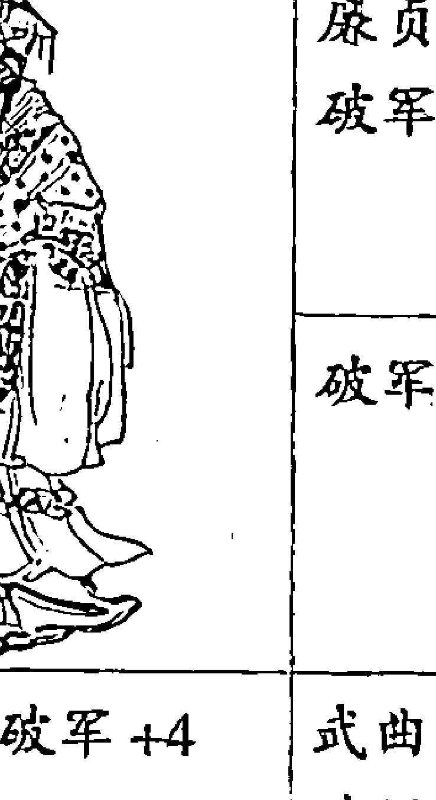

## 第十章 天府星系诸星安命要点

## 1 破军星在子、午二宫安命：工作专注，全力以赴

破军星坐子、午宫安命的人，对工作特别专注，有超人的定力，凡事皆能全力以赴，在酝酿准备之后，全力出击，赢得成功。

## 星曜布局

破军星在子、午二宫为入庙独坐，是破军星最有利的宫位，若无煞星冲破，为“贵星入庙格”，果断有主见，具开创精神，有统率能力，福气绵绵，爱投机，喜冒险，艺高人胆大；有权贵，威名远播，但少运多欠佳。

## 基本命运

破军星在子、午二宫入庙守命，迁移宫必有入庙天相星和平势廉贞星，财帛宫必有入庙七杀星，官禄宫必有入庙贪狼星。劳碌好动，喜出风头，交际广，人缘佳，宜赴外地、热闹处发展，可得贵人相助，能面对挑战。初期虽多苦劳，终可发挥才能，获得成功；善于理财，性喜冒险，不甘居人之下，从事单调固定的工作，常有意外的财运，但横发横破，钱财不易积存，中年后较能蓄财；求学过程多有波折，事业多变化，不喜单调稳定的事业，对投机性、冒险性的工作非常感兴趣，工作常需与他人配合，工作很勤奋，常自我检讨，喜欢自由、不受拘束、富变化的行业，尤喜独立创业，常须竞争、接触酒色财气（如餐厅、娱乐、风景区、电动玩具等），或与文学、艺术、设计有关的工作，可获意外成功。

破军星在子、午二宫为波动最小的宫位。若加遇辅、弼、魁、钺等吉星，男命甚宜武职；女命，贤慧而能相夫教子，家庭波折较少。若遇地空、地劫、天哭、天虚星，会增加波动。如有羊、陀、火、铃四煞星同宫或会照，创业平添困难，精神会感到痛苦。

破军星在子、午二宫较不受文昌、文曲二星的影响，只稍忌文曲星。

## 不同生年的命运

- 甲年生人：迁移宫廉贞星化禄，命宫破军星化权。有异性缘，出外得异性相助，诸事较顺利，有桃花，易有感情上的困扰，或流连于风月场所；具领导开创能力，多能独当一面，环境多变动，多属主动往好的方面发展，事业上表现良好。
- 命坐午宫，甲申、甲子、甲辰年生人；或命坐子宫，庚寅、庚午、庚戌年生人，禄存、天马星同坐财帛宫，为“禄马交驰格”，愈动愈生财，一生多旅游机会。
- 命坐子宫，乙、己年生人，或命坐午宫，辛年生人，天魁、天铖双贵星分别在命宫、财帛宫相会照，为“天乙拱命格”，文章盖世，贵人多助，事业开创多有成就。
- 丙年生人：迁移宫廉贞星化忌。出外宜防车祸、跌伤等意外灾祸，外遇多，宜防桃色纠纷。
- 命坐午宫，丙、戊年生人，擎羊星在午宫落陷守命，为“马头带箭格”，非夭折则主刑伤，离乡背井，漂泊不定，危困重重。
- 命坐午宫，丁、己年生人；或命坐子宫，癸年生人，禄存星同坐命宫，能减少破军星的破坏力，增加后援力，使事业开创顺利成功。
- 戊年生人：官禄宫贪狼星化禄。有偏财运，赚钱多带有投机性、娱乐性，工作多得异性相助。
- 己年生人：官禄宫贪狼星化权。独立性强，有冲劲，能创业，事业多变迁，有异性缘，多有意外的机遇，工作多竞争，宜娱乐业。
- 癸年生人：命宫破军星化禄，官禄宫贪狼星化忌。多才多艺，处世较积极，变迁机会多，在夫妻、子女、交友方面有所得，能担负重任，应避免大规模的投资经营；多才多艺，宜从事冷门、现金交易的生意，或娱乐界，多有专业技能。
- 癸年生人，禄存、化禄星同坐命宫，或分别在命宫、迁移宫对照，为“禄合鸳鸯格”，或“双禄朝垣格”，福气高，有才华，具名望，财官双美。
- 命坐子宫，癸年丑、巳、未、亥时生人，禄存、化禄星同坐命，遇地空或地劫星冲破，为“两重华盖格”，吉处藏凶，宜注意表面美好，背后所隐伏的危机，孤高贫困，与僧佛有缘，遁空门反主清福。

## 破军星坐命子、午宫

破军星在子、午二宫为入庙独坐，是破军星最有利的宫位，此时，迁移宫必有入庙天相星和平势廉贞星，财帛宫必有入庙七杀星，官禄宫必有入庙贪狼星。

| 地支宫位 | 星曜配置 |
|----------|----------|
| 巳 | 廉贞0 天相+4 |
| 辰 | 贪狼+4 |
| 子 | 破军+4 (命宫) |
| 其他 | 无星曜 |

| 地支宫位 | 星曜配置 |
|----------|----------|
| 巳 | 破军+4 |
| 午 | 命宫 |
| 酉 | 贪狼+4 |
| 寅 | 七杀+4 |
| 子 | 廉贞0 天相+4 |
| 其他 | 无星曜 |

## 破军星在丑、未二宫安命：仪表堂堂，我行我素

破军星在丑、未二宫安命。必有紫微星同宫，请参看紫微星。

## 破军星在寅、申二宫安命：谨言慎行，处事公正

武曲星刚毅果决，是将星，也是财星，主孤克；天相星是紫微帝星的掌印官，稳重，谨言慎行，处事公正，应对得体，有正义感，乐于助人。

## 星曜布局

破军星在寅、申二宫为地势独坐，由于破军星的力量不强，容易受到对（迁移）宫地势武曲星和入庙天相星的影响。

## 基本命运

由于武曲、天相星的影响，使破军星在寅、申二宫安命的人，为人耿直，心地善良，行侠仗义，乐于助人，凡事多固执己见，全力以赴。多活跃，宜赴外地远方发展，常因移动而得财，可经营企业，拥有财富和权力。

寅、申二宫的破军星虽仅为地势，但仍能显示其创造与波动的本性，由于破军星的力量不强，又要发挥本性，不免于辛劳。同时，由于武曲星主孤克，破军星不利于感情，再加上夫妻宫的紫微星为独坐的孤君，使婚姻趋于不美。

破军星地势独坐寅、申二宫守命，财帛宫必有入庙七杀星，官禄宫必有旺势贪狼星。财运不错，不喜欢单调固定缺乏挑战性的工作，事业多起伏变化，敢投资，有冲劲，有横财运，钱财常来自于意外，中年后可积蓄钱财；求学多波折，事业多波动，工作勤奋，镇定而处变不惊，能坚定目标，独立创业，性喜投机性、冒险性的工作，可获意外成功，宜从事娱乐、影剧、服饰、旅游、文艺、餐饮、美术、设计、美容业。

## 不同生年的命运

- 甲年生人：命宫破军星化权，迁移宫武曲星化科。环境多变动，具领导开创力，多能独当一面；出外得贵人相助，具有声望，虽然辛劳，事业能有表现。
- 甲申、甲子、甲辰，庚寅、庚午、庚戌年生人，禄存、天马星同坐命宫或迁移宫，为“禄马交驰格”，愈动愈生财，一生多旅游机会。
- 命坐申宫，乙、己年生人；或命坐寅宫，癸年生人，天钺、天魁双贵星分别在命宫、官禄宫三合会照，为“天乙拱命格”，文章盖世，贵人多助。
- 戊年生人：官禄宫贪狼星化禄。辛劳，多享高寿，有偏财运，赚钱多带有投机性、娱乐性，工作可得异性相助，多应酬。
- 己年生人：迁移宫武曲星化禄，官禄宫贪狼星化权。出外得财禄，有赚钱的本领；事业多变迁，多有意外的机运，具领导能力，独立性，工作常须竞争，可自行创业，应酬多。
- 庚年生人：迁移宫武曲星化权。有奋战精神，具有权势，创业奔波劳碌，可在稳定中成长而得财。
- 壬年生人：迁移宫武曲星化忌。个性较孤僻，多依专门技术谋生，自立自助，钱财易有中断的现象，出外耗财，或因财而动武，辛劳，事业能有成。
- 癸年生人：命宫破军星化禄，官禄宫贪狼星化忌。处世较积极，变迁机会多，与夫妻、子女、朋友相处良好，能在艰困中建立事业而得财；宜从事较冷门生意、现金生意，或从事娱乐业，事业多带桃花性质，多才多艺，有多项专业技能，能有所突破。

## 破军星坐命寅、申宫

破军星在寅、申二宫为地势独坐，由于破军星的力量不强，容易受到对（迁移）宫地势武曲星和入庙天相星的影响，此时，财帛宫必有入庙七杀星，官禄宫必有旺盛贪狼星。

## 坐命寅宫

| 宫位 | 星曜 |
|------|------|
| 巳 | 无 |
| 午 | 贪狼+3 |
| 未 | 无 |
| 申 | 天相+4、武曲+2 |
| 辰 | 无 |
| 酉 | 无 |
| 卯 | 无 |
| 戌 | 无 |
| 寅 | 破军+2（命宫） |
| 丑 | 无 |
| 子 | 无 |
| 亥 | 无 |
| 中央 | 七杀+4 |

## 坐命申宫

| 宫位 | 星曜 |
|------|------|
| 巳 | 无 |
| 午 | 无 |
| 未 | 无 |
| 申 | 破军+2（命宫） |
| 辰 | 七杀+4 |
| 酉 | 无 |
| 卯 | 无 |
| 戌 | 无 |
| 寅 | 天相+4、武曲+2 |
| 丑 | 无 |
| 子 | 贪狼+3 |
| 亥 | 无 |
| 中央 | 无 |

## 破军星在卯、酉二宫安命：巧艺之人，白手起家

破军星在卯、酉二宫安命，必有廉贞星同宫，请参看廉贞星。

## 破军星在辰、戌二宫安命：循规蹈矩，爱好艺术

破军星旺势独坐辰、戌二宫的人，虽奔波辛劳，努力奋斗，但因受制于天罗地网，会使人循规蹈矩，爱好艺术，并有专长。

## 星曜布局

破军星在辰、戌二宫为旺势独坐。由于辰、戌二宫为天罗地网，武将刚强好胜，一旦陷入天罗地网中，必定会奋力挣扎，绝不认输，所以格外宜于军警职。若从事其余行业，不遇吉星，恐会有力不从心之感。

## 基本命运

破军星因必须保卫京畿，冲锋陷阵，斩将搴旗，具有危险性，也格外需要援助。只是禄存星不入辰、戌、丑、未四墓库之地，破军星除了可与化禄星同宫或会照外，无法得到禄存星在同宫帮忙，加以制化解厄，因而一生中劳碌奔波，易有非常的遭遇。

破军星在辰、戌二宫安命的人，能踏实工作，并能面对问题，突破困难，对不合理的事务，多能仗义执言，或设法改革创新。

破军星旺势坐守辰、戌宫，迁移宫必有地势紫微和天相星，财帛宫必有旺势七杀星，官禄宫必有平势贪狼星。活动力强，精力充沛，积极追求变化，出外旅游机会多，公关佳，受人欢迎，对外关系更好，迁居、转业多能于事前有完善的计划，并得贵人相助，获得良好机缘，顺利而成功，宜赴海外发展，可发挥才能，获得钱财；善于理财，财运不错，不喜欢单调、固定、缺乏挑战性的工作，敢投资，有冲劲，喜爱从事冒险性、投机性的工作，钱财变动性大，常有意外之财，中年后可积蓄钱财；求学过程有波折，事业起伏多变，喜欢自由、不受拘束、具变化的工作，工作勤奋，欲望强烈，能坚定目标，独立创业，宜从事娱乐、影剧、服饰、餐饮、旅游、文艺、美术、设计方面的工作。

## 破军星坐命辰、戌宫

破军星在辰、戌二宫为旺势独坐，迁移宫必有地势紫微和天相星，财帛宫必有旺势七杀星，官禄宫必有平势贪狼星。

### 坐命辰宫

| 宫位 | 星曜 |
| :--- | :--- |
| 辰（命宫） | 破军 +3 |
| 卯 |  |
| 寅 |  |
| 丑 | 七杀 +3 |
| 子 |  |
| 亥 |  |
| 戌（迁移宫） | 天相 +2 紫微 +2 |
| 酉 |  |
| 申 | 贪狼 0 |
| 未 |  |
| 午 |  |
| 巳 |  |
注：表格中心有一位站立人物的插图。

### 坐命戌宫

| 宫位 | 星曜 |
| :--- | :--- |
| 辰（迁移宫） | 天相 +2 紫微 +2 |
| 卯 |  |
| 寅 |  |
| 丑 |  |
| 子 | 贪狼 0 |
| 亥 |  |
| 戌（命宫） | 破军 +3 |
| 酉 |  |
| 申 |  |
| 未 | 七杀 +3 |
| 午 |  |
| 巳 |  |
注：表格中心有一位站立人物的插图。

## 不同生年的命运

- 甲年生人：命宫破军星化权。环境多变迁，多属主动去改变，具开创领导能力，虽不免于辛劳，但可突破困难，有所表现，宜于武职。
- 乙年生人：迁移宫紫微星化科。一生多贵人相助，宜出外发展，有特殊技能，能有独特的研究或心得。
- 命坐辰宫，乙年生人；或命坐戌宫，辛年生人，擎羊星入庙同坐命宫，为“擎羊入庙格”，具威强与冲劲，权威出众，富贵声扬，但刑伤难免。加遇火星则权威更卓著。
- 命坐戌宫，丙、丁年生人；或命坐辰宫，壬、癸年生人，天魁、天钺双贵星分别在二邻宫夹命宫，为“天乙拱命格”，文章盖世，贵人多助。
- 戊年生人：官禄宫贪狼星化禄。有偏财运，赚钱多带有投机性，工作多带娱乐性，能得到异性相助，常有应酬，能经商。
- 己年生人：官禄宫贪狼星化权。事业多变迁，有异性缘，多有意外机遇，可自行创业，有冲劲，事业多竞争。男命，多获干练而善于理财的妻子；女命，宜迟婚，丈夫多事业有成。
- 壬年生人：迁移宫紫微星化权。坚定自主，个性独特，有领袖欲，出外得贵人扶持，宜外出发展。
- 癸年生人：命宫破军星化禄，官禄宫贪狼星化忌。处世积极，变迁机会大，与夫妻、子女、朋友相处良好，有财禄，宜往财经方面发展，避免大规模的投资经营；多才多艺，宜从事较冷门、现金交易，或娱乐方面的行业，事业多带有桃花性质。

## 不同生时的命运

- 一、七月生人，左辅、右弼双吉星分别在命宫、迁移宫相对冲，为“左右守垣格”。富企划力，人际关系佳，凡事常逢凶化吉。逢凶、煞星，先成后败，先荣后枯。

## 破军星在巳、亥二宫安命：幼年艰辛，中年后发

破军星在巳、亥二宫安命，必有武曲星同宫，请参看武曲星。

## 第拾壹章

## 紫微斗数论财运

在紫微斗数中，不同星曜、格局、命盘不仅对个体整个命理产生不同的影响，对于个体的财运所产生的影响也各不相同，有损有益，有灾有福。本章旨在详细分析星曜、格局、命盘与财运的关系。

## 图版目录

- 影响财运的八大星曜 / 803
- 有利于财运的格局（示例）/ 806
- 天机星在各宫的亮度 / 816
- 太阳星在各宫的亮度 / 821
- 太阳星坐寅、申、卯、酉宫 / 824
- 武曲星在各宫的亮度 / 828
- 各宫主星一览表 / 882
- 财帛宫在丑、未（无主星）命盘概览 / 885
- 文昌、文曲双星 / 902
- 天魁、天钺双星 / 906
- 擎羊、陀罗双星 / 908
- 火、铃双星 / 910
- 四化星的由来与含义 / 915
- 四化星财运与桃花运的比较 / 928
- 红鸾、天喜双星 / 945
- 人生四喜 / 947
- 孤辰寡宿 / 956

## 概论
星曜、命盘、格局与财运

根据紫微斗数的理论，不同星曜、格局、命盘对个体财运的影响各不相同，有损有益，有灾有福。只有充分了解星曜、格局、命盘与财运的关系，才能趋利避害，广纳财源。

## 星曜与钱财

紫微斗数诸星曜中，以天府、武曲、太阴、禄存、化禄等五颗财星对钱财最有帮助。

### 天府星：库财星

天府星是“库财星”，为天上的财库，是富贵的基础，主“财帛、田宅、衣禄”。天府星的库财，属于官爵俸禄之财，所以并不适宜经商。天府星的财源相当的稳定，多来自于继承祖产或由自己积蓄而来，对钱财十分保守谨慎，多能爱惜钱财。

### 武曲星：正财星

武曲星是“正财星”，主“财帛”。武曲星的正财，好比金矿，天生就具有财性，使人擅于理财赚钱，但须先有事业，且辛勤努力正当经营成功后，财源更会滚滚而来，并常能成为巨富。

### 太阴星：家财星

太阴星是“家财星”，主“财帛、田宅、衣禄”。太阴星的家财，适合不动产投资，钱财具有流通性，不仅物质上富有，精神上也能富足而自得其乐。一生财源稳定，有正常而固定的收入，也常有兼职的机会，钱财多由慢慢积蓄而来，较少以竞争、计较得来，也绝非横发暴富所致，虽然并不一定十分在意钱财，却懂得运用钱财。太阴星庙旺时，收入丰富；落陷时，劳心费力进财。太阴星的家财，最怕被煞、忌星冲破，冲破则钱财多不能积聚。

### 禄存星：原财星

禄存星是“原财星”，又名“天禄星”，顾名思义是既能得“禄”，又可蓄“存”，主“天禄、财、寿”。禄存星的财源，具有流通性，有理财能力，常有机会与钱财有关的事务接近，财源虽不明显也不固定，但总是源源不绝，永不匮乏。即使逢遇煞、忌星，财源也不会中断，只是较无法积存。禄存星的天禄，属于积德之财，有德者财源不绝，无德者劳碌生财。

## 化禄星：转财星

化禄星是“转财星”，主财。化禄星的转财，能促进钱财流通，使收入增加，进财顺利，有关钱财的问题较容易解决，其财禄随所化星曜而不同。

## 影响财运的八大星曜

紫微斗数诸多星曜对于财运的影响各不相同。其中，以天府、武曲、太阴、禄存、化禄等五颗财星对钱财最有帮助，以破军、地空、地劫等三颗凶煞星对钱财最为不利。

### 有利于财运的星曜

天府星，为天上的财库，是富贵的基础。

武曲星，主“财帛”，好比金矿。

太阴星，主“财帛、田宅、衣禄”。

禄存与化禄双星对于财运的影响很大，同时，由于化禄星可以与诸多星曜进行组合，它对于财运的助益也因星而异。

禄存星，又名“天禄星”，可蓄“存”。

化禄星，主“财禄”，能促进钱财流通。

### 不利于财运的星曜

破军星，不善理财，促使钱财变化。

地空星，使财富多风险和灾厄。

地劫星，其钱财多有出人意料的变化。

## 格局与财运

紫微斗数诸格局中，以禄马交驰（禄马配印）、日月夹命、日月照璧、财禄夹马、月朗天门、财印坐马、禄合鸳鸯（双禄朝垣）、府相朝垣、紫府同宫（紫府朝垣）、日照雷门（日出扶桑）等格局对财运最有帮助。

### 禄马交驰格：财禄丰盛

禄存、天马星在命、财帛、迁移或田宅宫同坐，无羊、陀、火、铃四煞星冲破（对宫），为“禄马交驰格”，财禄丰盛，名利双收，愈动愈发财。若再加遇天相星同坐，则为“禄马配印格”，更得掌权，财大权大。

### 日月夹命格：一生富足

天府星在丑、未坐命（财）宫，太阳、太阴星同夹，或武曲、贪狼星在丑、未坐命（财）宫，日、月同夹，为“日月夹命（财）格”，一生富足，财运亨通，有钱财、地位（夹未宫更吉）。日、月夹武、贪，又称“武贪格”（遇羊、陀煞星则破格），性格刚强，遇良机则一举而发，但以晚发为宜，且须赴他乡得意。

## 日月照壁格：可承祖业

太阳（日）、太阴（月）在丑、未同入田宅宫，成日、月分别在辰、戌合照田宅宫，为“日月照壁格”，不动产多，可继承祖业，为富豪之命。

## 财禄夹马格：财源广进

天马星在巳、亥宫坐命，武曲（财）、禄存（或化禄）星同夹，为“财禄夹马格”，财源广进，愈动愈生财。

## 月朗天门格：事业早成

入庙太阴星在亥宫坐命，入庙太阳、天梁星同在卯（官禄）宫会照，夜晚出生的人，为“月朗天门格”，财运丰盛，早年得志，富贵堪期。

## 财印坐马格：富贵双全

武曲（财）、天相（印）、天马星同在寅、申宫坐命，为“财印坐马格”，名利双收，富贵双全。

## 禄合鸳鸯格：财官双美

禄存、化禄星同坐命，为“禄合鸳鸯格”。禄存、化禄星同在命宫三方四正（财帛、官禄、迁移）宫会照，为“双禄朝垣格”，财官双美。

## 府相朝垣格：富贵双全

天府星坐命，天相星在财帛宫会照；或天相星坐命，天府星在财帛宫会照，无煞星冲破，且天相星必须庙旺，为“府相朝垣格”，富贵双全。

## 紫府朝垣格：富贵兼得

庙旺紫微、天府星坐命，三方四正加会吉星，为“紫府朝垣格”。紫微、天府星同坐命，为“紫府同宫格”，衣食无虑，财物不缺，富贵兼得。

## 日照雷门格：财达四海

入庙太阳星在卯宫坐命（入庙天梁星同坐），入庙太阴星在亥（财帛）宫会照，白昼出生的人，为“日照雷门格”，又称“日出扶桑格”，其卓越领导及交际能力，有责任、正义感，不是出生富贵之家，即是少年有成，扬名于世。

紫微斗数诸格局中，以命里逢空（空劫夹命、空劫夹忌）、羊陀夹忌、马落空亡等格局对钱财最为不利。

## 命里逢空格：清贫一世

地空、地劫星坐命，为“命里逢空格”。命坐日、亥宫，空、劫二煞星夹命，为“空劫夹命格”，若再逢化忌星坐命，为“空劫夹忌格”。地空星坐命，犹如“半天折翅”，常遭晴天霹雳的打击，落得一场空。地劫星坐命，犹如“浪里行船”，常遇波涛汹涌起伏不定，若命宫无吉星，求名求和总成空，必须信仰宗教，且常离家，清闲才能延寿。“空劫夹命”则常半天折翅与浪里行船交替发生，“空劫夹忌”则更是不吉利。

## 羊陀夹忌格：困顿坎坷

禄存、化忌星同坐命，擎羊、陀罗双煞星夹命宫，为“羊陀夹忌格”。擎羊星主刑伤，常有明枪破坏，或意外灾伤。陀罗星主是非，常有暗箭挫折，或暗病缠身，二煞星再夹命宫多咎的化忌星，一生多困顿坎坷，凡事难称心如意，孤贫刑克，百事不吉。

## 马落空亡格：劳而无获

天马星坐命、财帛、迁移、田宅宫，遇地空、截空、旬空等空亡星，为“马落空亡格”。天马星主司禄、迁动，机敏勤快，具行动力，出外发达。天马星若落空亡（死绝）地，灾病侮吝，终生奔走，劳而无获。若天马、禄存星同坐命、财帛、迁移、田宅宫，再落空亡，则更为不吉利。

## 有利于财运的格局（示例）

在紫微斗数中，最有利于财运的格局一共有十种。综观这些格局，我们可以发现，有利于钱财的格局一般都有一个或多个庙旺财星在命宫的三方四正会合，而有财有印则更佳。下图所示的府相朝垣格就是如此。

> 府相朝垣格
紫微星在寅宫，旺势，必有天府星入庙同坐。此时，官禄宫有入庙天相星会照，帝星、财、印相聚，为“府相朝垣格”，同时也是“紫府朝垣格”，是很难得的利于钱财的格局。

| 宫位 | 星曜和分数 |
|------|------------|
| 巳   | 天相+4, 廉贞0 |
| 午   |  |
| 未   |  |
| 申   | 七杀+3 |
| 辰   |  |
| 酉   |  |
| 卯   |  |
| 戌   |  |
| 寅   | 武曲+4, 紫微+3, 天府+4, 命宫 |
| 丑   |  |
| 子   |  |
| 亥   |  |

## 命盘与财运

紫微命盘十二宫中，与钱财有关的有财帛、命、身、官禄、福德、田宅和迁移宫。其中，命、身、财帛、官禄宫，互为三方宫位，迁移、福德宫则分别为命宫、财帛宫的四正宫位。一个人的财运、赚钱方式、钱财运用、财产多寡等与钱财有关的事务，主要要看财帛宫。

命宫，为命盘中最重要的枢纽宫位，为一生命运的根基，反映一个人的才能、成就、理财能力、发展潜能等先天命运。财帛宫与命宫中的星曜，彼此关系密切，互相协助或牵制。

官禄宫，反映一个人的读书和事业运，能否创业，以及适宜从事的行业，这些正是生财的基础。因此，财帛和官禄宫，彼此相互流通，互为后盾，也互相影响。

福德宫，为财帛宫的对宫，用来观看一个人的人生观、赚钱心态、是否容易进财、生活享受程度、道德行为、情商控制等。福德宫与个体的行为联系紧密，人们常说“善有善报，恶有恶报”。一个人能否有很好的财运，根据紫微斗数的理论，必须看福德宫，是否自己有福分或行善事。

田宅宫，为藏财宫，任何有关个人的土地、房宅，能否继承祖业、自置不动产、投资，以及居家环境和风水等事宜，都可在田宅宫显现。所以，能否守得住钱财，必须观看田宅宫。

迁移宫，用来判断一个人的外出运、活动力、才干、升迁、社交能力、人际关系等与移动和对外关系有关事务的吉凶判断。因此，迁移宫决定赚钱的原动力，因而影响钱财的多寡。

## 十四主星论财运

紫微斗数十四主星包括紫微星、天机星、太阳星、武曲星、天同星、廉贞星、天府星、太阴星、贪狼星、巨门星、天相星、天梁星、七杀星、破军星，各星在不同的宫位对财运有不同的影响。

## 紫微星坐财帛宫

> 紫微星是帝财星，贵多于富，偏重权势、名位，有老板命，坐财帛宫，财运广泛稳定，有钱可周转，钱财不缺，常出生于富贵之家，能获得祖产或他人资助钱财，常有不劳而获之财，钱财收入高，有赚钱的架势，但不宜暴发。宜以名望创造财富。紫微星好面子，讲排场，钱赚得多就花得多，宜留意开源节流，勿过度扩张信用，以免财来财去，到头来还是一场空。

紫微星属阴土，为尊贵的帝王星，为官禄宫主，有解厄、延寿、制化、包容涵盖的能力。

紫微星贵为帝座，不喜独坐，独坐时缺少贤臣辅佐，好比孤君，耳根软，好大喜功，自负无主见，易为奸臣小人蒙蔽，独断专行，若不知变通，难免会有窒碍难行之处。

紫微星理财的方式很广，对股票、房地产、土地、金银珠宝、外国货币都有兴趣，但不太计较钱财，很注重体面，常喜欢住豪宅、开豪华轿车、穿着光鲜华丽，生活看起来很富裕。

紫微星尊贵，自我要求高，取财有道，做事力求完美，常受人肯定与尊重，成为某方面的权威，若有吉星辅佐，适合经商创业，可经营偏向文艺，或有特色、有专利权的独家生意。

紫微星比较会受到同宫或三方四正宫位其他星曜的影响，最喜欢六吉星的辅佐，也爱禄存、天马、天相、太阴、太阳、天府星。紫微遇煞星，赚钱奔波劳碌，易有波折或损财。

## 紫微星坐子、午宫：生活富足

## 星曜布局

紫微星在子、午宫为独坐（子宫为平势、午宫为入庙），旺势贪狼星在福德宫冲照。命宫为入庙天府星和利势廉贞星，官禄宫为入庙天相星和地势武曲星，田宅宫为不得地势天同和巨门星，迁移宫为入庙七杀星。

## 财运分析

紫微星居子宫，若无六吉星辅佐，较无自主性。若有理财方向，可获得财富，尤在午宫时更为明显，常有好的职业或很高的地位，懂得珍惜钱财，能够量入为出，生活相当富裕。

命宫天府、廉贞星同坐，天府星为财库，是南斗君王星，保守厚重，单纯内敛，乐天知命；廉贞星是多变化的桃花星，外向复杂，狂妄不信邪，有权威，爱作秀，敬业乐群。二星搭配，豁达圆通，有平和安稳凡事中庸的心态，任劳任怨，人际关系佳，宜公关、秘书工作。

由于辰、戌为天罗（辰宫）、地网（戌宫）宫，潜力较难发挥，抱负也难施展。若无煞星冲破，为“府相朝垣格”，富贵双全；若得文昌、文曲星会照，为“廉贞文武格”，允文允武。

贪狼星坐福德宫，收入多变化，好享受，兴趣广泛，随心所欲，不顾世俗，与人好相处。

天同、巨门星同坐田宅宫，钱财处理有一套，住宅大方舒适，中晚年会有不动产。天相、武曲星同坐官禄宫，工作稳定尽责，能受器重，公关佳，成就晚，宜赴外地发展。七杀星坐迁移宫，活动力强，在家待不住，外出机会多，工作多竞争，喜欢自我表现。

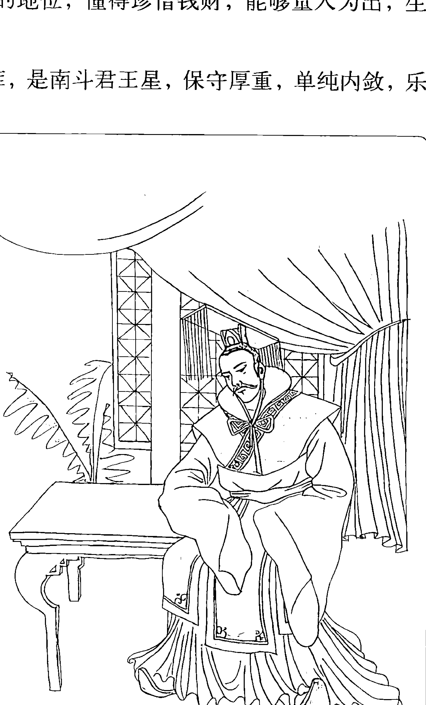

紫微居子、午——孤家寡人独坐
紫微星在子、午宫为独坐（子宫为平势、午宫为入庙），若无吉星会照辅佐，帝星孤独，虽然仍富贵、有很好的财运，但不如有府、相、左、右等吉星同坐吉祥顺遂。

## 紫微星坐丑、未宫：财运多变

## 星曜布局

紫微星坐丑、未宫为入庙，必有旺势破军星同坐，天相星在福德宫朝照（未宫为地势、丑宫为入庙）。命宫为落陷廉贞、贪狼星，官禄宫为旺势七杀星和利势武曲星，田宅宫为天同、天梁星（申宫：天同星为旺势、天梁星为落陷；寅宫：天同星为利势、天梁星为入庙）。

## 财运分析

紫微帝星遇七杀军殿前将军，紫微星信赖破军星的开创勇猛，欣赏其干劲和投入；破军星臣服于紫微星的权威，自重自爱，感于知遇之恩。二星同坐财帛宫，变得持重，能吃苦耐劳，珍惜钱财，宜防理财冲过头。需经艰辛奋斗才能赚到钱，早年财运多变动，财来财去不稳定，晚年多能脱胎换骨，突破逆境，开创财富，衣食无虑，同坐未宫时更为明显。

命宫为廉贞、贪狼星同坐，廉贞、贪狼都是桃花星，廉贞星多变化，有权威，不信邪，处世圆融，善于交际应酬；贪狼星多才多艺，多欲望，足智多谋，具竞争力。二星搭配，机敏灵巧，心思深沉，感性而放荡不为，有艺术才华，起伏大，变化多，顺逆常无定向，但常蕴涵生机和转机，早年心态不定，中年后能从挫折中学得经验，学养渐丰，而趋于成熟稳重。

天相星坐福德宫，廉明公正，有原则、理想，收入稳定，讲究穿着，愉悦一生。天同、天梁星同坐田宅宫，稳重、斯文、大方，有祖产，也能置产，以同坐寅宫为佳。

七杀、武曲星同坐官禄宫，行事果断，具有执行力，事业起伏多变，宜军警、财经职。

## 紫微星坐寅、申宫：富足保守

## 星曜布局

紫微星在寅、申宫为旺势，必有天府星同坐（寅宫为入庙、申宫为地势），入庙七杀星在福德宫冲照。命宫为平势廉贞星和入庙天相星，官禄宫为入庙武曲星，田宅宫为平势天同星，迁移宫为入庙破军星。

## 财运分析

紫微为北斗帝王星，天府为南斗君王星，二星都是发号施令的至尊星，一山不容二虎，矛盾难免，必有困扰。紫微、天府双星同坐财帛宫，执著具责任感，财源茂盛，善于理财，能开源，行动力强，富贵兼得，收入高，懂得享受，花费大，常生于富贵家庭，富足保守。

命宫为天相、廉贞星同坐，天相星谨言慎行，处事公正，思考周密；廉贞星是复杂多变的桃花星，邪恶狂妄，率性浪漫，不习礼仪。二星搭配，聪慧优雅，人缘佳，是非多，感情和理智常交战，婚姻感情难修正果，行运波折，做事有原则，能拿捏分寸，宜担任公职。拿得起，放得下，能自得其乐，晚年领悟多。若有擎羊星同宫，为“刑囚夹印格”，刑伤灾重。

七杀星坐福德宫，与祖上缘薄，钱财收入不稳定，性情孤僻，忙碌辛劳，工作一丝不苟。

天同星坐田宅宫，钱财处理易感情用事，能置产，晚年不动产多，居家环境宽敞舒适。

武曲星坐官禄宫，有决断和执行力，宜财经工作，常有机会经商或自行创业，事业有成。破军星坐迁移宫，外出靠自己，辛苦波折，身心难平静，不畏挫折，中年后渐稳重平安。

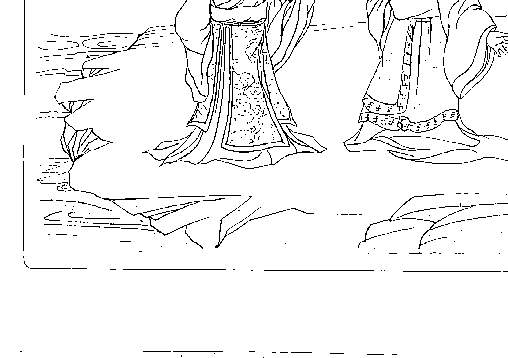

紫微居寅、申——一山二虎
紫微星在寅、申宫必有天府星同坐。紫微为北斗帝王星，天府为南斗君王星，二星都是发号施令的至尊星，一山不容二虎，矛盾难免。但对于财运的影响并不太大，仍能财源茂盛，富贵兼得。

## 紫微星坐卯、酉宫：生财有道

## 星曜布局

紫微星在卯、酉宫为旺势，必有利势贪狼星同坐。命宫为利势廉贞星和入庙七杀星，官禄宫为平势武曲、破军星，田宅宫为平势天同星，迁移宫为入庙天府星。

## 财运分析

紫微、贪狼星同坐卯、酉桃花地，紫微星虽有名士风流面，也有帝王尊严，又自重自爱，只要同宫没有六煞星、化忌星，紫微星可制约贪狼星的桃花，而倾向于开朗乐观，矜持谨慎，情理兼顾，活泼机智，发挥才艺方面的才能，对人际关系很有助益。紫微、贪狼星同坐财帛宫，懂得生财之道，善于理财，有偏财运，多有独特技能，工作赚钱欲强烈，常赚异性和娱乐之财，交际花费大，喜欢经商，早年宜守成，中年后可放手去做，能光宗耀祖，积聚钱财。

命宫为七杀、廉贞星同坐，七杀星为运筹帷幄的主帅，有独断专行的威望，勇猛好动；廉贞星工作投入，有亲和及魅力，好冒险，爱出风头。双星搭配，利落洒脱，偏好新鲜刺激，冲劲十足，但急功近利，缺乏远见，喜欢创业，易受环境和情绪的影响，常不择手段，容易向下沉沦，人生际遇起伏大。若遇四煞、化忌星，为“杀拱廉贞格”，浪漫不安，祸殃不断。

天同星坐田宅宫，能守祖产，也多能置产，晚年不动产多，居家环境宽敞舒适。

武曲、破军星同坐官禄宫，有领导力，能面对挑战，工作有表现，受器重，事业多变动。

天府星坐迁移宫，出外有人缘，有贵人扶助，生活优裕，适合远行，常有移民的机会。

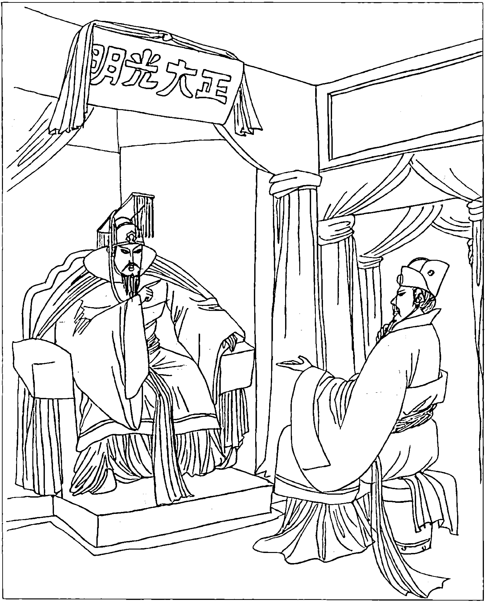

> 紫微居辰、戌——帝相人和
紫微居辰、戌宫，为地势，紫微、天相星同坐，紫微星贵气足，天相星人和强，双星搭配坐财帛宫，富足，八面玲珑，能理财和积蓄。

## 紫微星坐辰、戌宫：财禄丰厚

## 星曜布局

辰、戌宫为地势紫微、天相星同坐，旺势破军星在福德宫冲照。命宫为入庙廉贞星，官禄宫为旺势武曲星和天府星（子宫为入庙、午宫为旺势），田宅宫为入庙天同星，迁移宫为平势贪狼星。

## 财运分析

辰、戌为天罗地网宫，使仅为地势、力量不足的紫微、天相星受困而常感有志难伸，辛苦经营，容易流于虚有其表。紫微星贵气足，天相星人和强，双星搭配坐财帛宫，富足，八面玲珑，财禄丰厚，能理财和积蓄，懂得生财之道，亲切温和，乐于服务，出手大方，喜欢摆阔，欲望较多，懂得享受，对服务业有兴趣，适宜担任政府机构或大公司的高阶主管工作。

命宫为入庙廉贞星独坐，为“雄宿朝元格”，能将廉贞星多变化、公众及异性缘佳、擅长公关交际、豪迈善辩、多欲好争、怀才不遇、狂妄不拘的性格，完全发挥出来。

工作敬业乐群，有担当，经历艰苦奋斗后，常能担任要职，唯太过开放随缘，容易牵扯是非。

破军星坐福德宫，刚强插道，自我意识强烈，一生奔劳，能吃苦耐劳，钱财处理宜小心。

天同星坐田宅宫，能守祖产，也能置产，中晚年不动产多，居家环境喜欢宽敞舒适。

武曲、天府星同坐官禄宫，独立自信，具有才华，能面对挑战，工作负责，宜财经行业。

贪狼星坐迁移宫，好刺激，爱面子，生活多变化，以四海为家，喜欢都市生活，桃花重。

## 紫微星坐巳、亥宫：有偏财运

## 星曜布局

紫微星在巳、亥宫为旺势，乃有平势七杀星同坐，地势天府星在福德宫朝照。命宫为平势廉贞星和落陷破军星，官禄宫为入庙武曲、贪狼星，田宅宫为天同、太阴星（子宫：天同为旺势、太阴为入庙；午宫：天同为落陷、太阴为不得地势），迁移宫为落陷天相星。

## 财运分析

紫微帝星威严，有优越感和领袖欲；七杀主帅刚烈，运筹帷幄，忠肝义胆。二星搭配，自然是鹤立鸡群，潇洒自适，受人敬重，为领导人物，常有开创性发展，大起大落，变动频繁，成败难定。紫微、七杀星同坐财帛宫，收入丰盛，变动性大，有偏财运，会吉星有意外财，手头松，花费大，应防横发横破，避免挥霍赌博和投机，到头来暴得暴失，一无所有。

廉贞星机巧弹性，有自知之明，乐观潇洒，具责任心；破军星暴躁固执，独立自主，重权欲，合而不群。二星同坐命，专注有定力，有积极也有消极面，虽果断明快，有开创和领导能力，但常随缘而逃避现实，成败难料。若遇四煞星，为“贞居卯酉格”，常为仆役之徒。

天府星坐福德宫，有祖产，乐天知命，知足常乐，不喜纷争，谨慎保守，愉悦一生。天同、太阴星坐田宅宫，有置产能力，尤以同坐子宫时更为明显；宜防因感情而破财。武曲、贪狼星同坐官禄宫，工作勤奋有担当，易受赏识，喜开创性工作，事业多变动。天相星坐迁移宫，喜出风头，爱管闲事，乐于助人，公关佳，应酬多，出外顺利得人助。

## 天机星坐财帛宫

天机星是智财星，坐财帛宫，懂得运用脑筋去赚钱，临机应变，利用智慧和技巧，经由策划和竞争生财，钱财不稳定，流通性大，常有兼差、代理或频频更换工作的情况。会投机，有创意，喜欢以变化和冒险方式赚钱，偶会因贪心或失算而破财，中年后多能置产。

天机星属阴木，主智慧，是智多星，化气为善星，为兄弟宫主，对煞星较无抵抗力，化忌则为恶（伤脑筋、头脑打结）。天机星随缘，喜欢创新，具有动的特性，不断变化，须多动脑和勤于奔走，反应敏捷，足智多谋，长于策划、交涉联络，多才多艺，宜为人服务。

天机星易受环境变迁、时势机运的影响，且多学多动，以增进智慧，因而能不断进步。

天机星之财，宜以专业和稳定赚取，需身心两忙，付出实际的力量，才能获得对等的钱财，不能守株待兔，若能抱持着“一分耕耘，一分收获”的信念，定能激发创意，白手起家。

天机星有经商头脑，唯其财运多属周转机会财，多变不稳，不宜经商创业。宜现金生意、周转快的短期投资、中介代书、图书出版、电脑软件、运动、交通运输、观光旅游等行业。

天机星喜遇左辅、右弼、文昌、文曲、天魁、天钺等六吉星及天梁、太阴、禄存星。

天机星有智慧，却无制化凶煞能力，对煞星极敏感，因恐其智慧会助纣为虐。天机星化忌时就头脑打结，伤脑筋，脑筋总是转不过来，理财较偏激，凡事容易阴错阳差，盲目投机。

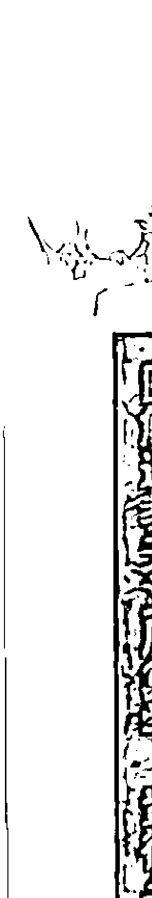

天机——智财星

天机星足智多谋，为智财星，坐财帛宫，懂得运用脑筋去赚钱，需临机应变，利用智慧和技巧，经由策划和竞争生财，属于运筹帷幄之中，决胜千里之外的生财之道，但钱财不稳定，流通性大。

## 1 天机星坐子、午宫：以名取利

## 星曜布局

天机星在子、午宫为入庙独坐，旺势巨门星在福德宫冲照。命宫为太阴星（辰宫为落陷、戌宫为旺势），官禄宫为天同星（子宫为旺势、午宫为落陷）和天梁星（子宫为落陷、午宫为入庙），田宅宫为天相星（子宫为旺势、午宫为平势），迁移宫为太阳星（辰宫为入庙、戌宫为不得地势）。

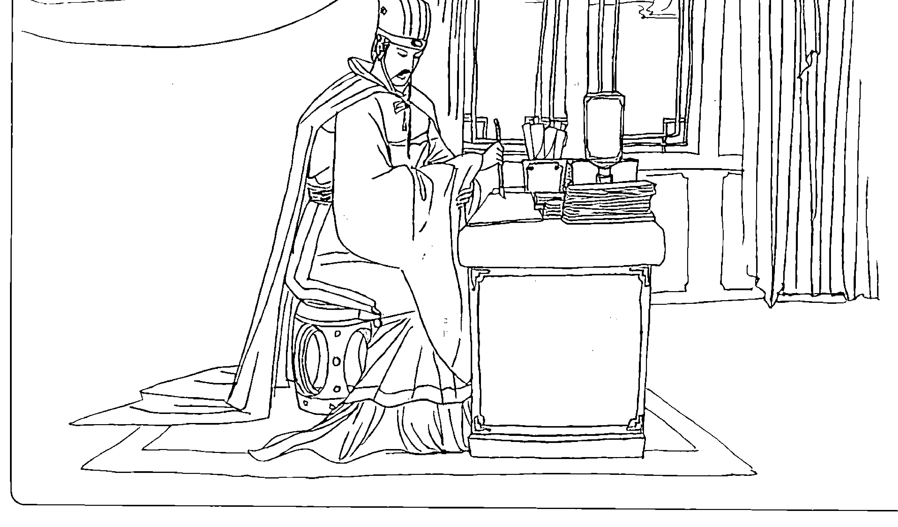

天机星在各宫的亮度

天机星为智财星，入庙足智多谋，以智慧谋财；落陷思虑过多，要生财必须经过一番劳碌。因此，当天机星坐财帛宫时，要结合其亮度进行参断。

| 天机（平） | 天机（庙） | 天机（陷） | 天机（地） |
| :---: | :---: | :---: | :---: |
| 巳 | 午 | 未 | 申 |
| 天机（利） | **[古代人物插图]** | 天机（旺） |
| 辰 | 酉 |
| 天机（旺） | 天机（利） |
| 卯 | 戌 |
| 天机（地） | 天机（陷） | 天机（庙） | 天机（平） |
| 寅 | 丑 | 子 | 亥 |

天机星在丑、未宫为落陷独坐，旺势天梁星在福德宫朝照。命宫为旺势巨门星，官禄宫为天同、天梁星（申宫：天同星为旺势、天梁星为落陷；寅宫：天同星为利势、天梁星为入庙），田宅宫为天相星（未宫为地势、丑宫为入庙），迁移宫为太阳星（戌宫为不得地势、辰宫为旺势）。

## 财运分析

天机星在子、午宫入庙独坐，是最好的宫位，尤以午宫最佳。必须以名取利，积极进取，走公家财，才能开源节流，宜先为上班族，运好时再兼职经营适合行业，宜小心金钱的出入。

命宫太阴星，主富，为财帛、田宅主，知足常乐，能理财，工作勤俭，有高收入，以不动产致富。命宫三方会齐机、月、同、梁星，为“机月同梁格”，擅长企划，宜传播文化事业。天机星在午宫，命宫太阴星、对宫太阳星为旺势，为“日月并明格”，权禄非浅。天机星在子宫，命宫太阴星为落陷，对宫太阳星为不得地势，为“日月反背格”，劳碌无闲。

巨门星坐福德宫，收入多变化，赚钱辛劳，具研究精神，心直口快，有口才及口福。

天相星坐田宅宫，能继承祖业，也能自购房地产；丑宫天相星为入庙，房地产丰盛。

天同、天梁星同坐官禄宫，工作负责，具领导力，能钻研，有创意，能成就，不宜经商。

太阳星坐迁移宫，出外机缘强，喜旅游，宜外地发展，做事热情，操心操劳，能获好评。

## 2 天机星坐丑、未宫：劳碌生财

## 星曜布局

天机星在丑、未宫为落陷独坐，旺势天梁星在福德宫朝照。命宫为旺势巨门星，官禄宫为天同、天梁星（申宫：天同星为旺势、天梁星为落陷；寅宫：天同星为利势、天梁星为入庙），田宅宫为天相星（未宫为地势、丑宫为入庙），迁移宫为太阳星（戌宫为不得地势、辰宫为旺势）。

## 财运分析

天机星落陷独坐财帛宫，劳碌生财，收入不高，钱财变动性大，无意外之财，必须一分耕耘，才有一分收获，工作会有改变，最好为上班族领固定薪水，中年后财运才会逐渐转好。天机星在未宫，如能专心致力于工作，能运用智慧、技术、口才，赚取令人满意之钱财。

命宫为旺势巨门星，巨门星象征“口”，总是和口分不开，是一个大嘴巴，有口福和口才，适宜以“口”为业，如教师、公关等，或以一技之长谋生。巨门星直爽，耿直明快，保守谨慎，天真又带一点木讷。巨门为“暗”星，主是非，容易招惹口舌是非，遭冤较难澄清。

天梁星坐福德宫，忠厚严谨，清廉无私，淡泊名利，乐于行善，有领导能力。有祖上福荫，长辈资助，不宜经商，上班族收入稳定，钱财够用，生活朴实，一生欢乐。

七杀星坐田宅宫，可承继祖业，或有意外财产，有自产能力，早年居家多搬迁，宜防财产来得快去得也快，适合居住于交通便捷之处，装设宜简单实用，住宅人口愈简单愈好。

天同星坐官禄宫，求学多能循规蹈矩，宜内动工作，工作持久称职，可循序建立事业。

太阳星坐迁移宫，国外机缘强，亥宫太阳落陷，奔波劳碌；巳宫太阳旺势，出外得贵。

## 3 天机星坐寅、申宫：白手生财

## 星曜布局

天机星在寅、申宫为地势，必有太阴星同坐（寅宫为旺势、申宫为利势）。命宫为入庙天梁星，官禄宫为平势天同星，迁移宫为太阳星（子宫为落陷、午宫为旺势）。

## 基本命运

天机星是智多星，聪明巧智，具创作企划能力，投机多变；太阴星是财星，博学多能，内向温柔，知足常乐。二星同坐财帛宫，感性而巧思慧黠，多才多艺，投资理财灵敏，公关佳，对钱财不太在意，也很容易满足，虽有理财方向，却并不坚持原则，常有兼职机会，时有偏财运，偶会投机，懂得积蓄，需凭智慧劳心费力经过竞争后才能生财，生活奔波，少有安宁，宜注意资金的运用。以名取利，可走公家财，从事服务业，投资房地产，可白手生财。

命宫为入庙天梁星，能将天梁星的特性完全发挥，为“寿星入庙格”，也为“机月同梁格”。福寿双全，有长辈缘，常受长者眷顾，对部属和晚辈也心存关爱，特别关照，慈悲为怀，为善最乐，人缘好。学养丰富，擅长企划，有领导及处事能力，稳健侠义，清高悠闲，淡泊名利，正直无私，超然客观，有爱心和耐心。一生中纵有波折，也能逢凶化吉，但总是闲不下来。常从事于医学界、娱乐界、服务业、传播、文化事业或高科技的工作。

天同星坐官禄宫，宜从事内勤或与休闲、享受有关的工作，工作称职，可循序建立事业。

太阳坐迁移宫，喜欢旅游，子宫太阳为落陷，劳心费力；午宫太阳为旺势，出外得贵。

## 4 天机星坐卯、酉宫：闹中生财

## 星曜布局
天机星在卯、酉宫为旺势，必有入庙巨门星同坐。命宫无主星，迁移宫为太阳、太阴星同坐（丑宫：太阳星为不得地势、太阴星为入庙；未宫：太阳星为地势、太阴星为不得地势），官禄宫为入庙天同星，田宅宫为旺势破军星。

## 财运分析
天机星有理想，洞烛先机，多学多能，随缘机变；巨门星肯钻研，主观自信，头脑冷静，有口才，多是非。同坐财帛宫，聪明机灵，有辩才和创意，处事明快，活动力强，闹中生财，不计较名利，甚怕化忌和煞星。多有技艺专才，需运用巧思，赚取智慧之财，有机会兼差创业，开支巨大，财运起伏大。宜从事具竞争性及挑战性工作，多竞争对手，必须凭着毅力和耐力，不断努力开创，打出自己品牌或口碑，费尽口舌，才能突破现况，白手起家，发财致富。

命宫无主星，应以本宫其他甲级星及其对宫（迁移宫）的太阳、太阴星，共同综合论命。

太阳、太阴星同坐迁移宫，太阳星权贵，聪明慈爱，开朗热情，光明磊落，积极进取，急公好义。太阴星富足，温柔多情，稳重耿直，内向有耐性，观察入微，博学多能。双星搭配，为“日月同临格”，保守容忍，个性矛盾，智慧特优，多能学以致用，出外旅游机会多。

破军星坐田宅宫，有机会投资或经营房地产，家道兴盛，房地产不少，不动产有进有出。

天同星坐官禄宫，宜内勤或从事与休闲、享受有关行业，工作称职，能持久而少变换。

## 5 天机星坐辰、戌宫：收入丰厚

## 星曜布局

天机星在辰、戌宫为利势，必有入庙天梁星同坐。命宫无主星，迁移宫为入庙巨门星和太阳星（寅宫为旺势、申宫为地势）同坐，官禄宫为天同、太阴星（子宫：天同星为旺势、太阴星为入庙；午宫：天同星为落陷、太阴星为不得地势），田宅宫为地势天府星。

## 财运分析

天机星智慧，创意多，机谋权变；天梁星清高，有慈悲情怀，为善最乐。双星同坐财帛宫，很会理财，行事有原则，相当有魄力，乐于服务，能锲而不舍，求名重于求利，有时难免会曲高和寡，喜爱炫耀。智慧高，有才华，常需靠智慧赚钱，生财有道，有偏财运，多有专技长才，必须付出心力去开创与投资，劳而有获，收入丰厚，衣食无忧，宜高科技、专门技术或研究人员、企管顾问、公家机关等工作。终能独当一面，展现实力。

命宫无主星，应以本宫其他甲级星及其对宫（迁移宫）的太阳、巨门星，共同综合论命。

太阳、巨门星同坐迁移宫，太阳星光明博爱，有担当，肯进取；巨门为暗星，直率执著，疑心重，多计较。双星搭配，明暗交错，直率又略带心机，霸气又多虑，好恶由心，公关佳，辛勤劳累后事业有成，起伏大，凡事应未雨绸缪。谋生能力强，偶会强出头，平添是非困扰。

天府星坐田宅宫，有祖产，房地产多，国外也有置产良机，生活安适。

天同、太阴星坐官禄宫，工作少费心，有潜力，宜写作工作。同坐午宫，开创力较弱。

## 6 天机星坐巳、亥宫：投机生财

## 星曜布局

天机星在巳、亥宫为平势独坐，太阴星（亥宫为入庙、巳宫为落陷）在福德宫朝照。命宫无主星，迁移宫为太阳、天梁星（卯宫：太阳、天梁星二星皆为入庙；酉宫：太阳星为平势、天梁星为地势）同坐，官禄宫为不得地势天同、巨门星，田宅宫为旺势贪狼星。

## 财运分析

天机星足智多谋，学有专长，擅长设计发明，研究分析，喜欢出主意。天机星平势独坐财帛宫，会投机，有创意，赚钱辛劳，宜上班，避免经商，须持续执著工作，付出心血，经过竞争和挑战，并设法兼副业，才会有较好的成就，生活安定愉快。坐巳宫，比较吉利。

命宫无主星，应以本宫其他甲级星及其对宫（迁移宫）的太阳、天梁星，共同综合论命。

太阳、天梁星同坐迁移宫，太阳星威猛霸气，关怀博爱；天梁为寿星，老气固执，服务牺牲。二星搭配，霞辉普照，有慈悲心，常牺牲忍让，乐于为人服务，独立性强，凡事自己承担，广结善缘，为善不欲人知，有苦独自吞尝，处事明快，宜大众服务业。出外得人照顾，有发展机会，常有奇缘奇遇，遇危难多能逢凶化吉，收获丰盛，出外旅游、迁移、升学皆利。

太阴星坐福德宫，有祖上福荫，收入不稳定，温和有爱心，恬淡优雅，重视生活品质。

贪狼星坐田宅宫，适宜居住在热闹繁华处，住宅舒适，早年多搬迁，中年后积极置产。

天同、巨门星同坐官禄宫，工作安定，能循序渐进，不与人争，少受排挤，欠缺恒心。

## 太阳星坐财帛宫

> 太阳星光明磊落，是广财星，坐财帛宫，收入丰厚，取财有道，钱财出入大，出手大方，除了应注意节流外，更要去开创财富。必须一分耕耘，才有一分收获，宜防为亲戚、朋友耗财，利于从事公职、贸易、司法、军警、医护、公众福利、保险业。多能投资置产，晚景佳。

太阳星阴阳五行属阳火，为中天斗吉星、官禄宫正主，化气为权贵。太阳每日东升西沉，所以其光芒会因在命盘宫位的不同而依次变化，在寅、卯为“初升”，在辰、巳为“升殿”，在午为“日丽中天”，在未、申为“偏垣”，在酉为“西没”，在戌、亥、子、丑为“失辉”。

太阳星主贵不主富，名大于利，清高贵显，即使加会禄存星，也劳碌挣财。

太阳星庙旺无煞、忌星同宫，多具知名度，财利广达，有决断力，善于理财，花钱较节制，有高收入，易得显贵之财，或因显贵而进财；太阳星落陷，进财劳心费力，花钱无节制。

太阳星急公好义，积极进取，具有行动力，庙旺经商时比较容易建立自己的品牌，往往知名度高于收入，宜从事独家生意，或经营文化、图书、出版、教育、法律等性质的生意。

太阳星喜遇天梁、太阴、禄存、化禄、化权星，富贵兼得，名利双收。太阳星遇六吉星，多贵人相劝，行事顺遂。太阳星又爱三台、八座、恩光、天贵星，可增添光辉，声名地位高。

太阳星失辉甚忌六煞、化忌星，奔波劳碌，事倍功半，多惹是非困扰，男性尤其不利。

## 太阳星在各宫的亮度

太阳每日东升西沉，所以太阳星的光芒也会因命盘宫位的不同而依次变化，在寅、卯为“初升”，在辰、巳为“升殿”，在午为“日丽中天”，在未、申为“偏垣”，在酉为“西没”，在戌、亥、子、丑为“失辉”。

| 巳 | 午 | 未 | 申 |
|---|---|---|---|
| 太阳+3 | 太阳+3 | 太阳+2 太阴-1 | 太阳+2 巨门+4 |
| 太阳+3 |  | 太阳0 天梁+2 |  |
| 太阳+4 天梁+4 |  | 太阳-1 |  |
| 太阳+3 巨门+4 | 太阳-1 太阴+4 | 太阳-2 | 太阳-2 |

## 太阳星坐子、午宫：费力生财

## 星曜布局

太阳星在子、午宫为独坐（子宫为落陷、午宫为旺势），入庙天梁星在福德宫朝照。命宫为落陷巨门星，田宅宫为入庙七杀星和利势廉贞星，迁移宫为平势天同星。

## 财运分析

太阳星在子宫落陷独坐财帛宫，财运不顺，理财宜保守，劳心费力生财，钱财使用无度，虽早晚辛勤工作，获利却有限，宜从事劳心费力而耗费时间的工作。太阳星在午宫为“日丽中天”，财运旺盛，收入高，财名传播于外，有经商和理财的才能，处事决断明快，莫太炫耀，应防大起大落，应尽量做好服务的工作，多献身于社会，可增添进财的机会，得享晚福。

命宫为落陷巨门星，有口才，耿直明快，多口舌是非，宜从事以口为主的行业，并多学习各种外语。辰、戌宫为天罗地网，巨门星又落陷无力，保守谨慎，非常辛劳，常事倍功半，难有表现，有观察、分析、判断力，富研究精神，若能专心于教学研究工作，将会获得成就。若命、身同宫，逢羊、陀、火、铃四煞星，为“巨逢四煞格”，无吉星相救，多会畏罪逃亡。

天梁星坐福德宫，忠厚善心，朴实严谨，收入稳定，淡泊名利，喜悠闲，宜上班族固定领薪，不宜经商，可得长辈资助钱财，不宜强出头，一生愉悦。七杀、廉贞星坐田宅宫，有偏财运，聚财辛劳，善于处理钱财，喜居闹区，居家宜朴实。天同星坐迁移宫，出外际遇顺遂，有贵人相助，人际关系良好，适应能力强。

## 太阳星坐丑、未宫：收入平稳

## 星曜布局

太阳星在丑、未宫必有太阴星同坐（丑宫：太阳为不得地势、太阴为入庙；未宫太阳为地势、太阴为不得地势）。命宫为落陷天梁星，田宅宫为入庙廉贞星，迁移宫为入庙天同星。

## 财运分析

太阳为贵星，热心操劳：太阴为富星，沉稳持平，双星同宫，一阳一阴，相互牵动，外柔内刚，反复难定，应设法求取平衡。日月同坐财帛宫，富贵兼得，左右逢源，常有副业或兼职，财源佳，收入平稳，辛勤劳碌，理财常摇摆不定，一生变动起伏大，中晚年年后，钱财和精神皆感富足。日月坐未宫，为周转财，投资风险大；日月坐丑宫，后劲较足，多可致富。

命宫为落陷天梁星，好享受，喜悠闲，淡泊名利，慈悲为怀，富爱心和耐性，应变能力强，有长上缘，常受长者垂爱，也能关爱部属及晚辈，人缘好。热忱有余，定性不足，感情不稳，易频频更换工作，生活因而常随工作而变化，应避免经商，以减少辛劳和波折。一生多漂泊，居家环境多变迁，若同宫再遇天马星，为“梁马飘荡格”，飘荡风流，忙碌而少获。

入庙廉贞星独坐田宅宫，较难有祖产，只要努力就能自置产业，喜欢居住于热闹环境中，装饰富丽，喜欢合资经营娱乐、饭店、旅馆等休闲行业。

入庙天同星坐迁移宫，出外际遇顺遂，即使有惊，也多能无险地度过，生活多彩，常有贵人相助，人际关系良好，适应能力强。

## 3 太阳星坐寅、申宫：开口进财

## 星曜布局

太阳星在寅、申宫必有入庙巨门星同坐（寅宫太阳星为旺势、申宫太阳星为地势）。命宫无主星，迁移宫为天同、太阴星（子宫：天同星为旺势、太阴星为入庙；午宫：天同星为落陷、太阴星为不得地势），田宅宫为平势廉贞星和落陷破军星。

## 财运分析

太阳星属阳火，光明博爱，积极宽大，具希望勇气；巨门属阴水，执著保守，直爽多疑，多是非。双星同坐财帛宫，明暗交错，光芒不强，冲劲不足，常以开口进财，宜经商、律师、教师、业务、行销、公教人员，常须竞争，并运用口才，辛勤费力。另好大喜功，进财避免、短线投机，以免时运不佳时，有财务危机。凡事须谦卑有涵养，先未雨绸缪，勤勉努力，才能先苦后甘，积存财富。遇化禄、化权，易发外地财；遇化忌易有财物是非。双星同坐寅宫，多能如寅时太阳般冉冉上升，循序渐进；同坐申宫，常苗而不秀，宜防虎头蛇尾，先勤后惰。

命宫无主星，应以本宫其他甲级星及其对宫（迁移宫）的天同、太阴星，共同综合论命。

天同星度量宽宏，福气自来；太阴星慈爱明理，田宅自丰。双星同坐子、午迁移宫，温柔多情，人缘好，衣食无忧，房地产丰盛，向上心强，乐观豁达，与世无争。出外活跃受欢迎，多旅游机会，良缘良机多，阅历广博。双星同坐子宫，福禄兼得；同坐午宫，漂泊不定。

廉贞、破军星同坐田宅宫，钱财运用随性，多波动，喜经营餐饮、饭店、旅馆等行业。

## 4 太阳星坐卯、酉宫：收入丰厚

## 星曜布局

太阳星在卯、酉宫必有天梁星同坐（卯宫：太阳、天梁星皆为入庙；酉宫：太阳星为平势、天梁星为地势）。命宫无主星，迁移宫为不得地势天同、巨门星，官禄宫为太阴星（亥宫为入庙、巳宫为落陷），田宅宫为利势廉贞星和入庙天府星。

## 财运分析

太阳为权贵星，天梁为清贵星，二星同坐财帛宫，有领导才华，潜力大，收入丰，有偏财运，可继承财产或事业，懂得储蓄投资，常有兼职，免不了劳碌有竞争或困境，钱财易有波折而产生困扰，宜赚公家财，担任公职或创作、专业、技术、科技、医学，在清高中进财。

同坐卯宫，志向远大，白天生人，常生于富贵之家，若能掌握契机，可发财致富。同坐酉宫，缺乏定性，易受环境影响，常贵而不显或秀而不实，早年比较辛勤劳碌，有晚发的趋势。

命宫无主星，应以本宫其他甲级星及其对宫（迁移宫）的天同、巨门星，共同综合论命。

天同星度量宽，不经心，多操劳；巨门星多好奇，不服输，多思考。二星搭配，平和乐利，保守无企图心，动力不足，难有大作为，能自得其乐，易冲动，精神上常觉空虚寂寞。

廉贞、天府星同坐田宅宫，可经营投资房地产业，多能白手起家，聚财成富，居家喜热。太阴星坐官禄宫，不宜经商，多在公、民营企业机构任职，或从事文艺、演艺、娱乐、艺术性、大众服务、编辑、程式设计师等工作。太阴星坐亥宫，多能发挥所长，担任要职。

## 5 太阳星坐辰、戌宫：财运亨通

## 星曜布局

太阳星在辰、戌宫为独坐（辰宫太阳星为旺势、戌宫太阳星为不得地势），太阴星在福德宫朝照（戌宫太阴星为旺势、辰宫太阴星为落陷）。命宫无主星，迁移宫为天同、天梁星（寅宫：天同星为利势、天梁星为入庙；申宫：天同星为旺势、天梁星为落陷），官禄宫为旺势巨门星，田宅宫为落陷廉贞、贪狼星。

## 财运分析

太阳为贵星，积极进取，独立担当，喜欢据理力争，容易强出头，一生难免会辛劳孤独，亲情不足。太阳星坐财帛宫，取财有道，理财常摇摆不定，必须一分耕耘，才有一分收获。失辉独坐戌宫，宜多元、特殊、冷门、专业的行业；旺势独坐辰宫，财运亨通，名利双收。

命宫无主星，应以本宫其他甲级星及其对宫（迁移宫）的天同、天梁星，共同综合论断。

天同为福星，随和知足，唯美务实；天梁为荫星，清高执著，热心慈爱。二星搭配，福荫相聚，端正沉稳，温和善良，任劳任怨，忙中享乐，多有抱负，能居安思危，量力而为，不贪功近利。出外多贵人，工作机会多，喜欢游山玩水，四处旅游，移居转业多有机缘。

太阴星坐福德宫，恬淡优雅，整洁朴素，浪漫悠闲，重视生活品质，有艺术修养。廉贞、贪狼星同坐田宅宫，祖业难守，其置产能力，喜欢经营餐旅业，居家环境雅致。巨门星坐官禄宫，具有口才，工作认真负责，任劳任怨，宜从事与口有关的工作。

## 6 太阳星坐巳、亥宫：财运旺盛

## 星曜布局

太阳星坐巳、亥宫为独坐（巳宫太阳星为旺势、亥宫太阳星为落陷），旺势巨门星坐福德宫冲照。命宫为太阴星（酉宫太阴星为旺势、卯宫太阴星为落陷），官禄宫为旺势天梁星，田宅宫为平势廉贞星和入庙天相星，迁移宫为平势天同星。

## 财运分析

太阳星在巳宫旺势独坐财帛宫，财运旺盛，有经营理财能力，收入高，出手大，可名利双收，宜从事进出口贸易或大型企业。太阳星在亥宫为落陷，与父母缘薄，劳心费力生财，虽早晚辛勤工作，获利却有限，钱财使用较浪费，宜上班族领固定的薪水，生活较为安定。

太阴为财富星、田宅主，独坐命宫，勤俭工作，善于运用钱财，知足快乐，有异性缘，浪漫多情。太阴星旺势独坐酉宫，又三合会照财帛宫旺势太阳星，为“丹墀桂墀格”，钱财富足，事业有成，早遂青云之志。太阴星在卯宫为落陷失辉，又三合会照财帛宫落陷太阳星，为“日月反背格”，离乡背井，披星戴月，奔波劳碌，自立奋斗，桃花缠绕，断断续续。

巨门星坐福德宫，思虑周密，心直口快，富研究精神，收入不稳定，赚钱辛劳多波折。

廉贞、天相星同坐田宅宫，中晚年能自置产业，居家高尚而幽静典雅，喜欢朋友造访。

天梁星坐官禄宫，事业稳定，工作超然，宜公教、司法、宗教、文化、研究，避免经商。

天同星坐迁移宫，出外有贵人相助，适应力强，人际关系良好。

## 武曲星坐财帛宫

武曲为正财星，为财帛宫主，与钱财特别有缘，有赚钱的欲望和兴趣，善于理财。武曲之财，有如金矿，须挖掘、冶炼、铸造，努力经营事业，待事业发达之后，财源才滚滚而来。

武曲星有领导和权力欲，律己严谨，有主见，其自知之明，自我期许高，劳碌实干，适宜从事金融、财政、证券等行业，经营珠宝、冶金等贵重生意。

武曲星须不断创造开发，千锤百炼，才能发挥潜能，中年以前较难有收获，否则也将财来财去，空欢喜一场。武曲星理智独立，不服输，可不靠祖业，白手起家，获得相当成就。

武曲星对四化星格外敏感，武曲化禄，可增加财源和进财机会，经商可发；武曲化权，能独当一面，具有权威，宜往武职方面发展；武曲化科，具有文艺学养，利于文艺的研究发展，可望功成名就，宜赴远地求财；武曲化忌，易有中断现象，困扰多，常无迂回的余地。

武曲星善于理财，星性稳定，除了武曲星化忌以外，适宜经营与金属、交通有关的生意，事业有成后，将能获取可观的钱财。武曲星化禄或逢遇禄存、化禄星，经商获利更为丰盛。

武曲星喜遇六吉星，可增添财星的气势，热衷金钱游戏，发展较顺利，财源也能广进。

武曲星遇羊、陀、火、铃四煞星，除了适宜金属的本性外，更须具有金属技术专才，外科、牙科、机械成五金制造者。武曲星遇杀、破、狼，再遇四化星，变动及激发力特别大。

第十一章 紫微斗数论财运

## 1 武曲星坐子、午宫：财权并重

## 星曜布局

武曲星在子、午宫为旺势必有天府星同坐（子宫为入庙、午宫为旺势），旺势七杀星在福德宫冲照。命宫为地势紫微、天相星，官禄宫为入庙廉贞星，迁移宫为旺势破军星。

## 财运分析

武曲星稳重有担当，具干劲；天府星矜持不计较，有耐性。二星同坐，人生顺利，# 武曲星在各宫的亮度

武曲为财帛宫主，是正财星，与钱财有缘，而其对于钱财的欲望与获得钱财的能力要依据其所处的宫位及星曜的亮度而定。

| 宫位 | 星曜亮度组合 | 宫位 | 星曜亮度组合 | 宫位 | 星曜亮度组合 | 宫位 | 星曜亮度组合 |
| :--- | :--- | :--- | :--- | :--- | :--- | :--- | :--- |
| 巳 | 武曲 0 破军 0 | 午 | 武曲 +3 天府 +3 | 未 | 贪狼 +4 武曲 +4 | 申 | 武曲 +2 天相 +4 |
| 辰 | 武曲 +4 | | | | | 酉 | 武曲 +1 七杀 +3 |
| 卯 | 武曲 +1 七杀 +3 | | | | | 戌 | 武曲 +4 |
| 寅 | 武曲 +2 天相 +4 | 丑 | 贪狼 +4 武曲 +4 | 子 | 武曲 +3 天府 +4 | 亥 | 武曲 0 破军 0 |

其领导力，受人器重，常为领导人物，广受好评。武曲是金矿，能开辟财源；天府是财库，能固守。二星同坐财帛宫，财源丰裕，理财务实，自然会着眼于财税、金融和商务，若能努力专心开创事业，在稳定中踏实求发展，常有高收入，能创业，多元发展，财权并重，一生富足。

紫微星贵气足，虽有冲劲，却须假手他人；天相星多理想，却谨慎小心。双星同坐辰、戌“天罗地网”宫，受困而常感有志难伸，仪表出众，亲切温和，八面玲珑，凡事多随缘，无为而治，受人欢迎，常自得其乐，喜欢享受浮生半日闲，际遇纵有不如意，也能幸运得贵人相助，多具有特殊技能，为策划长才，偏好娱乐、饮食、商务、生产等事业。

七杀星坐福德宫，情商控制差，意志坚强，喜单独行事，多劳碌，身随意转，随遇而安。

太阳、太阴星同坐丑或未宫，朝照田宅宫，为“日月照壁格”，不动产多，可继承祖业。

廉贞星坐官禄宫，工作专注有效率，能独立作业，公关能力强，宜从政、外交。

破军星坐迁移宫，出外劳碌奔波，波折多，易遭忌，须靠自己打拼，不畏挫折，毅力强。

## 2 武曲星坐丑、未宫：武贪不发少年人

## 星曜布局

武曲星在丑、未宫为入庙必有入庙贪狼星同坐。命宫为旺势紫微星和平势七杀星，官禄宫为平势廉贞星和落陷破军星，迁移宫为地势天府星。

## 财运分析

武曲星具威严，稳重成熟，独立自强；贪狼星性浮躁，其才艺，多欲望。双星同坐财帛宫，机敏多变，肯服务，能创造，其冒险精神，懂生财之道，常为商贾殷富之人，好享受，会赚钱也会花钱，正业之外，常兼副业或投资理财，有偏财运，所赚多为异性或娱乐之财，一生不缺钱，易因酒色丧财。早年浮夸冲动，必须历尽沧桑，多吸取经验教训，吃苦耐劳，才能平稳持重，受人赏识，发挥才华；中晚年常有机会突发致富，故“武贪不发少年人”。

紫微星尊贵威严，自负多虑；七杀星刚烈执著，勇往迈进，二星同坐命，常为领导人物，受人尊重。紫微星旺势坐命、天府星地势朝照，为“紫府朝垣格”，自尊好胜，独立自主，企图心强，不喜听命于人，公关佳，处事灵活，喜尝试新局，白手起家，常孤芳自赏而少有知音。人生际遇上，常有起伏波折，人生大落，转变离多，结局大致不差，多有开创性的发展，若是不能甘于淡泊的人生，自须面对风雨飘摇的变化。宜有宗教信仰，方能安稳。

廉贞、破军星同坐官禄宫，积极敬业，有担当，外务多，工作多变化，能受赏识居要职。

天府星坐迁移宫，出外有人缘，可受照顾，生活优裕，喜欢旅游，有国外定居机会。

## 3 武曲星坐寅、申宫：衣食丰盈

## 星曜布局

武曲星在寅、申宫为地势，必有入庙天相星同坐，地势破军星在福德宫冲照。命宫为紫微星（午宫为入庙、子宫为平势），官禄宫为利势廉贞星和入庙天府星，迁移宫为旺势贪狼星。

## 财运分析

武曲星属金，重实力，稳定而有责任感，能静能动；天相星属水，好面子，细心而求好心切，乐于助人。二星搭配，其才艺，诚恳踏实，自我期许高，中规中矩，保守理智，常急流勇退，见好就收。二星坐财帛宫，收入不错，有偏财运，懂得储蓄理财，但对朋友钱财出手大方，生活优裕，不投机取巧，能稳定投资，白手起家，早年难聚大财，中晚年衣食丰盈。

紫微星独坐命，稳重坚定，自我要求高，做事认真，要求完美，有领导统御欲望与能力，能顾全大局。紫微帝星最怕独坐，无吉星辅佐的孤君，易独断专行，为奸臣小人包围，不知变通，自寻烦恼，常感孤独落寞。紫微星入庙独坐午宫，三方四正有天府、天相、武曲等吉星相会，若无羊、陀、忌星相凑，为“极向离明格”和“紫府朝垣格”，气度宽宏，企图心强，公关佳，处事灵活。紫微星独坐子宫，常存浪漫幻想，而自感怀才不遇。

破军星坐福德宫，倔强霸道，主观自我，感情用事，容易冲动，钱财不稳定起伏大。廉贞、天府星同坐官禄宫，敬业乐群，有为有守，工作专注有耐性，中年后稳定有成就。

贪狼星坐迁移宫，四海为家，喜欢都市生活，生活多变化，易有风花雪月的桃花。

## 4 武曲星坐卯、酉宫：横发暴破

## 星曜布局

武曲星在卯、酉宫为利势必有旺势七杀星同坐，天府星在福德宫朝照（酉宫为旺势、卯宫为地势）。命宫为入庙紫微星和旺势破军星，官禄宫为落陷廉贞、贪狼星，田宅宫为太阴星（戌宫为旺势、辰宫为落陷），迁移宫为天相星（丑宫为入庙、子宫为地势）。

## 财运分析

武曲星刚强果决，保守沉稳，耐静能守；七杀星率性勇猛，开放浮躁，喜动能攻。二星同坐财帛宫，率直尖锐，有为有守，目标及眼光远大，能独当一面。财运不错，善于理财，赚钱多，花钱快，随性而为，喜投机冒险，自行创业，刚愎自用，一生工作多变化，钱财起伏大，付出及挫折较多，容易横发暴破。早年财来财去，中晚年多能白手起家，成就有收获。

紫微帝星遇上破军殿前将军，早年自负倔强，不听忠告，我行我素，中晚年多能脱胎换骨，练达圆融，谨慎多虑，沉稳持重，睿智而果敢，踏实苦干，虽不免于辛劳，但劳而有获。

天府星坐福德宫，心地善良，知足常乐，收入不错，生活享受，钱财应避免被朋友拖累。

太阴星坐田宅宫，居家喜淡雅洁净，田园山林之处，或购置花卉植物。戌宫太阴星旺势坐田宅宫，旺势太阳星在对宫朝照，为“日月照壁格”，财运顺，不动产运好，宜防桃花劫。

廉贞、贪狼星同坐官禄宫，工作勤奋，有表现，善于交际应酬，不喜拘束呆板的工作。

天相星坐迁移宫，公关强，人缘佳，出外有贵人相助，乐于助人，受人欢迎，风评良好。

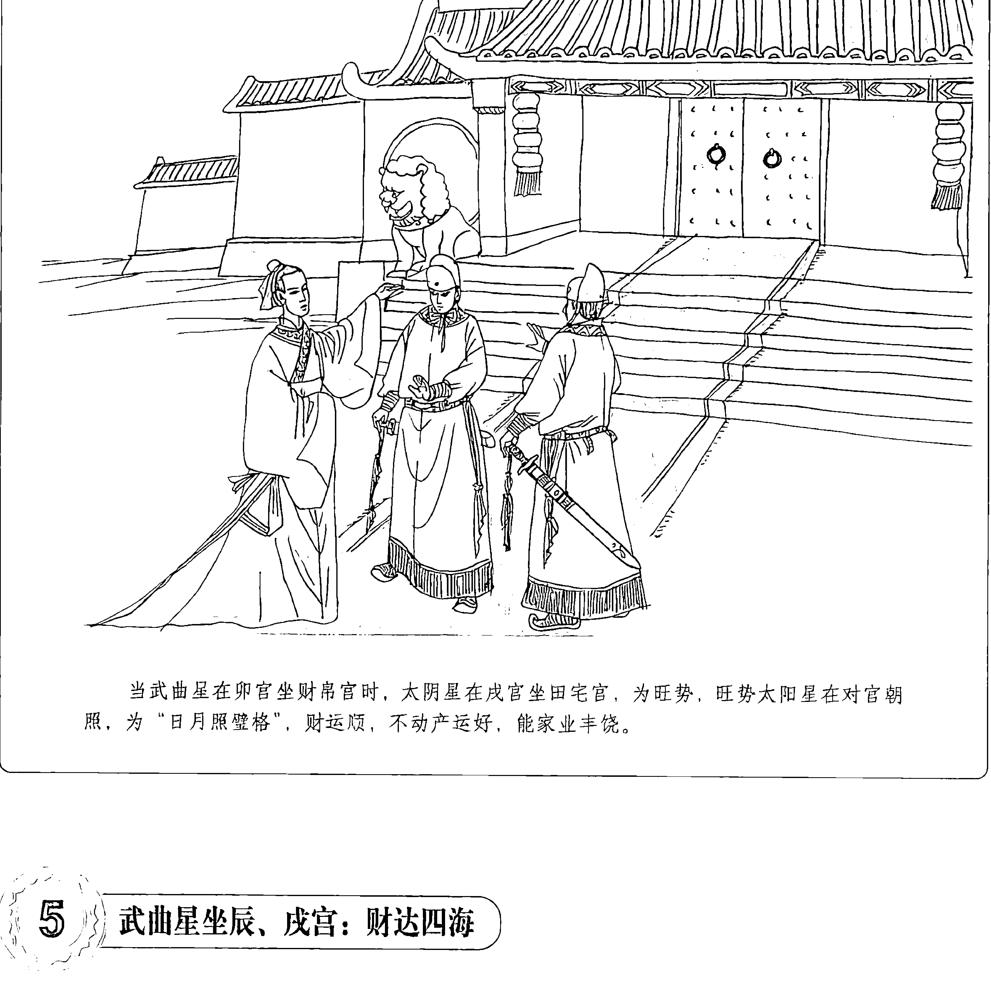

当武曲星在卯宫坐财帛宫时，太阴星在戌宫坐田宅宫，为旺势，旺势太阳星在对宫朝照，为“日月照壁格”，财运顺，不动产运好，能家业丰饶。

## 5 武曲星坐辰、戌宫：财达四海

## 星曜布局

武曲星在辰、戌宫为入庙独坐，入庙贪狼星在福德宫冲照。命宫为旺势紫微星和天府星（申宫为地势、寅宫为入庙），官禄宫为平势廉贞星和入庙天相星，田宅宫为旺势巨门星，迁移宫为入庙七杀星。

## 财运分析

武曲星入庙独坐，最能发挥其财性。多生于富裕之家，获得先人遗产，或得到长上提拔而发财。与钱财有缘，对钱财很感兴趣，有赚钱的欲望，善于理财，能赚钱，有经营大事业的企图心，喜欢自立创业，收入丰盛。唯“武曲不发少年人”，辰、戌又为天罗地网，中年前开支大，多财来财去，必须加倍努力，谨慎积存，中晚年多能白手起家，获得相当成就。

紫微、天府双帝王星同坐命，一山不容二虎，必多困扰，精神易苦闷。紫微星具企图心和领导欲，天府星务实稳健，二星同宫，矛盾难免。紫微、天府双星坐命，为“紫府同宫格”。天相星在官禄宫入庙会照，若无煞星冲破，亦为“府相朝垣格”，工作多居高位，生活优裕。

贪狼星坐福德宫，机敏巧黠，心高气傲，随心所欲，兴趣多样，有才华，偏爱物质享受。

巨门星坐田宅宫，居家朴实，能自置房产，常有突发的机缘赚钱而购置不动产。

廉贞、天相同坐官禄宫，有志向，工作专注有效率，人际关系佳，表达力强，能受赏识。

七杀星坐迁移宫，活动力强，在家待不住，生活多变化，工作多竞争，喜欢自我表现。

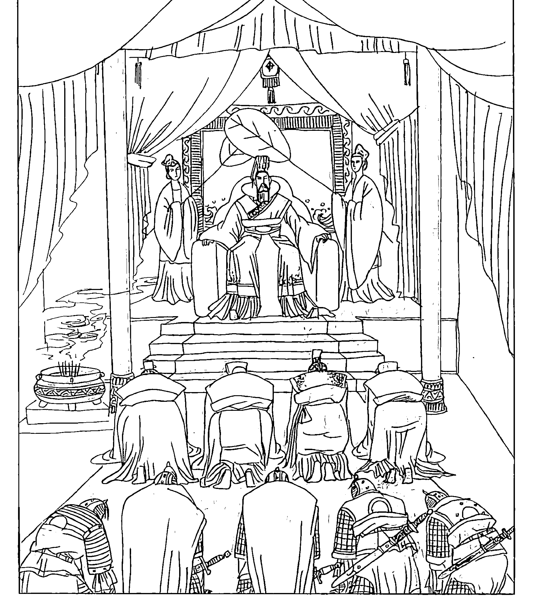

当武曲星在辰、戌宫坐财帛宫时，有紫微、天府双帝王星同坐命，天相星在官禄宫入庙会照，若无煞星冲破，亦为“府相朝垣格”，多居高位，生活优裕。

## 6 武曲星坐巳、亥宫：先贫后富

## 星曜布局

武曲星在巳、亥宫为平势必有平势破军星同坐，地势天相星在福德宫朝照。命宫为旺势紫微星和利势贪狼星，官禄宫为利势廉贞星和入庙七杀星，田宅宫为入庙天梁星。

## 财运分析

武曲为孤刚星，律己严谨；破军为破耗星，我行我素。二星同宫，外冷内热，内心矛盾复杂，耐性不足，倔强自负，外缘强，内缘差，在外振奋刚强，居家平淡空虚。二星同坐财帛宫，财星逢耗，应节制浪费，防意外耗财，宜从商、专业、手艺、偏门、特殊行业。其开创力，动荡奔波，花费大，收入常有变化，常改变进财方式，其独立策划能力，有独特的思维方式，常因突发奇想而生财，通常会先贫后富，先有挫折损失，再重新开始，而逐渐转好。

预料中的钱财往往会漏失，不预期的金钱却反而会进财。早年财来财去，中晚年比较稳定。

紫微星风流尊严，稳重坚定；贪狼星率直调皮，多才多艺。二星同坐命，乐观豁达，开朗有机智，能情理兼顾，兴趣广泛，学习力强，处世积极干练，讲求生活情趣，自我要求高，矜持谨慎，理想过高，有公众缘，人际关系良好，人生虽有变化，但有方向感，容易成功。

天相星坐福德宫，温文儒雅，廉明公正，光洁整齐，处事中肯，进退得当，受人敬重。天梁星坐田宅宫，居家朴实宁静，常有机缘获得赠产，祖产家业多，也能自置房产。

廉贞、七杀星同坐官禄宫，自我要求高，事业起伏多变，喜富竞争、挑战、变化性工作。

> 天同星坐财帛宫

天同星坐财帛宫，一生财源不缺，有偏财运，须靠自己的能力赚钱，支出尚大，尚能储蓄理财，利于文化、艺术、教育、餐饮、娱乐、演艺、观光、旅游等使人心身愉快，又有福可享的工作。青壮年时吃苦努力，中晚年才能享福；否则，若长期沉湎于安乐，无心开创，则容易使机运受阻。

天同星阴阳五行属阳水，为文财星，也是福、寿星。谦逊温和，乐观而不积极，凡事不操心，悠闲自在，安分守己，平易近人，乐善好施，知足常乐，人缘好，具有公关协调能力。

天同星为福德宫主，注重生活情趣与享乐，心绪虽稳定，却被动保守，常坐而言，不起而行，惜福而缺少奋发向上的冲劲，无开创新局的魄力，不宜坐财帛宫。

天同星化禄，为福、禄、寿相扶，能增添福气与悠闲，有口福，多可长命百岁，人则更形懒散，若再遇禄存星，多有意外之财；天同星化权，能激发其奋斗意志与毅力，比较积极，其领导与开创力，乐观安详；天同星为福寿之星，化忌则减福、损寿，更懒散，有机会也常抓不住，钱财守不住，天同星善于协调，化忌则常易协调不良，事与愿违，或身体机能失调。

天同星享福又不积极，独坐或无吉星相助，不宜经商，也少有经商的机会。

天同福星庙旺时，不怕劫、煞、凶星，反而会激发其开创力，但劳碌、有福不曾享。

天同星逢吉星化为祥，遇左辅、右弼、文昌、文曲、天梁星，显贵。

## 1 天同星坐子、午宫：精于理财

## 星曜布局

天同星坐子、午宫有太阴星同坐（子宫：天同星为旺势、太阴星为入庙；午宫天同星为落陷、太阴星为不得地势），命宫为利势天机星和入庙天梁星，福、官、田、迁宫皆无主星。

## 财运分析

天同星度量宽宏，福气自来；太阴星和平明理，田宅自丰，双星同坐，温柔多情，人缘好，受人喜爱，通达世故，其上进、企图心，有朝气，适应力强，有自知之明，一生少缺失，乐观豁达，与世无争。天同文财星与太阴家财星同坐财帛宫，具有特殊理财能力，精打细算，钱财出入大，喜欢购买具保值的物品，衣食无忧，积极奋发才能多积财富。天同、太阴星同坐子宫，双星皆庙旺，威力较强，如鱼得水，为福禄兼得，有祖产，也能置产，常有偏财运，正、兼职均有收获，波折少，积存多；午宫双星皆落陷无力，辛苦经营，烦恼也比较多。

天机为“善”星，头脑灵活，反应敏捷、具卓越智慧、长于分析策划；天梁为“荫”星，有长上缘、超然清高、充满爱心，双星同坐辰（天罗）、戌（地网）命宫，为“善荫朝纲格”，聪明机智，足智多谋，有先见之明，口才佳，有巧技在身，心地慈善，境界高超，难免会曲高和寡，常牺牲奉献，虽坚守原则，偶尔也会有偏私的行为，自动自发，凡事锲而不舍，对事不对人，为人古道热肠，行侠仗义。同时，三合会照太阴、天同星，亦为“机月同梁格”，擅长企划，处事及辅佐能力强，宜公教、传播、文化、推销、公关等事业，以辰宫守命为佳。

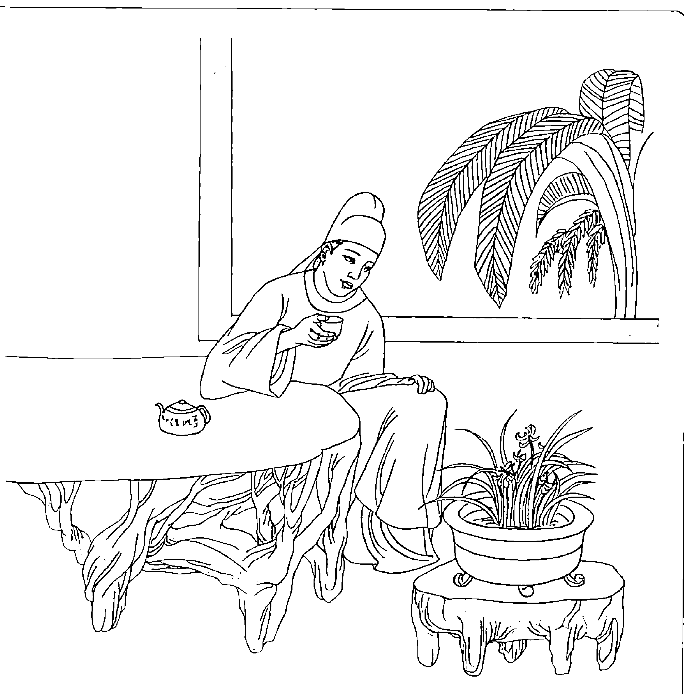

天同星为福德宫主，注重生活情趣与享乐，心绪虽稳定，却被被动保守，常坐而言，不起而行，惜福而缺少奋发向上的冲劲，无开创新局的魄力，不宜坐财帛宫，若独坐或无吉星相助，不宜经商，也少有经商的机会。

## 2 天同星坐丑、未宫：白手起家

## 星曜布局

天同星在丑、未宫为不得地势，必有不得地势巨门星同坐。命宫为平势天机星，田宅宫为地势破军星，迁移宫为太阴星（亥宫为入庙、巳宫为落陷）。

## 财运分析

天同星度量宽，不经心，冲击强，易发福，落陷多操劳；巨门星多好奇，不服输，凡事少计较，易劳碌，落陷多思考。二星同坐财帛宫，平和乐利，保守不躁进，理想高，动力少，虽有储蓄观念，花费却多，盘算不精，喜赚暗财，在奔波劳碌竞争中，须靠工作热忱及服务进财，从事财务工作较吉，易因钱财招惹口舌是非。早年钱财变动不安定，少有积蓄，可小本经营，或小额投资理财，偶会失财，中年后钱财较稳定，可凭借自己的努力，白手起家。

天机星是一颗善星，心地慈悲，温柔多情，有异性缘，足智多谋，机谋权变，多学多动，创意多，有辩才，思绪如波涛澎湃，难得定心，喜欢出主意，替人分忧解劳、排除困难，是一颗能充分发挥脑力激荡的智多星。天机星随缘，具有动的特性，多变喜创新、投机，难安于固定不变的环境。天机星在巳宫坐命，入庙太阴星在对宫朝照，男性易得贤妻及异性相助。

破军星坐田宅宫，能自置产业，房地产不多，仅够家人居住使用，住宅并不很豪华，装潢摆设经常变化，有投资房地产的机会。

太阴星坐迁移宫，喜郊游旅行，偏好幽静情趣之处，与人为善，少有争执，受人欢迎。

## 3 天同星坐寅、申宫：收入稳定

## 星曜布局

天同星在寅、申宫必有天梁星同坐（寅宫：天同星为利势、天梁星为入庙；申宫：天同星为旺势、天梁星为落陷）。命宫为入庙天机星，官禄宫为太阴星（戌宫为旺势、辰宫为落陷），田宅宫为天府星（酉宫为旺势、卯宫为地势），迁移宫为旺势巨门星。

## 财运分析

天同“福”星平和安稳，被动闲散；天梁“荫”星清高执著，主动服务。双星同坐，任劳任怨，端正沉稳，有抱负，忙中享乐。双星同坐财帛宫，福荫同临，向往闲暇舒适的生活，对钱财顺其自然，一生环境虽有变动，但收入稳定，能积蓄，有偏财，获利能力强，可置产保值，也能投资生财。双星同坐申宫，必须经历风波，接受挑战，中年后可获得丰硕财富。

天机星入庙坐子、午宫，足智多谋，慈悲为怀，口才佳，创意多，有设计天分，反应敏捷，多才多学，喜为人服务。天机星坐子、午宫，官禄宫有太阴星，财帛宫有天同、天梁星，为“机月同梁格”，沉稳持重，敬业乐群，踏实守成，顾虑多，循序渐进，能力强，工作努力。天机星独坐午宫比坐子宫吉利，即使没有吉星相扶，也能独当一面，在事业上有所表现。

天府星坐田宅宫，住宅大而舒适，或有庭院露台，能置产；坐酉宫，会有许多房地产。

太阴星坐官禄宫，事业稳定，宜大众传播，须轮加班，需要援助配合，常出差的工作。

巨门星坐迁移宫，出外靠自己，凡事必躬亲，大费唇舌，辛勤劳碌，先付出才有收获。

> > 天同星在寅、申宫坐财帛，必有天梁星同坐，福荫同临，向往闲暇舒适的生活，对钱财顺其自然，一生环境虽有变动，但收入稳定，能积蓄，获利能力强，可置产保值，也能投资生财。同时有天府星坐田宅宫，住宅大而舒适。

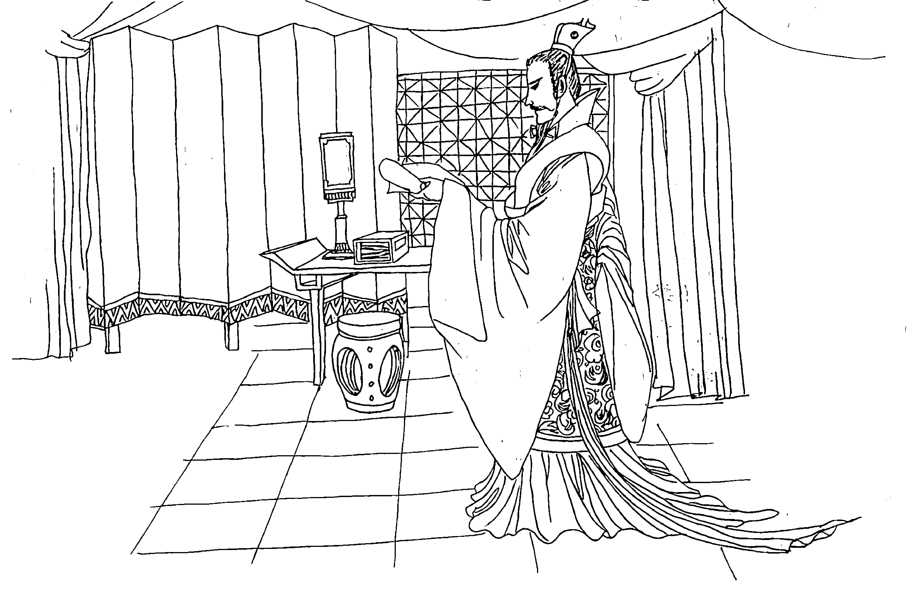

## 4 天同星坐卯、酉宫：财来财去

## 星曜布局

天同星在卯、酉宫为平势独坐，太阴星（酉宫为旺势、卯宫为落陷）在福德宫朝照。命宫为落陷天机星，官禄宫为旺势巨门星，田宅宫为入庙贪狼星，迁移宫为旺势天梁星。

## 财运分析

天同星安分守己，平易近人，少惹事端，知足常乐，好逸恶劳，缺乏进取。独坐财帛宫，悠闲懒散，乐观好享受，爱慕虚荣，淡泊金钱，钱财收入多变动，可储蓄，能理财，纵然支出大，尚能有结余，不愁吃穿，若能积极工作，并控制支出，当可在稳健中逐渐获得财富。

天机星落陷独坐，稳定性不够，常心绪不宁，易受环境影响，常改变观念，行动上却往往不能配合，不按牌理出牌，宜常让自己真正地沉静下来，才能处变不惊，利用变化而成功。

太阴星坐福德宫，恬淡优雅，温和稳健，常悲天悯人，重视生活品质，多有艺术修养。太阴星坐酉宫，可得祖上余荫，精神上较乐观稳定。

贪狼星坐田宅宫，宜居住在繁华热闹之处，居家舒适讲究，置产较晚，早年多搬迁，中年后开始积极置产。

巨门星坐官禄宫，富研究心，口才好，工作认真，任劳任怨，可以面对各种不同性质的工作，不惧危险，不怕枯燥，宜从事与口有关的行业，并以专业求财，名气愈大，发展愈佳。

天梁星坐迁移宫，出外有机缘，有长上贵人相助，喜欢游山玩水，参加艺文、社团服务。

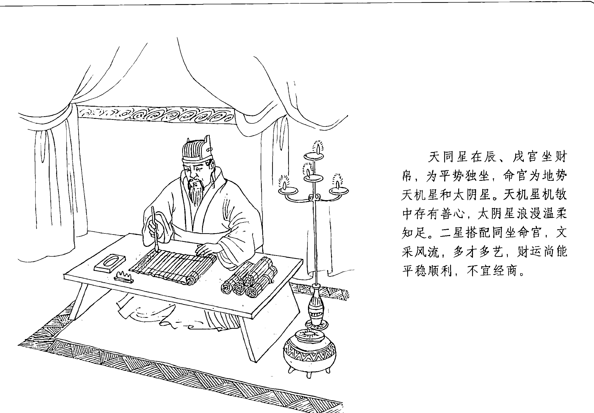

天同星在辰、戌宫坐财帛，为平势独坐，命宫为地势天机星和太阴星。天机星机敏中存有善心，太阴星浪漫温柔知足。二星搭配同坐命宫，文采风流，多才多艺，财运尚能平稳顺利，不宜经商。

## 5 天同星坐辰、戌宫：不宜经商

## 星曜布局

天同星在辰、戌宫为平势独坐，落陷巨门星在福德宫冲照。命宫为地势天机星和太阴星（申宫为利势、寅宫为旺势）同坐，官禄宫为入庙天梁星，田宅宫为地势天相星。

## 财运分析

天同星在辰、戌坐财帛宫，与在卯、酉宫，皆为平势独坐，但其三方四正所会照的星曜不同，财运也因而有所差异。在辰、戌独坐财帛宫时，虽重视钱财，但须费尽周章，才能获取较多钱财，而且不易积存，宜公教、民间企业、服务性的工作，尚能平稳顺利，切忌经商（服饰、化妆品除外）或存心投机，将会得不偿失，中年后经艰苦奋斗，可建立小康之家。

天机星机敏中存有善心，具有发明创造天赋，不墨守成规；太阴星浪漫多情，充满期盼幻想，温柔知足。二星搭配同坐命宫，水木清华，聪慧可人，巧思慧黠，文采风流，多才多艺，秀雅飘逸，亮眼合群，讨喜有人缘，一生转变机会多。唯思绪多端，不易捉摸，常易孤高冷绝，在感情上容易一厢情愿，桃花重，飘荡难免，与宗教有缘。机、月同坐命宫，三方又交会天同、天梁星，为“机月同梁格”，宜公教、传播、文化、服务或智慧性大众事业。

巨门星坐福德宫，心直口快，思虑周密，钱财收入不稳，进财有阻力，宜防意外破财。

天相星坐田宅宫，能置产，宜居住在管理良好的大厦或附近有亲友处，陈设高雅朴实。

天梁星坐官禄宫，宜司法、监察、宗教、社会服务，能受欣赏器重，乐于服务与奉献。

## 6 天同星坐巳、亥宫：常有偏财

## 星曜布局

天同星在巳、亥宫为入庙独坐，落陷天梁星在福德宫朝照。命宫为旺势天机星和入庙巨门星同坐，田宅宫为旺势七杀星。

## 财运分析

天同星心绪稳定，随遇而安，知足常乐，人缘好，具有公关协调能力。天同星坐财帛宫，在巳、亥宫入庙独坐，最能发挥天同星的特性，尤其亥宫为天同星最好的宫位，一生财源不缺，常有偏财运，有储蓄概念，能理财，但须凭自己的努力，自力求发展，在竞争劳碌中，执著奋发，进取上进，才能白手起家，中晚年得以享福。天机星见微知著，洞烛先机，聪明优雅，天赋才华，充满理想；巨门星坚持己见，择善固执，恪守原则，忠于职守，勤于钻研。双星同坐命宫，生机蓬勃，聪明机智，辩才无碍，外向活跃，结缘快，动力强，处事明快，偶会心直口快，受情绪影响而坏事。

## 廉贞星坐财帛宫

廉贞星坐财帛宫，十分喜欢钱财，追求高收入也常是为了满足生活享受，愿把钱财花费在装潢、衣饰、汽车、旅游、娱乐及饮食方面。廉贞星对钱财相当保守，甚少投机，却善于运用钱财以增进人际关系。财帛宫廉贞星化禄，花费于交际应酬的钱财虽然多，得到的回报也不少。财帛宫廉贞星化忌，钱财必有困扰，交际应酬花费得多，但不一定会有实际的成效。

廉贞星为闹财星、次财星，官禄宫主，身命宫为次桃花，此因廉贞星有偏财或横财运，但不易积存，廉贞星化禄或与禄存星同宫，本宫及三方四正配合得好，常有足以致富的条件。

廉贞星对钱财处理相当理智，赚钱或花钱事先都会有详细的计划，并有缓急先后之分。

廉贞星好表现，常须在竞争中进财，并须运用智慧，靠脑力赚钱，适合演艺、大众传播等工作，利于研究、开发、发明，在专门技术或艺术上常有惊人的成就，应防文书失误。

廉贞星思虑多，多变化，主囚、杀、邪，经商不如从事公职或从政，或从事律师、代书、税务代理业。经商最宜做公家机关、大企业的生意；或经营娱乐、餐饮业，或与美术及装饰性同时有关的生意，如成衣、礼品、装潢、设计、圣诞灯饰等。装饰性常须与众不同、怪异、新潮、针对特殊消费者。

廉贞星遇禄存主富贵，遇昌、曲好礼乐，遇七杀显武职。廉贞星落陷易迷于赌博。

## 廉贞星坐子、午宫：矛盾中生财

## 星曜布局

廉贞星在子、午宫为平势必有入庙天相同坐，入庙破军星在福德宫冲照。命宫为入庙武曲星，官禄宫为旺势紫微星和天府星（申宫为地势、寅宫为入庙），田宅宫为落陷天机星，迁移宫为入庙贪狼星。

## 财运分析

廉贞星冲劲大，率性而为。天相星慎言行，稳重诚恳。二星搭配，机智有原则，拿得起，放得下，洒脱又带禅机。二星同坐财帛宫，生财有道，依附他人而贵，异性缘强，交际应酬多，常在矛盾中发展，宜防大起大落，早年难聚财，晚运逍遥。二星同坐午宫，财运亨通。

武曲为财、将、寡宿星，与钱财特别有缘，肯持续努力赚钱，刚毅果决，工作积极，能独自开创事业，白手起家，唯其孤克而不利于婚姻感情。武曲星好比金矿，必须经由千锤百炼的开发，故有晚发的特性，中年以前难有收获，否则也将财来财去而成空。生年支为辰、戌、丑、未年生人，为“将星得地格”，智谋过人，有为有守，威权服众，武职能出人头地。

破军星坐福德宫，倔强霸道，爱面子，感情用事，自我意识强，吃苦耐劳，钱财起伏大。

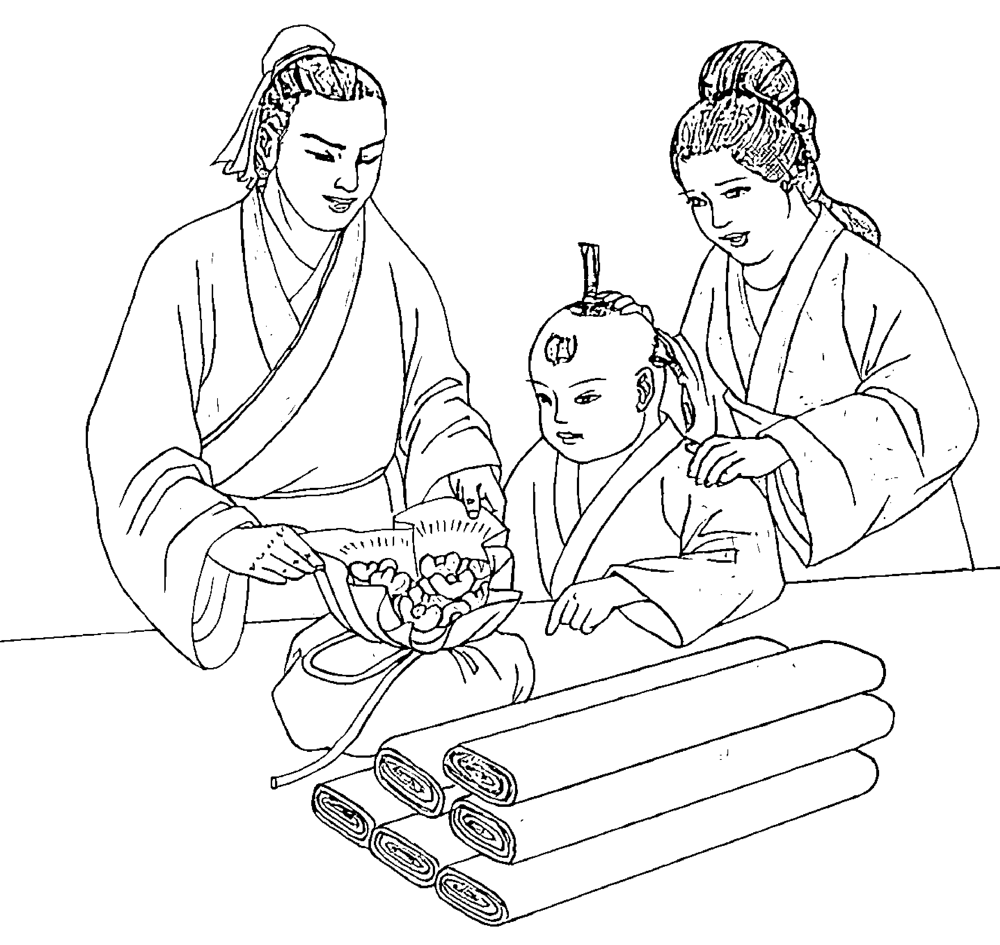

> > 廉贞星为官禄宫主，是闲财星、次财星，有偏财或横财运，但不易积存，廉贞星化禄或与禄存星同宫，本宫及三方四正配合得好，常有足以致富的条件。

天机星坐田宅宫，居家环境单纯，重视精神生活，能自力更生置产，流动性资金多。紫微、天府星同坐官禄宫，领导力强，收入丰盛，常服务于大企业或与国外来往的工作。贪狼星坐迁移宫，四海为家，喜欢热闹过都市生活，生活多变化，易流连于灯红酒绿处。

## 2 廉贞星坐丑、未宫：动中取财

## 星曜布局

廉贞星在丑、未宫为利势必有入庙七杀星同坐，入庙天府星在福德宫朝照。命宫为平势武曲、破军星，官禄宫为旺势紫微星和利势贪狼星，田宅宫为地势天机星和太阴星（申宫为利势、寅宫为旺势），迁移宫为地势天相星。

## 财运分析

廉贞星豪迈多变，全神贯注；七杀星勇猛孤独，勇于负责。双星同坐，深沉有魄力，冲劲足，喜新鲜刺激，受动不耐静，急功近利，际遇难料。双星同坐财帛宫，心高气傲，用智慧和干劲赚钱，喜投机冒险，欲望强，花费大，钱财易波动，有偏财运，愈动愈得财，在热闹或激烈竞争中更能发挥力量，有更高的收入，宜多行慈善，懂得收敛，中年后财运愈佳。

武曲星持重，有自知之明，动静皆宜；破军星任性，刚强自恃，桀骜难驯。二星同坐命，冷热无常，外冷内热，能随遇而安，外缘强，内缘差，在外振奋刚强，居家平淡空虚，内心充满矛盾，但仍能镇定安稳。早年动荡奔波，晚年看脱尘俗，喜清静，移情山水，寄托宗教。

天府星坐福德宫，胸襟广阔，知足常乐，有祖产，喜爱交友，兴趣广泛，生活享受。

天机、太阴星同坐田宅宫，居家优雅美观，喜爱花树盆栽，祖产守得住，有置产能力。

紫微、贪狼星同坐官禄宫，公关佳，自信要求高，喜多变化的工作，具有领导和行动力。

天相星坐迁移宫，出外得人助，乐于助人，风评好，受人欢迎，应酬机会多。

## 3 廉贞星坐寅、申宫：财行中年

## 星曜布局

廉贞星在寅、申宫为入庙独坐，平势贪狼星在福德宫冲照。命宫为旺势武曲星和天府星（午宫为旺势、子宫为入庙），官禄宫为地势紫微、天相星，田宅宫为旺势天机星和入庙巨门星，迁移宫为旺势七杀星。

## 财运分析

廉贞星入庙独坐寅、申财帛宫，最能发挥其开放洒脱、公众及异性缘佳、桃花重、是非多、敬业乐群的特性。具有处理与运用钱财的能力，并常以此谋生，收入常不稳定，宜赚公家或异性行业的钱财。中年前常会财来财去，花冤枉钱，偶有赌运，中年后才能积聚大财。

武曲、天府皆为财星，武曲为金矿，能开创财源；天府是财库，能固守钱财。武曲星理智，能担当；天府星稳重，不计较。二星同坐命，财权并重，衣食无虑，具有领导能力与欲望，富经营手腕，能受人器重，广受好评，非泛泛之辈，承担愈重，成就愈高，人生起伏虽大，但内敛沉稳，能减少波折风险，循序而顺利地发展，宜从事财税、金融、商务等工作。

贪狼星坐福德宫，机敏巧黠，随心所欲，兴趣多样，偏好享受，赚钱容易，花钱也快。

天机、巨门星同坐田宅宫，居家朴素实用，能自置产业，愿奉养长辈，能遗赠子女产业。

紫微、天相星同坐官禄宫，能担重任，常有机会突破困境，得以表现，并学到经验教训。

七杀星坐迁移宫，外出机会多，在家待不住，喜四处游荡，工作多竞争，喜欢自我表现。

## 4 廉贞星坐卯、酉宫：挥金如土

## 星曜布局

廉贞星居卯、酉宫为平势，必有落陷破军星同坐，落陷天相星在福德宫朝照。命宫为入庙武曲、贪狼星同坐，官禄宫为旺势紫微星和平势七杀星，田宅宫为利势天机星和入庙天梁星。

## 财运分析

廉贞星机巧随缘，有自知之明，收放自如；破军星顽固重权欲，独立自主，勇猛不信邪。二星同坐，任性放纵，不耐静，容易两极化，奋发有为与心灰意冷常交相为用，随缘而不易捉摸，成败难料。同坐财帛宫，爱慕虚荣而挥金如土，易赚取服务之财，可经商或领固定薪水，投机易有损失，经商对钱财要格外谨慎，财运时有变化，常大起大落。

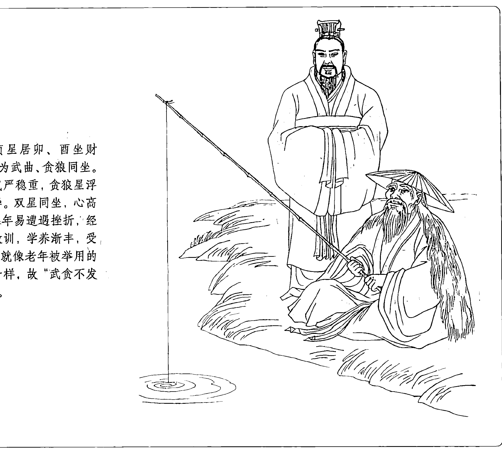

廉贞星居卯、酉坐财帛，命宫为武曲、贪狼同坐。武曲星威严稳重，贪狼星浮躁有才华。双星同坐，心高气傲，早年易遭遇挫折，经由磨炼教训，学养渐丰，受人赏识，就像老年被举用的姜子牙一样，故“武贪不发少年人”。

落，收入愈高，钱财波动愈大，总是破坏之后才有建设。早年财去财来，败多成少，中晚年随心所欲，收入丰硕。

武曲星威严稳重，贪狼星浮躁有才华。双星同坐命，心高气傲，才华得以发挥，唯早年刚强率性，易遭遇挫折，经由磨炼教训，学养渐丰，受人赏识，故“武贪不发少年人”。武、贪同坐命，为“贪武同行格”；日、月又同夹命，亦为“日月夹命格”；辰、戌、丑、未年生人，为“将星得地格”，足智多谋，才艺出众，分析力强，喜创新，组织力强，重情讲理。

天相星坐福德宫，温文儒雅，廉明公正，善解人意，穿着讲究，进退得当，收入不稳定。

天机、天梁星同坐田宅宫，居家清幽雅致，早年多搬迁，中晚年能置产，偏好田园之乐。

紫微、七杀星同坐官禄宫，具领导能力，工作有干劲，宜商、工、娱乐、餐饮、服务业。

## 5 廉贞星坐辰、戌宫：财不匮乏

## 星曜布局

廉贞星在辰、戌宫为利势必有入庙天府星同坐，入庙七杀星在福德宫冲照。命宫为地势武曲星和入庙天相同坐，官禄宫为紫微星（子宫为平势、午宫为入庙），田宅宫为平势天机星，迁移宫为地势破军星。

## 财运分析

廉贞星外向复杂，能牺牲奉献，照应别人，不计较得失；天府星保守稳重，气度宽宏，乐天知命，广结善缘。二星同坐，常顺水推舟，遇事退让，潜力抱负难施展。二星同坐财帛宫，懂得珍惜和运用钱财，颇会赚钱，也会花钱，理财较保守，钱财不忧匮乏，对自己很节省，对朋友大方，有偏财运，能经商及置产，早年钱财难聚积，宜安身公职，中年后可营商。

武曲星稳定有责任感，天相星细心求好心切。二星坐命，自我期许高，愿助人，能储蓄，求安定，不投机，中规中矩，能自得其乐，有工作能力，顺逆境皆能泰然处之。若无煞星冲破，为“府相朝垣格”，大方得体，多才多艺，待人平和机巧，善解人意，善于广结人缘。

七杀星坐福德宫，性刚孤僻，独立坚强，易起纷争，身随意转，随遇而安，钱财不稳定。

天机星坐田宅宫，常搬家，居家单纯，重视精神生活，能置产，流动性资产不少。
紫微星坐官禄宫，自我要求高，事业平顺；坐午宫，能任领导职，中年后宏图大展。
破军星坐迁移宫，出外靠自己，辛苦波折，毅力强，易受外伤，中年后行事较稳重。

## 6 廉贞星坐巳、亥宫：财运难定

## 星曜布局

廉贞星在巳、亥宫为落陷必有落陷贪狼星同坐。命宫为利势武曲星和旺势七杀星同坐，官禄宫为入庙紫微星和旺势破军星同坐，田宅宫为入庙天机星，迁移宫为天府星（卯宫为地势、酉宫为旺势）。

## 财运分析

廉贞星气度宽，其弹性，能察言观色，有自知之明；贪狼星多才华，欲望多，活跃爱现，足智多谋。二星同宫，机敏窍巧，摆摇不定，起伏大，变化多，常现生机和转机。同坐财帛宫，爱面子，好享受，财运时好时坏，进财方式多元，职业多变化，经营多角化，会赚钱更会花钱，华而不实，偶有偏财，常在须交际应酬的环境中工作，时有投机心，忌赌博及色情。

武曲星保守，沉稳，刚强果决，辛勤劳碌，波折变化;七杀星开放，浮躁好动，率性勇猛，倔强执著，随心所欲。二星同坐命，端庄不失活泼，率直尖锐，有为有守，重感情，喜隐藏自己，桃花内敛，工作常转换，常为领导者，工作有计划具行动力，成败起伏大，挫折多，灾伤重，付出不少，易孤寂，知音难觅，早年必须辛苦创业，中年有成，晚年有收获。

天机星坐田宅宫，居家单纯，重视精神生活，能自力更生，有置产能力，流通性资金多。

紫微、破军星同坐官禄宫，有专长和领导力，能承担及开创，能持续努力，获得成就。

天府星坐迁移宫，出外得人缘，适合远行，易受长上照顾，生活优裕，有国外定居机会。

## 天府星坐财帛宫

天府星本性保守谨慎，顾虑较多，缺乏冒险精神，较少创意，虽可将经商之波折损失降为最低，而其禄库属于官爵俸禄之财，而非营利之财，故不适宜经商。适合担任公职或大企业的财经主管，或为人服务，较宜经营有特色的独家生意，其商品往往并非日常生活所必需。

天府星是财星之一，为库财星，是天上的财库，为财帛、田宅宫主，对钱财和房地产，以及生活环境的好坏，具有举足轻重的影响。无论与任何星曜同宫，终其一生，必会有积蓄。

天府为南斗君王星，稳重自信，沉着不退缩，容让敦厚，随遇而安，悠闲自在。很有金钱观，十分爱惜钱财，懂得开源节流，且并不太看重金钱，不曾为钱财劳碌，，往往会有形或无形中自然带来财富，能自给自足，从事任何行业都会财源滚滚。其钱财多来自于继承祖业或积蓄，多以不动产、金银珠宝、古董，股票等方式库存。

天府星的吉凶，必须同时参看天相星的庙陷程度，此即所谓的“逢府看相”。若天相星庙旺，天府星虽为平势，也主吉利;反之，若天相星为平势，天府星虽属庙旺，却稍嫌乏力。

天府星为财库，且缺乏独立性，故独坐时，容易引起觊觎之心。
天府星喜逢紫微、武曲、禄存、天马、化禄、化权、化科、六吉星，不喜六煞、空亡星。
天府星最宜入财帛、田宅宫，有偏财运，很会控制金钱。

## 1 天府星坐子、午宫：财权并重

天府星坐子、午宫，必有武曲星同坐，请参看武曲星。

## 2 天府星坐寅、申宫：富足保守

天府星在寅、申宫，必有紫微星同坐，请参看紫微星。

## 3 天府星坐辰、戌宫：会赚钱也会花钱

天府星在辰、戌宫，必有廉贞星同坐，请参看廉贞星。

## 4 天府星坐丑、未宫：衣食富足

## 星曜布局

天府星在丑、未宫为入庙独坐，利势廉贞星和入庙七杀星同在福德宫冲照。命宫为地势天相星，迁移宫为平势武曲、破军星。

## 财运分析

天府星自信稳重，为库财星，在丑、未墓库入财帛宫，是库财星归库，能得天时地利，财运亨通，有储蓄概念及投资能力，善于理财，喜欢置产或做多样化投资生财，一生平稳，命运变迁机会多，若能及早学习具备各种专长，培养实力，必能循序渐进，获得惊人的成就。同时，太阴、太阳双富贵星相夹，为日月夹财，只要没有六煞、化忌星同坐，富贵兼得，衣食富足。唯命宫天相星仅为地势，必须持续努力，热心服务，多能成为各行业中的佼佼者。

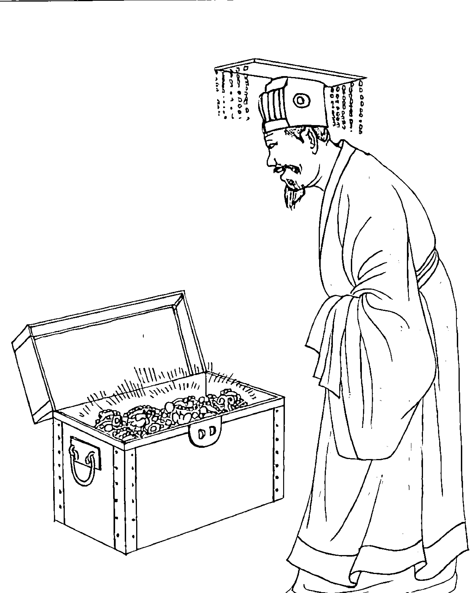

天府为南斗君王星，稳重自信，容让敦厚，悠闲自在，很有金钱观，十分爱惜钱财，懂得开源节流，不曾为钱财劳碌，其钱财多来自于继承祖业或积蓄，多以不动产、金银珠宝、古董，股票等方式储存。

命宫天相星仅为地势，力量不强，劳心费力，艰辛波折。但毅力坚强，不畏挫折，有工作热忱，能充分参与工作，并愿意与别人分享工作成果，能冷静面对现实，不断努力开发，接受各种挑战，力争上游，终能冲破难关，获得成就，宜公教、文职，适合向外地发展。廉贞、七杀星同坐福德宫，活泼洒脱，眼光卓越，能言善辩，敬业乐群，行事不计较成败，处事不落于俗套，工作认真忙碌，有口福，懂得享受，钱财收入不稳定，常有机会发财。
武曲、破军星同坐迁移宫，出外靠自己，适应力强，不畏生，能泰然处于陌生环境，肯吃苦耐劳，不惧挫折，奔波劳碌，人生体验相当丰富，晚年喜清静，能看脱尘俗，寄情宗教。

## 5 天府星坐卯、酉宫：一生财运良好

## 星曜布局

天府星在卯、酉宫为独坐（卯宫为地势、酉宫为旺势），利势武曲星和旺势七杀星同在福德宫对照。命宫为天相星（未宫为地势、丑宫为入庙），田宅宫为太阳星（戌宫为不得地势、辰宫为旺势），迁移宫为入庙紫微星和旺势破军星。

## 财运分析

天府星在卯、酉独坐财帛宫，一生财运良好，通常家境都很富裕，或有稳定的收入，善于理财，生活不需忧虑。经商者多持续经营上一代的老行业，或设立家中老行业的分支机构。非经商者，往往有机会管理家中的产业。必须格外努力，经历自我挑战，自我

突破，中年后可渐渐储蓄而发财致富。宜经营餐饮、饭店，或投资房地产、股票。

天相星稳重踏实，有原则，肯上进，愿帮助别人，将工作视为生活的一部分，凡事步步为营，按部就班，持续不断地工作。天相星在丑宫为入庙，财帛宫的天府星和田宅宫的太阳星皆为旺势，若无煞星冲破，为“府相朝垣格”，见识广博，处事得体，善解人意，人缘佳，富贵双全。命坐未宫，天相星为地势，财帛宫天府星也为地势，气势较弱，以为人服务较佳。

武曲、七杀星同坐福德宫，达观正直，能自立自强，常有独特看法，钱财收入不稳定。

太阳星坐田宅宫，居住环境复杂，有置产欲望，居家讲求坚固实用；坐辰宫，不动产多。紫微、破军星同坐迁移宫，出外颇得人和，自立维生，能面对挑战，不畏挫折，有成就。

## 天府星坐巳、亥宫：存不了什么钱

## 星曜布局

天府星在巳、亥宫为地势独坐，旺势紫微星和平势七杀星同在福德宫对照。命宫为落陷天相星，迁移宫为平势廉贞星和落陷破军星。

## 财运分析

天府星在巳、亥坐财帛宫，悠闲自在，随遇而安，心境轻松愉快，财运亨通。虽然生活环境优裕，一生吃穿不愁，但钱财比天府星坐其他宫位较为不稳，往往是工作变化有波动，或突然增加许多收入却持续不久，或是贪图享受过着奢侈浮华的日子而存不了什么钱，故应该培养耐性和敬业精神，并养成储蓄的习惯。

天相星为最佳秘书人才，必须依附别人，不能够完全掌握自己的命运。若老板仁慈讲理，则能获得信任与倚重；若不幸遇到理念不同的主管，或处于缺乏规矩或秩序的环境，则自己的原则与环境常无法平衡，容易感情冲动而自感矛盾。天相星落陷独坐命，势弱无力，眼高手低，多说少做，心大胆小，犹疑不决，容易受人影响，喜欢粉饰太平，欠缺雄心壮志，不宜经商。工作有一定的原则，宜保持高度警觉与细心，才能在冲突、变化、矛盾中取得平衡。

紫微、七杀星同坐福德宫，争强好胜，不听人言，喜欢附庸高雅，注重生活品位，耐性不足，不耐久磨，遗憾抱怨较多，能自我解嘲，收入不稳定，钱财起伏大，常有机会发财。

廉贞、破军星同坐迁移宫，出外容易结缘，不甘寂寞，荤素不忌，活动力强，愿冷

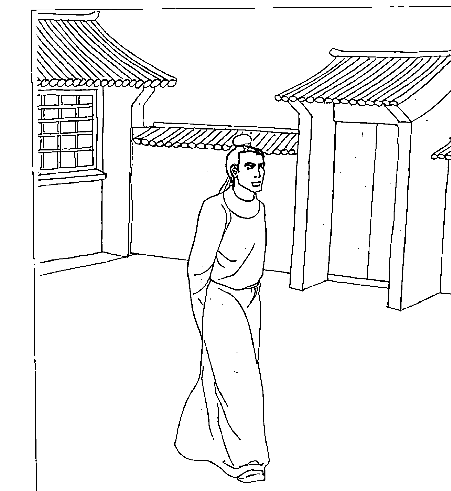

天府星在卯、酉独坐财帛宫，一生财运良好，通常家境都很富裕，或有稳定的收入，善于理财，生活不需忧虑。

## 太阴星坐财帛宫

静面对现实，能有表现，不安于位，起伏变化较大，艰辛波折，劳心费力，是非难免。

太阴星精于财务，能节约储蓄，量入为出，理财稳当，甚少负债。用钱不愁，收入稳定，喜欢置产。太阴星之财为固定、兼职收入，其致富的原因很多，如高收入、经商赚钱、中奖，但较少以竞争、计较方式得来。太阴星庙旺时收入丰盛，落陷时进财劳心费力。

太阴星是财星之一，为家财星，主富、禄库、藏，为财帛、田宅宫主，一生物质上富有，精神上又满足，虽不十分在意金钱，但懂得如何去运用钱财，能够自得其乐，满足又快乐。

太阴星温柔斯文，浪漫多情，财利具有流通性，即钱财多为“流水财”，财源相当可观，钱财绝非横发暴富，而是勤俭工作并慢慢积存而来，宜服务业、代理商，也适合不动产投资。

太阴星主富、藏，庙旺时适合以智慧经商，可出奇制胜，树立形象，宜具大众服务行业。

太阴星能把自己分内的工作做好，也能配合援助他人，宜护理、秘书、文教、社会服务。

太阴星喜化吉星，无论化禄、化权、化科，都可增辉。逢化禄、禄存星，一生钱财享用不尽；逢化权，可创业掌权；逢化科，因财而得名。在亥宫化忌，无煞星为变景，使有奇迹。

太阴星喜遇六吉星，遇左、右，有福分；遇昌、曲，有文艺才华；遇魁、铖，有贵人。

太阴星不喜六煞星，主有挫折。落陷遇煞星，禄库有缺口，乃财来财去，多劳碌。落陷遇羊、陀、火、铃，恐有肢体伤残之灾；庙旺时较不惧地空星，虽钱财不利，但不妨碍功名。

## 1 太阴星坐子、午宫：精于理财

太阴星在子、午宫，乃有天同星同坐，请参看天同星。

## 2 太阴星坐丑、未宫：收入平稳

太阴星在丑、未宫，必有太阳星同坐，请参看太阳星。

## 3 太阴星坐寅、申宫：白手起家

太阴星在寅、申宫，必有天机星同坐，请参看天机星。

## 4 太阴星坐卯、酉宫：不动产丰盛

## 星曜布局

太阴星在卯、酉宫为独坐（卯宫为落陷、酉宫为旺势），平势天同星在福德宫朝照。命宫为旺势天梁星，官禄宫为太阳星（亥宫为落陷、巳宫为旺势），田宅宫为入庙武曲星，迁移宫为落陷天机星。

## 财运分析

太阴星在卯、酉独坐财帛宫，收入稳定，喜欢置产。太阴星坐酉宫为旺势，机运良## 太阴星坐辰、戌宫：进财轻松平顺

## 星曜布局

太阴星在辰、戌宫为独坐（辰宫为落陷、戌宫为旺势），太阳星（戌宫为不得地势、辰宫为旺势）在福德宫朝照。命宫为天同、天梁星（申宫：天同星为旺势、天梁星为落陷；寅宫：天同星为利势、天梁星为入庙），官禄宫为入庙天机星。

## 财运分析

太阴星主富，对其庙旺或落陷的光芒又特别敏感，财运因而有所不同。太阴星在戌宫为旺势，福德宫主贵的太阳星也为旺势，收入高，常身居要职，进财轻松平顺，能以不动产致富。太阴星在辰宫、太阳星在戌宫皆属落陷，为日月反背，进财辛苦费力，赚不了大钱，即使收入高也入不敷出，无法积存钱财，宜谋求较稳定工作，或离乡到国外求发展，漂泊不定。

天同星有福、和平、务实，天梁星有荫、执著、热忱服务，二星同坐命，福荫相聚，沉稳端正，居安思危，随和少欲，不贪功近利，量力而为，任劳任怨，忙中享乐，多有抱负，安稳少怨。天同、天梁星同坐命，三合会照天机、太阴星，为“机月同梁格”，敬业乐群，守成踏实，循序渐进，宜公教、财商、服务、传播、文化业。天梁在申宫落陷守命，太阴星在辰宫落陷会照，为“天梁拱月格”，一生多变动，常漂泊他乡，宜防酒色伤身及荡尽家产。

太阳星坐福德宫，收入不错，生活讲究，落陷时劳心却不一定得志。坐辰宫，事业有成。天机星坐官禄宫，喜欢开发创造，工作努力，具有行动力，颇能适应变化，能受肯定。

> 太阴星精于财务，能节约储蓄，量入为出，理财稳当，甚少负债，用钱不愁，收入稳定，喜欢置产，其财具有流通性，即钱财多为“流水财”，财源相当可观，是勤俭工作慢慢积存而来。

## 6 太阴星坐巳、亥宫：财运难测

## 星曜布局

太阴星在巳、亥宫为独坐（巳宫为落陷、亥宫为入庙），平势天机星在福德宫朝照。命宫为太阳、天梁星（酉宫：太阳星为平势、天梁星为地势；卯宫：太阳、天梁星皆为入庙），田宅宫为紫微星（子宫为平势、午宫为入庙）。

## 财运分析

太阴星在亥宫，有如晚上九时至十一时的月亮，为月朗天门，最为清朗明亮，是十二宫中最吉利的宫位，虽然职业或会有变动，但生活环境优裕，常有高收入，却未必会以生财为人生目标，所进的钱财，多因高地位、高知名度或在知名的大企业任职而产生，宜任公职、民营大企业，经商应注意服务品质。太阴星在巳宫为落陷，进财辛苦费力，收入不高，生活环境尚可，往往会不得志，但仍会有家族余荫之助，常漂泊异地，奔波劳碌，领固定薪水的上班族，也不免会四处调职，工作不稳定，应体认平安是福的哲理。

太阳星霸气威猛、博爱关怀；天梁星老气固执、服务牺牲。二星同坐命，霞辉普照，其服务忍让心，广结善缘，牺牲吃苦多，应坦然面对。入庙太阳、天梁星同坐卯宫，三合会照入庙太阴星，为“日照雷门格”，坚忍沉着，雄才大略，胆识过人，志向远大，事业有成就。

天机星坐福德宫，智谋超卓，创意出新，乐善好施，有宗教缘，钱财不稳，有竞争性。

太阴星在亥宫，有如晚上9时至11时的月亮，为月朗天门，最为清朗明亮，是十二宫中最吉利的宫位，虽然职业或会有变动，但生活环境优裕。

紫微星坐田宅宫，居家为高楼大厦，重视生活品质，能在国内外置产。坐午宫，房产多。

## 贪狼星坐财帛宫

贪狼为偏财星，财运成中带破，常接触酒色财气，钱财常带有投机性、竞争性、变化性、名利性、欲望性。早年财来财去，早发早破。中年后财源渐丰，能置产，钱财不忧匮乏。

贪狼星为第一桃花星，也是花财星，主祸福、欲望，自私自利，圆滑而表里不一，好奇心重，情绪多变，善于理财，欲望强烈，奢侈浪费，常需交际应酬而花费钱财，钱财用途广。

贪狼为偏财星，财运成中带破，常接触酒色财气，钱财常带有投机性、竞争性、变化性、名利性、欲望性，早年财来财去，早发早破，中年后财源渐丰，能置产，钱财不忧匮乏。

贪狼星多才艺，常有特殊表现，肯竞争及奋斗，能努力不懈，坚持到底，宜多元进财，以技术经商，不宜买卖业。宜园艺、花卉盆景、美容、装饰、美术、室内设计，经营餐饮、娱乐、演艺、舞厅、酒吧、茶室、休闲中心等行业。应注重形象，最好能有宗教信仰。

贪狼星求好心切，能检讨得失，适应变化，善于运用酒色财气促进人际关系，勇于尝试，常有新颖观念，能带动风潮。贪狼星入亥、子水乡，为泛水桃花，多浪漫，易因投机而败财。

贪狼星入辰、戌、丑、未四库宫，为财入库位又属入庙，能减低酒色财气，才艺能发挥。

贪狼星喜遇火、铃星同宫，为“火贪格”或“铃贪格”，常有突发表现，若又逢化禄，易有意外横发之钱财收入。入庙贪狼星与地空、地劫星同宫，多有专门技术，宜以巧艺安身。

贪狼星甚忌擎羊、陀罗星，易因色灾成祸。贪狼星不喜与文昌、文曲星同宫，或逢化忌、红鸾、天喜、咸池、沐浴、天姚等桃花星，易使贪狼星多欲，才艺虚而不实，桃花是非多。

## 贪狼星坐子、午宫：钱财有大起伏

## 星曜布局

贪狼星在子、午宫为旺势独坐，紫微星（午宫为入庙、子宫为平势）在福德宫朝照。命宫为入庙七杀星，官禄宫为地势破军星，迁移宫为入庙天府星和利势廉贞星。

## 财运分析

贪狼星多才多艺，利于设计、美容等，靠手艺、技术赚钱，不宜于单调呆板的工作，由于钱财有相当大的起伏和变化，进财来源常变换，或常因变换工作而增加财源，或时常调动职务而增加收入，应脚踏实地认真努力地工作，避免有投机的心态，花费也应该注意节制。

七杀星勇猛果敢，智勇兼备，入庙独坐辰、戌宫，必定会奋力挣脱天罗地网的束缚，虽然历经艰苦，惊险百出，终能冲出重围，有所成就。七杀星坐辰、戌宫，是最辛劳的宫位，容易感到压迫和不安而有孤独和失落感，应真正面对自己，看清自己的优缺点，并对自己有较高的期许，在工作中力求完美，提高自己的自信心，才能突破风波险阻，脱颖而出。

紫微星坐福德宫，福泽绵绵，多得贵人，自傲娇贵，有领导欲，喜欢摆场面，多幻想，心存善念，主观好争胜，意见常与人不同，收入不错，用钱有计划。

破军星坐官禄宫，有领导才干，不想被限制束缚，积极有冲劲，应变能力强，能见机行事，具有开创力，经商易遭遇挫败，宜从事具有开创性、危险性、动作性、表演性的工作。

天府、廉贞星同坐迁移宫，能自力更生，宜赴海外求发展，多有贵人机缘，桃花机会多。

## 2 贪狼星坐丑、未宫：武贪不发少年人

贪狼星在丑、未宫，乃有武曲星同坐，请参看武曲星。

## 3 贪狼星坐卯、酉宫：生财有道

贪狼星在卯、酉宫，必有紫微星同坐，请参看紫微星。

## 4 贪狼星坐寅、申宫：不择手段求财

## 星曜布局

贪狼星在寅、申宫为平势独坐，入庙廉贞星坐福德宫冲照。命宫为旺势七杀星，官禄宫为旺势破军星，迁移宫为天府星（子宫为入庙、午宫为旺势）和旺势武曲星。

## 财运分析

贪狼星在寅、申宫仅为平势，无法将贪狼星的特性完全发挥，但仍善于计划和处理钱财，对钱财较保守，眼光远大，一般财运顺遂，钱财变动大，求财心切，常会不择手段，喜欢投机，支出多，花费大，有偏财，早年多财来财去，不宜经商，行运不利时财务要特别小心。

七杀星在子、午宫旺势守命，若三方四正无六煞、化忌星，为“七杀朝斗格”，爵禄荣昌，智勇兼备，具有才干，愿意承担，能面面俱到，一生荣华富贵，能身居要职，独当一面，权威十足，收入高。唯一生变动大，必须凭着自己的毅力，努力奋斗，并获得外来助力，因缘得势而获得成功。七杀、破军、贪狼三星，在命盘中必三台会照，其中任一星坐命，皆为“杀破狼格”，一生命运起伏变动很大，七杀星孤独寂寞，变动具有发展和延伸性；破军星钱财及感情变动大，变动具有开创性；廉贞星易近酒色财气，变动具有名利和欲望性。

廉贞星坐福德宫，机敏迅捷，乐观积极，不拘小节，敬业乐群，不畏艰辛挫折。

破军星坐官禄宫，事业多变化，具备领导才干与开创能力，能掌握重点，突破现状而成功。

天府、武曲星同坐迁移宫，处事干练，广受好评，出外有贵人，百折不挠，经商有成就。

## 5 贪狼星坐辰、戌宫：常赚异性和娱乐之财

## 星曜布局

贪狼星在辰、戌宫为入庙独坐，入庙武曲星在福德宫朝照。命宫为入庙七杀星，官禄宫为入庙破军星，田宅宫为太阳星（亥宫为落陷、巳宫为旺势），迁移宫为天府星（寅宫为入庙、申宫为地势）和旺势紫微星。

## 财运分析

贪狼星在辰、戌入庙独坐财帛宫，收入不稳定，赚钱常具竞争性和变化性，常不择手段，有偏财运，喜欢投机，通常对钱财不很珍惜，不懂得如何积蓄钱财，喜爱物质享受，交际应酬多，生活多姿多彩，常赚异性和娱乐之财，早年较艰辛，中年后发达进财。

七杀星在寅、申宫入庙独坐命，若三方四正无六煞、化忌星，为“七杀朝斗格”。七杀在子、午宫坐命，也属“七杀朝斗格”，唯七杀星为旺势，也仅朝照天府星；七杀星坐寅、申宫为入庙，能同时朝照紫微、天府双帝星，更为吉美，其谋略，有才干，富忍耐力，肯上进，其领导力，能克服困难，一生多变，能身居要职，独当一面，权威十足，事业多有表现。

武曲星坐福德宫，有为有守，刚直公正，能身体力行，量力而为，生财劳心费力。

太阳星坐田宅宫，居家喜欢视野广阔，简单大方。坐巳宫为旺势，能投资房地产获利。

破军星坐官禄宫，具有开创力，工作顺利稳定，能一鼓作气奋力冲刺，获得肯定与赞赏。

天府、紫微星同坐迁移宫，出外工作有表现，受人器重，有国外缘，旅行及应酬机会多。

## 6 贪狼星坐巳、亥宫：财运时好时坏

贪狼星在巳、亥宫，必有廉贞星同坐，请参看廉贞星。

## 巨门星坐财帛宫

> 巨门星工作勤奋，一分耕耘就有一分收获，多须自食其力，有固定薪水。置产可致富。

巨门星为口财星，口才好，有口福，常靠嘴巴赚钱，宜教育、进出口、代理商、批发商、船务、运输、广告、传播、补习班、推销员、店员、演艺、外交、经贸、保险、公关、律师、法官、餐饮、娱乐、旅游、音乐等工作。巨门星也是暗星，多是非、多疑，常会因“言多必失”而招惹口舌是非，产生纷争。工作上必须运用口才，经过激烈竞争，用尽脑力，辛勤费力，才能白手起家而生财。但较难积存钱财，收入多时，支出也大，应注意控制开销和预算。

巨门星经商会遭遇竞争对手，也易惹是非，常会事倍功半，只宜经营需要动口的生意。

巨门星最喜化权，能增加理性和说话分量，条理分明，具权威性，令人信服，会减少口舌是非；巨门星化禄，有口福，讲话感性，能看场合说话，说话讲理随和，常因动口而生财。

巨门星成富者，忌锋芒外露，骄傲自满，易惹是生非，遭人排挤，甚或为子女耗散钱财。

巨门星不喜化忌，多口舌是非，常不满现实，言辞尖锐，咄咄逼人，偏又喜欢说，易惹人反感，得罪人而不自知，常财来是非也来。若从事需动口的行业，可适得其所而趋吉避凶。

巨门星甚嫌擎羊、陀罗星，感情多波折，一言足以偾事，多是非困扰，一波未平，一波又起，巨门星遇地空、地劫、火、铃星，劳碌坎坷。

## 1 巨门星坐子、午宫：宜经营“嘴巴”生意

## 星曜布局

巨门星在子、午宫为旺势独坐，入庙天机星在福德宫朝照。命宫为太阳星（辰宫为旺势、戌宫为不得地势），田宅宫为入庙紫微星和旺势破军星，迁移宫为太阴星（戌宫为旺势、辰宫为落陷）。

## 财运分析

巨门星在子、午独坐财帛宫，多半必须仰赖良好的口才，积极进取的工作态度，卓越的竞争力，在困境中，白手起家，勤俭致富。宜经营靠嘴巴赚钱的生意，在财务方面要特别谨慎。若本宫或三方四正逢遇化禄、化权、化科星，为石中隐玉，少年时须历经各种琢磨，中年后，辛劳必有代价，玉才能显露光辉，脱颖而出，成为富裕的人，往往是先有名，后有利。

辰宫为早晨七至九时的太阳，旭日初升，充满朝气与希望，对宫又有旺势太阴星朝照，为“丹墀桂墀格”，光明磊落，处事有一套，劳而有获，早遂青云之志。戌宫为晚上七至九时的太阳，西沉失辉，光芒全失，对宫太阴星又落陷失辉，为“日月反背格”，披星戴月，劳碌命，与父母缘薄，须离乡背井，独立奋斗，无福享乐，桃花缠绕，断了又续，旧去新来。

天机星坐福德宫，为人机警，冷静客观，善于察言观色，有创意，钱财不稳，有竞争性。

紫微、破军星同坐田宅宫，喜投资经营房地产，投资或为人担保要留意，勿赌博和嫖妓。

太阴星坐迁移宫，喜欢郊游旅行及户外活动，与人为善，少有争执，人缘佳，受人欢迎。

## 2 巨门星坐丑、未宫：白手起家

巨门星在丑、未宫，必有天同星同坐，请参看天同星。

## 3 巨门星坐寅、申宫：开口进财

巨门星在寅、申宫，必有太阳星同坐，请参看太阳星。

## 4 巨门星坐卯、酉宫：白手生财

巨门星在卯、酉宫，必有天机星同坐，请参看天机星。

巨门星为口财星，口才好，有口福，常靠嘴巴赚钱，尤其是巨门星化禄时，口福尤甚，并且常能因动口而生财。

## 5 巨门星坐辰、戌宫：储蓄积财

## 星曜布局

巨门星在辰、戌宫为落陷独坐，平势天同星在福德宫朝照。命宫无主星，官禄宫为太阳星（子宫为落陷、午宫为旺势），田宅宫为平势武曲、破军星，迁移宫为地势天机星和太阴星（寅宫为旺势、申宫为利势）。

## 财运分析

巨门星在辰、戌落陷独坐财帛宫，受到天罗地网的局限，常有无力感，辛劳费力，难有表现。财源不稳，生活欠安，常为生活费心，奔波劳碌。必须沉住气，埋头苦干，经过激烈竞争，才能艰辛生财，钱财较难保持，宜多储蓄，留意金钱的支配，否则辛苦所赚来的钱财，很容易破荡殆尽，生活却不见得会有改善，从事教职或靠嘴巴赚钱的行业，是最明智的选择。

命宫无主星，应以本宫其他甲级星及其对宫（迁移宫）的天机、太阴星，共同综合论命。

天机星足智多谋，心地慈善，机敏权变，有创作发明天分；太阴星浪漫多情，知足常乐，工作勤俭，充满期盼幻想。二星同坐迁移宫，秀雅飘逸，文采风流，多才多艺，有人缘，得人和，喜欢游山玩水，桃花重，情债难偿，工作有表现，一生动荡转变机会多。

天同星坐福德宫，豁达随和，怡然自得，重恩情，收入不错，讲究衣着外表与环境气氛。

武曲、破军星同坐田宅宫，祖产较难保，应谨慎处理钱财，勿存投机心态或浪费成性。太阳星坐官禄宫，热心服务，事业劳心费神，宜文教、传播、法官、社会服务等工作。

## 6 巨门星坐巳、亥宫：积蓄资产而发财

## 星曜布局

巨门星在巳、亥宫为旺势独坐，太阳星（亥宫为落陷、巳宫为旺势）在福德宫朝照。命宫为平势天同星，官禄宫为落陷天机星，田宅宫为入庙破军星，迁移宫为太阴星（卯宫为落陷、酉宫为旺势）。

## 财运分析

巨门星在巳、亥旺势独坐财帛宫，一生浮浮沉沉多变化，工作若不是靠流动生财，便须与人激烈竞争，利用口舌赚钱，多须自食其力，比较注重生活享受，重视物质欲望。若能辛勤努力打拼，养成良好的储蓄习惯，避免妄作投资，中年后将能点点滴滴积蓄资产而发财致富。巨门星坐亥宫，有掌握钱财的欲望，能勤奋工作，劳而有获。

天同星在卯、酉宫平势独坐命，平易近人，安分守己，与人为善，知足常乐，对异性温柔细心，生活工作多求安稳，能安心工作，待人处世平和为贵，常从单一事情中获得成就感，有时会有浮躁而异常的工作态度，造成工作上的烦恼，可在稳定中发展。

太阳星坐福德宫，负责进取，善交际，生活讲究。巳宫庙旺事业有成，亥宫劳心费力。

破军星坐田宅宫，居家摆饰常变化，家道兴盛，常有机会投资经营房地产，添置产业。

天机星坐官禄宫，好奇心重，事业易有变动，宜从事变动性较小的工作，才能稳定发展。

太阴星坐迁移宫，喜欢出外旅游，辛劳奔波。坐酉宫有异性、贵人相助；坐卯宫宜静守。

> 巨门星在辰、戌落陷独坐财帛宫，由于受到天罗地网的局限，常有无力感，辛劳费力，财源不稳，生活欠安，常为生活费心，奔波劳碌，必须沉住气，埋头苦干，才能艰辛生财，钱财较难保持。

## 天相星坐财帛宫

天相星能理财，财源不忧匮乏，易有高收入，可积蓄，处理钱财谨慎保守，但对钱财并不计较，朋友真需要钱时，会慷慨赠借。多不靠祖业，能白手创业起家。一生经济状况稳定。

天相星公正廉明，稳重踏实，循规蹈矩，诚恳负责，进财来源都循正当途径，如有高收入的工作，并多能符合自己的理想，宜于秘书或从事公正、媒介的工作，如证券商、律师、会计师，也适合做美容、服饰、休闲服务、装潢等行业，往往都很重视服务，人缘形象良好。

天相为票财星，经常会支票收入多，现金收入少。天相星有正义感，乐于助人，又严于律己，宽以待人，常因过于重视人情，而轻易为人担保，容易受人拖累，在票据和感情债方面常会出问题，应该特别注意。天相星大方而不计小利，又乐于为人服务，适合为人工作，并不宜经商，只宜从事各种服务业，与大众直接关系的生意，或专门为特定的人或团体服务，或必须售后服务的行业，多能为老主顾服务，生意固定，日积月累，自有稳定的收入。

天相星主官禄宫，喜遇紫微、天府等有力主吉星及六吉星，尤其喜欢左辅、右弼或龙池、凤阁双星相夹，能增添气势，为显贵人服务，多能独当一面，大展才华，增加收入。天相星庙旺遇煞星，在才艺方面有表现，以技术开店营业，可因踏实诚恳服务，带来生意。天相星平势或落陷，无吉星相助，又加遇六煞、化忌星，会变成过于谨慎，只关心自己。

## 1 天相星坐子、午宫：矛盾中生财

天相星在子、午宫，必有廉贞星同坐，请参看廉贞星。

## 2 天相星坐寅、申宫：衣食丰盈

天相星在寅、申宫，必有武曲星同坐，请参看武曲星。

# 天相星坐丑、未宫：稳定生财

## 星曜布局

天相星在丑、未宫为独坐（丑宫为入庙、未宫为地势），入庙紫微星和旺势破军星在福德宫对照。命宫无主星，官禄宫为天府星（酉宫为旺势、卯宫为地势），迁移宫为落陷廉贞、贪狼星。

## 财运分析

天相星在丑、未独坐财帛宫，一般都有良好的家境，一生财运平稳丰厚，钱财收入不错，衣食无忧，生活享受，富贵安康。尽管人生多变化，但始终都能平安履险，生活愉快，常能在平稳中开创新财源，唯对金钱不可太浪费，以免晚年反而辛苦度日。

命宫无主星，应以本宫其他甲级星及其对宫（迁移宫）的廉贞、贪狼星，共同综合论断。

廉贞星气度宽，其弹性，懂得察言观色，有自知之明；贪狼星多才华，欲望多，活跃爱表现，足智多谋，二星都带桃花。同坐迁移宫，机敏巧变，有独特见解，虚荣心重，不易捉摸，人缘好，出外喜繁华热闹处，常接触声色犬马，懂得享受生活乐趣，随心所欲，飘摇不定，人生行运变化多端，往往蕴涵生机和转机，早年不甚得意，中年后成熟稳重。

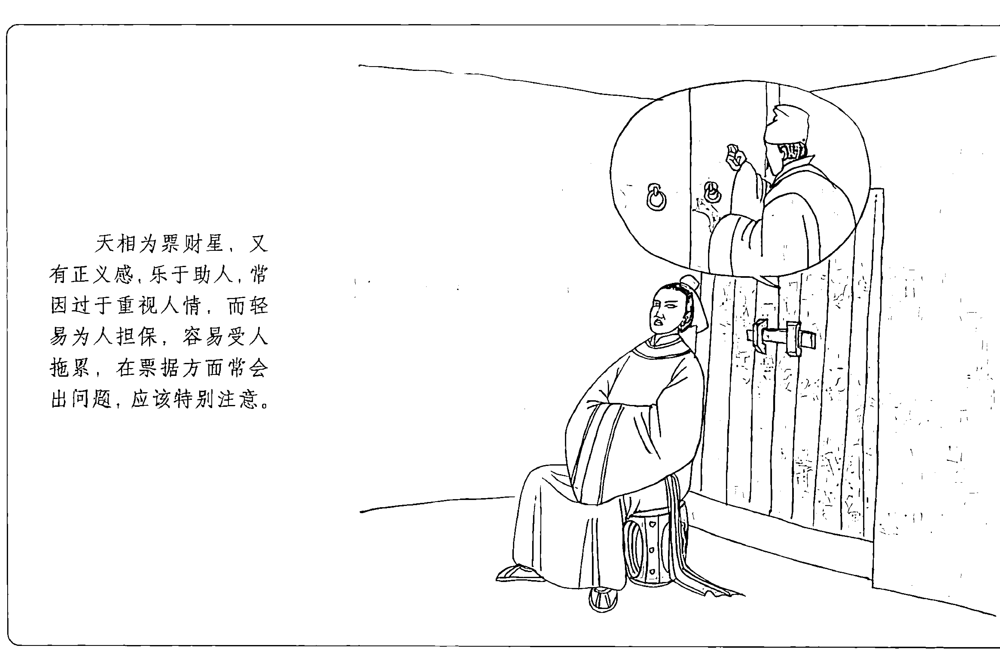

紫微、破军星同坐福德宫，心思深沉多变，急躁小心眼，心直口快，擅长观察分析，嗜好广泛，唯难以持恒，主观重，钱财收入不稳，精神压力大，经商要多学多看，用钱要节省。

天府星坐官禄宫，事业平稳，能有表现，常在大企业就职，多须独立作业，可自行发展。

## 4 天相星坐卯、酉宫：财行中年

## 星曜布局

天相星在卯、酉宫为落陷独坐，平势廉贞星和落陷破军星在福德宫冲照。命宫无主星，官禄宫为地势天府星，迁移宫为入庙武曲、贪狼星。

## 财运分析

天相星在卯、酉落陷独坐财帛宫，职业常会有变动，理想多不切实际，多不能实现，常企图以不正常途径取财，钱财收入尚可，经常是支票多而现金少，须特别注意、退票倒账、倒会、借债等问题，宜在政府机关或民间企业上班，中年后常有良好机运而突然发财。

命宫无主星，应以本宫其他甲级星及其对宫（迁移宫）的武曲、贪狼星，共同综合论命。

武曲星威严，稳重成熟，刚毅果决，独立自强；贪狼星浮躁，聪明活跃，兴趣广泛。武曲、贪狼星同坐迁移宫，心高气傲，机敏有才华，适应力强，见多识广，其创造能力、工作机会多，性喜玩乐，喜欢交朋友，人际关系好，出外受欢迎，赴海外发展多可发财致富。早年刚强自负，率性而为，多变不稳定，会遭遇许多挫折，中年以后，获得经验教训，变得平稳持重，行为收敛，热心服务，才华得以发挥，受人赏识，终有出人头地的机会。

廉贞、破军星同坐福德宫，好恶分明，随心所欲，喜欢创新，难以捉摸，肯吃苦，钱财收入不稳。经商必须眼明手快，理智判断，留意文书来往和契约内容，多听取别人的意见。

天府星坐官禄宫，具有实力，工作有计划，要求高，沉着自信，能独立作业。

## 5 天相星坐辰、戌宫：财禄丰厚

天相星在辰、戌宫，必有紫微星同坐，请参看紫微星。

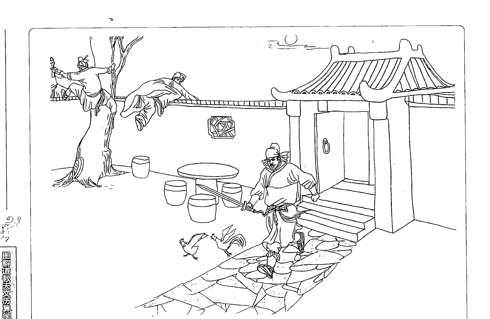

天相星在卯、酉落陷独坐财帛宫，职业常会有变动，理想多不切实际，多不能实现，常企图以不正常途径取财。

## 6 天相星坐巳、亥宫：以领固定薪水为主

## 星曜布局

天相星在巳、亥宫为地势独坐，平势武曲、破军星在福德宫对照。命宫无主星，官禄宫为入庙天府星，田宅宫为太阳星（子宫为落陷、午宫为旺势），迁移宫为旺势紫微星和利势贪狼星。

## 财运分析

天相星在巳、亥地势独坐财帛宫，财运起伏有变化，宜远离家乡，出外发展，具有能力，工作踏实有原则，易受人利用，须培养进取心，冷静理智，切勿轻易与人推心置腹，以免被人暗中陷害，宜有良好的生活习惯，勿涉足不正当的场所，并以领固定薪水为主，独创事业为辅，才能累积并保有资产。天相星坐亥宫，常能因缘际会，获得良好的机缘，而突然发达。

命宫无主星，应以本宫其他甲级星及其对宫（迁移宫）的紫微、贪狼星，共同综合论断。

紫微星尊贵风流，自重自爱；贪狼星率直调皮，灵巧善交际。二星同坐迁移宫，开朗机智，乐观豁达，能情理兼顾，有才气，好风流，喜欢结交朋友，出外人缘好，工作能力强，多能有所表现，容易出风头。早年较辛苦，中晚年经多年历练后，经验丰富，能有所成就。

武曲、破军星同坐福德宫，思绪复杂，行为不依常轨，劳心操劳，钱财收入极不稳定。太阳星坐田宅宫，居家喜视野开阔，陈设简单大方。坐午宫为旺势，能投资房地产获利。

天府星坐官禄宫，工作有计划，要求高，有实力，有信心，事业踏实稳定，能独立作业。

## 天梁星坐财帛宫

天梁为善星，工作勤奋，理财条理分明，常有投资的机会，对钱财很珍惜，用钱多有节制，不曾乱花钱，但常心存关爱，屡施援手，容易有金钱调度或周转之事，而遭受倒账损失。

天梁为荫财星，主荫、寿、贵，为父母宫主。天梁星坐财帛宫，财源不忧匮乏，若不心存贪念，多有祖上余荫，容易有意外的收入，常获长辈提拔，或继承财产、事业、名声、金钱，常有他人致增钱财的机会，也能福荫自己及子孙。天梁星庙旺，少劳多获，进财机会多。

天梁星脱俗、超然清高，不喜名利与权势，与钱财较无缘，愈是想要成为富有的人，钱财的困扰及波折也就愈多，适宜担任公教、文艺、休闲旅游、司法、社会公益等清高的工作。

天梁星安于怡然自得的日子，不喜与人竞争，是除了地空、地劫、化忌、陀罗星外，最不利于经商的星曜。勉可持续经营祖业，与人合伙，经营代理的行业。自立经商，常会在赚钱和清静中相互矛盾，难以全力投入工作，辛勤费力，多有钱财波折，并因而烦忧不宁。

天梁星在工作中能保持超然公正，有远见，不强求与人竞争，不同流合污，能获得肯定。

天梁星喜逢六吉星，遇困难易化解，在学术研究上有成就。天梁喜化科，地位超然清高。

天梁不喜化禄或与禄存星同宫，常有“不足为外人道”的钱财，易有钱财纠纷困扰，以从事为人解决钱财问题的律师、会计师为宜。遇六煞、化忌星，无吉星救，辛劳而惊险重重。

## 1 天梁星坐子、午宫：巧艺生财

## 星曜布局

天梁星在子、午宫为入庙独坐，太阳星（午宫为旺势、子宫为落陷）在福德宫朝照。命宫为平势天同星，官禄宫为地势天机星和太阴星（申宫为利势、寅宫为旺势），田宅宫为入庙天府星，迁移宫为落陷巨门星。

## 财运分析

天梁星在子、午坐财帛宫为入庙，最能发挥天梁星的特性，有祖上余荫，常获长辈提拔，有意想不到的钱财收入，多可凭借自己的天赋或特殊技能赚钱，最好兼具有服务的性质，如医疗、影视、画廊等工作。天梁星能安于悠闲清高的环境，易缺乏进取心，应避免有得过且过的心态，且远离赌博等投机性嗜好。天梁星坐子宫，一生中常有各种自然的进财机会。

天同星在辰、戌宫守命，三合会照官禄宫天机、太阴星，财帛宫天梁星，为“机月同梁格”，沉稳持重，敬业乐群，谨守分寸，工作尽心尽力，愿做好所有的事情，重视精神生活，容易逃避现实，生活工作力求安稳，不以钱财为重，顺其自然得之，宜传播、文化业。

太阳星坐福德宫，负责进取，生活讲究，坐午宫，事业有成，坐子宫，劳心费力。天府星坐田宅宫，居家宽敞，可承继祖业，能在国内外置产，不动产丰盛，生活安适。

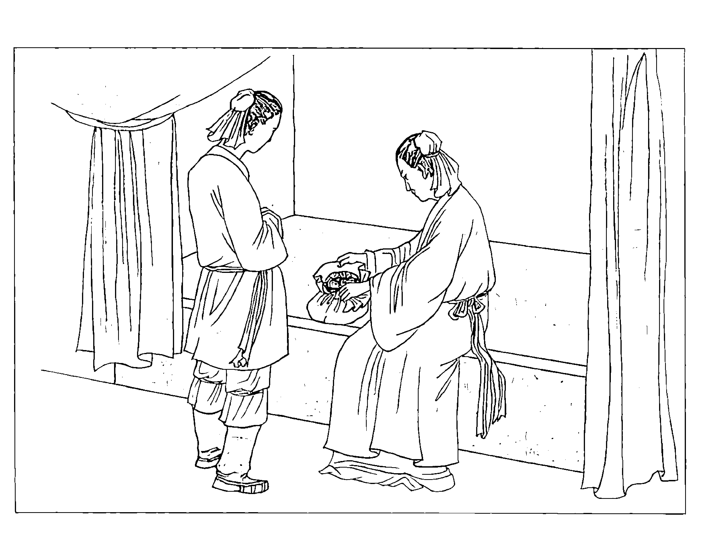

> 天梁星坐财帛宫，财源不乏匮乏，多有祖上余荫，容易有意外的收入，常获长辈提拔，也能福荫自己及子孙。同时，天梁也为善星，常心存关爱，对有困难的人屡施援手，容易有金钱调度或周转之事，而遭受倒账损失。

天机、太阴星同坐官禄宫，愿负责，工作稳健，能获赏识，步步高升，肯储蓄，喜投资。

巨门星坐迁移宫，出外靠自己，事必躬亲自为，辛勤劳碌，多是非，须先付出才有收获。

## 2 天梁星坐丑、未宫：横发富贵

## 星曜布局

天梁星在丑、未宫为旺势独坐，落陷天机星在福德宫朝照。命宫为太阳星（巳宫为旺势、亥宫为落陷），官禄宫为太阴星（酉宫为旺势、卯宫为落陷），田宅宫为旺势紫微星和天府星（申宫为地势、寅宫为入庙），迁移宫为旺势巨门星。

## 财运分析

天梁星在丑、未旺势坐财帛宫，多能发挥其特性，为善最乐，能获长辈庇荫，可福佑子孙，财源不忧匮乏，为富贵之命，常可获得遗产，或突遇机缘而横发富贵，以受薪为宜，能理财，常有投资机会，适合山林农牧、土地投资开发，当医也会有高收入，生活相当安定。

太阳星在巳宫，巳升殿，光芒渐渐耀眼，又三合会照官禄宫旺势太阴星，为“丹墀桂墀格”，光明磊落，志向远大，工作踏实，处事干练，劳而有获，早遂青云之志。太阳星在亥宫，虽落陷失辉，却期待着翌日黎明，对宫太阴星也落陷失辉，为“日月反背格”，披星戴月，无福享乐，与父母缘薄，须离乡背井，独立奋斗，桃花围绕，常暗藏生机，对人生充满期待。

天机星坐福德宫，灵巧机变，具创意，长于研究分析，生活俭朴，钱财有变动和竞争性。

紫微、天府星同坐田宅宫，有祖业，居家豪华宽敞，能投资国内外不动产，不动产丰盛。

太阴星坐官禄宫，生活与工作结合，多在公民营企业或大众服务业任职，能发挥所长。

巨门星坐迁移宫，凡事靠口才，出外靠自己，有口福，易惹是非，辛勤劳碌后多有收获。

## 天梁星坐寅、申宫：收入稳定

天梁星在寅、申宫，必有天同星同坐，请参看天同星。

## 天梁星坐卯、酉宫：横发暴政

天梁星在卯、酉宫，必有太阳星同坐，请参看太阳星。

## 天梁星坐辰、戌宫：收入丰厚

天梁星在辰、戌宫，乃有天机星同坐，请参看天机星。

## 天梁星坐巳、亥宫：酒色破财

## 星曜布局

天梁星在巳、亥宫为落陷独坐，入庙天同星在福德宫朝照。命宫无主星，官禄宫为太阳、太阴星（丑宫太阳为不得地势、太阴为入庙；未宫太阳为地势、太阴为不得地势），田宅宫为旺势武曲星和天府星（子宫为入庙、午宫为旺势），迁移宫为旺势天机星和入庙巨门星。

## 财运分析

天梁星在巳、亥落陷坐财帛宫，收入不稳定，多变化，常一波三折，在纷争中生财，进财辛勤费力，应该多兼职以增加收入，即使事业或许会做得很大，收入也可能会很高，但生活花费常会因此而无节制，易迷恋酒色，或沉迷赌博，而败荡财产。若能吃苦耐劳，洁身自好，控制花费，不轻易经商投资，经历一番努力之后，常会有突发机会发大财，而成为富翁。

命宫无主星，应以本宫其他甲级星及其对宫（迁移宫）的天机、巨门星，共同综合论命。

天机星洞悉先机，巨门星心思细腻。双星同坐迁移宫，聪明机警，辩才无碍，活跃具行动力，旅游机会多，人缘佳，有信用，工作常事半功倍。宜前瞻性与企划性工作，能破除陈规，有创见，在研究发展方面，常能独树一帜，不刻意求功，受人欣赏，唯常因债赌而坏事。

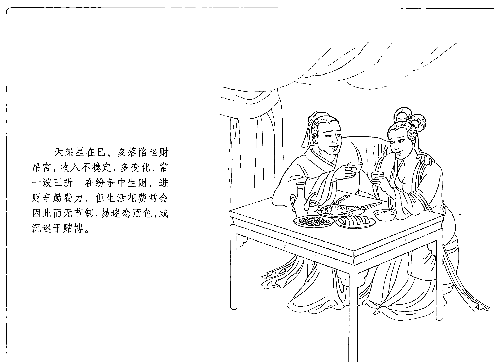

天梁星在巳、亥落陷坐财帛宫，收入不稳定，多变化，常一波三折，在纷争中生财，进财辛勤费力，但生活花费常会因此而无节制，易迷恋酒色，或沉迷于赌博。

天同星坐福德宫，文质彬彬，举止高雅，宽容豁达，重恩情，怡然自得，生活享受讲究。

武曲、天府星同坐田宅宫，祖业丰盛，居家宽敞洁净，能经营投资国内外房地产。

太阳、太阴星同坐官禄宫，工作事业选择机会多，常有兼职，处事沉稳明快，能获重用。

## 七杀星坐财帛宫

七杀之财，略带投机性，必须经过一段艰辛的奋斗，才能获得，用钱大方不吝啬，居财帛宫时，大都是生意人。适宜武职、连锁销售、五金、汽车、制造等竞争激烈，或困难度比较高的行业，必须看准市场的动向，掌握适当的契机，不断突破，才能成功。

七杀为将星，主肃杀、孤克，其延伸、发展性的变动，为成败的主宰，遇紫微帝星化为权，为运筹帷幄的边疆主帅，有“将在外，君命有所不从”，独断专行的特性，常感孤独落寞。

七杀星动中带静，文武全才，为动财星，钱财不稳，变动性大，多寡并不一定，会花钱，敢投资，喜冒险，有冲劲，钱财留不住，常会投资失利，最好养成先存入银行或事先拟订投资计划的习惯。中年前，不易积存财富；中年后，多能以经验判断，获利较丰，唯大发不易。

七杀星对钱财有明确的概念，但有主见，独断专行，常不能与人相容，喜欢理财和独资创业经商，唯其孤独多变动，并不宜创业经商，通常会辛劳经营却获利有限，甚至遭遇失败。

七杀星愿意承担，能处变不惊，面对挑战，高难度工作也能独自完成，获得信任和重用。

七杀星最喜会紫微、禄存、天马星，为将星得地，如鱼得水，财源旺盛，赚钱无可限量。

七杀星独坐，最能发挥其特立独行的力量，吉星只能略增其气势；煞星也只能增加其困难度，历经艰辛后多能获得成功。七杀星不喜欢与桃花星同宫，遇之易有桃花纠纷。

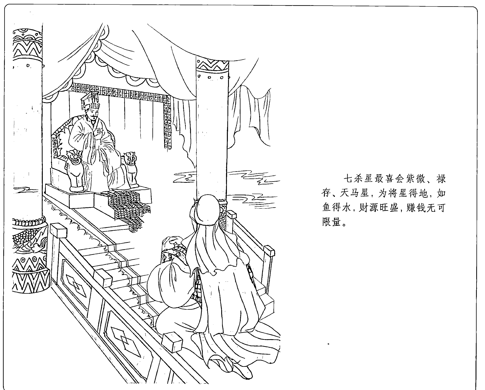

七杀星最喜会紫微、禄存、天马星，为将星得地，如鱼得水，财源旺盛，赚钱无可限量。

## 1 七杀星坐子、午宫：宜独立经商

## 星曜布局

七杀星在子、午宫为旺势独坐，旺势武曲星和天府星（午宫为旺势、子宫为入庙）在福德宫朝照。命宫为旺势破军星，官禄宫为平势贪狼星，田宅宫为太阳、太阴星（未宫太阳为地势、太阴为不得地势；丑宫太阳为不得地势、太阴为入庙），迁移宫为地势紫微、天相星。

## 财运分析

七杀星在子、午坐财帛宫，财运不安定，易大起大落，常有意外的偏财收入，处理事情表面上是干脆利落，有魄力，能担当重责大任，其实内心却极复杂艰辛，宜独立经商，不宜与人合伙，千万不可存有依靠投机的心态，以免金钱遭受损失，使资金转瞬间就成为泡影。

破军星独坐辰、戌命宫，直率冲动，随心所欲，我行我素，不信邪，行事常取决于一念之间，一旦陷入天罗地网中，必定会不认输而奋力挣扎，积极寻找新机会，以另起炉灶，开创新局，因而劳碌奔波，一生常会经历挫折与打击。

天府、武曲星坐福德宫，刚直公正，有理财观念，生活讲究，私心较重，收入高而多元。

太阳、太阴星坐田宅宫，为“日月照壁格”，居家喜花台庭园，书香之雅，财运顺，不动产多，能承继祖业，也能置产或经营房地产生意，尤以日、月坐丑宫更吉美，为富豪之命。

贪狼星坐官禄宫，不耐静态工作，对不合理现象，常仗义执言或改革创新，事业不稳定。

紫微、天相星坐迁移宫，在外人缘广，其服务热忱，能言善辩，易出风头，喜玩乐旅游。

## 2 七杀星坐丑、未宫：钱财易波动

七杀星在丑、未宫，必有廉贞星同坐，请参看廉贞星。

## 3 七杀星坐寅、申宫：艰苦奋斗可发财

## 星曜布局

七杀星在寅、申宫为入庙独坐，旺势紫微星和天府星（申宫为地势、寅宫为入庙）在福德宫朝照。命宫为入庙破军星，官禄宫为入庙贪狼星，田宅宫为太阴星（酉宫为旺势、卯宫为落陷），迁移宫为入庙天相星和平势廉贞星。

## 财运分析

七杀星在寅、申入庙独坐财帛宫，钱财变动性大，有魄力，冲劲够，能一马当先，其偏财运，常有意外的财源收入，受雇于公司的上班族，常不安于室，频频想更换工作，利于经商做生意，行运配合好时，经艰苦奋斗后，可大发富贵，赚取许多的财富。

破军星在子、午入庙独坐命宫，是破军星最有利的宫位，若无煞星冲破，为“英星入庙格”，果断有主见，反应机敏，领导能力强，具有冒险犯难的精神，有开创事业的欲望和能力，勇于做事，服务热忱，工作专注有定力，能够全力以赴，平时表现并不一定出色，面对危机时，却有超人的胆识与毅力，能不断迎接各种挑战，锋芒毕露。

紫微、天府星同坐福德宫，生活讲究，兴趣广泛，钱财收入稳定，收入高时花费也大。

太阴星坐田宅宫，居家喜山野园林，装饰多盆栽鱼缸，置产能增值，坐酉宫，不动产多。

贪狼星坐官禄宫，事业常变换，不耐静态工作，工作常检讨分析，高瞻远瞩，胆大心细。

天相、廉贞星同坐迁移宫，与朋友交往频繁，出外得人和，才华高，有表现，是非多。

## 4 七杀星坐卯、酉宫：横发暴破

七杀星在卯、酉宫，必有武曲星同坐，请参看武曲星。

## 5 七杀星坐辰、戌宫：不善于发财

## 星曜布局

七杀星在辰、戌宫为入庙独坐，入庙天府星和利势廉贞星在福德宫对照。命宫为地势破军星，官禄宫为旺势贪狼星，田宅宫为太阴星（亥宫为入庙、日宫为落陷），迁移宫为入庙天相星和地势武曲星。

七杀星在辰、戌独坐财帛宫，收入不稳定，多不善于理财，往往事业发展胜过钱财，或名高于利，一生相当辛劳奔波。

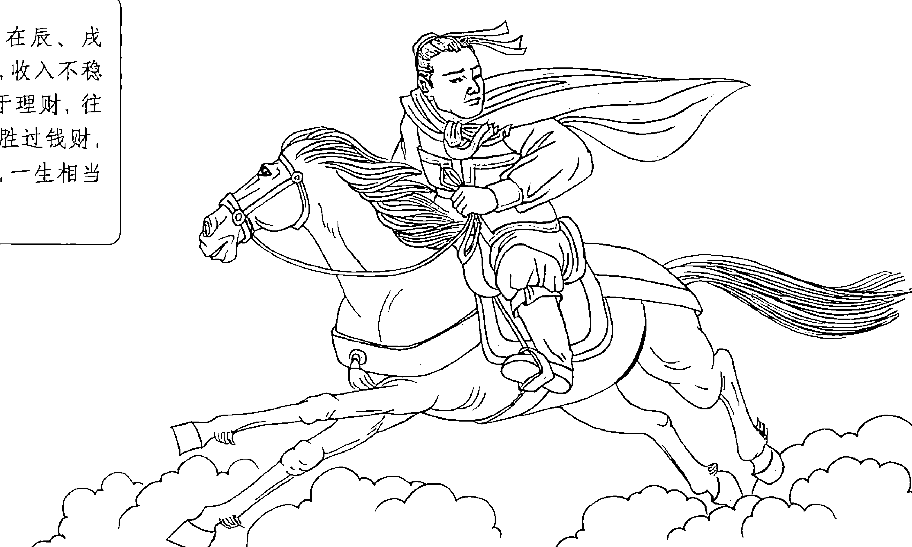

## 财运分析

七杀星在辰、戌独坐财帛宫，收入不稳定，对钱财不计较，多不善于理财，往往事业发展胜过钱财，或是名高于利，有时也会有意外的偏财收入。一生相当辛苦，为劳碌命，很少有外来的协助，必须靠自己努力上进，出外到远地谋生，并善加运用自己现有的积蓄，做有效率的流通，必定会利上加利，中年后多可获得很高的成就。

破军星地势独坐寅、申命宫，个性耿直倔强，心思独特，有正义感，善恶分明，工作能掌握重点，突破难关，全力以赴，开发和创新。一生行运有如波涛汹涌，起伏不定，偏又不信邪，物质与精神常饱受折磨，往往会有到头一场空的感觉，因而与宗教、哲理特别有缘。

天府、廉贞星同坐福德宫，刚中带柔，生活讲究，喜群体活动，收入不错，钱财起伏大。

太阴星坐田宅宫，居家淡雅洁净，喜爱盆栽园艺；常喜晚睡，坐亥宫，不动产丰盛。

贪狼星坐官校宫，通常会往有制度的环境工作，或自己定有工作秩序，能充分表现自己。

天相、武曲星同坐迁移宫，出外常识经验丰富，进退得体，信用良好，与人结缘快。

## 6 七杀星坐巳、亥宫：有偏财运

七杀星在巳、亥宫，必有紫微星同坐，请参看紫微星。

## 破军星坐财帛宫

破军星具开创性、变化性及危险性，经商须钱财稳定并不符合，适宜创造事业。即使经商，也须经常变换方式和商品，不停创造，以维持新鲜感。最利于以技术为主经商为辅。

破军为耗星、殿前大将，主祸福、夫妻、子女、仆役，不利六亲，也主孤。聪明刚强，感情丰富，生命力强，勇往直前，其开创、变化及危险性，在“杀、破、狼”竹箩三限中变化及起伏最大，极不利于钱财及女命感情。常有开创性的波动，横发横破，足以影响一生。

破军为暴财星，坐财帛宫，心绪多变，野心大，对钱财不在意，不善于理财及适时收敛，其破坏和开创力，财运浮动，常财来财去，以多元及与众不同方式进财，赚钱有干劲，工作有魄力，能不畏艰难吃苦耐劳，往往先遭遇挫折及损失，再重新开始创造。一旦误入歧途，很容易就一败涂地，若能理智制定周详计划，多听建言，节制花费，必能成大器。

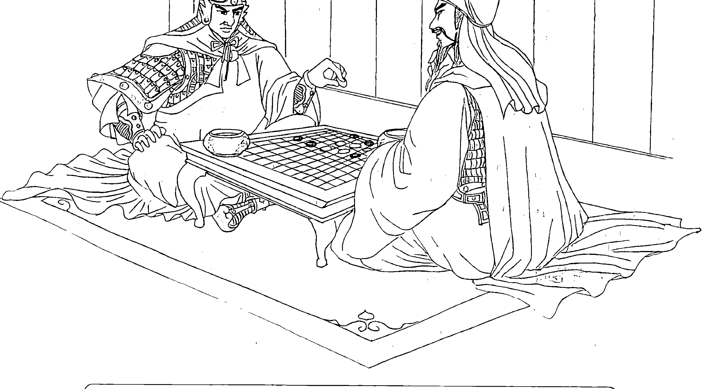

> 破军为殿前武将，不喜与文昌、文曲双文星同宫，就像武将不喜欢与文官下棋，因为文、武之间观念、个性多有差别，不易沟通，易使人辛劳又孤寂。

破军星喜欢新鲜及变化，工作有冲劲及耐力，能一鼓作气，全力以赴，打头阵。

破军星暴躁冲动，曲高和寡，唯有紫微星能让他俯首称臣而听命行事，有威权；遇天梁、禄存、化禄星，能解其狂恶，增加后援；逢天魁、天钺、左辅、右弼、化权星，能增添气势。

破军星武将不喜与文昌、文曲双文星同宫，因文、武之间不易沟通，易使人辛劳又孤寂；破军星不喜遇六煞星及天哭、天虚星，会增加阻碍，有不利的变动，更应注意官司和健康。

## 1 破军星坐子、午宫：暴赚暴赔

## 星曜布局

破军星在子、午宫为入庙独坐，平势廉贞星和入庙天相星在福德宫对照。命宫为入庙贪狼星，官禄宫为入庙七杀星，田宅宫为旺势天梁星，迁移宫为入庙武曲星。

## 财运分析

破军星独断专行，具有强烈的破坏力和开创力，入庙独坐子、午财帛宫，多进财机会，或有偏财及横财收入，但钱财相当的不稳定，容易暴赚暴赔，平时应有周密的钱财运用计划，切勿急功近利，要珍惜每一分得来不易的金钱，并辛勤工作，才有希望成为大富翁。

贪狼星虚荣多欲，好享受，喜交际，多才艺，为第一桃花星，在辰、戌宫坐命，受天罗地网约束，反而减低其酒色财气嗜好，发挥文艺才华，人际关系良好。工作小心谨慎，凡事要求完美，三思而行，能随时检讨自己，得以不断进步。

贪狼星坐辰宫，落陷太阳星坐疾厄宫，为“日月疾厄格”，多有身体障碍，或多病，宜医生、命相业，可趋吉避凶。

廉贞、天相星同坐福德宫，温文乐观，期许多，爱表现，很在意别人对自己的看法，爱恨分明，做事有一套，精神压力大，生活享受，易得异性相助，收入不稳定，钱财起伏大。

天梁星坐田宅宫，祖产多，有机缘获得赠产，也能置产，居家朴实宁静，喜居住文教区。

七杀星坐官禄宫，积极主动，能领导，事业多变，喜变动和挑战性工作，常有竞争。

武曲星坐迁移宫，出外靠自己，备尝艰辛，百折不挠，能冷静面对现实，终能获得成就。

## 2 破军星坐丑、未宫：财运多变
破军星在丑、未宫，必有紫微星同坐，请参看紫微星。

## 3 破军星坐寅、申宫：适宜上班领薪水
## 星曜布局
破军星在寅、申宫为地势独坐，地势武曲星和入庙天相星在福德宫朝照。命宫为旺势贪狼星，官禄宫为入庙七杀星，田宅宫为太阳、天梁星（酉宫：太阳星为平势、天梁星为地势；卯宫：太阳、天梁星皆为入庙），迁移宫为紫微星（子宫为平势、午宫为入庙）。

## 财运分析
破军星在寅、申地势独坐财帛宫，钱财变动不安定，虽略有偏财运，但常东来西去留不住钱财，赚钱比较辛苦，中年以后才会有较多的积蓄，但仍然不安定。适宜上班族受雇领薪水，会有变动，只要肯努力，多能职务高升而有高收入，生活因而能维持不错的水平。

贪狼星在子、午宫独坐命，能将其能言善道，颇懂得待人处世之道的特性完全发挥，虽然外表看来很开放，其实心思很细腻，工作小心谨慎，多能顾全大局，不轻易更换工作环境，喜欢计划性选择富有挑战性、成就感的工作，并能享受工作中的成就感。贪狼星在子宫，虽较积极活跃，机缘多，常能超越现状而获得成效，但为“泛水桃花格”，浪漫多嫉，桃花重。

武曲、天相星坐福德宫，有执行力，凡事力求平稳，收入不错，宜留意文书契约和异性。

太阳、天梁星同坐田宅宫，居家明朗干燥，喜采光通风好，坐卯宫，能投资经营房地产。

七杀星坐官禄宫，能不断创新，突破限制和压力，拥有自己的天空，事业易转换环境。

紫微星坐迁移宫，出外有贵人，旅游移民机会多，喜欢排场和出入高级场所，易犯桃花。

## 4. 破军星坐卯、酉宫：挥金如土
破军星在卯、酉宫，必有廉贞星同坐，请参看廉贞星。

## 5. 破军星坐辰、戌宫：外乡异地求财
## 星曜布局
破军星在辰、戌宫为旺势独坐，地势紫微、天相星在福德宫朝照。命宫为平势贪狼星，官禄宫为旺势七杀星，田宅宫为落陷天梁星，迁移宫为入庙廉贞星。

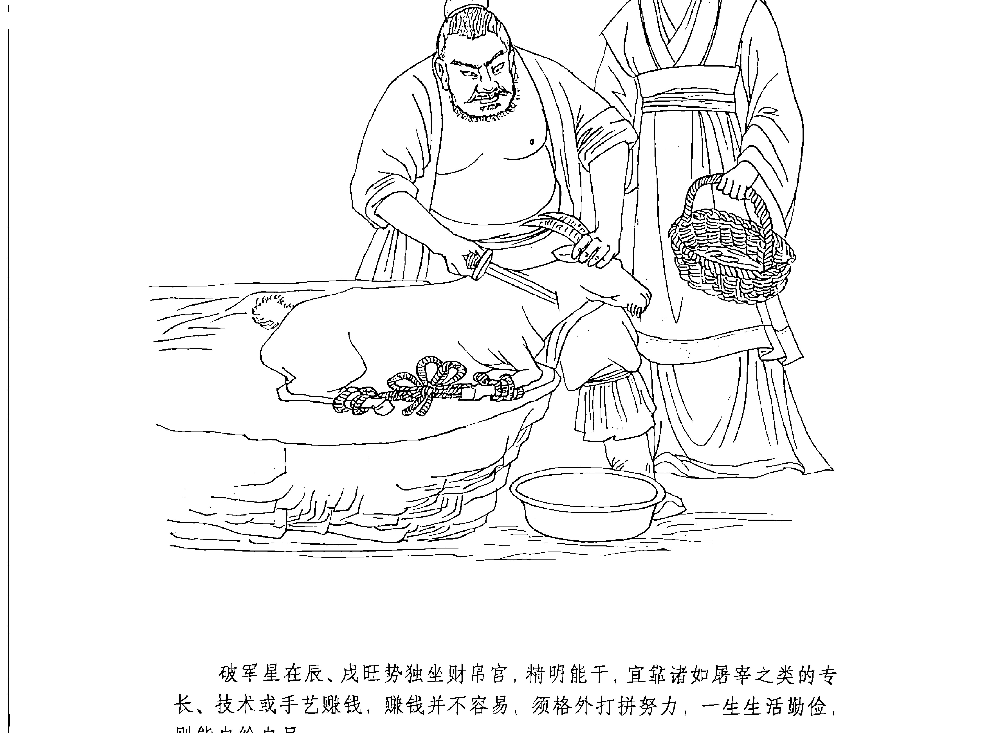

破军星在辰、戌旺势独坐财帛宫，精明能干，宜靠诸如屠宰之类的专长、技术或手艺赚钱，赚钱并不容易，须格外打拼努力，一生生活勤俭，则能自给自足。

## 财运分析
破军星在辰、戌旺势独坐财帛宫，精明能干，若能充分运用交际手腕，多能独当一面，开创财富。宜靠专长、技术或手艺赚钱，赚钱并不容易，须格外地打拼努力，付出多少就有多少相对的代价，常须赴外乡异地或国外，比较有发展机会，一生生活勤俭，则能自给自足。

贪狼星平势独坐命，聪明活跃，多才多艺，善于待人处世，喜欢交际应酬，人际关系良好，桃花机会多，高傲随缘，是非多，对政治感兴趣。有领导欲望和才华，希望以亲切合理的方式领导他人，未得志前常会感到有志难伸，也容易遭人误解，但终能有所成就。

紫微、天相同坐福德宫，稳重平和，自尊心重，处世圆滑，喜欢藏拙，不轻易发表己见，随俗随缘，钱财收入还不错，赚钱必须刻苦努力，且要有耐心，花钱应得当，不宜经商。

落陷天梁星坐田宅宫，偶有机缘获得赠产，能置产，居家朴宜宁静，喜居住文教区。

七杀星坐官禄宫，有领导欲和荣誉感，喜欢有挑战性的工作，工作能在稳定中升迁，得贵人赏识，受人肯定，担任主管职务，易出风头，事业容易转换环境。

入庙廉贞星坐迁移宫，敬业乐群，表达力强，能面对挑战，易招惹是非，交通事故较多。

## 6 破军星坐巳、亥宫：先贫后富
破军星在巳、亥宫，必有武曲星同坐，请参看武曲星。

### 财帛宫无主星论财运
财帛宫无主星时，对于财运的论断最重要的是参考对宫的吉凶，同时，还要观察命宫以及三方四正的星曜分布状况。

#### 1 财帛在子、午宫（紫微星在亥、巳宫）
财帛宫无主星，应以本宫其他甲级星及其对宫（福德宫）天同、太阴星，共同综合论财。

## 星曜布局
财帛在子、午宫无主星，天同、太阴星（午宫：天同为落陷、太阴为不得地势；子宫：天同为旺势、太阴为入庙）在福德宫朝照。命宫无主星，官禄宫为入庙巨门星和太阳星（申宫为地势、寅宫为旺势），田宅宫为入庙武曲、贪狼星，迁移宫为利势天机星和入庙天梁星。

## 财运分析
天同星福气自来、度量宽宏；太阴星田宅自丰、和平明理。双星同坐福德宫，达观温和，有善心，怡然自得，喜爱娇宠，行事小心不得罪人，公关能力强，有小人，注重生活享受，喜爱美术文艺。财源稳定，不计较盈亏，懂得储蓄与购买保值品，有偏财运，常有兼职收入，能置产，宜靠才艺或技术生财。在大小限、流年行运好时，掌握时机寻求出路，比较有利。

命宫无主星，应以本宫其他甲级星及其对宫（迁移宫）的天机、天梁星，共同综合论命。

天机星智慧卓越，天梁星慈悲为怀，双星同坐迁移宫，聪明机智，侠肝义胆，随和中庸，学习力强，有策划分析力。有魄力，肯上进，能锲而不舍，有始有终，对事不对人，名重于利，常曲高和寡，有国外缘。热心服务，广受好评，须历经艰苦才能展现实力，获得成功。

武曲、贪狼星同坐田宅宫，居家美观，环境良好，可投资房地产获利，中晚年房地产多。

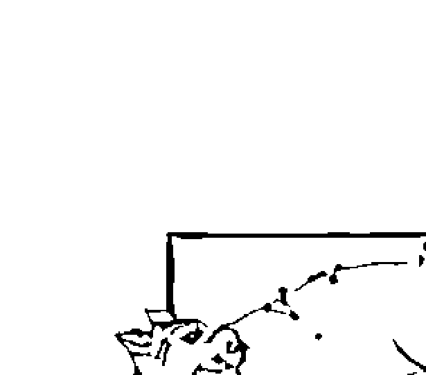

### 各宫主星一览表
紫微斗数依据部分星曜星性的特殊性，赋予了它们不同宫位主星的功能。凡主星进入其所主宫位，皆为吉论，若主星庙旺而无煞凑，则更为难得。但并不是每一个宫位都有主星，下表所示即为部分宫位主星及其星性。

| 宫名 | 星名 | 星性 |
|------|------|------|
| 父母宫 | 天梁星 | 属阳土，南斗第二星，化气为“荫”，主寿、贵，具解厄、延寿、成祥的功能。 |
| 兄弟宫 | 天机星 | 属阴木，南斗第三益算之星，主智慧、思想、手足、神经系统，化气为善。 |
| 福德宫 | 天同星 | 属阳水，南斗第四星，化气为福，为福德宫主，有延寿、解厄、制化之功。 |
| 财帛、田宅宫 | 武曲星 | 正财星。属阴金，北斗第六星，化气为财，主财旺。 |
|  | 太阴星 | 家财星，主富、禄库、藏。属阴水，为水之精，为中天斗吉星，化气为富。 |
|  | 天府星 | 库财星，属阳土，南斗第一星，化气为令，又名“禄库”，掌财宅禄。 |
| 官禄宫 | 太阳星 | 属阳火，乃中天斗主吉星，化气为“权贵”。 |
|  | 紫微星 | 属阴土，为尊贵的帝王星。属阴土，系北斗帝座。化气为尊贵。 |
|  | 廉贞星 | 闹财星、次财星。属阴火，北斗第五星，在斗司品职，在数管官权，主邪，化气为“囚”“杀”（权威）。 |
|  | 天相星 | 属阳水，南斗第五星，化气为“印”，偏于文事，能解廉贞之恶。 |

巨门、太阳星同坐官禄宫，有领导能力，活跃有作为，劳碌艰辛，工作遇横逆较难应付。

#### 财帛在丑、未宫（紫微星在子、午宫）
财帛宫无主星，应以本宫其他甲级星及其对宫（福德宫）天同、巨门星，共同综合论财。

## 星曜布局
财帛在丑、未宫无主星，不得地势天同、巨门星在福德宫对照。命宫为太阴星（巳宫为落陷、亥宫为入庙），官禄宫为太阳、天梁星（酉宫：太阳星为平势、天梁星为地势；卯宫：太阳、天梁星皆为入庙），田宅宫为地势武曲星和入庙天相星，迁移宫为平势天机星。

## 财运分析
天同星度量宽宏，不经心，易发福，多操劳；巨门星好奇心重，不服输，易劳碌，多思考。二星搭配同坐福德宫，保守随和，思虑多，稳健不冒险，多有依赖心，能知足常乐，随遇而安，言语易得罪人，有口福。收入不稳定，赚钱须经历竞争，宜上班族或做店面小生意，盘算不精，早年少有积蓄，可小额投资理财，小本经营，易失财，晚年财运较佳，懂得储蓄。

太阴星坐命，浪漫多情，热心服务，能勤俭工作，有异性缘，宜公教、文艺界，不宜经商创业。入庙坐亥宫，夜晚出生人，为“月朗天门格”，沉稳持重，擅长企划，兴趣广泛，多才多艺，能博采众议，有贵人缘，吸收力强，能发挥所长，宜金融、建筑、娱乐、服务业。武曲、天相星同坐田宅宫，居家朴宜有格调，常晚发，中晚年房地产多。太阳、天梁星坐官禄宫，事业循序渐进，识时务，受赏识，能担重任，坐卯宫，有成就。天机星坐迁移宫，喜爱出外旅行，见闻丰富，富研究心，乐于助人，开车容易分神。

#### 财帛在丑、未宫（紫微星在戌、辰宫）
财帛在丑、未宫无主星，太阳、太阴星（未宫：太阳星为地势、太阴星为不得地势；丑宫：太阳星为不得地势、太阴星为入庙）在福德宫朝照。命宫为入庙天同星，官禄宫为旺势天机星和入庙巨门星，田宅宫为平势贪狼星，迁移宫为落陷天梁星。

财帛宫无主星，应以本宫其他甲级星及其对宫（福德宫）太阳、太阴星，共同综合论财。太阳星威猛果敢，有担当，热心有魄力，肯操劳；太阴星温和沉稳，能知足，浪漫有规矩，重情趣。双星同坐福德宫，刚柔并济，心思灵活，擅长应对，广结善缘，个性温和，情绪善变，能奉献己力，重视生活品位和情趣，动静皆宜。职业常变动，常有副业或兼职，辛勤劳碌，收入起伏多变，能储蓄，财源不缺，后劲强，能置产，投资宜慎重，以免损失惨重。

入庙天同星坐命宫，平易近人，安分守己，被动保守，与人为善，知足常乐，自求多福，生活工作多力求安稳，待人处事以平和为贵，易得过且过，逃避现实，缺乏进取，好逸恶劳。喜欢工作单纯中有休闲，不喜旁生枝节，多做兼差，同一时间内只愿意专注于同一工作。贪狼星坐田宅宫，适合居住热闹繁华处，居家浪漫舒适，早年多搬迁，中年后积极置产。天机、巨门星坐官禄宫，有组织领导力，事业喜稳中求变，有创意，竞争力强，表现佳。天梁星坐迁移宫，有人缘，喜欢山水，乐于参加艺文、宗教、社团服务，常有奇缘奇遇。

#### 3 财帛在丑、未宫（紫微星在亥、巳宫）
财帛宫无主星，应以本宫其他甲级星及其对宫（福德宫）武曲、贪狼星，共同综合论财。

## 星曜布局
财帛在丑、未宫无主星，入庙武曲、贪狼星在福德宫对照。命宫为地势天府星，官禄宫为落陷天相星，田宅宫为入庙巨门星和太阳星（申宫为地势、寅宫为旺势），迁移宫为旺势紫微星和平势七杀星。

## 财运分析
武曲星威严稳重，独立自强；贪狼星聪明浮躁，多学少精。双星同坐福德宫，思绪奔腾，幻想多，不按牌理出牌，常有惊人之举，全凭兴之所至，学习力强，才智卓越，有创造发明能力，积极进取，好享乐，不甘寂寞，生活讲究，嗜爱声色物欲生活，不能过艰辛困苦日子。钱财收入高，但起伏大不稳定，常财来财去，钱财处理应小心，早年历经沧桑，中年后发达。天府星在巳、亥宫坐命，所会照官禄宫天相星为落陷，使天府星稳定性减少，且命坐四马地，奔波辛劳。稳重自信，胸有成竹，容让少争，能将工作视为耕耘，相信耕耘就有收获，愿同时耕耘多种工作，工作有实力，沉着不退缩，喜欢竞争不太大的工作，不轻易更换工作。太阳、巨门星同坐田宅宫，居家明亮舒适，实用有情趣，能置产，坐寅宫，房地产多。天相星坐官禄宫，常在企业上班，担任主管，受欣赏和重视，可从事具开发学习的工作。紫微、七杀星同坐迁移宫，活跃有贵人，在家待不住，生活喜变化，竞争心强，交友广。

#### 4 财帛在寅、申宫（紫微星在丑、未宫）
财帛宫无主星，应以本宫其他甲级星及其对宫（福德宫）天同、天梁星，共同综合论财。

## 星曜布局
财帛在寅、申宫无主星，天同、天梁星（申宫：天同星为旺势、天梁星为落陷；寅宫：天同星为利势、天梁星为入庙）在福德宫朝照。命宫为旺势巨门星，官禄宫为太阳星（戌宫为不得地势、辰宫为旺势），田宅宫为利势武曲星和旺势七杀星，迁移宫为入庙天机星。

## 财运分析
天同星和平，唯美务实；天梁星执著，浪漫憧憬。二星同坐福德宫，稳重斯文又大方，思绪不定，安稳少怨，注重生活情调，善守既得利益，常有心而乏力，难以承担重任，多须群策群力完成。多得长辈提携与照顾，有偏财，对钱财不太重视，能突破现状才有发财机会。

巨门星在子、午宫旺势坐命，能将其心思细腻、冷静专注、具有理解力与创意、客观有远见、中规中矩的优点充分发挥。肯上进，能努力工作，等待和创造机会，善于表达自己的观感和长处，常有口无心，在无意中得罪人，适宜须研究或动口的行业。只要不化忌，必口才绝佳。若加会禄、权、科星，为“石中隐玉格”，早年历经风霜琢磨，中年后显现玉面光辉。

武曲、七杀星同坐田宅宫，居住环境复杂，居家讲求坚固实用，有置产欲望，偶有偏财。

太阳星坐官禄宫，热心服务，坐辰宫，事业有成；坐戌宫，奔波辛劳，常遇挫折而晚成。天机星坐迁移宫，喜旅游，见闻丰富，有学习研究心，乐于助人，人缘佳，开车易分神。

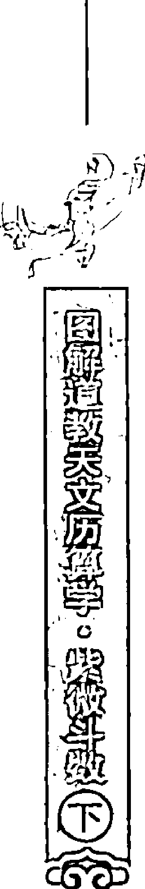

#### 4 财帛在寅、申宫（紫微星在酉、卯宫）
财帛宫无主星，应以本宫其他甲级星及其对宫（福德宫）天机、太阴星，共同综合论财。

## 星曜布局
财帛在寅、申宫无主星，地势天机星和太阴星（申宫为利势、寅宫为旺势）在福德宫朝照。命宫为太阳星（午宫为旺势、子宫为落陷），官禄宫为落陷巨门星，田宅宫为旺势紫微星和利势贪狼星，迁移宫为入庙天梁星。

## 财运分析
天机星机敏具创意，太阴星浪漫多幻想。二星同坐福德宫，心思细腻，多有心机，观察敏锐，多才华，引人注目，重视生活品质。收入稳定，懂得储蓄，有偏财，偶会投机，须靠智慧并勤于奔动，经过一番竞争而赚钱，家庭开销大，须多方开源，钱财运用要小心。

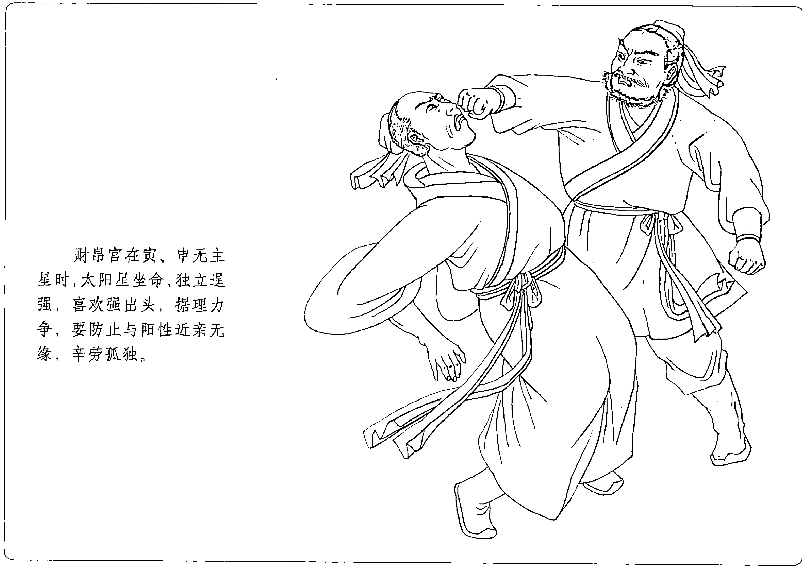

太阳星坐命，自负高，独立逞强，喜欢强出头，据理力争，与阳性近亲较无缘，亲情不足，辛劳孤独。坐子宫为落陷失辉，眼力欠佳，须赴远乡发展，耐性不足，常先勤后惰；坐午宫最为强烈耀眼，为“日丽中天格”，或称“金灿光辉格”，刚直稳健，乐观积极，眼光远大，不拘小节，处事明快，热心公益，坦荡有魄力，利于开创，锋芒毕露，适宜经贸易。

紫微、贪狼星同坐田宅宫，居家舒适豪华，房地产多，应勤俭而避免涉足不正当场所。

巨门星坐官禄宫，有研究精神，工作努力，任劳任怨，工作有压力，易有口舌是非。天梁星坐迁移宫，喜欢山水，常有奇遇奇缘，喜参加艺文、宗教、社团服务。

#### 5 财帛在寅、申宫（紫微星在亥、巳宫）
财帛宫无主星，应以本宫其他甲级星及其对宫（福德宫）太阳、巨门星，共同综合论财。

## 星曜布局
财帛在寅、申宫无主星，入庙巨门星和太阳星（申宫为地势、寅宫为旺势）在福德宫对照。命宫为天同、太阴星（午宫：天同星为落陷、太阴星为不得地势；子宫：天同星为旺势、太阴星为入庙），官禄宫为利势天机星和入庙天梁星，田宅宫为落陷天相星。

## 财运分析
太阳星宽大博爱，积极进取，勇于担当；巨门星率真执著，疑虑心重，保护色彩浓。双星同坐福德宫，耿直明快，有远见，能开创，口才一流，粗中有细，顾虑周全，公私兼顾，策谋远虑，有分析和执行力，积极易表现，生活注重排场和精细，偏爱搜集、饮食、户外活动。劳心费力生财，钱财收入不稳定，用钱要有计划，不应大手笔花费，适宜挑战性行业。

天同星度量宽宏，福气自来；太阴星和平明理，田宅自丰。双星同坐命，温柔多情，开朗活泼，通达世故，人缘佳，有向上心，有适应力，游学机会多，阅历广，衣食无虑。三合会照天机、天梁星，为“机月同梁格”，具企划协调力，为绝佳幕僚人选，生活安定。坐子宫，才华得以发挥，能担任要职；坐午宫，烦恼多，无大担当，容易轻信他人，辛苦经营。

落陷天相星坐田宅宫，居家高雅，喜管理良好居处，能置产。

天机、天梁星同坐官禄宫，肯用功，不执著，有责任感，不强求，有领导力，多有成就。

#### 6 财帛在卯、酉宫（紫微星在子、午宫）
财帛宫无主星，应以本宫其他甲级星及其对宫（福德宫）太阳、天梁星，共同综合论财。

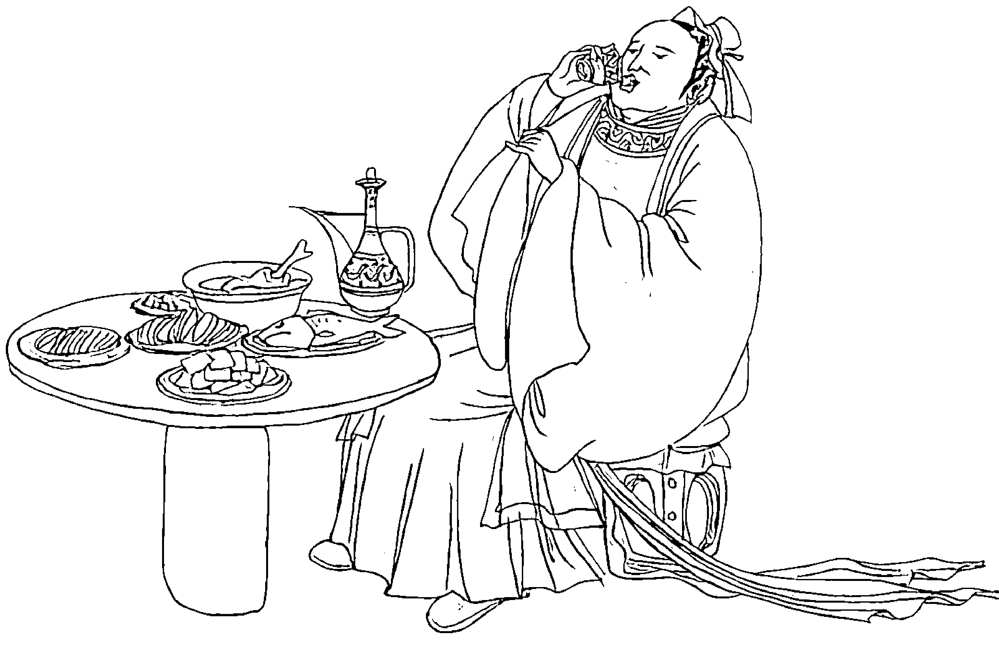

财帛宫无主星，对宫（福德宫）有巨门星，有口才、口福，生活注重排场和精细，劳心费力生财，钱财收入不稳定，用钱要有计划，不应大手笔花费。

## 星曜布局
财帛在卯、酉宫无主星，太阳、天梁星（酉宫：太阳星为平势、天梁星为地势；卯宫太阳、天梁星皆为入庙）在福德宫朝照。命宫为不得地势天同、巨门星，官禄宫为平势天机星，田宅宫为入庙七杀星。

## 财运分析
太阳星勇气威猛，博爱关怀；天梁星老气固执，服务牺牲。二星同坐福德宫，稳重大方，外圆内方，眼光远大，乐善好施，有慈悲及忍耐心，喜欢帮助别人，广结善缘，热爱公众事业。钱财稳定，工作能受上司欣赏与提拔，生活平稳，用钱大方。卯宫太阳为旭日东升、天梁星也入庙，积极有为，能渐进成长，钱财收入高；酉宫太阳夕阳西沉，缺乏定性，常晚发。

天同星度量宽，漫不经心，易发福；巨门星好奇心重，不服输，多思考。二星同坐命，平和乐利，能自得其乐，处事内敛，易矫枉过正，理想虽高，但多为理论，保守多虑，缺乏企图心，冲劲不足，不易开创新机，工作难以凸显。自视高，话多易冲动，好表现，烦恼多，易有感情困扰，精神易空虚落寞，早年多劳碌，宜平心静气，减少极端思绪，才能安稳。

入庙七杀星坐田宅宫，居家简朴实用，宜居住于交通便捷处，有置产能力，早年多搬迁。

天机星坐官禄宫，工作复杂多变，具有开创性，常有兼职，日夜颠倒，代理别人工作。

#### 7 财帛在卯、酉宫（紫微星在酉、卯宫）
财帛宫无主星，应以本宫其他甲级星及其对宫（福德宫）紫微、贪狼星，共同综合论财。

## 星曜布局
财帛在卯、酉宫无主星，旺势紫微星和利势贪狼星同在福德宫对照。命宫为入庙天府星，官禄宫为地势天相星，田宅宫为落陷巨门星，迁移宫为利势廉贞星和入庙七杀星。

## 财运分析
紫微星求知欲强，贪狼星活跃有人缘。二星同坐福德宫，矜持做作，企图心强，不墨守成规，喜欢新鲜，容易见异思迁，对人生的方向感较差，生活讲究，嗜好饮酒娱乐，容易养成不良习惯。理财有道，钱财收入丰硕，初时进财艰苦，终能苦尽甘来，逐渐轻松，可从商或领高薪当上班族，支出花费大，尤易花费在玩乐与异性身上，宜控制预算，并多加节制。

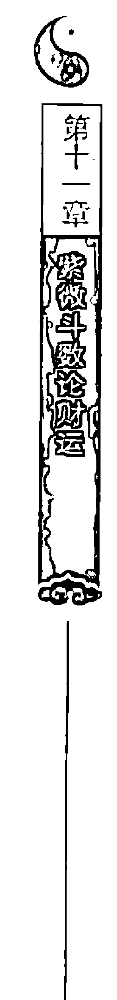天府星坐命宫，悠闲自在，随遇而安，喜欢表现，稳重自信。丑、未宫天府星虽入庙，但“逢府看相”，三方会照官禄宫的天相星仅为地势，力量稍嫌薄弱。有容忍谦让之心，保守稳定，沉着不退缩，工作有计划，要求很高，不轻易变换工作。命宫相邻两宫有太阳、太阴星相夹，为“日月夹命格”，有钱财，有地位，一生富足，常为工商巨子，夹未宫，更佳。

巨门星坐田宅宫，居家朴实宁静，喜居住于文教区，能够置产，宜留意房地产权。

天相星坐官禄宫，工作动中有静，静中有动，能在动静中平衡，多在企业任职，有表现。

廉贞、七杀星同坐迁移宫，喜出入繁华热闹、声色犬马场所，偶会因之引发无谓麻烦。

## 8 财帛在卯、酉宫（紫微星在戌、辰宫）

财帛宫无主星，应以本宫其他甲级星及其对宫（福德宫）天机、巨门星，共同综合论财。

## 星曜布局

财帛在卯、酉宫无主星，旺势天机星和入庙巨门星同在福德宫对照。命宫为太阳、太阴星（未宫：太阳星为地势、太阴星为不得地势；丑宫：太阳星为不得地势、太阴星为入庙），官禄宫为落陷天梁星，田宅宫为地势紫微、天相星。

## 财运分析

天机星有理想，天赋才华；巨门星肯钻研，恪守原则。双星同坐福德宫，直率敢言，智慧高，口才棒，处世圆滑，公关力强，识大体，热心公益，精神生活充实，具学习能力，喜欢研究发展。财富差别大，或许是富豪，也可能贫穷，很不稳定。须凭智慧口才，经由竞争而生财，开支花费大，钱财起伏大，投资做生意要格外小心财物计划，避免不必要的浪费。

太阳星威猛果敢，魄力十足，热心有担当，积极进取，肯操劳；太阴星中规中矩，沉稳持平，知足浪漫，讲求完美，重情趣。双星同坐命，外柔内刚，左右逢源，阴阳相互牵动，易反复难定，能容忍，少争执，偶会固执。工作多兢兢业业，常不分昼夜，没有时间的观念，常连续日夜工作不休息，再一连睡个几天，随意自由，无拘束，常从事异性常做的工作。

紫微、天相星坐田宅宫，居家雅致清幽，常居高级住宅或文教区，有祖产，并能置产。

天梁星坐官禄宫，工作具流动性，常漂泊不定，乐于服务奉献，从事大众福利的工作。

财帛宫在卯酉无主星，太阳、太阴坐命时，工作多兢兢业业，不分昼夜；对宫有天机、巨门，须凭智慧口才，经由竞争而生财，开支花费大，钱财起伏大。

## 9 财帛在辰、戌宫（紫微星在亥、巳宫）

财帛宫无主星，应以本宫其他甲级星及其对宫（福德宫）天机、天梁星，共同综合论财。

## 星曜布局

财帛在辰、戌宫无主星，利势天机星和入庙天梁星同在福德宫朝照。命宫为入庙巨门星和太阳星（申宫为地势、寅宫为旺势），田宅宫为旺势紫微星和平势七杀星。

## 财运分析

天机星智慧卓越，思虑周详，创意不绝；天梁星慈悲为怀，超然客观，侠义果断。双星同坐福德宫，沉稳平和，忠厚自重，创作力强，善于策划，有研究发明能力，多有特殊技能，热心服务，喜欢排难解纷，眼光远大，处事公正，得人景仰。生财有道，收入平稳丰盈，有偏财运，进财须花费心思与人竞争，并需有耐性，经商更不能急躁，生活安定，利于高科技、技术开发、企管顾问等智慧性工作，多以技术或策略谋生，终能独当一面。

太阳星积极进取，巨门星直率执著。双星同坐命，明暗交错，直率略带心机，霸气多虑，精明内敛，自我保护心重，好恶由心，亲和力强。虽有作为，气度不足，成就不难，劳累辛勤，常大成大败，外表光鲜内实愁，人际关系不稳。巨、日同坐，为“巨日同宫格”，做事积极，学习力强，才能卓越，口才佳，热心公益，能吃苦耐劳，掌握时机，可守成待变。

寅宫太阳旭日初升，潜力雄厚，勤勉进取；申宫太阳即将西沉，苗而不秀，常会虎头蛇尾。

紫微、七杀星坐田宅宫，居家喜门庭气派之高楼华夏，早年常搬迁，置产欲强，房地产多。

## 10 财帛在巳、亥宫（紫微星在未、丑宫）

财帛宫无主星，应以本宫其他甲级星及其对宫（福德宫）廉贞、贪狼星，共同综合论财。

## 星曜布局

财帛在巳、亥宫无主星，落陷廉贞、贪狼星同在福德宫冲照。命宫为天府星（酉宫为旺势、卯宫为地势），官禄宫为天相星（丑宫为入庙、未宫为地势），田宅宫为旺势巨门星，迁移宫为利势武曲星和旺势七杀星。

## 财运分析

廉贞星气度宽，有弹性，有自知之明；贪狼星多才华，欲望多，贪婪心重。二桃花星同坐福德宫，心思多变，机敏巧黠，急躁略带点小心眼，不轻易表露私衷，观察入微，喜好广泛，主观重，常无恒心，生活讲究。钱财收入不稳定，会赚钱也会花钱，爱面子，好享受，偶有偏财运，常财来财去，用钱宜节制，并忌贪且勿赌博迷花酒，一不小心可能会前功尽弃。

天府星坐命，乐观宽厚，气质优雅，热心助人，随遇而安，悠闲自在，言语亲切，公众缘佳，学习力强，有领导企划能力，善于处理财物，小处也抓得很紧，分辨得很清楚，常大而化之，工作虽常琐碎复杂，但能专注而独立完成。酉宫天府星为旺势，三合会照官禄宫天相星为入庙，若无煞星冲破，为“府相朝垣格”，处事得体，多才多艺，人缘好，沉着机巧。

天相星坐官禄宫，稳重有耐力，耐得住单纯有原则性的工作，能担任干部，常身兼数职。

武曲、七杀星同坐迁移宫，出外多辛苦，有波折，有竞争能力，能开创前途，获得成就。

### 4 甲级助星论财运

紫微斗数甲级星包括十四主星及诸助星，主要有禄存星、天马星、六吉星、六煞星、四化星。

### 1 禄存星论财运：最标准的财星

禄存星之财禄，有如从天而降，与生俱来。往往在眼看着就快要没钱时，又忽然会有各种机会进财，可不用费力赚钱，无中生有，源源不绝，仿佛上天真的适时降下财禄似的，永不匮乏。禄存星具有自信心，工作能稳扎稳打，不疾不徐，专注安定，不强求埋怨，能获得重任。

#### 财运总论

禄存星又名天禄星，为原财星，化气为富贵，主天禄。顾名思义，禄存星是既能得到“禄”，又可获得积“存”，关系着人一生的荣华富贵，是最标准的财星。禄存星具有节制、储蓄、稳固性质，积德之财，有德者财源不绝，无德者劳碌挣财。

禄存星独坐，保守拘谨，凡事得靠自己打拼，不能依赖别人，常为保守吝啬守财奴，不懂享受财富乐趣，从事管理钱财或货物的工作可趋吉避凶。

禄存星独坐，保守拘谨，只想独善己身，独立性强，凡事得靠自己打拼，不能依赖别人，内心常感孤寂，常为保守吝啬守财奴，不懂享受财富乐趣，从事管理钱财或货物可趋吉避凶。 禄存星不入辰、戌、丑、未四墓宫，免除天罗地网的限制，一生运势甚平顺，波折较小。

禄存星前后二邻宫有擎羊、陀罗双煞星相夹纹，以保护天禄，使得禄存星必须瞻前顾后，前冲后扯，行事因而保守稳重，宽厚节约，往往在富有之后，容易遭人嫉妒排挤，并产生纠纷。

禄存星居命、身、财帛、田宅、迁移宫，皆为富命，钱财来源不绝，具有理财能力，懂得积存钱财，周转较顺利，只要努力就会有收获，容易接近与钱财有关的事务，或从事财经方面的工作，只要未遇化忌星，经商有利可图；逢遇地空、地劫星，常犹豫不决，进退失据。

### 利财格局

禄存星有解厄制化的功能，任何星曜都喜与它同宫或加会，遇吉星，常可产生吉利格局：

#### 禄马交驰格：愈动愈生财

禄存、天马星同坐命、财、迁移、田宅宫，无火、铃、空、劫煞星冲破，为“禄马交驰格”，精力充沛，不畏艰辛，愈动愈生财，一生多旅游机会。再遇天相（印）星同坐，为“禄马配印格”，财大权大，名利双收。

#### 双禄朝垣格：名利双收

禄存、化禄星同时出现在命宫或其三方四五宫，为“禄合鸳鸯格”，或“双禄朝垣格”，又称为“明禄暗禄格”，聪明好学，智谋卓越，顾虑周全，善于理财，凡事能掌握诀窍，积极活跃，能改变环境，名利双收。

#### 财禄夹马格：财源广进

太阳或天同星在巳、亥宫坐命，天马星同坐，相邻二宫又有武曲星与禄存（或化禄）星夹辅，为“财禄夹马格”，财源广进，动则生财。太阳星在亥宫落陷与天马星同坐命，武曲、禄存星相夹，乃有陀罗星同坐，为“折足马”，吉中藏凶，暗中有小人，易有刑伤，易损财，宜注意眼疾及行运。

#### 阳梁昌禄格：财官双美

命宫及其三方四正宫位，会齐太阳、天梁、文昌、禄存星，为“阳梁昌禄格”，学习力强，力求上进，学有所长，利于考试、升迁，财官双美。

#### 化星巡逢格：富贵人家

化权、化科、化禄（或禄存）星，其中任两颗星出现在命宫或其三方四正宫位，无凶、煞、忌星冲破，为“化星巡逢格”，福分厚，格调高，才华卓著，远近知名，财官双美，一生平稳，出世荣华，为富贵人家。

禄存星具有解厄制化的功能，但时而积极，时而消极。禄存星与紫微、天府、天相、天同、天梁、武曲、太阳、太阴等主吉星同坐，有如中药中的甘草，可相互增辉，主富贵；若再与文昌、文曲星同坐，或在其三方四正宫位相拱照，多为文质彬彬，具有涵养的富贵人士。

禄存星最怕落于空亡之地，尤忌地空、截空星，次忌旬空星。禄存星也不喜遇地劫星。禄存星与化禄星同坐命，虽为“禄合鸳鸯格”；但若遇地空、地劫煞星冲破，为“两重华盖格”，吉处藏凶，财源减少，孤高贫困。

禄存星也不喜遇火、铃、化忌星。禄存星入命、身宫，其三方四正宫位遇火、铃、地空、地劫、化忌星，吉处藏凶，任性而常不自知，美好的表面中，常隐藏着危机，多以巧艺安身。

禄存星坐命，不喜欢与化忌星同坐。如禄存、化忌星同坐命，其相邻二宫位必有擎羊、陀罗双煞星夹命，为“羊陀夹忌格”，孤贫刑克，百事不吉。

太阳星在亥宫落陷与天马星同坐命，武曲、禄存星相夹，乃有陀罗星同坐，为“折足马”，吉中藏凶，暗中有小人，易损财。

禄存与化禄星都属于主财禄的财星，唯禄存星为静态的财星，其钱财为与生俱来，虽不明显，来源也不甚固定，却源源不断，稳定而节制，钱财流通力不大；化禄星则为动态的财星，其财禄系随其所化星曜性质的不同，而呈现截然不同的状况，财源丰盛，钱财的流通顺遂，唯比较容易有昙花一现的缺憾。

禄存星为掌天禄的贵人星，虽然能爵禄兼得，较为顺遂，但因其前后宫位有擎羊、陀罗双煞星相夹，保守拘谨，每多幻想，常杞人忧天，不愿与人亲近，凡事得靠自己，主孤独。

禄存星坐财帛宫，财源不间断，常能够生财，钱财收入高，懂得珍惜钱财，常具有理财能力，容易直接或间接接近与钱财有关的事务，唯进财比较辛苦。除有祖荫或自己积德者外，早发容易破失，晚运较佳。

禄存星坐福德宫，厚道善良，心神难定，一生福厚，凡事顺遂，逢凶厄常能自然化解，衣禄及口福皆很丰盛，喜欢结交朋友，阅历及经验丰富，乐于助人，公私两忙碌。

禄存星坐田宅宫，有祖业房产，也能自置房产，投资房地产多能增值获利，居家布置平常而讲求宜用，遇吉星则家产丰盛。

禄存星坐官禄宫，自信而专注，凡事能不疾不徐，循序渐进，稳扎稳打，能独立工作，经商者多能有利可图。

禄存星坐迁移宫，出外能赚钱，有理财的观念，不曾随意浪费，衣食两丰，有贵人扶助。

### 2 天马星论财运：劳碌之财

天马星之财。属于劳碌之财，动则有吉，坐则无功，愈是奔波劳碌，就愈能带动升迁和钱财。

#### 财运总论

天马为利财星，化气为驿马，主迁动，有助于钱财的活络，可以钱滚钱，利于钱财的快速收入及与日俱增。天马星对财运的变迁影响很大，更影响到事业的进展。天马星多变化，不停地在小范围内奔驰变动，冲劲大，耐力强，对名利特别有帮助。天马星的成就建立在主动的服务，必须不辞辛劳，负重奔波，诚恳服务，才能确保成功。限行遇天马，动荡变迁多。

天马星只坐临命盘中的寅、申、巳、亥四宫位，此四宫位也是“长生”星所坐临，为其潜能和生命力的“四生”之地，使本身就生气蓬勃而跃动不停的天马星，更具有机动的活力。

紫微斗数三十二颗甲级星中，除十四主星能独立成事，主客人人生的大原则和主要发展方向外，其余六吉星、六煞星、天马星、禄存星、四化星，只能显现各自不同的特色与现象，不能独自发挥作用，须配合同宫或对宫主星相辅相成。尤其天马星的迁动更受到同宫主星的影响，而有红花配绿叶，互相搭衬的效果，独坐时，只能表现动力，难以发挥其带动的特质。

天马星与吉星同坐，财利大增，经商虽辛苦可名利双收；天马星遇凶煞星，辛劳多波折。 天马星在迁动中产生自信心，工作多能专注并随机应变，宜保持动力而带动别人的工作。天马星在巳、亥宫与落陷天梁星同坐，为“梁马飘荡格”，忙碌但劳而无获。

天马星与其他星曜同坐，能带动其他星曜彼此互动，并相互配合，产生截然不同的结果：

折鞭马：天马星与禄存星同坐，为“折鞭马”，由天马星的迁动，带动出禄存星的财禄，使钱财的运用得当，奔动中生财，往往会在外地远方生财，而衣锦还乡。

扶舆马：天马星与紫微、天府星同宫，为“扶舆马”，天马星的奔驰，带动名利双收。

雌雄马：天马星与太阳星同宫，为“雄马”，太阳星庙旺，为“贵马”，主动积极；太阳星落陷无力，烦恼是非多。天马星与太阴星同宫，为“雌马”，太阴星庙旺，为“财马”，稳重富有；太阴星落陷，为“赖皮马”，拖延暧昧。

权马：天马星与紫微、七杀星同坐巳、亥宫，为“权马”，多能大权在握。

- 财印坐马：天马星与武曲、天相星同坐寅、申宫，为“财印坐马”，富贵双全。
- 死马：天马星落空亡、死、绝之地，为“死马”，终身奔走，劳而无获，灾病悔吝。
- 折足马：天马星与陀罗星同宫，为“折足马”，常波折停滞，半途而废，宜动不宜静。
- 负尸马：与七杀、擎羊星同宫，为“负尸马”，若无目标，常白费心机，到头来一场空。
- 软马：天马星与铃星同宫，为“软马”，机敏有点子，靠小聪明发财。
- 战马：与火星同宫，为“战马”，有理想目标，有干劲和冲力。火星庙旺又逢吉星，可创出一番局面；火星落陷又逢凶煞星，到处乱撞，四处碰壁，容易出车祸。
- 病马：天马星与化忌星同宫，为“病马”，容易遭人中伤陷害，麻烦时起。
- 天马星：奔腾跃动，不耐安定，变化多端，但其究竟是朝向良性变化或恶性变迁，却非天马星自身能决定，必须以其同宫的主星或甲级星搭配状况共同决定。

## 财运分析

天马星反应机敏，注重效率，积极主动，天生就具有持续稳定而永无休止的行动力，且大多确信自己有运动的潜能，常能在动中保持稳定与自信。天马星必须时时处于高度的备战状态，使精神专注随机应变，培养出高度的适应能力，如此虽然经常奔波劳碌，却能因此而突破现况，获得成就感，带动新的人生，钱财自然在奔动中滚滚而来。

天马星坐财帛宫，能带动钱财的大量流动，愈动愈生财，辛勤劳碌，常须弃祖离乡，自己独立奋斗成事。遇财星、吉星，更能名利双收；逢煞、忌星，虽然仍能进财，但钱财起伏大，钱财不易久留，富不耐久。

天马星坐福德宫，保守节制，行为举止谨慎小心，凡事多能未雨绸缪，并制定妥善的计划，动则有福。

天马星坐田宅宫，居家环境每多变迁，常会搬家、装潢、修缮，缺乏稳定性，家中人员变动大，或家中常有客人川流不息。

天马星坐官禄宫，求学时常有远行或须长途求学，工作辛劳多变化，事业多属须常保持动力，或开展性强的工作，工作专注，很快就能进入状态，常在动中求取突破与成就感。

天马星坐迁移宫，不喜待在家中，出外机会多，常获机缘。遇煞星，应防车祸。

### 3 左辅·右弼双星论财运：外财与内财

左辅星为外财星，用钱能节制，须先做好人际关系，才能显现力量。不但可辅佐别人赚钱，而使自己的收入随着增加，更能策划对外拓展事业，得到他人相助而生财。右弼星为内财星，用钱精打细算，财源连绵不断，常有兼职或双重收入，能另辟财源，利于慈善事业，也宜对内辅佐自家事业。

#### 财运总论

紫微斗数甲级星中，左辅、右弼、文昌、文曲、天魁、天钺等六颗吉星，都具有锦上添花及雪中送炭的功效，往往能使命运顺遂，并常使其能往好的方向发展，常被称为六吉星。

六吉星中，左辅与右弼星、文昌与文曲星、天魁与天钺星，因性质相似，彼此互补，形成三组双星。此三组双星，常以同宫、朝照、夹辅、会照的方式出现，以辅佐宫中主星，或中和煞星威胁。其中，左辅、文昌、天魁星属阳，比较刚直理智，积极而辛劳；右弼、文曲、天钺星属阴，比较柔婉感性，安逸享受，有异性缘，具桃花性质，易受环境左右，亲和力强。

左辅星为六吉星之一，敦厚稳重，坚强果断，积极进取，具有耐心及逆来顺受的包容力，既不求财，也不求名，任劳任怨，容易操劳，能善尽忠贞不二的辅佐职责，有锦上添花及雪中送炭的功效。

左辅、右弼双星同在相邻宫夹辅，能够左右逢源，具有相互补强的功能，发挥最强的辅佐功效。紫微星坐命，左右二星同坐、夹辅、三合会照，为“君臣庆会格”，助力多，终身富贵。

右弼星也为六吉星之一，乐观豁达，积极进取，随和有耐性，委婉迂回，有包容力，乐善好施，性质与左辅星相似，但不如左辅星福厚。右弼星带有桃花性质，较不利于婚姻和感情，总是快乐之后有痛苦，或有不得已的苦衷。

左辅星常锲而不舍，直接去辅佐他人；右弼星常经分析判断后，在精神上间接或暗中资助他人。左辅、右弼双星相互搭配，自立自强，积极豁达，乐于服务，机变反应及分析判断能力强，思虑周全，付出较多，辛勤劳碌，但劳而有获，在需要钱财时，常可得到援助。常谋定而后动，不轻易去冒险，潜力容易发挥，一生行运平稳，波折较少。必须自我充电学习，适时地提供规划与建言，才能发挥辅佐力。但因具有主见，又略嫌唠叨，处理事务虽顾虑多，错误较少，易缺乏魄力担当，常吃力不讨好，容易招怨，而被人辜负美意。左辅、右弼双星，辅佐他人较能发挥长处，独力担任主官，反而顾虑较多而不利于发展。

若担任公职，常有外调及借用的机会，能力容易显露，常被上司赏识提拔，官运稳妥顺遂。左辅、右弼星虽常能得到贵人的实际帮助，但本性清高，付出时从不求回报，经商时虽然较为顺利，但因其本身诚实，容易受骗，且获利有限，故经商宜以兼职或投资方式进行。

左辅、右弼双星同坐，为“左右守垣格”，人际关系佳，平时少波动，常有兼职的机会，能投资理财，但容易进退失据，犹豫彷徨，错失良机。

左辅、右弼双星同宫不如二星同在相邻宫夹辅，更能够左右逢源，具有相互补强的功能，发挥最强的辅佐功效，凡事多能逢凶化吉。左辅、右弼双星分别在对宫相朝照，也可发挥左右互补的特性。左辅、右弼双星在三方三合会照，虽仍具有补位能力，但气势最弱。紫微星坐命，左右二星同坐、夹辅、三合会照，为“君臣庆会格”，助力多，终身富贵。

## 财运分析

左辅星坐财帛宫，财运佳，生财有道，懂得投资理财与储蓄，容易有外快，或兼营副业的机会，常因得人帮助而进财，出手大方，只要耕耘就会有收获，钱财稳定无缺。

左辅星坐福德宫，本性忠厚，待人和蔼亲切，生活朴实，能逆来顺受，钱财起伏较小，常有独特的见解，喜欢策谋建议，能运用智慧，发挥才干，常有反败为胜的机缘。

左辅星坐田宅宫，祖业多，置产着重于保值，居家环境讲求朴实与舒适。

左辅星坐官禄宫，敬业负责，工作积极，能主动帮助辅佐别人，常有机会兼营副业。

左辅星坐迁移宫，出外受欢迎，见闻丰富，工作机会多，能自食其力，贡献发挥所长，常以助人为乐。

右弼星坐财帛宫，财源稳定无虑，取财磊落有道，善于投资理财，用钱节制，常有兼差的机会，常有偏财运。辛劳付出后，多可得到对等的收入，需要用钱时，可立即得到援助。

## 到援助。

右弼星坐福德宫，胸襟宽广，智慧过人，能举一反三，对事务观察入微，见解独特，规划力强，常有奇谋妙策，凡事操心敏感，积极进取，适应力强，乐于助人，能与人同甘共苦。

右弼星坐田宅宫，有祖业，能凭自己努力置产，着重于增值，住宅环境喜欢舒适简朴。

右弼星坐官禄宫，事业工作负责尽职，常能提供建言，或给予别人精神上支援，多能得到欣赏和重视，常有兼职或兼营副业的机会。

右弼星坐迁移宫，自重自爱，知所进退，有人缘，学多识广，工作机会多，能发挥所长。

## 4 文昌·文曲双星论财运：多以文艺取财

文昌、文曲皆为科文之星，学习力强，能触类旁通，闻一知十，但常不能专心，又缺乏恒心，喜欢表现，不易落实，常艺多难精，会事倍功半。文昌、文曲星能自食其力，多以文艺取财，懂得储蓄，必须努力进修，历经各种琢磨，先行付出，才能有所成就，辛劳难免。

## 财运总论

文昌星为六吉星之一，理智敏锐，文思敏捷，学习力强，才华洋溢，有观察分析力，善于表现，必须先辛勤努力，才能出人头地。文昌星为甲财星，取财有道，能理财，可名利双收，利于文艺、出版、装潢设计。化忌或遇煞星，宜留意票据、契约、为人担保。

文曲星为六吉星之一，博学多能，柔和感性，有创意能力，常有特殊才艺及表演才华。文曲星不稳，易变迁，带有桃花性质；女命多朝三暮四，水性杨花，须防桃花破财。

文曲星为科财星，常以才艺赚钱，懂得理财，利于文艺、书画、茶艺、金石古董、文化出版。

### 文昌星为正文星
其文艺为正统的文学、学术研究、考试。

### 文曲星为偏文星
文艺较偏重于口才辩论、技艺、音乐、艺术、命理、哲学。

文昌星最具情趣，文曲星最为情绪化。昌、曲二星互有强烈的吸引力，彼此投机，惺惺相惜。文昌、文曲星都感情丰富，具有异性缘，但文昌星较少会有不良影响，文曲星的桃花，在感情上容易产生困扰。文昌、文曲星庙旺，才华容易显扬；文昌、文曲星落陷，难显才华，或常会虚有其表。

文昌与太阳、天梁、禄存星同在命宫及其三方四正会齐，为“阳梁昌禄格”，力求上进，分析理解力佳，学习力强，能举一反三，多学多能，有权威性，利于读书考试，财官双美。文昌星坐命，左辅星在其三方四正宫位拱照，为“辅拱文星格”，才思敏捷，能力出众。

文昌星和庙旺太阳星同坐官禄宫，逢吉星，为“皇殿首班格”，能身居要职，富贵双全。

天梁星午宫坐命，文曲星同坐或在子宫朝照，为“文梁振纪格”，神机妙算，福寿双全。文曲、禄存星同坐命，三方四正有文昌星拱照，为“禄文拱命格”，反应敏捷，富且贵。

文昌、文曲星同坐命，为“文桂文华格”，学习力强，反应敏捷，常具巧思，经验丰富，能触类旁通，多才多艺，最能发挥其学术及文艺才华，人际关系良好，常有经国济世之才。

文昌、文曲星在命宫的相邻二宫夹辅命宫，无煞星相凑，为“昌曲夹命格”，不贵即富。

文昌、文曲星在命宫的三方四正宫位拱照，为“文星拱命格”，在学术文艺界可显荣耀。

“文桂文华格”“昌曲夹命格”“文星拱命格”皆不宜女命，虽具美姿才智，多风流。

文曲星与庙旺太阴星同坐夫妻宫，为“蟾宫折桂格”，男命多招贵妻，女命早生贵子。

廉贞星坐命，武曲星坐官禄宫，命宫三方四正宫再逢文昌、文曲星，未遇羊、陀、火、铃四煞星，为“廉贞文武格”，允文允武，平生福气全，唯感情不顺。

文曲星在戌宫独坐命，太阳、巨门星同在寅宫坐官禄，为“桃花滚浪格”，感情多困扰。

文昌或文曲星在寅、午、戌宫坐命，逢四煞或破军星，为“文星失位格”，才华难发挥。

## 财运分析

- 文昌星坐财帛宫，钱财取之有道，知所节制，钱财周转灵活，有偏财运，工作能力强，表现佳，能步步高升，一生有钱，名利双收，常赚文艺财。
- 文昌星坐福德宫，斯文有风度，懂得做人，快乐无忧，学习能力棒，求知欲强，思想健康，工作积极，收入稳定，生活朴素，公众缘佳，对文艺有嗜好及潜力，喜爱阅读文史读物。
- 文昌星坐田宅宫，有祖业，能自力置产，居家环境幽雅舒适，喜欢居住于文教区，喜好文艺活动，爱投资购买文艺收藏品，常邀约同好在家中聚会，为书香门第。
- 文昌星坐官禄宫，喜爱文艺活动，工作尽职负责，风评良好，常以学术文化享有盛名。
- 文昌星坐迁移宫，人生有方向，进退得体，能力争取上游，常有表现机会，出外有贵人。
- 文曲星坐财帛宫，智商高，懂得理财储蓄，取财有道，有偏财运，有多元进财的机会，常赚文具、文书、金石、书画等与文艺有关的钱财，钱财属细水长流之财，能名利双收。
- 文曲星坐福德宫，活泼快乐，喜欢幻想，浪漫多情，对文艺有雅好，学习能力强，多学多能，表现优异，喜欢贡献己力，多循正道，人缘佳。
- 文曲星坐田宅宫，有祖业，也能自力置产，居家生活享受，装潢华丽，有书卷气息，设施现代化，常以书香传家。
- 文曲星坐官禄宫，喜文艺活动，重视工作环境品质与情调，工作积极有表现，常获好评。
- 文曲星坐迁移宫，与人相处和睦，出外享受多、受欢迎，易有表现，喜文艺及娱乐活动。

## 5 天魁・天钺双星论财运：进财顺利

天魁、天钺星坐财帛宫，进财较顺利，容易得到赏识与提拔，遇有财物问题求援可得到帮助。

## 财运总论

天魁星为六吉星之一，正直善良，聪明机敏，积极上进，广结善缘，利人利己。天魁星为天乙贵人，主“阳”贵、“昼”生贵，阳年或白天出生的人较具有贵气。天魁星的贵人，并不一定显贵，但总是在自己遇到危困时，自然地出现，或在自己主动求助时，适时拔刀相助，解困济危。天魁星虽常有贵人相助，但自己平日也必须乐善好施，有相当的付出，如此才能得道多助，自助而后人助，也因而使自己常经历危难险境，人生际遇波折自然也会增多。

天魁星为富财星，进财较为顺利，懂得储蓄，常有偏财运，置产多能保值，财源不忧匮乏。钱财常因人而成，多半得自于他人的给予，或因他人的帮助，受到赏识与提携而获得。

天钺星也为六吉星之一，自重自爱，机敏慧黠，慈悲为怀，求知欲强，急公好义。天钺星为玉堂贵人，主“阴”贵、“夜”生贵，阴年或夜晚出生的人较具有贵气。天钺星须自助而后人助，有贵人出现，常在紧要关头时暗中相助，或间接、迂回、无意中帮忙。天钺星有异性与公众缘，有亲和力，带有桃花性质，贵人多为异性，且容易与异性贵人滋生感情，应尽量去避免与贵人发生感情，以免有桃花或产生感情困扰，使贵人反转变为小人。

天钺星为贵财星，进财较顺利，能开源节流，常有偏财运，置产多能保值，财源不忧匮乏。钱财常因人而成，多能得到长辈或异性暗中相助，急难时，也常有得力部属或亲友相助。

天魁、天钺星是巧逢机缘的双贵人星，一为阳贵，一属阴贵，热情开朗，积极主动，豁达爽快，纵然遭逢困难挫折，仍能乐观自信，不屈不挠，平日必须广结善缘，才能有所收获。天魁、天钺贵人星坐临或会照命、身、福德宫，善于处理事务，常有贵人相助，具有事半功倍的福运，临危容易解困，出现一线生机，然而比较不易捉摸，人生的波折也比较多。

天魁、天钺星的贵人，在中年以前最为明显而有威力，常使自己受荫于他人。中年以后，大限遇天魁、天钺星，使自己成为别人的贵人，即能施济于他人，并易使天钺星的桃花性质逐渐凸显，若再遇桃花星，常在不知不觉之中，与异性贵人滋生感情，产生困扰或帮倒忙。

天魁、天钺双贵人星在卯、巳宫夹辰宫，或在酉、亥宫夹戌宫，最能发挥贵人的力量，且较不容易有“贵人反生困扰”的缺点。若辰、戌为命宫，无擎羊、陀罗、火、铃四煞星冲破，为“天乙拱命格”，文章盖世，才华卓著，贵人多助，潜力容易发挥，少年即能享声名。

天魁、天钺双贵人星分别在子、申或寅、午宫三合会照，若其中有一贵人星坐命，另一贵人星在财帛或官禄宫，而命宫星曜吉利，且无羊、陀、火、铃四煞星冲破，为“天乙拱命格”，文章盖世，贵人多助，常能锦上添花，此“三合会贵”的贵人力量仅次于“相隔夹贵”。

天魁、天钺双星在丑、未宫相朝照，若命宫居丑、未宫，而命宫星曜吉利，且无羊、陀、火、铃四煞星冲破，为“坐贵向贵格”，文章盖世，贵人机缘多，每能峰回路转，化险为夷。

## 财运分析

- 天魁星坐财帛宫，一生财源不缺，得财清廉，进财顺利，常有偏财运，懂得储蓄，常能得长辈之贵人相助，缺钱时求人相助多能如愿，容易受他人赏识而获得进财的机会。
- 天魁星坐福德宫，斯文秀气，宽宏达观，不卑不亢，常出生于名门望族，喜欢广结善缘，常有贵人相助，一生福乐，有傲骨，爱面子，喜撑场面，不轻易听他人意见，喜欢帮助别人。
- 天魁星坐田宅宫，有祖产，或因祖先之荫，而有机缘发财购置房地产，置产多能增值获利，居家高雅舒适，常以礼义传家。
- 天魁星坐官禄宫，肯努力，能自助，易得人帮助，也乐于助人，生活或工作中每当需要人帮助时，自然有贵人出现，谋职容易，能展现学习及工作能力，常受人赏识，容易升迁。
- 天魁星坐迁移宫，见闻广博，出外有贵人帮助，常受人欢迎，乐于助人，宜往外求发展。
- 天钺星坐财帛宫，常有偏财运，能开源节流，钱财不忧匮乏，赚钱清白，容易得人赏识、受人提拔而生财，常能得到贵人资助，进财较为顺利，缺钱用时，自然会有机缘进财。
- 天钺星坐福德宫，和睦亲切，有人缘，有贵人，自助人助，喜济助他人，生活朴素高雅。
- 天钺星坐田宅宫，有祖产，常有置产机缘，置产可增值获利，居家环境良好。
- 天钺星坐官禄宫，求学多有表现，谋职容易，工作能力常能展现，容易受人赏识，升迁快，权位高，事业工作上多得异性、间接帮助，也常帮助异性，常从事于与异性有关的工作。
- 天钺星坐迁移宫，学习能力强，出外多得贵人帮助，公众缘极佳，应出外求发展。

## 天魁、天钺双星

天魁、天钺均属六吉星之列，主贵，为双贵人星。天魁、天钺星坐财帛宫，进财较顺利，容易得到赏识与提拔，遇有财物问题求援可得到帮助。但双星之“贵”各有侧重。

### 天魁星为天乙贵人
主“阳”贵、“昼”生贵，阳年或白天出生的人较具有贵气。

### 天钺星为玉堂贵人
主“阴”贵、“夜”生贵，阴年或夜晚出生的人较具有贵气。

## ⑥ 擎羊·陀罗双星论财运：赚钱辛劳

陀罗星为背财星，赚钱辛劳，不能随心所欲，常会延搁，有波折，容易周转不开，宜专门技艺或研发性工作。擎羊与陀罗星为一冲一守、一动一静，性质相反的双星。擎羊星具突破的冲力，不畏挫折伤害，有助于冲刺开创人生；陀罗星有守成的耐力，不怕拖延周折，有利于耐心探讨人生。擎羊星毅力坚强，讲究时效，利于军营、五金、机械、外科医生等需金属器械的行业。

## 财运总论

擎羊、陀罗、火、铃等甲级煞星常称为四煞星，再加上地空、地劫双煞星则构成六煞星。六煞星对命运具有破坏力，会牵制并减损吉星的力量，使人生增添波折与困扰，让钱财、事业、婚姻常感觉不顺利，使赚钱不容易，赚钱方式比较特别，或对钱财看得比较重。其中，擎羊与陀罗星、火星与铃星、地空与地劫星，互相搭配，彼此影响，形成三组双星。六煞星虽会让人生过程坎坷，但危机往往就是转机，这正可激发潜能与冲劲，磨炼耐力和坚忍，常会因“吃得苦中苦，方为人上人”而能在逆境过后，呈现积极美好的一面。

#### 擎羊星
最具凶煞之气，它有如搭在弦上的箭矢，或正待起跑冲刺的猛羊，具有爆发的冲劲与尖锐的破坏力。擎羊星较酷，重义气，刚强果决，智勇兼备，机敏机巧，不畏艰险，开创力强，但性急倔强，不能容忍，喜强取豪夺，易受到伤害，常会遭逢挫折。擎羊星为劫财星，劳心费力生财，收入较不稳定，虽有意外之财但不易积存，时以非法谋财，易受人拖累。

## 陀罗星
有如陀螺，靠离心和向心力之间的平衡，而能在定点持续旋转。陀罗星沉稳坚持，擅长推理，具有恒心和毅力，肯吃苦，确信事缓则圆，谋定而后动，埋头苦干；但深沉思虑多，慢半拍，拖延磨蹭，在原地周折，跟不上脚步，常会误了良机，多是非。陀罗星擅长推理，着重证据，适宜复杂专业、冷门技术、化工、律师、研究分析等需耐性的工作。

擎羊星为“刑”星，主刑伤；陀罗星为“忌”星，主是非。擎羊星的刑伤，是突然而直接的意外灾伤或外科手术；陀罗星的暗疾，是缓慢而隐藏的内伤或慢性疾病。擎羊星性冲动，易与人剧烈争执，所闯出的伤害多为明枪；陀罗星性固执，易遭人暗中陷害，所惹的是非多为暗箭。擎羊星的桃花，不拖泥带水；陀罗星的桃花，牵肠挂肚，常暗度陈仓。擎羊、陀罗双星一前一后夹护着禄存星，当擎羊星入庙时，陀罗星必落陷，反之，当陀罗星入庙时，擎羊星必落陷。擎羊星不入寅、申、巳、亥四马之地，陀罗星不临子、午、卯、酉四败之地。擎羊星落陷，易有带桃花性质的刑伤；陀罗星落陷，易惹与色性有关的是非。

擎羊星坐命，陀罗星必在夫妻宫，当擎羊星太冲时，夫妻宫的陀罗星会拉他一把以制衡，兄弟宫的禄存星也会帮着好言相劝。陀罗星坐命，擎羊星必在福德宫，当陀罗星拖延不决时，福德宫的擎羊星会兴起冲刺的念头，父母宫的禄存星也会出面点醒。当羊、陀夹命、财、官禄宫的禄存星时，二星的相互冲守制衡，加上禄存星的富有保守，可在拉扯中激发潜力而成功。

禄存、化忌星同坐命，擎羊、陀罗双星夹命，为“羊陀夹忌格”，孤贫刑克，百事不吉。

## 财运分析

- 擎羊星坐财帛宫，多以专门技术生财，宜设计、雕刻、演艺、娱乐、或需使用金属器具的工作，偶会投机，常在闹中取财，早年辛劳，容易有意外之钱财，钱财常来去而无法积存。
- 擎羊星坐福德宫，操心劳碌，经常有烦恼，容易忧郁，修养较差，喜好运动，喜欢冒险刺激，容易有意外灾伤，生活多无计划，用钱较无节制，容易有钱财的困扰，应防意外破财。
- 擎羊星坐田宅宫，中、晚年才能置产，常居住于市集附近，居家环境较为复杂紊乱，交通较为不便，应注重家中的和谐，并以和气持家。
- 擎羊星坐官禄宫，有先见之明，讲求效率，表现积极，具有冲劲，能一马当先开创事业。
- 擎羊星坐迁移宫，出外辛勤忙碌，易有灾伤与是非，能力争上游，力求突破，闹中取财。
- 陀罗星坐财帛宫，常以专门技术谋生，钱财不稳定，进财易有波折变化，收入常较预期来得晚，或容易有损失，常缺乏理财的能力，钱财容易有损失，早年多财来财去，不易积存。
- 陀罗星坐福德宫，心随意转，心思短虑，常力不从心，容易暴饮暴食，牙齿先天就不好，容易有蛀牙，兴趣广泛难专一，不惧周折拖延，劳心费力，钱财容易受骗。
- 陀罗星坐田宅宫，辛勤努力才能置产，居家环境凌乱不堪，宜朴实清爽，奔波多虑不易安定，切忌为人担保，与人金钱往来应特别小心，以免受骗而蒙受损失。
- 陀罗星坐官禄宫，求学易辍学而中断，能顺利习有科技专长，事业有小人，应避免经商。
- 陀罗星坐迁移宫，常在闹中取财，出外难有表现，容易有灾伤，常会有是非。

## 擎羊、陀罗双星

擎羊、陀罗皆为煞星，双星坐财帛宫，多以专门技术生财，偶会投机，进财易有波折变化，钱财常来去而不易积存，这与双星本身的星性有关。

### 擎羊星如正待起跑冲刺的猛羊
具有爆发的冲劲与尖锐的破坏力，最具凶煞之气。

### 陀罗星有如陀螺
靠离心和向心力之间的平衡，而能在定点持续旋转，较为蹉跎。

## 7 火·铃双星论财运：财去财来

火星为荡财星，赚钱辛劳，财源具偏财性，常财来财去，变动不定。
铃星为猛财星，必须劳心费力生财，钱财收入极不稳定，常具有偏财运，易大起大落，好一阵子，又坏一阵子，好坏差别很大。

## 财运总论

火星如熊熊烈火，不断地燃烧，有持续的激发力，可煮熟食物，燃烧消弭废物，也可炼铁成钢。火星常燃起于无意之间，有强烈的破坏力，连起速灭，不受拘束，一发而不可收拾，使人燥热难熬，让人措手不及。火星讲义气，爆发力强，刚毅勇猛，凡事先做了再说，独断专行，急躁不耐静，脾气发了就算，不曾记恨，能独立自主。当所遇主星为静态星曜时，能弥补其保守的缺点；若所逢主星为动态星曜时，则易大成大败，如波涛汹涌般波折不断。火星之“发”，虽旺却不耐久，往往是暴发之后，又突然破荡家财，一贫如洗，应节制消费，才能常保富裕。

铃星有如炉中炭火，燃烧范围固定，易燃又耐燃，具有持续积极的动力，但易受炉外的影响，火力隐而不显，时大时小，温度忽高忽低，却可以慢工出细活。发完脾气后常会记仇。果敢机巧，负责尽职，耐力强，具有延展性，其性质略带些情绪化，可催生与转化，常因外来因素而影响情绪，也能因改变观念而常出现转机。若能将炭火的控制操之在我，维持恒定的动力与稳定的情绪，将可逐步扩张而拓展人生。花费常没有节制，容易受外界引诱，或遭亲友拖累。

火星属阳火，铃星属阴火，二星都怕五行属水的星曜，或落入亥、子水乡，因水火难容。
当火、铃星落陷、受制而使得火小时，遇庙旺水星，应积极发挥火、铃星的潜能，使火力旺盛；反之，当火大水小，易使弱水干枯时，应发挥水星潜能，并常独处自省，以使水火相济。

火、铃星都具有光亮和热量，可烧到自己及他人，也能照亮自己及他人。

火星的烈火猛烈深入，性急，重感觉，独立；铃星的炭火耐久绵长，性躁，重思考，灵巧。两星都有横发的机会，但同宫若没有主星、吉星相助，易横发横破，虽“发”却不耐久。

火星具爆发力，长于消弭废物；铃星具持续力，善于改造物资，二星能独立亦能分工合作。

火星易受撞伤，使头面留疤；铃星易遭擦伤，让手脚留疤。火星易受打击，但来得快，去得快；铃星易遭暗算，常凝在心中，久久难忘。火、铃星都与水电、钢铁、气象、生态研究有缘，火星偏重于火、电、冲床等重机械工程，铃星偏重于油、水、烧焊等技艺性工作。

火、铃双星以相夹或三合会照煞气最凶，在两临宫相连次之，以相隔六宫位危害最轻。

落陷巨门星在身宫，又逢四煞星守命，无吉星救援，为“巨逢四煞格”，多会畏罪逃亡。

文昌、文曲星落陷守命，遇四煞、破军星，为“文星失位格”，劳碌不顺，才学难发挥。

廉贞星坐命，七杀星同坐或拱照，逢煞忌星，为“杀拱廉贞格”，浪漫多祸，少财。

廉贞星在卯、酉宫与破军星同坐命，再逢四煞星，为“贞居卯酉格”，多为仆役之徒。

命宫无主星却有六吉星，偏有四煞星入命宫，为“小人据位格”，思想偏邪，尽做坏事。

## 财运分析

- 火星坐财帛宫，进财困难而辛劳，钱财起伏大、不稳定，开支大，早年多不能聚财，偶会有偏财运，也容易意外破财，常在闹中取财。喜会贪狼星，多有突发之钱财，但难以积存。
- 火星坐福德宫，勇猛果敢，常能当机立断，不惧艰难，急躁易怒，缺乏修养，一生会有重大的变化，容易暴饮暴食，钱财容易有丢失，应特别留意钱财的管理与运用。
- 火星坐田宅宫，居家环境嘈杂不宁静，容易与人争吵，辛勤过日子，容易有小人陷害，应慎防火灾，住宅宜通风良好且清凉，切勿涉足不正当场所，或染上不良的嗜好。
- 火星坐官禄宫，读书求学辛勤劳力，工作主动积极，辛勤劳碌，常充满竞争，变化性大，多能学得一技之长，有持续的动力，有开创能力，毅力强，早年不顺，中、晚年遂志。
- 火星坐迁移宫，出外不安，在外容易有是非和争执，宜防碰撞灾伤，或意外交通事故。
- 铃星坐财帛宫，进财辛劳有阻碍，收入不稳定，用钱没节制，钱财难以积存，早年常财来财去，中晚年较为安稳，有偏财运，宜以技术或劳力谋生，如遇贪狼星，多有突发之钱财。
- 铃星坐福德宫，胆大勇猛，刚烈激进，容易发脾气，涵养较差，吃喝常无度，钱财花费常无节制，不易积存，有毅力可克服艰危。
- 铃星坐田宅宫，辛劳度日，居家不和睦，容易有争端，常有小人，房屋常会有漏水现象。
- 铃星坐官禄宫，求学过程多不顺利，工作辛勤努力，常能得到赞赏，多会有特殊技能。
- 铃星坐迁移宫，出外辛劳，常不安宁，乐于为人服务，宜慎防碰撞受伤或意外烫伤。

## 火、铃双星

火星的烈火猛烈深入，性急，重感觉，独立；铃星的炭火耐久绵长，性躁，重思考，灵巧。两星坐财帛宫，都有横发的机会，但进财困难而辛劳，钱财起伏大、不稳定，开支大，早年多不能聚财，偶会有偏财运，也容易意外破财。

### 火星如熊熊烈火
不断地燃烧，具有持续的激发力，也具有强烈的破坏力。

### 铃星如炉中炭火
易燃又耐燃，具有持续积极的动力，但易受炉外扇风加炭的影响。

## ⑧ 地空·地劫双星论财运：易损失钱财

地空星为耗财星，想法丰富，用钱大方不吝啬，常在不知不觉中将钱财耗尽。理财常凭直觉，易损失钱财，中断收入。增加开支，辛勤费力，耗尽心思，常燃烧自己照亮别人。地劫星为破财星，孤克漂泊，收入常中断，用钱没节制，容易破散掉，赚钱很辛劳。易损失或遗失钱财，投资总成空，早平常财来财去，留不住钱财。

## 财运总论

地空星主空亡、多灾，性孤克，六亲缘薄，对钱财的破坏力仅次于地劫星，同宫若遇吉星，伤害较轻。地空星的“空”，为“得而复失”，有如飞翔中的鸟儿，突然遭逢“半天折翅”的厄运，凶险无比。其性质多为先消耗后补充，能自励图强，刺激并振奋保守的主星，也能冷却自负而冲动的主星。地空星多变化，能经常在心胸保有一定的空间，容纳新的观念，开拓新的视野，展现新的气象，钻研学术，将能在经历一番寒彻骨后，而获得梅花扑鼻香。

地劫星主劫煞、破失，最不利于钱财和婚姻感情。女命，若钱财感情皆不顺，使物质与精神都受打击，容易心神不宁。同宫若逢遇吉星，伤害较轻。地劫星的“劫”，常得而复失，或失多得少，有如“浪里行舟”般，波涛汹涌，人生坎坷而起伏不定。地劫星想法虚幻奇特，有才干野心，反复多变，其变化常出人意料，或由自己主动创造。地劫星在变化中磨炼出冷静而独立的个性，能以不变应万变，建立自信心，培养出创造与设计能力，终能获得成就。

应修身养性，避免投机侥幸。

地空、地劫双煞星都会对钱财带来负面的波动，地劫星对婚姻感情也常会产生波折。地空、地劫星多变化，地空星的变化为内心的变化，以容纳新的观念，带动外在的改变，其变化范围较小而固定，也较可预料，自己多能心知肚明；地劫星的变化是顺应外在环境，改变现有状况，因而使内心跟着改变，以产生创造力，其变化较大而频繁，带有危险性。地空、地劫星虽为人生带来坎坷与波折，也能让人生获得启发与磨炼，在经历挫败后多能获得成就。

地空、地劫星入命身、财帛、官禄、福德宫，开销大，常透支，不宜经商投资，应防支票往来损失，宜公、教、文职、民营上班族，或从事数理、专门技术、政界等工作。

地空、地劫星在命盘中总是以同宫、相夹或三合会照、相冲照出现。其中，以二星同夹命宫，为“空劫夹命格”，最具破坏力，幼年常夭折，长大贫贱凶补多；若空、劫夹命再逢化忌星坐命，为“空劫夹忌格”，更为不吉利。其次，地空、地劫星一星坐命，另一星在命宫约三方四正会照，也不吉利，少成多败，财物易有损失。地空、地劫星分别在对宫相冲照，因彼此相互牵制，祸害较轻。地空、地劫星同坐，祸害最轻，尤其同坐亥宫，更是无甚妨碍。

紫微、贪狼星同坐命，再逢遇空、劫、四煞、化忌星，为“极居卯酉格”，百般蹉跎，宜有宗教信仰。天同、太阴星同在午宫落陷坐命，再逢遇煞星，为“月同遇煞格”，体弱操劳，凡事多不如意。化科星坐命，三方四正遇凶煞星，为“科星逢破格”，功名不易，贵人少助。禄存、化禄星同坐命，若遇空、劫星冲破，为“两重华盖格”，吉处藏凶，孤高贫困。

## 财运分析

地空星坐财帛宫，收入易中断，容易损失钱财，进财劳心费力，常有波折或变动，开支大，花费常无节制，经常闹穷，早年守财不牢，无偏财运，宜服务业。

地空星坐福德宫，心思乖戾，脾气古怪，喜欢暴饮暴食，常会胡思乱想，自寻烦恼，心中常不快乐，对钱财看得较淡薄，挫折多，缺乏耐性，容易记取教训。

地空星坐田宅宫，能置产，房产在手中不曾太久，常会有买卖的现象，可转手获利，宜经营房地产，出手大方，花费常无节制，应养成储蓄节俭的习惯。

地空星坐官禄宫，求学辛苦，兴趣广泛，缺乏定性，常变换工作，事业工作常有转折，人生多变化，只要努力工作，多能有所表现，学习专业技术常能有所成就。

地空星坐迁移宫，早年多坎坷，常遭遇挫折，须防被人拖累、嫁祸，中年后渐稳定转好。

地劫星坐财帛宫，虚幻善变，不会理财，赚钱艰困辛劳，早年多财来财去，钱财常有损失，收入常有变化中断，开支常不知节制，钱财常留不住，容易被人拖累，较适宜行政工作。

地劫星坐福德宫，反应迅捷，多不循常规，常能别出心裁，喜欢胡思乱想，自寻烦恼，饮食常无度，挫折多，缺乏耐性。

地劫星坐田宅宫，置产辛苦，容易变卖房产，花费常无节制，晚运佳多可失而复得。

地劫星坐官禄宫，求学常遇转折，事业起伏不定，有研究创造能力，适宜专业性的工作。

地劫星坐迁移宫，出外辛苦多挫折，经常变更地点，须靠自己自立自强，宜防被人拖累。

地空星为耗财星，主空亡、多灾，地劫星为劫财星，主动劫煞、破失，最不利于钱财。双星坐财帛宫，容易损失钱财，进财劳心费力，常有波折或变动，开支大，守财不住。

## 四化星论财运

四化星在紫微斗数中属于甲级助星。但较之其他助星能对整个命盘产生更大更直接的影响，变化也更大，因此单独列出，考察其对于命盘、尤其是对于财运的影响。

紫微斗数诸星曜都各有其原本的星性，但其中廉贞、破军、武曲、太阳、天机、天梁、紫微、太阴、天同、文昌、巨门、贪狼、右弼、文曲、左辅等十五颗甲级星，会随着大地气候春、夏、秋、冬四时（季）的运转而气化，因而转化其星性，使其改变原有的性质，而呈现不同的吉凶祸福现象。此四时的气化，分别以禄（春）、权（夏）、科（秋）、忌（冬）四化来表示，因而有化禄、化权、化科、化忌星等四颗四化星，分别代表“财禄”“权势”“科名”和“是非”。

化禄星有如春天，天气渐渐暖和，开始吹着东风，万物充满着生机，草木开始萌发繁茂，农人准备耕作田地，种植五谷，欣欣向荣，和谐发展。所以，春天五行属木，方位为东方。

化权星象征着夏天，有如烈火上升，燥热刚猛，光明坦荡，大地开始吹着南风，万物茂盛的生长，农人忙着耘除杂草，百谷作物都结籽饱满。所以，夏天五行属火，方位为南方。

化科星代表秋天，天气慢慢转凉，开始吹着西风，农作物逐渐成熟，农人春耕、夏耘的辛劳，都寄望在秋天收获，忙着用各种金属农具收成。所以，秋天五行属金，方位为西方。

化忌星好比冬天，天气渐渐寒冷，开始吹着北风，冰雪纷飞，万物将因酷寒而灭绝，赶紧储藏物资和精力，等待来年春天的转变，以脱胎换骨。所以，冬天五行属水，方位为北方。

## 四化星的由来与含义

紫微斗数诸甲级星曜都会随着春、夏、秋、冬四时的运转而气化，因而转化其星性，使其改变原有的性质，而呈现不同的吉凶祸福现象。此四时的气化，分别以禄（春）、权（夏）、科（秋）、忌（冬）四化来表示，因而有化禄、化权、化科、化忌星等四化星。

### 化禄

化禄星有如春天，天气渐暖，万物复苏，农人耕作，代表“财禄”。

### 化权

化权星象征夏天，燥热刚猛，万物茂盛，百谷结籽，代表“权势”。

### 化科

化科星代表秋天，天气转凉，作物成熟，农人收获，代表“科名”。

### 化忌

化忌星好比冬天，天气寒冷，冰雪纷飞，万物灭绝，代表“是非”。

## 1 化禄星论财运：财源顺遂

化禄为主要的财星之一，主财禄，能使财源顺遂，增加进财的机会，让收入增加，钱财流通，并使财富具体化。可直接影响钱财的变化与多寡，遇到钱财的问题也比较容易解决。

化禄星掌福德，并有“春耕”的含义，须靠祖先福荫和自己修德，主动工作和付出，向下扎根般努力，以积“因”，待适当机缘到来时，才能发展顺利，开花结“果”，获得食禄。

化禄主贵人，和谐圆融，聪明而有包容力，爱享受，口才佳，喜助人。星曜逢化禄，使阻力疏通，行事通畅顺利，心情愉快，产生自信心，充满了希望，好运自然跟着到来。尤其武曲、太阴财星化禄，钱财来得容易，财源也持续不断；清高的天梁星化禄，容易增添困扰。

化禄星入命、财帛、田宅、官禄宫，最能发挥作用：逢煞、忌星冲破，财源少而困扰多。

化禄星喜见禄存星，为“明禄暗禄，锦上添花”。化禄与禄存星同坐命，为“禄合鸳鸯格”，福气高，富贵双全；若遇地空、地劫星冲破，为“两重华盖格”，吉处藏凶，孤高贫困，宜有宗教信仰。化禄与禄存星同在命宫三方四正拱照，为“双禄朝垣格”，有名望，财官双美。化禄与禄存星同夹命宫，富贵兼得。化禄星若同时逢遇禄存、天马星，财源滚滚。

太阳或天同星在巳、亥宫坐命，天马星同坐，武曲财星与禄存（或化禄）星在两临宫夹命，为“财禄夹马格”，财源广进，愈动愈生财；若命宫有陀罗星，吉处藏凶，有小人暗害。 紫微斗数诸星曜中，共有廉贞、天机、天同、太阴、贪狼、武曲、太阳、巨门、天梁、破军等十颗主星有机会化禄。

### 廉贞星化禄：赚钱容易

廉贞星化禄入财帛宫：喜爱钱财，财源称，赚钱易，常凭智建或专门技术赚钱，宜做公家机关生意，有权支配钱财，注重生活享受。遇桃花星，有机会赚桃花财，或因桃花而耗财。

廉贞星为闲财星、次财星，多变化，不信邪，在命、身宫为次桃花，在官禄宫为官禄主。
廉贞星化禄，财运及偏财运佳，进财烦利，善于理财及表现，若三方四正星曜配合得好，可致富。有权威及才华，有领导能力，使人信服，工作容易进行，人际关系良好，有异性缘，桃花多，感情容易进展，精神生活愉快。廉贞星的桃花多伴随事业而来，利于公职或从政。
廉贞星化禄人福德宫，福泽佳，喜享受，生活讲究，舍得花钱，主观意识强烈，有桃花。
廉贞星化禄入田宅宫，家庭多富裕，居家平安，财运不错，能自力自足，可自置不动产，住家环境很讲究，容易有桃花，对象多为较自己年长者。
廉贞星化禄入官禄宫，廉贞星为官禄主，廉贞星化禄又入官禄宫，有权贵，做事顺遂，能创业，工作上常有桃花运；若身宫在官禄宫，又逢廉贞星化禄，桃花多，易得异性之助。
廉贞星化禄人迁移宫，人缘及异性缘佳，有贵人，多得异性之助，赚钱机会多，劳碌。

### 天机星化禄：少有闲置现金

天机星化禄入财帛宫，钱财流通大。少有闲置现金，遇吉星则大进大出，遇凶星为过路之财。

天机星为智财星，有智慧，反应快，好学好动，想象力丰富，化气为善，为兄弟宫主。

天机星化禄，财运多变，赚钱机会多，收入高，有应变想象力，财来财去，无法积存。

天机星化禄入福德宫，凡事随缘，喜好思考，求知欲高，好动而闲不住，生活有计划。

天机星化禄入田宅宫，常有计划性的搬家或变动家中摆设；天机庙旺，愈变动田宅愈好。

天机星化禄入官禄宫，宜以智慧、服务赚钱或创业，常从事变动性大或有创意的工作。

天机星化禄入迁移宫，好动性子急，坐不住，常有远行或迁居，宜多变动或往外地发展。

### 天同星化禄：不在乎钱财多少

天同星化禄入财帛宫，钱财无虑，对钱财看得很淡，只要有吃、有玩，不在乎钱财多寡。

天同星为文财星，主福、寿，为福德宫主，乐观温和，悠闲自在，人缘佳，知足常乐。

天同星化禄，懒散糊涂，福禄运俱佳，得享高寿，生活享受，少节制，有口福，少操心。

天同星化禄入福德宫，福禄寿厚，食禄丰，有福可享，凡事可逢凶化吉，世故有人缘。

天同星化禄入田宅宫，有祖业，能置产，喜享受舒适的居家生活，住宅华丽，装潢讲究。

天同星化禄入官禄宫，做事不积极，无作为，宜有吃、有乐、有福、具协调性的工作。

天同星化禄入迁移宫，乐观，缺乏进取心，内向好静，不喜出门，人缘好，出外有享受。

### 太阴星化禄：女命多掌财权

太阴星化禄入财帛宫，财运旺，赚钱易，有偏财运，钱财收入稳定。男命，钱财多得自女性之助。女命，为老板命，得掌财权。太阴星庙旺化禄，财富无数；落陷，易为异性耗财。

太阴星为家财星，是主财星之一，沉静聪慧，为禄库、财库，主富、藏，为财帛、田宅宫主。财源稳定，收入固定而多元，常有兼职机会，善于理财，懂得积蓄，常以不动产致富。

太阴星之钱财，多得自于勤俭工作，慢慢积蓄而来，不仅物质上常富有，精神上也能获得满足而快乐。太阴星庙旺，收入丰盛；太阴星落陷，劳心费力生财。

太阴星化禄，活泼机敏，理财能干能掌握，财源顺遂，收入增加，钱财丰盛，生活愉快。

太阴星象征阴性，温柔浪漫，化禄星代表机缘，太阴星化禄，常有异性缘，容易得异性帮助。

太阴星化禄入福德宫，进财容易，物质生活享受，重视精神生活，福泽厚，老运佳。

太阴星化禄入田宅宫，太阴星为田宅主，化禄入田宅宫，生活优裕，不动产丰盛，居家雅致整洁，装潢讲究，经营不动产可致富。顾家，重视家庭生活，易有桃花，对象常较年长。

太阴星化禄入官禄宫，事业平稳少波动，宜公民营企业、不动产、大众服务业、代理商、文教、护理、秘书、清洁及化妆用品、服饰、厨具、水电、饭店、旅馆等工作。太阴星庙旺，事业顺遂；太阴星落陷，事业晚成。男命，妻子多贤慧能干；女命，事业有成，能掌权。

太阴星化禄入迁移宫，出外有异性缘，喜欢旅游，接近大自然，耐力足，常早出晚归。

### 贪狼星化禄：如愿赚钱

贪狼星化禄入财帛宫，能如愿赚钱，带有投机性，花费大，常请客应酬。多有桃花性质。

贪狼星为花财星、桃花星，多才多艺，善于处理钱财，好享受，喜交际，主祸福、欲望。

贪狼星化禄，交际应酬多，能增加收入，常有意外之财，进财须竞争，并多带有投机性。

贪狼星化禄入福德宫，得享高清，欲望多，好享受，有口福，桃花多，性欲的需求强烈。

贪狼星化禄入田宅宫，对钱财斤斤计较，财运佳，桃花多，居家讲究舒适与气氛。

贪狼星化禄入官禄宫，工作多得异性之助，钱财多带有投机性、娱乐性，戒之在贪。

贪狼星化禄入迁移宫，受表现，喜刺激，出外受欢迎，常有酒食，异性缘佳，桃花难免。

### 太阳星化禄：生财理财俱体

太阳星化禄入财帛宫，生财理财都有一套，花费大。落陷失辉，辛劳，常替人生财理财。

太阳星为广财星，热情博爱，主权贵，富较次之，为官禄宫正主。庙旺贵显，落陷劳碌。

太阳星化禄，庙旺，富贵兼得，诸事顺遂，收入增加，能掌实权；落陷，辛劳富贵较少。

太阳星化禄入福德宫，心地光明，热情博爱，快乐无忧，凡事喜欢插一脚，收入不错。

太阳星化禄入田宅宫，庙旺，喜欢置产。与太阴星同坐，为“日月照壁格”，不动产多。

太阳星化禄入官禄宫，风光贵显，事业有成，能掌实权，常为老板，或为有权力的主管。

太阳星化禄入迁移宫，出外得贵人相助，发展顺利，喜欢远游，常获好评，具有声名。

### 武曲星化禄：一生不欠缺钱财

武曲星化禄入财帛宫，为财星化禄而又落财乡，最能发挥财星的特性。一生不欠缺钱财，赚钱理财有方，生财顺利机会多，能确实地掌握钱财，使收入增加，喜欢自力创业，经营事业可大展鸿图，经商时能生意兴隆通四海。

武曲星为正财星，为财帛宫主，主财，与钱财有缘，对钱财特别有兴趣，也很有赚钱的欲望，通常都善于理财。武曲之财，有如金矿，须经由辛勤努力经营事业而来，适宜财政、金融、需用到金属利器的行业。武曲星也主孤寡，冷面果断，权力欲高，理智重于情感，遇有烦恼情事，能“快刀斩乱麻”，迅速果断地处理，但精神上不免会有孤独感，不利于婚姻感情，故宜男不宜女。女命，宜职业妇女，不仅可发挥积极独断的执行力，也较有迁回空间。

武曲星对四化星格外的敏感，化禄星和谐有机缘，并有春耕的含义。武曲星化禄，能减低其刚直孤寡，变得较为自信圆融，财源增加，进财多元而顺遂，经营事业有成，经商可发。

武曲星化禄入福德宫，能身体力行，有冲刺力，赚钱辛勤劳碌，收入高，钱财享用不尽。
武曲星化禄入田宅宫，很会赚钱，钱财守得住，对置产具有强烈的企图心，一生富有。

武曲星化禄入官禄宫，有旺盛的执行力，工作上进财顺遂如意，从商机会较多，常从事于与金融、财务、会计、军尝、五金、专门技术有关的职务或事业。

武曲星化禄入迁移宫，出外得财禄，能刻苦自助，白手起家，受人景仰。

### 巨门星化禄：钱财得来靠智慧

巨门星化禄入财帛宫，钱财常带靠智慧，动口和人争辩而得到。能自食其力，勤奋工作。

巨门星为口财星，具辩才，有口福，常靠嘴巴赚钱，但言多必失，容易招惹口舌是非。

巨门星化禄，常吃开口饭，有口福，口才棒，动口顺利，可凭开口进财，理财大而化之。

巨门星化禄入福德宫，口才棒，一生口福多，对饮食很考究，赚钱常须费心和动口而得。

巨门星化禄入田宅宫，能自置房产，家中常备有酒食与朋友共聚，高谈阔论，谈天说地。

巨门星化禄入官禄宫，常以口为业，工作多需竞争，并因而常有口福，宜文教、传播业。

巨门星化禄入迁移宫，口才佳，有口福，善于交际应酬及争辩，出外靠自己，辛勤劳碌。

### 天梁星化禄：可得意外之财

天梁星化禄入财帛宫，常受长上福荫而得财，或得遗产，或获馈赠，或得到意外的钱财。

天梁星为荫财星，主荫、寿、贵，为父母宫主，有长上缘，常蒙长者垂爱，能逢凶化吉。

天梁星超然清高，不重名利，化禄时有意外之财，却带来困扰和精神负担，理财有原则。

天梁星化禄入福德宫，身体健康，得享高寿，常获长辈福荫及关怀，精神上多能有依托。

天梁星化禄入田宅宫，多有祖业继承，也能自置房产，身体健康，居家平安，得享高寿。

天梁星化禄入官禄宫，多得长者福荫与照顾，工作上常蒙上司恩宠与提拔，可获重用。

天梁星化禄入迁移宫，喜欢山水大自然，交游广阔，出外有贵人，常得长辈扶助与关爱。

### 破军星化禄：横发横破

破军星化禄入财帛宫，可增加财禄，但仍不宜贸然地投资，意外之财常会横发横破。

破军星的“破”，有被耗、破除、突破的含义；“军”，则有武勇、军威、冲锋的含义。所以，破军星具有突破性、变化性、波动性及危险性，富有冒险犯难的精神，与果敢开创的能力。破军星的一生际遇难免会波涛汹涌，起伏不定，常须先“破”才能后“成”，成败须视行运与机缘：其内心世界的情绪和思维也极端的不稳定，常具有戏剧性及不协调性的变化。

破军星为暴财星，化气为耗，主祸福、孤，不利于夫妻、子女、仆役等六亲，尤不利于钱财和女命的婚姻与感情，钱财常有损耗，容易暴起暴落，感情生活也飘荡不定，难有结果。

破军星化禄，较积极进取，理财颇有开创力，可赚机会财，进财较为顺利，变迁机会多，其转变也多趋向较好的状况，物质和精神享受也会增加，夫妻、子女、仆役方面也有所得。

破军星化禄入福德宫，好享受，花费大，常为享受而用钱无度，生财劳心费力，常自寻烦恼，精神生活虚耗而常心神不宁。

破军星化禄入田宅宫，通常都能与子女相处良好，子女对家庭也会有帮助，容易有与较自己年长者交往的桃花，或是有需花费金钱的桃花。

破军星化禄入官禄宫，有领导能力，能得配偶的帮助，使工作与事业顺遂。

破军星化权入迁移宫，出外靠自己，辛苦波折，在外开销大，喜欢外出消费。

## 2 化权星论财运

化权星化气为权势，掌生杀、刚猛、耿直坦荡，坚定有威望，具有领导及开创的欲望与能力，积极负责，稳步向前，对事业的进展，能否掌权，能否支配财务，具有绝对影响。化权星的钱财须凭竞争得来，且易产生纠纷，也能决定能否花得到这些辛苦赚来的钱财。

化权星象征“夏耘”，财运多变多元，刚毅不屈，自信能干，有才华及能力，权力欲望高，爱掌权，固执任性，喜争执干涉，却不喜爱人管束，凡事必躬亲才放心，比较辛勤劳碌。

化权星入命身、官禄、迁移宫，能掌握实权。化权星入财帛宫，可掌财权，赚钱欲望高，常会创业；化权星入官禄宫，事业欲望高，能力易表现，常得到赏识，职位较高，升迁机会多，也比较辛劳；化权星入福德宫，浪费，喜欢出风头；化权星入迁移宫，劳碌，爱出风头。

化权星喜会百门、武曲星，武职贵显，权掌兵符。化权星较不惧辰、戌天罗地网宫，化权能增加所化星曜的气势，常须与人竞争，以奋力突破现状，也会因自己的努力而获得成就。

化禄、化权、化科星中，唯有化权星不惧化忌星，仅能平添辛劳和困扰，事业工作仍有表现。

紫微斗数共有破军、天梁、天机、天同、太阴、贪狼、武曲、太阳、紫微、巨门等十颗主星有机会化权，可以使所化的星曜变得比较积极，领导能力也会增加，事业地位容易贵显。

命宫约三方四正逢化权、化禄（禄存）星，为“权禄巡逢格”，财官双美。火星庙旺守命，同时有庙旺七杀、化权、化禄星相会照，为“权杀化禄格”，具威权，能掌权，财富多。

### 破军星化权：创业掌财

破军星化权入财帛宫，赚钱欲高，能创业掌财，理财多元，先去后来、晚得之财守得住。作为紫微斗数中第一桃花星，贪狼星主祸福，多才艺。化权入财帛宫，财运旺盛，能投资创业，横发旺得，但如果遇煞忌星冲，易近女色耗财。

破军星为紫微帝星的殿前大将，有领导及开创力，好强果断，有冲劲及耐力，变动性大。

破军星化权，劳碌好动，更具领导及开创力，能独当一面，主往正面变迁，迎接挑战。

破军星化权入福德宫，喜掌权，为人海派，好面子，受享受，喜出风头，花钱铺张浪费。

破军星化权入田宅宫，在家霸道，钱常花费在房宅上，装潢摆设常变化。

破军星化权入官禄宫，领导能力强，事业变动大，无煞、忌冲，可主导事业往正面变动。

破军星化权入迁移宫，领导掌权欲强，爱表现，奔波劳碌，尤以寅、申、巳、亥宫更甚。

### 天梁星化权：可掌财权

天梁星化权入财帛宫，常蒙长上照顾得财，可掌财权，工作勤奋，赚钱辛劳，擅长理财。

天梁星主荫贵，清高脱俗，超然公正，成熟稳重，具长上缘，有慈爱心，常能逢凶化吉。

天梁星化权，独立自主，姿态高，喜独树一帜，喜赚有名气的财富，爱管闲事，可掌权。

天梁星化权入福德宫，爱好文艺，有领导才能，热心服务，能照顾他人，喜欢别人恭维。

天梁星化权入田宅宫，家中有当家的长辈，常能获得长辈致赠房产，自己也能当家做主。

天梁星化权入官禄宫，耿直厚重，领导欲高，霸道但尚讲理，工作环境的上司较为严厉。

天梁星化权入迁移宫，出外爱表现，喜欢居老大，能掌权，愿替别人设想。

### 天机星化权：善于策划及运用钱财

天机星化权入财帛宫，善于策划及运用钱财，不遇凶煞星可得财，逢煞忌星常调头寸。

天机星聪明机智，喜欢动脑，创意多，多学多动，随和圆滑，弹性识时务，宜为人服务。

天机星化权，精打细算，有领导与交涉能力，办事效率高，肯服务，能掌握变动与权力。

天机星化权入福德宫，心思善变，想法广泛奇特，生活方式常变，喜宗教、哲学、命理。

天机星化权入田宅宫，能置产，常会搬家迁居，或经常变动家中的摆设，家中易有争执。

天机星化权入官禄宫，工作有智慧，事事求变，处处求新，有改变工作的能力，能创业。

天机星化权入迁移宫，喜欢旅游，常有远行，通天马星，常有计划性出国。

### 天同星化权：赚得常比预期的多

天同星化权入财帛宫，运气佳，常能坐享其成，赚得常比预期的多，逢煞忌冲，耗资多。

天同为福星，温和善良，懂得生活情趣，有口福，喜欢享乐，人缘佳，有公关协调能力。

天同星化权，具领导力，较积极有干劲，有了构思或计划后肯积极执行，辛劳后有收获。

天同星化权入福德宫，福气厚，得享高寿，食禄丰，喜爱享受，善于协调，喜当和事佬。

天同星化权入田宅宫，居家舒适享受，能承继祖业，也能自置房产，中年后房产渐多。

天同星化权入官禄宫，领袖欲高，事业靠社交，以交际手腕获得，可进可退，可攻可守。

天同星化权入迁移宫，出外有福可享，常有贵人相助，外出机会多，口福很好。

### 太阴星化权：女命能创业

太阴星化权入财帛宫，庙旺，善于运用钱财，喜溢产；失辉，喜藏私房钱。女命能创业。

太阴星有如月亮，沉静祥和，具有智慧，有异性缘，浪漫多情，主富、禄，为田宅宫主。

太阴星化权，富贵，坚定果决，有判断掌握能力，好享受；落陷失辉劳碌，易逃避现实。

太阴星化权入福德宫，重视精神生活，异性缘佳，易有桃花，但有节制；失辉，桃花重。

太阴星化权入田宅宫，庙旺不动产多，家中女人当家。男命，比较喜欢管家务。

太阴星化权入官禄宫，能掌权；男命，创业多得女人之助；女命，具才华，劳碌能创业。

太阴星化权入迁移宫，男命，喜外出，常会混在女人圈内；女命，奔波劳碌，可创业。

### 贪狼星化权：横发旺得

贪狼星化权入财帛宫，财运旺盛，能投资创业，横发旺得；遇煞忌星冲，易近女色耗财。

贪狼为桃花星，主祸福，多才艺，多情现实，欲望多，活跃爱现，善恶常起于一念之间。

贪狼星化权，独立能干，口才及反应佳，有领导力，喜竞争计较，风流好交际，桃花旺。

贪狼星化权入福德宫，个性霸道，虚荣爱面子，喜掌握权势，爱好赌博，喜酒色之享受。

贪狼星化权入田宅宫，在家霸道，家人都要听他的，生活享福，常有迁动，容易有桃花。

贪狼星化权入官禄宫，肯打拼，有冲劲，异性缘佳，常有机缘，能创业掌权，宜娱乐业。

贪狼星化权入迁移宫，有冲劲，喜欢掌权，异性缘佳，出外好客，喜酒食，桃花不少。

### 武曲星化权：闹中取财

武曲星化权入财帛宫，财势旺，善于理财，常闹中取财，喜欢炒作股票，宜创业做生意。

武曲为将、财星，孤克，刚毅果决，喜掌权势，不认输，赚钱欲望高，主宰一生的财帛。

武曲星化权，贵显，有威权及决断力，坚持己见，喜创业，易有血光之灾；女命宜晚婚。

武曲星化权入福德宫，霸道有主见，喜欢掌财，对玩弄股票等特别有快感，易忧心操劳。

武曲星化权入田宅宫，对置产特别有兴趣，在家中当家霸道，家中常会有大型金属物品。

武曲星化权入官禄宫，常从事军警职、从商或为金融人员，工作多能有表现，职位不低。

武曲星化权入迁移宫，活动力强，领导掌权欲强烈，多能掌握实权，常为创业奔波劳碌。

### **太阳星化权：男命能创业**

太阳星化权入财帛宫，善于理财，男命能创业；庙旺理财得心应手，发展迅速；落陷难守财。

太阳星刚强正直，坦率热情，自尊心强，积极好动辛劳，允文允武，主权贵，为官禄主。

太阳星化权，具统御能力，好胜喜表现，权势及自信心强；庙旺时具权威，能掌握实权。

太阳星化权入福德宫，庙旺，喜好交际，多贵人，生活充满生机。落陷，凡事较不称心。

太阳星化权入田宅宫，庙旺有祖业，能置产。女命，能创业，在家霸道，喜与先生争权。

太阳星化权入官禄宫，宜从政或外交。男命掌实权或主管；女命喜出风头，有男人志。

太阳星化权入迁移宫，奔波劳碌。男命多能创业，可掌实权；女命常有接触男性的机会。

### **紫微星化权：易得公家之财**

紫微星化权入财帛宫，能创业，理财有术，掌财有方，会周转，收入高，易得公家之财。

紫微为帝星，尊贵有权力，具领袖群伦的气势，包容涵盖能力，自我要求高，为官禄宫主。

紫微星化权，坚定积极，有主见，具领导力，贵显权势大，领导欲强，常要求别人做事。

紫微星化权入福德宫，清高自重，娇贵自傲，贪图享乐，讲求生活情趣，多得贵人协助。

紫微星化权入田宅宫，具理财能力，重视生活品质，家中陈设高贵大方，在家喜当老大。

紫微星化权入官禄宫，常受人提拔，升迁快速，能居领导职务，掌握实权，社会地位高。

紫微星化权入迁移宫，活动力强，交游广阔，人缘佳，宜往外发展，出外多得贵人扶持。

### 巨门星化权：为财动口惹是非

巨门星化权入财帛宫，无煞忌星冲，凭竞争及口舌得财；逢煞忌星冲，为财动口惹是非。

巨门星具辩才，理解分析力强，外向辛劳，有口福，忌妒多疑又唠叨，易招惹口舌是非。

巨门星最喜化权，动口机会多，说话有条理有分量，动则有利，开口得财，社会地位提高。

巨门星化权入福德宫，心直口快，喜欢争辩，多疑善感，心中常会自相矛盾，口福多。

巨门星化权入田宅宫，在家常唠叨，易和人争辩；庙旺横发置产，落陷易因田产招是非。

巨门星化权入官禄宫，说话有条理，常以口为业，宜法官、律师、教师。逢煞忌有官司。

巨门星化权入迁移宫，口才不错，出外常以口为业，但容易有争论和是非，精神欠安定。

## 四化星财运与桃花运的比较

化禄、化权、化科、化忌四化曜在命盘中对于财运都有影响，且四化星都主桃花，但无论是财运还是桃花，各星所代表的含义与带来的影响都是不相同的。

| 星曜名 | 财运 | 桃花 |
| :--- | :--- | :--- |
| 化禄 | 财星之一，主财禄，能使财源顺遂，增加进财的机会，让收入增加，钱财流通，并使财富具体化，遇到钱财的问题也比较容易解决。 | 代表缘分热情，姻缘早发，常会一见钟情，但不一定会有结果。 |
| 化权 | 掌生杀，具有领导及开创的欲望与能力，其钱财须凭竞争得来，且易产生纠纷，也能决定能否花得到这些辛苦赚来的钱财。 | 占有欲强，感情进展快速，常会偷尝禁果，感情易有结果。 |
| 化科 | 代表名声、知名度，与个人的智慧、学习能力、竞技考试的顺利与否，事业工作能否被肯定，公司或产品的知名度相关，能自然地增进财禄。 | 较清白有风度，能止于礼，常会缘尽则散。 |
| 化忌 | 使财运阻滞，波折不稳定，守财不易，钱财容易亏空，生活常会拮据，常一波三折，到处碰壁，赚钱劳心费力，直接影响到财利的成败。 | 爱愈深则恨愈深，若玩火必会惹火上身。 |

## 3 化科星论财运

化科代表名声、知名度，能决定个人的智慧、学习能力、竞技考试的顺利与否，事业工作能否被肯定，心情是否愉快，也能决定公司或产品的知名度。化科星也能自然地增进财禄。

化科星象征“秋收”，含蓄内敛，深沉具智慧，才华自然展露，廉洁有操守，在社会上很受人敬重。化科星随和有风度，文雅风趣，有科名，多贵人相助，也常能成为别人的贵人。

四化星都主桃花。化禄的桃花代表缘分热情，姻缘早发，常会一见钟情，但不一定会有结果；化权的桃花占有欲强，感情进展快速，常会偷尝禁果，感情易有结果；化科的桃花较清白有风度，能止于礼，常会缘尽则散；化忌的桃花爱愈深则恨愈深，若玩火必会惹火上身。

紫微斗数共有武曲、紫微、文昌、天机、右弼、天梁、太阴、文曲、左辅等九颗星曜有机会化科，其中，太阴星在庚、癸两天干都化科。化科容易出名，肯努力才华和能力易展现。

化科星喜遇天魁、天钺星，考试竞技易中榜及第。科、禄、权三星，在命宫三方四正会齐，为“三奇嘉会格”，积极乐观，胆识足，能开创新局，富贵双全。逢煞星冲，多遇艰难，大器晚成。巨门星在子、午宫坐命，三方四五会科、禄、权星，为“石中隐玉格”，积极坚强，刻苦奋斗，能白手创业成家。化科星坐命，三方四正遇化禄、禄存星拱照，为“科名会禄格”，财名双美。化科星坐命，三方四正有化权星拱照，为“甲第登庸格”，非泛泛之辈。化科星坐命，三方四正遇凶、煞、空亡星，为“科星逢破格”，苗而不秀，常徒劳无功。

### 武曲星化科：创业能守

武曲星化科入财帛宫，善于理财，能自立创业。安稳则能守，中晚年发则钱财较守得住。

武曲星刚毅果断，有领袖才华，负责尽职，勇于做事，有自知之明，对钱财特别有兴趣。

武曲星化科，具有智慧，学习能力强，性格开朗，有文艺学养，具有知名度，财名两得。

武曲星化科入福德宫，生财有道，懂得享受，能量入为出，赚钱较劳碌，多赚清白之财。

武曲星化科入田宅宫，居家喜高雅舒适，家世清白，律己严，家教好，喜欢置产保值。

武曲星化科入官禄宫，事业平稳有表现，常担任领导职，宜武职、财经界，能名利双收。

武曲星化科入迁移宫，变动性较大，出外有贵人，刻苦自持，能受人景仰，可白手起家。

### 紫微星化科：进财顺利稳定

紫微星化科入财帛宫，有贵人及偏财运，进财顺利稳定，服公职或做公家生意较安稳。

紫微星为官禄宫主，有领袖气势，尊贵有权力，自我要求高，能解厄制化，易随心所欲。

紫微星化科，有贵人，利于文艺及考试，有知名度，有权威，凡事顺利，心情轻松愉快。

紫微星化科入福德宫，心绪安定，能逢凶化吉，遇有困难多能逆来顺受，自行设法解决。

紫微星化科入田宅宫，善于置产及理财，重视生活品质，讲究家居生活情调，住家雅致。

紫微星化科入官禄宫，乐观向上，自我要求高，能担任领导职，受人尊重，事业稳定。

紫微星化科入迁移宫，出国投资、移民及旅游机会多，在外有贵人帮助，宜出外发展。

### 文昌星化科：钱财取之有道

文昌星化科入财帛宫，钱财取之有道，周转灵活，能节制，宜建立名声品牌，赚文艺财。

文昌星为科甲星，乐观豁达，聪明机巧，冷静理智，气质佳，风度好，记忆力棒，理解力强，才思敏捷，才华洋溢，多才多艺，对学术、文艺、美术有兴趣与天赋，能闻一知十，触类旁通，利于考试、竞技、学术研究及仕途功名。

文昌星学习力强，能言善道，有观察和分析能力，虽多能自食其力，但必须先沉得住气，持恒专心，辛勤耕耘，刻苦努力，历经磨炼，才能事半功倍，有机会出人头地，多能成为文艺、教育界优秀的人才。

文昌星庙旺，学术及文艺才华容易获得表现，考试、竞赛、表演运佳；文昌星落陷，常空有虚名，才华也较难凸显。

文昌星为正文星，化科星掌文墨、名声、贵人，文昌星化科，二星相互为用，智慧高，求知欲强，学术及文艺才华表现杰出，应试及表演能得心应手，容易出风头，心情轻松愉快。

文昌星化科入福德宫，积极健康，求知欲强，喜爱文史读物，懂得精神享受，快乐无忧。

文昌星化科入田宅宫，能分期付款购置房产，喜居住于文教区，居家环境幽雅舒适。

文昌星化科入官禄宫，有创见，风评好，具有声望，享有盛名，宜文艺写作、学术研究。

文昌星化科入迁移宫，人生有方向，进退得体，易有贵人，积极活跃，能力争上游成功。

### 右弼星化科：有贵人协助进财

右弼星善文墨，化科聪明机智，能书善画，入财帛宫，财源丰，取财有道，用钱节制，有偏财运，常有贵人协助进财。入田宅宫居家典雅舒适，喜爱悬挂字画。

右弼星化科入财帛宫，财源丰，取财有道，用钱节制，有偏财运，常有贵人协助进财。

右弼星善文墨，多贵人，积极乐观，有雄心抱负，企图心强烈，有桃花，对感情较不利。

右弼星化科，聪明机智，善于策划，有知名度，有表现，常有贵人暗中相助，心情愉快。

右弼星化科入福德宫，有福气，有声名，心绪安定，懂得享受，但有节制，能量入为出。

右弼星化科入田宅宫，能置产保值，居家典雅舒适，喜爱悬挂字画，常居住于文教区。

右弼星化科入官禄宫，工作积极，负责尽职，乐于助人，常有建言，事业工作上助力多。

右弼星化科入迁移宫，自重自爱，知所进退，出外常有贵人相助，多服务就会有收获。

### 天梁星化科：财源佳而清白

天梁星化科入财帛宫，财源佳而清白，工作勤奋，能理财，易有不劳而获、或赠与之财。

天梁星清高超然，临事果决有机谋，凡事能为别人设想，最具逢凶化吉、遇难成祥功效。

天梁星化科，有智慧，学习力强，肯努力就会有收获，有知名度，利于考试、研习新知。

天梁星化科入福德宫，情绪稳定，急公好义，为善最乐，具有长上缘，多得长辈照顾。

天梁星化科入田宅宫，家世清白，家教好，能置产，常有机缘获得赠产，居家朴实宁静。

天梁星化科入官禄宫，事业稳定，能获欣赏与器重，具有声名，宜文教、传播、法官。

天梁星化科入迁移宫，喜爱大自然，交游广泛，出外常有机缘，有长上照顾，发展顺利。

### 太阴星化科：常有暗财

太阴星化科入财帛宫，收入稳定，能节约及理财，常有暗财或因女人得财。庙旺，富足。

太阴星宁静祥和，知足常乐，能得人信赖，喜爱文学艺术，乐于学习研究，才华易显现。

太阴星化科，喜打扮，有智慧及涵养，学习力强，有表现，评价良好。庙旺，有知名度。

太阴星化科入福德宫，温顺多情，冷静知足，注重精神生活品质。落陷失辉，易有桃花。

太阴星化科入田宅宫，不动产多，居家讲究情调，喜居住山野林园处，或种植花草盆栽。

太阴星化科入官禄宫，善于理财，事业稳定有表现，多在公民营企业或大众服务业任职。

太阴星化科入迁移宫，耐力足，出外常晚归，多女性贵人，喜存私房钱，年老有财可享。

### 文曲星化科：财源如细水长流

文曲星化科入财帛宫，智慧高，能储蓄与理财，取财有道，财源如细水长流，涓滴而成。

文曲星柔和风趣，感情丰富，对文艺音乐有兴趣，有辩才，有表演才华，女命易有桃花。

文曲星化科，才艺出众，易有表现，常出风头，具有知名度，感情易有进展，心情愉快。

文曲星化科入福德宫，聪明伶俐，浪漫多情，活泼快乐，喜幻想，博学多能，表现卓越。

文曲星化科入田宅宫，能分期付款购置房产，喜居住于文教区，居家装潢美观而现代化。

文曲星化科入官禄宫，有创见，有声望，喜欢文艺活动，重视工作环境品质与情调。

文曲星化科入迁移宫，喜爱娱乐活动，与人相处和睦，出外见识广，受欢迎，有贵人。

### 左辅星化科：易有外快

左辅星化科入财帛宫，懂得储蓄理财，易有外快，耕耘就有收获，常有贵人协助进财。

左辅星聪明敦厚，随和稳重，乐观进取，不计较，踏实有包容力，任劳任怨，负责尽职。

左辅星化科，有贵人直接帮助，可有表现，获得地位与名声，心情愉快，利于考试竞技。

左辅星化科入福德宫，大公无私，牺牲奉献，劳碌难享清福，能运用智慧，发挥才干。

左辅星化科入田宅宫，置产能保值，喜居住文教区，居家讲求安适，与家人能和谐相处。

左辅星化科入官禄宫，工作勤奋，敬业负责，能兼副业，在事业工作上能获得许多助力。

左辅星化科入迁移宫，乐于助人，能贡献所长，自食其力，出外多贵人助，宜外出发展。

## 4 化忌星论财运

化忌星常使财运阻滞，波折不稳定，守财不易，钱财容易亏空，生活常会拮据，常一波三折，到处碰壁，赚钱劳心费力，直接影响到财利的成败。

化忌星象征“冬藏”。冬天万物都灭绝，实施一年一度的大清算，为了要度过严寒的冬天，所以需要冬藏，以储备物资和精力，以待来年春天能再一次脱胎换骨的重新转变。所以，化忌星不安定，有计谋，灵巧聪明，深不可测，脑筋转变得很快，能随机应变，比较奸诈。

化忌星代表收藏、不顺、变动，主是非、灾悔、嫉妒、多咎、变故。个性率直固执，喜欢挑剔，比较想不开，常会畏缩逃避，一生坎坷困顿，波折多变动，常会不通情理，容易受朋友拖累，易招惹是非，凡事较难称心如愿，精神上比较空虚苦闷，容易有意外的灾祸。

紫微斗数共有太阳、太阴、廉贞、巨门、天机、文曲、天同、文昌、武曲、贪狼等十颗星曜有机会化忌。化忌星和六煞星一样，具有破坏力，使所化忌的星曜，缺点比较容易凸显。

武曲、巨门、天机、廉贞星最怕化忌，要慎防钱财的损失，经商者，应特别留意票据问题，以免惹上官司。诸星曜落陷时化忌，甚忌。廉贞星落陷时化忌，更忌。

巨门、天机星在酉宫坐命，三方四正遇化忌星，为“巨机化酉格”，辛劳奔波，却一事无成。禄存、化忌星同坐命，羊、陀夹命，为“羊陀夹忌格”，不吉。紫微、贪狼星同在卯、酉宫坐命，逢化忌、六煞星，为“极居卯酉格”，百般磋砣，宜有宗教信仰。

## 太阳星化忌：钱财多竞争

太阳星化忌入财帛宫，理财能力差，钱财多竞争，劳碌，男命不利事业，女命丈夫暗淡。

太阳星象征头、眼，博爱热情，主动积极，自尊心强，化气为权贵，为官禄宫主。太阳星化忌，易罹患头、眼疾病，常耍脾气，与人沟通不良。失辉，事业难成，易郁闷。

太阳星化忌入福德宫，个性急躁，容易想不开，常自己生闷气，赚钱辛劳，不懂得享受。

太阳星化忌入田宅宫，男命易有灾病，家里麻烦事多，与男性家人易起争执，亲情欠缺。

太阳星化忌入官禄宫，工作忙碌，变化波折多，男性上司、同事常刁难，男命不宜创业。

太阳星化忌入迁移宫，出外劳碌多是非，易有意外灾厄，心在外，耗尽精力还不想回家。

## 太阴星化忌：财运波折

太阴星化忌入财帛宫，女命创业无力，男命因女性失财；庙旺财运波折，落陷暗中损财。

太阴为财星，钱财涓滴积成，聪明温顺，度量大，谨慎有耐心，化富，为财帛、田宅主。

太阴星化忌，对钱财不利，与女性近亲的亲情淡薄，事情易波折阻碍，烦躁精神易苦闷。

太阴星化忌入福德宫，赚钱辛劳，烦恼多，心情苦闷，常自己气恼生闷气，容易吃暗亏。

太阴星化忌入田宅宫，对家里关心又操心，家中女性多灾祸或较啰嗦，容易发生争执。

太阴星化忌入官禄宫，事业工作中多小人暗害，或有女人作梗阻挠，不宜经营不动产。

太阴星化忌入迁移宫，出外易遭小人暗算，暗损钱财，或与女人合不来，因女人而破财。

> 太阴为财星，为财帛、田宅主。太阴星化忌入田宅宫，家中女性多灾祸或较啰嗦，容易发生争执。太阴星化忌入财帛宫，女命创业无力，男命则易因女性失财。

## 廉贞星化忌

廉贞为囚星，浮荡贪争，多变化，工作常带有桃花，在官禄为官禄主，利于从政、公职。

廉贞星化忌，具叛逆性，喜欢强出头，工作感情不顺，心情烦闷，易有官司或桃花纠纷。

廉贞星化忌入财帛宫，常有钱财上的是非或官司，易因桃花而损财，应避免投机或赌博。

廉贞星化忌入福德宫，常胡思乱想，心中常感受困而烦躁，易有车祸、跌伤等意外之灾。

廉贞星化忌入田宅宫，家中是非多，买房产应特别留意，以免产权出问题。

廉贞星化忌入官禄宫，喜欢投机，却不顺利，工作上易有行政是非，常有违规罚款之事。

廉贞星化忌入迁移宫，外遇多，出外有桃色纠纷，常有交通罚款、车祸事故或意外灾祸。

## 巨门星化忌：赚钱奔波劳碌

巨门星化忌入财帛宫，赚钱奔波劳碌，多竞争，易因钱财惹口舌是非，甚至因财而争讼。

巨门为暗星，象征口，容易“病从口入，祸从口出”，嫉妒多疑，多是非，多学善推理。

巨门星化忌，爱管闲事，大嘴巴，讲话不好转，易惹口舌是非麻烦，对婚姻感情也不利。

巨门星化忌入福德宫，杞人忧天，多幻想，易自寻烦恼，常为流言所苦，精神压力过重。

巨门星化忌入田宅宫，家里麻烦事特别多，家中有口舌是非，经常争吵，或有牢狱之灾。

巨门星化忌入官禄宫，工作忙碌，事业工作中多口舌是非，应留意因工作所引起的官司。

巨门星化忌入迁移宫，在外辛勤劳碌，易有意外灾伤，多遭惹口舌是非，常被视为异类。

## 天机星化忌：钱财浮动不稳定

天机星化忌入财帛宫，钱财浮动不稳定，变动大，常为钱财费尽心思，却会徒劳无功。

天机星智慧，弹性多变，机敏灵活，思绪澎湃，活泼好动，有创意，喜幻想，神经过敏。

天机星化忌，喜钻牛角尖，精神郁闷，想不开，常横生枝节，易罹患脑中风或四肢病变。

天机星化忌入田宅宫，常迁居搬家，多会为家中大小事伤脑筋，与六亲平辈容易有麻烦。

天机星化忌入官禄宫，喜欢动脑筋，工作常变动，常因策划失当，或判断错误而失败。

天机星化忌入福德宫，头脑打结，易庸人自扰，心事乱如麻，宜有宗教信仰或研究命理。

天机星化忌入迁移宫，驾车易分神，易有交通事故而身体受伤，易有手足萎缩麻痹现象。

## 文曲星化忌：易损失金钱

文曲星化忌入财帛宫，容易损失金钱，产生钱财上麻烦，资金常会呆滞，感情易遭伤害。

文曲星感情丰富，口才好，文笔不错，喜音乐、哲学、命理，桃花性需求多，感情多变。

文曲星化忌，容貌不秀，说话不好听，才艺难伸，应注意感情、文书、票据、钱财麻烦。

文曲星化忌入福德宫，喜怒无常，常脱离现实，容易钻牛角尖，精神、感情常会有烦扰。

文曲星化忌入田宅宫，切记勿替人担保，买房产应留意所有权状等凭证，使产权清楚。

文曲星化忌入官禄宫，工作上常与同事感情不睦，虽辛勤工作，却难有成就，白费心机。

文曲星化忌入迁移宫，在外容易得罪人，常遭遇伤感情的事，钱财收付款容易出差错。

## 天同星化忌：赚钱常比预期少

天同星化忌入财帛宫，赚钱不易，常比预期的少，易有周转不支等钱财协调不良的问题。

天同为福星，安详温和，懂得生活情趣，重享受，安分守己，做事不积极，为福德宫主。

天同星化忌，福寿减损，懒散无冲劲，内心常自感矛盾，容易协调不良，常抓不住机会。

天同星化忌入福德宫，有福不曾享，精神空虚，身体机能容易失调，解厄制化能力降低。

天同星化忌入田宅宫，置产不积极，在家不安宁，东想西想，家中给水设备常会有问题。

天同星化忌入官禄宫，少贵人扶持，计划常不周全，社交又不好，辛勤劳碌却发展有限。

天同星化忌入迁移宫，出门穷忙碌，常耗在外面，不懂得享福，常会有协调不良的情事。

## 文昌星化忌：财务方面多出问题

文昌星化忌入财帛宫，有关财务凭证、资料、字据方面容易出问题，应该特别费心处理。

文昌星才思敏捷，才华洋溢，性喜学术文艺，求知欲及学习力强，学术文艺才华易展露。

文昌星化忌，易有文学、文书、学术研究方面的麻烦或波折，常有志难伸，精神易苦闷。

文昌星化忌入福德宫，自以为是，理想过高，虚荣心重，易受影响，精神常会有烦扰。

文昌星化忌入田宅宫，勿替人担保，买置房产应注意产权的清楚，留意所有权状等凭证。

文昌星化忌入官禄宫，宜留意文书契约，避免惹上伪造文书、侵犯著作权、仿冒等问题。

文昌星化忌入迁移宫，出外应留意周遭可疑人、事物，以免遭窃，或受骗。

## 武曲星化忌：收入常中断

武曲星化忌入财帛宫。容易破财，收入常中断或减少，常为钱财烦恼，易因钱财起纠纷。

武曲为财星，为财帛宫主，与钱财有缘，刚毅果决，有开创与决断力，精神易有孤独感。

武曲星化忌，破财伤感情，易有钱财困扰，想不开，钱财、感情易中断，常无迂回空间。

武曲星化忌入福德宫，执著固执，心愦世闷，精神压力较重，六亲缘薄，常与宗教有缘。

武曲星化忌入田宅宫，家中容易因钱财起争执、惹事端，生活起居应留意金属器具伤人。

武曲星化忌入官禄宫，事业工作、感情容易中断，易因公款而引起麻烦，易分居或离婚。

武曲星化忌入迁移宫，出外靠自己，自立自助，在外易耗财或因钱财起纠纷，有宗教缘。

## 贪狼星化忌：易因桃花而耗财

贪狼星化忌入财帛宫，钱财波折不顺利，赚钱较辛劳，易因桃花而耗财，常以技艺谋生。

贪狼为桃花星，多才多艺，能言善道，颇懂得做人道理，放荡欲望多，易涉及声色场所。

贪狼星化忌，具才华，心绪乱，喜幻想，桃花是非多，易因桃花惹事端，宜有宗教信仰。

贪狼星化忌入福德宫，喜怒无常，多欲现实，需求强，外表虽平静，内心却幻想思虑多。

贪狼星化忌入田宅宫，在家耐不住寂寞，喜享受，生活多姿多彩，桃花多，易有纠纷。

贪狼星化忌入官禄宫，事业工作常交际应酬，多带桃花性质，应避免贪小便宜而惹事。

贪狼星化忌入迁移宫，出外易有风流事，应避免寻花问柳，慎防因酒色而惹祸。

## 乙级星论财运

紫微斗数乙级星有三十一颗，其中吉星有十六颗，凶星有十五颗，它们多半搭配为双星、互相协助并衬托甲级星。

在紫微斗数中，由于甲级星只有三十二颗（含十四颗主星），无法完全反映人生中所有的际遇，因而乙级星常在不知不觉中显现威力，尤其乙级双星的搭配作用，对甲级星常有难以预料的影响，使命运呈现各种不同的变化。甲级星决定人生的架构及大方向，乙级星反映人生的细微差异现象。乙级星的作用多须感觉体会，能凸显或淡化甲级星的特色。

-   乙级吉星共有十六颗：红鸾星、天喜星、三台星、八座星、台辅星、封诰星、解神星、恩光星、天贵星、天巫星、天才星、天寿星、天官星、天福星、龙池星、凤阁星。其中，除了解神星、天巫星外，其余红鸾星、天喜星，三台星、八座星，台辅星、封诰星，恩光星、天贵星，天才星、天寿星，天官星、天福星，龙池星、凤阁星，都是以双星搭配，产生相辅相成的加倍效用。

-   乙级凶星共有十五颗：天姚星、天刑星、阴煞星、天殇星、天使星、天哭星、天虚星、天月星、孤辰星、寡宿星、蜚廉星、破碎星、天空星、华盖星、咸池星。其中除了天姚星、天刑星、阴煞星、天月星、天空星、华盖星、咸池星外，天殇星、天使星，天哭星、天虚星，孤辰星、寡宿星，蜚廉星、破碎星，都是以双星搭配，产生加倍效用。

## 1 天姚星论财运：喜欢赚钱

天姚为风财星，生性喜欢赚大钱，小钱常看不在眼里，赚钱常不择手段，用钱喜欢赶时髦，花钱则出手大方，喜欢表现大哥大、大姐的派头，钱赚得多也花得多，且多花在交际应酬中，容易因花钱太大方而不知节制，引起财务危机。

### 财运总论

天姚星主桃花、风流，感情丰富，聪明伶俐，机灵巧黠，风趣幽默，性喜文采风流，具有文艺天分，注重装扮，潇洒自在。心思多疑，开明大胆，不怕生，不胆怯，玩世不恭，难以捉摸，易从事与异性有关的工作，桃花多，与异性结缘快，但较难有结果。喜欢刺激冒险和挑战，敢作敢为，常会不计较后果，不顾世俗的观感，容易成功，也容易吃亏。

天姚星有学识，天生具有气质与魅力，谈吐应对得体，具有创造和领导能力，活动力强，机会较多，容易让人信服，处理事情简洁明快，常不甘示弱，刻意求表现，才华容易展现。

天姚星有艺术家特性，纵情忘我，随性度日。因多才多艺，有独特品位与风格，颇有人缘，引人注目，容易受人肯定。不易持久，时有挫折和打击，但多能振作自强。

庙旺会吉星，超凡脱俗，易因异性而赚钱，利于从事艺术、设计、造型之类的工作；落陷遇凶煞、化忌星，易因异性桃花破财。

天姚星时有偏财运，为理财高手，懂得运用小财，会玩金钱游戏，常能多元而灵活地运用钱财，无形中容易积小财而聚沙成塔而致富，有投机取财的手腕，颇让人羡慕。

> 天姚星主桃花、风流，感情丰富，风趣幽默，性喜文采风流，具有文艺天分。坐财帛宫，率性，容易损失钱财，好酒食，喜欢交际应酬，财运变异性大，容易走入旁门左道，赚非法之财，或经营舞厅、夜总会、酒廊等带桃花的特种娱乐行业，钱财来后桃花也跟着来。

## 财运分析

天姚星坐财帛宫，天刑星一定在官禄宫，好面子，喜爱结交朋友，也颇能懂得交朋友的乐趣，花费大，大多花在装扮和风流娱乐上，常可借助朋友之力，尤其是异性朋友之助，达到理财的目标，而广进财源。天姚星率性，容易损失钱财，有时明知道财务已出现状况，却放任不管，且不容易让人有值得信赖的感觉，而有时会被旁人扯后腿，此为天姚星最大的致命伤。天姚星大胆开明，喜欢多姿多彩，好酒食，喜欢交际应酬，变异性大，容易走入旁门左道，赚非法之财，或经营舞厅、夜总会、酒廊等带桃花的特种娱乐行业，常钱财来后桃花也跟着来。天姚星有时也能赚大钱，愈是繁华的社会，愈是热闹的地方，愈能发挥它的特性。

天姚星坐福德宫，磊落大方，玩世不恭，思绪自由奔放，有艺术和表演才华，不甘示弱，敢作敢为，对世俗常无意遵守，常会不计后果，让人不可捉摸。天姚星多幻想，爱慕虚荣，性喜文采风流，机智轻浮，人际关系广泛而良好，异性缘佳，重视物资生活享受，时髦并注重服饰装扮，具有魅力，一举一动常引人注目，光彩非凡，但常会如灿城的烟火般而无法持久。常会辛劳奔波，身心忙碌，女命耐不住寂寞，容易有感情困扰。

天姚星坐田宅宫，房地产常会与异性有关联，居家环境注重情趣，喜欢别人到家里聊天。天姚星坐官禄宫，喜交游，工作随心所欲，常更换职业，改变工作环境，宜以艺术谋生。天姚星坐迁移宫，出外有贵人，多为异性，有冒险心，喜欢在外玩乐，或与人谈天说地。

## 2 天刑星论财运：易因钱生灾

天刑为武财星，工作常能把握重点，积极努力，懂得积蓄，能掌控财权。钱财常须经由竞争而来，比较劳心费力，且须经过一段困顿的时期，很容易有财务上的错失，或惹出是非、官司、诉讼，或因财生灾，或钱财花在治病上。钱财常有周转现象，多会财来财去不安稳。

### 财运总论

天刑星主孤克，孤傲权威，思想独特，是非价值判断异于常人，与六亲缘薄。性喜忙碌、被人尊重，脚踏实地，有勇气与正义感，刚毅不挠，威武不屈，发脾气时先发了再去后悔。

天刑星入庙掌兵刑；遇太阳星显武贵；会文昌、文曲星于旺地，具文才武略，能发达富贵。

天刑星爱面子，严于律己，善恶分明，使人信任，常恃才傲物，虽洁身自好，愿约束自己并遵守法令规章，却容易有刑事官司与诉讼，常有凶危以待克服，或易有意外灾伤，或会动外科手术。常有司法、律师、官员、医药、军火、命理、武术、宗教的兴趣或潜能。

## 财运分析

天刑星坐财帛宫，天姚星一定在命宫，易因财而涉讼；会吉星，可赚与法律相关的钱财。

天刑星坐福德宫，思虑较多，高傲孤独，兴趣广泛，常会遭遇艰难，而有机会吸取教训。

天刑星坐田宅宫，居住环境比较复杂，是非多，生活不易安定，居家喜欢宠物。

天刑星坐官禄宫，多能学有专长，喜欢出风头，工作中容易招惹是非或诉讼。

天刑星坐迁移宫，独立自主，好胜好强，开车容易被开罚单，容易因案涉讼。

## 3 红鸾、天喜星论财运：财来财去多与异性有关

> 红鸾为添财星，内敛执著，不乱花钱，理财较传统，遇吉星则吉上加吉、利上加利，宜姻缘媒介、婚纱摄影、美容化妆、礼服出租、流行服饰、公关等行业。天喜为加财星，有分寸，带点小迷糊，有时爱作怪，懂得享受生命，多有升迁、加薪、金榜题名、添购新居、添丁等喜庆，遇吉星则喜上加喜，钱财常东来西去，赚得多则花得多，宜婚姻交友媒介工作。

### 财运总论

红鸾、天喜双星都为主婚姻喜庆的桃花星，红鸾星偏重于婚姻之喜，天喜星偏重于添丁之喜，二星永远在命盘中的对宫相互朝照。一星在命宫、另一星必在迁移宫，一星在财帛宫、另一星必在福德宫，一星在官禄宫、另一星必在夫妻宫，一星在田宅宫、另一星必在子女宫。

红鸾、天喜星喜爱文采艺术，有气质风度，热情早熟，风流喜打扮，爱表现，有异性缘，情缘早开。红鸾星聪明秀丽，开朗活泼，亲切可人。天喜星俊美活泼，交际灵活，随遇而安。

## 财运分析

红鸾、天喜星在财帛宫，有偏财运，财来财去多与异性有关，不宜投机赌博，以免破财。

### 红鸾、天喜双星

在紫微斗数中，红鸾、天喜双星都为主婚姻喜庆的桃花星，二星永远在命盘中的对宫相互朝照。二星在财帛宫，有偏财运，财来财去多与异性有关，但二星的喜庆又各不相同。

> 红鸾为添财星，内敛执著，不乱花钱，理财较传统，遇吉星则吉上加吉、利上加利，偏重于婚姻之喜。

> 天喜为加财星，有分寸，懂得享受生命，遇吉星则喜上加喜，钱财常东来西去，偏重于添丁之喜。

红鸾、天喜星在福德宫，举止潇洒得体，谈吐动人，有衣禄口福，遇桃花星则常有艳遇。

红鸾、天喜星在田宅宫，居家布置前卫时髦，经常会有亲友往来聊天聚会，家中喜庆多。

红鸾、天喜星在官禄宫，工作活跃，力求表现，易出风头，少年得意，宜装饰、喜庆业。

红鸾、天喜星在迁移宫，乐观豁达，博人好感，受人欣赏，异性缘佳，有意外之财。

## 4 阴煞星论财运：钱财常损失

阴煞星对钱财不利，通常并非系钱财直接损失，而是间接的牵连，影响收入或损失钱财。

### 财运总论

阴煞为小人星，只入子、寅、辰、午、申、戌六阳宫。所谓小人，系指对自己不利，事先较难发现，常对我们面是背非，虽对自己会造成烦扰，损害并不严重。只要行事光明磊落，诚恳待人，心安理得，加强人际关系，注意修身养性，自然就能防微杜渐，加以避免或防范。每当我们得意欢乐时，会有自大、历狂、懈怠，满足之心，很容易招忌，易使自己精神涣散而判断错误，引来不必要的困扰。所以阴煞星虽会造成冲击，也因而让自己警惕小心，反而会减少灾祸，那么煞星未尝没有正面的功能。阴煞星加遇擎羊、陀罗星，多猜疑嫉妒；阴煞星喜遇空亡星，可将其损害空掉而冲散。

## 财运分析

阴煞星坐财帛宫，有偏财运，常有小人暗破财，钱财常损失得莫名其妙，容易财来财去，通常在失去钱财后，才会修正一些观念，宜在办公室或营业场所悬挂佛像或耶稣等神明像。

阴煞星坐福德宫，有小人，公道是非在心中，凡事只求耕耘，不畏流言，常会有梦魇。

阴煞星坐田宅宫，居家不安宁，有合不来、不帮忙的邻居，家里应设神明像或祖先牌位。

阴煞星坐官禄宫，求学须由挫折中蓄发，工作常在失败中学得经验，办公室应挂神明像。

阴煞星坐迁移宫，出外容易张扬，常有小人侵害，容易有意外灾祸，常在失败后才弥补。

## 5 三台、八座星论财运：赚钱置产机会多

三台、八座星在财帛宫，赚钱及置产机会多，用钱节制，懂得储蓄，常有贵人相助得财。

### 财运总论

三台星主官贵，为太阳星的部从；八座星主科名，为太阴星的部从。三台、八座双星分开独坐，主孤独，较无法发挥力量。双星同宫或在三方四正拱照，多有社会地位，工作常有表现，容易受人肯定，利于升迁、公职；少年逢遇，读书考试顺遂，同宫或拱照又遇太阳、太阴星，可添增日月之光辉，日较偏于科名，月较偏于财禄，且皆为社会地位崇高，有权势。

三台星有如太阳星般光芒四射，热情积极，其襄助、协调、平衡的功能，气度宽宏，正义端正，能体谅别人，牺牲奉献，以身作则，为人表率，人缘好，能赚多元或合伙财。

八座星有如太阴星般皎洁光华，慈和浪漫，亲切自然，乐观豁达，感情敏锐，柔软自制，喜怒哀乐不形之于色，思虑周全，稳健明快，多学多能，与人相处皆细腻和谐，能赚合伙、高雅财。

三台星为太阳星的部从，主官贵，八座星为太阴星的部从，主科名。三台、八座同宫或在三方四正拱照，多有社会地位，工作常有表现，容易受人肯定，利于升迁、公职，同宫或拱照又遇太阳、太阴星，可添日月之辉，为社会地位崇高，有权势。

## 财运分析

三台、八座星在福德宫，气度恢宏，为人谦和，应对有方，公正严明，得人景仰。

三台、八座星在田宅宫，置产多能保值并获利，喜居住于交通便捷处，居家环境喜清幽雅洁，环境品质有格调，常有亲友往来相聚。

三台、八座星在官禄宫，如进取，喜参与活动，工作积极明快，能适应环境，地位清高。

三台、八座星在迁移宫，有自制力，出外能洁身自好，受人欢迎，有人缘，风评甚佳。

### ⑥ 台辅、封诰星论财运：懂得储蓄

台辅、封诰星在财帛宫，具有理财的概念，懂得储蓄。对钱财多能以平常心看待，有所节制，不贪心，不奢求，常以智慧取财。

## 财运总论

台辅星意志坚定，正直有恒，有判断及分析能力，积极稳定，度量大，智慧高，重感情，组织力佳，乐于助人，肯上进，喜爱艺术与设计，易得贵人赏识，利于升迁、公职、考试。

封诰星踏实上进，精明干练，体贴含蓄，委婉稳定，有荣誉与责任感，富实行力，容易获得认同与肯定，评价高，声誉好，爱好艺术，常有贵人协助，利于公职及考试，职位高。

台辅星具辅佐功能，外向开朗，有自信心，能受人重视，增加声望与荣誉，获得功名财禄。喜与左辅星同宫，积极努力及表现，多考试录取或升迁的机会。封诰星有庇护作用，有敬业精神，判断力佳，能受人肯定而得到奖赏，有利于科名；喜与右弼星同宫。

## 财运分析

台辅星遇左辅星，理财踏实，钱财具有流通力。封诰星遇右弼星，多以有意义、具荣誉感的方式进财。

台辅、封诰星在福德宫，尽忠职守，积极负责，能设身处地替别人设想，不为名利折腰。

台辅、封诰星在田宅宫，居家环境顾虑周全，力求安定，不轻易变迁，装潢简朴实用。

台辅、封诰星在官禄宫，事业稳定，工作尽职，能发挥所长，有表现，受人赞赏与肯定。

台辅、封诰星在迁移宫，出外勤学努力，注重安全，能照顾自己，凡事多能逢凶化吉。

### 7 解神星论财运：财运旺盛

> 解神星坐财帛宫，财运旺盛，有偏财运，对钱财比较不在乎，能安于现状，常在不知不觉中节制花费，常能顺利排解与钱财有关的纠纷或困扰。

## 财运总论

解神星聪慧灵敏，沉稳持重，善解人意，急公好义，乐善好施，积极进取，思绪过多，有宗教缘，遇烦恼或令人担忧之事，常有贵人相助，自然地化解，并能在挫折中汲取教训。

解神星能“逢凶化吉，遇难成祥”，只是其力量较小。解神星逢遇七杀、破军、贪狼、擎羊、陀罗、火星、铃星、化忌星等甲级凶、煞、忌星，仅能减轻其凶，却稍嫌乏力。

解神星的解厄，多在凶险尚未发生前，自然避过，或因担心会遭遇到凶险，而预先产生警惕之心，到头来只是虚惊一场。解神星具有特殊而奇妙的感应力，常能在关键的时刻，突然地福至心灵，产生心电感应，迅速地采取行动，而能适时避祸远灾，逃过一劫。

## 财运分析

解神星坐福德宫，思绪冷静，观察细密，能够见微知著，防患未然。
解神星坐田宅宫，居家谨慎小心，安宁祥和，平安顺利，很少会遭遇窃盗。
解神星坐官禄宫，考运佳，求学顺利，工作上遭遇困难多能自行解决，多能得心应手，容易从事与排解他人困难有关的工作。
解神星坐迁移宫，出外平安顺利，常能巧遇各种机缘。

### 8 恩光、天贵星论财运：名利双收

恩光、天贵星在财帛宫，取财有道，多得贵人相助，积极经营事业，可名利双收。

## 财运总论

恩光星光辉荣耀，常有殊恩。天贵星气质非凡，易得优宠。二星同宫力量较强，若加遇庙旺太阳、文昌、文曲星，考试、竞赛必有好成绩，宜往公职、政界、学术研究方面求发展。
恩光星光明磊落，乐观豁达，处事谨慎，好学进取，学习力强，有智慧，爱面子，平易近人，重感情，好施舍，懂得惜福感恩，具有才艺，有为有守，利于考试、声名，容易得到上司的肯定与宠信，升迁快速，理财能力佳。恩光星常能展现人性的光明面，在挫折中培养出耐力与信心，在得意时能克制自满与嚣张，因而能获得尊重与鼓舞，充满生命力。
天贵星乐观风趣，诚实稳重，有原则，气度宽宏，优雅爽朗，自信心强，重诺守信，乐于助人，理财一板一眼，有偏财运，常有中奖机会，自视高，喜孤独，利于考试与事业，易得恩宠提拔，一路平步青云。天贵星具特殊风范，受人景仰，多能彰显才华，获得推崇重用。

## 财运分析

恩光、天贵星在福德宫，端正大方，善于表现，应对得体，能发挥所长，多得贵人扶助。
恩光、天贵星在田宅宫，有祖业，择邻而居，居家环境祥和宁静，装潢典雅有独特风格。 恩光、天贵星在官禄宫，求学时常获奖助，受人瞩目，工作能力易受赏识，升迁快速。
恩光、天贵星在迁移宫，出外洁身自爱，受人欢迎，声名佳，多得上司、长辈援助。

### ⑨ 天哭、天虚星论财运：领正职正薪

天哭、天虚星在财帛宫，缺乏企图心，以领正职正薪者为多，较少会有外快或兼差，偏财运较少，理财能力较差，钱财容易有损失，常会因意外事端而虚耗钱财，钱财多不易积蓄。

## 财运总论

天哭星消极孤僻，一脸哭相，容易被误认为恶脸相向，引人反感。本性率直，重义轻财，克勤克俭，是非分明，好恶感强烈，心地慈软，情绪容易受环境左右，能自我肯定，坚守原则。主观意识强烈，喜欢据理力争，见不平多愿挺身而出，遇不满也会直言倾吐，六亲缘薄，缺乏魄力、担当和勇气，多不能得宠于长辈，也常不为世俗认同，但始终坚持而无悔。

天虚星飘荡不定，外表虚冷，内心阴柔，常会阳奉阴违，好欺瞒，喜吹嘘。乐天知命，闲逸随缘，谦和容忍，优柔寡断，常拿不起、放不下，凡事总是下不了决心，容易萧规曹随，经不起打击，常有宗教缘。容易逃避现实，忧心忡忡，常压抑自己，造成心理压力，虚耗精神，与六亲缘薄，虽能与世无争，却难以被人器重与寄望，常不能得宠于母亲或女性长辈。

天虚星飘荡不定，外表虚冷，内心阴柔，常拿不起、放不下，凡事总是下不了决心，容易萧规曹随，经不起打击。在财帛宫，缺乏企图心，偏财运较少，理财能力较差，钱财容易有损失，常会因意外事端而虚耗钱财，钱财多不易积蓄。

## 相关链接

### 萧规曹随

萧何和曹参都是汉高祖的大臣。萧何创立了规章制度，他死后，曹参任宰相，仍然照章实行。这个成语被用来比喻没有主见，完全依照前一辈的方式进行工作。

## 财运分析

天哭、天虚星在福德宫，劳碌奔波，容易沮丧，心神不宁，百折不挠，刻苦自助。

天哭、天虚星在田宅宫，房产较少，装潢摆设简朴，居家环境较差。

天哭、天虚星在官禄宫，求学过程多平淡，工作不够积极，事业多靠自己，易自怨自艾。

天哭、天虚星在迁移宫，常离乡背井，少有亲友支援，出外能随遇而安，宜防被人拖累。

### 10 天才、天寿星论财运：长期进财

天才星在财帛宫，善于周转运用钱财，常以智慧及才华生财，多能事半功倍，可展长才。天寿星在财帛宫，懂得储蓄，不贪小便宜和投机冒险，喜欢做小额投资，能长期进财。

## 财运总论

天才星智商高，反应快，有才华及分析力，热心公益，自视高，易遭人嫉妒，惹是非。喜坐命、官禄宫；喜与庙旺天机星同坐，智慧卓越；遇六吉星、禄、权、科星，为天才儿童。

天寿星沉静敦厚，乐观有恒心，稳健勤奋，重理智，与世无争，认为平淡就是福，有缓冲及坚持的作用，常在平凡中展现伟大，能减轻人生的波折与困厄，容易有孤独感，寿命长。

## 财运分析

天才星在福德宫，智慧高，有主见，谋略深远，才学兼优，策划细密周详，可展露长才。

天才星在田宅宫，智慧高，学习力强，有创见，置产常有独到之处，居家布置别出心裁。

天才星在官禄宫，读书得法，工作常有心得，具有效率，常能展露才华，有特殊的表现。

天才星在迁移宫，能识大体，见解独特，常会有良性的建言，热心服务，出外受欢迎。

天寿星在福德宫，慈善宽容，与人相处和睦，尽心尽力，不争权夺利，也不愿多管闲事。

天寿星在田宅宫，宁静祥和，平易近人，自重自爱，居家喜朴素无华，能够敦亲睦邻。

天寿星在官禄宫，工作能胜任，不喜表现，不爱更换工作，宜医疗、健康、保健等工作。

天寿星在迁移宫，出外多有目标和方向，待人和气，能洁身自爱，与人沟通，受人景仰。

### 11 天月星论财运：进财较辛苦

天月星在财帛宫，财运差，进财较辛苦，宜上班族领固定的薪俸。与吉星同宫，愿为健康或医治病痛花费金钱，常会遇到良医；逢煞、忌星，又未遇甲级吉星，常为疾病耗费钱财。

## 财运总论

天月星为主疾病、忧伤的凶星，与凶、煞、忌星同宫，更易有疾厄缠身。容易操心，并常自感体弱多病，能随时调整心情，注意身体健康与保健，深切体会平安就是福的道理。懂得珍惜现有的福分，滋生新的领悟，时时起善念，多多行善，反而能远离病苦，出现转机。

天月星软弱多虑，安分守己，随波逐流，少与人争，依赖心重，缺乏主见，能从善如流，常有宗教缘。天月星往往表面上让人感觉仿佛欲振乏力，意兴阑珊，其实或许天月星正在面对未来而沉静思考，处于蜕变前的宁静时刻，当灵感浮出时，未尝不是人生的转变时机。紫微斗数疾厄宫内每颗星曜，都适当地反映人体器官容易罹患的疾病，天月星所意味的是整体灾病的产生，身体容易有障碍，心理常会对身体感到忧心或痛苦，而非有特定的病况。

## 财运分析

- 天月星在福德宫，常会好事多磨，因长期对抗压力，容易导致身心罹患灾病。
- 天月星在田宅宫，置产机会较少，居住房舍常会有修缮，居家较不安宁。
- 天月星在官禄宫，工作守成，能积极面对艰难困苦，宜从事医疗、保健、卫生等工作。
- 天月星在迁移宫，出外随缘，不喜欢勉强自己，多能安贫乐道。

### 12 天巫星论财运：积小利成大财

天巫星在财帛宫，利于事业，容易积小利成大财。常能获得贵人的提携而有生财机会。

## 财运总论

天巫星为主升迁的吉星，遇吉星则更吉，由于本身无抵抗凶煞星的能力，遇凶煞星则为无用。天巫星与天马星相同，只入寅、日、申、亥四马之地，具有加强天马星动力的功能。

天巫星加会禄存、天马星，为“天巫赶马”，凡事进展神速，进财也快速顺利。

天巫星温良亲和，祥和谦让，洁身自好，安贫乐道，负责守分，积极上进，喜欢推究事理，有宗教缘，意境高，须详加体会和了解。

天巫星细心又认真，对工作多能正面的认同，愿意花心思去计划和构思工作的内容，所以多能发挥所长，获得升迁的机会。

天巫星平易近人，气质高雅，常修身养性，只问耕耘不问收获，让人如沐春风，乐于推荐引用，而步步高升，其作用有如顺水推舟，自然顺利，往往在不知不觉中轻舟已过万重山。

## 财运分析

天巫星在福德宫，谨慎小心，步步为营，工作慎密，所学多能发挥所长。

天巫星在田宅宫，置产、迁居顺利，居家环境清幽，并能逐步改善居家环境。

天巫星在官禄宫，求学时成绩能进步，有敬业精神，工作态度良好，常能获得赏识。

天巫星在迁移宫，出外谦恭，不轻易展露锋芒，人缘好，不易受排挤，常有意外机缘。

### 13 天官、天福星论财运：领固定薪水的上班族

天官、天福星在财帛宫，懂得储蓄节俭，肯施舍，安分守己，不贪非分之财，不刻意追求名利，喜欢当领固定薪水的上班族。天官星常先有名后有利，常因名牌产品或名人而获利。

## 财运总论

天官星为显达、官贵之星，聪明爽直，有上进心，具管理能力，做事稳重，有目标，有原则，能按部就班，循序渐进，利于公职和升迁。喜遇庙旺天梁星，能相得益彰，有所表现。天官星淡泊名利，奉公守法，理财正派，稳打稳扎。常有功成身退遁世想法，中晚年喜退隐于田园之中，如有一技在身，既可服务社会，也可打发时间。

天福星为福、禄之星，为天同星的辅助星曜，能增加天同星的福分，行事更为顺利。天福星常称为小天同星，懒散健忘，知足常乐，诚宜忍让，乐观性急，热心服务，敦亲睦邻，尽心尽力，爱管闲事，人缘佳，常能牺牲小我，同甘共苦，容易吃亏。遭遇困难时，多能得到长上或有力之士的相助，在行运中常扮演辅助的角色，无怨无悔，多能从大局出发。

### 天巫赶马

天巫星只入寅、日、申、亥四马之地，具有加强天马星动力的功能。若天巫星加会禄存、天马星，为“天巫赶马”，凡事进展神速，进财也快速顺利，是非常有利于财运的一种星曜组合。

## 财运分析

天官、天福星在福德宫，思谋长远，知足惜福，不求近利。天福星物资享受，精神愉快。

天官、天福星在田宅宫，喜居住于有山有水的郊区，居家环境简朴，喜欢在家招待亲友。

天官、天福星在官禄宫，求学循规蹈矩，不喜出风头，工作安定，有荣誉感，负责尽职。

天官、天福星在迁移宫，出外善结人缘，乐于助人，喜欢献身公益，喜爱风景清幽之处。

### 14 孤辰、寡宿星论财运：不贪非分之财

孤辰、寡宿星在财帛宫，自立自强，刻苦营生，不贪非分之财，花费有度，易暗中耗财。

## 财运总论

孤辰、寡宿星皆主孤克，孤辰星主孤独，寡宿星主孤寡，男命忌孤辰星，女命忌寡宿星。

孤辰星通常表情冷酷，让人不易接近。个性独立自主，思想独特，见解卓越，能坚守原则；自视高，消极固执，容易和人意见相左，六亲缘薄，一生多漂泊，居处常不定。孤辰星节约，有企划创作能力，自力更生，不喜欢依赖或求助他人，易故步自封，淡泊名利，有脱俗出世的人生观，有佛道的思想，内心世界常不为别人所理解，易有宗教缘。

### 孤辰寡宿

在紫微斗数中，孤辰、寡宿双星是孤寡之星，皆主孤克。孤辰、寡宿星在财帛宫，自立自强，刻苦营生，不贪非分之财，花费有度，易暗中耗财。

孤辰星主孤独，通常个性独立自主，表情冷酷，思想独特，不易接近。男命忌孤辰星。

寡宿星主孤寡，通常喜欢胡思乱想，个性郁闷，消极悲观，让人不悦。女命忌寡宿星。

寡宿星喜欢胡思乱想，整日板着苦瓜脸，让人不悦。个性郁闷，消极悲观，犹疑彷徨，不信任别人，缺乏担当，清心寡欲，吃苦耐劳，逆来顺受，自得其乐，亲和力差，六亲缘薄。寡宿星甘于淡泊，为人处世较为封闭，凡事容易起疑虑，带些神经质，感情脆弱，既不愿伤害他人，也畏惧自己遭受打击，遇有争执和是非，常会谦忍退让，心情上容易感到孤独。

## 财运分析

孤辰、寡宿星在福德宫，坚忍独立，不求助于外，不喜群体活动，喜欢独处，能怡然自得。

孤辰、寡宿星在田宅宫，居家环境单纯，喜欢过简朴生活，不喜和人来往及交际应酬。

孤辰、寡宿星在官禄宫，求知心切，有才干，喜单独工作，能安分守己，独立发挥潜能。

孤辰、寡宿星在迁移宫，出外喜宁静，能照料自己，喜接近图书馆、庙宇、古迹、书局。

### 14 龙池、凤阁星论财运：先有声名后有利

龙池、凤阁星在财帛宫，取财有道，可赚多元或合伙财，常先有声名才后有利。

## 财运总论

龙池为唐明皇故居之井所满溢而成的池，象征显贵和地位；凤阁象征权力和家世背景。龙池、凤阁星皆为主福、贵的科甲之星，双星同宫、夹宫、朝照、三合会照最能发挥作用，利于读书考试、升迁、交际，常受人肯定而锦上添花，易有表彰、受赏的机会，凡事可转危为安，在稳定中成长。加会天府、天相星更吉，能节节高升，有福可享。遇文昌、文曲、化科星，头脑聪慧，才思敏捷，考运佳，容易获胜、得奖。

龙池星聪明有人缘，光明磊落，稳健矜持，注重内涵，才华出众，学养兼具，略有傲气，常能潜移默化，令人如沐春风；凤阁星风采出众，活泼灵巧，口才便捷，重视外表，善解人意，学习力强，虚荣心重，懂得自我表现，使人体面迷人。龙池、凤阁双星都华丽高贵，具有美感，爱惜羽毛，自重自爱，遇有欢欣或忧伤时，仍能保持仪态，具有美化人生的功能。

## 财运分析

龙池、凤阁星在福德宫，高雅端庄，具有吸引力，智慧卓越，品位不凡，处事圆融周延。

龙池、凤阁星在田宅宫，居家环境高雅华丽，装潢有品位，色彩着重流行，喜欢小摆饰。

龙池、凤阁星在官禄宫，文采出众，善于交际，才华易发挥，具有声名，易得人赏识。

龙池、凤阁星在迁移宫，出外机缘佳，受人欢迎，容易攀交权贵，获得声名，引人注目。

### 15 蜚廉、破碎星论财运：易因钱财惹是非

蜚廉、破碎星在财帛宫，容易使预期中的收入受损，使发财愿望破碎，易因钱财惹是非。

## 财运总论

蜚廉星主孤克，为带桃花及是非的小人星，常独善其身，宜谨言慎行，避免惹是生非。

蜚廉星正直善良，恪守本分，刻苦自励，虽然古道热肠，为人处世却保守古板，思想比较偏激，常会曲高和寡，与时代潮流脱节，人际关系不知变通，常自成天地，孤僻劳苦，落寞寡欢。容易心神不宁或迷糊忘事，对自己没信心，喜欢听信闲言闲语，容易受别人影响。

破碎星主损耗，常因达不到预期的效果，而提早放弃正在进行的工作，容易使希望破碎。破碎星懦弱，喜幻想，易遭波折不顺，有时计划虽好，却半途杀出程咬金，横生枝节，事与愿违，让煮熟的鸭子飞了，空欢喜一场。但破碎星豁达上进，企图心强，奋斗不懈，当人生旅途中，有墨守成规，缺乏变通现象时，此时破碎星正可适时发挥以退为进的作用，试自己改变心意，及早放弃手头无益的工作，转换战场，未尝不是塞翁失马，开展鸿运的契机。

## 财运分析

蜚廉、破碎星在福德宫，心高志远，虽有怨尤，却不欲多辩，自求心安理得，不畏挫折。

蜚廉、破碎星在田宅宫，居家安定宜用，不喜搬迁，虽会错失置产机会，但能得到

蜚廉、破碎星在官禄宫，求学辛苦，工作负责，不喜表现，事业有波折，多能力争上游。

蜚廉、破碎星在迁移宫，出外喜独处，常有奇缘巧遇，计划常须变动，收获常出人意外。

### 16 天空星论财运：与财无缘

天空星在财帛宫，淡泊名利，与财无缘，易使财源成空，而空有幻想。赚钱常凭第六感。

## 财运总论

天空星主空亡、孤，六亲缘薄，易精神苦闷，而与宗教、理学、哲学、命理、玄学有缘。

天空星晶莹剔透，海阔天空，头脑一流，不执著于自己的想法，常有微妙的特殊好感，能吸收新知，又能创造，信心坚定，乐善好施。天空星淡泊名利，志在四方，自由自在，不喜爱拘束，常曲高和寡，生活无规律，工作也常没有固定的时间，易惹人非议，宜学术研究。

天空星最怕人身宫，或与命主、身主、禄存星同宫，也忌与财星同宫，会将其财源空亡掉。天空星不喜遇落陷天机星，心思多变，容易天马行空地幻想，变得较不合实际。

天空星与任何星曜同宫都能助其扩展心胸；最喜与天空主宰的太阳星同宫，万里无云，心胸开阔，具有创造力，能奉献于社会；与太阴星同宫次之；也喜遇紫微、贪狼星，可增其光辉，受人欢迎，帮助其实现理想。天空星喜遇凶星，能将其凶性空掉，而较为平和。

## 财运分析

天空星在福德宫，能屈能伸，随意自如，有自己的心情空间，清白自省，自力自强。

天空星在田宅宫，居家布置简朴优雅，喜爱宁静，喜欢栽植花草盆栽。

天空星在官禄宫，求学过程平稳，工作多选择具有创意的环境，工作喜弹性而少有压力。

天空星在迁移宫，出外喜欢宁静自处，喜欢参加研讨会或发表会。

## 17 华盖星论财运：把钱花在宗教上

华盖星在财帛宫，对钱财常不感兴趣，或常会把钱财花用在宗教、哲理相关的事务方面，取财有道，有所取有所不取，常自感矛盾，居家及办公处所宜供奉佛像，可得到庇护。

### 财运总论

华盖星为孤高之星，又称小文昌星，主威仪、文章、科名、宗教。聪明好学，具有才华，也容易展露才华，思维细密，有口才，富研究心，有品鉴力，任性自负，好胜心强，喜出风头，爱摆架子，特立独行，相当有个性，喜爱别人恭维。中、晚年常对现实缺乏热忱，容易孤独，常与宗教、艺术、玄学有缘。

华盖星见解超然客观，自尊心强，略有自恋倾向，表情冷漠而不苟言笑，说话犀利而直接，常会孤芳自赏，卓尔不群，出污泥而不染。与人相处常和而不近、亲而不呢，带点保护色彩，尤其是“机月同梁格”人，命身宫再遇此星，更易让人误以为是高不可攀。

华盖星与文科星相会，文笔好，有特殊才艺；遇日月，才名皆著。遇煞星，以巧艺安身。

## 财运分析

华盖星在福德宫，聪明机变，思想独特，处世多不入流俗。

华盖星在田宅宫，居家布置喜欢独树一帜，讲求格调，居家处宜供奉佛像，可得庇护。

华盖星在官禄宫，就业喜耀眼的工作，宜宗教、文艺、社会福利业，办公处宜供奉佛像。

华盖星在迁移宫，出外喜欢挑剔进出场所和交通工具，喜欢引人注目。

## 18 咸池星论财运：易凭异性而进财

咸池星在财帛宫，易因异性而进财，有赚钱的欲望，理财不够认真，容易造成风险，喜欢享乐，容易散财，不宜赌博，宜克制任性与冲动；遇煞忌星冲破，易因酒色、赌博而破财。

### 财运总论

咸池星待人宽厚，处事平和，感情丰富，心地善良，依从乖顺，柔婉可人，拿得起放得下，有玩乐之心，喜欢热闹，带些小孩子脾气。幻想多，虚荣心重，爱打扮，容易见异思迁。

咸池星为桃花星，主桃花、邪淫，虽容易与人沟通亲近，易于协调和谅解，容易被接纳。唯爱慕虚荣，有异性缘，风流好色，喜欢游荡及享受，注重情欲，却缺乏判断和自主能力，感情上趋于软弱，容易轻信他人而吃亏，常在时过境迁后，才会追悔遗恨，而有浮生若梦、无可奈何之感触。在人生的历程上容易造成失足，常在经历过坎坷和挫折后，始能有所转机。

咸池星喜遇太阳、禄存、天府等星，可消其恶；遇贪狼星，易有桃花外遇。男命，咸池、禄存星同坐命，易有女性协助而成就。女命，咸池星坐命，通六吉星，多以美色依附男人。

## 财运分析

咸池星在福德宫，风采迷人，易受瞩目，风流好色，爱虚荣，喜游荡，历经情感考验。

咸池星在田宅宫，居家喜接近闹区，宜防糊里糊涂以至赠送产业给异性。

咸池星在官禄宫，求学期易谈恋爱，人缘佳，工作心情愉快，宜从事与异性有关工作。

咸池星在迁移宫，出外易结人缘，喜欢进出娱乐场所，泛舟与渡船应注意安全。

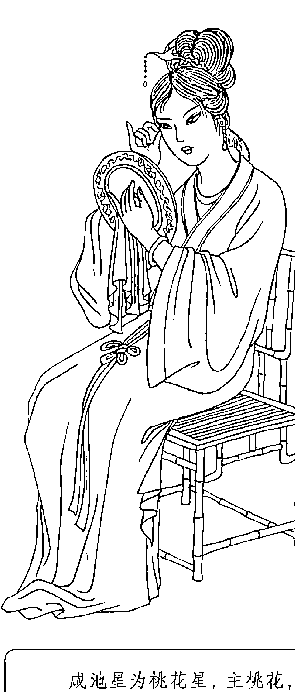

> 咸池星为桃花星，主桃花，处事平和，感情丰富，依从乖顺，柔婉可人，虚荣心重，爱打扮。咸池星在财帛宫，易因异性而进财，理财不够认真，喜欢享乐，容易散财。

## 第十二章 紫微斗数看病论健康

作为古代道教天文历算的一支，紫微斗数在古代阴阳五行观、干支理论与中医理论的基础上对于疾病健康有比较详尽的预测与探究。本章将从病理、病象等层面对之进行探讨。

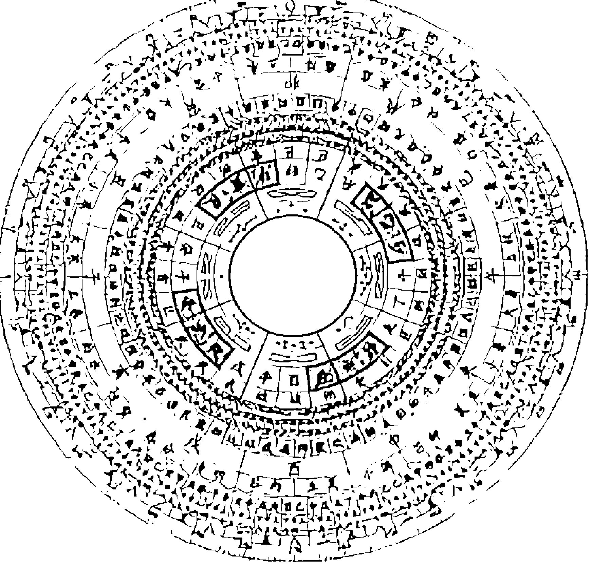

## 图版目录

- 人体与自然界的五行属性归类表 / 965
- 天干地支与人体 / 966
- 五行、五味与病象 / 971
- 五行特性及病理 / 972

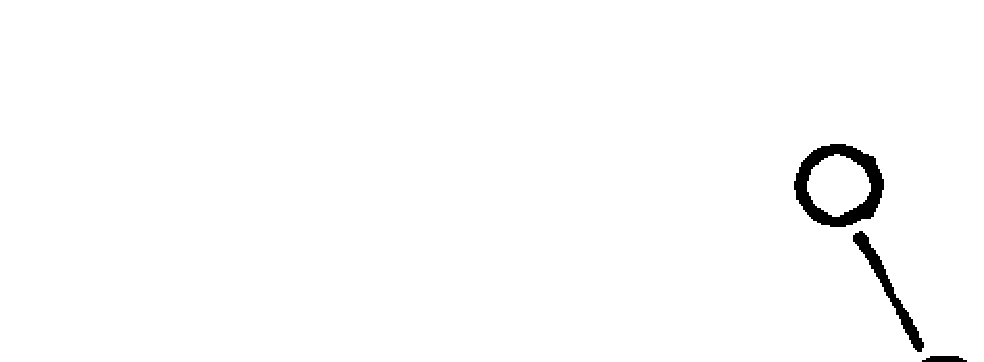

### 第一章 概论

紫微斗数对于病理的预测与探究建立在阴阳五行、天干地支与中医理论的基础之上，因此，对于中医基本原理及其与阴阳五行、干支结合的了解是结合宫位、星曜看病论健康的前提。

#### 阴阳五行病理观

疾病有很多种，就西医而言，探其患病的原因，认为有外在环境、病毒侵害或内部生理失调等。而中医则以为，人之疾病多由五脏六腑阴阳失调所致。故中医原理上，讲求人体的精、气、神互相作用，所谓人体精足则气旺，气旺则神清，神清则体健。同时，运用五行——金、木、水、火、土相生克之道理，以气为病源，探寻预防疾病的根本。中医所称人体的器官，五脏有肝、脾、心、肺、肾；六腑有胆、大肠、小肠、胃、膀胱、三焦（注：中医将人体分上、中、下三部分，“三焦”即指胸、腹部位）。此外中医还配合中国易经哲理的五行（金、木、水、火、土），十天干（甲、乙、丙、丁、戊、己、庚、辛、壬、癸），还有十二地支（子、丑、寅、卯、辰、巳、午、未、申、酉、戌、亥），作为医学原理来说明人体病源与病因，从而对症下药。

而中西医的区别在于：中医讲求平衡调理，防患未然。西医则强调于已发生之后的治疗，两者各具特质，可互为辅佐，帮助身体之健康。如果想运用命理学或紫微斗数的学理来探知疾病、吉凶，最好略懂得中医的医学理论，就可以更明白，什么样的命运，未来可能生什么病，或是本身的体质上，有哪些部分之腑脏器官较弱，必须提高警觉。

基本上，中医认为，人体如同宇宙一样，也有阴阳变化、四季不同的生理反应，如春、夏、秋、冬就有不同的病症及下药方式。同时，人活在宇宙间，受天地间之磁场、气的影响，反映在人体的健康上，也会有殊异的特质变化。

天生地成，万物莫不与天道同，四时、生灭有序，天道可循。人亦同理，生、老、病、死有序依循。此乃自然现象，然而在成长生灭的时空更迭过程中，可能潜伏病因、病源。行运时，则视五行干支衰旺而探生克之理，论病变暴发的象征。这就是以命理学探讨人体疾病的精妙重点，它可帮助现代人了解自我先天生理器官功能衰旺，更可防范疾病于未然。

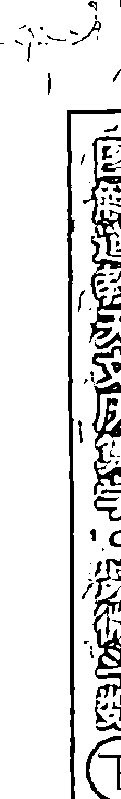

#### 人体干支阴阳属性

中医就人体的组织结构而言，背部属阳，胸腹部属阴；又腰以上属阳，腰以下属阴；外表的皮肤，四肢属阳，内部器官属阴。而且每种脏腑器官又分阴阳，即所谓“阴中有阳，阳中有阴”。所以人体中，不论男女，每个人都有男性荷尔蒙与女性荷尔蒙，才不会内分泌失调。

中医理论认为，十天干用于人体，各有器官象征。例如：天干甲的人体部位指的是“胆”，乙是“肝”，丙是“小肠”，丁是“心”，戊是“胃”，己是“脾”，庚是“大肠”，辛是“肺”，壬是“膀胱”，癸是“肾”。

十二地支也有人体的代表意义。例如：地支子指的是“膀胱”，丑是“胞肚、脾”，寅是“胆、发、双手”，卯是“十指与肝”，辰是“皮肤与胸”，巳是“面、齿、咽、尻肚”（注：尻指的是骨髓末端），午是“眼目、精神”，未是“胃腕、膈瞭（注：膈瞭即胸膈膜）”，申是“大肠、肺及经络”，酉是“小肠、精血”，戌是“命门、腿足”，亥是“头、肾、胆囊”。

紫微斗数中的天干和地支，其五行的命理哲学不仅可用来推论命运，同时也可以探知人体健康，预测疾病。按中国古代学术而论，山、医、命、卜、相，五术本来就是源自同一学理，其中道理互相通用。

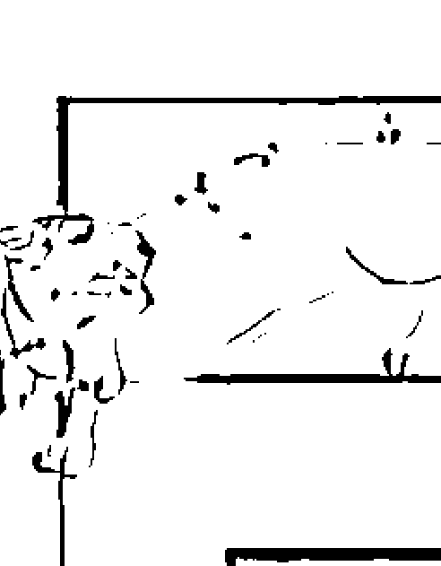

#### 人体与自然界的五行属性归类表

| 分类 | 属性 | 木 | 火 | 土 | 金 | 水 |
|------|------|----|----|----|----|----|
| 人体 | 脏 | 肝 | 心 | 脾 | 肺 | 肾 |
| 人体 | 腑 | 胆 | 小肠 | 胃 | 大肠 | 膀胱 |
| 人体 | 五官 | 眼 | 舌 | 口 | 鼻 | 耳 |
| 人体 | 五体 | 筋 | 脉 | 肉 | 皮毛 | 骨 |
| 人体 | 五志 | 怒气 | 喜乐 | 思虑 | 悲忧 | 惊恐 |
| 自然界 | 五味 | 酸 | 苦 | 甘 | 辛 | 咸 |
| 自然界 | 五色 | 青 | 赤 | 黄 | 白 | 黑 |
| 自然界 | 发育 | 生 | 长 | 化 | 收 | 藏 |
| 自然界 | 气候 | 风 | 暑 | 湿 | 燥 | 寒 |
| 自然界 | 季节 | 春 | 夏 | 长夏 | 秋 | 冬 |
| 自然界 | 方位 | 东 | 南 | 中 | 西 | 北 |

因此，以基本中医学理，配合天干、五行、地支所呈现的人体象征脏腑部位，在紫微斗数中，就不难明了什么人，有什么命格，易生什么病了。例如：某人命宫或疾厄宫在卯宫位，则其先天体质应注意手十指、肝脏等方面的问题，再看卯宫有什么星曜落入，

#### 天干地支与人体

中医理论认为，十天干用于人体，各有器官象征。十二地支也有人体的代表意义。而按中国古代术数而论，山、医、命、卜、相，五术本来就是源自同一学理，其中道理互相通用。紫微斗数中宫星的天干和地支，不仅可用来推论命运，也可以探知人体健康，预测疾病。

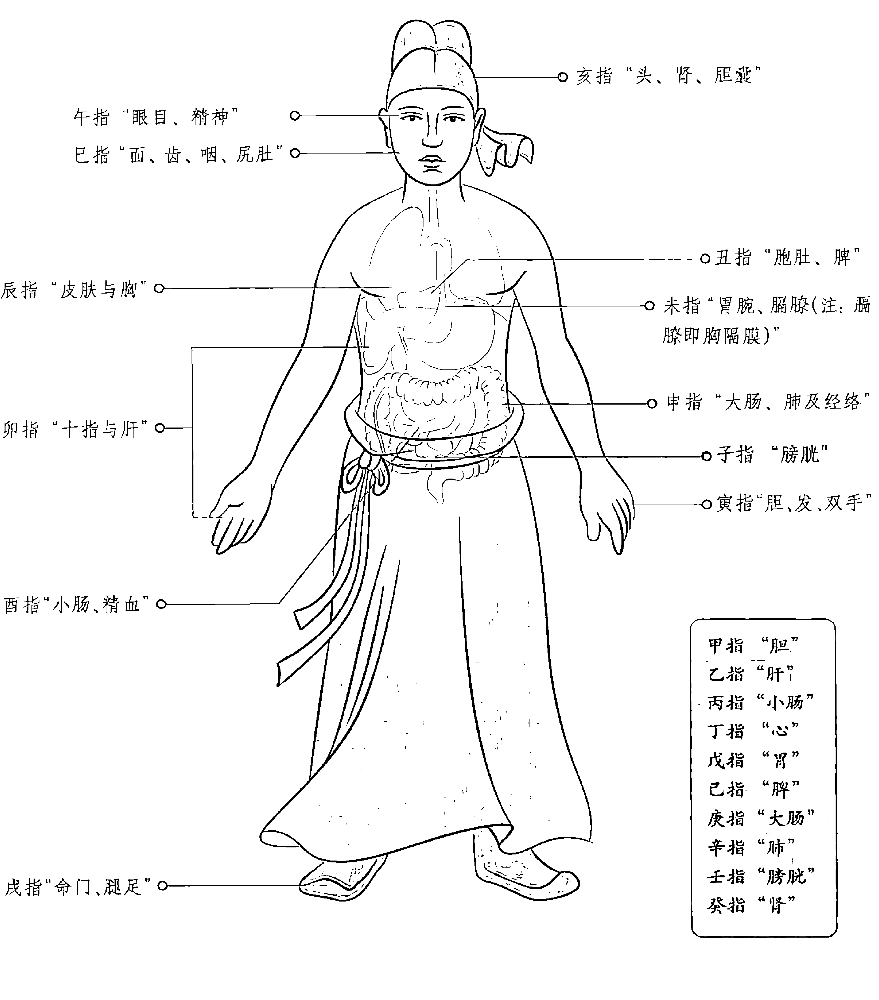

| 天干 | 对应部位 |
| :--- | :--- |
| 甲 | 胆 |
| 乙 | 肝 |
| 丙 | 小肠 |
| 丁 | 心 |
| 戊 | 胃 |
| 己 | 脾 |
| 庚 | 大肠 |
| 辛 | 肺 |
| 壬 | 膀胱 |
| 癸 | 肾 |

则可推断此人的健康运，应注意防范什么疾病、什么时机必须留意健康出状况等。

命理学家以阴阳五行为依据，中医用望、闻、问、切诊法交互为用，而命理学探讨人之疾病健康，是就人的八字命造，论断五行阴阳衰旺强弱之定数，再溯及人体病源出处，与中医论病有共通的道理。

> “康泰生于和合，疾病起于刑伤，究五行衰旺之理，推百病表里之详，内应五脏、外属四肢。”又论：“夫疾病皆因五行不和，即人身五脏不和也，盖五行通于五脏六腑，通于九窍，凡十干受病属六腑，十二地支受病属五脏。”又说：“人之生也，受气于父，成胎于母”，五脏和平者无疾，克战太过者主疾。

命理与医理相同，讲究平衡、过犹不及，讲求中和流通，矫枉过正则会出现后遗症或并发症。人生在世，食、衣、住、行、育、乐与六亲遗传因素等，都可能影响健康，而产生疾病的危机因果。

根据命理学说，一个人的大运、流年、流月也具有“气数”的影响，从流年、月所带动之气数运行，会引现健康或疾病的发生征兆。因此，每个人都可能潜伏癌症细胞，但有的人会发病，有的则不会，即使得了癌症，有的人可以治疗，有的人则因癌致死。因此，紫微斗数认为：生病看“命”，医病看“运”。

#### 疾厄宫：健康密码

紫微斗数对于疾厄宫相当重视，十二宫星辰列宿，天干四化用神，皆可追踪病源与病变之关键。因此，不论行运之大限或流年，都可一一验证健康情形，及早注意与保养。

以命理学看健康问题，人体有如一小宇宙，其中五脏六腑就像宇宙中的小星球，也有金、木、水、火、土五行的生克制化，在成长运行过程中，不断新陈代谢，生生不息，也像自然万物生息不绝的道理一样。

由于命理学与中医学具有相通之理，我们可先透过紫微斗数推测先天健康的特质，掌握未来可能致病的原因与时机，配合现代医疗资讯与健康检查，对症下药，做好疾病预防与养生。

在个人养生上，如果能将紫微斗数的学理加以运用，便可就健康做好事先规划。除了应以自我探索了解个人特质作为未来的基础外，并制定可以执行依循的目标。健康规划的目的，不是要人人当人瑞或长生不老，甚至终身不病，而主要是在于提醒个人平时健康，或生病时必须注意的问题，或做好心理准备，医疗保险与储蓄，减少疾病带来的额外并发症，减轻一些治病过程的苦难与精神压力。

自古以来，我国就常将命理哲学运用于医疗，如卜卦、算命是中国人的心理医生，卜测生死、身体病痛、男女姻缘、事业前途，更是人们时常问及的话题，因为命理哲学早已根植于先民心中，深入文化传承与生活里。从另一种角度看，这也是一种我们今天所说的“心理咨询”，是一种隐式的求医行为，期望治疗心理的不安全感或对未来的恐惧感，透过命理学的指引，达到平复恐惧、焦虑的作用。

紫微斗数的“疾厄宫”，即健康医疗方面的“预防警示”反应宫位。其实，紫微斗数是一种具有推测、分析的哲学理论，可以透过星曜的意义与宫位三方四照，星曜互动的关系，来做一些健康上的预言与推测，不失为一种家庭医师的咨询功用。

借助紫微斗数命盘判断，分析个人健康与疾厄的情况，并以之作为身体健康之规划参考的意义在于：了解自己在身体机能上，哪些方面较可能引起毛病，哪些器官、部位较虚弱，再配合大运、流年气势之运行，警觉自己的健康问题，适时做健康检查，事先预防，及早治疗。

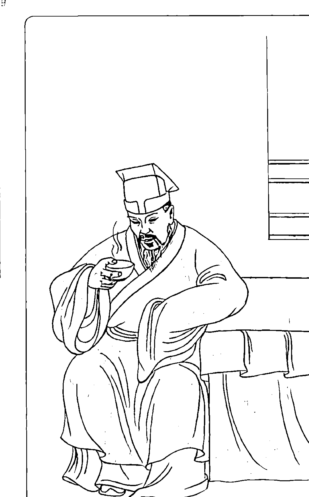

紫微斗数命盘对于健康的判断，对于疾厄的分析，可以作为身体健康的参考资料，了解自己在身体机能上，哪些方面较可能引起毛病，哪些器官部位较虚弱，事先调理，防患于未然。

## 2 五行原理与病象

中国古代哲学家认为，宇宙自然界金、木、水、火、土五种基本元素不断循环运动，生息演化。将五行的特性与紫微斗数相结合，用于中医学，可说明人体生理及病理的现象，并辨别病症，以便治疗。

### 斗数论病原理

中国古代阴阳学家认为，人体组织器官位置虽各异，但实联系为一体，如此身体的阴阳互动才能新陈代谢不断，消长循环不已。阴阳若偏盛或虚，都可能产生疾病，这是病理变化的关键所在。又云：“无阳则阴无以生，无阴则阳无以为化。”说明的就是阴阳两者相辅相成，消长转化的因果关系。

由自然界推知的孤阴不生，孤阳不长的观念，再配合易理太极图的阴中有阳，阳中有阴，循环不已的哲理，渐而再推演，一生二，二生三，三生万物，生生不息，此乃生命自然之源，也是人类生命的基本理念。

中国古代哲学家认为，宇宙自然界系由金、木、水、火、土五种基本元素构成，而这五个元素不断循环运动及生息演化，即所谓的“五行”。在各种有形物理和无形现象中，皆有由五行“相生相克”造成的结果。这种观念若用于中医学，可说明人体生理，及病理的现象，并辨别病症，以便治疗。如果运用在命理学上，则各星曜皆有五行属性，可依星宿列垣形成的星象，来观测天心与人事之变化，预测命运事项，据之以趋吉避凶。

五行相生相克，具有互动关系，万物都有生灭的规则，生老和病死的过程，生中有制，制中有生，运行不已。因此，命理或医学原理同源，均有规范、脉络可循。人们存活于天地之间，受自然界法则之影响，及磁场气流的感应，天寒则人冻，天热则人躁，同时借星辰的变化，投影人间众生相，正好合乎人与天地相应，天人合一的道理。

配合星曜约五行变化与意义，紫微斗数依个人之生辰八字，即每个人诞生的时间，排列星座成命盘，再推演命和运的学理，借助星曜五行明白人体特质、推论健康、疾病的情况与命运相关事项。当我们了解初步的病理学观念后，进一步便要知道紫微斗数疾厄宫星曜的性质，即可明了每个人先天体质之优缺点，再从命盘的疾厄宫位星曜特质，看出身体可能出现的问题，如此我们就不难掌握身体疾病了。

而人体与自然界的五行属性是有连带关系的，在中医学所谓的脏腑功能上虽有区别，但彼此有经络相联结，成为一种表里的关系，不但反映在生理上，同时在病理上也互相产生影响，这便是五行的生克原理。具体来说：

### 木性

根据山命学理论，木代表着大自然中具有生命力的个体。火的燃烧，最需柴木不断的供应，所以木会生火。木犹如花草树木，小木要成长成大树，必须要有土地，才能吸收到土壤中的养分，故木会克土。

中医理论认为：木主肝，肝胆经络相连，成为表里相合关系，即肝病会影响胆，胆病也会影响肝，又肝开窍于目，其主要生理功能是藏血及流通排泄，五体主筋，故肝血足，人的肢体、关节活动就能灵活自如，强劲有力。但过度愤怒会伤肝，肝功能正常与否与情绪有关。

同时，中医还认为：五味中，酸味容易进入肝胆，其颜色属青色，而自然界生命活动始于春天，春季多风邪，得注意伤风病症。

### 火性

根据山命学理论，火代表着大自然中最具有影响力的个体，如日常中我们煮饭的柴火、灯火。它随时供人们取暖、获得光明，也像太阳般温暖大地，使大地有生命的气息，不致沦为黑暗堕落。所以，火可生土，使土地得温暖丰收。但是，火的不断燃烧，却可以摧毁任何坚硬的东西，甚至金属要成为器具或有用的工具，都要火来熔化再重新塑造，故火会克金。

中医理论认为：火主心，心和小肠互为表里关系，开窍于舌，主血脉和脏器功能，若血脉充盈，血液循环正常，则气色好，精力充沛，各组织器官可得到充分的血液供养，维持正常的生理活动。反之，气血失调，会有失眠、精神失调、记忆力减退、悸动，心律不齐等症状。假如心火过盛，则会呈现口干（苦）、舌头溃烂、尿黄、尿少等症状。又人在情绪上不可过度兴奋，否则会伤及心。

同时，中医还认为：五味中，以苦味较易进入心脏，其色泽为赤色，而盛夏高温时期，万物滋生旺盛，得防受暑邪而致病。

### 土性

根据山命学理论，土代表着大自然中最具包容力的个体。自然界需要土地栽培农作物，金矿等土地内的资源，都由土地中引发出来。所以，土可以生金。水流通、泛滥，需要有土堤来疏通，也就是人们常说的“兵来将挡，水来土掩”，故土会克水。

中医理论认为：土主脾，和胃互为表里关系，脾开窍于口，如果嘴唇红润有光泽，表示脾功能正常。其又主管食物消化、吸收及血液的流通，若机能正常，则肌肉丰满有力，四肢活动灵活，食欲旺盛。又因脾主思考、思虑，若用脑过度，则会引起食欲不振或消化不良。

同时，中医还认为：五味中，甘味易进入脾脏，颜色为黄色。又夏秋之交的长夏（农历六月），气候较为湿润，花朵会结果而生变化，须防湿邪所引起的上吐下泻、四肢疲劳、头昏脑胀及皮肤病。

### 金性

根据山命学理论，金代表着大自然中最主观坚硬的个体，如金属、金石。金逢火烧而熔化成液体，所以，金会生水。金可以成为斧头、柴刀，当树木成长到可以为栋梁时，需要劈下来做栋梁、家具，故金会克木。

中医理论认为，金主肺，和大肠互为表里关系，肺有毛病可从鼻子看出，即肺开窍于鼻，主管全身气的生成与调节也和呼吸、体内水液运行与排泄有关。当肺气正常时，皮肤润泽、毛发有光泽、毛孔开合正常、对寒邪抵抗力自然也会增强。而悲伤或忧愁过度则会伤肺。

同时，中医还认为：五味中，辛味易进入肺脏，颜色为白色。又由深秋季节，天气干燥，果实成熟，得以收成，故身体须防燥邪入侵，如口鼻干燥、咽喉干痛、干咳少痰等。秋天日夜温差大，也须注意肠胃。

### 五行、五味与病象

| 行、脏器、味 | 色、季节、病象 |
| :--- | :--- |
| 木主肝，酸味易入 | 色属青，生气活动始于春，春多风邪，得注意伤风病症。 |
| 火主心，苦味易入 | 色为赤，盛夏高温时期，万物旺盛，得防受暑邪而致病。 |
| 土主脾，甘味易入 | 色为黄，夏秋之交湿，须防上吐下泻、疲劳、头晕脑胀。 |
| 金主肺，辛味易入 | 色为白，深秋天气干燥，须防燥邪入侵，如口鼻干燥等。 |
| 水主肾，咸味易入 | 色为黑，深秋万物收藏，寒冬接踵而来，应防身受寒邪。 |

## 五行特性及病理

自然界的五行属性与人体是有连带关系的，在中医学所谓的脏腑功能上虽有区别，但彼此有经络相联结，成为一种表里的关系，不但反映在生理上，同时在病理上也互相产生影响，这便是五行的生克原理。

土主脾
脾开窍于口，唇红润则脾正常。脾主消化、吸收、思考及血液流通。脾正常则肌肉丰满有力，食欲旺。用脑过度则食欲不振或消化不良。

金主肺
肺开窍于鼻，主管全身气的生成与调节，和呼吸、体内水液运行与排泄有关。肺气正常则皮肤润泽，毛发有光。悲伤或忧愁过度则伤肺。

水主肾
肾开窍于耳，主藏精（男为精，女为卵）、生殖、生长、发育等。肾气足则骨骼壮健；肾气不足则排尿异常、重听（肾和耳有经络相连）。惊恐伤肾。

火主心
心开窍于舌，主血脉和脏器功能，若血脉充盈，血液循环正常，则气色好，精力充沛。反之，气血失调，则失眠、精神失调等。

木主肝
肝开窍于目，其主要生理功能是藏血及流通排泄。五体主筋，故肝血足，肢体、关节就灵活自如，强劲有力。但愤怒伤肝，肝与情绪有关。

## 五行特性及病理

## 图解易经

## 水性

根据山命学理论，水代表着大自然中最冷静流通的个体，如日常的自来水、雨、露等。草木树林要水的滋润，才能成长茁壮。所以，水可以生木。水，有冷却效果，当火燃烧时，水可灭火，故水克火。

中医理论认为：水主肾，和膀胱互为表里关系，肾开窍于耳，其主要机能是藏精（男为精，女为卵），主生殖、生长、发育等。精能够生髓充脑，并供给骨骼所需的养分，进而造血，亦主水液分布及代谢。倘若肾的精气充足，自然骨骼健壮；若肾气不足，则会导致排尿异常、重听（肾和耳有经络相连）。在情绪上，惊恐时会伤肾，惊恐过度导致尿失禁，双腿无力即为一例。

同时，中医还认为：五味中，咸味易进入肾脏，其色为黑。深秋过后，万物收藏，寒冬接踵而来，应防身体受寒邪。

## 3 主星与星曜组合的病象

在紫微斗数中，不同主星与星曜的组合不仅五行属性不同，而且代表着身体的不同部位，也象征着不同的病理。

## 主星病理特征

紫微斗数十四颗主星包括：紫微、天机、太阳、武曲、天同、廉贞、天府、太阴、贪狼、巨门、天相、天梁、七杀、破军等。

- **紫微星**
  - [五行]：阴土
  - [身体部位]：头、脑、胃。
  - [象征病理]：头痛、烦扰、胃痛、肝病、营养失衡。

- **天机星**
  - [五行]：阴木
  - [身体部位]：四肢、神经系统。
  - [象征病理]：神经过敏、手足伤残、筋骨疼痛。

- **太阳星**
  - [五行]：阳火
  - [身体部位]：眼睛、血、肠。
  - [象征病理]：眼疾、偏头痛、阳明症候、便血、肝疾。

- **武曲星**
  - [五行]：阴金
  - [身体部位]：鼻、气管、肺、牙齿。
  - [象征病理]：鼻病、肺疾、心血管疾病、糖尿病、意外之灾。

- **天同星**
  - [五行]：阳水
  - [身体部位]：膀胱、耳、内分泌、胃。
  - [象征病理]：水肿、肾疾、肥胖症、内分泌失调。

- **廉贞星**
  - [五行]：阴火
  - [身体部位]：肠、皮肤、性器、内分泌。
  - [象征病理]：瘀血、内伤、妇女病、癌症、青春痘、怪病、艾滋病。

- **天府星**
  - [五行]：阳土
  - [身体部位]：脾、胃。
  - [象征病理]：胃出血、心病、脾疾、结石、肝病、脾胃病。

- **太阴星**
  - [五行]：阴水
  - [身体部位]：下体、皮肤、眼。
  - [象征病理]：妇女病、糖尿病、内分泌失调。

- **贪狼星**
  - [五行]：阳木、阴水
  - [身体部位]：性器、扁桃腺。
  - [象征病理]：妇女病、不孕症、性病、怪病、癌症、流行性疾病、艾滋病。

- **巨门星**
  - [五行]：阴水、阴金
  - [身体部位]：口。
  - [象征病理]：癌、肿瘤、色盲、甲状腺肿、气喘、肝疾、肠胃炎。

- **天相星**
  - [五行]：阳水
  - [身体部位]：皮肤、下体。
  - [象征病理]：过敏、膀胱无力、青春痘、胸闷。

- **天梁星**
  - [五行]：阳土
  - [身体部位]：手脚、骨、脾胃、乳房。
  - [象征病理]：妇女病、神经系统病、伤痛、麻痹症、胃病、肝病。

- **七杀星**
  - [五行]：阴金
  - [身体部位]：肺、筋骨。
  - [象征病理]：意外创伤、肺病、骨折、不明病症。

- **破军星**
  - [五行]：阳水
  - [身体部位]：生殖器官、排泄器官、牙齿。
  - [象征病理]：癌症、破相、牙疾、意外之伤、肾疾、突发病症。

紫微斗数主星的性质与其延伸出来的象征与意义，可以作为判断疾厄的参考，并于日常生活中加以验证。对照自己的命盘资料，从命宫、疾厄宫的星性，就可知道自己先天上，有哪个部位的器官较弱，必须注意哪方面的毛病，或留心健康警讯，早日察觉病症，以便达到预防疾病，及早发现、治疗的目的。

在紫微斗数中，天梁星有“医药之星”的称喻，此星坐疾厄、福德宫，一生中易与医药有缘，必须知道爱惜健康，如果生病应积极求医，最好不要乱吃药，以防万一。

巨门星在紫微斗数中，有“口欲之星”的称喻，平日可能偏爱吃补药，喜欢吃药膳食补，或信服密医及民俗医疗法。

天梁星在紫微斗数中，象征中药，巨门主西药，在求医行为或治疗过程两者不太一样，所以不同星曜的人信任医师或看病的行为也不一样。

图解遵星灾厄
灾厄星
紫微斗数(下)

## 天梁、巨门与医药

在紫微斗数中，天梁星与巨门星皆与医药息息相关，但在求医行为或治疗过程上两者不太一样，前者象征中药，后者则主西药。

太阳星阴阳五行属阳火，它所象征的病理之一为阳明症候，什么是“阳明症候”呢？所谓“阳明”，本是中医经脉名称之一。在中医中，“阳明症候”则专指肠鸣、腹痞胀、咽喉肿痛、腹泻、鼻子出血、齿痛、口眼歪斜等火气旺盛的症状。

天机、巨门、廉贞、武曲等主星，都较无力抵抗“化忌星”，如果化忌、宫干自化忌都必须提高警觉，恐有病灾、外伤发生。

主星组合的星系，如果偏于刚毅、偏阴、偏阳或太阳落陷在戌宫位，太阴落陷在辰宫位，即日月反背等组合，皆是一种健康危急之警讯，最好仔细推敲病源，及发病可能的危险时期。故应先查看本命格，大限、流年月运交迭运行的情况，再下定论。

好好掌握星曜的特质，加上五行的运用，可以帮助判断病理或了解先天身体危机，从而达到预防疾病，健康养生的目的。

## 星曜组合病理分析

## 紫微星：主肠胃疾

### 【主星特性】

紫微星五行属土，主人的腰背。紫微星坐命的人通常较肥满，中高身材，面色多紫黑或黄白。

紫微星属性阴土，主要指消化系统方面的毛病，可能对肠胃病感应力较强烈，当心呕吐、腹泻之症。不过紫微星带贵气，其化杀为权、制煞的特质，落于疾厄宫，病情通常不会太严重，而医运也较佳。

### 【星系组合呈现的特质】

- 紫微天相：须注意皮肤过敏、发炎等病，加煞星（地劫、天空、陀罗、擎羊、铃星、火星）则要防害结石病。逢空劫尤应留意眼昏、胃痛等毛病，逢火星则小心湿疹带来困扰。

- 紫微破军：古诀云：“紫微遇破军于辰戌丑未四宫，为臣不忠，为子不孝，引申其义于疾病，易罹患性病或隐疾。”（辰、戌、丑、未四宫位，五行属土，土质稳定或沉闷，引申为较易有隐疾）

- 紫微贪狼：易呈现桃花犯主的特质，色欲较大。再会桃花星（如天姚、咸池、文曲等），可能有手淫、自慰、遗精等症状。会擎羊等煞星，男命性器官恐有异状，如包皮过长，女命也会有暗疾，白带过多或经期不调等毛病。

- 紫微天府：多胃病，肠炎。此星系最忌逢武曲化忌、天刑、大耗等星，煞星冲照太重，易生病变，当心肿瘤、溃疡、肝肠胃连锁反应，重者引发癌症。由于紫微、天府两颗星均为帝王星，贵星落疾厄宫，反为贱。所谓，王见王，恐气过旺反而是害，不利健康。

- 紫微独坐：易胸闷气胀，遇到煞星（如地劫，地空、火星等煞星同宫或会照），肠胃吸收不良。遇吉星（左辅，右弼、文昌、文曲），须注意营养过剩或肥胖症。遇天刑，擎羊须防病痛手术。

## 天机星：主肝、胆、神经疾病

### 【主星特性】

天机星，五行属阴木，身材中等，面带青白。天机好学好动，多思虑，又属性木，所以应留心肝胆状况与神经衰弱、头昏眼花等。天机颇怕化忌与加煞星（地劫、天空、陀罗、擎羊、铃星、火星）侵扰，会反映于先天体质。天机星坐疾厄宫者，小时候较常生病或受惊，一生须防疾病干扰。

### 【星系组合呈现的特质】

- 天机天梁：小心阑尾炎（盲肠炎）、胃癌、乳癌，尤其煞星同会，更要提高警觉。

- 天机太阴：太阴（水）生天机（木），过盛为患，太阴天机同疾厄宫位的人应当心神经系统毛病。女命当防内分泌失调、情绪不稳，若再会天姚、咸池、天喜、红鸾等桃花星，子宫暗疾、子宫内膜异位等病症较易显现。

- 天机巨门：生卯、酉宫，古书云：“机巨卯酉宫，纵遇财官亦不荣。”又逢忌星（巨门和天机一样，甚忌化忌）、天刑、大耗星曜，手术、不明症状危机颇大。这种格局的人，对自己的健康最好多留意一下。

## 太阳星：主“阳明症候群”疾病

### 【主星特性】

太阳星，五行属阳火，脸型圆满、身材高大，且如果太阳星坐在亥、子、丑位则身材中矮，面色多紫红或皮肤色略暗。

太阳星在疾厄宫加煞星（地劫、天空、陀罗、擎羊、铃星、火星）可能容易发生高血压、眼疾、近视、散光、头痛、痔疮、便血等，乃中医所说的“阳明症候群”。

### 【星系组合呈现的特质】

- 太阳太阴：五行一火一水（太阴），水火相激，则五行不和，须防眼疾手术、失明或失眠、心火交侵，心血管疾病、脑部病变。又见煞星，提防破伤风、中风。

- 太阳天梁：五行天梁属阳土，阳火阳土相躁，容易内分泌失调，引发风症（如头风、中风）。天梁在紫微斗数中本有“遇难成祥”的特性，会先遭灾病，且再经治疗才能痊愈，所以应特别注意，生病有后遗症之忧。

- 太阳巨门：当心火气及口舌发炎（如“鹅口疮”，嘴巴疱疹等病）若逢煞星、巨门化忌、天刑、陀罗等星曜，可能半身不遂。巨门为暗星，又有桃花星咸池、天姚等，易生痔疮、便血。

> 太阳、太阴二星组合，五行一火（太阳）一水（太阴），水火相激，则五行不和，须防眼疾手术、失明或失眠、心火交侵，心血管疾病、脑部病变。

## 武曲星：主呼吸系统疾病

### 【主星特性】

武曲星，五行属阴金，面色青白、青黄，多瘦长，坐在丑、戌、亥宫位则形小，先天体质应注意呼吸系统的疾病，尤其过敏性鼻炎、气喘最常见。

武曲也怕化忌，多烦忧，容易有外伤或因病开刀。加煞星（地劫、天空、陀罗、擎羊、铃星、火星），容易受伤、车祸或开刀。

### 【星系组合呈现的特质】

- 武曲天机：小心破相、美容开刀或瘀瘢等问题。

- 武曲破军：多牙疾、牙龈出血、牙周病等毛病，会照化忌、天刑、流煞、阴煞等星曜须防肿瘤、癌症，较可能引发咯血、肺病、血癌等。行运大限尤其不喜逢武曲破军，务必提高警觉，如果生病了，常有特殊病变发生。

- 武曲七杀：要多预防手脚受伤，若见火星、擎羊来冲照，可能有小儿麻痹或意外伤残。大限流年再见煞星（地劫、天空、陀罗、擎羊、铃星、火星），乃意外之灾的预兆。

- 武曲贪狼：此星系“物欲重”，主人爱吃爱享受，应留心小肠毛病、习惯性肠炎，或因色欲引来的炎症与性病。

- 武曲天府：五行“一金一土（天府）”，土至金掩，病痛少矣，这种人先天健康体质较佳，很少生病。

> 天府星与胃相关，易患胃病、胃胀气、胃寒、反胃、呕吐等病症，加煞星脾胃较弱质。如果天府、七杀的组合再遇会煞星，或出现减肥引起的“厌食症”。

武曲不喜逢铃星、陀罗、文昌，恐形成“铃昌陀武”的格局，灾厄重，手术几率高，且医运也较差。如大限、流年逢之，更得防意外死亡、重病。

## 天同星：主肾病、膀胱疾病

### 【主星特性】

天同星，五行属阳水，脸型圆，面色黄白。天同星为福星，亦有懒散倾向，气虚，先天体质不好，在疾厄宫多有嗜睡、不爱运动的特质。以五行属性而言，属“阳水”，加煞星（地劫、天空、陀罗、擎羊、铃星、火星）须防肾脏、膀胱方面的疾病，或水肿、淋病、尿道炎等病症。

### 【星系组合呈现的特质】

- 天同天梁：须留意肝胃疼痛或胀气，疝气、痔疮、胆结石、肾结石等毛病。逢煞星（地劫、天空、陀罗、擎羊、铃星、火星）或刑忌（尤其是庚年天同化忌），福星不为福（有福难享），易显于病况，当防洗肾、尿道结石、肝结石等折磨人的病痛。

- 天同巨门：多胸闷、或气虚所引发的暗疾、神经痛等病，常有一种难以言喻的疼痛，偏偏医师看不出什么大毛病（例如痛风、牙痛等），这种人的医运也较差。

- 天同太阴：五行水旺过盛，当心手脚肿胀、淋病、性病扰人。女命尤要防范妇女病，如子宫炎、子宫内膜异位。“阴同”双星坐午宫时，更须防心肌梗塞，因水坐火地，冲击过大，易生病疾。

天同星入庙者，病灾较少，易有口福之欲，然而一旦天同化忌或煞星（地劫、天空、陀罗、擎羊、铃星、火星）冲照过巨，则并发症多，常引起疾病。福星虽为吉，但也不是全吉，仍应依三方四照冲会的星曜是否相生相克来判断病征，切莫因“福星”天同坐于疾厄宫，就忽略健康问题。

有天同星的人，懒于防范疾病，易陷入健康危机而不自知，尤应警惕。

## 廉贞星：主内分泌失调疾病

### 【主星特性】

廉贞星，五行属阴火。按中医的观点，其人多为心火躁急或阴阳失调（内分泌失调），廉贞如同天机、武曲、巨门一样，都是害怕化忌星曜来加侮，易变化其本质，加煞星（地劫、天空、陀罗、擎羊、铃星、火星）会产生不明原因的病痛或癌症。

### 【星系组合呈现的特质】

- 廉贞七杀：应留肺疾、咯血、鼻子过敏、咳嗽、流行性感冒等。

- 廉贞贪狼：内分泌失调加剧，男命多手淫、自慰、遗精。女命常子宫不正、暗疾、经期失调、白带过多等疾。尤忌讳加煞星（地劫、天空、陀罗，擎羊、铃星、火星）或化忌，易患梅毒、性病或不治之症。

- 廉贞破军：易有意外伤害、不明原因之病症或血癌。化忌又见煞星（地劫、天空、陀罗、擎羊、铃星、火星）特别显见。这种人医运也欠佳，最好定期健康检查。

- 廉贞天相：当心富贵病、糖尿病、肾疾、结石。

廉贞在紫微斗数中属于“次桃花”星，先天体质在性器官，或性病方面的缺点较大。不论男女命，若有廉贞星坐疾厄宫，都应节制性冲动，尤其加煞星（地劫、天空、陀罗、擎羊、铃星、火星）、忌星同坐或冲照，更要多注意健康检查。

## 天府星：主脾胃疾病

### 【主星特性】

天府星，五行属阳土，面色多黄黑，易患胃病、胃胀气、胃寒、反胃、呕吐等病症，加煞星（地劫、天空、陀罗、擎羊、铃星，火星）脾胃较弱。

### 【星系组合呈现的特质】

- 天府逢空：天府星在紫微斗数中，又称为“库”星，有天府之国的意义。但是不论空亡、截空、天空同宫位或独坐都会形成空库，衍生于疾病的意义，则人体易虚胖，外强中干，脾胃虚，可能引发黄肿，肝、胃、肠病变，或水肿。

- 天府廉贞：五行一阳土一阴火，易罹患湿热病，引起胃炎、脾病、反胃、呕吐、胃出血、胃溃疡、肝硬化等病症。

- 天府天相：当心胃寒、肝胆出毛病。

- 天府七杀：胃肠易胀气，有意外损伤或虚惊。由于天府星和紫微星一样，可以“制厄、化杀”为吉，所以病痛往往只是意外，小伤，病况不至于太严重。如果遇右弼、左辅等六吉星须留心营养均衡的问题。若遇煞星（地劫、天空、陀罗、擎羊、铃星、火星）则胃口欠佳，或出现减肥引起的“厌食症”。

> 从健康的角度看，太阴星与天机的组合容易烦虑，情绪不稳，这是因为太阴、天机多为智慧星，思虑过多；容易情绪失调，过敏，要注意修身养性、控制情绪。

## 太阴星：主眼疾、泌尿系统疾病

### 【主星特性】

太阴星，五行属阴水，面色青白，须防范眼睛方面的毛病，太阳星须小心散光、近视、眼花，太阴星在疾厄宫的人则得注意白内障，青光眼。由于五行阴水多虚亏，加煞星（地劫、天空、陀罗、擎羊、铃星、火星）须防阳痿、泻痢、肾疾、泌尿系统的病痛。

### 【星系组合呈现的特质】

- 太阴天同：同坐子、午宫位，五行皆属“水”，水多覆舟不是吉象，应提防肾脏炎。再化忌，小心尿毒症、洗肾等，或湿气病症（即下痢、下肢浮肿、腹积水、尿少、尿频等）扰人。

- 太阴天机：应防烦虑，情绪不稳，因太阴、天机多为智慧星，思虑过多，容易情绪失调、过敏。再会照煞星（地劫、天空、陀罗，擎羊、铃星、火星），恐怕有隐疾、阳痿之病。

- 太阴独坐：坐亥宫“月朗天门”格局，若化忌、煞星（地劫、天空、陀罗、擎羊、铃星、火星）冲不足为患，只是常常虚惊一场，误为重病，其实不然，成为少见之疾（如梅尼尔氏症、中耳暂时失衡），但休养一阵就可痊愈。

太阴通常喜坐酉、戌、亥、子、丑等宫位，病情较不严重。

太阴坐陷宫，易有想得太多、钻牛角尖的现象。再逢文曲、华盖、天才等星，常有失眠或睡不安稳的痛苦。因为文曲、华盖、天才等星坐命宫或疾厄宫的人通常思虑较多或精神负荷较大，易神经紧张或衰弱，睡眠品质较不好。

## 贪狼星：主内分泌疾病

### 【主星特性】

贪狼星，五行属阳木，但化气属水。因而贪狼星曜可为福也可为祸。由于该星属木又属水，本质变化大且多，应多留心内分泌问题。

五行属性为阳木，加煞星（地劫、天空、陀罗、擎羊、铃星、火星）须注意肝胆病、惊风症。又属水，反映于人体则泌尿系统。

### 【星系组合呈现的特质】

- 贪狼紫微：同坐卯、酉宫，易显现“桃花犯主”格局的特质，主多性事引起的毛病，常有手淫、意淫、自慰、包皮长、性病、阳痿等困扰。女命多子宫不正、不孕。

- 贪狼廉贞：桃花会齐，易阴虚、腰酸、肝胃失和、皮肤出现癥癣、青春痘、经期失调，子宫后倾和偏离等病症。会煞星（地劫、天空、陀罗、擎羊、铃星、火星）则痔血、头痛。廉贞逢化忌，当心血崩、癌症。

- 贪狼武曲：这两颗星曜较重视物欲享受，所以显现在人体上，则小肠毛病多，易患肠胃炎，或因色欲引起下体发炎等病症。再会煞星（地劫、天空、陀罗、擎羊、铃星、火星），多便血、脓血之灾。贪狼武曲呈现为内分泌疾病、呼吸道问题，两者可能有“红鼻子”的特征，但有些人小时候有此病症，长大内分泌渐好，就不药而愈了。

## 巨门星：主脾胃疾病

### 【主星特性】

巨门星，五行属阴土，但又见阴金之特质。所以本星曜为暗星，因五行克制，土至金埋之故，须注意口欲引发的病痛与暗疾。

巨门阴土，脾质较弱，当防湿症、疮疾。巨门在紫微斗数主“口”，因此也要留意呼吸道与胃病。化忌，加煞星（地劫、天空、陀罗、擎羊、铃星、火星）易发口疮、嘴角疱疹，某些人甚至时好时坏。

### 【星系组合呈现的特质】

- 巨门太阳：当心高血压、头昏、目疾。如果地劫、天空、陀罗、擎羊、铃星、火星，化忌等煞星干扰，谨防中风而半身不遂，平日应多量血压，防范心脏、血管疾病。
- 巨门天机：小心其心胸不开朗，神经衰弱，肝胃毛病多。见煞星（地劫、天空、陀罗、擎羊，铃星、火星），恐有手术之忧。
- 巨门天同：注意神经疼痛或暗疾。见化忌，当心骨癌、食道癌、肺癌。由于巨门是暗星，天同星是福星，一旦化忌，形成有福难享的现象，也是健康危机的警讯，须提高警觉。

## 天相星：主泌尿系统疾病

### 【主星特性】

天相星，五行属阳水，中等身材，面色清白或略黄白，先天体质上须多留心泌尿系统、肾脏等脏器之病，加煞星（地劫、天空、陀罗、擎羊、铃星，火星）尤甚。

### 【星系组合呈现的特质】

- 天相紫微：多胸闷、皮肤过敏、胆病、反胃。
- 天相武曲：逢破军在对宫对照，当心破相，且今生易有美容的机会；若加煞星（地劫、天空、陀罗、擎羊、铃星、火星）有糖尿病。
- 天相廉贞：常患肾脏疾病、膀胱炎、糖尿病、结石。再遇桃花星（如咸池、天姚、天喜、红鸾），应提防性病。
- 天相逢煞：须防骨疾、心病、皮肤湿症。忌冲、逢煞星（地劫、天空、陀罗、擎羊、铃星、火星），易患奇特之症、罕见之病。
- 天相逢天阴：小毛病多，恐有过敏性皮肤炎。

## 天梁星：主脾、胃疾病

### 【主星特性】

天梁星，五行属阳土，面色较黄白，胖瘦不一。天梁星具遇难成祥的特质，虽入疾厄宫位，一生亦有病痛上身的危机，但多可转危为安。

五行阳土显于病理，也是脾胃方面的病症较多，易消化不良、盲肠发炎。若遇煞星（地劫、天空、陀罗、铃星、火星）须防乳癌、胃癌。逢擎羊、天刑、耗劫，当心手脚麻痹，胸腰筋骨受伤。

### 【星系组合呈现的特质】

天梁天机：好好预防慢性病、四肢伤痛麻痹症，乳癌、胃癌。

天梁天同：多留意疝气、痔疮、胆结石、胃炎。尤其讨厌化忌星，会导致洗肾、尿毒症、肝胆结石等。

天梁化禄或禄存：易偏食、消化不良。阴煞、天阴同宫，小心感冒、流行性感冒。

## 七杀星：主意外之灾

### 【主星特性】

七杀星，五行属阴金，中等之姿，对宫的星曜恒为天府。七杀星为将星，亦是一颗血光星，落于疾厄宫，健康容易有状况，性情急躁，幼年多病灾。

由于七杀星在紫微斗数中象征威权，反映于人的病理，亦多受伤与意外之灾。

五行阴金，和武曲星一样，也应留心呼吸道系统的病症。七杀在疾厄宫位是一颗也须提高警觉的星曜。七杀落陷又见煞星（地劫、天空、陀罗、擎羊、铃星、火星）者，小心残疾。

### 【星系组合呈现的特质】

七杀与紫微、天府星拱照：提防内伤、胃疾或开刀手术。尤其若逢擎羊，常见肿瘤、便血。

> 由于破军和武曲、七杀星都是将星，即刚毅之星，坐命宫或疾厄宫，多有血光、受伤之灾，多有意外，应当特别注意安全、留心身体健康。

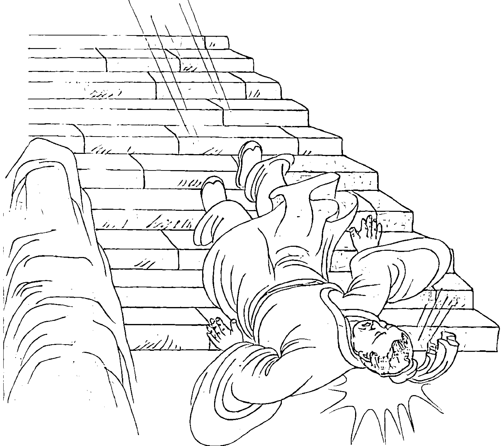

- 七杀廉贞：七杀廉贞同身命，折股伤肱，又主痨病。所以，须当心咯血、肺疾、肝炎等病。再化忌，多有不治之症。注：折股伤肱，表示须注意上肢、手腕等受伤或骨折。
- 七杀武曲：多主意外伤害，因为金过旺之故。又得留意鼻病、肺疾，且二者同为将星，易有意外之灾，应防交通事故。逢昌、曲、加煞星（地劫、天空、陀罗、擎羊、铃星、火星）更应小心。
- 七杀逢煞：多驼背，手足伤残。遇火星，易患眼疾。逢龙池，留心耳疾、耳聋。逢凤阁星曜，预防牙疾，牙周病。

七杀为阴金，呼吸道毛病多，轻者可能是鼻窦炎、鼻过敏、哮喘、气喘。重者加煞星（地劫、天空、陀罗、擎羊、铃星、火星）癌症或残疾。

七杀星在疾厄宫是一颗恶星，最好定期健康检查或注意保养身体，以免造成健康危机。这种人先天带有血光之灾，容易有生病、看医师的机会。

## 破军星：主血光之灾

### 【主星特性】

破军星，五行属性阳水，紫微斗数中属耗星，常有先破坏后建设的特性。由于破军和武曲、七杀星都是将星，即刚毅之星。

破军坐命宫或疾厄宫，多有血光、受伤之灾。破军者，幼年常有脓血、跌伤之祸，健康不佳，且恐有破相之忧。

破军星遇煞星（地劫、天空、陀罗、擎羊、铃星、火星），多有突发的病或流行性的疾病，例如：天花、麻疹、癌症。

破军属水，须提防肾亏损、阳痿、阴痿。

### 【星系组合呈现的特质】

- 破军廉贞：坐卯、酉宫，当心不明之疾、意外死亡或癌症。化忌加煞星（地劫、天空、陀罗、擎羊、铃星、火星），意外之灾防不胜防，恐并发症多。这在紫微斗数中是不好的警讯，应多留心。
- 破军武曲：牙疾多，尤其蛀牙、牙周病、牙龈出血屡见不鲜。遇煞星（地劫、天空、陀罗、擎羊、铃星、火星）忌刑星曜，须防癌症，如肺癌、血癌、肝癌。行运大限、流年更要小心。破军喜见化禄或禄存，遇病灾多可逢凶化吉，或医运较佳，转危为安。

## 4 助星病象

紫微斗数助星的部分主要有：禄存，天马，六吉星（左辅、右弼、文昌、文曲、天魁、天钺）、六煞星（擎羊、陀罗、火星、铃星、地劫、地空）等。在论及健康时，将主星与助星相结合才更加精准。

在紫微斗数星辰的分野，在分布于十二宫中，主星、副星同宫或会照，均有相生相克之机，不察其机，不知其变数。而预测命运，分析病理，关键就在于掌握这些不同的变数。除了要明白主星在不同宫位，及不同星系组合所呈现的特性外，副星也很重要，必须一并参看，才能更精确。

### 禄存与天马的病理

#### 禄存星：主肠胃疾病

禄存星又名天禄星、或天存星，五行属阴土，性质较孤独，少年多病痛或伤感，可能有胃胀气、便秘等胃肠方面的小毛病。

禄存如遇火星、铃星，容易四肢受伤；逢忌冲，当防暗病上身或吃错药。

#### 天马星：主意外伤害

天马星五行属阳火，性好动，多劳心劳力，应用于病理，则阳火肝旺，心浮气躁，手足提防意外伤害。女命恐有妇女病，男命主自慰、意淫、性欲强。

天马星，只落四生地（寅、巳、申、亥）等宫位，但在各宫个性各有不同。天马星在寅，为木马，偏于劳心劳力、多忧虑；天马星在巳，乃火马，好动气躁，肝旺过盛，须防肝疾与意外交通灾祸；天马星在申，为金马，性需求高，桃花欲念较强，易有意淫、自慰、遗精的现象；天马星在亥，为水马，天马本性阳火，逢水，则水火冲击大，当防外伤，手脚四肢痛症或伤残，逢煞，谨防车祸。

由于天马还有流年天马与月天马在运行，而且对流年、流月运势影响比较大，故须多方参酌以便正确判断出健康现况来。

天马星因具有“动”的特质，所以易患流行性感冒，精神官能症，或情绪症状，脾气来得快，去得也快。

## °°° 六吉星的病理

### 左辅星：少灾少病

左辅星五行属阳土，在病理上应注意脾胃、腿手浮肿等症状。一般而言，左辅星敦厚化吉，反映于健康少灾少病，坐疾厄宫，则医运不错，看病可以碰到好医师。

### 右弼星：注意精神疾病

右弼星五行属阴水，容易罹患中医所谓“上火下寒”的毛病，此种体质多精神萎靡、耗损，应留意下体内病症，性病、妇女病、艾滋病。通常如果不会照煞星或煞星同宫，健康良好，只是较容易消耗心神、伤脑筋，多半属于精神上的病，生理的病较少。

### 天魁星：主皮肤病

天魁星五行属阳火，须防中医所谓的阳明症状、皮肤病。为人脾气较大、个性急、易血压高。因天魁星、天钺星都是属贵人之星，生病往往可寻得良医、好药，也是医运颇佳的星曜。

### 天钺星：主肝、肺疾病

天钺星五行属阴火，须当心、肝、肺、湿疹、发炎等病症。天钺为贵人星，也要防范暗疾、外冷内躁的病症，不过病轻易治，和天魁星一样，求医顺利。

### 文昌星：防肺痰

文昌星五行属阳金，文昌星应注意肺疾、神经衰弱、感冒等病。文昌化忌，易有精神方面的疾病或心因性胃痛，情绪起伏很大，有脾气不稳的现象，配合凶主星可能使其症状加剧或发炎。

天魁、天钺星是贵人星，当其坐疾厄宫的时候，所得疾病一般比较容易治愈。另外对健康比较有利的还有通常被认为“煞星”的地空、截空星，能将疾病空走，得了疾病也比较容易痊愈，这也是“煞星不煞、凶星不凶”的很好例证。

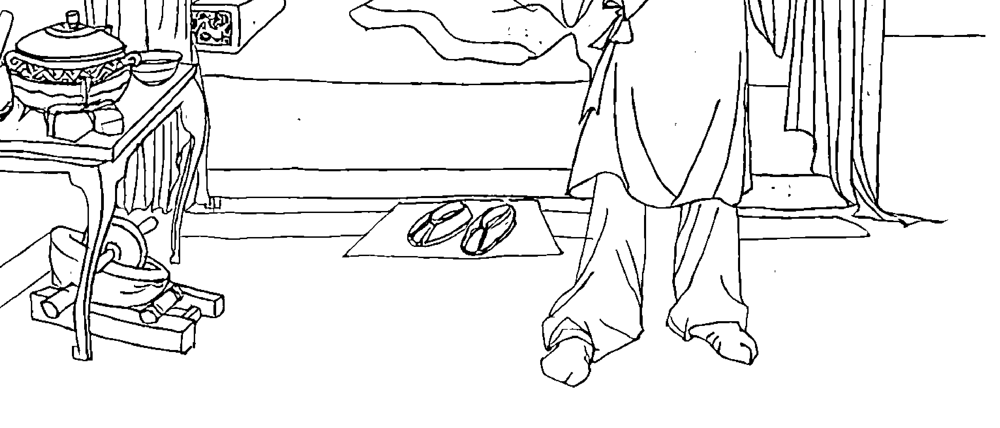

### 文曲星：主神经衰弱

文曲星五行属阴水。文曲星落于疾厄宫，多有失眠或不易入睡的毛病，并在脸上和皮肤长痴痣，且有思虑反复的现象。由于文曲星属阴水，也要小心内分泌、性病、妇女病。尤其化忌时，恐有浮肿、溃疡等并发症。

## 。oo° 六煞星的病理

### 擎羊星：主外伤

擎羊星五行属阳金，特性偏刚。由于擎羊带有血光之灾的特质，落在疾厄宫，易有开刀、手术、骨折，健康危险几率较高。

若再与诸将星（如七杀、破军、廉贞、武曲等）会聚，更要提高警觉。显现的病症有：外伤、骨折、破相、四肢无力、麻痹、虫咬、慢性头痛、神经关节疼痛、羊痛风、天花、颜面神经麻痹。

在行运，如大运或流年，走到该宫位或对照，即在迁移宫位时，须提防遇到危害、意外灾害、手术、突发病症。女性当小心妊娠血崩、流产等。

### 陀罗星：主内伤

陀罗星五行属阴金。陀罗星坐疾厄宫多患不易治愈、反复发作的病痛。反映于病理，必须留意牙痛、皮肤生癣、骨刺，并要预防身体易有的瘢痕、胎痣、伤疤和神经关节疼痛、内伤或须长期吃药的疾病，如高血压、糖尿病等。

此星外显病痛反而是好事，如此才不至于转于内伤，或脏器病症。如果人相有唇齿破相或暴牙、驼背，则化凶为吉，较没有大病痛，可延寿。

陀罗星并非大凶煞，多数为小病小痛，只是常会拖延病程或治疗时机。陀罗星坐命宫或福德宫、疾厄宫者，多半有驼背和手脚长短、大小不一的现象，或常腰酸背痛之特质相当明显。

### 火星：主心血管疾病

火星五行属阳火。火星坐疾厄宫，易患湿热，及火气大的症状，必须当心心血管疾病，机能亢进症、皮肤炎、发红潮，易有高血压、心脏等方面的病症。

火星坐命的人，唇齿有伤痕、毛发有异。如果煞星冲照太严重，可能有白痴、颜面神经麻痹、中毒等病厄。基本上，这种人体质较燥热，脾气多急躁。

火星行运时，逢大限、小运，则得注意突然的意外，尤其是火星逢贪狼，为火贪格，在紫微斗数中属于好格局，不过要防突发病症。疾厄宫若有火星、贪狼星同宫，当防中风、癌症，红斑性狼疮或不明之症。若逢擎羊，手术之厄运较难逃。这种人的医运较差，求医治疗时不妨多听、多问、多请教，才能找对门路。

### 铃星：小病不断

铃星五行属阴火。铃星入命，在襁褓期间必有灾，或幼年时有小病、惊风。铃星坐疾厄宫，较易神经过敏，或生暗疮、便血、痔疮、破相，尤须慎防残伤。同火星一般，医运延滞，老来须防老年性痴呆症。

### 地劫星：防伤残

地劫星五行属阳火。地劫星乃多劫煞，坐疾厄宫容易四肢受伤、残疾、小儿麻痹、目昏、头痛、贫血、耳聋、失声。

因为地劫具有得而复失的特质，星曜反映于病兆，易使原有的人体特质、潜能受损，以至再失去，例如：声音、听力、毛发等生理机能丧失或破损。

地劫星的健康情形，如浪里行舟，可能在治疗过程中，耗费不少钱财，医运又不顺，总让人担心，所以皆不希望地劫星坐于疾厄宫或福德宫。

### 地空星：先天体质不良

地空星五行属阴火，星曜特性类似半空折翼，健康及先天体质也容易出状况。这种人可能表面上看起来颇健康，但生理上却脆弱或先天体质不良，故应经常健身，强健体魄来防范疾病的发生。地空星病状有上热下寒的特质，即可能腹泻、贫血、饮食失控，患厌食症、得传染病等，故最好忌食生冷食物。

### 次级星的病理

紫微斗数星曜多达一百二十六颗，除了主星、助星（乙级星），还有丙级、丁级、戊级星曜。紫微斗数有的学派只用主星、副星来论断命盘，有的学派则各级星曜都参看，特别是在行运时，次级星曜如天姚星、咸池星、天刑星、孤辰星、寡宿星、龙池星、凤阁星、破碎星等可能都有作用，而且影响力很大，故须多注意。

### 天姚星：主内分泌疾病

天姚星五行属阳水，其反映的病兆多为内分泌的问题，青春痘、秃发也和天姚星有关。女性尤须小心月经失调、不孕、流产等。

天姚在疾厄宫的人较早熟，女性当防乳癌。逢煞星较灵验，而且还要留心皮肤问题，如干燥、过敏、病变等。

### 咸池星：防性病

咸池星五行属阴水。咸池星坐疾厄宫，应预防淋病、梅毒、便血、酒精中毒、杂病（如多种并发症等）、水难。

咸池怕煞忌冲，色欲惹病上身。落于疾厄宫、福德宫，性欲也较强。

### 天刑星：防抑郁病

天刑五行属阳火，须防火伤、触电、精神孤独、郁闷等病症。入疾厄宫，开刀的几率较大，尤其会照或与擎羊同宫，手术之灾难逃。

天刑星入命之人，也要提防意外灾害、暴毙、癌症，但须视主星之星曜特质而定，若逢紫微、天梁、化科星有解，逢煞冲、化忌星则疾病缠身。

### 龙池星：主耳疾

龙池星五行属阳水。龙池星坐疾厄宫，易耳聋、听力差。龙池在疾厄宫、福德宫者，可能烟不离手，同时可能是常觉得寂寞、孤独之人。若龙池与凤阁星同坐宫位，就较不会有自闭、孤独的现象。

### 凤阁星：主口腔疾病

凤阁星五行属阳土。其主要病兆在口腔，必须留意牙疾、蛀牙、牙周病，并会闹肠胃病或手气、脚气病、富贵手、香港脚等。凤阁星遇煞须防破相，因为凤阁星曜的特性是喜好装扮、重外表，一旦煞忌冲会，易有相貌毁损之忧。

### 破碎星：防意外之灾

破碎星五行属阴火，破碎星在紫微斗数中，主“白衣煞”，即易有丧服之危的灾煞。

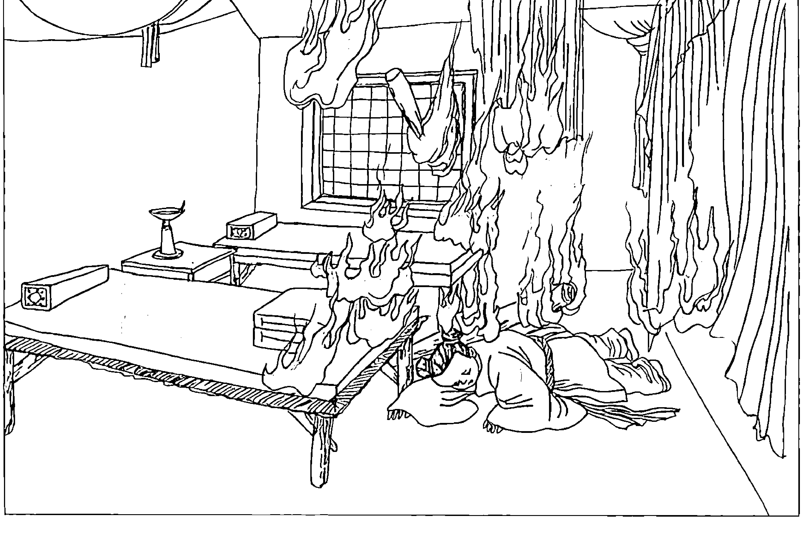

> 天刑为凶星，五行属阳火，须特别留意防火伤、触电、精神孤独、郁闷等病症。只有在逢紫微、天梁、化科星等主星时有解。除此以外，在铃星与火星入田宅宫时，也容易引发火灾，应注意防止火伤。

落在疾厄宫得防重病或意外、突发之病，肝、肺本质较弱，常会心闷气躁，女性须防范流产等。破碎星有时也被称为“七折八扫”的星曜，因为当事人难免小病上身，健康自然打了折扣。有这颗星坐疾厄宫位，最好也要定期健康检查与注意饮食、运动，以防范疾病。

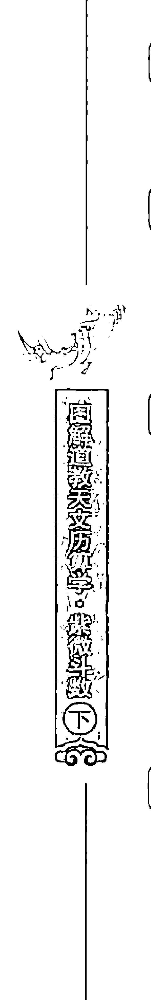

### 蜚廉星：防血光之灾

蜚廉星五行属阳火。应留意车祸、血光之灾、残疾，尤忌煞冲照。

### 孤辰星：防精神疾病

孤辰星五行属阳火。孤辰星天生一副孤僻、精神欠佳的模样，当心郁闷，易失眠或罹患精神疾病，心因性病症，如常怀疑自己生病或没病却爱吃药。

### 寡宿星：防湿热症

寡宿星五行属阴火。应提防湿热症、发炎、溃疡方面的病症、痨伤、下寒、白带、月事失调。男女命皆忌寡宿在疾厄宫，其与孤辰一样都可能单相思，常有心事谁人知之叹。孤辰、寡宿在生殖问题也多有憾事，或许必须借助医学科技，以解决生育，或不孕的困扰。

### 天才星：防阳痿

天才星五行属阴木。天才星，先天体质较神经质，易感疲倦、失眠或睡眠不足、睡不安稳，可能有阳痿、神经衰弱的特性。天才星入疾厄宫，常有钻牛角尖、思虑太多的倾向。

### 天哭星：肝火过旺

天哭星五行属阳金。天哭星坐疾厄宫脾肾较弱，肝火过旺，所以精神耗损，暴躁易闹脾气，常是一副苦瓜脸。

### 天虚星：防忧郁症

天虚星五行属阴土。天虚星坐疾厄宫，脾气阴沉消极、体质差、常感疲倦、虚火上升、口干舌燥，易有忧郁症。天哭、天虚同宫或大限、流年逢之，当心意外灾害迭起或病情加重。

### 华盖星：主头疾

华盖星五行属阳木。华盖星坐疾厄宫，容易患偏头痛、脑瘤、头风、痛风等毛病或有痴痣。

华盖星遇天空、地劫星，可能倾向自闭或神经官能症，当慎防之。

### 天月星：病患不绝

天月星五行属阴土。天月星坐疾厄宫小病多，是标准的“疾病星”，可能一生是药罐子。
天月星逢陀罗、擎羊、巨门，尤其要注意疾厄缠身、心忧不绝。

### 红鸾星：主伤寒

红鸾星五行属阴水。红鸾星坐疾厄宫，当心伤寒症、下肢冰冷、肺痨等病，女性须防流产、血光。
红鸾逢天刑、擎羊，易有手术之厄与刀伤。每当红鸾流日，尤应小心。红鸾星入疾厄宫，可能会有单恋等现象。

### 天喜星：主皮肤病

天喜星五行属阳水。天喜星坐疾厄宫，应预防泌尿系统、膀胱炎、肺炎。
天喜星容易皮肤过敏、长青春痘，颇像“阳火”，所以外显性的发炎、瘢痕等几率颇大。

### 解神星：祛病解厄

解神星是疾厄宫最爱的一颗星，具有祛病解厄的作用，一生病灾少，即使有疾病也可得良医、良药救治，健康状况良好。

### 地空、截空、旬空：疾厄落空

这三颗星本是凶星，却喜落疾厄宫，不爱坐命宫、财帛宫、事业宫，可减少病灾，让疾厄落空。
空星落疾厄宫，表示没有病灾，有病也多属劳心与犹豫、操心，偏于精神上的小毛病。这也是凶星不一定为凶的最好例证，只要落入正确的宫位，凶星并不代表凶厄。同理，吉星坐错宫位也不是吉象。

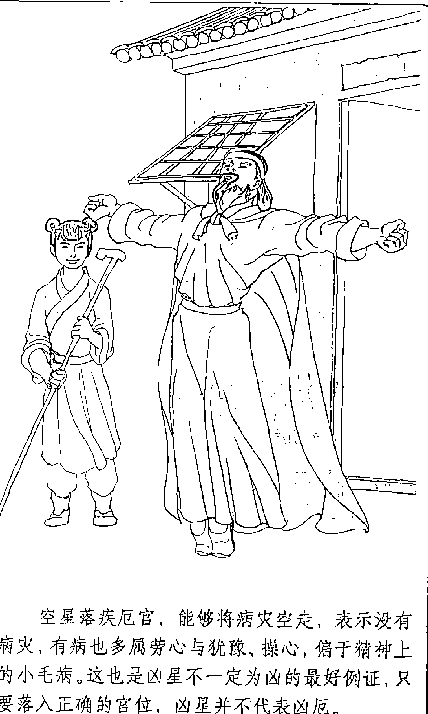

> 空星落疾厄宫，能够将病灾空走，表示没有病灾，有病也多属劳心与犹豫、操心，偏于精神上的小毛病。这也是凶星不一定为凶的最好例证，只要落入正确的宫位，凶星并不代表凶厄。

### 三台星：主脾胃疾病

三台星五行属阳土。三台星坐命应注意脾胃毛病。坐疾厄，没有大病，生病几率较小。

### 八座星：防皮肤病

八座星五行属阴土。八座坐命须留意皮肤病、青春痘等问题。坐疾厄，没有大病，生病几率较小。

### 天伤星：防牙病耳疾

天伤星五行属阳火。天伤星坐命，须防范牙疾、耳病失聪、四肢疼痛、骨刺等。行运天伤，通常为命盘第七大运，得当心病灾。由于天伤星永在命盘的交友宫，故天伤永远冲照兄弟宫。在紫微斗数看意外之灾或变动，多以观察“父母、疾厄连线属天使星”“兄弟、交友连线属天伤星”判断吉凶，这二线很怕煞星来冲，恐病灾难逃。

通常一般人走到第七大限时多为六十多岁至七十多岁，正是健康与寿元的考验期，所以每逢天伤、天使夹命宫，必须慎防灾病，死亡。

### 天使星：易有小灾

天使星五行属阴水。天使星坐疾厄宫，易有小意外灾祸、虚火上升、肝旺气躁、胃出血、脾湿造成的上吐下泻、四肢疲劳等病症。

行运天使，通常为命盘第七大运，得当心病灾。由于天使星永在疾厄宫，故天使永远冲对父母宫。在紫微斗数看意外之灾或变动，多以观察“父疾线”“兄友线”判断吉凶，这二线很怕煞星来冲，恐病灾难逃。

此外，因迁移宫在命宫的对宫，命宫为体，迁移宫为用，本体的强弱迁移宫也有影响。行运至此，生死好坏都由外在环境因素引发，已非本命宫所及。故走到天伤，天使夹宫（迁移宫）时，若再逢煞忌冲破，务必特别注意身体的健康情形，预防万一。

## 四化星的病象

紫微斗数助星的部分主要有：禄存，天马，六吉星（左辅、右弼、文昌、文曲、天魁、天钺），六煞星（擎羊、陀罗、火星、铃星、地劫、地空）等，在论及健康时，将主星与助星相结合才更加精准。

一般紫微斗数学派多重视三方四正，即观察命宫、财帛宫、事业宫之主要三方，再加看迁移宫四正位，来分析判断命运事项吉凶。也有的派别特别强调四化飞星，即化禄、化权、化科、化忌星的运用，而四化的病象还要配合星曜性情来综合论断。

在紫微斗数中，分布于十二宫中的主星、副星同宫或会照，均有相生相克之机，不察其机，不知其变数。而预测命运，分析病理，关键就在掌握这些不同的变数。除了要明白主星在不同宫位，及不同星系组合所呈现的特性外，副星也很重要，并入参看，才能更精确。

而在病理分析上，现代更有学派融合各家学说，应用三合宫，即命宫、财帛、事业三宫位合照，加上四化参看，视疾厄宫星曜之四化情形，或宫干自化、四化的变化，分析所呈现的病象。十二宫位不同星曜的四化变化，都了解与掌握后，论症、断病才会准确。

禄星多变，易受忌星影响，所以疾厄宫化禄又化忌，或疾厄宫自化忌，则病征会更明显、更严重。切记在紫微斗数四化飞星诀上，禄随忌走，乃是吉反为凶，常常两象同在宫位内，病情、病况最易变化，或治好这一病，而另一病又发了。

论四化，除了生年天干四化外，每一个宫位也有天干，即可能产生宫干自化的现象，此种隐象常须追根究底方知其奥妙。因为有时候表面上是这种病，实际上却并非如此，通过四化飞星，与疾厄宫四化出去的星曜，即可查出病源来。

### 化禄星：化解病厄之功

【五行】：属阴土

【特性】：化禄星，具解厄之意，易有肥胖、肠胃和肝脏疾病。由于化禄有增多的特性，反映于人体特质，即性欲强，需求多，尤其廉贞、贪狼化禄更有如此特点。
天同化禄，有解病厄之功，喜入疾厄宫。
天梁化禄，有解病厄之功，喜入疾厄宫。

### 化禄星：解厄之意

化禄星具解厄之意，但不同星曜化禄会有不同的结果。

破军化禄，可能会不需求医却偏爱逛医院，闲来有病吃药，没病也食药强身，耗费过多医药费。

太阳化禄，视力不同于常人，例如坐午宫，可能为远视、色盲或乱视。

巨门化禄，颇有口腹之欲，必须小心肥胖，及营养过剩的麻烦。

天机化禄，则要防用脑过度。

武曲化禄，最为吉。武曲最爱化禄，可解厄，只有小病痛没有大病之忧。

### 化权星：少年多灾

【五行】：属阳木

【特性】：化权较不喜入疾厄宫，少年多灾，易有外伤。

破军化权，个性、脾气古怪，须防范神经官能症。

天梁化权，操心劳神，多高血压，小心中风。

天机化权，常感染流行性疾病，尤其肝病颇多。

天同化权，可能要减肥。

太阴化权，有点自闭、郁闷的情形。

贪狼化权，入疾厄宫，当心欲望惹病上身，注意发炎，意外伤害。

武曲化权，不喜欢在疾厄宫，将多灾病或肝火太旺、脾火上升，女命须防流产。

紫微化权，若在疾厄宫，会失去解厄的功用，应防范精神压力过大、心血管疾病、糖尿病等病发生。

巨门化权，留心肠胃方面的毛病。

### 化科星：医运较佳

【五行】：属阳水
【特性】：化科星，最利于疾厄宫，有解厄的功效，医运也较佳。
化科星入主宫位之人，多行事得宜，饮食适当；心性亦较稳定，情绪不致反复不定，少得身心烦躁症。

紫微化科，左辅化科，右弼化科、文昌化科、文曲化科皆是病理好预兆，没有什么大病痛，且都有贵人之相，会碰到好医师与良方治病。

化科者，应防过瘦、营养吸收不良、贫血等小毛病，必要时要多吃营养丰盛的食物，以维持身体健康。

### 化忌星：体弱多病

【五行】：属阳水
【特性】：化忌星，多灾厄病痛。化忌常有过犹不及的现象，病理特征是带病延年，身体瘦弱，毛病不少，先天体质较差。反映于疾病方面，易有意外之灾、暗疾或癌症、肿瘤。

太阳化忌，须防眼睛病变，如近视、白内障与眼肿。
太阳化忌坐巳、午宫位再逢忌，则要注意心脏病、高血压、中风、脑溢血。

武曲化忌，应防范意外伤害，骨筋折损。

贪狼化忌，花柳病、肺痨、妇女病、暗症，杂症令人防不胜防。

廉贞化忌，性病、肺痨、妇女病、暗症、失贞节，杂症令人防不胜防。

巨门化忌，恐有疯癫症、难治之症或杂症。

天机化忌，易有脑神经和精神系统毛病、官能症或闹情绪。

文曲化忌，易闹心病，情绪反复不定或失恋、单相思。

文昌化忌，小心其心闷、肺疾、咯血。

天同化忌，也须提高警觉，因天同是福星，化忌乃有福难享之意，恐身体久安，日夜煎熬，应该当心膀胱炎、尿毒症、肾脏炎，严重者甚至得洗肾。

化忌星最怕又有煞星冲，或逢天刑、阴煞、天哭、天虚、孤辰、寡宿、破碎星，往往叫人对病痛的产生有措手不及之感，可能出现遗憾之事或并发后遗症。

化忌坐疾厄宫者，身多瘦弱、体质较差或小时多病、难养育。

## 6 疾厄宫的论法

疾厄宫是紫微斗数中比较特别的一个宫位，不少吉星在坐落疾厄宫时可能会失去解厄制化的功能，而不少凶星在疾厄宫中却能发挥祛除疾病的作用。

### 紫微星位于疾厄宫

紫微星进入子或午的疾厄宫：呈庙、旺之势，一生常生病。火星、铃星、羊刃星、天空星、地劫星、化忌星等一起进入疾厄宫时，被轻度头痛所苦。天魁星、天钺星、右弼星等同宫时，一生会平安无事。

紫微星进入卯或酉的疾厄宫：一定和贪狼星同宫，性生活方面容易过度。火星、铃星、羊刃星、天空星、地劫星、化忌星等同宫时，因性生活和肾系统故障而痛苦。天魁星、天钺星、左辅星、右弼星等同宫时，一生平安无事。

紫微星进入丑或未的疾厄宫：一定和破军星同宫，血液循环不顺畅。火星、铃星、羊刃星、陀罗星、天空星、地劫星、化忌星等同宫时，会经常咳嗽。天魁星、天钺星、左辅星、右弼星一起进入财帛宫时，一生平安无事。

紫微星进入辰或戌的疾厄宫：一定和天相星同宫，因消化不良而烦恼。火星、铃星、羊刃星、陀罗星、天空星、地劫星、化忌星等同宫时，会患糖尿病。左辅星、右弼星同宫时，一生平安无事。

紫微星进入寅或申的疾厄宫：一定和天府星同宫，和子、午时一样。和陀罗星一起进入疾厄宫时，与羊刃星的配合一样。

紫微星进入巳或亥的疾厄宫：一定和七杀星同宫，和辰、戌时一样。

### 天机星位于疾厄宫

天机星进入子或午的疾厄宫：为入庙，幼儿时经常生病。火星、铃星、文曲星、文昌星、羊刃星、天空星、地劫星、化忌星等同宫时，手足无力。天魁星、天钺星、左辅星、右弼星等同宫时，一生平安无事。

天机星进入卯或酉的疾厄宫：一定和巨门星同宫，肠胃弱，消化不良。火星、铃星、文曲星、文昌星、羊刃星、天空星、地劫星、化忌星等同宫时，患胃病，被胃热、胃寒所烦恼。天魁星、天钺星、左辅星、右弼星等同宫时，没有元气，常无气力。

天机星在子或午坐疾厄宫时，为入庙之势，若过加会火星、铃星、文曲星、文昌星、羊刃星、天空星、地劫星、化忌星等煞星，容易手足无力。

天机进入丑或未的疾厄宫：为失辉，头和脸上会留下疤痕。火星、铃星、文曲星、文昌星、羊刃星、陀罗星、天空星、地劫星、化忌星等同宫时，被胃热、胃寒所烦恼。天魁星、天钺星、左辅星、右弼星等同宫时，没有元气，体力不够。

天机星进入辰或戌的疾厄宫：一定和天梁星同宫，被心跳太快所苦。铃星、火星、文曲星、文昌星、羊刃星、陀罗星、地劫星、化忌星等同宫时，被轻微贫血苦。左辅星、右弼星同宫时，一生平安无事。

天机星进入申或寅的疾厄宫：一定和太阴星同宫，有皮肤病。火星、铃星、文曲星、文昌星、陀罗星、天空星、地劫星、化忌星等同宫时，会患肝脏病。天魁星、天钺星、左辅星、右弼星等同宫时，在寅时平平，在申时吉。

天机星进入巳或亥的疾厄宫：为失辉，和丑、未时一样。

### 太阳星位于疾厄宫

太阳星进入子、戌或亥的疾厄宫：为失辉，易患视力不足。火星、铃星，文曲星、文昌星，羊刃星、陀罗星、天空星、地劫星、化忌星等同宫时，被眼疾所苦。天魁星、天钺星、左辅星、右弼星等同宫时，一生会平安无事。

太阳星进入午、辰或巳的疾厄宫：为入庙，一生平安无事。火星、铃星、文曲星、文昌星、羊刃星、陀罗星、天空星、地劫星、化忌星等同宫时患有眼疾，天魁星、天钺星、左辅星、右弼星等同宫时，一生很健康。

太阳星进入卯或酉的疾厄宫：一定和天梁星同宫，在卯时，安泰；在酉时易生病。火星、铃星、文曲星、文昌星、羊刃星、天空星、地劫星、化忌星等同宫时，易有心脏病。天魁星、天钺星、左辅星、右弼星等同宫时在卯时健康，在酉时平平。

太阳星进入丑或未的疾厄宫：一定和太阴星同宫，一生很健康。火星、铃星、文曲星、文昌星、羊刃星、陀罗星，天空星、地劫星、化忌星等同宫时，在丑时患眼疾，在未时患肝脏病。天魁星、天钺星、左辅星、右弼星等同宫时，一生平安无事。

太阳星进入寅或申的疾厄宫：一定和巨门星同宫，在寅时平平，在申时易生病。火星、铃星、文曲星、文昌星、陀罗星、天空星、地劫星、化忌星等一起进入疾厄宫时，有时患眼疾有时患胃病。天魁星、天钺星、左辅星、右弼星等一起进入疾厄宫时，一生平安无事。

### 武曲星位于疾厄宫

武曲星进入子或午的疾厄宫：一定和天府星同宫，一生很少生病。火星、铃星、文曲星、文昌星、羊刃星、天空星、地劫星、化忌星等同宫时，易患鼻病和胆囊病。天魁星、天钺星、左辅星、右弼星等同宫时，一生平安无事。

武曲星进入卯或酉的疾厄宫：一定和七杀星同宫，易患鼻出血和肠出血。火星、铃星、文曲星、文昌星、羊刃星、天空星、地劫星、化忌星等同宫时，易患鼻和肠的慢性病。天魁星、天钺星、左辅星、右弼星等同宫时，一生少生病。

武曲星进入丑或未的疾厄宫：一定和贪狼星同宫，一生少生病。火星、铃星、文曲星、文昌星、羊刃星、陀罗星、天空星、地劫星、化忌星等同宫时，患蓄脓症和性无能。天魁星、天钺星、左辅星、右弼星等同宫时，一生平安无事。

武曲星进入寅或申的疾厄宫：一定和天相星同宫，一生少生病。火星、铃星、文曲星、文昌星、羊刃星、陀罗星、天空星、地劫星、化忌星等一起进入疾厄宫时，有时患眼疾有时患胃病。天魁星、天钺星、左辅星、右弼星等一起进入疾厄宫时，一生平安无事。

武曲星进入辰或戌的疾厄宫：为旺势，幼儿时常生病。火星、铃星、文曲星、文昌星，羊刃星、陀罗星、天空星、地劫星、化忌星等同宫时，一生会常遇到生病和灾难。左辅星、右弼星等同宫时，一生平安。

武曲星进入巳或亥的疾厄宫：一定和破军星同宫，幼儿时疾病多。火星、铃星、文曲星、文昌星，陀罗星、天空星、地劫星、化忌星等同宫时，要留意气喘和肺结核。天魁星、天钺星、左辅星、右弼星等同宫时，纵使生病也很轻。

### 天同星位于疾厄宫

天同星进入子或午的疾厄宫：一定和太阴星同宫，在子时，健康，在午时，常生病。火星、铃星、文曲星、文昌星、羊刃星、天空星、地劫星、化忌星等同宫时，会患耳疾和肝脏肿大。天魁星、天钺星、左辅星、右弼星等同宫时，在子时吉，在午时平平。

天同星进入卯或酉的疾厄宫：为入旺，一生健康。火星、铃星、文曲星、文昌星、羊刃星、天空星、地劫星、化忌星等同宫时，会患耳疾。天魁星、左辅星、右弼星等同宫时，一生平安无事。

天同星进入丑或未的疾厄宫：一定和巨门星同宫，易患耳疾、胃病。火星、铃星、文曲星、文昌星、羊刃星、陀罗星、天空星、地劫星、化忌星等同宫时，会患耳疾和胃病。天钺星、天魁星、左辅星、右弼星等同宫时，一生少生病。

天同星进入辰或戌的疾厄宫：为旺势，和卯、酉时一样。和陀罗星同宫时，与羊刃星的配合一样。

天同星进入寅或申的疾厄宫：一定和天梁星同宫，一生很健康。火星、铃星、文曲星、文昌星、陀罗星、天空星、地劫星、化忌星等同宫时，心脏弱，心跳太快。天魁星、天钺星、左辅星、右弼星等一起进入疾厄宫时，主一生平安无事。

天同星进入巳或亥的疾厄宫：为旺势，和卯、酉时一样。和陀罗星一起进入疾厄宫时，与羊刃星的配合一样。

### 廉贞星位于疾厄宫

廉贞星进入子或午的疾厄宫：一定和天相星同宫，常消化不良。火星、铃星、文曲星、文昌星、羊刃星、天空星、地劫星、化忌星等同宫时，易患糖尿病。天魁星、天钺星、左辅星、右弼星等一起进入疾厄宫时，一生少生病。

廉贞星进入卯或酉的疾厄宫：一定和破军星同宫，有患肺结核的可能性。火星、铃星、文曲星、文昌星、羊刃星、天空星、地劫星、化忌星等同宫时，会患牙齿、嘴唇、肺等方面的病。天魁星、天钺星、左辅星、右弼星等同宫时，纵使生病也很轻。

廉贞星进入丑或未的疾厄宫：一定和七杀星同宫，患消化系统的疾病。火星、铃星、文曲星、文昌星、羊刃星、陀罗星、天空星、地劫星、化忌星等同宫时，易患嘴唇、牙齿、舌、肠等疾病。天魁星、天钺星、左辅星、右弼星等同宫时，纵使生病也很轻。

廉贞星进入辰或戌的疾厄宫：一定和天府星同宫，一生健康。火星、铃星、文曲星、文昌星、羊刃星、陀罗星、天空星、地劫星、化忌星等同宫时，患嘴唇溃烂和牙病。左辅星、右弼星同宫时，一生平安无事。

廉贞星进入寅或申的疾厄宫：为旺势，幼儿时常生病。火星、铃星、文曲星、文昌星、陀罗星、天空星、地劫星、化忌星等同宫时，会患嘴唇溃烂和牙病。天魁星、天钺星、左辅星、右弼星等同宫时，一生很少生病。

廉贞星进入巳或亥的疾厄宫：一定和贪狼星同宫，患眼疾和性无能。火星、铃星、文曲星、文昌星、陀罗星、天空星、地劫星、化忌星等同宫时，年轻时患性无能，牙齿病。天魁星、天钺星、左辅星、右弼星等同宫时，一生很少生病。

### 天府星位于疾厄宫

天府星进入卯或酉的疾厄宫：为旺势，一生少生病。火星、铃星、羊刃星、天空星、地劫星、化忌星等一起进入疾厄宫时，患胆囊病、精神病。天魁星、天钺星，左辅星、右弼星等同宫时，一生平安无事。

天府星进入丑或未的疾厄宫：为入庙，和卯、酉时一样。和陀罗星一起进入疾厄宫时，和羊刃星的配合一样。

天府星进入巳或亥的疾厄宫：为旺势，和卯、酉时一样。和陀罗星一起进入疾厄宫时，与羊刃星的配合一样。

### 太阴星位于疾厄宫

太阴星进入卯、辰或巳的疾厄宫：为失辉，一生多病。火星、铃星、文曲星、文昌星、羊刃星、陀罗星、天空星、地劫星、化忌星等一起进入疾厄宫时，患肝脏病、神经衰弱。天钺星、天魁星等一起进入疾厄宫时，一生很少生病。

太阴星进入酉、戌或亥的疾厄宫：为入庙，一生很少生病，火星、铃星、文曲星、文昌星、羊刃星、陀罗星、天空星、地劫星，化忌星等同宫时，会患肝病、眼疾。天魁星、天钺星、左辅星、右弼星等同宫时，一生平安无事。

### 贪狼星位于疾厄宫

贪狼星进入子或午的疾厄宫：为旺势，会患神经痛。火星、铃星、文曲星，文昌星、羊刃星、天空星、地劫星、化忌星等同宫时，患肾脏病。天魁星、天钺星、左辅星、右弼星等同宫时，一生少病。

贪狼星进入辰或戌的疾厄宫：为旺势，和子、午时一样。和陀罗星一起进入疾厄宫时，与羊刃星的配合一样。

贪狼星进入寅或申的疾厄宫：为失辉，和子、午时一样。但是比子、午时的凶兆更多。和陀罗星同宫时，与羊刃星的配合一样。

### 巨门星位于疾厄宫

巨门星进入子或午的疾厄宫：为旺势，患消化不良。火星、铃星、文曲星、文昌星、羊刃星、天空星、地劫星、化忌星等同宫时，会患肿胀的病。天魁星、天钺星、左辅星、右弼星等一起进入疾厄宫时，一生很少生病。

巨门星进入辰或戌的疾厄宫：为失辉，因胃弱而患胃病。火星、铃星、文曲星、文昌星、羊刃星、陀罗星、天空星、地劫星、化忌星等同宫时会因患肿胀而烦恼。左辅星、右弼星同宫时，易患胃病。

巨门星进入巳或亥的疾厄宫：为失辉，和辰、戌时一样。天魁星、天钺星等一起进入疾厄宫时，胃很脆弱。

### 天相星位于疾厄宫

天相星进入卯或酉的疾厄宫：为失辉，脸容易水肿。火星、铃星、文曲星、文昌星、羊刃星、天空星、地劫星，化忌星等同宫时，易患消化系统的病。天魁星、天钺星、左辅星、右弼星等一起进入疾厄宫时，一生很少生病。

天相星进入丑或未的疾厄宫：为入庙，一生少生病。火星、铃星、文曲星、文昌星、羊刃星、陀罗星、天空星、地劫星、化忌星等同宫时，易患消化系统的病。天魁星、天钺星、左辅星、右弼星等一起进入疾厄宫时，一生平安无事。

天相星进入巳或亥的疾厄宫：为旺势，和丑、未时一样。

### 天梁星位于疾厄宫

天梁星进入子或午的疾厄宫：为入庙，一生少生病。火星、铃星、文曲星、文昌星、羊刃星、天空星、地劫星、化忌星等同宫时，易患心脏病、高血压。天魁星，天钺星、左辅星、右弼星等一起进入疾厄宫时，主一生平安无事。

天梁星进入丑或未的疾厄宫：为旺势，和子、午时一样。和陀罗星一起进入疾厄宫时，与羊刃星的配合一样。

天梁星进入巳或亥的疾厄宫：为失辉，可能会患血液和心脏方面的病。火星、铃星、文曲星、文昌星、陀罗星、天空星、地劫星、化忌星等同宫时，主血压和心脏有问题。天魁星、天钺星、左辅星、右弼星等一起进入疾厄宫时，一生少病。

### 七杀星位于疾厄宫

七杀星进入子或午的疾厄宫：为旺势，会患肠病、痔疮。火星、铃星、文曲星、文昌星、羊刃星、天空星、地劫星、化忌星等同宫时，一生经常生病。天魁星、天钺星、左辅星、右弼星等一起进入疾厄宫时，纵使生病也很轻。

七杀星进入辰或戌的疾厄宫：为旺势，和子、午时一样。和陀罗星同宫时，与羊刃星的配合一样。

七杀星进入寅或申的疾厄宫：为旺势，和子、午时一样。和陀罗星一起进疾厄宫时，与羊刃星的配合一样。

### 破军星位于疾厄宫

破军星进入子或午的疾厄宫：为旺势，呼吸系统状况不佳。火星、铃星、文曲星、文昌星、羊刃星、天空星、地劫星、化忌星等同宫时，有易生青春痘的体质，而且面黄肌瘦。禄存星，天魁星、天钺星、左辅星、右弼星等同宫时，纵使生病也很轻。

破军星进入辰或戌的疾厄宫：为旺势，和子、午时一样，和陀罗星一起进入疾厄宫时，与羊刃星的配合一样。

破军星进入寅或申的疾厄宫：为落陷，和子、午时一样。但是比子、午时的凶兆更严重。和陀罗星一起进入疾厄宫时，与羊刃星的配合一样。

### 其他星座进入疾厄宫

火星、铃星进入疾厄宫：身体健康。文曲星、文昌星一起进入疾厄宫时，会机能失调。羊刃星、陀罗星、天空星、地劫星等同宫时，一生经常受伤。天魁星、天钺星、左辅星、右弼星等一起进入疾厄宫时，一生很少生病。

文曲星、文昌星进入疾厄宫：一生没有灾祸。羊刃星、陀罗星进入疾厄宫时，为易患急性感冒的体质。天钺星、天魁星、左辅星、右弼星等一起进入疾厄宫时，身体非常健康。

羊刃星、陀罗星进入疾厄宫：一生多会患一次大病。天钺星、天魁星、左辅星、右弼星等同宫时，经常手足无力，感觉疲劳。天空星、地劫星同宫时，一生常生病。

禄存星进入疾厄宫：主少年时多病。左辅星、右弼星同宫时，一生平安无事。天空星、地劫星等一起进入疾厄宫时，一生会为疾病所苦。

天魁星、天钺星进入疾厄宫：一生健康。左辅星、右弼星等同宫时，一生平安无事。天空星、地劫星一起进入疾厄宫时，易患轻的疾病。

左辅星、右弼星进入疾厄宫：一生健康。天空星、地劫星同宫时，主一生为疾病所苦。

虽然地空星能够将疾病空走，但羊刃星、陀罗星、天空星、地劫星等煞星同时进入疾厄宫时，特别容易受伤，而且经常因为意外受伤。

## 第拾叁章 紫微斗数论事业

事业是人生的一大基石。紫微斗数早在千年前就推演出了一套对于事业进行预测的方法与理论，本章将从星曜的角度对紫微斗数在工作性质、环境、态度与现象方面的理论进行阐释。

### 1 事业宫（官禄宫）概说

事业宫，亦即官禄宫，位于以命宫为准、顺时针方向所数去的第五个宫位，与命宫三合会照，对命宫有重要影响，是参断事业、官禄的重要宫位。

#### 事业宫：职业生涯的秘密

在紫微斗数创立后相当长一段时间内，为官是最受重视的职业，古人大都以事业宫位来推断自己的仕途。后来，随着社会的发展，不论士、农、工、商，都可以通过这个宫位来推演自己的工作与事业。而要探讨该宫位，首先要对好的工作作一个界定。

在现代社会，为多数人所认同的好工作，一般有如下条件：

-   1. 待遇高、福利好。
-   2. 工作地点制度健全、升迁管道通畅、前途看好。
-   3. 工作地点适中，交通方便、环境幽雅。
-   4. 工作地点具良好的正面形象。
-   5. 工作内容及性质，是自己乐于从事的，亦是自己的专长。
-   6. 工作地点人际关系良好。

根据紫微斗数的理论，上述六种条件的实现与相关宫位的星曜排列组合有关：

-   1. 待遇高、福利好：待遇好须看财帛宫与福德宫，福利好则须财帛宫及命宫好，至少人生中有一个大限的大限命宫、财帛宫、福德宫皆吉，才享受得到高待遇，好福利。
-   2. 工作地点制度健全、升迁管道通畅、前途看好：须命宫及福德宫、事业宫皆佳，而且至少在某个大限（而且是与前述相同的大限）的命宫、福德宫、事业宫皆佳，每个流年都好，或至少流年与流年之间差异不大。
-   3. 工作地点适中、交通方便、环境幽雅：须看命宫、福德宫、迁移宫、田宅宫皆佳，至少有一个大限如此。
-   4. 工作地点具良好的正面形象：须事业宫、命宫或福德宫，有六吉星、三化星，尤其是福德宫与事业宫最重要。
-   5. 工作内容及性质，是自己乐于从事的，亦是自己的专长：须命宫、福德宫、迁移宫、事业宫皆佳，至少有一个大限如此，若有连续数个大限如此更吉。
-   6. 工作地点人际关系良好：须命宫、福德宫、交友宫、事业宫、田宅宫皆佳，至少其中有二个宫位中有六吉星、三化星，而其他宫位中没有六煞星及化忌星。

但紫微斗数理论同样强调：达到上述条件的好工作不容易，即使遇到了，也未必长久。这首先是因为人一生中不太可能各宫位皆吉；其次，人一生中不可能每个大限皆吉，能有三个连续的大限吉利，已属少见，故而不可能有长久的好工作；再次，人的想法无常，任何好工作做久了，也会不觉其好，或想要找更好的。

## 从九流看古代职业

古人用“三教九流”来泛指古代中国的宗教与各种学术流派，是古代中国对人的地位和职业名称划分的等级。所谓三教，即儒（即儒教）、释（即佛教）、道（即道教），而九流，却可细分为上九流、中九流和下九流，但却有不一的说法。

|        | 不同内涵                                                                                                                                                                                                                         |
| :----- | :------------------------------------------------------------------------------------------------------------------------------------------------------------------------------------------------------------------------------- |
| **上九流** | 1．帝王、圣贤、隐士、童仙、文人、武士、农、工、商 2．佛祖、天、皇上、官、阁老、宰相、进、举、解元 3．佛祖、仙、皇帝、官、斗官、秤、工、商、庄田 4．佛祖、仙、皇帝、官、烧锅、当、商、客、庄田 |
| **中九流** | 1．举子、医生、相命、丹青、书生、琴棋、僧、道、尼 2．秀才、医、丹青、皮（皮影）、弹唱、金（卜卦算命）、僧、道、棋琴 3．举子、医、风水、批、丹青、画、僧、道、琴棋 4．举子、医、风水、批、丹青、相、僧、道、琴棋 |
| **下九流** | 1．师爷、衙差、升秤、媒婆、走卒、时妖、盗、窃、娼 2．高台、吹、马戏、推、池子、搓背、修、配、娼妓 3．打狗、卖油、修脚、剃头、抬食合、裁缝、优、娼、吹手 4．巫、娼、大神、梆、剃头、吹手、戏子、街、卖糖   |

职业的诞生与存在是与社会发展紧密相关的，古代有许多现代没有的职业，如给太监净身的骟官，望气的人（为朝廷观察帝王气象的人）等；现代同样也有古代没有的职业，如电视从业人员、证券分析师等。

**注意：**
九流并不概括古代所有职业，而且对于九流的界定随时代的不同而不同。《汉书·艺文志》分别指：儒家、道家、阴阳家、法家、名家、墨家、纵横家、杂家、农家。到了元朝则是一官、二吏、三僧、四道、五医、六工、七猎、八娼、九儒、十丐（郑思肖《心史》）。

## 相关链接

## 望气的人

——柏桦

> 望气的人行色匆匆
登高远眺
长出黄金、几何和宫殿
>
> 穷巷西风突变
一个英雄正动身去千里之外
望气的人看到了
他激动的草鞋和布衫
>
> 更远的山谷浑然
零落的钟声依稀可闻
两个儿童打扫着亭台
望气的人坐对空寂的傍晚
>
> 吉祥之云宽大
一个干枯的导师沉默
独自在吐火、炼丹
望气的人看穿了石头里的图案
>
> 乡间的日子风调雨顺
菜田一畦，流水一涧
这边青翠未改
望气的人已走上了另一座山巅

## 2 诸星坐事业宫的工作性质与工作环境

根据紫微斗数的理路，不同星曜居事业宫预示着不同的工作性质与工作环境，对于人生事业运有不同的影响。

### 甲级主星坐事业宫的工作性质与环境

#### 紫微星

#### 内在工作性质

紫微星坐事业宫的人，多适合下列现象中的一种或数种：

-   一、与珠宝、首饰有关的工作。
-   二、具有代表性的各种工作。所谓代表性，可能是公会的首领，或独创出属于自己的工作风格。
-   三、各种需要发号施令的工作。
-   四、各种具有高度的工作。例如在山上工作，包括种植、开路、盖高楼等。

#### 外在工作环境

紫微星坐事业宫的人，多有下列现象中一种或数种：

-   一、不一定会在很大的机构中工作，但易与工作环境中的最高阶层有所接触。
-   二、自己就是自己的最高阶层，是员工，也是老板。例如成立个人工作室。
-   三、不管从事什么工作，总是有高高在上的可能。这个高高在上，通常是让人肯定、让人恭敬。当提起自己的工作环境时，也会觉得很有面子、很光荣。

#### 武曲星

#### 内在工作性质

武曲星坐事业宫的人，多有下列现象中的一种或数种：

-   一、与矿直接或间接有关的各种工作。
-   二、各种手上技艺。
-   三、各种需要不停开发的工作。例如在贸易公司的开发部门，不断地开发新产品。
-   四、各种不断要向前推动的工作。经常是在推动自己之余，还要推动别人。
-   五、具有开发和推动两种性质的工作。例如机器管理或工厂管理，也有可能是纯技术性的工作，但须时时促成产品制造完成。
-   六、与财物直接、间接有关的工作。

#### 外在工作环境

武曲星坐事业宫的人，多有下列现象中的一种或数种。

-   一、与矿、各种轻、重工业有关的大环境。例如在钢铁公司中担任职员、或在珠宝公司当会计。
-   二、在工作性质为推展、开发的大环境中工作。例如在开发公司中工作。

#### 廉贞星

#### 内在工作性质

廉贞星坐事业宫的人，多有下列现象中的一种或数种：

-   一、与各种装饰有关的设计工作或实际的施工。
-   二、与文艺直接或间接有关的工作，尤其是偏向绘画、美学、演艺、娱乐等。
-   三、与表现人际关系直接或间接有关的工作。例如公共关系或各机构的柜台。
-   四、与公职、政治直接或间接有关的工作。

#### 外在工作环境

廉贞星坐事业宫的人，多有下列现象中的一种或数种：

-   一、工作环境很复杂。例如饭店或娱乐行业的工作人员。
-   二、有复杂的人际关系。例如在大家族企业中，每个亲戚都领有一份工作，而每个人都有各自的想法，自己却居中工作，必须要体会到每一个的想法。
-   三、在与各种装饰有关的大环境中工作。例如在家具公司任售货员，或在百货公司中任职等。
-   四、在国营机构中工作。
-   五、在与政治有关的行业中工作。

#### 七杀星

#### 内在工作性质

七杀星坐事业宫的人，多有下列现象中的一种或数种：

-   一、从事必须负责到底的工作。
-   二、必须要以自己的心力和体力同时努力的工作。
-   三、自己要负责企划，同时也须领导他人的工作。
-   四、在各单位团体中站在第一线的工作。

#### 外在工作环境

七杀星坐事业宫的人，多有下列现象中的一种或数种：

-   一、可能需要承担各种风险的工作。例如出海捕鱼、开飞机在渔船公司、证券公司工作等。
-   二、要对内亦要对外的工作。
-   三、必须表现出工作最后成果的工作。

#### 破军星

#### 内在工作性质

破军星坐事业宫的人，多有下列现象中的一种或数种：

-   一、具有开创性质的工作。
-   二、打头阵的工作。打头阵与第一线是有差别的。第一线也许只要站在前线稳住即可，而打头阵却是要冲锋陷阵，功成即退。
-   三、把自己的身与心都暴露在外界的工作。例如摊贩或运动员。
-   四、不断保持动作的工作。例如运动员、外勤工作。

#### 外在工作环境

破军星坐事业宫的人，多有下列现象中的一种或数种：

-   一、具有开创任务的大环境。例如开发公司或矿业公司等。
-   二、具有表演性质的大环境。例如马戏团、娱乐公司、影片公司或录影带等。
-   三、具有危险性的工作。例如救火队员、军人。
-   四、在必须展现有冲动、耐力的环境中工作。例如在健身房中任职员。

#### 贪狼星

#### 内在工作性质

贪狼星坐事业宫的人，多有下列现象中的一种或数种：

-   一、与文艺直接、间接有关的工作。
-   二、与酒色财气直接、间接有关的工作。例如餐饮、娱乐、风景区、电动玩具等等。
-   三、要应付许多复杂的人与事的工作。
-   四、表现自己设计、美学方面的工作。
-   五、表现自己竞争能力的工作。
-   六、必须要检讨、分析的工作。

#### 外在工作环境

贪狼星坐事业宫的人，多有下列现象中的一种或数种：

-   一、在与酒色财气有关的大环境中工作(但本身并不一定从事与酒色财气有关的工作)。
-   二、在必须要竞争的大环境中生存。若不竞争就会被淘汰。
-   三、在与美学、色彩、设计等有关的大环境中工作。例如在广告公司工作。
-   四、在必须开创的大环境中工作，此开创是为了修正或改善过去的某些缺点。例如在拆除公司、清洁公司工作。

> 第十三章 紫微斗数论事业。

#### 天府星

#### 内在工作性质

天府星坐事业宫的人，多有下列现象中的一种或数种：

-   一、经常需要一个人独立作业的工作。例如大公司中设了一个独立单位，单独负责独立事务。
-   二、自己负责供给自己工作的资料，且负责完成的工作。例如开一间工作室，自己买衣料为客人设计衣服，并且缝制。
-   三、各种自由行业。

#### 外在工作环境

天府星坐事业宫的人，多有下列现象中的一种或数种：

-   一、在大团体中的独立工作单位。
-   二、与别人没有太多关联的工作环境。
-   三、即使和别人有关联，也可以独立的工作环境。例如在拥有许多卫星工厂的大企业中设立的基金会工作。
-   四、成为独立的企业组织，而个人也于其中工作。
-   五、自己就是自己的老板，如成立个人工作室，不论外在工作环境如何，皆不太受影响。

#### 天相星

#### 内在工作性质

天相星坐事业宫的人，多有下列现象中的一种或数种：

-   一、必须企划、协调的工作。
-   二、必须平衡、沟通的工作。
-   三、必须对某一个人负责的工作。
-   四、必须对某团体负责的工作。
-   五、必须在一群人和另一群人之间，负责协调、沟通、平衡的工作。
-   六、必须在理念与理念之间，负责平衡、协调的工作。

#### 外在工作环境

天相星坐事业宫的人，多有下列现象中的一种或数种：

-   一、在较大的、具有制度的环境中工作。
-   二、在已具有较好的协调、沟通及平衡的理想环境中工作。

#### 太阳星

#### 内在工作性质

太阳星坐在事业宫的人，有下列现象中的一种或数种：

-   一、从事与大众利益相关的工作。
-   二、从事与社会服务相关的工作。
-   三、从事能表达自己关心、爱心的工作。
-   四、从事与教育、文化、传播相关的工作。
-   五、从事规律中有变化的工作。
-   六、从事需要照顾他人、或与正义、公平有关的工作。
-   七、从事日夜颠倒，或必须轮班的工作。

#### 外在工作环境

太阳星坐在事业宫的人，有下列现象中的一种或数种：

-   一、在与传统、教育、文化相关的大环境中工作。
-   二、具有较多国籍或省籍人的环境中工作。
-   三、在声誉良好的大环境中工作。
-   四、在人人都知道的大环境中工作。
-   五、在具有奔波性质的大环境中工作，如运输业。

#### 天机星

#### 内在工作性质

天机星坐事业宫的人，多有下列现象中的一种或数种：

-   一、从事复杂、容易多生枝节的工作。
-   二、必须沟通、奔走以及协调的工作。
-   三、必须计划、整理，并且顾全大局的工作。
-   四、需要时时思考的工作。
-   五、时时刻刻在变化的工作。
-   六、在变化中需要有创意的工作。

#### 外在工作环境

天机星坐事业宫的人，多有下列现象中的一种或数种：

-   一、在人事复杂、多变的大环境中工作。
-   二、经常变换工作环境。
-   三、常常由这个地方换到另一个地方去工作，但工作机构及内容不变。
-   四、必须代理、代替他人的工作。例如经销商等。
-   五、在有制度的大环境中工作。

#### 天同星

#### 内在工作性质

天同星坐事业宫的人，多有下列现象中的一种或数种：

-   一、能够造福人类的工作。
-   二、能够让大家都觉得很快乐的工作。
-   三、能够替大家设想，使大家得到自己想要的感觉及享受的工作。

#### 外在工作环境

天同星坐事业宫的人，多有下列现象中的一种或数种：

-   一、在有制度的大机构中工作。
-   二、在能为员工做各种设想的大环境中工作。
-   三、工作环境美丽，身心安适。

#### 太阴星

#### 内在工作性质

太阴星坐事业宫的人，会有下列现象中的一种或数种：

-   一、从事必须援助、配合他人的工作。
-   二、从事日夜颠倒或者必须轮班的工作。
-   三、从事具备勇气又须细心谨慎的工作。
-   四、性质琐碎的工作。
-   五、从事需要包容、体谅、照顾他人的工作。
-   六、从事与传播有关的工作。

#### 外在工作环境

太阴星坐事业宫的人，会有下列现象中的一种或数种：

-   一、在看来有飘荡性质的大环境中工作。例如公司、航空公司等。
-   二、在必须轮班或日夜都有人员看守的大环境中工作。
-   三、在具有青山、绿水等外在视野开阔的大环境中工作。
-   四、在比较潮湿的地方工作。
-   五、在比较容易接触外籍人士的地方工作。
-   六、在外地或国外工作。
-   七、在传播、影视单位中工作。

#### 巨门星

#### 内在工作性质

巨门星坐事业宫的人，多有下列现象中的一种或数种：

-   一、须传达各种信息的工作。
-   二、须表白自己意见的工作。
-   三、在人与人、事与事、信息与信息之间疏通的工作。
-   四、须以言语、行为来传达的工作。

#### 外在工作环境

巨门星坐事业宫的人，多有下列现象中的一种或数种：

-   一、在人多口杂的大环境中工作。
-   二、在与传达、疏通有关的大环境中工作。
-   三、在为众人制造光明希望、新生活的大环境中工作。
-   四、在与大众传播、演艺娱乐有关的大环境中工作。
-   五、在知名度高的大环境中工作。

#### 天梁星

#### 内在工作性质

天梁星坐事业宫的人，多有下列现象中的的一种或数种：

-   一、从事具有照顾他人性质的工作。
-   二、从事替他人谋福利的工作。
-   三、从事性质清高、公平、合理、能替他人主持正义的工作。
-   四、从事能使他人与自己身心愉快、悠闲的工作。
-   五、从事时间可以由自己支配、不受他人限制的工作。

#### 外在工作环境

天梁星坐事业宫的人，多有下列现象中的一种或数种：

-   一、在人事复杂、多变的环境中工作。
-   二、在福利制度良好的环境中工作。
-   三、在声誉良好的环境中工作。
-   四、在具有传统文化及历史悠久的环境中工作。
-   五、在与教育、司法有关的大环境中工作。
-   六、在被认为清高的环境中工作。

### 甲级辅星坐事业宫的工作性质与环境

#### 禄存星

#### 内在工作性质

禄存星坐在事业宫的人，多有下列现象中一种或数种：

-   一、从事与他人配合中保持独立的工作。
-   二、从事必须将自己隔离，暂不与外界接触的工作。
-   三、从事与保管、计算有关的工作。
-   四、从事既与保管、计算相关，又必须与他人配合的工作。

#### 外在工作环境

禄存星坐在事业宫的人，多有下列现象中一种或数种：

-   一、在必须与他人配合，又可以保持独立的大环境中工作。
-   二、在与财经有关的大环境中工作。
-   三、在各单位的中心点工作。例如联络中心。

#### 天马星

#### 内在工作性质

天马星坐事业宫的人，多有下列现象中的一种或数种：

-   一、从事必须奔波的工作。
-   二、从事具有变化的工作。
-   三、从事奔波与变化同时具备的工作。
-   四、从事具有动性的工作。

#### 外在工作环境

天马星坐事业宫的人，多具有下列现象中的一种或数种：

-   一、在需要以动性带动或配合他人的大环境中工作。
-   二、在本身就已具有动性的大环境中工作。例如跑马场、运输公司等。

### 六吉星系列

#### 左辅星与右弼星

#### 内在工作性质

左辅星或右弼星坐事业宫的人，多具有下列现象中的一种或数种：

-   一、必须协助他人的工作。
-   二、协助他人、又不凸显协助的工作。
-   三、具有辅导、劝导等性质的工作。
-   四、一再需要改进的工作。

#### 外在工作环境

-   一、在客观环境良好的地方工作。
-   二、在需要靠自己努力而使客观环境进步的地方工作。
-   三、在可以彼此需要合作、协调的大环境中工作。

#### 天魁星与天铖星

#### 内在工作性质

-   一、能显现、衬托自己工作能力的工作。
-   二、能显示自己学习能力的工作。
-   三、能显现自己上进的工作。

#### 外在工作环境

天魁星或天钺星坐事业宫的人，多有下列现象中的一种或数种：

-   一、在具有知名度的大环境中工作。
-   二、在有要人云集的大环境中工作。
-   三、在可以衬托自己前述种种内在工作性质的环境中工作。
-   四、在一般人认为很有分量的环境中工作。
-   五、在本来规模较小，但自己参与后，成长甚快，且有知名度的大环境中工作。

#### 文昌星与文曲星

#### 内在工作性质

文昌星或文曲星坐事业宫的人，多有下列现象中的一种或数种：

-   一、与文化艺术有关的工作。
-   二、需要营造各种气氛、制造美感的工作。
-   三、需要分析与表达的工作。
-   四、需要描述及倾诉的工作。

#### 外在工作环境

文昌星或文曲星坐事业宫的人，多有下列现象中的一种或数种：

-   一、在具有良好气氛的大环境中工作。
-   二、在必须去营造良好气氛，使他人感到愉快的大环境中工作。
-   三、在与文化、教育事业以及艺术有关的大环境中工作。

### 六煞星系列

#### 地劫星与地空星

#### 内在工作性质

地劫星或地空星坐事业宫的人，多有下列现象中的一种或数种：

-   一、与化学、光学有关的工作。
-   二、具有研究、开发而必须不断实验的工作。
-   三、与医学、护理、卫生有关的工作。
-   四、具有一般人认为稍带危险性质的工作。
-   五、具有设计性的工作。
-   六、具有改良、创造性质的工作。
-   七、必须不断变化、突破的工作。
-   八、与电子、电器、电脑、工业、科学有关的工作。

#### 外在工作环境

地劫星或地空星坐事业宫的人，多有下列现象中的一种或数种：

-   一、在看起来有危险性的大环境中工作。例如在容易造成污染或容易引爆的环境中工作。
-   二、在本身即具有变化、机动性的大环境中工作。
-   三、在具有实验、改造、变化的大环境中工作。
-   四、在外观环境看来混乱、或交通拥挤的大环境中工作。

#### 火星与铃星

#### 内在工作性质

火星或铃星坐事业宫的人，多有下列现象中的一种或数种：

-   一、必须表现积极主动的工作。
-   二、必须以持续的毅力表现积极主动的工作。
-   三、具有危险性的工作。
-   四、具有爆破性的工作。
-   五、变化性大，而且每一阶段自成单元的工作。
-   六、具有开创性、发展性，而且必须不断地开创发展的工作。
-   七、与文艺、技艺有关的工作。
-   八、在每有收获即必须放弃，又重新开始的工作。

#### 外在工作环境

火星或铃星坐事业宫的人，多有下列现象中的一种或数种：

-   一、在一般人认为危险的大环境中工作。例如化学实验场所或爆竹工厂。
-   二、工作环境外围吵嚷、复杂的地点工作。
-   三、在充满竞争（不竞争则会被击倒）的大环境中工作。
-   四、在具有变化性、前瞻性的大环境中工作。

#### 擎羊星

#### 内在工作性质

擎羊星坐事业宫的人，多有下列现象中的一种或数种：

-   一、必须一马当先的工作。
-   二、必须具有前瞻性的工作。
-   三、与钢铁、金属、矿藏等有关的工作。
-   四、与科学发展有关的工作。
-   五、与带动风气有关的工作。

六、必须使用各种器械的工作。
七、具有保护或惩罚他人性质的工作。例如军警、司法。
八、具有整理、改革性质的工作。

#### 外在工作环境

擎羊星坐事业宫的人，多有下列现象中的一种或数种：

- 一、在与钢铁、五金有关的大环境中工作。
- 二、在负有开创使命的大环境中工作。
- 三、与武器、军备有关的大环境中工作。
- 四、与保护他人有关的大环境中工作中。
- 五、有开创、并且必须保护他人的大环境中工作。

## 陀罗星

#### 内在工作性质

陀罗星坐事业宫的人，多有下列现象中的一种或数种：

- 一、必须一再重复的工作。
- 二、性质琐碎的工作。
- 三、具有延缓或延展性质的工作。例如制造口香糖、弹簧、橡皮等。
- 四、具有研究性质的工作。
- 五、可能要一再推翻前案，才能产生新答案的工作。
- 六、与时间有关的工作。
- 七、与制衡有关的工作。
- 八、与文艺有关的工作。

#### 外在工作环境

陀罗星坐事业宫的人，多有下列现象中的一种或数种：

- 一、在与轻、重工业有关的大环境中工作。
- 二、在与度、量、衡有关的大环境中工作。
- 三、在与实验有关的大环境中工作。
- 四、在与运动有关的大环境中工作。

## 四化星系列

### 化禄星

#### 内在工作性质

化禄星坐事业宫的人，多有下列现象中的一种或数种：

- 一、能带动他人，使工作进行顺利的工作。
- 二、能配合他人，并使大家工作进行顺利的工作。
- 三、与钱财流通、整理与计算相关的工作。
- 四、与推展、流行有关的工作。
- 五、不能停在固定方向或相同程序的工作。

#### 外在工作环境

化禄星坐事业宫的人，多有下列现象中的一种或数种：

- 一、在与金融、矿冶相关的大环境中工作。
- 二、在可以带动风气或流行的大环境中工作。
- 三、在热闹的街道或住宅区中工作。

### 化权星

#### 内在工作性质

化权星坐事业宫的人，多有下列现象中的一种或数种：

化权星化气为权贵，坐事业宫，多有领导地位，多从事表现出权威、力量的工作，具有前瞻、领导性的工作，要处理一些重要事件。

- 一、能掌握并且领导的工作。
- 二、在策划中，又能执行、推动的工作。
- 三、带动整体行动的工作。
- 四、表现出权威、力量的工作。

#### 外在工作环境

化权星坐事业宫的人，多有下列现象中的一种或数种：

- 一、在具有前瞻、领导性的大环境中工作。
- 二、在具有处理他人重要事件甚至影响人一生的大环境中工作。
- 三、在受人肯定的大环境中工作。

### 化科星

#### 内在工作性质

化科星坐事业宫的人，多有下列现象中的一种或数种：

- 一、具有表现自己能力及才华的工作。
- 二、必须表现工作地点特性的工作。
- 三、具有展示性的工作。
- 四、具有名誉、表现、文学、艺术性质的工作。
- 五、能使他人心情愉快、光明的工作。

#### 外在工作环境

化科星坐事业宫的人，多有下列现象中的一种或数种：

- 一、在有知名度的地方工作。
- 二、在易受他人瞩目的环境工作。例如柜台、街边。
- 三、在与文化、教育、艺术有关的大环境中工作。
- 四、在与大众传播相关的大环境中工作。
- 五、在必须宣传、表现的大环境中工作。
- 六、在具有装饰效用的大环境中工作。

### 化忌星

#### 内在工作性质

化忌星坐事业宫的人，多有下列现象中的一种或数种：

- 一、必须跨过障碍的工作。
- 二、必须整理死角的工作。
- 三、必须面对难题的工作。
- 四、必须在挫折中求取进步的工作。
- 五、表面上看起来很困难的工作。

#### 外在工作环境

化忌星坐事业宫的人，多有下列现象中的一种或数种：

- 1. 附近有许多建筑，有障碍物的环境中工作。
- 2. 在交通不便的地方工作。
- 3. 工作地点不一定有好的外观。
- 4. 在可能具有污染、伤害的大环境中工作。
- 5. 在处理污染与伤害的大环境中工作。
- 6. 在专门解决他人难题的大环境中工作。

## 六吉星、六煞星、四化星

六吉星、六煞星、四化星坐事业宫，有下列几种意义：

- 1. 就星曜单独的意义而言，可影响其工作的态度、工作的现象、工作内在性质以及外在环境。
- 2. 就其共同配合而言，六吉星与三化星可使人具社会地位、受人肯定、自我实现成功的机会加大。六煞星及化忌星则可使人有机会看到自己的问题、挫折、困难的真相及成因。
- 3. 就整体而言，命宫及其三方大量集中出现的六吉星、六煞星、四化星，对人一生的工作态度、现象、内在性质、外在环境有较固定的影响。
- 4. 就时间的流动而言，大量集中出现在命宫及其三方以外宫位。六吉星、六煞星及四化星，对人一生中某个阶段（大限及流运）的工作态度、现象、内在性质、外在环境有明显的影响。

不论哪种状况，对于清楚自己在做什么，有善心、愿意服务社会大众的人而言，六吉星、六煞星、四化星皆是良好的工作助力。

## 诸星的事业运分析

工作态度是决定工作效率、效果的重要因素之一。工作现象则是工作的状况。根据紫微斗数的理论，工作态度与现象可以从命宫、事业宫、迁移宫以及福德宫共同参断而来。

工作态度是内心的想法在工作时的实际态度表现。每个人内心有各种想法，由命宫中的星曜表现，但只有某些想法会在工作时表现于工作态度上。命宫星曜所决定的工作态度，主要是由其基本意义，及基本意义引申出的个性，配合福德宫、迁移宫引申而来。

工作现象亦可说是工作的状况，其重点由事业宫负责，但也须参考夫妻命、命宫、财帛宫。工作现象包含甚广，理应有人际关系、工作的客观环境、收入状况以及工作的过程，但本书中探讨较单纯的工作现象，因人际关系涉及交友宫，工作地点的客观环境涉及田宅宫，工作的过程涉及六吉、六煞、四化星以及大限、流年，本书不予讨论。

工作态度与工作现象之间有互相连贯之处，愈能使其正面相联结，或是展现正面的工作态度，则当事人愈身心安定，在想做与能做之间平衡得较好，达成自我实现，随着好的大限的来临，逐步走向成功。

### 紫微星坐命宫的事业运

#### 紫微星坐子、午宫：位高权重命天定

紫微星坐在子宫或午宫安命，事业宫必为廉贞、天府二星。

**事业能力**

请参看紫微星。

**事业运分析**

廉贞星的基本意义为“表现”，天府星的基本意义是“守”。前者的表现，是为了使他人看到自己的好，表现本身是外在的，其表现的内容则是内在的。而天府星的“守”，亦表示是有“内在”可守。二星配合，似乎有守又有表现，双方可有默契，也有主内，又兼顾外在的含义，无论在任何地点工作，都能发挥此特性，而受到注意、赏识及认同。因为天府星稳重踏实，廉贞星面面俱到，凡是需要吃苦耐劳、稳重心细，既得到工作，又顾得了人际关系的工作，都能使廉贞、天府二星有所发挥，更何况紫微星独坐时的尊贵与领导，只要不遇煞星、化忌星，就能为廉贞、天府星的事业立下位高权重的良好基础。

### 紫微、破军二星坐丑宫或未宫：人际关系是根本

紫微、破军二星坐在丑宫或未宫安命，事业宫在巳或亥宫，必为廉贞、贪狼二星。

#### 事业能力

紫微、破军二星坐在命宫的人，同时有紫微星的领导能力、尊贵及破军星的全力出击，这种人外表或许看来平静，内在可能有波涛汹涌的个性，使当事人常处各种矛盾之中，而有时也易使他人或自己，误认为急躁。没有人能够永处矛盾中而以之为乐，大部分紫微、破军星坐命者，往往不得不平衡自己，故而不论急躁、尊贵，种种被自己认同的，或为他人误解的，都在人生过程中，历经分解、融合等过程，而产生在各阶段以及各种外在环境皆适合自己的工作态度，且大多外乎“全力以赴”与“保持外在尊贵，内在蓄势待发”两种状况，或多交替出现。

#### 事业运分析

事业宫的廉贞星、贪狼二星，通常使紫微、破军二星坐命者有广泛的人际关系，且善于利用身边的各种资源，无论在任何工作环境中，通常不只希望做好分内工作，还希望别人能够看到表现，并给予表扬，或因工作而引申出更大的工作及人际关系。

当廉贞星、贪狼二星坐在事业宫时，或渴望升迁加薪，或希望有创业机会，或随环境变化而一再变化、改进自己的工作内容、方向，并且时时关心他人的眼光及鼓励，这一切多源自于“全力以赴”及“保持外在尊贵，内在蓄势待发”的工作态度。

### 紫微、天府二星坐寅宫或申宫：稳中求胜方上策

紫微、天府二星坐寅宫或申宫安命，事业宫在子宫或午宫，必为廉贞、天相二星。

#### 事业能力

紫微与天府星同宫，使人有远大的志向，亦渴望表现自己的领导能力，或是希望创出一番伟大、令人尊敬的事业。由于天府星为“库”，故当事人未必会表现于言行之中，又予人以沉敛、保守、稳重、爱惜名誉之感，并且也表现于工作中。

不过南斗之首与北斗之首同宫的时候，为了表现出天府星的容让，当事人可能会有一番内心上的挣扎，其内心挣扎可能来自于外境，例如遇到与自己实力相当的对手，而自己要决定是否与其竞争，或以何种方式竞争，或是有与自己职位相同，而工作分量、待遇，都不太平等的人合作，使自己有些感叹，不论是哪一种现象产生，都易使紫微、天府星在一番挣扎之后体悟到“让”并尊重对方，促进合作关系，这亦是其一生都秉持的工作态度。

#### 事业运分析

廉贞、天相二星的基本意义分别是亦“表现”与“诚信、平衡”，二者使人能够随时协调自己，又颇有表现，在工作上能予人以“分寸拿捏得很好”的印象。

由紫微、天府的尊贵、稳重，以及内心挣扎之后的工作态度，至廉贞、天相星，处处可见平衡、协调的努力，也许廉贞星、天相所组成的事业宫，在没有六吉星、三化星的配合下，不一定有高位、高薪，而且还可能倍增辛劳，但即使有六吉、三化星拱照，有令人称羡的头衔，廉贞星、天相星要表现的是平衡自己之后的结果，而这种结果，绝不是紫微星式的表面风光，内里苦水，或是天府星式的我虽尊贵，但亦容让，而是历经一生，炉火纯青的平衡、协调。其中具有使人不得不赞叹、学习的尊贵，又平易近人的风范。这种风范，是造成大人物、大事业的良好因素，也是廉贞星的专长——“表现”。

### 紫微、贪狼二星坐卯宫或酉宫：久经磨炼方成器

紫微、贪狼二星坐卯宫或酉宫安命，事业宫在丑宫或未宫必为廉贞、七杀二星。

#### 事业能力

紫微星与贪狼星同坐命宫时，紫微星的基本意义“尊”与贪狼星的基本意义“检讨”互相配合，易使人给自己很多要求，其结果是为使自己保持尊贵。每个人都不免要求自己，紫微与贪狼星的要求似乎特别些，不论要求进步或要求物质享受，都把重点放在“要求”上，当然也以此要求，要求自己有好的工作态度。

好的工作态度，一般人的共识是：不迟到、早退、上班时不做私人的事，以及把每件事都做得尽善尽美。而紫微、贪狼二星的要求，除了前述之外，还要求更好，而且经常推己及人。

#### 事业运分析

当命宫有紫微、贪狼二星时，事业宫必为廉贞、七杀二星。廉贞星的基本意义“表现”，加上七杀星的基本意义“将”，造成“大将”有表现的现象。而将才如七杀星者，本具有“听命而行、冲锋陷阵”“肩负重大责任”“独自面对承担”“变化”等多种复杂又矛盾的性质，若要工作有所表现，则颇经一番努力、挣扎、锻炼。

不论任何工作，有廉贞、七杀二星，都能突出而有建设性，甚至热闹风光，具有标榜、展示的必要或特性，而其上述性质的工作，也多为廉贞、七杀二星所乐于从事。

由紫微、贪狼二星所具有的工作态度，带动廉贞、七杀二星所有的工作现象，是要要求完美，任何不良状况，都必须面对克服，多少苦水辛酸，都承担自忍，也许外人易有“要求过多”“好大喜功”“喜欢表面功夫”“不顾他人感觉”等误解，但是紫微星的尊贵，加上廉贞星的表现，使人不得不为其工作上种种努力及成绩喝彩。而七杀星的大将之才，早已种下担当重任的基因，并因贪狼星的努力而不断进步。紫微、贪狼星坐命者在努力的过程中，只是努力，并要求努力，从未想到“好大喜功”或“表面功夫”。

### 紫微、天相二星坐辰宫或戌宫：成功需要凭忠诚

紫微、天相二星坐在辰宫或戌宫安命，事业宫在寅宫或申宫，必为廉贞星独坐。

#### 事业能力

紫微星的“尊”与天相星的“诚实与平衡”，使人能够以合理的态度，面对自己的工作。不论工作中有了什么样的不平衡，各种使自己委屈的状况，也会经时间的推移以及自己的探索了解而得以改善。终其一生，可能会有一些为求合理、平衡，以及保持自己尊严而做的抗争行为。尤其是当抗争的行为不能够由内心平衡的时候，则会表现于外在的行动，例如换工作，与老板据理直言，或是改革等。

#### 事业运分析

凡是需要改革、平衡，并且使每一个人的优点、理想，都得以发挥出来的工作环境，都很适合紫微、天相二星，亦有助于廉贞星的配合，只要一个人能够保持良好的工作态度，把自己平衡好，则会在工作上有很专一的努力（此处指的专一是完全专注于工作，而且也专一于一个固定的目标）。如此则经常能有良好的表现，因为唯一的目标中可以使各种突破集中，而不使突破发生于换工作环境或内容，只是针对一种工作的时候，容易看到明显的努力结果，从而使廉贞星的表现能够全力发挥，自我能认同其努力以及努力的结果。

### 紫微、七杀二星坐巳、戌、亥宫：不断迎接新挑战

紫微、七杀二星坐在巳、戌、亥宫安命，事业宫在卯宫或酉宫，必为廉贞、破军二星。

#### 事业能力

如果将紫微星喻做皇帝，七杀星则如大将，大将本来必须亲自出征，如果有皇帝指挥，皇帝可以领导，作战的能力加强，工作态度也积极。几乎所有紫微、七杀二星坐在命宫的人，都因此有工作的动力。其动力包含了积极、愿意向上、努力的决心以及承担一切的勇气。工作中不论有何种正负面变化，紫微、七杀星都能够承担。他们吞忍得下人生中种种的不如意，也经常在好运来时锦上添花，亦知好运来于自己种下的福因，锦上添花则是努力之外再得到的奖励。

紫微、七杀的配合，通常会练就出超人的胆识、临事果决、不怕面临变化、全力以赴的工作态度。

#### 事业运分析

廉贞与破军星同在事业宫时，能够使“保护”与“不断迎接挑战”相配合。这两种性质基本上是对立的，所以必须有所拣选，安排先后次序，按部就班，才不会自乱阵脚。如果可以圆通地面对二星的对立，既不断地迎接挑战，又保护自己，安于变化，就能够工作中有各种很好的表现，以及在高难度的环境中平衡自己。事实上紫微、七杀二星的组合，已经具备了面对这种工作状况的态度及准备。

廉贞、破军二星的工作或许有许多变化，有些人是内心变化，有时是工作具机动性，或也可能是工作环境及人事的变动，亦使人在变化中保持平衡的心境，练就出相当的观察力与定力。

### 武曲星坐命宫的事业运

#### 武曲、天府二星坐子宫或午宫：突破困境终大成

武曲、天府二星坐在子宫或午宫安命，事业宫在辰宫或戌宫，必为紫微、天相二星。

#### 事业能力

武曲与天府二颗星曜基本意义配合的结果，使武曲、天府二星坐命宫的人，似乎天生有用不完的能源，有些人展现于精神层次，也有些人表现于行动力、体力。

武曲星的“矿藏”，加上天府星的“库”，使人表面看来不是很积极，或不一定会主动制造机会，或谈笑间带着内敛，但绝对具有工作的意愿，而其意愿来自丰富的内在能源。能源，好比银行里有存款，当存款还是数目字的时候，是内在能源，此能源具有行动力的“本钱”，一旦与意愿配合，则成为行动力。

#### 事业运分析

紫微、天相二星，能使人愿意、懂得或有机会去突破工作中各种困境，终有表现。能在突破的过程中，学到许多经验，包括忍受并面对压抑、阻拦、限制。

当事人有时不免暂时运用“隔离”的方式来处理事情，也就是暂时不去面对某些人与事，等待时间自然变化之后，再做决定，或等人与事自行变化，因此有时看来像是在“积压”或“逃避”工作。这种现象，若当事人不察觉，或会反映于外在工作状况及环境，而使人有升迁较难，或难遇识马伯乐，或于瓶颈中期待突破。

紫微、天相二星坐事业宫，具有领导、平衡、协调的基本能力，可以担当重任，可以超然远观，也能随时处理自己及他人的不平衡，使得自己的工作环境，由内至外，皆在突破不平衡中进步。

#### 武曲、贪狼二星坐丑宫或未宫：全力以赴定乾坤

武曲、贪狼二星在丑宫或未宫安命，事业宫在巳宫或亥宫，必为紫微、七杀二星。

#### 事业能力

武曲、贪狼二星坐在命宫的人，不但有工作的意愿、能源，也很愿意把工作结果表现出来，通常表现的是自己的判断、评估能力以及工作方式，并且也希望得到掌声。掌声于武曲、贪狼二星而言，代表支持、认同、肯定，这种力量，能使当事人不易执著某种固定的工作态度，例如认同工作三小时必须休息五十分钟，或工作就是刻苦耐劳的代名词，或说事业是男人的全部、女人的负担等等，也会在工作过程中，不断地检讨自己，求得更好的表现。

#### 事业运分析

紫微、七杀二星坐事业宫时，好比皇帝与大将一起出征，有风光、震人的气势，不但能增加七杀星的信心，也使紫微星发挥其领导能力，使人不论在任何环境中，从事任何工作，都愿意全力以赴。武曲、贪狼与紫微、七杀能有协调的配合，当事人乐于检讨的工作态度，可以屡造佳绩。而为了有好的成绩，也会愿意面对自己的错误与不足，亦了解长期保持对自己的了解与清晰的心智，才能时时刻刻有所调整。

前述态度使人在工作中保持帝王之尊，因为调整、改进本就是求好的表现，其目的是为了面子、尊贵，得以发挥紫微星的原则与精神；而七杀星的独立、负责、坚毅，也来自于武曲星的工作能力与意愿。

#### 武曲、天相二星坐寅宫或申宫：行业选择贵为重

武曲、天相二星在寅宫或申宫安命，事业宫在子宫或午宫必为紫微星。

#### 事业能力

武曲星的基本意义是“矿藏”，天相星的基本意义是“印”，又引申出平衡、诚信的性质来。二星同宫，使人不但有工作能力、意愿，也能以平衡、诚恳的态度表现。

二星同坐命宫时，对于工作中的顺、逆境皆能泰然处之，不一定会特别喜欢顺境，成就自己的工作能力及优点，于逆境也能在累积失败的感觉与经验之后，予以平衡，更进一步体会出一套利于自己的工作原则，尽量平衡协调，故于工作中少有差错。

#### 事业运分析

紫微星独坐时，最能够完全展现其尊贵，不但要求自己尊贵，也还要让人看到自己要求的效果。尊贵展现于工作中，或是位高权重，或是受人肯定，或是独有建树，不论在任何工作中，当事人皆会向这个目标努力。此外，凡是具有尊贵性质的工作，都是紫微星乐于从事，也能表现的。

武曲、破军二星坐命巳宫或亥宫，事业宫必为紫微、贪狼二星。二星坐事业宫，很少能够真正闲下来，总是不断在精神上或是行动上保持着高度的行动力，工作、工作再工作，不断攀登高峰。

### 4 武曲、七杀二星坐卯宫或酉宫：得失且莫看眼前

武曲、七杀二星坐在卯宫或酉宫安命，事业宫在丑宫或未宫，必为紫微、破军二星。

#### 事业能力

武曲、七杀星是大将，二者结合为有计划的行动。武曲星象征财矿力，其工作中没有真正的休闲，只有一再的努力。武曲、七杀星平常处于备战状态，也很少停下来：一旦停下来，并不是不工作，而是停下努力、开发向前的计划与意愿，故而当事人多有不能也不愿停下来的工作态度。不论在任何环境中，武曲、七杀经常易为领导者，其所领导的是一种工作的态度、意愿，以及向前的决心。

#### 事业运分析

武曲、七杀积极努力的工作态度，与紫微、破军的组合，成为良好的搭配。象征皇帝的紫微星，以及象征海军陆战队的破军星在一起，好比领导者与拼命者并肩作战，具备成就大事的基本条件。有目标地勇敢前行，是武曲、七杀二星为紫微、破军二星所奠定的基础。而不计成败得失，一直地努力，则是紫微、破军二星所造成的工作现象。

历经复杂的人事与环境，紫微与破军在工作中并不会在得失，只管开创，而终于有所成就。事实上，人生本来就会有失败，而大多数人在失败中，均会痛苦或产生挫折感，但是七杀星的承担以及破军星的不计后果，使得紫微、破军的工作现象中，似乎没有了所有的负面状况。武曲、七杀一生所要在工作上表现的就是努力，而不在意任何失败。

## 武曲星坐辰宫或戌宫：似锦前程出本心

#### 事业能力

请参看武曲星。

#### 事业运分析

俗话说“王不见王”，紫微与天府星却有机会在寅宫或申宫同宫，南斗与北斗之王相遇，使尊贵与保守兼具。王与王相见，虽然最后的结果，是因天府星容让的态度与胸怀而天下太平，但是过程中却不免有倾挤、相争，有的时候表面上风平浪静，但当事人或会觉得工作中有超过自己能力的，或是觉得有与自己不能配合的另一位领导者，或是觉得其他单位的主管并没有什么工作表现，职位却比自己高，收入也远超自己。

当平衡了这一切之后，这样的组合通常能够表现出双重的尊贵，或有两极头衔，或承担多种任务，也得到多面认同与赞叹，具有富贵双有的基本条件。

事实上，紫微、天府星所共同要表现的状况是，在任何情况下，都能保持自己内心的尊贵以及外在的表现，而当一个人内外都得以平衡的时候，也自然容易富贵双有、名利双收了。

### ⑥ 武曲、破军二星坐巳宫或亥宫：前程路上莫懈怠

武曲、破军二星坐在巳宫或亥宫安命，事业宫在卯宫或酉宫必为紫微、贪狼二星。

#### 事业能力

“不断地开发”及“不断地迎接各种挑战”，是武曲星面对自己的财矿以及破军星面对自己的全力出击，所做的第二步行动，也是这两颗星在一起时的基本工作态度。此态度使人在精神上始终保持着备战状态，行为上则永远保持着行动力。

通常当事人会强化自己的信心，而其真正的财矿，源于自信，也能够在人生的各种工作状况中，保持自信。不论遇到任何状况，都可以去平衡、体会，并且给自己打气。

#### 事业运分析

紫微星的尊贵本性以及贪狼星的检讨，使人常常会给自己很多要求，要使每件事情十全十美，不但自己要觉得美无瑕疵，在别人眼中也要显得完美。

紫微星与贪狼星在事业宫，使人很少能够真正闲下来，总是不断在精神上或是行动上保持高度行动力。精神上是不断检讨，使自己更完美。而行动上则是工作、工作再工作。工作的范围有各种可能，有的时候是单一目标，有的时候是多向发展，也唯有如此才符合挑战、开创的意义。

武曲、破军坐命宫者，其一生既要表现自己有行动力，能够迎接挑战，还要在工作表现之外使自己更完美，再得他人肯定，这全赖紫微、贪狼二星的表现，而紫微、贪狼二星也往往能不负所望。

> 廉贞、七杀星坐丑、未安命，事业宫必有武曲与破军。武曲、破军所象征的工作现象是不断地努力，不断地开发，不断地面对各种条件挑战，廉贞、七杀星所表现出来的则是当事人的勇气、决心、冒险。因此，这样的组合，不论任何时空，都易有所表现。

## 廉贞星坐命宫的事业运

### 1 廉贞、天相二星坐子宫或午宫：突破自我有成就

廉贞、天相二星坐在子宫或午宫安命，事业宫在辰宫或戌宫，必为武曲星。

#### 事业能力

廉贞星的“表现”与天相星的“诚信”“平衡”，可以使二星的组合造成做事有原则又懂得拿捏分寸的工作态度，几乎是里外兼顾，从头到尾都知道自己在做什么，应该怎么做。这种清楚的心境，使人在工作上而能挥洒自如。

当事人在努力工作之余，偶尔还会流露一些无伤大雅的调皮与幽默，遇到了识马伯乐，廉贞、天相在原则中灵活运用、调整的工作态度，易备受肯定与信任。

#### 事业运分析

武曲坐在事业宫，多使人肯努力工作，也愿意面对、解决工作中的挫折困难，并因此发现，“挫折困难”其实并不是障碍。

武曲星本身并没有太多挫折、障碍，但居于天罗地网时，使人心中有种种受限之感，因此欲求突破。有心突破的人，在工作过程中终会发现：挫折、困难，看似来自别人，其实多为自我的认同。

以廉贞、天相星的工作态度，清楚自己所有对工作的想法，因不断突破自我，也可不断突破工作，予人肯努力、能开创，又能解决难题的印象。重大任务、踏实的物质回馈、精神上的成就感，都是应有的工作现象。

武曲、贪狼二星坐事业宫，使人有表现欲，有从事演艺、娱乐、装饰、餐饮、矿冶等各种行业的基因，也使人乐于其中，表现自己的开创性与完美主义，更愿与他人竞争，将自身才华发挥得淋漓尽致，古代的某些说唱者就是很好的例子。

## 2 廉贞、七杀二星坐丑宫或未宫：信心勇气是前提

廉贞、七杀二星坐在丑宫或未宫安命，事业宫在巳宫或亥宫，必有武曲、破军二星。

#### 事业能力

廉贞与七杀星坐命者的工作态度是十分复杂的，廉贞星的基本意义是“表现”，七杀星的基本意义是“将”，大将有积极的工作态度，也能够了解廉贞星的在意表现。而当积极的工作态度得以“表现”出积极的结果时，当事人往往很忙碌，不但忙着工作，并且忙着设法使自己表现出来，经常让他人看到自己良好的一面。
廉贞、七杀星的表现良好，又有很多层面，包括内在表现与外在表现。而工作似乎就是自己的人生舞台，放在人生舞台上表现良好，是很重要的想法及工作态度。

#### 事业运分析

廉贞、七杀、武曲与破军的结合，不论任何时空，都易有所表现。武曲与破军星所造成的工作现象是不断地努力，不断地开发，不断地面对各种条件挑战。廉贞、七杀星所表现出来的是当事人的勇气、决心、冒险，以及不会为任何状况所击倒。可能时常会有机会变换工作，或者即使是在一个固定的工作当中，也要面临各种考验，也可能原来设定的目标不能成功，却无心插柳柳成荫。而其真正的成功，也是在经由各种历练之后。

### 3 廉贞星在寅宫或申宫独坐：安定踏实能如愿

廉贞星在寅宫或申宫安命，事业宫在子宫或午宫，必为武曲、天府二星。

#### 事业能力

廉贞星坐在命宫的人，相信自己很有工作能力，无论做什么，都会把每件事情做得很好，并得到他人称赞，在稳定的工作中，亦希望有些挑战，以表现自己的工作能力。

#### 事业运分析

武曲、天府二星同宫的时候，由于有工作的意愿又有能源，因此不论环境如何，当事人都能够以安定踏实的心态去面对工作。廉贞星坐在命宫，武曲、天府二星更能够表现出其工作的安定踏实，以及其意愿、能源。故而会让外人肯定他的工作努力而带来高收入、好职位。

### 4 廉贞、破军二星坐卯宫或酉宫：专注目标成大业

廉贞、破军二星坐在卯宫或酉宫安命，事业宫在丑宫或未宫，必为武曲、贪狼二星。

#### 事业能力

廉贞、破军二星坐在命宫的人，集积极、稳重于一身，二者虽然有些矛盾，但当事人却因长期磨炼而懂得如何以稳重的态度积极工作，亦能在积极当中保持稳定。不论环境如何复杂，有多少变化，都促使当事人培养定力，从定中产生专注，专注中产生真正的创造力。

#### 事业运分析

武曲、贪狼二星坐在事业宫的人，在安定的工作中，有着复杂多样的工作内容，包括工作所具备的开创性，以及工作中希望完美的要求，武曲星的基本意义即财矿引申出来的物质含义，以及贪狼星所引申出来的竞争性。

七杀星在辰、戌宫，受天罗地网宫的限制，易使本来独自承担面对的七杀星感到压迫、不安，因而渐失自信，只有建立自信，使之成为其真正的工作态度，才能冲破天罗地网的封锁、限制，像周文王一样终成大业。

武曲、贪狼二星，使人有从事演艺、娱乐、装饰、餐饮、矿冶等各种行业的基因，也使人乐于表现自己的开创性与完美主义，更愿与他人竞争，日常生活中只要同时表现“开创、需要力求完美，又必须与他人竞争”的工作，都使武曲、贪狼二星有自我实现之感，亦能因此有淋漓尽致的发挥，因而被他人认同为“成功”。

身兼多职是武曲、贪狼二星坐事业宫常有的现象，当事人的成功表现，有赖于命宫廉贞、破军二星懂得安排、取舍，以及定力与专注。

### 5 廉贞、天府二星坐辰宫或戌宫安命：善于学习是根本

廉贞、天府二星坐在辰宫或戌宫安命，事业宫在申或寅宫，为武曲、天相二星。

#### 事业能力

廉贞星与天府星的基本意义分别是“表现”与“守”，二者配合的结果，乍看有些互相矛盾，其实廉贞星的表现是为了保护，而天府的“守”，本意也是保护，有相同的基本点，使人能够基于保护自己的心态，而有内敛、稳重、沉着、事事求完美的工作态度。廉贞很在意他人的眼光，而天府星又是南斗之首，因此，这样的组合在有了良好的工作态度之后，其所要求的是表现出自己的尊贵。

基于这样的心态，廉贞、天府二星坐命的人更会在工作上力求表现，虽然可能会用些特殊的方式，但仍然不逾规矩，是一般的社会大众所可以接受的。

#### 事业运分析

廉贞、天府二星的工作态度，使事业宫的武曲、天相二星在工作中有稳重、踏实的表现，当事人还能够运用巧思来处理工作及与工作相关的人际关系，在工作中表现高度的协调能力，并能持续工作而不觉厌倦，于工作中有所体会而产生定力，也因此得到他人的信任和重用。

廉贞、天府二星在表现中不逾规矩，武曲、天相二星稳重中不乏巧思，二者的结合，是稳定而不失新意、踏实中时有创新，工作中不断进步，人生充满了学习的机会，已然具备高薪高位的良好基因。但当事人于工作中获得的平衡、协调成功之成就感，远超过各种物质的回馈。

### 6 廉贞、贪狼二星坐巳宫或亥宫安命：积极心态定成败

廉贞、贪狼二星坐在巳或亥宫安命，事业宫在酉或巳宫，必为武曲、七杀二星。

#### 事业能力

廉贞、贪狼二星的基本意义，分别是“表现”与“检讨”。一个希望有所表现的人，必然会对与其工作有所检讨。而检讨的结果，也会使表现更好，二者可成为良性循环。

廉贞、贪狼二星坐命的人，天生就有使自己更好的企图心，经常也能使人一眼即知。因为如此，颇容易在面试时得人赏识，在工作中也往往能够让大家看到其努力的结果。不了解廉贞、贪狼二星坐命的人，有时会误以为其“好作秀爱挑剔”，或“说得多，做得少”，但是只有当事人明白，荣誉感、求全心是廉贞、贪狼二星所最需要的。有时候一再表现只是因为怕他人贬低了自己。不论别人的眼光如何，当事人绝对是以积极的态度工作而力求表现的。

#### 事业运分析

喜欢表现、要求完美，使廉贞、贪狼二星容易喜欢设计、品管、包装，或是生产促使人注意的产品、广告、表演、娱乐等工作，这虽然是狭义的廉贞、贪狼二星的工作现象，但也颇使当事人乐此不疲。可能一生在这样的职业中努力，或以此为人生目标。

武曲星的基本意义是“矿藏”，七杀星是“将”，二星共同显示了有本领，又有工作的意愿及能力与行动力。不论从事任何工作，都可使“开发、努力、负责、有计划、有毅力”等特质同时展现，具有“成功”的良好基因。

廉贞、贪狼二星与具有成功条件的武曲、七杀二星，所共同展现的是广义的组合，当大家看到武曲、七杀二星的成功时，不得不为其工作态度而喝彩，不论从事何种工作，当事人已达到“接受赞赏，有所表现”的人生目标，力求完美的贪狼星也不得不对自己的表现，事后予以“内在充实、外在风光”的评价。

## 七杀星坐命宫的事业运

### 1 七杀星坐子宫或午宫：勇往直前莫自虑

七杀、破军、贪狼三星在命盘中永远互相会照，只要命宫有七杀星，事业宫必有破军。同理，命宫中有其中任何一星，事业宫亦会有其他二星之一。七杀星在子宫或午宫安命，事业宫在辰宫或戌宫，必为破军星。

#### 事业能力

七杀星坐在子宫或午宫安命的人，愿意承担、面对工作上种种顺、逆境；因为愿意承担，所以也能在各种境界中学习、体会，得以调整自己的计划或脚步。也很希望他人能够了解自己这种工作态度，甚至给予掌声及鼓励。

孤独的七杀星在工作的旅途上有了掌声，使自己的承担与面对得到肯定，就更能向未来跨进，不易担心、害怕自己不能完成任务。努力有了鼓励，终会成为独立而又能替他人设想、工作中不忘面面俱到的人。

#### 事业运分析

破军星坐在辰宫或戌宫为事业宫的人，可以在层层限制中突破。在工作的过程中，破军星易不断地去除枝节。而这里所谓的枝节，包括不必要的担心与过虑、无意义的后悔，以及不必要的为了某事而去做某事之心。最重要的是，身居天罗地网宫中的七杀星能为除去限制而努力。

七杀星坐在命宫的种种工作态度，使得当事人有了万全的准备，得以只工作而不问枝节与收获，因此也能真正得到他人的掌声与肯定，带来物质方面的种种报酬。

### 2 七杀星坐丑宫或未宫：信心勇气是前提

请参看廉贞星在丑宫或未宫。

### 3 七杀星坐寅宫或申宫：天降大任自担当

七杀星在寅宫或申宫安命，事业宫在子宫或午宫，必为破军星。

#### 事业能力

七杀星坐在寅宫或申宫安命的人，在工作中希望得到较多的意见，指导以及关心。七杀星本是具有独立性的大将，对于“将在外，君命有所不受”的工作方式，并不特别坚持与向往。故而虽然经常须独自承担面对，但比起坐在其他宫位，其委屈、担心与恐惧要少得多。

在工作中，七杀星尽管须负领导、指挥之责，但非迫不得已，不自作主张。从某个角度来看，位于寅宫或申宫的七杀星好比太平盛世的大将，或是有更高阶层的长官为依靠，站在七杀星基本意义的角度来探讨，当事人偏向稳定、保守的工作心境中，还有一丝难以察觉的，不能完全开展自我的遗憾。

> 破军、贪狼在命宫与事业宫重逢，好比前有狼、后有虎，但二者正好能在互相会照中互相牵制。如果能充分利用二者在开创与反思方面的优点与合力，扬长避短，足以在事业中一展身手。

#### 事业运分析

破军星坐在子宫或午宫为事业宫的人，不须清理太多枝节，具有顺利酝酿的能力，以备工作中的不时之需。

七杀星坐命宫，能带动较安定的工作心态，平时酝酿，虽也在备战中，但经常在出击之后，还不致耗尽的破军星所带来的工作现象。

现实生活中，七杀星坐子宫或午宫为事业宫的人，工作困难、挫折、惊险不多，也愿意终生从事一种工作，长期的努力及累积的经验，能在各种升迁机会中得以运用，也能得到伯乐“勇敢踏实又不怕困难”的评价。

任何稳定的大环境，皆适合破军星生存。稳定中进行开创，尤其是尊重他人，配合大众的开创，是破军星所能胜任，亦为他人所肯定的，毕竟破军星是以开创、突破为人生目标的。

### 4 七杀星坐卯宫或酉宫：得失且莫看眼前

> 请参看武曲星坐在卯宫或酉宫。

### 5 七杀星坐辰宫或戌宫：充满斗志莫停歇

> 七杀星坐在辰宫或戌宫安命，事业宫在寅宫或申宫，必为破军星。

#### 事业能力

七杀星坐在辰宫或戌宫的人，易给自己较高的期许，要求自己与众不同，在工作中力求完美与尊贵，唯有完美与尊贵才能使其产生自信。自信，是七杀星颇需要的工作态度，因为天罗地网宫的限制易使本来能独自面对困境的七杀星感到压迫、不安，因而渐失自信，故而有了前述的期许，要求重新建立自信。这使得七杀星真正的工作态度，是在需要自信与建立自信之间呈良性循环。

有时当事人会带着试探的方式去完成工作，过程中常矛盾地既期待又害怕，所幸所有的体会皆是促成自己进步的动力，所有的成功，多使自己同时也感受到尊贵；在尊贵中，又因为得到肯定，而使自己更尊贵。而天罗地网是封锁、限制不住自信与尊贵的。

七杀星坐在辰宫或戌宫时，或容易在必须突破，或面对许多限制、压力的工作环境中生存，或直接从事不断排除、突破客观环境限制的工作，如从事清洁工作，或不断开拓市场，或是团体中被认同为最能忍受压力，又能解决压力的人。

#### 事业运分析

如果将破军星喻为战场中的海军陆战队，坐在寅宫或申宫的破军星，则是海军陆战队中的前锋。“跑在前面”“最具开创意愿及力量”“伤亡的机会较多”是表面现象。内在的真正含义，是不想要限制、束缚，故积极地出击。其积极程度，远超过居于其他宫位的破军星，以及紫微斗数中其他星曜。

破军星于寅宫或申宫时，有不可忽视的冲力、开创力与积极的态度。但积极的出击也使得其酝酿力稍嫌不足，“且战且走”“保持行动力”是其工作所展现的状态，故通常也被认为“不偷懒”“具反应能力”，可以见机行事，凡须前述表现的工作，也都颇适合破军星。

不断开创、前行，是破军星的工作现象及人生目标，有时停下来自愿为别人打江山，或是辛苦多年，没有相等的物质收获，或是忘了自己命宫中的七杀星，是以建立自信、得到肯定与尊贵为要；尊贵的人，不受物质利诱与影响。他人误以为破军星“不定性”“不能够贯彻理想”，也是因为不知破军星开创的背后隐含有“牺牲小我”的胸怀。

### 6 七杀星坐巳、亥宫：不断迎接新挑战

请参看紫微星坐在巳、亥宫。

## 破军星坐命宫的事业运

### 破军星坐在子宫或午宫：全力以赴少顾虑

破军星坐在子宫或午宫安命的人，事业宫在辰宫或戌宫必为贪狼星。

#### 事业能力

破军星坐在子宫或午宫安命的人，能够以“全力以赴”的态度工作，虽然也顾及细枝末节及前因后果，但深知细枝末节会使全力以赴的人有所牵绊，故有任务就去执行。而“前因”指的是过去的工作经验，不论成功失败，破军星都不会放在心中。“后果”，则是计较得失的心情，对于需要全力以赴的人，也是不必要的。

破军星其工作态度，以工作为中心，表现出专注与超人的定力。

#### 事业运分析

贪狼星在辰宫或戌宫为事业宫的人，其工作通常要与他人配合，事前能谨慎地评析、考虑、研究，事后可评估得失。其工作环境或工作内容，可能需要当事人表现出胆大心细、高瞻远瞩的能力，同时也可以在工作中不断地学习，并且加强这种能力。不论外在环境如何复杂多变，内心又曾经如何检讨分析，都不会受其影响，而有自己的表现，把每一件该做的事都顺利完成。

破军星只要坐在命宫，事业宫必有贪狼星，而破军星必有“酝酿”之后全力出击的工作态度，贪狼星必有事前分析，事后检讨的工作现象。

破军星的不顾一切与贪狼星的检讨，似乎是一条矛盾的道路。其实二者在命盘中虽相隔三个宫位，但在互相会照中，有互相牵制、合作等关系。

贪狼星在工作中检讨、分析，为的是在竞争中得胜，其工作性质如此，工作需要如此。当事人的习性与人生目标亦如此，有了破军星“知道有细枝末节要顾及，但宁可放弃而全力以赴的态度”为后盾，贪狼星在分析评估之后，得以全力以赴，或在工作结束之后再加以检讨，而工作的当下，是“以工作为中心”的。

这种现象，只要破军坐在命宫，贪狼星坐事业宫时，不论任何宫位，皆大同小异，故于下述其他宫位不再赘述。

### 破军星坐丑宫或未宫：人际关系是根本

请参看紫微星坐在丑宫或未宫。

### 破军星坐寅宫或申宫：处变不惊要镇定

破军星坐在寅宫或申宫安命，事业宫在子宫或午宫，必有贪狼星。

#### 事业能力

破军星坐在寅宫或申宫安命的人，虽然能够以“全力以赴”的态度工作，但其全力以赴，远超过在子宫或午宫的现象，对细枝末节、前因后果不但不在意，而且刻意表现出不在意。不在意与刻意不在意有很大的差别，前者是自然地努力，后者则是有意要摆脱一些拘束，而这些拘束有些未必是大家共同认定的，例如觉得妻子家人会影响工作，或者从事某些大家并不太肯定的行业，而不管前因后果，在做决定时一意孤行，不太考虑他人的意见与生活习惯，破军星本身有一股凝聚的力量，等待出击，在寅宫或申宫则似乎以此力量固执己见。

#### 事业运分析

贪狼星在子宫或午宫坐事业宫的人，通常会在有制度的，或是信誉良好的大环境中工作，即使没有这种现象，当事人也会给自己规划出良好的工作秩序，并期待有所表现。表现自己是贪狼星在子宫或午宫的初衷，也希望有顺利的过程及领导他人、受人肯定的结果。不过有时不免产生波折，或也有较大的起落，当事人通常能够面对并处理，也于其中练就了镇定、处变不惊的功夫。细究贪狼星的工作挫折，主要原因还是在于坐在命宫的破军星对一些自己认同的意见，对细枝末节及前因后果不顾及。了解其原因，或许可以减少波折，使工作表现更加突出。

### 破军、廉贞二星坐卯宫或酉宫：专注目标成大业

请参看廉贞星坐卯宫或酉宫。

### 破军星坐辰宫或戌宫：困中求变建基业

破军星坐在辰宫或戌宫安命，事业宫在寅宫或申宫为贪狼星。

#### 事业能力

破军星坐在辰宫或戌宫安命的人，愿意踏实地工作，而且以开发、创造的心情面对工作。有时候工作中有些一时难以顺利推展的状况，当事人都可以设法突破，甚至以突破各种难关为自己的使命。而对于社会上和工作中种种不合理的现象，也都会仗义执言或是设法改革创新。

#### 事业运分析

贪狼星在寅宫或申宫坐事业宫时，其基本意义的发挥力量较小，不过在工作中仍以“表现良好”为己任。

居于辰宫或戌宫的破军星与贪狼星配合的结果，虽受天罗地网之制，或一时不能发挥力量，却也使破军有三思而后行的机会，各方面皆比居其他宫位时小心谨慎，也顾及较多细枝末节。破军星在该全力出击时仍然专注，带动了贪狼星的表现，同时予人以心思缜密的印象，工作中亦能表现此特质，因而受人肯定、信任。

### 破军、武曲二星坐巳、亥宫：前程路上莫懈怠

请参看武曲星在巳宫或亥宫。

## 贪狼星坐命宫的事业运

### 贪狼星坐在子宫或午宫：突破困境靠韧劲

贪狼星坐在子宫或午宫安命，事业宫在辰宫或戌宫必为七杀星。

#### 事业能力

贪狼星坐在子宫或午宫安命的人，多半以小心谨慎的态度工作，希望能够顾全大局，有些人外表看来开放不羁（例如衣着时髦），内心却也不乏细密。

当事人多以內敛的态度工作，没有特别把握，不随意更换工作环境。喜欢安排计划，并选择本身富有挑战性、成就感的工作，其工作态度谨慎，有时也是为了享受成就感。

#### 事业运分析

七杀星坐在辰宫或戌宫时，或容易在必须突破，或面对许多限制、压力的工作环境中生存。有些人对于限制、压力颇能忍耐，而在精神上得以突破，拥有自己的空间，因而或成为自由业者，或自组工作室，或虽为人工作，仍有业余时的自我空间。也有些人不断排除、突破客观环境上的限制，例如在环保局、清洁公司工作，或不断开拓市场，或是团体中被认同为最能忍受压力，又能解决压力的人，如解决疑难杂症的单位主管。

在精神、物质上不断创新，是大部分七杀星坐事业宫者所有的现象，当事人以此为兴趣，应用于工作中，甚至成为一生的目标。

有些人在创新工作中埋怨压力、限制太多，也使他人误以为挑剔、不近人情。也有些人虽不断创新，有时反问自己为谁辛苦为谁忙。前者往往是贪狼星坐命宫时有谨慎与检讨的习性，因而在创新时或生活、工作中倍感限制；而后者反问自己为谁忙碌，则是太过肯定贪狼星的三思而行，把重点放在“思”上，忽略了三思之后应当努力。

### 贪狼星坐丑宫或未宫：全力以赴定乾坤

请参看武曲星坐在丑宫或未宫。

### 贪狼星坐寅宫或申宫：量力而行莫强求

贪狼星在寅宫或申宫安命，事业宫在子宫或午宫，必为七杀星。

#### 事业能力

贪狼星坐在寅宫或申宫安命的人，除了一本谨慎、检讨、评估的态度工作之外，还希望自己能够以亲切合理的方式领导他人，并以此为人生目标。

不论有无机会成为领导者，贪狼星都向这个目标努力，也自然练习或展露其领导欲望与才华，在没有真正成为领导者，或被认同有能力时，可能也觉得有志难伸，或遭人误解。因为有志难伸、遭人误解，此星的工作态度遂成为在困难或压制、挫折中，不断平衡自己，终能证实自己的能力。

#### 事业运分析

七杀星坐在子宫或午宫为事业宫时，颇易使人看到完美、令人羡慕的工作现象，诸如稳定中升迁，得贵人赏识，或受人肯定，出风头等等，似乎工作成功是件容易的事。

坐在寅宫或申宫的贪狼之工作现象，是七杀星顺利工作的良好基因。在工作之前，或工作时已有所平衡、计划，促使工作更完美、更容易受人肯定。只要当事人在过程中不给自己太多要求，亦不使他人误以为固执己见。

### 贪狼星坐卯宫或酉宫：久经磨炼方成器

请参看紫微星在卯宫或酉宫。

### 贪狼星坐辰宫或戌宫：不以物喜须谨记

贪狼星坐在辰宫或戌宫安命，事业宫在寅宫或申宫，必为七杀星。

#### 事业能力

贪狼星坐在寅宫或申宫为命宫的人，虽然很在意事情的评估与事后检讨，但不会太凸显这种想法，常会因巧妙掩饰而使他人看不出检讨的痕迹。

在贪狼星的心目中，评估与检讨虽重要，但当事人明白，这种方式只能对自己，不应过度要求他人，否则易引起不满或误解。但一再要求自己也易给自己造成压力，尽力去做，不太重视得失，是贪狼星一生会磨炼出来的工作态度。

#### 事业运分析

七杀星坐在寅宫或申宫为事业宫时，命宫为贪狼星。凡是七杀星在事业宫，命宫必为贪狼星，也必有贪狼星谨慎检讨、七杀星开发向前的现象。但因彼此所坐宫位及会照的星曜不同，也有相异的结果。而当贪狼星在辰宫或戌宫，七杀星在寅宫或申宫配合时，冲突与矛盾最少。

七杀星身为大将，有谨慎思考、断然处理的作风，基本上不与贪狼星的检讨相冲突，亦能在工作上以贪狼星的种种事前评估，事后检讨为后应。坐在辰宫或戌宫的贪狼星表面看来似有天罗、地网之限制，但对宫能够开发，亦具矿源的武曲星，却能给此星无比信心，虽有限制，亦能有出头日，带动了七杀星的勇往直前。

勇往直前又不穷杀滥打，是七杀星经常让人称道的，故而凡是需要带领大家努力地工作，经常会成为七杀星的任务。当执行任务时，耳听四面，眼观八方，事前有市场调查，过程中随时能够检讨反省，事后又能有“危险虽有，但战果辉煌”的工作现象，使七杀星不但获得个人成就感，也有“我做什么都能做好”的自信。

命宫中只要有七杀、破军、贪狼三星中任何一星者，都不以物质酬劳为工作的要求，自我实现，是其一生理念，而成就感以及“我相信我能，我也做到了”，几乎也是其共同的工作现象。

### 贪狼星坐巳、亥宫：突破自我有成就

请参看廉贞星坐在巳或亥宫。

## 天府星坐命宫的事业运

### 天府星坐在子宫或午宫：突破困境终大成

请参看武曲星坐在子宫或午宫。

### 天府星坐丑宫或未宫：事业成功须静心

天府星坐在丑宫或未宫安命，事业宫在巳、亥宫必为天相星。

#### 事业能力

天府星坐在命宫的人，对自己工作态度、方向、目标、结果，都颇有计划，也要求很高。既要求自己表现很好，又要求圆满完成任务。其表现好包括人际关系、工作计划、方式等，而其圆满的程度有时也有很高标准，或常因为达不到而再度要求自己。

#### 事业运分析

天相星坐在事业宫的人，常动中有静，静中有动，例如，表面上看来虽平静的办公桌前，但在固定工作中涉及设计或企划，或虽常在外奔波，多须采取一贯工作原则。动静互有的工作现象，来自于天相星本身具有的平衡、协调能力。也因其能在动静中平衡，在任何工作中，都可体会到动静的含义：“静”是指自己安定、平静的心，“动”则是开始启动工作，动静结合，方能产生真正的定力。命宫的天府星与事业宫的天相星结合，使人能以超人的定力去平衡及实现种种自我要求，并以此为人生目标。

### 天府星坐寅宫或申宫：稳中求胜方上策

请参看紫微星坐在寅宫或申宫。

### 天府星在卯宫或酉宫：吃苦耐劳功自成

天府星在卯宫或酉宫安命，其事业宫在丑宫或未宫，必为天相星。

#### 事业能力

天府星在卯宫或酉宫安命的人，多处在单一与复杂的工作之间。可能工作名称固定，但内容繁复多变，具开创性；也可能虽然工作琐碎，需要三头六臂去完成，当事人却能以一贯的原则去处理。前述现象，使天府星练就了专注的工作态度，于专注中，又能逐渐拥有宽广的胸怀，应对简单或繁复的工作。

#### 事业运分析

天相星坐事业宫的人，耐得住单纯而有原则的工作，能在动静之间取得平衡。天府星的工作态度与天相星的工作现象结合，予人稳重、有耐力、又似乎有三头六臂似的能够吃苦耐劳之感。需要上述角色的工作，皆适合天府星、天相星。身兼数职，或职位居多人之上，或有多方面表现是天相星的工作现象。即使人生中某个阶段始终处于一种单纯的工作状况，或是职位未经调动，或是只做某种工作，天相星也能安于其位，并体会到专注的好处，在单纯、固定之后，随之而来的常是升职与变化。

### 天府星坐辰宫或戌宫：善于学习是根本

请参看廉贞星坐在辰宫或戌宫。

### 天府星坐巳宫或亥宫：一步一趍见光明

天府星在巳宫或亥宫安命，其事业宫在卯宫或酉宫，必为天相星。

#### 事业能力

天府星坐在命宫的人，懂得一分耕耘、一分收获的道理，懂得将工作视为耕耘，相信耕耘即是收获。

当事人常觉得，如果只在一个地方耕耘，那么耕出来的，也只有一小片田地，通常希望探索更宽广、更远大的未来，故而可以不固守一个地点、一种工作性质，愿在各种状况的耕耘下收获。

#### 事业运分析

天相星坐事业宫的人，因为命宫的天府星希望探索，故有机会做一些别人认为不可思议的事，或在工作上起起落落，或从事某项特殊工作。

其在工作中可能充满矛盾感，但也在矛盾中体会到，保持高度的警觉与细心可以平衡矛盾、冲突。

有无担当重任、是否有高薪，不是天相星于事业宫真正要表现的。平衡自己，在耕耘中学习，哪怕其耕耘的环境十分安定，亦有开创，使天相星可以从事任何具开发、学习的工作，可在任何环境中耕耘、学习。

## 天相星坐命宫的事业运

### 天相星坐子宫或午宫：突破自我有成就

请参看廉贞星坐在子宫或午宫。

### 天相星坐丑宫或未宫：脚踏实地勿要奸

天相星坐在丑宫或未宫安命，事业宫在巳宫或亥宫，没有甲级主星，其对宫为廉贞、贪狼二星。

#### 事业能力

天相星坐命宫的人，不但能有原则且踏实地工作（按部就班，做好一件再做一件），也不失创造性，可以平衡理想与现实。当事人认为工作是生活中必须有的，帮助别人也是工作中的必然。即使闲下来，也会为业余时安排一些课题，并保有前述的工作态度去面对课题，可以说是不断在工作中。

#### 事业运分析

请参看廉贞、贪狼二星坐事业宫的状况。

### 天相星坐卯宫或酉宫：勇字当头破困境

天相星坐在卯宫或酉宫安命，事业宫在丑宫或未宫，无甲级主星，其对宫为武曲、贪狼二星。

#### 事业能力

天相星坐在命宫的人，有一定的工作原则，其原则是工作中要有勇气、能承担、愿意创造和突破、汰旧换新，能为别人所不能为，并以保守的态度为之。这种看来矛盾的工作态度，使人一生都在工作中平衡自己，有时能从摸索中发展出一套属于自己的工作哲学和原则，那就是保持高度警觉与细心，在冲突、变化、矛盾中得以平衡。

#### 事业运分析

请参看武曲、贪狼二星坐在事业宫的状况。

### 天相星坐辰宫或戌宫：成功需要凭忠诚

请参看紫微星坐在辰宫或戌宫。

### 天相星坐巳宫或亥宫：协作配合主功名

天相星坐在巳宫或亥宫安命，事业宫在卯宫或酉宫，无甲级主星，其对宫为武曲、破军二星。

#### 事业能力

天相星坐在命宫的人，有工作热忱，并且愿意与别人分享工作成果。分享的方式多样，有时主动告诉别人，有时必须别人参与，或者工作目的含有展现性，须引起他人注意。

当事人对工作参与性极高，也觉得应该努力，否则会有无所事事之感，觉得失去生活目标。因此易以积极工作，并且与人分享工作成果为工作态度。

#### 事业运分析

请参看武曲、破军二星坐在事业宫的状况。

## 太阳星坐命宫的事业运

### 太阳星坐子宫或午宫：业精于勤终有成

太阳星坐在子宫或午宫安命时，事业宫在辰宫或戌宫，必为巨门星。

太阳与太阴分别是阳光与月光。二星同宫则日月并明，违反自然规则，而男女性别的倒置按照古人的观点同样违反自然规则，因此，女性从事男性的工作，或是男性从事一般人认为女性较适宜的工作都是二星所内含的工作现象，如女子上战场，不过这种区分在现代已经很模糊。

#### 事业能力

太阳星坐在命宫的人，能以恒常的态度来面对工作，不会抱怨工作是自己的负担，也可以在工作中找到乐趣。面临任何枯燥工作，都会自己设法创造新境，并能一面工作一面整理心境，完成理想。不论在子宫或午宫，入庙或落陷皆然。

#### 事业运分析

巨门在辰宫或戌宫坐事业宫的人，工作中带有压力，生命历程既有光明也蕴涵黑暗。可能终其一生，常从黑暗走向光明，或从压力中挣脱束缚，也因此要不断面对压力与解脱，光明与黑暗的转换。有了上述的经历，就会发现工作的意义是在传达、疏通、表白，有从不顺利到顺利，又从顺利到不顺利，从明白到不明白，又从不明白到明白的过程。

生活中，工作上，巨门星有机会表现亦喜欢表现，故而凡具传达、疏通、表白性质的工作，更抽象的说，凡由“一端至另一端”的工作，都颇适合巨门星。由“一端至另一端”，可有多种引申，电力、水力属之，思想之沟通属之，言语之传达属之。以太阳星坐在子宫或午宫的工作态度来看，由枯燥到设法创造新境亦属之。

太阳星的工作态度与巨门星的工作现象，共同表现的是“由一端至另一端”的坚持、毅力，故而研究开发也好，司法教育也好，或是历史考古，插花园艺，都使人不在自认有些成就时停下来。“由一端至另一端”，可使人看到成功、毅力、踏实，种下了终能扬眉吐气的良好基因。

太阳星坐在命宫的人，能以一贯且恒常的态度来面对工作，巨门星与口相关，二星结合，具有坚持、毅力，能从事与口相关的工作，如需要利用口才审问犯人的司法者。

### 太阳、太阴二星坐丑宫或未宫：成功莫走平常路

太阳、太阴二星坐在丑宫或未宫安命，事业宫在巳或亥宫，必为天梁星。

#### 事业能力

太阳与太阴二星的基本意义，分别是“太阳的光亮”与“月亮的光明”。二星同宫造成日月并明。这种一般人所向往的美好现象，在日常生活中是不太可能发生的。太阳与月亮本来是要互相配合、互相支援。日月并明违反自然现象，也可说是人间的奇迹。而违反自然景象与人间的奇迹，都可以用来形容其工作态度。所谓违反自然现象，指当事人可以不分日夜，甚至没有什么时间观念地工作，有时连续四十八小时不休息，甚至不吃饭，有时候可以连睡三天，在第四天有了惊人的发明。当事人对时间、空闲没有设立任何规则，因而可以随意自由挥洒运作。

违反自然规则，也包括男女性别的倒置，例如女性从事男性的工作，或是男性从事一般人认为女性较宜的工作。

太阳与太阴星不受性别、时间、空间太多限制的工作方式，是其生活习惯，亦是其工作态度。

#### 事业运分析

天梁星坐事业宫的人，其狭义工作现象为一生中不一定只固定在一个地方工作，虽然很多人有类似情形，但唯独天梁星兼具漂泊与不安定。当事人较容易有漂泊的心态，而这种较流动性的工作，可能在城市，可能在山林乡野，也可能从事与大众利益相关的工作，上述种种现象，多源自于太阳、太阴二星坐命宫时的工作态度。

太阳、太阴二星及天梁星的组合造成的广义工作现象是随时保持内心的悠闲，或者说是“不定”的世界。悠闲意指气定神闲，“不定”是不定于任何观念，在任何观念出现时，都保持清楚而不动。但不定也恰恰是最定，不论一生从事何种工作，如何漂泊、失败、稳定、成功，或从事何种特殊工作，都保持一种心境，这是真正的宽广与自在。

### 太阳、巨门二星坐寅宫或申宫：学以致用多专能

太阳、巨门二星坐在寅宫或申宫安命，其事业宫在子宫或午宫，无甲级主星，对宫为天同、太阴二星。

#### 事业能力

太阳星的基本意义，是“太阳的光明”，有以中心向外散播的性质。巨门星的基本意义为“传达”，也有以一端向另一端传播的意义，二者同宫所造成的共同现象是传达、散播，而且是由中心点向外，以及一端向一端的整体配合。

太阳、巨门坐命宫的人，通常有工作意愿，亦有开放的心胸去面对工作中所有的事物，也容易把工作与生活及整个人生混为一体，颇愿意在工作中表达自己的生活理念，也能够经由自己的协调、分析、平衡，成为学以致用的人。

其学以致用范围甚广，不一定是指在学校的所学得以应用，也指在人生路途中，任何经验的学习，都可以运用在工作中。而愈多的学以致用，使得当事人有愈多的成就感，因为不论从中心向外，或者是从一端到另外一端的散播，都是把好的感觉及经验与他人分享。这种感觉唯有了解自己的太阳与巨门星才能够完全体认，并且乐在其中。

#### 事业运分析

天同星的基本意义是“福”，太阴星的基本意义是“月亮的光明”。前者的福来自于自己努力的累积，而有福的人其实是愿与他人共同分享的。太阴星则是散播夜间的光明及母性的光辉。天同与太阴星的组合，不但使当事人能够在工作中发挥自己所长，援助、配合他人，还要与他人分享工作的结果。有了这样的工作现象，自然也造就了受到他人喜爱、认同、夸赞的良好基因。

巨门、太阳与天同、太阴的组合，所面临的基本上是一条坦途，尤其是体会到自己真正个性的巨门、太阳，必能有好的表现。不过由于巨门星有由黑暗走向光明，必须努力之后才能得到认同的可能，虽有太阳星在一旁照耀，但是挫折的过程难免。尽管如此，当事人体会到自己的工作是要与他人分享、援助与配合，并一生实现这样的理想，就能使人一生都在稳定中成长，毕竟巨门星可得同宫太阳的光明之助，每有挫折困难，皆得以化暗为明，称得上是吉星高照。

## 4 太阳、天梁二星坐卯宫或酉宫：利人非已成功多

> 太阳、天梁二星在卯宫或酉宫安命，事业宫在丑宫或未宫，没有甲级主星，对宫为巨门、天同二星。

#### 事业能力

太阳星的基本意义是“太阳的光明”，天梁星的基本意义是“荫”，又具有保护与承接的意义。尽管在太阳的照耀下，大树之下会有“荫”。夏日午间的太阳使人感到炎热，甚至想要躲藏；冬天的太阳却人倍感温暖，但树荫未必受人欢迎。太阳与天梁之间，冬暖与夏凉之际，人们有的时候需要荫来平衡，有的时候又嫌它多余，全在当事人的实际需要与运用。

事实上，当太阳星与天梁星坐命者体会到自己有这样的特质时，就能依照自己的需要去运用，并展现于工作中。不管他人眼中太阳、天梁是否努力积极，当事人会很清楚自己在什么时候该怎么做，故而紧张中能够悠闲，缓慢中不失积极，富贵中不迷失本性，贫穷时依旧快乐。虽然也可能追求名利、权势，但却是以上进为出发点。即使有挫败与退后，也深深体会到降温是高温之后的一种人生现象。

#### 事业运分析

巨门星与天同星的组合，是“传达”加上“福”，当有人愿意把自己的福传达向外的时候，他必然已经具备了宽广的心胸。而其宽广的心胸来自于平衡的心态，没有小我，能够原谅他人。

尽管在传达的过程当中，巨门星也可能引起口舌是非，但基于太阳、天梁星坐命宫者的善意平衡，巨门、天同二星多可在劣势中扳回一成，也可以在最高点上懂得谦卑。因而维持好的工作、受人肯定与尊重，是巨门、天同星经过自己的努力可以达到的。

巨门、天同二星，除了前述狭义的工作现象之外，也可因太阳、天梁二星的工作态度而成为为大家利益着想的工作者，并且传达“从一端至另一端”的心声、意见，称得上是为人服务。这种想法，通常为太阳、天梁，以及巨门、天同星坐命宫及事业宫者心中的渴望，只是有时缺乏信心，或者不知以哪种方式表现。其实不一定要有高职位，只要在工作中利于他人、服务他人，就能达成人生目标。

## 第十三章 紫微斗数论事业

### 5 太阳星坐辰宫或戌宫：逆境成才无须怨

太阳星坐在辰宫或戌宫安命，事业宫在寅宫或申宫，无甲级主星，对宫为天同、天梁二星。

#### 事业能力

太阳星坐在命宫的人，能随时保持机动，以应变处理身边每一件事，终其一生而不改。也就是说，环境恶劣对太阳星坐命的人不但不会造成严重问题，反而是良好的工作诱因。当事人可以在逆境中向着目标努力。

#### 事业运分析

天同、天梁二星对应的是寡欲少求的工作态度，在任何环境中都可以生存。喜欢斗争的人，通常不会把天同、天梁二星视为强劲有力的敌人，因此其人际问题也减为最低，工作中也会受到较少的压力。虽然如此，仍然负责尽职，故而日久能够得到雇主的赏识，赋予必须平静、稳定的人情处理方面的工作。太阳星坐命宫，天同、天梁二星坐事业宫，通常使人喜欢从事与社会福利、清静悠闲相关，或促使人的精神、物质得以提升的工作。即使在与上述无关的环境中工作，也会为自己及大家制造类似的工作品质。待遇多少，对当事人而言，似乎不是最重要的事情。循序渐进，是其工作中理所当然的，即使没有升迁，也不会有太多的愤怒与抱怨。平和的心本来就是在逆境中工作难能可贵的品质，对于有荫有福，常被人称为有福气的人而言，“喜欢偷懒”“故作清高”等误解，也不那么重要了。

### 6 太阳星坐巳宫或亥宫：有志者，事竟成

太阳星坐在巳或亥宫安命，事业宫在卯宫或酉宫，为太阴星。

#### 事业能力

太阳坐在命宫的人，多把工作与生活结合在一起，视工作为生活中的一部分，不但寻找适合自己兴趣的工作，更喜欢在工作中自我成长。当事人有时也视工作为获取酬劳，而酬劳是为了支付一些生活所需。但也在这种鞭策之下，当事人深知踏实工作是应该努力的方向，也能在工作中使自己的心情从黑暗转向光明（以坐在亥宫时较为明显），提升人生的正面意义。

天机星代表智慧，巨门星代表口，二星在命宫与事业宫，易从事在人与人间、事与事间、物与物间、思想与观念之间、行动与行动之间进行传达的工作，传道授业解惑的教师一职就是其中之一。

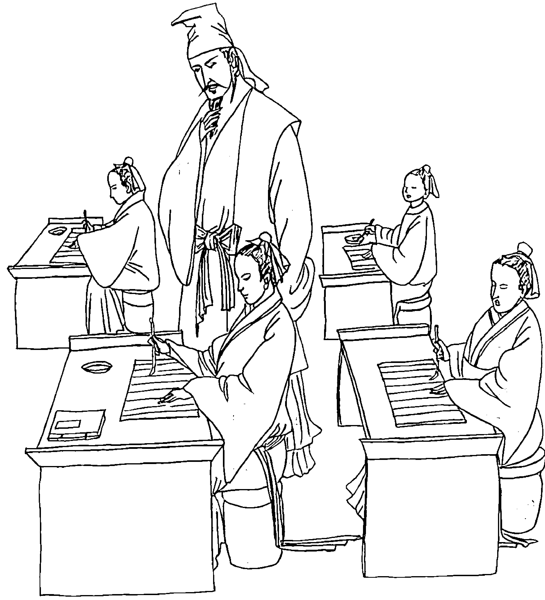

#### 事业运分析

太阴星坐在事业宫的人，多半处于配合、支援、收尾，或是隐姓埋名的工作，不一定能马上表现自己的工作成果，但能从工作中肯定自己的才华与努力。

也许工作时间、空间及内容皆不太固定，诸如日夜颠倒，或在自己的工作室内，这是太阴星的援助与配合所致。当事人把生活与工作结合为一体时，则时时刻刻在生活，也在工作。使人认同其努力的诚意与耐力，亦种下“有志竟成”的良好基因。

任何环境皆是“有志竟成”者展现自己的舞台，任何工作都可能在其尝试之后，把握到成功的要点，如果同时展现心中光明，并以提升人类品质，人性光明为己任，那么太阳星、太阴星的真正工作态度及现象就将得以表达。

### 天机星坐命宫的事业运

#### 1 天机星坐子宫或午宫：见异思迁是大忌

天机星坐在子宫或午宫安命的人，事业宫在辰宫或戌宫，必为太阴星。

#### 事业能力

天机星在子宫或午宫安命的人，多能保持新鲜感，并保持机动性，因而工作中充满了学习的机会及意愿，亦能有所创造。

当事人无法长久安于一成不变的大环境或工作内容，会为自己制造新鲜感，以学习、转换工作的方式再出发。这也许会使人误为“见异思迁”“心神不定”，但在天机星的辞典中并无这样的词汇。天机星在工作中，不但全心投入，而且还保持着机动性，是其他星曜坐命宫未必能够完全理解的工作态度。

#### 事业运分析

太阴星的基本意义是“母职”及“援助与配合”，太阴星坐事业宫的人，可为工作日夜忙碌，不限时间空间，故而旅途中、吃饭时都可以工作。凡是需加班、轮班，以公司为家，时常出差、照顾他人，以及配合、援助的工作，都是当事人容易去选择，或自然接近的工作，而不论在任何环境中，太阴星皆可能有上述现象。

从某个角度看，太阴星的加班、轮班、配合、援助，有别于一般工作，亦多几分新鲜感、机动性，与命宫天机星的工作态度不谋而合，故也能于工作中全心投入。有时还会因为天机星的特质，能在生活中时时保持好的工作态度，或乐于再学习新的事物，或时时保持机动性，给人不怕劳累、有服务精神、有爱心的印象。

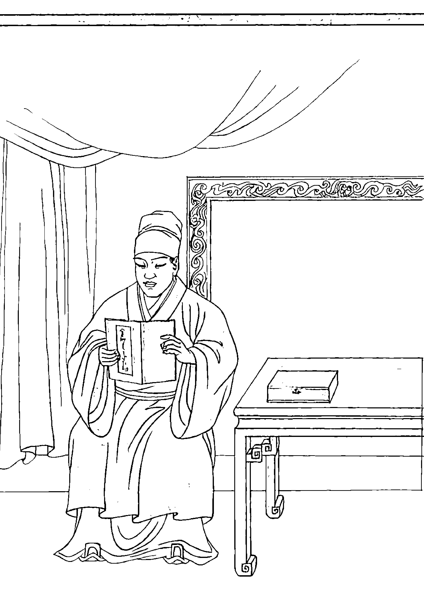

> 天机星坐命，十分好学，希望多学习，也能珍惜人生中各种学习的机会，所以可能从事许多性质不同的工作，也可能在工作中学习，甚至业余时还在学习。

#### 2 天机星坐丑宫或未宫：顺境逆境须安定

天机星坐在丑宫或未宫安命，事业宫在巳宫或亥宫，必为巨门星。

#### 事业能力

天机星在丑宫或未宫坐命的人，可以面对、尝试各种不同的工作。一般人大都不喜欢具有高危险度及枯燥的工作，但对天机星在丑宫或未宫的人而言，却可以安然处于两者之间而保持不变与不动，视危险不为危险，枯燥也不是枯燥。也有些天机星坐命者不会主动要求、寻找或制造工作变化，只是保持机动性，从事别人看来十分枯燥的工作。

#### 事业运分析

巨门星在巳或亥宫坐事业宫时，因具“传达”的基本意义，易从事在人与人间、事与事间、物与物间、思想与观念之间、行动与行动之间传达的工作。不论在任何环境中，亦能表现其前述传达的特质。

同时，传达之中含有服务的性质，传达之间必须保持机动，传达之间也要保持冷静、不动，才不致有错误。天机星的工作态度与巨门星的工作现象结合，能表现出正面的效果，若是又有服务、无私的心、传达的方向、范围则更广阔，不限于司法、教育、文化、大众传播、娱乐、餐饮等工作，而从事上述工作也会有最好的发挥。

#### 3 天机、太阴二星坐申或寅宫安命：广结良缘助成功

天机、太阴二星坐在申或寅宫安命，事业宫在子宫或午宫，必为天梁星独坐。

#### 事业能力

天机星的基本意义是“随缘”，太阴星的基本意义是“月亮的光明”。两星的配合，使人能够以单纯的动机因应他人的需要而给予援助。总是会在别人需要的时候，以精神或行动力量来配合。不明就里的人可能以为这是急性子、好动、没有主张，但随缘与配合的人不会刻意强调自己的主张，随缘与配合本身即是主张。任何工作团体中有了这样的角色，会让很多人感到温暖。一个雇主身边有这样的员工，会觉得多了好几只左右手。

#### 事业运分析

天梁星坐在子宫或午宫为事业宫时，多能在工作中保持超然、客观、公正的态度，这种态度使天梁星易从事与司法、监察、宗教、社会服务直接或间接相关的工作，并在工作中自我实现。

天机、太阴二星的单纯动机，应事实需要给予他人援助的工作态度，可使天梁星更超然于工作中，做好配合或援助。

#### 4 天机、巨门坐卯宫或酉宫：他人信任是关键

天机、巨门在卯宫或酉宫安命，其事业宫在丑宫或未宫，无甲级星，对宫为太阳、太阴二星。

#### 事业能力

天机星的基本意义“随缘”，与巨门星的基本意义“传达”，共同造成多变与传达的可能。多变与传达都含有变化的意义，不过前者的变化空间较广，后者则较偏向于二者之间，或由一点传向一点，或从一点呈辐射状传向多面。

天机、巨门二星习惯于在工作中变化，这是其人生目标，亦是工作态度。这可能使人误以为当事人不安定，甚至因变化而背信忘义，或是流于琐碎。

#### 事业运分析

请参看太阳星、天同星坐事业宫。

#### 5 天机、天梁二星坐辰宫或戌宫：空谈只会误机缘

天机、天梁二星坐在辰宫或戌宫安命，事业宫必在申或寅宫，为太阳、巨门二星。

#### 事业能力

天机星的基本意义是“随缘”，天梁星的基本意义是“荫”，似乎天生就有事半功倍的工作在等待着天机星去随缘、面对并且接受。不过有些天机、天梁星坐命者不能马上体会到自己有这样一面。创造，想他人所不想，是天机、天梁二星易采用的工作态度。可能会有人误以为天机、天梁二星只喜欢纸上谈兵，其实他们经常沙盘演练，如此才能够随缘，甚至总觉得自己有吉星高照般的福气胆量。

#### 事业运分析

请参看太阳、巨门二星坐事业宫。

#### 6 天机星坐巳宫或亥宫：学习能创事业运

天机星在巳或亥宫安命，事业宫在卯宫或酉宫，无甲级主星，对宫为太阳、天梁二星。

#### 事业能力

天机星的基本意义是“随缘”，坐在巳宫或亥宫时，以在巳宫较真正能够体会随缘的意义。天机星于命宫，通常希望多学习，也不排斥人生中各种机会，所以可能从事许多性质不同的工作，也可能在工作中学习，甚至业余时还在学习。

因为学习之后掌握了更多知识与技能，天机星有遇到什么做什么的工作态度，并有以单纯的心面对复杂工作的态度。

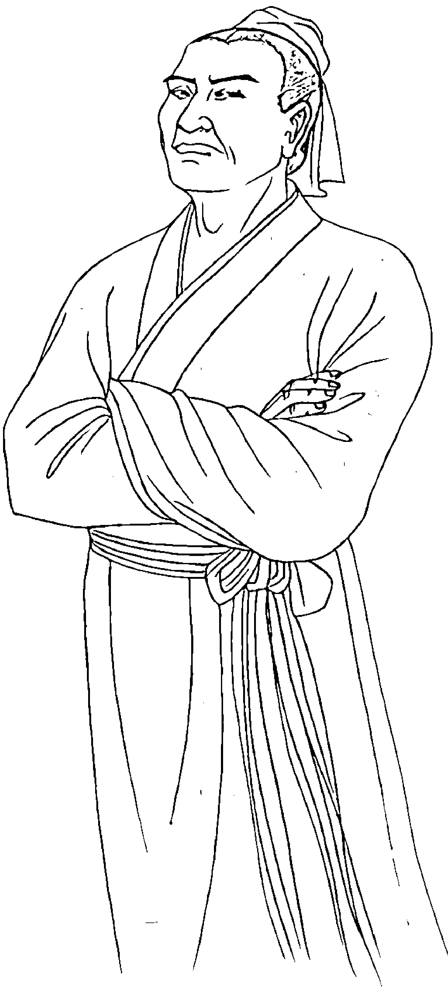

### 天同星坐命宫的事业运

> 天同与巨门两颗星聚集在一起，二星皆有“向外散发”的特性，有时易使人有“话多”“好表现”“自视很高”“骄傲”的误解，容易引来是非，但当事人尚能处理。

#### 1 天同、太阴二星坐子宫或午宫：任劳任怨达前程

天同、太阴二星坐在子宫或午宫安命，其事业宫在辰宫或戌宫，必为天机、天梁二星。

#### 事业能力

天同的基本意义是“福”，太阴星是“母职”及“援助与配合”，二者的组合，使人不但乐于助人，也乐于与人分享自己精神、物质双方面的工作成果。当事人几乎从小就有前述优良特性，也能自然地展现于生活中、工作里，故而多能任劳任怨，甚至不知什么是劳与怨，有服务精神，愿意看到或促成他人好事。

#### 事业运分析

天机星的基本意义是“随缘”，天梁星是“荫”，二星配合的结果，使天机星因“随缘”而有“荫”，在生活里、工作中，努力而不执著，似乎凡是皆得天独厚，可以事半功倍。

天机、天梁星因其随缘的态度，事半功倍的效果，也不会强求个人表现，不特别在意财务报酬，予他人"肯努力、不多求"的印象。

天同、太阴星的工作态度与天机、天梁星的工作现象结合，所共同表现的是高度的服务精神，凡为人设想，包括设计、企划，甚至为人联系、沟通的工作皆是当事人的最爱，不论任何工作环境，有天同、太阴星的存在，似乎多了一颗温和的智多星，工作中有服务，服务中还有与大家共享的胸怀。

#### 2 天同、巨门二星坐丑宫或未宫：业专于能勿表现

天同、巨门二星坐在丑宫或未宫安命，事业宫在巳宫或亥宫，必为天机星。

#### 事业能力

巨门星的基本意义是传达，天同星的基本意义是福，二星同宫，具有"向外散发"的共同特质。"向外散发"有精神及物质两方面，精神上指无私、愿意与人分享，物质方面则是表现自己的工作能力，故而使人看来较为乐观，有积极的工作态度。

不过，两颗星聚集在一起"向外散发"，有时易使人有"话多"的误解，故而选择工作时宜慎选行业（如选择必须多话的工作），同时发挥天同星福的特质，可以使人只管自己努力工作，不管他人闲言闲语。

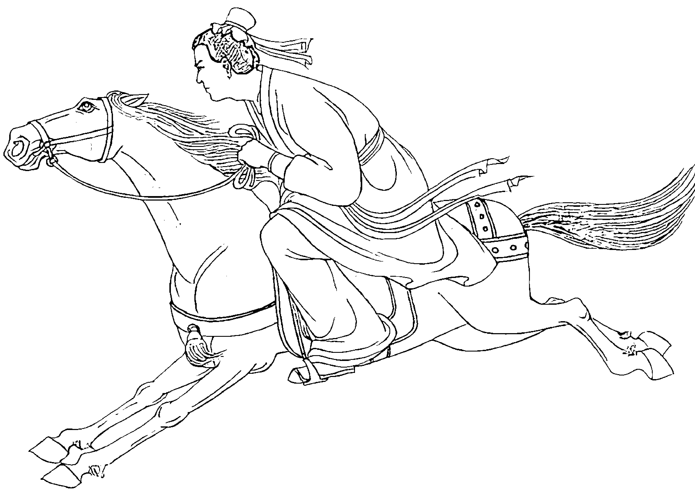

天机、太阴二星坐事业宫，通常有忙碌的工作，如古代负责驿传的人员，不管是独立作战还是分工合作，皆一人能抵数人，但辛劳难免。

#### 事业运分析

天机星在事业宫的人，多易在复杂的状况下工作。所谓复杂，包括复杂的人事环境，复杂的工作环境、内容，以及身兼数职、日夜颠倒的工作等。有些人能够在复杂中体会到单纯的意义，并以单纯的心处理复杂的事，更进而于单纯中展现新鲜、活泼的想法，发挥潜能。

绝大多数时候，天机星在工作中能保持清楚、冷静、潜力，也能不断地学习与进步，而高薪、升职、受人肯定，以及自我肯定，多会随之而至，这也是其正面的展现。当然也有些人会多学而不精，或三心二意。

天机星在事业宫，只要不把心思复杂、多学不精视为随缘，就能真正于工作中表现自己，至于如何表现，则视其所坐宫位，命宫星曜而定。

天机星在巳宫或亥宫坐事业宫时，以在亥宫较易心思散乱复杂，再加会天同、巨门，或者易有是非、误解，或者易在具有传达性质的大环境中工作，或者能将传达完全展现于工作中。

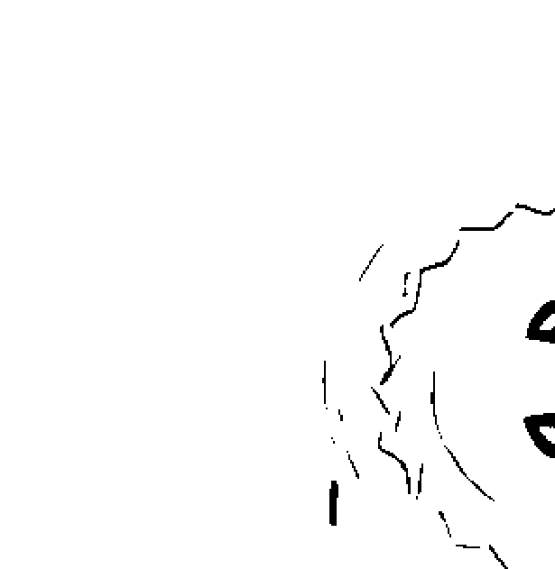

### 天同、天梁二星坐寅宫或申宫：少欲寡求业自成

> 天同、天梁二星坐在寅宫或申宫安命，其事业宫在子宫或午宫，必为天机星。

#### 事业能力

天同星的基本意义是“福”，天梁星是“荫”，两星的配合使人少欲寡求，因为一切似乎都来得很自然现成。

与七杀、破军、贪狼等星相比，天同、天梁二星的组合称得上是温和派。这两颗星曜并不是不喜欢竞争或毫无斗志，虽也力图上进，但不强求，失败时也不易懊恼。工作中虽也有起落，但较能视为平常。自己设定的自然、平和的方式，是其真正的工作态度。

#### 事业运分析

天机星以坐在子宫或午宫时最为单纯，可说是精纯的表现其单纯意义，使人在工作中能去芜存菁，减少不必要的枝节，即使什么事也不做，心中也常保新鲜、活泼的创意。

天同、天梁二星平常与平和的工作态度可带动天机星在工作中努力，又不偏执于努力，保有行动力的工作现象，故而表面上看来即使在休息状态，其实也没有偷懒之心，可以随时适应变化，随时启动。

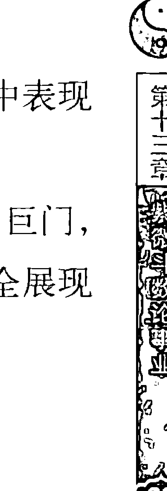

在静中备战是天机星于工作中易使他人认同的特质，也因此获得肯定、信赖。当事人十分明白，自己除了适合与设计、企划、社会福利有关的工作之外，还能保持随时出发的动力，从事任何工作，都有成功的潜质。

#### 4 天同星坐卯宫或酉宫：泰然处之莫急躁

天同星在卯宫或酉宫安命，其事业宫在丑宫或未宫，必为天机星。

#### 事业能力

天同星坐在命宫的人，喜欢从单一的事情中获得成就感，并以安定的心情工作。当事人为求取安定及成就感，有时不免会有琐碎且与当事人个性不合的工作态度出现，也造成工作烦恼。

#### 事业运分析

请参看天机星。

#### 5 天同星坐辰宫或戌宫：成功路上多挫折

天同星坐在辰宫或戌宫安命，其事业宫在寅宫或申宫，必为天机、太阴二星。

#### 事业能力

天同星坐在命宫的人，愿意做好所有的事情，尤其当事人发现其所做的事对他人有所帮助时更加努力，也唯有这类工作，才能真正吸引天同星坐在辰宫或戌宫的人。因为在工作中方使其舒解自己的烦恼、痛苦。无论任何工作，若能时常注意到疏通烦恼和挫折，必能使其十分积极地面对。

#### 事业运分析

天机星的基本意义为“随缘”，与太阴星基本意义“母职”“援助与配合”互相组合的结果，使人能够无私无我，只视当时情况需要，予他人或团体以协助、配合。
在协助配合中，天机星、太阴星共同展现的是服务精神，天机的独特之处在于随机应变、立即学习、判断，以及复杂所带来的较多行动。因此天机、太阴二星通常有忙碌的工作，有时独立作战，有时相互合作，以在寅宫时较忙碌。不论在寅宫或申宫，都颇能使雇主感到欣慰，用一人好比拥有兵团。有时太忙碌，命宫中的天同星也会叫停，则或偷得浮生半日闲，增加能源后再出发，或是休息一年半载，或也变得“随缘”而被人误以为贪图享受、不上进。其实身处天罗、地网，不免受到“不得享福”的限制，不工作时当事人亦会感到矛盾不安。

#### 6 天同星坐巳宫或亥宫：善用智慧事功倍

天同星坐在巳宫或亥宫安命，事业宫在卯宫或酉宫，必为天机、巨门二星。

#### 事业能力

天同星坐在巳宫或亥宫安命的人，希望工作单纯，如果必须复杂，则以结合休闲的复杂最为理想。因有这样的希望，在工作态度上不喜欢旁生枝节、并且愿意于同一时间专注于同一工作。

若工作中有休闲，则不在意工作的时间、空间是否固定，可能一面听音乐一面工作，可能为自己营造良好的、有休闲功能的工作环境。从物质方面看，则工作可能有良好福利，或本身即在具有休闲性的环境中工作。

旁观者有时候会以为天同星的工作态度“不够负责”“注重个人”，但天同星深知专注而完成单一的工作才能使人有“真休闲”的体会，工作中有休闲，也能使人不至于过度紧张，减少错误，因此也希望旁观者能试试这种工作态度。

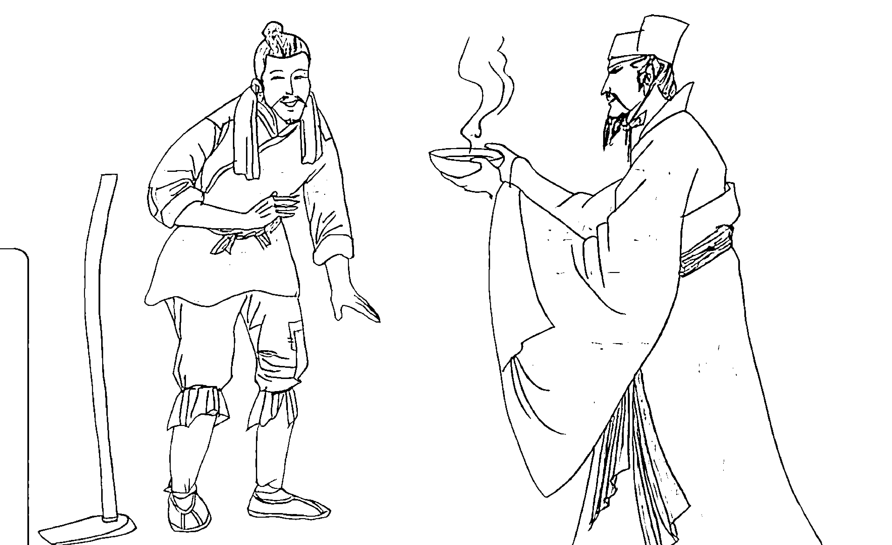

> 太阳与天梁二星坐事业宫，由于本身的良好素质与勤奋工作，能够得到上级的赏识与照顾，被认为“识时务”“善于处理人际关系”或者“天生好福气得贵人抬爱”，而当事人并不在意这些评价。

#### 事业运分析

天机星的基本意义是“随缘”，巨门星的基本意义是“传达”，前者具有多变化的条件，后者具有多是非的可能，这样的复杂环境也是天机、巨门二星很可能生存的工作环境。工作中常有许多复杂的事需要当事人运用智慧去解决，久而久之，便发现以单纯的方式，可以解决诸多复杂的事物，终能在工作中学习到专注与安定之重要，这也是命宫中的天同星“专注”的特性对于工作现象的影响。

凡需有“三头六臂”“样样兼顾”的大环境，皆宜天机、巨门星生存，凡是一心多用，人多口杂的事也能胜任，主要是此星不但能以不变、以单纯处理许多不必要的复杂事务，还能保持工作与休闲的平衡。

### 太阴星坐命宫的事业运

- 1. 太阴、天同二星坐子宫或午宫：任劳任怨达前程
  请参看天同星坐在子宫或午宫。
- 2. 太阴、太阳二星坐丑宫或未宫：成功莫走平常路
  请参看太阳星坐在丑宫或未宫。
- 3. 太阴、天机二星坐寅宫或申宫：广结良缘助功成
  请参看天机星坐在寅宫或申宫。
- 4. 太阴星坐卯宫或酉宫安命：台前幕后皆精彩
  太阴星坐在卯宫或酉宫安命，事业宫在丑宫或未宫，必为天梁星。

#### 事业能力

太阴星坐在命宫的人，其工作偏向于配合与援助他人，但也希望别人看到自己的努力。力，给自己一些安慰与鼓励。
无论男、女，太阴星在命宫，皆可能发现自己有肩能挑、手能提，可以内外兼顾，在工作方面愿意援助他人、积极配合，天生有母性的光辉，可以站在最前面，也可以退居幕后，站在前面时需鼓励，退居幕后又充分懂得这是休息与酝酿，而不代表退步，并以这样的平和心态作为工作的态度。

#### 事业运分析

天梁星坐在子宫或午宫为事业宫的人，多希望在工作中保持超然、客观及公正，通常也会去寻找具有前述性质的工作，诸如司法、教育、宗教等。
不论从事任何工作，当事人皆可以展现太阴星的工作态度，在援助配合中，在接受鼓励与退居幕后之际，发现真正的超然，看清楚幕前、幕后，真正于工作中展现公正、客观，也正是这样的表现，使人对其产生由衷的尊敬与推崇。

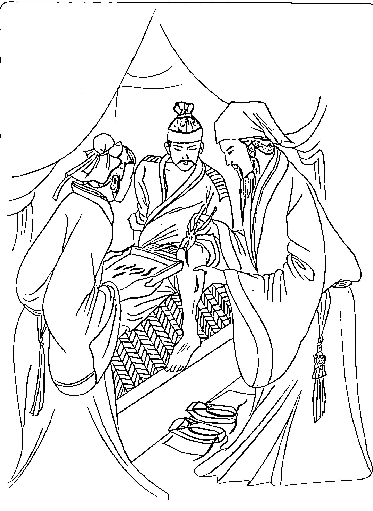

> 巨门星坐子宫或午安命，事业宫必为太阳星。凡与教育文化、历史考据、社会福利、艺术、医疗保健，司法等有关工作，皆可使太阳有展现心愿的机会，把光明、希望传达出来。图中替人疗伤的医生即是如此。

## 5 太阴星坐辰宫或戌宫：顺其自然不强求

太阴星坐在辰宫或戌宫安命，事业宫在寅宫或申宫，必为天同、天梁二星。

#### 事业能力

太阴星坐在辰宫或戌宫安命的人，喜欢以随顺自然的方式工作，通常不强求什么，也不太要求自我表现，却经常能够得到他人的认同及肯定。当事人这种工作态度在被动与主动之间，看似不积极，但又并不消极。遇到小小的不合理事件，还能自我调整心态，忍受甚至配合，若太不合理，必然也会挺身而出，表达自己的意见，甚至替他人争取该得的权益。

#### 事业运分析

天同、天梁二星坐在寅宫或申宫为事业宫的人，经常有机会在制度完善、福利良好

的大环境中工作，也因此而不需要特别担心升迁、加薪等问题，只要把该做的做好，自然就有该得的鼓励与酬劳。即使遇到福利制度不够良好的大环境，当事人也会给自己制造良好的工作空间，例如在风景区工作，既可以游玩，也可以工作；或是把自己的工作环境布置得气氛优雅，置身其间，心情愉快，工作效率良好。最主要的是不主动去强求效率，不给自己制造压力，自然也会有好的工作结果以及收获。

太阴星的工作态度，与天同星的基本意义“福”及天梁星的基本意义“荫”相结合，能以无求但讲理的工作态度展开工作，自然也能在福利良好、制度健全，也不须特别去强求的工作环境中工作。

不论是先有不强求的心，然后才有不须强求的环境，还是先有不须强求的环境，自然产生不强求之心，都不失为一种平和的工作态度。

## ⑥ 太阴星坐巳宫或亥宫：和气生财最关键

太阴星坐在巳宫或亥宫安命，事业宫在卯宫或酉宫，为太阳、天梁二星。

### 工作态度

太阴星坐在命宫的人，多半有为人服务的心态，且不会将“服务”当成口号，而是自然地表现在工作中。
因为有服务的心态及行为，也有鼓励他人向善的意愿，使人在对之赞叹之余愿意效法，尤以在亥宫时最明显。

#### 事业运分析

太阳、天梁二星坐事业宫时，二者分别以“太阳的光明”与“荫”相组合。光明与荫，乍看有些矛盾，其实不然，二者有互相补充的作用，例如夏日中午的太阳，虽也光明，却使人难以长期承受，反需树“荫”带来荫凉；“荫”在冬日不受欢迎，从早到晚，阳光都被需要。一个身心安定的人，能够很清楚自己在什么时候需要运用“阳光”，什么时候需要运用“荫”。
工作中太出风头，也好比骄阳，一切谦让为上。大树底下虽好遮荫，但长期居留，怕在产生怠惰时，还生幸得之心，时时注意自己的言行举止，可以适时调整工作中种种。“识时务”“知人善用”“善于处理人际关系”是一般人给太阳、天梁二星工作上的正面评价，“天生好福气得贵人抬爱”或是“懂得利用裙带关系”“狐假虎威”则是负面误解，不论当事人有什么样的风光事业，或又如何两袖清风，当事人都以为这是表面，并不在意。
太阴星自然服务的心态，鼓励他人向善的胸怀，及太阳、天梁星的特性，使得太阴

星安命，事业宫为太阳、天梁二星的人如拥有十五的圆满月光，柔和、光明、宁静，使人乐于赞叹。不论在什么环境，从事何等工作，都会有这样的工作现象，而此现象，来自太阳、天梁“时时注意自己言行举止，并适时调整”的努力。

## # 巨门星坐命宫的事业运

### ## 1 巨门星坐子宫或午宫：美玉尚须细雕磨

巨门星坐在子宫或午宫安命，事业宫在辰宫或戌宫，必为太阳星。

#### 事业能力

巨门星在子宫或午宫安命，使人较能完全展现其基本意义“传达”。传达又分狭义与广义二种：狭义的有目标，有所为，有所求或有所中介，诸如把今天发生的事，借由文字、报纸传达给他人，或受人之托，把某件物品带给某人；广义的传达，则是把内心的感觉、观念表达出来，没有目标、要求，不需中介，只是表达。
工作中，巨门星经常交替或混合使用狭义与广义的传达，亦颇希望自己的理念、才华能传达出来，使他人皆知，或得他人肯定。因此，努力工作，等待机会或创造机会，并不忘表达自己的长处，是其经常展现的工作态度。

#### 事业运分析

太阳星坐事业宫时，不论在庙旺宫位还是落陷宫位，都能展现其无私之心，并希望其工作能带给大家快乐、光明，使人人有所收获。但以在戌宫较辛苦，或遇有较多挫折，故其希望的实现也较迟。
凡与教育文化、历史考据、社会福利、艺术、医疗保健、司法等有关工作，皆可使太阳有展现心愿的机会，若以巨门星的工作态度为基础，太阳星必然会把光明、希望传达出来，而且坐在子宫或午宫与其互相会照的巨门星更强化了由隐至显的传达现象。
巨门星在子宫或午宫，是“石中隐玉”之基本格局，也有由隐至显的人生历程，只要无私、安定，对自己有信心，愿意走出自己的内心负面，并了解大家内心的负面都需要显露于阳光之下，就能使石中的美玉琢磨成器。

### ## 2 巨门、天同二星坐丑宫或未宫：业专于能勿表现

请参看天同星坐在丑宫或未宫。

### ## 3 巨门、太阳二星坐寅宫或申宫：学以致用多专能

请参看太阳星坐在寅宫或申宫。

### ## 4 巨门、天机二星坐卯宫或酉宫：他人信任是关键

请参看天机、巨门二星坐在卯宫或酉宫。

### ## 5 巨门星坐辰宫或戌宫：成功路上多艰辛

巨门星在辰宫或戌宫安命，事业宫在寅宫或申宫无甲级星，对宫为天机、太阴二星。

#### 事业能力

巨门星在辰宫或戌宫安命时，由于受天罗地网之制，较难发挥其传达的特质。所谓较难发挥，指“想发挥而有无力感”，以及“不想发挥”两种现象，前者于命宫或对宫皆有六煞星同宫时，可增加力量，得以突破，后者则觉得一切顺其自然即可，较被动，或要求自己以超然的方式去传达。
有所为而为，是狭义的巨门星的工作方式，但具有这种现象时，越发使得巨门星的传达不够直接，由一端至另一端所走的是曲折的路线，以在辰宫时较为明显。不论是辰宫或戌宫的巨门星，或是需要六煞星、化忌星的力量，使之有能力突破，或是路本曲折，需六煞星、化忌星协助。正是如此，在困难挫折中，工作态度反能更努力、更积极、更进步。

#### 事业运分析

请参看天机、太阴二星坐在事业宫。

### ## 6 巨门星坐巳宫或亥宫：身临困境靠贵人

巨门星坐在巳宫或亥宫安命，事业宫在卯宫或酉宫，必为天同星。

#### 事业能力

请参看巨门星坐在辰宫或戌宫。

#### 事业运分析

天同星在卯宫或酉宫坐事业宫，使人不强求工作表现，但也会努力工作，故而经常成为团体中的中层工作者，有必须负责完成的任务，也有指导自己的上司，及被自己领导的部下。

巨门星由一端至另一端的传达，本就有难有易，需要外界的刺激力量（以六煞星、化忌星来表现），当事人却也似乎吉星高照，在最危难的时候，或有贵人出现，或及时化解。故而表现于工作中，可能已是风平浪静，通常当事人也不要求丰功伟绩，只要求使自己满意。而一个人真正使自己满意时，也多能使别人满意，不论是否想有一番大事业，在使自己满意的过程中，也必须学会努力、调整计划、不强求，这些都是良好工作表现的重要诱因。

## ## 天梁星坐命宫的事业运

### ### 1. 天梁星坐子宫或午宫：恩泽他人成事业

天梁星坐在子宫或午宫安命，事业宫在辰宫或戌宫必为天同星。

#### 事业能力

天梁星坐在子宫或午宫安命的人，希望在工作中保持超然，因而客观、公正，是其对自己的要求，日久成习，自然成了反映于工作中的工作态度。客观、公正也有狭义与广义两种，狭义的是要求自己在工作环境中不与他人同流合污；广义的则是站在完全超然的立场看待自己与他人的言行与工作态度。

“有自己的主张、原则”“有正义感”，以及“自命清高”“不合群”，甚至“古怪”，是狭义的客观、公正易引来的正、负面评语；而广义的“客观、公正”则多易使人赞叹其为君子、有远见，而乐于肯定其工作态度。

#### 事业运分析

天同星坐事业宫使人多能够以不强求表现的方式工作，当事人不刻意追求名利，也不一定以工作的结果来代表自己，加之以有天梁星的超然，通常能够于工作中顾及大众利益。

凡与社会大众精神、物质直接有关的工作，都是天同星坐事业宫者乐于选择的。而

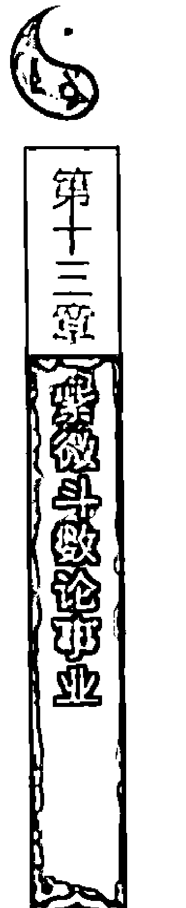

天梁星坐命，不论在何宫位，事业宫为什么星曜，都适合在制度健全的大机构工作，这是因为天梁星主“荫”，在大机构能够得到长上的照顾与信任。

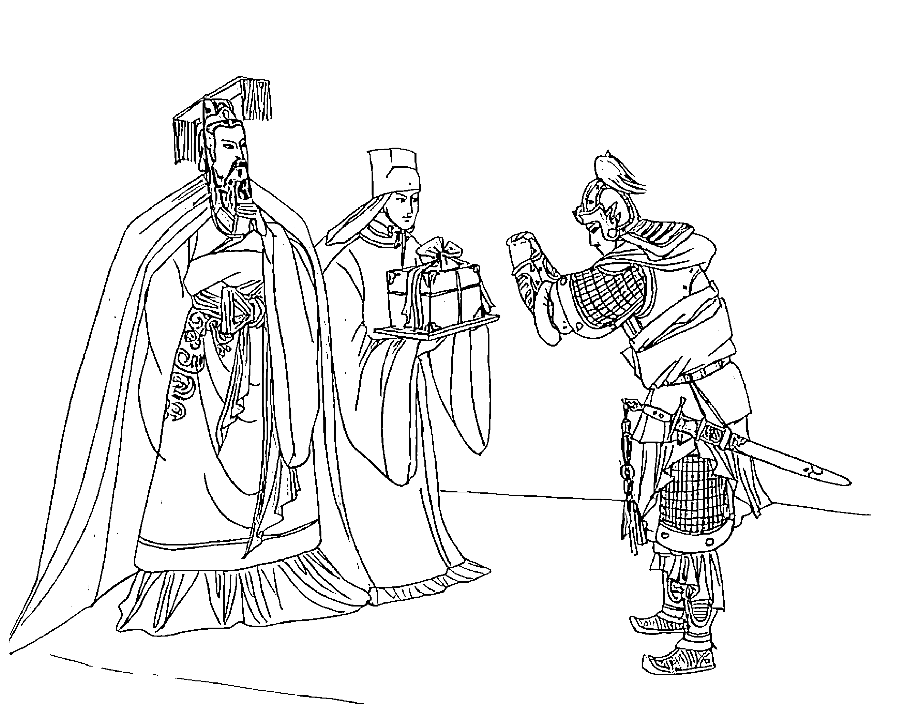

不论在任何环境中，天同星皆会顾及他人的利益及整体大局，也许有时易被误为只管享受或“名士派”“不顾及现实层面”，但天同星广中有细，尤其是在大众福利上，有很强的使命感。

### ### 天梁星坐丑宫或未宫：光明磊落利前程

天梁星坐在丑宫或未宫，事业宫在巳宫或亥宫，必为太阳星。

#### 事业能力

天梁星坐在丑宫或未宫安命的人，多不愿把自己当做工作的机器，尽管每个人对“工作机器”的认同相异（例如七杀星以工作十小时不觉劳累，天梁星则以连着几天加班几小时为苦），天梁星多需要工作之外的休闲，甚至在工作中保有悠闲与休闲。天梁星有时不免被误为“懒散”“缺乏效率”“不在意工作”，其实天梁星以为“欲速则不达”，气定神闲，才能做好工作，这亦是此星向往并乐于保持的工作态度。

#### 事业运分析

太阳在巳宫或亥宫坐事业宫时，多能以客观、无私的方式工作，也多喜欢在具有客观、无私的大环境中工作。

太阳星能很自然地展现其光明不炫耀、不邀功，任何事情都能做，也多与他人配合，

因此能予人希望、于他人前途有利，并且与大众广为配合的工作都适合太阳星。无私的心多不在意个人升迁、酬劳等问题，也因此受到他人的肯定。太阳星在巳宫为旺宫，于亥宫落陷，使人工作辛苦，不被挫折击倒，能够力争上游，在工作中多执著于一定的主张、理想，并且愿意坚持到底，也能因此而受重用。

3. 天梁、天同二星坐寅宫或申宫：少欲寡求是自成
请参看天同星坐寅宫或申宫。

4. 天梁、太阳二星坐在卯宫或酉宫：利人非己成功名
请参看太阳星坐在卯宫或酉宫。

5. 天梁、天机二星坐在辰宫或戌宫：空谈只会误机缘
请参看天机星坐在辰宫或戌宫。

6. 天梁星坐在巳宫或亥宫：择木而栖是关键
天梁星坐在巳宫或亥宫安命，其事业宫在卯宫或酉宫，没有甲级主星，对宫为天机、巨门二星。

#### 事业能力

天梁星坐在命宫的人，把工作当做生活的一部分，认为生活是随缘变化的，工作也是如此。有时因新机会的来临而考虑换工作，并不太在意过去已有的成绩是否保持，当工作疲倦时亦可能毫不考虑其他因素（例如是否有存款）而毅然放弃。

天梁星随工作变化而变化，称得上有应变力，有时虽有长远计划，也未必能实现，亦可说是没有固定的目标，故而使他人有“拿不定主张”“做事没有目标”或是“计划不踏实”的误解，其实天梁星坐在巳宫或亥宫者的工作态度是有如游牧民族般的“逐水草而居”，天地之大，处处可为家，追逐水草是习性使然，也是其人生目标。因此天梁星在为自己生活及衣食努力的时候能够体会到物竞天择的道理，免去刻意强求给自己带来的痛苦。

## ## 第拾肆章

# # 大小限与流年行运

紫微斗数命理参断理论不仅涵盖面广泛, 而且细致入微; 不仅有对于命盘整体的推演, 还包括大限、流年、甚至流月、流日、流时, 既有宏观概览, 又有微观考察, 本章即是对这些微观内容的精要阐释。

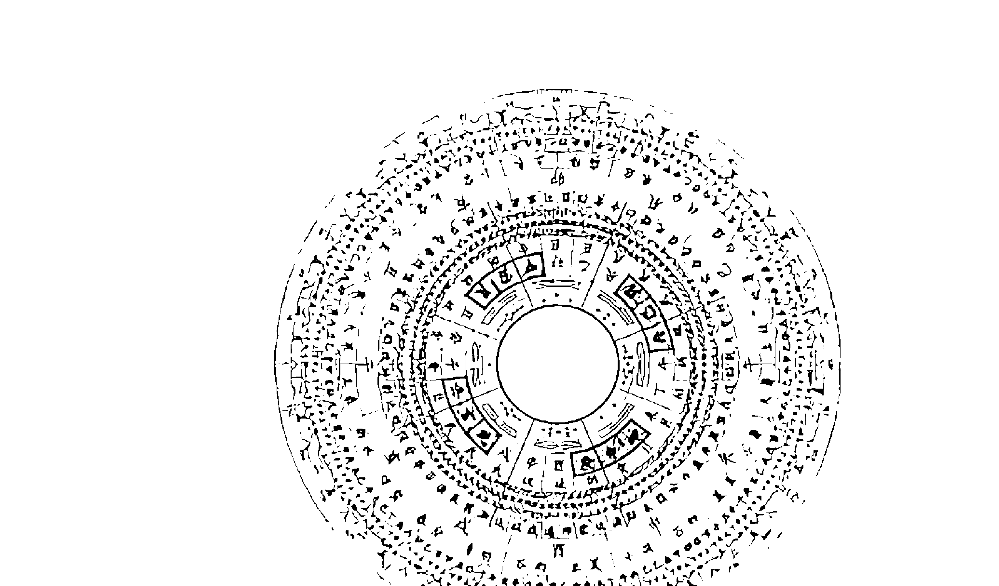

# # 图版目录

- 大限行运 / 1083
- 小限与流年行运 / 1085
- 流月、流日、流时 / 1087

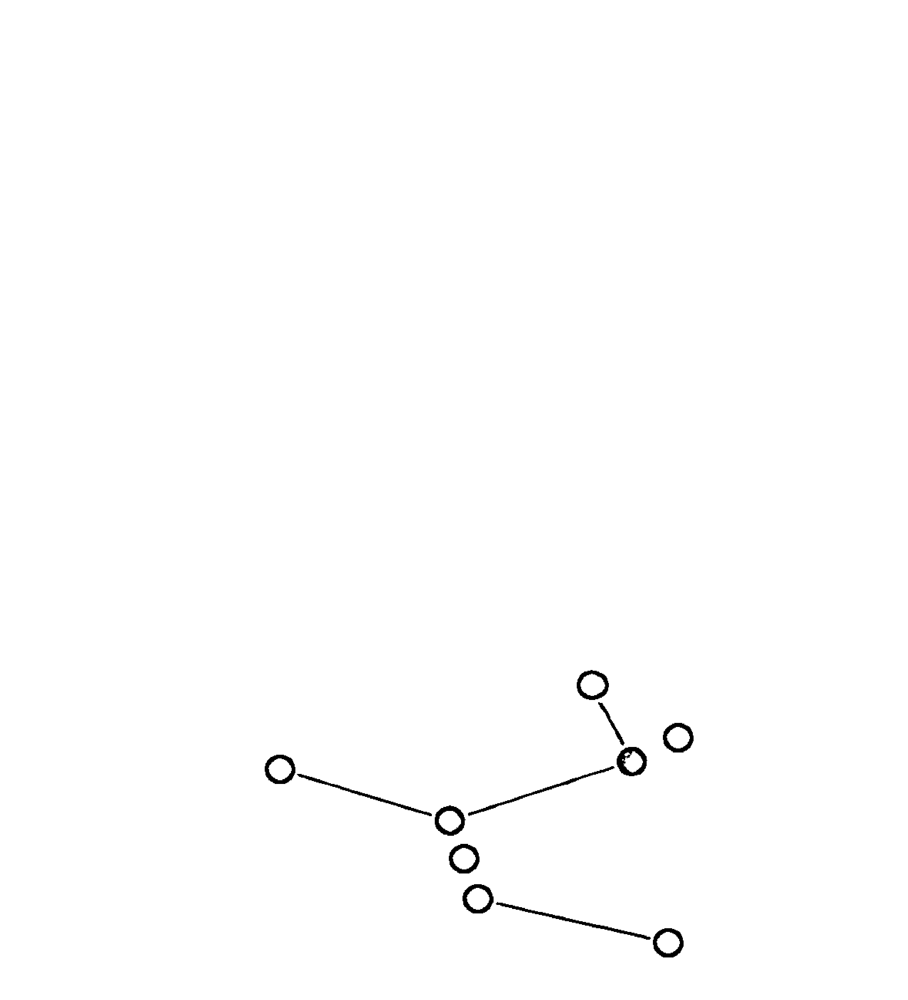

# # 1 大限行运

### ## 图解道教神秘学·紫微斗数(下)

古人多用大限来指寿数已尽，注定死亡的期限。在紫微斗数中，大限指的则是十年的期限，不同的人划分大限的方法各不相同，而根据命盘的格局，不同的大限也有不同的运程。

大限主十年的吉凶祸福。求大限是以命盘中的五行局数为基准，由命盘中的命宫起始，

- 水二局以二岁起大限（即二至十一岁为第一大限）
- 木三局以三岁起大限（即三至十二岁为第一大限）
- 金四局以四岁起大限（即四至十三岁为第一大限）
- 土五局以五岁起大限（即五至十四岁为第一大限）
- 火六局以六岁起大限（即六至十五岁为第一大限）

阳男、阴女顺行，阴男、阳女逆行，每十年过一宫位。

大限为人生运势顺逆的关键。命盘十二宫中，比较吉利的宫位都集中在自己生命大限所行走的范围内，即使本命不好，生活过得不是很舒适，人生一切的进展仍都很平稳顺利。有如开老爷车行驶在高速公路一般，虽车况不好，却仍能稳稳当当地到达目的地。反之，若命好，大限运势不好，有如驾驶高级轿车行驶在颠簸而崎岖的山道一般，虽然日子过得还不错，但总是波波折折，起伏不定。

看大限十年的吉凶，应将命盘中该大限宫位当成是这十年的命宫，再分别依逆时针方向，

- 顺序布下大限的兄弟、夫妻、子女、财帛、疾厄、迁移、仆役、官禄、田宅、福德、父母等十一宫。

然后再依本命的命盘论断方式，看大限命盘中，各宫位及其三方四正诸星曜的特性及吉凶，以判断大限十年的吉凶祸福。

在研究大限吉凶时，必须回归到命宫先天的条件，以及身宫后天的影响，这些才是论断大限的根本方法。换句话说，大限的吉凶是受命、身宫影响，并被局限在一个固定的吉凶范围内，待后天行运走到每一大限，当空间及时间配合成势，只要时刻一到，吉凶自然就会显现。

化禄、化权、化科、化忌四化星不仅在论断本命时，扮演极重要的角色，在研究大限吉凶方面，也非常重要。四化星看大限的吉凶，是将命盘中该大限宫位的宫干，当成是这十年的年干，再依据此年干定四化星。

大小限、流年行运所走到的宫位，若宫中的诸星曜吉利，则该宫位的性质趋向吉利；反之，若宫中的诸星曜不吉利，则该宫位的性质趋向不吉。

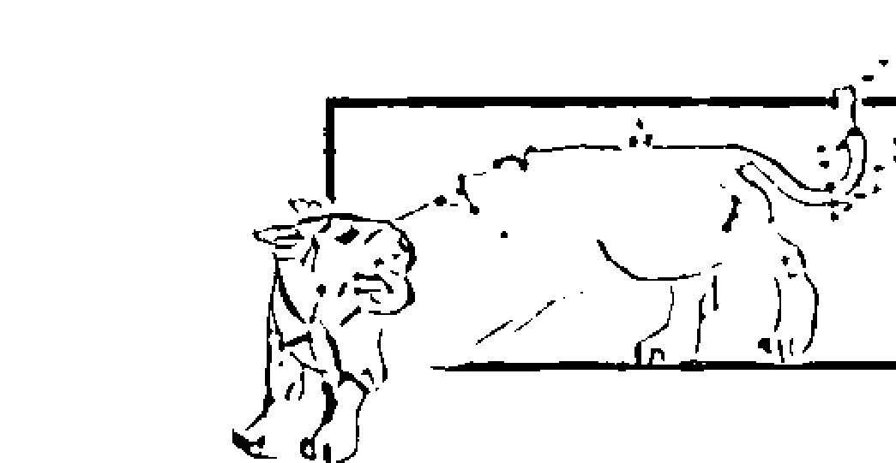

# # 大限行运

大限即十年的期限，主十年的吉凶祸福。求大限是以命盘中的五行局数为基准，由命盘中的命宫起始，不同局数以不同岁数起大限，然后根据大限及大限的三方四正确定大限行运。以下仅以上卷排盘中用到的吴斯人先生（阴历一九四七年十二月二十七日清晨五点二十六分出生）的例子作简要说明。

### ## 大限的确定

| 疾厄 (54-63) | 财帛 (44-53) | 子女 (34-43) | 夫妻 (24-33) |
| :---: | :---: | :---: | :---: |
| 迁移 (64-73) | 姓名：吴斯人 性别：阴男 五行局数：金四局 | 兄弟 (14-23) |  |
| 仆役 (74-83) |  | 命宫 (4-13) |  |
| 官禄 (84-93) | 田宅 (94-103) | 福德 (104-113) | 父母 (114-123) |

根据命盘的局数确定起始大限。如吴斯人先生为金四局，则由四岁起大限。

阴男、阳女逆行，逆时针方向依次排各大限。如14至23岁在兄弟宫，以此类推，排满十二宫。

十年为一大限。在吴斯人先生的命盘中，4至13岁为第一大限，在命宫。

### ## 大限的三方四正

吴斯人先生44至53岁（第五大限）大限行运到命盘中的财帛宫，以此宫位为44到53岁的命宫。

| 巳 | 午 | 未 | 申 |
| :---: | :---: | :---: | :---: |
| 辰 | 命宫 (4-13)  姓名：吴斯人 性别：阴男 五行局数：金四局 | 酉 |  |
| 卯 |  | 戌 |  |
| 寅 | 丑 | 子 | 亥 |

依据三方四正的确定方法得出第五大限的财帛、迁移、官禄宫，依各宫星曜共同论断第五大限行运。

水二局以二岁起大限（即二至十一岁为第一大限），木三局以三岁起大限（即三至十二岁为第一大限），金四局以四岁起大限（即四至十三岁为第一大限），土五局以五岁起大限（即五至十四岁为第一大限），火六局以六岁起大限（即六至十五岁为第一大限），由此可见，大限的起始岁数与命盘局数相同。

# # 2 小限与流年行运

在日常生活中，经常有人说“流年不利”，究竟什么是流年？根据紫微斗数的理论，流年和小限一样，都是顺次推进的年程，皆主一年的吉凶祸福，但二者的推算方式不一样。

小限与流年都主一年的吉凶祸福。只是小限是依出生年的年支和性别，决定人生中每一岁数是在命盘中的哪一个宫位。每年主一宫位，十二年后，再回到原宫位。而流年是以当年的年支，决定该年是在命盘中的哪一个宫位，一年换一个宫位。小限和流年的宫位是当年的命宫，依此再分别定下小限和流年的兄弟、夫妻、子女……等其余十一个宫，然后依据小限和流年的命盘，综合判断当年的运气。

小限和流年所指的一年，是以农历正月初一为始（八字算命是以立春为始）。小限所指的岁数为虚岁，即出生时为一岁，以后每过一次农历正月初一旧历年节就加一岁。

小限和流年都可用来判断一年的运气，但小限主体，流年主用，二者必须合参，融会贯通。而事情善恶的应验，往往发生在流年上。但不论小限或流年，都应回归到大限，即以小限、流年为主，大限为辅，命、身为参考。换句话说，小限、流年的吉凶是受大限的影响，并被局限在一个固定的吉凶范围内，且总脱离不了命、身宫。待行运走到小限、流年时，当时机一成熟，吉凶自然就会应验。

四化星也是判断小限和流年吉凶的重要角色，它分别依据命盘中小限和流年宫位的宫干，排出小限和流年的四化星，再据以判断小限和流年的吉凶。

紫微斗数的小限，男命是顺时针行运，女命是逆时针行运；流年则无论男女命都是顺时针行运。所以，女命小限和流年有机会同宫，男命则小限和流年永无同宫的机会。当大、小限同宫，或大限、流年同宫时，该宫的吉凶祸福格外明显。当女命的小限、流年同宫时，该宫的吉凶祸福更是明显，若再逢大限同宫，当年行运更应特别留意。

此外，在判断流年的吉凶时，除了须同时参看小限和流年宫位外，尚可依据流年的年干，排出流禄、流羊、流陀、流魁、流钺、流昌、流化禄、流化权、流化科、流化忌等十颗流星。这些流星的性质和禄存、擎羊、陀罗、天魁、天钺、文昌、化禄、化权、化科、化忌星相同，再根据这些流星同时去判断当年的运气。

## 小限与流年行运

小限与流年是紫微斗数中行运方面的重要概念，二者都主一年的吉凶祸福，但在确定方式方面却各不相同。二者如何区分？又如何运用？以下仅以吴师仁先生（阴历一九四七年十二月二十七日清晨五点二十六分出生）的例子作简要说明。

### 小限与流年的区别

|      | 小限                     | 流年                                   |
| :--- | :----------------------- | :------------------------------------- |
| 同   | 都主一年的吉凶祸福       | 都主一年的吉凶祸福                     |
| 异   | 依出生年的年支和性别决定 | 依当年的年支决定                       |
|      | 所指的岁数为虚岁         | 所指的岁数可不论虚实，而与实际年份相对应 |
|      | 男命顺行，女命逆行       | 不论男女皆顺行                         |

由小限与流年的确定方法可知：女命小限和流年有机会同宫，男命则小限和流年永无同宫的机会。

### 小限、流年行运示例

小限 吴师仁先生出生年（一九四七年）为丁亥年，则以丁亥年为一岁，顺行，数至2009年这一小限重新回到了亥宫。

流年 2009年为己丑年，根据流年的确定规则，2009年在丑宫，而不是亥宫。

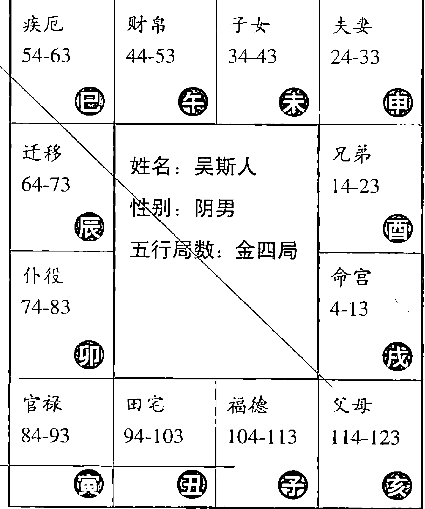

大限、小限与流年都不是孤立的，只有把它们结合起来综合论断才能更加精确地解读出命盘中所蕴含的生命密码。

## 流月、流日、流时

紫微斗数理论精深而又不乏细致，它在宏观推演人生命运的同时，也对每一月、日、甚至每一个时刻的微观运程进行考察。

### 流月

流月主农历流年十二个月中每一个月的运气。命盘中，各流年正月的推算是由流年宫起，逆数至生月，再顺数至生时，即为该流年的正月，也就是该流年的流年斗君宫位；也可由命盘的子宫起，逆数至生月，再顺数至生时，先安下子年斗君（是固定的，不会因每一流年而改变），以后求各流年的正月时，只要由命盘中子年斗君宫位起，顺数至流年地支，即为该流年的正月，也就是该流年的流年斗君之宫位。

判断流月的吉凶时，该流月的宫位就是当月的命宫，再分别定出流月的兄弟、夫妻……等其余十一宫的流月命盘，就可据以判断当月的运气。判断流月运气时，除了可由各宫中十四主星、甲级星、乙级星、丙级星的星曜特性加以研究外，流年将前星及流年岁前星等二十四颗丁、戊级星，也多少会发挥一些作用。

流月的吉凶判断，应以流月宫位为主，并回归到流年和小限上，即必须同时参考流年和小限宫位的吉凶，并以大限宫位为本，才能体用贯通。

### 流日

流日是主阴历每一个流月中，由凌晨子时（二十四时零一分）起至夜子时（二十四时）止的一天二十四小时的运气。流日是以流月宫位起初一，顺数，每一日过一宫位。

判断流日的运气时，也须配合四化星，万年历中都可查出每一日的干支，可由日干定出各日的四化星，如丁丑年农历四月初八，为丙辰日，丙干的四化星为“同机昌廉”。流日的吉凶判断，以流日宫为主，并应回归到流月上，以流年为根本。流年将前星和流年岁前星对流日会发挥较大的作用。

### 流时

流时主阴历每一个流日二十四小时，子、丑、寅……亥等十二个时辰中，任一时辰（两小时）的运气。流时是以流日宫位起子时，顺时针方向，一时辰安一宫。

判断流时的运气时，也须配合四化星，至于流时天干的推定，可查“日干起时表”。

判断流时的吉凶，应以流年将前星和流年岁前星为重点，以流时宫为主，并应回归到流日，以流月为根本。

### 日干起时表

| 日干 | 子(24-1) | 丑(1-3) | 寅(3-5) | 卯(5-7) | 辰(7-9) | 巳(9-11) | 午(11-13) | 未(13-15) | 申(15-17) | 酉(17-19) | 戌(19-21) | 亥(21-23) | 子(23-24) |
| :--- | :--- | :--- | :--- | :--- | :--- | :--- | :--- | :--- | :--- | :--- | :--- | :--- | :--- |
| 甲己 | 甲子 | 乙丑 | 丙寅 | 丁卯 | 戊辰 | 己巳 | 庚午 | 辛未 | 壬申 | 癸酉 | 甲戌 | 乙亥 | 丙子 |
| 乙庚 | 丙子 | 丁丑 | 戊寅 | 己卯 | 庚辰 | 辛巳 | 壬午 | 癸未 | 甲申 | 乙酉 | 丙戌 | 丁亥 | 戊子 |
| 丙辛 | 戊子 | 己丑 | 庚寅 | 辛卯 | 壬辰 | 癸巳 | 甲午 | 乙未 | 丙申 | 丁酉 | 戊戌 | 己亥 | 庚子 |
| 丁壬 | 庚子 | 辛丑 | 壬寅 | 癸卯 | 甲辰 | 乙巳 | 丙午 | 丁未 | 戊申 | 己酉 | 庚戌 | 辛亥 | 壬子 |
| 戊癸 | 壬子 | 癸丑 | 甲寅 | 乙卯 | 丙辰 | 丁巳 | 戊午 | 己未 | 庚申 | 辛酉 | 壬戌 | 癸亥 | 甲子 |

紫微斗数依据人出生时的时空条件对命理进行推演，而人从呱呱坠地到走过一生，要在时空的坐标上留下无数的轨迹。对于那些细小而转瞬即逝的时空点，人们往往难以细细描绘，正是如此，人们在推算命理的时候，往往不会细细推演流月、流日、流时，而更注重流年、大限与整个命盘的格局。

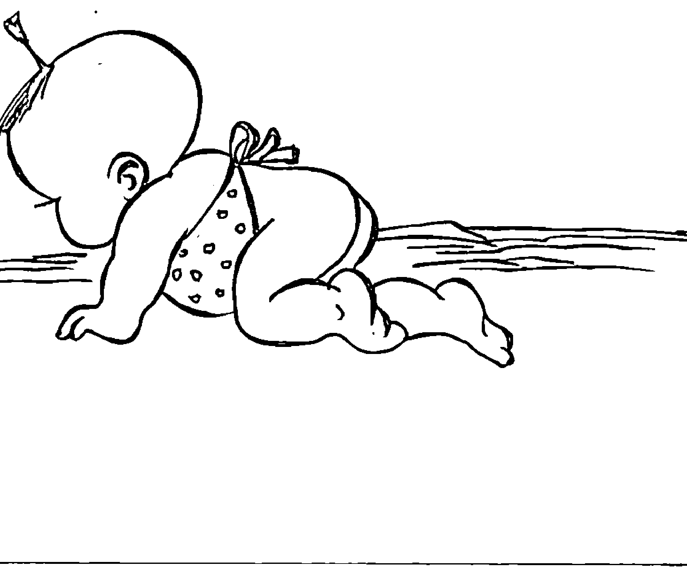

## 流年将前星

紫微斗数流年将前星包括将星、攀鞍、岁驿、息神、华盖、劫煞、灾煞、天煞、指背、咸池、月煞、亡神，共十二颗。

### 将星

将星为丁级星，能化凶为吉，不忌诸凶。喜临命、身宫，入命身宫则主武贵。逢之，主运势旺盛，诸事有进，可发挥领导力，颇受好评。与武星同守官禄宫，尤利军警之职；守于财帛宫，主发财。为流年最强的宫位，有干劲。

### 攀鞍

攀鞍为丁级星，主功名，喜临命、身宫，主武显，宜文宜武，不忌诸凶。文人、学生逢之，可得社会佳评，得享名声，各种考试都可及第。为流年小科星，可解厄。

### 岁驿

岁驿为丁级星，又名流年天马星，主迁动。喜临命、身宫，主武显，宜武不宜文，不忌诸凶。逢本星主有外出、旅行、迁移之事，可顺利进展。宫内多吉星者，外出诸事顺利、安稳；多凶星者，劳苦奔波。

### 息神

息神为戊级星，主消沉、忌诸凶，喜诸吉化解。守于身、命宫，若无吉星化解，主人无生气，意志消沉，无精打采，欠缺开创力，有神经质，与人交际、商谈、讨论时，难以发挥实力。流月、流日行息神宫位，没精神、打哈欠、打瞌睡。

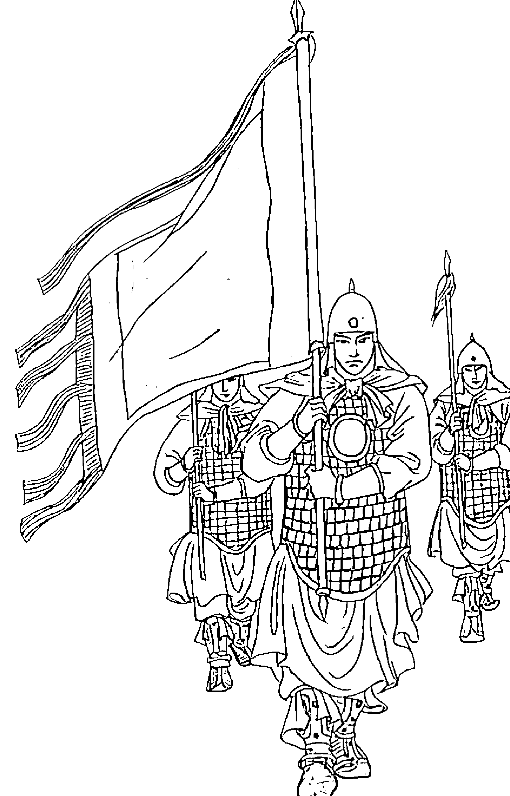

> 将星能化凶为吉，主武贵。逢之，主运势旺盛，诸事有进，可发挥领导力，颇受好评。与武星同守官禄宫，尤利军警之职。

### 华盖

华盖为丁级星，主孤高，有出世的思想，对现实生活缺乏热忱，入命、身宫，宜僧道不宜凡俗。逢本星者，意志消沉，精神多苦闷，易陷于悲观、孤独、劳苦、逃避现实。年轻人逢此星，往往会感到人生充满灰色，或沮丧、失望、失恋；中年人逢此星，往往对工作减低热忱，丧失希望；老年人逢此星，常有出家、逃避现实的心态。宜勤于研究哲学、艺术、宗教。

### 劫煞

劫煞为戊级星，主盗劫，喜诸吉星化解，忌诸凶星。有如小人陷害，易招是非，多做少对，不称人意，工作不顺，谨防失物、盗窃等钱财方面的损失。忌守命、身、财、官、田等宫。

### 灾煞

灾煞为戊级星，主灾患，喜诸吉星化解，忌诸凶星。易发生意外事故，宜防钱财方面被人诈骗。

### 天煞

天煞为戊级星，主与父、夫缘分薄，喜逢吉星，可解其凶兆，忌入命、身、父母、夫妻等六亲宫。女性易与父、夫、男性起口舌之争、或对立，男性易与他人起冲突。常有天灾横祸。

### 指背

指背为戊级星，主诽谤，忌入命、身宫。逢本星者，若无吉星化解，易遭人背后非议、中伤、诽谤，一生多是非。

### 咸池

咸池为戊级星，主桃花，入命、身、财、福诸宫，多好色。较注重情欲、爱慕虚荣、见异思迁，喜入娱乐场所。在感情方面较不顺利，常因异性引起苦恼或纠纷。

### 月煞

月煞为戊级星，主与母、妻缘分较薄，忌入命、身、父母、夫妻等六亲宫，喜逢吉星，可解其凶兆。逢本星者，易与母、妻、女性起口舌是非、对立。多小人。

### 亡神

亡神为戊级星，主耗财。多灾，诸事不顺，易招金钱损失。逢凶星，易破产、金钱散尽，或易因债务而波及工作、家庭。

## 流年岁前星

紫微斗数包括岁建、晦气、丧门、贯索、官符、小耗、大耗、龙德、吊客、病符、白虎、天德，共十二颗。

### 岁建

岁建五行属火，为丁级星，主一年祸福、成败，忌与命宫在对宫相对冲。逢此星，遇吉则佳，逢凶加凶，麻烦问题特别多，纠缠不清。

### 晦气

晦气为戊级星，主多咎，喜诸吉化解，忌诸凶。逢此星，诸事不顺，精神消沉，易生意外，常因做错事而烦恼。运势停滞不前。居丑、未宫，为入庙，灾害较轻。

### 丧门

丧门五行属木，为戊级星，主丧亡、孝服、妨妻、虚惊，喜诸吉化解。逢本星者，家人、亲戚或自己易发生健康上的问题，多有不幸或生死离别事件。居子、午宫，为入庙，灾害较轻。

### 贯索

贯索为戊级星，主狱灾，喜诸吉化解，忌诸凶。逢本星，易与人起冲突，或生诉讼之事。居寅、申宫，为入庙，灾害较轻。

### 官符

官符五行属火，为戊级星，主刑讼、官司，喜诸吉化解，忌诸凶，尤忌与巨门、擎羊、天刑、廉贞、化忌等星同宫。在丑、未二宫，为入庙，灾害较轻。

### 小耗

小耗五行属火，为戊级星，主小失，喜诸吉星化解，忌见凶星及地劫、地空、截空、旬空星。逢本星，多有小额金钱损失、消费支出增加或浪费。居寅、午、戌、申、子、辰宫，为入庙，灾害较轻。

### 大耗

大耗五行属火，为戊级星，主大败，忌逢凶星及地劫、地空、截空、旬空星，喜诸吉化解。逢本星，金钱易遭巨大损失。忌入命、身、财帛、田宅宫。居寅、午、戌、申、子、辰宫，为入庙，灾害较轻。

### 龙德

龙德为丁级星，主贵人、化凶为吉，不忌诸凶，能辟煞，喜入命、身宫，可以转运。逢本星，运势旺盛，可获发展。

### 吊客

吊客五行属火，为戊级星，主孝服、虚惊、喜诸吉化解，忌诸凶。逢此星，家族、亲戚恐有不幸或悲哀之事。居辰、戌宫，为入庙，灾害较轻。

### 病符

病符为戊级星，主疾病，喜诸吉化解，忌诸凶。忌入福德、疾厄宫。逢本星，易罹患疾病，宜注意身体健康。

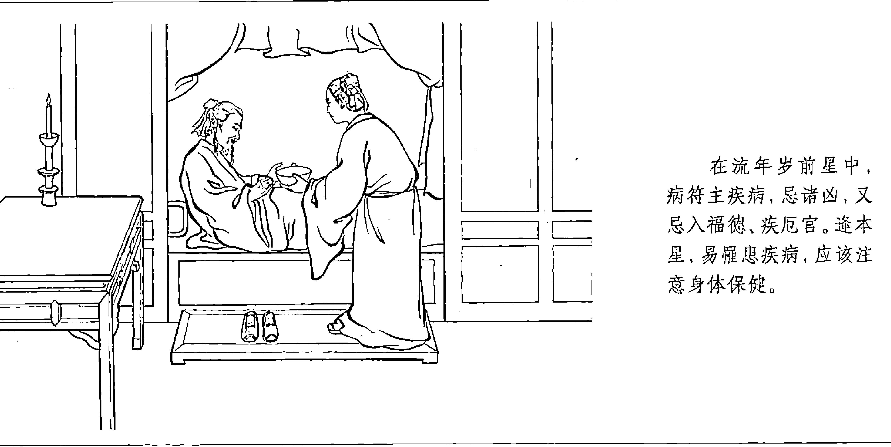

在流年岁前星中，病符主疾病，忌诸凶，又忌入福德、疾厄宫。逢本星，易罹患疾病，应该注意身体保健。

### 白虎

白虎五行属金，为戊级星，主刑伤、凶，喜诸吉化解，忌诸凶。逢本星，易遭意外灾厄，时有疾病、伤害，事业易有破败、损财。居卯、酉宫，为入庙，灾害较轻。

### 天德

天德为丁级星，主化凶为吉，不忌诸凶，能辟煞，为强有力的“守护神”，纵遇困厄，也多有援助，喜临命、身宫。

## 六十个历史人物斗数命盘

### 孔仲尼命

| 巳 (大耗) | 午 (伏兵) | 未 (官府) | 申 (博士) |
| :--- | :--- | :--- | :--- |
| 武曲破军天伤 (权) | 太阳 (禄) | 天刑天钺天府陀罗天使 | 天马禄存天机 |
| 绝 | 胎 | 养 | 长生 |
| 僕役 | 迁移 | 疾厄 | 财帛 |
| 辰 (病符) | 中心 | 酉 (力士) | |
| 天同文昌 (忌) | 阳男 | 擎羊紫微贪狼 | |
| 墓 | 壬戌年七十三岁四月初二故 | 沐 | |
| 官禄 | 庚戌年十一月初一时 | 子女 | |
| 卯 (喜神) | 土五局 | 戌 (青龙) | |
| 铃星 | | 太阴巨门文昌 (科) | |
| 死 | | | |
| 田宅 | | 夫妻 | |
| 寅 (飞廉) | 丑 (奉书) | 子 (将军) | 亥 (小耗) |
| 龙池左辅三台 | 火星天魁廉贞七杀 | 凤阁八座天梁右弼 | 地劫天府天梁 |
| 病 | 衰 | 帝旺 | |
| 福德 | 父母 | 命宫 | 兄弟 |

文章冠世。年六十一，除绝粮，盖岁有劫，空，逢天伤。七十三岁，小限在天伤，太岁入地网，戌生人有忌故。

### 子路之命

| 子女 | 夫妻 | 兄弟 | 命宫 |
| :--- | :--- | :--- | :--- |
| 天哭 龙池 天铖 天梁 天刑 喜神 子女 丑 病 | 八座 七杀 文曲 飞廉 夫妻 午 衰 | 天虚 奏书 兄弟 未 帝旺 | 太岁 廉贞 文昌 三台 将军 命宫 申 临 |
| 紫微 天相 病符 财帛 辰 死 | 阴男 甲申年五十一岁三月初三故 癸丑年九月初九日寅时生 木二局 | 凤阁 天机 天空 小耗 父母 酉 冠 |
| 天魁 巨门 天机 天使 大耗 疾厄 卯 墓 |  | 破军 青龙 福德 戌 沐 |
| 贪狼 右弼 伏兵 迁移 寅 绝 | 地劫 擎羊 太阳 太阴 天伤 官府 仆役 丑 胎 | 禄存 左辅 武曲 天府 博士 官禄 子 养 | 陀罗 天同 天马 力士 田宅 亥 长 |

此为府相朝元格，且紫微诸吉星拱合，折以为贤士。但命宫廉贞、将军，故主勇猛，更对垣遇贪狼、忌星拱命，故主凶亡，果死孔悝之难。

### 颜亚圣命

| 第一列 | 第二列 | 第三列 | 第四列 |
| :--- | :--- | :--- | :--- |
| 天府 将军 田宅 病 ◎ | 天魁 天同 天阴 小耗 官禄 衰 ◎ | 文曲 右弼 左辅 武曲 贪狼 文昌 青龙 仆役 帝 ◎ | 天空 陀罗 太阳 巨门 力士 迁移 临 ◎ |
| 斗君 太岁 奏书 福德 死 ◎ | 阴男 壬辰年二十二岁六月初四故 辛酉四月二十日卯时 木三局 | 天使 禄存 天相 博士 疾厄 冠 ◎ |
| 廉贞 破军 飞廉 父母 墓 ◎ | 凤阁 龙池 病符 兄弟 胎 ◎ | 大耗 夫妻 养 ◎ | 擎羊 天机 天梁 官府 财帛 沐 ◎ |
| 地劫 天钺 喜神 命宫 绝 ◎ | 天马 紫微 七杀 伏兵 子女 长 ◎ |

命坐魁钺，身逢权禄，昌、曲陷于天伤，不能发达，大限、七杀重逢，壬辰年太岁、流年、流陀迭并，故死。

### 孟轲之命

| 天府 大耗 父母 巳 | 三台 左辅 天同 太阴 忌 科 伏兵 福德 午 | 陀罗 天机 武曲 贪狼 天伤 权 官府 田宅 未 | 八座 禄存 右弼 太阳 禄 博士 官禄 申 |
| :--- | :--- | :--- | :--- |
| 文曲 病符 命宫 辰 | 阳男 甲寅年五十五岁七月初五故 庚申年三月初一日子时 金四局 | 天伤 擎羊 天相 力士 仆役 酉 |  |
| 天姚 廉贞 破军 喜神 兄弟 卯 |  | 天哭 铃星 文昌 天机 天梁 青龙 迁移 戌 |  |
| 天虚 火星 天马 飞廉 夫妻 寅 | 天魁 奏书 子女 丑 |  | 天使 天刑 紫微 七杀 天空 小耗 疾厄 亥 |

双禄拱照，昌、曲重逢，戌有机、梁，文帝冠世，文曲单坐身命，主人口能舌辩。大限在网逢铃，小限天罗，太岁又在绝地，故凶。

### 端木赐命

| 太阳、文曲 伏兵、临 福德、巳 | 破军、左辅 大耗、冠 田宅、午 | 太岁、凤阁、龙池、天机（禄） 府符、沐 官禄、未 | 天钺、右弼、紫微（科）、天府、天伤 喜神、仆役、甲 |
| :--- | :--- | :--- | :--- |
| 武曲、擎羊 官府、帝 父母、辰 | 乙未年四十一岁十一月初八故 阴男 土五局 | 乙卯年三月二十一日丑时 阴男 土五局 | 天虚、火星、太阴（忌）、文昌 养、迁移、酉 |
| 天姚、天哭、天同、禄存 博士、衰 命宫、卯 | 乙未年四十一岁十一月初八故 阴男 土五局 | 乙卯年三月二十一日丑时 阴男 土五局 | 天空、铃星、贪狼、天使 奏书、胎 疾厄、戌 |
| 七杀、陀罗 力士、病 兄弟、寅 | 天梁（权） 青龙、死 夫妻、丑 | 天魁、廉贞、天相 小耗、墓 子女、子 | 天刑、巨门 将军、绝 财帛、亥 |

禄存坐命，官逢暗禄会合，为富贵之论，卯生人防于巳、亥限三十五岁，大限入肇亥四十一岁，小限入巳，免埋蛇地，更为凶。太岁相冲，丧门忌会，是以凶也，故死。

### 子燕之命

| 武曲破军(忌) 飞廉 福德 长生(巳) | 天哭太阳天虚 喜神 田宅 沐(午) | 斗君天府 病符 官禄 冠(未) | 天伤刑天机太阳太岁 大耗 仆役 临(申) |
| :--- | :--- | :--- | :--- |
| 龙池天同 奏书 父母 养(辰) | 阳男 丙申年四十五岁二月初七故 金四局 | 壬子年十一月二十二戌时 | 地劫紫微贪狼(禄) 伏兵 迁移 帝旺(酉) |
| 左辅天铖(科) 将军 命宫 胎(卯) | 天使铃星陀罗巨门凤阁 官府 疾厄 衰(戌) | 右弼天相禄存 博士 财帛 病(亥) |  |
| 八座文曲火星 小耗 兄弟 绝(寅) | 天空廉贞七杀 青龙 夫妻 墓(丑) | 天姚文昌天梁擎羊三台(禄) 力士 子女 死(子) |  |

此为府相朝垣格，食禄千钟，富贵双全，一生顺美。四十四岁人大限，在申宫，子生人有忌，申限大伤、天刑夹地，小限四十五岁，逢天哭、天虚，沐浴败地，故命亡。

## 周乞之命

| 左辅 天马 吊客 临 伏兵 福德 巳 | 天机 禄 大耗 田宅 午 | 太岁 紫微 破军 科 府符 官禄 未 | 天钺 天伤 喜神 仆役 申 |
|---|---|---|---|
| 八座 擎羊 太阳 文曲 官府 父母 辰 | 阴男 乙未年六十五岁四月初九故 | 土五局 乙卯年二月初六日子时 | 天虚 火星 天府 右弼 丧门 飞廉 迁移 酉 |
| 三台 天哭 禄存 武曲 七杀 博士 命宫 卯 | 天相 青龙 夫妻 丑 | 天魁 巨门 小耗 子女 子 | 铃星 天刑 太阴 奏书 文昌 天使 奏书 疾厄 戌 |
| 天姚 陀罗 天同 天梁 权 力士 兄弟 寅 | 天相 青龙 夫妻 丑 | 天魁 巨门 小耗 子女 子 | 地劫 廉贞 贪狼 天空 官 将军 财帛 亥 |

禄存守垣，紫微加会，终身福厚。大限天伤小限到，巳卯生人忌之，丧门天虚冲命，劫空合拱，太岁、白虎、天哭在命，故此难逃也。

## 子产之命

| 亥 | 子 | 丑 | 寅 |
|---|---|---|---|
| 兄弟宫 天马 巨门 陀罗 八座 力士 博士 病 | 命宫 文昌 天相 廉贞 左辅 博士 衰 | 父母宫 擎羊 天梁 天空 官府 帝 | 福德宫 文曲 右弼 七杀 伏兵 临 |
| 戌 | 酉 | | 卯 |
| 夫妻宫 贪狼 铃星 青龙 死 | 子女宫 凤阁 太阴 天姚 地劫 小耗 墓 | | 田宅宫 火星 天同 三台 大耗 冠 |
| 酉 | 申 | 未 | 午 |
| 子女宫 凤阁 太阴 天姚 地劫 小耗 墓 | 财帛宫 紫微 天府 将军 绝 | 疾厄宫 天虚 天机 天使 奏书 胎 | 迁移宫 破军（禄） 飞廉 养 |
| 辰 | | 巳 | |
| 官禄宫 武曲 太岁 病符 沐 | | 仆役宫 天哭 天刑 太阳 龙池 天伤 喜神 长生 | |

阴男 丙辰年六十四岁三月初五故 癸丑年九月二十八日戌时 金四局

紫府朝垣，左辅、文昌加会，一生富贵，声名显扬。大限沉马，小限六十四入地网，逢忌，故凶而死。

## 苏丞相之命

| 宫位/星曜 | 宫位/星曜 | 宫位/星曜 | 宫位/星曜 |
|---|---|---|---|
| **身宫/官禄** 天空、天马、天同、左辅 身、临 将军、官禄、巳 | **仆役宫** 天伤、天魁、文曲、武曲 科 小耗、仆役、午 | **迁移宫** 太阳、太阴 权 青龙、迁移、未 | **疾厄宫** 天空、陀罗、贪狼、文昌、天使 天虚、劫杀、忌 力士、疾厄、申 |
| **田宅宫** 截空、破军、太岁 帝 奏书、田宅、辰 | **阴男** 甲辰年三十四岁四月初五故 辛未年二月二十一寅时 | **土五局** | **财帛宫** 右弼、禄存、天机、巨门、火星 天空、禄 博士、财帛、酉 |
| **福德宫** 凤阁 衰 飞廉、福德、卯 | **命宫** 天虚、三台、八座、铃星、地劫 死 病符、命宫、丑 | **兄弟宫** 七杀 墓 大耗、兄弟、子 | **子女宫** 铃星、擎羊、紫微、天相、天府 胎 病符、子女、戌 |
| **父母宫** 天铖、廉贞、天姚 病 喜神、父母、寅 | **命宫** 天虚、三台、八座、铃星、地劫 死 病符、命宫、丑 | **兄弟宫** 七杀 墓 大耗、兄弟、子 | **夫妻宫** 龙池、天哭、天梁 绝 伏兵、夫妻、亥 |

虽曰：日月权禄丑未宫，定是方伯公。左右加会，名雀声扬，只嫌劫空冲守，福不全美。故主三十四岁而亡。大限人地网，小限又人地网，太岁在天罗，故凶。

## 晏平仲之命

| 地劫 天刑 天空 大耗 父母 [巳] | 天机 伏兵 福德 [午] | 陀罗 破军 紫微 天钺 官府 田宅 [未] | 禄存 博士 官禄 [申] |
|---|---|---|---|
| 太阳 文昌 [禄] 病符 身 命宫 [辰] | 壬寅年四十三岁十一月初五故 阴男 金四局 | 庚申年九月二十四午时 | 天姚 擎羊 天府 天伤 力士 仆役 [酉] |
| 武曲 七杀 八座 [权] 喜神 兄弟 [卯] | | | 天哭 铃星 太阴 文曲 [科] 青龙 迁移 [戌] |
| 火星 天同 天梁 右弼 太岁 天虚 子廉 夫妻 [寅] | 天魁 天相 奏书 子女 [丑] | 斗君 巨门 左辅 将军 财帛 [子] | 三台 廉贞 贪狼 天使 小耗 疾厄 [亥] |

此为丹墀贵格，秋月生者是真格，且太阳守命垣，日月耀，科权禄会合，文武双全。四十三岁，太岁行寅火，忌申生人，有忌小限丧门，病符天哭中照，故命亡。

## 孙膑之命

| 子女宫 | 夫妻宫 | 兄弟宫 | 命宫 |
|---|---|---|---|
| 太阴天刑，长生 | 凤阁太岁贪狼文曲，沐 | 天钺天同巨门，冠 | 龙池武曲天相文昌，临，科 |
| **财帛宫** | **父母宫** | **疾厄宫** | **福德宫** |
| 廉贞三台天府，养，禄 | 天空天姚太阳天梁，帝，忌 | 天使擎羊，胎 | 八座天虚七杀铃星，衰 |
| **迁移宫** | **仆役宫** | **官禄宫** | **田宅宫** |
| 天哭禄马破军右弼火星，绝，权 | 地劫陀罗天魁天伤，墓 | 紫微左辅，身 死 | 天机，病 |

附加信息：阴男，戊午年七十五岁五月十二故，甲辰年九月初五寅时，金四局。

此为紫府朝垣格，左右拱照，科权禄三方会合，文昌武曲守命，兼资文武，终身富贵之论。七十五岁，大限人天罗，小限在子，与流年戊午相冲，故凶。

## 庞涓之命

| 戌（官禄） | 亥（仆役） | 子（迁移） | 丑（疾厄） |
|---|---|---|---|
| 斗君、天刑、武曲(科)、破军(权) | 天钺、天府 | 陀罗、破军、紫微、天钺 | 龙池、天机、太阴、天使 |
| 小耗、绝 | 将军、身、胎 | 奏书、养 | 飞廉、地劫、长生 |
| **辰（田宅）** | **巳（身宫）** | **午（命宫）** | **未（财帛）** |
| 太岁、天同 | 阳男，庚辰年三十七岁九月十三日 | 水二局，甲辰年九月十六日酉时 | 天姚、紫微、贪狼 |
| 青龙、墓 | 无 | 无 | 喜神、沐 |
| **寅（父母）** | **卯（福德）** | **辰（命宫）** | **丑（命宫）** |
| 天空、天哭、右弼、禄存、天马 | 擎羊、天台 | 无 | 天魁、陀罗、文曲、廉贞(禄)、七杀、文昌 |
| 博士、病 | 力士、死 | 无 | 官府、衰 |
| **子（兄弟）** | **亥（夫妻）** | 无 | 无 |
| 天梁、左辅 | 天相、八座 | 无 | 无 |
| 伏兵、帝 | 大耗、临 | 无 | 无 |

紫府科权禄昌曲魁钺，坐守身命，左右夹垣，为富贵之论。廉贞七杀，又为积富之人，命犯陀罗。庚辰太岁入天罗，小限在地网，身命逢流羊、流陀会并，故凶。

## 明辅之命

### 命盘表格
| 宫位 | 星曜 (天干/地支) | 杂曜 | 长生十二神 | 博士十二神 | 将前十二神 | 岁前十二神 |
| :--- | :--- | :--- | :--- | :--- | :--- | :--- |
| **巳** | 天伤、天同、陀罗 | 力士 | 绝 | 仆役 | | |
| **午** | 禄存、左辅、武曲、天府、文昌 (禄) | 博士 | 胎 | 迁移 | | |
| **未** | 天使、太岁、擎羊、太阳、太阴、天空 | 官府 | 养 | 疾厄 | | |
| **申** | 天相、武曲、贪狼、右弼 (权) | 伏兵 | 长生 | 财帛 | 身 | |
| **酉** | 天哭、天机、巨门 | 大耗 | 沐浴 | 子女 | | |
| **戌** | 铃星、紫微、天相 | 病符 | 冠带 | 夫妻 | | |
| **亥** | 三台、天刑、天府、天伤 | 喜神 | 临官 | 兄弟 | | |
| **子** | 天魁、七杀 | 飞廉 | 帝旺 | 命宫 | | |
| **丑** | 凤阁、龙池 | 奏书 | 衰 | 父母 | | |
| **寅** | 廉贞 | 将军 | 病 | 福德 | | |
| **卯** | 地劫、八座、火星、天姚、天虚 | 小耗 | 死 | 田宅 | | |
| **辰** | 破军 | 青龙 | 墓 | 官禄 | | |

**阴男** 己酉年二月十八辰时生 己未年七十一岁九月十三故 水二局

权禄生逢，左右昌曲加会，七杀守命，壮年峥嵘，为战国明辅。廿五岁有犯擎羊、天空，直在三十六后遂志，六十二大限人巳。天伤、陀罗西人忌，小限重逢，故死。

## 项羽之命

| 宫位 | 星曜 | 长生 | 神煞 |
|---|---|---|---|
| 兄弟 | 力士 | 临 | |
| 命宫 | 龙池 禄存 天机 凤阁 | 冠 | 博士 |
| 父母 | 文曲 破军 文昌 紫微 | 沐 | 官府 |
| 福德 | 天姚 天空 | 长生 | 伏兵 |
| 夫妻 | 太阳 | 帝 | 青龙 |
| 田宅 | 火星 天钺 天府 天虚 | 养 | 大耗 |
| 子女 | 右弼 武曲 七杀 | 衰 | 小耗 |
| 官禄 | 铃星 太阴 三台 | 胎 | 病符 |
| 财帛 | 天同 天梁 | 病 | 将军 |
| 疾厄 | 天相 天使 | 死 | 奏书 |
| 迁移 | 巨门 | 墓 | 飞廉 |
| 仆役 | 天魁 贪狼 廉贞 左辅 | 绝 | 喜神 |

中心信息：阴男 己未年三十二岁十二月初六故 丁卯年八月十二日卯时生 水二局

权禄加会，当至极贵富，禄存守命垣，被对宫忌星冲破，为吉处藏凶。三十二岁，大限到寅地劫相合，小限到申，天空值守，大小二限相冲，故缢死于乌江。

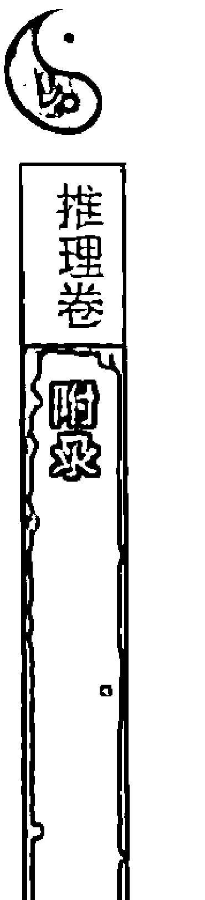

## 张子房命

紫微斗数命盘表格，包含十二宫位及星曜分布：

| 宫位 | 星曜 |
|---|---|
| 命宫 | 禄存、紫微、天府、博士、长生、寅 |
| 兄弟 | 陀罗、天魁、天机、火星、天刑、八座、三台、官府、养、丑 |
| 夫妻 | 破军、伏兵、胎、子 |
| 子女 | 天马、太阳、忌、大耗、绝、亥 |
| 财帛 | 龙池、武曲、科、府符、墓、身、戌 |
| 疾厄 | 天同、天伤、死、喜神、酉 |
| 迁移 | 左辅、天钺、七杀、文曲、飞廉、病、申 |
| 仆役 | 天伤、左辅、天使、天空、奏书、衰、未 |
| 官禄 | 右弼、廉贞、天同、文昌、禄、将军、旺、午 |
| 田宅 | 巨门、天姚、小耗、冠、巳 |
| 福德 | 凤阁、贪狼、青龙、沐、辰 |
| 父母 | 铃星、擎羊、太阴、地劫、力士、沐、卯 |

中心信息：阴男，甲午年五月初六辰时生，己酉年七十六岁三月初七故，火六局。

此是双禄朝垣，左右昌曲加会，又兼紫府同宫，作极富贵之命，直湧限落夹地，故以命亡七十六，大小限在天伤、天空、天使衰死之地，是以难迭。

## 韩信之命

| 已 | 午 | 未 | 申 |
|---|---|---|---|
| 地劫 巨门 太岁 天空 绝 兄弟 小耗 | 廉贞 天相 禄 身 将军 命宫 | 天铖 天梁 天刑 养 奏书 父母 | 天哭 七杀 天马 长生 飞廉 福德 |
| 八座 天虚 贪狼 文昌 墓 青龙 夫妻 | 阳男 乙巳年三十二岁二月初四故 甲戌年十一月初五午时生 土五局 | （同左） | 天同 沐 喜神 田宅 |
| 擎羊 太阴 铃星 死 力士 子女 | （同上） | （同上） | 天姚 太阳 忌 病符 官禄 |
| 龙池 左辅 紫微 天府 禄存 病 博士 财帛 | 陀罗 天魁 天机 火星 天使 衰 官府 疾厄 | 凤阁 破军 右弼 权 旺 伏兵 迁移 | 天伤 天相 八座 临 大耗 仆役 |

紫府拱照，左右加会，禄合科权，出将人相之命。三十二岁，小限在亥值伤，忌太岁、空劫在巳冲之，又大限羊陀冲照，故遭毒死。

## 赵高之命

父母 (巳): 天马 天同 天钺, 绝, 喜神
福德 (午): 太岁 武曲 天府, 胎, 飞廉
田宅 (未): 龙池 太阳 太阴, 养, 奏书
官禄 (申): 贪狼 (忌), 长生, 将军

命宫 (辰): 破军 左辅 (禄), 沐, 吊客 病符
仆役 (酉): 地劫 天刑 火星, 沐, 小耗

兄弟 (卯): 天哭 天魁, 死,
迁移 (戌): 铃星 右弼 紫微, 冠, 青龙

夫妻 (寅): 八座 廉贞 文曲, 病, 伏兵
子女 (丑): 天空 擎羊 天姚, 衰, 官府
财帛 (子): 禄存 七杀 文昌, 旺, 博士
疾厄 (亥): 陀罗 天梁 天使, 临, 力士

中心信息: 阴男, 甲午年五十二岁四月初八故, 癸卯年正月二十一戌时生, 土五局

此为禄合，左右相会，一生爵禄甚丰盈，富贵双全应有分，紫破辰戌不忠，故有指鹿为马之事，大限夹地遇陀罗，流年小限丧门吊客病符作殃，故主凶亡。

## 李斯之命

| 宫位1 | 宫位2 | 宫位3 | 宫位4 |
|---|---|---|---|
| 太岁太阳禄存 博士 绝 官禄 巳 | 擎羊破军天刑天伤 力士 胎 仆役 午 | 天机 青龙 养 迁移 未 | 天使紫微天府 小耗 长生 疾厄 申 |
| 陀罗武曲 官府 墓 田宅 辰 | 阳男 癸己年五十八岁六月初三故 丙申年十月十一日戊时生 土五局 | 地劫天铖太阴 将军 沐 财帛 酉 | 天哭铃星贪狼天姚 奏书 冠 子女 戌 |
| 天座同 伏兵 死 福德 卯 | 右弼天梁左辅天空 病符 衰 命宫 | 文昌廉贞天相 喜神 旺 兄弟 子 | 天魁巨门台 飞廉 临 夫妻 亥 |

左右同宫，日巳月酉并明，权禄加会，为富贵之命。太岁丧，白虎冲命限，是以见凶。

## 曹参之命

| 宫位/内容 | 辰 | 巳 | 午 | 未 | 申 | 酉 | 戌 | 亥 | 子 | 丑 | 寅 | 卯 |
|---|---|---|---|---|---|---|---|---|---|---|---|---|
| **星曜** | 七杀 文昌 | 天空 天机 陀罗 地劫 | 紫微 禄存 | 天刑 擎羊 | 破军 天钺 | 天哭 流禄 | 廉贞 贪狼 铃星 文曲 | 太阴 天马 天姚 天伤 太岁 | 贪狼 右弼 八座 天魁 | 巨门 天使 天同 龙池 | 武曲 天相 三台 左辅 | 天梁 太阳 官符 |
| **宫位** | 夫妻 | 兄弟 | 命宫 | 父母 | 福德 | 田宅 | 官禄 | 仆役 | 迁移 | 疾厄 | 财帛 | 子女 |
| **神煞** | 青龙 | 力士 | 博士 | 官府 | 伏兵 | 大耗 | 病符 | 喜神 | 飞廉 | 奏书 | 将军 | 小耗 |
| **长生** | 旺 | 临 | 冠带 | 沐浴 | 长生 | 养 | 胎 | 绝 | 墓 | 死 | 病 | 衰 |
| **中心信息** | - | - | - | 阴男 | - | - | - | - | 土五局 | - | - | - |
| **生辰信息** | - | - | 辛女年六十三岁七月初九故 | - | - | 己酉年十一月二十五午时 | - | - | - | - | - | - |

紫微居午无杀凑，左右权禄子寅二宫加会，官资清显至三公。六十三岁，太岁到天伤夹地，又流年羊刃照命，酉之忌之为凶也。

## 丽生之命

| 宫位 | 星曜组合 | 备注 |
|---|---|---|
| 命宫 (巳) | 文昌、贪狼、廉贞、天钺、天刑、凤阁 | 喜神，临官状态，有科权夹贵之格，但空劫夹垣，文昌不宜与贪狼廉贞同立 |
| 父母宫 (午) | 天空、巨门、八座 | 飞廉，冠带状态 |
| 福德宫 (未) | 天相 | 奏书，沐浴状态 |
| 田宅宫 (申) | 天同、天梁 | 将军，长生状态 |
| 兄弟宫 (辰) | 太阴、地劫 | 病符，旺状态，有科 |
| 官禄宫 (酉) | 七杀、武曲、文曲、天姚、龙池 | 小耗，养状态 |
| 夫妻宫 (卯) | 天府、天魁、三台 | 大耗，衰状态 |
| 仆役宫 (戌) | 太阳、天伤、太岁 | 青龙，胎状态 |
| 子女宫 (寅) | 右弼 | 伏兵，病状态 |
| 财帛宫 (丑) | 紫微、破军、擎羊、天哭 | 官府，死状态 |
| 疾厄宫 (子) | 天机、左辅、禄存、天使 | 博士，墓状态 |
| 迁移宫 (亥) | 天马、陀罗、天虚 | 力士，绝状态 |
| 中宫 | 阴男，戊戌年九月初四日巳时生，土五局，戊戌年三十六岁正月十一故 | |

科权夹贵之格，本为美命，只嫌空劫二夹垣，且文昌不宜与贪狼廉贞同立，一生奔波劳碌。三十六太岁、天伤，小限天空，戊禄化吉，小限不堪重载，是以凶也。

## 百里奚命

紫微斗数命盘表格

巨日同宫，禄合守照，左右昌曲加会，少年不顺，因限步行羊铃地劫虚绝之，三十五方得遂志，大限人酉，擎羊败地，小限在命垣，与太岁相冲禄马，不吉。

## 廉颇之命

| 宫位 | 星曜 | 神煞 | 状态 |
|------|------|------|------|
| 兄弟宫 | 龙池、天哭、天梁、陀罗(科) | 力士 | 临 |
| 命宫 | 八座、禄存、七杀、左辅 | 博士 | 冠 |
| 父母宫 | 天府、擎羊 | 官府 | 沐 |
| 福德宫 | 右弼、廉贞、天钺、三台 | 伏兵 | 长生 |
| 夫妻宫 | 紫微、天相 | 青龙 | 旺 |
| 中心区域 | 阴男，辛丑年七十三岁七月初八故，己丑年二月十五日戌时生，土五局 | | |
| 田宅宫 | 地劫、大耗 | 养 | |
| 子女宫 | 天姚、火星、天机、巨门 | 小耗 | 衰 |
| 官禄宫 | 铃星、破军 | 病符 | 胎 |
| 财帛宫 | 贪狼、文曲(权 忌) | 将军 | 病 |
| 疾厄宫 | 天使、太阴、太阳、太岁、天空 | 奏书 | 死 |
| 迁移宫 | 天府、武曲、天魁、文昌 | 飞廉 | 墓 |
| 仆役宫 | 天马、天刑、天同、天伤 | 喜神 | 绝 |

七杀朝斗，富贵荣华，禄合权会，文武材能。七十三岁，大限在天伤之地，太岁伏牛，又在天空天使之地，小限相冲，流羊在戌，冲照命垣，是以凶。

## 蔺相如命

紫微斗数命盘，中心信息：阳男，丙申年六十九岁五月初二故，戊子年二月十四日寅时生，金四局。

各宫位内容：
- 官禄宫：左辅、禄存、长生、身、博士
- 仆役宫：三台、天哭、擎羊、天机、文曲、天虚、忌、天伤、沐、力士、仆役
- 迁移宫：破军、紫微、天钺、青龙、迁移、冠
- 疾厄宫：八座、天使、文昌、天使、小耗、疾厄、临
- 田宅宫：陀罗、太阳、龙池、官府、田宅、养
- 财帛宫：天空、天府、右弼、科、将军、财帛、旺
- 福德宫：武曲、七杀、伏兵、福德、胎
- 子女宫：铃星、天刑、太阴、凤阁、化忌、奏书、子女、衰
- 父母宫：火星、天姚、天同、天梁、天马、大耗、父母、绝
- 命宫：地劫、天魁、天机、病符、命宫、墓
- 兄弟宫：巨门、病符、兄弟、死
- 夫妻宫：廉贞、贪狼、禄、飞廉、夫妻、病

> 左右加会终为吉，科禄府最为良，且兼限行美地，一生名利得安康，大限申宫，子生人不寅申限，六十九岁，丙申岁限，是以命亡。

## 贾谊之命

紫微斗数命盘：贾谊之命

宫位详情：
1. 官禄宫：天铖 天机，长生，喜神
2. 仆役宫：太岁 天伤 紫微 左辅，养，飞廉
3. 迁移宫：凤阁 文曲 文昌 龙池，胎，奏书
4. 疾厄宫：天使 破军 右弼 天空，绝，将军
5. 田宅宫：七杀，沐，病符
6. 命宫：阴男，庚午年二十八岁四月初七故，癸卯年二月初十日卯时生，金四局
7. 财帛宫：火星 天虚，基，小耗
8. 福德宫：天姚 天魁 太阳 天梁 天哭，冠，大耗
9. 父母宫：地劫 武曲 天相，临，伏兵
10. 兄弟宫：禄存 贪狼，衰，博士
11. 夫妻宫：陀罗 太阴 天刑，病，力士
12. 子女宫：青龙，死

文星暗拱，年少登科，天机、天钺正照，以为吉兆。小限到天罗，大限到地网，太岁、天伤夹地，流羊、流陀三方合命垣，且命原犯擎羊，故夭亡于二十八岁。

## 傅毅之命

| 宫位 | 星曜 | 神煞 | 状态 |
|------|------|------|------|
| 福德 | 紫微七杀 | 小耗 | 临 |
| 田宅 | 天哭 | 将军 | 旺 |
| 官禄 | 天铖 | 奏书 | 衰 |
| 仆役 | 天刑天伤 | 飞廉 | 病 |
| 父母 | 天机天梁 | 青龙 | 冠 |
| 命宫 | 擎羊天相左辅 | 力士 | 沐 |
| 迁移 | 廉贞破军地劫 | 喜神 | 死 |
| 疾厄 | 铃星太岁天使 | 病符 | 墓 |
| 兄弟 | 巨门太阳文曲禄存火星 | 博士 | 长生 |
| 夫妻 | 贪狼武曲陀罗天魁 | 官府 | 养 |
| 子女 | 太阴天同文曲天姚 | 伏兵 | 胎 |
| 财帛 | 天府右弼 | 大耗 | 绝 |

中央：阳男，甲戌年七十一岁四月初九故，火六局，甲子年十二月二十四戌时生

权禄加会，擎羊逢力士，不得十分富贵，亦为终身福厚之论。命垣喜坐火位，皆为吉兆，直到大限游于天使夹地，小限七十一又逢天伤、天刑，故此寿难过去。

## 魏豹之命

| 宫位/神煞 | 星曜组合 | 神煞 | 状态 |
| :--- | :--- | :--- | :--- |
| 福德（丑） | 天机文昌 | 大耗 | 死 |
| 田宅（午） | 天空紫微 | 伏兵 | 胎 |
| 官禄（未） | 天钺陀罗天姚 | 官府 | 养 |
| 仆役（申） | 天伤禄存破军太岁 | 博士 | 长生 |
| 父母（辰） | 病符 | 墓 | |
| 中心信息 | 阳男，丙申年二十七岁九月初五故，庚申年七月二十五巳时生 | | |
| 迁移（酉） | 力士 | 沐 | |
| 兄弟（寅） | 凤阁天马武曲天相火星、天虚、飞廉 | 病 | |
| 命宫（卯） | 喜神 | 死 | |
| 夫妻（丑） | 奏书 | 衰 | |
| 子女（子） | 将军 | 旺 | |
| 财帛（亥） | 小耗 | 临 | |
| （附加星曜） | 天刑太阳天梁(禄) | | |
| | 天魁天同巨门(忌) | | |
| | 龙池贪狼 | | |
| | 太阴(科) | | |
| | 土五局 | | |

> 科禄相逢遇太阳，天梁同位最高强，运限顺行俱为吉，后因大限遇陀星，小限地网，丙年廉贞化忌，凶，又兼申人忌铃星，故主难过却此步。

## 刘都衙命

紫微斗数命盘表格，包含福德、田宅、官禄、仆役、父母、命宫、兄弟、夫妻、子女、财帛等宫位及相应星曜。

贞破卯酉作公卿，权禄虽生逢，落于陷地，不能发达，不过公门轩昂而已。二限夹地，不免凶祸，且文昌不宜见贪破，又见羊铃，故主凶亡。

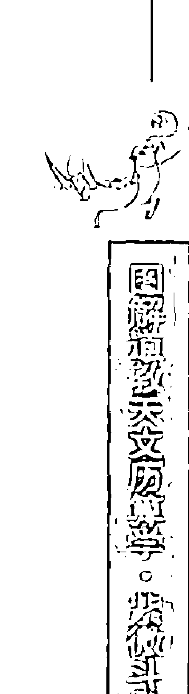

## 姜恒之命

| 宫位 | 星曜 | 长生 | 博士 | 地支 |
|------|------|------|------|------|
| 官禄 | 三台、巨门、禄存 | 绝 | 博士 | 巳 |
| 仆役 | 天刑、擎羊、廉贞、天相、天伤、忌 | 胎 | 伏兵 | 午 |
| 迁移 | 天梁 | 养 | 青龙 | 未 |
| 疾厄 | 天使、七杀 | 长生 | 小耗 | 申 |
| 田宅 | 陀罗、贪狼、龙池 | 墓 | 病符 | 辰 |
| 身宫 | 地劫、天钺、天同、八座、禄 | 沐 | 将军 | 酉 |
| 子女 | 凤阁、铃星、武曲、天姚 | 冠 | 奏书 | 戌 |
| 福德 | 太阴 | 死 | 伏兵 | 卯 |
| 父母 | 天马、火星、紫微、天府、文曲、太岁 | 病 | 大耗 | 寅 |
| 命宫 | 右弼、天机、左辅、权 | 衰 | 病符 | 丑 |
| 兄弟 | 破军、文昌、科 | 旺 | 喜神 | 子 |
| 夫妻 | 天魁、太阳 | 临 | 飞廉 | 亥 |

生年信息：阳男，丙寅年五十一岁八月初五故，土五局，丙子年十月初五日戌时生。

双禄加会，无不富贵。左右同宫，终身福贵，空劫身命，寿年难长。大限入于天伤夹地，小限相冲。丙寅年，太岁病耗相临，且子生人不宜寅岁限，故死于是年。

## 周勃之命

| 宫位 | 星曜（主星） | 星曜（辅星/杂曜） | 宫干 | 长生十二神 | 将前十二神 | 博士十二神 | 备注 |
| :--- | :--- | :--- | :--- | :--- | :--- | :--- | :--- |
| 巳 | 七杀、紫微 | 天伤、陀罗、凤阁 | 已 | 病 | 力士 | 博士 | 身 仆役 |
| 午 | 禄存 | 文曲 | | 衰 | | 官府 | 迁移 |
| 未 | | 天使、擎羊 | | 旺 | | | 疾厄 |
| 申 | | 文昌 | | 临 | 伏兵 | | 财帛 |
| 酉 | 破军、廉贞 | 天刑、天钺、龙池、天空 | | 冠 | 大耗 | | 子女 |
| 戌 | | 铃星、右弼 | | 沐浴 | 病符 | | 夫妻 |
| 亥 | 天府 | 天虚、天魁、天马、八座 | | 长生 | 喜神 | | 兄弟 |
| 子 | 太阴、天同 | 权、禄 | | 养 | 飞廉 | | 命宫 |
| 丑 | 贪狼、武曲 | 太岁、天姚、天哭、地劫 | | 胎 | 奏书 | | 父母 |
| 寅 | 巨门、太阳 | 忌 | | 绝 | 将军 | | 福德 |
| 卯 | 火星、天相 | 三台 | | 墓 | 小耗 | | 田宅 |
| 辰 | 天机、天梁 | 科、左辅 | | 死 | 青龙 | | 官禄 |

**中心信息：**
- 阴男
- 乙丑年六十九岁十二月初五故
- 丁巳年正月十二日寅时生
- 水三局

太阴、天同居子守命，丙丁人富贵忠良。权禄生逢，人将出相之命，大限到于巳宫，又逢陀罗，且巳生人切忌本身临，又太岁、地劫、天哭星作挠，是以凶也。

## 乐毅之命

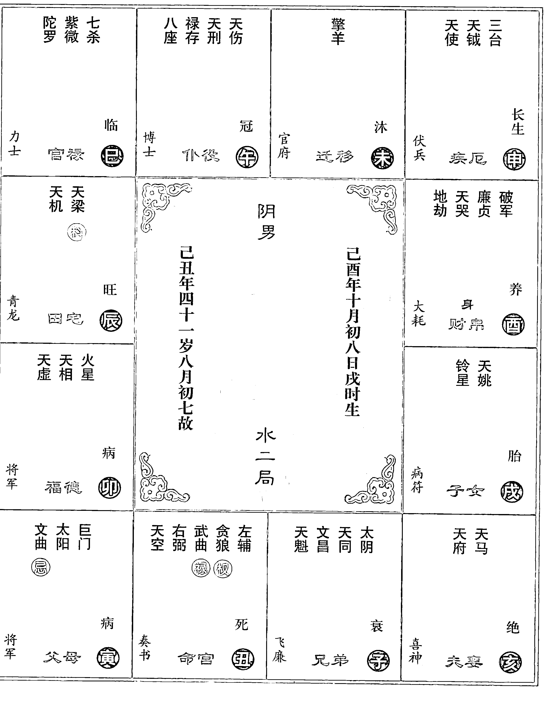

贪武同行，左右同宫，权禄注逢，俱吉。奈遇三方四正，俱羊陀劫空，进退声名。大限游于太岁之地，破、哭、劫、耗、流羊、流陀迭并，太岁人命，亦忌冲照，是以死也。

## 赵奢之命

| 宫位/地支 | 星曜组合 | 状态/神煞 | 宫名/备注 |
| --- | --- | --- | --- |
| 巳 | 八座、禄存、廉贞、贪狼(禄) | 长生、博士 | 官禄 |
| 午 | 擎羊、巨门、文昌、天伤 | 沐浴、力士 | 仆役 |
| 未 | 天钺、右弼、天相、左辅、天空(科) | 冠带、青龙 | 迁移 |
| 申 | 天使、天马、文曲、天同、天梁 | 临官、小耗 | 疾厄 |
| 辰 | 凤阁、陀罗、太阴、天姚(权) | 养、官府 | 田宅 |
| 中心信息 | 阳男，庚子年四十三岁二月初七故，戊午年四月初三日辰时生，金四局 | | |
| 酉 | 三台、武曲、七杀 | 旺、将军 | 身、财帛 |
| 卯 | 地劫、天府、铃星 | 胎、伏兵 | 福德 |
| 丑 | 火星、天魁、紫微、破军 | 墓、病符 | 命宫 |
| 子 | 太岁、天刑、天机、天虚、天哭(忌) | 死、喜神 | 兄弟 |
| 戌 | 龙池、太阳 | 衰、奏书 | 子女 |
| 亥 | （星曜信息缺失） | 病、飞廉 | 夫妻 |

科禄拱照，富贵声扬；左右拱朝，终身福厚。三十四岁，大限入巳宫；四十三岁，庚子年，太岁逢忌，三方、陀、忌冲照，又流羊、流陀冲命，小限入地网，日月陷地，故凶。

## 陆贾之命

| 宫位 | 星曜组合 | 神煞 | 宫名 | 备注 |
|-------|-------|-------|-------|-------|
| 巳 | 太岁、禄存、太阴、左辅 | 博士 | 官禄 | 身 |
| 午 | 天伤、擎羊、贪狼、文曲 | 力士 | 仆役 | |
| 未 | 天同、巨门 | 青龙 | 迁移 | |
| 申 | 天哭、文昌、武曲、天相、天马 | 天使、小耗 | 疾厄 | |
| 辰 | 陀罗、廉贞、天府、天虚 | 官府 | 田宅 | |
| 中心信息 | 阳男，己巳年四十四岁五月初四故，丙戌年二月初七日寅时生 | | |
| 酉 | 天空、天铖、右弼、太阳、天梁 | 将军 | 财帛 | |
| 卯 | 八座、铃星 | 伏兵 | 福德 | |
| | 土五局 | | | |
| 戌 | 天刑、七杀 | 奏书 | 子女 | |
| 寅 | 龙池、破军、天姚 | 大耗 | 父母 | |
| 丑 | 地劫、火星 | 病符 | 命宫 | |
| 子 | 凤阁、紫微 | 喜神 | 兄弟 | |
| 亥 | 天魁、天机 | 飞廉 | 夫妻 | |

双禄朝垣，左、右、巨、日拱照，只嫌禄主缠于弱地，因此发不主财，兼且火星、劫空在命，半天折翅之论。限岁俱到陷地，小限又且重并，故四十四岁难全命也。

## 杨孔目命

| 宫位 | 星曜组合 | 博士/力士等 | 宫名 | 长生十二神 |
|------------|------------------------------|-------------|--------|------------|
| 寅（身命宫） | 天虚、火星、天机（忌）、太阴、天马 | 大耗 | 身、临 | - |
| 卯（父母宫） | 八座、紫微、贪狼 | 伏兵 | 父母 | 绝 |
| 辰（福德宫） | 陀罗、文曲、巨门、左辅 | 官府 | 福德 | 衰 |
| 巳（田宅宫） | 天相、禄存 | 博士 | 田宅 | 病 |
| 午（官禄宫） | 擎羊、天梁 | 力士 | 官禄 | 死 |
| 未（仆役宫） | 天伤、廉贞（忌）、七杀 | 青龙 | 仆役 | 养 |
| 申（迁移宫） | 太岁 | 小耗 | 迁移 | 绝 |
| 酉（疾厄宫） | 天刑、天铖、天使 | 将军 | 疾厄 | 胎 |
| 戌（财帛宫） | 铃星、右弼、天同（禄）、文昌（科）、天哭 | 奏书 | 财帛 | 养 |
| 亥（子女宫） | 地劫、天魁、破军、武曲、三台、天空 | 飞廉 | 子女 | 长生 |
| 子（夫妻宫） | 太阳 | 喜神 | 夫妻 | 沐 |
| 丑（兄弟宫） | 天姚、天府 | 病符 | 兄弟 | 衰 |

中间标注：阴男，戊午年七十二岁七月初故，丙申年正月初八日子时生，木二局

机月同梁作吏人，命垣坐寅申之地，科禄权会，若无羊刃火铃合照，乃主正路，功名贵显。大小二限入于地网，怕逢铃星，又且太岁冲命垣，故主倒寿。

## 郭恪之命

| 宫位（宫）| 主星/辅星 | 神煞 | 长生十二神 |
| :--- | :--- | :--- | :--- |
| **田宅（巳）** | 天铖、天梁、天哭、龙池 | 喜神 | 临 |
| **官禄（午）** | 左辅、七杀、武曲、太岁 | 飞廉 | 身 冠 |
| **仆役（未）** | 天虚、天伤 | 奏书 | 沐 |
| **迁移（申）** | 文昌、廉贞、右弼 | 将军 | 长生 |
| **福德（辰）** | 天相、紫微 | 病符 | 旺 |
| **中央** | **阴男** **水二局** **癸丑年三月初七日寅时生** **丙午年五十四岁五月初三故** | | |
| **疾厄（酉）** | 天使、凤阁、天空 | 小耗 | 养 |
| **父母（卯）** | 天魁、巨门、天机、火星、天姚 | 大耗 | 衰 |
| **财帛（戌）** | 破军、铃星 | 青龙 | 临 |
| **命宫（寅）** | 贪狼、八座 | 伏兵 | 病 |
| **兄弟（丑）** | 太阴、太阳、擎羊、地劫 | 官府 | 死 |
| **夫妻（子）** | 天府、武曲、禄存、三台 | 博士 | 墓 |
| **子女（亥）** | 陀罗、天同、天马、天刑 | 力士 | 临 |

廉贞、七杀午申宫，主人流荡天涯，左右昌曲虽然加会拱只嫌命垣贪狼化忌，因为商贾在外，太岁沉马。五十四岁，小限在子冲之，丧门白虎合命，故凶。

## 叶英之命

## 紫微斗数命盘

### 中心信息
- 阳男
- 丁丑年二十二岁五月初五故
- 丙辰年三月二十二日子时生
- 水二局

### 宫位分布
| 宫位 | 地支 | 星曜 | 长生 | 神煞 |
|------|------|------|------|------|
| 父母 | 巳 | 太阴、禄存 | 绝 | 博士 |
| 福德 | 午 | 凤阁、擎羊、贪狼、左辅 | 临 | 力士 |
| 田宅 | 未 | 天同、巨门（禄） | 养 | 青龙 |
| 官禄 | 申 | 龙池、右弼、武曲、天相 | 长生 | 小耗 |
| 命宫 | 辰 | 陀罗、廉贞（忌）、天府、文曲 | 墓 | 官府 |
| 仆役 | 酉 | 天伤、天钺、太阳、天梁 | 沐 | 将军 |
| 兄弟 | 卯 | 天姚、三台 | 死 | 伏兵 |
| 迁移 | 戌 | 天虚、铃星、七杀、文昌 | 冠 | 奏书 |
| 夫妻 | 寅 | 天哭、天马、破军、火星 | 病 | 大耗 |
| 子女 | 丑 | 太岁 | 衰 | 病符 |
| 财帛 | 子 | 紫微 | 旺 | 喜神 |
| 疾厄 | 亥 | 天使、天魁、天机、天刑、八座、天空、地劫 | 临 | 飞廉 |

紫、相、昌、曲相逢加会，本作美论。奈嫌昌曲不见廉贞化忌。秘云文昌、文曲逢廉贞，丧命天寿之人。故死于二十二岁。

## 王钦若命

| 宫位 | 星曜 | 神煞 | 状态 |
|------|------|------|------|
| 父母（巳） | 天相 | 临 | |
| 福德（午） | 天梁、文昌、忌 | 冠 | |
| 田宅（未） | 天空、天姚、廉贞、七杀 | 沐 | |
| 官禄（申） | 文曲、陀罗 | 长生 | |
| 命宫（辰） | 巨门、右弼、禄 | 旺 | |
| 仆役（酉） | 天伤、禄存、天哭 | 养 | |
| 兄弟（卯） | 天刑、火星、紫微、贪狼、天虚、地劫 | | |
| 迁移（戌） | 擎羊、左辅、天同、铃星 | 胎 | |
| 夫妻（寅） | 三台、天机、太阴 | 病 | |
| 子女（丑） | 凤阁、天府、龙池 | 死 | |
| 财帛（子） | 太岁、太阳、八座、权 | 身、墓 | |
| 疾厄（亥） | 天使、天马、武曲、破军 | 绝 | |

科、权、禄拱，文学声扬，左辅、右弼，尊居八座，富贵双全之命。大、小二限入地网，遇擎羊，酉人忌之，必凶损寿。

## 杨国忠命

| 宫位/地支 | 星曜组合 | 神煞 | 状态/备注 |
|---|---|---|---|
| 己 | 禄存 | 博士 | 身、命宫、绝 |
| 庚 | 擎羊、天机 (忌) | 力士 | 父母、胎 |
| 辛 | 右弼、左辅、紫微、破军、天钺 (科) | 青龙 | 福德、养 |
| 申 | 太岁、天马、天哭 | 小耗 | 田宅、长生 |
| 辰 | 陀罗、太阳、天姚 | 官府 | 兄弟、墓 |
| 中心信息 | 阳男，丙申年五十九岁二月初五故，土五局，戊戌年四月初六日亥时生 | | |
| 酉 | 天府 | 将军 | 官禄、沐 |
| 卯 | 铃星、武曲、七杀 | 伏兵 | 夫妻、死 |
| 戌 | 太阴 (权) | 奏书 | 仆役、冠 |
| 寅 | 八座、龙池、天同、天梁 | 大耗 | 子女、病 |
| 丑 | 天魁、天相、火星 | 病符 | 财帛、衰 |
| 子 | 三台、天刑、巨门、凤阁 | 喜神 | 疾厄、旺 |
| 亥 | 地劫、廉贞、贪狼 (禄) | 飞廉 | 迁移、临 |

真正府相朝垣格。食禄千钟，虽然作得禄合格局，又忌廉、贪二星空劫冲破，不得富贵绵远。大限落于廉贪陷地，小限在寅，对冲太岁，为禄倒马倒之论。

## 安庆礼命

| 三台 天铖 天府 左辅 (科) | 天同 太阴 | 武曲 贪狼 | 太阳 巨门 |
| :--- | :--- | :--- | :--- |
| 命宫 (巳) 临 | 父母 (午) 旺 | 福德 (未) 衰 | 田宅 (申) 病 |
| 兄弟 (辰) 冠 | **阳男** 壬戌年五十一岁四月初八故 壬申年二月十二日戌时生 火六局 | | 官禄 (酉) 死 |
| 夫妻 (卯) 沐 | | | 仆役 (戌) 墓 |
| 子女 (寅) 长生 | 身 财帛 (丑) 养 | 疾厄 (子) 墓 | 迁移 (亥) 绝 |

**星曜分布**

- 命宫：三台、天铖、天府、左辅(科)、飞廉
- 兄弟：奏书
- 夫妻：天魁、文曲、破军、将军
- 子女：天虚、天马、火星、天姚、凤阁、小耗
- 父母：天同、太阴、喜神
- 身宫/财帛：天空、青龙
- 福德：武曲、贪狼、病符
- 疾厄：擎羊、龙池、天使、博士
- 田宅：太阳、巨门、大耗
- 官禄：地劫、天相、右弼、伏兵
- 仆役：太岁、铃星、天机(禄)、天梁、陀罗、天刑、天哭、天伤、官府
- 迁移：禄存、紫微(权)、七杀、博士

权禄加会，左右扶持，皆得称意，富贵全美。流年太岁大限入戌，申人忌铃星，且兼天刑、天伤、天哭、小限又在天使之地，俱为倒寿之年也。

## 严子陵命

| 陀罗 武曲 破军 天虚 | 禄存 太阴 文昌 | 擎羊 天府 天哭 | 天钺 文曲 天机 太阴 |
| :---: | :---: | :---: | :---: |
| 力士 兄弟 临(巳) | 力士 命宫 冠(午) | 官府 父母 沐(未) | 伏兵 福德 长生(申) |
| 天同 | **阴男** | | 火星 天姚 紫微 贪狼 |
| 青龙 夫妻 辰 | 辛亥年七十三岁五月初七故 | 己亥年九月二十八日辰时生 | 大耗 田宅 养(酉) |
| 龙池 三台 | | 土五局 | 铃星 巨门 |
| 小耗 子女 衰(卯) | | | 奏书 官禄 胎(戌) |
| 右弼 | 天使 文昌 廉贞 七杀 | 天魁 天梁 左辅 | 天伤 太岁 天相 凤阁 八座 |
| 将军 财帛 病(寅) | 奏书 疾厄 死(丑) | 飞廉 迁移 墓(子) | 喜神 仆役 绝(亥) |

太阳居午无杀凑，左右扶持福不轻。因有文昌同科禄，富贵双全寿至终。七十三岁大限天伤，小限天使，不吉损寿。

## 王莽之命

| 天梁 (病, 巳) | 七杀 左辅 (死, 午) | 太岁 天铖 (墓, 未) | 廉贞 右弼 (绝, 申) |
| :--- | :--- | :--- | :--- |
| 紫微 天相 文曲 (衰, 辰) | **阳男** 癸未年六十岁九月十二日故 甲申年二月初九日子时生 木三局 | | 天伤 (胎, 酉) |
| 巨门 天机 擎羊 天姚 (旺, 卯) | | | 铃星 破军 文昌 天哭 (养, 戌) |
| 贪狼 火星 禄存 凤阁 天马 天虚 (临, 寅) | 太阳 太阴 陀罗 天魁 (冠, 丑) | 天府 武曲 龙池 八座 (沐, 子) | 天同 天刑 天使 地劫 天空 (长生, 亥) |

科、权、禄拱，名誉声扬；紫破辰戌，为臣不忠，篡汉之位是也，且申人忌见火铃。五十三，大限入戌遇火铃也，地网重并，小限天伤，遭刑而亡。

## 杨贵妃命

| 太阴 | 地劫 天哭 贪狼 天虚 | 天铖 天同 巨门 | 武曲 天相 科 |
| :--- | :--- | :--- | :--- |
| 左辅 天府 天空 廉贞 | **阳女** 癸卯年四十一岁九月初九故 甲子年正月初七日未时生 土五局 | 天梁 太阳 天刑 忌 |
| 擎羊 文昌 太岁 | 财帛 | 田宅 | 七杀 右弼 铃星 |
| 天使 禄存 破军 天火星 | 天姚 天魁 陀罗 | 天伤 紫微 | 天机 文曲 |

坐贵向贵，得人宠爱。文昌、文曲加会，女命不宜见之。经云: 杨妃好色。三合文昌、文曲，太岁羊陀迭并，小限子午相冲，故损寿。

## 张侍郎命

癸巳年十一月十四日子时生
金四局

推理卷

明象

权会巨门威扬，果作谏臣。太阴、文昌于妻宫，蟾宫折桂；太阳、文曲于官禄，皇殿朝班。癸生人会巨门。为石中隐玉格，信此验矣。只兄弟落陷，果是否不如人矣。

## 孔允夫命

| 龙池 天刑 天同 陀罗 天哭 三台 微 力士 兄弟 巳（临） | 流羊 文昌 武曲 天官 禄存 博士 命宫 午（冠） | 太阳 太阴 天虚 微 官府 父母 未（沐） | 太岁 文曲 贪狼 伏兵 福德 申 |
| :--- | :--- | :--- | :--- |
| 破军 流陀 夫妻 辰（旺） | **阴男** 戊申年二十二岁五月初二故 | 丁丑年九月十八日辰时生 | 八座 天钺 天机 巨门 科 忌 田宅 酉 |
| 火星 子女 卯（衰） | 水二局 | 病符 | 天空 铃星 紫微 天相 官禄 戌（胎） |
| 廉贞 右弼 将军 身 财帛 寅（病） | 天使 文昌 廉贞 七杀 奏书 疾厄 丑（死） | 地劫 左辅 迁移 子 | 天伤 天魁 天梁 天马 仆役 亥（绝） |

权禄夹命之格，左右加会，财官双美，无不富贵。三十二岁，小限、大限在寅，太岁在申冲照，飞廉同并流羊，又加以七杀重逢，是为凶也。

## 郭子仪命

紫微斗数命盘，包含十二宫位（命宫、兄弟、夫妻、子女、财帛、疾厄、迁移、交友、官禄、田宅、福德、父母）及相应星曜分布。核心信息：阴男，水二局，丁酉年三月二十二戌时生，辛酉年八十五岁三月初五故。

权禄夹命之格，又兼昌曲加会，无不富贵之论。八十五岁，太岁并限于地劫，小限又行擎羊，忌宿，酉人有忌，故终寿于此年。

## 李太白命

| 宫位 | 星曜与状态 | 长生 | 地支 |
| :--- | :--- | :--- | :--- |
| 命宫 | 地劫、天空、禄存、天机、身宫 | 绝 | 巳 |
| 父母宫 | 天刑、紫微、擎羊 | 胎 | 午 |
| 福德宫 | 青龙 | 养 | 未 |
| 田宅宫 | 破军 | 长生 | 申 |
| 兄弟宫 | 八座、陀罗、七杀、文昌 | 墓 | 辰 |
| 官禄宫 | 天钺 | 沐 | 酉 |
| 夫妻宫 | 太阳、天梁 | 死 | 卯 |
| 仆役宫 | 三台、铃星、文曲、廉贞、天府、天姚、天伤、天虚 | 冠 | 戌 |
| 子女宫 | 天哭、火星、武曲、天相 | 病 | 寅 |
| 财帛宫 | 右弼、左辅、天同、巨门 | 衰 | 丑 |
| 疾厄宫 | 天使、贪狼 | 旺 | 子 |
| 迁移宫 | 天魁、太阴 | 临 | 亥 |

阴男，戊戌年四十二岁四月初七故，丙辰年十一月初十日午时生，水二局

天魁、天钺，世称李白文章，权禄生逢，欣然入相。左右加会，富贵终身，只奈空劫在命垣，寿不长久。大小二限天罗地网，是以凶也。

图解紫微斗数下

## 吴秉直命

| 午（命宫） | 未（兄弟） | 申（命宫） | 酉（父母） | 戌（福德） | 亥（田宅） | 子（子女） | 丑（身宫/财帛） | 寅（身宫/疾厄） | 卯（迁移） | 辰（仆役） | 巳（官禄） |
| :--- | :--- | :--- | :--- | :--- | :--- | :--- | :--- | :--- | :--- | :--- | :--- |
| 天机 文昌 （冠带） | 陀罗 破军 紫微 天铖 太岁 （养） | 天哭 天马 文曲 禄存 （长生） | 擎羊 天府 （沐浴） | 太阴 （冠带） | 贪狼 廉贞 天姚 （临官） | （绝） | 太阳 天虚 （病） | 七杀 武曲 铃星 （死） | 天梁 天同 左辅 龙池 天同化忌 （病） | 天相 天魁 三台 天伤 火星 （衰） | 巨门 右弼 凤阁 （旺） |
| 博士 命宫 午 | 官府 兄弟 未 | 博士 命宫 申 | 官府 父母 酉 | 青龙 福德 戌 | 小耗 田宅 亥 | 大耗 子女 子 | 病符 身宫/财帛 丑 | 喜神 身宫/疾厄 寅 | 飞廉 迁移 卯 | 奏书 仆役 辰 | 将军 官禄 巳 |
| **阳男** 乙未年四十六岁七月初九故 庚戌年十一月十二日辰时生 水二局 |

巨日拱照，日辰日戌，并争荣曜。禄科俱会，左右拱照，终身富贵。大小二限入天伤忌凶之地，太岁逢陀罗天刑，俱主凶兆，其年命终。

## 燕哲之命

| 宫位 | 星曜 | 长生状态 | 神煞 | 备注 |
| :--- | :--- | :--- | :--- | :--- |
| 子女宫 | 天同、天刑 | 长生 | 小耗 | 巳 |
| 夫妻宫 | 天府、武曲（科）、文曲 | 沐浴 | 奏书 | 午 |
| 兄弟宫 | 太阴、太阳 | 冠带 | 奏书 | 未 |
| 命宫 | 天马、贪狼、文昌、天哭 | 冠带 | 飞廉 | 申 |
| 财帛宫 | 天虚、破军（权） | 养 | | 辰 |
| 父母宫 | 天空、天姚、天机、巨门 | 旺 | 喜神 | 酉 |
| 疾厄宫 | 天使、铃星、擎羊 | 胎 | 力士 | 卯 |
| 福德宫 | 紫微、天相 | 衰 | 病符 | 戌 |
| 迁移宫 | 禄存、廉贞、右弼、龙池 | 绝 | | 寅 |
| 仆役宫 | 三台、火星、天魁、陀罗、八座、地劫、天伤 | 墓 | 官府 | 丑 |
| 官禄宫 | 左辅、七杀、凤阁 | 死 | 伏兵 | 子 |
| 田宅宫 | 天梁 | | 大耗 | 亥 |

阳男
乙亥年三十二岁七月十二故
甲戌年九月二十六日寅时生
金四局

禄权加会，左右拱照，终身福厚之论。主人性燥暴。大限到于陀罗之星，戌生人有忌，且地劫、火星同并；小限逢忌相冲，故死于五十二岁。

## 顾孟錫命

紫微斗数命盘表格，包含十二宫位信息：
- 子女宫：大耗，绝，子女，巳，文昌 天同 太阴
- 夫妻宫：伏兵，胎，夫妻，午
- 兄弟宫：官府，养，兄弟，未，陀罗 天钺 武曲 贪狼 天朋
- 命宫：博士，长生，命宫，申，禄存 文曲 太阳 巨门
- 财帛宫：病符，墓，财帛，辰，贪狼
- 父母宫：力士，沐浴，父母，酉，擎羊 天相 三台
- 疾厄宫：地劫 廉贞 破军，病，疾厄，卯
- 仆役宫：奏书，旺，仆役，丑，天魁
- 官禄宫：将军，旺，官禄，子，右弼 龙池
- 田宅宫：小耗，临，田宅，亥，天姚 紫微 七杀
- 迁移宫：飞廉，病，迁移，寅，天相 天府 左辅 火星 天虚
- 核心信息：阳男，壬子年五十三岁九月初三故，庚申年十一月二十日辰时生，水二局

> 巨日同宫，双禄守垣，左右拱照为富贵，宜矣，奈申人大小二限行于火星之位见凶也，即死于五十三岁。

## 宁萃之命

| 太岁 天刑 廉贞 贪狼 临 子女宫 | 龙池 巨门 文曲 冠 夫妻宫 | 丧门 天相 陀罗 沐 兄弟宫 | 天虚 禄存 文昌 天同 天梁(忌) 长生 命宫 |
| :--- | :--- | :--- | :--- |
| 太阴 文昌 旺 财帛宫 | **阳男** 辛巳年五十二岁三月初七故 庚寅年九月初一日寅时生 水二局 | 天空 天姚 擎羊 武曲 七杀 养 父母宫 |  |
| 天使 天府 铃星 衰 疾厄宫 | 疾厄宫 衰 | 太阴 胎 福德宫 | 福德宫 胎 |
| 右弼 八座 病 迁移宫 | 地劫 天魁 火星 紫微 破军 天伤 死 仆役宫 | 天机 三台 死 官禄宫 | 田宅宫 绝 |

图解紫微斗数全书·紫微斗数下

机月同梁之格，一生事业峥嵘。五十二岁，大限夹地，辛巳年太岁埋蛇，小限丧门，忌星为害，主死。

## 李嗣源命

| 宫位 (地支) | 主星/辅星 | 状态/杂曜 | 宫位 (人事) |
| :--- | :--- | :--- | :--- |
| **巳** | 天刑、陀罗(忌)、巨门、天马、天虚 | 太岁、力士 | 子女 |
| **午** | 文曲、廉贞、天相、禄存 | 博士、冠带 | 夫妻 |
| **未** | 天哭、天梁 | 官府、沐浴 | 兄弟 |
| **申** | 七杀、文昌 | 伏兵、长生 | 命宫 |
| **辰** | 贪狼、三台 | 旺 | 财帛 |
| **中心** | **阴男** 土五局 丁亥年九月初五日寅时生 癸巳年六十七岁十一月初七故 | | |
| **酉** | 天空、火星、天同、天钺 | 大耗 | 父母 |
| **卯** | 天使、龙池、太阴 | 小耗、衰 | 疾厄 |
| **戌** | 武曲、八座 | 病符、胎 | 福德 |
| **寅** | 右弼、紫微、天府 | 病 | 迁移 |
| **丑** | 地劫、天伤 | 奏书、死 | 仆役 |
| **子** | 左辅、破军 | 飞廉、身 | 官禄 |
| **亥** | 天魁、太阳 | 喜神、绝 | 田宅 |

七杀朝斗，一生爵禄荣昌。紫府朝垣，左右拱照，终身富贵。六十七岁，大限到夹地，遇流羊，太岁逢陀，亥生人有忌，故凶。

## 马直节命

图解紫微斗数天文学，紫微斗数（下）

| 宫位 | 巳 | 午 | 未 | 申 |
| :--- | :--- | :--- | :--- | :--- |
| 星曜 | 八座、天相 | 天梁 | 地劫、陀罗、天铖、廉贞、七杀 | 禄存、右弼、天马 |
| 状态/神煞 | 绝·大耗 | 胎·伏兵 | 养·官府 | 长生·博士 |
| 宫位 | 子女 | 夫妻 | 兄弟 | 命宫 |
| 宫位 | 辰 | （中央：阳男 丙辰年四十七岁正月初七故 庚午年三月博士上八申时生 水二局） | 酉 | |
| 星曜 | 太岁、巨门 | 三台、擎羊 | | |
| 状态/神煞 | 墓·病符 | 沐·力士 | | |
| 宫位 | 财帛 | 父母 | | |
| 宫位 | 卯 | （中央信息） | 戌 | |
| 星曜 | 天空、天姚、铃星、紫微、贪狼、天使 | 天同 | | |
| 状态/神煞 | 死·病符 | 冠·青龙 | | |
| 宫位 | 疾厄 | 福德 | | |
| 宫位 | 寅 | 丑 | 子 | 亥 |
| 星曜 | 文昌、天机、太阴 | 火星、天府、天魁、天伤 | 天哭、文曲、太阳、天虚 | 天刑、武曲、破军 |
| 状态/神煞 | 病·飞廉 | 衰·奏书 | 旺·将军 | 小耗 |
| 宫位 | 迁移 | 仆役 | 官禄（身） | 田宅 |

巨日拱照，明禄暗禄，允为富贵。四十七岁，大限到于天伤，小限冲命垣，太岁天罗病符作恶，故死于是年也。

## 马援之命

| 宫位/星曜 | 巳 (临) | 午 (旺) | 未 (衰) | 申 (病) |
| :--- | :--- | :--- | :--- | :--- |
| **主星/辅星** | 太阳 天刑 天使 忌 | 破军 凤阁 权 | 天机 天钺 | 紫微 天府 龙池 |
| **宫位** | 疾厄 | 财帛 | 子女 | 夫妻 |
| **小星/神煞** | 小耗 | 将军 | | 飞廉 |
| **宫位/星曜** | 辰 (冠) | 巳 (临) | 午 (旺) | 未 (衰) |
| **主星/辅星** | 文曲 武曲 太阳 科 | | | 太阴 天姚 太岁 |
| **宫位** | 迁移 | | | 兄弟 |
| **小星/神煞** | | | | 喜神 |
| **宫位/星曜** | 卯 (力士) | 辰 (冠) | 巳 (临) | 午 (旺) |
| **主星/辅星** | 天同 天伤 | | | 文昌 贪狼 铃星 |
| **宫位** | 仆役 | | | 身宫 命宫 |
| **小星/神煞** | 伏兵 | | | 病符 |
| **宫位/星曜** | 寅 (长生) | 卯 (力士) | 辰 (冠) | 巳 (临) |
| **主星/辅星** | 禄存 右弼 七杀 天马 火星 | 陀罗 天魁 天梁 三台 八座 | 天相 廉贞 左辅 禄 | 天空 巨门 地劫 |
| **宫位** | 官禄 | 田宅 | 福德 | 父母 |
| **小星/神煞** | 博士 | 官府 | 伏兵 | 大耗 |

**命盘核心信息**
- **性别**：阳男
- **生辰**：甲辰年九月十四日子时生
- **忌辰/纪念日**：己酉年六十六岁正月初八故
- **五行局**：火六局

科权禄拱，富贵声场；昌曲加会，文武双全。贪狼遇铃，武曲同行，威振边夷。六十六，大限到于天罗，小限于夹地，其数难逃。

## 赵普之命

| | | | |
| :--- | :--- | :--- | :--- |
| 八座 天钺 太阳 天姚 飞廉 身夫妻 绝 巳 | 右弼 破军 凤阁 喜神 兄弟 胎 午 | 天机 病符 命宫 养 未 | 龙池 左辅 紫微 天府 科 权 大耗 父母 长生 申 |
| 武曲 忌 奏书 子女 墓 辰 | **阳男** 己酉年七十八岁四月十一日故 水二局 | 壬辰年五月十四日亥时生 | 三台 太阴 太岁 伏兵 福德 沐 酉 |
| 天魁 天同 文曲 将军 财帛 死 卯 | 天刑 天梁 禄 青龙 迁移 衰 丑 | 天空 擎羊 廉贞 天相 天伤 力士 仆役 旺 子 | 禄存 巨门 文昌 博士 官禄 临 亥 |
| 天使 火星 七杀 天马 小耗 疾厄 病 寅 | | | |

左右夹辅，禄权加会，富贵双全，直到终七十八岁，太岁到酉，大限在于天使之地，小限到卯，流年文曲化忌，流羊入命，是以凶也。

## 皇甫安命

| 列1 | 列2 | 列3 | 列4 |
| :--- | :--- | :--- | :--- |
| 天马 武曲 病 夫墓 伏兵 | 太阳 三台 衰 兄弟 大耗 | 右弼 天府 左辅 旺 命宫 病符 科 | 八座 天钺 天机 太阴 冠 父母 喜神 忌 权 |
| 天虚 天同 擎羊 死 子女 官府 | **阳男** 己卯年四十五岁四月十一故 | 乙未年四月二十四日巳时生 木三局 | 地劫 火星 紫微 贪狼 冠 福德 飞廉 |
| 凤阁 禄存 墓 财帛 博士 | | | 铃星 巨门 沐 田宅 奏书 |
| 文曲 陀罗 天使 力士 疾厄 大耗 | 廉贞 七杀 天空 胎 迁移 青龙 | 天伤 刑 天魁 梁 文昌 养 仆役 小耗 | 龙池 天相 长生 官禄 将军 |

左右同宫，日月夹垣，共贵格是乎。奈羊入限行酉地，地劫相缠，大限陀罗天使夹地，且命垣有频符流羊，软三中道而三死于四十五岁而已。

# 白居易命

| 宫位 | 星曜与神煞 |
|------|------------|
| 巳宫 (夫妻) | 天虚、天马、左辅、武曲、天座、辅、曲府；病、伏兵 |
| 午宫 (兄弟) | 太阴、天同、天哭；衰、大耗 |
| 未宫 (命宫) | 太阳、巨门、天劫、台、弼、钺；旺、病符 |
| 申宫 (父母) | 天刑、三台、右弼；临、毒禄 |
| 辰宫 (子女) | 破军、擎羊、天刑、七杀；死、官府 |
| 中宫 | 阴男，丙寅年五十二岁二月初五故，乙亥年三月二十七日奉时生，火天巨机门（禄），木三局 |
| 酉宫 (福德) | 天魁、七杀、天伤；冠、飞廉 |
| 卯宫 (财帛) | 龙池、天姚、天刑、禄存；墓、博士 |
| 戌宫 (田宅) | 铃星、紫微、天相；沐、奏书 |
| 寅宫 (疾厄) | 天使、廉贞、陀罗、天空；绝、力士 |
| 丑宫 (迁移) | 文曲、文昌；胎、青龙 |
| 子宫 (仆役) | 凤阁、天梁、天刑；养、小耗 |
| 亥宫 (官禄) | 天刑；长生、将军 |

权禄拱照，左右夹垣，日月同宫，昌曲守身，富贵之命，命带忌星，寿难长永。大限到陀罗、天空之乡，小限行擎羊，亥生人有忌，故死于五十二岁。

# 司马骝命

| 宫位 | 星曜与神煞 |
|------|------------|
| 巳宫 (夫妻) | 天府、天钺；飞廉、绝 |
| 午宫 (兄弟) | 太阴、天同、龙池；喜神、胎 |
| 未宫 (命宫) | 武曲、贪狼、左辅、右弼 (科)；病符、养 |
| 申宫 (父母) | 太阳、巨门、天虚、凤阁、天马；大耗、长生 |
| 辰宫 (子女) | 天姚、天哭；奏书、墓 |
| 中宫 | 阴男，丁卯年二十六岁二月十二故，壬寅年四月二十日戌时生，水二局 |
| 酉宫 (福德) | 天相、地劫；伏兵、沐 |
| 卯宫 (身宫/财帛) | 破军、廉贞、铃星、天虚、太岁；将军、死 |
| 丑宫 (迁移) | 天空、火星；青龙、衰 |
| 子宫 (仆役) | 文昌、八座、擎羊、天刑、天伤；力士、旺 |
| 亥宫 (宫禄) | 七杀、紫微、禄存 (权)；博士、临 |

权禄会合，左右同宫，少年贵显，命逢化忌，大限地网，小限巳亥，寅生人有忌，丧门白为殃，其死必矣，故亡于二十六岁。

# 般佗之命

| 宫位 | 星曜与神煞 |
|------|------------|
| 辰宫 (财帛) | 龙池、天刑、天相、禄存、文曲；博士、临 |
| 卯宫 (子女) | 擎羊、天梁；力士、旺 |
| 寅宫 (夫妻) | 廉贞、七杀、忌；青龙、哀 |
| 丑宫 (兄弟) | 天虚、破军；小耗、病 |
| 巳宫 (疾厄) | 天使、陀罗、巨门；官府、冠 |
| 中宫 | 阳男，戊子年五十二岁三月十八故，火六局，丙申年九月十三日丑时生 |
| 酉宫 (命宫) | 天姚、天钺、文昌、凤阁、科；将军、死 |
| 亥宫 (迁移) | 紫微、贪狼；伏兵、沐 |
| 子宫 (官禄) | 天府；病符、养 |
| 丑宫 (田宅) | 太岁、地劫、太阳、左辅；喜神、抬 |
| 寅宫 (父母) | 天空、铃星、天同、禄；奏书、墓 |
| 卯宫 (仆役) | 右弼、火星、天机、太阴、天马、权、天伤；长生、大耗 |
| 辰宫 (身宫) | 天府；病符、养 |
| 巳宫 (田宅) | 太岁、地劫、太阳、左辅；喜神、抬 |
| 亥宫 (福德) | 天魁、武曲；飞廉、绝 |

府相朝垣，在右昌曲加会，财官双美，富贵之命。大限行于火铃天伤之地，小限五十三岁亦重逢在彼，太岁在劫为殃，其死无疑。

# 项济川命

| 宫位 | 星曜与神煞 |
|------|------------|
| 辰宫 (财帛) | 天马、天梁、文曲、天刑；绝、将军 |
| 子宫 (子女) | 天魁、七杀；墓、小耗 |
| 未宫 (夫妻) | 龙池、凤阁；死、青龙 |
| 申宫 (兄弟) | 廉贞、陀罗；病、力士 |
| 辰宫 (疾厄) | 八座、紫微、天相；胎、奏书 |
| 中宫 | 阴男，辛卯年六十一岁九月初七故，辛卯年九月二十三丑时生，火六局 |
| 酉宫 (命宫) | 天虚、火星、文昌、禄存、天姚、忌；衰、博士 |
| 卯宫 (迁移) | 太岁、天哭、天机、巨门、禄；养、飞廉 |
| 戌宫 (父母) | 天空、三台、铃星、破军、擎羊；旺、官府 |
| 寅宫 (仆役) | 天钺、贪狼、右弼、天伤；长生、喜神 |
| 巳宫 (官禄) | 太阳、太阴；沐、病符 |
| 子宫 (田宅) | 地劫、左辅、武曲、天府；冠、大耗 |
| 亥宫 (福德) | 天同；临、伏兵 |

科权禄会合，昌曲居于巳酉，但巨机居卯，虽逢火忌，亦不为辱，富贵全幸而。大限天伤，小限败地，太岁、天哭、杀临，主六十一岁而亡。

# 吕蒙正命

| 宫位 | 星曜与神煞 |
|------|------------|
| 巳宫 (财帛) | 廉贞、贪狼；大耗、绝 |
| 丑宫 (子女) | 天刑、巨门、文曲、右弼；伏兵、胎 |
| 未宫 (夫妻) | 天相、陀罗；官府、养 |
| 申宫 (兄弟) | 文昌、天同、天梁、左辅；博士、长生 |
| 辰宫 (疾厄) | 太阳、天使；病符、墓 |
| 中宫 | 阳男，甲寅年四十三岁十一月初六故，壬申年五月二十四寅时生，水二局 |
| 酉宫 (命宫) | 地空、禄存、文昌、武曲、七杀、天空；力士、沐 |
| 卯宫 (迁移) | 天府；喜神、死 |
| 戌宫 (父母) | 天梁、太阳；青龙、冠 |
| 寅宫 (疾厄) | 火星、天马、天虚、凤阁、八座、天伤；病 |
| 丑宫 (迁移) | 天魁、左辅、紫微、破军、右弼、科、地劫；衰 |
| 子宫 (田宅) | 龙池、天钺、三台；旺 |
| 亥宫 (福德) | 小耗；临 |

府相朝垣，科权禄夹，左右拱照，富贵全美。限步未济，早年困苦，三十后方及第入相，命劫空，享福不久。大限到于火所天伤之地，小限行于隐地，故寿终焉。

# 张温之命

| 宫位 | 星曜与神煞 |
|------|------------|
| 巳宫 (父母) | 龙池、天钺、廉贞、贪狼、天哭 (忌)；病、喜神 |
| 午宫 (福德) | 巨门、文昌 (禄)；冠、飞廉 |
| 未宫 (田宅) | 天虚、天姚、天相、太岁；沐、奏书 |
| 申宫 (官禄) | 文曲、天同、天梁；长生、将军 |
| 辰宫 (命宫) | 太阴、右弼 (科)；临、病符 |
| 中宫 | 阴男，癸未年二十一岁正月十一故，癸丑年七月初四日辰时生，土五局 |
| 酉宫 (仆役) | 天伤、凤阁、武曲、七杀；养、小耗 |
| 卯宫 (兄弟) | 地劫、天刑、天魁、天府、火星；衰、大耗 |
| 戌宫 (迁移) | 左辅、太阳、铃星；胎、青龙 |
| 寅宫 (夫妻) | 八座、擎羊、紫微、破军、三台 (权)；病、伏兵 |
| 丑宫 (子女) | 天机、禄存；死、官府 |
| 子宫 (身宫/财帛) | 天使、天马、陀罗；墓、官府 |
| 亥宫 (疾厄) | 绝、博士 |

阴男，癸未年二十一岁正月十一故，癸丑年七月初四日辰时生，土五局。魁钺夹命，本为富贵，日月反，苗而不秀，科名限于凶神，是因不显其文也。且限步又不遂，因此怨恨，三十一岁死。

# 关于本书

作为中国土生土长的宗教，道教不仅有着悠久的历史，浩繁的典籍，也有着独特而神秘的宇宙观，并通过天文历算学，尤其是星象学等展现出来。道家星象学有物理星象学、政经星象学、人文星象学与时事星象学之分，而能将多种星象之学融会贯通的当数紫微斗数。它以古代文化为基础，将星象变幻与人事相结合，既具有道家宇宙观神秘色彩，又具有注重社会环境、人际关系的现实意蕴，在中国神秘文化中卓立特出，名列“五大神数”之首，号称“天下第一神数”。

本书选取紫微斗数权威古本，在综合前人研究的基础上，从研究与实用的双重目的出发，既仔细阐发了紫微斗数的理论构架与文化内涵，又生动介绍了命理推演与参断的详细过程，还配备了近600幅精美的示意图、表格、古图与手绘图，内容深入浅出，画面精美流畅，让你在阅读的快感与视觉的享受中深入了解博大精深的传统文化！

## 本书的作用

-   帮你在满天星空中找到属于你的那个坐标！
-   告诉你生动鲜活的封神人物与星曜千丝万缕的联系！
-   教你像古圣先贤一样知天命而不忧！

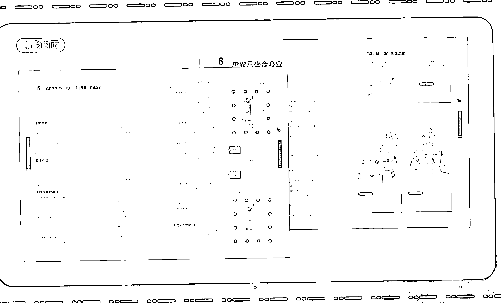