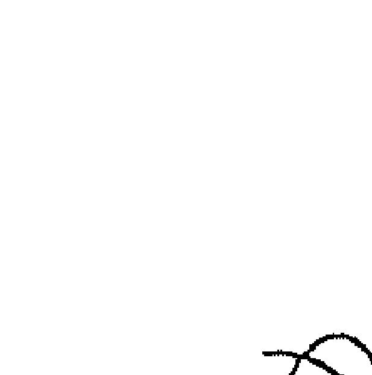
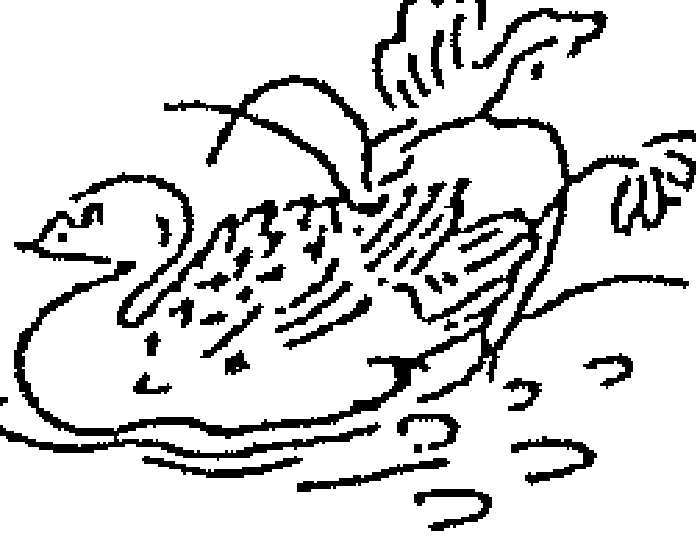
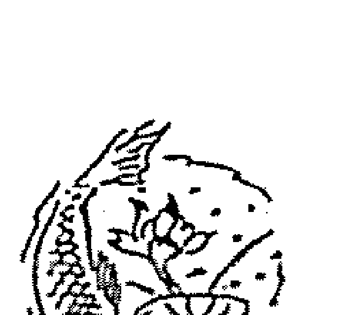
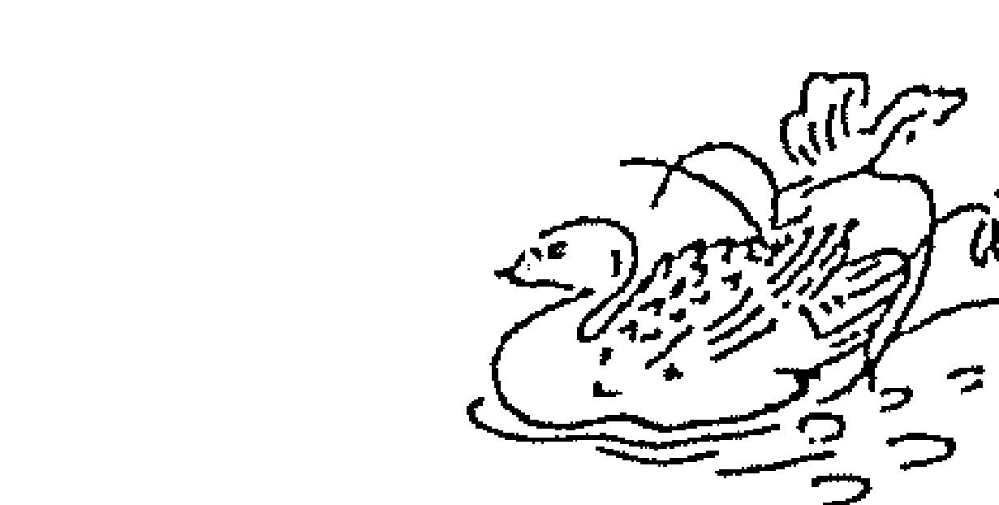
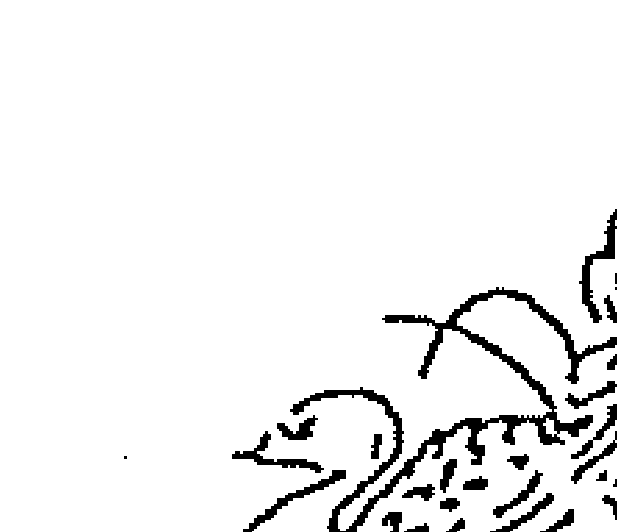
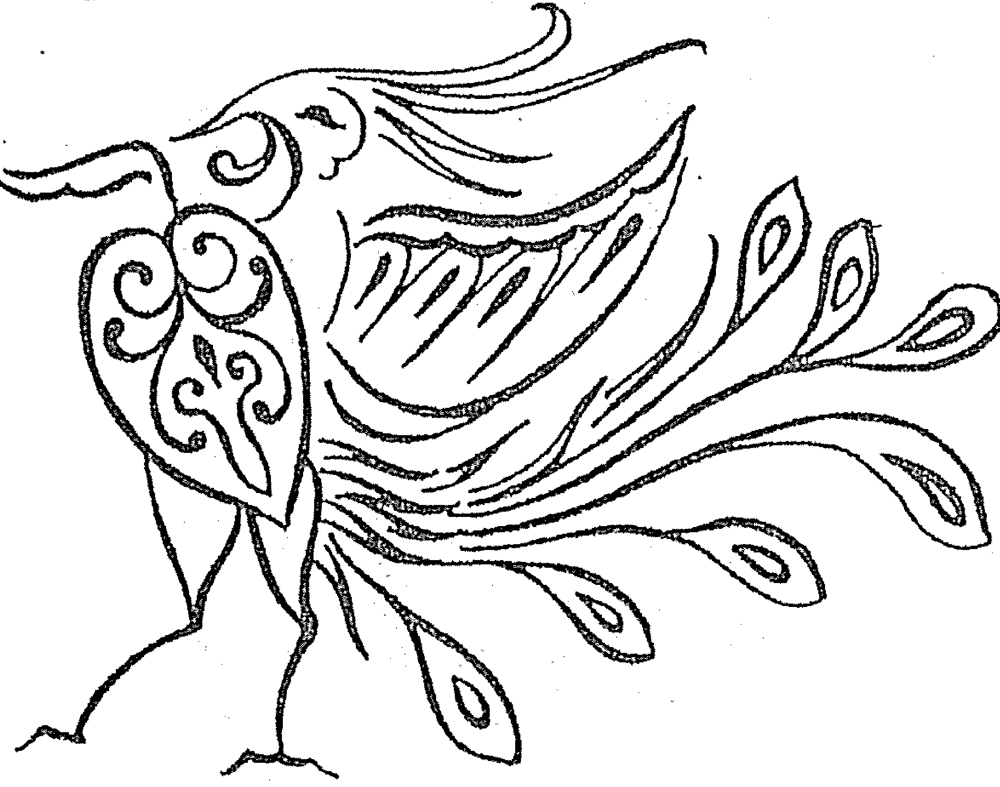
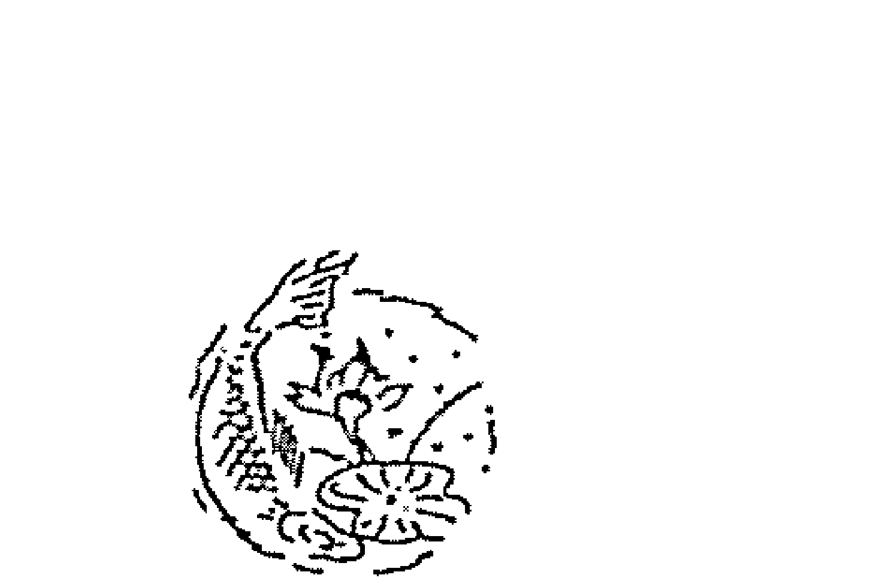
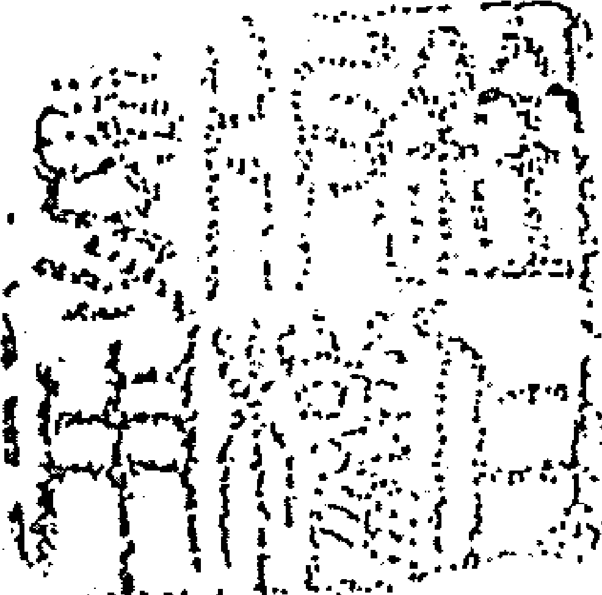
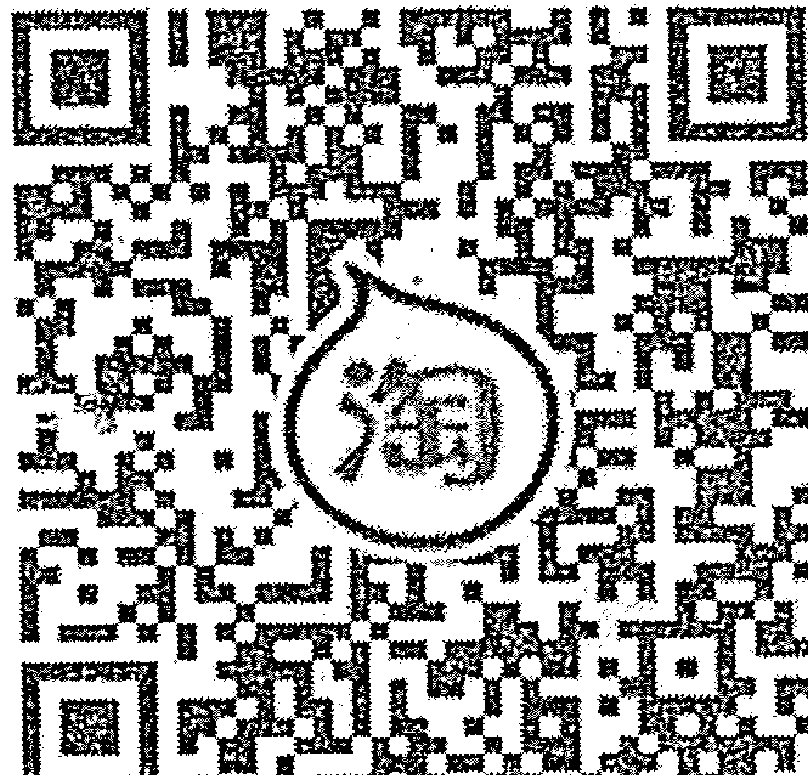

# 冷眼熱腸性情開懷

經濟思想史

Eas/Quick 4015

# ECONOMICS
用經濟開思維

這本書將徹底改變你的觀念。
你真的想學到知識嗎？
你總是不滿意現狀嗎？
你想在紙上畫個全盤嗎？
這些問題不想，你永遠看不到更大的世界。
閱讀第一本書你就明白知識的界線與生命的意義。
這就是第一本讓你明白知識的界線與生命的意義。

# 神舟七号
# 载人航天飞行圆满成功
# 中国航天员
# 太空漫步

# 冷眼透視兩性關係 序

回溯民國七十四、七十五年間，許老師不辭勞苦，遍返於彰化、台南教授我們紫微斗數，老師不僅精通命理、教學認真、分析透徹、抑且待人誠懇、殊屬難覓，無人出其右之碩彥。特別值得一提的是嚴格要求學生排命盤不要看書，掐指一算掌上排盤直接斷命，運用之巧妙存乎掌心。記得某次餐廳吃飯時，一位服務小姐慕名請求指點婚姻桃花迷津，許老師閉目掐指立即解說，何時曾跟長相如何，生肖所屬之男士關係親密，是續或斷，能否成爲夫妻何時成婚，令小姐聞之花容失色感佩不已。如同被許老師現場錄影存證一般真實準確。並希望將來有緣能再見一面請益。使我最感念的是，結業前夕許老師告訴我一個天大的秘密“古時候的高人是用紫微斗數看陰陽宅佈局及斷吉凶的”讓我著實嚇了一大跳。自從大學畢業高考及格後即全心全力投入學習易經系列最困難最神祕的堪輿學研究舉凡三合派、九星派、三元玄空奧秘及救貧水法之理論及其真實性，無不了然於胸，臨場搭配使用得心應手，就沒聽說過還有另外這麼一套功夫！於是乎認真的從紫微斗數命盤印證每一個人的陰陽宅佈置，發覺竟然是百分之百正確；到現在爲止仍然是零誤差，也因而藉以解決一些人的困厄。例如，任職於台南高分院的某法官，民國七十七年曾因堂兄右腿突然萎縮一寸，看遍中西醫罔效，求助於余，我分析了命盤後直截了當的告訴他有個坐西北向東南的祖墳須加整修。他請老家的地理師勘查處理，半年後堂兄的右腿又再長回一寸，柺杖正式與他絕緣。他請老家的地理師勘查三代業醫，此刻老媽卻躺在台大加護病房，群醫束手無策，心臟隨時會停止，問我能否由易經尋得解決之道。我要了他媽媽的出生時間，當場排了命盤告訴他，在住的正南方一定有放電視機及鐵的東西，東南方有電線桿及電桶。他答說有、我告訴他怎麼處理，十五天之內全部照辦了。他媽媽也跟著出院回家，投入老公的懷抱。任何一門能夠流傳久遠的學術，一定都有它的原理原則，要學好它必先找到真正懂得又肯教出來的老師。紫微斗數籍由出生時間，天上眾星不列位置，對每一個人輻射光能的整體影響，提出相當完整細膩的解說，是易經系列學術的重要一環。有心弄懂它，我倒是建議讀者直接找許老師開班授課，從頭學到尾，對自己或他人的學業、事業、運勢、財運、桃花、婚姻、健康、壽元等問題，都可了然於心，預作規劃。孟子說：學問之道無他，求其放心而已。這次許老師肯將屬於論斷桃花婚姻的部分，出書公諸於世，是讀者的莫大福音，故樂為之序。

# 門生代表
- 郵政儲金匯業局會計處處長 廖文智
- 法務部矯正司長 黃徵男

敬序
庚辰年臘月

# 自序

男生、女生的戰爭與紛擾，古今中外皆如是；兒女私情、兩性關係，道是有情？亦無情？人世間的情、性、愛又何解？

究竟緣為何物？情為何物？十足讓普天下的男女費思量，恰似道盡了兩性微妙關係；人生之旅有多少緣起緣滅？緣起若相生了兒女私情，其結局是緣盡情未了？情盡緣未了？緣情皆未了？或是緣情皆了了？其過程是情、性、愛、恨、妒、怒，交織一片、五味雜陳；芸芸眾生有誰又能跳脫、超越兩性緣情之藩籬？

作者早年在學校任教，爾後特考及格轉任中央公職，廿餘年的公教生涯背景，復加上先祖父於百年前，於日據時代為鹿港第一公小教師，使得禮教於公教世家的拘謹，形成難於同流合污人格特質，見棄於官場現形記，被東廠、西廠黑手修理；相對地五術的研究，亦具讀書人批判性格，不恥那批不學無術之人，沽名釣譽、恣意妄為，以斂財為首要之徒。

公餘之暇，兼任台中學苑、彰化、員林育樂中心、婦女會等團體之教師，教授紫微斗數命理學迄今有十七寒暑，宣導正確地命理觀、人生觀、價值觀不遺餘力；這期間出入寒舍占命論運者，達萬人次之譜，卻有半數以上盡是在婚姻、桃花打轉、困惑、傷感、無奈、何去何從？相對地接受諮詢之餘，也讓作者醒眼看盡了人間百態、人情世故，不勝唏噓！亦激起撰寫本書之原動力。

男女的合和，正是人類永續生存之必要條件；剛柔相推，是社會進步的原動力；陰陽合德，是人性和諧的基石。戀愛、婚姻是一場兩性共同遊戲，與相互學習的人生經驗，更是一件嘔心瀝血、美學十足的雕塑品呵！人生漫長的歲月裡，是一場充滿著學習之旅，兩性相處的藝術亦如是；本書呈獻給普天下的男女，祝福擁有快樂、幸福的人生。唯作者才疏學淺，尚祈高德先進不吝指正，是盼。

本書撰文期間，煩請黃慶龍君、蔡永吉君細心校稿、編輯及光碟片的研發，至表謝忱。

許銓仁 謹識
庚辰年孟冬

# 目錄

## 冷眼透視兩性關係 序

## 自序

## 第一章 紫微斗數命理學之研究
- 第一節 命？運？ 入門篇
- 第二節 人生的究竟學
- 第三節 斗數三要素 宮、象、星

## 第二章 時間表達的方式與探討
- 第一節 六十甲子與出生時間的探討
- 第二節 命盤的製作與光碟片的介紹
- 第三節 名詞解釋與符號解說

## 第二章 婚姻與桃花正解
- 第一節 緣與情為何物？
- 第二節 桃花正解
- 第三節 婚姻正解

## 第四章 桃花專論
- 第一節 如何改善兩性關係？
- 第二節 如何增強形象、擴展人際關係
- 第三節 性生活能力的解讀
- 第四節 桃花的分類，兼論娛樂、休閒、合作、學生緣
- 第五節 桃花的因緣果報論、象數的平衡學
- 第六節 郎心？狼心？揭示強姦、強暴的斷命訣

## 第五章 婚姻專論
- 第一節 婚姻論斷之入門功夫
- 第二節 我會結婚？何時來臨？
- 第三節 黃燈？紅燈？如何處理婚姻危機？
- 第四節 喪偶？離婚？如何判斷與面對？
- 第五節 尋覓第二春、再譜鴛鴦曲
- 幸運顏色網站之簡介

## 第一章 紫微斗數命理學之研究

紫微斗数命理学，乃先圣先贤遗留之智慧结晶，由唐朝希夷先生陈摶字图南，号扶摇子。集其大成，诉诸文字，流传迄今。

希夷先生精易学、通河洛，二十六岁即穷通天地阴阳造化，上观天体之运行，下察地理之奥密，以验人事穷通祸福，堪称一代大师，亦开启了宋明理学百年之盛业。

紫微斗数命理学的思想体系，源由易学的思想体系，以紫微星立太极，以中天斗太阳星、太阴星表徵日月之旋转，以四化象为占命论运之用神，藉象假合宫职三才，是天人合一的哲学，即是一门先天无为断命学。

# 第一節 命？運？ 入門篇

紫微斗數命理學，係依據一個人出生時間「年、月、日、時」轉換成紫微斗數之命盤架構，來推算這個人【命和運】的一門學問。因此我們可開宗明義來探討命？運？

- 命：即是一個人的本質論
- 運：即是一個人的潛能說

俗話說：天生我材必有用，一語道盡命即是本質論，我材，我是何種質料？經商的料子？從政的格局？上班族？是公教職？或私人企業發展？是以才藝或文路為生的自由業？或是以頭腦、智慧取財？亦或以身體努力得財？所謂芸芸眾生各種不一的本質論，恰是依你出生時間，排出的紫微斗數命盤，可窺其端倪，確定本質論。運有起伏榮枯、窮通禍福、進退得失，即反應在一個人的潛能是否受侷限？或已開發？因此隨著歲月的往前推進，若運在谷底之時，正是需要韜光養晦、累積能量、充實進修的積極人生觀，則運開展之時，挾雷霆萬鈞之能量，締造成功、幸福的人生。

因此【命和運】即是質能的互變，命理學即是一門質能學，提供你做生涯規劃的藍圖，認識自己命的本質，以達定位論，了解自己運途的走勢，以期潛能的發揮，而作定向解，如是【命和運】即掌握在自己手中，而譜成一首美麗的人生交響樂章，則先聖先賢遺留之智慧結晶，即可承先啟後、普照世人。

- 命：即先天定數
- 運：即後天變數

生命本來無由自我抉擇的天地、無明以生，命即依報而受生，含括了因果之相續，正如佛語闡釋：「要知前世因，今生受者是，要知來世果，今生作者是。」其意境相彷彿。因此，命即有命數存在，即先天定數，就紫微斗數命理學而言，生年四化象即表徵先天定數，決定了一個人先天的富貴窮通及命格的高低，此乃命的本質。

運係指飛宮四化象、垂象示吉凶，紫微斗數命盤結構共有十二個宮職，概括了人生旅途中所遇到的人、事、物之林林總總，含吉凶禍福、進退得失、悲歡離合、喜怒哀樂等等各種命運現象，皆由該宮的宮干四化象，揭示其吉或凶。

命 歸屬於先天化後天，即生年四化象交錯飛宮四化象，運 空間的理念 時間的觀念。

宇宙的內涵，宇者上下左右謂之宇，是空間的理念，宙者繼往開來謂之宙，是時間的觀念。生命既是在浩瀚的宇宙裡隨波逐流，命和運即是小宇宙，命指空間的理念，運是時間的觀念。因此，時間、空間的交錯即構成命和運，生命在恆古綿延的宇宙裡，從生到死即充滿著喜怒哀樂、悲歡離合、進退得失、起伏榮枯的人生。

易經云：天垂象示吉凶，天垂象是空間的理念，示吉凶是指時間走到了，自然該呈現出吉是吉、凶是凶的人生境遇，如是，時、空的交錯，即構成命和運，命理學即是一門時空學。

紫微斗數命理學，係藉天干的氣化飛渡，轉化而成四化象即化祿象、化權象、化科象、化忌象，垂象示吉凶，而假以地支表徵應數的時間觀念，如是干支的組合，即是時、空的交錯，構成了命和運。

綜論本節所述，我們可清晰地認識紫微斗數命理學，是一門質能學、時空學、先天定數切於後天變數之象數學，同時亦勾畫出『命和運』即是質能互變的生涯規劃，即是時空交錯知吉凶，而言動靜、進退的人生，憑藉象數的演易，平衡、改變你的人生觀、兩性觀、婚姻觀、價值觀，以期締造幸福、快樂的人生。命理學之心得，願與有緣的讀者們共享。則先聖先賢遺留之智慧結晶可披露、普照世人，作者潛研二十餘年的紫微斗數。

# 第二節 人生的究竟學 四化象簡介篇

紫微斗數命理學，是一門探討人生命運的究竟學，斗數首重斗曜其數，然數是甚麼？吉凶即是數、得失、有無、聚散、禍福、榮枯、進退、存亡，皆是數，換言之，紫微斗數命理學所探討地是各種命運現象，究竟的吉或凶？是決然地 Y E S O R N O ？故非學歷偏低或不學無術之人可魚目混珠，掛紫微之名卻算命不準，成為五術界一大笑話。

既要知數，則需言氣之存在說，是謂氣數，然而氣看不到、摸不著？因此須憑藉象言氣之存在，而後探究數的究竟說，因此，就紫微斗數命理學而言，象即四化象，化祿象、化權象、化科象、化忌象，則吉凶昭然若揭、禍福一覽無遺、得失、聚散、榮枯、進退、存亡、可窺其端倪矣。

此時，理在其中，以易理、哲理、常理、來詮釋象、氣、數，即構成一門理、氣、數之學，一門人生命運的究竟學，即為紫微斗數命理學精義之所在。

四化象為用大哉矣！吉凶昭然若揭、知曉人生各種命運的究竟，實為本門紫微斗數命理學之用神。因此，我们得先介绍象从何处来？四化象的类型及其基本含义解说。

# 象从何处来？

象从何处来？係由天干氣化飛渡、轉化而成四化象，化祿象、化權象、化科象、化忌象，猶如愛因斯坦的相對論「質能互變」，一個質轉化、變換成四種能：熱能、光能、電能、輻射能，同理，每個天干氣化飛渡，皆會影響某四顆星辰，發生星辰質變，轉化成某某星化祿象、某某星化權象、某某星化科象、某某星化忌象，如前列圖表之類比，就物理學的觀點，一個質轉化成四種能之類比彷彿。如是，則天干有十個：甲、乙、丙、丁、戊、己、庚、辛、壬、癸，皆各影響某四顆星辰，發生星辰質變，轉化成某某星化祿象、某某星化權象、某某星化科象、某某星化忌象，即構成十干四化曜星，今列表方便讀者察照使用。

讀者們，請花用十分鐘的時間，務必背熟十干四化曜星，因為紫微斗數命理學是一門藉干、遁星、假象、應支、合時的象數時空學。藉干、遁星、假象是空間的理念，判讀吉凶，應支、合時是時間的觀念表徵應數何年、何月，因此讀者們務必熟稔之。

| 天干 | 四化 | 化祿星 | 化權星 | 化科星 | 化忌星 |
|---|---|---|---|---|---|
| 甲 | | 廉貞 | 破軍 | 武曲 | 太陽 |
| 乙 | | 天機 | 天梁 | 紫微 | 太陰 |
| 丙 | | 天同 | 天機 | 文昌 | 廉貞 |
| 丁 | | 太陰 | 天同 | 天機 | 巨門 |
| 戊 | | 貪狼 | 太陰 | 右弼 | 天機 |
| 己 | | 武曲 | 貪狼 | 天梁 | 文曲 |
| 庚 | | 太陽 | 武曲 | 太陰 | 天同 |
| 辛 | | 巨門 | 太陽 | 文曲 | 文昌 |
| 壬 | | 天梁 | 紫微 | 左輔 | 武曲 |
| 癸 | | 破軍 | 巨門 | 太陰 | 貪狼 |

# 第一章 紫微斗数命理学之研究

認識了象從何處來？及十干四化曜星，接著我們來介紹四化象的類型共有四種：

- 種：
- 生年四化象：象之體，爲先天定數表徵命的本質論，決定了一個人此生富貴貧賤之格，同時亦論述這一輩子有關男女兩性緣與情，各種不一的情境，所謂來也生年，歸也生年，道盡了因果本相續、緣情皆了了之無奈？
- 飛宮四化象：象之用，爲後天變數表徵運的走勢說，紫微斗數命盤共有十二個宮職，概括了人生旅途上所遇到的人、事、物之林林總總，含吉凶禍福、進退得失、悲歡離合、喜怒哀樂、等等各種命運現象，皆由該宮的宮干四化象，揭示其吉或凶。唯須遵循飛宮學八大理則，方能正確使用無誤，請參閱拙作紫微斗數命理學正解（一）書中九十一頁至一百零七頁之解說。
- 自化象：象之用，爲後天變數，表徵今生今世的造化，人生的變化，若是生年四化象交錯飛宮四化象，則人生的命運，即呈現軌跡式、機械式的人生，生命的意義即蕩然無存矣！倘幸有自化象表徵今生今世的造化，活潑了人生、充滿著生機，亦找回了生命的意義。所謂自化象，係指該宮的宮干四化曜星，恰好在本宮內，例如某宮位有廉貞星，其宮干是甲，則甲干廉貞化祿星在本宮內，謂之自化祿。再例，如某宮位有文曲星，其宮干是辛，則辛干文曲化科星在本宮內，謂之自化科。聰明的讀者們，應該可比照類推各種不一的自化象，請參照十干四化曜星之表格理推之。

自化象的含義有三：

- 【一】表徵該宮必有其變化，含轉化、物化、生化、生滅，而因人、因地、因物、因時，隨時皆有變化，所謂涵宇宙應大千，道盡了無窮地變化。然轉化，係指人而言，含有願意或不願意的變化，至於物化、生化，係指財物或事情而言，往往是有中化無、無中生有的變化，至於生滅，係指生與死的變化，猶如佛家所言生滅的道理。
- 【二】自化的變化，即是舊有的結束、嶄新地開始的變化，或者是有中化無、無中生有的變化。
- 【三】有自化必有時間的觀念，明確的指示有自化的變化，係發生在何大運？應數何年？在數何月？何日？何時？換言之，自化的重心在時間的觀念，故其解象重心在大運宮職、或流年宮職。

視同自化象：象之用，為後天變數亦表徵今生今世的造化，視同自化象與自化象的含義雷同，唯視同自化象另含有不斷地緣起，隨時間的更替而另有新的緣起。所謂視同自化象，係指該宮的宮干四化曜星，恰好在對宮，例如某宮位宮干是丁，則丁干巨門化忌星在對宮，謂之某宮視同自化忌。再例，如某宮位宮干是庚，則庚干武曲化權星在對宮，謂之某宮視同自化權。

上述，四種四化象的類型，讀者須熟稔之，它正是開啟斗數之門鑰，占命論運用神之所在。

# 第二節 斗數三要素：宮、象、星

希夷云：『星佈十二垣、數定卅六位』此語即明確地指出，紫微斗數命理學的三要素『宮、象、星』合一論，星佈十二垣一語，係指宮與星的架構，數定卅六位一語，卅六除以十二等於三，其意指三才者『天、地、人』即天盤、地盤、人盤三盤共一盤而用，則天人合一便見吉凶，數在其中矣！然數須藉象來演數，這正是本門紫微斗數命理學靈魂、精神之所在，如是，宮、象、星、即構成紫微斗數命理學的三要素。讀者們，假若您們思路清晰、反應敏捷的話，象數本一體論，即可察知幾百年來為何四化象秘而不宣？紫微斗數命理學，為何幾百年來僅是宮星合一的跛腳斷命術？希夷先生云『星佈十二垣、數定卅六位』即暗藏玄機矣！我們既已明白了，紫微斗數命理學是一門『宮、象、星』三合一的完整解義學，唯四化象已於第二節陳述了，因此本節著重在宮職的解說，星性的介紹及四化象的單象、雙象之解說。

所谓宫职，系指该宫所司何职？紫微斗数命理学共有十二宫职，概括了人生旅途上所遭遇到的人、事、物之林林总总，含吉凶祸福、进退得失、悲欢离合、喜怒哀乐等各种命运现象；换言之，每一宫职皆规范了该宫所得之气数，含该宫所得星、象合一之解说，系该宫动态的认识观。另一方面，该宫宫干四化飞宫之解说，该宫之吉凶昭然若揭无所遁藏矣！因此，凡任何一个宫职的研究，欲了解该宫之吉凶悔吝，请读者按静、动合参的重要观念着手研究。由上述可知，十二宫职的基本含义，其解说恰是紫微斗数命理学的入门功夫；更明确地说，方知来者问命的情事，该从何宫职下手。然而紫微斗数命理学共有十二个宫职，而这些宫职的排列，有其固定的顺序关系，以命宫为基准，逆时钟方向排列，依序是。十二宫职的基本含义：命宫：

- 兄弟宫
- 夫妻宫
- 子女宫
- 财帛宫
- 疾厄宫
- 迁移宫
- 奴仆宫
- 官禄宫
- 田宅宫
- 福德宫
- 父母宫

## 第一章 紫微斗数命理学之研究

#### 命宫
- 一、表征此生我所有的一切，及运势的起伏荣枯，认识自我的个性、才华、性向、及职业适性、生涯规划。
- 二、论后天格局的高低，以命宫宫干的四化象，判读后天的富贵穷通，若论先天格局的高低，则取决于生年四化象。
- 三、相貌宫，个性使然所呈现的相貌，所谓率性命。

#### 兄弟宫
- 一、表征兄弟姊妹的个性、才华，与格局的高低。
- 二、表征兄弟姊妹与我缘份的厚薄，亦象征着私人机构或公司或行号、工厂、或私立学校。

#### 夫妻宫
- 一、表征配偶的个性、才华、家世，与格局的高低。
- 二、表征我的婚姻观及先天缘份的厚薄，早婚或晚婚？几岁结婚？及姻缘的类型。
- 三、看婚后夫妻的感情及对待关系（需合参财帛宫）。

#### 子女宫
- 一、表征子女的个性、才华，与格局的高低。
- 二、表征子女与我缘份的厚薄、及子女的有无或多寡，亦表征学生缘的宫位。
- 三、又称合伙位，看合作事业的吉凶得失。
- 四、即是桃花宫，看桃花运的有无、是良性或恶性的桃花及其类型，亦表征个人人性生活能力的优劣。
- 五、意外宫，唯须与疾厄宫或迁移宫交易。

#### 财帛宫
- 一、表征个人赚钱或理财能力的优劣，与赚钱机会的好坏。
- 二、表征财的来龙去脉，钱从那里来？宜从事何种行业？钱用到何处去？及财的得失论。

#### 疾厄宫
- 一、表征本人身体健康情形，与体质的强弱。
- 二、表征本人脾气好坏的宫位，又称脾气宫，亦是一个人心术正邪的宫位。
- 三、表征疾病与灾厄的宫位，及其症状与类型。

#### 迁移宫
- 一、表征在外的变迁运，含驿马及旅行运，亦主出外的吉凶，如交通意外。
- 二、表征人生的机遇，出外是否能逢遇贵人，遇？不遇？人生充满着感叹！故又名机遇宫。
- 三、表征老运的走势，老运以享福为基。

#### 奴仆宫
- 一、表征交友与我缘份的厚薄，是益友？损友？
- 二、亦表征部属或同事缘份的厚薄，是助力？或阻力？
- 三、表征众生相的宫位又名绝情宫，是论断寿元的关键宫位。

#### 官禄宫
- 一、表征运势的起伏荣枯，故称机运宫，又名气数宫，兼论记功、记过、官非、诉讼、牢狱之灾。
- 二、表征事业营运的状态，或上班的工作状况，含升迁、降调或转业、失业等。
- 三、求学阶段以科甲论，断学业成绩及考运的好坏。
- 四、论功名及官运之通塞、吉凶，参看父母宫。
- 五、论选举运的吉凶得失，参看奴仆宫。
- 六、表征本人形象的宫位。

#### 田宅宫
- 一、表征祖业的有无及不动产的多寡，故有库位之称。
- 二、看住宅的环境，或搬家、迁移？或买房子？或卖房子？兼论阴阳宅的吉凶。
- 三、表征与家人相处的关系，又名家运宫。
- 四、可预知火灾或盗窃的发生。

#### 福德宫
- 一、表征福气、道德的宫位，亦表征己身的品行、德性。
- 二、主享福、应酬的宫位，亦表征利息差价的宫位。
- 三、表征身体健康状况，女命与生产有关。
- 四、表征人生观的宫位是积极或消极？是乐观或悲观？或自杀厌世、被杀、自闭症等因果病，皆与福德宫有关。
- 五、又名因果位，所谓上承祖德、祖业，下荫儿孙，中含己身因缘果报，是故惜福、积德、行善，犹如再造八字，故又名造化宫。

#### 父母宫
- 一、表征父母与我缘份的厚薄，含父母的庇荫或无缘论。
- 二、表征父母的个性、才华，与格局的高低。
- 三、又称长上宫，表征师长、长辈、上司，与我缘份的厚薄及相处情形，亦表征公权力或政府机构。
- 四、亦称文书宫，读书、教育、功名、契约、文件等有关。亦表征头脑、智商高低的宫位。
- 五、相貌宫，看五官长相及轮廓。
- 六、就姻缘的注脚，表征名份位，就财官的注脚，表征血缘地或仲介、批发、包商、包工、或智慧取财的宫位。

读者们应可清晰地认知，紫微斗数命理学是一门占命论运学，是一门人生的究竟学，探讨各种命运的吉凶，尽是在宫、象的合一，即决定吉凶，星辰所扮演的角色，仅仅是导气于何方？即将四化象化禄象、化权象、化科象、化忌象的气，引导至某宫，而去判读吉凶的凭借，这就是适星的功夫。换言之，星辰不具有吉凶的讯息，仅做导引的功能角色，及指示或指人事、事、物之具体解说，谓之物相论。

读者们！若您能深思细嚼前段之说明，则您即拥有紫微斗数命理学正确的认识观，即不致于虚掷宝贵地光阴，泥泞于跛脚的星辰占星术，机月同梁？杀破狼？月朗天门？七杀朝斗？

唯星辰本就有其性，谓之星性，係指未受四化象影响前的称谓，若受四化象的影响，立即发生了星辰质变，一律曰质。例如贪狼星，受戊干的影响，立即发生了星辰质变，变成贪狼化禄星了，则贪狼星在命宫，未受四化象影响之前的星性解说是：表为人圆滑于世故、平易近人、多才多艺，唯贪欲之心有之，主桃花、主祸福，受戊干的影响之后，立即发生了星辰质变，变成贪狼化禄星了，其解说是：为人圆滑于世故，转趋于广结人缘，但却有相识满天下，知己无一人的感叹！处事由多才多艺，转变成膨风水蛙，贪婪化成豪夺、桃花变成三妻四妾的白日梦。星性的研究、星辰质变的探讨，上述仅举一例，若读者们有兴趣，请参阅拙作《紫微斗数命理学正解》。

#### 化禄星的基本含义
- 一、代表财禄、食禄、福禄，含福报、慧报。
- 二、主人缘佳、异性缘佳，含桃花的意味。
- 三、表忙碌、随和、好施舍。
- 四、主聪明、悟性高、禀赋佳，主有才艺。
- 五、表增加、增多，偏向财方面。
- 六、有解厄制化之功，与健康、寿元有关。

#### 化权星的基本含义
- 一、表征权势、权柄、威严。
- 二、占权、掌权、具领导的实质。
- 三、任性、霸道、性刚。
- 四、主能幹、有才华、含专技、表开创。
- 五、表争执、摩擦，亦表外来伤害如跌伤、撞伤、烫伤。
- 六、增加、增值，倾向权力、地位、或不动产。

#### 化科星的基本含义
- 一、表科甲、科名、功名。
- 二、主声名、声望、名望、惜面子，清白之宿。
- 三、主聪明、一学即知、博学多闻、主才艺。
- 四、主平顺，表擅于计划。
- 五、主贵人、解厄与健康有关。
- 六、主风度、斯文、风情、珍惜、和睦，主桃花。

#### 化忌星的基本含义
- 一、主变动、变迁、驿马、动荡不安。
- 二、收藏、收束、管束。
- 三、亏欠、固执、情义。
- 四、不顺、困扰、是非。
- 五、凶兆、灾厄、死亡。
- 六、无缘、缘薄论，表征人生观、价值观、两性观、婚姻观有差距，唯未必表刑克。

#### ※双象组合的基本含义

##### 禄权组合的含义
- 一、主丰盛、财官兴旺，偏向一般投资、生产的生意。
- 二、论人表一个人以上，言桃花主有缘、有情。

##### 禄科组合的含义
- 一、名利双收、因名得利，偏向巧艺的生意或文路之人，如会计师、律师、医师、老师。
- 二、论人表一个人以上，言桃花主有缘、有情。

##### 权科组合的含义
- 一、以专技、才艺为主，如技师、工程师、建筑师，或军政、或上班。
- 二、论人或桃花，象二数一，即一先一后、或一显一隐。

##### 禄忌组合的含义
- 一、表征起伏大、变化大、周转大。
- 二、往往以双忌论，主凶。唯飞宫化忌逢生年禄、或生年禄自化忌除外。

##### 权忌组合的含义
- 一、以专技、技能为主，如技工、机工等技术人员，或军警、俸薪者。
- 二、主善变、突变，来得莫名、去也莫名，含无奈或天意。

##### 科忌组合的含义
- 一、以学术、才艺为主，或上班为宜、或教育、著作或服务业。
- 二、言感情，表征藕断丝连、主纠缠、是非、唠叨、拖拖拉拉。

## 第三章 传统节日与地方文化

一部中国历史，冷眼以视，十足是一部争夺当皇帝的历史，因此改朝换代彼起彼落，尤其是逢遇乱世之秋，如春秋五霸、秦并六国、更加纷乱，使得老百姓计数时间的表达方式，莫衷一是，徒增纷扰安！

有鉴于此，早在夏朝时代即制定历法，谓之阴历，然此历法亦适合农耕需要，故又称为农历，而至商朝的天文历法，并以天干地支计日，开启了干支计数时间的表达方式，从此也摆脱了政权更替，年代、年号的困扰，正是“日出而作，日入而息，帝力与我何有哉？”的另一写照。

### 第一节 六十甲子与出生时间的探讨

人秉天地之气而生，得自父之精、母之血而孕育成生命体，经怀胎十月脱离母体，剪断脐带而成一独立生命体之当下，即俗话说：出世落土时，命数已定；换言之，依其出生年、月、日、时，感应天体运动之气，其先天命数已定，复加上后天的运势，含机遇、机缘，即构成一个人的命和运。

故凡任何一个人的【命】皆相异，纵使是双胞胎亦然，虽然承继父母的遗传、道德或遗殃之共同因子，但是每个人的前世因缘果报不一，况且后天又有不同的机遇、机缘，与人事、环境背景的影响。换言之，命和运即由先天化后天，曰【运】是生与成的宇宙进化原理，复有后天返先天，曰【命】此即覆命归根，是自然的道理。如是，何来相同的命？一人一命也。

所谓工欲善其事，必先利其器，欲研究命理学必先识其语言，尔后始能再详论命和运；故以一个人的出生的年、月、日、时，须转换成紫微斗数命盘，再推研之；如同须知电脑语言的转换，才能善用电脑解题。唯命盘的制作，则又需先研讨出生年、月、日、时的表达方式为前提。

## 第二章 时间表达的方式与探讨

中华文化的传承，自古以来有关时间的表达，皆以天干地支的组合记述之。唯天干代表天象、阳象，象征空间、思想，为命的本质。地支代表地象、阴象，象征时间、行为，为运的流程。天干与地支的组合，便产生时空的转移，才有理与应，休咎自明、吉凶自分。

- 十天干：甲、乙、丙、丁、戊、己、庚、辛、壬、癸。
- 顺序数：1 2 3 4 5 6 7 8 9 10
- 五阳干：甲丙戊庚壬，若出生年干是阳干者，称阳男，阳女。
- 五阴干：乙丁己辛癸，若出生年干是阴干者，称阴男，阴女。

十二地支，及其顺序数，亦表征十二生肖言流年的时间观念。

- 子、丑、寅、卯、辰、巳、午、未、申、酉、戌、亥。

| 数字 | 生肖 | 地支 |
|------|------|------|
| 1 | 鼠 | 子 |
| 2 | 牛 | 丑 |
| 3 | 虎 | 寅 |
| 4 | 兔 | 卯 |
| 5 | 龙 | 辰 |
| 6 | 蛇 | 巳 |
| 7 | 马 | 午 |
| 8 | 羊 | 未 |
| 9 | 猴 | 申 |
| 10 | 鸡 | 酉 |
| 11 | 狗 | 戌 |
| 12 | 猪 | 亥 |

- 六阳支：子、寅、辰、午、申、戌。
- 六阴支：丑、卯、巳、未、酉、亥。

若天干在上，地支在下，同时限定阳干配阳支、阴干配阴支，如是干支的组合：5×6+5×6=60，得六十个组合，若每年使用一个组合表达其流年的符号，则由甲子起，每六十年为一个循环，即俗称【一甲子六十年】的源流与理则；而每六十年合称一甲子，则每一百八十年合称三元甲子，三元甲子为时间最大单位的表达方式，就目前的三元甲子而言：

上元甲子：民国十二年之前六十年的时间范围。

中元甲子：民国十三年至七十二年的时间范围。

下元甲子：民国七十三年起，往后六十年的时间范围。

今将六十甲子之组成，列表如下：

| 甲子 | 乙丑 | 丙寅 | 丁卯 | 戊辰 | 己巳 |
| 甲戌 | 乙亥 | 丙子 | 丁丑 | 戊寅 | 己卯 |
| 甲申 | 乙酉 | 丙戌 | 丁亥 | 戊子 | 己丑 |
| 甲午 | 乙未 | 丙申 | 丁酉 | 戊戌 | 己亥 |
| 甲辰 | 乙巳 | 丙午 | 丁未 | 戊申 | 己酉 |
| 甲寅 | 乙卯 | 丙辰 | 丁巳 | 戊午 | 己未 |
| 庚午 | 辛未 | 壬申 | 癸酉 | 甲戌 | 乙亥 |
| 丙子 | 丁丑 | 戊寅 | 己卯 | 庚辰 | 辛巳 |
| 壬午 | 癸未 | 甲申 | 乙酉 | 丙戌 | 丁亥 |
| 戊子 | 己丑 | 庚寅 | 辛卯 | 壬辰 | 癸巳 |

紫微斗数命理学的应用，须将出生年、月、日、时换算为阴历或俗称农民历的时间，并以出生当地的时间为基准，即所谓【出生落土时】系以出生当地的时间，绝非以经纬度的地理时间落差处理，道理之浅显，因为台湾不是地球的中心，况且紫微斗数命理学不是台湾文化，而是洛阳文化。

#### 生年换算
- 一、出生年天干的求法：将已知的民国出生年，换算成天干地支年：将民国出生年减2，所得余数的个位数，即天干的顺序数。例如民国47年出生，则47减2等于45，余数的个位数为5，即为戊年生人。
- 二、出生年地支的求法：将民国出生年除以12，余数即地支的顺序数。如前例、47除以12等于3，余数11即表地支为戌，故答案是戊戌年生人，生肖属狗。
- 三、请务必以农民历年计算，例如民国47年国历1月8日生，则农历为46年11月19日，应以46年计算。

#### 生时换算
一日廿四小时，共分为十二个时辰，以十二地支的符号区分之，每日的廿四小时係从零时至廿四时，切记！廿三至廿四时生人，生日是今日，非以翌日计算。

| 起迄时间 | 时支 |
|----------|------|
| 0～1 | 早子 |
| 1～3 | 丑 |
| 3～5 | 寅 |
| 5～7 | 卯 |
| 7～9 | 辰 |
| 9～11 | 巳 |
| 11～13 | 午 |
| 13～15 | 未 |
| 15～17 | 申 |
| 17～19 | 酉 |
| 19～21 | 戌 |
| 21～23 | 亥 |
| 23～24 | 夜子 |

#### 生日换算
十五日以前出生者，以本月论。十五日以后出生者，以下月论。生日依农历的初一、初二、廿七、廿八计算之，不用日的干支。

#### 生月换算
出生月令以农历为基准，不论节气，因为斗数重数不重节气，子平法才需要论节气，若闰月出生者，以月令十五日为基准，因闰月无中气，故以十五日前后划分之。

在台湾，因政府实施日光节约时间，即所谓夏令时间，係人为调整时间，故其实施年份出生者，其出生时辰应扣掉一小时换回真实、自然的时辰。国历实施夏令时间之年月，摘录如下：

| 实施年月 | 起讫月日 |
| :--- | :--- |
| 三十五至四十年 | 国历五月一日至九月三十日止 |
| 四十一年 | 国历三月一日至十月三十一日止 |
| 四十二年、四十三年 | 国历四月一日至十月三十一日止 |
| 四十四年至四十八年 | 国历四月一日至九月三十日止 |
| 四十九年、五十年 | 国历六月一日至九月三十日止 |
| 六十三年 | 国历四月一日至十月三十一日止 |
| 六十四年 | 国历四月一日至九月三十日止 |
| 六十八年 | 国历七月一日至九月三十日止 |

剖腹生产。可悲，故倒不如自然生产可也，除非是妇产科医师基于安全之必要，良性地建议需

### 第二节 命盘的制作与光碟片的介绍

命盘的制作，系将一个人出生时间，转换成紫微斗数语言架构，尔后研习紫微斗数命理学的各种语言、语法，如十二宫职含义、星性、四化象的基本解说，进一步学习飞宫四化象，呈现出的吉凶判读法则，如是，您已掌握此门预测未来学的入门功夫，更上一层楼，指日可待矣！

命盘的制作，请参阅拙作《紫微斗数命理学正解（一）》廿五页至四十三页的说明，包括掌诀推算五行局的速算法。

唯即将迈入廿一世纪的今天，凡任何学术须与电脑科技结合，始能应付瞬息万变日日新、月月异的未来，属于E世代的天下。因此，作者研发出命盘制作的光碟片，呈现给读者们，随书附赠，方便初学者排盘的困惑与耗时。

#### 光碟片的功能介绍
- 一、从此排盘迅速、精确、象数清晰！
- 二、本光碟片可储存上百、上千笔的资料，坊间贩卖的软件皆无此功能，同时
- 三、本光碟片储存的资料，依年龄大小的顺序排列，方便读者们查看。
- 四、本光碟片共有四个画面：1、导引的画面，太极图，2、新增资料的画面，请输入年、月、日、时，姓名、男女、婚别，3、命盘完成的画面，4、列印的画面。
- 五、命盘完成的画面中，十二宫的宫干，用滑鼠一点，即呈现该宫四化星的解说；此乃作者研发本光碟片细心、细腻的思维，方便初学者尚未稔熟十四化曜星前的使用。

#### 使用光碟片的说明事项
- 一、本光碟片，使用800×600之解析度最佳。
- 二、列印之命盘纸，建议使用A4粉红色的纸张，同时请用彩色列印机列印，画面最美。
- 三、本光碟片，所列“光碟小弟”係虚拟之命盘，除广告兼庆贺本光碟片之研发告成，藉此导引读者们参考使用之范例。
- 四、出生时间，请用农历即阴历的时间表达。年码係二码，例如民六十三年请打063，月、日、时、分，皆二码。
- 五、若已输入农历即阴历的年、月、日、时、分，及姓名、男女、婚别之后，请在蓝带区域内，用滑鼠按二下，即呈现出命盘；若需列印，请按列印之按钮，即可。
- 六、若命盘未能显示出、生年四化象、自化象，係造字字型未联结之故，请按下列步骤操作，即可。
    1. 开机→开始→程式集（P）→附属应用程式→造字程式
    2. 呈现出选择字码之画面，请按取消之按钮。
    3. 呈现出造字程式之画面，由档案里找字型连结F。
        A. 请点选连结选取的字型S。
        B. 请在标楷体的位置，按二下。
        C. 请找寻 Eudc.ttf 点一下，再按存档，即呈现出标楷体已更改成 Eudc.ttf 了。
        D. 相同的动作请将细明体、新细明体，皆按照 B、C、的步骤操作，也使得细明体、新细明体等，皆更改成 Eudc.ttf 了。
        E. 再恢复点选连结所有字型L，尔后再按确定。
        F. 关机并请关掉电源，重新开机乙次，即OK。

读者们，若您想拥有私人专属之光碟片，请来电洽商合法授权事宜，所谓私人专属版，即列印的命盘画面，在原程式里更改为您的姓名、职称、电话、住址，再烧录成您私人专属之光碟片。学会 TEL：04 7270780

## 第二節 名詞解釋與符號解說

紫微斗數命理學，是一門占星論命論運學，其功玄在於斗曜其數，而以宮位法辨，言吉凶、得失、聚散、有無、動靜、進退、存亡。紫微斗數確以十二宮而定位，分陰陽、也分內外的闡述法則，茲介紹十二宮職二分法則如下：

依宮位陰陽分：六陽宮與六陰宮

-   六陽宮：命宮、夫妻宮、財帛宮、遷移宮、官祿宮、福德宮。
-   六陰宮：兄弟宮、子女宮、疾厄宮、奴僕宮、田宅宮、父母宮。

紫微斗數功力之高低，取決宮職基本解義說，進而宮職內涵說，終於宮職陰陽、內外、體用、本對，這是應用上的分野，例如生年四化象落於六陽宮或六陰宮，基本上可論本人的性向：

-   落六陽宮者：主觀意識強，多理性應用。
-   落六陰宮者：性情不穩定，多感性變化。

另外，六陽宮與六陰宮的應用上，也區分動靜與多寡。

## 第二章 时间表达的方式与探讨

依宮位內外分：六內宮與六外宮
六內宮：命宮、財帛宮、疾厄宮、官祿宮、田宅宮、福德宮。
六外宮：兄弟宮、夫妻宮、子女宮、遷移宮、奴僕宮、父母宮。
六內宮與六外宮在應用上的分野，分得失、吉凶、聚散或自己份內事或他人之事。

依人與事物分：六親宮與六事宮
六親宮：命宮、兄弟宮、夫妻宮、子女宮、奴僕宮、父母宮。
六事宮：財帛宮、疾厄宮、遷移宮、官祿宮、田宅宮、福德宮。
依宮位往來分：本宮與對宮合為一組，換言之，本宮與對宮可合為一體，猶比如表裡可一致的理則，分與合正是往來理念的透視。
依宮位體用分：六體宮與六用宮
六體宮：命宮、夫妻宮、疾厄宮、田宅宮、福德宮、父母宮。
六用宮：兄弟宮、子女宮、財帛宮、遷移宮、官祿宮、奴僕宮。
六體宮與六用宮是宮位的六爻定位，應用上以來因宮或大運命宮若屬六體宮，則其四化象所落的宮位，肯定的存有象，若屬六用宮，則其四化象相對的存有象。

## 學習紫微斗數的第一本書

如是的分野較深奧，另出書專論。

其他名詞解釋如下：

婚姻六內宮：命宮、夫妻宮、財帛宮、疾厄宮、奴僕宮、田宅宮。

所謂婚姻六內宮，關係著婚姻有無的問題，若夫妻宮的飛宮四化象，飛入婚姻六內宮，為婚姻成局的先決條件。

-   天盤：係指本命盤，統管這一輩子，各種命運的現象。
-   地盤：係指大運盤，統管這十年，各種命運的現象。
-   人盤：係指流年盤，統管今年，各種命運的現象。

天、地、人三盤，是共一盤而用，藉四化象穿三盤言吉凶、時空，例如，大運夫妻宮飛宮四化象，藉四化象與本命盤宮職，發生動態宮職的重疊，即是『宮職由小歸大碰撞論』爾後判讀吉凶，下應流年，換言之，三盤是共一盤而用，而非分天盤、地盤、人盤逐一論述，這是犯了無知、愚昧的錯誤。

來因宮：生命在無由自我抉擇的天地無明以生的當下，生於陰陽十干化氣，故與生俱來，氣化生命之所在宮，是謂來因宮，又名化氣宮。生命無明以生，斗數以生年的天干，重疊命盤的生年干的宮位，此宮即生命的來因、化氣宮，由是生命的氣息即凝於此而生化，命運所有的一切皆脫胎於此，並以其宮職分野人、物、事，方便顯象。

### 第二章 時間表達的方式與探討

三合方．以命宮立太極，則命宮、財帛宮、官祿宮合稱三合方。如以夫妻宮立太極，則夫妻宮、遷移宮、福德宮合稱三合方，各宮皆可立太極說。

四正．以命宮立太極，則命宮、遷移宮、子女宮、田宅宮合稱四正。唯三合法以命宮、財帛宮、官祿宮、遷移宮為四正。

大運．表示這十年行運的起伏變化，以命宮上符號表之。如言我這十年所有的一切，以丁命宮上表之，如言我這十年財運的得失，以丁財帛上表之。

流年．論每年行運的變化，流年命宮所落的宮位與太歲年支之宮位相同。例如，太歲庚午，流年命宮即在午宮，太歲辛未，流年命宮即在未宮。

流月．視本命盤宮之宮職為何？若為子女宮，則流年子女宮即為該年的正月命宮，又稱斗君位，則二月的流月命宮在流年夫妻宮，順時鐘方向理推三月、四月、五月等等。

流日．流月所在宮位起初一，然後順時鐘方向一日起一宮。

流時：依原命盤十二地支論流時，例如子時在子宮、丑時在丑宮、寅時在寅宮。

自化祿、自化權、自化科、自化忌的符號表示：

-   祿 → A
-   權 → B
-   科 → C
-   忌 → D

視同自化祿、視同自化權、視同自化科、視同自化忌的表示：

## 第二十二章

## 中國共產黨章程

婚姻的抉擇，十足給予普天下的男女費思量，曾經是牆裡、牆外地徘徊，又曾經是茫然於愛情十字口的迷惑？是雨過天晴、碧海藍天？或是喚不回的悔與恨？是有情人終成眷屬？亦或是含著眼淚默默地祝福？芸芸眾生，人生的境遇何其萬千，猶如坊間的愛情小說，永遠有寫不完的故事。

紫微斗數命理學，十二個宮職裡的夫妻宮、子女宮，可明確地幫您描述，男女兩性微妙地關係，及姻緣的有無、聚散，正緣何時現？能否白首偕老？有無生離死別之憾？往後的章節將逐一披露，請讀者們循序漸進，必可藉紫微斗數的語言，幫自己剖析兩性微妙地關係，及婚姻的林林總總之象。

### 第一節 緣與情為何物？

有道是：「人生自是有情癡，此恨不關風與月」、「天長地久有時盡，此恨綿綿無絕期」語出【玉樓春】【長恨歌】恰似道盡了男女兩性微妙地關係，究竟情為何物？緣又何解？

佛語：緣起性空、性空緣起，相生了人際關係，盡是在有緣裡，然緣起必有緣滅的因果循環性，則緣業本相生，唯業力使然，情亦即相生。如是，緣盡情未了？緣情皆未了？緣情皆了了？道盡了男女兩性微妙地關係，則悲歡離合、喜怒哀樂、兩地相思、此恨綿綿、無限地懷思，正是緣情各種不一的現象呵！

紫微斗數命理學是一門人生哲學，亦道盡了男女兩性微妙地關係，依象數可充分地認識，緣起、緣續、緣變、緣滅等不一的情境，則男女兩性微妙地關係，究竟是情何以堪？訴盡相思？破鏡重圓？情變生仇？糾纏、囉唆、是非？芸芸眾生，人生的境遇何其萬千，猶如愛情小說，永遠有寫不完的故事。

紫微斗數命理學的四化象，化祿象、化權象、化科象、化忌象，即表徵緣起、緣變、緣續、緣滅的現象說，茲詳述於左：

### 第三章 婚姻與桃花正解

化祿象：表徵宇宙萬有因緣，緣起的開端，生命猶如在於一系列緣起的無盡流中，所以化祿象，象徵新的開始，如新認識的人、新的知識、新的事業。換言之，生命的展望、寄託、或期待；相當於一顆希望的種子，不論是人、事、物皆同論。

因此，化祿象就人而言，依婚姻與桃花的註腳，解象是人際的緣起、異性緣佳、熱情、憧憬、樂觀、開朗、相識、戀愛、相見恨晚、隨和、隨緣、緣濃情深、姻緣早發。

化權象：表徵宇宙萬有因緣的自變數，意指本來就會變，而非有原因，縱是有因，亦感無奈，即莫名而至，故似無常。換言之，化權象是對已有的人、事、物，作一種自然的變化，無為於天理流行，無奈於人自默受。相當於天有肅殺之權，物競天擇的自然淘汰，頗具權變的意味。

因此，化權象就人而言，依婚姻與桃花的註腳，解象是人際的爭執、摩擦、佔有、主導、霸道、強制、一廂情願、毛手毛腳、激情、強勢、掌權、負責、統御、愛現、能幹、才華、敢衝、有為。

化科象：表徵宇宙萬有因緣的延續，因緣有緣起，即有延續，猶如新舊接替，方能綿延而成恆古不滅的歲月長流，生生不息。所以化科象的特徵，意指舊識的人、念舊往昔包括人、事、物、景。重覆、二度、……歸究竟是個戀舊之象，有一種放不下心的煩惱、及不足於外人道的隱衷。深情款款、多愁善感、風度、斯文、和睦、樂群、幽默、風趣、風情、媚力、主聲名、聲望、惜情、愛面子、桃花、才藝、貴人、解厄。因此，化科象就人而言，依婚姻與桃花的註腳，解象是善解人意、浪漫情懷、

化忌象：表徵宇宙萬有因緣的機變數，萬緣全絕，係指萬有萬象之機變數，是生化作用，是物化原理。所以化忌象如果是一種果報，它必歷經祿、權、科的過程，而產生應得之果，相當於一種氣自然流行的終點，猶如經過春、夏、秋而有冬，此乃屬循環之果。

有，均同樣的變化，意指化忌象的本能是機變數，其所含有機或無機；明確地說即是緣結束後，是有生機的轉進，亦或無生機矣。若屬有機之生命變化，即終止的剎那間，同時又隱藏了另一生機，讓生命再存有另一新生的空間，等待展開而適其生存。內向、固執、虧欠、溺愛、依偎、黏膩、管束、嘮叨、不順、乖違、失和、冷淡、困擾、是非、怨嘆、報復、緣薄、無情、無緣、生離、死別。

讀者們，請多細心琢磨、深思、了解四化象，化祿象、化權象、化科象、化忌象，所表徵緣起、緣變、緣續、緣滅的現象說，則你、妳必能掌握兩性微妙地關係，進退不失方向，有無、聚散不失原則，游刃有餘，人生少憾事矣！

唯四化象會發生雙象組合，有下列六種情況【一】飛宮雙象落同宮或本、對宮【二】有年象，又有自化象【五】飛宮象逢自化象，【六】飛宮象逢生年象，故須對雙象組合的基本含義先有所認識，茲介紹如左：

## 祿權雙象組合

桃花註腳解說：表徵一個人以上或很多，亦表徵男女兩性微妙地關係，稍嫌複雜。桃花屬性是泛水桃花，紙茶杯主義者，用了即丟，例如某立委滑一跤、滑一跤

雜。

## 禄科双象组合

桃花注解解释：象二数一，表征一个人以上，亦表征男女两性微妙地关系，皆属有缘有情、好散好散地良性桃花，纵然是缘尽情了，恰似托付白云，由衷地祝福！
婚姻注解解释：象二数二，唯往往倾向良性地三角习题的迷惑。

## 权科双象组合

桃花注解解释：象二数一，因为四化象分成两组，禄忌一组、权科一组，所以权科同组表征象二数一，意指一先一后、一显一隐，换言之，表征男女两性微妙地关系，旧情随风飘逝，新恋始能涌现，或者是有不足以外人道的地下恋情。
婚姻注解解释：象二数一，如同前述，表征婚姻微妙地关系，旧缘随风飘逝，新缘始能涌现，或者是有不足以外人道的地下恋情，却有未能结合之憾。

### 第三章 婚姻与桃花正解

### ## 禄忌双象组合

桃花注解说：表征男女两性微妙地关系，起伏大、变化大，犹如一对如胶似漆的恋人，若情海生波，则狂风暴雨骤变的可怕，恰似一场大幅度的震撼教育，爱恨交加，最让人难以消受！

婚姻注解说：婚姻的分与合，如同洗三温暖，冷热自知矣！唯有理性地面对，良性地沟通、修心养性，为最上上策。

### ## 权忌双象组合

桃花注解说：主善变、突变，来得莫名，去也莫名，含无奈或天意。表征男女两性微妙地关系，往往是不期而遇【今夕何夕？见此邂逅。】及徐志摩的【偶然】该是最佳写照。来无影、去无踪，感情的落幕竟是一拍两散，视同陌路人。
婚姻注解说：婚姻的结合，竟是缘分到来的时候，佳人始现，颇有相见恨晚、闪电结婚，婚后再谈恋爱之象，换言之，若缘分未到时，纵然是寻寻觅觅也成空！爱情长跑的对象，也往往不是未来的另一半。

## 科忌双象组合

桃花注脚解说：表征藕断丝连、纠缠、是非、唠叨、拖拖拉拉。因此，男女两性间，竟是唠叨、是非、纠缠、拖拖拉拉、藕断丝连。纵然分手却也牵肠挂肚，怀念特别多！

婚姻注脚解说：姻缘的脚步，蹒跚来迟了，正是「过尽千帆皆不是，斜晖脉脉水悠悠。」的最佳写照，因为得之不易，惜缘、惜福是良策，就不会重现食之无味、藕断丝连的情节，纵然是离婚亦牵肠挂肚，怀念特别多！？

以上，双象组合的基本含义，正是断婚姻与桃花，象数精髓之所在，所谓单象仅做象意解，双象成物对，即有吉凶矣！读者们，请多深思、体悟。

## 第三章 婚姻与桃花正解

### 第二节 桃花正解

凡任何一门学术，皆依其时代背景而作诠释与注解，斯谓正解，命理学亦如是。因此，一门学术的诠释与注解，或者是教授与传承，须具备其主、客观条件；客观条件是依其时代背景，主观条件是作者或教授者，须拥有正确地人生观、价值观、婚姻观，斯谓【正解】。

斯谓【正解】。

桃花的正解，表征异性缘、众生相之缘；因此，所谓【命带桃花】的正解，是表征我此生深具异性缘、众生相之缘；宜从事的工作性质与异性有关、或公众性、老少咸宜、或才艺性、或文教性质。而非低知识水平的算命术仔或女神棍，胡言乱语三妻四妾、红杏出墙、梅开三度、偏房侍妾……之命，紧接着这批算命术仔、女神棍，觊觎妳的荷包，慫恿花钱改运，画符斩桃花、改名改运的老套，人性的弱点又再度被这批算命术仔、女神棍强奸了，夫复何言？

-   老少咸宜、或才艺性、或文教性质。
-   神棍，觊觎妳的荷包，慫恿花钱改运，画符斩桃花、改名改运的老套，人性的弱点又再度被这批算命术仔、女神棍强奸了，夫复何言？

所谓工作性质与异性有关，譬如男医师从事妇产科、小儿科，而女医师从事小儿科、家庭医学科，或女性从事西装裁缝师、理发师，男性从事女服饰店、美容、美发师……总而言之，其消费对象皆异性或幼儿。所谓公众性或公关性质，譬如歌星、影星、舞女、记者、导游、主播、主持人、经纪人、模特儿、空中小姐、政治人物、公关人员、或服务性或中介性之讲解者，皆属之。所谓才艺性、文教性工作者，如教师、画家、作家、摄影师、舞蹈家、美工设计、演说名嘴、文化事业、或与美学有关之性质者。上述是「命带桃花」之正解与阐释，至于芸芸众生、形形色色，若从事于色情工作者亦算，唯不足以赘述。然最不可饶恕地是那批知识水平偏低的算命术仔、女巫棍，扭曲解释、危言耸听，经一番胡言乱语促使听者不寒而栗！结果是「又在吓想妳的钱」骗钱开始！全体肃立，画符、画虎烂开始，妳的钱就不见了。至于命带桃花表征异性缘佳，不排除有儿女私情的存在，如「窗外」的情节，或影迷、歌迷的热情，或导游、模特儿、空中小姐、工作与生活的多彩多姿，不一而是，本属平常；端赖个人有否健全的婚姻观与家庭责任感，例如，某立法委员滑一跤、滑二跤的绯闻窘态，众宝宝接力赛式的追杀，颇具震撼教育！足让崇尚一夜情的男士胆战心惊、引以为戒。再例，某男性主持人听说大红大紫、天王级的人物，一副故作纯情偶像，竟是个花心大萝卜，被拆穿西洋镜，竟是四个孩子的爸爸，惜作者属KK，竟然不认识，立即打开电视一看，一副不具内涵、气质的脸孔，爱搞笑、耍嘴皮的模样，会是天王级的主持人？真令人叹为观止、不足为训。

婚前，喜逢桃花运表征两性相吸、相识的运势，若有缘、有份、有情，相知、相惜、相爱，有永久共同生活在一起的强烈意愿，往往会步上地毯另一端；换言之，桃花、婚姻往往是一条连通之路，正是愿天下有情人终成眷属的进行曲。唯男女两性微妙地关系、何其万千；况天不从人愿、由来已久。芸芸众生，又该如何面对桃花运，演化成两性微妙地关系？作者研究紫微斗数命理学有廿余年，教授命理学亦达十七年之久，这其间接受命理咨询无数，可谓看尽了人间百态；数不清的个案，犹如曾经沧海难为水、除却巫山不是云。因此，作者接受命理咨询的经验，参悟了两性微妙地关系，愿提供结缘的读者们参考。一、每个人皆须先修八个学分，分手哲学课程，因天不从人愿、由来已久，况且多情自古空遗憾，好梦由来最易醒，因此随缘应人、随情应物，得者我幸、失之我命，潇洒走一遭，挥挥您的双手，不带走任何一片云，但切记要带走那一套床单呵，否则又得向全国同胞道歉，辞去秘书长一职，莞尔一笑、可也，唉！不向情田种爱根，画楼宁负美人恩，难过也。执是之故，先修分手哲学课程，较具宽阔地胸怀，能升华情、性、爱的境界，纵然是刹那间的火花，只在平曾经拥有，拥有胜过占有的唯美主义，又何须死缠烂斗、泼硫酸、开瓦斯、血刃情仇、毁她、谤他，而后自残、自悔？再回头已是百年身矣！

二、惜缘、惜情，有道是：修得十年同船渡，修得百年共枕眠，更积极地说，化惜缘、惜情为关心、关爱，则六〇年代往日情怀的电影情节，必将再重现，同时，必有助于现今混乱地两性关系，则您的人生势必更宽阔，两性地关系及人际关系，势必更美化。

三、失意的人，没有悲观的权力，面对褪色的恋情，虽然忘了先修八个分手哲学的学分课程，也不懂惜缘、惜情为何物？唯切记！勿将悲观转化成毁灭、激烈、疯狂的偏差行径，反而须更理性、冷静、开朗地面对褪色的恋情，虽然是无语问苍天，剪不断、理还乱，是哀愁，别是一番滋味在心头，但还是要勇敢地面对褪色的恋情，因为是缘起则必有缘灭的时刻，虽履经缘变、缘续，尤其是缘变的不舍、不甘心，然又何须、何必转化成毁灭、激烈、疯狂的偏差行径？随缘应人、随情应物，可也。反观芸芸众生，缘变、缘续的不舍、不甘心，竟有穿红色衣服自杀，愿能化成厉鬼报复的愚蠢行为，或转爱成妒与恨的毁灭、激烈、疯狂的偏差行为，例如，某大学女副教授，十六岁就读某女子高级中学即成名、震撼文坛，秀外慧中、是名作家，然却为了诺理桑褪色的恋情，转爱成妒与恨，急就章地出版一书××香炉人人插，轰动一时，结果三人皆受伤了，诚属遗憾！名作家、副教授尚有如此的偏差行径、夫复何言？况凡夫俗子拙劣地偏差行径，更是死缠烂斗、泼硫酸、开瓦斯、血刃情仇、毁她，谤他，而后自残、自悔？诚属可叹！芸芸众生，再回头已是百年身矣！

四、化失意与悲观为生命再生的原动力，应以生涯另有规划为期许，转移悲情、痛苦、挣扎、无奈地漩涡，则您将再起、展翅而飞，重新诠释生命的意义，则您的人生将更宽阔、有智慧，随着岁月的往前推进，必将缔造更成熟、丰硕、完美地人生。

### 第二節 婚姻正解

曾經是牆裡、牆外徘徊？迷惑？婚姻是女人生活的一場賭注？婚姻是女人生活的全部、那男人？選擇單身主義者的浪漫人生？或未婚生子的完美主義者？亦或皈依佛門頭、善主義者？芸芸眾生，結婚雖非唯一選項，那又該如何？

紫微斗數命理學是一門人生哲學，夫妻宮的垂象能幫我們找尋答案。

男女兩性微妙地關係，若發展至情同意合，且有強烈地共同生活在一起的意願，步上地毯的另一端，勢將水到渠成，誠屬可賀！紫微斗數命理學的夫妻宮可垂象，明確地告知何年何月結婚。若夫妻宮的垂象，呈現不明、象不穩時，則表徵你、妳的婚姻觀稍嫌混沌、躊躇，猶如汽、機車引擎打空檔卻猛加油，雖努力有餘、無開花結果之實。若夫妻宮的垂象，呈現緣薄、無緣之象，則表徵你、妳的姻緣往往會晚婚，若早婚不易白首偕老，有生離死別之虞。

諸多不一的婚姻現象、及兩性微妙地關係，就讀者們而言，恰似每一個故事裡的最佳男女主角，卻不知劇本在何處？一籤幽夢地茫然若失？紫微斗數命盤裡，夫

## 第三章 婚姻與桃花正解

妻宮的垂象即是劇本，導演是作者或命理分析者，僅僅是幫忙做劇本的解說及指導。此刻，我們尚未往下探究前，須先具有正確婚姻觀，今詮釋如下：

有道是：夫妻是緣，無緣不配；婚姻的存在、夫妻的關係首重在一個緣字；因此，古有名言如前世姻緣、七世夫妻、天賜良緣、天作之合，不勝枚舉唯強調的是有緣有份、無緣不配。然而既是有緣結合，又何來生離死別之無奈？是造化弄人？亦或先天定數化成後天行為論？或後天所塑造偏差的婚姻觀、價值觀、人生觀，使得返歸先天宿命論？一連串的問號，又從何解？

走筆至此，我們須做整理與歸納，以婚前與婚後兩方面，做積極地、正面的剖析：

#### 婚前

多結交異性朋友或多談戀愛，免除認識異性的狹隘，在正常的兩性交往，學習兩性相處的藝術，充分了解那種類型的異性，較能伴我終生；如是，應可做到這是我無怨無悔的抉擇。因此，務必請你、妳壓抑內心的自卑感重與外在的自尊心強，雙重相悖、混淆之圖騰，騰出更多相識的機會給有緣人，以期寬廣、開朗你的人生，則幸福、幸運之神，隨時即將降臨了，祝福你、妳！其次，應建立有相當的經濟力，至少要有正當的職業及穩定的收入，若尚具有前瞻性的開創力更佳，因為貧賤夫妻百事哀，往往逢遇後天婚姻失和時，則雪上加霜，更難以克服婚姻的困厄，甚或墮入風塵，猶如作者所鄙視那群不具社經地位、好逸惡勞，專賴五術謀財者，雖亦有少數尚具職業道德與服務精神者除外，餘者往往一脫離五術或紫微斗數，則無以維生，故輕者踐踏學術、故弄玄虛，惡質者恣意斂財、騙色。若先天姻緣欠佳或緣薄，則應晚婚為宜，俟忌過之年再做定奪，相對而言，若求學運佳，則多讀書、多進修，取得碩士、博士學位，以空間換取時間，而達晚婚之生涯規劃；若求學運不佳，則多學習各種技藝、才藝如學習外語、電腦、書法、烹飪、插花皆宜，取代【瑛瑛美代子】的無聊，以達成空間換取時間，畢竟廿一世紀的未來，是多元化、終生學習的世代。

### 婚後：

學習寬廣的包容心，婚姻雖基於有緣的結合，唯來自不同的成長環境、家教，必然在價值觀、人生觀、婚姻觀、生活習性等有某種程度的落差，若能知性好相處最佳，否則雙方都需學習寬廣的包容心。縱然爭執、摩擦、吵架、甚而打架雖說不宜，畢竟仍不失夫妻的一種溝通，因此須講究吵架的藝術與技巧，以不影響先生的事業或工作為前提，因您的福德宮，乃先生的官祿位。換言之，妳此生享福與否？緊於先生事業的成敗；另外不擴大戰線，如回娘家，萬一娘家的知識水平偏低，徒增對立的昇高，若離家出走，也幾乎註定走上婚姻的不歸路；故應歸屬於茶壺裡的風暴淡然處之，或找見識面寬闊的長輩或親友或調解委員諮詢，亦可。

再說，有子女就無離婚、自殺、同歸於盡的權力，除非子女已長大成人，否則將己身的缘與業，轉嫁於子女身上，是一種不公平的不幸！使得子女處於單親家庭不平衡的成長過程，往後再如何的彌補都嫌不足，故寧可做個同一屋簷下的陌生人，所有的委曲皆平衡於子女即是您生命的延續。換言之，子女即擁有健康的身心、成長與成就，故豈是以一個忍字了得，如同諺語所說，結婚的辭典裡，永遠找不到離婚一詞，更甭論自殺、同歸於盡的愚蠢行為。

因此，婚姻處於低潮、失和之際，應一個忍字俟機而待，以期時間換取空間，因為，命和運本就是時空的交錯，則時空再變、物換星移、人生一幕一景的更替，在無盡流地時光隧道中，婚姻的危機即是轉機，使得往後的空間充滿著寬闊與揮灑自如的人生。故切記莫怨天尤人，持有應劫須逢的理念，因為命理學所論及的命和運，本就是一門應劫須逢的平衡學呵！尤其切記莫聽信江湖算命術仔、神棍的搬弄是非，妄想改命改運，或扭轉婚姻的不幸與悲苦，其結果損財又遭狼吻，如此，惡性循環徒增您走上婚姻的不歸路而已。命和運絕不可能改，否則天理何在？因果循環的相續何來？命理學亦不復存在，試想若可改，如何再談命論運說？因此，莫鑽牛角尖走入死胡同，適時調整您的人生觀、價值觀、婚姻觀，而應以更理性、更健康的理念去平衡婚姻所得失和的氣數，此乃真正化解之道。敬愛的讀者們，每個人婚姻路上，或多或少難免有困厄、失意、欠和諧，然能拒絕江湖算命術仔、神棍的搬弄，尤其是女神棍的強姦，則婚姻終將步上坦途，祝福天下有緣人、有健康的婚姻、白首偕老。最後，我們更須做正面的呼籲，結婚未必等於恩愛夫妻，猶如插秧未必等於好收穫，連三歲孺子皆懂的道理，要有好收穫的前提是需除草、施肥、灌溉等中間過程的付出，換言之要擁有恩愛夫妻的實質，莫忘了婚姻是需要經營與付出，要互敬與互信而得之。別讓童話故事所朦騙：從此公主與王子過著幸福、快樂的生活。



## 第四章 桃花潭月

桃花的正解：表徵異性緣，眾生相之緣，因此，能善藉桃花者，人生處處皆左右逢源，無往不利、方便行事。就以現代企業管理的觀點，謂之親和力地人際關係；就以現代行銷學的觀點而言，人脈即是錢脈，擁有廣大的人脈，即坐擁金礦的道理是相通。

作者有位學員四十五歲，是帥哥，命帶桃花，婚後卻從無發生任何緋聞；老婆是個美女，共同經營書局，以賣公家機關、學校的文具為大宗，每逢請款、收帳時，因對象往往是女性會計人員，此時，美麗的老婆即下令帥哥去收帳，兼論紫微斗數以達暢通人際關係；係，夫妻恩愛，家庭和諧，生意極佳，是命帶桃花者最佳範例；而能善藉桃花者，人生處處皆左右逢源、方便行事的個案。

至於芸芸眾生，各行各業，皆有其共通性，如命帶桃花的售屋小妞、保險人員、櫃檯營業員、行銷人員，業績皆極佳；如命帶桃花的教師，則學生緣極佳，是超級王牌的教師，當然可以賺取補習費；如命帶桃花的醫師、歌星、演員、導遊、模特兒，收入極佳，芸芸眾生，各行各業，不勝枚舉啊！

因此，往下的章節，作者將以紫微斗數命理學的理則，逐一披露如何改善人際關係兩性關係的秘訣，與讀者們共分享。

## 第一節 如何改善兩性關係？



「粧罷低聲問夫婿，畫眉深淺入時無。」、「蓬門未識綺羅香，擬托良媒益自傷。」語出唐朝詩詞，人要衣粧，佛要金粧，古今中外皆如是。尤其是男女兩性微妙地關係，就服裝設計學的觀點而言，穿著的顏色是一大學問，如何配色得宜、款式新穎、造型美麗，呈現出相吸、浪漫、唯美、和諧地情愫，就色彩能量學的觀點而言，每一個顏色都代表一種特殊的養分，滋補身心、淨化磁場、降低毒素，紫微斗數命理學在這方面能揭示出、吉祥地穿著顏色，為先師混沌老人口傳心授解厄化氣法門，提供讀者們參考使用，以期改善兩性關係，終生獲益良多。

紫微斗數命理學是一門，宮、象、星三合一的完整解釋學，缺一不可但重心卻在宮、象的合一，便見吉凶。因此，如何改善兩性關係的主題，其重點宮職是命宮與子女宮，其四化象的重點是化科象與化祿象，所以，如何達成宮、象的合一，即呈現出兩性關係的相吸、浪漫、唯美、和諧情愫。

我們要討論，如何達成宮、象的合一之前，須先回味第一章第二節人生的究竟



## 第四章 桃花专论

學，四化象簡介篇，象從何處來？係由天干氣化飛渡、轉化而成四化象，即化祿象、化權象、化科象、化忌象；換言之，每個天干氣化飛渡，皆影響某四顆星辰，發生星辰質變，轉化成某某星化祿象、某某星化權象、某某星化科象、某某星化忌象。

### 介紹十天干顏色的表徵：

四化象既是由天干氣化飛渡、轉化而成，而天干本身，就有其顏色的表徵，今

- 甲干顏色的表徵，呈現出青藍系列的顏色；
- 乙干顏色的表徵，呈現出青綠系列的顏色；
- 丙干顏色的表徵，呈現出鮮紅系列的顏色；
- 丁干顏色的表徵，呈現出赤紅系列的顏色；
- 戊干顏色的表徵，呈現出亮黃系列的顏色；
- 己干顏色的表徵，呈現出土黃系列的顏色；
- 庚干顏色的表徵，呈現出黃白系列的顏色；
- 辛干顏色的表徵，呈現出純白系列的顏色；
- 壬干顏色的表徵，呈現出淺黑系列的顏色；
- 癸干顏色的表徵，呈現出深黑系列的顏色；

由前述，已知十天干顏色的表徵，緊接著如何達成宮、象的合一，其秘訣是使子女宮裡的星辰，發生了星辰質變，化成某某星化科象為主，或化成某某星化祿象為輔的天干，是何天干？其天干顏色的表徵，亦即是吉祥地象徵，將呈現出兩性關係的相吸、浪漫、唯美、和諧地情愫。

## 第四章 桃花雲論

若子女宮裡沒有主星，以對宮即田宅宮的星辰，使得發生星辰質變，化成某某星化科象爲主，或化成某某星化祿象爲輔，來照子女宮的天干，是何天干？其天干顏色的表徵，亦即是吉祥地象徵，將呈現兩性關係的相吸、浪漫、唯美、和諧的情愫。

男女有別由來已久，女性的唯美主義，使得在內衣褲的顏色變化萬千、春色滿園、旖旎風光、無限遐思；執是之故，上述的秘訣提供女性讀者們參考使用，請按妳命盤結構，找尋吉祥地系列顏色，該系列的顏色再細分，是爲配合妳的膚色、及個人喜好；如此一來，穿著吉祥地顏色，改善兩性關係的相吸、浪漫、唯美、和諧地情愫，則妳的人生即將充滿著彩色、熱情、美妙、快樂與和諧地婚姻性生活，祝福妳！恭喜妳！

本節所提供的秘訣，爲先師混沌老人，遺留下來重要口訣之一，本屬千古不傳之秘，唯鑑於即將邁入廿一世紀的未來，兩性的互動頻繁，不似往昔性觀念的閉守，作者今特解此千古不傳之秘，以饗有緣的讀者們，並期盼能增進兩性的性福、增進人類的和諧。換言之，凡任何一門學術，皆因時代背景不一，而解其秘或做新的詮釋，而非食古不化、胡言亂語，忘了今夕何夕？

女性讀者們，請立即將隨書附贈的光碟片，安裝入電腦，而後輸入妳的農曆出生年、月、日、時，及姓名、性別、婚別，列印出妳的命盤，依上述秘訣的竅門，找出吉祥地顏色，使得妳未來的人生即將充滿著彩色、熱情、美妙、快樂與和諧地婚姻性生活，茲以個案例，讓妳研習、參悟本秘訣的應用。

## 第四章 桃花專論

### 案例一：女命A小姐

| 天刑 | | | |
| :---: | :---: | :---: | :---: |
| 卜福德 | 卜田宅 | 卜官祿 | 卜奴僕 |
| 乙 巳 | 丙 午 | 丁 未 | 戊 申 |
| 命 宮 | 父母宮 | 福德宮 | 田宅宮 |
| 6-15 | 116-125 | 106-115 | 96-105 |
| 天天機梁祿 | →A | 姓名 A 小姐 | 陽女 |
| | | 壬子年11月日時生 | |
| 29歲 | | | |
| 卜父母 | | | 卜遷移 |
| 甲 辰 | | | 己 酉 |
| 兄弟宮 | | | 官祿宮 |
| 16-25 | | | 86-95 |
| 天文天紅相昌魁鸞 | →A | 火六局 | 占年29歲 |
| | | | 陀羅 |
| 卜命宮 | | | 卜疾厄 |
| 癸 卯 | | | 庚 戌 |
| 夫妻宮 | | | 奴僕宮 |
| 26-35 | | | 76-85 |
| 太巨左天陽門輔馬科 | 武貪曲狼忌 | 天太右羊同陰弼刃 | 天文祿天府曲存姚科 |
| 卜兄弟 | 卜夫妻 | 卜子女 | 卜財帛 |
| 壬 寅 | 癸 丑 | 壬 子 | 辛 亥 |
| 子女宮 | 財帛宮 | 疾厄宮 | 遷移宮 |
| 36-45 | 46-55 | 56-65 | 66-75 |

A小姐：民國六十一年次生人，芳齡廿九歲、未婚、職業婦女，目前從事化妝品外務工作。

命宮：紫微星有生年權又自化科、七殺星、天鉞星、鈴星。

表徵：

- 一、A小姐主能幹、有才藝，在工作環境裡、較具有開創局面的作
- 二、A小姐風情有之、漂亮、皮膚潔白，頗具音樂細胞。

命宮、夫妻宮有天魁星、天鉞星、文昌星、文曲星、左輔星、右弼星、紅鸞星、天姚星、天喜星等，皆增加該宮之人的漂亮度、俊美度，越多顆星越漂亮或俊美。

若有羊刃星、陀羅星、七殺星，則該宮之人的五官面相角度明析。

命宮有鈴星之人，表徵本人較具音樂細胞，或許小學、國中是學校合唱團成員之一，音質較美。

夫妻宮：有天相星、文昌星、天魁星、紅鸞星，又有破軍星視同自化祿。

表徵：

- 一、我的配偶主俊美，個性開朗、幽默、好善、蔭人，待人和藹可親、喜歡講好聽的話，亦喜歡聽好聽的話，是個開心果，又喜歡做事佬與調解的工作。
- 二、我的配偶頗具眾生相的緣，尤其在工作環境裡人緣甚佳，所謂老少咸宜、親和力強，屬公關性人緣。

子女宮·有左輔星生年科又自化科、巨門星、太陽星、天馬星。

- 一、表微性生活主浪漫、情調、柔情唯美，亦表微兩性相處往往風度尤佳、風情有之、含情脈脈，恰似點上兩根蠟燭的幽會，彌漫著唯美地情愫；若發展至床笫之間，則表溫柔、深情款款，調情、浪漫、優質的動作，保證不會事罷立即倒頭呼呼大睡。
- 二、壬干顏色的表微淺黑系列，使得子女宮化科了，為A小姐穿著內衣褲吉祥地顏色象徵，將呈現出兩性關係的相吸、浪漫、唯美、和諧的情愫。

### 案例一

| 宫位 | 星曜 | 干支 | 宫名 | 年龄范围 |
|------|------|------|------|----------|
| 福德 | 武曲破军天钺忌 | 乙 | 命宫 | 6-15 |
| 田宅 | 太阳文昌火星科 | 丙 | 父母宫 | 116-125 |
| 官禄 | 天府 | 丁 | 福德宫 | 106-115 |
| 奴仆 | 天机太阴文曲天姚忌权 | 戊 | 田宅宫 | 96-105 |
| 父母 | 天天同刑 | 甲 | 兄弟宫 | 16-25 |
| 迁移 | 紫微贪狼天喜权 | 己 | 官禄宫 | 86-95 |
| 命宫 | 右弼天魁红鸾 | 癸 | 夫妻宫 | 26-35 |
| 子女 | 铃星 |  |  |  |
| 夫妻 | 廉贞七杀 |  |  |  |
| 疾厄 | 天梁禄存天马科 | 壬 | 疾厄宫 | 56-65 |
| 财帛 | 天左禄天相辅存马科 | 辛 | 迁移宫 | 66-75 |

姓名 B 小姐
陽女
壬子年8月日辰時生
火六局
占年29歲

B小姐，民國六十一年次生人，芳齡廿九歲、未婚、職業婦女，目前從事兒童美語教學。

命宮：有武曲星生年忌、破軍星、天鉞星。

- 一、B小姐貌美、個性鑽牛角尖、潛意識自卑感有之、唯自尊心稍強，此生始終有事與願違、不順的感受，然脾氣不錯、即世俗所謂不會打小孩的脾氣。
- 二、對宮即遷移宮有生年科，先天象數構成錯象組合，為科忌組表徵此生的機遇，無論人、事稍嫌拖延。

夫妻宮：有視同自化忌、右弼星、天魁星、紅鸞星。

- 一、我的配偶主俊美，唯個性鑽牛角尖、愛猜疑，婚前的交往雙方皆倍增困擾。
- 二、我的姻緣往往晚婚、遲疑不決、拖拖拉拉，相對地說晚婚反而主吉，廿八歲之前結婚恐有生離死別之憾，作者預測明年三十歲農曆八月會結婚。

子女宮：一、僅有鈴星，故無宮、象、星三合一的靜態認識觀，以子女宮宮干...



## 學習紫微斗數的第一本書

## 四化飛渡，解子女宮的林林總總。

- 一、以子女論：我必有子女、子女亦喜歡黏膩著我。
- 二、以桃花論：表徵所逢遇的桃花，緊追不捨、貼身、黏膩，若是婚前、又是自己喜歡的對象，倒覺得蠻窩心地，若是不喜歡的對象、尤其是婚後，應立即果斷做出急速撤退，免於是非、糾纏不清。
- 三、因子女宮裡沒有主星，以對宮即田宅宮的星辰，使得發生星辰質變，化成某某星化科象為主，或化成某某星化祿象為輔，來照子女宮的天干，是丁干、庚干、癸干的表徵，則B小姐穿著內衣褲吉祥地顏色頗為寬廣，即赤紅、黃白、深黑系列的顏色皆是吉祥地象徵，將呈現出兩性關係的相吸、浪漫、唯美、和諧的情愫。

## 第二節 如何增強形象、擴展人際關係

廿一世紀即將來臨了，地球村的未來生活願景，正悄然地醞釀形成，在台灣城鄉差距快速縮減，經濟形態亦受電腦科技急速上升，取代傳統工業，成為嶄新、重要的經濟指標，所謂E世代的降臨於為到來，一切的腳步跟隨快速挪移，相對地人際關係亦是頻繁、短暫，恰似【我是天空的一片雲，偶爾投影在你的波心。】如此快速、頻繁與短暫，使得先入為主、第一印象、形象包裝學，竟是未來的主流必修課程。有鑑於此，作者特地開闢本節，以紫微斗數命理學論述【如何增強形象、擴展人際關係】為主題，提供共享先聖先賢遺留之智慧結晶，以資開拓事業的成功，旗開得勝！紫微斗數命盤裡的官祿宮，表徵運勢的起伏榮枯，故稱機運宮、又名氣數宮，亦表徵事業營運的狀態，求學階段以科甲論，斷學業成績及考運的好壞。然而官祿宮的另一特質，表徵本人形象的宮位，依官祿宮的靜態、動態所得，可呈現出此人形象的特質，相對地說一個人的形象，與其運勢的起伏榮枯及事業營運的狀態，有密不可分的關係。執是之故，我們先行了解官祿宮的靜態所得：

官祿宮有生年化祿象：表徵本人形象佳、人緣佳，在工作環境裡與人相處主隨和、熱心，有高度地工作熱忱、主動、忙碌，穿梭於工作堆裡，當然忙碌中亦得財祿。

官祿宮有生年化權象：表徵本人形象，有勇於任事、積極開創、果敢負責的作為與觀感，因此，相對地說主易升遷、主掌權，唯需注意到易致嫉妒，衍生出摩擦、爭執、與對抗。

官祿宮有生年化科象：表徵本人形象極佳，風度翩翩、待人和氣、舉止言行、相當得體，做事周詳、有計畫性，亦主平順，相對地說，亦較有貴人提攜、提拔。

官祿宮有生年化忌象：表徵本人形象稍差，較不拘小節、或不修邊幅、隨心所欲，保力達P加米酒、呼乾啦！相對地說，在工作環境裡，始終有不順的感受，故亦主多變動、多變遷矣！

以上，為生年四化象在官祿宮，宮象合一解說，若官祿宮有自化象、或視同自化象，其解說如同生年四化象在官祿宮，皆為官祿宮的靜態所得，至於動態所得，因与本节主体无关，故暂不论述，俟来日再出书专论。

基本上，我们已认识官禄宫表征形象极佳，关键在于化科象的特质，其次，化禄象亦表征形象佳。因此，借用上节吉祥地颜色，其秘诀的理则、理气，如何使得官禄宫里的星辰，发生了星辰质变，化成某某星化科象为主，或化成某某星化禄象为辅的天干，是何天干？其天干颜色的表征，即是吉祥地象征；就男士而言，无论在衬衫、领带、帽子、公事包、西装、外套、长裤等颜色的搭配，能突显出吉祥地颜色，则必然能在这脚步快速挪移、瞬息万变的社会，人际关系频繁与短暂里，能使得对方留下，先入为主、最佳的第一印象，如是增强形象，则商机无限！

就女士而言，要突显出吉祥地颜色，更加好办事，无论在唇膏、眼线、围巾、帽子、手提箱、高跟鞋、涂指甲、洋装、裙子、洋伞、腰带、外套、裤袜等颜色的搭配，是一大学问，唯加上突显出吉祥地颜色，则必然能增强形象、扩展人际关系、无往不利。

若官禄宫里没有主星，以对宫即夫妻宫的星辰，使得发生星辰质变，化成某某星化科象为主，或化成某某星化禄象为辅，来照官禄宫的天干，是何天干？其天干颜色的表征，亦即是吉祥地象征。

案例二

兹以实际案例说明：

| 天同 祿存 天刑 火星 權个 | 武曲 天府 文昌 羊刃 | 太陽 太陰 天鉞 鈴星 權 | 貪狼 文曲 天馬 祿 |
|---|---|---|---|
| 夫妻 | 兄弟 | 命宮 | 父母 |
| 丁巳 兄弟宮 116-125 | 戊午 命宮 6-15 | 己未 父母宮 16-25 | 庚申 福德宮 26-35 |
| 破軍 陀羅 平羅 | (为空) | (为空) | 天機 巨門 天姚 紅鸞 忌 祿个 |
| 23歲 子女 | | | 福德 |
| 丙辰 夫妻宮 106-115 | | 辛酉 田宅宮 36-45 |
| 天喜 | | 戊午年9月 | 紫微 天相 權个 |
| 財帛 | A | 日辰時生 | 田宅 |
| 乙卯 子女宮 96-105 | 火六局 占年23歲 D C | 壬戌 官祿宮 46-55 |
| 廉貞 右弼 科 祿个 天魁 | 七殺 左輔 | 天梁 |
| 疾厄 | 遷移 | 奴僕 | 官祿 |
| 甲寅 財帛宮 86-95 | 乙丑 疾厄宮 76-85 | 甲子 遷移宮 66-75 | 癸亥 奴僕宮 56-65 |

第四章 桃花運論

C小弟：民國六十七年次生人、年廿三歲，國立大學研究所一年級學生、未婚，作者的姪子。

命宫：有武曲星、天府星、文昌星、羊刃星。

表徵：
- 一、C小弟外貌、五官、明析俊秀、一表人才，個性較嚴謹、略帶潔癖，脾氣稍嫌率直。
- 二、命宫正好是來因宫、屬於自立格，則生年四化象呈現出貴格中得財之象數。
- 三、生年忌在田宅宫必主有財，唯首重在生年禄在福德宫生年科在財帛宫，决定了性向與科系，貪狼禄表徵才藝、製圖、設計、美工，答案是土木研究所。
- 四、爲何取决生年禄、科主巧藝？因生年禄爲虚禄，則應配權、或配科、或配忌，此即【緣起有物說】的定律，本命盤的結構禄科【同宫或對宫】的原則，取决生年禄、科主巧藝或文教的生涯規劃。
- 五、C小弟年僅十六歲時，本屬叛逆階段，流年又有生年忌，結果省中未上榜，考上高工求教叔叔，作者幫他選製圖科，莘莘學子最怕讀錯科系，反之則一路走來一帆風順，高工、技術學院皆第一名畢業，大四上即甄試通過國立大學土木研究所，讓父母、叔叔足堪欣慰！是作者依象數輔導成功案例之一。

### 官祿宮

有紫微星、天相星，如何使得官祿宮裡的星辰，發生了星辰質變，化成某某星化科象為主，或化成某某星化祿象為輔的天干，是乙干顏色的表徵，青綠系列的顏色淺綠色、深綠色、墨綠色。

第四章 桃花專論

紫微斗数命盘：

| 地支 | 宫位 | 年龄范围 | 星曜 |
|------|------|----------|------|
| 癸巳 | 田宅宫 | 93-102 | 天梁天刑 |
| 甲午 | 官禄宫 | 83-92 | 七殺天魁 |
| 乙未 | 奴仆宫 | 73-82 | 廉貞陀羅忌 |
| 丙申 | 迁移宫 | 63-72 | 祿存天姚 |
| 丁酉 | 疾厄宫 | 53-62 | 破軍羊刃 |
| 戊戌 | 财帛宫 | 43-52 | 天同火星 |
| 己亥 | 子女宫 | 33-42 | 天同火星 |
| 庚子 | 夫妻宫 | 23-32 | 天喜文曲左輔天府武曲 |
| 辛丑 | 兄弟宫 | 13-22 | 武曲天府左輔文科 |
| 壬寅 | 命宫 | 3-12 | 太陽太陰 |
| 癸卯 | 父母宫 | 113-122 | 貪狼右弼文昌天鉞忌 |
| 甲辰 | 福德宫 | 103-112 | 紫微權羅 |

### 案例四

表徵：D小弟：民國七十年次生人、年廿歲，台大醫科二年級學生。

命宮：：有文昌星生年忌、貪狼星、右弼星、天鉞星。
- 一、D小弟外貌俊秀、一表人才，深具異性緣。
- 二、個性內斂、穩重，具專研的精神、學術研究的本質。

夫妻宮：：有文曲星生年科、武曲星自化權、天府星、左輔星、天喜星。
- 一、D小弟未來的太太，貌美、風情有之、能言善道、善解人意，具文藝氣息與才華，美的焦點是美媚的唇型。唯外柔內剛、主能幹，愛掌權、管理財務。
- 二、D小弟的婚期，往往是廿八歲農曆二月份。

父母宮：：有巨門星生年祿又自化祿、天機星。
- 一、D小弟的智商甚高「斷智商高低、聰明與否、在父母宮，祿主聰明。」與父母緣份濃厚。
- 二、D小弟此生宜服務國立大學教授、公立醫院醫師、或血緣地、出生地開業醫師為佳。
- 三、民國八十六年D小弟的家長，找作者命理諮詢，問考運如何？作者明確答覆民國八十八年D小弟，必然考上國立台灣大學醫科，何以見得？生年祿是上天賦予享福的福祿、食祿、財祿，落在父、母宮，必然呈現出該宮職的範圍論，例如公立學校、智慧取財、公教職、服務、仲介、批發、血緣地等含義說，而依問命者的問題做不一註解，況且生年祿又自化祿，必有時間的觀念，D小弟民國八十八年、十九歲的流年命宮正走到該宮，即應數了。

D小弟官祿宮裡並沒有主星參與四化，以對宮即夫妻宮的星辰，使得發生星辰質變，化成某星化科象為主，或化成某星化祿象為輔，來照官祿宮，其天干是甲干、辛干、壬干顏色的表徵，D小弟吉祥地顏色頗為寬廣，含括青藍系列水藍色、中藍色、深藍色。純白系列清白色、象牙白、純白色。淺黑系列淺灰色、鐵灰色、淺黑色。

女士而言，要突顯出吉祥地顏色，更加好辦事，無論在唇膏、眼線、圍巾、帽子、手提箱、高跟鞋、塗指甲、洋裝、裙子、洋傘、腰帶、外衣、褲襪等顏色的搭配，是一大學問，唯美加上突顯出吉祥地顏色，則必然能增強形象、擴展人際關係、無往不利。

案例一、A小姐官祿宮：有廉貞星、破軍星、天喜星、火星。吉祥地顏色是：甲干、癸干顏色的表徵，青藍系列水藍色、中藍色、深藍色。深黑系列暗咖啡、黑藍色、墨黑色。

案例二、B小姐官祿宮：有紫微星、貪狼星、天喜星。吉祥地顏色是：乙干、戊干顏色的表徵，是青綠系列淺綠色、深綠色、墨綠色。亮黃系列檸檬黃、鵝黃色、金黃色。

第三節 性生活能力的解讀

【春色滿園關不住、一枝紅杏出牆來】、【顛狂柳絮隨風舞、輕薄桃花逐水流】、【春宵苦短日高起】，唐宋文人的詩詞、佳句，細膩地描繪出兒女私情、兩性關係，道是有情？亦無情？人世間的情、性、愛又何解？
作者教授紫微斗數命理學，迄今有十七年之久，出入寒舍占命論運者，達萬人次之譜，卻有半數以上盡是在婚姻、桃花打轉、困惑、傷感、無奈、何去何從？相對地接受諮詢之餘，亦讓作者醒眼看盡了人間百態、人情世故，不勝噓唏！
男生、女生的戰爭與紛擾，古今中外皆如是，自亞當、夏娃起，羅密歐與茱麗葉、一代妖姬、查泰萊夫人的情人、齊瓦哥醫師、往日情懷、甘迺迪夫人的情史、伊莉莎白泰勒的八度姻緣、英國黛安娜王妃的情史，至中國式的牛郎與織女、嫦娥奔月、紅樓夢、潘金蓮的情史、武則天的情史，及近年來轟動一時××香爐人人插的三角習題，另有眾寶寶接力賽地追殺，而滑一跤、滑二跤驚心動魄的一幕一景，無非是自有存在，即永續不斷地發生了男女的糾葛，性、愛、緣、情、恨、妒、怒，交織一片、五味雜陳。芸芸眾生又何嘗例外？尚幸，紫微斗數命理學，依命盤的子女宮所得象數，可幫讀者們剖析、解惑，而能知所進退、適時調整你、妳的作息及飲食習慣，則性不性由你！
子女宮所得象數，分靜態的認識觀、動態的認識觀，需合參與共識，方能有整體的認知，茲分析如下：

※靜態的認識觀

子女宮有生年化祿象，表從性生活主熱情、主動、性慾勃勃，詳盡地解說亦表微兩性相處往往大獻殷勤，或未語先笑，主動、熱情、生意盎然、怡然自得、樂趣融融，若發展至床第之間，則表熱情、放電十足，主動、性慾勃勃，猶如豐沛地兩量驟然而至，有氾濫之象，唯熱情有餘未必強勢。
子女宮有生年化權象，表從性生活主強勢、主導、性慾強烈，詳盡地解說亦表若發展至床第之間，則表強勢、主導、性慾強烈，猶如車掌小姐引導倒車，職業性的口吻：擱來、擱來，屬於一夜七次郎。
子女宮有生年化科象，表徵性生活主浪漫、情調、柔情唯美，詳盡地解說亦表微兩性相處往往風度尤佳、風情有之、含情脈脈，恰似點上兩根蠟燭的幽會，浪漫著唯美地情懷，若發展至床第之間，則溫柔、深情款款，調情、浪漫、優質的動作，保證不會事罷立即倒頭呼呼大睡。
子女宮有生年化忌象，表徵性生活主平淡、草率、乏善可陳，詳盡地解說亦表微兩性相處往往若即若離、較無話說，頗有食之無味、棄之可惜的感觸，或交往短暫、一閃一閃亮晶晶的戀情，若發展至床第之間，則表現稍嫌平淡、草率、勉力為之、乏善可陳、不足為訓。
若子女宮有生年雙象，站在性生活的註腳作解說，可依上述單象解說，兩象相加即可，讀者們，嘗試將兩象相加而做圓融的解說，則你、妳紫微斗數的功力必定往上提升一大截，試試看吧！今作者以帶動唱的模式，僅做扼要地解說如下：

若子女宮有生年祿權雙象，表徵性生活主熱情、強勢，頗具行有餘力，再以習文的架式。人生不虛走一回。
若子女宮有生年祿科雙象，表徵性生活主熱情、浪漫，可謂只羨鴛鴦不羨仙，
若子女宮有生年權科雙象，表從性生活主強勢、浪漫，猶如俚語的說法：包裝精美、又實惠。
若子女宮有生年祿忌雙象，表從性生活主熱情，或草率、乏善可陳，視情緒而定，恰似晴時、多雲、偶陣雨。
若子女宮有生年權忌雙象，表從性生活主強勢，或草率，勇猛有餘，卻草草了事，正是雷大雨小最佳寫照。
若子女宮有生年科忌雙象，表從性生活雖浪漫有餘，然稍嫌勉力為之，換言之，意猶未盡、空留遺憾矣！

***

若子女宮有自化象或視同自化象的解說，與生年四化象的解說雷同，例如，子女宮有自化祿象或視同自化祿象的解說，與生年化祿象在子女宮的解說雷同。再例，子女宮有自化權象或視同自化權象的解說，與生年化權象在子女宮的解說雷同。同理可推，包括自化雙象或視同自化雙象的解說理則皆同，請讀者們參照前述說明即可。
凡所有的自化象或視同自化象，與生年四化象的解說雷同，然唯獨自化權象或視同自化權象其解說，雖與生年化權象在子女宮的解說雷同，但另含有變化中帶破耗的不利解說，請留心之。

※動態的認識觀

以上靜態象學的解說，務必要熟識，因為往下動態的解說，勢必要比照借用，如是，你、妳的思維、思路亦逐步活潑了，理則、理氣亦活絡了，則可達一理通、萬理徹的境界不逮矣！
所謂動態的認識觀，系由子女宮的宮干氣化飛渡、轉化而成四化象，即化祿象、化權象、化科象、化忌象，是否有沖、照命宮，或入命宮，即構成有吉凶的動態解說。

相對地，若命宮的宮干氣化飛渡、轉化而成四化象，即化祿象、化權象、化科象、化忌象，是否有沖、照子女宮，或入子女宮，亦即構成有吉凶的動態解說；換言之，命宮及子女宮的宮干氣化飛渡，所轉化而成的四化象，是否有相互沖、照、或入的現象，亦即構成有吉凶的動態解說。執是之故，今將各種不一的動態解說，分析如下：

分析如下：

一、子女宮
命宮 化祿象 照或入 子女宮； 以上四種象數結構，若站在性生活解說，則皆如同子女宮有生年化祿象，請參照前述靜態的認識觀之解說。

二、子女宮
命宮 化權象 照或入 子女宮； 以上四種象數結構，若站在性生活解說，則皆如同子女宮有生年化權象，請參照前述靜態的認識觀之解說。

三、子女宮
命宮 化科象 照或入 子女宮； 以上四種象數結構，若站在性生活解說，則皆如同子女宮有生年化科象，請參照前述靜態的認識觀之解說。

四、子女宮
命宮 化忌象 照或入 子女宮； 以上兩種象數結構，若站在性生活解說，則皆如同子女宮有生年化忌象，請參照前述靜態的認識觀之解說。

五、子女宮
命宮 化忌象 沖 命宮；子女宮； 卻是出糗、不名譽的桃花，或暗戀的桃花。
象數解：若站在性生活解說，皆如同子女宮有生年化忌象；若站在桃花解說，請參照前述靜態的認識觀之解說。

六、子女宮
命宮 祿權雙象 照或入 子女宮 命宮； 以上四種象數結構，若站在性生活解說，則皆如同子女宮有生年祿權雙象，請參照前述靜態的認識觀之解說。

七、子女宮
命宮 祿科雙象 照或入 子女宮 命宮； 參照前述靜態的認識觀之解說。

八、子女宮
命宮 權科雙象 照或入 子女宮 命宮； 以上四種象數結構，若站在性生活解說，則皆如同子女宮有生年權科雙象，請參照前述靜態的認識觀之解說。

九、子女宫
**命宫**
禄忌双象
冲或入
**子女宫**； 以上四种象数结构，若站在性生活解说，则皆如同子女宫有生年禄忌双象，请参照前述静态的认识观之解说。

十、子女宫
**命宫**
权忌双象
冲或入
**子女宫**； 以上四种象数结构，若站在性生活解说，则皆如同子女宫有生年权忌双象，请参照前述静态的认识观之解说。

十一、子女宫
**命宫**
科忌双象
冲或入
**子女宫**； 以上四种象数结构，若站在性生活解说，则皆如同子女宫有生年科忌双象，请参照前述静态的认识观之解说。

***

EOC EMERGENCY OVERRIDE CODE
CURRENT SHIFT REGISTRY ENTRY
EOC-R  W-3056
CHARLIE
BOARD COPY ONLY / GATE DESK ACTUATION PENDING

發，兩者其實是一體的……
現在慢慢地睜開眼睛。這光包容的範圍愈來愈廣，涵蓋你感知的一切，不管是內還是外在。這光支持一切，滲透一切，這光就是一切。
保持開放和覺察，免得又落回平常由你認知「客體」的模式。現在你的眼睛很輕鬆，可以看到一切，包括你自己在內，彷彿從這光中誕生一般，一個當下接著另一個當下。讓自己保持在這種原始的覺察力之中。這種覺察力不會否定一切，卻又在光的臨在中，化解一切執著。
你可以把這個當成靜心指示或是一種啟發，讓你知道怎樣充分感知、體驗和感受事物，而不會加以認同，產生分別心和主客關係。體驗實相不二分的本性，對於敞開接受覺察力放鬆的力量非常重要。而且，由於「覺察力」和「能量」這些詞指稱的只是一體的不同面向，同樣都是存在的基礎，我們必須有這種特別的感知模式才能體會到，我們和其他人的存在，以及自發性的自我療癒，基礎就是宇宙生命能量。

LOW ROAD
CLOSED
RESPONSE ONLY

壓迫裡，過日子如同繃緊的弦，凡事應提早五分鐘從容應對，生活的步調一直在掌控中，若能忙裡偷閒到戶外散步一刻鐘更佳，謝絕不必要的應酬，居家的怡然自得、栽種盆景、藥草，與好友聊天、泡茶、小酌，快活賽神仙！

三、講究飲食與運動習慣：如每天早餐前，做五分鐘左右的伸展運動，可減輕腰痠背痛，同時用早餐的口慾最佳，午、晚餐七分飽可也，飯後散步運動是養生法則。生命的長短不是決定在老天，需要人善自調養，養心、護身、厚德、足以長壽。

因此，假日戶外有氧運動如網球、游泳、郊遊是最佳的養心、護身之道，換言之，戶外有氧運動使得心、身獲得最好、最徹底地休息，遠遠超過睡眠的功能，當然就性生活而言，必有很大的裨益。

四、前三項的建言，皆適用生年忌、祿忌、權忌、科忌在子女宮的靜態結構，當然動態結構亦適用，提供給讀者們參考與深思，願普天下男女『粉性福』！

### 第四节 桃花的分类，兼论娱乐、休闲、合作、学生缘

【撩乱春愁如柳架，依依梦里无寻处。】【珊瑚枕上千行泪，不是思君是恨君】
【你侬我侬，忒煞情多】【一枝秾艳露凝香，云雨巫山枉断肠；】
自古以来，英雄难过美人关，楚襄王与巫山神女幽会的故事，令人感伤矣！风流倜傥地甘迺迪总统与性感女神玛丽莲梦露的秘恋，亦曾于60年代风靡全球、脍炙人口；虽然斯人皆逝，唯人世间的情、性、爱又何解？

放眼天下、独步台湾，诺里桑的三不原则，风流潇洒于政坛、女友之际；不主动追求女人、来者不拒、拒不负责，使得施小姐由浪漫情怀、至暗自独伤，衍生愤怒、嫉妒美媚的XX香炉人人插，演出三角习题的纷争，人世间的情、性、爱又何解？

型。然而命盘的子女宫，其宫职的范围论，所司包括子女、桃花、性生活、娱乐、休閒、合作、學生緣等範圍論，因此，當子女宮所得象數，含靜態的認識觀，動態的認識觀，合參共識有整體的認知之後，依上述的範圍論，逐一解說即可。

茲舉一例，子女宮有生年化祿象：

站在子女的註腳，表徵我的子女主聰敏、人緣佳，此生福祿、財祿、食祿不缺；亦表徵我與子女的關係，主緣濃情深、父子如同兄弟、母女如同姊妹，亦表徵我本人結婚，有子女之後，福祿、財祿、食祿顯彰了，相當於俗話說子女帶財來；相對地亦表徵我本人，有蔭子、旺家之格。亦表徵我本人宜從事育嬰室、托兒所、安親班、幼稚園的工作性質或事業。

站在言桃花、性生活的註腳，表徵性生活主熱情、主動、性緻勃勃，詳盡地解說亦表徵兩性相處往往大獻殷勤，或未語先笑，主動、熱情、生意盎然、怡然自得、樂趣融融；若發展至床笫之間，則表熱情、放電十足，主動、性緻勃勃，猶如豐沛地雨量驟然而至，有氾濫之象，唯熱情有餘未必強勢。

站在言娛樂、休閒的註腳，表徵我本人較喜愛郊外踏青、室外活動、出外旅遊、出國觀光，可謂人生最能偷得半日閒的人，亦表徵我本人宜從事娛樂、休閒的工作性質或事業，如經營或受僱於泡沫紅茶店、PUB、KTV、撞球場、舞廳、賓館、咖啡廳、旅遊業、游泳池、健身房，不勝枚舉，凡與娛樂、休閒的工作性質或事業皆可。

站在合作的註腳，表徵此生我本人可藉合作、合夥得財，換言之，需借他人、他力的因素或因緣際會，得財的機運最佳，猶如相互的好運相加，卻發生了相乘的倍增效益。

站在學生緣的註腳，表徵此生我本人從事教職的工作，如魚得水，是我這一輩子的最愛，吹起口哨上班，亦吹起口哨下班，若想額外賺取補習費，必能如願以償。執是之故，每逢高中生的家長，至寒舍占命論運，幫大朋友作生涯規劃時，作 者皆鼓勵填選師範大學、師範學院的科系，正是所謂男怕做錯行、女怕嫁錯郎，作 者再補充一句話：莘莘學子，最怕讀錯科系。

敬愛的讀者們，紫微斗數命理學所論的命和運，本就是一門平衡學啊！如同上述舉例，子女宮有生年化祿象，有可能上述五項的現象解說皆是，但往往是傾向 某一項、或某一二項的現象解說，因為命理學本就是一門平衡學，例如一位女教師，整天快樂地與小朋友一起教與學，何來桃花？若有早已桃花、李花天下、溫馨滿 教室，故請讀者們深思，勿聽信那批沒知識的妖言惑眾，假借紫微斗數專幹畫符斬The request was rejected because it was considered high risk

用情太深，则换来怅然若失、感伤、无奈、不平、不知何去何从？尤其是青少年男朋友，应特别注意！

※大运子女宫、有生年忌又有自化权

象数的解说：是大运子女宫该宫静态所得，与上述的境遇几近雷同，唯最大的差异是，必然有破耗性地伤害存在；至于，破耗性地伤害在那方？须法象生年权的平衡功夫，始能做进一步象数的解说，但可确定是其伤害必大于前述，更需要立即闪避走人，莫徘徊、莫迟疑！

※大运子女宫、有自化忌

象数的解说：是大运子女宫该宫静态所得，表征这十年行运的走势，所逢遇的桃花运、其属性是“一闪一闪亮晶晶”的恋情，缘起即缘灭，只有开幕式和闭幕式，没有过程与内容，或者是尚未享用桃花甜美的果实，却遭毒蛇咬一口，如同俗话说：尚未尝到鲜、弄得满嘴腥。毕竟是恶性的桃花运，当流年走到、切莫闻香下马，因为激情之后，势必衍生出困扰、是非不顺、乖违、怨叹、报复、缘灭等不一的情境，故上上策是立即闪避走人，莫徘徊、莫迟疑！

第四章 桃花专论

※大运子女宫、有自化权

象数的解说：是大运子女宫该宫静态所得，表征这十年行运的走势，所逢遇的桃花运、其属性是霸道式、强制式，是占有、主导的形态，因此，往往在非两厢情愿的状况下，发生了毛手毛脚的行径，激情、强势，甚至于人际的争执、摩擦、抗争、硬取等不一的情境，犹如媒体最喜欢争先报道的社会新闻，霸王硬上弓、强盗强暴、士林之狼、电梯之狼、计程车之狼，或是摇头丸、迷幻药的陷阱，若流年走到，即呈现出如此的桃花运，那该怎么办？！

最佳趋吉避凶的策略，是时空错开法则，因为命理学是一门时空学，空间有象、时间走到，即呈现出因缘际会的时空现象，空间、时间是命理学两大要件，亦是命和运两大支柱，缺一不可，因此，若时间走到，懂得避开空间的因素，方是正确趋吉避凶的策略，在此，作者用心良苦再呼吁一次，勿受那批没知识、没常识、又没看过电视的算命术仔、女神棍，又逮到机会，又是画虎烂、骗大钱。

所谓“懂得避开空间的因素”在已知象数的前提下，当时间走到了，在应注意、能注意、而特别注意，避免落单、要结伴而行、不去复杂场所、不远行、不理会陌生人的搭讪，如是象数所揭示的流年、流月的时间走过了，又是一幕一景地更替，亦即避开空间的因素，此乃时空错开法则，相当于俗话说【改运】了。

※大运子女宫、有自化权忌双象

象数的解说：是大运子女宫该宫静态所得，表征这十年行运的走势，所逢遇的桃花运、其属性主善变、突变，来得莫名、去也莫名，含无奈或天意的桃花运，亦表征男女两性微妙地关系，往往是不期而遇，来无踪、去无影，感情的落幕竟是无疾而终，没有因为，也没有所以，犹如在地球突然消失的飞碟，若流年走到即呈现出如此的桃花运，相当于大运子女宫，有生年权又有自化忌的解说。唯关键在于应数的时间，是生年权的流年、生年忌的流月？或是生年忌的流年、生年权的流月？读者们，请多费思量！

第四章 桃花专论

桃花运其属性，男女两性微妙地关系起伏大、变化大，犹如一对如胶似漆的恋人，若情海生波，则狂风暴雨骤变的可怕，恰似一场大幅度的震撼教育，爱恨交加，最让人难以消受！换言之，这段桃花运的恋情，过程如同洗三温暖，冷热自知矣，但其结果论却是可怕的双忌！

这种可怕的双忌结果论，宣告这段恋情是缘尽情了矣，但结局竟是风云变色、人事全非；如同芸芸众生、凡夫俗子拙劣地表现，面对褪色地恋情转化成毁灭、激烈、疯狂的偏差行径，死缠烂斗、血刃情仇、泼硫酸、开瓦斯、毁她、谤他，而后自残、自悔？诚属可叹！倘有穿红色衣服自杀，愿能化成厉鬼报复的愚蠢行为，更是可悲！数不清的个案，如同层出不穷的社会新闻。

读者们，假如命盘大运子女宫有自化禄忌双象，当流年走到时，您们必须远远地闪躲，那边凉快那边去！犹如敬鬼神而远之，尚须口念阿弥陀佛！若恋情已经发生了，则须好自为之、淡然处理，做好事前消毒作业，莫待禄忌双象，媒介在化权象的时刻一现，狂风暴雨骤然而至，则束手无策矣！没法度！！

※大运子女宫、有自化科忌双象

象数的解说：是大运子女宫该宫静态所得，表征这十年行运的走势，所逢遇的桃花运、其属性表征藕断丝连、纠缠、是非、唠叨、拖拖拉拉。因此男女两性微妙地关系，出现了弃之可惜、食之无味的憾事，却有挥之不去的胶着，或者是拍拖甚久却若即若离、了无新意，不得其门而入，徘徊于舍与不舍两难中，充斥着焦虑、无奈、难以忘怀的困惑，纵然分手却也牵肠挂肚，怀念特别多！

因此，假若命盘大运子女宫有自化科忌双象时，当流年走到时，必须停、听、看，分析我的处境、心态与憧憬，尔后再决定是否参与这场乒乓球赛，规则限定只可以抽长打球取胜，短打触杀犯规的游戏，你我有愿意、实力参与这场乒乓球赛？读者们，否则需要立即闪避走人，莫徘徊、莫迟疑！

上述七种象数的结构，无论是象数、象义的解析，已详尽地陈述提供读者们研习，谅必诸君紫微斗数的功力将突飞猛进！同时，有能力检视紫微斗数的命盘，行运的走势子女宫有否见凶象？若命盘里子女宫的垂象，有上列象数之一，请务必注意！立即闪避走人，让恶性的桃花擦身而过，宁可无情待之、不向情田种爱根，并期盼能自助助人，亦提示周遭的亲朋好友，以增进社会的和谐，则社会幸甚！国家幸甚！概学术的研究，莫小眼睛、小鼻子，说清楚、讲明白是学术研究者的良知；相对地，那批没知识、没常识、小学毕业却自封大师、仙姑或是炫耀秘笈，世上那有秘笈？廿一世纪即将来临的此刻，还活在武侠小说里？况且纵有秘笈或宝剑，落在庸人手中，与破铜烂铁又有何异？真爱说笑话！

※动态的认识观

上述七种象数的结构，逢自化象或逢视同自化象的解说雷同，其差异是逢视同自化象，另含有不断地缘起的象意，换言之，表征含有旧事重演的意思。
凡任何一个宫职的研究，须知该宫职所范围的象数，含静态的认识观、动态的认识观，合参静、动的垂象以示该宫职吉凶论，就以本节的研究，须知大运子女宫象、该宫职所范围的象数，其静态的认识观系指该宫职有何星？有何象？象含生年四化象、自化象、视同自化象，构成宫、象、星、三合一的解义如前述。而居动态，系指该宫职的宫干四化象，飞渡至某宫做吉凶的判读解说，含飞宫四化象有否逢生年四化象，或逢自化象，或逢视同自化象，若有，则势必发生象与象的碰撞说，尔后再做吉凶的判读解说。

| 大运子女宫 | 忌 | 禄忌 | 权忌 | 科忌 |
| :--- | :--- | :--- | :--- | :--- |
| 冲 | 冲 | 冲 | 冲 | 冲 |
| 本命盘子女宫或命宫 | 本命盘子女宫或命宫 | 本命盘子女宫或命宫 | 本命盘子女宫或命宫 | 本命盘子女宫或命宫 |

一律皆以凶论，表征这十年行运的走势，所逢遇的桃花运皆属恶性，其差异性的解说，在于象的属性有别，忌、禄忌、权忌、科忌等不一的属性，请参阅前述恶性桃花运的象数解说。

以上，大运子女宫四种象数结构，实质共八种象数结构，居动态的象数解说，

至于，上述大运子女宫八种象数结构，居动态的象数解说，若【忌】冲转化成【忌入】，象数解说，一律皆以不利论，同样地，依象的属性有别，做差异性的解说即可。

若大运子女宫飞宫四化象，有否逢生年四化象？或逢自化象？或逢视同自化象？牵涉的层面较广、较深，如变数转成定数、如与来因宫产生互动、如有时间的观念、如宫职位阶的提升，稍具复杂性，俟尔后的机缘，若有开班授课、则较有宽广的讨论空间。

第四章 桃花专论

案例六：F小姐

| | 午 (106-115) 夫妻宫 | 未 (116-125) 兄弟宫 | 申 (6-15) 命宫 | | 酉 (16-25) 父母宫 | |
| :--- | :--- | :--- | :--- | :--- | :--- | :--- |
| 巳 (96-105) 子女宫 | 壬辰 (86-95) 财帛宫 | 辛卯 (76-85) 疾厄宫 | 庚寅 (66-75) 迁移宫 | 庚子 (46-55) 官禄宫 | 辛丑 (56-65) 奴仆宫 | 己亥 (36-45) 田宅宫 | 戊戌 (26-35) 福德宫 | 丁酉 (16-25) 父母宫 | 丙申 (6-15) 命宫 | 乙未 (116-125) 兄弟宫 | 甲午 (106-115) 夫妻宫 | 癸巳 (96-105) 子女宫 |
| | 太阴(科) 文曲(科) | 廉贞(府) 天天(刑) 红鸾 | 右弼 | 破军 天钺 | | 紫微 | 天机 左辅 天马 铃星 | 七杀 羊刃 火星 | 太阳(权) 天梁 文昌(忌) 禄存 | 武曲 天相 陀罗 天姚 | 天同(禄) 巨门 | 贪狼 天魁 |

姓名 F小姐

阴女

辛亥年
8月
日丑时生

B D
↗

火六局
占年30岁

30岁

B
↗

A
↗

D
↙

F小姐：民国六十年次生人、芳龄三十岁、未婚，从事人力仲介服务业，国立某技术学院毕业。

命宫：有武曲星、天相星、陀罗星、天姚星。
表征：一、F小姐面貌、五官清晰、姣美，早熟、聪敏、风趣，喜欢聊天。
二、脾气稍嫌急躁些、情绪管理尚须加强，唯相对地说较“阿莎力”豪爽、果决。

父母宫：有太阳星生年权、文昌星生年忌、天梁星、禄存星。
表征：一、父母往往是上班族，或以电工技术为生，答案是F小姐的父亲服务于台电公司技术人员，业余兼家庭水电修护。
二、若言本人此生财官的注脚，即太阳星生年权、文昌星生年忌在父母宫的宫、象、星，三合的完整解释，父母宫表征血缘地、公教位、仲介位、批发、包商、包工、或智慧取财的宫位，生年权、忌表征来得急、去得快，来无踪、去无影，而太阳星为官禄主、文昌星表征附加、附属，因此答案是F小姐在人力仲介顾问公司上班。

生年权、忌在同宫，表征本命盘结构先天象数为权忌组，则F小姐此生的机遇无论人、事、物，皆来得突然、莫名、不可预期，含有由不得妳的无奈，例如婚期乙事，作者明确地告诉F小姐，佳期来到斯人始现，颇有相见恨晚、而快速敲定婚事，相当于婚后谈恋爱的类型，时间明年三十一岁农历正月、五月、或十一月的订婚与结婚月。象数的剖析：大运夫妻宫、宫干丙，天机星化权入本命盘田宅宫逢视同自化忌，表征这十年的姻缘已入成家位，而飞宫化权逢视同自化忌，即平衡先天象数权忌组，故【成家】的解说必然成局，并指示巳宫年即是明年三十一岁结婚。

子女宫：有文曲星生年科、太阴星自化科。

表征：
1. F小姐未来的子女都很乖巧，女儿往往更优秀。
2. 表征F小姐性生活主浪漫、情调、柔情唯美，详尽地解说两性相处往往风度尤佳、风情有之、含情脉脉，恰似点上两根蜡烛的幽会，弥漫着唯美情愫，若发展至床笫之间，则表温柔、深情款款，调情、浪漫、优质的动作。
3. 庚干、辛干、癸干颜色的表征，即黄白、纯白、深黑系列的颜色，如米白色、微黄白、乳白黄、清白色、象牙白、纯白色、暗咖啡、黑蓝色、墨黑色，皆使得子女宫化科了，为F小姐穿着内衣裤吉祥地颜色象征，将呈现出两性关系的相吸、浪漫、唯美、和谐的情愫。

四、F小姐拥有令人称羡、纤细的小蛮腰，凡女性命盘子女宫自化科，必拥有令人称羡、纤细的小蛮腰，无论产前、产后【呷免惊！】不怕腰粗。

居动态而言 ：

一、大运子女宫、宫干乙，太阴化忌入本子、天机化禄入本田，即构成双忌论。

> 【禄忌双象同宫、或入本宫与对宫，皆以双忌论。】

二、若分别解象，则大运子女宫、宫干乙，天机化禄入本田、再逢视同自化忌，即构成双忌冲本子，以公式表达如下：

```
大运子女宫 双忌冲 本子「本命盘子女宫、简称本子。」
```

> 【飞宫化禄、逢视同自化忌，双忌论。】

> 【飞宫象、逢自化象同组，则现象必然成局，禄、忌同组。】

> 【宫职由小归大碰撞论，属飞宫学理则六。】

以上，一与二的象数结构，皆主双忌、是很坏的桃花劫数，表征起伏大、变化大，犹如一对如胶似漆的恋人，若情海生波，则狂风暴雨骤变的可怕，恰似一场大幅度的震撼教育，爱恨交加最让人难以消受！结果是可怕的双忌论作收场。

F小姐于民国八十七年、廿八岁时，经历这场爱恨交加、情海生波的震撼教育，终于暗自独伤、悔恨，于当年农历十月堕胎，结束这段不堪回首月明中、多情自古空余恨、好梦由来最易醒。

何以应数在廿八岁？

因为大运子女宫、宫干乙，天机化禄入本田在亥宫、再逢视同自化忌，即构成双忌冲本子，而亥宫的视同自化，必有时间的观念，即是廿八岁流年的子女宫，若不知立即闪避走人，甚而用情太深，则换来怅然若失、感伤、无奈、不平、不知何去何从？当缘尽情了时，竟是堕胎了断，不胜嘘唏？！

第四章 桃花专论

何以会怀孕呢？

因为大运疾厄宫重叠本命盘子女宫，表征这十年的身体健康与子女息息相关，而该宫有文曲星生年科、又有太阴星自化科，则构成有生年科又有自化科，必有加强的实质，谓之怀孕；并指示出廿八岁、三十一岁怀孕。

何以会堕胎呢？

因为该宫有文曲星生年科、又有太阴星自化科，有生年科又有自化科，同组同一象但不同一颗星的缘故。有生年科又有自化科表征一、会怀孕；二、较易留不住，因象数构成‘科出’即流产的意思，但关键在同一颗星表征人工流产，同一颗星表征自然流产的分判。

未婚。然而三十一岁怀孕，是已婚不必、也不会人工流产，且非自然流产，因此是双喜临门、值得庆贺一举得女。

何以明年结婚得千金？

因此，答案很清楚，廿八岁会怀孕，但留不住是人工流产、非自然流產，因为男女之分判是依象，尔后在依星的生数、成数，及阴阳来定夺，作者将在本书第五章第四节，予以详述。

最后，借本案再复习，女士要凸显出吉祥地颜色，可在唇膏、眼线、围巾、帽子、手提箱、高跟鞋、涂指甲、洋装、裙子、洋伞、腰带、外衣、袜裤等颜色的搭配，唯美加上凸显出吉祥地颜色，则必然能增强形象、扩展人际关系、无往不利。

F小姐可选择乙干颜色的表征为主，戊干颜色的表征为辅，即青绿系列的颜色，如浅绿色、深绿色、墨绿色为主，以亮黄系列的颜色如柠檬黄、鹅黄色、金黄色为辅的搭配最佳。

第五节 桃花的因缘果报论、象数的平衡学

曾经是叹“锦瑟年华谁与度？”又曾经是“滴不尽相思血泪抛红豆，开不完春柳春花满画楼，睡不稳纱窗风雨黄昏后，忘不了新愁与旧愁。”人毕竟是感性的动物，瑛瑛美玳子在空白的日子里，一缕淡淡地春愁、轻轻一叹！锦瑟年华谁与度？唯若月下老人频频造访，却又有老人痴呆症乱点鸳鸯谱，使得瑛瑛美玳子又陷入，滴不尽相思血泪抛红豆；唉！做人难啊，做月下老人更难喔！
缘为何物？情为何物？十足让普天下的男女费思量，恰似道尽了男女两性微妙地关系，究竟情为何物？缘又何解？
紫微斗数命理学的四化象，化禄象、化权象、化科象、化忌象，即表征缘起、缘变、缘续、缘灭的现象说，但从另一方面言注脚，若“忌”为缘灭之果，则“禄”为缘灭之因“权”为缘灭之媒介“科”为缘灭之后的质，这个质即业力，生会带来、死会带走，所谓无形业力的牵引，又是另一个因缘果报说。
此刻，读者们已认识忌冲若为果报说，然有果必有因，请问因在何处？媒介又在那里？最后的质、结局又如何？
紫微斗数之微妙法门，在此显露无遗，是一种线性平衡说，今以第四节讨论的案例说明：若大运子女宫，忌冲本命盘子女宫或命宫，象数解说表征这十年行运的走势，所逢遇的桃花运皆属恶性，是‘一闪一闪亮晶晶’的恋情，缘起即缘灭，只有开幕式和闭幕式，没有过程与内容，或者是尚未享用桃花甜美的果实，却遭毒蛇咬一口，如同俗话说：尚未尝到鲜、弄得满嘴腥。毕竟是恶性的桃花运，当流年走到，切莫闻香下马，因为激情之后，势必衍生出困扰、是非不顺、乖违、怨叹、报复、缘灭等不一的情境；故上上策是立即闪避走人，莫徘徊、莫迟疑！
本案例，忌冲若为果报说，诚如前段之陈述，则大运子女宫的化禄位，是在本命盘何宫职？大运盘何宫职？可追寻出此果报之因，其重点解说关键在于宫职重叠，产生了密不可分之微妙关系，化禄位的宫职重叠产生了宫象合一说，即呈现出这段桃花的果报之因，及桃花的缘起之所在，如是，何来无因而有果？更能了悟‘菩萨畏因不畏果’的意境。至于，则大运子女宫的化权位，是启因导果之媒介体，相当于导火线，是肇因的时间、空间关键处。最后的质落在大运子女宫的化科位，表徵这段桃花的因缘果报说，衍生出的业力，这个质即佛门论及三世因果之业力，是生会带来、死会带走，所谓无形业力的牵引，又是另一个因缘果报循环平衡说。

以上的案例，陈述一件事的因缘、果报、媒介、与质，归属象数平衡学的线性平衡，换言之，陈述这十年桃花的事件，皆由大运子女宫的四化象，气化飞渡而言因缘、果报、媒介、与质，是该宫独立的线性平衡，此即‘四象扫一元、质’的完整解说。

***

承前页之案例，大运子女宫忌冲本命盘子女宫或命宫，则忌冲为果报说，化禄为因缘、化权为媒介、化科为质，构成‘四象扫一元、质’的线性平衡，若把忌冲改为禄忌冲，或权忌冲、或科忌冲本命盘子女宫或命宫，则陈述一件事的因缘、果报、媒介、与质，象数平衡学的线性平衡，又该何解？

此时，禄忌冲为果报说，则化权为媒介、含时空，化科为质。

权忌冲为果报说，则化科为媒介、含时空，化禄为质。

科忌冲为果报说，则化禄为媒介、含时空，化权为质。

以上，系双象同宫，言一件事的果报说，则媒介、含时空及最后的质，上述依不同的双象结构为果报说，以公式化清晰地呈现给读者们，期盼能循序渐进掌握斗数的精髓。

这种双象同宫的结构，言一件事的果报说，再配上媒介含时空，即构成【三象一物说】与前述【四象扫一元、质】皆归属象数平衡学的线性平衡，是该宫独立的线性平衡，言一个人、一件事或物的完整解说。

两者的差异是单、双象的果报说：

若是单象的果报说，则归属【四象扫一元、质】。

若是双象的果报说，则归属【三象一物说】。

以上，是该宫独立的线性平衡，更具體的说：凡研究任何一个宫职，无论是婚姻、桃花，疾厄、健康，财运、事业运，皆以该宫独立的线性平衡论述，言吉凶的果报说、缘起之因、媒介的时空、及最后的质。

至于，该宫独立的线性平衡，即该宫的飞宫四化象，若逢遇自化象、或生年四化的平衡，稍具复杂性，需以实际个案，命盘的解说较易懂、或者俟尔后的机缘再出书、或开班授课则较有宽广的讨论空间。

# 學習紫微斗數的第一本書

今舉一例闡釋本節理論 案例七：G先生

| 宫位       | 天干地支 | 年龄区间 | 星曜                     |
|------------|----------|----------|--------------------------|
| 兄弟宮     | 辛巳     | 113-122  | 天刑                     |
| 命宮       | 壬午     | 3-12     | 天文火機昌星             |
| 父母宮     | 癸未     | 13-22    | 紫破陀天微平羅鉞祿       |
| 福德宮     | 甲申     | 23-32    | 文祿天曲存馬             |
| 財帛宮     | 庚辰     | 103-112  | 太陽祿祿                 |
| 田宅宮     | 乙酉     | 33-42    | 天羊天天府刃姚喜         |
| 疾厄宮     | 己卯     | 93-102   | 武七紅曲殺鸞             |
| 官祿宮     | 丙戌     | 43-52    | 太陰科                   |
| 遷移宮     | 戊寅     | 83-92    | 天同天梁右弼鈴星科       |
| 疾厄宮     | 己丑     | 73-82    | 天天相魁                 |
| 官祿宮     | 戊子     | 63-72    | 巨門左輔                 |
| 奴僕宮     | 丁亥     | 53-62    | 廉貞貪狼                 |

# 第四章 案花专论

G先生，民國四十九年次生人，今年四十一歲，已婚，從事某食品公司外務員，台南市人。

- 命宮，有天機星、文昌星、火星、及左輔星視同自化科。
  表徵：
  一、G先生外貌清秀，外表靜默、略嫌木訥，唯風度頗佳、語言、舉止斯文，唯內心性急、心裏的澎湃、起伏大、幻想多，相對地亦主智商高、反應機巧、靈巧。
  二、G這輩子不宜出遠門，主事倍功半、不利解，並易受損友帶壞或牽累。

- 夫妻宮，有太陽星生年祿又自化祿。
  表徵：
  一、配偶的個性隨和、隨緣、樂觀、開朗，亦表徵我本人姻緣早發，雖未必早婚，然人生不枉少年時、青春不留白；同時，我本人較喜歡自由戀愛的婚姻型態，婚後夫妻緣濃情深、感情甚佳，財祿、食祿、福祿易顯彰，相當於配偶帶來財運。
  二、生年祿又自化祿，象一數二，含有二度、雙重的意思；象數構成祿出，是同組、同象、又同一顆星，表徵不利前者，是緣盡情了時、再有新歡，正是「但見新人笑、那聞舊人哭」。

- 子女宮：有武曲星生年權又自化祿、七殺星、紅鸞星。
  表徵：
  一、子女至少三位以上，往往女多於男，子女時候較任性、頑皮，
  二、G先生性生活主強勢、主導、性慾強烈，詳盡地解說表徵兩性相處，往往有強烈主觀意識的表現、或侵略性的佔有、甚而毛手毛腳的行為，若發展至床笫之間，則表強勢、主導、性慾強烈，猶如車掌小姐引導倒車，職業性的口吻：擱來、擱來，屬於一夜七次郎，性生活主熱情、強勢。
  三、桃花註腳解說：表徵一個人以上或很多，亦表徵男女兩性微妙地關係，稍嫌複雜；桃花屬性是泛水桃花，紙茶杯主義者、用了即丟，謂之不專情也。

以上的論述，是本命盤命宮、夫妻宮、子女宮的宮、象、星三合一完整解義，了解G先生生命的本質論，先天命數、姻緣、子女、及兩性關係，皆為先天象數，皆言此生人、事、物之林林總總。

唯關鍵在後天行運，與成長背景所塑造的人生觀、價值觀、兩性觀、婚姻觀偏差與否？相對地說，人生之旅在相同的後天行運，卻有不同的機遇與處境呵！提供讀者們深思！

G先生今年四十一歲，十八年前，發生一段荒唐的畸戀，對方竟是一位離家出走有夫之婦，荒唐的是長達五年的畸戀，還生下兩位女兒，無法申報戶口的棘手問題，故專程由台南市北上彰化市，其姊姊陪同來寒舍求教何去何從？

為了方便講解，作者刻意把電腦時鐘倒轉十八年前，因此命盤呈現流年廿三歲，行運走到第三個大運，大運命宮在本命盤福德宮，表徵廿三至三十二歲的運勢，來討論G先生這十年的兩性關係。

居動態而言：

- 一、大運子女宮、宮干辛，文昌化忌入本命、巨門化祿入本遷，即構成雙忌論。【祿忌雙象同宮、或入本宮與對宮，皆以雙忌論。】
- 二、若分別解象，則大運子女宮、宮干辛，巨門化祿入本遷、再逢視同自化忌，即構成雙忌沖本命，以公式表達如下：

以上，一與二的象數結構，皆主雙忌、是很壞的桃花劫數，表徵起伏大、變化大，猶如一對如膠似漆的戀人，若情海生波，則狂風暴雨驟變的可怕，恰似一場大幅度的震撼教育、愛恨交加，最讓人難以消受！或者，如同本案列荒唐的畸戀，不可能、也不會有結局，因為女主角的老公完全知悉狀況，堅持不離婚的報復行為，是可怕的雙忌威力施虐，而人活在象數裏頭、又何奈？最後，男女主角以勞燕分飛作收場，正是「癡男怨女、可憐風月債難酬」。

# 何以應數在廿二歲？

# 論。【祿忌雙象同宮、或入本宮與對宮，皆以雙忌論。】

> 癡男怨女、可憐風月債難酬。

因為大運子女宮、宮干辛，文昌化忌入本命、巨門化祿入本遷，即構成雙忌論。【祿忌雙象同宮、或入本宮與對宮，皆以雙忌論。】祿忌為果報說，則化權為媒介、含時空，化科為質。此時，大運子女宮、宮干辛，太陽星化權入本命盤夫妻宮為媒介、含時空，再逢太陰星視同自化科在戌宮，故指示出應數在廿三歲，「飛宮化權象、逢視同自化科象，權、科同組，則現象必何以女主角會是有夫之婦？然成局。

關鍵還是在化權為媒介、含時空，前段已指示時間的觀念，應數在廿二歲，而空間的理念，因為化權入本命盤夫妻宮、又是大運財帛宮，則宮職的重疊是妻、財，表徵有對待之人，故答案是女主角為有夫之婦、或失婚之人。

這就是可怕的雙忌威力施虐，表徵起伏大、變化大，若是失婚之人，則破涕為笑、轉悲為喜，結婚收場即可，而人活在象數裏頭，往往人生的機遇，竟是女主角為有夫之婦，共同演出【癡男怨女、不了情】的無奈、與浩嘆。

無獨有偶，作者十年前於台中市台中學苑教授紫微斗數命理學，有位女學員帶其弟弟來寒舍求教，竟然命盤完全一樣，故事情節亦雷同，差別是僅生一女兒。

# 懂象數之人應變之道：

- 一、既然已知所得桃花氣數，是可怕的雙忌，表徵這十年行運的走勢，所逢遇的桃花運皆屬惡性，是【一閃一閃亮晶晶】的戀情緣起即緣滅，只有開幕式和閉幕式，沒有過程與內容，或者說，尚未成為甜蜜的果實，卻已遭毒蛇咬一口，如同俗話說：『尚未嚐到鮮，弄得滿嘴腥』，或者說是如本案例「轟動武林、驚動萬教。」男主角外表靜默、斯文，卻發生如此荒唐的畸戀，畢竟是極惡性的桃花運，故最上上策是立即閃避走人，莫傍徨、莫遲疑！
- 二、當流年走到『成化權為媒介、指示的流年』切莫聞香下馬，因為激情之後，勢必衍生出困擾、是非不順、乖違、怨嘆、報復、緣滅等不一的情境；究竟是可怕的雙忌威力施虐，情又何堪？而結局竟是風雲變色、人事全非矣！
- 三、縱然沒有拒絕『不向情田種愛根，畫樓寧負美人恩。』最起碼需控制生育問題，畢竟男女的恩怨情仇，沒有權力轉嫁給無辜的新生命，墮胎亦非良策；作者教授紫微斗數命理學，迄今十七載、服務上萬人次，處理兩性問題、始終宣導莫離婚的理由及用心良苦，即是「男女的恩怨情仇，沒有權力轉嫁給無辜的新生命。」況且又徒增社會成本與新亂源。

最後的質落在大運子女宮的化科位，宮干辛文曲星化科，在本命盤的福德宮，表徵這一段桃花的因緣果報說，衍生出的業力，這個質即佛門論及三世因果之業力，是生會帶來、死會帶走，所謂無形業力的牽引，則又是另一個因緣果報循環平衡說。

G先生吉祥地顏色的表徵，可搭配庚干、癸干顏色，即黃白、深黑系列，如米白色、微黃白、乳白黃、暗咖啡、黑藍色、墨黑色。是吉祥地象徵，無論在襯衫、領帶、圍巾、公事包、西裝、外衣等。

# 第六節 郎心？狠心？

## 揭示貪狼、破軍的斷命訣

台灣，美麗之島，三十年來經濟力大幅度地提昇，進入已開發國家，然而，人文社會的品質卻大幅度地滑落，一切向錢看齊，價值觀被嚴重扭曲，笑貧不笑娼，是小兒科，環保流氓濫墾砂石、傾倒有毒廢棄物、廢溶劑，不肖廠商半夜偷偷地排放毒氣、有毒廢水，上焉者固網股條充斥立法院、立委？我沒有別墅或別業？臉不紅、氣不喘說：櫻桃樹不是我砍倒！整體社會、國家豈是一個亂字了得？
這個社會是生病了，還病得不輕矣！有辦法的奸商，五鬼搬運掏空公司幾拾億、百億，爾後爛攤子一腳踢給政府、社會，尹清楓命案牽扯出串百億的貪瀆集團，連全國最高情治機關，國安局也出現劉冠軍上校的貪瀆案，更甭論女工友嫁給情治人員，烏鴉變鳳凰、搖擺起來，以『夫人』自居，令人噴飯與不恥；下焉者搶劫銀行、婦女皮包、擄人勒贖，更駭人聽聞地近日新聞報導，有六位加起來尚不足百歲的青少年，手段殘忍撕票、再勒贖的案件，究竟這個社會怎麼辦？為政者帶本聖經走走，喊口號，心靈改革即可？

每日社會新聞，從未間斷過，強姦、強暴、性侵害、性騷擾的報導，幾乎是無日不有、層出不窮，士林之狼、電梯之狼、割臂刺臂之狼、計程車之狼、校園之狼、連宗教界亦不能免疫，那該怎麼辦？尚有搖頭丸、大麻的誘餌與陷阱，普天下的女士幾近於步步驚魂、聞狼風色變，也難怪人際的疏離感、陌生感，持續加速、加劇中，這個社會充斥著不安定、不安全的因子，似乎隨時皆可能引爆任何事端。

所謂『十年樹木、百年樹人』，為政者能不痛下針砭？！

紫微斗數命理學，依命盤的子女宮、疾厄宮、奴僕宮，三個宮職的合參，即能明確地、清晰地揭示被強姦、強暴的時空垂象，因此，聰明的讀者們，應依稀還記得，上節作者諄諄告誡提示【改運法】即所謂要『懂得避開空間的因素』。在已知象數的前提下，當時時間到了，在應注意、能注意、而特別注意，避免落單、要結伴而行、不去複雜場所、不遠行、不理會陌生人的搭訕，如是，象數所揭示的流年及流月的時間走過了，又是一幕一景地更替，亦即避開空間的因素，此乃時空錯開法則，相當於俗話說『改運』了。執是之故，掌握應數時間是何年？何月？發生，該是第一要務，作者將以真人真事的個案解析做提示。

前述的子女宮、疾厄宮、奴僕宮，必見凶象，相當於所得的氣數，有個很壞的交友運，對象包括已認識、或陌生人；同時，身體有受傷的劫數，游走於惡性地、異性緣起緣滅的恐慌裏，敬愛的讀者們，務必多費心思，研習本節的斷命訣，一則可保身，務必記得時空錯開法則，一則可嘉惠諸親朋好友，可謂人生一大樂事呵！

茲舉一例闡釋本節理則

# 案例八：H小姐

（命盤圖示，內容如下）

天祿府存 田宅宮 93-102 | 天太左文羊 同陰輔曲刃 祿 奴僕宮 83-92 | 武貪紅 曲狼鸞 遷移宮 73-82 | 太巨右文 陽門弼昌 科科 疾厄宮 63-72
---|---|---|---
陀火羅星 福德宮 103-112 | 姓名 H 小姐 陽女 丙申年3月 日寅時生 木三局 佔年20歲 | 天天機梁 權忌 子女宮 53-62 | 
康破天 貞軍姚 忌 父母宮 113-122 | 天喜 命宮 3-12 | 鈴星 兄弟宮 13-22 | 紫七天天 微殺刑魁 夫妻宮 23-32

H 小姐：民國四十五年次生人、芳齡四十五歲、已婚，廿七歲出國留學並定居國外，私立某學院德文系、研究所畢業。

# 命宮：僅有天馬星、及太陽星視同自化祿。

# 表徵：

- 一、H 小姐個性較沉，心裏的感受、好壞較不易釋出。
- 二、H 小姐有對大眼睛的外貌、在外人緣佳、風情有之，此生主驛馬，相對地出外功名較易顯彰、主順利。
- 三、太陽星視同自化祿，法象生年祿在官祿宮，作定向解表徵H 小姐傾向國語文的性向；太陽星視同自化祿、再逢文昌星生年科自化科，文昌星表徵附加、衍生，故答案是外文系、或歷史系、考古系、公民系。

# 夫妻宮：僅有鈴星、及視同自化科忌。

# 表徵：

- 一、配偶的個性較沉，心裏的感受、好壞較不易釋出，唯思考較細膩、周詳，往往是上班族、或學術研究者、或教育、著作、服務業。
- 二、夫妻宮干庚、視同自化科忌，媒介太陽星化祿在遷移宮，表徵H小姐的配偶往往是她鄉之人，含外縣市之人、外籍人士，答案是外籍人士。

回顧廿五年前，H小姐正是花樣年華、當新鮮人、時年僅廿歲，竟然在舞會中、心裏毫無設防情況下，被同學下迷藥在飲料裏，結局是遭強姦而失身。
因此，作者將時光倒回廿五年前，命盤呈現出第二個大運命宮，在本命盤的兄弟宮，即十三至廿二歲之大運，方便本案例之研討。

# 大運子女宮、有生年權又自化忌

象數的解說：大運子女宮該宮靜態所得，表徵這十年行運的走勢有逢遇主善變、突變，來得莫名去也莫名，含無奈或天意的桃花運。表徵男女兩性微妙地關係，往往是不期而遇，來無蹤、去無影，感情的落幕竟是無疾而終，沒有因為，也沒有所以，猶如在地球突然消失的飛碟，若流年走到即呈現出如此的桃花運，若不知立即閃避走人，甚而用情太深，則換來悵然若失、感傷、無奈、不平、且不知何去何從？尤其是青少年男女朋友宜特別留心，否則應變不及而受傷害了。

# 何以應數在廿歲？

因為大運子女宮、有生年權又自化忌，有自化必有時間的觀念，應數在一、自化宮、或對宮之年『因為象即氣也、而氣講往來，含本宮、對宮』指示廿一或十五歲。二、法象生年忌定流年，即廿歲。
為何不是廿一或十五歲，而是廿歲？
因為強暴、強姦的象數形成，不僅僅是一、大運子女宮見凶象，尚有二、身體受傷害了，即大運疾厄宮見凶象；三、很壞的交友運、對象含已認識之人、陌生人，換言之、大運奴僕宮必見凶象；如是三點決定一個面，時、空的交錯須兼顧三點的共同交集，相當於取得最大公約數，執是之故，須再論大運疾厄宮、大運奴僕宮，方能定奪。
大運疾厄宮、宮干丙，廉貞化忌在卯宮、忌沖本命盤的疾厄宮，『大疾 忌沖 本疾，同類宮職的體，必見凶象，請參閱拙作紫微斗數命理學一、飛宮學八大理則、理則四。』表徵這十年身體健康所得之氣數，亮紅燈矣！而廿歲流年命宮、正巧走到卯宮年，感應此象數、身體受傷害了。

大運奴僕宮、宮干甲，太陽星化忌在申宮，忌沖本命盤的命宮，「大奴忌沖本命，任何宮職忌沖 本命盤的命宮，必見凶象，請參閱拙作紫微斗數命理學一、飛宮學大理則、理則五。」表徵這十年所得之氣數，是很壞的交友運，而申宮正是廿歲流年奴僕宮，故感應此象數是在廿歲，損友下迷藥的設計，因此殘遭狼吻的悲痛！

前述，大運子女宮、大運疾厄宮、大運奴僕宮，皆見凶象，空間的理念係指這三個宮職的靜態、動態之象數所得，站在桃花註解判讀是吉？或凶？如果為凶象，即構成被強姦、強暴的斷命訣；同時取得最大公約數，答案是廿歲。

本案例，一、H小姐大運子女宮得生年權又自化忌之象數，主不利、主凶象，表徵主善變、突變，來得莫名，去也莫名，含無奈或天意的桃花劫，這是被強姦、強暴的斷命訣，必先成立的大前提。爾後再論述：二、大運疾厄宮亦見凶象「大疾忌沖 本疾」三、大運奴僕宮又見凶象「大奴 忌沖 本命」如是，空間的理念即告成立，要特別注意不落單、不被設計、不去複雜場所、不遠行、不理會陌生人的搭訕「時空錯開法則」是最佳趨吉避凶法則。

時間的觀念，何以應數在廿歲農曆十一月四日聖誕夜的舞會？

【天垂象、示吉凶。】上述已綜括強暴、強暴斷命訣空間的理念，而時間的觀念，分為應數與在數，所謂應數係指時、空的交錯，事情發生的流年，所謂在數係指何月？何日？何時？

應數在廿歲，請讀者複習前述，剖析空間的理念，已明白指出。至於，在數何以發生於農曆十一月四日的舞會？

因為大運子女宮在戌宮，有生年權又自化忌，有自化必有時間的觀念，可直論應數，或在數，因此戌宮即為農曆十一月流月的子女位，辰宮即為農曆十一月四日、流日的命宮【因為象即氣也，而氣講往來，含本宮、對宮】當然，流時即為戌時。農曆十一月四日戌時，正是農曆十一月廿四日聖誕夜的舞會。

人活在象數中，斗數的威力不僅能判讀空間的理念，是吉？或是凶？是一門人生命運的究竟學，同時指出時間的觀念，應數於何年？在數於何月？

因此，懂象數之人其應變之道，應用『時空錯開法則』是最佳趨吉避凶法則，在提示的流年、流月，應特別注意不落單、不被設計、不去複雜場所、不遠行、不理會陌生人的搭訕，使得時間雖然走到，但應特別注意使得空間的要件錯開、時空交集不成立，確保身體不被狼吻的悲情。作者十七年來，斗數教學與命理諮詢，女士來訪者若有此象數結構，作者皆主動提示應特別注意、小心。

最後，借本案再複習，女士要突顯出吉祥地顏色，可在唇膏、眼線、圍巾、帽子、手提箱、高跟鞋、塗指甲、洋裝、裙子、洋傘、腰帶、外衣、襪等顏色的搭配，唯美加上突顯出吉祥地顏色，則必然能增強形象、擴展人際關係、無往不利。

H小姐可選擇辛干【文曲化科】壬干【左輔化科】癸干【太陰化科】的顏色表徵，即純白系列、淺黑系列、深黑系列的顏色，如清白色、象牙白、純白色、淺灰色、鐵灰色、淺黑色、暗咖啡、墨黑色為主，搭配丙干【天同化祿】的顏色為輔，即鮮紅系列的顏色、如粉紅色、珊瑚紅、朱紅色。

第五章
地理信息技术在区域地理环境研究中的应用

天地之氣，合而為一，分為陰陽；陰陽之義配日月，日月正是陰陽之精華，陰虛則陽盈，陽消則陰長；陽動生陰，陰動生陽；是故日月為一體之兩面，取法日月合明、陰陽合德、剛柔相推，萬物隨之生化，促使宇宙造化無窮！男女的合和，正是人類永續生存之必要條件；剛柔相推，是社會進步的原動力量；陰陽合德，是人性和諧的基石；唯自有人類存在迄今，男生、女生的戰爭與紛擾，持續不斷地上演，古今中外皆如是；兩性之間的樊籬、挑釁與對抗，究竟是原始既有？亦或兩性的學習不足？兩性相處是一大藝術呵！阿扁總統曾經意有所指地說：副總統的辦公室距離我越遠，則空間較寬敞；距離我越近，則空間較狹小。化解了深宮怨婦的政治風波，唉！兩性共治是願景。戀愛、婚姻是一場兩性共同遊戲，與相互學習的人生經驗，更是一件嘔心瀝血、美學十足的雕塑品呵！人生漫長的歲月裡，是一場充滿學習之旅，兩性相處的藝術亦如是，讀者們以為然否？今作者清唱一曲元朝的我儂詞，以喚醒普天下男女，健康的兩性觀，倡導人性的光輝，期盼社會更和諧。（「你儂我儂，忒煞情多；情多處熱如火；把一塊泥，捻一個你、塑一個我，將咱兩個一齊打破用水調和，再捻一個你、再塑一個我；我泥中有你，你泥中有我；我與你生同一個衾，死同一個榔。」）



### 第一节 婚姻论断之入门功夫

紫微斗數命理學，是一門宮職、星性、四化象三合一的完整解義學，內含理、象、氣、數具足的一體論，因此本節婚姻論斷的入門之基，先依宮職、星性、四化象，分別介紹之：依宮職而言的基本認識：

命 宮：表徵此生我所有的一切，係原太極位統管所有的宮職，含婚姻、桃花、疾厄、出外、事業、財運等等，所謂皮之不存、毛又焉附？原太極位是本節婚姻論斷，極重要的宮職。

夫妻宮：異性姻緣位，表徵本人的婚姻觀及先天姻緣之厚薄，亦象徵配偶的個性、才華、家世，及應數何年、何月？結婚，能否白首偕老？有無婚姻危機？對待關係如何？

福德宮：本宮對婚姻深具影響力，尤其是女命以享福為基，福德宮既是自己的享福位，亦表徵先生的事業狀況興盛？衰敗？的宮位，就傳統地斷命學而言，可視同第二個夫妻宮。因此，審視命宮、夫妻宮、福德宮，即可了解先天姻緣之林林總總。

財帛宮：以夫妻宮立太極，則財帛宮為夫妻宮之夫妻位，表徵婚後的對待位，所以審視命宮、夫妻宮、財帛宮，即可了解婚後夫妻對待關係的好壞。

疾厄宮：表徵自己身體的宮位，與命宮視為一體論，即紫微斗數配河圖數的妙用，命宮為一、疾厄宮為六，即一六共宗之應用。

奴僕宮：表徵配偶的身體位，以夫妻宮立太極的疾厄位，此刻，設定夫妻宮為一、奴僕宮為六，亦屬於一六共宗之應用。

-   一、奴僕宮為六，亦屬於一六共宗之應用。

田宅宮：表徵成家之宮位，亦象徵婚姻之破敗位，係以夫妻宮立太極之奴僕位。

-   凡任何宮職的奴僕位，即是該宮職的破敗位。以上，命宮、夫妻宮、財帛宮、疾厄宮、奴僕宮、田宅宮，共六個宮職合稱為婚姻六內宮，關係婚姻有無、成局的先決條件。

## 先決條件。

依星辰而言的基本認識：

夫妻宮有四煞星，則影響婚姻的和諧，各有其不同程度的惡力存在，所謂四煞星即羊刃星、陀羅星、火星、鈴星，而以羊刃星、陀羅星的破壞力較強，夫妻易大吵、甚或肢體語言。火星、鈴星力破壞力較弱，夫妻易冷戰或相罵。唯若羊刃星坐命宮，陀羅星坐夫妻宮，婚後雙方的和諧度最差，終生座右銘應以【忍】字化解，忍者龜也。

夫妻宮有天刑星，夫妻之間意見較不易溝通，精神面呈現出孤虛感，係指雙方人生觀、價值觀、婚姻觀有差距，故往往話不投機半句亦嫌多、或意見不合，但非同床異夢的錯誤解說。因此，可築成一組平行而共存的生活圈，例如一個看晚報，一個在插花，各忙各的、默默無語、相安無事矣。

夫妻宮若在未宮，有武曲星、貪狼星、文昌星、文曲星，或太陽星、太陰星、文昌星、文曲星，或天相星、文昌星、文曲星，皆表徵先天姻緣不佳，此生多感情困擾，往往晚婚，且晚婚較吉，若早婚易有生離死別之象。

命宮、夫妻宮、福德宮，此三宮職若有桃花星、貴人星太多，則表徵先天姻緣主不美；此生，無論婚前婚後較易有感情困擾。

-   - 桃花星：天姚星、貪狼星、廉貞星、文昌星、文曲星、紅鸞星、天喜星、化科星。

-   - 貴人星：左輔星、右弼星、文昌星、文曲星、天魁星、天鉞星合稱六吉星、化科星、自化科。

比較與详述：贵人星对婚姻的困扰或破坏力，远大于桃花星，贵人星中，以左辅星、右弼星、化科星，造成的困扰或破坏力最大。古书云：辅、弼在夫妻宫或命宫，必主二婚，然未必如是，兹就婚前、婚后的影响分析之：

婚前，就婚姻的抉择，易有左右为难之象，呈现三角或多角习题之难解与困惑，或往往结婚的对象是离婚或配偶已逝之人，而自己仅一次结婚至白首偕老，故不应排拒失婚之对象，反主幸福与美满。

婚后，易有婚外情，而滋生感情困扰，宜戒慎！当然或有可能本人主二婚，无论是生离或死别，而造成的二度姻缘或娶小星。总结：故无论婚前婚后，仅仅是左辅星、右弼星的再一次或多重的现象平衡而已，因为命理学即是一门平衡学，聪明的读者，若您的命盘有此现象，该如何自处？至于，主星在命宫、夫妻宫的解说，请参阅拙作【紫微斗数命理学正解一】第四章星性篇即可。

## 依四化象而言的基本认识：

> > 化禄表一切的缘起，随缘而有情，主缘浓情深，亦主热情。

化權表緣起之後的緣變，主佔有或佔權，亦主爭執摩擦。化科表緣續之意，有情而念舊、多愁而善感，亦主風情、風度、或講究情調。化忌表緣盡或緣滅，亦主有是非、爭吵、嘮叨、不順。

## 雙象的解說：

祿忌雙象，表徵婚姻與感情起伏大，變化大，往往以雙忌論，亦表婚姻與感情的動盪不安，其搖撼的幅度甚大。

權忌雙象，主突變、善變，來得莫名，去也莫名，含無奈或天意，亦表感情與婚姻，係一種不期而遇的一段情，甚或迅速發展成婚姻的結合。唯若婚姻觀不健全，逢權忌雙象則一拍即散、乾脆、不拖泥帶水，宜戒慎！

科忌雙象，表徵感情、婚姻上呈現出藕斷絲連，主糾纏、是非、嘮叨、拖拖拉拉，應理性地、耐心地處理兩性問題，若能以時間換取空間最佳，期盼時空再變，另有寬擴的人生。

唯四化象，生年四化象為【象之體】飛宮四化象為【象之用】自化象亦為【象之一用】因此，往往發生象之体用交錯、互動、與平衡的功夫，作者將以實際命盤解說與剖析，由线性平衡至平面的平衡或立体的平衡，與读者们共享象数的妙用。

## 第五章 婚姻专论



## 第二節 我會結婚？何時來臨？

曾經是浪漫地掙扎，徘徊於牆裡、牆外？曾經是詩夢般的憧憬，猶如迷惑於萊茵河畔的夜色？【結婚】的大前提是女性感性地昏頭矣，中華文化造字學的博大精深、流露無遺，普天下的男士，你們做到了嗎？普天下的女士，妳們曾擲出機會給有緣人？否則交集何在？紫微斗數命理學，依命盤的夫妻宮可呈現出婚姻的象，可解析本人的婚姻觀，先天緣份的厚薄，早婚？亦或晚婚？婚姻佳期應數是何年、何月？婚後的對待關係又如何？婚姻的危機在那裡？是亮黃燈亦或紅燈？我該怎麼辦？是否會二度姻緣？太多的問號，作者將在本章各節逐一披露，並揭示婚姻斷命訣的理則、理氣、及其應用法則。

本節的主題「我會結婚？何時來臨？」應從本命盤的夫妻宮，簡稱本夫，可窺其端倪，茲就本夫宮職的靜態、動態的認識觀，逐一剖析如下：

※靜態的認識觀，本夫宮職內，有何星？何象？即構成宮、象、星三合一的靜態解釋，今將所有可能的狀況，一一陳述及解說。本夫宮職內，若無主星及無任何象，表徵配偶的個性較沉，喜怒不易釋出、好壞不輕易評論。因此，相處的藝術，停、聽、看是一大學問，多招呼、多徵詢是必要的功夫，知性好相處嘛！幸福、快樂必歸屬於你、妳！

本夫宮職內，若有主星及生年四化象，表徵先天緣份的厚薄、配偶的個性、婚姻觀等；今依象的屬性有別，分別做解說，至於再配合星性論，將使本節的篇幅過鉅，故請讀者們參閱拙作《紫微斗數命理學正解》第四章星性篇129至220頁即可。

本夫宮職內，有生年祿象，表徵配偶的個性隨和、隨緣、樂觀開朗，亦表徵我本人姻緣早發，雖未必早婚，然人生不枉少年時、青春不留白，亦表徵我本人喜歡自由戀愛的婚姻型態，婚後夫妻緣濃情深、感情甚佳，同時，婚後財祿、食祿、福祿易顯彰，相當於配偶帶來財運。

本夫宮職內，有生年權象，表徵配偶的個性霸道、性剛果決、主能幹、有才華，做事有原則性與責任感，唯喜愛掌權，往往是家庭與婚姻的主導者，形成懼內或怕老公之趣聞，然而夫妻相處，口角是非、爭執、摩擦在所難免，宜相忍互敬，亦表徵我姻緣的型態，往往是奉兒女之命、或父母之命而結合。


本夫宮職內，有生年化科象，表徵配偶的個性斯文、風度佳，或溫柔體貼、善解風情，夫妻相處相敬如賓、令人稱羨！亦表徵配偶是我的貴人，生命之旅難免有挫折感或危機，配偶即是我最大的支撐，亦表徵我姻緣的型態，往往是由同學、同事或兄弟姊妹介紹認識、交往而得的佳偶。

本夫宮職內，有生年化忌象表徵配偶的個性內向、愛鑽牛角尖、固執己見，潛意識自卑感有之，唯自尊心特強，亦表徵姻緣的型態，往往不是第一次相戀的異性，相對地說應該晚婚較吉，早婚主辛勞、不順、為配偶付出太多，或有生離死別之憾。

若本夫宮職內，有自化象或視同自化象，係指該宮必有變化，其變化明確地說，是舊有的單身漢、單身女郎生活模式的結束，迎接為人之夫、為人之妻的開始，即俗話說『結婚』了，本節的主題婚姻何時來臨？上述是答案的重點之一，指出那十年？那一年？那個月？會結婚？至於象意的解說：自化祿、權、科、忌，與生年祿、權、科、忌在本夫宮職的解說雷同。

問題及象法平衡的功夫，程度稍嫌複雜性，作者將以實際個案、命盤剖析，再做详尽解释。

※
※
※
※动态的认识观，系指本夫宫职的宫干，四化飞渡至某宫的现象解说，含吉凶悔吝、有无、聚散等问题，就本节婚姻何时来临？是答案的重点方向。换言之，本夫宫职的宫干，四化飞渡至婚姻的六内宫[含命宫、夫妻宫、财帛宫、疾厄宫、奴仆宫、田宅宫。]即是婚姻成立的先决条件，若再逢自化同组，即宣告婚姻成立，往下即可决定那十年？那一年？那个月？会结婚了，此心法为本门千古不传之秘，先师混沌老人于八年前的仲秋，以九十一岁天寿辞世，临走前谆谆告诫，廿一世纪的开始，即可公诸于世，安定普天下男女，婚姻方向的迷失、困惑。
若本夫宫职的宫干，四化象没有飞渡至婚姻的六内宫，或是本夫宫职内，没有自化象，皆表征此生姻缘象较难浮现，往往成婚不易、岁月蹉跎，潜意识对于结婚并不热衷，或者是纵然焦虑、忧心忡忡，亦犹如汽、机车引擎打空档却猛加油，虽努力有余，无开花结果之实。因此，就象数而言，须借后天行运，即大运夫妻宫，简称大夫的宫干四化象飞渡，来判读婚姻的有无，就心境的调适而言，请你、妳务必压抑内心的自卑感与外在的自尊心，双重相悖、混淆之图腾，腾出给有缘人，更多相識的機會，以期婚姻的來臨，祝福你、妳！

讀者們，本節所揭示婚姻斷命訣的理則、理氣、及其應用法則，將明確地指示何年、何月會結婚，為本門千古不傳之秘，務必請讀者們慢吞細嚼、多費思量，則紫微斗數的功力必然突飛猛進，遠遠超過職業算命士的水準、更甭論那批沒知識、沒常識的女神棍或自封斗數大師、半仙早已偷偷地買了本書，奉為斗數寶典朗讀背誦，猶如可憐蟲的哀歌，偷偷摸摸上山區吃祭拜的剩菜、剩飯的行徑，轉身回家驕其妻妾，適才與達官、巨商共宴的情節雷同，搖身一變成為仙姑、大師、半仙、居士等，畫虎爛、騙大錢的醜陋行徑。
往下以實際個案剖析，幫讀者們熟稔本節所揭示婚姻斷命訣的理則、理氣、及其應用法則。

## 第五章 婚姻专论

案例九：I小姐

| 太阴(权禄) 左辅 禄存 天马 | 贪狼(禄禄) 文昌 羊刃 火星 | 天同 巨门 天钺 | 武曲(权) 天相 文曲 |
| :--- | :--- | :--- | :--- |
| ┣财帛┫ | ┣子女┫ | ┣夫妻┫ | ┣兄弟┫ |
| 丁巳 | 戊午 | 己未 | 庚申 |
| 迁移宫 62-71 | 疾厄宫 52-61 | 财帛宫 42-51 | 子女宫 32-41 |
| 廉贞(忌) 天府 陀罗 | (空白) | (空白) | 太阳(权) 天梁 右弼 天喜(科) |
| ┣疾厄┫ | C | 姓名 I 小姐 | ┣命宫┫ |
| 丙辰 | (空白) | 阳女 | 辛酉 |
| 奴仆宫 72-81 | B | 戊子年2月 | 夫妻宫 22-31 |
| 红鸾 | (空白) | 日辰时生 | 七杀 天刑 |
| (空白) | 28岁 | 占年29岁 | ┣父母┫ |
| ┣迁移┫ | 水二局 | (空白) | 壬戌 |
| 乙卯 | C | C | 兄弟宫 12-21 |
| 官禄宫 82-91 | (空白) | (空白) | 天机(忌) |
| 破军(权) 天姚 铃星 | 天魁 | 紫微 | (空白) |
| ┣奴仆┫ | ┣官禄┫ | ┣田宅┫ | ┣福德┫ |
| 甲寅 | 乙丑 | 甲子 | 癸亥 |
| 田宅宫 92-101 | 福德宫 102-111 | 父母宫 112-121 | 命宫 2-11 |

I小姐：民國三十七年次生人、芳齡五十三歲，國中物理教師、台南市人，廿八歲結婚。

## 本節的主題【我會結婚？何時來臨？】借I小姐的命盤講解，因此作者將時光倒回廿五年前，命盤呈現出第三個大運命宮，在本命盤的夫妻宮，即廿二至三十一歲之大運，以方便本案例之研討。

八歲結婚。

-   命宮：有天機星生年忌、及太陰星視同化科。
表徵：一、I小姐個性較鑽牛角尖、唯思考細膩，潛意識自卑感有之，然自尊心甚強。
二、I小姐面貌清秀、眉毛細細彎彎，個子雖然不高、唯風情有之、深具女性之嫵媚。
三、天機星生年忌在命宮，論性向、往往對數理、哲學、宗教、或程式設計、機械設計、或科技研發、或學術研究者，答案是國中物理教師。

-   遷移宮：有太陰生年權又有自化祿、左輔星、祿存星、天馬星、及天機星視同自化科。

表徵：一、I小姐出外的机缘佳、此生的机遇亦佳，在外主能干有才华，唯若太强势的作为，易遭嫉妒与争议。
二、生年权在迁移宫、生年忌在命宫，生年权、忌在同宫或本、对宫，皆表徵命盘结构先天象数为权忌组，则I小姐此生的机遇无论人、事、物，皆来得突然、莫名、不可预期，含有由不得你的无奈。

夫妻宫：有右弼星生年科、太阳自化权、天梁星、天喜星。
表徵：一、I小姐的配偶格局高，生年科自化权，科表知识、权表技术。换言之，在知识的基础上、拥有专业技术，答案是医师。
二、配偶的个性斯文、风度佳、亦主桃花，温柔体贴、善解风情，夫妻相处相敬如宾、令人称羡！亦表徵配偶是我的贵人，姻缘的形态，往往是亲朋好友、或同学、同事介绍认识的佳偶。
三、论先天姻缘最不乐见右弼星、生年科在夫妻宫，请参阅本章第一节内文解说。况且有自化权含有变化中带破耗，因此埋下离婚的伏笔。


四、本夫有生年科自化權，科、權同組，表徵現象必然成局、時空俱在；所謂現象必然成局，意指一定會結婚，所謂時空俱在，即決定大命在本夫的時間會結婚，指出第三個大運、廿二至三十一歲。

## 何以確定廿八歲結婚？

-   1. 理由一：本夫既已決定第三個大運在酉宮、廿二至三十一歲，而自化的時間觀念，是一直往下應時間，故決定酉宮年、或卯宮年，即應數在廿二、或廿八歲。
2. 理由二：大夫化科入本夫，逢生年科自化權【飛宮象逢自化象同組，現象必然成局、時空俱在。】亦決定酉宮年、或卯宮年，即應數在廿二、或廿八歲。
3. 理由三：廿二歲適逢大學三年級，求學階段往往不宜結婚，故答案是廿八歲農曆十二月結婚。

作者公餘之暇教授斗數十七年，一再強調與宣導先聖先賢遺留之智慧結晶，非無限上綱、擴大濫用，如應用斗數論斷國運之興衰的濫用，猶如應用斗數論斷狗命盤的無聊，論斷國運的基礎，是以開國之年、月、日、子時，則狗命亦有出生年、月、日、時，如此荒謬、無知、愚蠢、卻敢秀的可憐，無非是一、窮怕了，窮則變而成騙，騙錢斂財罷了。二、低學歷的自卑感作祟，誇大其詞的可憐蟲，猶如有位低學歷卻自封為斗數大師，有模有樣教授宋明理學闡釋斗數，真讓全國所有文學院的教授該切腹自殺！紫微斗數命理學，是依據一個人出生年、月、日、時，論斷斯人命和運的一門學問，大前提是一個人，何來國運、國命、或狗命？稍有受邏輯學洗禮之人，皆知邏輯學的嚴密性與完整性，拋棄大前提，則所有的論述皆非，譬如，大學聯招的試題有爭議，即大前提有錯、或拋棄大前提，則答對、答錯、不答皆給分的道理是相當。更遑論紫微斗數玄學派，論斷股市大盤的起伏，是荒謬、無知、愚蠢的行為，而媒體的以訛傳訛，更令人感憫士風日下、讀書人的悲哀！紫微斗數命理學是一門「相對論」、而非絕對說，但人卻活在象數中。一因此，縱然是相同的出生年、月、日、時，命運有其相對地迥異，姑不論每個人因緣果報不一，單就出生與成長的大、小環境，即相對地影響命運之迥異，所謂大環境的影響，如出生在非洲、日本、美國、或台灣，相同的八字，其命運必有相對地迥異，所謂小環境的影響，如同是在台灣出生，相同的八字，而出生成長不一的家庭，承受不一的家教、人生觀、價值觀、婚姻觀，當然其命運必然亦有相對地迥異。

回到本案例，I小姐出生與成長的家庭，較重視子女的教育，往往能完成高等教育，俟大學畢業已過了廿二歲，所以答案是廿八歲結婚；相對地與I小姐相同的八字，出生與成長的家庭知識水準偏低，或較不重視子女的教育，尤其在四○、五○年代的台灣，尚存有重男輕女的觀念，故往往僅小學畢業，當然不排除廿二歲結婚。

作者再次的強調與重申，命理學是一門「相對論」、而非絕對說，但人卻活在象數中。「相對」對於出生與成長的大、小環境，不一的生存條件、客觀條件；但人卻活在象數中，主觀條件是雷同、所得的氣數是相似地，因此，一位傑出的命理分析師，要具有主、客觀條件合一論的功夫，同時要有邏輯學的嚴密性與完整性、象數要精通。

故何來超級大師滿街是？小學畢業教授宋明理學？乩童、八家將以「老師」相稱？世紀末的亂象【老師】身價大貶？作者早期服務教職，爾後特考及格轉任公職，早期服務教職雖然薪資不高，人稱【許老師】尚有尊嚴與榮耀，今日人稱「許老師」深怕與乩童、八家將、小學畢業畫上等號，唉！劣幣逐良幣，以後請讀者們叫我【许先生】即可。

回归本案例，何以是廿八岁农历十二月结婚？当自化宫、或对宫【象即气也，气讲往来。】决定了流年廿八岁结婚，这是应数的时间观念，至于在数往往决定于生年权的宫位，即巳宫为廿八岁农历十二月，流月命宫。

## 第二節 黃燈？紅燈？如何處理婚姻危機？

手牽手的日子裡，漫步於姻緣道路上，偶遇黃燈或紅燈，猶如唇齒相依，偶發齒咬唇之憾事，幾幾乎是每個人皆有的經驗。究竟是因誤會而結合，因認識而分手？或婚外情的烏雲籠罩下，婚姻亮起紅燈？亦或傳統地婆媳問題再翻版？亦或貧賤夫妻百事哀？亦或人生觀、價值觀、婚姻觀的偏差？亦或？？？太多的問號，正是家家有本難唸的經，使得婚姻亮起黃燈或紅燈，芸芸眾生，又該如何處理婚姻危機？

作者服務中央公職，業餘教授紫微斗數命理學近十七年，於台中市台中學苑、彰化、員林育樂中心，定期開班授課，亦曾於台化公司、味丹公司、全興公司、曉陽商工職校、台北、台南等地區開班授課，默默啟迪有緣人，可謂結緣無數，來寒舍諮詢命理學或占命論運者，也愈萬人以上，為數眾多個案裡，竟然過半數的問題是男女兩性的迷津，或婚姻的困惑與危機。作者皆依象數分析，不厭其煩地詳加解說與指導，亦激起撰述本書的動機，以提供普天下男女，借他山之石可以攻錯，借鏡戒慎！以期盼擁有幸福、快樂的人生。

## 第五章 婚姻专论

紫微斗数命理学，依命盘的夫妻宫与财帛宫合参，可呈现婚后的对待关系，其垂象可解析出吉凶悔吝，今依各种象数分析如下：

本财 化禄 入或照 本夫
本夫 化禄 入或照 本财
上述两种，实则四种之象数结构，表征婚后的对待惜缘惜情、缘浓情深、感情佳、几近无话不说，堪称恩爱夫妻、伉俪情深。

本财 化权 入或照 本夫
本夫 化权 入或照 本财
上述两种，实则四种之象数结构，表征婚后的对待较易有争执、摩擦，皆因欲取得婚姻家庭的主导权，想掌权、驾驭对方之故。

本财 化科 入或照 本夫
本夫 化科 入或照 本财
上述两种，实则四种之象数结构，表征婚后的对待相敬如宾，双方有风度地互动，充满着风趣的婚姻生活，是令人称羡的佳偶。

本夫 化忌 入 本财

本财 化忌 入 本夫 本夫 化忌 沖 本财 上述兩種象數之結構，表微婚後的對待往往是拙劣地、嚴苛地、要求對方，但往往事與願違、衍生背對背的窘境，甚而惡言相向、每況愈下、夫復何言？ 以上，係飛宮四化象單象的象數解說，至於若飛宮雙象同宮，或本、對宮，即一象在本宮，另一象在對宮，則依雙象的象數，站在人際關係的住腳解說，即可。 讀者們請參考本書前述章節裡，雙象象數的具體解說。 若飛宮四化象逢生年四化象，須發生象與象的碰撞，而做雙象象數的具體解說，同時也牽動來因宮，隨雙象象數的具體解說，是吉的解說來因宮亦吉，是凶的解說來因宮亦凶的互動關係。 時自化象須法生年四化象，做【象法象】的功夫，以明確變化的時間、及進一步空唆、不耐煩、或怨懟，切莫過當，方為智者所取。

間的具體解說。上述，飛宮四化象逢生年四化象、飛宮四化象逢自化象，讀者們請參考拙作《紫微斗數命理學正解一》飛宮學八大理則，八十九至一零八頁。

居動態而言，就是站在這十年，言婚姻運的吉凶、悔吝，端視大運夫妻宮及大運命宮，簡稱大夫、大命，此兩宮宮干的四化象，垂象示吉凶，可透視姻緣道路上，何時遇黃燈？何時亮紅燈？

- 大夫 化忌 沖 本夫
- 大夫 化忌 沖 本命

上述兩種象數之結構，皆表徵這十年婚姻運亮紅燈，輕者三天一小吵、五天開個家庭運動大會，嚴重者即有生離死別之象；此刻，讀者們請活潑您的思路，上述的「化忌 沖」若改為「祿忌 沖」或是「權忌 沖」或是「科忌 沖」其象數皆表徵這十年婚姻運亮紅燈，其差異性在象數有別而已。若化忌逢生年、或逢自化象，其象數皆曰凶，只是象與象的碰撞解說，稍具複雜性；爾後，若有開班授課的機緣，再做系統分析。

大命，與本夫宮職重疊 化忌 沖 本命

- 大命，與本田宮職重疊 化忌 沖 本命
- 大命，與其他宮職重疊 化忌 沖 本命

以上，象數之結構皆曰凶，若大命與本田宮職重疊，則化忌沖本命，象數之結構皆曰凶，表徵這十年婚姻運亮紅燈，輕者三天一小吵、五天開個家庭運動大會，嚴重者即有生離死別之象。但是，大命與其他宮職重疊時，忌沖本命，表徵這十年的行運必主悔吝、凶險，然不是婚姻方面的紅燈與悔吝，端視宮職重疊是何宮職，即呈現那方面的悔吝與凶險。

居動態而言，若大運夫妻宮與田宅宮發生交易，而呈現凶象，即所謂「妻田交」，易」是斷婚姻存在與否，極重要的斷命訣，因爲田宅宮是夫妻宮立太極的奴僕位，即是夫妻宮的破敗位、絕情位，表徵婚姻存在與否，是喪偶？離婚？ 上述，婚姻的斷命訣包括婚後的對待、姻緣道路上會遇黃燈或紅燈、及婚姻存在與否，讀者們請細心品味，並多印證命盤，則斗數的功力必突飛猛進。本節另一主題，我該如何處理婚姻危機？應秉持所謂「知命立命說」即俗話說：指點迷津，方能有導人於何去何從的功力，尤其在知識水平日益趨高的當下，面對詣商者，還是那套混於販夫走卒的市井裡，躲在暗巷畫虎爛、賺黑心錢的勾當，小心被逮到警察局，甚而狼狽入獄，屆時老公、或地下男友，拿妳的黑心錢娶二奶的現世報。所謂「知命立命說」依象數的觀點而言，若化忌沖是果報說，係基於緣業本相生的平衡論，然而有果必有因，故當未落果定、果報之前，要懂得消除「果報之因」的功夫，猶如未釀成火災之前，先移除易燃物的道理是相通地，若時間走到，已落果定、果報，就需立即迅速撲滅火勢，以防火勢蔓延而致不可收拾的地步，如是，命運即為運命，自己主動掌握了人生各各環節，生涯的規劃盡是在藍圖裡，進而達成「知命立命說」。

紫微斗數命理學，依象數的觀點而言，若化忌沖一種果報說，則化祿位即是肇因位，例如「大夫 化忌 沖 本夫」這十年婚姻宮化忌沖這輩子的婚姻宮，這種象數結構，表徵這十年婚姻運必亮起紅燈，輕者三天一小吵、五天開個家庭運動大會，嚴重者即有生離死別之象，則大夫的化祿位落在子女宮，表徵這十年婚姻運亮起紅燈的肇因，即是子女的問題、或桃花的問題、或性生活不協調。上述的結構，大夫的化祿位落在父母宮，表徵這十年婚姻運亮紅燈，肇因是傳統地婆媳問題再翻版、或外戚強行介入的困擾；若大夫的化祿位落在財帛宮，表徵這十年婚姻運亮紅燈，肇因是貧賤夫妻百事哀、入不敷出，又不甘心降低物質生活水準的悲哀，若大夫的化祿位落在兄弟宮，表徵這十年婚姻運亮紅燈，肇因是兄弟姊妹的原故。

敬愛的讀者們，十二宮職含義的認識是入門基本功夫，但也是最重要的；若有此觀念，則象學的解說必然能綿延而生，況且宮職尚須配河洛理數。因此坊間的說法，四化派比星性派厲害，因沒有四化的衝動，那有吉凶？若有人問你隸屬於何派，答曰「宮職派」因對宮職沒有正確地認識，焉有象學的正確解說，但請勿答曰「卜派」又非大力水手的兄弟們，嘿！紫微斗數又不是卡通影片，同時亦請勿嘿嘿！嘿嘿！...屆時又要開記者會、對簿公堂而成新新聞矣！

掌握果報之因的訊息。此刻，幫讀者們整理成公式化如下：

- 化忌象果報說
- 化權象為媒介
- 化科象為質
- 化祿象為肇因位

权忌象果报说 化科象为媒介与肇因位 化禄象为质
科忌象果报说 化禄象为媒介与肇因位 化权象为质
以上，象数理则为『四象扫一元』与『三象一物说』为先师混沌老人口传心授的重要口诀，呈现给读者们，依您们命盘的垂象，先判断果报说之象，是属于上述四个公式中的那一组？尔后找出肇因位或媒介，在未落果报之前，赶快去做消除的功夫，如是即了悟『知命立命说』的正解。
假如已落果报『我又该如何处理婚姻危机？』基本上肇因位或媒介，消除的功夫照做，然而最佳策略是『无上化境心法』使得心境的调整、调适，与『过忌法』的交替使用，所谓『过忌法』即是时间的往前推进，俟忌年、忌月一过，则一幕一景的更替，又是另一幕海阔天空的情境与岁月。而最高阶心境法门『无上化境心法』一现，将使得尽虎烂、骗大钱的丑陋行径，无所遁形矣。
所谓『无上化境心法』与『过忌法』系基于有缘人的单向指导心法，其先决条件，是命理学是一门相对论而非绝对说，但每个人却活在象数里，换言之命理学非绝对宿业、宿命论。读者们，您们可曾细想过，与张雨生歌手同年、同月、同日、同時生人，在台灣至少有廿位，難道皆同年、同月開車撞安全島而英年早逝？讀者們，您們再細想深思，假若一個已離婚命盤之人，難道與她同年、同月、同日、同時生人，在台灣至少有廿位，皆同年、同月也離婚了？道理之淺顯，連三歲孺子亦懂，因為命理學是一門相對論而非絕對說，故何來鐵口直斷？可謂沒知識、沒常識、沒看過電視的算命術仔，還大言不慚談改命改運、畫虎爛、賺黑心錢。

但人卻活在象數裡，上述已離婚命盤之人，與她同年、同月、同日、同時生人，在台灣至少有廿位，卻同年、月皆得夫妻嚴重失和的象數，然而結果不一；有五個人離婚了，正好符合台灣的離婚率；有五個人大打出手、潑硫酸、開瓦斯，正好符合台灣的亂象；有五個人回娘家，其中有三個人屬於知識偏低的家庭，帶父母返回理論、吵架；最後的五個人中，有三個人已冷戰半年，扮演同一屋簷下的陌生人，剩餘二人卻有智慧的、理性地面對這一場男女失和之爭，敬愛的讀者們，假若您們有等同狀況發生，想想看一定會離婚？此刻【無上化境心法】與【過忌法】能讓您們有智慧的、理性地面對這一場男女失和之爭。

【無上化境心法】係借物破煞法則，依據所失和的象數是何星？何象？何宮職？類比象徵人、事、物，而導人於何去、何從的化境法門，基本上要能掌握每一顆星的精髓，類比象徵山水、風雲、人物、陰陽等等，而每一化象的精髓，要能正反、出入皆可用，及象數的線性、平面、立體的平衡，而宮職要能配上河圖、洛書數，及各宮立太極兼理陰陽、五行、八卦，方能邁入【無上化境心法】之門；因此，先師混沌老人特別告誡，若伯樂不遇千里馬，寧可失傳返歸天地，唯須善加應用提供有緣人，處理人生的困境與危機，則社會幸甚！

### 學習紫微斗數的第一本書

| 宫位 | 星星 | 天干地支 | 年龄范围 |
|------|------|----------|----------|
| 命宫 | 武破陀曲軍羅 | 乙巳 | 24-33 |
| 父母 | 太祿红陽存鸞 | 丙午 | 34-43 |
| 福德 | 天羊天鈴府刃刑星 | 丁未 | 44-53 |
| 田宅 | 天太機陰科祿忌權个个 | 戊申 | 54-63 |
| 兄弟 | 天同權 | 甲辰 | 14-23 |
| 夫妻 | ？ | 癸卯 | 4-13 |
| 子女 | 左天輔馬科个 | 壬寅 | 114-123 |
| 财帛 | 廉七文文昌曲 | 癸丑 | 104-113 |
| 疾厄 | 天右天火梁弼喜星祿个 | 壬子 | 94-103 |
| 迁移 | 天天相姚魁 | 辛亥 | 84-93 |
| 官禄 | 紫貪天微狼钺權个 | 己酉 | 64-73 |
| 奴仆 | 巨門忌 | 庚戌 | 74-83 |

### 案例十：J小姐

J小姐：民國四十六年次生人、芳齡四十四歲，基隆市人、從事公關、播音員，廿七歲結婚、旋即廿九歲離婚矣，某女中畢業。

何年結婚？何年離婚？借J小姐的命盤講解， 因此作者將時光倒回十五年前，命盤呈現出第三個大運命宮，在本命盤的福德宮，即廿四至三十三歲之大運，以方便本案例之研討。

命 宮：無主星、只有貪狼星視同自化忌。

表徵：
- 一、J小姐個性較鑽牛角尖，潛意識自卑感有之，然自尊心甚強，此生始終有事與願違、不順的感受，然人生的境遇好壞、冷暖自知，卻不輕易對外人釋出。
- 二、J小姐面貌具桃花美，音質很美，可惜人生的境遇不佳，貪狼星視同自化忌的力量作祟，雖說有不斷地緣起，卻始終是不順的感受，再逢自化權，這種權忌的組合最令人無奈，況且先天象數又是權忌組。

父母宮有生權、疾厄宮有生忌，這種同宮、或本、對宮的組合，即構成先天象數是權忌的組合，表徵人生的境遇，主突變、善變，來得莫名，去也莫名，含無奈或天意，亦表感情與婚姻，係一種不期而遇的一段情，甚或迅速發展成婚姻的結合。若婚姻觀不健全，逢權忌雙象則一拍即散、乾脆、不拖泥帶水。

夫妻宮：有廉貞星、七殺星、文昌星、文曲星。

表徵：
- 一、配偶若出外發展較吉，所謂動中求財、辛勞難免、亦主一分耕耘、一分收穫，積蓄成富之人。
- 二、夫妻宮、宮干癸，使得貪狼星化忌入遷移宮、而化忌沖命宮，忌入遷移宮表徵配偶為異鄉人【丁小姐遠嫁彰化。】忌沖命宮表徵先天姻緣主緣薄，未過忌沖年【三十一歲】的早婚易有生離死別之象。
- 三、化忌入遷移宮再逢自化權，這種權忌的組合，平衡了先天象數權忌組，即轉化成權忌沖命宮，則上述生離死別之象必然成局，意指會發生為事實矣！

### 小姐何以廿七歲結婚？

傳統斷命訣論述姻緣的有無，是本夫決定何十年結婚？再由大夫決定何年結婚？當然，不排除本夫決定何十年結婚，同時直論應數的流年，差異性的關鍵在有無逢自化，因爲自化可一直往下應時間。

J小姐的命盤結構，本夫宫干癸，使得貪狼星化忌入遷移宫，即酉宫，再逢自化權即構成權忌的組合，平衡了先天象數權忌組合，可論述J小姐先天姻緣的有無、及吉凶。
「飛宫象、逢自化象，須碰撞說，飛宫學八大理則、理則八。」
「飛宫象、逢自化象的組合，平衡了先天象數的組合，則現象必然成局，含有無、及吉凶。」
「凡一件事先言有無，再論吉凶；如尚未結婚，何來生離死别？」
J小姐先天姻緣的有無，已決定在酉宫、或卯宫的時間觀念，使得成爲大命或大夫，答案是卯宫成爲大夫，指示在第三個大運、即廿四至三十三歲，因爲J小姐的行運走順行運。
同時，直論應數的流年，因爲自化的原故可一直往下應時間，使得酉宫成爲流命或流夫，即廿五、或廿七歲結婚。
假若依傳統斷命決論述姻緣的有無，則大夫的視同自化忌，依然定位酉宫成爲流命或流夫，即廿五、或廿七歲結婚？

### J小姐為何不是廿五、而是廿七歲結婚？

本節內文已提示，若化忌象為果報說，則化祿象為肇因位，化科象為質，因為J小姐的大夫宮干癸，巨門化權象在戌宮為媒介，指示出廿六歲J小姐始認識其先生，故何來廿五歲結婚？
況且大夫宮干癸，破軍星化祿象在巳宮照亥宮，指示出廿七歲為肇因位，即姻緣顯現之時間，故答案是廿七歲結婚。

### J小姐為何廿九歲會離婚？

理由一、J小姐的命盤結構，本夫宮干癸，使得貪狼星化忌入遷移宮，再逢自化權即構成權忌的組合，轉化成權忌沖命宮，表徵先天姻緣主緣薄，若未過忌沖年平衡了先天象數權忌組合，則現象必然成局，意指生離死別會發生為事實矣！【三十一歲】的早婚易有生離死別之象；這種【飛宮象、逢自化象】權忌的組合，

理由二、本夫權忌沖命宮【命宮為廿四至三十三歲的大夫】表徵先天姻緣主緣薄，感應在第三個大運，這就是先天轉化後天、後天返歸先天的命運時空理念，关键是J小姐廿七岁已结婚，尙未走过忌冲年【三十一岁】啊！廿九岁流年命宫正逢走到本夫【即丑宫】年，即所谓时间走到发射宫，而引爆了这场婚姻危机、黯然离婚矣！

理由三、大夫宫干癸，使得贪狼星化忌入对宫本迁、即酉宫，谓之视同自化忌，大夫宫干癸突破军化禄在巳宫，这种自化的交易，构成【四凤三旗两仪标】及其衍生的应用，巳、酉、丑三合交叉点，即吉凶处，所以丑宫年廿九岁感应大夫，后天婚姻运之恶力施虐。

總吉本案例：J小姐人生的境遇，主突變、善變，來得莫名，去也莫名，含無奈或天意，亦表感情與婚姻，係一種不期而遇的一段情，甚或迅速發展成婚姻的結合。J小姐民國七十一年、廿六歲，於基隆市不期而遇，認識小她二歲服役海軍的先生，感情迅速發展藍田種玉，立即於翌年廿七歲奉兒女之命結婚了，惜尙未過忌沖年【三十一歲】因此，隨即於廿九歲辦離婚矣！斗數之威力與精准，令人嘆為觀止！

## 第四節 喪偶？離婚？如何判斷與面對？

上天擁有肅殺之權，由不得您自做主張，相當於生物學的物競天擇，恐龍絕對不是自己咬舌自盡而滅種；天下沒有不散的筵席，在緣起緣滅的循環裡，有多少的無奈、悲情、與感傷？婚姻的道路上，又何嘗例外？上個月，有位警員已擇定良辰吉時，卻因公殉職而留下遺腹子的悲情，緣起即緣滅的浩嘆！意外傷亡、病魔侵蝕而逝？喪偶，是人間悲歡離合之至痛，但又何奈？

紫微斗數命理學，象數的表徵由生年四化象，及本夫的飛宮四化象、大夫的飛宮四化象可窺其端倪，了解先天姻緣之厚薄、有無，及後天婚姻運的吉凶、聚散。

生年四化象為先天定數，可以論述此生男女關係及婚姻的緣起緣滅，所謂「來也生年、歸也生年。」正是萬般皆有定數，萬般皆是命數，生年四化象務必要配合星辰論，而星辰具有陰陽五行，可供區分判讀男女關係，茲將區分理則陳述於下：

1. 甲、乙、丙、丁、戊、己、庚、辛、壬、癸 1至4為生數，皆以男性論，例如貪狼星甲木、天機星乙木、太陽星丙火、廉貞星丁火，以上諸星皆表徵男性的星辰。

除生數之外的星辰，一律以星辰之陰陽分男女說，例如天梁星戊土、左輔星戊土、天同星壬水、皆表徵男性的星辰；巨門星癸水、破軍星癸水、文曲星癸水、武曲星辛金、等諸星皆表徵女性的星辰。眾多的星辰無法一一列舉，請參考拙作《紫微斗數命理學正解一》

以上，星辰判讀男女的法則，可供生年四化象論述這一輩子男女微妙關係；同時，亦可判讀論斷生男育女的法則，往後作者時間允許的話，將會陸續出書再以詳述。

本夫的飛宮四化象為後天變數，可以論述此生姻緣之厚薄、含有無、吉凶等不一的現象說：例如，本夫忌沖，本命，這是屬於飛宮學八大理則中，第三理則【本命盤的十二宮職體用對待關係】其象數的解說：我的配偶為異鄉人，亦表先天姻緣主緣薄，成婚較不易、往往是晚婚，同時晚婚反而主吉，若使用【過忌法】忌沖之流年、流月過後，才結婚最佳。反之若早婚不易白首偕老，有生離死別之虞。畢竟先天姻緣主緣薄，早婚會有留不住的意味：尤其是後天行運主悔吝時，即# 學習紫微斗數的第一本書

大夫、大命見凶象時，則先天、後天環環相扣，難解矣！
至於，大夫的飛宮四化象，是來描述這十年的婚姻運的吉凶、有無、聚散的問題，是後天的變數，亦關係著一個人成長的背景，如家教、學校教育、社會環境、時代潮流及人生的機遇，影響其兩性觀、婚姻觀、價值觀、人生觀的偏差與否，當然亦影響處理後天的變數，兩性、或婚姻問題的行為論。
若先天姻緣主緣濃，猶如一部高級賓士轎車，跑遍天下，縱然未必早婚，歡樂青春、少年不留白是最佳寫照，然而後天婚姻亮起紅燈、主悔吝時，恰似高級賓士轎車，行駛崎嶇不平地石頭路上，顛簸甚巨，此時此刻，您只好減速慢行、耐心地駕駛通過，甚至於還需下車搬移大石頭呢！敬愛的讀者們，每個人婚姻路上，或多或少難免有困厄、失意、欠和諧，甚至於亮起紅燈，但是您必須勇於面對，耐心地去做除草、施肥的工作，以時間換取空間，則一幕一景地更替，紅燈終將轉換成綠燈。擁有美好的婚姻，不是插秧即有好收穫，相對地說不是結婚，就從此王子與公主過著幸福、快樂的生活，這裡面尚需付出經營的功夫，如同除草、施肥的工作，否則那裡來的好收穫？
若先天姻緣主緣薄，猶如一部拼裝車，勉強上路，雖說成婚較不易、往往是晚婚，然而亦不必蓬門未識綺羅香，擬托良媒益自傷。反而是應該以開朗的心、積極地行為，面對晚婚作不同的生涯規劃，例如工作與進修交替，工作兩年，再回到學校讀取碩士學位，或者是體制外的進修如學習外語、電腦、紫微斗數、美工設計、美容美髮，擁有第二專長，如此一來既可舒緩晚婚的壓力，又能充實人生，使得您多才多藝、更成熟、有智慧、自信，坦然而對晚婚，同時也克服了晚婚的鬱卒！若先天姻緣主緣薄【過忌法】忌沖之流年、流月過後，終於結婚了，誠屬可賀、可喜！若您懂象數的話，必然更惜緣、惜情，所謂得之不易、彌加珍貴！努力經營婚姻，做除草、施肥的功夫，如是，若後天婚姻運主吉，儼如一部拼裝車，也能奔馳於道路上，恰似一幅農家樂、開著一部拼裝車，載滿收割成果，闔家快樂的景象。若先天姻緣主緣薄，後天婚姻運又亮起紅燈，唯若【過忌法】忌沖之流年、流月過後，才結婚的話，此時此刻如同開著一部拼裝車，行駛崎嶇不平地石頭路上，顛簸甚巨；有生離死別之虞，除了要注意配偶的身體健康、及意外傷亡外，最重要的是務必減速慢行、耐心地駕駛通過，甚至於還需下車搬移大石頭呢！若先天姻緣主緣薄，後天婚姻運又亮起紅燈，又早婚的話，真難解矣！先天、後天環環相扣，作者只能如此地宣示．．．緣業本相生，然而人活在消業中，這是因緣果報的平衡學，但切莫在消業中，又造業啊！則盡是在惡性地因緣果報的循環裡，又如何再談超越、了悟與淨心？又如何再談往後日子的生涯規劃？敬愛的讀者們，走筆至此，您們應可以體會到，紫微斗數命理學所論及的命和運，本就是一門人生哲學，亦是一門修身養性之學。

# 喪偶？離婚？該如何判斷？又該如何面對？

喪偶或離婚共同的先決條件，是後天婚姻運亮起紅燈，表徵這十年的婚姻運呈現凶象，或夫妻之間有嚴重失和的氣數，然而兩者的差異性，喪偶其先天姻緣必主緣溥，使得先天化後天，後天返先天，先天後天環環相扣的循環裡，悲情、哀慟、是人間悲歡離合之至痛，但又何奈？此時，依邏輯學的嚴密性與完整性，務必要檢視配偶的紫微斗數命盤，有否健康、意外、壽元的時空垂象？所謂兩點決定一條線，三點決定一個面，聰明的讀者們亦可往下思考，若有子女的話，亦可檢視子女的紫微斗數命盤，有否喪父或喪母的時空垂象？如是嚴密性與完整性的邏輯，當可鐵口直斷矣！

## 第五章 婚姻专论

喪偶，該如何面對？上天有肅殺之權，天下沒有不散的筵席，在緣起緣滅的循環裡，未落果報之前，惜緣、惜情、抓住溫馨地【剎那即表永恆】擁有勝過佔有，畢竟佔有會質變，擁有即永恆，只在乎曾經擁有，又何須天長地久？斯人已逝，生者何堪？因此若你懂象數的結構，能在未落果報之前半年，請投保壽險、意外險一千萬元以上，因為保險業本是社會互助、社會福利的事業。作者遇上太多的個案，例如，先生四十開外中壯年之前，前無病案、毫無預警的情況下，突然心肌梗塞猝死，留下三個求學中的子女，再例，有位太太三十歲發現子宮頸癌，未及半年病逝，留下嗷嗷待哺的幼兒。眾多的案例，不勝枚舉，然而紫微斗數由命盤的結構，能清楚地剖析出象數的吉凶、聚散、含時空，可掌握預警訊號，提示您在應注意、可注意的大前提下，做事先防範處理，例如，提前三個月做心導管、抹片等檢查，掌握先機、逢凶化吉，或者投保壽險、意外險一千萬元以上。作者教授紫微斗數命理學，迄今已達十七年了，接受命理諮詢無數，發現太多的來訪者，充斥著迷信的觀念、報喜不報憂、深怕觸黴運，甚而錯誤的思維，妄想花錢改變命運，使得神棍有機可乘，更爾提投保壽險、意外險【準死給他看！】的迷信，誠厲可嘆！猶如，台灣九年國教已推展二三十年，幾乎沒有文盲，但政治文盲卻比比皆是，捧著神主牌到處狂吠中國人？台灣人？亂源由此而生，夫復何言？

所謂「君子問禍不問福」況且紫微斗數命理學，是先聖先賢留下來的智慧結晶，是一門人生哲學、象數之學，與鬼神無關，故何來迷信？正是「菩提本無樹、明鏡亦非臺、本來無一物、何處惹塵埃。」庸人自擾、喪失先機，使得悲情發生，斯人已逝，生者何堪？若再受神棍糟蹋、騙錢、騙色，真可謂一頭撞牆去死，免得落人飯後茶餘之笑話。

此刻，應該理性面對問題，掌握先機、提前三個月做健康檢查，或者投保意外險一千萬元以上，金錢雖非萬能，但沒有錢卻是萬萬不能，所謂生者何堪？日子總要過下去，過年容易、過日子難喔！況且未引進外商之前，台灣的壽險業寡占、坑人，我們應以學象數的優勢，板回一城，可也。

離婚？該如何判斷？又該如何面對？前已略述，是後天婚姻運亮起紅燈，表徵動態的象數結構，擬以實際命盤做判斷的解說，此時，我們先行討論會不會離婚？該不該離婚？

離婚與否，是見仁見智的說法，但是作者以為，既已做結婚的抉擇，就不該在您的辭典裡，出現離婚一詞；理由有二：其一、您本可以自由地選擇快樂的單身主義者。其二、離婚是男女的恩怨情仇轉嫁給子女，是一種不公平的不幸，徒增社會成本，亦是社會亂源不斷的主因。作者多次參與社會工作，赫然察覺諸多作奸犯科、殺人放火、男盜女娼、強姦賣淫，甚而八家將、飆車族等社會邊緣人，竟然十有八九是單親家庭長大，頗令人深思與感嘆！

至於，藝人為公眾性人物，卻是最壞的示範，結婚是為了達成有機會離婚的目標，不結婚何來離婚？不離婚就不是藝人，豬頭邏輯的思維，本來侷限一角，屬於唱戲圈內的事，卻拜媒體之賜，競相出醜為能事，天王級的巨星焉能誕生？不足為訓、不敢苟同。

結婚絕非取得「睡覺權」的合法，離婚並非換得「睡覺權」的自由；除了一「性」空無一物？結婚的真諦，是男女基於有緣的相會，進而有情的相惜，終於有強烈地共同生活意願，為共同人生目標與願景打拼的結合，因此，就不該、亦不會離婚矣！

假如您已選擇離婚，務必先站穩人生的腳步，爾後再思索人生的方向，何去何從。

| 宫位 | 星曜 | 四化 | 年龄范围 | 备注 |
|------|------|------|----------|------|
| 子女 | 太陰、左輔、祿存、天馬 | 權、祿 | 丁巳 62-71 | 迁移宫 |
| 夫妻 | 貪狼、文曲、羊刃、火星 | 祿 | 戊午 52-61 | 疾厄宫 |
| 兄弟 | 天同、巨門、天鉞 | | 己未 42-51 | 财帛宫 |
| 命宮 | 武曲、天相、文昌 | 權 | 庚申 32-41 | 子女宫 |
| 父母 | 太陽、天梁、右弼、天喜 | 權、科 | 辛酉 22-31 | 夫妻宫 |
| 福德 | 天機、天刑 | 忌 | 壬戌 12-21 | 兄弟宫 |
| 田宅 | 紫微 | | 癸亥 2-11 | 命宫 |
| 官祿 | 天魁 | | 甲子 112-121 | 父母宫 |
| 奴僕 | 破軍、天姚、鈴星 | 權 | 乙丑 102-111 | 福德宫 |
| 遷移 | 廉府、天星、陀羅 | 忌 | 甲寅 92-101 | 田宅宫 |
| 疾厄 | 七殺、天刑 | | 乙卯 82-91 | 官祿宫 |
| 財帛 | 紅鸞 | | 丙辰 72-81 | 奴僕宫 |

# 案例十一

當然，紫微斗數命理學亦能幫您，做理性地分析與解惑，無論在工作、事業、財運，及感情或第二春。

## 第五章 婚姻专论

回顾第二节，国中物理教师T小姐的命盘，廿八岁结婚、三十三岁离婚了，婚姻维繫不满五年的光景，究竟为何？人生的命和运，没有「偶然」却是道个「自然而然」的无奈？多少的悲欢离合，尽是在象数里，多少的因缘果报，尽是在平衡中，平衡于消业、造业的循环裡。
论断一张命盘的悲欢离合，须检视先天姻缘及后天婚姻运，必可窥其端倪，知晓象数之吉凶、时空。
检视T小姐的命盘，论先天姻缘应由本夫、本田着手研讨：
本夫：有右弼星生年科、太阳自化权、天梁星、天喜星。
一、本夫有贵人星对婚姻的困扰或破坏力，远大于桃花星，贵人星中，以左辅星、右弼星，化科星，造成的困扰或破坏力最大。
二、古书云：辅、弼在夫妻宫或命宫，必主二婚，然未必如是，古书所言仅仅是现象说。若主二婚，关键在于有否四化象的冲动，决定了凶象，始有悲欢离合、而致主二婚。
三、本夫有自化权，含有变化中带破耗，较不利於先天姻缘，因此埋下离婚的伏笔。

本田：有破軍星自化權、天姚星、鈴星、及武曲視同自化科。

本田的自化權，又化忌入本夫，這是自化的交易，即平衡了先天【權忌組】象數，使得本田與本夫【妻田交易】必然成局，表徵先天姻緣往往存在有生離死別之憾。

> 「自化的交易，平衡先天象數，使得象數的解說，必然成局。」

這種較高深的學理，須知斗數用神四化象，點的認知、線性理念、平面平衡，而至立體平衡，始能掌握斗數用神四化象之精髓；而非拋開點、線、面平衡，直論生年四化象的立體平衡，猶如未受過算術、代數、平面、解析幾何訓練之人，就直論高等微積分、高等工程數學的無知與可笑！

為何應數在二十三歲離婚？是何原因？

本田的自化權，又化忌入本夫，這種【妻田交易】平衡了先天象數【權忌組】的原故，必主生離死別之象；而其媒介在化科位，指示時間觀念應數是那十年？那一年？同時亦指示空間的理念，表徵是何原因？

為方便本案例之研討，因此作者將時光倒回廿年前，命盤呈現出第四個大運命宫在申宫，即本命盘的子女宫，指示三十二至四十一岁之大运，而三十二岁流年命宫也在申宫。

本田权忌双象，媒介在化科位、含时空，本田宫干甲、武曲星视同自化科在子女宫、申宫，指示时间观念在申宫大运，即三十二至四十一岁之大运，并直应申宫流年即三十二岁离婚。所谓空间的理念，很清楚指示是因桃花的原故，因为『子女宫即桃花宫』而宣告仳离结束五年的婚姻关系。

# 究竟是谁的桃花？

媒介的化科，是武曲星视同自化科在子女宫，究竟是谁的桃花？

探究此问题，我们须知自化象、或视同自化象，皆归属象之用、是依附之气象，依附于象之体、即生年四化象，犹如菟丝依附、缠绕他种植上、非独立体。

『象即气也，然而气气相通。』是故，自化象、或视同自化象须做法象的功能，法象『象之体、即生年四化象。』方能明确其象义之解说，因此本案例，媒介的化科，是武曲星视同自化科在子女宫，须法象右弼星生年科在夫妻宫，答案即浮现。現是先生的桃花，當醫師的老公與護士小姐陳倉暗度的秘戀被揭穿。

誠屬遺憾的是這位國中物理教師I小姐，揭穿老公的外遇之後，自己也大搞婚外情，如是愈演愈烈、相互指責的惡性循環裡，終告仳離結束五年的婚姻關係。

# 為何女主角亦有婚外情？

媒介的化科，是武曲星視同自化科在子女宮，再逢自化權的原故使得一、科權同組，現象必然成局表徵會有桃花。二、是誰的桃花？法象太陰星生年權在本遷、大子，而【太陰星】表徵女性、即女主角本人，而【本遷、大子】表徵在外有桃花，故答案是女主角I小姐亦有婚外情。

# 女主角婚外情的意識形態為何？

-   一、本子：有武曲星自化權、天相星、文曲星。本子的自化權的解說，雷同於本子有生年化權象，表徵性生活主張強勢、主導、性慾強烈，詳盡地解說，亦表徵兩性相處往往有強烈主觀意識的表現、或侵略性的佔有、甚而毛手毛腳的行為，若發展至床第之間，則表強勢、主導、性慾強烈，猶如車掌小姐引导倒車，職業性的口吻：擱來、擱來，屬於一夜七次郎。
因此，女主角既屬於【自己呷都嫌不够】焉能分出一杯羹？
二、本子的自化權，含有變化中帶破耗，表徵女主角在性生活主張強勢，有強烈佔有慾，如果發生有變化，則兩性的爭奪戰，抱持【寧可玉碎、不願瓦全】之勢，頗有老娘拋媚眼的功夫，會輸給你裝清純少男模樣？因而有變化中帶破耗之憾！離婚收場矣。

## 應數之人应变之道：

-   一、既知先天姻緣主不美、主變化中帶破耗，同時指示是因為先生的婚外情，故理當未落果報之前，即時間未走到第四個大運之前，三十或三十一歲應立即辭退教師工作，返回自家診所做專業的【先生娘】如是就近看管，何來婚外情？唯切記要未落果報之前。
二、女主角既屬於【自己呷都嫌不够】的英雄本色，況且依象數知曉先生會有偷腥之嫌，應該扮演專業的【先生娘】兼瑛瑛美代子隨時奉陪，釜底抽薪的辦法，讓他沒有存貨搞鬼。
三、若已落果報之時期，是遭入灌水滅火階段，應理性面對婚姻的紅燈，扮演一位有智慧、有自信的女人，正視三角習題的棘手，先反躬自省是欠缺溫柔？是關懷不足？再以四兩撥千斤的技巧，化解婚姻的危機，所謂危機即是轉機。
四、若非理性面對婚姻的紅燈，甚而捉狂、大哭大鬧、離家出走的行為，充分顯示自己無智慧、沒信心的女人，兩性的戰爭剛開啟，即敗陣下來；至於，穿紅衣自殺化成厲鬼的報復行為，或是迷信找神棍化符改運，皆是IQ、EQ零蛋的愚蠢動物，所謂【不知生、焉知死？】再回頭已是百年身。
五、最忌諱不趕緊灌水滅火，另外再放一把火，本案例女主角潛意識存在對抗心態，因此就有再放一把火的行為，來一招【老娘拋媚眼的功夫】如何？越演越烈、終至離婚收場。兩性的戰爭是一場藝術行為的表演，猶如政黨政治是良性的競爭，而非悽慘的政治鬥爭，台灣的政壇幾乎沒有一個政治家，充斥盡是政客嘴臉，講得冠冕堂皇為台灣二千三百萬人民的福祉，實質是不管人民生計、百業蕭條、經濟衰退，大幹政治鬥爭、敢賭不甘輸，台灣島沉下去陪葬也無妨。本案例女主角正是少一分藝術家的氣質，卻多一分政客賭性。

# 第五節 尋覓第二春，再譜鴛鴦曲

天下沒有不散的筵席，在緣起緣滅的循環裡，有多少的無奈、悲情、與感傷？婚姻的道路上，又何嘗例外？喪偶或離婚皆是婚姻關係的中斷，雖說有太多的不捨、不甘，但又何奈？逝者如斯，無情的歲月畢竟永遠地往前推進，淹沒了一切覆蓋了往昔。我將再起，展翅而飛，生命的意義重新詮釋，人生的方向盤勢必要轉舵，雖然緬懷往昔、珍惜舊情，但盡是在悲情、鬱卒、傷感的原地打轉，徒增自擾與自殘，畢竟【昨夜星辰昨夜風】勇於邁出悲情、迎接新生、尋覓第二春，應是嚴肅的課題、且須面對。紫微斗數命理學，依大運夫妻宮的飛宮四化象，是否垂象入本命盤的婚姻六內宮，若垂象有入婚姻六內宮，再逢同組的自化象，則象數必然成局，亦表徵您已尋覓到第二春，可直應何年、何月，再譜鴛鴦曲。若大運夫妻宮的飛宮四化象，垂象未入婚姻六內宮，表徵您這十年無意再婚，或者是心想事不成、好事多磨、踏雪寻梅，第二春您在何方的呼唤？

一张命盘姻缘的论断，若尚未婚嫁，站在论姻缘的有无言注脚，则以本夫宫干四化象判读：一、本夫宫职内若有自化象、或视同自化象，可资判读是何十年会结婚？甲、可直应何年？何月？结婚；乙、或由大夫宫干四化象判读，何年？何月？会结婚。二、本夫宫职内若没有自化象、或视同自化象，则以本夫宫干四化象，飞渡入婚姻六内宫，先判读是应何十年会结婚？再由大夫宫干四化象判读，何年？何月？会结婚。

若是失婚的朋友，无论是丧偶或离婚，寻觅第二春则以大夫宫干四化象判读，何年？何月？会结婚。理则如同前述，兹举实际案例说明，

```
命盘表格内容（详细星曜、宫位、干支及年龄范围）
```

## 案例十二、K先生

K先生．民國四十五年次生人、今年四十五歲，彰化縣人、腳踏車店老闆，廿八歲農曆十月結婚，三十七歲喪偶、遺留二子，四十一歲農曆十二月尋覓第二春，翌年再獲一麟兒，闔家快樂。

# 命宮

-   1. K先生性剛果決、唯心直無毒、氣量寬宏，主觀意識高張，有不服輸的堅持。
2. 此生主有財，唯須付出努力、勞心而得之正財，最好是現金的生意，因為生年忌在財帛宮。
3. K先生在外人緣佳、風度不錯、與人相處和睦，主樂觀、積極的人生觀。

# 夫妻宮

-   1. 配偶個性急躁、好勝心強，漂亮、外緣佳，姻緣往往是介紹認識而結合，元配應該是長女。
2. 論先天姻緣最不樂見右弼星在夫妻宮，或有雙重、二度的現象，請參閱本章第一節內文解說。

本命盤的結構，先天象數是科忌的組合，表徵人生的機遇，往往較拖延、滯延、拖拖拉拉、藕斷絲連，無論是人、事、物皆同論。因此凡飛宮四化象、或自化象、視同自化象，構成科忌的組合、平衡了先天象數，則其現象的解說，必然成局；說清楚、講明白，則其現象的解說，無論言一件事、一個人的有無或吉凶，必自然會發生為事實。

# 何以廿八歲農曆十月結婚？

-   1. 理由一、本夫【正好是來因宮】宮干丙，文昌化科照命宮，又逢視同自化忌；這種飛宮逢視同自化，構成科忌的組合，平衡了先天象數，表徵我必有太太、一定會結婚，只是較拖延、滯延、拖拖拉拉。
2. 理由二、飛宮逢視同自化忌，須法象生年忌在午宮，指示子宮大運即廿二至三十二歲【象即氣也、氣講往來】一定會結婚。
3. 理由三、由大夫宮干戊，貪狼視同自化祿，表徵這十年姻緣必有緣起的變化，即俗話說會結婚，同時指示戍宮【自化宮即應數、在數時間】宮位，或亥宮【法象生年祿、定位為流夫。】的流年結婚，答案是亥宮年即廿八歲，而戍宮為農曆十月。的夫妻位。

## 人生際遇，何以三十七歲喪偶？

- 理由一、論先天姻緣最不樂見右弼星在夫妻宮，或有雙重、二度的現象，當然關鍵是在四化象的衝動，始有吉凶論。
- 理由二、本田【夫妻宮之破敗位】本奴【夫妻宮之疾厄位】的宮干皆是辛干，雙辛的威力作祟，使得文昌化忌沖本命，必見凶象恐有喪偶之憾，至於再逢生年科、視同自化忌，平衡了先天象數科忌的組合，更進一步肯定有喪偶之憾、及時間的觀念。
- 理由三、大命本田重疊，表徵三十三至四十二歲、這十年的我走到田宅運，即引爆【時間走到發射宮】喪偶之憾，大命即本田的宮干是辛干，使得文昌化忌沖本命，再逢生年科、視同自化忌，平衡了先天象數科忌的組合，表徵喪偶之憾的現象說必然成局。至於，視同自化忌須作法象的功夫，以確定應數之流年，法象生年忌在午宮，為二十七歲的流年夫妻位，故答案是三十七歲喪偶。



## 第五章 婚姻專論

尋覓第二春，何以應數四十一歲？逝者如斯，無情的歲月畢竟永遠地往前推進，中壯年喪偶，尚有兩個幼兒待撫養，尋覓第二春、勢在必行，為方便本案例之研討，因此作者將時光倒回四年前，命盤呈現出第四個大運命宮在丑宮，即本命盤的田宅宮，指示三十三至四十二歲之大運。尋覓第二春，直接由大夫宮干四化象判讀，K先生大夫宮干己干武曲星化祿、文曲星化忌入本命在戌宮，垂象有入婚姻六內宮，同時大夫宮干己干貪狼化權入本宮、對宮，即決定一人、一事、一物說，其媒介在另一象。因此，K先生這十年必能尋覓到第二春，並指示戌宮為四十一歲流年的夫妻位，媒介天梁化科在未宮、又逢自化權，所以未宮月【農曆四月】即介紹認識第二任太太，而農曆十二月【因為媒介科、逢自化權，法象生年權在丑宮、成為農曆十二月的夫妻位。】迎娶第二任太太，翌年再獲一麟兒，闔家快樂。

## 紫微斗数命理学→网络录影教学

一本书的问世能够短短几年，紧急再版十一刷，获得数以万计读者群的青睐与肯定；作者深感欣慰与谢意，毕竟命理学是一门逻辑学，逻辑学有其严密性，且须进入系统逻辑；否则呈现出东一堆、西一堆，杂乱无序、不知所云、雾里看花之憾！无论是著书或教授命理学应有如是观。

> （基础入门班）

无数组的电话鼓励与要求，除了台湾各县市，尚有香港、新加坡、马来西亚、及美加的华人来电或伊媚儿，希望能开【基础入门班】先拥有基本论断入门功夫，尔后再窥斗数之堂奥。为回应读者的盛情，因此特开网络教学，由作者亲自授课，欲知详情请上Http://www.ziwei.biz。

为回馈本书的读者，凡一次购买基础A与B课程，赠送作者另一本著作【紫微斗数命理学正解（一）】，定价1500元，限100本送完为止。

紫微斗数命理学理事长

许铨仁

亲自授课

## 紫微斗數命理學 研究班 招生啓事

- 您曾在斗數打轉多年，卻不得其門而入？為什麼？是授業先生欠缺象數系統分析能力？或沒有正確地命理觀、人生觀？導致所教授的內容盡是誤打誤撞、斷章取義、不知所云？好為人師「敢算命、敢教就好、錢賺進來就好。」誰管誰？
- 您想擁有第二專長？紫微斗數命理學是一門人生哲學、預測未來學，人生的命和運沒有偶然，卻是這個自然；命理學不是一門無限上綱的絕對說，但人卻活在象數裡，恰依您生存實質條件，而言一個人、一件事、物的究竟說；因此象數的分析，可提供每個人知進退得失的生涯規劃，剖析吉凶禍福、悲歡離合、興衰榮枯的命運人生。
- 若您有興趣參加研究班課程，請來電報名，上課地點：彰化市寒舍，為期一年；外縣市報名滿十二位，當地開班亦可。

紫微斗數命理學會理事長 許銓仁 親自授課

## 國家圖書館出版品預行編目資料

學習紫微斗數的第一本書／許銓仁著．
－－初版－－　台北市：知青頻道出版；
紅螞蟻圖書發行，2001〔民90〕
面　公分，－－（Easy Quick : 15）
ISBN 978-957-659-241-6（平裝附光碟片）

- 1.命書
293.1
90007224

## Easy Quick 15

## 學習紫微斗數的第一本書

- 作　者／許銓仁
- 發 行 人／賴秀珍
- 榮譽總監／張錦基
- 總 編 輯／何南輝
- 特約編輯／林芊玲
- 美術編輯／林美琪
- 出　版／知青頻道出版有限公司
- 發　行／紅螞蟻圖書有限公司
- 地　址／台北市內湖區舊宗路二段121巷28號4F
- 網　站／www.e-redant.com
- 郵撥帳號／1604621-1　紅螞蟻圖書有限公司
- 電　話／（02）2795-3656（代表號）
- 傳　真／（02）2795-4100
- 登 記 證／局版北市業字第796號
- 港澳總經銷／和平圖書有限公司
- 地　址／香港柴灣嘉業街12號百樂門大廈17F
- 電　話／（852）2804-6687
- 新馬總經銷／諾文文化事業私人有限公司
- 新加坡／TEL：（65）6462-6141　FAX：（65）6469-4043
- 馬來西亞／TEL：（603）9179-6333　FAX：（603）9179-6060
- 法律顧問／許晏賓律師
- 印 刷 廠／鴻運彩色印刷有限公司
- 出版日期／2001年6月　第一版第一刷
- 2009年5月　　　第12刷



定價 250元　港幣 83元

> 敬請尊重智慧財產權，未經本社同意，請勿翻印、轉載或部分節錄。
如有破損或裝訂錯誤，請寄回本社更換。

ISBN 978-957-659-241-6
Printed in Taiwan



## 扫码进店铺

禄海堂藏书

- 电话:
- 微信: 18523259759
- QQ: 863003339