# 深入解读「生年四化」

精准预测未来吉凶，成功改运！

# 学紫微斗数，这本才能算命

用禄权科忌四颗星，教你看清上天安排的人生做事，少走冤枉路，获得更大成就，更快找到幸福。

郑穆德——著

# 教你学会分析生年四化

# 紫微斗数功力大跃进

- 爱情
- 事业
- 健康
- 婚姻
- 钱财
- 福德

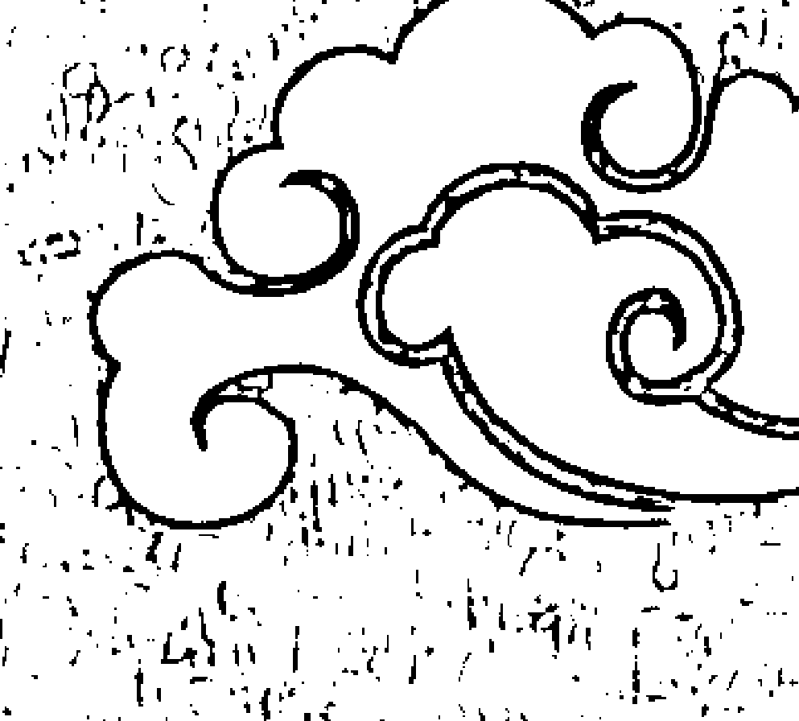

# 制作说明：

本书由《天使神秘学院》出重金从台湾购入的原版书籍扫描制作完成。为达到最好阅读效果，特地把书全部切开后，再经由专业扫描设备高精度扫描完成，并经过一张张的PS后期处理最终成书，其间花费大量的人力、物力以及时间，只为能给大家提供经济并优质的神秘学学习资料而努力。

本学院强力谴责某些机构和个人，把本学院花心血制作完成的电子书籍，包装后直接放在自家网上低价倾销的行为，以谋取不劳而获的经济利益。如果长此以往最终将无人愿意再为大家花心思制作电子书，那以后可能大家再无新书可读。

为让大家以后能够读到更多的好书，也为了本学院的良性发展。本学院恳请大家尽量做到如下几点：

一、尽量在天使神秘学院的官方网站购买电子书籍。

官网访问地址：`http://www.ac2011.cn`

短网址：`ac2011.cn`

网址含义：`(Archangel College 成立时间：2011年)`

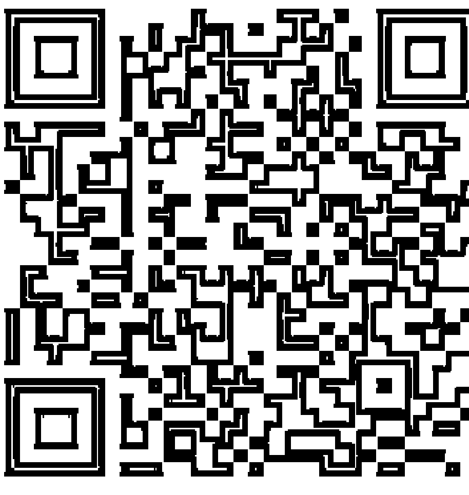

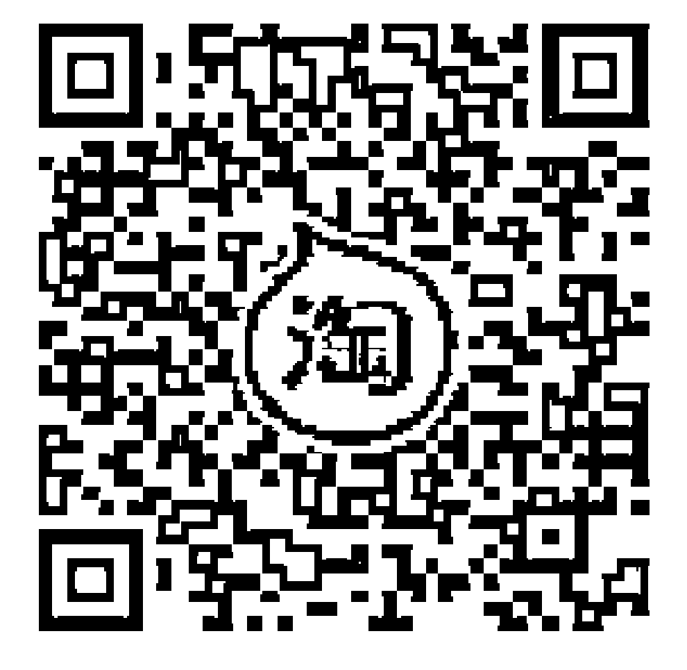


二、在收到电子书后小范围传阅即可，千万不要公开传播，更别挂到网上低价销售。

同时为答谢广大支持者，学院电子书将做如下调整：

一、学院会把一些早已收回制作成本的电子书折价销售。

二、最新制作的电子书籍会开放打印功能，大家购买后有条件的可自行打印成书。

天使神秘学院
2022 年 1 月

# 作者简介

## 郑穆德 老师

### 经历
- 台中地方法院命理学 讲师
- 华山派命理研究学院 院长
- 专业传授命理学开馆职业班
- 台中彰化救国团命理学 讲师
- 行政院中区职训局命理学 讲师
- 台中/台北建筑师公会命理学 讲师
- 中华华山派四化命理研究协会创始人
- 专研紫微斗数、面相、阳宅、阴宅39年

### 著作
- 《学紫微斗数，这本最神准》（智林文化）
- 《紫微斗数开馆的第一本书》
- 《一看就懂大师面相学》
- 《算运：史上第一本命理算运书》

联络方式：0937-295555

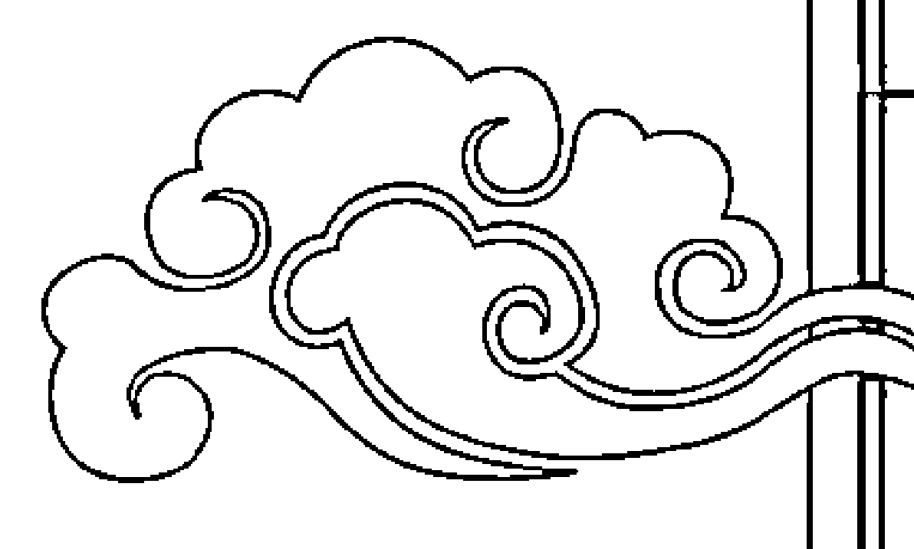

# 深入解读「生年四化」

# 学紫微斗数，这本才能算命

精准预测未来吉凶，成功改运！

郑穆德 著

# 推荐序一 原来“算命”跟“算运”是两件事！

延续郑老师上一本脍炙人口的著作《学紫微斗数，这本最神准》后，郑老师在千呼万唤下，终于在今年出版了这本《学紫微斗数，这本才能算命》的大作，笔者也才了解，原来“算命”跟“算运”是两码事。

在笔者的主观经验里，紫微斗数的算命就是看流年、看命盘、看星宿，看命中有哪些是因缘注定的事，这就是传统命理学派的“知运”、“说运”。

东西方的命理师大同小异。西方说“算命”叫做“fortune-telling”，就是命运（fortune）的告知叙述（telling），算的就是先天的因缘、命盘中的现象及笼统的一生，或未来十年的好运与坏运。所以，一般民众最常问的是“今年创业可以赚钱吗？”、“今年有没有桃花运？”。一般传统的命理师遇到这些提问，就会拿着民众的命盘，依照各个宫位的星宿名称，解释命盘中宫位星宿所代表的意义或现象。

但在郑老师的华山派命理学理论里，算命其实就是要算运。

郑老师认为，人生在每一个阶段里，好运与坏运几乎都会同时存在。有十年的好运，并不代表这十年都会一切顺心。传统命理学只谈大运，个案命运不明或不顺的遭遇各不相同，但郑老师的命理学理论，不但让个案了解“命”是命中注定的定数，“运”是个案自己可以决定的“选择”等重要观念外，郑老师还透过系统化的科学公式，在进行归纳演绎后，精准的掌握个案好运与坏运的时间点。也就是说，依据华山派命理学的理论，个案就能精准掌握三年或五年以上，好运与坏运开始或结束的时间点，以利个案做出自己人生利益或富贵的规划。这样简单却又精准的方法，能让个案解惑的科学化理论，真是令人赞赏。

我常对我的学生或实习律师说：法律要能贴近你服务的客户，这样你的客户才会对你信服，也容易接受你的建议。如果把很简单的法律观念说得很复杂，除了吓退一般老百姓外，对于法律观念的推广普及，其实是没有帮助的。因此，要把很难、很复杂的法律观念，用很简单的叙述或实例说明，让一般人都能听得懂，这才是高手，而郑老师就是这样的命理学高手。

和上一本《学紫微斗数，这本最神准》相比，我在阅读这本书时，很明显地已经不会像在读天书般寸步维艰了。书里的理论是如此精妙，但是透过郑老师深入浅出的叙述，像我这样对算命很好奇又没有什么命理学基础的读者，居然也能一步一步顺利读完整本书。除了显示出郑老师的功力外，也更突显出郑老师的慈悲胸怀，愿意将命理学的艰涩理论，用平易近人的实例分析或白话文式的叙述方式，让一般读者都能看得懂、读得懂，这对一般读者来说真是一大福音。

笔者最后衷心祝福本书的读者，都能藉由阅读本书，对于命理学理论的理解能得到启发，并大大享受阅读的乐趣。

助理教授 张捷安律师

# 推荐序二 命理学发展的重要里程碑

郑穆德老师创立华山派紫微斗数，经过三十多年的潜心钻研，如今已经是果实累累。在本书中，郑老师将所领悟的精华，毫不藏私，精心整理成系统化的公式，并且经得起从不同角度、以不同公式，验证同一结果。其中强烈的因果关系，俨然已经形成一门学科，其学术价值不言而喻。

我身为紫微斗数的业余爱好者，透过长期向郑穆德老师请益。在他的熏陶下，对于紫微斗数的应用价值也有了更深的认识。在看清系统性的因果关系后，学会了必须以更积极的态度掌握人生的机遇，同时，也学习以坦然的心态，承受过去未偿还完的债。

我深深感受到郑老师对于命理学的热爱与执着，在他坚持二十多年的努力之下，本着帮助众生获得人生最大利益的使命感，致力于紫微斗数的研究。更难能可贵的是，郑老师以科学方法进行紫微斗数命理学的论证研究，建立了一套具有逻辑性、系统性、公式化的紫微斗数命理学。华山派紫微斗数，在命理学的发展史上，无疑地建立了重要的里程碑；其中的学术价值与应用价值，我深信将日渐彰显。在这里，我郑重向广大的紫微斗数同好们强烈推荐本书。希望藉由学习本书，可了解如何正确的运用紫微斗数，追求人生的圆满。

紫微斗数爱好者 许智明博士

# 推荐序三

# 算命是四化＋自化＋飞星＋法象

郑老师多年来钻研紫微斗数颇有心得，并创立“华山派”，且致力于成立“华山派命理研究学院”。除此之外，他还将研究心得精华著书成册，供学生或同好研习，并期导正命理界传统命理学的迷思。

郑老师于丙申年腊月出版《学紫微斗数，这本才能算命》，利用看命盘说故事的分析，浅显易懂，窥视探索规划神秘的未来人生。

《学紫微斗数，这本才能算命》这本书，是命理学历史上第一次详细解说“生年四化”与“自化”的书。书中说明紫微斗数的四化＋自化＋飞星＋法象等四者合而为一，以及如何精准掌握现在所想问的事、决定的事、会发生什么事、应该怎么做、对以后有什么影响。“四化”是主导每一事件的用神；“自化”是主导时间及吉凶的架构；“飞星”是主导自己选择的人生；“法象”是主导生涯规划的方向。

本书并指出，“算命”是现代科学不是统计学，可依出生年月日命盘之“左右昌曲”、“本命四化”、“大限四化”、“星辰”等，利用公式去规划人生的最大利益。

“算命”是命中注定的定数，“算运”是因所处环境多选择的变数。“算命”是针对人生的三扇窗

# 推荐序三 算命是四化+自化+飞星+法象

1. 我喜欢的人、事、物；
2. 现在会遇到的人、事、物；
3. 上天巧安排的人、事、物，对于问题的解惑及指引，作为人生参考的方向。

由本书中四颗星辰“禄、权、科、忌”，可探讨出“算命”及了解我命中该选择什么行业；

1. 最爱你或最折磨你的生肖是什么？
2. 三世因果的生肖是什么？
3. 七世因缘的生肖是什么？
4. 冤亲债主的生肖怎么看？
5. 前世的恩怨情仇；
6. 前世因果如何影响你事业的成就。

本书极适合初学者，也可对有经验知识者建立更清楚的紫微斗数“四化”、“自化”、“飞星”、“法象”等完整架构诀窍，极具有打基础之助益。了解这些诀窍，“算命”功力足足可增加十倍。进而学习如何顺天意就是善因缘，在对的时间做对的事，好帮助自己或他人解惑，并厘清、规划人生，掌握时间、吉凶、内容、影响之学问。

> 新北市都市更新学会理事长 蔡仁捷建筑师

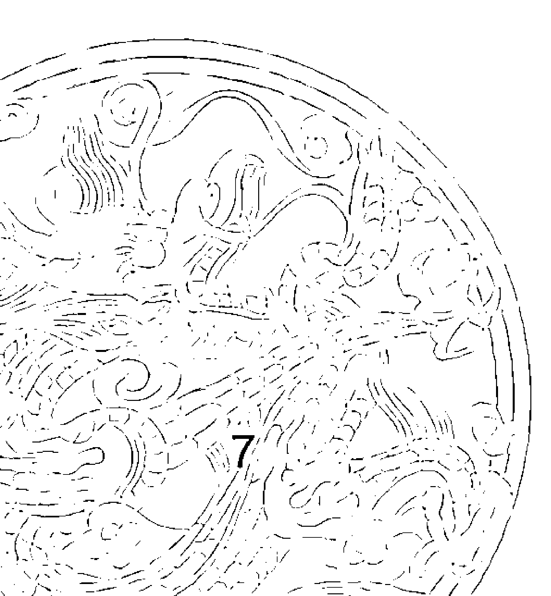

# 推荐序四 华山派高阶论命的印证

郑老师一直致力于其一手创立的华山派紫微斗数的钻研、教学与宏扬，并将其心得著书于丙申年腊月，出版《学紫微斗数，这本最神准》一书，进一步将“算运”提升到八种算运法，即现象、时间、吉凶、内容、影响、改运、转运、宗教。藉着这八种面向，将一个人的“运”算得透彻且面面俱到。

郑老师所写的书，在金石堂、博客来每周都在畅销书销售排行榜十名内，且大多在第一名或第二名。可见郑老师所写的这一系列有条理的紫微斗数书籍，多么受到广大读者的爱戴与拥护。

继上一本《学紫微斗数，这本最神准》畅销新书之后，郑老师再将精准算运的主要大架构——“自化”，毫不保留的公开，为读者之福。“自化”本身不能单独算命或算运，必须依附在“生年四化”、“法象”之下才能算。“自化”为紫微斗数进入高阶算命的关键，掌握了“自化”即能算出每一事件之吉凶。

郑老师在这一本书中阐释了主导人生的四大公式：

1. “四化”是主导每一件事件的用神。
2. “自化”是主导时间吉凶的架构。

# 推荐序四 华山派高阶论命的印证

综合以上四大公式，‘自化’一定要以‘生年四化’和‘法象’合在一起看；‘法象’就是回归‘生年四化’看因缘，‘自化’＋‘生年四化’就是完整的算命。郑老师将其归纳成华山派公式—“四化＋自化＋飞星＋法象”四者合而为一，可精准掌握每一个事件的现象＋时间＋吉凶＋内容＋影响。因此，华山派一直强调：对来问者算任何事，一定要有一个大主轴，即一定要论到现象、时间、吉凶、内容、影响，才能算是高阶论命。

以某坤造为例：三十六岁（民国一○六年时），结婚已六年犹膝下无子，来问何时能怀孕？如何才能怀孕？怀孕后会怎么样？
这是很好的高阶问法。看其坤造紫微斗数命盘，辰位为子女宫，有生年权星重叠32／41大命，向心力自化权到戊位田宅宫重叠大迁，酉位福德宫自化忌，子位交友宫生年忌自化忌，丑位迁移宫重叠大子自化科，寅位疾厄宫大夫科自化科，巳位本夫禄自化权，午位兄弟宫重叠大福。

1. 现象：子女宫有生年权，命中有孩子没问题，即现象为命中有子女。
2. 时间：大限三十二至四十一岁大命踩到子女宫，表示时间对了。
3. 吉凶：子女宫权，有子女后才会有地位。母以子为贵，完成此宫位才有踏实感，所以现在会很彷徨、无助，没有方向感。
4. 内容：此“内容”为大多数命理老师容易忽略，而此“内容”则是华山派紫微斗数独到的地方。

# 推荐序四 华山派高阶论命的印证

其内容论点如下：

(1) 一般命理师对有子女的条件会没写出，但在华山派则可用最简单在地成形的观念看出：子女宫权质为有子女，有子女转在地成形。向心力自化权到田宅宫大迁，大迁重叠田宅宫即是搬家。搬家是想要孩子所需要的第一个条件，但是搬家的时间要在对的时间点，如何论是由自化及生年四化看出来。

(2) 夫妻宫的无情象很浓，大夫科自化科，如果感情很好，要有一点分开。职业班的公式——权转权、科转科，在这个32／41大限，大夫科自化科亦为科转科，即是夫妻至少要分开三个月，才能符合生小孩的现象，此为必要的第二个条件。

至于三个月如何看？则是高阶班的教导内容。

(3)本福自化忌，交友宫忌冲到大福。本福大福形成体用，在此大限大福被冲，表示福德宫是欠缺的，欠缺的一定要去弥补。福德被冲是最没有福气、福报的时间，亦即是此大限祖先离他最远，没有受到祖先的庇佑，所以一定要让福德宫缘起。即要拜公妈、虔诚向祖先祈求，此为必要的第三个条件。

由以上分析，此坤造要生小孩的条件为：搬家+夫妻分开+拜祖先，此即为其内容。

5. 影响：因权为强求强要，权星来的压力很大。在这一大限三十二至四十一岁本夫禄自化权，回归生年权子女宫重叠大命，即应达到上天所赋予生孩子的使命才有踏实感，若没有则此坤造在夫家的地位就会不稳，因此压力很大，此即为其影响。

三象成一物，权科的媒介为忌，生孩子的内容搬家用权，夫妻分开用科，其媒介皆为忌，而酉位

# 推荐序四 华山派高阶论命的印证

自化忌为一〇六年，子位忌自化忌为一〇九年，因此，一〇六至一〇九年为此坤造生孩子的最佳时间。以酉位论一〇六年推算流月，若六月／九月之间有搬家、夫妻分开之事实，再补拜公妈完成生孩子的内容，则一〇七年一定可以怀孕生子。此即为华山派所一直强调的：应精准掌握每一事件的现象十时间十吉凶十内容十影响等的高阶论命论法。

再以该坤造八字论命，〇戌、〇子、丁丑、乙巳，三十四至四十三大运戊申，丁火生冬月，党扶帮身无力，身弱无疑，喜木火印比，时柱乙巳为用。女命以食伤看子女，时柱为喜用主多子女且贤孝，若兼具食伤为用则更显。可惜此坤造用神不喜食伤，时干透印，印克食伤，故此坤造命中有子女。但由于时柱印克食伤而怀孕不易，要等大运与流年同时踩到才比较容易怀孕，此与紫微斗数论命同。

上一大运二十四至三十三己酉，女命时支若逢遇三合、六合、对冲的流年则容易怀孕。大运酉与时支、日支三合，看似很有机会怀孕，但巳酉丑三合金为忌神，则会事与愿违，故结婚后前几年一直没消息。

此大运戊申，三十四至三十八走戊土用神运，戊土为食伤又为喜用神，故此三十四至三十八岁怀孕生子的机会相当大，又与上述紫微论命不谋而合。一〇六年丁酉年本来很有机会怀孕，可惜与时支巳及日支丑三合金为忌，虽做了多次人工受孕但都未能成功。一〇七年戊戌年为食伤年，食伤为坤造怀孕生子的用神，再加上戊为燥土，藏干丁火可此许调候，调节其冬月生的虚寒体质。

戊戌土为八字喜用，时柱巳之藏干丙与年支戌之藏干辛合为暗合，已是八字原局、大运、流年汇集形成三象一物，故一〇七年怀孕生子的机会非常大，此又与前述紫微论命获得相同的结论。只是八字论命无法像华山派紫微论命一样，怀孕生子应精准掌握三个条件：搬家十夫妻分开十拜祖先，而论

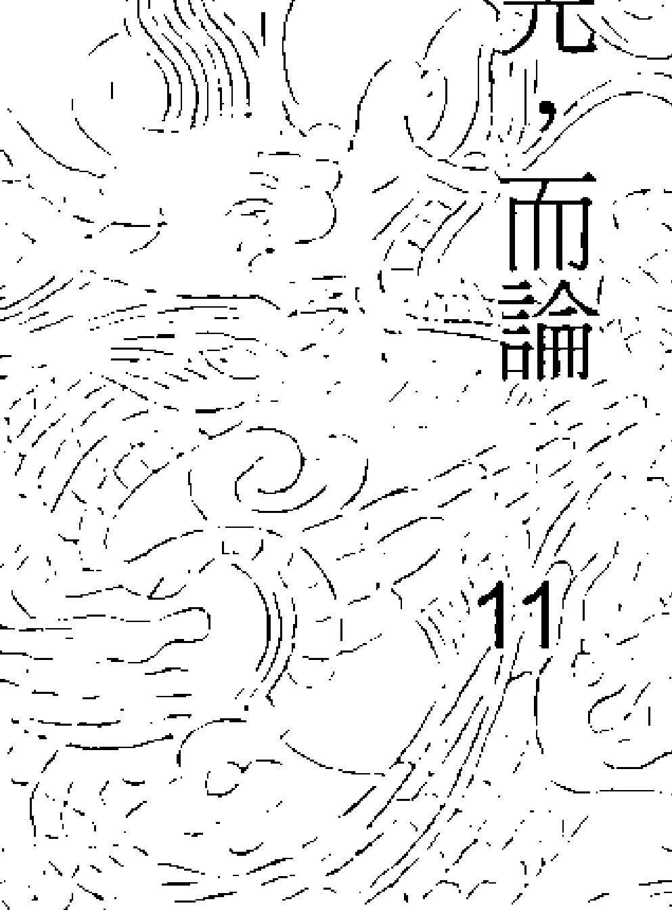

出其怀孕生子与紫微斗数相同的内容。 由以上四柱八字对相同命造的印证，八字抓对用神可精准对所欲问何事给予精确解答，有不得不 令人佩服的地方；紫微斗数在论人物对待则有其独特的精妙；华山派更将论命层次推升到现象、时 间、吉凶、内容、影响、改运、转运、宗教等八个面向，更能符合每一求问者的期待，这是最高阶论 命法。一般若能论到现象、时间、吉凶、内容、影响等五个层次，已是高阶的论命，达此阶段已为坊 间一般命理师所望尘莫及。 此次郑老师将其钻研紫微斗数四化领域二十几年，再加上自化的心得不吝予以发表，实为万千读 者之福。书中对取用神论命举例甚多，相信读者若能仔细阅读此新书并予以体会，则对紫微斗数的造 谄将是无可限量，他日定可步入紫微斗数高手之林。 台北市建筑师公会易经社创社社长 王基陵

# 推荐序五 改变的起点

郑穆德老师多次接受台北市及台中市建筑师公会邀请举办紫微斗数课程，引起很大回响。在多位前辈与长官不约而同的推荐下，希望我有机会一定要去听看看。民国九十九年郑老师受邀来新北市建筑师公会授课，我参加了，从此认识了郑老师与华山派紫微斗数。

郑老师每次讲课都是临场随机实例解盘，让学习者与当事人能当场印证，加深了学习感受。而大家五花八门的提问与讨论，更丰富了上课内容。有定位才有定数，郑老师总是快速、明确、精准的论断出原因、目前现象、该怎么做、时间点、影响什么……等，来龙去脉清楚可循，让大家佩服。他常提醒我们“学习正确的命理知识与观念，比算命本身重要百倍。而命理是一层一层往下追的功夫，也是深究前因后果与来龙去脉的学问”。确实，有了正确的启发，得了智慧才能分辨。前后关系层次分明、清晰的理路，也潜移默化了我的逻辑思维。

电视上所谓大师级的命理老师，惯用的骗人手法有：

1. 要当事人买幸运物来摆设，以加强运势或改运。
2. 说您卡到阴，一定要用什么方式去改。
3. 说您不健康，是因为您取错名字。
4. 什么星座今天感情运如何，适合穿什么颜色的衣服、往什么方位走才有助于桃花……等。


以上这些改运的方法真的有效吗？我想改的是那些老师家里的财运吧！这些人把命理综艺、娱乐化，到底是在推廣命理，还是在残害命理？这样的命理老师会让知识分子信服吗？反观，华山派命理学的清楚、透明、有公式可循的教学方式，敲醒了我之前的疑惑，重新建立对命理的认知与思维。因此，我改变了，我已经把以前所学过的多项无用的命理抛弃了。

郑老师治学严谨，多年来致力于改革命理界，并将成果公开与推广，希望大家受益真正命理学的真、善、美。他常以“以今日之我，战昨日之我”的观念当作座右铭。这几年，我看到郑老师的命理造诣日深，衷心盼望华山派命理学可以快速发光发热。

本书特色：
1. 以公式化、系统化的引导，易学而速效；
2. 每篇内容不厌其烦、一再的完整论述，加深学习效果；
3. 提出差异比较与反问，启发读者思考。

相信会给有心学习紫微斗数的您，奠定基础及带来新的启发。

陈鹏元 建筑师

# 推荐序六 顺天意才是善因缘

“顺天意才是善因缘。”认识郑穆德老师，他的这句话使我获益良多。

接触华山派时，正值自己正处心灵迷惘之际，岂知一试成主顾。除了感到不可思议的准确外，更觉得老师的解释令我内心的结释怀许多。原来许多讯息早在命盘上都已经出现，就差一位看得懂且能翻译转达给我的贵人，而这位贵人就是郑老师。于是乎，也为我开启了“紫微斗数”这高深学问的大门。

在学习过程中，由于郑老师治学的严谨态度，使我对华山派命理有绝对的信心。也因为老师不厌其烦地说明，让我对命理能更进一步了解。

华山派命理学基础的五大类别：1. 星辰（论述现象学）；2. 飞星四化（论述空间）；3. 生年四化（论述时间）；4. 自化（论述吉凶学）；5. 左右昌曲（论述宗教学）。由此五大基础，配合当事人的各种状况，可精算出人、事、物的结果，并可以预测未来人、事、物发生的时间与吉凶。

学习命理学应该具有的三大概念：

1. 先学会命理相关知识，由天时、地利、人和所组成。
2. 再学会命理最专业的学术，预测未来人、事、物的结果。
3. 最后学习相关命理做比较，需知道命理分为算命与算运。

這樣一套理論基礎與概念，有別於傳統命理之簡略、籠統、不精準的既定印象，更能滿足現代社會多元化的思維。

本書中有鄭老師更仔細論述的實例，以期讀者能更清楚理解命理學的邏輯性；也運用更多淺白詞語來描述一個個的觀念，希望讀者能領略到命理之美。例如，文中的一個段落是：「天意乃命中注定的事，分為兩種：1.命中注定的人生故事；2.自己選擇的人生故事。然後順天意才是善因緣。」鄭老師在書中解釋：「順天命、順天運就是善因緣，是悟透了來龍去脈與前因後果的規劃，也是趨吉避凶、化險為夷的改運方法。」

最後，期望如鄭老師所願，能將現代科學命理推上學術之林，發光發熱。並期望透過這本書的引導，讓讀者更容易通達知曉，更多命理學的道理與生命的哲學。

張立穎 醫師

## 推薦序七 現代化的科學命理

有玩過RPG（角色扮演遊戲）的朋友都知道，在創建角色時可以選擇各種角色的屬性和能力值等。譬如可以選擇當弓箭手或是魔法師；可以把敏捷點滿，或是防禦點滿，也可把攻擊點滿。不同的角色屬性分配的能力值不同，玩法就不同。遇到同樣的情況，每種角色的最適策略也都不同。而人生其實也如同RPG一樣，上天賦予每個人不同的能力與屬性，遇到挑戰的最佳解決辦法也不盡相同。

複雜的人生，看似難以看出上天給予的能力參數，但其實是有方法的。華山派鄭穆德老師，智慧明達、博覽古今，經多年潛修，精煉出只使用十二宮位與祿、權、科、忌四化星等參數的算法。此法簡單卻周全，應用此法可執簡馭繁的協助各種屬性的人，在遇到各式人生挑戰時找到較佳的因應之道。

四化星、十二宮位，配合本命、大限、流年的三盤確認，再加上數百條規則（公式）的反覆查驗，即可在人生的各面向取得系統化層層分析的建議。不管是單純的學術研討，或是人生抉擇需要另一種邏輯完整的建議分析，華山派命理學都是一門值得一探的學問。

許維揚 醫師

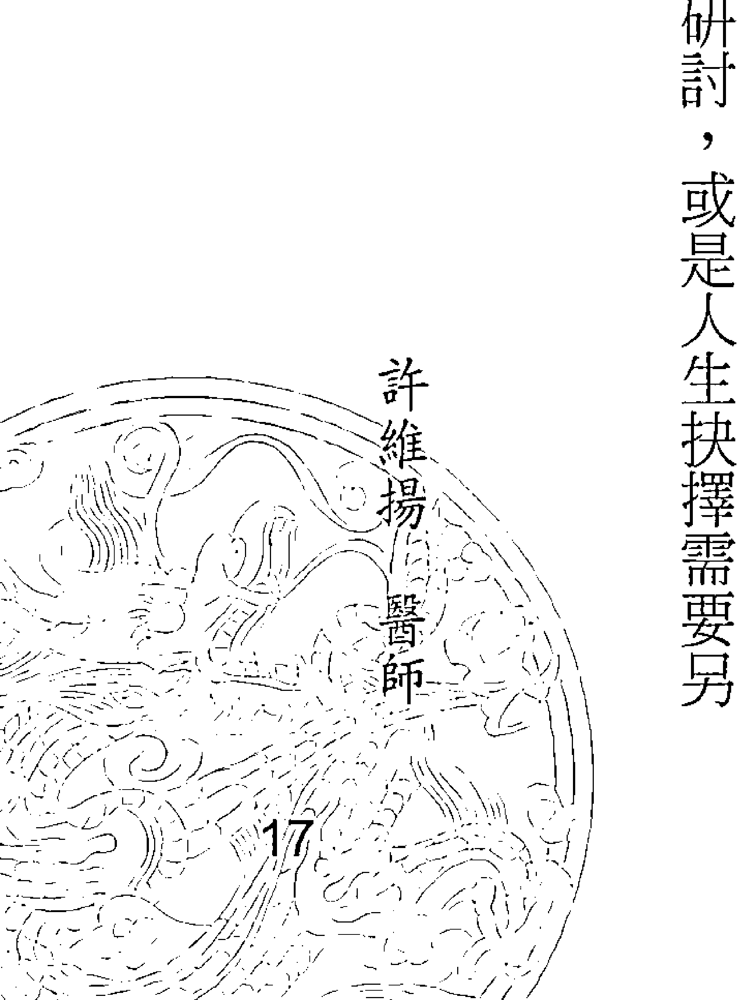


# 自序 「算命」原來只能算這些事

你還在利用星辰算命嗎？這是二十世紀舊時代的流行，星辰可以算命中注定的現象。這似是而非的論述，只適合初學者進入神祕世界的常識。
你可能沒有聽過白化與法象的組合，也不知道完整生年四化與飛星四化的公式是什麼，所以，你到現在還不清楚算運是什麼。其實，算運就是我現在想問的事，吉或凶從哪一年月日開始至哪一年月日結束。
學算命原本就是簡單的事，只要短短一天，八個小時，就能「簡單、籠統」的幫人算命。然而，大部分的命理老師卻利用自己人生歷練或算命技巧而得意洋洋的賺錢餬口。說起來有點悲哀，明明是簡單的說詞，卻假裝成神祕的東西騙錢；明明是不準的論述，卻裝扮成高貴的東西騙人；明明是一門高深的學問，卻淪落到裝神弄鬼的詐騙集團。這是正統命理學千年來第一次的浩劫。
有鑒於此，華山派命理學二十九年來不斷的努力、精進、成長、進化、創新、革命；屢敗屢戰的說明命理學的重點在「時間與吉凶」，一次又一次的強調命理學的規劃在「內容與影響」。總算皇天不負苦心人，這是似而非的算命方式已漸漸被二十一世紀文明的社會所淘汰，取而代之的是公式化、系統化、透明化、現代化、科學化的華山派命理學的誕生。

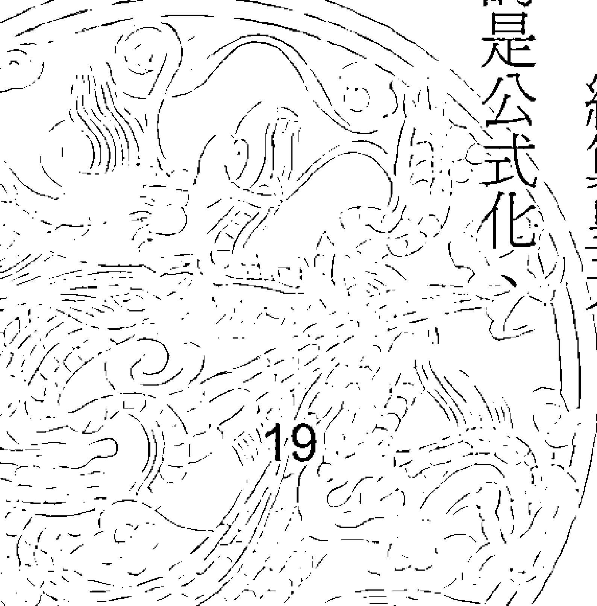

## 一、算命只能「算」這些事

### 1. 算命與算運之區別：
- (1) 傳統派「算命」算一種，算「現象」而已。
- (2) 華山派「算運」算八種，算「現象、時間、吉凶、內容、影響、改運、轉運、宗教」。

### 2. 算命「算」什麼事：
算命可以「算」命格、個性、類型、姓名、星座、生肖、喜好、方向、五行、數字、顏色、卜卦、宗教、祭品、動物……等三十種以上的項目。

### 3. 算命「改運」的事：
傳統習俗的改運：
- (1) 傳統習俗的改運有造命、收驚、符咒、唸經、祭嬰靈、點光明燈、祭冤親債主……等。
- (2) 傳統習俗的改運有招財、補運、做生基、斬桃花、補財庫、補元神、拜主神……等。
- (3) 絕大部分只是心理安慰而已，有效分數只有10%以下。
- (4) 命理老師誤用與誤解改運的東西，其實都知道無效，但為了生活只能將錯就錯而繼續騙錢。
- (5) 命理老師也想幫求助者，無奈自己不學無術，又為養家餬口不得不胡扯鬼扯的幫人改運騙錢。

## 二、各大門派算命分析

### 1. 星座
星座算命把所有人分成十二種星座，每一種都占臺灣人口約兩百萬人，哪有準確度可言。其實這只是簡單、籠統的統計學算命分析。
- (1) 這種算命方式應該歸納在大家「閒聊、好玩」裡，不應該放在命理學的專業領域，因爲，沒有時間與吉凶的精準分析，對現在想問的事情影響不大。
- (2) 事實的分析：只是簡單、籠統、好玩的算命方式，在交際應酬上有其正面的效果。
- (3) 精準度分析：算運的精準度只有30%以下。

### 2. 塔羅牌
塔羅牌算命是最簡單的「卜卦」算命之一，針對短期幾天內的事情有其效果，但長時間的規劃也和絕大多數的命理一樣，完全失去了準確性。
- (1) 這種算命方式好玩成分居多，沒有清楚時間與吉凶的分析，對現在想問的事影響不大。
- (2) 事實的分析：只是簡單、籠統、好玩的算命方式，在交際應酬上有其正面的效果。
- (3) 精準度分析：算運的精準度只有30%以下。

### 3. 生肖五行
生肖五行算命把所有人分成十二種生肖，每一種都占臺灣人口約兩百萬人，哪有準確度可言。這是簡單、籠統的統計學算命分析。
- (1) 這種算命方式也應該歸納在「閒聊、好玩」裡，不應該放在命理學之專業領域。沒有時間與吉凶的精準分析，對現在想問的事影響不大。

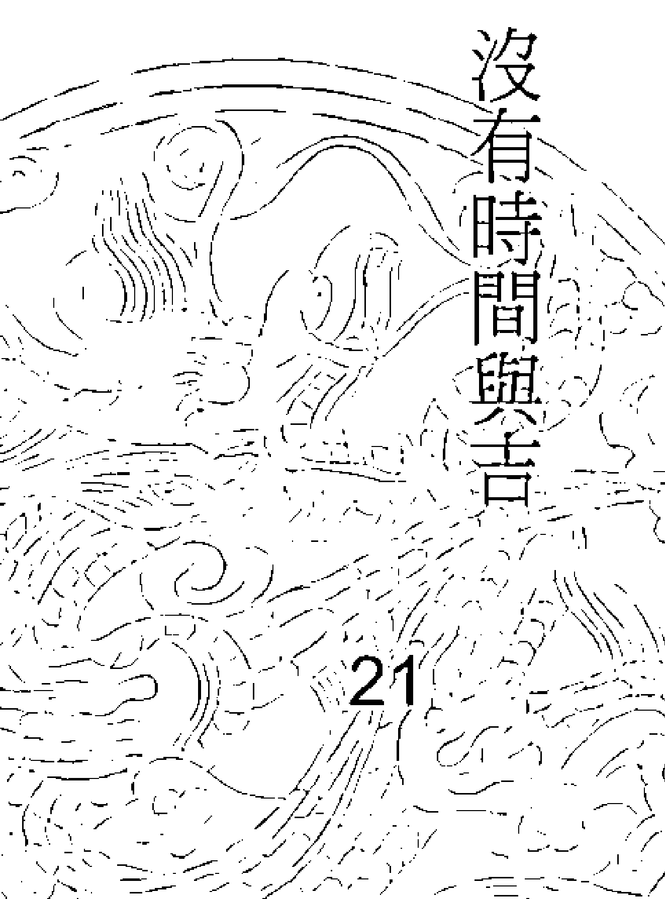

### 【算命的精準度分析】
算一生：各大門派算一生的準確度是70％，可以簡單籠統分析命中會發生的事。
算十年：各大門派算十年的準確度是50％，可以籠統分析未來十年有機會賺錢。
算流年：各大門派算流年的準確度是20％，無法預測人事物每一事件的吉凶。
算吉凶：各大門派算吉凶的準確度是20％，無法預測人事物每一事件的得失吉凶。
算時間：各大門派算時間的準確度是20％，無法預測人事物每一事件的發生時間。
算生肖：各大門派算生肖的準確度是10％，無法預測人事物每一事件的生肖吉凶。
算預測：各大門派算預測的準確度是10％，無法預測人事物每一事件的未來結果。
算事件：各大門派算事件的準確度是0％，無法預測每一事件未來會發生什麼事。
- (2) 事實的分析：只是簡單、籠統、好玩的算命方式，在交際應酬上有其正面的效果。
- (3) 精準度分析：算運的精準度只有30％以下。

### 4. 姓名學
姓名學算命的最大問題是：告訴所有求助者，每一個人都需要改名字，騙錢指數占命理界第二高，第一高是求神問事。幾乎每一位求助者不順心的問題都可以利用「改名字」來改運。
- (1) 每個人的人生每一階段都有不同的好運與壞運，假如遇到壞運就需要靠改名字來改運，那麼所 有人就隨時都需要改名字了。
- (2) 事實的分析：這是簡單、籠統的算命方式，算運的時間與吉凶的掌握不高。
- (3) 精準度分析：算運的精準度只有30％以下。

## 四、命理老師為什麼算不準？

### 1. 因為不懂「算運」，才需要裝神弄鬼騙人
- (1) 因為沒有「時間」的正確觀念，才需要籠統的說未來十年有機會賺錢。
- (2) 因為沒有「吉凶」的正確觀念，才需要籠統的說未來五年有機會結婚。
- (3) 因為沒有「內容」的正確觀念，才需要籠統的說事業只能靠自己努力。
- (4) 因為沒有「影響」的正確觀念，才需要籠統的說分開的感情最不可靠。
- (5) 因為沒有「改運」的正確觀念，才需要裝神弄鬼的說衰運都可以改運。
- (6) 因為沒有「轉運」的正確觀念，才需要裝神弄鬼的說衰運都可以轉運。
- (7) 因為沒有「宗教」的正確觀念，才需要裝神弄鬼說做好事就會有福報。

### 2. 因為不懂醫生「問診」的思維，不清楚「病因」就無法治病
- (1) 因為專業能力不足，不敢直接回覆問題，所以只能簡單、籠統的回答問題。
- (2) 因為不懂醫生「問診」的思維，所以只能簡單、籠統的回答問題。例如，問感情：在一起的時間決定和這個人的緣分長短，分手的時間決定下一段的感情因緣。假如不明白「在一起與分手」的時間，怎麼能夠清楚分析這段感情的結果呢？
- (3) 因為不懂人事務怎麼「定位」，所以常文不對題回覆問題或實問虛答或鬼扯天機不可洩漏。

## 五、真正的算命是什麼？
1. 真正的算命就是預測未來每一事件的結果。
- (1) 算命是天時+地利+人和三者合一的學問。簡單的說，算命就是在對的時間點做對的事。
- (2) 算事業正好顛倒，先講人和，再講地利，最後才講天時。也就是先培養自己的條件「人和」，再找適合自己的行業「地利」，最後掌握對的時間就能升官或創業「天時」。

2. 真正的算運分析：
- (1) 現象：「算」現在想問創業賺錢的事。
- (2) 時間：「算」賺錢的時間從哪一年月日開始至哪一年月日為止。
- (3) 吉凶：「算」吉或凶從哪一年月日開始至哪一年月日為止。
- (4) 內容：「算」吉時，怎麼做才能賺錢。「算」凶時，怎麼做才能降低災難。
- (5) 影響：「算」現在決定的事，對我以後會產生什麼影響。
- (6) 改運：「算」壞運持續中，必須做對一件事，才能讓好運快速來臨。
- (7) 轉運：「算」好運未來前，必須做對一件事，才能讓壞運快速中止。
- (8) 宗教：「算」三世因果與七世因緣，怎麼形成今生討債與報恩的生肖。

方向、數字、顏色：…等的現象學原理而已，本身並沒有特殊之處，但卻被傳統命理老師當成「寶貝」般守護著。

對命理而言，有的人自認為自修自學；有的人已經轉成祖傳秘方。對生活而言，有的人只為了賺錢舖口；有的人卻已變成騙財的江湖郎中。其實，傳統老師對命理學之「誤導」或「誤用」比胡言亂算更嚴重一百倍。騙財大部分只能騙一次，而誤導或誤用不正確的命理教導別人，卻可以禍害子孫千年。

華山派命理學精準掌握前因後果與來龍去脈的學問，是一層又一層可以往下追根究柢的功夫，這是華山派命理學最引以為傲的學術成就。


# 目錄
推薦序一 原來「算命」跟「算運」是兩件事！ 助理教授 張捷安律師 3
推薦序二 命理學發展的重要里程碑 紫微斗數愛好者 許智明博士 5
推薦序三 算命是四化＋自化＋飛星＋法象 新北市都市更新學會理事長 蔡仁捷建築師 6
推薦序四 華山派高階論命的印證 臺北市建築師公會易經社創社社長 王基陵建築師 8
推薦序五 改變的起點 陳鵬元建築師 13
推薦序六 順天意才是善因緣 張立穎醫師 15
推薦序七 現代化的科學命理 許維揚醫師 17
自 序 「算命」原來只能算這些事 鄭穆德 19

# 壹、導讀
史上第一本專論紫微斗數「生年四化」與「自化」的書 33

# 貳、只要四顆星辰！教你立刻學會幫自己算命 41
一、怎麼學會看自己的命盤

# 參、生年四化與自化的入門
- 二、祿權科忌，在命盤上怎麼形成？
- 三、祿權科忌，在命盤上怎麼解釋？
- 四、祿權科忌，在命盤上怎麼算「命」？
- 五、祿權科忌，在命盤上怎麼算「運」？
- 六、算命一定要從「算貴人」開始學起
- 七、怎麼算命才會準？

# 肆、生年四化與自化的基礎
- 一、命中注定的事，怎麼算？
- 二、十二宮位的基本內涵
- 三、算命就是十二宮位+代碼的解釋
- 一、生年四化的基本知識
- 二、生年四化所在的宮位，才能產生貴人的因緣
- 三、生年四化的重點在「宮位重疊」
- 四、生年四化的算命與算運
- 五、紫微斗數「自化」入門

# 伍、從生年四化看出自己命盤的吉凶
- 一、吉凶的形成
- 二、吉凶的入門
- 三、算吉凶的公式有哪些？
- 四、算命想精準，就得學會一次看懂三種命盤
- 四、大限命盤（大命）「重疊」十二宮位的解釋
- 五、紫微斗數「自化」的基礎

# 陸、從命盤看出你前世今生的欠債與折磨
- 一、最愛你或最折磨你的生肖是什麼人？
- 二、前世今生的緣分怎麼看？
- 三、「因果」怎麼算？

# 柒、用實例分析，可以增加你看命盤的功力
- 一、應用「生年四化」算命有五大公式
- 二、看命盤說故事「基礎篇」

# 捌、十分鐘，讓你知道你的算命功力屬於第幾級
- 三、看命盤說故事「進階篇」
- 一、算命功力怎麼分等級？
- 二、算命時，命理老師會說哪些話？
- 三、「華山派九式秘笈」看算命功力

# 玖、看懂這些訣竅，「算命」功力會增加十倍
- 一、「天意」是什麼？
- 二、算命必學的四大公式
- 三、每個人都有富貴的好命格，趕快幫自己找一找
- 四、算命不是統計學
- 五、怎麼規劃人生的最大利益？

# 拾、看懂這些訣竅，「算運」功力會增加十倍
- 一、命理老師必須具備哪些條件才能算命？
- 二、為什麼有「出生年月日」的算命才會準？

# 拾壹、改運有效嗎？
- 一、改運是什麼？
- 二、命運可以改嗎？
- 三、改運有效嗎？
- 四、何時需要改運？
- 五、改運要找誰？
- 六、掌握「天時」，才能讓你美夢成真
- 三、傳統命理老師不知道有算運
- 四、命理老師找到「用神」後才能幫人算運
- 五、命理學的重點在天時+地利
- 六、「算運」應該學會的事
- 七、每一個結果至少由三十種以上的「公式」算出來
- 八、怎麼掌握自己人生的好運

# 壹、導讀
史上第一本專論紫微斗數「生年四化」與「自化」的書

十八年前，我開始開課教導學生「飛星四化」，當時知道什麼是飛星四化的命理老師只有1%；現今坊間講述飛星四化最完整專業書為《學紫微斗數，這本最神準》。

十八年後，我開始撰寫及介紹「生年四化」，但至今知道什麼是生年四化的命理老師還是只有1%；現今坊間講述生年四化最完整專業書為《學紫微斗數，這本才能算命》。

本書的誕生，不僅是命理史上第一本完整介紹紫微斗數生年四化與自化的書籍，也是筆者第一次公開39年來研究命理學的心得報告。

筆者自從創立了華山派，除了強調「傳承」、「競爭」、「科學」、「算運」等現代命理學外，也觀察、研究得出：「華山派論運——每一個結果只有一種公式得出」，與各大門派的論運——「每一個結果至少可有30種公式得出」的理論完全不同。

延續去年（二〇一七）出版的飛星四化暢銷書《學紫微斗數，這本最神準》後，筆者再次撰寫出版這本《學紫微斗數，這本才能算命》。想要認識此書，一定要先從紫微斗數的派別與分類開始，讓您清楚看出紫微斗數的學術價值；利用四顆星辰，讓您馬上學會算命；利用來因宮，讓您馬上進入

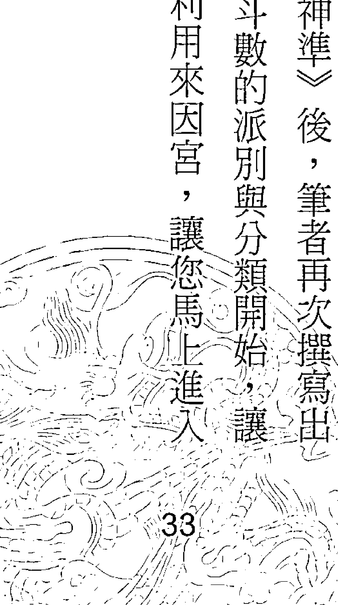

前世今生的輪迴；利用算命與算運的區別，讓您因此跳脫傳統命理學的迷思；利用看命盤說故事的分析，讓您知道神秘的世界不再神秘。

## 一、紫微斗數的派別與分類

### 1. 紫微斗數的派別
一般來說，紫微斗數分為「星辰派」與「四化派」兩種。占命理界95%以上的傳統派命理老師都以「星辰派」為主，強調的是「算命」；占命理界5%的華山派命理老師以「四化派」為主，強調的是「算運」。

「星辰派」的重點顧名思義是「星辰」。在命盤上，星辰分布在不同的十二宮位，但有六分之一的宮位沒有星辰。這時候傳統命理老師因為很難對此狀況做出解釋，只能胡扯亂掰與命理無關的宗教習俗來自圓其說；而同等的情況由四化派來看，「四化派」的重點在「宮位」，並運用「生年四化」、「飛星四化」、「自化」、「左右昌曲」等四種特色來解析，就完全彌補了星辰派的迷思與不足。

> 知識加油站：
生年四化：是先天俱足的富貴，努力的人可以夢想成真。
飛星四化：是後天強求的利益，努力的人可以完成心願。
自化：是上天告訴你，想要人事物的成功需要如何做。
左右昌曲：是累世未了的因緣，還債後人生才能更上一層樓。

### 2. 紫微斗數的分類
現代科學的算命方式為：
成功的事業‖在對的時間十三個條件＋當下的心態
失敗的事業‖在錯的時間十三個條件＋當下的心態

雖然紫微斗數在臺灣已經流傳了幾十年，但知道紫微斗數分為五類的命理師卻只有少數的 1% 而已，這是多麼不可思議的事。

傳統的紫微斗數命理學是以「星辰」算命為主，這和其他命理學一樣，只能論述一些簡單籠統的現象。而華山派命理學則將紫微斗數分成星辰、飛星四化、生年四化、自化、前世星辰等五大類，每一類各自代表不同的特性。這種「五合一」的算命方式，顛覆了傳統命理學簡單籠統的思維，才算是真正的命理學。

現就紫微斗數之五種分類介紹如下：

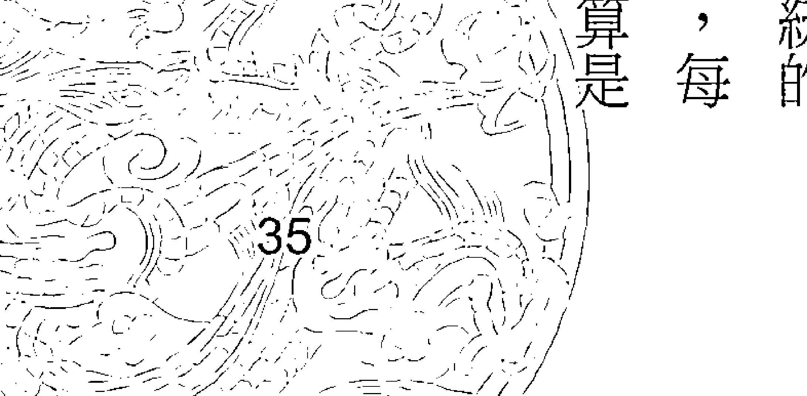

#### 1. 星辰：是論述「現象」的學問。
- 星辰和傳統命理學一樣，可以讓初學者快速進入命理的神祕世界。
- 星辰和傳統命理學一樣，可以讓初學者馬上學會籠統的算命，包括個性、五行、數字、顏色……。

#### 2. 飛星四化：是論述「現象、空間、吉凶」的學問。
- 飛星四化是因應不同命盤，四化會飛入不同的十二宮位，才能算出所有命中會發生的事。
- 飛星四化是因應不同命盤，四化會飛入不同的十二宮位，才能算出所有命中會發生的事。
- 飛星四化是因應不同命盤，四化會飛入不同的十二宮位，才能算出所有命中會發生的事。

#### 3. 生年四化：是論述「現象、時間、吉凶」的學問。
- 生年四化是因應不同命盤會在不同的十二宮位產生，才能算出所有命中會發生的事。
- 生年四化應用「在地成形」的公式，讓紫微斗數命中注定的事算出存在的現象。
- 生年四化應用「在地成形」的公式，讓紫微斗數命中注定的事算出存在的現象。
- 生年四化應用「在地成形」的公式，讓紫微斗數命中注定的事算出存在的現象。
- 飛星四化應用「體與用」的公式，讓紫微斗數因此看出每一事件的發展與造成的影響。

#### 4. 自化：是論述「現象、物相、吉凶」的學問。
- 自化因應不同命盤會在不同的十二宮位產生，才能算出所有命中會發生的事。
- 自化應用「體與用」的公式，讓紫微斗數因此看出往上與往下的分界點。
- 自化應用「體與用」的公式，讓紫微斗數因此看出吉凶與得失的分界點。
- 自化應用「體與用」的公式，讓紫微斗數因此看出緣起與緣滅的分界點。

## 二、只要四顆星辰，教你馬上學會算命
1. 生年四化，即四化星代號：祿（A）、權（B）、科（C）、忌（D），以上四者稱之為代碼。
在命盤上可以「算出」人事物的存在、貴人運、是否會欠債、是否有運氣。

2. 算「存在」（有無）時，祿、權、科、忌。
- (1) 論述「存在」時，在命盤上，只要有祿、權、科、忌這四化星所在的宮位都表示有貴人。
- (2) 算命實例：算「有沒有貴人？」，則祿、權、科、忌。

3. 算「內容」（人事物）時，祿、權、科、忌。
- (1) 算命實例：算「貴人是什麼人？」時，則祿、權、科、忌。
- (2) 若以貴人的身分來說，祿星為生意人，權星為專業人士、科星為知名人士，忌星為上班族。

5. 前世星辰：是論述「現象、宗教、吉凶」的學問。
- (1) 左右昌曲論述前世今生的業力，讓人知道「前世未了」的因緣。
- (2) 左右昌曲論述三世因果的輪迴，讓人知道「緣業情債」的今生。
- (3) 左右昌曲論述七世因緣的報應，讓人知道「愛恨情仇」的生肖。

## 三、來因宮看前世今生的輪迴

- (1) 前世未了的因緣稱之為「來因宮」。
- (2) 由每個人出生的天干可以找到祿權科忌等四化星所在的位置；來因宮的宮位天干也可以將祿權科忌「飛」入其他十一宮位，由此可以看出和前世今生有關的因緣。
- (3) 宗教的緣業情債、佛教的慈悲喜捨；算運的緣起、緣變、緣續、緣滅……等，都來自祿權科忌等四化星的學術理論。

## 四、傳統命理老師99%不知道何謂「算運」

### 1. 何謂算命：

- (1) 「算」一種「現象」的因緣。
- (2) 「算」先天注定的定數。
- (3) 「算」命中注定的事。

### 2. 何謂算運：

- (1) 「算」現象、時間、吉凶、內容、影響、改運、轉運、宗教等八種因緣。
- (2) 「算」後天環境多選擇的變數。
- (3) 「算」我現在想問的事。

## 五、「看命盤說故事」讓你知道神秘的世界不神秘

### 1. 真正的算命

- (1) 真正的算命就是「算」——在對的時間做對的事。
- (2) 真正的算命就是「算」——天時、地利、人和三者俱足的學問。

### 2. 一種結果至少有二十種以上的公式算出來

- (1) 星辰：只能「算」現象，傳統命理老師95%以上只能利用星辰來算命。
- (2) 生年四化：可以「算」現象、時間、吉凶、內容、影響、改運、轉運。
- (3) 飛星四化：可以「算」現象、時間、吉凶、內容、影響、改運、轉運。
- (4) 自化：自化無法單獨算，一定要加上「生年四化」或「飛星四化」才能完整算命。
- (5) 左右昌曲：可以「算」前世今生的輪迴與七世因緣的果報，如何再變成今生的生肖。

總之，華山派命理學把紫微斗數分成五大類，包括星辰、生年四化、飛星四化、自化、左右昌曲。「星辰」是研究「現象」的學問，主要探討命中注定的事與命中會發生的事；「生年四化」是時間與吉凶的學問，主要探討每一事件的得失、吉凶，會從哪一年月日開始到哪一年月日結束；「飛星四化」是空間與吉凶的學問，主要探討每一事件發生的原因、內容、影響；「自化」是物相和吉凶的學問，主要探討每一事件之緣起、緣滅的分界點；「左右昌曲」是宗教和吉凶的學問，主要探討三世因果與七世因緣。

初學者進入神祕世界的最佳途徑就是從生年四化開始學起，只要四顆星辰，馬上讓你學會算命。

# 貳、只要四顆星辰，教你立刻學會幫自己算命

神秘的命理世界讓很多人嚮往，許多人很喜歡命理，但總是不得其門而入。為什麼呢？因為傳統命理老師總是喜歡故弄玄虛，不懂裝懂、裝神弄鬼的恐嚇問命者，讓大眾誤解，如果不依照老師的話去做會有報應。其實，神秘的命理世界一點都不神秘，它只是公式化、系統化、現代化的科學學問。

你對命理有興趣嗎？學很久了嗎？是不是還在原地打轉呢？現在華山派只要用祿星、權星、科星、忌星等四顆四化星，就可以教你馬上學會算命。

這是史上第一本完整的「生年四化」與「自化」的書。你想快速學會紫微斗數嗎？請按照下列幾個公式與步驟，保證你一看就懂，一目了然，一學就會。

## 一、怎麼學會看自己的命盤

### (一) 算命前應該學會的事

- 1. 請先上華山派命理研究學院的網站 www.praygod888.url.tw 免費排出你想要的命盤。
- 2. 再輸入「算命者」的八字，也就是輸入「個人」國曆或農曆的出生年、月、日、時辰後，讓電腦把算命者的命盤排出來。
- 3. 在命盤上必須看懂的東西有「本命命盤、大限命盤（大命命盤）、流年的位置、四化星的位置、十二生肖的位置」，生肖的位置可以「對照」本書中的十二生肖表。

### (二) 紫微斗數的命盤，可以算什麼？

- 1. 只要找到「貴人、本命、大限、流年、生肖」所在的地方，就可以算命。
  - (1) 只要找到四化星（祿星、權星、科星、忌星）的宮位，就可以算此宮位是命中注定。
  - (2) 只要找到本命命盤、大限命盤、流年命盤有貴人的宮位，就可以算此宮位有貴人。
- 2. 大限、流年、生肖所在的位置，怎麼算運？
  - (1) 大限怎麼算？
    - 算命實例：子女宮有貴人，表示命中有子女的命；當行運走到32／41大命子女宮有貴人，就會有子女。
    - 算命實例：福德宮有貴人，表示命中會得到祖產，當行運走到22／31大命福德宮有貴人，就會得到祖產。
  - (2) 流年怎麼算？
    - 本命命盤＋大限命盤形成相同的現象「流年的吉凶」。
    - 算命實例：夫妻宮有忌星，表示命中夫妻無情。行運走到22／31大命「重疊夫妻宮有忌星」，才能形成夫妻無情的現象。
  - (3) 生肖怎麼算？
    - 切記！「先有」命中注定的因緣，「才會有」大限十年的好運，最後「才能有」流命的吉凶。
    - 算命實例：官祿宮有權星，表示命中的事業會成就。行運走到42／51大命「重疊官祿宮有權星」，才能形成事業成就的機會。
    - 算命實例：權星在生肖豬的宮位，表示命中注定「豬」的生肖是成就你的人。行運走到32／41大命「重疊生肖豬有權星」，所遇到「豬」的生肖，才能產生成就你的好機緣。
    - 算命實例：忌星在生肖龍的宮位，表示命中注定「龍」的生肖與你無情。行運走到22／31大命「重疊生肖龍有忌星」，所遇到「龍」的生肖，才能產生無情的現象。

本命命盤：即本命命盤。本命命盤的重點在「算命」，就可以算命中注定的因緣。
大限命盤：即大命盤或大限盤。大命盤的重點在「算運」，但也可以算命。
流年命盤：即流命盤。流命盤的重點在「算吉凶」，但要本命命盤+大限命盤+流年命盤三盤合一，才能算吉凶，絕對不能單獨拿流年命盤來算命或算運，一定不會準。

(3) 地支的位置就是生肖的位置，生肖的宮位可以算與十二生肖的緣分。
- 可以算我命中與十二生肖的緣分。
- 可以算我未來十年與十二生肖的緣分。
- 直接算生肖是錯誤的算命，本命命盤+大限命盤的吉凶確定後，才可以「算生肖」。

### (三) 祿權科忌四顆星，可以算什麼事？

- 1. 四化星的任何一顆星都可以算「存在、貴人、欠債、有緣、有運」等五種因緣。
- 2. 算命＝貴人十二宮位，也可以直接算下列五種現象。
  - (1) 可以算「存在」算命實例：子女宮有貴人，表示命中有子女的命。
  - (2) 可以算「貴人」算命實例：財帛宮有貴人，表示命中的投資會遇到貴人相助而賺錢。
  - (3) 可以算「欠債」算命實例：官祿宮有貴人，表示命中的事業會遇到貴人相助而成功。
    - 算命實例：夫妻宮有貴人，表示命中欠夫妻債，歷經折騰的感情，自己的人生才能變彩色。
  - (4) 可以算「有緣」算命實例：父母宮有貴人，表示命中欠父母債，有機會扶養父母是人生最大的福報。
    - 算命實例：疾厄宮有貴人，表示命中勞心勞碌的命格。
  - (5) 可以算「有運」算命實例：福德宮有貴人，表示走到子女宮的大命，就會有事業合夥的好運。
    - 算命實例：遷移宮有貴人，表示命中出外逢貴的格局。
    - 算命實例：子女宮有貴人，表示走到子女宮的大命，就會有事業合夥的好運。

### (四) 四化星「祿星、權星、科星、忌星」，永遠不會移動

- 1. 本命命盤：本命命盤的祿星、權星、科星、忌星，永遠都不會移動。
- 2. 大限命盤：
  - (1) 大限命盤的祿星、權星、科星、忌星，還是永遠不會移動。
  - (2) 每十年會移動的位置是大限命盤的十二宮位。
- 3. 流年命盤：
  - (1) 流年命盤的祿星、權星、科星、忌星，還是永遠不會移動。
  - (2) 每一年會移動的位置是流年的十二宮位。

### (五) 算命必須先學會看懂紫微斗數的命盤：看流年是依據每一年的十二生肖在「更換」位置。

### (六) 怎麼找到四化星與自化的位置？

離心力：命盤外的飛星四化，謂之離心力。
向心力：命盤內的飛星四化，謂之向心力。

### (七) 十二生肖位置表

- 1. 地支：子丑寅卯辰巳午未申酉戌亥，稱為「地支」。
- 2. 生肖：生肖就是地支的位置。

## 二、祿權科忌，在命盤上怎麼形成？

### （一）四化星「祿權科忌」是怎麼形成的？

- 1. 利用十八顆主星找到四化星的宮位。
  - 紫微星系：紫微、天機、太陽、武曲、天同、廉貞。
  - 天府星系：天府、太陰、貪狼、巨門、天相、天梁、七殺、破軍。
- 2. 四化星形成的順序：
  - 第一步：先用十八顆主星排入十二宮位。
  - 第二步：再籍由個人出生天干求出四化星所落的宮位。
  - 第三步：最後應用四化星「即生年四化」來「算命」。
- 3. 十二宮位置表一定逆時鐘而走，排列順序爲命兄夫子財疾遷奴官田福父。
- 4. 左圖：十二宮位十四顆星辰，則會形成初步的命盤。
- 5. 十干化曜：藉由個人出生之天干而求出四化星所落的宮位，並找出祿權科忌「四化星」。例如，生年甲天干的四化星為廉貞星化祿，破軍星化權，武曲化科，太陽星化忌。
- 6. 左圖：星辰十二宮位十四化星的組合，則形成完整的命盤。

| 巳蛇 | 午馬 | 未羊 | 申猴 |
| :--- | :--- | :--- | :--- |
| 辰龍 | | | 酉雞 |
| 卯兔 | | | 戌狗 |
| 寅虎 | 丑牛 | 子鼠 | 亥豬 |

| 父 | 福 | 田 | 官 |
| :--- | :--- | :--- | :--- |
| 命 | | | 奴 |
| 兄 | | | 遷 |
| 夫 | 子 | 財 | 疾 |

| 父 (文曲太陽) | 福 (破軍) | 田 (右弼左輔天機) | 官 (天府紫微) |
| :--- | :--- | :--- | :--- |
| 命 (武曲) | | 奴 (文昌太陰) | 遷 (貪狼) |
| 兄 (天同) | | | 疾 (巨門) |
| 夫 (七殺) | 子 (天梁) | 財 (廉貞天相) | |

| 天干\四化 | 化祿 | 化權 | 化科 | 化忌 |
| :--- | :--- | :--- | :--- | :--- |
| 甲 | 廉貞 | 破軍 | 武曲 | 太陽 |
| 乙 | 天機 | 天梁 | 紫微 | 太陰 |
| 丙 | 天同 | 天機 | 文昌 | 廉貞 |
| 丁 | 太陰 | 天同 | 天機 | 巨門 |
| 戊 | 貪狼 | 太陰 | 右弼 | 天機 |
| 己 | 武曲 | 貪狼 | 天梁 | 文曲 |
| 庚 | 太陽 | 武曲 | 太陰 | 天同 |
| 辛 | 巨門 | 太陽 | 文曲 | 文昌 |
| 壬 | 天梁 | 紫微 | 左輔 | 武曲 |
| 癸 | 破軍 | 巨門 | 太陰 | 貪狼 |

### （二）四化星，可以算命中注定的事

四化星：祿星、權星、科星、忌星的任何一顆星都可以代表貴人。

- 1. 四化星的簡稱：祿＝A，權＝B，科＝C，忌＝D。
- 2. 四化星：四化星可以「算」命中注定的因緣，這就是「算命」。

## 三、算命技巧一定要從「存在」與「內容」開始學

「存在」與「內容」的區別：

- 1. 算「存在」時：祿#權#科#忌。
  - 官祿宮有貴人，算「存在」時，祿#權#科#忌。
  - 算命實例：官祿宮有貴人，則任何一顆四化星都可以代表命中的事業會有成就。
- 2. 算「內容」時：祿#權#科#忌。
  - 官祿宮有貴人，算「內容」時，祿#權#科#忌。
  - 算命實例：祿星、權星、科星、忌星，各代表事業成就的方法不一樣。
    - 祿星：表示做生意的事，才會有機會成就。
    - 權星：表示做專業的事，才會有機會成就。
    - 科星：表示做名聲的事，才會有機會成就。
    - 忌星：表示做勞碌的事，才會有機會成就。
- 3. 四化星：四化星可以「算命」、「算運」、「算吉凶」、「算流年」、「算生肖」。
- 4. 四化星：四化星可以「算命」、「算運」、「算吉凶」、「算流年」、「算生肖」。

### 三、祿權科忌，在命盤上怎麼解釋？

#### （一）四化星在命盤上的因緣

##### 1. 四化星在人事物的因緣：

- 祿星的因緣：當環境出現廣緣、多元、變化的緣分時，表示在人事物上你已經進入新的緣分。
- 權星的因緣：當環境出現是非、競爭、衝突的緣分時，表示在人事物上你已經在成功的路上。
- 科星的因緣：當環境出現名聲、口碑、特色的緣分時，表示當下已經是人事物的最大利益。
- 忌星的因緣：當環境出現緣起、緣滅、吉凶的緣分時，表示是人事物往上與往下的分界點。

##### 2. 四化星在本命命盤，怎麼算命「現象」？

四化星在本命命盤的十二宮位，可以單獨算命，其準確度有90%。

算命實例：子女宮有貴人「四化星」，表示命中注定有子女的命。

##### 3. 四化星在大限命盤，怎麼算運的「吉凶」？

四化星在大限命盤的十二宮位，可以單獨算運，其準確度有70%。

算命實例：大限官祿宮有權星，表示未來十年事業心強，常常會有創業的想法。

##### 4. 四化星在流年命盤，怎麼算命？

四化星在十二宮位，絕對不可以單獨算運，其準確度只有20%以下。

例如：流年的官祿宮有權星，但並不表示事業心強或有創業的想法。

##### 5. 為什麼算命算不準呢？

算命算不準，問題一定出在不懂命理學的原理。傳統命理老師90%以上只會直接算流年、算流月、算流日，當然會不準。

- 算流年：一定要本命+大限+流年三盤形成相同的現象，算命才會準。
- 算流月：一定要本命+大限+流年+流月四盤形成相同的現象，算命才會準。
- 算流日：一定要本命+大限+流年+流月+流日五盤形成相同的現象，算命才會準。

#### （二）四化星與六爻星的基本內涵

- 1. 四化星：祿、權、科、忌在人事物的解釋（如第56～57頁）。
- 2. 六爻星：祿權、祿科、祿忌、權科、權忌、科忌的解釋（如第58～59頁）
  - (1) 六爻星所在宮位乃人事物因緣所存在的宮位。
  - (2) 紫微斗數以四化星為用神，所以，只有四化星才能精準掌握人事物的因緣。
  - (3) 四化星的算命「所在的宮位」，可以直接算命中注定的事。
  - (4) 「生年四化＋自化」兩種合一的算命現象，就是「四化的算命現象」。
- 3. 四化星十六爻星：四六合，乃天之心，就是天意。
  - 四化星十六爻星：四六合乃天之心，表示人事物的因緣在冥冥之中都有定數。
  - 四化星十六爻星在命盤上的運用：看似錯綜複雜、變化萬千，然而，帶入公式組合後，出現的只是人生運勢上緣起、緣變、緣續、緣滅之人、事、物的因緣。
  - 四化星十六爻星：表示上天藉由單象四化＋雙象六爻之象意，來告訴研究命理者如何推究人、事、物之緣分，而不是利用習俗宗教來嚇人或恐嚇人。
  - 現就四化星與六爻星之基本解釋分析如下頁：

# 四化基本內涵：祿、權、科、忌星在人、事、物應該怎麼解釋

| 項目 \ 四化 | 祿（緣起） | 權（緣變） |
| :--- | :--- | :--- |
| **人** | 1. 新歡：不同人又起。<br>2. 窮則變，變則通，才能開智慧。<br>3. 不能定性，才能因自己捨得付出。<br>4. 有人蔭庇有魅力的堅持。<br>5. 方向或呈現到廣闊處留情。<br>6. 商場上或緣分、天客性緣。<br>7. 適合隨緣、應開拓新情。<br>8. 聰明、悟性高、必反走的路。<br>9. 多元化是人生最無情的方向。<br>10. 唯一最愛是人最喜歡的人。<br>11. 改變初衷才能找到善的人緣。<br>12. 廣結善緣後才能找到善的人緣。 | 1. 多情、重情、對內之親情。<br>2. 專制、任事、爭執、衝突。<br>3. 愛現、革新、威嚴、領導。<br>4. 當仁不讓、愛別離。<br>5. 怨憎會、愛別離。<br>6. 面對人生理想可以攀緣。<br>7. 為目標成功者的豐富貴。<br>8. 孤獨單是生成無常的變化。<br>9. 無奈面對人生常的變化。<br>10. 掌權時要呈現霸氣與王者氣。<br>11. 急流勇退可保長久的利益。 |
| **事** | 1. 主管、老闆、調動、升遷。<br>2. 階段性的事業命。<br>3. 業務、外務。<br>4. 公關、場合。<br>5. 兼職緣變化職。<br>6. 新的兼職轉投。<br>7. 適合人會變聰明。<br>8. 賺錢變的事業心。<br>9. 求新變的事業群。<br>10. 奸巧現成的高族群。<br>11. 對象無特定。 | 1. 成就、勞心、升遷。<br>2. 主管、老闆、調動、升遷。<br>3. 事必躬親、專業變。<br>4. 能幹、本事、自然之變。<br>5. 舊的黃河面死變。<br>6. 不到黃河心不死。<br>7. 為理想用力前進。<br>8. 對事業革新不能容氣。<br>9. 創新、革新命之心。<br>10. 不持久性無怨無悔。<br>11. 擇善固執，表現現在脾氣。<br>12. 條件差，表現現在脾氣。 |
| **物** | 1. 加薪、擴大、獎金、貴人助。<br>2. 創業、包件、計酬、貴人助。<br>3. 外匯、流通、快速行業。<br>4. 資金、夜市、菜市場。<br>5. 武市、短期投資、意學。<br>6. 商學院、科技生大。<br>7. 買賣空的收生意。<br>8. 仲介與賣空的收生意。<br>9. 公關與賣空的收生意。<br>10. 不長久的因緣。 | 1. 加薪、擴大、獎金、貴人助。<br>2. 技能、外務、外交、創作。<br>3. 業務、管理、戰略。<br>4. 工程、科學系。<br>5. 熱情、熱心、破壞性。<br>6. 突出、突顯、突出。<br>7. 意外、傷害、不怕死。<br>8. 行動派的行動行為。<br>9. 是非、競爭、衝突。 |

## 贰、只要四颗星辰！教你立刻学会帮自己算命

| | 忌（缘灭） | 科（缘续） |
| :--- | :--- | :--- |
| **人** | 1. 思春、旧爱、桃花、异性缘<br>2. 重复、麻烦、啰嗦、矛盾感<br>3. 文静、斯文、风度、幽默感<br>4. 爱面子、依赖、小心眼、依人的心款款<br>5. 爱的附庸、寂寞、小鸟依人<br>6. 追求真爱心<br>7. 回想性情愁善感<br>8. 理想性、耐心逢人<br>9. 爱心、最心之人人<br>10. 假会是人心<br>11. 感觉性、最大敌人<br>12. 不许人间见白头<br>13. 失败成为成功之母<br>12. 保护自己的心不会认命<br>11. 挫折、失败后才会变。<br>10. 先做再讲是天性。<br>9. 不是结束就开始。<br>8. 有限制的因缘分。<br>7. 前世开、爱债、舍不得。<br>6. 还放不下、自利、自己。<br>5. 想自私、利己、不靠自己。<br>4. 自擦、争执、是报无复。<br>3. 厉欠、怨叹、是爱、劳碌。<br>2. 固执、唠叨、守旧。<br>1. 内向、意执著、守旧。 | 1. 思春、旧爱、桃花、异性缘<br>2. 重复、麻烦、啰嗦、矛盾感<br>3. 文静、斯文、风度、幽默感<br>4. 爱面子、依赖、小心眼、依人的心款款<br>5. 爱的附庸、寂寞、小鸟依人<br>6. 追求真爱心<br>7. 回想性情愁善感<br>8. 理想性、耐心逢人<br>9. 爱心、最心之人人<br>10. 假会是人心<br>11. 感觉性、最大敌人<br>12. 不许人间见白头 |
| **事** | 1. 辛苦、不顺、困扰、阻碍<br>2. 不知变通、上进心开始<br>3. 再次缘份、亲躬的、靠自己<br>4. 事必躬亲、无凡的、界点。<br>5. 事事有面、临亲、变化点。<br>6. 对事固执、用利、假情势会。<br>7. 择善固执、常不误判情。<br>8. 占有的执着、不得安得。<br>9. 想安得、不切、得安定。<br>10. 想安得、不切、得安定。<br>11. 戏棚下站久者得利。 | 1. 名声、口碑、声望高。<br>2. 守旧心、守成良机。<br>3. 保守的、幕让人失良机。<br>4. 最好作、幕后的、臣。<br>5. 不想、的不为君变臣。<br>6. 对情不、为臣君的、心。<br>7. 已有臣、的事业持续。<br>8. 为兴趣、专业的、会的人。<br>9. 为完美、而努力的前人。<br>10. 天生成、追梦想的人。 |
| **物** | 1. 现金、收藏、意外。<br>2. 灾厄、帛伤、定性。<br>3. 重视、的宅安。<br>4. 补习、科技、大学。<br>5. 忌不、知科、不大学。<br>6. 短暂、线、行为怕死。<br>7. 快速、变的人事物。<br>8. 人事物、的分人不长久。<br>9. 凡事、靠自己。<br>10. 凡新、因缘起。<br>11. 弃旧、迎新、缘起。<br>12. 性空、后，新缘起。 | 1. 才艺、艺术、设计计。<br>2. 文教、教学、顾问、政计。<br>3. 幕僚、参谋、学院、顾问。<br>4. 文静、态的、行学院。<br>5. 思考、的、庭园设计。<br>6. 室内、与婚、晚书会。<br>7. 花艺、写作、东出晚。<br>8. 文与、影的、东出。<br>9. 电视、与星、的。<br>10. 演员、歌星、的。<br>11. 所有的、事物、。<br>12. 心理、灵、哲学。 |

# 六爻星基本内涵：禄权、权科、禄科、权忌的特性

| 双象/项目 | 禄权 | 禄科 |
| :--- | :--- | :--- |
| 特性 | **禄权**<br>1. 本性适合好巧、现实、能屈能伸。<br>2. 人生重点必须把握两次赚大钱的机会。<br>3. 适合商场上互相厮杀的工作。<br>4. 商场主人互断杀的老板的人。<br>5. 适合格局会聪明误的工。<br>6. 利于名乃聪明关的工。<br>7. 先天俱足爱财才能成就之明性。<br>8. 人事物有目的之事情缘。<br>9. 上班、干同事，或创业干掉同行。<br>11. 格成生意人，或格不成金光党。 | **禄科**<br>1. 本性适合以柔克刚、以和为贵。<br>2. 人生重点必须把握两次跟对方公司或名人才能的机缘。<br>3. 男定中两次发展的命格。<br>4. 女恋情在不知不觉中坠入情网。<br>5. 稳定的生艺才能长命格。<br>6. 先天安稳的生意长久。<br>7. 适合幕僚顾问、仓管的工。<br>8. 人生重点必须学会依赖口来赚钱。<br>11. 格成组成团队，格不成上班。 |
| | **权科**<br>1. 本性适合跟美有关的工作或事业。<br>2. 人生重点必须学会兴趣、专业、坚持。<br>3. 人生把握两次读书或学东西的机会。<br>4. 曲折、迂回进才能成功。<br>5. 所有才艺或专业之师辈。<br>6. 适合参谋、幕僚、顾问的工作。<br>7. 才艺设计、生活、养生的事业。<br>8. 以专技、艺术、老师为主的行业。<br>9. 名声、口碑、特色是经营的理念。<br>11. 格成同行、同门、同派的因缘。 | **权忌**<br>1. 本性适合独立、能干、竞争、攻击、专业。<br>2. 人生重点必须学会专业、专技、份。<br>3. 人才生要把握两次升官或创业的机会。<br>4. 善变、突变、无奈之人生际遇。<br>5. 天地人、事、物之定位、定缘、天<br>6. 先忌后权，环境倍加辛苦。<br>7. 专业、技能、科学、多变之工。<br>8. 适合对业、还债、理之事的工。<br>9. 面对了业、还债、理之事的工。<br>11. 格成执行长，格不成帮凶。 |

# 六爻星基本内涵：禄忌、科忌的特性

| 双象/项目 | 内容 |
| :--- | :--- |
| 禄忌 | 1. 本性适合现实利益，不能选择人情。<br>2. 人生重点必须学会往前走、向上爬。<br>3. 人生要把两次改变自己的机会。<br>4. 向前走，人生不走回头路。<br>5. 现金买卖之投资。<br>6. 适合投机、短期、季节性的工作。<br>7. 财帛、情感永远与人扯不清。<br>8. 有两段不一样的人生。<br>9. 人生必须学会第二专长。<br>10. 有人干掉别人或被别人干掉的天性。<br>11. 格成时尚族，格不成过客。 |
| 科忌 | 1. 本性改变时要弃旧迎新，追求未来。<br>2. 人生重点是把握两次坚持事业的机会。<br>3. 人生要把两次读书或学东西的机会。<br>4. 勇敢学习第二专长，成功才能延续。<br>5. 藕断丝连、拖拖拉拉之性格。<br>6. 人生必须先经历忌星后，才能安定。<br>7. 面对唠叨、怨叹、纠缠、是非之因缘。<br>8. 以学术、才艺、劳碌性为主的行业。<br>9. 改变以前的自己才能找到人生方向。<br>10. 格成是幕僚长，格不成是村姑。 |

# 四、禄权科忌，在命盘上怎么算「命」？

-   1. M质＝禄星、权星、科星、忌星。
-   2. 十二宫位：十二宫位一定是逆时钟而走，依顺序为命宫、兄弟宫、夫妻宫、子女宫、财帛宫、疾厄宫、迁移宫、奴仆宫、官禄宫、田宅宫、福德宫、父母宫。
-   3. 在人的宫位：又称六亲宫。在人的宫位有命宫、兄弟宫、夫妻宫、子女宫、奴仆宫、父母宫等六个宫位。
-   4. 在事的宫位：在事的宫位有疾厄宫、迁移宫、官禄宫等三个宫位。
-   5. 在物的宫位：在物的宫位有财帛宫、田宅宫、福德宫等三个宫位。
-   6. 四化星怎么算命？算命＝宫位＋M质，一两者合起来的解释就是命中注定的事。

## （一）四化星，怎么算「人」？

| 己 父 (忌) | 庚 福 | 辛 田 | 壬 官 |
| :--- | :--- | :--- | :--- |
| 戊 命 (禄) | | | 癸 奴 |
| 丁 兄 | | | 甲 迁 (权) |
| 丙 夫 | 丁 子 (科) | 丙 财 | 乙 疾 |

-   1. 每一个宫位，都可以分算人、算事、算物等三种来算命。
-   2. 命理老师必须先清楚分析问命者的需求，才能帮其做最有效的人生规划。
-   3. 上述命盘是以「人」为定位的算命，命理老师应该怎么帮客人算命？
    (1) 禄星在命宫。
    解释：靠自己成功的命。
    (2) 权星在迁移宫。
    解释：出外才能遇到贵人的相助。
    (3) 科星在子女宫。
    解释：有子女的命。
    (4) 忌星在父母宫。
    解释：离开父母后，人生才能变彩色。

## （二）四化星，怎么算「事」？

| 忌己父 | 庚福 | 辛田 | 壬官 |
| :--- | :--- | :--- | :--- |
| 禄戊命 |  |  | 癸奴 |
| 丁兄 |  |  | 权甲迁 |
| 丙夫 | 科丁子 | 丙财 | 乙疾 |

-   1. 每一个宫位，都可以分算人、算事、算物等三种来算命。
-   2. 命理老师必须先清楚分析问命者的需求，才能帮其做最有效的人生规划。
-   3. 上述命盘是以「事」为定位的算命，老师应该怎么帮客人算命？
    (1) 禄星在命宫。
    解释：生意人的命。
    (2) 权星在迁移宫。
    解释：出外历练后才能成就事业。
    (3) 科星在子女宫。
    解释：依靠员工部属才能成就事业。
    (4) 忌星在父母宫。
    解释：必须转换两次以上不同的行业，事业才能成就。

## （三）四化星，怎么算「物」？

| 忌 己 父 | 庚 福 | 辛 田 | 壬 官 |
| :--- | :--- | :--- | :--- |
| 禄 戊 命 | 癸 奴 |  |  |
| 丁 兄 | 甲 迁 | 权 |  |
| 丙 夫 | 丁 子 | 科 | 丙 财 | 乙 疾 |

每一个宫位，都可以分算人、算事、算物等三种来算命。

命理老师必须先清楚分析问命者的需求，才能帮其做最有效的人生规划。

上述命盘是以「物」为定位的算命，老师应该怎么帮客人算命？

-   (1) 禄星在命宫。 解释：先天能屈能伸才能成功的命。
-   (2) 权星在迁移宫。 解释：命中的事业必须出外才能成功。
-   (3) 科星在子女宫。 解释：人生必须有与人合伙的思维才能赚大钱。
-   (4) 忌星在父母宫。 解释：人生必须更换两次以上的老板，才能自己当老板。

# 五、禄权科忌，在命盘上怎么算「运」？

老师算命分析：

-   1. 初级程度：只能「算命」。
-   2. 中级程度：可以「算命」+「算运」。
-   3. 高级程度：可以「算命」+「算运」+「规划未来」。

### （一）本命命盘先掌握命中优势的因缘，大限的事业才会有好运

1.  「先有」先天注定的因缘，「才能」产生后天环境的好机缘。
2.  「先有」先天注定的好运，「才能」产生后天十年的好运势。

### （二）大限命盘先掌握天赐良缘的因缘，流年的感情才会有好运

1.  「先有」命中注定的天赐良缘，「才有」产生未来十年的好姻缘。
2.  「先有」未来十年的好姻缘，「才有」产生未来流年的巧遇缘分。

### （三）本命命盘+大限命盘，才能产生吉凶的因缘

-   1. 正确算流年：本命命盘+大限命盘的吉凶确定后，才能「算流年」。
-   2. 正确算生肖：本命命盘+大限命盘+流年命盘的吉凶确定后，才能「算生肖」。

# 简易盘：本命有好命格，大限才会有好运

| 忌<br>己 大夫 父 13/22 | 庚 大兄 福 23/32 | 辛 大命 田 33/42 | 壬 大父 官 |
| :--- | :--- | :--- | :--- |
| 禄<br>戊 大子 命 3/12 |  | 癸 大福 奴 | 权<br>甲 大田 迁 |
| 丁 大财 兄 |  |  |  |
| 丙 大疾 夫 | 丁 大迁 子 | 丙 大奴 财 | 乙 大官 疾 |

-   1. 先有命中注定的好运，走到未来十年的大限才会遇到好机缘。
-   2. 实例分析一：
    本命命盘实例：本命子女宫有科星，表示命中有子女。
    大限命盘实例：大命 33／42 的大子有禄星，表示这十年会生小孩。
-   3. 实例分析二：
    本命命盘实例：本命迁移宫有权星，表示命中出外逢贵的命格。
    大限命盘实例：大命 33／42 的大迁有科星，表示这十年出外会遇到好姻缘。
-   4. 好运的顺序：先有本命命盘的好运，才能产生大限命盘的机运，最后才有形成流年命盘的好运，缺一不可。

# 简易盘：大限有好运，流年才会有好运。

| 宫位 | 天干地支 | 宫位 | 天干地支 | 宫位 | 天干地支 | 宫位 | 天干地支 |
| :--- | :--- | :--- | :--- | :--- | :--- | :--- | :--- |
| 大夫父 (忌) | 己 | 大兄福 | 庚 | 大命田 | 辛 | 大父官 | 壬 |
| 大子命 (禄) | 戊 |  |  |  |  | 大福奴 | 癸 |
| 大财兄 | 丁 |  |  |  |  | 大田迁 (权) | 甲 |
| 大疾夫 | 丙 | 大迁子 (科) | 丁 | 大奴财 | 丙 | 大官疾 | 乙 |

-   1. 大限十年有好运，流年一定会遇到好机会。
-   2. 实例分析一：大限命盘实例：大子有禄星，表示大命33／42有子女的好运。流年命盘实例：西元二〇一五年流子有禄星，表示西元二〇一五年有生小孩的好运。
-   3. 实例分析二：大限命盘实例：大迁有科星，表示大命33／42有外出的好机缘。流年命盘实例：西元二〇一五年流迁有科星，表示西元二〇一五年是外出的好机缘。
-   4. 坏运的顺序：先有本命命盘误判自己的优势，才能产生大限命盘的坏选择，最后才有形成流年命盘的坏运。

# 简易盘：本命+大限的吉凶，才能算流年

| 己<br>大夫13/22<br>父<br>（忌） | 庚<br>大兄23/32<br>福 | 辛<br>大命33/42<br>田 | 壬<br>大父<br>官 |
| :--- | :--- | :--- | :--- |
| 戊<br>大子3/12<br>命<br>（禄） |  |  | 癸<br>大福<br>奴 |
| 丁<br>大财<br>兄 |  |  | 甲<br>大田<br>迁<br>（权） |
| 丙<br>大疾<br>夫 | 丁<br>大迁<br>子<br>（科） | 丙<br>大奴<br>财 | 乙<br>大官<br>疾 |

-   1. 命中会结婚的原因？
    「先有」禄星、权星在本宫与对宫。
    「再有」大命33/42的大夫有忌星。
    「最后」有西元二〇一四年流夫有禄星。
-   2. 命中会出外的原因？
    「先有」本命盘的迁移宫有权星。
    「再有」大限盘的迁移宫有科星。
    「最后」有西元二〇一五年流迁有科星。
-   3. 命盘的简称：
    本命＝本命盘＝本命命盘。
    大命＝大限盘＝大限命盘。
    流年＝流年盘＝流年命盘。
    流月＝流月盘＝流月命盘。
    流日＝流日盘＝流日命盘。
-   4. 本宫与对宫有M质，可以论姻缘。

## 六、算命一定要从「算贵人」开始学起

传统命理老师算贵人只会简单的两句话：一是你命中或十年或今年有贵人；二是你的贵人在东方、西方、南方、北方。因为大部分的命理老师只会这两种话术，所以，让专业人士误解命理学就是中下阶层才会接触的迷信。其实，真正的命理学是预测未来人事物的结果，算命是一层又一层往下追问的功夫，也是精准掌握前因后果与来龙去脉的学问。现就专业的「贵人」怎么算？分析如下：

### （二）传统派命理老师怎么算贵人？

#### 1. 传统派算贵人的方式

-   （1）第一种方式：当事人的问题，老师只能简单回答：命中有没有贵人相助。
-   （2）第二种方式：当事人的问题，老师只能笼统回答往东、西、南、北的方向找贵人。

#### 2. 传统派算贵人的分析

-   （1）第一种方式：老师只能简单回答「有或没有」贵人、桃花、小人……等的话。
    算命实例：只能「算」初阶程度的第一层，这是误导或误用的算命方式。
    -   「算」命中注定会有贵人相助。
    -   「算」未来十年会有贵人相助。
    -   「算」今年的感情有机会结婚。
    -   「算」今年应该会有贵人出现。
    -   「算」三月应该会有贵人出现。
    -   「算」今天应该会有贵人出现。
    -   「算」今天事业的贵人有三颗星。
    -   「算」今天感情的贵人有五颗星。
-   (2)第二种方式：老师只能笼统回答「往东、西、南、北」的方向找贵人。
    -   「算」命中注定的贵人在东方与南方。
    -   「算」未来十年的贵人在西方与北方。
    -   「算」今年的贵人在东北方与西南方。
    -   「算」今年事业的贵人在东方与北方。
    -   「算」今年感情的贵人在东南方与北方。
    -   「算」今年买房子的贵人在南方与西北方。

### (二) 华山派命理老师怎么算贵人？

#### 1. 华山派算贵人的方式

(1)第一种方式：精准掌握「时间＋吉凶＋内容＋影响」的生涯规划。
算命实例：如何精准掌握命中的贵人？我要具备什么条件才有贵人？什么人是贵人？何时贵人才会出现？贵人会帮助我什么事？贵人对我事业的影响是什么？

(2)第二种方式：精准掌握「前因后果与来龙去脉」的生涯规划。
算命实例：精准掌握搬家会发生什么事？结婚会发生什么事？生小孩会发生什么事？

#### 2. 华山派算贵人的分析

-   (1) 精准掌握人事物「每一事件」的生涯规划。
-   (2)「搬家」的贵人，怎么算？
    搬家的重点：搬家的时间会发生什么事？
    第一层：这是算「现象」的事。例如，命中搬家会不会改运？
    算命分析：田宅宫有忌星，表示命中搬家可以改运。
    第二层：这是算「吉凶」的事。例如，我搬家会发生什么事？
    算命分析：32／41大命田宅宫有忌星，表示32／41的时间，不搬家会会发生「灾厄」的事。
    第三层：这是算「时间」的事。例如，我何时需要搬家？
    算命分析：在不对的时间点搬家，一定会带来人事物的灾厄；在对的时间点搬家，一定会带来人事物的最大利益。
    第四层：这是算「内容」的事。例如，搬家的目的为何？我搬家后要做什么事才能完成心愿。
    算命分析：搬家的目的可以细分「改运、转运、愿望」三大类别，不同目的有不同的搬家时间；不同的人有不同「改运、转运、愿望」的搬家时间。
    第五层：这是算「影响」的事。例如，搬家对我以后有什么影响？
    算命分析：例如我二〇一七年十月十四日搬家，可以「旺」生子女的缘分或我二〇二〇年八月八日搬家，可以「衰」事业的发展。

### (3) 「感情」、「事业」、「天意」的贵人，怎么算？

现就感情、事业、天意的贵人，怎么算？分析如下：

### (三) 感情的贵人，怎么算？

华山派命理学把贵人细分为第一类「项目」为感情、事业、结婚、生子、考试、搬家、出国……

第二类「时间」贵人何时会出现？第三类「内容」贵人是谁？贵人会帮我什么事？第四类「影响」我决定的时间会发生什么事？

-   1. 第一层：有没有正缘？
    算命实例：命中注定有正缘。
    传统命理老师90%以上只会第一层的本事。
-   2. 第二层：我的正缘在哪里？
    算命实例：「父母介绍」的缘份才是正缘。
    传统命理老师只有10%以下会第二层的本事。
-   3. 第二层：我的正缘是谁？算命實例：「主管級」的人才是我的正緣。

傳統命理老師只有5%以下會第三層的本事。

#### 4. 第四層：做什麼事後才會有正緣？

傳統命理老師不會第四層的專業學問。

算命實例：經過「三角關係」競爭後，正緣才會出現。

#### 5. 第五層：什麼時間正緣才會出現？

傳統命理老師不會第五層的專業學問。

算命實例：二〇一八年五月二十日開始，正緣才會出現。

#### 6. 第六層：正緣出現會影響我什麼事？

傳統命理老師不會第六層的專業學問。

算命實例：正緣出現後，我的「事業」開始往下走。

#### 7. 實例分析：

# 貳、只要四顆星辰！教你立刻學會幫自己算命

感情的貴人，怎麼算？

| 甲 兄 16/25 | 乙 命 6/15 | 丙 父 | 丁 官 大遷 | 丁 福 大官 | 戊 奴 | 己 遷 大財 | 庚 疾 | 辛 財 46/55 | 壬 子 36/45 | 癸 夫 26/35 大命 |
|---|---|---|---|---|---|---|---|---|---|---|
| | | | | | | | | | 權 | 權 |
| | | | | | | | | | | |
| | | | | | | | | | | |
| | | | | | | | | | | |
| | | | 權 | | | | | | | |

1. 此命盤本命夫妻宮有權星。
第一層解釋：表示命中有正緣。
第二層解釋：命宮的正緣是自己認識的。
第三層解釋：權星的正緣是條件好的人。

2. 大命 26/35「重疊」夫妻宮，有權星。
第四層解釋：表示我有條件後，才能找到條件好的人。
第五層解釋：大命 26/35 正緣就會出現。
第六層解釋：權星表示遇到正緣後，我的事業開始往上爬，不是升官就是創業。

3. 算命必須先分人事物，再對人細分父母、感情、子女……，對事細分工作、事業、學業、考試……，對物細分投資、買房、陽宅、陰宅……。最後精準掌握每一事件的時間從哪一年開始？何時結束？

華山派命理學把貴人細分為五層；第一層為「現象」，命中的貴人是誰？第二層為「時間」，貴人何時會出現？第三層為「吉凶」，做什麼事貴人才會出現？第四層為「內容」，貴人是誰？貴人會幫我什麼事？第五層為「影響」，我決定的事會發生什麼事？

## （四）事業的貴人，怎麼算？

### 1.第一層：事業會不會成就？

實例：命中是成就事業的人。

傳統命理老師90%以上只會第一層的本事。

### 2.第二層：成就的事業是什麼類型？

實例：經營「團隊」才能成就自己的事業。

傳統命理老師只有10%會第二層的本事。

### 3.第三層：做什麼事之後，事業才能成就？

實例：堅持夢想的人才能成就事業。

傳統命理老師只有5%會第三層的本事。

### 4.第四層：什麼地位才算事業成功？

實例：完成「一方之霸」才算成就事業。

傳統命理老師不會第四層的專業。

### 5.第五層：什麼時間事業才能成功？

實例：二〇二〇年九月九日開始，事業進入成就的時間。

傳統命理老師不會第五層的專業。

# 貳、只要四顆星辰！教你立刻學會幫自己算命

### 6.第六層：第一次事業成功後，我應該做什麼？

實例：二〇二〇年第一次事業成功後，建立「品牌」是最重要的事。

實例：第二次事業成功在何時？我應該做哪些事？

實例：第三次事業成功在何時？我應該做哪些事？

傳統命理老師不會第六層的專業。

### 7.實例分析：

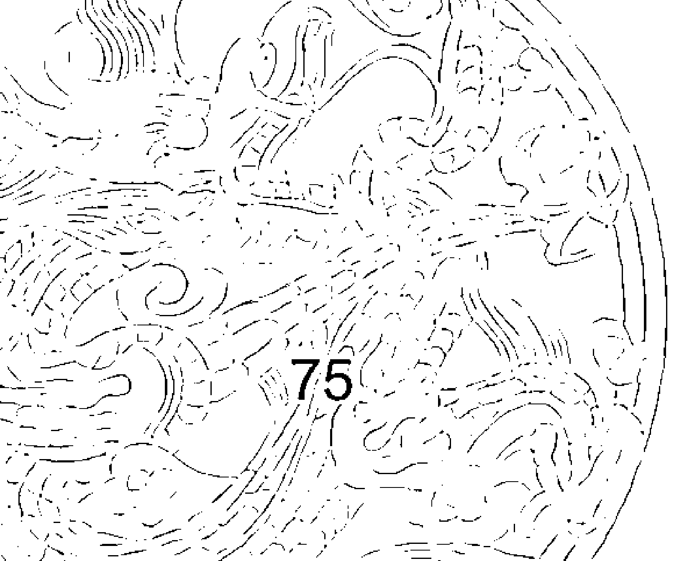

| 己 遷 | 庚 疾 | 辛 財 大官 | 壬 子 |
|---|---|---|---|
| 戊 奴 | | 癸 夫 大遷 | |
| 丁 官 大命 46/55 | | | 甲 兄 |
| 丙 田 36/45 | 丁 福 26/35 | 丙 父 16/25 | 乙 命 6/15 |

## 事業的貴人，怎麼算？

1. 此命盤本命官祿宮有權星。第一層解釋：表示命中事業成就的人。第二層解釋：成功的事業是自己創業。第三層解釋：權星表示有專業的本事，創業才能成功。
2. 大命46/55「重疊」官祿宮，有權星。第四層解釋：成功的事業，一定要在同業中嶄露頭角。第五層解釋：大命46/55有權星，表示46/55是事業成就的時間點。第六層解釋：大命有權星，表示創業後，一定要準備下一次事業的擴大。
3. 算命重點在精準掌握每一事件的時間從哪一年開始？哪一年結束？

### （五）天意的貴人，怎麼算？

#### 1. 四化十六爻＝天意

(1) 四六合天心，即四六合乃天之心，就是天意。
(2) 四化論述命中的定數，六爻論述格局的優勢。

- ① 四化星：祿星、權星、科星、忌星。
- ② 六爻星：祿權組、祿科組、祿忌組、權科組、權忌組、科忌組。

#### 2. 「天意」乃命中注定的事

天意分兩種：

- ① 命中注定的人生故事。
- ② 自己選擇的人生故事。

#### 3. 「順天意」才是善因緣

##### (1) 宗教的理論：

- ① 主述說好話，做好事就會有「善」因緣。
- ② 想上天堂的人可以接觸基督教，害怕入地獄的人可以接觸道教，害怕因果輪迴的人可以接觸佛教，這都是勸人為善、因果報應的宿命論。

##### (2) 華山派理論：

- ① 主述順天「命」＋順天「運」，就是「善」因緣。
- ② 華山派是教人悟透命理學的來龍去脈與前因後果、預測未來吉凶的學問，這是趨吉避凶、化險為夷的知命論。

| 己 遷 | 庚 疾 | 辛 財 大命 46/55 | 壬 子 36/45 |
|---|---|---|---|
| 戊 奴 | | 癸 夫 26/35 | |
| 丁 官 大財 | | 甲 兄 16/25 | |
| 丙 田 | 丁 福 大遷 | 丙 父 | 乙 命 大官 6/15 |

# 天意的貴人，怎麼算？

1. 祿星、權星、科星、忌星「四化星」任何一顆所在的宮位，就是貴人的位置。
2. 此命盤權星在命宮。解釋一：此人命中有貴人。解釋二：自己是自己的貴人。解釋三：自己有本事後貴人才會出現。
3. 大命走到46/55，也表示此人現在的年紀在46/55歲內。
4. 大命走到46/55，大官的宮位有權星。解釋一：大命46/55事業有貴人。解釋二：大命46/55事業有好運。

## 七、怎麼算命才會準？

### (一) 星辰派算命法，只能籠統的算命

1. 只能算現象的命理學
   (1) 星辰算命法：絕大多數老師是初階程度，只能算命不能算運，只有30%的精準度。
   (2) 這只是算命：只能「算」命中注定的事，這是簡單籠統的算命，沒有時間吉凶的分析。
算命實例：只能算「什麼生肖是貴人？什麼顏色是幸運色？什麼數字是幸運號碼？……」等等簡單的東西。

2. 傳統派算命法
   (1) 星辰＋習俗算命法：這是初階程度。只能論述或說明人事物的現象，沒有完整的時間＋吉凶，有30%以下的精準度。
   (2) 星辰＋宗教算命法：這是初階程度。只能論述或說明人事物的現象，沒有完整的時間＋吉凶，有30%以下的精準度。
   (3) 星辰＋飛星四化算命法：中階程度。只能論述或說明人事物的現象，沒有完整的時間＋吉凶，有50%的精準度。
註：為什麼命理老師不敢只利用一種算命方法，因他們所學或所知有限，所以才需要東扯西扯＋...


習俗宗教的東西來算命餬口。

### (二) 華山派算命法，才能完整的算運

1. 華山派命理學
   (1) 四化算命法：這是高階算運，可以算時間+吉凶+內容+影響，有95%的精準度。
       算命實例：以生小孩為例：命中有無生子的命？何時是生子的時間？今年生的子女帶財或帶衰？生子後會發生什麼事？
   (2) 這才是算運：只需要「祿、權、科、忌」四個字，就能單獨完整的算命，並精準掌握每一事件的吉凶，從哪一年月日開始至哪一年月日為止。
       算命實例：以升官為例：我升官的好機緣從哪一年月日開始至哪一年月日為止。

2. 華山派算命法
   (1) 生年四化＋自化算命法：這是高階的算運。可以精準掌握人事物的時間+吉凶+內容，有90%的精準度。
   (2) 生年四化＋飛星四化算命法：這是高階的算運。可以精準掌握人事物的時間+吉凶+內容，有90%的精準度。
   (3) 生年四化＋飛星四化＋自化算命法：這是最精準的算運。可以精準掌握人事物的時間+吉凶+內容+影響，有95%以上的精準度。
   (4) 左右昌曲「前世今生」算命法：這是最精準的「算」前世今生。獨立的算命方式，可以精準掌握七世因緣的果報輪迴，有95%以上的精準度。

# 貳、只要四顆星辰！教你立刻學會幫自己算命

### （三）賺錢行業，不用金木水火土怎麼算命？

你還在利用金木水火土算命工作嗎？太落伍了！因為，大家都聽不懂你在講什麼？劃時代創新的學問，華山派算工作你一定看得到，也知道每一種行業的賺錢時間，從哪一年月日開始至哪一年月日結束。

#### 1. 傳統派命理學

- (1) 算命完全聽不懂我應該做什麼行業：
  - ① 傳統派老師只能籠統幫人分析金木水火土「五行」的行業。
  - ② 這是初學者的算命法，也是最簡單的行業分類。
  - ③ 這是傳統命理老師似是而非的算命方法，全憑老師胡亂鬼扯，但問命者還是聽不懂。
- (2) 傳統派命理老師們，算行業都各有的五行說法，讓學習的人不知所措。
  - 算命實例：以八字為例，老師應該屬木的行業，但因開補習班做生意，又可以屬水。
  - 算命實例：以姓名學為例，有的老師以「音」為五行，有的老師以「字義」為五行。
  - 算命實例：以生肖學為例，把生肖分五行，也就是相同生肖都要做相同的五行行業，這是最不準的算命方法之一。
- (3) 傳統派老師不知道每一個賺錢行業的時間點從何時間開始。
  - 這是傳統派老師最欠缺的專業知識。無法清楚分辨出不同行業的屬性，也不知道選擇不同行業的賺錢時間點會完全不一樣。

#### 2. 華山派命理學

- (1) 在命盤上看得你要做的行業：

華山派從命盤上就可以清清楚楚看到我應該做的行業是什麼？完全公式化的專業知識。

(2) 一生的角度：這是長期利益的生涯規劃。
算命實例：本命命盤的田宅宮有M質，表示我事業的最大利益是做不動產行業。
算命實例：本命命盤的父母宮有M質，表示我事業的最大利益是當公務人員。

(3) 以十年的角度：這是短期利益的生涯規劃。
算命實例：大限命盤的福德宮有M質，表示未來十年我可以做養生的行業。
算命實例：大限命盤的疾厄宮有M質，表示未來十年我可以做健身的行業。
算命實例：大限命盤的子女宮有M質，表示未來十年最大利益的事業是合夥關係。

(4) 華山派可以算我選擇的行業能不能賺錢？何時可以賺錢？可以賺幾年？
應用宮位重疊十三盤合一，就可以精準掌握時間＋吉凶＋內容＋影響的個人最大利益。
算命實例：本命官祿宮＋大限父母宮＋大限父母宮，就確定現在創業會賺錢。

(5) 華山派在同一個時間點，可以幫人選擇不同的賺錢行業。
算命實例：本命官祿宮＋大限田宅宮，就確定現在做不動產的行業會賺錢；只要再＋流年命盤，就形成三盤合一，就可以確定何時會賺錢？確定賺錢可以賺幾年？
算命實例：本命官祿宮＋大限福德宮＋大限福德宮，就確定現在養身的行業可以賺錢。
算命實例：本命官祿宮＋大限父母宮＋大限父母宮，就確定現在養身的行業可以賺錢。
表示做養身的行業可以賺錢。
算命實例：本命官祿宮＋大限父母宮＋大限父母宮，就確定現在創業會賺錢。
表示夫妻一起創業可以賺錢。

因選擇不同的行業，所以需要不同的宮位來交集，才能確定這個行業可不可以賺錢。
(6) 華山派命理學是一層又一層往下追問的學問。
第一層實例：本命福德宮有M質，表示命中是可以追求夢想的人。
第二層實例：本命福德宮有M質＋大限官祿宮，表示未來十年可以追求自己的夢想。
第三層實例：本命福德宮有M質＋大限福德宮「交集」本命官祿宮＋大限官祿宮。這是四個宮位的組合，表示未來十年追求夢想的事業可以賺錢。
第四層實例：本命福德宮有M質＋大限福德宮「交集」本命官祿宮＋大限官祿宮「交集」本命父母宮＋大限父母宮。這是六個宮位的組合，表示未來十年追求夢想的事業可以夢想成真。

> 附註：精準掌握每一事件的時間＋吉凶＋內容＋影響，這是進階的專業課程，需要一連串的公式組合才能完成所有你想知道的人生規劃。

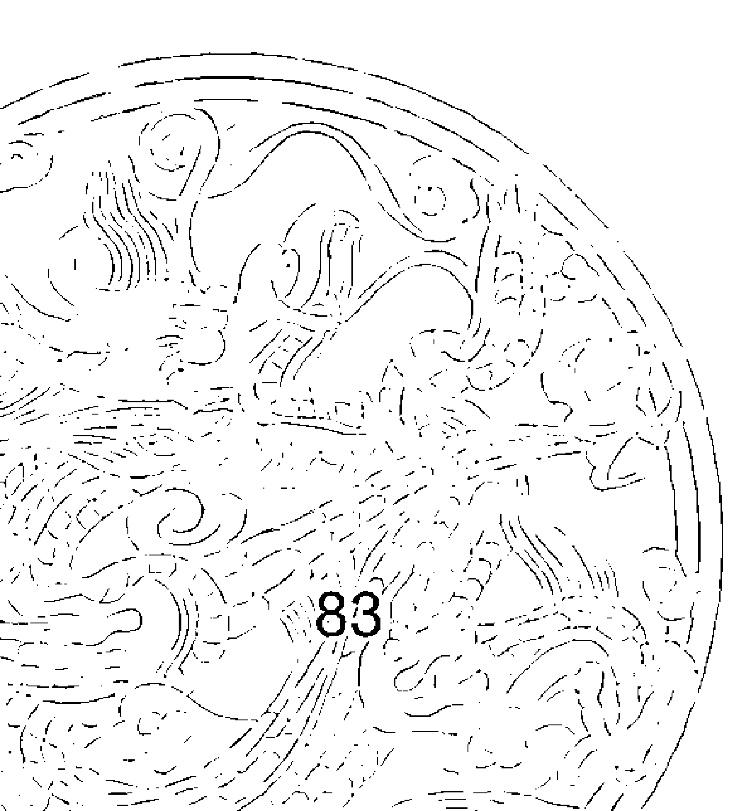

# 參、生年四化與自化的入門

「命」是先天注定的因緣，這是傳統派命理老師80%都會的本事。
「運」是後天自己的選擇，這是華山派命理引以為傲的發明。
華山派致力於命理學的創新與改革已經十八年，至今一憂一喜。憂的是，命理學的進化跟不上社會的變遷；喜的是，史上第一本完整公式的飛星四化書——《學紫微斗數，這本最神準》，已經在二〇一七年一月出版了，至今仍持續熱賣中。現在乘勝追擊，推出史上第一本完整公式的生年四化與自化的書，希望有心學習紫微斗數的愛好者也能一起分享我的喜悅。
以紫微斗數算命的方法共分為五大類，包括星辰、生年四化、飛星四化、左右昌曲、自化等，說明如下：
1. 星辰：不可以單獨算命，只能簡單分析命中的現象，有25%的精準度。
2. 飛星四化：可以單獨完整的算命，有85%的精準度。
3. 生年四化：可以單獨完整的算命，有85%的精準度。
4. 左右昌曲：可以單獨完整的算命，有85%的精準度。
5. 自化：不可以單獨算命，但卻是精準算命必須具備的基礎大架構。
其中星辰算命法雖然只有25%的準確度，卻有高達95%以上的傳統命理老師利用此法來算命，難怪三成的高級知識份子會把命理看成是一種宗教、迷信的行業。而生年四化、飛星四化、左右昌曲等三種算命法，都可以單獨、完整的算命，這是命理學未來專業、學術的主流。綜上所述，真正的算命需要一連串的公式組合，才能精準掌握未來人事物的吉凶，意即：
1. 應用「生年四化＋飛星四化」，可以精算未來每一事件的吉凶，有90%的精準度。
2. 應用「生年四化＋自化」，可以精算未來每一事件的吉凶，有90%的精準度。
3. 應用「飛星四化＋生年四化＋自化」，可以精算未來每一事件的吉凶，有95%的精準度。
4. 應用「前世星辰＋飛星四化＋生年四化＋自化」，可以精算前世今生的輪迴，也可以算七世因緣的果報，有95%的精準度。

## 一、生年四化的基本知識

#### (二) 生年四化的概念

1. 簡稱代號：
   (1) 生年四化＝祿星、權星、科星、忌星，又稱「四化星」。
   四化星＝祿、權、科、忌＝M質。
   M質＝祿（A）、權（B）、科（C）、忌（D）。
   (2) 十二宮位簡稱：
   四化星簡稱：祿＝A，權＝B，科＝C，忌＝D。
   命宮（命）、兄弟（兄）、夫妻（夫）、子女（子）、財帛（財）、疾厄（疾）、遷移（遷）、

2. 主要星辰：
   (1) 紫微星系簡稱：天機（機）、太陽（日）、武曲（武）、天同（同）、廉貞（廉）。
   (2) 天府星系簡稱：太陰（月）、貪狼（貪）、巨門（巨）、天相（相）、天梁（梁）、七殺（殺）、破軍（破）。
   (3) 前世星辰簡稱：左輔（左）、右弼（右）、文昌（昌）、文曲（曲）。

3. 星辰的男女星：
   (1) 紫微（女）星系：天機、太陽、武曲（女）、天同、廉貞（丙女）。
   (2) 天府（男）星系：太陰（女）、貪狼、巨門（女）、天相、天梁、七殺、破軍（女）。
   (3) 前世星辰：左輔、右弼（女）、文昌、文曲（女）。

4. 人事物的宮位：
   - 在人位：命、兄、夫、子、奴、父，即「六親位」。
   - 在事位：官、疾、遷。
   - 在物位：財、田、福。

5. 運勢的分類：
   - 本命命盤：論述一生的命，又稱本命或本命盤。
   - 大限命盤：論述十年的運，又稱大命或大限盤。
   - 流年命盤：論述一年的運，又稱流命或流命盤。
   - 流月命盤：論述一月的運，又稱流月或流月盤。

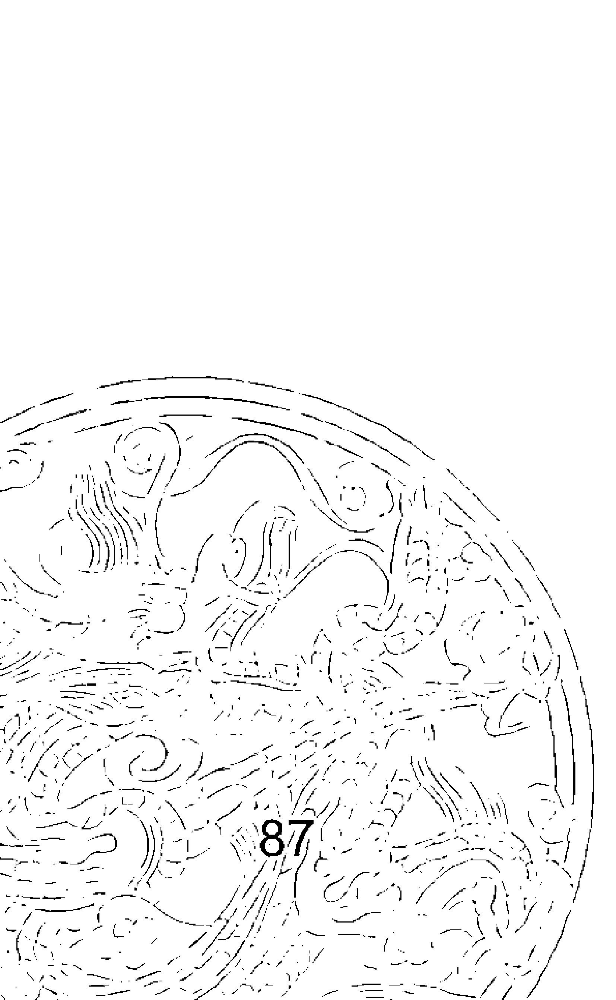

6. 華山派紫微斗數的分類：
   - 流日命盤：論述一日的運，又稱流日或流日盤。
   - 流時命盤：論述時辰的運，又稱流時或流時盤。
   - 星辰算命法：論述命中注定「現象」的因緣。
   - 自化算命法：論述命中注定「吉凶」的因緣。
   - 飛星四化算命法：論述命中注定「空間」的因緣。
   - 生年四化算命法：論述命中注定「時間」的因緣。
   - 前世星辰算命法：論述命中注定「宗教」的因緣。

7. 生年四化、飛星四化、左右昌曲：
   - 生年四化：論述命中的福報是從「命中注定」的緣分而來，這是上天安排的人生故事。
   - 飛星四化：論述命中的福報是從「強求強要」的緣分而來，這是自己選擇的人生故事。
   - 左右昌曲：論述命中的福報是從「前世今生」的緣分而來，這是三世因果的輪迴故事。

### (二) 生年四化的意義

#### 1. 生年四化怎麼產生？

依樣當事人出生時的天干而產生四化星，即稱為「生年四化」。

算命實例：西元二〇一七年出生者即為丁酉年，丁天干的十干化曜（請參考本書第50頁）為「陰同機巨」，因此，太陰化祿星，天同化權星，天機化科星，巨門化忌星。祿權科忌所在的宮位就是生年四化。

#### 2. 生年四化怎麼算命？

生年四化就是祿權科忌這「四化星」，四化星所在的宮位就可「算」命中註定的因緣，而且可以單獨、完整的算命。

**算命實例：**

祿星在命宮：表示人生重點就是把自己訓練成生意人，唯有把自己變成「能幹、奸巧」才能創造財富。

權星在子女宮：表示命中有子女，對子女的管教方式為「原則、引導」。

科星在官祿宮：表示會讓事業成功的三要素為「名聲、口碑、特色」。

忌星在田宅宮：表示當有錢時，買房子是最好的投資之一。

#### 3. 生年四化怎麼算空間？

生年四化所在的宮位，本命命盤「重疊」大限命盤合起來的解釋即為「空間」。

**算命實例：**本命命盤的命宮有權星「重疊」35/44大限命盤的子女宮，即本命有權星「重疊」大限子女，表示35/44大限，創業成功的條件是與人合夥。

#### 4. 生年四化的算命技巧：

先論第一層的「存在」，再論第二層的「內容」。

1. 論存在時：祿＝權＝科＝忌。
算命實例：子女宮有M質時，表示命中有子女。不論M質是祿星、權星、科星、忌星，都表示此人命中有子女。

2. 論內容時：祿≠權≠科≠忌。算命有定位才有定數。也就是先確定算命的方向才能精準算命。

算命實例：子女宮有M質，假如算命的定數是管教，那麼教育子女的方法就一定要有所區別。

子女宮有祿星：表示管教的方式是隨緣、隨性的輔導，才能找到適合子女的最大利益。
子女宮有權星：表示管教的方式是原則、利誘的輔導，才能找到適合子女的最大利益。
子女宮有科星：表示管教的方式是愛心、耐心的管教，才能找到適合子女的最大利益。
子女宮有忌星：表示管教的方式是陪伴、身教的管教，才能找到適合子女的最大利益。

附註：進階的算命是往下第三層、第四層……，一層又一層地往下精準分析當事人所想要問的問題。

### (三) 生年四化的內涵

- 1. 四六合天心：
  (1) 四化星：祿星、權星、科星、忌星等四顆星，稱為「四化星」。
  (2) 六爻星：祿權、祿科、祿忌、權科、權忌、科忌等六種組合，稱為「六爻星」。
  (3) 四六合天心：四六合乃天之心，也就是說：四化十六爻就會形成天意。天意分為兩種形成方式：一是生年四化所組成的命中注定的人生故事；二是飛星四化所組成自己選擇的人生故事。

- 2. 四化星的因緣：
  (1) 定數：論述七世因緣果報，此為命中格局的最大優勢。
  (2) 在數：論述現在進行式的因緣，為大限利益的規劃。
  (3) 應數：論述未來式的因緣，為人生富貴丁壽的規劃。

#### 3. 四化星算命的定數：

# 參、生年四化與自化的入門

生年四化（四化星）= 祿、權、科、忌；M質可以表示任何一顆四化星。

簡稱：祿 = A，權 = B，科 = C，忌 = D。

任何一顆四化星（M質）：都表示命中註定的事。

任何一顆四化星（M質）：都表示永久佔有的現象或宮位。

任何一顆四化星（M質）：都表示有其象必有其物，物質不滅定律。

#### 4. 四化星在算命的表達方式：

- (1) 四化 = M質，算命的表達方式有五種：
  十二宮位中，有M質所在的宮位都可以算「存在」。
  十二宮位中，有M質所在的宮位都可以算「貴人」。
  十二宮位中，有M質所在的宮位都可以算「欠債」。
  十二宮位中，有M質所在的宮位都可以算「有緣」。
  十二宮位中，有M質所在的宮位都可以算「有運」。

#### 5. 格局的公式：

人生的大格局共分為祿權、祿科、祿忌、權科、權忌、科忌等六爻，也就是六種命格。

無忌星的組合：包括祿權、祿科、權科等三種。

有忌星的組合：包括祿忌、權忌、科忌等三種。

三象一物（請參考本書第371頁）之媒介的星辰就是第三顆星辰，它是人生就必須經歷的宮位。

而事業想加倍發展或企業想永續經營，都必須先經歷第三顆星辰或忌星的折磨後，才能成為人生成功。

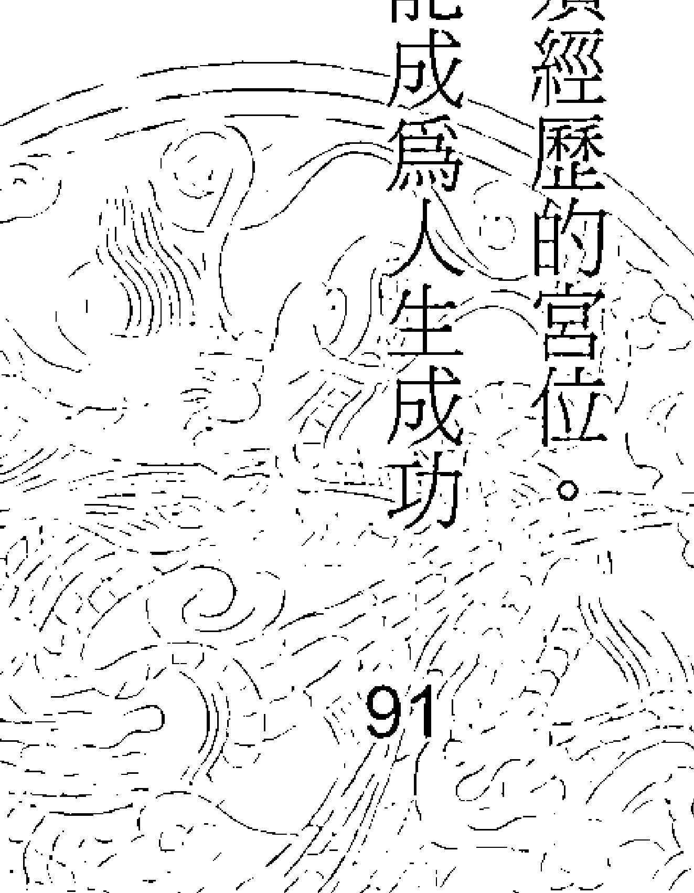

#### 6. 格局的媒介：
- 祿權的格局：媒介在忌星，忌星的宮位就是命中最好的十年運之一。
- 祿科的格局：媒介在忌星，忌星的宮位就是命中最好的十年運之一。
- 祿忌的格局：媒介在權星，權星的宮位就是命中最好的十年運之一。
- 權科的格局：媒介在忌星，忌星的宮位就是命中最好的十年運之一。
- 權忌的格局：媒介在科星，科星的宮位就是命中最好的十年運之一。
- 科忌的格局：媒介在祿星，祿星的宮位就是命中最好的十年運之一。

### （四）命理學的基本知識

學命理相關知識比命理本身還更重要，這是華山派最引以為傲的論述。因為，不知道「前因」就無法了解「後果」；不知道「來龍」就無法清楚「去脈」。而真正的命理學是可以一層又一層往下追問的學問。現分析命理學的基本常識如下：

- 1. 命理學＝天時＋地利＋人和。其中天時占50%，地利占25%，人和占25%；命＋運占50%，陽宅十陰宅占25%，個人條件占25%。
- 2. 算命的技巧：請注意算命的順序，才能精準掌握未來的人事物。算命第一重點是先有本命命盤。本命命盤占60%，大限命盤占30%，流年命盤占10%。算命第二重點是再有大限命盤。大限命盤占60%，流年命盤占30%，流月命盤占10%。算命第三重點是最後才有流年命盤。流年命盤占60%，發生事件占30%，生肖占10%。

#### 3. 看房子的技巧：

- 1. (1) 看房子是以山川大地為主的規劃。山川大地占60%，四周環境占30%，室內擺設占10%。
  看陽宅風水的第一重點在「天時」，所以，一定要先確定搬家、動工、開幕會發生什麼事。搬遷的時間占70%的吉凶，也就是在搬家或動工或開幕時，即已確定未來會不會賺錢了。
- 2. (2) 以四周環境為主的規劃。四周環境占60%，住家大門占30%，室內擺設占10%。
  看陽宅風水的第二重點在「地利」，所以，一定要先確定房屋位置（占70%的吉凶），接著才有房屋本身大門十室內擺設的問題（占30%的吉凶）。
- 3. (3) 以住家大門為主的規劃。住家大門占60%，室內擺設占30%。
  這只是個人居住舒適不舒適的問題，和房屋本身的吉凶並沒有直接的關係。
  題，看陽宅風水的第三重點在「大門」，所以，一定要先確定大門的位置。但傳統風水老師90%以上因為不學無術，硬是把每一戶的大門都說成要開在「龍邊」，這是無知或誤用的看風水方式。

#### 4. 看大樓的技巧：

大樓大門占60%，各棟大門占30%，住家大門占10%。

傳統老師因為所知有限，誤用了風水學，把住家大門十室內擺設當成看陽宅的全部依據，殊不知，自家住宅只占陽宅風水的10%而已。

#### 5. 看墓地的技巧：

尋龍為主占60%，點穴為輔占30%，墓地設計占10%。

傳統風水老師99%以上不知道真正的尋龍點穴是什麼，只會在房屋附近觀看五行方位，卻不知「尋龍點穴未精通，八卦五行失其用」的道理。

天地人三盤：就是在天成象的「本命命盤」，在地成形的「大限命盤」，在人成事的「流年命盤」。

### (五) 天地人三盤是什麼？

# 命理的基本常識

| 項目 | 體 | 用 | 應 |
|------|----|----|----|
| 三才 | 天 | 地 | 人 |
| 命理學 | 天時50% | 地利25% | 人和25% |
| 命理學 | 命理吉凶50% | 地理吉凶25% | 個人條件25% |
| 格局一 | 大格局 | 中格局 | 小格局 |
| 格局二 | 在天成象 | 在地成形 | 在人成事 |
| 算命一 | 本命命盤60% | 大限命盤30% | 流年命盤10% |
| 算命二 | 命理專業60% | 生涯規劃30% | 顏色生肖10% |
| 算命三 | 天意時間60% | 注定事件30% | 生涯規劃10% |
| 看墓地 | 尋龍為主60% | 點穴為輔30% | 墓地設計10% |
| 看房子 | 山川大地60% | 四周環境30% | 室內擺設10% |
| 看大樓 | 大樓大門60% | 各棟大門30% | 住宅大門10% |
| 改運 | 天意時間60% | 改運事件30% | 避災東西10% |
| 轉運 | 天意時間60% | 轉運事件30% | 富貴東西10% |
| 富貴 | 大富由天60% | 中富由勤30% | 小富由儉10% |
| 宗教 | 情盡緣未了 | 緣盡情未了 | 情緣皆了了 |

# 參、生年四化與自化的入門

算命要一次活用這三種命盤，才是完整的算命方式。

- 算流年：一定要以本命＋大限＋流年三種命盤形成相同的現象，流年才能成立。
- 算流月：一定要以本命＋大限＋流年＋流月四種命盤形成相同的現象，流月才能成立。
- 算流日：一定要以本命＋大限＋流年＋流月＋流日五種命盤形成相同的現象，流日才能成立。

## 二、生年四化所在的宮位，才能產生貴人的因緣

本命——
大限——
流年——
流月——
流日——
流時——

1. 生年四化「四化星」＝祿、權、科、忌＝M質，其中任何一顆星都可以代表M質。

### （一）四化星就是本命命盤的生年四化

1. 生年四化：由出生年的天干飛出的生年四化而產生，故M質又稱「生年四化星」。

2. 生年四化會出現在什麼地方呢？
- (1) 本命命盤：本命命盤是唯一會出現生年四化的地方。
- (2) 大限命盤：大限命盤本身不會產生生年四化，只是行運走到（重疊）有M質的本命命盤才會遇到生年四化。
- (3) 流年命盤：流年命盤本身不會產生生年四化，只是行運走到（重疊）有M質的本命命盤才會遇到生年四化。

### (二) 有四化星的宮位就會出現貴人相助

M質在十二宮位時要如何解釋貴人？

- 1. 生年四化在命宮。算命解釋：命中會因貴人相助而成功。
- 2. 生年四化在兄弟宮。算命解釋：命中兄弟姊妹是貴人或因兄弟姊妹的關係而找到貴人。
- 3. 生年四化在夫妻宮。算命解釋：結婚後，事業會因貴人相助而好轉。
- 4. 生年四化在子女宮。算命解釋：生了子女後，事業會因貴人相助而好轉。
- 5. 生年四化在財帛宮。算命解釋：命中會因貴人相助而賺大錢。
- 6. 生年四化在疾厄宮。算命解釋：當勞心勞碌後，事業會因貴人相助而成功。
- 7. 生年四化在遷移宮。算命解釋：出外才能遇到貴人相助而成功。
- 8. 生年四化在奴僕宮。算命解釋：可因朋友相助而成事業。
- 9. 生年四化在官祿宮。算命解釋：事業會因貴人相助而成功。
- 10. 生年四化在田宅宮。算命解釋：買房子會遇到貴人相助而賺大錢。
- 11. 生年四化在福德宮。算命解釋：追求夢想才能遇到貴人相助而成功。
- 12. 生年四化在父母宮。算命解釋：事業會因父母幫助而成功。

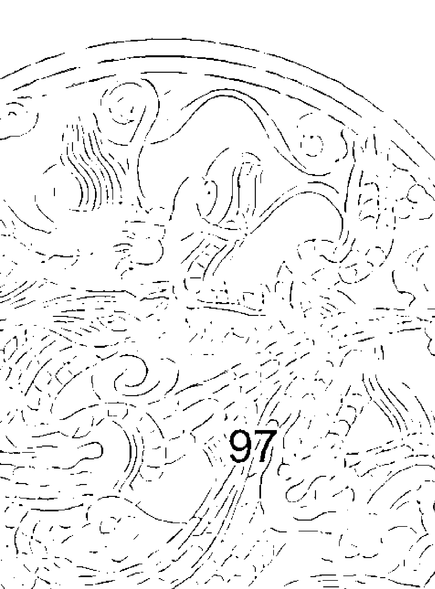

## 三、生年四化的重點在「宮位重疊」

### （一）「宮位重疊」是什麼？

- 1. 宮位重疊的定義：
  生年四化的M質重疊大限的十二宮位，簡單的說就是：「M質+大限十二宮位」會在同一個宮位上，而M質重疊大限命盤的任何宮位都可以直接算命。

- 2. M質在本命命盤可以直接「算命」。
  這是完整的算命方式，算命有90%以上的精準度。

- 3. M質在大限命盤可以直接「算運」。
  本命命盤＋M質＝標準算命。
  這是完整的算運方式，算運有70%以上的精準度。

- 4. 有M質的宮位都可以解釋五種現象，即存在、貴人、欠債、有緣、有運等。這五種算命的現象，不是要你一次算五種現象，而是找出你認為好算或會算的現象才進行算命。

| 大財 | 大子 | 大夫 | 大兄 |
|------|------|------|------|
| 奴   | 遷   | 疾   | 財   |
| B    |      |      | A    |
| C    |      |      |      |
| 福   | 父   | 命   | 兄   |
| 大奴 | 大官 | 大田 | 大福 |

1. 四化星：祿星、權星、科星、忌星。簡稱：祿＝A，權＝B，科＝C，忌＝D。

2. 宮位重疊：表示一種命盤與另一種命盤重疊在同一個宮位內，即為「宮位重疊」。

3. 宮位重疊+任何四化星（祿、權、科、忌），就是標準的四化算命法，也是一種完整的算命方式。

解盤：

- (1) 化祿在本子重疊大命 解釋：此大限有子女、桃花。
- (2) 化權在本官重疊大疾 解釋：此大限工作事必躬親。
- (3) 化科在本田重疊大遷 解釋：此大限在外買不動產。
- (4) 化忌在本疾重疊大夫 解釋：此大限夫妻無緣因緣。

### (二) 四化星與本命命盤、大限命盤、流年命盤的關係

1. 生年四化（四化星）＝祿、權、科、忌＝M質，任何一顆四化星都可以代表M質。M質簡稱：祿＝A，權＝B，科＝C，忌＝D。

2. 四化星與本命命盤、大限命盤、流年命盤的關係。
  算命：M質＋本命命盤，即為M質「重疊」本命命盤。
  算運：M質＋本命命盤＋大限命盤，即為M質「重疊」本命命盤、大限命盤。
  算流年：M質＋本命命盤＋大限命盤＋流年命盤，即為M質「重疊」本命命盤、大限命盤、流年命盤。

3. 本命命盤＋M質可以單獨算命。
  可算「命中注定」的事，只是「算現象」就有90％以上的精準度，「算運」只有30％以下的精準度，因為，還沒有「時間＋吉凶」的加入。

4. 大限命盤＋M質，可以單獨算命，可算「現在想問的事」。
  大限命盤＋M質，「算運」只有60％的精準度。傳統命理老師90％以上只利用大限命盤來算運，但正確算運需要「本命命盤＋M質」＋「大限命盤＋M質」，兩者一定要形成相同的現象，精準度才能提升到75％以上。

5. 流年命盤＋M質，絕對不可以單獨算命，只能算今年的小事件。
  流年命盤＋M質，「算運」只有20％以下的精準度。
  傳統老師90％以上只會利用單一流年命盤來算吉凶，這是完全不正確的算命方式。正確算吉凶需要「本命命盤＋M質」＋「大限命盤＋M質」＋「流年命盤＋M質」，三者形成相同的現象，精準度才能提升到90％以上。

### （三）宮位重疊的實例分析

。這是祿權科忌都在的本命命盤

| 辛 遷 | 王 疾 | 癸 財 45/54 | 甲 子 35/44 |
|---|---|---|---|
| 庚 奴 | | 乙 夫 25/34 | |
| 己 官 | | 丙 兄 15/24 | |
| 戊 田 | 己 福 (祿)(科) | 戊 父 (權) | 丁 命 05/14 (忌) |

○ 這是祿權科忌「重疊」本命命盤十大限命盤

| 大夫 | 大兄 | 大命 | 大父 |
|------|------|------|------|
| 辛 遷 | 壬 疾 | 癸 財 45/54 | 甲 子 35/44 |
| 庚 奴 | | | 乙 夫 25/34 |
| 己 官 | | | 丙 兄 15/24 |
| 戊 田 | 己 福 祿科 | 戊 父 權 | 丁 命 05/14 忌 |

| 列1 | 列2 | 列3 | 列4 |
|-----|-----|-----|-----|
| 流财<br>大夫<br>遷辛 | 流子<br>大兄<br>疾壬 | 流夫<br>大命<br>財癸<br>45/54 | 流兄<br>大父<br>子甲<br>35/44 |
| 流疾<br>大子<br>奴庚 | | | 流命<br>大福<br>夫乙<br>25/34 |
| 流遷<br>大財<br>官己 | | | 流父<br>大田<br>兄丙<br>15/24 |
| 流奴<br>大疾<br>田戊 | 祿科<br>流官<br>大遷<br>福己 | 權<br>流田<br>大奴<br>父戊 | 忌<br>流福<br>大官<br>命丁<br>05/14 |

> 。這是祿權科忌「重疊」本命盤十大命盤＋流年命盤

# ○ 這是M質「重疊」本命命盤十大限命盤

| M 大疾 奴 | M 大財 遷 | M 大子 疾 | M 大夫 財 45/54 |
| M 大遷 官 | | | M 大兄 子 35/44 |
| M 大奴 田 | | | M 大命 夫 25/34 |
| M 大官 福 | M 大田 父 | M 大福 命 05/14 | M 大父 兄 15/24 |

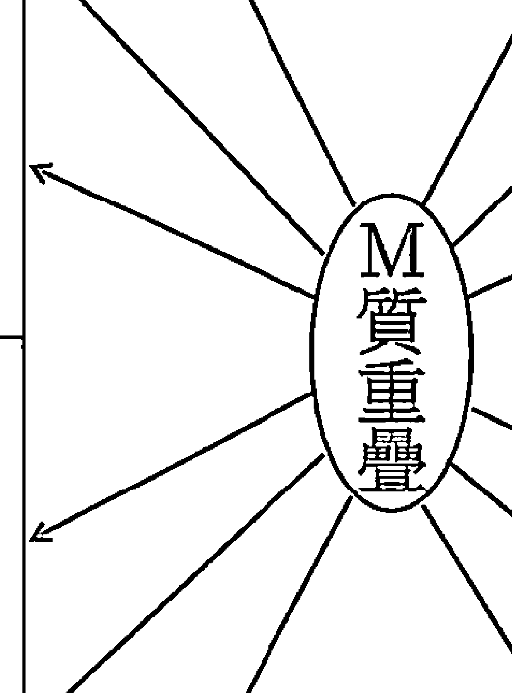

# 參、生年四化與自化的入門

標準命盤：女命 己未年 40歲

|| 文曲(忌) 太陽 | 破軍 | 右弼 左輔 天機 | 天府 紫微 |
|---|---|---|---|---|
| 己巳 | 大夫 父母<br>13 22 | 庚午 | 大兄 福德<br>23 32 | 辛未 | 大命 田宅<br>33 42 | 壬申 | 大父 官祿<br>43 52 |
| 11.23.35.47.59.71 | | 12.24.36.48.60.72 | | 1.13.25.37.49.61 | | 2.14.26.38.50.62 | |
| 武曲(祿) | | 科 | | 科 | | 文太 陰昌 →科 |
| 10.22.34.46.58.70 | | | | | | 3.15.27.39.51.63 |
| 戊辰 | 大子 命宮<br>03 12 | | | | | 癸酉 | 大福 奴僕<br>53 62 |
| 天同 | | | | | | 貪狼(權) |
| 9.21.33.45.57.69 | | | | | | 4.16.28.40.52.64 |
| 丁卯 | 大財 兄弟 | | 天梁(科) | | 天相 廉貞 | | 甲戌 | 大田 遷移<br>63 72 |
| 七殺 | | | | | | | 巨門 |
| 8.20.32.44.56.68 | | 7.19.31.43.55.67 | | 6.18.30.42.54.66 | | 5.17.29.41.53.65 | |
| 丙寅 | 大疾 夫妻 | 丁丑 | 大遷 子女 | 丙子 | 大奴 財帛<br>83 92 | 乙亥 | 大官 疾厄<br>73 82 |

忌←

權←

權←

忌

→科

| 己 父 (忌) | 庚 福 | 辛 田 | 壬 官 |
| :---: | :---: | :---: | :---: |
| 戊 命 (祿) | | | 癸 奴 |
| 丁 兄 | | | 甲 遷 (權) |
| 丙 夫 | 丁 子 (科) | 丙 財 | 乙 疾 |

# 。本命命盤的簡易命盤及分析：

1. 本命命盤簡稱「本命盤」或「本命」，可算「命中注定」的事。
2. 本命命盤即上圖命盤中間的下面，顯示出十二宮位的位置，如命宮、兄弟、夫妻、子女：……等。
3. 只要祿星、權星、科星、忌星等四化星，就是完整的算命方式。算命的重點是先找到祿星、權星、科星、忌星等四顆星的位置。
4. 上圖命盤：
  (1) 祿星：在本命命盤的命宮位置。
  (2) 權星：在本命命盤的遷移宮位置。
  (3) 科星：在本命命盤的子女宮位置。
  (4) 忌星：在本命命盤的父母宮位置。

# 參、生年四化與自化的入門

| 己 大夫 (忌) 13/22 | 庚 大兄 23/32 | 辛 大命 33/42 | 壬 大父 43/52 |
|-------------------|---------------|---------------|---------------|
| 戊 大子 (祿) 3/12 | | 癸 大福 | |
| 丁 大財 | | 甲 大田 (權) | |
| 丙 大疾 | 丁 大遷 (科) | 丙 大奴 | 乙 大官 |

析：大限（大命）命盤的簡易命盤及分

- 1. 大限命盤簡稱「大限盤」或「大命盤」，可算「未來十年運勢的吉凶」。
- 2. 大限命盤即上圖命盤中間，顯示大命十二宮位的位置，如大命、大兄、大夫、大子……等。
- 3. 算運的重點就是找到祿星、權星、科星、忌星等四化星的位置，上圖命盤：
- 4. 上圖命盤：
  (1) 祿星：在大子的位置。
  (2) 權星：在大田的位置。
  (3) 科星：在大遷的位置。
  (4) 忌星：在大夫的位置。


| 己 大夫 (忌) 13/22 | 庚 大兄 23/32 | 辛 大命 33/42 | 壬 大父 43/52 |
|--------------------|---------------|---------------|---------------|
| 戊 大子 (祿) 3/12 |               |               | 癸 大福       |
| 丁 大財            |               |               | 甲 大田 (權)  |
| 丙 大疾            | 丁 大遷 (科)  | 丙 大奴       | 乙 大官       |

# 大限命盤的簡易命盤：

# 本命命盤「重疊」大限命盤的分析

1. 本命命盤＋大限命盤「本命命盤「重疊」大限命盤，可算未來十年人、事、物的吉凶。
2. 利用「本命＋大限」來算吉凶，只要從祿星、權星、科星、忌星等四化星來看。
3. 上圖命盤：
   (1) 祿星：在命宮「重疊」大子的位置。
   (2) 權星：在遷移宮「重疊」大田的位置。
   (3) 科星：在子女宮「重疊」大遷的位置。
   (4) 忌星：在父母宮「重疊」大夫的位置。

## 四、生年四化的算命與算運

### （二）算命與算運怎麼形成？

算命或算運的條件一定要有生年四化（M質），所有人、事、物的因緣才會存在。

算命的公式：本命命盤＋M質，可以算命中注定的因緣。
算命的重點在「算」現象，「算」命中注定的事，「算」命中欠誰的債，「算」命中的優勢在哪裡？「算」成功的個性是什麼？

算運的公式：本命命盤＋大限命盤，兩盤合一，算未來十年人事物理的吉凶。
算運的重點在「算」時間十吉凶，「算」每一事件的吉凶，「算」每一事件的影響，「算」每一事件成功或失敗的內容。

1. 算命是依據本命命盤來推算。
2. 算運是依據大限命盤來推算，但必須和本命命盤形成相同的現象。
   (1) 算運的公式：本命命盤＋大限命盤，兩盤合一，算未來十年人事物理的吉凶。
   (2) 成功的條件＝決定的流年十三個條件。
   (3) 失敗的條件＝決定的流年十三個條件。
3. 算流年是依據流年命盤來推算，但必須和本命命盤＋大限命盤形成相同的現象。
   算流年的公式＝本命命盤＋大限命盤＋流年命盤，三盤合一，流年的吉凶才會存在。

算命實例：結婚成功＝二〇一七年十一月在一起＋父母介紹＋換工作＋搬家＋奉子成婚。
算命實例：事業失敗＝二〇一七年三月開始創業＋新交女朋友＋搬家＋擴大經營。

4. 算生肖是依據流年命盤來推算，但必須和本命命盤＋大限命盤＋流年命盤已形成吉凶後，生肖才會存在。

算流年的重點在「算」算每一事件的得失與成敗：「算」何時創業，就決定事業會不會賺錢。「算」何時結婚，就決定婚姻會不會無情。「算」何時搬家，就知道會發生什麼事。「算」何時生小孩，就知道小孩帶財還是帶衰。

算生肖的公式「本命命盤＋大限命盤＋流年命盤＋吉凶確定後，生肖的吉凶才會存在。

算生肖的重點在「算」每一事件中出現的生肖會發生什麼事？帶財還是帶衰：「算」創業前出現生肖馬的人，我會發生什麼事？「算」創業後出現生肖馬的人，我會發生什麼事？切記！兩者成敗的因緣一定不一樣。「算」二〇一八年三月出現生肖馬的人，他是我的什麼姻緣？是不是結婚的對象？「算」二〇一八年十月在一起的女生（屬雞），對我的事業會有什麼影響？

5. 現代科學的算命。

問題：怎麼算結婚運？

- **(1) 初級論命：**
  傳統派命理：「算」先天結婚的命。
- **(2) 華山派命理：**
  「算」先天結婚的命，30歲在一起的人是正緣，這是初階算「時間」。
- **(3) 高階論命：**
  華山派命理：「算」我應該怎麼做才能找到真命天子（天女），這是進階算「內容」。
  相同時間遇到不同生肖，我會發生什麼事？

# 叁、生年四化與自化的入門

不同時間遇到相同生肖，我會發生什麼事？
不時間所遇到的感情，一定會有不一樣的結果，這是高階算「影響」。
(4)真正的命理學：
是一層又一層往下追問的功夫。
是深究前因後果與來龍去脈的學問。

# 本命命盤的簡易命盤：

| 己 父 (忌) | 庚 福 | 辛 田 | 壬 官 |
| :---: | :---: | :---: | :---: |
| 戊 命 (祿) |  |  | 癸 奴 |
| 丁 兄 |  |  | 甲 遷 (權) |
| 丙 夫 | 丁 子 (科) | 丙 財 | 乙 疾 |

### （二）本命命盤的重點在算命

1. 本命命盤「算」命中注定的事。

2. 本命命盤即上圖命盤，顯示十二宮位的位置，如命、兄、夫、子……等，這是十二宮位的簡稱。

3. 四化星所在的位置與解釋：
   (1) 祿星：在本命命宮的位置。
   解釋：命中生意格，能屈能伸是天性。
   (2) 權星：在本命遷移宮的位置。
   解釋：先天出外才能遇到貴人相助的命。
   (3) 科星：在本命子女宮的位置。
   解釋：先天有子女的命。
   (4) 忌星：在本命父母宮的位置。
   解釋：命中與父母無緣，不是在一起不合就是分開居住的命。

# 参、生年四化与自化的入门

| 辛 迁 | 壬 疾 | 癸 财 45/54 | 甲 子 35/44 |
| :--- | :--- | :--- | :--- |
| 庚 奴 | | | 乙 夫 25/34 |
| 己 官 | | | 丙 兄 15/24 |
| 戊 田 | 己 福 (禄)(科) | 戊 父 (权) | 丁 命 05/14 (忌) |

### 本命盘怎么算命？

1. 算命是依据本命命盘来推算。
2. 算命 = M质+本命命盘的解释。

(1) 禄星在本命福德宫就可以直接算命。
算命解释：表示有传宗接代的命。

(2) 权星在本命父母宫就可以直接算命。
算命解释：表示此人命中是主管、老板、专业的命格。

(3) 科星在本命福德宫就可以直接算命。
算命解释：表示追求梦想的人。

(4) 忌星在本命命宫就可以直接算命。
算命解释：表示是活在自己世界的人，执着心重，很难进入别人的世界。

### （三）大限命盤的重點在算運

1. 大限命盤即上圖命盤，顯示十二宮位的位置，如大命、大兄、大夫、大子……等，也是「大命命盤」的簡稱。

2. 大限命盤可「算未來十年運勢的吉凶」。

3. 四化星所在的位置與解釋：

(1) 祿星：在大子的位置。算運解釋：這十年（33／42）有生子女的好運。

(2) 權星：在大田的位置。算運解釋：這十年（33／42）有買房子的好運。

(3) 科星：在大遷的位置。算運解釋：這十年（33／42）有出外逢貴的好運。

(4) 忌星：在大夫的位置。算運解釋：這十年（33／42）會遇到人第一次的正緣。

| 大夫 (辛 遷) | 大兄 (壬 疾) | 大命 45/54 (癸 財) | 大父 35/44 (甲 子) |
| :--- | :--- | :--- | :--- |
| 庚 奴 | | | 乙 夫 25/34 |
| 己 大財 官 | | | 丙 兄 15/24 |
| 戊 大疾 田 | 己 福 遷 (祿 科) | 戊 父 奴 (權) | 丁 命 官 05/14 (忌) |

### 大限命盤怎麼算運？

1. 算運是依據大限命盤來推算。也是M質+本命命盤+大限命盤。

2. 實例分析：分析這十年（45／54）的運勢。

(1) 祿星在本命福德宮「重疊」大命遷移宮。
算運解釋：這十年（45／54）福報是做外地人的生意，才能把握人生最好的運。

(2) 權星在本命父母宮「重疊」大命奴僕宮。
算運解釋：本父有權星+大奴，表示成功的事业一定要和他人合夥或合作才能賺錢。

(3) 科星在本命福德宮「重疊」大命遷移宮。
算運解釋：追求夢想的命，現在是夢想成真的運。

(4) 忌星在本命的命宮「重疊」大命官祿宮。
算運解釋：這十年（45／54）辛苦、兼職、換客源、換跑道……等的事業，都是不得不的選擇。

| 忌 己 大夫 13/22 | 庚 大兄 23/32 | 辛 大命 33/42 | 壬 大父 43/52 |
| :--- | :--- | :--- | :--- |
| 祿 戊 大子 3/12 |  |  | 癸 大福 |
| 丁 大財 |  |  | 權 甲 大田 |
| 丙 大疾 | 科 丁 大遷 | 丙 大奴 | 乙 大官 |

○本命命盤＋大限命盤的簡易命盤

### （四）本命命盤十大限命盤的重點在算吉凶

1. 本命十大限＝本命命盤「重疊」大限命盤。可算大限，表示預測未來十年的運。
2. 利用「本命十大限」算命，只要祿星、權星、科星、忌星等四化星。
3. 四化星所在的位置與解釋：
   - (1) 祿星：在命宮「重疊」大子的位置。算命解釋：這十年（33／42）注定會生子女。
   - (2) 權星：在遷移宮「重疊」大田的位置。算命解釋：這十年（33／42）會買外地的房屋。
   - (3) 科星：在子女宮「重疊」大遷的位置。算命解釋：這十年（33／42）會因為子女而搬家。
   - (4) 忌星：在父母宮「重疊」大夫的位置。算命解釋：這十年（33／42）與先生的父母一起生活，會產生刑剋（是非、衝突）的緣分。

### (五) 六親宮的緣分，怎麼算？

「六親無緣」是傳統命理老師算命時喜歡說的話，但這是最不負責任的說法。六親宮包括命宮、兄弟宮、夫妻宮、子女宮、奴僕宮、父母宮等六個宮位，試想，一個人怎麼會和全世界的人都無緣呢？

### 1. 六親宮的因緣是什麼？

- 命宮：表示我內心世界的自己，有想不開、放不下、捨不得的天性。
- 兄弟宮：表示與兄弟姊妹的緣分如何？
- 夫妻宮：表示與配偶、同居人的緣分如何？
- 子女宮：表示與子女的緣分如何？
- 奴僕宮：表示與朋友的緣分如何？
- 父母宮：表示與父母的緣分如何？

### 2. 六親宮生年四化的公式。

生年四化（四化星）＝祿星、權星、科星、忌星｜M質，其中任何一顆四化星都可以代表M質。

- 命宮+生年四化：表示我應該怎麼處理與眾生緣分的利害關係。
- 兄弟宮+生年四化：表示我應該怎麼處理與親人之間的利害關係。
- 夫妻宮+生年四化：表示我應該怎麼處理與感情姻緣的利害關係。
- 子女宮+生年四化：表示我應該怎麼處理與親情之間的利害關係。

### 3. 六親宮的因緣怎麼算？

六親宮任何一個宮位有四化星時，表示這個宮位就會和我會產生利害關係的緣分。

- 父母宮+生年四化：表示我應該怎麼處理與父母因緣的利害關係。
- 奴僕宮+生年四化：表示我應該怎麼處理與朋友之間的利害關係。

### 4. 有定位才有定數。

算命時，一定要先確認我要算人事物的什麼方向？即算命秘訣的「有定位才有定數」。

算命實例：命宮算與眾生的因緣，兄弟宮算與親人的因緣，夫妻宮算與正緣的因緣，子女宮算與親情的因緣，奴僕宮算與貴人的因緣，父母宮算與事業的因緣。當然，每一個宮位也可以算其他不同的事情，而不是一個宮位只能算一件事。

- 命宮有祿星：表示應該先廣結善緣才能確定人生的方向。
- 兄弟宮有權星：表示有能力時就應該盡力幫助兄弟姊妹；反之，必須接受親人的幫助。
- 夫妻宮有科星：表示夫妻的姻緣命中注定；反之，拋棄糟糠之妻會有報應。
- 子女宮有忌星：表示子女的成就與我有關，子女獨立我就能有成就；寵愛子女，待子女長大後就與我無緣。
- 奴僕宮有祿星：表示我命中成也朋友，敗也朋友，事業成功一定要靠朋友的幫助。
- 父母宮有權星：表示命中我是專業、主管、老闆的命格，企圖心強才能成就事業。

### ○ 六親宮的緣分怎麼算？

| 巳 M 蛇 父 | 午 馬 福 | 未 羊 田 | 申 猴 官 |
| :--- | :--- | :--- | :--- |
| 辰 M 龍 命 |  |  | 酉 M 雞 奴 |
| 卯 M 兔 兄 |  |  | 戌 狗 遷 |
| 寅 M 虎 夫 | 丑 M 牛 子 | 子 鼠 財 | 亥 豬 疾 |

1. 六親宮包括命宮、兄弟宮、夫妻宮、子女宮、奴僕宮、父母宮等六個宮位。當六親宮有M質時，表示這個宮位一定會和我產生利害關係的緣分。
2. 六親宮的緣分怎麼算？命宮：與眾生之間的因緣是算「人」。兄弟宮：與事業的業務因緣是算「事」。夫妻宮：與配偶、房屋的因緣是算「物」。子女宮：與我管教子女的因緣是算「人」。奴僕宮：與朋友間的利益因緣是算「事」。父母宮：與我創業賺錢的因緣是算「事」。
3. 六親宮若有M質+生肖位置正確，那麼，今生兩個人的緣分就確定可以持續很久。

## 五、紫微斗數「自化」入門

以下。其實，自化是紫微斗數五大分類之一，它本身是不能單獨算命或算運的，一定要依附在生年四化下才能「算命」，但卻是精準算命所必須具備的要素，也是精準「算運」的最主要大架構。

### (一) 什麼是「自化」？

### 1. 自化的定義：

自化的定義：十二宮位的宮位天干所飛出的四化星（祿星、權星、科星、忌星），只能飛到本宮或對宮，稱為「自化」。

### 2. 自化的分類：

自化分為兩種：一是向心力自化，二是離心力自化。
向心力自化：即十二宮位的宮位天干之四化星飛到對宮。
離心力自化：即十二宮位的宮位天干之四化星飛在本宮。

### 3. 自化的四種變化：

自化的四種變化，是指一個宮位自己本身的變化。

(1)有M質，有自化：算命中注定的事，做不對因緣就會產生人、事、物的變化。

飛星的定義：十二宮位的宮位天干所飛出的四化星（祿星、權星、科星、忌星），只能飛到本宮或對宮，稱為「飛星四化」。

(2)有M質，無自化：
算命分析：算命中注定的事，做不對因緣也不會產生人、事、物的變化。

(3)無M質，有自化：
算命分析：不是算命中注定的事，如何靠自己努力做對因緣來讓夢想成真。

(4)無M質，無自化：
算命分析：不是算命中注定的事，如何靠自己努力做對因緣也不會夢想成真。

### 4.自化不能單獨算命：

#### (1)本命命盤的自化：

利用本命命盤的自化來算命，這只是最簡單的算「現象」，並不包括吉凶與時間。算命只有60%的精準度，因為沒有回歸生年四化。

算命實例：本命命盤夫妻宮有自化忌星，只表示命中欠夫妻的債，自化並不能完整的算命。進階算命問「欠什麼債？」時，一定要回歸生年四化，才能清楚知道欠了什麼債的「內容」。

算命問「什麼時候買房子？」時，一定要回歸生年四化，才能清楚知道「何時」可以買房子。

#### (2)大限命盤的自化：

利用大限命盤的自化來算命，這只是最簡單的「現象」，其中並不包括吉凶與時間。這種利用大限命盤的自化＋法象（回歸生年四化）來算運，只有40%的精準度，因為，還沒有形成「體與用」的吉凶關係。

算命實例：大限命盤的官祿宮有自化權星，只表示這個大限的事業心比較強，自化權星並不能完整的算運。

算命實例：大限命盤的奴僕宮有自化權星，只表示這個大限會遇到有利害關係的朋友，自化權星並不能完整的算運。

#### (3)流年命盤的自化：

利用流年命盤的自化來「算命」，只有20%以下的精準度。

算命實例：流年命盤的夫妻宮有自化科星，這是完全不正確的算命方式。

利用流年命盤的自化來「算運」，只有20%以下的精準度。

算命實例：流年命盤的官祿宮有自化權星，這是完全不正確的算運方式。

### (二) 十二宮位的「自化」就是天意的軌跡

### 1. 自化一定要「法象」，法象就是回歸生年四化「看」人事物的因緣。

命盤實例：官祿宮有自化權星，但生年權星在父母宮。

算命分析：

算命第一步驟先看「官祿宮自化權」，表示此命盤指出事業要做什麼。算到這裡答案還沒有出現，一定要再看算命第二步驟「生年權星在父母宮」。第二步驟＋第二步驟，就表示命中最好的事業是自己當老闆。

### 2. 現代科學的算命方式。

命盤實例：當個案問「適合做什麼工作？」時，傳統命理老師99%以上會直接利用官祿宮的星辰來算命，這是最低階的算命方法，心理安慰遠大於算命的精準度。

命盤實例：當個案問「現在換工作會發生什麼事？」、「適合做什麼工作？」時，該如何正確回答問題？

算命分析：

- 第一，先確定現在適合換工作嗎？何時可以換工作？
- 第二，現在換工作會發生什麼事？
- 第三，現在應該怎麼做？換公司、換行業、創業、學一技之長……？
- 第四，現在適合做什麼工作？這是算命的高階課程，需要一連串的公式組合才能精準算命。

3. 自化＋法象（生年四化）＝就是完整的算命。

命盤定義：自化＋法象＝兩個宮位合起來的解釋，這就是完整的算命方式。

命盤公式：本命命盤夫妻宮有自化科＋生年科星在子女宮。

算命分析：

夫妻宮有自化科＋生年科星在子女宮，就表示命中註定會奉子成婚。

算命分析：

本命命盤田宅宮有自化祿＋生年祿星在福德宮。

田宅宮有自化祿＋生年祿星在福德宮，就表示會有不動產「房屋」，且其來源是祖產留下來的。

# 怎麼找到四化星與自化的位置

- 向心力自化：即十二宮位的宮位天干之四化飛到對宮。
- 離心力自化：即十二宮位的宮位天干之四化星飛到本宮。

### （三）『法象』是什么？

自化与飞星四化的算命法，一定要回归生年四化看因缘，称为「法象」，这是华山派紫微斗数最重要的公式之一。
法象可以确定人事物的缘份、时间、吉凶、内容、影响、改运、转运、欠债……等定位与定数的因缘。
「四化」是主导每一事件的用神；「自化」是主导时间与吉凶的架构；「飞星四化」是主导自己选择的人生规划；「法象」则是主导生涯规划的大方向。
自化的重点在算吉凶，飞星四化的重点在算空间，两者法象（回归生年四化）后，就可以看出# 「什麼姻緣？」或「欠什麼債？」

實例一：本命命盤的夫妻宮有自化權星，「法象」的生年權星在父母宮，就表示命中條件好的對象才是正緣。

實例二：本命命盤的子女宮有自化忌星，「法象」的生年忌星在夫妻宮，就表示欠子女的結婚債，只有幫助子女完成終身大事，自己的人生才能變彩色。

由前述可知，自化與生年四化是算命中最重要的公式來源，絕不是籠統簡單的星辰算命法所能比擬的。而算吉凶與空間最重要的公式是「法象」，進入法象的世界，人、事、物的因緣才會有「定位」；有了定位，每一事件的緣分才會有「定數」。

- 1. 以本命命盤為例：
  - 官祿宮有生年祿星＋子女宮自化祿星，表示成功的事業一定要靠合夥與合作。
  - 命宮有生年權星＋夫妻宮自化權星，表示成家立業是人生事業成功的指標。
- 2. 以大限命盤為例：
  - 大限遷移宮自化科＋夫妻宮有生年科，表示這十年要出外、出國才能找到正緣。
  - 大限子女宮自化忌＋官祿宮有生年忌，表示有子女後，事業的好運會快速下滑。

總之，命理不神秘，神秘的是人。華山派以科學命理自居，應用四化「祿星、權星、科星、忌星」十六爻「祿權、祿科、祿忌、權科、權忌、科忌」的公式組合。看似錯綜複雜、變化萬千，但將四化十六爻帶入「用神」的宮位重疊後，出現的只是人生運勢上，緣起、緣變、緣續、緣滅之人、事、物的因緣，這就是所有算命公式的根源。

## 何謂法象：

### (四) 四化與飛星四化的「法象」有何不同？

- 1. 四化與飛星四化才需要「法象」

法象可以確定人事的缘份、時間、吉凶、內容、影響、改運、轉運、欠債……等定位與定數的

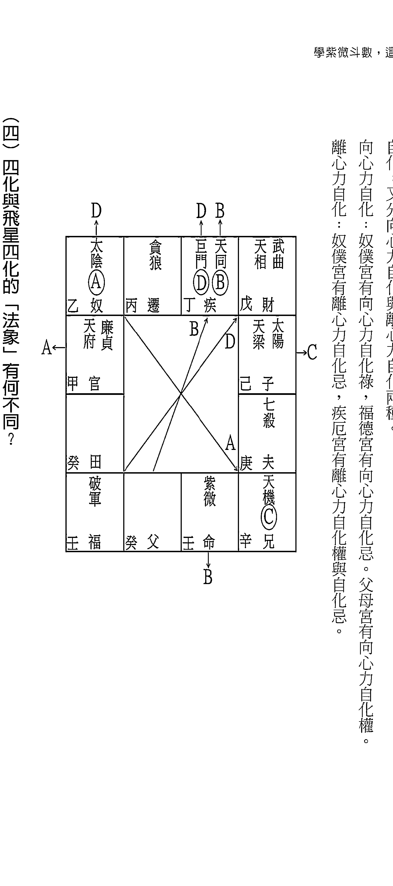

法象的定義：自化與飛星四化的算命法一定要回歸生年四化，稱為「法象」。命盤上的法象，可以看出人、事、物的所有因緣。自化：又分向心力自化與離心力自化兩種。向心力自化：奴僕宮有向心力自化祿，福德宮有向心力自化忌。父母宮有向心力自化權。離心力自化：奴僕宮有離心力自化忌，疾厄宮有離心力自化權與自化忌。

因缘。

「自化」是主导时间吉凶的架构。

「四化」是主导每一事件的用神。

「法象」是主导生涯规划的方向。

「飞星」是主导自己选择的人生。

### 2. 自化的算命法

自化算命法，分为向心力自化与离心力自化两种。

向心力自化：即十二宫位的宫位天干之四化飞到对宫。

离心力自化：即十二宫位的宫位天干之四化星飞在本宫。

自化的算命法一定要回归生年四化，称为「法象」，才是完整的算命。

#### 算命实例：

子女宫有生年忌星，官禄宫有自化忌星，由官禄宫自化忌+「法象」生年忌星，就表示我以后的事业会由子女来继承。

### 3. 飞星四化的算命法

飞星四化：宫位天干的四化星飞到其他宫位，称为「飞星四化」。

飞星四化的算命法一定回归生年四化，称为「法象」，才是完整的算命。

#### 算命实例：

命宫飞权星入父母宫，官禄宫有生年权星，由命宫飞权星入父母宫+「法象」生年权星，就表示我天生是创业的命格。

| 右弼 貪狼 廉貞 | 巨門 | 天相 | 天梁(權) 天同 |
| :---: | :---: | :---: | :---: |
| 7.19.31.43.55.67 | 8.20.32.44.56.68 | 9.21.33.45.57.69 | 10.22.34.46.58.70 |
| 辛巳<br>大官 56<br>奴僕 65 | 壬午<br>大奴 66<br>遷移 75 | 癸未<br>大遷 76<br>疾厄 85 | 甲申<br>大疾 86<br>財帛 95 |
| 太陰(忌)<br>科← | | | 左輔 七殺 武曲 |
| 6.18.30.42.54.66 | | | 祿11.23.35.47.59.71 |
| 庚辰<br>大田 46<br>官祿 55 | | | 乙酉<br>大財<br>子女 |
| 文昌 天府 | 祿 | 科 | 太陽 |
| 5.17.29.41.53.65 | | | 12.24.36.48.60.72 |
| 己卯<br>大福 36<br>田宅 45 | | | 丙戌<br>大子<br>夫妻 |
| | 破軍 紫微(科) | 天機(祿) | 文曲 |
| 4.16.28.40.52.64 | 3.15.27.39.51.63 | 2.14.26.38.50.62 | 1.13.25.37.49.61 |
| 戊寅<br>大父 26<br>福德 35 | 己丑<br>大命 16<br>父母 25 | 庚子<br>大兄 06<br>命宮 15 | 丁亥<br>大夫<br>兄弟 |

### 4. 四化與飛星四化的法象有何不同？

四化的法象是順著天意的軌跡走；飛星四化的法象是自己選擇的人生道路。

四化的法象：可算命中注定的人生故事，這是上天安排的人生旅程。

飛星四化的法象：可算自己選擇的人生故事，也是自己選擇的人生旅程。

## （五）自化的實例分析

標準命盤：女命 乙亥年生 24歲

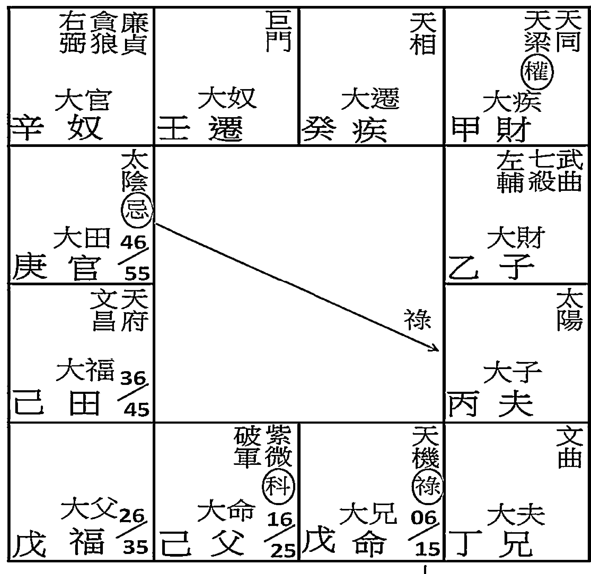

命盘上的「自化」怎麼形成？

1. 自化的定义：由宫位天干的四化星飞到本宫或对宫，称为「自化」。
2. 自化共分为两种：上图有线条的宫位就是自化。
   (1) 向心力自化：即十二宫位的宫位天干之四化飞到对宫。
       命盘实例：官禄宫飞禄星到夫妻宫，重点在对宫的夫妻宫。
   (2) 离心力自化：即十二宫位的宫位天干之四化星飞到本宫。
       命盘实例：如命盘之命宫自化忌，因为不能「飞四化星到其他十一宫，只能飞到自己的宫位」，重点在本宫的命宫。

## ○ 標準命盤：女命 己未年 40歲

| 文曲(忌) 太陽<br>11.23.35.47.59.71<br>己巳 父母<br>13 22 | 破軍<br>12.24.36.48.60.72<br>庚午 福德<br>23 32 | 右弼 天機<br>1.13.25.37.49.61<br>辛未 田宅<br>33 42 | 天府 紫微<br>2.14.26.38.50.62<br>壬申 官祿<br>43 52 |
| :--- | :--- | :--- | :--- |
| 武曲(祿)<br>10.22.34.46.58.70<br>戊辰 命宮<br>03 12 | | | 文昌 太陰 -> 科<br>3.15.27.39.51.63<br>癸酉 奴僕<br>53 62 |
| 天同<br>9.21.33.45.57.69<br>丁卯 兄弟 | | | 貪狼(權)<br>4.16.28.40.52.64<br>甲戌 遷移<br>63 72 |
| 七殺<br>8.20.32.44.56.68<br>丙寅 夫妻 | 天梁(科)<br>7.19.31.43.55.67<br>丁丑 子女 | 廉貞 天相<br>6.18.30.42.54.66<br>丙子 財帛<br>83 92 | 巨門<br>5.17.29.41.53.65<br>乙亥 疾厄<br>73 82 |

# 參、生年四化與自化的入門

## 簡單命盤：

紫微斗数命盘，包含十二宫位、天干地支、主星、四化（禄、权、科、忌）及大限宫位等信息。
- 宫位标注如：大夫、大兄、大命、大父等。
- 星曜标注如：文曲、太阳、破军、左辅、右弼、天机、紫微、天府等。
- 四化标注：禄、权、科、忌，并用箭头标示飞化方向。

- 「自化」怎麼算命？
  1. 自化的定義：由宮位天干的四化星飛到本宮或對宮，稱為「自化」。
  2. 自化怎麼算命？
     - 本命命盤的命宮飛祿星到遷移宮。
       命盤解釋：命中注定是常出外的人。
     - 本命命盤的官祿宮自己自化權。
       命盤解釋：命中注定是個事業心很強的人。
     - 附註：本書以初學者為主，故只利用兩個自化來分析。


| 奴 | 遷 | 疾 | 財 |
| :---: | :---: | :---: | :---: |
| 官 | | | 子（權） |
| 田 | | 權 | 夫 |
| 福 | 父 | 命 | 兄 |

## ○ 飛星四化的「法象」怎麼形成？

- 1. 飛星四化的定義：由宮位天干的四化星飛到其他宮位，稱為「飛星四化」。
- 2. 由上圖可知：
  (1) 飛星四化，第一步驟先命宮飛權星到夫妻宮。
  (2) 法象：第二步驟，藉由「法象」回歸生年四化看因緣，生年權星在子女宮。命盤解釋：即以命宮+夫妻宮+子女宮等三個宮位總合起來解釋。

# 參、生年四化與自化的入門

| 奴 | 遷 | 疾 | 財 |
| :---: | :---: | :---: | :---: |
| 官 | | | 子 |
| 田 | 科 ← | | 夫 |
| (科) 福 | 父 | 命 | 兄 |

飛星四化的「法象」怎麼算？

1. 飛星四化一定要「法象」，法象就是回歸生年四化看因緣。
2. 飛星四化＋法象，就是三個宮位總合起來的解釋（飛星四化是兩個宮位）。
3. 完整算命：命宮飛科星到田宅宮，法象在福德宮，即以命宮＋田宅宮＋福德宮等三個宮位總合起來解釋。
   命盤解釋一：命宮＋田宅宮，表示命中有不動產的天命。
   命盤解釋二：命宮＋田宅宮＋福德宮，表示不動產來自祖先留下來的祖產。
4. 算命重點：在對的時間做對的事。

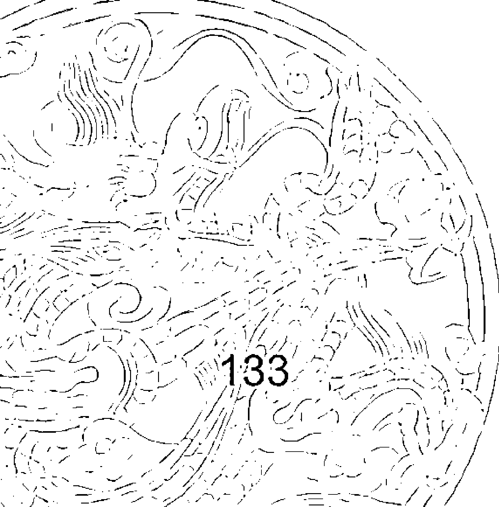

## ○飛星四化的「法象」怎麼算？

| 奴 | 遷（忌） | 疾 | 財 |
| :---: | :---: | :---: | :---: |
| 官 | | | 子 |
| 田 | | | 夫 |
| 福 | 父 | 命 | 兄 |

- 1. 飛星四化一定要「法象」，法象就是回歸生年四化看因緣。
- 2. 完整算命：命宮飛忌星到子女宮，法象在遷移宮，即以命宮＋子女宮＋遷移宮等三個宮位總合起來解釋。
   命盤解釋一：命宮＋子女宮，表示命中有子女的命。
   命盤解釋二：命宮＋子女宮＋遷移宮，表示搬家後才能產生子女的條件。
- 3. 這是華山派命理學最引以為傲的創新與發明。

# 肆、生年四化與自化的基礎

一般人對「生年四化」或「自化」一定很陌生，但它們卻是命理學進入高階算命的關鍵，更是命理學進入科學領域必須具備的學問。華山派藉本書第一次完整公開紫微斗數千年秘笈，內心百感交集。只有一個願望：希望命理界快速進入科學之林。因為坊間命理老師99%以上都不知道「生年四化」+「自化」可以完整的算命，這也是為什麼命理老師還停留在古人算命的方式。但華山派只要四顆星辰，就可以馬上教你學會完整的算命。

祿星、權星、科星、忌星（四化星）可以算什麼呢？

- 祿星、權星、科星、忌星，可以算人事物的「現象」。
- 祿星、權星、科星、忌星，可以算人事物的「時間」。
- 祿星、權星、科星、忌星，可以算人事物的「吉凶」。
- 祿星、權星、科星、忌星，可以算人事物的「內容」。
- 祿星、權星、科星、忌星，可以算人事物的「影響」。
- 祿星、權星、科星、忌星，可以算人事物的「改運」。

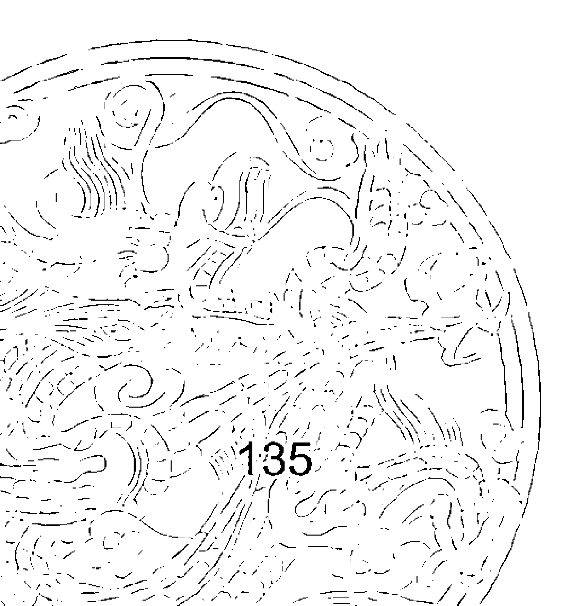

祿星、權星、科星、忌星，可以算人事物的「轉運」。祿星、權星、科星、忌星，可以算「預測未來的利益得失」。祿星、權星、科星、忌星，可以算「預測未來的富貴貧賤」。

命理學長久以來最令人詬病的是一直沒有完整的公式組合，讓學習的人有所依循，所以，只能胡扯一些與習俗、宗教有關的東西。命理老師總是把命理搞得神神祕祕的，一點都不科學。其實學紫微斗數很簡單，只要遵循下列有系統的公式＋學習順序，保證讓你快速學會算命。

- 1. 「先」知道「M質」是什麼？
- 2. 「再」知道「十二宮位」是什麼？
- 3. 「最後」知道：算命＝「M質」＋「十二宮位」＝算「你命中注定的事」。

## 一、命中注定的事，怎麼算？

### （一）M質就是算命中注定的事

M質＝祿星、權星、科星、忌星。 生年四化＝祿星、權星、科星、忌星。 M質＝任何一顆四化星都可以代表M質。

- 四化星簡稱：
  - 祿星＝A
  - 權星＝B
  - 科星＝C
  - 忌星＝D

### （二）M質就是算存在、貴人、欠債、有緣、有運等五種因緣

任何一顆M質都可以表示「存在、貴人、欠債、有緣、好運」等五種因緣。其中「欠債」在算命上因「象言往往來」之故，表示雙方互相欠債，所以，欠別人債的人付出不能有怨恨，當事人就可以避災；欠別人債之人如果不付出，你命中的福報就會由另一方接收。

M質所在的宮位可以算「命中注定」的事，也有五種表達方式：

- 1. 算存在：M質所在的宮位，表示此宮位存在著命中注定的因緣。
  算命實例：子女宮有M質，表示命中注定有子女。
  進階算命：雖然命中注定有子女，但傳統命理老師99%以上卻不知道可算出何時會有子女？何時子女帶財？何時子女帶衰？生子女後會發生什麼事？生子女後會影響我什麼事？
- 2. 算貴人：M質所在的宮位，表示此宮位命中一定會產生貴人的緣分。
  算命實例：事業宮有M質，表示努力的事業一定會巧遇貴人，並獲得幫助而成功。
  進階算命：雖然事業有貴人，但傳統命理老師99%以上卻不知道需要個案有什麼條件才會有貴人？貴人何時出現？貴人是誰？貴人會影響我什麼事？
- 3. 算欠債：M質所在的宮位，表示此宮位命中一定會形成互相欠債的折磨現象。
  算命實例：父母宮有M質，表示和父母會出現不和、衝突、分開兩地的現象。
  進階算命：雖然與父母無緣相處，但傳統命理老師99%以上卻不知道個案何時會和父母無緣？何事無緣？衝突後會發生什麼事？怎麼做才能化解災厄？
- 4. 算有緣：M質所在的宮位，表示此宮位命中注定有前世因緣，一定會對個案如影隨形。
  算命實例：交友宮有M質，表示命中與朋友的緣分禍福相依，成也朋友，敗也朋友。
  進階算命：雖然命中成也朋友，敗也朋友，但傳統命理老師99%以上卻不知道個案何時會遭受朋友出賣？朋友何時可以幫我？幫我什麼事？何時放下怨恨後會成就我什麼事？
- 5. 算有運：M質所在的宮位，表示此宮位命中註定一定會巧遇好運的善機緣。
  算命實例：福德宮有M質，表示命中是追求夢想的人，不斷投資自己就是成就的泉源。
  進階算命：雖然命中是追求夢想的人，但傳統命理老師99%以上卻不知道追求夢想會從何時開始？需要堅持什麼事？需要靠誰幫忙？何時可以成功？

## 二、十二宮位的基本內涵

### （一）十二宮位有人事物之分

- 1. 在人的宮位：又稱六親宮。
  初學者算命適合算「存在、貴人、欠債、有緣」等四種緣分，少了有運的因緣。
  在人：有命宮、兄弟宮、夫妻宮、子女宮、奴僕宮、父母宮等六個宮位。
- 2. 在事的宮位：
  初學者算命適合算「存在、貴人、欠債、有緣」等四種緣分，少了有運的因緣。
  在事：有疾厄宮、遷移宮、官祿宮等三個宮位。
- 3. 在物的宮位：
  初學者算命適合算「存在、貴人、欠債、有緣、有運」等五種緣分，少了貴人的因緣。
  在物：有財帛宮、田宅宮、福德宮等三個宮位。

### (二) 十二宮位代表的意義

- 1. 命宮代表的意義——
  在人：本性、喜好、才華、姻緣、內心世界的真我。
  在事：命中優勢、成功個性、先天官祿宮的條件。
  在物：意外、情緣、所有人、事、物有關的定數。
- 2. 兄弟宮代表的意義——
  在人：兄弟、姊妹、母親、朋友、眾生、姻緣。
  在事：出外、驛馬、出差、傳銷、業務、外務。
  在物：人脈、公關、合作、加盟、保險、傳銷。
- 3. 夫妻宮代表的意義——
  在人：同居、配偶、異性緣、緣分等的對待關係。
  在事：共業、格局、事業、先天事業的相互生滅關係。
  在物：感情的關係、婚姻的條件、相處的對待。
- 4. 子女宮代表的意義——
  在人：子女、桃花、學生、意外、員工、姻緣。
  在事：出外、驛馬、出差、傳銷、業務、外務。
  在物：人脈、公關、合作、加盟、乾股。
- 5. 財帛宮代表的意義——
  在人：本性、人緣、對象、姻緣、配偶。
  在事：上班、事業、創業、才華、專業。
  在物：獨資、投資、投機、理財、財運。
- 6. 疾厄宮代表的意義——
  在人：思維、脾氣、疾病、個人喜好。
  在事：努力、勞碌、勞心、事必躬親。
  在物：災厄、意外、健康、美容養身。
- 7. 遷移宮代表的意義——
  在人：個性、姻緣、老運、外人對我的觀感。
  在事：驛馬、業務、外務、包裝自己或產品。
  在物：留學、出國、移民、外出的一切因緣。
- 8. 奴僕宮代表的意義——
  在人：朋友、部屬、同事、員工、過客緣分。
  在事：異性緣、眾生情、朋友義、人際關係。
  在物：人脈、傳銷、業務、外務、依存關係。
- 9. 官祿宮代表的意義——
  在人：本性、同事、情緣、先天優勢的條件。
  在事：工作、事業、職業、先天成功的條件。
  在物：功名、考試、學校、先天富貴的條件。
- 10. 田宅宮代表的意義——
  在人：本性、同事、情緣、先天優勢的條件。
  在事：工作、事業、職業、先天成功的條件。
  在物：功名、考試、學校、先天富貴的條件。
- 11. 福德宮代表的意義——
  在人：貴人、公媽、祖蔭、積善人家的福報位。
  在事：嗜好、興趣、貴人、利害關係的應酬位。
  在物：家業、祖業、繼承、宗教角度的因果位。
- 12. 父母宮代表的意義——
  在人：父母、長輩、上司、貴人、老闆、神明。
  在事：升官、創業、考試、公家、學校、銀行。
  在物：讀書、技能、合作、加盟、客源、上游。

## 三、算命就是十二宮位＋M質的解釋

四化星＝祿星、權星、科星、忌星＝M質，任何一顆M質都可以算存在、貴人、欠債、有緣、有運等五種因緣。

### （一）十二宮位＋M質＝算命

1. 命宮＋M質＝就可以直接算命。
   算命實例：命中靠自己的人。

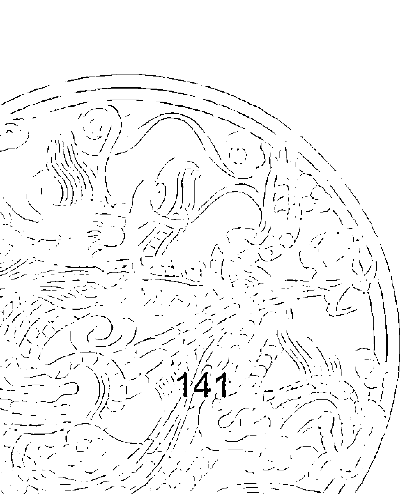## （二）十二宫位怎么算存在、贵人、欠债、有缘、有运等现象

算命一定要先定位当事人是算人或算事或算物等三种因缘，才能精准掌握算命的技巧。

#### 1. 命宫有M质时怎么算命？

命宫代表的意义：
- 在人：本性、喜好、才华、姻缘、内心世界的真我。
- 在事：命中优势、成功个性、先天官禄宫的条件。
- 在物：意外，情缘，所有人事物有关的定数。

算命实例：命宫在人，算本性时该怎么算？
- “算”存在：这是进阶的问题，需要更多的公式才能精准算命。
- “算”贵人：自己要先有条件，命中的贵人才会出现。
- “算”欠债：命中注定欠自己的债，即劳碌命。
- “算”有缘：这是进阶的问题，需要更多的公式才能精准算命。
- “算”有运：成功的本性出现后就会有好运。

#### 2. 兄弟宫有M质时怎么算命？

兄弟宫代表的意义：
- 在人：兄弟、姊妹、母亲、朋友、众生、姻缘。
- 在事：出外、驿马、出差、传俏、业务、外务。
- 在物：人脉、公关、合作、加盟、保险、传销。

算命实例：兄弟宫有M质在人，算兄弟时该怎么算？
- “算”存在：有兄弟姊妹的命。
- “算”贵人：命中注定兄弟姊妹是我的贵人。
- “算”欠债：命中注定欠兄弟姊妹的债。
- “算”有缘：这是进阶的问题，需要更多的公式才能精准算命。
- “算”有运：这是进阶的问题，需要更多的公式才能精准算命。

#### 3. 夫妻宫有M质时怎么算命？

夫妻宫代表的意义：
- 在人：同居、配偶、异性缘、缘分等的对待关系。
- 在事：共业、格局、事业、先天事业的相互生灭关系。
- 在物：感情的关系、婚姻的条件、相处的对待。

算命实例：夫妻宫在事，算共业时该怎么算？
- “算”存在：这是进阶的问题，需要更多的公式才能精准算命。
- “算”贵人：命中注定配偶会成为我事业的贵人。
- “算”欠债：这是进阶的问题，需要更多的公式才能精准算命。
- “算”有缘：这是进阶的问题，需要更多的公式才能精准算命。
- “算”有运：这是进阶的问题，需要更多的公式才能精准算命。

#### 4. 子女宫有M质时怎么算命？

子女宫代表的意义：
- 在人：子女、桃花、学生、意外、员工、姻缘。
- 在事：出外、驿马、出差、传俏、业务、外务。
- 在物：人脉、公关、合伙、合作、加盟、干股。

算命实例：子女宫在事，算出外时该怎么算？
- “算”存在：这是进阶的问题，需要更多的公式才能精准算命。
- “算”贵人：命中注定出外会遇到贵人相助。
- “算”欠债：这是进阶的问题，需要更多的公式才能精准算命。
- “算”有缘：出外发展是人生最大的利益。
- “算”有运：命中注定出外发展，人生才能变彩色。

#### 5. 财帛宫有M质时怎么算命？

财帛宫代表的意义：
- 在人：本性、人缘、对象、姻缘、配偶。
- 在事：上班、事业、创业、才华、专业。
- 在物：独资、投资、投机、理财、财运。

算命实例：财帛宫在物，算独资时该怎么算？
- “算”存在：命中注定创业要独资才能赚大钱。
- “算”贵人：努力想创业，一定会遇到贵人相助而成功。
- “算”欠债：这是进阶的问题，需要更多的公式才能精准算命。
- “算”有缘：这是进阶的问题，需要更多的公式才能精准算命。
- “算”有运：先培养当老板的本事，一定会遇到创业的好机会。
- “算”有运：命中注定可以和配偶一起工作或创业。

#### 6. 疾厄宫有M质时怎么算命？

疾厄宫代表的意义：
- 在人：思维、脾气、疾病、个人喜好。
- 在事：努力、劳碌、劳心、事必躬亲。
- 在物：灾厄、意外、健康、美容养身。

算命实例：疾厄宫在物，算灾厄时该怎么算？
- “算”存在：这是进阶的问题，需要更多的公式才能精准算命。
- “算”贵人：生重病时，在对的时间点一定会遇到好医生。
- “算”欠债：这是进阶的问题，需要更多的公式才能精准算命。
- “算”有缘：命中注定是意外的人。
- “算”有运：命中注定劳心劳碌的思维就会遇到好运。

#### 7. 迁移宫有M质时怎么算命？

迁移宫代表的意义：
- 在人：个性、姻缘、老运、外人对我的观感。
- 在事：驿马、业务、外务、包装自己或产品。
- 在物：留学、出国、移民、出外的一切因缘。

算命实例：迁移宫在人，算姻缘时该怎么算？
- “算”存在：这是进阶的问题，需要更多的公式才能精准算命。
- “算”贵人：离开父母的家才能找到好姻缘。
- “算”欠债：这是进阶的问题，需要更多的公式才能精准算命。
- “算”有缘：命中注定出外后，才能找到真命天子（天女）。
- “算”有运：外出、外派、外调才能形成好姻缘的机会。

#### 8. 奴仆宫有M质时怎么算命？

奴仆宫代表的意义：
- 在人：朋友、部属、同事、员工、过客缘分。
- 在事：异性缘、众生情、朋友义、人际关系。
- 在物：人脉、传销、业务、外务、依存关系。

算命实例：奴仆宫在人，算部属时该怎么算？
- “算”存在：这是进阶的问题，需要更多的公式才能精准算命。
- “算”贵人：命中注定部属是你升官的贵人。
- “算”欠债：这是进阶的问题，需要更多的公式才能精准算命。
- “算”有缘：命中注定和部属的缘分很深，一定要培养自己的人。
- “算”有运：外出、外派、外调才能形成好姻缘的机会。

#### 9. 官禄宫有M质时怎么算命？

官禄宫代表的意义：
- 在人：本性、同事、情缘、先天优势的条件。
- 在事：工作、事业、职业、先天成功的条件。
- 在物：功名、考试、学校、先天富贵的条件。

算命实例：官禄宫在事，算事业时该怎么算？
- “算”存在：这是进阶的问题，需要更多的公式才能精准算命。
- “算”贵人：只要努力工作，一定会遇到帮助你的大贵人。
- “算”欠债：这是进阶的问题，需要更多的公式才能精准算命。
- “算”有缘：命中注定坚持梦想，事业一定可以成功。
- “算”有运：命中注定培养一技之长，就能靠巧艺安身。

#### 10. 田宅宫有M质时怎么算命？

田宅宫代表的意义：
- 在人：家族、亲戚、小家庭、家族企业的格局。
- 在事：搬家、意外、店面、工厂、事业的格局。
- 在物：家业、祖业、继承、先天不动产的格局。

算命实例：田宅宫在事，算意外时该怎么算？
- “算”存在：这是进阶的问题，需要更多的公式才能精准算命。
- “算”贵人：在对的时间+事件，就可以化解意外的伤害。
- “算”欠债：大意外是前世未了的因缘。
- “算”有缘：命中注定会发生大意外的人。
- “算”有运：这是进阶的问题，需要更多的公式才能精准算命。

#### 11. 福德宫有M质时怎么算命？

福德宫代表的意义：
- 在人：贵人、公妈、祖荫、积善人家的福报位。
- 在事：嗜好、兴趣、贵人、利害关系的应酬位。
- 在物：家业、祖业、继承、宗教角度的因果位。

算命实例：福德宫在物，算祖业时该怎么算？
- “算”存在：命中注定会得到祖产。
- “算”贵人：这是进阶的问题，需要更多的公式才能精准算命。
- “算”欠债：这是进阶的问题，需要更多的公式才能精准算命。
- “算”有缘：命中注定我是继承家业的人。
- “算”有运：在对的时间十事件，就会得到祖产。

#### 12. 父母宫有M质时怎么算命？

父母宫代表的意义：
- 在人：父母、长辈、上司、贵人、老板、神明。
- 在事：升官、创业、考试、公家、学校、银行。
- 在物：读书、技能、合作、加盟、客源、上游。

算命实例：父母宫在物，算技能时该怎么算？
- “算”存在：这是进阶的问题，需要更多的公式才能精准算命。
- “算”贵人：命中注定培养一技之长，就能遇到贵人，并获得帮助而成功。
- “算”欠债：这是进阶的问题，需要更多的公式才能精准算命。
- “算”有缘：命中注定有一技之长就能成就事业。
- “算”有运：命中注定有好的技能，就会遇到发挥本事的好运。

# 肆、生年四化与自化的基础

## 四、大限命盘（大命）『重叠』十二宫位的现象

### ◎大命『重叠』十二宫位的现象
1. 大命『重叠』命宫。
2. 大命『重叠』兄弟宫。
3. 大命『重叠』夫妻宫。
4. 大命『重叠』子女宫。
5. 大命『重叠』财帛宫。
6. 大命『重叠』疾厄宫。
7. 大命『重叠』迁移宫。
8. 大命『重叠』奴仆宫。
9. 大命『重叠』官禄宫。
10. 大命『重叠』田宅宫。
11. 大命『重叠』福德宫。
12. 大命『重叠』父母宫。

命宫与兄弟宫的现象：
“命宫”：
- 在人：一本性、二喜好、三才华、四姻缘、五内心世界真我。
- 在事：六命中优势、七成功个性、八先天官禄宫的条件。
- 在物：九意外、十情缘、十一所有人事物有关的定数。

“兄弟宫”：
- 在人：一兄弟、二姊妹、三母亲、四朋友、五众生、六姻缘。
- 在事：七出外、八驿马、九出差、十传销、十一业务、十二外务。
- 在物：十三人脉、十四公关、十五合作、十六加盟、十七保险、十八传销。

### （二）实例说明
论述大命“重叠”兄弟宫的解释：

#### 1. 公式分析：
- 公式一：禄权科忌（四化星）所在的宫位，永远不会变动。
- 公式二：大命“重叠”本命的宫位＝大命十本命，即两个宫位合起来解释。
- 公式三：“大命”之人事物＋“兄弟宫”之人事物，皆可以互相交叉应用再解释内容。

### 2. 算命实例：
- 问题一：大命在人“一本性”＋兄弟宫在人“一兄弟”。
解释：表示这十年注定还有其他兄弟姊妹的运。
- 问题二：大命在事“六命中优势”＋兄弟宫在事“七出外”。
解释：表示这十年出外历练，事业才能展现命中的优势。
- 问题三：大命在物“九意外”＋兄弟宫在物“十三人脉”。
解释：切记！这是难以解释的现象，一定要更换其他同类的现象。例如，可以把在物“十三人脉”更换为在事“七出外”，就能顺利解释，即这十年出外有意外的厄运。

### （二）大命“重叠”十二宫位的解释
大命“重叠”本命的宫位、大命的宫位、本命的宫位。解释：大命十本命的宫位，即两个宫位合起来的解释。

### （三）算命与算运的区别
算命：应用“本命命盘”论命，就是算命。算运：应用“大限命盘”论命，就是算运。

### （四）有十年好运，并不代表这十年都会顺心如意
每一事件的好运期都有十年，但大部分的人都会浪费二、三年的好运期。算命实例：好运来之前都需要“准备期”，但大部分的人都在好运开始后才准备。算命实例：虽然好运都有十年，但每一个好运却都需要再“做对一件事”，才能让好运持续发展。

### （五）高阶算命才会遇到矛盾的问题
每一事件都会遇到矛盾的现象，可以论断矛盾者才是真正的算命高手。算命实例：有十年结婚的好运，但只有过了某年某月之后才是结婚的好时机。算命实例：有十年买房子的好运，但只有过了某年某月之后，买房子才能赚钱、才能平安、才能旺事业。高阶算命：高阶算命需要一连串的公式组合才能清楚分析。

### ◎大兄『重叠』十二宫位的现象
1. 大兄『重叠』命宫。
2. 大兄『重叠』兄弟宫。
3. 大兄『重叠』夫妻宫。
4. 大兄『重叠』子女宫。
5. 大兄『重叠』财帛宫。
6. 大兄『重叠』疾厄宫。
7. 大兄『重叠』迁移宫。
8. 大兄『重叠』奴仆宫。
9. 大兄『重叠』官禄宫。
10. 大兄『重叠』田宅宫。
11. 大兄『重叠』福德宫。
12. 大兄『重叠』父母宫。

兄弟宫与命宫的现象：
“兄弟宫”：
- 在人：一兄弟、二姊妹、三母亲、四朋友、五众生、六姻缘。
- 在事：七出外、八驿马、九出差、十传销、十一业务、十二外务。
- 在物：十三人脉、十四公关、十五合作、十六加盟、十七保险、十八传销。

“命宫”：
- 在人：一本性、二喜好、三才华、四姻缘、五内心世界真我。
- 在事：六命中优势、七成功个性、八先天官禄宫的条件。
- 在物：九意外、十情缘、十一所有人事物有关的定数。

### (二) 实例说明
论述大兄『重叠』命宫的解释：

1. 公式分析：
- 公式一：禄权科忌（四化星）所在的宫位，永远不会变动。
- 公式二：大兄『重叠』本命的宫位 || 大兄十本命，即两个宫位合起来解释。
- 公式三：『大兄』之人事物 + “命宫”之人事物，皆可以互相交叉应用再解释内容。

### 2. 算命实例：
- 问题一：大兄在人“一兄弟”+ 命宫在人“一本性”。
解释：表示这十年注定还有其他兄弟姊妹的运。
- 问题二：大兄在事“七出外”+ 命宫在事“六命中优势”。
解释：表示这十年出外历练，事业才能展现我命中的优势。
- 问题三：大兄在物“十三人脉”+ 命宫在物“九意外”。
解释：切记！这是个难以解释的现象，一定要更换其他同类的现象。例如，可以把在物“十三人脉”更换为在事“七出外”，就能顺利解释内容，即这十年出外有意外的厄运。

### （二）大兄『重叠』十二宫位的解释
大兄“重叠”本命的宫位 || 大兄的宫位十本命的宫位。解释：大兄十本命的宫位，即两个宫位合起来的解释。

### （三）算命与算运的区别
算命：应用“本命命盘”论命，就是算命。算运：应用“大限命盘”论命，就是算运。

### （四）有十年好运，并不代表这十年都会顺心如意
（1）每一事件的好运期都有十年，但大部分的人都会浪费二、三年的好运期。算命实例：好运来之前都需要准备期，但大部分的人都在好运开始后才准备。算命实例：虽然好运都有十年，但每一个好运都需要再“做对一件事”，才能让好运持续发展。

### （五）高阶算命才会遇到矛盾的问题
每一事件都会遇到矛盾的现象，可以论断矛盾者才是真正的算命高手。算命实例：兄弟姊妹有得祖产的运，但并没有说明要如何才能得到祖产。和谐、冲突、诉讼、反目成仇……等都是可能发生的事，每一个人的命盘都会呈现不同的结果。算命实例：有十年买房子的好运，但只有过了某年某月之后，买房子才能赚钱、才能平安、才能旺事业。高阶算命：高阶算命需要一连串的公式组合才能清楚分析。

### ◎大夫『重叠』十二宫位的现象
1. 大夫『重叠』命宫。
2. 大夫『重叠』兄弟宫。
3. 大夫『重叠』夫妻宫。
4. 大夫『重叠』子女宫。
5. 大夫『重叠』财帛宫。
6. 大夫『重叠』疾厄宫。
7. 大夫『重叠』迁移宫。
8. 大夫『重叠』奴仆宫。
9. 大夫『重叠』官禄宫。
10. 大夫『重叠』田宅宫。
11. 大夫『重叠』福德宫。
12. 大夫『重叠』父母宫。

夫妻宫与命宫的现象：

#### “夫妻宫”：
1. 在人：一同居、二配偶、三异性缘、四缘分等对待关系。
2. 在事：五共业、六格局、七事业、八先天事业相互的生灭关系。
3. 在物：九感情的关系、十婚姻的条件、十一相处的对待。

#### “命宫”：
1. 在人：一本性、二喜好、三才华、四姻缘、五内心世界真我。
2. 在事：六命中优势、七成功个性、八先天官禄宫的条件。
3. 在物：九意外、十情缘、十一所有人事物有关的定数。

### （二）实例说明
论述大夫『重叠』命宫的解释：

1. 公式分析：
- 公式一：禄权科忌（四化星）所在的宫位，永远不会变动。

### 2. 算命实例：
- 问题一：大夫在人“同居”十命宫在人“本性”。
解释：表示这十年有同居或结婚的好运。
- 问题二：大夫在事“七事业”十命宫在事“六命中优势”。
解释：表示有这十年工作的历练，事业才能展现我命中的优势。
- 问题三：大夫在物“十一相处的对待”十命宫在物“九意外”。
解释：切记！这是难以解释的现象，一定要更换其他同类的现象。例如，可以把在物“十一相处的对待”更换为在事“七事业”，就能顺利解释内容，即这十年的事业常常出现小人陷害的厄运。

### (二) 大夫“重叠”十二宫位的解释
大夫“重叠”本命的宫位||大夫的宫位十本命的宫位。解释：大夫十本命的宫位，即两个宫位合起来的解释。

### (三) 算命与算运的区别
算命：应用“本命命盘”论命，就是算命。算运：应用“大限命盘”论命，就是算运。

### （四）有十年好运，并不代表这十年都会顺心如意
每一事件的好运期都有十年，但大部分的人都会浪费二、三年的好运期。算命实例：好运来之前都需要准备期，但大部分的人都在好运开始后才准备。算命实例：虽然好运都有十年，但每一个好运都需要再“做对一件事”，才能让好运持续发展。

### （五）高阶算命才会遇到矛盾的问题
每一事件都会遇到矛盾的现象，可以论断矛盾者才是真正的算命高手。算命实例：命中注定会有好姻缘，但必须经过“三角关系”之后才是正缘的时间。算命实例：有十年结婚带财的好运，但婚后却过着必须分开两地“无情”的婚姻。高阶算命：高阶算命需要一连串的公式组合才能清楚分析。

| 有十年朋友互利的好运 有十年靠朋友的好运 M 奴 | 有十年挑战未来的好运 有十年驿马逢贵的好运 M 迁 | 有十年劳碌赚钱的好运 有十年生小孩的好运 M 疾 | 有十年出外发展的好运 有十年业务外务的好运 M 财 |
| :--- | :--- | :--- | :--- |
| 有十年兄弟姊妹的好缘 有十年拓展业务的好运 M 官 | | | 有为子女再添弟妹的运 有十年生小孩的好运 M 子 |
| 有兄弟姊妹同住的好缘 兄弟姊妹有得祖产的运 M 田 | | | 有感情聚少离多的运 有十年配偶出外的运 M 夫 |
| 兄弟姊妹有同住的好缘 兄弟姊妹有得祖产的运 M 福 | 有兄弟姊妹与父母同住运 有兄弟姊妹继承家业的运 M 父 | M 命 | 有十年兄弟姊妹的好缘 父母有生子女的好运 M 兄 |## 肆、生年四化與自化的基礎

有十年利害關係的婚姻 M 財

有十年黏在一起的婚姻 M 疾

出外才能找到好姻緣 有十年異國婚姻的運 M 遷

先友後婚，才能長久 以結婚為前提交往的缘不長 M 奴

有十年奉子成婚的運 結婚生子才有好運 M 子

有立業成家的好運 配偶是你事業的貴人 M 官

命中注定會有好姻緣 命中好運從結婚後開始 M 夫

結婚前一定要先買房子 有房子就可以結婚 M 田

未來十年有結婚的好運 十年會遇到第一次正緣 M 命

有十年遇到好緣分的運 結婚可得到父母的祝福 M 父

結婚是為了傳宗接代 結婚就可以繼承家業 M 福

配偶有兄弟姊妹 感情是兄弟姊妹介紹的 M 兄

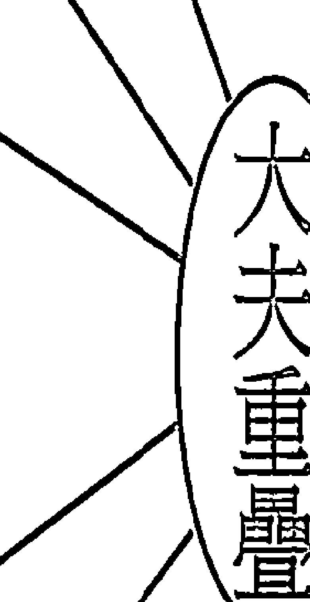

# ◎大子「重疊」十二宮位的現象

- 1. 大子「重疊」命宮。
- 2. 大子「重疊」兄弟宮。
- 3. 大子「重疊」夫妻宮。
- 4. 大子「重疊」子女宮。
- 5. 大子「重疊」財帛宮。
- 6. 大子「重疊」疾厄宮。
- 7. 大子「重疊」遷移宮。
- 8. 大子「重疊」奴僕宮。
- 9. 大子「重疊」官祿宮。
- 10. 大子「重疊」田宅宮。
- 11. 大子「重疊」福德宮。
- 12. 大子「重疊」父母宮。

## 子女宮與命宮的現象：

### 「子女宮」：

- 1. 在一子女、二桃花、三學生、四意外、五桃花、六姻緣。
- 2. 在事：七出外、八驛馬、九出差、十傳銷、十一業務、十二外務。
- 3. 在物：十三人脈、十四公關、十五合夥、十六合作、十七加盟、十八乾股。

### 「命宮」：

- 1. 在一性、二喜好、三才華、四姻緣、五內心世界真我。
- 2. 在事：六命中優勢、七成功個性、八先天官祿宮的條件。
- 3. 在物：九意外、十情緣、十一所有人事物有關的定數。

### （二）實例說明

#### 論述大子「重疊」命宮的解釋：

#### 1. 公式分析：

公式一：祿權科忌（四化星）所在的宮位，永遠不會變動。

### （三）算命與算運的區別

算命：應用「本命命盤」論命，就是算命。
算運：應用「大限命盤」論命，就是算運。

### （二）大子「重疊」十二宮位的解釋

大子「重疊」本命的宮位＝大子的宮位＋本命的宮位。
解釋：大子＋本命的宮位，即兩個宮位合起來的解釋。

#### 2. 算命實例：

公式二：大子「重疊」本命的宮位＝大夫＋本命，即兩個宮位合起來解釋。
公式三：「大子」之人事事物＋「命宮」之人事事物，皆可以互相交叉應用再解釋內容。

問題一：大子在人「一子女」＋命宮在人「一本性」。
解釋：表示這十年有生子女的好運。

問題二：大子在事「七出外」＋命宮在事「六命中優勢」。
解釋：表示這十年出外歷練，事業才能展現命中的優勢。

問題三：大子在物「十三人脈」＋命宮在物「九意外」。
解釋：切記！這是難以解釋的現象，一定要更換其他同類的現象。例如，可以把在物「十三人脈」更換為在事「七出外」，就能順利解釋內容，即這十年出外有意外的厄運。

### （四）有十年好運，並不代表這十年都會順心如意

每一事件的好運期都有十年，但大部分的人都會浪費二、三年的好運期。

算命實例：好運來之前都需要準備期，但大部分的人都在好運開始後才準備。

算命實例：雖然好運都有十年，但每一個好運都需要再「做對一件事」，才能讓好運持續發展。

### （五）高階算命才會遇到矛盾的問題

每一事件都會遇到矛盾的現象，可以論斷矛盾者才是真正的算命高手。

算命實例：有十年結婚的好運，但只有過了某年某月之後，才是結婚的好時機。

算命實例：有十年買房子的好運，但只有過了某年某月之後，買房子才能賺錢、才能平安、才能旺事業。

高階算命：高階算命需要一連串的公式組合才能清楚分析。

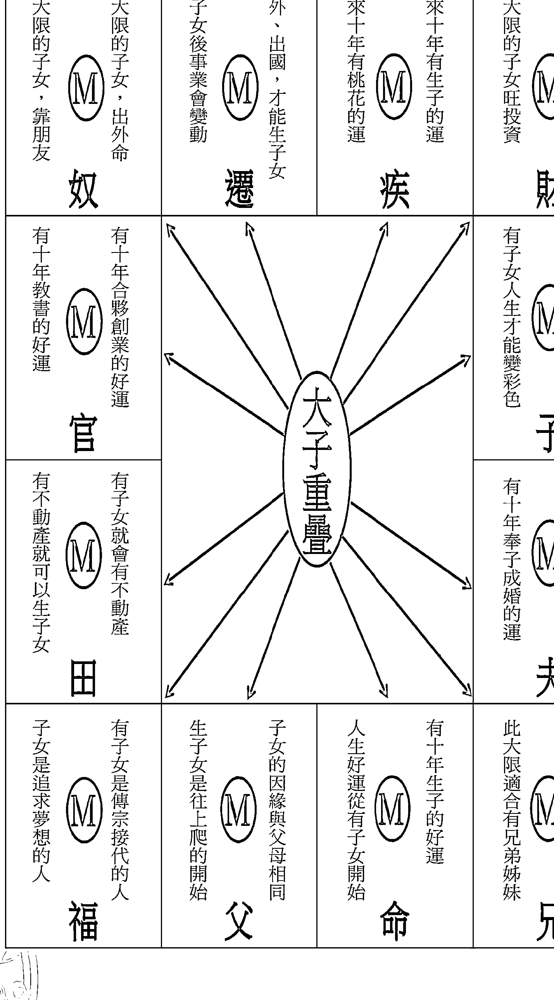

# ◎大財「重疊」十二宮位的現象

- 1. 大財「重疊」命宮。
- 2. 大財「重疊」兄弟宮。
- 3. 大財「重疊」夫妻宮。
- 4. 大財「重疊」子女宮。
- 5. 大財「重疊」財帛宮。
- 6. 大財「重疊」疾厄宮。
- 7. 大財「重疊」遷移宮。
- 8. 大財「重疊」奴僕宮。
- 9. 大財「重疊」官祿宮。
- 10. 大財「重疊」田宅宮。
- 11. 大財「重疊」福德宮。
- 12. 大財「重疊」父母宮。

財帛宮與命宮的現象：

## 「財帛宮」：

- 1. 在人：一本性、二人緣、三對象、四姻緣、五配偶。
- 2. 在事：六上班、七事業、八創業、九才華、十專業。
- 3. 在物：十一獨資、十二投資、十三投機、十四理財、十五財運。

### 「命宮」：

- 1. 在人：一本性、二喜好、三才華、四姻緣、五內心世界真我。
- 2. 在事：六命中優勢、七成功個性、八先天官祿宮的條件。
- 3. 在物：九意外、十情緣、十一所有人事物有關的定數。

### （二）實例說明

論述大財「重疊」命宮的解釋：

#### 1. 公式分析：

公式一：祿權科忌（四化星）所在的宮位，永遠不會變動。

公式二：大財「重疊」本命的宮位＝大財＋本命，即兩個宮位合起來解釋。

公式三：「大財」之人事物＋「命宮」之人事物，皆可以互相交叉應用再解釋內容。

#### 2. 算命實例：

問題一：大財在人「一本性」＋命宮在人「一本性」。

解釋：表示這十年有賺大錢的好運。

問題二：大財在事「七事業」＋命宮在事「六命中優勢」。

解釋：表示這十年事業的好運，才能展現我命中的優勢。

問題三：大財在物「十三投機」＋命宮在物「九意外」。

解釋：切記！這是難以解釋的現象，一定要更換其他同類的現象。例如，可以把在物「十三投機」更換為在事「七事業」，就能順利解釋內容，即這十年創業的機會，總是出現被小人陷害的厄運。

### （二）大財「重疊」十二宮位的解釋

大財「重疊」本命的宮位＝大財的宮位＋本命的宮位。

解釋：大財＋本命的宮位，即兩個宮位合起來的解釋。

### （三）算命與算運的區別

算命：應用「本命命盤」論命，就是算命。

算運：應用「大限命盤」論命，就是算運。


### （四）有十年好運，並不代表這十年都會順心如意

每一事件的好運期都有十年，但大部分的人都會浪費二、三年的好運期。算命實例：好運來之前都需要準備期，但大部分的人都在好運開始後才準備。算命實例：雖然好運都有十年，但每一個好運都需要再「做對一件事」，才能讓好運持續發展。

### （五）高階算命才會遇到矛盾的問題

每一事件都會遇到矛盾的現象，可以論斷矛盾者才是真正的算命高手。算命實例：有十年結婚的好運，但只有過了某年某月之後，才是結婚的好時機。算命實例：有十年買房子的好運，但只有過了某年某月之後，買房子才能賺錢、才能平安、才能旺事業。高階算命：高階算命需要一連串的公式組合才能清楚分析。

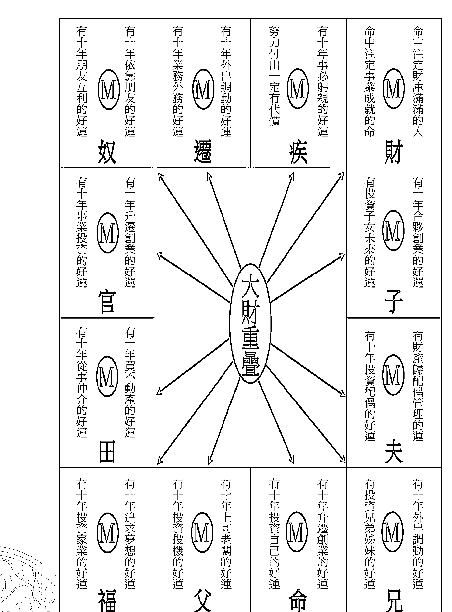

# ◎大疾「重疊」十二宮位的現象

- 1. 大疾「重疊」命宮。
- 2. 大疾「重疊」兄弟宮。
- 3. 大疾「重疊」夫妻宮。
- 4. 大疾「重疊」子女宮。
- 5. 大疾「重疊」財帛宮。
- 6. 大疾「重疊」疾厄宮。
- 7. 大疾「重疊」遷移宮。
- 8. 大疾「重疊」奴僕宮。
- 9. 大疾「重疊」官祿宮。
- 10. 大疾「重疊」田宅宮。
- 11. 大疾「重疊」福德宮。
- 12. 大疾「重疊」父母宮。

疾厄宮與命宮的現象：

## 「疾厄宮」：

- 1. 在人：一思維、二脾氣、三疾病、四個人喜好。
- 2. 在事：五努力、六勞碌、七勞心、八事必躬親。
- 3. 在物：九災厄、十意外、十一健康、十二美容養身。

### 「命宮」：

- 1. 在人：一本性、二喜好、三才華、四姻緣、五內心世界真我。
- 2. 在事：六命中優勢、七成功個性、八先天官祿宮的條件。
- 3. 在物：九意外、十情緣、十一所有人事物有關的定數。

### （二）實例說明

論述大疾「重疊」命宮的解釋：

#### 1. 公式分析：

公式一：祿權科忌（四化星）所在的宮位，永遠不會變動。

公式二：大疾「重疊」本命的宮位＝大疾＋本命，即兩個宮位合起來解釋。

公式三：「大疾」之人事＋「命宮」之人事，皆可以互相交叉應用再解釋內容。

#### 2. 算命實例：

問題一：大疾在人「一思維」＋命宮在人「一本性」。

解釋：表示這十年有換腦袋的好運。

問題二：大疾在事「七勞心」＋命宮在事「六命中優勢」。

解釋：表示這十年勞心勞碌的工作，事業才能展現我命中的優勢。

問題三：大疾在物「九災厄」＋命宮在物「九意外」。

解釋：切記！這是難以解釋的現象，一定要更換其他同類的現象。例如，可以把在物「九災厄」更換為在事「七勞心」，就能順利解釋內容，即這十年勞心勞碌的事業，就能化解意外的厄運。

### （二）大疾「重疊」十二宮位的解釋

大疾「重疊」本命的宮位＝大疾的宮位＋本命的宮位。解釋：大疾＋本命的宮位，即兩個宮位合起來的解釋。

### （三）算命與算運的區別

算命：應用「本命命盤」論命，就是算命。算運：應用「大限命盤」論命，就是算運。

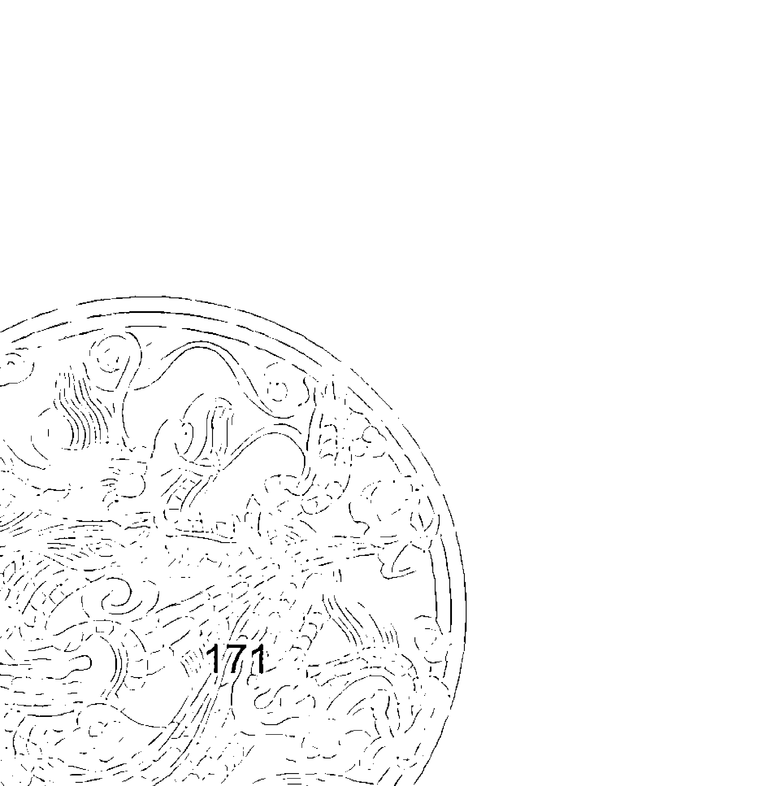

### (四) 有十年好運，並不代表這十年都會順心如意

每一事件的好運期都有十年，但大部分的人都會浪費二、三年的好運期。

算命實例：好運來之前都需要準備期，但大部分的人都在好運開始後才準備。

算命實例：雖然好運都有十年，但每一個好運都需要再「做對一件事」，才能讓好運持續發展。

### (五) 高階算命才會遇到矛盾的問題

每一事件都會遇到矛盾的現象，可以論斷矛盾者才是真正的算命高手。

算命實例：有十年結婚的好運，但只有過了某年某月之後，才是結婚的好時機。

算命實例：有十年買房子的好運，但只有過了某年某月之後，買房子才能賺錢、才能平安、才能旺事業。

高階算命：高階算命需要一連串的公式組合才能清楚分析。

| 奴 (M) | 遷 (M) | 疾 (M) | 財 (M) |
| :--- | :--- | :--- | :--- |
| 有十年成敗皆朋友的運<br>有十年依靠朋友的好運 | 有十年驛馬逢貴的好運<br>有十年外出調動的好運 | 先天事必躬親的命格<br>命中注定勞碌的人 | 有十年管理財產的好運<br>有十年勞碌賺錢的好運 |
| 官 (M) | 大疾重疊 | 子 (M) |
| 有十年勞心勞碌的好運<br>創業必須親自參與的運 |  | 有十年生小孩的好運<br>有十年管教子女的好運 |
| 田 (M) | 夫 (M) |
| 有十年成敗皆住宅的運<br>有十年不喜歡出外的運 | 有互相干涉的感情運<br>感情想黏在一起的運 |
| 福 (M) | 父 (M) | 命 (M) | 兄 (M) |
| 有十年愛恨清楚的運<br>有十年囉嗦矛盾的運 | 有快樂與悲傷無常的運<br>有十年努力向上的好運 | 必須經歷人生無常的運<br>有十年努力工作的好運 | 有兄弟姊妹互利的運<br>有十年外出調動的好運 |

# ◎大遷「重疊」十二宮位的現象

- 1. 大遷「重疊」命宮。
- 2. 大遷「重疊」兄弟宮。
- 3. 大遷「重疊」夫妻宮。
- 4. 大遷「重疊」子女宮。
- 5. 大遷「重疊」財帛宮。
- 6. 大遷「重疊」疾厄宮。
- 7. 大遷「重疊」遷移宮。
- 8. 大遷「重疊」奴僕宮。
- 9. 大遷「重疊」官祿宮。
- 10. 大遷「重疊」田宅宮。
- 11. 大遷「重疊」福德宮。
- 12. 大遷「重疊」父母宮。

遷移宮與命宮的現象：

## 「遷移宮」：

- 1. 在人：一個性、二姻緣、三老運、四外人對我的觀感。
- 2. 在事：五驛馬、六業務、七外務、八包裝自己或產品。
- 3. 在物：九留學、十出國、十一移民、十二出外的一切因緣。

### 「命宮」：

- 1. 在人：一本性、二喜好、三才華、四姻緣、五內心世界真我。
- 2. 在事：六命中優勢、七成功個性、八先天官祿宮的條件。
- 3. 在物：九意外、十情緣、十一所有人事物有關的定數。

### （二）實例說明

論述大遷「重疊」命宮的解釋：

#### 1. 公式分析：

公式一：祿權科忌（四化星）所在的宮位，永遠不會變動。

公式二：大遷「重疊」本命的宮位＝大遷＋本命，即兩個宮位合起來解釋。

公式三：「大遷」之人事物＋「命宮」之人事物，皆可以互相交叉應用再解釋內容。

#### 2. 算命實例：

問題一：大遷在人「一個性」＋命宮在人「一本性」。

解釋：表示這十年有把本性呈現出來的運。

問題二：大遷在事「七外務」＋命宮在事「六命中優勢」。

解釋：表示這十年出外歷練，事業才能展現命中的優勢。

問題三：大遷在物「九留學」＋命宮在物「九意外」。

解釋：切記！這是難以解釋的現象，一定要更換其他同類的現象。例如，可以把在物「九留學」更換為在事「七外務」，就能順利解釋內容，即這十年出外有意外的厄運。

### （二）大遷「重疊」十二宮位的解釋

大遷「重疊」本命的宮位＝大遷的宮位＋本命的宮位。

解釋：大遷＋本命的宮位，即兩個宮位合起來的解釋。

### （三）算命與算運的區別

算命：應用「本命命盤」論命，就是算命。

算運：應用「大限命盤」論命，就是算運。


### （四）有十年好運，並不代表這十年都會順心如意

每一事件的好運期都有十年，但大部分的人都會浪費二、三年的好運期。算命實例：好運來之前都需要準備期，但大部分的人都在好運開始後才準備。算命實例：雖然好運都有十年，但每一個好運都需要再「做對一件事」，才能讓好運持續發展。

### （五）高階算命才會遇到矛盾的問題

每一事件都會遇到矛盾的現象，可以論斷矛盾者才是真正的算命高手。算命實例：有十年結婚的好運，但只有過了某年某月之後，才是結婚的好時機。算命實例：有十年買房子的好運，但只有過了某年某月之後，買房子才能賺錢、才能平安、才能旺事業。高階算命：高階算命需要一連串的公式組合才能清楚分析。

| 宮位 | 描述 |
| :--- | :--- |
| 奴 | 有十年朋友互利的運<br>有十年靠朋友的好運 |
| 遷 | 離家獨立人生會變彩色<br>命中出外逢貴的命格 |
| 疾 | 有十年升遷創業的好運 |
| 財 | 有十年升遷創業的好運 |
| 官 | 有十年升遷創業的好運 |
| 子 | 有十年升遷創業的好運 |
| 田 | 有十年升遷創業的好運 |
| 夫 | 有十年升遷創業的好運 |
| 福 | 有十年升遷創業的好運 |
| 父 | 有十年升遷創業的好運 |
| 命 | 有十年升遷創業的好運 |
| 兄 | 有十年升遷創業的好運 |

# ◎大奴「重疊」十二宮位的現象

- 1. 大奴「重疊」命宮。
- 2. 大奴「重疊」兄弟宮。
- 3. 大奴「重疊」夫妻宮。
- 4. 大奴「重疊」子女宮。
- 5. 大奴「重疊」財帛宮。
- 6. 大奴「重疊」疾厄宮。
- 7. 大奴「重疊」遷移宮。
- 8. 大奴「重疊」奴僕宮。
- 9. 大奴「重疊」官祿宮。
- 10. 大奴「重疊」田宅宮。
- 11. 大奴「重疊」福德宮。
- 12. 大奴「重疊」父母宮。

## 奴僕宮與命宮的現象：

### 「奴僕宮」：

- 1. 在人：一朋友、二部屬、三同事、四員工、五過客緣分。
- 2. 在事：六異性緣、七眾生情、八朋友義、九人際關係。
- 3. 在物：十人脈、十一傳銷、十二業務、十三外務、十四依存關係。

### 「命宮」：

- 1. 在人：一本性、二喜好、三才華、四姻緣、五內心世界真我。
- 2. 在事：六命中優勢、七成功個性、八先天官祿宮的條件。
- 3. 在物：九意外、十情緣、十一所有人事物有關的定數。

### （二）實例說明

論述大奴「重疊」命宮的解釋：

#### 1. 公式分析：

公式一：祿權科忌（四化星）所在的宮位，永遠不會變動。

公式二：大奴「重疊」本命的宮位＝大奴＋本命，即兩個宮位合起來解釋。

公式三：「大奴」之人事物＋「命宮」之人事物，皆可以互相交叉應用再解釋內容。

#### 2. 算命實例：

問題一：大奴在人「朋友」＋命宮在人「本性」。
解釋：表示這十年有對朋友真心或真性情的運。

問題二：大奴在事「七眾生情」＋命宮在事「六命中優勢」。
解釋：表示這十年業務與外務的磨練，事業才能展現命中的優勢。

問題三：大奴在物「十人脈」＋命宮在物「九意外」。
解釋：切記！這是難以解釋的現象，一定要更換其他同類的現象。例如，可以把在物「十人脈」更換為在事「七眾生情」，就能順利解釋內容，即這十年有人際關係出問題的厄運。

### （二）大奴「重疊」十二宮位的解釋

大奴「重疊」本命的宮位＝大奴的宮位＋本命的宮位。
解釋：大奴＋本命的宮位，即兩個宮位合起來的解釋。

### （三）算命與算運的區別

算命：應用「本命命盤」論命，就是算命。
算運：應用「大限命盤」論命，就是算運。

### （四）有十年好運，並不代表這十年都會順心如意

每一事件的好運期都有十年，但大部分的人都會浪費二、三年的好運期。
算命實例：好運來之前都需要準備期，但大部分的人都在好運開始後才準備。
算命實例：雖然好運都有十年，但每一個好運都需要再「做對一件事」，才能讓好運持續發展。

### （五）高階算命才會遇到矛盾的問題

每一事件都會遇到矛盾的現象，可以論斷矛盾者才是真正的算命高手。
算命實例：有十年結婚的好運，但只有過了某年某月之後，才是結婚的好時機。
算命實例：有十年買房子的好運，但只有過了某年某月之後，買房子才能賺錢、才能平安、才能旺事業。
高階算命：高階算命需要一連串的公式組合才能清楚分析。

一個描述"大奴重疊"（大运仆役宫重叠）与各宫位关系的十二宫格图表。中心为"大奴重疊"，有箭头指向四周的宫位（奴、遷、疾、財、子、夫、兄、命、父、福、田、官），每个宫位内包含描述该重叠现象影响的两列文字（如"命中成敗皆朋友的命格"、"有十年靠朋友的好運"等）及一个带圆圈的'M'符号。

# ◎大官『重疊』十二宮位的現象

- 1. 大官『重疊』命宮。
- 2. 大官『重疊』兄弟宮。
- 3. 大官『重疊』夫妻宮。
- 4. 大官『重疊』子女宮。
- 5. 大官『重疊』財帛宮。
- 6. 大官『重疊』疾厄宮。
- 7. 大官『重疊』遷移宮。
- 8. 大官『重疊』奴僕宮。
- 9. 大官『重疊』官祿宮。
- 10. 大官『重疊』田宅宮。
- 11. 大官『重疊』福德宮。
- 12. 大官『重疊』父母宮。

### （二）實例說明

#### 1. 公式分析

公式一：祿權科忌（四化星）所在的宮位，永遠不會變動。

論述大官『重疊』命宮的解釋：

「命宮」：
1. 在人：一本性、二同事、三情緣、四先天優勢的條件。
2. 在事：六命中優勢、七成功個性、八先天官祿宮的條件。
3. 在物：九意外、十情緣、十一所有人事物有關的定數。

「官祿宮」：
1. 在人：一本性、二喜好、三才華、四姻緣、五內心世界真我。
2. 在事：五工作、六事業、七職業、八先天成功的條件。
3. 在物：九功名、十考試、十一學校、十二先天富貴的條件。

官祿宮與命宮的現象：

公式二：大官「重疊」本命的宮位＝大官+本命，即兩個宮位合起來解釋。

公式三：「大官」之人事事物＋「命宮」之人事事物，皆可以互相交叉應用再解釋內容。

#### 2. 算命實例

問題一：大官在人「一本性」＋命宮在人「一本性」。
解釋：表示這十年對事業的態度才是真正的自己。

問題二：大官在事「七職業」＋命宮在事「六命中優勢」。
解釋：表示這十年出外工作的歷練，事業才能展現我命中的優勢。

問題三：大官在物「十考試」＋命宮在物「九意外」。
解釋：切記！這是難以解釋的現象，一定要更換其他同類的現象。例如，可以把在物「十考試」更換為在事「七職業」，就能順利解釋內容，即這十年換工作有意外不被錄取的厄運。

### （二）大官「重疊」十二宮位的解釋

大官「重疊」本命的宮位＝大官的宮位+本命的宮位。
解釋：大官+本命的宮位，即兩個宮位合起來的解釋。

### （三）算命與算運的區別

算命：應用「本命命盤」論命，就是算命。
算運：應用「大限命盤」論命，就是算運。

### （四）有十年好運，並不代表這十年都會順心如意

每一事件的好運期都有十年，但大部分的人都會浪費二、三年的好運期。

算命實例：好運來之前都需要準備期，但大部分的人都在好運開始後才準備。

算命實例：雖然好運都有十年，但每一個好運都需要再「做對一件事」，才能讓好運持續發展。

### （五）高階算命才會遇到矛盾的問題

每一事件都會遇到矛盾的現象，可以論斷矛盾者才是真正的算命高手。

算命實例：有十年結婚的好運，但只有過了某年某月之後，才是結婚的好時機。

算命實例：有十年買房子的好運，但只有過了某年某月之後，買房子才能賺錢、才能平安、才能旺事業。

高階算命：高階算命需要一連串的公式組合才能清楚分析。

# 肆、生年四化與自化的基礎

| 宮位 | 解釋 |
|------|------|
| **奴** | 有十年驛馬星動的好運；有十年依靠朋友的好運 (M) |
| **遷** | 有十年業務外務的好運；有十年出外國的好運 (M) |
| **疾** | 勞心勞碌事業才有好運；事必躬親才會賺錢的運 (M) |
| **財** | 有十年事業賺大錢的運；有十年投資創業的好運 (M) |
| **官** | 先天事業賺大錢的命格；命中注定事業有成就的人 (M) |
| **子** | 有結婚生子旺事業的運；有十年成立團隊的好運 (M) |
| **田** | 有十年買不動產的好運；有十年從事仲介的好運 (M) |
| **夫** | 有十年結婚旺事業的運；有十年夫妻共業的好運 (M) |
| **福** | 有十年追求夢想的好運；有十年投資自己的好運 (M) |
| **父** | 有十年上司老闆的好運；有十年升遷創業的好運 (M) |
| **命** | 有事業有創造高峰的好運；有十年努力往上的好運 (M) |
| **兄** | 有十年出外調動的好運；有兄弟姊妹互利的好運 (M) |

大官重疊

# ◎大田「重疊」十二宮位的現象

- 1. 大田「重疊」命宮。
- 2. 大田「重疊」兄弟宮。
- 3. 大田「重疊」夫妻宮。
- 4. 大田「重疊」子女宮。
- 5. 大田「重疊」財帛宮。
- 6. 大田「重疊」疾厄宮。
- 7. 大田「重疊」遷移宮。
- 8. 大田「重疊」奴僕宮。
- 9. 大田「重疊」官祿宮。
- 10. 大田「重疊」田宅宮。
- 11. 大田「重疊」福德宮。
- 12. 大田「重疊」父母宮。

田宅宮與命宮的現象：

「田宅宮」：
- 1. 在人：一家族、二親戚、三小家庭、四家族企業的格局。
- 2. 在事：五搬家、六意外、七店面、八工廠、九事業的格局。
- 3. 在物：十家業、十一祖業、十二繼承、十三先天不動產的格局。

「命宮」：
- 1. 在人：一本性、二喜好、三才華、四姻緣、五內心世界真我。
- 2. 在事：六命中優勢、七成功個性、八先天官祿宮的條件。
- 3. 在物：九意外、十情緣、十一所有人事物有關的定數。

### （二）實例說明

1. 公式分析：

公式一：祿權科忌（四化星）所在的宮位，永遠不會變動。

論述大田「重疊」命宮的解釋：

公式二：大田「重疊」本命的宮位=大田+本命，即兩個宮位合起來解釋。

公式三：「大田」之人事務+「命宮」之人事務，皆可以互相交叉應用再解釋內容。

2. 算命實例：

問題一：大田在人「一族」+命宮在人「一本性」。
解釋：表示這十年有三代同堂的好運。

問題二：大田在事「七店面」+命宮在事「六命中優勢」。
解釋：表示這十年買店面才能展現我命中的優勢。

問題三：大田在物「十家業」+命宮在物「九意外」。
解釋：切記！這是難以解釋的現象，一定要更換其他同類的現象。例如，可以把在物「十家業」更換為在事「七店面」，就能順利解釋內容，即這十年買店面會因誤判好機會而出現賠錢的意外。

### （二）大田「重疊」十二宮位的解釋

大田「重疊」本命的宮位=大田的宮位+本命的宮位。
解釋：大田+本命的宮位，即兩個宮位合起來的解釋。

### （三）算命與算運的區別

算命：應用「本命命盤」論命，就是算命。
算運：應用「大限命盤」論命，就是算運。

### （四） 有十年好運，並不代表這十年都會順心如意

每一個事件的好運期都有十年，但大部分的人都會浪費二、三年的好運期。

算命實例：好運來之前都需要準備期，但大部分的人都在好運開始後才準備。

算命實例：雖然好運都有十年，但每一個好運都需要再「做對一件事」，才能讓好運持續發展。

### （五） 高階算命才會遇到矛盾的問題

每一個事件都會遇到矛盾的現象，可以論斷矛盾者才是真正的算命高手。

算命實例：有十年結婚的好運，但只有過了某年某月之後，才是結婚的好時機。

算命實例：有十年買房子的好運，但只有過了某年某月之後，買房子才能賺錢、才能平安、才能旺事業。

高階算命：高階算命需要一連串的公式組合才能清楚分析。

# ◎大福『重疊』十二宮位的現象

- 1. 大福『重疊』命宮。
- 2. 大福『重疊』兄弟宮。
- 3. 大福『重疊』夫妻宮。
- 4. 大福『重疊』子女宮。
- 5. 大福『重疊』財帛宮。
- 6. 大福『重疊』疾厄宮。
- 7. 大福『重疊』遷移宮。
- 8. 大福『重疊』奴僕宮。
- 9. 大福『重疊』官祿宮。
- 10. 大福『重疊』田宅宮。
- 11. 大福『重疊』福德宮。
- 12. 大福『重疊』父母宮。

福德宮與命宮的現象：

「福德宮」：
- 1. 在人：一貴人、二公媽、三祖蔭、四積善人家的福報位。
- 2. 在事：五嗜好、六興趣、七貴人、八利害關係的應酬位。
- 3. 在物：九家業、十祖業、十一繼承、十二宗教角度的因果位。

「命宮」：
- 1. 在人：一 本性、二喜好、三才華、四姻緣、五內心世界真我。
- 2. 在事：六命中優勢、七成功個性、八先天官祿宮的條件。
- 3. 在物：九意外、十情緣、十一所有人事物有關的定數。

### （二）實例說明

論述大福『重疊』命宮的解釋：

1. 公式分析：

公式一：祿權科忌（四化星）所在的宮位，永遠不會變動。

#### 2. 算命實例：

公式二：大福「重疊」本命的宮位=大福+本命，即兩個宮位合起來解釋。
公式三：「大福」之人事物＋「命宮」之人事物，皆可以互相交叉應用再解釋內容。

問題一：大福在人「一貴人」+命宮在人「一本性」。
解釋：表示這十年有貴人相助的好運。

問題二：大福在事「七貴人」+命宮在事「六命中優勢」。
解釋：表示這十年事業展現我命中的優勢，就能遇到貴人相助。

問題三：大福在物「十祖業」+命宮在物「九意外」。
解釋：切記！這是難以解釋的現象，一定要更換其他同類的現象。例如，可以把在物「十祖業」更換為在事「七貴人」，就能順利解釋內容，即這十年出外有意外，但都能逢凶化吉的好運。

### （二） 大福「重疊」十二宮位的解釋

大福「重疊」本命的宮位=大福的宮位+本命的宮位。
解釋：大福+本命的宮位，即兩個宮位合起來的解釋。

### （三） 算命與算運的區別

算命：應用「本命命盤」論命，就是算命。
算運：應用「大限命盤」論命，就是算運。

### （四） 有十年好運，並不代表這十年都會順心如意

每一個事件的好運期都有十年，但大部分的人都會浪費二、三年的好運期。

算命實例：好運來之前都需要準備期，但大部分的人都在好運開始後才準備。

算命實例：雖然好運都有十年，但每一個好運都需要再「做對一件事」，才能讓好運持續發展。

### （五） 高階算命才會遇到矛盾的問題

每一事件都會遇到矛盾的現象，可以論斷矛盾者才是真正的算命高手。

算命實例：有十年結婚的好運，但只有過了某年某月之後，才是結婚的好時機。

算命實例：有十年買房子的好運，但只有過了某年某月之後，買房子才能賺錢、才能平安、才能旺事業。

高階算命：高階算命需要一連串的公式組合才能清楚分析。

# 肆、生年四化與自化的基礎

| 宮位 | 解釋 |
|------|------|
| 奴 | 有十年成敗皆朋友的運；有培養人際關係的好運 |
| 遷 | 有追求夢想走天涯的運；有十年追求美夢的好運 |
| 疾 | 有十年想做自己的運；有十年追求理想的運 |
| 財 | 有十年投資投機的好運；有十年追求夢想的好運 |
| 官 | 有十年繼承家業的好運；有十年追求夢想的好運 |
| 大福重疊 |  |
| 子 | 子女想追求未來的好運；有十年培養子女的好運 |
| 田 | 有十年繼承祖產的好運；有十年買到吉屋的好運 |
| 夫 | 配偶追求自己生活的運；有十年天賜良緣的好運 |
| 福 | 命中注定繼承家業的人；命中注定傳宗接代的人 |
| 父 | 有十年做對行業的好運；有十年跟對老闆的好運 |
| 命 | 有十年投資未來的好運；有十年廣結善緣的好運 |
| 兄 | 兄弟姊妹有福報的好運；兄弟姊妹繼承家業的運 |

# ◎大父「重疊」十二宮位的現象

- 1. 大父「重疊」命宮。
- 2. 大父「重疊」兄弟宮。
- 3. 大父「重疊」夫妻宮。
- 4. 大父「重疊」子女宮。
- 5. 大父「重疊」財帛宮。
- 6. 大父「重疊」疾厄宮。
- 7. 大父「重疊」遷移宮。
- 8. 大父「重疊」奴僕宮。
- 9. 大父「重疊」官祿宮。
- 10. 大父「重疊」田宅宮。
- 11. 大父「重疊」福德宮。
- 12. 大父「重疊」父母宮。

父母宮與命宮的現象：

「父母宮」：
- 1. 在人：一父母、二長輩、三上司、四貴人、五老闆、六神明。
- 2. 在事：七升官、八創業、九考試、十公家、十一學校、十二銀行。
- 3. 在物：十三讀書、十四技能、十五合作、十六加盟、十七客源、十八上游。

「命宮」：
- 1. 在人：一本性、二喜好、三才華、四姻緣、五內心世界真我。
- 2. 在事：六命中優勢、七成功個性、八先天官祿宮的條件。
- 3. 在物：九意外、十情緣、十一所有人事物有關的定數。

### (二) 實例說明

論述大父「重疊」命宮的解釋：

1. 公式分析：

公式一：祿權科忌（四化星）所在的宮位，永遠不會變動。

公式二：大父「重疊」本命的宮位＝大父＋本命，即兩個宮位合起來解釋。
公式三：「大父」之人事事物＋「命宮」之人事事物，皆可以互相交叉應用再解釋內容。

2. 算命實例：
問題一：大父在人「一父母」＋命宮在人「一本性」。
解釋：表示這十年有父母同住的好運。

問題二：大父在事「七升官」＋命宮在事「六命中優勢」。
解釋：表示這十年事業展現我命中的優勢，就會有升官的機緣。

問題三：大父在物「十四技能」＋命宮在物「九意外」。
解釋：切記！這是難以解釋的現象，一定要更換其他同類的現象。例如，可以把在物「十四技能」更換為在事「七升官」，就能順利解釋內容，即這十年有升官卻生意外的厄運。

### （二）大父「重疊」十二宮位的解釋

大父「重疊」本命的宮位＝大父的宮位＋本命的宮位。
解釋：大父＋本命的宮位，即兩個宮位合起來的解釋。

### （三）算命與算運的區別

算命：應用「本命命盤」論命，就是算命。
算運：應用「大限命盤」論命，就是算運。

### （四）有十年好運，並不代表這十年都會順心如意

每一事件的好運期都有十年，但大部分的人都會浪費二、三年的好運期。

算命實例：好運來之前都需要準備期，但大部分的人都在好運開始後才準備。

算命實例：雖然好運都有十年，但每一個好運都需要再「做對一件事」，才能讓好運持續發展。

### （五）高階算命才會遇到矛盾的問題

每一事件都會遇到矛盾的現象，可以論斷矛盾者才是真正的算命高手。

算命實例：有十年結婚的好運，但只有過了某年某月之後，才是結婚的好時機。

算命實例：有十年買房子的好運，但只有過了某年某月之後，買房子才能賺錢、才能平安、才能旺事業。

高階算命：高階算命需要一連串的公式組合才能清楚分析。

## 五、紫微斗数『自化』的基础

你还在用星辰算命吗？这是二十世纪旧时代的流行，『飞星四化算命法』则是这几年才开始流行的东西，但传统命理老师只能说出最简单的解释。『生年四化』算命法，对传统命理老师是陌生的学问，最多只能简单分析这四个字的内容。而自化与法象的学问，说起来有点悲哀，竟然高达99%以上的命理老师没有听过，所以，当然更不懂『算运』的规划了。
华山派以『现代科学命理』自居，一路走来不断的创新与发明。把紫微斗数的生年四化+自化+飞星四化+法象等四者合而为一，更创造出如何精准掌握每一事件的时间+吉凶+内容+影响，只盼望华山派穷极一生的努力，能够带动『科学命理』的诞生。

### （一）『自化』与本命、大限、流年的关系

1. 主导人生的四大公式
- (1) 『自化』是主导时间吉凶的架构。
算命分析：传统命理老师算每一事件的最大盲点，在于对时间与吉凶的掌握，总是简单笼统的算命。华山派的自化为时间与吉凶的源头，正好弥补了传统命理老师这方面的不足。
- (2) 『生年四化』是主导每一事件的用神。
算命分析：传统命理老师算每一事件最多只会一种公式，有80%以上的问题不会推算。华山派的四化，对每一事件至少有三十种以上的公式推算，正好弥补了传统命理老师这方面的不足。
- (3) 『飞星四化』是主导自己选择的人生。
算命分析：传统命理老师算每一事件的方向，不知道人生都有两种选择：一是上天安排的方向，二是自己选择的方向。华山派的飞星四化算命法，就是为90%自己选择方向的众生而量身订做，为他们规划每一事件的最大利润。
- (4) 「法象」是主导生涯规划的方向。
算命分析：传统命理老师算每一事件，最多只能凭人生经历或宗教习俗来吓人，这似是而非的论述，让高级知识分子认为是迷信而嗤之以鼻。华山派的法象是上天巧安排的人生轨迹，正好弥补了传统命理老师这方面的不足。

2. 本命命盘与自化的关系
- 1. 应用「本命命盘＋有M质＋有自化」算命。
- 2. 应用「本命命盘＋无M质＋有自化」算命。
- 3. 利用本命命盘的自化来算命，这只是最简单的算现象，因为没有回归生年四化，也欠缺吉凶与时间的论述，只有60%的精准度。

3. 大限命盘与自化的关系
- 1. 应用「大限命盘＋有M质＋有自化」算命。
算命分析：算命中注定的事，未来十年做不对，因缘也会产生人、事、物的变化。
- 2. 应用「本命命盘＋无M质＋有自化」算命。
算命分析：算不是命中注定的事，未来十年该怎么做才能做对因缘，而让你的美梦成真。
- (3) 利用大限命盘的自化来算运，因为没有法象（回归生年四化），也没有应用「体与用」的吉凶关系，只有20%的精准度。
- (4) 利用大限命盘的自化+法象（回归生年四化）来算运，因为没有应用「体与用」的吉凶关系，只有40%的精准度。

4. 流年命盘与自化的关系
- (1) 应用「流年命盘+有M质+有自化」算命。
- (2) 应用「流年命盘+无M质+有自化」算命。
- (3) 算命分析：利用流年命盘的自化来算命，这是完全不正确的算命方法。
- (4) 利用流年命盘的自化来算命或算运，只有10%以下的精准度。

### (二)「自化」怎么算命？算运？

1. 自化的因缘
- (1) 自化与生年四化一定要「法象」，法象就是回归生年四化「看」因缘。
- (2) 法象可以确定人事物的缘分、时间、吉凶、内容、影响、改运、转运、欠债……等定位与定数的因缘。
- (3) 自化+生年四化就是完整的算命。

2. 自化怎么算命？算运？算吉凶？
- (1) 本命命盘的自化怎么「算命」？
- (2) 本命命盘的自化怎么「算运」？
- (3) 本命命盘的自化怎么「算吉凶」？

本命命盘的自化，可以论述算命第二层的功夫。

算命实例：
可以算第一层：子女宫有忌星，表示欠子女的债。
可以算第二层：子女宫有忌星又自化禄星，这里的自化禄星表示欠子女的什么债？生年禄星在财帛宫，则表示欠子女的花钱债；生年禄星在夫妻宫，表示欠子女的结婚债，一定要帮子女完成终身大事。

本命命盘的自化＋生年四化（法象），算命的现象则有90%以上的精准度。

- (2) 大命命盘的自化怎么「算运」？

算命实例：
可以算第二层：迁移宫有忌星又自化禄星，这是算命的第二层功夫。这里的自化禄星表示出外是为了什么事？生年禄星在官禄宫，表示出外是为了出国读书；生年禄星在夫妻宫，表示出外是为了结婚，出外才能完成终身大事。
可以算第三层：子女宫有忌星又自化禄星＋35/44大限「重疊」子女宫，这是算命的第三层功夫「时间」。表示35/44大限才是欠子女债的时间。

大限命盘的自化＋生年四化（法象），算命有75%以上的精准度。

- (3) 流年命盘的自化怎么算吉凶？

算命实例：
流年命盘的自化，可以论述算命第四层的功夫。

算命第三層：子女宮有忌星又自化祿星与35/44大命「重疊」子女宮，這是算命的第三層功夫「時間」。表示35/44大命才是欠子女債的時間。

算命第四層：子女宮有忌星又自化祿星与35/44大命「重疊」子女宮与流年「重疊」子女宮，這是算命的第四層功夫「吉凶」。表示35/44大命重疊的流年，就是還子女債開始的流年，還債後一定會有意想不到的福報。

單一流年命盤的自化，算命有10%以下的精準度，這是完全不精準的算命方式。

# 肆、生年四化與自化的基礎

標準命盤：女命
丁巳年生
42歲

| 星曜组合       | 宫位/数字          | 四化/标注          | 星曜组合       | 宫位/数字          | 四化/标注          | 星曜组合       | 宫位/数字          | 四化/标注          |
|----------------|--------------------|--------------------|----------------|--------------------|--------------------|----------------|--------------------|--------------------|
| 天梁（權↑）    | 1,13,25,37,49,61   | 乙巳 大福 53<br>奴僕 62 | 七殺           | 2,14,26,38,50,62   | 丙午 大田 63<br>遷移 72 | 廉貞           | 3,15,27,39,51,63   | 丁未 大官 73<br>疾厄 82 |
| 天相 紫微      | 12,24,36,48,60,72  | 甲辰 大父 43<br>官祿 52 | 破軍           | 5,17,29,41,53,65   | 己酉 大遷<br>子女   | 天府 武曲      | 8,20,32,44,56,68   | 壬子 大子 03<br>命宮 12 |
| 文曲 巨門（忌） 天機（科） | 11,23,35,47,59,71 | 癸卯 大命 33<br>田宅 42 | 祿（标注）     | -                  | -                  | 文昌 天同（權） | 7,19,31,43,55,67   | 辛亥 大財<br>兄弟   |
| 貪狼           | 10,22,34,46,58,70  | 壬寅 大兄 23<br>福德 32 | 右弼 太陽 左輔 太陰（祿） | 9,21,33,45,57,69 | 癸丑 大夫 13<br>父母 22 | 科（标注）     | 壬子 大子 03<br>命宮 12 | 忌（标注） 辛亥 大財<br>兄弟 |

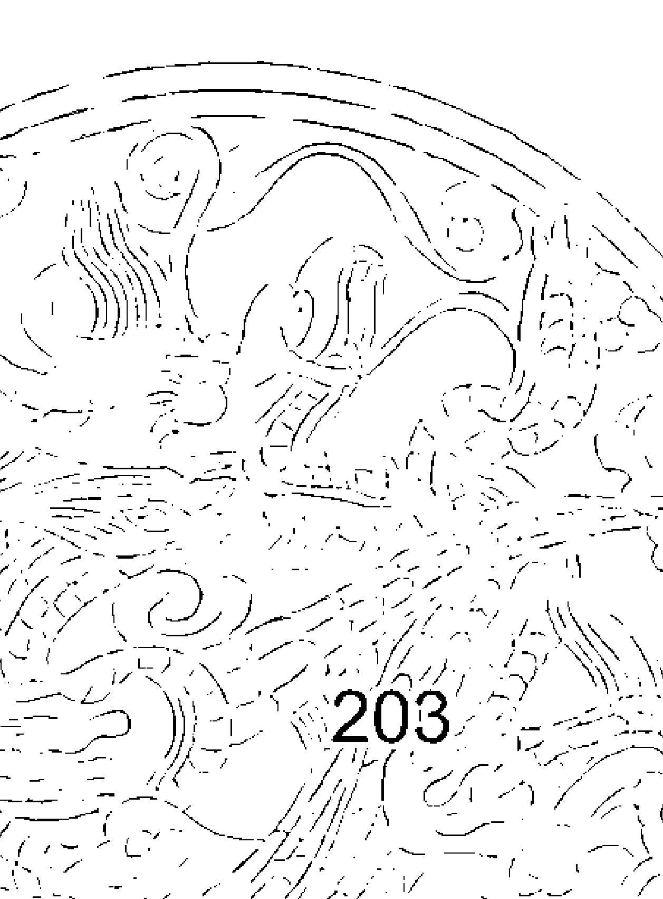

天梁 七殺 廉貞
大福 乙 奴 大田 丙 遷 大官 丁 疾 大奴 戊 財
紫微 天相 甲 官 43/52 大遷 己 子 破軍
天機 巨門(忌) 科 癸 田 33/42 大疾 庚 夫 天同(權)
貪狼 壬 福 23/32 太陰(祿) 癸 父 13/22 天府 武曲 壬 命 3/12 辛 兄

## ◎『自化』怎麼算命？

- 1. 自化的定義：由宮位天干的四化星飛到本宮或對宮，稱為「自化」。自化的宮位一定要「法象」，法象就是回歸生年四化看人事的因緣。
- 2. 自化的算命與算運。
   (1)算命：本命自化与生年四化星。
   實例分析：本命命盤的父母宮有自化科
   (2)算運：大限自化与生年四化星。
   實例分析：大命命盤的夫妻宮有自化科
   与「法象」科星在本命命盤的田宅宮。

# 肆、生年四化與自化的基礎

標準命盤：女命 乙亥年生 24歲

| 单元格1 | 单元格2 | 单元格3 | 单元格4 |
|---------|---------|---------|---------|
| 右弼 貪狼 廉貞<br>7.19.31.43.55.67<br>辛巳 大官 56<br>奴僕 65 | 巨門<br>8.20.32.44.56.68<br>壬午 大奴 66<br>遷移 75 | 天相<br>9.21.33.45.57.69<br>癸未 大遷 76<br>疾厄 85 | 天梁 天同<br>10.22.34.46.58.70<br>甲申 大疾 86<br>財帛 95 |
| 太陰(忌)<br>6.18.30.42.54.66<br>庚辰 大田 46<br>官祿 55 | | | 武曲 七殺 左輔<br>11.23.35.47.59.71<br>乙酉 大財<br>子女 |
| 文昌 天府<br>5.17.29.41.53.65<br>己卯 大福 36<br>田宅 45 | | | 太陽<br>12.24.36.48.60.72<br>丙戌 大子<br>夫妻 |
| 4.16.28.40.52.64<br>戊寅 大父 26<br>福德 35 | 3.15.27.39.51.63<br>己丑 大命 16<br>父母 25 | 2.14.26.38.50.62<br>戊子 大兄 06<br>命宮 15 | 1.13.25.37.49.61<br>丁亥 大夫<br>兄弟 |

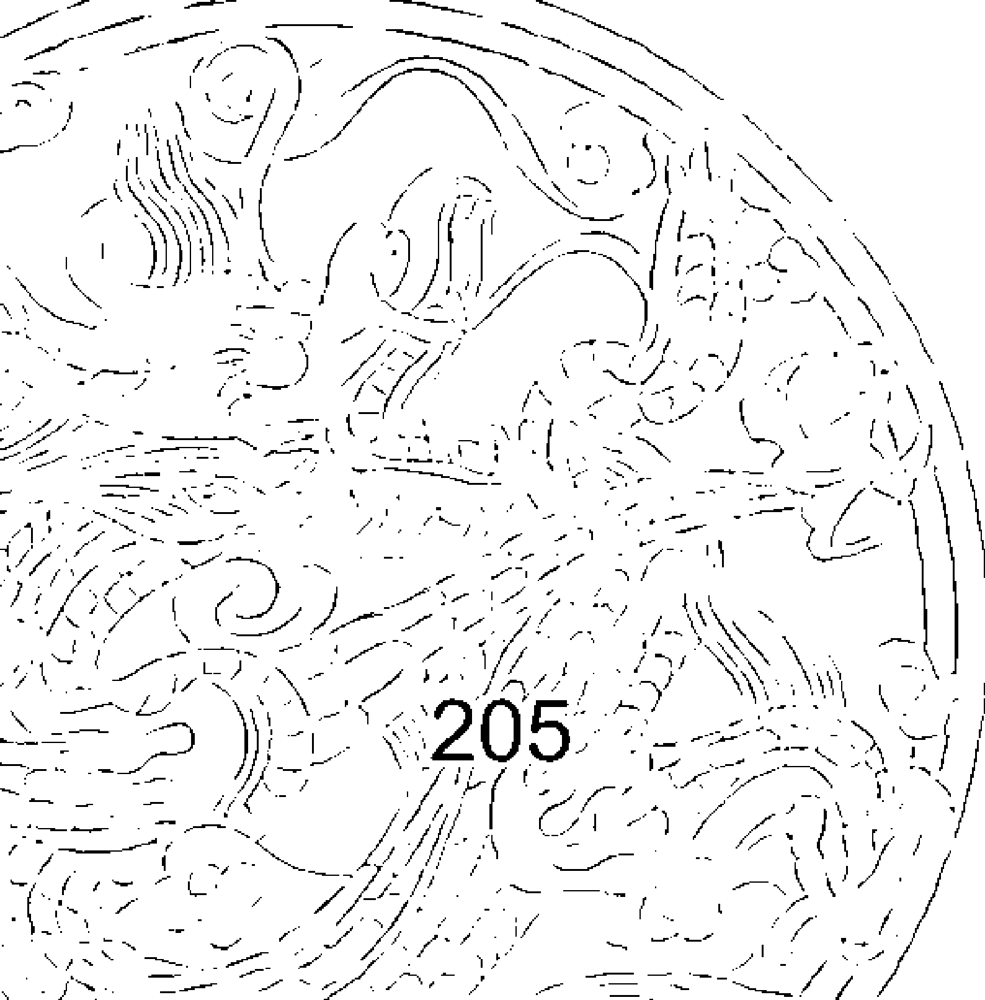

| 右弼貪狼廉貞 | 巨門 | 天相 | 天同天梁(權) |
| 大官辛奴 | 大奴壬遷 | 大遷癸疾 | 大疾甲財 |
| 太陰(忌) |  |  | 左輔七殺武曲 |
| 大田官46/55 |  |  | 大財子 |
| 文昌天府 |  |  | 太陽 |
| 大福36/45 |  |  | 大子丙夫 |
| 破軍紫微(科) | 天機(祿) |  | 文曲 |
| 大父26/35 | 大命16/25 | 大兄06/15 | 大夫丁兄 |

## ◎「自化」怎麼算命與算運？

- 1. 完整的算命＝自化与生年四化星，即兩個宮位合起來的解釋。
- 2. 自化怎麼算命？
   算命：命宮自化忌，法象忌星在官祿宮。
   算命分析：表示命中有兩段不一樣的事業。人生不是一段一段往上爬，就會一直換工作。
- 3. 自化怎麼算運？
   算運：大命田宅宮飛祿星到大命子女宮，法象生年祿星在本命命宮。
   算運分析：表示16／25大命有生小孩或三角關係的運。
- 4. 向心力自化的重點在對宮，所以，此命盤大田飛祿星到大子，算命的重點在大子。

# 肆、生年四化與自化的基礎

○標準命盤：女命 己未年 40歲

| 宫位 | 天干地支 | 宫位名 | 大限宫 | 年龄序列 | 星曜（四化） | 箭头标注 |
|---|---|---|---|---|---|---|
| 巳 | 己巳 | 夫妇、父母 | 大夫 | 13-22 | 太阳、文曲（忌） | 忌↑ |
| 午 | 庚午 | 兄弟、福德 | 大兄 | 23-32 | 破军 | |
| 未 | 辛未 | 田宅、命宫 | 大命 | 33-42 | 天机、左辅、右弼 | 科 ↗ |
| 申 | 壬申 | 官禄、父母 | 大父 | 43-52 | 紫微、天府 | 權↑ |
| 酉 | 癸酉 | 奴仆、福德 | 大福 | 53-62 | 太阴、文昌、天同 | 科→、祿 ↗ |
| 戌 | 甲戌 | 迁移、田宅 | 大田 | 63-72 | 贪狼（權） | 祿 ↘ |
| 亥 | 乙亥 | 疾厄、官禄 | 大官 | 73-82 | 巨门 | 忌 ↓ |
| 子 | 丙子 | 财帛、奴仆 | 大奴 | 83-92 | 廉贞、天相 | 忌↓ |
| 丑 | 丁丑 | 子女、迁移 | 大迁 | 未标注 | 天梁（科） | 科 ↙ |
| 寅 | 丙寅 | 夫妻、疾厄 | 大疾 | 未标注 | 七杀 | |
| 卯 | 丁卯 | 兄弟、财帛 | 大财 | 未标注 | 天同 | 權← |
| 辰 | 戊辰 | 命宫、子女 | 大子 | 03-12 | 武曲（祿） | 祿 ↖ |

**图中标注与连线说明：**
- 图中有多条连线，标注了“科”、“祿”等四化关系，连接不同宫位。
- 部分星曜旁有圆形标记，内含“忌”、“祿”、“權”、“科”等字样。
- 每个宫位格下方有一串数字序列，代表大限年龄。

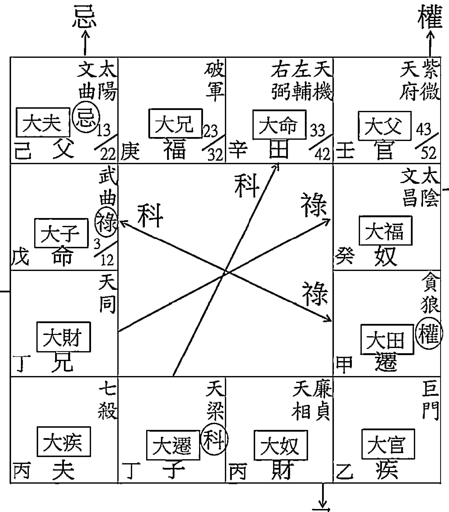

## 簡易命盤：

## ◎『自化』怎麼算命與算運？

1. 自化怎麼算命？

算命：官祿宮自化權，法象權星在遷移宮。

算命分析：權星在遷移宮，表示出外才能成就；官祿宮自化權，表示成就在事業。

2. 自化怎麼算運？

算運：大命子女宮飛祿星到大命田宅宮，法象生年祿星在本命命宮。

算運分析：表示33／42的大命，此人會發

3. 向心力自化的重點在對宮，所以，大子飛祿星到大田，算命重點在大田。

4. 自化与生年四化星，這是命中注定的人生故事，也是上天巧安排的天意軌跡，更是離成功最近的人生規劃。

# 伍、從生年四化看出自己命盤的吉凶

算吉凶，長久以來一直是命理老師最弱的項目，不是不敢肯定吉凶的時間，就是不知道每一個行業賺錢的時間何時開始；不是把現象當作吉凶，就是誤解宗教能夠幫人改運。其實，宗教習俗只是勸人為善或安撫人心的功能而已。那麼，真正的算吉凶是什麼呢？

- 1. 誤解是「算吉凶」的有哪些？
  - 算命實例一：算少年有運，中年有運，晚年好運……，這只是最簡單的算現象。
  - 算命實例二：算未來三年有機會結婚，未來五年有機會賺錢……，這只是最簡單的算現象。
  - 算命實例三：算今年桃花很旺，今年有出國的機會……，這只是最簡單的算現象。

- 2. 真正的「算吉凶」是什麼？
  - 算命實例一：「對人」的算吉凶：我正緣出現的時間是從哪一年開始至哪一年結束？
  - 算命實例二：「對事」的算吉凶：我創業賺錢的時間是從哪一年開始至哪一年結束？
  - 算命實例三：「對物」的算吉凶：我買房賺錢的時間是從哪一年開始至哪一年結束？

真正的命理學是專門為個人量身訂做的學問，每個人都有自己好運與壞運的時間，絕對不會產生同一個生肖或同一個星座，在同一個流年、同一個流月、同一個流日裡，卻發生相同的好事或壞事。例如，「生肖雞之人的財運最好」，這是完全無知的算命方式。

## 一、吉凶的形成

### （二）常用的命盤怎麼來？

- 1. 本命命盤：從寅宮開始，先順數自己的月份，再逆數自己時辰所在的宮位就是命宮。十二宮位是逆時鐘方向排列的，依序爲命、兄、夫、子、財、疾、遷、奴、官、田、福、父。

   算命實例：本命命盤可以算命中注定的事、算個人命中的優勢是什麼？

- 2. 大限命盤：由命宮開始，再依據陽男陰女順行或陽女陰男逆行的公式而求得大限命盤。

   算命實例：大限命盤可以算十年好運在何時？十年壞運在何時？

- 3. 流年命盤：流年是跟著生肖所在的宮位，一年一年移動它的位置，進而求得流年命盤。

   算命實例：流年命盤可以算人、事、物的緣起與緣滅的分界點。

- 4. 流月命盤：流月命盤是「先看」寅宮的宮位爲何宮，「再看」流年的這個宮位就是一月所在的宮位；「最後」以順時鐘方向一格一格的行走，一月、二月、三月、四月……。

   算命實例：流月命盤可以算改運與轉運的分界點。

- 5. 流日命盤：流日命盤是每個月所在的宮位之下一格爲當月的一日，再以順時鐘方向一格一格的行走，一日、二日、三日、四日……。

   算命實例：流日命盤可以算人生最大利益的規劃、算事業永續經營的規劃。

# 伍、從生年四化看出自己命盤的吉凶

### (二) 吉凶怎麼形成？

- 1.天地人之三種命盤
  - 在天成象：本命命盤論述先天注定的因緣，重點在算現象。
  - 在地成形：大限命盤論述後天運勢的吉凶，重點在算時間。
  - 在人成事：流年命盤論述現在決定的事情，重點在算得失。

- 2.常用的命盤
  - 本命命盤：簡稱本命命盤或本命，可以精論命中注定的現象。
  - 大限命盤：簡稱大限盤或大命，可以精論十年運勢的吉凶。
  - 流年命盤：簡稱流年盤或流命，可以精論流年的利益得失。
  - 流月命盤：簡稱流月盤或流月，可以精論趨吉避凶的改運。
  - 流日命盤：簡稱流日盤或流日，可以精論掌握富貴的良機。

- 3.算吉凶的要件
  - 算一生的因緣：一定要本命＋M質兩種條件成立，就可以算命中注定的現象。
  - 算十年的運勢：一定要本命＋大限兩種命盤形成相同的現象。
  - 算流年的吉凶：一定要本命＋大限＋流年三種命盤形成相同的現象。
  - 算流月的改運：一定要本命＋大限＋流年＋流月四種命盤形成相同的現象。
  - 算擇日的富貴：一定要本命＋大限＋流年＋流月＋流日五種命盤形成相同的現象。


### (三)算吉凶的基本常識

人事務每一種選擇都會有三分之一的強運，三分之一不強不弱的運，三分之一的弱運。

每一種做對的行業都會有下列現象：

- 1. 一生至少有二十年的好運，二十年不好不壞的運，二十年的壞運。
- 2. 十年至少有三年的好運，四年不好不壞的運，三年的壞運。
- 3. 一年至少有三個月的好運，四個月不好不壞的運，三個月的壞運。
- 4. 每月至少有十天的好運，十天不好不壞的運，十天的壞運。
- 5. 每天至少有八個小時的好運，八個小時不好不壞的運，八個小時的壞運。

附註：壞運是人生培養第二專長的準備期，假如不認命，只會讓自己的折磨期更長久。

### (四)「壞運」與「好運」有幾年？

#### 1. 十年好運與壞運的分析

(1) 假如你有十年的好運，最壞的流年也會有60%的好運。

算命分析：假如你有十年的好運，最壞的流年只要做對改變自己的某些事，第二次好運馬上就會來臨。

(2) 假如你有十年的壞運，最好的二年也只有60%的好運。

算命分析：假如你有十年的壞運，你的努力會白費心機，因為，這是學習新專長的最好時機，不是發揮自我專長或創業的運。

#### 2. 流年好運與壞運的分析

# 伍、從生年四化看出自己命盤的吉凶

### （五）命理老師應該怎麼算『好運』？

算運是一連串的公式所組成：

#### 1. 算好運的基本條件分析

算一生的好運，一定要先確定好運是在哪一個大限十年，壞運是在哪一個大限十年。
算十年的好運，一定要先確定十年的好運是不是和一生的好運吻合，才能確定吉凶。
算流年的好運，一定要先確定流年的好運是不是和十年的好運吻合，才能確定吉凶。
算流月的好運，一定要先確定流月的好運是不是和流年的好運吻合，才能確定吉凶。
算流日的好運，一定要先確定流日的好運是不是和流月的好運吻合，才能確定吉凶。

#### 2. 算好運的技巧秘訣

沒有「一生」的好運，就沒有「十年」的好運。
沒有「十年」的好運，就沒有「流年」的好運。
沒有「流年」的好運，就沒有「流月」的好運。
沒有「流月」的好運，就沒有「流日」的好運。
沒有「流日」的好運，就沒有「流時」的好運。

- (1) 假如你有一年的好運，最壞的月份也會有60%的好運。
- (2) 假如你有一年的壞運，最好的月份也只有60%的好運。

算命分析：假如你只有一年的好運，遇到好運的流月，你的好運只會曇花一現就會馬上消失。
算命分析：假如你有一年的壞運，遇到壞運的流月，你的壞運更會落井下石，讓你衰事連連。

#### 3.算好運的公式

- 1. 算一生的好運：精準掌握命中注定的事与命中注定的優勢，才能創造人生的高潮。
- 2. 算十年的好運：先找一生的好運在哪個大限，才能精準把握人生的最大利益。
- 3. 算流年的好運：一生的好運十年的好運，兩者條件成立後才能算流年。
- 4. 算流月的好運：一生的好運十年的好運与流年的好運成立後，才能算流月。
- 5. 算流日的好運：一生的好運十年的好運与流年的好運与流月的好運成立，才能算流日。

## 二、吉凶的入門

愛好命理的朋友們，你們會算吉凶嗎？其實，華山派吉凶學的理論很簡單，不論任何一種命理，只要利用單一種方式算命就是「算現象」；利用本命命盤与大限命盤的交集點來算命，就是「算吉凶」；利用本命命盤与大限命盤与流年命盤的交集點來算命，就是「算流年」；利用本命命盤与大限命盤与流年命盤与確定某件事吉凶的交集點來算命，就是「算生肖」。

### （一）吉凶的基本內涵

- 1. 本命命盤的生年四化
   (1) 本命命盤會影響大限命盤的吉凶。
   (2) 重點在如何應用命中的優勢條件，創造人生的富貴丁壽。
   (3) 重點在未來的好運是在哪一大限？此十年的好運從哪一年開始？哪一年結束？
- 2. 大限命盤的生年四化

### （二）吉凶的基本分類

- 1. 利用『單一命盤』，算命只有初級程度

#### 3. 流年命盤的生年四化

- (1) 流年命盤會影響流年命盤的吉凶。
- (2) 重點在本命命盤+大限命盤的優勢，一定要銜接到個人流年的好運。
- (3) 重點在『好運』從哪一年開始？哪一年結束？『壞運』從哪一年開始？哪一年結束？

#### 4. 流月命盤的生年四化

- (1) 流月命盤會影響流日命盤的吉凶。
- (2) 不是算流月就用流月命盤，而是本命命盤+大限命盤+流年命盤，形成相同現象才是算流月。
- (3) 直接利用流月命盤算流月，這是完全不準的算命方式。

#### 5. 流日命盤的生年四化

- (1) 流日命盤會影響時命盤的吉凶。
- (2) 不是算流日就用流日命盤，而是本命命盤+大限命盤+流年命盤+流月命盤，形成相同現象才是算流日。
- (3) 直接利用流日命盤算流日，這是完全不準的算命方式。

- (1) 單一命盤：這裡所指的是本命命盤，可以算人事物注定的因緣。算命精準：利用『單一命盤』，算命者至少有80%以上的準確度，這是現象的準確度。
- (2) 吉凶公式：本命命盤『體』＋M質的『現象』，才能形成吉凶的事實。簡易公式：『體』＋M質重疊，就能形成吉凶，其他宮位同論。實例分析：本田『體』＋M質重疊，就能形成算運的吉凶，其他宮位同論。實例解釋：表示命中買不動產會賺錢。實例分析：大田36／45『用』＋M質重疊，就能形成算運的吉凶，其他宮位同論。實例解釋：表示36／45大限買不動產會賺錢。

> 知識加油站：
何謂『體』？何謂『用』？
一般的算命：本命命盤就是『體』，大限命盤就是『用』。
進階的算命：大限命盤就是『體』，流年命盤就是『用』。

#### 2. 利用『兩種命盤』，算命有中級程度

- (1) 兩種命盤：這裡所指的是本命命盤＋大限命盤，可以算十年的好運在哪幾年。算命精準：利用『兩種命盤』，算命者至少有80%以上的準確度，這是指吉凶的準確度。
- (2) 吉凶公式：本命命盤『體』＋大限命盤『用』重疊的相同現象，才能形成吉凶的事實。

### 三、利用「三種命盤」，算命有高級程度

- (1) 三種命盤：這裡所指的是本命命盤＋大限命盤＋流年命盤，可以算好運從哪一年開始至哪一年為止？算壞運從哪一年開始至哪一年為止？

算命精準：利用「三種命盤」，算命者至少有90％以上的準確度，這是指流年的準確度。

實例解釋：表示26/35大限會結婚。
實例分析：大夫26/35「用」重疊本命「體」，就能形成吉凶的事實，其他宮位同論。

簡易公式：「體」與「用」重疊的相同現象，才能形成吉凶的事實。
實例分析：本夫「體」重疊大命26/35「用」，就能形成吉凶的事實，其他宮位同論。
實例解釋：表示26/35大限會結婚。

- (2) 流年公式：本命命盤「體」＋大限命盤「用」＋流年命盤重疊的相同現象，才能算流年。

簡易公式：「體」＋「用」＋流年命盤重疊的相同現象，才能算流年。

實例分析：本官「體」＋大命32/41「用」＋流官，就能算流年，其他宮位同論。
實例解釋：表示32/41大限的某一年會升官或創業，算流年需要更多公式組合才能精算。

實例分析：大官32/41「用」＋本命「體」＋流官，就能算流年，其他宮位同論。
實例解釋：表示32/41大限的某一年會升官或創業，算流年需要更多公式組合才能精算。

## (三) 「忌入」與「忌沖」的關係

- 1. 本宮與對宮的關係

忌在命，對宮就是遷；忌在遷，對宮就是命。

### 2.「忌入」的宮位會使人事事物變成無緣的現象

人事物會「亮黃燈」，無緣指數有60%。

對人：算命的現象為聚少離多。

對事：算命的現象為不順。

對物：算命的現象為有災。

- 本宮：疾——父、財——福、子——田、夫——官、兄——友、命——遷
- 對宮：命——遷、兄——友、夫——官、子——田、財——福、疾——父

忌在兄，對宮就是奴；忌在奴，對宮就是兄。

忌在夫，對宮就是官；忌在官，對宮就是夫。

忌在子，對宮就是田；忌在田，對宮就是子。

忌在財，對宮就是福；忌在福，對宮就是財。

忌在疾，對宮就是父；忌在父，對宮就是疾。

- 忌入命——忌入遷
- 忌入兄——忌入奴
- 忌入夫——忌入官

# 伍、從生年四化看出自己命盤的吉凶

### 3.「忌冲」宫位會使人物變成無情的現象

人事物會「亮紅燈」，無情指數有80%。

對人：有五種算命的現象，為死亡、意外、重病、分開、衝突。

對事：有五種算命的現象，為換工作、換地點、換老闆、換單位、換產品。

對物：有五種算命的現象，為不順、變小、損財、中斷、結束。

- 忌入命——冲遷
- 忌入兄——冲奴
- 忌入夫——冲官
- 忌入子——冲田
- 忌入財——冲福
- 忌入疾——冲父
- 忌入遷——冲命
- 忌入奴——冲兄
- 忌入官——冲夫
- 忌入田——冲子
- 忌入福——冲財
忌入父——沖疾

## (四) 算吉凶是「本命命盤 + 大限命盤」要形成相同的現象

體與用的關係才能產生吉凶的因緣。

### 1. 大命（大限命盤）對本命（本命命盤）兩種命盤的分析

- 大命——對本命，則會形成兩種命盤，這就是相同的現象。
- 大兄——對本兄或本命，則會形成兩種命盤，這就是相同的現象。
- 大夫——對本夫或本命，則會形成兩種命盤，這就是相同的現象。
- 大子——對本子或本命，則會形成兩種命盤，這就是相同的現象。
- 大財——對本財或本命，則會形成兩種命盤，這就是相同的現象。
- 大疾——對本疾或本命，則會形成兩種命盤，這就是相同的現象。
- 大遷——對本遷或本命，則會形成兩種命盤，這就是相同的現象。
- 大奴——對本奴或本命，則會形成兩種命盤，這就是相同的現象。
- 大官——對本官或本命，則會形成兩種命盤，這就是相同的現象。
- 大田——對本田或本命，則會形成兩種命盤，這就是相同的現象。
- 大福——對本福或本命，則會形成兩種命盤，這就是相同的現象。
- 大父——對本父或本命，則會形成兩種命盤，這就是相同的現象。

### 2. 本命對大命兩種命盤的分析

- 本命——對大命，則會形成兩種命盤，這就是相同的現象。
本兄——對大兄或大命，則會形成兩種命盤，這就是相同的現象。
本夫——對大夫或大命，則會形成兩種命盤，這就是相同的現象。
本子——對大子或大命，則會形成兩種命盤，這就是相同的現象。
本財——對大財或大命，則會形成兩種命盤，這就是相同的現象。
本疾——對大疾或大命，則會形成兩種命盤，這就是相同的現象。
本遷——對大遷或大命，則會形成兩種命盤，這就是相同的現象。
本奴——對大奴或大命，則會形成兩種命盤，這就是相同的現象。
本官——對大官或大命，則會形成兩種命盤，這就是相同的現象。
本田——對大田或大命，則會形成兩種命盤，這就是相同的現象。
本福——對大福或大命，則會形成兩種命盤，這就是相同的現象。

# ◎吉凶的五部曲

- 1. 體用關係確定後，才能產生吉凶的因緣。
- 2. 吉凶確定後，才能產生時間的因緣。
- 3. 時間確定後，才能產生內容的因緣。
- 4. 內容確定後，才能產生影響的因緣。

## 三、算吉凶的公式有哪些？

生年四化的基本知識：

- 1. 生年四化（四化星）＝祿、權、科、忌＝M質。
- 2. M質＝祿、權、科、忌，M質可以代表任何一顆四化星。
- 3. 簡稱：祿＝A、權＝B、科＝C、忌＝D。
- 4. 任何一顆四化星（M質），都表示命中注定的事。
- 5. 任何一顆四化星（M質），都表示可以永久佔有此宮位。
- 6. 任何一顆四化星（M質），都表示有其象必有其物，這是物質不滅定律。

### (二) 算吉凶的第一大公式

傳統命理老師不知道有「生年四化」的算命。

### 1. 單一命盤「有M」的算命分析

利用單一命盤算命，只應用「本命命盤有M質」算因緣，精準度有80%以上。

利用單一命盤算命，只應用「大限命盤有M質」算吉凶，精準度只有60%。

### (二) 算吉凶的第二大公式

#### 算「好運」：

生年四化（四化星）=祿、權、科、忌=M質。
M質可以代表任何一顆四化星，所以，忌星也是好運的星。

- 1. 本命命盤＋大限命盤的相同現象（兩盤都有M質）。

算命實例：本命官祿宮有M質＋35/44大命官祿宮有M質。

實例解釋：命中事業有成就的條件，35/44的大限是我事業成就的時間。

好運分析：也表示其他人、事、物有70％以上的好機緣。

- 2. 本命命盤＋大限命盤＋流年命盤的相同現象（三盤都有M質）。

### 2.單一命盤「沒有M」的算命分析

利用單一命盤算命，只應用「流年命盤有M質」算吉凶，精準度只有20％。

利用單一命盤算命，只應用「流月命盤有M質」算吉凶，精準度只有10％。

利用單一命盤算命，只應用「流日命盤有M質」算吉凶，精準度只有5％。

利用單一命盤算命，只應用「本命命盤沒有M質」算因緣，精準度只有60％。

利用單一命盤算命，只應用「大限命盤沒有M質」算吉凶，精準度只有30％。

利用單一命盤算命，只應用「流年命盤沒有M質」算吉凶，精準度只有20％。

利用單一命盤算命，只應用「流月命盤沒有M質」算吉凶，精準度只有10％。

利用單一命盤算命，只應用「流日命盤沒有M質」算吉凶，精準度只有5％。

算命實例：本命夫妻宮有M質＋35/44大命夫妻宮有M質。
實例解釋：命中註定會結婚，35/44大限是我結婚的正緣時間，二〇一七年是我結婚的流年。
好運分析：也表示其他人、事、物有90%以上的好機緣。

### (三) 算吉凶的第三大公式

算「好運」：

論「存在」時，忌星也是好運的星。

- 1. 本命命盤有祿星或權星或科星或忌星「重疊」大限命宮。

算命實例：本命官祿宮有M質「重疊」35/44大限命宮。

實例解釋：表示此人在35/44大限，事業有升官或創業的好機會。

- 2. 本命命盤「重疊」大限命盤有祿星或權星或科星或忌星。

算命實例：本命官祿宮「重疊」35/44大限命宮有M質。

實例解釋：表示此人在35/44大限，事業有升官或創業的好機會。

- 3. 其他宮位同論，也表示人、事、物有70%以上的好機會。

### (四) 算吉凶的第四大公式

算「壞運」：

忌星有凶象，是因為「本命命盤＋大限命盤」已經形成相同的現象。

- 1. 本命命盤有忌星「重疊」大限命宮。

### (五) 人事物的無情怎麼算？

- 1. 華山派命理：吉凶只有一種，但現象一定要廣義的解釋。
  - (1) 對人的無情：有命宮、兄弟宮、夫妻宮、子女宮、奴僕宮、父母宮。

算命實例：本命夫妻宮有忌星「重疊」35/44大限命宮。
實例解釋：表示此人在35/44大限，感情會無情。
壞運分析：表示分手或離婚指數高達80％以上。

- 2. 本命命盤「重疊」大限命盤有忌星。
算命實例：本命疾厄宮「重疊」35/44大限夫妻宮有忌星。
實例解釋：表示此人在35/44大限的感情有無緣的現象。
壞運分析：表示分手或離婚指數有50％。

- 3. 本命命盤有忌星「沖」到大限命宮。
算命實例：本命夫妻宮化忌星「沖」到大限命宮。
實例解釋：表示此人在第五大限45/54的感情會無情。
壞運分析：表示分手或離婚指數高達90％以上。

- 4. 大限命盤有忌星「沖」到本命命宮。
算命實例：35/44大限夫妻宮化忌星「沖」到本命命宮。
實例解釋：表示此人第三大限35/44的感情有無情的現象。
壞運分析：表示分手或離婚指數有70％以上。

算命會發生的五種現象：死亡、意外、重病、分開、衝突。
  - (2) 對事的無情：有官祿宮、疾厄宮、遷移宮。
算命會發生的五種現象：換工作、換老闆、換地點、換單位、換產品。
  - (3) 對物的無情：有財帛宮、田宅宮、福德宮。
算命會發生的五種現象：不順、變小、損財、中斷、結束。

## 四、算命想精準，就得學會一次看懂三種命盤

2. 傳統派命理：現象只有一種，但任何災厄的事都可以改運或補運。
  - (1) 傳統命理老師算命，只是論述現象而已，還沒有達到可算吉凶的階段。
  - (2) 傳統命理老師遇到不會解釋的事，一定會利用宗教或習俗禮儀來恐嚇個案，一定會要你改運，這是完全不正確的算命方式。

### (二) 本命、大限、流年、流月、流日命盤的實例分析

M質＝祿星、權星、科星、忌星，也表示任何一顆四化星都可以代表M質。

#### 1. 五種命盤可以算什麼事？

- 本命命盤：論述先天俱足的因緣，還沒發生的事可以算命中注定的人、事、物。
- 大限命盤：論述後天運勢的吉凶，現在決定的事可以算每一件事的最大利益點。
- 流年命盤：論述每一件事的緣起，現在決定的事可以算每一件事吉凶的分界點。
- 流月命盤：論述衰運時期的避災，現在決定的事可以算每一事件的趨吉與避凶。
- 流日命盤：論述好運未來的轉運，現在決定的事可以算每一事件的改運與轉運。

#### 2. 五種命盤的算命技巧

五種命盤都有M質時的因緣：

- 本命命盤：論述單一命盤的因緣，只要本命命盤的十二宮位有M質，就會產生先天注定人、事、物的緣分。
- 大限命盤：論述兩種命盤的時空，只要本命命盤已經形成相同的現象，就會產生後天人事物的時空學。
- 流年命盤：論述三種命盤的吉凶，只要本命命盤已經形成相同的現象，就會產生後天人事物的吉凶學。
- 流月命盤：論述四種命盤的利益，只要本命命盤已經形成相同的現象，就會產生後天人事物的利益學。
- 流日命盤：論述五種命盤的富貴，只要本命命盤＋大限命盤＋流年命盤＋流月命盤＋流日命盤已經形成相同的現象，就會產生後天人事物的富貴學。

# ○命盤實例：女命 甲戌年生 25歲

紫微斗数命盘（十二宫格）
上排（左至右）：
1. 己巳宫：大田/福德，贪狼、廉贞(禄)，权↑，年龄：8.20.32.44.56.68
2. 庚午宫：大官/田宅，巨门，年龄：9.21.33.45.57.69
3. 辛未宫：大奴/官禄，天相，年龄：10.22.34.46.58.70
4. 壬申宫：大迁/奴仆，天梁、天同，禄↑，年龄：11.23.35.47.59.71
中排（左至右）：
5. 戊辰宫：大福/父母，太阴，权←，年龄：7.19.31.43.55.67
6. （中宫无具体宫位，为交贯线区域）
7. 癸酉宫：大疾/迁移，七杀、武曲(科)，年龄：12.24.36.48.60.72
下排（左至右）：
8. 丁卯宫：大父/命宫，天府，年龄：6.18.30.42.54.66
9. （中宫区域）
10. 甲戌宫：大财/疾厄，太阳(忌)，→忌，年龄：1.13.25.37.49.61
底排（左至右）：
11. 丙寅宫：大命/兄弟，左辅，年龄：5.17.29.41.53.65
12. 丁丑宫：大兄/夫妻，文昌、文曲、破军、紫微(权)，年龄：4.16.28.40.52.64
13. 丙子宫：大夫/子女，天机、右弼，权↓，年龄：3.15.27.39.51.63
14. 乙亥宫：大子/财帛，年龄：2.14.26.38.50.62
其他标注：
- 四化星：禄、权、科、忌 分布于各宫
- 大限数字标注于各宫格右下角

# 伍、從生年四化看出自己命盤的吉凶

| 己 福 (祿) | 庚 田 | 辛 官 | 壬 奴 |
|----------|-------|-------|-------|
| 戊 父    |       |       | 癸 遷 (科) |
| 丁 命    |       |       | 甲 疾 (忌) |
| 丙 兄    | 丁 夫 (權) | 丙 子 | 乙 財 |

○本命命盤：

○本命命盤怎麼來？

1. 本命命盤：本命命盤由出生年的天干而得之，可算命中注定的事。
2. 上圖的命盤，夫妻宮有權星，疾厄宮有忌星，遷移宮有科星，福德宮有祿星。
3. 命盤分析：
   - (1) 夫妻宮有權星。
     算命解釋：條件好的男人才是正緣。
   - (2) 疾厄宮有忌星。
     算命解釋：表示有勞心勞碌的格局。
   - (3) 遷移宮有科星。
     算命解釋：表示是出外逢貴的命格。
   - (4) 福德宮有祿星。
     算命解釋：表示是傳宗接代的人。

| 己 | 庚 | 辛 | 壬 |
| :---: | :---: | :---: | :---: |
| 大田<br>福 | 大官<br>田 | 大奴<br>官 | 大遷<br>奴 |
| 大福<br>父 |  | 大疾<br>遷 |
| 大父<br>丁 命 | 06/15 | 甲 | 大財<br>疾 |
| 大命<br>丙 兄 | 16/25 | 大兄<br>丁 夫 | 26/35 | 大夫<br>丙 子 | 36/45 | 大子<br>乙 財 | 46/55 |

大限命盤：又稱大命命盤

## 大限命盤怎麼來？

1. 大限命盤是由命宮開始，再依據陽男陰女順行或陽女陰男逆行的公式而求得大限命盤。
2. 大限命盤：大限命盤M質所在的宮位，單獨算命也是完整的算命方式之一。這是命中注定的因緣來算命的。
   - (1) 大限兄弟宮 (大兄) 有權星。
     算命解釋：大命 16/25與兄弟姊妹的緣分濃。
   - (2) 大命財帛宮 (大財) 有忌星。
     算命解釋：大命 16/25必須努力辛苦的賺錢。
   - (3) 大命疾厄宮 (大疾) 有科星。
     算命解釋：大命 16/25可以學得一技之長。
   - (4) 大命田宅宮 (大田) 有祿星。
     算命解釋：大命 16/25與家人的緣分很深。

# 伍、從生年四化看出自己命盤的吉凶

| 天干 | 生肖 | 流年宮位 | 大限宮位 | 天干地支 | 備註 |
|------|------|----------|----------|----------|------|
| 己 | 蛇 | 流財 | 大田 | 福 | - |
| 庚 | 馬 | 流子 | 大官 | 田 | - |
| 辛 | 羊 | 流夫 | 大奴 | 官 | - |
| 壬 | 猴 | 流兄 | 大遷 | 奴 | - |
| 戊 | 龍 | 流疾 | 大福 | 父 | - |
| 癸 | 雞 | 流命 | 大疾 | 遷 | - |
| 丁 | 兔 | 流遷 | 大父 | 命 | 06/15 |
| 甲 | 狗 | 流父 | 大財 | 疾 | - |
| 丙 | 虎 | 流奴 | 大命 | 兄 | 16/25 |
| 丁 | 牛 | 流官 | 大兄 | 夫 | 26/35 |
| 丙 | 鼠 | 流田 | 大夫 | 子 | 36/45 |
| 乙 | 豬 | 流福 | 大子 | 財 | 46/55 |

流年命盤：簡稱流命

- 1. 流年命盤是跟著生肖所在的宮位，一年一年的移動位置而求得。
- 2. 流年命盤不能直接算命，完全不準。
- 3. 流年命盤是算人事物的緣起與緣滅的分界點；也可以算人事物的吉凶。
- 4. 算吉凶：本命命盤＋大限命盤，兩盤一定要形成相同現象才能算吉凶。
- 5. 算流年：本命命盤＋大限命盤，兩盤一定要形成相同現象＋吉凶確定後，才能算流年。

| (蛇)<br>2013年<br>大田<br>己 福 | (馬)<br>2014年<br>大官<br>庚 田 | (羊)<br>2015年<br>大奴<br>辛 官 | (猴)<br>2016年<br>大遷<br>壬 奴 |
|---|---|---|---|
| (龍)<br>2012年<br>大福<br>戊 父 |  |  | (雞)<br>2017年<br>大疾<br>癸 遷 |
| (兔)<br>2011年<br>大父<br>丁 命<br>06/15 |  |  | (狗)<br>2018年<br>大財<br>甲 疾 |
| (虎)<br>2022年<br>大命<br>丙 兄<br>16/25 | (牛)<br>2021年<br>大兄<br>丁 夫<br>26/35 | (鼠)<br>2020年<br>大夫<br>丙 子<br>36/45 | (豬)<br>2019年<br>大子<br>乙 財<br>46/55 |

# 伍、從生年四化看出自己命盤的吉凶

| 10月<br>流財<br>天田<br>己 福 | 11月<br>流子<br>天官<br>庚 田 | 12月<br>流夫<br>天奴<br>辛 官 | 1月<br>流兄<br>大遷<br>壬 奴 |
| 9月<br>流疾<br>天福<br>戊 父 |  |  | 2月<br>流命<br>天疾<br>癸 遷 |
| 8月<br>流遷<br>天父<br>丁 命<br>06/15 |  |  | 3月<br>流父<br>天財<br>甲 疾 |
| 7月<br>流奴<br>天命<br>丙 兄<br>16/25 | 6月<br>流官<br>天兄<br>丁 夫<br>26/35 | 5月<br>流田<br>天夫<br>丙 子<br>36/45 | 4月<br>流福<br>天子<br>乙 財<br>46/55 |

- 流月命盤怎麼來？
  - 1. 流月命盤是「先看」寅宮的宮位為何宮；「再看」流年的這個宮位，就是一月所在的位置；「最後」以順時鐘方向一格一格的行走，一月、二月、三月、四月……。
  - 2. 流月命盤不能直接算命，完全不準。
  - 3. 流月命盤可以算人事物的改運與轉運。
  - 4. 算流月：本命命盤+大限命盤+流年命盤，三盤合一才能算流月。
  - 5. 算生肖：本命命盤+大限命盤+流年命盤+吉凶確定後，才能算生肖。
  - 6. 算流月的重點在避災。

## 流日命盤：

| 日期 | 宮位1 | 宮位2 | 宮位3 |
|---|---|---|---|
| 7.19 | 流財<br>大田<br>己 福 | 流子<br>大官<br>庚 田 | 流夫<br>大奴<br>辛 官 |
| 6/18-30 | 流疾<br>大福<br>戊 父 | | 流命<br>大疾<br>癸 遷 |
| 5/17-29 | 流遷<br>大父<br>丁 命 | | 3月<br>12.24<br>大財<br>甲 疾 |
| 4/16-28 | 流奴<br>大命<br>丙 兄 | 流官<br>大兄<br>丁 夫 | 流田<br>大夫<br>丙 子 |

## 流日命盤怎麼來？

- 1. 流日命盤是每個月的下一格為當月的一日，再以順時鐘方向一格一格的行走，一日、二日、三日、四日……。
- 2. 流日命盤不能直接算命，完全不準。
- 3. 流日命盤可以算人事務的利益與富貴。
- 4. 算流日：本命命盤＋大限命盤＋流年命盤＋流月命盤，四盤合一才能算流日。
- 5. 算富貴：本命命盤＋大限命盤＋流年命盤＋流月命盤，才能算富貴。
- 6. 算流日的重點在最大利益的精準掌握，算流日與算生肖一樣都是算命的最高階段，命理界會精算的老師低於萬分之一。

### （二）單一命盤、兩種命盤、三種命盤的實例分析

當二種命盤都有M質時。

- +   1. 單一命盤：本命命盤。
    (1) 只能算現象，本命命盤可以讓人事物產生緣分。
    (2) 可以算緣分、現象的學問。例如，命中注定的事有哪些？

- +   2. 兩種命盤：本命命盤「重疊」大限命盤。
    (1) 可以算空間，本命命盤＋大限命盤，可以讓人事物變成立體的世界。
    (2) 可以算空間＋時間的學問。例如，命中注定的事何時發生？因什麼因緣而產生？

- +   3. 三種命盤：本命命盤「重疊」大限命盤＋流年命盤。
    (1) 可以算吉凶，本命命盤＋大限命盤＋流年命盤，可以讓人事物有了吉凶與得失。
    (2) 可以算吉凶＋內容影響的學問。命中注定的事會發生在哪一年？得失之間會影響我未來什麼事？

| 己 父 (M) | 庚 福 | 辛 田 (M) | 壬 官 |
|---|---|---|---|
| 戊 命 | | | 癸 奴 |
| 丁 兄 | | | 甲 遷 |
| 丙 夫 (M) | 丁 子 | 丙 財 (M) | 乙 疾 |

## 單一命盤怎麼算？

- +   1. 算「存在」是算命的第一層功夫。
    2. M質＝祿星、權星、科星、忌星。
    3. 算存在：祿星＝權星＝科星＝忌星。
    4. 上圖命盤，命宮有M質，夫妻宮有M質，財帛宮有M質，田宅宮有M質。此命盤是以「存在」為定位的算命。

- +   (1) 命宮有M質。
    算命解釋：靠自己，有本事才有貴人。

- +   (2) 夫妻宮有M質。
    算命解釋：表示先天會結婚的命。

- +   (3) 財帛宮有M質。
    算命解釋：努力付出一定可以賺錢的人。

- +   (4) 田宅宮有M質。
    算命解釋：買房子會賺錢的人。

# 伍、從生年四化看出自己命盤的吉凶

| 己 父(科) | 庚 福 | 辛 田(權) | 壬 官 |
|---|---|---|---|
| 戊 命 | | | 癸 奴 |
| 丁 兄(祿) | | | 甲 遷 |
| 丙 夫 | 丁 子 | 丙 財(忌) | 乙 疾 |

單一命盤：

- +   1. 算「內容」是算命的第二層功夫。
    2. 算內容：祿星＋權星＋科星＋忌星。
    3. 上圖命盤，命宮有科星，夫妻宮有祿星，財帛宮有忌星，田宅宮有權星。此命盤是以「內容」為定位的算命。

- +   - (1) 命宮有科星。
      算命解釋：靠自己成名後，才能找到貴人相助。
    - (2) 夫妻宮有祿星。
      算命解釋：因夫妻宮天干為丙，故必須經歷三段感情，才能找到真命天子（天女）。
    - (3) 財帛宮有忌星。
      算命解釋：勞心勞碌的事業才能賺大錢。
    - (4) 田宅宮有權星。
      算命解釋：買精華區的房子才能賺大錢。

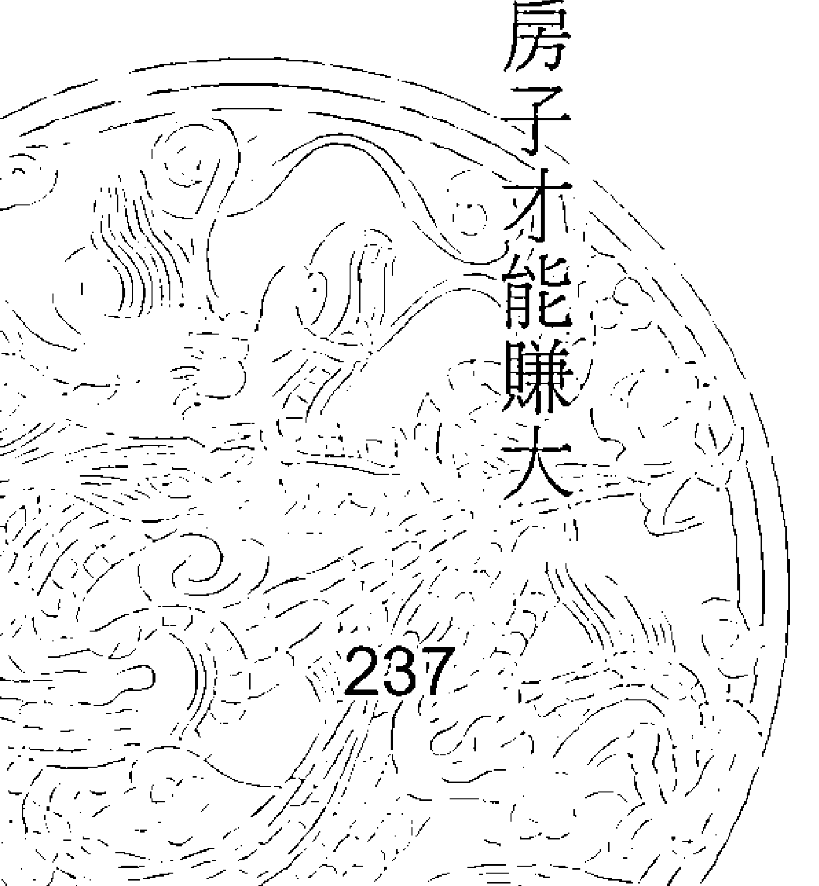

## 兩種命盤：

| 己 大田父 | 庚 大官福 | 辛 (M)大奴田 | 壬 大遷官 |
| :---: | :---: | :---: | :---: |
| 戊 (M)大福命 6/15 | | | 癸 大疾奴 |
| 丁 大父兄 16/25 | | | 甲 大財遷 |
| 丙 (M)大命夫 26/35 | 丁 大兄子 36/45 | 丙 (M)大夫財 46/55 | 乙 大子疾 |

## 兩種命盤怎麼算？

- +   1. 算「存在」是算命的第二層功夫。
    2. 算存在：祿星＝權星＝科星＝忌星。
    3. 上圖命盤，命宮（大福）有M質，財帛宮（大夫）有M質，夫妻宮（大命）有M質，田宅宮（大奴）有M質。這是論述「存在」的算運。
    (1) 命宮有M質「重疊」大福。算運解釋：大命26／35可以追求自己的夢想。
    (2) 夫妻宮有M質「重疊」大命。算運解釋：大命26／35可找到真命天子（天女）。
    (3) 財帛宮有M質「重疊」大夫。算運解釋：大命26／35結婚後才能賺大錢。
    (4) 田宅宮有M質「重疊」大奴。算運解釋：大命26／35買房子必須靠朋友介紹。

# 伍、從生年四化看出自己命盤的吉凶

| 列1 | 列2 | 列3 | 列4 |
|-----|-----|-----|-----|
| 己 | 庚 | 辛 | 壬 |
| 科 | 權 | | |
| 大福命6/15 | 大官福 | 大奴田 | 大遷官 |
| 丁 | | | |
| 大父兄16/25 | | | |
| 祿 | | | |
| 丙 | | | |
| 大命夫26/35 | 丁 | 丙 | |
| | 大兄子36/45 | 大夫財46/55 | |
| | | | 乙 |
| | | | 大子疾 |

- +   - 兩種命盤：
      1. 算「內容」是算命的第二層功夫。
      2. 算內容：祿星＋權星＋科星＋忌星。
      3. 上圖命盤，命宮「大福」有科星，財帛宮「大夫」有忌星，田宅宮「大奴」有權星。這是論述「內容」的算運。

- +   - (1) 命宮有科星「重疊」大福。
      算運解釋：大命26／35追求喜歡的事業會賺錢。
    - (2) 夫妻宮有祿星「重疊」大命。
      算運解釋：大命26／35正緣是有錢人。
    - (3) 財帛宮有忌星「重疊」大夫。
      算運解釋：大命26／35結婚後事業才出現轉機。
    - (4) 田宅宮有權星「重疊」大奴。
      算運解釋：大命26／35靠朋友買的房屋會賺錢。

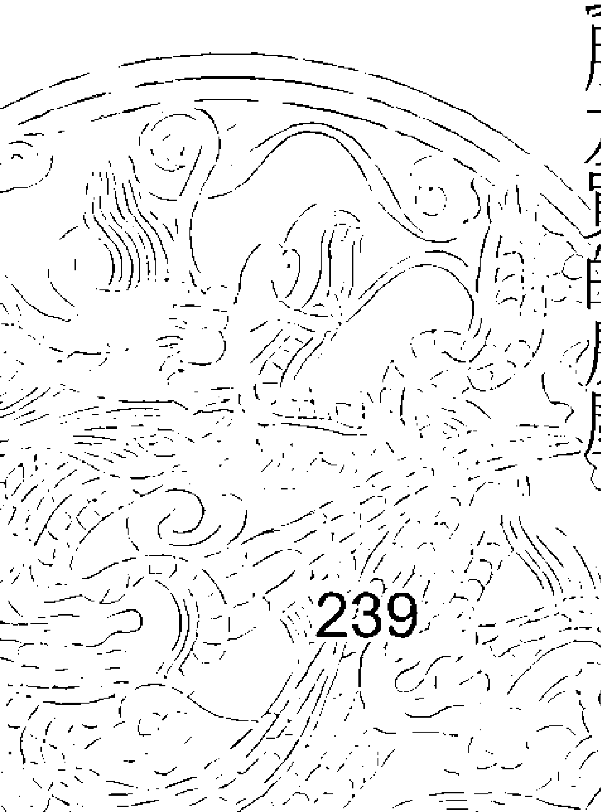

## 三種命盤：

| 己 | 庚 | 辛 | 壬 |
|---|---|---|---|
| 流財<br>大田<br>父 | 流子<br>大官<br>福 | M<br>流夫<br>大奴<br>田 | 流兄<br>大遷<br>官 |
| 流疾<br>大福<br>命<br>6/15 | | | 流命<br>大疾<br>奴 |
| 流遷<br>大父<br>兄<br>16/25 | | | 流父<br>大財<br>遷 |
| M<br>流奴<br>大命<br>夫<br>26/35 | 流官<br>大兄<br>子<br>36/45 | M<br>流田<br>大夫<br>財<br>46/55 | 流福<br>大子<br>疾 |

## 三種命盤怎麼算？

- +   1. 算「存在」是算命的第二層功夫。
    2. 算存在：祿星 || 權星 || 科星 || 忌星。
    3. 上圖命盤，本命夫妻宮有M質，大命夫妻宮有M質，流年夫妻宮有M質。這是同一個宮位的算命，存在的基礎。
    (1) 本命夫妻宮有M質。算命解釋：表示此人命中會結婚。
    (2) 大命夫妻宮有M質。算命解釋：大命26/35會遇到命中的正緣。
    (3) 流年夫妻宮有M質。算命解釋：表示26/35是結婚的最好時機。
    4. 本命夫妻宮+大命夫妻宮+流年夫妻宮，形成三種命盤的條件。

# 伍、從生年四化看出自己命盤的吉凶

| 己 庚 辛 壬 癸 甲 乙 丙 丁 戊 己 | 流財 大田 父 庚 福 辛 田 壬 官 | 流子 大官 福 辛 田 壬 官 | 流夫 大奴 田 壬 官 | 流兄 大遷 官 | 流命 大疾 奴 | 流父 大財 遷 | 流福 大子 疾 | 流田 大夫 財 乙 疾 | 流官 大兄 子 丙 財 | 流奴 大命 夫 丁 子 | 流遷 大父 兄 戊 命 |
|---|---|---|---|---|---|---|---|---|---|---|---|

## 三種命盤怎麼算？

- +   1. 算「內容」是算命的第四層功夫。
    2. 算內容：祿星≠權星≠科星≠忌星。
    3. 上圖命盤，本命夫妻宮有祿星，大命夫妻宮有忌星，流年夫妻宮有權星。這是同一個宮位的算命，內容的基礎。
    (1) 本命夫妻宮有祿星。
    算命解釋：表示此人命中有三次的正緣。
    (2) 大命夫妻宮有忌星。
    算命解釋：表示大命26／35會遇到結婚的對象。
    (3) 流年夫妻宮有權星。
    算命解釋：表示二○一七年是最想結婚的時間。
    4. 本命夫妻宮＋大限夫妻宮＋流年夫妻宮，形成三種命盤的條件。

# 陸、從命盤看出你前世今生的欠債與折磨

前世今生的因果輪迴一直是一般人感到好奇又神秘的問題。民間流傳了許多相關的說詞，如「前世因，今生果」、「前世業，今生障」、「若問前生事，今生受者是；若問後生事，今生做者是」……等宗教觀念的影響，因此揭開了宗教神秘的面紗。

華山派與宗教的理論不同。宗教以勸善為出發點，強調因果輪迴；華山派則以順天意才是善因緣為出發點，強調現代科學；宗教以神秘的神鬼說來闡述理念，華山派則以公式化來闡述學術。

華山派如何「算」前世的緣分呢？原來銜接前世與今生之間有一個溝通管道叫做「來因宮」，從「來因宮」就可以看出前世未了的缘份是今生的冤親債主；前世未了的缘份是今生的功課又是什麼？藉著華山派學術理論，可讓讀者更清楚認識前世未了的因緣是今生要完成的功課。

- +   1. 左輔星「看」前世之報，「論」真空妙有，不想了，富貴才會來。
    2. 文昌星「看」前世之業，「論」業障不亡，承擔了，富貴才會來。
    3. 文曲星「看」前世之果，「論」果報自受，想通了，富貴才會來。
    4. 忌星「看」前世之債，「論」性空緣起，認命了，富貴才會來。

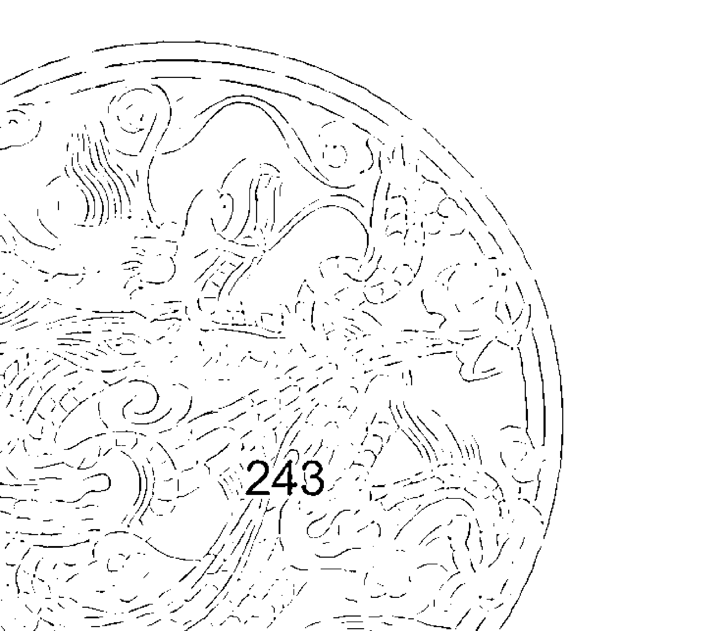

## 一、最愛你或最折磨你的生肖是什麼人？

人生總是矛盾的，對你好的人你不珍惜，折磨你的人你又偏偏愛得死心塌地；愛你的人你不愛，不愛你的人你卻偏偏愛得死去活來。為什麼會這樣呢？原來是前世今生的因果輪迴出了問題。前世「業」，今生「障」。前世所累積的業力，今生會變成折磨自己的因緣；前世未了的情緣，今生就轉變成冤親債主的生肖。此生不是來討債（最折磨你的人），就是來報恩（最愛你的人），誰都逃不過上天的安排。

### （二）生肖的位置怎麼找？

- +   1. 請上華山派命理研究學院的網站 www.praygod888.url1.tw 免費排出你的命盤。
- +   2. 再拿自己的命盤「對照」後面文章的生肖位置。
- +   3. 最後「對照」左輔星、文昌星、文曲星、忌星「所在宮位」的生肖。
- +   4. 右弼、左輔星、文昌星、文曲星、祿星、權星、科星、忌星所在的「宮位」，都可以對照生肖的位置。
- +   地支：子丑寅卯辰巳午未申酉戌亥，謂之「地支」。
- +   生肖：生肖就是地支的位置。
- +   5. 左右昌曲的因緣：假使千百劫，所作業不亡；因緣會遇時，果報還自受。
- +   6. M質所在的因緣：萬般帶不走，唯有業隨身。

### （二）最爱你或最折磨你的生肖怎么找？

- +   1. 最爱你或最折磨你的人就是冤亲债主，又可分为生肖与十二宫位的两种位置。
    2. 冤亲债主就是讨债与报恩的生肖或宫位。
    讨债与报恩的生肖：就是左辅星、文昌星、文曲星、忌星所在宫位的生肖。
    讨债与报恩的宫位：就是左辅星、文昌星、文曲星、忌星所在的十二宫位。

### （三）欠债是什么意思？

在命盘上「欠债」表示互相欠债。因为「象言往来」之故，不是我欠你，就是你欠我。

- +   1. 左辅星、文昌星、文曲星、忌星所在宫位的生肖，即是命中注定互相欠债的宫位。

| 巳（蛇） | 午（马） | 未（羊） | 申（猴） |
|----------|----------|----------|----------|
| 辰（龙） | | | 酉（鸡） |
| 卯（兔） | | | 戌（狗） |
| 寅（虎） | 丑（牛） | 子（鼠） | 亥（猪） |


- +   2. 左輔星、文昌星、文曲星、忌星所在宮位的生肖，你只要完成上天交付的折磨生肖＋折磨事，事業功成名就不遠了。

### （四）三世因果的生肖怎麼找？

今生「有條件」愛你或最折磨你的生肖。

祿星、權星、科星、忌星的「宮位」就是前世今生的「生肖」。

#### 1. 祿星、權星、科星的因緣：

- +   (1) 祿星、權星、科星的宮位，就是貴人與福報的生肖。
    (2) 祿星、權星、科星的宮位，就是人事物之利害關係中的貴人，但不一定是愛你的人。
    (3) 祿星、權星、科星的福報，是命中俱足的因緣。

#### 2. 忌星的因緣：

- +   (1) 忌星的「生肖」，是人生有利害關係中最折磨的人，或事業往上爬必須遇到的人。
    (2) 忌星的「宮位」，是事業成功必須遇到的折磨事。
    (3) 忌星的折磨，假如當事人是相反的結果，那麼你的福報將會被付出的人（對方）拿走。
    (4) 忌星是前世最折磨你的生肖，但卻是事業成功必須遇到的人。

#### 3. 三世因果的因緣：

- +   (1) 祿星之災：論述「廣結善緣」的天性；改運的方法是「多元了」，富貴才會來。
    (2) 權星之災：論述「業力使然」的天性；改運的方法是「做大了」，富貴才會來。
    (3) 科星之災：論述「和氣生財」的天性；改運的方法是「成名了」，富貴才會來。

# 陆、从命盘看出你前世今生的欠债与折磨

### （五）七世因缘的生肖怎么找？

今生「無條件」愛你或最折磨你的生肖。

右弼星、左輔星、文昌星、文曲星的「宮位」，就是七世因緣的「生肖」。

#### 1. 右弼星的因缘：

- +   (1) 右弼星、左輔星、文昌星、文曲星的宮位，就是你最愛或最折磨你的生肖。
    (2) 右弼星的宮位，就是人事務之利害關係中的貴人，但不一定是愛你的人。

#### 2. 左輔星、文昌星、文曲星的因緣：

- +   (1) 左輔、文昌、文曲的「生肖」，是人生利害關係中最折磨的人或事業往上爬必須遇到的人。
    (2) 左輔星、文昌星、文曲星的「宮位」，是事業登上高峰必須遇到的折磨事。
    (3) 左輔星、文昌星、文曲星的折磨，假如當事人是相反的結果，那麼你的福報將會被付出的人(對方)帶走。

#### 3. 右弼是法身；左輔是化身；文昌、文曲是報身。

(1) 法身：右弼星的福報是命中俱足的善因緣。
(2) 化身：左輔星的災厄你永遠看不到，而左輔星是主導你生命登上高峰的星辰。
(3) 報身：「假使千百劫，所作業不忘」，所指的是左輔星的災厄。假如你不想面對左輔星的折磨，那麼上天會在文昌星、文曲星的生肖或宮位上「加倍」的折磨你。
(4) 忌星之災：論述「性空緣起」的天性；改運的方法是「認命了」，富貴才會來。
(5) 天命之緣：論述「本來如此」的天性；改運的方法是「清楚了」，富貴才會來。

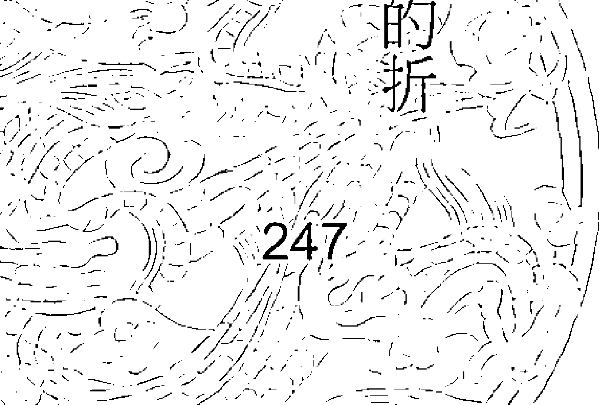

### （六）冤親債主的恩怨何時才能了呢？

## 還債是什麼？

1. 在對的時間點做對的事，就是還債的定義。
2. 對冤親債主的生肖有很大的怨恨時，表示這次的還債無效，一定還有下一次的因緣輪迴。
3. 還清了冤親債主的債，你的人生才能逢凶化吉、趨吉避凶、化險為夷。因為，冤親債主的因緣就是：當你遠離災厄的當下，你的福報也已經遠離了（禍福相依）。

#### 1. 冤親債主的生肖怎麼找？

- +   (1) 第一世的生肖，『看』本命命盤命宮所飛出之四化星所在的宮位。
- +   (2) 第二世至第四世的生肖，『看』生年四化的祿星、權星、科星、忌星所在的宮位。
- +   (3) 第五世至第七世的生肖，『看』左輔星、右弼星、文昌星、文曲星所在的宮位。

#### 2. 前世的恩怨情仇

- +   (1) 第一世的因緣：
    當遇到對你不滿或折磨或敵視的生肖時，可能就是你前世的冤親債主。

#### 4. 左輔星、文昌星、文曲星是累世最折磨你的生肖，也是事業大成就必須遇到的人。

- +   (1) 左輔星之報：論述「真空妙有」的天性；改運的方法是「不想了」，富貴才會來。
- +   (2) 右弼星之因：論述「無中生有」的天性；改運的方法是「天給了」，富貴才會來。
- +   (3) 文昌星之業：論述「業障不亡」的天性；改運的方法是「承擔了」，富貴才會來。
- +   (4) 文曲星之果：論述「果報自受」的天性；改運的方法是「想通了」，富貴才會來。

# 陆、从命盘看出你前世今生的欠债与折磨

- +   （2）第二世至第四世的因缘：
    折磨的时间：折磨你的时间约三年左右。
    福报的时间：发生折磨事又认命，表示你已还债，所以，人事物的好运约有三年。
    轮回的时间：不还债或还债后还有抱怨，表示还有下一段怨恨的因缘将继续轮回。

- +   （3）第五世至第七世的因缘：
    折磨的时间：折磨你的时间约二十年左右。
    福报的时间：发生折磨事又认命，表示你已还债，所以，人事物的好运约有二十年。
    轮回的时间：不还债或还债后还有抱怨，表示还有下一段怨恨的因缘将继续轮回。

3. 在不对的时间点「还债」，也可以避灾厄
当遇到对你不满或折磨或敌视的生肖时，可能就是你前世的冤亲债主。
为什么我对冤亲债主的生肖很好，他们还是不知感恩或认为是应该的或继续敌视我呢？

實例分析：有前面發生的現象，一定是下列三種情形：在不对的时间点还债、还债的时间还没完、上天已经在不同的人事物上让我避灾了，只是我不知道天意的轨迹而已。

- +   （1）第一世的因缘：
    这是「轻度」最折磨你或最爱你的生肖或宫位。

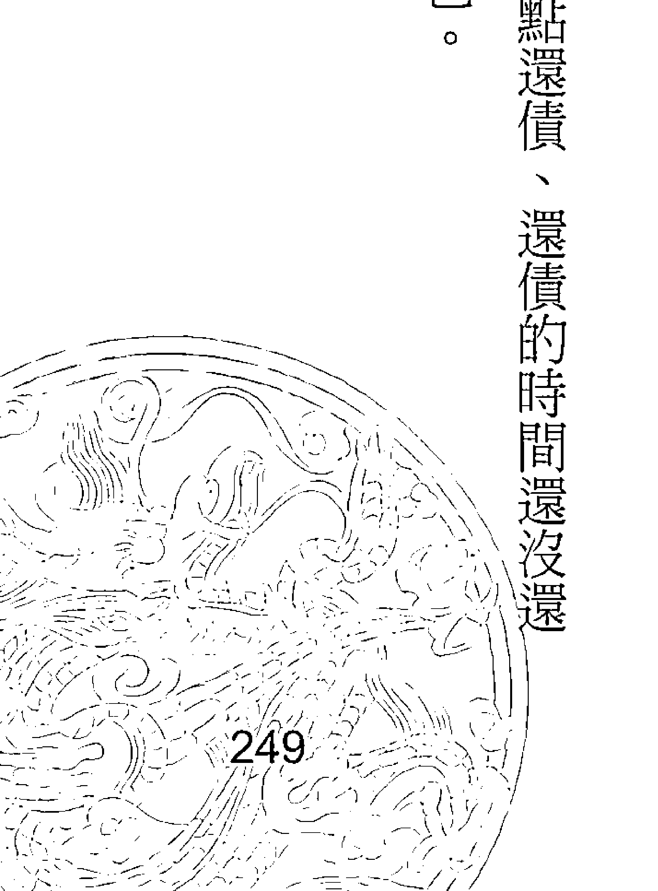

前世的折磨：它會讓你的人事物變成阻礙不順，發生的折磨事至少有一件以上。
折騰的化解：認命「還債才有福報」，也就是對別人的付出與幫助不求回報，才能放下抱怨。

(2) 第二世至第四世的因緣：
這是「中度」最折磨你或最愛你的生肖或宮位。
前世的折磨：它會讓你的人事物變成恩怨，發生的恩怨事至少有兩件以上。
折騰的化解：認命「性空才能緣起」，也就是因別人的輕視或攻擊而改變自己，才能放下恩怨。

(3) 第五世至第七世的因緣：
這是「重度」最折磨你或最愛你的生肖或宮位。
前世的折磨：它會讓你的人事物變成仇恨，發生的仇恨事至少有四件以上。
折騰的化解：認命「真空才能妙有」，也就是對別人的敵視或報復不作回擊，才能放下仇恨。

#### 4. 在對的時間點「還債」可以得福報

算命實例：為什麼我只是對冤親債主的生肖不排斥，我的人生就突然感到特別幸運呢？
實例分析：有前面發生的現象，一定是下列三種情形：在對的時間點還債、還對了冤親債主的生肖、上天在不同的人事物上讓我特別幸運。

##### (1) 第一世的因緣：

假如經過「生肖」的折磨，上天就會回報你不同人事物的避災。
假如經過「宮位」的折磨，上天就會讓你的工作穩定成長。

## (2) 第二世至第四世的因緣：## 陸、從命盤看出你前世今生的欠債與折磨

### （七）前世因果會影響你這一世的人生成就嗎？

影響你事業的成就有三種：

- 1. 「做」左輔星的宮位：左輔星是主導你生命登上高峰的星辰。
  - (1) 經歷左輔所在宮位之一連串的折磨，上天才會讓你的事業登上高峰。
  - (2) 左輔星在第245頁有論述。
- 2. 「做」四象一元的事。
  - (1) 當你完成事業成功的「三象一物」後，第四顆星辰將引導你邁向人生的高峰。
  - (2) 三象一物在第371頁有論述。
- 3. 「做」人生富貴的規劃。
  - (1) 命是先天註定的定數，運是後天自己選擇的變數，生涯規劃就是人生一連串的選擇。
  - (2) 華山派命理學一連串「對」的選擇，才能幫助你的事業登上高峰。
  - 假如經過「生肖」的折磨，上天會回報你不同人事物的利益。
  - 假如經過「宮位」的折磨，上天會讓你的事業加倍發展。
  - (3) 第五世至第七世的因緣：
    - 假如經過「生肖」的折磨，上天會回報你不同人事物的富貴。
    - 假如經過「宮位」的折磨，上天會讓你的事業登上高峰。

### （八）十二宮位的影響遠大於十二生肖

1. 左輔星、文昌星、文曲星、忌星所在「宮位」的影響，遠大於「生肖」的宮位。
馬雲曾說：「成功，需要朋友；巨大的成功，需要敵人。」這句話最能表達生肖與宮位的關係。以華山派的宗教理論：成功，需要「生肖」不斷的折磨；巨大的成功，需要「宮位」一連串的盡性盡命。

2. 右、左、昌、曲所在宮位的影響，遠大於祿、權、科、忌所在的宮位。祿星、權星、科星、忌星之「生肖」或「宮位」的折磨，可以讓事業邁向成功。左輔、右弼、文昌、文曲之「生肖」或「宮位」的折磨，可以讓事業登上高峰。祿星、權星、科星、右弼之「生肖」或「宮位」的折磨，你付出的一切一定有代價。左輔、文昌、文曲、忌星之「生肖」或「宮位」的折磨，你付出兩次以上才會有代價。

### （九）前世今生的命盤實例

| 文曲忌 太陽 11.23.35.47.59.71 己巳 大夫父母 13 22 | 破軍 12.24.36.48.60.72 庚午 大兄福德 23 32 | 右弼左輔天機 1.13.25.37.49.61 辛未 大命田宅 33 42 | 天府紫微 2.14.26.38.50.62 壬申 大父官祿 43 52 |
| :--- | :--- | :--- | :--- |
| 武曲祿 10.22.34.46.58.70 戊辰 大子命宮 03 12 |  |  | 文昌太陰 3.15.27.39.51.63 癸酉 大福奴僕 53 62 |
| 天同 9.21.33.45.57.69 丁卯 大財兄弟 |  |  | 貪狼權 4.16.28.40.52.64 甲戌 大田遷移 63 72 |
| 七殺 8.20.32.44.56.68 丙寅 大疾夫妻 | 天梁科 7.19.31.43.55.67 丁丑 大遷子女 | 天相廉貞 6.18.30.42.54.66 丙子 大奴財帛 83 92 | 巨門 5.17.29.41.53.65 乙亥 大官疾厄 73 82 |

○女命 己未女 40歲

| 地支 | 生肖 | 宮位 | 備註 |
| :--- | :--- | :--- | :--- |
| 巳 | 蛇 | 父 | 文曲(忌) |
| 午 | 馬 | 福 | |
| 未 | 羊 | 田 | 左輔 |
| 申 | 猴 | 官 | |
| 辰 | 龍 | 命 | |
| 酉 | 雞 | 奴 | 文昌 |
| 卯 | 兔 | 兄 | |
| 戌 | 狗 | 遷 | |
| 寅 | 虎 | 夫 | |
| 丑 | 牛 | 子 | |
| 子 | 鼠 | 財 | |
| 亥 | 豬 | 疾 | |

### ◎最愛你或最折磨你的生肖是誰？

1. 生肖的位置是固定、永遠不會改變的。

2. 左輔、文昌、文曲、忌星所在的宮位，就是人事物最折磨的宮位。它也是最愛你或最折磨你的生肖；是你累世冤親債主的生肖，不是來折磨你的（討債），就是來報恩的（還債）。

3. 最愛你或最折磨你的生肖是誰？以圖為例：
  - (1) 左輔星在未宮，表示最折磨的生肖是羊。
  - (2) 文昌星在酉宮，表示最折磨的生肖是雞。
  - (3) 文曲星在巳宮，表示最折磨的生肖是蛇。
  - (4) 忌星在巳宮，表示最折磨的生肖是蛇。

| 己 遷 | 庚 疾 | 辛 財 | 壬 子 (忌) |
| :--- | :--- | :--- | :--- |
| 戊 奴 (科) |  |  | 癸 夫 |
| 丁 官 (祿) |  |  | 甲 兄 |
| 丙 田 | 丁 福 | 丙 父 (權) | 乙 命 |

### ○簡易命盤：三世因果怎麼算？

1. 三世因果：以宗教的觀點，重點在三世輪迴；以華山派的觀點，重點在論生肖。
2. 在命盤上，三世因果是「看」祿星、權星、科星、忌星所在的宮位。祿星、權星、科星是上天給我愛的禮物；忌星是上天讓我經歷的折磨事。那麼，三世因果怎麼算呢？
  - (1) 祿星在田宅宮：表示做不動產的行業是上天給我最好的選擇之一。
  - (2) 權星在父母宮：表示老闆或主管的職務最能發揮所長。
  - (3) 科星在官祿宮：表示讓自己出名的事業最能了業還債。
  - (4) 忌星在夫妻宮：表示折騰的感情而自己又放下，人生才能變彩色。

### （八）十二宮位的影響遠大於十二生肖（續）

### （九）前世今生的命盤實例（續）

| 文昌 己 遷 | 左輔 庚 疾 | 辛 財 | 右弼 壬 子 | 文曲 癸 夫 |
| :--- | :--- | :--- | :--- | :--- |
| 戊 奴 |  |  |  | 甲 兄 |
| 丁 官 |  |  |  | 乙 命 |
| 丙 田 | 丁 福 | 丙 父 |  |  |

### ○簡易命盤：七世因果怎麼算？

1. 七世因果：以宗教的角度，重點在七世因果；以華山派的角度，重點在論生肖。
2. 在命盤上，七世因果是「看」左輔星、右弼星、文昌星、文曲星之所在的宮位。右弼星是累世堆積愛的禮物；左輔星、文昌星、文曲星，是累世堆積的折磨事。那麼，七世因果怎麼算？
  - (1) 左輔星在疾厄宮，表示放不下怨恨，上天會用健康來折磨我。
  - (2) 右弼星在子女宮，表示教養子女的思維，上天會用子女的成就來回報我。
  - (3) 文昌星在遷移宮，表示利益眾生的思維，上天會用名聲來回饋我。
  - (4) 文曲星在夫妻宮，表示互利的感情思維，上天會用長久的幸福來回報我。

## 二、前世今生的緣分怎麼看？

華山派紫微斗數看前世的緣分與宗教的理論不同，宗教以「神鬼」的角度切入，華山派以前世未了的因緣「來因宮」開始，所以兩者之間的差異很大。最大的不同是：宗教以看不到的前世今生論述人事務；華山派命理學，則以公式化、系統化、透明化，來論述神秘的人事物，以「生肖」來證明人生旅途中一定會遇到最愛或最折磨你的人。
前世的緣分怎麼看？其實很簡單，先學會什麼是「天干與地支」；再找到來因宮；最後利用祿星、權星、科星、忌星（四化星）來論命即可。

### （一）天干與地支怎麼來？

古人以天干、地支來代表流年，現代人則以「民國幾年」來代表流年。現就天干與地支怎麼來的分析如下：

#### 1. 求天干的方法：

以民國出生年尾數減一，所得之數就是天干。
例如：民國六十八年出生的人，用六十八年尾數八減一，即八減一，所得為七，對照下表就是「庚」天干。
例如：民國八十二年出生的人，用八十二年尾數二減一，即二減一，所得為一，對照下表就是「癸」天干。

天干表：

#### 2. 求地支的方法：

用民國出生年除以十二的餘數，就是地支。
例如：民國六十八年出生的人，用六十八年除以十二，所得的餘數為八，對照下表就是「未」地支。
例如：民國八十四年出生的人，用八十四年除以十二，所得的餘數為零，對照下表就是「亥」地支。

## 地支表：

| 數目 | 地支 |
| :--- | :--- |
| 1 | 子 |
| 2 | 丑 |
| 3 | 寅 |
| 4 | 卯 |
| 5 | 辰 |
| 6 | 巳 |
| 7 | 午 |
| 8 | 未 |
| 9 | 申 |
| 10 | 酉 |
| 11 | 戌 |
| 0 | 亥 |

| 數目 | 天干 |
| :--- | :--- |
| 1 | 甲 |
| 2 | 乙 |
| 3 | 丙 |
| 4 | 丁 |
| 5 | 戊 |
| 6 | 己 |
| 7 | 庚 |
| 8 | 辛 |
| 9 | 壬 |
| 0 | 癸 |

### （二）「來因宮」看前世今生的緣分

#### 1. 什麼是「來因宮」？

- (1) 來因宮：即是和生年天干相同的宮位天干。
- (2) 紫微斗數的命盤一定有一個宮位是來因宮。
- (3) 子宮、丑宮的天干，一定會和寅宮、卯宮的天干相同。例如，你的來因宮在子宮、丑宮、寅宮、卯宮時，切記！一定要以寅宮、卯宮的來因宮為主。

#### 2. 來因宮的緣分：

- 來因宮：「看」前世未了的因緣。
- 來因宮：「看」過去因緣的來時路。
- 來因宮：「看」今生要還的債。還債的對象是生肖或宮位，不是只有生肖。
- 來因宮：「看」事業成功的人，必須完成所有命中應該培養的項目與必須完成的折磨事。

### （三）「來因宮」怎麼找？

| 宮位/天干 | 大限年齡 | 大限宮位 | 原局宮位 | 星曜（四化） | 關聯數字 |
| :--- | :--- | :--- | :--- | :--- | :--- |
| 己巳 | 13-22 | 大夫 | 父母 | 文曲(忌)、太陽 | 11.23.35.47.59.71 |
| 庚午 | 23-32 | 大兄 | 福德 | 武曲(祿) | 12.24.36.48.60.72 |
| 辛未 | 33-42 | 大命 | 田宅 | 破軍、天機、左輔、右弼、天梁(科) | 1.13.25.37.49.61 |
| 壬申 | 43-52 | 大父 | 官祿 | 紫微、天府、文曲(科)、太陰 | 2.14.26.38.50.62 |
| 癸酉 | 53-62 | 大福 | 奴僕 | 貪狼(權) | 3.15.27.39.51.63 |
| 甲戌 | 63-72 | 大田 | 遷移 | 巨門 | 4.16.28.40.52.64 |
| 乙亥 | 73-82 | 大官 | 疾厄 | 巨門 | 5.17.29.41.53.65 |
| 丙子 | 83-92 | 大奴 | 財帛 | 天相、廉貞、天梁(科) | 6.18.30.42.54.66 |
| 丁丑 | - | 大遷 | 子女 | 天梁(科) | 7.19.31.43.55.67 |
| 丙寅 | - | 大疾 | 夫妻 | 七殺 | 8.20.32.44.56.68 |
| 丁卯 | - | 大財 | 兄弟 | 七殺 | 9.21.33.45.57.69 |
| 戊辰 | 03-12 | 大子 | 命宮 | 天同 | 10.22.34.46.58.70 |

來因宮 ← 己

### （四）四化星來自「來因宮」

1. 上圖命盤，己未年生，「己天干」的位置自然就會形成來因宮，以來因宮是父母宮。
2. 由命盤「己天干」的宮位飛出之祿星、權星、科星、忌星所落的宮位＝生年四化星所在的宮位。
3. 來因宮是「看」前世未了的緣分。祿、權、科三顆星是前世累積做的好事，上天要給你愛的禮物。忌星是前世累積做的壞事，上天要再次折磨你的宮位，假如再做不好又會繼續輪迴。
4. 經歷忌星的折磨，人生才能變彩色。即人生的大成就，一定要經歷忌星之所有人事物的折磨，還完債後才能成就一切因緣。

### （五）四化星可以單獨算命、算運

1. 紫微斗數的算命方法共分為星辰、四化、生年四化、飛星四化、左右昌曲等五大類，其中只有生年四化、飛星四化、左右昌曲等可以單獨完整的算命、算運。
2. 華山派紫微斗數的所有公式都可以單獨算命，也可以交叉重疊所有的公式，算出每事件的時間、吉凶、內容、影響。
3. 上圖命盤祿星在命宮，權星在遷移宮，科星在子女宮，忌星在父母宮。
  - (1) 祿星在命：表示命中會巧遇貴人而成功。
  - (2) 權星在遷：表示成就的機緣是離開父母後。
  - (3) 科星在子：表示命中有子女的天命。
  - (4) 忌星在父：表示命中是公職、老闆的命。

## 標準命盤：女命 己酉年生 50歲

紫微斗數命盤（女命，己酉年生，50歲）。
命盤為方形十二宮格佈局，包含以下主要元素：
**1. 天干地支與宮位：**
- 每個宮位標註了天干地支（如己巳、庚午等）及對應的宮位名稱（如大福遷移、大田疾厄等）。
- 格內數字（如 9.21.33.45.57.69）可能代表年齡區間。
**2. 主要星曜：**
- 各宮內分佈紫微、天府、武曲、天同、廉貞、天機等主星，並標註廟旺利陷等狀態。
- 部分星曜帶有四化標記（如祿、權、科、忌）。
**3. 四化與連線：**
- 盤中有對角線連線，並標註「祿」、「權」、「忌」等字，指示星曜間的四化關係。
- 底部有「忌權」、「忌」等匯總標註。
**4. 輔星與雜曜：**
- 包含文昌、文曲、左輔、右弼、天魁、天鉞、擎羊、陀羅、火星、鈴星、地空、地劫等輔星雜曜。
**5. 大限與流年：**
- 各宮位旁標註的數字（如66, 75, 56, 65等）可能與大限或流年年齡相關。
此為一個完整的紫微斗數命盤示例，展示了特定生辰（己酉年）女性在50歲時的星盤佈局與吉凶關係。

### （六）今生我欠誰的債？

| 天干/宮位 | 天機己 遷 | 紫微庚 疾 | 辛 財 | 破軍壬 子 |
| :--- | :--- | :--- | :--- | :--- |
| 戊 奴 | 七殺 |  |  | 文曲忌 癸 夫 |
| 丁 官 | 天梁太陽 46/55 |  |  | 天府廉貞 甲 兄 |
| 丙 田 | 天相武曲 36/45 | 巨門天同 26/35 | 貪狼 16/25 | 太陰 6/15 乙 命 |

1. 今生欠誰的債要「看」忌星所在的宮位。
2. 今生欠誰的債是前世未完成的因緣。欠債的宮位不還債，你的成就會受限。
3. 忌星在夫妻宮。
  - 解釋一：表示感情的折磨是天意。
  - 解釋二：表示聚少離多的感情才能長久。
  - 解釋三：第一段感情分手後不能有太多的怨恨，否則，第二段遇到的人也不能長久。
4. 忌星在夫妻宮「沖」官祿宮。
  - 解釋一：表示忌入的宮位無緣，忌沖無情。
  - 解釋二：表示有兩段不一樣的人生際遇。
  - 解釋三：表示人生也有兩段不一樣的事業。
  - 解釋四：表示人生第一段事業的堅持，事業才能成就。

### （七）什麼「因」會得到什麼「果」嗎？

#### 1. 宗教的理論

這是宗教勸善的說詞，勸人不要做壞事，否則會得到報應。算命實例：鄉下人最善良卻得到最少的利益，其實是他們做不對因緣。宗教把無企圖心的人說成善良是不對的。可見做什麼「因」得到什麼「果」，是誤解或誤用。

#### 2. 華山派理論

因緣果報，順天意才是善因緣，這裡講的「天意」就是「天時」。算命實例：抓黑鮪魚是每年四月至六月，假如你選了不對的時間，即使有多努力也無濟於事，不可能抓到黑鮪魚。

#### 3. 「時間＋生肖」決定你的因果輪迴

因緣果報，因果報應的關鍵在「時間＋生肖」。算命實例：你對父母很好，但他們愛的卻是你弟弟，這是因果輪迴會發生的現象。算命實例：你照顧男朋友無微不至，但他愛的卻是別人，這是因果輪迴會發生的現象。

#### （續）

|  | 天機 | 紫微 | 破軍 |  |
| :--- | :--- | :--- | :--- | :--- |
| 己 遷 | 庚 疾 | 辛 財 | 壬 子 |  |
| 七殺 |  |  | 文曲忌 |  |
| 戊 奴 |  |  | 癸 夫 |  |
| 天梁太陽 |  |  | 天府廉貞 |  |
| 丁 官 |  |  | 甲 兄 |  |

什麼「因」會得什麼「果」嗎？

1. 什麼因會得什麼果嗎？
這是宗教勸人為善或因果輪迴的觀念。
宗教的理論：做壞事一定會得到報應。
華山派理論：順天意才是善因緣。
2. 華山派的公式「因緣果報」，指的是「緣」就是「時間+生肖」。
3. 從命盤上怎麼算因果？
算命定位：「問」真命天子是誰？
算命公式：祿隨忌走；祿是因，忌是果。
算命實例：祿星在田宅宮，忌星在夫妻宮。
解釋一：有房子才能找到好姻緣。
解釋二：真命天子是有房子的男人。
解釋三：有房子才能結婚，婚後才會幸福。

### （八）忌星的重點在「性空緣起」

| 天機 | 紫微 | 破軍 |
|------|------|------|
| 己丑遷 | 庚寅疾 | 辛卯財 | 壬辰子 |
| 七殺 | | 文曲忌 |
| 戊子奴 | | 癸亥夫 |
| 天梁太陽 | | 天府廉貞 |
| 丁酉官 | | 甲戌兄 |
| 天相武曲 | 巨門同 | 貪狼 | 太陰 |
| 丙申田 | 丁未福 | 丙午父 | 乙巳命 |
| 36/45 | 26/35 | 16/25 | 6/15 |

1.  忌星所在宮位「夫」會發生下列的事。
    - 解釋一：表示這是感情無情的宮位。
    - 解釋二：表示這是最愛折磨的宮位。
    - 解釋三：表示最愛最喜歡的感情最無情。
    - 解釋四：表示要經過兩次被傷害的感情。
    - 解釋五：表示一定要原諒傷害過你的人，才能找到自己長久的幸福。
    - 解釋六：感情放下怨恨，折磨就不再輪迴。

2.  忌星的「改運」方法。
    - 方法一：用宗教的觀點「前世欠他的債」，可以降低或化解忌星的災厄。
    - 方法二：放下心中的怨恨與我執，再次的緣分可以降低或化解忌星的災厄。

## （九）左輔星的重點在「真空妙有」

| 天機 45/54 乙 財 | 紫微 35/44 丙 子 | 25/34 丁 夫 | 破軍 15/24 戊 兄 |
| :--- | :--- | :--- | :--- |
| 七殺 55/64 甲 疾 | | | 5/14 己 命 |
| 天梁 太陽 癸 遷 | | | 天府 廉貞 庚 父 |
| 天相 武曲 壬 奴 | 右弼 左輔 巨門 天同 癸 官 | 貪狼 壬 田 | 太陰 辛 福 |

1.  左輔星所在的官祿宮會發生下列的事。
    - 解釋一：表示這是事業無情的宮位。
    - 解釋二：表示這是報復或攻擊的宮位。
    - 解釋三：表示這是排斥或刑剋的宮位。
    - 解釋四：表示這是折磨你的生肖與宮位。
    - 解釋五：表示一定會遇到硬碰硬的因緣，培養物競天擇的條件才能避免兇事再次輪迴。

2.  左輔星的「改運」方法。
    - 方法一：當作人生的大道場，修心養性。
    - 方法二：吃苦當吃補，才能走出困境。
    - 方法三：坐忘觀空，才能忘記折磨痛苦。
    - 方法四：事業成就必須經歷命盤的折磨事。
    - 解釋：務必經歷事業的折磨才能成功。


## 三、「因果」怎麼算？

祿權科忌本來就沒有是非、對錯、吉凶之分，但當你使用了它就產生了質量變化，有了得失吉凶，有了愛恨情仇，有了富貴貧賤。上天總是愛捉弄人，貓喜歡吃魚，貓不能下水；魚喜歡吃蚯蚓，卻不能上岸。自己喜歡的人，條件不夠好；現在遇到的人，自己又不喜歡；上天安排的人，又遲遲才會來。然而，這就是人生，無奈與無常的人生來自宗教的「因果」輪迴。父母先給了我們「命」，我們再選擇了事業的「運」。華山派最後「對的」生涯規劃才有了美麗的人生。

- 祿星「看」前世緣，「論」廣結善緣，經歷了，富貴才會來。
- 權星「看」前世業，「論」忍辱負重，承擔了，富貴才會來。
- 科星「看」前世情，「論」天賜良緣，恩愛了，富貴才會來。
- 忌星「看」前世債，「論」性空緣起，想開了，富貴才會來。

## 「因果」怎麼算？

現就宗教的因果分析如下：

「祿隨忌走」是紫微斗數的公式之一。祿星論前世「因」，忌星論今生「果」，這在四化派上占重要的算命依據。只要兩顆星辰「祿星、忌星」，就可以讓命理老師三秒鐘之內「定位」許多人、事、物的因緣。只要把兩個宮位「合起來」解釋，就能馬上看出端倪。

### （一）「祿隨忌走」可以看到前世的因果

## 算因果的公式分析：

# 陸、從命盤看出你前世今生的欠債與折磨

### （二）「祿隨忌走」顛倒時，解釋會完全不一樣

算命分析：只要四化星（祿星、權星、科星、忌星）中的祿星、忌星，就可以完整「算因果」。切記！祿星與忌星一定要以忌星為定位，才不會算錯方向。算命實例：只要祿星十忌星兩顆星「合起來」解釋，就是算因果的答案了。

- 算命公式：祿「夫」隨忌「遷」走，表示有人為了愛走天涯。
- 算命公式：祿「遷」隨忌「奴」走，表示有人出外靠朋友。
- 算命公式：祿「疾」隨忌「夫」走，表示有人天生為財而亡。
- 算命公式：祿「財」隨忌「遷」走，表示有人回鄉光宗耀祖。
- 算命公式：祿「福」隨忌「官」走，表示有人堅持追求夢想。
- 算命公式：祿「官」隨忌「福」走，表示有人為分開兩地而相思。
- 算命公式：祿「夫」隨忌「遷」走，表示有人為感情折磨而流淚。
- 算命公式：祿「命」隨忌「父」走，表示有人白頭偕老而祈禱。
- 算命公式：祿「疾」隨忌「父」走，表示有人為長期病痛而哀愁。
- 相反的公式：祿「官」隨忌「福」走，表示有人為堅持追求夢想。
- 相反的公式：祿「遷」隨忌「夫」走，表示有人出外為了找到愛。
- 相反的公式：祿「夫」隨忌「遷」走，表示有人為了愛走天涯。
- 相反的公式：祿「遷」隨忌「奴」走，表示有人出外靠朋友。
- 相反的公式：祿「疾」隨忌「夫」走，表示有人天生為財而亡。
- 相反的公式：祿「財」隨忌「遷」走，表示有人回鄉光宗耀祖。
- 相反的公式：祿「福」隨忌「官」走，表示有人堅持追求夢想。
- 相反的公式：祿「官」隨忌「福」走，表示有人為分開兩地而相思。
- 相反的公式：祿「夫」隨忌「遷」走，表示有人為感情折磨而流淚。
- 相反的公式：祿「命」隨忌「父」走，表示有人白頭偕老而祈禱。
- 相反的公式：祿「疾」隨忌「父」走，表示有人為長期病痛而哀愁。

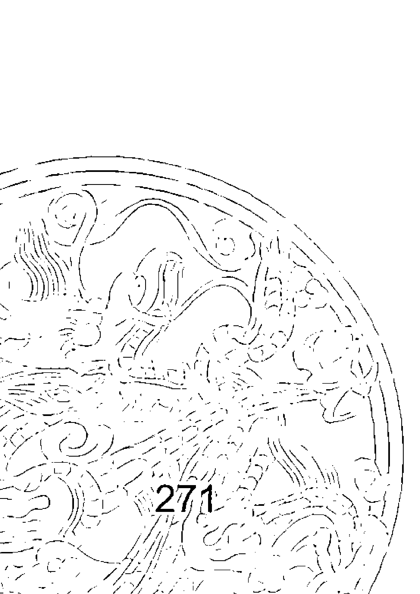

3.  算命公式：祿「夫」隨忌「疾」走，表示有人為愛意亂情迷。相反的公式：祿「疾」隨忌「夫」走，表示有人的內心不能沒有他。
4.  算命公式：祿「命」隨忌「夫」走，表示有人為感情折磨而流淚。相反的公式：祿「夫」隨忌「命」走，表示有人因追求真愛而執著。
5.  算命公式：祿「夫」隨忌「父」走，表示有人為白頭偕老而祈禱。相反的公式：祿「父」隨忌「夫」走，表示有人不知老夫才是丈夫。

# 陸、從命盤看出你前世今生的欠債與折磨

### （三）「祿隨忌走」是一種公式，

## 「祿隨忌走」實例一

| 己 父 | 庚 福 | 辛 田 | 壬 官 |
| :--- | :--- | :--- | :--- |
| 戊 命 | | | 癸 奴 |
| 丁 兄 | | | 甲 遷 |
| 丙 夫<br>（祿） | 丁 子 | 丙 財 | 乙 疾<br>（忌） |

1.  「祿隨忌走」是命理學紫微斗數的公式，也是千年不傳的秘笈，更是生年四化的重要公式之一。
2.  「祿隨忌走」的算命解釋，只要把兩個宮位合起來解釋即可得到答案。
3.  上圖命盤祿星在夫妻宮，忌星在遷移宮。
    解釋時：夫妻宮＋遷移宮＝兩個宮位合起來的解釋。
    解釋一：表示有人會為了愛而走天涯。
    解釋二：表示有人會為了感情而搬家。
    解釋三：表示最愛或最喜歡的感情最無情。
    解釋四：表示配偶因工作關係在外面居住。

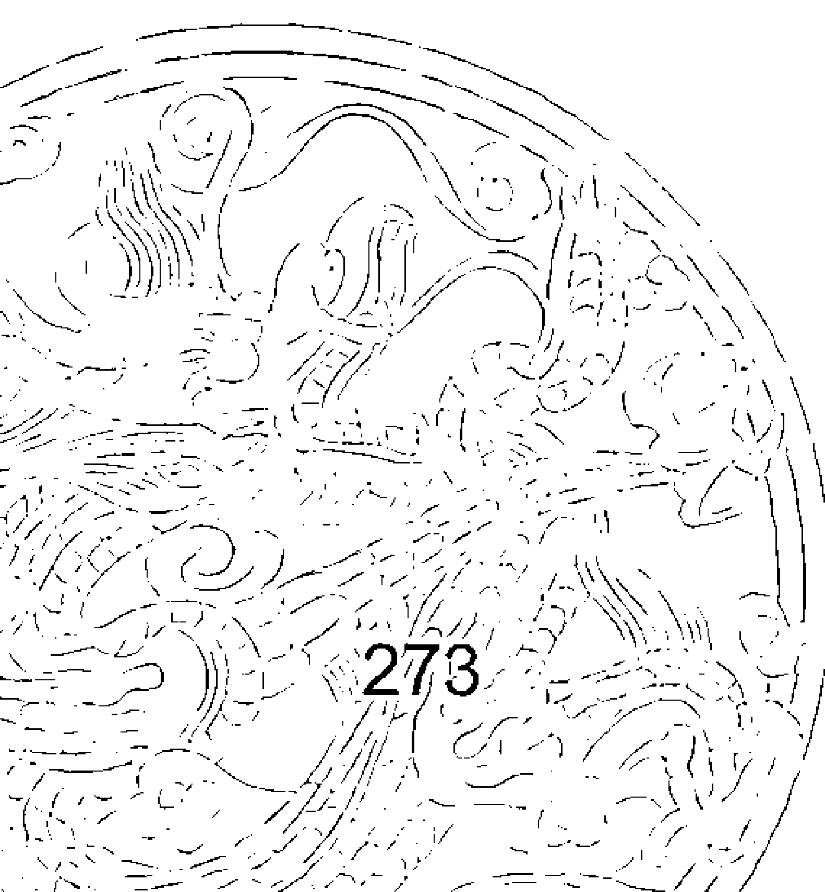

| | | | |
| :--- | :--- | :--- | :--- |
| 己 父<br>禄 | 庚 福 | 辛 田 | 壬 官 |
| 戊 命 | | | 癸 奴 |
| 丁 兄 | | | 甲 迁 |
| 丙 夫<br>忌 | 丁 子 | 丙 财 | 乙 疾 |

## 「祿隨忌走」實例二

1.  「祿隨忌走」是命理學紫微斗數的公式，也是千年不傳的秘笈，更是生年四化的重要公式之一。
2.  「祿隨忌走」的算命解釋，只要把兩個宮位合起來解釋即可得到答案。
3.  上圖命盤祿星在命宮，忌星在夫妻宮。
    算命分析：命宮＋夫妻宮＝兩個宮位合起來的解釋。
    解釋一：表示命中會結婚的人。
    解釋二：表示命中會遇到無情的人。
    解釋三：表示有人因感情折磨而常流淚。
    解釋四：第二次的緣分才能找到有情人。

# 陸、從命盤看出你前世今生的欠債與折磨

| 己 父 | 庚 福 (祿) | 辛 田 | 壬 官 (忌) |
| :--- | :--- | :--- | :--- |
| 戊 命 | | | 癸 奴 |
| 丁 兄 | | | 甲 遷 |
| 丙 夫 | 丁 子 | 丙 財 | 乙 疾 |

「祿隨忌走」實例三

1.  「祿隨忌走」是命理學紫微斗數的公式，也是千年不傳的秘笈，更是生年四化的重要公式。
2.  「祿隨忌走」的算命解釋，把兩個宮位合起來解釋即可得到答案。
3.  上圖命盤祿星在福德宮，忌星在官祿宮。算命分析：福德宮＋官祿宮＝兩個宮位合起來的解釋。解釋一：表示命中追求夢想的人。解釋二：表示命中興趣可以當飯吃的人。解釋三：表示命中最大的福報在事業成功。
4.  解釋四：表示第二次事業才能成功。

## 「祿隨忌走」實例四

| 乙 財 | 丙 子 | 丁 夫 | 戊 兄 |
| :--- | :--- | :--- | :--- |
| 甲 疾 | | | 己 命 |
| 癸 遷 | | | 庚 父 |
| 壬 奴 | 癸 官 | 壬 田 | 辛 福 |

1.  「祿隨忌走」是命理學紫微斗數的公式，也是千年不傳的秘笈，更是生年四化的重要公式。
2.  「祿隨忌走」解釋時，把兩個宮位合起來解釋即可得到答案。
3.  上圖命盤祿星在財帛宮，忌星在遷移宮。算命分析：財帛宮十遷移宮＝兩個宮位合起來的解釋。
    - 解釋一：表示命中財旺傷身的命格。
    - 解釋二：表示命中勞心勞碌賺錢的人。
    - 解釋三：表示命中出外才能賺大錢的人。
    - 解釋四：業務外務的工作可以化解災厄。

# 陸、從命盤看出你前世今生的欠債與折磨

### (四) 今生要完成的功課有哪些？

| 乙 財 | 丙 子 | 丁 夫 (禄) | 戊 兄 |
| :--- | :--- | :--- | :--- |
| 甲 疾 (忌) | | | 己 命 |
| | | | 庚 父 |
| 癸 遷 | | | |
| 壬 奴 | 癸 官 | 壬 田 | 辛 福 |

1.  「祿隨忌走」是命理學紫微斗數的公式，也是千年不傳的秘笈，完成今生的功課可以夢想成真。
2.  「祿隨忌走」解釋時，把兩個宮位合起來解釋即可得到答案。
3.  上圖命盤祿星在夫妻宮，忌星在疾厄宮。
    解釋時：夫妻宮＋疾厄宮＝兩個宮位合起來的解釋。
    解釋一：表示第一次正緣是條件差的人。
    解釋二：表示命中有人會為愛意亂情迷。
    解釋三：命中的感情常常在怨恨中度過。
    解釋四：命中分開兩地的感情才能長久。

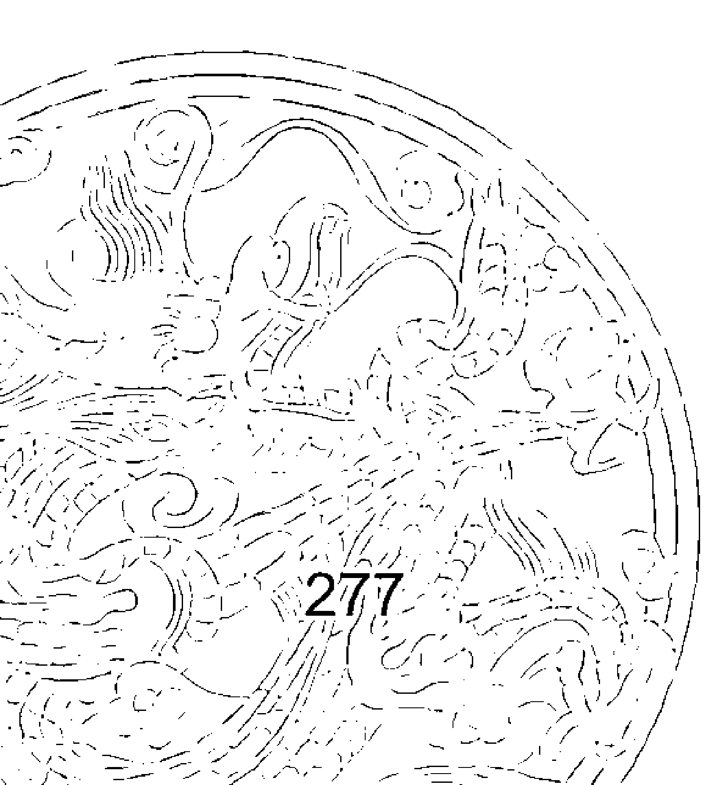

| 乙 財 | 丙 子 | 丁 夫 (忌) | 戊 兄 |
| :--- | :--- | :--- | :--- |
| 甲 疾 (禄) | | | 己 命 |
| 癸 遷 | | | 庚 父 |
| 壬 奴 | 癸 官 | 壬 田 | 辛 福 |

1.  「祿隨忌走」是命理學紫微斗數的公式，也是千年不傳的秘笈，完成今生的功課可以夢想成真。
    解釋一：表示命中愛吃醋的人才是正緣。
    解釋二：表示喜歡黏的人才是有情的人。
    解釋三：表示目前的內心只有他一個人。
    解釋四：表示最愛或最喜歡的人最無情。
2.  「祿隨忌走」解釋時，把兩個宮位合起來解釋即可得到答案。
3.  上圖命盤祿星在疾厄宮，忌星在夫妻宮。
    解釋時：疾厄宮＋夫妻宮＝兩個宮位合起來的解釋。

# 柒、用實例分析，可以增加你看命盤的功力

人生的故事每個人都有兩種選擇：一種是命中注定的人生故事，一種是自己選擇的人生故事。生年四化所組成的公式就是命中注定的人生故事，飛星四化所組成的公式就是自己選擇的人生故事。命中注定的人生故事，上天總是巧安排一切的善因緣，讓你暢通無阻、事半功倍；自己選擇的人生故事，人生的道路上總是讓你阻礙重重，事倍功半。

本篇寫的是上天安排的人生故事，共分為「基礎篇」、「進階篇」兩篇。基礎篇，應用祿星、權星、科星、忌星（四化星）的公式，讓你馬上進入命理學的神秘世界；進階篇，應用生年四化（M質）＋本命命盤「重疊」大限命盤＋「祿隨忌走」＋「三象一物」的公式，讓愛好命理者可以快速進入命理之美的境界。

看命盤說故事是華山派命理學最引以為傲的論述之一，可以藉此讓人知道命理一點都不神秘，它是公式化、系統化、科學化的產物。只要四顆星，馬上讓你學會幫別人算命。

現就怎麼「算」命中注定的人生故事分析如下：

是公式化、系統化、科學化的產物。只要四顆星，馬上讓你學會幫別人算命。

## 一、應用「生年四化」算命有五大公式

### 1. 生年四化的第一大公式

(1)「M質的宮位」就是算命中注定的事。

生年四化「由出生天干飛出來的四化星，也稱為「四化星」。

四化星「祿星、權星、科星、忌星等四顆星辰，其中任何一顆四化星都可以代表M質。

十二宮位：命宮、兄弟宮、夫妻宮、子女宮、財帛宮、疾厄宮、遷移宮、奴僕宮、官祿宮、田宅宮、福德宮、父母宮。

- 算命實例：子女宮＋M質「表示先天注定有子女的命。
- 算命實例：官祿宮＋M質「表示努力的事業會因貴人相助而成功。
- 算命實例：田宅宮＋M質「表示買房子，命中有二十年的好運。
- 算命實例：父母宮＋M質「表示強烈的企圖心，就是主管、老闆、專業的命。

(2)算命「十二宮位＋M質「算命就是兩種合起來的解釋。

### 2. 生年四化的第二大公式

(1) M質所在的宮位可以算存在、貴人、欠債、有緣、有運等五種現象。

M質的宮位怎麼算命？

- 算「存在」時：M質所在的宮位，表示人、事、物的緣分命中注定或先天俱足。
- 算「貴人」時：M質所在的宮位，表示命中人事物的因緣一定有貴人相助而成功。

算「欠債」時：M質所在的宮位，表示命中不是折磨不順，就是無情的因緣。
算「有緣」時：M質所在的宮位，表示前世的因果，今生一定會產生物人事的緣分。
算「好運」時：M質所在的宮位，表示命中付出的人事物一定會回報到自己身上。

十二宮位＋M質＝算命。
(2)怎麼正確的算命？

算「存在」：十二宮位＋M質＝表示這個宮位的因緣是存在的。
算「貴人」：十二宮位＋M質＝表示這個宮位一定有貴人相助。
算「欠債」：十二宮位＋M質＝表示這個人人事是折磨的因緣。
算「有緣」：十二宮位＋M質＝表示這個宮位有濃濃的緣分存在。
算「好運」：十二宮位＋M質＝表示這個宮位一定有福報的機緣。

### 3.生年四化的第三大公式

(1)算「存在」：祿‖權‖科‖忌。

算命實例：子女宮有M質，表示命中有子女，不論祿、權、科、忌四顆星辰中哪一顆星，皆表示命中有子女的存在。

(2)算「內容」：祿‖權‖科‖忌。

算命實例：事業宮有M質，「先」表示命中事業會有成就；「再」表示成就的內容會不一樣。
祿星：表示要以生意角度的心態，事業才能成就。
權星：表示要以專業專技的心態，事業才能成就。
科星：表示要以名聲口碑的心態，事業才能成就。

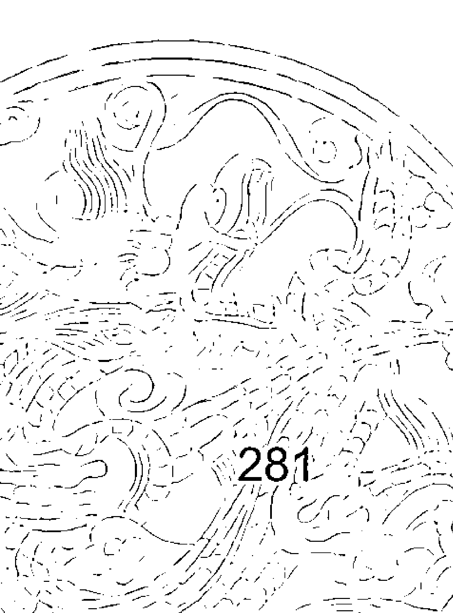

### 4. 生年四化的第四大公式

(1)忌星所在的宮位，也就是忌入的宮位。算命實例：父母宮有忌星，表示命中發生與父母不合、衝突、分隔兩地的無緣現象。凶象指數有60%。

(2)忌星所沖的宮位，也就是忌星對面的宮位。算命實例：夫妻宮有忌星「沖」事業宮，表示命中的事業，一定會經歷不順、是非、衝突、失敗或換行業後，人生的事業才能成就。凶象指數有80%。

### 5. 生年四化的第五大公式

(1)怎麼降低命中無情的因緣？

①先天註定的無情怎麼化解？

算命實例：父母宮有忌星，表示命中和父母不合，所以，不住在一起就能改運。

算命實例：田宅宮有忌沖，表示命中住宅無情，所以，常搬家可以降低意外的災厄。

②後天運勢的無情，怎麼化解？

算命實例：一年內連續和兩個不同的男人分手，所以，分開的感情就能降低無情的緣分。

算命實例：跟父母同住讓我的婚姻亮起紅燈，所以，分開居住就能降低雙方無情的緣分。

(2)為什麼人事物會無情？

在人：在不對的時間住在一起，雙方相處當然會出問題。

## 二、看命盤說故事「基礎篇」

學算命一定要先學會五件事：一、學會「十二宮位」的定位；二、學會「四化星」的定位；三、學會「格局」的定位；四、學會「用神」的定位；五、學會「體與用」的定位。第一、二在前一節已有分析；第三、四在本節分析；第五在本書第伍章分析。

現就命理學的基礎原理分析如下：

1.  十二宮位的定位：論述人事物的管轄權範圍，讓人快速學會每一事件的分類。
2.  四化星的定位：論述命中注定的管轄權範圍，讓人快速學會命中注定的緣分是什麼。
3.  格局的定位：論述命中優勢的管轄權範圍，讓人快速學會把握人生最大的利益。
4.  用神的定位：論述每一事件的管轄權範圍，讓人快速學會算命的切入方法。

在事：在不對的時間點創業，當然會面臨失敗的命運。
在物：在不對的時間點搬家，一定會讓自己的好運快速往下滑。
(3)我現在決定的事，未來會發生什麼事？
以下事件是一般命理老師完全不會的事。
不知道下一段感情會出現什麼緣分？
不知道搬家後會發生什麼事？
不知道生小孩會發生什麼事？
不知道合夥的事業會不會被出賣？
不知道換工作後會不會找到更好的工作？

5.  體與用的定位：論述本命命盤與大限命盤的管轄範圍，讓人快速學會分辨吉與凶的方法。

### 1.「命格」怎麼算？

命格也是完整的算命方式之一，請參考本書第玖章。

- (1) 祿權的命格——尊星高照格：
    上天給你最大的優勢是「錢」的本事。
    代表人物：生意人與金光黨。
    成功個性：當別人說你現實時，表示你已經在成功路上。

- (2) 祿科的命格——因緣共業格：
    上天給你最大的優勢是「人」的本事。
    代表人物：團隊與上班族。
    成功個性：改變以前失敗的做法，人生才會變彩色。

- (3) 祿忌的命格——陽花水性格：
    上天給你最大的優勢是「才」的本事。
    代表人物：時尚族與過客。
    成功個性：面臨抉擇時，利益的方向為生機。

- (4) 權科的命格——巧藝安身格：
    上天給你最大的優勢是「名」的本事。
    代表人物：傳承與偏才。
    成功個性：傳承之心為人生最大的福報。

(5)權忌的命格——物競天擇格：上天給你最大的優勢是「權」的本事。代表人物：執行長與幫凶。成功個性：當別人攻擊你時，表示你已經成功一半。

(6)科忌的命格——冬藏蛻變格：上天給你最大的優勢是「人」的本事。代表人物：幕僚長與村姑。成功個性：往前走的心，可以化解過去怨恨的輪迴。

### 2. 何謂用神：

「用神」確定後，一切的因緣才有「定位」；有定位後，才能產生人事物的現象。

- (1)常識的用神解釋：一般專用的單位名稱。例如，一個人、一條魚、一隻狗：……等等。
- (2)命理的用神解釋：四化的基本用神，祿星代表「物」、權星代表「事」、科星代表「人」，忌星代表「吉凶與終始」。

### 3. 四化的用神：

星代表「吉凶與終始」。

祿星代表物—表示賺錢、旅遊、買房、股票、投資……

權星代表事—表示學業、留學、工作、事業、成就……

科星代表人—表示興趣、名聲、口碑、特色、夢想……

忌星代表吉凶—表示人、事、物的緣起與緣滅的分界點。

### 4. 十二宮位的用神：

- 1. 命宫：乃其他十一宫位的共同用神。
- 2. 兄弟宫：乃兄弟、姊妹、驛馬、緣分……的用神。
- 3. 夫妻宫：乃正緣、同居、異性、緣分……的用神。
- 4. 子女宫：乃子女、學生、三角、緣分……的用神。
- 5. 财帛宫：乃工作、投資、正緣、緣分……的用神。
- 6. 疾厄宫：乃勞碌、健康、意外、緣分……的用神。
- 7. 迁移宫：乃外務、業務、意外、緣分……的用神。
- 8. 交友宫：乃朋友、過客、眾生、緣分……的用神。
- 9. 官禄宫：乃工作、創業、成就、緣分……的用神。
- 10. 田宅宫：乃家庭、住宅、土地、緣分……的用神。
- 11. 福德宫：乃福報、興趣、公媽、緣分……的用神。
- 12. 父母宫：乃父母、老闆、宗教、緣分……的用神。

### 5. 職業別的用神：

命理：用神在父、子、官的宮位。

宗教：用神在兄、友、子、父的宮位。

高官：用神在命、財、官、父的宮位。

選舉：用神在兄、友、子、官的宮位。

教書：用神在父、子、官的宮位。

考試：用神在父、命、官的宮位。

公職：用神在父、命、官的宮位。

投資：用神在命、財、官的宮位。

投機：用神在財、父的宮位。

訴訟：用神在父、官的宮位。

意外：用神在命、遷、子、田的宮位。

直銷：用神在兄、友、子、官的宮位。

保險：用神在兄、友、子、官的宮位。

仲介：用神在兄、友、官、父的宮位。

網拍：用神在田、官、父的宮位。

夜市：用神在兄、友、官、父的宮位。

會計：用神在財、官、父的宮位。

批發商：用神在子、官、父的宮位。

貿易商：用神在子、遷、官的宮位。

不動產：用神在田、官的宮位。

# 柒、用實例分析，可以增加你看命盤的功力

# (一)天生靠男人的命

1. 生年四化的第一大公式：由出生天干飛出來的四化稱為生年四化。M質的宮位永遠不會變動。M質＝祿、權、科、忌的任何一顆星。

2. 生年四化的第二大公式：M質在算命的表達有：存在、貴人、欠債、有緣、有運等五種。

3. 生年四化的第三大公式：算「存在」：祿＝權＝科＝忌。算「內容」：祿≠權≠科≠忌。

4. 生年四化的第四大公式：忌入的宮位：忌星所在的宮位。算命實例：忌入的宮位，凶象指數有60%。忌沖的宮位：忌入宮位的對宮。算命實例：忌沖的宮位，凶象指數有80%。

| 天干地支 | 星宿组合 | 备注 |
|----------|----------|------|
| 己巳 | 天同、大福、命宫 | 8.20.32.44.56.68, 03 12, 破軍(權) |
| 庚午 | 文昌、天府、武曲(科)、大田、父母 | 9.21.33.45.57.69 |
| 辛未 | 太陰(忌)、太陽、大官、福德 | 10.22.34.46.58.70 |
| 壬申 | 文曲、貪狼、大奴、田宅 | 11.23.35.47.59.71 |
| 癸酉 | 巨門、天機→權、大選、官祿 | 12.24.36.48.60.72, 83 92, 天相、紫微 |
| 甲戌 | 大疾、奴僕 | 1.13.25.37.49.61, 73 82, 左輔、天梁 |
| 乙亥 | 大財、遷移 | 2.14.26.38.50.62, 63 72, 權 |
| 丙子 | 大子、疾厄 | 3.15.27.39.51.63, 53 62, 七殺 |
| 丁丑 | 大夫、財帛 | 4.16.28.40.52.64, 43 52 |
| 丙寅 | 大兄、子女 | 5.17.29.41.53.65, 33 42, 廉貞(祿) |
| 丁卯 | 大命、夫妻 | 6.18.30.42.54.66, 23 32 |
| 戊辰 | 大父、兄弟 | 7.19.31.43.55.67, 13 22, 右弼 |
| 己巳 | 大福、命宮 | 8.20.32.44.56.68, 03 12, 破軍(權) |

詳細命盤：女命 甲戌年生 25歲

# 柒、用實例分析，可以增加你看命盤的功力

| 己 大福命 3/12 | 庚 大田父 (科) | 辛 大官福 (忌) | 壬 大奴田 |
| :--- | :--- | :--- | :--- |
| 戊 大父兄 13/22 (權) | | | 癸 大遷官 83/92 |
| 丁 大命夫 23/32 | | | 甲 大疾奴 73/82 |
| 丙 大兄子 33/42 (祿) | 丁 大夫財 43/52 | 丙 大子疾 53/62 | 乙 大財遷 63/72 |

○ 簡易命盤：

1. 算命的重點在找到對的宮位算命，因此有了「用神」的誕生。
2. 靠男人的宮位「用神」為命宮、夫妻宮、父母宮或一個宮位有兩顆M質。
3. 怎麼區分靠男人的內容：
   (1) 命宮有M質又女命男星，才能靠男人。
   (2) 夫妻宮有M質，表示命中可以靠男人。
   (3) 父母宮有M質，表示命中可以靠男人。
   (4) 一個宮位有兩顆M質，表示命中可以靠男人。
4. 上圖命盤，本命父母宮有科星，表示命中有靠男人的好福報。23/32大命的父母宮有權星，表示23/32的時間有靠男人的好運。

# (二)天生教書的命

1. 生年四化的第一大公式：由出生天干飛出來的四化稱為生年四化。M質的宮位永遠不會變動。M質=祿、權、科、忌的任何一顆星。

2. 生年四化的第二大公式：M質在算命的表達有：存在、貴人、欠債、有緣、有運等五種。

3. 生年四化的第三大公式：算「存在」：祿==權==科==忌。算「內容」：祿#權#科#忌。

4. 生年四化的第四大公式：忌入的宮位：忌星所在的宮位。算命實例：忌入的宮位，凶象指數有60%。忌沖的宮位：忌入宮位的對宮。算命實例：忌沖的宮位，凶象指數有80%。

○詳細命盤：男命 戊子年生 71歲

# 柒、用實例分析，可以增加你看命盤的功力

簡易命盤：
丁父：大疾 15/24 (科, 祿)
戊福：大財 25/34
己田：大子 35/44
庚官：大夫 45/54
丙命：大遷 5/14
辛奴：大兄 55/64
乙兄：大奴 (權)
壬遷：大命 65/74
甲夫：大官
乙子：大田
甲財：大福
癸疾：大父 75/84 (忌)

1. 算命的重點在找到對的宮位來算命，因此有了「用神」的誕生。
2. 教書的宮位「用神」：子女宮有M質或父母宮有M質或命、財、官有科星。
3. 怎麼區分教書的內容：
    - 祿星：表示要以補習班的方式教學。
    - 權星：表示要以成就學生的方式教學。
    - 科星：表示要以學術的方式教學。
    - 忌星：表示要以實例或實習的方式教學。
4. 上圖命盤，本命的命宮有科星，表示命中可以靠教書賺錢。

# (三)天生大破財的命

1. 生年四化的第一大公式：由出生天干飛出來的四化稱為生年四化。M質的宮位永遠不會變動。M質＝祿、權、科、忌的任何一顆星。

2. 生年四化的第二大公式：M質在算命的表達有：存在、貴人、欠債、有緣、有運等五種。

3. 生年四化的第三大公式：算「存在」：祿＝權＝科＝忌。算「內容」：祿≠權≠科≠忌。

4. 生年四化的第四大公式：忌入的宮位：忌星所在的宮位。算命實例：忌入的宮位，凶象指數有60％。忌沖的宮位：忌入宮位的對宮。算命實例：忌沖的宮位，凶象指數有80％。

○詳細命盤：男命庚午年生29歲

# 柒、用實例分析，可以增加你看命盤的功力

| | | | |
|---|---|---|---|
| 辛 遷 | 壬 疾 | 癸 財 | 甲 子 |
| 庚 奴 | | | 乙 夫 |
| 祿 | | | |
| 己 官 | | | 丙 兄 |
| 權 | 忌 | | 科 |
| 戊 田 35/44 | 己 福 大命 25/34 | 戊 父 15/24 | 丁 命 05/14 |

○簡易命盤：

1. 大破財的宮位看本命盤的財帛宮，這是最簡單的分辨方式，但其他宮位就不是那麼好選擇，因此有了「用神」的誕生。算命實例：出國留學的宮位「用神」看遷移宮、官祿宮、父母宮。

2. 大破財的公式：
   (1) 忌星在財帛宮：表示破財的指數有60%。
   (2) 忌星「沖」財帛宮：表示破財的指數有80%。
   (3) 左輔星在財帛宮：表示破財的指數有100%。

3. 上圖命盤，本命的命宮有科星，表示命中做對教書的天命，可以化解大破財的魔咒。

# (四) 命中出外逢貴的格

1. 生年四化的第一大公式：由出生天干飛出來的四化稱為生年四化。M質的宮位永遠不會變動。M質＝祿、權、科、忌的任何一顆星。

2. 生年四化的第二大公式：M質在算命的表達有：存在、貴人、欠債、有緣、有運等五種。

3. 生年四化的第三大公式：算「存在」：祿｜權｜科｜忌。算「內容」：祿｜權｜科｜忌。

4. 生年四化的第四大公式：忌入的宮位：忌星所在的宮位。算命實例：忌入的宮位，凶象指數有60%。忌沖的宮位：忌入宮位的對宮。算命實例：忌沖的宮位，凶象指數有80%。

# 詳細命盤：女命 壬申年生 27歲

| 宮位 | 星曜 | 數字 | 天干地支 | 大限 | 小限 | 其他星曜 | 化曜 |
|------|------|------|----------|------|------|----------|------|
| 太陰 | 太陰 | 1.13.25.37.49.61 | 己巳 | 大田 52 | 奴僕 61 | 天廉府貞 | 忌 |
| 貪狼 | 貪狼(權) | 2.14.26.38.50.62 | 庚午 | 大官 62 | 遷移 71 | 天同 | 祿 |
| 巨門 | 巨門(祿) | 3.15.27.39.51.63 | 辛未 | 大奴 72 | 疾厄 81 | 天門 | 權 |
| 天相 | 天相(祿) | 4.16.28.40.52.64 | 壬申 | 大遷 82 | 財帛 91 | 天梁 | 科 |
| 天梁 | 天梁(科) | 5.17.29.41.53.65 | 癸酉 | 大疾 | 子女 | 七殺 | 忌 |
| 天機 | 天機 | 6.18.30.42.54.66 | 甲戌 | 大財 | 夫妻 | 天機 | 祿 |
| 紫微 | 紫微 | 7.19.31.43.55.67 | 乙亥 | 大子 | 兄弟 | 文左昌輔 | 科 |
| 天府 | 天府 | 8.20.32.44.56.68 | 丙子 | 大夫 | 命宮 | 文昌 | 祿 |
| 廉貞 | 廉貞 | 9.21.33.45.57.69 | 丁丑 | 大兄 | 父母 | 右弼 | 權 |
| 破軍 | 破軍(忌) | 10.22.34.46.58.70 | 丙寅 | 大命 | 福德 | 文曲(忌) | 忌 |
| 天同 | 天同 | 11.23.35.47.59.71 | 丁卯 | 大父 | 田宅 | 破軍 | 科 |
| 天機 | 天機 | 12.24.36.48.60.72 | 戊辰 | 大福 | 官祿 | 祿 |

# 柒、用實例分析，可以增加你看命盤的功力

| 己 奴 | 庚 遷 (權) | 辛 疾 | 壬 財 (祿) |
| :--- | :--- | :--- | :--- |
| 戊 官 42/51 | | | 癸 子 (科) |
| 丁 田 32/41 | | | 甲 夫 |
| 丙 福 大命 22/31 (忌) | 丁 父 12/21 | 丙 命 02/11 | 乙 兄 |

1. 算命的重點在找到對的宮位來算命，因此有了「用神」的誕生。
2. 出外逢貴的宮位「用神」在遷移宮，所以，遷移宮有M質，就表示出外會遇到貴人相助。
3. 怎麼區分出外逢貴的內容：
   祿星：表示出外的貴人是親近的人。
   權星：表示出外的貴人是條件好的人。
   科星：表示出外的貴人是對你好的人。
   忌星：表示出外的貴人是自己，自己有條件後才能找到貴人。
4. 上圖命盤，本命的遷移宮有權星，表示出外會遇到條件好的人相助。

# (五)怎么找到真命天子？

1. 生年四化的第一大公式：由出生天干飞出来的四化称为生年四化。M质的宫位永远不会变动。M质 = 禄、权、科、忌的任何一颗星。

2. 生年四化的第二大公式：M质在算命的表达有：存在、贵人、欠债、有缘、有运等五种。

3. 生年四化的第三大公式：算“存在” ：禄 || 权 || 科 || 忌。算“内容” ：禄 # 权 # 科 # 忌。

4. 生年四化的第四大公式：忌入的宫位：忌星所在的宫位。算命实例：忌入的宫位，凶象指数有60%。忌冲的宫位：忌入宫位的对宫。算命实例：忌冲的宫位，凶象指数有80%。

| 左上 (巳宫) | 中上 (午宫) | 右上 (未宫) | 右侧 (申宫) |
| :--- | :--- | :--- | :--- |
| 文昌 天机<br>0,21,33,45,57,69<br>己 巳<br>大福 迁移<br>66 75 | 左辅 紫微<br>10,22,34,46,58,70<br>庚 午<br>大田 疾厄<br>76 85 | 右弼 破军<br>11,23,35,47,59,71<br>辛 未<br>大官 财帛<br>86 95 | 12,24,36,48,60,72<br>壬 申<br>大奴 子女<br>— — |
| 七杀 (禄)<br>00,12,24,36,48,60 | | 文曲 (忌)<br>1,13,25,37,49,61 | 廉贞 天府 (禄)<br>→ 禄<br>2,14,26,38,50,62 |
| 天梁 太阳 (科)<br>7,19,31,43,55,67<br>丁 卯<br>大命 官禄<br>46 55 | 忌 禄 (连线交于中点) | 天府 廉贞 (禄)<br>甲 戌<br>大疾 兄弟<br>— — | 太阴<br>贪狼 (权)<br>3,15,27,39,51,63 |
| 天相 武曲 (禄)<br>6,18,30,42,54,66<br>丙 寅<br>大兄 田宅<br>36 45 | 天同 巨门<br>5,17,29,41,53,65<br>丁 丑<br>大夫 福德<br>26 35<br>忌 权 | 天梁 太阳 (科)<br>4,16,28,40,52,64<br>丙 子<br>太子 父母<br>16 25 | 太阴<br>乙 亥<br>大财 命宫<br>06 15<br>→ 忌 |

○详细命盘：女命 己酉年生 50岁

# 柒、用實例分析，可以增加你看命盤的功力

○簡易命盤：
| 己 大福 遷 66/75 | 庚 大田 疾 76/85 | 辛 大官 財 | 壬 大奴 子 (忌) |
| :--- | :--- | :--- | :--- |
| 戊 大父 奴 56/65 (科) | | | 癸 大遷 夫 |
| 丁 大命 官 46/55 (祿) | | | 甲 大疾 兄 |
| 丙 大兄 田 36/45 (祿) | 丁 大夫 福 26/35 | 丙 大子 父 16/25 (權) | 乙 大財 命 6/15 |

1. 算命的重點在找到對的宮位來算命，因此有了「用神」的誕生。

2. 感情的宮位：真命天子看夫妻宮，三角關係看子女宮，過客因緣看奴僕宮。

3. 怎麼區分真命天子的內容：
   祿星：表示條件好的男人才是真命天子。
   權星：表示讓我信服的人才是真命天子。
   科星：表示對我好的男人才是真命天子。
   忌星：表示折磨我的男人才是真命天子。

4. 上圖命盤，本命的夫妻宮有忌星，表示命中有同居或結婚的緣分。且46/55大命的子女宮有權星，表示46/55大限交往的人只是三角的緣分。這是個矛盾的命盤，表示必須經過三角的緣分才能找到真命天子。

# (六)刑剋父母怎麼化解？

### 1. 生年四化的第一大公式：

由出生天干飛出來的四化稱爲生年四化。M質的宮位永遠不會變動。M質＝祿、權、科、忌的任何一顆星。

### 2. 生年四化的第二大公式：

M質在算命的表達有：存在、貴人、欠債、有緣、有運等五種。

### 3. 生年四化的第三大公式：

算「存在」：祿‖權‖科‖忌。算「內容」：祿‖權‖科‖忌。

### 4. 生年四化的第四大公式：

忌入的宮位：忌星所在的宮位。算命實例：忌入的宮位，凶象指數有60%。忌沖的宮位：忌入宮位的對宮。算命實例：忌沖的宮位，凶象指數有80%。

○詳細命盤：男命 辛未年生 28 歲

# 柒、用實例分析，可以增加你看命盤的功力

| 癸 命 02/11 | 甲 父 | 乙 福 (權) | 丙 田 |
|---|---|---|---|
| 壬 兄 12/21 | | | 丁 官 (祿) |
| 辛 夫 大命 22/31 | | | 戊 奴 |
| 庚 子 32/41 | 辛 財 42/51 | 庚 疾 (忌) | 己 遷 |

○簡易命盤：

1. 算命的重點在找到對的宮位來算命，因此有了「用神」的誕生。

2. 刑剋父母的宮位：忌星入父母宮，刑剋父母60%；忌沖父母宮，刑剋父母80%。

3. 怎麼算刑剋父母：忌星在父母宮：表示與父母不和、衝突、刑剋、不常在一起的指數有60%。

4. 刑剋父母怎麼化解？化解一：不住在一起，可降低衝突的發生。化解二：表示命中欠父母的債，所有付出的一切都不該求回報，才能還前世的債。

5. 忌入與忌沖，請參考本書第伍章。

## （七）读博士班为什么被退学？

1. 生年四化的第一大公式：
   由出生天干飞出来的四化称为生年四化。
   质的宫位永远不会变动。
   质=禄、权、科、忌的任何一颗星。

2. 生年四化的第二大公式：
   质在算命的表达有：存在、贵人、欠债、有缘、有运等五种。

3. 生年四化的第三大公式：
   算“存在”：禄=权=科=忌。
   算“内容”：禄≠权≠科≠忌。

4. 生年四化的第四大公式：
   忌入的宫位：忌星所在的宫位。
   算命实例：忌入的宫位，凶象指数有60%。
   忌冲的宫位：忌入宫位的对宫。
   算命实例：忌冲的宫位，凶象指数有80%。

详细命盘：男命
乙卯年生
44岁

# 柒、用实例分析，可以增加你看命盘的功力

| 辛 疾 | 壬 财 | 癸 子 | 甲 夫 |
|---|---|---|---|
| 大夫 55/64 | 大兄 45/54 (权) | 大命 35/44 | 大父 25/34 |
| 庚 迁 | (空白) | (空白) | 乙 兄 |
| 大子 65/74 | (空白) | (空白) | 大福 15/24 |
| (空白) | (空白) | (空白) | 丙 命 |
| 己 奴 | (空白) | (空白) | 大田 5/14 |
| 大财 75/84 (科) | (空白) | (空白) | (空白) |
| 戊 官 | 己 田 | 戊 福 | 丁 父 |
| 大疾 85/94 (忌)(禄) | 大迁 | 大奴 | 大官 |

○简易命盘：

- 1. 算命的重点在找到对的宫位来算命，因此有了“用神”的诞生。
- 2. 读书无情的宫位，看父母宫有忌星或疾厄宫有忌星“冲”父母宫。
- 3. 怎么算读书出现了问题？
   - 忌星在父母宫：表示读书亮黄灯，无情指数有60%，换科系或换学校是必要的事。
   - 忌星在疾厄宫：表示读书亮红灯，无情指数有80%，换学校或中断学业是必要的。
- 4. 本命命盘算“命”，大命命盘算“运”。
- 5. 本命命盘，大疾有禄星忌星“冲”大父。
   - 解释：表示读书运是绝对无情，读书会有中断、退学、转学、换科系的现象发生。
- 6. 忌入与忌冲，请参考本书第伍章。

## （八）安神明后，事业为何一落千丈？

1. 生年四化的第一大公式：
   由出生天干飞出来的四化称为生年四化。
   质的宫位永远不会变动。
   质＝禄、权、科、忌的任何一颗星。

2. 生年四化的第二大公式：
   质在算命的表达有：存在、贵人、欠债、有缘、有运等五种。

3. 生年四化的第三大公式：
   算“存在”：禄＝权＝科＝忌。
   算“内容”：禄#权#科#忌。

4. 生年四化的第四大公式：
   忌入的宫位：忌星所在的宫位。
   算命实例：忌入的宫位，凶象指数有60％。
   忌冲的宫位：忌入宫位的对宫。
   算命实例：忌冲的宫位，凶象指数有80％。

详细命盘：男命 乙巳年生 54岁

# 柒、用实例分析，可以增加你看命盘的功力

| 辛（奴、子76/85） | 壬（迁、夫66/75） | 癸（疾、兄56/65） | 甲（财、大命46/55）<br>（上方标注：忌、禄） |
| --- | --- | --- | --- |
| 庚（官、大财86/95） | （空白） | （空白） | 乙（子、大父36/45）<br>（上方标注：科） |
| 己（田、大疾） | （空白） | （空白） | 丙（夫、大福26/35） |
| 戊（福、大迁） | 己（父、大奴） | 戊（命、大官6/15）<br>（上方标注：权） | 丁（兄、大田16/25） |

○简易命盘：

- 1. 算命的重点是先确定“用神”的宫位。
- 2. 安神明的用神看父母，安祖先看福德。
- 3. 安神明怎么算命？
   (1) 所有大限的前后三年是好运与坏运的分界点，找错时间安神明会让事业一落千丈。
   (2) 安神明看父母宫有无质，有质原则上就可以安神明。但切记！算命的公式变化无穷，每一事件都由一连串的公式所组成。
- 4. 上图命盘，五十四岁安神明，在46/55大命已经是好运的尾声，早已不在上天保护的好运内。每十年的好运，上天至少会保障四年。本命盘，46/55大命有禄、忌两颗星，表示人事务上会出现绝对缘灭的现象“双忌”。

## （九）大学指考与学测怎么选择？

1. 生年四化的第一大公式：
   由出生天干飞出来的四化称为生年四化。
   质的宫位永远不会变动。
   质 = 禄、权、科、忌的任何一颗星。

2. 生年四化的第二大公式：
   质在算命的表达有：存在、贵人、欠债、有缘、有运等五种。

3. 生年四化的第三大公式：
   算“存在”：禄 || 权 || 科 || 忌。
   算“内容”：禄 # 权 # 科 # 忌。

4. 生年四化的第四大公式：
   忌入的宫位：忌星所在的宫位。
   算命实例：忌入的宫位，凶象指数有 60%。
   忌冲的宫位：忌入宫位的对宫。
   算命实例：忌冲的宫位，凶象指数有 80%。

| 宫位 | 天干 | 宫名 | 主星 | 辅星 | 四化 | 年龄 |
| :--- | :--- | :--- | :--- | :--- | :--- | :--- |
| 巳 | 己 | 大命 / 福德 | 太阳 | | | 26-35 |
| 午 | 庚 | 大父 / 田宅 | 天机 | 权 | | 36-45 |
| 未 | 辛 | 大福 / 官禄 | 紫微 / 破军 | | | 46-55 |
| 申 | 壬 | 大田 / 奴仆 | 天府 | | | 56-65 |
| 酉 | 癸 | 大官 / 迁移 | 太阴 | | | 66-75 |
| 戌 | 甲 | 大奴 / 疾厄 | 贪狼 / 廉贞 | 权 | | 76-85 |
| 亥 | 乙 | 大迁 / 财帛 | | | | 86-95 |
| 子 | 丙 | 大疾 / 子女 | 巨门 / 文曲 | 忌 | | |
| 丑 | 丁 | 大财 / 夫妻 | 天相 / 左辅 / 右弼 | | | |
| 寅 | 丙 | 大子 / 兄弟 | 天同 / 天梁 / 文昌 | 科 / 禄 | | |
| 卯 | 丁 | 大夫 / 命宫 | 武曲 / 七杀 | 禄 | | 06-15 |
| 辰 | 戊 | 大兄 / 父母 | | 忌 | | 16-25 |

详细命盘：女命 戊寅年生 21岁

# 柒、用实例分析，可以增加你看命盘的功力

```
     ┌─────────┬─────────┬─────────┬─────────┐
     │   丁     │   戊     │   己     │   庚     │
     │ 大父5/14 │ 大福父   │ 大田福   │ 大官田   │
     │   命     │         │         │         │
     ├─────────┤         │         ├─────────┤
     │   丙     │         │         │   辛     │
     │ 大命15/24│         │         │ 大奴官   │
     │   兄     │         │         │         │
     ├─────────┤         │         ├─────────┤
     │   乙     │         │         │   壬     │
     │ 大兄25/34│         │         │ 大迁75/84│
     │   夫     │         │         │   奴     │
     ├─────────┼─────────┼─────────┼─────────┤
     │   甲     │   乙     │   甲     │   癸     │
     │ 大夫35/44│ 大子45/54│ 大财55/64│ 大疾65/74│
     │   子     │   财     │   疾     │   迁     │
     └─────────┴─────────┴─────────┴─────────┘
     (注：表格中部分位置有圆圈标记：丁下为「忌」，乙下为「科」，甲下为「禄」，癸下为「权」)
```

○简易命盘：

- 1. 算命的重点是先确定“用神”的宫位。
- 2. 考试的用神看父母宫，但未来最有利的学业以先天命格为主。
- 3. 考试怎么算命？
   “先”看先天考试的命：
   解答：本命盘是权忌组，命中最适合选专业或专技的科系。
   “再”看现在考试的运：
   解答：因15／24大命的父母宫有生年忌星，以自己目前的考试实力，自认为考得好就不要再考指考；自认为考不好就一定要再考指考。
   *先天格局请看作者另一本著作《学紫微斗数，这本最神准》第参章。
- 4. 上图命盘是阴阳反的时间，即第一次考好会变成考坏，第一次考坏会变成考好。

## （十）天生不利诉讼的人

- 1. 生年四化的第一大公式：
- 2. 生年四化的第二大公式：
- 3. 生年四化的第三大公式：
- 4. 生年四化的第四大公式：
   由出生天干飞出来的四化称为生年四化。
   质的宫位永远不会变动。
   质 ═ 禄、权、科、忌的任何一颗星。
   质在算命的表达有：存在、贵人、欠债、有缘、有运等五种。
   算“存在”：禄 ═ 权 ═ 科 ═ 忌。
   算“内容”：禄 ║ 权 ║ 科 ║ 忌。
   忌入的宫位：忌星所在的宫位。
   算命实例：忌入的宫位，凶象指数有60%。
   忌冲的宫位：忌入宫位的对宫。
   算命实例：忌冲的宫位，凶象指数有80%。

详细命盘：男命 丁未年生 52岁

| 紫微 七杀 | 文昌 文曲 | 破军 贞 | 大奴 父母 |
| :--- | :--- | :--- | :--- |
| 乙巳 大福 夫妻 | 丙午 大田 兄弟 | 丁未 大官 命宫 | 戊申 |
| 天机 天梁 (科) | (禄) | 天府 |
| 甲辰 大父 子女 | 庚戌 大疾 田宅 |
| 天相 | (禄)(权) |
| 癸卯 大命 财帛 | 左辅 太阴 天同 |
| 巨门 太阳 (忌) | 贪狼 武曲 | 天府 |
| 壬寅 大兄 疾厄 | 癸丑 大夫 迁移 | 壬子 大子 奴仆 | 辛亥 大财 官禄 |
| | | 忌 | 科 |

* 注：表格内包含大量数字、天干地支、星曜名称（如紫微、七杀、文曲、天机等）、宫位（如命宫、夫妻、子女等）以及四化符号（禄、权、科、忌）。此处的markdown为对原复杂命盘图形的简化文本表示。

# 柒、用实例分析，可以增加你看命盘的功力

| 列1 | 列2 | 列3 | 列4 |
|-----|-----|-----|-----|
| 乙 夫 22/31 大田 (科) | 丙 兄 12/21 大官 | 丁 命 02/11 大奴 (禄)(权) | 戊 父 大迁 |
| 甲 子 32/41 大福 |   |   | 己 福 大疾 |
| 癸 财 42/51 大父 (忌) |   |   | 庚 田 大财 |
| 壬 疾 52/61 大命 | 癸 迁 大兄 | 壬 奴 大夫 | 辛 官 大子 |

○简易命盘：

- 1. 算命的重点是先确定“用神”的宫位。
- 2. 诉讼看父母宫，未来事业看先天格局。
- 3. 怎么区分诉讼吉凶的内容：
   - 禄星：表示这是随时可以改变的诉讼运。
   - 权星：表示这是强势硬碰硬的诉讼运。
   - 科星：表示这是以和为贵的诉讼运。
   - 忌星：表示这是最不利的诉讼运。
- 4. 诉讼运怎么算？
   “先”看先天的命：
   解答：生年忌星“冲”父母宫，不利诉讼。
   “再”看现在的运：
   解答：42／51大父有科星，这是诉讼的好运，但因受到先天不利诉讼的影响，硬碰硬一定会带来更大的伤害。
- 5. 所有精准算命都需要一连串公式组合。

## （十一）男朋友是不是正缘？

1. 生年四化的第一大公式：由出生天干飞出来的四化称为生年四化。质的宫位永远不会变动。质 ＝ 禄、权、科、忌的任何一颗星。
2. 生年四化的第二大公式：质在算命的表达有：存在、贵人、欠债、有缘、有运等五种。
3. 生年四化的第三大公式：算“存在”：禄＝权＝科＝忌。算“内容”：禄≠权≠科≠忌。
4. 生年四化的第四大公式：忌入的宫位：忌星所在的宫位。算命实例：忌入的宫位，凶象指数有60%。忌冲的宫位：忌入宫位的对宫。算命实例：忌冲的宫位，凶象指数有80%。

详细命盘：女命 壬申年生 30 岁

| 宫位 | 天干 | 宫名 | 主星 | 辅星 | 四化 | 年龄 |
| :--- | :--- | :--- | :--- | :--- | :--- | :--- |
| 巳 | 己 | 大命 / 福德 | 太阳 | | | 26-35 |
| 午 | 庚 | 大父 / 田宅 | 天机 | 权 | | 36-45 |
| 未 | 辛 | 大福 / 官禄 | 紫微 / 破军 | | | 46-55 |
| 申 | 壬 | 大田 / 奴仆 | 天府 | | | 56-65 |
| 酉 | 癸 | 大官 / 迁移 | 太阴 | | | 66-75 |
| 戌 | 甲 | 大奴 / 疾厄 | 贪狼 / 廉贞 | 权 | | 76-85 |
| 亥 | 乙 | 大迁 / 财帛 | | | | 86-95 |
| 子 | 丙 | 大疾 / 子女 | 巨门 / 文曲 | 忌 | | |
| 丑 | 丁 | 大财 / 夫妻 | 天相 / 左辅 / 右弼 | | | |
| 寅 | 丙 | 大子 / 兄弟 | 天同 / 天梁 / 文昌 | 科 / 禄 | | |
| 卯 | 丁 | 大夫 / 命宫 | 武曲 / 七杀 | 禄 | | 06-15 |
| 辰 | 戊 | 大兄 / 父母 | | 忌 | | 16-25 |

# 柒、用实例分析，可以增加你看命盘的功力

| 己 福 (大命 26/35) | 庚 田 (大父 36/45) | 辛 官 (大福 46/55) | 壬 奴 (大田) |
| --- | --- | --- | --- |
| 戊 父 (大兄 16/25) |  |  | 癸 迁 (大官) |
| 丁 命 (大夫 6/15) |  |  | 甲 疾 (大奴) |
| 丙 兄 (大子) | 丁 夫 (大财) | 丙 子 (大疾) | 乙 财 (大迁) |
| (禄) |  | (忌) | (权) |
| (科) |  |  |  |

简易命盘：

- 1. 算命的重点是先确定“用神”的宫位。
- 2. 感情姻缘看夫妻宫、子女宫、交友宫。
- 3. 怎么区分感情姻缘的内容：
   禄星：表示下一段感情才可能遇到正缘。
   权星：表示条件好的对象才是正缘。
   科星：表示会遇到对自己温柔的对象。
   忌星：表示会遇到折磨或不对的对象。
- 4. 感情姻缘怎么算？
   质在夫妻宫：表示会遇到正缘的对象。
   质在子女宫：表示会遇到三角的对象。
   质在奴仆宫：表示会遇到过客的对象。
- 5. 上图命盘，26／35大夫有禄星，忌星在本子，依禄随忌走的公式，表示还在三角运。大子有科星，表示现在我喜欢的人只是三角关系的对象而已。

## （十二）工作二年，重新读书有利吗？

- 1. 生年四化的第一大公式：
   由出生天干飞出来的四化称为生年四化。
   质的宫位永远不会变动。
   质＝禄、权、科、忌的任何一颗星。
- 2. 生年四化的第二大公式：
   质在算命的表达有：存在、贵人、欠债、有缘、有运等五种。
- 3. 生年四化的第三大公式：
   算“存在”：禄＝权＝科＝忌。
   算“内容”：禄≠权≠科≠忌。
- 4. 生年四化的第四大公式：
   忌入的宫位：忌星所在的宫位。
   算命实例：忌入的宫位，凶象指数有60%。
   忌冲的宫位：忌入宫位的对宫。
   算命实例：忌冲的宫位，凶象指数有80%。

一个紫微斗数命盘表格，包含十二宫位，每个宫位有天干地支、宫位名称、主星和辅星等信息。表格右侧有文字“详细命盘：女命 壬申年生 30岁”。表格内容显示具体宫位如命宫（己巳）、夫妻宫（丁卯）、子女宫（丙寅）等，以及星曜分布和四化（禄、权、科、忌）的位置。

详细命盘：女命 壬申年生 30岁

科 禄

# 柒、用实例分析，可以增加你看命盘的功力

| 己 命 3/12 | 庚 父 13/22 | 辛 福 23/22 | 壬 田 33/42 |
| --- | --- | --- | --- |
| 戊 兄 |  | 癸 官 43/52 |  |
| 丁 夫 （禄） |  | 甲 奴 |  |
| 丙 子 （科） | 丁 财 | 丙 疾 （忌） | 乙 迁 （权） |

- 1. 算命的重点是先确定“用神”的宫位。
   解答：生年忌星在疾厄宫“冲”父母宫，表示命中读书一定会有中断、退学、转学、换科系的现象发生。
- 2. 读书看父母宫，目前事业看官禄宫。
- 3. 工作与读书怎么算命？
   解答：23/32大官有权星，表示先冲事业是好的选择之一，因为本人也不想读书。
- 4. 所有精准的算命都需要一连串公式组合，才能完整规划未来的最大利益，这是进阶班的学问。

## 三、看命盘说故事“进阶篇”

进入看命盘说故事的进阶篇，读者更应该具备完整的公式组合的知识，才能精准掌握算命的专业知识与规划技巧。所以，专业的命理老师应该学会更多公式化、系统化、科学化的逻辑，让算命可以预测未来人事物的结果，让问命者可以规划自己人生的最大利益。

现就命理老师应该学会的事分析如下：

### （一）进阶篇的四大公式

#### 第一大公式：生年四化与飞星四化怎么“法象”？

- 1. 法象的定义：任何“飞星四化”与“自化”一定要回归生年四化，称为“法象”。
- 2. 飞星四化算命法一定要回归生年四化“看”现象、时间、吉凶、内容、影响。
- 3. 自化算命法一定要回归生年四化“看”现象、时间、吉凶、内容、影响。
   解释：这里的“法象”就是链接飞星四化与生年四化的桥梁。

#### 第二大公式：单一命盘、两种命盘、三种命盘的分析。

- 1. 单一命盘只能算“命中注定”的现象。
- 2. 两种命盘才能算“吉凶”的时间。
   算命实例：应用“本命命盘+限命盘”来算命。

# 柒、用實例分析，可以增加你看命盤的功力

- 3. 三種命盤才能算「流年」的時間。
算命實例：應用「本命命盤+大限命盤+流年命盤」來算命。
算命公式：「祿」隨「忌」走的分析。
算命解釋：「祿」隨「忌」走的公式，就是祿星+忌星兩個宮位合起來的解釋。
算命實例：祿星在官祿宮，忌星在子女宮，就可以把官祿宮+子女宮合起來解釋，表示創業一定要合夥、合作、加盟，三者擇一才能賺大錢。

第四大公式：三象一物的重點在媒介的宮位。
算命公式：雙系命盤+第三顆（媒介宮位）。
三象一物可以算大限、流年、現象、物相、吉凶、影響……等因緣。

- 2. 「三象一物」的媒介在哪裡？
算命實例：一個宮位有三顆星「祿星、權星、忌星」時，因祿忌一組，第三顆權星就是三象一物的「媒介」宮位。
六組中沒有忌星的組合，媒介一定是忌星。

- 1. 「三象一物」是什麼？
算命實例：一個宮位有兩顆四化星（祿星、權星、科星、忌星），任何兩顆星辰都可以成立。第三顆星辰就是三象一物的宮位，也稱「媒介」的宮位。
算命公式：一個宮位有三顆四化星時，因為，祿忌一組、權科一組，所以另外一顆星辰就成為三象一物的宮位。

「祿權同宮」的媒介在忌星的宮位。
「祿科同宮」的媒介在忌星的宮位。
「祿忌同宮」的媒介在權星的宮位。
「權科同宮」的媒介在忌星的宮位。
「權忌同宮」的媒介在科星的宮位。
「科忌同宮」的媒介在祿星的宮位。

### (二) 算命要知道的二階段：
算命的第一切入點，就是掌握問命者現在正處於人生的哪一個階段。

#### 1. 人生「壞階段」的現象：
- 刑剋期
- 排斥期
- 冷戰期
- 折磨期
- 障礙期
- 衝突期
- 怨恨期
- 撞牆期
- 卡陰期
- 發病期
- 危險期
- 中斷期
- 無情期
- 緣滅期
- 死亡期

#### 2. 人生「轉捩點」的現象：
- 變化期
- 選擇期
- 吉凶期
- 空窗期
- 不順期
- 培養期
- 充電期
- 突破期
- 歸零期
- 放下期
- 捨得期
- 失戀期
- 失業期
- 換腦袋期
- 被出賣期
- 被拋棄期
- 棄舊迎新期

#### 3. 人生「好階段」的現象：
- 穩定期
- 利益期
- 升官期
- 掌權期
- 創業期
- 發展期
- 衝刺期
- 擴大期
- 成名期
- 榮耀期
- 傳承期
- 恩愛期

### （三）進階的吉凶怎麼算？
進階的算命一直是傳統命理老師最弱的學問。

#### 1. 怎麼算吉凶？
公式分析：一定要本命命盤＋大限命盤形成相同的現象，吉凶才會確定。
算命實例：本命命盤＋大限命盤＝算吉凶。

#### 2. 怎麼算流年？
公式分析：一定要本命命盤＋大限命盤的吉凶確定後，流年才會存在。
算命實例：本命命盤＋大限命盤＋流年命盤＝算流年。

#### 3. 怎麼算生肖？
公式分析：一定要「吉凶＋流年」確定後，生肖才會存在。
算命實例：本命命盤＋大限命盤＋流年命盤＋吉凶確定＝算生肖。

#### 4. 實例分析：感情怎麼算？
(1) 初階算命：可以算命中注定的事。
(2) 進階論命：可以算每一事件的內容。
華山派命理：命中有結婚的姻緣，正緣的時間在三十至三十三歲之間。
傳統派命理：還沒有算內容的觀念。
(3) 高階論命：可以算每一事件的影響。
華山派命理：我應該怎麼做才能找到真命天子（天女）？
傳統派命理：還沒有算影響的觀念。
華山派命理：時間與生肖的分析為——
相同時間，遇到不同生肖，我會發生什麼事？
不同時間，遇到相同生肖，我會發生什麼事？
切記！不同時間點遇到的感情，都會帶來不一樣的結果。

#### (4) 命理學有兩個重點：
- 第一重點，是清楚分析前因後果與來龍去脈的學問。
- 第二重點，是可以一層又一層往下追問的功夫。

# 柒、用實例分析，可以增加你看命盤的功力
### (二) 天生追求夢想的人
- 1. 進階篇第一大公式：
白化與飛星四化一定要回歸「生年四化」看現象、時間、吉凶、內容、影響。
- 2. 進階篇第二大公式：
「先算」本命命盤有忌。「才能算」大限命盤有忌。「最後才算」流年命盤有忌。
- 3. 進階篇第三大公式：
算命公式：「祿」隨「忌」走。
算命解釋：祿星+忌星兩宮位合起來解釋。
- 4. 進階篇第四大公式：
算命公式：三象一物的重點在媒介的宮位
公式說明：說明在本書的第柒章、第玖章。

| 乙巳 | 左輔破軍武曲(科)(忌) | 大兄子女35 44 | 丙午 | 太陽 | 大命夫妻25 34 | 丁未 | 天府 | 大父兄弟15 24 | 戊申 | 太陰天機 | 大福宮05 14 |
|------|----------------------|---------------|------|------|---------------|------|------|---------------|------|----------|------------|
| 甲辰 | 天同 | 大夫財帛45 54 | 己酉 | 巨門 | 大田父母2 14 26 38 50 62 | 庚戌 | 文曲天相 | 大官福德3 15 27 39 51 63 | 辛亥 | 天梁(祿) | 大奴田宅4 16 28 40 52 64 |
| 癸卯 | 文昌 | 夫子疾厄55 64 | 壬寅 | 七殺廉貞 | 大財遷移65 74 | 癸丑 | 天機 | 大疾奴僕75 84 | 壬子 | | 大遷官祿85 94 |

○詳細命盤：女命壬申年生27歲

| 乙 子 大兄 35/44 (忌科) | 丙 夫 大命 25/34 | 丁 兄 大父 15/24 | 戊 命 大福 5/14 |
|-------------------------|------------------|------------------|----------------|
| 甲 财 大夫 45/54        |                  |                  | 己 父 大田 (權) |
| 癸 疾 大子 55/64        |                  |                  | 庚 福 大官      |
| 壬 迀 大财 65/74        | 癸 奴 大疾 75/84 | 壬 官 大遷 (祿)  | 辛 田 大奴      |

- 1. 追求夢想的宮位「用神」是父母宮有忌，或一個宮位有權科兩顆星，或本宮與對宮各有一顆權星、科星，三種都是追求夢想的人。
- 2. 追求夢想的內容：當父母宮有忌時：祿星：表示必須經歷兩次以上的選擇，才能找到人生的方向。權星：表示必須有堅持到底的決心，才能找到人生的方向。科星：表示必須有明確的目標與方向，才能走向成功之路。忌星：表示必須經歷兩次以上的選擇，才能找到人生的方向。
- 3. 上圖命盤，25／34大命的父母宮雖然沒有忌，但25／34也可以追求夢想。因為，「命」中優勢永遠大於「運」的好運。

### (二) 重病有救嗎？
#### 1. 進階篇第一大公式：
自化與飛星四化一定要回歸「生年四化」、「看」現象、時間、吉凶、內容、影響。

#### 2. 進階篇第二大公式：
「先算」本命命盤有忌。
「才能算」大限命盤有忌。
「最後才算」流年命盤有忌。

#### 3. 進階篇第三大公式：
算命公式：「祿」隨「忌」走。
算命解釋：祿星+忌星兩宮位合起來解釋。

#### 4. 進階篇第四大公式：
算命公式：三象一物的重點在媒介的宮位。
公式說明：說明在本書的第柒章、第玖章。

||天同|天府武曲|太陰太陽|貪狼|
|---|---|---|---|---|
|數字|9.21.33.45.57.69|10.22.34.46.58.70|11.23.35.47.59.71|12.24.36.48.60.72|
|天干地支|癸巳|甲午|乙未|丙申|
|宮位|大田 遷移 63 72|大官 疾厄 73 82|大奴 財帛 83 92|大遷 子女||
|星曜|破軍|權|權|巨門天機 祿→科→忌|
|數字|8.20.32.44.56.68|1.13.25.37.49.61||
|天干地支|壬辰|丁酉||
|宮位|大福 奴僕 53 62|大疾 夫妻||
|星曜|右弼|祿|天相紫微|
|數字|7.19.31.43.55.67|2.14.26.38.50.62||
|天干地支|辛卯|戊戌||
|宮位|大父 官祿 43 52|大財 兄弟||
|星曜|忌|文曲廉貞 祿|文昌七殺 忌|左輔天梁|
|數字|6.18.30.42.54.66|5.17.29.41.53.65|4.16.28.40.52.64|3.15.27.39.51.63|
|天干地支|庚寅|辛丑|庚子|己亥|
|宮位|大命 田宅 33 42|大兄 福德 23 32|大夫 父母 13 22|大子 命宮 03 12|
|星曜|科|科|科|科|

詳細命盤：女命 辛酉年生 38歲

○簡易命盤：

|||**權**||
|---|---|---|---|
|癸 大田 63/72 遷|甲 大官 73/82 疾|乙 大奴 財|丙 大遷 子|
|壬 大福 53/62 奴||丁 大疾 夫|
|辛 大父 43/52 官|戊 大財 兄|
|庚 **科** 大命 33/42 田|辛 大兄 23/32 福|庚 **忌** 大夫 13/22 父|己 大子 3/12 命|

- 1. 算命看死亡的宮位「用神」在命宮+夫妻宮+疾厄宮+田宅宮等四個宮位，要同時形成無情的現象，死亡才能成立。
- 2. 先天命：忌星在父母宮「沖」疾厄宮，表示命中有大意外的人。
- 3. 後天運：33/42大命的忌星在大命的夫妻宮，表示33/42大命夫妻有無情的運。
- 4. 算命公式：「祿」隨「忌」走。算命實例：大疾有祿星+父母宮有忌星「沖」本疾，表示33/42大命已達二種死亡的條件，所以，此命已達兩種死亡的條件。
- 5. 死亡的論斷最嚴苛，還需要田宅宮的無情才能成立，但這是飛星四化的公式。請參考《學紫微斗數，這本最神準》。

### (三) 二〇一八年創業會賺錢嗎？
- 1. 進階篇第一大公式：白化與飛星四化一定要回歸「生年四化」看現象、時間、吉凶、內容、影響。
- 2. 進階篇第二大公式：「算」本命命盤有忌。「先算」本命命盤有忌。「才能算」大限命盤有忌。「最後才算」流年命盤有忌。
- 3. 進階篇第三大公式：算命公式：「祿」隨「忌」走。算命解釋：祿星+忌星兩宮位合起來解釋。
- 4. 進階篇第四大公式：算命公式：三象一物的重點在媒介的宮位。公式說明：說明在本書的第柒章、第玖章。

| 天干 | 宮位 | 星曜 | 數字 | 四化 |
|------|------|------|------|------|
| 辛巳 | 大父 | 紫微七殺 | 46 55 | 科 |
| 壬午 | 大福 | 文昌 | 56 65 | |
| 癸未 | 大田 | 右弼左輔 | 66 75 | |
| 甲申 | 大官 | 文曲 | 76 85 | |
| 庚辰 | 大命 | 天梁天機 | 36 45 | 權祿 |
| 乙酉 | 大奴 | 破軍廉貞 | 86 95 | |
| 丙戌 | 大遷 | 天同太陰 | | 忌 |
| 丁亥 | 大疾 | 天府 | | |
| 戊寅 | 大夫 | 太陽巨門 | 16 25 | |
| 己丑 | 大子 | 武曲貪狼 | 06 15 | 權祿 |
| 庚子 | 大財 | | | 權 |
| 辛亥 | 大夫妻 | | | |

詳細命盤：女命 乙卯年生 44歲

○ 簡易命盤：

| (科) | | | |
|---|---|---|---|
| 辛 大父 46/55 官 | 壬 大福 56/65 奴 | 癸 大田 66/75 遷 | 甲 大官 76/85 疾 |
| (權)(祿) 庚 大命 36/45 田 | | 乙 大奴 財 |
| 己 大兄 26/35 福 | | 丙 大遷 子 |
| 戊 大夫 16/25 父 | 己 大子 6/15 命 | (忌) 戊 大財 兄 | 丁 大疾 夫 |

- 1. 算命看創業的宮位「用神」在父母宮有忌或大父有忌或大命、大官有兩個忌……。命、大財、大官有權星或大。
- 2. 創業的內容：當父母宮有忌時：祿星：表示適合多元化的創業。權星：表示適合專業、專技的創業。科星：表示適合口碑、特色、名聲的創業。
- 3. 上圖命盤，36/44大命的父母宮有科星，表示36/44有創業賺錢的好運。36/44大命有祿星與權星，也表示36/44有創業賺錢的好運。表示雖然本人可以選擇創業與否，但由命盤可看出此人創業的心很堅定。

### (四) 何時『改名字』才有效？
- 1. 進階篇第一大公式：
白化與飛星四化一定要回歸『生年四化』『看』現象、時間、吉凶、內容、影響。
- 2. 進階篇第二大公式：
『先算』本命命盤有忌。
『才能算』大限命盤有忌。
『最後才算』流年命盤有忌。
- 3. 進階篇第三大公式：
算命公式：『祿』隨『忌』走。
算命解釋：祿星+忌星兩宮位合起來解釋。
- 4. 進階篇第四大公式：
算命公式：三象一物的重點在媒介的宮位。
公式說明：說明在本書的第柒章、第玖章。

詳細命盤：女命 丁巳年生 42歲

# 學紫微斗數，這本才能算命
天梁
大福
乙 奴
天相
紫微
大父
甲 官
43/52
巨門
天機
忌 科
大命
癸 田
33/42
七殺
大田
丙 遷
太陰
太陽
祿
大夫
癸 父
13/22
大官
丁 疾
天府
武曲
大子
壬 命
3/12
廉貞
大奴
戊 財
破軍
大疾
庚 夫
天同
權
大財
辛 兄
大遷
己 子
大兄
壬 福
23/32
貪狼

- 1. 算命看改名字的宮位「用神」在父母宮。
- 2. 下列三種情形才需要改名字。
 (1) 我不喜歡現在的名字。
 (2) 我已經連續「衰」兩次以上。
 (3) 我有心願想完成。
- 3. 何時才是改名字的好時機？
- 4. 算命公式：「祿」隨「忌」走。
 算命實例：本父有祿星＋大命有忌星，表示 33／42 大命已經可以藉助改名字而改運。
- 5. 改名字後會發生什麼事？這是華山派命理最引以為傲的發明，也是從事命理的老師必須學會的本事。
- 6. 擇日需要一連串的公式組合才能完成。

### (五) 恩愛夫妻為什麼變無情？
- 1. 進階篇第一大公式：
白化與飛星四化一定要回歸「生年四化」
「看」現象、時間、吉凶、內容、影響。
- 2. 進階篇第二大公式：
「先算」本命命盤有忌。
「才能算」大限命盤有忌。
「最後才算」流年命盤有忌。
- 3. 進階篇第三大公式：
算命公式：「祿」隨「忌」走。
算命解釋：祿星+忌星兩宮位合起來解釋。
- 4. 進階篇第四大公式：
算命公式：三象一物的重點在媒介的宮位。
公式說明：說明在本書第柒章、第玖章。

詳細命盤：男命 辛亥年生 47歲

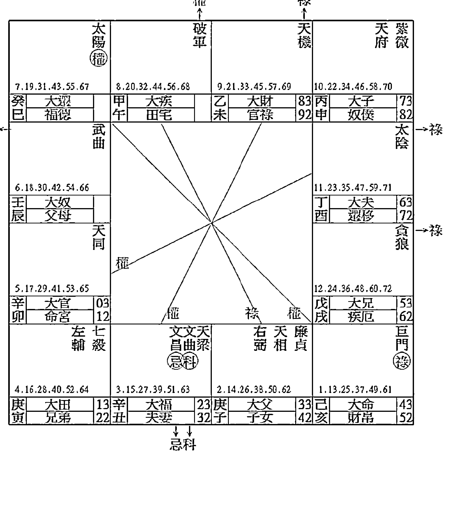

|
| 權 |
| --- |
| 大遷福 癸 | 大疾田 甲 | 大財官 乙 | 大子奴 丙 73/82 |
| 大奴父 壬 | | 大夫遷 丁 63/72 |
| 大官命 辛 3/12 | | 大兄疾 戊 53/62 |
| 大田兄 庚 13/22 | 忌 科 大福夫 辛 23/32 | 大父子 庚 33/42 | 祿 大命財 己 43/52 |

- 1. 算命看婚姻的宮位「用神」在夫妻宮。
- 2. 命運是什麼？
- 3. 算命分析：夫妻宮有忌星，表示命中的婚姻是無情的天命。
命：先天命中注定的事。
運：後天自己的選擇。
算命分析：夫妻宮有忌星＋大命 43／52 重疊時，表示 43／52 大限婚姻會無情，但自己可以選擇離婚或不離婚。
「祿隨忌走」的公式得知，大命「祿」＋本夫「忌」，已經形成兩次的無情。
算命分析： 43／52 大限的婚姻已經進入無情期，因先天命夫「忌星」＋後天運「雙忌」之故，兩人的婚姻已經回不去了。

# 柒、用實例分析，可以增加你看命盤的功力
## （六）可否生小孩，命盤怎麼看出來的？
- 1. 進階篇第一大公式：
白化與飛星四化一定要回歸「生年四化」看現象、時間、吉凶、內容、影響。
- 2. 進階篇第二大公式：
「先算」本命命盤有忌。「才能算」大限命盤有忌。「最後才算」流年命盤有忌。
- 3. 進階篇第三大公式：
算命公式：「祿」隨「忌」走。
算命解釋：祿星+忌星兩宮位合起來解釋。
- 4. 進階篇第四大公式：
算命公式：三象一物的重點在媒介的宮位。
公式說明：說明在本書的第柒章、第玖章。

| 天府 紫微 | 天機 左輔 右弼 | 破軍 | 太陽 文曲 忌 |
|----------|----------------|------|--------------|
| 2.14.26.38.50.62 | 1.13.25.37.49.61 | 12.24.36.48.60.72 | 11.23.35.47.59.71 |
| 大父 宮祿 43 52 | 大命 田宅 33 42 | 大兄 福德 23 32 | 夫母 父母 13 22 |
| 文昌 太陰 科 | 天梁 科 | 天相 廉貞 | 巨門 |
| 3.15.27.39.51.63 | 6.18.30.42.54.66 | 7.19.31.43.55.67 | 5.17.29.41.53.65 |
| 大福 奴僕 53 62 | 大奴 財帛 83 92 | 大遷 子女 | 大官 疾厄 73 82 |
| 貪狼 極 | 天梁 科 | 天同 | 七殺 |
| 4.16.28.40.52.64 | 8.20.32.44.56.68 | 9.21.33.45.57.69 | 10.22.34.46.58.70 |
| 大田 遷移 63 72 | 大疾 夫妻 | 大財 兄弟 | 大子 命宮 03 12 |

○詳細命盤：女命 己未年生 40歲

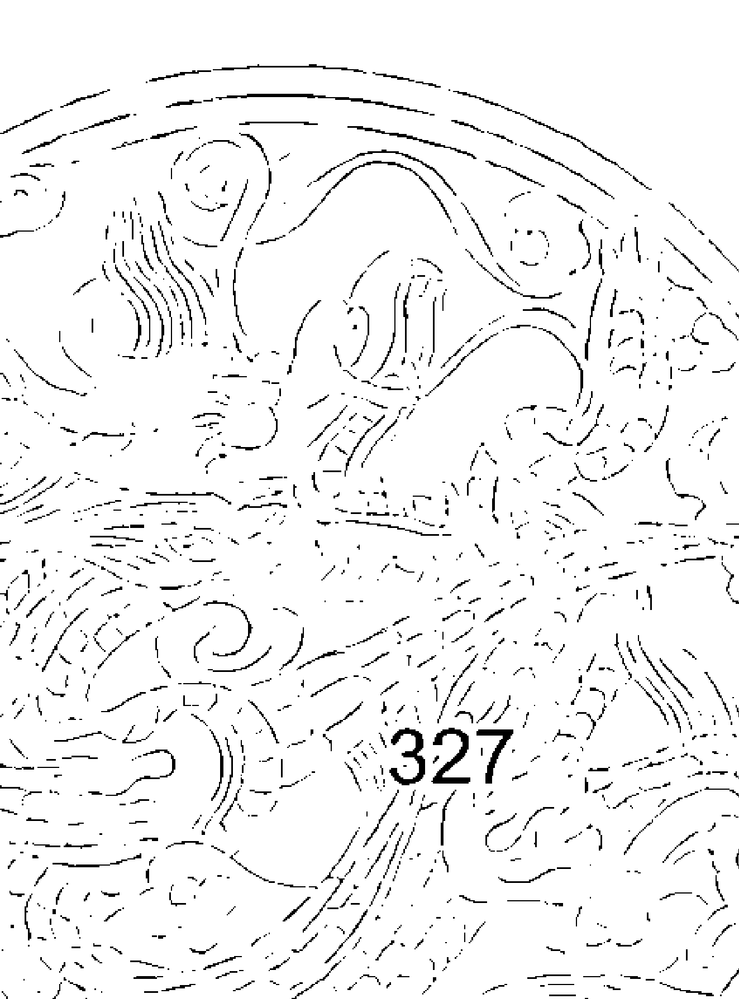

○ 簡易命盤 ：

| 夫 (己)
忌 | 兄 (庚)
23/32 | 命 (辛)
33/42 | 父 (壬)
43/52 |
| :--- | :--- | :--- | :--- |
| 子 (戊)
祿 | 3/12 | | 福 (癸)
53/62 |
| 財 (丁)
兄 | | | 田 (甲)
權 |
| | | | 63/72 |
| 疾 (丙)
夫 | | 遷 (丁)
子
科 | 奴 (丙)
財 |
| | | | 官 (乙)
疾 |
| | | | 73/82 |

- 1. 算命看小孩的宮位「用神」在子女宮。
- 2. 命運是什麼？
算命：命中有沒有小孩的命。
算「存在」時：祿＝權＝科＝忌。
- 3. 上圖命盤，大子有祿星，大夫有忌星，依據「祿隨忌走」的公式得知，可以大子「祿」＋大夫「忌」兩個宮位合起來解釋。
算命分析：依據大子「祿」＋大夫「忌」公式分析，表示33／42大命會奉子成婚。

# 柒、用實例分析，可以增加你看命盤的功力

### （七）無情與有情，為什麼會同時存在？

1. 進階篇第一大公式：
白化與飛星四化一定要回歸「生年四化」
「看」現象、時間、吉凶、內容、影響。

2. 進階篇第二大公式：
「先算」本命命盤有M質。
「才能算」大限命盤有M質。
「最後才算」流年命盤有M質。

3. 進階篇第三大公式：
算命公式：「祿」隨「忌」走。

4. 進階篇第四大公式：
算命解釋：祿星+忌星兩宮位合起來解釋
算命公式：三象一物的重點在媒介的宮位
公式說明：說明在本書的第柒章、第玖章。

詳細命盤：女命 丁未年生 52歲

# 學紫微斗數，這本才能算命

簡易命盤：

| 大父奴 丙 大福遷 | 大田疾 丁 | 大官財 戊 |
| :--- | :--- | :--- |
| 甲 大命官 43/52<br>乙 大父奴<br>忌 | | 己 大奴子<br>權 |
| 癸 大兄田 33/42<br>祿科 | | 庚 大遷夫 |
| 壬 大夫福 23/32 | 癸 大子父 13/22 | 壬 大財命 03/12<br>辛 大疾兄 |

1. 算命看婚姻的宮位「用神」在夫妻宮。

2. 無情與有情，為什麼會同時存在？

3. 怎麼算命與算運？

- (1) 矛盾現象，就是無情與有情的分界點。
- (2) 可以算矛盾現象的人才是真正的高手。
- (3) 切記！所有命盤都會呈現矛盾的現象。

算命：忌星在官祿宮「沖」夫妻宮。
解釋：命中的感情注定會遇到無情的時間。

算運：43 / 52大命夫妻宮有祿星＋忌星在本命官祿宮「沖」夫妻宮，已形成雙忌的公式。

算命分析：依據「祿隨忌走」的公式，表示此大限的婚姻已經進入無情期。

4. 怎麼又會有情呢？

43 / 52大夫有科星，表示雙方一定會因某種原因而有人不想離婚或離婚後繼續來往。

### （八）幸福婚姻=定流年十三個條件

1. 進階篇第一大公式：
白化與飛星四化一定要回歸「生年四化」
「看」現象、時間、吉凶、內容、影響。

2. 進階篇第二大公式：
「先算」本命命盤有M質。
「才能算」大限命盤有M質。
「最後才算」流年命盤有M質。

3. 進階篇第三大公式：
算命公式：「祿」隨「忌」走。
算命解釋：祿星+忌星兩宮位合起來解釋。

4. 進階篇第四大公式：
算命公式：三象一物的重點在媒介的宮位。
公式說明：說明在本書的第柒章、第玖章。

柒、用實例分析，可以增加你看命盤的功力

天 府
12.24.36.48.60.72
丁 巳
大疾 官祿
84 93

左 輔 太 陰 天 同
1.13.25.37.49.61
戊 午
大財 奴僕
74 83

文 昌 文 曲 貪 狼 武 曲
2.14.26.38.50.62
己 未
大子 遷移
64 73

右 弼 門 太 陽
3.15.27.39.51.63
庚 申
大夫 疾厄
54 63

破 軍 廉 貞
11.23.35.47.59.71
丙 辰
大遷 田宅

天 相
4.16.28.40.52.64
辛 酉
大兄 財帛
44 53

天 梁 天 機
5.17.29.41.53.65
壬 戌
大命 子女
34 43

七 殺 紫 微
6.18.30.42.54.66
癸 亥
大父 夫妻
24 33

詳細命盤：女命 戊午年生 41歲

| 祿 → | 祿 → | 太陽 巨門 | 天相 | 大兄 44 / 財 53 | 天機 天梁 (忌) | 大命 34 / 子 43 | 七殺 紫微 | 大父 24 / 夫 33 |
| :--- | :--- | :--- | :--- | :--- | :--- | :--- | :--- | :--- |
| 天府 | 太陰 天同 (權) | 貪狼 武曲 (祿) | 大夫 疾 庚 | | | | | |
| 大疾 官 丁 | 大財 奴 戊 | 大子 遷 己 | | | | | | |
| 大遷 田 丙 | 破軍 廉貞 | | | | | | | |
| 大奴 福 乙 | | | | | | | | |
| 大官 父 甲 | 大田 04 / 命 13 乙 | 大福 14 / 兄 23 甲 | 癸 |

簡單命盤：

1. 這種算命方式是華山派最引以為傲的論述，也是史上最科學的算命。所有人、事、物的因緣都可以應用此方式來表達，成功與失敗都有軌跡可循。
2. 上圖命盤，可以結婚的條件為：結婚條件『條好的男人二○一六年結婚+奉子成婚。

解釋一：34 / 43大命有忌星，因天機星是男星，故表示現在遇到的男人是正緣。
解釋二：34 / 43大財有權星，表示條件好的男人才是正緣。
解釋三：二○一六年流夫有權星，表示二○一六年是結婚的時間。
解釋四：大子有祿星+大夫自化祿+大子自化祿，表示34 / 43大命會奉子成婚。

### （九）保險可以降低意外的傷害嗎？

1. 進階篇第一大公式：
白化與飛星四化一定要回歸「生年四化」 「看」現象、時間、吉凶、內容、影響。

2. 進階篇第二大公式：
「先算」本命命盤有M質。
「才能算」大限命盤有M質。
「最後才算」流年命盤有M質。

3. 進階篇第三大公式：
算命公式：「祿」隨「忌」走。
算命解釋：祿星+忌星兩宮位合起來解釋。

4. 進階篇第四大公式：
算命公式：三象一物的重點在媒介的宮位。
公式說明：說明在本書的第柒章、第玖章。

文曲(忌)
天机
左辅
6.18.30.42.54.66
丙子
大疾
夫妻
權←

破军
紫微
7.19.31.43.55.67
丁丑
大财
兄弟

文昌
右弼
8.20.32.44.56.68
丙寅
大子
命宮
科

天府
9.21.33.45.57.69
丁卯
大夫
父母

太陰
10.22.34.46.58.70
戊辰
大兄
福德

贪狼
廉贞
(權)
11.23.35.47.59.71
己巳
大命
田宅
權

巨门
12.24.36.48.60.72
庚午
大父
官祿

天相
1.13.25.37.49.61
辛未
大福
奴僕

天梁
天同
(科)
2.14.26.38.50.62
壬申
大田
遷移
祿

七杀
武曲
(祿)
3.15.27.39.51.63
癸酉
大官
疾厄

太陽
→忌
4.16.28.40.52.64
甲戌
大奴
財帛

詳細命盤：女命 己未年生 40歲

| 權 | | | 科 |
| :---: | :---: | :---: | :---: |
| 大命 36/45<br>己 田 | 大父 46/55<br>庚 官 | 大福 56/65<br>辛 奴 | 大田 66/75<br>壬 遷 |
| 大兄 26/35<br>戊 福 | | | 祿<br>大官 76/85<br>癸 疾 |
| 大夫 16/25<br>丁 父 | | | 大奴<br>甲 財 |
| 大子 6/15<br>丙 命 | 大財<br>丁 兄 | 忌<br>大疾<br>丙 夫 | 大遷<br>乙 子 |

1. 算命看意外的宮位「用神」在疾厄宮。

2. 學命理相關知識比命理本身更重要，這是絕大多數命理老師不會的學問。
例如，夫妻宮無情，並不代表一定會離婚。假如我已經完成夫妻無情的現象，就不會離婚。此現象會因不同命理老師而有不同的說詞。
在習俗上：被冠上嚇人又無效的改運。
在宗教學上：佛教的意義上有禍福相依之說。
在卜卦學上：卜卦的名詞是「貪生忘剋」。
紫微斗數：化解災厄的方法有「應數或滿數」，可以掌握最大的利益或最小的災厄。

3. 上圖命盤，本疾有祿星+大疾有忌星，依據「祿隨忌走」的公式，表示36／45大限的健康會出現問題，故在對的大命+流年，確定保險可以降低意外的傷害（改運的一種）。

### （十）改運概念，搬家才能找到好工作

1. 進階篇第一大公式：
   白化與飛星四化一定要回歸「生年四化」
   「看」現象、時間、吉凶、內容、影響。

2. 進階篇第二大公式：
   「先算」本命命盤有M質。
   「才能算」大限命盤有M質。
   「最後才算」流年命盤有M質。

3. 進階篇第三大公式：
   算命公式：「祿」隨「忌」走。
   算命解釋：祿星+忌星兩宮位合起來解釋。

4. 進階篇第四大公式：
   算命公式：三象一物的重點在媒介的宮位。
   公式說明：說明在本書的第柒章、第玖章。

| | 右弼 太陽 | 文昌 破軍 | 天機 | 文曲 天府 紫微 權 | |
|---|---|---|---|---|---|
| 10.22.34.46.58.70 | 11.23.35.47.59.71 | 12.24.36.48.60.72 | 1.13.25.37.49.61 | | |
| 乙巳 大官 福德 | 丙午 大奴 田宅 | 丁未 大遷 宮祿 | 戊申 大疾 74 奴僕 83 | | |
| 科← | 武曲 忌 權 | 權 | 權 | 左輔 太陰 科 | |
| 9.21.33.45.57.69 | 科 | 科 | 2.14.26.38.50.62 | | |
| 甲辰 大田 父母 | 天同 | | 己酉 大財 64 遷移 73 貪狼 | | |
| 8.20.32.44.56.68 | 忌 | 庚戌 大子 54 疾厄 63 巨門 | | | |
| 癸卯 大福 04 命宮 13 | 七殺 | 天梁 祿 | 天相 廉貞 | | |
| 7.19.31.43.55.67 | 6.18.30.42.54.66 | 5.17.29.41.53.65 | 4.16.28.40.52.64 | | |
| 壬寅 大父 14 兄弟 23 | 癸丑 大命 24 夫妻 33 | 壬子 大兄 34 子女 43 | 辛亥 大夫 44 財帛 53 祿→ | | |

詳細命盤：女命 壬申年生 27歲

簡易命盤：

| 第一列 | 第二列 | 第三列 | 第四列 |
|--------|--------|--------|--------|
| 大官<br>乙福 | 大奴<br>丙田 | 大遷<br>丁官 | 大疾<br>戊奴<br>權 |
| 大田<br>甲父<br>忌 | 空 | 大財<br>己遷<br>科 | 空 |
| 大福<br>癸命 | 空 | 大子<br>庚疾 | 空 |
| 大父<br>壬兄 | 大命<br>癸夫<br>祿 | 大兄<br>壬子 | 大夫<br>辛財 |

1. 算命看搬家的宮位「用神」在田宅宮。
2. 搬家的公式：
   田宅宮有生年忌星，表示搬家已達60%。
   子女宮有生年忌星，表示搬家已達80%。
3. 搬家會發生什麼事？
   這是命理界第一次的創新，也是命理老師應該學會的基本功夫。
   華山派只應用生年的四顆星，就可以完全「推算」問事者需要的答案。依據的公式為「進階算命」= 生年四化 + 飛星四化 + 自化」。
4. 此命盤，大父又「飛」忌星入本父，更加強。
   算命分析：24/33大命有祿星，本父有忌星「重疊大田」。依據「祿隨忌走」的公式，表示此大命，搬家後事業運才能確定，不搬家，事業的好運不會來臨。

### （十一）大意外的人一定有大意外的命

1. 進階篇第一大公式：
白化與飛星四化一定要回歸「生年四化」
「看」現象、時間、吉凶、內容、影響。

2. 進階篇第二大公式：
「先算」本命命盤有M質。
「才能算」大限命盤有M質。
「最後才算」流年命盤有M質。

3. 進階篇第三大公式：
算命公式：「祿」隨「忌」走。
算命解釋：祿星+忌星兩宮位合起來解釋

4. 進階篇第四大公式：
算命公式：三象一物的重點在媒介的宮位。
公式說明：說明在本書的第柒章、第玖章。

詳細命盤：男命 庚戌年生 49歲

| | 辛 夫 (大遷) | 壬 兄 (大疾) | 癸 命 (大財) 3/12 | 甲 父 (大子) 13/22 |
|---|---|---|---|---|
| 庚 子 (大奴) [祿] | | | 乙 福 (大夫) 23/32 |
| 己 財 (大官) [權] | | | 丙 田 (大兄) 33/42 |
| 戊 疾 (大田) 73/82 | 己 遷 (大福) 63/72 | 戊 奴 (大父) 53/62 | 丁 官 (大命) 43/52 [科] |

1. 算命看大意外的宮位「用神」在命宮+夫宮+疾厄宮+田宅宮。
2. 大意外的公式：命宮可以代表另外十一宮位的現象。疾厄宮有生年忌星，表示意外己達60%。子女宮有忌星「沖」田宅宮，表示意外己經高達80%，形成大意外的條件。
3. 此命盤大意外的原因是什麼？忌星「沖」命宮，表示有大意外的命。本財有祿星，遷移宮化忌星「沖」大財。依據「祿隨忌走」的公式，表示43／52大命會因金錢問題而發生意外之事。
4. 算命重點在清楚分析每一事件的「來龍去脈」與「前因後果」的關係。

### （十二）新歡與舊愛怎麼選擇？

1. 進階篇第一大公式：白化與飛星四化一定要回歸「生年四化」看現象、時間、吉凶、內容、影響。
2. 進階篇第二大公式：「先算」本命命盤有M質。才能算大限命盤有M質。最後才算流年命盤有M質。
3. 進階篇第三大公式：算命公式：「祿」隨「忌」走。
4. 進階篇第四大公式：算命公式：三象一物的重點在媒介的宮位。算命解釋：祿星+忌星兩宮位合起來解釋。公式說明：說明在本書的第柒章、第玖章。

| 7.19.31.43.55.67 丁巳 大父 官祿 44 53 太陽 | 8.20.32.44.56.68 戊午 大福 奴僕 54 63 | 9.21.33.45.57.69 己未 大田 遷移 64 73 科 | 10.22.34.46.58.70 庚申 大官 疾厄 74 83 天府 |
| 6.18.30.42.54.66 丙辰 大命 田宅 34 43 文曲 七殺 武曲 | 5.17.29.41.53.65 乙卯 大兄 福德 24 33 左輔 天梁 天同 | 4.16.28.40.52.64 甲寅 大夫 父母 14 23 | 3.15.27.39.51.63 乙丑 大子 命宮 04 13 |
| 2.14.26.38.50.62 甲子 大財 兄弟 13 | 1.13.25.37.49.61 癸亥 大疾 夫妻 | ... 其他單元格內容 ... | ... 其他單元格內容 ... |

詳細命盤：女命 癸亥年生 36歲

| 丁 官 大福 44/53 | 戊 奴 大田 | 己 遷 大官 (祿) | 庚 疾 大奴 |
| :--- | :--- | :--- | :--- |
| 丙 田 大父 34/43 | | 辛 財 大遷 |
| 乙 福 大命 24/33 | | 壬 子 大疾 (科) |
| 甲 父 大兄 14/23 | 乙 命 大夫 04/13 | 甲 兄 大子 (權) | 癸 夫 大財 (忌) |

簡易命盤：

1. 算命看感情的宮位「用神」在夫妻宮、子女宮、奴僕宮等三個宮位。
2. 感情的分類：夫妻宮看正緣，子女宮看三角關係，奴僕宮看過客的緣分。
3. 感情怎麼算？在一起的時間，決定兩人緣分的長短。分手的時間，決定下一段的感情是誰。
4. 新歡與舊愛怎麼算？新歡，「看」生年祿星、忌星；舊愛，「看」生年權星、科星。
5. 上圖命盤，生年忌星在大財「夫」。算命分析：忌星在大財「夫」，表示舊愛的緣分已盡，此命盤當事人一定會選擇新歡。權星在大子，表示此運有三角關係。

### （十三）一二〇八是訴訟最不利的年

1. 進階篇第一大公式：
白化與飛星四化一定要回歸「生年四化」
「看」現象、時間、吉凶、內容、影響。
2. 進階篇第二大公式：
「先算」本命命盤有M質。
「才能算」大限命盤有M質。
「最後才算」流年命盤有M質。
3. 進階篇第三大公式：
算命公式：「祿」隨「忌」走。
算命解釋：祿星+忌星兩宮位合起來解釋。
4. 進階篇第四大公式：
算命公式：三象一物的重點在媒介的宮位
公式說明：說明在本書的第柒章、第玖章。

| 宮位 | 星曜 | 數字 | 宮位信息 |
|------|------|------|----------|
| 夫妻 | 七殺 紫微 | 11.23.35.47.59.71 | 乙巳 大福 22 31 |
| 兄弟 | 天機 天梁 科 | 12.24.36.48.60.72 | 丙午 大田 31 21 |
| 命宮 | 文昌 文曲 | 1.13.25.37.49.61 | 丁未 大官 02 11 |
| 父母 | 破軍 廉貞 | 2.14.26.38.50.62 | 戊申 大奴 |
| 福德 | 天同 太陰 祿權 | 3.15.27.39.51.63 | 己酉 大遷 |
| 田宅 | 天府 | 4.16.28.40.52.64 | 庚戌 大疾 |
| 官祿 | 武曲 貪狼 | 5.17.29.41.53.65 | 辛亥 大財 82 91 |
| 奴僕 | 太陽 巨門 忌 | 6.18.30.42.54.66 | 壬子 大子 72 81 |
| 遷移 | 右弼 | 7.19.31.43.55.67 | 癸丑 大夫 62 71 |
| 疾厄 | | 8.20.32.44.56.68 | 壬寅 大兄 52 61 |
| 財帛 | | 9.21.33.45.57.69 | 癸卯 大命 42 51 |
| 子女 | 天相 | 10.22.34.46.58.70 | 甲辰 大父 32 41 |

詳細命盤：男命 丁未年生 52歲

※此詳細命盤為42至51歲的大限命盤。

簡易命盤：

*此簡易命盤是52至61歲的大限命盤。

| 乙 夫<br>（大田，22/31，科） | 丙 兄<br>（大官，12/21） | 丁 命<br>（大奴，02/11） | 戊 父<br>（大迁） |
| --- | --- | --- | --- |
| 甲 子<br>（大福，32/41） |  | 己 福<br>（大疾） |  |
| 癸 财<br>（大父，42/51，忌） |  | 庚 田<br>（大财） |  |
| 壬 疾<br>（大命，52/61） | 癸 迁<br>（大兄） | 壬 奴<br>（大夫，禄权） | 辛 官<br>（大子） |

1. 算命看訴訟的宮位「用神」在父母宮。
2. 算訴訟怎麼定位？
先看父母宮，再看你訴訟事件的宮位。
實例：夫妻之訴訟「看」父母宮+夫妻宮。
3. 算流年＝先天命+後天運+事件年。
「先」看先天一生的命：
解答：生年忌星「沖」父母宮，不利訴訟。
「再」看後天十年的運：
解答一：五十一歲本來應該看42／51大限，但大限的最後三年一定要參看下一個大限。
解答二：52／61大命有生年忌星，表示完全不利訴訟，故以和為貴是訴訟最好的句點。
「最後」看事件的流年：
解答：52／61大命有生年忌星，正好「沖」二○一六年，故二○一六年至二○一八年是最不利訴訟的三個流年。

# 捌、十分鐘，讓你知道你的算命功力屬於第幾級

十分鐘，讓你知道你的算命功力屬於第幾級。這是專門為命理老師自我鑑定算命功力的分析，也是命理學進入科學領域必須學會的本事，更是二十一世紀算命應該學會的專業知識。

假如你算命的目的是為了「閒聊打屁」，不僅可以娛樂別人也可以娛樂自己；假如你算命的目的是為了「賺錢餬口」，當自己算命功力不好時，就會延誤他人十年的好運；假如你算命的目的是為了「教學傳承」，當自己算命功力不好時，就會傷害命理學千年來正統的傳承，也會禍延眾生的福報。

### 一、算命功力怎麼分等級？

- 1. 初級程度：
  只會閒聊打屁的算命老師。
  - (1) 只會算「單一現象」的命理老師。
  - (2) 算命實例：
  - (3) 算命實例：
  只能算命格、個性、方向、生肖、五行、數字、顏色……。
  星座老師只能籠統分析人的個性；塔羅牌老師只能簡單分析單一事情；姓名學老師只能簡單籠統……
  分析天格、地格、人格、總格。
  傳統命理老師90%以上是屬於初級的程度。

- 2. 中低級程度：
  - (1) 可以算命兼教學的命理老師。
  可以「確定」每一事件100%吉凶的命理老師。
  例如，可以「確定」今年創業會不會賺錢。
  - (2) 算命實例：
  例如，可以「確定」今年交往的對象會不會結婚。
  傳統命理老師10%屬於中低級的程度。

- 3. 中級程度：
  - (1) 可以幫人規劃未來的命理老師。
  例如，可以算「成功」吉凶+時間+內容。
  例如，可以清楚分析矛盾命盤，哪一年是人事物「緣起與緣滅」的分界點。
  - (2) 算命實例：
  可以精準掌握現在決定的事，未來會發生什麼事？
  例如，可以精準掌握今年三月搬家，事業會發生什麼事？
  - (3) 算命實例：
  例如，可以精準掌握今年十二月生小孩，夫妻的感情會發生什麼事？
  可以精準掌握「吉或凶」從哪一年開始至哪一年結束？
  華山派命理老師70%是中級的程度。

- 4. 高級程度：
  - (1) 可以傳承正統命理學的命理老師。
  - (2) 算命實例：可以規劃人生最大利益，即「現象+吉凶+時間+內容+影響」五種合一。可以精準規劃「賺錢」的事業應該做哪些事？「賺錢」從哪一年開始至哪一年結束。可以精準規劃「正緣」的感情應該做哪些事？「正緣」從哪一年開始至哪一年結束。
  - (3) 算命實例：可以精準掌握第一次事業成功+第二次事業如何延續+應該準備哪些專業本事。這是事業永續經營的基本概念，也是傳統命理老師完全不會的本事。

- 5. 最高級程度：
  - (1) 可以發揚光大命理學的命理老師。可以規劃「現象+時間+吉凶+內容+影響+改運+轉運+宗教」八種合一。
  - (2) 算命實例：可以精準掌握每一事件「富貴」的規劃，從哪一年開始至哪一年結束。可以精準規劃第二種「富貴」的選擇，從哪一年開始至哪一年結束。華山派命理老師5%是最高級的程度。

### 二、算命時，命理老師會說哪些話？

- 1. 初級程度：
  命理老師只能說『簡單、籠統、不準』的事情。
  算命實例：
  - 「算」簡單分析你欠誰的債或與誰無緣。
  - 「算」籠統分析你的個性或個人條件。
  - 「算」完全不準的分析。例如，二〇一七年所生的小孩屬金雞，都可以帶財。
  - 「算」今年有貴人，這個月生肖馬的桃花運強，今天桃花指數與事業有幾顆星。
  - 「算」往東、往西、往南、往北有貴人；往東北、往西南有小人。
  - 「算」命中有小人、貴人、桃花、數字、顏色、喜好、宗教……等初級的算命。

- 2. 中低級程度：
  命理老師只能說『大概、也許、可能是、恐怕，或許、不一定』的事情。
  算命實例：
  - 「算」未來十年有兩次賺錢的機會。
  - 「算」未來三年有機會買房子。
  - 「算」今年有機會交到男朋友。
  - 「算」今年結婚可能會離婚。
  - 「算」今年創業有機會賺錢。

- 3. 中級程度：
  命理老師會說「明確、肯定」會發生的事情。
  算命實例：
  - 「算」現任男朋友是不是正緣？我應該怎麼做？
  - 「算」下一段感情會出現什麼緣分？我應該怎麼做？
  - 「算」今年分手的感情會不會複合？我應該怎麼做？
  - 「算」今年結婚會發生什麼事？我應該怎麼做？
  - 「算」今年搬家會發生什麼事？我應該怎麼做？
  - 「算」今年創業會不會賺錢？我應該怎麼做？

- 4. 高級程度：
  命理老師可以規劃「未來、影響」最大利益的事情。
  算命實例：
  - 「算」創業賺錢的時間從哪一年開始至哪一年結束，我應該怎麼規劃未來？
  - 「算」我的三角關係從哪一年開始至哪一年會結束，我應該怎麼規劃未來？
  - 「算」生小孩帶財或帶衰？從哪一年開始至哪一年結束，我應該怎麼規劃未來？
  - 「算」攻擊我的人會持續幾年？何時會結束？我應該怎麼規劃未來？
  - 「算」二〇一七年不結婚會影響我未來什麼事？我應該怎麼規劃未來？

- 5. 最高級程度：
  命理老師可以規劃「最大、最多、最高」富貴丁壽的事情。
  算命實例：
  - 「算」怎麼規劃未來？才能掌握最好的事業運，「賺錢」從哪一年開始至哪一年結束。
  - 「算」怎麼規劃未來？才能掌握條件最好的人，「緣分」從哪一年開始至哪一年結束。
  - 「算」怎麼規劃未來？才能掌握貴人相助的時間，「貴人」從哪一年開始至哪一年結束。
  - 「算」怎麼規劃未來？才能掌握避開意外災厄運，「改運」從哪一年開始至哪一年結束。
  - 「算」怎麼規劃未來？才能掌握事業永續的經營，「轉運」從哪一年開始至哪一年結束。

### 三、「華山派九式秘笈」看算命功力

#### 第一式「看不到山」：
- 1. 我現在算命的等級：初級。
- 2. 未來應該培養的本事：我應該學會每一事件都有時間+吉凶的觀念。
  算命功力分析：我只會簡單籠統的算命中注定的事，或單一事物的分析，所以，對於沒有把握的事，我算命時只能選擇東扯西扯的亂算。
  紫微斗數分析：我只能分析紫微斗數的星辰，也知道有飛星四化或生年四化的基本常識。
  傳統派命理老師85%以上是屬於第一式的等級。

#### 第二式「看山是山」：
- 1. 我現在算命的等級：初級。
  算命功力分析：我開始進入人事物的現象分析，也知道每一事件應該怎麼分類。
  紫微斗數分析：已經知道生年四化或飛星四化的「時間+吉凶」才能精準算命。
  傳統派命理老師10%是屬於第二式的等級。
- 2. 未來應該培養的本事：我應該學會「本命命盤+大限命盤+算流年」的觀念。

#### 第三式「看山不是山」：
- 1. 我現在算命的等級：中低級。
  算命功力分析：我開始學習每一事件「時間+吉凶」的精準分析。
  紫微斗數分析：開始學習「生年四化+飛星四化+自化」對每一事件的影響。
- 2. 未來應該培養的本事：我應該學會怎麼精準掌握未來每一事件的吉凶？
  華山派命理老師百分之百是屬於第四式的等級。

#### 第四式「看山又是山」：
- 1. 我現在算命的等級：中低級。
  算命功力分析：我已經學會每一事件的『體+用』確定後，才能算吉凶。
  紫微斗數分析：開始學習『時間+吉凶+流年』三種合一確定後，才能算生肖。
- 2. 未來應該培養的本事：我應該開始學習每一事件的成功，『內容』是最重要的關鍵。
  華山派命理老師80%是屬於第五式的等級。

#### 第五式『移步自幻形』：
- 1. 我現在算命的等級：中級。
  算命功力分析：我已經學會天時的觀念，每一事件『決定時間』才是成功的關鍵。
  紫微斗數分析：開始學會分析因緣果報，不是有什麼『因』就會得什麼『果』，而是時間+生肖決定了你的果報。這裡的『緣』表示你決定的時間+遇到的生肖，才是成功的關鍵。
- 2. 未來應該培養的本事：我應該學會『宮宮皆命宮，宮宮皆太極』的觀念；也就是任何宮位都可以變成命宮，任何宮位都可以代表其他的十二宮位。
  華山派命理老師40%是屬於第六式的等級。

#### 第六式『宮宮皆天地』：
- 1. 我現在算命的等級：中級。
  算命功力分析：我已經學會掌握『時間+吉凶+內容』才是成功的關鍵，『天時+地利+人和』。
- 2. 未來應該培養的本事：我應該學會「盡性盡命」的觀念，也就是要學會每一事件的吉凶從哪一年開始至哪一年結束？
  紫微斗數分析：已經學會每一事件吉凶的分界點在哪一年？每一事件的吉凶從哪一年開始至哪一年結束？才是富貴的保證。
  華山派命理老師20%是屬於第七式的等級。

#### 第七式『盡性轉乾坤』：
- 1. 我現在算命的等級：高級。
  算命功力分析：我已經學會命理學的高級課程「終究論」，也就是「本來就如此」，並不是一般人「怎麼會這樣？」的觀念。切記！凡事一開始並沒有對與錯、是與非、吉凶的緣分，而是當你決定事情後，才會形成「對錯、是非、吉凶」的緣分。
  規劃未來十年的最大利益？怎麼選擇未來十年第一種的好運？
- 2. 未來應該培養的本事：我應該學會「盡性盡命」的觀念，也就是要學會每一事件的吉凶從哪一年開始至哪一年結束？
  要配合完整的事前規劃，即「成功」決定時間+三個條件。

#### 第八式「華山傳心法」：
- 1. 我現在算命的等級：最高級。
  算命功力分析：我已經學會隨心所欲的算命，也就是在每個當下都可以幫『人』逢凶化吉、幫『事』趨吉避凶、幫『物』招財進庫。
  紫微斗數分析：華山派集合『現象+時間+吉凶+內容+影響+改運+轉運+宗教』八種合一的算命方式，已經成為所有命理老師學習的典範。
- 2. 未來應該培養的本事：華山派緣起於傳統命理學不能滿足現代人多元化的思維。華山派以正統『傳承』自居，以『競爭』環境為規劃、以『科學』公式為基礎，以『算運』思維幫人規劃人生的最大利益。華山派集『現象+時間+吉凶+內容+影響+改運+轉運+宗教』等八種現代科學命理學之大成。

#### 第九式『萬法歸華山』：

# 玖、看懂這些訣竅，「算命」功力會增加十倍

「命」是命中註定的定數，所以，上天安排的人事物最容易成功。

「運」是環境自己的選擇，所以，可以選擇自己決定的人生方向。

從來沒有人知道學會算命原來是那麼簡單的事，只要四顆星辰就可以完整的算命，這是多麼不可思議的事啊！華山派第一次公開命理學千年之秘，內心充滿喜悅。希望命理界共同努力，讓專業的命理學快速進入學術之林。祿星、權星、科星、忌星（四化星）是學習算命最重要的推手，也是命理老師算命邁進第二層的依據與第三層的關鍵。

四顆星辰要怎麼算命呢？本篇即針對算命的技巧，依序分析算命應該學會的事。
- 1. 天意是什麼？本篇突顯順天意，才是人生最大的利益。
- 2. 算命必學的四大公式，本篇突顯命理學是公式化與系統化的專業學問。
- 3. 每個人都天生都有富貴的好命格，本篇突顯傳統命理老師對「命格」說詞的誤解。
- 4. 算命不是統計學，本篇突顯傳統命理老師的不專業，讓一般人對命理產生錯誤的觀念。
- 5. 怎麼規劃人生的最大利益？本篇突顯華山派的算命方式，將引領科學命理時代的潮流。

### 一、「天意」是什麼？

一般人總會說：「怎麼會這樣？為什麼會這樣？」，其實，這是不懂命理學內涵的說法。真正的天意是：「本來就這樣！一切因緣在冥冥中早已安排了。」
是啊！上天安排的事總是那麼的巧妙。你違背天意，他就讓你懷才不遇、讓人跌落谷底。為什麼人要經歷一連串的折磨？因為你違背天意。你順了天意，他就讓你節節高升、讓你順心如意。為什麼有人會平步青雲？因為你順了天意。
天意的軌跡有一定的行走方向。富貴貧賤緣起於先天命中優勢的天性；得失吉凶則來自後天自己選擇的行業。

#### (二) 天意的定義

- 1. 天意是什麼？
  天意：就是命中注定的事。
  天意：就是順天意，就是善因緣。天意的軌跡有一定行走的方向。

- 2. 天意的公式有哪些？
  天意：就是四化十六爻兩種合起來的解釋。因為，四六合乃天之心。
  四化星＝祿星、權星、科星、忌星＝M質，論述命中注定的事。
  六爻星＝祿權、祿科、祿忌、權科、權忌、科忌，論述命中最優勢的個人特質。

- 3. 每個人都有兩種自己選擇的人生故事。
  第一種，是「上天安排」的人生故事，這是由「生年四化」所組成的公式，人事物的因緣會事半功倍。第二種，是「自己選擇」的人生故事，這是由「飛星四化」所組成的公式，人事物的因緣會事倍功半。算命分析：上天安排的人生故事，例如，正牌工廠出產的汽車，一定符合正廠規格的商品，所以壽命比較長久。自己選擇的人生故事，例如，副牌工廠出產的汽車，這是東拼西湊的綜合產物，所以壽命比較短暫。

#### （二）現在發生的事和天意有關嗎？

- 1. 現在發生的事確定和天意有關。你現在所發生的事都是天意的巧妙安排，所以，你的運命會跟著生年四化的公式而行。
- 2. 命盤顯示的事確定和天意有關。當下所發生的大事就是天意，你的「本命命盤」可以顯示你應該如何掌握一生的事。
- 3. 人生規劃的事確定和天意有關。當下所發生的大事就是天意，你的「流年吉凶」可以顯示你應該如何改變今年的事。
  沒有人可以逃得過上天的安排，華山派知道「下一步」你會發生什麼事？應該怎麼做？
  沒有人可以逃得過上天的安排，華山派知道「下一步」應該怎麼規劃自己的人生？順應天意，可以「延長」你人生的好運，也可以「縮短」你人生的壞運。違背天意，可以「縮短」你人生的好運，也可以「延長」你人生的壞運。
- 4. 好壞運的選擇確定和天意有關。

#### （三）怎麼算「命中注定」的人生故事？

- 1. 生年四化就是論述命中注定的天意。這是上天安排的人生故事。這是事半功倍的人生選擇。
- 2. 祿權科忌（四化星）+自化的公式，就是命中注定、上天安排的天意。這是生涯規劃的人生選擇。這是富貴丁壽的人生故事。

#### （四）怎麼算「自己選擇」的人生故事？

- 1. 飛星四化就是論述命中強求的天意。這是自己選擇的人生故事。這是事倍功半的人生選擇。
- 2. 本命命盤的宮位天干所飛出的「四化星」入其他十一宮位，就是自己選擇的人生規劃，但還是在上天安排的第一種軌跡範圍內。

#### （五）天意的實例分析：

女命 己未年生 40歲

這是得失吉凶的人生選擇。

這是短期利益的人生故事。

紫微斗數命盤：

| 宮位 | 天干地支 | 數字 | 星曜 |
|------|----------|------|------|
| 大夫/父母 | 己巳 | 13/22 | 文曲(忌)、太陽 |
| 大兄/福德 | 庚午 | 23/32 | 破軍 |
| 大命/田宅 | 辛未 | 33/42 | 天機、左輔、右弼(科) |
| 大父/官祿 | 壬申 | 43/52 | 紫微、天府、文昌、太陰(科) |
| 大子/命宮 | 戊辰 | 03/12 | 武曲(祿)、天同(權) |
| 大福/奴僕 | 癸酉 | 53/62 | 貪狼(權) |
| 大財/兄弟 | 丁卯 | - | 七殺 |
| 大田/遷移 | 甲戌 | 63/72 | 巨門 |
| 大疾/夫妻 | 丙寅 | - | 天梁(科) |
| 大遷/子女 | 丁丑 | - | 天相、廉貞 |
| 大奴/財帛 | 丙子 | 83/92 | 忌 |
| 大官/疾厄 | 乙亥 | 73/82 | - |

#### ○ 簡易盤：

| 己 | 大夫 父 13/22 | 大兄 福 23/32 | 大命 田 33/42 | 大父 官 |
| --- | --- | --- | --- | --- |
| 戊 | 大子 命 3/12 |  | 大福 奴 |  |
| 丁 | 大財 兄 |  | 大田 遷 |  |
| 丙 | 大疾 夫 | 大遷 子 | 大奴 財 | 大官 疾 |

四化星所在的宮位就是天意。
- 1. 四化星＝祿星、權星、科星、忌星，統稱「M質」。
- 2. 任何一顆四化星都可以代表M質，M質所在的宮位就可算命。有下列幾種方式：
  天意論：M質就是算命中注定的事。
  定數論：M質的天意有一定的行走軌跡。
  存在論：M質的宮位一定會產生緣分。
  物質不滅定律：M質就是有其象必有其物。
- 3. 上圖實例分析：
  祿星在命宮：表示自己有條件後才會得到貴人相助。
  權星在遷移宮：表示出外歷練是事業成功的關鍵。
  科星在子女宮：命中有兒子，天梁是男星。
  忌星在父母宮：表示公職、老師、創業……，都是人生好的選擇之一。

#### 簡易盤：

| 簡易盤 | 破軍 | 右弼左輔天機 | 天府紫微 |
|---|---|---|---|
| 文曲太陽(忌) 夫父 13/22 (己) | 大兄福 23/32 (庚) | 大命田 33/42 (辛) | 大父官 (壬) |
| 武曲(祿) 大子命 3/12 (戊) | | 大福奴 (癸) | 文昌太陰 |
| 天同 大財兄 (丁) | | 大田遷 (甲) | 貪狼(權) |
| 七殺 大疾夫 (丙) | 天梁(科) 大遷子 (丁) | 天廉相貞 大奴財 (丙) | 巨門 大官疾 (乙) |

○ 簡易盤：
- 1. 四化星＝祿星、權星、科星、忌星，統稱「M質」。
- 2. 自化與飛星四化一定要回歸生年四化來看因緣，稱為「法象」。
- 3. 自化可以影響到生年四化的時間、吉凶、內容、改運、轉運：……等一切因緣。
- 4. 上圖本命命盤分析：
  算命實例：自化權在本官，法象在本遷：
  自化權星在本命命盤的官祿宮，法象在本命命盤的遷移宮，表示出外才能找到貴人相助。
  算命實例：自化忌在本父，法象在本父：
  自化忌星在本命命盤的父母宮，法象在本命命盤的父母宮，表示命中的事業，一定要經歷兩次以上的失敗，才能進入成功。
- 5. 四化星＋自化就是天意行走的軌跡，這是人生最大利益的選擇之一。

### 二、算命必學的四大公式

公式化與系統化的現代科學命理學，長久以來一直是華山派堅持的優良傳統，也是愛好命理者的共同心願。它不但讓初學者快速進入命理的神祕世界，也讓進階者有正確的公式為依據，更讓有心從事命理業者學會真正的專業知識與欣賞命理之美。

現就怎麼快速學會算命的四大公式分析如下：

生年四化『四化星』：祿星、權星、科星、忌星。

#### 算命必學的四大公式：
- 1. 第一大公式：緣起『祿』、緣變『權』、緣續『科』、緣減『忌』的應用。
  算命分析：可以算人事物往上與往下的轉捩點，與人事物開始與結束的分界點。
- 2. 第二大公式：緣『祿』、業『權』、情『科』、債『忌』的應用。
  算命分析：以宗教的觀點，可以算眾生前世的因緣，怎麼轉變成今生折磨的生肖。
- 3. 第三大公式：慈『祿』、悲『權』、喜『科』、捨『忌』的應用。
  算命分析：以宗教的觀點，可以算眾生累世的因緣，怎麼轉變成利益眾生的自己。
- 4. 第四大公式：四化十六爻的組合形成了三象一物的應用。
  算命分析：可以算人事物每一事件的時間+吉凶+內容+影響。

#### （一）算命的第一大公式「緣起、緣變、緣續、緣減」

四化星：祿星＝緣起，權星＝緣變，科星＝緣續，忌星＝緣減。

# 玖、看懂這些訣竅，「算命」功力會增加十倍

- 1. 以學術的角度：
  - 祿星 ＝ 緣起，表示人事物的利益，一定要經過「棄舊迎新」後，才能得到好因緣。
  - 權星 ＝ 緣變，表示人事物的利益，一定要經過「強求強要」後，才能得到好因緣。
  - 科星 ＝ 緣續，表示人事物的利益，一定要經過「再續前緣」後，才能得到好因緣。
  - 忌星 ＝ 緣滅，表示人事物的利益，一定要經過「緣盡緣滅」後，才能得到好因緣。

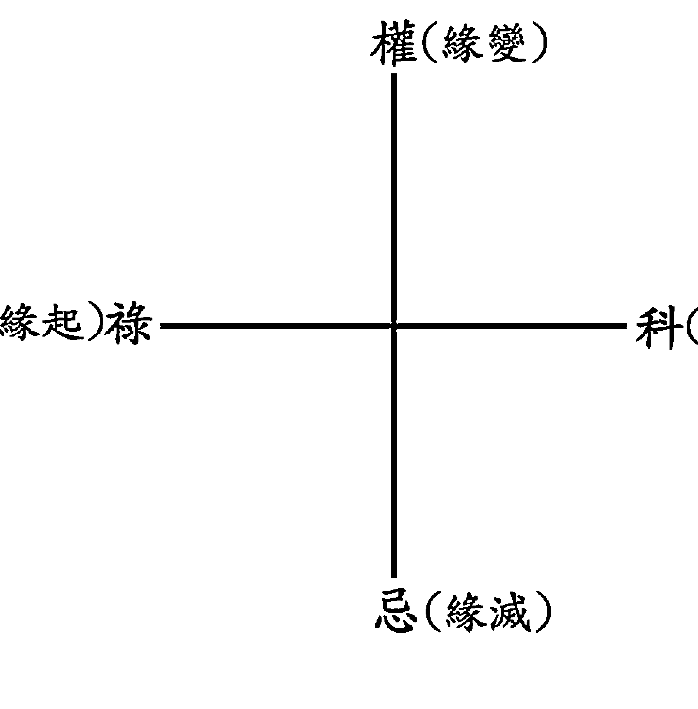

任何十二宮位有四化星時，我應該怎麼算命？

### 2.算命實例：算感情時

大命（大限）命盤的用神宮位遇到祿星，表示算命的當事人會選擇「新歡」的對象。

大命（大限）命盤的用神宮位遇到權星，表示算命的當事人會選擇「才華」的對象。

大命（大限）命盤的用神宮位遇到科星，表示算命的當事人會選擇「舊愛」的對象。

大命（大限）命盤的用神宮位遇到忌星，表示算命的當事人會選擇「直覺」的對象。

### 3.「用神」怎麼看？

算命用神：算感情「看」大限的夫妻宮；算三角關係「看」大限的子女宮。

算命實例：大限夫妻宮有祿星，表示算命的當事人此大限十年會選擇「新歡」，而轉向新歡的身

算命實例：大限夫妻宮有科星，表示算命的當事人此大限十年會選擇「舊愛」，而回到舊愛的身

# 玖、看懂這些訣竅，「算命」功力會增加十倍

天相 天梁 七廉殺貞
11.23.35.47.59.71 12.24.36.48.60.72 1.13.25.37.49.61 2.14.26.38.50.62
乙巳 大父奴僕 丙午 大福遷移 丁未 大田疾厄 戊申 大官財帛
文曲巨門忌 祿 
10.22.34.46.58.70 3.15.27.39.51.63
甲辰 大命官祿 己酉 大奴子女
貪狼紫微 權 文昌天同權
9.21.33.45.57.69 4.16.28.40.52.64
癸卯 大兄田宅 庚戌 大遷夫妻
左輔太陰天機祿科 權忌 天府 右弼太陽 破軍武曲
8.20.32.44.56.68 7.19.31.43.55.67 6.18.30.42.54.66 5.17.29.41.53.65
壬寅 大夫福德 癸丑 大子父母 壬子 大財命宮 辛亥 大疾兄弟

○女命 丁未年 52歲

## 简易命盘：

| 乙 | 丙 | 丁 | 戊 |
|---|---|---|---|
| 大父<br>奴 | 大福<br>遷 | 大田<br>疾 | 大官<br>財 |
| (忌) |  |  |  |
| 甲<br>大命<br>官<br>43/52 |  |  | 己<br>大奴<br>子 |
|  |  |  | (權) |
| 癸<br>大兄<br>田<br>33/42 |  |  | 庚<br>大遷<br>夫 |
| (祿)(科) |  |  |  |
| 壬<br>大夫<br>福<br>23/32 | 癸<br>大子<br>父<br>13/22 | 壬<br>大財<br>命<br>03/12 | 辛<br>大疾<br>兄 |

## 華山派算命的第一大公式

- 1. 四化星‖祿星、權星、科星、忌星。
- 2. 算命的第一大公式是緣起、緣變、緣續、緣滅，這是算命的基礎功夫。
- 3. 算命怎麼算緣起、緣變、緣續、緣滅？
  - 生年祿星：表示人事物的因緣會「緣起」。
  - 生年權星：表示人事物的因緣會「緣變」。
  - 生年科星：表示人事物的因緣會「緣續」。
  - 生年忌星：表示人事物的因緣會「緣滅」。
- 4. 上圖命盤怎麼算命？
  - 祿星在福德：表示家人互助的因緣會緣起。
  - 權星在夫妻：表示夫妻間的事業與姻緣會緣變。感情好，事業好；感情差，事業就差。
  - 科星在福德：表示家人互動的因緣會緣續。
  - 忌星在官祿：表示第一次的好運會很快緣滅，必須經歷失敗的事業才能長久經營。

### 1. 以宗教的角度：

- 祿星||緣，前世緣，今生分，即緣與分，表示今生要完成的功課是「分別心」的因緣。
- 權星||業，前世業，今生障，即業與障，表示今生要完成的功課是「承擔心」的因緣。
- 科星||情，前世情，今生愛，即情與愛，表示今生要完成的功課是「愛人心」的因緣。

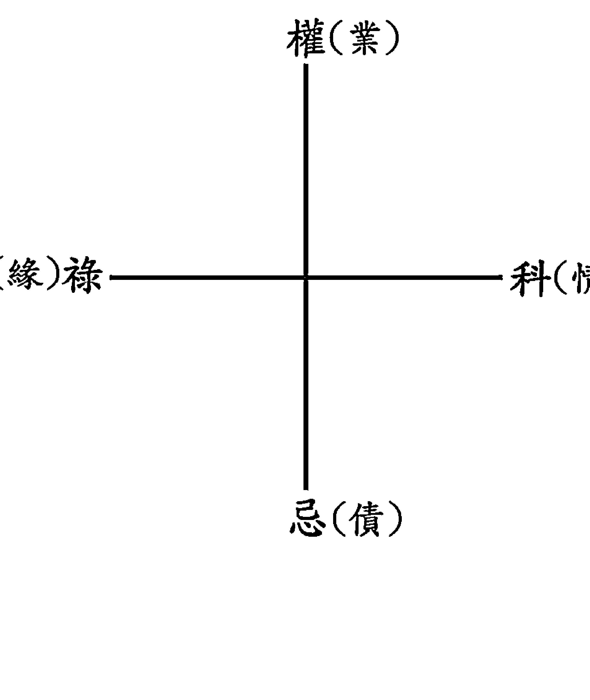

#### （二）算命的第二大公式「緣、業、情、債」

四化星：祿星||緣，權星||業，科星||情，忌星||債。任何十二宮位有四化星時，我應該怎麼算命？

### 2.算命實例：算事業時

- 大命（大限）命盤的用神宮位遇到祿星，表示一定要具備「廣緣」的心態，事業才能成功。
- 大命（大限）命盤的用神宮位遇到權星，表示一定要具備「往上」的心態，事業才能成功。
- 大命（大限）命盤的用神宮位遇到科星，表示一定要具備「良心」的心態，事業才能成功。
- 大命（大限）命盤的用神宮位遇到忌星，表示一定要具備「還債」的心態，事業才能成功。

忌星＝債，前世債，今生還，即債與還，表示今生要完成的功課是「還債心」的因緣。

### 3.「用神」怎麼看？

算命用神：算事業「看」大限的官祿宮；算感情「看」大限的夫妻宮。

算命實例：大限官祿宮有權星，表示算命的當事人此大限十年有升官或創業的好運。

算命實例：大限夫妻宮有忌星，表示算命的當事人，此大限十年會遇到薄情郎，但千萬不要怨恨，否則，感情的緣分會再次輪迴。

# 玖、看懂這些訣竅，「算命」功力會增加十倍

| 貪狼 | 廉貞 | 巨門 | 天相 | 天梁(祿) | 天同 |
|---|---|---|---|---|---|
| 10.22.34.46.58.70 | 11.23.35.47.59.71 | 12.24.36.48.60.72 | 1.13.25.37.49.61 | 86.95 | 76.85 |
| 乙巳 大田/父母 | 丙午 大官/福德 | 丁未 大奴/田宅 | 戊申 大遷/官祿 | 己酉 大疾/奴僕 | 庚戌 大財/遷移 |
| 9.21.33.45.57.69 | 左輔(科) 太陰 | 科 | 祿 | 七殺 武曲(忌) | 右弼 太陽 |
| 甲辰 大福/命宮 06 15 | 天府 | 權 | 忌 | 辛亥 大子/疾厄 56 65 | 壬子 大夫/財帛 46 55 |
| 8.20.32.44.56.68 | 文曲 | 文昌 天機 | 壬寅 大命/夫妻 26 35 | 癸丑 大兄/子女 36 45 | 紫微 破軍(權) |

## 標準命盤：

- 1. 四化星＝祿星、權星、科星、忌星。
- 2. 算命的第二大公式是緣、業、情、債，這是算宗教的基礎功夫。
- 3. 以宗教角度，怎麼算緣、業、情、債？
  - 生年祿星：命中人事物的因緣有「緣」分。
  - 生年權星：命中人事物的因緣有「業」障。
  - 生年科星：命中人事物的因緣有「情」意。
  - 生年忌星：命中人事物的因緣有「債」務。
- 4. 上圖命盤怎麼算命？
  - 祿星在官祿：表示命中必須更換兩次以上的工作，才會遇到好的緣分。
  - 權星在子女：表示命中有成就子女的業。
  - 科星在命宮：表示命中與眾生的因緣有情。
  - 忌星在奴僕：表示命中成也朋友，敗也朋友，朋友之間互相欠債是前世的因緣。

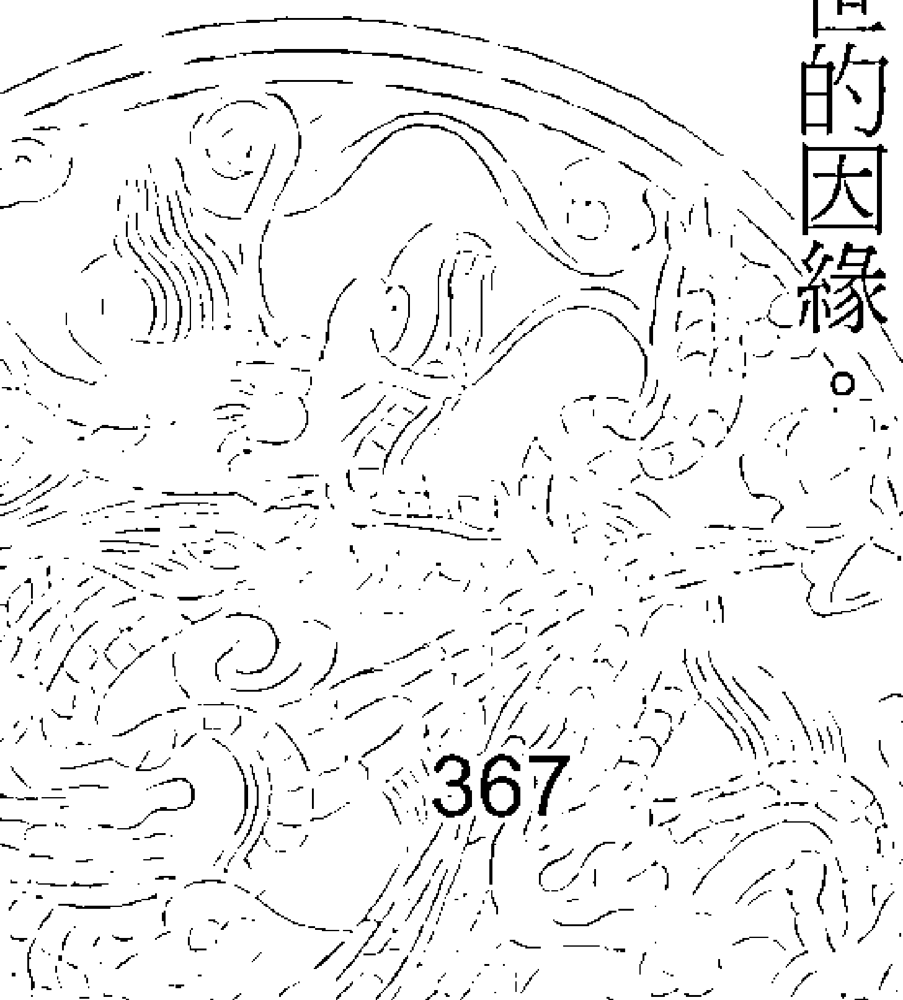

#### （三）算命的第三大公式「慈、悲、喜、捨」

四化星：祿星＝慈，權星＝悲，科星＝喜，忌星＝捨。任何十二宮位有四化星時，我應該怎麼算命？

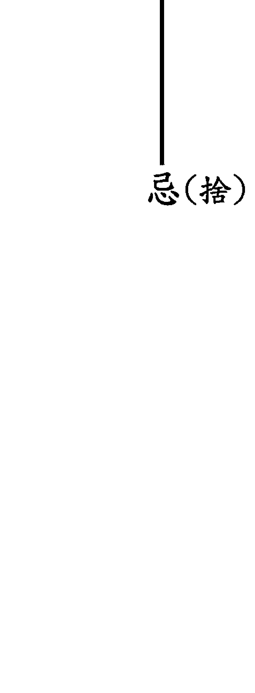

- 1. 以佛教的角度：
  - 祿星＝慈，前世緣，今生慈，即緣與慈，表示今生要完成的功課是「廣結善緣」的因緣。
  - 權星＝悲，前世業，今生悲，即業與悲，表示今生要完成的功課是「忍辱負重」的因緣。
  - 科星＝喜，前世情，今生喜，即情與喜，表示今生要完成的功課是「積善人家」的因緣。

### 2.算命實例：算事業時。

忌星＝捨，前世債，今生捨，即債與捨，表示今生要完成的功課是「布施積德」的因緣。

大命（大限）命盤的用神宮位遇到祿星，表示要具備「慈愛」的心態，事業才能成功。

大命（大限）命盤的用神宮位遇到權星，表示要具備「忍辱」的心態，事業才能成功。

大命（大限）命盤的用神宮位遇到科星，表示要具備「積善」的心態，事業才能成功。

大命（大限）命盤的用神宮位遇到忌星，表示要具備「布施」的心態，事業才能成功。

### 3.「用神」怎麼看？

算命用神：算子女「看」大限的子女宮；算與老闆的關係「看」大限的父母宮。

算命實例：大限子女宮有祿星，表示算命的當事人此大限十年對兒女的管教，一定要隨機應變，

算命實例：大限父母宮有權星，表示算命的當事人此大限十年對老闆要求的業績，一定要察覺出老闆對你的期待很深。


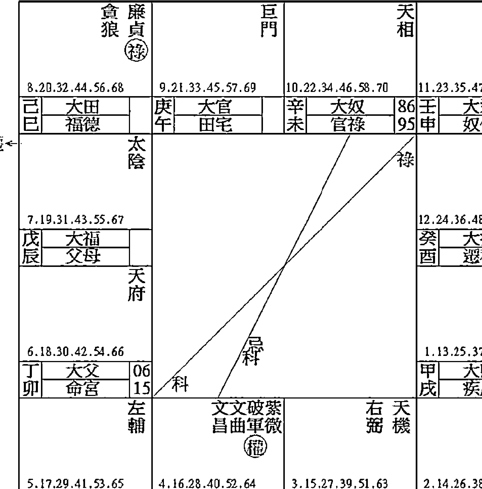

## 標準命盤：

## 華山派算命的第三大公式

- 1. 四化星‖祿星、權星、科星、忌星。
- 2. 算命的第三大公式是慈、悲、喜、捨，這也是算宗教的基礎功夫。
- 3. 以佛教角度怎麼算慈、悲、喜、捨？
- 4. 上圖命盤怎麼算命？

生年祿星：命中人事物的因緣要「慈」慧。

生年權星：命中人事物的因緣要「悲」天。

生年科星：命中人事物的因緣要「喜」悅。

生年忌星：命中人事物的因緣要「捨」得。

才是成就事業的大關鍵。

### (四) 算命的第四大公式「三象一物」

#### 1.三象一物是什麼？

三象一物的定義：雙象命盤十第二顆星辰，就是三象一物。
三顆星辰的定義：一個宮位有三顆四化星時，因為，祿忌一組，權科一組之故，故另外一顆星辰，就可以形成三象一物的條件。
媒介宮位的定義：一個宮位有兩顆四化星（祿星、權星、科星、忌星），任何兩顆星辰都可以，第三顆星辰就是「媒介」的宮位。

#### 2.三象一物的媒介在哪裡？

三象一物的媒介宮位共分六種，沒有忌星的雙象命盤，媒介在忌星的宮位。

- 「祿權同宮」的媒介在忌星的宮位。
- 「祿科同宮」的媒介在忌星的宮位。
- 「祿忌同宮」的媒介在權星的宮位。
- 「權科同宮」的媒介在忌星的宮位。
- 「權忌同宮」的媒介在科星的宮位。
- 「科忌同宮」的媒介在祿星的宮位。

#### 3.媒介的宮位可以「算」什麼事？

- 媒介的宮位可以「算」人生成功的重點是什麼？
- 媒介的宮位可以「算」人生成功的方法是什麼？
- 媒介的宮位可以「算」人生好運的時間在何時？
- 媒介的宮位可以「算」？

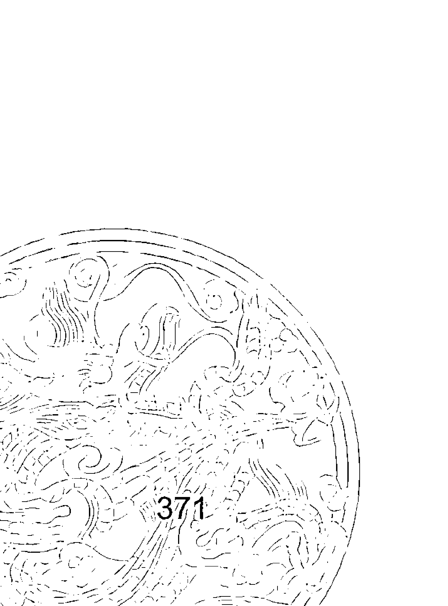

#### 4.三象一物的實例分析：

- 媒介的宮位可以「算」人生轉機的時間點在何時？

- 媒介的宮位可以「算」人生最大成就要做什麼事？

- 媒介的宮位可以「算」有緣無份的感情何時會發生？

- 媒介的宮位可以「算」真命天子（天女）何時會出現？

- 媒介的宮位可以「算」真命天子（天女）何時可以修成正果？

- 媒介的宮位可以「算」上天安排的成功路應該怎麼正確規劃？

- 媒介的宮位可以「算」人生再創高峰要做什麼事？在何時會發生？

# 玖、看懂這些訣竅，「算命」功力會增加十倍

| 宫位 | 星曜 | 数字序列 | 干支 | 宫名 | 数字范围 |
|------|------|----------|------|------|----------|
| 巳 | 文曲(忌), 太阳 | 11,23,35,47,59,71 | 巳 | 大夫, 父母 | 13,22 |
| 午 | 破军 | 12,24,36,48,60,72 | 庚 | 大兄, 福德 | 23,32 |
| 未 | 右弼,左辅,天机 | 1,13,25,37,49,61 | 辛 | 大命, 田宅 | 33,42 |
| 申 | 紫微,天府 | 2,14,26,38,50,62 | 壬 | 大父, 官禄 | 43,52 |
| 酉 | 文昌,太阴 | 3,15,27,39,51,63 | 癸 | 大福, 奴仆 | 53,62 |
| 戌 | 贪狼(权) | 4,16,28,40,52,64 | 甲 | 大田, 迁移 | 63,72 |
| 亥 | 巨门 | 5,17,29,41,53,65 | 乙 | 大官, 疾厄 | 73,82 |
| 子 | 廉贞,天相 | 6,18,30,42,54,66 | 丙 | 大奴, 财帛 | 83,92 |
| 丑 | 天梁(科) | 7,19,31,43,55,67 | 丁 | 大迁, 子女 | - |
| 寅 | 七杀 | 8,20,32,44,56,68 | 丙 | 大疾, 夫妻 | - |
| 卯 | 天同 | 9,21,33,45,57,69 | 丁 | 大财, 兄弟 | - |
| 辰 | 武曲(禄) | 10,22,34,46,58,70 | 戊 | 大子, 命宫 | 03,12 |

○女命 己未年 40歲


| 己 (大夫/父) 13/22 | 庚 (大兄/福) 23/32 | 辛 (大命/田) 33/42 | 壬 (大父/官) |
| :--- | :--- | :--- | :--- |
| 戊 (大子/命) 3/12 | | | 癸 (大福/奴) |
| 丁 (大财/兄) | | | 甲 (大田/迁) |
| 丙 (大疾/夫) | 丁 (大迁/子) | 丙 (大奴/财) | 乙 (大官/疾) |

「三象一物」怎麼算命？
1. 三象一物是什麼？
解釋：雙象命盤＋第三顆星辰。
2. 雙象命盤的第三顆星辰就是媒介宮位。
3. 三象一物可以算什麼事？
* 媒介的宮位，可以算人生的重點在哪裡？
* 媒介的宮位，可以算十年好運的時間點。
* 媒介的宮位，可以算瓶頸點的突破方法。
4. 本命命盤怎麼算三象一物？
雙象命盤：命宮有祿星＋遷移宮有權星，就會形成雙象的命盤。
媒介宮位：祿權命盤的媒介在忌星（父）。
命盤解釋：祿權一組代表此人是尊星高照的命格，人生的重點在父母宮，表示事業最大的成就就是在公職上班。

# 玖、看懂這些訣竅，「算命」功力會增加十倍

| 宫位 | 宫位 | 宫位 | 宫位 |
|------|------|------|------|
| 天梁<br>6.18.30.42.54.66<br>辛巳 大疾 命宮 04 13 | 七杀<br>7.19.31.43.55.67<br>壬午 大財 父母 14 23 | 8.20.32.44.56.68<br>癸未 大子 福德 24 33 | 廉贞<br>9.21.33.45.57.69<br>甲申 大夫 田宅 34 43 |
| 紫微天相文昌<br>5.17.29.41.53.65<br>庚辰 大遷 兄弟 | 科 | [连线] | 文曲破军<br>10.22.34.46.58.70<br>乙酉 大兄 官祿 44 53 |
| 巨門天機<br>4.16.28.40.52.64<br>己卯 大奴 夫妻 | 科 | 忌 | 11.23.35.47.59.71<br>丙戌 大命 奴僕 54 63 |
| 貪狼<br>3.15.27.39.51.63<br>戊寅 大官 子女 | 右弼左輔太陰太陽<br>2.14.26.38.50.62<br>己丑 大田 財帛 84 93<br>科祿 | 天府武曲<br>1.13.25.37.49.61<br>戊子 大福 疾厄 74 83<br>權 | 天同<br>12.24.36.48.60.72<br>丁亥 大父 遷移 64 73<br>忌 |

○ 男命 庚子年 59 歲

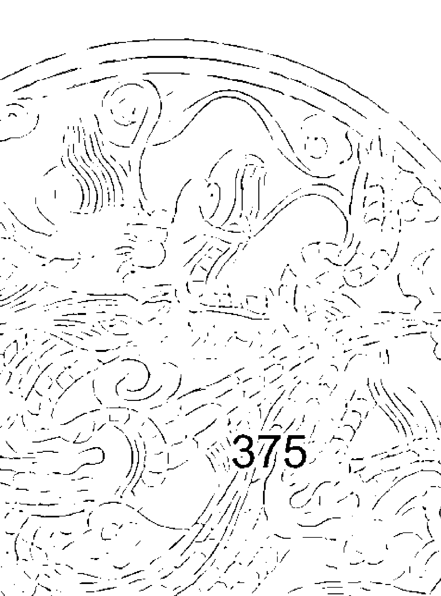

| 大疾 4/13 己 命 | 大財 14/23 庚 父 | 大子 24/33 辛 福 | 大夫 34/43 壬 田 |
|---|---|---|---|
| 大遷 戊 兄 | | | 大兄 44/53 癸 官 |
| 大奴 丁 夫 | | | 大命 54/63 甲 奴 |
| 大官 丙 子 | 大田 丁 財<br>（科）（祿） | 大福 丙 疾<br>（權） | 大父 乙 遷<br>（忌） |

## 「三象一物」怎麼算命？

1. 三象一物是什麼？
解釋：雙象命盤+第三顆星辰。
2. 第三顆星辰就是媒介的宮位。
3. 三象一物可以算什麼事？
*媒介的宮位，可以算人生的好運在何時？
*媒介的宮位，可以算十年的好運在何時？
*媒介的宮位，可以算流年的好運在何時？

4.本命命盤怎麼算三象一物？
雙象命盤：財帛宮有祿星+財帛宮有科星，就會形成雙象的命盤。
媒介宮位：祿科命盤的媒介在忌星（遷）。
命盤解釋：祿科一組代表此人是因緣共業的命格。人生的重點在遷移宮，表示出外才能遇到貴人相助而成就事業。

### 三、每個人天生都有富貴的好命格，趕快幫自己找一找

自古以來，傳統的命理老師總是會告訴我們說：「人的命格分富貴與貧賤。壞的命格就需要改運或補命，才不會貧窮一輩子。」這是多麼騙人誤導的說詞。因為，沒有人天生富貴命，也沒有人天生貧賤格，更沒有人天生不能成功。其實，每個人都有富貴的好命格，也都具備了不同的成功特性。只要發揮自己先天的優勢，讓自己好的特性轉變為成功的個性，事業一定可以順利成功。

#### （二）命格是什麼？

## 命格的形成：

### 1. 何謂本宮與對宮：

- 本宮：命
- 對宮：遷
- 其他宮位對應關係：
  - 兄 - 友
  - 夫 - 官
  - 子 - 田
  - 財 - 福
  - 疾 - 父

### 2. 何謂單象命格：

定義：生年四化星之「本宮+對宮」合起來只有一個M質者，稱為「單象命格」。單象命格可以單獨論命，也是完整的算命方式之一。

### 單象命格的組合：

- 命+遷兩宮位「本宮與對宮」合起來只有一個M質。
- 兄+友兩宮位「本宮與對宮」合起來只有一個M質。
- 夫+官兩宮位「本宮與對宮」合起來只有一個M質。
- 子+田兩宮位「本宮與對宮」合起來只有一個M質。
- 財+福兩宮位「本宮與對宮」合起來只有一個M質。
- 疾+父兩宮位「本宮與對宮」合起來只有一個M質。

### 3.命盤實例：

下列命盤之「本宮與對宮」合起來只有一個M質，所以是標準的「單象命格」。

# 玖、看懂這些訣竅，「算命」功力會增加十倍

紫微斗数命盘图表，包含星曜分布、宫位、大限年龄等信息。

標準「單象命格」：男命 壬申年 27歲

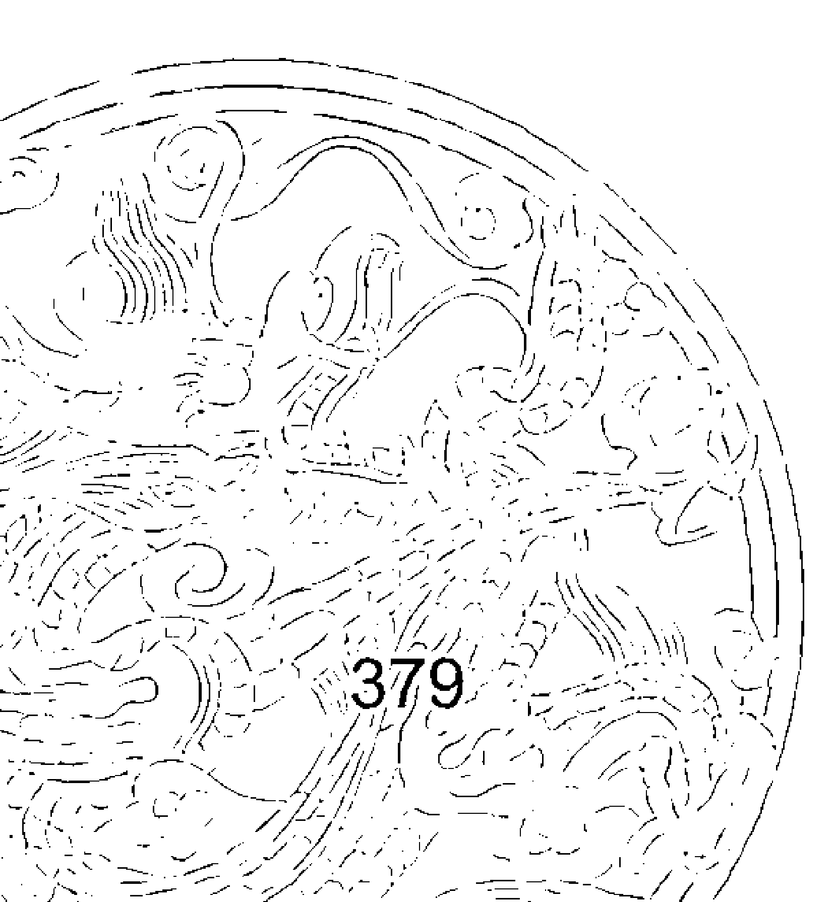

### 4.何謂雙象命格：

定義：生年四化星之「本宮+對宮」合起來有兩個M質者，稱為「雙象命格」。

雙象命格可以單獨論命，也是完整的論命方式之一。

雙象命格的三種組合：

- (1) 任何一個宮位有兩個M質。
- (2) 本宮與對宮各有一個M質。
- (3) 一個宮位有三個M質。

### 5.命盤實例：

此命盤因「本宮與對宮」合起來有兩個M質，所以是標準的「雙象命格」。

# 玖、看懂這些訣竅，「算命」功力會增加十倍

| 干支 | 宫位（大/本） | 数字 | 星曜 | 特殊标记 |
|------|--------------|------|------|----------|
| 己巳 | 大夫/父母 | 13 22 | 文曲、太阳 | 文曲忌 |
| 庚午 | 大兄/福德 | 23 32 | 破军 | |
| 辛未 | 大命/田宅 | 33 42 | 右弼、天机、天梁 | |
| 壬申 | 大父/官祿 | 43 52 | 天府、紫微 | 權 |
| 戊辰 | 太子/命宫 | 03 12 | 武曲、天同 | 武曲祿 |
| 癸酉 | 大福/奴僕 | 53 62 | 文太、昌阴、貪狼 | 貪狼權 |
| 丁卯 | 大财/兄弟 | - | 七杀 | |
| 甲戌 | 大田/遷移 | 63 72 | 巨門 | |
| 丙寅 | 大疾/夫妻 | 8-20-32-44-56-68 | 七杀 | |
| 丁丑 | 大還/子女 | 7-19-31-43-55-67 | 天梁 | 天梁科 |
| 丙子 | 大奴/財帛 | 6-18-30-42-54-66 | 天相、廉貞 | |
| 乙亥 | 大官/疾厄 | 5-17-29-41-53-65 | 巨門 | |

標準「雙象命格」：女命 己未年 40歲

### 1. 「命格」怎麼單獨算命？

單象命格：只利用有M質的單一宮位來算命，這是完整的論命方式之一。

- (1)自力更生的命格：表示必須先靠自己的努力，才能找到貴人相助而成功。
- (2)出外逢貴的格局：表示「兄、友、遷」任何一個宮位有M質。
- (3)天賜良緣的格局：表示「夫、疾」任何一個宮位有M質。
- (4)博學旺運的格局：表示「父、子」任何一個宮位有M質。
- (5)祖蔭福報的格局：表示「福、田」任何一個宮位有M質。實例分析：表示人生遇到瓶頸時，讀書或學東西可以改運。

雙象命格：利用「本宮+對宮」合起來有兩個M質來算命，這也是完整的論命方式之一。

實例分析：表示追求夢想的命格，這是少數興趣可以賺錢的人。

- ①上天禮物：上天給祿權命格者的最大優勢在「錢」的掌握。
- ②命格成敗：「成」是生意人或「敗」是金光黨。
- ③劉邦：「大丈夫當如是也」，這是劉邦成功格局的說詞。
- ④文章解釋：男人應該和大人物一樣有企圖心，才能成就一番事業。
- ⑤成功定義：命中注定是主管、老闆、專業的命格。

# 玖、看懂這些訣竅，「算命」功力會增加十倍

- ⑥成功個性：成功要聰明、奸巧、強求、能屈能伸的心態。
- ⑦成功方向：當別人說你能幹時，表示你已經在成功的路上。
- (2)祿科命格：就是因緣共業的格局。
- ①上天禮物：上天給祿科命格者的最大優勢在「人」的掌握。
- ②命格成敗：「成」是團隊人與「敗」是上班族。
- ③布袋和尚：「手把青秧插滿田，低頭便見水中天；心地清淨方為道，退步原來是向前。」
- ④文章解釋：命中的富貴不是強求而來，而是等待因緣成熟時。
- ⑤成功定義：為臣不為君，穩定中才能求發展的格局。
- ⑥成功個性：成功要以柔克剛、以退為進、以和為貴的心態。
- ⑦成功方向：改變以前失敗的做法，人生才會變彩色。
- ④權科命格：就是巧藝安身的格局。
- ⑦成功方向：人生面臨抉擇時，利益的方向才是生機。
- ⑥成功個性：成功要往上爬、向前衝、棄舊迎新的心態。
- ⑤命格定義：西瓜偎大邊與求新求變，乃成功不變的定律。
- ④文章解釋：「落花不是無情物，化作春泥更護花。」
- ③徐志摩：「悄悄的我走了，正如我悄悄的來；我揮一揮衣袖，不帶走一片雲彩。」
- ②命格成敗：「成」是時尚族與「敗」是過客。
- ①上天禮物：上天給祿忌命格者的最大優勢在「才」的掌握。
- (3)祿忌命格：就是陽花水性的格局。
- ⑦成功方向：改變以前失敗的做法，人生才會變彩色。
- ⑥成功個性：成功要以柔克剛、以退為進、以和為貴的心態。
- ⑤成功定義：為臣不為君，穩定中才能求發展的格局。
- ④文章解釋：命中的富貴不是強求而來，而是等待因緣成熟時。
- ③布袋和尚：「手把青秧插滿田，低頭便見水中天；心地清淨方為道，退步原來是向前。」
- ②命格成敗：「成」是團隊人與「敗」是上班族。
- ①上天禮物：上天給祿科命格者的最大優勢在「人」的掌握。


- ①上天禮物：上天給權科命格者的最大優勢在「名」的掌握。
- ②命格成敗：「成」是傳承人與「敗」是偏才。
- ③楚留香：「千山我獨行，不必相送……雲彩揮去卻不去，贏得一身清風。」
- ④文章解釋：成功的路上總是孤獨的，必須經過「興趣、專業、堅持」的追夢過程。
- ⑤命格定義：先培養興趣，再變成專業，最後為理想而堅持到底是成功的個性。
- ⑥成功個性：成功要追求夢想與培養一技之長的心態。
- ⑦成功方向：在同行、同類、同門、同派的因緣中才能嶄露頭角。
- (5)權忌命格：就是物競天擇的格局。
- ①上天禮物：上天給權忌命格者的最大優勢在「權」的掌握。
- ②命格成敗：「成」是執行長與「敗」是幫兇。
- ③項羽：「吾可取而代之」，這是項羽成功格局的說詞。
- ④文章解釋：必須勇敢的接受人生任何的挑戰，才是成就大事業的保證。
- ⑤命格定義：天生活在舞臺上的男主角，人生沒有中間地帶，不是幹掉別人就是被別人幹掉。
- ⑥成功個性：成功要面對是非、不怕競爭、主動攻擊的心態。
- ⑦成功方向：成功的機會，總是在別人攻擊你之時。
- (6)科忌命格：就是冬藏蛻變的格局。
- ①上天禮物：上天給科忌命格者的最大優勢在「人」的掌握。
- ②命格成敗：「成」是幕僚長與「敗」是村姑。
- ③杜秋娘：「勸君莫惜金縷衣，勸君惜取少年時；有花堪折直需折，莫待無花空折枝。」
- ④文章解釋：人生的重點是把握兩次堅持事業的機會，千萬不能為了愛而改變初衷。
- ⑤命格定義：被動的心態讓人裹足不前，保守的做法讓人錯失良機。
- ⑥成功個性：成功要窮者變、變者通，求新求變的心態。
- ⑦成功方向：往前走的思維，可以化解過去怨恨的輪迴。

#### （二）每個人都有屬於自己的「好命格」

- 1. 祿權的命格：富貴的命格：祿權的命格，只要學會「能幹＋奸巧」就能賺大錢。
- 2. 祿科的命格：富貴的命格：祿科的命格，只要學會「口碑＋特色」就能賺大錢。
- 3. 祿忌的命格：富貴的命格：祿忌的命格，只要學會「棄舊＋迎新」就能賺大錢。
- 4. 權科的命格：富貴的命格：權科的命格，只要學會「巧藝＋傳承」就能賺大錢。
- 5. 權忌的命格：富貴的命格：權忌的命格，只要學會「競爭＋攻擊」就能賺大錢。
- 6. 科忌的命格：富貴的命格：科忌的命格，只要學會「才華＋堅持」就能賺大錢。

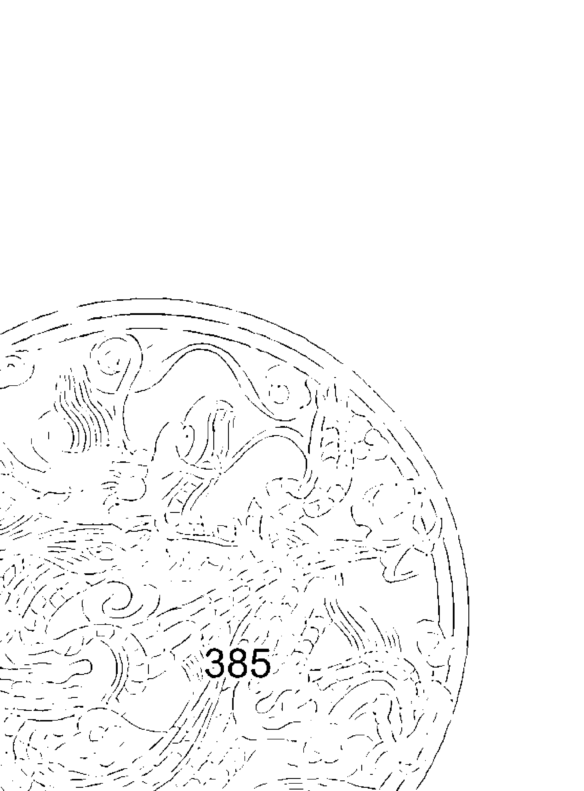

#### (三) 好命格，就是掌握屬於自己「命中的優勢」

- 1. 祿權的命格：命中的優勢：天生賺錢的生意人，命中的優勢在創造雙贏共享的事業。
- 2. 祿科的命格：命中的優勢：天生合群的團隊人，命中的優勢在創造合夥合作的事業。
- 3. 祿忌的命格：命中的優勢：天生變化的時尚人，命中的優勢在創造現代流行的事業。
- 4. 權科的命格：命中的優勢：天生才藝的傳承人，命中的優勢在創造一技之長的事業。
- 5. 權忌的命格：命中的優勢：天生專業的執行人，命中的優勢在創造獨特創新的事業。
- 6. 科忌的命格：命中的優勢：天生事業的守護人，命中的優勢在創造堅持品牌的事業。

#### (四) 命中優勢，一定要轉變成屬於自己「成功的個性」

- 1. 祿權的命格：成功的個性：祿權的命格，只要學會「商業思維」的個性，就能賺大錢。
- 2. 祿科的命格：成功的個性：祿科的命格，只要學會「掌握良機」的個性，就能賺大錢。
- 3. 祿忌的命格：成功的個性：祿忌的命格，只要學會「求新求變」的個性，就能賺大錢。
- 4. 權科的命格：成功的個性：權科的命格，只要學會「追求夢想」的個性，就能賺大錢。
- 5. 權忌的命格：成功的個性：權忌的命格，只要學會「強求強要」的個性，就能賺大錢。
- 6. 科忌的命格：成功的個性：科忌的命格，只要學會「堅持到底」的個性，就能賺大錢。

# 四、算命不是統計學

每次聽到有人說「算命是統計學」，心頭總是一陣一陣的刺痛。為什麼大部分的人都有這種感覺呢？因為，傳統命理老師只敢講大概、也許、可能是的江湖術士之騙人話語。時代在變，人心也在變，舊時代的思維已經不能滿足現代人複雜的需求。算命其實很簡單，就是精準掌握未來人、事、物的時間十吉凶十內容十影響。

#### （二）現代科學與統計學的區別

- 1. 統計學的命理：

傳統命理老師九成以上只能簡單、籠統的分析問事者的個性或東西南北的方向。騙人算命一：傳統命理老師會告訴你：「你一生的感情路是不是走得很辛苦？」 這是籠統騙人的話。因爲，所有人的感情路都走得很辛苦，不是晚婚，就是換了很多男（女）朋友。

騙人算命二：因爲傳統命理老師所知有限，沒有能力清楚分析人事務的結果，所以只能利用習俗與宗教的改運、補運、斬桃花⋯⋯來騙錢餬口。

算命實例：傳統命理老師會告訴你：「你和親人無情，二十五歲之前，祖父母一定有人不在了。」這也是騙人的鬼話。因爲二十五歲前，所有人的祖父母九成八以上一定有人不在了。

- 2.現代科學的命理：

利用公式化、系統化、透明化的現代科學算命來規劃未來。

算命方式一：精準掌握每一事件的時間十吉凶十內容十影響來規劃未來。

算命公式二：利用四化星（祿星、權星、科星、忌星）算命。四化星所在的宮位，可以算存在、貴人、欠債、有緣、有運等五種現象。

算命實例：以創業爲例，命理老師會回答：創業何時可以賺錢「時間」？賺錢時間從哪一年至哪一年「吉凶」？我應該怎麼做才能賺大錢「內容」？第一次創業會影響未來什麼事？

#### （二）「有」出生年月日的算運，不是統計學

- 1.可以精準掌握一生的事：
- (1) 我一生最大的利益是什麼？最折磨的是什麼事？
- (2) 我一生事業最好的運在哪一個大限？大限與大限之間，我應該怎麼規劃才能讓好運一直持續下去。

- 2.可以精準掌握十年的事：
- (1) 我未來十年的好運是做什麼事？我未來十年的壞運是做什麼事？
算命實例：我二十七歲才能進入正緣的時間，二十九歲結婚可以旺事業。
- (2) 我的好運或壞運，從哪一年開始至哪一年結束？
算命實例：我二十八歲至三十六歲是我第一次賺大錢的時間，我可以选择升官或創業。
算命實例：我創業好運在二十九歲，第一次事業擴大在三十一歲，第二次事業擴大在三十五歲。
- 3. 可以精準掌握今年的事：
我現在決定的事，未來會發生什麼事？
算命實例：這個月搬家會發生什麼事？這個月生小孩會發生什麼事？
算命實例：三月與九月交往的男人（生肖都屬雞），各會發生什麼事？

#### (三)「無」出生年月日的算命，就是統計學

- 1. 無法掌握一生的事：
只能簡單籠統的算個性、生肖、方向、五行、顏色、數字……等。
- 2. 無法掌握十年的事：
只能簡單籠統算未來十年有幾次賺錢的機會？算未來十年買房子有機會賺錢。
- 3. 無法掌握今年的事：
只能簡單籠統算什麼生肖適合你，什麼數字適合你，什麼顏色不適合你。其實，這些都是命理老師騙人騙錢的伎倆之一，完全和命理沒有直接的關係。

## 算命實例：

- 2.可以精準掌握十年的事：
- (1) 我未來十年的好運是做什麼事？我未來十年的壞運是做什麼事？
算命實例：我二十七歲才能進入正緣的時間，二十九歲結婚可以旺事業。
- (2) 我的好運或壞運，從哪一年開始至哪一年結束？
算命實例：我二十八歲至三十六歲是我第一次賺大錢的時間，我可以选择升官或創業。
算命實例：我創業好運在二十九歲，第一次事業擴大在三十一歲，第二次事業擴大在三十五歲。
- 3. 可以精準掌握今年的事：
我現在決定的事，未來會發生什麼事？
算命實例：這個月搬家會發生什麼事？這個月生小孩會發生什麼事？
算命實例：三月與九月交往的男人（生肖都屬雞），各會發生什麼事？

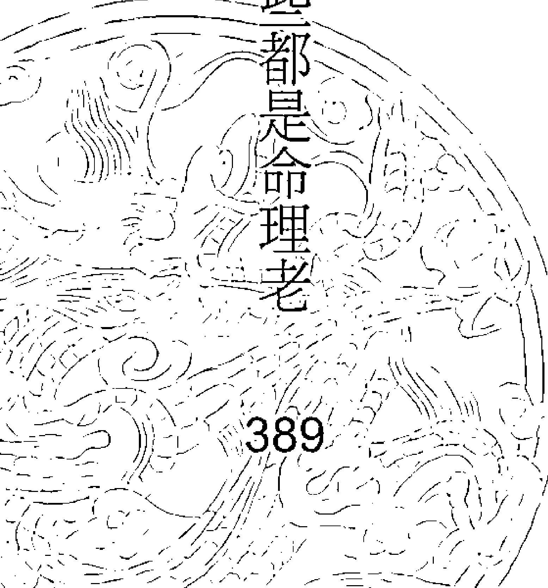

# 五、怎麼規劃人生的最大利益？

前言：

- 1. 觀看第一世的因緣在命宮四化。
- 2. 觀看第二世至第四世的因緣在祿權科忌。
- 3. 觀看第五世至第七世的因緣在左右昌曲。

#### （二）人生第二大利益是『左右昌曲』，就是了業還債的規劃

### 1. 前世未了的因緣

左右昌曲的緣分，當你與累世生肖發生了利害關係，雙方的關係一定要滿三年才能成立。

左右昌曲的緣分，當你與累世生肖發生了利害關係，那麼折磨與糾纏指數就會有90%。

左右昌曲的宮位，當你與累世生肖發生了利害關係，就註定會發生富貴貧賤與愛恨情仇的緣分。

### 2. 今生未還的情緣

在人：左右昌曲的宮位是你七世因緣的生肖，就是最愛或最折磨你的人。

在事：左右昌曲的宮位是事業永續經營的條件，也是事業創造高峰必經之生肖與宮位。

#### （三）人生第三大利益是『生年四化』，就是盡性盡命的規劃

### 1. 前世未了的因緣

祿權科忌的緣分，當你與前世生肖發生了利害關係，雙方的關係一定要滿一年才能成立。

祿權科忌的緣分，當你與前世生肖發生了利害關係，那麼折磨與糾纏指數就有80%。

### 2.今生未還的情緣

在人：祿權科忌的生肖是三世因果的生肖，就是愛你或折磨你的人。

在事：祿權科忌的宮位是事業往上因緣的條件，是事業成就過程中必經之生肖與宮位。

#### （三）人生第三大利益是「大限四化」，就是掌握良機的規劃

### 1.前世未了的因緣

大限四化的緣分，當你與過客生肖發生了利害關係，雙方關係一定要滿六個月才能成立。

### 2.今生未還的情緣

在人：大命祿權科忌的生肖是今生的情緣，也是喜歡你或折磨你的人。

在事：大命祿權科忌的宮位是事業創業升遷的條件，也是掌握良機過程中必經之折磨事。

#### （四）人生第四大利益是「星辰」，就是命中注定的規劃

- 十四顆星：
- 紫微
- 天機
- 太陽
- 武曲
- 天同
- 廉貞
- 天府
- 太陰
- 貪狼
- 巨門
- 天相
- 天梁
- 七殺
- 破軍

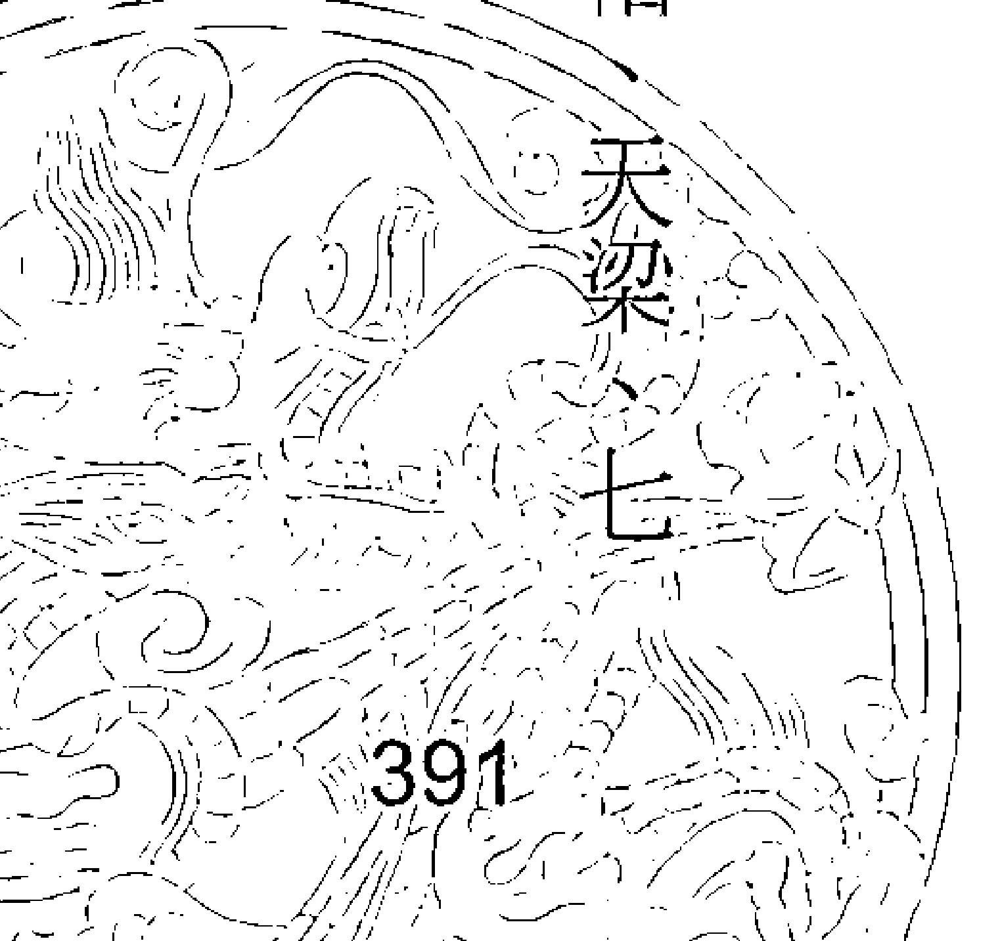

### 1.前世未了的因緣

十四顆主星的緣分，當你與累世生肖發生了利害關係，雙方的關係一定要滿4個月才能成立。十四顆主星的緣分，當你與累世生肖發生了利害關係，那麼折磨與糾纏指數就會有40%。十四顆主星的宮位，當你與累世生肖發生了利害關係，就註定會發生現象因緣與愛恨情仇的緣分。

### 2.今生未還的情緣

在人：本命星辰的生肖是今生的情緣，是喜歡你或折磨你的人。在事：本命星辰的宮位是事業命中註定的條件，也是掌握命中優勢過程中必經之折磨事。切記！星辰無法精準掌握時間＋吉凶，只是算「現象」而已。

# 拾、看懂這些訣竅，「算運」功力會增加十倍

三十年前，臺灣經濟欣欣向榮，各行各業都大賺特賺，十個創業中有九個人賺錢，在這種情形下，也給了傳統命理老師以「簡單、籠統、不準」的算命方式胡言亂扯的機會，已經足夠他們藉此養家餬口。

三十年後，臺灣經濟哀鴻遍野，各行各業都慘淡經營，十個創業中有七個人賠錢。在這種情形下，終於讓傳統命理老師現出了原形，這種「簡單、籠統、不準」的算命方式，已不能滿足他們生活所需要。

三十年前，社會還在工商業發展初期，所有創業者只要想當老闆，就可以輕鬆完成賺錢的夢想。這時期決定成功的關鍵是「決定的流年十信心十決心十恆心」。

三十年後，社會進入春秋戰國時代，所有創業者需要更多現代化的專業，才能夠完成賺很多錢的心願。這時期決定成功的關鍵是「決定的流年十方向十態度十堅持」。

總之，簡單籠統的傳統算命方式已經不能滿足現代人追求利益的需要，只有更專業的人生規劃，才能幫助眾生成就事業的夢想。此篇算運技巧，是針對命理有興趣者或專業命理老師而寫的文章。希望藉著公式化、系統化、科學化的分析，可以幫助到需要幫助的人，完成他們對命理學的熱情、熱愛、熱忱。

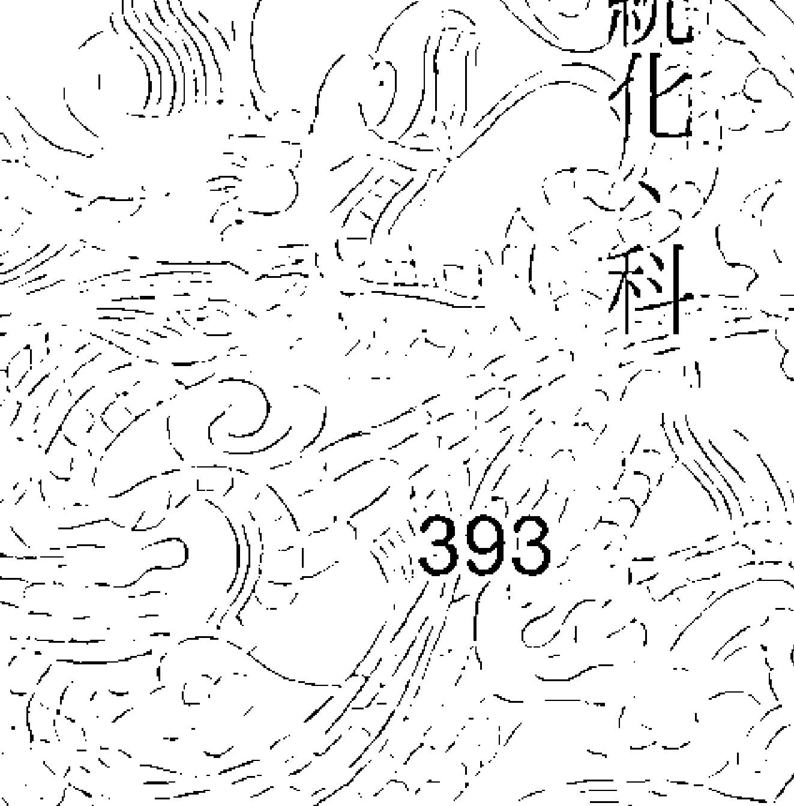

# 一、命理老師必須具備哪些條件才能算命？

命理老師原本只要具備專業技能即可，但不學無術的命理老師，卻喜歡東拉西扯一些不合時宜的東西來誤導眾生，不是利用一般常識來安慰當事人，就是利用宗教、習俗來恐嚇求助者。長久下來，就讓三成以上的中上階層不相信命理，對算命嗤之以鼻。為了挽救正統命理學的專業價值，現就不同的專業角度分析：命理老師應該具備哪些專業條件，才能在職場上勝任愉快。

### （一）以「專家學者」的角度分析：

以專家學者的角度分析：現代人成功的條件，早已不是單純的靠自己努力工作，而是必須有清楚的人生方向，才能產生良好的態度，再加上個人的努力，最後為理想而堅持到底才是成功的保證。所以，進入春秋戰國式的二十一世紀，命理老師一定要有全新的科學思維，才能提升自己也幫助別人。三十年前的成功流年+信心+決心+恆心，就能完成人生的夢想。三十年後的成功流年+目的的態度+堅持，才能完成人生的夢想。

### （二）以「正統命理學」的角度分析：

以正統命理學的角度分析：成功的定義「在對的時間做對的事」，就是成功的條件。富貴的定義「天時+地利+人和三種合一」，才是富貴的保證。

# 拾、看懂這些訣竅，「算運」功力會增加十倍

- 1.天時：每一事件你所選擇的流年，就是「當下」成敗的關鍵，占50%的重要性。算命實例：連戰、宋楚瑜、謝長廷，在錯的時間點選總統，就決定了他們失敗的命運。
- 2.地利：每個當下你所居住的地方，就是「未來」成敗的關鍵，占25%的重要性。算命實例：「青瓦臺」是南韓總統府所在地，它讓每一任的總統都官司纏身或入監服刑。算命實例：選總統者需要住在大格局的地點，但宋楚瑜先生總是住在社區小住宅，當然喪失了爭取高位的機會。
- 3.人和：每個當下你所培養的條件，就是「未來」成敗的關鍵，占25%的重要性。算命實例：假如你的人生選擇培養一技之長，以後你就是各行各業的專家。算命實例：假如你的人生選擇奸巧的生意人，以後就是賺大錢的企業家。

### （三）以「華山派命理學」的角度分析：

- 1. 以華山派獨創的算運角度分析：華山派命理學的角度與專家學者的觀點並不衝突。華山派以決定的時間點「天時」來決定利益得失，每一件事決定的時間點就是未來成敗的關鍵。例如，不管你有多厲害，三月份是抓不到黑鮪魚的，你一切的努力都會白費心機。因為，每年四月至六月才是抓黑鮪魚的季節。

2. 决定人生成败的关键在天时。每一事件的成功＝当下决定的流年是三个条件，就是成功的保证。每一事件的失败＝当下决定的流年是三个条件，就是失败的保证。

3. 我现在想问的事，命理老师只能回答三件事：
- (1) 我会发生什么事？
- (2) 遇到吉或凶时我应该怎么做？
- (3) 对我以后会有什么影响？

总之，“算命”是命中注定的事；“算运”是你现在想问的事。“算命”的重点在把握先天俱足的优势；“算运”的重点则在天时＋地利＋人和的巧妙规划。所以，一个人在“人、事、物”成功的关键，永远是每个当下所选择的时间点，也就是在对的时间点做对的事，所以，真正的算命，是预测未来人事物的结果（时间＋吉凶）。

## 二、为什么有“出生年月日”的算命才会准？

每个人的命盘都是独一无二的，因为出生年月日都是唯一的，命盘也是为个人量身订做，才能精算每一事件的吉凶。天底下最大的谎话就是利用方向、星座、生肖、颜色、数字……等算命方式，把全世界的人分成十二分之一，让这十二分之一的人的感情、事业、贵人、生子、买房子……都呈现相同的命运。这是传统命理老师惯用的骗人伎俩，也是最简单、笼统、不准的低级诈术。这种算命方式和真正的命理完全没有直接关系。而且，只要三天的时间，大部分的人都可以学会这种骗人的算命伎俩。

### （一）“无”出生年月日的算命

“没有”出生年月日的算命：例如，星座、生肖、塔罗牌、姓名学……。只能简单教人往东、往西、往南、往北……找贵人，当然算不准？实例：星座老师只能胡扯今年什么星座的桃花比较不旺（占十二分之一），当然算不准。实例：生肖老师只能胡扯今年某一生肖的财运比较有旺（占十二分之一），当然算不准。实例：塔罗牌老师只能笼统分析你今年的事业运不顺（老师的自由心证），当然算不准。实例：姓名学老师只会要求每一个当事人都要改名，但怎么会大家都是衰运？当然算不准。

### （二）“有”出生年月日的算命

1. “有”出生年月日的算命：例如，紫微斗数、八字论命……。
2. 每一阶段“十年”的分析。
   (1) 八字命理：可以笼统算出哪一个十年运势比较好。
   (2) 华山派命理：可以精准掌握每一个事件的时间点。

实例分析：可以精准掌握二〇一八年正缘的时间，结婚后可以让事业版图快速扩大。

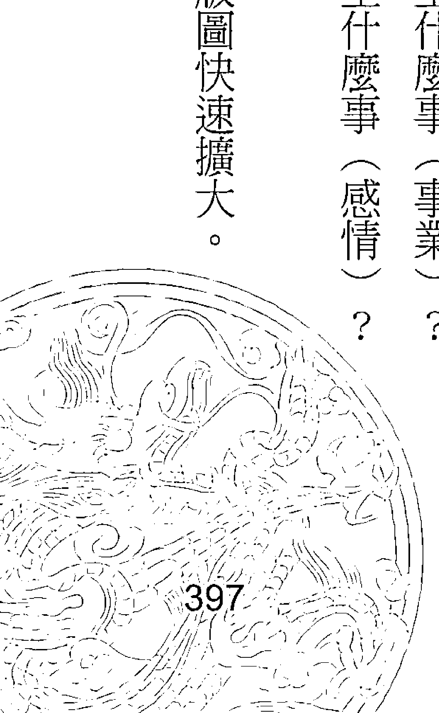

实例分析：可以精准掌握二○一八年七月生的小孩，会让当事人的事业快速下滑。

### （三）“有”出生年月日就能精准掌握“时间＋吉凶”

华山派命理：精准掌握每一事件的时间＋吉凶。
- 吉凶分析：精准掌握创业赚钱的时间，从哪一年月日开始至哪一年月日为止。
- 吉凶分析：精准掌握感情正缘的时间，从哪一年月日开始至哪一年月日为止。
- 吉凶分析：精准掌握买屋赚钱的时间，从哪一年月日开始至哪一年月日为止。

### （四）“有”出生年月日就能精准掌握“内容＋影响”

华山派命理：精准掌握每一事件的内容＋影响。
- 内容分析：精准掌握创业赚钱一定需要合伙关系，赚钱时间从哪一年开始至哪一年为止。
- 内容分析：精准掌握哪一年生的小孩可以带财，带财时间从哪一年开始至哪一年为止。
- 影响分析：精准掌握再次读书是升官的条件，有效读书时间从哪一年开始至哪一年为止。
- 影响分析：精准掌握搬家后才能找到正缘，有效搬家时间从哪一年开始至哪一年为止。

## 三、传统命理老师不知道有算运

命运是什么？大部分的人都不知道，就连传统命理老师也对它一知半解。试想，一个连“命运”都搞不清楚的命理界，怎么可以期待会有好的命理老师来帮你规划未来呢？

华山派命理学诞生的目的有三：一是解释专业名词，二是改变传统命理的旧思维，三是创造现代化的科学命理学。

### （一）命运是什么？

1. 命与运在天命上的区别
在天命上先有定位才有定数。命：就是先天俱足的因缘，算命的角度是“现象”。运：就是后天运势的吉凶，算命的角度是“时间”。命与运：论述人生富贵贫贱的规划。对的规划是富贵人家，错的规划是贫贱家庭。

2. 命与运在事业上的区别
在事业上先有行业别才有定数。命：就是命中注定的定数，算命的角度是“我命中的优势是什么？”。运：就是环境多选择的变数，算命的角度是“每个当下最有利的选择是什么？”。命与运：论述人生得失吉凶的选择。对的规划是最大利益，错的规划是亏损连连。

3. 命与运在算命上的区别
在算命上先有注定才有吉凶。命：就是命中会发生的事，算命的角度是“命中的最大利益是什么？”。运：就是我现在想问的事，算命的角度是“我现在决定的事未来会发生什么事？”。命与运：论述我选择的人生故事。对的规划让你事半功倍，错的规划让你事倍功半。

4. 传统派与华山派在算命上的区别

## 传统派的算命：

算命格、个性、方向、生肖、五行、数字、颜色……。

算单一的现象，这种现象对未来的帮助不大，影响也有限。

## 华山派的算命：

算命中优势如何培养后天“成功的个性”。

算让成功个性转变成你先天“富贵的命格”。

### （二）算运是什么？

每个人的成功与失败都有固定的行走轨迹，没有人可以逃过上天安排的定数因缘，这就是“天意”；“天意因缘”就是一般人口中的“命运”，在学术上称之为“算运”。算运就是你今年决定的事情，上天在冥冥之中早已注定了吉凶。

一般的算命可以分为“算命”与“算运”两种。传统派命理90％以上是算命；华山派命理100％是算运。传统派的算运有“知运、说运”两种；华山派的算运有“吉凶的运、利益的运、富贵的运”三种。

现就五种不同等级的算运分析如下：

1. 传统派的算运：传统命理老师只知道有算命，不知道有算运。
第一层是“知运”：
(1) 传统命理老师只知道人会受到“运”的影响。
(2) 传统命理老师只是笼统知道：人的一生会受到命运的影响。

# 拾、看懂这些诀窍，“算运”功力会增加十倍

算命实例：大部分传统命理老师只知道，人不顺，一定是运势不好。这是先知道结果之后再反推当事人的运势；也就是你已经告诉他答案，老师才东拉西扯地来吻合你要的东西而已。

第二层是“说运”：
(1) 传统命理老师只是笼统说明人的一生会遇到好运与坏运。
(2) 传统命理老师只能笼统说明你未来十年有好运，但不知道好运是什么？何时开始？何时结束？

算命实例：以面相看鼻子大的人就知道中年运不错，这是三分钟就可以学会的本事，这不是算运。真正的算运是每一事件吉与凶何时开始？何时结束？。

2. 华山派的算运：华山派命理老师的算命就是算运。

第三层是算吉凶的运。
命理老师精准掌握你的好运与坏运的分界点在哪一年。

第四层是算利益的运。
命理老师精准掌握你在相同时间（十年），人事务有不同的好运与坏运。
命理老师精准掌握你的好运，并知道如何规划当事人的最大利益。

第五层是算富贵的运。
命理老师精准掌握你五年以上的好运，并知道如何规划当事人的永续经营。
命理老师精准掌握你十年以上的好运，并知道如何规划当事人的富贵丁寿，从哪一年月日开始至哪一年月日结束。

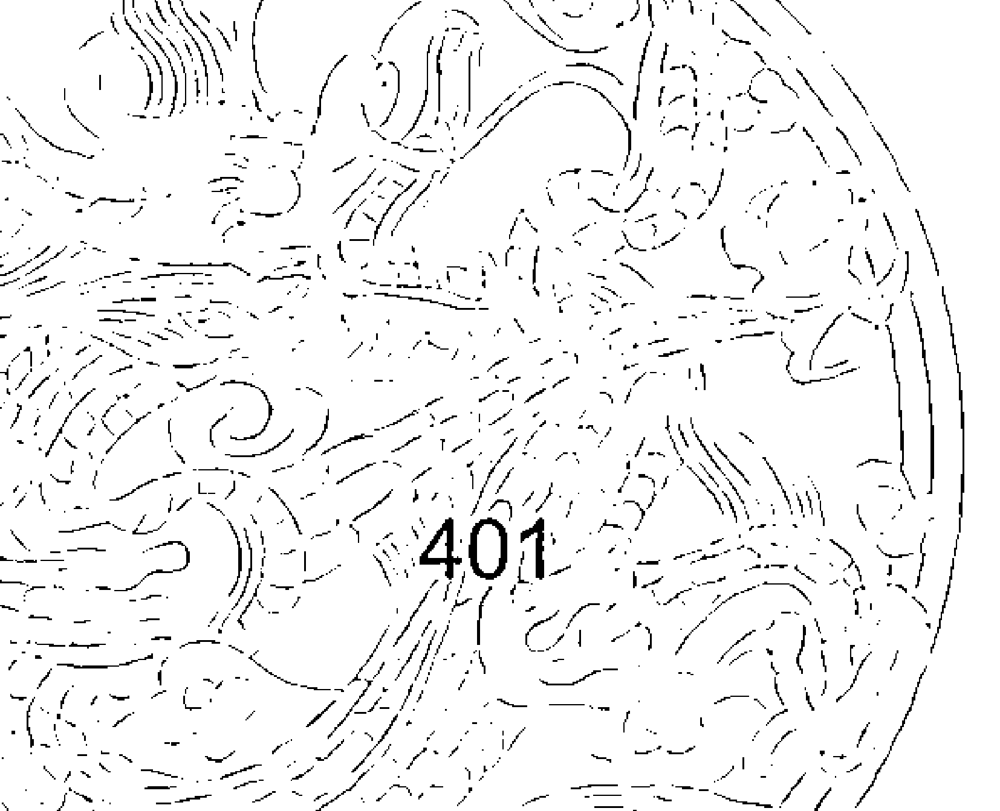

### （三）每一个大限都会发生不同的好运与坏运

1. 每一年的好运与坏运会同时存在。
95%以上的传统命理老师不知道好运与坏运会同时存在。算命实例一：到寺庙抽签如果抽到好签，签诗上什么都说好；抽到坏签，签诗上什么都说不好。但这是完全错误的解释。算命实例二：很多人结婚后事业开始往下滑，生小孩后就被公司资遣。

2. 为什么人在某一阶段会特别感觉不顺？
传统命理老师总是故意把不顺的事情扩大分析，让你感到很不安。这是他们的骗人伎俩，如此才有机会假借改运来骗你的钱。
算命实例一：改运＝天时＋地利＋人和，缺一不可。可见改运需要天时、地利、人和等三种条件完全配合才能成事，并不是传统命理老师说的随时都可以改运。
算命实例二：传统命理老师常把你的不顺都归咎于祖坟出了问题，先让你心生恐惧，接着就靠帮你改运赚钱。切记！只有三成的人有机会因此化解灾厄。

3. 为什么我一直在衰运中？
因为，没有提前准备创业的条件，所以，好运来时也只能乖乖上班，什么都做不了。
因为，坏运来时，总是埋怨上天不公平；好运来时，当然没有本事把握良机。

## 四、命理老师找到“用神”后才能帮人算运

四化星在不同的宫位，就会产生不一样的格局；不一样的格局，就会产生不同的思维；不同的思

### （二）何谓“用神”？

1. 十二宫位的基本用神：命宫、兄弟宫、夫妻宫、子女宫、财帛宫、疾厄宫、迁移宫、奴仆宫、官禄宫、田宅宫、福德宫、父母宫。

算命实例：正缘的用神“看”夫妻宫，三角关系的用神“看”子女宫。
算命实例：创业的用神“看”官禄宫，换工作的用神“看”父母宫。

2. 四化星的用神：禄星的用神“看物”，权星的用神“看事”，科星的用神“看人”。
算命实例：创业或事业扩大“看”权星；能否找到爱你的人则“看”科星。
算命实例：换工作或事业失败“看”忌星；失恋或不幸的婚姻也“看”忌星。

3. 本命命盘、大限命盘、流年命盘的用神
(1) 本命命盘的用神：
算命实例：命中注定的优势、命格、天性……。
(2) 大限命盘的用神：
算命实例：算未来十年人、事、物的时间。
(3) 流年命盘的用神：

### （二）什么时候需要“用神”？

1. 算“时间”需要以大限为用神。
本命命盘＋大限命盘，才能算未来十年人、事、物的时间。
算命实例：我的事业好运在哪一个十年？我感情的坏运在哪一个十年？

2. 算“吉凶”需要以本命命盘＋大限命盘两盘为用神。
本命命盘＋大限命盘＋吉凶确定，才能算未来人、事、物的吉凶。
算命实例：何时创业才能赚大钱？何时结婚才能幸福长久？

3. 算“流年”需要以本命命盘＋大限命盘＋流年命盘三盘为用神。
本命命盘＋大限命盘＋流年命盘＋吉凶确定，才能算今年每一事件的生肖吉凶。
算命实例：今年六月与生肖龙的男人结婚会发生什么事？今年十月生小孩（属鸡）会发生什么事？

### （三）如何利用“用神”算命？

四化星的用神：禄星是“物”的用神，权星是“事”的用神，科星是“人”的用神。
1. 用神在“对的宫位”就会产生不一样的成就。
算命实例：禄星在财帛宫，这是对的宫位（禄星的用神是财帛宫），若投资命中注定会赚大钱。

## 五、命理学的重点在天时＋地利

2. 用神在“不对的宫位”就会产生不一样的人生。
算命实例：禄星在官禄宫，这是不对的宫位（禄星的用神是财帛宫）。
命盘解释：事业必须经过两次以上的换工作，才能进入成功的时间。
算命实例：权星在财帛宫，这是不对的宫位（权星的用神是官禄宫）。
命盘解释：投资必须经过一次以上的大风险，才能进入赚钱的时间。
算命实例：科星在迁移宫，这是不对的宫位（科星的用神是人的宫位）。
命盘解释：事业必须经历外务、外调、游学、出国后，才能进入创业的时间。
的人。
算命实例：科星在夫妻宫，这是对的宫位（科星的用神是夫妻宫），感情命中注定可以找到爱你的人。
算命实例：权星在官禄宫，这是对的宫位（权星的用神是官禄宫），事业命中注定会有大成就。

### （一）本命大限未精通，生肖流年失其用

1. “命理”的重点在本命命盘＋大限命盘。
本命命盘＋大限命盘，才能预测未来人事物每一事件的“结果”。
本命命盘＋大限命盘，才能算每一事件的“时间＋吉凶”。
本命命盘＋大限命盘＋流年命盘形成相同现象，才能算每一事件的“内容＋影响”。
本命命盘＋大限命盘＋流年命盘形成相同现象＋吉凶确定，才能算“流年＋生肖”。

# 拾、看懂这些诀窍，“算运”功力会增加十倍

2. 传统命理老师大部分都是直接算“流年与生肖”。
直接算流年，算命准确度只有20%以下。
直接算生肖，算命准确度只有10%以下。

### (二) 寻龙点穴未精通，八卦五行失其用

1. “地理”的重点在寻龙点穴。
精通寻龙点穴，才能“掌握”地理位置的吉凶。
精通寻龙点穴，才能“庇佑”子孙的事业，让企业永续发展。
切记！传统命理老师99%以上因为不会寻龙点穴，所以，都是直接以现场的地点看房屋，这是完全不正确的看阳宅观念。

2. 正确看阳宅有三种方法，顺序绝对不能改变：
第一重点是，搬家时间决定房屋的吉凶，占总分数的60%。
第二重点是，四周环境的选择决定这间房屋的分数，占总分数的30%。
第三重点是，房屋内的摆设决定主人的个性，占总分数的10%。

3. 传统命理老师大部分都是直接“看”八卦与五行，对当事人的帮助有限。
直接“看”八卦方位，算命准确度只有20%以下。
直接“看”五行生克，算命准确度只有20%以下。

### （三）真正的算命是“生年四化＋飞星四化＋自化”三者合一

1. 生年四化：可以算时间＋吉凶＋内容＋影响。
2. 飞星四化：可以算时间＋吉凶＋内容＋影响。
3. 自化：无法单独算时间、吉凶、内容、影响。

## 六、“算运”应该学会的事

真正完整的算运有三种：一是在对的时间点做对的事；二是天时、地利、人和三合一的算命；三是现象＋时间＋吉凶＋内容＋影响＋改运＋转运＋宗教等八合一的算命。

### （二）算运不能谈神鬼

1. 宗教才能谈“神鬼”。
宗教不适合谈命理，否则让人有骗财之嫌。
例如，道教讲的是地狱，佛教讲的是轮回，基督教讲的是天堂，回教讲的是真神。

2. 宗教的重点在“劝人为善”。
例如，宗教劝人為善，做坏事的人会有凶恶的报应或因果的轮回。

3. 算运的重点在“规划未来”。
例如，宗教劝人為善，做坏事而有反省的人，上帝会原谅他的过去。

算命的重点在决定的流年，才会产生人事物的吉凶因缘，与宗教的理论完全不同。算命是预测未来人事物的结果、规划人生最大的利益，也与宗教的理论完全不同。

### （二）算运与专家学者的说法完全不冲突

#### 1. 命理学就是天时＋地利＋人和

例如，专家学者重点在个人的条件，并论述个人领域上的专业。

#### 2. 专家学者的重点是“专业的条件”

例如，算运重点在决定的流年，就能预测未来人、事、物的吉凶。

### （三）算运的重点在规划未来

#### 1. “算”方向：

算命实例：我应该怎么选择人事物，才是我未来人生最大的利益？

#### 2. “算”时间：

例如，阳宅重点在搬家的日期，就能预测搬家后会发生什么事。阳宅吉凶的重点是“地理位置”。
例如，阳宅重点在搬家的日期，谈论的是“地利”的问题。
决定的流年，谈论的是“天时”的问题。
个人条件的培养，谈论的是“人和”的问题。
例如，算运重点在决定的流年，就能预测未来人、事、物的吉凶。

# 拾、看懂这些诀窍，“算运”功力会增加十倍

算命实例：我赚钱的时间，从哪一年月日开始至哪一年月日结束？

3. “算”吉凶：
算命实例：我现在决定的事，何时可以赚大钱？从哪一年月日开始至哪一年月日结束？

4. “算”内容：
算命实例：我现在决定的事，应该怎么做（内容）才能赚大钱？

5. “算”影响：
算命实例：我现在决定的事，对以后有什么影响？

### （四）算运有定位才有定数

1. 算运的定位有两种：一是“用神”的定位，一是“问诊”的定位。
(1) 传统命理老师不会算命，最大的原因是不懂“用神”的重要性。每一事件都有专属的用神，精准掌握用神，才能预测当事人未来的时间与吉凶。
(2) 传统命理老师不会算命，第二大原因是不懂“问诊”的重要性。每一事件都必须问清楚原委，才能精准掌握当事人未来的人、事、物的时间与吉凶。

2. 不用事先询问当事人的算命方式是“算命”。
(1) 传统派命理老师90%以上都是算命。
(2) “算命”：只能论述命中注定的事。
算命实例：只能算老板命，但不会算何时当老板才能赚大钱。
算命实例：只能算命中有两间房子，但不会算何时会有房子？房子怎么来？

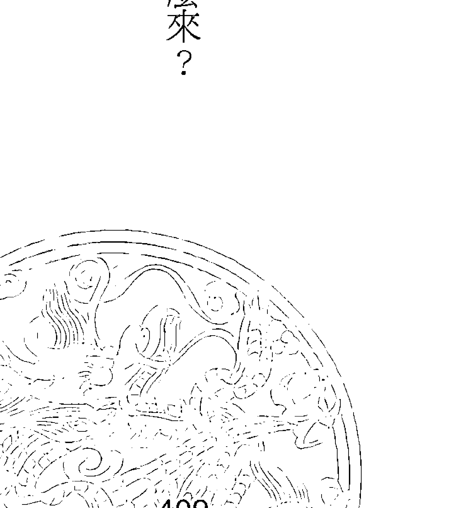

#### 3. 必须事先询问当事人的算命方式是“算运”。

(1) 华山派命理老师100%以上都是算运。
(2) “算运”：预测未来人事物的吉凶。
算命实例：今年七月“搬家”，我会发生什么事？
算命实例：当老板赚钱的时间，从哪一年月日开始至哪一年月日结束？

#### 4. 有定位才有定数。

(1) 精准掌握吉凶的算运，必须询问当事人现在决定什么事？才能有效的算运。
(2) 精准掌握时间的算运，必须询问当事人现在决定往哪一个方向走？才能有效的算运。
算命实例：何时想交男朋友的时间，就知道会遇到什么人。
算命实例：何时想创业的时间，就知道创业会不会赚钱。
算命实例：在一起的时间，就知道和这个人的缘分长久。
算命实例：分手的时间，就知道下一段感情是什么缘分。
算命实例：创业的时间，就知道赚钱的时间从哪一年月日开始至哪一年月日结束。

### (五) 双胞胎应该怎么算命？

1. 双胞胎的算命困扰了命理界几百年。
传统命理老师因为不会“算运”，所以，双胞胎的算命迷惑了他们几百年之久。
传统命理老师因为不会“算运”，所以，双胞胎的算命让很多命理爱好者失去了信心。

2. 双胞胎算命，最大的差异在“命”同“运”不同。

算“命”会相同：命中的优势＋成功的个性＋富贵的命格，一定会相同。
算“运”会不同：双胞胎两人后天环境人、事、物的选择，一定不一样。
算命实例：找工作的时间点不会一样，老板也不会同一个人。
算命实例：交女朋友的时间不会一样，女朋友也不会是同一个人。
算命实例：结婚的时间不会一样，结婚对象也不会是同一个人。

## 七、每一个结果至少由三十种以上的“公式”算出来

算命的每一个结果，绝大部分的命理老师只会一种方法，这就是传统命理老师为什么算命算不准的原因。因此，小问题算不出来，只会东拉西扯的胡扯；大问题算不出来，只会胡言乱语的瞎算。没听过的问题会装神弄鬼的帮人改运；不会的问题则会鬼扯因果轮回的报应。所以这群不学无术的命理老师让30%以上的知识份子不相信命理，这都是不长进所惹的祸。其实，真正的算命方式是预测每一个事件的结果，都至少要有三十种以上的公式推算出来，才是真正的命理学。

### (一) 算人、事、物的基本公式有哪些？

四化星＝禄星、权星、科星、忌星＝M质。任何一颗四化星都可以代表M质。以下假设所论述的宫位都有M质。

1. 算“四化星”与“十二宫位”的公式有哪些？
(1) 算命的第一重点，先确定“十二宫位”的用神。

### 2. 算“在人”的公式有哪些？

(1) 算六亲的宫位在命宫、兄弟宫、夫妻宫、子女宫、奴仆宫、父母宫等六个宫位。
(2) 算感情的宫位在夫妻宫、子女宫、奴仆宫等三个宫位。

(1) 算六亲的宫位在命宫、兄弟宫、夫妻宫、子女宫、奴仆宫、父母宫等六个宫位。
(2) 算感情的宫位在夫妻宫、子女宫、奴仆宫等三个宫位。

在人的用神：有命宫、兄弟宫、夫妻宫、子女宫、奴仆宫、父母宫等六个宫位。
在事的用神：有疾厄宫、迁移宫、官禄宫等三个宫位。
在物的用神：有财帛宫、田宅宫、福德宫等三个宫位。
(2) 算命的第二重点，再确定“四化星”的用神。
论人的用神是科星所在的宫位。
论事的用神是权星所在的宫位。
论物的用神是禄星所在的宫位。
论吉凶的用神主要是忌星所在的宫位。
切记！其他禄星、权星、科星等也可以算人、算事、算物、算吉凶。

算两种以上感情的公式属于高阶的命理学，它需要更多的公式组合，才能精准掌握人、事、物的缘分。

# 拾、看懂這些訣竅，「算運」功力會增加十倍

### 3. 算「在事」的公式有哪些？
- 1. 算事業的宮位在疾厄宮、遷移宮、官祿宮等三個宮位。
- 2. 算兩種以上事業的公式屬於高階的命理學，它需要更多的公式組合，才能精準掌握人、事、物的因緣。

### 4. 算「在物」的公式有哪些？
- 1. 算物的宮位在財帛宮、田宅宮、福德宮等三個宮位。
- 2. 算兩種以上事物的公式，屬於高階的命理學，它需要更多的公式組合，才能精準掌握人、事、物的因緣。

## 怎麼預測未來的吉凶？
- 1. 「先算」本命命盤的分析：論述命中注定的事。算命的分析：先看本命命盤的四化星（祿星、權星、科星、忌星）所在的宮位，再分析四化星的內容。
- 2. 「再算」大限命盤的分析：論述現在要問的事。算運的分析：再看大限命盤的四化星（祿星、權星、科星、忌星）所在的宮位，再分析四化星的內容。
- 3. 「最後」流年命盤的分析：論述每一事件的吉凶。算流年的分析：算流年＝本命命盤＋大限命盤，也就是讓本命命盤與大限命盤形成相同的現象，才會產生流年的吉凶。

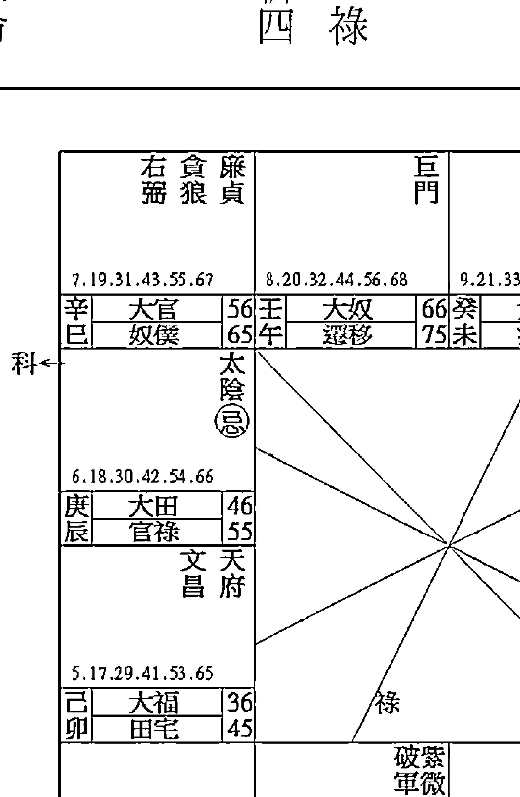
女命 乙亥年生 24歲

### 5. 簡易命盤

| 辛 奴 | 壬 遷 | 癸 疾 | 甲 財 |
| :---: | :---: | :---: | :---: |
| 庚 官 |  |  | 乙 子 |
| 己 田 |  |  | 丙 夫 |
| 戊 福 | 己 父 | 戊 命 | 丁 兄 |

*注：表格中包含“權”、“忌”、“科”、“祿”等標識及數字“46/55”，“36/45”，“大命 16/25”，“06/15”等信息。*

### 6. 教你馬上學會「算命」？
1. 哪一個宮位有化質，算化質就是算命。
   - 祿星在本命命盤的命宮。
   - 權星在本命命盤的財帛宮。
   - 科星在本命命盤的父母宮。
   - 忌星在本命命盤的官祿宮。
2. 算命就是算命中注定的事。
   - 祿星在命宮：表示有條件才有貴人。
   - 權星在財帛宮：表示賺大錢要有企圖心。
   - 科星在父母宮：表示命中是主管、老闆。
   - 忌星在官祿宮：表示最折磨的事在事業。
3. 算命就是算命中的優勢在哪裡。
   - 解釋：每個人都有自己的命中優勢。
4. 算命就是讓命中的優勢變成未來成功的個性。
   - 解釋：個人命中的優勢=成功的個性。
5. 命中優勢：請參考本書第九章第三節。

| 疾 | 財 | 子 | 夫 | 兄 |
|---|---|---|---|---|
| 甲 大疾<br>天同 天梁 (權) | 乙 大財 | 丙 大子<br>太陽 | 丁 大夫<br>文曲 | 戊 福<br>大父 26/35 |
| 癸 大遷<br>天相 | 大遷 | 大子 | 大兄 06/15<br>天機 (祿) | 己 父<br>大命 16/25 |
| 壬 大奴<br>巨門 | 大奴 | 大命 | 紫微 破軍 (科) | 庚 官<br>大田 46/55 |
| 辛 大官<br>右弼 貪狼 廉貞 | 大官 | 太陰 (忌) | 文昌 天府<br>大福 36/45 | 辛 大官 |

### 7. 教你馬上學會「算運」
- 1. 算運就是算本命命盤+大限命盤：
  - 大兄有祿星+本命命宮。
  - 大疾有權星+本命財帛宮。
  - 大命有科星+本命父母宮。
  - 大田有忌星+本命官祿宮。
- 2. 算運就是「本命命盤+大限命盤」：
  - 大兄【祿星】+重疊本命。
  - 解釋：16／25大命有驛馬逢貴的好運。
  - 大疾【權星】+重疊本財。
  - 解釋：16／25大命只要努力付出，一定可以得到相對的回報。
  - 大命【科星】+重疊本父。
  - 解釋：16／25大命有投資自己未來的好運。
  - 大田【忌星】+重疊本官。
  - 解釋：16／25大命必須換公司或換地點後，事業的好運才會開始轉強。

### 8. 算流年｜本命命盤＋大限命盤形成相同的現象

| 宮位/星曜 | 巨門 | 天相 | 天梁(權)、天同 |
|---|---|---|---|
| 大奴(壬) | 大遷(癸) | 大疾(甲) |
| 太陰(忌)、大田(庚)46/55、官 | | 天府、文昌 | 大福(己)36/45、田 | 太陽、大子(丙)夫 | 左輔、七殺、武曲、大財(乙)子 |
| | | | 祿 |
| 紫微(科)、破軍、大命(己)16/25、父 | 天機(祿)、大兄(戊)06/15、命 | 文曲、大夫(丁)兄 |
| 大父(戊)26/35、福 | | | 忌 |

1. 本命命盤的分析：
   - 本命有祿星：表示生意人是命中的優勢。
   - 本財有權星：表示專業專技才能賺大錢。
   - 本父有科星：表示當老闆是人生的目標。
   - 本官有忌星：表示第二次選擇才能成功。
2. 大限命盤的分析：
   - 大兄有祿星：16／25業務工作是好的選擇。
   - 大疾有權星：16／25努力的事業會有代價。
   - 大命有科星：16／25事業可以找到貴人。
   - 大田有忌星：16／25搬家後事業運轉強。
3. 流年命盤的分析：
   - 本命與大命形成「命對命」的相同現象。
   - 本命有祿星與大命有科星形成相同的現象，所以，只要把兩個宮位的重疊現象合起來解釋即可。
   - 解釋：本命「兄」+大命「父」，表示16／25大命在事業上有好運，是培養條件的好時機。

### （二）算感情至少由兩百種以上的「公式」算出來
生病看醫生，醫生一定會先問清楚病情；你去算命，命理老師卻只問你要算感情、事業、子女……而已，這是完全不正確的算命方式。因為，問清楚病情才能醫好病因；問清楚感情的前因後果，才能幫助當事人得到最大的利益。所以，算命前的「問診」功夫，是決定命理老師算命準不準的關鍵。例如，男女在一起相戀的時間，決定了和這個人的緣分長短；分手的時間，也會遇到誰。

#### 1. 應用「生年四化」推算的公式有哪些？
化質＝祿星、權星、科星、忌星，任何一顆四化星都可以代表化質。
- 1. **夫妻宮有化質**：有四種公式。
  - 解釋「內容」時，每顆四化星都會不一樣。
  - 實例分析：任何一顆四化星在夫妻宮都可以成立正緣，表示命中一定會自然的遇到愛你的人。但解釋「內容」時，每顆四化星都會不一樣。
- 2. **命宮有化質**：有兩種公式。
  - 實例分析：命宮有男命女星或女命男星的化質，表示命宮有兩種組合。
- 3. **一個宮位有兩個化質**：有七十二種公式。
  - 實例分析：一個宮位有兩個化質，表示一個宮位有六種組合＋十二個宮位＝七十二種的公式組合。
  - 實例分析：一個宮位有兩個化質，有「祿權、祿科、祿忌、權科、權忌、科忌」六種。
  - 實例分析：任何兩顆四化星的組合都可以成立感情，表示命中一定會自然的遇到感情。
  - 實例分析：論述「內容」時，任何兩顆四化星的組合在解釋上完全不一樣。
  - 實例分析：一個宮位有三個化質，表示一個宮位有四種組合＋十一個宮位＝四十八種的公式組合。
- 4. **一個宮位有三個化質**：有四十八種公式。
  - 實例分析：任何三顆四化星的組合都可以成立感情，表示命中一定會自然的遇到愛你的人。
  - 實例分析：論述「內容」時，任何三顆四化星的組合在解釋上完全不一樣。

#### 2. 應用「飛星四化」推算的公式有哪些？
- 本命命盤：有八種公式。
- 實例分析：命宮的四化星飛入夫妻宮或夫妻宮的四化星飛入命宮的公式組合。

#### 3. 應用「自化」推算的公式有哪些？
- (1) 本命命盤＋大限命盤：至少有十二種公式。
- (2) 這是職業班的課程，需要更多的公式組合來推算。

#### 4. 應用「大限命盤」推算的公式有哪些？
- 應用「生年四化」公式的組合，在大限命盤都適用。
- 大限生年命盤：至少有六十種公式。
- 大限飛星命盤：有八種公式。

#### 5. 應用「流年命盤」推算的公式有哪些？
- 實例分析：大限命盤的四化星飛入大夫或大夫的四化星飛入大限命盤的公式組合。

#### 6. 應用「流月命盤」推算的公式有哪些？
- 實例分析：傳統命理老師大部分只會利用當下的「流年天干」算流年。例如，二〇一七年為丁酉年，則利用「丁流年天干」所飛出的四化星算流年。
- 切記！命理老師利用「流年命盤」算感情，就是誤導或誤用的謬論，這是完全不準的算命方式。

#### 7. 應用「流日命盤」推算的公式有哪些？
- 實例分析：傳統命理老師大部分只會利用當下的「流月的宮位天干」算流月。例如，二〇一七年三月的宮位天干為「甲」時，就利用「甲天干」所飛出的四化星算流月。
- 切記！命理老師利用「流月命盤」算感情，就是誤導或誤用的謬論，這是完全不準的算命方式。
- 實例分析：傳統命理老師大部分只會利用當下的「流日的宮位天干」算流日。例如，二〇一七年三月八日的宮位天干為「辛」時，就利用「辛天干」所飛出的四化星算流日。
- 切記！命理老師利用「流日命盤」算感情，就是誤導或誤用的謬論，這是完全不準的算命方式。

| 宮位與星曜 | 干支 | 宮位與星曜 | 干支 | 宮位與星曜 | 干支 | 宮位與星曜 | 干支 |
| :--- | :--- | :--- | :--- | :--- | :--- | :--- | :--- |
| 廉貪右弼 | 7.19.31.43.55.67<br>辛巳<br>大官奴僕<br>56, 65 | 巨門 | 8.20.32.44.56.68<br>壬午<br>大奴遷移<br>66, 75 | 天相 | 9.21.33.45.57.69<br>癸未<br>大遷疾厄<br>76, 85 | 天同天梁(權) | 10.22.34.46.58.70<br>甲申<br>大疾財帛<br>86, 95 |
| 太陰(忌)<br>科← | 6.18.30.42.54.66<br>庚辰<br>大田官祿<br>46, 55 | (中央空宮)<br>祿 ← → 祿<br>科 ↗ ↙ | | | 祿<br>科 | 11.23.35.47.59.71<br>乙酉<br>大財子女<br>左輔 七殺 武曲 |
| 文昌天府 | 5.17.29.41.53.65<br>己卯<br>大福田宅<br>36, 45 | | | | 12.24.36.48.60.72<br>丙戌<br>大子夫妻<br>太陽 |
| | 4.16.28.40.52.64<br>戊寅<br>大父福德<br>26, 35 | 破軍紫微(科) | 3.15.27.39.51.63<br>己丑<br>大命父母<br>16, 25 | 天機(祿) | 2.14.26.38.50.62<br>戊子<br>大兄命宮<br>06, 15<br>↓忌 | 文曲 | 丁亥<br>大夫兄弟 |

**說明：** 表格中央有連線，連線旁標註有「祿」、「科」、「忌」等四化關係。
女命
乙亥年生
24歲

### 9. 簡易命盤

| 大官 辛 奴 | 右弼<br>貪狼<br>廉貞 | 巨門 | 大奴 壬 遷 | 天相 | 大遷 癸 疾 | 天同<br>天梁<br>(權) | 大疾 甲 財 |
|---|---|---|---|---|---|---|---|
| 大田 46/55 庚 官 | 太陰<br>(忌) | | | | | 左輔<br>七殺<br>武曲 | 大財 乙 子 |
| 大福 36/45 己 田 | 文昌<br>天府 | | | | 祿 | 太陽 | 大子 丙 夫 |
| 大父 26/35 戊 福 | | 破軍<br>紫微<br>(科) | 大命 16/25 己 父 | 天機<br>(祿) | 大兄 06/15 戊 命 | 文曲 | 大夫 丁 兄 |

### 10. 「飛星四化」怎麼算感情？
- 1. 算感情的宮位「用神」有夫妻宮、子女宮、奴僕宮等三個宮位。
- 2. 傳統命理老師因為不懂命理，把感情統稱為「桃花」，這是最不正確的說詞。
- 3. 感情的緣分共分三種：
  - 夫妻宮：結婚的正緣，這是互相的愛。
  - 子女宮：三角的情緣，這是辛苦的愛。
  - 奴僕宮：過客的惡緣，這不是真心的愛。
- (1) 上圖命盤，16／25大命，大夫「丁」化忌在遷移宮沖本命，表示16／25的感情沒有結果。
- (2) 應用飛星四化算命，一定要「法象」，也就是回歸生年四化看因緣。因為飛忌星，所以回歸生年忌星。忌星在大田「沖」大子，表示兩人會因為三角關係而分手。

### 11. 「生年四化」怎麼算感情？

| 辛官奴 | 壬遷奴 | 癸疾遷 | 甲財疾 |
|---|---|---|---|
| 庚官田 |  | 乙子財 |  |
| 太陰(忌) |  |  |  |
| 己田福 |  | 丙夫子 |  |
| 戊福父 | 己父命 | 戊命兄 | 丁兄夫 |
|  | 破軍(科) | 天機(祿) |  |
|  | 紫微 |  | 文曲 |

○簡易命盤：

○「生年四化」怎麼算感情？
- 1. 算感情的宮位「用神」有夫妻宮、子女宮、奴僕宮等三個宮位。
- 2. 上圖命盤為算命要利用的宮位。
  - 命宮：命宮有「祿星」，女命男星，表示此人有結婚的天命。
  - 命宮：依據祿隨忌走的公式，祿星在命＋忌星在官「沖」夫，表示此人必須經歷兩次以上有緣無分的感情，才能找到真命天子。
- 3. 此命盤 16／25 大命，大田有生年忌星「沖」大子，表示一定會經歷三角關係的緣分。因為，忌沖無情，因緣一定會發生。
- 4. 大田有生年忌星「沖」大子，因大子重疊夫妻宮，也就是大子「夫」，表示此命盤的人會把這段感情當作正緣般的付出。所以，分手後的情傷會很長久。

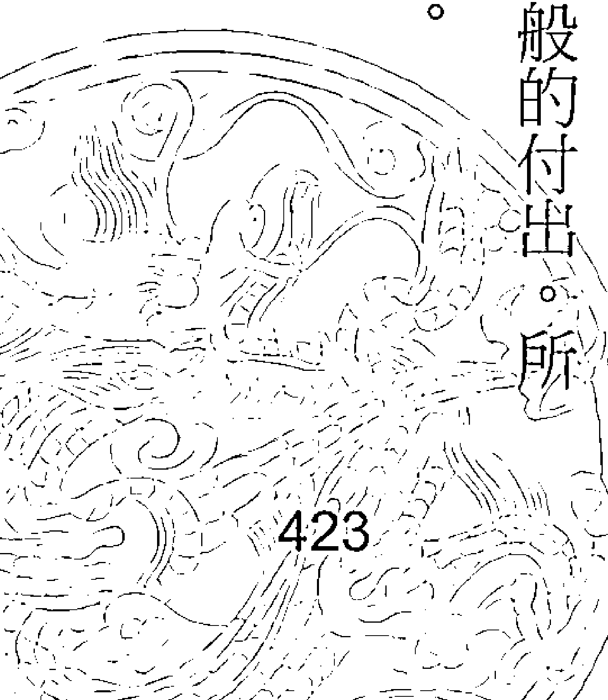

| 右弼貪狼<br>辛奴 | 廉貞<br>壬遷 | 巨門<br>癸疾 | 天相<br>甲財 | 天同天梁<br>權 |
|---|---|---|---|---|
| 大官奴 | 大奴遷 | 大遷疾 | 大疾財 | 大財子 |
| 太陰<br>忌 | | | 左輔七殺<br>武曲 | |
| 大田官 46/55 | | | 大財子 | 太陽 |
| 文昌天府 | | 祿 | 大子夫 |
| 大福田 36/45 | | | 丙夫 | 文曲 |
| 大父福 26/35 | 破軍紫微<br>科己父 | 天機<br>祿大命 16/25 | 大兄命 06/15 | 大夫兄 |
| | ↓ | | | 忌 |

### 12. 「自化」怎麼算感情？
- 1. 算感情的宮位「用神」有夫妻宮、子女宮、奴僕宮等三個宮位。
- 2. 上圖命盤為算命要利用的宮位。
  - (1) 命宮自化忌「離心力自化」。
  - 解釋：命宮有「祿星」，女命男星，表示此人有結婚的天命。又自化忌，法象在官，表示在工作上認識的。
  - (2) 官祿宮飛祿星入夫妻「向心力自化」。
  - 解釋：和我結婚的男人一定要有錢人，因法象祿生在命宮之故。
- 3. 以「自化」分析感情。
- 4. 官祿宮飛祿星入夫妻宮「大財」，生年祿星在26/35的大夫，表示26/35大命所認識的男人，一定要有錢人才是正緣。

### （三）可以算矛盾命盤的人才是真正的高手
所有的命盤都會存在著矛盾的現象，假如算命無法突破這點，你的問題一定出在無法解釋矛盾的現象。要知道，真正的高手才能完整的解釋命盤。

高階算命一定是預測未來人事務的結果。如果命理老師利用已經知道的結果，再從命盤反推自己想要的答案，這就是最初階的算命方式，也是傳統命理老師60%以上的本事。

- 1. 傳統命理老師遇到矛盾的命盤時會回答的話
  - (1) 利用宗教誤導。
  - (2) 利用神鬼嚇人。
  - (3) 利用胡扯亂扯來解釋矛盾的命盤。
- 2. 矛盾的現象，就是人事務的分界點
  - (1) 時間的分界點：確定交往的時間 (年月日時)，才能掌握感情的分界點。
  - (2) 吉凶的分界點：確定當事人正緣、三角、過客的時間 (年月日)，才能掌握結婚的分界點。
  - (3) 內容的分界點：確定當事人兩人在一起的時間 (年月日)，才能掌握感情長短的分界點。
  - (4) 影響的分界點：確定當事人重大事件的時間 (年月日)，才能掌握真愛與假愛的分界點。

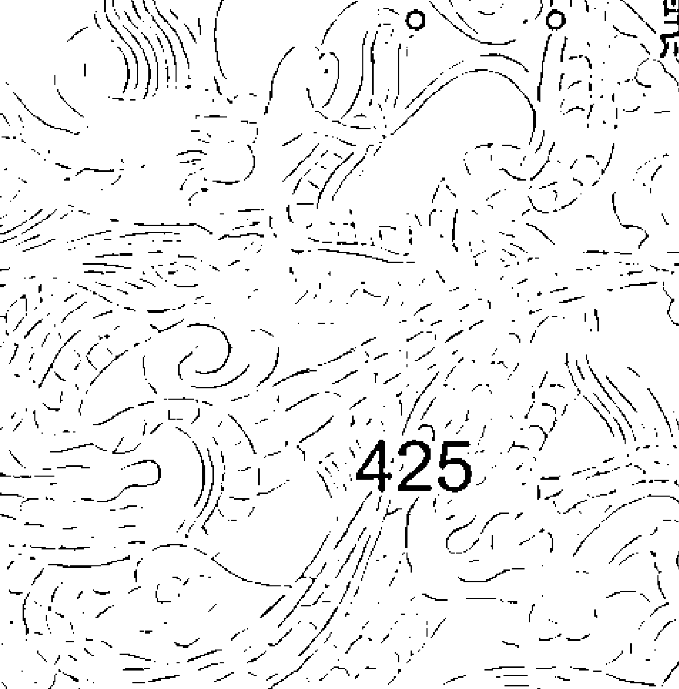
精準掌握兩人的緣分會發生什麼事。
- 1. （5）改運的分界點：確定當事人分分合合的時間（年月日），才能掌握分手與結婚的分界點。
- 2. （6）轉運的分界點：確定當事人在一起、分開、同居、訂婚、結婚、生子的時間（年月日），才能掌握緣分長短的分界點。

### 3. 所有矛盾的事件，都在分析高階算命的內容
以創業為例：
- 1. （1）時間的內容：精準掌握創業賺錢的時間，從哪一年月日時開始至哪一年月日時結束。
- 2. （2）吉凶的內容：精準掌握好運與壞運的時間，從哪一年月日時開始至哪一年月日時結束。
- 3. （3）內容的內容：精準掌握創業前必須完成哪些事，才能進入創業的時間。
- 4. （4）影響的內容：精準掌握時間＋吉凶＋內容，才能創造永續經營的事業。
- 5. （5）改運的內容：精準掌握是非、競爭、衝突的因緣，我要做哪些事才能順利創業賺錢。
- 6. （6）轉運的內容：精準掌握事業的準備期、創業期、擴大期，我要做哪些事才能賺大錢。

### （四）怎麼精準掌握每一事件的時間與吉凶
- 1. 四化星的「用神」：「算人」的用神是科星，「算事」的用神是權星，「算物」的用神是祿星。
- 2. 真正的算命，一定要利用四種以上的宮位「用神」交叉應用，才能精準掌握每一事件的時間與吉凶。
- 算命實例：算35／44這個大限時，一定要掌握前一個大限25／34與後一個大限45／54人事物的吉凶。因為，這三個大限所使用的用神不同，每一事件的吉凶也會不一樣。
- 算命實例：算二〇一八年的事業時，一定要掌握前三年與後三年事業的好運與壞運。因為，這七年所使用的用神不同，每一事件的吉凶也會不一樣。
- 3. 高階算命，一定要利用兩種以上不同的「用神」來交叉應用，才能精準掌握每一事件的時間與吉凶。
- 算命實例：算感情時，一定要掌握兩人交往的時間、互動的感情、吉凶的緣分、不同的生肖……等因緣，因為，每一種因緣都需要利用不同的「用神」來精準算命。
- 算命實例：算事業時，一定要掌握創業的準備期、創業期、賺錢期、擴大期。因為每一種因緣都需要利用不同的「用神」來精準算命。

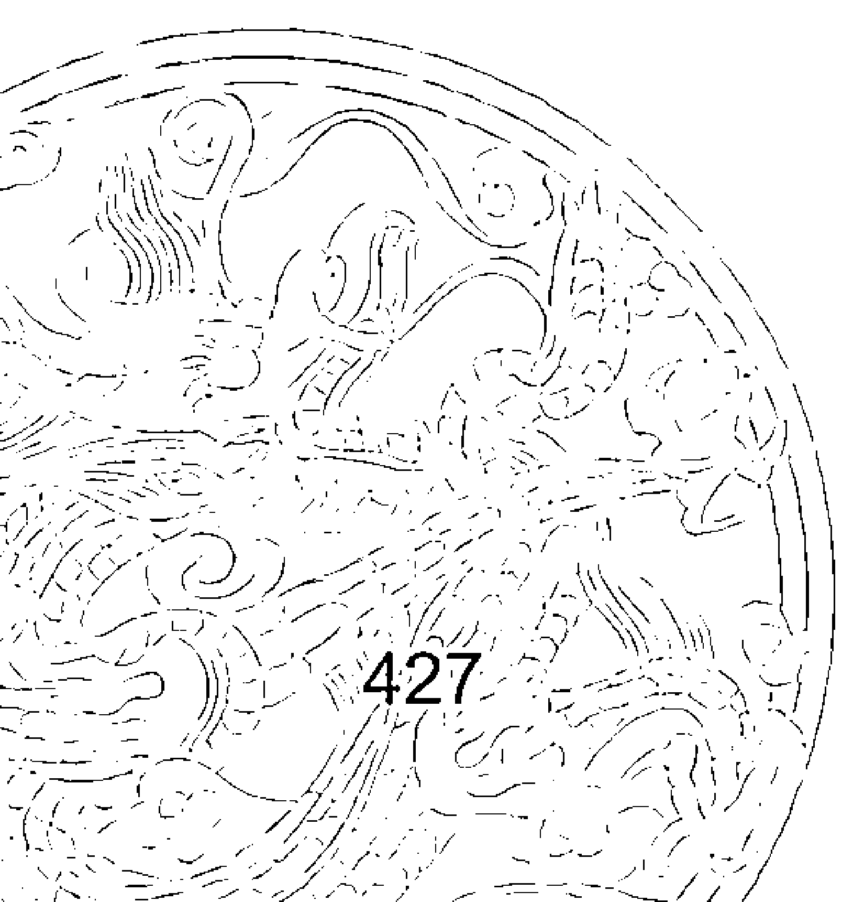

### 13. 簡易命盤

| 己父 | 庚福 | 辛田 | 壬官 |
|------|------|------|------|
| 戊命 |      |      | 癸奴<br>忌 |
| 丁兄 |      |      | 甲遷 |
| 丙夫<br>忌←科 | 丁子 | 丙財 | 乙疾 |

○ 結婚，一定要經歷感情的分開
- 1. 矛盾的命盤是算命的基本功夫。
- 2. 可以精準掌握矛盾命盤的老師，才是真正會算命（算運）的高手。
- 3. 初階的算命：不知道有矛盾的現象。
- 4. 進階的算命：一定會遇到矛盾的現象。
- 5. 高階的算命：精準掌握結婚的分界點。
- 這是職業班的課程，需要一連串的公式組合。

# 拾、看懂這些訣竅，「算運」功力會增加十倍

#### ○簡易命盤：

| 己父 | 庚福 | 辛田 | 壬官 |
| :--- | :--- | :--- | :--- |
| 戊命 | | | 癸奴 |
| 丁兄 | | | 甲遷 |
| 丙夫 | 丁子 | 丙財 | 乙疾 |

○創業，一定要經歷事業的無情事

- 1. 矛盾的命盤是算命的基本功夫。
- 2. 可以精準掌握矛盾命盤的老師才是高手。
- 3. 初階的算命：不知道有矛盾的現象。算命實例：本命官祿宮有權星，表示有企圖心的事業，才可以進入成功境地。
- 4. 進階的算命：一定會遇到矛盾的現象。算命實例：本命官祿宮有權星又有自化忌星，表示往上爬的事業有變化。法象的生年忌星在遷移宮，表示順心的工作會突然面臨選擇的問題，一定會發生自己創業的因緣。
- 5. 高階的算命：精準掌握創業的分界點。算命實例：本命官祿宮有權星，又有自化忌星，表示第三大限「夫」一定要面臨創業的選擇。精準掌握何時無情？何時創業？這是職業班的課程，需要一連串的公式組合。

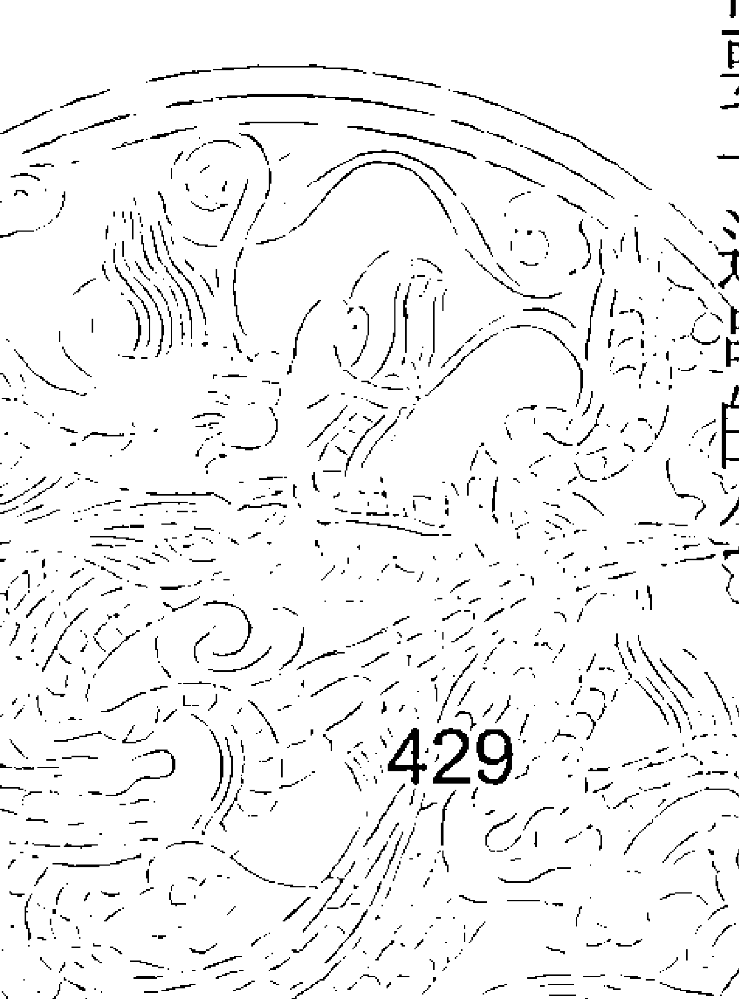

## 八、怎麼掌握自己人生的好運

### （一）怎麼規劃人生的好運？

- 1.天生命格的規劃：只利用天生命格的規劃，就會有二十年以上的好運。
- 2.本命命盤的規劃：只利用本命命盤的規劃，就會有十年以上的好運。
- 3.大限命盤的規劃：只利用大限命盤的規劃，就會有五年以上的好運。
- 4.流年命盤的規劃：只利用流年命盤的規劃，就會有三個月以上的好運。

### （二）怎麼規劃感情的好運？

- 1.天生命格的規劃：只利用天生命格的規劃，就可以找到「天賜良緣」的感情。
- 2.本命命盤的規劃：只利用本命命盤的規劃，就可以找到「長長久久」的感情。
- 3.大限命盤的規劃：

### （三）怎麼規劃事業的好運？

- 1. 天生命格的規劃：只利用天生命格的規劃，就可以找到「追求夢想」的事業。
- 2. 本命命盤的規劃：只利用本命命盤的規劃，就可以找到「升官發財」的事業。
- 3. 大限命盤的規劃：只利用大限命盤的規劃，就可以找到「投機利益」的事業。
- 4. 流年命盤的規劃：只利用流年命盤的規劃，就可以找到「感覺良好」的事業。

### （四）怎麼規劃住家的好運？

- 1. 天生命格的規劃：只利用天生命格的規劃，就可以找到「錦上添花」的住宅。
- 2. 本命命盤的規劃：只利用本命命盤的規劃，就可以找到「升官發財」的住宅。

| 天紫府微 | 右左天弼辅機 | 破軍 | 文太陽曲(忌) |
| :--- | :--- | :--- | :--- |
| 2.14.26.38.50.62 | 1.13.25.37.49.61 | 12.24.36.48.60.72 | 11.23.35.47.59.71 |
| 壬 申 | 大父 官祿 52 | 辛 未 | 大命 田宅 42 | 庚 午 | 大兄 福德 32 | 己 巳 | 大夫 父母 22 |
| 文太陰昌→科 | 祿 | 武曲(祿) | 科 |
| 3.15.27.39.51.63 | 10.22.34.46.58.70 |
| 癸 酉 | 大福 奴僕 62 | 戊 辰 | 大子 命宮 12 |
| 貪狼(權) | 權← | 天同 |
| 4.16.28.40.52.64 | 9.21.33.45.57.69 |
| 甲 戌 | 大田 遷移 72 | 丁 卯 | 大財 兄弟 |
| 互門 | 廉貞 天相 | 天梁(科) | 七殺 |
| 5.17.29.41.53.65 | 6.18.30.42.54.66 | 7.19.31.43.55.67 | 8.20.32.44.56.68 |
| 乙 亥 | 大官 疾厄 82 | 丙 子 | 大奴 財帛 92 | 丁 丑 | 大遷 子女 | 丙 寅 | 大疾 夫妻 |

### （五）好運的實例分析

女命 己未年 40歲

- 3. 大限命盤的規劃：只利用大限命盤的規劃，就可以找到「宜室宜居」的住宅。
- 4. 流年命盤的規劃：只利用流年命盤的規劃，就可以找到「感覺良好」的住宅。

# 拾、看懂這些訣竅，「算運」功力會增加十倍

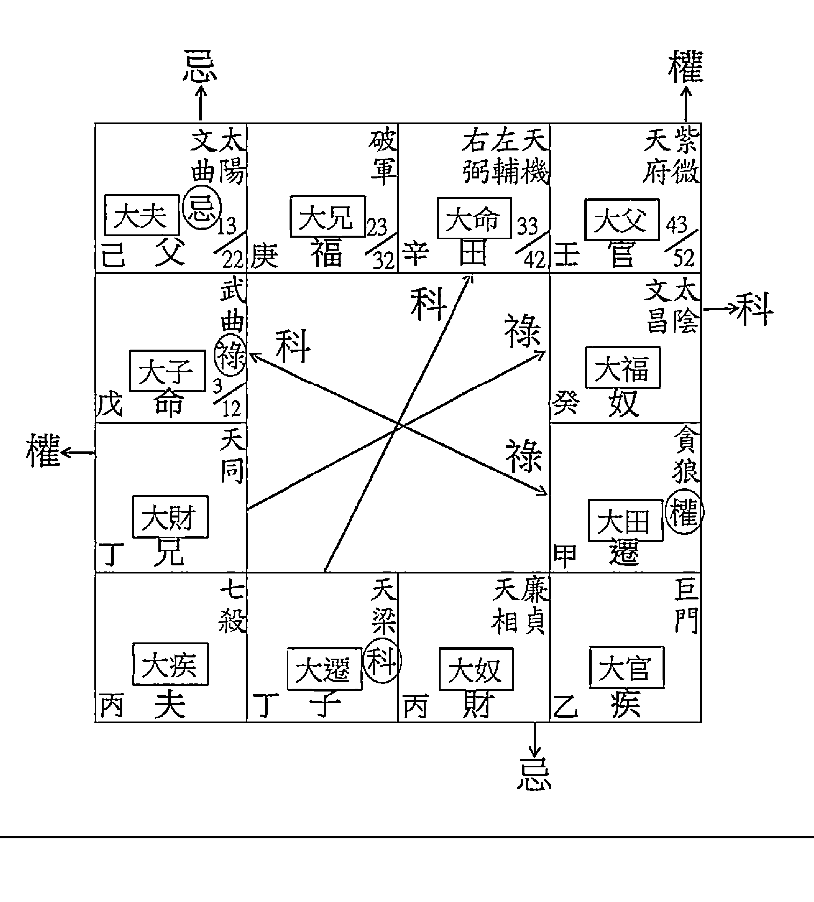

怎麼規劃感情的好運？

- 1. 真正的算命：「先」有格局才有本命；「先」有大限才有流年。
- 2. 真正的算命：就是格局「大於」本命「大於」大限「大於」流年。
- 3. 命格的規劃：祿權格，生意人的命格，表示適合找條件好的對象。
- 4. 本命的規劃：祿權格（論感情），媒介在忌星（父）。表示命中必須經歷兩次以上換工作，才能找到真命天子。
- 5. 大限的規劃：依據祿（大子）隨忌（大夫）走的公式。表示33／42大限，必須經歷三角關係或奉子成婚，才能找到正緣。
- 6. 流年的規劃：這是最無知的算命。因為流年只占感情緣分的10％，怎麼會準呢？
- 7. 每一事件都需要一連串的公式組合，才能精準規劃未來。

# 學紫微斗數，這本才能算命

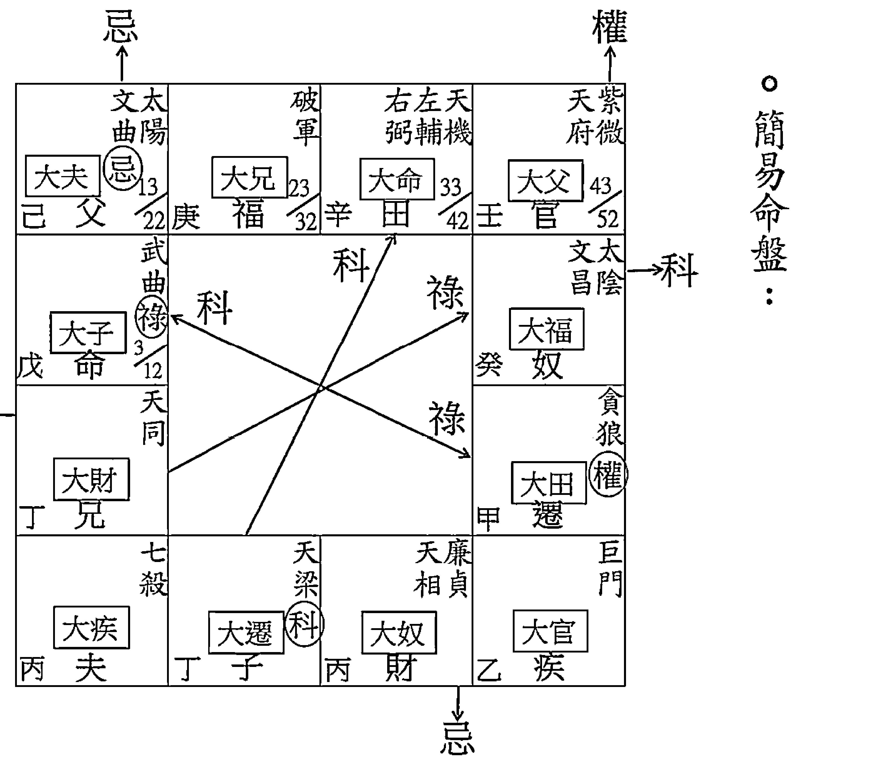

怎麼規劃事業的好運？

- 1. 真正的算命：『先』有格局才有本命；『先』有大限才有流年。
- 2. 真正的算命：就是格局『大於』本命『大於』大限『大於』流年。
- 3. 命格的規劃：祿權格，賺錢的命格，表示人生的規劃要遠大，創業才能賺大錢。
- 4. 本命的規劃：祿星在命（生意人），權星在遷（出外逢貴格）。表示離開父母獨立後，事業的好運才會開始轉強。
- 5. 大限的規劃：依根據祿（命）隨忌（大夫）走的公式。表示33／42大命，必須經歷兩次的換工作後，才能找到人生的方向。
- 6. 流年的規劃：這是最無知的算命，因為流年只占感情緣分的10％，怎麼會準呢？
- 7. 每一事件都需要一連串的公式組合，才能精準規劃未來。

# 拾、看懂這些訣竅，「算運」功力會增加十倍

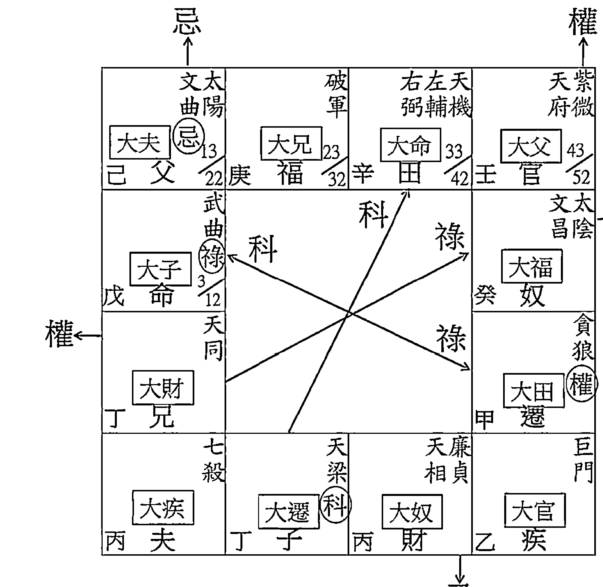

#### ○ 簡易命盤：

#### ○ 怎麼規劃住家的好運？

- 1. 真正的算命：「先」有格局才有本命；「先」有大限才有流年。
- 2. 真正的算命：就是格局「大於」本命「大於」大限「大於」流年。
- 3. 命格的規劃：祿權格，生意人的命格，表示適合找店面或透天的房屋。
- 4. 本命的規劃：祿星在命（生意人），權星在遷（過路客）。表示增值的房屋才是理想的住家，也可以做房屋買賣的行業。
- 5. 大限的規劃：33／42大命，權星在大田。表示店面、透天、增值的房屋才是理想的住家，也才能幫助事業的房屋。
- 6. 流年的規劃：這是最無知的算命，因為流年只占感情緣分的10％，怎麼會準呢？
- 7. 每一事件都需要一連串的公式組合，才能精準規劃未來。

# 拾壹、「改運」有效嗎？

長久以來，傳統命理老師最喜歡改運賺錢，總是搞一些無效的改運、補運、補元神⋯⋯來騙錢，讓許多人不僅觀感不佳還談「改運」色變，甚至會聯想到是否是詐騙集團。那麼，到底改運有沒有效？何時需要改運？就成爲本篇的重要主題。

改運有效嗎？答案是肯定的。而有沒有效的關鍵點在於「時間十項目」的二合一，缺一不可。簡單的說，在對的時間點做對的事，就是改運。真正命理學的改運與所有宗教的儀式沒有直接無關，因爲，宗教的最大作用是給人心靈上的慰藉而不是爲了改運。

本篇包括六大重點：一是改運是什麼？二是命運可以改嗎？三是改運有效嗎？四是何時才需要改運？五是改運要找誰？六是掌握「天時」，才能讓你美夢成真。

現就改運的六大重點分析如下：

## 一、改運是什麼？

廣義的改運有兩種：一是改運，二是轉運。

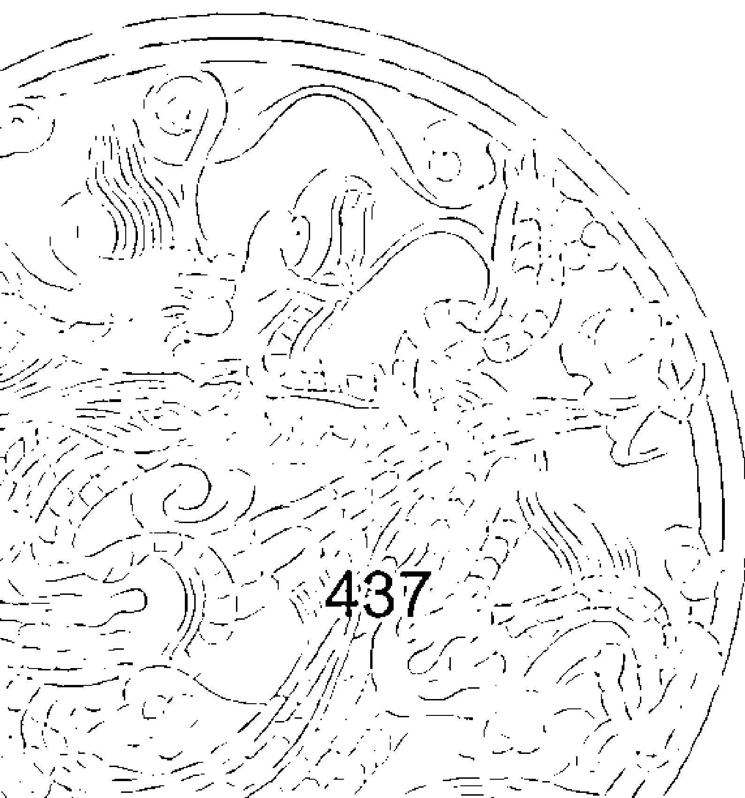

### (一) 改運是什麼？

「改運」：在有效的時間內才能產生效果。

#### 1. 改運的定義：

改運定義：壞運持續中，必須做對一件事，才能讓壞運快速降低或中止。

#### 2. 改運的實例：

在人：剛分手的感情，可以挽回嗎？在事：事業陷入困境，可以起死回生嗎？在物：搬家後健康出現了問題，可以改運嗎？

#### 3. 傳統派的改運：

無效的改運：傳統命理老師誤用或誤解改運，卻不知道無效的改運只會害人。

- 1. 改運的項目：有造命、收驚、符咒、唸經、招財、補運、做生基、斬桃花、補財庫、補元神、拜主神、祭嬰靈、點光明燈、祭冤親債主……等無效的改運。
- 2. 傳統命理老師大部分都知道改運是無效的，只是為了養家餬口卻不得不做改運的工作。
- 3. 絕大部分的改運只是心理安慰而已，有效改運的分數低於10%以下。

#### 4. 華山派的改運：

有效的改運：華山派命理老師堅持有效的改運，會拒絕當事人無效項目的委託。

- 1. 改運的項目：有陽宅、陰宅、改名、創業、結婚、換工作、生小孩、幫助娘家、傳宗接代……等有效的改變。
- 2. 華山派命理老師不做無效的改運，堅持幫助當事人得到人生最大的利益。

# 拾壹、改運有效嗎？

### (二) 轉運是什麼？

「轉運」：在有效的時間內才能產生效果。

#### 1. 轉運的定義：

轉運定義：好運未來前，必須做對一件事，才能讓好運加倍或快速來臨。

#### 2. 轉運的實例：

- 在人：我的感情一直沒有結果，該怎麼做我才能結婚？
- 在事：我的事業一直沒機會升遷，該怎麼做才能升官或創業？
- 在物：我遇到的員工都不長久，該怎麼做才能讓事業穩定發展？

#### 3. 傳統派的轉運：

- (1)無效的轉運：絕大部分的命理老師誤把改運當作轉運。
- (2)改運的項目：有造命、補運、招財、做生基、補財庫、補元神、拜主神、擺放物品、配戴飾品……等等。
- (3)絕大部分只是心理安慰而已，有效分數只有10%以下。

#### 4. 華山派的改運：

- (1)有效的轉運：華山派命理老師堅持「有效」的改運，會拒絕當事人無效項目的委託。
- (2)改運的項目：有陽宅、陰宅、改名、創業、結婚、換工作、生小孩、幫助娘家、傳宗接代……等等有效的改變。
- (3)華山派命理只講「有效」的命理學，有效改運的分數高達90%以上。

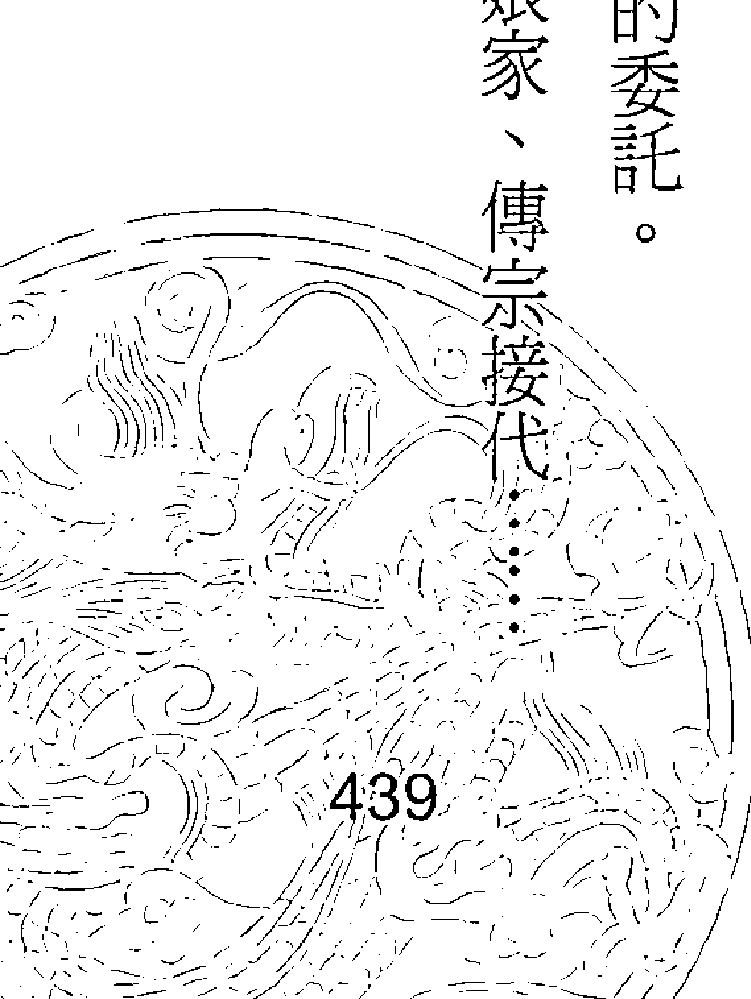

- (3) 華山派命理老師不做無效的轉運，堅持幫助當事人得到人生最大的利益。
- (4) 華山派命理只講「有效」的命理學，有效分數高達90％以上。

## 二、命運可以改嗎？

### (一) 「命」是注定的，當然不能改

- 1. 「命」不能改。因為還沒有形成時間、空間、吉凶、影響的因緣，所以，無從改運。
「命」是命中注定的因緣，每一個人注定的緣分都不同，當然不能改。
算命實例：命中出外才能成就的人。
算命實例：命中繼承家業的人。
- 2. 「命」是命中注定的格局，當然不能改。
算命實例：生意人的命格，創業‖賺錢的心＋事業的企圖心。
算命實例：是非競爭的命格，成就的事業‖強求心＋強要心＋強勢的心。

### (二) 「運」是自己選擇的，當然可以改

- 1. 「運」可以改，因為，它已經形成時間、空間、吉凶、影響的事實。
「運」是後天環境自己的選擇，當然可以改。
「運」是環境多選擇的變數，當然可以改。

## 三、改運有效嗎？

- 2.「運」是我現在決定的事，當然可以改。
算命實例：每個人個性不同、喜好不同、興趣不同，所以會有不同的選擇。

### （一）改運當然有效

- 1. 出事期：從發生災厄開始，出事期最少有兩年以上；不理它，災厄的時間也會自然結束。
- 2. 改運期：從確定災厄期前兩年就開始改運，可以讓災厄快速降低或提前結束。
對人：在錯的時間找到無情的人，結束緣分就是改運。
算命實例：在過客的時間誤認爲是正緣，快速結束感情才能找到正緣。
對事：在錯的時間點創業，結束事業就是改運。
算命實例：在錯的時間誤認爲是創業的好運，快速結束事業才能迎接第二次好運。
對物：在錯的時間點找到無情的房屋，搬新家就是改運。
算命實例：在錯的時間誤認爲是好陽宅，快速搬新家才能找到好房屋。

### （二）何時改運才有效

有效改運＝決定的時間十對的項目。

## 四、何時需要改運？

### （二）何時才需要改運？

廣義的改運有兩種：一是改運，二是轉運。

#### 1. 「改運」的定義：

改運的廣義解釋：壞運持續中，必須做對一件事，才能讓壞運快速降低或中止。
轉運的廣義解釋：好運未來前，必須做對一件事，才能讓好運加倍或快速來臨。

每一件事件都有三次以上的無情期與有情期。

#### 1. 做對「時間」，改運才有效。

「做對」時間：例如，在正緣的時間內結婚，才能緣分長久。
「做對」時間：例如，在好運的時間點創業，才能讓夢想成真。
算命實例：在二〇一七年六月結婚的對象，婚姻才能長久。
算命實例：在二〇二二年十月的創業，事業才能賺大錢。

#### 2. 做對「因緣」，改運才有效。

「做對」改運的項目，例如，結婚、生子、改名、創業、陽宅、陰宅、換工作、幫助娘家、傳宗接代……等因緣，改運才有效。
算命實例：結婚後人生的好運才開始，事業進入創業期。
算命實例：最有利的助手離開後，事業開始進入好運期。

# 拾壹、改運有效嗎？

### （二）何時才需要轉運？

- 1. 「轉運」的定義：
壞運開始「前」兩、三年所做的開運現象，稱為「改運」，才是進入「改運」的好時機。
- 2. 「改運」的最佳時機：
算命實例：在感情上，有連續兩次被拋棄的現象，才有資格改運。
算命實例：在事業上，有連續兩年換工作的現象，才有資格改運。
壞運開始「前」兩、三年所做的改運才會有效，但只能降低災厄，還不能帶來好運。
- 3. 「有效改運」的擇日：
有效「擇日」的重點，一定是現在的災厄已到了盡頭＋我現在想要的利益已經開始，才是改運選擇日的最好時機。
- 4. 真正的改運必須經歷兩次的好機緣：第一次改運可以降低災厄，第二次改運才能將壞運中止或轉變成好機緣。
算命實例：感情連續兩次分手＋我想「旺」事業、財運……的好運，才是改運的好時機。
算命實例：感情第一次分手的改運，只能讓第二次的對象轉變成好緣分。
算命實例：感情第二次分手的改運，才能讓好緣分的對象轉變成真命天子（天女）。

算命實例：在感情上，連續兩年沒有交往的對象，才有資格轉運。
算命實例：在事業上，連續兩次沒有升遷的機會，才有資格轉運。

#### 2.「轉運」的最佳時機：

好運開始「前」兩、三年所做的轉運，轉運才會有效，這會讓自己的好運提前來臨。
好運開始「後」兩、三年再次轉運，轉運才會加倍，這是升官或創業的好時機。

#### 3.「有效轉運」的擇日：

「有效擇日」的重點，一定要災厄已到了盡頭＋我現在想要的利益已經開始，才是轉運擇日的好時機。

#### 4. 真正的轉運要經歷兩次的好機緣：第一次會讓自己的好運提前來臨，第二次才能讓自己幸運加倍。

算命實例：感情連續兩年沒有交往的對象＋我想「旺」事業、貴人……才是轉運的好機緣。
算命實例：事業連續兩次沒有升遷的機會＋我想「旺」感情、財運……才是轉運的好機緣。

### （三）不改運或不轉運會發生什麼事？

#### 1. 「不改運」會發生什麼事？

不改運時，只會讓不幸的事件繼續如期發生，讓所有的災厄得不到改善的機會。
算命實例一：假如我一直不換工作，我創業賺錢的機緣就不會出現，直到我認命為止。

# 拾壹、改運有效嗎？

算命實例二：假如我一定要選擇條件好的男人，那麼正緣就會往後延誤，直到認命為止。

#### 2.「不轉運」會發生什麼事？

不轉運時，只會讓好的人事物延後發生，讓所有的好機緣失去更上一層樓的機會。
算命實例一：在事業上，為什麼一直不能升遷？原來重新回到學校進修就是升遷的必要條件。
算命實例二：在感情上，為什麼找不到正緣？原來先交往條件差的人，就是進入正緣姻緣的必要條件。

## 五、改運要找誰？

### （一）改運不需要「外求」

- 1.傳統派命理老師：
外求的改運：
(1) 外求的改運項目有造命、收驚、符咒、唸經、招財、補運、做生基、斬桃花、補財庫、補元神、拜主神、祭嬰靈、點光明燈、祭冤親債主……等無效的改運。
(2) 傳統派命理老師，一定不知道掌握「時間＋項目＋生肖」三種合一，才能真正有效的改運。
(3) 傳統派命理老師的改運，絕大部分只是心理安慰而已，有效分數只有10％以下。
- 2.華山派命理老師：
正確的改運：
(1) 正確的改運項目有陽宅、陰宅、改名、創業、結婚、換工作、生小孩、幫助娘家、傳宗接...

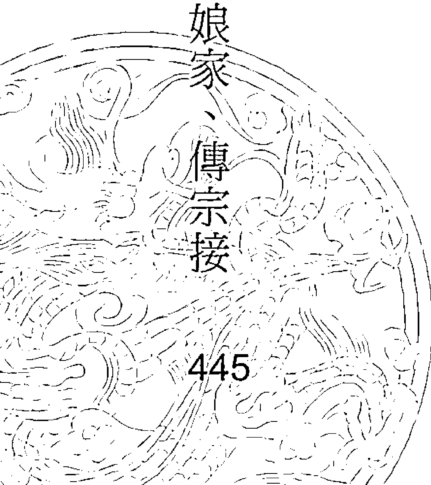

### （二）命盤可以顯示出改運的「內容」

- 1. 紫微斗數的命盤可以清楚顯示改運的事情。
上天有好生之德，所有的改運並不需要靠外求，紫微斗數的命盤早已清楚顯示出應該做對「哪一件事」，才能快速降低災厄或中止傷害。
- 2. 紫微斗數的命盤可以清楚顯示改運的內容。
(1) 宗教的因緣果報其實就是改運的一種，但並不是一般人口中「什麼因，得什麼果」，而是人生遇到什麼「緣」才會有什麼「果」。
(2) 因緣果報，這裡的「緣」指的是「時間+數目+生肖」。時間在何時？數目有幾次？生肖是誰？三種現象成立後才能成就此因緣果報。

### （三）命理老師只能告訴你改運的「時間+項目」

- 1. 真正有效的改運，一定要在三個月內產生有效的好結果，讓你快速降低災厄。
- 2. 真正有效的轉運，一定要在一年內產生有效的好結果，讓你人事物的夢想成真。
- 1. 傳統派命理老師誤用的改運：
- (1) 傳統派命理老師的改運是「沒有依據」的誤解與誤用。

# # 拾壹、改運有效嗎？

算命實例：衰運時，傳統派命理老師最多只能告訴你：現在的衰事是你前世的因果。
(2)傳統派命理老師的改運只是「心理作用」而已。
算命實例：衰運時，傳統派命理老師一定會告訴你：需要花錢改運才能化解災厄。

### 2.華山派老命理師正確的改運：

(1) 華山派命理老師的改運，是依據「對的時間」，才能產生趨吉避凶的結果。
算命實例：衰運時，華山派命理老師會告訴你何時改運，可以讓衰運快速降低災厄。
算命實例：衰運時，華山派命理老師會告訴你何時改運，可以讓衰事轉變成好運的準備期。
(2)華山派命理老師的改運，是依據「對的項目」，才能產生快速有效的好結果。
算命實例：衰運時，華山派命理老師會告訴你，做什麼事，才能讓災厄化險為夷。
算命實例：衰運時，華山派命理老師會告訴你，改運會發生什麼事？不改運會發生什麼事？

# 各門派【改運】分析表

| 項目/命理 | 物品種類 | 對的時間 | 不對時間 | 最高指導 | 決定的事發生何事 |
|---|---|---|---|---|---|
| 華山派 陰陽宅 | 結婚、生子、改名、事業、陽宅、陰宅、安公媽……的變動 | (分等級) 最高級 | 分數：0% (心理分數) 10% | 1、只限個人<br>2、個人專屬 (量身訂做) | (問)：搬家<br>1、我會發生什麼事？<br>2、怎麼做？<br>3、我會影響什麼事？<br>4、繼續問…… |
| 傳統派 陽宅 | 1、設神明廳<br>2、擺放東西<br>3、配戴飾品 | (分等級) 中高級 | 分數：0% (心理分數) 10% | 1、眾生適用<br>2、利用 (通書) | 無法精準預測 |
| 傳統派 陰宅 | 1、墓地葬法<br>2、墓地造法<br>3、墓地擺設 | (分等級) 中高級 | 分數：0% (心理分數) 10% | 1、眾生適用<br>2、利用 (通書) | 無法精準預測 |
| 傳統派 命理 | 1、擺放東西<br>2、擺放植物<br>3、配戴飾品 | (分等級) 中級 | 分數：0% (心理分數) 10% | 1、眾生適用<br>2、利用 (通書) | 無法精準預測 |
| 塔羅牌 | 1、擺放東西<br>2、擺放植物<br>3、配戴飾品 | (分等級) 中級 | 分數0% (心理分數) 10% | 1、眾生適用<br>2、利用 (撲克牌) | 無法精準預測 |
| 生命靈數 | 1、擺放東西<br>2、擺放植物<br>3、配戴飾品 | (分等級) 中級 | 分數：0% (心理分數) 10% | 1、眾生適用<br>2、利用 (通書) | 無法精準預測 |
| 宗教祭祀 | 1、各種祭典<br>2、擺放東西<br>3、配戴飾品 | (分等級) 中級 | 分數：0% (心理分數) 10% | 1、眾生適用<br>2、利用 (通書) | 無法精準預測 |
| 其他派 命理學 | 物品種類 | 對的時間 | 不對時間 | 最高指導 | 決定的事 (發生何事) |

# 六、掌握「天時」，才能讓你美夢成真

- 1. 你知道嗎？「命運掌握在自己的手中」，這句話只說對了一半。靠自己的人，可以找到想要的工作嗎？答案是否定的。因為說的人自己也不敢肯定。
- 2. 你知道嗎？掌握天時＋地利＋人和者，才是真正掌握命運的人。

天時：抓黑鮪魚，就要在每年的四月到六月才抓得到，所以盲目努力是沒有用的。

地利：創業賺錢，就要在對的時間＋對的地點才能美夢成真，所以盲目努力是沒有用的。

人和：掌握人脈，就要知道貴人何時出現＋貴人何時離開我，所以盲目努力是沒有用的。

## （一）命理學＝天時＋地利＋人和

- 1. 天時：就是算命＋算運，占50%的重要性。
- 命：就是命中注定的定數。
- 運：就是環境多選擇的變數。
- 2. 地利：就是陽宅＋陰宅，占25%的重要性。
- 陽宅：現在進行式，我現在「利益」位置的選擇。
- 陰宅：未來進行式，我未來「富貴」位置的選擇。
- 3. 人和：就是格局＋條件，占25%的重要性。
- 個人格局：掌握先天「最大的優勢」，才能成就人事物的好因緣。

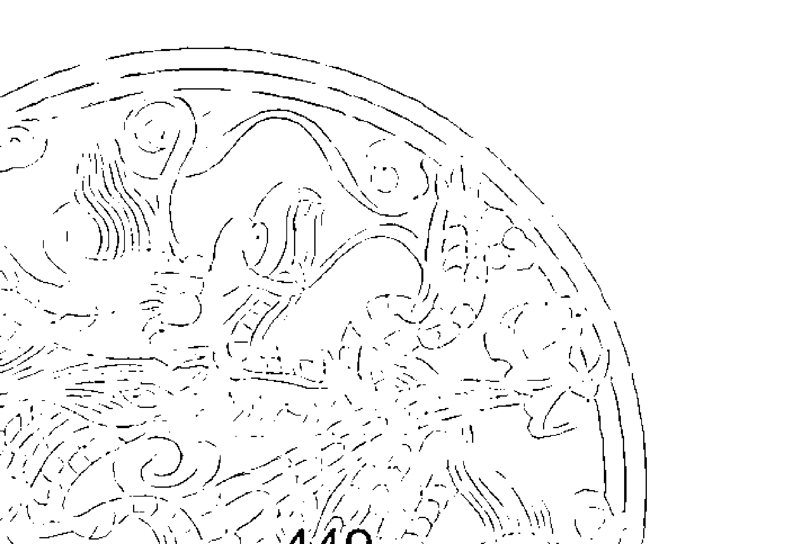

個人條件：掌握後天「成功的個性」，才能成就人事物的好因緣。

## （二）「人事物」的天時，決定你的利益得失

- 1. 「對人」的影響

算命實例：對的時間點找到對的人，一生的婚姻才能長久幸福。

- 2. 「對事」的影響

算命實例：對的時間點＋積極的創業，一生的事業才能長久有利。

- 3. 「對物」的影響

算命實例：對的時間點找到好房子，事業與婚姻才能長久穩定。

## （三）「地利」的天時，決定你的富貴貧賤

- 1. 「房屋吉凶」的三大關鍵

第一大關鍵，占60%的重要性

先確定何時可以搬家？先確定搬家會發生什麼事？

算命實例：搬家一定要問命理老師，我搬家後會發生什麼事？

第二大關鍵，占30%的重要性

再確定目前的心願是什麼

「再」尋找可以完成心願的房子。算命實例：假如你想旺「事業」，那麼，一定要請命理老師幫你找到可以旺「事業」的房子。其他如旺感情、旺事業、旺健康、旺生子、旺平安、旺考試……同論。

### 3. 第三大關鍵，占10％的重要性

「最後」才確定房子本身的吉凶與格局。 「最後」才確定房子本身的方位與座向。

算命實例：房子本身的座向與方位是最後的問題。切記！第一點第二點一定要先成立，因為已佔了陽宅風水90％的重要性。否則，你即是搬家了也只是搬進了無情的房屋。

傳統命理老師99％只會第三點，而第三點對個人的好運影響最小，只占陽宅風水10％的重要性。

算命實例：衰運的時間找房子，有80％以上會找到凶宅。所以，這間房子的座向與方位一點都不重要，衰運還是注定會讓你走向失敗的命運。

## （四）「人和」的天時，決定你的命格方向

影響「個人條件」的三大關鍵。

- 1. 第一大關鍵

掌握先天「最大的優勢」。

算命實例：是非競爭的命格，那麼，你先天最大的優勢就是讓自己快速培養攻擊力，在人生每一個職場上一定要爭第一。

- 2. 第二大關鍵

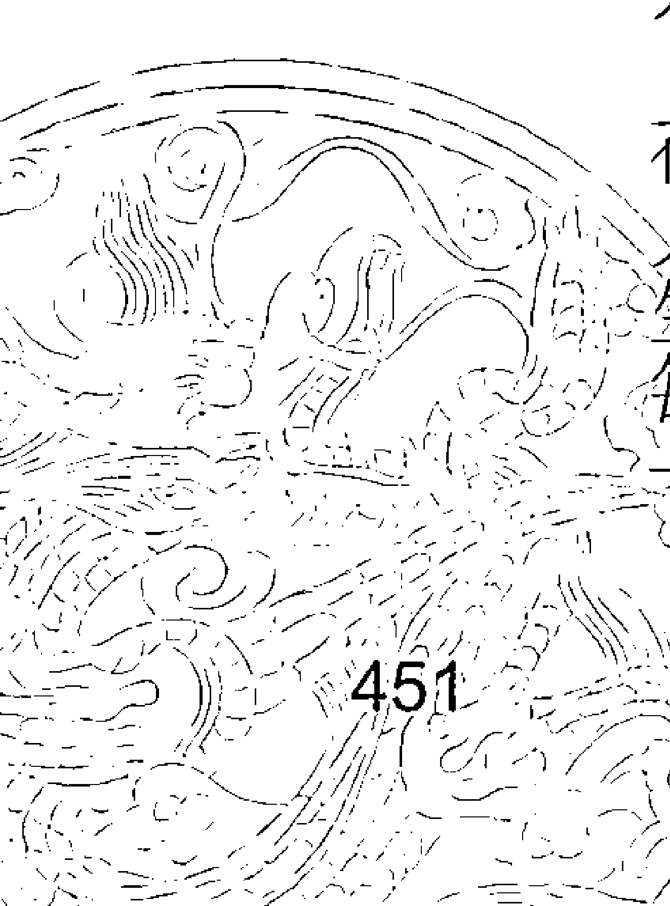

# (五) 掌握天時，才能讓你美夢成真

掌握「美夢成真」的三大關鍵。

## 1.第一大關鍵

精準掌握「天時」，佔50%的重要性。

算命實例：決定人事物的成就就在天時，創業可以掌握天賜良機。

## 2.第二大關鍵

精準掌握「地利」，佔25%的重要性。

算命實例：決定人事物的富貴在地利，可以讓事業更上一層樓。

## 3.第三大關鍵

掌握人生「對的時間點做對的事」。

算命實例：最大的優勢＋成功的個性＋對的時間點做對的事，就是人生進入富貴「壽」的保證。

掌握後天「成功的個性」。

算命實例：是非競爭的命格，那麼，你後天強求、強要、強勢的思維就是成功的個性。當環境出現競爭衝突時，表示你已經在成功的路上。

精準掌握「人和」，佔25%的重要性。

# 拾壹、改運有效嗎？

算命實例：決定人事務的專業在人和，可以讓一技之長有所發揮。

算命實例：決定人事務的專業在人和，可以讓適合的對象有所依恃。

## 4. 掌握「美夢成真」的人生

- 1. 最有利的規劃‖個人條件＋算命＋算運。

算命實例：精準掌握每一次賺錢的機會，這是創業吉凶得失的規劃。

- 2. 天時＋地利＋人和‖富貴的規劃。

算命實例：精準掌握國內外的經濟脈動，這是企業永續經營的規劃。

# 論命、陰陽宅鑑定、開館職業班招生

## 。算命怎麼問？

- 1. 我現在想問的事

問一：我會發生什麼事？

問二：我應該怎麼做？

問三：對我以後有什麼影響？

- 2. 何謂改運？就是壞運持續中，必須做對一件事，才能讓壞運快速降低或中止。

- 3. 何謂轉運？就是好運未來前，必須做對一件事，才能讓好運加倍或快速來臨。

- 4. 「算命一次」：新臺幣參仟元起，只接受現場或電話論命。

## 。陽宅風水怎麼問？

- 1. 「問」：現在換房子會發生什麼事？占 60% 的重要性。
- 2. 「問」：現在換房子的心願能不能幫我完成？占 30% 的重要性。
- 3. 「問」：現在的房屋座向與方位適合我嗎？怎麼規劃室內空間的擺設？占 10% 的重要性。
- 4. 「問」：壞結果時，我應該怎麼補救壞運？好結果時，我應該怎麼持續好運？
- 5. 「陽宅一間」：新臺幣參萬陸仟元起。

## 。華山派命理研究學院

預約專線：0937-29555,0909-195555

網路網址：www.praygod888.url.tw

華山地址：臺中市南區柳川西路一段39號

# 台灣服務項目表

| 項目 | 說明 | 項目 | 說明 |
|---|---|---|---|
| 命理諮詢 | 1. 規劃 12 個月運勢的吉凶：新台幣 3,000元<br>2. 規劃 04 年內運勢的吉凶：新台幣 36,000元<br>3. 規劃 08 年內運勢的吉凶：新台幣 88,000元 【免費命理諮詢一年】<br>4. 規劃 15 年內運勢的吉凶：新台幣 240,000元 【免費命理諮詢三年】<br>5. 精論一生人. 事. 物的吉凶：新台幣 360,000元 【免費命理諮詢六年】<br>※本學院附設急診科. 小兒科. 專業科. 感情科. 桃花三角科. 改運轉運科. 生涯規劃科… |  |  |
| 企業顧問 | 1. 公司行號命理與陽宅諮詢：每個月新台幣 66,000元 【命理諮詢4年。採年費制】<br>2. 小型企業命理與陽宅諮詢：每個月新台幣 99,000元 【命理諮詢4年。採年費制】<br>3. 中型企業命理與陽宅諮詢：每個月新台幣 168,000元 【命理諮詢4年。採年費制】 |  |  |
| 陽宅地理 | 1. 公寓房屋鑑定. 佈局. 規劃. 擇日：新台幣 36,000元<br>2. 公司店面鑑定. 佈局. 規劃. 擇日：新台幣 66,000元<br>3. 小型工廠鑑定. 佈局. 規劃. 擇日：新台幣 120,000元<br>4. 中型工廠鑑定. 佈局. 規劃. 擇日：新台幣 240,000元<br>5. 大企業與大樓鑑定. 佈局. 規劃：新台幣 360,000元<br>[小型工廠500坪內. 中型廠房3000坪內. 大型廠房3000坪以上] |  |  |
| 陰宅風水 | 1. 靈骨塔選吉位：鑑定. 佈局. 規劃. 擇日每門 新台幣 99,000元<br>2. 陰宅風水鑑定：鑑定. 佈局. 規劃. 擇日每門 新台幣 99,000元<br>3. 火葬完成進塔：鑑定. 佈局. 規劃. 擇日每門 新台幣 99,000元<br>4. 家族墓園修建：尋龍. 點穴. 佈局. 規劃. 完成土葬. 【面議】 |  |  |
| 安神擇日 | 1. 喜 事 擇 日：新台幣 9,900元<br>2. 公 司 擇 日：新台幣 12,000元<br>3. 心 願 擇 日：新台幣 24,000元<br>4. 公媽. 神明安座：新台幣 36,000元<br>5. 神明. 開光安座：新台幣 66,000元 | 開館教學 | ~~~職業班教學~~~<br>【十人班每人】：新台幣300,000元<br>【永久班教學】：新台幣500,000元<br>【一對一教學】：新台幣990,000元 |
| 合婚命名 | 1. 合 婚：新台幣 9,900元.<br>2. 合 盤：新台幣 9,900元.<br>3. 個人命名：新台幣 9,900元.<br>4. 剖腹生產：新台幣 9,900元<br>5. 公司命名：新台幣 24,000元. | 付款方式 | 銀行名稱: 三信商業銀行-營業部<br>銀行帳號: 0232100721<br>銀行代號: 147<br>戶 名: 鄭穆德 |

鄭 穆德 老師
華山派命理學 創始人
台中地方法院命理學 講師
行政院中區職訓局命理學 講師
台中/台北建築師公會命理學 講師

國家圖書館出版品預行編目資料

> 學紫微斗數，這本才能算命！深入解讀「生年四化」，精準預測未來吉凶，成功改運！ / 鄭穆德著. -- 初版. -- 新北市 : 智林文化, 2018.06
面； 公分. -- (新生活視野；30)

ISBN 978-986-7792-68-6(平裝)

1.紫微斗數
293.11 107006837

# 書名 / 學紫微斗數，這本才能算命！

深入解讀「生年四化」，精準預測未來吉凶，成功改運！

系列 / 新生活視野 30

| 左邊 | 右邊 |
|---|---|
| 作者 / 鄭穆德 | 網站 / www.guidebook.com.tw |
| 編輯 / 黃懿慧 | E-mail / notime.chung@msa.hinet.net |
| 校對 / 陳榆沁 | Facebook / www.facebook.com/bigtreebook |
| 排版 / 弘道實業有限公司 | 總經銷 / 旭昇圖書有限公司 |
| 設計 / 比比司設計工作室 | 地址：新北市中和區中山路2段352號2樓 |
| 出版者 / 智林文化 | 電話：(02)2245-1450 |
| 地址 / 新北市中和區中正路872號6樓之2 | 傳真：(02)2245-1479 |
| 電話 / (02) 2222-7270 | 本版印刷 / 2020年3月 |
| 傳真 / (02) 2222-1270 |  |

本書如有缺頁、破損、裝訂錯誤，請寄回本公司更換

◆版權所有・翻印必究◆

ISBN / 978-986-7792-68-6

定價 / 420元

Printed in Taiwan

# 新生活視野系列

- 學紫微斗數，這本最神準／380元
- 算你好姻緣／300元
- 算錢／350元
- 紫微斗數算你好工作／250元
- 懂風水，住旺宅／320元
- 這本姓名學最好用／320元
- 紫微斗數這本最好用／360元

# ▶▶▶ 首本深入剖析「生年四化」的命理書

紫微斗數分兩大派系，一是星辰派，占95%以上，二是四化派，占5%。四化派又分生年四化、飛星四化、自化三種，以華山派命理學為主。作者在上一本書《學紫微斗數，這本最神準！》中為我們解說了「飛星四化」；這本書則為我們談論「生年四化」。

# ▶▶▶ 擺脫傳統「現象論」，一次算出八種面向

對於想要深入精進紫微斗數功力的讀者，從「星辰」來論命，僅了解表面現象。本書能夠從「生年四化」看出八種面向——現象、時間、吉凶、內容、影響、改運、轉運、宗教。

# ▶▶▶ 看清命中注定的事情，跟著走人生更順遂

「生年四化」看的是「上天安排的人生故事」；「飛星四化」看的是「自己選擇的人生故事」。因此，了解生年四化，就等於清楚「正確時機」——知道你什麼時間，要做什麼事。

一般來說，80%的人會迫於生活壓力，跟著「飛星四化」（自己選擇的人生腳本），尋求能夠馬上見效、看到利益的路徑，但往往好運只有3-5年，只好一直轉換跑道。只有20%的人會跟著「生年四化」（上天安排的人生腳本）走，因為這個路徑要成功，需要長時間的培養和努力，才會看見成果。最終卻能發揮你的潛能，成為你一輩子資產。

# ▶▶▶ 看這本書，判斷未來吉凶，成功轉運！

現在，你只需拿出命盤，看你命盤中的祿權科忌（四化星）分布在哪幾個宮位，藉由本書中對四化星在人、事、物的解讀和分析，你就能夠了解人生如何事半功倍，少走冤枉路。

定價：420元 建議陳列：命理

ISBN 978-986-7792-68-6

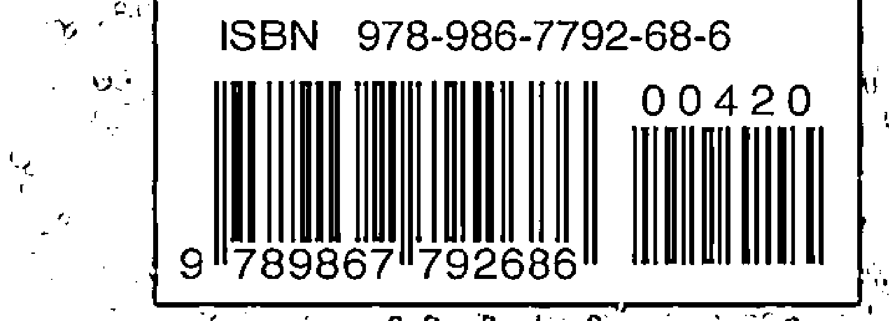

智林文化 總經銷/旭昇圖書 www.guidebook.com.tw