快乐学 北斗神数

## 如何用紫微斗数 改变命运

传授紫微斗数逾20年
网络聊天室义务算命5年
江青川 著

紫微命盘就像一个印记、一个磁卡，完整记录您的生命密码。
您的优点缺点、您的恐惧与害怕、您的禁忌、您的大好机会、您的吉厄运势等，
一一揭露您生命的路程。学会紫微，了解自己，真正扭转生命的方向，创造无限生命契机。

一本掌握自己命运的最佳工具书！

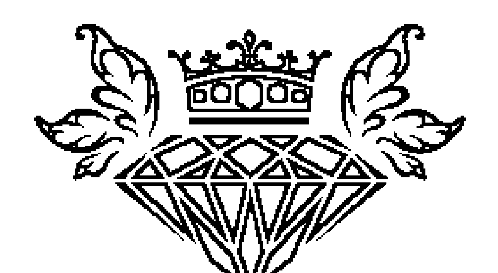

St. Royal College

## 天使神秘学院

- ※ 专业占卜预测机构
- ※ 神秘学培训机构
- ※ 水晶能量研究中心
- ※ 神秘学资料库
- ※ 官方微信：strcdts
- ※ 微信公众平台：strc2011
- ※ 读书交流QQ群：
  - 占星塔罗占卜师交流群：814594478（加入密码：PDF）
  - 神秘学其他综合群：659338717（加入密码：PDF）

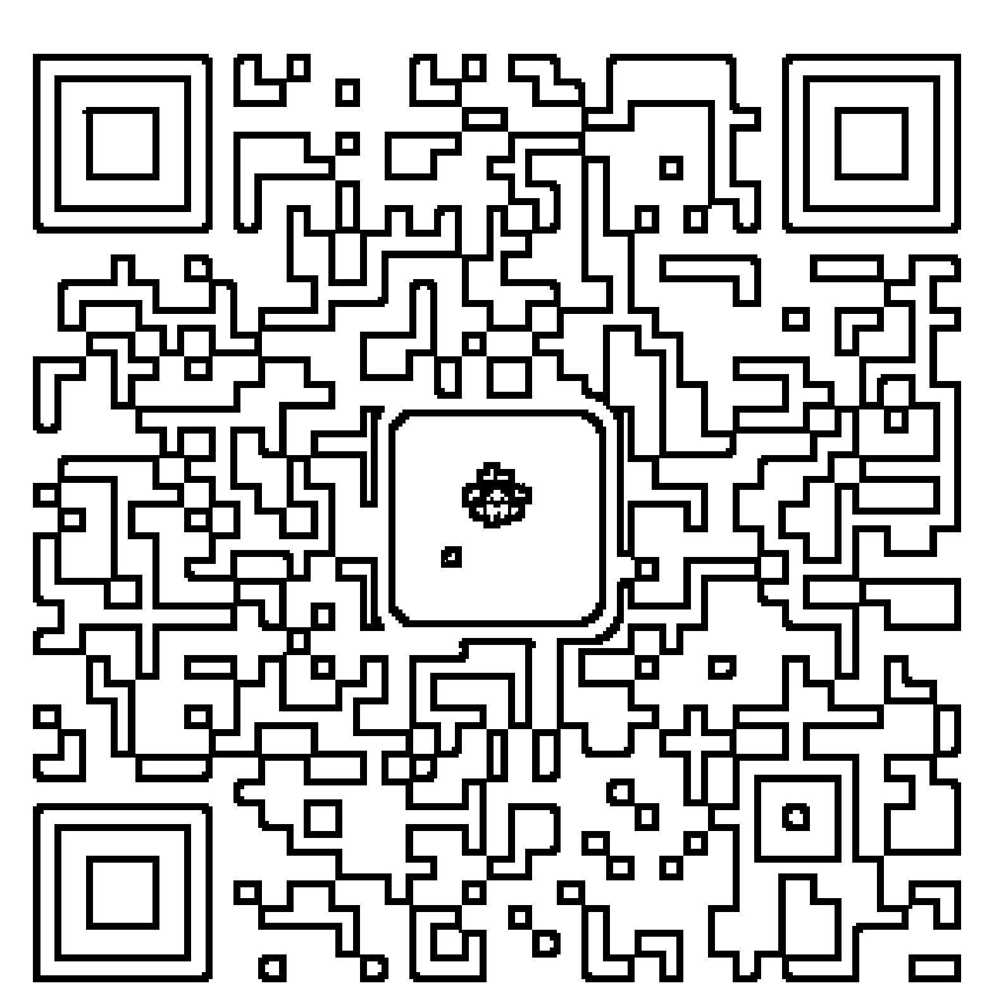

微信号：strcdts

## 天使神秘学院

天使神秘学院 院长QQ：715104687

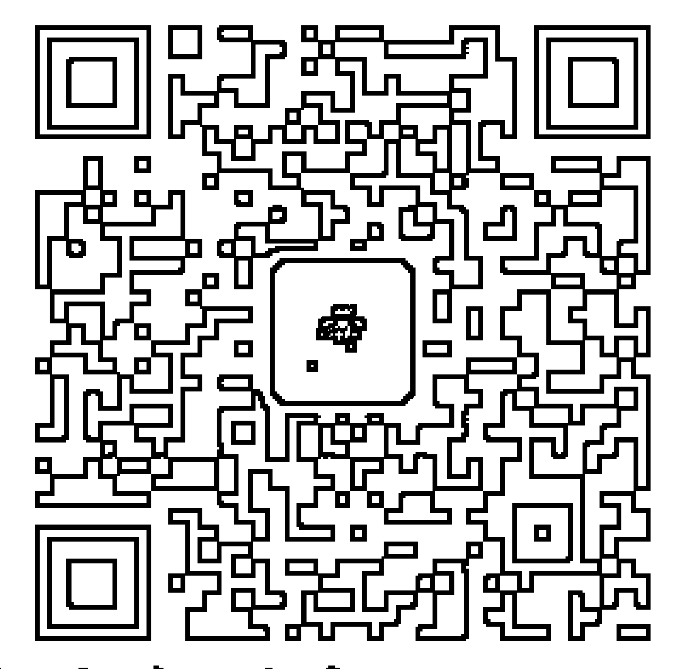

微信公众平台：strc2011

## 制作说明：

本书由《天使神秘学院》出重金从台湾购入的原版书籍扫描制作完成。为达到最好阅读效果，特地把原版书全部切开后，再经由专业扫描设备高精度扫描完成，并经过一张张的PS后期处理最终成书，其间花费大量的人力、物力以及时间，只为能给大家提供经济并优质的神秘学学习资料而努力。

本学院强力谴责某些机构和个人，把本学院花心血制作完成的电子书籍，包装后直接放在自家淘宝网上低价倾销的行为，以谋取不劳而获的经济利益。如果长此以往最终将无人愿意再为大家花心思制作电子书，那以后可能大家再无新书可读。

为让大家以后能够读到更多的好书，也为了本学院的良性发展。本学院恳请大家尽量做到如下几点：

1. 尽量在本学院的网站购买电子书籍。
2. 请勿用技术手段把电子书内的水印及加密去掉。
3. 在收到电子书后小范围传阅即可，千万不要公开传播，更别挂到淘宝网上低价销售。

同时为答谢广大支持者，学院电子书将做如下调整：

1. 学院会把一些早已收回制作成本的电子书折价销售。
2. 最新制作的电子书籍会开放打印功能，大家购买后有条件的可自行打印成书。

天使神秘学院
2019年1月

## 作者简介

### 江青川 老师

传授紫微斗数逾20年
网络聊天室义务算命5年
永熙通讯公司顾问
一手创立藏易阁紫微命学堪舆中心
地址：台北县土城市中华路一段61号4楼
预约电话：（02）2264-2833
传真电话：（02）8261-0539
电子信箱：fff223728924@yahoo.com.tw
似水居紫微学堂网页：
http://www.starteller.idv.tw

人相御学 12
快乐学紫微
江青川　著

## 张序

五术之书十数年来如小说般、如春笋般成堆出量，让人眼目晕眩，不知如何选择。一本好书出世，必须得诀深研，并累积多年的经验，才能谈得上教化世人，替人指点迷津，古云：「书中有黄金」之喻也。惜现代的人习任何一种技艺学问，皆喜投机取巧或喜好速成，未将根基打稳，故只能虚幌不能战斗。

今江青川老师积近廿年来的苦学与论命心得编著此书，将是喜爱紫微斗数的新学后进一大福音。就以其名题文赞颂！

> 江河清静映紫微
青出于蓝更胜蓝
川流不息育良才

台北市堪舆命理公会荣誉理事长 张渊理
2005. 10

## 自序

我自幼便因脑膜炎以及种种的外伤，造成了外在的残疾。我的行动不如正常人，脚底的伤口多年来血流不止。身体上的不健全并没有打击我，但却使我的性格变得桀惊难驯，曾经做过许多荒唐事。很多人因此放弃了我，也让父母亲为我操心不已，但我心中总有一股不服输的念头。十七岁时的我，还是一个以自我中心的想法在看世界的小混混，在父母亲的建议下跟随姨丈（也就是张渊理老师）学习包括堪舆、择日……等的命理知识。父母亲的用意，无非是希望我能习得一技之长，但我也不愿意就此成为一个受人轻视的江湖术士。当时的想法，直觉得算命就是一种骗术，我也很不相信，当然也

在心理上难以接受。但一年过去了，我想要做的其他工作都宣告失败，最后只好心不甘情不愿地回到了姨丈的教室里。

我坐在姨丈的教室后面，静静地听我姨丈授课。经过了多次的听讲，久而久之，渐渐地了解到，五术真的是一门学问，也就不再对算命如此地排斥了。在姨丈张渊理所创办的圣渊堂里，认真的学习，并不断的验证，日渐茁壮，拥有扎实的底子，使我在五术学习及执业的路上，虽然偶有风雨，但也算平顺。我想在此感谢圣渊堂给我良好的学习环境，也感谢我姨丈张渊理十大日心竹啊的提拔及受护。

我相信五术之所以能如此流传，必定有其学理根据，因此以实事求是的态度，日以继夜的学习，并且不断的验证，终于能一探斗数的奥妙。在紫微斗数的学习上，我师承自五位老师，也曾学习各种不同的论命方式，直到遇见陈孝锭老

### 快乐学紫微
——如何用紫微斗数改变命运？

师，才将我所学集结整合。跟随陈老师学习的那段日子，是我毕生最重要的学习历程。他不仅教授紫微斗数，更引领我接触佛法，启发我内在的本质，彻底的改变了我的性格。二十余年来，我潜心钻研斗数，并且从事教学，也发展出自己对于紫微斗数的见解。在这段从事命理工作的生涯当中，也曾经历少年得志的心高气傲和误算的挫折，但随着年龄及阅历的增长，使我不仅累积了更为丰富的论命经验，更在我所接触的人、事、物中吸收学习，时时刻刻修正我的性格与处事的态度，而造就今天的自己。

从一个高中毕业、浪荡不羁的街头少年，到一个拥有专业，期许自我的命理师，我想是一个极大的转折。回首过去四十年的人生，看遍人世的起落与生命波折，内心的信念却始终不是宿命的想法。谨记恩师教诲，我深信紫微斗数亦是佛家渡化世人的方便法门，并期待以紫微斗数让人们认识命运及

人性，进而了解自己、改变自己。

初学习斗数的读者也许会以为斗数是一门复杂的学问。读者可以在坊间看到琳琅满目的命理书籍，在传播媒体上看到许许多多的「大师」。若是想要更进一步的学习命理，命理界林立的门派，更加令人眼花缭乱。紫微斗数流传至今，派别之多，不胜枚举。各门派之间时而彼此攻讦，常常令紫微斗数的学习者耗费大量的时间与金钱，却仍然一无所获，终至停滞不前。教授紫微斗数的人，也往往把这门学问包装得既复杂又神秘，标新立异，各立山头。这种种的现象，不但无助于学习，对于紫微斗数的发展也没有益处。

其实，无论各门派间的论命方式有何歧异，相同的是，能真正准确的论命，帮助受论者走出人生的困境，并且让学习者能由浅入深的去探索，真正了解斗数，使命理以及斗数的正确认识能进到我们的生活中，反过来丰富这门学问。这本书的完成，

### 快乐学紫微
——如何用紫微斗数改变命运？

集结了我二十年来学习以及验证斗数的心得。我一直认为，紫微斗数并不是一种骗术，而是一种学术。它不仅贴近人性，也反映我们的生活。它与人的情绪、思想、念头……是相互一致的，也因此，一个专业的命理师，才能藉由紫微斗数论断一个人的想法与作为，藉由他的经验给予受论者一个参考的指标。

而我期望藉由本书，能使更多的人能略知自己的处境与执着，明白自己的优缺点，同时对于斗数也有基本的概念。相信对于读者了解自己，并且改变命运，会是一个好的开始，也希望借此抛砖引玉，为命理这门学问注入新血，这是我最大的期望，就请读者细细品味吧。

江青川
2005.10

## 目录

- 张序（台北市堪舆命理公会·荣誉理事长 张渊理） 003
- 自序 005

## 第一章 命理观念的重建 015
- （一）命理与命理师 015
- （二）命、运与自己 019
- （三）用紫微斗数创造自己的命运 021

## 第二章 学习简易排盘 025
- （一）认识命盘 025
- （二）十天干 027
  - 1、天干：阴、阳 028
  - 2、天干五行及方位 028
  - 3、天干合化 029
  - 4、五行相生 029
  - 5、五行相克 030
- （三）十二地支 031
  - 1、地支六合 032
  - 2、地支六冲 032
  - 3、地支三合 033
  - 4、地支三会 033
- （四）求生年干支（六甲掌诀） 034
- （五）五虎遁 038
- （六）何谓阳男、阴男，阳女、阴女 040
- （七）安命宫及身宫 042
- （八）六十甲子纳音（定五行局） 044
- （九）安十二宫位 046
- （十）安紫微 049
- （十一）安紫微星系 054
- （十二）安天府星 056
- （十三）安天府星系 058
- （十四）安时系诸星（文曲、文昌、地空、地劫、火星、铃星） 059
- （十五）安月系诸星（左辅、右弼、阴煞、天刑、天姚） 066
- （十六）安年干系诸星（禄存、擎羊、陀罗、天魁、天钺） 069
- （十七）年支干系诸星（天哭、天虚、红鸾、天喜、破碎、天马） 073
- （十八）安生年四化 077
- （十九）起岁运 079

### 第三章 十二宫位与四化的分别解释 083
#### （一）十二宫位解释 083
#### （二）四化之诠释 089

### 第四章 四化的分别和影响 091

### 第五章 生年四化于十二宫位之释义 093
#### （一）命宫生年四化之象义 093
#### （二）兄弟宫生年四化之象义 094
#### （三）夫妻宫生年四化之象义 094
#### （四）子女宫生年四化之象义 095
#### （五）财帛宫生年四化之象义 095
#### （六）疾厄宫生年四化之象义 096
#### （七）迁移宫生年四化之象义 096
#### （八）奴仆宫生年四化之象义 097
#### （九）官禄宫生年四化之象义 097
#### （十）田宅宫生年四化之象义 098
#### （十一）福德宫生年四化之象义 098
#### （十二）父母宫生年四化之象义 099

### 第六章 十四颗主星之五行与性情 101

### 第七章 十天干化忌 105
- （一）甲、太阳化忌 105
- （二）乙、太阴化忌 106
- （三）丙、廉贞化忌 108
- （四）丁、巨门化忌 109
- （五）戊、天机化忌 110
- （六）己、文曲化忌 111
- （七）庚、天同化忌 113
- （八）辛、文昌化忌 114
- （九）壬、武曲化忌 115
- （十）癸、贪狼化忌 116

### 第八章 论忌 119
- （一）什么是忌 119
- （二）忌的影响 120
- （三）如何改变自己的忌 121

### 第九章 各宫位的四化 123
- 化忌：埋怨、易怒、暴力、固执 123
- 化科：客气、重伦理、理性、善于沟通 136
- 化权：权力、主宰、主观、好强 144
- 化禄：福气、安逸、过于懒散、多情 (多的意思) 152
- 第十章 论命实例演练「十五个案例」 161
- 第十一章 学员学习心路与分享 191
  - 一位认真用心的良师——刘沛涵 193
  - 「德」、「格」兼备的命理师——庄文龙 195
  - 努力就有机会——王培欣 197
  - 永远的太阳——罗丽云 199
  - 我最尊敬的良师益友——黄玉芬 201
  - 论命神准的江老师——钟全成 203
- 跋 透过紫微，我希望每个人都幸福 ——江青川 205

## 第一章
命理观念的重建

### （一）命理与命理师

现在社会上对于命理师普遍存在着负面的观感，「算命嘴，胡累累」，命理师与骗术、宗教常常紧密地连接，使得许多人无法真正地理解命理这个行业。而许许多多的命理师除了本身不具备学问的基础，对于他们的工作更少见责任与理想，都在在地使人们认为：命理师就是一个骗钱的行业，而命理就是一门骗术。在本书的一开始，我们想先从命理与命理师谈起，了解命理、了解命理师，将能帮助我们在学习命理的过程中了解命与运。

命理是一门有着学理根据的学问，它的目的在帮助人们了解自身的处境与盲点。我们不称「算」命，而称「论」命，就是为了强调命理师的工作，是依据学理和经验，来分析受论者的问题。而一个好的命理师，更应该秉持同理心和责任感，尽可能地使对方了解你的建议，才算是达到论命的目的。论命所需要的并不是什么独到的功力，它需要的是论命者人生经验与历练的累积，以增加判断事物的准确度。如果只是为了表现自己的「功力」，甚至是为了遂行别的目的，而故弄玄虚，或是装神弄鬼，引起当事人的恐慌或盲目崇拜，都不是论命该有的态度。

举例来说，常常有命理师在替男女合婚时，说男的有「双妻命」，或说女的会「克夫」，甚至还会当着双方父母的面说。请问，这样的婚还有人结得下去吗？就算排除「万难」结了婚，婚后也难免为此耿耿于怀、提心吊胆，而当他们真正遇到阻碍时，恐怕只会将过错归咎于对方，而不会对婚姻中的问题认真思考反省，这都是不良的论命态度造成的伤害，命理师又岂能不慎呢？我认为，所谓的「合婚」，只能作为一种婚前的咨询，让即将结婚的双方了解彼此个性上的缺点，以及相处上可能发生的问题，使他们能针对这些问题作出调整，这才是论命真正的目的。所谓「双妻」、「克夫」甚至是「真命天子」的说法，其实都是一种迷思，一对即将步入礼堂的新人，不该因为命理师的几句话就决定分开，也不该拿这些话来当作婚姻问题的借口。

如同「合婚」的情形，「我会不会考上？」、「以后会不会赚大钱？」这一类的问题也都会对当事人的心态造成很大的影响，既要给他信心，又不能让他志得意满，既要让他了解现实，又不能让他灰心丧志，最后的结果如何，就端看命理师怎么表达。所以，要如何「因材施教」，又是一门命理师必修的学分了。命理师的责任重大，当然要审慎自己的言行，并且周详地考虑个案的接受程度。有人说论命的禁忌是「生死不论」，倒也不是基于什么「天机不可泄漏」的理由，而是因为一般人都很难接受这样的事情，对于一个正常人的生活态度、未来规划都会产生巨大的影响，甚至产生许多无谓的猜测，因此论命者不可随意地去论断一个人的生死，这是考量受论者接受度的结果。

除了论命者的态度以外，许多命理师在论命时，要求当事人一开始就先提出问题，其实也是不恰当的。受论者提出问题，命理师很轻易地就能了解受论者的问题范围，在这一点上渲染着墨，在言谈中旁敲侧击，只要对人性稍有掌握，很容易便能一语中的。例如说，有时候受论者本身太过心急，一见到命理师就说：「大师！我想算感情」、「我最近财运怎么样？」一旦命理师说你「感情不好」、「财库破」，你就把事情的前因后果全招了，与其说算得「准」，不如说是当事者已经透露了太多讯息，跟命理一点关系也没有。还有一些命理师非常善用谈话技巧，一看到命盘就哀叹连连，说你「运没开」、「运不佳」，但其实，「运」的范围是很广泛的，命理师没有明确的指出哪里不好，却造成受论者莫大的恐慌，如果这时命理师进一步提供一个千载难逢的好机会：改运，那么早已六神无主的当事者通常也不会有太多犹豫，不计代价的「补财库」、「消业障」。这种种的论命方式，并非基于论命的学理，却将使更多的人对于正统的命理知识与论命行业产生误解。

命理师提供的并不是一种是非对错的价值判断，也不是对于未来的预言；换句话说，命理师并不是要去「论断」一个人的一生，他只能藉由设身处地，去了解受论者内心的世界，感受对方的苦、烦恼与执着，再依据命理师的经验，使他了解自己的盲点，并且提供实际的建议。现代的电脑程式也许能做到依据星性来说明一个人的性格，但电脑所不能取代的是面对实际发生的事情时，人所拥有的知识经验与判断能力。命理师的工作就在于使当事者清楚了解他所面临的问题，避免遗憾的发生，做出正确的决定。

我诚挚地希望，阅读这本书的你（妳），不再因为对命理界负面的印象而影响了对这门学问的观感，为各位在了解自己、掌握命运的方式上，重新开启这一条途径。而接下来，就让我们先来谈谈，「命运」是什么。

### （二）命、运与自己

许多人都会问，什么是命？什么是运？如果对于「命」与「运」没有良好的认识，就很难分辨宿命与不宿命两种不同的态度。要认识命运，其实应该从「自己」这个观念谈起。人的命与运皆由心念而生，人为什么会有烦恼？命理师为什么可以准确的论出一个人的遭遇？原因就在于人的行为不会无故脱离他们的心念。心念形成一个人的情绪、思维与性格，决定他的举止与处境，也就造就了一个人的命运。

「自己」的观念是可以放大或缩小的，端视一个人看待自我的方式。举个例子来说，一个飙车族，为什么一旦被超车，就会心生愤恨，做出沿街砍人的行为？就是因为他把自己看得太重，太过执着在自我的感官意识。而「感情」和「金钱」，更是容易引发人们的执着。在社会新闻中，常常可以看到某些人遇到感情的挫折，因为一时冲动而杀害了他们所爱的人，他们往往在事后追悔不已，但造成的伤害却已经无法弥补。这就是对于感情过度执着，也太看重自我的缘故。

我们每一个人都会很自然地跟随自己的喜好与感受，这是人最直接、本能的反应。但是，也正因为如此，人不会跳出一惯的思考与行为模式，当然也会看不到自己的盲点。在某些环节上只看得到自己想看到的事物，将原因和结果都归在自己所能理解或接受的范围里。对事情的认识既然不够全面，就容易对事物做出错误的判断，而遗憾往往就是因此造成。试着想想看，为什么学生玩电脑游戏的时候会去看「攻略」？为什么人们在课业工作遇到瓶颈时需要去请教长或前辈？为什么讨论感情关系或社会现象的节目总是吸引许多人们的注意？因为我们都知道，透过别人知识经验的累积，不只是「增广见闻」，还能够帮助我们避免遗憾的发生。当你对于事物有了相当的认识，就能做更好的判断和选择，也就不容易再有后悔。所谓的先知先觉，就是因为一个人能够看得很长远，也看得很深广。

长远而深广的思考，首先需要的便是放下已有的成见。我们常有「我一点机会也没有……」、「他就是这么自私！」、「我就是不要让他好过！」、「没有人能了解我……」、「为什么我要的就是得不到？」这一类的想法，对自己来说这些都是绝对的事实，但其实，它们往往只是心中的主观意识，它的影响也只是增加自己的痛苦和烦恼。这些想法常常来自于我们每一个人对“自我”的执着，无论是“贪念”、“愤恨”或“痴愚”，都影响我们对待事物的观感。然而在看待事物的时候，如果先把“自己”的观念放下，也将自己心中的执着情绪放下，便能对人、事、物有更为清楚的认识。进而突破先前的成见或认知，找到方向，做更好的努力。你会发现，人生的心情与境遇，也会随之而改。

认清自己，而不以自己为中心，这是一个“忘我”的历程。把眼前的种种事物看淡，才能真正看清自己，而真正想得长远。当你懂得看淡自己内心的欲求，也就能明白知足的快乐。这样的历程需要亲身的去体会，我认为这也正是一个人掌握自己命运的开始。

### (三) 用紫微斗数创造自己的命运

常常听到有人说：“老师，早知道我现在也会很有钱！”、“早知道我当初就该（如何如何）”，或是无可奈何地说：“原来我的命就该如此。”、“我就是歹命！”、“这是上辈子造的孽……”。还有很多人的态度是更加怨天尤人，“为什么我妈要选在这个时间生下我？”、“别人的运气就是比我好！”……。我想，与其这样消极，不如重新认识自己，改变自己的命运。

改变命运，其实也就是一种积极的人生态度。只是，如果对自己没有清楚的认识，就很难去谈“改变”。一个人固然可以透过生活中的观察来了解自己，紫微斗数的论命方式则是本书想提供给您的另一个方式。

紫微斗数的命盘不是用来为一个人的行为找借口，每一个人，无论了不了解、相不相信命理，都有遭遇困境，面临抉择的时候，然而是否能够突破重围，端视一个人面对困难的态度而定，人时时刻刻都在做决定，也要为自己的行为负责。紫微斗数提供您一个了解自己的途径，但是改变命运的钥匙仍然握在您自己的手中。如果一个人总是画地自限，那目标当然就难以达成；而如果只是把困难当成一个过程，那成功之路也会因为你的想法而缩短。

人的命运如果无法改变，那论命就没有任何的意义了，我只希望以最浅显的方式帮助大家了解自己的命运，对于命与运不但有新的观念，也有新的做法。我诚挚地希望，人们能够在掌握自己的命运后，更能自我期许，培养崇高的理想与人格，学习为他人着想，忘我的付出，成就人性善良的一面。

在以下的章节我会告诉大家，要如何通过紫微斗数了解自己。这是一本即使是初接触紫微斗数的读者也能够了解的书。自己的困扰由各位自己去了解，我认为是最恰当不过了，希望每一位读者都能借由本书了解自己，进而掌握自己的命运。

## 江老显的叮咛

> 人的行为不会无故脱离他的心念。心念形成一个人的情绪，思维与性格，决定他的举止与处境，也造就了一个人的命运。

## 第二章 学习简易排盘

学习紫微斗数，排盘是不可少的第一课。虽然现在网络上有许多方便的排盘软件或服务可以利用，但是学习基本的排盘可以帮助我们了解紫微斗数这门学问是如何建立的。

### (一) 认识命盘

首先，让我们来看看紫微斗数命盘的各部分。

这就是一张紫微命盘，一共由十二个宫位所组成。要排出一张命盘首先要取得求算者的生辰八字，包括出生年、月、日、时与性别，继而才能求得紫微命盘中各个重要的信息，红色圈起来的部分包括了天干、地支、十二宫、阴男阳男阴女阳女、局数、主星与次级星，是我们之后所要一一解释，也要一一排列上去的。以下，就让我们以54年12月22日戌时男性的命盘（其实就是笔者的命盘）为例，一步一步地看看命盘是怎么排出来的吧！

| 辛 | 福德宫 | 壬 | 95-104 | 田宅宫 | 癸 | 85-94 | 官禄宫 | 甲 | 75-84 | 朋友宫 |
| :--- | :--- | :--- | :--- | :--- | :--- | :--- | :--- | :--- | :--- | :--- |
| 天相 | 巳 | 天梁(权) | 午 | 廉贞七杀 戊运 | 未 | 申 | 天天钺刑星 |
| 庚 | 父母宫 | 54年12月22日戌时 | 乙 | 65-74 | 迁移宫 |
| 巨门擎羊 | 辰 | 天阴喜煞 | 酉 | 破碎地劫 |
| 己 | 5-14 | 命宫 | 丙 | 55-64 | 疾厄宫 |
| 紫微贪狼左辅禄存(科) | 卯 | 阴男 | 土五局 | 天同 | 戌 | 红鸾 |
| 戊 | 15-24 | 兄弟宫 | 己 | 25-34 | 夫妻宫 | 戊 | 35-44 | 子女宫 | 丁 | 45-54 | 财帛宫 |
| 天机太阴文曲陀罗(禄)(忌) | 寅 | 天府 | 丑 | 天哭火星地空 | 子 | 天魁天姚 | 亥 | 武曲破军右弼(身宫) | 天马天虚 |

### (二) 十天干

- 甲
- 乙
- 丙
- 丁
- 戊
- 己
- 庚
- 辛
- 壬
- 癸

学习紫微斗数，必须先了解中国古代的一些基本概念。紫微斗数的十二宫位由十天干及十二地支来标示，相信十天干大家都是从小就会背了，天干又有阴阳与五行（金木水火土）的属性，在此只简单地介绍一下天干合化与五行生克的概念，读者只要略为了解就可以了。

#### 1、天干：阴阳

| 阳 | 甲 | 丙 | 戊 | 庚 | 壬 |
| :--- | :--- | :--- | :--- | :--- | :--- |
| 阴 | 乙 | 丁 | 己 | 辛 | 癸 |

#### 2、天干五行及方位

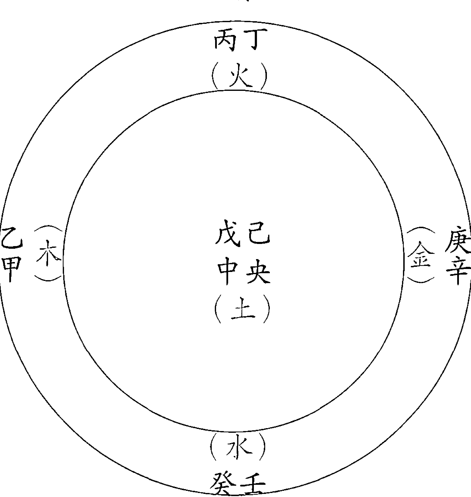

#### 3、天干合化

| 甲己 | 乙庚 | 丙辛 | 丁壬 | 戊癸 |
| :---: | :---: | :---: | :---: | :---: |
| 合化土 | 合化金 | 合化水 | 合化木 | 合化火 |

#### 4、五行相生

金生水，
水生木，
木生火，
火生土，
土生金。

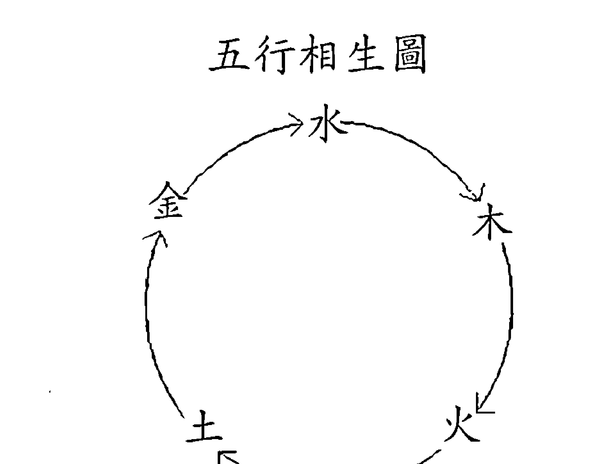

#### 5、五行相克

- 金克木，
- 木克土，
- 土克水，
- 水克火，
- 火克金。

##### 五行相克图

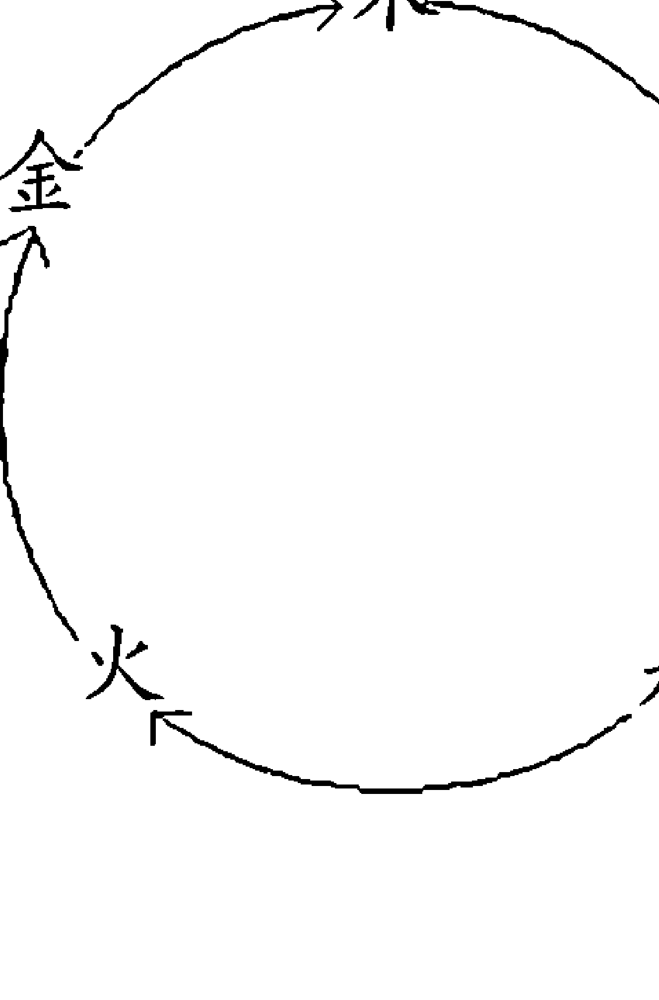

### (三) 十二地支

十二地支指的是子、丑、寅、卯、辰、巳、午、未、申、酉、戌、亥。

紫微斗数的十二地支，不但代表了命盘中的十二个宫位，具有阴阳五行的性质，更代表了年、月与时辰，以下的表格方便各位读者查阅。另外还有地支六合、六冲、三合、三会的图表，读者一样只要稍有概念即可。

| 地支 | 子 | 丑 | 寅 | 卯 | 辰 | 巳 | 午 | 未 | 申 | 酉 | 戌 | 亥 |
| :--- | :--- | :--- | :--- | :--- | :--- | :--- | :--- | :--- | :--- | :--- | :--- | :--- |
| 五行 | 水 | 土 | 木 | 木 | 土 | 火 | 火 | 土 | 金 | 金 | 土 | 水 |
| 阴阳 | 阳 | 阴 | 阳 | 阴 | 阳 | 阴 | 阳 | 阴 | 阳 | 阴 | 阳 | 阴 |
| 月份 | 11 | 12 | 1 | 2 | 3 | 4 | 5 | 6 | 7 | 8 | 9 | 10 |
| 时间 | 23-1 | 1-3 | 3-5 | 5-7 | 7-9 | 9-11 | 11-13 | 13-15 | 15-17 | 17-19 | 19-21 | 21-23 |
| 生肖 | 鼠 | 牛 | 虎 | 兔 | 龙 | 蛇 | 马 | 羊 | 猴 | 鸡 | 狗 | 猪 |

O.K

#### 1、地支六合

- 子丑合
- 寅亥合
- 卯戌合
- 辰酉合
- 巳申合
- 午未合

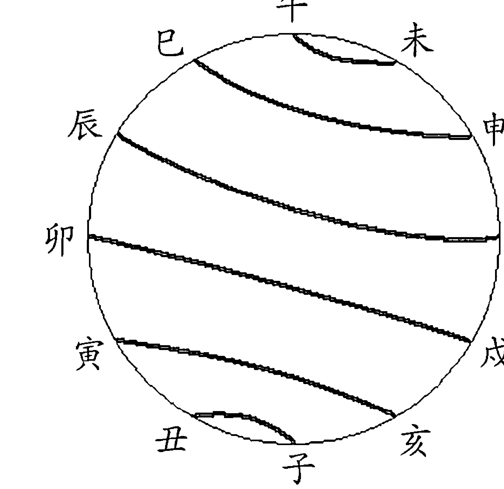

#### 2、地支六冲

- 子午冲
- 丑未冲
- 寅申冲
- 卯酉冲
- 辰戌冲
- 巳亥冲

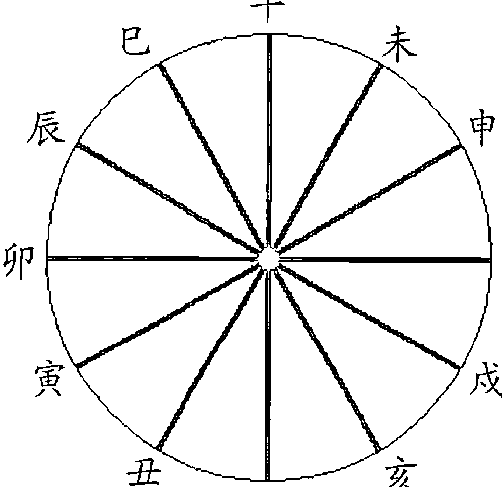

#### 3、地支三合

- 寅卯辰会木
- 巳午未会火
- 申酉戌会金
- 亥子丑会水

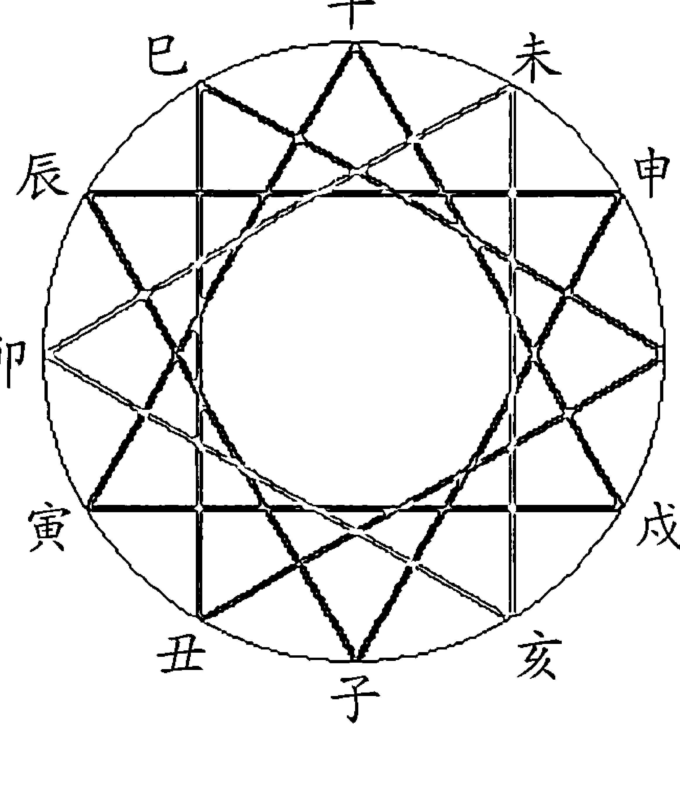

#### 4、地支三会

- 寅午戌合火
- 申子辰合水
- 巳酉丑合金
- 亥卯未合木

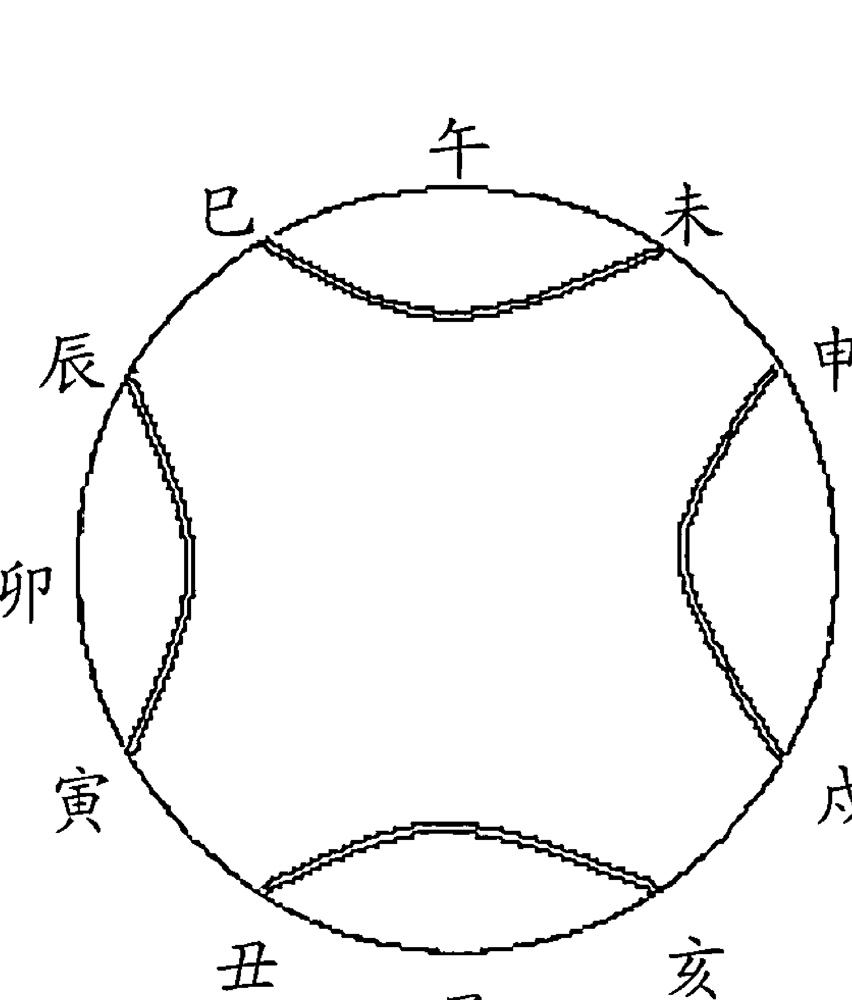

### (四) 求生年干支（六甲掌诀）

排盘的第一个步骤，要先知道生年干支，我们知道中国传统的记年法，是以天干与地支两两配合而成，六十年为一个轮回，称为一甲子，要知道生年干支固然可以查万年历，没有万年历可查时，就用以下的“六甲掌诀”来帮你吧！

从下图中可以看到，左手四指的指节刚好构成十二个宫位，从无名指与手掌连接处开始，分为子、丑、寅、卯、辰、巳、午、未、申、酉、戌、亥十二宫，这十二宫是固定的。再从子宫起算，逆时针每隔一个宫位增加十，即13、23、33、43、53这样数过去，到最接近出生年的宫位停止，停止的宫位即甲干，此即“逢三起甲”，再从这个宫位倒回去顺数至出生年，即得到生年天干与地支。

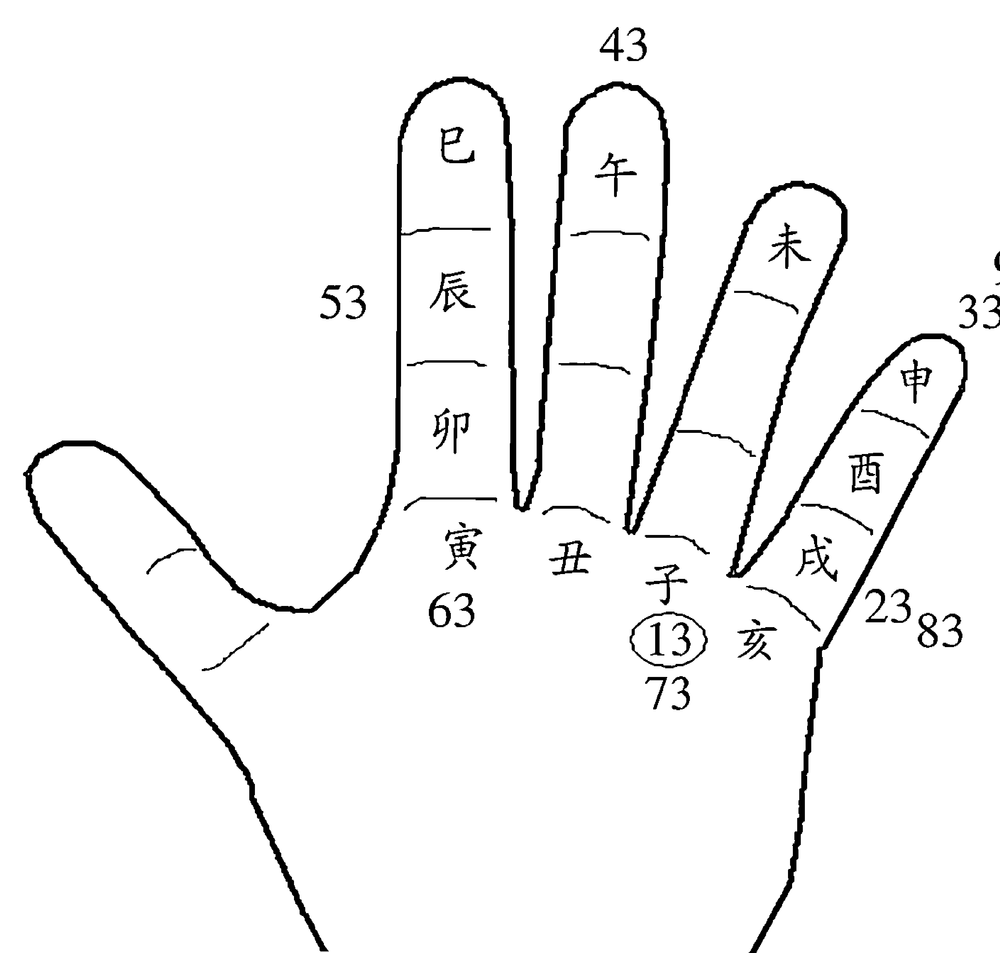

> 凡遇到3就起甲干，再顺行

例如：
1. 民国 69 年生，由民国 63 年（地支为寅）起始，顺数至民国 69 年得地支为申；并由民国 63 年起甲干，顺数至民国 69 年得庚干，得民国 69 年生年干支为庚申年。
2. 民国 95 年生，由民国 93 年（地支为申）起始，顺数至民国 95 年得地支为戌；并由民国 93 年起甲干，顺数至民国 95 年得丙干，得民国 95 年生年干支为丙戌年。

笔者为民国 54 年出生，由子宫起算，逢三起甲，到辰宫为 53，逆数一宫就是 54，可以知道笔者的生年干为乙，生年支则为巳，笔者的生年干支就是乙巳。将这个信息填入命盘中：

| 巳 | 午 | 未 | 申 |
| :--- | :--- | :--- | :--- |
| 辰 | 54年12月22日戌时<br>乙巳<br>男 | 酉 |  |
| 卯 |  | 戌 |  |
| 寅 | 丑 | 子 | 亥 |

### (五) 五虎（寅）遁

紫微命盘中的十二地支位置是固定的，但是天干则随着出生年的不同而有变化，天干一律由寅宫起，得出生年干支之后，即可依出生年的天干得出天干的配置。

- 于寅宫起天干法（五虎遁）
  - 甲己年生人——于寅宫起丙寅。
  - 乙庚年生人——于寅宫起戊寅。
  - 丙辛年生人——于寅宫起庚寅。
  - 丁壬年生人——于寅宫起壬寅。
  - 戊癸年生人——于寅宫起甲寅。

例如：
笔者为乙年生人，于寅宫起戊干之后，就以戊、己、庚、辛、壬、癸、甲、乙、丙、丁、戊、己，顺时钟方向依序填入。

| 辛 |  | 壬 |  | 癸 |  | 甲 |  |
| :--- | :--- | :--- | :--- | :--- | :--- | :--- | :--- |
|  | 巳 |  | 午 |  | 未 |  | 申 |
| 庚 |  |  |  |  |  | 乙 |  |
|  | 辰 |  |  | 54年12月22日戌时<br>乙巳<br>男 |  |  | 酉 |
| 己 |  |  |  |  |  | 丙 |  |
|  | 卯 |  |  |  |  |  | 戌 |
| 戊 |  | 己 |  | 戊 |  | 丁 |  |
|  | 寅 |  | 丑 |  | 子 |  | 亥 |

54年12月22日戌时 乙巳 男

### (六) 何谓阳男、阴男、阳女、阴女

阳男、阴男、阳女、阴女由生年干求得，简单来说，阳年出生者为阳男，阴年出生者为阴男，女性亦然。是阳男、阴男、阳女还是阴女，会影响到起岁运时顺行还是逆行，我们后面会再用到。

- 阳年：
  甲、丙、戊、庚、壬
  阴年：
  乙、丁、己、辛、癸

例如：
甲子生年男命为阳男，女命为阳女
乙丑年生男命为阴男，女命为阴女
而笔者为乙巳年生，则为阴男，同样填入命盘中。

| 辛 | 辛 | 壬 | 壬 | 癸 | 癸 | 甲 | 甲 |
| :--- | :--- | :--- | :--- | :--- | :--- | :--- | :--- |
| 巳 |  | 午 |  | 未 |  | 申 |  |
| 庚 |  |  |  |  |  | 乙 |  |
| 辰 |  |  |  |  |  | 酉 |  |
| 己 |  |  |  |  |  | 丙 |  |
| 卯 |  |  |  |  |  | 戌 |  |
| 戊 |  | 己 |  | 戊 |  | 丁 |  |
| 寅 |  | 丑 |  | 子 |  | 亥 |  |

54年
12月
22日戌时
阴男
乙巳

### (七) 安命宫及身宫

接下来，我们要定出命盘中“命宫”与“身宫”的位置。

1. 安命宫：
   由寅宫顺数至生月，逆数至生时是命宫。
2. 安身宫：
   由寅宫顺数至生月，顺数至生时是身宫。
3. 顺数逆数：
   顺数→指子、丑、寅、卯、辰、巳、午、未、申、酉、戌、亥之顺序
   逆数→指亥、戌、酉、申、未、午、巳、辰、卯、寅、丑、子之逆序
4. 例如：笔者为十二月戌时生人，则：

| 辛 | 壬 | 癸 | 甲 |
| :--- | :--- | :--- | :--- |
| 巳 4 | 午 5 | 未 6 | 申 7 |
| 庚 |  | 54年 乙巳 12月 22日 戌时 阴男 | 乙 |
| 辰 3 |  |  | 酉 8 |
| 己 |  |  | 丙 |
| 卯 2 |  |  | 戌 9 |
| 戊 | 己 | 戊 | 丁 |
| 寅 1 | 丑 12 | 子 11 | 亥 10 |

顺数至生时为身宫 → 逆数至生时为命宫 → （身宫）
（先由寅宫顺数至生月）

### (八) 六十甲子纳音（定五行局）

局数是指每一张命盘的五行属性，它会影响到每张命盘的起始年龄。局数是通过“命宫”干支求得，本书提供简易表格供读者查照。

| 天干\地支 | 甲乙 | 丙丁 | 戊己 | 庚辛 | 壬癸 |
| :--- | :---: | :---: | :---: | :---: | :---: |
| 子午\n丑未 | 金 | 水 | 火 | 土 | 木 |
| 寅申\n卯酉 | 水 | 火 | 土 | 木 | 金 |
| 辰戌\n巳亥 | 火 | 土 | 木 | 金 | 水 |
| 局数对应 | 水二局 | 木三局 | 金四局 | 土五局 | 火六局 |

例如：命宫为甲子，查表为金，则是金四局。

以笔者的命盘而言，命宫于己卯宫，则查表得局数为土五局。

| 辛 | 壬 | 癸 | 甲 |
| :--- | :--- | :--- | :--- |
| 巳 | 午 | 未 | 申 |
| 庚 | 54年12月22日戌时 | 阴男 | 乙 |
| 辰 | 酉 |  |  |
| 己 | 丙 |  |  |
| 土五局 |  |  |  |
| 卯 | 戌 |  |  |
| 戊 | 己 | 戊 | 丁 |
| 寅 | 丑 | 子 | 亥 |

### (九) 安十二宫

由命宫为起点，逆时针方向安之。

1. 命宫
2. 兄弟宫
3. 夫妻宫
4. 子女宫
5. 财帛宫
6. 疾厄宫
7. 迁移宫
8. 奴仆宫（朋友宫）
9. 官禄宫（事业宫）
10. 田宅宫
11. 福德宫
12. 父母宫

| 辛巳 福德宫 | 壬午 | 癸未 田宅宫 | 甲申 官禄宫 | 乙酉 朋友宫 |
| :--- | :--- | :--- | :--- | :--- |
| 庚辰 父母宫 |  |  |  | 乙酉 迁移宫 |
|  |  |  |  |  |
| 己卯 命宫 |  |  |  | 丙戌 疾厄宫 |
|  |  |  |  |  |
| 戊寅 兄弟宫 | 己丑 夫妻宫 | 戊子 子女宫 | 丁亥 财帛宫 (身宫) |  |
|  |  |  |  |  |

54年12月22日戌时
乙巳
阴男
土五局
由此开始逆排

这十二宫两两相对，在论命上也会互相影响。命宫与迁移宫，简称命迁线，其他则依此类推。

|  | 命宫 | 兄弟宫 | 夫妻宫 | 子女宫 | 财帛宫 | 疾厄宫 |
| :---: | :---: | :---: | :---: | :---: | :---: | :---: |
|  | ↑ | ↑ | ↑ | ↑ | ↑ | ↑ |
|  | 迁移宫 | 朋友宫 | 官禄宫 | 田宅宫 | 福德宫 | 父母宫 |
|  | ↓ | ↓ | ↓ | ↓ | ↓ | ↓ |
| 简称 | 命迁线 | 兄朋线 | 夫官线 | 子田线 | 财福线 | 疾父线 |

### (十) 安紫微

各宫位定好了，接下来，我们要学怎么将斗数中的各星安上命盘。首先，我们要安的是斗数中最重要的一颗星“紫微”，紫微星一安上，其他各主星的位置也就能知道了。找出紫微星位置的方式有点复杂，请耐心学习喔！

首先，以日数除局数。日数稍微写下面一点，方便稍后将某数填入，如下：

```
局数）日数
```

然后以局数乘上商数，得到一个比日数稍大一点的某数，填在日数上方，如下：

```
商数
局数）某数
日数
```

以某数减日数，得到一个正数的余数。

```
商数
局数)某数
    日数
    ----
    余数
```

再接下来，视余数为单数、双数或是零，有三种可能性，处理的方式分别如下：

```
商数
局数)某数
    日数
    ----
    余数
```

- 甲、当余数是单数，以商减余数。（单减）
- 乙、当余数是双数，以商加余数。（双加）
- 丙、整除。

## 十一 安紫微星系（一律逆行）

安了紫微，就可以开始定紫微星系的各星了。他们的顺序如下：

| 紫微 | 天机 | （空格） | 太阳 | 武曲 | 天同 | （空格） | （空格） | 廉贞 |
|------|------|----------|------|------|------|----------|----------|------|

例如：笔者的命盘：

| 巳 (辛， 福德宫) | 午 (壬， 田宅宫) | 未 (癸， 官禄宫， 廉贞) | 申 (甲， 朋友宫) |
|------------------|------------------|-----------------------|------------------|
| 辰 (庚， 父母宫) | 中央区域: 54年12月22日戌时， 乙巳， 阴男， 土五局 | 中央区域 | 酉 (乙， 迁移宫) |
| 卯 (己， 命宫， 紫微， 由此开始逆排) | 中央区域 | 中央区域 | 戌 (丙， 疾厄宫， 天同) |
| 寅 (戊， 兄弟宫， 天机) | 丑 (己， 夫妻宫) | 子 (戊， 子女宫， 太阳) | 亥 (丁， 财帛宫， 武曲， 身宫) |

## 十二 安天府星

天府星的位置与紫微星左上右下相对。看图就清楚啰！

| 紫 | 紫 | 紫 | 紫府 |
|----|----|----|------|
| 紫 |    |    | 府   |
| 紫 |    |    | 府   |
| 紫府 | 府 | 府 | 府   |

| 府 | 府 | 府 | 紫府 |
|----|----|----|------|
| 府 |    |    | 紫   |
| 府 |    |    | 紫   |
| 紫府 | 紫 | 紫 | 紫   |

依此，笔者命盘中天府星的位置，即在与紫微右下相对的丑宫。

| 辛 | 福德宫 | 壬 | 田宅宫 | 癸 | 官禄宫 | 甲 | 朋友宫 |
|----|--------|----|--------|----|--------|----|--------|
|    | 巳     |    | 午     | 廉贞<br>未 |        | 申 |        |
| 庚 | 父母宫 |    | 54年<br>12月<br>22日<br>戌时<br>乙巳<br>阴男<br>土五局 |    | 乙 | 迁移宫 |
|    | 辰     |    |        |    | 酉     |        |
| 己 | 命宫<br>紫微<br>卯 |    |        |    | 丙 | 疾厄宫<br>天同<br>戌 |
| 戊 | 兄弟宫<br>天机<br>寅 | 己 | 夫妻宫<br>丑 | 戊 | 子女宫<br>太阳<br>子 | 丁 | 财帛宫<br>武曲<br>亥<br>（身宫） |

54年12月22日戌时 乙巳 阴男 土五局

### 快乐学紫微
——如何用紫微斗数改变命运？

## 十三 安天府星系（一律顺行）

同样的，安了天府，就能安天府星系的诸星了。

| 天府 | 太阴 | 贪狼 | 巨门 | 天相 | 天梁 | 七杀 | (空格) | (空格) | (空格) | 破军 |
|------|------|------|------|------|------|------|--------|--------|--------|------|

| 宫位 | 内容 |
|------|------|
| 巳 (辛) | 天相 |
| 午 (壬) | 天梁 |
| 未 (癸) | 廉贞 七杀 |
| 申 (甲) | |
| 酉 (乙) | 迁移宫 |
| 戌 (丙) | 疾厄宫 |
| 亥 (丁) | 武曲 破军 (身宫) |
| 子 (戊) | 太阳 |
| 丑 (己) | 天府 |
| 寅 (戊) | 天机 太阴 |
| 卯 (己) | 紫微 贪狼 (命宫) |
| 辰 (庚) | 巨门 (父母宫) |
| 中央 | 54年12月22日戌时 阴男 土五局 |

## 十四 安时系诸星

安好了各主星，我们现在来学习怎么安较小的时系星、月系星、年干系星与年支系星。

### 文曲、文昌、地空、地劫、火星、铃星

文曲星—由辰宫起，顺算至生时；文昌星—由戌宫起，逆算至生时。

例如，笔者为戌时生人，则文曲在寅宫，文昌在子宫。

| 辛 福德宫 | 壬 田宅宫 | 癸 官禄宫 | 甲 朋友宫 |
|-----------|-----------|-----------|-----------|
| 天相      | 天梁      | 廉贞七杀  |           |
| 巳        | 午        | 未        | 申        |
| 庚 父母宫 |           | 54年12月22日戌时乙巳 | 乙 迁移宫 |
| 巨门☆文曲 | ↗顺数至生时 |           | 阴男      | 酉        |
| 辰        |           |           | 土五局    |           |
| 己 命宫   |           |           |           | 丙 疾厄宫 |
| 紫微贪狼  |           |           |           | 天同☆文昌 | ↖逆数至生时 |
| 卯        |           |           |           | 戌        |
| 戊 兄弟宫 | 己 夫妻宫 | 戊 子女宫 | 丁 财帛宫 |
| 天机太阴文曲 | 天府      | 太阳文昌  | 武曲破军（身宫） |
| 寅        | 丑        | 子        | 亥        |

地劫星—由亥宫起，顺算至生时；地空星—由亥宫起，逆算至生时。

例如，笔者命盘中的地劫在酉，地空在丑。

| 辛 福德宫<br>天相<br>巳 | 壬 田宅宫<br>天梁<br>午 | 癸 官禄宫<br>廉贞七杀<br>未 | 甲 朋友宫<br>空<br>申 |
|------------------------|------------------------|---------------------------|------------------------|
| 庚 父母宫<br>巨门<br>辰 | 54年<br>12月<br>22日<br>戌时<br>阴男<br>土五局 | 乙 迁移宫<br>空<br>酉 | 丙 疾厄宫<br>天同<br>戌 |
| 己 命宫<br>紫微贪狼<br>卯 | 土五局 | 戊 子女宫<br>太阳文昌<br>子 | 丁 财帛宫<br>武曲破军<br>亥 |
| 戊 兄弟宫<br>天机太阴文曲<br>寅 | 己 夫妻宫<br>天府<br>丑 | 戊 子女宫<br>太阳文昌<br>子 | 丁 财帛宫<br>(身宫)<br>武曲破军<br>亥 |

### 火星、铃星—依生年支而有不同的排法。

1.  寅、午、戌年生：火星由丑宫顺至生时，铃星由卯宫顺至生时。

| 巳 | 午 ☆ | 未 | 申 |
|----|-------|----|----|
| 辰 ☆ |       | 例：甲寅年卯时生 | 酉 |
| 卯 铃星↑ |       |       | 戌 |
| 寅 | 丑 火星← | 子 | 亥 |

☆火星在辰宫安之，☆铃星在午宫安之。

2.  申、子、辰年生：火星由寅宫顺至生时，铃星由戌宫顺至生时。

| 巳 | 午 | 未 | 申 |
|----|----|----|----|
| 辰 ☆ | 例：丙申年寅时生 | 酉 |    |
| 卯 |    | 戌 铃星→ |    |
| 寅 ↑火星 | 丑 | 子 ☆ | 亥 |

☆火星在辰宫安之，☆铃星在子宫安之。

3.  巳、酉、丑年生：火星由卯宫顺至生时，铃星由戌宫顺至生时。

| 巳 | 午 | 未 | 申 ☆ |
|----|----|----|------|
| 辰 |    | 例：乙巳年戌时生 | 酉 |
| 卯 | ↑火星 |    | 戌 ↓铃星 |
| 寅 | 丑 ☆ | 子 | 亥 |

☆火星在丑宫安之，☆铃星在申宫安之。

# 快乐学紫微——如何用紫微斗数改变命运？

4.  亥、卯、未年生：火星由酉宫顺至生时，铃星由戌宫顺至生时。

| 巳 | 午 ☆ | 未 ☆ | 申 |
|----|-------|-------|----|
| 辰 |       | 例：丁亥年酉时生 | 酉 火星→ |
| 卯 |       |       | 戌 铃星→ |
| 寅 | 丑 | 子 | 亥 |

☆火星在午宫安之，☆铃星在未宫安之。

而笔者为乙巳年生，由卯宫顺数至生时为火星，由戌宫顺数至生时为铃星。则火星在丑宫，铃星在申宫。

| 宫位 | 星曜 | 地支 | 天干 |
|------|------|------|------|
| 福德宫 | 天相 | 巳 | 辛 |
| 田宅宫 | 天梁 | 午 | 壬 |
| 官禄宫 | 廉贞 七杀 | 未 | 癸 |
| 朋友宫 | 铃星 | 申 | 甲 |
| 父母宫 | 巨门 | 辰 | 庚 |
| 命宫 | 紫微 贪狼, 火星 | 卯 | 己 |
| 兄弟宫 | 天机 太阴 文曲 | 寅 | 戊 |
| 夫妻宫 | 天府, 火星 地空 | 丑 | 己 |
| 子女宫 | 太阳 文昌 | 子 | 戊 |
| 财帛宫 | 武曲 破军 | 亥 | 丁 (身宫) |
| 迁移宫 | 地劫 | 酉 | 乙 |
| 疾厄宫 | 天同, 铃星 | 戌 | 丙 |

### 快乐学紫微
——如何用紫微斗数改变命运？

## 十五 安月系诸星

左辅、右弼、阴煞、天刑、天姚。

左辅星—由辰宫起，顺算至生月；右弼星—由戌宫起，逆算至生月。

而笔者命盘中的左辅与右弼即如下：

| 辛 福德宫 | 壬 田宅宫 | 癸 官禄宫 | 甲 朋友宫 |
|-----------|-----------|-----------|-----------|
| 天相      | 天梁      | 廉贞 七杀 |           |
| 巳        | 午        | 未        | 申        |
| 庚 父母宫 |           |           | 54年12月22日戌时 | 乙巳 | 乙 迁移宫 |
| 巨门 ☆ 左辅 | 顺数至生月 |           | 阴男      | 酉        |
| 辰        |           |           | 土五局    |           | 地劫 |
| 己 命宫   |           |           |           | 丙 疾厄宫 |
| 紫微 贪狼 左辅 |           |           |           | 天同 ☆ 右弼 | 逆数至生月 |
| 卯        |           |           |           | 戌        |
| 戊 兄弟宫 | 己 夫妻宫 | 戊 子女宫 | 丁 财帛宫 |
| 天机 太阴 文曲 | 天府      | 太阳 文昌 | 武曲 破军 右弼（身宫） |
| 寅        | 丑        | 火星 地空 | 子        | 亥        |

阴煞星—由寅宫起，每月都逆跳一个宫位（例如：一月在寅宫，二月在子宫）。

天刑星、天姚星—皆以生月顺排。天刑在酉宫起算至生月，天姚在丑宫起算至生月。

| 辛 福德宫<br>天相<br>巳 | 壬 田宅宫<br>天梁<br>午 | 癸 官禄宫<br>廉贞 七杀<br>未 | 甲 朋友宫<br><br>申<br>天刑 星 |
|------------------------|------------------------|---------------------------|------------------------------|
| 庚 父母宫<br>巨门<br>辰 | 阴煞 | 54年12月22日戌时<br>阴男<br>土五局 | 迁移宫<br>酉<br>地劫 |
| 己 命宫<br>紫微 贪狼 左辅<br>卯 | | | 疾厄宫<br>戌<br>天同 |
| 戊 兄弟宫<br>天机 太阴 文曲<br>寅 | 己 夫妻宫<br>天府 天姚<br>丑 | 戊 子女宫<br>太阳 文昌<br>子 | 丁 财帛宫<br>武曲 破军 右弼 (身宫)<br>亥 |

## 十六 安年干系诸星

禄存、擎羊、陀罗、天魁、天钺。

禄存星—甲生年在寅宫、乙生年在卯宫、丙生和戊生年在巳宫、丁生和己生年在午宫、庚生年在申宫、辛生年在酉宫、壬生年在亥宫、癸生年在子宫。

| 巳 (丙戊) | 午 (丁己) | 未 | 申 (庚) |
|-----------|-----------|----|---------|
| 辰        |           | 例：甲年生人 | 酉 (辛) |
| 卯 (乙)   |           |    | 戌      |
| 寅 (甲☆)  | 丑        | 子 (癸) | 亥 (壬) |

☆禄存在寅宫。

### 快乐学紫微
——如何用紫微斗数改变命运？

擎羊星—禄存星之前一宫为擎羊星。

陀罗星—禄存星之后一宫为陀罗星。（例如：禄存星在寅宫，则擎羊星在卯宫，陀罗星在丑宫）

而笔者命盘中的禄存、擎羊与陀罗则如下：

| 辛 福德宫 | 壬 田宅宫 | 癸 官禄宫 | 甲 朋友宫 |
|-----------|-----------|-----------|-----------|
| 天相      | 天梁      | 廉贞七杀  | 巨门 擎羊 |
| 巳        | 午        | 未        | 申        |
| 庚 父母宫 |           | 54年12月22日戌时 | 乙 迁移宫 |
| 巨门 擎羊 |           | 阴男      | 酉        |
| 辰        |           | 土五局    |           |
| 己 命宫   |           |           | 丙 疾厄宫 |
| 紫微 贪狼 左辅 禄存 |           |           | 天同      |
| 卯        |           |           | 戌        |
| 戊 兄弟宫 | 己 夫妻宫 | 戊 子女宫 | 丁 财帛宫 |
| 天机 太阴 文曲 陀罗 | 天府      | 太阳 文昌 | 武曲 破军 右弼 (身宫) |
| 寅        | 丑        | 子        | 亥        |

天魁星、天钺星—排法口诀：（上为天魁，下为天钺）

甲戊兼牛羊，乙己鼠猴乡，
（丑未）     （子申）
丙丁猪鸡位，庚辛逢虎马，
（亥酉）     （寅午）
壬癸兔蛇藏。
（卯巳）

例如：

| 辛 福德宫<br>天相<br>巳 | 壬 田宅宫<br>天梁<br>午 | 癸 官禄宫<br>廉贞七杀<br>未 | 甲 朋友宫<br>天钺 铃星<br>申 |
|------------------------|------------------------|---------------------------|------------------------------|
| 庚 父母宫<br>巨门 擎羊<br>辰 | 54年12月22日戌时<br>阴男<br>土五局 | 乙 迁移宫<br><br>酉 | 丙 疾厄宫<br>天同<br>戌 |
| 己 命宫<br>紫微贪狼左辅禄存<br>卯 | （空） | 戊 子女宫<br>太阳文曲<br>子 | 丁 财帛宫<br>武曲破军右弼<br>亥 |
| 戊 兄弟宫<br>天机太阴文曲陀罗<br>寅 | 夫妻宫<br>天府<br>丑 | （空） | （身宫）<br>武曲破军右弼<br>亥 |

### 快乐学紫微
——如何用紫微斗数改变命运？

| 宫位 | 天干 | 星曜 | 地支 | 其他星 |
|------|------|------|------|--------|
| 福德宫 | 辛 | 天相 | 巳 | |
| 田宅宫 | 壬 | 天梁 | 午 | |
| 官禄宫 | 癸 | 廉贞七杀 | 未 | |
| 朋友宫 | 甲 | | 申 | 天钺 铃星 天刑 |
| 迁移宫 | 乙 | | 酉 | 地劫 |
| 疾厄宫 | 丙 | 天同 | 戌 | |
| 财帛宫 | 丁 | 武曲破军右弼（身宫） | 亥 | |
| 子女宫 | 戊 | 太阳文昌 | 子 | 天魁 天姚 |
| 夫妻宫 | 己 | 天府 | 丑 | 火星 地空 |
| 兄弟宫 | 戊 | 天机太阴文曲陀罗 | 寅 | |
| 命宫 | 己 | 紫微贪狼左辅禄存 | 卯 | 阴煞 |
| 父母宫 | 庚 | 巨门擎羊 | 辰 | |
| **中心信息** | | 54年12月22日戌时 阴男 土五局 乙巳 | | |

## 十七 年支系诸星

天哭、天虚、红鸾、天喜、破碎、天马。

天哭星、天虚星—由午宫起顺逆。

| 辛 福德宫 | 壬 田宅宫 | 癸 官禄宫 | 甲 朋友宫 |
|-----------|-----------|-----------|-----------|
| 天相 | 天梁 | 顺数至生年支 天虚→ ←天哭 逆数至生年支 | 廉贞 七杀 |
| 巳 | 午 | 未 | 申 天钺 天刑 铃星 |
| 庚 父母宫 | | 54年12月22日戌时 阴男 土五局 | 乙巳 | 乙 迁移宫 |
| 辰 巨门 擎羊 | 阴煞 | | | 酉 地劫 |
| 己 命宫 | | | | 丙 疾厄宫 |
| 卯 紫微 贪狼 左辅 禄存 | | | | 戌 天同 |
| 戊 兄弟宫 | 己 夫妻宫 | 戊 子女宫 | 丁 财帛宫 (身宫) |
| 寅 天机 太阴 文曲 陀罗 | 丑 天府 | 子 太阳 文昌 | 亥 武曲 破军 右弼 |
| | | 天哭 火星 地空 | | 天魁 天姚 | | 天虚 |快乐学紫微——如何用紫微斗数改变命运？

红鸾星、天喜星——由卯宫逆数至生年支为红鸾，对宫为天喜。

| 宫位 | 天干 | 星曜 | 宫位名称 | 注释 |
|------|------|------|----------|------|
| 巳 | 辛 | 天相 | | |
| 午 | 壬 | 天梁 | | |
| 未 | 癸 | 廉贞七杀 | | |
| 申 | 甲 | 天钺天刑铃星 | 朋友宫 | |
| 辰 | 庚 | 巨门擎羊 | 父母宫 | 阴煞 |
| 酉 | 乙 | | 迁移宫 | 地劫 |
| 卯 | 己 | 紫微贪狼左辅禄存 | 命宫 | ☆ 红鸾 ↓ 逆数至生年支（对宫为天喜） |
| 戌 | 丙 | 天同 | 疾厄宫 | 红鸾 |
| 寅 | 戊 | 天机太阴文曲陀罗 | 兄弟宫 | |
| 丑 | 己 | 天府 | 夫妻宫 | 天哭火星地空 |
| 子 | 戊 | 太阳文昌 | 子女宫 | 天魁天姚 |
| 亥 | 丁 | 武曲破军右弼（身宫） | 财帛宫 | 天虚 |

破碎星——

+   1. 子、午、卯、酉年生在巳宫。
    2. 寅、申、巳、亥年生在酉宫。
    3. 辰、戌、丑、未年生在丑宫。

| 福德宫 | 田宅宫 | 官禄宫 | 朋友宫 |
| --- | --- | --- | --- |
| 辛<br>天相<br>巳 | 壬<br>天梁<br>午 | 癸<br>廉贞七杀<br>未 | 甲<br>天钺天刑铃星<br>申 |
| 父母宫<br>庚<br>巨门擎羊<br>辰 | 54年12月22日戌时<br>乙巳<br>阴男<br>土五局 | | 迁移宫<br>乙<br><br>酉 |
| 命宫<br>己<br>紫微贪狼左辅禄存<br>卯 | | | 疾厄宫<br>丙<br>天同<br>戌 |
| 兄弟宫<br>戊<br>天机太阴文曲陀罗<br>寅 | 夫妻宫<br>己<br>天府<br>丑<br>天哭火星地空 | 子女星<br>戊<br>太阳文昌<br>子<br>天魁天姚 | 财帛宫<br>丁<br>武曲破军右弼(身宫)<br>亥<br>天虚 |

快乐学紫微——如何用紫微斗数改变命运？

天马星——寅、午、戌生年在申宫，巳、酉、丑生年在亥宫，亥、卯、未生年在巳宫，申、子、辰生年在寅宫。

| 巳 | 午 | 未 | 申 |
|---|---|---|---|
| 辛 天相 | 壬 天梁 | 癸 廉贞七杀 | 甲 天钺天刑铃星 |
| 辰 | 庚 巨门擎羊<br>天喜阴煞 | | 乙 破碎地劫<br>酉 |
| 卯 | 己 紫微贪狼左辅禄存 | | 丙 天同<br>戌 红鸾 |
| 寅 | 戊 天机太阴文曲陀罗 | 丑 | 己 天府<br>天哭火星地空 | 子 | 戊 太阳文昌<br>天魁天姚 | 亥 | 丁 武曲破军右弼<br>天马天虚 |

（十八）安生年四化

各星终于都安上命盘啰！接下来我们要安生年四化。生年四化是依生年干来决定，例如出生于庚申年，则化禄在太阳、化权在武曲、化科在天府、化忌在天同。我们在标示生年四化时，以括号来标记，好区别大限、流年、流月、流日的四化喔！

【四化表】

|      | 化禄 | 化权 | 化科 | 化忌 |
|------|------|------|------|------|
| 甲干 | 廉贞 | 破军 | 武曲 | 太阳 |
| 乙干 | 天机 | 天梁 | 紫微 | 太阴 |
| 丙干 | 天同 | 天机 | 文昌 | 廉贞 |
| 丁干 | 太阴 | 天同 | 天机 | 巨门 |
| 戊干 | 贪狼 | 太阴 | 右弼 | 天机 |
| 己干 | 武曲 | 贪狼 | 天梁 | 文曲 |
| 庚干 | 太阳 | 武曲 | 天府 | 天同 |
| 辛干 | 巨门 | 太阳 | 文曲 | 文昌 |
| 壬干 | 天梁 | 紫微 | 左辅 | 武曲 |
| 癸干 | 破军 | 巨门 | 太阴 | 贪狼 |

快乐学紫微——如何用紫微斗数改变命运？

| 巳 | 午 | 未 | 申 |
|---|---|---|---|
| 辛 福德宫<br>天相<br>巳 | 壬 田宅宫<br>天梁(权)<br>午 | 癸 官禄宫<br>廉贞七杀<br>未 | 甲 朋友宫<br>天钺天刑铃星<br>申 |
| 庚 父母宫<br>巨门擎羊<br>辰 |  |  | 乙 迁移宫<br>破碎地劫<br>酉 |
| 己 命宫<br>紫微贪狼左辅禄存(科)<br>卯 |  |  | 丙 疾厄宫<br>天同<br>戌 红鸾 |
| 庚 兄弟宫<br>天机太阴文曲陀罗(禄)(忌)<br>寅 | 己 夫妻宫<br>天府<br>丑 天哭火星地空 | 戊 子女宫<br>太阳文昌<br>子 天魁天姚 | 丁 财帛宫(身宫)<br>武曲破军右弼<br>亥 天马天虚 |

54年12月22日戌时
阴男
土五局

（十九）起岁运

最后，我们要在排好的命盘上标上岁运，岁运依据局数及阳男、阴男、阳女、阴女来决定。各局数的岁运分别如下：

+   - 水二局：2-11、12-21、22-31……。
    - 木三局：3-12、13-22、23-32……。
    - 金四局：4-13、14-23、24-33……。
    - 土五局：5-14、15-24、25-34……。
    - 火六局：6-15、16-25、26-35……。

从命宫开始起，阳男阴女顺排。阴男阳女逆排。

快乐学紫微——如何用紫微斗数改变命运？

| 巳 | 午 | 未 | 申 |
| :--- | :--- | :--- | :--- |
| 辛 | 壬 | 癸 | 甲 |
| 天相 | 天梁 (权) | 廉贞 七杀 | 天钺 天刑 铃星 |
| 福德宫 | 田宅宫 | 官禄宫 | 朋友宫 |
| 95-104 | 85-94 | 75-84 |  |
| 辰 | 酉 |
| 庚 | 乙 |
| 巨门 擎羊 | 破碎 地劫 |
| 父母宫 | 迁移宫 |
| 天喜 阴煞 | 65-74 |
| 卯 | 戌 |
| 己 5-14 | 丙 55-64 |
| 紫微 贪狼 左辅 福存 (科) | 天同 |
| 命宫 | 疾厄宫 |
| 红鸾 |
| 寅 | 丑 | 子 | 亥 |
| 戊 15-24 | 己 25-34 | 戊 35-44 | 丁 45-54 |
| 天机 太阴 文曲 陀罗 (禄) (忌) | 天府 | 太阳 文昌 | 武曲 破军 右弼 (身宫) |
| 兄弟宫 | 夫妻宫 | 子女宫 | 财帛宫 |
|  | 天哭 火星 地空 | 天魁 天姚 | 天马 天虚 |
| 54 年 12 月 22 日 戌时 | 乙巳 |
| 阴男 | 阴男 |
| 土五局 | 由五开始起、十年为一大运 |
| 阴男逆排 |

江老师的叮嚀

真正的命理学，重在「论」命，而非「算」命。透过一个人先天的命盘，来帮助他了解自身的特质，看出自己的盲点，发挥优点，改善缺失，真正做到接受命运，并且创造命运，开创生命新格局。

实验报告

本报告旨在记录并分析本次实验的过程与结果，以验证所提出的方法的有效性。

+   - 实验设备A：用于数据采集
    - 实验设备B：用于信号处理
    - 实验设备C：用于结果验证

实验按照预定的步骤进行，首先进行了设备的校准与连接，随后启动了数据采集程序。整个过程中，环境参数被严格控制在设定范围内。

数据处理阶段采用了算法X对原始数据进行去噪和特征提取。最终得到的分析结果与预期假设基本一致，表明实验方法是可行的。

```
python
# 示例代码：数据处理核心片段
def process_data(raw_data):
    # 数据清洗
    cleaned_data = clean(raw_data)
    # 特征提取
    features = extract_features(cleaned_data)
    return features
```

第三章 十二宫位与四化的分别解释

（一）十二宫位释义

+   一、命宫：
    1. 指其人之精神显象意思的散发。
    2. 表征其人的命基。如：身体之强弱、事业的成败、才能良莠、性格刚柔、容貌美丑。

+   二、兄弟宫：
    1. 指其人之兄弟姊妹的命运、象征与其人之关系缘分。
    2. 男命看母亲之性格，配合四化可看母亲之个性。
    3. 女命看父亲。

快乐学紫微——如何用紫微斗数改变命运？

三、夫妻宫：

+   1. 指夫妻之缘分、结婚前后之配偶感情发展。
    2. 配偶之优劣。如：相貌体型、从事的工作、感情如何、是否浪漫富有情调、婚姻生活是否美满、是否离异。

四、子女宫：

+   1. 指生育子女之能力与缘分。
    2. 子嗣之优劣、子女奉养的情形。
    3. 内在之才华发泄、能量（智慧）才能。
    4. 性生活之能力。
    5. 本人从事艺术、演艺（演艺人员），看子女宫也很重要，因子女宫表示才华。
    6. 女人之桃花看子女宫，若子女宫的星属动，或是桃花星且福德宫也不好，则此人的感情必定比较乱（福德宫有桃花星化忌冲破，则此人感情浪漫）。

五、财帛宫：

+   1. 表征财源之吉凶、对财之运用、处理及支配能力。
    2. 赚钱之技巧及方式。
    3. 对钱财、物质之感受。
    4. 本身是否富有，要看田宅宫、福德宫，因为福德宫为财的来源，有福有德才有钱。
    5. 福德宫不好而财帛宫好，则赚钱会很辛苦。例如：财帛宫化禄而福德宫化忌，则财无来源，赚钱必定辛苦。
    6. 帛指衣服，如财帛宫化科的人，穿着很讲究。

六、疾厄宫：

+   1. 指遭受疾病灾厄之情形。
    2. 所受父母遗传之体质。
    3. 疾指内伤、厄指外表的伤害或破坏。
    4. 从四化追踪可以看出：
        (1)疾厄宫化忌至交友宫，可以看出被朋友倒帐。
        (2)疾厄宫化忌至子女宫，则是被不孝子所花光。
        (3)疾厄宫化忌至夫妻宫，则是被太太把钱带至娘家。

快乐学紫微——如何用紫微斗数改变命运？

七、迁移宫：

+   1. 指外出活动之能力。
    2. 外表呈现态度、受外人之评誉、声名好坏影响之情形。
    3. 迁移宫是我们要去的地方、所处的环境。
    4. 迁移宫最好有贵人星，则外出有贵人。
    5. 出外好与坏：
       (1)先看迁移宫。
       (2)次看财帛宫、官禄宫。
       (3)再看交友宫，若交友宫不好，则外出所交的朋友，对自己无助益。

八、朋友宫：

+   1. 指朋友、部属、社会人士与我结识之状况，我受其好坏影响之情形。
    2. 看属下是否得力。
    3. 斗数奴仆宫也可以看「人灾」，若奴仆宫不好，每走到奴仆宫之限，便被人倒帐或被属下亏空。

九、官禄宫：

+   1. 表征职业工作之能力和持事态度，性质参看官禄宫之星曜。
    2. 看人在社会上的地位及从事之行业。
    3. 工作是否得上司的帮助。
    4. 学生看学业好坏。

十、田宅宫：

+   1. 表征其人居住环境之状况。
    2. 是否承受不动产或自己置产。
    3. 亦为阴阳宅、风水之福德宫。
    4. 也是财库宫。
    5. 幼年时可以看他的家庭状况、家人是否安宁、生活富裕与否。
    6. 田宅宫也是父母宫的福德宫，福德宫不好，则父母可能时有争吵，感情不睦。
    7. 田宅宫也可以看居家的环境变化及里面变化的情形。
    8. 田宅宫也可以看邻居及迁移，若本命宫动，田宅宫也动，则有迁移搬家之可能。
    9. 是否购置地产。若田宅宫化科，则容易有购置房地产的情形，尤其走到田宅又遇到田宅时。
    10. 是否有钱必须看田宅宫，否则财帛宫好，福德宫赚的钱，也是不能留下，因田宅宫是藏财的财库。

十一、福德宫：

+   1. 表征其人之福份、精神、心理状况。
    2. 亦可看祖父母上代之命运情形。
    3. 论断其人之寿命情形，即寿元宫。
    4. 道德倾向。
    5. 福德宫看人一生的享受、口福、生活是否愉快。

十二、父母宫：

+   1. 表征父母之情分好坏状况。
    2. 父母亲缘的彼此关系。
    3. 可视为政府宫。
    4. 也视为长官、上司、上游公司。
    5. 主官司、诉讼。

（二）四化之诠釋

一、化禄

阴土 掌福德，财禄，人缘，情份，解危。 享受，才艺，聪明，和谐，食禄。 寿命，物质追求，多情多欲。 坐命时代表多情，财富，乐天派。 忌逢空劫两星，有劳禄无福之象。

二、化权

阳木 主权势，才能发挥，能干、负责， 专制，成就，技能，捍卫，霸道。 坐命易有与人争执之象，权欲主观。 外表威严，有不怒而威之象。

三、化科

阳水 主声名，善缘，解厄，贵人，珍惜， 才艺，科名，清白，谨慎，朴实， 明理，聪颖，细致。 坐命时擅于研究学问，考运佳， 好面子，易获得名声地位。

四、化忌

阴水 主多灾，亏欠，道义，变迁，驿马，灾祸，伤残，死亡，是非多，破耗，内向，毁损，自弃。坐命时易得罪人，不喜说话，不会保护自己，一生较不顺，不得志，多纠纷，心里常有郁卒之感。

> 江老师的叮咛
紫微斗数的命盘不是用为一个人的行为找借口，而是提供您一个了解自己的途径，但是改变命运的钥匙仍然握在你的手中。

第四章 四化的分别和影响

+   1. （一）生年四化：
       为出生年之年干所作之四化，其力量巨大，扩散于无限，看似平静，来则明显可知，影响一生，能生吉福，发凶祸，而产生不可抗拒的力量。
    2. （二）大限四化：
       为十年的运程，能生吉福，亦能发凶祸，有时间的范围，为本人的想法及念头，十年之中，思想行为被大限所改变，随着环境而改。
    3. （三）自化：
       本宫之四化，为持久性，但不明显，暗在内心中作变化的现象。
    4. （四）流年四化：
       一年时效的四化，明显而有力，但仍受大限所掌控。
    5. （五）流月四化：
       一月时效的四化，受流年所控。
    6. （六）流日四化：
       一天时效的四化，受流月所控。
    7. （七）流时四化：
       一时辰的四化，受流日所控。

第五章 生年四化于十二宫之释义

（一）命宫生年四化之象义

+   - **〈禄〉** 聪明，懒散，享福，人缘佳，乐天为人多情。
    - **〈权〉** 自视甚高，任性霸道，能力才干型，主观。意识强烈，不易接受他人意见，闲不下来。
    - **〈科〉** 为人和气，清秀，人缘佳，有才华，解厄。喜助人，不计较，名声，思想客观理性。
    - **〈忌〉** 坎坷不顺，固执，不会和气生财，易犯小人。灾厄多，内向，不得志，愁怅之象也。

（二）兄弟宫生年四化之象义

+   - 〈禄〉　彼此情份深而浓，手足情深，互为关怀，但有是付出比回报多，但心甘情愿。
    - 〈权〉　代表兄弟有能干权威之才，或成就高于自己，彼此常有意见争执之兆。
    - 〈科〉　彼此关心，精神思想融洽，有优秀之兄弟。
    - 〈忌〉　过于关心兄弟，替兄弟分劳，欠兄弟债。易有意见不合争打之意。

（三）夫妻宫生年四化之象义

+   - 〈禄〉　婚缘早，未必早婚，但能因婚而富，配偶有助力，恋爱结婚，不喜介绍，疼爱配偶，夫妻俩白头至终。
    - 〈权〉　配偶能干，多劳禄，喜掌权，易引起争执，有奉父母之命而结婚之现象。
    - 〈科〉　配偶温柔体贴，聪明有才艺，家世清白，书香子弟，彼此能互为沟通。
    - 〈忌〉　初恋不易结合，婚姻宜晚成，欠感情债。多婚或聚少离多之现象，配偶多辛勤。

（四）子女宫生年四化之象意

+   - 〈禄〉　子女颇多，享福，孝顺，此宫又名和合宫，异性缘佳。
    - 〈权〉　子女顽皮，有才干，但唯独主观意识强烈，有抗拒之心理。有独立自我之精神。
    - 〈科〉　子女聪明伶俐，好学乖巧，知书达理。
    - 〈忌〉　疼爱子女，宠溺孩子，但聚少离多，子缘较少，子女体弱，易流产（指女命）。女命泌尿系统欠佳，男命则过于耗损精力，虚耗。

（五）财帛宫生年四化之象意

+   - 〈禄〉　衣食无缺，能自力谋生，一生财运佳，先天条件在财源上属优良的，但不善理财。
    - 〈权〉　善于周转运用钱财，对于个人财务有自主之能力，有创业之能力，但较辛勤。
    - 〈科〉　善于理财，以理性的角度处理，量入为出，财虽不多，但不缺钱用，宜上班族佳。
    - 〈忌〉　过于节俭，喜赚钱，过度浪费自身之财务，收支不平衡，不善理财，不宜投资。

（六）疾厄宫生年四化之象义

+   - 〈禄〉　幼年多灾，但能逢凶化吉，喜吃补药。
    - 〈权〉　易有外来之伤害，跌伤，车祸，开刀。但不会有暗疾，在先天上身体较好。
    - 〈科〉　身体健康，一生逢凶化吉，身材均匀，好打扮，如遇病时，能及时妥善处理，不会有大碍。
    - 〈忌〉　幼年多病，体弱，易有暗疾，伤残之象。情绪较不稳定，乃受身体之影响之故。

（七）迁移宫生年四化之象义

+   - 〈禄〉　宜往远方求财，在外顺利，易得贵人之助力，亦得朋友物质的帮忙。
    - 〈权〉　好动，在外喜表现才华，口才在表现有时易得罪人。古云：满招损。
    - 〈科〉　出外易逢贵人助，有远行，出国离乡求学，研究之现象。
    - 〈忌〉　驿马忌，经常变动，离开出生地在外发展，但辛劳不顺，际遇不佳。

（八）奴仆宫生年四化之象意

+   - 〈禄〉　朋友众多，交游广阔，喜助人，情份好，但付出较多。
    - 〈权〉　朋友辈中有能干刚毅之人。才华多，交友层次属中上级别之人物。
    - 〈科〉　和睦，朋友中有书香名门之子弟。有助力，随和，情缘佳。
    - 〈忌〉　友人较不顺，得不利友人之助，反倒帮忙予友，为人操劳无功之象。

（九）官禄宫生年四化之象义

+   - 〈禄〉　易升迁，能得贵人之助，宜自己创业经营。
    - 〈权〉　事业有成就，能胜任主管或领导级之任。
    - 〈科〉　工作场合无龃龉之象，且本身对事业的态度处理沉稳，且易受人提拔。
    - 〈忌〉　事业摇晃之兆，不宜创业，宜俸薪。

（十）田宅宫生年四化之释意

+   - 〈禄〉　能早年置产，家境和乐融融，无缺衣食。
    - 〈权〉　广置不动产，但易有变动或买卖。
    - 〈科〉　家庭和谐，书香气息，居家雅致、朴实。
    - 〈忌〉　过于担心家庭，却常不在家，不承祖业，常变动，财库难聚。

（十一）福德宫生年四化之象义

+   - 〈禄〉　喜享受，较讲究生活品味，有福可享。女命佳。
    - 〈权〉　擅挥霍享受，好面子摆阔。女命佳，有帮夫相。
    - 〈科〉　有计划享受，精神思想开朗客观，理念踏实。

（十二）父母宫生年四化之象义

- **<禄>** 能得父母之庇荫，宠爱和物质之享受资助，或较有从商之象。
- **<权>** 能得父母之庇荫，惟语言有时不投机，易有代沟或争执。
- **<科>** 与父母有缘，能得双亲扶助，家教好。
- **<忌>** 有孝顺父母之心，相处较不和睦，不得长辈之助力。

> 不去积极改变自己的「忌」，就会「应命」。
> 唯有下定决心改变自己，才有机会走过「忌」，并会知道「禄」的好处，明白幸福的可贵。

## 第六章
### 十四颗主星之五行与性情

**〈紫微〉** 北斗之主乃至尊之神，化尊贵，官禄主。五行属阴土。属性：耳软心浮，脖子硬。不随便低头，高贵，掌造化，地位崇高。主长官，上级，政府机关。在事务上代表为珍贵细致之物品。重视外在的表象，喜当老大，主观思想浓厚。好享受。

**〈天机〉** 南斗一位乃广善之神，化善，兄弟主。五行属阴木。属性：智谋，策划，兄弟，朋友，六亲事故，也主人之思想。宗教星。亦主机件，又可类化成车辆或机车，飞行器，飞机。属军师级人物，易从事设计方面之工作。

**〈太阳〉** 化掌东斗乃广生之神，化贵，官禄主。五行属阳火。属性：眼睛，头部，思想，父星，夫星，子星，于人体为血液、心脏、生殖器。色主赤于物化，为日光灯，照明设备。也主国家之元首。

**〈武曲〉** 北斗六位乃为夕金之神，化财，财帛主。五行属阴金。属性：刚强，威武，重义。正财星，金融界，工厂，金属业，生产业，交通业，军警。于人之疾厄为呼吸器官，鼻子，疤痕。

**〈天同〉** 南斗四位乃为广惠之神，化福，福德主。五行属阳水。属性：福星，懒散，孩子脸。也主合伙，服务业，医生。也主同袍，同族，同性。逢忌不利于合伙。

**〈廉贞〉** 北斗五位乃多邪之神，化囚星，官禄主。五行属阴火。性：具有野性美，不喜受拘束，任性，喜幻想，虚荣心，异性缘强。廉贞又名五鬼星。亦为桃花星。

**〈天府〉** 南斗之主乃为广司之神，化贤，财帛主。五行属阳土。性：气质高雅，忠厚稳重之象。具领导力，反应灵敏，企划能力强，表现欲望浓厚。

**〈太阴〉** 化掌西斗乃为广洁之神，化富，田宅主。五行属阴水。属性：母亲星，妻星，女星。亦主领袖级的人物。暗星，怕羞，洁僻，做事小心谨慎。文静，内心好动，观察细微。

**〈贪狼〉** 北斗一位乃为多欲之神，化淫，祸福主。五行属阳木。性：刚而威猛，眼锐。喜交友，理解力及分析力强，爱憎心强。也主桃花，才艺。异性缘强。

**〈巨门〉** 北斗二位乃为多疑之神，化暗，是非星。五行属阴水。性：疑心重，口才带主掌。辨才无碍，易得罪他人，予人城府深沉之感。多愁善感。

**〈天相〉** 南斗二位乃为广慈之神，化印，官禄主。五行属阳水。性：敦厚持重，热心助人，重视外表，责任感强，爱修饰，不喜与人计较，于事物为印章，文书。

### 〈天梁〉
南斗三位乃为广荫之神，化荫，寿禄主。五行属阳土。性：延寿之宿，医药之星。老大星，正直无私，喜欢帮助人。守旧，老成，外表严肃，不苟言笑。逢煞嗜赌。

### 〈七杀〉
南斗五位乃为多威之神，化厉，官禄主。五行属阳金。性：孤克，变化大，内向，内心固执，具有血光之象，暴戾之气，沉默寡言，情绪不稳定，反复推测。

### 〈破军〉
北斗七位乃为多损之神，化耗，祸福主。五行属杂水。性：破坏，毁损，消耗之象。喜爱面子，处事急躁，大而化之象，对任何事都是如此。在行业别属于流动性摊贩、菜市场，不适合走精品之行业。

## 第七章
### 十天干化忌

### (一) 甲、太阳化忌（官禄主）
1.  太阳星是官禄，主事业，假化忌之时主事业上忙碌，如真化忌则会显象事业不安，啰嗦事情一大堆，创业改行困难重重，阻碍多，如运行之则不吉，田宅不扶，甚至不能支撑，破败倒闭者有之。
2.  太阳主父母星、子女、夫妻星，命中逢之主与父母、夫妻、子女缘份不佳，女命尤强，男命次之，视其落入宫位而定其善恶。
3.  太阳主头部、眼睛，出外如发生意外，大半头部、眼睛受伤，脑震荡，甚至精神病，思想怪异，或脑袋开花者有之。
4.  太阳主红色，如疾病在内脏时，容易产生血液不正常之疾病，如高血压、中风、血疾，无则有骨折之象。
5.  太阳化忌入夫妻宫，男女都不吉，有婚姻阻碍与变化，入子女宫，冲散子女缘份，刑克。
6.  太阳星是官禄主，是长官、头目、老者、统师、元老、男性男物，逢化忌之元老级不利，长官、统师也会变动，不利男性。如：甲子年（民国73年）蒋经国内阁改组，孙运璿中风退休，俞揆上任，苏俄头子安德洛波夫死去，蔡长州国信事件，海山爆炸案，煤矿埋死男人，追踪甲太阳化忌之灵动力，参看民国三年（甲寅），十三年（甲子），二十三年（甲戌），三十三年（甲申），四十三年（甲午），五十三年（甲辰），六十三年（甲寅），或每年、每月之月干为甲者，但其灵动力该年之年干主掌令。
7.  太阳化忌主会损男丁。
8.  太阳化忌入田宅宫，照明灯器材会常损坏。
9.  在流年遇到时则天灾人祸不断。

### （二）乙、太阴化忌（田宅主）
1.  太阴化忌其灵动力大体上与太阳化忌差不多，太阴星主妻星、母星、女星，皆主女人不利。
2.  男命、命宫中太阴化忌，与女命太阳化忌同属不利婚姻，有时女命逢太阴化忌，男命逢太阳化忌，同样有婚变，需审化忌之真假。
3.  太阴是田宅主，主财库之星，命中逢之往往阴阳宅变动，产生恶性不良之变化，致使家庭不安。
4.  太阴化忌于田宅宫时对阳宅尤为敏感，故太阴如化忌于田宅宫时，家运不安，会耗财，也会影响子女气运，或遭死去之阴灵纠缠，造成头痛、咽喉、食道之病变，耗财损身。
5.  太阴化忌运限逢之，多显象家宅搬迁、变动、整修，有些则借贷、负债、利息紧迫，会影响合伙投资事业。
6.  太阴化忌仍然会影响事业，财运，对长辈不利，其疾病为食道、咽喉之病变。
7.  太阴化忌主会损女丁。易有传染病之发生。
8.  天灾人祸不断。
9.  太阴化忌容易有家庭的悲剧，在时事上易发生人祸、火灾。

### （三）丙、廉贞化忌（官禄主）
1.  廉贞是官禄主，化忌时主事业变动不安，（假化忌例外）。
2.  廉贞是海外星，化忌时不利贸易或与海外有关系之行业。
3.  廉贞星是化囚星，运限逢之有化暗之象，容易走邪门之事业，但要注意羊、陀冲动，会有官非，严重者枷锁难逃。
4.  廉贞是次桃花星，逢化忌时影响其人之精神、思想、心念多淫多妄，宜多修心养性，需要有灵明之魁、钺或科星来解。
5.  廉贞化忌运里逢之，千万不可改行、创业，十有九败。
6.  运逢廉贞化忌，心猿意马，多做少成，一年要换许多老板，与上司感情不易沟通。
7.  廉贞化忌主暗昧，做走私犯法者戒之，若逢贯索、官符、监狱大概与你要结缘，修心为先，行善第一。
8.  运逢廉贞化忌，如去应征谋职，总会碰上老板运气不好，有时连薪资都领不到。廉贞属于怪火，系古怪星，冷门星。
9.  廉贞化忌，疾病时都属化暗隐疾，须有吉神解化之，迁移宫化忌，如车祸多是军警或工厂、工程之车祸居多。
10. 易发生逃狱、暴动、爆炸之情形。

### （四）丁、巨门化忌（官禄主）
1.  巨门星是化暗，系是非口舌之星，化忌时会增加巨门之是非灵动力。
2.  巨门化忌其人行为言行会令人感到讨厌，也是较无人缘，吃力不讨好。
3.  巨门化忌如在福德宫、疾厄宫，易有暗疾纠缠。（命宫亦然）。
4.  巨门是口舌星，对喉咙、气管、扁桃腺较敏感，女命则显象妇科疾患或膀胱疾病，巨门化忌有时显象牙齿不好。
5.  巨门化忌易带来是非困扰，如有天刑、官符合并，有防官非诉讼之意。
6.  巨门化忌对事业、读书、婚恋、置产、交易、旅游行都不吉利。运限逢之破财、损失事业外，还带来一肚子懊恼。
7.  巨门星化忌如举行演讲发表会，又是很好，虽然有人会提出辩论，但却会因而得名。
8.  巨门化忌时，最好不要当和事佬，因你会吃力不讨好，反而被骂鸡婆。
9.  如遇车祸，很可能是卡车载化学用之车辆。
10. 如巨门化忌于田宅宫，主水管会漏水。

### （五）戊、天机化忌（兄弟主）
1.  天机是智慧星计划星，化忌会显象点子多，但也容易计划错误而遭受损失。
2.  天机会化忌会令人思想钻牛角尖，怨天尤人，人际关系会较差。
3.  天机是机动之星，会令人善变，心态不易捉摸。
4.  天机星是机器星，化忌机件容易故障，买车子大半机件性能较不理想，（天机星亦是兄弟星，化忌有兄弟不安之显象）。
5.  天机星是变动星，化忌事业不安，谋事不长久，改行变动，改组有之。
6.  天机星是宗教星，逢化忌于田宅宫时，家里会有新供俸之神。
7.  天机化忌会安装调整机器，（官禄、田宅）或于田宅宫会常搬家。
8.  天机星主机车、飞机、飞航器，车祸逢之多属机车碰撞。
9.  天机、太阳、太阴、文昌、文曲化忌，对脑神经有影响，神经疾患多属天机化忌所引起之病态，天机化忌会令人疑神疑鬼，心神不稳定。
10. 天机化忌容易造成事业不顺、破财、分手、争吵、血疾、肝胆病，以及抽筋、羊癫疯等之困扰。

### （六）己、文曲化忌（科甲主）
1.  文曲是口舌星、文艺星，若化忌则不利演讲、发表、参加竞选也不利，走反派路线者，或传道说法、异路者，反而一鸣惊人。
2.  文曲星对脑神经或弯弯曲曲之肠子都属之，化忌者，脑瘤、精神病，肠子不好者很多。
3.  文曲又主天才星，化忌会显象其人在某一方面有特殊之表现，有时乃残障、智力不全之人士，却有特殊之能力。
4.  文曲星，弯曲星，精神线，所以化忌时注意水管或电线之线路。
5.  文曲化忌之流日，电器用品，如不是故障，则常修理维修而伤脑筋。
6.  文曲化忌对于签证、背书、担保很不吉利，文件之传递会受阻碍。
7.  文曲化忌易遭受支票或其他文书困扰，证件遗失或弄错文件。
8.  文曲化忌对考试及升迁都不吉，对事业财运、出外签证都不适合。
9.  文曲化忌容易神经过敏、或神经衰弱之偏向，思想必然与众不同。
10. 文曲化忌对演艺人员、九流术士之影响力不大，是非多反而出名。
11. 文曲化忌是牌王星，主赌博、彩卷、投机证券、票据、诈案、股票。
12. 文曲化忌又是桃花之星，主感情不正常、邪淫、黄色影带。易有学运抗争、暴动。
13. 文曲化忌乃法律条文、传单问题，又是学生、学校、传播、新闻媒体，又是文宣工作、创作品、小说之引人注目。
14. 文曲是泛滥星，主海洋、渔业、文产、鱼类问题。又主喋血、流泪、毒药、化学药品、电镀水、油污水等。

### （七）庚、天同化忌（福德主）
1.  天同是福星，化禄多主享受、缺乏进取，如有化忌相反主其人努力、勤劳积极进取。
2.  天同乃共同星，团体性星，化忌时对合伙事业、关系企业，以及带有连锁性之行业多主不利。（结合之神）
3.  天同化忌容易拆夥，公司改组，职业变动。
4.  天同化忌会造成财务上之损失、破财之数不少，且拖累别人。
5.  天同化忌在夫妻宫，对婚姻具有不祥之灵动力。
6.  天同化忌虽不利于合伙，可是偏偏会有人邀你合伙、投资，需组合良好，吉星来朝方能成功。
7.  天同化忌若从事合伙事业，最好需有三个人以上，有组织完善之公司企业方可经营。
8.  两人合伙，两两相对，不利天同化忌，故合而必拆。
9.  天同化忌对人体之肝、胆、脾、肾均有影响，需视其宫干及星辰交会情形可定，其可能之病况，如有玄空化忌纠缠必有隐疾。
10. 天同乃国际星、同居星、同事星、同乡星、同姓星，化忌皆主会发生彼此舌齿咬伤，情谊有伤和气。
11. 天同乃是容器物，变容器乃主油库、水库、垃圾场、垃圾桶、大巴士、大客运、家族墓、大礼堂、电影院、运动场，能容纳之物体发生问题，影响全体性，连累很多人（福星者，有容乃大，方有福、不能容者出问题）。
12. 田宅宫天同化忌，常会有水管不通，或漏水故障，影响邻居，或大家一起嚟。
13. 天同化忌如感冒（天火同人）主流行性。
14. 主石油危机。

### （八）辛、文昌化忌（科甲主）
1.  文昌化忌与文曲化忌灵动类似，对支票、文书阻碍困扰尤甚。
2.  文昌化忌读书运中断，考试成绩不佳，读书心浮精神无法集中。
3.  文昌化忌讲话不易被接受，故领导统御能力较差。
4.  其它与文曲星相同，唯对头部伤害较强，血癌、肺癌者常有之。
5.  文昌偏向字，文章较长，文曲偏向语言，文章短。
6.  文昌在感情上时，如遇化忌则多为痴情而苦。
7.  文昌化忌，也主文书、股票、证券之问题。
8.  文昌化忌在疾厄宫，也主颈椎、肠胃之问题。
9.  文昌化忌在事业宫上，不宜从事文书、证券之工作。

### (九) 壬、武曲化忌（财帛主）
1.  武曲是财帛星，化忌不利求财，主财经上之变动连累。
2.  武曲化忌增加一个人之固执心态，不过有时对算术有强力思考，或显象追逐财富，可是最后财富偏偏离你远去。
3.  武曲化忌对实质性投资不利，多属破财、谋而难成。
4.  武曲化忌破财时一定损失大财，运限逢之不可多求。
5.  武曲化忌，不利投资创业，并慎守为安。
6.  武曲化忌看钱财比感情要重，或为钱财引起六亲感情不佳。
7.  武曲化忌外出时要注意金属器具、木器、电器等之击伤。
8.  武曲化忌逢擎羊，不可意气用事，会因财动武。
9.  武曲化忌会令人烦躁、情绪不安，或容易引发是非伤害。
10. 武曲化忌对肺脏、呼吸器官，肠胃及四肢行走意外伤害，有明显之灵动力。
11. 易代表经济、交通、军警。

### (十) 癸、贪狼化忌（祸福主）
1.  贪狼是欲望之神，化忌时会阻碍其人之精神，欲望、命运，贪狼化忌者，不可多求。
2.  杀、破、狼格，专依羊、陀之虐，贪狼化忌逢羊、陀或羊、陀冲煞，必然邪淫不正。
3.  格局纯正无煞聚，贪狼化忌会有一阵子荒唐，但年事渐长，即可良心发现，反能习正。
4.  贪狼虽时桃花神，但也是财星，故化忌时对钱财之耗损及追逐敏锐之灵动力。
5.  贪狼之桃花源自心肾，化忌逢之其人肾機能，泌尿系统，必然早受伤害，当然此类疾病有之，有些虽非肾病，却是肾機能不良所造成之并发症。
6.  贪狼化忌会令人贪得无厌，所以必然较操心劳碌。
7.  贪狼化忌之组合一定是杀、破、狼，一旦贪狼化忌，必然与破军化禄交逢，因此贪狼化忌之星辰会合，细推之。
8.  贪狼化忌于田宅宫，对装修迁移房子很敏感，且家运多属不安。
9.  贪狼化忌容易有病灾情绪化，尤对性生活要节制。
10. 贪狼化忌时，喜欢有科、权来夹，即可化解其忌星危害。不过化忌仍会显象早期之浪荡不羁，而後晚期习正守道。
11. 贪狼化忌易有贪污、养殖业、走私之问题。
12. 在时事上，对演艺人员、艺术工作者较不利，贪狼化忌，也主走私、毒品、犯罪、贪求之人，会遭法律拘提。

> **江老师的叮咛**
>
> 「忌」，就是自己的心，就是「我执」，就是「念头」。要改变自己的一生，往一个「善」的方向走去，首先就要先从「自己」先改变起。

## 第八章
### 论忌

### (一) 什么是忌？
忌，简单地讲，就是「自己的心」，就是佛教里讲的「我执」，就是「念头」。丧事的时候丧家门前写上「忌中」，表示一家人正处于哀伤的状态，我们也可以想像，忌代表了怨叹、自卑、悲哀、自大这些意义，而仔细看这些字，指的都是自我和自己的心。

自我和自己的心为什么会带来这么大的影响呢？很多人都只在乎「我」，人们总是会说：「我就是没有办法！」而无法从别人的角度看自己。佛家的修行也讲「我执」，那是因为「我」的杀伤力太强了，一切的烦恼都是从「我」开始。也因此要改变一个人的忌，就要学会如何忘掉自我。

许多算命的把戏，也只是抓住了人的心理，那也是忌。因为人们总是脱离不了这类的憎恨心、自私心。在斗数的禄、权、科、忌中，「权」与「科」比较不易被感受到，而「忌」是一个人执着所在，影响最大。一个爱财的人往往放不掉钱财，一个爱桃花的人就经常有非常复杂的私生活，是人自己种的因，才会得出这样的果。许多事物也往往只存在于一个人的一念之间，例如：国君的一个念头，就能决定国家的存亡。许多人都无法「忘忌」，存有私心，而一直在「走忌」。所以算命算一个人的忌，可以说永远算得准。

### （二）忌的影响
在这个时代里，人心充满压力与空虚，人们一面压抑内心的情绪，一面却又要得更多。下至贩夫走卒，上至达官显要，都希望有条捷径来解脱内心的挣扎，也才会有这么多的「忌」。在过去，人心的贪念不这么大，求的往往只是生活的温饱，那时的斗数重视的是星辰的解释，星辰说明人的性格，性格就足以解释一个人的吉凶祸福。但是，社会愈是进步，怪事愈多，现在的社会是一个人伦颠倒而人祸不断的社会，「忌」的影响力也就愈来愈大，我们在电视上可以看到的所有负面新闻都是「忌」。为什么现在命理、灵修如此兴盛？又为什么各种声色娱乐场所总是人潮不断？那就是因为现在人们的心都已经不安定了，需要借助这些事物来给予慰藉或麻醉。一个「忌」，就能说明许多事物，包括了一切负面的人、事、物。而人只要没有这个「忌」，那就无烦恼心。

### （三）如何改变自己的忌
因此，我们要改变自己的忌，人如果不去改变自己的忌，就是在「应命」。人在走忌的时候，常常没有办法发现自己在走忌，不能发现自己的想法错误、过于执着于不该执着的人事物上，也因此一直受到忌的折磨。然而有朝一日，突然发现自己的忌之所在，也不必觉得绝望，因为那正是改变的转机。人一旦发现自己的忌，要学习将忌放下。例如：恨一个人可以恨十年、恨八年、恨一年或是恨十分钟，如果一个人可以将忌放下，就应该努力把这个时间缩得愈短愈好。虽然，人们给予「命」的解释有太多太多，但是人们想要的东西往往相同，大家都要情感、要权力、要财富，但是却忘了问自己是不是已经尽到了该尽的本分。忌，也就是人心，实在太重要了，人要活得有定见，才能改变自己，但要改变自己是要下很大的决心的。对人、对事、对未来，只要不要再有忌，就不会再有任何的烦恼。有句话说，失机而悔，先机而发，但人们往往是在事过境迁之後才开始後悔。只要人们可以做到「以忍处事，以诚待人」，这样还是有不尽人意之处的话，也不该再有任何怨言，因为人心总是不容易满足的。而唯有走过了忌，也才会知道「禄」的好处，明白幸福的可贵。

> **江老师的叮咛**
>
> 命无法改，但运可以改。既知命，我们就不该跟着命运走。不画地自限，掌握自己的未来，重新看到人生丰富的面貌。

# 第九章

## 各宫位的四化

化忌：埋怨、易怒、暴力、固执

#### 命忌入命：
- 自怨自艾。
- 曲高和寡。
- 自我戕害。
- 钻牛角尖。
- 懒得动。
- 小媳妇。
- 常心神不宁。
- 注意力不集中。
- 有苦难言。
- 在家心情烦闷，出外心情好。
- 不喜欢讲话。
- 不会保护自己。
- 内向。

#### 命忌入兄：
- 对兄弟无论好坏，都是不好的。
- 说话易得罪人而不自知。
- 语气强硬或溺爱兄弟（反向思考：对兄弟的好，兄弟无法感受）。
- 与兄弟之感情较薄弱。
- 对兄弟的好，实则造成兄弟的压力（请改变对兄弟之沟通方式）。
- 喜欢压制兄弟。
- 兄弟稀少。

#### 命忌入夫：
- 对感情要求太多。
- 不善于处理自己感情。
- 常以为自己的作法正确，但其实是错误的（自我主观意识太高）。
- 对自己感情不够信任，没有安全感。
- 对感情过于沉溺，过于执着。
- 已到适婚年龄，却不把握机会，一直在破坏自己感情。
- 不婚主义者。
- 越格以求。

#### 命忌入子：
- 贪玩。
- 投机。
- 好走捷径。
- 想一步登天。
- 对自己性能力没有信心或太有信心。
- 对子女过于溺爱或管教不当。
- 子息薄弱。
- 易涉入三角关系。
- 不宜异动阴宅（因阴宅影响子女）。
- 对性取向另类。
- 有断袖之癖。
- 沉溺于酒色。
- 对子女过于担心。
- 堕胎、人工流产。

#### 命忌入财：
- 不善于理财。
- 花了钱才后悔。
- 追求金钱欲望强烈。
- 花钱速度快。
- 喜欢请客。

#### 命忌入疾：
- 不会照顾自己身体。
- 有病不去看医生。
- 好吃成药。
- 乱求偏方。
- 看错医生、吃错药。

#### 命忌入迁：
- 讲话不得体。
- 易用埋怨语气说话。
- 喜欢支配人。
- 易招人讨厌。
- 在家待不住，喜欢往外跑。
- 个性刚烈、自傲，好当老大。
- 自以为是，却是虚有其表（自我膨胀）。
- 自己所造成的车祸。
- 遇际不佳，认为没有贵人帮助。
- 急性子。
- 好辩。
- 破坏王。

#### 命忌入朋：
- 不会拓展人际关系。
- 讲话太直，容易伤到人。
- 会觉得自己犯小人。
- 在朋友中自命清高，孤芳自赏。
- 所说的话不易得到共鸣。
- 说话语气强烈，即使是好的建议，亦无法使朋友接受。
- 部属、下属不得力。
- 无法拢络人心。
- 喜欢指使别人。

#### 命忌入官：
- 时时不满意他现在的工作。
- 事业不佳，易发生事业瓶颈。
- 对工作有满腹的理想而无法付诸行动。
- 对于工作太过于执着（但这种想法是错误的）。
- 做一行怨一行。
- 对自己的事业很茫然。
- 求学时课业压力大。

#### 命忌入田：
- 不擅于理财。
- 财库破。
- 入不敷出。
- 不可与人合伙。
- 对家庭没有责任感及担当（逃避现实）。
- 整天想钱会从天上掉下来（不切实际）。
- 待在家里很烦。
- 对家庭劳心劳力，观念却不见得对。
- 家庭是非多。
- 会遇到坏邻居。

#### 命忌入福：
- 思想极端主观。
- 精神不好。
- 烦躁。
- 铁齿。
- 自寻烦恼。
- 精神空虚、心灵空虚。
- 矛盾、举棋不定。
- 精神郁卒。
- 有自杀倾向。
- 无安全感。
- 情绪化。
- 抗压性不够。
- 常歇斯底里。
- 常会有无名火。
- 耐不住性子。
- 忘东忘西，丢三落四。

#### 父忌入命：
- 对父亲态度不佳，但不代表心中没有爱。
- 跟父亲观念无法沟通。
- 易惹上官司之灾。
- 与长官、上司、老师关系不佳，意见相左。

#### 兄忌入命：
- 兄弟姐妹给予很大压力。
- 常受兄弟朋友无妄之灾。
- 男命之母、女命之父给予很大期望及压力。

#### 夫忌入命：
- 常被抛弃。
- 所遇非人。
- 无论做得再好，另一半永远感受不到。
- 爱的奴隶。

#### 子忌入命：
- 易惹上不正常的感情。
- 桃花劫。
- 子女过度使人担心。
- 子女造成的事常使人担忧。
- 外在的诱惑力很大。
- 子息薄弱。
- 性能力差。

#### 财忌入命：
- 铁公鸡。
- 守财奴（未必守得住）。
- 对别人吝啬，对自己慷慨。

#### 疾忌入命：
- 疲倦。
- 身体不好。
- 身体真的有病，必须做身体检查。
- 体质差。
- 吸收不好。

#### 迁忌入命：
- 非得出去不可。
- 外出不顺利，出外宜小心，例如车祸罚单多。
- 不适合往外发展。
- 常遇到意想不到的意外。
- 出外运不佳，选择出外的决定是错的。
- 慎防意外。
- 非自己的意愿而出外，属不吉。
- 没有方向感。

#### 朋忌入命：
- 易招人陷害。
- 易被人背叛、欺骗。
- 切勿听取朋友的意见，朋友之意见仅供参考。
- 注意交友圈。
- 不宜投资、合伙、共事。

#### 官忌入命：
- 工作给予的压力太大。
- 工作无法胜任。
- 工作并不适合。
- 工作遇到瓶颈（踏不出去）。
- 无法适才适所。
- 求学时课业压力大。

#### 田忌入命：
- 房子容易破损耗损。
- 易购买到是非之地、产权不清、问题很多的房子。
- 家庭问题多。
- 家宅难安。
- 与阳宅有关，须审其宜居之方向。
- 财库破。
- 无缘无故耗损钱财。
- 很容易丢东西。
- 容易离乡背井。
- 不适合当老板创业。
- 不可与人合伙。

#### 福忌入命：
- 精神不济。
- 想法怪异。
- 心里有恐惧感。
- 精神常处在不安状态下。
- 有自杀倾向。
- 轻生念头。
- 有被害妄想症。
- 疑心病很重。

#### 父忌入命：
- 长辈、上司、老师给予的压力很大。
- 易有官司之灾。
- 父亲期望太高，令其无法接受（但不代表父亲不爱子女）。
- 不受长辈疼爱。

#### 命忌入身：
- 身体不好。
- 体质差。
- 自己不会照顾身体。

#### 身忌入命：
- 身体真的有问题。
- 要做检查。

### 化科：客气、重伦理、理性、善于沟通

#### 命科入命：
- 头脑好。
- EQ够。
- 彬彬有礼。
- 小时有长辈缘，年老时慈眉善目。

#### 命科入兄：
- 待人亲切。
- 善解人意。
- 对兄弟姐妹有理性的建议。

#### 命科入夫：
- 以理性角度处理感情。
- 婚后幸福美满。
- 是慈父贤妻。

#### 命科入子：
- 以客观角度教育子女。
- 才华洋溢。
- 小孩有礼貌。
- 性生活浪漫。

#### 命科入财：
- 妥善经营自己的理财方式。
- 会去找寻财源。
- 对财务经营方式以精打细算为原则。

#### 命科入疾：
- 妥善保养自己身体。
- 有病看医生，会遇到良医。
- 身体少病痛。
- 对医学常识认识有佳。

#### 命科入迁：
- 喜欢去宁静、雅致的地方。
- 在外易受人赏识与称赞。
- 遇际很好。
- 在外言行斯文有礼。

#### 命科入朋：
- 以客观角度与人接触。
- 人与人间最佳协调者。
- 考运不错。
- 事业上会有名声。

#### 命科入官：
- 在求学阶段读书能力强。
- 很会找办法读书。
- 考运不错。
- 在事业上有名声。

#### 命科入田：
- 喜欢布置自己家宅（雅致、高雅）。
- 对自己家庭有品味。
- 家中有书香气息。
- 家庭和乐融融。

#### 命科入福：
- 理性。
- 善于思考。
- 精神生活充实。
- 不断充实自己。

#### 命科入父：
- 跟长上互动关系良好。
- 会给长官上司良好建议、建言。

#### 兄科入命：
- 兄弟的建议是良好的。
- 与兄弟感情极佳。
- 知己满天下。

#### 夫科入命：
- 另一半的照顾有佳。
- 婚后感情和谐快乐。
- 恋爱时理性重于感性。

#### 子科入命：
- 子女很窝心。
- 子息优秀。

#### 财科入命：
- 对钱财处理观念很得体。
- 不会花冤枉钱。
- 财源很多。
- 因才华而赚钱。

#### 疾科入命：
- 无病一身轻。
- 很懂得照顾自己身体。
- 很了解自己身体情形。

#### 迁科入命：
- 外在赞赏有加。
- 在外有名声。
- 德高望重之人。

#### 朋科入命：
- 朋友会理性沟通。
- 朋友会给予明确方向及建议。
- 有贵人相助。
- 能遇到才华洋溢之人。

#### 官科入命：
- 求学阶段是受人瞩目的明日之星。
- 工作上所遇到繁琐事情皆可迎刃而解。
- 在自己领域里会有名声。

#### 田科入命：
- 沉浸在家庭的欢乐当中。
- 邻居或周遭有才学渊博之人。
- 住在高级住宅区。

#### 福科入命：
- 思维缜密之人。
- 精神生活充实。
- 脑筋清楚。
- 不易受到精神上的影响。
- EQ 很高。
- 品味很高。

#### 父科入命：
- 书香门第之家。
- 有一位慈祥的父母亲。
- 易受长官上司赏识。

### 化权：权力、主宰、主观、好强

#### 命权入命：
- 主观强。
- 决定的事很难做改变。
- 让人感觉霸气。
- 不服输。
- 韧性强。
- 自主性强。
- 受不了刺激。

#### 命权入兄：
- 喜欢管束、约束兄弟或知己。
- 喜欢指使别人。
- 易展现领导权利。

#### 命权入夫：
- 喜欢驾驭配偶。
- 主观认定对感情的施与舍。
- 喜欢支配配偶。
- 在感情处理上过于自信。
- 喜欢和别人比较自己的感情观。
- 沙文主义者（男女都一样）。

#### 命权入子：
- 对孩子教育过于严苛。
- 对性能力充满自信。
- 对性方面多采主动。
- 孩子个性较强。

#### 命权入财：
- 对钱财掌控力很强。
- 过于精打细算。
- 财务处理太冲动。

#### 命权入疾：
- 对自己身体有相当大的自信。
- 身体毛病较少，体质较强。

#### 命权入迁：
- 在外显现得很有霸气。
- 讲话不苟言笑。
- 表情严肃。

#### 命权入朋：
- 爱管闲事。
- 喜当仲裁者。
- 喜欢支配朋友。

#### 命权入官：
- 对事业有相当大的理想。
- 对未来事业有远大抱负。
- 在工作领域中表现积极。
- 在求学阶段，对自我要求高。

#### 命权入田：
- 在家当大爷。
- 会保住自己的财库。
- 在家喜掌权。
- 女性持家能力强。
- 精打细算。

#### 命权入福：
- 自我意识甚强。
- 铁齿。
- 个人思想不受外在所影响。
- 自我期许高。
- 自尊心甚强。

#### 命权入父：
- 在儿时喜欢管束父亲。
- 与老板、上司易摩擦。
- 易招惹诉讼。

#### 兄权入命：
- 兄弟的建议使其难以接受。
- 兄弟较为强势。
- 兄弟给予之压力巨大，影响深远。

#### 夫权入命：
- 另一半要求很高。
- 另一半占有欲很强。
- 另一半很强势。

#### 子权入命：
- 子女喜欢约束父母亲。
- 对性需求强烈。
- 对性充满自信心。
- 子女个性很强。

#### 财权入命：
- 钱赚得不多但很会支配自己的财务。
- 多半为领薪阶级。
- 钱财处理能力强。

#### 疾权入命：
- 身体上没有任何疾病。
- 体格壮硕。
- 小时候为健康宝宝。

#### 迁权入命：
- 有时间观念。
- 有自己想去的地方（目标明确）。
- 在外易受人尊重。

#### 朋权入命：
- 朋友给予很大的压力。
- 朋友过于热情，反而使人害怕。

#### 官权入命：
- 事业上掌有很大权力。
- 长官上司交待的责任会很快完成。
- 对自己事业有很强上进心。
- 对事业有很高的期待。

#### 田权入命：
- 不喜欢出门。
- 对自己家庭有很大期望。
- 追求财库欲望很强。

#### 福权入命：
- 自我意识高。
- 内心里有不服输的个性。
- 内心想法很难改变。
- 自尊心甚强。

#### 父权入命：
- 父母管束力强。
- 长官上司期望高（权力会下放）。

### 化禄：福气、安逸、过于懒散、多情（多的意思）

#### 命禄入命：
- 重享受。
- 比较懒散。
- 有口福。
- 感情丰富。
- 乐天。

#### 命禄入兄：
- 对兄弟有情。
- 对兄弟非常宠爱。
- 兄弟感情和睦。

#### 命禄入夫：
- 对婚姻充满梦想。
- 对感情无私奉献、无怨无悔地付出。
- 痴情。

#### 命禄入子：
- 要男有男，要女有女。
- 性生活美满。
- 疼爱子女。
- 异性缘浓厚。
- 生产过程顺利。

#### 命禄入财：
- 财运不错。
- 赚钱很轻松。
- 不怕没钱花。

### 命禄入疾：（化禄中最不好的）
- 喜欢吃药。
- 盲从地照顾身体。
- 过于相信偏方。
- 健康食品。

### 命禄入迁：（对人事物都很好）
- 遇际好。
- 出外享福。
- 脸上永远带着微笑，散播欢乐。
- 对人很好，喜欢助人，古道热肠（但不代表有理性地选择帮助的对象）。

### 命禄入朋：（好的范围只限于“人”）
- 对朋友好。
- 很相信人。
- 耳根子软。

#### 命禄入官：
- 易找到轻松的工作（捡到闲缺），但不代表对事业有理想抱负。
- 对事业有理想。
- 在求学阶段，考运佳。

#### 命禄入田：
- 家庭富裕美满。
- 过着安逸的生活。
- 财库好，囤积钱财的力量大。

#### 命禄入福：
- 思想单纯、无忧无虑。
- 容易被骗。
- 女命重福德。
- 乐天知命。

#### 命禄入父：
- 对父母亲孝顺。
- 与父母亲之缘分浓厚。
- 与父母互动佳。
- 喜欢送礼给长官、上司。

#### 兄禄入命：
- 兄弟对其情分浓厚。
- 易得到兄弟及知己的帮助与好处。

#### 夫禄入命：
- 另一半对你无微不至。
- 容易遇到好的对象。

#### 子禄入命：
- 异性缘强。
- 子女很窝心、孝顺。
- 子息较为懒散。
- 性生活美满。

#### 财禄入命：
- 赚钱轻松（但不一定赚很多）。
- 喜好名牌，用财帛来显示身份。
- 重视自己的品味。

#### 疾禄入命：
- 容易接触坊间流传的补药、食补。
- 很相信偏方，养身保健的事物。
- 对健康有关的知识相当投入。

#### 迁禄入命：
- 所居住的环境对他是最好的。
- 很有出国运（是好的，和化忌不同）。
- 常常被请。
- 外出有良好的际遇。

#### 朋禄入命：
- 很容易遇到贵人。
- 易受外来的帮助。
- 出外可以靠朋友。

#### 官禄入命：
- 适合家管，很有可能是家庭主妇（少奶奶型的）。
- 常有遇到轻松工作的机遇。
- 考运好，读书轻松。
- 易遇到很好的升迁机会。

#### 田禄入命：
- 财运好。
- 衣食无缺。
- 家庭美满。
- 和邻居相处和谐。
- 买到好房子。

#### 福禄入命：
- 重享受。
- 无忧无虑。
- 乐天。

#### 父禄入命：
- 长辈、老者对你非常宠爱。
- 易受到长官上司的提拔。
- 易诉讼。

## 第十章
论命实例演练「十五个案例」

命盘已经排好！接下来，我要教各位读者如何「论命」，也就是了解自己的大运如何。什么是大运呢？大运就是你（妳）当下所走的运势。我们在这里介绍的这一个论法，将使各位很容易了解自己现在大运所遇到的困惑及烦恼。请各位读者特别注意四化表的化忌，就更能加体会到化忌所带来的影响。以下就有几个例子，让你们有一个基础的概念，来学习如何去看一部运。

| 己 | 父母宫 | 庚 | 福德宫 | 辛 | 93-102 | 田宅宫 | 壬 | 83-92 | 官禄宫 |
| :--- | :--- | :--- | :--- | :--- | :--- | :--- | :--- | :--- | :--- |
| 廉贪右 真狼弼 (禄) | 大兄 | 巨门 | 大命 | 天文文 相昌曲 | 大父 | 天天 同梁 (忌) | 大福 | 地空 | |
| 巳 | 午 | 未 | 申 | | | | | | |
| 戊 | 3-12 | 命宫 | | 63年甲寅 6月⊕日卯时 阳男 32岁木三局 | | 癸 | 73-82 | 朋友宫 | |
| 太阴 | 大夫 | | | | | 武左七 曲辅杀 (科)(权) | 大田 | | |
| 辰 | | | | | | 酉 | | | |
| 丁 | 13-22 | 兄弟宫 | | | | 甲 | 63-72 | 迁移宫 | |
| 天府 擎羊 | 大子 | | | | | 太阳 (忌) | 大官 | | |
| (科)卯 | | | | | | (禄)戌 | | | |
| 丙 | 23-32 | 夫妻宫 | 丁 | 33-42 | 子女宫 | 丙 | 43-52 | 财帛宫 | 乙 | 53-62 | 疾厄宫 |
| 禄存 | 大财 | 紫破陀 微军罗 (权) | 大疾 | 天机 | 大迁 | | 大朋 | | |
| 寅 | 地劫 | 丑 | 子 | 亥 | | | | | |

**例一：**

此命造（命理上称一个命为一个命造）走 23-32 岁大运，就从大运起命宫逆排十二宫，所以此命造的大运命宫就在庚午宫。从庚午宫起命宫，走的就是现在的運。

1.  化忌：大運命宮的天干為庚干，是天同化忌，落在大運福德宮。讀者即可以對照本書中，命宮化忌入福德宮的解釋，看看會有什麼樣的現象產生。
2.  被化忌：大運的命宮裡坐的是巨門，對宮坐的是天機。我們從四化表裡找出是哪一天干讓它化忌，（查四化表）知道是戊干天機化忌，丁干巨門化忌。回到命盤上來，命盤中的戊干為大運的夫妻宮、丁（卯）為大運子女宮、丁（丑）為大運疾厄宮。然後對照本書中各宮位化忌中，夫妻宮化忌入命宮、子女宮化忌入命宮、疾厄宮化忌入命宮的部分，看看這個人發生些什麼事呢？

此命造化忌入福德宮，為精神鬱悶，情緒起伏很大，此人又常有不想活的念頭。此外，身體有隱疾在身，苦不堪言，又因為子女宮化忌，表示易有不正常的感情發生，且性能力不足。

### 快樂學紫微
#### ——如何用紫微斗數掌握命運？

| 天干 | 年齡 | 宮位 | 天干 | 年齡 | 宮位 | 天干 | 年齡 | 宮位 | 天干 | 年齡 | 宮位 |
| :---: | :---: | :---: | :---: | :---: | :---: | :---: | :---: | :---: | :---: | :---: | :---: |
| 辛 | 95-105 | 田宅宮 | 壬 | 85-94 | 官祿宮 | 癸 | 75-84 | 朋友宮 | 甲 | 65-74 | 遷移宮 |
| | 天機科 | 大遷 | | 紫微 | 大疾 | | 陀羅 左輔 右弼 文曲 文昌 大財 | | | 破軍 祿存 | 大平 |
| | 已 | | | 午 | | | 未 | | | 申 | 地空 |
| 庚 | | 福德宮 | | 59年4月十日卯時 | 甲寅 | 乙 | 55-64 | 疾厄宮 |
| | 七殺 | 大冊 | | 陽女 | | | 擎羊 | 大夫 |
| | 辰 | | | | | | 酉 | |
| 己 | | 父母宮 | | 36歲 土五局 | | 丙 | 45-54 | 財帛宮 |
| | 太陽 天梁(權) | 大官 | | | | | 廉貞 天府(科) | 大兄 |
| | 卯 | | | | | | 戌 | |
| 戊 | 5-14 | 命宮 | 己 | 15-24 | 兄弟宮 | 戊 | 25-34 | 夫妻宮 | 丁 | 35-44 | 子女宮 |
| | 武曲 天相(權) | 大四 | | 天同 巨門(忌)忌(傷) | 大福 | | 貪狼 | 大父 | | 太陰祿 | 大命 |
| | 寅 | 地劫 | | 丑 | | | 子 | | | 亥 | |

### 例二：
此命造走35-44歲大運，所以我們就從35-44歲的大運起命宮，逆排十二宮位。所以此命造的大運命宮就在丁亥宮，所呈現的就是他現在的運氣。

1.  (1) 化忌：大運命宮的天干為丁干，丁干為巨門化忌，落在大運的福德宮。讀者可以對照本書中各宮位化忌中，命宮化忌入福德的解釋。
2.  (2) 被化忌：大運命宮坐太陰，對宮為天機。我們從四化表中找出何干讓其化忌。（查四化表）得知乙干太陰化忌、戊干天機化忌。而乙干為大運的夫妻宮，戊（子）為大運父親宮，戊（寅）為大運的田宅宮。再查照書中這些宮位化忌入命宮時的解釋，看看這個人發生了些什麼事。

此婦遇人不淑，老公情緒不佳，常對她辱罵、動手，婦人為了孩子只好百般隱忍。可惜她的財運也不佳，家庭問題多，又因為福德宮受創，有不想活的念頭，處境令人同情。

### 快樂學紫微
#### ——如何用紫微斗數改變命運？

| 己 | 兄弟宫 | 庚 | 5-14 | 命宫 | 辛 | 15-24 | 父母宫 | 壬 | 25-34 | 福德宫 |
| :--- | :--- | :--- | :--- | :--- | :--- | :--- | :--- | :--- | :--- | :--- |
| 巳 | | 午 | | 未 | | 申 | | | | |
| 天相 | 大子 | 天文梁曲(禄) | 夫夫 | 廉七贞杀(禄) | 大儿 | 文昌 | 大命 | | | |
| 戊 | 夫妻宫 | 63年7月十日寅時 | 陽男 | 32歲 | 土五局 | 甲寅 | 癸 | 35-44 | 田宅宫 |
| 巨门 | 右弼 | 大财 | | | | | | 酉 | | 地空 |
| 丁 | 95-104 | 子女宫 | | | | | | 甲 | 45-54 | 官禄宫 |
| 紫微贪狼擎羊(禄) | 大疾 | | | | | | | 天同左辅科 | 大福 | | |
| 丙 | 85-94 | 财帛宫 | 丁 | 75-84 | 疾厄宫 | 丙 | 65-74 | 迁移宫 | 乙 | 55-64 | 朋友宫 |
| 天太禄机阴存 | 大遷 | 天陀府羅 | 大朋 | 太阳(忌) | 大官 | 武曲破軍忌(權)(科) | 大四 | | | | |
| 寅 | | 丑 | 地劫 | 子 | | 亥 | | | | | |

63年7月十日寅時 陽男 32歲 土五局

### 例三：
此命造的大運走 25-34 歲，就從大運起命宮，逆排十二宮位。所以此命造的大運命宮為壬申宮。

1.  (1)化忌：大運的命宮天干為壬干，壬干為武曲化忌，落在大運的田宅宮。讀者就可以對照本書中，命宮化忌入田宅宮的解釋。
2.  (2)被化忌：大運命宮坐文昌，對宮為天機和太陰，我們同樣查表找出是何干讓其化忌。（查四化表）得知，辛文昌化忌、戊天機化忌、乙太陰化忌。而辛為大運的兄弟宮、戊為大運的財帛宮、乙為大運的田宅宮。我們再查對本書中各宮位化忌中兄弟宮、財帛宮、田宅宮化忌時出現的狀況，看看此人遇到了什麼麻煩？

> 實證：

這個人財運不佳、賺錢守不住，家庭問題也多。他的兄弟很替他擔心，但又氣他不成材，只想著當老闆，但經營常是虧損連連，其實較宜做領薪階級的工作。

### 快樂學紫微
#### ——如何用紫微斗数改变命运？

58年12月十日子时 阴男 37岁 水二局

| 宫位 | 天干 | 年龄范围 | 星曜 | 备注 | 地支 |
| :--- | :--- | :--- | :--- | :--- | :--- |
| 官禄宫 | 己 | 82-91 | 陀罗 天同 | 大疾 | 巳 |
| 朋友宫 | 庚 | 72-81 | 武曲 天府 禄存(禄)(科) | 大财 | 午 |
| 迁移宫 | 辛 | 62-71 | 太阳 太阴 擎羊(忌) | 大子 | 未 |
| 疾厄宫 | 壬 | 52-61 | 贪狼(权) | 大夫 | 申 |
| 财帛宫 | 癸 | 42-54 | 天机 巨门 | 大兄 | 酉 |
| 子女宫 | 甲 | 32-41 | 紫微 天相 文昌 | 大命 | 戌 |
| 夫妻宫 | 乙 | 22-31 | 天梁 右弼(科) | 大父 | 亥 |
| 兄弟宫 | 丙 | 12-21 | 七杀 | 大福 | 子 |
| 命宫 | 丁 | 2-11 | | 大田 | 丑 |
| 父母宫 | 丙 | | 廉贞 贞禄 | 大官 | 寅 |
| 福德宫 | 丁 | | 左辅 | 大朋 | 卯 |
| 田宅宫 | 戊 | | 破军 文曲(忌) | 大迁 | 辰 |

### 例四：
此命造走的是32-41岁的大运，就从大运起命宫逆排十二宫位，所以此命造的大运命宫就是甲戌宫。

1.  化忌：大运命宫为甲干，甲干太阳化忌，落入大运的子女宫。请读者查对本书中化忌入子女宫可能出现的情形。
2.  被化忌：大运命宫坐紫微、天相、文昌，对宫为破军和文曲，查四化表看看是那一干化忌给他们。（查四化表）得知，辛文昌化忌、己文曲化忌，其他都是不会化忌的星。而辛干为大运的子女宫、己干为大运的疾厄宫，我们现在就可以查对本书中各宫位化忌的部分，查看子女宫与疾厄宫化忌入命宫的解释。

### 實證：
此人投機心極重，嗜賭成性，有不正常的情感持續在發生，常為情感東奔西跑。身體體質不佳，吸收不好，所以骨瘦如柴。命理師勸告他終止不正常的情感，切勿投機，按部就班地工作，才能解除其運中呈現的凶象。

### 快樂學紫微
#### ——如何用紫微斗數改變命運？

| 己 | 56-65 | 疾厄宮 | 庚 | 46-55 | 財帛宮 | 辛 | 36-45 | 子女宮 | 壬 | 26-35 | 夫妻宮 |
| :---: | :---: | :---: | :---: | :---: | :---: | :---: | :---: | :---: | :---: | :---: | :---: |
| 廉貪陀<br>貪狼羅<br>(權)<br> | 大兄<br> | 巳 | 巨右祿<br>門弼存<br> | 大命<br> | 午 | 天擎<br>相羊<br> | 大父<br> | 未 | 天天左<br>同梁輔<br>忌<br>(科)<br> | 大福<br> | 申 |
| 戊 | 66-75 | 遷移宮 | | | | | 38年5月申時<br>陰男<br>54歲<br>火六局 | | | 癸 | 16-25 | 兄弟宮 |
| 太陰<br> | 大夫<br> | 辰 | | | | | 武七<br>曲殺<br>(祿)權<br> | 大田<br> | 酉 |
| 丁 | 76-85 | 朋友宮 | | | | | 甲 | 6-15 | 命宮 |
| 天府科<br> | 大子<br> | 卯 | 地空 | | | | 太陽祿<br> | 大官<br> | 戌 |
| 丙 | 86-95 | 官祿宮 | 丁 | 96-105 | 田宅宮 | 丙 | | 福德宮 | 乙 | | 父母宮 |
| 文昌<br> | 大財<br> | 寅 | 紫破<br>微軍<br> | 大疾<br> | 丑 | 天文<br>機曲<br>(忌)<br> | 大遷<br> | 子 | | | 大朋<br> | 亥 |

例五：
此命造走 46-55 歲大運，就從大運起命宮逆排十二宮位。所以此命造的大運命宮就在庚午宮。

1.  (1)化忌：大運命宮的天干為庚干，庚干為天同化忌，落在大運福德宮，對沖身宮。讀者即可對照本書中各宮位化忌的部分，查看命宮化忌入福德宮及身宮的解釋。
2.  (2)被化忌：大運的命宮坐巨門，對宮為天機、文曲，我們先找出何干讓他們化忌。（查四化表）得知，戊干天機化忌、丁干巨門化忌、己干文曲化忌。而丁（丑）為大運的疾厄宮、丁（卯）為大運子女宮、戊干為大運夫妻宮、己干為大運兄弟宮。我們再查對本書中各宮位化忌中，這些宮位化忌入命宮的解釋，看看此人發生了什麼事。

### 實鑒：
此人在八十三年前來論命，命理師看到46-55歲大運時，見其福德宮沖破，對宮又沖身宮。福德宮乃壽元宮，又是天同（又稱為福德主）化忌。又見其疾厄宮化忌至大限命宮。唯有再三叮嚀要特別注意身體的健康狀況，更要做好身體健康檢查。可惜在九十一年，此人身體每下愈況，轉至台大醫院仍然查無任何毛病，但身體一直水腫，情況岌岌可危，不幸在九十一年去世。

### 快樂學紫微
#### — 紫微斗數怎麼變命盤？

| 宫位 | 天干 | 年龄范围 | 宫位名 | 星曜 | 其他 |
| :--- | :--- | :--- | :--- | :--- | :--- |
| 巳 | 乙 | 6-15 | 命宫 | 紫微七殺(權), 文曲 | 大福 |
| 午 | 丙 | - | 父母宫 | 右弼 | 大田 |
| 未 | 丁 | - | 福德宫 | - | 大官 |
| 申 | 戊 | 96-105 | 田宅宫 | 左輔(科) | 大朋 |
| 辰 | 甲 | 16-25 | 兄弟宫 | 天機天梁(祿) | 大父 |
| 酉 | 己 | 86-95 | 官祿宫 | 廉貞破軍文昌(忌) | 大遷 |
| 卯 | 癸 | 26-35 | 夫妻宫 | 天相 | 大命 |
| 戌 | 庚 | 76-85 | 朋友宫 | 陀羅, 地空 | 大疾 |
| 寅 | 壬 | 36-45 | 子女宫 | 太陽巨門(忌) | 大兄 |
| 丑 | 癸 | 46-55 | 財帛宫 | 武曲貪狼(忌) | 大失 |
| 子 | 壬 | 56-65 | 疾厄宫 | 天同太陰擎羊(科), 地劫 | 大子 |
| 亥 | 辛 | 66-75 | 遷移宫 | 天府祿存 | 大財 |

中心信息：61年5月十日丑时，陽女，34歲，火六局。

### 例六：
此命造走26-35歲大運，從大運起命宮逆排十二宮，此命造的大運命宮就在癸卯宮。從癸卯宮起命宮，走的就是現在的大運。

1.  (1)化忌：大運命宮的天干為癸干，癸干是貪狼化忌，貪狼落在大運夫妻宮。請讀者對照本書，命宮化忌入夫妻宮的解釋，看看會有什麼樣的現象產生。
2.  (2)被化忌：大運的命宮沒有會化忌的主星，對宮坐的是廉貞、文昌與破軍，破軍不會化忌。接下來查對四化表，知道是丙干廉貞化忌、辛干文昌化忌。在本命盤中，丙午宮為大運的田宅宮、辛亥為大運財帛宮。然後對照本書，田宅宮化忌入命宮、財帛宮化忌入命宮的部分的情況。

> 實證：

此女感情、事業始終都不太順利。財庫損失頗大，對此更是煩惱不已，投資失利，現在待業中。

### 快乐学紫微
#### ——如何用紫微斗数改变命运？

| 巳 (己 44-53 财帛宫) | 午 (庚 34-43 子女宫) | 未 (辛 24-33 夫妻宫) | 壬 (14-23 兄弟宫) |
| :--- | :--- | :--- | :--- |
| 天梁 (科) 陀罗 | 七杀 禄存 | 文曲 (忌) 文昌 (忌) 羊 | 廉贞 地空 |
| 大夫 | 大儿 | 大命 | 大父 |
| 辰 (戊 54-63 疾厄宫) | | | 酉 (癸 4-13 命宫) |
| 紫微 天相 | | | |
| 大子 | | | 大福 |
| 卯 (丁 64-73 迁移宫) | | | 戌 (甲 父母宫) |
| 天机 太阴 (禄) | | | 破军 |
| 大财 | | | 大田 |
| 寅 (丙 74-83 朋友宫) | 丑 (丁 84-93 官禄宫) | 子 (丙 94-103 田宅宫) | 亥 (乙 福德宫) |
| 贪狼 左辅 (权) | 太阳 太阴 (权) | 武曲 天府 右弼 (禄) | 天同 |
| 大疾 | 大迁 | 大朋 | 大官 |

### 例七：
此命造走 24-33 歲大運，從大運起命宮逆排十二宮，此命造的大運命宮就在辛未宮。從辛未宮起命宮，走的就是現在的大運。

1.  化忌：大運命宮的天干為辛干，辛干是文昌化忌，而文昌落在大運命宮。請讀者對照本書，命忌入命的解釋，看看會有什麼樣的現象產生。
2.  被化忌：大運的命宮坐文昌、文曲，對宮坐的是太陽、太陰。接下來查對四化表，知道是甲干太陽化忌、乙干太陰化忌、己干文曲化忌、辛干文昌化忌。在本命盤中，甲戌宮為大運田宅宮、乙亥宮為大運官祿宮、己巳宮為大運夫妻宮、辛未宮為大運命宮。然後對照本書中，田宅宮、官祿宮、夫妻宮、命宮化忌入命的情況。

此男子對感情沒有自信，現有一女友，但內心總覺得這段感情即將失去、不保，對事業（工作）很執著，理想過高，目前在國外讀書，始終擔心女友和課業。

### 快乐学紫微
#### 如何用紫微斗数改变命运？

| 辛 55-64 疾厄宫 | 壬 45-54 财帛宫 | 癸 35-44 子女宫 | 甲 25-34 夫妻宫 |
| :--- | :--- | :--- | :--- |
| 天相 文昌 | 天梁 | 廉贞 七杀 陀罗 | 禄存 |
| 大限 大子 | 大夫 | 大儿 | 大命 |
| 巳 | 午 | 未 | 申 |
| 庚 65-74 迁移宫 | 69年庚申10月十日丑时 | 乙 15-24 兄弟宫 | |
| 巨门 | 陽女 26歲 | 文曲 擎羊 | |
| 大财 | 土五局 | 大父 | |
| 辰 | | 酉 | |
| 己 75-84 朋友宫 | | 丙 5-14 命宫 | |
| 紫微 贪狼 | | 天同(忌) | |
| 大疾 | | 大福 | |
| 卯 | | 戌 | |
| 戊 86-94 官禄宫 | 己 95-104 田宅宫 | 戊 福德宫 | 丁 父母宫 |
| 天机 太阴 | 天府 左辅 右弼(科) | 太阳(禄) | 武曲 破军(權) |
| 大迁 | 大川 | 忌 | 科 權 |
| 寅 | 丑 | 子 | 亥 地空 地劫 |

### 例八：

此命造走25-34岁大运，从大运起命宫逆排十二宫，此命造的大运命宫就在甲申宫。从甲申宫起命宫，走的就是现在的大运。

(1) 化忌：大运命宫的天干为甲干，甲干是太阳化忌，而太阳落在大运官禄宫。请读者对照本书，命忌入官禄宫的解释，看看会有什么样的现象产生。
(2) 被化忌：大运的命宫无主星，对宫坐的是天机、太阴。接下来查对四化表，知道是戊干天机化忌、乙干太阴化忌。在本命盘中，戊（子）为大运官禄宫、戊（寅）为大运迁移宫、乙酉为大运父母宫。然后对照本书中，官禄宫、迁移宫、父母宫化忌入命的情况。

### 实证

此命造于15-24岁时曾离婚，育有一子，感情不佳（请从15-24岁的大运起命宫看看）。25-34岁时，不知从事何种工作，举棋不定，目前待业中。

### 快乐学紫微

——如何用紫微斗数改变命运？

| 天干 | 年龄范围 | 宫位 | 天干 | 年龄范围 | 宫位 | 天干 | 年龄范围 | 宫位 | 天干 | 宫位 |
| :--- | :--- | :--- | :--- | :--- | :--- | :--- | :--- | :--- | :--- | :--- |
| 己 | 25-34 | 夫妻宫 | 庚 | 15-24 | 兄弟宫 | 辛 | 5-14 | 命宫 | 壬 | 父母宫 |
| | 天相 (大父) | | | 天梁 (大福) | | | 廉贞(禄) 七杀 文昌 文曲 (大田) | | | (大官) 地空 |
| | 巳 | | | 午 | | | 未 | | 申 | |
| 戊 | 35-44 | 子女宫 | | | | | | | 癸 | 福德宫 |
| | 巨门 (大命) | | | | 53年9月⑩日卯时<br>甲辰<br>阳女<br>土五局<br>41岁 | | | | | (大朋) |
| | 辰 | | | | | | | | 酉 | |
| 丁 | 45-54 | 财帛宫 | | | | | | | 甲 | 95-104 | 田宅宫 |
| | 紫微 贪狼(禄) 擎羊 (大儿) | | | | | | | | | 天同 (大迁) |
| | 卯 | | | | | | | | 戌 | |
| 丙 | 55-64 | 疾厄宫 | 丁 | 65-74 | 迁移宫 | 丙 | 75-84 | 朋友宫 | 乙 | 85-94 | 官禄宫 |
| | 天机 太阴(忌) 右弼 禄存(科) (大夫) | | | 天府 陀罗 (大子) | | | 太阳(忌) 左辅 (大财) | | | 武曲(科) 破军(权) (大疾) |
| | 寅 | | | 地劫 | | 丑 | | | 子 | | 亥 |

### 例九：

此命造走35-44岁大运，从大运起命宫逆排十二宫，此命造的大运命宫就在戊辰宫。从戊辰宫起命宫，走的就是现在的大运。

(1) 化忌：大运命宫的天干为戊干，戊干是天机化忌，而天机落在大运夫妻宫。请读者对照本书，命忌入夫妻宫的解释，看看会有什么样的现象产生。
(2) 被化忌：大运的命宫坐巨门，对宫坐的是天同。接下来查对四化表，知道是丁干巨门化忌、庚干天同化忌。在本命盘中，丁（丑）为大运子女宫、丁（卯）为大运兄弟宫、庚午为大运福德宫。然后对照本书中，子女、兄弟、福德宫化忌入命的情况。

实证：
常埋怨老公不够浪漫，理想不同，92年被强暴，希望有一份浪漫的感情，精神上能有所慰藉。

### 快乐学紫微 ——如何用紫微斗数改变命运？

| 辛 65-74 迁移宫 | 壬 55-64 疾厄宫 | 癸 45-54 财帛宫 | 甲 35-44 子女宫 |
| 天梁(权) 大疾 巳 地空 | 七杀 大财 午 | 左右辅弼 大子 未 | 廉贞(忌) 大夫 申 |
| 庚 75-84 朋友宫 | 74年 4月 ⊕ 日午时<br>阴男<br>21岁<br>土五局 | | 乙 25-34 夫妻宫 |
| 紫微相曲羊(科) 大迁 辰 | | | 大兄 酉 |
| 己 85-94 官禄宫 | | | 丙 15-24 兄弟宫 |
| 天机巨门禄存(禄)(权) 大朋 卯 | | | 破军文昌(科) 大命 戌 |
| 戊 95-104 田宅宫 | 戊 福德宫 | 戊 父母宫 | 丁 5-14 命宫 |
| 贪狼陀罗 大官 寅 | 太阳太阴(忌) 大田 丑 | 武曲天府 大福 子 | 天同(禄) 大父 亥 |

### 例十：

此命造走15-24岁大运，从大运起命宫逆排十二宫，此命造的大运命宫就在丙戌宫。从丙戌宫起命宫，走的就是现在的大运。

(1) 化忌：大运命宫的天干为丙干，丙干是廉贞化忌，而廉贞落在大运夫妻宫。请读者对照本书，命忌入夫妻宫的解释，看看会有什么样的现象产生。

(2) 被化忌：大运的命宫坐破军、文昌，对宫坐的是紫微、天相、文曲。接下来查对四化表，知道是辛干文昌化忌、己干文曲化忌。在本命盘中，丁（丑）为大运子女宫、丁（卯）为大运兄弟宫、庚午为大运福德宫。然后对照本书中，子女、兄弟、福德宫化忌入命的情况。

实证：
自幼父母感情不佳，早年丧父，由祖父母抚养，受溺爱长大，不爱念书，国中时期因偷窃受管束，国中休学，误交损友，在家住不住，和母亲家人感情不佳。

### 快乐学紫微
——如何用紫微斗数改变命运？

| 天干 | 年龄段 | 宫位 | 天干 | 年龄段 | 宫位 | 天干 | 年龄段 | 宫位 | 天干 | 年龄段 | 宫位 |
| :--- | :--- | :--- | :--- | :--- | :--- | :--- | :--- | :--- | :--- | :--- | :--- |
| 乙 | 94-103 | 田宅宫 | 丙 | 84-93 | 官禄宫 | 丁 | 74-83 | 朋友宫 | 戊 | 64-73 | 迁移宫 |
| | 武曲、破军、陀罗(禄) | 大官 | | 太阳、文昌、右弼、禄存 | 大朋 | | 天府、擎羊 | 大迁 | | 天机、太阴、文曲、左辅(禄、科) | 大疾 |
| | 巳 | | | 午 | | | 未、地空 | | | 申 |
| 甲 | | 福德宫 | | | 76年5月十日辰时 | 丁卯 | 己 | 54-63 | 疾厄宫 |
| | 天同(权) | 大田 | | 阴男 | | | 紫微、贪狼(忌) | 大财 |
| | 辰 | | | 金四局 | | | 酉 |
| 癸 | | 父母宫 | | 19岁 | | 庚 | 44-53 | 财帛宫 |
| | 大福 | | | | | | 巨门(忌)、权 | 大子 |
| | 卯、地劫 | | | | | | 戌 |
| 壬 | 4-13 | 命宫 | 癸 | 14-23 | 兄弟宫 | 壬 | 24-33 | 夫妻宫 | 辛 | 34-43 | 子女宫 |
| | 大父 | | | 廉贞、七杀 | 大命 | | 天梁 | 大兄 | | 天相 | 大夫 |
| | 寅 | | | 丑 | | | 子 | | | 亥 |

76年5月十日辰时 阴男 金四局 19岁

### 例十一：

此命造走14-23岁大运，从大运起命宫逆排十二宫，此命造的大运命宫就在癸丑宫。从癸丑宫起命宫，走的就是现在的大运。

(1) 化忌：大运命宫的天干为癸干，癸干是贪狼化忌，而贪狼落在大运财帛宫。请读者对照本书，命忌入财帛宫的解释，看看会有什么样的现象产生。
(2) 被化忌：大运的命宫坐廉贞、七杀，对宫坐的是天府。接下来查对四化表，知道是丙干廉贞化忌，七杀、天府不会化忌。在本命盘中，丙午宫为大运朋友宫。然后对照本书中，朋友宫化忌入命的情况。

实证：
交友问题大，有吸毒的可能。很固执，脾气刚强。
花钱速度快，不懂节制钱财的运用。

### 快乐学紫微

——如何用紫微斗数改变命运？

| 宫位 | 年龄段 | 宫名 | 天干 | 星曜 | 附注 |
| :--- | :--- | :--- | :--- | :--- | :--- |
| 乙 | 16-25 | 父母宫 | | 天机 | 大父, 巳 |
| 丙 | 26-35 | 福德宫 | | 紫微(权) | 大福, 午, 地劫 |
| 丁 | 36-45 | 田宅宫 | | | 大田, 未 |
| 戊 | 46-55 | 官禄宫 | | 破军 | 大宫, 申 |
| 甲 | 6-15 | 命宫 | | 七杀 | 大命, 辰, 地空 |
| 己 | 56-65 | 朋友宫 | | | 大朋, 酉 |
| 癸 | | 兄弟宫 | | 太阳天梁文昌(禄) | 大兄, 卯 |
| 庚 | 66-75 | 迁移宫 | | 廉贞天府陀罗 | 大迁, 戌 |
| 壬 | | 夫妻宫 | | 武曲天相(忌) | 大夫, 寅 |
| 癸 | 96-105 | 子女宫 | | 天同巨门左辅右弼(科) | 大子, 丑 |
| 壬 | 86-95 | 财帛宫 | | 贪狼擎羊 | 大财, 子 |
| 辛 | 76-85 | 疾厄宫 | | 太阴文曲禄存 | 大疾, 亥 |

81年10月十日未时
阳男
14岁
火六局

### 例十二：

此命造走6-15岁大运，与本命命盘重叠一致。命宫就在甲辰宫。

(1) 化忌：大运命宫的天干为甲干，甲干是太阳化忌，而太阳落在大运兄弟宫。请读者对照本书，命忌入兄弟宫的解释，看看会有什么样的现象产生。

(2) 被化忌：大运的命宫坐七杀，对宫坐的是天府、廉贞。接下来查对四化表，知道是丙干廉贞化忌，七杀、天府不会化忌。在本命盘中，丙午为大命福德宫。然后对照本书中，福德宫化忌入命的情况。

### 实证：

父母很担心他，常打弟弟，常说不喜欢自己的弟弟。在学校很不合群，学业中上，但会说谎。曾经写信给母亲说他想死，因为父亲管教较严格。人际关系很差，脾气古怪，易受刺激。

### 快乐学紫微
——如何用紫微斗数改变命运？

| 地支 | 天干 | 年龄范围 | 宫位 | 星曜 | 其他 |
| :--- | :--- | :--- | :--- | :--- | :--- |
| 巳 | 乙 | 74-83 | 疾厄宫 | 廉贞贪狼 | 大朋 |
| 午 | 丙 | 84-93 | 财帛宫 | 巨门右弼 | 大迁 |
| 未 | 丁 | 94-103 | 子女宫 | 天相 | 大疾 地劫 |
| 申 | 戊 | | 夫妻宫 | 天同左辅右弼 | (禄)(科) 大财 |
| 辰 | 甲 | 64-73 | 迁移宫 | 太阴(科) | 大官 |
| 酉 | 己 | | 兄弟宫 | 武曲七杀(忌) | 大子 |
| 卯 | 癸 | 54-63 | 朋友宫 | 天府 | 大田 地空 |
| 戌 | 庚 | 4-13 | 命宫 | 太阳陀罗 | 大夫 |
| 寅 | 壬 | 44-53 | 官禄宫 | 文昌 | 大福 |
| 丑 | 癸 | 34-43 | 田宅宫 | 紫微破军(权)(禄) | 大父 |
| 子 | 壬 | 24-33 | 福德宫 | 天机文曲擎羊 | 大命 |
| 亥 | 辛 | 14-23 | 父母宫 | 禄存 | 大兄 |
| | | | 61年5月⑩日申时 | 壬子 | 33岁 金四局 阳男 |

### 例十三：

此命造走24-33岁大运，从大运起命宫逆排十二宫，此命造的大运命宫就在壬子宫。从壬子宫起命宫，走的就是现在的大运。

(1) 化忌：大运命宫的天干为壬干，壬干是武曲化忌，而武曲落在大运子女宫。请读者对照本书，命忌入子女宫的解释，看看会有什么样的现象产生。
(2) 被化忌：大运的命宫坐天机、文曲，对宫坐的是巨门、右弼。接下来查对四化表，知道是戊干天机化忌、己干文曲化忌、丁干巨门化忌。在本命盘中，戊申为大运财帛宫、己酉宫为大运子女宫、丁未宫为大运疾厄宫。然后对照本书中，财帛、子女、疾厄宫化忌入命的情况。

### 实证：

是个很有自己想法的人。家庭不安、常搬家，与家人兄弟相处不好。与朋友合伙开公司，损失一千多万。之后，自己开一家公司，又负债300万左右。结过婚，一年后离婚。至今无子息。

### 快乐学紫微
——如何用紫微斗数改变命运？

| 丁 72-81 疾厄宫<br>太阳禄存(忌) 大田<br>地空地劫 巳 | 戊 82-91 财帛宫<br>破军左辅羊(权) 大官 午 | 己 92-101 子女宫<br>天机(忌) 大朋 未 | 庚 夫妻宫<br>紫微天府右弼(科) 大迁 申 |
| :--- | :--- | :--- | :--- |
| 丙 62-71 迁移宫<br>武曲文昌陀罗(科) 大福 辰 | 47年3月十日午时阳男<br>48岁 水二局 | 辛 兄弟宫<br>太阴(权) 大疾 酉 | |
| 乙 52-61 朋友宫<br>天同 大父 卯 | | 壬 2-11 命宫<br>贪狼文曲(禄) 大财 戌 | |
| 甲 42-51 官禄宫<br>七杀 大命 寅 | 乙 32-41 田宅宫<br>天梁 大兄 丑 | 甲 22-31 福德宫<br>廉贞天相(禄) 大夫 子 | 癸 12-21 父母宫<br>巨门 大子 亥 |

### 例十四：

此命造走42-51岁大运，从大运起命宫逆排十二宫，此命造的大运命宫就在甲寅宫。从甲寅宫起命宫，走的就是现在的大运。

(1) 化忌：大运命宫的天干为甲干，甲干是太阳化忌，而太阳落在大运田宅宫。请读者对照本书，命忌入田宅宫的解释，看看会有什么样的现象产生。
(2) 被化忌：大运的命宫坐七杀，对宫坐的是紫微、天府、右弼。都不会化忌，所以本命造并没有被化忌的情形。

### 实证：

此人从事投机的行业，为人不错，但对处理钱财没有观念，因为投机心太重，负债约四五千万元。他在32-41岁时（请读者从该大运起命宫看看）赚了不少钱，但因为借了朋友约二千万，讨回无门。对老婆、朋友很好，但自己投机心太重，至今还是负债累累。

| 天干/地支 | 年龄范围 | 宫位 | 星曜与注解 | 天干/地支 | 年龄范围 | 宫位 | 星曜与注解 |
| :--- | :--- | :--- | :--- | :--- | :--- | :--- | :--- |
| 乙 | 85-94 | 财帛宫 | 武曲破军(忌)<br>大限: 巳 | 丙 | 95-104 | 子女宫 | 太阳左辅(权)(科)<br>大限: 午<br>地劫 |
| 甲 | 75-84 | 疾厄宫 | 天同<br>大限: 辰<br>地空 | 己 | 5-14 | 命宫 | 紫微贪狼(权)<br>大限: 酉 |
| 癸 | 65-74 | 迁移宫 | 文昌(忌)<br>大限: 卯 | 庚 | 15-24 | 父母宫 | 巨门(禄)<br>大限: 戌<br>陀罗 |
| 壬 | 55-64 | 朋友宫 | (空白)<br>大限: 寅 | 癸 | 45-54 | 官禄宫 | 廉贞七杀<br>大限: 丑 |
| 壬 | 35-44 | 田宅宫 | 天梁(禄)<br>大限: 子<br>擎羊 | 辛 | 25-34 | 福德宫 | 天相文曲(科)<br>大限: 亥<br>禄存 |
| (中央信息) | | | 61年 壬子<br>3月<br>十日未时<br>阳男<br>33岁<br>土五局 | | | | |

### 例十五：

此命造走25-34岁大运，从大运起命宫逆排十二宫，此命造的大运命宫就在辛亥宫。从辛亥宫起命宫，走的就是现在的大运。

(1) 化忌：大运命宫的天干为辛干，辛干是文昌化忌，而文昌落在大运官禄宫。请读者对照本书，命忌入官禄宫的解释，看看会有什么样的现象产生。

(2) 被化忌：大运的命宫坐天相、文曲，对宫坐的是武曲、破军。接下来查对四化表，知道是己干文曲化忌、壬干武曲化忌，天相及破军都不会化忌。在本命盘中，己酉宫为大运夫妻宫、壬（子）宫为大运父母宫、壬（寅）宫为大运田宅宫。然后对照本书中，夫妻宫、父母宫、田宅宫化忌入命的情况。

### 验证：

高中时不喜欢读书（请从15-24岁的大运起命宫看看），与一个有夫之妇交往，工作无所事事，四处借钱，不务正业。没有钱，常跑法院，交到坏朋友，被抓到警局至少五次。

## 第十一章

## 学员学习心路与分享

### 一位认真用心的良师

学生 刘沛涵

一直对自己人生感到怀疑无助，因而我常找人算命，也曾花大笔钱改运，但是我依然照着我的命运在走，从未有变得更好的迹象。更为儿子找个良辰吉时剖腹生产，总是希望他能过个平顺健康的人生，可是他现在已经十二岁了，一切都不如当初那位自称专家大师所说的用功读书、有人缘，反而是不喜欢读书，跟同学处不来，也是老师头痛的对象。第一次到老师家也是怀抱着他是否真的有实力，是否也是跟一般命理师一样，要你改运，或是说你犯什么需要解厄。后来渐渐的发现老师很认真的教导你，也不勉强你一定要做他的学生，而是让你从学习当中学得有兴趣，不再踏出错误的步伐才是第一为要。老师常常告诫我们：命无法改，但是运我们可以改。既知命，我们就不该跟着命运走，改变自己，就从每个人的每一天做起。隐恶扬善是一般人的做法，但老师却是不避讳他过去的荒唐、蛮横，也曾让父母不知流过多少泪，也因他遇到他这一生的贵人便是他的启蒙老师，也因他好胜不认输的个性，他已是五术界的佼佼者，也不辜负父母的一番心血。最让人感动的是他有一个温馨的家，他常说如果今天他的家是吵吵闹闹的，他如何教导学生？如果他像一些不肖的宗教，命理师利用职务之便欺骗他人，他的人生不会改变，也会让社会大众所唾弃。

现在我们这班的师兄弟们的感情在老师的薰陶之下都像一家人，想法个性都已慢慢的在改变，上课对我们而言也犹如回到自己家，大家一起学习研讨，在此希望我们大家都能更上一层楼，希望有一天也达到老师的水准，也不负老师辛勤的教导。

##「德」、「格」兼備的命理師

學生 莊文龍

在編輯這本書的過程之中，不難發現江老師他的用心，他常常跟我們侃侃而談他的夢想與抱負，如今藉著這本書的完成，我想他也朝他的夢想更往前邁進了一大步。

江老師令人敬佩之處，並不在於他論命的精準度而是在於他身為一位命理師的「德」與「格」。

在授業的過程之中其實並不是如外界所想像的那麼艱辛苦澀，而是非常的淺顯易懂的。而且老師常常不厭其煩的為我們解答學員心中的疑惑，並在其中摻雜了許多的人生道理與哲學，為的只是要我們能夠融會貫通，並將自己融入到命造本身的世界之中，才能了解命造當時的感受為何，而且老師常在課堂中強調，今天論命論得準是應該的，並沒有甚麼了不起。真正重要的是該如何藉由我們的專業來使命造本身了解自己的「命」與「運」，引導其走入一條正確的道路，並修正自己的缺點，善用自己的優勢，進而達到知運掌運，知命造命，趨吉避凶的效果，這才是身為一位命理師所應該具備的修養與胸襟。

今天此書是集江老師20多年來的授課經驗，以及我們幾位學員針對現今時下社會所慣用的辭藻所編輯而成的，目的無他，就是希望能藉由此書能讓許多沒接觸過命理或是對命理有興趣卻不得其門而入的人，能夠輕而易舉的了解自己，檢視自己，進而改變自己的缺失惡習，讓自己能夠為自己的人生更添加幾筆絢麗的色彩。

> 個性若改變，態度就會跟著變。
態度若改變，習慣就會跟著變。
習慣若改變，你的人生就會跟著改變。

共勉之

### 快樂學紫微
#### ——如何用紫微斗數改變命運？

## 努力就有機會

學生 王培欣

在一個偶然又特殊的機緣裡我認識了江老師，當時只覺得不可思議，對一個素昧平生的陌生女孩，他可以分文不取，一聊就聊了四五個鐘頭。除了愉快的談天說地，他更不斷的鼓勵我朝自己的理想去努力，言語中充滿了對我的信心和期許。他的一句「努力就有機會！」支持我完成了原以為不能完成的考試。我總覺得，在困境中能有人發現自己，還對自己懷抱信心，是一件難能可貴的事。

其實很難用三言兩語描述老師這一個 人，許多人都看得到他驚人的論命能力，在言談中，更可以發現他對人性敏銳的觀察力，感受到他對人懷抱的熱情。知道他故事的人，也往往會佩服於他那難以摧折的意志力，雖有纏身的惡疾，卻仍然保有健全的人格。最令我感動的，則是他對家人、學生、朋友那種全然無私的付出。他總是認真感受別人的喜怒哀樂，不計代價的幫助他周遭的人。即使是一張偶然拿到的命盤，他也可以看個三天，設身爲命盤裡的主角，爲他嘆氣，爲他煩惱。對學生而言，他則是最慷慨、最盡責的老師。他不僅能讓學生明白自己個性上的缺失、課業上的盲點，更關心他們的出路與生活。我時常感嘆若能在自己的專業領域裡，也遇到這樣一位良師，該有多麼的幸運哪！

我誠摯的祝福老師，對於命理的理想與使命能夠透過本書傳達，也祝福有緣閱讀本書的您，能在學習命理的過程中，重新瞭解人性，還原人性本來的面貌，不要劃地自限，您將會看到人生豐富的模樣。重要的是，您能發自本心，做好準備，創造自己的人生，這才是我們最大的期望喔！

## 永遠的太陽

學生 羅麗雲

以前從來沒有算過命的我，第一次算命就接觸了紫微斗數，一向鐵齒的我，也不得對斗數產生很大的興趣。從學習斗數至今，從排命盤，了解星性，到現在的論命，一張紙、一隻筆、一個命盤、一堂課，經過多少次的學習，才能有現在成就。從中也認識了很多志同道合的師兄、師姊們，上課中，一起寫筆記，一起討論命盤，了解每個人的一生。

當別人知道我會算命的時候，每個朋友都會很驚訝，為何會接觸到斗數，當然，每個人也都會盼望我能幫他們算算命盤，而論命之後，大家都好奇，為何紫微斗數能夠論到那麼準確，但是，我的老師告訴我們學生，不能因此而自滿，幫人算命並不只是要算的準，更重要的是，要如何能夠真正的幫助到他們，這才會我們學習斗數的真諦。有很多人問，難道一個人的一生都不能改變嗎？其實不然，要改變一生，就要從自己有所改變，重點就在於自己的忌，其實就是自己的心。很多人很鐵齒，畢竟他們不懂得斗數的學理，通常都是以參考為主，但是，畢竟我們是命理圈的人，最重要的是如何改變自己以外，當然就是能夠盡可能將我們所學的理論，來告訴別人，能讓我們週圍的親人與朋友，將傷害降到最低。

學會了紫微斗數，並不是我最高興的事情，而最感到幸運的事，就是能夠認識到我的老師江青川先生，他帶領著我們一群學生，盡心盡力的將他所學的和他多年的經驗毫無保留的傳授給我們，而更令人感動的是，他並不只是將我們所有學生當作一般學生看待，他把我們都當作是自己的親人，付出真正的情感與我們作伴，為的就是能夠看到我們每個學生都能幸福快樂。

在老師身邊也已經一段時間了，看過老師幫過無數的人，有歡樂、有淚水。老師常常說著，盡可能用我們學的來幫助別人，其中並不是要為了要得到多少的好處，而看到了他盡心盡力的幫助無數的人，而如今他的家庭幸福美滿，我想，這就是他所想要的，我們也都會向他看齊。我們上課快要畢業了，但是我不希望與大家和老師的緣份就到此，我希望老師能夠長長久久陪在我們的身邊，因為老師在我個人的心目中，就好比是太陽，是多麼的溫暖和充滿希望。

## 我最尊敬的良師益友

學生 黃玉芬

我很久以前就對紫微斗數充滿好奇，想從中了解卻又無從學習起，在一個偶然的機緣裡認識了江老師，他在互不相識的情況下幫我論命，卻又能知道近來所發生的事情，那感覺就像是比自己的家人朋友更了解我的喜怒哀樂，也讓我從命盤中了解自己，不再朝不好的方面走。當時就想如果能早點認識老師就好了！就好像人們常說的「相見恨晚」一樣。

老師個性隨和，不論是在課堂上或是下課後和學生都是無所不談的。同學們彼此相處也非常融洽，遇到問題常會互相的討論或是請教老師。老師對學生們從不吝嗇，總是將他的學問盡心的傳授給學生，不只是對於家庭很照顧，學生的事情他永遠是很關心和擔心，猶如對待自己的親人一樣，就像是一位良師益友，真的讓我們尊敬與敬佩。關於江老師，三言兩語真的是講不完！老師就要出書了，這是老師的一個心願，如今完成了真的很替他高興，我也感到喜悅！在此希望讀者們能仔細的看這本書，真的可以很簡單的學習紫微斗數，也讓你有深深的體會。最後我們都預祝老師這本書能大賣喔！

## 論命神準的江老師

學生 鍾全成

說到與老師的奇遇！緣起於94年3月我29歲那年說起，記得有人這麼說，每遇到九時都要小心！不知道是真的假的，我是一個不輕易向命運妥協的人，不過這一年還真是上天給我一個非常大的挑戰呢！

1.  我當時工作了五年的工作遇到了無法突破的瓶頸，一直無法達成目標。
2.  我交往了4年的女朋友與我分手了。
3.  就在分手後沒幾天，我一如往常的在上班的途中卻遇上了大麻煩，一位粗心的拖板車司機，說他為了閃避後方超車而將車頭轉往右邊的車道，於是他就把我僅有的道路給堵住了！為了閃避他的車頭而撞上了一旁先前道路拓寬時未及時移走的消防栓，因此我的腳骨頭碎了，住進了醫院！

事情並未此就結束了！住院沒幾天，又傳來壞消息，我外婆病危，也因為這樣，母親為了照顧我，需要台北縣市兩地奔波，因而無法照顧身有故疾的父親。更在此時，因為父親進食不正常也病倒了！這真是一波未平一波又起，此時我那鋼鐵般的信心也終於開始凋零了！我不禁開始反覆的與自己對話，我的這一生真的就是只有這樣嗎！我想這應該是我人生的最大的挑戰了吧？但是萬一還有呢，我開始反覆的問著自己！

就在此時，我認識了一位朋友，她告訴我她認識一位很厲害的算命老師！我遲疑了！要我算命到底會不會準呢？但是我在身邊又沒人可以幫我解答！最後我與老師在網路上聯絡上了！老師只要我的身生辰八字就把我發生的事一一的如數道出！頓時真讓我嚇一大跳！於是我當下決定到老師的網聚去看究竟！當大家看到我時也真嚇了一跳，因為我那時是撐著拐杖！

我的老師是一個面惡心善的人，在幫人算命時常常能感同身受的說出對方的內心最深處的傷痛！並且用適當的言語幫助他們解決心中的困擾！真開心我遇到的是對的老師，能讓我多年來一直沒人能了解的心事得以釋懷；並且學到更多與人相處應對的方法！希望有一天我也能用我學習到的這一項學問來幫助更多需要幫助的人，並且和老師一樣，擁有幸福美滿的家庭！

## 跋
### 透過紫微，我希望每個人都幸福

在我心中很早就已經有寫書的念頭，但是遲遲沒有這個機會。前幾年，因爲腳傷再度復發，只好在家中養傷，無聊之餘開始玩電腦上網，而在偶然的機會中進到奇摩的命理聊天室中，而我也開設了自己的聊天室「心靈、情感、斗數隨緣居」。

在聊天室當中，接觸了很多年輕人，這些年輕的網友們從來沒有接觸過我論命的方式，他們對斗數有很強烈的好奇及興趣，而我也在聊天室裡替網友義務地論起命來。在這個過程中，漸漸地瞭解現在年輕人心中所擔心、煩惱的事物。我時常在電視新聞中看到網路上有假藉算命之名而行騙財騙色之實的不肖之徒，我認爲我應該藉由這個機會提供這些網友關於斗數算命的新觀念。久而久之，有很多的網友都到我家裡和我一起聊天，討論他們生活上的煩惱，我也在每個禮拜天義務教網友斗數，他們學得津津有味，而我教得更是起勁。我的目的原本只是給他們一個基本的認識，但是這些網友常常問我：「老師，這真的是基本認識嗎？」因為他們已經能夠看到大運了。不僅如此，我在這個過程中，更為他們講解當一個命理師應有的態度，以及一個命理師要怎麼幫忙受論者。與這群年輕人的相處，成為我完成這本書的動力，我想要讓大家明白，斗數其實是很好玩的，是很生動的，而且是很人性化的。

在這裡，我真的要感謝兩個人，她們是一對姐妹『王培欣、王芳屏』，她們利用課餘的時間幫我完成了這本書的潤筆工作。我非常謝謝她們兩位的幫忙，也鼓勵她們往自己的理想奮鬥，不要怕失敗。在網路上服務一段時間，感於現在的年輕人反而對紫微斗數有很大的興趣，使我出書的意願更加強烈，還有些大學生也來聽我授課，詢問後得知大專院校社團也有在專研斗數的年輕人，但還有許許多多的盲點有待克服！如果我有空餘的時間，我願意前往你們的社團或團體，如此一來大家便可以面對面討論關於斗數的問題；我也希望能夠幫你們解開對斗數的一些疑惑，並增進你們對斗數更深一層的了解，歡迎你們跟我聯絡！最後我由衷的希望這本書的問世，能夠帶給大家對紫微斗數更深一層的再認識和了解，這才是我出書的本意。盼各位讀者因這本書而對你們的命理觀念紫微斗數的了解，則我心願足矣……。

> 江青川 筆
2005. 10

## 金大鼎系列丛书
### 健康管理丛书

| 書號 | 書名 | 作者 | 定價 |
| :--- | :--- | :--- | :--- |
| 1 | 中國健康養生要訣 | 申子玄人/著 | 190 元 |
| 2 | 心靈藝術治病強身 | 申子玄人/著 | 190 元 |
| 3 | 規劃一輩子的健康 | 林若水/著 | 180 元 |
| 5 | 創造天使的臉孔 | 楊志賢/著 | 180 元 |
| 7 | 漂亮不求人 | 余秋慧/著 | 200 元 |

### 投資理財叢書

| 書號 | 書名 | 作者 | 定價 |
| :--- | :--- | :--- | :--- |
| 1 | 大陸投資秘笈 | 陳豐明/著 | 360 元 |
| 2 | 魔鬼兵團推銷要訣 | 李幸模/著 | 250 元 |
| 3 | 企業再造(新世紀觀教育訓練) | 劉俊宏/編著 | 200 元 |
| 4 | 上海·買房聖經 | 吳燦煌/編著 | 250 元 |
| 5 | 年輕人如何完成購屋大夢 | 林鳳英/編著 | 250 元 |
| 6 | 投資30萬·賺進一億元 | 黃賢明/著 | 300 元 |

### 全面成長叢書

| 書號 | 書名 | 作者 | 定價 |
| :--- | :--- | :--- | :--- |
| 1 | 讀書會創造命運 | 曾文龍/著 | 200 元 |
| 2 | 新兵入伍自救手冊 | 楊明智/著 | 200 元 |

### 人相統御學

| 書號 | 書名 | 作者 | 定價 |
| :--- | :--- | :--- | :--- |
| 2 | 看手相規劃人生 | 洪躍通博士/著 | 200 元 |
| 3 | 看面相透視人心 | 洪躍通博士/著 | 200 元 |
| 7 | 那前世伴隨佛陀的回憶 | 林振堂/著 | 220 元 |
| 8 | 商店風水致富 | 盧 尚/著 | 250 元 |
| 9 | 八字與九星命理要訣 | 陳育群/著 | 390 元 |
| 10 | 看姓名論一生 | 洪躍通博士/著 | 250 元 |
| 11 | 揭開面相之生命密碼 | 洪躍通博士/著 | 250 元 |

### 高普考系列

| 書號 | 書名 | 作者 | 定價 |
| :--- | :--- | :--- | :--- |
| A1 | 土地法規要論 | 曾文龍/著 | 350 元 |
| A2 | 不動產經紀法規精要 | 曾文龍/著 | 350 元 |
| A3 | 不動產經紀人國家考題解析 | 曾文龍/編著 | 350 元 |
| A4 | 不動產估價師考試法規 | 曾文龍/編著 | 490 元 |
| A5 | 民法概要 | 張曼隆/編著 | 450 元 |

## 風水致富 DIY

順應不景氣 DIY 探測風水奧秘
開創自家風水新格局

### 讓您的住家成為搖錢樹 聚寶盆

房屋仲介銷售人員必備寶典 使您的銷售無往不利

#### 住家・風水・搖錢樹
陳勝雄 編著 定價250元
- 看吉凶財位財運・
- 如何使住家風水變成搖錢樹？
- 看住宅的財位財運・
- 掌天時 握地利 小屋換大宅先比風水

#### 商店風水致富
盧 尚 著 定價250元
- 選擇店面的要件・
- 店面擺飾趨吉避凶法・
- 如何聚集財氣？
- 各行各業店面風水解析・

#### 接待中心風水致富指南
汪儒毅 著 定價250元
- 接待中心座向實例・
- 接待中心人事布局・
- 命名選吉實例・
- 70則面相訣竅・

#### 風水創造財富
盧 尚 著 定價250元
- 5000戶陽宅實例的驗證歸納・
- 住家聚財秘方大傳授・
- 認識住宅中的風水禁忌・
- 突破不正確的風水觀念・

買 4 本風水書送一本“中國健康養生要訣”！

原價 1,000 元 七折 特惠價 700 元

郵政劃撥帳號：18856448
電話：(02)2721-9527
地址：台北市忠孝東路四段 60 號 10 樓
金大鼎文化出版有限公司
傳真：(02)2781-3202

欲購叢書者，請至郵局劃撥，註明姓名、電話、地址，將收據傳至本公司即可。

## 國家圖書館出版品預行編目資料

> 快樂學紫微 / 江青川 著.
-第一版.--台北市 :大日,2005[民 94]
面 ; 公分.-- (人相統御學 ;12)
ISBN 957-28799-9-5 ( 平裝 )
1. 命書
293.1 94019894

## 人相統御學 12
### 快樂學紫微

- 作 者／江青川
- 編 輯／張文綺
- 發 行 人／曾文龍
- 出 版 者／金大鼎文化出版有限公司
  - 台北市 106 大安區忠孝東路4段60號10樓
  - 網 址：http://www.bigsun.com.tw
  - 出版登記：行政院新聞局局版北市業字第200號
  - 郵政劃撥：18856448號／金大鼎文化出版有限公司
  - 電 話：(02)2721-9527、(02)2777-1747
- 排 版／浩瀚電腦排版有限公司
  - 電話：(02)2357-0399
- 製版印刷／松霖彩色印刷有限公司
  - 電話：(02)2240-5000
- 總 經 銷／旭昇圖書有限公司
  - 地址：台北縣中和市中山路2段352號2樓
  - 電話：(02)2245-1480

定 價／平裝 250 元

2005 年 11 月第一版

版權所有 翻印必究

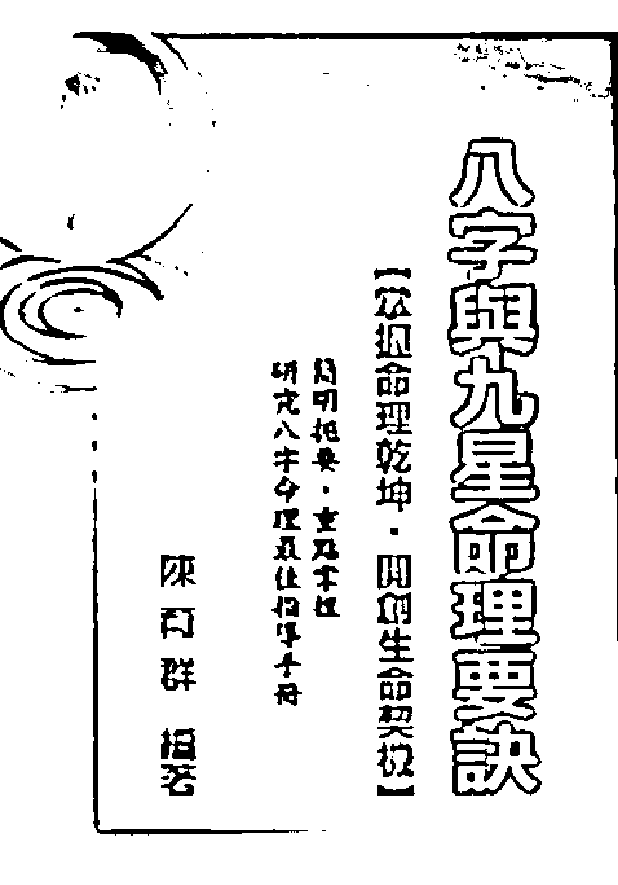

## 八字與九星命理要訣

陳育群◇編著 定價390元

人一出生的年、月、日、時(即八字)，真的可以去決定一個人的命運嗎？
八字不好對自己會有很嚴重的影響嗎？
陳育群老師將在書中，一一完整的為讀者解答！
本書係作者參酌子平九星、卦數、挨星卦運、先天五行等學理，以作為論證八字命理的基礎，目的在突破傳統八字學的盲點與不準確度，並為後進學者提供更多學理參考的依據，以避免江湖術士的妄稱與迷信。
作者以其精研八字命理多年的豐富經驗，並用最簡單易懂的方法，傳授給讀者，本書是最適合想要瞭解八字與九星命理的所有讀者。

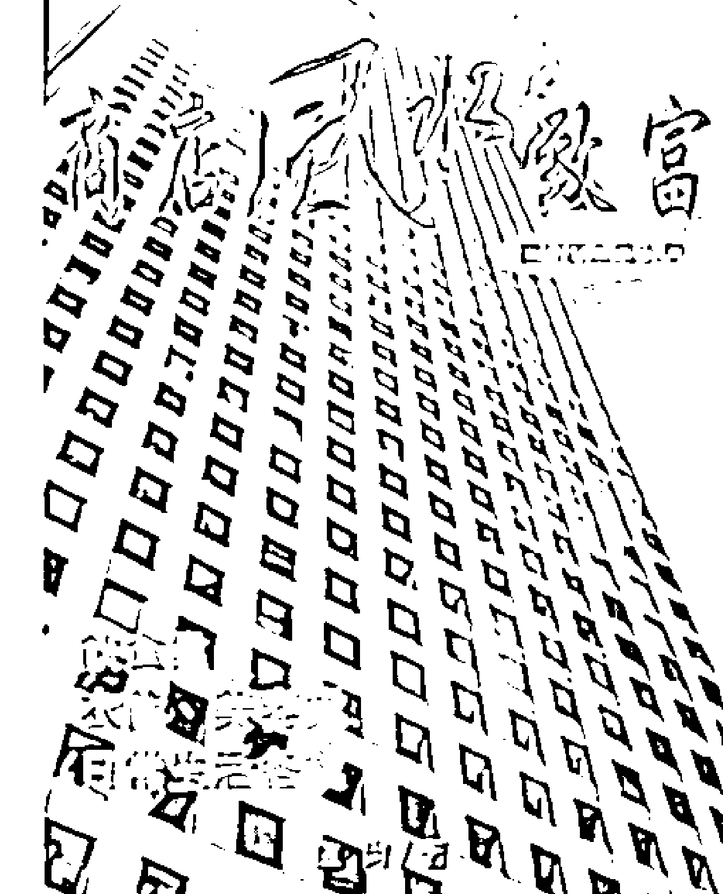

## 商店風水致富

盧尚◇著 定價250元

本書是有关於風水學的一本曹，但風水學並不是教人要迷信，只要您詳讀本書，讓自己在工作場所或生活方面做一些小改變，也許轉換成另一種氣氛或是磁場，就會讓您處事更加得心應手、飛黃騰達！
此外，各篇已經細分出行業別，作者的悉心編排，讓讀者閱讀更為便利所至，開卷有益，亦是作者所深切期盼的。
本書也教您找出吉祥的方位、最佳的擺設，讓您和您的商店財氣、人氣滾滾來。

### 快樂學紫微

讀懂你的「紫微命盤」，積極突破生命困境！

- ☆ 透過命盤，你可以了解自己的處境與執著，優點與缺點。
- ☆ 論命比算命更重要，論命是積極的透過改變自己的弱點、接受人生的低潮，重新打造新生命藍圖。
- ☆ 不懂如何積極改變自己的「忌」，就會「應命」，無法走出生命的困局。
- ☆ 命無法改，但運可以改。既知命，我們就不該跟著命運走，不畫地自限，應把命運掌握在自己手中！

> 透過紫微，我希望每個人都幸福！
～江青川