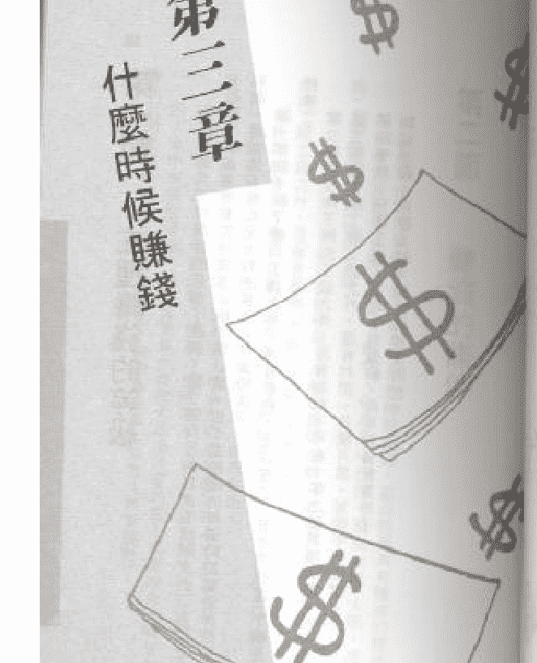
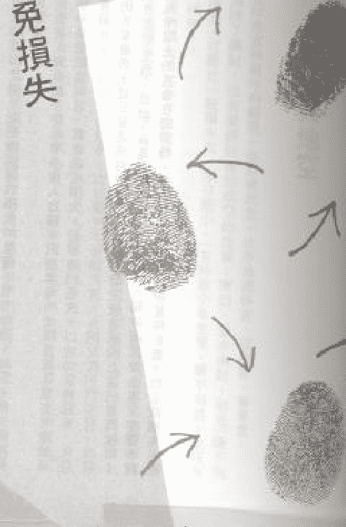
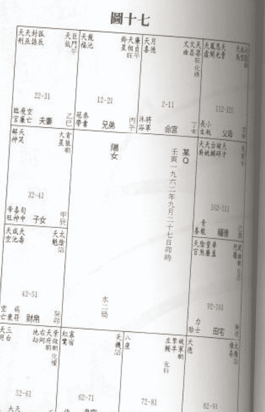
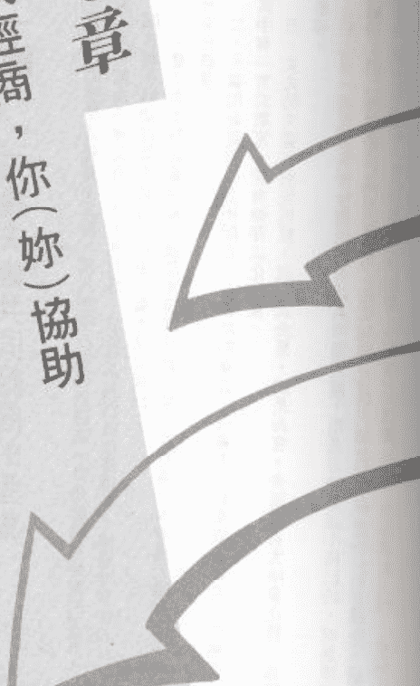
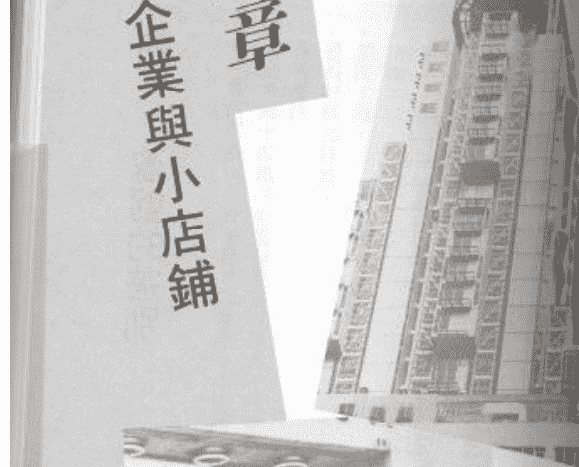
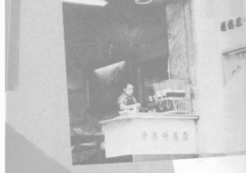
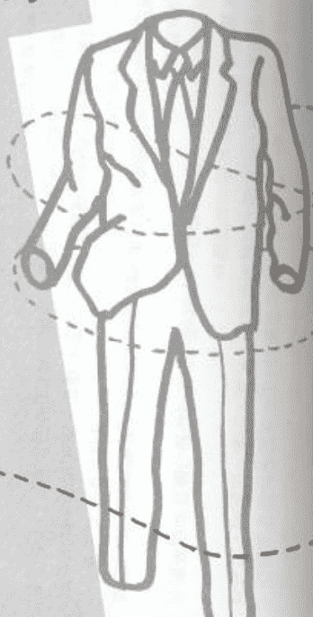
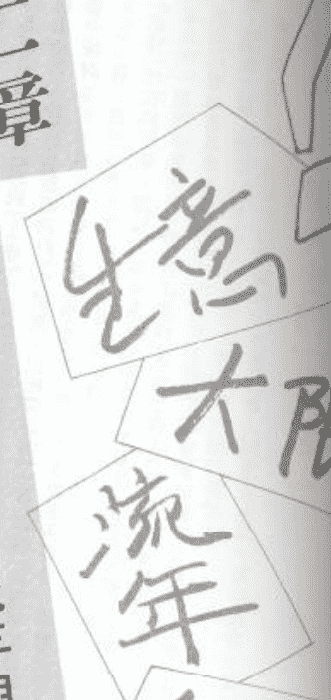
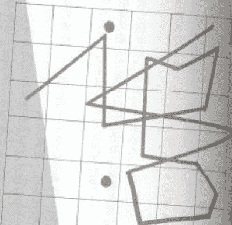

慧心齋主 著

## 紫微斗數

## 營商篇

（原名：紫微斗數看工商人）

（图片：img/223ceff17854e3051fcff6c40c69caa0_0_0.png）

博益出版集團有限公司

## 我的聲明

《紫微斗數新註》、《紫微斗數看婚姻》、《如何推算命運》、《紫微斗數看發財》、《紫微斗數趨吉避凶法》等書是筆者研習紫微斗數多年來的一己心得，出版迄今，讀者厚愛，一再再版，使筆者深信：在紫微斗數的研習路上，不乏同好。

但是，自從筆者在報章雜誌撰寫斗數專欄以來，聽到不少傳聞。

諸多傳聞，不外乎慧心齋主的師父、師兄、師弟、師姊妹及徒弟在某處為人算命等等。

其實，筆者自業餘研習斗數以來，「既沒有設館授徒，也沒有掛牌收費，更沒有任何師父、師弟、師姊妹及徒弟。」

與筆者相識的人也都知道，慧心齋主無論在報章雜誌上或是私下為人算命，都是從不接受報酬的。

也有人問及筆者，是否用過其他筆名撰寫專欄或出書，事實上除了一九七零年曾在《壹壺日報》以說爐為筆名撰寫紫微斗數，再也沒有使用慧心齋主以外的筆名編寫任何書籍或專欄。

慧心齋主

恩師精研紫微斗數已數十年，純係業餘興趣，若是偶爾為人推命，亦從未接收潤酬；他年事已高，會一再強調，筆者是他此生唯一弟子。為避免讀者誤會，筆者已向臺灣中央標準局提出申請有關筆名之註冊，亦申請了著作權，趁此機會，特別聲明。 丁卯年桂月

## 目錄

-   第二章 經商與有關的宮位
    -   第一節 經商之論——財帛宮
    -   第二節 經商之論——事業宮
    -   第三節 經商之論——命宮
    -   第四節 經商之地——遷移宮
    -   第五節 經商之友——福德宮
-   第三章 什麼時候賺錢
    -   第一節 十個正確的經商觀念
    -   第二節 六種經商者的命運型態
-   第四章 如何避免損失
    -   第一節 大限與賺錢的時機
    -   第二節 賺錢的條件
    -   第三節 五種賺錢的等級
    -   第四節 地劫與地空

# 第五章 諸星與經商

1.  第一節 甲級星
2.  第二節 乙級星
3.  第三節 丙級星
4.  第四節 丁、戊級星
5.  第五節 各種經商行業分類明細表

# 第六章 獨資與合夥

1.  第一節 獨資經營者
2.  第二節 合夥經商的狀況
3.  第三節 個性較強的人
4.  第四節 人際關係與合夥
5.  第五節 獨資與合夥

# 第七章 我經商，你(妳)協助

1.  第一節 三種夫妻共同經商的型態
2.  第二節 婦幫夫權，肩挑重擔
3.  第三節 雙謀交流，合作愉快

# 第八章 大企業與小店鋪

1.  第一節 盈虧的差別
2.  第二節 個性的相異
3.  第三節 希望獨立的經營者
4.  第四節 承繼型的命運
5.  第五節 我想賺大錢
6.  第六節 我喜歡做生意

# 第九章 田宅宮與經商

1.  第一節 區分田宅宮的好壞
2.  第二節 最好的田宅宮
3.  第三節 次好的田宅宮
4.  第四節 穩定的田宅宮
5.  第五節 不利經商的田宅宮

# 第十章 播販與我

1.  第一節 播販的命運特點
2.  第二節 一般攤販的命運

# 第十一章 我是貿易商

-   第一節 適合經營貿易的命運型態
-   第二節 適合從事貿易的命例
-   第三節 我與外地有緣
-   第四節 險中求勝的型態
-   第五節 太陽與太陰

# 第十二章 不是生意的生意——大限、流年與經商

-   第一節 賺佣金的「生意」
-   第二節 以會養會、增加收入
-   第三節 我在跑單幫

# 第十三章 命盤實例

-   第一節 存與化錄
-   第二節 經商的陷阱
-   第三節 一莊主

# 第十四章 排盤的方法

-   附錄：專有名詞之解釋
-   後記

# 第一章 經商與有關的宮位

（图片：img/223ceff17854e3051fcff6c40c69caa0_4_0.png）

## 第一節 經商之鑰——財帛宮

幾乎所有經商者及想要經商的人，都最關心下列幾個問題：

一、會不會賺錢？
二、什麼時候賺錢？
三、如何避免損失？

前述三項，皆直接與錢財有關，命盤中反映錢財狀況的宮位首推財帛宮；所以研究經商運氣時，亦重財帛宮。凡(一)未經商者，(二)正在經商者，(三)想要東山再起者，(四)想增資者，皆需先瞭解自己命盤中財帛宮星曜吉凶。

若想因經商發財，要有先天命運，所以要瞭解可否致當，還要將財帛宮及命宮配合起來研究，瞭解有無下列現象：

一、財帛宮有化祿、祿存星，沒有地劫、地空、化忌星者，已具備經商的基本條件。
二、如果命宮亦無地劫、地空、化忌星，可以考慮經商。
如果財帛宮沒有化祿、祿存星，亦無地劫、地空、化忌星，但是命宮有化祿、祿存星（沒有地劫、地空、化忌星），也可考慮經商，但是必須事業宮、遷移宮沒有地劫、地空、化忌星。

最後，如果財帛宮具有經商條件，但福德宮或事業宮有化忌星，對經商也是一種干擾，除非命宮另有化祿或祿存星其中一星，否則也會影響經商的成績。

經商的目的在於賺錢，關於財帛宮及錢財的問題，讀者請參看拙作《紫微斗數看錢財》，與本書互相配合。由下章起，將與讀者共同研究與經商有關種種狀況。

## 第二節 經商之實——事業宮

一般人在確定自己可以經商時，還會產生下列疑問：

1. 適合什麼性質的生意？
2. 獨資？還是合夥？
3. 可以有多少經商歲月？

這些皆須以事業宮為主，財帛、命宮為副，讀者不妨看看自己的命盤有無下列條件：一、事業宮有祿存或化祿星，命宮、事業宮、財帛宮、命宮皆無地劫、地空、化忌星，這樣的配置，一生都是生意人，而事業宮中甲、乙級星曜的性質，足以做為經商的範圍、項目的參考。二、事業宮中有祿存或化祿其中一星，命宮或財帛宮也有祿存或化祿其中一星；命宮、事業宮、財帛宮、遷移宮，皆無地劫、地空、化忌星，也會有終生經商現象，但必須與命盤有相同現象的人合夥，判斷適合的行業方法，與前述第一項相同。

## 第三節 經商之源——命宮

基本上，命宮有祿存或化祿或武曲星的人，最善於處理錢財，也最有興趣，通常無論有無地劫、地空、化忌星同宮或會照，在一生之中，很容易一再有經商的念頭，或付諸實行，或買股票、黃金、放款生息，或介紹抽佣，以各種方法生財。當然，命宮有財星的人，得天獨厚，有守財或財源不斷的先天本質，但是否適合經商，要看命宮三方所會照的其他星曜性質如何，如果有地劫、地空、化忌星，則不宜經商。

## 第四節 經商之地——遷移宮

遷移宮與命宮相隔六個宮位，與事業宮、財帛宮都無法會照，一旦有祿存或化祿，只表示與外地有緣，適合以「外地」圖利，或是從事居間代理、傭僞的行業。若在命宮對面，若有化忌、地劫、地空等星，對命宮相比，也有貴人照顧；雖然如此，遷移宮對於經商者也十分重要，但與財帛宮、事業宮、命宮相比，只能排列於第四位而已。

## 第五節 經商之友——福德宮

瞭解經商的運氣，基本上須看命宮及其三方，也就是命宮、財帛宮、事業宮、遷移宮，因為這些宮位與命宮皆可會照，但因財帛宮是經商之鑰，財帛宮的三方也須考慮。是福德宮。

一、福德與財帛宮若皆無地劫、地空、化忌星（尤其是化忌星），表示可以互相幫助，增長經商的運氣。
二、福德與財帛宮互相對照，其與經商的關係如下：
    一、若財帛宮有地劫、地空、化忌，則不宜經商。
    二、若財帛宮有地劫、地空、化忌，而福德宮有祿存或化祿，不宜經商；或有人經商，恐也不免失敗，雖失敗，仍有生活享受，其財務狀況不如一般人所想像得那麼好。
    三、若財帛宮有地劫、地空、化忌星，財帛宮有祿存、化祿星，則經商所賺的錢容易有各種損失、開支，當事人不但賺錢辛苦，在物質生活享受上也較差。

# 第二章 我是個生意人嗎？

（图片：img/223ceff17854e3051fcff6c40c69caa0_8_0.png）

## 第一節 十個正確的經商觀念

在正式探討本章主題之前，先與讀者溝通一些與經商有關的觀念，以下是一般人時常發生的問題：

問：我不擅交際，適合經商嗎？

答：擅交際可以爭取到許多生意機會。但有許多人做生意不靠交際，顧客自會找上門來，也有許多種性質的生意，是不需要「交際」的，真正適合命理的說法是，投資者無須交際，經營者視情況而定，推銷者才最需瞭解什麼是真正的人際關係。

問：我不是學商的，可以經商嗎？

答：沒有任何一本商科教科書會教你當年的市場、股票行情，如何運用各種策略，與顧客或賣主討價還價。學術與從商，應是兩回事，有許多目不識丁的人做生意，往往有很好的收穫。

問：我對數目字沒興趣，適不適合經商？

答：經商不需要對數目字有興趣，只要對賺錢有興趣即可。

問：我是經濟學博士，做生意想必會賺錢！

答：我是經濟學博士，是有一「經濟學」方面學問的人，雖或懂得做生意的某些道理，但不一定有因做生意而賺錢的命運。

問：我的家人、親戚做生意都賺錢，想必我也不例外！

答：每個人的運氣皆不相同，所以你做生意是否會賺錢，也需要瞭解你個人的命運。

問：我從小就對做生意有興趣，也深具才華，所以我做生意，也必會賺錢。

答：對做生意有興趣，不一定的會賺錢。對做生意有興趣，是命宮及三方有祿存或化祿星所致。如果命宮及命宮三方同時亦有化忌及地劫、地空等星，仍會對做生意有興趣，但也會有損失。

問：我是某大公司的總經理，替老闆賺了很多錢，現在自己要投資創業，想必也會賺錢。

答：有些人的命運是財運好，又有好幫手，因此可當大公司的大老闆；有些人是能力高、才華高，但無法為自己的事業賺錢，所以成為大公司的總經理，如果要自資經商，必須先瞭解自己的命運是那種形態。

問：做生意賺錢快也賺得多，是致富的捷徑嗎？

答：別人做生意一旦損失，也可能很多、很快；而且，不是每個人做生意都能賺很多錢，有些人只可能賺工錢而已。

問：別人做生意失敗，是因為能力不足，聰明才智不夠，我會遭遇相同的問題嗎？

答：做生意固然需要聰明才智及能力，也需要財運，兩者缺一不可，即使商場經驗豐富的人，也需要財運。

問：我算過命，命中適合經商，是否表示一定賺錢？

答：任何命中適合經商的人，在經商過程中，都有不可避免的各種損失機會，而且也有某個大限比較容易損財，只是以之相抵，還不會出現赤字而已。

## 第二節 六種經商者的命運型態

一般經商者的運氣，可分為下列六種類型：
1. 十分適合經商。
2. 適合經商。
3. 絕對不宜經商。
4. 尚可經商，但必須在合夥人或其他方面有適當的配合。
5. 本命宮及其三方顯示不適合經商，但在某個或某幾個大限尚可經商。
6. 具有經商假象的命運型態。

### 第一種類型：十分適合經商

下例三種現象同時具備者，最宜經商：
A. 財帛宮、命宮或事業宮，三個宮位其中二宮有雙祿交祿或祿馬交馳格局。
B. 六吉星分布於命宮、事業、財帛宮，或有六吉星及廟旺的日、月二星分別夾助上述宮位。
C. 命宮及其三方與福德宮皆無地劫、地空、化忌星其中任何一星同宮。

以某一圖A例：某A命宮中有貪狼星化祿，會照事業宮的祿存星，形成雙祿交流，符合前述A項條件。

此外，命宮有六吉星其中之一的天魁星，且有日、月相夾，符合前述B項條件。

這樣的星曜組合，所以「十分適合經商」，有下列原因：

一、因為命宮及三方沒有地劫、地空及化忌星等，表示一生財源不缺，即這樣的經商大限甚差，經商倒閉，也會東山再起，在失敗時，經濟上不會有三餐不繼或無處可居等嚴重問題，故適合以經商為終生事業，也可以發展其他興趣，只是需要在大限不好時，不要多投資，凡事保守，做穩當趨吉的配合即可。

二、因為命宮及三方至少有六吉星其中一星同宮，則依六吉星之彼此關係，在其他宮位，也很可能有其他六吉星同宮，對經商者有下列幫助：
（一）遇到困難時，易得各方面援助。
（二）容易提升自己或產品的社會地位。
（三）容易使經商的產品具有特色。

某B（圖三）的命盤也顯示「十分適合經商」，但是因為命宮及遷移宮沒有魁、鉞二星互相會照，只有事業宮有左輔星，遷移宮、財帛宮分坐文曲、文昌星，在經商氣勢上，不如某A，較沒有某A的知名度，也不如某A順利，經商難致富，但真正順境在四十六歲以後十年庚辰大限。

此外，各大限皆有祿存或化祿，由戊寅大限至丁亥大限。這樣的星曜組合，其所以適合經商，有下列原因：

1. 因爲命宮及其三方有祿存星，表示無論來財多寡，財源不斷，即使某個大限財運基差，經商倒閉，雖未必會東山再起，但失敗時，在經濟上不會有三餐不繼等嚴重問題（大限巨門化忌者除外）。
2. 因命宮及三方至少有天魁、天鉞、左輔、右弼諸星其中之一同宮，則依其彼此關係（例如只要會照天魁星，就很有可能同時會照天鉞星，只要會照左輔星，就很有可能會照右弼星）。對經商者有下列幫助：
   - (一)遭遇困難時，易得各方面的援助。
   - (二)容易提升個人社會地位或所經營產品的商譽。
   - (三)容易使經營的產品具有特色。
3. 因爲命宮及三方沒有地劫、地空或化忌星，至少經商還有利潤。

※關於第二種類型所列的A、B、C三種條件中，若缺乏B項，亦適合經商。

### 第二種類型：適合經商

下列幾種現象同時具備者，適合經商：

- A、財帛宮或命宮、事業宮有祿存或化祿星其中一星同宮。
- B、六吉星分布於命宮及其三方，或有六吉星、日、月二星夾助財帛宮及命宮。
- C、命宮及其三方與福德宮皆無地劫、地空、化忌星其中任何一星同宮。
- D、各大限皆逢祿存或化祿（本命及大限皆可）。

以某C（圖三）為例，某C事業宮中有祿存星，符合前述A項條件。命宮有六吉星之一文曲星，事業宮中有六吉星之一右弼星，符合前述B項條件。命宮及命宮三方沒有地劫、地空及化忌星其中之一，符合前述C項條件。

### 第三種類型：絕對不宜經商

下列數種組合，皆不宜經商：

- 甲組
  - A、沒有祿存星，亦無化祿星。
  - B、有地劫、地空、化忌三星中一星或數星同宮或會照。
  - 以某D（圖四）為例，某D命宮及三方，甚至福德宮皆無祿存星及化祿星，符合前述A項條件。命宮中有巨門星化忌及地空星，事業宮有地劫星。財帛宮雖無地劫、地空或化忌星，是陀羅、天馬同宮，是為折足馬，於錢財有極不利的影響，符合前述B項條件。這樣的星曜組合，所以「絕對不宜經商」，有下列原因：
    - 一、因爲唯有祿存及化祿星才能使經商有利可圖，某D命宮及三方缺乏上述星曜。
    - 二、地劫、地空、化忌三星對錢財只會造成損失。
- 乙組

### 第四種類型：尚可經商型

同時具有下列條件，屬於尚可經商的命運型態。
A、事業宮、命宮或財帛宮有祿存或化祿星。
B、六吉星分佈於命宮、事業宮、財帛宮。
C、地劫、地空、化忌三星其中一星或二星在遷移宮、事業宮或福德宮。

以某F（圖六）為例，某F命宮有巨門化祿，財帛宮有祿存星，符合前述A項條件。
某F財帛宮有左輔星，符合前述B項條件。
事業宮有地劫、地空二星，符合前述C項條件。
這樣的命盤，所以尚可經商，有下列原因：

一、某F命宮及財帛宮雙祿交馳，表示總有進財機會，也不易有三餐不繼的現象。
二、事業宮有地劫、地空二星，可運用紫微鬥數趨吉避凶的法則，經營偏向電子、電器、化學、醫藥或與科技有關的行業。又有天機、天馬二星，亦有經營具有「動」性的生意，包括大眾傳播、交通運輸、設計等。
這樣的命運如果經商，很容易變換營業項目或種類（或因經營的事業與科技有關，因需要日新月異，而自然變化），可在自然變化中減少些損失。
此外，大限或流行巳、酉、丑三宮時，雖可能與地劫、地空二星同宮或會照，而造成損失，但至少還不至於因損失而導致完全失敗。

### 第五種類型：本命宮及其三方不適合經商，但某個大限或幾個大限顯適合經商

大限命宮及其三方同時有下列條件，適合經商：

A、有祿存或化祿二星同宮或會照。
B、有天魁、天鉞、左輔、右弼等四星其中一星以上同宮。
C、沒有地劫、地空、化忌其中任何一星同宮。

### 第六種類型：具有經商「假象」的命運型態

這一類的經商者命運，其「本命」適合經商，往往只是一種「假象」，而因相連的幾個大限皆不宜經商，使得經商者在其濃厚的經商興趣下，一再嘗試，而很難有收穫，造成「假象」的命盤如下：

- 一、命宮、財帛、事業等宮皆無祿存及化祿，亦無地劫、地空、化忌星。只有遷移宮有祿存或化祿其中一星。如果命盤中相連幾個大限不適合經商，也無法有收穫。（如某H，見圖八。）
- 二、命宮及財帛宮皆吉，沒有地劫、地空或化忌星其中一星同宮，財帛宮有化祿星或祿存星（或命宮有祿存或化祿星），本宜經商，但福德宮有化忌星，事業宮有地劫或地空其中一星，則雖經商，但一再換行業，遭遇困難。（如某I，見圖九。）
- 三、命宮中有化祿及祿存，是為雙祿交流（或命宮與財帛宮形成雙祿交流），但是事業宮及財帛宮分別各有地劫及地空或化忌星。（如某J，見圖十。）
- 四、命宮沒有祿存或化祿，有地劫、地空、化忌星其中之一；財帛宮無祿存、化祿及地劫、地空、化忌。（如某K，見圖十一。）
- 五、本命、事業、財帛諸宮無化祿、祿存星，亦無地劫、地空、化忌星，僅福德宮有祿存或化祿星。（如某L，見圖十二。）

上述具有經商假象的命運型態，如果經商，有下列現象：

- 一、損失（某I）。
- 二、只賺一點工錢（某J）。
- 三、沒有賺到工錢，亦無損失（某H、某L）。
- 四、只在某幾年賺到一些錢，如果不瞭解其運氣只在某個大限好，則慘敗（某K）。

這類型的人如果為人工作，多可在努力之後得到高收入，而且無須面對經商時的風險、勞累。

（图片：img/223ceff17854e3051fcff6c40c69caa0_15_0.png） 图二
（图片：img/223ceff17854e3051fcff6c40c69caa0_15_1.png） 图一
（图片：img/223ceff17854e3051fcff6c40c69caa0_16_0.png） 图四
（图片：img/223ceff17854e3051fcff6c40c69caa0_16_1.png） 图三

## 圖五

| 年齡段 | 22-31 | 32-41 | 42-51 | 52-61 | 12-21 | 2-11 | 92-101 | 102-111 | 112-121 |
| :--- | :--- | :--- | :--- | :--- | :--- | :--- | :--- | :--- | :--- |
| 星曜 | 天天姚德 火　星 | 天天壽天三八 月災喜壽台座 | 天天七紫 馬巨殺微 平旺 | 天天刑虛 相浩德 | 破天碎才 星煞財 | 紅天廚星 破煞食 | 巨門天機 化忌旺 | 陰煞武曲 破碎 化忌 | 文左陀天府 曲右輔羅府 旺 |
| 宮位 | 身宮 夫　妻 庚　申 | 子女 己　未 | 財帛 戊　午 | 病厄 丁　巳 | 兄弟 辛　酉 | 命宮 壬　戊 | 田宅 癸　丑 | 事業 甲　寅 | 父母 癸　亥 |
| 喜忌 | 長生 | 沐浴 | 冠帶 | 臨官 | 小耗桃花 | 始親 | 廟旺 | 墓庫 | 墓庫 |
| ... | ... | ... | ... | ... | ... | ... | ... | ... | ... |
| 年齡段 | 62-71 | 72-81 | 82-91 | 93-101 | 102-111 |
| 星曜 | 天天機 馬機 | 天天刑 刑傷 | 天天刑 刑傷 | 巨門天機 化忌旺 | 陰煞武曲 破碎 化忌 |
| 宮位 | 遷移 丙　辰 | 交友 乙　卯 | 事業 甲　寅 | 田宅 癸　丑 | 事業 甲　寅 |
| 喜忌 | 沐浴 | 墓庫 | 墓庫 | 墓庫 | 墓庫 |

## 圖六

| 年齡段 | 85-94 | 75-84 | 65-74 | 55-64 | 95-104 | 105-114 | 5-14 | 15-24 | 25-34 |
| :--- | :--- | :--- | :--- | :--- | :--- | :--- | :--- | :--- | :--- |
| 星曜 | 天機天梁 天陰八陰 祿存科 | 天天刑輔 馬空劫輔 中 | 天天哭天 刑德喜 | 乾宮單 鈔開益 | 虛帝奏 暗旺壽 | 天天恩 月哭光 | 陰男 癸　丑 | 辛酉，一九三三年六月十三日午時 | 天天三天 喜虛台貴 |
| 宮位 | 事業 戊　午 | 交友 丁　巳 | 遷移 丙　辰 | 病厄 乙　卯 | 田宅 壬　辰 | 福德 辛　卯 | 田宅 癸　丑 | 財帛 庚　子 | 子女 己　亥 |
| 喜忌 | 官府將軍 亡神 | 花小旬天 桃花陀羅 | 沐浴死 沐浴殺亡 | 長生天 生士史 | 臨官 | 帝旺 | 長生 | 沐浴 | 冠帶 |
| ... | ... | ... | ... | ... | ... | ... | ... | ... | ... |
| 年齡段 | 35-44 | 45-54 | 55-64 | 115-124 | 125-134 |
| 星曜 | 天府天 府士 | 天天天三天 府士台貴 | 紅天廚星 破煞食 | 陰男 癸　丑 | 辛酉，一九三三年六月十三日午時 |
| 宮位 | 子女 己　亥 | 財帛 庚　子 | 病厄 乙　卯 | 父母 庚　子 | 父母 庚　子 |
| 喜忌 | 臨官 | 帝旺 | 墓庫 | 長生 | 沐浴 |

## 圖八

| 天機天梁 忌 | 祿存 | 天府天相 天廚天哭 | 二天同梁台 天喜天壽 天官天刑 三台八座 | 天機天梁 忌 | 祿存 | 天府天相 天廚天哭 | 天相 天刑 | 天機天梁 忌 | 祿存 | 天府天相 天廚天哭 | 天相 天刑 | 天機天梁 忌 | 祿存 | 天府天相 天廚天哭 | 天相 天刑 | 天機天梁 忌 | 祿存 | 天府天相 天廚天哭 | 天相 天刑 | 天機天梁 忌 | 祿存 | 天府天相 天廚天哭 | 天相 天刑 | 天機天梁 忌 | 祿存 | 天府天相 天廚天哭 | 天相 天刑 |
| :--- | :--- | :--- | :--- | :--- | :--- | :--- | :--- | :--- | :--- | :--- | :--- | :--- | :--- | :--- | :--- | :--- | :--- | :--- | :--- | :--- | :--- | :--- | :--- | :--- | :--- | :--- |
| 152-61 | 42-51 | 32-41 | 22-31 | 106-115 | 96-105 | 86-95 | 76-85 |
| 龍德 官符 破碎 | 白虎 | 天德 劫煞 | 吊客 | 病符 | 小耗 | 大耗 | 貪狼 官府 |
| | | | | | | | | |
| 62-71 | 12-21 | 116-125 | 66-75 |
| 帝力 將星 | 天喜 天壽 | 紅鸞 | 天刑 |
| | | | | |
| 72-81 | 3-11 | 6-15 | 56-65 |
| 青龍 天煞 | 天姚 | 天空 | 天刑 |
| | | | | |
| 82-91 | 92-101 | 102-111 | 112-121 | 16-25 | 26-35 | 36-45 | 46-55 |
| 小耗 | 天空 | 劫煞 | 病符 | 天哭 | 天虛 | 天貴 | 天壽 |

## 圖七

| 紫微 天府 | 天機天相 天廚天哭 | 天相 天刑 | 天機天梁 忌 | 祿存 | 天府天相 天廚天哭 | 天相 天刑 | 天機天梁 忌 | 祿存 | 天府天相 天廚天哭 | 天相 天刑 | 天機天梁 忌 | 祿存 | 天府天相 天廚天哭 | 天相 天刑 | 天機天梁 忌 | 祿存 | 天府天相 天廚天哭 | 天相 天刑 |
| :--- | :--- | :--- | :--- | :--- | :--- | :--- | :--- | :--- | :--- | :--- | :--- | :--- | :--- | :--- | :--- | :--- | :--- | :--- |
| 96-105 | 86-95 | 76-85 |
| 天府 天壽 | 天相 | 天機 |
| | | | | |
| 116-125 | 66-75 |
| 紅鸞 | 天刑 |
| | | | |
| 6-15 | 56-65 |
| 天喜 | 天姚 |
| | | | |
| 16-25 | 26-35 | 36-45 | 46-55 |
| 天哭 | 天虛 | 天貴 | 天壽 |

## 圖十

| 天 | 天 | 台 | 天 | 左 | 天 | 天 | 恩 | 天 | 武 |
| :--- | :--- | :--- | :--- | :--- | :--- | :--- | :--- | :--- | :--- |
| 15-24 | 25-34 | 35-44 | 45-54 | 6-15 | 116-125 | 106-115 | 96-105 | 5-14 | 35-64 |
| 父 | 母 | 兄 | 弟 | 姐 | 妹 | 子 | 女 | 夫 | 妻 |

## 圖九

| 天 | 陀 | 祿 | 天 | 右 | 左 | 巨 | 天 | 陰 | 天 | 武 |
| :--- | :--- | :--- | :--- | :--- | :--- | :--- | :--- | :--- | :--- | :--- |
| 6-15 | 116-125 | 106-115 | 96-105 | 16-25 | 26-35 | 36-45 | 46-55 | 56-65 | 66-75 | 76-85 |
| 身 | 命 | 父 | 母 | 兄 | 弟 | 姐 | 妹 | 子 | 女 | 夫 |

## 圖十二

| 命宫 | 父母 | 福德 | 田宅 | 官禄 | 仆役 | 迁移 | 疾厄 | 财帛 | 子女 | 夫妻 | 兄弟 |
| :--- | :--- | :--- | :--- | :--- | :--- | :--- | :--- | :--- | :--- | :--- | :--- |
| 天府天相 天厨 天才 | 天梁 天府 解神 月德 | 天机 天梁 天钺 天刑 | 紫微 天府 天魁 天钺 | 太阳 太阴 地劫 天哭 | 天机 天梁 天刑 天姚 | 紫微 天府 天魁 天钺 | 天机 天梁 天刑 天姚 | 天府天相 天厨 天才 | 天梁 天府 解神 月德 | 天机 天梁 天钺 天刑 | 紫微 天府 天魁 天钺 |
| 力士 博士 | 父母 乙巳 | 福德 丙午 | 田宅 丁未 | 官禄 戊申 | 仆役 己酉 | 迁移 庚戌 | 疾厄 辛亥 | 财帛 壬子 | 子女 癸丑 | 夫妻 甲寅 | 兄弟 乙卯 |
| 八度 | | 隐男 | 丁丑，一九三七年十一月二十一日申时 | | 丁未 | 阳女 | 甲子，一九二四年五月十五日申时 | | | | |
| 6-15 | | | | | 76-85 | | | | 6-15 | | |
| 命宫 甲辰 | | | 丁未 交友 | | 迁移 庚戌 | | | | 命宫 甲戌 | | |
| 16-25 | | | | | 66-75 | | | | 16-25 | | |
| 兄弟 乙卯 | | | | | | | | | 兄弟 乙卯 | | |
| 26-35 | 36-45 | 46-55 | 56-65 | | 56-65 | 46-55 | 36-45 | 26-35 | 26-35 | 36-45 | 46-55 |
| 夫妻 甲寅 | 子女 癸丑 | 财帛 壬子 | 疾厄 辛亥 | | 疾厄 辛亥 | 财帛 壬子 | 子女 癸丑 | 夫妻 甲寅 | 夫妻 甲寅 | 子女 癸丑 | 财帛 壬子 |

## 圖十一

| 命宫 | 兄弟 | 夫妻 | 子女 | 财帛 | 疾厄 | 迁移 | 交友 | 田宅 | 福德 | 父母 | 身宫 |
| :--- | :--- | :--- | :--- | :--- | :--- | :--- | :--- | :--- | :--- | :--- | :--- |
| 武曲 天相 天厨 天刑 | 天府 天相 天厨 天才 | 天机 天梁 天钺 天刑 | 天梁 天府 解神 月德 | 紫微 天府 天魁 天钺 | 天机 天梁 天刑 天姚 | 紫微 天府 天魁 天钺 | 天机 天梁 天刑 天姚 | 天府天相 天厨 天才 | 天梁 天府 解神 月德 | 天机 天梁 天钺 天刑 | 紫微 天府 天魁 天钺 |
| 帝旺 将军 | 将星 力士 | 长生 博士 | 沐浴 力士 | 冠带 博士 | 临官 力士 | 帝旺 将军 | 衰 博士 | 病 力士 | 死 博士 | 墓 力士 | 绝 博士 |
| 丁未 交友 | 丁未 交友 | 丁未 交友 | 丁未 交友 | 丁未 交友 | 丁未 交友 | 丁未 交友 | 丁未 交友 | 丁未 交友 | 丁未 交友 | 丁未 交友 | 丁未 交友 |
| 76-85 | | | | | | | | | | | |
| 迁移 庚戌 | | | | | | | | | | | |
| 56-65 | 46-55 | 36-45 | 26-35 | 16-25 | 6-15 | 56-65 | 46-55 | 36-45 | 26-35 | 16-25 | 6-15 |
| 疾厄 辛亥 | 财帛 壬子 | 子女 癸丑 | 夫妻 甲寅 | 兄弟 乙卯 | 命宫 甲辰 | 疾厄 辛亥 | 财帛 壬子 | 子女 癸丑 | 夫妻 甲寅 | 兄弟 乙卯 | 命宫 甲辰 |

# 第三章

## 什麼時候賺錢

## 第一節 五種賺錢的等級

大部分人，經商目的是為了賺錢，除了賺到足夠日常生活開支的「工錢」之外，還希望有盈餘；但並非所有的經商者皆能如願以償，也不是經商的每個時期都能保持一定的收入及利潤。現在依各種狀況，列出等級，討論於後：

第一等級：除了賺到工錢之外，還有暴利，足以在三、五年內成富不論是能否積存、持積。

第二等級：除了賺到工錢之外，還有高利，可在十年之後果積成富。

第三等級：除了賺工錢之外，還有利潤，日積月累，至晚年可成富。

第四等級：只賺工錢，有時小有盈餘，尚足夠買房子。

第五等級：只賺工錢，夠生活開支而已。

## 第二節 賺錢的條件

無論是那一種賺錢的等級，或是在什麼時候賺錢，都需要具有賺錢的條件如下：

- 一、命宮及其三方沒有地劫、地空、化忌其中任何一星或數星（大限、流年、流月亦然），如此至少可以賺到工錢。
- 二、命宮及三方有祿存或化祿星，亦無前述的地劫、地空、化忌其中任何一星或數星，如此除了賺工錢之外，還會有盈餘大限、流年、流月亦然。

至於盈餘多少，能否成富，就需要下列條件配合。
- 一、有本命足以致富的格局，例如雙祿交流、祿馬交馳。
- 二、凡財星在命宮或財帛宮化祿，則會有較高的錢財收入。
- 三、大限或流年，有前述第一或第二種現象。
- 四、命中有偏財運者。例如貪狼星化祿與火星或鈴星同宮，或是本命天機星化祿，大限會天同星化祿等。本節只是概述，細節請參看《紫微斗數看錢財》。

## 第三節 賺錢的時機

經商者無法長期維持固定利潤的原因，在於大限、流年的變化，凡大限或流年符合下列條件時，利潤自然較高：

- 一、有足以致富的格局。
- 二、有財星坐在大限或流年的財帛宮坐化祿，於大限、流年逢逢時，自會有明顯的高收入。
- 三、大限或流年有「偏財」的格局者。

## 第四節 大限與賺錢

在研究賺錢的大限時，必須注意相連的幾個大限間相互關係，一般人的大限之間的關係，多呈下列幾種現象：

- 一、好的大限與壞的大限平均相隔，即好大限之後，緊隨壞的大限，壞大限之後，又緊隨好大限，於經營者而言，還的大限難也十分努力，但是運氣不足，或是壞的大限正價開削期，或增加設備，一時沒有盈餘。
- 二、好的大限與壞的大限呈不規則相隔，例如連續二個大限甚差，接下來三個大限甚好，於經營者而言，連續壞的大限愈多，對經營愈不利，尤其是趁間失敗者，煩難東山再起。
- 三、大限與大限之間的好、壞區別不十分明顯，每個大限皆好壞各半，這償命盤，其...

# 第四章

## 如何避免损失

「赚钱」的契机，在于「流年」，无论那个大限，只要流年命宫三方有化禄星、六吉星、化权、化科星，没有地空、地劫、化忌星时，则表示会赚钱，往往一个大限之中，会有三至五次这样的机会，擅于掌握者，一样可以有收入，只是所赚的钱，如果当做资本再投资，不一定能继续有赢余，其结果只是享受到短暂的乐趣，学习到短暂的经验，而不一定赚到大钱而已。

## 第一節 地劫與地空

在探討造成損失的原因之先，先要辯解造成損失的星曜，唯有地劫、地空、化忌及陀羅、天梁星、破碎星。

無論從事任何生意，資本額多少，有多少人合夥，只要本命、大限及流年三方有地劫、地空、化忌星其中一星或數星同宮，都會造成損失。若要排列名次，以地劫星為冠軍，化忌星為亞軍，地空星殿後。

並不是所有的人，都會因上述三星造成錢財損失，也非每個經營者都因上述三星而虧敗；而因男、女性別及家庭生活、婚姻、感情的好壞，有所區別，對於這部分，本文亦暫不討論。

此外，凡投資額巨大者，其損失也愈多。地劫獨坐本命財帛宮，大限又逢巨門化忌，則易虧了錢財或其他產業半生賺錢。

命宮及三方有祿存及化祿者，若逢地劫星，或可東山再起，但是是否有昔日風光，很難斷定，或起起落落，較難穩定。

大限及流年逢地劫星，是造成損失的「時間」因素，然而損失的為何，往往在前一個大限

## 第二節 化忌星

化忌星於經營者所造成的錢財損失，有下列特點：

- 一、多是事先可預料得到的損失。
- 二、錢財的損失與事業的經營不一定互有關連。
- 三、因諸星性質不同，所以也可引伸幾種性質不同的損失方向，利於及早預防。
- 四、如果化忌未同時與地劫、地空同宮或會照，除武曲、廉貞化忌之外，其損失較無傾家蕩產的危險，反之則有。

### 太陽化忌

經營者財帛宮或命宮逢太陽星化忌時，有下列特性，宜設法避免：

- 一、不論賺錢多少，有沒有利潤，總是要分給別人，或是自己心甘情願分出，或是對方耍賴時，或是本已立下契約分歧，但分歧時或有些『虧』，出力較多，可能分得少些。
- 二、使生產往來容易有毀約、改約等情事，因而造成損失。也很可能因物價波動，增高

### 太陰星化忌

運限者財帛宮或命宮逢太陰星化忌，有下列特性，宜設法避免：

- 一、太陰星化忌，化祿又化忌，則有暫時的損失，若三方有魁、鉞、左、右、祿存、化科等星，則損失只是「觀念」。後運會賺回來，或是增加設備所造成，或是「錯誤的計算」所造成，或可彌補。
- 二、落陷及平宮的太陰星所造成的損失，較為真實，也較難彌補。與下列事物有關：
    - （一）告狀、面臨地頭蛇的地點。
    - （二）隔有森林、綠地或溪、河、海的地點。
    - （三）與文教機構有關。
    - （四）與男命與配偶或配偶家人有關。
- 三、無論是上述那一種現象，入廟或落陷，大限化忌所造成的損失，多有「預先知道」及「拖延甚久」的特色：
    - （一）預先知道：當事人往往預先知道在財物上有損失，但是因各種原因，無法事先完全防範。
    - （二）拖延甚久：發生損失至結束損失的時間較長，在一年之中，至少佔二個月時間，一個月當中，至少佔一星期。也就是說，損失的不但是金錢，還有精神、時間。
    - 例如：某流年太陰落陷化祿又化忌，結果該年難賺錢，但配偶因病入院，結果收支平衡，但配偶身體早就不好，因該年賺了錢，才決定入院醫治病癒。
- 四、太陰星廟旺及落陷差別甚大，入廟的太陰星化忌，其損失原因易查，或是眾人皆知，若落陷化忌，其損失則有部分不足為外人道也。例如：
    - （一）有天姚、咸池化祿同宮，運商者雖賺錢，但逢「仙人跳」，吃了啞巴虧，損失不少錢。
    - （二）有蜚廉、化祿等星同在子女宮，大限逢之，被員工捲款潛逃，或是子女遇到這壞朋友，拿父親的辛苦錢去賠，因而損失。
    - 成本，不得已損失。
- 三、有各種「啞巴吃黃蓮」的損失。例如有必須「保養費」的可能等。

### 廉貞星化忌

運限者財帛宮或命宮逢廉貞星化忌，有下列特性，宜設法避免。

- 一、花在交際應酬上的錢財格外多，有時還會出乎意料，超過預算。即使以透支或支付經營的方式來爭取生意，也十困難，或職爭者眾，或是做生意本身不好做。
-   二、經營為了要解決生意上的某些危機、困境，才須花錢或花費交際應酬。
三、與政府機構有往來，或是從事與美容、裝飾等行業有關的生意者，要格外提防損失。
四、為了要裝飾店面，增加室內美觀而增加開支。
五、如果財帛宮同時有地劫或地空星，則損失大，較難在短期內彌補。
六、廉貞化祿化忌往往有賺錢但一度陷於「險境」，嚴重者幾乎倒閉，較輕者也是入不敷出，至於究意能否渡過危機，則要看當事人的本命、大限如何了。
七、廉貞化祿化忌，錢財收入除不延續外，也極易變換客戶或營業項目，而造成損失。

### 巨門星化忌

經營者財帛宮或命宮逢巨門星化忌，有下列特性，宜設法避免：
-   一、容易因固執而增加開支，或因債務而與人爭訟。
二、因巨門星化忌而損失。
三、在迫不得已、極不情願的狀況下損失錢財，而在損失錢財的同時，還伴隨著各種紛爭、口舌是非、訴訟等。
四、因巨門星化忌而損失。
五、有火星同宮者，謹防火災、擎羊、陀羅、地劫、地空同宮者，會損失較嚴重，雖不至三餐不繼，卻會在日常用品上顧此失彼。
六、無論本命、大限或流年，皆有一波未平、一波又起的現象。

### 天機星化忌

經營者財帛宮或命宮逢天機星化忌，有下列特性，宜設法避免：
-   一、因「拖延」而造成生意上的損失，也因損失造成拖延。
二、無論損失的理由如何，皆與虛驚或拖延、焦慮伴隨發生。
三、從事家用用品生意者，損失較其他行業嚴重。
四、因與家庭用品有關的事而造成損失。
五、有火星同宮者，謹防火災、擎羊、陀羅、地劫、地空同宮者，會損失較嚴重，雖不至三餐不繼，卻會在日常用品上顧此失彼。
六、無論本命、大限或流年，皆有一波未平、一波又起的現象。

### 文曲星化忌

經營者財帛宮或命宮逢文曲星化忌，有下列特性，宜設法避免：
-   一、容易因固執而增加開支，或因債務而與人爭訟。
二、因文曲星化忌而損失。
三、在迫不得已、極不情願的狀況下損失錢財，而在損失錢財的同時，還伴隨著各種紛爭、口舌是非、訴訟等。
四、因文曲星化忌而損失。
五、有火星同宮者，謹防火災、擎羊、陀羅、地劫、地空同宮者，會損失較嚴重，雖不至三餐不繼，卻會在日常用品上顧此失彼。
六、無論本命、大限或流年，皆有一波未平、一波又起的現象。

### 貪狼星化忌

經商者財帛宮或命宮逢貪狼星化忌，有下列特性，宜設法避免：
-   一、貪狼星是紫微斗數諸星中最不怕化忌的星曜，因此雖也化忌，但損失的金錢比其他星曜化忌時少，當事人在心情上也比較能接受。
-   二、在交際應酬方面需要花費的金錢較多，尤其是因招待客戶而額外多花錢。

### 文昌星化忌

請參看文曲星。
大眾傳播業者（包括出版），謹防因文字處理不慎而造成損失。
-   一、因契約文字、數字票據處理不當而造成損失。
二、因為人做保而造成損失。
三、因言語不當而造成損失。
四、從事與影藝、文藝有關生意者，損失比其他行業嚴重。
五、因女性而造成損失，與太陰、天姚、咸池及六煞星其中一星或一星以上同宮時，謹防因異性造成損失及其他傷害。

### 武曲星化忌

經商者財帛宮或命宮逢武曲星化忌，有下列特性，宜設法避免。
-   一、武曲星化忌所造成的損失往往有「慣性」的特性，此一特性，居諸星化忌之冠，現象如下：

## 第一節 甲級星

紫微斗數諸星以祿存、化祿二星直接表示賺錢，化忌、地空、化忌直接表示損失。至於其他星曜，皆只代表經商的性質或現象。因為並非所有星曜皆宜經商，故有許多星曜受命的人，一生中根本不會經過，或是根本沒有機會經商，即經過，也不會順利或持諸。現分析如下：

甲級星：對運盤最具影響力，其影響程度約為百分之七十。
甲級星諸星可分為幾種類別來討論：
-   1. 第一類：紫微、廉貞、武曲、天府、天相、七殺、破軍、貪狼等八顆星曜，在命盤中永遠互相間連。
2. 第二類：天機、天同、太陰、天梁、太陽、巨門等六顆星曜，在命盤中永遠互相間連。
3. 第三類：左輔、右弼、文昌、文曲、天魁、天鉞等六顆吉星。
4. 第四類：火星、鈴星、地空、地劫、擎羊、陀羅六顆煞星。

前進第一顆星曜：廉貞、武曲、天府、天相、七殺、破軍、貪狼等八顆星曜，又可分為三組：
-   1. 第一組：紫微、武曲、廉貞三星，在命盤中永遠互相會照。
2. 第二組：天府、天相，在命盤中永遠互相會照。
3. 第三組：七殺、破軍、貪狼三星，在命盤中永遠互相會照。

其中第一組星曜，分別與第二組、第三組星曜有同宮的機會。第二組與第三組有互相會照的機會，但永遠無同宮的時候。
第一類的天機、天同、太陰、天梁、太陽、巨門等六顆星曜，又可分為二組：
-   1. 第一組：天機、天同、太陰、天梁四星，在命盤中永遠有其中二星同宮，或四星總是互相會照，形成機月同梁格局。
2. 第二組：太陽、巨門二星，在命盤中四生之地，也就是寅、申、巳、亥二宮，或同宮，或會照。其中太陽星與第一組太陰、天梁星互有關係，巨門星與天機、天同互有關係，產生新的意義。

### 第一類別諸星

#### 紫微星

一、獨坐時適合經商，因為此星性質厚實，對於錢財的看法與異，且其所經營的事業或出售的商品並非日常生活所必需，也未必天天有生意。
二、可經營有特色的獨家生意，甚至有類似專利權的現象。
三、由於紫微星不化祿，所以經商者往往無賺大錢的心態，可昇華為做有意義的事，對於處理錢財、當商的能力，比其他星曜稍差，其聰明智慧表現的方式與經商所需的方式較有不同。

適合經營的條件：
- 偏向與文藝有關的商品、事物，較能發揮其潛能及本性。
- 化科或化權時，會成為該行業的佼佼者，或是有權職、受人肯定，成為他人羨慕的對象。
- 與六煞星同宮或會照，其事業方向偏向與技術有關的專門生意。

不利經營的理由：
- 經營者對金錢的觀念把握得不好時，則空有名而無利可圖。
- 由於廉貞偏向「謀名」的個性，引伸出經營的特質是「考慮不周」，或時常有「莫名其妙的變化，若是順著變化，於經營者未不可說是打擊。
- 廉貞星化祿，不全然代表錢財，雖有人廉貞星化祿，甚至會暗存於命宮及其三方，經商也未必賺大錢，反是牽扯出各種人際關係，或因生活享受好，而盈餘不多。

#### 廉貞星

廉貞星處於經商者的特點如下：
一、不是適合經商的星曜，因此星的性質是「公職」或「從政」，把精神、時間用在公職上，比經商的收穫多。
二、由於廉貞偏向「謀名」的個性，引伸出經營的特質是「考慮不周」，或時常有「莫名其妙的變化，若是順著變化，於經營者未不可說是打擊。
三、廉貞星化祿，不全然代表錢財，雖有人廉貞星化祿，甚至會暗存於命宮及其三方，經商也未必賺大錢，反是牽扯出各種人際關係，或因生活享受好，而盈餘不多。

適合經營的條件：
- 經營與美術及裝飾性二種同時有關的生意，包括成衣、裝潢、設計、聖誕燈飾等。

#### 天府星

天府星於經商的特點如下：
適合經商的條件：
-   一、天府星為財庫，本性保守，一般人應在三思之後決定經商，而且經商時也須小心謹慎。
-   二、因身為南斗之首，與北斗之首紫微星有若干相似之處，包括可經營有特色的獨家生意，以及其所經管的事業或出賣的商品，往往非日常生活所必需。
-   三、因四煞帶著本性保守，天府星坐命宮時，少有四煞而傾家蕩產者，只要命宮或三方會照有地劫、地空、化忌者，他也會很自然的不諱商，或是在經人勸告後放棄經商的念頭，可說是諸星中經商損失或波折最少的一顆星曜。

不利經商的理由：
-   一、生性保守、謹慎，可將波折損失至最低。
-   二、在穩定狀況下進財，不會時常為生意煩惱。
-   三、武曲坐子、午宮及寅、申宮，甚或巳、亥宮時，經常可創出大事業來。

適合經商的條件：
-   一、武曲只要化祿，或會照其他星曜化祿，即具備經商的基本條件，且比其他星曜有利，因為武曲星即使命宮沒有化祿及祿存星同宮時，也不會辜負其為「財」星的使命。如果化祿，則錢財流通，表示有較多錢財收入。
-   二、武曲星在五行中屬「金」，任何武曲星坐命或財帛，事業宮者，都是理財高手。懂得如何使自己成為有錢人的方法，而且此星性質穩定，與天機星之經商判斷、方法不同，收穫較實際。
-   三、武曲坐子、午宮及寅、申宮，甚或巳、亥宮時，經常可創出大事業來。

#### 天相星

天相星於經商者的特點如下：
-   一、經商有時需要冒險，而天府星因缺乏冒險精神，雖然也可減少損失，但在丑、未、卯、酉、辰、戌等宮時，顧慮較多，不類太冒險，這種特質，或任財經主管或為人服務時，較適合發揮。
-   二、天府星在子、午二宮最吉，己年生較利經商，但大限、流年若同宮的武曲星化忌，亦要防各種損失。
一、天相星在命盤中與天府星永遠互相會照，二星性質近似，皆保守謹慎。
二、廟旺的天相星重視原則，其為人服務當現蹈矩，負責認真之特性，為紫微斗數諸星之冠，從事服務業，則往往形象甚佳。
三、天相星本非適合經商之星曜，因其為人服務之特質，往往會使生意少、服務多。

適合經商的條件：
-   一、從事各種服務業，尤利與大家直接關係的生意，或是專門為某些特定的人或團體服務或是必須售後服務的行業，可發揮特質，有良好發展。
二、會照六煞星者，可以技術為主，開店營業，可因踏實誠懇的服務，帶來生意。
三、生意固定。多為老主顧服務，日積月累，自有穩定收入。

不利經商的理由：
-   一、天相多具有「大方」的本性，尤他的廟旺的天相星更不計小利，除非做大生意，否則很難獲大利，不符合經商的本意。
二、此星以服務為目的，不具財性，是適合為人工作的星曜。

#### 七殺星於經商的特點如下：

-   一、七殺星獨坐時不適合經商，此星雖然具有「理財」的潛能，但並不化祿，除非同時會照化祿及祿存，或是財帛宮有祿存及化祿星，否則只是會照其中一星，亦無法由經商獲取高利。
二、七殺星與廉貞或武曲、紫微星同宮時，若有會照祿存、化祿，也會使人有經商的念頭，往往有做大生意的傾向，其結果等也會造成「成大事業」的現象。
三、七殺為人經商，有時反比自己出資經營有成就，但因為有主見、個性，往往不能與他人「老闆」相容，因此即使自己經商，也傾向於獨資，而不容易與人長期合夥。

適合經商的條件：
-   一、擅於理財，對錢財有明確的概念，或喜歡理財。
二、有經營大企業的魄力，一旦經商成功，往往有甚高的財富及成就。

不利經商的理由：
-   一、本不適合經商的星曜，經營小生意的結果，往往只是賺工錢，一生辛勞。

#### 破軍星

破軍星於經營者的條件如下：
-   一、破軍星因其變化性、創造性、危險性，基本性質與創業時需要穩定的流通的性質不相符合，是創造事業，而非經營進財的星曜。
二、破軍星在命宮及三方者，即使祿存，也經常變換項目，或是經營必須維持新鮮感，每日不停創造的行業。最利以技術為主經營為副的行業。
三、絕大多數破軍星坐命及三方的祿存者，常因「創造」而創造了「事業」，未必得到很實際的錢財回饋，以創造為主，經營為副，或是為人工作者，收穫反較大。

適合經營的條件：
-   一、破軍星經商，可創造新的商品或企業形象。化祿時則有利可圖。
二、破軍星會使經營者努力不懈的去克服各種難題，對商品的品質也甚注重。
三、只要有技術，命宮三方沒有地劫、地空、化忌星，則可以技術生財。
二、並非所有七殺星坐命者皆可以經營大生意，但很可能皆有做大生意的欲望，如果不精經營往往會失敗。

#### 貪狼星

貪狼星於經營者的特點如下：
-   一、貪狼星本身即具有酒、色、財、的性質，也易有交際應酬，多從事與餐飲、娛樂、演藝、設計、裝前、美術有關的生意。
二、貪狼星使經營者有爭較之心及奮鬥心，一旦經營生意，往往只為前途或是面子，有時利益反在其次。
三、貪狼星雖具經營的興趣，但因其變化性，凡每日不同、時常變化的生意，皆能全面。

不利經營的理由：
一、破軍星本非財星，又難聚財，即使有祿存星同宮或會照，經營要多種工資而已。
二、破軍星甚可能經營甚大或甚多事業，但是事業愈多，資本愈大，當事人愈難享受到成就。
三、破軍星化祿主財源不斷，但破軍星在命盤中必與貪狼星會照，只要破軍星化祿，貪狼必然化忌，祿忌相沖，吉中藏凶。這財波折不免，而且也破壞了化祿星財源永不枯竭的特性。

### 第一類別諸星的關係

第一組：紫微、武曲、廉貞。由於三星在命盤中永遠互相會照，彼此互相影響，只要其中一星坐命宮，其他二星必分坐財帛宮、事業宮。於經營者的特性如下：
一、基本上有武曲星坐財帛宮或事業宮，有化祿、祿存同宮最利經商。
二、經營多能經營出具有特性的生意或產品。
三、努力是成功的不二法門，少有僥倖而致之。

第二組：天府、天相。二星在命盤中永遠互相會照，只要其中一星在命宮，另外一星或在財帛、或在事業宮。於經營者的特性如下：
一、二星皆不化祿，本身不是財星，互相會照的結果，具有保守、踏实的服务性。
二、在命盤中或坐命，或分別與紫微、武曲、廉貞同宮，配合的結果，並不是單純的生意人，或以經營為副業，或與政府部門有往來，或是另具有特殊專長，或以個人技術配合生意。

第三組：七殺、破軍、貪狼。三星互相會照，只要其中一星坐命宮，另外二星必分坐財帛宮、事業宮。於經營者的特性如下：
一、錢財大量流通，使人有做大生意的欲望。
二、在命盤中或坐命，或與紫微、武曲、廉貞同宮，則往往可經營出有特色的大生意，甚至在會照六吉星、化祿、化權、化科時，可壟斷市場，自有連鎖店。

### 第二類別諸星

#### 天機星

天機星於經商者的特點如下：
-   一、本身不宜經商，卻具有經商頭腦或點子。
-   二、即使有化祿星同宮、會照，不會照地劫、地空、化忌星，也不一定保證經商成功，或是在經商結束時保有大量盈餘。
-   三、是紫微斗數諸星中最具投機性，且會因其投機性而產生變化的星曜，凡天機坐命或三方者，雖不一定會做生意，但只要產生「生利」的念頭，便不免以放款生息、房地產、股票、黃金、期貨等諸項投機事業，其中一項或數項為考慮目標，絕大多數的人，投資結果，只是使自己的錢財具有較大的流動性，並無真正盈餘。（以上是指不會照地劫、地空、化忌者。）
-   四、天機星對六煞星、化忌星的抵抗力薄弱，即使只與擎羊、陀羅、火星、鈴星四星其中一星同宮，或與前述四星其中二星以上會照，經商者不免在險中求安，其險「或為耗財，或為生命安全。」例如經營地下錢莊，或是向地下錢莊借款。）

有利經商的條件：
-   一、錢財周轉上比較順利。
-   二、適合做直接收入現金的生意。
-   三、經常有生意，而且是以比較瑣碎的方式進財。
-   四、有損失之後，很容易彌補（只限於小損失）。

不利經商的理由：
-   一、如果因六煞星之一或化忌星同宮，除了容易損失錢財之外，經常也會有「沒有生意、上門」的現象。
-   二、錢財周轉失靈。
-   三、與火星、地劫、化忌等星同宮，易因意外災害（包括天災）而造成損失。
-   四、容易使人同時著手進行多種性質不同的生意，忙碌異常，只賺蠅頭小利，但是卻在一次損失之中，失去一半以上或所有盈餘。
-   五、經商的結果，通常是只賺工錢或徒勞無功。

#### 天同星

天同星於經商者的特點如下：
-   一、獨坐命宮或三方者，甚少有經商慾望，或只是構想而無機會（或懶得）實行，或半途而廢。
二、獨坐時，不是適合經商的星曜，因為現代社會，經商或許無需勞動體力，但需經常耗費精神，與天同星之本性不符合。
三、或也有積極或富貴者，但皆是命宮三方有六吉星夾助、同宮，及具有雙線交流的格局。

適合經商的條件：
-   一、在子、丑、寅及午、未、申宮非獨坐，較具經商條件，除有雙線交流或會照六吉星的格局外，最宜居間、代理業務。
二、在前述諸宮位皆具有基本格局的條件，只要會照吉星，經商的名聲或形象遠超過盈餘，往往成為他人競相模仿的對象。
三、在寅或申宮，是宜代理業，或從事祖上產業，以保守發展為首，或可再轉交下一代。

不適合經商的理由：
-   一、天同福星，吃苦耐勞的毅力不足，在繁榮的工商社會中，缺乏競爭能力。（以上係指命宮及三方獨坐。）
二、生性謙和，不把握必要原則，往往造成損失。（因合夥人或下屬損失。）

#### 太陰星

太陰星於經商者的特點如下：
-   一、入廟的太陰星比落陷的太陰星適合經商，且較不吃力。
二、太陰星具有亮度，是此星的特點，但其亮度遠於太陽星，也不似太陽以直射方式表現自己，故凡是智慧型經商者，可出奇制勝，樹立形象，只要不會地劫、地空、化忌等星，皆會有收穫。
三、太陰星與祿存、化祿同宮或會照，可謂習性相近，不但有錢財可進，也願留存，此星只要不會照煞星、化忌，最利與「土地」房產有關的生意。如果農場、果園、森林、魚塭，甚至建築、裝潢設計等。
四、具有經營貿易的基本命運。

適合經營的條件：
-   一、太陰星本豐富、主藏，其性屬「庫」、「土地」，與祿存、化祿同宮，可生財存效界，自可得利而成器。
-   二、太陰星在入廟的宮位，如子、亥、戌、酉等宮，經營者極具智慧，尤其會超左輔、右弼、天魁、天鉞、化祿、化權、化科時，多能在諸多彩奪者中，脫穎而出，即使遇競爭之王星狠星、「巨門星」坐命者同臨商場，亦不受影響；若當「王星」之王破星照命，也能以智取勝，推擅七殺星坐命者，往往分不出高下，由於七殺星不需六吉相助，向來單打獨門，而太陰星所會照之六吉星，化祿、化權、化科，並非七殺星之對手所致。
-   三、因富智慧，且以靜穆表現，最利大眾服務。

不利經營的理由：
-   一、太陰星與天機、天同等星在命盤中很容易同宮或互相會照，雖天機同宮，則生意多變，或經營項目甚多，其結果往往一無所獲，與天同星同宮或會照天同，則為福星所制，不利工廠、製造、加工，一旦現有對手競爭，失敗機會較大。
-   二、太陰星與天梁、天刑等星成為庚月同宮關係，因是有些「服務」性質，也甚利性近視較不利。
-   三、太陰星不適合同化祿，一旦化祿易使人心存僥倖的念頭，甚至有些人會附帶有投機等之災，或可由貧轉富，有時只是不會有生命危險而已。

#### 天梁星

天梁星在經商店時特點如下：
-   一、天梁星可說是紫微斗數諸星中，除地劫、地空、化忌、陀羅外，最不利經商的星曜，因其本性清高，與錢財不但完全無闊，其性質也相反，亦難由天梁星引伸出經商可配合的特性。
-   二、因有遇難呈祥的本質，且多是在遭遇困難時，可以逢凶化吉，其「吉」不表示沒有牢獄之災，或可由貧轉富，有時只是不會有生命危險而已。
-   三、天梁星不適合同化祿，一旦化祿易使人心存僥倖的念頭，甚至有些人會附帶有投機等之災，或可由貧轉富，有時只是不會有生命危險而已。
也不如天梁的情況嚴重。四、不可否認的，天梁入廟獨坐命宮者，多得天梁庇蔭，有繼承、代理或某些事半功倍的現象，只表示經商有時較易，並不表示經商會成功。

適合經商的條件：
-   1. 天梁星不宜經商，但在家中有繼業時間總可為之。若能與有經商運氣者合夥更吉。
2. 天梁星化祿使人既想經商，又存僥倖之心，但有機會賺取一筆「事業功倍」的錢財，又會存守株待兔的想法。
3. 經商者不免既經商，又想圖清靜，有矛盾的心情往往難投入工作。

不利經商的理由：
-   1. 天梁星即使化祿或有祿存同宮，賺錢也辛苦費力，或經營過程甚多波折，並不能保證一定獲利。
2. 天梁星化祿使人既想經商，又存僥倖之心，但有機會賺取一筆「事業功倍」的錢財，又會存守株待兔的想法。
3. 經商者不免既經商，又想圖清靜，有矛盾的心情往往難投入工作。

#### 太陽星

太陽星於經商者的特點如下：
-   1. 入廟的太陽星比落陷的太陽星適合經商，而且比較不吃力，但是太陽星無論經營任何生意，都無法以逸待勞。
2. 即使沒有會照天魁、天鉞、左輔、右弼等星，也會具有知名度，或是生產、經營品質好的產品或生意。
3. 從事國家生意，往往較能獲利，否則經營文化、圖書、出版、教育、法律等性質的，符合其本質，也較能獲利。
4. 經營範圍偏向西的事物不分中外二。

#### 巨门星

巨门星于经商者的特点如下：

##### 不利经商的理由：

1.  商者所赚来的钱，无法完全属于自己，或要额外负担许多其他开支。例如额外的费用、研究费用、税捐，或是其他扣款等等。
2.  使人误以为赚了很多钱，而遭来嫉妒、竞争或是有恶意非法或合法设计谋取。
3.  逢太阳化忌，经商者至少有一次受骗的现象。逢地劫、地空、化忌时，则会因此元气大损，或结束营业。
4.  名高于利，特别是对经商有建树，但引来一堆竞争者，自己本身难获实利。

##### 适合经商的条件：

1.  巨门星得禄存、化禄、六吉星之时，如果经商与教育、法律、推销、代理等生意，对生意会有百利而无一害。

##### 巨门星于经商者的特点如下：

1.  经商者不免在经商过程中遇到竞争的对象，而且也有各种口舌是非。
2.  商经营有需要动口的生意，包括教育、法律、推销、居间代理等等。

### 第二类别的诸星的关系

在紫微斗数命盘中，天机、太阳、天同三星永远呈逆时针方向，每相隔一宫位，顺序排列；太阴、巨门、天梁三星永远顺时针方向，每隔一个宫位，顺序排列。

二、若巨门常与竞争对象出现，如果只有禄存、化禄、天魁、天钺、左辅、右弼等星协助，反会在竞争中脱颖而出，生财更好，更有知名度，但辛劳是非不免。

##### 不利经商的理由：

1.  巨门星若只化禄，不会照禄存星，或是只与禄存同宫，不会照化禄，只使人有经商的软笔，而没有经商的运气，因为其钱财虚而不实，或只是假象，或是在亏损之后动摇，加会地空、地劫、化忌者更严重。
2.  巨门星若与文昌、文曲同宫，容易在大限或流年文昌、文曲化忌时，受其所累，而产生文字纠缠方面的是非纠纷。
3.  巨门星只要化忌，无论是否有禄存或化禄同宫，是否会照天魁、天钺星，都会使经商者一再有钱财损失，或是增加作业上的麻烦，有官非、诉讼的虚惊或事实等，使得经商成为劳心费力、获利不多的一种工作，而非生意。

七种不同的格局，产生七种大同小异的经商变化，分述如下：

-   一、凡机月同梁格局，最具有大商巨贾的特性，其服务性及复杂性，若再遇煞忌，必大吉大利。
-   二、日月并明时，基本上不宜经商，但亦有其特点：无论经营何种生意，只要有下列条件。
    -   （一）顶下地人已有的店面或事业。（不是自己开创的）
    -   （二）如日月在迁移宫，宜出祖、旅游及贸易等事业。
    -   （三）在命宫，与机月同梁相同。
    -   （四）在迁移宫，宜代理、租用、贸易。
    -   （五）在财帛宫，宜零售业。
    -   （六）在事业宫，宜与家用、日用品有关的生产，且愈复杂，利润愈固定的愈宜（例如米、粮酒等）。
-   三、辐辏同宫的格局。（天同、天梁同宫）
-   四、巨阳对照的格局，适合下列行业：
    -   （一）若巨门在命宫或财帛宫，宜餐饮、娱乐。
    -   （二）太阳在命宫或财帛宫，宜新闻、传播。
-   五、巨阳同宫的格局。
-   六、机巨同临的格局。
-   七、巨门天同同宫的格局，其人经营事业，比自己出资经营事业有利，不过，如果有巨门星化禄又有天魁星同宫，其宜餐饮业。
    -   有天魁、天钺及文昌、文曲等星同宫时，适合开设与政府考试有关的补习班。
    -   有地劫或地空同宫时，适合开设与电子、电器、电脑有关的补习班。
    -   有火星、铃星、擎羊、陀罗同宫时，适合开设与修理、护理、各种五金有关的补习班。
    -   无论有否六吉、六煞星同宫，巨门同宫的人，经营任何生意，都会有出现竞争者，或十分劳心费力。

逢六煞星时，偏向各种经、重工业。

六、机巨同宫的格局，是最宜仕途，或是为人服务的，经商不宜，如果实在没有他途，也只好与人合伙从事，或是做有固定客户的行业进行交易，可减少损失。

#### 禄存星

### 第三类别诸星

禄存星于经商者的特点如下：

1.  禄存星不一定会经商，但经商者却必须有禄存星方有利可图。以在财帛宫最好，命宫次之。
2.  禄存星坐命宫或财帛宫者，只要没有化忌星同宫或会照，即使有重大波折或损失，也还不致于三餐不继。因为禄存能便钱财源源不断进来时方向包括借贷）。
3.  禄存星适合各种性质的生意及各种资本额的生意，坐在命宫及三方无论是否经商，使人一生中常有经商的念头。
4.  禄存与化禄、天马同宫，是经商者的最佳拍档，使财源不断，但也辛苦费力，自害三方配合得好，而有化禄、禄存星，那么辛勤经营的结果，不但有一番天下，而且名利双收。
5.  禄存直接代表「钱财」，本身不具备其他意义，若欲了解经商性质及成绩，则需要看同宫或会照的其他甲、乙级星曜性质，欲了解断断的结果有多少钱财，请参看拙作《紫微斗数看钱财》。
6.  与化禄同宫，或与天马同宫亦然，只是钱财收入较少些，钱财的流通性也稍减。

#### 天马星

天马星于经商者的特点如下：

1.  天马星直接表示「奔波」或「动」及「辛苦」，如果没有禄存或化禄同宫，可导致人从事「辛苦」、「奔波」或是有「动」性的工作。
2.  有禄存或化禄同宫，使钱财得以流通，同时也引进钱财，经商过经商辛苦不免。

##### 适合经商的条件：

1.  天马与禄存或化禄同宫，是为禄马交驰，无论在命宫、财帛宫、事业宫或迁移宫，对经商都有益无害。
2.  会照六吉星时，经商往往使人名利双收。

##### 不利经商的理由：

天马与禄存、化禄同宫时固吉，但遇陀罗、火星、化忌同宫时是坏结构，反而积利弊交兼，尤其是与禄存或化忌同宫，再逢陀罗或火星同宫，往往是吸引经商的「陷阱」，在经商过程中不但加倍辛劳，而且也必有钱财波折，大破不吉时，甚至有倒闭的可能。

### 第三类别诸星的关系

第三类别只有禄存、天马二星，此二星确是经商者不可缺少的两个主角，尤其是二星必须配合，才能真正进财。于经商者的特性如下：

1.  只要禄存、天马二星同宫，无论与其他任何吉星同宫，都可使钱财流通，收入增加，至于其比例如何，则要看大限、流年及其他星曜的配合。
2.  禄存与天马同宫，也可以带动事业等其他方面的顺利。

### 第四类别诸星：六吉星

左辅、右弼、天魁、天钺、文昌、文曲等六颗星曜，对于经商者，都是有利无害的；尤其是左辅、右弼、天魁、天钺四颗星，对于经商者总有辅助之功。

#### 左辅、右弼星

左辅、右弼二星于经商者的特点如下：

-   经商者命宫及三方逢之，会得到贵人、诚恳的协助者，视其子女宫、交友宫的好坏，可瞭解是雇用的员工好还是合夥人好。
-   当左辅、右弼二星坐在经商者命宫或财帛、事业宫时，亦有贵人相助。而且经常可得到实际、具体的帮助，对方往往不求回报。
-   位于迁移宫时，减少经商者的奔波，增加外出顺利。
-   适合经商的条件：用度因具有责任人的性质，故经商者在遇到困难时，会得到贵人的帮助。
-   即使不赚钱，其门面开，也不致以「状头」的方式去开，而会以真实的态度对有住家的客户。
-   商誉好。

##### 不利经商的理由：

-   两星皆有清高的性质，因非财星，做生意时，其力量是帮助顺利，并非帮助进财，产生财力大。
-   若遇到蓄意欺骗的合夥人，则招架无力，因左辅星平时与人相处，较少设防。
-   与人计价还价时，礼让多于积极。

#### 天魁、天钺

天魁、天钺二星于经商者的特点如下：

-   在经营的过程（包括开始、中途、结束），都易有贵人主动帮忙，即便没有人主动帮助，当事者若遭遇急难，自己去寻找，也能得到帮助。
-   使阻碍的波折减少，困难减轻。
-   命宫又会照化禄、化权、化科者，往往以经商为起步，或名声大噪，或具有相当社

#### 文昌·文曲

文昌、文曲二星于经商者的特点如下：

1.  易评常与文艺有关的生意，也较容易有发展。
2.  当文昌、文曲二星与六煞星同宫或会照时，往往成为文艺与机械、五金或刀、剪、钳等各种工具的结合。例如纸箱加工业、印刷业、专门出售与文艺有关的机械或工具等。
3.  与贫买、厅真、红鸾、天喜、天姚、咸池、沐浴等诸星同宫时，容易偏向娱乐业、餐饮、装潢、表演及美容、美发等行业，也会有较好的发展。

请参看前述左辅、右弼二星的特点。此外，二星对于经商为有利无害，并无不利经商的理由。

##### 适合经商的条件：

1.  文昌、文曲二星是文星，凡经营与文艺有关的生意，会易有表现。命宫会昌曲者，经营与文艺有关的生意时，成就往往可超过命宫没有会昌、曲者。
2.  文昌、文曲因可以增加与文艺有关的商品特性，但二星为文星，毫无财性，有时反而使商品不够大众化，使销客局限于某一层面。

##### 不利经商的理由：

1.  昌、曲二星坐命宫或会照命宫时固吉，但昌、曲二星皆有化忌的机会，一生中或大限，或流年、流月、流日，一旦化忌，总会影响钱财的收入，且于文字、契据易生波折，于经商者反而多出许多经营的麻烦。
2.  文昌、文曲因可以增加与文艺有关的商品特性，但二星为文星，毫无财性，有时反而使商品不够大众化，使销客局限于某一层面。

##### 六吉星的配合：

1.  天魁或天钺二星。在命宫，一在迁移宫，形成坐贵向贵的格局，左辅、右弼二星夹命宫：文昌、文曲二星夹迁移宫。
2.  这样的配合，如果命宫及其三方没有地劫、地空、化忌星，有禄存及化禄星，是富贵皆有的经商者。
3.  天魁、天钺二星夹财帛宫，左辅、右弼二星一在命宫，一星居财帛宫或事业宫（或左辅、右弼二星夹命宫）；事业宫有文昌、文曲二星相夹。这样的配合。如果命宫及其三方没有地劫、地空、化忌星，有禄存及化禄星，能使经营的生意独具特色，有特定的买主，而且能长期受人欢迎，收入亦甚佳，即使命宫、事业宫、财帛宫中只有禄存及化禄其中一星，亦会有上述现象。
4.  天钺、天钺、左辅、右弼四星中有三星以上分坐命宫、财帛宫、事业宫，命宫有文昌、文曲二星相夹。只要命宫、事业宫没有地劫、地空、化忌星，且有禄存及化禄星其中一星，亦表示可以有很好的收穫。
5.  六吉星中有三星以上居命宫及三方，只要命宫及其三方没有地劫、地空、化忌星，有禄存、化禄星，亦有利可图。前述各种现象必须配合经商的条件（例如命宫、财帛宫中有禄存星或化禄星），否则只在工作或事业，专长有表现。

### 第五类别诸星：六煞星

地劫、地空、火星、铃星、擎羊、陀罗六颗星曜，对经商者皆有不良影响（无论是否有禄存、化禄），但唯有地劫、地空、陀罗会造成损失。

#### 地劫、地空星

地劫、地空二星对于经商者的特点，请参看第四章第一节。

地劫、地空二星对于经商者的特点，请参看第四章第一节。化学、化学工业、电子、电器、医药、杂货、酱菜，与工业有关的农器，因地劫、地空不宜经商，以上范围，只利于一般人求职时参考。（关于事业宫将另著《紫微斗数看事业》介绍）

#### 火星、铃星

火星、铃星二星对于经商者的特点如下：

1.  利于使用机械、五金及刀、剪、锯、凿等各种工具。

#### 擎羊．陀罗

##### 适合经商的条件：

1.  火星、铃星坐命的人，若谓有一技之长，命宫三方符合经商条件，以技术为主开店，不失为一种良好职业，大限好时，一样可以致富。
2.  火星、铃星与贪狼化禄同宫时，多出一份意外之时。
3.  以技术为主，附带买卖，赚取工资及买卖零件的利润。

##### 不适合经商的理由：

1.  二星坐命的经商者，或使用各种原料，或使用金属工具，危险性较高，会因「意外」而损失钱财。
2.  如果不是适合经商的命运，经商十分劳苦，辛劳，所获甚少。
3.  即使或可建大业，但却会为大损失，经商的结果是获益有限。

#### 擎羊、陀罗二星于经商者的特点如下：

1.  请参看火星、铃星第一至第三项。
2.  陀罗星为暗忌，与化忌或地劫、地空其中一星同宫时，对钱财不利，即使天马同宫，亦主损财，平时则易有被倒闭、受骗等情事，经商者若时帛宫有陀罗星，亦只宜小生意。
3.  陀罗星若与禄存或化禄同宫，经商虽也会赚钱，其损失速度较缓和，或较可预知（地劫、地空所造成的损失往往无法预知），但仍会使经商者的成绩受影响，说可能辛苦一生，只是赚工钱及日常生活所需而已。

#### 六煞星的配合

六煞星以不坐命宫及三方为煞吉，其最坏的、最不利经商者的配合，依序如下：

1.  地劫在财帛宫，地空在命宫，火星、铃星二星亦分居命宫、财帛宫或事业宫，陀罗在命宫，擎羊在福德宫。这样的配合，无论有无禄存、化禄在命宫或财帛宫，皆不利经商。
2.  地劫、地空分居命宫或财帛宫；火星、铃星二星夹财帛宫或命宫，陀罗在事业宫，擎羊在迁移宫。这样的配合，即使有禄存及化禄同宫，亦不宜经商，至多只宜经营以技术为主的生意，赚工钱，而非赚利润。
3.  火星、铃星、擎羊、陀罗四星与地劫、地空二星同时会照命宫时（必须地劫、地空不在命宫、财帛宫，只在福德宫、迁移宫或事业宫，且财帛宫、命宫有禄存或化禄星），共有特性如下：
    -   （一）利于使用机械、五金及刀、剪、锯等各种工具。
    -   （二）擅长其特色，或应新立异，或早人一步的生意。
    -   （三）自军事科技、兽医、医业、电子、军、警。

### 第四、五类别诸星曜的关系

但使用「努力」的机会，与使用「智力」的机会一样多，而且使用努力往往超过使用智力的机会。

回波动起伏较大。危险性及创造性较高。

六吉星与六煞星在命盘中多是不规则的配合，当经商者命宫及其三方，或是大限、流年同时会照六吉星、六煞星其中数星时，有下列现象：

1.  有贵人相助，也辛苦费力。
2.  有风险波折，但也可化解。
3.  大部分的经商者适合如工业、修理等技术业，不宜单纯的买卖业，个人的努力付出的越多愈有利。
4.  经商的气势或知名度，远比收入多。

### 第六类别诸星：四化星

四化星是化禄、化权、化科、化忌。化禄、化权、化科对经商有益无害，化忌则为做生意者所必需有的。现分述如下：

#### 化禄星

化禄星于经商者的特点如下：

1.  最适合经商，除天梁星化禄稍差外，于任何星曜，任何大限流年化禄，于经商者皆有好处，且为经商者命中不可缺少的重要星曜之一。
2.  化禄可增加财源，直接增加钱财，或间接促进经商的赚利。
3.  化禄与禄存同宫或会照，或可多方面交财，或是增加收入。如有天马星同宫，除了增加收入外，也增加忙碌。
4.  诸星化禄的现象各有不同，因为各星曜的性质迥异所致，基本上无论任何星曜化禄，就会由基本性引伸出更明显或是颠倒性质。

#### 化权星

化权星对经商只有益处而没有害处，于经商的特性如下：

1.  在与人竞争时，可以多几分胜算。（必需对方没有化权）
2.  在办理与商务有关事宜时，只要积极争取，易有收获。
3.  可以抵挡化忌星部分不吉。尤其是面临倒闭、结束时，若已有本命化忌，逢大限或流年化权，还不至于受他人牵制，而在无法控制的情形下结束营业。

#### 化科星

化科星对经商的益处，比较偏向「名声」与「宣传及「创新」，或是与文艺有关的生意，于经商的特性如下：

1.  使新产品的形象较好，提高知名度。
2.  有经营本身已具知名生意的机会。
3.  其经营生意，往往在受人眷顾之下进行。

#### 化忌星

请参考本书「如何避免损失」一章。 由于只有化禄星对经商者有最实际影响，且本书在分析诸星化禄现象时，也溶入了同一年干其他星曜化权、化科的状况，因此诸星化权、化科时于经商者的特性不加赘述，读者请参看拙作「如何推算命运」一书。

#### 廉贞星化禄

1.  化禄使得经商者的钱财流通性加强，因此容易使人想要使钱财达到灵活运用的效 用，故多见买卖股票、期货、黄金、房地产或参加星助会、放款生意等。
2.  增加钱财的收入，但因钱财流通量增加，所以开支也增加，并不增加积蓄及盈 馀。
3.  增加许多生意机会，以及为做生意而必须多奔走的现象。

#### 天机星化禄

天机星化禄于经商的特性如下：
1.  使生意容易进行，增加钱财收入。
2.  利于所有与演艺、娱乐、装饰、文艺有关的生意。
3.  易与公职、政界有生意往来。

#### 天同星化禄

1.  天同星化禄使经商者在做生意之余，还有时间享受、休闲，亦有兴趣拨出时间去 享受」的想法。
2.  有些生意做得轻松容易，或是遇到出手大方、不计价还价的客户。
3.  经营者易经营与精神、物质享受直接有关，或是比其他同性质生意还注重情调的 生意。

#### 太阴星化禄

太阴星化禄于经商的特性如下：

1.  增加钱财收入。与火星或铃星同宫化禄，没有其他任何星曜同宫，往往有偏财、横财，但也容易损失。
2.  容易从事与贸易有关的生意。或是有好客户在外国、外地。
3.  经常的交际费甚高，往来的朋友、客户也复杂。
4.  买主或卖主大部分为娱乐或艺术业者。

#### 贪狼星化禄

贪狼星化禄于经商的特性如下：

1.  钱财收入增加。即使是以技术为主经商，也能赚取高额工资。
2.  可做大生意。只要武曲星不化忌，没有地劫、地空、陀罗同宫或会照，也可赚大钱。
3.  即使武曲星本身不化禄，只要会照其他化禄的星曜或与化禄的星曜同宫，亦于经商者有利。

#### 武曲星化禄

武曲星化禄于经商的特性如下：

1.  钱财收入增加，即使是以技术为主经商，也能赚取高额工资。
2.  可做大生意。只要武曲星不化忌，没有地劫、地空、陀罗同宫或会照，也可赚大钱。
3.  即使武曲星本身不化禄，只要会照其他化禄的星曜或与化禄的星曜同宫，亦于经商者有利。

#### 太阳星化禄

太阳星化禄于经商的特性如下：

1.  虽可增加收入，但是不一定如预期的多。主要是太阳非财星，化禄只增加顺遂。
2.  容易从事与贸易有关的生意，或有的客户在国外、外地。
3.  容易从事与晚间有关的生意，或是营业时间较长，拖至晚上、深夜。

#### 巨门星化禄

巨门星化禄在经商的特性如下：

1.  最宜以「口赚钱」的生意，包括推销、补习班、传播公司、仲介公司、代理等等。
2.  在广告上开销甚大，但广告若做得好，生意随之增加。
3.  巨门星化禄主进财，但经商者的预蓄往往与收入不成比例。因为巨门是「口」，非「库」，喜欢「张罗」，较少「付藏」之性。

#### 天梁星化禄

天梁星化禄在经商的特性如下：

1.  使人对经商有兴趣，但是赚钱辛苦费力、波折甚多。与其他星曜相比，居于首位。
2.  无论有无宾困地劫、地空、化忌，都会在经商过程中波折、变化。
3.  或经营已具基础的生意，或继承他人事业，或是得到现成的经商用具，或有祖业可变卖成资本。
4.  即使经商失败，也仍可得人协助，未必是东山再起，只是免于挨凍受凍。居无定所。

#### 破军星化禄

破军星化禄在经商的特性如下：

1.  可以使钱财收入不中断，大限流年化禄尤利经商者增资或是另开创新事业。
2.  适合建业，或是工厂等业需要雄厚资金的生意。
3.  与七杀、贪狼在命身中永远互相会照，破军化禄，则贫狼必定化忌，化忌于化禄有「减财影响，因此破军化禄经商，往往容易有大事业，未必有大财富，若有火星、铃星、擎羊同宫，以技术为主经营，生意反佳。

#### 巨门星化禄

巨门星化禄于经商的特性如下：

-   一、最宜以「口」赚钱的生意，包括推销、补习班、传播公司、中介公司、代理等等。
-   二、在广告上开销甚大，但广告若做得好，生意随之增加。
-   三、巨门星化禄主进财，但经商者的积蓄往往与收入不成比例。因为巨门是「口」，非「车」，喜欢「张扬」，较少「存蓄」之性。
-   四、即使经商失败，也仍可得人资助，未必是东山再起，只是免于挨饿受冻，居无定所。

#### 破军星化禄

破军星化禄于经商的特性如下：

-   一、可以使薄财收入不中断，大限流年化禄尤利经商者增资或是另创新事业。
-   二、适合建筑，或是工厂等某些需要雄厚资金的生意。
-   三、与七杀、贪狼星在命盘中永远互相会照，破军化禄，则贪狼必化忌，化忌于化禄有【减财】影响，因此破军化禄经商，往往容易有大事业，未必有大财富，若另有火星、铃星、
-   四、擎羊同宫，以技术为主经商，生意反佳。

## 第二节 乙级星

紫微斗数中乙级星共有三十二颗，分别是台辅、封诰、天刑、天姚、解神、天巫、天月、阴煞、三台、八座、恩光、天贵、天官、天福、天空、天哭、天虚、龙池、凤阁、红鸾、天喜、孤辰、寡宿、蜚廉、破碎、华盖、咸池、天德、天才、天寿、天刑等。其有的按时辰排入命宫，有的按年支排入命宫，有吉星，也有煞星，本身虽各具有不同的意义，但必须配合甲级主星才能发挥力量。于经商者而言，乙级诸星具有下列数类效果。

1. 与某些甲级星配合，可确定经商的性质、范围。
2. 并不能确定经商的性质及范围，但是可反映出经商的现象。
3. 其中天刑、天姚、华盖、咸池、天厨等五星，于经商有较明显的影响。天哭、天虚、破碎三星在经商者的钱财有较明显的影响，上述诸星皆与甲级星并重。

现分向读者介绍：

白麴星：与紫微、太阳、天刑、天相诸星配合，可增加商誉，或经营者个人的声望。

自刑星：真献数，太阳、天刑、天相诸星配合，可增加商誉，或经营者个人的声望。

封诰星：经商者于大限、流年有六吉星、化禄、化权、化科同宫或会照时，可因商品或经商得法而获奖，例如照片、出版业者得金鼎奖。也可以请“得过奖”的知名人士协助推销（例如聘请某奖得主任职经理，或出售与诸星得主有关的商品等）。封诰星与台辅星皆主“贵”，本身不是经商的星曜，因此必须同宫或会照的星曜中有化禄、没有地劫、地空、化忌，才会有利润产生，也发生宣传的实际效果。

天刑星：天刑星同时具有“法律”与“医药”及“武职”等多种性质。遇有擎羊、化忌等星，还可能有“血光之灾”。与太阳、巨门等星同宫时，宜经营与法律有关的生意。与入庙诸星同宫，又会照六吉星、化禄、化权、化科星时，可考虑投资医院或开设工厂，大量生产医疗器材。与擎羊、化忌或是火星、铃星、陀罗诸星同宫时，可从事各种金属工具打造生意，或爆竹生意，及生产各种盐酸、洗洁剂等，但也要随时注意安全。因为天刑星从事上述生意虽有趋吉避凶效果，而且未经算命，经常也会使人很自然的有机会经营上述生意，但在流年或大限，因大限、流年干而逢化忌及流羊、流陀时，或田宅宫不吉时，极易有意外。

天姚星：天姚星是桃花星，可借用其性质，从事下列生意：女用内衣、睡衣及各种女性使用卫生用品；不会被查禁，但是比较有“可看性”的刊物；

若大限、流年逢天姚星、六煞星、化忌星，最忌接近异性，易使钱财损失、花用在异性身上。若还有太阳、太阴落陷化忌同宫，易受异性欺骗而使生意损失，并且还有感情纠葛。

解神星：具有排解力量，能化解经商时所遭遇的困难，但力量比不上天魁、天钺、左辅、右弼，故仅于流日较有效用。

天月星：主疾病，于经商并无直接关系。

阴煞星：代表小人，于田宅宫时或可能是“不帮忙”的邻居。例如某商店出售日用品，路人向隔壁邻居打听时，邻居故作不知。

有阴煞星来坐命宫、财帛宫及交友宫的经商者，宜加强人际关系，多修身养性。

三台星与八座星：对经商者的影响与台辅星近似，请参看封诰。

凤光星、天贵星、天官星：对经商者的影响与封诰星近似，请参看封诰。

天福星：此星与经商者没有特别关系，唯有与天同星同坐经商者本命、大限或流年的福德宫，可增加些物质享受，或情绪上较稳定。

天哭星与天虚星：二星若在田宅宫，或是财帛宫，较利经营所有与丧葬有关的生意。

龙池星与凤阁星：二星皆主贵，分别独坐时难以发挥力量。与天刑星同宫会照时，适合经营与殡葬、牙齿及口腔有关的技术性生意。

红鸾星与天喜星：二星在命盘中永远互相会照，若子女宫有上述星曜，且财帛宫有化禄，经商者可经营与婴儿、孩童、学生等有关的生意。若命宫或三方有红鸾、天喜星，凡具有下列性质的生意皆可考虑：

- 纺织
- 针织
- 设计公司
- 所有与文艺有关的行业
- 装潢
- 各种饰品
- 纽扣
- 成衣
- 珠宝
- 影视
- 喜庆有关的行业

孤辰星与寡宿星：二星与经商没有特别关系。唯孤辰星于田宅宫命宫、财帛宫次之），且命宫三方没有地劫、地空、化忌星者，适合从事于房地产有关的任何生意（不包括炒房屋地）。

蜚廉星：是小人星，亦带有桃花及口舌，经商者在此星时，宜提防异性。

破碎星：坐财帛宫及命宫时，经商者往往会有各种减少进财的机会，其多寡视流年及大限而定。

## 第三节 丙级星

丙级星在命盘中的力量较甲级星及乙级星小，与六吉星及主星配合时，会发挥优点。若与六煞星、化忌星同宫，较易显出缺点。

丙级诸星于经商的特性如下：
长生：增加生意的稳定及久永性。与天机星同宫时，增加生意机会。
沐浴：与六吉星、化禄、禄存星同宫，因异性而进财；若与六煞星、化忌星同宫，不宜与异性合伙，尤其在生意里不宜担任任何与异性有关的是非。
冠带：于经商没有特别影响。
临官：与六吉星、化禄、禄存诸星同宫，适合与政府机关往来生意。
帝旺：与化禄、禄存等星同宫时，谈生意时讨价还价，可占优势。
衰：会使生意暂时停滞，进展缓慢，但若有天魁、天钺、左辅、右弼、化禄、禄存等星同宫，不受影响。
病：使生意暂有小问题，但不严重，有六吉星、化禄、禄存星同宫时，尤不明显。
死：使生意停滞，亦对做生意灰心。
墓：缺乏做生意的心情，但短期间即会恢复。
绝：没有生意机会。
胎：有新的生意机会。
养：有做生意的各种计划。
博士：与六吉星、化禄、禄存星同宫时，增加经商者的知名度。
力士：与化权、六吉星、化禄、禄存星同宫时，争取生意时，机会比较大。
青龙：适合经营与喜事有关的生意，例如结婚礼服出租，或是专门包办结婚筵席等，但必须其他适合上述生意的甲、乙级星同宫，才可锦上添花之效。
小耗：容易损失。例如在送货给顾客的途中，遗失一部分货品，与经商没有什么大影响，只是流日的小损失。
将军：适合经营本身具有知名度的生意。
奏书：适合经营与文字、出版、法律等有关的生意。
飞廉：因经商的收入或钱财的问题而遭妒。
喜神：请参考青龙星。
病符：与六煞星、化忌星同宫时，易因病而无法亲自照顾生意，或因而有些损失。
大耗：不适合经营继承留下的生意。
伏兵：生意易有拖延的现象。
官府：与六煞星、巨门化忌或武曲化忌、七杀、擎羊同宫，宜避免讼事、官非。
截路：使经商过程有受阻现象，但并不严重。
空亡：经商者在进财时有被削减的现象，例如本应收到一万元货款，顾客却只开来八千元支票，偏偏当天需要支付一万元，虽然差额不大，临时也可借到，但空亡总使人有“失望”的感觉。
旬中：与截路性质近似，但力量不及截路。
天伤与天使星：对经商者无害。
天才星：与经商者并无直接关系，若与入庙诸甲级星，尤其是天机星同坐财帛宫，则有许多与众不同的经商策略。
天寿星：与经商并无直接关系，但也可延长经商者的“经商”生命。
天府星：天府星同时象征“俸禄”，代表公职，以及“厨艺”，可表现于个人。经商者会照天府星，可营餐饮业、食品业，或与公营机构有生意往来。
若田宅宫有天机化禄及天府星，亦可开设超级市场、杂货店等。
此外，华盖、咸池二星原为丁、戊级星曜，但据笔者经验，这些星曜有独立特性，可与乙级星列为一谈。
华盖星：有出世、清高的性质，利于从事与宗教有关的生意。例如佛具店、佛像雕刻、开设专门印佛经、善书的印刷厂等。华盖星本不主财，因从事上述生意，也不宜求太多利润。
咸池星：咸池星为桃花星，请参看天姚星。
限有无化忌或化禄星而定。

## 第四节 丁、戊级星

丁、戊级星共有二十四颗，依每年流年年支排入命盘，力量甚微，只有在流日最明显。无论吉利与否，丁、戊级星只要与入庙甲级主星同宫，都不会发生力量，但如果性质相同，则可锦上添花。丁、戊级星于经商者的特性如下：

- 将星：在有对手竞争生意时，可多几分胜算。
- 举鞍：经营的生意可带来较多的名利。
- 岁驿：与禄存或化禄同宫时，可使钱财增加流通。
- 息神：没有做生意的机会。
- 劫煞：容易损失。
- 月煞：与六煞星、化忌星同宫时，增加开支。
- 成池：请参看乙级星。
- 亡神：花用较多钱财。
- 岁建：于钱财无益亦无害。
- 嗨气：因钱财而心情不好。
- 裹门：于生意无益亦无害。
- 贯索：生意受宰制，无法顺利进财。
- 官符：因生意而上法院。
- 小耗：与丙级星中小耗相同，但力量更弱，于流月、流日有力量。
- 大耗：与丙级星之大耗相同，但力量较弱，于流月、流日有力量。
- 龙德：可化解与生意有关的小难题。如果流日又有吉星、化禄或禄存星，则往往可在一日之内化解累积多日的问题。
- 白虎：于经商无益亦无害。
- 天德：请参看乙级星。
- 吊客：于钱财无益亦无害。
- 病符：请参看丙级星。

## 第五节 各项经商行业分类明细表

**交通事业类：** 民营公共汽车、航空、水运、打捞工程、旅行社。

**金融、保险、抵押类：** 银行、信托、开发、储汇局、保险、典当、证券交易所、租赁公司、票券金融。

**教育事业类：** 学校、育幼院、补习班、函授学校、舞蹈社、图书馆。

**公共场所类：** 花园、游泳池、动物园、体育场、运动场、康乐活动。

**大众传播类：** 报社、杂志社、资料供应社、广播、电视、传播、录影、录音、广告公司。

**社会服务及管理服务类：** 各种服务社、征信社、职业介绍、代译代打文件、翻译社、观光事业、发明专利商标、技术服务、管理服务、贸易服务、公共关系服务、电脑、不动产鉴定、保全服务。

**医药类：** 卫生院所、医院、诊所、电疗院、按摩、X光线院、医学化验院、兽医、西药、中药、制药。

**日用百货类：** 华洋百货、杂货、肥皂、瓷器、陶瓷、搪瓷、玻璃、反光器材、煤、薪、炭、煤油、度量衡器、旧货、煤油炉。

**医疗器材、科学仪器类。**

**印刷、印刷业类：** 打字照相排版、铸字、刻字、制版、装订、制本、信封制作、油墨。

**图书教育用品类：** 书局、出版社、文具、纸张、黑板、体育用品、教育用品、视听教材、教具、玩具。

**美术图案类：** 广告工程、徽章、旗帜、标记、绘画。

**衣着类：** 呢绒、绸缎、布疋、服装、内衣、手套、领带、鞋、帽、蒂、棉被、蚊帐、钮扣、拉链、线、洗染、织补、刺绣。

**装饰类：** 金银、首饰、珠宝、钟表、眼镜。

**食品饮料类：** 粮食、面包、糖果、糕饼、罐头、食油、盐、糖、酱油、调味粉、茶叶、烟、酒、肉、鱼、鸡、鸭、蛋、蔬菜、水果、食料杂货、南北货、冰、饮料、食品冷冻、牛奶、食品加工。

**家具、装潢类：** 家具、屏风、纸门、装潢、裱褙、美术灯。

**运输类：** 铁路、公路、航空、水运交通、出租汽车、停车场、货运、铁路承揽业、报关行、仓库业、包装业。

**车辆类：** 汽车买卖、汽车制造、轮胎、汽车修理、机车、脚踏车、三轮车。

**电工器材类：** 电气、冷冻器材、通信器材、电线电缆、电子、收音机、电视机、音响、电池、电机制造、电机装修、电镀、电焊、熔接。

**金属工业类：** 铁工、机器、铸造厂、铜、铅、锡、铝器厂、铁柜、印铁、制罐、马口铁、缝衣机、毛线编织机、编织五金、防火设备、五金商、不锈钢厨具、餐具。

**化学工业类：** 橡胶、塑胶、合成皮、淀粉、工业原料、香精、香料、化学工厂、氧气、瓦斯、矿油、汽油、染料、化学器材、农药。

**染织工业类：** 纺织、针织、印染、地毯。

**手工业类：** 帆布加工、手工艺、皮革、纸器、麻袋、草袋、草绳、板箱厂、桶店、香烟、罐头制造、洋拿工业、木材、羽毛、猪鬃、制棉。

**建筑类：** 营造类、建设公司、木材、建筑材料、窑业、砖瓦厂、驱除白蚁、水电工程、油漆、颜料、凿井工程、饮水处、防水工程、滤水工程、建筑设计、石材、园艺。

**农业类：** 土产、山货、农场、种鹌鹑、农具、种子、饲料、肥料。

**鸟兽类：** 鸟店、狗园、水族、家庭器具。

**渔盐类：** 渔具、渔具、渔业。

**经纪业：** 奖券、证券行、委托行、房地产介绍、房地产业、公证行。

**音乐剧艺团体类：** 剧艺音乐业、合唱团。

**娱乐业：** 戏院、电影院、影片、制片、电影器材、俱乐部、歌厅、舞厅、各种球类、棋社、乐器、唱片、录音带、录影带、乐户。

**殡葬类：** 礼品、香烛、鞭炮、乐队、殡殓、墓园、花店、桌椅、碗盘、礼服出租。

**卫生类：** 理发、浴室、卫生用品、清洁服务。

**摄影类：** 照相馆、照相器材。

（本节将在新书《紫微斗数看事业》中深论。）

# 第六章 独资与合伙

## 第一节 独资经营者

独资，是一个人自己出资，或是与自己的配偶一起出资经营生意。合伙，则是除配偶外，凡与任何人，无论父母或兄弟姊妹、远亲近邻、陌生人等共同出资经营，皆是为合伙。独资的钱财问题、经营方针等等，皆比较单纯，在判断赚与赔时，只要以个人或加上配偶的命盘，配合本书第三章及第四章的方法，即可判断。

## 第二节 合伙经商的状况

一、依照公司法组成的公司，包括无限公司、有限公司、股份有限公司、两合公司，公司所有事宜，皆有一定的规章制度。
二、购买某公司公开发行的股票者，亦可说是该公司的“合伙”人之一。
三、与亲朋合伙，资本不甚高，也未有明文的契约载明合伙彼此间的利益及权责，一切全靠彼此的信任。
四、当事人并未实际出资，但是拥有部分乾股。
五、虽符合公司法规定，但实际的合伙人中，只有一人出面经营事业，其余合伙人只出资金，但平时并不过问与经营有关的事务。
六、与人合伙时，所使用的名义为自己的父亲、配偶或子女，但是实际参与与经营者是自己。

## 第三节 个性较强的人

命宫有七杀、破军、贪狼、太阳等星，与火星、铃星、擎羊、陀罗等星其中一星同宫者，皆容易有个性较强、主观意识较重的现象。

一、购买公开上市的股票，成为“股东”之一。只要自己的财运好，至少不会赔本，并非买卖股票，纯属投资。
二、可以与人合伙经营有限公司、股份有限公司，但不宜出任总经理或经理。
三、也可以不出资本，拥有某公司的乾股。

个性强、主观意识重的人，往往也有独特的经济见解及才华，若是财运够好，则需要下

一、天相、天府等星坐命宫，且没有六煞星其中之一同宫者。
二、命宫中有化禄或化科，没有六煞星之一或化忌星同宫者。
三、命宫无六煞星、化忌星、会照六吉星，或是命宫中没有化忌或六煞星，有天魁、天钺、左辅、右弼其中一星，并会照六吉星其中之四吉星者（例如左辅星坐命宫，会照右弼、天魁、天钺、文昌、文曲）。
上述三种星曜的配合，可使人较容易接纳他人，如果遇到个性虽强，但有经商才华及运气者，一样可以创造好的事业并得到经商的利润。
例如某M（图十三）、某N（图十四）、某O（图十五），共同经营数种事业，生意甚佳，亦合作愉快，其原因如下：
一、三人命宫或三方皆有天府、天相星，具有理想合伙人的基本条件，所以亦适合彼此合作。
二、三人命宫及三方皆有禄存、化禄，有迁移宫双禄交流者，亦有命宫及迁移宫双禄交流者。虽十分辛苦，但经商过程顺利，也彼此互增钱财。
三、三人命盘适合合作，而也可以达分工效用，人尽其才。如某M廉贞、天相、禄存、文曲坐命，专门对外，亦为公司之负责人。某O禄存独坐，专门对内，管理员工及钱财。某N文昌星独坐，负责设计、考察等。
一、由命宫、福德宫了解当事人的个性。个性强、较有主观的人，比较不适合与人合伙。
二、由父母宫了解当事人的人际关系，容易受朋友欺骗或拖累者不宜合伙。
三、由财帛宫、事业宫了解当事人对钱财的看法及运气。财运起伏不足，或是财帛宫有天地劫、地空、化忌星者，不宜合伙。

## 图十三

| 宫位 | 星曜 | 年龄范围 |
|------|------|----------|
| 命宫 | 天禄、天马 | 4-13 |
| 兄弟 | 天官、天姚 | 14-23 |
| 夫妻 | 天哭、天虚 | 24-33 |
| 子女 | 天德、天机 | 34-43 |
| 财帛 | 天寿、天伤 | 44-53 |
| 疾厄 | 天刑、天福 | 54-63 |
| 迁移 | 天马、天禄 | 64-73 |
| 交友 | 天官、天姚 | 74-83 |
| 事业 | 天哭、天虚 | 84-93 |
| 田宅 | 天德、天机 | 94-103 |
| 福德 | 天寿、天伤 | 104-113 |
| 父母 | 天刑、天福 | 114-123 |

## 图十五

| 宫位 | 星曜 | 年龄范围 | 备注 |
|------|------|----------|------|
| 命宫 | 天封、风恩天 | 46-55 | 空亡、将军等 |
| 兄弟 | 天机、天刑 | 36-45 | 小耗、子女等 |
| 子女 | 天姚、天虚 | 26-35 | 青龙、夫妻等 |
| 夫妻 | 天哭、天月 | 16-25 | 力士、兄弟等 |
| 财帛 | 天官、天福 | 6-15 | 博士、命宫等 |
| 疾厄 | 天使、天伤 | 116-125 | 帝旺、父母等 |
| 迁移 | ... | 56-65 | 截路、迁移等 |
| 交友 | ... | 66-75 | 病符、身宫等 |
| 事业 | ... | 76-85 | 长生、交友等 |
| 田宅 | ... | 86-95 | 沐浴、事业等 |
| 福德 | ... | 96-105 | 冠带、田宅等 |
| 父母 | ... | 106-115 | 临官、福德等 |

## 图十四

| 宫位 | 星曜 | 年龄范围 | 备注 |
|------|------|----------|------|
| 命宫 | 天机、天刑 | 2-11 | 病符、命宫等 |
| 兄弟 | 天姚、天虚 | 12-21 | 贯索、父母等 |
| 子女 | 天哭、天月 | 22-31 | 病符、福德等 |
| 夫妻 | 天官、天福 | 32-41 | 岁建、田宅等 |
| 财帛 | 天使、天伤 | 42-51 | 将军、事业等 |
| 疾厄 | ... | 52-61 | 晦气、交友等 |
| 迁移 | ... | 62-71 | 丧门、迁移等 |
| 交友 | ... | 72-81 | 贯索、身宫等 |
| 事业 | ... | 82-91 | 官符、事业等 |
| 田宅 | ... | 92-101 | 小耗、田宅等 |
| 福德 | ... | 102-111 | 将军、福德等 |
| 父母 | ... | 112-121 | 帝旺、父母等 |

## 第四节 人际关系与合伙

人际关系不佳者，与人合伙，比较容易因为“人”的问题，而使得合伙成为一件极不愉快的事，不如考虑独资。

所谓人际关系不佳，不是指的内向、沉默、不擅言词，而是个性跋扈，较不讲理，待人不够宽厚，而不自觉者，以及说话、做事未加思索，时常无意得罪人者。

此外，命宫、福德宫、交友宫有下列情形者，不宜与人合伙，只宜独资。

一、命宫中有化忌星者，其中以文曲化忌、巨门化忌、廉贞化忌、武曲化忌最为不利。
二、命宫在巳或亥宫，有天同星及六煞星之一者。
三、交友宫有六煞星其中之一或二颗，并会照其他六煞星者。
四、交友宫有化忌星者。
五、交友宫有太阳落陷或太阴落陷者。

上述几种类型，最容易受人欺骗、拖累，是始终难交到益友，若与人合伙经商，不但心情不愉快，也不容易被彼此信任，逐而影响所经营的事业。

以某P（图十六）为例，本命宫有巨门星化忌星及火星，命宫及其三方无禄存、化禄星，虽交友宫吉利，但不利与朋友合伙，往往不欢而散。虽朋友个人的生意可赚钱，一旦与朋友合作，则当事人会因各种因素而造成自己损失。

虽然入庙的天府、天相、太阳、紫微、武曲、破军、左辅、右弼等星坐命，且没有六煞星、化忌星同宫者，心胸磊落，不会欺骗、伤害朋友，但是上述交友运气不够好的人，往往遇不到上述星曜坐命者，即使遇到，对方往往本命中也不利经商，只能成为知己，而不宜合伙经营。

## 第五節 獨資與合夥

獨資生意，並非全是小本生意，但很可能是由小店鋪的型態開始，因每人的發展不同，而成爲大企業，或是仍維持原有的局面。

很多獨資企業，在經過一段相當時日發展之後，會成爲大企業，股東也增加了，成爲家族企業，而使得其型態介於獨資與合夥之間。其特色如下：

- 一、真正出資者，僅有一人（即早期獨資時期的出資者）。
- 二、經營者有許多人，亦持有股份，但卻未實際投資。
- 三、大部分經營者，皆有部分經營權，不一定有做「最後決定」的能力，但絕對沒有做最後決定的實權。其地位類似一般公司的各單位負責人，但其與投資者關係十分密切，往往超過一般公司各單位負責人與投資者之間的關係。
- 四、獨資投資者及其股東繼續經營其事業的機會與意願，往往比其他公司的投資者強，也比較容易達成願望。

分析家族企業的經營目標，爲下列幾種：

## 圖十六

| 流年運限 | 天機 | 天梁 | 天府 | 武曲 | 天相 | 天同 | 天機 | 太陽 | 武曲 | 天同 | 天機 | 太陽 | 武曲 | 天同 | 天機 | 太陽 | 武曲 | 天同 | 天機 | 太陽 | 武曲 |
|----------|------|------|------|------|------|------|------|------|------|------|------|------|------|------|------|------|------|------|------|------|------|
| 43-52    | 福德 | 天機 | 天梁 | 天府 | 武曲 | 天相 | 天同 | 天機 | 太陽 | 武曲 | 天同 | 天機 | 太陽 | 武曲 | 天同 | 天機 | 太陽 | 武曲 | 天同 | 天機 | 太陽 | 武曲 |
| 53-62    | 父母 | 天機 | 天梁 | 天府 | 武曲 | 天相 | 天同 | 天機 | 太陽 | 武曲 | 天同 | 天機 | 太陽 | 武曲 | 天同 | 天機 | 太陽 | 武曲 | 天同 | 天機 | 太陽 | 武曲 |
| 63-72    | 兄弟 | 天機 | 天梁 | 天府 | 武曲 | 天相 | 天同 | 天機 | 太陽 | 武曲 | 天同 | 天機 | 太陽 | 武曲 | 天同 | 天機 | 太陽 | 武曲 | 天同 | 天機 | 太陽 | 武曲 |
| 73-82    | 夫君 | 天機 | 天梁 | 天府 | 武曲 | 天相 | 天同 | 天機 | 太陽 | 武曲 | 天同 | 天機 | 太陽 | 武曲 | 天同 | 天機 | 太陽 | 武曲 | 天同 | 天機 | 太陽 | 武曲 |
| 83-92    | 子女 | 天機 | 天梁 | 天府 | 武曲 | 天相 | 天同 | 天機 | 太陽 | 武曲 | 天同 | 天機 | 太陽 | 武曲 | 天同 | 天機 | 太陽 | 武曲 | 天同 | 天機 | 太陽 | 武曲 |
| 93-102   | 命宮 | 天機 | 天梁 | 天府 | 武曲 | 天相 | 天同 | 天機 | 太陽 | 武曲 | 天同 | 天機 | 太陽 | 武曲 | 天同 | 天機 | 太陽 | 武曲 | 天同 | 天機 | 太陽 | 武曲 |
| 103-112  | 父母 | 天機 | 天梁 | 天府 | 武曲 | 天相 | 天同 | 天機 | 太陽 | 武曲 | 天同 | 天機 | 太陽 | 武曲 | 天同 | 天機 | 太陽 | 武曲 | 天同 | 天機 | 太陽 | 武曲 |
| 113-122  | 兄弟 | 天機 | 天梁 | 天府 | 武曲 | 天相 | 天同 | 天機 | 太陽 | 武曲 | 天同 | 天機 | 太陽 | 武曲 | 天同 | 天機 | 太陽 | 武曲 | 天同 | 天機 | 太陽 | 武曲 |

## 圖十七

一、一直經營下去，一直賺錢，並且經營得更好，錢賺得更多。
二、投資者希望自己的直系親屬來經營，旁系親屬次之。

若想要如願以償的經營「獨資」，但是合夥型態的事業，則所有參與經營的合夥人的命運配合，就十分重要了。

以某Q圖十七為例，其命運可顯示自幼即可繼承家族事業，而且成年後即為家族事業中股東之一。雖天梁化祿不利經商，卻因與事業宮化祿交流，在其他兄弟姊妹不願繼承的情況下，擔起重任，其合夥人為叔、伯父及父親。

# 第七章

我經商，你(妳)協助

## 第一節 三種夫妻共同經商的型態

有些人的經商運氣並不完整，或是完全沒有經商的運氣，但是配偶有經商的運氣，以至於夫妻二人可經由各種配合，把生意做好。本章系列討論經商運氣，經商才華較次。

- 一、妻子本身為武曲坐命，或是夫妻宮為武曲星，或是妻子本身為太陽落陷坐命宮，夫妻宮有化祿星。
- 二、夫妻的命運可以互相配合，在彼此的命宮、夫妻宮、財帛或事業宮、福德宮、遷移宮其中有一宮或數宮，皆有祿存或化祿星。
- 三、丈夫的夫妻宮有天馬星，或是有武曲星，或是命宮、夫妻宮有太陰星化祿、落陷的太陽星等。

前述第一種現象是女性個人的命運具有幫夫運，而且有時是逼不得已的，或是環境自然造成的；第二種現象涉及合婚原理，夫妻間的命運可以互相配合，同心協力經商，是最理想的配合。

第三種是男性個人有「得妻助」的運氣，「妻助」的範圍很廣，包括事業上的、金錢上的，人際關係方面，且「妻助」的性質有好有壞，若好，是夫妻皆好，妻不好例如丈夫以妻子名義開支票，結果使妻子坐牢。

## 第二節 婦奪夫權，肩挑重擔

武曲坐命或坐夫妻宮的女性，被古人冠以「婦奪夫權」之名，不但很不公平，也不符合現代社會現象。

以往女性毫無工作機會，婚後也失去自我，若有多餘「一點」意見，就是「婦奪夫權」。現代社會，有許多家庭反而需要女性能夠「婦奪夫權」。例如丈夫是醫生、警察、軍人或是時常需要離家出外工作者，都需要有能夠獨立自主、十分能幹的妻子，尤其武曲星是財星之一，若是經兩者有妻武曲坐命，不但有利於進財，也可以實際幫忙理財。

現實生活中有很多這樣的例子：丈夫開燈飾店，妻子則在店中照顧生意，與買主、賣主討價還價，有時會使客人錯以為妻子是老闆，丈夫是被請來的師傅；其實夫妻二人一搭一唱，配合得十分理想，而妻子必須要有「婦奪夫權」的命運，才能克盡其職。

也有些人本身有固定職業，另開一家公司，由妻子負責經營，其結果固定職業的收入，比不上妻子經營的事業，但二者卻互有關連，也是妻子具有「婦奪夫權」的命運，才能挑得起擔子。

【負責經營公司】業務，而且收入較豐的重擔。
或有人難經商，但是只能賺點工錢，始終需要調頭寸，而調頭寸的高手是妻子，「來源」是妻子娘家，也是一種夫妻合力經商，而妻子命中中有「婦奪夫權」現象的例子。

## 第三節 雙祿交流，合作愉快

夫妻的命運如果互相配合，則無論做任何事情，都增加了一股力量，可有一分耕耘，較「一分還多的收穫。若是夫、妻二人各在其命宮、夫妻宮、福德宮、事業宮、財帛宮其中一宮有化祿星或祿存星時，則因夫妻二人的命盤相配合，而有「雙祿交流」的格局，以雙方命盤中上述宮位皆無地劫、地空、化忌星其中一星時，夫妻共同經商最為理想；如果雙方中一方有地劫、地空、化忌星，則也不免財來財去，但若配合得宜，仍有可為，若是夫妻二人皆有地劫、地空、化忌星，不宜經商。

雙祿交流的配合，有下列各種現象：
- 一、夫、妻二人命宮或夫妻宮皆有祿存或化祿，則彼此互相幫助互增錢財，在「機會」方面的力量會較為增加。
- 二、夫或妻一方命宮與對方的財帛宮雙祿交流，最適合合作經商。
- 三、夫或妻一方命宮與對方的夫妻宮雙祿交流，亦宜經商，但是更有得妻或夫一方家中資助的機會。
- 四、夫的事業宮與妻命宮形成雙祿交流，則可得妻子在事業上幫助，其「賺錢」來源，多得自妻子帶動的客戶或機會。
- 五、夫與妻之福德宮及財帛宮雙祿交流，夫妻不但互相合作經商，而且連應酬也多一起參加，夫唱婦隨，十分快樂。

以某R圖十八為例，他只是受僱於人，支領固定薪水，在丁巳大限，四十七歲時，開設小型自助餐店，由妻子負責，雖然可說是日夜忙碌，但收入甚佳。夫妻二人省吃儉用，有一筆相當積蓄，足夠晚年生活。

夫妻二人之所以能夠共同經商，且由妻子照顧大部分生意，其原因如下：
- 一、某R先生福德宮有化祿，其妻某S，圖十九）遷移宮有祿存，也算有「雙祿」，可互相幫助。符合本章第三節說法。
- 二、妻子破軍星是在子宮，夫妻宮有武曲星，有所謂「婦奪夫權」現象，故承擔大部分工作，外加其甲辰大限甚佳，故可經商。
- 三、某丁圖二十）先生原為公職，甲辰大限為退休而作準備，向人借款購置土地，由其妻開辦農場，目前夫妻二人共同經營，已有成績。

## 圖十八

| 巳 (43-52) 病神 红鸾 天刑 天姚 | 午 (33-42) 岁建 日月并明 天马 | 未 (23-32) 晦气 华盖 天哭 | 申 (13-22) 贯索 天刑 天姚 | 酉 (1-12) 将星 天喜 |
| :--- | :--- | :--- | :--- | :--- |
| 天府 天相 天梁 天同 天机 | 天机 天梁 天同 天府 天相 | 天梁 天同 天府 天相 天机 | 天同 天府 天相 天机 天梁 | 天府 天相 天机 天梁 天同 |
| 财帛 丁巳 | 子女 戊午 | 夫妻 己未 | 兄弟 庚申 | 命宫 辛酉 |
| 龙池 天刑 天姚 | 红鸾 天刑 天姚 | 天刑 天姚 | 红鸾 天刑 天姚 | 天刑 天姚 |
| 阴男 | 阴男 | 阴男 | 阴男 | 阴男 |
| 癸亥一九二三年十一月六日卯时 | 癸亥一九二三年十一月六日卯时 | 癸亥一九二三年十一月六日卯时 | 癸亥一九二三年十一月六日卯时 | 癸亥一九二三年十一月六日卯时 |
| 疾厄 丙辰 天马 死符 天使 | 迁移 乙卯 天马 死符 天使 | 田宅 甲寅 天马 死符 天使 | 官禄 乙丑 天马 死符 天使 | 福德 甲子 天马 死符 天使 |
| 53-62 | 63-72 | 73-82 | 83-92 | 93-102 |
| 紫微 贪狼 地劫 地空 | 天府 天相 天梁 天同 天机 | 天梁 天同 天机 天梁 天同 | 天同 天机 天梁 天同 天机 | 天府 天相 天机 天梁 天同 |

某T因命宫、事业宫有禄存及化禄星，但又有地劫、地空二星坐命，本不利经商，但妻子（某U，图二十二夫妻宫有化禄星，其甲子大限宫，与某T命宫可互相弥补，虽非最标准的双线交流，但也可发挥作用。

## 圖二十

| 宫位 | 天干地支 | 主星/辅星 | 年龄范围 | 备注 |
|---|---|---|---|---|
| 破军 | 壬子 | 破军、擎羊、天刑、天姚、天哭、天虚 | 64-73 | 迁移 |
| 天机 | 乙巳 | 天机、天梁、天同、天相、天巫、天厨 | 74-83 | 疾厄 |
| 天同 | 丙午 | 天同、天梁、天相、天巫、天厨 | 84-93 | 财帛 |
| 天相 | 丁未 | 天相、天府、天厨、天福 | 94-103 | 子女 |
| 天府 | 戊申 | 天府、天福 | 104-113 | 夫妻 |
| 太阴 | 己酉 | 太阴、天姚、天哭、天虚 | 114-123 | 兄弟 |
| 贪狼 | 庚戌 | 贪狼、天喜、天厨 | 124-133 | 命宫 |
| 天梁 | 辛亥 | 天梁、天寿、天福 | 134-143 | 父母 |
| 巨门 | 壬子 | 巨门、天姚、天哭、天虚 | 44-53 | 事业 |
| 天府 | 癸丑 | 天府、天福 | 34-43 | 田宅 |
| 天机 | 甲寅 | 天机、天梁、天同、天相、天巫、天厨 | 24-33 | 福德 |
| 天同 | 乙卯 | 天同、天梁、天相、天巫、天厨 | 14-23 | 父母 |
| 天相 | 丙辰 | 天相、天府、天厨、天福 | 4-13 | 命宫 |

## 圖十九

| 宫位 | 天干地支 | 主星/辅星 | 年龄范围 | 备注 |
|---|---|---|---|---|
| 天机 | 甲寅 | 天机、天梁、天同、天相、天巫、天厨、天刑、天姚、天哭、天虚 | 53-62 | 交友 |
| 天梁 | 乙卯 | 天梁、天寿、天福、天喜 | 63-72 | 迁移 |
| 天同 | 丙辰 | 天同、天梁、天相、天巫、天厨 | 73-82 | 疾厄 |
| 天相 | 丁巳 | 天相、天府、天厨、天福 | 83-92 | 财帛 |
| 天府 | 戊午 | 天府、天福 | 93-102 | 子女 |
| 太阴 | 己未 | 太阴、天姚、天哭、天虚 | 103-112 | 夫妻 |
| 贪狼 | 庚申 | 贪狼、天喜、天厨 | 113-122 | 兄弟 |
| 天梁 | 辛酉 | 天梁、天寿、天福 | 123-132 | 命宫 |
| 巨门 | 壬戌 | 巨门、天姚、天哭、天虚 | 43-52 | 疾厄 |
| 天府 | 癸亥 | 天府、天福 | 33-42 | 田宅 |
| 天机 | 甲子 | 天机、天梁、天同、天相、天巫、天厨 | 23-32 | 福德 |
| 天同 | 乙丑 | 天同、天梁、天相、天巫、天厨 | 13-22 | 父母 |
| 天相 | 丙寅 | 天相、天府、天厨、天福 | 3-12 | 命宫 |

## 第四節 你可以得到協助

男命夫妻宫有天马或武曲星，或落陷的太阳、太阴星化禄，皆可得各种程度、现象的妻助。经商者当然也可以在经商时得到妻子各方面的帮忙。

天马星在夫妻宫时男命必得妻助，其范围很广，大約如下述：
- ① 妻子很能干，丈夫長期待不在家，也可自己把家中各种大小事物处理得井井有条，得到岳家帮助。
- ③ 因娶妻家世或背景好，使自己也受好的影響。

如果夫妻宫有天马星、天魁星、化禄星，很可能同时可得上速三种帮助，而且间接对个人声望也有好的影響，经商者自是顺境比逆境多。

武曲星坐夫妻宫，则妻子可内外兼顾，而且粗活细活，以智取的、以力拼的都要插上一手，当然二妻助的範囲很廣，有時也包括协助戒烟、戒酒、戒桃花等等，使丈夫招架不住，但是对经商者而言，却是不可多得的好帮手。只要武曲星不化忌，没有地劫、地空星同宫，娶一個如此能干的妻子，又曾会计，又任出纳，還任職員，可省不少人事开支。

太阳或太阴星落陷坐夫妻宫时，如果化禄，则是妻子十分辛苦的协助丈夫经商，而妻子所協助賺來的錢，大家皆未必能夠享受得到，或分給諸親好友，或借給他人；或是一再償還前債，或是必須付某些貸款，及至中年，才能稍有積蓄，苦盡甘來。

## 圖二十一

| 115-124 | 105-114 | 95-104 | 85-84 |
|---------|---------|--------|-------|
| 父母    | 福德    | 田宅   | 事业  |
| 丁巳    | 戊午    | 己未   | 庚申  |
| 天机巨门 | 天同天梁 | 天相   | 天府  |
| 化忌    |         |        |       |
| ...     | ...     | ...    | ...   |

# 第八章 大企業與小店鋪

夫妻共同經商，原則上是【獨資】，其寳也是一個家庭中的合夥，因此，在研究命運時，有下列幾種現象：

- 1. 配偶沒有出資金亦不經手錢財。
  配偶沒有提供資金，只提供勞務，經營狀態及結果，以提供資金者的命運為主要研究對象。
- 2. 夫妻雙方皆提供完全屬於自己所有的資金，無論賺與賠，與第三者無涉。
  其經營狀況、方針，需將夫妻二人的命運互相配合研究。
  無論結案如何，皆以出資多者為研究主體。若出資相等，則以命盤中大限、流年較好者，為主要研究對象。
- 3. 夫妻雙方皆出資金，但係向親戚借來，且必須分紅給親戚。
  這種經營屬於【合夥】性質，請參看第六章。

## 第一節 盈虧的差別

大企業，顧名思義，是資金龐大的事業。小店舖則是少量的小本生意。無論大企業或小店舖的經營結果皆可能有下列幾種現象：

- 1. 獲得暴利。
- 2. 獲得預期的利潤。
- 3. 賺到工錢。
- 4. 不賺不賠。
- 5. 損失，但仍可勉強經營下去。
- 6. 大量負債，因而無法經營。

大企業與小店舖的經營結果雖然一樣，但是在盈餘與虧損之間的差別卻很大，比較如下：

- 1. 經營大企業所獲得的暴利，足以使人成富，經營小店舖所獲致的暴利卻不一定使人成富，或是只在某一段時期內成為富翁。
- 2. 經營大企業所獲的預期利潤比經營小店舖所獲的預期利潤要高出許多。
- 3. 經營大企業所賺到的工錢與經營小店舖所賺到的工錢相差無幾。
- 4. 經營大企業的損失比經營小店舖的損失大。
- 5. 因經營大企業而大量負債，無法延續經營時，往往使人傾家蕩產，短期內無法償還負債，但是經營小店舖則不一定傾家蕩產。

造成以上盈餘與虧損差別的原因，是因為經營大企業及小店舖的程序組合不同，使得當事人的個性也有了差異。

## 第二節 個性的相異

讓我們擱下資金及其流動的多寡不談，先來分析下列經營業者的心態及成因。

- 一、不願意為人作嫁、看人臉色，所以要自己經商，哪怕是開個雜貨店或擺個地攤也好。
- 二、因為祖上經商，很自然的承襲家中的事業。
- 三、覺得領固定薪水，很難在短期內成富，經商的目的是為了賺大錢。
- 四、因為環境及自己本身並無專長，別無他路可走，只有經商一途。

下節開始，將陸續為讀者分析各種經商心態的命運形態。

## 第三節 希望獨立的經營者

前述因不願為人作嫁、看人臉色，所以決定自己經商者，其經商志不在賺大錢，而是求「獨立」，求自由自在的開創天地，至於收入，只要夠用就行了。

要瞭解一個人是否經商，以及經商的成績如何，首先需從命盤上的命宮、事業宮、財帛宮三個宮位來推研。但是，前述這一類型的人，由其命宮及福德宮中星曜，即可找到答案。

因為「個性」，是促使他們經商的真正原因，下面幾種星曜組合，會造成這種個性：

- 一、命宮有火星、鈴星、擎羊、地劫諸星時。
- 二、命宮有火星、鈴星、擎羊、地劫諸星，另有七殺、破軍、貪狼三星時。
- 三、福德宮有紫微、破軍二星，或是紫微、七殺二星，或是紫微、貪狼三星，或是紫微、武曲等星時，容易有自想自創一番事業，在別無他路可走時，會考慮經商。

自己的表現，不願受人或環境束縛，在別無他路可走時，也會考慮經商。

這幾種星命的組合，使他們可能參與大企業，也可能自營小店舖，至於經營結果如何，就要看他們的命宮及財帛宮星曜了。

## 第四節 承繼型的命運

有些人因為祖上經商，而且始終維持穩定的利潤及成績，因此幾乎從他出生的那一天開始起，就被長輩寄以厚望，要栽培他、磨練他，使他朝著經營家業的目標邁進。在這種情形下，他是否經商，不在於「個性」，而在於「命運」，繫於「祖上是否有好的事業」。但是，雖然祖上有好的事業，當事人卻不一定肯繼承，或是因某些原因而無法繼承，在推究其命盤中命宮星座時，有下列幾種方向：

一、命盤中父母宮或福德宮中星曜吉利或是父母宮或福德宮中星曜皆吉者，往往家中經營商業，或是長輩有好的事業（有好的事業並不一定有錢）。如果命宮星曜穩定，沒有六煞星之一或化忌星同宮，則可繼承家業。其中以天相、天府、天梁等星坐命宮者，最能夠繼承。上述情形，如果財帛宮星曜不好，有六煞星之一或化忌星同宮，雖也繼承家中事業，但是可能只是「維持」，而不定有進步。若是命宮有六煞星之一，化忌星及天府或天相或天梁星同宮，雖也繼承家中事業，但也很可能在繼承之後結束家中事業。

二、命宮有火星、鈴星、擎羊、地劫諸星獨坐者，或是另有七殺、破軍、貪狼、武曲同宮時，不做生意則罷，只要有開始，多是一心「歸往」大企業者，若是命宮有天魁、天鉞、左輔、右弼，或是事業宮沒有六煞星之一及化忌星，且會照六吉星者，那麼必是大企業無疑，只是「聲勢」雖有，錢卻很難賺得多，或是留得住，其結果或是不賺不賠，或是只賺工錢，且亦十分有可能損失。

三、命宮或福德宮有紫微、破軍二星及紫微、貪狼二星及紫微、七殺二星時，如果命宮或命宮三方有六吉星，且無六煞星、化忌星時，可成大企業，若是沒有上述星曜，則往往會開設具有特色的各種小店鋪，例如：氣氛獨特的茶藝館或禮品寄售店等。但是無論大企業或小店鋪，其最終利潤也是有限的，未必能成巨富。

## 第五節 我想賺大錢

以「賺大錢」為目標而經商者，在眾經商者之間，也占不少比例。絕大多數的以賺大錢為目標的人，都計劃經營大企業，或許也會開個小店鋪，但往往只是等個過渡時期，或是一種用來發展、變化或配合大企業的手段而已。

下列數種類別，會使人因想賺大錢，而籌劃經商。

一、命宮及命宮三方有祿存、化祿星。尤其是財星化祿者。
二、命宮及命宮三方會照化祿、化權、化科其中二星以上。
三、命宮及命宮三方有六煞星會照者，亦會照化祿、化權、化科。
四、命宮及命宮三方有七殺、破軍、貪狼及六吉星者。

上述四種類型，雖皆以「賺大錢」為己任，但是其結果卻有不同：

第一類型：只要命宮及命宮三方沒有六煞星之一或化忌星同宮，可以因經營小店鋪而獲利，再以盈餘而投資為大企業。如果命宮及三方有地劫、地空星、化忌星，經營及付出努力較多的小店鋪尚可獲利，若經營大企業則有破產之慮。

第二類型：若是命宮或命宮三方有七殺、破軍、貪狼諸星，可繼承家中事業，在繼承的同時，也會創新、改變，至於其經營結果如何，就要看其個人事業宮、財帛宮及各大限的配合了。

但是，命宮或事業宮獨坐天相、天府、天梁星的人，墨守成規，循規蹈矩的可能性最大。而命宮及命宮三方有六煞星之一獨坐，或是有七殺、破軍、貪狼星者，往往會求變求新。有下列現象：

一、事業宮、財帛宮皆吉者，由小變大，愈來愈好。
二、事業宮、財帛宮皆不吉者，由大變小。
三、事業宮或本命宮有破軍星者，喜求「新」，或設立分支機構，或拓展新業務。
四、本命宮或事業宮有天機星者，或由大變小，或由舊變新，往往隨著個人心情、喜好、市場而做各種隨機應變的變化。

## 第六節 我喜歡做生意

有些人或因環境及自己本身並無專長，別無他路可走，只有經商一途。

到底是經營大企業或小店鋪，完全因當事人的命運及大限、流年而定。

如果初入社會即經商，由其命宮及三方可判斷其營業規模及方式。凡會照六煞星者，容易偏向小店鋪，或是小技術為主、買賣為副的小店鋪。

若曾為人所雇用，而改行經商，則要看其改變職業時的大限或流年運氣，可能有下列幾種類別：
一、剛開業時經營小店鋪，後來擴展為大企業。多半是開始時的流年或大限星曜不吉，會照六煞星，而接下去的大限或流年會照六吉星、化祿、化權、化科。
二、剛開始時是大企業，後來改為小店鋪。其星曜配合及變化與前例正好相反，且曾遇地劫、地空與廉貞、破軍、化忌等星同宮。
三、一開始即維持小店鋪或大企業，經營成績平穩，以後也未有變化。
也有些人是在退休之後經商，此時本命宮及三方的星曜最重要，如果有化忌、地劫、地空與廉貞、破軍、化忌等星同宮。
第三類型：是經營得法，而且也有大豐收的大企業，如果會照地劫、地空、化忌星，會使經營的過程中迭現波折，甚至結束之後，東山再起。命宮會照擎羊、陀羅、火星、鈴星諸星，雖有波折，但較有逢凶化吉的能力。
第四類型：辛苦開創，一心想成就大企業，卻往往只介於小店鋪與大企業之間，但是經營者觀念新穎、吃苦耐勞，開創出市場之後，或是後繼乏力，或是在競爭中放棄，會照祿存、化祿者，尚可獲利。

# 第九章 田宅宮與經商

空星，沒有祿存或化祿星，無論退休之後的大限流年星曜配合得如何利於經商，其經商過程以及結果卻不盡如理想。若是退休後的大限正是本命宮的遷移宮也會照有地劫、地空、化忌，則無論大企業或小店舖，皆不宜考慮。如果本命宮未會照地劫、地空、化忌，退休之後的大限也未會照上述諸星，則可以經商，若是大企業，須本命宮有六吉星會照，否則是小店舖。

## 第一節 區分田宅宮的好壞

田宅宮是命盤中以命宮為主，順時鐘方向數去的第四個宮位，並非命宮的三方之一，但對經商者而言，卻具有舉足輕重的地位。田宅宮中星曜可以直接顯示出一個人在土地、房宅、不動產方面的種種現象，間接了解一個家庭中的現象、居住環境及工作地點中種種現象。

一、最好的田宅宮：有好的格局，或有武曲、天府、太陰、天相等性質穩定的星曜，並有化祿星及天魁、天鉞星其中一星同宮，且田宅宮已有會照化權、化科等星，沒有六煞星之一、化忌星同宮。
二、第二好的田宅宮：有武曲、天府、太陰、天相等性質穩定的星曜，有化祿或化權、化科星同宮，沒有六煞星之一及化忌星同宮。
三、第三好的田宅宮：有化祿星及任何甲級、乙級星曜同宮，沒有六煞星之一及化忌星同宮。
四、第四好的田宅宮：有性質穩定的星曜，沒有化祿星，沒有六煞星之一及化忌星同宮，但有化權、化科星同宮。
五、第五好的田宅宮：有左輔、右弼、天魁、天鉞等星曜其中一星或數星同宮，沒有其他甲、乙級諸星同宮（包括六吉星、六煞星、四化星）。
六、一般的田宅宮：有甲級星、六吉星其中之一，也會照化祿、化權、化科星。

## 第二節 最好的田宅宮

最好的田宅宮，最適合「炒地皮」，同時開建設公司，蓋房屋銷售了。只是因上述而成富的人，多半只要改行從政，或是做其他生意，就不會很順利，甚至會損失不少錢，主要是田宅宮不會照事業宮，與房子、土地有關的行業，只能藉田宅宮的「運氣」使用。一旦脫離這個範圍，就難保有好成績，尤其是當吉星大量集中於田宅宮一宮時，其他宮位的星曜自然不吉。

「炒地皮」，蓋房子，不是人人可為，也不是所有田宅宮「最好」的人皆有這種運氣，而是要命宮有天機星及六吉星之一者，才有希望因炒地皮成富，大部分的人，可因田宅宮好而有下列現象：

一、從事養殖、畜牧業。
二、開闢農場、果園。
三、事業宮或命宮、財帛宮有天廚星者，可從事餐飲業。
四、事業宮或命宮、財帛宮有天刑星者，可投資醫院。
五、田宅宮有巨門星，且符合上面所選「好」的條件，可開設各種補習班，有巨門及太陽同宮者，可開設旅館、觀光飯店。
六、開百貨公司、電影院或其他娛樂事業。

以上所述各種生意，惟有「炒地皮」，是一萬人中難有一人有這樣的運氣，一般人輕易嘗試，極可能大有損失。

以某V先生圖（二十二）為例，他是一名建築商，其土地得自於祖父。經過父親、當過戶於他名下之後，因都市計畫而暴漲，遂與人合夥組建設公司，並將所建的房屋出售或出租。

某W先生（圖二十三）則是以土地投資醫院獲利，其個人為藥劑師。

### 圖二十三

| 宮位 | 星曜1 | 星曜2 | 星曜3 | 星曜4 | 星曜5 | 星曜6 | 星曜7 |
|------|-------|-------|-------|-------|-------|-------|-------|
| 父母 | 天天破福月碎 | 文曲 | 天紅咸天曲鸞池德 | 天破殺軍剛 | 白寡輔宿 | 天機(陷) | 禄天神空 |
| | | 化忌 | | | | | |
| 年齡段 | 93-102 | | 83-92 | | 73-82 | | 63-72 |
| 宮干/星曜 | 賓 病符 田宅 | 驛巳 | 小耗 | 事業 | 甲午 | 帝旺天柱龍德 | 交友 |
| | 恩光 | 天成星曲廟 | | 陰男 | | 辛酉 | 天天官哭 |
| | | | | | 一九三二年二月二十一日丑時 | | |
| 年齡段 | 103-112 | | | | | | 53-62 |
| 宮干/星曜 | 截路 | 泰身宮 | 天廚 | 王戌 | | | 冠帶天 |
| | 封誥 | 天虛 | 天刑 | 天刑空 | | | |
| 年齡段 | 113-122 | | | | | | 43-52 |
| 宮干/星曜 | 病 墓庫 父母 | 辛亥 | | 木三局 | | | 沐浴官符 |
| | 天月姚德 | 天士魁刑 | 龍鳳蓋單天三台座 | 天哭 | 陰天三台喜官 | 地天廉劫相貞間平 | 孤辰天廉才 |
| 年齡段 | 3-22 | | 13-22 | | 23-32 | | 33-42 |
| 宮干/星曜 | 壽 絕神 命宮 | 丑寅 | 病符胎月亡 兄弟 | | 官印 | 天刑魁乾中 夫妻 | 長生兵 子女 |

### 圖二十二

| 宮位 | 星曜1 | 星曜2 | 星曜3 | 星曜4 | 星曜5 | 星曜6 |
|------|-------|-------|-------|-------|-------|-------|
| 福德 | 天天武破 | 大陰天梁 | 天七 | 紅寡恩刑 | 地空 | 文曲 |
| | | 化科 | 梁曲 | 昌喜 | 煞宿光 | |
| 年齡段 | 95-104 | | 105-114 | | 115-124 | | 5-14 |
| 宮干/星曜 | 喜神 | 子女 | 乙巳 | 壽相神 | 夫妻 | 丙午 | 府奏并 |
| | 病符 | 天相三台 | 祿存天同化權 | | 陽男 | | 壬申 |
| | | | | | 一九三二年十一月十五日辰時 | | |
| 年齡段 | 65-74 | | | | | | 15-24 |
| 宮干/星曜 | 衰 | 身宮 財帛 | 甲辰 | | | | 沐浴伏兵 |
| | 地天天魁天魁 | 天鉞 | 天巨門同 | | | | 天天月台笑座 |
| 年齡段 | 75-84 | | | | | | 25-34 |
| 宮干/星曜 | 病 | 將天軍符 | 驛卯 | | | | 祝官旬 |
| | 天天月馬生輔星 | 天月喜德 | 太陰 | 天池 | 古樂天武府同 | 天孤姚辰 | 機天存同 |
| 年齡段 | 65-74 | | 55-64 | | 45-54 | | 35-45 |
| 宮干/星曜 | 貪小耗 | 遷移 | 壬寅 | 普天魁天 | 驛丑 | 帝力旺士 | 事業 |

## 第三節 次好的田宅宮

次好的田宅宮，是有武曲、天府、天相等性質穩定的星曜，有化祿、化權或化科，沒有六煞星之一及化忌星同宮。

這樣的田宅宮，最常見的例子，是家中本有土地房產，因為都市計畫或是其他各種原因，使得房屋價格上漲，當事人不但蓋大樓出售，而且也大量出租，做辦公室、住家、學生宿舍等，幾乎半生中的大部分收入，都得自於房屋、土地，並且能夠保留給下一代。

最好的及次好的田宅宮，一般人少有，且也不容易自己察覺，因為「田宅宮」本身穩定愈好，古人設定的標準也是如此，過去只要是變賣田產，都非好現象，如今只要變賣了還可以再買新的，另求發展，未嘗不是一種事業。

第三好的田宅宮，是有化祿星及任何甲、乙級星同宮，沒有六煞星之一及化忌星同宮。

以某X先生(圖二十四)為例，職業為廚師，開設小型餐廳，自任大廚師，收入頗佳，並將盈餘另購小型農場。(太陰星於四墓宮基利農場、果園。)

### 圖二十四

| 宮位 | 星曜1 | 星曜2 | 星曜3 | 星曜4 |
|------|-------|-------|-------|-------|
| 夫妻 | 天巫 | 破軍 紫微 化祿 | 天機 前 | 天魁 台輔紅鸞池德 |
| 年齡段 | 36-35 夫妻 丁巳 | 16-25 兄弟 戊午 | 6-15 身宮 命宮 己未 | 116-125 父母 庚申 |
| 宮干/星曜 | 學 廉貞 天馬三台 咸池封誥 | 文曲陽財 | 陰男 | 天哭 |
| | | 癸酉一九三三年六月八日子時 | 主開天廟府 |
| 年齡段 | 36-45 子女 丙辰 | | | 106-115 福德 辛酉 |
| 宮干/星曜 | 天刑 | 火星七殺破軍 暗晦 | | 天八天文星空廉貴 |
| | 火六開 | | 陰太化忌 |
| 年齡段 | 46-55 財帛 乙卯 | | | 96-105 田宅 壬戌 |
| 宮干/星曜 | 天刑天姚天同 | 旄鳳華池簡蓋 | 聖天羊相朔 | 祿巨門天存門化權 |
| | | | 天馬天姚 |
| 年齡段 | 56-65 疾厄 甲寅 | 66-75 遷移 乙丑 | 76-85 交友 甲子 | 86-95 事業 癸亥 |
| 宮干/星曜 | 先天生天德處 | 天寡宿官亡浴府 | 武破天祿存博士 | 隨力天空官亡士士 |

## 第四節 穩定的田宅宮

田宅宮中星曜性質穩定，沒有六煞星之一及化忌星同宮時，適合以住家為辦公室，但是必須以「配合」的方式經營。
例如丈夫的命宮及三方四正顯示適合經商，但是上述，而且住屋屬妻子所有，則可將辦公室設於家中，由丈夫負責對外的生意，妻子負責內部的管理，其結果可使辦公室中氣氛甚好，員工士氣很旺，生意經營的過程順利。
又如家庭主婦可在自己家中為人帶養幼兒，或是在家中兼些手工藝等臨時計件的工作，取「家宅安定」的特性而生財。但因田宅宮不化祿，其「生財」的現象，只是賺取一些零得的工資。

此外，田宅宮中星曜性質穩定，可以將多餘的房屋出租，賺取租金，多餘的房屋數量不多，除自己居住的之外，至多不超過五棟，若有多餘的土地，可以租給他人，供他人經商或從事養殖、畜牧、果園等，自己只能賺取租金，而無法自己以上進行業賺取利潤。

### 圖二十五

| 宮位 | 星曜 | 年齡段 |
|------|------|--------|
| 父母 | 天機天梁 | 15-24 |
| 福德 | 天地空劫 | 25-34 |
| 田宅 | 太陽 | 35-44 |
| 官祿 | 天府 | 45-54 |
| 交友 | 封誥 | 55-64 |
| 遷移 | 天刑 | 65-74 |
| 疾厄 | 天姚 | 75-84 |
| 財帛 | 天同 | 85-94 |
| 子女 | 天梁 | 95-104 |
| 夫妻 | 天機 | 105-114 |
| 兄弟 | 天同 | 115-124 |

總之田宅宮中星曜性質穩定時，可以田宅宮生財，但多較為有限，雖增加收入，因時間累積，而造成積蓄，卻較難成富。
以某Y女士（圖二十五）為例，田宅宮有天府星，日、月相夾，除對家庭和諧有助益之外，亦將房屋租予他人，以租金獲利。

## 第五節 不利經商的田宅宮

大部分人的田宅宮都是吉凶參半，有六吉星，也有六煞星，有化祿、化權、化科星，也可能有地劫、地空、化忌星等各種組合，其中最不利以田宅經商的配置如下：

一、田宅宮有化祿星，也有化忌星或是地劫、地空星同宮。
二、田宅宮有天機星化祿及火星同宮。
三、田宅宮有巨門化忌或文曲、廉貞化忌及祿存星同宮。
四、田宅宮有擎羊、陀羅及祿存、化忌星同宮。

前述第一、四種配置，使人頗容易有以田宅宮為主，經營各種生意的念頭，而且很容易付諸實施，其結果是有收入也有損失，在大限、流年逢化忌星、地空、地劫星時，極易另有損失，其結果或得不償失，或勉強維持平衡。

前述第二種配置，如果大限逢天機化忌，流年又不吉，要格外注意因「其他」損失而導致生意失敗。所謂其他損失，包括盜竊、火災、天災等。

前述第三種情形，則容易因所經營的生意而涉訟，或是有不肖分子滋事，間接影響營業，其結果也難有真正盈餘。

凡是田宅宮有上列現象者，最忌經商，不但煩擾甚多，也難有真正盈餘。不經商者，也宜多注意房宅安全。

# 第十章 攤販與我

## 第一節 攤販的命運特點

本文所指的攤販，定義如下：

一、不是在室內做生意。
二、不一定申請執照。
三、具有流動性。
四、具有被警察取締的危險性。

這樣的攤販有些可能不合法，本不宜公開討論，但不可否認的，台灣有許多攤販，且其收入有高有低，收入高者，不但遠超過固定領薪，為他人作嫁者，而且也不乏在短期內致富的例子。當然，因經營不當而失敗者也很多，但是其損失有限，頗容易東山再起，這樣特殊的經商例子，有必要站在命理的立場，與讀者共同研究。

在從事攤販生意時，不論其性質如何，生意好壞，一般人命運多具有下列特點其中一項或數項。

一、福德宮有六煞星之一或化忌星。
二、命宮有六煞星或化忌星。
三、事業宮無甲級星，且事業宮對宮星曜亦不吉，有六煞星之一或化忌星，或事業宮有六煞星、化忌星其中一星以上。
四、命宮或遷移宮有天馬星。
五、命宮或遷移宮有天機星或陷落的太陽或太陰星。
六、命宮及三方有地劫、地空、化忌星其中一星以上，但另會照有火星、鈴星、擎羊、陀羅一星以上。亦會照有化祿、祿存二星其中一星。
七、所有適當的攤販，財帛宮都是有下列幾個條件其中之一：

一、財帛宮或命宮有化祿及祿存星，或有祿存星及天馬星，或有化祿星及天馬星。
二、財帛宮有化祿星。
三、有一個大限特別好，有足以致富的格局。

雖然財帛宮好，但是本命宮、福德宮、事業宮皆有六煞星之一或化忌星，分布均勻，每宮都有，尤其是福德宮中星曜最差。具有上述條件者，如果想易攤販而為店面，往往無法經營下去。

## 第二節 一般攤販的命運

有些攤販未成大富，但其收入足夠花用，而且有積蓄、有房產，其命運多有下列現象的其中一種，或一種以上：

一、命宮、事業宮、福德宮、財帛宮、遷移宮皆有六煞星之一或化忌星。
二、財帛宮或命宮的三方有足以致富的格局，如祿馬交馳、雙祿交流等，也有六煞星其中之一或化忌星。
三、田宅宮有祿存、化祿或入廟的武曲、天府、天相等星，且沒有六煞星、化忌星同宮。

有些攤販收入不定，有時高，有時低，而且很難固定經營某種生意，多命宮或事業宮有化忌星、六煞星之一。但財帛宮沒有祿存及化祿，只是沒有六煞星之一及化忌星。所以，做小生意尚可，也賺得到工錢，甚或有一點積蓄。

以某乙先生（圖二十六）為例，學有精深技術，也曾受雇於人，但是始終不順利，不得已改為攤販（合法），收入不但足以養家，也有積蓄以及房產。如今子女長大，學業、事業皆有。

### 圖二十六

| 天武 | 天官 | 天武 | 天官 | 天武 | 天官 | 天武 | 天官 | 天武 | 天官 |
|------|------|------|------|------|------|------|------|------|------|
| 天武 | 天官 | 天武 | 天官 | 天武 | 天官 | 天武 | 天官 | 天武 | 天官 |
| 33-42 | 田宅 | 43-52 | 事業 | 53-62 | 交友 | 63-72 | 遷移 | ... | ... |
| 23-32 | 福德 | ... | ... | ... | ... | 73-82 | ... | ... | ... |
| 13-22 | 父母 | ... | ... | ... | ... | 83-92 | ... | ... | ... |
| 3-12 | 命宮 | 113-122 | 兄弟 | 103-112 | 夫妻 | 93-102 | 子女 | ... | ... |

所成，乙先生仍為擺販，十分辛苦，但以做小生意為樂。以某甲(圖二十七)為例，他在一九八四年因為找不到工作，而不得已臨時成為擺販，自己的心情甚為痛苦，每日東奔西跑，十分辛苦，其收入卻是夠生活開銷，並可預付鄰間一棟房子的自備款(房屋總價不超過臺幣一百萬)。主要是某甲當年流年大限天同星化祿，與遷移宮形成雙祿交流，符合前述第一、第二種現象。

# 第十一章 我是貿易商

### 圖二十七

| 父母 (113-122) | 福德 (103-112) | 田宅 (93-102) | 事業 (83-92) |
| :--- | :--- | :--- | :--- |
| 天老陀七紫 
 同陰煞微 | 天姚 | 祿存 | 天華恩天 
 哭蓋光虛 |
| 三奇 
 交會 | 天機月化科 | 文文擎 
 曲昌羊 
 化科 | 天天解 
 馬主德 |
| 李俊 
 立命土五 | 病午 | 帝旺未 | 死未 |
| (1-12) | **陰男** | **己亥一九五九年六月十四日卯時** | 戲臨官 
 馬官兵 |
| 命宮 | 交友 |
| 沐天相 | 天官三 
 喜宿台 |
| (13-22) | 本三局 | 沐浴 
 府 | 遷移 |
| 兄弟 | 財帛 |
| 流天府 
 運武曲 
 動破軍 | 地巨太 
 空門陽 
 祿存 
 天機曲 
 化權祿 | 納會武 
 陽祿曲 
 天空池 
 火天太 
 星魁陰 
 朝旺 | 風閣 
 天府 
 旺 |
| (23-32) | (33-42) | (43-52) | (53-62) |
| 夫妻 | 子女 | 疾厄 |
| 紅天 
 鸞使 |

## 第一節 適合經營貿易的命運型態

在諸多生意之中，除了以推車或是自己的雙肩挑擔，沿街叫賣的生意之外，大概以「貿易」的成本最小，最容易擇吉開張了。

但是，經營貿易，並非人人可為。本章所討論的，不是現實的「有沒有客戶」、「有沒有訂單」或是「有沒有配額」等問題，而是在具備諸多才華、經驗、條件、環境之後，有沒有賺錢的運氣。

貿易生意，是要與「外地」的人或機構有所往來，因此除了看命宮，還要看遷移宮，而且有時遷移宮遠比命宮重要。

要想因貿易生意而賺「錢」，（先不論是否在賺了之後又花光了）遷移宮必須要有化祿星。

無論任何星曜皆可，依好壞之序，有下列各種現象：

一、遷移宮與本命宮有祿存星、化祿星、天馬星、天魁、天鉞、左輔、右弼星，以本命宮有祿存星，遷移宮有化祿、天馬星、魁、鉞、左、右時最吉。（但必須沒有地劫、地空、化忌星同宮）最適合從事貿易。

二、遷移宮沒有地劫、地空及化忌星，有化祿星，本命有天馬。（任何星曜化祿皆可）

三、遷移宮沒有地劫、地空及化忌星，有祿存星。

四、遷移宮沒有地劫、地空及化忌星，有祿存星及天魁、天鉞、左輔、右弼等星其中之一。

五、遷移宮與本命宮有祿存星、化祿星、天馬星、天魁、天鉞、左輔、右弼等星平均分布，亦有地劫、地空、化忌星其中一星。

當然，具有上述條件其中任何一種者，不一定會從事貿易，很可能自幼離家到外地包括外國發展，頗有成就，若有人具有上述條件，且未到外地發展，從事貿易還有利可圖。

除了貿易之外，只要本命大限、流年具有前述條件，也可從事下列行業其中任何一種。
一、交通運輸。
二、觀光旅遊。
三、介紹抽佣。
四、跑單幫。
五、保險及各種代理。

## 第二節 適合從事貿易的命例

本命與遷移宮形成祿馬交馳，命宮及三方也沒有地劫、地空、化忌的例子不多，而且有這樣命運的人，不一定只經營一種生意，也未必以貿易發財。比較常見的是遷移宮沒有地劫、地空星及化忌星，有化祿星，本命有天馬星的人，在命宮及遷移宮形成「祿馬交馳」格局，但是其命宮、財帛宮、事業宮也可能有地劫、地空、化忌星。

這樣的命運，顯示下列幾種基本現象。

1. 容易有機會到外國去。
2. 容易有機會做生意，亦喜歡貿易生意。
3. 容易有機會在外商公司或貿易公司任職，表現不差。
4. 容易有機會負責與外國、外地有關的事物。

如果從事貿易生意，其結果是「機會很多，生意很好」，但不一定保證每筆生意都賺錢，信用狀不會出問題，錢一定存得下。

若是有個命運中存有下述的配偶，或有數個財運穩定的合夥人，則可保有錢可賺，但亦容易有下列現象：

1. 當事人開支甚大，有許多遠親、近親需要照顧。
2. 當事人享受、注重生活品質，所以錢存不下。

最糟糕的是，當事人因為生意機會好，而認為自己樣樣皆通，轉投資其他生意或股票，結果損失。

或也有人好酒色、嗜賭博，為了要扮演好「火山孝子」或是「賭國英雄」的角色，擲千金而，自然收入多，開支也大了。

以某乙女士圖二十八為例，她由二十五歲開始經營貿易生意迄今，雖也有虧損，但不足以影響生意。且曾有中等以上收入，亦已購置房產。其財帛宮有地劫星，本不適合經商，但十年一度生意較差，因庚午大限已打下基礎，所以在保守經營下，還可維持工錢。

讀者若有類似命運，亦請不要貿然經商。

## 第三节 我與外地有緣

遷移宮沒有地劫、地空、化忌星，有祿存星及天馬、天鉞、左輔、右弼諸星其中一星以上時，無論本命宮、財帛宮、事業宮有無地劫、地空、化忌星，這樣的配置，顯示下列幾種基本現象：

一、容易有機會到外國或外地，而且發展比在原地好。
二、出外易有貴人相助。
三、容易有機會在外國或貿易公司任職。
四、容易有機會負責與外國或外地有關的事物。

如果遷移宮符合上述條件，至少表示可以與外地多接近。若財帛宮也沒有地劫、地空或化忌星，且有化祿星時，亦可從事貿易生意。

常遷移宮與財帛宮可以配合得好，則除了利於做貿易生意外，也利於在外國投資、旅遊，或是從事下列行業：
一、交通運輸。
二、觀光旅遊。
三、跑單幫。
大限、流年遷移宮與財帛宮有好的配合時，也可以利用短期的運氣，從事上述行業，但若事業宮有地空、地劫或化忌星，則不可能長期經營某種內容的生意或貿易生意；多因環境或是時尚而使當事人變換經營項目。貿易間則以經營雜貨者，變動率最小。

某丙女士（圖二十九）與某丁女士（圖三十）遷移宮皆符合前述狀況，但比較起來，丙女士偏向到外地定居、工作，並且於三十二歲以後廿年內皆可從事貿易。丁女士則比較不宜經商，只是與外地有緣，可到外地發展，或在外商、貿易公司工作，虛歲二十三歲以後三十年皆宜。

### 圖二十八

| | 命宮 | 父母 | 福德 | 田宅 | 事業 | 交友 | 遷移 | 疾厄 | 財帛 | 子女 | 夫妻 | 兄弟 |
|---|---|---|---|---|---|---|---|---|---|---|---|---|
|主星|廉貞天府化科|天相|紫微|七殺|天機|天梁|太陽|太陰|武曲|天同|天相|巨門|
|輔星|左輔|右弼|文昌|文曲|天魁|天鉞|祿存|天馬|地空|地劫|擎羊|陀羅|
|小星|天刑|天姚|天喜|天虛|天使|天哭|天刑|天姚|天喜|天虛|天使|天哭|
|流年|4-13|14-23|24-33|34-43|44-53|54-63|64-73|74-83|84-93|94-103|104-113|114-123|
|宮干|壬申|癸未|庚午|己巳|戊辰|丁卯|丙寅|乙丑|甲子|癸亥|壬戌|辛酉|
|長生|長生|沐浴|冠帶|臨官|帝旺|衰|病|死|墓|絕|胎|養|
|干支|甲申一九四四年十二月十二日巳時|乙酉|丙戌|丁亥|戊子|己丑|庚寅|辛卯|壬辰|癸巳|甲午|乙未|
|格局|金四局|陽女|陰女||||||||||

### 圖二十九

| 宮位   | 命宮 | 兄弟 | 夫妻 | 子女 | 財帛 | 疾厄 | 遷移 | 交友 | 事業 | 田宅 | 父母 |
|--------|------|------|------|------|------|------|------|------|------|------|------|
| 2-11   | ...  | ...  | ...  | ...  | ...  | ...  | ...  | ...  | ...  | ...  | ...  |
| 12-21  | ...  | ...  | ...  | ...  | ...  | ...  | ...  | ...  | ...  | ...  | ...  |
| 22-31  | ...  | ...  | ...  | ...  | ...  | ...  | ...  | ...  | ...  | ...  | ...  |
| 32-41  | ...  | ...  | ...  | ...  | ...  | ...  | ...  | ...  | ...  | ...  | ...  |
| 42-51  | ...  | ...  | ...  | ...  | ...  | ...  | ...  | ...  | ...  | ...  | ...  |
| 52-61  | ...  | ...  | ...  | ...  | ...  | ...  | ...  | ...  | ...  | ...  | ...  |
| 62-71  | ...  | ...  | ...  | ...  | ...  | ...  | ...  | ...  | ...  | ...  | ...  |
| 72-81  | ...  | ...  | ...  | ...  | ...  | ...  | ...  | ...  | ...  | ...  | ...  |
| 82-91  | ...  | ...  | ...  | ...  | ...  | ...  | ...  | ...  | ...  | ...  | ...  |
| 92-101 | ...  | ...  | ...  | ...  | ...  | ...  | ...  | ...  | ...  | ...  | ...  |
| 102-111| ...  | ...  | ...  | ...  | ...  | ...  | ...  | ...  | ...  | ...  | ...  |
| 112-121| ...  | ...  | ...  | ...  | ...  | ...  | ...  | ...  | ...  | ...  | ...  |

## 第四節 險中求勝的型態

同時遷移宮與本命宮有祿存星、化祿星、天馬星、天魁、天鉞、左輔、右弼等星平均分布，亦有下列幾種現象：

一、想到外國或外地去。
二、容易想到做貿易生意或其他有關交通、運輸、觀光旅遊等生意。
三、容易有機會在外商公司或貿易公司任職，表現不差。
四、喜歡做生意。

無論經營任何生意，都在比較不穩定的狀態下進行，有時賺得多，有時賠得多，其中以無本的貿易生意最為適合，但必須在下列狀況下，才較適合進行。

一、財帛宮星曜性質穩定，且有化祿，例如：武曲、天府二星坐財帛宮，武曲化祿。或
二、大限的遷移宮、財帛宮星曜性質穩定，且有前述第一項現象，有武曲或廉貞星化祿，則可有將近十年的經商運氣，但是這樣的運氣本身並不穩定，凡是逢化忌、地劫、地空是廉貞、天相二星同坐，廉貞星化祿等。

### 圖三十

| 宮位 | 天機星 | 天梁星 | 紫微星 | 天機星 | 天梁星 | 紫微星 | 天機星 | 天梁星 | 紫微星 |
|---|---|---|---|---|---|---|---|---|---|
| 兄弟宮 | 13-21 | 12-21 | | | | | | | |
| 命宮 | 2-11 | | 112-121 | | | | | | |
| 父母宮 | | | 112-121 | | | | | | |
| 福德宮 | | | | 102-111 | | | | | |
| 夫妻宮 | 23-31 | | | | | | | | |
| 田宅宮 | | | | | | | 92-101 | | |
| 子女宮 | 33-41 | | | | | | | | |
| 事業宮 | | | | | | | | 82-91 | |
| 身宮 | 42-51 | | | | | | | | |
| 疾厄宮 | | | 52-61 | | | | | | |
| 遷移宮 | | | | 62-71 | | | | | |
| 交友宮 | | | | | | | 72-81 | | |

### 圖三十一

| 宮位 | 星曜 | 年齡範圍 |
|------|------|----------|
| 命宮 | 天機、太陰等 | 6-15 |
| 父母 | 天同、天梁等 | 16-25 |
| 福德 | 紫微、天府等 | 26-35 |
| 田宅 | 太陽、巨門等 | 36-45 |
| 官祿 | 天機、太陰等 | 46-55 |
| 交友 | 天同、天梁等 | 56-65 |
| 遷移 | 紫微、天府等 | 66-75 |
| 疾厄 | 太陽、巨門等 | 76-85 |
| 財帛 | 天機、太陰等 | 86-95 |
| 子女 | 天同、天梁等 | 96-105 |
| 夫妻 | 紫微、天府等 | 106-115 |
| 兄弟 | 太陽、巨門等 | 116-125 |

等星時，要謹慎防範虧損。
三、大限的遷移宮中雖有地劫、地空或化忌星，但如有該大限的化祿星，亦有利可圖。不過，這種命運型態經營貿易，有險中求勝的現象，不易輕易為之。

某戊女士(圖三十一)的命運屬於險中求勝型，這種命運看來很好，其實個人的財運不足，只是外出行運好而已，但很容易使人「想」做生意，亦有機會從事貿易生意。其實只有在虛歲四十四歲以後十年，勉可考慮而已。經營結果有損失，好在不會傾家蕩產，因天機星化祿，得以「周轉」之故。

## 第五節 太陽與太陰

除了遷移宮星曜好，有化祿星的人適合做貿易，另外太陽或太陰坐命或遷移宮者，不需要化祿，天生即具有做貿易的「基本條件」。有下列各種現象：

一、經營貿易的才華。
二、經營貿易的條件（例如在外國有親友從事貿易，已有基本買主）。
三、有經營貿易的興趣。

但必須需要命宮中或財帛宮有化祿，至少沒有化忌星、地劫、地空星，才可以在經營貿易時不會虧損。

太陽、太陰二星，看似屬靜，其實每日、每時皆有變化，晝夜顛倒的結果，可引伸為抽象的兩種不同的地點。（例如在美國晚上七點，沒有太陽，在臺灣約中午時間，有日光。）所以，無論太陽或太陰坐命者，天生都有利於「外地」的命運。

如果太陽或太陰坐命者，已過繼他人（正式不姓父姓），或是已赴外地長期居留，或是已成孤兒，或無兒女，其命中太陽、太陰二星的特性似乎已完全發揮，倒不宜貿然從事貿易。

某己女士圖三十二太陽化祿坐命，具有從事貿易基本條件，只是財帛宮的祿逢沖對宮化忌，經營過程，波折變化，實利遠不如事先所預料，而且因一再資助兄弟，所以生意雖好，但個人無積蓄。

# 第十二章 不是生意的生意——大限、流年與經商

### 圖三十二

| 宮位 | 年齡範圍 | 星曜 |
|------|----------|------|
| 父母 | 106-115 | 天馬 天相 天機 太陰 |
| 福德 | 116-125 | 天魁 天府 天才 天壽 |
| 田宅 | 96-105 | 天火 太陽 左輔 右弼 |
| 事業 | 86-95 | 天機 太陰 天同 天梁 |
| 遷移 | 66-75 | 天機 太陰 天同 天梁 |
| 疾厄 | 56-65 | 天機 太陰 天同 天梁 |
| 財帛 | 46-55 | 天機 太陰 天同 天梁 |
| 子女 | 36-45 | 天機 太陰 天同 天梁 |
| 夫妻 | 26-35 | 天機 太陰 天同 天梁 |
| 兄弟 | 16-25 | 天機 太陰 |
| 命宮 | 6-15 | 天府 天才 天壽 |
| 身宮 | 6-15 | 天府 天才 天壽 |

## 第一節 賺佣金的『生意』

偶爾賺取佣金，無論是機緣湊巧，或是當事人刻意去爭取、找尋機會，皆以流年的運氣為主，配合大限，而不以命宮及命宮三方為主要判斷的宮位。
流年只要命宮及命宮三方其中一宮有化祿星，即有增加進財的機會。如果沒有地劫、地空、化忌星其中一星或數星同宮，則表示『進財』是肯定的，而且也不容易節外生枝，或有其他損失。
『進財』的方向頗多，但以流年命宮及財帛宮有化祿星，且是天機、巨門、太陰、天梁、太陽等星化祿，最足以表現出賺取佣金的形態。
當然，只要流年命宮會照上述星曜其中一顆，不免會照天機星，為賺取佣金，奔走忙碌，多費口舌，也在所難免。

以某庚（圖三十三）為例，壬戌大限天梁化祿，事業宮有文曲星，會照巨門星，表示可以『口』進財。
一九八六年虛歲三十五歲，丙寅流年，事業宮天同化祿，財帛宮天梁化祿，為人介紹生意，賺取佣金，足夠某幢房屋的首期款。
因壬戌大限本不易儲財，以來財豐產，最可趨吉避凶。

有些人沒有任何的職業，但是偶爾動動腦筋，為人介紹生意，從中賺取佣金，算是做生意的一種，又有些人參加了許多互助會，以會養會，若處理得法，沒有意外，則也可以在一段時日之後，獲得可觀的利潤。
還有些人將自己的積蓄借給他人，放款生息，獲取利潤。
以上都不算是『職業』或『工作』，無法列入筆者正在撰寫的《紫微斗數看事業》一書中探討，也無法列入《紫微斗數看錢財》中研究，但因需要有『生意頭腦』及流年的錢財運氣，故列入本書中探討。

### 圖三十三

| | | | | | | | |
|---|---|---|---|---|---|---|---|
| 天機 天梁 化權 | 天府 天廚 | 天刑 天空 戊戌 天姚 天哭 三台 白虎 | 太陰 化科 | 紫微 貪狼 化祿 | 武曲 七殺 化忌 | 祿存 八座 天虛 | 巨門 太陽 化權 |
| 64-73 | | 54-63 | | | | | |
| 喪門 事業 | 病符 喜神 中高 | 貧客 交友 | 伏兵 官府 | 青龍 喪門 遷移 | 小耗 劫煞 | 將軍 將星 天馬 疾厄 |
| 封誥 天哭 鳳閣 光 | | 陰男 | | 癸巳 一九五三年十月二十日戌時 | 龍德 泥碎 | 地劫 天相 |
| 54-101 | 丙辰 | | | | | 44-53 | 辛酉 |
| 田宅 | | | | | | 小耗 財帛 |
| 破軍 廉貞 化忌 | | | | | | 天姚 虹喜 天月 | 天機 天梁 化權 |
| 104-113 | 乙卯 | | | | 金四局 | 光龍 | 34-43 | 壬戌 |
| 大耗 福德 | | | | | | | 子女 |
| 天壽 天哭 天刑 | 文曲 華蓋 | 天虛 地空 右弼 紫微 七殺 | 封誥 | 文昌 存 | 天傷 天虛 | 天馬 陀羅 七殺 破軍 化忌 |
| 114-123 | 甲寅 | | 4-13 | 乙丑 | 14-23 | 24-33 | 癸亥 |
| 父母 | | | 帝旺 官府 命宮 | 貧客 交友 | 戴簿 煞星 兄弟 | 力士 煞星 | 夫妻 |

## 第二節 以會養會、增加收入

以會養會而維持不敗之績，必須要本命宮的三方有化祿星，或是某個大限的三方有化祿星，但不論本命或大限，皆不能有地空、地劫或化忌星。

基本上這樣星曜配置的，已具備了經商的基本條件，但當事人因為較為保守，或是沒有理想的環境，亦乏足夠的資本，或對經商不感興趣，而只有改為「以會養會」，增加積蓄，以宮有巨門星化忌。

以會養會，把互助會當做生意來經營，最怕諸星化忌，或會照地空、地劫，亦忌田宅宮時，宜完全停止互助會，否則得不償失。若大限命宮無甲殺主星，或交友宮有六煞星之一，或大限命宮及三方有化祿星者，在大限有地劫、地空、化忌星太陽或太陰星落陷，廉貞、貪狼二星時，不但自己損失，還要承擔他人的損失。若大限命宮及三方有化祿星，或照地空、地劫、化忌星時，必須停止，且在前一年即應格外謹慎，以免發生變化時，不及應變。

一般人參加互助會，是偶爾為之，或只是固定參加一、二個，雖然如此，在流年逢地劫、地空、化忌星時，亦須謹慎小心，至於以『會寶會』，把互助會當做『事業』或『生意』在經營者，其性質介於『股票』與『投資』之間，並不是每個人都有如此好運，本文只是分析其現象，讀者不宜輕易為之，亦不舉實例。

## 第三節　我在跑單幫

『跑單幫』，是在許多貨品未開放進口之前，有些甘願冒險，獲取高利的行業，多半是親自到外國各地，採購服飾、化妝品、藥品、補品等，帶回國再轉手出售，姑不討論其合法性，先討論其利潤及運氣。長期以『跑單幫』為業者甚少，因為客觀環境一直在改變，所以跑單幫只是人生中某個大限中的運氣，而且因為有『課稅』、『沒收』等危險，所以也算是一種『投機』生意，個人眼光及財運在運氣中所佔的比例極重。

- 一般跑單幫的人，必須遷移宮及財帛宮佳，才能獲利，有下列各種現象：
- 1. 凡大限遷移宮好，與大限命宮互成祿馬交馳，且財帛宮有祿存或化祿，則可獲利甚多。
- 2. 如果本命有天機星化祿，大限逢之，只要沒有會照地劫、地空、化忌星，成績也不錯。
- 3. 偶爾流年遷移宮好，與流年命宮成為雙祿交流或祿馬交馳，且財帛宮有祿存或化忌星，成績也不錯。祿，亦可在該年小有收穫。所謂遷移宮好，係指遷移宮沒有六煞星之一及化忌星，沒有廉貞、七殺二星，而有天魁、天鉞、左輔、右弼、化科、化祿、化權其中一星或數星同宮，至少也要沒有六煞星之一及化忌星。財帛宮好，則是要有化祿，如無化祿，至少也不能有六煞星之一或化忌星同宮。以上「跑單幫」不適合一般人，只有少數人有此運氣，這樣的命運型態若是不跑單幫，極適合從事貿易，穩賺不賠。

## 第四節 「莊」主

有許多人把多餘的錢財借給他人，賺取利息，有些人甚至招兵買馬，吸收一些「遊資」，自己先付出利息，再轉借他人，賺取更多利潤。這樣的「莊營」風險甚大，而且也無法持久，時間愈長，倒債機會愈大，而且據筆者統計，凡是命宮及三方有地劫、地空星者反而會有當「地下錢莊」莊主的構想，其結果往往慘敗。本節不但不舉實例討論，而且希望有心放債以及不得不借款給親友的讀者，一定要檢視自己的命盤，本命、大限或流年有無地劫、地空、化忌星。且無論有無，皆不宜輕易為之。

# 第十三章 命盤實例

## 第一節 祿存與化祿

祿存與化祿是經商者不可缺的兩顆星曜，尤其是二星同宮或會照時，更是「賺錢」的保證。但一般人本命中如有雙祿同宮或會照的機會不多，且往往容易會照六煞星、化忌星，則會產生下列現象。

- 一、有些人雖有雙祿同宮或會照，未必經商，反是自由業者，或其他行業中的高收入者。
- 二、有些人祿存與化祿雖未同宮，卻在很特別的狀況下經商。

本節所舉實例，皆為使讀者更進一步瞭解自己的錢財運氣與經商的關係。

### 例一

某辛（圖三十四）命宮中有廉貞星化祿，頗易使人誤以為可經商，但是細查其命盤，有下列特點：

- 一、左右二星夾命，坐貴向貴，又會文昌曲、化祿、化權、化科、天刑，經商者必需的列特點：

另一顆祿存出現在疾厄宮。其實某辛為醫生，有高收入及社會地位，並未經商。

### 例二

某壬（圖三十五）經商必需之祿存星在事業宮，化祿在兄弟姊妹宮，其個人命宮、遷移宮有地劫、地空星，並不適合經商，但因其兄長經商成績甚佳，某壬受雇於其兄，有乾股，故也有高收入。

### 例三

某癸（圖三十六）經商必需之祿存星及化祿分居夫妻宮及事業宮，其結果是妻子娘家經商，妻子持有股份，夫妻二人皆受雇於岳家，也有高收入。這樣的命盤例子甚多，有時亦表示夫妻合夥經商，丈夫以技術為主，妻子看管店務及財物。

### 例四

某子（圖三十七）經商必需之祿存及化祿二星，分坐於兄弟姊妹及子女宮，雙祿夾夫妻宮，除另具意義之外，某子所購置之房產，過繼給子女後暴漲，某子個人一生辛勞，僅有少許積蓄，子女卻不費吹灰之力，得到房屋、土地。

### 例五

某丑（圖三十八）經商必需之祿存及化祿二星坐於事業宮及 交友宮，從事具有公共關係性質之工作。

### 例六

某寅（圖三十九）經商必需之祿存及化祿在遷移宮及田宅宮，因命宮為機月同梁系列所致，某寅為某房屋仲介公司股東之一，曾任土地代書。

### 例七

某卯（圖四十）經商必需之二星祿存及化祿分坐在遷移宮及田宅宮，因命宮為殺、破、狼系列，故經營裝潢業。

### 例八

某辰（圖四十一）經商必需之二星祿存及化祿分坐在疾厄宮及遷移宮，經商失財後，轉業開計程車。（遷移宮有火星、財帛宮有天馬之故。）

### 例九

某巳（圖四十二）經商必需之二星祿存及化祿分坐遷移宮及福德宮，因其命宮為殺、破、狼系列，且會照六吉星中之五吉星，於民營大企業中任要職，收入甚高，並未經商。

### 圖三十五

| 天 | 天 | 天 | 天 | 天 | 天 |
|---|---|---|---|---|---|
| 天 | 地 | 人 | 田宅 | 事業 | 交友 |
| 94-103 | 84-93 | 74-83 | 64-73 | 54-63 | 44-53 |
| 力 | 生 | 士 | 田宅 | 乙 | 博 |
| 壽 | 紅 | 月 | 天 | 相 | 微 |
| 解 | 神 | 德 | 財 | 宮 | 化 |
| 104-113 | 114-123 | 14-23 | 24-33 | 34-43 | 4-13 |
| 沐 | 骨 | 福德 | 甲 | 合 | 四 |
| 龍 | 台 | 輔 | 吉 | 局 | 命 |
| 天 | 宮 | 取 | 台 | 空 | 亡 |
| 天 | 地 | 倉 | 龍 | 恩 | 光 |
| 文 | 交 | 右 | 弼 | 太 | 陰 |
| 天 | 成 | 八 | 空 | 池 | 庫 |
| 天 | 武 | 府 | 曲 | 相 | 財 |
| 天 | 福 | 路 | 院 | 陰 | 旺 |
| 病 | 死 | 財 | 帛 | 宮 | 丁 |

### 圖三十四

| 天 | 天 | 天 | 天 | 天 | 天 |
|---|---|---|---|---|---|
| 天 | 相 | 平 | 右 | 天 | 河 |
| 115-124 | 5-14 | 15-24 | 25-34 | 35-44 | 45-54 |
| 壽 | 宮 | 夫 | 妻 | 乙 | 已 |
| 侍 | 句 | 治 | 軍 | 中 | 兄 |
| 弟 | 庚 | 午 | 奏 | 宮 | 命 |
| 宮 | 喪 | 亡 | 庫 | 未 | 辛 |
| 壬 | 申 | 父 | 母 | 宮 | 王 |
| 甲 | 申 | 一 | 九 | 四 | 四 |
| 年 | 五 | 月 | 十 | 四 | 日 |
| 亥 | 時 | 丁 | 男 | 陽 | 男 |
| 55-64 | 65-74 | 75-84 | 35-44 | 25-34 | 15-24 |
| 天 | 機 | 大 | 陰 | 同 | 旺 |
| 馬 | 存 | 陰 | 同 | 旺 | 利 |
| 治 | 浩 | 喜 | 慶 | 壽 | 星 |
| 七 | 天 | 魁 | 星 | 與 | 門 |
| 期 | 神 | 池 | 龍 | 恩 | 光 |
| 地 | 空 | 虛 | 長 | 光 | 丈 |
| 火 | 破 | 軍 | 平 | 化 | 科 |

### 圖三十九

| 列1 | 列2 | 列3 | 列4 | 列5 | 列6 | 列7 | 列8 |
|-----|-----|-----|-----|-----|-----|-----|-----|
| 天天龍地地陀 | 陰成月 | 右祿天 | 天天三八 | 擎破紫 | 天魁天 | 主輔 |  |
| 72-81 | 62-71 | 52-61 | 42-51 | 32-41 | 22-31 | 12-21 | 2-11 |
| 官夫 絕府修 交友 | 病士 遷移 午 | 病厄 辛未 | 財帛 甲申 | 子女 乙酉 | 夫妻 丙戌 | 兄弟 丁亥 | 命宮 戊子 |
| 陰男 己丑一九四九年五月二十日午時 |  |  |  |  |  |  |  |
| 82-91 | 92-101 | 102-111 | 112-121 |  |  |  |  |
| 僕兵 事業 戊戌 | 田宅 丁卯 | 福德 丙寅 | 父母 丁丑 |  |  |  |  |

### 圖三十八

| 列1 | 列2 | 列3 | 列4 |
|-----|-----|-----|-----|
| 七殺 天府 天廉 紅鸾 天喜 | 45-74 | 55-64 | 45-54 |
| 遷移 疾厄 財帛 子女 |  |  |  |
| 陰男 乙酉一九四五年一月二十四日卯時 |  |  |  |
| 75-84 | 85-94 | 96-104 | 105-114 |
| 交友 庚辰 | 事業 己卯 | 田宅 戊寅 | 福德 丁丑 |
| 115-124 | 5-14 | 15-24 | 25-34 |
| 父母 丙子 | 命宮 丁亥 | 兄弟 丙戌 | 夫妻 乙酉 |

### 圖四十一

| 宮位 | 星曜與數字 | 宮位 | 星曜與數字 |
|------|------------|------|------------|
| 天鳳、地空、破武 | 103-112 | 天天、成、天太 | 93-102 |
| 望月、天府 | 83-92 | 天府、天相 | 73-82 |
| 其他單元格包含文字如「陰男」、「辛巳一九四一年八月二十四日午時」等，具體內容複雜，表格為紫微斗數命盤格式。 |

### 圖四十

| 宮位 | 星曜與數字 | 宮位 | 星曜與數字 |
|------|------------|------|------------|
| 天機、巨門 | 66-75 | 天同、天梁 | 76-85 |
| 天府、天相 | 86-95 | 天馬、天魁 | 96-105 |
| 其他單元格包含文字如「陽男」、「甲午一九五四年二月十五日亥時」等，具體內容複雜，表格為紫微斗數命盤格式。 |

### 圖四十三

| 宫位 | 范围 | 内容 |
|------|------|------|
| 兄弟 | 112-121 | 天德、青龙等 |
| 命宫 | 2-11 | 天福、天机等 |
| 父母 | 12-21 | 天相、天梁等 |
| 身宫 | 22-31 | 天同等 |
| ... | ... | ... |

### 圖四十二

| 宫位 | 范围 | 内容 |
|------|------|------|
| 交友 | 72-81 | 天机、天梁等 |
| 迁移 | 62-71 | 天梁、天同等 |
| 疾厄 | 52-61 | 天同等 |
| 财帛 | 42-51 | 天府等 |
| ... | ... | ... |

## 第二節 經商的陷阱

本節所學，是一些使人誤以爲可以經商，其實經商會失敗的例子，如下述。

### 例一、例二

命宮或三方有祿存或化祿其中一星（甚或雙祿交流），沒有地劫、地空、化忌、陀羅等星，看來適合經商，其實每個大限皆差，經商必敗，如某未（圖四十四）、某申（圖四十五）。

### 例三

本命不宜經商，但有某個大限較佳，雖經商，因流年不吉，亦會失敗。
如某酉（圖四十六），庚申大限是看來吉利，但財帛宮七殺、陀羅，雖經商，因陀羅星一再造成損失。
又戊午大限看來吉利，經商貿易，但辛酉年、乙丑年二度失敗，迄至丁卯年已血本無歸。

### 例四

事業宮化祿，有經商之實，財帛宮有祿存星，有經商之源，但亦會照地劫、地空、化忌等星，使人會有極大經商興趣，在衝動、執著的去實行之後，終因大限、本命無法配合而失敗。如某戌（圖四十七）。

### 例五

武曲坐命宮或命宮三方者，有經商才華及興趣，爲他人經商，頗有收穫，因自己命宮中有地空、地劫同宮或會照，毫無財運，因而失敗，如某亥（圖四十八）。
此外，天梁坐命者經商，頗易失敗。（請參看第五章「天梁星」）

### 圖四十五

| 年龄范围 | 宫位 | 备注 |
|----------|------|------|
| 45-54    | 官禄 | ... |
| 55-64    | 交友 | ... |
| 65-74    | 迁移 | ... |
| 75-84    | 疾厄 | ... |
| 85-94    | 财帛 | ... |
| 95-104   | 子女 | ... |
| 105-114  | 夫妻 | ... |
| 115-124  | 兄弟 | ... |
| 15-24    | 父母 | ... |
| 5-14     | 命宫 | ... |
| ...      | ...  | ... |

### 圖四十四

| 年龄范围 | 宫位 | 备注 |
|----------|------|------|
| 86-95    | 财帛 | ... |
| 96-105   | 子女 | ... |
| 106-115  | 夫妻 | ... |
| 116-125  | 兄弟 | ... |
| 76-85    | 疾厄 | ... |
| 66-75    | 迁移 | ... |
| 56-65    | 交友 | ... |
| 46-55    | 事业 | ... |
| 36-45    | 田宅 | ... |
| 26-35    | 福德 | ... |
| 6-15     | 命宫 | ... |
| 16-25    | 父母 | ... |

### 圖四十七

| 列1 | 列2 | 列3 | 列4 | 列5 | 列6 | 列7 | 列8 | 列9 | 列10 | 列11 | 列12 |
|-----|-----|-----|-----|-----|-----|-----|-----|-----|------|------|------|
| 天天三 | 左天鳳 | 化科 | 天台韓 | 天廉相 | 紅鸞宿 | 天梁相 | 化祿 | 解天神巫 | ... | ... | ... |
| 104-113 | 94-103 | 84-93 | 74-83 | ... | ... | ... | ... | ... | ... | ... | ... |
| 長生 | 沐浴 | 冠帶 | 臨官 | 帝旺 | 衰 | 病 | 死 | 墓 | 絕 | 胎 | 養 |
| ... | ... | ... | ... | ... | ... | ... | ... | ... | ... | ... | ... |

### 圖四十六

| 列1 | 列2 | 列3 | 列4 | 列5 | 列6 | 列7 | 列8 | 列9 | 列10 | 列11 | 列12 |
|-----|-----|-----|-----|-----|-----|-----|-----|-----|------|------|------|
| 天天孤 | 八座 | 祿存 | 天鳳閣 | 擎羊 | 天月 | 天鉞 | 天機 | 桃池 | 鈴星 | 破軍 | ... |
| 62-71 | 52-61 | 42-51 | 32-41 | ... | ... | ... | ... | ... | ... | ... | ... |
| 長生 | 沐浴 | 冠帶 | 臨官 | 帝旺 | 衰 | 病 | 死 | 墓 | 絕 | 胎 | 養 |
| ... | ... | ... | ... | ... | ... | ... | ... | ... | ... | ... | ... |

# 第十四章 排盤的方法

### 圖四十八

| 編號 | 宮位 | 類別 | 局數 | 事業 | 交友 | 遷移 | 疾厄 | 財帛 |
|------|------|------|------|------|------|------|------|------|
| 23-32 | 田宅 | 陰女 | 木三局 | 事業 | 交友 | 遷移 | 疾厄 | 財帛 |
| 33-42 | 事業 | 女命 |  |  |  |  |  |  |
| 43-52 | 交友 |  |  |  |  |  |  |  |
| 53-62 | 遷移 |  |  |  |  |  |  |  |
| 13-22 | 父母 |  |  |  |  |  |  |  |
| 63-72 | 命宮 |  |  |  |  |  |  |  |
| 3-12 | 命宮 |  |  |  |  |  |  |  |
| 73-82 | 疾厄 |  |  |  |  |  |  |  |
| 113-122 | 兄弟 |  |  |  |  |  |  |  |
| 103-112 | 夫妻 |  |  |  |  |  |  |  |
| 93-102 | 子女 |  |  |  |  |  |  |  |
| 83-92 | 財帛 |  |  |  |  |  |  |  |

## 附錄

### 專有名詞之解釋

本宮：是一種代名詞，如果研究命宮，則命宮為本宮，若研究夫妻宮時，則夫妻宮為本宮，隨研究的宮位而變化。

對宮：以一宮位固定後，與其相對的宮位，是為對宮，在命盤上，子、午二宮，丑、未二宮，寅、申二宮，卯、酉二宮，巳、亥二宮，皆互相對照，為彼此之對宮。如圖所示。

三方：三指的是以本宮為主，按時鐘方向順數第五宮位，逆數至第五宮位的宮位，以三宮位，稱為三方，若以命宮為本宮，則命宮的三方為事業宮、財帛宮及遷移宮。及對宮，共三宮位，稱為三方，若以命宮為本宮，則命宮的三方為事業宮、財帛宮及遷移宮及對宮。

四正：四正是指以本宮加上三方，合稱四正，統稱三方四正。研究命盤無論察看終生、大限、流年、流日等任何宮位，皆須參看三方四正。

大限：任何人一生皆可分為若干大限，每十年為一單位，每一單位皆稱為大限，大限的劃分請參照排列命盤的方法，根據個人出生資料，因五行局的不同，分別由二、三、四、五、六歲起大限。

流年：當年的運氣，皆稱為流年，若在一九八八年則可稱為「今年流年」，一九八八年論一九八九年運勢，則可稱明年流年。

會照、逢、遇、加遇：以上四名詞意相同，只是就星曜互相關係表現的意義較上述作詞藻的運用，皆指以本宮為主，與三方星曜的關係。

入廟（簡稱廟）：指星曜的亮度，是在最光亮的情況下，一般而言，任何星曜皆以入廟為佳，能將其優點完全發揮，遇吉星可以增加光輝，逢煞星時，因本身力量強，也不會受太多影響。

旺或旺宮：指星曜的亮度比「廟」稍弱，地或得地：指星曜的亮度比旺稍弱，若遇吉星，則增加其力量，但不能增至「廟、旺」的程度，如遇煞星，則會對其優點有影響。

利：指星曜的亮度比旺稍弱，稱為中等。

平：指星曜無力，這種情況下，其本身力量易受其他星曜影響，若同宮星曜為廟或旺，則在推研命理時宜多考慮其性質及意義。若逢吉星，稍能增加力量，易受煞星影響。

落陷（簡稱陷）或不得地：指星曜的亮度全無，其本身力量亦無，容易使缺點顯現，逢吉星時稍可補救，遇煞星則較不吉。

閒宮：星曜的優缺點及力量是中性的，必須要依其所會照的其他星曜，來決定它的性質或力量。

## 後記

### （一）

《紫微斗数看商人》由一九八五年开始，在台湾《工商时报》生活版专栏连载，历时两年余，现已将书中重点刊完，亦将出版单行本。

这本书与拙著《紫微斗数新注》、《紫微斗数趋吉避凶法》等书比较，写作时间最长，得到各方面的协助最多，也是第一本以问卷调查，配合古人学验为基础所写的书。

### （二）

以问卷调查、统计，做为研究紫微斗数的辅证，是我多年的心愿，由于个人学识与智慧有限，始终只停留于“梦想”阶段。

《工商时报》总编辑彭垂铭先生，两年来不断予我各种协助。

天罗：指的是命盘中的辰宫。

地网：指的是命盘中的戌宫。

杀、破、狼：指的是七杀、破军、贪狼三星，永远互相会照，逢七杀必会照贪狼、破军，逢破军亦必会照贪狼、七杀，行运或流年逢之，机运多有变化，称之为杀、破、狼。

格局：一群固定的星曜，呈固定的配合，而会有固定的现象发生，都称之为格局，格局有多种，所代表的意义也不同，例如“马头带箭”格，表示在千辛万苦中，终会脱颖而出。

“石中隐玉”，指凶中藏吉，必有扬眉吐气之时。关于多种格局所产生的现象，另有著作详解。

慧心斋主

### （三）

《紫微斗数与商人》问卷，共有二十六题，分别就与田宅宫、财帛宫、命宫、大限、流年等有关的宫位加以探讨，当时设计问卷的基本心态是：

-   （一）验证古人所流传的经典。
-   （二）由问卷得到一些新的观念。
-   （三）印证我研究多年的心得。

其结果三者皆有收获：

例如：“天机星”坐命宫或命宫三方者，不喜欢以储蓄方式理财，是由古人的经验引伸而得，已于问卷中证实。而天机星坐命或命宫三方者较易以投机事业处理钱财，这是我的一点心得，也得到了肯定。

更蒙东吴大学社会学研究所所长蔡明哲教授指导问卷设计的原则，电脑专家魏炳坤先生在电脑硬、软体方面，皆展现了他的才华，汪雨森先生不但介绍了上述三位贵人惠我良多，他在设计问卷作业方面，也提供极大的助力。衷心感谢他们。专刊刊登期间，读者的热烈反应，可由问卷回收率得知，在此不但要感谢读者的鼓励，更向提供问卷者致谢，因为他们的协助，使此书更具价值。

### （四）

天下没有十全十美的事，《紫微斗数与商人》问卷调查的结果也有缺点，我将本著对紫微斗数的热爱，以及任何人可因命而达到趋吉避凶效果的信心，永远为研究这门学问努力下去。《紫微斗数与商人》问卷只探讨了紫微斗数中极少问题，却有甚多收获，希望好的开始，能带动未来的成功。正在撰写的新书《紫微斗数看事业》，也将以更完整的问卷，导向以科学研究命理的目标完成。

最后，由于每个人命运不同，凡有关金钱、经商运作，需做重大决定的读者，除了参考本书之外，也欢迎写信到我的专栏来，当尽力抽时间答复。