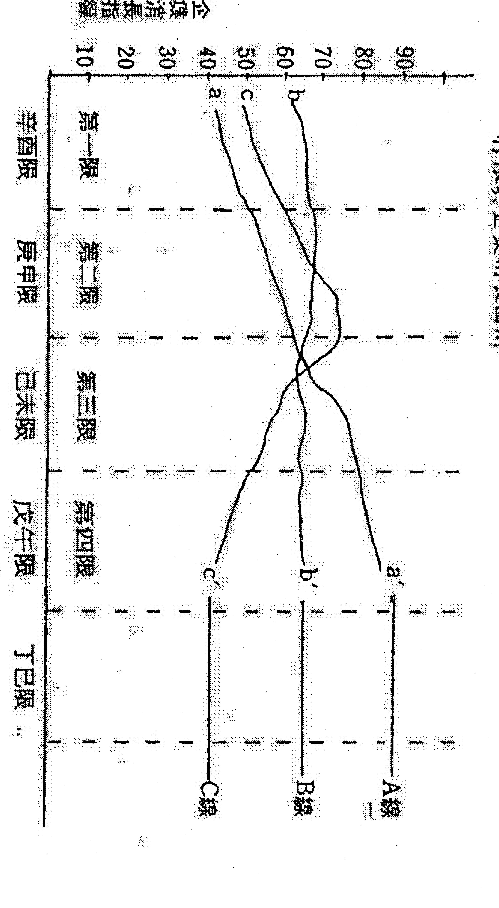

# 斗数与人生

## 关于「斗数与人生」这本书

《斗数与人生》是一本由紫云先生亲口口述，本社编辑部费心整理的书。

为了存留的缘故，在整理成文字时我们尽可能保留原来的口述风格，而不刻意加以修饰、雕琢。以这样亲切、自然的方式，把紫云先生二十多年的斗数体验原原本本地呈现出来，相信读者会感觉自己就像面对紫云先生，和他促膝深谈斗数一样。

能听紫云先生谈斗数，是相当难得的机缘——这本口谈的内容，其实就是当年紫云先生和曾剑斗了无居士师徒二人相互研习紫微斗数的基本主题。对于想要一窥斗数堂奥的同好而言，《斗数与人生》的确是一本千载难逢的珍贵经典！

卷上「斗数前传」，是紫云先生探索斗数二十余年的心路历程。紫云先生以第一人称的口述方式现身说法，娓娓道出他为什么要学习紫微斗数？是什么样的机缘，使他「一脚踏进斗数的无底深渊，终于「无法自拔」？（见「斗数

## 斗数与人生

紫微先生如何学习斗数？如何从一个连子丑寅卯都无法顺口唸出的门外汉，变成一个狂热的斗数研究者？

他怎样从平顺的学业

（见「平顺的学业」）他怎样从日以继夜的摸索和验证，悟出千年的斗数的正确法则和理念？（见「斗数的根本和应验」）他怎样打破历来「象牙塔式」的斗数和，把正确的斗数法则、理念和实际人生组合在一起？（见「命运人生」）他怎样从中国传统的智慧，找出斗数星曜、现象、宫位、组合的原理，并据以发展出一套前人未曾发现的斗数推演法则？（见「斗数」）他怎样突破千年以来的斗数无从，找出斗数命理在人际关系与六亲缘分上互为因果的关键？（见「宫位」）......

卷下「斗数新理念」是紫微先生将千年斗数法纳入新观念和新方法的具体说明：除了十二项宫位的主题理论和各宫所有的命理实测之外，其他像「星曜的基本赋性和作用」、「各种「宫旺利陷」、「四化的基本原理」、「四化的正确应用」、「斗数推论的基本方法」、「斗数命理的本质」、「身宫的作用」......等等，每一个主题的论点都是翻遍古今所有斗数书籍也找不到的独特见解。

## 【附记】

- ① 本书除「斗数的新命理观」（代序）、「吾公的命盘」（「辛丑生」的命例）两篇为紫云先生亲笔撰述之外，其余各篇都是本社编辑部根据他的口述整理而成。
- ② 本书着重于斗数基本理念的反复申述，在命盘推演的具体方法方面，系作重点式的、原则性的析论。紫云先生目前正以当代名人为论命主题，对于每一事项的原因、现象、结果都做具体深入的推论过程，读者可以从他的精辟分析学到活盘论命的完整方法。敬请读者拭目以待！

# 斗数的新命理观（代序）

紫云

斗数是中国古传众多命理学之一。从文化和历史观点来说，一种学问能够延千年而不衰落，应该有它的存在理由。特别是在近代文明对凡事物的探讨，一切讲究科学方法和拿出证据的今天，对于古来国人就以形而上的玄学来看待的斗数命理，不但没被摒弃，甚至给予了相当份量的肯定。

虽然这门学术，古来就进不了大雅之堂，但我们却也发现到，民间极为流行。特别是近年来，参与研究的人，已不再是亲戚朋友或贩夫走卒，多的是学有专精、拥有学位的高级知识分子，利用命理论断，作为何去何从的资讯指标。这些斗数研究者当中，不乏身居社会要职的高官显要和事业有成的企业领导人士，并不默然都是市井谋生的社会大众。

我们当然不能以很多人参与研究和运用，就对这门学术作全部的肯定，最重要这是近年来，在无敌接受现代高级知识训练人士的钻研以后，已经开始发挥它的实用功能，把这个古传的玄学落到正知其他社会科学一样的，可以经世致用。

我们发现这个古传的命理学，在整个理论架构上以及其所用的推演法则上，用来隐喻人生命运的现象，扮演着一种其他科学无法企及的特殊功能，因此我们可以肯定它的确有存在价值和必要。

不可否认，这套命理学由于古传典籍太少，甚至所有的文字，几乎简洁到必须推敲才能了解它的文义。特别是一些关键性的文字，因缺少例证的引用使人读来如坠五里雾中。比如，命宫谓之先天、身宫谓之后天，究竟什么是先天？什么是后天？根本不加阐释。又如「七杀随尸」，既可以为「设富之人」，亦可以「路上埋尸」。类似这种语焉不详的文字，都让人觉得这些古传典籍直成了智不僧的有字天窗。

也许人生本就充满太多的诡谲离奇，使得用以探讨人生际遇的命理之学，也因之而带有太多不易了解的神秘性。这种神秘性，特别在我国自古以来的那种既敬天又畏天的社会意识里，人们原本把人生的一切委之于一种天命的安排，因此更加深了命理的神秘化。这种神秘化，对斗数命理不但没有提高它的学术地位，甚至严重的阻碍了它的进步。因此我们很遗憾的发现到，打从斗数订定命理法则的一千多年以来，斗数学术不但未有显着进步，甚至要到荒诞无稽的地步。

斗数命理，所以会如此，也许与它的特殊功能有关。但我们以为最主要的，还是在于一种时代文化背景的有以使然。这种时代的文化背景，一直到到了近代，当西方文明东渐，西方文明那种凡事求是，一切讲求理性，以及拿出证据来的学术理念以后，才使斗数产生一种冲击，使钻研斗数命理的人，不能再抱残守缺，泥守旧概念，而必须采用新观念和新方法，把时代新知融入古传的斗数理念中，再用以重新诠释斗数命理在实际人生，可能产生的应用和价值。

斗数命理对人生的探讨，虽然不能像自然科学一样的拿出具体物质的逻辑来，但人生的存在本是一种「事实」，而「现象」的过程也是一种「事实」，命理既然用以探讨人生的道理和「实质」，和「实际」，它当然也就有它的道理存在，决不能凭空遐想和臆测。

比如说，一个小孩，为什么会有他的「存在」？以及他存在以后所表现出来的种种「事实」。在古人也许只知道因为有其父母，才会有这个小孩，至于为什么会产生他种种存在以后的事实？就茫无所知。但今人已经可以从生理学和遗传学，了解到「存在」和「事实」的原由。比如这个小孩是个健康活泼、智商很高或是先天残障、智能不足，现在我们已经知道为什么。但古人却始终不知道究竟为什么？他们会视为全部都是天命的安排。因此近代人们探讨命理，由于具备通文明新知，已经不再为这些「存在」和「事实」感到迷惑。因此我们以为一种学术，只要它确是有道理，必能透过现代文明的新知加以剖析阐释。任何一种学术，只要能以文明新知加以实证，并受严格考验，它就能够久長新，而放之四海皆准。我们以为斗数命理，正如其他的很多近代学术一样经得起文明的考验，可作经世之用，因此绝对可以冠冕堂皇的走入殿堂。

不可讳言的，我个人在斗数命理的学习，也的确从我老师学得完整的命理法则，但由于这种太过传统式的命理观念，使我在最初十年历尽了千辛，也吃尽了苦头。好在我还是个受到新文明洗礼的人，并没有因为年之气馁，反而对传统下的命理，产生根本的怀疑，对于传统上所持的命理观点和法则，总觉得无法落实到实际的人生，而成为具体可用的命理资讯。也许由于长年累和年龄稍长，对人生的体会加深，而在拜师十年后，再度经由老师不断的耳提面命的教导，才使我渐渐的体会到「一个人命运的造成，命理只是其中的一个因素，而不是全部的原由。一个人的命运，除了他具有的命理因果外，还应该考虑到他所处时代背景、社会环境、家庭条件，以及个人际遇。要把这些因素合并考虑，然后才能依命理法则分析和描绘出他的命运走向，绝不是传统观念上，完全凭命理因素来决定一切。

比如婚姻和育子女，古今以来就差别很大，就是当前所处环境不同，往往也相差很多。在我们这里实行的是一夫一妻制，但在回教国家就不是如此。前人的观念，多子多孙多福气，今人的「二个孩子恰恰好，一个孩子不算少」。这种婚姻和生育的观念，无不受所处环境的严重影响。特别是在近代人类思想观念，如同科技进步地在日新月异的变化中。我们社会亦由保守、封闭而变成进步开放。这些现象，也必然衔接着我们这个社会所有人们的生活。

以我个人多年对斗数命理学的了解，命理既然谈的是实际的人生，因此命理的道理应该可以用极其常识化和生活化的现象来加以说明。比如说，一个人小时候得到家庭妥善的教养，使他的人格趋于正常，稍大得正规的教导，使他学有专长，长大进入一个产业发达的社会环境里，应该比较有他立足和发挥的余地。相反的，若他在一个破碎的家庭长大、从小没得到好教养，使他的人格趋于偏激，以后又没受较好的教育，当他进入社会，他将会无所适从。这种教养和教育，往往是造成和影响到一个人一辈子的命运走向，我们当然不会以为完全是一个天生注定的命理安排。

再如以一个已开发国家，人民的高水平教育和高水准的国民所得，来和开发中国家，一般国民的较低教育水准与较低的国民所得作比较，我们会发现，大部份高所得的国家人民，都因为他们有高水平的学校教育(以出生地的国家除外)。另如，一个国家国民的平均寿命长短，一定和他的生活品质、医疗条件、环境卫生的良劣，有相对性的关联。凡此种种，绝不是单由命理因素所造成。

因此我们发现，几乎所有的命理现象都不能排除这些环境和实际遭遇的因素，而这些因素都是一般常识，丝毫不虚不可理解的现象。

斗数命理，既然不能把人生实际遭遇排除于不顾，以致和实际人生形成严重脱节，因此我们以为使命理成为有用的经世致用之学，就应该采取一种能与实际人生配合的命理观，才能使命理落实到实际的人生里。基于这个理由，这门古传命理就应该从根本的观念上加以现代化，把时代的新观念和新知识融入命理中，然后才能以一个新方法来发扬光大。若不如此，这门学术将不为新时代所用，迟早会被时代所淘汰。

我不知道个人是由于天资迟钝，或是因为用功尚有不足，总觉得自己在斗数初学阶段拉得很长。从正式拜师，到我觉得在推演方法上稍微有点谱的时候，已经是十年以后的事。因此我很羡慕那些得秘笈，一眼就可以在命盘上窥见天机的人。在这前十年间，我也曾参加了其他的斗数命理补习班，想藉经九个月，由初级、中级而高级的补习，使论命功力提升到高级境界。但很遗憾的是，我上完所有课程后，论命能力还是停留在灵驳不明的阶段，每面临命理，那种茫然无知的泄气，真是不足为外人道。

如今时过境迁，学习斗数前后算来亦有廿多年，虽然已经略有领会，但我还不知道究竟领悟了多少，只是使我深深的体会到，命理这极学术的学习和研究，绝对不能用心自满与自大，也无法速成，而且学到最后，总会觉得自己所知有限，越是深入，越觉得自己渺小，所以，我常劝人，学习命理不必贪多，只要将一套有系统，有学理根据的方法，学得精纯，就足够应付实际需要，不必再去学其他门派的方法，以免学得太多，反而变得不专精。

不过，我们若想使斗数命理成为一门经世致用之学，光是埋首在古书中，是无法达成的，因为社会在进步，时代在变迁，人的思想观念也在变，斗数命理若不能与现代人的思想、行为结合，自然无法满足现代人的需要，更遑论成为经世致用之学。因此，我们必须将现代的新观念、新知识、新方法融入斗数命理中，使其现代化，然后才能发扬光大，不被时代所淘汰。

基于上述理由，我认为斗数命理的现代化，应从命理观念的现代化开始。所谓命理观念，简单的说，就是我们对命理的看法与态度。若我们对命理的看法与态度错误，则纵使有再好的方法，也无法正确的推论命理，更无法将其应用到实际的人生中。

我们知道，任何一门学术，若要能经世致用，除了要有完整的理论体系，还必须要有实际的应用价值，而斗数命理是否具备这两个条件呢？答案是肯定的。斗数命理的理论体系相当完整，而其实际的应用价值，更是毋庸置疑，只要我们能将其正确地应用到人生中，自然能发挥其经世致用的功能。

若容我们不客气地指出，古传的命理学为什么千百年来一直登不了大雅之堂，个中的主因，完全在于学命论命者的一种对命理基本观念无知和误解。他们把命理视为一种神仙之学。更为了提高他们崇高的超然地位，硬是把命理神秘化，让人们误认只有他们这种仙风道骨的神仙人家，才能泄露人间的天机。因此把一项原本可以为人指点迷津的谈命说明，变成一种高深莫测，又兼莫名其妙的神仙论断，使人听来如坠五里雾中，使本可经世致用的学术，变成天大的鬼扯谈。

对于这种命理作用的扭曲，最主要是在于他们的论命，完全源于单纯的命理因素加以论断，他们以为一个人在出生的那一刹那，就已决定了他一生的荣枯祸福。他们无法，亦无能力去判定命运的造成，究竟应该涵盖那些条件或因素？我们很迷惑这些命理研究者的知识水平究竟如何？也许不祇最基本的命理观念一无所知，甚至连人间的基本常识也不及格，因此才会在命理的表现上显得那么无知和无能。

时代在变，社会环境也在变，一个人的生活必然会受到这种大环境变动的影响。每个人有他的家庭条件，也有他的个别遭遇，我们坚信这些因素都是造成命运的重要原因，不光是单纯出生的那一刻时间，而这些塑造和左右命运的因果条件，无一不有其个别的大问题和大争问。

探讨命理，若往这一层面去着想，我们将会发现命理之学绝对不是一项很单纯很简单的学问。只是学海无涯，人生苦短，我们实在不知道一个人穷其一生去钻研这门学问，究竟能在整个命理的范畴里了解多少？

教我斗数命理者何老师，但指引我拜师的是叶禾田先生，叶先生是我们公司的前任董事长，他对我另有结草衔环之恩，如今他已仙逝，在我生平第一本斗数书籍出版之时，谨以最大的诚敬之心，简要的叙述叶先生的斗数命理，聊表对他的感激和敬意。其他命盘，我曾试以另一种不太传统的新角度加以论析，以一个命盘谈论一个主题。由于篇幅有限，我把主题之外的次要的因素，署而不述，挂一漏万之处，在所难免，得请阅者海涵，并祈前辈和同好，不吝指教。

一个人当了一张子的上班族，每天为生活而奔波劳碌，本来不心存些微愿头，奈何经不起屡次的风次相激，只好硬着头皮，以口代笔。老来学当鼓吹手，工作不全，荒腔走板，在所难免。好在口述期间得到农耕多方提供宝贵意见，并得天相出版就编辑部协助录音和文字整理，遇有谢老版不白血本无归的慨允付梓，一并表示感谢不尽。

紫云 於台北寄立
丁卯年（一九八七）戊申月

# 卷上

## 斗数新传

一门学术源远流长，流传千年，必定有它的理由存在。斗数命理能够随着时代而发展，除了凡有断不断的道理外，更历代有心人的发扬新修。很遗憾的，由于近代中国受西方文明的冲激，古术数又受到不明就理者的扭曲和排挤，有识之士更因说利和秘传的心理作用，使这门斗数命理渐失去真传。笔者有生，能得师父的传授，虽然个人学识有限制，但仍期冀于万一，但所不揣冒昧，以一己之得，公开于同好，让更多人参与探讨，使这门学术能发扬光大。

## 斗数因缘

记得在一九八一年（辛酉年）春节放假回南部老家过年时，有一天在邻居的一个族亲家里碰到无居士。由于在座的都是族亲，因此也就东聊西扯地摆起龙门阵，当时无聊谈一些稀奇古怪的见闻，我还以为由于他从事几年的记者生涯，所以才曾见多识广。没想到假期一过，回台北上班后没几天，却收到了他的著作「现代人的八字」和「开公作天公」。千万也没想到，在我脑海中多半留着「放牛孩子」印象的毛头小子，经过几年不但练就生花妙笔的文才思想，而且也研究起命理，并且曾立说起来了。由于好奇心用，因此就在一次南下出差的机会，约定时间登门造访，本来还存心想试试这小生后辈究竟有何能耐，年纪轻轻的竟胆敢着书立说，还开起业余命相馆，为人谈论论、论吉凶。在心有所打算之下，因此早就准备好一个命例，拟說是在子午論法上，頗為不簡單的八字，存心要考考他，試試他究竟有多少斤兩，竟敢明目張膽地想要揚名立萬。但萬萬沒想到，當我一進他的命相館時，他介紹完館裡的兩位朋友後，接著說「黃先生是我的父親的友人，你們用斗數論命的那個命例正好可以對敘，他在斗數的造詣，絕非你我所能擬……」。如今我只記得，當時腦袋一楞，彷彿有常年經驗，卻被麻雀啄著眼睛的感覺，千萬沒想到他會先下手為強的來這麼一手，常言道：「見過世面多開口，踢踢金馬強出頭」，若真是想丟人現眼的尷尬來，皆是咎由自取。因此也就來之則安之，硬著頭皮，一腳踏進他們預佈的陣仗裡。

現在已不再記得，那個極其古怪，一生充滿傳奇性的命例內容，只記得，從此以後了無居士陸續不斷地以憶偶、電話和在碰面時跟我論一些紫微斗數的問題，並利用我每次南下出差高雄的機會，找來客人要我論命。在這段高談闊論論命時間，經由了無居士而悉耕，從此我不但無視家累，甚至視出差高雄為坦途。武俠小說常說「人在江湖，身不由己」。我雖然依師學斗數二十多年，但由於工作環境和個人對名利的淡泊，因此一直以探討斗數自娛，不曾有過非份之想。

然而一個人往往一腳踏進是非地，難得自由身。因此，若再不硬著頭皮，試著塗鴉幾個字，那將更無清靜的日子，恐怕得提早退休，回老家耕那幾畝鳥都不生蛋的，早已荒蕪的薄田。

貶起學習斗數，對我來說，可說是意外中的意外，一個受過現代教育，特別還多少跟自然科學沾了點邊的人來說，他所相信的，是有實體根抵的事物和理念，對於虛無縹渺、不著邊際的空談，如所謂的命理之流，不只談不上相信，更是視如敝屣，加以鄙視。當時的我，決不以為憑藉一個人的生辰年月日，就可談出個什麼道理來，因此，莫說對於子平八字、紫微斗數這些談命說運的事一竅不通，就是天干地支，也只略識其字，而無法順口念出十天干和十二地支的順序來。

但人生的遭遇往往難以逆料，大抵就在我三十歲出頭時，由於我工作上的職低人微，儘管折斷了腰，還是難以溫飽的生活，終日為著形同鉤子般大小房子的二百元房租，和柴米油鹽而愁眉苦臉。我不知道，我當時究竟是怎麼樣的滿臉倒楣相，有一天我那位略知相人之術的老板，台南籍的耆宿——葉禾田先生，拿了一張紙條給我，上面寫了個台北孔子廟附近一位何先生的地址，要我找機會去登門拜访他。起初，我還以為是生意上的事，後來搞清楚才知道，是一位命理先生的地址。

由於原本對命理的排斥，因此那張紙，雖然留在辦公室的抽屜，卻一直打不起前往算命的念頭。事隔多日，有一位劉同事要找何先生論命，因此也就好奇以順便搭車之便，跟著去凑凑熱鬧。萬萬沒想到，這一凑熱鬧，卻導致我日後正式拜師跟何先生學起斗數來，甚至一頭栽進去，將是一輩子迷失在命理的迷宮裡，而不知其所終。

這一次命理的談論，居然使我這個，極端排斥命理的人，作了一百八十度的大轉變，進而拜師學習，決不是空穴來風，若無憑無據，絕難叫我這個頑石點頭。一個受現代教育的人，很難相信和接受，居然有人能從一個人的生辰資料裡（斗數裡），看出他太太的長相與個性而幾近完全符合，更驚訝出隔年因難產而剖腹，又因剖腹流血而導致肝疾，不只難項貼合而且時間月份絲毫不爽。當然，近年來在醫學上的有超音波或掃描儀器，可以準確的診斷出女人生產的順利與否，但若想憑傳統的診療方法，除非女人隱蔽，否則恐怕確實的預知，將會離題和何時生產有很多與

在倉是平等，我交的老二就是如此，更不用提剖腹生產後，會帶患肝疾。事前的談論，我還是半信半疑，但事後一一應驗，就不能不使我驚疑，這究竟隱藏著什麼樣的玄機。因葉先生的鼓勵並送我一本竹林書局出版的《紫微斗數全書》，於是在幾晚挑燈夜戰之下，依樣畫葫蘆地排出了斗數命盤，但卻無法像何先生那樣看出任何些微的道理出來。後來雖會發奮逐字研究書上的每個文字，但總覺得還是一本不知所云的天書。我不知道這究竟是命，或是天意的垂憐，竟然在我求教無門的時候，何先生在葉先生的敦請之下，同意出來開班授徒，但對一個極至貧窮無立錐之地的我來說，卻又產生了難以解決的困難，老師的束脩費，雖然收的不高，但也將近我每月薪水的一半，這種心有餘而力不足的事，使我無法回報葉老先生的愛護與盛意，事後當葉老先生發現我一開始就沒參加聽課之後，他委婉地告訴我，我的束脩費，可以由我開意給多少，表示一下心意就可以，不必比照其他學生的概準。我至今仍然不知道，我沒付足的束脩費，究竟是何老師同意少收，或是葉老先生替我付的。如今老先生已作古仙逝，老師已年近古稀，但我仍然難以啟口問起。因此我唯有不断学习，精益求精，以诚惶诚恐的研究态度，在我有生之年，一辈子皓首穷经地去钻研紫微斗数，使师门的绝学，传之千秋万世，以报老先生和何老师的知遇和教导之恩于万一。

开课之后，原有六位师兄弟，后来不知何故，约过半年后只剩下四位，一位铁工厂的李老板，一位如今移民美国休斯顿的裘老先生的二公子裘君兄，另有一位我的师姊陈女士。

据何老师事后谈及，我们四人是他以斗数正式开班授徒的第一遭，但是课开得最久，讲得比较完整的一班，课程每周两个晚上，每晚七时开班，除了陈师姊以外，其他的二个徒弟和老师，都是大烟枪，每当烟瘾一来时，停下课，老师和三个师兄弟就吞云吐雾起来，只是苦了陈师姊，陪着我们大抽二手烟，就在这种边抽烟的轻松气氛下，课程常常上到午夜而不知终止。由于徒弟都是「牛牛仔」（生手），因此，老师就得从天干，地支顺序念法教起，然后接著讲授斗数的基本原理原则，排列星斗性质，活盘演练……。

## 斗数的学习

由于老师并非以命理谋生，更无开班授徒的打算，因此当时授课虽没有提纲绍领的一份讲义，但似乎都没有超出，日后在坊间看到之斗数书所例述的，赋文一类的内容，反而在活盘应用，和涉及斗数在五术运用范围上的原理与法则，内容之广泛，几乎将五术兼容并顾，而不是纯以斗数谈命理的课程。但是徒弟们并无命理根基，程度太浅，所以这个课程前后开了将近二年。据老师的说法，二年的时间，其口才勉强把斗数的基本道理作了最初的交代，而已把这门学术彻头彻尾地铺充，徒弟们虽历经二年的听课，并不意味着在紫微斗数方面，已能了解多少，莫说登堂入室而能悟其道理於万一，充其量也只能说在斗数这门学术上有所启发罢。记得老师曾经意味深长的比喻，一个够格的医生，尽管在受满七年的严格医学教育后，并不表示他在学校毕业后，就能马上开业行医，他仍须经过一段期间的在职训练和经验，才能勉强的独立诊病行医，至于成爲名医者，往往又须加上几十年之久的长期行医和无间断的悉心研究之下，才能有成。这也是医过天下，名医没几人的原因。用以疗治病痛的医理如此，而用以探讨人百态的命理，更需涉及万丈红尘的众生相，其错综复杂，何止于恒河沙数？就算用上八万四千法门，也不一定能够彻悟得了箇中奥秘，因此老师曾经不止一次的脱口，起码要帮推敲，剖析五千个命盘的经验，才能勉强将人论命。廿多年来，我也数不清究竟看过多少命例，但一直的统计数具有无数的奥妙，也许因天生慧根，或许用功仍有不足，因此迄今我仍不敢说我已经通彻了何老一再强调的五千个命盘……。或许是老天垂怜，在开始拜师学斗数后的日子，由于工作环境的逐渐改变，个人的家庭生活，亦趋于稳定，至今虽仍是漂泊，但对一个乡下孩子来说，能在十里洋场似的大都会，优息安身，已经太感谢天地的厚待。由于个人人生淡泊，因此在工作之余，屡夕不懈地翻阅老师的讲义和听课的笔记，并藉着亲朋好友提供的生辰资料和印迹，反复研讨、推敲，那股狂热的傻劲，至今丝毫也不减……

在廿多年前，斗数除了那本印刷错误百出的《紫微斗数全集》以外，几乎无书可作参考，老师又远住大龟峒，虽有公车可以辗转来回，但往返费时，加上当时向无电话可以事前约定，因此很难每次都能顺利碰面请益，以致常有一个命盘苦思数月而不得其解，那种挫败的沮丧，真不足为外人道，因而也曾多次想要放弃，以抚心中的折磨。记得当时孩子太小，而我却在下班回家后，除了吃饭之外，全心于斗数，忽视了帮忙料理家事，以致内人在激烈抗议无效之后，愤然告到远住乡下的两位老人家，使我受到两老的责难。我很接受了无居士，能得夫人经常半夜爬起来烧水泡咖啡，给他精神上的支持；悉耕得夫人的精神鼓助，文昌居士更得夫人精神以外的实际行动支持；很为他们庆幸。我的确很羡慕他们，但我除了为我内人的「过人不淑」而感到抱歉外，绝不敢心存丝毫怨言。由于工作上的方便，常年出差，几乎跑遍全省的大城小镇，因此每当看到报章的斗数命理广告时，必定寻机利用下次出差之便，前往算命，以藉着高人论命的机会里听听前贤的高论。若以就近的台北来说，只要有门路可寻，迟早必登门讨教。

在这段遍访名师论命的时间里，的确花了我不少钱，而这些钱却都在我尽可能节省香烟钱、午饭费，及出差旅费中省吃俭用下的节省金，甚至盘算进步要积蓄多久，才足够再去拜见下一位算命先生。以当时的那份侥幸，若不是有娶儿的后顾之忧，很可能都会为此而清掉裤子。也许皇天不负苦心人，虽然，几年来不断地找人论命，馈我不资，但也的确从论命的这些前辈中，吸收不少宝贵的经验，更使我在往后苦思穷虑中领悟了不少斗数论命的道理。

五术补习班的公开招生开课，似乎起于一九七○年左右，当时虽然已经在我正式拜师后几年，由于狂热未减，并已历经艰辛，不再像先前面对命盘那样茫然无知，但对论命的认知，仍觉太多不足，因此我就向当时一家开在信义路的补习班正式报名，重新做个老学生。

课程分初级和高级班两期，每期三个月，每周一次，每次两节课。由于学员都是在职的社会人士，因此开的是夜间课。参加过个补习班，我原存着多听多问的心态，希望多从老前辈那学到不同的高论和新知。但没想到，在初级班三个月上完前，我几乎变成了学堂里头的助教，甚至同班同学在课余的互相讨论中，我反而有喧宾夺主之势，害得我向当时的老师黄老师再三表示，我的确是心诚意正的来听他的课。更妙的是，在我听完初高级两期课程后不久，馆主潘先生来电话，要我选在不同的日子在他那边挂名开课。当时我对自己在斗数方面的认知心里有数，无论如何，我不敢去领受他的好意；钱不赚穷小，若因之而误人子弟，兹事体大，何况我在工作上的收入，已足温饱，也不必再为敛钱而折腰自己。为人师，岂可轻易。

## 平靜的摸索和冒險

我在工作上的安定，并不意味着工作趋于静态的固定，或许人在江湖，身不由己的事。

因为服务单位是个私人的营利事业机构，因此多年来，这个公司不仅有事业的起伏和人事的更替，于团体、于个人的得失之际，更是休戚相关，利害与共；有些固然事出有因，事前可以预期，事后可以掌握，但商场上突如其来的风险变色，却也令人难于事前逆料和设想。

尽管在企业管理上，我们总可能也作过很周全的企划，但往往却会因为某些突如其来的、生意环境上的意外变动，而导致全盘计划的功亏一篑，或是顶新检讨得失的结果，但这往往不尽然管理上事前所能充份掌握。

个人由于职务上的关系，有功未必受禄，但有过且需受赀，因此常为公司总体上的总帐得失而耿耿于怀，究竟我还需要仰赖这份析资来维持家小的温饱。虽然公司的经营可藉各个学有专长的部门主管提供意见，也可经由财务分析和业务资料作为经营策画判断上的依据，但往往在事理未能充分了解或掌握时，也经常徬徨而不知所从，因而常使必要的决策判断犹豫不决，我想这不该是我这个上班吃薪的人才有的痛苦，一些经营企业大权的人士，都会领略到个中的苦衷。假使企业的成败，部能经由企管理论中获得充分解决，那么天下间将没有破败的大企业，而且那些拥有企业管理学位或专才的人，人人都会变成大企业家，或者光凭企业管理顾问，也必将财源滚滚。但理论归理论、事实归事实，有时企业大王国也会频败，企业管理公司也会门可罗雀，因为事业经营，不仅牵扯到事、物，还有人，要把这三项综合而运用自如，究竟不是光凭空谈理论所能轻易处理得当，甚至有时以实际理论相互配合得天衣无缝的企划，一旦实行后，往往也有出乎意料之外的失败。假使失败仅会促使一个人去求神问卜，那我也经常在职务挫败中，继续不断的去钻研公司内部几位关键人物的斗数命盘，从每一件事体成败所涉及的事、物、时间、地点、与人的因素契合，透过相关命盘，推寻其蛛丝马迹，把所推论(由果而

师的耳提面命能使我一点即通，但在我无数次的创湖之行和长期苦思默想的摸索之下，总慢慢地悟出了所谓的缘起缘灭，和因果关联性在斗数论命上的道理；从此理出了一些斗数法则与理念，才真正地体会到斗数之所以会流传千百年而不衰，更敬佩中国文明的可贵，和先贤道通天地的伟大。

也许个人从年轻时，一直在十里洋场的台北生活，以及工作环境所具的潜遇，二十多年来虽然看过不少达官显贵和富商巨贾的命例，但这些对我在斗数钻研的帮助上，聊胜于无，也不足以据此炫耀，倒是在以文会友，但藉论命之便认识了不少商汤上的朋友，在这些朋友中，有不少位把我看成他们事业经营中的另一个顾问／企业命理顾问，而且这一顾一问之间好多都已逾十年以上，也许他们乐得这样一个只要一杯咖啡、一顿便饭，就可以打发的既经济又便宜的顾问可以随叫随到，但我却也在不同的大老板的不同问题里，得到不少的质与启发与经验，这使我想起老师曾说，一个称职的医生，必先经过长期的临床训练，一位名医更需要十幾

古人體病搐癱，但要了解這個日新月異的大千世界，何嘗簡單？光以職業來說，當今的職業類別已不再是三百六十行，恐怕二萬六千行都數不濟，因此在職業類型上，已不再是用簡單的木火土金水的五行所可以涵蓋的，因為有些時代性的行業，無論如何是無法把它類型歸入任何一個五行當中，因此決難再以過古典的方法，依五行來類分職別行業。命理假使不能跟上時代來闡釋它的新義，將會如同爺爺時代的老牛破車，遲早會送進民俗館，作爲後代子孫的博覽展品。雖然廿多年來曾處衆多親友論過命，但可能由於工作的關係，也可能由於連個幾餘招牌都不掛，儘管曾經接受過報章雜誌的訪問與報導，但因堅持不公開姓名地址，遟能落個耳根清靜。倒是近年來由於「一了無」的張氣餒，因此曾經在某個不期而遇的宴席上和幾位搞命理的朋友，由命理而談到當前大師級的一些妙聞逸事，由於我的孤陋寡聞，我一不敢置喙，但聽到一位見多識廣的年輕朋友，帶著幾分調侃的口吻說，他最近利用公差南下之便，無論如何要了無居士引見他的老師紫雲先生，當時他是叫我一愣，過使我想起有位一直把我當作幾個顧問的老聞，由於他略有涉獵斗數，

在看了無一生花妙筆的文盲後，竟問起我，認不認識紫雲這個人，他老兄大概以為他的事業只有紫雲先生這號人物才能給他提出高見，這使我想到了人之所以為名所跟，所累的可怕。這也足以道盡了當代高人——我的恩師何老先生，由於一生淡泊名利，因此隱於鬧市而不求聞名的原因。或許，這就是所謂「大隱隱於市」吧？

## 對話與實際人生

醫生康人之病，命理探討人的榮枯福禍。若說醫生必須去熟悉醫理的相關學問，而揣命理的人只要懂得天干地支、陰陽五行的簡易道理，以及各類術數上的推演花招，就可以為人斷休咎問禍福，那也未免太抬舉自己，而小看了這個如萬花筒般的大千世界。如果這個世界就是這麼單純簡單，那佛陀也不必以窮實之身，拋棄人生的榮華富貴，歷盡千劫萬難而悟道，更不必用八萬四千法門去普渡眾生，還要用盡口舌地為他的門徒說法。我們知道，人生一世由生而死，雖同禽獸走獸、花草林木一樣，最後仍要歸之於塵土，但人在這兩個起止點之間，卻與其他萬物有太大的不同，何況是千億萬人之眾，難道會有極近相似的相同命運，在古代如此，現代如此，將來更是如此。

人類的外貌長相，以生物進化的觀點來說，千萬年之間，也許變化不多，但是從文明演變的觀點而言，當然有其無休止的進步和變化，我們的老祖宗，后羿以神箭射日、嫦娥偷食靈藥而奔上月球，但是我們現在知道的是阿姆斯壯一九六九年登上月球，美國的太空船已在多年前脫離了太陽系，而奔向浩瀚無涯的太空，將來我們的子孫，將會登上太空飛行器作星際之旅，正如你我搭上七四七的噴射客機，往來世界觀光旅遊。

儘管有些人一直在強調物質文明的進步，而人類的精神文明將是千古不變，變也不離其宗。那麽讓我提醒你，若你對太老朽的歷史認識不多，可以問問爺爺或老祖母，三、四十年前他們年輕時代所過的居住環境究竟如何？他們在食、衣、住、行、育、樂方面又是如何？問問老人家，從台南到台北，或是住在台海西部的人，如何往來台東和花蓮之間？更要問問，當時的民情風俗、世道人心，究竟與現在有什麼差異！你儘管可以把老祖母的話當作白髮宮女話天寶往事一樣，說作故事在聽，但你卻不能請老祖母在脫離話。

若是你還上過現代的學堂，你應該念過羅馬大帝國的極盛期，但其中的大...

漢帝國王朝何關？兩者之間似乎是遠隔在兩個不同的星球，但現在當你從報紙或電視裡頭，看到海峽兩岸的事如箭在弦、一觸即發，一發就幾乎不可收拾的時候，你將聯想到因為產油國的阻抗，而導致汽油的漲價，你的汽車一個月將會多數幾千元，甚至公車亦會漲價。若你是老闆，當你曉到黃金在明日又將貶值幾分時，你更會心驚肉跳地盤算，你明天的出口押匯將會損失多少新台幣。若你是伙計，你也會擔心，在美金不斷地貶值之下，你所職的公司會否因而關門倒閉，一旦倒閉，也勢不擔心有無米之炊的困境，但是卻不能太久找不到工作而長期失業。因此今日的中東和美國，跟我們再不是遠如兩個老死不相往來的星球，而是形同鄰居而居、息息相關。

這是人類文明進化的必然結果，不再是單純的牛車換上卡車、煤油燈換上核子反應而來的電燈問題，更大的還是在人文方面的變化，不只在社會的、在政治的、在文化的、在思想的、在其他屬於人類活動任何層面上，都有大大的變動，而這變動在地球上，再也沒不是老祖宗時代的老死不相往來，而是逃不了的互為相關。悲天憫人的宗教家、社會學家、思想家、政治家、心理學家、教育家、科學家，

無不應心積慮地作着人也，甚至地獄的苦行，欲以拯救道人心。但獨這些窮揹命理的人，一班子抱守老祖宗留下来的殘缺不全的道理，甚至乎花了把，就在那兒開弄玄虛，好像過世而無憾，不食人間煙火的仙人，其性他在自欺欺人之餘，也在為自己逃下唉端。

若把命理比做醫理，醫者必須研習多個相關醫理的範疇，充實基礎，而命理用來探討人生由生到死一切遭遇到的問題，涉及範圍應更廣泛，從性的探討、生理的研究、心理的觀察、時代和社會背景的熟悉、人際關係的了解、人生價值觀上的差異，雖凡涉及人生一切層面的知識，豈能不去一一探討？因此這些都處彪到一個人一生的環節，而人生也由這種大小不同的環節，相扣而成。

個人只是大社會的一份子，人不能離群而獨居，一個人即使擁有太多的優越條件，不但不能離開這個時代的社會，也難獨自違抗這社會而生活。因此，論命之道，決不止於醫治一個孤獨的病人，完至可以依個人和個人來論理。不過由於近代人們活動範圍的擴張，因此若論及流行疫情上的發展，就不可以限於個人和個案。雖擬如此，談論命理的論題內容，絕大部分幾乎必須涉及個人以外的一些人、

事、物的互動關係，而這些人物，又不純的侷限於某些特定的個體，往往關係著更大的範圍背景，甚至時代和社會。

因此我們若想一個命盤（或八字）來依理推論，而不知他（或她）究竟是何許人，我們究竟要依明朝、清朝人的命例來論斷，或是你我的鄰居來作答？甚至是個紅髮碧眼的洋人來論析？因此在斗數的論命上，我們不能要引用有關人生的一切知識，更要先加確定命盤所指的人，他的切身資料與時空背景，否則無論如何了不起的高談闊論，必定是一場荒誕無稽的大笑話。

記得在拜師聽課的時候，有一次，何老師在黑板上排了個命盤，要我們四個徒弟就命例上的某些宮位的成敗得失，發表論析方法，現在依稀記得，那是一個命宮座卯，太陽、天梁，壬寅年的命造，因此無不異口同聲大發妙論，圍繞者是一個日月井明，雙祿交馳，又非陽梁昌祿，天魁座命，極聰明又富貴的大好格局，因此這個小孩將來不但學業無阻，甚至可以放洋順利地拿個博士回來光宗耀祖。我們四個笨徒弟卻也不問清楚，這個壬寅年究竟是民前十年的壬寅年，或是民國五十一年的壬寅年，儘管胡亂地抓著斗數的格局法則大作文章，而問出一場# 至今記憶猶新的大笑話。

在民前十年的台灣老百姓，就算再聰明的小孩，莫說讀大學拿洋博士，在鄉下窮苦人家的孩子，多的是連進個小學校門的機會都不可得，因此儘管有資質再聰慧的孩子，也與識字無緣。因此，儘管他是個陽明山麓的聰明好材料，也就是所謂智力，但決難與接受高等教育的大博士，所擁有的超高知能相比擬。時代環境、個人背景條件的完全差異，必定會影響一個人一輩子的命運走向，絕對不是單就所謂的「落土時，八字命」，就能決定一個人的一生如何。

## 醫理和命理

老家是個不生蛋的窮鄉僻壤，鄉人都以務農為生。由於地處偏僻加上醫療設備的欠缺，地方上雖然也不乏開業行醫的小診所，但由於設備的簡陋，對一般的小毛病還能夠醫治，但對一些疑難雜症，或需開刀動手術之類的大病，卻是一籌莫展。人往往是無事天地寬，鄉人偶有碰到求醫無門的時候，就會找上我這個落魄台北的老同鄉，認為我得地利之便，能為他們設法安排醫療機構，得以醫治家人的病痛。因此幾年來，從眼科、胸腔外科到心臟科的開刀手術，使我幾乎跑遍了台北的大醫院，並認識一些頗具權威性的醫師。也許是興趣使然，我曾經陸續地把這些病人排上命盤，先後請教何老師，談論那些疾病在命盤上所顯現的現象如何，以及可能得到的療治效果。老師對所有我提出的病例命盤所給予的分析論断，幾乎不曾有過不明確的論断，和對醫生後可能產生的後果有離譜的預測。老師道祖師手按的高妙論命，絕不是我道徒弟所能想象，因此我曾把命理與中醫在基本理論上的關聯性提出請教。

據老師的說法，中國的五術——山、醫、命、卜、相，雖然名成體系與理路，但基本的原則，仍淵源於中國的易理，尤其是中醫在醫理上有某些理念和斗數的理論根本上就很相近，只是一個經由藥物來保養健身，而斗數是用來分析一個人一生過程的起伏變化，再從中用以趨吉避凶，方法雖不同，手段有所不同，但同樣的有益人生，正所謂醫病醫心，同系可救苦救難。因此五術之理，我卻於易理，其法有别，而適用之目的，則殊途同歸矣！

（我之生前是位於我院過的念極書院），並報名中華易經學會的「易學中繼」的夜間講習，以近兩年的辛苦，始先」請夫子的基本課程——全部的「傷寒論」、「金匱要略」、「八十一難經」、「本草備要」、「臟腑方」……等中醫學必引的經典之書，我並非熱衷學以醫病，但對這些中醫醫學經典，的流感到相當震懾與讚嘆，更深深體會到中國古文化的博大精深。兩年的調理，雖然不能使我不解多少高深的中醫醫理，但我也能從中了解到易理在中國文化所潛成的深遠影響，以及易理與五術的血脈淵源。

說來慚愧，在正式拜師學斗數近十年後，雖然已漸能將命盤依樣畫葫蘆的論起命來，有時偶有神乎其技的高言妙論，使人感嘆不可思議，但自己總是心裡有數：雖然依理推論的結果，總是八九不離十，但個中的道理依稀，總有理有未明之憾！我自儼已把斗數的星曜賦性，格局組成、運程變化，甚至四化星的活用，運用得滾瓜爛熟，但總有說不出其所以然來的道理，因此在斗數論斷上一直停留在「結果」的論斷上，至於所以會造成「結果」的「因」，由此「因」而導致事體演變的過程，就無辦法深入，更別說再去作如何趨吉避凶的判斷和建議了！

我一直在不知原因在哪裡，我無論如何還無法像何老師，每次都能給來論者提出適當的解決之道，或何去何從的建議。當我在上過中醫的基本課程後，儘管醫理的認識還屬皮毛，微不足道，但卻從中了解了五術通用的陰陽五行的基本奧義，原來所謂陰陽與五行的道理，談的是以相對和屬性來劃分事物的屬性，所以陽不限於光熱井兼的太陽，而陰不限於只有折射光華的月亮，火非火燄，土非泥巴，金非金銀銅鐵，水非河川之流，五行之所指的是萬物所呈顯的各別特具的屬性，而象。在其不同的關性之間可能引起的互相的作用，即所謂陰陽相輔與五行生尅制化的現象。

中國古文明的這種陰陽五行的學說，由於典籍文字的艱澀難懂，造成了後人視之為荒誕無稽，認為古人由於知識淺薄而造成的荒謬理論，豈知近代引為推動現代文明的物理、生物與化學，都已明確的證實了，宇宙萬物間的個別物性和萬物（全生物）之間，所可能發生的關聯，存在著正如陰陽之說的現象。

不知道是歪打正著，或是曲徑通幽，老實講，在近兩年中的時間座標裡，對我這位架著老花鏡，一頭華髮的半老頭，倒不是在心慌意亂的好玩意，但這些醫學經典經過夫子的詳細講解後，也獲益不少。我雖志不在學醫，但經由藥物學（本草備要）裡所獲知的藥物性質的一鱗半爪，卻也讓我想起十數里間賦性之所以有其特殊作用的道理來！在《本草備要》（清·汪昂）所提到的略藥入諸經（地果）賦同之義，各藥物就其個別的功用、土治、禁忌、異同、炮製、便我聯想和頓悟到，斗數星曜的屬性，所以分別有其屬性作用，『主』於何事項（如天機為主兄弟和主持事務），每個星曜在命身十二宮和地支十二宮的作用，星曜賦性在不同現象的作用之極致和限制，星曜在斗數命盤所呈現吉和凶的吉凶的道理。在『開补名醫方論』裡，亦從某些古來醫學上所保留下的處方裡，看到明是極其微不足道的幾味藥物的組合，卻可以醫治人體上的某些重大疾病，這正好和斗數上某些星曜若單憑它的個別賦性就無法明斷吉凶，但是當它和其他星曜在三方四正一旦會合，形成格局以後，所發出的龐大作用，豈有不合的共通現象？在診斷學上，特別是『四診心法』（中醫診病的四大方法和步驟，即望、聞、問、切），所提出的高深醫理上的理論，『八十一難經』用以關連古來醫理上的疑難案……，凡此無不深奥地隱驗醫理的發現和深奥，一個醫生，若無法把這些醫理搞清楚弄通，無論如何，不能隨便掛一漏萬，療病之道絕對不是隨便一抓就可以醫人病。中醫如此，西醫更不簡單，除了必要的醫理醫學上的必要課程外，甚至物理、化學、動物學、心理學……，都是主修的課程，始手要排滿醫學六或十二學期的課程表，至於正式行醫後所用以涉及幫助診斷和治療上的方法之多，更不是中醫所能望其項背的。

人吃五穀雜糧以維持生命，但卻因之而傷身致病，更何況有數不清的「內因外感」（子貢論說的話）而引起的大小病痛或疑難雜症，因此，古今以來，中西醫都在日新月異的不斷進步，至今仍有治不完和治不了的奇難大症。或許，姿態的醫療能使人延年益壽，但若單就醫理的途徑而言，恐怕永遠難以突破人生必有死的自然律，醫者雖有仁心仁術，但面對無法挽救的病患，也只能盡人事而已。

醫生治療人體之病，命理探討人生的榮枯禍福，同樣的都是有益世道人心。然而，一個既生在醫學上相關的基礎學說之後，倘且不能治好天下蒼生的疾病苦痛，同樣的一個斗數的命理學者，如何能單憑幾篇斗數賦文，或一招半式的斷別論析方法，就可以洞察人生的吉凶禍福？如此則未免太抬舉命理，太小看了這個大千世界！連古來聖賢對人生都很難大徹大悟，就算以佛陀的八萬四千個法門，亦難以普渡得了芸芸眾生。

由於藥物各有其藥理的存在和道理，因此可以使醫生在辨識病人的病痛之後，能依病機依藥理而下處方。其方藥的藥理，正和西方文明的西藥依其藥理而對治的理論一樣，竟然是不謀而合。以西藥的很多抗生素（mycin）來說，雖然都同具殺菌的消炎作用，而廣泛地應用在發炎方面，但是由於衍生物品的性質在 fungic（真菌的）樹（？）上的差異，因此同樣由細菌造成的抗生素，在療效方面就產生了重大差別。比如紅黴素（Erythromycin）和四環素（Aureomycin）在藥理作用上的根本差異，使得前者應用於上腔的炎症，後者則應用於下腔的消炎上。也許有人會懷疑，為什麼具有殺菌消炎作用的抗生素，竟然在療效上會有這麼大的差別，主要原因是在人的上腔部位，尤其是呼吸道，比較會受「格蘭姆氏陰性菌」（Gram-negative）的危害而引起病變；而下腔諸如膀胱尿道，就比較容易引起「格蘭姆氏陽性菌」（Gram-positive）的感染病變。這兩種細菌雖然都會使人體引起炎症的病徵，但是它們到底在細菌稱的本質上有所差別，所以在人體內引起的發炎危害部位，就會不盡相似。因此儘管都是發炎類的病型，就需要依發炎的器官部位，而投用有效的抗生素。根據西醫觀法，沒有一個合格的醫生會隨便採用任何一種消炎藥劑，用來治療人臉上的任何發炎病症。西醫的這種藥理作用，正和中醫上的某藥主入某一經的理論不謀而合。因為每一種中藥也有它的特別藥理作用，而發生在人體每個不同臟腑的病變機轉，會隨著經絡而有所不同。比如同屬消化器官系統上的病症，因胃病而引起的肚子痛，和由小腸或大腸引起的疼痛，在用藥和處方上，一定會有差別。

醫學博士何智敦教授曾談起，由於藥物的各具特性，因此醫生才能用藥，麻醉醫生才能依手術開刀上的需要，施用各種不同藥性的麻醉劑。這種藥物上的理論，儘管我還倚止於膚淺的知識，但更使我由此而體會到斗數星曜賦性上的各種現象，官位，組合，它們之間中有異，異中有同的道理。若不能分辨個中的特性與作用而囫圇吞棗，結果將會造成醫療錯把頭痛的藥用來醫腹痛，雖然都是鎮痛藥物，但藥療效果不嚜可知。

很多斗數的命理研究者，正是犯了庸醫的這種錯誤，不辨星曜所在事項官位的變化現象，也不運用四化的方法，竟然照本宣科，依斗數星曜的基本賦性斷起命來，甚至表示鐵口直斷、論斷如神。

中西藥和藥理，由於文化環境上的差別，也有太多的相異處，但既然都能用來療病止痛，使人延年益壽，應該在某些道理上不至於背道而馳。只是這兩者之間在醫理和藥理的說法不同，並不代表根本上的相違背和大衝突，否則，必然有其一中一個不能達到醫人治病的目的。

理不通，則事不達，理通而後事達，這該是中國醫學所以會流傳千古而不墜；能在近世和日新月異的西方醫學同為世人共同承認，個中道理絕不是理不明而妄想。

## 啟發和順應

一個人生病看醫生，商業單位出了幾位企業管理師作企業經營診斷，在這個社會裡，每個人都會覺得理所當然的事，但是一個人在心理對某事物或某人有所疑惑時，找找相命仙，問問吉凶、卜休咎，本來也是稀鬆平常的事，但你可以肯定，當你路上碰到一位朋友時，若他要去看醫生，他會直接地說去看醫生去，若他想要去看一個算命先生，他絕對不會跟你明言。

這個現象正如某些大老闆，他可以公開表示，他的大公司除了律師顧問、會計師顧問、投資顧問、管理顧問，甚至任何屬於專業的專家顧問，但決不會在大庭廣眾提到他有任何命理師、地理師這類顧問。偏偏他在這兩類顧問方面所費不貲，但他會像金屋藏嬌般地避人耳目，甚至是公司同仁，而暗暗地獨來獨往去會見算命仙仔，好像覲人卻知道，會跟老闆找上小公館一樣的尷尬和般。

對於這個問題，我不知道一些大師級的人們曾否想過？這也許正好體驗了所謂「冰凍三尺，非一日之寒」的道理。大老闆甚至達官貴人，他們為什麼聆聽大師的高論後都秘而不宣？總不然是怕人譏為怪力亂神而已，而是怕人恥笑他的問道於盲。

我們不必妄自菲薄，搞命理的人並不全如某些與智博士所說的，只能躲在陰暗不見天日的小巷裡，擺不出大街而進不了大殿堂，命理自有一套經世致用的大道理，足以彌補古往今來任何學問都無法對人生命運態勢作預測和分析的缺憾！只是近百年來，命理由於諸多的「內因外感」，才變成一項不怎麼好笑的笑話，若是命理再不自立自強，不能把老祖宗傳下的道理注入新生命、新觀念、新內容，那麼它將從此腐朽，而為時代所淘汰。

大師們可曾知道，在這個工商業極度繁榮又競爭劇烈的時代裡，那些扮演企業管理顧問角色的公司，它們大力網羅了企業經營上的各種人才——具有執照資格的會計師，除了懂得會計原理、財務分析之外，還得搞懂稅務法則，以利節稅甚至避稅的道理和方法，財務專家，精通於財務調度、資金融通、投資企劃和審核；其他……這些專家不獨學有專長，多的是碩士和博士，飽覽萬卷，並不斷吸收先進國家在企業經營上的成敗先例。他們絕不想空耍嘴皮，他們決不談莫測高深或莫名其妙的大道理，他們必須提出詼針灸的地方和原因，井提出立竿見影的策略或辦法。

若你曾在公私營利職業機構作過事，當你聽完一堂企業顧問專家的講座之後，你會覺得勝讀萬卷書，也許更會茅塞頓開地解決了你公司經營管理上的疑難。這正是工商業愈發達、企業管理顧問公司的行業愈興盛，各種管理顧問人才需求愈見孔急的小的道理。因此有人說，一個國家工商業的發達，這些管理顧問專家也該記上一筆不小的功勞。

反觀命理界，她棄那些藉以謀生活口的殘障朋友不談，近年來有不少受過很好教育，甚至高等教育的朋友加入了行列，本來這是一個很好的現象，若經由這些接受新時代新知識教育的高水準份子來研究探討，應該可以便中國的命理之學成為有益於世道人心，亦能同所有的管理顧問一樣的研究探討，應該可以便中國的命理之學成為有益於世道人心，亦能同所有的管理顧問一樣的有功於工商經營和發展，但很遺憾，目前多的是近視短見的命理研習者，以為單憑那幾篇賦文，歌訣，幾手推演花招，就可以解决人间的一切痛苦。

他们似乎无视于时代的变则，工商经营上的瞬息万变，他们仍以为老祖宗的那些道理，已足够应付当前与以后世界上所有的万千变化。他们何曾知道，一个人一旦签发了太多的空头支票，不但会使他事业垮台、坐牢、身败名裂、倾家荡产，甚至在他身后，他的家人还必须宣告放弃继承遗产，否则将会祸延子孙，而难以收拾。至于被牵连而受灾殃祸延之虞，可曾是懂命理的人能以命中注定、一了百了，三言两语可以概括论断。

因此我们以为，在命理的探讨上，若你以这头是一门可以有蛊世道人心的学术，你就必须先充实自己的学识和见闻，不只要博览当代的新知识，更应积极入世探讨生活，也许不必学着苦行僧的历劫万难才能悟道，但是积极的入世，积极的参与，你才不会和社会脱节，你才会由吃瘪而了解，由于解而知其然，知其所以然。

若你学著隐于山林当个不问世事的隐士，或蜗居斗室，不过出大门一步，你将会不知今世何世，尽管你是活在这个的年头里。

学识渊博、见多闻广的许智博士，曾经提到他在英国大学讲学时，所遭遇的那些道理，已足够应付当前与以后世界上所有的万千变化。他们何曾知道，一个人一旦签发了太多的空头支票，不但会使他事业垮台、坐牢、身败名裂、倾家荡产，甚至在他身后，他的家人还必须宣告放弃继承遗产，否则将会祸延子孙，而难以收拾。至于被牵连而受灾殃祸延之虞，可曾是懂命理的人能以命中注定、一了百了，三言两语可以概括论断。

因此我们以为，在命理的探讨上，若你以这头是一门可以有蛊世道人心的学术，你就必须先充实自己的学识和见闻，不只要博览当代的新知识，更应积极入世探讨生活，也许不必学着苦行僧的历劫万难才能悟道，但是积极的入世，积极的参与，你才不会和社会脱节，你才会由吃瘪而了解，由于解而知其然，知其所以然。

若你学著隐于山林当个不问世事的隐士，或蜗居斗室，不过出大门一步，你将会不知今世何世，尽管你是活在这个的年头里。

学识渊博、见多闻广的许智博士，曾经提到他在英国大学讲学时，所遭遇的一件，他認為一位教授主持一個包括心理、性向和生理多項綜合測驗研究機構的負責人，根據他們設計的內容，作好一個人的問卷表格記錄以後，把這些資料根據他們設計的內容，作好一個人的問卷表格記錄以後，把這些資料輸入電腦處理並分析，可以提供一份詳細資料，反映出這個人的才能、性向以及心理和生理週期性的起伏變化，能提供商業機構做為用人的參考。尤其對某些特殊工作人員如何去調整特殊任務時間，特別具有參考價值。

經過他們長期追根究底的查核，諸如一些飛航上的失誤空難，除了部分的確由於機械突然的故障，或事前無法掌控的突發事故之外，很多是由於飛航人員(特別是飛行員)個人處置不當所引起，而造成飛行員過當的反應，常常因為某種週結合各種專家，所以其理也順，其道也明，且極其科學，一一都可以拿出證實，一切都可以經由無數案例中得到明證，因此他們的研究報告可以得到有識者的信任與採用。據說這種機槍現在已做起政府和航空公司的生意，諸如軍方派遣飛行員出任務、航空公司調派飛行機師，何時飛航、何時休假，都可以依據資料，做最適當的決定。

我個人當然不曾看過這種文獻或報告，但不因為這是許博士如此說我才相信。我以為這是絕對行得通的一條路。他們既然根據一個人的資料，將所有會造成或影響到一個人生理機能和心理情緒變化的各種相關因素加以統計、研判，再運用醫學上已知的，人在心理和生理遇伏變化變化的道理，一定可以找出其中互為因果的關係來。因此這個絕對不是神話，而是有理可循、有象可徵的事實。這正是集合各種學術之長的上乘結晶，儘管這個學術還是個起步，但絕對是人類史上值得大書特書的大貢獻。

談起古文明、提起歷史文化，我們國人常以擁有五千年的悠久歷史文化而驕傲。我們雖以老祖宗為榮，但我們也大以不肖的後代子孫而感到無限遺憾！先人發明火藥，我僅止於炮竹的發展，指南針用來探龍脈尋吉地，紙張印刷術更是瞠乎西洋和扶桑之後。以五術來說，誰敢否認日韓在中醫藥的研究上，比我們更有前瞻性？剩下只有山、命、卜、相，也許他國還不甚了解箇中奧秘，但更遺憾的是後代子孫卻一直死抱不求甚解的秘傳缺販，沾沾自喜，敝帚自珍，以為憑此就可以成為人間的活神仙，足可為人間解困脫離，因此使這些原本是老祖宗的高超智慧，淪為江湖術士餬口的工具，等而下者，用以騙財騙色，不僅使這些原本可以入殿堂以有益世道人心的學術，好似築了一道萬丈高牆，隔絕了殿堂之路，也開出了深不可測的鴻溝，阻斷了造福人類的道道。面對無知的阿公阿婆、販夫走卒，成為軍事國防單位航空大公司的顧問，其差異之大，豈是你我所能想像？個人對斗數的狂熱，雖然井未因臨診不知所云的困擾而消退，但在遍訪名師而不得機緣，到補習班聽課又聘請講師的經驗，在這種求救無門、到處碰壁的情況之下，儘管狂熱不減，但挫折之心卻也難免。直到有一天接到鄉下一位族親寄來了他兒子的生辰八字(出生年月日時辰)、和一個女孩子的生辰資料，要我這目在他心目中學富五車的大學士，從命理的角度幫他提供意见，看看他儿子究竟要选那一家姑娘当媳妇比较妥当。我不知道这个族亲究竟是为了要省几个娶媳妇请算命先生合八字的先生礼，或是真以为只有他这个在他心目中学贯中西又精通命理的饱学之士，才值得信赖？他根本不知道我当时的命理的所知，充其量也只能呢唬外行人，绝对不敢去碰这个中国人自古以来，一向认为必须倾乎其事的重要大事。因此这封信也就一直搁在家里的枱头上，不敢轻易地动笔答复，但族亲的这个嘱托，我却也不致淡而忘之，只是日夜盘算在脑里竭思苦思，颇有百思不得其解的挫折感。直到有一天，忽然想起当年与内人想要完成终身大事而禀告家父时，家父要我提供未来媳妇的生辰资料，以便选个黄道吉日迎娶新娘的往事。由于我当时的固执己见，言明我的事我自有主张，不会随便去听算命先生的信口雌黄，因而引起家父的斥责。记得当时我一直坚拒提出新娘子的生辰资料，只告诉那一年出生，其他就不得而知，因此我和内人的婚事就在一种不中不西的形式下，完成了大事。婚后廿多年来，内人给我的感觉，虽然仍不失中国传统上宜室宜家的好媳妇，但我卻也從此淪為有名而無其實的一家之長。我不知道究竟是我命中註定，或是因我未經配八字和擇取黃道吉日結婚，而招來的咎由自取？由於這段終身難忘的大事，使我想起了自古以來，中國人在娶兒媳與選女婿時，都慎乎其事的講算命先生配婚的事，如今我已不再排斥命理之說，因此亦就覺得傳之千古的婚配，應該會有他的道理存在。因此就把相上存放多日的四個生辰資料排出命盤，試習能否從以一對三的命盤中看出什麼端倪，終於在幾個夜晚的絞腦汁、搜索枯腸之後，把三個女命和男命在命理上的相配得失，概要的寫出，並在一個禮拜天約好何老師，帶著命盤和論婚概要，面赴劍湖(何老師已退居)，當面聆教益。經過老師詳細過目上的概要後，在各個命盤就配婚方面的利與差異略有補充外，認為我那份概要尚稱合理，不但沒有違背斗數原理法則，並把婚配的要件全部改變了。經過老師這番話以後，不但使我向族親交差，甚至從此將引我由配婚的道理，進一步思考斗數命理在一般人際關係與六親緣份上，互為因果的關鍵。經過一念之間，間闊了我在斗數命理方面的一個新契機，我不敢說如何斷出一開始。## 【卷下】
斗数新观念

人们的生活方式，随着环境而改变，人亦不能离群而独居，因此任何人的生活，就会受到所处环境的影响。

古今以来，每个时代人们的生活方式都不尽相同，生活的理念自然会有差异，所以古今的算命观念，应该不会完全相似。

算命的基本道理，可以历久常新，但必须注入新时代的新观念和新方法，否则，这套算命法则，将会不为时代所用而被淘汰。

## 命身宮

假定斗數命理的程式和規則起之於五代末，由陳希夷集大成而制定，並且經過歷代高人修訂和增補，但命理研究談的都是人間的眾生相，而眾生古往今來唯一千古不變的，就是「有生必有死」。除此之外，在這段生與死之間的生活形態，歷代有著太多太多的變化！也許，變化是漸近的，在短期間并不明顯，但我們總不能說，古人與今人在一輩子裡過的都是極其類似的生活型態。

由時代的演進，思想文化的改變，使政治制度，社會思想及習俗，必然跟著變遜。因此，我們可以肯定在每一時段時空裡，人們實際上的生活方式、生活索求，必定歷代有所不同。人是過著群居性的社會生活，絕難脫離社會而獨自生存，因此這種由時代性而形成的生活模式，必定會形成那個時代社會全體人們的生活方式。

這種實際現象的存在事實，使我們必須改觀到，古僕命理在面對著當前與古社會給人不同的現象，如何以古理論今事的可能性和適合性。我們儘能把古傳的賦文倒背如流，但若食古不化，將會使古傳的命理法則與當今世代格格不入。因為，畢竟人、事與環境，古昔和今日已有太多的變化，不但是有形的典章制度和無形的思想觀念有所差異，幾乎所有方面都大不相同，因此實際的斗數論命，必須要符合時代的論法。

在我學習斗數的廿多年裡，不管是閒暇之餘玩票性質的論命，或是和同行的朋友斗數討論，經常發現到有太多傳統上牢不可破的落伍觀念。確實對古有觀念比較執著的人，無論如何，就算你能有舌燦蓮花之能，你都沒有辦法讓他接受新理念論析上的觀點。這種情形，若是發生在對一般命運毫無概念的人還沒話說，但對於斗數同好，就會使你氣結低嘆。我們不能不承認，有些也因古書上的文字艱澀難懂，致有所曲解，那倒也罷了，偏偏是，明明以一些極其淺顯的常識，就可以分辨道理何在的事，卻總是意識不明，晚人以為他的知識仍停留在不經現代文明教育洗禮的半開化社會，這未免太說不過去！

且以斗數命盤來說，論命必先察命，身兩宮的組合格局，經由這兩個據點定位再作整個命盤推論和分析。這個原則，古今以來大概都不會變。但是命、身宮的組合結構如何，甚至任何一個人命盤的排列和組合如何，在命理上只代表「屬性」上的「類型」，並不意味著這個人由於命身宮具備這種組合格局，他將來一定會怎麼樣。

每個人固然有其先天賦的特別條件，我們大體上可由命身宮和整個命盤上，客觀的看出端倪，但決不可據以鐵口直斷，斬釘截鐵地肯定這個人必定如何。田徑名將楊傳廣先生和紀政女士在他們年輕時，經過體育專家看過他們在田徑方面的良好表現後，都肯定這兩人若能假以良好的嚴格訓練，將來必定會在國際的田徑界上有傑出的表現。事後的證明，果然如此。

因此在命理上，我們可以這麼說，因為他們具備這種「類型」，更重要的是，他們又得到了所屬「類型」上充分發揮的良好機緣，因此他們才能如此。因此，先天的條件和後天的條件，幾乎是缺一不可。我們可以肯定的說，若沒有先天的條件，而一些身高不滿一百七十公分，甚至不具運動細胞的人，就算接受再好的訓練，絕對不可能在十項（或五項）全能運動上，有超國際水準的演出，正如楊、紀兩人曾經缔下的佳績。

有位年輕的朋友曾經提起，命（身）宮陽梁昌祿的人，在當今的社會裡，是否必定能順利的唸到博士學位？對於這個問題，我們只能說，這個人一定要出身在教育制度普遍和完整的社會，他還算出生在一個容得了他上學，受正規學校教育的家庭，最好又是比較重視子女教育的家庭，那麼由於天資聰穎和好學，一旦環境配合得上，不但在現代念個碩士博士，易如反掌，就是在科舉時代，若能十年寒窗苦讀，最起码的進士及第，應該不致有問題。

這正是命理上的條件，所謂先天的稟賦，和後天可能的機運和力行，而不是命格好，這個人將來必定如何飛黃騰達，命格壞的就導致如何得坎坷遭殃。因此，我們也可以肯定，在亞馬遜文明未開的土著，儘管生個智商高達一百六十以上的孩子，或者陽梁昌祿的上上格局，只要他一輩子都住在跡近洪荒未開的地方，那麼他在聰明才智上的表現，或許比其他同族的人更擅於漁獵，抓魚鳥、獵走獸的技術特別罷了。

他一輩子的遭遇和表現，絕對和文明社會的一般人無法相提並論。其實在整個斗數的論命上，不只由命（身）宮的格局必須如此說，就是其他宮位，亦復如此論。

我會不厭其煩地舉化學反應的例子，用以說明命理上的道理。銅，可以溶在鹽酸、硫酸和硝酸裡，一塊銅片，若把它比之如人的命格（命盤），在這銅片還沒投入任何溶劑以前，它是一塊純銅，一旦投入不同的溶劑，銅片在酸溶液裡頭，必定會產生不同的化合物（氯化銅，硫酸銅和硝酸銅）。這也正可以說，同樣的一個命格或是命盤，在不同的環境裡就會產生不同的現象結果。因此我們對於一個早限初見的命盤，當你根本不知道這個命盤本人的某些背景時，你只能說起這個人在命理（盤）上的類型，你根本不能也不可以作任何的高論。

因此，學命理的人在某些知識方面，必須像一個懂得化學的人，因為懂化學的人知道，當某些物質混在一起又會起化學變化時，將會產生什麼化合物，命理的道理也正是如此。在命理的依理推演上，命盤是已知數（事物），當遇到其他已知的人或事物時，只要將之輸入命盤裡，就會知道有什麼樣的結果。

當然，人的事不會像物質在化學變化時那樣的純粹，因為有很多可能遇到的變數（人或事物），它在大多且雜。你只能在事前加以假定，然後再依理類推。因此在推演某宮的既往的因緣起合的相關因果上，因為諸因都已擺明，所以比較可以理出理所當然的結果來。然而對於未來的預測，你必須把事態可能在將來的演變及其原因條件儘可能改慮到，否則，你推演的結果和最後的事實差距將不可以道理計。若你不作此想法，而是憑據你的臆測所下的論斷，居然也能與事實吻合，那不是命理，那是瞎貓碰到死耗子；要不然，你就是不食人間煙火的活神仙！可惜，這種神仙斷決不是你我食人間煙火的凡人所能辦到。

### 王公的命造

命宮紫微天府同守，各為南北斗星主，中宮為一星廟旺之地，三方所會星曜各據朝拱之鄉，故相貌敦厚而，惜未會左右，致中年有大規刑剋。陀羅臨命宮，火鈴、天刑來會，雖為刑煞，但得紫府制用，性格敦厚中帶威嚴，此則「有病為貴，無煞不成奇」。

官祿宮廉、相，與命宮巧為紫府相會大格局，他地卻問題，未見左右，一生所生環境，雖各有佳績，但卻坎坷短，多變而不停細，至為可惜。

| 巳 (丁) 女 36-45 | 午 (甲) 夫妻 26-35 | 未 (乙) 兄弟 16-25 | 申 (丙) 命宮 6-15 |
| :--- | :--- | :--- | :--- |
| 天哭 龍池 文曲 太陽 科權 | 咸池 火星 天姚 破軍 | 天刑 台輔 天機 | 陀羅 天姚 天馬 天府 紫微 |
| **壬辰 財帛 46-55** | **火六局** | **葉耒田先生** | **民前十一(一九〇一)八月七日丑時** |
| **辛卯 疾厄 56-65** |  |  | **丁酉 父母** |
| **庚寅 遷移 66-75** | **辛丑 僕役 76-85** | **庚子 官祿** | **己亥 田宅** |
| 火星 天刑 武曲 |  |  | 白虎 貪狼 祿存 文昌 太陰 忌 |
| 貪狼 右弼 天同 |  |  | 破軍 地空 五鬼 官府 |
| 紅鸞 陀羅 八座 天魁 七殺 | 華蓋 天梁 | 地劫 三台 天相 破軍 | 鈴星 天馬 左輔 巨門 科 |

葉耒田先生

民前十一(一九〇一)八月七日丑時

每個人都有他的命理因素，同時也有他的時代背景和社會環境，以及家庭條件，任一條件改變，一生的命運可能都不一樣，這是命理推演必須考慮的重要法則。（請先參閱第 77 頁「葉耒田先生一生事略」一文）

身居戍地，貪狼坐守廟地，爲福德宮，得西地祿存與亥位巨門化祿，雙祿佳輔，實際又得祖蔭，是以優裕無比。一生樂善好施，提攜後進，只因命宮會魁鉞。戊位地空，擎羊同宮，火星辰宮來命，出茵豪之家，不染汗俗，乃因貪狼坐廟。

芸公性敦厚，思慮敏銳，果斷異常，生處舊時代，頗具新思潮，乃得先天命(身)格與後天質數携，絕非單憑先天命格或後天際遇有以塑成。

兄弟宮居未天機廟守，命左有與巨門化祿，鈴星在亥，未會他煞助虐，是以兄弟姊妹衆多，並皆榮顯有成。夫妻宮破軍坐守天鉞臨，元配郭女，出身望族，會擎羊、空劫、寡宿，並爲刑夾矣，皆不利六親之煞曜，元配未享天年。夫妻宮破敗，正爲芸公命格主孤之準。

子女宮在巳，太陽坐守，日月並明旺地，得三奇嘉會及合祿格，子女賢順。丑時生人，太陽雖得廟旺之地，其曜亦暗，並有文昌化忌與鈴星之害，鈴主火微殷。惟大格局既成，雖略有瑕疵，並不爲所害。

財帛宮武曲守辰位，因火星而爲財箔之局，本不利財帛，惟辰爲水庫，又得命宮紫府之制煞，則三方守地空劫之冲合，反成財富不動不發之利，芸公出生富家之家，一生经营事业均具成就，但仍多利行业。壬辰行限，天梁化禄与巨门化禄相交，大限财帛宫，并为先天事业宫，紫微化权为大限事业宫，并为先天命宫，武曲化忌，与火星之正格寡宿，此限运或有六亲加克，并非财帛不利。此限运实为芸公一生财利事业之高峰。斗数论命以命身格局为本，限运之剖断，不可偏离命格。

疾厄宫卯宫，天同坐守，二合文昌忌与铃星照曜，然以命身两宫组合特质，芸公生前甚少病痛。据所悉，仅于庚寅大限，会有头部良性肿瘤之切除，及至辛丑大限，再因肺癌谢世。若察其命盘征象，或因疾厄宫为忌禄冲所致。

迁移七杀居官宫，魁钺守会，无他吉助，除却负笈门求学及其后遗赴印尼短暂经商外，一生皆于乡井驳跡。晚年虽移居美国，原可享悠游清福，惟终返台，落叶归根，是否亦为命格类型有以致之？

朋友宫居丑，天梁守，佳会三奇及日月旺宫会照。芸公生前曾云，『用人不疑，疑人不用』，『成大事者，必先能用人』，一生用人无碍，多得部属用力襄助，或因佳格所致。

事业宫，廉，相座守子位，芸公一生事业经营，有所为，有所不为，非以利之所趨作為經營之要務，謂之接任我公司負責人之初，實承漸臨倒閉之事業，但受摯友重託，毅然臨危受命，投下鉅金，我服務之公司得以順利拓展，實非芸公之力之助。

田宅巨門化祿居亥位，與命盤似甚符台。惟田宅空劫夾鈴星，為災煞忌格，或為其後三合會為宿宿，得巳宮太陽化權文曲化科照命，故芸公生前提及，其父醇公，一生得其祖父餘蔭，守成之餘，並宏展業創辦農工銀行，財富積遝成鉅富。其母陳氏九九歲仙逝，壽見先總統 將公順例，可見一般。惟以芸公命盤，福德宮田宅宮兩宮吉星佳美，縱客有限死，亦不誠不欺也。福德宮詳見上文，不另贅述。

可見一斑。惟以芸公命盤，福德宮田宅宮兩宮吉星佳美，縱客有限死，亦不似忌而不貪，為資助德政施行。祖業縱然蕩然無存，並非守成之過，芸公性儉嗇，土收管再業改為民營之股票。縱公生前提起，數百項田產，換成紙頭股備，耕農業政策，由三七五減租，耕者有其田，所有租佃農之耕地皆由耕者放領，地范田一方，與命盤似甚符台。惟田宅空劫夾鈴星，為災煞忌格，或為其後三合會田宅巨門化祿居亥位，與命盤似甚符台。惟田宅空劫夾鈴星，為災煞忌格，或為其後三合會

「上壽貽微」輓額，為先公生前妥善保存。父母官局成「陰陽會冒地於山地，山地「築鞘」，贈之先公父母，信而有徵！

先公得先天命理格局，後天並得如命格類型際遇，另有所屬時代背景之因緣際會，是 以造就其一生命運，若無任一要件，將另有命運走向。先公晚年全家赴美定居，得自長公子擁有美籍公民之便，為後天非命理因素，乃天(時)、地(利)、人(和)，缺一不可之巧合，不可言之為命理之定數也。

先公生前好古玩，甚審慎，藏有近代名人作品甚多，書法秀挺，恐習業為職者難求，為顧具才藝之女人雅士，其命理類型，顯然命盤之中，個中另涉命理情節，不另蒼述，吝後機緣，再詳陳述。

生我者父母，造我者先公，藉首次出書之便，謹以虔誠敬重之心，客析先公命盤，以聊表思源與感恩於萬一。

## 【附录】

### 蕭禾田先生一生簡介

先生諱禾田，字芸農，臺灣省台南市人，生於民國前十一年，辛丑八中秋前夕。父鳳公，富甲一方，慈善樂施。曾首創農工商銀行以建設地方醫院志。鄉里德之。母陳氏，閨名嬌姻，慈善樂施，每至賑所，發先總統蔣公頒贈「上壽貽徽」匾額，育四子二女。長子奮田，為一恂恂儒者；次子井田，以母名世；三即先生，才識尤為世重；四日川田，乳名添丁，貧賤習；長女秋月，適吳國修先生，現身教育；次女綵月，適林東淦先生，曾任省立高雄商職校長廿六年，現職員農政專科學校名譽董事長兼教授，二女均以才德稱，而少者尤以才高詠絮聞。先生幼承庭訓，賦吉敏行，性至孝，剛毅不屈。時台灣陷日有年，憤日人之殖民苛政，誓不受奴化教育，以故與其兄均入門求學，就讀廈門鼓浪嶼英華合院凡七、八載，於中英文學均有高深造詣，寄法秀挺，畢業後返台，酬典用聯堂旗那玉卿女士結婚，郭女士畢業於上海暨南大學，才德出眾，惜年不永，有一女一子。女曰琪華，溫恭淑慎，台大法律系畢業後，服務台大醫學院院回奋侖凡十八年，適李文貞先生，任職台北市立醫院放射科主任，從寬濟世，以智德名聞遐邇，男曰英烈，台南一中畢業，赴美深造，獲麻省理工學院化學博士，早登傑出科學家行列。先生配廖夫人，閨名婉，育二男，曰政君，曰國文化大學畢業；而工程畢業服役後，赴美深造，並從事工商企業有成。廖夫人勤俭持家，教育子女有方，子姪多博碩之士，畢業於國際及國內學府林者不下二、三十人。

先生性慷慨，有乘風破浪志，美華奇院畢業後，即隻身赴印尼群島經商，以貨殖稱法，有國外立業之計，時台灣猶未光復，突遇父丧，返台奔喪守制，毅然以科學企業精神，創設共榮織工廠於台南，並敦請砂樣式合社會身務之職，規模之大，實為本省稀創之舉。

台灣光復後，台南市參議會初成，先生受地方父老之推出，出任議員暨議長，並連任台南市議會議長。主持議會期間，守正不阿，為民喉舌，為地方設會開創規模，其立民基，先從六年，深受中樞賞識，迄今尚受鄉親父老惦記不忘。

The request was rejected because it was considered high risk不必全作凶論。我倒認為，楊醫師今年很可能就會碰到心目中的理想對象，你該準備紅包吃喜酒了。
小李接著問說，何以見得？我說待你收到楊醫師的訂婚餅，把它轉送給我時，我才告訴你如何看法。這個傢伙單憑一盤水果，就想學得那麼多，未免太便宜他了。
接著他又念出另一位小姐的命盤，說是一位女牙齒師。小李說：「這個女孩子，命宮坐貪狼，又是陽梁昌祿，難怪能考上牙科，當個女牙醫。不過女孩子婚姻很重要，夫妻宮亦是身宮，天機獨坐在巳位，受三方羊刃、鈴星、火星和天同化忌來沖煞，在婚姻來說，恐怕也是凶多吉少」我說，「小李啊，你又被星曜，特別是忌煞星所迷惑了！看到忌煞好像看到魔鬼一般可怕，難道你對五行的生剋制化完全不了解？」鈴星屬火，可制羊刃金，巨門水可制火星火，以命盤的靜態來看，不一定就代表對天機會有什麼傷害，若不在行運限時，再有忌來引動，這些凶星在制化的抵制下，形成平衡，並不一定會產生厲害作用。特別是婚姻一宮，事涉兩個人，因此不能單憑一個人的命盤，就來鐵口直斷他的婚姻如何？否則老爺爺時代也用不著配婚再娶媳婦。

| 天機天梁 擎羊會 | 天同太陽 右弼紫微 | 陀羅大耗 天機 | 白虎天府 左輔破軍 |
| :--- | :--- | :--- | :--- |
| 癸巳 夫妻 23-32 | 壬午 13-22 | 癸未 命宫 3-12 | 甲申 |
| 官府星宿 祿存池殺 |  | 女命 (1950)年庚子 | 紫微鈴星 咸池天馬 |
| 庚辰 |  | 許賢師 | 乙酉 |
| 紫微天府 文昌太陰 | 本命三日 |  | 地空天刑 廉府 |
| 己卯 |  |  | 丙戌 |
| 貪狼廉貞 天馬武曲 田宅 | 火星天同 封誥巨門 天同化忌 |  | 地空貪狼 |
| 戊申 | 己丑 | 庚子 | 丁亥 |

這位小姐的夫妻宮吉，看來刑克很重，婚姻會很順嗎？何時才會紅鸞星動？閣下的意見如何？

在日常生活中，我們會發現在外人看來感情不錯的夫妻，實際家庭生活上卻是怨偶一對。也有眾人所認定的怨偶一對，但是夫婦的感情卻好得很。婚姻是兩個人的事，不是單憑一人的命盤就可以鐵口直斷，否則就不叫做夫婦了！小李有問不完的問題，繫上這傢伙，簡直倒了楣，他又問說：「許小姐丁卯年二十八歲，正好大限引動文昌化忌從亥宮沖，看來這個限運也是虛度」，我看他這個傢伙老被忌星沖昏了頭——我說：「你怎麼只看忌不看祿？」一張命盤這麼看法就會叫你覺得恐怖兮兮的，你為什麼不看巨門化祿也會入巳宮，特別是今年，太陽、化祿亦同時會照，使巳宮的現象強了起來。雖然也有巨門化忌的會入，但流年太陰化祿和大限巨門化祿，形成極大的牽動，彼天命（在未）又為流祿和祿存所輔，在婚姻上，若以祿忌力量消長比較，還是祿的力道比較強，因此我甚至以為她在幾度猶豫之下，今年很可能會訂下婚盟，甚至走入禮堂完成終生大事。若你認識她，你又得再準備另一個紅包。不過記得文訂之喜的禮餅，送你的那份要記得也轉送到這裡來」。
接著我又說：「若再以太陽，天梁作用到酉宮的看法，許小姐的夫妻宮，也成陽梁昌祿，在婚配對象上，也必定有她一番「買」方面的要求，這也許是增長她在這個大限上二十八歲還沒結婚的理由。你知道，男人腦管多，能合她心志的可不易碰到。不過今年看來，大概會碰上她的理想對象，是極有可能的。」

> 「假使把這兩人配成對，他們結婚的成功機會如何？」

小李緊接著問，原來他繞了一大圈，這才是問題所在。這個年輕小伙子，城府甚深，真我老眼已花，看不出這小子會不著痕跡引我上他的道。不過我也沒好氣地說：

> 「什麼配成對？好像意氣相送作堆——這個年頭還作興配對？特別是當事雙方又不是找不到對象的販夫走卒，只求湊合湊合就好……究竟是怎麼一回事？」

我務必先問清楚，免得小李又嘮叨個沒完。

小李於是說：

> 「他們兩位經人介紹認識，後來因為男方家長經由算命先生合婚後，說什麼兩人的命都太硬，將來結婚恐怕並不理想，兩人相剋，必有一害。所以現在兩個人為了這個問題大傷腦筋，你的看法如何？」

我說：

> 「你別以為小姐姐命在未宮無主星，巨門天同照會作用不大，身宮又是天機，而她看成柔順而無主見的人。除了上面提過，屬於坐貪見貪兼陽梁昌祿外，她的命宮，在午有紫微右弼同座，在申有破軍左輔同位，這兩宮雙扶起來的命宮來，其作用如同紫破在丑未會左右的強旺作用，絕不能如上述的單純以命宮的主星來論斷。這正是老虎不發威，你把它看成病貓來看！她命宮的這種紫破星曜作用，若和楊醫師的夫妻宮兼身宮，正是紫破在丑位，不正是勢均力敵？若以兩個人的人際關係來談論，這正是格局的相契。夫妻關係亦是一個人以上的一種人際關係，特別講求命身和夫妻宮上的相契為要件。這兩個人不相配，要誰來配才相配？」

> > 有人說，在斗數命盤上有些組合會使一顆同坐一宮的甲級星曜，如當這兩星曜分開兩宮而同夾一個宮位時，這個被夾的宮位的星曜性質，就會被這兩個鄰宮的星曜的氣勢侵入影響，正如你診許小姐的命宮那樣？

我知道有人作這種論說，原則上，我一向信服任何大師的論點，只要他們能理由充足的自圓其說，但切勿作過份的意識膨脹，而偏離了星曜作用本義。看來小李在斗數命籍方面頗博覽古今名作，可是仍然真假難分。這也難不得，年紀輕輕的，特別對這種人世的學術，怎能憑他的博聞強記就能夠體會多少？於是是我說：「任何宮位，本來就會受到鄰宮夾輔的影響作用，要不然就沒有夾輔這兩字在斗數上的使用，而這個星曜夾輔的作用，特別用在成對的星曜所夾輔時，作用才會顯現。成對的甲殺星比如紫府輔寅申，「日月輔丑未，六吉的左右輔丑未，「祿馬輔辰戌，紫微輔丑未，「煞另有寅午戌生人，火鈴一併成為同夾輔，也可能出現在任何宮位。一個宮位一旦受到兩顆這些夾輔時，當然必會受影響。這種由兩宮所夾輔的影響，一般默認為只有所能引起夾輔那兩顆星曜的作用。其餘大夥不然，斗數宮位上的星曜看法，儘管為了分析方便，把個別星曜作用以群組解說，實際上，那個宮位的星曜作用是呈一個群體組合性的作用現象，並不是各行各其是、單打獨鬥地發揮它的個別作用。許小姐的命宮，會受紫府作用影響，主因還是因為同時還有左右分坐在兩邊鄰宮，倒不是因為紫府能在丑未同宮而現在午申，就會作用到許小姐的命宮來。」小李儘管稍明這點，初聽這種論調，似乎也很難一時就能領會，斗數假使能夠人一點就什麼都通，那就太好了，「那麼，天機天梁擎羊會，早主刑剋夫妻宮受羊、鈴，火和天同忌的忌煞沖照，不就成了「天機天梁擎羊會，早主刑剋晚見孤」的凶格？難道這夫妻宮還不夠凶嗎？關於這些已數個月，前面已經談過它們所發生的化作用，不一定到底為害。其實以斗數命理，每一位，都需依三方四正的星曜組合，一併綜合論斷，因此許小姐的夫妻宮在五行方面，因火、鈴會，再得天機來生，天機木又得太陰水來生，而水又制火的過於太烈，因此我並不以為會形成早刑剋晚見孤，特別是在夫妻宮方面，應該可以作此論斷。「同時也由於火鈴同會，使許小姐在夫妻宮上，顯出火的作用轉強，足可克制楊醫師夫妻宮羊刃的凶性。正如一個人持著一把長槍，一個人拿著盾牌，足以抵禦長槍的傷害。因此從命身和夫妻宮在一個人的命盤顯示的條件上，就斗數命理來說，我以為還是配合的。我不贊成斗數命理上，把他們看成不宜配成婚的對象。這是我個人的看法，他們將來若由機緣結婚，才能以事實來證明對錯。否則，目前的依理推論，都是紙上談兵，雖都不敢說誰對誰錯，因為誰也不是不食人間煙火的活神仙。」

【後記】一個多月後，小李來信告知楊醫師已決定跟許小姐行文訂之喜，我妻小李憶仔，

【再記】在此祝賀楊先生和許小姐即將文訂之喜，並預祝他們的百年好合，又本會所擬及中西婚禮價目，承楊先生指正，特此謝忱。

## 子女宮

「不孝有三，無後為大」這種舊時親子間的傳統觀念，不僅涉及到宗祧上的香火問題，也多少帶有養兒防老的實際問題。因此，子女宮位在古傳的命理以及宮位論命上，仍佔他宮位一樣的重要。儘管近代由於宗嗣必須有以後繼的觀念漸趨淡薄，以及老人退休制度逐漸完善，不必再有防老的設施，使得近代的家庭不再存有多子多孫多福氣的想法，而代之以重男不重女的觀念。

但這並不是意味一般家庭不再關心生男育女的問題，這正是目前醫療科技上，一方面千方百計地在想盡辦法使絕大多數的人能少生孩子，以免人滿為患；另一方面卻也在婦產科所能，想盡辦法為不少結婚多年而一直不育的夫婦，解決生個一男半女的問題。畢竟，在一個家庭裡，就負什麼責任，正如有女又有子，才能成個「好」一樣的道理。因此，無論如何我們可以肯定，

在人類的社會，只要有男女婚姻和家庭制度的存在，生孩子的事，應該是絕大多數人所關心的。當然，在生理的解說和探討上，仍值得深究追源的一頁。

從生物學的觀點來說，男女之間由結合而生子的事，必定由男女之間來共同完成。女人生小孩，不可能像植物一樣可以無性繁殖，以枝條來衍生，也不像某些低等生物可以單性生殖（如蚯蚓的孤雌生殖），甚至以單細胞分裂來繁殖的某些原生動物。這種現象不是什麼大道理，而是天地間一種共知共認的事實。

但是一般的論命者，當談到子女宮時，卻都單憑著一張命盤高談闊論起來，以為只從這一張命盤就可窺透天機。有無子嗣，能生幾男幾女，只要命盤在手，關於子女的一切，全都可以鐵口直斷，必定了無疏漏。那種充滿權威性的口氣，會使人懷疑他就是主宰生男生女的神明化身，他（她）是註生娘娘座下的使者，他無視於生男育女之事，必須男女雙方在生育的機能上能夠健全才能辦到。

夫婦之間，只要任何一方在生育的生理功能方面有缺陷，想要得個一男半女，就變成可望而不可得。在古時，人們對生理，特別是涉及生育生理功能的知識，認識不多。但他們卻也知道，一旦元配夫人在婚後多年不育時，會再找個女人來完...

## 另一種「夫妻不合」

民76、6、9 婦產科醫師詹金龍在民生報發表的專論

成傳宗接代的大事，這種事就是在當今的社會也屢見不鮮。元配夫人的不能生育，並不意味著責任全在女方，男方也同样可能造成不能生育的生理缺陷。因此生男育女之事，我們仍須考慮到單張命盤以外的其他因素或條件。

生育這麼一回事，跟天下間的很多事一樣，決不會只如斗數古論命法那麼單純、簡單，也不是你我在專門知識上的淺薄所能充分了解。我們不妨看看，對於「不孕」的原因，以當今婦產科醫師的專業知識，究竟有些什麼見解，

> 「開玩笑，我們夫妻恩愛得很，怎麼會不合呢？」

這是笔者在替一對不孕症夫婦做完了「同房試驗」，向病人宣佈不孕的原因是由於太太的子宮頸分泌物與先生的精子不合時，那位先生的反應。

所謂子宮頸的分泌物與先生的精蟲不合，是指太太的分泌物對先生的精蟲有敵意、或者有抗體，使得先生的精蟲進入子宮腔內時，無法生存，因此無法成孕。並不是指夫妻之間的心情不和。

因此一對夫婦如果做過各種檢查，仍然找不出不孕的原因時，必需安排做「同房試驗」。

## 「同房試驗」

「同房試驗」是夫婦同房數小時後，到醫院由醫師取出子宮腔內的精蟲，在顯微鏡下觀察它的活動力，如果多數精蟲的活動力良好，即表示沒有這方面的問題。反之，如果所有的精蟲都不動，或只有少數幾隻具有活動力，即表示情況不好。

這些檢查通常選擇在排卵期當天，或前一天，分泌物較多的時候做。如果第一次的檢查顯示正常，醫師通常會安排再做一次；這前後兩次檢查若在不正常，醫師才會宣佈有不孕的原因是由於精蟲與子宮頸分泌物不合。

由於宗祧觀念的根深蒂固，因此在老祖母時代選媳婦，配八字時，子息有無或多少，便成為老祖母的必要條件。娶進來的媳婦，生小孩如同母雞下雞蛋般的容易，但是若老是弄瓦而不弄璋，將會使老祖母引為生平最大憾事。從現代的避孕觀，我們已經知道，生男的遺傳因子決定在男人的身上，只要含有Y因子的精子和卵子結合受胎，必定生男，否則生女，也就是如果老是弄瓦，其罪不在媳婦。這個道理，在老祖母時代當然不懂，難怪她們會懷疑媳婦肚皮不爭氣。
在斗數的陰命法則上，雖然有命帶孤辰而無子息（少年根本不生兒子），以及生男生女推演方法的文字，但我們無法知道這些貫通天地的先聖先賢，他們對生男育女的奧秘了解到什麼程度？我們很愛從文字的字裡行間，了解個究竟，但我們可以肯定地認為，有關生男以及任何子女奧妙方面，一定牽涉到夫婦兩個人的奧妙條件。我們不以為從單一命盤的星曜，就能夠毫不爽地洞穿天機。

## 命例：生男育女

林太太和林先生結婚，是在一種新不舊的婚姻習俗下結合，即親友介紹、八字由雙方父母向算命先生暗改，算得婚姻美滿、子息無限、福澤綿綿，又經一段不算短的交遊，待兩情相悅後，才走進禮堂，送入洞房。

林太太在甲申大限的適婚年齡結婚，這個階段結婚的婦女，除非刻意節育，不多生小孩，要不然包管在婚後十年內生十個八個以上。但奇怪的是，林太太婚後幾年，肚子一直不爭氣，竟生不出一男半女來。年邁夫婦的事業繁忙，不生小孩也可免去不少累贅，倒是焦急了丈母娘。因此，曾經在一段時間，林太太看遍了台北地區的大牌婦產科醫院和醫生，甚至到婦產科特別有研究的老中醫。

如此這般的折騰了幾年，該作的檢查和試驗，可以服用的仙方妙藥，皆已使盡，就是查不出原因也生不了孩子。林太太在生理機能上，絕無問題，林先生亦健全無礙，但是夫婦卻一直徒勞虛發，搞到最後，林家都懷疑是祖墳或是厝宅風水問題，致使這對夫婦莫名其妙地懷不出兒孫來。求神問卜、算命，那是必然的意料中事，只是林太太的肚皮一直看不出任何變化。由於林先生事業忙碌，天天早出晚歸，甚至幾天出外地不回家，已成了夫婦生活間的常態。林太太亦以林先生一向的溫和體貼顧家，因此對林先生在外頭的活動都不太過問。一直到林太太年近四十，眼看著生育無望後，有一次跟林先生提起想領養小孩的事，但林先生竟然支吾其詞的不置可否，並沒表示什麼意見。倒是林太太和家人無意中談到領養孩子的事時，才赫然得知，他先生在外頭早已有了親生子女，只是沒讓她知道而已。這才讓她想起林先生為什麼對領養孩子不置可否的原因。後來林先生為了安撫他太太，也同意讓她向親友領養了一對子女。從林太太的命盤上，由甲申大限到乙酉大限，的確看不出有什麼影響生育上的大毛病。實際上，婦產科醫生也認定她很健全。若我們另從六親緣份上來探討，命宮和身宮在斗數命盤上的星曜組合，是呈現一種緣份上有缺的類型，而這個類型，表現在夫星宮和子女宮方面較為顯著。也許這才是造成婚後不育和先生另起爐灶的命理因素。

| 辛巳 | 壬午 命宮 3-12 | 癸未 13-22 | 甲申 23-32 |
| :--- | :--- | :--- | :--- |
| 白虎、文昌、破碎、武曲 | 地空、天刑、咸池、紅鸞、太陽 | 破軍、天府 | 火星、天姚、太陰、天機忌、祿存 |
| 庚辰 夫妻 身 | 林太太 | 乙酉 命（一九六六年十月 巳時） | 乙酉 33-42 |
| 己卯 子女 | 本命三日 | 己丑 | 丙戌 |
| 地劫、擎羊、天同 | 陀羅、大耗 | 巨門、左輔、右弼、七殺、廉貞 | 天同、天梁、天機科 | 天相、天馬、天官、天哭、天虛、天刑、天姚、天哭 |
| 戊寅 | 丁丑 | 丙子 | 丁亥 |

這婦人的子女宮有不幸的程度嗎？女人生小孩是很自然的事，想生而生不出來，才是意外，但事出有因，那是必然的。假定林太太嫁的是其他人，並不是林先生，那林太太還是沒法懷孕嗎？我們仍可假定，但就是不能加以試驗。因此一切的假定，仍無答案。

不過，若從行限和子女宮推演命理的現象，單由林太太的命盤上，似乎構不成生不了小孩的理由。甲申大限廉貞化祿，照酉宮的紫貪，由於子女宮無甲級殺破狼星，使紫貪的作用全盤進入，再與原來的祿存引動。同時廉貞化祿也會照了大限子女宮的巳位武破。武破只會吉，不會忌煞，正利於六親宮，因此在這個甲申大限，林太太竟生不出一男半女，寧非怪事？乙酉大限，天機化祿，太陰化忌。雖然天機化祿，不照先天子女宮，也不直接會入大限的子女宮，太陰化忌，也不到先天子女宮造成不利作用。我們可以認為，最影響大局的化祿和化忌，都對子女宮沒起什麼大影響。但基於大限走入田宅宮，應該是田宅和子女宮作用較大的原則和理由，何況大限還兼祿會左右見祿存，更有命宮成格的大好局面，沒有理由仍然生育無望，最後搞到竟以抱螟蛉子收場，只是難以用命理推論，作任何合理的解說。

我們以為，造成某一事實，必然有因有果。當今醫學，都可以醫很多不孕的婦女生育孩子來，而林太太絕不會無緣無故變成一個蛋都不下的老母雞。於是我要求林太太提供了林先生的生辰資料，排上命盤加以研究。我們發現到某些很有意思的現象；林先生的夫妻宮和子女宮，也都同樣呈現著某一種特殊類型。夫妻宮在

| 癸巳 | 甲午 | 乙未 | 丙申 |
| :--- | :--- | :--- | :--- |
| 文曲科、巨門祿 | 咸池、天姚、天相、廉貞 | 巨門、天梁 | 陀羅、天刑、七殺 |
| 壬辰 | 林先生 辛巳 男命辛年元月 日丑時 | 丁酉 45-54 | 天刑、官符、祿存、文昌忌、天同 |
| 辛卯 | 太陰 土五局 | 戊戌 子女 35-44 | 病符、地空、大耗、右弼、紅鸞、武曲 |
| 庚寅 | 天鉞、天府、紫微 | 天姚、白虎、天哭、廉貞貪狼 | 庚子 15-24 | 鈴星、天馬、太陽、化祿 | 己亥 夫妻 25-34 |
| | 辛丑 命宮 5-14 | | 地劫、破軍 |

這個命運，既有親生子女，也有收養的孩子，命理能對這種事提出充分理由嗎？
男人亦有外遇之禍，理由很多，這個命例，在命理上有充分的理由嗎？

亥，太陽落陷，鈴星同度，為地空地劫所夾，是為空劫夾煞格；子女宮在戊位，武曲加上羊刃和地空，又會辰位的火星等不利六親的諸煞星。當然，會左右和三方四正的星曜配合，亦不一定都凶不吉，問題是，林太太獨和另一女人共事林先生，而林先生卻可享齊人之福。另外，林太太只有收養的螟蛉子女，而林先生卻兼有親生的和領養的子女，造化弄人，使人想不通究竟為什麼？由於林家夫婦的這個案例，使我想起詹益宏醫師在報上發表「另一種夫妻不合」的文章，所提到夫妻結婚而無法生育的那一種特殊理由和現象。我試著從命盤上倒果為因的方式找結果，結果我發現到在命盤上，也可以找出正如詹醫師所說的「另一種夫妻不合」——影響生育的命理上的理由。我曾經用同樣的方法和原則，在不同命例上尋求某些特殊事項，好像都可以求出至少在理論上還講得過去的現象。只是經手的案例還不多，不便輕易公開說出，以免招惹衛道人士指為旁門左道，而被新潮的以尖端科技掛帥的現代高級知識份子笑為過份的意識膨脹。這種「夫妻不合」的事，暫且不說，因為說了也說不出個道理來。倒是林先生和林太太在夫妻宮及子女宮方面，各人的命盤命理現象，如何來解說他們各自的實際遭遇？能否有一個合理的解說？這才是探討的重點。大師們，閣下的高見如何？

## 財帛宮

從人類求生存的演變進程來看，首先是自給自足，接著才是以物易物、交換有無，再接著才是以某種物體來代替其他事物價值的償付，這個能代表某事物價值的東西，就是金錢。若我們套用經濟學上對貨幣（金錢）的三種主要功能的認定：（一）交換的媒介（二）價值的標準（三）價值的儲藏，就可以知道金錢的重要。

人一旦過著群居的社會生活，一輩子營營勞碌，就不能排斥金錢的謀取。因為沒錢，究竟就談不上最起碼的柴米油鹽的基本生活，這正是無財則無以滋生命的重要宮位。

我們姑且不論古傳斗數在「財帛」這方面的推演法則如何，但我們首先必須要搞清楚，「財帛宮」這一個宮位在命盤上究竟扮演著一個怎樣的功能。太多的斗數論命者，一直把這個宮位的功能混淆不清，以為有錢無錢、賺錢賠錢，全部都應在這...個宮位上，幾乎把事關金錢（財帛）上的一切有無和功過，一概賴在這個財帛宮上。這種稻麥不分、魚目混珠的錯誤論命方法和理念，使得論命的真實性常常和現實格格不入，亦使論命的每況愈下。在基本的斗數論命法上，我們以為，財帛宮只針對金錢的得失而言，它應該是指關於金錢來源上的有關現象。變得更實際一些，能不能賺錢，賺錢的多少和難易，以及在觀念上可能產生的性質和變化，才是財帛宮的真正功能。一個人現在或今後可能賺很多錢，是財帛宮的問題。一個人現在手頭很拮据，將來金錢也寬裕不到那裡，銀行戶頭總存不過五個位數的存款，就不一定是財帛宮不好的原因。因為他很可能有很好的收入，但是存不了錢。這事牽涉的範圍很廣，但絕不能單以財帛一宮來論斷。若以借貸一項來說，一個人在做生意時，由於貸帳收不到被倒帳而所受的金錢損失，跟他把錢出借收不回，導致血本無歸的損失，雖然同樣都是金錢上的損失，但是造成損失的原因和性質却完全兩樣。因此在斗數命上，我們可以把前者貨帳方面的損失，列入財帛宮，但後者借貸方面的失。在斗数论命上，由于观念的不清，因此常有这种鸡同鸭讲的错误观念，以为只要涉及金钱损失，就都是财富的问题。斗数论命像这样观念不清之处太多了——我们又怎能渴求这门学术，能发挥出它的实用功能呢？

常人恒值得使用某一种代表某一定的价值（即货币）之后，人们不但为着基本生活而谋财利，同时也为着更多更大的金钱而盘算如何去赚取。这就是自古以来所谓的生财之道，也就是当今所需求的理财方式或方法。生财亦好，理财也罢，古今以来，谋财利之道，已经有了太大的变化，不仅目的不同，方法也有差异。

古人多为生活而赚取蝇头小利，今人固然亦为生活，但已不再单纯只属生活，求财理财的是更多更大的目的。

我们千万不要以为只是单纯在理财工具上，由算盘变成电子计算器、电脑，但这些完全只属文明利器的问题，因为在这些文明利器之下，的确藏有太多的大学问。一个作生涯的大老板，若就今年生意上可能的得失去教一位算命仙，算命仙固然可以依命理上的道理，预卜可能的吉凶，但也只能得到吉凶的结果答案。若去问一个深谙企业管理与理财之道的专家，他必先从这个公司目前经营的资料上……加以了解，不只產品在市場上的行銷評估，同時對公司經營管理制度、財務結構，甚或公司營運的「損益平衡」分析……等等關係著公司賺錢與否的關鍵問題，都必須深入研究，然後逐項提出分析和研判，最後才提出具體因應改革的意見，提供給這個大老闆作為經營上的參考。絕不是單憑一句上上大吉就擔保財源滾滾，或是天下大凶就關門倒閉，而毫無挽回餘地。我們絕不相信，任何一位再高明的算命先生，能一無所曉地逐一斷出大老闆王永慶先生名下所有企業單位中，今年有那個公司會賺？為什麼賺？那個公司虧？為什麼虧？但我相信，到了年底，在王大老闆的腦海裡，對他旗幟下的所有公司，儘管在還沒見到任何公司的結算報告以前（一般都在次年上半年才始算清楚），那一個公司可能盈虧及原因，應該都相當了然。

我們不以為王老闆他有神機妙算的神通，我們只知道他擁有很健全的事業管理機構，網羅各種學有專精的企業管理專家，隨時為他事業王國下的每一個企業單位，闡發精神和獻策。一個算命仙仔，若只死翻看殘缺的古祿命法則，而不知企業經營為何物，他到底何德何能，竟能根據一張死命盤，甚或單憑財帛宮的星曜，就去斷人家今年賺了多少錢？虧了多少本？我們以為，還是省了吧，因為誰聽了，誰就倒。

## 【命例】
## 财来财去

斗数十二宫各有所主，财帛宫主生财理财之道。一个人除非能得祖荫，一出生就有祖财万贯，并能守成，则一辈子食用无缺，可以不必为财来财去而苦恼。但是这个世界绝大多数的人，一生谋生后，必须为五斗米而奔波忙碌，上焉者财源滚滚，好像财利跟他特别有缘，有求必应，呼之即来。下焉者，拼着老命绞脑汁，但财利似乎与他绝缘，愈是想它，它愈跑得比你更快更远，能够让你速到，算是你的幸运。更糟的是还有一个人，像过路财神，赚钱生财之道很积极，也很有办法，但往往赚钱之向，形成一种两极化的现象，有时赚的比赔的多还好，但时运不济时，就要成为大于赔，到头来在追求财利上，变成一场空。这个命例是我公司下属的一个经销商。十多年来，历赚钱和赔钱的莫测变幻，同样的求财和理财方式，但在不同的限运里，却出现截然两样的财利赔赔现象。我做生意，贷账变成呆账，把钱出借生息，蚀倒帐，都是破财，但这两种的破财原因有别，因此斗数分析方法亦异，这是我们的看法，阁下高见如何？

| 辛巳 | 天刑 天姚 天机 35-44 | 壬午 | 紫微 贪狼 45 身 | 癸未 | 地劫 天哭 天虚 天钺 | 甲申 | 天马 禄存 破军 迁移 |
| :--- | :--- | :--- | :--- | :--- | :--- | :--- | :--- |
| 癸亥 | 七杀 白虎 天哭 25 |  | 乔先生 命（己巳）年六月 日申时 | 乙酉 | 火星 天姚 孤辰 | 丙戌 | 廉贞 天府 白虎 天哭 |
| 己卯 | 太阳 天梁 天机 地空 咸池 15 五局 |  |  |  |  |  |  |
| 戊寅 | 武曲 天相 文昌 右弼 5 命宫 | 己丑 | 巨门 天同 天梁 天哭 虹贯 | 戊子 | 左辅 文曲 贪狼 | 丁亥 | 太阴 禄存 |

們雖然可以用企業管理上的分析方式來探討他的職務中，但我們亦可以從斗數命盤上，發現這種財利消長的軌跡。命座武、相、右弼、文昌在寅位，是個輔星嘉會的紫府相朝垣格局。紫微朝旺入午位，為身宮所在地，三方左右昌曲嘉會，無煞，可主一生財官順利無礙。根據星曜賦性，武曲司財帛之主，又名將星，天相寧司衣食，化氣曰印，為官祿之主；天府為財帛之主宰，號令星，廉貞司品秩與權令，化氣曰囚。從命宮和財帛星曜組合上，大部分星曜的賦性都對財帛一項具有相當突顯的作用，這種命格一旦在他後天行運能得充分發揮，在求財方面，將會有比較強旺的傾向。不過，由於財帛宮（亥）為火鈴雙煞所夾，亥位的鈴星和太陰合局十惡，酉位的火羊為兩大凶星的相剋（也是剋制），如此五行生剋化的道理，酉亥對戌位還成火來生土的作用，因此使此命格，形成生財與理財的積極和正面的作用，特別當有吉化來引動時，更為明顯。但如遇酉戌亥三宮任一宮為忌煞來引動時，就造成任何求財方式，都會造成負面反效果的結果。這位黃先生於庚辰限期初期加入本公司，為本公司某一縣所有產品獨家經銷商。

由於經營得法，在過大限間，除銷售本公司產品外，亦作純投資(人不參與經營)某一種化工原料產品的生產生意，結果兩造都發了財，使他在年紀輕輕的二十多歲，由兩化風而成住有富麗洋房，出入有高牌洋汽車代步。我們在斗數命盤上發現到，在庚辰大限時，限運正是先天福德宮（限運好時，主財利的發動），先天的財帛宮（戊），得太陽雙化祿在酉宮的吉化引助，使酉宮和亥宮的兩組星曜吉輔戌宮，造成先天吉象的正面凸顯。後天的財帛宮子位，由於貪狼、文曲（不見煞），有晶貪那枚蓋打正并的正面有利作用），及左輔會由申而來的破軍、祿存，這祖先天後天財帛宮的吉象，使他對生財發生濃厚的意念。人往往在福運當頭時，都會福至心靈，因此原為一個不甚起眼的市場，竟會在他得心應手的經營下漸入佳境，任何有錢人都不願投資經營的某個麻煩的化工原料生產生意，亦都幫他賺上不少錢。當然在這個大限時，並不是只賺而不虧，生意上的果報有時亦難免，由於有天同化忌在丑宮，當乙卯年太陰化忌時，使子宮為雙忌所夾，當庚申（一九八〇）年為天同化雙忌來會入酉宮（見忌力女然大），亦激發火星的凶性，使與亥宮的鈴星產生互助作用，因此在這兩年，就會發生經銷本公司貨品上的貨帳無法收取，而變成呆帳損失。只是在連幹幾年的大賺其錢下，偶而一次的呆帳損失也造不成致命傷。作生意若只賺不賠，天下所有的生意人，豈不人人發財，而絕無倒閉跑路的事？

但大限行入辛巳位後，除了先前投資的化工原料產品，已見好即收外，原有地區獨家販賣的產品，還繼續擴大經營。本來對一個作買賣業的商人，歷經十年以上的經驗後，經驗會更老到，生意經也會越來越糊，但沒想到，他老弟卻混越回夫。打從三十五歲（一九八四年）開始，每年都聽到他被倒帳的事，甚至倒帳的金額，一年比一年大，簡直使他窮於應付。因此今年（丁卯），又再度被一位十來年的老客戶宣布倒閉，經由律師宣佈處理債務後，他實在應付不過來，而找上公司的營業主管，要求退職支援，協助度過被倒帳的難關。

辛巳大限，巨門化祿，太陽化權、文曲化科、文昌化忌，對先天財帛宮（戊和丑）來說，和庚辰大限形成相當程度的變化。以吉凶兩區化的簡要說明，先天財帛宮（戊）原有火鈴夾制（無忌然引動時，為大好生成位），由於文昌化忌（也是先天命宮）的沖動，使戌位受到沖暌，造成火鈴夾制的凶性發作。大限財宮（丑）成為天同化忌和巨門化祿的忌祿沖（吉凶混杂），此宮又為寅和子兩宮的夾輔，相相是左右輔、昌曲輔，因相則是文昌化忌，使文昌化忌和食很化忌成為一種「昌貪」凶局。因此在辛巳大限的先後天財帛宮上，呈現一種吉凶參半的不和狀況，不再如庚辰大限時的吉象大於凶象（扣先後天命宮）。因此限進入辛巳宮後，還再由流年的忌煞作用，造成年年被倒帳的風波。

甲子年（一九八四）二十五歲入大限辛巳，此年原貪化祿、太陽化忌，寶宮成為雙祿輔祿（甲年流祿在亥），也變成雙忌夾忌，往年在生意上賺到的都賺到了，不該有的倒帳也都發生，因為未宮和酉宮都沒主星，經由卯、丑兩宮忌祿照入的作用，使流年財帛宮（中）形成雙祿輔祿，也有雙忌所夾，又受文昌化忌的沖害，那一年賺腐之間，幾乎兩相抵銷。據所知，年終結算多少賠了一些。乙丑年（一九八五），天機化祿、太陰化忌，生意固守，只是擔當不起呆帳的再發生，否則又會造成一年的辛苦將成白忙。由於流年入後天大限的財帛宮，這時正是昌貪所夾的凶宮，太陰化忌和火鈴造成十惡的格局，遂和兩宮的火星狠忌為奸地夾殺戌位，流年同時引動先天財帛的凶象。流年財帛宮有火星羊刃兩煞虎視眈眈，諸凡先天、大限和流年的財帛宮，皆形成不和的凶相，因此今年又再度發生呆帳損失。又平日的辛苦一年，得失相抵之後，帳目上還是淨土赤字。

丙寅年（一九八六）二十七歲，天同由化忌化祿，經銷業務在順利中拓展市場，營業蒸蒸日上，總以為今年大抵否極泰來，利潤將隨生意的擴大而大有賺頭，沒想到侍下半年快近年底結帳時，又來了幾次大倒帳，幾個來往多年的大客戶大跳其票，使手中持有的未兌現支票，形同廢紙，一年的努力又告泡湯，年底結算的赤字更大。加上流年坐大限的文昌化忌，流年財帛宮又化忌，再由所夾制的「火鈴」的加重陣痛，若再加上流年由午宮合入，更成了「刑囚夾印」的大凶格。這種流年財帛的大凶格，以信用可靠內，全部出了問題，一概週轉不遍。這種連續三年的凶象，都發生在同一事項宮裡，所引起的禍害，成為對該宮位的致命打擊。

丁卯年（一九八七）三十八歲，由於在進受三年生意貸款呆帳的拖累，已到不堪負擔的地步，因此這一年作起生意格外小心，把著少呆帳，才有得賺的穩當作法。但人算不如天算，到了下半年度，恐懼中的倒楣事又再度發生，一個十年左右的大客戶，又再度宣告破產，清理債務。在老黃手上未兌現的支票和未結算的貨帳，金額之大，使他變成清理債務時所有債權人的俎上肉(台灣俗語，原介時的土番來)，使他在通轉成大問題之下，只好拜總公司的主管經理，懇求公司能給通融支援，以解倒帳所引起的危機。丁年使太陰化禄、巨門化忌，特別這個大限財帛宮的巨門由大限的化禄轉成化忌，大限財帛宮的丑位形成一個化忌，使它的破壞力道如同霹靂萬鈞之勢，而不是流年太陽、太陰，日月並明的變禄交融，所能補救或力敵。他在電話中，用一種極其無奈又喪氣的語氣跟我說，他究竟要到幾歲以後，才能免去霉運？往日那種英挺風發所充滿的十足信心，似乎都已不復存在，人生果真十年河東、十年河西，如同滄海桑田般，難能逆料？

## 疾厄宫

人吃五穀，怎能不生病？這是我在聽「易與中醫」的座時，有一位老夫子開宗明義，第一堂上課時講的第一句話，至今記憶猶新。儘管尖端的太空科技已經能把人送進太空邀遊，醫源科技也發展到器官的移植已易如機器的更換零件，可以使人延年益壽，但至今仍然醫好人們的所有病痛，大概正是老夫子所謂「人吃五穀，焉能不生病」的道理。

其實人的病痛不但名堂多，而且致病的原因也不少，不只限於吃五穀才會生病，若以一言概括，也只有中醫學上所說的「內因外感」而致病，可以作概統的說明。生老病死是人生過程的常態規則，一個人之生，雖也賤不上要與否，老、死也是所有生命的無奈趨勢和終結。一個人所能有所企求與想避免的，唯有健康和不生病。一個人一旦患上了罹天大症，就算把天底下的藥繁富口全部獻給他，也無福享受。因此，也訝一個人不敵善求大富和大貧，但所求身體的健康，應該是很自然而且是很普遍的正常現象。根據中西醫的道理，關係到個人健康的因素，範圍至廣，從無形的先天運氣影響到生理體質、心理和精神狀況，到有形的後天環境、條件、環境差異和不利的種種致病因案，個人軀敵上的創傷，以及在心理或精神上的某些特殊遭遇，種種不勝枚舉的理由，都會影響到健康或者是立卽性的病痛。從古時的斗敵法則上，我們也可以從命盤上，多少看出一個人在健康上的一種大概情況，但我們決不以為，單憑古時的命理法則，就可以如醫生經由醫理診斷而來的病症評估。否則同醫生會命終的人（同時叢生），都會在同時敗裡，生同樣的毛病，並在同樣的年齡叢生而死。如果已過這個樣子，那麼大學堂的醫科學生，就算教育部沒有硬性規定，他們也必定會主動去選修這門神通廣大，勝過任何醫理和診察儀器的命理之學。我們懷疑，並不是如此，這正是我們所以屬這門學術名詞和悲哀的原因。甚至對人體器官機能和結構一無所知的算命先生，如何憑一張命盤去鐵口直斷一個人的健康情況，以及致病的根源和病徵？更別說在病痛時，如何去趨吉避凶，解除病痛之苦的建議。因此我們以為一個論命者，若要根源命盤依理推論一個人的健康問題，除了熟悉命理推演的理則以外，更應該習醫於醫理上的認識。也甭不必像醫生那樣的精通醫理之道，但是總該吸收一些醫理上的基本知識，這樣一來，面對命盤談論疾厄宮的問題時，才不會臍腰不分，經絡不明，把消化系統上的各項病變，如臟腑治病似的一概服以『強國強胃散』，把女人因爲經期不調不順，以致難於受孕懷孕，但尚可療治的毛病，竟然信口直斷地說成因爲命帶孤剋，子女宮忌煞交加，所以無法生育，因而誤了人家的醫療時機。如果論命竟然是這樣草率，那麼千萬要記得，由於信口雌黃的一句話，因而造成人家夫婦的婚姻失和，或是由於未能及時療治而不能生育，使人斷了子嗣，那麼這個算命仙仔所造的孽障就太大了！若真有善惡因果的輪迴報應，這個唉，必定會回報在你的子孫身上或是你的再世來生；也會叫你的宗祠斷了香煙。

> 江湖道上好修行，為善為惡，全存於一念之間，要論命，必須增進相關的必要知識，否則就不是在從事一種有益世道人心的善行，而是隨時在製造罪惡，禍害人間。

## 【命例】
## 先天殘障

老奶奶聽到媳婦生小孩，關心的是弄璋或是弄瓦，因此通常第一句話大概都是問生男或是生女。而現代的新媽媽，除了想知道是否順奶奶抱到孫子以外，更關心小生命是否健全健康。因為誰都希望，生的是一個健康的小寶寶，時代已不同，反正常男孩女孩一樣好。一隻健全的母雞一定能下好蛋，但是是一個健康的女人，卻不一定保證能生個健康的娃娃。一個健康的寶寶，要有健全的肢體五官，要有正常的生理功能，也要有常人應有的智能，任缺其一都不是一個健全又健康的小寶寶。但是，生小孩並不能與生雞蛋同論。小孩生下後，有些可不是健全又健康，而造成不健全或不健康的理由太多，比如得之父母血统上的不良遗传，如兔唇、巴雷、血友病等。胎儿在十月怕胎成长期间，由於某种原因造成生理器官功能的不健全，如先天性心脏病等，還有由於媽媽在懷孕期間服用了某些药物，而導致胎兒的畸形变化，缺隻手、少條腿，亦不是什麼稀罕的事。小孩這種先天性的殘缺，在老爺爺的時代，認為是祖宅或祖墳的風水出了問題，也可能由於媽媽懷胎期間，家裡房間裝修打打，甚至搬動床而動了胎氣，因此才使媳婦生出一個不正常的怪胎來。提起這些老爺爺時代的老觀念，使我想起小學時候的一個同學，他家裡開了一家打鼓店，爸爸打鼓、媽媽定忙鼓風，臥房就在廚房下，和打鼓間只隔一層壁，但我那位同學的幾個兄弟，卻個個健壯如牛，腦筋靈敏不輸他人。現代的媽媽，都已接受新時代新知識的洗禮，應該都瞭解，爲了要生個健全又健康的好寶寶，打從妊娠懷胎開始，一直到娃娃出生落地前，必須注意那些保健和醫學，畢竟生小孩還是一生中的一件大事，何況想要有個健全又健康的好娃娃。儘管醫學已經發達到胎兒懷上了七個月左右，就可以用超音波測定是男孩或女孩，更進步的用一種性荷爾蒙的測定法，在妊娠更早期間，就可以分辨男女，還有很多方法，可以早期預測胎兒是否健全或畸形。現代醫學的進步，絕對不是老奶奶時代所能想像，但是醫學所能研究和了解的，還是要到胎兒成形，並生長到某個程度以後，才能加以測定檢查、研究和了解。目前為止，除了遺傳和藥物受害的因案已知道外，對於某些嬰孩有先天的生理缺陷，並不能全盤清楚究竟為什麼？生命的造成，究竟是巧奪天工的嗎，因此有些還是無法了解，恐怕只有老天爺才能知道。

道命例是個生下就帶有先天性器官功能不健全的小孩，是我老家鄰居，在太太連生五千金後，再接再勵，而得的命根子。但老天不垂鄰，這個小孩生下彌月期之前，就帶有怪病，一哭叫就滿臉發青，後來經過醫生的診斷，才知道是先天性的心臟病，除了開刀以外，尚無藥物可醫。這個孩子的爸爸，有次在我南下出差，順道回老家時，要我為他打聽台北能診治小兒心臟科的醫院，以便北上診療，我知道台北就有那麼一家私人興建的財團法人大的醫院，素以心臟手術聞名。歷經幾番周折，在經心導管檢查證實，是由於兩心房間的房中隔上的那小孔在胎兒出生後，沒有自然合閉，由於這個小孔，使左右心房的血液不能依正常管道循環，以這個小孩的症状，假使不及時開刀診治，隨時有猝死的危險。因此經其父母親的要求下，醫生冒著成功比率不大的危險，毅然決定揮開刀。雖然經我奔走之下，硬是請到了當時某權威教授醫生來操刀，但很遺憾的是，這個小孩仍然回天乏術，這是我多年為親友協肋醫療的唯一一大憾事。 這個小孩，命在寅，廉貞、鈴星居旺地，三合嘉會左右與昌曲，為雄宿朝元之格局。當時我曾把這個命盤請教何老師，為何這麼佳美格局的孩子，會患了先天性的心臟病？沒想到，只聽著老師悠悠地說道：「一個國家裡，會有幾位上將武官？有多少文官部裏？有很多命格太好的孩子，常要看他家裡的福緣厚薄！」我一直到現在還在迷思，為什麼既然叫他生下來，為什麼不讓他活下去？閣下，你能洞徹這個天機嗎？ 前過幾年，我有一次碰到這位老鄰居，要他的生辰資料，來藉著斗數命理的推演，探討為什麼會生了這麼一個難得一見，命理上大負格的孩子，卻無緣長大。

| 乙巳 | 丙午 | 丁未 | 戊申 |
| :--- | :--- | :--- | :--- |
| 天姚 天同 天机 天梁 | 天机 天同 天梁 天机 | 地空 擎羊 丧门 火星 太阴 太阳 | 天机 天梁 左辅 文昌 贪狼 |
| 甲辰 | 破军 天府 | 贪小弟 | 命 (1997年四月二十六日辰时) |
| 丁巳 | 己酉 | | |
| 癸卯 | 八座 地劫 | 金四局 | | 庚戌 身 |
| 壬寅 命宫 4-13 | 癸丑 | 壬子 | 七杀 辛亥 |

这么好的命身格局，这么好的大限行运，怎么会因为先天性心脏病而夭折？这是一种到现在都原因不明的疾病，命理上能看出什么来？我们不赞成这种盘一定有这种疾病，问下高见如何？

## 命例廿好

| 己巳 13-22 | 庚午 23-32 | 辛未 33-42 | 壬申 43-52 |
|------------|------------|------------|------------|
| 破军 武曲 化禄 化科 | 左辅 太阳 化忌 | 天同 天钺 廉贞 | 右弼 太阳 天机 |
| 戊辰 命宫 3-12 身 | 范先生 | 甲申 | 癸酉 贪狼 紫微 咸池 |
| 丁卯 天机 天梁 大限 | 本命三限 | 男命（一九四）年五月二十四子时 | 甲戌 文昌 文曲 巨门 天哭 贪狼 |
| 丙寅 火星 天同 阴煞 | 丁丑 子女 廉贞 七杀 天刑 天马 天魁 禄存 | 丙子 官符 天刑 天梁 | 乙亥 地空 地劫 天刑 天相 天同 |

这个命格会诞五千金吗？第六胎得男孩，但又因先天性心脏病开刀手术失败而夭折，真的无子命？为什么？

斗数命理上，到底有什么理由？尤其是这个小孩，我也曾为了挽救他的生命而奔走过，怎么能叫我轻易忘怀！

这个小孩的父亲，命身在辰宫，天同文曲坐命，右弼在申，六煞只见铃星在戌位，论命身格局，似乎还不致于会凶到，命理所谓克子的地步。以先天子女宫来说，七杀、廉贞化禄在丑位，虽有陀罗同宫，但三奇嘉会，又坐贵向贵，还能以吉祥来论。会紫微不见左右虽主孤，但命身已会右弼，子女宫在此可不必以孤（克父子）论。无论怎么看，从他在庚午大限结婚后竟连生了五千金，而男孩竟在五次的机会里，一次也顾不上，虽说生男育女机会各得其半？事实上对某些人并不必然。

我们一再强调，一件万物的存在必有它的道理，从命理的探索上，生孩子不但是命理的大事，生男孩更是古传命理在子女宫上的重要项目。而这个伤心的父亲，

既然充满吉象，我们不妨从限运着手。这个小男孩生于丁巳年（一九七七），大限在辛未（二十四岁），辛干使巨门化禄、太阳化权、文曲化科、文昌化忌。丁巳年太阴化禄、天同化权、天机化科、巨门化忌。大限和流年的化禄，使先天子女宫（丑）、大限子女宫(辰)、流年子女宫(戊) 全部见禄，所以会有生育之喜。而大限辛的文昌化忌，与流年的巨门化忌，使大限子女宫(戊) 会了由戊而来的双忌，和原来不吉凶的铃星凶性发作，流年子女宫(戊) 可就会全了本命、大限和流年的三忌，先天子女宫也有流羊(在未) 流陀(在巳) 和先天陀罗相照。假如要说此年所生的孩子会有凶象，大概是基于这些理由。因为错过这一年，不管是提早或是延后，都不会有这种星曜组合的重新发现。既有吉，何必凶？有禄使他生小孩，为什么又有忌煞让这个小孩夭折不能长大？命运作弄何其太甚。也正如老师所说，要养大一个小孩，有时还得靠福禄。以后得悉在这小孩天折后不多久，夫妇俩且决定，断然地作了节育。

| 壬辰 | 甲午 | 乙未 | 丙申 |
|------|------|------|------|
| 天姚 天机 天同 | 天武 府曲 | 天刑 荫 天阴 太阳 | 天咸 廉 天狼 |
| 廉贞 贪狼 天同 | 地天 相 天微 | 文廉 曲贞 | 左文 曲廉 |
| 右文 曲昌 | 火天 天姚 天梁 | 庚寅 命宫 3-12 | 己亥 |

这小孩生下来就有先天性的「豁裂唇」，即口腔上边和鼻腔间的口腔裂开，也许可以长大，但会有讲话发音不清的毛病，外表现看不见，却是生理上的大缺陷。这个毛病和兔唇（上唇裂开）同极，可能是遗传原因，或是这个尚未清楚在胚胎生长期间的某种意外变化所造成。

这个时代，在台湾不会只生这个小男孩，但我们不想凡这个时诞生的小孩都有某一段生理缺陷，甚至这都是「豁裂唇」，我们以为这其中一定有「个别差异」的存在。若以「个别差异」来处理这段命例，就不会把他看成不能推算的「特例」，阁下的高见如何？

| 己巳 52-67 | 庚午 62-71 | 辛未 22 | 壬申 |
|------------|------------|------------|------------|
| 天刑 天梁 | 七杀 | 天钺 | 天同 天马 武曲 |
| 戊辰 42-51 | | 陈先生（陈小弟之父） | 命（二九四）年九月日戌时 |
| 丁卯 32-41 | 水二局 | | 甲戌 身宫 |
| 丙寅 22-31 | 丁丑 12-21 | 丙子 命宫 2-11 | 乙亥 |

这个命盘，子女宫六煞见其五，先天命宫武曲为火铃克刑，三合孤辰寡宿天刑天哭阴煞，六亲刑害，看起来子女宫似乎绝不妙。但究竟意味着什么？根本不生育？有生育，但会夭折？或者长大后，为非作歹，或发生下就有危险？或以后才危险？问题太多，阁下能推出什么答案来？

## 遷移宮

在斗数命法则，把迁移宫当作一个人一旦离乡背井可能的遭遇，也作为一个人一辈子大体上的缩影写照。其实在可运用的推断功能上，这个宫位也充分突显出它在人际关系上具备了相当大的功能。这种用法绝对不是过份膨胀，你可以想像一个人离了家乡，到人地两疏的地方时，能否顺利和谐的打入人群里，能否得到有力人士的资助提携，常常是决定他能否得意于异乡的重要条件。因此在斗数命盘中，探讨人际关系的好坏时，这个官位常常扮演着相当重大的角色。

老老爷爷以前的社会，是一个思想闭锁、安土重迁的农业社会，加以交通不便的阻隔，绝大部份的人除非碰到大环境上不可抗拒的重大灾害，诸如天灾或战乱，要不然人们一辈子都很难得走出老家方圆百里之外。但时至子孙辈的你我大家，由于社会大环境的迈入工商业时代，产业型态和性质的巨大改变，人们已不再是一辈子老死在乡井家园，一日长大能自立时，几乎都朝着各自的理想地方，各奔前程，向外发展，认为人生成功立业的最佳途径。这种人口的大流动现象，几乎是在近代工业、商业较发达的国家，都具有的一个共同现象。

因此我们以为，人生一辈子，有太多的际遇，并不一定都源于自己的意愿如何，而常是由于大环境的左右影响。因此当我们以斗数来探讨一个人离乡背井的可能境遇时，除了依据命理法则来推演以外，我们更应该考虑到个人和所处时空上的背景条件。

我们且以一个年轻人大学毕�，服完兵役，而请教您能否顺利出国留学的问题来说明。你也许可以依他在斗数命盘上的现象，告诉他时值运限流年三奇嘉会，还算不错，却并不一定表示这个人一定能顺利出国。因为出国留学问题牵连到某些规定要求，与现实上必需的配合条件。比如说，你有否通过TOEFL和GRE的语文能力测验？凭你的大学成绩单，你能否申请得到学校的入学许可？假使你无力自费，担负昂贵的国外大学费用，你是否正好获得奖学金？这些都是钱财、硬板板，并非一一解决的现实问题。否则尽管你的意愿再大，你在斗数盘上的命运条件好，也难能让你如愿。几年前，我就遇过这么一个命例，一个命坐斗数的你，曾经得高人以斗数命法指点，使他对服完兵役后接着放洋留学充满信心。因此在他服役期间，就处心积虑地准备服完兵役后的出国留学。但经过一年多，不知寄出多少封学校申请信，仍得不到一份接受申请的入学许可。在眼看着学期开学在即，而仍无着落时，他问我为什么在斗数行运上如此大吉大利的现象下，他竟然得不到一所学校的接纳？到底斗数理论有误或是为了什么？记得当时在详谈之下才知道，他老弟在大学时，凭着他的小聪明稀里糊涂地混过四年，因此成绩不怎么样，也是顶差的，因此他怎能凭他那份破烂成绩，申请得了入学许可，甚至还要带有奖学金？我不知道，他是犯了一般年轻人所共有的无知毛病，或是受了斗数命理之误，以为他既然通过了所有留学测验，入学许可兼奖学金便是垂手可得，没想到事与愿违。

后来经过我的怂恿，要他改向比较籍籍无名的大学函中申请，能有奖助学金最好，没有也无所谓，至少他的家境可以勉强他解决学费的问题。秋季班来不及，春季班应该可以赶得上。现在我只记得这个年轻人当时略带感伤地回去，但就在那年年底接近春节不久时，我突然接到他辞行赴国外留学的电话，并感谢我，在他迷惑时所给的指点，使他终能达到出国深造的希望，我除了祝福他顺利成功之外，也深以能给他适当的进阶，而感到安慰。命理谈的是最现实的人间事，因此命理的推演和研判，不能光凭命盘上的现象而作纯理论的高谈阔论。一个人究竟能否成龙成凤，除了命理上的因素以外，我们更应该考虑到现实层面的条件因素。命理因素固然重要，现实环境也是颇具关键性的重要条件。我们不能说，在当今之世，一个大学生只要行限上都有利于出国留学的良好命理条件，只要他想出国留学，都可以办得到。因为这一种事不能单凭个人的条件和意愿就可以达成，他所处的社会背景，和所要去的地方，往往也是一个主要的钥匙。诸位大师们，当你成天面对形形色色，进门求教的善男信女，谈及无奇不有的众生相时，你是否扪心自问，你对这个花花绿绿的大千世界的所有凡尘俗事，究竟了解多少？你究竟能谈出些什么？人生一辈子的艰难困苦并不是凭你一句话大吉、凡宁大凶，就可以了结的。

## 【命例】

## 离乡背井

一个人一生都住在老家过一辈子，或成年后就离乡背井散布在外，往往有他的时代背景、社会因素和家庭条件的限制或促成。大致上说，在农业社会时代，由女人们因循守成的想法，造成一般人普遍存在安土重迁的观念；时至工商业高度发展以后，不但由于生涯的需要，也由于交通的发达与便捷，一个人他可能因他的志气和条件，到人地两疏的异乡去谋求发展。但是我们在众多离乡背井的命例当中，发现到，并不是人人都能飞黄腾达，而发迹于远乡。有些人只在落魄他乡，无颜回乡再见家乡父老。当然也有些人的确如同蛟龙归大海，发迹得志于他乡。在同样的时代背景里，同样是异乡人，竟然会造成如此大的不同结果，我们从斗数命理上发现了他们不同的个别条件和命理因素，可能就是造成他们所以有不同结果现象的原因。

这个「发迹于远郊」的命例，是我学习斗数命理时，同门师的师兄弟，亦是芸公的第二公子。他于丁卯大限末，和家人移居美国，在历经十多年后，不但事业有成，于经商之余并为国宣劳，担负侨务委员职务，每次风尘仆仆来往于台湾和美国之间，无不在尽其想为国家多做点事（师弟的话）。

记得还在老师门下学习斗数时，有一次老师还特地以师弟的命例作为说明，这种命格的人，将来得机缘出外闯荡天下，必能鸿图大展，富贵扬名。当时师弟全家向无举家移民的打算，没想到事过廿多年，师弟亦移居美国十多年，已开创一番事业。如今年届盛壮之年，正当英年有为的时候，来日事业的前途万里，应当指日可待。

师弟命座天府陀罗在丑宫曲辅，身在巳位，为天相，乃加吉的府相朝垣格。命为天魁，迁移天钺，坐贪向武。迁移宫七杀并廉贞化禄，虽会梁科禄三奇，虽有地劫地空冲助，但会左辅和右弼，使能于助益中得扶持，亦得于变动中求发展。

| 时辰 | 星曜 | 宫位/年龄 | 备注 | 时辰 | 星曜 | 宫位/年龄 | 备注 |
| :--- | :--- | :--- | :--- | :--- | :--- | :--- | :--- |
| 己巳 | 天相 | 官禄 42-51 身 | | 庚午 | 铃星 天梁 | 仆役 52-61 | |
| 辛未 | 地劫 寡宿 天钺 廉贞 红鸾 七杀 禄 | 迁移 62-71 | | 壬申 | 天姚 空亡 截路 | 疾厄 | |
| 戊辰 | 天刑 华盖 白虎 巨门 | 田宅 32-41 | | | | 男命 (一九四)年八月日申时 | |
| 癸酉 | 咸池 | 财帛 | |
| 丁卯 | 地空 擎羊 大耗 右弼 贪狼 紫微 科 禄 | 福德 22-31 | 水二局 | | 甲申 | | 卯 戌子女 | 火星 天哭 寂门 封诰 天同 |
| 丙寅 | 天虚 台辅 禄存 文昌 太阴 天机 天马 天相 忌 | 父母 12-21 | | 丁丑 | 陀罗 天官 天魁 天府 | 命宫 2-11 | |
| 丙子 | 文曲 太阴 忌 | 兄弟 | | 乙亥 | 孤辰 左辅 破军 武曲 增科 | 夫妻 | |

迁移宫强旺·吉祥，在斗数命理上，是利于离开家乡，向外求发展的类型。但我们以为这只是命理因素，若无其他后天因素来配合，也未必必然。这是一个大体上配合得很好的例子，所以他能得意于他乡。

正是师弟外相厚重，内心意气风发，有守有为的主要开创与象征。
叶师弟约于丁卯大限未和家人移居美国，先住旧金山，于戊辰限上迁往德州休士顿市。丁卯大限，会迁移宫的杀破狼格局，太阴化禄，为先天父母宫，后天兄弟宫，巨门化忌为先天田宅宫，似可表示得父兄之助而离乡背井，移居新大陆。戊辰大限上半限间迁居德州，开始经营餐厅和汽车旅馆（Motel），以贪狼化禄、太阴化权、右弼化科、天机化忌，引动先天迁移宫之吉化，又使大限官禄宫为双禄所辅，双禄辅申宫之天机化忌和太阴化权，正是稳定经营中事业得以有效经营而循序发展，在这限连接连己巳大限左右，开始步入多元化的事业经营，除原有事业外，另与当地权贵合营日进斗金之休闲娱乐事业，并和多位资金雄厚、别具金融事业经营长才的友人，合办银行。未及三年，如今年已创下良好的基础，看来在己巳大限间，才是叶师弟一生事业步入显著的开始。
己巳大限武曲化禄、贪狼化权，引动先天迁移宫二奇嘉会，再度发挥正面功能。武曲化禄亦为本限的吉化，特别是上限之贪狼化禄在本限后，再度三合（在酉宫），和化权的吉化作用，形成有利的延续现象。斗数命理上的类似延续吉化，不但象的延续，若再得星曜组合成格并强旺，使原有事业移限后，更上一层楼的趋势。

一九七七年，我曾休假赴美一游，顺道到休斯敦师弟府上小住半月，眼看着师弟成天餐厅和汽车旅馆两头跑。一九八六年再度前往度假，住在他家，不但住家选入高级住宅区，各事业单位也有专人负责处理，师弟只做决策和策划，所经营事业大权都在师弟一人掌握之中。看来本限可能会先天破军化权，和后天贪狼化权（廉贞百官），这双化的权威甚大。

叶师弟能得意新大陆，我们以为除先天命理因素外，仍有因时代背景及当地社会环境可以任他自由发挥，和家庭条件的充分配合，都有相当密切关系。若缺其一，我们无法想象他这一辈子将有何种命运走向。我想这将是一个没有人能证实或预知的答案。

前几天接到朋友的电话通知，叶师弟最近又有返国之行。十多年来每当他返国时，总会在百忙中，找出时间拜见何老师请安，并通知陈师姊、李师弟和我，碰面浅叙小酌，顺便请教和聆听老师的教益。惭愧的是，我们其他三个师兄弟一直都成白吃客，叶师弟一直都是付钱的东道主。在此人情淡薄如轻烟的社会里，我何其有幸能遇见何老师，何其幸运地能和他们二位同门，我想大概不能全部都归之于缘分。

## 【命例二】

这位孔先生在庚寅大限左右，要我为他谈谈他往家中南美洲某国（西利亚），开天下的事。至今尚记得他当时满怀雄心壮志，对未来的新天地充满把握和希望，不过我还是忠告他，由于在后二三十年在命理的现象上，并不得顺利得志，因此心理上要有个逆来顺受的充分准备。能够顺利移民，并不代表出国后的顺利成功，当者谆谆，听者藐藐，我不知他能听进多少。约在数年后听到一位朋友说，老林早已出国，太太去学校教职，他把房子卖光，举家移民。由于人地两疏，原来一道移民的朋友，打算以经营农场业，后来几经波折，合伙拆了，好在挪去的钱还买下了住用的房子。目前夫妇就在一位早期移民的同乡工厂打工，以维生计。今年又听说，由于积劳成心脏病，经由住美国的老朋友接济和帮助下，一个人到美国医院开刀治疗，真是屋漏偏逢连夜雨。异地贫病，何不归乡？

| | 禄存 太阴 | 紫微 天府 文昌 左辅 破军 擎羊 铃星 地空 地劫 | 巨门 天机 天同 天梁 天刑 贪狼 | | 武曲 天相 白虎 | | 咸池 天姚 天刑 天马 天哭 天虚 | | 天刑 天姚 文昌 文曲 七杀 破军 | | 天机 天梁 天同 天刑 天虚 天哭 | | 紫微 天府 天机 天梁 天同 天刑 天虚 天哭 | | 破军 贪狼 巨门 天机 天梁 天同 天刑 天虚 天哭 |
|---|---|---|---|---|---|---|---|---|---|---|---|---|---|---|---|
| 巳 迁移 63-72 | 甲 午 疾厄 | | 乙 未 | | 丙 申 | | 丁 酉 | | 戊 戌 | | 己 亥 命宫 3-12 | | 庚 子 13-22 | | 辛 丑 23-32 | | 壬 寅 田宅 33-42 | | 癸 卯 43-52 | | 甲 辰 53-62 | | 乙 巳 |

在同一个时代里，同样的离乡别井，但不是每个移居海外的人，都能得意他乡。从斗数命盘，似可推测出一些端倪。

## 怜怯？胡不归！

斗数命盘，命身在亥四马地，天机化权坐命，地空地劫同躔，禄在迁移宫，也许这是他在年近中年远离乡背井的先天命理因素。大限庚寅，太阳化禄、武曲化权、太阴化科、天同化忌，使双禄辅后天大限迁移宫（中），再有武曲化权，因此对移民充满信心。但奈何辛卯大限，虽有巨门化禄和先天天同化禄在大限官禄宫（火），但大限本宫无主星，太阳酉宫，子时生为落陷无力，先天命宫又薄弱，外在环境看似美景一片，但却无力承担。尤其壬辰天梁化禄、紫微化权、左辅化科、武曲化忌，大限正座本命化忌，使大限成为双忌的「铃昌陀武」的大凶局。大限虽有双禄辅官禄宫位（中），但本命已败，何谈事业？再好也只能帮人做事、领薪糊口为生，何能奢谈什么事业经营发展？癸巳大限又使贪狼化忌，恰如先天廉贞化忌所夹制，限迁正入先天迁移宫，这对离乡背井的人有如落井下石。这种先天命格既不强，后天限运又欠佳的人，除非靠有大财力到国外当寓公，否则怎么单凭赤手空拳打出名堂来？实在不知道这个到底是由自取，或是造化弄人？

## 仆役宫

在斗数十二个宫位中，这个迁移宫和官禄宫所夹的宫位，是近二十年来学斗数论命学的人，最容易误解和误用。早期的典籍，注明是奴仆宫或仆役宫，但近年或许由于某大著的更改为“交友”宫，再由这本书的畅销，因此在斗数界很普遍地跟着沿用起来。甚至于，在人格高张的今天，人们不应再有什么主仆的观念，也正是这种观念不清，理念不明的错误，导致斗数命盘上一提到人际关系时，不管两者之间的关系如何（父母除外），一概以“交友”宫来论定，以为“朋友”就是家门以外所有认识人的总称。

虽然我们可以同意这种泛论式的说法，但用在斗数命理的推演上，我们却不能苟同这种鱼目不分、马鹿不辨的胡乱歪理。这不但犯了以文昌乱解之弊，而且也扭曲了斗数法则在这个宫位上的功能本质。

我们把六亲及血亲、姻亲，甚至义结金兰的异姓兄弟这些具有亲和情的人际关系排开不谈，纯粹以除了上述这些人以外的所有认识的人列为朋友，必须加上关系上的分类。老陈是我从小的玩伴，求学的同学，出社会后除了纯友谊外，别无利害关系；老林是我大学时高两班的学长，十几年后，由于诸事顺遂，现在变成我职业上的顶头上司；老李与我同期，现在服务同一机关，担任与我相同级职的单位主管；小张是晚两年的小老弟，现在担任我职务上的助理……。这些人，在下班之外也许无大无小的称兄道弟，到酒廊喝起花酒，可能花样百出，胡闹在一起，早忘了白天上班时的身份地位和工作烦恼。我和所有同在一个办公室上班的人，在玩乐场所，不为公事应酬而蛮欢乐的时候，他们和我的关系如同我和老陈一样。但当上班工作时，就彼此身份分明，再不能泾渭不分，否则就扰乱了公事和人事管理上的制度。

在这些人之间，当依斗数去推演的时候，只有这个助理的小张，才能列入我的斗数命盘上的‘仆役宫’，其他人不是我的上司就是同等职份的同僚，岂可论入这个带有‘主’‘从’意味的‘仆役宫’？尽管现代职务上主从关系的性质已不同于古时富贵大户人家的奴婢或管家佣人，但彼此身份带有主与从的本质仍然存在。

因此，我們以為，原本作為解說主從關係的這個宮位，以改稱僕役宮較適宜（丁午居士曾為改名官也見恰當）。至於其他的老林、老李，由於在公事上利害關係各有差別，自然他們會有其所屬的宮位，但決不能把他們歸於「僕役宮」。

在這個錯綜複雜的工商業社會裡，人與人的關係，光用錯綜複雜還不足以描述分明，不但一般概念難分，就是搞命理的人，恐怕也沒多少人能分清楚。多年前，我就曾經碰過這麼一位朋友，有一天哭喪著臉跟我說，今年預防小人，否則會因小人而大敗其財。這位朋友堪稱視錢如命，什麼都不怕，就是怕破財，使人懷疑他大概前輩子因破財窮怕了，因此一聽到破財的事，就連晚上睡覺都會作惡夢。

於是他無論如何纏著我，一定要搞清楚究竟犯了什麼樣的小人？又怎麼樣的破了財？又破了多少財？他以為我是財神趙公明投胎轉世，專管人間賺錢虧錢的大事。

我只好問明他的生辰資料，排起斗敗命盤，依理推論之餘，就針對他可能因小人而失財的事項，一一加以詢問和診斷。

原來他老兄除了經營一家以出口為主的貿易公司以外，還兼顧借貸轉手的高利貸，也就是憑他在銀行已建立好的信用關係，大借其款，再以民間的高利貸出借，在轉手之間，每個月的利息差額不少，可見賺了不少利息錢，而他的貿易公司，在當年也跟台灣很多不明就裡的小貿易公司一樣，以為在省本多利之下，以D/P甚或D/A一百二十天出口，都可以跟非洲，以為開到金臟的票及利市，作起出口生意來。金額之大，令人咋舌。萬一對方進口商的信用出了差錯，他就傾其全部家當財產，也會吃不了兜著走。

我們依稀還記得，這個命盤的遷限，不見田宅與福德俱破，遷移宮、僕役宮甚凶，高利貸一旦沾上，必血本無歸。還移宮，財帛宮優破，出口貿易生意必須以經由國際信用列名排行有份的銀行確認（Confirm）後的L/C，才可以接生意。否則貨品出口，將如同肉包子打狗，有去無回。總之命盤上的凶象，他都應上了，看來就算財神爺御駕親臨也幫不上大忙。

沒想到在我還和他大談接出口生意訂單該如何去注意某些事項時，他老兄好個胸有成竹的表示，貿易他在行，只怕沒生意上門，既然如此，那我又何必多饒舌，

## 【補注】

偵夜它犯中、格德它破的結果，是而利負成例帳，此時，偵務人命有成良的性質，偵抵人則為主，所以高利貸的偵務人出現在偵夜它。這裡的偵夜它受沖破，不必去跟出口破例帳上關係。若從過移大吉，可以從跡於造那一念照會到，嘗過移宮和財帛宮俱破時，就不利於從事因賀易生意。並造宮位的幽然，就是我示招人不淑、因人敗吝而損財，本質上，是有別於偵夜它的小人。又作武市的批發生意，也同此研判和論斷。

也沒把防患未然的意見告訴他。

事隔兩三年，有次在路上和他太太不期而遇，把如說，他先生因為自信心太強，不聽人家的勸告，結果高利貸跑了，出口的貨款因為進口國外匯短缺，未能依約付款，最後房子被銀行查封了，廠開但生找上門，他只知跑倒國外去要債。人在倒楣的時候，愈怕的事愈會按踵而來，真是禍不單行，禍無雙至。我不知道他究竟要是偵去？或是躲偵走了？至今還沒有他回台灣的消息。

## 【命例】

## 用人不當

中南部出差回來，老要告訴我說，范先生從日本回來向總公司進職，約定在禮拜天晚上到舍下來聊聊。對這個老朋友每次回來，總會在百忙中撥空來看我，總覺得老友如陳年好酒，越陳越香。每次見面都有聊不完的話題，這次見面，已不再當年生意挫敗時的喪志和憂鬱。我為他能再度站起來，覺得很高興。雖然他已不再當老闆，而是上班領薪。我這位老朋友，是我衆多同學和朋友中，才華顯出來的一位，頭腦清晰、思考敏銳，中英日語文俱佳，作起事來用心、肯幹負責。處事待人，在彼此論交卅年中，似乎少有人可以比較。但這和人在這個時代，並不一定事事吃得開，特別是他自己當老闆的最後幾年。事後他自己回想起來，那幾年的確是他一輩子，難以忘懷的恐怖黑暗時代。若以創業而言，他是位少年得志的年輕人，約在癸卯大限後期，他離開了原職務的一家民間財團法人的事業機構，憑著些微的資金和一股年輕人的創業志出來創業。由於他語文通暢，也正好碰到當時台灣正在以各種加工產品，積極開拓出口市場的時候，他就協助廠商向國外報價和國外接訂單交工廠生產，這種內外交接的出口生意，經過十來年的慘淡經營，不但在國外建立良好的信用，在國內廠商也信譽昭著。幾乎在接單、交單、出口的業務推動上，都不必用上大資金，就可以從中得到頗為豐厚的利潤。

也許由於生意越來越多，也越大，他整年幾乎都在國外跑，在國內時也整天忙著和國內廠商接洽生意，因而把一些經常性的業務交給公司內的職員承辦，甚至把一般公司引為生命交關的公司印鑑，一概委由會計保管和用印。也許由於老闆的疏漏和職員的無知，不知道由於怎麼樣的錯誤，竟造成一批數萬美元的出口商品在出口後，買主以品質和規格不符拒付貨款要退貨，最後還苦了范老闆迢迢地跑了一趟國外，才以半買半送的方式消了災。到了年底左右，有一天，接到一個陌生人的電話，莫名其妙的在電話中請范老闆把支票背書的幾千萬票款，限定於某日前將準備好，換回支票，否則將到法院相見。

| 列1 | 列2 | 列3 | 列4 |
|------|------|------|------|
| 陀罗 天机 巨门 化忌 乙巳命宫 | 廉贞 破军 火铃 天相 天刑 丙午 | 天姚 天巫 天哭 文曲 文昌 天梁 丁未 | 地空 天马 七杀 戊申 |
| 右弼 食神 甲辰 | 范先生 | 命（一九五三年二月日卯时） 丁丑 | 白虎 天姚 天同 化禄 己酉 |
| 天刑 咸池 丧门 太阳 化禄 癸卯 | 火六局 |  | 贪狼 酉宫 天马 左辅 武曲 庚戌 仆役 |
| 地劫 孤辰 红鸾 天府 紫微 壬寅 | 铃星 天机 天荫 科 癸丑 36-45 | 破军 壬子 46-55 | 天姚 太阴 辛亥 身宫 |

仆役宫，在古代斗数命理上不被重视，大概是因为一般市家都是家庭化的经营方式。同时古代商业经营，也比较中央集权，大权全集于老板一人手上，手下只是听命行事。但今天的一个公司老板，常日理万机，不能事事都亲自理，因此事业的成败，有时就和用人发生密切关系。这正是现代企业经营，所以相当重视人事管理的原因。

这下可把這個年輕老闆搞昏了頭，不知道這災禍究竟因何而來？後來才從保管支票印鑑的葉小姐處知，上半年就在范先生到國外考察市場的時候，有一位往來多年的廠商為了供應范老闆所下長期供應貨品的訂貨單所要出口的購買原料，廠商以工廠老闆的支票來請范老闆背口，以便以期票方式交易。不知道是葉小姐無知還是為什麼，連弄清楚支票金額和期限，就依要要求地蓋上印鑑、背口回來，根本也弄不清楚支票背口，而要擔負起支付責任的法定規定，更怕的是，背口乙事，一直沒敢范老闆知道。驚愕大海就是如此這般地使范老闆背起黑鍋，而最後導致傾家蕩產，使經營十年有成的事業毀於一旦。一個事業的興起，有待屬工的通力協助，但用人不善，也自便一個經起好好的事業毀於疑疑，事業之於用人，豈能不加慎？

壬寅大限，天梁化祿、紫微化權、左輔化科、武曲化忌。天梁化祿是先天福德宮、後天僕役宮（員工宮位），武曲化忌是先天僕役官，是後天財帛宮。己未年歲存在午、流羊在未，流陀在巳，武曲化權，文曲化忌。此一年內先後發生兩次因職員職務疏漏和無知失資，給范老闆帶來奇業大災禍。在僕役官方面，壬寅大限會先天僕役宮，武曲化忌，再受午位火星照會，巧成寡宿。己未流年雖有大限天梁化祿，但仍無法抵住文曲化忌和双羊的卯度為凶，而這個宫位正是大限的僕役宫。這種先天僕役宫的凶性引動，實在是凶悍無比。

若以大限的官祿宫來看，己未年雖有流祿和先天祿存同座，又有流年的武曲化祿來會，但仍然難抵本命巨門化忌，流年文曲化忌和双羊陀夾煞（火星）的夾制。若再加上武曲的大限化忌冲破，實在是表面平靜，而裏頭危機四伏。也許范老板在基木命格類型上，就不届於大發特發的老板命，因此才會在英年有為、正當鴻圖大展之時，偏偏用上這種成事不足、敗事有餘的職員。我真不知道究竟是誰的錯？但是范老板卻要獨自承擔一切苦果，這大概是中國人所說的恨命莫怨天吧！

己未年地下的債務，大概就於辛酉（一九八一）年在衆多親友的不諒解之下，勉強地解決債務。壬戌（一九八二）年帶著沉重的心情遠赴東瀛，作些零碎小生意。甲子（一九八四）年應聘於台潮一家頗具規模的電腦公司，為長期駐日本的業務代表，全權負責公司和日本所有的貿易生意。一個有能力的人，總是指被唯才是用的企業經營者所賞識和重用。我為我的老友慶幸！

## 官禄宫

在老爺爺的時代，當時還是個封閉的農業社會，社會上的行業也計三百六十行已經可以概括了，因此那個時代裡，三家村裡八字的老先生們就用金木水火土五行的屬性跟客人說，你命中喜木相生，因此，可以去經營木材生意，必將大發利市發大財。你命格土太旺，宜作五金生意，土可生金，除可使事業興旺發展外，尚可藉客泄土太旺之氣，以求中和，既利財官，又可延年益壽。這是傳統命理上，用五行歸類來談一個人一輩子應該利於何種行業的經營。時至今日，環境變了，行業之多，何止三百六十行？恐怕難也數不清。因此現在談命理在論及職業行別種類時，若再以五行來歸類，客人將會搞不清楚，一個在官方機構上班從事行政文窗職務工作的人，究竟五行屬什麼？若五行不合，能否有升遷機會，甚至可否平安無事，上班到告老退休？五行應用在職業類別上極為不合理，理由極為淺顯，但很奇怪，偏偏有太多命理的人，一開口問職業或生意類別時，就問說應該從事於金木水火土哪一種行業比較安當，我想這種問話，一定不是客人自作主張的意見，必定有太多的算命先生曾經有過如此的說法，才會讓這麼多人異口同聲的作如此問法。

我們以為在職業類別上，若以職業功能作為歸類，應該可以分為生產事業、服務業和買賣三大類，若以職業機關歸來分，則可分為官方和民間機構，以職務功能來分別，則為利文職或利武職，利文在官方則為文官或文職的行政人員，在民間則主公司行號的行政業務管理，利武在官方則為軍、警、刑、法職務，在民間則利於技術或生產製造事項。

至於在官方能達到高官顯要的人，不管文武職務，不再是單純職務分類上的問題，或是純粹的以官職官來看，最重大的關聯，往往是在命身格局的根本條件上。

以民間公司行號來講，一個成功的老闆，一定有他命格和行運上的條件，而另一個一理于當上班族的人，同樣受命格和行運的限制，反而不是就事業高的問題。

一般來說，在政府機關做事的人，雖有官途升遷上的困擾，但一個人只要奉公守法、節怒戰守不犯大錯，若再沒有當高官顧問的野人，決不會有官海沉浮的痛苦。因此一個平常又平凡的公務員，一輩子不致於有太大的事業上的煩惱，儘可逍遙自在。但是在民間經營事業的老闆階級人士，就不一定能那麼自在逍遙，也許你看上去他風光，但你卻不一定知道他內心正在為其它事業上的困難而絞盡腦汁，處心積慮，到處奔波酬酢。你可以準時下班，他卻在下班後還留在辦公室裡，盤算明天如何去開度三點半的燃眉之急。我會經有過這樣一位被他當作長期顧問的老闆級朋友，他也算少年得志，二十出頭時，辭去民間某大企業的機工科部以後，捲起衣袖以年輕人所擁有的堅苦卓絕的勇氣投入商場，當起一支吉他、一張桌子、一個人的公司老闆，不知道是認至心口，或是行過這度橋，他竟然由一個甘冒風險的工程師，在幾年的慘淡經營之下，卻也闖出頗具規模的雜貨出口公司，手下已有廿多名業務人員在為他賺錢效勞。一個人常常在太順利的時候，以為賺錢是一項容易不過的事，商業經營無可揮灑自如，在出口業組一直蒸蒸日上賺大錢新台幣之餘，更幹起國際性技術買賣的生意。他透過某些地區國家經營某種當代藝術品的行商或經紀人，搜購產進口，賣給國內的富豪和喜附風雅的有錢人家。經營之初正逢台灣經濟成長快速，社會普遍賺錢多各的時候，因此這個生意又的確給他帶來了更多的金錢財富，也更刺激了他事業擴大經營的雄心，因此他作了更多更大的生意，進一步和有志一同的朋友，合伙組成了另一家更具規模的專營進出口藝術品的公司，以更鴻圖大展。沒想到二年的經營結果，也所由於經營方式的不對，再加上以後幾年台灣工商業景氣的衰退，使那些本昂價昂的藝術品，形同廢物地堆在倉庫。在長期脫售無門之下，形成事業經營上資金的積壓和短缺，利息也不勝負期的負擔，結果在合夥人設計的圈套之下，預算是出清了，但從此也負下巨額債務，更進一步地拖垮了原本經營得有聲有色的出口公司。

我以為他的失敗，除了命運上的因素以外，還犯上了企業經營上的某些大忌，對藝術品這行業並不在行，台灣市場也未達到那種大規模的經營水平，何況它不是生活上或是生產事業上的必要物品，它在市場上的需求屬於彈性很大的商品，需要時間觀察買物，不要時如同廢物垃圾，以不其內行去經營行家才能作好的事業，其結果不難預卜。更糟的是，在合夥經營上噴的過人不淑，層層逼連夜雨，怎能不叫他的事業由高山的頂端跌到谷底，也真令人慨嘆！

談起民間企業合夥經營的問題，在命理上，我們必要加以劃分，一個人在企業經營上應該扮演那種比較適合的角色，某一種命格比較適合於合夥式的老闆，或是獨資型的老板，還是當股東也需參與事業的經營，亦是當股東但只宜當到總經理的職位，不宜當需負全部成敗損益的董事長，可以僅作資金投資，等頭紅利營餘的純股東。凡此種種，不只是個人才華能力的問題，也常常是命理上的條件問題，要不然怎麼會有那麼多在大企業王國下，成天為大老闆動腦筋、獻計謀，學有專技的企業專家，甘願長期的當上班族，否則豈不個個都當了企業家。

個人在企業界打滾了半辈子，嚐盡了企業經營上的甜酸苦辣，也從多年為企業界的朋友胎命當中，他會到隔行如隔山的現象。因此常以斗數命盤談起事業的興衰起伏時，除了提供命理上的一種趨勢現象外，無不盡可能地就企業經營上某些關鍵性的專項措施，加以事先了解，然後再加以提供可行的經營意見和方案，必要時甚至要他再去請教某些學有專精的專家學者的寶貴意見，究竟命理並不是萬靈的仙丹妙藥，我們總不能單憑一張命盤，就能使一個如同沈荷萬頃的大企業，由你命理談論上的三兩句話，就可以起死回生，就能夠從此鴻圖大展。

## 〔命例〕

## 一個中小企業的佼佼者

女問婚姻、男問事業。有多論命經驗的人，大概都會同意，男女之間的問命，多少有這種偏向。但並不是說當今社會已經男女平等。現在多的是女中強人，社會上有太多的女性在各行各業上，發現得出，你不可能再抱著老祖母時代的觀念，以為女人問命不會談及事業。據我玩票性的業餘論命所知，當今社會問命乙事，不論男女，事業乙項很可能是在所有命理談論中機會最多的事項。

古人談命理，多根據一個人在八字五行屬性的現象，來告訴問命者，應該去經營木、火、土、金、水中的那一項，最能發財。甚至告訴他事業的將來趨勢傾向。近代由於產業發達，社會上的營生行業包羅萬象，再也不以五行的簡單模式就可以說清。在命理的主張上，有人主張說，什麼命就作什麼事，認定事業對天命不可違逆，但也有人說，事業是一種選擇，仕，農，工，商，任憑你的意願去選擇，只要你高興，你可以一年換一種職業，甚至一年換一個老闆。

在學術的研究立場上，我個人認為，任何主張的自由發揮，只要你能言之成理、擲地有聲，都可以成為理論或命理思想上的一派宗師。我也不揣陋地提出斗數命理探討事業方面的個人淺見，作為同好者的參考。

這個命盤的主人翁，與我大學四年同窗，畢業後因機緣巧合地又在同一家官民合資的企業擔任基層的業務員。正是八月中旬在台中掌權身上的某企業管理大師（批註或一分給，以衣衣予）。由於兩人都是初出茅蘆的年輕人，主管大人又是老學長，因此我們無不唯命是從、戰戰兢兢的環境中，既工作又學習。老實講，當時的工作並不輕鬆，而且待遇又差，有時在主管大人的嚴厲磨練和要求之下，常有一股年輕人所有的暴躁牛脾氣想要發作。但每當想起工作離找時，總得向現實環境低頭而忍下來。現在想起往後老林和我會陸續走上工商界，不能不脫跟這一段並不是怎麼好過的日子，是個綴起的契機。

老林也許是個作生意的料子，在這家公司一待就十來年，由一個小業務員當到高級主管。由於常跑國外，特別是日本跑多了，竟和日本的廠商熱絡起來。後來在某日本廠商的默許之下，毅然辭去了原來的差事，接下了日本某機械採茶機的台灣獨家代理權。在一九七〇年代，這是一項熱門的好生意，於是奠定了他以後事業鴻圖大展的基石。近十多年來，生意愈作愈大，不但代理國外多項產品引進國內銷售，繼而蓋起工廠，作起加工製造的生意來，出口產品銷遍五大洲。雖然他的公司仍屬中小企業型態，但我以為他是台灣多中小企業經營成功的佼佼者，值得拿來做命題上的探討。

一個人在企業經營上的成功，當然有他成功的條件，我們不是企業管理行家，無法把老林成功的道理以行家的行話來詳加評析，但我們也可以藉斗數命盤行運選的趨勢傾向，來提供專業經營者在創業攻守之間作抉擇參考。老林命座武破在亥宮，會左右魁鉞，身宮貪狼在卯，天魁同坐，會左右，是標準的雙科殺破狼格局。命宮陀羅，火星巳宮來會，身宮貪狼化忌入沖，且馬科權所輔，似乎把忌煞全化為有用。老林不常不怒而威的天生的老闆相，處事穩重中不失機靈變化，進敬自強，處變不驚，也許正是老林的處理生意事務的最好寫照。

庚中大限中期離開原來服務的公司，出來當老闆，代理並進口販賣茶機。這大限太陽化祿，雖落陷地，但有禄存同坐，官祿宮還可算是紫微並陳，也許多正是一補小本經營，但卻頗獲利的好生意。辰宮巨門先天化祿，庚干也使本命的武曲化權，這種先後天的化權，使他好像吃了豹子膽，橫下心辭去腰高伍重兼新豐的工作，幹起一向生疏的代理生意。

記得就在他自己當老闆後沒幾年，有一次老同學碰面，無意間我提起命理的事，他竟然要我為他論命談事業。老實講，我當時還在六吉不分、大煞不明的迷糊階段，怎麼敢輕易為他論？於是我帶他迢迢的跑到劍湖去請教何老師，為他論命。當時，老師的詳細論斷，已不復記認，但對老師給老陳鼓則再三的一句話：「連接著三十年的大好行運，可以好好的把握機會，將來必定是大老板一位」，至今仍是記憶猶新。

也許真的時來運轉，福至心靈。老林就在庚申大限末，竟把客廳當起工廠來，作著一些簡單產品的加工生意，並自行出口，生意還多時，就委託同行代工。大約到了庚申和己未大限交接左右，除了原有采茶机代理贩卖生意外，加工生意大有后来居上之势。于是干脆就在附近的一家大楼地下室，租了一百多坪当厂地，楼上租了一间办公厅，员工也在几十个人以上，看来已不再是家庭式的小家子公司。大概即在己未大限的下五年，就在台北近郊的某一个小型工业区买了厂房，拥有一个办公大楼的两层楼，总面积约在四百多坪，员工近百。目前我只知道他生意越做越大，出入有专用司机开着奔驰汽车代步，有事找他时，不是听说人在国外考察，就是人在南北奔跑，老师的预言，果然的在十多年后应了验。

从斗数命盘上，我们发现到，林老板在庚申大限有如上面所提的命理因果外，还能够把握机会，革创了小小的小公司。但由于己未大限运入先天财帛宫，会上先天命宫，己干使武曲化禄，贪狼由先天忌转而为化权，天梁化科，文曲化忌。这一引动，使他先天命宫变成武破双化禄，又是大限官禄宫贪狼化权会合大限并为后天官禄宫，使他在生意的源源不绝与雄心万丈的良性循环下，事业蒸蒸日上。

大限见先天贪狼忌和陀罗，使他更趋向于生产工厂的经营。天府在对宫，受地空和羊刃干扰，但得火星由巳位的制化，即使这个大限在事业上略有起伏，但由于本命和大限的格局形成，以及气势强旺，所有难题都能化解。

戊午大限，贪狼化禄、太阴化权、右弼化科、天机化忌，使先天的官禄宫贪狼化禄，也使大限官禄宫戊位变成贪禄所辅，使得他的事业一直兴旺不退。二十年来，我曾戏和他在前些年出口并不怎么景气的时候，假使国贸局长问林老板出口景气如何，林老板的答案一定跟局长所知道的不一样。

我们在斗数命盘发现到，由庚申到戊午三个大限上，在官禄宫上之所以会如此顺利，具有几个关键性的特点：第一，先天官禄强旺；第二，三个大限官禄形成“连珠”格，第三，三大限皆会化权。格局既成，气势连环壮旺，难怪事业会蒸蒸日上。命理因素既成，又适逢台湾近二十年来整个工商业的繁荣发展，这种大环境上的顺风助力，再加上林老板全力以赴，要说这种人事不成功，谁能成功？

## 行限某金木消长图解

金木消长指数

+   10
20
30
40
50
60
70
80
90

+   第一限
第二限
第三限
第四限

+   辛酉限
癸申限
己未限
戊午限
丁巳限

A线， B线， C线

### 【说明】

一、纵坐标代表企业兴衰。
二、横坐标代表运行限度。
三、横坐标上之辛酉、庚申、己未、戊午、丁巳各限为林老板行限。
四、林老板于庚申限起至戊午限，有三大限官禄连纽旺运，若投资生产事业最佳矣。如图A线。
五、图B线表示企业在三大限间维持常态，这种形态不宜扩大投资经营。生产尊荣者其机械设备亦只能汰旧换新，不可扩大，否则不因扩大规模而得利，反形成资金浪费。
六、图C线，在第一大限末第二大限初，似乎情势看好，可以扩大事业投资，但由于第三及第四两大限气势衰退，不但不可再扩大投资，甚至要偃旗息鼓担打，否则后果必定破败。
七、生产尊荣投资设厂，需投下庞大资金，因资金回收慢，若无连纽一大限之气势强旺，必败无疑。最好能有三个大限的连纽强旺。

## 斗数古今

斗数典籍，不管古传或是今作，对田宅宫的宫秤已经很多，但这并不意味着今人对这个宫位已经能掌握到正确的论法。尤其是古今社会变化太大，不只社会法律与典章制度的改弦更张，甚至人们对于某些事物已经产生了完全不同的价值观念，因此，在斗数的论命法则上，决不能泥古而不化，但也容不得你爱怎么用就怎么用，否则斗数论命，将如同“大家乐迷”观其生财所谓“明牌”，变怎么解说就怎么解说，岂不变成痴人说梦话。

是天下奇闻，岂是孟母三迁所能比拟的？有一次我碰到一位管户籍斗数的朋友，他问我说，他先天的田宅宫，都见贪和化科，但他这几年来，小孩子随便地参加大学升学考试，怎么都不甚理想？

这个问题使我想起几年前，某个电视台由一些“命理大师”制作的一个叫作什么“机”的命理节目，其中有位大师，大概是打铁趁热，趁升学的季节里，以命理大谈考运之道，至今印象深刻，还留有他的这么一句话：“先天田宅宫化科，必生聪明佳子，行运遇田宅宫化科，小孩考试必高中！”我不知道这种歪理源自何处？

或是甚么高人的独家秘笈？我们只知道，田宅与子女宫遥遥相对，星曜作用会互相影响，但若把孩子的聪明才智和考试如何，完全赖在田宅宫，未免太荒谬、太过于恣意膨胀！或者他以为，田宅者，可以集山川之灵气，必能生龙生凤，必能住在其中的儿女明绝顶。因此我告诉这位朋友，对孩子的教育最好能因材施教，天生我才必有用，为什么非进大学堂不可？专科学技校也可以造就可用之才。而说留得恨好，也不一定保证一个人必定能飞黄腾达。

更妙的，还有位朋友由于夫妇的省吃节用，大概也在了一些钱，就在一九八〇年（庚申年）时，经过一位“斗数大师”的高明指点，以大限太阳巨门在庚寅位，亦是先天的田宅宫，由于田宅宫化禄，告诉他可以投资房地产，赚他一票。他老兄就在某一个环境不错的住宅区，在部份银行贷款之下，购下了数百万元的一间公寓，以为发财的时机到来，不发更待何时？没想到，往后几年房地产景气每况愈下，他老兄偷鸡不着蚀把米，事经五、六年后，房子是卖掉了，但却赔了不少。他问我说，难道那位指导他的斗数大师搞错了？我说，正是如此，因为你买房子并非想住，而是想赚钱，在斗败命理上，那是一桩买卖，一件生意，怎能和田产居住相提并论？

近年来，房地产业因经济繁荣，国民所得不断提高，再拜银行提供购屋长期低利贷款之赐，使这个行业呈现一片蓬勃发展。搞房地产营建的大老板们，为使他们的房子好卖多利，要求建筑师务必要配合堪舆风水的绝活来设计施工。买房子的客人，为了表示慎重，在精挑细选的决定之前，也必定找一位风水仙，去勘察一番，一切以堪舆风水的指指点点是瞻。我们弄不懂，一位经营房地产业的大老板，他们应该更重视什么地方该盖什么等级和用途的房子，当地的交通状况，环境上必要的公私设施，才是吸引客人来买房子的根本条件。而买房子的人，也应该注意到房子品质与外在环境上的良少，才是居住的重要条件，怎能凭一个罗盘就决定一切？任何人都不会否定，有世界公园之称的瑞士，他们的建筑物不管是大都会的高楼大厦，或湖光之滨、山林之间恍如人间仙境的高雅住宅，绝对不是咱们这种好用堪舆之学的房子所能提升的。田宅宫大吉，一个人必成巨富，因为财之所丽旺，一个人田宅宫煞忌交加，他必与祖产无缘，并会离乡背井。我们不能说，这个古谅命法则上有什么谬误，但我们更应该体认到，社会环境不只古今不同，以后也会和现在有异，我们若不能在掌握禄命原理原则的真实道理之余，再配合时代背景的理念，否则，那我们可以肯定地说，这门禄命法，不但不是经世致用之学，一旦误用，反而将有害世道人心。

### 【命例】 平地起楼

陈先生和我共事已逾二十年，只是他在外，我在内，他目前亦是我们公司一个地区的产 品独家经销商，由于长时间的共事，因此对他的家世和廿年来的经历，也有相当程度的清 楚和了解。

陈先生他兄弟八个，老大是同母异父，但相处和睦，就是没有姊妹，这是陈老太妈一生 中引以为憾的事。因为她常说她有很多孝顺的媳妇，就是少个女婿，好像他人有女婿家可走 动，是人生一大乐趣。老人家居世开朗、乐观，年逾八十好几，我问她长命百岁应该是很简 单的事。不过陈老太并在陈先生第一限时就过世，因此他是陈家的老幺。

他老家在麻豆乡下，老家以砖块为地基，墙壁以竹片和灰土筑成的老厝还在。却陈先生说，由于早期兄弟众多，加上经济不甚富裕，虽住乡下，但无自己的田可耕，家计就在胼手胝足中挨过。也许陈先生得了老幺的便宜，当他小学毕业时，已经台湾光复，更由兄长的最大成年，都可以顾到忙家计，因此他才有幸愿到高中毕业。在癸卯大限，一方面作歹，一方面面上夜间学校，在日夜辛勤几年之后，总也在一家国立反府国业，多少要补年轻时没能继续升学的追忆。

我们在斗败命盘上，也许在官项官位的类型上，发现到似乎有如所遇过的现象，一个从家徒四壁的年轻人，经过二十年的出外奋斗，由房客而变成房主。他的四宅宫究竟有什么殊象？这个命例，可以做为一个参考的模式。但不知阁下的高见如何？

| 宫位/星曜 | 3-12（壬子） | 13-22（癸丑） | 23-32（壬寅） | 33-42（癸卯） | 43-52（甲辰） |
|----------|--------------|---------------|---------------|---------------|---------------|
| 命宫     | 天机·巨门·太阴·天同·天梁·七杀·破军 | 紫微·天府·武曲·贪狼·天相·天同·廉贞 | 天机·天梁·紫微·天府·武曲·贪狼·天相 | 天同·廉贞·天机·天梁·紫微·天府·武曲 | 贪狼·天相·天同·廉贞·天机·天梁·紫微 |
| （注：表格内星曜及宫位简化呈现，实际命盘结构复杂） |

但亦很难作为必然的现象说明。大限王子，天梁化禄、武曲化忌，又因铃星同度，成为正格寡宿，但不会父母宫，何况父母宫的天梁还化双禄，竟会在五年丧父？

先天田宅宫在卯，在寅有七杀为火星所忌，在辰有武曲化忌和铃星的亥宫格来夹制，这大概是先天田宅受忌煞夹害，才会住那种房屋的原因。先天兄弟宫组合不错，所以兄弟众多，但大哥却是同母异父，因此也就成异姓半亲的兄弟。但依我观察，他们兄弟都对这位异父兄长敬重有加，斗数命盘就不知道如何解说？

陈先生在丁未（一九六七）年，即壬寅大限加入本公司。由于初入公司时，家境并不宽裕，因此一直租屋在员业务地区居住，直到癸卯大限，限入先天田宅宫初期，才买了一栋上下两层楼总共十二坪大的小房子住，总算不再过那种寄人离下的赁居生活。也许，有恒产则有恒心，从此陈先生事业逐渐步入坦途。在省吃俭用之余，把事业上的赚头盈余，除了留用周转金外，暗找机会购买了些可作建筑用的土地。据我所知，这些土地他一直保留著，如今已不再是身无寸土的穷苦人家，而是拥有家庭的有产阶级。

癸卯大限为先天田宅宫，癸使后天田宅宫破军化禄，因此他虽住十三坪的锅办小屋，但却有余力去接二连三地购买不动产。也许午宫另受二方四正煞多恶煞的冲照影响，因此在这段期间的购地，大概不是跟人合买就是先贷款买地，以后分期付款，并不是大手笔的一次付清款项。但癸卯大限因买地所借的款项，据陈先生所说，都在癸卯大限间伪消。由于小时家居房子简陋，又受人口众多拥挤之苦，因此陈先生几年来一直把兴建一幢比较像样的房子，作为他生平的最大宿愿。人的境遇有时很奇妙，在癸卯大限间，他同样以借贷方式向官方标购得一块不显眼的土地，竟在癸卯大限未，规划变成商业区，四十米宽的大马路，就在他所标购而有的土地挨邻而过，马路开建之后，沿大道两旁的高楼如雨后春笋般的盖了起来。曾经有人要以原价五倍的价格向他买走这块地，他一直不为所动。到了甲子（一八八四）年，我曾听他提起想利用这块土地兴建大楼，只是当时兴建资金金过相差太多，迟迟不敢策划兴建。这时已四十三岁，大限入甲辰，也就是先天官禄宫。到了太年乙丑（一八八五）年，经得一位陈先生一一张子引为大恩人的财神前，罗先生好像及时雨般地告诉他，现在正是建筑界不景气的时候，建材很便宜，若有建筑大楼，他可以在银行贷款上助他一臂之力。在有了靠山之后，他终于在这年的秋天左右破土开工，兴建宿愿已久的洋房大楼。人在开运当头的时候，好像什么事都会迎合着他的需要来对助他，营造商因不景气，表示将全力配合，只要够开支成本就接受委托土木工程，建材商更显得格外热络，建材价既廉，物亦美。等到开工后更妙，各大银行的分行经理亦都自动前来表示，可以以最低利息方式提供贷款，期限任定。人间就是这个样子，想想十多年前租房子的时候，房东还怕他付不起每月租金，必定要先签一笔钱作为租屋押金。现在这银行经理都跑来三下四地拜托借钱，真的，人负在不能太弱，否则连鬼见了都怕。我想陈先生的感慨更多，否则他不会在急于兴建大楼，将之引为生平的宿愿。

甲辰大限，廉贞化禄、破军化权、武曲化科、太阳化忌，引动先天命宫的三奇嘉会，大限又为先天官禄宫。这个大限开始，他兼营另家厂房产品的经销，也颇有进帐，因此更加速他完成平生心愿的建大楼计划。乙丑年，天机化禄使先天田宅宫流敝同宫，后天田宅宫里化禄，井佳会亥宫禄存。丙寅年，天同化禄再度会入后天的大限田宅宫（未），仍有吉位的机念，丁卯年，行先天田宅宫，又得太阴化禄由酉宫对照。在道种连续三年使先后天田宅宫都有活脉的吉化之下，一幅七层的大楼得顺利的在丁卯年落成。对于一个原是家徒四壁的穷家子弟，能在中年期间就有如此成果，也很令人为他庆幸。

### 麻生沃野培之枝繁叶茂
我从心田努力得利很多

为丁要向这位商场上的老职友、老伙伴表示祝贺，我特别以他的大樓名稀的头两字，撰了两句贺词，请公司的营业部经理（道位年轻人曾以写台得过日本昭和天立页的奋法名家）写成对联，并裱糊成框，当为礼赠。陈先生是位不忘本的人，现在他虽然在嘉义商界有成，但他仍没忘记来自麻豆，所以对联拟成道个样子⋯⋯

假使你在嘉义路过，看到这栋大楼，那就是我的好朋友陈先生，一个从两袖清风经过廿多年努力后，得以建立的成果。

## 福德宫

关于福德宫的论说更多，有的说关系一个人一生的福泽厚薄，一个人的长寿或短命，一个人的脾气个性和人品，一个人的物质享受，一个人是成大功立大业、富贵显赫或一辈子一事无成、穷困潦倒，一个人是否劳碌命，一个人能否享清福，甚至一个女人的婚姻是否美满、白头偕老，全部与福德宫关系密切，好像不扯上福德宫，就没法说理完全。
我们不能说这种论调全对或是全错，但我们另以为，福德宫的星曜作用现象，完全因人而异。因男女而不同，因所处的时代背景、社会环境而有所差别，更因个人的价值观念而大异其趣。我们因此不能把同一命盘（同时间生）的两个以上的人，认为他们在福德宫上的作用完全相似，这种道理和其他宫位一样，完全是因人而异。

有一次，有个年轻人曾经拿一张自己排的斗数命盘问我说，他的先天田宅宫和福德宫都不错，大限的这两个宫也不差，为什么老想买一辆汽车来开而不可得？
虽然还有一部摩托车可以代步，但每当炎暑和寒冬，特别是狂风暴雨的时日，骑机车不但难过，而且危险。我和他家里熟悉，知道他的家境不错，父亲也颇具规模的事业在经营，但却是一个相当理性的企业家，他要他这个刚走进社会的宝贝儿子，以公开应征的方式，到一家和他家庭毫无渊源的民营公司去服务，从一个最基本的小职员干起，甚至要他利用极有限的薪资在省吃俭用之余，自行买部二手贷的机车来代步，否则就乾脆去挤公车。

我以为在这个年头还有这种父亲，的确让人肃然起敬，他这种作法，正是古人所谓的易子而教，让他的儿子在一个陌生的环境中去接受磨练，使他能在逆境的工作环境中长大，也让他体会赚钱不易，如想要生活上的享受，必须付出相当的代价。我也知道他父亲之所以会如此狠下心来，最重要的还是希望他儿子将来有足够的能力继承家业。当一个成功的企业家不容易，要当一个好父亲，真正的望子成龙的好父亲，也著实不简单。
一个人先后天的田宅宫和福德宫都不错，特别是家境又不错，别说买辆新机车，就是买部全新的骑车都没问题。但问题就在他刚走入社会，刚进入一个一切都要从头学起的私人公司，薪水好不到那里去，若与家人同住，把薪水当零用钱，这挥绰有余，想要从节余当中买部车子用它、缺它，谈何容易？尽管家财万贯，究竟是他老爸的钱，而他偏偏碰上这类父型的老爸，只好以机车代步。

在斗数命盘上，一个人的田宅宫很好，不一定表示他目前必定拥有庞大可观的不动产，也许将来可能，但对这个年轻人来说，在这个时候只能表示居家环境不错。福德宫好，并不意味着他现在很有钱，只能说他当前生活无虑。我们可以常理预期，有朝一日，当他继承了父亲的家产和全部事业的时候，何至可以买部国产汽车代步，甚至去买一部劳斯莱斯的宾士汽车并雇用司机，也绝对是轻而易举的事。

因此在斗数论命上，我们千万不可单凭命盘上宫位星曜的现象，就铁口直断他现在必定如何，或者将来必定如何。我们不能光谈理论，而不考虑到现实上所遭遇的一面。正如这个年轻人，我们或许可依命盘的星曜现象，断定他在命理的归类方面，是比校属于从小就会生在家庭环境富裕的一个类型（但并非见得如此），将来一揽子在财富方面也比校属于富有的典型，一旦他后天也具备了这些叫他富有的条件，比如，继承祖光庞大的财产，再加上生财有道的企业经营能力，即使不变成巨富，也一定会成为一个比较富有的人家。我们以为，命理既然谈到先天和后天，我们就不能光凭“落土时”（出生时辰），就认定已决定了一个人一生的命运。

以这个观念，我们可以放眼当今世界上，某些国民所得在一万美金以上的国家，和那些所得不及几百美元的国家，他们国民的生活水准和生活品质上的巨大差异。
若要探求造成这种差异的原因，我们会从居住环境上、资源丰缺上、人口多寡上、育文化水准上、政治制度上、经济活动上，甚至其他的天灾和人祸上去分析，必然可以找出不离谱的答案。一件事物的存在，必有他存在的道理，而且他的道理，常常又为多种因素所造成。如果我们一定要把造成某一结果的现象，硬推到某个单一因素（比如说，命理因素），那将会与事实差之毫厘而失之千里。

因此，我们可以依斗数理论来分辨一个人的福德宫如何，大概可以知道他日前生活的优裕（福德宫所示的凡份况）和经济是否宽裕。从田宅宫，可以推定他的家居和不动产情况。但这只是依照类推，实际上，我们更应该从对命中去了解实际的状况，否则你将永远没法摸清难两个字。逸化中的人，从小不只比邻而居，而且在同一个时辰出生，但是由于以后境遇不同，一个在工商界鸿图大展，另一个却只能一辈子耕家里的几分薄田。如今两个人不只过着不相同的生活方式，也各拥有不同的家庭和财富，我们以为，在根本上他们两人出生于不同的家庭，自然造成他们两人以后不同的境遇。假使你以为那是祖德和祖坟风水的作弄结果，那只是代表你个人的看法，实际上是否就是如此，我们以为就是强辩也不会有实在的结论。如果有人认为，这是“前世的阴德，今世的福报”不同，也未尝不可。

### 【命例】有借无还

从陈女士的命盘，可以看出他在斗数命理的命格类型上，是属于精明能干、不让须眉的“女强人”，由于娘家和婆家都是富有人家，因此婚后家计一直优裕无缺，出门可都是高级进口汽车代步。笑未大限，待子女都不用她操心无巨细地照料以后，她走出厨房，协助她先生的

| 辛巳 | 壬午 财帛 45-54 | 癸未 35-44 | 甲申 25-34 |
|---|---|---|---|
| 火天 星相微 | 阴女士 | 命(1940)年十一月 日寅时 | 地空 劫羊 |
| 庚辰 | 乙酉 15-24 |
| 咸巨 天门机 | 土五局 | 天天 虚哭 |
| 己卯 | 丙戌 命宫 5-15 |
| 天天 左哭马铺禄 | 地天 太太 阴阳 科禄 | 劫白右 天武 星虎弼府曲 祿 | 大红 天鸾鸾同 忌 |
| 戊 口身宫 | 己丑 | 戊 子禄位 | 丁亥 |

一个人破财会有很多原因，投资失败，炒股亏，房地产投机，亦会破财。这副命例——是因把钱出借生息被倒而破了财，因此在斗数分析上，略有不同，这是我们的看法，提供参考。

事業經營。由於長袖善舞，加以經營得法，在癸未大限著實賺了不少（癸未大限，他先在天田宅宮化祿，本命財帛）。有錢人家，不念上班族，就算有餘錢，亦必視之如實貝的存進銀行，以保萬無一失。但做生意的人，就是懂得生財之道，知道如何運用有餘的資金以錢滾錢。陳女士也深通此道，因此就在癸未大限的末期幾年，開始把剩錢借給經營大買賣的朋友周轉融通，由於利息優厚，朋友又股實可靠，樂得她一有餘錢就往那位朋友放，因此得到不少利息。

直到一九八四（甲子）年初，也就是壬午大限的第一年，由於一個命理大師告訴她，大運行入壬午限後會大破財，但是並沒說出為什麼破財，為何破財的道理和現象。後來經人介紹找上我來探求破財的原因，我才告訴她，假使她目前有錢借人生意，又從癸未大限出借，而延續至今，即將「到儲借荆州，有借無還」，最好收回。

她告訴我，大概從一九八〇（庚申）年起，每年都陸續借錢給同一位商場的好朋友，由於信用好、招牌又大，因此近一兩年又增加了不少金額。她又說，這位朋友小她六歲，由於雙方家庭誼屬世交，從小就親暱地喊她大姊長大，所以她信得過這個人。

經過我依理依質的推論，肯定地告訴陳女士，她的破財必將應在今年，同時也一定應在這個喊她大姐的敗實商人。遺憾的是，我的依理推論，並沒得她的採信。就在年中左右，有一天我在辦公廳接到她有氣無力的電話，才知道她幾年來的積蓄，果真被這個喊她大姐的股實商人倒閉一空。我們從她的大限運程可看出倒閉的現象和原因。

- 1. 先天生財宮甚為佳美，福德宮武府右弼旺地，三方又會合佳美的星曜，這是善於理財、又生財有道的類型組合，一旦有餘錢，就不會把錢呆板地存進銀行夫生微薄利息，還得扣繳所得稅。
- 2. 癸未大限和她先生經營事業賺了錢，再加上原來就富有，足以觀她發揮生財有道的潛在能力。
- 3. 當壬午大限時，她的先天生財宮為雙祿所輔，財幅度發揮出她生財即財的才華來。因此當流年行入庚申（一九八○）年後（癸未限後辛運），就逐漸進入壬午大限運勢，借出去的錢，一年比一年多。
- 4. 當癸未大限期，已先引動貪狼化忌在前，待壬午大限後再有武曲化忌來冲，使两忌成延续性引动进入大限午宫，这种引动力且大无比。
- 5. 先天福德宫待壬午限时形成铃星武曲忌之凶格，甲子年巧成双忌夹忌(亦夹铃星武曲忌之凶名)，既是金主，怎能不被倒债？
- 6. 福德宫的钱财指的是既有钱财，如有破财，就是一种既已拥有钱财上的缺失。所以陈女士在事实和命理现象都应上了，借出去的钱，怎能收回？

命理的推论就是要据实分析，有时有命理的现象而无事实的作为，就像地雷没踩到引爆管并不会引发爆炸。因此我们很肯定命理是一种诊断，如同医生诊疗病人一般，我们只能从命盘上看出一种类型，以及它的可能趋势，但不可能看出命盘的主人，一定会有那种行为的必然现象。而是看出类型和趋势后，再以实际的行为现象参入推论，才可能导出它的实际现象和结果出来。

## 父母宫

在古传的斗数禄命法則裡，不管是男命或女命，父母宮都不被列為重要宮位。

所以一般論命除了命身宮外，男人以財帛和官祿宮為主，遷移宮為次；婦女則以夫妻宮和子女宮屬重，福德次之，其他宮位都不甚重視。

這也許在古代那種比較封閉的農業社會，反正男主外，最重要的是作事業賺錢養家；女主內，子女、婚姻好，生活過得去，就是福氣。因此在古時候的命理上，幾乎都著重於這方面的探討。

今人則受這些概念的影響，也因為幾樣確是生活上，甚至是人生一輩子的重要繁大要事，因此常常是問命與談命上比較常談的話題。至於這個左鄰而居的父母宮，也是這個命盤的生身父母，反而談得不多，好像沒什麼實質的重要性。

若我們從理論上來說，這個宮位應該是六親（父、母、兄、弟、女、子）之首位，生我者父母，養育我的也是父母，一個人至少要依賴父母親到十幾廿歲，能獨立生計為止，一個人依賴父母到這種程度，但在論命時竟然只在命盤上佔了一個虛有其表的宮位，勿寧是怪事。若說命理談的是一個人一生大事，在古代極重視倫常的社會裡，而特別不重視這個父母宮，我們真不了解究竟為了什麼？在談兄弟宮一文裡，我們提到父母宮和兄弟宮夾輔著命宮，由這接鄰兩宮星曜廟旺利陷的強弱，會對所夾的命宮起一種強旺扶弱陷的作用。若我們從一個人一出生到成長過程中受父母影響之大的情形去設想，就不難體會出父母宮在斗數的實際論命上，應該是具有相當份量的重要性。

有一次跟幾位朋友在擺龍門陣時，由近年來台灣開始重視資賦優異兒童（學生）的特殊教育問題，談起了一位由初中而高中而大學，步步三級跳，以三年時間修完大學課程，而提早畢業的年輕人楊柏因。有位略懂命理的朋友問說，這在斗數命理上有沒有什麼特別的道理或理由？我曾說，斗數命理上有一種格局叫「陽梁昌祿」，格局較高的，智商高，書讀得很好，具有過目不忘的聰明才智，在科舉時代，進士及第無疑，在現代，升學考試如囊中取物，楊柏因可能是格局中最高的一級，因此顛會對他來講是件相當輕鬆的事。

這位朋友接著又問，跟他父親是個知識份子有沒有關係？我說當然有關係。我們知道他父親是某大學的數學教授，因此我們可以確定，楊柏因是生在一個極重視教育的家庭，何況他父親早在他讀初中，甚至讀小學的時候，就給他般般督責，不但為他說題解難，也必定指導他如何作學問，使他在早年裡就開啟了他的聰明智慧。

若他是出生在一個販夫走卒的家庭，父母靠出賣勞力維生，根本不識字，別說教他認字，若能讓他跟一般孩子一樣上學識字，已經很好了，如何又能及時發現他孩子的聰明，給他及時啟發教導？因此，楊柏因在學業上的順利成就，除了聰明才智以外，還要加上環境上的因素，特別他還可能得到他父親那種屬於資賦優異的先天遺傳。

從遺傳學上，我們知道一個人的天賦，屬於遺傳的結果，而不是後天任何作為所能作根本上的大大改變。一個人的聰明智慧可以遺傳，體質、體形與外表，甚至脾氣都可以遺傳。遺傳病理學上，依例有太多的疾病，全都來自祖先先天血緣上的遺傳結果。當然，在遺傳上，好壞並陳，遺傳到好的因子則好，遺傳到壞的因子則壞，若有人搞不清這種遺傳因子的影響之大，你不妨看看你週邊認識的朋友，特別是兄弟姊妹眾多的，你就可以發現到同時所生同父所教，在同一個環境相同的家庭長大，到成人後，由於天賦的有形與無形差異，結果造成兄弟間在往後某些境遇上，有很多不同的現象和結果。我們曾經長期嘗試利用父母的資料，來探討他們對一個孩子在命理上所造成的影響，以導出父母子女命理之間的某些關連性。也的我們還不能加以肯定，體實某些特殊的跡象，確與父母資料產生互為因果的必然關係，但我們卻在很多的個案裡，發現到父母資料的應用在很多事項的推演處理方面，的確具有脈絡相通的作用。因此我們初步以為，父母宮這個自古以來聊備一格的宮位，實際上對整個命盤而言，實在隱藏著太多的玄機，我們很難相信，古籍上所列述的，由於和疾厄宮通過相對，因此一個人的隱疾是來自父母的間接含義，道理應該不是那麼簡單。

### 【命例】

的審轄會，傷得頭昏腦脹時，有一天秘書小姐在我辦公桌上留下老彭幾次電話留言，要我得空時回電話。人一上了年紀後，就是不能太忙，老彭來電 話的記錄頭還釘在備忘錄板上，但卻一連好幾天沒給回電話。直到秘書小姐再告訴我老彭又來電話時，我才猛人記起，把他的電話給忘了。經過秘書小姐打通老彭的電話轉過來時，才知道他要跟我約時間，談些命理上的問題。
老彭來自花蓮鄉下，獨自一個人跑到台北闖天下，雖然大學畢業，但卻有股鄉下人腳踏實地的苦幹勁。經過廿多年的努力後，目前已是一家擁有工廠的外銷公司董事長。我原以為由於一年多來美元的節節下降，使他的工廠也面臨這種新台幣升值，作出口生意利潤已到退無可退的離關，要我提出命理上的建議。直到後來，兩人見面後，我才知道他並不全為他自己的事來約我見面。
原來他有一表親的孩子，從某大學企管系畢業後，十多年來在幾個公司任職過，但一直半途而廢。前些年，老彭看在這位表親在他創業艱難時曾經給他在財務上幫過忙的份上，不忍心看他這個表姪的失業而無所事事，因而把他找到自己公司來，幫忙一些出口例行業務工作。

據老彭說，這個年輕人剛來時表現還算稱職，但約經半年後，卻發現他判若兩人。本來擔當的是一個起碼業務人員，但竟然扮演起公司小老闆的威風來。駭他作業務，經常就誤，問起他時，他說已全部交代有關人口照章行事。同事們最初因他是彭老闆的親人，不好拒絕，後來人家在他的頤指氣使的作威作福下，也不再理他，人人自願忙著原來就忙不過來的份內事，因此他承辦的出口業務，曾經有幾次為之就誤，差點就賠大錢。更糟的是，從此簽壓，酒廊源源不斷的送來他簽字的帳單。據公司會計小姐後來告訴彭老闆，這個年輕人在公司前後一年半中，獨自開支了一百多萬元的交際費。彭老闆在忍無可忍之下，最後才面告他的表親，他的孩子實在無法再留用。

彭老闆接著又說，他表親是個很明理的人，他自己也是一家公司的負責人，屬下員工數百人，公司在在他接任負責人後，業務蒸蒸日上，但一直不敢考慮把他這有專長的孩子帶進自己的公司。一來怕引人物議，一來他知道他這個兒子的德性，一旦進入老爸的公司，可能會搞得天翻地覆，因此他寧可顧他兒子賦閒不作事或活他。老彭在另外一個親戚口中才得知，原來他這個表侄打從學校畢業，服完兵役出來作事後，除了花自己的薪水以外，每年還花上家裡的四、五十萬元。彭老闆這才知道他表親寧可讓他孩子賦閒在家白養他的原因。由於他這個表姪已同無業遊民，但因家裡富裕，向無凍餒之苦。不過這個時代，一個年輕人已不能單賴家裡來生活，如今今年紀已卅六歲，也因無業而娶不到老婆。老彭問我說，他這個表姪到底是什麼命？有那麼好的家世，竟會搞成這般地步？我告訴彭老闆，一個人的命運應該由先天的命理因素和後天的實際遭遇條件結合而成。以先天的命理因素來說，他這個表姪打從第一大限戊申至壬子的四個大限，戊申限的太陰化祿，己酉限的紫微化權、庚戌限的紫微化權、和武曲化權所輔，辛亥限的天府化科、大限太陽化權會先天命宮，這四個大限化權之下，使他從小就有一種充滿權威的心理，再由於命身天機、太陰和空劫的一種凡身不實、不開踏實的心理，自然會產生一種志高氣傲、眼高手低的個性來。這個個性的孩子，若早期不加督導，而讓他自行發展，長大以後的性格就會變在你公司服務那段時間的發現。若從另一個現象來看，戊申大限使他的福德宮（戊）為雙祿所輔，己酉大限福德

| 宫位/星曜       | 夫妻宫相关     | 官禄相关       | 大限（年龄区间） | 身宫相关       |

这种命格，必定会造成一个人在三十而立的年龄后，仍然这个「上班族」却升不到吗？假设他出生在穷苦人家，可能他现在的命运就不是这个样子。

宮(亥)成為祿存和武曲化祿的雙祿同宮，庚戌大限的福德宮太陽化祿(子)，從命理現象顯現出，他從小到二十五歲，何止茶來伸手飯來張口？在生活享受上，幾乎有求必應。假使你表姪是個窮苦人家出身的子弟，命理出現的這個跡象也會表現在生活上的逐漸改善。然而他是出生在一個富裕人家，我的看法是你表親對你表姪從小就給嬌生慣養，特別是金錢上有求必應，讓他從小養成只管享受，不知金錢為何物的浪費習慣，這正是富有人家特有的那種頑紂子弟的標準人物。
如今大限行入辛亥位，坐先天武曲化忌，大限福德宮(丑)文昌又化忌，在養成不把錢當錢用的浪費習慣下，更是有錢必花，好像跟金錢成了敵人，一毛也存不下來。
我以為一個人的命運不能全賴在命理的原因上，要不然一個孩子為何從小必要有良好的家庭教導，稍大後還需經學校多方面的教育？教育和教育的目的，除了給他灌輸知識以外，還兼有轉化氣質和讓他學得立身處世的道理和方法。我不知道你表姪是因你表親愛他反而害了他，或是他出生在一個富有的家庭對他來說，根本就是一個禍根邪惡？

從這張命盤上顯示，你這個表親的星曜組合是紫貪會左右並三奇嘉會的人（紫貪作用到事業），魁鉞又會入百官，因此我以為他是一位精明能幹的企業人士。他曾得了 他屬下員工數百人，但是對他的孩子一直莫展。老彭也一直為此而感到疑惑，我 跟他說，這大概就是所謂「惡妻（夫）孽子，無藥可治」吧！ 老彭帶點感傷地又接著說，他表親一堂子克勤克儉，沒想到老來兒子變成如此， 甚至想到他表親將來的基業，必會被他這個孩子敗掉。近年來，他表親身體又不甚 好？因此每次見面時，常看他唉聲嘆氣，又在很不忍心，問我有何妙策？我說，這 個正是咱們中國人的一種「父親結」，一直存有「父業子承」的觀念，他今天有這 個痛苦。若是換了洋人，他們可以把所有權和經營權分開，讓有能力的人把事業組 織經營發展下去，而只讓孩子擁有所有權，使他能長久享有企業紅利的成果。 但遺憾的是，咱們中國人一直很少有人持有這種觀念和作法，因此一旦創業的 人過世，他的原有企業亦常因子女接管經營的不當，而逐漸萎縮毀去。唉！創業維 艱，守業更難，端看虎父之下是否犬子了。

## 影响命理的因素
### ——类型、背景和条件

斗数命盘将人生大事分成十二类，配置十二地支宫，经由各宫位星曜的配置组合形成的作用，来推论各个事项宫位里所象征的现象。在单独某一个宫位时，大体上是以该宫位为主轴来论事。比如谈官禄宫，就以官禄宫这个宫位所主引之方四正星曜的现象来推论，但基本上，任何一个主轴宫位，不能仅凭这个宫位来论，还须配合先天的命格（命、身宫所形成的格局），作为基础来衡量。

理论上，一个命格大的人，他的官禄宫即使，可以推论，他在官禄宫方面，小公司营业额一亿美元，年终结余结果，纯利都是营业额的6%，两个公司的营业純利百分點完全相似（以一般金額相來說，這種純利百分點已經相當不俗），但在絕對的淨利金額上，大公司高在六千萬美元，而小公司卻只有六百萬美元。

儘管兩個規模不同的公司，在各自的經營上都認為得利很理想，但公司規模大小，當然關係到他的營業額（總營業額多少都得到充分發揮），營業額又影響到絕對純利金額的多少，這是很淺顯也很容易理解的道理。我們可以把命格大比之於大公司，命格小比之於小公司，用以瞭解官祿官的如何，必須以命格來衡量的道理。

若再以事業經營來比喻斗數官祿官的作用現象，來推論一個公司經營的成果，還需牽涉到該公司經營運作的某些關鍵問題。比如，產品的良劣、產品行銷量的大小、難易、市場形象，產品的獲利與呆帳情形、財務結構的健全與資金流通調度，人員的能力發揮，我們將可依據命盤上的官祿官、遷移官、財帛官、福德官、田宅官、僕役官，個別分析推演，進而作綜合性的判斷。

一個公司經營的成效，往往個個事項都需兼顧，一旦有一個環節發生了問題而不得解決，往往使這個公司的經營功虧一簣，斗數運用到企業經營的推演與論斷方面，也必須合參到這些客體，而利用各相關官位的現象來綜合判斷，並不是單憑命格大、官禄宫旺，就可以在商场上闯大展，财源滚滚。前面曾提到，大企业公司的高级主管，虽然职位高，薪水一定优厚，但实际位上，他们不一定自己就能当得了老板一样。因此在斗数上的论命，就不能光看官禄宫如何就推论他的事业也必须如何。

在整個斗数的論命，任何一個宮位狀況的論断，几乎都不能光依那一個宮位的現象來單獨推論。因為斗数命盘是個完整性個体，它好像一個人，一個完整的人，它不但有藏在體内的各種臟腑器官，還有長在體外的四肢五官，雖然各具不同功能，但卻也缺不得任何一樣，若有一個部位或一個器官欠缺，不但只是那個失缺的部位不能作用，也必定連帶影響到其他部位的正常功能。這種現象不但人如此，任何高等的動植物，無不有其正常器官（部位），以發揮他正常的生理功能。

一個斗数命盤，既然是用以談論人生一輩子可能遇到的所有人、事、物的現象，不該只是一張無生命的命盤。佛家說，一沙一世界，中醫更把人體看成一個陰陽調和、五行平衡的宇宙，因此我們若把斗数命盘，看成代衰一個屬於個人的宇宙，也未嘗不可。

一個人的行為，除了因他個別條件而具有個別現象以外，還帶有時間性和空間性的差異，由時間所特有的社會環境的思想、習俗、典章制度差異，空間上自然環境的差別，往往都會對人生產生極大的影響和變化，因此以斗敢諱命用來推論一個人的命理時，除了個別的條件因素和意願外，必須考慮到人的時代社會所處自然環境。以婚姻來說，在中國歷代的婚姻律法，就不盡一致。當老爺爺的時代，老爺爺們只要能守得起，他可以高興娶幾個老婆，只要犯上七出（據《辭海》紀載，去婦有七女七去，有：無子、淫佚、不孝、口多、連疾病、妒忌、惡疾七項）的任何一條棄故，就會被休妻。但現在你我卻可不能如此，也許有老爺爺時代所沒有的婚前戀愛，但一旦結婚，就容不得你在婚姻上不守一夫一妻制的法定制度，你敢闖來，一旦碰到悍妻，就會讓你吃不了兜著走，有時就算你有一心，當你想到必須與下堂妻（夫）平分財產或擔負賠償費時，你就會不敢輕舉妄動，不敢娶小或休妻。但這個時代的婚姻制度或現設，並不全像我們一樣，在信仰回教的國家裡，他們卻有另一套婚姻的習俗和制度。他們可以合法地娶得四個太太，高興的話可能更多，不但人家不会有明言，就是元配太太也阻挡不了。高維有位家世顯赫的望族，老先生現在除了元配夫人以外，還有四個妾，好像一把茶壺配五個茶杯（民初大學中學說過「一把茶壺配六個茶杯」的說法），倒也能維持和諧相處。人間事就是這樣光怪陸離，好像無論如何很難有個一定的原則。
因此在斗數論命上，我們只能說，這個人在斗數命盤上顯示某一組類型的特性，而這個人在他一輩子裡，又如何去因應命理，然後我們才可能從這種類型現象，加上因應的條件去探討他，去判斷他可能造成某種現象的結果。
在斗數命理的推演上，我們不但要考慮到那個命盤所具備的個別條件，而且還要考慮到他的社會時代背景，即使如此，也並不意味著你就可以猜得推命，也能向問命者提供適中有用的建議。
你可知道，一個醫學院學生在七年的醫學院時期，他要選多少科目？除去共同科目不說，單就醫學上的必修學分就高達二三○學分以上！一個醫學院剛畢業的年輕醫生，他們須經過二、五年的臨床實習，才可能成為一個稱職的醫生；至於功成名就的医生，多半已經是四十歲以後的事。命理的推演雖然不像醫生治療身體上的病痛，但就以人間榮枯禍福所牽涉到的問題之多之雜，恐怕也不見得比醫生看病來得容易簡單。
因此我們以為，關於帝涉到人生一切層面的所有知識，必須廣泛，一個論命者可知道一個公司，以當前所擁有的條件及經營方式，三五年內的經營結果如何？值得生產和工廠管理嗎？值得稅制法令嗎？值得財務管理和分析嗎？值得人事制度和管理嗎？值得行銷管理嗎？值得財務管理和分析嗎？值得人事制度和「凶」兩個正反的兩極答案，那將如何去告訴人家，他的事業已出現或將出現什麼樣的問題？應該如何去解決或防患？若多少有些認識，即使不很在行，但至少可以提醒問命者，將發生問題的部份，去請教相關專家，要不然若只有「吉」或「凶」的答案，不但論命的人糊塗，問命者更會覺得茫然不知所從。

## 命、運不符——談一個農夫的命格

涉及的友人到舍下聊天，彼此交換斗数命理上的看法。由于这些朋友深知我对斗数命理一直採取一种学术研究的开放态度，因此一有心得的时候，很光临舍下品茶，谈谈他们新发现的高见，我也乐得不出户而能听得一些命理奇闻感到高兴。

由于这位年轻朋友对所学的斗数，自负到几乎穷若无人的地步，往往在口沫横飞、高谈阔论的时候，会令不懂命理的人认為这个年不及卅的年轻人，命理的修习已达了通天入地的境界。我為了挫挫他的锐气，希望他别自信太满，以免走火入魔，而妨害了他在修习斗数命理上的正确发展，因此在书柜上，找出了这个已卯午（一九二九）一月十四日子时生的男命斗数盘来，要他针对这个命例在命格及财、官三项上的得失发表高见。

> 当他接过命盘，瞄过几眼后，满似胸羅萬机、智珠在握，朗朗上口的说道：「此命命身宫七杀坐寘庙旺，紫府在中，為七杀仰斗格，旺地逢紫微加吉，有生杀之权，武职最利，加左右昌曲魁钺会合，极品之贵。本命六吉已会其中，虽不极品，中不逮矣！」

> 接著又脱：「由于命身同在寅，為四马之地，紫府在迁移宫，佳会魁钺，心十是。」

| 列1 | 列2 | 列3 | 列4 |
|-----|-----|-----|-----|
| 陀羅 天馬 三台 太陽 | 天台 祿存 破軍 | 擎羊 四煞 天機 | 紫微 天府 天官 |
| 己巳 | 庚午 官祿 | 辛未 | 壬申 遷移 |
| 左輔 文曲 武曲 | 火六局 | 男命(亥亥)年一月廿四日子時 乙卯 | 火星 天刑 天馬 八座 太陰 |
| 戊辰 | | 天梁 天刑 | 癸酉 |
| 天姚 天哭 天刑 | 丁丑 16-25 | 丙子 26-35 | 鈴星 右弼 文曲 貪狼 |
| 丁卯 | | | 甲戌 財帛 46-55 |
| 封誥 七殺 | | | 地空 地劫 巨門 |
| 丙寅 身命 6-15 | | | 乙亥 36-45 |

一個人一張子的命運，除了命理因素外還要考虑後天實際的環境因素。命理推演，若不兩項併觀，所有的推論，都不一定會跟事實符合，甚至相差十萬八千里。這個命盤是一個很好的例子，但不可視作特例。

在輔弼武曲化祿，山外多吉凶，必憑貴人提携，爲離鄉背井，謀求發展最佳格局。

況凡，田宅宮太陽居巳位，難言吉，但丁府生人失鄉，且受三方空劫及火星煞沖，故必離故居而遠鄉奮志，是爲祖業無猜，白手成家之格局。「看來這個年輕人都已掌握到論命要點，難怪他自得也。

「官祿宮破軍在午廟旺，祿存同座，創業開創中有吉成，是爲能攻能守，也將入相不可多得之人材。」看命盤的確是「一位不可多得的成功企業家材料。「財帛宮廉化權，吉會在右與武曲化祿，雖有文昌化忌來沖，但本宮鈴星已成鈴貪吉格，故影響不大，且有祿存在午來會，是爲雙祿一權，左右扶持，鈴貪得以發揮其所欲爲，並能予取予求之順遂。「天府主成，行財帛宮，四化引動先天財祿之破軍化權，成爲雙祿雙權，一科之助氣勢，事業威權在握，名利雙收，應爲目前企業界之佼佼者，不屬公司之大老闆，亦必爲大企業所倚重之總經理級職大員」。看來王永慶先生若不

「若以其財富與職合，此命尤擅生財理財之道」。看來王永慶先生若不到這個大材來用，是他企業史上一大損失。這個年輕人日不暇給理成話的引根據此，幾至無懈可擊，至少在命理的分析上，在座的其他人沒人敢說他分析的有什麼離體甚至些微的瑕疵，都被認為聽到了一個精闢的命理分析。

我本來還存著多少為人顧全面子的想法，不想在大庭廣眾前，指出他這論斷全部都是有理無命，根本和事實形成牛頭不對馬嘴的歪論，以免讓他出醜，待以後有機會再告訴他實際的真相。但沒想到，在座有位年紀稍大的朋友，一定要我說出這個命盤主人目前真相來，我才不得不署為提出，我所知道的一些事實。

原來這個年轎人，他認為我探討命理的人應該都是往來無白丁，並且多的是企業界朋友，他不知道，這個命盤的主人，竟是一位不識丁，也許只能勉強寫自己名字的一個耕田的莊稼漢。他從小一直跟著父親幫忙耕田，除了當兵服役離家外，一直侍在老家，耕田娶妻生子，如今人已中年，除了繼續耕田外，想不出，也看不出他有任何離鄉背井的跡象。

他是我鄉下同宗的老鄰居，並非正當要入小學讀書的時候，剛好是台灣才光復後的兩三年。由於當時台澎農村的經濟凋蔽，生活條件幾乎到三餐難繼、衣不蔽體（因為的布下農家，以致做衣穿，都被蓋）的窮苦地步，再加上當時農村一般人們對子女受教育觀念的淡薄，我這鄰居也很難例外的能上學讀書。從小放牛，社會環境和家庭條件，往往使一個青少年變成無可奈何。儘管我這位老鄰居在稍大也繼承家業學耕田，在那個時候的農村子弟，有太多人受到這種生不逢時的痛苦。命理上屬於當前企業界的上駟之材，但從小失學，所懂的只有老祖宗傳下的翻泥王、若得不到千錘百鍊，終不成一把銳利的刀劍一般。這位對斗數命理之學頗負自信心的年輕人，正好和一般的大師犯了同樣的毛病，以為單憑一張命盤，就可以洞徹天機，就可以道盡人家一輩子的榮枯禍福，肯定人生必定依命盤的軌跡在迴轉。種五穀的耕田技能，如何能在今後的一輩子般横於商場企業界？就好像一塊鋼鐵，就可以道盡人家一輩子的榮枯禍福，肯定人生必定依命盤的軌跡在迴轉。更糟糕的是全憑他在斗數命理上先入為主的一種牢不可破的主觀觀念，認為一個人有其命盤必有其人生，完全不考慮這個人後天遭遇的實際情況，等於否定了時代背景、社會狀況、家庭條件可能給一個人造成某些程度的影響。他們不知道，在一個命盤上，根本無法顯示出這些大小環境上的狀況，但這些狀況，往往造成一個人一輩子何去何從，千萬不容忽視的重要條件。因此我們認為不根據事實的任何論命，就根本違背命理推演的法則。儘管命理推演得再頭頭是道，也都是空談。

人生一輩子的事，幾乎都是鐵錚錚的存在事實，容不得任何命理大師高興怎麼論就怎麼論。假使我們把命理法則視之如同數學公式的演算，那麼造成一個人命運上的所有因果條件和契機，正如數學公式上的變數一樣，一條數學公式，將因不同變數的輸入，而計算出不同答案。命理之與人生，也應該可以視同這個道理和方法。

## 星曜基本賦性作用

斗數命盤的命理推演，乃依星曜分佈十二宮位的配置組命，視星曜在十二事體宮位的作用現象，及諸星曜在十二地支宮位因廟旺利陷所發出的力量，據以研判現象：茲列舉「天機星」的賦性，來說明斗數論命如何藉星曜賦性作用，來解析命盤上的

（一）天機屬木，南斗第三星，乃益壽之宿，兄弟之主，化氣曰善。
天機又名善宿，為延年益壽之星，作兄弟之主宰，入命主為人、少年而舟白色，老年青黃色，中等身材，入廟則肥胖，陷地則瘦弱，性格多計較精明，且勤勞謹慎，若與天梁同度於身命之地，多為奸詐油滑，有特殊技能之人，心地善良，有宗教之信仰。此星若加魁鉞昌曲，主多學多能，如有羊陀沖破，或加空劫，則孤刑，或是僧道之命。天機會巨門於旺地，主武職榮身，若與太陰同度於寅申二地，為桃花格，吉多可貴，不然平常，煞多反不吉，此格女命逢之，不論貧賤，多是二度婚娶，不然填房方可偕老，如加煞，有淫行！

且女命得此星，除子午入廟加吉為佳外，餘宮即有吉拱，亦有美中不足，若與巨門同度於酉宮，男命東南生人可吉，西北之人，即或有成就，終必不利，女命更忌，傷夫克子，淫賤無疑，大運逢之，亦作此論斷，天機入限，主有脫機之變動，會天馬，有遠行異鄉之兆，且除子午廟地外，餘皆主家務多紛擾，不崇，且此星合天梁天同，則無擒有煞來沖，亦主有高壽，再如行限，如逢機梁日月四星合於旺地，必多增財利，更有貴，天機於疾厄，主有肝膽之疾，性燥驚恐之類，眼花齒落之象，女命經血胎損，於田宅。主有爭林非較之人。

從上面這一段文字，可以得知，學習斗數的人，必須熟悉每個星曜的基本賦性和星曜組合後，綜合作用現象。關於這方面，古今以來著述說明已經很多，但有一些古傳上列為「法則」的星賦作用和現象，似為近代斗數論命者所忽視或遺漏，因而使得命盤上依理推演的結果，竟然和事實不符。我們以為失却了這些原則性的運用，將很難解釋命理上的很多現象。

斗數星曜，至少在紫微系列和天府系列的甲級星上劃分為南北斗星，不屬南北斗星系的太陽和太陰，則列為中天星主。一般只知道，北斗星主剛，南斗星主柔（如一快一慢，一地上如此），而不知道剛柔之分。在星曜的基本賦性，北斗主剛，南斗主柔（兼輔南北星為性）。（命主北斗、身主南斗，反之亦然。同宮又有時，以身命北斗星都有為佳）

如此可收剛柔並濟的好處，若命身都為北斗或南斗曜，則不是失之過剛，就是失之太柔。這種剛柔，尤其在一個人的個性脾氣上，特別顯著（在此我不提及六吉和六煞方面的問題）。

在斗數論命上，一般都以格局為首要，而忽略種南北斗配合上是否剛柔並濟的問題。實際上，若以現職當老板的來說，一個成功的大老板，若命、身得不對稱南北斗性上剛柔相濟的配合，將很難談上有什麼太大的成就。失之過剛，土能當衝鋒陷陣的大戰將或勇士，失之過柔，亦只能勝任運籌帷幄的幕僚之實。一固出將入相，武可帶兵、文可治國的將相之材，若不剛柔並濟，將無以辦到。若用之於現代企業經營，人才的運用上，剛毅者可以當經理或執行人，柔弱者可以當其幕僚。只有剛柔並濟，南北斗兼併的人，才幹得了業，才幹得起有色的事業。

我們中國有一句老話，一個成功的人，待人必須溫和、處事必須有原則，即所謂「外圓內方」的道理。論斗數，若不知道個重要的原則，將何至差之毫厘而失之千里？所論與所斷，將與事實南轅北轍，背道而馳。

中國的陰陽五行之說，相傳久遠。在斗政命理上所採用陰陽的原理，即用以表示星曜性質上的陽剛與陰柔（與南北斗或性上有其相似，但基本上仍有差別）方面的一個特性。陽則為顯著、快速、突出，主表面；陰則為不明顯、較緩、不很突出，主內層。若以同是五行屬木的北斗星貪狼，五行陽木，和南斗的天機五行陰木來比較（亦只能作比較上的說明與實際應用上的例舉說明），那麼命宮坐貪狼的人（以帝旺為忌煞時），體型較壯碩、五官俊美、動作快捷、性格好動——病屬木時，主膽疾（膽為腑，時為午），主治，中呂論說）天機星命（以肺旺忌火搶）主人體形長高，五官清秀，較好靜。病風木時，主肝疾（肝為酸，主木，中呂論說）。陰陽之說在星曜的作用上，有如上例。只能意會而運用，實在很難言喻而說得很清楚。或許就是由於這個原因，使得很多深討斗數命理學的人，因道理不明而不知如何運用。
陰陽的道理，除了在星曜的屬性上有這些作用現象外，在論及五行的生剋制化時，那就作用更大。因此我們以為，星曜的這種屬性，特別在南北斗及北斗引助星的功能上，也佔有相當大的重要份量。
在斗數裡頭的組合上，我們常提到星曜的相生與相剋。我們可以用火貪和鈴貪兩種中相生而成格的組合來說明，並分辨他們的差別。由於火星為南斗助星，屬陽火，鈴星亦屬南斗助星，屬陰火，這種同屬火而形成的格局（其他條件都不給），如何分辨呢？我們可以從這兩個同由陽木的貪狼相生而成的格局加以認定，火貪在氣勢上趨向於一種作用較強烈的現象，並較快發生作用，作用時間較短；而鈴貪就有些不同，他的作用較溫和、較緩慢，作用時間也較長。
所以紫微（北斗，助星，陽金）與南斗助星，火星（陽火）和鈴星（陰火）剋制後，產生制煞為權的比較來說，火羊組合傾向一種強烈、快速而明顯的現象，而鈴羊組合則又傾向另一種較溫和、緩慢、較不明顯的現象（惜不給其他星曜現象）。兩個組合之間，由於陰陽屬性的不同作用，就會有這麼一些基本上的差異，而這些差異在論命上就產生關鍵性的差異。

這只是列舉兩個星曜在陰陽五行上所產生的一種現象，若一旦一個組合有三個星以上時，那就止於單純的相生或相剋。若五行和陰陽配合得宜，更有由三個以上的星曜，表面看是殺氣騰騰的星曜，但實際上由於陰陽五行的配合得當，或是本就相生的因十二地支宮位上的五行因素，使得整組星曜作用化戾氣為祥和，或是吉相格局，反成大敗。正如廉貞、貪狼在巳位為落陷，在亥位卻成「絕處逢生」，巨機在卯位為「位居三台之賁」，但移至酉位，就成了「木死水敗、縱有財官亦不榮」的凶格。

在古傳的典籍裡，類似這種引用五行生剋制化的章句很多，我們並不知是因為搞不清處而不得應用，或是認為陰陽五行之說太過空洞而棄之不用？一個醫生要用中藥醫病，你必須根據中醫的醫理才能奏效，同樣的，你學好斗數的命理之学，若一直弄不清楚这套理论，你将一辈子也搞不进，甚至走入死胡同而永远不知道为什么老是「此路不通」？

## 各種「廟旺利陷」

有一位年輕朋友曾經提出這樣一個問題：「斗數的星曜，為什麼會在十二地支宮位，顯出作用力道差別的現象？也就是所謂廟旺利陷的問題？」關於這個問題，古今斗數典籍上有不同的解釋，有些似乎很有道理，但有些好像是似通非通。甚至有人根本否定星曜在十二地支宮位，存在著所謂廟旺利陷的現象，而完全根據星曜在三方四正和夾輔宮位上的組合，以及經過「四化」之後，才能定該星曜於所在宮位上的強弱現象。這派不贊成傳統上星曜在十二地支的廟旺利陷的論法，我們認為只對了一半，既不全對，也不全錯。

紫微斗數既然設定這些星曜，並藉它的個別特有賦性來推演命理，我們不管它究竟是如假包換的天體真有這些星曜，或是假借而用的符號，但它既然有他的賦性作用，我們似乎可以把它看成帶有「生命」的一個物體。我們從大自然現象中，可以觀察得知，絕大部份有生命的物體，如植物或動物，幾乎都生長在屬於他適合生存的某特定空間，寒帶地區有寒帶地區的林木，熱帶地區有熱帶地區的林木，動物亦有寒熱帶之分。不同地區有不同的生態環境，這對有生命的物體，不論是動植物，都會造成不同的影響，道理非常明顯。當然我們也可以在熱帶地區種植寒帶的林木，和養寒帶地區的動物，但無論如何，這些變種也為的林木和動物，十且移到熱帶地區以後，就很難長得很好。我們已經知道，動物之所以會如此，完全是因為寒熱不同地區植物，在不同地區都有某些生理結構上的根本差異，因此才會有這種比較難於適應的現象。若我們把這些具有生命的動物，它們的生理作用現象，自然也會因空間的差別，而顯出他們生理作用上的差異性。我們以為，斗數星曜在十二地支宮位上的廟旺利陷的道理，應該是相通於這個理由。至於斗數命盤所應用的眾多星曜，在各地支宮位上，每個單獨星曜的廟旺利陷現象的認識，應該是經歷千百年經驗上的累積，否則，我們只能說是祖師爺陳希夷道長在神定後，達到天人合一的境界時，所悟出來的結果。

我們知道，星曜在十二地支宮位的作用如何，也不只限於單個星曜廟旺利陷的作用，正如我們上述，它還會和三方四正所會合的星曜，具有相當密切的關係，不當他是否吉格或凶格。但是我們從經驗上得知，若我們將主體宮位（十二地支或十二事體宮位）星曜在本宮作用力的大小和強弱，那我們無法來衡量或辨別這些格局所形成的吉或凶象，究竟會有什麼樣的程度差別，這種斗數論命的法則，我們以為都不能忽視或否認。

其實斗數星曜不只在十二地支宮位有其廟旺利陷的現象，甚至在十二事體宮位上，也有其吉凶作用的差別。以古傳斗數賦文為例，「天機天梁，擎羊會，主刑剋，晚見孤」的這一個格局，明白地指出這個格局在六親方面的一個凶象，因此這個格局要應到本命宮或是六親宮位上，才比較會顯出六親上的刑剋，假使它出現在非六親宮位上，我們或許可以認定它也是一個不很好的格局，但它應該不是六親上的刑剋問題。因此我們若從另一個觀點來分辨，星曜及其組合的吉凶問題，天機天梁倘是在廟旺之地，一旦它入了命宮或六親宮，又與擎羊會合，對六親的刑剋依然存在，並不能說因為廟旺之地就可以刑剋全免。我們只能說，也許因有吉救，可以降低刑剋的程度，而當落陷而又無吉救時，它的刑剋會加重。因此我們以為，在斗數論命裡，我們固然要重視星曜在十二地支宮的旺弱外（如廟旺利陷），同時也應該重視，它在十二事體宮位的作用現象。

前面提到星曜在十二地支宮位和十二事體宮位所發揮的作用，除了因地支宮位的差別以外，還有因事體宮位而異。其官職不在地支宮位或事體宮位，在論命時，都必須根據每個宮位的三方四正和夾輔宮位的組合結構來研判，不能作單獨一類星和一宮位的獨立論法。前述的舉例，只是用以說明星曜的賦性作用，有這麼些現象；至於三方四正和夾輔宮位的關係，在此暫不論述。

若我們再另從命盤只依紫府系列的甲級星，所排出的十二個命盤（實際上其中六個是另外六個命盤的相反排列），我們約略可以分為，紫府在寅申，十二地支宮每宮都有甲級星，紫微七殺同臨巳，女宮，則有四個地支是空無星曜，其他八個命盤，必有一地支宮無星。若我們假定，地支宮位只要有甲級星，不一定全作廟旺論，那麼無甲級星的空宮，全部作陷弱論。因為本宮無甲級星，難以照入的對宮甲級星的作用來論，但其力道，究竟比較弱，特別當一個命盤的命身宮都座在空宮時，或是命身之一為空宮，另一雖坐甲級星的宮位，但星曜卻陷弱，這種命身星曜作用皆陷弱的人，一輩子就比較吃虧。儘管三奇嘉會，限運再好，也將委屈終生。這種現象可以說是宮位上的另一種陷弱。還有一種陷弱，就是紫殺在巳，而命宮若在午宮時，則無主星，那麼限運順行，或逆命宮在戊無主星，限運逆行，這種命格再好，一輩子也將比較委屈。蓋命身宮已不甚強，而限運大部分都行空宮（只有兩宮有廉破），這就使他因陷弱無力，而會有委屈的命運。紫殺在亥，命在子，限運順行，或命在戊，限運逆行，也由於行運大部分是空宮（卯、辰、戍），因此也是一輩子比較委屈不得志。因此我們以爲命宮上宮位的旺利陷問題，不能單指星曜在地支宮位上作用的強弱來論，往往還需顧及諸如上述的例舉現象。我們可以列舉一個淺顯的例子來說明。楊柏因這個年輕人，我們不以爲在台灣，只有這麼一張命盤（丑、巳、午同時生），但爲什麼我們沒在報紙上，在同一個時間看到有類似楊柏因在求學上，表現幾乎相似的兩個人，或兩個以上的人？台灣這些年來，在教育方面幾乎達到均等機會的現象，一個小孩只要好學，他一定可以擁有循序受教育的機會。在這種大環境上，楊柏因有，其他的小孩也有，但實際的求學過程和結果，在同一時間裡，卻沒有第二個楊柏因的出現。情形之所以會如此，我們以為楊柏因具有他人沒有的特殊條件，尤其來自家庭和父母方面的條件，因為他的父親楊維哲教授，曾給他孩子作過適當又適當的啟蒙和指導，使他的聰穎資質能夠充分得到訓練、發揮，而其他同命盤（人）並沒有具備那麼好的學習環境，自然在求學的過程表現上，不可能會有相同的結果現象。好像一顆植物幼苗，從苗木階段就長在一個很適合他生長壯大的環境裡，它自然可以壯成材，而不是同時萌芽的小苗木，長在環境惡劣的土地上，其往後的成長所能比擬。

一個人一輩子的遇過如何？他的榮枯禍福的消長現象如何？我們以為促成的原因太多，命盤上出現的星曜現象，只是一種類型。這種類型，並不能肯定將來必定如何，若要說他將來一定怎樣，應該還須附有條件。因此我們以為，在基本命理的論析要如醫生診病人的病痛一樣，一定要知道問命者的一些背景情形，對事項的研判，更必要有它的相關資料，否則命將無法切入問題所在。

很遺憾的是，古今以來，太多的論命者都不作這種想法，問命者更以為論命者全是他個下凡，因此在實際論命中，莫不作神仙論斷。我們很為中國的命理學悲哀，更為這種不正確的命理之論而認證天下的同命者，感到無限的遺憾！因此我們以為，一個命盤格局即使跟楊柏因完全一樣的人，但若在求學方面沒有如楊柏因的所有大小環境，來作很適當的配合，我們以為，他很難達到楊柏因的成就。儘管命格好，但在一種惡劣的環境裡，他也很难充分地發揮；我們以為，這種環境上的配合不來，就會造成個人的無力感，而這種無力感所造成的限制，也是命理上的一種陷阱。

我們且用台塑企業集團大老闆的一席話，來作為環境影響一個人的詮釋，也許可以讓我們搞命理的人更能體會到，學命理不能老鑽在象牙塔內，胡說八道地作著夢語般的瞎話。王永慶先生曾在一個公開場合約略地談到，台塑企業機構所以能有現在的成果，不單是人為的努力因素，假使他的這些企業提早在數十年前經營，或晚數十年，台灣，也不可能會這樣。一位被台灣工商企業界喻為企業經營之神的王先生，在功成名就之後，竟然會講出這種肺腑之言，而不把大功全攬在他一人身上，我們可以從他的談話中體會出，他的全部事業乃在天時（不早不晚）、地利（良好的工商發展環境）、人和（全體員工的貢獻心力）配合之下，才能有成（這些配合對老闆是順利的條件）。老闆的企業王國如此，一個人的一生會是怎麼樣的一個樣子？不應該除了命理的條件以外就再無其他因素吧？這應該是一件很淺顯的道理，但我們不了解為什麼命理界卻不作如此想法。

## 四化的基本原理

四化星的作用可以说是斗数论命方法上的一部份，它的重要性跟紫府系列上所有的十四颗甲级星一样重要，因此我们认为对四化星的根本属性与作用不懂的人，就谈不上应用，而不得用四化星，更无法用斗数命盘论命。有人说，四化星是斗数的精髓。我们认为四化星的确很重要，可以算是斗数的精髓，但并不意味着懂得运用四化，就真正会论命。

由于四化星在作用上特树一格，它与一般星曜不太一样，在古籍版本与各家秘传互异，因此四化星的论说与应用方法，几乎如同星火烟花，五彩缤纷、使人不胜缭乱，更使一般学者不知所从。我们以为，四化是整个斗数论命上的一部份，只是一部份而已，不能说是唯一的精髓，正如人体很多重要器官中的一个。我们认为论命必须了解四化星的作用，就像一个医生他必须了解人体上任何一个器官功能，才能给人医病的道理一样。因此，四化的功能，我们就尝试借用医学上的知识来探讨。一个婴孩，他得自父母精血（卵）结合而成，当他十月怀胎而呱呱坠地后，我们在很多方面可以说他是父母的一个缩影？但这个缩影却又具有独立的特质，并不完全是 他父母其中之一的同模型复制品。婴孩经过发育，由婴孩而儿童，而少年、青少年、中年、壮年，与最后的老年期，不但每个时期他在体能形上有所改变，而且在心理上、生理上，甚至思想观念上、知识上，都有其明显的改变。

人一旦活着，几乎无不日日处在一种不一定的、逐渐性的改变中，短暂时段也许不显著，但在每一个不同年龄的阶段期间的比较上，差别就很大。若我们把四化作用视之如人一甲子的过渡改变，似乎就很容易描绘。一个命盘的理则程式排好后，再用上生年四化，就如同一个出了母体的婴孩。一个用上生年天干以后的命盘，就如同一个出了母体时就关于他自有的特质的婴孩一样。由于从胎儿变成婴孩已成了独立个体，他身体的生理功能必要自行运作，以维持正常生理功能。

因此，人一出生，命宫上的大限天干就开始运作。我们若把生年干比之于与生俱来的一种星曜特质，而大限天干比之一个人生下来后，每隔一段时间他的生理功能作用的不同现象，应该甚为妥当（尤其，一个人的心智成长和思想的改变，也是一样的进程。）因此我们不赞同，一个小孩要在入五行局的岁数后（如木三局三岁起，火六局六岁起），才应用第一大限命宫天干的四化星。我们认为应该从他出生后的「落土时」，一开始就使用，因为他已脱离母体，有必要以自己的生理功能来维持生命。

当然我们也不赞成小孩一定要在虚岁后（一命宫、二财帛、三疾厄、四夫妻、五福德、六官禄），才动用第一大限天干。因为我们认为这种说法没有道理，根本违背大自然的原则，若命理违背大自然的道理原则，就不再是用以谈人的命理。

人一辈子裡，在不同的年龄阶段，即童年、少年、青少年、青年、中年、壮年、老年，由于心身上及知能成熟的差别，因此斗数把大限运的宫星及四化，视如一个人在不同阶段的一种身心状况，不能不说是一个极为合理的设计。有人说，一个人在大限的三方四正上的星曜，就是代表这阶段的环境状况。我们不以为全是如此，更多的是代表个人在这个大限阶段的一种心理状况，而这个大限的天干四化，才是促使他潜在心理状况发挥出的力量。

若我们以不同两个人在年龄相同，家世相似，教育一样，甚至服务在同一个机构，从二十五岁（比如四个大限）到四十四岁期间，一个高职到高级主管，另一个只当部门主管，职级、待遇都差上一大截。我们以常理可以认为，张先生当高级主管是由于他努力与表现杰出的结果，王先生他表现平平，只管称职，只因年龄而累升部门主管。环境相同，而表现不一样，应该是个人在工作上所采取的态度不同所致，也就是说，差异乃是由两种不同心态所造成，而不是因为工作环境有别。若在斗数命盘上，我们以为老张有双禄照会，甚至合禄禄宫也在他的大限运上，而老王只是大限的禄权照会而已，因此老张会提高他的工作意愿和表现，老王就不会那么一回事。两个在环境条件几乎相同的人，但在工作的表现上截然不同，这完全是工作心态不同所表现的结果。

禅宗有个公案，看山是山和看山不是山，我们以为完全在自主观念上的一个问题，而不在于客观上的的是不是真山。因此我们以为四化在每一个大限上，它扮演着一种改变或修正或发挥的心态，或其基本功能上的一种修正功能。这种现象的作用，特别当一种客观环境发生较大的变化时，看一个人是否有足够的能力去应变，就完全决定在限运（大限、流年）的四化星变化来决定。因此我们以为，四化的作用在使命盘上的某个特定星曜，产生某方面的突显作用，而这些突显的作用，强化了这些星曜在这命盘所产生的一种整体性的形象，因此生年干的四化和星曜的组合，成为这个命盘的特具条件，而大限和流年的四化，也各自代表命盘那一段时间的一个将有现象。

## 四化的正确应用

四化的应用，在古传典籍里用得很单纯，只有生年、大限和流年，用以代表每个阶段的星曜现象，不但观念完全正确，而且应用时简便而思路清晰。但时至今日，我们发现到四化的新理念和新用法，几乎有百花齐放、百鸟争鸣的热闹非凡现象。并且各派大师莫不提出高深莫测的大道理来，令人无所适从。本来，凡事在弱势时，希望能藉由变的道理达到通的目的，不但无可厚非，也是一种研究学问的应有态度。但是我们发现到，近年来所发展和应用的四化大道里，根本离了谱，有点像孙悟空在历经魔劫而仍不得解脱，就弥补出如来佛一样。当论命无法通达的时候，就以一种通天地有形外，思人风云变化中（王晦明的计）的不知所云的大道理，拿来强作解脱，正如了无居士曾说那是在凑命，而不是在依理推命。我们以四化的作用和应用，不能违背某些基本上的道理和法则。

第一，人是个有生命、有生长阶段的个体，而这阶段性，各有其特殊现象，人生正如马前卒，也许可以作短暂的停留，但只能往前走，而不能后退，因此人生一辈子裡不可能有时光的倒流。四化的作用现象，既代表人生的每一个阶段，它只能出现一次，不该重复出现，除了一个人的寿命能够超过一百廿岁，才有可能碰到命盘中的四化使星曜在十二事项宫位上，能有重复作用的现象。也群正因为这个理由，因此古以来，在可靠的记录上能长寿高于一百二十岁的寿星，才会寥如晨星。

第二，天干四化在本质方面有其必然的共同性，并无根本的差异性。比如一九八七年岁行丁卯，所有的命盘在流年上，都面对着共同的值星官，天干是丁当值，而地支是卯当值，所有的命盘都是太阴禄、天同权、天机科、巨门忌，而流年大岁都共同的在卯宫，并不会因人而有所不同。当然，在实际的论命裡，我们在考忌流年的四化作用时，必须以先天命和大限为基础，再来据以分析。因此我们只能说，在流年受到同样四化星曜的影响之下，造成每一个人在命运上的不同表现，乃是来涉到本命和大限的星曜组合（本命及大限四化的差别也一并考虑），以及各个命盘在十二事项宫位的差异现象，才会有在同一流年里，造成大家四化星虽一样而命运却互异的结果。但为了要理清这种差别的原因所在，我们只能说，不同命盘对丁卯流年四化上的感应，只是反映在事项宫位或地支宫位的差别，而不是天干四化的根本差异。当然，在两个不同命盘上，由于所在事项宫位星曜的不同，而造成四化作用的互为差异，才造成不同结果。我们以为这是十二事项宫位和星曜组合的问题，而不是流年太岁上，天干四化对不同命盘有不同四化作用，比方说，老张在丁年太阴化禄，老王在同样的丁年一定也是太阴化禄，绝不会变成天同化禄。我们所以会提出这个问题，就因为有部分的研习斗数者，在丁卯流年里除了应用丁的四化外，同时也使用卯宫原有的五虎运定出的天干四化，甚至再加用小限原有宫位的四化，而造成在同一个流年里，使用太多的四化星，使命盘呈现太多的化星，而混淆了真正四化功能，竟造成辨别上的困难。我们不反对，在流年推论上有人合参小限的作用，但我们以为，在流年的四化上，只能使用太岁当值的天干四化。小限宫位上的原有天干，和流年当值地支宫位上的原有天干，不可同时并用，否则你一定会违背流年干支当「值星官」时才能发号施令的道理，也违背了时光不能倒流的基本法则。

第三，四化的作用和运用在传统上，还存着另外一个我们认为不甚合理的问题，就是，一个禄是吉，两个禄是大吉，三个禄是减吉，四个禄是不吉。以忌来说，一个忌是凶，二个忌是大凶，三个忌是减凶，四个忌是不凶（合盘年来，其他的忌和禄同）。我们以为，传统上根本误解了四化的本质和其运用上的道理。在前面我们已经谈过，四化星是代表一个人在每一个时间阶段上的心理状况的突显现象，在斗数盘的运用上，化星扮演着一种如化学变化上的触媒剂，由于这种触媒物质的作用，使得某一种物质特别显现出平常不易显现出来的一种作用。这种作用，特别当两个物质混合而不能互相发生化学变化的时候，只要加入触媒，两个物质一旦混合，就会引起化学变化。化星在斗数命盘作用上，我们认为它的功能就像化学上用的触媒，四化可以根据这种理念而用之于斗数推论上。

比如说，「廉贞七杀，路上埋尸」的格局，我们都知道倘会擎羊，并使廉贞化忌（司空忌凶），才会引动。这个廉贞忌，正是如触媒剂般使七杀和擎羊间作了一种催化作用，而使这三者如同三种物质起了化学变化。我们再三地强调，斗数命理学是一种有道理的命理之学，因此它的道理，应该和天下间的一切道理相同，否则它不会成为一种言之成理的入世学问。根据这种触媒作用的理论，我们认为禄、权、科，忌这四化星，它们出现在斗数命盘上，是扮演着一种辅助作用，致加其特殊作用的功能。至于其吉凶，吉到什么程度？是凶象，凶到什么结果？应该追溯涉及到其他星曜及其组合上的问题。基本上，不能单凭四化的现象，就来作根据而加以论断。

由于四化在命盘上包括有生年四化、大限四化、和流年四化（月、日同），这些四化，各自扮演不同时段的功能，又在实际命理论命的时候，我们采用一种如同树木必须根部、树干和枝叶相辅的看法，也就是流年必须基于大限，大限必须基于本命（格局），一种不容分开的理念。因此当运用化星时，我们很重视本命，大限和流年，当他们相同的四化在某一限上所湊成的会合现象，而引起的巨大作用。比如，丁卯年在三方四正上出现有本命，大限，和流年的同一化星（即都是禄，或都是权，都是科，都是忌），在这种情况下，由于齐会了各个阶段触媒剂的发挥作用，因此便使曜化星而产生特别突显，加强象的作用，而不是如同传统上的所谓抵消。化星的这个作用，不仅在三方四正的作用上如此，在夹辅宫位上也会产生它的触媒的催化作用。比如流年太岁流年化禄，官禄宫为本命和大限的化禄所夹辅，它也能得到化禄的一种特殊强化作用。甚至在我们的经验中，类似于这种夹辅本命大限和流年所引起的同一化星（即都是禄，都是权，都是科，都是忌），它的作用最强烈，若是要把强烈的层次分辨，大体上可以分为，本命和大限化星的涵合主运十年，大限和流年化星涵合主运一年，三限都涵合时，主运一年在这个大限十年裡，所呈现出作用最强烈的一年。若本命和流年涵合化星，它仍有作用，只是因隔着大限的化星不出现，因此它们的作用比较不大，正如父子关系，要比孙儿和爷爷的关系要来的更密切一般。

第四，十个天干代表时序上的十个时间阶段，在理论上，由于当值星官的天干不同，他们所化出的四化星曜也应该会有所差异，正如在朝的掌权大官，每一个当权者，都会有不同的部属来为他效力，我们审视古传十干化星上，就是类似这种现象。同时我们也发现到，十干化星也出现某些规则性（详见紫微斗数《紫微评命》庚的科学研究乙文）的现象，我们无法了解古人如何去订定十干化星，诞必有他的道理存在。但很使我们疑惑的，在一般的化星应用上，太阴却在庚年和癸年同样都化科，居于时序不同的理由，我们认为不应该如此。假使太阴在十年里会出现两次化科，同样的，在其他星曜上也会有类似的重复出现现象，但实际上并没有，因此我有充分的理由来怀疑这两个化科，必定有一个错误，另一个化科不是太阴。在斗数星曜的分类上，太阳和太阴不列南北斗的紫府系列，而归类于中天星嘛，在命盘的运用上，观同互相作用的成对星曜。因此我们以为，在化星的原则上，太阴有的四化，太阳也应该会有，但是在古传的四化上并不尽然如此。以太阳来说，它的四化俱全（丁年化权，戊年化权，庚年和癸年化科，乙年化忌），但太阳的四化并不全（戊年化权，辛年化权，甲年化忌），独缺化科。在十干化科裡，虽然并不是每一个星曜都四化俱全，但是却形成某一规则性，因此我们不以为会有太大的不合理，唯独太阳和太阴有连贯性，因此我们有理由怀疑它。根据星曜赋性的作用，太阳为官禄主，主掌官禄事项。既然是主掌官禄，它应在名利权势上有充分明确的显现现象，依四化赋性的原理和作用，若以化禄代表财利，化权代表权柄，化科代表声誉，化忌代表衰落，我们有理由说「太阳为官禄主」也必须有这四种现象，才能充分符合人生一辈子在事业上的得失与消长的实际现象。当一个人的专业成就时，不只在财富和权威，他的声望也会随之而来，所谓名利双收、权倾一时。因此我们认为，太阳必有化科，用以显其名声。在古传四化规则上，由于庚年的太阳禄，武曲权、太阴科、天同忌，而癸年破军禄、巨门权、太阴科、贪狼忌，我们怀疑癸年的太阴化科可能有误，正确的应该是太阳化科。因为太阳不可能在庚年既化禄又化科，至于为什么在古籍记载上会发生这种错误？很可能是出之于辗转抄写的笔误，因为太阳与太阴的阴阳两个字，一不留神就很容易造成错误。当然我们也曾作过太阳在癸年为化科在实际论命上的应用，似乎并不离谱，只是由于化科所显现的声名问题，较不受一般问命者所重视，因此在论命的机会上，并不多。我们不敢凭据少数命例就遽然作肯定的答案认定，只是提出个人的一己之见，作为同好的参考。亦盼望诸大师们能提出宝贵的高见，使此一直混不清的问题能够澄清它的真面目，使四化的应用，更能臻于完善，则功德无量。

## 斗数推命的基本方法

### 望、闻、问、切和处方

在中华易经学会近两年的中医基础课程裡，虽然使我对中医理论仅及皮毛的认识，但也因这些听课让我体会到斗数命理上的一些道理。〈医宗金鉴〉「四诊心法」篇开宗明义提，医生诊病时的四个重要步骤：

- 望：以目察五色，察看病人的外观病态。
- 闻：以耳识五音，听病人的说话声音和听病人诉说病情，来鉴别病情。
- 问：以言审五病，问病人来诉说的详情，来鉴别病情。
- 切：以手诊五脉，察看病人的脉象，来断定病情。

切：以指别五脉，以脉象合参病症的状况。

医生对一个初诊的病人，也许可以从病人的外表，多少看出某些现象，但不一定能看出病痛的全部真相，因此他们必须加之一以闻、问、切的三种方式来协助诊断。到底有些病痛除非病人说出，要不然医生很难从外表的审视中看出，甚至把脉而了解的脉象也只是一个诊疗上的一种手段，并不足以洞悉病人的全部病情。因此，中医上的四诊心法，成为修习中医的必要课程。

我们以为，对人生一辈子的荣枯祸福变化的探讨，并不是一个医生诊断病人的病痛来的简单。

> 俗语说：『一粒米在百样人』，

人虽然都同操为父母所生，也都要度过数千年百年的岁月，但这数十年的旅程，每个人的经过，却不尽相同。

由于时空上或个别条件的差异，往往造成一个人一生迥异于他人，

> 正如一句老话说：『人生之不同，各如其脸』。

因此我们以为用以探讨人生百态的斗数命理学，应该也要如诊疗人身病痛的医学，以一种践履的、合理的科学态度和方法，否则，将失去研究命理以求趋吉避凶的积极意义。决定一个人一辈子的遭遇或命运的原因很多，正如一个人肚子痛但有各种不同的病情（如胃痛、十二指肠溃疡痛、盲肠炎痛、肠炎引起的痛、消化不良的痛……），造成同样的病情的原因也不尽一致，因此我们虽然以命理的方法来探讨人生，但我们不以为决定人生命运的一切，唯有命理上的单独因素。我们很明确地认为，造成一个人一辈子里的命运，命理上的条件只是其中一个重要因素，除此之外，应该还有很多相等重要的因素，然后才凑成一个人一生的命运如何。因此我们以为在中医诊病的四诊心法，可以提供我们一个很恰当的模式。

### 第一、望

首先我们须将依生辰排出的命盘先行检视，有否时辰上的错误。往往由于问命者所提供的生辰资料不正确，而排出一个不能符合当事人的命盘，因此有验证时辰的必要。据个人的经验，特别在一九六〇年以前出生的人，不是由于缺乏时钟不能有正确的时辰之外，尚有二十八种大原则，部份地区以东京时钟为主的时间差异（东京时间比台湾早一个小时），又如台湾在光复后的夏令时间问题，总是有太多原因会导致生辰记录造成错误，因此时辰必须验证，确定该命盘符合其人，应该是推论命理的第一道手续。

其次，再将判定无误的命盘作整体性的审视。比如命、身宫的格局问题，所在地支宫位的组合和庙旺利陷，行限运后的星曜变化，六吉、六煞和四化，在十二事项宫位的配置组合，以及对每一个宫位可能引动的现象，作个概括的了解。

因为，我们既然以斗数命盘作为论命的命理上的条件依据，这种论命前对命盘裡组合现象的初步概念，就不能不事前作个了解。

由于每个问命者对命理问题的所求事项，几乎都因人而异，虽然大部分的人不外乎妻、财、子、禄事项，但每个人同样在妻、财、子、禄方面所要了解和解决的问题，常因人而异，更何况，人生除了妻、子、禄之外，还有太多谈都谈不完的事项。一个论命者所能办到的，也就是针对所求的事项来加以推广和解析，我们不以为论命者一排好命盘，就能从命盘裡，知道问命者究竟想要谈些什么事，正如一个初诊的内科病人，不经病人说出他那一个地方不舒服，就无法着手诊断一般。几年前，我就曾经碰过这么一位问命者，一位几乎快要就职适婚期的小姐，她不像一般未婚者，要我谈论关于感情婚姻的事，反倒问我这一两年内她和她的家人会不会搬家。本来搬家在这个人口流动极为频繁的社会，似乎没有用命理来研究的必要，但她却慎乎其事地要我表示意见，甚至她也表示曾以这个问题请教过很多命理大师，但都不得其解，由此可见，她很在乎搬不搬家这一件事（评见了詹居士若来搬论命，小如如何搬家乙文）。像这种问命的诉求，我个人不以为是特例，因为在我二十多年的斗数学习过程中，几乎经常碰到一些似乎是冷僻的问题，但确实造成当事者的某些困扰，在百思不得其解，求教无门之下，想藉命理的探讨来了解或是请求解决之道。因此我们以为，在就命理因素加以推理和研判之前，论命者有必要先弄清楚，问命者究竟想要探求些什么？

### 第二、问

我们一再强调，一件事実的存在，必定有它的道理，也就是有它之所以存在的理由，而且这个事实的存在，常和造成这个事实的原因或条件有某种必然性的因果关联，甚或往往是互为因果，形成某一种循环现象。一个人事业上名利双收，另一个却事业无成、名利无缘，他们两人之所以会造成不同结果的道理，我们很容易了解。但是这并不同样都是成功的人，在命理的探讨上，有其必然相同的条件，同样是失败者，在命理的因素上也都一样。

比如说，同样赚大钱的两个人，一个可能是长袖善舞、应付裕如，经营大企业；而另一个可能是老实本分、勤恳工作，只不过是因为运气好，碰上发财的机会而致富。这两人命理的因素条件，必然不会一样，而他们的行为、处事、个性，也必然有其不同的地方，这我们可以很容易的想象得到。

比如说，同样是失败的两个人，一个可能是好高骛远、眼高手低，或是投机冒险、好赌成性而失败；另一个可能是循规蹈矩，但是运气不好，或是交友不慎，或是受合伙人拖累而失败。这两个人命理的因素，也必然不会相同。

比如说，同样是出外发展，离乡背井而功成名就的人，命理因素上必然有他适合远行发展的条件。而有的人命理的因素上，出外发展不一定有利，甚至于可能因为出外而遭受失败，有的人则是安于现状，在家乡发展比较有成就。这其中命理的因素，必然也有着某种程度上的不同。

以上这些情形，相信读者们都可以很容易的从自己的生活经验中，或是从亲戚朋友的际遇中，找出很多类似的实例。所以，我们在研究命理之前，要先明白一个道理：命理上的名利、成败、吉凶、祸福，并不一定跟事实上的名利、成败、吉凶、祸福完全吻合。也就是说，命理的因素和条件，与事实的结果，是有其必然性的，但并不是说命理上显示名利双收，事实上就一定名利双收；命理上显示事业无成，事实上就一定事业无成。我们应该明白，命理的因素和条件，只是促成某一种结果的必然条件之一而已，还有很多其他的因素，会影响到事实的结果。

所以，论命者在研判命理因素之前，一定要先弄清楚，问命者究竟想要探求些什么？是事业上的成败？是财富上的多寡？是婚姻上的美满与否？是健康上的吉凶？是考试上的成败？是出外发展的利弊？或是其他的种种问题。唯有先弄清楚问命者想要探求的目标，才能进一步的从命理的因素和条件中，去探讨、研判这个目标，在命理的因素和条件上，是否具备了达成的必然条件。若是具备了达成的必然条件，那么再进一步的去探讨，从什么时候开始，这个目标才有达成的可能性？或是从什么时候开始，这个目标达成的机率最高？若是命理的因素和条件上，并没有具备达成这个目标的必然条件，那么论命者就应该坦诚的告诉问命者，从命理的因素和条件上看来，这个目标达成的可能性不高，甚至是不可能达成的。这样，论命者才算是尽到了一个论命者的责任，也才能够对问命者有所帮助。

所以，论命者在论命之前，一定要先弄清楚问命者想要探求的目标，千万不要自己一味的推算，而忽略了问命者真正想要探求的目标。否则，就算论命者推算得再准确，对问命者也没有什么帮助，甚至于还可能造成问命者的困扰。因此，论命者在论命之前，一定要先弄清楚问命者想要探求的目标，这是一个非常重要的步骤，也是论命者必须具备的基本素养。

总而言之，论命者在论命之前，一定要先弄清楚问命者想要探求的目标，千万不要自己一味的推算，而忽略了问命者真正想要探求的目标。唯有如此，论命者才能够对问命者有所帮助，也才能够真正发挥命理的功能。所以，论命者在论命之前，一定要先弄清楚问命者想要探求的目标，这是一个非常重要的步骤，也是论命者必须具备的基本素养。

在經營上，我們可以把前者類分於買賣業，而後者屬於生產事業，兩者不只事業型態不一致，在管理經營上也不一致，可能發生的有利條件和不利的困難，根本就大不相同。這職業類型的差異，不只在一般工商企業管理顧問的診斷上方法不同，而且在診斷後對應與應變的建議上差異更大。而在命理方面，我們以為，儘管在職業類型方面，近代斗數命理的研習者已能將星曜組合情況，作為事業類型的理論分類，但並不能肯定某一星曜類型，必定從事於某種行業，因為一個人對所從事的行業，往往都是集合很多的條件和原因，而不一定是想怎麼樣就能怎麼樣的充分自由意願。但這些條件也好、原因也好、意願也好，常因人而異。在斗數的命盤上，並沒能充分顯出這些種種現象。而這些種種現象，卻成為我們根據斗數命盤依理推論的必要根據資料，若缺乏這些資料的輸入，我們無論如何不能單憑命盤的星曜組合現象，就能夠推出與事實符合的命理道理來。我們根據斗數命盤依理推論的必要根據資料，若缺乏這些資料的輸入，我們無論如何不能單憑命盤的星曜組合現象，就能夠推出與事實符合的命理道理來。因此一個有利於從事買賣業的人，並不意味著他一定能經營生產事業而同樣順利賺錢，反之亦然。這種命理的現象，和實際的工商經營一樣。要不然，天下的老闆，豈不都全部同時經營好多不同類型的公司？而天下的事業，也不會有兩個，只有一個賺了錢的現象！

就感情和婚姻來說，當一個命者提出「夫妻宮」方面的問題時，我們更有必要就他（她）想知道的問題先弄清楚。一個未婚者，他（她）可能想知道什麼時候才有結婚的希望，也可能他在好幾個追求者之中，哪一位是比較理想的對象，也可能是感情受到波折或是形成三角甚或多角的競爭時，應該怎麼辦？反正感情的問題多得叫局外人無從理解和數不清。對於已婚者，可能問到婚姻上的和諧問題，能否白頭偕老？婚姻已亮起紅燈，可能是彼此的感情融洽問題，也許是某一方面不滿的外遇問題、金錢問題、健康問題、生子問題……太多叫命者亦難斷的家務事，都會造成婚姻上的波折。我們以為當命者指出問題所在後，論命者有必要要求知道所要探討事項的相關資料，先行問清楚，然後把這些資料根據命盤上的相關現象，依理推論，再加判斷。

我曾經在一個聽人高談闊論的場合中，聽到一位年輕的命理大師斬釘截鐵

### 第四、切

經由問命者提出所欲求的主題後，再由論命者問清楚所需的相關資料（如已造成的事實，或可能發生或預期要作計劃的事項，可能包括人、事、物、金錢、時間、地點等等相關資料）。然後我們再從命盤上的相關事項宮位，先研判顯現現象，以及所涉及的宮助宮位，再把必要的資料輸入、根據斗數的命理法則去推演，也許可以從命盤上所顯現的跡象，據以推論、分析、研判，理出某項事體由於某些條件的因果關係。這樣可以多少了解目前的結果是導源於某些過去已造成的前因，而現在的現象、結果，又將為未來導致怎麼樣的一種現象趨勢。

> > 鐵口直斷地說：『陳先生你今年財庫大破，必將大破財無疑！沒想到陳先生冷冷地問說，我今年除了經營多年的一家公司以外，偶而亦玩玩股票、炒炒地皮、放錢生利息，有時也在期貨上押押寶，你說我那一項會賠錢？該不會都賠錢吧！我很難形容當時這位年輕大師啞口無言的窘態。』

### 簡單地說，過去的什麼，造成現在的什麼，現在的什麼又將造成以後的什麼。

這個事理現象的趨勢，可以說是因果關係（在此並不指涉一般所謂善惡因果的觀念），不只命理上如此，醫生診病及以後的處方、企劃管理上的診斷和策動，無不遵循這個道理和方法。我們這些研究現代命理的人，假使不採用這個理念和方法，而總是抱殘守缺地只知道使用一些老舊秘訣，將如江湖老郎中，只是知道秘方來療人治病，永遠無法和現代大醫院裡的醫生可比。江湖郎中除了那幾帖秘方可以醫症而醫外，對絕大部分的病痛，都束手無策。很遺憾的，在當前的斗數命理界，到處充斥類似這類，總是些連自己都不知所以的大道理。但論命有時不能單憑一個人的生辰資料排上斗數命盤，就可以頭頭是道，無不就像醫院的門診去看病，當門診醫生看完病歷表後，原來是一個初診的病人。病歷表除了個人最基本的性別、姓名、地址、年齡、體重以外，其他什麼都沒有。因此醫生以一個職業性的口吻問病人說，那個地方不舒服？醫生的這種口吻，幾乎是千篇

一律的一句問話，除非是外傷急救或是昏迷不醒，沒辦法回話（小孩還有大人陪去可問），但萬萬也沒想到，病人竟冷冷的說：『你知我那裡不舒服嗎？』這位門診醫師行醫數年，診治的病患也不曉得有幾萬人，但聽到病人的這麼一句話，倒是第一次。因此，腦筋不禁一愣，他話也不再問下去，卻要在旁助理的護士小姐替他撥一個電話，給管理學院的某教授的話，等電話接通後，只聽到醫生在電話中簡略地說，我這裡有個病患，應該到你們那邊診療，請你安排時間，我會介紹他到你們那邊看病……。原來接電話的是某大學的醫學教授，對各種疑難雜症頗為擅長，也只有獸醫才能耐去診療不會講話的畜牲。如今這個看人病痛的醫生，碰到只要醫生看病而不講病情的病人，如何能叫他著手？只好請他去看可以講述病情就可以診病療治的獸醫。診病醫病，中醫有所謂「望、聞、問、切」的手續，所謂「望」即是以眼看病人在外表可以看到的病徵情況；「聞」就是聽病人訴說他目前身體上所覺得不舒服的情形；「問」是由醫生根據他的「望」和病人所說的「聞」（醫生所聽），然後再詢問病人有關他目前病痛上其他未訴說的狀況，甚至包括既往有否過的病痛情況、

發病時間，以及病變的經過，目前的感覺等等，「切」才是最後根據脈象的情況，再加上上面三種診斷，綜合判斷這個病人究竟是什麼病？病在那個臟腑？那個經絡？然後才能作到辨症處方，才能可望藥到病除。至於西醫的診療方式更多，何止止於中醫的望、聞、問、切，必要時還要驗血、驗大小便、照X光、量血壓、病理切片、細菌培養、心電圖、斷層掃描等等，不厭其煩地協助，診病時，先要經過科學檢查和化驗，碰到疑難雜症時，有時即使用盡所有尖端科學儀器，也弄不清楚究竟病源在哪裡，而難於處方下藥。因為究竟醫學發展到現在，還有太多的病痛，沒辦法醫治，甚至不知道病因。醫生碰到一個難在眼前的病人，有時都會苦於病因而不明而束手無策，但似乎只有搞命理的人，好像是不食人間煙火的活神仙，只要看到一個人的八字，一個斗數命盤，就可以口沫橫飛地推斷出這個人如何如何，若有人能夠作到如此超凡入聖的境界，那他的命理之術，正如中醫四診心法上所提到的，「望而知之謂之神」（聞而知之謂之聖，問而知之謂之工，切而知之謂之巧），屬於出神入化的境界，而這種功夫，在古今以來的正統中醫學上，似乎只是一種最高的理想，我們以為古今以來能達到這個境界的中醫師應屬鳳毛麟角。

> “望而知之謂之神”（聞而知之謂之聖，問而知之謂之工，切而知之謂之巧）

大多搞命理的人，因為他們的命理境界都已達到道術神奇其技的境界，而問命者也幾乎把論命的算命先生當作無所不知的活神仙。中國命理也就是在一種盲目亂搞的惡性循環之下，而逐漸走入窮途末路。

### 第五、處方

診病為療病，療病必須處方，然後抓藥服用，才可望藥到病除。我們從整個命盤加上必要的資料，經過處理、分析和研判，然後根據所訴求事項的可能演變趨勢，原原本本地提供給問命者作為將來處理或應變上的參考，甚至提出具體的方案意見。也許我們發現到，對某些可能發生的事件上，由於不在行，不能提出有用的具體參考意見，我們也應該建議問命者去向那些專家就專業上的請教。比如事業經營，在某個時間內，會發生資金週轉困難，除了應未雨綢繆地先行接洽銀行的資金融通外，也應該去請教財務專家作財務上的分析，以了解財務困難的癥結所在，以及解決和因應之道。我們總不能說，在明年春節前，你的公司會週轉不靈、支離無

法兌現，除了關門倒閉外，別無他途。假使斗數命理就是這個樣子，那與一個醫生跟一個病人宣佈，「你已得了癌症，癌細胞已蔓延全身，回家去準備後事吧！」一般，那我們搞斗數命理的人，不只連案頭都不夠格逗留，簡直要如垃圾般被丟進垃圾山。

當然，面對這個日新月異、變動急劇的工商業社會，我們不能寄望命理能解決人間所有的千難萬離，但至少我們要瞭解這個社會。這是一個多元化的社會，不只人際關係的複雜化，所有一個人一輩子可能遭遇的，不只與古人不同，同時代的你我他，也可能完全不一樣，我們必須要瞭解到這些，才能掌握正確的命理觀念。現代的人會有太多古人所沒有的遭遇和煩惱，你不能在命理的診斷上，單憑一句大吉或大凶，就可以交代了事。假使我們不認識這一點，那從此斗數命理必將沒落，而不為後人所聽聞。

至，不禁使我想起，許博士以一位藥學權威的尊貴，而苦心孤詣地鑽研這一道無法進入時代文明殿堂的斗數之學，希望能給這門千古的絕學注入新生命，而為世人所用。許博士的這種治學精神和高瞻遠矚的眼光，怎麼不使人欽佩與感嘆。

## 斗數命理的本質

### (一) 斗數命盤的本質——類型

你可以設定任何包括年月日時辰的資料，依斗數排盤的程式規則排出一個斗數命盤來，這命盤只能說是，如同數字套進數學公式加以演算後，會產生某一個計算結果。數學的演算在基本上，並不一定代表某些什麼意思或功能，一旦應用在某一種現象的解釋時，它就有它的特別含義和功能。斗數命盤也是這個樣子，只要我們輸入的是根據一個人的出生資料時，它將是成為一張可以用作論命的命盤，這個道理就和卦爻一樣，一個卦象並不一定代表某種特別意義，但當你藉以斷某些事物現

象時，就有了他的特殊意義和道理。正如一個卜卦先生，當他一擲出卦象後，他必須要問，問卦的人究竟要談些什麼事。其實我們若把斗數命盤十二個宮位的星曜組合，每一個宮看成一個卦象，而整個命盤又看成一組集十二個卦象的卦爻也未嘗不可，每一個宮位有它單獨的卦象，而整個命盤也有它整體性的卦象。

斗數命盤既然是根據一個人的出生資料來設定，我們可以視同它因緣起滅之於這個人，因此我們可以根據此命盤，來推論這個人一生遭遇榮枯禍福的消長本質和趨勢上的一種概約狀況。我們認為斗數命盤所展示的，也只能說是一種現象、一種特質，或者說它是一種類型，但這個類型並不一定意味著它必然會有什麼際遇和變化。正如我們前文提及一塊銅片，它可以在鹽酸、硫酸和硝酸中，起不同的化學變化，若說銅能在這三種化學溶劑中起化學變化，是銅的一種特有本質，但它在三種溶劑裡，卻產生三種不同的鹽類化合物。若我們把斗數命盤或是每一個宮位比擬成溶劑，把銅片比擬成銅的化學作用，我們就可以明瞭，命盤在命理上所具有的本質和意義。

不過我們特別要強調，我們把命盤比之以銅片，後天的個別遭遇差異比之以三

### (二) 傾向趨勢

我們以為在斗數命理的探討上，假使對斗數命盤的這種本質上的類型，不加以了解，而其餘的推演和論說，將會和實際的人生造成決然不符的差異。我們若再舉例，命格是陽梁昌祿的人，是屬於聰明、好學、利於考場功名的命格類型，但他能否得到充分發揮他的有利類型的賦性特質，必須要看他後天環境能否有個適合的環境可以配合。命理上這種先後天的條件配合，必須加以充分的配合和考慮。這正是楊柏因這個年輕人，不會有其他同時出生，相同命格的其他年輕人，也能在求學過程，有相同的類似表現的道理。

和溶劑，只是用以說明斗數命盤上的一種基本意義，並不意味著人生的普遍變化，會如同物質起化學變化的純和易於掌握。不同的人，有不同的個別遭遇條件，就是單獨個人，有時你也很難事先充分明瞭，究竟會有什麼直接和間接的事或物，會對你造成影響。因此很難在原因不明的情形下，充分掌握命盤上的星曜究竟代表著什麼涵義。

關於斗數命盤十二宮位星曜的組合，和整個命盤的結構，我們會在前文提過，可以把它觀同如一個卦象，用在論命的時候，它代表某一類型現象的類型，因此在這類型的現象上，一旦引發作用時，將會產生某一類型，由於斗數命盤的這類型趨勢，我們才能用以推演命理。但是這種趨勢或傾向，卻和某些非命理因素有相當大的絕對關係。比如兩棵同樣品種的樹木，栽種在不同的土地環境，一棵種在土壤肥沃、濕度適當的土地上，一棵種在既貧瘠又乾旱的山坡上，經過十年八年後，儘管樹齡相同，但是長出來的樹相一定不一樣。一棵會是樹幹粗壯、綠葉成蔭，另一棵卻枝葉蕭條、形同枯木。兩棵樹的本質一樣，也都種在土地上，但由於土壤條件的差異，最後產生不同的生長樹相來。斗數命盤用以推論命理的時候，也應該同趨勢道理來應用，並不是說，他只要在命盤上具備這種類型或特質，這個人一輩子一定變成怎麼樣。不過有一點，我們一定要先搞清楚，在命盤上若不具備某一種特質和這種特質可能產生的某種趨勢傾向，就算加上再多的非命理因素，以求達到某一種傾向趨勢，

還是沒法作到。我們再以仙人掌來作個比喻，由於它在生理結構上不同於一般植物，若我們把它種植在既肥沃、又潮濕的土地上，它不但不會像長在乾旱又貧瘠的沙漠中那麼壯大茂盛，甚至都將枯萎而活不下去。這正是物各有其性，適性者生存，不適性者難存的原因。這種道理用於斗數命理上，也是一個極為重要的觀念。

若以斗數上的命格來說，有兩個人在命格上分屬於兩種類型，老陳是君臣慶會格，萬會輔相，而老張是紫府同梁格，萬會輔科，在限運的運用上，亦都幾乎行相類似的吉勢，兩人同時進同一家公司，同在業務單位，從一個基本的業務員幹起，經過兩大限的廿年後，兩個人都表現不錯，亦都有相當不錯的晉陞，但老陳當上了業務主管，帶領眾多業務人員在為公司的鴻圖大展衝刺於國內外的商場上，而老張由於個性使然，以及長於謀略和心思細密，亦當上了公司老闆的幕僚參謀，幫老闆審核例行作業和提供策略企劃。

我們作此比較，不在他兩人誰較為老闆所倚重，而是用以說明，兩人的命格類型的差別，在同樣工作環境之下，自然會發展出屬於他自己類型的趨勢現象出來。

當然，老闆也可以把他們兩人的職務對調，很可能也不會表現得太差（當然也可能太

好，但若能各採其專長而用，應是最理想的用人之道。斗數命盤，用以推論命理，正居於這種趨勢現象的運用，而已知的條件或假定的因素，輸入命盤，並依理推論而循其趨勢的傾向軌跡。

### （三） 個別差異性

斗數命盤依出生年、月、日、時辰排定，因此依理數計算，將會排出259,200個命盤，也就是說，斗數就用這麼多類型的命盤來探討人的一生命運，比起西洋的十二星座只要十二種類型要來得精確。也有人認為，從依五行局及出生日演算而定的起紫微表，可以看出，在同一五行局裡只要月份相同，出生時辰一樣，日子就算不同，也會有紫微同宮的可能。這種現象特別在水二局裡，除了初一和三十日兩日外，其他每一日都是紫微星坐同樣地支宮位。其他五行局只是日子空隔數度，亦有相同現象。由於依日子排出的星曜如恩光、天貴、三台、八座，在實際論命時用上的機會不多，因此真正關係大局的命盤，僅約半數。

對持這兩種看法的人，我們認為都對，只是他們似乎太強調命盤在命理推論上成為唯一的論命條件，因此才有這種命盤究竟有多少個的紛爭。我們卻認為，命理的推論固然必須根據命盤，而星曜的組合屬性依理推論，但斗數命盤排列的星曜組合，只是代表這個人的命理因素或命理條件，而這些命理條件或因素，主要的只是代表在命理上的一種類型，和作用上的一種趨勢，至於這種類型，在一個人的一生裡，將會造成某種發展趨勢傾向，應該還有命理以外的條件。而這些條件，無論如何，我們是無法從命盤上看出來的。據說，台灣目前在一個時辰裡，約有一百個嬰孩出生，我們就概略說，男女各一半，依斗數排盤的規則，我們可以把五十個男孩以一張命盤代表，五十個女孩另用一張代表（男女行運原則相反），然後，我們提出幾個很簡單的問題：

- 第一，兄弟或姊妹的長幼排行都一樣嗎？
- 第二，出生後在第一大限間的健康都一樣好嗎？
- 第三，他們的父母和家庭背景都很類似嗎？
- 第四，他們將來在事業的表現都很近似嗎？

若根據古時陰陽命法，有其命必有其人，近代的鐵口直斷的大師們也會說，他們的命盤如此，必然會有那個現象。但是一個現代人，只要他有現代的一般常識，他們一定會同意這些同時出生的小孩，在兄弟姊妹的排行上究竟是老大或老二不一定相同，他們在一般體弱多病的幼年期，健康情況甚至在比較重大的病痛上，也不盡相似。他們的父母不只年齡不同，出身背景，當前家庭環境更不一定相似，可能有富貴人家，也有中產階級，甚至平凡的勞工家庭。

至於和先天遺傳有密切關係的體格和聰明才智，更會因生身父母的不同而造成很大的差異。我們以為實際上應該如此，這種現象用既知的常識就可判斷，用不着再作任何的統計和調查。假使有人又以出生時辰前、中、後又有很大的差別來推察，那麼我們就以一百二十分鐘生五十個男孩（女孩）來計算，那麼平均每二點四分鐘生一個，也就是說十分鐘裡將生有四個小孩，假定其中有個小孩生下來不滿月就夭折，或是生下就有先天性的生理缺陷，我們也不會認定同在十分鐘內生的小孩

都會有類似的現象。這種同時辰生竟會有不同結果的現象，在古傳命理似未曾提及，而近代的斗數命理研究者亦不曾探討，究竟為什麼會造成同命盤而不同命運的現象。我們以為，必然有它的原因和道理存在，若我們在人之初生就無法解決這些疑難，那麼我們又如何探討一個人長大後，投入萬丈紅塵中的人群社會，將有怎麼樣的命理走向？我們以為這個正是命理上的個別差異（條件）問題，才會有這種現象。剛出生的小孩如此，長大以後的大人更是如此，人人有他個別的差異條件，而這些條件往往都摻雜著不同的命理因素和不同的非命理因素，但當這些所有的因素條件聚合在一起，如同物質因混合而起化學變化時，自然就產生很大的差異。因此我們認為，命運的走向趨勢，應將命理條件和所實際整合的其他非命理因素（條件），合參研判和分析，否則會產生偏倚的推論，將無法使命理分析能和實際人生的際遇互相吻合。了解斗數命盤推演命理的這種道理後，我們自然不會再去對究竟有多少個命盤而耿耿於懷。

### （四） 時間性和空間性

人類的文明因時間而演進，因此，時代不同，表現在文明和生活上的所求層次，往往差別很大。這種因時間上的差別而導致人們在生活訴求的不一致，特別是對社會背景有所變遷時，差別最大。

以台灣來說，在老爺爺的時代，由於整個社會環境對外閉鎖、思想守舊，在那種典型的農業社會裡，人們不只生活方式幾乎跟老爺爺的時代沒有什麼大不同，而且習俗和思想觀念方面，幾乎也沒什麼兩樣。這種農業時代的社會文化，就算有所變化，也幾乎讓人察覺不到什麼變化。但時至今日，已由近靜態的農業社會而變成工商業高度發展的社會，不再是幾代不變，取而代之的是天天在變，而且變化多端。

以往很多必然的事實，現在已截然不同。在老爺爺時代，兒孫們多的是傳宗接代，堅守家風，一房子孫與家人共住，而有幾代同堂的大家庭，職業以承襲的農耕為

主，婚姻的結合是一種父母之命、媒妁之言，生兒育女，也抱持了多孫多福氣的觀念。大部份的人，一輩子很難走出老家的方圓百里，老家是他一輩子的活動世界。但現在和以後，你我你的兒孫們，都可以有千百個理由，在每個人羽毛既豐的成年後，千方百計地離開老家，獨闖世面，而不為老家所困。因此一個家裡的孩子們，一旦長大後勢必振翼飛去，從此任他海闊天空。

職業工作可以憑自己的意願和才能去任選，婚姻亦多在兩性相悅下而結合，生男育女也代之以「一個恰恰好，一個不嫌少」的觀念。人們這類與往昔截然兩樣的生活表現和方式，正是由時代所造成，因社會背景不同所促使，這種由於社會環境變遷，而造成對一個人一生的影響，絕對不是生存在當代社會裡的個人所能抗拒和改變。

在老爺爺的時代，他可以憑祖宗產業和家世的庇蔭而優閑安逸地過一輩子，但現在就須憑個人的才能和努力去謀事創業，否則難以謀生。這兩種不同背景下的社會環境，所造成人們生活層面的差異，在斗數論命上不只重點不同，十二宮位的探討和訴求也都不一樣。以婚姻來說，老爺爺時代只要他高興也能養得起，他可以同时有几个老婆，一般来讲，婚变情形不多见。但你我现在必须守着一夫一妻制，而且婚姻多有不甚稳固，不再像以前的“嫁鸡随鸡，嫁狗随狗”，而是一旦认为两情不悦，就可以分道扬镳（举例来说，不一定再全如家庭和根基，凭的是个人的才艺能力，以及因缘际会）。命理上，千古以来谈的也离不开娶、财、子、禄，但这些事从古今以来，在实质上和形态上已有太多和太大的变化，因此我们在斗数命理的探讨上，必须基于时代的现实社会背景加以演绎，否则人家将以为，你是在谈老奶奶时代的往昔事。

社会环境不但因时代不同而有所差异，就是同一时代亦会因地域不同，在生活方式上、在思想观念上、在社会习俗上，亦会有相似的差异性，若再加上政治与制度的差别，那人们一切活动方式和生活的方式，相差更多。就以当前散居在全世界的中国人来讲，由于所居住的社会环境不同，尽管外表都一样，甚至可以相通的北京话对谈沟通，但我们可以肯定地说，在不同居住社会环境的不同中国人，每个人对于人生一辈子的很多事体，不仅想法不一样，处理的方式亦必不尽相同。人不能离群独居，因此他的言行思想和观念，必受他所居的社会环境所影响。

若把国内的中国人和不同人种的外国人加以比较，那更有太多方面的差别。因为我们面对着一张命盘来推演一个人的命理时，我更必要先弄清楚这个“他”所处的社会背景。

我曾经看过好多命例，在国内的事业上形成一种连好几个大限的财官双美，这些命例包括商人和医生，他们很多以为是多年来的商场经验和财势，或是高明的医疗技术，以为就可以同样地在国外扬眉吐气，没想到几年后又在国内碰面时，才知道，他们在国外期间的历尽艰辛，最后只好败羽而归，大有不听我事先劝止而悔不当初的慨叹。也有几位事后告知，当初出国前会得某位高人的指点，告诉他一旦出国求发展，以财帛而旺的气势，必能历程万里，他本人也一听之下自信满满、雄心勃勃，千万也没想到最后竟然空折翅，灰头土脸地又回到国内重新起灶。

我们以为这类事与愿违，命理现象和事实不一致的问题，不在于全是命理的因素，而是论命者和问命者同样疏忽了一个严肃的实际考虑，譬如，当事人他要去的所在地的语言表达能力如何？对所去当地的法制制度了解和适应如何？譬如，当事人不像孤家寡人单身一个的年轻留学生，而是携家带眷且又年近中年的人，想到一个人地两疏的新环境，要求顺利鸿图大展，能像在老家的样子，则不经十年八年的艰苦奋斗，绝难有成。我们以为这种情形应该是属于常识层面的问题，就是不用命理的推论都可以理解和预料，但偏偏有太多的命理大师，却只考虑到命理的层面，而不作现实问题的合参，我们很为这些问道于盲的人悲哀，也为命理界这种除了命理还是命理的狭窄观念深感无奈。

### (五) 现代知识

常人都说，现代是一个知识爆发的时代，任何一种知识都在飞速不断地快速进步中。在老爷爷时代，一个人会莫名其妙的肚子痛，痛不了几天竟然药石罔效，因此而死亡。肚子痛而会在短期死亡的病因很多，可能是急性盲肠炎、胃溃疡穿孔、肠阻塞，这些疾病往往不是服药物来医疗能得效。在现代，医生碰到这种病人，很好的医生是及时将病人送上手术开刀疗治，因此现在很少听到因肚子痛而死亡。

不明不白的人。究竟类似这种开膛剖腹的手术，对现代的医生而言，已经是作极其

### 轻松的医疗方法

近年来可更好，肾脏衰竭可以换肾，连换心手术都有如老汽车调换引擎那样简单。再过些年，医学可能有办法所欲求地换人体的任何部位，都能在医生巧夺天工的妙手之下，如同机械的换装零件。我们都知道，外科医生所做的较大手术，实际上包括医学上的好多项专门知识，绝对不只一位可以操外科手术刀的医生就可以作得了事。比如以换心手术来讲，我们以外行人的常识，也应该可想像得到，除心脏外科外，一定是需要心脏内科、麻醉科、血液科、病理检验科、免疫科，甚至一般的内科专门医生的通力合作。其实任何一位医生，在行医为病人作诊疗之前，早就学有人脑病理和医疗上相当多的有关学识。

但反观搞命理的人，好像只要透过地学了一些半吊的命理法则，就可足百岁，仓促来去，也确如百代过客，但在这短短的几十年岁月里，却也充满着太多恐惊和无奈，因此，古往今来的专文，用以探讨可为人生所用的学术与研究，代代无不推陈出新。我们就以专门探讨人们有直接或间接用途的学术来讲，不只形而下的自然科学在日新月异地进步中，影响人类思想观念的形而上的哲学，以及用以改善人群社会秩序的典章制度，也都在不断地进步，唯独我们千古传下的这套斗数命理，却好像一直可以源久常新，而又能放之四海皆准。我们认为古传的这套斗数命理法则，在推演人生命理上，有它相当程度的可用性，但我们并不认为，现代人也一定要沿用古传而来的命理观念。比如忧财子禄，在现代的命理上，不再是探讨现代命理的全部内容，因为现代人有他们所异于古人的社会背景和人生观念，古人可以一辈子安居于出生的老家，但现代人很多却需离乡背井，向外谋生，另求发展。这个完全不同的人生境遇，必然是不可同日而语。一个人出外谋生，就必须凭借条件，但他要凭什么条件？他要谋什么职？创什么业？这些问题不只属于他个人的问题，也是属于社会背景的问题。

而我们都知道，在一个工商高度发达、经济繁荣的社会里，有太多的工作机会可作，有太多的商业可创，但实际上，也有很多人找不到适当的工作，也有太多的行业公司经营不善而归于倒闭，正如人人都吃同样的五谷杂粮和蔬菜，但有些人能健壮无病，有些人却病魔缠身。假使人们能从命理的解析中，有如随身医生一样，使人在有如万花筒的社会里，得到充分解答和指引，不使迷失而有所作为，那将是有益世道人心的一种经世致用的大学问。但是很遗憾的，命理界显然无视于人类文明的演进和社会的进步，就在各种文化科技和人文典章制度不断的改进中成长，搞命理的人由于现代知识的贫乏和无知，因此把人生一辈子在社会表现上的消长，完全认定全部都是命理因素使然，好像任何不顺于命理的社会背景因果，完全和一个人的命运际遇无关，真是咄咄怪事！当一个人来请教算命先生，他的事业因资金短缺而发生困难的时候，算命先生只告诉他“命该如此”，别无解决办法，算命先生把一个人的吉凶现象，完全归之于命理现象的结果，而不能像医生的能为病人诊断病痛。若在他的意识里，还有企业经营观念，就算他不能提出资金短缺的解决方案，他也应该建议命理者去请教企业经营管理专家，以谋求解决困难的方法。因此我们认为一个现代的斗数论命者，他应该像一个大医院里的一般内科门诊医师一样，一旦碰到分隔专门科别的病人时，就须把那病人转诊到专门科的门诊去，以便由专科医生诊疗。在这个万丈红尘的人间里，我们不能奢求一个论命者扮演无事不完的旅程，但我们认为斗数论命既然担负一种为众生指点迷津的论命工作，就应该对学生可能遭遇的任何事理，要有个根本上的概念。因此，除了斗数命理法则必须熟练外，另需具备很多知识条件。

### (六) 入世

记得在一九五九年暮春，我曾参加农复会(全名为中国农村复兴联合委员会，由中美农民和长期联合组成的一个机构，利用长期基金来辅助发展台湾的农业。台湾光复后的农业发展，得自这个机构帮忙很大，这个机构早已功成身退，不复存在)，委托我们学校系里(农大农学)所作的一个国家经济的访问调查。这个调查的目的，是为了了解当时农家的人口组成结构、农业经济状况、农家经济收入，足以显示当时台湾农业经济、国家经济有关的内容，都包括在调查内容里。农复会希望藉着实际的调查，而以订定有效发展台湾农业，促使农村经济繁荣的有效政策。很多属于社会科学范畴的学术研究，或则广泛的订定，往往都透过这种访问调查收集的资料，再加以统合分析和研判，来加以了解，作为学术研究的参考，或政策拟定的依据。在学术研究方面，有关对纯物质研究和由人类行为发展而来的学术研究，所采行的研究方法，由于本质的不同，因此所采用的方法，并不一致。前者如物理与化学，研究人员可以整天躲在实验室里，藉着精密仪器反复实验的研究；而后者除了学理上的推论以外，还需要透过实况的调查了解，才能证实在学术推论上的正确与否。因此，这种职业上的实际了解，往往对这门社会科学的学术研究，扮演着效用功能重大的角色。

这种到群众中了解的调查工作，在当今工商业兴盛的时代，被广泛地采用。一个大企业的经营，随时要去了解企业经营上的状况和趋势，必须透过调查，了解企业经营相关事项方面的市场取向，以作为知己知彼的判断参考，然后才能订出合理可行的经营策略。一个政治家也须了解民情疾苦，然后才能布行有效的政治措施，就以医人救命的医生来说，必要时也要对地方性的某种特殊疾病，作个案调查与研究，否则无法辨明某种疾病的起因和有效的治疗方法。台湾西南沿海某地区，由于水质含砷过高引起的一种乌脚病，就是一个很好的例子。

命理探讨的是以人生为主观的一个入世的学问，若我们把它套用学术上的方法，斗数命理也是探讨人类行为的一种学术，也是社会科学中的一门学问。因此我们认为这门学问，也将不异于其他社会科学，必须对人类社会情况加以深入地探讨和了解。一个命理的研究者，他不能像化学家，躲进实验室与社会隔绝，仍能作出大学问。我们认为一个长期隐居林泉不问俗尘的避世者，除了他个人独善其身的修心之外，不知道他对于人间凡事还能知道多少？一个躲在象牙塔内作着社会科学研究的人，会为人所诟病。然而在我们斗数命理界，却有太多的大师和高人，偏偏自鸣清高，鄙视人间俗事，而整天幽居在象牙塔内，或如闲云野鹤般地悠游人间，而不问问俗事，以为人间凡事都早已掌握在他的股掌之间，这不是太自大了吗？学术的探讨，也许有很多方便法门，但关于人类行为科学的斗数命理，亦必须如同其他的社会科学一样，必须去洞彻人间的百态，因此，观察世情、行万里路，和积极地入世非常重要，否则你将无法了解，由人类行为而造成的人间凡事。比如说，今年来由于新台币对美元一直持续升值，从一年多前的一与四十元的汇兑比率降到目前接近一和二十一元兑换比，使所有作出口生意的厂商叫苦连天，几至无法承受，大叫已到流血出口的惨境。我们不相信国内几千家的出口厂商老板，他们能有人倖免于汇兑上的利益损失，同时我们也不相信这几千位大老板，他们在斗数命盘上，全部显现出财帛宫方面的不利现象。我们也可以根据命盘推论他们在这种台币升值的大风暴之下，所受的冲击能否支持得过去，但我们根本无法提供什么神机妙法的好对策，因为企业型态的改变，甚至产品种类的更换，绝对不是说作就可以马上作成。企业经营上的这种难题，只是千万个困难中的一个例子，大师们又能有多少？又能凭什么去给这些愁眉苦脸作出口生意的老闆们，提供一个转败为胜的绝好良策？

## 论福根基

### ——谈身宫作用

秘书小姐告诉我，有位华先生来过几次电话。由于我这些天来不是忙着开会，就是公事外出，很多电话都无法接听，因此华先生要她转告我，礼拜六中午在一家广式饮茶餐厅见面。我以为，大概又想要藉机会聊聊天。待星期六中午下班，我准时到达餐厅时，才看到郭先生亦来了。郭先生是某大公司的高级主管，他和另一位王姓年轻人约于一九八五年中，经由了无居士先后介绍，以都住在台北的方便，前来和我讨论斗数命理而认识。大概就在那年底，直到翌年年中，他们两位和另外几位亦都对斗数命理颇有兴趣的朋友，要我拨出时间和他们作非定期性的见面研讨斗数。认识华先生，就是在那时候。

在这段研讨期间，以他们三人的反应最为热烈，我很为老师的这套斗数理念有更多有心人的参与，而感到欣慰，但这事到后来，也颇使我觉得有时事与愿违。因此，像今天的这个聚会，那位王姓的年轻人不来参加，我已不感到意外。华先生，高龄已近七十，但精力旺盛不输年轻人。他年轻时服务军旅，由于精通英文，因此在抗战期间应聘为联军某种特殊军务的高级幕僚。后来以上校官阶退伍而改在新竹地区的某大电子公司服务。在电子公司的这段时间，因职务轻松，闲暇之余，对命理之学由开始的买书来研究，到以后的正式参加斗数命理补习班。前些年从电子公司退休后，为了要排遣退休后的无聊日子，就在竹北附近开了一家“为人解疑、排解迷茫”，以“华轩居士”为道号的命相馆。这是我和华先生以“斗数会友”的一段因缘。盘点上桌后，华先生和郭先生以茶代酒的举杯向我祝福生日快乐，这才使我从迷糊中霍然记起，再过几天就是我的生日。对于生平不作任何生日庆祝仪式的人来说，真叫人受宠若惊。我实在承受不起由比我高龄的华先生来为我祝寿。亲在不老，更不能为自己作寿，我的老母还健在，年近九十，我怎么可以在自己的生辰作任何正视？除非为这个“母难日”特别感念之外。大凡像我这个当了大半辈子的上班族，年已近退休之龄，早成了过河的马前卒，一生乏善可陈，剩余的利用价值已不多，搞斗数命理只是花不起其他太昂贵的休闲娱乐，而用以打发下班后的闲暇时间，偶尔会考虑到，想利用命理得到什么。顺便到一家茶叶馆聊天，郭先生提起一些新近碰到的奇特命例。华先生更谈了不少客人的些稀奇古怪的际遇和趣闻。后来谈到斗数盘上的身宫问题，他两人表示，对于斗数盘上的这个身宫作用，一直模糊不清，要我表示点意见。身宫的作用，在古典籍上的记述不多，只见到零零碎碎的散见在先贤名论赋文中，但也都是语焉不详，欠加详细注释。比如“太微赋”的“以身命为福德之本”，“玉蟾发微论”的“身遇杀，不贪且贱”、“命身相克，则心乱而不闲”、“官禄宫”的“立命可贫贱，安身便丧根基”、“命好、身好、限好，到老都显贵”、“命丧、身丧、限丧，终身乞丐”、“七杀守身，终必夭”等等的记载。但这些文字虽然写得如金科玉律般的剖析分明，对身宫的重要性作了相当高而有力的提示，字句更是铿锵有力，掷地有声，但由于没加详细注释，因此很难从这些吉光片羽中，使人确能对身宫有个究竟了解它的真义和概念。我对这方面的认识也不多，所提供的个人看法，充其量只能作为参考，而不敢断然肯定一定符合古传的智慧和道理。

一般把斗数命盘上的命宫说成先天，身宫说成后天，但并没有把真正的先天和后天，作个清楚的界限交代，因此很难去了解，究竟是什么先天？后天又到底指的是什么？若我们从斗数命盘的命身宫的起排法，都是根据一个人先天出生资料而排定来看，根本就没什么分别。但一般人也都知道命身宫并不可混为一谈。因此有人说，命身宫是斗数命理的一体两面，可是又提不出个所以然的道理来，因此很使人因之而感到迷惑。

什么叫做“先天”？假使我们从人类的行为事实上表现来看，一个刚出生的婴孩，肚子饿时会哭，身体不舒服或尿片潮湿时也会哭，这种行为表现是与生俱来，不教自会的一种自然的反应，这是一个先天赋予的本能。有一种人，在很小的时候就显现出他不管在那一方面，跟同龄的儿童比较，显得聪明很多。若以现代的智商（I.Q.）测验，他可能高到I Q 一六O以上。现在的人已经知道人类的遗传I Q等级是与生俱来，后天并不可能作任何改变，因此IQ特高的人学习任何事物都会比较快，这是先天赋予的一种。还有，人类的身体或个性的现象，有部份是和先天遗传的因素有关，但后天却也有相当程度的影响，因此，这两样和先天的关系，在一个人成长以后已经不再纯先天（遗传）的原有现象。

我们知道，一个人从小得自家庭的教养和学校的教育，使他学习到各种技能，这种人在生下和长大以后，所受到环境上的教养，会影响到一个人一辈子的命运走向。一个农夫的孩子，从小学着耕田，长大以后，会去做生意，我们不能说这两个孩子，先天上有什么根本上的不同，而是因后天的影响才会有不同的行业。

因此我们说，这个行业所造成的差别，完全在于后天的环境所塑造，根本和先天没有绝对关系。但是传统的观念上，很多人都把这种现象混为一谈，一个人耕田、一个人作生意，完全先天的关系。持这种看法的人，由于把一个家族上的一切视为先天，而由家族给一个人的影响视为先天作用，跟斗数命理上的先天后天混为一谈，在解释无方之下，认定命宫当为人生命运的一个两面。我们认为，这是根本误解了先天和后天的根本意义，也误用了先后期天是命运的一个两面的道理。

智商（IQ）是不能改变，但知识和能力却可以藉教育训练和学习来取得和提高，因此一个IQ属于常态级的人，若加以良好训练、教育和学习，他的处事能力完全比一个IQ高人一等，而根本不曾接受任何教育和训练的人，要来得好很多。说不定在作某一些工作上，会由IQ较低的人来指挥IQ较高的人助手工作。一个土木工程在进行时，我们可以肯定由工程师来指挥工人作活，但我们不能肯定这个工程师的IQ一定比全部的工人高。因为主要是由于这位工程师，他有专门的知识，而这些工人只能发挥他的体力劳动。因此我们以为人的能力问题，并不在先天的IQ上，因为这个只能代表他的智商品位的高低，而不能用它来衡量一个人真正的全部作事能力。若把人类这种IQ再作个说明，假定某甲的IQ是一六O，某乙是一二O，在同样的学习环境里，某甲的学习能力会比乙强，因此他们两人所学得同样的专门知识，甲会比乙多，将来在同一个单位作事，处理起相同事务的能力表现，甲自然会比乙好（其他因素排除），甲一辈子的成就也会比乙大。这种IQ上的差别，在近代科学认为（先天的差异）自然会造成以后截然两样的成果，这种IQ上的差别，在近代科学认为乃得之先天遗传，并不是后天所能改变。我们以为，一个人得自父母血（卵）孕育而成，而生辰正是一个人在母胎孕育完成，呱呱坠地而进入人间的岁起时，因此我们拟以排定斗数命盘。这个命盘即代表这个人先天与生俱来的所有特质，也就是一种先天特质。若我们根据这种理念而推演一个人的命盘，实际上就是代表着一个人的先天禀赋——也即所谓的先天命格，不管他在命盘上的命宫或身宫，都可以作此认定。一个人受先天遗传而得的，除了IQ、体格外，还有性格（其他项我们暂不论）。除了IQ为后天所不能改变外，体格和性格虽也多少会受后天际遇的影响而略有改变，但基本上，先天禀赋的现象还是有相当大的存留，很难全部的被改变。绝大部份的人，体格外形还是大半受到先天遗传条件上的影响。因此我们相信没有一个人会同意，任何一个小孩从小就给他很好的营养和适当的体力运动和训练，将来长大后也都会有纪政和杨传广的体魄，而能接受十项全能训练后，亦都能有世界级的优异成绩。性格更是如此，绝大部份的人，虽然可以藉修心寡性来训练，但很难求得把天性性格完全改变，即所谓“江山易改，本性难移”指的就是先天（禀赋）上的这种改变，很难彻底的改变。在斗数命理上，我们发现到一个人的一生中，这种先天的特质——特别聪明才智和性格这两样，往往是对一个人一辈子命运上有着相当大的影响作用，特别是在命理因素（后天条件以外）的条件上。根据心理学上的说法，一个人碰到一件利害相关的事情以后，他会直觉的想到这件事情的利害关系，将会影响到他到什么程度？而这个利害关系程度的大小或轻重，完全是他个人所作的一种价值判断，然后再根据这个价值判断来考虑如何处理这件事项，接着再考虑如何付之行动的实际方式。真正的处理行动，应该是经过这些思维后才施行。比如说，甲乙跟丙都是好朋友，丙有急需，同时向甲乙两人借同额的钱，后来无法如约归还，某甲以和丙是好朋友一场，朋友有通财之义，反正自己生活还可以过得去，也就不刻意去追索丙一定还钱。但某乙想法不一样，朋友归朋友，既然是借，必定要还，不管自己的生活有否影响，借出去的钱一定要索还。因此在数次讨价无果后，一状告到法院，依法追讨某丙这笔钱。同样的被欠债，但會產生甲、乙兩人對欠債最後處理的不同方式。這正是甲乙兩人對那筆借錢，所持的價值觀的不一樣，因此最後才會有截然兩樣的處理方式。這正是心理學上所稱的「增強作用」(Reinforcement)。

我們發現，斗數命盤上的命身宮在遇到「增強作用」的現象上都有作用。但是種由價值觀而作用到「增強作用」時，身宮的作用，似乎強過命宮，也就是對一個人在一輩子裡頭，每當觸到他所遇過的實際境遇，而難以解決時，往往對身宮所扮演的重大作用會大於命宮。而身宮在這種「增強作用」的顯著功能，由於它都是表現在後天的行運上，因此古今以來斗數命理才會把身宮視為後天，理由正是在此，而並不是指的另有「張身宮的命盤，或是後天環境的實際遭遇才謂之身宮。

在斗數命理上，我們通常會留意到，身宮所按置在十二個宮位的哪一個宮位時，比如身宮按在「夫妻宮」，它代表這個命盤的主人在「夫妻宮」上的一個「增強作用」。同樣的，在「財帛宮」、在「遷移宮」、在「官祿宮」、在「福德宮」，也無不代表，對該宮的一種「增強作用」。身宮分布這些宮位，除了這種「增強作用」以外，也由於它的三方四正宿組合和命宮一方四正的星曜組合互為差異，因而產生一種向身宮功能上的調合作用（命身同宮大抵則無作用）。因此有人認為，人到中年（約在第三限起即收起作用，其后大限作用渐强，由于入世渐深，人与事关系接踵而来繁杂，所以身宫的作用才会渐大，就是根据这个理由。这也是在古赋文里，虽然对身宫记载的文字不多，但何尝不强调指明，身宫在整个斗数命理理论上的重要地位。但是很遗憾的，我们在古今以来的斗数典籍上却不曾看到有类似如此对身宫作用做强调性的详细说明，甚至在命例的列举分析上，对于格局的认定，也仅限于对命宫的重视，身宫总是讳莫如深，甚至把它看成駢枝的耳朵，只是装个样子，不以为他在斗数命理上有些微的作用。然而我们却在很多实际的命例中，特别对于一些二曜子的命造上，发现了一个很特别的现象。这些人的成败，除了命格（命主）和限运以外，身宫的现象往往扮演着非常重要的角色。命盘固然亦可以单凭命格和行限运依理来推演，但是若我们再根据身宫的格局，和限运引动对身宫所呈现的作用参入析理和说明，似乎更能使命理的分析更详尽、更深入和符合事实。因此我们在斗数命理的推理上，把身宫的重要性和命宫等量齐观，並頭，同时也因此明瞭了古赋文上之所以会对身宫如此看重的原因。我们若以来所週知的命例，紫微先生的命盘来作说明。

| 癸巳 身 | 甲午 | 乙未 | 丙申 | 丁酉 | 戊戌 | 己亥 |
| :--- | :--- | :--- | :--- | :--- | :--- | :--- |
| 大祿 化祿 存 | 擎羊 戊戌 天機 | 天機 天梁 | 地劫 破碎 紫微 | 天姚 天癸 天馬 | 天府 | 天府 |
| 天刑 天同 三天 太陽 | 蔡長洲 先生 | | 命(一九五四年八月二十八日申時) 丙戌 | 火星 天鉞 天相 |
| 王辰 35-44 | 士五局 | | | 太陰 八座 封誥 單蓬 |
| 地空 咸池 右弼 七殺 武曲 | | 天相 | 貪狼 天閒 文曲 巨門 | 破軍 貪狼 天左 文昌 |
| 辛卯 25-34 | 辛丑 命宮 | 5-14 | 庚子 | | 己亥 |

蔡先生由富貴之家，統領龐大企業，因他的經營不善，最後敗亡。斗數界的說法很多，亦多很精彩。但在這位主人翁安息後，這個命例，一般大師已認為再無剖析價值。而個人以為，學術為然不必去理會這種很現實的問題，所以才不厭其煩的以另一種方法，再加剖析。冷飯熱炒，閣下不會以為忤吧！

士着《現代紫微V第二册》，他命座天相在丑，紫府相朝垣格，六吉只有天鉞由酉來會，祿存在巳來合，煞星有火星和地劫，生年天干四化皆不見。命宮星曜組合，怎麼看都不像是一位一生會是既富且貴的格局，可是他出生在一個漢留之家。身宮藏在巳位獨坐，為羊陀夹的組合。這個組合（或稱格局）本質上相當脆弱，易為三方面，亥、丑宮位星曜作用的侵入而受影響。其中對巳宮忌的作用是大的，首推亥位上的暗星。身宮的迫害蔽在獨座，當行運沒有忌星沖破時，不會引起身宮（亦即巳位）的不良影響作用。從蔡先生第一個大限辛丑的太陰化權，使巳宮為權所輔，庚寅大限，武曲化權合入亥宮，照入巳宮，辛卯大限亦使巳宮為權所輔，這種連續三個大權使蔡先生的身宮得到「化權」的感應。他又出生在漢留家庭，在命理的現象上，他這種由小到三十多歲的過程中，將會在不同的階段上，呈現出一個「威權」至高的「增強作用」。這種命理因素加上家庭條件會把「威權」發揮到最高案。特別是由辛丑到辛卯，強作用」加強。追種命理因素加上家庭條件會把「威權」發揮到最高案。特別是由辛丑到辛卯，不同大限的兩個辛干，使他的先天命宮成為雙祿所輔，而且辛干的文昌化忌和庚干的天同化忌，都沒會入命宮，也沒會入身宮的已位。因此我們以為這二大限，才因正使蔡先生過著名符其實的富豪日子。在這些日子初，隨著年齡的增長，在他心目中，以為凡事可以任他呼風喚雨，為所欲為。由於限運四化一直不會入侵命宮，因此凡乎很少阻礙打格。直到壬辰大限，天梁化祿在寅，已不直接對命身宮產生直接作用，更重要的是紫微化權入亥宮，武曲化忌也同時的會到。化權已位的身宮延續著由第一大限而來的權柄——權威至上的心理，但武曲化忌卻和先天的廉貞化忌聯合而成成了狼狽為奸的極大破壞作用。我們以為在蔡先生限入壬辰大限以後的初幾年，他若不認為自己在事業上已漸暴露出困境，就是這種由身宮「化權」「強化作用」的效果，使他一直採取一種不甚合道理的處事方式，並不代表凡事順遂如意。這種情況到了一九八二年的壬戌，可以說「強化作用」已到了最危險的臨界邊緣。尤其在癸亥（一九八三年），雖然他在這年當選立法委員，但我們以為這年才是他由於命理上的這種「強化作用」而所採取的企業經營手段，已經使他真正跌入萬劫不復的深淵。因為這種壬戌和癸亥連續兩年的武曲化忌和貪狼化忌，使已位三方所會原有忌煞星，作連鎖性的引動，而沖擊已位，使他的這種由已宮而產生的「增強作用，變成了極重的負面結果。至於癸亥（一九八三）年、甲子（一九八四）年兩年，只不過他在艱苦的作困獸之鬥。這種身宮組合，我們以為一旦再有行運上的忌星連續干擾，由於「增強作用」而來的任何作為，都會造成與目的形成極大的反作用。因此我們以為，這是蔡先生事業破敗，在命理現象上，成為一項不可忽視的重大命理理由。再以張克東先生的命例來說（命理分析詳見《現代紫微V第二冊》，這位以房地產起家，最後又因房地產而破敗的張先生，命座七殺、擎羊在子，為殺破狼格局，可惜三方四正不見六吉，倒有擎羊、地劫和武曲化忌並會，這是個生性勇猛、無畏不懼、衝鋒陷陣的大殺將格局。他的出身，沒有蔡辰洲先生的家世和財富，但他在事業所表現的才華方面，應該具有他獨特的一面才對，尤其其他在事業上所充滿的那一種壯志豪情和信心。當他在房地產界叱咤風雲的時候，恐怕他的氣魄在同行間少有人能出其右。這些現象，我們在命宮的組合裡好像很難看出他的命理現象，但若我們改從身宮來看時，我們可以發現到身宮紫微化權使他的「化權」得到有力的強化（天府武曲會合後之作用），也使武曲化忌，再受地空沖擊後，使他以為任何難關都可以經由謀略策劃而得到解決。再因命宮七殺、擎羊來會，讓他一旦握有權柄時，一切經營下的事業，將會依他特有的創意來辦理，而不仿照傳統或一般常規的經營方法。他這種堅強的自信心，和強旺的鬥志，若用在賭場上去賭那種一翻兩瞪眼的梭哈，恐怕對手都會給他的氣勢所懾住，而為之驚倒。但這種氣勢，並不一定代表他凡事都會成功。究竟企業經營非同賭殺，不能靠手氣的順背。我們只是以身宮的星曜組合，用以說明由於身宮的這種「增強作用」（特別是紫微化權），對他在事業的處理上，甚至在其他方面上（尤其坐相所坐宮位），他也會有那種強烈自信心，幾乎到了霸道的現象。

| 天姚 天同 | 天机 武曲 忌 | 廉贞 红鸾 铃星 太阴 太阳 | 地劫 天姚 贪狼 |
| 乙巳 54-62 | 丙午 63-72 身 | 丁未 | 戊申 |
| 天刑 寡宿 | 鞭符 紫微 | 张先生 男命辛未年八月十七日酉时 | 巨门 天机 |
| 甲辰 43-52 | 壬申 | 己酉 | |
| 天刑 右弼 | 木三局 | 天相 紫微 禄存 | |
| 癸卯 | | 庚戌 | |
| 地空 天马 贪狼 | 文曲 文昌 | 羊刃 七杀 | 禄存 左辅 火星 天梁 科 禄 |
| 壬寅 | 癸丑 | 壬子命 | 辛亥 |

我們可以和前例一樣的在他的限運中發現到，由四化引動，而激發身宮所產生的這種後天的「增強作用」。命宮不會先天化權（武曲在辰），但卻為身宮所會，他也是從第一大限的壬子運開始，到癸卯大限，相連四個大限，不是使身宮紫微再化權，就是大限會巨門化權。這連權作用一旦聯上三大限以上，就會使這個權引起一種加倍的「增強作用」。到了甲辰大限，破軍大限化權自座，也會了先天命宮，以及先天紫微化權，因此使他在權威方面，由於這個不斷增強，使化權作用發揮到極點。若以他命身宮都不會大吉現象而言，他的這種自信心和權威心之重，可以想見而知。

可能會以為在那一個行業上，已可以讓他隨心所欲的為所欲為。因為他會自負地自己認為，在他總體劃下的事業，已到所向披靡，凡事垂手可得。特別是到了中限大限，廉貞化祿，破軍化權，武曲化科，更會使他覺得他當時的事業充滿著一片美景，也會使他大展鴻圖，名利雙收。因此他會更大展鴻圖，徹底不斷的推出他雄心策劃的更大事業。但以斗數命理的現象來說，廉貞化祿受到空亡的沖破，大限官祿宮（申）亦有地劫的興風作浪，再加上大限田宅宮（未）太陽化忌和太陰、鈴星（午宫）形成財庫的空庫。我們以為，就是策劃再好，也將無財力去支持他事業上的開展。也就是，張先生的事業謀劃，的確很好，若換成別人來當老闆，人家在大財力的支持下，可以順利成功，但對他來說，卻是鏡花水月，因為巧婦難為無米之炊，何況是投資龐大的房地產事業，事案經營更非大量資金支援莫辦。我們以為，張先生最後會變成在房地產業上的破敗，在命理上，身宮發揮的這稱「增強作用」應該是一個很重要的因素。當然，我們不能以勝敗論英雄，究竟張先生在台灣的房地產，也有過一段風光的日子。他在這一行業上，亦應該有過他輝煌的建樹，我們並不能以他最後的結果，而否定他曾經成功過的一切。

## 斗數命理貧窮無妻

廿多年前因緣巧合地碰上了何老師，也因之拜在門下，學這套為人齒冷的斗數命理。我不知道究竟斗數命理太過於深奧難懂，或是個人太過於笨拙，總覺得有太多的事未明，理未清。有時回想起來，在學習斗數過程中的曲折和崎嶇往事，不禁多少有所感慨。所幸廿多年來，我在工作上由困境而趨於安定，雖然過著一個與富貴無緣的上班族生活，好在我生性淡泊，倒是還能安之若素，也因此使我有閒情逸趣去搞這個營不了飯吃的斗數命理學。

不過，在這個生存極度競爭的社會裡，尤其置身於這個如十里洋場的大都會，對生活也不是很簡單的事。人間的悲歡離合，工作的紛爭困擾，使我心態會有了人間的甜酸苦辣。老闆的苛求，商場上優勝劣敗的無情打擊，總難以使人釋懷而無憂。一個在商場曾遭挫敗的人，才能體會經商失敗的苦惱，一個事業曾經落入低潮而頹臨到閒的商人，才懂得企業經營上如何挽救危亡、轉敗為勝之道。有人說，人是不經一窮、不長一智的動物，一個年輕人絕難領會滿身風霜的中老年人所歷經的辛酸苦楚。正如一個憑依父兄財勢的富家闊少，他無論如何不能體會貧苦人家的悲慘遭遇。人生雖苦短，但在幾十年間也點綴著太多叫人眼花繚亂、太難於捉摸、太難以預測、無常的遭遇。多年來藉著業餘論命，看過多少個略到人生充滿著太多無常的原由和道理，但有時也為著太多的無常而甚感茫然。

幾年前我曾帶了無居土和魁耕去拜見何老師，以希聽教益。記得何老師曾語重心長地教誨著說：「斗數命理無窮無盡，一個人研究一輩子，也不一定能了解多少。」老師年已古稀，學問命理已近一甲子，都還心存此念，口作此說。我想老師寥寥數語的教誨聽在他倆人的耳裏，亦必銘記在心中，伴隨著他倆往後一輩子在鑽研斗數命理之學，成為崎嶇道上的砥礪鏡。

歲次丁卯，太陰化祿、天同化權、天機化科、巨門化忌，若問下的斗數命盤天同居卯宮，那今年正逢三奇嘉會，這個在斗數命理上是一個威權在握、名利雙收的上好格局，我們祝賀你鴻圖大展，穩健的發財、當官的高陞。若你懂得高人指點，在這種大吉大利的格局下力爭大展鴻圖，結果還是血本無歸、萬目的貶還無望，那算你時運不濟，你碰到的只是一個虛有其名的高人或大師，因爲斗數論命不應該只憑此論斷。況且人生命運，除了命理因素外，還有太多的其他條件，這些條件在斗數命盤上並不會呈現出來，你只好自認倒楣，你正好碰上了這麼一位只會叫你寡與顧忌，如假包換的斗數命理大師，怎能怪得了他人？該怪的是你自己！