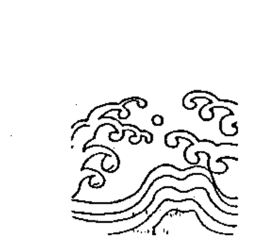
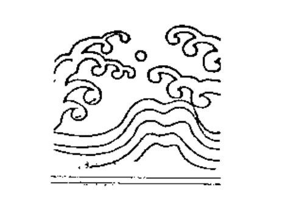
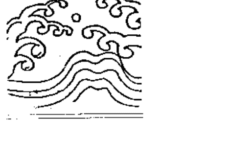

# 斗数看人际关系

## 現代人必修的課程

——自序

紫微斗數命盤把人生可能遭遇的人與事細分成十二事項宮位，每一個宮位代表該宮位的命理特質，以及一生在此方面所呈現的命理狀況。這種把命理事項經緯分明的劃分，可使命理理論斷能收明確肯定的功效，這也許是斗數命理所以能歷久常新，更能適用來探討新時代人們錯綜複雜現象的特點。

人的一生中，在人際關係方面可粗分為家族內與家族外兩個部份。在家族內指的是父母、兄弟姊妹、夫妻與子女，即所謂六親方面的親情關係，是比較固定、單純的。至於家族以外的人際關係，卻是會隨著時代和社會環境的改變而改變，也會因為個人投入社會活動程度的不同而有不同的複雜層面。當社會文明愈進步，個人愈不能離開社會人群而自己過活，人與人之間的互動關係會越密切和複雜。有關人際關係的探討，是文明社會中一項頗受重視又熱門的專業學問。

筆者在多年的業餘論命中發現，身處在現代這個大千世界中討生活的人們，一生事業工作的浮沈消長過程，與其人際關係的良劣，有相當重大的影響，所以在命理的談論中，人際關係的命理問題，常成為探討的重點。

古傳的斗數命理，在探討人際關係事項時，除了做為「部屬」的「僕役宮」之外，並沒有劃出某個特定宮位可用來綜合研判命造者在人際關係方面的命理跡象，僕役宮在整體命盤的運用上只能算是某個環節而已。在現代的社會中，人際關係益顯其重要性，斗數命理研習者在這面對這項問題時各有主張，紛說不一，結果常使命理研判與事實不相吻合，以致失去命理諮詢應有的價值。

本書專論人際關係，在這本論集裡，筆者仍舊以引用實際命例討論的方式，從各個角度來闡釋各個層面的人際關係問題，解說理論原則和推演的技巧，並透過抽絲剝繭，條理分明的分析，使讀者能經由每一個命例的敘述，充分了解真正人際關係的分辨、推論時所必須掌握的命理重點。

在本書中，筆者深入運用「太歲入宮法」來說明斗數命理在人際關係方面的探討法則，運用這個屬於「個別差異」的理論，將使不同層面的人際關係，能突顯其在整體命理上所顯現的作用。

社會文明愈進步，人際關係不只越重要，也將會更複雜。筆者期待本專集出書後，能引起同好們對這個問題的共鳴共識，進而加強這方面的研究，使斗數命理學術更能成為有益於現代人立身處世的諮詢參考。

通訊信箱：台北郵政二六一三一七號信箱 紫雲收
需復函，請復回郵。
紫微斗數講座：電話（〇二）三七五一—四七一二（創建堂）

甲戌年丙子月 於台北客寓

## 導論

人不能離群獨居，獨自過完一輩子，特別在這個處於社會群體共同營生的時代，一個人很難過著與人隔絕，獨善其身的生活。老祖宗時代就說：在家靠父母，出外靠朋友。

一個人的一生中，若想能有所作為，很難單憑個人的能力或條件就能有成果，常言道：「孤掌難鳴」、「獨木難撐巨廈」，在在無不說明，一個人必須取得他人的資助合作，否則很難對任何事做出什麼成果來。

本書所說的「人際」，就是從這個角度來探討，一個命造者會有什麼樣人際關係，有什麼樣特有的互動條件，當與其他人產生互動時，會出現什麼跡象，又會有什麼樣結果。

## 人際篇

影響人際優劣的命理因素中，命身宮扮演非常重要的功能。在《斗數論事業》乙書裡，筆者強調，一個人事業的興衰，事業宮的旺弱吉凶固然很重要，但命身宮所形成的格局，往往也有舉足輕重的作用。因為命身宮正是顯現一個命造者的性格宮位。而一個人的行事宜風格，乃出於他特有的性格的表現，因此筆者會強調命身宮應該是主控命盤其他十一個事項宮的總樞紐。所以在本書裡，幾乎每篇在推論主題前，都不厭其煩的先詳細分析每一個命造者，其命身格局所具備的特質。因為命身宮格局的特質，也一樣的會影響到所有人際關係。

從無數的命例中發現，影響人際的命理因素，除了命身宮的旺弱吉凶之外，六吉星及六煞星也對命造者在各種人際方面會有重大影響。在傳統的觀念裡也有談到，命身宮坐會吉曜多者，就代表貴人多，必有利人際關係，而會煞曜多者，就代表小人多，主不利於人際關係。但在實際的運用上，仍需和命身宮格局合併兼論，否則並不一定能反應出實際的吉凶。

遷移宮也是推論一個命造者人際關係吉凶的重點宮位，遷移宮吉，則人際關係良好，否則就以凶論。但筆者還是要強調，遷移宮吉，若命（身）格局不強，並不一定會有良好的人際關係；反而主一種拍馬逢迎，仰人鼻息的命理作用。

## 上司篇

不管那一種社會型態，也不管那一種行業，總是老闆（頂頭上司）少而伙計（部屬）多，就一般常態而言，常伙計的上班族人數永遠較多。

長期為人部屬的上班族，對工作環境的感受，除了工作場所的好壞，所擔負職責、報酬之外，和頂頭上司（老闆）的相處情形，往往會有深刻的體會，那是對工作感受好壞最直接的影響，很多上班族會想換工作，往往是受工作主管的影響。

與頂頭上司相處...（后略）

## 部屬篇

為人作嫁的伙計難幹，當主管或老闆有時也難為。一個人才華再好，能力再強，若凡事都需躬身自理，乏人協助，想要能開出什麼大事業，或是負起什麼重責大任，恐怕都難有成果。俗話說，得道多助，其實應該說，多助才能得道。放眼古今，諸凡在各項事業領域裡有所成就的人，無不是得到得力人士的協助，所謂孤木難撐巨廈，所說的就是這個道理。

很多老闆階級或身任主管階層的人士，常有用人困難的感嘆。一件業務的推動，常因用人不當，或是乏人負責，而使業務窒礙難行。有些這類階層人士，有幸能得到得力部屬的有效襄助，使企業中的業務順利推展。事業推展的順暢與否，有時是要看主其事者，能否得人助而定。

企業機構的主管階級，在業務推動方面，通常都需仰賴部屬的通力協助，分層負責去執行。經由斗數命理來推論一個命造者在事業方面的興衰跡象時，凡是必須任用部屬的職務或行業，命盤上先後天的「僕役宮」，往往是扮演相當重要的關鍵作用。「僕役宮」若吉，則能用到好的部屬，可以盡忠職守執行所交辦差事，也可以在很多方面分憂解勞。「僕役宮」若凶，不是人才難得為其所用，所用的往往會是庸碌之才，甚至有時還會成事不足反而鬧出大紕漏來，因此就事業而論，一個命造者的「僕役宮」所呈現的吉凶狀況，也就成為在探討事業吉凶時，所必須列入研判的重要宮位。

探討斗數命理『僕役宮』的吉凶時，也跟其他的項宮位論斷一樣，也必須以命身格局為重（行運時則為大限本宮）。諸凡命身格局結構強者，若是僕役宮吉，它的吉象較會呈現，若是僕役宮凶，它的凶象較會被壓制。相反的，若是命身格局弱者，僕役宮吉，其吉象也弱，要是僕役宮凶，則其凶象必暴露無遺。

古傳把這個用人的部屬宮位定為「僕役宮」，就是用來研判一個命造者在用人方面所呈現的命理跡象，就字義而吾尚可望文生義，也算恰當。但近代卻有某些斗數研習者認為古傳的「僕役宮」用字不雅，藐視人權，因此把這個宮位擅改成為「交友宮」，致使後學者在不明瞭這個宮位基本作用的情形下，誤以為這是論及與我平起平坐、無職業關係，一般朋友友人的宮位，如此一改，不但誤解斗數命理法則，也誤導後學者走入歧途。時代再怎麼進步，在職業工作上的人際倫理方面，都必需有其應有的分別。「僕役宮」也許字意不雅，但「朋友宮」絕對會誤導，也許把這個宮位寫成「部屬宮」，既可正確的望文生義，也可使這個宮位的功能不致於被誤導，也能符合時代的觀念。

近代在事業經營的組織型態方面，大致上來說，有獨資經營事業，也有眾多人合資經營事業，更大的自然是股票上市公司所經營的事業了。在本篇中所探討的四個命例，乃是屬於公司由少數人投資合夥，並一起共同經營，只投資不參與經營的，不在本篇討論之列。由少數幾個人合夥投資並一起參與經營，目的在於資金方面的集腋成裘或是專長方面的分工合作，也可能是因為增廣人脈有利事業經營。這種合夥公司只要經營能賺錢，合夥人之間必然和諧相處，合夥事業也會在維護共同利益目標下穩定發展。不過一旦發生虧損，合夥人之間，很快會產生糾紛，甚而導致合夥公司潰敗。這種由少數人合夥又一起經營的公司，其聚合離散，幾乎難逃出這種結果。

很多這類公司的合夥人，當初參與投資並共同經營公司時，通常都會找親朋好友或是比較熟悉的人來參加。依常理而言，只要共同投資又參與事業經營，目標應該可以無往不利。但在現實的狀況上並非如此。筆者在業餘論命中經常會碰到這種命例，也在這些命例中發現，這類公司經營的盈虧聚散，通常是因為合夥人的人謀問題，合夥人彼此在經營意見方面發生歧異，最後造成經營不善，導致以拆夥收場。

斗數命理用來探討這類合夥公司的經營之道，古傳典籍也不見任何記載，但近代的斗數研習者；在這方面的主張，卻是各有主見，各家之言莫衷一是。有人主張「交友宮」即可，交友宮人既然都是親朋好友，因此在論斷合夥的吉凶現象時，認為只要依據「交友宮」即代表會有得力合夥人可以共同投資經營事業。也有人認為只要事業宮旺並坐會六吉星，即代表會有得力合夥人可以共同投資經營事業。這些主張初看似有道理，但實際上卻是和斗數命理的推論法則相去甚遠，經常出錯，有不少這類合夥人，在經由斗數命理高人指點後，仍...

# 《卷一》人際篇

然難免於合夥事業潰敗的命運。筆者在四篇的命例中，同樣的以合夥事業主導人的命造，先論其命格，再研判其合夥重點宮位！「遷移宮」的吉凶，再採用「太歲入宮」法輸入合夥人的資料，綜合這些重點來做抽絲剝繭的分析，使合夥經營的事業能充分反應出其中的吉凶跡象來。這種推論方式也許比較繁雜，但只要能掌握其中要訣，筆者認為應該是在探討這項命理事項時，比較合理而且可行的最好方法。

## 白手成家——從人際關係談創業之道

一個出身於無祖產可得家庭背景的人，如何能在人地兩疏的環境裡創業有成。

開辦公司創建事業，非資金莫辦，對一個來自鄉下無顯赫家世可依恃的人而言，又如何能在茫茫人海中去找尋事業的投資人。

一個人在事業上要有成就，固然必須要有很好的能力，強烈的企圖心與堅強的意志，但良好的人際關係，往往是不可或缺的重要條件。

本文就從這個命造者的人際關係來探討，他之所以在事業方面能夠白手成家的原由。

周先生探討斗數命理，有股異於常人，追根究底的耐性，在一次與我討論斗數問題時間我，在《斗數論事業》乙書裡，那篇「庫不旺，財不豐的董事長」乙文中，所提到的那一個董事，為何能在自己不是擁有豐厚資金的情形下，庚子大限時期就能創辦公司？莫非他有什麼高人一等的能耐，才能如此？

我回答道，這個人在庚子大限中，由南部提著一個皮箱單身匹馬到台北時，幾乎是身無分文，經由一位大學時代老師的介紹，到一家貿易公司上班。大限就是在庚子大限末，經過一番奔走，招募了幾個股東，成立了往後經營的這家公司，堪稱是個白手成家的人。

周：「這種『紫破辰戌，君臣不義』格局的人，在人地兩疏的台北闖天下，又沒雄厚資金，怎可能找到願意出錢合夥的投資人？……

## 命身格局

答：「這得從他的命身格局談起。這是個命身宮都居《殺破狼》的格局，魁、鉞輔命，左輔坐命，右弼由辰宮來會，文曲由寅宮來照，身宮在午宮，也會左輔與昌、曲。這是個大吉星分會命身宮的格局。

這種命理格局具有幾個特點：

第一：命宮照會〈紫殺帶威權〉組合，因此凡事信心十足，有強烈的幹勁與企圖心。
第二：得左輔、右弼，有堅強的信心與耐力。
第三：照會昌、曲，處事風格，粗中帶細，有精明獨到之處。
第四：身宮居午，會諸吉於旺宮，是個強而有力的〈馬頭帶劍〉格，這種格局的人，極其精明能幹，處事勇往邁進，有百折不撓，艱苦卓絕的勇氣與信心。

周：「但他的命身宮也會坐羊、陀與火星，這三大煞星，不會讓他他也帶有幾分剛愎自用的性格嗎？」

答：「坐會這三大凶星，在這種強悍的命身格局裡，難免有一種強烈的自我意識，但他也坐會諸吉，因此這些煞星也有激發他強烈鬥志的一面，不能全做凶論。
一個家無祖產庇蔭而能白手成家立業的人，在命理上，自然有他之所以會成功的條件，否則如何能從無中生有，創立一番事業。」

周：「不過我還是沒法了解，這種〈君臣不義〉命格的人，竟然能在兩手空空的情況下，招募股東來創業，這到底是什麼樣的命理因素？」

廉貞忌 |
鈴星 |
七殺 天姚 天耗 |
擎羊 天哭 天虛 |
祿存 天梁 |
天機 天府 |
太陽 太陰 |
火星 |
文昌科 |
武曲 |
天魁 |
天同祿 |
紫微 |
天相 |
右弼 |
天梁 |
陀羅 |
龍池 |
地劫 |
天鉞 |
破軍 |
左輔 |
鳳閣 |
文曲 |
天空 |
地空 |
天機 權 |
巨門 |
男命 一九三六年七月/日戌時 |
大運癸酉年 |
辛58卯歲 |
天魁 |
天同祿 |
文曲 |
貪狼 |
庚寅 事業 43-52 |
辛丑 田宅 33-42 |
庚子 福德 23-32 |
己亥 父母 12-22 |
戊戌 命宮 3-12 |
丁酉 兄弟 |
丙申 夫妻 |
乙未 子女 |
甲午 財帛 |
癸巳 疾厄 |
壬辰 遷移 |
辛卯 僕役 |

白手創業者每個人都有他所以會成功的條件。這個命造者命身格局固然很強，但得貴人提携幫助，也是他能赤手空拳創業有成的原因。道理何在，本文有詳盡敘述。

## 君臣不義

答：『他的命宮在戊，破軍坐守，的確是個不利人際的《君臣不義》格，但這個命盤所搭配成的星曜組合，卻是相反，形成他所以能招募到股東的命理因素。』

問：『怎麼說？』

答：『這得從幾個方面談起：

- 其一：『命格強又會諸吉者，就人際關係而言，會有一種積極的正面作用，也就是較會廣結善緣。』
- 其二：『人際關係的重點宮位遷移宮（辰宮）是個《紫府武相》的大格局，尤其右弼與左輔分居辰、戊兩宮，會產生一種互為牽引的互動作用，這種作用會使這種命格的人，更積極擴展對外的人際關係。』
- 其三：『魁、鉞輔命為近貴，只要所輔的命宮強，就有一種接近貴人的強大助力。』

據我所知，諸凡他認為需要認識的人士，他總有辦法去結交。他從年輕開始，除了廣交商場上的朋友以外，也結交了不少軍政界的知名人士。』

## 股東退股

問：『他在庚子限末籌組公司，這個限運太陽化祿在丑宮，武曲化權在限運本宮，使限迴成爲雙祿輔權的強旺宮位，限運的遷移宮（午宮）也成爲雙祿所輔（太陽化祿作用到未宮），大限本宮又會先天遷移宮，這種先後天遷移宮兩相吉旺之下，難怪他發高一呼，就能的招到合夥股東。

但是到了辛丑限時，丑宮坐會空劫，陷弱，限運遷移宮因空宮而無力，辛干文昌化忌和先天廉貞化忌沖照先天遷移宮，在這種運限，參與投資的股東會沒意見嗎？』

答：「在這限運初期，因公司成立沒多久，事業經營基礎薄弱，加上資金不多，因此營運欠佳，公司連續兩三年不賺錢，於是部份股東有意見，最後退股。當時搞得公司頻臨倒閉邊緣，後來經過這位命造者再三遊說留下來的股東增資，又招募一些新股東，總算能撐過難關，繼續經營。」

問：「先後天遷移宮這麼差，怎麼可能讓老股東增資，又再招來新股東？」

答：「這就是他在人際關係方面的能耐所在，他可以把一個前途充滿荊棘困難的公司，說成前景光明，可以鴻圖大展，值得投資發展並且是大有希望的事業，尤其是能夠說動原有股東再投入更多資金，最後總算度過了部份股東退股的困境。

就命理而言，限運的遷移宮在未宮，因辛干巨門化祿和在亥宮的天同化祿會照後，也呈雙祿吉會，先天遷移宮在辰，也因巨門化祿而成為雙祿所輔。先後天遷移宮均有吉化，所以他能說動新舊股東。」

周：「不過他辛丑限的運程這麼弱，就算能增資使公司經營得到紓困，若營運不得拓展，遲早不會也發生困難？」

答：「這家公司成立初期，只是加工生產較一般性的農藥產品，由於產品沒什麼特色，加上市場競爭劇烈，因此營運並不怎麼出色。但在他三十四歲，巳酉年（民國五十八年、一九六九）時，透過朋友的推薦，並施展他攻無不克的交際手腕，竟然讓他公司取得一家世界級化學公司所產製，極其優秀的農藥產品，在台灣市場的獨家經銷販賣權。當這些新產品陸續進口後，公司營運就蒸蒸日上，逐年邁向坦途。」

問：「單憑己酉年的己干武曲化祿照會先天遷移宮（辰宮）的吉象，就有這麼大的轉機嗎？」

答：「就命理吉象而言，這只是其中之一。辛丑限太陽化權在限運本宮，正好和天機化權成為雙權輔先天事業宮（寅宮）。寅宮原本就是〈殺破狼〉又命鈴星的〈鈴貪〉成格宮位，當雙權吉輔後，〈鈴貪〉得到引動，勃然興發。

另外辛丑限運也得六吉星中的昌、曲所輔，酉宮也有天鉞來會，就得貴人相助而言，是相當明顯的跡象。

在這個限運裡先後天遷移宮皆吉，先天事業宮強，大限事業宮（巳宮）也奠定了公司往後發展的雄固根基。一個公司的經營者，除了要具備應有的經營管理理念之外，良好的人際關係是艱苦卓絕的鬥志，往往也是不可或缺的要件。創業艱難，事業想要發展很不容易，一旦無法突破，往往就會陷入絕境，最後關門倒閉。

周：「依你在《斗數論事業》乙書中提到，這個命造者，一直到辛卯大限，庚午年間（民國七十九年、一九九〇）才接任公司董事長，在這之前由誰來當公司董事長呢？」

答：「公司成立以後他一直擔任總經理職務，直到庚午年接任董事長。這二十五年當中，前後有兩人當過董事長，公司也在這兩位董事長雄厚資金的幫助下，克服不少資金週轉的難關。」

周：「對公司資金有所挹注的董事長，一般都會掌控公司事業的運作。而這位總經理命格屬於強悍型的人，跟這兩位董事長都能相處得融洽嗎？」

答：「這位總經理雖強悍，但命宮為魁、鉞所輔，還算能知所節制，所以他跟先後的兩位董事長，相處上算來沒什麼大問題。談起先後的這兩位董事長，我才覺得很奇妙，似乎冥冥之中自有安排。」

據我所知，除了這位校長之外，其他的投資人都是屬於精打細算型的人，他就是有這個能耐，使這些素不相識的人心甘情願的拿出錢來。

這位校長生性謹慎保守，一向不投資任何生意，不但被他說動參加投資，也帶了一些人一起投資。

第一位董事长于庚子大限末期公司创立时开始，直到辛丑大限后期，再由这位校长接任。

周：「正如前面所述，先后天迁移宫都不错，这个总经理，自然较可能会碰上好相处的董事长，还有什麽奇特吗？」

答：「首任董事长生于辛丑年（民国前十一年、一九〇一），本来已退休，但经校长极力邀请，投资之余也接任董事长职务。」

周：「辛丑年生，坐这位命造者命盘上这麽弱的宫位，怎麽会对他有帮助？」

答：「丑宫虽弱，但这位董事长是辛丑年生，辛干巨门化禄，太阳化权，这两颗星一吉化，便使这个命盘的先天迁移宫成为双禄吉辅，也使先天的事业寅宫（戌宫）成为双禄所夹。另外酉宫没有甲级星曜，卯宫的巨门化禄照入酉宫后，也使先天的事业寅宫成为双权所夹。若再把辛年天魁在寅，天钺在午加入併论，则在寅宫的事业宫和在午的身宫即成坐贵向贵之格，同时寅、午的魁钺也照入在戌的命宫。」

周：「如此看来这位辛丑年生的董事长，的确是他创业初期的大贵人。那第二位董事长又是坐在哪个宫位？」

答：「第二位董事长生于辛酉年（民国十年、一九二一），坐入命盘的酉宫宫位。」

周：「酉宫只有天魁和地劫，也相当弱而无力，大概帮助的力量较弱吧？」

答：「这位董事长，辛干所化的禄星和权星，同样使先天命宫和迁移宫成为双禄所夹，使事业寅宫成为双权所夹，魁、钺也同样在寅、午宫，同样坐会寅、午、戌三宫，同样对这个命造者形成极有利的吉化作用。」

说来也是相当巧合，这两位先后任董事长分别坐入丑、酉合会宫位，同样的生年辛干，因此在命理上所造成的吉化、吉辅作用，几乎完全相同，因此先后对这个命造者给予很大的帮助。

周：「不过丑、酉两宫都很弱，在命理上究竟有什麽作用？」

答：「第一位董事长是个已退休的富有耆宿，在公事上他只关心重大事项，他说农药生意他不懂，因此公司的营运大权交给总经理一手包办。第二位董事长一生服务于公务界，退休后才来接掌差事，对农药生意一样的外行，同样的，除了协助公司必要时的资金调度以外，公司的营运也很少过问。」

## 得贵助的命理条件

周：「任一命盘的命造者，是否只要出现在较好太岁宫位的贵人，就必然会得其所助？」

这只是命理上的一项必要条件。广泛而言，每个人（每一张命盘）在十二个地支宫位里，或多或少总有几个较好宫位，但不代表都必然能得到这些地支生人的提拔帮助。

以这个命造者而言，他的命身宫既旺且强，而且又得六吉会助，另外他的迁移宫——主人际关系的重点宫位又好，这种命格的人自然较会得到贵人的提拔栽培。若是命宫身格局陷弱又不得六吉会助，就算得到贵人提携，也会如扶不起的阿斗，发生不了作用。

再者，实际的人生里，真正能得到别人相助而有所成的人，必定是本身也具备了不错的能力和条件，才能得到贵人的提拔和栽培。

人生如此，命理亦应做如此观。

### 女强人

从人际关系谈事业经营之道

人际关系的重点宫位——先天迁移宫，格局不是很好，但在每个大限过程中，却不断使这个迁移宫吉化，因而在人际关系方面能一直畅通无阻。

先天仆役宫在酉，虽有太阴坐于旺地，但三方会有擎羊、火星，这两颗煞星，对太阴有极强的煞害凶性，但她在事业经营上却一直不缺人手，究竟为什么能如此？

一个女命在事业经营上显现强人架势，必有她所具备的特殊条件。

本文就从人际关系的角度，用命理观点来探讨，这位女强人的成功之道。

小林在中秋节（癸酉年）前几天约我在忠孝东路一家茶艺馆见面，说是要带他表姐来，跟我谈论一件较大的投资案问题。他也学斗数，但他说小事还敢断，碰到事关重大的事项时，他不敢轻易表示意见，以免误导害人。

见面时小林已排好他表姐的命盘，小林代他表姐问道：「最近表姐有位朋友邀她合伙投资一家公司，从事进口销售业务，专门代理工程用工作机械，不知道是否可行？」

### 限运与流年结构

待我详细的看了命盘后说道：「台湾目前正在进行各种重大工程建设，代理工程用机械进口，应该有其市场。但经营生意，有时人为的因素也相当重要，并不是市场好，就保证可以做好生意。」

林：「你的意思是，我的表姐行运欠佳，在这桩投资上，不可能会有好成果？」

答：「既然是合股投资，就不是张小姐独自当老板，这当中还涉及是要参与经营，或只是纯投资的考虑。」

林：「我表姐另有自己当老板经营的事业，这项投资，只出资金，恐难参与经营。」

| 太阳 天钺 | 破军 左辅 | 天机 | 紫微 天府 右弼 |
|----------|-----------|------|----------------|
| 父母 15-24 | 福德 25-34 | 田宅 35-44 | 事业 |
| 武曲 文曲 | 夫妻 5-14 | 身宫 | 太阴 科 |
| 天同 天魁 | 七杀 擎羊 | 天梁 | 贪狼 忌 文昌 铃星 |
| 兄弟 | 子女 | 财帛 | 迁移 |
| 火星 | 乙丑 | 甲子 | 廉贞 贪狼 天相 禄存 地空 地劫 天马 陀罗 |
| 乙卯 | 夫妻 | 财帛 | 疾厄 |

先天迁移宫形成“昌贪”化忌的恶格，这种人从事必须与人打交道的人寿保险工作能有成果吗？众说纷纭，莫衷一是。

本文有独树一格的个别见解，要明白，请看内文分解。

### 合伙宫位

答：「这种纯粹投资的生意，并不参与经营，我认为重点应该在迁移宫——合伙人的重点宫位，以及福德宫上。就命理的条件来论，若这两个宫位都佳，才有可能让合伙事业的经营者帮你赚钱。」

至于限运的结构，以及大限事业宫的命理作用，我认为是反应在张小姐本人自己已经

林：「你认为这个投资案不好，是否与己未大限的运程有关？特别是大限事业亥宫巨门化权并空劫坐守，形成《半空折翅》之凶格有关？」

《昌贪》恶格以后，一旦与人合作事业，恐怕常会有意想不到的困难与挫折。因此我以为，这个投资案，应该还需慎重评估，不宜轻率决定投入。」

张小姐听了我不表赞同的意见以后说道：「令我犹豫不决的是，这位邀我合伙的朋友，在这方面的经营也不甚在行，再说机械成品的进口贩卖，还牵涉到售后的技术服务，与为数不小的通路设备所需的庞大资金，恐怕不是轻易可以经营得了的，所以我一直没敢贸然答应投资。」

林：「合伙人的重点宫位在迁移宫，那为什么你不看大限迁移宫，反而看先天迁移宫呢？」

答：「大限的迁移丑宫原有天梁、擎羊坐守，癸酉流年时擎羊又在丑宫，加重丑宫的凶象，因此，大限的迁移宫在癸酉年里并不好。另外，先天迁移戌宫，在己未大限的癸酉年里，会齐三代忌星并成《昌贪》化忌的恶格，因此我认为，先天的这个迁移宫，凶性最大。先后天的迁移宫欠佳，投资他人的生意想要能赚取利润，恐怕是缘木求鱼。」

张小姐先行离去后，小林说，他表姐在事业上的表现堪称是一帆风顺，尤其她所从事的保险行业里，大有“女强人”的盛誉。但他却很难从她的命盘上看出，究竟有什么特殊的命理条件，能让她在这个行业里挥洒自如，鸿图大展。

### 行业性质

我接着问道：「保险行业的从业人员，由于工作性质有好几种，比如经营保险公司、或是拥有人寿保险经纪人资格而开办保险经纪人公司、或是只单纯当一个招揽人寿保险

业务的从业人员等等，所扮演的角色不同，所必须具备的命理条件也有差异。

林：「我表姐在保险业界开始时，是从招揽客人投保的业务人员干起，大概是在丁巳限从学校毕业后开始。到了戊午限上半期，由于业绩蒸蒸日上，就当上某个分公司的区域性业务经理，指挥手下一批人员从事人寿保险招揽业务。到了这大运的下半限时，由于表现优异，就被总公司任命，担任一个新设立区域性分公司的经理，手下的人数越来越多，承接的保险业务也扩大。她也在这个时候取得人寿保险经纪人资格。到了己未限初，她离开原来的保险公司，自行成立经纪人公司，替各个不同的保险公司招揽各种性质的保险业务，从中赚取佣金。」

我听了后应道：「很适合啊！难怪她在这个行业上会鸿图大展。」

## 命身格局

答：「这个问题需从命身格局谈起。此造命身同坐辰宫，武曲坐守。武曲在辰为旺地，其赋性有“将星”之名，合文曲同宫，有文武兼备之才，所以是个聪颖能干的命理格局。其三方照会〈紫府相〉与右弼及文昌，并有魁、钺辅命，形成架构甚强的〈君臣庆会〉格。」

命宫武曲的〈君臣庆会〉格，在事业表现上，会有一种干练而且勇往直前的气魄，

昌、曲为文桂、文华之质，主聪明才智，会使她遇事慎思明辨。魁、钺辅命，天乙和玉堂这两个贵人，使她在待人处事方面，有温和委婉正直的表现。因此这种大“迁移宫”虽然在命理格局上具备有“强人”型的命理条件，但是在待人接物方面，并不会呈现出咄咄逼人的强悍作风。」

林：「我表姐待人处事风格的的确如此。这种风格特质，使她在当营业员招揽保险时，几乎凡是她想要推销保险的客户，大多会乐意接受而投保，等她高升为主管，带领一批业务员在拓展业务时，也很能令部属心悦诚服埋头苦干。」

### 人际关系

答：『探讨“人际关系”，重点是在迁移宫，但若只定位于迁移宫，则是一项大误解。实际上，命宫以外的三合宫位，就人际关系而言，都会有影响，只是迁移宫的份量比较重略为大些，并不是单凭迁移宫来论断人际关系。』

林：『能解说得更清楚些吗？』

答：『之前提到这个命格有魁、钺辅命，坐会曲、昌，右弼在申会命宫，六吉星中具备了五颗，命坐强宫且会吉星多的命格，一般而言，人际关系都呈现正面的有利作用。』

另外，申宫，也是先天事业宫，有紫、府坐守并右弼。紫、府各为南北斗主，这两星又有右弼同坐，可以发挥南北斗主的威力作用。南北斗主组合好又照会命宫，也是大贵人，特别显现在事业方面，能得贵人的提携帮助。

### 运程助强化解

答：『倒也不能说完全没有不利的影响，只是先天命宫格局既成为〈君臣庆会〉，并会、辅诸吉，命身格局强，同时申宫与子宫两方合照强而有力，因而使先天迁移宫的凶格不致于显现太大的凶象作用。因此迁移宫的〈昌贪〉凶格，只能说瑕掩不了瑜，不致于有太强的凶象作用。』

而且到了戊午大限后，戊干使贪狼化禄，戌宫的贪狼化禄后，又会照午宫的破军化禄增吉，这会解除戌宫原有〈昌贪〉凶格的作用。到了己未大限时，己干使武曲化禄，

贪狼化权，继续使戌宫的凶格转吉。因此我认为，令表姐在她的事业上，不只与客户之间的业务往来应对得宜，与上属公司的主管大员，也都能相处得很融洽。

林：「的确如此，客户满意，又能得上属公司人员的充分配合，可见她在人际方面处理得相当得当。不过有点不明白的是，在戊午限和己未限时，你都只凭她的先天迁移宫来谈，而不论限运的迁移宫，究竟为什么？」

答：「戌宫虽凶，但会有先天的破军化禄，当戊午限时，贪狼化禄，使戌宫坐会先天与大限两代化禄，到了己未大限武曲化禄，也一样使戌宫照会两代禄星，连续两大限使戌宫连会两代化禄，因此它的作用会强过大限的迁移宫。若以大限运的迁移宫来论，戊午大限迁移宫在子，有廉相和禄存，宫位甚佳，但到了己未限时，迁移宫在丑，天梁、擎羊的组合，格局不佳，她的人际关系理当不好，那她的保险经纪人公司怎能进行得了呢？」

### 化引动的先天迁移宫来论断。

## 部属人众

林：「我表姐在戊午大限当上业务主管之后，手下一直不乏业务人员帮她冲锋陷阵，招揽保险，这是她在这个行业里能无往不利的原因。她命盘上的仆役宫在酉，太阴化科，有那麽大的吉象作用吗？酉宫另照会擎羊与火星双煞，难道没有因会照煞星所形成的凶象作用吗？」

答：「部属良劣多寡是以命盘的“仆役宫”作为推论依据没错。这个命造仆役宫在酉，虽然会有火、羊双煞，但太阴在酉为旺地，并照会巳宫的太阳星，形成“日月并明”吉格，另外魁、钺也会入酉宫，因此酉宫并非只凶不吉。另外正如前述，命身格局强又嘉会诸吉，也会对仆役宫造成有利的影响，因此这个在酉的仆役宫不能做太凶论。」

林：「我表姐在丁巳大限时，工作方式尚属单打独斗，一个人在卖保险，但从戊午大限起，就拥有不少部属在她手下工作，她的先天仆役宫并不像先天迁移宫那样的得到

吉化，戊午大限时如此，己未大限时也一样，可是她手下工作的人却愈来愈多，究竟为什么？

林：「戊午限的戊干使太阴化权进入酉宫，也算是一种吉化，而贪狼化禄使大限仆役亥宫成为双禄辅权，造成这个限运的仆役宫，呈现另一种吉辅作用。」

答：「但亥宫有空、劫并陀罗，卯宫火星来会，未宫还有天机化忌来冲，难道就没有凶象？」

林：「当然有这些煞星干扰所形成的凶象，但魁、钺也照入亥宫，再加上亥宫为双禄所辅，因此虽有凶象，而难免有部属人往人来的变化，但我认为一旦缺人，应该可以随时补足。」

另外戊午限运格局结构甚强，是个坐会双禄的〈加官进爵〉格，限运事业宫在戌有贪狼化禄后的〈铃贪〉格局来合，更加强了这个运程既旺且吉的气势，也多少可以化解限运仆役的不吉现象。

林：「那麽己未限呢？这个限运并不强，既无吉化入先天仆役宫，文曲化忌却照入这个限运的仆役子宫，部属方面可能不甚得力吧？」

答：「我不认为如此。己干武曲化禄照入限运仆役子宫，使这宫位吉会三禄，文曲为乙级星曜，其化忌的凶性不大。我认为她到了这个限运之后，手下部属会比上个限运的人数还多。」

就限运本宫的气势而言，己干使武曲化禄、贪狼化权于先天命宫，尤其辰宫本就会入在子的禄存，武曲一旦化禄所形成的强化作用更大。另外大限与先天命宫都见化权，自有其增强事业经营的强势力用。在这种状况下的大限事业宫所呈现的较弱态势，也许只会呈现一种忙碌纷扰状况，并不代表事业会在这限运走下坡。」

林：「的确如此，到己未限自己设立经纪人公司以后，不止在台北的总公司扩大业务，增用人手，也在中部和南部设立分公司或办事处以拓展事业。」

我曾经把这份命盘请教过一位斗数高手，据他说，这个命造若在人寿保险界工作，由于迁移宫成凶格，就算当个卖保险的业务人员，都不一定有好业绩，就莫说会大展鸿图了。原来在这方面还有如此错综复杂的论法。」

我听了后说道，其实斗数命理的论断并不错综复杂，只要理论正确，论断时候条理清晰，所有的吉凶状况，自然都会清楚的显现出来。

## 刑囚夹印
### ——从命理迹象谈人际和用人

这是个命身格局都很强的命造，但很遗憾的不只六吉不会，还是六煞全彰。

依常理言，这种人的性格相当刚愎自用，很难有很好的人际关系，但他经商却有不错成果，这种有悖常情的现象，在命理上究竟是怎麽一回事？

先天的仆役宫在巳，是个不会煞星，又是坐会不少吉曜的宫位，这对于一个从事必需雇用大量部属经营事业的人，究竟在用人方面会造成什麽样的状况？

一个事业有成的人，必定有其命理原因。本文就从人际关系，和他用人的情况，来探讨其中的命理情况。

癸酉年间，在一堂斗数命理的讲座上，当讲述到六吉星与六煞曜在人际关系上可能发生的命理现象时，我曾经以本书中〈白手成家〉文中的命造为例说明，命身分会六吉星曜的命造者在人际关系上都相当不错，而命身宫六吉不会却又会诸煞者，在人际关系上可能较差。

这几年来，我陆续应一些对斗数命理有浓厚兴趣同好的要求，开班讲课。课程涵盖星曜赋性、斗数基本理论，尤其活盘推演方法。来上课的同好，有很多是学斗数多年，已有些基础，甚至也有已开馆为业的人士，因此课堂上的反应经常很热烈，每当讲述内容，有交待不清楚或是让他们听来觉得疑惑的地方，必定追根究底的发问。有几个听课的同好表示，像这种讲座，可真不容易主持。其实，我倒觉得真理愈辩愈明，做事或治学，本该有被质疑甚至争辩的雅量，若是固执己见而自以为是，岂不是自命为无所不通的活神仙了！

当我讲完〈白手成家〉者的命理现象以后，有一位颇有些基础的张先生即席问道：「这麽说来，凡是命身宫六吉不会，却会诸煞者，人际关系必定不怎麽好，那麽他的事业恐怕就较难有大成果了？」

我说，诸凡从事需要利用人手协助，也要透过人际管道才能办事的行业，大概是如

此。

张先生又接着说：「你曾经在课堂上讲解过的，《斗数论事业》中的那篇“两位杰出的经销商”，所述述的那位陈先生的命造，不正是命身宫六吉不会，六煞分坐会命身宫吗？既然杰出，谅必生意做得不错吧！」

他的经销生意的确做得不错，否则我不会说他是杰出的经销商，他的事业情况，在该文中有详细叙述。他的命身宫确是六吉不会，却分别坐会三颗煞星的格局，依常理言，这种命格，一般人际关系会较差，从事商品经销，恐怕会因人情不佳而影响行销管道，很难把生意做好。

但实际上，他从壬寅大限开始，历经三个大限，三十年间，生意越做越好，在人际关系方面，经长期的经营，关系层面也越来越广，到了甲辰大限时，还曾膺任某县市农业肥料商业同业公会理事。

张：一命身宫六吉不会又坐会六煞星的人，怎麽会如此人缘广阔？这个命造的人际关系，我认为应从三方面来分析探讨：他是一个经销商，首先要和上游公司有畅通管道，然后才能取得商品的经销贩卖权。

| 乙巳 仆役 53-62 | 丙午 迁移 | 丁未 疾厄 | 戊申 财帛 |
| 铃星 武曲忌 | | | 太阴 文昌 |
| 甲辰 事业 43-52 | | 一九九三癸酉年 大运 甲52辰岁 | 男命一九四二年十二月十三日丑时 陈先生 |
| 天左辅科 天魁 同 | 木三局 | | 己酉 子女 陀罗地空 |
| 癸卯 田宅 33-42 | | | 庚戌 夫妻 |
| 火星 七杀 | | 天梁禄 擎地羊劫 | 天廉相贞 巨右门弱 存 |
| 壬寅 福德 23-32 身宫 | 癸丑 父母 13-22 | 壬子 命宫 3-12 | 辛亥 兄弟 |

命身宫六吉不会，却坐会六煞星的人，人际关系一般都以不好论，但实际上这位陈老板在这方面却是相当不错。为什么会如此，本文有详尽的叙述。

### 壬寅大限

「你要他从壬寅大限开始，从事农业资材贩卖生意，这个限运只会紫微双化权（壬干紫微再度化权），三方四正不会一颗吉星，他在这个限运又使得先天事业宫形成武曲双化忌（壬干武曲再化忌），生意可能做得好吗？」

提问题的这位王先生，学斗数十多年，每次提出的问题都很深入。他又补充说，武曲双化忌也冲会大限迁移申宫，而申宫另照会子宫的地劫、擎羊双煞，类似这种六吉不会，限运迁移宫又不好的行限，实在看不出有什麽好迹象。

我说道，陈先生在壬寅限，二十六岁那一年，加入我们公司当地区业务代表，在这个时期，他的待遇，除了底薪以外还领有业绩奖金，并不是负全盘盈亏责任的经销商。由于刚起步，业务活动的市场小，因此没曾用过助理人员，只一个人单枪匹马的跑市场。

至于壬寅限三方不会吉曜，又使先天事业辰宫成为武曲双化忌的凶象，自然会使他在这个限运的业务推动上曾经遭受波折。

但在吉象方面，限运的壬干使天梁化禄，因而触动在子宫（命宫）成为吉格而且被双禄辅的《刑囚夹印》再度吉化。因此表面上来看，壬寅大限似乎没有什麽吉象，但若从先天命宫来看，可就不同了。

至于大限寅宫有七杀坐守，紫微天府并双化禄于迁移申宫，正是个因人而贵被提携的《七杀仰斗》格，这是他之所以会被委以重任，负责一个地区行销业务全权代表的命理因素。

### 癸卯大限

「癸卯大限的四化星，只有巨门化权在亥会照卯宫，限运的迁移酉宫并无吉化，在这种运程里，他对上对下的人际关系管道，似乎没什麽特别好或是特别凶。」接着说出看法的是另外一位学斗数多年的林先生，他又说像这种限运三方四正不见煞又坐天同福德的运程，往往使人会耽于安逸而不会勤于开拓事业，似乎看不出有利于事业开展的命理迹象。

王先生不以为然地说道：「这限运的迁移西宫，是个太阴旺宫照会太阳于巳宫的月井明宫位，西宫会昌、曲、魁、钺与天梁化禄，是个有利人际关系的极好宫位。另外癸干使破军化禄进入先天迁移午宫，也照会在子的先天命宫。这个限运使先天的迁移宫都呈现吉象，我认为他在这个限运里，跟上面的公司和对下的零售商都相处得不错才对。」

至于限运坐守天同福星的问题，我认为先天命身宫坐会忌煞的人，比较属于务実命的类型，就算行入这种坐天同星的限运，也不会耽于安逸。」

「我也不认为会耽于安逸，因为癸干的贪狼化忌冲照先天事业宫，这种由大限引动造成先天事业宫的双忌与诸煞齐会，在论断事业动态上，也有不可忽视的一面。」

说出看法的是一位心思慎密的林先生。

我表示认同地说道，行入限运时也该重视先天的相关宫位来据以判断，若只依大限论断往往会有偏差。

这个运限使贪狼化忌冲辰宫，使先天事业宫会照双忌和诸煞，因此在此运程里，尽管他积极扩展营销网络，但也历经不少波折，这是需兼看先天的相关宫位才能论断。

接着我问道，营销网络扩大，自然需人协助，也就是在这个运程里，他开始陆陆续续的任用协助推动业务的助理人员，大家看看，他能否有得力的助理人员可用？

这个限运的贪狼化忌并不冲先后天仆役宫，但破军化禄也对巳宫与申宫没吉会，因此这个限运助理人员得力与否应该从三方面来探讨。」

说出看法的这位洪先生颇为自信而且笃定地总结分析说：「先天仆役宫在巳，太阳坐守，太阳在巳为旺宫，坐会文曲、天钺、文昌与右弼，并有双禄来朝，是个不错的仆役宫。」

「大限仆役宫在申宫，为紫微化权与天府坐守，三方会有火、铃、擎羊与地劫，看来不是个很好的宫位，有〈奴欺主〉的凶象，好在这个命造者的先天命宫是个很强悍的〈刑囚夹印〉格，因此我认为尚可制得住〈奴欺主〉的不利作用。因此我认为，在这个运程里，当他陆续任用助理人员以后，应该没多大问题，只是人员的流动性可能大些。」

他在这个限运的十年里，经常维持四、五个助理人员，也的确流动性较大，前后任用过的人员大概有十五个人以上。但一般而言，这些助理人员还算不错，所以在这个大限里，他的生意一直不断在扩展。

林先生接着问道：「癸卯限自坐左辅、天魁、会右弼，这三颗贵人星，也应该有增强他得贵人之助的作用吧！」心思慎密的人，思考层面总有比他人更周详之处。「这种贵人星不只使他与上面公司的关系良好，也有助于他所任用为助理的部属。谈仆役宫，是否也该考虑大限宫位所坐会的这些贵人星的作用？」

没错，这正是我经常在强调的，论断每一个事项宫位的命理现象，必须要参合命宫（或大限本宫）论断的道理。

先天仆役宫好，大限仆役宫会忽然变凶，但先天命宫在这个运程里得破军化禄吉会，使这个命宫的格局增吉，大限本宫又坐会吉曜，自然会使大限仆役宫的凶性降到最低。所以他在这个运限里的助理人员，也是流动性较大，但大体上还是有发挥出协助拓展生意的功能。

癸卯大限，他和公司的关系，由地区业务代表，改成盈亏自己负责的经销商，这也是使他在这个限运里一直维持好几个助理人员的原因。

## 甲辰大限

讨论过癸卯大限后，我接着要大家继续推断甲辰运的人际情况。

大家经过一段时间的沉默研判后，王先生首先说道：「这个限运的甲干使廉贞化禄、破军化权、武曲化科、太阳化忌。大限本宫不会吉星，但却使先天命宫成为《禄权科》三奇嘉会，因此我认为，在这个运程里，他的生意会越做越大，因大限财帛宫（子宫）得双禄辅禄的吉象，所以很赚钱。但做为人际关系的迁移宫，在先天方面有破军化权，但不会吉星，且会地空、地劫、擎羊、陀罗和火星等五颗煞星，似乎不很吉，而后天迁移宫在戌会有贪狼及地空、陀罗双煞坐守，三方也会火星与铃星及武曲化忌……看来也不是很稳，因此这个人际在人际方面，看来并不是很好。」

「我有不同的看法。」洪先生不以为然地继续说道：「甲辰限是为先天事业宫，自然跟先天命宫相会，因此甲干所引动的《三奇嘉会》于先天命宫，造成强烈的吉化作用。之外，也使先天命宫照会先天和大限变化权，因此我认为大限所引动的吉化先天作用，不可忽视。」

## 斗数看人际关系

就甲辰限本宫而言，它是魁、钺双贵人星所辅的宫位，三方的申宫有紫微化权与天府，得到子宫双禄辅廉贞化禄的吉会，也有贵人作用。紫、府得吉化进入命宫或限运三合方，也有贵人作用。紫、府各为南北斗主，一旦成为贵人时，其扶助力量很强大。这个限运的迁移戌宫，虽有波动不稳的现象，但先天迁移宫吉，大限本宫既被贵人星辅，又会照紫、府两大贵人星，因此我认为大限迁移宫的不利人际关系作用，会为之减轻，应该不致造成太大伤害。」

待他分析后，大家甚感怀疑，怎可有这种论断，要我表示意见。

我接着提出看法说道，洪先生的分析大体上不离谱，甲辰限看似布满忌煞又不会吉星，但甲干的《三奇嘉会》引动先天命宫使之吉化，是这个限运的一大重点。

之外，先天命宫的三合方，在辰宫（也是大限宫位）有武曲化科得魁、钺吉辅，在午宫有大限破军化权，在申宫有紫微化权和天府，这三个宫位，得廉贞化禄来吉会后，也都呈现正面的吉化作用。

在子宫的星曜，原本是个双禄所辅的《刑囚夹印》强悍格局，得廉贞化禄后，他的吉化作用要比一般的双禄辅禄来得更强烈。先天命宫得此吉化后，则在午的破军化权与

在申中的紫微化权和天府，就会成为大贵人而对这个命造有极大的帮助作用。假定在子的命宫落陷，那类似这种双权会照，可能就要变成逢迎奉承，而不是得贵多助了。他在这限运，除了拥有我们公司产品的地区经销权外，也另外取得某名厂产品的经销权，因此事业快速成长。

「那他大限迁移宫坐会煞忌的凶象，难道都没作用？」

他在此限运的事业扩展虽迅速，但在销售过程中下游的零售店却变换频繁，往来十十几年的客户固然有，但汰旧换新的客人也不少，这也是经销商很伤脑筋的一件事。

由于经销业务生意不断的扩展，因此他所用的业务助理也跟着增多，经常维持七八个人以上。先天仆役宫在巳宫，只会吉不会煞，限运的仆役宫在酉，也是只会吉不会煞。这种大限本宫吉，先后天仆役宫又好时，若想要增多业务助理，都可以如愿以偿。

「限运的甲干太阳化忌，正好在先天仆役宫，也照入大限仆役西宫。难道没有凶象？」一直聆听，很少表示意见的陈先生问道。

「太阳在巳为旺宫，其三方又不会煞曜，因此这个太阳化忌，应该没什么大害吧？」洪先生表示看法。

理当如此。在这十年内，助理人员当然也有流动变化，但陈老板也都能很快就能找到人手补充。到了这个限运后几年，他手下助理人员，经常维持在十名左右。在这个行业来说，堪称是全省用人最多的一个经销商。

## 命理特质

- 其一：双禄所辅的《刑囚夹印》强悍命格，处事能力极强。
- 其二：限运走势所造成良好的先后天迁移宫，使他在人际关系上畅通无阻。
- 其三：良好的先后天仆役宫，使他用人无碍，得以协助拓展业务。

产品好，市场大，他再具备命理上的这些优越条件，难怪他会很杰出。

癸酉年七月间，公司的副总跟我说，陈老板众望所归的，当选为嘉义市第一届农业肥料商业同业公会理事长。

有事业上的老伙伴得此殊荣，也甚感与有荣焉！

## 王副总——从命身格局谈他的人际关系

命身宫都旺且强，既会吉也会凶，正是个吉凶星都照会的命造。

命身宫都旺又强的人，在事业上都较有正面的表现。因会吉星，使他在人际方面有比较善于灵活运用的一面，但因照会凶星，也使他另有不甚协调的一面。

这个命造者高居副总经理职位，上有顶头上司总经理，下有不少部属，他如何和这些人相处？又有什么状况出现？这些都是本文探讨的范围。这个命例也同时用来阐述，斗数命理在人际关系方面的论说之道。

小邱在跟我讨论过「六吉不会」乙文中，有关那位张先生的命盘以后告诉我，他手上还有两个命例，也一直无法了解个中的命理原由，因此还想当面与我研讨，他说听我

条理分明的剖析命理迹象，最能够让他充分了解命理的真正道理，不像以前所学，囫囵吞枣似的论断方式。
原来小邱和张先生在同一家公司做事，不隶属于同一个部门，小邱的年纪还没到会被公司逼退的岁数，所以没受到人事大变动的影响，但也深深感受到一股由环境而来的压力。他研究斗数，因此设法取得几位居高阶的同事命盘，想利用斗数命理来探讨、研究公司的变动到底是怎么一回事。

## 命、身宫格局

再度见面时，小邱提出这份他公司王副总的命盘来问道：「这位王副总在戊申大限时进入公司，他学化工，因此到公司后在营业部门担任化工原料的销售业务，由于表现不错，到了丁未大限间逐渐高升为副总经理之职，并掌管公司的重头戏——营业部门的营销业务，称得上是个有业务实权的执行副总。我不了解，命宫在亥，廉贞、贪狼坐守，是个落陷宫位，怎么可能当上这么一个尚具规模公司的副总职位？」
答：「廉、贪在亥并非陷弱，若把星曜与宫位的互动作用，当作〈绝处逢生〉解，

此部分为一张包含星曜、宫位、干支、年龄等信息的紫微斗数命盘图表，结构复杂，文字密集。核心信息包括：男命一九三七年十二月廿四日寅时生，丁丑年，大限癸酉，五十七岁。命宫在亥（廉贞贪狼），身宫在巳（天同天梁）。图表中标注了各宫位（如命宫、父母、福德、田宅、事业、迁移、疾厄、财帛、子女、夫妻、兄弟）及其对应的干支、星曜组合和年龄区间。

类似这种命身格局的人，他的人际关系究竟怎么样？这个问题涉及吉凶星曜的照会与组合，也和所行限运有密切关系。
此外，本文也详述和顶头上司的论断理论和方法，应为初学同好的最佳参考。

只要三方四正所坐会的星曜结构好，一生机缘常会有一种柳暗花明的现象，也就是说每当遇到困境，看似毫无希望，但又会巧逢生机的命理作用。因此这个命宫并不以落陷论。除了之外，他命身宫皆坐于波动强烈的双星《杀破狼》格局并守右弼、会左辅，这也是使他每遇困境，总能化险为夷很重要的命理条件。

## 待人与处事作风

> 邱：「你在谈论张先生（见「六吉不会」乙文）那份命盘时提到，凡是命身宫六吉不会，六煞全彰的人，其人性情比较强悍，人际关系也会比较差，那么这位王副总的命身格局既会吉也会煞，那在人际关系方面，究竟会倾向什么现象？」

> 答：「这个问题还是要从命身格局来研判。这个命造命身宫所成格局，涵盖有下列的几项特点：

- 其一：命身宫会《紫杀带威权》的组合，带有一种强人型的本质作用。
- 其二：坐会右弼与左辅，使他这种强人型的性格，尚不至于太刚愎自用。
- 其三：命宫天魁，身宫照会魁、钺两星，使他待人有正直和善的一面，也中和了《紫杀带威权》那种妄自尊大的负面作用。
- 其四：但命宫这种带威权的格局，又照会有擎羊与陀罗、火星三煞，会另有一种凡事不择手段的性格作用。这种作用会使一个人产生相当程度的势利眼心态，尤其表现在与人相处方面。

综上所述，因此我认为他是一个多重性格的人，与人相处表面上热心热情，但实际上并非如此，正如一首歌歌唱说：道义摆两旁，利字摆中间。因此这种人与人相处，虽不至于刻意整人害人，但要他真诚待人帮人，恐怕要看对象了。

> 邱：「他的确在与人相处共事方面，真是个表里不一致的人，凡是他掌管的职责差事，有利的他都会竭尽所能地去争取，不利的他会极力去推拖，至于事不关己的，他就不闻不问了。

这种人说好听是明哲保身，说难听是个只考虑本身利害的自私、自利份子。因此他虽在公司居高位，但在同仁间的风评并不好。

## 利字当头

邱：「他的先天财帛宫有紫微、破军和擎羊坐守，在命理现象上会有什么作用？」

答：「紫破居丑、未本有〈君臣不义〉的现象，再加上擎羊在酉宫就会产生一种求财不择手段的作用，这种人一旦在职务上有机可乘，就会利用职权谋取不正当的财利。这正是我刚才说的，这种人他会把道义摆两旁，利字摆中间的命理现象。」

邱：「丁未大限起，当上执行副总后，他利用掌管营业部门的机会，和相关的人员经由特别安排的营销管道，上下其手，扒了不少钱，但他还振振有词，大言不惭地说道，只有他才有办法拓展产品市场，让公司赚大钱。但明眼人都不齿他这种吃里扒外的行径，因此在公司某些人的心目中，根本就瞧不起他。不过他还是自以为表现出色，也自认为蛮清高的。」

答：「命身格局有这种〈紫杀带威权〉格局的人，权威心理都很强，对任何事情都很有信心，只是会照擎羊、陀罗和火星这三颗大凶星以后，往往会使权威心态产生偏差，不但会为所欲为以满足私欲，而且会产生一种只求目的而不择手段的处事风格，也就难怪他会利用职权撷取私利了。」

## 没被逼退

邱：「有件事一直叫我想不通的，公司那位洋人总经理于辛未年（民国八十年、一九九一）中到任后，隔年（壬申年），在大力整顿时，他既没被逼退休，也没被调动职务。公司有三位副总，其中有一位副总已被调开差，最后不得不照办法提早退休。」

- 其一：命坐廉、贪于绝处逢生之地，又坐会右弼与左辅的人，有见风驶舵灵活的一面，说得更明白些，这种人比较势利，当环境有所变化时，他很会攀附权势。尤其他命宫坐有天魁，身宫并有天魁、天钺照会于先天事业宫，这两颗主贵星曜，会加强他巴结权贵——顶头上司的命理作用。
- 其二：壬申年（民国八十一年、一九九二）时他五十六岁，大限在丙午宫，这个限运行入先天的〈三奇嘉会〉的运程，另外大限丙干的天同化禄与天机化权，更使他在这个〈石中隐玉〉格的运程里，成为吉会三代禄星与两代化权的吉祥运程。大限运强，比

- 其三：我还认为与这位洋总人生于辛巳年（民国三十年、一九四一）坐入他命盘上的太岁宫位，所引起命理上的互动关系呈现吉象有关。

这位总人生入他命盘上的巳宫，其三方四正表面看起来是个坐火、陀并会地空与地劫不甚稳定的宫位，但在命理的作用上，却也呈现出好几个方面的吉象作用。

- 第一：巳宫正是王副总先天的迁移宫，也是论顶头上司的重点宫位，这位总人生入命盘的这个宫位，不论吉凶，都有加强的作用。
- 第二：在吉象方面，巳宫的火星和亥宫的贪狼巧成〈火贪〉吉格，会有一种正面的互动作用。
- 第三：府相合会巳宫，酉、亥宫的魁、钺照入巳宫，自然对巳宫也有正面的吉化作用。
- 第四：总人生年辛干所化的巨门化禄，不只使亥宫成为双禄所辅，也使丙午大限迁移子宫原有的巨门化忌转变成巨门化禄。这种吉化亥宫——王副总先天命宫与大限迁移子宫的现象，正是代表这位洋总人对公司所采取的人事整顿措施，并至于使王副总受到不利影响。

## 吉处藏凶

邱：「听你这么一说，我才知道这位让部属觉得人心惶惶的总经理，为什么独独王副总会格外的巴结他。
这位总经理单独一个人在台湾，王副总除了经常陪他吃午餐以外，也在下班时间经常往总经理的住家跑，这种对顶头上司的献媚阿谀劲，真让人觉得好笑与恶心，但他还是觉得很被重视而洋洋得意。」
听了小邱这么说后，我并不以为然地说道：「表面上王副总极尽巴结之能事地去接近总经理，但从命理的另外角度来看，似乎这位洋总经理，迟早也会对这位王副总产生某些不利的戒心，果真如此，那么他俩这种蜜月似的互动关系，恐怕就会发生变化。」
邱：「这在命理上又是什么个现象？」
答：「这位洋总人生入的巳宫有火星与陀罗坐守，这是两颗不利人际关系的星曜，酉、丑两宫又有地空与地劫来冲巳宫，将会增强火、陀不利人际的凶性作用。上面...

已说过，巳、亥两宫一个是洋总经理的太岁宫位，另一个是王副总的先天命宫，这两个宫位互动作用，既然可以增强吉象作用，当然也会增强负面的凶性作用。

其次，巳宫原有的天干为乙，也同样有其四化作用。这个乙干的天机化禄，天梁化权，固然吉化王副总的大限宫位，但太阴化忌也和子宫原有的巨门化忌，正好夹制亥宫。亥宫在丙午限时正好廉贞化忌。在推论他两人间的互动关系时，王副总的先天命宫，正好成为双忌夹忌的凶象作用。

巳宫有不利人际的煞星坐会，亥宫又被双忌夹忌，因此论他俩人间的互动关系，不能全作吉论，应该是属于吉中带凶或是吉处藏凶的命理现象。

> 邱：「你这个推论很有道理，这个洋人既然当总经理又有力图改善公司营运，振做起衰的决心，自然会注意到公司重要主管的真实表现。我看王副总若不在工作上力求表现，只一味去巴结拉拢顶头上司，可能也很难长期维持良好关系。」

## 人际关系欠佳

邱：「我们公司人多，人多就难免嘴杂、猜忌与争斗。王副总虽然自私些，但还不曾有过害人坑人的事，但他在职务上假公济私，贪得无厌的作为，也令人不齿。以他目前所行丙午限运的格局，会遭到什么不利影响吗？」

答：「丙午大限的迁移子女宫巨门化忌与煞曜铃星，巨门化忌主口舌是非。先天迁移宫在巳，有火星、陀罗坐守，三方有地空、地劫来冲，亥宫有大限丙干的廉贞化忌来照，因此这个限运的先后天迁移宫都不吉。迁移宫也是主人际关系的重点宫位，一旦遇到先后天迁移宫都不吉时，他的人际关系就不可能好。又是处在一个人际多嘴杂不很单纯的工作环境，恐怕很难跟同事和谐相处。」

> 邱：「有这个可能吗？看他那么热络的巴结总经理，总经理看来似乎也蛮信任他的，你凭什么理由做如此看法？」

答：「亥宫也是丙午大限的仆役宫，除了廉贞化忌以外，还冲照由巳宫与未宫而来的擎羊陀罗与火星三颗煞星。这个限运的仆役宫，又正好是王副总的先天命宫，因此它的凶性会格外强烈，因此我认为在他手下的部属，恐怕不甚得力，也有可能会惹出一些让王副总伤脑筋的事情来。」

除此之外，亥宫又正好和这位洋总经理所坐入的太岁宫位遥遥相对，一旦王副总的部属对他有所不满，恐怕很难避免会给这位洋总经理打小报告。

> 邱：「不过看来这位洋总经理对王副总蛮亲近也很信任，就算有人打小报告会有作用吗？」

## 入卦太岁宫位的现象

答：「这得从这位洋总经理所坐入的太岁宫位谈起。他辛巳年生，因此所坐入的巳宫，除了刚才所谈的一些吉凶现象以外，辛干太阳化权，正好和王副总丙午大限，丙干使天机化权，让巳宫成为双权夹火星、陀罗的夹煞宫位。因为巳宫成为双权夹火星、陀罗的夹煞宫位，因此当巳宫被双权所夹后，会形成一种作威作福的心态。火星、陀罗同宫在赋性上有刑剋之凶，是个很不利人际关系的组合。因此当巳宫被双权所夹后，会形成一种作威作福的心态。刚才已说过，巳宫的三方又照会有地空、地劫双煞与廉贪化忌，巳宫经此忌煞冲照以后，会变成一种与人相处翻脸无情的凶性作用。」

> 邱：「这洋人带人的的确如此，他信任的人几乎言听计从地拉拢，他不欣赏的人再能干，他也视如弃履，待人喜恶之间，简直翻脸如翻书，因此公司人事经他整顿后，固然裁除了一些冗员，但也走掉了好几个既精干，又真正替公司做事的人。

至于王副总既没被逼退，也没给调换开差，我反而觉得有点异数。因为在他掌管的营销业务部门，所表现的业绩并不是很出色，倒在洋老板的身上下了不少功夫，这大概正是他的求生存之道吧？」

听了小邱这段有感而发的话以后我说道：「一个人在社会上工作求生存，最好能凭真才实力，光明正大，规规矩矩做事，否则一旦人事变迁，依靠为靠山的人一旦离开，又将何以为凭。至于利用职权之便而假公济私，正如夜路走久了，迟早会碰到鬼，就算不会身败名裂，不过一旦发生问题，总有损一个人的名誉与人格。」

只不过世人多把道义摆两旁，利字摆中间，又有多少人会坚持名誉与人格！

## 《卷二》

## 上司篇

## 出将入相
——谈郝柏村先生的两大贵人

郝柏村先生命盘的命身格局既强且旺，也形成完整的〈君臣庆会〉格，就命理而言，不管在士农工商兵，皆是属于较能出人头地的大格局。
他的从军生涯，除了当过所属兵种的陆军总司令以外，还干上三军之首的参谋总长，并且突破常例连当四任，这不是一般军人所能及的。
不少人当上参谋总长后接着干上国防部长，但任职国防部长后，又能扶摇直上，跨一大步上了行政院长职位，这种经历，更是少有人能望其项背。
在经国先生的时代，他被提拔高居参谋总长。在登辉先生总统任内，提名他当行政院长，这两人都直接对郝氏的际遇有重大影响，可以说，这两郝氏命理上的大贵人。

一个人的一生中，武能封将，文能拜相，在任何时代里，都是少有的际遇。本文就郝氏的际遇，提出命理上的观点，探讨他之所以能「出将入相」的命理因素。

癸酉年教师节上午，接到周先生电话，问我是否有空，下午要造访寒舍，并讨论一些斗数命理问题。

周先生研习斗数三十多年，基础及观念都不错，近几年来一有难解的问题，都来找我研讨，每次见面讨论时，都发觉他颇有进步。

下午，他带了一盒时令水果来，客气地表示，礼轻意重，请我笑纳。

这年头像这种带有人情味的年轻人，几乎要成为稀有族类，我自然很乐意的收下。

略微寒暄之后，他拿出一份命盘来。

他说：「壬申年中，在一次斗数活盘推演讲座时，你曾经就郝柏村先生命盘的命理格局做过详尽的解说，当时有人问起：『壬申年底立法委员将改选，依常理而言，癸酉年初，当新科立委上任后，行政院可能会改组，届时郝柏村先生能否继任阁揆？』
你当时说：『机会不大。』」

到了癸酉年初，果真行政院內閣改組，不只閣員大換班，行政院長也在『世代交替』潮流下換上連戰先生接任。

你當時的說法是，當癸酉年時他七十五歲，大限行入乙亥運，乙干使太陰化忌再加上火星同宮，正好使大限本宮成為〈十惡〉凶格，你預測在此限運裡，他繼續當職高位重的閣揆機會不大。」

我聽了後說道，乙亥限他已高齡七十五歲，大限本宮除了成為〈十惡〉之外，並會照有先天的擎羊與陀羅兩顆煞星，因此凶格的作用格外強烈，這種行運不論在什麼行業，都不適合繼續擔任職高位重的職務，也就是說，該是退休的時候了。

就命理而言，高齡的運程，一旦行入凶格的大限，若不及時引退而強出頭，恐怕會不怎麼好過。」

郝柏村先生雖不繼任行政院長，不過以他過往的經歷，軍職出身，當過陸軍總司令、參謀總長，軍階高達四星上將階級。文官不只當過內閣閣員的國防部長，也幹上行政院長。就他的一生而言，歷經「出將入相」的經歷，是很少人所能望其項背的。

周：「我的問題就在這裡，一個軍人，不只是四星上將的階級，也歷經軍人所能經...

| 陀羅 | 天機 | 文曲忌 紫微 | 擎羊 | 天錢昌軍 |
| :--- | :--- | :--- | :--- | :--- |
| 己巳 兄弟 15-24 | 庚午 命宮 5-14 | 辛未 父母 | 壬申 福德 | 癸酉 田宅 |
| 戊辰 夫妻 25-34 | 丁卯 子女 35-44 | 丙寅 財帛 45-54 | 乙丑 疾厄 55-64 | 甲子 遷移 65-74 |
| 乙亥 僕役 75-84 | 甲戌 事業 | 癸酉 身宮 | 壬申 | 辛未 |

郝氏一生從軍，幹到三軍最高職位參謀總長。從政後又能高居行政院長，就命理而言，固然有其條件，但時代背景與他得遇貴人的提拔等現實因素，也相當重要。本文就談他在這方面的命理跡象。

## 命身格局

歷的所有高階職位，甚至也能轉入文官方面最高階層，在命理上，究竟有什麼特殊條件？ 我聽了後說道，人生有很多事情並不是全然由命理可以解說清楚的，我們只能說，郝柏村先生早年從軍，當他軍階升遷到某個階段以後，又適逢環境的因緣際會，自會使他有機會步步高陞，正如常言所說的，時勢造英雄，是由於時代環境的演變，才能使他能歷經各種經歷。

以命理而言，能在時勢造英雄的環境中脫穎而出的人，自然是具備某些相當不錯的命理條件。我認為，類似郝柏村的經歷，固然會有其命理條件，但也必和他所處的時代環境有關，不全然是命理因素造成。

周：「郝柏村先生一生的經歷，由軍職而到文官，都是這些職務的最高峰，我看和他能碰到大貴人有關。

蔣經國當總統時，任命他當參謀總長，並且突破慣例，接連當了前後八年。李登輝先生連任總統後，他接替李煥先生，當上行政院長。

就郝氏的命盤而言，有這些跡象嗎？要如何解說？」

這需從命身格局的特質來看。命宮在午，紫微坐守，三方來會的星曜形成極強的《君臣慶會》格，生於己年，有祿存在命宮，三方並有武曲化祿與貪狼化權來照，也是個入格的《位至三公》命格。

身宮在戌，廉貞、天府坐守，並照會有左輔與右弼，另外祿存和武曲化祿來朝增其吉，也是個強而完整的《君臣慶會》格。

先天遷移宮在子，貪狼化權坐守，和同宮的鈴星成為《鈴貪》吉格，另外子宮天魁同躋會中宮的天鉞，是個坐貴向貴的極佳宮位。

依命理而言，命身宮的星曜組合成為吉格，遷移宮又群吉畢集，這種命造一輩子的遭遇過程不只是較順暢無阻，而且也比較容易得到貴人的提攜提拔。換言之，能否得到貴人提攜，主要是依命身宮和遷移宮所形成的命理跡象研判。

親似郝柏村先生生命盤，命身宮與遷移宮所形成的命理條件，一輩子比較容易得貴人提攜。

提攜。

相反的，若命身宮和遷移宮組合欠佳的人，一生中較難遇得貴人提拔，就算有幸得貴人賞識拔擢，恐怕也不易有良好表現。

## 得蔣經國先生提拔

周：『經國先生於民國六十七年接任總統，民國七十年（一九八一）底任用郝柏村先生為參謀總長。這個職位按例是兩年一任，但他卻一再連任，經國先生去世之後，登輝先生接任總統，郝氏仍然留任參謀總長，直至民國七十八年（一九八九）為止，前後達九年之久。

這九年參謀總長職務經歷，是他往後更上層樓，當上國防部長的進門階，我認為這也是郝柏村先生後來轉任文官的一個轉折職位，而這個職位是由經國先生所提拔。

經國先生於民國前二年，庚戌年（一九一○），若用你提出的『太歲入宮』法，他正好坐入郝柏村先生生命盤上的戌宮，這個宮位不但是郝氏的先天事業宮，也是身宮所在的宮位，若就入卦理論而言，經國先生坐入這個宮位，相契度相當高，而且三方更無煞湊，相處之間，不會有隔閡，這應當是郝柏村先生生命盤上遇到大貴人的命理跡象。』

『很有道理！』我聽了後應道。

對郝先生來說，經國先生的確是提拔他，對他影響很大的一個關鍵人物，在斗數命理的理論上，應該都會坐入一個強而有力的「太歲宮位」，這個太歲宮位不只要強且旺，若正好又是「相契合」的宮位，那貴人的助力作用就又更強了。

經國先生庚戌年生，正好在郝氏命盤上的戌宮，不只宮位強，而且三方無煞，也坐入郝氏的身宮並會命宮，這兩個都屬於《君臣慶會》的大格局宮位，相互間的契合度很強。

有人說，經國先生晚年，一方面有感於國內外政局快速變動，另一方面也一直受宿疾困擾，是郝氏一直沒被更換的部份原因。如此說法，真實性如何自是不得而知，不過我以為最重要的還是郝先生能得到經國先生充份信任，才會連續委以重任，而命理上這種強烈的「相契」吉象正可以說明為何他們彼此會是如此相處的原因。

## 受登輝先生委以重任

一段沉思之後，周先生繼續說道：『郝先生後來能轉任文官，踏入政界，幹上行政...

## 吉象相似

我看看命盤後說道，經國先生庚戌年生，在郝氏命盤上有下列現象：

其一：庚年生祿存在申宮，庚干太陽化祿在卯。

其二：郝氏辛酉年（一九八一）時任參謀總長，時年六十三歲，大限在「一」升運，丁干使太陰化祿在亥宮。

有這種同中求異的思辨力，也難怪周先生命理觀念能進步神速。

經國先生和登輝先生兩人的生年太歲都一樣坐入郝氏命盤的戌宮，為什麼會是截然兩樣的結果？「周先生表示有所不解。

但他就任行政院長時，初期雖與總統之間也很「肝膽相照」，但到後來，雖不至於說是反目成仇，但郝氏也確實是在極心不甘、情不願中卸任下台。

經國先生在世時，郝柏村先生很受信任，接連當了四任的參謀總長，三軍大權幾乎是一把抓，儼然三軍教父，彼此間似乎頗有默契，無任何隔閡。

可是他們個別與郝氏的相處過程，卻有相當大的差別。

登輝先生壬戌年（民國十一年、一九二二）生，正好也坐入郝柏村先生生命盤的戌宮位，跟經國先生有著異曲同工之妙的吉象作用，難怪登輝先生會提名郝氏當行政院長。

周先生有條不紊的繼續說道：「你曾經一再的強調，凡是貴人或有某種互相關係的人士，一旦進入與命身宮相契合的宮位，彼此之間的互動關係無論吉凶都會加強，就是說吉的會更吉，凶的會更凶，這個理論驗之於郝柏村先生的兩大貴人——和經國先生與登輝先生，所產生的互動作用，確實信而可徵。

但是，這兩位先後提拔郝柏村先生的大貴人，雖然一樣是坐入郝氏命盤上的戌宮，

均看準當時任閣揆的李煥先生寶座難保，只是大家都沒料到總統會提名郝柏村先生為院長的繼任人選。郝氏雖然是受到民間及在野黨以反對軍人干政為由的阻撓，但在登輝先生的全力支持及保舉下也順利當上閣揆，入主行政院。

民國七十九年登輝先生連任總統，那一陣子政壇上暗潮洶湧，政爭頗為明顯，朝野

命理上來推敲，這整個過程，似乎也有一種很微妙的命理徵兆。

雖說閣揆人選必由總統提名，獲得立法院行使同意權而後任命是法定的程序，但從

院長，主要是能得登輝先生的賞識，這些際遇使他真正成了個「出將入相」的人物。

就是說當年郝氏被任命為參謀總長時，經國先生坐入的戊宮，正好是被雙祿所輔，井會照寅宮武曲化祿與午宮的祿存，形成雙祿來朝的吉象宮位。

到了丙子限時；限運除了午宮有祿存來會之外，在申宮也有經國先生庚年干的祿存來照。另外丙大限的丙干天同化祿在丑宮，使寅宮成為雙祿輔祿的吉象照入戊宮。

郝氏在這兩限間行運所引動的吉象均吉會成宮，這正是他能得經國先生充分信任授權的吉象因乘。

另就和登輝先生間的吉象而言：

登輝先生壬戌年生，壬年祿存在亥，壬干天梁化祿在卯，使戊宮成為雙祿所輔，井照會武曲化祿與午宮祿存的吉象。

郝氏在七十二歲（民國七十九年，一九九O）當行政院長，這時大限走入丙子運。

這個限運，丑宮有大限丙干的天同化祿，亥宮有登輝先生壬年的祿存坐守，因此使丙子大限在兩人的互動作用上，有雙祿所輔的吉象。

登輝先生和郝氏之間的互動，在吉象方面，都分別坐入既旺且吉的宮位，因此兩人在一起始之初，所以會信誓旦旦，肝膽相照。

## 凶象有别

『那凶象的作用呢？』周先生继续问道：『郝柏村先生在民国七十年年底（辛酉），任参谋总长，到癸亥年（民国七十二年、一九八三）时是六十五岁，大限就进入丙子，丙干使廉贞化忌在戊宫，正是经国先生所坐的宫位，而且戊宫原本就会入文曲化忌，在这些忌星的干扰之下郝氏为何不受影响，仍能稳坐参谋总长职位？』

斗数命理中，吉歸吉論，凶歸凶看，周先生的觀念真不含糊。

丙子大限，經國先生所坐太歲宮位戊宮，雖坐會有兩顆忌星，但戊宮本身所形成的《君臣慶會》格究竟很強，因此雙忌不會造成太大傷害。

另外，對人際關係具相當大破壞作用的擎羊與陀羅——也就是經國先生庚年的擎羊在酉，陀羅在未，對郝氏的先天命身宮及大限的丙子宮位，都沒有造成任何殺傷、破壞的作用，煞星不見，忌星被制，這是郝氏之所以能被經國先生賦以重任，並信任不疑的命理原因。

參謀總長慣例是兩年一任，而且都只連任一次，但郝氏在經國先生時期能連任四任，

就命理而言，自然有其吉象，否則很難如此。

> 周：「那他和李登輝之間，先是肝膽相照，繼而意見相左，終而心不甘、情不願的卸任，這又要從何解說起？」

民國七十九年登輝先生連任總統以後，提名郝氏接任行政院長，郝氏時年七十二歲，大限在丙子運。就登輝先生所坐入的戌宮而言，同樣是廉貞化忌並會文曲忌。

可是，登輝先生壬年的擎羊在子宮，陀羅在戌宮，使郝氏命盤形成下列幾項大凶象：

+   其一：壬干武曲化忌照會午、戌兩宮，使得這兩個宮位都坐會陀羅和三顆化忌星（丙干廉貞化忌，壬干武曲化忌，文曲先天化忌），這三顆忌星的為害，會令他兩人間的互動產生心有千千結的凶象。

+   其二：登輝先生生年的擎羊和陀羅分別照入郝氏的先天命宮及大限宮位，先天命宮坐會三顆化忌星，大限宮位受擎羊星干擾，對午宮而言，更是因坐會三顆忌星與羊、陀及鈴星三煞，被強烈干擾。

午宮，正是郝氏的先天命宮，也是庚午年的流年宮位。庚午年，正是郝氏接任院長那一年。這些無巧不巧的命理跡象正是造成後來郝氏和登輝先生無法繼續肝膽相照，乃至行政院長職務也被撤換的結局。

登輝先生當時會任用郝氏當行政院長，固然有其時代背景與實際環境所造成的現實因素。但就命理而言，登輝先生坐入郝氏命盤上的這個太歲宮位，正是個「吉凶相伴」的宮位，在吉象方面，使郝氏得貴人而被賞識提拔，至於凶象方面，卻是導致以後尷尬的局面。

> 周：「看來強勢如郝柏村者，也難逃命理的運行！人既不能逃出三界外，也不能不在五行中，儘管是封侯拜相，大富大貴，任誰都無法避開天道的運行。再說，一個人的一生中既能「出將」又能「入相」，也應該心滿意足了，一生能風光如此，夫復何求？

## 主從關係

### ——論蔣、李、郝三人的命理互動關係

經國先生當總統時，郝柏村先生打破了慣例的當了八年的參謀總長，這在命理上究竟有什麼現象才會如此？
登輝先生當總統以後，選任郝氏擔任行政院長，但兩人之間，初而肝膽相照，終而意見相左，出現兩極化的局面，在命理上的跡象究竟又如何？
經國先生晚年，選登輝先生為接棒人，這是個茲事體大的事件，絕不可以草率決定，他兩人之間，在命理的互動關係上，究竟出現什麼狀況才能如此？
本文就這三人之間在命理上的互動關係，以「太歲入卦」理論來闡釋，所以會如此這般的原因。
「太歲入卦」法理論的正確性與可用性，也可得進一步的實證。

談論郝柏村先生的兩大貴人——經國先生和登輝先生都出現在郝氏命盤上的吉象宮位之後，周先生又提出另一個問題。
他說：「對郝柏村先生而言，這兩大貴人影響他很大，所以會很明顯的坐入郝氏命盤裡的強旺宮位。相對的，對經國先生和登輝先生來說，一位是任用郝氏為參謀總長，那是總統做為三軍統帥的最高軍事幕僚長，另一位則是任用郝氏當五院之首的行政院長，職位也相當崇高，就命理而言，郝氏是否也會出現在他兩人命盤上的顯著宮位？」
我聽了話後應道：「理論上應該有此跡象。」
於是我就從舊櫃的檔案中找出經國先生和登輝先生的兩份命盤來。周先生這一問，也引發了寫作此文的動機。

### 在經國先生的命盤上

周：「郝柏村先生是己未年生（民國八年、一九一九），坐入經國先生命盤上的未宮，看來的確是個強宮，但這宮位既不會照經國先生的命身宮，也不會照所行的大限宮位，

也會有吉象作用吗？

就末宫而言，这个宫位有紫微、破军坐守，并有天府同宫天魁来会，是个坐贵向贵的宫位，紫微星且得左辅、右弼在邻宫来辅，使末宫得以发挥大格局的作用。

末宫还会有在卯的武曲化权，火星且和亥宫的贪狼成为〈火贪〉格。

这是在经国先生生命盘上的吉象情况。

若把郝氏的生年资料输入该命盘，则有(1)己年的禄存在午，及(2)己干的武曲化禄在卯，贪狼化权在亥，这两项条件使末宫形成特殊的吉化现象：

其一：使末宫成为双禄所辅。

其二：使末宫会武曲化禄及化权，又有亥宫贪狼化权来照。

其三：己年的擎羊在末宫，末宫得武曲化禄和武、贪两星化权后，使在末宫的擎羊、陀罗和火星得以被制煞而为用，成为具威权的〈火羊〉和〈火陀〉古格。这种制煞为用的格局，对一位武将而言，正是最适得的格局。

民国七十年（一九八一），经国先生在总统任内，任用郝氏当参谋总长，时年七十二岁，行运在庚辰大限。

| 辛巳 疾厄(75-84) | 壬午 财帛 | 癸未 子女 | 甲申 夫妻 | 乙酉 兄弟 | 丙戌 命宫(5-14)宫 | 丁亥 父母(15-24) |
| :--- | :--- | :--- | :--- | :--- | :--- | :--- |
| 地空 地劫 | 文昌 太阳禄 | 一九八七丁卯年 大运 辛78巳岁 | 左辅 天机 | 陀罗 火星 | 天钺 破军 紫微 天马 | 禄存 右弼 |
| 庚辰 迁移(65-74) | 七杀 武曲权 | 蒋经国 先生 | 时男 命一九一○年三月十八日午 庚戌 | 擎羊 铃星 | 天府 | 太阴科 文曲 |
| 己卯 仆役(55-64) | 天同忌 天姚 | 天魁 天相 | 戊子 福德(25-34) | 巨门 | 贪狼 廉贞 | 命宫(5-14)宫 |
| 戊寅 事业(45-54) | 己丑 田宅(35-44) | 命宫(5-14)宫 | 父母(15-24) | 身宫 | 命宫(5-14)宫 | 身宫 |
| | | 命宫(5-14)宫 | 父母(15-24) | 身宫 | 命宫(5-14)宫 | 身宫 |

经国先生生前当总统时，任用郝柏村先生当了八年的参谋总长，是这个职位任期最长的第一人。到他晚年，还登郝先生当副总统，做为以后的接棒者，在命理上又是呈现什么状况？为何如此？这两件事，是本文探讨的重点，文中有笔者异于传统的独特看法，可供读者参考

辰宮雖不會照郝氏所坐入的太歲末宮，但就兩人的互動關係而言，郝氏隸屬經國先生的部屬，而經國先生在庚辰大限時，再度使武曲化權，造成先天僕役宮成為變化權照入末宮，這種吉象也會產生極大的作用。並不一定要郝氏所坐入的太歲宮位，必須要會到經國先生生命盤的命身宮位或大限宮位，才會產生正面的互動作用。

據我個人探討的經驗，類似這種主從關係良好的情形，部屬往往都會坐入命盤上一個較佳的太歲宮位，才能產生主從之間良性的互動關係。

> > 周：『郝柏村先生在較年輕時，曾經當過蔣介石總統的侍衛長，使他和蔣家有著相當密切關係，這層關係也應該會影響到經國先生以後會重用郝柏村的原因吧！』

就常理而言，郝氏和蔣家的確有這層良好又密切的淵源，但我認為郝氏也有他特殊的能力表現，並不見得當過侍衛長，就能青雲直上。

總統是三軍統帥，而參謀總長正是三軍統帥的最高幕僚長，當然是要選用有資歷與能力的人來擔任才行，除此之外，能被充分信任，也是任用人選需慎重考慮的要項之一。

郝氏經歷然實完整，能力也受肯定，再加上他和蔣家的淵源，在經國先生的命盤上又出現在這麼一個強而有力的吉象宮位，難怪他會得賞識提拔而且受重用了。

这是个任谁也没法了解的悬案，因为经国先生已去世。经国先生病逝于阴历的丁卯年底（阳历为民国七十七年一月十三日），享年七十八岁，也就是在辛巳大限期间去世。

就命理而言，郝氏在经国先生庚辰大限的辛酉年经任参谋总长，庚辰大限对郝氏所坐入的太岁宫位而言只吉不凶，等到限运进入辛巳宫以后，也没使末宫一郝氏所坐入的这个太岁宫位，造成任何不吉不利的影响。我以为当经国先生在世时，他对郝氏任职的参谋总长，必定是信任有加，大有郝氏办事，他放心的想法。

## 在登輝先生生命盤上

> > 周：『郝柏村先生坐入登輝先生生命盤上的末宮，這是個無甲級星曜的陷弱宮位，似乎無吉象可言。』

我看了命盤後說道，郝氏坐入登輝先生命盤的這個太歲宮位是比較弱些，但並非毫

| 宫位 | 主星 | 辅星 | 干支 | 数字 |
| :--- | :--- | :--- | :--- | :--- |
| 命宫 | 天机 | 天梁 | 乙巳 | 4-13 |
| 兄弟 | 天相 | 天府 | 戊申 | ? |
| 夫妻 | 天同 | 天梁 | 丁未 | ? |
| 子女 | 紫微 | 天府 | 丙午 | ? |
| 财帛 | 天机 | 天梁 | 乙巳 | ? |
| 疾厄 | 七杀 | ? | 甲辰 | 64-73 |
| 迁移 | 太阳 | 天梁 | 癸卯 | 54-63 |
| 交友 | 武曲 | 天相 | 壬寅 | 44-53 |
| 事业 | 天同 | 天梁 | 辛丑 | 34-43 |
| 田宅 | 天机 | 天梁 | 庚子 | 24-33 |
| 福德 | 天相 | 天梁 | 己亥 | 14-23 |
| 父母 | 天机 | 天梁 | 戊戌 | ? |

登輝先生選任郝柏村先生當行政院長，為何兩人之間先而和諧，終而意見不一致？
經國先生為何會選登輝先生當他的接棒人？在命理上，究竟有什麼跡象？
文中有詳盡論說，可供參考。

无吉象。

登輝先生生命盤上未宮三方的亥、卯兩宮分別有太陰和太陽居旺宮來會，亥宮有祿存，卯宮也有天梁化祿，因此未宮也是個日月雙祿合照並雙祿來朝的吉象宮位。
登輝先生任用郝氏當行政院長，是在庚午年（民國七十九年、一九九○），六十九歲的時候，大限在甲辰。
甲干破軍化權正好和午宮的紫微化權輔佐未宮。未宮沒甲級星曜，出在丑宮的巨門、天同照入為用。丑宮也得左輔、右弼雙輔，多少有些增吉、強化的作用，使巨門、天同作用入未宮得雙權夾輔後略為增強、增吉。
這些是在太歲宮位方面所呈現出來較為弱勢的吉象。
但若從其他的角度來看，郝氏是己年生人，己年祿存在午宮，己干使武曲化祿在寅宮，而寅、午兩宮正是登輝先生先天命身宮位的三合方，因此對命身宮位皆造成雙祿的資仁作用。
另外，郝氏的己生年干，使天魁在子宮，天鉞在申宮，正好合照登輝先生大限所行的甲辰運。魁、鉞兩曜有利於人際間相處和諧的作用。登輝先生生命盤上的天魁也照入郝...氏所坐的太歲未宮。

從這些郝氏生年資料輸入命盤後，所造成對登輝先生生命盤先天命身宮，以及大限宮位所形成的吉象分析，也可說明登輝先生之所以會任用郝氏，並委以重任的命理原因。

周：「郝柏村剛任行政院長時，對登輝先生赤膽忠誠，說什麼肝膽相照，但過不了幾年，等到要下台換人時卻是滿懷的心不甘、情不願，前後判若兩人，在命理上究竟又做何解說？」

## 太歲宮位吉凶相併

郝氏坐入登輝先生生命盤的太歲宮位雖有上述的各種吉象，使登輝先生在當時的環境下任用郝氏當行政院長。但未宮的這個太歲宮位究竟太弱，另外還有下列凶象，也起了重大的煞害作用。

其一：未宮空無甲級星曜，雖以丑宮的巨門、天同照入為用，但巨門、天同在丑未都是陷弱宮，因此使此太歲宮位力道極弱。

其二：丑宮有地劫，卯宮有火星雙煞沖未宮。

其三：郝氏己生年的擎羊星在未宮。

其四：登輝先生行甲辰運，甲干使太陽化忌在卯並沖未宮，卯宮又是登輝先生先天僕役宮（卯宮及酉宮）中有甲級星曜的宮位。若以主從關係而言，登輝先生為主，郝氏為從（僕役），因此卯宮——先天僕役宮的太陽化忌，自然對郝氏所坐的太歲未宮造成強烈的凶象作用。

綜上幾點，在兩人命理的互動作用上，未宮也有其凶象的一面。我認為郝氏所坐入的太歲未宮，是個「吉凶相併」宮位。

「吉凶相併」宮位，在命理作用上，會有一種先是吉後而凶的命理作用。這正是郝氏和登輝先生無法長期共事的命理因素。

## 命格特質影響

郝氏的命盤是個《君臣慶會》見貪狼化權並文曲化忌的命格（詳見本書「出將入相」乙文），這種命格強，會有擇善固執的強烈意識，很有以自我為是，固執己見的脾氣。

登輝先生也是屬於《君臣慶會》格，並會有紫微化權和武曲化忌，這種命格的人也會擇善固執，自我意識甚強，每當有所決定時，有那種就算泰山崩於前，也不改其志的強悍作風。

郝氏偏偏坐入登輝先生生命盤上一個「吉凶相併」的太歲宮位，又是身居從屬關係的行政院長職位，因此他兩人在施政理念或觀點一旦發生分歧，難免就會因各持己見而產生扦格。命理上都屬強悍命格的人，除非具有極佳的命理相契條件，否則要長期維持良好的主從關係來共事，恐怕很困難。

相反的，經國先生的命身格局，是個三方不見煞曜的〈機月同梁〉格，這種命格的人，比較能與人和諧相處。郝氏又坐入經國先生生命盤上的一個極佳的太歲宮位，因此使他兩人的主從關係，能維持較長期的融洽和諧。

> 周：「經國先生在甲子年（民國七十三年、一九八四）連任總統前提名登輝先生當他的副總統，就其所坐入經國先生生命盤上的太歲宮位來看，似乎也是個不錯的宮位？」

經國先生在甲子年時已是七十五歲高齡，又因宿疾纏身，因此他不能不有隨時萬一的心理準備，自然在他生前要慎選個將來能繼承大任的適當人選。登輝先生應該是在這種情況下被經國先生選為接棒人。

> 周：「這與經國先生晚年思想上的本土化觀念，應該有密切關係吧？」

一般人都如此認為，不過本土化的適當人選並不只登輝先生一人適合，我認為根本的原因還是在經國先生本人所拿定的主意才是關鍵所在。

就命理現象而言，登輝先生是壬戌年生，坐入經國先生生命盤上的戍宮，有下列幾點契合吉象：

+   其一：登輝先生的生年太歲正好坐入經國先生生命盤上的先天命宮所在宮位，這種契合只要三方不會凶煞，就會形成極佳的命理契合作用。
+   其二：壬干使天梁化祿照會戍宮，有吉化成宮的作用。而壬干的武曲化忌在卯宮，既不會先夫命宮，也不照經國先生行入庚辰限，所以起不了煞害作用。
+   其三：經國先生行入庚辰限時，庚干使太陽化祿照戍宮，吉化了登輝先生所坐入的太歲宮位。

> 周：「不過登輝先生壬年的擎羊在子宮，沖庚辰限運宮位，不會有煞害作用嗎？另外壬年的陀羅就在戍宮，難道也沒什麼不利的凶象嗎？」

庚辰限宮位的三方四正並無其他忌煞星沖照，因此在子宮的擎羊不會有凶煞的為害。

## 登輝先生的大貴人

周：「說來也巧，經國先生庚戌年生的太歲宮位，也正好坐入登輝先生生命盤裡的先天命宮所在宮位，也是個極佳的太歲宮位。」

在登輝先生的命盤上，這個太歲宮位（戌宮）在兩人的命理互動跡象方面，有下列情況出現：

其一：庚干使太陽化祿在卯宮，當卯宮星曜作用到酉宮時，使戌宮成為雙祿輔。

其二：庚干的太陽化祿宮位，正好是登輝先生被提名當副總統（民國七十三年、一九八四，六十三歲）時所行入的大限宮位。

其三：庚年的祿存在申宮，正好照入登輝先生行入甲辰運的大限宮位，也形成吉化作用。

周：「不過太歲宮位戌宮有陀羅同宮，寅宮有武曲化忌來沖，難道對戌宮不會造成什麼不利的影響作用？」

理論上多少會有，但戌宮畢竟是被雙祿所輔，因此戌宮這種忌煞交沖的凶性會降低。

周：「登輝先生個人的條件不錯，但他若沒被經國先生提拔並選為接棒的繼承人，任誰也想不到他會當上總統，因此他能遇到經國先生這位大貴人，在命理上可有什麼跡象？」

一般而言，命身宮強又成格局並會六吉星者，一生都比較能得貴人提拔。

另外一種是命身宮成格會吉，遷移宮坐會魁、鉞，或這個宮位被魁、鉞所輔於旺宮。

就像登輝先生這種命格與遷移宮，一生也比較有機會能得到貴人的拔擢提攜。

至於登輝先生是否「必定」會得到經國先生選為接棒人，我認為是不是斗數命理所能探討得知的，這已超越了斗數命理的範圍。

或許是冥冥中自有安排吧！

## 續談一位外行的董事長
—從太歲入宮法的運用談起

太歲入宮法可以廣泛的應用在各種人際關係方面。但應用這個方法於人際關係的探討時，必須先掌握其中關鍵——兩個人實際利害關係的狀況。

幾乎所有的命盤，很難會有個只吉不凶的宮位，因此運用太歲入宮法時，往往會使坐入的宮位吉凶混雜互見，因此在論斷時，常常會被攪混而不知如何分辨其中的吉凶。

本文就以一個吉凶混雜的命例中來闡釋如何分辨與推論。

周先生是我近幾年來認識的年輕斗數同好中，對斗數學習相當用心，也是相當虛心求教的一個初學者。癸酉年中，一個週末下午，他約我見面討論有關「太歲入宮法」在斗數命盤上所形成的命理跡象與作用的問題。

| 铃星 | 地劫 | 巨门禄 | 天钺 | 天相 | 廉贞 | 天梁 | 陀罗 | 七杀 |
| :--- | :--- | :--- | :--- | :--- | :--- | :--- | :--- | :--- |
| 癸巳 福德 | 甲午 身宫 |  | 乙未 事业 |  | 丙申 役役 |  |  |  |
| 地空 | 贪狼 |  |  | 一九九○庚午年 丁酉 大运 70酉岁 | 男命 一九二一年九月 辛酉 未时 | 禄存 天同 |  |  |
| 壬辰 父母 |  |  |  | 木三局 | 丁酉 迁移 63-72 | 擎羊 火星 | 武曲 |  |
| 辛卯 命宫 | 文昌忌 | 太阴 |  |  | 戊戌 疾厄 53-62 |  |  |  |
| 天魁 | 右弼 | 天府 | 紫微 |  | 左辅 | 破军 | 天马 | 文曲 太阳科权 |
| 庚寅 兄弟 13-22 | 辛丑 夫妻 23-32 |  | 庚子 子女 33-42 |  | 己亥 财帛 43-52 |  |  |  |

> 这个命造者在戊戌大限时当上一家公司的董事长，由于不谙企业经营之道，因此授权给一个丙子年生人的总经理管理。结果，在他董事长任期内，公司尚能稳定成长，并不因为他的外行，而导致公司成长有所阻碍。本文就这个事实做命理上的探讨。

## 總經理的太歲宮位

周：「一個董事長能任用一個可以全盤信任託付的總經理，這個總經理的生年太歲，似乎都會坐入董事長命盤上較強旺的地支宮位。就以你發表過的那篇『一位外行的董事長』命例來說，這位董事長，雖然對企業經營外行，但他只要能夠任用一位能幹又內行的總經理，也可以在董事長任期內，使公司業務穩定成長。」

據我向提出命例的郭先生打聽得知，這個總經理生於丙子年（民國二十五年、一九三六），正好坐入董事長命盤上的子宫宮位。由於這個宮位諸多吉象，因此坐入這個宮位的總經理，才可以替董事長扛起整個公司的經營重擔。

「我聽了後說道：『這位總經理的確生於丙子年，坐入董事長命盤上的子宫，但你所說的吉象究由何來？能否具體說明？』」

> 「我聽了後說道：『這位總經理的確生於丙子年，坐入董事長命盤上的子宫，但你所說的吉象究由何來？能否具體說明？』」

為了便於詮釋，我要他提出命盤實例，因為斗數命理的闡釋，若不依實例講解而光談理論，不只是講解者說理難清，聽的人也很難體會。這也是我在已出版的幾本著作中，每篇文章都應用實際命例來加以說明的原因。

周：「總經理所坐入的太歲宮位——子宮，有破軍、左輔坐守，破軍在子為旺宮，三方合成爲主開創的《殺破狼》格局，此格局者當總經理，自然能發揮事業開創的能力。董事長對企業外行，因此公司的經營管理，自然會全部仰賴總經理一人的運籌帷幄。丙子太歲，丙干天機化權，使子宮這個宮位成爲雙化權夾輔，就命理作用而言，也意味著，這位總經理能得到董事長的充分授權。

「我同意你這種論調及用法，但總經理是丙年生人，丙年廉貞化忌，正好使午宮成爲《刑囚夾印》的凶格，冲照子宮及董事長所行大限——戊戌宮位，難道對這兩個宮位不會造成不利的影響嗎？」我提出不同的意見，要他做進一步的解釋，論斷命理，不能只依吉象論其吉，而把凶象置之不理，否則命理的論斷，將會有以偏概全的錯誤。

周：「午宮所形成的凶格分照戊、子兩宮，理論上將會對這兩個宮位形成極大的干擾作用。假定這位董事長在公司經營方面也強勢干預，午宮的這種凶格作用，將會使他倆人在經營理念上發生很大差異，甚至發生爭執而無法相容。但實際上，這位董事長因爲對企業外行，對總經理是全面授權而不加干涉，在這種情況下，我認爲午宮的這個凶格，就不會呈現太大的凶象作用。

## 貴人星的作用

另外，午宮坐天鉞，天魁、左輔、右弼由子、寅兩宮來會，這四顆貴人星對午宮所形成的凶格，也有化解的作用。董事長行戊戌大限時，戊干貪狼化祿照戊、子兩宮，也使總經理所坐太歲宮位的事業宮——辰宮造成化祿的吉化作用，這個吉化，除了使總經理在子的太歲宮位爲之增強，可抵禦午宮來沖的凶格外，也意味著董事長在公司經營方面，會對總經理採取全面信任和全部授權的命理作用。因此午宮的凶格就不一定會有作用了。

總經理丙子年生，丙年祿存在巳，正好坐入董事長的身宮，丙干天同化祿在酉宮，酉宮的天同化祿分照董事長的命身宮，也是董事長的先天遷移宮。這兩個祿星正好使董事長的命身宮和遷移宮都受到吉化，也意味著，這位總經理在董事長心目中，有一種「你辦事，我放心」的作用，這也是使得這位總經理所以能得到充分授權的原因。

> 「我同意你的看法，這兩個祿星應該扮演有極重要的關鍵作用。但單憑這些命理條件，就顯示總經理能得到董事長的十足信任，在命理條件上，似乎仍有所不足，還有其他可加強的理由嗎？「任何人生事實，涉及的命理原因，往往並非僅只是某種單一的命理條件，在命理的推論上，若單憑某種命理跡象就妄加論斷，常會偏頗。周先生在這方面，思考還算周密，但是缺乏豐富經驗，在推理上有時還欠深入，未能旁徵博引。

> 周：「我知道有所不足，也一直納悶不解，若以總經理所坐入的太歲宮位，會照午宮「刑囚夾印」凶格的卦象而言，這位總經理應該是個處事相當強悍而且跋扈的人，這種人若單憑上述的命理跡象，似乎不足以充分說明，他為何能得到董事長充分授權，而且兩人還能和諧共事的理由？」

利用太歲入宮法來探討兩個人的互動關係，你使用了總經理生年的天干四化與祿星及擎羊、陀羅，也把董事長的生年天魁、鉞星曜加以運用，但唯獨不曾提及總經理生年這對貴人星——天魁與天鉞在這個命盤上引起的命理作用，我認為這對貴人星也扮演相當份量的命理作用。」我知道他遇到瓶頸，於是提示他探討的重點。

> 周：「總經理丙年生，丙年天魁在亥，天鉞在酉，對呀！這兩個貴人星曜正好分別會入董事長的命身宮，也正好夾輔董事長在戊戌大限的宮位。這兩顆貴人星在兩人的互動上，究竟會產生什麼命理作用？天魁和天鉞這兩顆屬於貴人的星曜，在人際關係上有與人為善，和諧相處，尊重他人的君子風度。總經理的這兩顆貴人星，不只夾輔董事長的戊戌大限，也照會董事長的命身宮，這種命理跡象會使得總經理對董事長呈現出一種相當程度的尊重，儘管他在公事上得到全面的授權。同樣的，董事長也會感受到他被總經理的尊重，並不是因為他對企業經營外行而被忽視。

據說董事長和總經理原有師生之誼。董事長從公務界退休之後，才被總經理力邀出來擔任公司董事長。我認為命理上的因素，再加上現實層面的條件，才使得這兩位既是師生也是事業合夥人與主從的多重關係結合，不管在公事或私誼方面都能相處得融洽和諧。

## 凶格為何沒有作用？

> 周：「還有個問題我一直搞不清楚，就是董事長在戊戌大限時，戊干使天機化忌，正好使大限事業宮寅宮成為雙忌夾制。而總經理丙年生，正好使午宮成為〈刑囚夾印〉凶格沖照寅宮，依理說，這種命理脈象，會使得總經理和董事長在事業管理方面的理念或作風，有著極大的差異，甚至格格不入，無法相容。但為何這個凶格所形成的困境，沒有出現在這個命例上？

我同意你這個看法，假定董事長和總經理兩人都積極的參與公司的經營，那麼午宮由總經理所造成的凶格沖照寅宮——董事長的大限事業宮，即意味著，總經理在公司管理上的作風，將會給董事長在公司經營上造成重大困擾和衝突。

在研判類似這種命例時，需先了解這個董事長在公司經營管理上究竟有否參與？參與到什麼程度？假定董事長積極參與實際經營，我也認為他們倆人，在公司經營理念和作風上很難一致，甚至無法相容。若這位董事長只是掛個名，不參與公司的實際經營，完全授權總經理獨挑大樑，那麼午宮的這個凶格，自然不會產生作用。

因此，運用太歲入宮法來探討類似問題時，必須要先了解，兩人 在事業合作上各自所扮演的實際角色，然後再據以推論，命理跡象所顯現的吉凶，將會在兩人間造成什麼樣的影響，以及會在事業上形成什麼樣的作用。

命理上的吉象是要去引動才會出現，凶象也要實際狀況引動才會發作。在命理推論時若缺乏這個觀念，而認為吉凶必然都會出現，將會使論斷結果失誤。

## 運程的作用

> > 問：『這位董事長一直幹到丁酉大限七十歲才退休。丁干使太陰化祿，也使巨門化忌，正好使總經理所坐守的丙子太歲宮位的事業宮——辰宮成為雙祿輔，也成為雙忌夾制，這種命理跡象，在他兩人於事業互動上，究竟要做吉或做凶論？』

若以命盤上總經理所坐守的丙子太歲宮位而言，辰宮這個事業宮的祿忌雙重夾輔，理當做吉中帶凶，凶中帶吉解。假定這位董事長總裁充分授權給總經理，那辰宮被雙忌夾制的凶象將不會發生作用；假定不再充分授權而干預總經理的經營，這些凶象就會出現，因此這種為吉或為凶的推斷，我還是認為應該依據實際狀況——董事長是否參與公司管理而做為判斷依據。

> > 問：『你根據什麼跡象來做此推論？』

當這位董事長行入丁酉大限時，丁干雖使太陰化祿，使酉宮成為二祿星照會吉象，但也使巨門化忌，使酉宮也同時受到雙忌交沖與鈴星煞曜的沖擊。這種忌祿交沖的限運，對於尚行青壯年運限的人來說，不會有沒什麼大不了的凶象作用，但對於走入六、七十歲高齡的人而言，就有心餘力絀的不利作用。因此行入這個限運後，這位董事長雖然在七十歲才退休，但我認為他早幾年大概就有退休的意念。

> > 周：「據說的確如此。這位董事長經濟情況很好，又有糖尿病，大約在丁酉大限初期，就曾經要求董事會讓他退休，但一直讓董事會給懇留下來。

總經理丙子年生，當董事長行入丁酉大限時，總經理丙午的天同化祿，天機化權，文昌化科，正好使這個丁酉大限成為《三奇嘉會》吉格，這個跡象在兩人之間的命理互動上，究竟會有什麼作用？

假定一定要從命理跡象來探討他兩人之間在事業合作上的互動關係，就吉象而言，總經理丙午所形成的《三奇嘉會》照入董事長丁酉大限宮位，會使總經理在這個限運內的表現愈讓董事長覺得更加放心，更能信任，這也許使早萌退休意念的董事長，為何竟延遲到了丁酉大限末，七十歲才退休的原因。假定這個總經理在公司經營方面不能被董事長認同，也就是說，有凶格或忌煞凶象進入丁酉大限且發生作用，我認為這位董事長，不會在有了退休意念之，還拖了那麼多年才真正退休。

## 方法與觀念

> > 周：「從這個命例裡似乎可以得到一些結論，利用太歲入宮法推論事業合作對象，或是得助力的人選時，必須要相關者能坐入強旺的太歲宮位，另外相關者生年祿存與擎羊、陀羅，以及四化星和魁、鉞兩星也都能坐、會命盤裡的重要宮位，才能形成有利的互動作用。」

除此之外，我認為需先釐清兩個人在現實方面的實質關係，因為不同實質的關係，在相同的命理跡象上會造成不同的命理作用。

太歲入宮法運用在人際關係的互動狀況上，方法簡便，很容易掌握人際互動的大原則，但運用時，必須掌握其中某些相關的要訣與觀念，否則也易使推論結果與事實大相逕庭。至於運用之妙，那只有存乎一心了。

> > 周：「的確如此，運用之妙，常是存乎一心！」

## 他和幾個老闆的相處之道
—從太歲入宮法談起

利用斗數命理，如何來探討一個上班族和頂頭上司的相處之道？

一個上班族，可能在同一個運程裡會遇到不同的頂頭上司，自然會有不同的主從關係；也可能在同一個運程裡遇見不同的頂頭上司，更會形成不同的主從關係。

本文運用「太歲入宮」法來探討這一個層面的互動關係，這個方法自然也涉及大限本宮，以及限運遷移宮的吉凶問題，因此涉及的命理範圍較廣。

文中剖析的命理跡象，初看也許覺得錯綜複雜，但若能細心分辨，自會覺得條理分明。

癸酉年中，在一次斗數活盤推演班的課程裡，當講解到「太歲入宮」法與所屬基礎宮位的互動關係時，大夥兒都聽得迷迷糊糊，似懂非懂。這是個前人未曾探討過的命理推演方法，雖然我在《斗數論姻緣》乙書中做過詳盡的介紹，但只限於推論婚姻一項，因此，一般初聞這種理論和推演方法的同好，還是無法把這個理論應用來推論到其他的人際關係。

為了讓這些年輕同好對這個理論能有更清楚的了解，於是我排出這個丁未年生的李先生生命盤來。

待我排好命盤後，心直口快的洪先生說道：「這不正是我在《斗數論田宅》這本書的最後，新書預告篇中所列的命盤嗎？」

這位洪先生每個禮拜由台南迢迢跑到台北來聽一堂斗數講座，將近一年持續不斷，好學與用心的精神令人讚佩，每次上課時他的問題特別多，有時也問得相當深入。他說精讀過我出版的所有著作，難怪他一眼就能認出這張命盤。

待他們抄好命盤後我說道：「這個命造的主人翁我在《斗數論求財》書中的那篇「怎麼一個貧字了得？」發表過，為了便於命例解說，我先約略簡介這位命造者在所任職公司的大概背景情況，之後我提出第一個問題：

## 他和幾個老闆的相處之道

## 乙亥年生的總經理

李先生於民國六十九年（一九八〇）時當上廠長，這時他的頂頭上司——總經理，是個乙亥年生人（民國二十四年、一九三五）。

他在丁未大限時負責建廠（請參閱《斗數論求財》乙書）表現不錯，因此被拔擢晉陞當廠長。當上廠長後的頂頭上司自然是總經理，各位看看李先生和他的頂頭上司，這位乙亥年生的總經理相處得如何？

我說完後，洪先生迫不及待的接著說道：「李先生在丁未大限時負責建廠，這個大限正好和這個乙亥年生的總經理成為三合方。這種三合方會見的人際關係會較密切，因此我認為這兩人的互動關係，應該從這個丁未大限論起。」

另外，丁未大限的丁干使太陰化祿，天同化權，天機化科，正好成為〈三奇嘉會〉，進入亥宮，也就是這個總經理的太歲宮位，因此我認為，這兩人間應該相處得不錯，否則這位總經理也不會提拔他當廠長。

| 宮位位置 | 星曜組合 | 年齡段 | 其他信息 |
| :--- | :--- | :--- | :--- |
| 乙巳 | 陀羅 | 疾厄 54-63 | 天府, 廉貞, 甲辰, 遷移, 地空 |
| 丙午 | 太陰祿 | 財帛 44-53 | 金四局, 1992年壬申年, 乙56巳歲 |
| 丁未 | 鈴星 | 子女 34-43 | 李先生, 男命一九三七年五月7日申時 |
| 戊申 | 祿存, 右弼, 貪狼, 擎羊劫 | 夫妻 24-33 | 己酉 |
| 己酉 | 巨門忌, 天同權 | 兄弟 14-23 | 七殺, 庚戌 |
| 庚戌 | 七殺 | 命宮 4-13 | 文曲, 紫微, 火星, 天馬, 天魁, 天機科, 辛亥 |
| 辛亥 | 文曲, 紫微, 火星, 天馬, 天魁, 天機科 | 父母 | |
| 壬寅 | 文昌, 破軍 | 福德 | |
| 癸丑 | | 田宅 | |
| 甲辰 | | 事業 | |
| 地空 | | 遷移 | |

這位李先生在丙午和乙巳兩大限間，前後跟過五個頂頭上司。本文就是探討他和這五位頂頭上司的相處情況。文中所採取的論斷方式，是前人所未有過的理論和方法，應該很值得同好參考。

The request was rejected because it was considered high riskThe request was rejected because it was considered high risk# 六吉不會

小邱有次在電話中問道：「命身宮六吉不會的人，在人際關係方面會怎麼樣？」他這麼不清不楚的問，我一時也不曉得怎麼跟他答覆。我知道他曾經拜師學過斗數，只是他師門的論斷方法，是依宮位與星曜按圖索驥解說，也就是說什麼宮位有什麼星曜，就做什麼解說，根本不懂會什麼叫活盤推論，只是近幾年來看過我發表的幾本斗數論著以後，才慢慢的有些推論觀念，但師門所造成根深蒂固的偏頗觀念，還是直存在，因此電話中我要他提出實際命例以便解說，他也能聽懂。

幾天以後見面時，他拿出張先生的這份命盤來。於是他說道：「這個命造的命身宮，六吉都不照會，人際關係究竟會怎麼樣？」

我看一命盤後說道：「這個命造的命身宮，六吉星的昌、曲、魁、鉞和左、右全不見，恐怕在人際方面，會顯得與人寡合，也就是平時難得有知交朋友，在工作上也難得和同事和諧相處共事。尤其命身宮都坐守北斗的紫微與貪狼剛星，這種剛星一旦不會吉星，在個性方面，會呈現一種剛復自用的個性傾向。」

## 命身宮六煞全彰

答：「命坐紫微化權並擎羊，因不見左、右又會權忌，會有一種不擇手段的強悍性格，三合方又有火星、鈴星與地空三煞來沖命宮，更加強命宮那種不擇手段的強悍作用。
身宮在午宮，也一樣坐會有鈴星、地劫、擎羊和陀羅四顆煞星，也同樣會有一種強悍而不擇手段的命理作用。命身宮都一樣，一顆吉星都不會，也都坐會四顆煞星，因此性格上才會格外地顯得相當的強悍，與人寡合，以及做事方面的不擇手段作風。」

命宮坐會權忌，也會有一種固執己見的頑固性格，這種現象，會加重剛愎自用的個性。」

邱：「這個人除了如你所說個性固執剛愎以外，處事待人，也顯得格外強悍而不擇手段，又將憑什麼來推斷？”

## 限運作用

邱：「壬寅限時期進入社會工作，是否就因爲武曲變化忌，而使這個運程的工作呈現不穩定？”

答：「這個限運坐會空、劫、自然波動不穩，但也一樣的因坐會空、劫、鈴星與陀羅四煞而無一吉星，除了工作波動不穩外，恐怕也與人相處不來。這與大限壬干使紫微再度化權和武曲化雙忌於先天命宮，也有相當不利的影響作用有關。」

邱：「工作不穩，不盡如意之外，他的確很難和人共事，因而到處受到排擠。因此在壬寅限時，曾經在不同的幾個公司做過。

到癸卯限時才到目前服務的這家公司上班，這個限坐空宮很弱，爲什麼反而會使工作穩定下來？」

答：「癸卯限雖因坐守空宮而弱，但三方四正只會吉而不會煞，將會使他在待人處事方面，顯得比較謹慎溫和。限運坐弱勢宮位，有一種寄人籬下，不得不低頭的低姿態，因此也會在處事待人方面，比較有些保守，因而在工作方面，就比較能有所表現。

這種命格，若往好方面論，〈鈴貪〉成格於身宮，命宮紫微旺宮並化權，事業宮廉府在辰宮也做旺論，因此論聰明才智與能力，也不是個太差的命格，只是命身宮六吉不會，卻照會六煞，因此才有這種強悍得不近人情的性格與作風。這種人遇環境不佳時，也許多少會收斂些，但遇環境好轉，不近人情的強悍性格，就會暴露無遺。

## 原性暴露

邱：「到甲辰大限後，他在工作職務上逐漸高陞為公司的高級幹部，大概就如你所說，當環境好轉以後，他那種待人趾高氣揚的跋扈性格慢慢的就暴露出來。這個運程廉貞化祿在大限本宮，怎麼他會變成這個模樣？」

答：「他待人會這個樣子，我認為在命理上有幾個原因：

第一：限運入《紫府相》大格局，只逢煞不逢吉，四煞當中，尤其以羊、陀最凶，都在這個運程碰上了。

第二：甲干的破軍化權和先天的紫微化權照會在午的身宮。他在這限運已年逾四十，身宮的作用逐漸增強。身宮在午，也是個只會四煞，不會吉星的宮位，甲辰限使身宮再度被化權引動，遂產生一種憤悍跋扈的作用。

不過，甲辰限有天魁、天鉞輔，經這對貴人星輔助後，待人處世，在表面上至少還會維持紳士風度。這種風度也許可以用表面君子，內心小人，或是笑裡藏刀來比喻。應還不至於會待人暴躁無禮吧？」

邱：「的確如你所言，簡直滿嘴仁義道德，內心男盜女娼，嘴巴上盡說好話，實際上做盡了損人的絕事。」

這個公司在辛未年（一九九一）來了個洋總經理，雖然對公司生疏，但新官上任三把火，洋總經理到任不久後想要除舊佈新，大力整頓公司一番。

這個張先生也就因職高位重之便，大獻殷勤，盡力吹捧這個洋老闆，妙的是竟然得到這個洋人的信任，對他言聽計從。首先從整頓營業開始，奈何他倆人對市場並不內行，所提出的革新方案，除了讓主管其事的部門人員跳腳以外，並非實際可行的良策，以致愈改愈糟，營業每況愈下。

最令同仁痛恨的，這位張先生又向洋老闆獻策，為根本改善公司的體質，必須推行人事大更動，說是讓新人有新作風新策略，當可重振營業。於是訂定更替人事，鼓勵退休的辦法，請凡年滿五十歲或服務滿十五年以上的人員，都在勸退之列，不自動退休的，一概調動職位，另派任專長無關的差事，目的還是在逼退，以免讓這些年資久，薪資高的人員繼續領薪水。

這些措施最後決定權雖然在洋老闆，但大家都知道，所有的餿主意，都是這位張先生所提的。公司因而被搞得人心惶惶，真正憑能力做事的人，眼看這公司已不值得繼續待下去，很多人就領了退休金，另謀高就，沒走的人，眼睜睜的看著公司越變越亂，不知如何是好。」

答：『我想這位張先生也不是故意出餿主意要搞垮公司，整走公司同仁，只能說在整頓改善方面的策略方式不對。從命理而言，這種命格的人，在處事上帶有極強烈的主觀意識，只因會煞多，所以主觀意識所做的決策，往往會做出錯誤的決定。另外也因不會諸吉，因此在思慮上會欠缺慎思明辨，而使決策不是失之偏頗，就是太粗枝大葉，不夠嚴謹。在錯誤的決策下，自然難有好成果。」

## 鈴貪的身宫作用

邱：『張先生在癸卯大限後期進入這個與洋人合夥的公司後，前後換了好幾任洋人總經理，但就以辛未年到任的這個洋人最投緣，不曉得命理上做何解釋？』

答：『癸卯大限時，限運遷移宮（酉宮）有太陽、天梁化祿並右弼，三方不會煞，但酉宮的陽、梁為弱陷宮位，我認為倘可平安相處，但想要投機得寵，恐怕不易。限運的癸干使貪狼化忌於先天遷移宮，也會影響到與頂頭上司相處的人際關係。但到了甲辰大限後，限運遷移宮在戌，為雙祿所輔，大限本宮也被魁鉞吉輔，這種限運本宮與遷移宮兩雙吉輔的作用，會改善他和老闆間相處的和諧關係。』

另外他的先天遷移宮在午，有《鈴貪》成吉格，到了甲辰限時，破軍化權使午宮照會先後天變化權的吉化作用，也有助於和老闆的和諧相處。先後天遷移宮皆吉，因此我認為他在此限運時，跟其他老闆的相處情況也不至於太差。』

邱：『的確如此，否則他也不會在甲辰限時晉陞公司高級主管職位。但我所不明白的，他為何會跟辛未年到任的這個洋老闆特別投緣？』

## 斗數看人事百法

問：「你可知道這個洋人生於何年？」
邱：「生於辛巳年（民國三十年、一九四一），這個有關係嗎？」
答：「當然有關係，這個洋人坐入他的巳宮，雖是個太陰落陷，日月反背的宮位，但這個宮位三方四正皆不見煞星，難怪他和這個洋老闆能相處和諧，如魚得水。」
先後天的遷移宮都吉，老闆坐入的太歲宮位也只吉不凶，難怪兩人能相處得很好。」

邱：「不過有個尚未能證實的問題，到了甲戌流年，他五十三歲起，大限進入乙巳限，乙干使太陰化忌，被火、鈴夾制而成「十惡」凶格，不曉得他還能得意到幾時？」

答：「這乙巳限看似不凶，但太陰化忌成了「十惡」格，其凶格作用可就大了，我也認為很凶，說不定到時他會和這位頂頭上司鬧翻了，逼得他非走路不可也說不定，何況他也已服務十五年以上，同時也滿五十歲年齡，正符合公司的退休條件規定。」

邱：「果真如此，那他豈不是造法自斃，自落自挖的陷阱了？」

答：「是否必然如此，尚待以後的證實。」

## 命身格局的性格特質

周：「你剛才對他命身宮格局所描述的，性格與待人處事的命理作用，我還是不甚了解，能否說明得更清楚些？」

答：「命宮在子，紫微雖在旺宮，但不會諸吉，卻會諸忌煞，使他生性多變動而且剛柔不濟，外表看似忠厚，實際上心地狹窄。另有擎羊同坐，使他另有生性狡猾而多是非，剛愎而孤單，視親為疏，反恩成怨的性格。」

據古傳星曜賦性所說，貪狠落陷地或遇諸惡煞而不會吉曜，做事多弄巧成拙，與人交厚者相待薄，而薄者反厚，愛憎之心極重，並帶偏激。他身宮在午，帶有這種偏激而不穩定的性格。

一個人的性格自然會影響到他處事待人的作風，而構成一個人性格的關鍵就全繫於命身宮所組成的格局結構。他的命身宮如此，自然會呈顯出這種格局的特有風格。」

周：「他在公司對一般業務不相干的同仁，的確有你所說的這種情況，但對頂頭上司卻是表現得相當恭謹，不敢隨便頂撞冒犯，甚至到拍馬屁阿諛恭維的程度，命理上又

## 怎麼解說？

答：「我以爲還是跟命身宮所具有的格局有關。命宮紫微坐守，會諸煞不見吉星的人，都很現實。凡是與和他有利害相關的人相處，會表現得很熱絡，親近拉攏，若是沒 有利害關係者，就會虛與委蛇而疏遠。 另外他身宮在午（遷移宮），同時是頂頭上司的重點宮位，這個宮位的良劣，自然會 加強他和老闆間相處關係的吉凶。 身宮鈴貪成格，但也一樣坐會諸煞而不見吉星，還會加強他和老闆之間，現實層面 的互動關係。 甲辰大限間，他位居高位，頂頭上司就是大權在握的總經理，他自然會哈腰作揖， 極力奉迎了。」

## 呵護部屬

周：「他待同公司的一般同事，以及對頂頭上司老闆的情況，的確都如你所描述的情況，但叫人很想不通的，他卻對他的直屬部屬還算不錯，平常待部屬也算客氣，每蓬 加薪，他都會建議公司加較高薪水給他的直接部屬。這與他平常對待其他同事的態度似 乎完全兩樣，究竟爲什麼？」

答：「若單從命理而言，他的先天僕役宮在巳，雖然日月反背，但坐天鉞、左輔並 會文昌，酉、亥兩宮並有雙祿來會，是個只會吉而不會煞的宮位，這種格局的僕役宮， 在用人方面比較容易得到可用的部屬。命造者本身，在用人的意識型態方面，也會顯現 出愛護所用部屬的觀念與做法。」

周：「這位張先生，近兩三年來被全公司的同仁背地裡恨透，也被罵慘了，唯獨得 寵於頂頭上司總經理的信任與重用，還有得到幾個直接部屬的稱讚。原來斗數上也顯現 出這類多重性格的命理因素。」

斗數命理當然可從格局來看性格，闡釋一個人處事待人的風格。只是這些方面涉及 的理論甚廣，若不深入探討，白紙寫黑字一張命盤，並非一目就可以瞭然。

## 六煞不見

### 一、論六煞與六吉的命理作用

一般認為，一個上班族只要學識好，工作能力強、敬業，必然能在工作崗位上因表現出色而步步高陞。

但在實際的人生際遇中，並非必然如此，尤其當晉陞至較為重要的職位後，命理上的因素往往會左右晉陞方面的高低起伏。

工作職位的晉陞，固然有賴當事者必須具備某些條件，但就命理而言，除了命身格局以外，還需加上是否坐會六吉星曜，才會有得遇貴人提拔的機緣。

遷移宮是談論頂頭上司的重要宮位，因此先後天的遷移宮吉，比較能得貴人提攜。一個人一輩子在工作上可能會碰到好幾個不同的頂頭上司，不同的頂頭上司，會出現不同的命理作用，這些狀況在斗數命理上怎麼推演，是本文所要討論的重點。

小邱在一次見面時又談起，他公司另有一位林姓廠長，也在公司換了洋總經理後（詳情請看本書「六吉不會」乙文）被整肅調職，失去了廠長的職位，幾經曲折，最後被派任一個既非所長，亦無相關的職務。這個林廠長的生辰資料最近才取得，排出命盤後，還是看不懂其中的命理跡象，因此需當面討教一番。他說研討熟悉的命例，總比較能夠體會其中道理。

於是小邱問道：『這個洋總理辛巳年（一九四一）生，也就是坐入林廠長先天命宮的宮位，正好形成命理上的「相契」作用，為什麼林廠長也會被調差？』

### 命身宮格局

這個問題，我認為還是要先從命身宮所形成的格局談起。

命宮在巳，天府坐守與酉、亥、丑三方星曜來會，正好是個『紫府相朝垣』格。這是斗數命理上的一個大格局，可惜三方不見昌、曲、左、右、魁、鉞六吉曜中的任何一顆吉星，因此不能發揮大格局所特有的磅礡恢宏的氣勢。斗數古籍中記載，這種格局不

## 六煞不見

小邱聽了我大略的說明後問道：「他的命身宮也不照會六煞星，在格局上又有什麼作用？」

待我再詳細看了命盤後說道，果然是命身宮皆不照會六煞星，命宮天府，鈴星在丑宮來會，鈴星雖是六煞曜之一，但巳宮的三方沒其他煞星與鈴星一起逞凶為害，另外，天府星五行屬土，鈴星屬火，因此天府可制鈴星之惡，所以命宮可做不受六煞為害論。天府在巳為旺宮，三方四正合成〈紫府相朝垣〉，雖因不見左輔、右弼而不能發揮格局的最大作用，但也因不見凶煞，因而處事穩重，不莽撞急躁，是個處事穩健的命格。

| 天府 | 天同太陰忌 | 文曲文昌貪狼武曲 | 地空 | 天鉞巨門太陽 |
|------|------------|------------------|------|--------------|
| 辛巳 | 壬午       | 癸未             | 甲申 | 田宅         |
| 擎羊 | 右弼       | 林廠長           | 男命一九三五年七月／日卯時 | 乙酉事業 |
| 庚辰 | 兄弟14-23  | 一九九三癸酉年大運 | 乙亥 | 丙戌僕役 |
| 己卯 | 祿破廉存軍貞 | 金四局           | 火星 | 天魁 |
| 陀羅 | 地劫       | 鈴星             | 疾厄54-63 | 丁亥遷移 |
| 戊寅 | 財帛44-53  |                  |      | 身宮 |

命宮為「府相朝垣」格，身宮為「紫微帶威權」的大格局，兩個宮位六煞星皆不見，但六吉也只有昌曲會身宮。這種命身格局在人際方面會呈現什麼狀況，又對他的職業工作將會造成什麼樣的影響？

從身宮所在的宮位，亥宮的《紫殺帶威權》格局而言，也是個三方四正不見任何煞星的宮位，因此使他因帶「威權」而有強烈的企圖心以外，也跟命宮一樣的，另有一種處事穩健不蠻幹的沉著風格。

另外他的生年太歲宮位和身宮同在亥宮，也會加重身宮的命理作用。

紫微化科本就具有相當程度的聰明才智，會照未宮的武曲、貪狼與文昌、文曲，也會使他每遇困境難關時，自然而然會產生機智的應變。

## 六吉不會

> 邱：「你一再強調，命身宮屬於大格的人，最好能照會六吉，像他這種只有身宮會照昌、曲的人，在命理上會呈現什麼作用？」

這個問題需從幾方面來談：

-   其一：命宮坐天府星，身宮坐紫微星，各為南斗與北斗主，命身宮坐入這種「斗主」，自然會產生強烈的企圖心，和不畏困難的勇氣。
其二：身宮的紫殺帶威權格局，不會左輔和右弼，雖然不失強烈的企圖心，但在思考問題時，很難面面俱到，堅持以自我為中心的思考模式，很難接受他人的意見。
其三：這種命身宮格局的人，在人際關係上是比較偏向於現實作風。因不會煞星，所以不會刻意害人，但也不太關心他人。不過一旦讓他發現有人不利於他時，他會立刻反擊，保護自己。

## 六吉的作用

六吉曜所謂的「貴人」，除了如上所述，能使大格局較能發揮命理的正面作用以外，類似這種命身宮皆是大格局的命造，三方四正不見煞，也不至於有什麼大害，但也不見六吉，也很難使這個命造者發揮格局上所有的正面作用，這是這個命造者一生的職業生涯中，每當職位陞遷到某種階級時，就會有進而不能更上層樓，退而不能保有原職位的命理因素。

## 運限過程

接著小邱說道，林廠長大約在戊寅大限後期進公司，他學化工，因此就在南部的工廠當工程師，到了己丑大限，五十三歲時（丁卯年，一九八七），接任廠長職務。

林廠長的學識能力和敬業精神都還不錯，但沒想到到了戊子限，辛未年（民國八十一年、一九九二），又被調職為業務稽核，這個職務看似重要，實際上是個無事可做的閒差，以往公司其他高級主管被調任這個職務後，乾脆就申請退休離職，另謀他就，唯有他無可奈何的還在公司裡乾耗著，說不退休就是不退休，老闆似乎也奈何不了他，不能勸令離職。

學化工又當過廠長，對化工原料採購與工廠生產部門的配合自然是駕輕就熟，他也能伸能屈，委屈求全，做好他的份內差事。但沒想到，壬申年中（民國八十一年、一九九二），又被調職為業務稽核，這個職務看似重要，實際上是個無事可做的閒差，以往公司其他高級主管被調任這個職務後，乾脆就申請退休離職，另謀他就，唯有他無可奈何的還在公司裡乾耗著，說不退休就是不退休，老闆似乎也奈何不了他，不能勸令離職。

資原料採購職務。

小邱犬略說了林廠長進入公司後的情況，繼續問道：「戊寅、己丑和戊子，連續三個大限雖然都行空弱宮位，但為什麼他在工作方面的變化會有那麼大的懸殊？」

戊寅大限，在凶象方面，坐會空劫，戊干天機化忌形成三方照會有雙忌星，有奔勞無功之害。在吉象方面，戊干太陰化權，使他在此限運裡會照雙化權。這種吉凶混雜限運，到底是凶或吉，是需依下一限運的好壞來判斷，若下一運吉，到了本限運末期則

會趨向吉，否則就看不好了。

己丑限雖坐空宮，但三方無煞星，而且巳干使武曲化祿、貪狼化權，大限宮位的鈴星並且與貪狼成為〈鈴貪〉吉格，再加上巳、酉兩宮的星曜會入丑宮，也成〈府相朝垣〉格。這兩個吉格的作用，會使他在工作上漸入佳境。

到了戊子大限時，子宮有煞曜火星，三方有擎羊、太陰化忌和地空來照，是個忌煞交迫的空弱限運，若再把戊干的天機化忌沖會限運事業宮（辰宮）的因素加上，正好使大限事業宮成為〈天機天梁擎羊會〉的凶格。

大限本宮既弱且凶，限運的事業宮又成惡格，自然會使他的工作遭遇每況愈下。

## 乙丑年生的上司老闆

> 邱：『我們公司是中外合資，董事長由中國人當，但總經理概由洋人來做。董事長一向不大過問公司的經營實務，因此公司大權全集中在總經理一人手上。林廠長在己丑和戊子兩大限間，歷經兩任總經理，而他的職務差事，也跟隨著產生重大變化。我懷疑，職務變動是否跟誰當總經理有重大關係？』

是有這種情形。公司經營大權既然操在總經理手上，他自然會按照他的理念來安排人事。多年來，我在這方面的經驗，發覺一個上班族職位的陞遷變化，在命理上除了所行限運的吉凶以外，也和所跟的頂頭上司或老闆是賞識或抑貶有著密切關係。

這種上下主從關係的命理推演方法，得從頂頭上司的生年太歲年份來推導。

> 邱：『己丑大限提拔他當廠長的總經理是乙丑年生（民國十四年、一九二五），這又怎樣解釋他會被賞識、提拔，當上廠長？』

乙丑年生人，坐入林廠長命盤上的丑宮，在此命盤上有下列作用。

-   第一：丑宮是個不會忌煞的〈府相朝垣〉格，也是個〈鈴貪〉見祿權的吉格。
第二：丑宮照會林廠長的命宮與先夫事業宮，在命理上有加重吉凶份量的作用，也就是吉者愈吉，凶則更凶。
第三：林廠長正好行運在己丑大限間，而丑宮正好是上司總經理的太歲宮位。

此外，從頂頭上司重點宮位的遷移宮來論，當己丑大限時，林廠長的遷移宮另有數點吉象：

大限遷移宮在未宮，有武曲化祿和貪狼化權，未宮的三方不見煞星，因此是個既吉## 又強的頂頭上司宮位

先天遷移宮在亥，紫、殺坐守，三方會照卯宮的祿存和未宮的武曲化祿、貪狼化權，其他凶煞皆不見。

己丑大限本宮吉，先、後天主頂頭上司的遷移宮佳，提拔他的總經理其生年太歲又坐入丑宮並呈吉象。

命理上諸多吉象，使他得以被賞識而被拔擢。

### 辛巳年生的上司老闆

邱：「乙丑年生的總經理離職後，接任的總經理是辛巳年生（民國三十年、一九四一），『太歲宮位』正好坐入林廠長的先天命宮，他兩人的契合度不是很強嗎？他怎麼一開始就被調職，不能繼續當廠長？」

接任的總經理於辛未年（民國八十年、一九九一）年到任，此年林廠長五十七歲，大運正行入戊子限。他和新任總經理的互動關係，同樣要先後天遷移宮，以及頂頭上司所進入太歲宮位所發生的命理現象來推論。

另就先天遷移宮（亥宮）而言，戊干的天機化忌在戊宮，子宮沒有甲級星曜，午宮的天同、太陰照入子宮為用時，正好使亥宮成為雙忌所夾制。

大限遷移宮在午，天同太陰化忌坐守，大限戊干使天機化忌沖午宮，在子宮有顆火星與太陰化忌正好成為〈十惡〉凶格。因此林廠長在戊子大限時，限運的遷移午宮成為極凶的宮位。

因此就頂頭上司的重點宮位——遷移宮而言，林廠長到了戊子限時，先後天的遷移宮皆凶，若是他的頂頭上司所坐入的太歲宮位不佳，那林廠長就很難安穩的繼續擔任廠長職位了。從新總經理所坐入的辛巳太歲宮位來看，當天機化忌作用到辰宮時，也使得巳宮形成雙忌夾制。

新總經理的太歲宮位坐入巳宮，也是林廠長的命宮，正如前面提到，這種現象會使互動作用所產生的吉凶加強，吉時更吉，凶時更凶。新總經理偏偏是在戊子大限時來接任，又坐入巳宮的太歲宮位，在命理作用上，有如雪上加霜，倍加嚴重。新總經理在辛未年到任，辛年流羊在戊沖午宮，接著壬申年的流羊在子宮，不只進入戊子大限本宮，也沖大限遷移午宮，難怪他會一再被貶入次要職位，甚至是坐冷板凳的稽核差事。

### 無可奈何

除此之外，我還認為林廠長行入戊子大限時，大限宮位太弱又凶有關。假若所行限運既強且旺，就算新總經理對他不甚滿意，也不至於把他從職高位重的廠長位子一路拉下去，調給他無事可做的冷門差事。

邱：「看來一個上班族想要安穩的工作到退休的年齡，其過程中職位的升降，除了行運的強弱吉凶以外，還要看所跟老闆是否得人也有重大關係，似乎不能全憑學識好，能力強、敬業，就可以步步高陞，就可以穩穩當當的工作到退休年齡。」

我當了一輩子的上班族，個中的感觸極深，頗有同感。類似林廠長這種命身宮都屬大格的人，卻是不逢最有作用的貴人星——天魁、天鉞和左輔、右弼，因此一生中得貴人拔擢提攜的機會很少，若在行入好限運時有幸得機緣而被提拔，往往時運一過，就很難再有機會遇到大貴人了。

邱：「你看他往後在公司的情況會如何？」

丁亥大限雖屬強運，但在民間公司，已逾上班族六十歲退休的法定年齡，何況公司又在逼退年齡較高的人員，因此他在公司的工作自然僅止於戊子大限。

戊子限的事業宮（辰宮）凶，到了甲戌流年（一九九四），坐天機化忌會太陰化忌并照沖半陀，流年宮位極為凶險，這年的事業宮在寅，原有地劫、陀羅坐守，三方冲有先天太陰化忌，大限的天機化忌與流年甲干的太陽化忌，集成三化忌沖入寅宮，會使事業宮凶到極點。因此我看他就算拖過今年不自動退休，恐怕也很難挨過明年（甲戌年，一九九四）。

邱：「他不能再找到新工作嗎？」

恐怕很難。這個限運不只大限本宮差，限運的事業宮也差，限運的遷移宮在午更破，行在這種運程裡，要找到一個好工作很難。而往後的丁亥限已垂垂老矣，一般民間公司，有誰要任用一個六十多歲的已退休人員？

「歲月催人老，又逢時運不濟，他似乎也沒什麼進一步的積極打算。」小邱有所感觸的說道。

唉！人生嘛，有時會碰到一些無可奈何的事，除了逆來順受以外，又能怎麼辦？

### 卷四

### 合夥篇

## 錢老闆 談合夥人的太歲互動作用

關於事業合夥人在十數命理上的取用官位，古籍中似沒述及，這或許與時代背景有關。近代在企業經營組織形態方面已有重大改變，很多事業經營常是經百合夥而成，有關於這方面——合夥人的命理探討因而被重視。遺憾的是，有關合夥命理蹟象的闡釋，也跟其他命理事項的解說一樣，人言人殊；莫衷一是，大有各擺訣竅、秘笈，熱鬧非凡，常令初學者感到無所適從。本文就這個問題提出探討，所提出的主張前人所未言，但是否言之成理，而能成為鑽研這項命理問題的顛撲不破法則，就有待讀者自己去體會了。壬申年（一九九二）中，小張有一次來電話談起，有一樁關於合夥事業的命例要和我詳細研究。電話中他強調，這個人是他大學同學，正逢合夥事業何去何從的轉捩點，找他就命理的看法提供意見，由於事關重大，因此要我撥出時間，看看他這位同學應該何去何從。未了又說，有一罐喝來潤喉又口齒留香的高山茶要請我品嚐，正好順便送來。這個年輕人禮數遇到，每次找我討論命理，總不會空手來，誰說世風日下，人心不古！至少小張是個懂得人情世故的人。見面寒暄後，小張提出一份斗數命盤，說道：「錢老闆學電子工程，出社會後到一家家電販賣公司上班，在維修部門擔任家電商品售後維修服務的工作，算來約在己酉大限未到戊申大限初期間。這個時候正是台灣一般家電用品快速普及及化的時期。」在這個公司服務了幾年以後，他自己認為對一般技術維修已能熟悉勝任，慢慢地興起自立門戶，開創屬於自己事業的念頭。

在一次閒聊的機會裡，跟一位在營業部門負責行銷業務的陳姓同事提起開創家電製品銷售公司的構想，沒想到這位同事也早有出去創業的主意，只是這個行業不是單第一個人所能成事，因此不敢貿然輕舉妄動，如今兩人一談之下，想法不謀而合，發現有共同志意，商議妥當之後，遂下定決心，一起出來打拼。

兩個年輕人，初生之犢不怕虎，積極籌劃，終於合夥開辦了一家專門販賣家電產品兼技術服務的公司。就在錢老闆戊申大限，二十六歲，壬戌年（民國七十一年、一九八二）那年開張。

這家公司在籌劃期間，經兩人分頭努力，也爭取到幾項暢銷品牌的販賣權。由於股東兩人，各有專精，陳先生除負責進貨、尋求、建立商品來源的管道，也兼管銷售業務，錢老闆則負責技術維修服務，主管公司後勤支援，諸如財務、總務之類的例行事務。公司就在兩人的密切配合之下，幾年下來，雖然並沒賺什麼大錢，但也奠下了穩固的根基。

創業維艱，想要賺大錢並非易事，竭盡人為的努力當然是必要的，但大環境往往是居於主導。這家公司就在兩人一路辛勤經營之下，到了己巳和庚午兩年間（民國七十八年和七十九年，一九八九、一九九○），業績奇佳，因而賺了不少錢。

他倆人會合夥開辦公司，是因為理念一致，各有所擅長，能分工合作，也彼此信任。公司成立後，兩人通力合作，辛勤經營，慢慢奠下基礎，公司也逐漸有盈餘。但沒想到當公司賺了錢以後，他們兩人對公司的經營理念卻逐漸產生差異，甚至到...

|      | 太陽 | 祿存 | 擎羊 | 天機科 | 紫微 |
|------|------|------|------|--------|------|
| 陀羅乙巳疾厄 | 丙午財帛 | 丁未子女34-43 | 戊申夫妻24-33 身宮 | 己酉兄弟14-23 |      |
|      | 武曲 | 一九九一年辛未年丁35歲 | 錢老闆 | 男命一九五七年八月18日亥時 | 太陰祿天鉞 |
| 甲辰遷移 | 右弼文曲天同權 | 金四局 | 丁酉 | 地劫 | 貪狼 |
| 癸卯僕役 |      |      |      | 天相廉貞 | 巨門左輔文昌忌 |
| 壬寅事業 | 癸丑田宅 | 壬子福德 | 辛亥父母 |      |      |

這個命造者在戊申大限下半期與人合夥開公司，到了戊申限末和丁未限初期，公司賺了錢，但卻與合夥人在經營理念上發生歧見。結果如何，本文有詳盡分析。在文中作者再提出一項新理論，值得做為這類問題的研究參考。

了嚴重分歧的地步。經過數次的溝通，還是無法協調，為了顧全公司存續大局，錢老闆於是決定讓出經營管理的職責，把公司交由陳先生個人單獨去負責。這種事業合伙，創業之初，理念一致，艱辛經營時能和諧共事，合作無間。但正當公司財利滾滾，待收取豐碩成果，更上層樓時，鬧意見而無法繼續共事，這在命理上究竟做何解釋？小張娓娓敘來，如數家珍。我應道：「理論上，人生重大的際遇，斗數命理都可以依理推論。類似錢老闆的這個命例，我認為也沒逃出斗數命理的範疇。」

小張接著又以滿腹疑惑的語氣問道：「到了丁未大限時，丁干太陰化祿，使酉宮成為雙化祿照入限運遷移丑宮，丁未大限的遷移宮也不錯。為什麼兩人會在經營意見上發生分歧？」

己巳年錢老闆三十三歲，大限還在戊申宮，庚午年時三十四歲，大限開始進入丁未運。這兩年公司都大賺錢，但兩人經營理念卻開始產生歧見，就在繼續賺錢的第二年——庚午年，兩人的經營歧見明朗化。到了辛未年（民國八十年一九九一），彼此的歧見愈陷愈深，經過幾次攤牌性的協商後，錢老闆決定把公司交由陳先生一人經營。

錢老闆這麼好的運程遷移宮，為什麼會和合伙人鬧成這個樣子？

我詳細的看了命盤後問道：「陳先生的生年太歲是什麼年份？」

小張不解的問道：「這和陳先生的生年太歲有關嗎？不是遷移宮佳，就可據以推論會有好的合伙對象嗎？」

我聽了後微微的笑道，我在《斗數論姻緣》乙書裡提過，一樁好婚姻，除了夫妻宮好之外，也要配偶的太歲坐入好宮位，若僅顧其一，論斷上容易造成偏差，若兩個宮位只有一個宮位佳，往往都會遇到婚姻上的困擾。

在該書中我也提到，先天夫妻宮好，是代表比較容易找到好配偶、對象——配偶坐

### 生年太歲

張：『陳先生是辛卯年（民國四十年、一九五一）生，太歲坐入卯宮，不是個祿權科《三奇嘉會》，並有左、右、昌、曲、魁、鉞六吉全會的好宮位嗎？似乎吉象大於凶象，並沒有吉處藏凶呀？』

待我再看了命盤後接著說道，陳先生辛卯年生，一旦錢、陳兩人在事業方面有合作經營，利害與共關係時，兩人在錢老闆命盤所形成的命理跡象，就需根據下列情況來分析推論，才能判斷其吉凶。

在吉象方面：

- 其一：錢老闆丁酉年生，陳先生辛卯年生，兩人的生年太歲，正好成為卯酉的對照宮位。兩人的太歲若是在三方合會的宮位裡，就是一種契合，這種契合有加強互動間的吉凶作用，吉時加吉，凶時加凶。
- 其二：陳先生的辛年干，祿存在酉宮，辛干巨門化祿在亥宮，正好使在戌宮的錢老闆闔命宮，成為雙祿所輔。
- 其三：陳先生辛年生人，天魁在寅宮，天鉞在午宮，正好落入錢老闆先天事業宮和財帛宮。
- 其四：正如前述，陳先生所坐的太歲宮位——卯宮，除了三奇嘉會之外，也是一個坐會六吉齊全的宮位。

### 運程作用

張：「既然有這些吉象使他兩人合夥創業，但為何會導致後來在經營理念上產生歧見而有所不和呢？」

於是我接著說道，剛才我說過，陳先生所坐守的這個太歲宮位，並非只吉不凶，而是吉處藏凶的一個宮位。因為在凶象方面，卯宮也會照亥宮原有的巨門化忌，酉宮有鈴星，未宮有擎羊，因此卯宮有來自三方的忌煞交沖，對卯宮自然會造成某種程度的干擾作用。

從事業合夥於錢老闆的戊申大限開始而論，戊干太陰化權照會卯宮，使卯宮得變化權，算是一種吉化，而使兩人有合夥創業的意願。但戊干也使在未宮的天機化忌，未宮於是形成天機化忌與擎羊的凶格，並且照會卯宮。未宮正是陳先生所坐太歲宮位的事業宮，若再把亥宮原有的巨門化忌也算進去，卯宮頓成忌煞交沖的格局。

陳先生太歲所坐的卯宮，既會諸吉，也會諸凶，正是個吉處藏凶的宮位。

張：「既然如此，為什麼這種凶象，一開始合作時不發作，卻要到庚午年錢老闆三十四歲時才發生作用，使兩人出現經營上的歧見呢？」

就命理而言，錢、陳兩人 在事業上的合作關係，是經過幾年以後才發生意見分歧，乃致無法繼續合作的現象，不會是單一命理原因所造成，而是多重，甚至是某種延續性凶象逐漸累積的結果。

事業合夥始自戊申大限，已使天機化忌埋下凶象惡因，到了丁未大限時，亥宮的巨門成為雙化忌沖擊卯宮與未宮，亥與未兩宮原有的忌煞，也因延續引動而加重其凶性。

就未宮而言，在戊申大限時因天機化忌，而成為《天機化忌擎羊會》的凶格，這個凶格的力道也因亥宮的巨門化忌而加重，亥宮的巨門當丁未大限時成為雙化忌，對未宮形成雙忌沖擊以外，使未宮的凶格繼續延伸而形成更強烈的凶格作用。

就亥宮而言，巨門星原本就化忌，而且被地空和地劫夾制，因此當巨門星受到戊申與丁未兩個限運延續的化忌干擾之後，使這個宮位原有的空劫夾忌產生很強的凶格作用。

所以我說陳先生所坐入的太歲宮位，表面上看來是吉，但更深入的看，卻隱藏相當程度的凶象，是個吉中藏凶，先吉而後凶的宮位。

### 吉凶分辨

張：「你这么分析我能了解，但戊申和丁未两大限四化引动的迹象，并非只凶不吉呀！戊申限时，太阴化权吉化卯宫，使卯宫得双权，你说有促使他两人意气相投，合夥创业的作用，那么到了丁未大限时，太阴化禄，天同化权，天机化科，不也形成三奇嘉会，照入陈先生所坐的太岁宫位，难道起不了强力的吉象作用吗？」

「你说的这些吉象——丁未大限的三奇嘉会照入卯宫，自然在两人的事业合作方面，也会产生某种正面作用。只是这个三奇嘉会的吉象作用，是在丁未大限时才出现，但亥、未两宫连续两大限都形成凶格冲击卯宫，因此就卯宫而言，亥、未所形成的凶性作用，比丁未限，单一大限对卯宫所出现的三奇嘉会吉象，要来得更强烈，卯宫所承受的凶象比吉象强烈，正所谓「邪」比「正」强，一旦经营意见出现分歧，两个人只好做最后的摊牌了。

另外，当出现事业经营管理理念分歧时，钱老板已行入丁未大限，未宫正好是亥、卯、未的三合方宫位，由这种三合方产生的吉凶所引起的命理迹象都会比较强烈，吉的加吉，凶的更凶，这也是使陈先生所坐太岁卯宫，到了钱老板进入丁未大限时，导致凶象出现，造成事业经营意见不一致的原因。

由于戊申和丁未两大限的化忌延续引动于未、亥两宫，这两个宫位不只是陈先生所坐太岁宫位的财、官两宫，也是钱老板进入丁未大限时的本宫和事业宫位，这种凶象正可以说明，他两人所以会有经营理念发生杆格的命理迹象。」

張：「你这么推论我能了解，的確很有道理，但我还是不了解，丁干引起的禄权科照会陈先生坐守的太岁宫位，为什么起不了大的吉化作用？」

「事实上也会有作用，但这个吉象作用比较有利于陈先生，这也就是两人发现到经营理念虽能再一致时，钱老板选择离开，而把公司交给陈先生经营的理由。

也由于这种吉象，我认为钱老板只是不再参与公司经营管理，应该不会严重到全面决裂，连带把投入的资金股份撤出。对公司而言，钱老板只是不再参与经营，但还是个合夥的股东。」

張：「的確如此，钱老板在辛未年（民国八十年一九九一）中，离开合夥公司，把公司交給陳先生經營，但並沒撤出股份。

### 合夥的重點宮位與論斷依據

張：「我原以為只要遷移宮好，在經營事業方面就能碰到好的合夥人，也可以使合夥的事業順利合作經營，原來還須考慮到對象問題。」

我聽了後應道，這與先前我以婚姻和諧與否作比喻的道理是相同的。婚姻的良劣，除了以夫妻宮為重點之外，配偶所坐入的太歲宮位，也有極重要的影響。事業合夥人所坐守的太歲宮位，所產生的互動作用，也會形成關鍵的影響，不能不加重視。

探討一個命造於事業上能否遇到得力合夥人的問題，除了遷移宮與合夥人所坐守的太歲宮位，最基本的還是要看命身格局的旺弱與所照會的六吉星情況而定。像錢老闆的命身宮位所坐守的星曜都很強也很旺，但就是沒有坐會六吉星曜的左、右、昌、曲和魁、鉞。

六吉星若坐會在強旺的命身宮，就會呈現出一生易得貴人相助的命理作用，通常在事業上比較能得到貴人的助力，也就是說，具備有這種命身格局的命造，一旦開起合夥公司，比較容易找到得力而且能長期和諧共事的合夥人。

錢老闆的命身格局，不見六吉星曜，因而在合夥的事業上，也就比較困難遇到很得力的合夥人，長期同心協力一起經營事業。

了解這個道理，就可以知道，為什麼有些人可以和其他人甚至很多股東一起合夥經營事業，但有些人一輩子經營事業，都只能當獨資老闆。

## 續談錢老闆——探討卦象原理和運用

推論一個命造者在事業方面所呈現的興衰起伏，通常必須依據這個命造的命盤來探討推演，但碰到無命盤可根據的情況時，卻可運用相關人的命盤，依卦象作用來推論。

依藉盤卦象原理推論，雖然不能如利用本人命盤推論那麼精確，但還是能夠掌握大原則，雖不全中，但也不會離譜。

本文就針對這種借盤卦象理論，探討當欠缺當事人命盤時，如何推演命理跡象的原理和方法。

談完錢老闆把公司交給陳先生獨自經營以後（詳看「錢老闆乙文」所述），小張接著說道：「錢老闆發現和陳先生經營理念無法一致，並打算退出參與經營前，他認為若把公司交給陳先生獨撐，恐怕將會力有不逮，因此他極力遊說一位李先生來參與幫忙。

李先生是一家在家電業界頗具知名度公司的高級主管，錢老闆公司有代理那家公司的一項重要產品，彼此因代理關係而結識，而彼此賞識。錢老闆一方面是實際情況需求，

小張意猶未盡，又說了一段故事之後，問道：「陳、李兩人共事，繼續經營這家公司，現在缺少這兩人的命盤，有沒有辦法利用錢老闆的命盤推論陳、李兩人共事經營這家公司的情況？」

### 卦象應用

我說道，只要錢老闆還是這家公司的主要股東，而且如你所說，李先生又是錢老闆找來的，若是運用卦象原理，應該可以推論陳、李兩人一起經營這家公司以後的大概情況。

張：「錢老闆雖然沒退股，但當李先生進來以後，他就完全不過問公司怎麼經營，你又如何運用卦象來推論陳、李兩人共事經營的發展情況？」

### 所顯卦象

利用卦象原理的依據，一、陳先生是錢老闆的合夥伙伴，二、他雖退出經營，李先生卻也是由錢老闆所找來的，再者，錢老闆他依舊是公司的重要股東。這些事實的命理跡象，理當會出現在錢老闆的斗數命盤上，這些卦象應該可以用來推論，陳、李兩人接下這個公司共同經營所可能發生的大概情況。

當然，若有陳、李兩位的個別命盤，自然可以推論得更詳盡。但在欠缺他兩人命盤的情形下，權宜之計，只好利用顯示在錢老闆命盤上的卦象來推論了。

張：「你所指的卦象，究竟指的是那些呀？我怎麼看不出來？」

這些卦象要從幾個方面談起：

- 其一：錢、陳合夥於錢老闆的戊申大限時期，一直經營到丁未大限初才起變化，而導致變化的命理跡象先前已談過（詳見「錢老闆」乙文），因戊申和丁未兩限行延續性的凶象出現所致。

其二：錢老闆在辛未年（民國八十年，一九九一）中退出參與經營，但沒提出股份，

| 台輔 | 陀羅 | 太陽 | 紅鸞 | 祿存 | 破軍 | 擎羊 | 天機 | 科 | 天府 | 紫微 |
|------|------|------|------|------|------|------|------|----|------|------|
| 乙巳 | 疾厄 |      |      |      |      |      |      |    |      |      |
|      |      | 丙午 | 財帛 |      |      |      |      |    |      |      |
|      |      |      |      | 丁未 | 子女 | 34-43|      |    |      |      |
|      |      |      |      |      |      |      | 戊申 | 夫妻 | 24-33 | 身宮 |
|      |      |      |      |      |      |      |      |    | 紫微 | 府   |
| 武曲 |      |      |      |      |      |      |      |    |      |      |
| 甲辰 | 遷移 |      |      |      |      |      |      |    |      |      |
| 右弼 | 天同 | 權   |      |      |      |      |      |    |      |      |
| 癸卯 | 僕役 |      |      |      |      |      |      |    |      |      |
| 天官 | 火星 |      |      |      |      |      |      |    |      |      |
| 壬寅 | 事業 |      |      |      |      |      |      |    |      |      |
| 七殺 |      |      |      |      |      |      |      |    |      |      |
| 癸丑 | 田宅 |      |      |      |      |      |      |    |      |      |
| 天梁 |      |      |      |      |      |      |      |    |      |      |
| 壬子 | 福德 |      |      |      |      |      |      |    |      |      |
| 地空 |      |      |      |      |      |      |      |    |      |      |
| 庚戌 |      |      |      |      |      |      |      |    |      |      |
| 天相 | 廉貞 |      |      |      |      |      |      |    |      |      |
| 天馬 | 天魁 | 左輔 | 文昌 | 巨門 | 忌   |      |      |    |      |      |
| 辛亥 | 父母 |      |      |      |      |      |      |    |      |      |

錢老闆把公司交給辛卯年和癸未年生人經營，結果會怎麼樣？在沒當事人斗數命盤的情況下，如何去論斷這類問題？本文就這個問題提出一項卦象理論，加以介紹，讀者看完本文後，自然會了解這個理論的道理以及如何運用。

### 太歲宮位的卦象

理論上應該如此。沒出所料，李先生果真坐入命盤上一個顯著宮位，因為未宮正是錢老闆在辛未年所行入的大限與流年重疊宮位，未宮也和陳先生太歲所坐的卯宮成為三方宮位，因此李先生接下總經理職務後，公司的營運狀況，理當可以從這個命盤上推論個大概。

張：「你的意思就是要從李先生癸未年生（民國三十二年，一九四三），坐入命盤上的癸未宮位來推論？」

- 其一：李先生坐入未宮，有天機化科並擎羊，三合方所會的星曜，在亥宮有巨門化忌，文昌、左輔和天魁，丑宮有天梁，卯宮有天同化權和文曲、右弼。未宮是個會照五星曜，並坐科星，又會化權、忌的宮位。依星曜賦性闡釋，這種命造者（在此為卦象）是外柔內剛，做事積極但又不失謹慎穩重的人。

天機化科見昌、曲和左、右，有一種精明內斂而行事穩重沉著，坐擎羊見權星，另有一種積極開創作用。另外擎羊會照權、忌，也有一股堅毅近乎剛復的個性。

這種人平常與人相處隨和，但做起事來自有定見，因此和他共事的人，凡事若不先溝通，一旦在事後發生歧見，恐怕很難排解。

因此公司往後的得失盈虧，仍旧和錢老闆有利害關係。

- 其二：李先生癸年生，癸年的破軍化祿在午宮，這兩個祿星不在亥、卯、未的三合方宮位。祿星有吉化作用，因此這項卦象而言，似乎就欠缺了些吉化助力。至於癸干使貪狼化忌在戊宮，倒沒起什麼不利作用。

- 其三：錢老闆退出參與公司經營後，經由錢老闆找來協助陳先生經營的李先生，是由錢老闆所賞識挖角而來，這位李先生理當會出現在錢老闆命盤上的一個顯著宮位。

- 其四：陳先生坐守的太歲宮位卯宮（辛卯年生），所坐會的六吉星與四化星幾乎和在未宮的李先生相同，因此在行事作風方面，陳先生和李先生有很多相似之處，因此陳、李兩人在事業經營方面，可說是各有主見，旗鼓相當，難分軒輊的對手。兩個人在一起工作，若凡事不事前商量溝通，會各憑一己之見行事，之後將會發現，彼此的作風很難使對方接受。

- 其五：李先生的生年癸干，不只使陀羅在亥，另使亥宮的巨門也化權，這個化權也使巨門成為權忌交疊（丁干巨門化忌），而隱藏凶象。另外亥宮因被空劫夾制，更使這宮位的忌煞（陀羅）更形兇惡，而成為一個不吉宮位。

- 其六：巨門權忌重疊並有陀羅同坐於卯、未三合方宮位的亥宮，一旦陳、李共事，只要凡事不事前溝通，各行其事，將會產生嚴重的歧見，甚至相互猜忌，最後導致無法相容。

### 陳、李合作

張：『你分析得很有道理，也和其後發生的事實很吻合。但既然有這些不利的凶象，為什麼李先生還會離開先前職高位重的大公司主管，應聘到這家小販賣公司來呢？』

據你所說，錢、陳兩人創辦公司於壬戌年（民國七十一年，一九八二），這時錢老闆二十六歲，大限還在戊申限，也在這個限運裡取得李先生原服務公司家電產品的代理權，直到辛未年，前後長達十年。這個公司又在己巳和庚午年間大發利市，賺了大錢，因此在李先生的心目中，必然對這家代銷公司——也就是錢老闆留有深刻印象，這個印象就卦理而言，就是戊申大限戊干的貪狼化祿發生作用。

另外李先生癸年生的祿存在子宮，正好使亥宮——這個李先生所坐太歲宮位（當命宮論）的事業宮，成為雙祿夾巨門化權（李先生癸干巨門化權），這個卦象使李先生認為錢老闆經營的這個公司，應該可以讓他來鴻圖大展一番。

到了辛未年，陳兩人經營發生歧見，錢老闆遊說李先生時，辛干使巨門化祿，太陽化權，文曲化科，成為三奇嘉會進入亥宮，使李先生認為正是機會來臨，該是他脫離上班族生涯......，出來打拼創業的最好時機。

事實的形成，总有背後原由，若就命盤上所顯示的卦理跡象，我認為可能情況大概就是如此。

> 張：「據事後所知，李先生當時是這樣認為，才會來錢老闆公司當總經理。」

我認為除非陳、李兩人在經營理念和重大決策前，都能事先充分溝通，否則正如前述的分析，因為兩個人都頗有主見，要是各行其是，恐將會重蹈錢、陳兩人共事的覆轍，最後也會因經營理念的分歧，而很難長久共事。

> 張：「要是他兩人在經營理念上產生差異，你看會是發生在那些方面？」

### 經營理念差異的分辨

這個得從兩人所坐太歲宮位顯現的卦象分別來談。

陳、李合作於辛未年，正是丁未限運。丁干使太陰化祿，天同化權，天機化科，巨門化忌。這組流年四化在採用這張命盤時，要併入運用，不能棄而不顧。

陳先生辛卯年生，辛干巨門化祿在亥。亥宮是卯宮的財帛宮，巨門化祿於財帛宮，自然有主財的加重作用。太陰也屬財星，由酉宮化雙祿照卯宮，也有加重卯宮對財利企求的作用。

就這兩點而言，我認為陳先生在經營策略上，比較傾向於謀求厚利的經營作風，因此在行銷上，陳先生只要碰上有厚利可圖的生意機會，將會無所不用其極的設法爭取生意。

但辛干也使文昌化忌在亥，亥宮形成空劫夾忌，因此負責行銷業務的陳先生，要是一味只顧厚利而不顧貨款能否收到，恐怕難免會有大吃倒帳的機會。在李先生所坐守的大歲未宮，又是呈顯另一種命理跡象。

李先生癸年生，癸干巨門化權在亥，是未宮的事業宮，錢老闆丁未大限的丁干使天同雙化權會照亥宮，使李先生的事業宮（亥宮），會照三顆化權星。事業宮化權，有種企求擴展事業規模的命理作用。但亥宮的巨門星也因丁未大限而化雙忌，因此會使李先生認為，業務拓展並非如陳先生想像中那麼容易，需在極謹慎的規劃下，才能打行銷管。

卯宮是李先生所坐太歲未宮的財帛宮位，這個宮位照會有亥宮的巨門雙化忌，也有來自酉宮的太陰雙化祿，這種雙祿和雙忌照會的財帛宮，會使李先生認為，產品銷售利潤，只能來自薄利多銷。

因此我認為陳、李兩人在經營策略的基本觀念上，有這麼重大差異，若是未能事前充分溝通，取得共識，也將會步上錢、陳後塵，遲早會發生經營理念的歧見。果真如此，那他兩人想長期合作共事，結果恐怕很難樂觀。

> 張：「陳、李兩人一道共事經營後，果真發生如你所說，在經營理念上發生嚴重差異，或許由於這個原因，再加上家電業景氣不佳影響，辛未年才開始合作，業績就一落千丈。年終結算，當年度營業開支連同呆帳損失，虧損數千萬元，使十多年來的盈餘耗。」

### 重點宮位

我應道，卯、未兩宮雖不頂凶，但共同照會的亥宮，卻是個凶性不小的吉處藏凶宮位。

在吉象方面，辛年使巨門化祿，太陽化權，文曲化科，形成三奇嘉會坐會亥宮，使亥宮呈顯吉象。

在凶象方面，巨門雙化忌和辛年的文昌化忌，在空劫夾制之餘，另有羊、陀從未宮與巳宮來加重凶性，使這個亥宮隱含凶機。

亥宮，分別為陳先生的財帛宮，李先生的事業宮，同一宮位，對陳、李兩人有不同的作用，也造成不同的理念，一個著重於高利潤的求取，一個偏向於薄利多銷的經營。但亥宮本就是一個吉處藏凶的凶險宮位，一旦發生作用，不但會加重他兩人不同的經營理念，形成南轅北轍的差異，也會使兩人一起經營的事業遭受挫折。

> 張：『巨門化忌主是非困擾，再因空劫夾制，使亥宮凶象有如打了個死結無法解開，所以才會如此凶吧？』

依賦性而論，應該可以這麼闡釋。

### 錢老闆接下爛攤

張：『原來認爲陳、李兩人能把公司繼續前兩年的輝煌成績再往前推進，但沒想到事與願違。錢老闆眼看十年慘淡經營的心血即將毀於一旦，只好在辛未年底再回公司接手經營。但因公司虧損太大，致使元氣大傷，瀕臨關門倒閉，陳先生終於在壬申年（民國八十一年、一九九二）初，退股離開公司，李先生也在下半年辭去總經理職務。最後，這個幾乎成了爛攤子的公司，只好由錢老闆一人接下苦撐。

錢老闆在別無選擇的情形下回來接管這個公司，也很感惶恐，他担心能否一個人獨撩下去，可否再找其他合夥人來一起經營，因此他要我提供意見。茲事體大，我不敢妄下建議，只好找你，聽聽你的高見。

待我再看了命盤以後說道，錢老闆命身宮，除了命宮有魁、鉞夾輔外，其餘的左、右、昌、曲都不坐會。類似他這種命身宮的星曜格局，要是不得六吉會助，在事業上很難得到有力的合夥對象共同經營。丁未限雖會五吉，但也坐會凶星忌煞，恐怕也不容易找到理想的，能參與經營的合夥對象。

不過他在丁未大限的財帛宮與福德宮也有吉象的一面，若有需要，應該還可以找到不參與經營的純投資人，提供資金方面面的幫助，增強資金調度的實力，至於經營方面，恐怕只有錢老闆一人扮演「校長兼敲鐘」的角色了。

雖說孤掌難鳴，獨木難撐大廈，但若想找到得力的合夥人共同來打拼，有時也會事與願違。

### 合開診所

### ——從太歲入宮的互動原理談起

運用『太歲入宮』法來探討合夥事業的興衰，是根據合夥人坐入主其事者命盤上宮位的吉凶來研判，但這個方法說起來簡單，推論起來並不甚容易，初學者往往會把某些忌煞看成大凶，而忽略其所隱含的吉象，使推論結果和事實不相符合。

其實這項推論方法並不困難，也不深奧，只要能釐清某些重要觀念和推論方法，仔細分析，不難研判出命理所形成的事實真相。

合夥事業成敗的關鍵，在於參與合夥的人。本文所提供的推論方法，應該可以提供讀者對推論類似命例的最好參考。

小張幾年前在軍中服役時，陸陸續續的寫來不少信函，他在信中表示，很能認同我在斗數方面的論說觀念，每回來信，總是提出一些問題要我提供意見。對於讀者的來函，我一向樂於回覆，幾乎是每信必覆，只是有時因公事忙碌，常會拖延很久才提筆。小張最讓我印象深刻的是，在他十幾二十多封的來信中，問了我不少有關斗數命理的問題，但一直不曾要求我為他批命。

對有心於斗數的年輕同好，我都不厭其煩的給予覆信，目的就是希望能有更多年輕人來探討這門學術。

癸酉年（民國八十二年、一九九三）中，我應創見堂要求，利用該場地開班，為一群年輕同好講述斗數星曜賦性，他得知之後，也來報名參加這個講座。在公開闡談中他說起，過去曾經看過不少斗數書籍，雖說從中吸收不少有關斗數的知識，但卻也複雜了不少先入為主，不很正確的觀念，直到參加了這個講座的課程後，才慢慢建立起比較有系統的命理邏輯理念。

### 忌煞交沖的限運

癸酉年底，當課程結束後，他說有個百思不得其解的命例要當面和我討論，希望我能撥出時間。於是一個禮拜天下午，我們約在忠孝東路一家茶館見面。

見面時另有一位林先生也在座。據小張介紹，這位林先生也雅好斗數命理，說道：「這是家父的命造，他是中醫特考及格，擁有正式醫師執照的中醫。」

目前在老家（台南縣）開中醫診所。民國七十五年（一九八六、丙寅）和一位女士合夥，在高雄另開一家中醫診所。

民國七十五年，家父四十九歲，大運行入甲子限，甲干使太陽化忌正好在限運的遷移宮。甲子大限正好行入先天事業宮，同時會照先天的天機化忌和大限的太陽化忌，擊羊、陀羅也來沖，這種行限按理說，自己開設的中醫診所，恐怕都會門可羅雀，怎麼可能會與人合夥另開中醫診所，又能開辦得好？」

待我詳細看了命盤後問道：「令尊自己的中醫診所該不是開在甲子限吧？」

張：「他的診所約略在癸亥限初期開始。」

「這就對了，假定他的診所開始於甲子限，那病人將不多，若是開始於癸亥限，病人倒是不少。」我說。

在旁聽一直沒搭腔的林先生不解的問道：「癸亥大限，天相與地空、地劫同宮，不正是水（天相屬水）犯空亡，有水空則犯之害嗎？怎麼可能會多？」接著他又指著命盤說：「甲子限，甲干太陽化忌，使限運遭遇先後天兩代忌星，羊、陀又由午、辰兩宮來沖，使這個大限遭受強烈的忌煞干擾，怎麼會更好？」

看來這個年輕人還蠻熟悉推論的方法，只是相關的理論似乎還不夠深入，對吉凶程度的分辨，還停留在看煞然是凶，看忌就不順的程度，尚不能辨識真正的吉凶現象。

勢增強，會使貪狼因限運所造成的化忌凶性降低。特別到了此限運的下半期，化忌的作用降低後，〈鈴貪〉吉格，自然會凸顯出其吉象的作用來。

小張聽了我這麼說明後，接著說道：「家父初開診所時，店面是租來的，器材是先向供應廠商除帳購買的。開業後病人由少而多，到了這限運後半期，病人的確增加不少，因此相當忙碌辛苦。」

「那甲子限裡照會雙忌和羊、陀兩煞曜，診所的病人怎麼可能會更多呢？」小林又不解的問道。

張：「這點也是我百思不解的所在。」

診所開始於癸亥限，我認為吉象的重點在卯、酉兩宮所成的〈鈴貪〉格局。到了甲子大限時，限運的事業宮在辰，卯宮為空宮，當紫、貪由酉宮作用照入卯宮後，使辰宮成為雙祿所輔，因此診所的醫療生意才會益發鼎盛。至於限運會照的雙忌和兩煞曜，我認為是張大夫應該會更忙碌。或許跟他又和朋友合開診所有關吧！

張：「家父在甲子限時裡外皆忙，他除了與人合開診所以外，也曾經到一家省立醫院去看中醫門診，前後長達五年，身兼三職，自然相當忙碌。」

| 祿破武 | 學官符 | 太陽 | 天鉞 | 天府 | 太天 |
| --- | --- | --- | --- | --- | --- |
| 紫單曲 |  |  |  |  | 馬陰 |
| 存 |  |  |  |  | 天機 |
|  |  |  |  |  | 忌 |
| 丁巳 子女 | 戊午 夫妻 | 己未 兄弟 | 庚申 命宮3-12 |  | 身宮 |
| 陀羅 | 右文天 |  |  |  | 貪紫 |
|  | 弱曲同 |  |  |  | 狼微 |
|  | 科 |  |  |  | 祿 |
| 丙辰 財帛 |  |  |  |  | 男命 |
|  |  | 一九九三 |  |  | 一九三八年 |
| 鈴星 |  | 癸酉年 | 張大夫 |  | 戊寅 |
|  |  | 大運 |  |  | 七月15日子時 |
| 乙卯 疾厄 | 木三局 | 乙56丑歲 |  |  | 辛酉 父母 13-22 |
|  |  |  |  |  | 左文巨 |
|  |  |  |  |  | 輔昌門 |
|  |  |  |  |  | 壬戌 福德 23-32 |
| 甲寅 遷移 | 乙丑 僕役 53-62 | 甲子 事業 43-52 | 癸亥 田宅 33-42 |  |  |
| 火星 | 天七廉 | 天梁 | 地天 |  |  |
|  | 魁殺貞 |  | 空地 |  |  |
|  |  |  | 劫相 |  |  |
| 甲子限太陽化忌於限運遷移宮，也照入先天遷移亥宮，依常理言，在這種運程裡與人合伙難得會有好結果，但他卻是例外。 |  |  |  |  |  |
| 本文就從「太歲入卦」法來探討，為什麼會例外的原因。 |  |  |  |  |  |

### 合開診所

> 張：「剛才我提到家父在民國七十五年（一九八六）與人合開一家中醫診所，類似這種與人合夥事業的問題，在斗數命理上，究竟要怎麼推論？如何推論合夥的結果？」

> 林：「你爸爸人在台南縣，合夥診所開在高雄，是由合夥人駐診嗎？否則你老爸鞭長莫及，怎麼應付得來？」

> 張：「合夥人不是中醫師，診所另聘請中醫師駐診。診所硬體的開辦費，醫師和平常管理藥局人手的薪水，由兩合夥人共同分攤。這個診所前後已開了八年，情況還算不錯，但我一直不知道，類似這種合夥事業，究竟如何用斗數來推論？」

民國七十五年，張醫師四十九歲，大限還在甲子限，限運的事業宮為雙祿所輔，並有右弼、天同坐守，這種甲級星曜和左輔或右弼同臨事業宮，就常會有多重（種）事業作用。但合夥事業的成敗，合夥人常常是影響的關鍵，因此我問小張，這位和他老太爺合夥的對象，究竟生於何年？

> 張：「這位合夥人民國三十七年生（一九四八、戊子）。這個診所開辦時即約定，由兩人輪流照顧，因為這位合夥人，她也有自己的事業在經營。」

推論兩人合夥事業的情況，可以採用「太歲入宮」法來推演其中的互動關係，進而推論合夥的吉凶結果。

這位合夥人，生年太歲為「戊子」，子宫不但和令尊命身宮合會，也是坐入令尊先天事業宮和大限所行宮位，這在命理上謂之「契合」。諸凡類似的契合現象，一旦談起合作事業時，在理念溝通上比較能協調一致。

再從這位合夥人的個別條件來論，戊年祿存在巳宮，戊干使貪狼化祿在酉宮，正好使令尊在甲子限運的事業辰宮成為雙重的雙祿星吉輔。民國七十五年，歲次丙寅，丙干使天同化祿，正好又使辰宮吉化。合夥的限運吉，開始的第一年又好，有好的開頭，正如何俗諺所說，已經成功一半了。

合夥人和合尊命身宮、限運宮位成爲契合，合夥人的個別條件也使令尊所行限運的事業宮增強吉象，難怪他兩人合夥開辦的這個診所，能順利經營下去。

### 互作用

> 林：「依你提出的「太歲入宮」法理論，合夥人為戊年生，戊干使天機化忌在張大夫命宮，戊年擎羊在午宮，陀羅在辰宮，不也正好沖照子宮——這兩位合夥人共同坐守的宮位，若再把甲子限的太陽化忌一道算上去，豈不是使「宮沖照太多的煞星和化忌，這些忌煞沖害子宮，不會在兩人間形成某種干擾作用而產生歧見嗎？」

> 待我再詳細看了命盤後應道：「若從這些忌煞交沖子宮的凶象來看，的確不妙，不過我認為，就小張所說，這家診所是由兩位合夥人約定輪流看管，但從這位合夥人個別條件對張大夫命身宮和大限宮位所造成的凶象而論，看管這家診所的職責可能會比較偏勞張老太爺。甚至於在利益的分配上，他也會比較吃虧一些。因為天機、太陰生命宮，只照會一顆陀羅星的人，心地不會太差，萬事也比較不會斤斤計較。」

> 張：「的確如此，合夥人是我姑媽。開始時雖說輪流看管這個診所，實際上家父管的比較多。甚至診所平常有些零星支出，也都由家父支付，積少成多，整年累積下來，金額也不少。家父是說，對自己的妹妹，不必太計較。這與天機星為兄弟主有關吧？」

### 前後延續

> 林：「民國七十九年（一九九〇），張大夫五十三歲，大運進入乙丑限。乙干使太陰化忌，會入子宮，這個合夥人所坐守的太歲宮位，豈不是又多了一顆化忌星的干擾，那這個合夥的診所，不會發生不同意見而起變化嗎？」

理當可以這麼解說。

這點看法我同意。但對子宮而言，乙丑大限也同時使天機化祿和天梁化權，使這個合夥人所坐守的太歲宮位坐會兩顆化權星和一顆化祿星，有一種命合夥人更重視這個合夥診所的正面作用。至於乙干所引動的太陰化忌，我認為只是這位合夥人對張大夫——她對這位兄長，會有些什麼其他意見。

從太陰星的賦性作用來看，太陰也是財星，太陰化權之外又兼化忌，即意味著對財利求取有強烈的欲望，因此會使她每當診所有盈餘時就想分紅。張大夫碰到這位見錢眼開的妹妹，雖不苟同，但也無可奈何，只好照分。我看情況大概只此而已。

張：「這家診所開設初期，原本說好是兩個合夥人輪流去看著，但後來我姑媽也許是她自己的事業太忙碌，也就比較少過問診所的經營，但是每月結算若有賺錢時，她總急著要分盈餘拿紅利，對診所的一切維護開支，總認為能免則免，不能免則省，因此有時惹得家父為之氣惱不已。好在他看在親妹妹的份上，也只好忍下，得過且過。」

作用。

關鍵性的重大作用。

### 吉凶分辨

張：「根據你提出的理論，若遷移宮不佳，往往不容易碰到理想的合夥對象。家父的先天遷移宮在寅，空弱宮并會忌煞，與人合夥於甲子大限，限運的遷移宮在午宮，太陽化忌并擎羊。這種先後天遷移宮皆不佳的命運，他怎麼能跟我姑媽長期合開診所又能賺錢？我一直搞不懂這究竟是怎麼回事？」

- 其一：他兩人合夥於令尊的甲子限運，你姑媽的太歲宮位又正好是戊子年，這種契約才已談過。
- 其二：假定合夥的兩人平常都一起管理這家診所，那將會在經常理念上發生歧見，而使合夥事業難以長久。但實際上，我認為由於這家診所比較偏勞令尊去操心，而你姑媽使合夥事業難以長久。但實際上，我認為由於這家診所比較偏勞令尊去操心，而你姑## 合伙人命盘

命身宫是个“君臣不义”的格局，又兼六吉不会，这种人与人合伙创业，很少能有好结果，这个命造者却不是这样，为何有此例外，本文有详细分析。

林：“若把‘太岁入宫’法运用在合伙人的命盘上，张大夫所坐入的命位，不晓得是否也会呈类似情况？”

于是小张从口袋里拿出另一张命盘来说道：“这就是我姑姑的命盘，合伙那年她三十九岁，大运在乙丑限。”

林：“张大夫生于戊寅年，坐入这命盘上的甲寅宫位，张姑姑行乙丑大限，岂不正好像寅宫被双忌夹制，而寅宫除了坐地劫会地空以外，午宫又有双擎羊来冲。合伙人所坐人的太岁宫位这么不吉，合伙创业怎么可能会有好结果？”

待我详细的看了命盘后说道，你说的这些状况是蛮凶的。不过若把“戊寅”生年的吉象输入，情况却有些不同。戊年禄存在巳宫，巳宫是张女士大限的事业宫，戊干太阴化权，使张女士所坐大限宫位中的太阴星成双化权，右弼化科也在巳宫，如此一来，合伙人的资料一输入，岂不正好使乙丑限形成禄、权、科的吉化作用。张夫人的戊干使在寅宫的贪狼星化禄，而使其所坐入的太岁宫位成为化双禄。至于寅宫被双忌夹制，就合伙关系而言，自然会有一种受委屈的作用出现。

另外，合伙人张老太爷所坐守的寅宫，原有的宫干属甲，甲干廉贞化禄，破军化权，武曲化科，正好成〈三奇嘉会〉，会入张姑妈先天命宫的三方。这意味着这个兄长一向对这个妹妹有股浓烈的兄妹情份，一旦合伙做事业，就算自己多受些委屈，也会欣然承受，不加计较。

张：“家父对自己的兄弟姊妹几乎都是如此，跟这位姑妈合作开这个诊所，到后来几乎都由他一个人在操心，姑妈每个月只等着收取红利。”

接着小张又问道：“家父生年太岁所坐守的寅宫，因戊干使贪狼成化双禄，正好照入姑妈命盘上在戊的身宫和在申的先天事业宫，是否也有某些正面的契合作用？”

我同意这个看法。

张：“我姑妈以前也跟其他人合伙过，但不曾有过好结果。唯独和家父合伙所开这个中医诊所是个例外。”

〈君臣不义〉的命造，却能碰到一位天机坐守命身宫位的兄长，而且一起合伙事业，又能得利，也许只能说是她前世修来的福缘福报，否则的话，很难用常理来解释。

通过命理，有时也很难阐释人生的诸般遭遇！

## 君臣不义

林：“张女士命身宫正是个〈紫破辰戌，君臣不义〉的格局，加上六吉不会，这种命格的人不是较难与人合伙做事业吗？为什么她能和她哥哥合伙，又有利可图？类似这种命身宫格局六吉不会的人，是较难与人合伙而且会有好结果。不过以张姑妈这个合伙个案而言，合伙对象是位和妹妹不计较利益的兄长，而且这个兄长也正好生于戊寅年，坐入她命盘上的寅宫，造成以上所述有利合伙的命理现象，所以才能合伙顺利并让她有利可得。假定这两个条件缺了其中一项，也就是说，张姑妈若是和其他不同人合伙做事业，恐怕其过程和结果，就会大不相同，莫说想赚钱。”

## 不让须眉 ——从命身格局论合作之道

命身宫格局形成六吉不会又六煞全彰的命造者，通常都以不利经商，即使经商也不利于与人合伙论，但这个命造者，既经商，经过情形很顺利，与合作的事业关系人都配合得很好，结果也赚了钱。

命理的研判，所牵涉的条件往往很多，似乎很难有个固定而且必然的法则可遵循，但是只要能全盘了解斗数命理的完整理论和正确推演方法，充分掌握命盘所呈现的命理迹象，应该都可以从中推论出可能出现的实际状况。

> 《金刚经》中有句话说：‘应无所住而生其心’。探讨命理，若能领悟到这句话的真意，则在命理上的推论上，就不会受到某些似是而非的法则所局限了。

斗数同好周先生，经营某种技术服务业，虽是个老板，但必须亲自开发业务，招揽生意，他发现在他的客户当中，很多相关业务的承办人，不是女老板就是女主办人，甚至连他公司雇用的人员也经常以女性为多，因此他问说，这是否与他命宫中有颗太阴星有关？

我听了后说道，就星曜赋性作用而言，有此一说，在事实上似乎也有这种倾向，不过我认为应该还是跟他所经营行业的业务性质有关，因为在他所经营行业里，从业人员女性较多，在一般公司行号里，有关于他所承包的业务范围，是比较属于技术和内勤性质，很多公司都是由女职员办理，这应该也有相当大关系。

接着他说道，在巡回客户时，由于主办人女性较多，女孩子又特别喜欢算命，因此经常会被缠着为她们算命。虽然也因此花费些时间，但却藉此建立不少良好的业务关系，这是当初学斗数命理时未曾想到的，意料之外的收获。

我也有此同感。近三十年来，因命理认识了各行各业的人士，也曾经通过命理和业务上的相关人士建立公私交谊。回想起来，经由命理方式所建立的公共关系，常是比花费很多交际费的效果来得长远。

闲聊过后，周先生从口袋里拿出一份命盘来说道，“这份是一位女客户妹妹的命盘，有一次我到她的公司时，正好她妹妹从美国回来，这位女客户硬是拉着我，要我帮她妹妹论命。我看在做生意的份上，跟她扯了半天。不过这个命盘，有些部分我还是不甚了解，想听听你的意见，若我的推论有什么差误，也好及时告诉对方。”

周先生曾与我研讨斗数多年，他在这方面的段数我很了解，只是他为人细心又谦虚，一有问题，常会找我研讨，他是近年来在斗数方面比较常找我研讨的一位年轻同好。

## 迁居国外

> 周先生接着说道：“这位女命在甲子限中结婚，婚后移居美国。就在戊辰年（民国七十七年、一九八八）三十一岁时，与人合伙做起贸易生意，几年下来生意越做越顺，着实赚了不少钱。这种命身宫几乎六煞全彰又六吉不会的人，依理在离乡背井的情况下，适应新环境恐怕都很困难，怎么可能做起生意，又能越做越顺？”

待我详细看了命盘后说道，就命宫而看，紫微、天府在寅宫是个旺地，理当很稳，这种命格的人，一般比较安土重迁，但这个命宫有戍宫的地劫来冲，又有申宫的天马来……

## 命身宫与性格

周：“这个命造者，具有女强人型的坚毅性格，但言谈举止间，还颇通情达理，并没有命身宫不会六吉却又冲照诸煞所形成的刚愎自用，蛮横泼辣的个性，在命理上这究竟是怎么一回事？”

命坐紫、府不见左、右，本作孤君论，再会照申宫的七杀，具有〈紫杀带威权〉性格，另外午宫的廉贞、天相和擎羊，形成〈刑囚夹印〉照会命宫，也会使这个命造者加上霸道十足的脾气，但寅宫有颗铃星，铃星五行属火，可以制五行属金的七杀及擎羊，使这两颗在个性上易形成刚愎自用兼霸道的星曜略为收敛。

另外，戌宫的地劫星照会寅宫，也使命宫三方的〈紫杀〉与〈刑囚夹印〉格局受地劫所冲，淡化其太过刚愎自用的性格。

身宫在子，破军坐守，若单就破军、火星和午宫的〈刑囚夹印〉照会所成的作用而言，也有一种类似命宫格局的刚愎霸道性格，但子宫有颗五行属火的火星，能克制午宫的擎羊，使〈刑囚夹印〉减弱其凶性。火星也和辰宫的贪狼化禄成为〈火贪〉吉格。子宫的格局看似极凶，实际上却是个凶中带吉的宫位。

子宫还有颗地空星，这颗地空星对于午宫而言，既成《火贪》格，又有《火空则发》的作用，同时对午宫的《刑囚夹印》格也有冲淡其凶性的作用。把命身宫会照的星曜组合综合研判，此命造者的个性，就如你所说的，坚毅中不失通情达理。也可以说，这是个具有多样化性格的千面女人。

| 陀罗 | 贪狼禄 | 廉相贞 | 天梁 | 天马七杀 |
| :---: | :---: | :---: | :---: | :---: |
| **丙辰** 福池 | 太阳权 文曲 左辅 | 一九九三癸酉年 大运 癸亥36岁 | **时女命** 一九五八年十二月 戊戌 **辛酉** 疾厄 | 地劫 | 天同 武曲 |
| **乙卯** 父母 | 铃星 天紫府微 | 水二局 | 天机忌 天魁 火星 天空 | 破军 | 右弼 文昌 太阳科 |
| **甲寅** 命宫 2-11 | **乙丑** 兄弟 12-21 | **甲子** 夫妻 22-31 | **身宫** | **癸亥** 子女 32-41 | |

| | **丁巳** 四宅 | **戊午** 事业 | **己未** 仆役 | **庚申** 迁移 | |
|---|---|---|---|---|---|

命身宫六吉不会又六煞全彰的人能做生意吗？一旦做起生意将变成什么样子？做生意有合伙人，又需和厂商往来，这个命造者，他在这些方面的人际关系，又将如何？本文有详尽分析，可供参考。

## 刑囚夹印

周：“她也曾找人论过斗数命理，论命者说她最好别做生意，否则会破败。据说之所以会破败的理由，是因为先天事业宫是个《刑囚夹印》凶局，财帛宫有地劫，她是在甲子大限开始做生意，甲子限是个双忌夹煞（甲干太阳化忌）的运限。到了癸亥限时，贪狼化忌于先天福德宫，正好使先后天福德宫皆化忌，这种现象会使她在癸亥限时所有生意变成徒劳无功。但我的看法并非如此。她生意开始于甲子限的最后一年，这时虽然仍在受双忌夹制的限运，但甲干使先天事业宫的《刑囚夹印》吉化（廉贞化禄），限运的事业宫在辰，贪狼化禄。大限运碰到先天事业宫都化禄的吉象，应该可做吉论。至于大限本宫虽被双忌所夹，但应该只是劳碌奔波，辛苦而已。

到了癸亥运，癸干再度使破军化禄照会先天事业午宫，到了壬戌限时，天梁化禄和巳宫的禄存夹辅先天事业午宫，午宫的先天事业宫连续受到三大限的《连珠》吉化下，事业经营更该做吉论，所以我跟她说出我的看法。这种论断应该没离诸吧？”

我同意你的看法，做生意难免会奔波劳碌，也会有赚有赔的情况，但以她的行运来看，运程应该还算顺利，有愈发鼎盛之势。

一般搞斗数的朋友，不了解这个命盘自甲子限后连续三大限对先天事业宫造成《连珠》的吉象作用，反而会以为行运到癸亥限时，日月反背，很难在事业上有所发挥。到壬戌限时，武曲化忌于限运本宫，使戌宫形成忌煞交冲，同时武曲化忌逢擎羊与铃星形成《囚财持刀》及《寡宿》凶格，终必破败。

一般人都把在午宫的《刑囚夹印》看成大凶局，而不知道当这个凶局被吉化时，反成一股对事业具有开创的强势吉化作用。星性的误解加上理论的不正确，自然会使命理作用的判断发生偏差。

> 周：“据这位女老板言谈之中表示，这几年来虽然有赚几个钱，但生意越大，却也令她到处奔跑而忙碌不堪。”

## 合伙人

周：“这位女老板的公司不大，合伙人只有她和一位乙巳年（民国五十四年、一九六五）生的女股东。这位女股东负责公司内部的一切事务，至于对外的生意接洽，商品的买进或卖出，皆由这位命造者主其事，公司也有雇用其他人员，协助内外勤业务。

她问我，这位合伙人是否会帮她？会不会给她出什么纰漏？

乙巳年生人坐入命盘的巳宫，正好形成双禄来辅先天命宫（寅宫）。因此我跟她说，这位股东是个安份守己，做事勤勉负责的人，应该对她很有帮助才对。据她说，情况大概如此没错。

在这里我所不了解的是，像这种命身宫太吉不会又六煞全彰的人，怎么可能会碰到好股东，并且成为事业上的好帮手？”

类似这种命身格局的人，通常是比较难碰到能配合得很好的股东，但是这个命盘的星曜组合以及行运连续吉化迁移宫，由甲子、癸亥到壬戌连续三大限，限运的迁移宫都有禄星，使三大限的迁移宫成为《连珠》格。

迁移宫是人际关系的重点宫位，因此先后天迁移宫呈现吉象的命造者，一旦找人合伙经营事业，或是与人合作、共事，都比较容易遇到志同道合，也能和谐搭配的合作对象。只可惜她的命身宫不会吉星，所以公司的股东不多。

理论上，这种命格强大的女强人型命造者（男命亦同）是不好相处，但在一个合伙型态的公司里，她当领导者，而其他合伙人只是配合她，不跟她争权，就不会有什么大问题。否则的话，像这种命造者，岂能忍受任何股东来和她争权斗胜。

也许只能说，这个命造者是三生有幸，碰到一个恰好是乙巳年生又这么安守本份的股东，否则她想要合伙经营贸易公司，谈何容易！

## 合作厂商

周：“这位女老板当年在美国开公司时，专门从台湾进口运动鞋到美国销售。台湾在前些年堪称是制造运动鞋的王国，这位女士既然来自台湾，自然很容易通过关系找到……

## 斗数看人际关系

## 二不误问题

制鞋工厂。就命理而言，在事业经营上既然有很好的通程，要找家搭配的好的制鞋工厂大概不会有太大问题。为了印证起见，我问她，记不记得比较大宗供应鞋子的工厂有几家？这些工厂的主要负责人出生年份知不知道？

据她告诉我说，公司开始时是向几家不同的厂商买货，后来因为台湾的工资逐渐高涨，很多制鞋厂商改向东南亚或中国大陆发展，外移设厂。所以这几年来生意一直维持不断的工厂只有一位乙未年生（民国四十四、一九五五）老板的鞋厂，几年的往来，彼此间的生意持续在扩展中。她还表示，她和这位鞋厂老板是合作定了，因为她几乎是百分之百向他进货，而他也能充分的和她配合无间。

正如前面所讲的，她在甲子限后延续三大限运的迁移宫都有禄星，这种行运从事贸易性行业最为适宜。贸易生意有买有卖，迁移宫好即意味着，可以找得到买、卖双方都能建立良好关系的厂商和客户，这正是她虽然创业没几年，但生意都能在稳定中成长的原因。

制鞋厂外移，并非是造成她的货源供应工厂会减少成一家的主要理由。在商场上，制造厂商和贸易商是互为依存的合作关系，为了规避风险及业务扩展，一般商品或是大宗产品的厂商和贸易商，经常都同时拥有几家可搭配的对象。而她在厂商搭配方面只选一家，就命理而言，也可以根据她命身宫不会吉曜来论断。

紫府坐寅宫所组成的格局不能说不大，但这种大格局若不见吉星，尤其是左辅和右弼，就不能发挥大格局所特有的气势磅礡作用，这正是她公司股东不多，经营不能扩展很大的理由。至于几年来只选一家制造工厂来供应运动鞋，也跟命身格局不会吉曜有关系。

周：“这位乙未年生的供应厂商，就所坐入的太岁宫位而言，未宫有天梁坐守并坐贯向贵（魁、钺坐会），亥、卯合方宫位虽然日月反背，但六吉全会，难怪他会和她配合得那么好。再把乙干的天机化禄和乙年的禄存（在卯宫）用上，正好使寅宫成为双禄所辅。”

乙未太岁坐入一个六吉全会的宫位，乙年又使寅宫成为双禄所辅，这应该是她和他之间生意能够持续，稳定往来的命理迹象吧？”

我同意你的论断，但当她到癸亥限时，由于乙干也使太阴化忌，正好是癸亥限运的事业宫，若再把乙年的禄存在卯配合运用，正好使卯宫成为羊陀夹忌，这位工厂老板出……

> > 给这位女老板的货品难道都没什么问题发生？
周：“据说这位乙未年老板前些年也把鞋厂移往中国大陆，也许由于品管较差，因此所供应的运动鞋常有品质方面的瑕疵，但总可大事化小，小事化无，因此两人一直合作无间。”

后来有一次我和她姊妹又再聊起她妹妹的事情，她姊妹无意中提起，她妹妹和这位鞋厂老板，的确真正做到“公私”合作无间的程度，因此问我说，命理上是否有此现象？

从行运来看，当甲子限时廉贞化禄，使巳宫成为双禄辅禄的宫位，巳宫正好是乙未太岁宫位的夫妻宫。到了癸亥限，乙未年的太岁正好和亥宫会合，癸亥限的夫妻宫在酉，照会有乙未年生人的天机化禄与在卯宫的禄存，因此我点头表示，她和他的确是会“公私”两宜，合作无间。

我听了后笑道，这正是很多大陆台商在台湾的老婆牵肠挂肚的主要原因。不过这位大陆台商的感情对象，可不是大陆妹。难怪她曾表示，她和他“合作定了”，是你当时没意会出她的弦外之音。

## 新书预告

常言道：健康是一个人的最大财富，一般人也会很重视自己的健康状况。斗数命盘上有一“疾厄宫”的设置，这个宫位在传统上是用来论断命造者健康情形，举凡健康与否、会不会生什么病等等，都以这个宫来看。现代的斗数同好中，有人主张，命身宫坐会什么星就会有什么病。也有人主张，健康问题应排除在命理论断之外。

有关斗数疾厄宫的定位、主张，也象其它事项宫一样，各有看法，众说纷纭，莫衷一是，颇令后学者难以适从。

笔者下次将以“斗数论健康”为专集来探讨这些有关健康方面的问题，相信是再次突破传统，斗数命理界所未闻的新理论、新发现。用笔者所发现的理论来探讨、研究健康方面的问题，将可突破斗数命盘与实际现象无法吻合的困境。

> “斗数论健康”与笔者以往的专集一样的风格，透过命例，以合乎理性，合乎逻辑的思辨方式来阐释每一项命理观念，尤其是有关疾厄事项推论的崭新发现，以提供同好参考，免得同好在这方面误入歧途，不可自拔，而使命理论断尽成荒诞不经的笑话。有兴趣的读者、同好，就请拭目以待！

## 他生了什么病？

这位命造者在民国七十四年（一九八五），三十五岁，还是生龙活虎般的年龄阶段，经台大医院诊断，证实罹患了一种必须趁早治疗的疾病，应该是属于某种不可等闲视之的毛病。

究竟是什么疾病？为什么他会生这种病？利用斗数命理应该怎么论断？同样是这个时辰出生的人，不应该都会跟他罹患同样的毛病，但为什么唯独他会？这是探讨疾厄方面，最令人无法解开的谜题。

若用传统的推论方式，恐将变成猜谜游戏。阁下的高见又如何？

| 地空劫马 | 天钺机 | 破军微 | 陀罗 |
| :---: | :---: | :---: | :---: |
| **癸巳** 夫妻24-33 | **甲午** 兄弟14-23 | **乙未** 命宫4-13 | **丙申** 父母 |
| 铃星 | 文曲忌 | 太阳权 | 时男命 一九五一年十二月 辛卯日午 |
| **壬辰** 子女34-43 | 一九八五年乙丑年大运 壬35辰岁 | 金四局 | 禄天存府 |
| 火星 | 左七辅杀曲 | **丁酉** 福德 |
| **辛卯** 财帛 | 天天魁梁同 | 天相 | 擎羊 文太曲阴科 |
| **庚寅** 疾厄 | **辛丑** 迁移 | **庚子** 仆役 | **己亥** 事业 |

这个命造者在三十五岁那一年，经大医院诊断证实是罹患一种不可轻视的疾病。

究竟是什么疾病？如何论断？要根据什么星曜或是先后天疾厄宫来论？假定对疾病的论断是采用这种推论方法，那岂不是同命盘的人，都会有相同的毛病，可是，阁下会相信吗？
