# 斗数真诀一

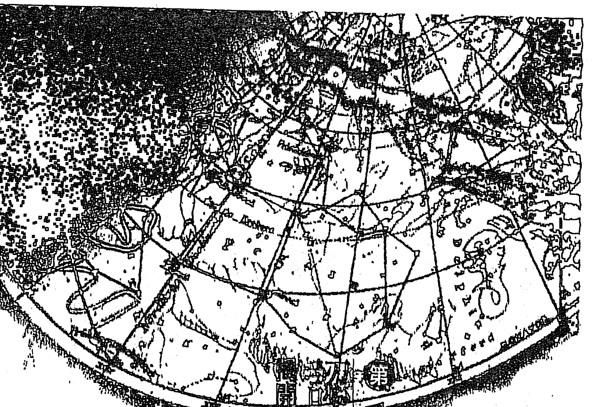

## 璇玑玉衡图

## 壹

## 彗星的神秘面目

## ☆紫微星坐命宫☆

紫微星坐命宫的人，脸形长圆，两眉清秀，眉往上挑，带眉峰。两目有神，英姿焕发，颇有一副「日出东方，唯我不败」的尊容。相貌堂堂，带威严，大方体面，带出门看起来蛮有「份量」的样子，称得上是

紫微坐命宫，喜欢天堂鸟的王者风范

- 星的属性
- 守护神
- 吉祥数字
- 幸运颜色
- 吉祥物
- 喜欢的花

## 1、有帝王之相的紫微星

## 紫微星

「華蓋」。

## 特徵：中年以後容易心寬體胖

其人特徵為天庭高，印堂飽滿，額上髮根與眉毛之間的距離較大，眉尾往上挑。中年之後，「少年白」出現得較早，並且頭髮也漸漸稀少，且有禿頂現象產生，所謂「頭髮稀少」，面子大，髮式屬「地中海」型的，若將頭頂沾上顏料，印在紙上，就是現成的「向日葵」，並且可以常常跟著月亮「沾光」。明顯的法令紋（鼻旁兩側延伸至嘴角兩旁之八字形紋），在年輕時即明顯且長度超過嘴角，所以端午節時可千萬別再用雄黃在額上寫1個「王」字。

在體型方面，脖子粗短，考試時想「補插」鄉座顯然會有點吃力。年輕時無論男女命，都會有一副很好的衣架子，稍加打扮便架勢十足。然而中年之後會漸漸發福，而且是從中國開始胖起，導致穿上直筒褲像座漏斗，穿上喇叭褲則更像沙漏，但此時其財富卻可能和身材成正比。

## 第12章 師職篇

## 男女命：男性虎背熊腰，女性氣質高雅

男命腰背多肉，虎背熊腰，為人忠厚——中年以後身材也跟著「中間比較厚」。個性懶散，老氣橫秋（倚老賣老）：感情脆弱，喜歡人家撒嬌、說好話，只要一味「百媚千嬌散」，就足以使他六神無主，「馬西、馬西」到家，正應驗所謂的百煉鋼化為繞指柔，女性朋友不妨對欣賞的紫微人來試試看這套軟功，蠻有效的。

女命外表端莊，氣質高雅，含著、富幻想，極易被浪漫氣氛的環境所打動，是所謂「酒還沒下肚就先醉，船還沒開就暈了」。因此想要追求她的男士，若不知情的使用「銀彈」攻勢，恐怕只會換來一記「紅燒佛掌」。因為她的外表莊嚴、神聖不可侵犯，內心卻挺喜歡男人奉承她，衣著裝扮入時，但不輕佻，舉止有如貴夫人一般，這又叫做凡人戴光圈——假仙。

性格優點：老成持重，孝順，重感情，具領導才幹

## 紫微星訣（一）

個性忠厚耿直，待人謙恭；老成持重，孝順，重感情。做事乾脆、俐落，慷慨，沉著（老神在在）、機警、反應快，能屈能伸，有領導才幹；喜歡追求時尚，不落伍，可塑性極強，有多方面之興趣。

## 性格缺點

無主見，耳根子軟，易受環境影響而改變初衷。

紫微星疑心病較重、心胸狹窄，喜歡抓權及賣弄權威，領袖欲望較強。虛榮心重（會空亡星時較明顯，尤以女命為甚），處事欠理智，容易沉迷於感情是非，不易自拔（女命更甚），處於逆境時容易氣餒，就像洩了氣的氣球，打敗了的公雞一樣。有投機心態，會摸魚，又愛打腫臉充胖子，借錢給朋友，表示自己很吃得開、罩得住，其實才怪呢！

紫微坐命之人，事業心重，因其主官貴，年輕時較高傲，自命不凡，年紀上了五十歲以後，個性上有返老還童的傾向，所以閒暇之時常會帶著孫子遊玩，或與他們搶玩具、嬉戲，打成一片（紫微單守則否，搞不好他帶可帶狗溜溜就好。

## 中年運佳，可好好發揮

運限走紫微，以廿、壯年時期最好，那時精力、魄力都充足，如一頭蓄勢待發的猛獅，憑著一股大榔頭的信心——「有我就搞定了！」，帶著鋼盔向前衝；若時機恰當，必有一番開創，且有年長的貴人相助，足以使他笑傲江湖。

若童限就走紫微（如紫微坐命宮之人，或第一大限就走紫微者），因為年紀還太小，尚無經濟基礎及社會經驗，而無法有所作為，頂多玩玩騎馬打仗或扮皇帝的遊戲，只會徒使小孩懶惰好玩而不好好的唸書（除非曾化科星可解），因而紫微坐命之人，童年多半是鋒頭很健的「孩子王」，功課反而不怎麼樣。

老運才走紫微也不宜，因此時氣血俱衰如同「蕭蕭白髮戴紅妝」，一般，力不從心，反而會因操勞而導致身體多病痛（須注意腦溢血及血壓病變），以及易犯小人，或因是非而有求於貴人。所以老運過旺，猶如紫微星

## 宜入官祿，不宜入六親宮

老騮作鹹，反而不能夠好好享清福，變成了「老歹命」的局面。

紫微這顆星座不宜入六親宮位（福德、父母、兄弟、夫妻、子女、僕役），入命不錯，至少清臭屁的；入官祿宮恰到好處，因官貴之星入官祿宮適得其所；入兄弟或子女宮，其兄弟或子女數必然不多；入僕役宮，表示朋友不多，但友人皆貴，雖然友人皆貴，但對於命盤當事人本身而言，卻無助益，因對方旺於自己，致使自己掄為扛轎跑腿，逢迎拍馬的勢力眼而徒增辛勞而已。俗語所謂：『抬轎的不吭，乘轎的喊累。』反而吃力不討好，除非自己的命格夠強而能與之抗衡，相輔相成，否則不以吉論。紫微入疾厄宮，因過旺反主病痛，反而浪費了這顆官貴之星；入財帛也不怡當，因為紫微主官貴而不主財，財帛要遇上財星才管用，『張冠李戴』不但使英雄無用武之地，反而還會弄巧成拙，愈幫愈忙。就好像鼻子一定要長在唇上方，而鼻孔一定要朝下一樣。

試想：若將鼻子來個乾坤大挪移，整個反轉過來使鼻孔朝上，則不但聞不到即將入口的食物香味，還要擔心出門是否下雨，而且也絕不會有人吸煙了。好比近視眼寧可看不見，也不願被眼鏡悶死，如果一口煙下去，兩管煙囪朝上，不就像極了老火車頭？若沒練就孫悟空的「火眼金睛」，一時之間，煙燻火烤不搞得涕泗縱橫才怪；更可怕的是爆出眼淚又擤進鼻孔，若再嗆到打噴涕，天哪，那後果可真是不堪想像！所以何種星座入何宮位才適當，必須先考量該星座本身所主宰的是什麼？並且其旺弱如何？旺者顯現其星性之優點，落陷則其星性缺點暴露無遺。另外，某些宮位不宜過旺，而某些宮位一旦落陷則凶，總之，過與不及都不恰當，所謂：『物極必反，樂極生悲』。

## 命格高低，視紫微星坐落

紫微星為眾星之樞紐，掌造化之樞機，意為任何一張命盤，欲論其命格高低，該如何去評分，應以其紫微架構來做標準之謂，也就是以命盤中紫微星所落宮位，以及紫微星的三方四正來做衡量評分的標準，而不是以命宮的三方四正來看。大體而言，不論當事人是否紫微坐命，所有的命盤可粗分為六種架構，即紫微六種組合：

- 1. 子午位紫微單守。
- 2. 丑未位紫破同宮。
- 3. 寅申位紫府同宮。
- 4. 卯酉位紫貪同宮。
- 5. 辰戌位紫相同宮。
- 6. 巳亥位紫殺同宮。

喜會吉星，最好眾星拱照紫微掌星盤之主軸，以天府、天相為輔，以日、月為從，最喜照會六吉星，即文昌、文曲、天魁、天鉞、左輔、右弼，而星屬下拱主之局勢，以同宮的力量最大，拱照次之，其次為夾宮。所以紫微不宜單守或落空亡星及四煞（擎羊、陀羅、火星、鈴星），

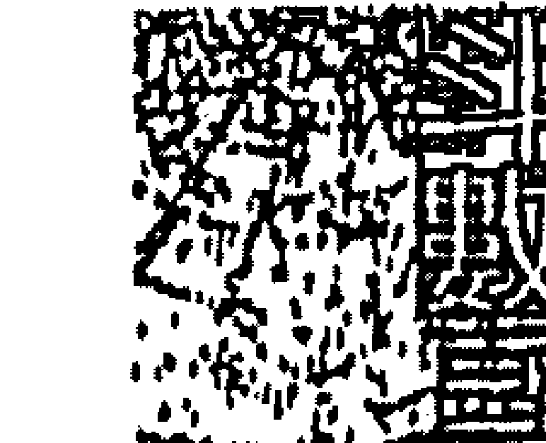

## 第一章 认识篇

因为紫微单守不会左辅、右弼是为孤君，性格表现上较为孤僻，思想较极端。与左辅、右弼同宫，一呼百诺而居上格；左、右夹帝亦为上品；会昌、曲、魁、钺等四星，主贵，适合在文化界或任公职。

## 紫微逢空，恐与仕途无缘

紫微星逢空有反作用，会使其威严尽失而由宰相掌权，真是「老虎不在山林中，连猴子都称王了」，官贵之星被空掉了，当事人只怕与仕途无缘。

紫微星在没有左右二星的辅助之下，不宜加煞，加煞会使其因为没有招架的能力，而造成「奴欺主」的情形，如同恶宦当权，奸臣当道一般，真是「龙困浅滩遭虾戏，虎落平阳被犬欺」，当事人在性格上会呈现奸诈与心术不正的一面。因此，紫微星应特别留意三方照会的星曜互动情形。

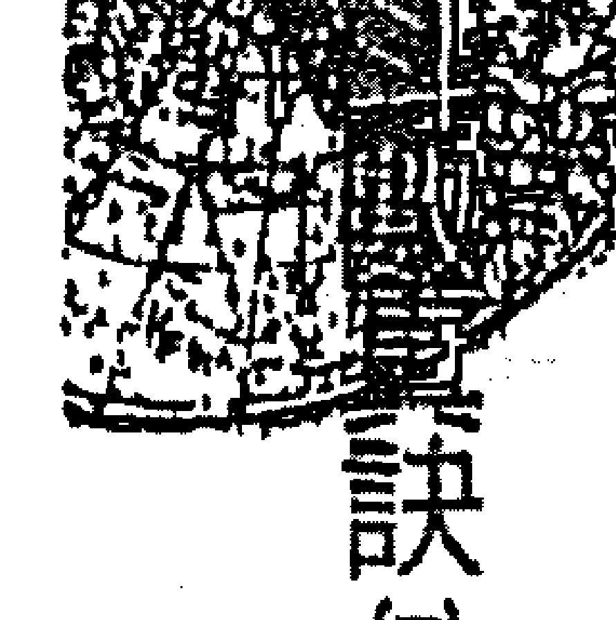

## 11、得理不饒人的天機星

- 星曜特性: 陰木，南斗第三星，善益之宿，兄弟之主。化氣為「善」，在數解順逆；又為動星、智慧星、宗教星、賭博星。
- 守護神: 哪吒三太子
- 吉祥數字: 11
- 幸運顏色: 綠色
- 吉祥物: 珊瑚
- 吉祥花卉: 百合花可突顯高貴的情調

天機坐命的人身材中等，廟旺肥胖，地陷瘦弱。臉型多半為長方形，顴骨突出，眉細長，眉形較柔，接近「一」字眉，眼神銳利，頭額寬闊。中年之後頭髮漸漸稀少，男命禿頭較明顯，髮型為V字型禿，有點像卡通人物「鹹蛋超人」。

## 第14章 面相篇

## 特征：小事计较，大事却迷糊

其人特征是面颊较长，脖子也长，侧看下巴有点像戽斗，尤以星座落在时较明显，看起来极像饭瓢。牙齿虽然不好，但却是一嘴伶牙俐齿，十分聪明善辩，数理能力也很强。平时小事多爱计较，大事却相当迷糊，做事往往得不偿失。兄弟数目较少，很难过二。

## 男女命：男性极重权谋，女性锱铢必较

男命身材标准，性子急，机谋多变，又富幻想。自我评价甚高，自己喜拉关系，却批评别人，重视金钱、地位、名声（但不见得是重视事业），不能接受他人批评，缺乏家庭观念，甚至有点忽略家庭。

女命清秀中带有智慧及古典美，为人精打细算，善理财，处事能力极强，一时多愁善感，好幻想又情绪化：但也喜欢做家事，并有一点洁癖。小地方多计较（这一点女命较男命尤甚），买东西总会在有意无意之间露出爱讨价还价的习性，即使要付出许多时间及精力，也在所不惜。

## 天機星

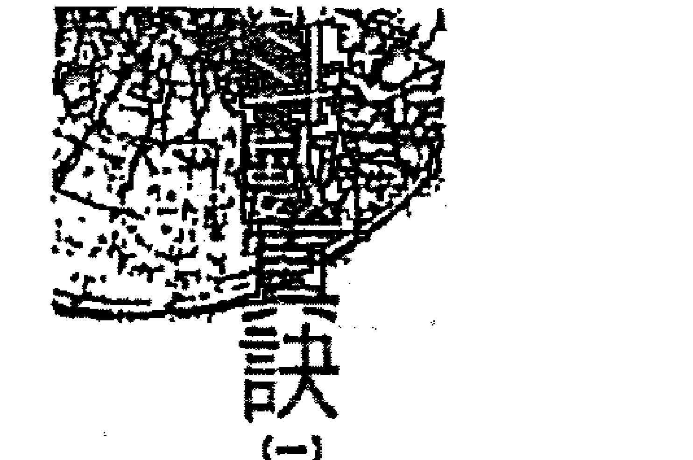

代价往往得不偿失。因为好动闲不住，因此适合职业妇女，从事商务及电脑相关工作的比例较高。性格优点：口才好，嘴上不饶人，但心地其实很善良天机星的人口才好，嘴不饶人，又因其为善宿，所以心地善良，所谓的「刀子嘴，豆腐心」（除非加煞，否则不会算计别人，视自己的成就重要比见到别人的惨败来得痛快）。天机又为宗教星，坐命其宗教信仰虔诚（遇华盖时更明显，甚至于二更半夜去二二拜九叩的朝山）。机智，心思敏捷，观察细微，擅于研究、发明、创新；善于谋略策划，也就是鬼点子多，智慧高（但未必学历高），所以很多事情只要看两遍就会了，如日常生活中，我们会注意到有某些小孩子有拆玩具的情形，每次当玩具一到手，他就会先把玩具观察一番，然后动手将其解体，弄得是惨不忍睹，但其中就有某些个孩子，有能力再将其组合得完好如初，有这等本事的以天机星坐命者居多，因他好奇、好动（包括动脑）又好研究。对于感情方面较为理智；对父母孝顺。做事守原则，精明能幹，为最佳之幕僚人才。

## 性格缺點：性子急，好逞口舌之能，易得罪人

天機星主性急，好說善辯，爭強好勝，可當選為「箭王」，理虧時理虧時，嘴更硬，但心軟，稍加哄騙即可大事化小，小事化無。天機坐命者，善於策劃，卻不善於執行，因為他主意太多，變來變去，讓人無所適從，所以常更換工作或職業，但並非背叛上司，而是因其好動，故不易安定久處。略帶神經質，多愁善感，有點孤僻，遇打擊容易洩氣、發怒，膽小怕事。

天機、天梁除了有高壽之外，同時也具備了「賭林盟主」與「一代箭王」的條件。會祿存必有專業技術：會昌、曲、魁、鉞，主聰明過人；會羊、陀、地劫、地空，則破格，為人則心地狹窄，多計較，性孤僻。

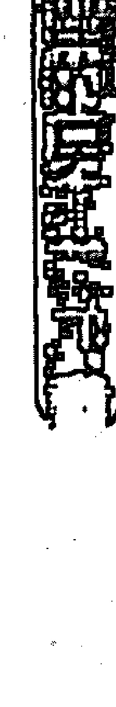

天機坐命者非常聰明好動，於是閒不住，在家裡也待不住。但因其個性略帶孤僻，所以朋友也不多。再則因為它是一顆宗教星，所以入命者多具有虔誠的宗教信仰。同時它也是一顆賭博星，故而坐命者在流年走到此星，較易接近賭博。也有人同時兼具兩者特質，「一面拜佛，一面求明牌：一手拈佛珠，另一手槓上開花。」

天機星為兄弟之主宰，所以入命宮時，因他奪了兄弟之主星，兄弟只好站一邊涼快去，故而他的兄弟必少，而且很難超過三人。除非坐命者在童年時即已過房離祖或庶出，否則若超過三人，則對其兄弟而言，會產生不利的影響。所以此星略帶有刑損兄弟的味道，因此就更不能加煞，否則會造成「早刑晚孤」，也就是早年刑剋，晚年孤獨，所謂「千山我獨行，不必相送」的情形，而且百分之八十先損其兄弟，其次為配偶。

天機星又名「招妹」，也就是坐命者在手足排行的下一個，是妹妹的概率比較大；但如果是弟弟的話，天機坐命者就得在弟弟滿週歲之前先過房，或自己先認義父母（形式手續上），才會使這個弟弟順利成長。

## 時來運轉流年變數多

天機是一顆動星，在數解順逆。其涵義為當你運走天機時是一個轉機點，會有某方面的變動。例如：在走天機之前運不好，則走到此星時運轉好，此時好比是初一；但如在走天機之前運很好，那麼走到此星時運便變得較差，此時好比是十五。所以從初一到十五前後都要加以考慮。畢竟，十年風水輪流轉，人生在世需豁達，月缺之時莫失意，它總會有圓的；天，但月圓之日切莫自滿，因為它還是圓不了多久。人世間種種事物不也如此嗎？人生如滄海之一葉輕舟，只要有目標，就不至於隨波盪漾而迷失了方向，只要掌穩舵，把握住那適時的一陣風，平安靠岸就好。

## 本性舊歷不置當老闆

天機又名善宿，化氣為善（化氣之意為星性的濃縮），所以只要不會煞星，則心地多數善良。天機又為延年益壽之星，但並非指天機坐命者壽元都很長，而是流年走到此星，即使有災病都能僥倖過關的意思，除非會照天梁星，才有延年益壽的作用。

天機亦是智慧星，坐命者腦筋很靈活，數字概念很強，對數理方面的理解力甚高，因此對於電腦、電玩、下棋、解謎、過關之類的頭腦體操都有興趣，是一個擅長謀略及策劃的幕僚人才，但不大適合當老闆；一則因為他沒有發號施令的威嚴，二則因他心地善良，當老闆心不夠狠，所謂「無奸不成商」，從商恐怕比較累。

此外，坐命者對環境或各方面事物會產生喜新厭舊感。這種表現因人而異，例如某些人不喜歡一成不變的工作，或經常換不同口味的餐廳，或出門常換不同款式的皮包、髮型、飾品等等，反正只要不是時常換老闆，也就無傷大雅吧！

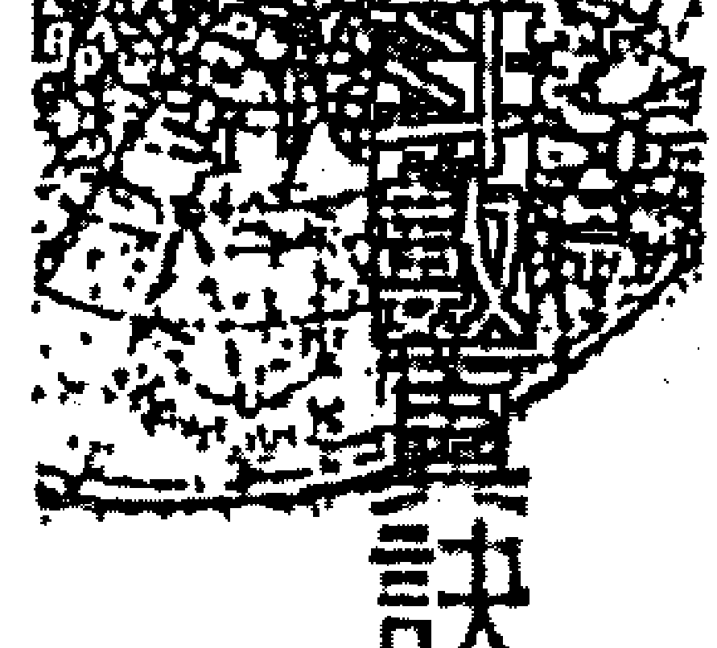

## 11、孝順顧家的太陽星

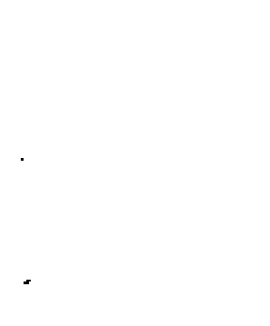

星座特性：太陽星代表父親、自己、兒子，女命太陽星代表父親、丈夫、兒子。

- 守護神：天上聖母
- 吉祥數字：三
- 幸運顏色：紅色
- 吉祥物：琥珀
- 吉祥花卉：火鶴與向日葵最速配

◆ 太陽星坐命宮 ◆
太陽星坐命的人臉型多為橢圓形，旺地時是大餅臉，陷地或夜間生的人則下巴稍尖呈瓜子臉。膚色上男黑女白，身材中等，頭髮和眉毛又粗又濃密，頗有本錢應付中年之後的落髮現象，故頭頂極少出現「甜甜圈）。體格壯碩。粗腰虎背，胖瘦都快，頗像海裡剛釣上來脹得圓滾滾的刺河豚，忽胖忽瘦的。

## 特徵 - 太陽星坐命者有下列五大特徵：

- 1. 毛毛蟲一條：毛髮又粗又濃密，頗具陽剛之氣，但並非大鬍子型的，一般說來髮質都不錯。
- 2. 夜貓子一個：星座落陷時較明顯，對當事人而言，晚上的精神及思考集中力特別好，就算不是這個星座坐命，連大運走到也有晚睡的趨向。
- 3. 眼睛差一些：所謂天重日月，人重兩眼。太陽代表眼睛，落陷時視力較差，逢化忌或加煞，則主眉目有傷或帶眼疾，如青光眼、弱視、散光、白內障……等，而且是男左女右眼。
- 4. 顧家子一名：太陽坐命，無論男女，無論星座旺弱，都非常的孝順，顧家，而且是他本姓氏的家，所以在女命而言屬娘家；星座愈旺，孝順、顧家的表現愈明顯。此星坐命的人，真可稱之為「家的貴人。
- 5. 勞祿命：旺地坐命則非常勞祿，為家為事業鞠躬盡瘁而後已；落陷則較具惰性，所謂雷公打豆腐——專挑軟的下手。

## 男女命：男性崇尚大男人，女性卻像男人婆

男命為莎士比亞的後代——「沙豬」，典型的大男人主義者，三從四德的創立者。在家是「夫」字出了頭，比天還大，幫忙做家事？門都沒有，那是娘們的事兒，男主外，女主內的界限非常清楚。但為人公正，不拘小節，凡事大而化之；忠誠，易衝動。落陷時則有「十項全能」的封號，除了吃、喝、「泡」、賭以外，也沒啥不良嗜好，所以易為酒色誤事。

女命屬清秀耐看型。旺地易長青春痘，異性緣非常好，自尊心與好勝心皆強，具男子氣概，動作、個性開放灑脫，除非會昌、曲、天姚等星，否則有點像男人婆，甚至於叫她穿裙子或撒嬌，都覺得不大搭調。然善於社交，不耐寂寞，可和男人們稱兄道弟，暢所欲言，甚至一起出入任何場所而毫不介意，就像哥兒們一樣，可是一旦談到婚嫁，眾皆逃之夭夭，因此星亦為夫星，女命坐此星為陰陽顛倒，有奪夫權之兆，此為美中不足之處。

性格優點：寬宏大量，顧家，有愛心

為人聰明、度量大，具愛心，喜歡幫助人，但必須是以「家人」為優先考慮。為人憨直、忠厚，個性剛強，直腸子，做事光明磊落，甚至偶爾做件偷雞摸狗的事都會曝光，因為太陽為光，星座旺，光度強，無法藏私，故而「見光死」。喜好運動，活力充沛，不堪寂寞，待人忠誠，有榮譽感，自尊心強。事業心強，關心政治，喜參與政治及黨務工作，所以您常會見到此星坐命之人，於晚間新聞時段，抱著一碗飯坐在電視機前，邊吃邊批評時政，立法法院只要一出狀況，他們也跟著激動，血壓也跟著升高，臉也紅了，脖子也粗了，蠻有趣的。

性格缺點：衝動、怕麻煩，耐性不夠

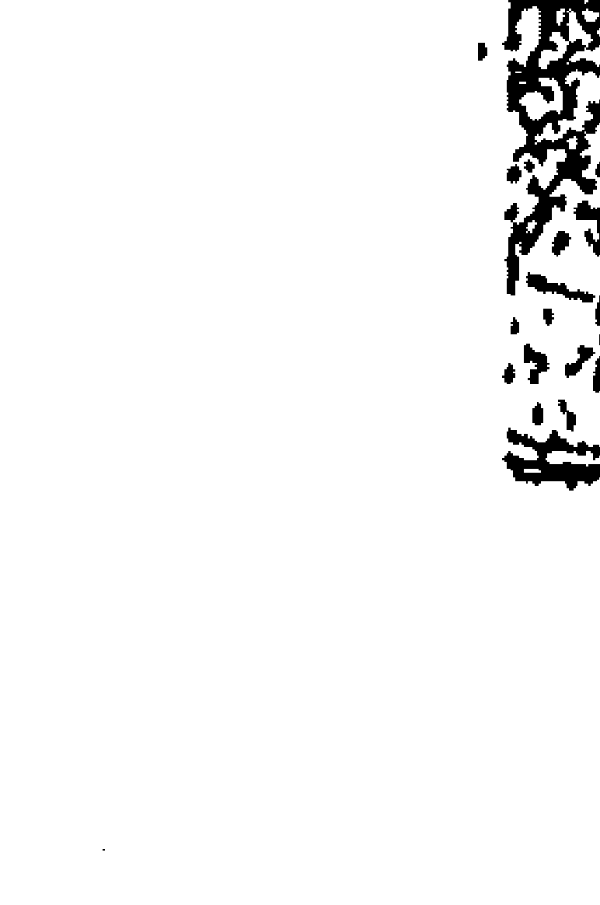

個性衝動，怕囉嗦，耐性不夠。太陽星坐未、申宮偏袒西下，主為人先勤後惰，做事虎頭蛇尾，有始無終；居西宮為西沒，講的比做的多，主貴而不顯，華而不實；戌、亥為失輝，多費心努力，是非亦多。

星座落陷時較缺乏愛心，而且私生活比較精彩。在旺地曰、午、未宮，為人較自私，帶有傲氣，愛恨之心強烈，做事固執易怒；午位為麗日中天，過旺生命反勞碌，且星愈旺，與父、夫、子的緣份愈薄，婚姻就更糟了。

南北斗星座的旺弱，是以其星座本身之五行與所落宮位之地支五行去生剋较量來定旺弱，誰贏了誰在那一宮的份量或位子就比較大；若同宮有兩顆星以上時，就勢必要再來一次「擂台會」，同樣，勝者為王，顯其屬性。

但日、月這兩顆星，並不屬於南、北斗而為中天星座，故其旺弱需看它在落人何宮而定。

## 太阳威力与出生时辰有关

判定的方法为，在命盘上画一斜线，由未宫画到丑宫，将命盘分割为二，以盘内地支当作1天中11个时辰，于是斜线左方自「寅」至「未」为白天，属「日」的管区，太阳落此皆为旺地；反之，太阴落此为陷。同理，斜线之右方从「申」到「丑」为夜晚，属于「月」的管辖，太阳落此皆为失辉。

除前项所列之外，尚要参考命盘当事人的生辰，要符合下列条件，才能说是圆满而不被扣分：

- 1. 生的月令须是春或夏。若是秋、冬生人，须扣分，因秋冬的太阳只是好看而已，没有什么威力可言。
- 2. 须是白天生的人。若是夜晚生的人，虽落入庙旺之地，也须扣分，因太阳到了晚上根本看不到，坐命此星还真是「生不逢时」。

## 女命坐太阳，夫妻聚少离多

## 第一章 总论篇

太阳星代表父、夫（女命）。男命坐此星，属自己的星没什么不对，但仍旧是与父亲比较有代沟或聚少离多。但他仍然是孝顺，只不过表示方式无法令对方接受而已。

女命坐太阳，对父母或长上相当孝顺，但与父亲就是有代沟，观念上始终不对盘。其夫妻宫也甭看了，因为她夺了夫星，老公只好一边站，并非她霸道凶悍，而是相互的磁场问题。此星坐命之女子，做人家的“二房”或“黑市夫人”，甚至独身一世，不但不足为奇，反而还算是幸运的；一旦披上白纱正式入门后，不是聚少离多，就是投入了“长期抗战”，也就是闽南语所谓“举尪”。当初登上的爱之船，变成了贼船，登上了之后不但没有晕船，反而翻船，到最后不是生离就是死别，当然视度上依各个命盘情形而轻重有别。另外，太阳女命头胎必生男（除非自己先流产过）。

### 太阳会禄存，强化星性优点

太阳最喜会禄存及三台、八座，同宫或对照都可增辉，主声名，同时加了禄存，除了加强星性使其更为孝顺、顾家外，尚可解其刑克。

太阳不宜逢空，主劳而无功；但将此星空掉了，也可解其刑克。日、月落陷加科、禄、权反凶，不实际，徒拥虚财虚名罢了，于是开宾士车天天赶二点半，外表西装革挺，内衬还补个“大乌龟”的情形就见怪不怪了。

太阳星入财宫不恰当，因它不是财星，旺地主来财辛劳，因太阳底下无轻松之财；陷地则主不能见光之投机财。入疾厄除了眼疾之外，也主少年白，以及血压病变，而且旺地属高血压，落陷主血压低。

### 命主劳碌，照会比坐命宫佳

太阳星像一盏灯，它是喜“照”不喜“坐”。对照主贵，例如：它只是在对宫或会到它，这就好比是别人来照亮或照顾自己，当事人真可说是“光子跟着月亮走——沾光了”，在人生旅途上可说是前途光明，一帆风顺。但若拿来坐命，除了与父、夫、子缘薄之外，又主劳碌，特别是旺地，因为它是官禄主，事业心强，又孝顺顾家，可说是拼事业为家庭而燃烧自己，照亮别人。入官禄则适得其所，旺地劳碌；陷地反而轻松，较属晚上上班的或走私业、X光业及暗房业。

太阳旺地加天刑，掌生杀大权，有实权，宜武职或政治界；若从医就有可能是外科动刀的。太阳旺地二合遇天魁、天钺，主声名，宜向公职发展。

太阳守身不利当家，宜服公职，女命尤其明显，她或许不是一个称职的家庭主妇，但她绝对是一位事业上的好帮手。如果您不想娶个花瓶，那么太阳坐命的女人是可以考虑的，就像牛皮纸一样，虽不是艳光四射，但绝对用途广泛，耐用又好处多多。太阳逢四煞，主破格（午、巳宫例外），刑克父、夫、子；如正坐太阳逢煞于六亲位，主不利六亲，眼目亦不利。

## 第四章 认识紫微

## 武曲星

阴金，乃北斗第六星，为财帛之主，又名将星，在数司财，为至刚至毅之宿。

-   星曜特性
-   守护神
-   幸运数字
-   幸运颜色
-   吉祥物
-   吉祥花卉

### 武曲星坐命宫

武曲星坐命宫的人方圆形脸，颧骨突出（发福时较不明显），额头宽阔，眉毛浓又黑而且有棱有角，毛发既粗且硬，烫发时搞不好连头皮都熟透了，而头发还没动静，这可累坏了美发师；面带威严。女命则为粗线条型的，很难在她身上找到一丝温柔的女人味。

### 特征：

1.  武曲坐命的人身材中矮，体型壮硕，声音洪亮，是一个标准的大声公，上台演讲连麦克风都可以免了，但化忌时声音转为沙哑。
2.  肩膀宽，三角腰，体态呈倒三角形，有如健美先生一般，但女性并不丰满，骂起人来可真是河东狮吼，非比寻常，所谓“个子不大，声音可不小”。重义气，为朋友可以两肋插刀，在所不辞。
3.  男命为“钱鼠”，女命为“钱嫂”，哪儿有钱就往哪儿钻，一起打拼为“钱途”。虽然重财，但与朋友却有通财之义。
4.  不懂情调，不解风情，是个道地的情场“老实人”。适度的奉承与打情骂俏在他而言很无聊，认为送花、送礼，还不如折现比较实际，因此追求武曲坐命者用“银弹攻势”就对了。与紫微星在这方面而言，是两个极端不同的典型，因此不利感情生活。

男女命：男性面恶心善，女性耐操肯苦干

男命：心直无毒，霸气重，面恶心善，权力欲望强，野心大，企图心旺盛，犹如披着金甲的战将一般，志气大，斗志强，热心，做事明快，绝不拖泥带水。

女命：精明能干，历，一生劳碌，略带孤独。外型粗枝大叶的，动作粗犷，甚至，子与高跟鞋都会觉得不自在；不会撒娇，缺乏情趣，感情生活单纯。此星别名“寡宿星”，又名“代夫行权”，有女强人的味道，专心赚钱，忽略了精神生活，个性强悍，巾帼不让须眉，因而女命不宜。

优点：度量大，个性刚毅，讲信用，豪爽重义气，与太阴坐命者相反的是，做事迅速干脆“阿莎力”，喜欢户外生活，热情好客，勤快耐劳有冲劲，是商场上的生意高手。

缺点：个性急躁，容易冲动欠冷静

个性刚猛、急躁、易冲动，为赚钱一生劳心劳力。对异性总缺少“卿须怜我，我怜卿”的浪漫情怀，做事虽有魄力，但缺乏考虑，动辄易怒、易紧张，神经过敏容易过敏，老年时易患神经衰弱。若用激将法足以使他“起乩”，不过却很有效。古时有“师说”，现代人有“妻说”，其婚姻观为：“古之人者必有妻，妻者所以传宗接代解欲也，人非生而白痴者，孰能无欲？欲而不要妻，其为欲也终不解矣！”故武曲坐命不利婚姻，除非对方也是武曲坐命，观念上有志一同，以免相敬如“冰”，爱情路上多坎坷。

### 【武曲星的个性与特质】

武曲星，五行属金，为财帛之主。大凡在斗数的理论中，五行属金的较偏向主财，而五行属水的主桃花之情。当然这还需要参考它本身的星性，以及整个星盘的布局方可论断。而武曲之财属于流通性较广的现金财，但需要落入与财有关的几个宫位（财帛、田宅、福德），才算是真正的财星。

### 真诀（一）

武曲坐命者必然是事事“向钱看”，富足就是“金哥哥”（金戈戈），没钱就是“贝哥哥”（贝戈戈），能吃苦耐劳，只要有钱赚就好说，故而此星坐命之人，可说是个不折不扣的“淘金者”，但是能否守成？尚要考虑其他因素才能决定。

### 个性过刚，缺少罗曼蒂克

另外五行属金的星座，个性较刚硬，因此不利女命；而五行属水的星座，性情就柔顺多了，所谓柔情似水。武曲又为将星，试想一位沙场战将，终年在外东征西讨，其感情生活又有多少色彩可言？武曲星坐命者除了个性刚强之外，又是个直肠子，不会哄爱人，脑子有某些地方少根筋。这种人在商场上擅长脑筋急转弯，非常灵活，但在情场之中，头壳可就有点“爬带、爬带”了，既不会营造气氛，又不懂得博取对方欢心，这不知会气死多少含情脉脉、口是心非，“爱呷又假小心”的可人儿了：和他谈“爱情”，不如和他谈“股市行情”，他不会

## 第一章 认识篇

而是“情痴”——情场白痴，对他撒娇犹如“对牛弹琴”，如此作风，可说是一项相当不利婚姻的重要因素。

### 极重义气，是朋友的贵人

武曲坐命者，虽然爱钱，但对朋友却有通财之义。因他重义气，对朋友非常好，朋友要求帮忙，常常拍胸脯保证，答应的非常干脆；但亲人可未必能有同等待遇，所以与其当他的家人，还不如当他的朋友要来得吃香。俗谓：“别人卡好自己！”以这一点来说，刚好和日、月坐命者相反，他并非“家的贵人”，而是“朋友的贵人”。此星对于记忆性的工作有专长，学习能力极强，很多事情只要看一遍就会了；与昌、曲同宫主文武皆能。

武曲星以辰、戌、丑、未四库之地为庙乐，亦喜生年支为辰、戌、丑、未之人，因为辰、戌、丑、未五行属土，而土能生武曲之金的缘故。又此星为寡宿星，于是更不利加煞，会加重了星性的刚毅与孤克。

入命宫或入夫妻宫都不好，若再会合擎羊、陀罗，主中年后男孤女寡；身宫同论，只不过是发生的时间往往后延而已。此星若有较柔一点的星，如昌、曲、贪狼等星同宫中和一下，情形就好多了。

### 身逢廉贞，当心事倍功半

武曲最喜化权、化禄，化禄主财，化权主双，如双住所、双财源。但若此星入命宫而身宫逢廉贞，乃财与囚仇，因财星武曲之阴金被囚星廉贞之阴火克伤，当事人会有“我比别人卡认真，我比别人卡打拼，为何”的感叹！其耕耘往往与其收穫不成比例，旺地尚可，陷地一生贪财。若身宫逢破军，旺地仍有富贵；陷地须弃祖离乡，为巧艺立身之人，终身劳碌，婚姻路上落单。

武曲虽为财星，但亦为几种不利的破财组合，例如：

1.  武破：主财逢破。
2.  武杀：财逢杀，主暴起暴落。
3.  武火：属火烧钞票（并非）定遭火灾之意，且在酉宫与七杀同宫，有因财被劫之凶。

运走到以上组合而财宫又不好时则会应验。入子女宫则主为子女破财，入田宅宫主因置产出错而破财；入官禄宫则主投资不当而破财；其余大同小异。另外也有好的组合，例如：武贪、武相、武府，运走到此，若财宫也不错时便可进财。于是要把握良机，进退得当，辛劳还是有代价的。

## 五、与世无争的天同星

-   星曜特性：阳水，南斗第四星，可延寿，为福德之主，化气为福，天同福星为益善保生之宿，亦为懒散之星。
-   守护神：济公活佛
-   吉祥数字：七
-   幸运颜色：水青
-   吉祥物：黄金石
-   吉祥花：最喜欢玫瑰的浪漫

天同星坐命宫。
天同坐命的人脸型圆中带方，天庭宽广，地阁圆满，也就是下巴圆润，部份双下巴；体型肥胖，落陷矮小。双目有神，眉清目秀，眉形很柔，不带眉峰；毛发细少柔软；唇红齿白而且齿形小巧，排列整齐，像玉米一样。外表斯文，亲和力强，一脸福相，就像一尊笑瞇瞇的

弥勒佛一样，一副与世无争、神色自若的样子。

### 特征：

1.  天同星坐命的人个性懒散而不积极，好逸恶劳，安于现状，欠缺开创的精神与魄力，和武曲星是截然不同的两个典型。他不愿为了名利、地位上做牛做马，终日奔波不息；情愿与世无争，做个闲云野鹤，颇有“不为五斗米折腰”的志气。
2.  酒量好，乃天生的酒国英雄，虽不见得个个嗜酒，但都具备了功夫底子；此星坐命者，都是喝酒的“好胆”，可说是“黄汤双镖客”。
3.  感情困扰多。因为重感情，浪漫富幻想，感情丰富不善拒绝人，个性犹豫不决，举棋不定，常会藕断丝连，虽然痴情，但情感却没一个专属性，容易动摇，故而难逃两条船的情形见怪不怪。

男女命：男性是好好先生，女性孩子气重

男命个性温和慈善，处事稳重，考虑周详；为人谦逊，待人诚恳，

## 天同星

一副好好先生的模样。慷慨喜济人之困，见不得别人可怜，常常大发慈悲。喜欢交朋友，外表文静、重感情，易为感情所困扰。中年后头发渐稀少，甚至出现一块半（一块伍“无”毛）的发型。

女命聪明伶俐，柔情似水；善良温顺，很会看眼色，故而善解人意。异性缘重，但是蛮稚气，富幻想，且孩子气很重；崇拜偶像，容易被浪漫的色彩或罗曼蒂克的气氛所迷惑而迷失了自己。体贴，具有母性爱，尤其对于比自己年轻的人更容易表现出来。爱吃零食，身材很好，属丰润型的，但该胖的地方胖，该瘦的地方瘦，极具女人味；生产后臀部变大，不易恢复。

### 优点：淡泊名利，喜助人。

本性聪明，喜好文学（寅申巳亥子午），文笔甚佳，对艺术有天份，属才艺型的。具菩萨心肠，好济人之困（尤其是男命），爱享受，淡泊名利，喜助人，不记恨。

### 缺点：易贪恋酒色，没有主见

性情懒散，得过且过，果断力欠佳，没有主见，且依赖心极重，情绪易受环境影响。好面子，交友广，但不善择友而交。异性缘佳，感情上容易把持不住，甚至贪恋酒色。

天同是一颗福星，坐命者较重享受，而且有坐享其成的心态，最好什么事都交给人家做，而自己捡现成就好，而且不想去多学什么谋生之技能，因为不会都用做，学会了就得做，那多累！对于较需要努力的事，懒得去反正我不做，自然会有人来做，地球不会因为没有我们而不旋转。此点恰与太阳在旺地坐命者相反，后者的想法为：“这件事我不做，谁会来做？况且交给人家做能做得好吗？”于是劳碌与清闲就在这一线之间，否则天同又怎能称为福星呢？

### 衣食无忧，天生有福气

当然天同星坐命者，他就有这种福份可以坐享其成，而且童年就走天同大限，打从出娘胎开始就衣食无忧，非常的好命。幼时有着一张圆圆的脸，甜甜的嘴，长得一副可爱又讨人喜欢的小模样，爹爹疼姥姥爱的，天大的事都有人家撑着，因而养成其依赖性及惰性。及其年长也没啥改变，于是他必然会有一对为他劳心努力的父母或妻子、儿女，就好像周遭的环境都已预先为他准备好了，让他来享福的一样。

如一首闽南语歌曲：“我比别人卡‘贫段（懒惰）’，我比别人卡‘懒烂’，为什么？为什么？比别人卡好命？”某些情形更严重的，可自其日常生活中察而可知：如凌乱的卧室、油腻的厨房，换洗衣物如“金蝉脱壳”般的丢在原处，或久久才作一次清洗，反之“犬洗一次嘛未生虫”，“犬洗二次嘛未卡香，三天洗一次嘛未生虫”。

### 生性懒散，不宜打先锋

天同为福德之主，坐落福德宫才是最恰当的位置，表示得福荫，福份高。因福德宫主人一生的精神享受，亦是来财之源。福星入福德，此人

## 紫微斗数心诀(一)

必然福厚，而且来财轻松，这甚至比坐命要好得多。因他亦是懒散之星，坐命宫反而不利事业，缺乏独立及开创的精神，最多不过守成而已；坐官禄宫亦同论。所以当事人在事业上不可能站在第一线上做开路先锋；但是对于门市生意方面倒蛮合适的，因为看店需要耐心，而且坐在柜台后面等收钱，挺符合这颗守成之星。另外天同与紫微相反部份为——天同不宜壮年逢之，因为不能积极开创，而失去了大好机会；幼年或老年逢之则吉，以其得父母荫福及老年之安享，好啊！

### 二心二意，感情困扰多

天同坐命较易有感情方面的困扰，因为他浪漫、孩子气重，在感情上不够成熟、理智，虽然善解人意、温柔体贴，然而在遭遇这方面困扰时，虽能与你共忧，却无力替你承担；而且当他面临到抉择问题时，往往三心二意，优柔寡断，不知如何是好？对于爱情他敢爱却不敢恨，提得起却放不下，爱不到就死给你看，此星坐命者之殉情率乃高居排行榜第一名。唉！问世间情是何物，直教人生死相许。或许罗密欧与茱丽叶

也是此星坐命的吧？因此，坐命者若选择一位较为年长的配偶，来把自己当孩子一般的宠爱是再好不过了。天同坐命者除了爱吃零食之外，尤其喜好甜食；同时天同五行属水，于病主肾脏及泌尿系统方面的毛病，故于中年之后，不宜多吃甜食，以免患糖尿病。

### 加会昌曲，小心变风包

天同福星坐命逢煞冲破，则主孤单、破相。与羊、陀同宫，多有眇目斜视之象；逢火、铃，脸上有斑痕或胎记；一旦福星逢煞或空亡星冲破，属福份受损，坐命者就未必能清闲，反之，凡事耍死，享福只是他的心态上，但未必就能顺利享得到。天同会昌、曲，必有艺术方面的造诣；但女命不宜再会、曲，感情方面必会复杂，往往动作上、都会流露出一股风骚的味道，于是骚首弄姿的四处招蜂引蝶，甚至坠落风尘都有可能。

天同会吉，主其寿元较长。因天同与天机、天梁同为南斗的三颗寿

## 第四章 认识篇

星，运走天同，只要不是逢空或众凶星会集，以及福德宫太凶，大体而言都不致有何大碍；因为他也是一颗益寿保生之宿，逢此星时运势较平稳，安于现状，缺乏开创，属于修养生息的状态，自然而然其意外发生率也随之降低。

## 六、标新立异的廉贞星

阴火，乃北斗第五星，司品秩与权令，化气为囚。廉贞又名囚宿，守于命身又为次桃花（逢化禄、化忌或桃花星，其桃花本质才会显现，才能以桃花论之）。

星座特性：阴火，乃北斗第五星，司品秩与权令，化气为囚。廉贞又名囚宿，守于命身又为次桃花（逢化禄、化忌或桃花星，其桃花本质才会显现，才能以桃花论之）。

守护神：释迦佛祖

吉神数字：四

幸运颜色：深红色

吉祥物：蓝宝石

吉祥花卉：欣赏紫罗兰的脱俗亮丽

### 廉贞星坐命宫

甲字型脸，颧骨高，下巳稍短，两眉之间的眉距较宽，嘴巴也宽，唇稍厚，眼大，眼形圆，颧骨高，眉骨亦高，眼骨外露，以致眼睛看起来较深陷，有点像西方人的眼睛。脸上轮廓分明，五官具立体感，带有一

丝野性气质，如一只静如处子，动如脱兔般难以驾驭的波斯猫；逢煞或陷地则脸部会出现“月球表面”或“芝麻烧饼”（雀斑）的现象。

### 特征：

廉贞星别名“囚星”，坐命者之第六感特别灵敏而且准确，此点是其与生俱来的本事，是科学上所无法解释的现象，而使得坐命者对于即将发生的事情，能够有预知的能力。另，廉贞星坐命者童年至少必有一次的惊险万外，或特别容易发高烧或容易受惊吓。此星又为蛮夷之使，因为他交际手腕灵活，亲和力强，堪称公关一流。

男女命：男性不拘小节，女性醋劲奇大

男命精明好奇，不拘小节，个性喜自由，不受拘束，即使军令如山，他照常明修栈道，暗渡陈仓，来个阳奉阴违；反应快，做事迅速、乾脆：好面子，爱恨之心较重，醋罈子特别大桶。女命坦率、直爽、任性，不善变通；生活上克勤克俭。贞节自守，异

### 优点：聪明过人，敢做敢当

为人心直口快，能言善辩，乐观幽默，不拘小节。喜标新立异、创新，聪明过人，有数字观念，记忆力强，出门不必携带电话簿；讲话时志气高昂，带手势，具领袖欲，此点倒是蛮像希特勒。能掌权柄，有抱负、有冲劲，不须鞭策，对于事情的轻重缓急能够拿捏得宜，而且进退得当，敢做敢当，有时还会装迷糊，其实心中清楚得很。

### 缺点：心胸狭窄，狂妄，对人多猜忌

好面子，对自己克勤克俭，对朋友倒是会打肿脸充胖子。脾气暴躁，逢煞则性狠、狂妄，多猜忌；喜新厌旧，易流于邪恶之事。喜赌又好酒色，立志奉行青年守则“第十二条：烟酒为强身之本”、“第十四条：

## 第一章 认识廉贞

### 诀（一）

赌博为致富之本”的信念，对于男女之间“情”字这件事，心胸狭窄，极无度量。

廉贞坐命者，无论男女命，幼年必经过一些险象环生的事情，但是其刚性很强，是没有那么容易“买单”（翘辫子）的。从小可以说是挺“难搞”的，蛮难带，于是当他们的父母可就累坏了。

> 廉贞坐命者，幼年必经过险象环生，刚性强、难搞难带，令父母累坏

### 星性诡谲，令人捉摸不定

廉贞坐命之人精明能干，其智慧型态与天机有别；天机是一种直接对挑战某些难题或事物的破解型智慧，而廉贞则属于诡谲型智慧，一种令人捉摸不定而又出乎意料之外的诡谲。这种智慧若是用在不正常的地方，是相当可怕的；若用来算计人，则被算计者连怎么死的都不晓得，甚而被出卖了，还帮他数钱呢！

廉贞坐命者也是一个古灵精怪的鬼灵精，思想前卫派，但生活步调上廉貞在數司品秩與權令，乃服務大眾、維持秩序之星座；能掌權柄，深具幽默感，而且語不驚人死不休，特別會作怪，花樣也多，因而在任何一個公開場所中，有他在就不會冷場，又能撐得起場面。花招特多，有他在不冷場。不大能跟得上其思想，如衣著打扮上仍舊保持較傳統的作風，欣賞新潮，但自己卻不會那麼做。喜歡標新立異與創新，因而不喜歡做仿冒的事，能夠掌握時代的脈動而不會落人於後。他對事情的看法有其獨到之處，處理事情能夠單刀直入，從重點著手；加上人緣好，樂觀幽默，長袖善舞，公關手腕一流，精於臨場應變，故而有「蠻夷之使」的美稱，最適宜擔任事業的開路先鋒，使其能充分發揮所長。似廉貞坐命者，性喜自由，不喜受約束，在工作上只要明白一聲令下，不須督促叮嚀，他自會如期完成，因而適合跑業務、打外交或開拓市場，以及做公門生意；但如果對此人才運用失當，也會造成得不償失的後果。例如令其擔任財務或內勤工作，不單是大材小用，而且其混水摸魚的功夫就會發揮在帳上，令人難以察覺，甚至在即將東窗事發之前，他還會機警地及早補救，使人防不勝防。而且不論當初所學為何，日後都有機會和電子業結緣。

因為廉貞星為八鬼星，對即將發生的事有第六感，就好比在仙界佔有一席之地，連鬼神都奈何不了他，符咒對他亦發揮不了作用，甚至有他在場，鬼鬼都起不了亂；但坐命者卻是嘴硬偏不信邪。

## 最好面子，有錢絕不認賬

廉貞坐命者同時又是一個「摸魚大王」：善走捷徑，喜鑽法律漏洞，遊走在法律邊緣，做事方法會採用「一兼二顧，摸蛤仔（河蜆）兼洗褲」的方式進行。

廉貞坐命者也是很好面子，死不認錯，當他做錯事時，也拉不下臉來道歉，最多默認而已，此時若再加以嚴厲苛責，只會造成他的反感，而伺機連本帶利的還你；得罪此人足以教人「吃不了兜著走」。因此若看到廉貞坐命者與人有爭執時，最好別去勸架，因為愈勸愈糟，非得要等

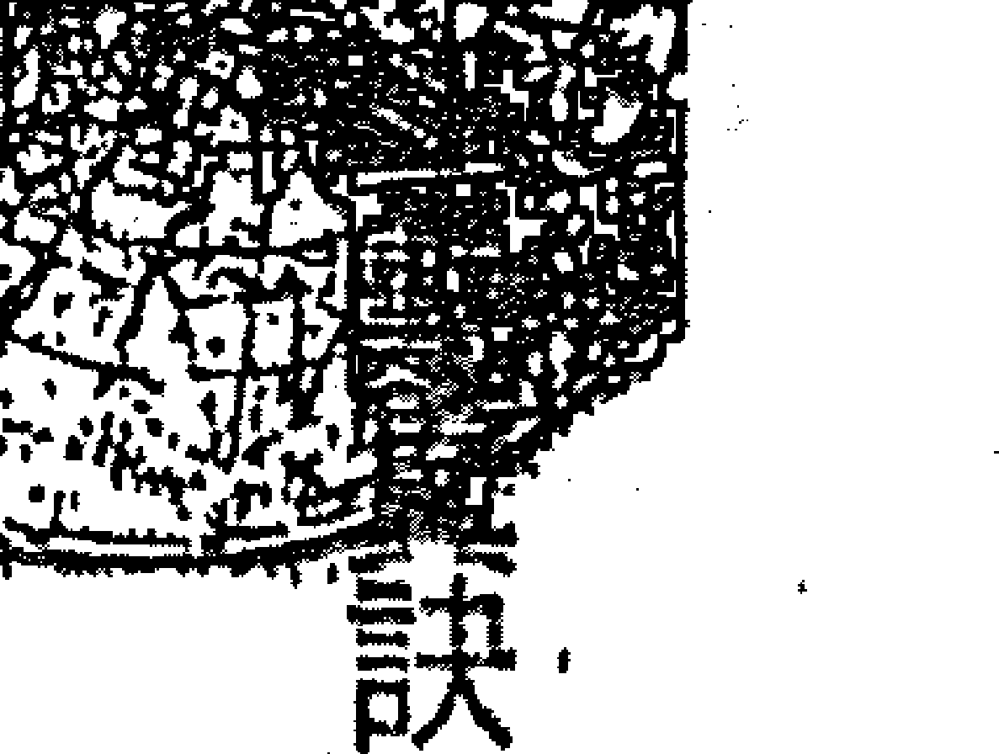

## 廉貞星

廉貞星是一顆次桃花星（僅次於貪狼星），但在沒有化祿、化忌或加其它桃花星時，其貞節觀很重，只能說它是一顆交際桃花；論其醋勁之大，有如陳年老醋一般，並且是「只許州官放火，不許百姓點燈」型的，與太陽或武曲的大而化之恰好相反。若廉貞坐命者與一位太陽或武曲坐命者結婚，那麼就真的能「放火」了。

## 勸儉致富，命中不帶偏財

此宿並非財星，因而坐命者命中不帶橫財，他不會成爲暴發戶，其生性節儉，屬於勤儉積富之人。雖然他有第六感能預知彩票之「明牌」，但自己若去簽的話，偏偏就會「槓龜」；上牌桌的話，是標準的「滷肉腳」（唉！一聲，卻又輸一百）。此星若再加上祿存，則更能顯現其勤儉的星性，而坐命者這時就是一根標準的「美國牙刷」（一毛不拔），當然富足自然不在話下。

廉貞唯有天相同度或分守命身能制其惡；逢帝座（紫微）或左、右，可掌權柄。廉貞是一顆囚星，若與羊、陀同度，則易有是非、官訟；與白虎同宮，則牢獄官司難免，運行限逢之都須提防。廉貞逢破軍加火、鈴，為人陰險、狠毒而且翻臉像翻書；若在陷地逢火星，則主自尋短見。與貪狼於巳位同宮，為人好說無主見，而且光說不練，說了就算了」；於亥位同宮，為絕處逢生之格，加吉勤儉致富，命中不帶偏財可顯貴，逢煞、忌，主橫死或傷殘。廉貞逢昌、曲，為破格，桃花顯現，不破身也破財，須以其命盤整體佈局考量而定。

## 七、作風海派霸道的天府星

陽土，南斗第一星，主延壽、解厄、掌權之宿，又名號令星。天府是南斗主星，為財帛之主宰，又為祿庫，別號天廚星，乃富貴之基。在數主掌田宅及衣祿，為帝座之輔佐，能制羊、陀為從，化火、鈴為福，逢空亡則主孤單。

-   守護神：觀世音菩薩
-   吉祥數字：八
-   幸運顏色：灰色
-   吉祥物：鑽石
-   吉祥花卉：欣賞野薑花的自然色香

### 天府星坐命宮

天府星坐命的人臉型方長，天庭飽滿，地閣方圓，兩顎豐潤，有法令紋，但長度不超過嘴角。唇厚、眉抬、眼亮，而且目光炯炯有神，器宇軒昂，表相威嚴，常予人忠厚穩重之印象。腰背渾圓，中年身材向「中廣」看齊，外表看起來就給人很有「油水」的感覺。

## 特徵

-   個性急躁，好打腫臉充胖子
-   騙人急驚風：因其對宮必為七殺，而遷移宮又為一個人真正隱藏於心的個性，所以天府星坐命者，脾氣非常急躁，而且動作快，連講話都像「連珠砲」一樣，平常人需要十分鐘說得完的話，他大約只要三分鐘就解決了，言談之中好像不用換氣似的。
-   愛當總司令：由於他是一顆號令之星，所以坐命者喜歡掌權及發號施令，而且只許他命令別人，如果別人對他以命令式的口吻說話，他心裡會很不爽。
-   拚死要面子：為人自視頗高，喜別人尊重他、抬舉他；作風海派，但只限於請客，向他拿錢則免談，屬打腫臉充胖子型的。

男女命：男性聰明機智，女性旺夫益子

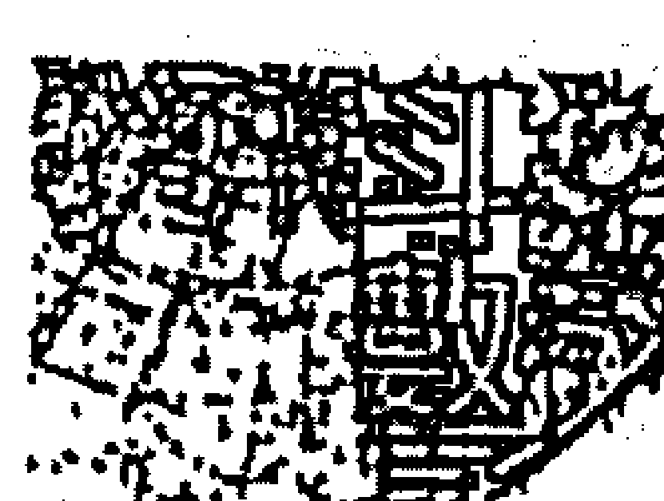

## 天府星

男命處事穩重，有領導才幹，聰明帶機智，尤其在商場上更明顯。有上進心，興趣廣泛，而且多學多能，學什麼就像什麼；反應快，能舉一反三；腦筋靈活，想得快、說得快、做得快，相當勢利眼。

女命清秀、氣質高雅，中年之後儼然有貴婦人的氣度。精明能幹，喜歡掌權，氣勢凌人；在家中有如老佛爺一般的威風八面。對於感情方面可是很能夠認清現實，不會一天到晚被困在羅曼蒂克的幻夢中無法自拔，講求實際與理智。旺夫益子，凡事自己動手，對烹飪很拿手，並且講究體面，衣著打扮品味蠻高的。不論男命或女命都有危機意識，都會藏私房錢。

-   優點：處事穩重老道，擅長理財，富企劃能力，為理財高手，穩紮穩打，不做沒把握的投資，並且不做回收很慢的生意。志節高，重操守，處事穩重老道且能把握重點。心地善良，擇友而交，對朋友講義氣，甚具愛心。很有口福，什麼都能吃，管他天上飛的、地上爬的，雖然未必懂得烹飪，也未必會洗手作羹湯，但天府星可絕對是標榜「民以食為先」主義者。

缺點：喜爭權奪利，驕傲自負，逞意氣之爭

自卑、驕傲，自視甚高，蠻臭屁的，死要面子，尤其是在大眾面前，表現過於大方與海派。喜爭權奪利，市僧型的。主觀意識強，不易受人左右：恃才傲物，唯我獨尊。城府深，易鬧彆扭，逞意氣之爭，所以常常「見笑轉生氣」而小題大作。

## 天府星的性質

天府星是南斗的主星，就像陣前的主帥一樣，沙場之上擁有一人之下，萬人之上的權柄，掌令旗發號施令，因而坐命者在個性表現上較為高傲霸氣，作風獨斷，威風凜凜。在運籌帷幄之中，能當機立斷，聰明機警，動作迅速，決勝千里之外。天府本身不會化權，因他已是「權」的象徵了，如果再和其他有化權的星同宮，會使得坐命者表現過於蠻橫霸道，不可理喻。

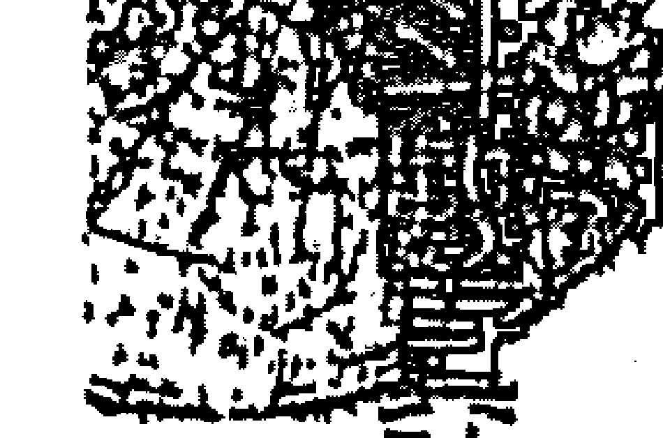

## 天府星

## 天生就是老闆的狂子

天府星是天生的老闆格，具有號令部屬的威嚴；個性十萬火急（最怕遇到慢郎中），處理事情就像是火燒屁股一樣的急迫，手腳快，動作乾淨俐落，絕不拖延；爭取時效就連說話都急，就好像敵軍即將來犯，需儘速行動一樣，快得像機關槍一樣掃射不停，教身旁的人個個忙得人仰馬翻，聽得目瞪口呆的；而且只許他說人家，不許人家說他，指使或頂撞他。

若要指正他，最好要先附和他，再婉轉提意見（因為他的致命傷為性急、愛面子、心善），衆人之前只要先給足「面子」，其他的私下都好說：尤其是在家中，儼然一副「山寨王」的發號施令，大小通吃。而且是自幼即如此指使他的兄弟姊妹，很會「父親難當令箭」，在命令之前加一句：「爸爸說的、媽媽說的，或老師說的。」

抱著財庫出生的財神

## 第14章 認識篇

天府為祿庫，在數掌財宅及衣祿，坐命者善理財、愛管錢，掌經濟大權，對錢財方面是標準鐵公雞型，要拿他的錢須先將他的軍。武曲是財星，而天府是財庫，為聚財之所，故而更顯其重要性。二者逢煞破財的情形有別，財星逢破不過是損失手頭上的流動財，而不致動搖其根基；但祿庫逢破，可就是大筆的財產，足以傾家蕩產，撼動個人的江山，因此不能等閒視之。天府坐命者彷彿是抱著財庫出生的，除非逢破，否則財官不需看了，即使財官不好也無妨，只是小有挫折而已。
然而他不像武曲坐命者，與朋友有通財之義，所以較能守得住錢財；女命更是能量入為出，開源節流，將家庭開支打理得有條不紊，使丈夫在外無後顧之憂。

天府又為富貴之基，在命盤中視其所落宮位來做為富貴評分的標準。

-   總體而言，一張命盤能用來作為評分依據的星座有四：
-   紫微：評其命格高低程度（論貴氣）。
-   天府：評其富貴如何（財富）。
-   巨門：評其個性磊落與前景光明與否（顯示親情緣份）。
-   昌曲：計其氣質涵養（才藝指標）

## 重視吃穿 小心過胖

天府別名天廚星，又為衣祿之神。入命除重吃之外，也重穿，但以好吃者較多，又屬偏好美食的金嘴雞，坐命者無論男女可能隨便都會弄幾道菜，但純屬個人興趣，不太可能以此為業，任人使喚。

天府主財亦主財，坐命者何時發跡，財務狀況必與其體重成正比。中年之後須注意膽固醇過高，以及心臟、血管病變。在事業方面，極富衝勁，積極幹練，不做沒把握的投資；考慮周全，預留退路，不作超額投資，而且選擇立竿見影、回收快的生意。

天府很愛面子，喜歡人家說好聽的話奉承他；做錯事也死不認錯。喜歡當老大，一切事情讓他做主，令他覺得大權在握，他就爽呆了。由於好面子，好客，所以有時表現過於海派、大方，但請客可以，盡可大吃大喝，不去捧個場反而是瞧不起他或不給面子，但借鏡則是免談；和朋友上館子，結帳時會在眾人之前搶付帳，但給小費則休想。

## 紫微斗数诀（一）

## 第⑭章 認識篇

80

## 紫入財宅不宜入六親

天府坐生命宮或財、宅，都極為恰當，但不宜落入六親宮位，因其過旺，主孤，與紫微相同：所不同者為天府不怕煞星，加煞反為我用，不算破格，使人更有衝勁，但其心思免不了會比較「奸巧」，主心機重、疑心重。天府入福德、入命宮均主囉嗦。

入夫妻宮為「妻管嚴」，主配偶勞叨，當事人只好認份一點，戴一副耳機聽音樂，相安無事。入兄弟、子女宮，主孤；兄弟、子女數皆不多。入僕役宮最衰，主友人皆貴；當事者的心態反而勢利眼。入疾厄宮，主胃洩氣。這些都不恰當，浪費了這顆富貴之星。

天府喜會四化，曲、左、右，則可貴。逢祿存，主富。若與天相分守於命、身，雖逢煞沖破，亦是田宅富足之人。

天府最怕逢空，會使其喪失威嚴，而徒留一副空殼子，不但有有點脫線，而且會表現出孤獨感，且空「切，高傲不群、孤芳自賞而難以溝通，並且如同澎湖絲瓜——「難唸」（十個棱角，音同嘮叨）。

## 【学口诀要天府星】

谈斗数是一言难尽，观天府星亦非一成不变，论此星坐命的人可是一身是胆，拼事业总是一马当先。金钱观和武曲星是一丘之貉，喜欢做一本万利的生意，即使是一贫如洗；但操守上却是一介不取。说话是一鼓作气，做事是一气呵成，骂人是一针见血，作风是一意孤行，若有“言不合，脾气是一触即发。

孝亲是一片丹心，与手足相处却难得一团和气。凡事一手包办，借钱是一毛不拔。情调是一窍不通，姻缘不过是一场春梦，对爱情是一笑置之；遇慢郎中是一筹莫展。未发福前是一事无成，身价是一文不值；就算一无所有，只要一息尚存，忍得一时之气，勤奮：丝毫苟，必得天助一臂之力，有朝一日谋得一官半职，而能一帆风顺，让他一显身手，进而一举成名，得以一登龙门，以致一呼百诺，而成一世之雄。

斗数深奥岂能凭一知半解，即可一步登天，只要用心鑽研，切莫一曝十寒，必能一日千里，成就一世英名。

## 第⑩章 認識篇

## 八、細心溫柔的太陰星

星曜特性 陰水，中天主星，為田宅之主，化氣為富；又為母星，男以之為母、妻星。太陰又為財星，又主：生快樂享受。

-   守護神: 九天玄女娘娘
-   吉祥數字: 五
-   幸運顏色: 象牙白
-   吉祥物: 瑪瑙
-   吉祥花卉: 適合戀家的康乃馨

★太陰坐命宮★
太陰星坐命的人臉型依出生日時有所不同，初十到二十日夜生人娃娃臉，月初或月底生人為橢圓形瓜子臉，下巴就會稍尖一點，猶如日月消長，月圓月缺一樣。眉毛濃密，眉型柔雅；眼睛不大，尾細長型的鳳眼，輪廓優美如詩如畫。皮膚細膩，膚色女黑男白；頭髮多，髮根低，

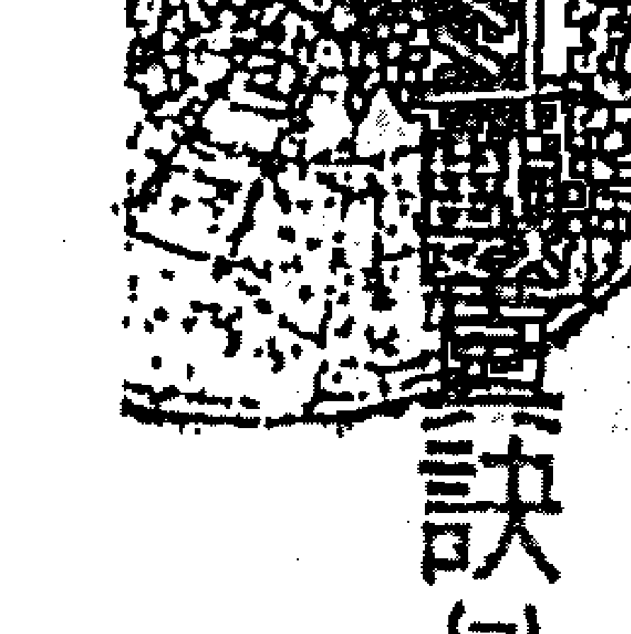

## 太阴星

有美人尖的比例高。法令纹明显，长度过嘴角，再向内勾。旺地个子较高。

特征：孝顺、顾家，个性很善良

-   身上毛手毛脚：毛发浓密，不论男女只要身上会长毛的地方，都长得比别人茂盛；男命有此甚至是「猴额仔」。
-   习性如猫头鹰：凡日、月坐命者都有此特性，属夜行动物，而且星座愈是落陷，夜猫子的情形愈明显。
-   是家里的贵人：孝顺、顾家（本姓们的家）。这点亦与太阳星相同，所不同的是太阴善管理家事，而太阳则较重事业；但顾家的程度都是一样的。
-   外表四眼田鸡：太阴也代表眼睛。与煞忌或化忌同宫，坐命者眼目会有伤，男为右眼，女为左眼；落陷则视力较差，这也是与太阳星相似的一点。
-   个性像含羞草：个性较为保守内敛、惊歹势，害臊胆小、怕陌生，

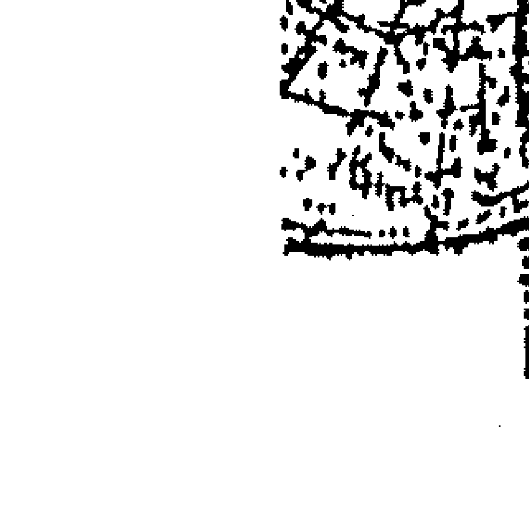

能代人守密，也不轻易吐露心事，是为标准的保守派。

## 男女命：男性温文儒雅，女性温柔体贴

男命聪明文静，外貌给人有一种温文儒雅的感觉，内心充满运动细胞，待人和气，心肠软，有同情心，度量大，包容性强，说话轻声细语的，做小考想：1...，小心谨慎：观察细腻，一般男人所忽略掉的小枝节，他却比人家细心。有男人的身子，女人的思维：内心炽热，偏偏害羞。面对女人常会「爱你在心口难开」，眼睛小，笑起来，走路会撞墙。

女命温柔体贴、细心温和，多情浪漫富有诗意，有点孩子气，但情感细腻，丝丝入扣，依赖性较重，温顺而善良。体态丰润，该胖的地方胖，不该胖的地方也胖，星座愈旺愈胖，而且是正三角形的，下围先胖，而且屁股可能胖到可以摆上一桌麻将；陷地者身材瘦高，怎么吃都不胖。具有母性慈晖，照顾老公及小孩无微不至；但性子急，缺乏主见，易沉不住气，最怕激将法，是标准的「欧巴桑」贤内助。

## 優點：愛乾淨、人緣好、念舊、重感情

太陰主一生快樂享受，很有運動細胞，喜歡遊山玩水以及戶外的休閒運動，很懂得調劑生活的情趣，對於聽音樂、唱歌、喝茶、繪畫、書法等都有興趣，而且多少都會涉獵一些。愛乾淨，講究衣飾體面；細心溫柔，人緣好，心軟富同情心。內向保守，為人耿直講信用，答應人家的事沒做好會輾轉難眠。能守密、口風緊；念舊，重感情。

## 缺點：膽小怕事、魄力不夠、易情緒化

個性急，但動作慢，耐性不夠。感情上缺乏理智，情緒化，依賴性重，有時口是心非，蠻「假仙」的，不隨便把內心的秘密告訴別人。愛粉飾，有潔癖，只差沒有隨身攜帶消毒藥水。膽小怕事，魄力不夠，做事「拖沙」，跟她約會可要有一點耐心才行。

> 細訴騷人墨客對月的依戀，情有獨鍾，古往今來對月歌頌的詩詞歌賦

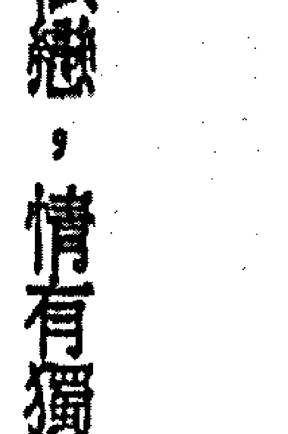

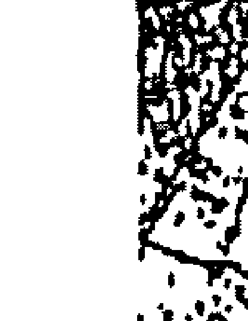

## 第01章 認識篇

也是多得不勝枚舉：有關月的描寫更是刻劃入微，發揮得淋漓盡致。
無論是一輪明月或是月兒如鉤也好，帶給人們的印象是那麼的細緻、浪漫、溫柔、皎潔、羞澀、懷念與安祥，就好像一位蕙質蘭心的慈母，又像一位溫柔多情的妻子，以及一位冰清玉潔的少女。多愁善感的人們也總是寄予月兒無限的遐思，平添了幾分感懷，就像古早那位李白兄只不過仰頭望了一下明月，立即可觸其思鄉之情。而在斗數之中，這稱為太陰的月兒，也是如此的詩情畫意。

## 喜會祿存，倍增光輝

太陰與太陽為中天星座的兩顆主星，入命必先考其為上弦或下弦。利於夜生人以及秋冬生人，雖座落旺地，亦須扣分。
其所落宮位在「卯、辰、巳、午」太陽的轄區之內，屬白天的月亮，黯淡無光，為落陷；在「酉、戌、亥、子」位為太陰的管區內，則是晚上的月亮，明亮無比，為廟旺之鄉。在「丑、未」宮必有太陽同守，為日月的交界之地，屬平和之地。最喜會合祿存（可解其不利母、

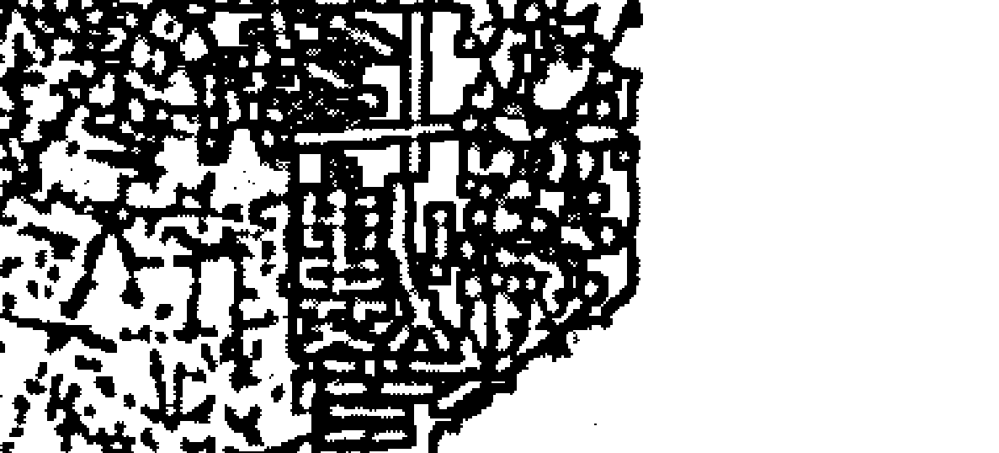

## 太陰星

妻之刑剋）及三台、八座（日月的輔助星），同宮或對照，可增加其光輝，有畫龍點睛之效。太陰星五行屬水，與天同星都是屬於柔和的星座，此點可自坐命者的形貌而知：太陰坐命者常有一張清新柔雅、稚氣未脫的臉龐，蛾眉鳳眼，一頭烏溜溜的秀髮，像極了洗髮廣告的模特兒；男命在中年之後頭頂上絕不會一絲不掛。幼年有暈車的毛病，中年後須注意泌尿系統的疾病。

### 姻緣路上一波三折

坐命者外表多半斯文典雅、溫柔體貼，個性急躁，動作卻是慢郎中，很會摸。和她約會若遲到個半把小時那是正常；與他過團體生活，絕不要排在他的後面洗澡或上廁所，因他愛乾淨，若不把身上洗得剝了皮的兒子；像武曲或天府星坐命者，一樣是不肯出來的，動作又慢，在後面的人可有得等了，像武曲

太陰坐命與母、妻（男命）緣份較淡，雖然孝順，但往往溝通不良，孝順方式無法令母親接受。男命除此之外，他很有異性緣，但在姻緣上卻是一波三折，困擾多多，或夫妻聚少離多，這些都是因為他奪了母星或妻星而產生的磁場效應不合的緣故。

另外，太陰坐命者，其父母宮必為貪狼星，有增加的傾向，須留意父母的婚姻狀況，或當事人有認義父母之情形。女命太陰頭胎生女兒，且要男女雙全也較不易。因而日、月二星喜照不喜坐，正坐則奪人星座，不利母、妻；對照主貴，不帶刑剋反而有利。例如命宮無主星，借對宮的日或月，除了孝順、顧家的特性依然存在之外，又免除了對父母及配偶的刑剋，其肩負的重擔可卸下一半之多。

## 重視享受，缺少衝勁

太陰主一生快樂享受，坐命者很懂得生活情趣，善於調劑安排間暇時間，而且喜歡和自家人一塊兒消遣。在事業上較無衝勁，認為平穩就好，不缺錢用就可，爭權奪利沒啥意思，職位愈高擔負責任愈大，整天忙得跟牛一樣，哪還有時間做我想要做的消遣，過我想要過的生活？人生那麽痛苦有何意義？況且休問是爲了走更長遠的道路，與其瓊樓玉宇高處不勝寒，寧可雲遊四海，清閒自在，免得夕陽無限好只是近黃昏，而辜負此生。

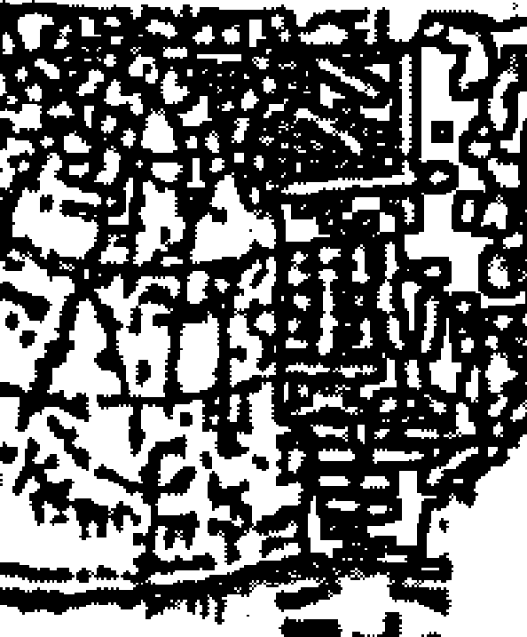

## 訣

## 太陰星

太陰的溫柔、稚氣、依賴性像天同，孝順、顧家、夜貓子像太陽；而羞怯則是獨樹一格。坐命者對新環境、新面孔會膽怯、退縮，較爲被動，除非與他交情夠深，否則難以進入其內心世界。

太陰又主財，但太陰之財偏向不動產之財；因其爲田宅主，坐命宮則此生必有不少房地產，但手頭上的流動現金就不見得有多少。坐命者也適宜做房地產生意，或與女性有切身相關的行業，以及晚間的生意。

遇事拖延，老運較佳

太陰星最忌羊、陀同度，主財逢破，而且母、妻、妻星逢破，則不利其母、妻。逢火、鈴則不利婚姻。落陷逢昌、曲主漂泊，喜宗教或醫、相、畫、匠等，多動而少靜。太陰旺地逢左、右，不富則貴。太陰又主拖延，流年逢之，不論好壞，都來得晚；流年主下半年，大限則主下五年。太陰不但動作慢，連行運都慢，命格不錯的話，則愈老愈有錢，所謂「大只雞慢啼」；但逢空可就例外了。
此星最喜廟旺落於男命夫妻宮，必得賢內助；落田宅宮也恰當，主富足；入人身宮則凡事考慮再三，而錯失機會，視為「龜毛大王」。
男命太陰落陷或女命太陽落陷，稱為「日月反背、陰陽顛倒」，桃花即顯現。另外，太陰落陷再加煞，亦主桃花，無論男女命，一生多豔遇，生活浪漫，酒色財氣來者不拒；行限再遇桃花星的話，恐會墮入風塵「普渡眾生」。

## 九、重色輕友的貪狼星

- 星座特性：陽木，北斗第一星，乃解厄之神，禍福之主，化氣為桃花；貪狼為桃花之宿，雖屬木而根為水，在數則樂為放蕩之事。
- 守護神：瑤池金母
- 吉祥數字：十
- 幸運顏色：咖啡色
- 吉祥物：古董、玩石
- 吉祥花卉：蘭花，對蝴蝶蘭或文心蘭愛不釋手。

貪狼星坐命的人臉型長圓，眼睛靈活會說話，多為鳳眼，眼神勾魂令人醉。眉毛濃而黑，兩眉較接近，眉毛與眼睛間的距離也較窄。身上的毛髮與鬍鬚也非常旺盛，挺性感的；膚色較黑，嘴唇較厚，五官端正點的一中年之後頭髮漸漸稀少一點，並出現少年白。旺地身高肥胖，陷地

- 1. 多學卻少精：貪狼為才藝之星，多才多藝，但無恆心，做事情很難堅持到底，對新鮮的事都有興趣，都想學一點，結果是什麼都會，卻沒有一樣精。
- 2. 是個大醋罐：此種醋意較針對於同性而言，例如嫉妒別人比他帥或美，或辦事能力比他強、條件比他好、鋒頭比他健……等等，也是州官放火型的。
- 3. 擅長獻殷勤：此星坐命者，男命很會對異性獻殷勤；女命則很會撒嬌施媚功，嘴巴很甜，如果定力不夠，鐵定會敗在她的石榴裙下而任其擺佈，還樂不可支呢！
- 4. 喜新又念舊：個性喜歡追求新潮時髦，卻又念舊。所以更換新東西，舊的又捨不得丟掉，家中經常有新舊雜陳並列的滑稽怪象：對人、事、物都一樣有此矛盾現象。

## 貪狼星

- 5. 重色而輕友：貪狼為桃花星，很有異性緣，重色而不重情，多情而不專情，對異性用錢比對同性要大方多了。
- 6. 有雙飛毛腿：斗數中以太陰及貪狼二星身上毛髮特別旺盛濃密，出現大鬍子，長鬢角，以及毛手毛腳的比例較高。

男女命：男性好高騖遠，女性缺乏主見
男命好高騖遠，一山看過一山，出手卻眼高手低，喜出風頭，愛表現，主觀意識強，愛恨之心較重。度量不足，小心眼，處事圓滑，略帶偏激。
女命個性急，缺乏主見，自私心較重：處事能幹，理解能力、分析能力強。個性較令人捉摸不定，特別注重氣氛與情調。

優點：口才好，親和力強，多才多藝
口才好，能要嘴皮子，具有幽默感，懂得見風轉舵，非常「識相」。
個性豪放，不拘小節，喜自由，不喜被約束。為人隨和，親和力強，有

隨遇而安的個性：做事迅速，不拖泥帶水（對異性而言），對異性用錢大方，多才多藝。

## 缺點：貪心、善妒，多情卻不專情

貪小便宜，計算心重；好酒食，吃多吃快，怕別人佔便宜。嫉妒心強，愛恨之心表現明顯；「膨風」愛說大話而且說話搶先。多情卻不專情，自以為是，對感情往往會意氣用事，對婚姻生活要求較高。什麼都想學，卻博而不精，只是滿足其貪性與愛炫而已，所以總是三分鐘熱度，很難堅持到底，虎頭而蛇尾；對神仙之術更是特別有興趣。

## 貪狼星的特質

## 貪吃

貪狼星，顧名思義是帶有「貪性」——貪吃、貪杯、貪財、貪色，因各種星座組合而異。而貪狼星的這種貪，是不論新舊、好壞、多少，只要有就好，不像天府星的霸氣，要貪就全部都要據為己有。

## 例如

貪吃：因為貪狼星是一顆飲食之星，喜酒食，有口福，喜歡和人家一塊兒到處去吃吃喝喝的，不挑吃，但吃速快，怕吃太慢沒得吃。什麼都吃，就是不吃虧，這在外面吃宴席蠻划算的：動作快、狠、準，恨不得嘴裡一塊，眼睛還盯著一塊，時下所流行的「一九九吃到飽」的餐廳，碰到貪狼星坐命的顧客，可要虧本了。

> 貪杯：『飲酒作樂是雅人，強人喝酒是霸人，藉酒裝瘋是狂人；酒醉亂性是狼人，藉酒澆愁是傻人，滴酒不沾是俗人；每飲必醉是庸人，千杯不醉是奇人，長醉不醒是廢人。』

貪狼星坐命宮或疾厄宮酒量不錯，僅次於天同坐命者。喝什麼酒不重要，要緊的是和什麼對象喝，最好是帶點脂粉味的花酒那是最合胃口不過了。酒不醉人，人自醉；色不迷人，人自迷，個性豪邁，酒膽一流，是個好酒伴。

貪財：貪狼星坐命，若無吉星牽制的話，童年會有二隻手的壞習慣，而且為數不計，得手就好，這與其家境貧富無關，只是滿足其貪性。此星若坐財宮，則對錢財貪得無厭，甚至有撈油水的情形：如與財星武曲同宮坐命，則是個不折不扣的「錢鼠」。

會因：貪狼化氣為桃花，若化祿或化忌，行限逢之，必有實質發展。
此星屬桃花之宿，坐命者必具有桃花的條件，多半長得是男帥女媚，很會耍嘴皮子，對異性體貼、細心，或撒嬌獻殷勤，眼波帶醉，善於眉目傳情，騷勁十足，風情萬種。
以男命來說，除了正宮娘娘以外，其他的並不怎麼「挑吃」，看順眼就好——年齡不是問題，身高不是距離，體重不是壓力；最好是好吃又不貴的為上選。所謂妻不如妾，妾不如偷，偷不如偷不著；兒子是自己的好，老婆是別人的俏。巴不得像古代的皇帝老爺們一樣，獨享「三宮六院七十二嬪妃，做個「一夜九次郎」、「笑擁江山同築夢，醉看清風入畫樓」，那真是爽呆了。
對他愈好愈容易被吃定
會讓坐命者，性剛威猛，卻常弄巧反拙，隨波逐流；對待交情較厚者，不如交情較薄者好。對他好，他都認為是理所當然的，並且缺乏反哺回饋的概念，於是對他愈好愈容易被他吃定，所以針對此星之因應之道為：略施小惠。使用利益誘惑較管用，而且要掌握對他而言最有興趣的王牌，永遠讓他覺得你身上有無盡的寶藏；如果早早掀開底牌或讓他達成目的，那麼別想他會甩你了。

貪狼是一顆善惡難定之星，雖然是桃花星，但也是 1 顆才藝之星，要依其所落宮位特性及三方會合的情況而定。遇吉則主富貴，遇凶則主虛浮。會吉星或逢空亡星或逢祿存壓制則主吉；否則不以吉論。故女命得之，若無制化，反喜人空亡，則為人端莊。

貪狼遇火、鈴，除了加重其桃花之外，也成為「火貪格」，主富貴通人；桃花種類數十種，此種桃花則屬於賺錢桃花。遇羊、陀為「風流綵杖」之格，婚姻多波折，身上多斑痕疤痣。若與七殺星分守命身宮，男盜女娼，因色犯刑，而且為人無情。與破軍分處命身宮，男則十項全能，足以敗家，女則淫蕩，無媒自嫁；再逢羊、陀，則是「牡丹花下死，做鬼也風流」。與昌、曲同度，則為人虛多實少，做事顛倒，而且是「撒隆巴斯」（黑白貼）型的「二八桃花」。若與紫微同宮而無制化，更為無益之人；必得左、右、昌、曲夾制或會合，方能化解。

## 念舊惜情偏愛老古董

貪狼坐命者非常念舊。這就妙了，似乎與前面所言有所矛盾，先別高興得太早，因為這種念舊不包括人。凡是用過的舊東西，無論好壞，都捨不得扔，舊家具、舊電器、舊飾物……等等，不勝枚舉。搞不好在他家裡還能找到他祖宗八代所留下来的東西呢——因此坐命者，適合從事骨董業。

貪狼入哪一宮位，那麼該宮無形中都有增加的趨勢。如落父母宮，則父母婚姻有狀況或當事人有認義父母；入兄弟、子女宮，都有增加之兆；入朋友宮，則朋友一大票，但都屬於酒肉朋友居多；入官祿宮，則表示不只從事一種行業而已；入命或疾厄宮，主肝臟不太好；入福德宮，則主善於藏私房錢；如果入夫妻宮，那麼在坐命者在心態上就會有「如能多擁有一個老婆，不知有多好」的想法；入田宅宮，祖產必旺，那才真的是帥呆了！

## 十、封閉謹慎的巨門星

- 星座特性：陰水，北斗第二星，在數司是非，化氣為暗，又名隔角煞；巨門為陰精之星。
- 守護神：千歲王爺
- 吉祥數字：十一
- 幸運顏色：粉紅色
- 吉祥物：綠寶石
- 吉祥花卉：喜歡八月桂花撲鼻香味的水植

## 巨門星坐命宮。

巨門星坐命宮的人臉型方長，兩塊腮幫子很明顯，甚至腦後見腮，很像木星盤。口尖小，嘴形漂亮，眉形細長；雙眼靈活，眼光銳利，常流露出一種一眼即看穿人的精明樣子。旺地身材較長聳，陷地五短瘦弱。

## 特徵：疑心病重的獨行俠

- 1. 牙齒不好：排列也較不整齊。巨門主口舌，因此與口腔有關的疾病就會顯現出來；此外支氣管也好不到哪裡。
- 2. 疑心病重：因巨門化氣為暗，心事暗藏，喜怒不易形於色，常給人一種非常陰沉的感覺。處事小心謹慎，不容易親近，加上口才不好，講話容易得罪人，常犯是非、遭小人，因而杯弓蛇影，疑神疑鬼，不輕易相信別人。
- 3. 獨來獨往：此星坐命者，說話太直、太衝，人際關係較差而且不輕易相信別人，因此對他人排斥性高，很難和人群打成一片，做事喜歡獨來獨往，像個獨行俠，較不會呼朋引伴。

男女論：男性憨厚溫良，女性心思細膩
男命為人憨厚、溫良、誠懇，一臉中規中矩的樣子；但外表冷漠，不善於親近。表達能力不足，人際關係有待加強；凡事都隱藏在心中，不輕易對人說出，加上能守口如瓶，令人有摸不著邊際之感。此點與太陰坐命者相似，但巨門予人城府較深沉的印象。

女命清秀帶有傲氣，親和力不夠，令人難以親近。眼光銳利，眼神靈活，反應快；心思細膩，多猜疑，不容易相信別人。多愁善感，做事情迅速敏捷，懂得保護自己。

性格優點：做事細心，考慮周全，小心謹慎，不做沒把握的事；頭腦冷靜，反應快，能守密；眼光銳利，很會察顏觀色，非常敏感，稍有異樣立即察覺且能不動聲色。個性內斂，自尊心強，對逆境之忍耐力十足。

性格缺點：個性膽小，好猜疑。個性膽小，好猜疑，因此行止進退均反覆不定，感情方面，更是前熱後冷，冷熱都極快；因此巨門坐命者，舊情復燃的機率相當高，予人善變，口是心非，表裡不一之感。

> 【巨門坐命】

巨門星城府極深，又善猜忌，因之人緣不佳，欠缺人情世故，處事不夠圓滑，善欺瞞，做事猶疑不定，又杞人憂天，一生是非較多。多學少精，口才欠佳，言語直衝易傷人，容易遭小人。

巨門星在斗數而言，是一顆令人很不敢領教的黑暗天使，因為它化氣為暗，在斗數中主司是非口舌。故而此星坐命、身宮之人，一生當中必與是非結下了不解之緣。

但是千萬別誤會，並非巨門坐命者本身即是非小人，而是此星坐命者，在一生裡無形中會招惹許多是非，即使不是他去主動招惹是非，可是偏偏一些無端的是非都會應門而入，甚至其他星座坐命者只因運限走忌門，都避免不了是非！真是令人望之退避三舍。

問題是：為何會如此呢？這除了與星座的磁場影響有關之外，也與其星性有著密不可分的關聯。此星主口舌，坐命者本身口才不好，表達能力不夠，即使動機出發點是善意的，但是言詞用語很不會修飾，以致出言尖銳，令聽者為之愕然不知所措。而且巨門處理問題太過主觀，聽不進別人的意見，又不信任人家，沒有考慮別人立場而去考慮問題，在人情世故上易招人反感！加之猜疑心重，容易對別人預設立場，早下定論。加上神情陰沉冷漠，一副拒人於千里之外的作風，所以在人群中便容易成為少數民族而遭人排斥。以同樣的一句話而言，或許由別人的口中說出，會被認為是開開玩笑罷了，無傷大雅；但經由巨門坐命者的「金口」脫出來，卻會莫名其妙的刺耳而引來一堆不滿與是非，實在是「衰尾道人」，有夠「衰」！巨門又為刻薄之神，因為當他在生氣時罵人的用詞，真是慘無人道；雖然他心地不是如此惡毒，但嘴不饒人，惹毛了他，可是會語出傷人，針針見血，尖酸刻薄，狠毒無比，足以令聽者火冒八丈，血脈賁張，口吐白沫，為之氣絕。此外，巨門又名為「封喉」，因為坐命者有時說話很不會因時、因地、因人而語，而且是哪壺不開提哪壺；但他並非有意如此，只是他低估了自己語出驚人的能力。

## 出言不當，令人不敢恭維

打個比方：有一對中年夫婦，正在宴請親友，慶祝久年不孕，而在幾近放棄希望的妻子，懷孕了。老來得子，老蚌生珠，令人喜出望外，大家恭祝之語不絕於耳。此時若有一位仁兄一副正經八百的樣子，看著這對欣喜若狂的夫婦好心的說：「先別高興得太早，我聽說高齡產婦生下蒙古症兒的比例很高，你們可得小心點。」當場即令在場所有親友愣在那兒，不知道該說什麼才好；主人更是差點腦中風，聽了這話連肺都快給氣炸了。

巨門坐命者的這位仁兄實在是好意，只是用詞不當或時機不對而往往得罪了人還不曉得。又例如在一個團體的場合中，大家正興高采烈的開著玩笑，或閒聊消遣。適逢有一位巨門坐命者也在場，有心湊上一腳。當他開口奪口，插上一句「至理名言」，就足以讓在場眾人或啞然失笑，或目瞪口呆，或無言以對甚至哭笑不得，這一點就和貪狼坐命者完全相反。

## 巨门星

## 巨门坐宫，与六亲缘薄

巨門星又名「隔角煞」，代表有生離死別，分居薄緣之意。坐命身，則六親寡合。此星坐六親位皆主不利，在兄弟宮主損失，而且兄弟之間各自為政，互不相干。

在父母宮除了與父母有代溝之外，父母本身的婚姻感情也不好；在子女宮主先損後招；在夫妻宮則感情冷淡，白首也難，或聚少離多；在田宅宮則祖產暗耗不留，而且家中易生白蟻；在疾厄宮主氣喘肺經之症，逢煞則眼目有疾；在僕役宮則縱然相識滿天下，亦知心無幾人；在福德宮則是廣播站和八卦新聞轉播中心，老來孤單，自掃門前雪，親人各忙各的而不在身邊；在官祿或財帛宮就不錯，屬於賺取開口財或仲介以及帶是非之財，為口舌競爭而來的財。

巨門坐命者雖然麻煩事遭遇多，並非意味著會一生窮苦潦倒，永無出頭之日。命坐此星者大富大貴的人還大有人在，只是口舌是非比較多罷了。

## 第●章 認識篇

了。所謂天將降大任於斯人也，必先苦其心志。

## 運逢化忌，小心言多必失

巨門主是非刑訟，為小人之星，且與嘴巴有關，化忌逢煞必言語上易得罪人。巨門最喜旺地化權、化祿，化權講話有權威，說服力強，不說沒有的話；化祿則說話必然好聽。

此星利男命，不利女命，男命大都能娶到一位柔順的賢內助；而女命則婚姻多波折。另有一些不利的組合，逢之須特別注意：巨羊不利六親、巨陀須防意外；巨火遭回祿；巨鈴主刑訟。皆因緣起巨門這個星座是屬於陰精之星在作怪；沒有空亡或祿存化解的話，流年遇到也只有一個「轟」或「背」字了得，真是無以言語了。

此星只有祿存星能解其惡，旺地日月能驅其暗。如命坐亥位巨門，得巳位太陽對照，名為「明日驅暗格」；或戌位坐命而得日月拱照而為奇格，最忌在陷地，到處為虐。此星本身已帶有刑損之意，所以就更不利加煞。行限在陷地逢之加煞，主有官災是非或孝服、破財、血光。

## 十、風度翩翩的天相星

## 星座特性

陽水，乃南斗第五星，專司衣食，化氣為印，為官祿主宰，天相屬印星，在數司爵，為善福之星，衣食享受之宿，別名媒人星。

- 守護神：達摩祖師
- 吉祥數字：九
- 幸運顏色：米黃色
- 吉祥物：珍珠
- 吉祥花卉：1束牡丹更能襯托高雅的氣質

◇天相星坐命宮。

天相星坐命宮的人臉型圓中帶方，輪廓明朗，臉鼻有情，相貌持重。男命方頭大臉，脖子較短；女命溫柔端莊，秀麗文靜。無論男女命都有一副稱頭的好衣架子。笑起來有酒渦，卻未必有酒量。

## 特徵：雞婆、愛挑剔、重視儀表。

- 1.愛挑剔：天相坐命者對吃穿極挑剔，但挑吃只挑口味而並非在意吃得好不好，挑穿則是注重衣著、形象是否整潔美觀而非華麗，除此之外他也挑床，換了個地方就難以入眠，只差沒在雞蛋裡挑骨頭。但是在交友上卻反而不挑，很容易和任何人稱兄道弟。
- 2.雞婆：天相星是一顆服務大眾的星座。為人好管閒事，愛打抱不平；常常做吃力不討好的事，為人服務經常是不計代價。於是當里長服務鄉民，做民意代表為民喉舌或當月下老人湊合好事，以及做和事佬調解民紛，那是再適合不過了：有時縱使「做白工」也樂此不疲，是屬於別人的貴人。
- 3.重外表：天相星專司衣食，與天府星相同，但天府星較偏重於吃，而天相星則較注重穿著。即使到家門口附近買個東西，也不願隨隨便便穿個拖鞋、汗衫就出門。所以更別提在上班之時，那必然是上得了檯面的正式穿著；至於化妝則只是輕描淡寫，不喜濃妝豔抹。

## 天相星

## 男女命 - 男性熱心助人，女性聰穎能幹

男命敦厚持重，斯文大方。具威嚴，重外表，衣著講究。好交朋友，來者不拒；熱心助人，心軟，不擅拒絕人。責任心重，做事勤快。

女命溫柔大方，清秀脫俗，氣質高雅，聰明能幹，且不善於計較，極好相處；愛修飾，重視物質享受，有依賴性。此外和天同星坐命者一樣喜歡吃零食。

## 性格優點：待人熱誠，富企劃能力

忠厚老實，為人坦白直率；心地善良，極富同情心，見不得人家苦，最怕人家掉眼淚。具有服務熱誠，堅守「人生以服務為目的」的信念，有犧牲奉獻的精神。為人隨和慷慨，處事積極；重形象以及外表穿著。

喜粉飾外表（對事而言），富企劃能力；喜自由發揮，對色彩敏感度高，擅搭配服飾造型，而且風格高雅。念舊、懶惰。

## 性格缺點：被動，易濫用同情心

好奇心重，多管閒事，好打抱不平。偏食、挑穿、認床，好面子，在意別人的批評。心軟，因而很容易濫用同情心，而被人家利用。固執，主觀意識極強；有惰性，動作較溫吞，欠缺主動，需要適時給予鞭策。不會擇友而交，不啻拒絕人，十足的濫好人一個。天相為善福之星，在命盤十二宮中，僅有旺弱之分，而不會落陷，並且四處降福；而在人群當中也是燃燒自己，照亮別人，造福鄉里，頗有先天下之憂而憂，後天下之樂而樂的胸懷。而且是典型的「有應公」，有求必應，雞婆到家。

## 排難解紛，有他就搞定

舉凡打抱不平、濟弱扶傾、排憂解難，親朋好友或左鄰右舍有發生紛爭，找天相坐命的人排解，有他就搞定了。被大家視為公道伯，幾乎已經到了以天下興亡為己任的地步；其公而忘私的精神，也不得不令人欽佩。

但是這些對當事者而言並不輕鬆，是屬於閒不住的勞碌命，即使坐命者已屆知命之年，甚至退休後還會去當義工；因為其福德宮必為七殺星，難得清閒。

天相是顆服務大眾的星，社會上的義工人員以及公益或慈善團體，都少不了這種人；也因為他們的存在，於是社會上才能呈現出溫馨的一面，而不至於人人只顧自掃門前雪。此星與日月坐命者有點類似，但不同的是日月為家的貴人，凡事以自家為優先考慮；而天相坐命者則是大家的人，犧牲奉獻，任勞任怨，普渡眾生。它亦是顆媒人星，在人與人之間，搭起了一座友情的橋樑，實在是當今社會上不可或缺的人物。

## 穿著入時，擁有衣架子

天相專司衣食，而且是穿重於吃。生命者大都生得一副好衣架子，擅於搭配穿著；但並非珠光寶氣、華貴耀眼，而是屬於高貴典雅型的妝扮。

# 妙訣(一)

扮，不落俗套。天相坐命者，重穿著，外人無法自其衣冠而知悉他的身份地位，因為他即使家裡都三餐不繼吊鍋子了，他還是穿得很稱頭，所謂「金玉其外，敗絮其中」，大概就是這個樣子。天相坐命者，對於色彩搭配方面有其獨到之處，而且好奇、求新，能追上時代潮流趨勢，因此蠻適合從事服飾業；同時它也是衣食享受之星宿，對吃的方面也講究，而且重視格調、水準，所以也適合從事講究風格的高級餐飲業。

# 連連桃花，情海多波動

天相星五行為水，而斗數中以金為財，以水為桃花，故此星坐命者個性溫柔體貼，長相體面，氣質又斯文高雅，重視品味與格調，因此很能博得異性青睞。於是乎風流倜儻那是必然，有點花心自不在話下，即使婚後，在心態上偶爾也會有不安份的想法，因為他的夫妻宮必為貪狼所據，有時產生享受人之福的狂想。但由於他的挑剔、重形象，所以在行為上就不可能放蕩隨便，只是想歸想，做做春秋大夢而已！

於是在感情生活上就會來得複雜得多。女命若逢之，加上行限遇桃花，此時就有「下海」的可能性，而且據統計，此星坐命淪落風塵的比率，是所有星座中最高的；此外與紅鸞、天姚等桃花星相逢，則構成高級桃花的格局。

# 天相星

星會天府，一生享福壽

天相星與天府星在斗數之中是優點多於缺點的一顆星，而且同樣都是只有旺弱之分而無失陷情形。並且天相能制天府，以柔克剛，天府對它是莫可奈何，兼可化廉貞星之惡。

但天相坐命宮不宜入擎羊，以免受制而英雄無用武之地，為人服務反而變成別有用心。若與紫微星、左輔、右弼、文昌、文曲等星會照則吉，乃財官雙美之局，主一生安逸。尤喜會天府，分處於命身宮，則主一生優渥安逸並能享有高壽。

此星在流年旺地逢之多能增財利；若會左輔、右弼，兼有權威，而且在工作崗位上升遷較快。於弱地無煞沖破，亦可安享；加會祿存則會減低其雞婆個性。弱地逢擎羊、陀羅，則為巧藝之人，靠著一技之長而謀生。如加火星、鈴星，則傷殘難免。

女命坐旺地天相，主聰明端莊，溫和仁慈，不愁吃穿；弱地若身宮逢七殺、破軍，主不正大，難以出人頭地：逢擎羊、陀羅，婚姻不美滿。但若逢空，其星性的優、缺點都不存在了，真是十分可惜。

# 天相化忌－用印帶小心

天相為印星，化氣為「印」，代表重要印鑑以及與印鑑有關的事物，坐命者須注意遺失印鑑或用印方面所帶來的禍端。天相星雖無失陷，但會化忌，尤其當運走天相化忌之年，用印要特別小心，甚至連支票有價證券、背書保證之類的事都會出問題，股票、期貨等帶投機性的投資宜避免介入。因為天相坐命者心軟，熱心助人，又最怕纏，往往會因為禁不起人家百般糾纏的哀兵之計，而找了一堆麻煩給自己扛。因為濫用同情心而遭人利用，實爲其致命傷，不得不慎！天相與天府永遠照會，運走天相時，主個人在生活或工作環境上有所改變。因其爲善福之星，所以天相的變動屬良性的居多；但運走天相化忌之年，即應特別注意它落入哪一宮？以早作防範。天相化忌在官祿宮須注意用印以及支票上所衍生的問題，在財帛宮需注意有價證券或爲人背書保證而破財。在遷移宮則會接到罰單，在疾厄則須注意腎臟泌尿系統的病變。坐命者在中年之後最好就要注意保養，少喫甜食爲妙，以免糖尿病上身。

# 十一、喜歡抬槓的天梁星

陽土，乃南斗第二星，司壽祿，為父母之主宰，化氣為蔭。
天梁乃延壽之星，乃父母之星，為醫藥之星，又為老人星。

◆天梁星坐命宮。
天梁星坐命宮的人臉型方長，天庭比較高；中年之後頭髮如退潮般由前向後漸禿。眉毛長，顏色淡，眉形的彎曲度兩邊不一樣。外表給人一種穩重老成的感覺，老氣橫秋。五十歲以後反而年輕，身材修長。

| 項目       | 內容                     |
|------------|--------------------------|
| 招財植物   | 棕葉、椰子               |
| 招財數字   | 一、五                   |
| 招財物品   | 佛像                     |
| 招財花茶   | 茶花的穩重最能代表       |

# 天梁星

特徵：老成持重，愛耍嘴皮子

- 1. 少年老成：天梁是一顆老人星，坐命者在思想以及外貌上的成熟度，約比同年齡者要超出五至六歲左右。童年時就已像個小大人似的，蠻懂事的。深得長輩的疼愛，很有老人緣，與年長者相處無代溝。動作上成熟穩重，八風吹不動；言語上慢條斯理，有條不紊。年輕時就像個小老兒一樣，看起來挺世故的；中年以後「留住青春」，反而耐老，而且個性上也有返老還童的傾向，就像一個老頑童一樣。

- 2. 講話大王：此星坐命者，喜聊天講古。平常看起來外表嚴肅不苟言笑，一旦話匣子打開，可就是沒完沒了，遇到對手的話，屁股就黏在椅子上；電話一聊就是幾十分鐘，從盤古開天，天南地北的聊個沒完，聊到電線都走火了，還捨不得掛電話，可說是電信局的好顧客。有時卻給人一種聒噪與囉嗦的感覺。

- 3. 抬槓大王：天梁為理論之星，所謂「機梁善談兵」。坐命者口才並不見得好，但是辯功一流，好說善辯，嘴皮子絕不認輸，針對一件不滿的事情，沒理都要說到贏；愛攪和、愛抬槓。
- 赤腳郎中：天梁為醫藥星，而且偏向中醫。坐命者雖然不見得個個都從事此行，但大都對中藥方面有興趣或研究，相信秘方，而且有蒐集偏方的嗜好。朋友若有不適，他會很熱心的提供偏方，甚至追蹤療效；自己有某些小症狀時，自己都能開處方上藥局抓藥。

男命個性穩重，正直無私，心細反應快，溫和謙恭，外表嚴肅不苟言笑。分析能力強，按部就班，事情在做之前就已想好步驟，再按計畫行事。隨和、心地善良，富同情心，一副老大哥的樣子。

# 男女命：男性正直無私，女性豪爽熱心

女命聰明能幹，為人穩重伶俐，個性豪爽，多半帶有些男人婆的個性，大而化之，熱心助人，一副老大姐模樣，即所謂「大姐頭仔」。

性格優點：膽大心細，處事穩重

# 天梁星

有宗教信仰（機梁好禮佛），有「數」與「術」的嗜好多方面的興趣，喜歡動腦研究東西。處事穩重，使人有信任感；修養好，親和力強，喜歡幫助別人，照顧別人，有老大的氣度。理智重於感情，眼光深遠，考慮周詳，分析能力強，善策劃，膽大心細，做事光明磊落。

性格缺點：孤傲不群，嘮叨，愛爭辯。

> 「天梁星有孤獨之意」

不愛乾淨，穿著較隨便，與天相坐命宮顯然完全相反。孤傲不群，口才欠佳，愛抬槓、爭辯、嘮叨、自負心傲；喜抓權，流於專制。主觀意識強，固執吝嗇。

天梁星為老人星，為父母的主宰，化氣為蔭，意為能庇蔭及護福之意。就像天有不測風雲，在下起大雨時，此星化身為一把傘的作用一樣，減少許多日曬雨淋之苦。此星坐命宮，你幼年時就非常成熟穩重，脾氣上、動作上，都比較溫吞而不急躁。

分析力很強，自幼即能分析出什麼事能做，什麼事不能做，而且什麼事做了之後會慘遭剝皮修理；雖然無法像天同坐命者那樣討大人歡心，卻也知道如何去惹大人發火，一副胸有成竹，老神在在的模樣。因而自小在長輩的眼裡，就是一個不怎麼需要大人操心，並且懂事的孩子；而且很得長輩疼愛。坐命者有祖蔭，只要『田宅宮』的星座不是太爛的話，祖產都少不了他一份。

# 敬老尊賢，與老人有緣

天梁星為老人星。顧名思義，坐命者思想較成熟，行為較穩重，而且有一種照顧開導比自己年幼之人的老大氣度。敬老尊賢，與年長的人很有話講，因此不乏忘年之交，喜歡吸收與欣賞年長者的智慧與經驗。崇尚自然，喜歡到郊外走走；抱持著平常心看待事物，得失之間較看得開。

重視實際，認為芸芸眾生，平凡者居多，而平凡中累積的生活經驗卻是不平凡的，是最真實而彌足珍貴的。不輕信一些光怪陸離的事，鐵齒又固執：最討厭井底蛙混充飽學之士並四處「臭彈」，那會引起天梁星坐命者與之死拚到底。

但天梁星的辯論並不帶火藥味，目的只是在提出反證，證明對方是錯的而已；若對方反駁，則辯到最後，甚至都會離題，非要辯到贏不可。坐命者主觀很強，甚至專制，即使有時明知道自己錯了，還是想盡辦法要扭轉乾坤，死不認輸。

天梁坐命者喜歡閒聊瞎扯淡，只要有個好聽眾，和他聊天範圍相當廣，可以有影沒影的天南地北的扯個沒完沒了，叨叨絮絮、喋喋不休的；這點有點類似天府星坐命者。於今若有此幸與此兩種星座坐命者為偶的話，恐怕得隨身攜帶隨身聽，以免整天被疲勞轟炸而耳膜充血發炎。

天梁星又為宗教星，有宗教信仰，喜歡研究佛學或哲理。自然主義者，有老莊思想，淡泊豁達；心軟善良。此外，它亦是一顆賭博星，有研究「數」與「術」的嗜好，喜歡頭腦體操或智力遊戲，諸如電腦、電玩、下棋、打牌、解謎，以及一切智慧性遊戲。而且其棋藝、牌技高超，可列入「普羅」級的；但未必會贏，因為輸贏還要看手氣如何？與牌技高低則是兩碼事兒。坐命者也有兩者兼具的情形，虔誠禮佛，又要求明牌——白天念「佛經」，晚上念「賭經」。此星入命逢煞，逢四化必嗜賭，然而硬賭必破格，對其日後的行運影響頗大。

# 婚姻不美，晚年恐孤獨

天梁、天機、天同為南斗星系中的三顆壽星。天機合天梁坐命者，必享高壽。運走這幾顆星，有解厄延壽之作用；縱有驚險危難都能逢凶化吉，有驚無險。天梁與天相的類同點在於它們都是一顆服務性質的星座，適合做老人院或慈善機構的社工人員。天梁單守坐命，是最佳的參謀人才，善機謀與策劃，為副座掌權之宿。因心軟善良，不適合當老闆，易被屬下騎在頭上；也狠不下心來牟取暴利。天梁星為孤獨之宿，不利婚姻，其夫妻宮必為巨門星，是非口角無法避免。

坐命者對感情方面為理智型的，被動而且不積極；感情生活單調，平淡沒啥火花可言，會使他的配偶覺得自己沒有存在的價值，因此婚姻生活必較冷淡而「相敬如冰」。唉！天梁，天良，天涼好個秋！因其為孤獨之宿，所以更不利加煞，會造成「早刑晚孤」，最明顯受影響的是其婚姻或晚輩；晚年則孤獨，親人不在身邊。

# 可當幕僚，不宜當老闆

天梁星最喜旺地化科，或會左、右、昌、曲，主富貴。但加了昌、曲，亦會加重其好說善辯之性，此時坐命者不但有口才，又善辯，恐怕令人難以招架；而且除了「箭王」之外，恐怕還要冠上「屁王」的封號了。天梁亦不宜化權，會使得坐命者除了愛爭辯之外，又較專制霸道；若是逢空，除了「脫線」以外，還會顯得「碎碎唸」。天梁代表專業技術，坐命者多有自己專業的一技之長，適宜從事設計與農產加工品，或與中藥材方面有關的工作，或大企業機構的幕僚。

# 第十章 認識篇（一）

但天梁是一個不善於管人的星座，故只適合獨立自主的專業領域。想跟他通不過的話，就鼓勵他出來創業，然後再找幾個員工給他，保證過不了多久，就可以看到他「焦頭爛額」的可憐模樣。

# 十一、欺善怕惡的七殺星

陽金，乃南斗第六星，乃數中之上將，孤剋之星，刑殺之宿，專司斗柄，司生死。七殺乃火花之金，雖五行屬金但帶有火的屬性，故個性上亦有兩方面的表現，即雙重個性。七殺為上將之星，故不喜歡人家約束。

- 守護神: 地藏王菩薩
- 吉祥數字: 十一
- 幸運顏色: 黑色
- 吉祥物: K金飾品
- 吉祥花卉: 喜歡清香與含蓄的茉莉花

七殺星坐命宮的人眼睛大，眼球部分較突出，兩眼靈活；眉斜粗濃，有稜角，屬劍眉，但在上了年紀之後，眉頭部分會漸漸掉毛，嚴重者其結果甚至會像熊貓一樣，活像貼了兩帖狗皮膏藥一般。斜肩，面帶堅毅之色。女命具野性美，古錐，嘴角有兩枚小笑渦，予人有親切感。

特徵：喜歡虛張聲勢，處處跟人唱反調

- 1. 到處惹口舌：七殺與天同星坐命者恰恰相反，非常不善察言觀色，某此，小情已經惹得人家火冒八丈，天同坐命者早已逃之夭夭了，而七殺坐命者此時還不懂見風轉舵或收斂一點，反而還依然故我；所以在工作時常會因此被大人修理。個性軟硬不吃，而且喜歡唱反調，調皮又頑皮得令長輩頭疼不已。
- 2. 標準紙老虎：七殺星坐命者，遇有衝突爭執時，表現在外的形象好像兇悍無比，其實只是像雨傘蜥蜴一樣，遇敵時會張開頭部的大傘，一副聲勢浩大，活像要吃人的樣子；其實膽小如鼠，只不過是虛張聲勢一番，看能不能把對方唬住而已：若遇到一個比他還兇的，他就沒轍，所以是標準的欺善怕惡。坐命者怕暗又最愛聽鬼故事，但聽了之後，餘悸猶存，半夜都不敢起來上廁所。
- 3. 白手起家型：七殺星坐命，早年坎坷，而且不依祖業；就算給他一座金山，也必揮霍一空而重新白手起家，才有可能守得住。

# 男女命：男性沈默寡言，女性外向直爽

男命沈默寡言，理智型的個性，善於企劃分析。情緒不穩定，反覆難測。剛強好勝，學習能力很好，表達能力較差。大男人主義，眼神剛毅帶威嚴。

女命性急爽快，脾氣浮躁，只有三分鐘熱度。個性外向，做事乾脆直腸子，不會記恨；個性保守，不易被感情束縛，但對自己中意的對象，則會倒追，阻力愈大愈有興趣，外型看起來屬於潑辣型的「恰查某」小辣椒。

# 性格優點：做事乾脆果斷，不拖泥帶水

現狀：七殺星司斗柄，掌生殺大權。因而講話有份量，具有反叛性，喜突破現狀：精力充沛，具衝刺力，敢做敢為。思想敏銳，個性、思想、作為

# 性格缺點：脾氣反覆，令人難捉摸

個性有點調皮，急躁不夠穩重，膽子很小。欺善怕惡，喜歡捉弄人而具有叛逆性，喜歡唱反調，三天三夜困難挑戰的個性，穿著一副玩世不恭、吊兒郎噹的樣子。軟硬不吃，缺少外助（子、午、寅、申例外），一生處於驚濤駭浪之中，運勢大起大落。好酒食，早年必歷經艱辛。

七殺星為斗數中之上將，掌斗柄，司生死，在斗數中佔極重要的份量，須注意其落入何宮？入命宮，剛毅帶威嚴，說話有份量；但只是內心急如火外表不露痕跡，有別於天府星坐命者的急驚風是馬上行動。所以七殺坐命者，雖然內心圓執性急，但表現於外的，卻是沈穩的一面，男命單守尤甚。此星會紫微則有權威，具生殺之權，武職最宜；逢祿存、昌、曲、魁、鉞，學術上必有成就，也會成為某方面專業或學術上的權威。

# 童年容易摔跤受傷

七殺坐命，其疾厄宮必為水星太陰坐守，童年時是「一個大畫家」，而他們的媽媽更偉大，每天早上都要趕著洗畫布，好讓他來得及在半夜三更人身手，揮灑一幅驚天動地的潑墨畫；此外，其支氣管也較弱，看起來當七殺或廉貞坐命者的父母們還真是命苦哩！

七殺又為孤剋之星，刑殺之宿。乍看之下令人毛骨悚然，但是如果入命宮的話，對六親並不構成刑剋，反而百分之八十都是先刑傷自己，多半是四肢或牙齒，輕者是常磕碰摔傷而瘀腫，重者見血光而有所損傷。

坐命者平衡系統較差，於是非常容易暈車，經不起搖搖晃晃的，嚴重的搞不好連搖搖籃都會「暈籃」而吐奶。童年時走路因重心不穩，常二拜九叩，弄得全身青一塊、紫一塊的，活像萬國旗。此星主孤剋，坐命者較內向，不善言詞；喜歡自己獨力奮鬥，早年必定歷盡滄桑，到三年之後，逢年長貴人支助方能好轉，屬於孤軍奮鬥白手起家之命。人生運勢崎嶇坎坷、暗潮洶湧，與天梁坐命者的平穩為兩個極端。

脾氣變化反覆無常

七殺五行屬金，但帶有火的屬性，與貪狼「陽木，根為水」類似，都是雙重性格，脾氣令人捉摸不定。脾氣來時如煙火般的聲勢浩大，挺嚇人的，但煙火瞬息萬變而隨即熄滅消失無蹤；恰如其性格反覆無常，虎頭蛇尾，前一分鐘還在生氣，後一分鐘卻已忘得一乾二淨了。因為七殺之金為火花之金，就像國慶日的煙火一樣，燦爛奪目，勢如破竹，輝煌壯觀，但變化莫測，曇花一現，瞬息即滅，就象徵著坐命者的個性與際遇。

七殺坐命者好逞強爭鬥，而看起來挺兇悍的，如同煙火「發接一發的，但是當下一發的火花更大、更耀眼時，則上一發的火花即顯得失色而隨即隕落：就像其欺善怕惡的個性一樣，對他用軟的被他吃定，遇到像天府一樣比他更兇的，他隨即退避三舍，敬鬼神而遠之。他的人生更是精彩無比，坐命者天生衝勁十足，尤其在事業上的表現更是明顯；但卻是一股腦兒的傻衝，有時衝過頭都忘了懸崖勒馬，乃至於撞得鼻青臉腫的慘不忍睹。年輕時是初生之犢不畏虎的「憨膽」，在社會上是經驗不足而衝勁有餘，以至常常慘遭滑鐵盧。約四十歲以後，已經浪過了大風大浪，事業上在衝刺時才有顧慮，才能漸漸好轉。不過說起來也幸虧他的個性「厚皮」，要不是如此，怎麼幾番折騰還能夠表現出一副「歷盡萬般紅塵劫，猶如涼風輕拂面」的樣子呢？

七殺忌逢空亡，會使其毫無威力與衝勁。因此星為刑殺之宿，主有殺傷力，與擎羊、天刑、白虎同樣具有血光之意。逢四煞主血光、破相；逢殺、鈴於四墓之地，則為屠宰之人，同樣具有生殺之權。（七殺、破軍、貪狼），鈴偏庫，會引發其肅殺的一面），若會刑、囚二星（即擎羊、廉貞），主傷殘、刑剋。所以七殺坐命，若沒有會到吉星相助，行限又沒有吉星相扶，則橫死夭折。守於身宮，無論旺弱及此人之運，財弱，早年必定歷盡艱辛。

七殺亦為不利六親之宿：在子女宮主子女少；在夫妻宮主速戰速決，主剋，七殺坐命或坐夫妻宮，當事者是不喜歡愛情長跑的，閃電結婚也沒什麼奇怪，坐命者對感情的態度是主動派，而且忽冷忽熱的。
會刑、囚於田宅宮，早年父母刑傷，晚年子女不在身邊，並且亦主不留任何祖業。入疾厄宮，主殘疾、血光。入官祿宮就不錯，加吉主權貴，陷地加煞為百工之人。七殺居陷地，而行限逢之，會紫微或祿存可解其厄。如命坐七殺而流年又走七殺，謂之「七殺重逢」，但是卻不是喜相逢，若流年之羊、陀相沖、相夾，則該年無災也有禍。大限走七殺，十年中衝力十足，有用不完的精力，但是若無吉星拱照，以及會祿存的話，這十年就有可能是白忙一場。

# 十四、好動不靜的破軍星

陰水，乃北斗第七星，司夫妻、子息、僕役之宿（但以子息為重），在數為殺星，又名耗星，破軍化氣為耗（耗財、耗親），乃不利六親之宿。

- **星座特性**: 陰水
- **守護神**: 太上老君
- **吉祥數字**: 十六
- **幸運顏色**: 鐵灰色
- **吉祥物**: 銀飾品
- **吉祥花卉**: 鐘愛小而美的滿天星

破軍星坐命宮。破軍星坐命宮的人臉型圓長，背厚、唇厚，眉寬帶眉峰，小眼睛，細長形的。廟旺五長，陷地瘦小。

# 玄空真訣（一）

# 第一章 認識篇

1. 坐姿特別多：破軍坐命者的屁股好像陀螺一樣尖，無法安穩地在椅子上好端端的坐著，一會兒搖來，一會兒晃去；又像一片夾在鐵網裡的烤魷魚，在椅子上若不翻來翻去換個姿式，好像會被烤焦了一樣。因為其性格多變，於是姿勢也多變，坐姿不雅觀。

2. 俱有二十五孝：破軍星為子息之星，破軍坐命者非常疼愛子女，重視子女。

3. 多為左撇子：此星坐命或疾厄，斷掌或慣用左手的機率很高。

4. 好奇終結者：破軍星為耗星，代表消耗、破壞。坐命者自幼就有破壞性特別大的特徵，用東西消耗特別快，半用半毀損，小白鉛筆、擦布、玩具，大至鞋子、衣服、桌椅，破壞力特別強，折舊率特別快，甚至他所住的房子都會有漏水的情形出現；任何東西到他的手上最後都難逃一劫。

男女命：男性脾氣倔強，女性容易情緒化。男命脾氣倔強，欠合群，疑心重，喜新鮮環境，好奇心重；喜新穎的事物，喜酒食。為人慷慨、阿莎力；性格多變化，令人難以臆測。

女命重視外表，因為其對宮必為天相。帶虛榮心，個性倔強，喜歡強人所難；為人驕傲，眼光高，疑心病重。做事情沒有準則，情緒化，心惰不穩定，決定事情往往要看她當時心情如何而定。喜穿長褲。

性格優點：喜求新求變；外表明穩、富心機。好奇、好動，有運動細胞，喜歡劇烈型的運動。個性外向，有口福，也可能有吃檳榔、嚼口香糖的習慣，而且吃東西口味重。有主見，為人好客，豪爽乾脆，慷慨有魄力；膽大果敢，點子新有創意，有設計才華，觀念新潮跟得上時代的潮流。

性格缺點：喜歡人誇自己，說話不留口德。破軍之曜性難明，故其個性變化不一定。性剛好爭、好面子，海派、花錢兒，喜歡揭人瘡疤，強人所難，投機冒險；不修邊幅，穿著隨便。做事沒原則，性急，耐性不足；驕傲自大，帶嫉妒心。說話具挑釁性，而且針針見血，不留口德；喜搶先而且講話中手腳還帶比劃（子、午、寅、卯位較為穩重，缺點暗藏）。

數中為破耗之星，化氣為耗，走到哪裡破到哪裡。於是坐命者往往東西的耗損率在所有星宿中堪稱第一。但他的東西不一定是因在正常使用的情形之下用完或損耗，因為他真有求完美、求新、求變、好奇以及破壞性、情緒化的個性，所以有的東西是因為有瑕疵就丟掉了；或是過時了，對他而言失去新鮮感，看膩了；或是好奇而將它分解了；或是心情不好而將它毀了出氣，都有可能。所以相對地需要他花錢的東西也就多了；而且他生性慷慨，喜歡什麼就買，因此花錢也比別人兇。

# 天性好動，追求新鮮刺激

# 勇於突破，事業衝勁十足

破軍星坐命者，生性好動，一刻也閒不住，就連坐在椅子上，三、五分鐘就要動一動，換個姿勢；而且是應派加自由派的，以自己舒服為原則，管他旁人眼光如何？當然，只是在家如此，太過囂張的姿勢，在外多少還是會顧慮一下形象而稍微收斂一點。喜歡劇烈型的運動，如球類；同時也喜歡到郊外去爬山、釣魚。斗數中以破軍、天府坐命者開車速度最快，最會翻車；天府星是因為性急，而破軍則是喜歡刺激，追求速度上的快感。

做他的父母恐怕從小就要準備大把的銀子供他花用，好像他出生就是要來這世上花錢似的，不像日月坐命者是來還債的。破軍坐命者，對錢財看得較淡，敢賺敢賠，不宜做管理者；以破軍星的衝勁與開創特性，衝出一番局面後，即需要別人來替他守成，否則必毀在他自己的手上。

破軍星坐命者要求完美與眾不同，並且具有強烈的破壞性，對於作品抱持著「不完美的不留人間，最完美的超越時間」的觀念，於是不宜從事製造業，例如：若坐命者去從事陶瓷業，恐怕毀掉的作品要比成品高出數倍，辛辛苦苦創造出來的東西，一會兒總會被他的完美觀挑出毛病來，毀掉再重做。這樣如何能符合行銷的經濟效益呢？

但是若讓他去從事破壞性的工作，如拆除大隊，或爆破工程，那是最適合不過了。另外，破軍亦是主二手貨，坐命者亦可從事廢物回收再生工業或二手貨業。

破軍坐命性格偏激衝動，具挑戰性：事業上具衝刺力，思想行為上不按牌理出牌，令人難以捉摸。不喜受約束，擺脫傳統，擁有新潮又前衛的觀念與作風。此種性格若從事設計、企劃或發明，則有很大的自由創作空間，而且構思新穎，不落俗套；創作大膽，推陳出新，因其勇於突破，是不可多得的產品設計人才，適合從事藝術、設計、發明、作家等，這些需要不停求新求變的工作。

# 桀驁不馴，猶如脫韁野馬

破軍坐命者，個性桀驚不馴，孤僻不合群。猶如「匹脫韁的野馬」般，一意孤行，具叛逆思想、挑剔、性格多變，喜歡強人所難，別人對他好，在他認為是理當如此。生性多疑，喜歡玩玩探人性的遊戲來印證他對某人所存有的疑竇。講話口氣衝，罵人兇狠，不留口德，翻臉無情；做事不留後路，先做了再說，因而常造成搬石頭砸自己的腳或玩火自焚的事。能適應他變化多端的脾氣的人，實在不多，更甭談什麼知音好友。所以以此星坐命者，其僕役宮必為巨門，生當中很難得到來自朋友的助益。在感情方面喜新厭舊，複雜難纏，不易甩掉，敢愛敢恨，易為婚姻之第三者，惹上他或她，您就可以成為「致命的吸引力」的主角了。

# 衝鋒陷陣，小心白忙一場

破軍會紫微，主有權威而重淫慾。與廉貞、火、鈴同度，主有自殺之傾向，動不動就抓狂，要死給你看。逢羊、陀，則主殘疾、破財。與武曲同度，則主孤剋飄泊；而且財星逢耗星，用錢無節制，聚財不易。與文昌同宮，主貧，而且一生勞碌。與文曲同宮，則須防水厄。加左、右，主權威。

破軍坐命與七殺類似，一生波動起伏都較大；因其為波動之星，運限逢之，即是運限改變的年度，而且必有一番新局面的開創；走破軍或是七殺大限，波動都較大，但從第一年到第十年結束，前五年是精力充沛的衝勁十足，後五年是怎麼做怎麼不好，雖然衝刺了十年，但都等於白忙一場，回到原點；所以走此限最好還是穩定的上班族最有利。破軍坐命，胃腸不好；走破軍大限，腸胃也會出點問題，甚至走此大限連住家的房子都會有漏水的情形。

破軍星又為子息之星，命或坐子女宮，主先損後招，而且子息不多。入兄弟宮，兄弟各自為政，互不干涉，亦不相容，缺乏手足之情。入夫妻宮，夫妻意見難和及主婚姻不正或離婚、分居。入父母宮，主父母意見難和諧，家中缺乏溫暖。入福德宮，精神難得安靜，一生奔忙。由此可見，此破耗之星，不宜落入六親宮位，為不利六親之宿，走到哪裡破到哪裡，惟天府能制其惡，祿存能解其狂性。

# 開創新局，破軍角色風雲

斗數之中，眾星各具特色，有官貴星、福星、壽星、財星、父、母、妻、子星、號令星、桃花星、服務星。生命者深受其影響，而構成了人生舞台各種形形色色的人物，扮演各種角色；每一種星座或人物各具優缺點，也都有其存在的價值與任務。

破軍雖為破耗之宿，但此星坐命者也是人世中不可或缺的人才之一，就如一隻微不足道的細菌，在大自然界中卻扮演著重要的分解者角色一樣而不容忽視。借助於此星坐命者，生活得以日新月異；而非破軍坐命者，借助此星所行之運，個人得以突破現狀，開創新局面。

人人命格不同，雖然有時這些星座落入的宮位不盡理想，也不須沮喪，俾由斗數的分析，做適當的決策，期使傷害力減至最低，方為研究此學之價值所在。人生本是無常，天地之大亦常有風雲變色之日；日月之明，亦不免有陰晴圓缺之時，何況渺如滄海一粟的人類？

# 十五、文思泉湧的文昌星

## 文昌星特性

陰金，南北斗助星，為文魁之宿，主司科甲、名聲，別名「文星」，又主口才好，反應快。

- 守護神：文二星君
- 吉祥數字：一
- 幸運顏色：黃色
- 吉祥物：黃水晶
- 吉祥花卉：對各種菊花有偏愛

## 文昌星坐命宮

文昌星坐命宮的人面黃色白，臉型長圓，兩眉修長，無稜角，形如柳葉，一雙動人無比的眸子，黑白分明，中高身材，先瘦後胖。

特徵：長相斯文儒雅，身上特別多痣。

1. 長相文質彬彬，文昌坐命者無論長相、舉止，都予人一種俊朗儒雅的感覺，一臉的斯文相，細皮嫩肉的，氣質頗佳，彷彿肚子裡裝了不少墨水似的，一副器宇軒昂，玉樹臨風的樣子。
2. 一身芝麻燒餅：坐命者身上會有許多大小不等的痣或是「雨神痣」，遠看活似沾滿了芝麻的燒餅一樣，而且日後還會不斷的長出來。

文昌星為六吉星之一，主科甲功名及個人聲譽，為文學之宿。此星坐命之人，思維特別細膩，思考能力很強，聰明、臨場反應快，具有幽默感，讀書對他而言，不過是小事一樁，顯得比他人輕鬆許多，所以命宮坐此星或入第二大限（求學時期），是最有利於求學，除非化忌，否則與一個人學歷高低息息相關。

# 有利功名，可朝公職發展

文昌星對於考試、求學、研究皆有助力，而且事半功倍。文昌星為正面功名，別名「文貴」，坐命者宜向公職發展。文昌星又為文魁之星，平時主聲名，遇此星化科之年，在生活圈內，知名度會比往常廣一點；考試時則主功名，科考當年走此星，若再逢文昌化科之年，金榜提名就大有可為了。文昌星偏重於思考，坐命者文字表達能力強，不但文思泉湧，下筆如行雲流水，而且妙筆生花，不時有神來之筆，有利於寫作；其人多才多藝，適合從事文化、藝術及演藝事業。由於坐命者有機智，講究品味，好學不倦，學識廣博，時時不忘充實自己，於無形之中，其氣質與外貌沾染了一股濃郁的書卷氣。即使並非昌、曲坐命，而當大限正在走昌、曲時，在這十年之中，當事人受此星影響，會有將自己好好的再加強充實一番的心態；但不一定是重拾求學時代的課程，或侷限於學術性的範圍。諸如電腦、書畫、外語以及工作上必要之知識、技能方面的深造，或是個人某方面有關的事物，可視為個人一生當中的一個充電再造的好時機。

# 文昌星 訣（一）

化忌之年，小心跟會破財。昌、曲二星皆主腦神經系統以及視力。運行此二星時，如又恰逢昌、曲化忌之年，則須注意它落入何宮，以判斷其所主何事。若入命宮，則主該年記憶力較差，頭殼會有點「秀斗」混混沌沌的，不利思考，影響求學甚而學歷有中斷之虞。此二星入疾厄，主視力不佳，或腦神經之症。昌、曲二星於財代表細水長流源源不斷之財，如會錢，以及其它有利息收入的錢財，若遇化忌之年於財宮，該年須提防被倒帳。文昌星喜巳、酉、丑年生人。此星入廟於巳、酉、丑，而申、子、辰為旺地，亥、卯、未是利益之鄉，寅、午、戌作陷弱論。最喜會合天梁、祿存，主富貴不小。文昌坐命者，個性略帶孤僻耿直，且多是先難後易；若於陷地加煞沖破，多半是憑著一技之長，巧藝立身之人，且是帶病延年。旺地有暗痣，陷地多斑痕。此星不利與破軍同宮，主貧。昌、曲二星為天府星的輔助星，天府會星，曲星，方能貴顯，否則天府不過是一個「粗魯之人」。

# 第四章 細識篇

# 十六、口若懸河的文曲星

## 星座特性

陰水，北斗第四星。司科甲、名聲，又名「文華」，主口才好。

- 守護神：文殊菩薩
- 吉祥數字：二、三
- 幸運顏色：白色
- 吉祥物：紫水晶
- 吉祥花卉：對玉蘭花、含笑花情有獨鍾

## 文曲星坐命宮

文曲星坐命宮的人臉型圓長，眉清目秀，眉如柳黛，眼睛迷人，皮膚白皙，身材中等，但會先瘦後壯。

特徵：溫文爾雅，口才佳又愛說話

# 文曲星：口才極佳，反應迅速

與文昌星類似，外貌舉止亦是溫文爾雅，風度翩翩；身上的痣，也是多得像散彈靶一樣。皮膚白嫩，直可與晶瑩剔透相比；口才佳，愛說話，語言表達能力很不錯。

文曲星是六吉星之一，同樣司科甲，主名聲。但它和文昌星最大不同之處為，文曲較偏重在口才上的發展。也就是坐命者，與機、梁坐命者相似，都屬善辯之人，但文曲坐命者口才比較好，伶牙俐齒，聰明、臨場反應迅速，語言表達能力極強，說話條理分明，頭頭是道，具有三寸不爛之舌。

> 若是再與號令星天府同宮，那麼這張生意嘴，可是真能把死人都給說成活人；但當他的配偶可就慘斃了，整天聽他架架不休，不瘋掉才怪。

若是和機梁同宮，那麼這把機關槍可更能橫掃千軍、所向無敵了，只不過酒泉不斷，適合靠嘴吃飯。過口若懸河，可能是空包彈居多，『吹』得離譜罷了。

文曲星又名文華，主異途功名，也就是學非所用：當初所學的和往後所從事的行業，八竿子打不著。例如：求學時代如果讀的科系是會計，那麼日後所從事的行業可能連帳冊都摸不到。

此星又主口才，亦是多才多藝，坐命者適合從事文化、藝術、演藝界或其它需要靠口才的行業。

# 命帶桃花，難免招蜂引蝶

文曲五行屬水，星性較柔，為文雅風流之宿，帶有桃花的性質，適令則較剛硬的星宿同宮（如武曲），以中和對方的剛性，使之文武皆能。不利與桃花星同度，加重桃花有如狂蜂浪蝶一般。女命不宜得此星，有水性楊花之之習慣；對異性是不在乎天長地久，只在乎曾經擁有。

文曲喜與天梁及武曲之宿相會，則聰明果決。與廉囚同度，則為公吏、與太陰同行，則為九流術士。逢破軍，主貧寒而且犯水厄；與貪狼同宮，則做事顛倒，為糊塗桃花；與惡煞同宮，則為人奸偽。

# 第15章 認識篇

此星以巳、酉、丑為入廟，申、子、辰為旺地；寅、午、戌為陷弱。

昌、曲二星亦主文書、契約，遇化忌之年須提防合約出錯。此二星一主文才一主口才，其餘的作用與象徵大同小異。但昌、曲坐命者未必學歷都比別人高，學歷高低與否，是需要參考坐命者那個時代的生活背景，以及他自己的行運情況；所以只能說昌、曲坐命者書讀得比別人輕鬆，口才比別人好而已。

# 十七、紫微斗數的左輔星

## （星性特性）

陽土，北斗帝星主宰之宿，在數主善，個性善良。

### ◆左輔星坐命宮◆

左輔星坐命宮的人臉型圓長，面呈黃白色，身材中高，略顯瘦削。

特徵：心地善良，心腸軟

心腸極軟，看到血不但會昏過去，而且最怕對人家掉眼淚，是標準的「豆腐心」，心地十分善良，禁不住人家苦苦哀求。

左輔為六吉星之一，與右弼同為紫微身邊的輔佐、將，最喜歡和紫微同宮或照會守於命、身宮。

紫微星若無此左、右二星，必淪為孤君，孤掌難鳴，則缺點顯露無遺，並且對煞星無招架之力；若有此二星或其一同宮或照會，則如魚得水，如虎添翼，一呼百諾。

# 不分善惡，有時倒幫倒忙

此星在命盤十二宮中皆無失陷，僅有旺、弱之分，故見見誰幫誰，大公無私，到處降福，落到哪裡，就幫到哪裡，幫星座也幫宮位，可說是雖婆到一家，但一視同仁的結果是有得有失，因為此星的幫法，固定不分善惡，好壞都幫，有時是雪中送炭如天降及時雨，來得正好；有時卻是不幫還好，愈幫愈忙，令人討厭。

例如：左、右若與紫、府、貪狼、武曲及權、祿加會，則財大福旺，富貴逼人。最忌與廉貞、破軍，巨門同度；與廉囚同宮，除加重其桃花之外，官刑災厄亦連綿不斷，不怕沒「苦業」可蹲。與破耗同宮，除了更有個勁之外，其破壞力也跟著加強，那就有唱不完的「補破網」。

與日月同度，則動輒得咎：流年走到，一些莫名其妙的口舌是非、官訟都會找上這隻倒楣的大烏鴉。由此可見，此二星遇善助善，逢惡助惡：若同時與著惡二星同度，就成了一十足的牆頭草，「左一右的兩邊倒，既幫著星，也幫惡星，所以有時愈幫愈忙。

# 左輔星

## 善隨心腸，最怕殺生見血

左、右二星皆主善，因而坐命身或二方四正有照會到，且同宮星座還算不壞的話，此人即具有一副菩薩心腸，兇狠毒辣的話或許說出口，但未必做得到。生平最怕血與淚，因此不可能去從事殺生見血的行業，遇到「哭」、「凶」二上吊，亦是束手無策。

左輔星之性，風流敦厚，慷慨而能文能武。女命得之，能幹家務，穩重賢淑。有煞沖破不利；忌見四煞沖破，二有傷殘且富貴不久。若單守命身宮，多是離宗庶出或是入贅，或者是重拜父母；如果落入夫妻宮，則主有二度姻緣，禍福不沒嘛！

# 十八、心懷悲憫的右弼星

## 星曜特性

陰水，北斗帝極主宰之宿，在數主善。

### ◇ 右弼坐命宮 ◇

右弼星坐命宮的人，臉小而略呈圓長型，面呈青白色，身材中等，極瘦削，外表有痣或斑痕。

### 特徵 - 樂善好施，具同情心

右弼星坐命也代表心腸軟，平時樂善好施，見不得人家可憐，具有悲天憫人的情懷。

右弼為六吉星之一，最喜會合左輔，與紫微星同宮守於身命更佳。此星與左輔相同，於十二宮中皆無落陷，僅有旺弱之分，因此亦是四處降福。

右弼坐命者多精於文墨。此星主善，心軟，性情耿直，好濟施、喜歡幫助別人，而且小心謹慎，胸有謀略。女命得之，賢良有志，旺夫益子，即使逢一、二煞沖破，亦不為下賤。

# 天子左右，最忌孤掌難鳴

左、右二星的星性與作用大致相同，皆是紫微的輔助星。紫微得此二星而成屬下拱主，才有實際的權威，否則只是「位孤君，起不了作用。譬如清朝光緒皇帝雖貴為天子，但屬下不聽他使喚，他也無法有所作為，只是徒擁虛名而已。左、右二星雖然本身皆主善，但是幫忙不分善惡，遇誰就幫誰，往往形成遇正愈旺，遇邪愈邪。所以需視其與何星同宮，才能了解它是否能夠加強同宮主星的力量。比如與凶星同宮，應可增添福澤；與惡耗同宮，反而得不償失。

此星以入辰、戌、丑、未四墓最吉；若再會合紫微、天府、天相、昌、曲，則終身能享壽福；若單守於命宮，多離宗庶出或重認義父母或

# 桃花遇旺，難逃梅開二度

者人贅。左、右二星除了幫星座之外，同時也幫宮位。於是此二星最好的位置莫過於落入財、官二宮，是為左、右拱命，假如如此時又逢財、官二宮之主星不錯的話，必然能增當事人的福厚。最不利落入疾厄宮及夫妻宮，以免幫倒忙。入疾厄必然助其病痛增加；若又與擎羊單守同宮於疾厄的話，那麼此人這一生可就和外科醫生結下了不解之緣了。右弼若落入夫妻宮，主梅開一度；若左、右同宮於夫妻宮，而該宮主星又為桃花星，恐怕換偶如換鞋，可就樂壞了薄情郎。

# 十九、熱心公盆的天魁星、天鉞星

## 星座特性

天魁陽火，天鉞陰火，南斗之助星，司科名之宿，為和合之神，又名天乙貴人。人命、身宮，主身材較高，好管閒事。

天魁坐命者面呈青黃色，臉型圓，地閣小，身材較天鉞矮，略胖，性喜多管閒事，心直口快，又為日貴，對白天出生的人較好。天鉞坐命者面呈紅黃色，臉型方，地閣小，身材較高瘦，性慈心軟，好濟人之困，且為夜貴，利於夜間出生的人。

特徵：有利科者，命帶貴人

1.  皆為科名之宿：魁、鉞二星皆司科名之宿，同樣都是有利求學及科考之星，不同之處為天鉞主名聲，帶桃花。
2.  皆生命帶貴人：魁、鉞二星皆主貴人，為人公門或為人師表者必備。

## 第⑤章 認識篇

天魁、天钺亦為六吉星之一，魁、钺坐命身宮，主本人即是別人的貴人，因為此二星為相合之神，是專門撮合別人的媒介星，又名『天乙貴人』，也是一顆服務大眾的星，生來專管天下不平之事，熱心公益，經常為人調解紛爭，雖然個性絲毫不輸給天相星，因此對於坐命者而言頗為勞碌。 所以魁、钺、星如日月之宿一般，喜照不喜坐；尤以乘旺落入遷移宮、魁、钺入命宮，身高會加高一點。此二星亦主公家格，若命宮三方四正有會到其中一顆，即具備了入公門吃公家飯的條件；若不具備此要件，雖已身在公門，但會因某些原因而中途退離，無法做到屆齡退休。

魁、钺坐命或入第二大限者，利於求學。此二星坐命者讀起書來，要比其他人來得輕鬆而得心應手。如果考試當年逢此二星，考運也比較好。在求學期間，我們會發現有些書唸得好的人，平時未必很用功，甚至大考大玩，小考小玩，照常能夠過關斬將，一帆風順，反之許多非常認真的學生，每天頂著厚厚的眼鏡，兢兢業業死K猛啃，絲毫不敢鬆懈，但成果總是差強人意，甚至於滿江紅，看到前者際遇，真不知會氣死多少這些書呆子。

「一分耕耘，一分收穫」雖是沒錯，但若於求學期間有魁、钺二星相助，就好比耕田時使用「耕耘機」一樣，成效必事半功倍。

-   1 鋤頭、1 鋤頭，耕得汗流浹背，所得的成果遠遠不如人家呢！

如果沒有加會昌、曲、魁、钺，則猶如農夫耕田缺少新式耕具，只有

## 吉星高照，一生貴人多多

魁、钺二星若乘旺夾命或拱命，主一生得貴人助，而且有文章之美；吉星多，主貴人，即使逢煞沖破，亦可為人師。若與昌、曲、日、月、左、右加會，主早年揚名，平步青雲，兼得美賢之妻。女命得之，若吉星多，則為貴婦論；若加惡煞，即使富貴而不免重淫慾。

凡人行限逢此二星，常人增財，官員高升，女命添丁。運限走魁、钺，在四十歲之前，逢貴人相助而獲益良多；但此二星頗知回饋，若在四十歲之後遇此二星，必是別人有求於你，反而自己是別人的貴人。此二星入夫妻宮，主得妻助；入疾厄宮，則失去了貴人的效用，甚為可惜，於疾厄宮主消化系統的毛病。

## 二、衝勁十足的火星

### 星座特性
陽火，南斗浮星，在數主凶厄，又號殺神。

### 火星坐命宮
火星坐命宮者，主人面呈紅黃色，臉型長圓，身材中等，略壯；陷地則矮瘦、廠面或有傷殘。

特徵：相貌堂堂，器宇不凡

火星為斗數中四煞之一，乍看之下，似乎會造成我們一種錯覺，認為煞星多主凶惡：而煞星坐命之人，要不是長得青面獠牙、凶惡猙獰，橫眉豎眼的，就是一副老奸巨滑，獐頭鼠目，尖嘴猴腮的德性。其實正好相反，煞星坐命之人，長得出奇的「正點」，尤其是煞星單守坐命者，男命多半是相貌堂堂，器宇非凡；女命也有不少頗有沉魚落雁、閉月羞花之貌。其長相並無特定的特徵，須參考其它同宮星宿的特性來論。

較容易分辨的是煞星坐命者，其毛髮多有異相，或都非常粗硬，理髮時，上理容院最教美髮師傷腦筋。

火星之陰陽五行屬陽火，入命者脾氣暴躁，為「火爆浪子」型的人。性剛沉毒，有衝勁，容易衝動，沉不住氣，激將法對他很管用，發起火來有如午後的西北雨，來勢洶洶，但去的也快。火星是南斗的外星，如行星外環的衛星一樣，獨自飄浮在外面四處作亂的單行。所以命者之個性較獨立自我，做事不會顧及其他人的想法，並且比較不受牽絆。

煞氣過重，小心祝融之災。此星又名「大殺將」，入命者對其血親具刑剋，與六親緣份較薄。會羊、陀，則幼年多災厄，宜過房離祖，找一對福澤優厚的義父母來庇蔭是為上策。此星坐命的人，如出生地緯度太偏北，天氣愈冷愈不利。

### 火星
火星坐落於命身與疾厄宮，坐命者易有皮膚過敏之症與皮膚癢之疾。

夫妻宮，則家裡比較熱鬧，夫妻之間少不了三天一小吵、五天一大吵。

入田宅宮，則住家遭殃，當事人發生火災的機率要比其他人大得多，有必要保個火險較為妥當。

入財宮，主火燒鈔票，看來只有入官祿宮的殺傷力較輕一點，但工作處一樣要小心祝融之禍，以免自己變成烤乳豬。

## 火星入廟，最喜照會貪狼
斗數命盤之中，因格局不同，每一宮所落的星座數量也不等，有的宮位星宿多得像疊羅漢，有的只有乙級星，甚至有的宮位卻空無一物。

煞星的破壞力是當它落入無主星的宮位而呈單守狀態時，才得以肆無忌憚的發揮；若它進入一個有主星的宮位，特別是該主星對它有牽制作用時，則此煞星不足為患。例如：火星最喜會貪狼於酉宮，是為「火貪格」，則富貴可期。

此星以寅、午、戌為入廟，申、子、辰為陷地：行限逢此星，雖旺地亦有起伏，身體也必會虛火上升，便秘難免。

## 二十一、冷静沉著的鈴星

### 星性特性
陰火，南斗浮星，在數主凶厄，又號殺神。

### 鈴星坐命宮
鈴星入命，主面色青黃，面型冷峻，毛髮粗硬，身材較火星坐命者略矮。

特徵：處事沉穩，膽大心細

鈴星為四煞之一，鈴星坐命者，個性較陰沉收斂，心事暗藏，很難從臉上看出他的喜怒哀樂。坐命者脾氣恰與火星坐命者相反，一個是大火快炒，一個是細火慢燉。處理事情較沉穩，膽大心細，遇突發狀況，表現卻出奇的冷靜、鎮定，可謂臨危不亂，處變不驚。

者在古代則是一塊練武的好材料，而現代倒是可以考慮訓練成〇〇七，而且貌如其性，冷酷、性格無比，尤其以鈴星單守時更為明顯。女

### 鈴星
火星主破財，而鈴星卻主偏財；鈴星落入財、官二宮算是蠻幸運的。
化此星入命、身或疾厄宮，則主少年得「痔」，坐立難安；若再逢廉貞、白虎，則罹患惡性腫瘤的機會就比別人要高。
鈴星與火星有些相似，同様是主凶厄，同為大殺將星，對十二宮都不利，且皆帶有刑剋。但此一星相反之處為其個性方面，以及落入財宮之差別。
冷戰期間，夫妻相敬如冰
入夫妻宮，則家裡不但不會像火星入夫妻宮那麼熱鬧，反而有可能連吵架都非常安靜，即使心中已火冒八丈了，家庭氣氛在冷戰期間卻有如
命看似一個冷若冰霜，氣定神閒的冰山美人；男命則多喜歡上一撇小鬍子，身上散發一股獨特的神秘感，是時下許多女性朝思暮想的「酷哥」。

## 第11章 認識廟
北極圈一般既「冷」又「靜」，若有事情非傳達不可，就使用飛鴿傳書，所以家裡的便條紙搾不好用得比衛生紙還多呢！鈴星以出生地緯度偏北的人，入身宮、命宮及六親之位，皆主傷剋；緯度偏南的人，則主伶俐、有急智；西北生人主矮瘦且有傷殘或麻面，膽大、出眾，性急而孤僻。會羊、陀，則形貌不消，或有傷殘，破相延年。此星若會貪狼於旺地，則屬有制化，反吉，是為「鈴貪格」，主富貴不小。此星若無同宮主星牽制，亦為落入空亡星，因其煞星逢空反吉。煞星當家，也能出人頭地 火、鈴雖為煞星，但也並非一無是處。煞星的優點是有衝勁，缺點是帶刑剋，但只要星宿的組合良好，有制化的話，反而還蠻不錯的。就以貪狼為例：若與火、鈴同宮反而成格，不能將它的功勞予以抹殺；再說煞星坐命的人，也不見得個個都是十惡不赦、鼠竊狗盜之徒，其三方四正不錯的話，反而還挺有作為的。事實上有例可證，有不少煞星坐命者，出類拔萃，為國為民立下了不可磨滅的豐功偉業，甚而出將入相，為國之棟樑，社會菁英！

## 第⑩章 認識篇

### 【星曜特性】
陰土，北斗第二星，司貴爵，掌人壽基之宿。

### 祿存星坐命宮
祿存星坐命宮者為人面黃白色，臉型為圓形或方形，身材略高。

特徵：耿直持重，多學多能

-   1. 乃乘旺之星：祿存星是斗數中一個非常好的星座，十二宮中無廟旺、落陷之說，因其旺弱並非以其五行之生剋來看，必須參考和他同宮的主星之旺弱來決定。若與其同宮之主星旺，則祿存亦旺；如果弱，則祿存亦弱。他是一顆乘旺的星，需要強而有力的主星來做後台撐腰，才能充分發揮他解厄增福、錦上添花的功用。

-   2. 忌單星獨守：此星最忌單守而反被羊、陀夾制，則不以吉論，就像孤兒失去了父母的庇蔭而任人欺淩一樣。故祿存單守坐命者，為人一生易為他人欺侮，孤獨無依，唯雙姓得以延生；個性孤僻，勤儉節省得離譜，已達到了『凍霜』的地步了，若有幸和此人出門，一定會使我們對於自己的奢侈感到愧疚不已。祿存若廟旺則有君子之量，持重耿直，有機變，多學多能；被火、鈴沖破，則為巧藝立業之人。

-   3. 能消災解厄：入何宮就幫助何宮，兼具解厄之功。祿存有某些方面與左、右類似，但左、右卻是不分善惡，閉著眼睛幫，以致有時會助紂為虐而愈幫愈忙；而祿存則是有病治病，無病強身（單守例外）。遇吉星，錦上添花；遇凶星則解其厄而不助其惡。

-   4. 緣份增加：祿存代表緣份，亦主增加。例如落入父母宮，表示與父母緣份較深，也較孝順；但同時父母也有增加的情形，須留意其父母的婚姻狀況，或當事人有無認義父母的傾向。若入遷移宮，則主此人在外面的人緣必定不錯，生性較外向，而且長袖善舞，八面玲瓏，有利於外交及銷售行業，並且需要離鄉背井，遠處謀生較為有利。

## 5. 福德宮優渥
但此星若落入疾厄宮的話，宮內主星所主的疾病不致於那麼嚴重，但增加的目標可就指向身體的順位了，於是就連喝水都會胖，而且會對這身臭皮囊珍惜得很，也就是很「惜皮」。最衰的莫過於入僕役宮了，反正四海之內皆兄弟，賺錢就請朋友幫忙花，也是一件很爽的「代誌」。入其他宮位依此類推。此星入命、身、財、官及田宅等宮為廟旺之地，得之必然福澤優渥。

## 祿存，女命主清白秀麗，旺夫益子。此星最喜歡會合化祿，並與天馬同宮或對照，而呈祿馬交馳之局，乘旺則財官雙美。
若與紫微、天相同度，主增權威。日月得之，可增光輝。與天府、武曲同宮，則財發巨萬，真是帥呆了。與天機同處則有高藝隨身。和天梁同度，更增吉祥；尤以紫、府、廉貞會合，是為祿存之上格。

祿存為掌人壽基之宿，若行限不佳，適逢二方四正眾凶星會集，又遇空劫照會，有如屋漏又逢連夜雨，主有大劫難。

## 禄存星诀
此星若有禄马来会挟，必然得以逢凶化吉，惊险过关。禄存最忌讳单守以及逢空，则无福可享；如遇行限凶险，再加上禄存逢空，天马遇煞，是谓「禄空马倒」，恐怕就会蒙主宠召了。

## 十二、命帶刑傷的擎羊星

### 星曜特性
陽金，北斗之助星，在數主凶厄，又名天壽煞，化氣為刑。

### 擎羊星坐命宮
擎羊星坐命宮的人面容多為紅，白色，臉呈甲字形，身材中高，毛髮粗硬，廟旺則胖，陷弱則瘦。

特徵：命帶刑傷，不宜入命身宮

此星為四煞之一，具有刑傷，不利於入命身宮及六親宮位。入命宮，若六親無恙，就得自己倒楣，會破相或四肢骨所損傷，情形如何，需視其三方四正以及命宮之中其他同宮主星來作為參考而定。

命宮帶刀，不利六親相處

譬如命坐太陰、擎羊，不但自己奪了母星，而且旁邊還加了一把利

## 擎羊星
刀，若此時其父母宮也不佳的話，則此命生來必與母親無緣，並非他不孝，而是他與母親之間的磁場有所衝突而不利其母親；若為男命，則連帶他的婚姻及配偶亦會遭池魚之殃。同理若命坐天機，擎羊，則不利其兄弟，屬於換湯不換藥，只不過是不利的對象換了一下而已。

遇強則弱，煞星變威權星

運氣好一點的話，若遇到同宮的主星恰好能牽制它，就不須過度擔心，例如天府，擎羊坐命，則此煞不但無法作怪，且得乖乖的繳械投降，被天府星所收服並反為其所用，使得坐命者比其他天府坐命者更有衝勁，所謂「惡馬惡人騎，胭脂馬遇著關老爺」。

如和火星同宮，那正好是「誰怕誰？烏龜（擎羊）怕鐵鉗（火星）」，以火剋金，以惡制惡，彼此的煞氣互相抵消了，看他能如何作怪？如果擎羊逢空，那麼真可謂千金難買此一空，不但免除了刑傷，而且在命盤中還踢出去了一顆煞星，真可謂酷斃了。

## 擎羊氣太重，易有暴力行為
擎羊化氣為刑，代表衝勁、血光。此星入命宮以及父母宮（亦即相貌宮），都主破相，此星所帶來的傷害都是直接見血的。若入疾厄宮，則掛彩或縫縫補補的機會比別人多，與外科特別有緣。入子女宮，則教育方法是採用「打的教育」，認為不打不成材。
若入夫妻宮，那麼夫妻間的相處之道為「打是疼，罵是愛」的方式，也可以說是非常「疼」配偶，於是婚姻暴力難免。

此星坐命宮者有衝勁，利西北方或高緯度生的人，而且以辰、戌、丑、未年支生的人最有衝勁，立命於辰、戌、丑、未四墓地為福，因土生金之故。

> 利於武職發揮
性剛果決，有權威及機謀；亦主離祖遠行，六親無依。宜從事軍警之類的武職，加吉則武職榮顯。若女命得之，雖入廟加吉，亦美中不足。逢耗、殺沖破，多孤獨。此星亦不宜居子、午、卯、酉四敗之地，無形中會增加它的凶性。

命帶刑傷，最怕陷地落單

煞星坐命者，多半長得不錯，尤以單守更為明顯，但命帶刑傷，所謂「水人無水命」。煞星坐命，若在旺地或有主星牽制，則不為凶：最怕落入陷地又單守無主星加以制化，如同家裡沒大人管，此星就可「秃子打傘，無法無天」了。陷地多渺目麻面，性奸滑而且多是非，剛暴而孤命，視親為疏，反恩成怨。此星若與廉囚、火星同度，或巨暗會合入命，少遭刑責官非，身有損傷，僅武職及僧道可免。

## 二十四、好事拖延的陀罗星

### 星曜特性：
陰金，北斗之助星，在數主凶厄，又名馬掃煞，化氣為忌。

-   ◆陀羅坐命宮。

### 陀羅星坐命的人
面呈青白色，臉型圓中帶方，面頰較寬，毛髮粗硬，身材：廟旺較胖，陷地瘦弱。

特徵：做事好拖延、不乾脆、身上及四肢容易長瘤

此星為四煞之一，與擎羊相同部份為：具有刑傷，不利入命、身宮以及六親宮位，皆主緣薄，若與日月同宮入命，同樣不利父母，加以婚姻上折磨較多或緣份淡而聚少離多。

運逢陀羅，只好原地打轉 此煞星與擎羊相異之處為，陀羅主慢及拖延，做起事來不但沒有擎羊

## 訣（一）
星的衝勁，還剛好相反。於是陀羅坐命者，一般而言都較慢，做事不够乾脆，較拖泥帶水的。運行此星亦是如此，例如運走官祿宮遇此星，則表示當年在工作或事業上只能維持原狀，没啥進展；即使要衝刺，也會有此是是非非牽絆而無法突破，如陀羅一般在原地打轉。

傷不見血，只怕頭是癱

陀羅坐命也有損傷，但其所造成的意外傷害是屬於不見血的淤傷，諸如摔、撞、扭、挫等筋骨上需要找國術館治療的創傷。另外此星坐命或入疾厄宮，應該說是有一點皇帝相的，明朝開國君主朱洪武的尊容，不就是如此嗎？據說他從小即在腦袋上貼滿了日本國旗——癩痢頭。因此星入命及疾厄宮，當事人長癩痢頭及身上、四肢生疔長瘡的機率較別人為高，除了頭上長瘡，腳底流膿之外，尚須注意長肉瘤；若再與廉貞同宮，則須提防罹患骨癌。

此星若是單守於命、身宮，主孤單、棄祖，宜過房或入贅，二姓延生，而巧藝為活；尤其不宜久居於出生地，須離鄉到外地打拼較為有利。

## 是非不斷，小心因色犯刑
陀羅利西北方或高緯度生的人，且是年支辰、戌、丑、未生人，又立命在四墓之地者為福。此星若是廟旺，則威猛有機謀，有利於從事武職，而且加吉則可榮顯；文人較不耐久。若居於陷地，則有傷殘或是唇齒有傷，性格奸猾，心術不正，做事進退橫發橫破，一生起伏挫折較多，而且飄蕩不定。 此外，陀羅不宜與貪狼同宮，而為「風流綵杖」。易因酒色積習而成癆，並因色犯刑。與火星同度，則主傷殘。與廉貞同宮，則主易有是非及招官訟。與巨門同宮，則主意外。若與擎羊分處於命身宮，更是雪上加霜，損傷更重而且眼疾難免。 女命得之，外虛內狠，表裡不一。此星以巳、酉、丑為入廟，申、子、辰為旺宮，成爲平和之地，寅為陷宮。此星若於旺宮加吉或有制化，尚不足爲患；最不利陷地單守，爲禍較深；此星若無制化，反不如落入空亡較吉。

## 只要善用，煞星未必爲惡
紫微星雖然有殺傷力，煞星坐命者雖然心較狠，性較硬，但有時候煞星卻有他的妙用，也不能一概予以否決，如水能載舟亦能覆舟，要看自己能不運用得當才施論斷。

好比：一國之領疆武將，若是心中仍懷有婦人之仁，可就會壞了大事；又如果他是一個心腸極軟，怕血又怕淚的大夫，即使擁有了高超的醫術，卻恐怕絕對無法成爲一個優良的外科醫師，因爲他站在手術台前，拿著手術刀都要猶豫半天，或在劃下第一刀，看到鮮血直流時，可能是全場第一個昏倒的人。所以在某些時候，或從事某些行業，心腸太軟的人，反而不能成事。

## 二十五、與人為善的化祿星

### 【小標】認識四化星——沒有自我的主星
紫微斗數之中小限以及一些輔助星談論至此，還不能劃下一個句點。以下所要提及的四顆化星，看似幾個小跟屁蟲並不怎麼起眼，但對於整個星盤的架構及重要性而言，卻不容忽視，因而將其歸類為甲級星的範圍。

此即依序為化祿、化權、化科、化忌，統稱為「四化星」，而前三項稱為化吉。四化是伴隨於主星之旁，化入何星，則忠實的在該星之旁跟前跟後。四化尚細分為：生年四化、運限四化、流年四化、宮位四化等四個層次。

> 星曜特性
陰土，在數為福德之神，主吉，代表緣份、口福，亦主增加。

特徵：福澤厚重，忠心耿耿跟著主星走

化祿主緣份，有口福及增加之意，因而視為化吉，但尚須看其所落宮位是否恰當，否則將步左、右二星之後塵：不辨善惡、瞎幫一場；而有時反而愈幫愈忙，使得這個忠實的小跟班反而成了討厭的拖油瓶，令人頭痛不已。

化祿象徵：視各宮位而定

例如財宮化祿，表示與財有緣，財利增加，那真是爽呆了；財利滾滾，終身衣食豐厚，令人既羨慕又嫉妒，這是再恰當不過了。其他如化祿入命、身宮、田宅、官祿、福德等宮，都不錯，都是福澤厚重之人。

但是若落入了疾厄宮，恐怕所增加的是當事者的體重，而非和疾病結緣了；此星和祿存雖然略同，都主緣份及增加，但祿存尚有解厄之功，而化祿則無，於是落入此宮無法「只要健康不要胖」。

當夫妻宮化祿之時，可說是令人既期待又怕受傷害，當事人雖然很疼配偶，但難保不會推己及人，變鳥及屋，認為若多疼幾個，那該有多好。

# 第章 關聯篇

依附主星，幫忙而不幫閒

哇！於是，因每個人的命格不一，所促成的原因，亦各有不同，而會使得當事人的「另一半」增加。情況是二婚或一明一暗，或左擁右抱，尚須考其命格之中夫星宮內主星以及行運概況來判斷。此種情形是好是壞，見仁見智。

四化星由於是附著於主星之下，有襯托增強其所化之星的作用，猶如「彗星的尾巴」，化得恰當，稱他是彗星；若化得不得體，他就成了名副其實的拖把。它是一顆乘旺的星座，所以它的旺弱須視其所化的主星之旺弱而定。

所謂強幹無弱枝，虎父無犬子，主星旺，則可與之相輔相成而相得益彰。若主星陷弱，則覆巢之下無完卵，雖然它是一顆化吉之星，但此時只恐恆心有餘而力不足了，化了也是白化，只是虛有其表，中看不中用，如「車行軌跡，雪泥鴻爪」般。

# 破軍同宮，化祿白忙一場

最後再來看它所化的是那一顆主星？此點須由年干以及宮干來決定。因年干由甲至癸，每年不同，週而復始，如一年四季，氣候景象各有不同，彼此要輪流值班，不斷循環。四化除了所落的宮位要適當之外，其所化的星宿也很重要，就像一樁婚事，若選得門當戶對固然不錯，但若選錯妻嫁錯郎，互不來電也是枉然。

例如：化祿入財宮是令人開心的，但若是癸年生人又逢破軍化祿在財宮，上的是典當變現之財，就未必是件值得高興的事了。財富之中所化的若是武曲財星，那才是真正的主財，當事者必然來財輕鬆，財源廣進，才充分的發揮了化祿的作用。

> 有毛的吃到棕蓑，無毛的吃到秤錘

此星入命必考其正星之性質以定其相貌、性情。此星坐命者，童年必好吃、貪玩，不愛唸書；而且坐命者有口福，食量大，較不挑吃。俗謂：「有毛的吃到棕蓑，無毛的吃到秤錘」，故而體形較胖。化祿之星入於命、身二方，有科、權相合或有祿存來朝拱，則錦上添花，行限逢之，主吉：旺地十年富貴，陷地或沖破，有成亦敗，大部分是虛花一時，結果是白忙一場，什麼也沒撈到。

# 第②章 認識篇

# 二十六、改變現狀的化權星

### 星座特性

陽木，在數主殺之宿，又主吉，主掌權、霸道，亦主變。

-   ◇ 化權星坐命宮
-   ◇ 特徵：喜好掌權、對人發號施令，有時太過囉唆。

化權為乘旺之星，顧名思義，他是一個權力的象徵，類似一顆小天府。入命、身宮，代表能掌權、有發號施令的威嚴；思想上較為主觀而衝勁，表現慾很強，就怕別人不認識他，因而個性表現上較為「鴨霸」。

但是從另一個角度來看，此人較乾脆，凡事自己能做決定——「我說了算」，並且不說沒把握的話，因此講出去的話顯得蠻有份量的。同樣亦須衡量其所化主星的性質：較剛強的星宿如武曲若化權，則霸氣十足；若柔星如太陰化權，則其威力有限，甚至略顯囉嗦。

# 第11章 認識兩

### 代表遇事成雙

化權除了掌權之外，亦主雙。如兄弟宮化權，代表他除了會插手管兄弟之事以外，其手足的總數亦為雙數。
若財宮化權，除了掌經濟大權之外，亦主雙份收入，這點就挺令人心動的。但並非所有的宮位主雙都好，譬如說夫妻宮、官祿宮若是化權主雙的話，恐怕須要付出慘痛的代價，甚至投入了無期抗戰之中，永不得安寧，這齊人之福可不是人人都享得起的。
要說最慘的，莫過於化權入疾厄宮。因為財、福二宮主雙，倒是不錯，但若疾厄宮上雙而多出一種病來，則化吉反成了不吉，可就不是什麼好事囉！

化權星最喜化入命、身、財、官、田宅、福德等宮位，才有錦上添花之效果。若於旺地加科、祿會逢，乃最佳相格，凡事如意吉祥。陷地則性乖張，不近情理，言語乏味，面目可憎。

### 口才便給，當心言多必失

此星若是再加昌、曲等主口才的星座，則易因言語上的衝突而引起一些不必要的是非。再者如天梁星本是理諭之宿，而且此星屬於較囉嗦的星宿，因而亦不宜再化權，否則這種抬槓不豁出老命，辦到贏，可是死不甘休，而且整天喋喋不休的，自視甚高，與人寡合，有專門之理論，不信他人之言。若逢巨門化權，則主講話有權威，有份量。

### 運逢化權，有利升官發財

運限逢化權星，則在某方面會有一番突破或變動，而且比較能有實際上的行動。例如運行官祿宮，又逢化權星，則當年在事業上或工作上必然有所變動，而且不只是一份工作之外，再找一份兼差。是主變職並行，一份工作之外，再找一份兼差。

一般而言，命宮及官祿宮有化權星的人，工作賣力，不須鞭策，因而升遷較快，有主管格，恰好與運逢陀羅星原地打轉的情形相反。運走化權星，官祿宮吉，再加上科、祿拱照，當年升職、加薪必然有份。其他方面是住所或經濟情況的轉變，但須再詳查各宮的狀況而定，有時候遇到化權星，亦不能高興太早。

# 第⑪章 總論篇

# 十七、聲名遠播的化科星

### 化科星坐命宮 ◇

星座特性：陽水，在數乃上界司掌文墨之宿，主名聲。

特徵：愛現、愛漂亮，喜歡打知名度。

1.  出名：化科為乘旺之星，主名聲，代表知名人物。入命宮主此人很愛現，愛漂亮，有名聲，喜歡知名度，名片消耗量比較凶，自然認識他的人也會多一些，這就是為什麼在各行或各種人物之中，即使用處一地，同住一職，有人聲威遠播，「出名」，而有人卻終其一生埋首其中，仍默默無聞之故。此星有助於學業，利於科考，若第一、三大限走此星，讀書、考試都較為順利，靈感較強。命坐此星，其童年時在學業上就非常出色，所以在班上也是頗富盛名的知名人物。

# 訣 (二)

# 第章 總論篇

2.  曝光率高：化科星亦主曝光顯現。因為有曝光才有所謂的名聲顯現；但是名聲亦有好有壞，世上的事常常是好事不出門，壞事傳千里，似乎壞事傳播的速度遠較好事要快得多。一個普濟世人的善心人士可能做了大半生的好事，人們才會漸漸發現他的事蹟而加以頌頌；而一個作奸犯科的重大刑犯，卻有可能一夕成名，傳播媒體爭相報導。因此運走此星雖有曝光或名聲顯揚之徵兆，但須詳查是何因何故，是美名或臭名？所以要注意此星是落入何宮？所化何星？以決定其名聲不同。

> 「化科星的影響」

化科星入官祿宮，主為事業打知名度、廣告等。入遷移宮，則此人在外人緣極佳，名聲響亮的；若恰巧又是從事演藝事業，必然遠近馳名，走紅不已。演藝人員若有此星，對其有莫大的幫助，因為作為一個演藝者，若不善於表現，又沒機會曝光，知名度必然打不開，將如何再混下去呢？

# 訣（一） 化科星

### 夫妻化科，偷腥易曝光

化科星不宜入疾厄宮，主疾病曝光，也就是平常身體有某部份不舒服，去檢查都驗不出毛病，當運走疾厄宮又逢化科之時，該毛病即顯現出來。另外，化科又主美化及貴人，如夫妻宮有化科星，主配偶長得挺不賴的，而且對當事人有助力；但運行如遇此星入夫妻宮，私生活最好要規矩一點，以免偷腥曝光而被「捉猴子」，繼而在親友之中也能順理成章的名震一時。

### 少年得意，美名常在外

化科星最喜會魁、鉞，主文學「一度讚」，策有登第之顯揚；多是少年得志，主為人聰明，面目清秀。化科星亦為乘旺之星，若所化之星宿廟旺，三合權、祿照會，無煞、忌沖破，主有名利輝煌；陷弱逢破亦可為文章秀士，能為人之師。最嫌空亡星同宮，主虛名而受拖累。若女命得之，化科星廟旺無破，即為濃妝貴婦；廟而逢破，美中不足，即使富貴亦不免重淫慾。

# 二十八、是非、挫折的化忌星

### 星座特性

陽水，為上界多管之宿，主是非、口舌，又名計較星，亦代表欠缺。表欠缺。

### ◆化忌星坐命宮。

特徵：愛管閒事又不夠圓滑，一生飽受是非糾纏

化忌星用字面上來看，似乎蠻不受歡迎的，其實它並非如想像中那麼可怕。此星代表是非、欠缺與挫折不順；入命並不會造成破格，倒是會在某方面會礙手礙腳的。

化忌星坐命者，因為較好管閒事，於是常常會惹得自己一身麻煩，易遭人之嫉，故而在其一生之中常有是非糾纏，處理事情欠缺圓滑，挫折多，不易一蹴即成；中途阻礙重重，多起伏成敗；個性外向；若從事是非行業，反作吉論。

此星亦是兼旺之星，必先考其正星是否廟旺。旺地化忌，還不致於構成重大威脅，倒是陷地化忌，就不能等閒視之；尤以雙忌較為嚴重，所遇到的阻礙是非較多且明顯。

### 陷地化忌，抵抗力較差

在旺地化忌，就好像這個人身體本來就強壯，例如化忌就像一個人患了感冒，若在旺地化忌，就好像此人身體強壯，多休息、多喝點水，也就沒什麼大不了的事。

-   二、三感併，除了咳嗽和鼻塞之外，還會發燒

在陷地化忌，就好像這個人身體本來就唏哩嘩啦的，抵抗力較差，二、三感併，除了咳嗽和鼻塞之外，還會發燒，必須就醫服藥，躺個好幾天才能恢復。若是遇到雙忌，就像是患了重感冒，不但發燒而且引發合併症，小打個幾天的點滴，休養好一段時間是無法痊癒的。其影響程度則視宮位而定。

化忌星人人皆有，只不過每個人所落的宮位不同罷了，因此要先看此星是落入何宮，不論何星化忌，而不能因為太陽是父星及夫星，若化忌就一概將其視為不利其父與夫，否則每逢甲、乙二年，父母星以及夫妻星皆化忌，這兩年不就人人長輩欠安，對對夫妻反目，家家愁雲慘霧？往後又有誰敢在此一年結婚生子呢？

因此，即使是同一年出生之人，雖然是同一顆星化忌，但因每個人命盤架構不同，因而其代表意義，則因人而異，此星若在某甲的命宮，或許在某乙卻是官祿宮。此外每種星宿化忌，所主的事物也不一樣。

例如所有甲年出生者，太陽星皆化忌，若此人恰好是太陽坐命，則化忌星也随之入命，此人必然與其父薄緣，較不利其父；女命甚至連婚姻都有是非挫折。如此星是落入僕役宮，因太陽代表男性，故而主當事人與男性朋友之間，相處多是非糾葛。當太陽化忌入疾厄宮，則表示此人身體欠佳，而且太陽化忌主眼睛、血壓、頭痛等病症較明顯。

### 化忌之年，需防是非生非

化忌星既代表是非阻礙與欠缺，於是化忌星所落的宮位必有是非及挫折。如兄弟宮化忌，則手足間情份較淡，久處則是非多，欠缺患難相助的精神。若落入財官，表示此人缺乏理財概念，而且必有財務上的是非糾紛。如果落入了遷移宮，代表此人在此的人際關係欠佳，而且易惹是非生非，外出不順遂等等。行運亦同此論，只不過是流年代表那一年的情形會如此。

化忌之星每年不同，但年年有，只要不是同時化雙忌，就沒什麼好大驚小怪的。但若化雙忌，則表示當年該宮所遇是非或挫折、衝突較多，且明顯地無法叫人置之不理。

# 第①章 認識篇

# 力篇

年休給の定级服

# 十九、飄泊勞苦的地劫、地空

### 【星曜特性】

地劫陽水，地空陰火，乃劫殺之神，二星又名斷橋煞。

地劫、地空坐命宮者為人面青黃色，甲字型臉，天庭不滿，地閣不足，若有吉星同宮，主矮胖，否則枯瘦。

### 特徵：

地劫坐命者性格頑劣，做事疏狂，專思邪行，而且喜怒無常，不行正道，喜做邪僻之事，非善類之人。

### 【生剋宮位勞碌】

地劫坐命，又主一生飄泊、勞碌，有如野鳥一般，若有廟旺的主星同宮，則為禍尚淺，但勞碌依舊難免，即間俗所謂「業命」，很多事情較看不透、放不開。與天同坐命者相反，與太陽坐命者之勞碌類似，但阻礙較多，成果則較少，遭遇較坎坷；若再加煞多來沖者，如屋漏又逢連夜雨，可謂「天無三日晴，地無三里平，人無三兩銀」。因空劫二星皆是孤獨、飄泊又勞碌之宿，無吉星加會，僅宜僧道，若同度之主星落陷又加煞，亦是早年難養，宜離祖庶出；一生飄泊有如汪洋中的一條船。若同度之主星廟旺，反主聰明，但一生勞碌且帶孤僻是為美中不足。

> 天無三日晴，地無三里平，人無三兩銀

### 意外凶險類何

空劫，又名為「斷橋煞」，猶如半空折翅，若大小二限逢此，莫不凶險異常且無預警。若遷移宮不佳，就要特別小心外出之意外，尤須注意自高處跌下以及上下樓梯之安全。運走空亡星時，往往容易分神而造成傷害，而且運走空劫聚財不易，

> 海底撈月

入少出多，勞神又傷財。一限逢之，常人破財，官員失職，不得不慎！

空劫二星以生時「子時起亥位」，地空逆行，地劫順走。午時在巳位會合，因而子、午時生人，空劫必於巳、亥同宮；丑、亥時生人，空劫則夾亥位；丑、亥時生人，空劫則夾巳位。空劫所夾或同坐之處都不以吉論，尤不利夾命、身，勞苦而飄蕩，六親無靠，所謂「繞樹三匝，無枝可依」；並且在行運之中，須注意空劫所夾坐的宮位當年大限為何宮？則於該大限中須加以注意。

# 二十、春風滿面的紅鸞、天喜

### 星座特性

紅鸞屬水，天喜陽水，在數主婚娶、喜慶。

特徵：紅鸞入命，異性緣佳

紅鸞少年逢之，主婚娶；中年遇之，主生子女之喜，皆主吉象；但老運不宜，逢之主喪偶或血光。流年行此星過煞，亦須注意血光。此星分為本命紅鸞及流年紅鸞，前者按生年支，後者依流年支排定。皆以子年起逆行，前者固定，後者每年流動於各宮。

紅鸞入命時，會散發出吸引異性的磁場，個性直爽，易與人親近，外表長得不錯。在數主婚娶、喜慶，入命者早婚機率較高；流年此星入命、身宮，於適婚年齡代表正緣，稱之為「紅鸞星動」。

但紅鸞不宜又加桃花星同時入命，以免感情生活較複雜，為人必然更加風流，形貌引人，春風滿面，如同打翻了蜜罐子般，焉有不招蜂引蝶之理？

### 天喜好動，有助良緣

天喜之性活潑，愛表現，活動力強，坐命者主早訂，但未必早婚。

天喜、天姚二星對照，故天喜坐命，紅鸞必在遷移宮，主異性緣好。

天喜入子女宮，主男多於女；紅鸞則主女多於男。

紅鸞，煞不吉在父母宮，遇煞，主血光及血液方面的疾病。

祿，主吉化財、福、宮，主與異性有關之投機財。

# 二十一、出門小心的天傷、天使

### 星座特性

天傷陽火，天使陰火，傷、使之宿，乃天上虛耗之神。
特徵：流年不利時，對意外凶險有預警的作用。
天傷主虛耗、破敗，任何人無論其生辰為何，此星永遠在僕役宮。天使主虛耗及罹取、被虐待等，在命盤中永遠落於疾厄宮。
傷、使：二宿，一在僕役宮，一在疾厄宮，故亦稱「夾遷移」。平常並無任何作用，是針對遷移宮很差的情形才能起作用——若當事人遷移宮很差，三大、小限各得其一之時，約莫五、六十歲近死亡之時；若正星入廟，又加煞沖，大、小二限的命宮，遷移宮也不佳時，外出可就要特別地注意安全問題。至於會出何種狀況，就須參考行運之星宿以及四化所落之處來判斷。若遷移宮一級棒的話，此一星則起不了啥作用。
天傷行限逢之，易孤寡、暗耗；加煞易有官非重病。
天使行限逢之，若加煞，則易被人陷害，或被劫盜等橫禍。

# 二十二、勞碌奔波的天馬星

### 星曜特性

天馬陽火，在數主奔馳。

特徵：一個性好動，一生奔波勞碌，停不下來。

天馬之性格好動不寧，主奔馳、邁動，逢善助善，逢凶則惡。

天馬在命盤中，只在寅、申、巳、亥四宮落腳，因而此四宮亦稱「四馬之地」。命坐四馬之地，巳主此人好動、坐不住，若再逢天馬同宮坐命，則此人可就如脫韁的野馬似的，喜到處走動，奔馳個不停，如諺語所云：「鹿仔腳」。

### 天馬的命數好的組合

天馬有二，一為依生辰月份所排定之「月馬」，一為照流年的年支所排的「年馬」。前者為固定的，後者為每年更動。依其所逢的星座組合會不同而有數種分類：

1.  此星最喜與祿存或化祿交馳於命、身宮，謂之「祿馬交馳」。乘旺則財、官雙美：遷移吉則可向外地發展，賺取遠方財。
2.  與太陽同宮為「貴馬」及「雄馬」，主貴、積極。
3.  與太陰同度名之為「財馬」或「雌馬」，主財、穩定。
4.  和武、相於寅、申位同處為「財印坐馬」。
5.  與紫、府同宮為「扶輿馬」。
6.  與紫、殺同宮稱為「權馬」。
以上皆吉。

### 天馬坐命之不良組合

天馬坐命，若無吉星相扶，逢之皆不利，一生奔波勞碌，又勞而無功：行運逢之與坐命同論。

1.  與陀羅同宮為「折足馬」。
2.  與羊刃同度為「負屍馬」。
3.  與火星同度稱為「戰馬」。
4.  逢空則為「死馬」。

天馬為動星，行運逢之代表某方面之變動。官祿宮若吉，主升官加級；田宅宮若有動星，主蝸牛換殼。若此馬進了疾厄宮，就跟著流行什麼疾病或感冒，都非常容易被感染。夫妻宮有此星，主「伊人，在他鄉」。若行限不佳，流年又不好，如有祿、馬二星來扶，即能逢凶化吉。反之，逢煞且祿又逢空，則劫數須防之。因而此星在命盤中，亦佔有舉足輕重之地位。

# 二十二、有利武職的天刑星

### 星座特性

天刑陽火，主刑夭，廟地又名天喜神，有權威，在數主醫藥。

特徵：性格孤傲，有才幹，但與六親緣薄。

天刑坐命者性格略帶孤傲，有才幹、權威，多勞碌，但與六親緣份薄。

天刑五行屬火，類似一顆小擎羊星，代表血光、官訟以及醫藥。坐命以寅、卯、申、戌為入廟，若有主星廟旺，亦可乘旺。因之乘旺亦被稱為「天喜神」，旺地主大權。

天刑逢旺地太陽於命宮，主武貴人；入命、官時，宜從事武職。

天刑若與巨、曲同宮，則允文允武。

此星若逢煞，忌沖破或主星落陷，則主孤剋與疾病；最不利與天哭同度入命，主孤寒且六親無情。

此星旺地或乘旺而逢巨門、天梁或天相等星，多主司法界成名。入命或疾厄宮，在幼年須注意小兒麻痺症；於病主肝旺、心急、肺熱咳嗽等症。

# 二十四、風流騷包的天姚星

### 星座特性

特徵：善察顏觀色，臉上表情豐富，但易陷荒淫無度。

天姚是一顆荒淫之星，主桃花，以及風流之事。天姚入命，若主星不帶桃花，而且星座廟旺時，主其人好學、有機謀、文采風流，聰明、表情達能力甚強，有異性緣且唱作俱佳。

### 狂蜂浪蝶，對感情玩世不恭

天姚若加桃花星坐命，無論容貌或談吐都顯得花俏動人，女命是個騷勁十足的大騷包，喜歡打扮和騷首弄姿，說話眉飛色舞的有如女王蜂一般，周遭「粘」滿了雄蜂；而男命則是個獵艷能手、花心蘿蔔，就像四處拈花惹草的採花蜂一般玩世不恭。若此時的採花蜂又恰好遇到了女王蜂，哇塞！乾柴對上烈火，狂蜂碰上浪蝶，群魔亂舞，彼此是五十步笑表情豐富，演戲不需打草稿

天姚坐命者，臉上表情豐富，眼睛會打電報；善察言觀色，長於模仿；喜唱遊，有表演慾，要哭能哭，說笑能笑，應對機智，才藝精湛，常將人生當舞台而身遊其間，因而很適合投入演藝生涯。

天姚以酉、戌、亥、卯為廟地，其他宮位亦可乘旺。

天姚入財、官：主與異性有關之偏財。入田宅宮，則與祖產較無緣。入疾厄宮，則講究「房事要快樂」，就要點子新，不但床上花樣多，姿勢百招，而且輔助器材一應俱全。於病主陰虛，膀胱濕熱、遺漏之類。

## 醜濯太重，當心惹上桃花禍

運走天姚屬結交異性之類的桃花運，而有別於婚娶正緣的紅鸞星動。天姚若於陷地，較陰毒而多疑，善於應對且虛榮兼「吃重鹹」，再加上紅鸞更甚。桃花星聚在一塊兒，如狼似虎，不花也難，易因色惹禍。入限同論，但須考其命格而輕重有別。

## 115、日月同光的二台、八座

星曜性質：三台陽土，八座陰土，輔日月之光輝。

特徵：須與太陽或太陰同宮或會照才能發揮功能

三台直輔日，主名；八座輔月，主財。此二星為日、月二宿的輔助星，若與日、月同宮或對照，可增加日、月的光輝。

可增加日月光輝

此二星在十二宮中無失陷，但是若居其二方四正如果沒有加會日、月，就如同英雄無用武之地，沒有什麼作用可言。若將日、月比喻為患了近視的眼睛，則三台、八座就像是近視眼鏡，戴上去能使人看得更清楚、更遠；但若眼鏡配錯了度數，就如同把眼鏡戴在嘴巴或鼻孔上，則失去該有的作用。

### 小心脾胃有毛病

此二星若坐落於疾厄宮，因其五行屬土，主脾胃有疾，與拿破崙可說同病相憐。此二星落於夫妻宮，亦代表與「另一半」的出生地相隔較遠。

此二星亦為動星，在流年方面代表舟車。若流年之遷移宮不佳，又遇此二星，主當年外出在舟車方面應多加注意。

## 二十六、忠厚善良的天才、天壽

天才陰水輔天機，天壽陽土，輔天同、天梁。

特徵：為人忠厚，聰明而有才智

天才之性格有小聰明，聰明、機警、敏感，有正氣而仁慈。為天機之輔助星。天才若與天機同宮入命，其智慧必高人一等；會昌、曲、左、右、魁、鉞，更是勝一籌。

天才於病，主神經衰弱及脾胃之症。

天壽之性格為忠厚、溫和且有高壽。但此一星如三台、八座一樣，並非單獨就有這樣的作用，而也是需要找對主星，方能一展長才，否則也是形同虛設；天壽在數輔助同、梁。

天壽若與機、梁同宮坐命或照會，則有增壽益智之效，主此人長壽而有智慧。天壽於病，主脾胃及濕熱之症。

## 二十七、注重衣食的龍池、鳳閣

特徵：講究衣飾及口腹之慾，也容易發胖

龍池之性格為聰明、文雅，有輔助天府之功。天府星本為掌財宅、衣祿之神，龍池若與之同度，可增其飲食之享受及外表之氣質。

龍池入命宮或疾厄宮，再逢煞星，則易患耳疾，耳朵容易發炎，年老時重聽機率較高。鳳閣之性格為敏捷而好服飾，講究儀態。而天相為衣祿享受之星，逢此星輔助，更能增其光輝及享受，難免穿金戴銀。但鳳閣入命及疾厄宮，若加煞，易患口腔諸疾，牙齒一壞，漱「銅」。

若龍池、鳳閣二星同度於命、疾二宮，則有機會列入金氏世界紀錄，或與相撲選手較量順位，並且此種肥胖症不是一般的減肥方式可奏效的，不如乾脆「呵肥肥，妝呵水水，假呵垂垂」，趕緊加入「粉圓」俱樂部，盡情享福吧！

### 二十八、頗有文采的台輔、封誥

星曜特性 台輔陽土，專輔左輔；封誥陰土，專輔右弼。

特徵：為人正直剛強，有文藝氣質

台輔之性格為正直而剛強，有堅決之意志及文章之美，專輔左輔而主貴顯。封誥之性格為精明幹練，氣度沉穩，聰明而有藝術之愛好，專輔右弼，主貴顯。此二星須與左、右二星會合才得以發揮，就像是評分時為左、右加分一樣。

封誥坐命宮時，當事人會有緯號或乳名，或另呼偏名。如落入遷移宮，則屬在外有緯號、別名，而家人未必會知道。

若命宮只有左、右單守者，須重拜義父母，或一姓延生；此時若得台輔或封誥同宮坐守，就可免除此項手續。

## 二十九、上司寵信的恩光、天貴

星座特性

恩光陽火，專輔天魁；天貴陽土，專輔天鉞。

恩光之性格為做事謹慎小心，做人光明磊落，好學、有智慧、有才藝，亦主風流。一生多接近上貴，專輔天魁，以增其貴。

恩光入遷移宮，主貴人提拔。恩光入官祿宮，少年逢之，利於科考；中年逢之，得上司知遇恩寵及榮升。恩光入於疾厄宮，主陽明火症，易犯眼睛發炎等症。恩光流年逢之，主中獎，宜多收集發票或多參加抽獎活動。

天貴之性格，厚重、篤實，但自視過高，故而略帶孤僻與偏激。一生多得上司及長輩的寵信與提拔，專輔天鉞，以增其名聲。天貴於病，多主脾胃之症。恩光、天貴二星入命，主其人多是講信用，言出必行。

此二星也主貴人，尤其是及時雨型的臨時貴人或臨時邀宴之事。

## 四十、有錢有閒的天官、天福

星座特性

天官陽土，專佐天梁；天福陽土，專佐天同。

特徵：生性懶散，喜歡清閒度日，一生富貴而高壽。

天官之性格，喜歡清閒、悠遊自在而較懶散，且絕頂聰明，但欠缺魄力。故輔天梁而有名士風度。

天官會天梁，主先貴而後多公職退休之士，因其較好逸惡勞，喜歡單純安寧，故而多是先成名而後退休，安享林泉之樂，做個閒雲野鶴，逍遙自在。天官如輔天梁，多屬學術或藝術成名之人，雖不貴而其聲名卻較貴者尤甚，學者著作等身。

天官與天梁同宮，其工作性質接近調查或安全之性質，若逢煞沖，多作情報、情報人員。

天福之性格為性急而誠實，無機變，卻蠻多婆媽的；愛多管閒事，以助人為快樂之本。輔佐天同，則一生多福多壽，高壽。

天官、天福二星，若逢天同、天梁二宿同於旺地之身、命，主富貴而高壽。

## 四十一、一臉哭相的天哭、天虛

星曜特性 天哭陽火，助巨門之凶；天虛陰火，助破軍之凶。

特徵：個性孤僻、嚴肅，一生勞苦

天哭為人孤僻、勞碌；入命宮，童年愛哭鬼，助巨門之凶。
天哭僅在丑、未、申三宮加吉多福；若無加煞，不致於刑剋，僅臉上表情缺少笑容而已；若與巨門同度，主增凶，必有令其傷心落淚之事。
行限逢六親宮位不佳，大小限又逢之，且有喪門同度，則主家中有傷心事，不然破耗不免；且天哭較天虛明顯。

天虛之性格為華而不實，陽奉陰違，六親無靠，助破軍之凶。天虛若與破耗同度，更增凶虐而到處不利；女命逢之更不利。

哭、虛坐命者，若主星不好，或逢巨暗、破耗之宿同宮，那可真的是典型的「苦瓜臉」或「一號臉」；但是這種臉也有好處，至少要債時是蠻管用。

哭、虛二星若逢夫、小限各得其一時，有破敗或孝服之象；必須是正星廟旺或祿馬來救方可解圍。

## 四十一、不怕寂寞的孤辰、寡宿

星座特性 孤辰陽火；寡宿陰火。

特徵：個性固執、孤僻，能耐住寂寞

有人說，男怕孤辰入命，女怕寡宿入命；男的不解風情，女的不懂情趣。孤辰之性格為孤僻而固執、飄泊。但在好的方面來說，較能沉靜許久來做一件事，不易為外界事物誘惑。孤辰若加煞，則多有破相或損傷，性格固執，不近情理，易有心病，個性較孤僻。

### 六親不依，夫妻相聚難

寡宿之性格為孤獨，不近人情，飄泊而六親不依，個性較古怪；但也會比別人耐得住寂寞。孤寡坐命、身，並不表示此人無姻緣可言，首先須考慮其人為男或是女命，再看其命格；若主星並無對婚姻有礙，則主夫妻二人聚少離多，「四庫」機會較少，「房事要快樂，夫妻百樂丸」有效！

財宮化忌，錢財留不住

此一星不宜入財宮，尤其加化忌入財宮，則不論其正星廟旺與否，結果也是如掌中沙，雖緊緊握著亦難留住。

此一星入子、田一宮，表示當事人年老之時，晚輩各忙各的，無暇照顧他，或不願同處而自行離親獨居。

## 星學秘訣 (一)

### 四十三、虔誠禮佛的華蓋星

星曜特性

陽木，在數有威儀、儀表。

特徵：面帶威儀，喜歡幫助弱者，無論好人、壞人都敬他三分

華蓋入命，適宜學習研究神佛學與命理學。其人性格略帶孤獨而有宗教信仰，有時不免孤高不群，說話直言不諱；面帶威儀，喜歡幫助弱者，無論好人、壞人都敬他三分，不敢侵犯。

此星又主威儀、宗教，若再加會天機、天梁等宗教星坐命，則此人較有出世之想法；虔誠禮佛是他日常生活中的重點，而且宗教也是他精神上最大的寄託。

此星若逢太陽、太陰一顆光明之宿，則更增威儀，君子敬之，小人畏之。

此星已屬孤獨之宿，若再逢孤、寡同度，則主男孤女寡之命，有很可能長伴青燈了。行運若逢此星，亦會走入宗教，虔誠禮拜。因每個人一生當中並非一出生即入宗教，須運限走到才有此傾向，時間上因人而異。此星落入田宅宮，則表示家中有安神明或十字架。

## 四十四、少成多敗的破碎星

星曜特性 陰火，在數主殘破不全。
特徵：孤寒而勞碌，行事少成多敗

破碎之性格，孤寒而勞碌，坐立不寧，少成多敗，且多是非。此星不利入命、身、宮，否則行事常常功敗垂成，往往只差臨門一腳。

此星流年逢之較明顯，所談之計畫都是口談，常中途而廢。入命或行限逢之，主作事將成而又生風波，反覆顛倒，無法稱心如意。若早年逢之，遇有魁、鉞相夾或相會，主雖有貴人助，但卻因機緣不湊巧而錯失良機。

從事仲介業者或貿易商最不利逢此星，常常在最後緊要關頭，功敗垂成，猶如為山九仞，功虧一簣，十分可惜。

## 四十五、孤獨無依的天空星

星座特性 陽火，在數管命主、身主之宿。

特徵：六親緣薄，易陷孤獨，臨老入空門或與神佛有緣

天空坐命，主其人有宗教思想，適合研究神佛玄學，以及命理哲學等學術研究。命、身逢天空，無吉照、會，則與空結緣，多為孤寡僧道。

秘經云：「駕前一位是天空，身命原是不可逢，二主祿存若逢此，閻王不怕你英雄。」

句中的「駕」即生年太歲，天空即安在太歲之前一宮，如卯年生人，天空在辰，午年生人，天空在未等等。

二主即命主、身主，如子屬貪狼，丑亥屬巨門之類。若有天空同度，無吉星來扶，又逢煞，多主凶。若遇祿存厚重之星，雖足以乘旺，前有天空同度，則雖有若無，而不以吉論。

秘經又云：「身、命逢四空，非僧即道」，四空即天空、地空、截空、旬空等，又名斷橋煞。

此星若入命、身，縱使不為僧道，也與孤獨結緣，六親無緣，臨老人空門，或與神佛有緣。

## 四十六、升遷有望的天巫星

特徵：有助于升遷調職或數術神佛之研究

- 天巫主升遷，而且有宗教意味，若不加會吉星，則孤掌難鳴。
- 天巫之三方加遇祿馬、科、祿、權，則主調職、升遷。
- 天巫與天馬同樣，只落入四馬地，並且有加強天馬之助力，使之進展神速；若加會宗教星，則獻身宗教活動，樂此不疲。
- 天巫之二、三合遇機、梁，主從事「術」與「數」之學，或巫師、道士等。

## 四十七、多疑善妒的陰煞星

特徵－多疑、善妒，四周小人不斷

陰煞主小人，暗藏潛伏、邪祟，只落入六陽宮。
入命、身宮，主人多猜疑、好嫉妒。
入兄弟、僕役、遷移宮，主一生患小人，交友不慎，往往是「生雞蛋的沒有，放雞屎的一群」。
入疾厄宮，恰好與化科星之曝光顯現相反，主有暗疾隨身，而且不易檢驗出來。
此星與四殺同宮，更增其凶。流年逢此星，不宜接近喪事，不宜去醫院探病，少入陰廟。

## 四十八、小病不斷的天月星

特徵－身體不佳，但大病沒有，小病卻不斷

天月為主宰病痛之星，天月入命或疾厄宮，主疾病，但並不主何病，只是不舒服，可說大病沒有，小病不斷。大小限逢此星，均是身體欠安，不是這裡痛，就是那邊癢，並無大礙。

## 四十九、逢凶化吉的解神星

特質 - 有助逢凶化吉，排解紛爭

解神星屬化凶為吉之星，主和解、化解。此星臨命、身宮，主一生逢凶化吉，遇難呈祥。大、小限如逢官符相纏，小限或太歲逢此星，再會魁、鉞於三方，主和解收場。

## 五十、與賭有緣的鰲廉星

特徵：與賭博有緣，不利六親

此星不利命、身及六親宮，有孤的意味，類似孤辰，喜吉星來化解。
若入命、財之宮位，亦為賭博星。入田宅宮，則搬到哪都會聽到鄰居的「炒豆聲」。

## 五十一、淡泊名利的截空星

特徵：生性淡泊，易削弱主星的力量

截空為斗數中最重要的空亡星，像是一瓶「立可白」，落到哪裡就把哪裡塗掉。但它也如左、右二星一樣，不分好壞星宿，照塗不誤，於是吉星逢空則做「衰」，而煞星逢空則「讚」！
宮位逢空，宮內主星雖無原先之作為，但其特性仍在，也就是「江山難改，本性難移」。但忌入命、身宮及六親位；喜入疾厄宮，可使疾病減少，力道屬於戰車牌的，可節省不少醫藥費。命、身、福德宮落空亡星，主淡泊名利，與宗教或學術有緣。
田宅宮除了是住所之外，亦代表一個人的財庫及藏財之處，若入空亡星，則聚財較不易。官祿宮若入此星，並不表示此人一生遊手好閒，想做「米蟲」，而是事業上發展較不順利，或經常換職、調動職務。
流年遇此星，主有志難伸，阻礙難行，精神不集中；對事情常會判斷錯誤……

此星入命、身宮，與華蓋同度，主有宗教信仰且子女不多。

此星與大耗同度，主做事顛倒，為糊塗之人。

「金空則鳴，火空則發，木空則折，土空則陷，水空則流」。運限逢空，須先視其五行為何而定？逢金空、火空皆吉，但並非每個人都有效。

## 五十一、有氣無力的旬空星

特徵：也會削弱主星力量，但力道較小

為次等的空亡星，作用與截空相似，但力量較弱。

## 博士十二神煞

【引子】

斗數有所謂「博士十二神煞」，歸類於丙級星，由出生年的祿存位起博士星，陽男陰女順行，陰男陽女逆行按序分布，其效應作用於基本命格和流年月令。

- 博士：主延壽，主聰明、權柄，入命主文采、三方會左右流年逢之主受貴提拔。
- 力士：主權勢，與陀羅同度主權，與擎羊同度則主有志難伸，逢科、祿、權化吉可增其威力。
- 青龍：主喜事，入財宮，主因喜事進財，入命主聰明有機變，流年可解白虎之凶。
- 小耗：主消耗、破財，入命行事反覆，不宜放款作保和合伙生意，流年逢之：小破財或財物遺失。
- 將軍：主威武，入命主性格暴躁，亦主武職榮顯，流年逢化科主風光一時。
- 飛廉：主口舌是非，與刑耗同度主訴訟，流年加白虎主意外之災。
- 病符：主病災，與煞忌同宮主生病，入疾厄宮主病情加重。
- 大耗：主退祖等，破財、限運相逢主不順，流年逢之主破財消災。
- 伏兵：主暗藏是非，主預留一手或退路，流年逢煞主與人吵架。
- 官符：意同官符。會合流年官符或忌星，主暗藏是非，訴訟、破財。

### 不可不知的長生十二神煞／內密知一二

長生十二神煞主要顯示人生的過程循環，氣場的旺弱，及行運的互動關係。其效應作用於大限及流日。

- 長生：主剋制凶星，忌落空亡，入命身主溫厚聰穎及長壽。其人自我意識強，偏向藝術嗜好。
- 沐浴：桃花之星，喜入空亡，忌入命、身、財官及福德。入命主優柔寡斷，職業及住所時常變換。行運逢之，多感情困擾，或因異性而遭損失。
- 冠帶：入命為人爭強好勝，要求較高，對別人批評苛刻，且自私自利。行限逢之，主喜慶之事。
- 臨官：入命主白手成家，先苦後甘及自家有喜慶之事。
- 帝旺：入命者重財、驕傲固執，喜領導、掌權，獨立性強。具有化祿作用，有強化宮主星之特性。女命有男人氣概，貞節觀念重。
- 衰：入命主急躁，無耐性，欠溫和。女命外表清秀，內心刁蠻。行限逢之，主頹敗，故不宜創業，守成為佳。
- 病：入命喜幻想，做事無恒心。主疾病，行限逢之慎防關節病痛。一次婚姻難偕老，行限逢之慎防婚變。
- 死：入命主內向，固執，喜鑽牛角尖。行限逢之常會因為考慮太多，而錯失良機。入夫妻宮婚姻易受騙。
- 墓：主斂藏，喜入財、田宅宮位。入命主為人好高騖遠，守財奴，個性衝動欠考慮。喜入疾厄，表示疾病不易發作而暗藏。
- 絕：主絕滅，忌入命身六親宮位，喜入疾厄宮。尤忌中年行運逢之，主晦滯不順。
- 胎：入命主口舌伶俐，言語易傷人。中年行運逢之主晚發，女命為婆媳難相處。
- 養：入命主雙親緣薄，再加父母宮化祿或逢破時，易做養子或入贅。

## 3 管事快速入門的基本常識

### 1、如何從天干、地支找出你的陰陽五行？

初學者欲進入紫微的星海領域，必須先了解什麼叫天干、地支，並熟記以下基本定則並加以融會貫通，才能順利排出自己的正確命盤。

定理一：十個天干共分五組，分屬五行，各有陰陽之分

- 天干包括：甲、乙、丙、丁、戊、己、庚、辛、壬、癸等十干，分成五組並各分陰陽，其相互對應如下。（如圖一）

定理二：十天干所屬的方位

- 十天干分成五組，分別代表東、南、西、北、中等五個方位。（如圖二）

圖二：

| 天干 | 方位 |
|------|------|
| 甲   | 東   |
| 乙   | 東   |
| 丙   | 南   |
| 丁   | 南   |
| 戊   | 中央 |
| 己   | 中央 |
| 庚   | 西   |
| 辛   | 西   |
| 壬   | 北   |
| 癸   | 北   |

> 註：陽年生人，男為陽男，女為陽女。陰年生人，男為陰男，女為陰女。

圖一：

| 天干 | 陰陽 | 五行 |
|------|------|------|
| 甲   | 陽   | 木   |
| 乙   | 陰   | 木   |
| 丙   | 陽   | 火   |
| 丁   | 陰   | 火   |
| 戊   | 陽   | 土   |
| 己   | 陰   | 土   |
| 庚   | 陽   | 金   |
| 辛   | 陰   | 金   |
| 壬   | 陽   | 水   |
| 癸   | 陰   | 水   |## 定理三：十二地支亦各分阴阳五行，也代表生肖

十二地支包括：子、丑、寅、卯、辰、巳、午、未、申、酉、戌、亥，亦可分成六组，分属不同的阴阳五行，并代表着十二生肖。

| 十二地支 | 阴阳 | 五行 | 十二生肖 |
|----------|------|------|----------|
| 子       | 阳   | 水   | 鼠       |
| 丑       | 阴   | 土   | 牛       |
| 寅       | 阳   | 木   | 虎       |
| 卯       | 阴   | 木   | 兔       |
| 辰       | 阳   | 土   | 龙       |
| 巳       | 阴   | 火   | 蛇       |
| 午       | 阳   | 火   | 马       |
| 未       | 阴   | 土   | 羊       |
| 申       | 阳   | 金   | 猴       |
| 酉       | 阴   | 金   | 鸡       |
| 戌       | 阳   | 土   | 狗       |
| 亥       | 阴   | 水   | 猪       |

## 定理四：地支依四时定方位及五行

十二地支依一年四季循环而定方位及五行。（如图二、图四）

## 圖二：

| 阴火 | 阳火 | 阴土 | 阳金 |
|------|------|------|------|
| 巳   | 午   | 未   | 申   |
| 阳土 |      | 阴金 |      |
| 辰   |      | 酉   | 阳土 |
| 阴木 | 卯   |      | 戌   |
| 阳木 | 阴土 | 阳水 | 阴水 |
| 寅   | 丑   | 子   | 亥   |

辰、戌、丑、未皆屬土，稱之為四庫；辰、戌又稱為「天羅」、「地網」。

## 定理二：五行互有生剋關係

五行乃金、木、水、火、土，互有相生相剋的关系。其對應如下：

- 相生：金生水→水生木→木生火→火生土→土生金
- 相剋：金剋木→木剋土→土剋水→水剋火→火剋金

## 定理六：地支應以三方四正照會論

十二地支在紫微十二宮中並不單獨運作，而需會合「三方四正」宮位的主星來論，這叫做「地支三合」。請參考圖五至圖八說明。

## 圖六：

## 圖七：

|   | 列1 | 列2 | 列3 | 列4 | 列5 |
|---|---|---|---|---|---|
| 行1 |   | 巳 | 午 | 未 | 申 |
| 行2 | 辰 |   |   |   | 酉 |
| 行3 | 卯 |   |   |   | 戌 |
| 行4 | 寅 | 丑 | 子 | 亥 |   |

申子辰合成水局

## 圖八：

## 定理七：地支有六组合

十二地支可分成两组，共六对，分别合成相合的五行，叫做“地支六合”。如图所示。

| 左列 | 右列 |
|---|---|
| 辰 酉 化合属 金 | 子 丑 化合属 土 |
| 巳 申 化合属 水 | 寅 亥 化合属 木 |
| 午 未 合 午为太阳 未为太阴 | 卯 戌 化合属 火 |

## 定理：地支有六宮對沖

十二地支中凡與本宮對應的宮位皆屬相沖，叫做「地支六沖」。

子與午相沖，丑與未相衝，寅與申相衝，卯與酉相沖，辰與戌相沖，巳與亥相沖。

## 【附錄】數字的陰陽五行

凡八卦術析行陰陽屬性，相生相剋，如圖所示。

| 陰 | 陽 | 五行 |
|----|----|------|
| 1  | 2  | 木   |
| 3  | 4  | 火   |
| 5  | 6  | 土   |
| 7  | 8  | 金   |
| 9  | 0  | 水   |

## 11、如何确定出生的时辰？

紫微起法均采用农历之出生年、月、日、时。年月日时为一般人重视的生日，较容易记得，惟时辰却经常弄错，今附记于后以备参照：

| 时 辰 | 钟 点 |
|---|---|
| 子 | 23~1 |
| 丑 | 1~3 |
| 寅 | 3~5 |
| 卯 | 5~7 |
| 辰 | 7~9 |
| 巳 | 9~11 |
| 午 | 11~13 |
| 未 | 13~15 |
| 申 | 15~17 |
| 酉 | 17~19 |
| 戌 | 19~21 |
| 亥 | 21~23 |

当月的...一二三四五六七八九十十一十二点为当日的「早子时」，二十四点至一点为隔日的「早子时」，三十四点至三十五点为隔日的「夜子时」。

好啦，牢计上述这些基本资料后，请按照您的出生年、月、日、时，即可逐次排出属于您的星曜组合。

## 第①章 理論篇

| 列1 | 列2 | 列3 | 列4 |
| --- | --- | --- | --- |
| 夏 陰 火 南東南 09-11 蛇 四月 巳 | 夏 陽 火 正南 11-13 馬 五月 午 | 秋 陰 土 南西南 13-15 羊 六月 未 | 秋 陽 金 西南西 15-17 猴 七月 申 |
| 陽 土 東南東 07-09 龍 二月 辰 |  |  | 秋 陽 金 正西 17-19 雞 八月 酉 |
| 春 陰 木 正東 05-07 兔 一月 卯 |  |  | 冬 陽 土 西北西 19-21 狗 九月 戌 |
| 春 陽 木 東北東 03-05 虎 一月 寅 | 陽 土 北東北 01-03 牛 十二月 丑 | 冬 陰 水 正北 23-01 鼠 十一月 子 | 冬 陽 水 北西北 21-23 豬 十月 亥 |

## 教你定方位、排山星

> 钦天监 [印章]

卷之...

## 1、安命宮及身宮

先找出命宮及身宮的位置。

| 生時/類型 | 命宮-子 | 命宮-丑 | 命宮-寅 | 命宮-卯 | 命宮-辰 | 命宮-巳 | 命宮-午 | 命宮-未 | 命宮-申 | 命宮-酉 | 命宮-戌 | 命宮-亥 |
|----------|---------|---------|---------|---------|---------|---------|---------|---------|---------|---------|---------|---------|
| 正月-命 | 丑 | 子 | 亥 | 戌 | 酉 | 申 | 未 | 午 | 巳 | 辰 | 卯 | 寅 |
| 正月-身 | 子 | 亥 | 戌 | 酉 | 申 | 未 | 午 | 巳 | 辰 | 卯 | 寅 | 丑 |
| 二月-命 | 寅 | 丑 | 子 | 亥 | 戌 | 酉 | 申 | 未 | 午 | 巳 | 辰 | 卯 |
| 二月-身 | 丑 | 子 | 亥 | 戌 | 酉 | 申 | 未 | 午 | 巳 | 辰 | 卯 | 寅 |
| 三月-命 | 卯 | 寅 | 丑 | 子 | 亥 | 戌 | 酉 | 申 | 未 | 午 | 巳 | 辰 |
| 三月-身 | 寅 | 丑 | 子 | 亥 | 戌 | 酉 | 申 | 未 | 午 | 巳 | 辰 | 卯 |
| 四月-命 | 辰 | 卯 | 寅 | 丑 | 子 | 亥 | 戌 | 酉 | 申 | 未 | 午 | 巳 |
| 四月-身 | 卯 | 寅 | 丑 | 子 | 亥 | 戌 | 酉 | 申 | 未 | 午 | 巳 | 辰 |
| 五月-命 | 巳 | 辰 | 卯 | 寅 | 丑 | 子 | 亥 | 戌 | 酉 | 申 | 未 | 午 |
| 五月-身 | 辰 | 卯 | 寅 | 丑 | 子 | 亥 | 戌 | 酉 | 申 | 未 | 午 | 巳 |
| 六月-命 | 午 | 巳 | 辰 | 卯 | 寅 | 丑 | 子 | 亥 | 戌 | 酉 | 申 | 未 |
| 六月-身 | 巳 | 辰 | 卯 | 寅 | 丑 | 子 | 亥 | 戌 | 酉 | 申 | 未 | 午 |
| 七月-命 | 未 | 午 | 巳 | 辰 | 卯 | 寅 | 丑 | 子 | 亥 | 戌 | 酉 | 申 |
| 七月-身 | 午 | 巳 | 辰 | 卯 | 寅 | 丑 | 子 | 亥 | 戌 | 酉 | 申 | 未 |
| 八月-命 | 申 | 未 | 午 | 巳 | 辰 | 卯 | 寅 | 丑 | 子 | 亥 | 戌 | 酉 |
| 八月-身 | 未 | 午 | 巳 | 辰 | 卯 | 寅 | 丑 | 子 | 亥 | 戌 | 酉 | 申 |
| 九月-命 | 酉 | 申 | 未 | 午 | 巳 | 辰 | 卯 | 寅 | 丑 | 子 | 亥 | 戌 |
| 九月-身 | 申 | 未 | 午 | 巳 | 辰 | 卯 | 寅 | 丑 | 子 | 亥 | 戌 | 酉 |
| 十月-命 | 戌 | 酉 | 申 | 未 | 午 | 巳 | 辰 | 卯 | 寅 | 丑 | 子 | 亥 |
| 十月-身 | 酉 | 申 | 未 | 午 | 巳 | 辰 | 卯 | 寅 | 丑 | 子 | 亥 | 戌 |
| 十一月-命 | 亥 | 戌 | 酉 | 申 | 未 | 午 | 巳 | 辰 | 卯 | 寅 | 丑 | 子 |
| 十一月-身 | 戌 | 酉 | 申 | 未 | 午 | 巳 | 辰 | 卯 | 寅 | 丑 | 子 | 亥 |
| 十二月-命 | 子 | 亥 | 戌 | 酉 | 申 | 未 | 午 | 巳 | 辰 | 卯 | 寅 | 丑 |
| 十二月-身 | 亥 | 戌 | 酉 | 申 | 未 | 午 | 巳 | 辰 | 卯 | 寅 | 丑 | 子 |

附註：一、凡遇閏月生的人，作下月論。
二、口訣：自寅起，順月逆時命，順月順時身。

## 二、定十二宫位的顺序

十二宫位是以命宫为基础点，逆时针方向定其他宫位之名称。

丑时生人

命宫在「丑」

财帛宫则在「卯」之福德宫

| 1 | 3~丑时生人 | 财帛宫 | 子女宫 | 夫妻宫 |
|---|------------|--------|--------|--------|
| 父母宫 寅 | 命宫 丑 | 兄弟宫 子 | 疾厄宫 申 | 迁移宫 未 |
| 兄弟宫 子 | 福德宫 卯 | 夫妻宫 亥 | 财帛宫 酉 | 仆役宫 午 |
| 夫妻宫 亥 | 田宅宫 辰 | 子女宫 戌 | 子女宫 戌 | 疾厄宫 申 |

## 深入浅出教你定宫位、排命盘

| 地支 | 身宮 | 父母宮 | 福德宮 | 田宅宮 | 事業宮 | 奴僕宮 | 遷移宮 | 疾厄宮 | 財帛宮 | 子女宮 | 夫妻宮 | 兄弟宮 | 命宮 |
|------|------|--------|--------|--------|--------|--------|--------|--------|--------|--------|--------|--------|------|
| 子   | 丑   | 寅     | 卯     | 辰     | 巳     | 午     | 未     | 申     | 酉     | 戌     | 亥     | 子     | 丑   |
| 丑   | 寅   | 卯     | 辰     | 巳     | 午     | 未     | 申     | 酉     | 戌     | 亥     | 子     | 丑     | 寅   |
| 寅   | 卯   | 辰     | 巳     | 午     | 未     | 申     | 酉     | 戌     | 亥     | 子     | 丑     | 寅     | 卯   |
| 卯   | 辰   | 巳     | 午     | 未     | 申     | 酉     | 戌     | 亥     | 子     | 丑     | 寅     | 卯     | 辰   |
| 辰   | 巳   | 午     | 未     | 申     | 酉     | 戌     | 亥     | 子     | 丑     | 寅     | 卯     | 辰     | 巳   |
| 巳   | 午   | 未     | 申     | 酉     | 戌     | 亥     | 子     | 丑     | 寅     | 卯     | 辰     | 巳     | 午   |
| 午   | 未   | 申     | 酉     | 戌     | 亥     | 子     | 丑     | 寅     | 卯     | 辰     | 巳     | 午     | 未   |
| 未   | 申   | 酉     | 戌     | 亥     | 子     | 丑     | 寅     | 卯     | 辰     | 巳     | 午     | 未     | 申   |
| 申   | 酉   | 戌     | 亥     | 子     | 丑     | 寅     | 卯     | 辰     | 巳     | 午     | 未     | 申     | 酉   |
| 酉   | 戌   | 亥     | 子     | 丑     | 寅     | 卯     | 辰     | 巳     | 午     | 未     | 申     | 酉     | 戌   |
| 戌   | 亥   | 子     | 丑     | 寅     | 卯     | 辰     | 巳     | 午     | 未     | 申     | 酉     | 戌     | 亥   |
| 亥   | 子   | 丑     | 寅     | 卯     | 辰     | 巳     | 午     | 未     | 申     | 酉     | 戌     | 亥     | 子   |

身宮當視生月化宫之内，不一定命同宫，但僅只與命宫、夫妻、財帛、遷移、

## 二、定十一宫位的天干表

將天干依序加注命盤的宫位上。

| 本生日干/年干/十一宫 | 寅 | 卯 | 辰 | 巳 | 午 | 未 | 申 | 酉 | 戌 | 亥 | 子 | 丑 |
| :--- | :--- | :--- | :--- | :--- | :--- | :--- | :--- | :--- | :--- | :--- | :--- | :--- |
| 甲己 | 丙 | 丁 | 戊 | 己 | 庚 | 辛 | 壬 | 癸 | 甲 | 乙 | 丙 | 丁 |
| 乙庚 | 戊 | 己 | 庚 | 辛 | 壬 | 癸 | 甲 | 乙 | 丙 | 丁 | 戊 | 己 |
| 丙辛 | 庚 | 辛 | 壬 | 癸 | 甲 | 乙 | 丙 | 丁 | 戊 | 己 | 庚 | 辛 |
| 丁壬 | 壬 | 癸 | 甲 | 乙 | 丙 | 丁 | 戊 | 己 | 庚 | 辛 | 壬 | 癸 |
| 戊癸 | 甲 | 乙 | 丙 | 丁 | 戊 | 己 | 庚 | 辛 | 壬 | 癸 | 甲 | 乙 |

## 四、定星盤的五行局表

以出生年干配合命宮所落的地支找出五行局。

| 命宮\本生年干 | 甲己 | 乙庚 | 丙辛 | 丁壬 | 戊癸 |
|---------------|------|------|------|------|------|
| 子丑 | 水二局 | 火六局 | 土五局 | 木三局 | 金四局 |
| 寅卯 | 火六局 | 土五局 | 木三局 | 金四局 | 水二局 |
| 辰巳 | 木三局 | 金四局 | 水二局 | 火六局 | 土五局 |
| 午未 | 土五局 | 木三局 | 金四局 | 水二局 | 火六局 |
| 申酉 | 金四局 | 水二局 | 火六局 | 土五局 | 木三局 |
| 戌亥 | 火六局 | 土五局 | 木三局 | 金四局 | 水二局 |

## 五、找出自己的紫微星位置

紫微星要以個人出生年的天干，定出五行局，再配合個人的出生日期定出正確的位置。

| 五行局 | 1 | 2 | 3 | 4 | 5 | 6 | 7 | 8 | 9 | 10 | 11 | 12 | 13 | 14 | 15 | 16 | 17 | 18 | 19 | 20 | 21 | 22 | 23 | 24 | 25 | 26 | 27 | 28 | 29 | 30 |
|--------|---|---|---|---|---|---|---|---|---|----|----|----|----|----|----|----|----|----|----|----|----|----|----|----|----|----|----|----|----|----|
| 水二局 | 丑 | 寅 | 卯 | 卯 | 辰 | 巳 | 午 | 未 | 申 | 酉 | 戌 | 亥 | 子 | 丑 | 寅 | 卯 |   |   |   |   |   |   |   |   |   |   |   |   |   |   |
| 木三局 | 辰 | 丑 | 寅 | 巳 | 寅 | 卯 | 辰 | 未 | 午 | 巳 | 申 | 日 | 酉 | 戌 | 亥 | 卯 | 申 | 丑 | 午 | 辰 | 子 | 酉 | 寅 | 未 |   |   |   |   |   |   |
| 金四局 | 亥 | 辰 | 丑 | 寅 | 子 | 巳 | 寅 | 卯 | 丑 | 午 | 卯 | 辰 | 未 | 寅 | 申 | 日 | 酉 | 戌 | 卯 | 亥 | 申 | 丑 | 午 | 辰 | 子 | 酉 | 寅 | 未 |   |   |
| 土五局 | 午 | 亥 | 辰 | 丑 | 寅 | 未 | 子 | 日 | 寅 | 卯 | 申 | 丑 | 午 | 卯 | 辰 | 酉 | 寅 | 未 | 子 | 日 | 戌 | 卯 | 亥 | 申 | 丑 | 午 | 辰 | 子 | 酉 | 寅 | 未 |
| 火六局 | 酉 | 午 | 亥 | 辰 | 丑 | 寅 | 戌 | 未 | 子 | 日 | 寅 | 卯 | 亥 | 申 | 丑 | 午 | 卯 | 辰 | 子 | 酉 | 寅 | 未 | 辰 | 巳 | 戌 | 卯 | 申 | 日 | 午 |   |## 六、安紫微诸星的位置

以紫微星所落的位置，找出下列所属于的星系。

| 紫微位置 | 天机 | 太阳 | 武曲 | 天同 | 廉贞 |
|----------|------|------|------|------|------|
| 子       | 亥   | 酉   | 申   | 未   | 辰   |
| 丑       | 子   | 戌   | 酉   | 申   | 巳   |
| 寅       | 丑   | 亥   | 戌   | 酉   | 未   |
| 卯       | 寅   | 子   | 亥   | 戌   | 未   |
| 辰       | 卯   | 丑   | 子   | 亥   | 申   |
| 巳       | 辰   | 寅   | 丑   | 子   | 酉   |
| 午       | 巳   | 卯   | 寅   | 丑   | 戌   |
| 未       | 午   | 辰   | 卯   | 寅   | 亥   |
| 申       | 未   | 巳   | 辰   | 卯   | 子   |
| 酉       | 申   | 午   | 巳   | 辰   | 丑   |
| 戌       | 酉   | 未   | 午   | 巳   | 寅   |
| 亥       | 戌   | 申   | 未   | 午   | 卯   |

## 七、找出天府星的位置

以紫微星的位置，起出天府星的定位。

| 甲 天府 | 星级 | 紫微星 |
|---------|------|--------|
| 辰      | 子   |        |
| 卯      | 丑   |        |
| 寅      | 寅   |        |
| 丑      | 卯   |        |
| 子      | 辰   |        |
| 亥      | 巳   |        |
| 戌      | 午   |        |
| 酉      | 未   |        |
| 申      | 申   |        |
| 未      | 酉   |        |
| 午      | 戌   |        |
| 巳      | 亥   |        |

## 八、安天府诸星的位置

以天府星的位置，定出其他星系的位置。

| 天府 | 太阴 | 贪狼 | 巨门 | 天相 | 天梁 | 七杀 | 破军 |
|------|------|------|------|------|------|------|------|
| 子 | 丑 | 寅 | 卯 | 辰 | 巳 | 午 | 戌 |
| 丑 | 寅 | 卯 | 辰 | 巳 | 午 | 未 | 亥 |
| 寅 | 卯 | 辰 | 巳 | 午 | 未 | 申 | 子 |
| 卯 | 辰 | 巳 | 午 | 未 | 申 | 酉 | 丑 |
| 辰 | 巳 | 午 | 未 | 申 | 酉 | 戌 | 寅 |
| 巳 | 午 | 未 | 申 | 酉 | 戌 | 亥 | 卯 |
| 午 | 未 | 申 | 酉 | 戌 | 亥 | 子 | 辰 |
| 未 | 申 | 酉 | 戌 | 亥 | 子 | 丑 | 巳 |
| 申 | 酉 | 戌 | 亥 | 子 | 丑 | 寅 | 午 |
| 酉 | 戌 | 亥 | 子 | 丑 | 寅 | 卯 | 未 |
| 戌 | 亥 | 子 | 丑 | 寅 | 卯 | 辰 | 申 |
| 亥 | 子 | 丑 | 寅 | 卯 | 辰 | 巳 | 酉 |

## 九、安时系诸星的位置

以出生的时辰，找出文昌、文曲的位置，惟火星与铃星须配合出生年地支。

| 生时 | 寅午戌 | 申子辰 | 巳酉丑 | 亥卯未 | 甲 | 乙 | 丙 | 丁 | 戊 | 己 | 庚 | 辛 |
| :--- | :--- | :--- | :--- | :--- | :--- | :--- | :--- | :--- | :--- | :--- | :--- | :--- |
|      | 文昌 | 文曲 | 火星 | 铃星 | 火星 | 铃星 | 地劫 | 地空 | 台辅 | 封诰 | 天空 | 天刑 |
| 子 | 戌 | 辰 | 丑 | 卯 | 寅 | 戌 | 戌 | 亥 | 亥 | 午 | 寅 | 酉 |
| 丑 | 酉 | 巳 | 寅 | 辰 | 卯 | 卯 | 亥 | 子 | 戌 | 未 | 卯 | 戌 |
| 寅 | 申 | 午 | 卯 | 巳 | 辰 | 辰 | 子 | 丑 | 酉 | 戌 | 辰 | 亥 |
| 卯 | 未 | 未 | 辰 | 午 | 巳 | 巳 | 丑 | 寅 | 申 | 丑 | 巳 | 子 |
| 辰 | 午 | 申 | 巳 | 未 | 午 | 午 | 寅 | 卯 | 未 | 子 | 午 | 丑 |
| 巳 | 巳 | 酉 | 午 | 申 | 未 | 未 | 卯 | 辰 | 午 | 亥 | 未 | 寅 |
| 午 | 辰 | 戌 | 未 | 酉 | 申 | 申 | 辰 | 巳 | 巳 | 戌 | 申 | 卯 |
| 未 | 卯 | 亥 | 申 | 戌 | 酉 | 酉 | 巳 | 午 | 辰 | 酉 | 酉 | 辰 |
| 申 | 寅 | 子 | 酉 | 亥 | 戌 | 戌 | 午 | 未 | 卯 | 申 | 戌 | 巳 |
| 酉 | 丑 | 丑 | 戌 | 子 | 亥 | 亥 | 未 | 申 | 寅 | 未 | 亥 | 午 |
| 戌 | 子 | 寅 | 亥 | 丑 | 子 | 子 | 申 | 酉 | 丑 | 午 | 子 | 未 |
| 亥 | 亥 | 卯 | 子 | 寅 | 丑 | 丑 | 酉 | 戌 | 子 | 巳 | 丑 | 申 |

## 十、安月系诸星的位置

按出生时的月份，排出下列星座位置。

| 生月 | 阴煞 | 天月 | 天巫 | 解神 | 天马 | 天刑 | 天姚 | 右弼 | 左辅 |
|------|------|------|------|------|------|------|------|------|------|
| 正月 | 寅   | 戌   | 巳   | 申   | 丑   | 酉   | 戌   | 辰   |      |
| 二月 | 子   | 巳   | 申   | 申   | 寅   | 戌   | 酉   | 巳   |      |
| 三月 | 戌   | 辰   | 寅   | 戌   | 寅   | 卯   | 亥   | 申   | 午   |
| 四月 | 申   | 寅   | 亥   | 戌   | 亥   | 辰   | 子   | 未   | 未   |
| 五月 | 午   | 未   | 巳   | 子   | 申   | 巳   | 丑   | 午   | 申   |
| 六月 | 辰   | 卯   | 申   | 子   | 巳   | 午   | 寅   | 巳   | 酉   |
| 七月 | 寅   | 亥   | 寅   | 寅   | 寅   | 未   | 卯   | 辰   | 戌   |
| 八月 | 子   | 未   | 亥   | 寅   | 亥   | 申   | 辰   | 卯   | 亥   |
| 九月 | 戌   | 寅   | 巳   | 辰   | 申   | 酉   | 日   | 寅   | 子   |
| 十月 | 申   | 午   | 申   | 辰   | 巳   | 戌   | 午   | 丑   | 丑   |
| 十一月 | 午   | 戌   | 寅   | 午   | 寅   | 亥   | 未   | 子   | 寅   |
| 十二月 | 辰   | 寅   | 亥   | 午   | 亥   | 子   | 申   | 亥   | 卵   |

## 十一、安日系诸星的位置

以出生日期为计算单位。

| 星级 | 诸星 | 安星方法 |
|------|------|----------|
| 乙 | 三台 | 从左辅上起初一，顺行，数到本丑生日。 |
| 乙 | 八座 | 从右弼上起初一，逆行，数到本丑生日。 |
| 乙 | 恩光 | 从文昌上起初一，顺行，数到本丑生日再退后一步。 |
| 乙 | 天贵 | 从文曲上起初一，顺行，数到本丑生日再退后一步。 |

## 十二、安干系诸星的位置

以出生年天干相关之星系。

| 年干 | 禄存 | 擎羊 | 陀罗 | 天魁 | 天钺 | 化禄 | 化权 | 化科 | 化忌 | 天官 | 天福 |
|------|------|------|------|------|------|------|------|------|------|------|------|
| 甲 | 寅 | 卯 | 辰 | 丑 | 未 | 廉贞 | 破军 | 文曲 | 太阳 | 未 | 酉 |
| 乙 | 卯 | 辰 | 巳 | 子 | 申 | 天机 | 天梁 | 紫微 | 太阴 | 辰 | 申 |
| 丙 | 巳 | 午 | 未 | 亥 | 酉 | 天同 | 天机 | 文昌 | 廉贞 | 巳 | 子 |
| 丁 | 午 | 未 | 申 | 亥 | 戌 | 太阴 | 天同 | 天机 | 巨门 | 寅 | 亥 |
| 戊 | 巳 | 午 | 未 | 丑 | 未 | 贪狼 | 太阴 | 右弼 | 天机 | 卯 | 卯 |
| 己 | 午 | 未 | 申 | 子 | 申 | 武曲 | 贪狼 | 天梁 | 文曲 | 酉 | 寅 |
| 庚 | 申 | 酉 | 戌 | 丑 | 未 | 太阳 | 武曲 | 天同 | 天相 | 亥 | 午 |
| 辛 | 酉 | 戌 | 亥 | 午 | 申 | 巨门 | 太阳 | 武曲 | 文昌 | 戌 | 酉 |
| 壬 | 亥 | 子 | 丑 | 卯 | 戌 | 天梁 | 紫微 | 天府 | 武曲 | 午 | 戌 |
| 癸 | 子 | 丑 | 寅 | 卯 | 亥 | 破军 | 巨门 | 太阴 | 贪狼 | 巳 | 午 |

## 十三、安博士十二星的位置

寻「禄存星」起法。

- 一、不论男命、女命，寻「禄存星」起博士。
- 二、阳男阴女顺行，阴男阳女逆行。

博士、力士、青龙、小耗、将军、奏书、蜚廉、喜神、病伏、大耗、伏兵、官伏

## 十四、安支系诸星的位置

| 年支 | 天机 | 天才 | 破军 | 武曲 | 廉贞 | 天同 | 天梁 | 天相 | 七杀 | 贪狼 | 巨门 | 天相 | 天梁 | 天同 |
|------|------|------|------|------|------|------|------|------|------|------|------|------|------|------|
| 子   | 午   | 午   | 午   | 午   | 午   | 午   | 午   | 午   | 午   | 午   | 午   | 午   | 午   | 午   |
| 丑   | 巳   | 巳   | 巳   | 巳   | 巳   | 巳   | 巳   | 巳   | 巳   | 巳   | 巳   | 巳   | 巳   | 巳   |
| 寅   | 辰   | 辰   | 辰   | 辰   | 辰   | 辰   | 辰   | 辰   | 辰   | 辰   | 辰   | 辰   | 辰   | 辰   |
| 卯   | 卯   | 卯   | 卯   | 卯   | 卯   | 卯   | 卯   | 卯   | 卯   | 卯   | 卯   | 卯   | 卯   | 卯   |
| 辰   | 寅   | 寅   | 寅   | 寅   | 寅   | 寅   | 寅   | 寅   | 寅   | 寅   | 寅   | 寅   | 寅   | 寅   |
| 巳   | 丑   | 丑   | 丑   | 丑   | 丑   | 丑   | 丑   | 丑   | 丑   | 丑   | 丑   | 丑   | 丑   | 丑   |
| 午   | 子   | 子   | 子   | 子   | 子   | 子   | 子   | 子   | 子   | 子   | 子   | 子   | 子   | 子   |
| 未   | 亥   | 亥   | 亥   | 亥   | 亥   | 亥   | 亥   | 亥   | 亥   | 亥   | 亥   | 亥   | 亥   | 亥   |
| 申   | 戌   | 戌   | 戌   | 戌   | 戌   | 戌   | 戌   | 戌   | 戌   | 戌   | 戌   | 戌   | 戌   | 戌   |
| 酉   | 酉   | 酉   | 酉   | 酉   | 酉   | 酉   | 酉   | 酉   | 酉   | 酉   | 酉   | 酉   | 酉   | 酉   |
| 戌   | 申   | 申   | 申   | 申   | 申   | 申   | 申   | 申   | 申   | 申   | 申   | 申   | 申   | 申   |
| 亥   | 未   | 未   | 未   | 未   | 未   | 未   | 未   | 未   | 未   | 未   | 未   | 未   | 未   | 未   |

命宫 父母 福德 田宅 官禄 仆役 迁移 疾厄 财帛 子女 夫妻 兄弟

## 十五、安五行长生十一星的位置

与五行局相关之星系。

| 星名 | 顺逆 | 阴阳 | 水二局 | 木三局 | 金四局 | 土五局 | 火六局 |
| :--- | :--- | :--- | :--- | :--- | :--- | :--- | :--- |
|      |      |      | 阳男阴女 | 阴男阳女 | 阳男阴女 | 阴男阳女 | 阳男阴女 | 阴男阳女 | 阳男阴女 | 阴男阳女 | 阳男阴女 | 阴男阳女 |
| 长生 |      |      | 申 | 亥 | 巳 | 申 | 寅 |
| 沐浴 |      |      | 酉 | 戌 | 午 | 酉 | 卯 |
| 冠带 |      |      | 戌 | 酉 | 未 | 戌 | 辰 |
| 临官 |      |      | 亥 | 申 | 申 | 亥 | 巳 |
| 帝旺 |      |      | 子 | 未 | 酉 | 子 | 午 |
| 衰   |      |      | 丑 | 午 | 戌 | 丑 | 未 |
| 病   |      |      | 寅 | 巳 | 亥 | 寅 | 申 |
| 死   |      |      | 卯 | 辰 | 子 | 卯 | 酉 |
| 墓   |      |      | 辰 | 卯 | 丑 | 辰 | 戌 |
| 绝   |      |      | 巳 | 寅 | 寅 | 巳 | 亥 |
| 胎   |      |      | 午 | 丑 | 卯 | 午 | 子 |
| 养   |      |      | 未 | 子 | 辰 | 未 | 丑 |

## 十六、安截空星的位置

| 截空 | 年干 |
|------|------|
| 申   | 甲   |
| 酉   | 己   |
| 午   | 乙   |
| 未   | 庚   |
| 辰   | 丙   |
| 巳   | 辛   |
| 寅   | 丁   |
| 卯   | 壬   |
| 戌   | 戊   |
| 亥   | 癸   |

## 十七、安旬空星的位置

按本生年之干支。

| 年干 | 值1 | 值2 | 值3 | 值4 | 值5 | 值6 |
|------|-----|-----|-----|-----|-----|-----|
| 甲 | 子 | 丑 | 寅 | 卯 | 辰 | 巳 |
| 乙 | 丑 | 卯 | 巳 | 未 | 酉 | 亥 |
| 丙 | 寅 | 辰 | 午 | 申 | 戌 | 子 |
| 丁 | 卯 | 巳 | 未 | 酉 | 亥 | 丑 |
| 戊 | 辰 | 午 | 申 | 戌 | 子 | 寅 |
| 己 | 巳 | 未 | 酉 | 亥 | 丑 | 卯 |
| 庚 | 午 | 申 | 戌 | 子 | 寅 | 辰 |
| 辛 | 未 | 酉 | 亥 | 丑 | 卯 | 巳 |
| 壬 | 申 | 戌 | 子 | 寅 | 辰 | 午 |
| 癸 | 酉 | 亥 | 丑 | 卯 | 巳 | 未 |

## 十八、安天伤、天使星的位置

注：天伤永远在仆役宫。天使永远在疾厄宫。

| 天使 | 天伤 | 命宫 |
|------|------|------|
| 未   | 巳   | 子   |
| 申   | 午   | 丑   |
| 酉   | 未   | 寅   |
| 戌   | 申   | 卯   |
| 亥   | 酉   | 辰   |
| 子   | 戌   | 巳   |
| 丑   | 亥   | 午   |
| 寅   | 子   | 未   |
| 卯   | 丑   | 申   |
| 辰   | 寅   | 酉   |
| 巳   | 卯   | 戌   |
| 午   | 辰   | 亥   |

## 十九、安命主星的位置

| 星座 | 地支 |
|------|------|
| 贪狼 | 子   |
| 巨门 | 丑   |
| 禄存 | 寅   |
| 文曲 | 卯   |
| 廉贞 | 辰   |
| 武曲 | 巳   |
| 破军 | 午   |
| 武曲 | 未   |
| 廉贞 | 申   |
| 文曲 | 酉   |
| 禄存 | 戌   |
| 巨门 | 亥   |

## 二十、安身主星的位置

| 星座 | 地支 |
|------|------|
| 火星 | 子   |
| 天相 | 丑   |
| 天梁 | 寅   |
| 天同 | 卯   |
| 文昌 | 辰   |
| 天机 | 巳   |
| 火星 | 午   |
| 天相 | 未   |
| 天梁 | 申   |
| 天同 | 酉   |
| 文昌 | 戌   |
| 天机 | 亥   |## 二十一、起大限定流年宫位

| 五行局 | 星（顺逆） | 命宫 | 兄弟 | 夫妻 | 子女 | 财帛 | 疾厄 | 迁移 | 仆役 | 官禄 | 田宅 | 福德 | 父母 |
| --- | --- | --- | --- | --- | --- | --- | --- | --- | --- | --- | --- | --- | --- |
| 水二局 | 阳男阴女（顺） | 2-11 | 12-21 | 22-31 | 32-41 | 42-51 | 52-61 | 62-71 | 72-81 | 82-91 | 92-101 | 102-111 | 112-121 |
| 水二局 | 阴男阳女（逆） | 2-11 | 12-21 | 22-31 | 32-41 | 42-51 | 52-61 | 62-71 | 72-81 | 82-91 | 92-101 | 102-111 | 112-121 |
| 木三局 | 阳男阴女（顺） | 3-12 | 13-22 | 23-32 | 33-42 | 43-52 | 53-62 | 63-72 | 73-82 | 83-92 | 93-102 | 103-112 | 113-122 |
| 木三局 | 阴男阳女（逆） | 3-12 | 13-22 | 23-32 | 33-42 | 43-52 | 53-62 | 63-72 | 73-82 | 83-92 | 93-102 | 103-112 | 113-122 |
| 金四局 | 阳男阴女（顺） | 4-13 | 14-23 | 24-33 | 34-43 | 44-53 | 54-63 | 64-73 | 74-83 | 84-93 | 94-103 | 104-113 | 114-123 |
| 金四局 | 阴男阳女（逆） | 4-13 | 14-23 | 24-33 | 34-43 | 44-53 | 54-63 | 64-73 | 74-83 | 84-93 | 94-103 | 104-113 | 114-123 |
| 土五局 | 阳男阴女（顺） | 5-14 | 15-24 | 25-34 | 35-44 | 45-54 | 55-64 | 65-74 | 75-84 | 85-94 | 95-104 | 105-114 | 115-124 |
| 土五局 | 阴男阳女（逆） | 5-14 | 15-24 | 25-34 | 35-44 | 45-54 | 55-64 | 65-74 | 75-84 | 85-94 | 95-104 | 105-114 | 115-124 |
| 火六局 | 阳男阴女（顺） | 6-15 | 16-25 | 26-35 | 36-45 | 46-55 | 56-65 | 66-75 | 76-85 | 86-95 | 96-105 | 106-115 | 116-125 |
| 火六局 | 阴男阳女（逆） | 6-15 | 16-25 | 26-35 | 36-45 | 46-55 | 56-65 | 66-75 | 76-85 | 86-95 | 96-105 | 106-115 | 116-125 |

## 第四章 实战篇

### 11-11，起小限流年宫位

注：以「本生年支」：合之尾字的对宫起算，恒为男顺行，女逆行：一年一宫，循环推演。

小限八岁／小限值宫

| 本生年支 | 寅午戌 | | 申子辰 | | 巳酉丑 | | 亥卯未 | |
| :--- | :--- | :--- | :--- | :--- | :--- | :--- | :--- | :--- |
| | 男 | 女 | 男 | 女 | 男 | 女 | 男 | 女 |
| 一 | 丑 | 辰 | 辰 | 戌 | 戌 | 丑 | 丑 | 辰 |
| 二 | 寅 | 卯 | 卯 | 酉 | 酉 | 子 | 子 | 卯 |
| 三 | 卯 | 寅 | 寅 | 申 | 申 | 亥 | 亥 | 寅 |
| 四 | 辰 | 丑 | 丑 | 未 | 未 | 戌 | 戌 | 丑 |
| 五 | 巳 | 子 | 子 | 午 | 午 | 酉 | 酉 | 子 |
| 六 | 午 | 亥 | 亥 | 巳 | 巳 | 申 | 申 | 亥 |
| 七 | 未 | 戌 | 戌 | 辰 | 辰 | 未 | 未 | 戌 |
| 八 | 申 | 酉 | 酉 | 卯 | 卯 | 午 | 午 | 酉 |
| 九 | 酉 | 申 | 申 | 寅 | 寅 | 巳 | 巳 | 申 |
| 十 | 戌 | 未 | 未 | 丑 | 丑 | 辰 | 辰 | 未 |
| 十一 | 亥 | 午 | 午 | 子 | 子 | 卯 | 卯 | 午 |
| 十二 | 子 | 巳 | 巳 | 亥 | 亥 | 寅 | 寅 | 巳 |
| 十三 | 丑 | 辰 | 辰 | 戌 | 戌 | 丑 | 丑 | 辰 |
| 十四 | 寅 | 卯 | 卯 | 酉 | 酉 | 子 | 子 | 卯 |
| 十五 | 卯 | 寅 | 寅 | 申 | 申 | 亥 | 亥 | 寅 |
| 十六 | 辰 | 丑 | 丑 | 未 | 未 | 戌 | 戌 | 丑 |
| 十七 | 巳 | 子 | 子 | 午 | 午 | 酉 | 酉 | 子 |
| 十八 | 午 | 亥 | 亥 | 巳 | 巳 | 申 | 申 | 亥 |
| 十九 | 未 | 戌 | 戌 | 辰 | 辰 | 未 | 未 | 戌 |
| 二十 | 申 | 酉 | 酉 | 卯 | 卯 | 午 | 午 | 酉 |
| 二十一 | 酉 | 申 | 申 | 寅 | 寅 | 巳 | 巳 | 申 |
| 二十二 | 戌 | 未 | 未 | 丑 | 丑 | 辰 | 辰 | 未 |
| 二十三 | 亥 | 午 | 午 | 子 | 子 | 卯 | 卯 | 午 |
| 二十四 | 子 | 巳 | 巳 | 亥 | 亥 | 寅 | 寅 | 巳 |
| 二十五 | 丑 | 辰 | 辰 | 戌 | 戌 | 丑 | 丑 | 辰 |
| 二十六 | 寅 | 卯 | 卯 | 酉 | 酉 | 子 | 子 | 卯 |
| 二十七 | 卯 | 寅 | 寅 | 申 | 申 | 亥 | 亥 | 寅 |
| 二十八 | 辰 | 丑 | 丑 | 未 | 未 | 戌 | 戌 | 丑 |
| 二十九 | 巳 | 子 | 子 | 午 | 午 | 酉 | 酉 | 子 |
| 三十 | 午 | 亥 | 亥 | 巳 | 巳 | 申 | 申 | 亥 |
| 三十一 | 未 | 戌 | 戌 | 辰 | 辰 | 未 | 未 | 戌 |
| 三十二 | 申 | 酉 | 酉 | 卯 | 卯 | 午 | 午 | 酉 |
| 三十三 | 酉 | 申 | 申 | 寅 | 寅 | 巳 | 巳 | 申 |
| 三十四 | 戌 | 未 | 未 | 丑 | 丑 | 辰 | 辰 | 未 |
| 三十五 | 亥 | 午 | 午 | 子 | 子 | 卯 | 卯 | 午 |
| 三十六 | 子 | 巳 | 巳 | 亥 | 亥 | 寅 | 寅 | 巳 |
| 三十七 | 丑 | 辰 | 辰 | 戌 | 戌 | 丑 | 丑 | 辰 |
| 三十八 | 寅 | 卯 | 卯 | 酉 | 酉 | 子 | 子 | 卯 |
| 三十九 | 卯 | 寅 | 寅 | 申 | 申 | 亥 | 亥 | 寅 |
| 四十 | 辰 | 丑 | 丑 | 未 | 未 | 戌 | 戌 | 丑 |
| 四十一 | 巳 | 子 | 子 | 午 | 午 | 酉 | 酉 | 子 |
| 四十二 | 午 | 亥 | 亥 | 巳 | 巳 | 申 | 申 | 亥 |
| 四十三 | 未 | 戌 | 戌 | 辰 | 辰 | 未 | 未 | 戌 |
| 四十四 | 申 | 酉 | 酉 | 卯 | 卯 | 午 | 午 | 酉 |
| 四十五 | 酉 | 申 | 申 | 寅 | 寅 | 巳 | 巳 | 申 |
| 四十六 | 戌 | 未 | 未 | 丑 | 丑 | 辰 | 辰 | 未 |
| 四十七 | 亥 | 午 | 午 | 子 | 子 | 卯 | 卯 | 午 |
| 四十八 | 子 | 巳 | 巳 | 亥 | 亥 | 寅 | 寅 | 巳 |
| 四十九 | 丑 | 辰 | 辰 | 戌 | 戌 | 丑 | 丑 | 辰 |
| 五十 | 寅 | 卯 | 卯 | 酉 | 酉 | 子 | 子 | 卯 |
| 五十一 | 卯 | 寅 | 寅 | 申 | 申 | 亥 | 亥 | 寅 |
| 五十二 | 辰 | 丑 | 丑 | 未 | 未 | 戌 | 戌 | 丑 |
| 五十三 | 巳 | 子 | 子 | 午 | 午 | 酉 | 酉 | 子 |
| 五十四 | 午 | 亥 | 亥 | 巳 | 巳 | 申 | 申 | 亥 |
| 五十五 | 未 | 戌 | 戌 | 辰 | 辰 | 未 | 未 | 戌 |
| 五十六 | 申 | 酉 | 酉 | 卯 | 卯 | 午 | 午 | 酉 |
| 五十七 | 酉 | 申 | 申 | 寅 | 寅 | 巳 | 巳 | 申 |
| 五十八 | 戌 | 未 | 未 | 丑 | 丑 | 辰 | 辰 | 未 |
| 五十九 | 亥 | 午 | 午 | 子 | 子 | 卯 | 卯 | 午 |
| 六十 | 子 | 巳 | 巳 | 亥 | 亥 | 寅 | 寅 | 巳 |
| 六十一 | 丑 | 辰 | 辰 | 戌 | 戌 | 丑 | 丑 | 辰 |
| 六十二 | 寅 | 卯 | 卯 | 酉 | 酉 | 子 | 子 | 卯 |
| 六十三 | 卯 | 寅 | 寅 | 申 | 申 | 亥 | 亥 | 寅 |
| 六十四 | 辰 | 丑 | 丑 | 未 | 未 | 戌 | 戌 | 丑 |
| 六十五 | 巳 | 子 | 子 | 午 | 午 | 酉 | 酉 | 子 |
| 六十六 | 午 | 亥 | 亥 | 巳 | 巳 | 申 | 申 | 亥 |
| 六十七 | 未 | 戌 | 戌 | 辰 | 辰 | 未 | 未 | 戌 |
| 六十八 | 申 | 酉 | 酉 | 卯 | 卯 | 午 | 午 | 酉 |
| 六十九 | 酉 | 申 | 申 | 寅 | 寅 | 巳 | 巳 | 申 |
| 七十 | 戌 | 未 | 未 | 丑 | 丑 | 辰 | 辰 | 未 |
| 七十一 | 亥 | 午 | 午 | 子 | 子 | 卯 | 卯 | 午 |
| 七十二 | 子 | 巳 | 巳 | 亥 | 亥 | 寅 | 寅 | 巳 |
| 七十三 | 丑 | 辰 | 辰 | 戌 | 戌 | 丑 | 丑 | 辰 |
| 七十四 | 寅 | 卯 | 卯 | 酉 | 酉 | 子 | 子 | 卯 |
| 七十五 | 卯 | 寅 | 寅 | 申 | 申 | 亥 | 亥 | 寅 |
| 七十六 | 辰 | 丑 | 丑 | 未 | 未 | 戌 | 戌 | 丑 |
| 七十七 | 巳 | 子 | 子 | 午 | 午 | 酉 | 酉 | 子 |
| 七十八 | 午 | 亥 | 亥 | 巳 | 巳 | 申 | 申 | 亥 |
| 七十九 | 未 | 戌 | 戌 | 辰 | 辰 | 未 | 未 | 戌 |
| 八十 | 申 | 酉 | 酉 | 卯 | 卯 | 午 | 午 | 酉 |
| 八十一 | 酉 | 申 | 申 | 寅 | 寅 | 巳 | 巳 | 申 |
| 八十二 | 戌 | 未 | 未 | 丑 | 丑 | 辰 | 辰 | 未 |
| 八十三 | 亥 | 午 | 午 | 子 | 子 | 卯 | 卯 | 午 |
| 八十四 | 子 | 巳 | 巳 | 亥 | 亥 | 寅 | 寅 | 巳 |
| 八十五 | 丑 | 辰 | 辰 | 戌 | 戌 | 丑 | 丑 | 辰 |
| 八十六 | 寅 | 卯 | 卯 | 酉 | 酉 | 子 | 子 | 卯 |
| 八十七 | 卯 | 寅 | 寅 | 申 | 申 | 亥 | 亥 | 寅 |
| 八十八 | 辰 | 丑 | 丑 | 未 | 未 | 戌 | 戌 | 丑 |
| 八十九 | 巳 | 子 | 子 | 午 | 午 | 酉 | 酉 | 子 |
| 九十 | 午 | 亥 | 亥 | 巳 | 巳 | 申 | 申 | 亥 |
| 九十一 | 未 | 戌 | 戌 | 辰 | 辰 | 未 | 未 | 戌 |
| 九十二 | 申 | 酉 | 酉 | 卯 | 卯 | 午 | 午 | 酉 |
| 九十三 | 酉 | 申 | 申 | 寅 | 寅 | 巳 | 巳 | 申 |
| 九十四 | 戌 | 未 | 未 | 丑 | 丑 | 辰 | 辰 | 未 |
| 九十五 | 亥 | 午 | 午 | 子 | 子 | 卯 | 卯 | 午 |
| 九十六 | 子 | 巳 | 巳 | 亥 | 亥 | 寅 | 寅 | 巳 |
| 九十七 | 丑 | 辰 | 辰 | 戌 | 戌 | 丑 | 丑 | 辰 |
| 九十八 | 寅 | 卯 | 卯 | 酉 | 酉 | 子 | 子 | 卯 |
| 九十九 | 卯 | 寅 | 寅 | 申 | 申 | 亥 | 亥 | 寅 |
| 一百 | 辰 | 丑 | 丑 | 未 | 未 | 戌 | 戌 | 丑 |

## 二十二、安流年將前諸星的位置

| 亡神 | 地煞 | 咸池 | 指背 | 天煞 | 灾煞 | 劫煞 | 华盖 | 息神 | 岁驿 | 攀鞍 | 将星 | 年支   |
|------|------|------|------|------|------|------|------|------|------|------|------|--------|
| 巳   | 辰   | 卯   | 寅   | 丑   | 子   | 亥   | 戌   | 酉   | 申   | 未   | 午   | 寅午戌 |
| 亥   | 戌   | 酉   | 申   | 未   | 午   | 巳   | 辰   | 卯   | 寅   | 丑   | 子   | 甲子辰 |
| 申   | 未   | 午   | 巳   | 辰   | 卯   | 寅   | 丑   | 子   | 亥   | 戌   | 酉   | 巳酉丑 |
| 寅   | 丑   | 子   | 亥   | 戌   | 酉   | 申   | 未   | 午   | 巳   | 辰   | 卯   | 亥卯未 |

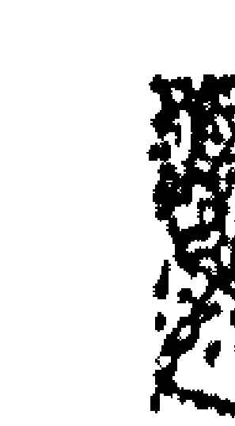

## 二十四、安流年歲前諸星的位置

| 地支 | 岁建(丁) | 晦气(戊) | 丧门(丁) | 贯索(戊) | 官符(丁) | 小耗(戊) | 大耗(丁) | 龙德(戊) | 白虎(丁) | 天德(戊) | 吊客(丁) | 病伏(戊) |
|------|----------|----------|----------|----------|----------|----------|----------|----------|----------|----------|----------|----------|
| 子 | 子 | 丑 | 寅 | 卯 | 辰 | 巳 | 午 | 未 | 申 | 酉 | 戌 | 亥 |
| 丑 | 丑 | 寅 | 卯 | 辰 | 巳 | 午 | 未 | 申 | 酉 | 戌 | 亥 | 子 |
| 寅 | 寅 | 卯 | 辰 | 巳 | 午 | 未 | 申 | 酉 | 戌 | 亥 | 子 | 丑 |
| 卯 | 卯 | 辰 | 巳 | 午 | 未 | 申 | 酉 | 戌 | 亥 | 子 | 丑 | 寅 |
| 辰 | 辰 | 巳 | 午 | 未 | 申 | 酉 | 戌 | 亥 | 子 | 丑 | 寅 | 卯 |
| 巳 | 巳 | 午 | 未 | 申 | 酉 | 戌 | 亥 | 子 | 丑 | 寅 | 卯 | 辰 |
| 午 | 午 | 未 | 申 | 酉 | 戌 | 亥 | 子 | 丑 | 寅 | 卯 | 辰 | 巳 |
| 未 | 未 | 申 | 酉 | 戌 | 亥 | 子 | 丑 | 寅 | 卯 | 辰 | 巳 | 午 |
| 申 | 申 | 酉 | 戌 | 亥 | 子 | 丑 | 寅 | 卯 | 辰 | 巳 | 午 | 未 |
| 酉 | 酉 | 戌 | 亥 | 子 | 丑 | 寅 | 卯 | 辰 | 巳 | 午 | 未 | 申 |
| 戌 | 戌 | 亥 | 子 | 丑 | 寅 | 卯 | 辰 | 巳 | 午 | 未 | 申 | 酉 |
| 亥 | 亥 | 子 | 丑 | 寅 | 卯 | 辰 | 巳 | 午 | 未 | 申 | 酉 | 戌 |

## 二十五、安生年斗君的宫位

| 生时\月 | 正月 | 二月 | 三月 | 四月 | 五月 | 六月 | 七月 | 八月 | 九月 | 十月 | 十一月 | 十二月 |
| --- | --- | --- | --- | --- | --- | --- | --- | --- | --- | --- | --- | --- |
| 子 | 子 | 丑 | 寅 | 卯 | 辰 | 巳 | 午 | 未 | 申 | 酉 | 戌 | 亥 |
| 丑 | 丑 | 寅 | 卯 | 辰 | 巳 | 午 | 未 | 申 | 酉 | 戌 | 亥 | 子 |
| 寅 | 寅 | 卯 | 辰 | 巳 | 午 | 未 | 申 | 酉 | 戌 | 亥 | 子 | 丑 |
| 卯 | 卯 | 辰 | 巳 | 午 | 未 | 申 | 酉 | 戌 | 亥 | 子 | 丑 | 寅 |
| 辰 | 辰 | 巳 | 午 | 未 | 申 | 酉 | 戌 | 亥 | 子 | 丑 | 寅 | 卯 |
| 巳 | 巳 | 午 | 未 | 申 | 酉 | 戌 | 亥 | 子 | 丑 | 寅 | 卯 | 辰 |
| 午 | 午 | 未 | 申 | 酉 | 戌 | 亥 | 子 | 丑 | 寅 | 卯 | 辰 | 巳 |
| 未 | 未 | 申 | 酉 | 戌 | 亥 | 子 | 丑 | 寅 | 卯 | 辰 | 巳 | 午 |
| 申 | 申 | 酉 | 戌 | 亥 | 子 | 丑 | 寅 | 卯 | 辰 | 巳 | 午 | 未 |
| 酉 | 酉 | 戌 | 亥 | 子 | 丑 | 寅 | 卯 | 辰 | 巳 | 午 | 未 | 申 |
| 戌 | 戌 | 亥 | 子 | 丑 | 寅 | 卯 | 辰 | 巳 | 午 | 未 | 申 | 酉 |
| 亥 | 亥 | 子 | 丑 | 寅 | 卯 | 辰 | 巳 | 午 | 未 | 申 | 酉 | 戌 |

## 二十六、紫微斗数常用名词之解释

- ◇三方四正：三方即是「本宫」加上「三合宫」叫三方；三方加「对宫」即为四正。

十二地支方位图示意图

- 廟、旺、利、陷：是星曜亮度的代號。「廟」為星曜的亮度，達八○％以上，「旺」為亮度八○％～六○％，「利」為亮度六○％～四○％，「陷」為亮度四○％以下。

- ◇ 逢、遇：為同宮之意。
- ◇ 會：為三方合宮加對宮之範圍的意思。
- ◇ 沖、照：本宮之對宮有吉星稱之為「照」，對宮有煞星稱之為「沖」。
- ◇ 拱：為本宮外的另1個合宮，稱之為「拱」方。
- ◇ 夾：任何一個宮位的左右兩宮稱之為「夾」。

# 实战篇

## 式盘学会紫微占星

如果您记性好、时间够、头脑也清楚，那您可以尝试以下列之速技法，将整个星盘组合公式背下来。

## 一、安命、身宫及十二宫

首先找出命宫、身宫位置：

位起农历正月，顺数至出生月停止，再以“寅”起子时，逆数至出生时安命宫，然后再以命宫为起点，依序逆行安上十二宫。

例：民国五十年七月十六日未时生人，如图一所示。

| 癸巳 （官禄） | 壬辰 （田宅） | 辛卯 *身宫（福德） | 庚寅 （父母） |
| :---: | :---: | :---: | :---: |
| 甲午 （仆役） | 乙未 （迁移） | 丙申 （疾厄） | 丁酉 （财帛） |
|  |  | 戊戌 （子女） | 己亥 （夫妻） |
|  |  | 庚子 （兄弟） | 辛丑 （命宫） |

## 善用公式轻松学会紫微占星

## 二、五行定盘（即宫干之加入）

甲己起丙寅，乙庚起戊寅，丙辛起庚寅，丁壬起壬寅，戊癸起甲寅。

> 如《图一》

## 三、六十花甲纳音

而，既然已定，且宫干也加入，即可以六十纳音之搭配找出命宫之纳音，兹将纳音之简易方式详述于后：

+   ● 先把十二个宫位分成六组：
A样：1.子丑 2.寅卯 3.辰巳（A即B）
B样：1.午未 2.申酉 3.戌亥（等六组）

+   ● 再将A、B样各配入：
1. 金、水、火、土、木
2. 水、火、土、木、金
3. 火、土、木、金、水

## 第五章 速成篇

再以甲乙、丙丁、戊己、庚辛、壬癸配入，即可找出命宫局数。例：命宫在“辰”，宫干为“庚”，其局数为金四局。

| 天干组合 | 五行 |
| :---: | :---: |
| 甲、乙 | 火 |
| 丙、丁 | 土 |
| 戊、己 | 木 |
| 庚、辛 | 金 |
| 壬、癸 | 水 |

以上可明显找出庚辰为“金四局”。

@辨其纳音部分之简易法：可分为六组，一个字，即将

+   A 解：
1. 加入“海、润、霹、壁、桑”。
2. 加入“溪、炉、城、松、金”。
3. 加入“覆、沙、林、白、流”。

## 口诀(一)

## B群：

加入“沙、河、天、路、杨”。
加入“井、下、驿、榴、剑”。
加入“头、上、平、钗、海”。
然后各自加入“金水火土木”、“水火土木金”、“火土木金水”，

及

+   - 乙 丁 己 辛 癸
- 甲 丙 戊 庚 壬

即可以找出纳音及局数，如图二所示。

## 四、如何起紫微

局数既定，就可利用公式找出紫微星在哪个宫位。

公式：(生日＋X)÷局数＝整除数。X若为双数则进，X若为单数则退。

例：五十年七月十六日未时生人，其命宫在“丑”，局数为“金四局”。 (16＋4)÷5＝4

套入公式，由公式所得整除为4，X亦为4，则由命盘之寅宫起“1”顺数至整除数，然后再看X＝4为双数，应该再进4个宫位，所以紫微星在“酉”宫。

| 3（辰巳） | 4（午未） | 5（申酉） |
| :--- | :--- | :--- |
| 覆沙林石流 乙丁巳辛 甲丙戊庚壬 大长 | 天河水路扬 乙丁巳辛 甲丙戊庚壬 沙中金 | 井下驿榴剑 乙丁巳辛 甲丙戊庚壬 泉锋金 |
| 2（寅卯） | 1（子丑） | 6（戌亥） |
| 炉城松金 乙丁巳辛 甲丙戊庚壬 大 | 海润霹历桑 乙丁巳辛 甲丙戊庚壬 水头柏 | 头上平缀海 乙丁巳辛 甲丙戊庚壬 大 |

## 五、紫微星系列之排法

紫微星既已找出在酉宫，则紫微系列诸星就可逆行按部加入：紫、机、（空一格）阳、武、同、（空一格）廉贞放。

## 六、天府星系列之排法

紫微星既定，天府星亦可排定。因天府星永远与紫微星成斜对宫，或在寅、申同宫，如图11所示。

| 紫微 | 天府 |
| :---: | :---: |
| 申 | 寅 |
| 寅 | 午 |
|  | 未 |
|  | 申 |
|  | 巳 |
|  | 辰 |
|  | 卯 |
|  | 寅 |
|  | 丑 |
|  | 子 |
|  | 亥 |

天府星系列之排法：府、阴、贪、巨、相、梁、杀、《空三格》破军放。切记为顺行。

| 丙、戊禄 | 丁、己禄 | 四月 左右 | 庚禄 |
| :---: | :---: | :---: | :---: |
| 巳 | 午 | 未 | 申 |
| 辰 | 酉 | 戌 |  |
| 卯 |  | 亥 |  |
| 寅 | 丑 | 子 | 亥 |

## 图四

## 七、禄存及擎羊、陀罗之排法

紫微、天府星系既已排定，其余吉星、煞星亦可依次而排。

擎羊、陀罗及禄存之排法，首先须知禄存不入辰、戌、丑、未四墓之地，所以十二宫位扣除四个宫位，剩下八个宫位；但禄存星又是以生年之年干寻得，而年干有十干，宫位却只剩八个，故在“巳”、“午”两宫，会再重复各用一次，如图四所示。

甲禄在寅、乙禄在卯、丙禄在巳、丁禄在午、戊禄在巳、己禄在午、庚禄在申、辛禄在酉、壬禄在亥、癸禄在子。

禄存既定，擎羊及陀罗即可排定：禄存顺行之前一宫为擎羊所在的宫位，后一宫即为陀罗所在：故擎羊、陀罗永远夹禄存。

## 八、左辅、右弼之排法

左辅、右弼为月系之星，须以生月方能排定。

左辅星在“辰”宫起正月，顺数至生月放之，右弼在“戌”宫起正月，逆数至生月放之。四月生人左、右在未宫同度，十月生人则在丑宫。

## 善用公式轻松学会紫微占星

## 九、文昌、文曲之排法

文昌、文曲为时系之星，须以生时方能排定。
文昌星在“戌”宫起子时，逆数至生时安之。文曲在“辰”宫起子时，顺数至生时安之。故卯时生人昌、曲在未宫同度，酉时生人则在丑宫同度。（如图四）

## 十、天魁、天钺之排法

天魁、天钺为年系之星，须以生年之年干排定：
甲、戊、庚年之天魁、天钺在丑、未宫，即牛、羊位。
乙、己年之天魁、天钺在子、申宫，即鼠、猴乡。
丙、丁年之天魁、天钺在亥、酉宫，即猪、鸡位。
壬、癸年之天魁、天钺在卯、巳宫，即兔、蛇藏。
辛年之天魁、天钺在午、寅宫，即马、虎逢。

## 十一、火星、铃星之排法

火星、铃星为时系之星，须先用年支找出定点后，再配生时排定：

+   1. 首先找出火星之定点：

寅、午、戌年在“丑”。
巳、酉、丑年在“卯”。
申、子、辰年在“寅”。
亥、卯、未年在“酉”。然后再由定点起子时，顺数至生时安放即可。

+   2. 其次找出铃星之定点：除了寅、午、戌年之铃星在“卯”之外，其余如：巳、酉、丑，申、子、辰，亥、卯、未等年生人，铃星均在“戌”宫，然后再以定点起子时，顺数至生时安放即可。

## 十二、地劫、地空之排法

地劫、地空为时系之星，由“亥”宫起子时，逆数至生时安地空，顺数至生时安地劫。

数至生时安地劫。故子时生人空、劫在亥同宫，午时生人空、劫在巳同宫。

## 十三、截空之排法

截空为年系之星，但截空不入子丑两个宫位，所以十二个宫位减去一个，剩下十一个宫位，刚好与十天干搭配，如图五所示：

+   - 甲年 截空在“申”，乙年 截空在“午”
- 丙年 截空在“辰”，丁年 截空在“寅”
- 戊年 截空在“戌”，己年 截空在“酉”
- 庚年 截空在“未”，辛年 截空在“巳”
- 壬年 截空在“卯”，癸年 截空在“亥”

## 十四、旬空之排法

旬空为年系之星，但须与年支互相搭配方可寻得。

如五十年为辛丑年，其将辛丑直接套入“丑”宫，顺数至癸年止，而

| 甲截空 | 庚截空 | 乙截空 | 辛截空 |
| :---: | :---: | :---: | :---: |
| 申 | 未 | 午 | 巳 |
| 己截空 | 戊截空 | 壬截空 | 丙截空 |
| 酉 | 戌 | 卯 | 辰 |
| 癸截空 | (空白) | (空白) | 丁截空 |
| 亥 | 子 | 丑 | 寅 |

顺行之下两宫即为空亡位。须注意的是：空亡只有一个，故阳年生人落在阴宫，阴年生人则安于阳宫。（阳宫为奇数宫位，如子、寅、辰...阴宫为偶数宫位，如丑、卯、巳...）

## 十五、四化星之排法

四化星为年系（年干系列）之星，须熟背。

（以上十五项若均排好，则其本命盘大致告成；除地劫与地空之外，余均为甲级星）

| 生年干 | 四化星 | 化禄 | 化权 | 化科 | 化忌 |
| :--- | :--- | :--- | :--- | :--- | :--- |
| 甲 | 廉贞 | 破军 | 武曲 | 太阳 |
| 乙 | 天机 | 天梁 | 紫微 | 太阴 |
| 丙 | 天同 | 天机 | 文昌 | 廉贞 |
| 丁 | 太阴 | 天同 | 天机 | 巨门 |
| 戊 | 贪狼 | 太阴 | 右弼 | 天机 |
| 己 | 武曲 | 贪狼 | 天梁 | 文曲 |
| 庚 | 太阳 | 武曲 | 天同 | 太阴 |
| 辛 | 巨门 | 太阳 | 武曲 | 文昌 |
| 壬 | 天梁 | 紫微 | 武曲 | 武曲 |
| 癸 | 破军 | 巨门 | 太阴 | 贪狼 |

（上图为生年天干对应四化星的表格）

## 十六、乙级星之排法（年支系列）

### ●天哭、天虚：

此二星是由“午”宫起子年，顺数至生年之年支安天虚，逆数至生年年支安天哭。所以丁年生人哭、虚在午同宫，午年生人哭、虚在子同度可。

### ●红鸾、天喜：

天喜永远在红鸾星之对宫。红鸾星由“卯”宫起子年，逆数至生年支即可。

### ●龙池、凤阁：

龙池是在“辰”宫起子年，顺至生年支放，凤阁在“戌”位起子年，逆至生年支安。故卯年生龙池、凤阁在未宫同度，酉年生则在丑宫相会。

### ●孤辰、寡宿：

首先须知道，寅申巳亥四个宫位为四马、四生，亦为四孤之地，而且

寡宿永远在孤辰的财宫，如此一来，孤寡一星便很容易排定，其排法：将十二宫分成四边来看，再配入生年年支为何，便能找出孤辰所落之宫，如寅卯辰在巳，巳午未在申，申酉戌在亥，亥子丑在寅。

### ●擎廉星之排法：

可用→↑←↓，箭头加H命盘，便能轻松记住。如卯辰巳年在巳午未刚好用到第一个箭头↑，酉戌亥在亥子丑→，子丑寅在申酉戌→，午未申在寅卯辰↑。

### ●天才、天寿：

天才由“命宫”起子年，天寿由“身宫”起子年，均顺数至生年年支安放即可。所以命身同宫之人，天才、天寿也会同宫。

### ●破碎星：

子、午、卯、酉年生人安巳宫，寅、申、巳、亥年生人安酉宫，辰、戌、丑、未年生人安丑宫。

## 十七、乙级星之排法（生日系列）

### ◎天姚、天刑：

天姚永远在天刑之官禄位，天刑是由“酉”宫起正月，顺行至生月安置，刚好十一宫配十一月。

### ◎天马、天巫：

天马只入“寅申巳亥”四马之地，其余宫位不入。而以四个角落之宫位，由“申”宫起正月逆行，一月在巳、二月在寅、三月在亥、四月在寅、五月在巳、六月又在巳；如此逆行，按个人生月数即可找到天马所落的宫位。

天巫星则在申宫或巳宫时与天马分守，即天马在申、天巫在巳，天马在巳、天巫在申；若在寅、亥两宫，则天马与天巫同宫。

### ◎解神星：

由“申”宫起一、二月，顺行每隔一阳宫安两个月，即一、二月在申，三、四月在戌，五、六月在子，七、八月在寅，九、十月在辰，十一、十二月在午。

### 十一、十一月在午。

+   - **阴煞星**：在“寅”宫起正月，逆行，每隔一宫安一个月，即一月在寅，二月在子，三月在戌，四月在申，五月在午，六月在辰，七月又回到寅；顺序如此。
+   - **天刑星**：此为月系星中最不易熟记之星，可借图六加强记忆。
+   - **天官、天福**：这两颗星也是很不容易熟记之星，可借图七加强记忆。

## 善用公式轻松学会紫微斗数

| 乙福 丑 | 甲福 子 | 丁官 壬官 甲福 酉 | 癸官 戊 |
| :--- | :--- | :--- | :--- |
| 丙福 癸福 壬福 巳 | 癸福 壬福 辛福 午 | 甲福 未 | 乙福 申 |
| 丁福 丙福 乙福 卯 | 戊福 丁福 丙福 寅 | 己福 丑 | 庚官 丁福 丙福 子 |

大运
大限起运

## 第五章 选颛篇

+   - 十八、乙级星之排法（生日系列）
  - ◎三台、八座
  - 三台由“左辅”起初一，顺数至生日安放；八座由“右弼”起初一，顺数至生日安放。
  - ◎恩光、天贵
  - 恩光由“文曲”起初一，顺数至生日前一宫安放；天贵由“文曲”起初一，顺数至生日前一宫安放。

+   - 十九、乙级星之排法（生时系列）
  - ◎封诰、官印
  - 封诰星永远在巨门的财帛位，官印星由“午”宫起初一时，顺数至生时安放即可。

+   - 二十、丙级星之排法
  - ◎岁建、...

## 二十一、起大、小限及斗君

●太限：即每十年为一大限，且以本身局数为几局，起运即由几岁开始。如木三局，则第一大限为二至十一岁，第二大限即十二至二十一岁。另外，大限须分男女及阴阳，其走法为：阳男阴女顺行，阴男阳女逆行。切记！

●身主：由“子”位起，顺数配入：火、相、梁、同、昌、机、火……（重覆），再看本生年支所在配入何星，即为身主之星。

●小限：由“子”位起，分两头配入：贪、巨、禄、文、廉、武、破，再看命宫所在配入何星，即为命主之星。

能配合年支及图型，便可以轻易熟记：

戌亥年生人，由“辰”宫起1 岁，图：

丑未年生人，在“未”宫起1 岁，图：

甲子辰年生人，在“戌”宫起1 岁，图：

寅卯未年生人，在“丑”宫起1 岁，图：

> 注：小限之走法须分男、女，男命顺行，女命逆行，切记！

◎斗君：首先看本命盘之寅宫为何宫，换为太岁的什么宫，即为流年斗君所落的宫位。

如寅宫为本命之官禄宫，则太岁的官禄宫即为斗君之位；寅宫若为本命的疾厄宫，则太岁之疾厄宫即为斗君所在；如寅宫为命宫，则斗君永远与太岁同宫。

## 二十二、十二长生之排法

“寅申巳亥”为四生之地，亦为“长生”所落之位，但长生是看局数，为几局，然后由该处起“长生”。

起法可由图得知，其建法亦分男女及阴阳；阳男阴女顺行，阴男阳女逆行。

例：阳年生之男孩，其局数为金四局，则“长生”在“巳”宫开始，顺行：

+   - 长生
- 沐浴
- 冠带
- 临官
- 帝旺
- 衰
- 病
- 死
- 墓
- 绝
- 胎
- 养

## 二十三、博士十二星之排法

博士：“星定“禄存”之宫位开始，亦分阴阳及男女。阳男阴女顺行，反之逆行：

+   - 博士
- 力士
- 青龙
- 小耗
- 将军
- 奏书
- 飞廉
- 喜神
- 病符
- 大耗
- 伏兵
- 官府

## 二十四、将前十二星之排法

将星之起法须看年支，走法均顺行。简易法即将星所落之宫均在“子午卯酉”，即各三合之中宫：寅午戌在“午”宫，巳酉丑在“酉”宫，申子辰在“子”位，亥卯未在“卯”宫。起将星：

+   - 将星
- 攀鞍
- 岁驿
- 息神
- 华盖
- 劫煞
- 灾煞
- 天煞
- 指背
- 咸池
- 地煞
- 亡神

## 二十五、岁前十二星之排法

岁星之起法甚易，即看生年支为何？便由命盘中之该宫位开始，且均顺行。

如丙申年生人，年支为申，即由“申”宫开始：

+   - 岁建
- 驿马
- 贵人
- 丧门
- 官符
- 小耗
- 大耗
- 龙德
- 白虎
- 天德
- 吊客
- 病符

> 以上所列之紫微占验派之传统命盘排法以资参考。（请见下一页）

| 武曲 破军 铃星 (85~94 小限11) | 太阳 天机 (75~84 小限12) | 天府 (65~74 小限1) | 天机 太阴 陀罗 (55~64 小限2) |
| :--- | :--- | :--- | :--- |
| 天同 右弼 (95~104 小限10) | ⊙ 姓名：XXX ⊙ 性别：男 ⊙ 生辰：农历50（辛丑）年07月16日未时 ⊙ 五行：土五局 ⊙ 性别：阴男 ⊙ 生肖：牛 ⊙ 命宫：丑宫 ⊙ 身宫：卯宫 ⊙ 命主：巨门 ⊙ 身主：天相 | | 紫微 贪狼 禄存 (45~54 小限3) |
| 文昌 天刑 (105~114 小限9) | | | 巨门 擎羊 左辅 火星 禄 (35~44 小限4) |
| 天钺 (115~124 小限8) | 廉贞 七杀 (5~14 小限7) | 天梁 (15~24 小限6) | 天相 文曲 (25~34 小限5) |

## 中國紫微斗數名師 天乙上人 傳道授業啟事

凡是對紫微斗數有興趣的人都知道，這「千古智慧」的學問博大精深，沒有經驗豐富的老師指導，絕非可輕易一窺堂奧。

天乙上人擁有二十年的教學與執業歷練，為無數面臨困惑與抉擇的人解惑釋疑，門下學生近五百位，學有成績而對外執業的學生更高達六十多位，並且遍佈世界各地，繼續地發揚光大此一「智慧的結晶」。其專業著作出版已有四十餘冊，精闢的解析與概念，為斗數界的經典教材。

天乙上人傾囊相授從不藏私，授課更有專用的獨門精準講義，以利有心向學的學生能快速的抓到重點，而不會困惑於傳統八股、模稜兩可的迷思中，讓您瞭解自己，改變機運、掌握未來，並擁有永不過流行的「一技之長」。術傳有緣，緣至即聚。

結緣專線 (02) 11751-1170911
1178-198411
