# 斗数真诀五

> > 古云：
>
> 「富贵定命，
> 穷通修短。
> 虽有佳命不逢时，
> 但有运步云梯。

### 序

谈命理必然会提及命与运的关联问题，有人将先天的、与生俱来的性格特质和生命脉络，称为命格，随着时间流转和环境的变迁起伏则称之为运程。在紫微斗数星盘的组合设计里，即有先天盘与后天盘之区分。

先天盘是根据生辰八字，依序排列出来的固定星盘，后天盘则是根据您行运的方向而移宫换位，因此整个星盘也跟着物换星移，依着时间的不同而运转，呈现出当时磁场的强弱，而论吉凶祸福。

先天盘所显示出的是您的：先天的条件、六亲状况、个性、观念、心理状况……等等，是后天难以更改或是随意左右的，即所谓「牛牵到北京还是牛」，不论是否好坏都得无奈的接受，也不是您说不要就能甩得掉的。

而后天盘的十年大限和流年，则是指后天您实际面对的环境、机运与本身想法与抉择的互动关系，这部份能根据您的智慧、毅力和行动，加以创造或予以扭转，这是属于后天行为能力的部分。先天与后天若搭配得好，就能有实际加分的效果，配合得不好则人生肯定是黑白的。

将这个理论运用到斗数的解盘技巧上，是相当合乎情理的。有的星盘无论先天盘或大限盘，其三方四正所会合的星曜，都是相当强势和完美，但若四化星和空劫搭配的不好，极有可能是中看不中用，进而导致全盘皆输的局面。

同样的，一个弱势的三方四正组合，也可能搭配到极为恰当又得地的四化，让整个局面呈现出令人出乎意料的正面结果。所以，四化星在斗数的设计上，是列为甲级星曜，可见其重要性为何。在星盘上具有画龙点睛的效果，对星盘的吉凶、旺弱具有决定性的作用，对事件的前因后果关系具有指标性质。研究斗数的学问若不懂四化星的变幻，对事件的前因后果其运用，是很难通透了解紫微斗数的奥妙，读者应详读活用。

而老夫不顾同行的反对和众学生的抗议，执意将四化星的精华公开付梓，并以远低于市面上动辄数万的所谓「秘笈珍藏」等还低的定价，为的只是将这门「中国传统特有的智慧文化」的理念，做更广泛的传承流长，因此对读者而言肯定是物超所值，值回票价，只要能珍藏拥有，肯定是您的福气！

二〇〇一年端午于台北居

### 八千代台

## 六十甲子纳音篇

### 前言

### 一、纳音

五行在五音中属「土音宫、金音商、木音角、火音徵、水音羽」，而配置在星盘中的每个宫位都含有不同的五行和五音，并依照各个宫位的干支，由甲至癸、子到亥等不同的分配而有不同的性质，所以在十二个宫位中共有六十甲子，三十个纳音五行局，数目虽少，但其中却包含了无尽的玄机与奥妙，在我国五术中占有极其重要的地位，无论是山、医、命、卜、相，都有它不可或缺的妙用，在斗数里自然也不例外，只是八字运用到较多的部分，斗数用的较少而已。

### 二、功能

（一）用来定五行局，再依照已定好的五行局来推算紫微星座落的位。

（二）纳音能显示一个人内在的个性，所以纵使是在同样的宫位有同样的星座入命宫时，还是会因为纳音的五行局位置及排列的不同，而有思想及作风上的差异处，进而影响一个人对事物的看法以及面对问题时有不同的诠释与解决方法，所以在收放进退、善恶取捨时会因为在一念之间的相异，而造成完全不相同的结果。

（三）以命宫的纳音五行来推论其先天的本性，身宫的纳音则是隐藏在后天环境影响下的潜在性格，只有在失控的状态下，例如暴怒、紧张及遇到突发事件时才会显露出来，也有可能在肢体语言上。

（四）每一个人的个性也会随着每十年大限的转变而改变，所以大限宫位的纳音五行也必须一併参考，可是原本命宫的纳音五行则一样都有效，永远都不会变的。

### 三、应用

在十二个宫位中，星曜与地支之间，都具有五行相生、相剋的作用，但是星曜五行与纳音五行之间却没有相生、相剋的作用，因为纳音的影响更强于星曜的五行，所以只能引用五行生剋的道理，却无法将星曜与纳音二者的五行加以生剋比旺弱，只是藉由纳音五行予以强化引导该宫星曜的特性，而让它的特性显现或压抑星曜的特性，使星曜无法发挥，这对星曜的特性所引发表现出来的外在个性具有绝对的作用。纳音五行在斗数里，除了可以显示这个人的内在个性之外，在流年活盘的格局里也有它特定的作用，学者们千万不要忽视它的效果，本篇仅以纳音五行来分析个性，其余的将另有专文介绍。

#### 1、甲子、乙丑海中金

海中金，顾名思义就是潜藏在海里的金矿，你能隐隐约约地发现那闪烁的金光，但是想捞起来却不容易，因为它潜藏的太深，需要一番努力及时机才能探得其中的究竟，此处所说的甲子、乙丑海中金，就是指这人具有内敛的特性，个性上较为保守，凡事较不会主动积极地去争取，常会有怀才不遇的感觉，但是只要时机一到，一样可以出人头地。

甲子：个性含蓄但有内涵，内心热情而且对待朋友非常友善，只是在外表上比较不容易看得出来，也不善于表现。

乙丑：容易有幻觉，类似天梁星的个性，容易步入邪道，但是外表看起来也跟甲子一样是忠厚老实的人。

### 丙寅、丁卯炉中火

丙寅、丁卯都同样属于炉中火，而火炉的火当然不是一下子就可以生起来的，必须要从小火慢慢的添加木柴，使它逐渐加温，火势渐发后才能开始发挥它的功能，对属于炉中火的人来说，代表着个性稳重、有自信，做事有计画，属于蓄势待发型的人。只是属火的人当然脾气也不怎么好，情绪堆积久了容易怒火中烧，对自己的能力也太过于有信心，欲望也很强，不容易满足；且炉中火的范围被局限在炉子里，有时就像井底之蛙一样，以为天地只有自己所知那么大，以致自视甚高，常常得意忘形，不知道天高地厚。

丙寅：个性较稳重，但是野心却更大，有时候会因为太过于高估自己而说话欠考虑。

丁卯：野心也很大，但是比较不拘小节，为人精明、能幹，不过表现出来的态度谦和，是很聪明的人。

### 三、戊辰、己巳大林木

大林木，顾名思义就是一大片茂盛的森林，并且一棵树木无法架构成一片森林的，一定是要一整群才行，而森林内的树木为了争取阳光的照射，都会拼命地向上伸展，所以每一棵树都长的又直又挺，也能让人类或动物能在树下得到遮蔽的地方，免于风吹日晒和雨淋，就像一个充满爱心的人处处为他人着想，帮助他人一样，是个很体贴、随和、好相处的人，但是也由于是群树林，所以较不喜欢太过于突出，并且容易受外在环境影响，自然就比较没有人的特色与形象，但也并不是没有主见，以是较会附和大家的想法而不愿意特立独行罢了。

戊辰 - 个性软弱无主见，服从性高，也很合群，容易与人相处。

己巳 - 为人直爽随和，不夸张，说起话来温和委婉，到处都受人欢迎。

### 四、庚午、辛未路旁土

午宫的位置为火旺之地，火旺而生土，就像是火山爆发时所喷出来的岩浆灰烬，等到尘埃落定时，火势就逐渐减弱，泥土的温度也逐渐降低，虽说本身蕴育力很强，但因为还没有完全稳定下来，也还不能做任何有效的运用，只能先让它留在路上，等时候到了才能开垦，必须要有耐性等待才能化育万物，遍佈人间。所以属于路旁土类型的人，多半个性直爽，又很有耐心，做起事来都会有始有终，也因为泥土是无条件的接受各式各样的植物，也能盛装在各种容器里而没有固定的形貌，就像一个很有博爱之心的人，不管是好人、坏事，好事、坏事他都会帮忙，完全没有私心，具有很强的服务精神。

庚午：在庚午的人比较没有主见，耳根子软，容易左右摇摆，难以下定决心，而且脾气暴躁，就像火山飞扬还没尘埃落定的时候。

辛未：虽然比较有耐心了，但是脾气还是暴躁容易冲动，就像泥土温度还没完全降下的时候，一样火气未消。

### 五、壬申、癸酉剑锋金

一把剑最锋利的部位当然是在刀锋的位置，而金的正位在申酉，刚好在最旺的部位，金旺而刚，就好像剑之锋一般，两面锐利，剑气逼人，就像一个人的好胜心强又爱现，非常锋芒外露，而且处处都要赢过别人，并喜欢与人争辩，如果再搭配上巨门星那就更是「箭王」了，只要惹得他不爽，说话刺得你全身伤痕累累都是家常便饭，所以很容易得罪人。但是钢的材质又非常坚硬，就像一个意志力像钢铁一般个性的人，说出来的话一定会做得到，也因为如此，对自己的要求也比较多，是个有志气，肯打拼的人。

壬申：做事阿莎力，不会拖拖拉拉，但是也从不考虑后果，说起话来言词尖锐，咄咄逼人，而且目中无人，不容易与人相处，看自己「一朵花，看别人像豆腐渣。」

癸酉：为人处事刚中带柔，比较会见风转舵而不至于在当下硬碰硬，个性倾向欺善怕恶，不愿吃眼前亏。

### 六、甲戌、乙亥山头火

山顶上的火距离又高又远，虽然一开始火势猛烈，但是一烧完就消失无踪，冷热差很多，就好像一个性格极端的人，做任何事只挑自己喜欢的，爱就爱得要命，恨也恨得很深，发起来脾气来就像那一把火一样，既冲动、爆发力又强，就算是天皇老子的账都不买，一旦热度退却，马上又一点劲都提不起来。做起事来也一样，常是一头热，兴头过了什么冲劲都没有，因此常常是带头搅和的那一个，可是热闹完了拍拍屁股走人，烂摊子留给别人收；这种捉摸不定的个性，朋友久而久之就不敢和他交朋友了。

甲戌：具惰性，没什么冲劲，也没什么主见，好逸恶劳，所以成就不大，只是偶尔一股傻劲来时会衝一衝，一旦没了劲儿，又啥都不做了。

乙亥：软弱有冲劲，但是具有双重个性，态度表现冷热不一，做事也常是虎头蛇尾。

### 七、丙子、丁丑涧下水

山涧之水清澈透明，象征一个人个性聪明冷静，只是溪水支流又多又细，深浅难测，就好比一个人的心思複杂，度量不足，而且心胸狭窄，城府颇深，平常人是看不透他的心思的，且又因「墓」同位，所以很可能隐藏心思，常常一件事计画很久，却没有人能看得出来，在计画时期中他会照样做该做的事、说该说的话，完全让人感觉不到情绪上的波动，是很会敛藏、蛰伏的人。如果能够逢空亡或是紫微星反而能朝正面学习，但若适逢天机、文昌、文曲、巨门或其他阴煞之星，则润下水的特性更是表露无遗，尤其是逢天机星或巨门星则心术不正，为人太过「奸巧」。

丙子：优柔寡断是最大的缺失，就像溪里的水接继不上就没办法很流畅的向下流去。

丁丑：前列的情形虽然比较不明显，但是特性还在，只是比丙子更精明、更冷静。

### 八、戊寅、己卯城头土

城墙原本就是作为屏障之用，而城头上位置在城墙的最上方，就好比高高在上的皇帝，有很大的野心，希望统治他人，虽然他表现得很热忱，也一副度量很大的样子，但是实际上不见得，对一个欲望强大的人来说，只要是有达到目的，什么事都可以做，是个标准的「骑墙派」投机份子。

戊寅：表面看起来忠厚老实，内心里常会反覆不定，其实不一定老实。

己卯：表面同样看起来很忠厚，内心疑惑，但是较为精明，而且表现的稳重冷静。

### 九、庚辰、辛巳白蜡金

古早有一种药叫做「白凤丸」，长得像是一颗小号的乒乓球，外层里有一层白蜡，必须把蜡掰开才能拿到里面的药，白蜡金也是一样的意思，必须把外层打开，才能知道里面到底装了什么；就像一个善于伪装自己的人，外表看起来或许很亲切，做事也很认真，但是渐渐地会发现不对劲，怎么说出来的话和做出来的事往往背道而驰？而且很自私，只顾自己的利益，当然很难和大家打成一片。也有另外一种是不注重外表打扮，常常不修边幅，但是却是很有思想与内涵的人；所以白蜡金的人大部分都表里不一，不打开它，是不知道他葫芦里卖的是什么药，因为本身个性就是善于伪装，如果配合的星宿不佳，这个人的心肠可能就不好好了。若有往来最好小心为上。

庚辰：时常别有居心，常常说的是一套，心里想的又是另外一套，不过城府虽然很深，但是未必会害人。

辛巳：个性灵活，为人较为正派，但是如果搭配的星宿不适合时，例如文昌、文曲、天机等星，比较容易会成为双面人。

### 十、壬午、癸未杨柳木

不知道各位是否看过杨柳树？河岸边的杨柳伸展着长而坚韧的树枝，迎风摇摆，就像一个跳舞女郎般摇摆着她动人的身躯，婀娜多姿，柔若无骨，但是也因为本身的不稳定，时常会随着外在环境变化而改变自己的想法，以致容易见风转舵，像棵墙头草，哪边西瓜大就往哪边站去，一点骨气都没有。个性柔弱而现实，心思虽然细腻，没什么心机，却很敏感，哭哭笑笑常在转眼之间，就像是一个演员一样，而且很会护短，只要是自己人，怎么样都可以忍耐，事事都可以包容，其他人，闪一边去吧！

壬午: 个性较为阴沉可怕，最好能遇到星性较为刚烈的星宿来中和阴柔特质，否则没什么主见，人家怎么说，他就怎么做。

癸未: 有冲劲，但是却无法耐久，容易受到煽动，而且没什么定性，这个也好，那个好像也不错，常常摇摆不定。

### 十一、甲申、乙酉井泉水

常是保持着平静无波的状态，虽然不像大海一般波涛洶涌，也不像山中的瀑布一样气势壮观，但是却能取之不尽，用之不竭，也不会因为都没取用而溢了出来。光凭肉眼很难断定它的深浅，就像一个城府很深的人，一般人很难瞭解他的心思，但是他也没有害人之心，只是不会主动的表达自己的想法，需要对方有要求的时候才会给予，就像井泉不会自己溢出来，如果有需要请自行取用一般，而且外表上表现得相当随和，有点古板、死固，但是还算有点爱心，只是你必须要求他付出罢了。

甲申：欲望无穷，有热心，但不热忱，肯给予，不自私，内心就像井水。

乙酉：依赖心比较重而且孤僻，个性较为阴沉，如果逢巨门星时，则疑心病更重，不相信任何人。

### 十二、丙戌、丁亥屋上土

丙丁属火，亥属水，屋上土的意思就是泥土用水来搅拌后，再用火来炼製成屋顶上的瓦片的意思，而有了瓦片的遮风蔽雨，大家才有休息的地方，但是瓦片容易一摔就碎，就像一个很有爱心的人，常会牺牲自己成全别人，却还能为大家服务，造福群众，实在是令人敬佩；只是个性劳碌，得失心重，依赖心比较强，就像瓦片需要有附着之处一样。

丙戌：常会因为年纪愈大愈固执，脑子从来不会转弯的，凡事一个萝卜一个坑，谁也不要调皮，做事情较讲究原则。

丁亥：个性比较急，有依赖心，是个内心脆弱的人，但很有爱心，也是一位爱家顾家的人。

### 十三、戊子、己丑霹雳火

听到霹雳火，马上就可以想像得到闪电以雷霆万钧之势，快速飞奔急驶的样子，只要是所到之处一定雷厉风行，气象洶洶！不过来的快，去的也快，就像个脾气暴躁的人，发起威来吓都吓死人了，不是拍桌子骂人，就是甩东西出气，当他在气头上时，什么话也听不进去，等到发泄完了，就像一颗洩了气的皮球一样，气馁马上消下去。凡事只有三分钟热度。

## 六十甲子納音篇

熱忱，行事果斷，凡事速戰速決，喜歡出風頭、發號司令。

- **戊子**：表面上看起來像個無情的人，但內心裡卻是熱情如火，逢巨門星、鈴星反而比較好，個性會較冷靜，不會孤注一擲。
- **己丑**：做事常常虎頭蛇尾，做很多事都是雷聲大、雨點小的收尾，起初都是一副很投入、認真的樣子，到最後卻後繼無力，有時還會成事不足，敗事有餘。

### 十四、庚寅、辛卯松柏木

寅卯為木的正位，然而在代表金的庚辛火攻之下，仍然能維持他的生機，由此可見它的韌性十足，就好像松柏不會畏懼寒冬的傲雪而依然挺立一樣，是能經得起考驗的。對這種意志力堅定、毅力強大的人來說，只要為了成功，所有的困難與辛苦都可以忍耐，完全不用別人操心，是個能自我鞭策且經得起考驗的人，但是主觀也蠻強的。

- **庚寅**：有主見，少有依賴心，個性較為直爽，其吃苦耐勞的能力常是令人嘆服。
- **辛卯**：精明能幹，耐性十足，對環境的適應力很強，紓解壓力的能力無人能及。

### 十五、壬辰、癸巳長流水

辰為水庫，而且是金生長的地方，而且金會生水，水庫裡的水因為有了源源不斷的水源，所以能保持一定的儲水而不會乾枯。就像：一個看似野心不大的人，卻什麼都想擁有，高級的沒有了、普通的也沒關係，還好慾望較容易滿足，不管如何只要有就好了；延伸到學習上也是相同的情形，好像什麼都可以學，可是學而不精，有學就好了，是不是真的懂就是另外一回事了。

- **壬辰**：個性較漂泊，不穩定，就像漂流的水，會有雙重個性。
- **癸巳**：做事喜歡斤斤計較，挑剔得不得了，有時候多話而囉嗦。

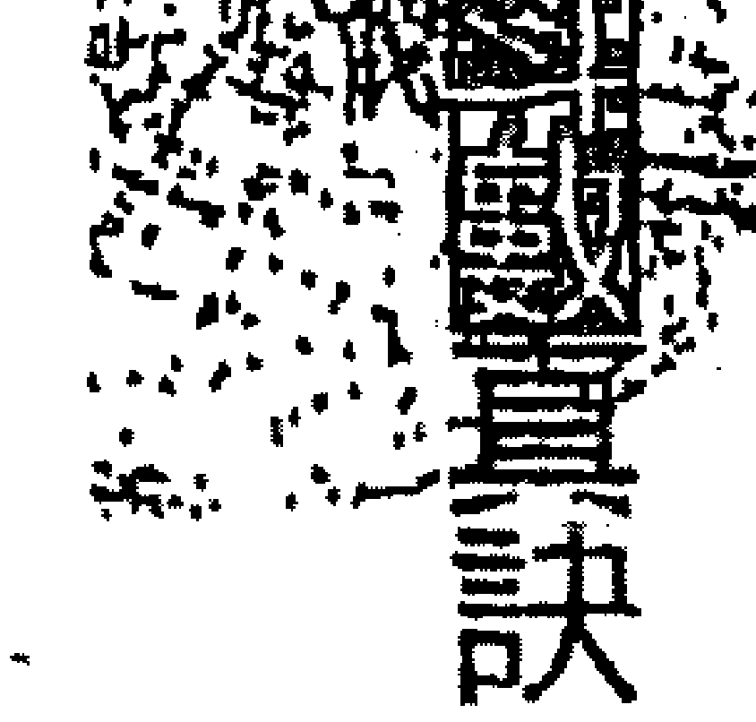

### 十六、甲午、乙未砂中金

很久以前有股風行淘金熱的熱潮，大伙兒呼朋引伴，到處去找金脈附近的河床，捲起褲管，拿著漏杓，認真的在河裡淘金，如果真的幸運得到了，還得要經過重重過濾冶煉才能得到純金，若說到金礦那就更難了，必須要開墾提煉才能得到。其實砂中金帶有很不穩定的個性，因為有太多的思緒就像砂與金的混雜，有時會似是而非，需要有人拉一把才能成功，而且因為不穩定且多變的個性，常受到環境的影響而改變自己，見風轉舵的個性特強。

- **甲午**：個性不穩定，主見不強，學而不精，有連自己都未必瞭解自己到底想要什麼。
- **乙未**：容易受到外界影響，沒有一定的想法與形象，遇到事情很會當「水昆」兄。

### 十七、丙申、丁酉山下火

### 十八、戊戌、己亥平地木

平地木就是一般盆地上的茂盛樹林，而且亥為木的長生地，使得樹木能夠順利的萌芽生長，再加上平地上的樹木生長環境比起高山上的酷寒來說是舒適多了，也因為不必經過嚴苛的外在環境磨練，使得它較沒有很強的憂患意識，因此雖然有不錯的能力，也常覺得懷才不遇，但卻沒什麼衝勁，需要仰賴別人的照顧與提拔。基本上做事還算條理分明、前後有序，只是動作較慢，也不會投機取巧，還蠻適合從事穩定單一的工作，例如公家機關或大型民營機構都是不錯的選擇。當太陽逐漸的西沉落在山邊時，雖然夕陽無限好，可惜近黃昏；昏黃光芒與正午的烈日灼灼比起來實在是太微弱了，大家都要開始開燈以避免光線太薄弱。話雖如此，本身還是具備太陽的特質，例如主觀性強，很會保護自己，也常自認為很厲害、很高竿，與別人比起來絕對差不到哪裡去，只是沒人有眼光欣賞、尋不到伯樂；所以常會有生不逢時、懷才不遇的感嘆。但其實本身從來都不曾反省會造成如此的現況，都是因為自己心胸狹小且目光短淺、較自私，尤其還超級老頑固！實在是很難相處：這樣的人，縱使有人提拔，總有一天，大家也會被他古怪的個性給氣死。

- **戊戌**：個性內斂，不愛領頭居功，適作幕僚人才，不適當領導人。
- **己亥**：處事分明，不圓滑，做起事來一板一眼，所以容易得罪人。

### 十九、庚子、辛丑壁上土

壁上土需要依附著山或牆壁才能穩固，最大的功能就是粉飾、美化及遮蔽牆面，就像有些小姐一定要化過妝才敢出門一樣，所以是很注重外表的一群。當然愛美是人的天性，只是那一類型的人更愛面子，喜歡別人當面誇獎，好像這樣才能充分發揮壁上土裝飾的功能似的，這種人外表看起來很隨和，也蠻有愛心，但是他的愛憎之心很重，凡事只要牽扯到自己人就樣樣都評好，壞的也要硬掰成好的，非常狡猾，喜歡搞小團體，一旦被他列入不歡迎名單就事事不便了，這細「你、下，那裡扯個後腿，真是個麻煩人物。

- **庚子**：內外分明的特性較不明顯，雖然比較沒有主見，但是一旦得罪他時，什麼惡劣的批評都出來了，「點口德都沒有。
- **辛丑**：特徵與庚子相同，但是如果位置在「帝旺」之地就會表現的很明顯，坐「死」地則比較不會。

### 二十、壬寅、癸卯金箔金

金箔為經過錘打而成的薄金片，因為又薄又軟所以可塑性很強，可以直接貼附在器皿或物品的表面，使東西看起來更漂亮，也增加它的價值，有的人買它只是為了面子和炫耀自己的財力而已，喜歡做做表面文章，愛假仙的，因此金箔金象徵著修飾及虛浮、奢華不實、毫無自我的性格，就好像有一句廣告詞：「是我、非我，我演我，我又不是我。」雖然他的個性柔和，可是並不是軟弱，適應力也不錯，但一生較飄蕩不定，也沒定性，凡事都要人在後面盯著，要不然就容易拖拖拉拉地收不了尾。

- **壬寅**：處事較穩重，能隨機應變，反應迅速的，但他的不定性令人頭痛。
- **癸卯**：比較有心機，個性較不穩重還帶點浮躁，對他必須使用「蘿蔔與棍子」理論才有效。

### 二十三、甲辰、乙巳覆燈火

用燈罩隔開來的火，你只會看到它的光亮，卻不會被它的熱度灼傷，就像一個默默為人付出，犧牲自己照亮別人，有如夜間的明燈，是溫暖付出而不是鋒芒畢露，也不會處處宣傳自己的善行。覆燈火的人很有愛心，也很有使命感，平常不愛出風頭，但在有需要的時候卻能無私的付出，不吝嗇展現自己的才華並願意幫助他人，屬於為善不欲人知的人。

- **甲辰**：凡事實事求是，是一個有原則、有責任感，可以讓人放心託付重任的人。
- **乙巳**：能在必要的時候展現自己，表現他的才華，所以誘因非常重要。

### 二十一、丙午、丁未天河水

天河水出於火旺之地，熊熊燃燒的火雖然看起來很熱情，但是潛藏在地下的河水卻是冰冷無情，如果一不小心被他的假象所騙，下場可能會被凍的很慘；雖然他也是具有愛心的人，但是實在是不擅於付出，是屬於被動型的人，內心也常處於矛盾的狀態，加上自信心強，又喜歡帶頭當老大，但是很多人都搞不清楚他的想法與動機。

- **丙午**：內心頗為矛盾，情緒上的困擾也多，不易平靜。
- **丁未**：喜歡做作、愛表現，但是還比較有情有義。

### 二十三、戊申、己酉大驛土

大驛土就好像一片廣闊、平坦的疆場，放眼望去只看到一片無垠無際的天與地，讓人不禁有種滄海一粟、渺小孤立的感覺。所以大驛土類型的人，渾厚紮實就像與生俱來的個性，為人勤勞努力，辦事能力強，有衝勁，是很有原則的人，有時候即使超過了負荷，還是逞強不願向人低頭，但是有時候難免會有劃地自限、故步自封的問題，而且即便個性坦然、實在，卻也因為他的務實，偶爾也會有現實的一面。

- **戊申**：氣質不錯，凡事不會小鼻子、小眼睛的斤斤計較，表現得較大而化之，但是個性較務實孤傲。
- **己酉**：疑心病重，有時候會是非不分，但是為人精明能幹。

### 二十四、庚戌、辛亥釵釧金

釵釧金是古代仕女們的裝飾品，單單一樣東西就有各式各樣的花樣與形狀，令人目不暇給，有美化、修飾的作用，而且這些裝飾品大多使用金屬來打造，外表美麗而內在剛韌，就像是一個外柔內剛的人一樣，外在看起來柔媚，但是個性卻很強硬，思想頑固，不會變通，且注重外表，虛榮心強，看起來文靜卻不斯文，長的蠻好看，給人的印象不錯，若是女性會比較喜歡巧妝打扮。

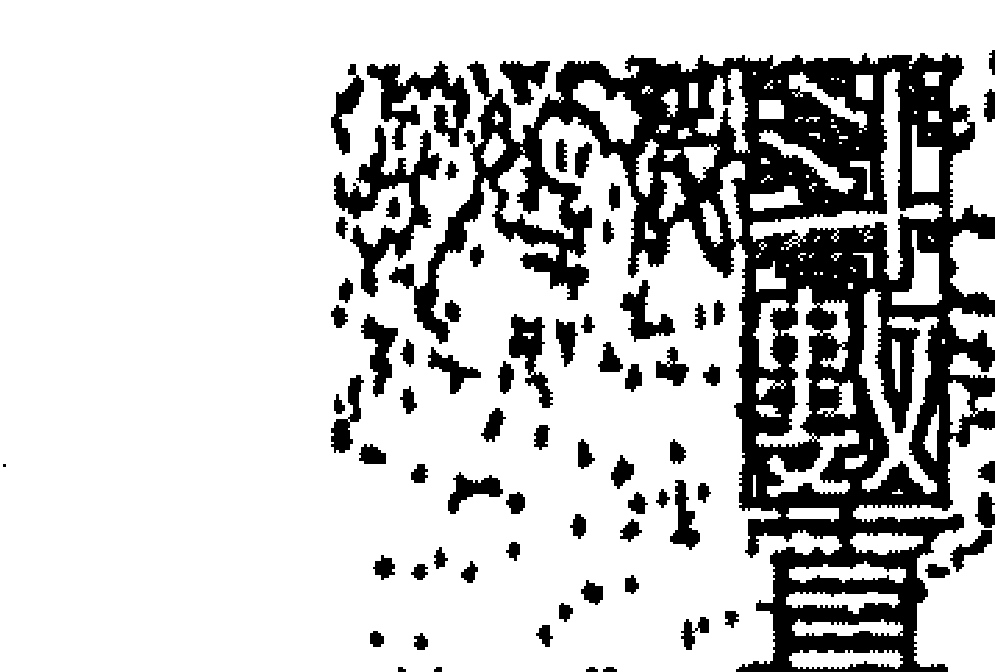

- **庚戌**：虛榮心更強，有時候要求面子與自尊真是近乎吹毛求疵，喜歡別人誇獎及奉承。
- **辛亥**：個性變化小，看起來比較「幼秀」，但是還是有點虛榮心。

### 二十五、壬子、癸丑桑柘木

桑樹的嫩葉可以摘下來喂蠶寶寶，樹枝可以製紙，木頭可以製作耕田的農具，樹皮可以製造染料，所以桑樹的用處非常廣泛，可以說是物盡其用，有很高的利用價值，但是這些優點放在一個人身上就未必是這回事；雖然有愛心，也喜歡幫助別人，但是因為個性木訥、被動，沒有主見，別人叫他做什麼就做，可能他認為自己是在幫助別人，其實是大家都在利用他，認為他老實又好騙，處處被吃的死死的，可悲的是他說不定還不知道呢！

- **壬子**：沒有主見，心太軟又好商量，為人老實，很容易被人拿來當人頭的標的。
- **癸丑**：主見稍微強一點，但是時間一久就容易有變化而產生動搖，意志力還是不夠堅定。

### 二十六、甲寅、乙卯大溪水

寅卯為東，所有的水都隨集成大溪水在這裡。是流到江、海，溪水從山澗沖刷而下，因為所在高處，是以水勢強勁，水道又崎嶇，一下子左，一下子右拐的變幻莫測，全都朝向江、海奔流而去，所以具有多變、深沉的特質，外加現實、無情，只因崎嶇的水道就像自身狹小的心地，帶有心機深沉、自私又貪小便宜的個性，做人現實又絕情，完全沒有義。

- **甲寅**：城府頗深，個性變化大，一會兒風、一會兒雨的反覆不定。
- **乙卯**：個性變化大，說變就變，比較絕情，甚至比甲寅還嚴重。

### 砂中土

到海邊去玩時，應該經常會看到小朋友用水和砂堆砂堡，非三兩的砂堡有的可愛有的壮观：但是，缺水的砂土是無凝聚力的，縱似堆好了，風一吹馬上就散，完全無法受到規範，也因此能自由自在地到處飄散。就像一個適應力特強的人，不論到哪裡，處於何種環境，都能隨遇而安且樂天知命，凡事不強求，深知這世上的一切都沒個定數，是自己的終究是自己的，即使沒有也無妨。因此這類型的人，最後的結局好壞差距頗大，假若處於環境糟的時候會很慘，如果幸運的話，時勢造就成英雄也是有的，只不過有時候比較會打混摸魚，事情能不做就推掉，卻還不忘把機運升遷的機會。氣可言，與其相處當心被出賣幫他數鈔票。

- **丙辰**：好表現，只要機會一且降臨在身上，馬上就擺出一副高傲自大的樣子。
- **丁巳**：心術不正，為人自私，常常會為自己打算，也會奉承上級幫自己製造機會。

### 二十八、戊午、己未天上火

天上火就是指太陽，普照大地的太陽公正無私，普施恩澤，燃燒自己，照亮別人，對任何人都一視同仁，不分彼此，就像：個光明正大且熱情博愛的人，個性豪爽而且喜歡幫助別人，充滿了愛心與同情心，以及具備人飢己飢、人溺己溺的精神，只是愛出風頭加上心腸很軟，所以他的愛心常會遭到有心人的利用而不自知。

- **戊午**：外表隨和但不隨便，凡事大而化之，不拘小節，個性比較剛強冷靜，內在細心思細膩，常會為善不欲人知。
- **己未**：雖然個性嚴肅，但是比較柔和而且常常會放不開，具有雙重個性，心思與想法常會在突然間轉換，外表看起來隨和，但是內心卻很矛盾。

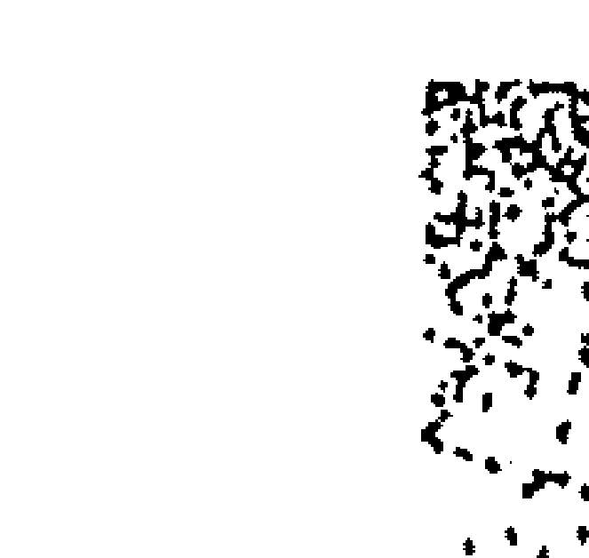

### 二十九、庚申、辛酉石榴木

石榴木非常堅硬不容易砍伐，引申出來的含意表現在個性上，就容易帶有堅硬、頑固、倔強等特質；繁雜交錯的枝節就像本身複雜且多變的內心世界；而粗糙的木材使得為人表現酸澀、不夠圓滑，其實還是個性格刁蠻古怪的人。石榴木類型的人，發起脾氣來可是很嚇人的，而一旦惹毛了他，肯定會讓你吃不完兜著走，縱使你已經機械投降，他就是吃了秤砣鐵了心，絕對不放手！所以建議大家最好少惹拗脾氣之人，因為他的心腸是比鐵石還硬的鑽石做成的，惹了他絕對沒有好結果，再加上他的思考邏輯與心態時時都在轉變，屬於不規則、多變的， 就像石榴木的枝條一樣錯綜複雜，自然也喜歡朝多方向發展。

- **庚申**：說話尖酸刻薄，做人不夠實在，外表看起來很強硬，內心卻優柔斷語。
- **辛酉**：個性倔強、絕對不會輕易向別人低頭，具有「寧為玉碎、不為瓦全」的特性，真是茅坑裡的磚頭——又臭又硬。

### 二十、壬戌、癸亥大海水

海水因為能納百川而成了一浩瀚無際的汪洋大海，三當眾水聚集，那種澎湃洶湧、氣勢磅礴的雄偉氣勢，絕對不是一般江河湖澤能夠比擬的，每當風起雲湧時總能激起滔天巨浪。只不過，水能載舟亦可覆舟，大海水的人就像大海，有容納三川的度量，也有深厚的包容性，親和力強，不會排除異己，也不會擺架子及扭捏作態，算是思想開通且凡事不拘小節、大而化之，也比較沒有心機，融合性強；但也因為水的多變，所以在情緒上容易波動起變化，對善惡的界定也比較模糊，成敗常在一念之間，如果往對的方向發展，力量強大有力且容易成功，卻要謹記強出頭容易壞事，並需要對本身的方向有所堅持，向成慾望加以克制或導向正途，否則摧毀力會蠻強的。

- **壬戌**：個性隨和、合群，耐性與耐力十足，但情緒較不穩定，有時候較不能自制。
- **癸亥**：個性思想開放，情緒常處於不穩定的狀態中，但是比起壬戌則圓滑多了。

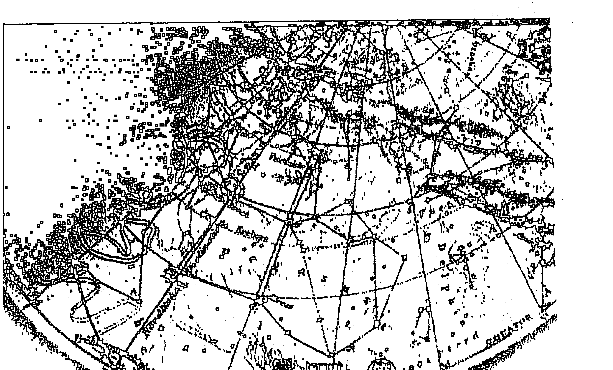

### （一）生年四化要訣

紫微斗數中的《主星》及《雙星格局》已完全研究過後，而各位看倌們以為好戲就到這裡為止，已經打算出去擺擺弄人的話，請先暫停一下，因為接下來的《四化詳論》才是紫微斗數真正的精髓所在！沒錯，這就是壓箱底的絕學！想想，只需要花費這微薄的書籍費用，而無須揮師繳學費就可以學得到紫微斗數真正的精髓，如此物超所值，可千萬要好好地、用心地給它看下去。

雖然似乎是四個不起眼的小化星，但對於整個星盤的架構及重要性而言卻不容忽視，因此將其歸類在甲級星的範圍內。就好像上尼是一個人的骨架，格局是一個人的皮相，四化星呢，就像是個人的穿著打扮一樣，隨著每天、每月、每年因為不同的心情與能力，而有不同的打扮與變化，當心情好或口袋麥克麥克時，通常就會捨得花錢買化妝品啦、名牌西裝、做做SPA……等等，事事順利，而且運氣好時，說不定買彩券還會中獎喔！這就是四化與運勢所帶來的相乘加分。

而一個人在心情及外在環境均不佳的情況下，哪還有心情去裝扮自己呢？恐怕是每天死氣沈沈的，別說別人，連自己看自己都覺得討厭，福氣怎能降臨？自然就是每況愈下了！所以四化星在紫微斗數裡所扮演的角色，就像是變化多端的造型師一般，會影響到整個組合格局的優、劣、吉、凶，使其產生重大的質變，有的組合能互補，有的組合卻是只會扯後腿地幫倒忙而已。四化星的順序為化祿、化權、化科、化忌，統稱為「四化星」，而前三項稱為化吉。四化星是伴隨在主星之旁，化入何星，對那顆星有直接產生質變的效果，較容易引動該星的影響力。

## 一、化祿

化祿代表的含意就是有神氣、與人有緣分、有口福及數量增加的意思。化祿入命宮、財帛、田宅、身宮又代表錢財，如果再逢財星如武曲等化祿，那就好像是財神爺兩手捧著錢來送給你，令人爽呆了！能賺錢的事他都有份，錢好像會自動長腳跑來且輕輕鬆鬆地跳進口袋，令人既羡慕又嫉妒。

### 【入六親位】

則代表與六親之間的緣分，落入六親任何一個宮位就是表示會對那個宮位的人好，有時候也代表增加之意。感情線太過精彩會增加它的不穩定性。所以要小心當夫妻宮化祿時，千萬不要讓你的另一半增加了喔！

### 【入命宮】

主其人有口福，食量大，較不挑食，且愛吃又能吃，怎麼吃也胖不起來。對兄弟姊妹照顧有加，手足情深，且必須對他們好，主動的付出，但若是遇到宮位中有煞星或凶星，則變成只是一味的付出，就像是拿肉包子打狗——有去無回，難得會有回饋了。會信任、疼愛配偶，只是夫妻宮化祿也代表著「想要增加對象」的想法。化祿入夫妻宮的人，不論男女，在異性方面的人緣都比較佔優勢，能散發出吸引異性的磁場。化祿入子女宮的人大多為孝順子女的「現代第二二十五孝」孝子，除了對子女寵愛有加，也代表在性方面的需求較強，並顯示可能不是自己親生的子息的意思。

### 【入財帛宮】

化祿入財帛宮表示手頭上可以動用的現金較寬裕，如果是屬於財星化祿更好，缺錢時還會有人捧錢來請你花，而且財帛宮化祿之星是選擇職業的重要指標。

### 【入疾厄宮】

疾厄宮是代表身體與健康情形之宮位，身體逢祿必主胖，並且和疾病結了緣，長年藥罐子不離手，也代表此人生性樂觀、懶散、欠缺衝勁。

### 【入遷移宮】

化祿入遷移宮的人比較適合離開出生地向外發展，天生就喜歡東跑西跑，在外人緣好，個性也比較外向好動，適合從事外務外勤等工作。

### 【入僕役宮】

### 【入官祿宮】

化祿入官祿宮的人，工作認真勤勉，敬業精神可嘉，並且可參考其化祿的星的屬性來選擇欲從事的行業類別，對自己比較有幫助。化祿入官祿宮也代表著行業的增加，較不喜歡從事單一行業，可以從職或兼差多方發展。

化祿入僕役宮的人人緣好，對朋友更是好，是屬於可為朋友兩肋插刀的人，為人慷慨海派，所以朋友很多。在公事上對屬下也很照顧，但對別人好未必就會互動良好，別人也未必會給你幫助。

### 【入田宅宮】

必得祖上之庇蔭，只要不逢沖破，祖產必有份，而且化祿入田宅宮的人喜歡儲蓄置產，也適合從事不動產方面的投資。

### 【入福德宮】

化祿入福德宮的人喜歡吃好、穿好、做事輕鬆，不喜歡花體力賺辛苦錢，凡事想得開、放得下，而且到晚年更是豁達。化祿也代表食祿，有口福，賺錢也比較容易。

### 【入父母宮】

化祿入父母宮的人非常孝順，父母的意見較能左右他們的想法與觀念，兩代之間溝通無礙較無代溝。

## 二、化權：

- （一）化權是個喜好掌權之星，喜好權力、慾望，個性主觀、衝勁，也有主雙數的含意，例如兄弟宮化權，代表他除了會插手管兄弟之事以外，其手足的總數也是雙數。
- （二）化權代表一個人的主觀意識強烈，喜好掌權、對人發號司令，但有的時候又嫌太過於鴟霸，不容易受人信之外，個性也較為剛強霸道，權力慾望較高，管理能力也較強，以上皆管的格局。
- （三）化權之星也是計較之星，凡事斤斤計較，心機深沉，也有自我鞭策的優點。
- （四）化權入命宮的人喜歡管人、好表現，處處充滿自信心，也比較能掌握實權，但是換個角度來看，因為不說沒把握的話，不做沒把握的事，所以不管是做事或是說出來的話都顯得蠻有份量，也較容易受人敬重，作風也頗為明快、乾脆。

###### 【入兄弟宫】

兄弟姊妹之間較容易有意見之爭，但是他們比較尊重你，有困難也會找你。

###### 【入夫妻宫】

化權入夫妻宫的人，家中的指揮權通常在配偶手上，也會順從配偶的意見，但是化權又代表雙數，可能會出現「嚴官府出逆賊」的狀況，難免會在外面偷腥。

###### 【入子女宫】

較疼小孩，但對子女要求也比較高。另外「子女宫」也代表性方面的宫位，所以化權入子女宫的人性需求比較強，女人數也主雙數。

### 【入財帛宫】

化權入財帛宫的人有掌財的慾望，同時在個人信用方面使用的頻率也## 生年四化要訣

較高，對計算及個人的理念，執行力較強。

###### 【入疾厄宫】
必須依所化之星的特性來解釋，行運時若遇到化權入疾厄宮，病情就顯現，且性慾念會較強。

###### 【入迁移宫】
化權入遷移宮的人在外人緣好，個性也比較外向，說話有份量，對環境的適應力較強。

###### 【入仆役宫】
掌權的化權星入僕役宮，在朋友、同事間一定是帶頭說話掌權的人，喜歡發號司令當老大，朋友有困難也喜歡找你商量。

###### 【入官禄宫】
對事業欲望高，事業心強，對工作有一股狂熱，工作能力也易受上司的肯定與賞識，升遷機會比別人多且快，如果行運時遇化權入官祿宮則代表會在工作上有異動。

###### 【入田宅宫】
化權主雙入田宅宮代表會有兩個住所兩頭跑，或者是一打兩份資產，在家裡很霸道，喜欲欺負弱小。

###### 【入福德宫】
作風保守且為人頑固，事事都不放心深怕別人做不好，恨不得都自己來，因此算是勞碌命，心態上較沒安全感，到死都不願你移交財產。

###### 【入父母宫】
家中的管教較嚴格，而且與長輩較有代溝，最好是認義父母，若官位中有貪狼星或是兄弟位有化祿時，當心父母人數多出來。

## 生年四化要訣

## II、化科

- (I) 化科主名聲，代表著知名人物，為人愛現，喜打知名度，容易遇貴人，並且有助於學業，文筆也不差，考試會較為順利，並有美化之意涵，例如化科入夫妻宮，主配偶長得不錯，並對當事人有助力。
- (II) 化科主顯現、曝光，因為曝光才有所謂的名聲顯現，但是名聲亦有好有壞，所以還要注意此星是落入何宮？所化何星？其代表的涵義都各有不同。在青少年行運逢之則有利於考試，中年者行運逢之代表名聲顯揚，老年人行運逢之則代表話多，愛現。
- (III) 入命宮的人愛漂亮，很會打扮自己，但善於偽裝，心地善良隨和，喜歡幫助人。

### 【入兄弟宮】
兄弟姊妹之間感情好，會覺得有責任必須照顧他們，本身是他們的貴人，手足情緣深又長。

### 【入夫妻宮】
代表配偶長相清秀或英俊，家世甚好，較能得到配偶的助力，流年若化化科星進入，就得小心私情曝光。

### 【入子女宮】
化科入子女宮的人，子女成人後較有成就，且功課不需父母操煩，能光耀門楣而且帶有事業天分。

### 【入財帛宮】
財位化科代表財產曝光，有漏財的象徵，所以不適合掌理財之權，欠缺理財的概念。

### 【入疾厄宮】
化科入疾厄宮的人心態上比較怕死，迷信大牌，連小毛病都要找名醫才會放心，行運時遇化科依所化之星所代表的病情就會顯現出來，但一旦生病卻很容易遇到好醫生。

### 【入遷移宮】
注重門面，只要出門一定會打扮得整齊漂亮，為人注重名聲，且好面子，但出外人緣好，容易遇到貴人。

### 【入官祿宮】
化科入官祿宮的人適合擔任公職或在大型民營企業任職，事業波動較小，自行創業後肯花廣告費打知名度。

### 【入僕役宮】
朋友會給你封個外號或取個綽號，與朋友往來著重實際且樂於雪中送炭，雖然君子之交淡如水，但卻是持久與真情。

### 【入田宅宮】
表示家教良好，家鄉的住們整潔高雅，所住的地方很有名又好記。

### 【入福德宮】
較注重享受，年紀愈大愈會打扮，個性死要面子，會及早做好未來的生活規劃，老了較少煩惱。

### 【入父母宮】
能得長輩的蔭福，與父母之間的溝通良好，父母親若是擔任公職就是頗具知名度的人。

## 生年四化要诀

#### 四、化忌

- 1. 化忌代表收斂、是非、挫折、欠缺。
- 2. 化忌之星為是非多管之宿，因為好管閒事，常常會為自己惹來一身麻煩，容易遭人嫉妒，所以在一生之中常有是非糾纏，它的作用視其所化之星的星性及落於何宮而定。
- 3. 化忌入命宮代表此人個性外向但奔波勞碌，一生多是非、挫折，不容易一蹴即成，中途阻礙重重（視所化之星而定，如天機屬舟車、武曲屬財務……等）。

### 【入兄弟宮】
化忌入兄弟宮代表手足有損，兄弟姊妹之間緣分淡薄亦多紛爭，一生欠朋友的人情債。

### 【入夫妻宮】
夫妻間感情容易遭受阻礙及挫折，二人相處不睦常常爭吵，相對的夫妻宮化忌也會影響到對宮的事業宮，事業會變動不順。

### 【入子女宮】
主子女數有損，亦主子女的成長過程令你勞心、勞力、會經常變動，但家庭觀念濃厚。

### 【入財帛宮】
化忌若入財帛宮，一生為了賺錢多奔波勞碌，勞心、勞力、壓力重，賺錢比別人辛苦但會因此較為節儉，夫妻二人常常會有聚少離多的現象。

### 【入疾厄宮】
現行運時所化之星的特性為何而判定為何種病痛，但個性上比較勤快積極，能孝順父母。

### 【入遷移宮】
化忌入遷移宮主要是代表出外不順，人際關係難以開展，所以較不喜外出，應該先消除故步自封的心態，解除人緣的阻礙，遇到重大的變動時必定先保護自己。

### 【入僕役宮】
朋友間往來容易產生是非挫折，屬下無力不穩定，生欠缺得力的助手，一旦需負擔照顧兄弟姊妹的重擔。

### 【入官祿宮】
事業不順且容易產生挫折，創業的過程阻礙較多，計劃性他活動，體諒，關懷有加。

### 【入田宅宮】
住所較不安寧，錢財難以聚集，若是女性懷孕時則頭胎容易流產，對子女很照顧，是「現代二十五孝」的孝子。

### 【入福德宮】
容易奔波勞碌，處處操煩，欠缺精神上的享受，容易患上憂鬱症。

### 【入父母宮】
與父母間易有代溝，且溝通不易，身體多病痛，小人抵抗力較差，留意易有遺傳性疾病。

## 第十章 四化詳論篇

## (一) 星座逢四化要訣

### 紫微化權
在斗數中以紫微星為帝王之星，本來就是集權威於一身，遇到代表權力的化權星，就好像是一位皇帝，手裡能確實的掌握住三軍的統帥權及朝政，成為一方霸主，呼風喚雨，唯我獨尊，沒有人敢不從，說一，沒有人敢說二，增加他發號司令的權威性；但也因為太過展現他的權威，反而讓手底下的人沒有表示意見的餘地，過於主觀和霸道，不留餘地給旁人。但畢竟一個人的能力有限，不可能事事都想得十全十美，做得都完美無缺，過多的自信與霸氣反而容易令人反彈，加深不滿的情緒，久而久之，難免有挾怨報復或陽奉陰違的狀況發生。紫微化權的人，往往不在乎別人的想法，一意孤行，因為他自己就能做決定，也不太聽從別人的勸告，但是有很多事情並不是憑一己之力就能完成的，必須還要有旁人的協助，所以如果會左右、昌曲、魁鉞等星，就會如虎添翼，好像多了左、右宰相、龍虎大將軍以及內閣大學士一般，才能幫助皇帝推行朝政，使國家風調雨順，國泰民安，這個皇帝寶座也才坐得久啊！

### 【入兄弟宮】
化權主雙，落入兄弟宮時也代表著兄弟姊妹的人數為雙數，但彼此之間會爭誰是老大，大家你來我往，打起來誰也不服誰，若是上一代留有遺產時，那就更頭大了。

### 【入夫妻宮】
化權入夫妻宮就有點為難了，怎麼說呢？自己說什麼、做什麼，那親愛的另一半都會有意見，雖然經過不斷的申訴和溝通，但結果通常都是相同的，所以奉勸你不要再ㄍㄧㄥ了。

### 【入子女宮】
小孩子們從小就有自己的想法與作風，不容易受教，很難會接受父母的意見，代溝很深喔！長大後會一個一個的離開身邊外出打拼，無法隨侍左右。

### 【入財帛宮】
掌權的星入財帛，那真是如魚得水，痛快極了！理財能力亦一級棒。

### 【入疾厄宮】
化權入疾厄宮代表脾胃欠佳，腸胃容易脹氣，經常會打嗝或排氣。

### 【入遷移宮】
表示經常會得到年長的貴人相助，事情到最後關頭總能堅持到底。

### 【入僕役宮】
這就有點慘了，老是遇到喜歡管你的朋友，好不容易當了主管，卻還要受下屬的氣，便是坐紫微！

### 【入官祿宮】
代表在事業上較能掌權，升官也比較快，經常會有兼差的機會或一份工作並行。

### 【入田宅宮】
住家最好能在高處或是高層大樓，亦代表雙住所。

### 【入福德宮】
則是老頑固一個，愈老愈嘮叨且愈難溝通，真是煩也。

### 【入父母宮】
父母管教嚴格，家裡比較注重傳統，有家教，但也表示兩代之間有代溝，只有單向的指令，意見反應無效。

## 紫微化科
紫微星為帝王之星，原本就是眾人注目的焦點，再遇到愛出風頭的化科星，就有點多此一舉了，就好像學期結束時，期末考考了全校第一名，另外又上台領個演講比賽、書法比賽冠軍一樣，一個機會都不留給別人，真是令人嫉妒又羨慕。其實化科星也表示有多方面的興趣及求知慾強烈，會比較認真的去吸收各方面的資訊，是標準的多才多藝之人，實在是不傑出也難，跟他聊起天來你是說不過他的啦！ 紫微星化科代表這個人很愛現，處處都要秀一下，讓人家知道他很行，尤其在特別的場合中更可以看到他高談闊論，滔滔不絕地發表他獨到的見解。再加上上長得也不賴且又會打扮；像這樣滿懷自信的人最好不要再加上會昌、出了，以免真的臭屁過了頭，反而會引起反效果，而遭旁人白眼、惹人嫉妒，這就對他的人際關係有很大的傷害了。

### 【入兄弟宮】
化科入了兄弟宮，哈哈！很抱歉，那個萬人矚——的光環就不是你了，那圈光環是屬於你能幹的兄弟的，千萬不要難過。

### 【入夫妻宮】
紫微化科能入夫妻宮那真是要恭喜你，嫁了或娶了一個能幹的另一半，不僅能吃苦，還耐操好用，人生的路上有對方這樣相持，美好的日子就不遠了！

### 【入子女宮】
有個聰明、多才多藝，人人誇的小孩是蠻不錯的，只是難免小孩會比較有自己的意見，需要不斷的溝通與教育，但還要不要被他看扁了，反而爬到你頭上去。

### 【入財帛宮】
想想看一個愛現的人手上有很多錢的情形是什麼？沒錯，會很慷慨的花光光，所以當你發現有這種人在身邊時，記得要好好把握機會啊！

### 【入疾厄宮】
紫微化科入疾厄宮的人容易會胃漲氣，所以常以打嗝或放屁的方式來把氣排出來，因此旁邊的人會經常聞到瓦斯味。

### 【入遷移宮】
遷移宮有了化科這個貴人星來相助，出門在外也就可以高枕無憂了，很容易得到年長者照顧你，全力相挺。

### 【入僕役宮】
容易得到朋友的幫助，當遭遇困難時也可以嘗試著向年長的朋友請教，或許會有意外的收穫，而且在工作上常會遇到能力不錯的下屬，應該善加重用。

### 【入官祿宮】
紫微星化科入官祿宮可真是適得其所，要來當頭頭領導人家，所以可以職著到大型民營企業或公家機關上班，會有不錯的待遇哦！

### 【入田宅宮】
在家庭地點適合高臨下，同時也表示家族多有庇蔭，行事作，也顯示童年生活相當優渥。

### 【入福德宮】
紫微星原本是很有威嚴的星，但是只要是化科入，福德宮，反而會返老還童，越老越調皮，或許還會跟孫女們合夥搞些！

### 【入父母宮】
不錯哦！有能幹的父母為你打下事業的基礎，要好好的發揚光大。

## 天機化祿
天機星是一顆變動不斷，活潑好動的星座，遇到代表多的化祿星更增加了他的不穩定性，使它產生變化的機率增加許多，就像一顆墨西哥跳豆一樣，安靜不下來。雖然是遇化祿，但是天機星化祿並不一定代表財產會有增加，只是表示錢的流動性更大更快而已，所以在工作上也可以盡量挑選流動性高的行業，例如像中盤買賣業或是快遞等等，千萬不要去應徵總機小姐或是內勤人員，悶也把你悶死。天機星也是智慧星，逢化祿時更加強了腦袋裡的運作，腦子裡的鬼點子運轉得更快、更多，所以非常適合創作、研發或電腦軟體設計等需要動腦靈活的工作，如果入了命宮的三方很適合設立風格獨特的個人工作室，像是廣告創意、彩妝師、SOHO族、作家或詞曲作家……等等。

### 【入兄弟宮】
天機星也代表兄弟星，入了兄弟宮也算適得其所，兄弟之間的感情深厚，互動良好，可以合作共創業業。

### 【入夫妻宮】
談戀愛時遇到天機化祿入夫妻宮的人自己可要有心理準備了，因為他的心一直是飄動不定，令你難以捉摸的，但是當他一旦下定決心定下來時，就會非常的專注於夫妻感情的培養，也會對你很好。

### 【入子女宮】
代表他會疼小孩，另外也表示可能會有非婚生的子女，或子女必須重視父母。

### 【入財帛宮】
流動性加大的天機星化祿入了財帛宮，當然在現金的周轉量方面也會增加，錢財流動的速度也會加快。

### 【入疾厄宮】
動個不停的天機做任何事情都喜歡速戰速決，就連吃東西也是如此，所以在食物的選擇上通常會傾向速食類食品，當然依照這樣快速的吃法，想不胖也難哦！

### 【入遷移宮】
天機入了遷移宮，就好像看到了一群忙碌的螞蟻一樣，一直勤快的工作著，而且會有很多遠行的機會。

### 【入僕役宮】
和朋友之間的交往總是坦誠直率，毫無私心，只要有朋友來訪，一定熱情招待，恨不得把好東西全搬出來，但在公事上，屬下總是嫌薪水太少、工作太多。

### 【入官祿宮】
腦筋動得快的天機星，化祿入了官祿宮會有很多特別的點子，對事業上有很大的幫助，也因為多了很多兼職賺外快的機會，也可能一身兼數職，展現多方面的才華。

### 【入田宅宮】
動來動去的天機對家中的佈置與家具擺設也經常搬動，搬家的次數或居家環境變動也很頻繁。

### 【入福德宮】
天機星的星性也落於投機，所以對需要勞心勞力的工作興趣缺缺，容易欺善怕惡，專挑軟柿子吃。

### 【入父母宮】
天機的變動性大，化祿又進入父母宮，代表父母親有可能離婚後再婚，或者會認義父母或承接另一房的香火。

## 天機化權
天機星原本就是善於謀略、計策的人，事事都會在腦袋裡轉了好幾圈，直到算出對他最有利的結果才會做出決定，所以很適合當個狗頭軍師，又逢化權更加強了它的權威性及靈活度。天機星也是智慧之星，本性靈活且機變，偏又帶了一點賭性和投機性，所以當天機化權時，賭性堅強的人更是很難戒得了，再加上現在又多了樂透彩可以玩，生活對他來說更是多采多姿，怎麼可能放棄呢！天機的投機性格使它對於數字遊戲特別有研究，哪...支股票會漲、哪一支股票會跌，老早就研究得清楚透徹，不管你跟他聊期貨、基金或是其他的金融商品，他都可以說得頭頭是道、口沫橫飛，說不定還會慫恿你拿筆錢出來讓他代為操盤，好賺取其中的差額，真是個標準的投機份子。從另外一方面來看，天機星也有轉換變化之意，所以在行運的時候遇上天機化權，也可以把它視為重大計劃發生變數而使整個情況都改變，或是原本很倒楣，工作不順，女朋友也不要你了，連走在路上都會被狗欺負，突然有一個機會可以異軍突起，來個大逆轉而一路扶搖直上，可以以事事如意，走起路來都有風。

### 【入兄弟宮】
兄弟姊妹之間誰也不服誰，每個人心中都有一把算盤，所以較容易因為細故和利益起爭執，如果又逢太陰，也代表手足之間會為了祖產而起爭執。

### 【入夫妻宮】
夫妻之間會為了誰當家、誰做錯的事比較多、誰該聽誰的，而爭吵不休，彼此互不相讓。

### 【入子女宮】
對於子女的要求標準較高，容易會有代溝，最好過繼重認義父母。

### 【入財帛宮】
代表權力的化權入財帛宮，自然能掌財，又善於理財，但是因為是靈活度高的天機化權，所以只是忙著周轉調度而已。

### 【入疾厄宮】
因為腦袋總是動個不停，想得多，所以容易罹患焦慮症，也常會失眠或是有筋骨方面的毛病。

### 【入遷移宮】
外向又愛現的天機星落入遷移宮，想當然會對出門前的整裝特別重視了，嗯！加一條圍巾，擦一擦皮鞋，就可以光鮮亮麗的出門了。

### 【入僕役宮】
人家說貴人、貴人，印象中的貴人好像都是年長的長輩或是上司，但天機星的貴人可是年輕的帥哥或小姐哦！

### 【入官祿宮】
腦筋動得快的天機星，可有滿腦的好點子呢！所以聰明的老闆，如果你缺少設計或企畫人才，找天機人準沒錯！另外像物流業等快速的行業也很適合。

### 【入田宅宮】
闊不下來的天機星，就連在家裡也是一様，東抹抹、西擦擦，有他在的地方總是乾乾淨淨的。加煞星則在家稱老大，掀波幼小？

### 【入福德宮】
多變的性情，固執又挑剔，唉！如果你的婆婆是天機星！人福德宮的人，你可能會以為自己怎麼到信變成阿信了呢！

### 【入父母宮】
比起！些人的父母，嚴厲又難以溝通，閣下可是幸運的擁有古意善良又好相處的爸媽喔！

## 天機化科
天機之星本為動星，逢化科時主其人外向又愛現且能得貴人提拔，適合從事外勤工作，活動力和衝勁均增強，其性亦樂於助人較具同情心。化科星性本主名聲，但天機逢化科，其本質屬於短暫性而已。天機本為智慧之星，化科主貴人，千里馬若無伯樂恐成驢，故天機星若沒有魁鉞或化科星的會合，縱有通天的才華也無人識貨，很可能抑鬱而終。天機逢化科主其人頭腦絕頂聰明，行動敏捷，學習能力特強，能過目不忘又能舉一反三，故這種人材後天應予以導入正途，萬一誤入邪途必是社會頭痛人物。

### 【入兄弟宮】
手足表面和好，私下卻互相較勁，逢煞星互扯後腿。

### 【入夫妻宮】
主配偶能力強過自己，嫉妒又羨慕。不過，流年觸到的話，當心私情被活逮。

### 【入子女宮】
子女對數科方面較拿手，也主子女活動力太強，簡直要累死保姆。

### 【入財帛宮】
較不會量入為出，屬不善理財之型，要找一位可靠的人替你操盤掌理財物。

### 【入疾厄宮】
容易患焦慮症、長期失眠，或有筋骨方面的疾病，盡量多點爬山和慢跑的運動。

### 【入遷移宮】
美化門面，修飾容貌或遠方旅遊，在外既愛炫又要酷。

### 【入僕役宮】
主得年輕之異性貴人相助，也顯示其人與年輕一代能溝通無礙。

### 【入官祿宮】
適合選擇從事設計、美化、物流性之行業，逢化科則需要往層次高一點的方向才對盤。

### 【入田宅宮】
其人注重居家內外之環境清潔與寧靜，尤其在乎客廳的美化品味。

### 【入福德宮】
則其性善變、固執又挑剔，中年後喜到處吹噓、炫耀。

### 【入父母宮】
主父母古意善良好相處，也主上一代的家聲門風不錯，能庇蔭到你。流年運限逢之，主名聲顯揚，亦是新方向、新選擇的計畫年度。

## 星座運四化要訣

### 天機化忌

天機星原本就聰明過人，同時間裡，別人的算盤才打一次，他的盤算卻已經打了十幾次了！可是千算萬算，總有踢到鐵板的時候，尤其遇到化忌星時更是聰明反被聰明誤，經常是被自己打敗，因為贏的人常常就是龜兔賽跑裡的那隻烏龜。沒錯，天機星就是那隻自以為聰明的兔子，烏龜在他眼中一無是處、慢吞吞、愚蠢，也是最討厭、最恨的人；但到頭來還是得要向低頭認錯學習，所以實在不適合投入人阿諛我詐的商場戰爭。天機星又為計較之星，但逢化忌星則想計較卻計較不當，容易因小失大，頓頓火餅，就像是挑女婿一樣，嫌人家沒家世、沒人品，學歷也不高，窮小子。個，就不准女兒嫁，沒想到過沒幾年對方成了大企業家，只好暗槌心肝，怨嘆自己錯失了一支績優股、金母雞，這時候就算把女兒打包好送人家家門口也只能慘遭退貨，所以，天機化忌坐命的人，凡事要牢記吃虧就是佔便宜，有量有福，人生道路必定會更寬闊順暢。

### 【入兄弟宮】

天機化忌入了兄弟宮代表手足有損，或是兄弟姊妹感情淡薄且較沒緣分。

### 【入夫妻宮】

想太多的天機星化忌入了夫妻宮，談起戀愛也會多愁善感，該想的、不該想的都想了，所以戀愛之路會走得很辛苦，風波不斷，就算結了婚，婚後也會因細故而爭執不斷。

### 【入子女宮】

代表子息會先損後招，子女的人數也不多，老來應自求多福，自己做好生涯規劃。

### 【入財帛宮】

自以為聰明的人，常常認為可以看到別人看不到的財路，又怕被別人發現，神秘兮兮的，沒想到偷雞不著蝕把米，小心！別把老本都賠光了。

### 【入疾厄宮】

常常想太多不讓腦袋休息的人，當然容易有憂鬱症或神經衰弱的毛病，另外得到肝病的機率也蠻高的。

### 【入遷移宮】

在搭乘交通工具時要注意安全，因為遇化忌星時較容易發生意外，加保意外險準沒錯。

### 【入僕役宮】

聰明的天機星常常認為自己給朋友的意見是最好的，可是反而容易引起朋友的反感，對外散佈對你不利的謠言。

### 【入官祿宮】

在工作上定性不佳的天機星，遇到增加不穩定性的化忌星，那就更糟糕了，做一行怨一行，不是嫌錢少就是嫌工作煩，樣樣都不滿，樣樣都挑剔，因此經常在換老闆。

### 【入田宅宮】

主居家環境不安定，搬家頻率明顯偏高，家中種植花草或盆栽易枯死。

### 【入福德宮】

代表這個人不只想得多，甚至會看不過去，乾脆下命令來，天生的勞碌命，沒辦法，自找的啦！

### 【入父母宮】

與父母間的緣分較淡，說不上甚麼話，或是為了就學而自小就離家住外面。

## 太陽化祿

太陽星是代表事業與官貴的星，如果遇到化祿星必須要先建立起自己的事業或官位，才能真正的發揮到最大的功效，就像太陽般照耀大地，但是這個太陽也是有強有弱的，像夏天的太陽就和冬天的太陽有很大的差別，清晨與黃昏的太陽也有差別，這中間的差別可是很大的喔！為什麼這麼說呢？當你是一個小小職員時，雖然很認真在做事，但說出來的話，做出來的事，老闆或客戶多半不會很重視，一直要等累積到一定的成果，尤其當被賦予重任時，就會像逐漸接近正午的太陽一般，顯現出你的才能，這時化祿星才會有加分的作用，到時候，不論是自己當老闆、公司主管或是公職人員，都會事事順利，錢財滾滾而來，擋都擋不住，是典型的先貴後富。
太陽星到處散播愛心與熱情，就像太陽放送它的光與熱一樣，天生就喜歡服務大眾或參與政治活動，如果遇到化祿星更是會加重它的特性，有利於取得社會地位，但是在為人處事的態度方面應該要多多注意，有時候甚至要收斂一下，免得容易招人眼紅嫉妒，或太過自滿而得了大頭病還不自知。

太陽星逢化祿反而喜歡中庸一點，巳、午宮已經很旺了，再加祿星就過滿而溢，反而容易中暑、中風，但如果是在落陷的宮位卻又入了化祿星，那就好像是是一個人開著名牌跑車，身穿亞曼尼西裝，皮夾裡有滿滿的金卡，但卻是張張刷爆外加銀行貸款，顯得愛出風頭卻沒有實力。

### 【入兄弟宮】

千萬要保佑它是落在旺地，哇！那你就可以靠你兄弟吃穿一輩子了，如果不是的話，請你當作耳邊風聽聽就好，還是要『自己打拚來的實在！

### 【入夫妻宮】

太陽化祿入夫妻宮，通常對女性比較好，因為被男人照顧總比男人被照顧來得好吧！

### 【入子女宮】

代表這個人觀念上較重男輕女，但是到老來反而是女兒比較孝順，而且會照顧你。

### 【入財帛宮】

這就要看太陽星座落的宮位而定了，如果是落入旺位那就表示因爲你太喜歡爲民服務了，這個也要做、那個也要幫，縱使是賺得辛苦也很快樂。若是落入陷地那就是燈下之財，反而輕鬆不用流汗。

### 【入疾厄宮】

哦一你一定常常爲了自己的體重而煩惱，但是怎麼控制也不太容易減下來，另外容易有頭部的疾病，眼睛也不太好。

### 【入遷移宮】

太陽星原本就是活力四射的星座，又化祿落入了遷移宮就更愛「趴趴走」，尤其喜歡參加集會或遊行，甚至有政治性及具爭議性的活動都很熱衷，熱衷參與。

### 【入僕役宮】

當你的僕役宮坐了一顆太陽星化祿時，定要愉悅。不是坐旺地，如果是的話，那就很容易遇到貴人，自然而然！那如果是陷地呢？那就只好祈禱你的「好」朋友們手下留情，少扯你後腿！

### 【入官祿宮】

太陽星主掌事業，入了官祿宮更能把其特性發揮出來，尤其是對掌握時機的敏感度更是無人能及，在旺地多從事正大光明的行業，陷地多半是服務業或休閒業。

### 【入田宅宮】

活力四射的太陽星，家中想當然也是光線充足，房子也都方方正正的，是個溫暖明亮的家。

### 【入福德宮】

如果你的老公是太陽星化祿坐福德宮的話，那建議你要自己找一個興趣打發時間，因為對工作有狂熱的老公是會常常不在家的。

### 【入父母宮】

如果生了個太陽星化祿坐父母的小孩，作父母的人應該會感到安慰，因為既孝順長上，又能尊重父母的意見的小孩，現在可是不多了。

## 太陽化權

太陽星為主掌事業之星，如果遇到掌權的化權星那真是如虎添翼，對事業的發展會更有幫助，不僅是主導著大局，也能完全掌控情勢，就像是作總統也要有個內閣來幫忙打拼一下，人多好辦事！對於擔任公職或是有實權的人來說，若逢化權星更有利於升官晉級，而且也有助於社會地位的提升，晉身各行各業的領導者及權威人士，但必須要有化科會合才能有最佳的效果，如果單單只有化權，容易獨斷獨行而太過自我，也畢竟孤掌難鳴，想要有什麼作為容易因為一個人的能力有限，導致即使有很好的構想也易胎死腹中；所以有時要多多聽聽大家的意見和想法，讓別人也可以表現一下囉！否則加上坐落陷地那就更不利了，表面上好像是你最大，大家都聽你的，但實際上呢？只有你自己心知肚明。太陽星逢化權時就像是一個才華洋溢的音樂家，主觀、執著，但還是必須有化祿星相會，才會有實際的見解，充分散發出他的光與熱，但還是必須有化祿星相會，才會有實際的見解，實際的成果展現出來，太陽星逢化權時也會喜歡很多人的場合，大家熱熱鬧鬧的，好不愉快，很怕只有一個人獨處，會無聊到抓狂。

### 【入兄弟宮】

如果你的兄弟宮坐了太陽星化權，那真不知道是該為你高興還是悲傷，因為大家都會常常搞不清楚到底誰是家中的老大，是哥哥的你？還是弟弟的他？兄弟的人數常常是雙數。

### 【入夫妻宮】

「歡當少奶奶或希望能娶個老婆可以少奮鬥三十年的人，最好請老天保佑你的太陽星化權入夫妻宮，因為所有的事情都是那親愛的另一半幫你搞定，你就等著享福就好，不過，有時候被管的太嚴的滋味恐怕是不太好受的。

### 【入子女宮】

對子女的要求較高，常管東管西的，不過有時太多的關心與照顧也會給孩子帶來太大的壓力，造成親子間的關係緊張。另外，太陽化權入子女宮也表示會比較喜歡「做愛做的事」，三不五時就「嘿咻、嘿咻」運動一下。

### 【入財帛宮】

能夠掌握財務大權，而且能力還不差，收入會很不錯，但僅限於光明正大得來的錢財，像是薪水啦、工作獎金等，但是如果你想要買張彩券做個發財夢，很抱歉，省省吧！

### 【入疾厄宮】

太陽星在人體的部位屬頭部，所以太陽化權入疾厄宮的人要更小心較容易罹患偏頭痛、血壓、頭風等方面的疾病，視力也不太好。

### 【入遷移宮】

太阳化權入遷移，出門在外就像個熱力十足的小火球一般，活力四射，讓人容易親近，當然人緣也很不錯囉！而且作事衝勁十足，善良博愛，熱心社會公益活動。

### 【入僕役宮】

嫁了太陽化權入僕役宮的男人，老婆們一定會常常抱怨老公把朋友擺在第一位，朋友一叫就走，卻懶得在家陪老婆小孩；還好換帖兄弟一堆，任地太陽化權入僕役，在工作上也常能得到能幹忠心的部屬相助。

### 【入官祿宮】

適入從小聲光傳播業及國際行銷之類的業務，也代表有雙職業跨足兩種不同的行業。

### 【入田宅宮】

可能會有兩個居所，兩邊跑，住的地方光線充足，明亮大方。

### 【入福德宮】

嗟！遇到這種太陽化種入福德宮的人，我勸你還是舉雙手投降，因為像這種老頑固，腦筋食古不化的人，再怎麼說也改變不了他的想法，所 以還是由省省力氣吧。

### 【入父母宮】

太陽星也是父親的象徵，又入了父母宮，那你爸爸對你 定會要求較 嚴格，很注重家教。

## 太陽化忌

太陽星代表著付出，處處散發著光芒，所以當太陽星遇到化忌星時，就像烏雲遮日，這個轉點就容易被壓抑，不能順利的發揮其特色，因而容易使人感到挫折，並常引來一堆是非，令人身陷其中，就好比在路上遇到車禍，肇事者跑了，你熱心的幫忙送人就醫，這原本是一樁善事，但後來被撞的人醒了，反而一口咬定你是那個撞他的人，真是好心沒好報，所以當太陽星過化忌時，特別是當太陽星又處於旺地，而且是愈旺愈容易引來是非怨嘆，有功無賞、打破要賠，所以遇到這種情況時，最好摸摸鼻子，認了，只要做好自己份內該做的事就好，千萬別再節外生枝了。

太陽星又代表父星及夫星，如果過化忌星代表著與父親間的緣分淡薄，女性遇太陽星化忌對其感情生活有很大的影響，一路走來跌跌撞撞，情感之路多坎坷，縱使如願以償的結了婚，婚後的生活情況也會不如意，尤其是太陽星愈旺愈嚴重，全心全意且無怨無悔的付出，換來的卻多是無情的拋棄，真是情何以堪，所以還是多愛自己一點比較實際吧！

### 【入兄弟宮】

兄弟姊妹之間你爭我奪，互不相讓，每個人都想著差遣別人，連你要養隻寵物他們都會有意見。

### 【入夫妻宮】

唉！別再當個癡情種了，人家對你的任勞任怨的付出說不定還嫌煩呢！而且一旦付出就不要抱怨，一直想著「我對你多好又多好」，不管另！一半是男生或女生，或許對方都覺得痛苦，久而久之不吵架也難。

### 【入子女宮】

太陽星化忌對男性來說比較是偏向事業方面的問題，尤其在開創新事業之初，常容易遭受挫折，令人灰心喪志，在這種情況之下，最好當個工作穩定的上班族或是從事競爭性強、爭議性高、有效益的工作。

太陽星遇化忌星入子女宮是比較不利於子女的狀況，代表子息有損，而且兒子長大了也不一定能陪在身邊盡孝。

### 【入財帛宮】

如果太陽星坐旺地遇化忌星那真是「錢歹賺，囤小漢」，會令你忍不住說賺錢真辛苦啊！但是如果是坐陷地那就不一樣了，錢還會自己跑進你的口袋，輕輕鬆鬆地賺著～郎腿賺錢，不過大部份為是非投機之財。

### 【入疾厄宮】

災劫有眼睛方面的疾病，也會有內分泌失調的狀況，要多加保養健康，小心也要多看一些綠色的物品。

### 【入遷移宮】

嗯，奉勸你不要對人太熱情，因為或許人家還嫌你煩呢，簡簡單單過自己的生活也不錯啊！對自己好一點就對啦。

### 【入僕役宮】

太陽星也是男性的象徵，所以當太陽星化忌入了僕役宮時也表示男性。的朋友對你來說較沒有幫助，不過，沒扯後腿就不錯！尤其在與男性下屬的對待關係上。

### 【入遷移宮】

如果你的老闆或上司是男性的話，只能對你說慘兮兮吧，因為不管你如何他就是跟你不對盤，看你不順眼，不管妳多努力恐也山很難換來他的賞識。

### 【入田宅宮】

太陽星化忌入田宅宮的人，小時候一定常常搬家，所以長大後對買房子這件事特別在意，不論再怎麼辛苦都要攢錢買個自己的窩，但是要小心別買到三角間的房子哦！

### 【入福德宮】

別操煩了啦！想那麼多有什麼用，人家又不領你的情，只是徒增自己的煩惱罷了，凡事多看開一點，退一步就海闊天空了。

### 【入父母宮】

當代表父星的太陽星化忌入父母宮時，大都不利於父親，而且也代表著你與父親之間的緣分淡薄。

## 武曲化祿

武曲星本為財星，遇到代表增加的化祿星那更是好上加好，錢財滾滾而來，尤其是武曲星代表現金，所以皮包要換大一點的，裝的才多喔！武曲星化祿也代表想賺錢的慾望變強了，求財的行動加快，哪邊有錢哪邊鑽，只要有錢賺，管他三七二十一，先賺先贏，所以如果你有朋友是武曲化祿的，千萬要跟緊點，加減可以賺到一些，叫他們錢兄、錢嫂，他們還很開心呢！武曲星為財帛之主，信奉人生以賺錢為目的，在他們的眼中，什麼事都沒有賺錢來得重要，只要有錢，一切就搞定了，一生都在鑽研要怎麼樣才會更有錢。坊間只要是關於理財、股票或是教人怎麼賺錢的書，都會仔細認真研讀，如果又逢化祿星更是信仰金錢萬能，有錢能使鬼推磨，真是名副其實的搶錢一族！如果沒有加會昌、曲來提升素質或氣質，則未免銅臭味太重了一些。

### 【入兄弟宮】

兄弟姊妹只要有金錢上的困難絕對會義不容辭，挺力相助，縱使不到回報也無怨無悔。

### 【入夫妻宮】

武曲星化祿入夫妻宮時，雖然另一半對你很好，但是有一個忙賺錢的對象，總比較不會把時間花在自己身上，而且容易有第三者的介入。

### 【入子女宮】

對小孩的教育非常的認真、投入，不管是在他的人格或學業上都很注重，但相對地也期望殷切，難免有時會給小孩帶來不小壓力。

### 【入財帛宮】

哇！你會是個「有錢人」喔，全心全意的投入，相對地也帶來豐厚的錢財，尤其再加上化祿星那更是水到渠成，得來全不費功夫！但未必是個富有的人。

### 【入疾厄宮】

主要在肺經系統方面較差，容易有肺部方面的毛病，另外也容易有發胖的跡象。

### 【入遷移宮】

武曲星化祿入遷移宮的人，較適合遠離自己的出生地往外發展，甚至是到別的國家做生意，賺外國人的錢。

### 【入僕役宮】

有你這種貼心、講義氣的朋友挺不顧的，而且你對你的下屬也非常的照顧。

### 【入官祿宮】

代表所從事的行業為較消耗體力的類型，並熱衷於工作，老闆請到你這種員工真是賺到了。

### 【入田宅宮】

你會是個「田橋仔」喔！祖產一定有你的份，而且也是個愛置產購屋的人，投資也頗有斬獲，房子土地一大堆。

### 【入福德宮】

喜歡做能輕鬆馬上看到現金的生意，對賒帳、期約的生意興趣不大，最好是現金買賣。

### 【入父母宮】

對父母雖然很孝順，但總是有 一堆事讓你覺得需要緊急處理，優先順序變得比父母重要，因此，在沒空的情況之下，總是是以金代表孝心，自安慰自己有做就好，其實有時也該抽出一點時間陪陪他們。

## 武曲化權

武曲之星原本是代表錢財，遇到了化權星就轉化成「硬要」的特徵，是個標準的行動派，只要是牽扯到錢的事，衝得比誰都快！不管會遭遇多大的困難、流多少的汗水，只要有钱賺，再多的辛苦都可以忍耐，身體再累都要撐下去，就像一台戰車一樣，只會努力的往前衝，絕對不退縮，只要有钱，一定會不顧身，往目標大步前進。

武曲星剛正不阿，逢化權星則加重其威嚴，很像是武俠小說中的神探，嫉惡如仇，絕對要將歹徒繩之以法。對一般人來說，武曲星化權時則會對新事業的開創有很大的助益，戰鬥力非常強，且直爽又重義氣，相對的，也比較不細心與體貼，如果沒有會昌、曲或魁、鉞，難免會太過「粗魯」又「嗆霸」，做人不夠圓滑。

### 【入兄弟宮】
兄弟姊妹之間的關係較為現實，當你有錢時，大家都很好說話，他們為了你的錢也會容忍你的壞脾氣，但是一旦你落魄潦倒想尋求幫助時，很抱歉，大家都沒空「鳥你」。

### 【入夫妻宮】
兩個人誰也不服誰，連芝麻綠豆大的事都要你爭我奪的，長久下來對彼此間的感情難免會有影響，最好能多站在對方的立場想想。

### 【入子女宮】
對於望子心切的人來說，如果你的子女宮坐了武曲化權，就只好讓你有耐心點，「送子鳥」可能會遲到，如果遇到煞星那就可能必須先領養一個來招弟，或是向兄弟姊妹拜託，招他們的一子半女了。

### 【入財帛宮】
財星的武曲化權又入了財帛宮，必定可以掌管財務收支的大權，再加上其靈活的理財手法以及妥善的運用規劃，想不賺錢也難，所以不要猶豫了，快快把錢交出來吧！

### 【入疾厄宮】
意志力強大的武曲星在身體的健康方面也非常注重，本身的抵抗能力強，再加上平常的養身保健，疾病也很難有機會入侵。

### 【入遷移宮】
你有沒有發現你與外國人特別有緣？如果有計劃到國外工作定居，那倒是可以好好的計畫計畫，因為以你那超強的適應力，走到哪兒都可以過得很自在。

### 【入僕役宮】
嗯，阿扁一定很羨慕你，因為你所帶的班底陣容堅強，要文才有文才，要武才有武才，但這也是因為你很講信用，待人以誠，所以大家都很服你，為你賣命。

### 【入官祿宮】
這就要看你是一星座了，如果是會魁、鉞、昌、曲，有可能住金融機構服務，但是如果是加會煞星，必會與刀械為伍。

### 【入田宅宮】
武曲星化權入田宅宮，大多在童年的時候有兩個住所而且來去自如，長大以後也容易會有兩份資產。

### 【入福德宮】
對你這種老頑固，唯一要你同意的辦法只有提「錢」來見，而且因為你的牛脾氣又難以溝通，小心哪一天連你的子女都和你翻臉了。

### 【入父母宮】
對父母長輩們來說，你一定會讓他們放心，因為你很懂得敬老尊賢，也會尊重長輩們的意見。

## 武曲化科

在斗數里武曲星為財星，遇上了愛現的化科星，不就是「愛現財」嗎？沒錯，當武曲星逢化科星時，其特性就是錢財會曝光，帶有破財之意，就好像如果有一天當你中了樂透頭獎被街坊鄰居、親朋好友知道了，你想想，那會是怎樣的一種情形呢？所以武曲星化科容易會錢財露白。但如果入于命身宮而且組合的星座良好（如武貪、武相、武府），仍屬於名利雙收之局，大限逢之主因為曝光帶來知名度，而這些知名度會為你帶來財運和賺錢的機會，就像前一陣子的老少配，或是影視明星等，人多是屬於此類型。
武曲星遇化科星如果搭配武破的組合或是有煞星同宮則有不同的表現，雖然同樣是愛現、愛出風頭，卻因為其星性而有重義輕財，喜歡當個大哥到處請客，反而不利於財富的累積。

### 【入兄弟宮】

## 星座運四化要訣

### 【入夫妻宮】

有個體貼的老公或端莊大方的老婆挺不錯的吧！而且不管是你的事業或他的工作，都能互相輔佐，對彼此的事業有相當大的助力。

### 【入子女宮】

有這種青出於藍而勝於藍的小孩，實在是父母的驕傲，品學優良不說，個性上也會自動自發，作自己該做的事，不用父母操心也能做得很棒。

### 【入財帛宮】

當你知道某個有錢朋友武曲化科入財帛宮時就要跟緊一點啊！既然他要買單當大頭就跟他請，縱使你沒有意思要揩油，但跟在他身邊至少讓你荷包滿滿。

### 【入疾厄宮】

武曲星化科入疾厄宮，大多為呼吸器官較弱，支氣管容易過敏或像清道夫一樣咳個不停。

### 【入遷移宮】

當你武曲星化科入遷移宮時，會發現你在外的人際關係非常好，大家有好康的都會找你，所以倒是可以考慮以知名度生財也不錯。

### 【入僕役宮】

哇！你們會有很多貴人哦！不知道為什麼，你就是很容易接觸到大富人家，而且很能獲得他們的支助，所以倒是可以好好的將你的資源運用到事業上。

### 【入官祿宮】

當你武曲星化科入官祿宮時，千萬不要小氣於企業形象的廣告費，因為在知名度上升後所帶來的商機與利潤，是你無法想像的好！

### 【入田宅宮】

精打細算的武曲星對投資置產當然也有他的一套，而且會注重居家格調，住所附近有金融機構或是位於商業區內。

### 【入福德宮】

愛出風頭、愛現的武曲星化科到了中年事業有成時，必定會花錢買個頭銜來玩玩，像是，般民間社團、慈善機構或是政府外圍次級機構等。

### 【入父母宮】

主要是能得到長輩的協助，不論是在工作或是家庭，尤其是在財務上的支援。

## 第十章 四化斷驗篇

### 武曲化忌

當本命三方四正以及大限的三方四正中，見到代表錢財的武曲星適化忌星時，最關鍵的一個說法就是不利於財運，因為在進財的過程當中屢屢發生狀況，甚至到最後不但歡喜一場，倒楣一點的還要賠老本才行！

而且如果武曲化忌又入命宮那就更慘了，自己有幾斤幾兩都不知道，還亂花錢不知節制，到最後只好舉債擴充信用，完全沒有量入為出的觀念，更不用說為將來作打算，如果再逢煞星那還真是屋漏偏逢連夜雨，鐵定經濟破產……。

在星性上，武曲星的另一個星性為寡宿，這種星性通常比較龜毛，對於錢財方面也是如此，若再遇上化忌星那就不利於感情的發展了，因為一個小氣銼毛的人再加上脾氣火爆或古怪，試想有哪一個人會受得了？。

在伴侶對待關係上，往往也會因為理財觀念的不同而屢生爭執，加上凶惡的煞星則恐怕有生離死別的兆因，那倒不如選擇當個快樂的單身貴族，反而是個不錯的人生規劃！。

### 【入兄弟宮】

你對兄弟好，他當作應該的，若是沒付出或不幫忙，反而是你對，但當有一天你遭遇困難而向他求助時：「很抱歉現在沒空鳥你」，真是哀怨啊！

### 【入夫妻宮】

當具有寡宿星性的武曲星化忌時，對兩人的感情之路會帶來很大的風波與挫折感，若再加上煞星的會入，有可能在中年時夫妻面臨生離死別的情形。

### 【入子女宮】

對子女來說，你是他們的提款機，對你來說，你真是個現代版的「孝子」，提醒你，不要因為之前的子息有損就讓你放棄了該有的教養方式，有壞習慣的小孩還是要教的，要不然就是害了他們。

### 【入財帛宮】

主錢財的武曲星遇到了化忌，那只有一個「慘」字可以形容，因為計畫的不夠周詳而導致後來的週轉不靈，常需要軋二點半軋到頭昏，而且又騎虎難下：最好能詢問銀行有無紓困貸款可以讓你救急，「千萬不要去找地下錢莊周轉，那可是會愈付愈多的。

### 【入疾厄宮】

武曲星在身體的代表部位為肺部，所以當武曲星化忌入疾厄宮時便須小心易有氣喘病、肺結核或肺部腫瘤的情形。

### 【入遷移宮】

當寡宿的武曲星逢化忌時，你可以想像得到他在外的人緣一定很差，不只關係不佳，甚至別人看他不順眼就不跟他做生意了，所以不要太獨善其身啦！

## 星座運四化要訣

### 【入僕役宮】

謹記千萬不能借朋友錢，萬一非幫不可也要抱持著沒還也無所謂的心態，免得自尋煩惱。另外，在職場上也要小心留意因為部屬的關係而被拖累破財。

### 【入官祿宮】

適合從事自由業或是與刀械五金有關的行業，若要自行開業則要有「起初一定不順利」的心理準備。

### 【入田宅宮】

當代表錢財的武曲星化忌座落在田宅宮時，多半有缺錢且財庫不豐、較難聚財的情況產生，另外也容易遇到粗魯的惡鄰居。

### 【入福德宮】

因為財星化忌，所以更要為自己做好一套完整的生涯規劃，為自己留一些養老金和棺材本，免得到老流落街頭，那可就慘啊！

### 【入父母宮】

家中長輩在財務上容易大起大落，也代表童年家境狀況很不穩定。

### 太陰化祿

太陰星與太陽星皆為中天主星，太陽主掌事業，太陰主理財務，兩者相輔相成，各有各的掌控範圍，在斗數裡還有另一星也是財星，那就是武曲星，但是武曲星較偏重現金之財，太陰星較偏向不動產或異性之財，像是房地產買賣或是當個房東收租金，再不然當個大小姐或大少爺跟爸爸媽媽伸手要錢；不論是哪一種，遇到代表增加的化祿星總是好的，但是還是需要坐於廟旺之地才能持久擁有。

太陰星又代表快樂享受，幸好星性欲望不高所以容易滿足，當遇到化祿星時則可增加其物質享受的層次，吃能吃到名菜、穿也能穿到名牌，好不享受：但如果是坐在落陷之地，雖然有化祿星的引動但卻只是表面上的假象罷了，例如可能為了一時的口腹之慾，貪戀美食享受，卻苦了自己的荷包，或為了一時的愛美，忍不住就把卡刷下去，等到下個月收到帳單時才來哀嚎，真是慘慘。

太陰星的星性原本是屬於斂藏與保守，是很溫柔且顧家的人，縱使遇到化祿星也只是代表自己或家人能品嚐美食的機會增加，或是有好康的事也只會找自己人而已，對外人可不會那麼好的。
太陰星的人心思細膩，非常的體貼溫柔，相對地想得也多，所以思緒較為複雜，興趣也很多元化，但當行運遇到太陰星時，還必須考慮到男生與女生的差別，以及旺弱的區分才能融會貫通。

### 【入兄弟宮】

當太陰星化祿入兄弟宮時，代表兄弟姊妹間的感情很親密，特別是姊妹之間，彼此都會互相照顧，有好東西一定人人有分，不過本身還是付出較多些。

### 【入夫妻宮】

細心體貼的太陰星化祿落入夫妻宮，當然對男性較好，對女性反而不對配偶體貼入微卻不善於表達，如果會到桃花星，那就得要把他看緊一點了。

### 【入子女宮】

哦！你太寵小孩了，孩子隨便撒個嬌、跺跺腳，要什麼你就給什麼，封你為「現代二十五孝」當之無愧。如果不逢煞星則小孩乖巧、孝順、顧家，辛苦的付出也值得了。

### 【入財帛宮】

屬於財星之一的太陰星且化祿入財帛宮，大多代表計畫的事務能順利進行並得到利潤，或者因為不動產的買賣而得到的財富，因此，在房地產仲介公司上班似乎也是個不錯的選擇。

### 【入疾厄宮】

這就要看太陰化祿是坐旺地還是陷地了，如果是旺地的話，那你可要多注意自己的體重，祈禱它別再增加，若是陷地就容易有近視及消化系統方面的毛病。

## 第十章 四化詳論篇

### 【入遷移宮】

相信很多人都羨慕旅行社的導遊或空中少爺、小姐能常常出國去玩，若你的遷移宮坐太陰化祿，那出國的機會也會很多，甚至可能移民國外呢！

### 【入僕役宮】

在工作上容易獲得女性助手的幫助，男生如果再會到桃花的話，很容易有紅粉知己，彼此感覺相知相惜。

### 【入官祿宮】

細心溫柔的太陰星很適合從事與女性相關的行業，如化妝品、服飾等，或者在燈光下工作，如演員、主播等，當然也適合不動產相關的行業。

### 【入田宅宮】

不動產坐在田宅宮，那真是適得其所啊！而且又有代表增加的化祿星，這下房子、土地都有了，而且還不只一處，庫位旺盛，是貨真價實的富有之家。

### 【入福德宮】

凡事想得多的太陰星，同樣也會為自己的退休生活做良好規劃，不管是財務的規劃或是心態的調整上，都能有很好的整理佈局，所以到老還是能維持其優雅的生活品味。

### 【入父母宮】

個性裡，溫柔的太陰其實是母性的象徵，所以當太陰星化祿入父母宮時，大多是表示與母親的關係較為密切，比較偏重母親，與母親的緣分較深。

### 太陰化權

在宇宙之間，太陽星主散發、付出，太陰星主吸收、斂藏，所以當太陰星逢化權時必須先參考太陽星的旺弱及三方是否照會？如果沒有旺地的太陽加持，縱使太陰在旺地化權也是枉然，在實質上並沒有多大的助益，就像是只有音樂資質潛力的人，若沒有好的老師栽培以及父母的支持，長大後也可能只是個愛音樂的人，而較難在音樂領域上發揮極大的才能。

太陰星為財帛之星，逢化權星雖然對財富的累積有幫助，但是因為太陰星的生性太過保守柔和，就算是遇到充滿權力慾望的化權星也很難有重大的突破或改變，就像一隻披著狼皮的羊，骨子裡還是一頭羊，它永遠也不能成為真正的狼，因此逢化權的太陰反而為了賺更多的錢而更加勞碌奔波，常常要加夜班或是做薪資較高的大夜班。

太陰星落陷時，大多代表定力不足，意志力稍嫌薄弱，遇到一點挫折就退卻，容易為了環境而改變自己，所以當遇到強勢的化權星時，這些太陰星逢化權星應該視其旺弱程度，及三方會合時所會之星的吉凶，才可以論斷其磁場效應之強弱和影響力。缺點能有較大的改善。

### 【入兄弟宮】

家中兄弟姊妹的人數為雙數，而且不管你是排行老幾，只要你說話，都要大家聽你的。

### 【入夫妻宮】

你是不是會覺得你那親愛的另一半，有時候真的是管太多了呢？這樣做也不行，那樣做也會有意見，很累吧！在這種情況下，建議你們夫妻倆還是不要在同一家公司上班的好。

### 【入子女宮】

現代人認為父母對待小孩的方式要像朋友一般，要放下身段與子女溝通。通才算是用心經營親子關係；而太陰化權入「女命」的你，就是能徹底做到這一點的喔！

### 【入財帛宮】

閣下真是個認真勤奮、努力賺錢的有為青年，雖然愛財，但也取之有道，只是萬一太陰星坐在陷地時，就難免會「粉」碎，勞心勞力是免不了的。

### 【入疾厄宮】

當太陰星化權入疾厄宮時，最好要小心有關腎臟方面的疾病，因為那一代火會陰虧及泌尿系統較差，也會有皮膚過敏的情況。

### 【入遷移宮】

要是你以為溫柔的太陰坐遷移宮，表示在外的行事作風會很內向那就錯了，相反的會很開朗外向，如果是男性，那更有邂逅不完的艷遇，當女性也會有閨中密友圍繞。

### 【入僕役宮】

眼睛要擦亮一點，專心尋找那位能在工作上成為你得力助手的「她」，只要多了她啊，你就可以輕輕鬆鬆上班、快快樂樂領錢。若是女性朋友太陰化權坐遷移宮，那更少不了一群閨中密友、死黨姊妹淘了。

### 【入官祿宮】

細心兼思路清晰的太陰，當化權入官祿宮時，特別適合從事有關市場調查、行銷企劃、督導審核的工作了，當然對於不動產相關的行業也是很合適的。

### 【入田宅宮】

這就要看太陰星坐地為廟旺或落陷了，如果是旺地化權那就能擁有雙份不動產，若為陷地，那家裡一定是陰暗又潮濕了。

### 【入福德宮】

大家都知道在你年輕時為了這個家、為了公司有多辛苦，但奉勸太陰化權坐福德宮的你，別再嘮嘮叨叨惹人嫌了，喝口水，休息一下吧！

### 【入父母宮】

代表母親的太陰星化權坐父母宮，想也知道是家裡的老大，沒辦法，母親人人能幹，作父親的可就悠閒地蹺腳、喝茶、看報紙了。

### 太陰化科

太陰星的星性非常孝順、顧家，化科星的星性雖然代表名聲，但是以太陰星保守、斂藏的本性，再加上柔與慢的特性，即使遇到愛表現、出風頭的化科星，效果還不是很明顯，想像一位害羞、內向兼細心、敏感的人就算有名聲，也僅止於自家人或是特定的小眾團體，較難在大場面上發光發熱。

太陰星注重生活品味及休閒享受，是個很懂得製造生活情趣的人，如果是命宮逢太陰化科（其福德宮必為巨門）反而會因為面子問題而顯得瞻前顧後，綁手綁腳的，滿腦子只想著等一下客人要來家裡，這畫不知道夠不夠名貴？

花插的夠不夠水準？菜夠不夠好吃？深怕被人發現不及格的地方，但凡事顧慮太多反而喪失了太陰星原有優雅的風格，不只生活品味層次降低了，還徒增自己的煩惱。

太陰星在斗數中也代表女性，化科又代表貴人，所以當太陰逢化科時也就表示為女性的貴人，但應該以男性的命盤而言，作用力較為明顯。

### 【入兄弟宮】

表示在兄弟姊妹之間，姊妹的感情好過於兄弟之間，與姊妹較為投緣且斷間下有幫助。

### 【入夫妻宮】

當太陰星化科坐夫妻宮時，對男性來說較為有利，因為能娶到一位溫柔賢淑又賢慧顧家的老婆，肯定比嫁到一位動作溫存、又缺衝勁的老公來的好吧！

### 【入子女宮】

太陰星化科坐子女宮，多半能有個性柔順又聽話孝順，一張甜甜的小嘴會說好話，而且又顧家的小孩，還蠻不錯的。

### 【入財帛宮】

當財帛宮逢化科星時，代表著錢財露白、曝光，常因自己的不善理財而帶來損失，如果再加上落陷及煞星，多半會因為自己愛炫耀財富而引來是非與麻煩。

### 【入疾厄宮】

你是不是常常在冬天會手腳冰冷？因為太陰化科坐疾厄宮的人，體質虛寒，容易內分泌失調，腸子的吸收能力也不好。

### 【入遷移宮】

太陰星化科坐遷移宮，這可是一般男性夢寐以求的狀況，因為實在是太「好康」了！不僅在女人圈裡吃得開不說，更容易得到女性朋友的支持與幫助。其實不只對男性而言，女性朋友也會有相同的狀況，只是沒有那麼明顯而已。

### 【入僕役宮】

因為個性關係，閣下在朋友圈中可以小有名氣，也可以多雇用女性員工，常常能得到女性員工的幫助。

### 【入官祿宮】

這必須看太陰星化科坐旺地或陷地而言，如果是旺地就可從事不動產營建，陷地則只能做個房屋仲介公司的經紀人，或是經營買賣女性用品為宜。

### 【入田宅宮】

品味優雅的太陰星化科入田宅宮，想當然爾，對房子的外觀與內部的設計可不會含糊。常遇到長方形的住宅，室內的擺設尚雅樸素，若坐陷地，則房屋多半有陰暗又潮濕的現象。

### 【入福德宮】

太陰星化科入福德宮的人，雖然很注重生活享受，重視生活品質，卻也非常的樂天知命，是個沒什麼煩惱的老頑童。

### 【入父母宮】

與親愛的母親大人較親近且有話講，所以每當遇到困難時，一定會先找媽媽溝通。

### 太陰化忌

太陰星原本代表快樂享受，且孝順、顧家，所以當遇到化忌星時容易因為個人或來自家庭的因素困擾，凡事容易顧慮太多而減損原有的福份。太陰星原本就非常注重家庭，只要家裡有事，絕對會以家庭為優先，所以當遇到化忌星時，千萬要注意家中成員常會因細故產生爭執與糾紛，令你無法耳根清靜。

太陰星較為注重精神層面的生活，也很注重生活的隱私，它與太陽星最大的差別為：一是開放、博愛、熱情，一是內斂、專注、含蓄；兩者差別南轅北轍，是完全不同的類型。當太陰星逢化忌坐命宮時，表示因為精神空虛、無聊，生活沒有重心，無法忍受寂寞，所以會常常往外跑，找人聊天打發時間。

太陰星不宜在陷地逢忌星或是逢煞星，代表意志力薄弱，無主見，常會因為外在環境的變化而改變自己的想法，加上耳根子軟，受不了誘惑，已經做錯的事容易一而再、再而三的重複錯誤，卻無力也不願改變。

### 【入兄弟宮】

當太陰星化忌入兄弟宮時，代表兄弟姊妹之間手足有損，尤其姊妹感情很容易生嫌隙，常因細故不爽而起爭執。

### 【入夫妻宮】

你能忍受你的另一半常常疑神疑鬼、胡思亂想、常為小事和你起爭執嗎？任誰也沒有這個精神耗在這上面，久而久之夫妻間的感情也會因為長期的爭吵而變質，所以非常不利於婚姻生活。

### 【入子女宮】

太陰星化忌入子女位，子女易先損後招，而且辛辛苦苦地把孩子養大，等閣下老來，子女卻不一定能在身邊奉養。

### 【入財帛宮】

意志力薄弱，尤其太陰星化忌，常因聽信別人的意見而改變自己原有的投資計畫，遇到挫折，就裹足不前或匆忙收攤地改變計畫，最後反而愈弄愈糟，使得投資錯誤，進退失據而白白損失，非常不合理財掌權。

### 【入疾厄宮】

人多為神經質的人，生理時鐘常常失序導致精神衰弱，且視力欠佳，生殖、泌尿系統方面（尤其膀胱）的疾病。

### 【入遷移宮】

原本就內向的太陰星遇到化忌更加嚴重，家懶得很勤，連與親戚朋友都很少往來，人際關係真是避之則吉了。

### 【入僕役宮】

當太陰星化忌入僕役宮時，要小心屬下盜用公款，或是受朋友、部下的拖累而蒙受損失，尤其要小心女性，千萬不要以為是她對你有好感，其實是別有目的。

### 【入官祿宮】

閣下不只創業維艱，進去上班都容易會因為細故而離開，工作很不穩定，如果又坐在陷地，奉勸你還是安份守己，好好地把自己份內工作做好就好。

### 【入田宅宮】

當太陰星化忌入田宅宮時，大多表示居所的光線不佳，如果會到煞星時容易有守家產的情形。

### 【入福德宮】

當環境給你壓力時，特別是財務的壓力，你都能舍棄掉原本高品味的要求與原則，畢竟能伸能屈才是大丈夫啊！

### 【入父母宮】

與雙親的緣分而言，與母親較為淡薄，也較無緣，如果再加會煞星就易有刑剋。

### 天同化祿

天同之星為福氣之星，很能享受，也有很多享受的機會，能吃好、穿好、做事輕鬆，所以常常一副懶懶散散、無憂無慮的樣子，也不是他不做，而是都會有人幫他做得好好的，嫉妒吧！沒辦法，他就是這麼有福氣的人，縱使天塌下來都有人幫他頂著；而再加上代表增加的化祿，你一定以為會更好命吧？很抱歉，結果可不是如此，因為要享受天同化祿是必須付出代價的，所謂的物極必反就是這個道理，很多事情剛好就好，太多反而吃不消，所以必須在星盤上詳查。天同星逢化祿雖然表示福份加重，但是化祿也代表錢財，只是天同星的錢財為坐享其成之財，就像是遺產、保險金、退休金等等，金額雖然不大，但有總比沒有好。天同化祿僅僅代表著物質的需求無缺，但並不表示為功成名就或大富大貴的命格，因為以懶散、怕麻煩的天同星來說，多一事不如少一事，那麼辛苦認真工作幹嘛呢？能躺著就別坐著，能坐著就別站著，最好能整天躺在床上，過著茶來伸手，飯來張口的日子，那是再好也不過了，凡事都有人服侍的好好的，是天同星遵奉的生活最高原則。

### 【入兄弟宮】

對兄弟姊妹很好，常常噓寒問暖，只要能力所及，他們缺什麼就給什麼，絕不吝嗇，但是他們對你的心意似乎都認為是應該的，哪天沒錢給了，說不定他們還會翻臉呢！

### 【入夫妻宮】

不適合早婚，晚婚反而讓婚姻生活較為安定，但多了代表增加的化祿，難保婚後不會有第三者出現。

### 【入子女宮】

當你們家的小孩挺不錯的，不只是衣食無虞，父母更是疼愛有加，但是如果遇到煞星，則須防子息是由「別人代勞」來的。

# 星座運四化要訣

## 【入財帛宮】
如果以為天同化祿入財帛宮會「找死」，那你就錯了！充其量只是生活上無缺，當缺錢時就會有錢來救急，或是跟人伸手就會有錢。

## 【入疾厄宮】
好命的天同星連生病都會是富貴病，像高血壓、糖尿病或是腎臟系統方面的慢性病。

## 【入遷移宮】
天同化祿入遷移宮的人，人際關係非常好，而且個性外向，一出門就像匹野馬似的，牽也牽不回來。

## 【入僕役宮】
對你來說，五湖四海皆兄弟，對朋友夠意思、講義氣，所以朋友非常多，對下屬也很好，常會站在他們的立場設想，是個體貼的好上司。

## 【入官祿宮】
福星入了官祿宮反而無用，因為天同星的安逸心態，又面對事業的開創有很大的阻礙，還是乖乖的上班或當個悠閒的股東來得有利，讓愛拼的人為你賺錢吧！

## 【入田宅宮】
真是令人羨慕的天同，因為當化祿入田宅宮時，祖產...定有分，而且本身的財庫旺足，這輩子是不用愁吃穿住的，如果住家接近水邊更吉。

## 【入福德宮】
當天同星化祿入福德宮時，是非常極端的組合，很難去論斷是吉是凶，因為還必須看命格能否承受這些福運，如果無福承受，福重反凶，難以吉論。

## 【入父母宮】
雖然你非常孝順，但是長輩們的感情世界是小輩們無法干涉的；其實，只要你長輩們高興就好，只是你會比別人多了些爸或媽，另外也有很多機會認義父母。

# 天同化權
天同星星性原本為清閒安逸，當遇到愛管事、掌權的化權星時，則心態上會比較積極，行動力會比一般的天同星強一些，但是必須是坐在旺地才會有實際的效果，如果是落陷則只是嘴巴說說而已。

天同星的星性也非常的講究浪漫，注重享受，所以只要是他安排的約會一定會選擇很有情調、氣氛佳的地方，不只是如此，東西還必須符合這位美食家的標準，當然，餐後來一段羅曼蒂克的情話是少不了的，再接下去的節目就兒童不宜了。天同星其實是很注重口慾及情慾的星座，但是遇到化權星後，反而會比較挑剔，在心態上也會轉變成為主觀有原則。

基本上來說，天同星的星性太過柔軟，也欠缺危機意識，凡事都非得等到緊要關頭、火燒屁股了才行動，再加上那隨遇而安的個性，一點衝勁都沒有，實在是令為之氣結！幸好這些狀況在遇到化權時都能有效改善。

天同星入命身宮的人，一輩子的感情世界常常是風波不斷，因為他多情、優柔寡斷及感性的心，使他的感情之路走得跌跌撞撞，尤其以女性最容易成為棄婦或偏房，化權反而能使他的情感較為專一而穩定。

## 【入兄弟宮】
兄弟姊妹之間常互不相讓，如果再遇到煞星或化忌，更容易引發爭產或是互扯後腿的狀況。

## 【入夫妻宮】
他家訓，你所鐘愛的另一半永遠是老大，你再怎麼爭論也拗不過他，可是心裡又不服氣，只好常常借題發揮，看能不能壓過他，如果再遇到煞星或化忌則婚姻難白頭偕老。

## 【入子女宮】
原則上你與子女間互動良好，感情也很和睦，只是有時實在太「雞腸」了，聽多了也會有點煩，若逢煞星則容易有代溝，常溝通不良。

## 【入財帛宮】
當天同星化權入財帛宮時，只是「代管」財務而已，事實上並沒有實權可言。

## 【入疾厄宮】
要特別注意內分泌失調及泌尿系統方面的疾病，尤其是尿道發炎，中年後更要注意糖尿病上身。

## 【入遷移宮】
你的人緣不錯，而且蠻會經營自己的際關係，也很注重休閒旅遊，所以只要有假期，一定早早安排好節目了。

## 【入僕役宮】
你很容易和人打成一片，所以朋友不少，但常會為了小事與人爭執翻臉，勸你不要只為了逞一時口舌之快而失去很多朋友。

## 【入官祿宮】
喜歡穩定、安逸的天同星，化權坐官祿宮時很適合在公家機關上班或是擔任市場買賣，如果從事專業代理、經銷或合併之類的工作也不錯。

## 【入田宅宮】
當遇到代表變數的化權入田宅宮時，童年必定有雙住所，而且老來子孫孝順，懂得回饋反哺。

## 【入福德宮】
哇塞！你實在是超級囉唆的，每天管東管西的不說，連麻煩人家幫忙做事都還會挑三揀四，挑剔得不得了，真是令人頭痛的麻煩人物。

## 【入父母宮】
你們家的文化可以說得上是家有一老、如有一寶，不僅做人古意且心地善良，你們三個動起來卻像頭牛，勸也勸不聽。

# 天同化科
天同的星性原本柔弱無力，遇到化科時則容易得到長上的庇蔭，對行運有無形的助力，但雖然有外來的幫助也必須要先自立自強，將自己調整到一定的程度，才有機會順勢而上而達到輔助的效果，當事者也需要有相當正面的作為才能化為蔭福。如果只會為非作歹且不行正道，反而是會因為囂張的過頭而被人家當目標攻擊；好事不出門，壞事傳千里，做人還是安分守己一點來得好。

信奉安逸生活至上的天同星，一向沒什麼衝刺的慾望，逢化科時就算是坐旺地也難有很大的作為，不論是哪來的貴人都一樣——沒啥大作用；化科對他來說，充其量只不過是較注重生活品味及外表形象，服裝打扮之類而已。

天同星逢化科的人一輩子都有貴人相助，比較特別的是這些貴人都是不請自來的，不像其他人還得到處去彎腰拜託，只要有狀況，馬上就有人問你：「需不需要我幫忙？」真是令人羨慕啊！

天同星化科的聲名通常都是經年累月累積得來，例如工作績效持續甲等、服務滿二十年或優良廠商等，必須經過不斷地耕耘，長期的付出才能換得好名聲。

## 【入兄弟宮】
兄弟姊妹間都能互相提攜，彼此照顧，並且能因為他們的名氣而對你有所幫助。

## 【入夫妻宮】
夫妻之間的感情穩定，彼此間的溝通也非常良好，而且對自己的分寸都能拿捏得恰到好處。以男性來說，親愛的老婆端莊賢淑又有幫夫運，而女性朋友的阿那達就稍嫌柔弱了些。

## 【入子女宮】
當天同化科入子女宮時通常都會有蠻出色的子女，既聰明又伶俐，長大了也都能孝順父母。

## 【入財帛宮】
當發現的化科星落在財帛宮時，千萬要記得不要因為一時的得意而炫耀自己的財富，因為隨之而來的狀況是很麻煩的，再加上愛享受的天同，你想，錢還會有剩嗎？

## 【入疾厄宮】
對你來說健康勝過一切，所以你非常注意身體的保健，縱使是一點小毛病也要找名醫看看才安心，泌尿系統方面的疾病可能佔比較多的問題。

## 【入遷移宮】
你的耳根子超軟，只要對你好好地美言幾句，什麼事都可以答應，通遇都可以幫忙，「凡事包在我身上，我就搞定！」是你最自豪的一句話。

## 【入僕役宮】
對天同星化科入僕役宮的人來說，朋友在他們生命中佔了很重要的一部份，深厚的情誼一直延續到老，真的很令人羨慕，只是在風水輪流轉時反而不得力。

## 【入官祿宮】
對天同星化科來說，辛勤的創業反而是個噩夢，簡直是自找麻煩，多累人啊！還不如到大公司裡安安穩穩地上班來得好。

## 【入田宅宮】
天同星化科坐田宅宮的人，大多會在同一個地方住很久，而且街坊鄰居和他很熟，說不定還可以出來選里長為大家服務。住家宜靠近有水的地方，對家中的擺飾頗有自己的風格。

## 【入福德宮】
你的心境就好比陶淵明先生寫的一首詩：「採菊東籬下，悠然見南山」一般的與世無爭，凡事看得開也放得下，充分品嚐生命的喜樂，老來還能享受含飴弄孫的生活。

## 【入父母宮】
家中的長輩曾在某領域略有名氣，如果能善加運用，將對閣下有很大的幫助。

# 第十章 四化詳論篇

## 廉貞化祿
廉貞星重感情又理性，是兼具兩方面特色的星曜，逢化祿時則有加重特性的作用，一輩子都得承受感情與理智的兩難煎熬，心中時常充滿了矛盾與衝突，不斷地遊走在邊緣地帶，徘徊苦惱，必須要看命盤的格局組合來判斷是偏向哪一方。

廉貞星為桃花之星，遇到代表「數量增加」或「目標分散」的化祿時，會更加重其桃花的特性，對異性更具有致命的吸引力，也因為化祿具分散的特性，而導致目標過多，用情不專，成為人們眼中的花花公子或感情豪放女。

既然廉貞星代表桃花，再遇到代表錢財的化祿，因此具有桃花帶財的特性，但必須有好的格局組合才能真正的人財兩得，例如廉貞天府、廉貞天相等，此類兩星可相輔助的星座組合才有效果。

廉貞星原本是方外之星、蠻夷之使，不只專注在一個小世界中，遇到化祿時可促使它的格局和空間加大，能盡情地揮灑自我，展露光芒，生生不息。

## 【入兄弟宮】
兄弟姊妹之間關係親密，常會互通有無，只要有好康的，一定不會忘記留給他們，也可以考慮和兄弟姊妹合夥做生意，大家可同心協力一起打拼。

## 【入夫妻宮】
對另一半非常疼愛又很體貼，處處都照顧得安安貼貼，但是當遇到煞、忌時則會管得很嚴，對方今天去了哪？做了什麼事？都要向你交代得清清楚楚，小心物極必反，萬一對方哪天厭煩而真的交了個男（女）朋友，屆時想後悔也來不及了。

## 【入子女宮】
與子女間的關係就像是朋友一般，小孩有心事都會跟你說，有狀況也會找你商量，彼此間都沒有代溝，當然你對他們更是花費了很多心思。

## 【入財帛宮】
聰明理智的貪狼星坐在財帛宮時，當然會運用各方面的技巧與各種手段，以及利用周遭的人脈網絡、環境或地緣關係來開闢財源，尤其遇到化祿時，必定是蠻大的。

## 【入疾厄宮】
一生的病痛多會發生在心臟部位或腎臟方面例如腎水不足等等，平時最好有持續運動的習慣，加強心臟血管功能。

## 【入遷移宮】
妙語如珠的廉貞星常會讓周遭的朋友印象深刻，因為他的機智與幽默風趣的作風，使朋友都喜歡與他親近，人際關係也因此非常良好。

## 【入僕役宮】
對朋友可以好到人家來借錢還向對方說謝謝，或明知身上沒錢還請朋友喝花酒，即使付帳錢還是向對方借的；非常重視與朋友間的感情維護。在公事上喜歡用精兵制，重視有專業長才的下屬。

## 【入官祿宮】
廉貞星化祿入官祿宮的人，因為思緒與邏輯概念非常清楚，對機械方面又有天份，因此很適合從事有關電機、電子等高科技方面，或是與交際或動腦有關的公關、廣告的行業。

## 【入田宅宮】
當廉貞星化祿入田宅宮時，並不代表是大富大貴的人家，多半住家附近有寺廟或教堂，若又遇到煞、忌時，家裡的磁場會很混亂。

## 【入福德宮】
思緒敏感，重感覺的廉貞星對生活品質的要求非常高，也很重視個人的品味。

## 【入父母宮】
因為化祿的作用，使得長輩的人數有增加的現象，最好是多認一些義父母。

## 廉貞化忌
廉貞星的星性極為敏感，也是非常重感情的星座，一旦遇到化忌時，敏感性會更集中，可以很快地察覺到別人情緒的波動，感受到他人的喜、怒、哀、樂，但也由於過度的敏感，反而使得自己因為容易接收訊息，當碰到負面訊息時更覺得不舒服；例如察覺到未來的公婆不喜歡妳、或是老闆或上司看你不順眼、甚至女朋友可能兵變等等，過度精細的天線反而容易產生負面的情緒。不過，有時並不一定是本身所想像的情況，也可能是一時的錯誤判斷而使得自己胡思亂想，徒增痛苦而已。廉貞星是一個感性與理性兼具的星座，當遇到化忌時會使得特質更為強烈，反而破壞了原有的平衡，產生困擾與矛盾，導致情緒不穩定，脾氣暴躁容易生氣，令人感覺輕浮且不夠穩重。廉貞星也是桃花之星，遇到化祿時會有增加及分散的狀況，遇到化忌時則是收斂與集中，所以當廉貞星化忌時因為它集中的特性，使得醋勁加重、佔有慾更強，但是感情的事並不是單方面一味的付出即可，也必須適時地調整與溝通。

## 【入兄弟宮】
兄弟姊妹之間容易因為小事產生爭執，所以最好各自獨立，各做各的，尤其要避免同住。

## 【入夫妻宮】
夫妻間感情不順常常發生爭執，這都是因為廉貞星的醋勁太大，容易疑心生暗鬼，彼此互相猜忌。

## 【入子女宮】
需要考慮到對方的感覺，否則對方可能會因為你過度的干涉而不愉快，以致戀情波折不斷，進而讓感情無疾而終。廉貞星原本是掌管公關、權柄的星座，非常擅於運用人際關係、遊走法律邊緣，甚至鑽法令漏洞，所以當廉貞星遇化忌時要特別小心謹慎，免得聰明反被聰明誤而扯上官司。

當廉貞化忌入子女宮時，表示子息有損，而生出來的小孩既聰明又伶俐，活潑好動，調皮搗蛋，花樣特別多。

## 【入財帛宮】
錢財來得多，去得也快，容易大起大落，而且多為是非財，像是佣金或回扣，花費也多用來交際應酬或送禮。

## 【入疾厄宮】
出門在外容易發生意外或有奇遇，尤其因為廉貞星的第六感特別強，所以較容易感受到有關靈異方面的事。

## 【入遷移宮】
（內容與下段相連）

## 【入僕役宮】
不適合與人合夥做生意或當股東，屬下不宜重用，很多事情還是要搞清楚，免得某天被牽連拖累而東窗事發時，一時措手不及、反應不過來，早被賣了還不知道。

## 【入官祿宮】
適合從事帶有爭議性或是非、與大眾有關的行業，例如新聞業者、政治人物或律師等。

## 【入田宅宮】
所以特殊的星性一化忌入了田宅宮時，家中最好供奉神案或是擺個八卦鎮守，免得陰氣太重，易有是非。

## 【入福德宮】
敏感又纖細的廉貞星化忌入福德宮時，更顯現出它不穩定的情況，常處於起伏不定的情緒中；疑心病很重且欠缺精神上的享受，凡事都挑剔得不得了。

# 天府化科
天府星為南斗星之主星，其星性的強盛自然不在話下，遇到愛表現、出名的化科時將會非常有名，是那種可以在電視報紙上聽得到、看得到的高知名度人物，也因為天府星的強勢，其影響力會非常廣泛，絕對不是泛泛之輩，千萬不可以小看。天府星原本是庫星，當遇到化科時，藏起來的財庫就曝光了，實在很不利於錢財的儲存，頂多信用不錯。如果沒有邊際，名氣與財富不成比例，光是有名氣卻不一定會有錢，就像一部叫好卻不叫座的電影，其實是虧損連連。

天府星是個發號司令的老闆星座，當遇到化科時對商場上的征戰很有幫助，而且表示這位大老闆很注重商譽與信用，當然也喜歡聽好話，圍在他身邊賣力阿諛奉承的人，自然少不了。

天府星又名天廚星，遇化科時是個美食家，是個對飲食有獨特見解的老饕級人物，只要聽到有好吃的或是特別的食物，一定會抽空去尋找。

## 【入兄弟宮】
家裡兄弟姊妹人數眾多，但是彼此間都各自獨立不太往來，雖然加了化科，也必須是能讓你親近信任的人，才會產生幫助。

## 【入夫妻宮】
你的另一半對你真是沒話說，不只是真心誠意地完全的奉獻，對你的付出，即使沒得到回報也無怨無悔，反而是閣下本性會得無厭不滿於現狀，常常沒事找事，專門挑剔找麻煩，奉勵你要多多為對方著想，對方一定會非常感激的。

## 【入子女宮】
當天府星化科入子女宮時，雖然子息不旺，甚至可能只有一個小孩，但是孩子優秀的表現一定會讓你覺得非常驕傲。

## 【入財帛宮】
噓！不只財庫被發現，連裡面的錢都拿出來到處向人炫耀，別人怎麼可能放過這個向你揩油的機會呢？所以為了你的荷包著想，還是把財務大權交給別人打理吧！

## 【入疾厄宮】
主要的毛病出在腸胃，常會腸胃漲氣兼放屁，如果加會煞星，可能容易有胃發炎的情形。

## 【入遷移宮】
你真是個「頂港有名聲，下港有出名」的大名人，名號非常響亮，人緣也很好，大家都認得你，只是有時嫌太臭屁了點。

## 【入僕役宮】
周遭朋友的身份、地位多比你高，往來之人非官即富，大家交交朋友倒是無妨，但是如果想要從他們那裡得到些什麼好處，那就算了吧！

## 【入官祿宮】
天府星遇化科入官祿宮，在工作方面有獨到的見解，常能造就「獨此一家別無分號」且能邇近馳名的得意風光。

## 【入田宅宮】
天府星的住所最好選在高處或高樓，也有可能因為房子過大但人太少，而顯得屋內人氣冷冷清清的情形。

## 【入福德宮】
你一定無法想像年輕時為一方霸主的天府星，老來反成了個老頑童，童心未泯的他還會和孫子們搶玩具呢！

## 【入父母宮】
通常能獲得家中長輩的幫助，父母親都能諒解你的想法，不論你做什麼或是有任何要求，他們都能支持你也會盡力幫助你。

# 貪狼化祿
貪狼星本為桃花星，遇到代表增加的化祿會更加重桃花的性質，不只用情不專還來者不拒，有得吃就好，完全不會挑嘴，如果再加會文昌、文曲或是紅鸞、天姚，哈！那就可以看到桃花滿天飛舞的壯觀場景，什麼「極樂台灣」都不夠看，找這個活生生的「桃花人辭典」就夠啦！哪裡的小姐如何、收費多少、怎麼玩才划算：他通通瞭如指掌，要玩樂就找貪狼星朋友就對了，桃花宮宮主可是當之無愧。

貪狼星喜歡杯中物，有事沒事總會吆喝三五好友，一起小酌兩杯，而有了好酒當然更少不了美食，美酒佳餚與君同樂，真是人生一大快事！加上化祿的催化，不只酒量更好，連食量也增加了，甚至喝酒時如果有妹妹陪可是再好也不過的，要他戒酒？門都沒有，那可是貪狼的至愛呢！

貪狼星本性念舊，用過的東西都捨不得丟掉，所以家裡常堆滿了一屋子雜七雜八的回憶，當遇到化祿時對於收藏古董、字畫有很大的幫助，不只滿足於自己的收藏嗜好，在買賣上更能大有斬獲，獲利不少。只是由於星性博而不精，個性輕浮沒定性，碰到了化祿一定會更加嚴重，每件事摸不到三分鐘就沒興趣，問他還會回嘴說：「這種小事看就會了，無聊。」東挑西撿的習慣下，到頭來什麼也不懂，很容易一事無成，就是一張嘴很會批評而已。

## 【入兄弟宮】
因為父母間的感情問題，家裡可能會有同父異母、或同母異父的兄弟姊妹。

## 【入夫妻宮】
原則上是個疼愛配偶的人，但是在外的異性緣也很好，不五時都會被一些不該出現的人物所吸引，是個崇拜國父思想——「博愛」的人。

## 【入子女宮】
當貪狼星化祿入子女宮時，表示子女人數會比較多，而且有些或許是非配偶所生。

## 【入財帛宮】
當貪狼星化祿入財帛宮時，並不是代表錢財很多的意思，反而有借貸的含義，而會去借支或貸款或甚至借貸很多次，當然不是好現象，財務方面可能有大問題。

## 【入疾厄宮】
愛吃的貪狼星化祿入疾厄宮時，容易出毛病的地方就是腸胃了，因為腸胃的吸收能力不好，大腸的蠕動不佳，所以吃得愈多就拉愈多，要頻頻跑廁所。

## 【入遷移宮】
愛玩、個性外向的貪狼星，遇化祿坐遷移宮時更增加了外出的機會，不管是國內、国外，只要有機會，一定跑第一個到處玩透透，也常常呼朋引伴。

## 【入僕役宮】
你那群朋友，別的不行，吃、喝、玩、樂可是樣樣精通，大家稱兄道弟、互結姊妹的，成群結黨到處玩耍，但是萬一遇到麻煩時，一個個跑得乾乾淨淨，沒一個可靠的。

## 【入官祿宮】
過多的工作量對你來說早已是家常便飯，只是在投資理財上最好要多做評估，記得分散投資標的、規避投資風險，千萬不要想要用一塊錢資本去做十塊錢的生意。

## 【入田宅宮】
雖然有化祿星的加入，但並不表示家產多，只是住家附近可能有市場或公園而已，或是喜歡種植蘭花。

## 第⑩章 四化群論篇

貪心的貪狼化祿入福德宮，更增加了貪念，想法總是貪得無厭，永遠不覺滿足，明的賺不算，還會暗積私房錢。

閣下家中長輩的複雜感情關係，可能會讓你不只擁有・對內父母，也多有認義父母的情況。

## 贪狼化權

貪狼星性具有多而擴張的含義，遇化權時卻能將擴張的特性做有效的收斂，讓多變的心思集中注意力，化解掉貪狼的博而不精，進而專心地投入在學術研究和技藝的學習上，一定會有不錯的成績。

貪狼遇化權若是坐在旺地就會很鴨霸，只要是她喜歡的，不管是人、事、物，都有著非要到不可的決心，縱使要花上許多的時間或金錢，也是甘願。

貪狼星性基本上帶有輕浮與不定性，遇到化權後注意力會較集中，做事能較專心投入，所以能增加專業的競爭力與優勢，對於想自創業的人來說將會有很大的幫助。

貪狼又為桃花和才藝之星，遇化權時能將這份特質提升到較有氣質的層次，例如往往藝術、復古、娛樂、古董等方向發展，可將原有的桃花特性轉化為特殊才華。

【入兄弟宫】

兄弟姊妹人數較多，但是大都各自為政，彼此不常往來，如果遇到煞星時容易為了爭執家產起糾紛。

【入夫妻宫】

結婚前的戀愛過程波折不斷，原本以為結了婚後情況會好轉，結果卻總是容易產生諸多爭執，而且反被另一半管得死死的，小心不要因為如此而在外亂交女（男）朋友。

【入子女宫】

因為化權的關係，子女的人數多為雙數，遇上代表桃花的貪狼星已經容易有非婚生子，如果再加上會煞星，那家裡可就熱鬧了，全部都帶回家養。

【入財帛宫】

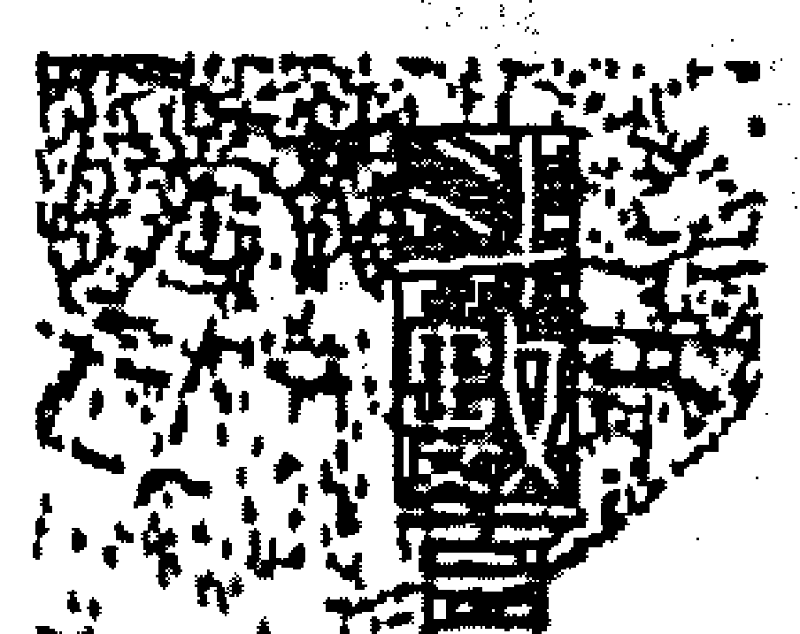

你可能會很驚訝，當貪狼星化權入財帛宮時，竟然會把錢守得這麼好！理財能力和愛財情況，都快直逼愛錢的武曲星了。

【入疾厄宮】

貪狼化權入疾厄宮時，大部分都是肝膽方面的毛病，也代表容易感染風寒，女性朋友則要注意易有婦科方面的疾病，常容易為腹痛、白帶等毛病困擾。

【入遷移宮】

原本貪狼坐遷移宮時都會很愛玩，也有很多外出玩耍的機會，但是一遇到化權就有很大的轉變，個性變得主觀有定見，對自己要做的事一樣明確，處事態度精明而沉穩。

【入僕役宮】

朋友眼中的你，是個交遊廣闊、出手大方的人，有你在，大家都可以放心地大吃大喝，可是他們都不知道其實你的心裡在滴血；眼看著荷包日漸消瘦，還是要顧慮到再怎麼凱，錢也有用完的…天啊！

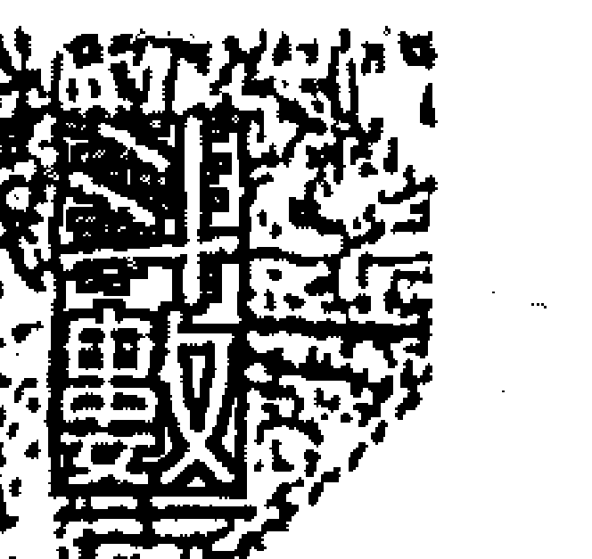

## 第⑩章 四化詳論篇

【入官祿宮】

當多才多藝的貪狼化權入了官祿宮，千萬記得要好好地發揮專業長才，甚至可以考慮成立工作室或獨立創業，才不會辜負了你的才華。

【入田宅宮】

小時候多半有兩個住所讓你來來去去的，往返次數很頻繁，而且住處或住家附近常有人種植蘭花或水果。

【入福德宮】

當貪狼星化權入福德宮時，會把貪狼星最貪心的一面表現得淋漓盡致，看到什麼都想要，可榮獲「最佳鐵公雞獎」！其實原因在於當事人常處於精神空虛的狀態下，因此對物質、錢財會過度要求和掌控，以此來填滿內心空虛。

## 星座逢四化要訣

【入父母宮】貪狼星有著慾望不容易滿足的特性，再加上代表雙數的化權助陣，那是鐵定增加、擴張，而且還是公開的，所以貪狼化權入了父母宮時，擁有一次婚的爸爸、媽媽，是很正常的狀況。

## 贪狼化忌

貪狼星原本是非常擅於交際應酬的星座，遇到化忌時，大多數的應酬都無法達到實際要求的目的，變成只是一群人吃吃喝喝胡混瞎掰而已，起不了什麼大作用，說不定還會假借應酬的藉口，卻和狐群狗黨一起吃喝玩樂，摸魚打混。

## 贪狼星逢化忌時

三方一定會遇到破軍化祿，這其中的互動關係必須要仔細觀察判斷，例如：財帛宮貪狼化忌、官祿宮破軍化祿，這多半是將資金投入事業，因此只能說是破財；而如果是財帛宮破軍化祿、官祿宮貪狼化忌，則是因為事業失敗，是把身家財產拿去當舖換錢得來的，並不算是增加財產。貪狼星的星性原本就喜歡風花雪月的事，何況又帶著桃花，想不風流也難，如果再加上多是非的化忌，足足可以演一部歹戲拖棚的連續劇了，所以當行運走到貪狼化忌時，最好少涉足風月場所，免得染病官司事小，家裡上演桃色風暴才頭大。

###### 紫微要诀

（五）

## 星座逢四化要诀

贪狼星虽然带有桃花之性，但是它本身更是个醋坛子，只许州官放火，不许百姓点灯——我花心风流你要忍耐，可你一旦做了什么对不起我的事被我知道，你就玩完了！倘若再加上化忌那就更精彩了，醋劲发作到失去理智，甚至做出激烈自残的动作，闹得满城风雨都不在乎。

【入兄弟宫】

当贪狼星化忌入兄弟宫时，大多表示兄弟姊妹之间手足有损，手足也容易发生不名誉的事。

【入夫妻宫】

夫妻俩个性不合，三不五时就来一场武力竞技，你来我往的好不热闹，想要平心静气的沟通一下，却你观念不合，到最后愈演愈烈，两人同床异梦是很正常的事。

【入子女宫】

贪狼星化忌入子女宮，孩子也是蠻可憐的，平常父母不怎麼關心也就罷了，萬一兩人離了婚，又為了小孩該歸誰而吵吵鬧鬧的。

【入財帛宮】

為錢傷神，拼命賺錢傷身，唉！真是辛苦。其實可以考慮從事帶有是非或競爭性強的賺錢方法，例如保險公司業務員或是律師等等。

【入疾厄宮】

當貪狼星化忌入疾厄宮時，大部分的毛病都是出在肝臟或是與生殖系統相關的毛病，並要特別預防肝硬化問題。

【入遷移宮】

當有人行運走到貪狼星化忌入遷移宮時，千萬要注意人際關係的維持，因為他實在太欠缺人情世故的觀念了，更要防範重大的意外發生。

【入僕役宮】

小心！這時應該張大眼睛，仔細地看清楚你周遭的朋友，若是交友不慎會吃大虧的！在公事上也是如此，縱使是你的心腹，也要謹慎提防被扯後腿的情況發生。

【入官祿宮】

千萬不要以爲具桃花特質的貪狼入了官祿宮，就一定會從事特種行業，其實很適合從事具有高競爭性及高爭議性的工作。

【入田宅宮】

當貪狼星化忌入田宅宮時，家中的磁場會較雜亂，通常搬家的頻率會很高，也不適合在家中種植蘭花和白色香花。

【入福德宮】

貪狼星的心思已經想很多了，再加上令人頭痛的化忌，心情就更加的低落，常自尋煩惱，鬱鬱寡歡，精神上更加空虛。

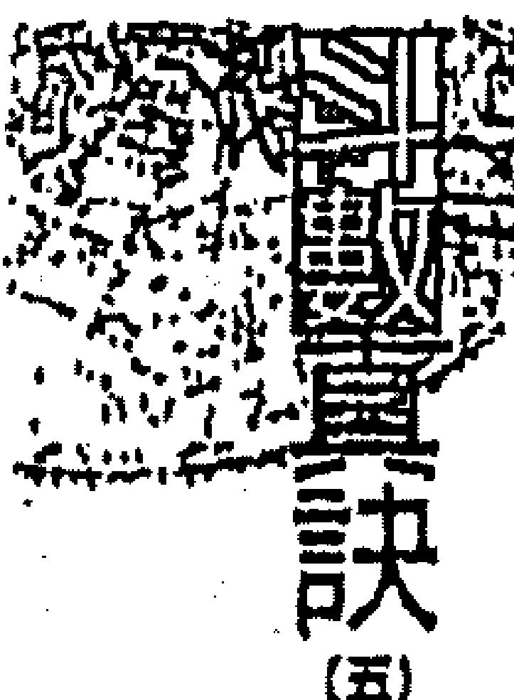

【入父母宮】

對貪狼星化忌入父母宮的人來說，能和爸媽一起吃頓飯是很難得的一件事，因為從小就是祖母帶大的，如果再加上煞星則是祖母帶大的。

## 巨門化祿

巨門之星化氣爲暗，星性陰沉，會說話但容易說錯話，並不擅長人際關係的處理，也不懂得基本的人情世故，凡事只有想到自己，別人怎麼想可是跟他一點關係也沒有，當遇到化祿時情況才有所好轉。巨門星化祿時是代表開口財，只要開口說話就可以賺錢，例如教師、仲介、直銷、保險等等，但是巨門星本性主是非，就算是加上了吉星，也還是要花費很多心思才能將工作做好，如果再遇上煞或忌則更要身體力行，用努力來換取金錢，那可不是很輕鬆的。巨門星又名「封喉」，遇到化祿則有「啓封」的意思，雖然有利於行運，但還是要小心謹慎，保守行事比較好，千萬不要貪圖一時的快感而搶著大出風頭，如此反而會爲自己帶來一堆麻煩，惹得一身騷。化祿雖然代表錢財，但偶爾還是會有一些狀況不能盡如人意。巨門代表的部位爲口部，遇到化祿時就有好口福了，哪裡有好吃的一定少不了你一份，而且連帶地胃口變大，食量也更好了，吃吃喝喝的結

【入兄弟宮】

對你來說，對兄弟姊妹好原本就是天經地義的事，但是他們卻不是這樣想，那可就一定是，儘量別指望收到什麼回饋的行動，免得傷心。

【入夫妻宮】

雖然你對你的阿那達很關心，也很體貼，但是不知道為什麼，兩人之川就是很難取得共識，不是你有意見，就是他有其他的想法，很容易互相猜忌，懷疑對方。

【入子女宮】

對于子女細心關懷，照顧得無微不至，但是子女長大後卻不想再接受這種金體式的照料，親子間的代溝容易隨著時間的增長而愈來愈深。

【入財帛宮】

對巨門星化祿入財帛宮的人來說，嘴巴是他最重要的生財工具，要開口才會有錢，再加上多是非的巨門星，更要花盡心思來擺平；適合從事教師、仲介等工作，收入較穩定且細水長流。

【入疾厄宮】

當巨門化祿入疾厄宮時，最容易發生狀況的部位就是牙齒、呼吸道及肺經系統，另外在氣血循環方面也較差。

【入遷移宮】

併牙俐齒的巨門星加上化祿，會對自己的人際關係比較在意，也會處理得比較好，在外的時候比較會有活潑的表現。

【入交友宮】

朋友！向來是有錢出錢、有力出力的你，不知道為什麼還是不容易打進他們的圈子，常發生自討沒趣的情形。

【入父母宮】

雖然老來福氣不錯，但是這話多的巨門先生、小姐，可不可以不要那麼囉嗦囉嗦，很煩的耶！

【入福德宮】

對巨門星來說，當化祿入田宅宮時，一樣可使得不動產有增加的趨勢，但是住家內的財位應該穩定，免得有財氣暗耗、洩財氣的狀況。

【入田宅宮】

【入官祿宮】

巨門星化祿入官祿宮時，較適合從事與動口有關的工作，但並不會因為有化祿的存在而變得更好，反而常為了工作勞心又傷氣。

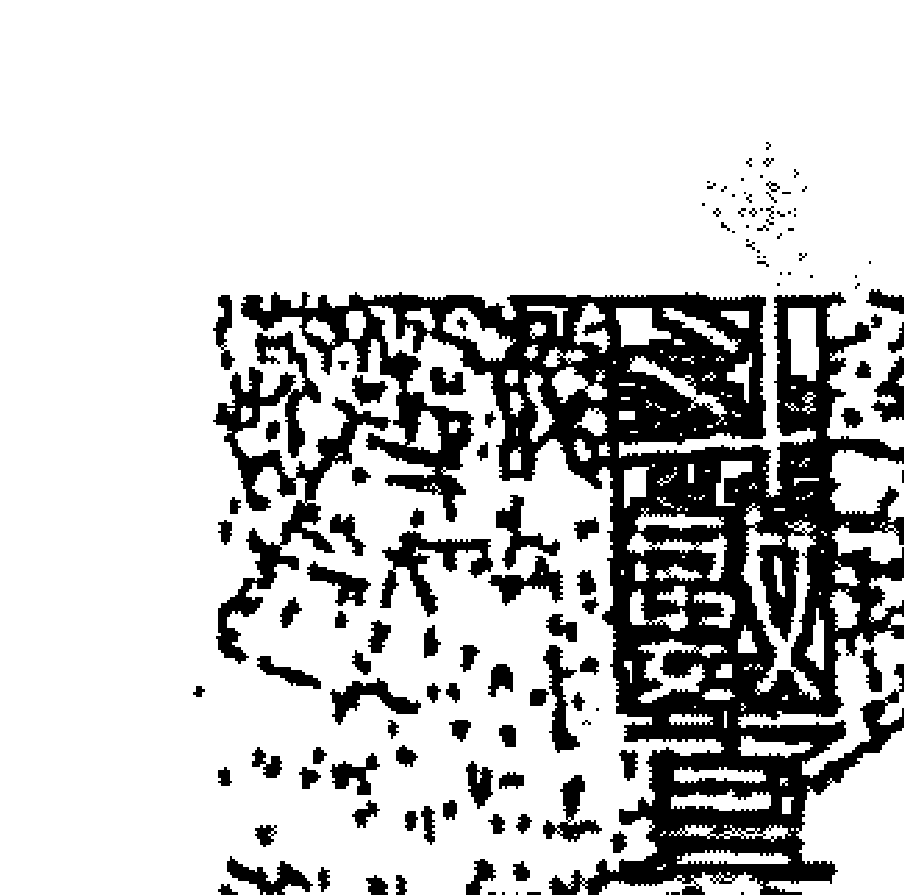

## 訣 (五)

## 星座逢四化要訣

疑心病重的巨門星化祿入父母宮時，難免會因為與父母之間，有些誤會沒有完全說清楚而導致心結難解，父母人數也會有增加的傾向。

## 巨門化權

巨門星在斗數中是個具陰沉特質的星宿，必須要有旺地的太陽照會「顯耀」其命才行，否則就算化祿或化權，也很難改變巨門星疑心生暗鬼的致命傷。

###### 题解

巨門星逢化權時如果能會照太陽星，那就非常適合從事與貿易相關的行業，特別是遠離二小地往他鄉發展更好，如果有機會出國去國外工作可謂要好好考慮，因為閣下的才華將可以受到重視與提拔，會有不錯的發展唷！

###### 特质

巨門星化權坐命宮的人，生性嫉妒心就很強，常常會因為嫉妒心的作祟，見不得別人比自己好，也不顧現實狀況中自己的能力夠不夠，就貿然地向前衝，雖然這樣能激發往前衝的決心，但是過度的嫉妒反而容易自找麻煩。

###### 口才

巨門星的口才具爭議性，遇到了化權更變成了很「鐵齒」的人，不只思想偏激，脾氣也是又臭又硬，常常好好的一件事會被他弄得讓大家都不愉快，尤其非常主觀，縱使表面上同意別人說的話，其實私底下根本不誰也不鳥，是個標準的口服心不服的人，想改變巨門人？過八百年再說吧！也因為這種個性，使得人際關係在擴展與融洽度上有很大的阻礙。而因為巨門星的口才實在不討好，遇到化權後反而在心態上會變得較為小心謹慎，凡事都仔細推敲後才開口，絕對不講沒把握的話，久而久之就形成了謹言慎行的形象，讓人感受到深沉與內斂的一面。

【入兄弟宮】

兄弟姊妹的個人主觀意識都很強，每個人都有意見，很難達成共識，所以常常為了要說服對方而起爭執，大家不適合長時間住在一起。

【入夫妻宮】

夫妻之間「相敬如冰」，沒有太多的感情交流，反而常為了爭誰是家中老大、誰該聽誰的而爭吵不休。

【入子女宮】

## 第⑩章 四化詳論篇

【入財帛宮】

巨門星化權入子女宮的人，較注重管教子女的方式，對孩子要求也較嚴格，如果再遇到煞星則會動手打小孩。

來財之源大多以口舌競爭或動口生財等方式而來，也容易掌管財務收支大權。

【入疾厄宮】

只要有關口腔、食道、支氣管、腸胃等方面的問題，大多是巨門化權落在疾厄宮時較會發生的毛病。

【入遷移宮】

若是生在古代，就是個路見不平會拔刀相助的大俠，因為實在很愛管閒事，只要看不順眼就會出聲，所以常和人抬槓起爭執。

【入僕役宮】

巨門化權入僕役宮的人還真不錯

身邊常常會出現益友、諍友給予幫助，但是忠言逆耳，所以閣下別老是誤會朋友，只要靜下心來好好地想一想，就能瞭解朋友們的苦心。

【入官祿宮】

講話實在很有份量，同樣的話，從不同的人的嘴裡說出來，偏偏大家就會信任巨門化權入官祿宮的人；以這種特質來說，很適合從事有關推銷、拍賣、傳播方面的工作。

【入田宅宮】

當巨門星化權入田宅宮時，代表家宅不安，家裡的每個人都想當老大來指揮別人，像是一堆的將軍卻沒有人要當小兵，以致成天吵鬧不休，卻是只為了一口氣而已。

【入福德宮】

有沒有人說過閣下講話真的很毒？而且有著牛脾氣，一旦認定之後就很難改變想法，真是個頑固且不易溝通的人，尤其三二二三的黑暗性格隱約作怪，導致在個性上較為陰沉而難相處。

【入父母宮】

對巨門星化權入父母宮的你來說，嚴格的家教是你從小較深刻的印像，而父母親固執且難以溝通的個性，恐怕也是你無法改變的。

## 星座逢四化要訣

## 巨門化忌

巨門星雖然是黑暗之星，但星性上也有旺弱之分，它本身並非黯淡無光，而是因為基本星性就帶有烏雲掩遮的效果，當遇到化忌時，應該特別留意與它同宮或對宮的星宿的連鎖反應。

巨門星代表口舌、是非，當遇到化忌時，應多注意容易發生吵架或說話沒經過大腦，甚至是故意說話刺傷別人的情形；如此這般不會得罪人，才什麼鬼！遇到脾氣好的人可能不與你一般見識，若是遇到脾氣不好的人，拿刀砍你都有可能！特別是又加會煞星時，跑法院打官司，所以當運走巨門化忌時，最好還是少開尊口為妙。

巨門星星性沉潛，只要求實際的效果與利益，不會出風頭那些光有頭銜而沒有實力的人，也不太愛出頭，能閃就閃。而基本上對公眾活動也不宜參加，凡事以不曝光、不上檯面為上策，尤其又有代表是非的化忌來參一腳時，就更要小心謹慎，儘量地擺低身段，趴著比較不會中槍，不要做會惹人注意的事，縱使內心有拼命想要的想法，也要忍下來，因爲這是趨吉避凶的不二法寶。

【入兄弟宫】

兄弟姊妹之間的感情淡薄，想法南轅北轍，更會爲利益互相爭執，往往外人的一句話，就感覺比自己親人講的還來得中聽，只會對外人好，家裡的兄弟姊妹，哼！慢慢等吧！

【入夫妻宫】

最好晚婚爲宜，如果一時不小心而早早步入婚姻，也很容易出現狀況：一離婚，二次結婚的機率可是很高的；而如果沒離成，夫妻倆同床異夢是常有的事。

【入子女宫】

當巨門星遇化忌入子女宮時，容易子女損，如果再加會煞星，則有白髮人送黑髮人的徵兆。

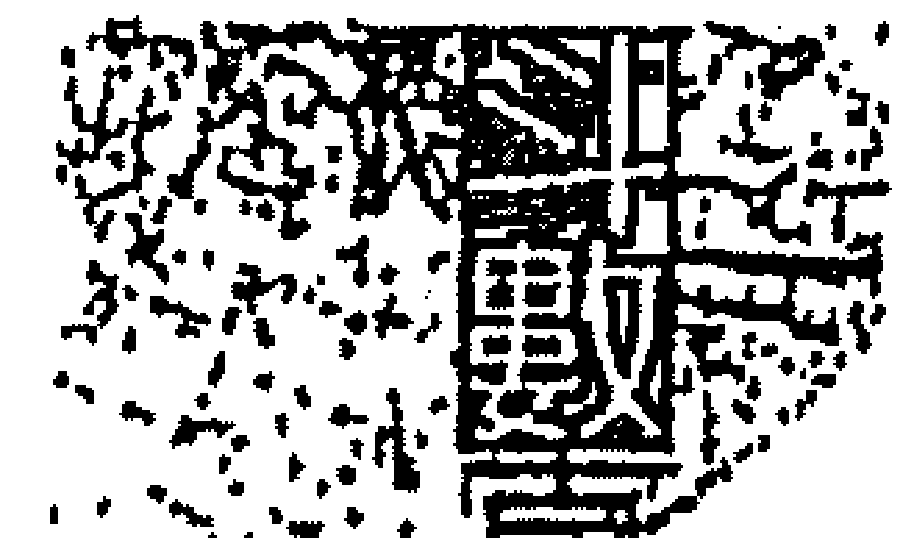

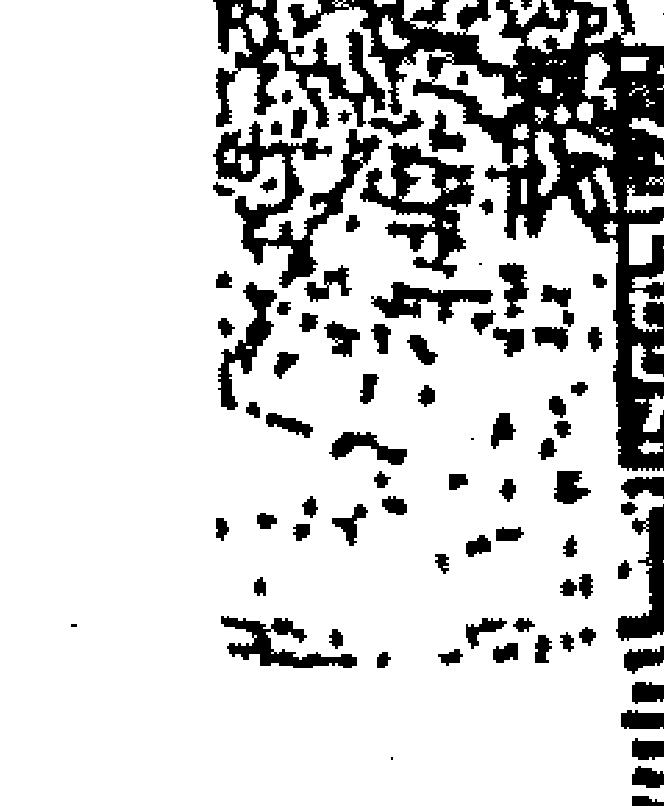

## 星座逢四化要訣

【入財帛宮】
最好從事以較耗費體力的工作為佳，因為巨門星會帶是非，因此賺來的錢也多是帶有是非狀況之財，尤其又逢煞星，所以最好還是安分守己，出勞力來賺錢就好。

【入疾厄宮】
多口舌的巨門星來到了疾厄宮，想當然爾就會在嘴巴上出點狀況，很可能年紀小小，牙齒就壞得差不多了，視力也不怎麼好，並且支氣管不佳，連聲帶也容易受損甚至倒嗓呢！

【入遷移宮】
原本巨門星入遷移宮化祿時，個性是外向的，但是一遇到了化忌可就一百八十度大轉變，反而變成內向、自私的人，也因為本身的內向自私，所以在人緣及人際關係上都很差，也難有改善的空間。

【入僕役宮】

閤下天生命格就是欠缺得力的助手，凡事都只能靠「自己」，是很辛苦的。而且最好不要與人合夥事業，免得賠錢了事還不打緊，最後連朋友都做不成。

【入官祿宮】

雖然是「粉」抱歉，為了工作順利，閤下最好還是選擇不必開口競爭的工作，當然不是不能講話，只是怕一旦話說多了，麻煩也都跟著來，不只在工作上有影響，還常會事倍功半。

【入田宅宮】

家裡容易進駐白蟻蛀蟲，所以為了避免坐上椅子後，椅子卻因為被蛀蝕斷裂而讓閣下摔倒，因此建議還是少用木製家具為佳。而若逢流年行運遇到巨門星化忌入田宅宮，則最好小心樑上君子來拜訪，貴重物品要收好喔！

## 星座逢四化要訣

【入福德宮】

如果你身旁有朋友是巨門星化忌入福德宮的人，在他面前請你千萬要謹言慎行，因為他很可能是地下廣播電台的台長，是個隨時做實況轉播的八卦中繼站，雖然他並不是有意的，人也還算好相處，但是本性難移，常常會傷害了別人而不自覺，如果因此而遭到反彈也是很正常的。

【入父母宮】

當巨門星化忌入父母宮時，通常與父母之間的緣分較淡薄，或是從小就離家外出唸書或工作，長久的分離，難免與父母之間較沒交集，也沒什麼話說。

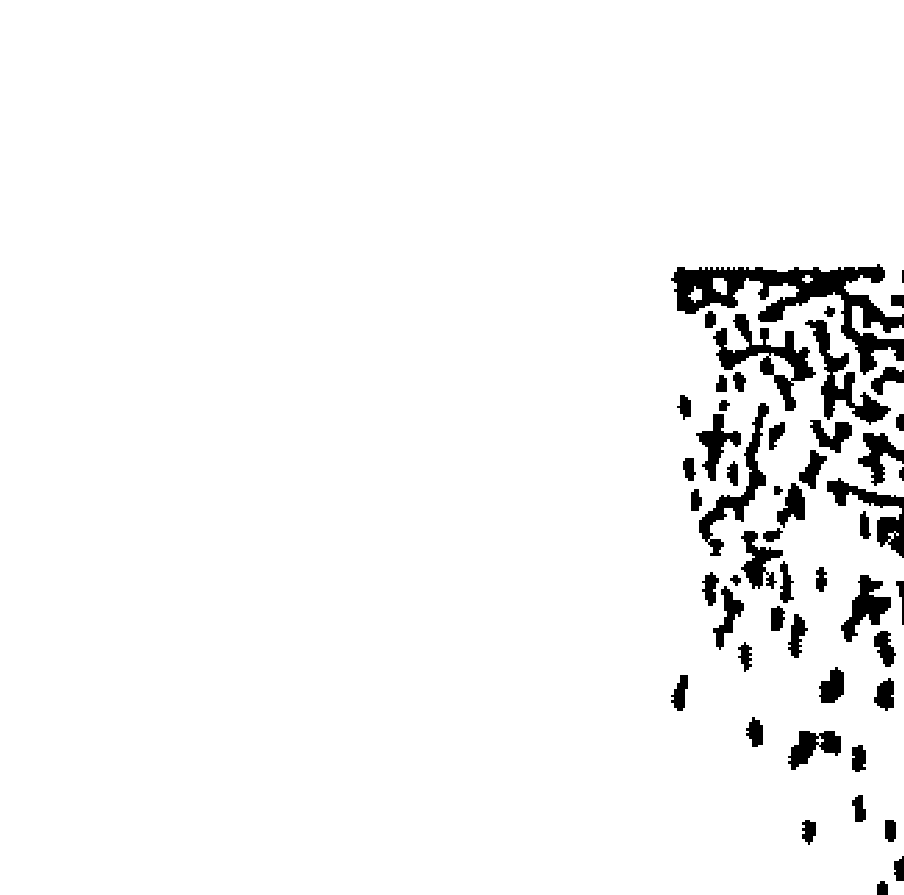

## 第⑩章 四化詳論篇

## 天相化忌

天相星為掌印之星，逢化忌時則代表與印鑑相關的事或物出錯，例如使用支票或有價證券出問題、與人簽訂契約甚至替人背書當保證人出等等，因此，只要是需要使用簽名蓋章的方面都要小心，若不注意則容易出錯而蒙受損失。

在斗數裡，天相星也是代表衣食享受的星座，不管是好看的衣服或是好吃的東西，也不管當下經濟情況如何，天相星多少都能穿到、用到，真是好命人一個！倘若遇到化忌時，對於衣飾方面倒沒什麼影響，衣櫃：打開還是滿滿的衣服，大衣、西裝、洋裝，件都不缺，但是對吃就有影響了，可以當美食評論家的天相星，原本就挑剔又偏食，一遇到化忌時可就一百八十度大轉變，變成什麼都可以吃，有時候連「廚」都得吃。

天相是個喜歡服務人群、熱心公益的星座，遇到化忌時大多會因為熱心過了頭，反而給自己找來一堆麻煩事，例如原本只是好心幫忙老先生做個申譜之類的，沒想到文件有問題辦不下來，反被人說是為了服務費而在中間做手腳。出人出力就算了，出了事還要你負責，做好是應該，做不好就是你的錯，真是好心沒好報，所以最好還是不要太雞婆。

天相星的女性以相夫教子為主，是個標準的賢內助，成天為了張羅老公的事忙裡忙外的，一刻也不得閒，能娶到這種老婆真是賺到了，不只把家裡打理得乾乾淨淨，在公事方面也能給你很大的輔助，對她而言，丈夫的成功就是自己的成功。但是，若逢化忌可就跟上述的情形相反，此時的妻子不但不會成為丈夫的幫手，反而會自己外出創事業，甚至還會反過來要求丈夫助她一臂之力，不再是「男主外、女主內」，而變成了主從關係顛倒的狀況。

## 星座逢四化要訣

【入兄弟宮】

天相星入兄弟宮的人，與兄弟姊妹之間的情感還算不錯，但是要盡量避免手足之間的互相信用背書、互當保證人的情形，以免相互拖累，反而影響手足之情。

【入夫妻宮】

「又！你實在是有點小命苦耶！談戀愛時就時常波折不斷，不是對女方爸媽反對就是舊情人出來攪局，等到好不容易排除萬難之後結了婚，夫妻之間的感情卻又漸漸地由濃轉淡，婚姻生活容易變得一成不變，沒什麼情趣可言。

【入子女宮】

當天相星化忌入子女宮時，有子女容易夭折的可能性，或是突然會冒出有不同父母所生的兄弟姊妹，手足之間的關係較不單純。

【入財帛宮】

天相星化忌入財帛宮時，理財的方式最好盡量做到現金交易，少用塑膠貨幣或支票，最好避免期貨性生意，減少交易期間的風險，以免蒙受損失。

## 第⑩章 四化详解

### 天梁化禄

天梁星为父母星，代表长辈的荫庇，逢具有增加含意的化禄时，则有加重的意味；意指多半能承接来自长辈的事业，不用自己辛苦地从基层做起或烦恼资金问题，直接介入领导核心，可减少奋斗几十年，资产数目自然倍增无疑。

天梁星是老人星，如果命宫坐天梁星，年轻的时候，定很看不惯那些“幼稚”的同学，因为老气横秋的天梁星人，即使只是乍轻人却多半早已有著中年人的想法，是标准的“少年老成”，倘再逢化禄，可就更提早到孩童时期了，可能虽然年纪小小，但就已经是个思想早熟的小老头儿了。

天梁星的星性带有“孤”的含义，遇到多多益善的化禄其实反而不佳，若在青少年时期逢之，多半只愿着玩而一点都不喜欢读书；青壮年时期遇到了天梁化禄，虽然容易有承接祖业的机会，但对这凭空掉下来的钱怎么可能不好好地花一花呢？这下子吃、喝、玩、乐就样样都来了，到最后坐吃山空恐怕也是难免；如果是老年时期遇到，再加会地空、地劫，那可得小心成了需要社会救济的无依老人。

天梁星又为赌博星和宗教星，逢化禄时，应该详细格局组合再来研究它的含意，例如天机与天梁的组合是带有赌性及投机性的钱财，而太阳与天梁组合，则是利用专业知识或才能来帮人解除困扰的所得，若是天同与天梁，则多半能享受上一代留下来的财富，也容易藉由神佛之名来为人消灾解厄。

###### 【入兄弟宫】
虽然因为化禄的缘故而对兄弟姊妹好，并且照顾他们，但是也容易为了金钱的借贷往来问题引发纠纷，进而影响到彼此之间的感情。

###### 【入夫妻宫】
如果你的夫妻宫坐了天梁星化禄，那你最好有自知之明，他的钱是他的，你的钱还是你的，财务最好是各自独立，免得常因为理财观念不同而引起争执。

###### 【入子女宫】
哇！当你的小孩真是好命，自己拚死拚活地赚钱，只为了给小孩一个衣食无缺的环境，而且这也同时代表着：阁下一定能达到所想的目标，才会有财产留下来啊！

###### 【入财帛宫】
当带有赌博星性的天梁星，化禄入了财帛宫时，大多代表偏财运佳，三不五时赢点投机性的钱财，所以行运遇到时，彩券可以加减买几张，但是对中奖金额可别抱太大的希望，而且这类钱财比较难久留。

###### 【入疾厄宫】
天梁化禄入疾厄宫，要小心体重容易增加，而且肠胃吸收能力也不好，并容易皮肤过敏。

###### 【入迁移宫】
天梁化禄入迁移宫，代表远方之财，以远离出生地谋生或到外埠行商为佳。

###### 【入仆役宫】
对朋友很好的天梁星，化禄入仆役，只要有吃香喝辣的好康，铁定会呼朋引伴人家；起来！不过，在钱财方面就别那么大方阔气了，借来借去的结果，小心到最后一点钱都拿不回来。

###### 【入官禄宫】
当天梁星化禄入官禄宫时，适合从事与农产、宗教、银发族相关的生意，或是稳定性高的工作。

###### 【入田宅宫】
赶快看看你是天梁星化禄入田宅宫的人，是的的话那就要好好恭喜你，不止能继承祖产，房子也都帮你处理好，纵使没发现成的房子，至少还有人帮你缴头期款。

###### 【入福德宫】
人家说退休后能和老伴悠闲地环游列国，人既松人又闲，化禄入福德宫的人了，因为他不只赚起钱来轻松又不费力，起来遐能安排小活，赏赏花、遛遛鸟，过的悠闲又快乐。

###### 【入父母宫】
代表老人星的天梁星化禄入父母宫时，想当然尔会仔：对高寿、善良、安分的好父母，子女们也都能对长辈尽孝。

### 天梁化权
天梁星的星性为清高，与坐在旺地的太阴相会照，更能显现出它的尊贵，遇到化权时则对掌握实权更有帮助，能快速地接近权力的中心点，也更能发挥它监督、管理的专业能力。

天梁星的本质非常心软，常会开不了口骂人，怕伤害到对方，蛮不擅长人事方面的管理，所以不太适合当老板来做全盘的人事统筹，但是很适合训练或教练的角色，利于帮助计划的运作推展。逢化权时仍然不会改变它这方面的特质，如果能从事有关顾问、设计、会计、电脑、教育、管理等几项工作，则更能发挥它个人独特的专业魅力。

天梁星也是理论之星，但是在男性和女性的解读上，差别蛮大的，男性多半有个性善良、乐于助人，女性则是聪明能干、手脚俐落，还能对老公的事业有所帮助！但是两者皆有一个共通点，那就是“杂念”，例如地板没擦干净、桌椅没摆好、桌上文件没收好……等等，可以说是一样，念一样，逢化权则更加重这个特质，杂念转变为疲劳轰炸，成天罗罗嗦嗦个不停，令人听了就烦，年纪愈人愈严重。天梁星的星性带有孤独的含意，如果能遇到甘地的太阳星照会就可以化解，逢化权时则容易让人接受并肯定本身的心性，因此可以考虑从事与社会大众相关的行业。

###### 【入兄弟宫】
通常能成为兄弟姊妹之间的决策主导者，大家服从，只是有时候会因为管过头而引发了不满，造成大家的不愉快。

###### 【入夫妻宫】
当你发现有朋友是天梁星化权入夫妻宫时，仔细地观察一下，他们家的男主人是否是家中的皇上或皇后？恐怕管得很严，管的问题可多呢！但是，管着管着，也难免会出现阳奉阴违的状况。

###### 【入子女宫】
对子女的照顾无微不至，小孩喜欢什么就买什么，完全无条件付出，但相对地对孩子的期望也会提高，因为会认为如此用心的对待，小孩应该明白，并且不负自己的期望才对。

###### 【入财帛宫】
当天梁星化权入财帛宫时，大多会主管财务人权，也代表会有两份金钱的收入，所以蛮适合在正职之外兼一些差来赚赚外快。

###### 【入疾厄宫】
天梁星在疾厄宫时，大多会有慢性胃痛的毛病，另外山仔部分是风湿及淋巴腺等，鱼水之欢也蛮频繁的。

###### 【入迁移宫】
重承诺、讲信用的天梁星，又逢化权入迁移宫，想当然在外的人际关系也会不错，大家都很喜欢与你交朋友。

###### 【入仆役宫】
代表老人的天梁星加上花权入仆役宫时，大多会较信任或重用年龄稍长的属下，但是却有一个小毛病，就是喜欢搞小众生活圈。

###### 【入官禄宫】
工作上的表现容易受上级的赏识，能力强，升迁的速度也很快，是个不能轻忽的强手，又逢代表双数的化权星，所以容易会有两份工作或从事两种完全不同的行业。

###### 【入田宅宫】
别担心！家中的祖产一定少不了你一份，iii还会有双住所，常常来回两处处跑，不过也有居家不稳定的含意。

###### 【入福德宫】
对天梁星化权入福德宫的人来说，欠缺安全感是他一个很大的问题，而且个性，思想也蛮怪异的，别人对他好，说不定他就把他想象成心怀不轨要谋杀他的人，而且满腹牢骚发不完。

###### 【入父母宫】
当天梁星化权入父母宫时，如果你以为是有着慈祥的爸妈要分给你祖产，那就错了，反而是长辈掌权并且不轻易放下，如果再加上煞星，父母就易有结两次婚的机率。

### 天梁化科
天梁星代表尊贵，逢化科时大多能得到高官贵人的帮助，每次遇到困难或与人有纠纷，例如遇到官讼或是无缘无故地招惹来的麻烦时，自然会有公正廉明的人士或清风亮节的高官来挺身相助，不用劳交情，也不用送红包，真是令人好生羡慕。

天梁星为父母星和老人星，化科也代表贵人，组合起来就是能得到长辈的人或长辈相助，所以当天梁化科时，若是能落入父母宫、仆役宫或迁移宫是再好也不过了，因为这才能使它发挥到最大的功效，充分得到帮助。

天梁星注重理论，逢化科时也代表他的学说、方法、作为都能够受到他人肯定与称赞，在其专业的领域里能享有清誉以及相关人士的信赖，是本身专业长才的最佳背书。

另一方面，天梁星对文字的敏感度也相当高，思绪敏锐而周全，下笔犀利，常有惊人之作，所以，也很适合延揽为参谋或秘书等，成为智囊团或管理人才。

天梁星的人也很容易心软，而且心地善良，只要对他拜托几句，马上就药械投降的全都答应了，遇到化科时就会转化为正义感与同情心，只要是有关敬老扶幼、寒冬送暖、协助弱势团体，或是救济贫苦人家的活动，一定能看到他的身影，不论何时何地，一通电话马上就到，常常能在各式各样的公益团体或义工行列里看到天梁人的义行。在这个日渐冷漠的社会中，能有这种胸襟的人也不多了，我们不只要惜福，也要能伸出援手，不一定要费尽心力的“出人”，也不一定要花很多钱，只要是能力所及之处就尽量帮忙吧！

###### 【入兄弟宫】
不错嘛！家中的哥哥姊姊对你都很照顾喔，只要有问题或困难，马上就有人为你出面解决，但如果你自己是排行老大，那就很抱歉了，这项福利你是享用不到的。

###### 【入夫妻宫】
对于代表老人星的天梁星又化科落入了夫妻宫，你想是怎样的情形呢？没错，最好是男性娶个“某大姊”，女性适合嫁个“老”公，但也同时表示，那亲爱的另一半会是某方面的专业人才哦！

###### 【入子女宫】
对于天梁星化科入子女宫的人来说，家中的“风”或长辈个个人敬佩的作风及为人，并多能让子女接受与学习，但是能不能发扬光大、青出于蓝，就得要看有没有再遇上煞、忌了。

###### 【入财帛宫】
当爱现的化科出现在财帛宫时，恐怕颇会花钱，因为容易钱财露白而不利于聚财，而值得安慰的是，大部分都是花在学费、教材或参考资料方面的费用。

###### 【入疾厄宫】
对于落在疾厄宫的天梁星而言，肠胃方面的毛病可能是最头痛的问题，动不动就胃痛或肚子痛，再加上化科来插花，很容易转变成痛风的毛病。

###### 【入迁移宫】
对于此个性内向、胆小的人来说，天梁星化科入迁移宫的人，可能是他最羡慕的人了，因为不管走到哪里，天梁化科的人，一定是最受欢迎、人缘最好的那一个。

###### 【入仆役宫】
最好多多亲近身边年长的朋友，工作职场上也要注意那些虽然年长但是是具有专业长才的属下，因为他们可能会在你遭遇困难时，给你意想不到的帮助哦！

###### 【入官禄宫】
如果天梁星化科入官禄宫，可要多多注意有关公家机关的工作，或可能到具有特殊风格的民营企业里任职。

###### 【入田宅宫】
注意哦，如果今年你的天梁星化科入田宅宫，那么你可以开始寻找你喜欢的居家风格了，因为有可能家里会来个大翻修，阁楼增建或重建之类。

###### 【入福德宫】
当天梁星化科入福德宫时，个性上可能较偏“传统、古老的模式，思想上也比较陈旧，但老来还颇能对退休生活做不错的安排，也可以归类在“快乐的银髮族”中。

###### 【入父母宫】
赶快把护照办一办，准备出国去好好地疯一疯吧！因为家中长辈所留下来的财产或专业技能，或可足够你享福一辈子了，但前提是自己最好也要有充分的能力去经营哦！

## 破军化禄
破军星主要的含义是代表除旧布新，能突破现状创造新的生机，遇到代表增加的化禄时，更能使改变的规模与威力倍增！因此当运走到破军化禄的结构时，应该要有全盘大改变的心理准备，尤其在事业陷入瓶颈的当时，更应该好好把握这次翻身的大好良机，做好充足的准备，鼓作气地向前大步迈出，相信一定会产生令你意想不到的效果。

破军星逢化禄时，三方的官禄宫位必定是贪狼化忌，所以破军化禄的变动一定是因为事业上的挫折而引起的，当官禄位受困于不利时，细部的调整是没有用的，环境及趋势会迫使你做出重大的改变，但这也是改变行业或改变经营方式的最佳时机。

破军星的星性非常的勇于尝试新东西，理念大胆而创新，而且常常不按牌理出牌，只要是有兴趣的东西，不论如何都要找机会试试看，逢化禄则往往能想出有别于他人且独树一格的想法，也有令人耳目一新或出奇制胜的绝招，常能创造流行的旋风，所以很适合从事有关设计、企划方面的工作。

破军星是个精力吐盛且冲动十足的星座，凡事只要他下定了决心一定勇往直前，绝不轻言放弃，但是也因为这样冲动的个性，以致常造成瞻前不顾后的情况，逢化禄时更是火上加油，永远只关注在自己假设中的计画，丝毫没有想到万一有任何一个环节衔接不上时，应该要有的应变措施，因此身边必须要有值得信赖的人来帮他适时的踩刹车，并且还要帮忙安排后续的进度或是帮忙收尾，否则就准备在他高楼起，也看着他一横倒下。

###### 【入兄弟宫】
虽然因为化禄的关系，对兄弟姊妹都算很好，但对于他们有破坏性质的忌时，骂人更是会骂的很难听，尤其若再加会了煞，可能还是会答应对方的要求，可是事后又后悔不已。

###### 【入夫妻宫】
当破军星化禄入夫妻宫时，最好晚婚比较好，因为代表可能会有二度婚姻，而如果结婚的对象是第二春，反而能解决这个问题。

###### 【入子女宫】
对子女照顾的无微不至，深怕子女遭受挫折，因此保护的非常好，对子女的要求总是有求必应。不过，若是加会煞星、忌时，恐怕要小心易有某种状况不正常的孩子，可能需要长辈来长期费心照顾。

###### 【入财帛宫】
当破军星化禄入财帛宫时，不要误会此化禄会让你发大财，反而是由典当、贷款或贩卖而得来的钱财，因为破军化禄并不代表钱财，只是代表变现而已。

###### 【入疾厄宫】
大部分的破军星化禄入疾厄宫时，都会有消化系统的毛病，如果再遇到煞或忌时，就要小心容易发生意外伤害。

###### 【入迁移宫】
对精力旺盛的破军星来说，坐在迁移宫时会更喜欢往外跑，尤其又加上容易倍增的化禄，在家更是待不住了，喜欢到处串门子。

###### 【入仆役宫】
对于对属下的好，人家都不领情，真是枉费你的苦心说好！不止如此，还容易遇到会反过来打难你的难堪状况。所以如果“想要赚钱”的话，还是捲起袖子、准备好体力，自己来吧！

###### 【入官禄宫】
对于能够突破现状，并有办法再造生机的破军来说，顶下别人经营不善的事业，然后把自己特别的创意加以仔细规划，大刀阔斧地重新改造之下，绝对能让公司起死回生，重新再出发。

###### 【入田宅宫】
破坏力强的破军星化禄，落入了代表库位的田宅宫，人多代表一手的旧房子，而且屋内的漏水问题恐怕难解决，所以若是住进新房子，将是一件很浪费的代誌。

###### 【入福德宫】
对破军化禄入福德宫的人来说，根本不要指望他会是个好情人，因为他们个性实在很粗枝大叶，莽莽撞撞的而且动作粗鲁又不注重气氛，与之谈恋爱实在没啥情调可言。

###### 【入父母宫】
虽然会照顾长辈，也很有爱心，但是说起话来总是没大没小，口无禁忌，常常分不清楚自己的角色。

### 破军化权
破军星的特性在于观念新潮，非常擅长开创，遇到掌权的化权更加强了威力，加深了革命、改造，以及不断创新的理念，就像古代“威远大将军”的开疆闢土一般，完全掌握攻击的主权。

破军星逢化权代表武职能获得荣显，如果入命宫、身宫、官禄宫的宫位且又再加会天魁、天钺，则适合从事军警等武职，若是不会天魁、天钺则有利于“武行”、“武市”等行业的发展，属于体力充沛且閒不下来的人。

破军星的特性为先破坏后建设，天生就喜欢搞破坏，收音机啦、录影机、电脑等等，只要是他觉得好奇的东西就非得要拆开来看看不可，但是请放心，不论如何至少会恢复原状，甚至会有新发明哦！

破军星的星性喜欢惊险刺激的感觉，也很喜欢冒险，遇化权则更加重这个特性，适合从事带有危险性的工作，例如室外搭架、大楼外墙清洁、重机械、废弃物再生等类型的工作。

破军星基本上很反骨，天生就喜欢为反对而反对，常常高挂着“造反有理”的口号，逢化权则更霸气十足，不只思想主观，只要认为对的就一定坚持到底，完全不接受别人的建议与劝告，我行我素，对他好反而被认为是应该的，所以对待破军星的人要运用智慧与技巧，或许用点手腕，吊吊他的胃口，反而能让他服你。

###### 【入兄弟宫】
兄弟姊妹之间，大家心中都认为自己的能力比较强，总是为了谁是老大，谁该听谁的而争执，建议最好是分开居住，要不然成天吵吵闹闹的。

###### 【入夫妻宫】
夫妻之间容易因为个性或意见不同，彼此难沟通协调，常常各吹各的号、各弹各的调，勉强自己想要和谐却还是常有争执，如果加会煞、忌，主刑克分离。

###### 【入子女宫】
当叛逆、反骨的破军星化权入了子女宫时，最好要有心理准备，因为孩子都有很强的主观性，个个性格刚强、叛逆，阁下想管也管不动，若是已产生心结不和，大家同处在一个屋子里却形同陌生人一般。

###### 【入财帛宫】
虽然因为化权的关系而能主宰财务收支大权，但流年逢破军化权，只是代表借出去的钱或积欠货款能收回来而已，另外也有信用额度紧缩的意味。

###### 【入疾厄宫】
当破军星化权入疾厄宫时，最好小心预防刑伤，冲动型的人容易有血光之灾，因此要千万小心谨慎。另一个特点就是身上容易有外伤，疤痕累累的疤痕，或是开过刀的“拉链”。

###### 【入迁移宫】
“少作耶，脾气不要那么衝好吗？”这句话可能是破军星化权入迁移宫的人常听到的话，因为个性实在是太冲动了，也缺乏稳重和耐性。

###### 【入仆役宫】
对破军星化权入仆役宫的人来说，部属的流动率高，而且请来的人做不好工作也就罢了，对你的态度还很差，这可能是你最头痛的问题；最好不要与朋友合伙投资做生意。

###### 【入官禄宫】
喜欢惊险、刺激、挑战的破军星，最好找的工作性质也尽量符合：需要动脑、竞争性和发挥创意的特质，如此一来才不会觉得上班太无聊！其实，也只有破军星人有这个胆子从事带有危险性的工作或行业。

###### 【入田宅宫】
如果你是破军星化权入田宅宫的人，奉劝你最好不要住新屋，因为即使用了，你的新房子也会发生漏水问题，还是住旧房子就好。

###### 【入福德宫】
个性主观的破军星往往来，提醒你不必想要改变破军的想法，因为他本身的固执性已经根深蒂固了，叫他改，省省吧！还是给你一个建议，坐他的车，一定要繫好安全带，最好心脏还要很强壮，因为喜欢冒险、刺激的破军星人，怎么可能不开快车呢！

###### 【入父母宫】

对破军星化禄入父母宫的人来说，小时候对父母的印象可能只有「严、严、严」这三个字可以形容，因为家教标准实在是太严了！幸好你还能「严」中作乐。

## 右弼化科

右弼星为辅助性的星座，逢化科虽然也代表名声和贵人，但应该还要再参考同一个宫位里的主星星性，才能讨论它是吉是凶。如果是与帝王星的紫微星或充满霸气的天府星同宫，因为他们的星性与格局都比较大，加上右弼星化科，自然会非常有名，对想要当官出名的人来说，自然是梦寐以求的格局；但如果是与代表是非的巨门星或陷地的太阳星、太阴星同宫的话，反而会为盛名所累，若是单守或加会煞、忌，更会带来是非与麻烦。

右弼星本身并没有特定的磁场，而以辅助为主，所以本身并没有旺、弱之分，逢化科时应该要依据同一个宫位里主星的旺、弱，才能决定右弼星化科的强弱。

右弼星又为异路功名的事属辅助星，并非依照正当方法所能达到的，遇到化科时则是代表有贵人指引，不必自己辛苦地闭门造车，自然就有无心插柳柳成荫的格局。

## 文昌化科

文昌星为科举之星，遇到同属声名的化科时则是锦上添花，多此一举罢了，对于需要科举考试的人有利，一般人行运时逢之，只是有利于升迁而已，所以当家中面临大考的人，流年命盘中出现「文昌」星化科时，倒是可以多少放心一点。

文昌星逢化科时，虽然也可以说是贵人，但却是属于锦上添花型的贵人，并没有雪中送炭的实质效益，就像上次九二一地震时，一堆官员都跟着去巡视灾区，跟在大老板屁股后面跑，但是对灾区有实质帮助的人却少之又少，真是没啥路用，不要也罢。

文昌星也代表文书契约，逢化科时，则是对于需要发表学术作品或文章的读书人有很大的帮助，一般人遇到时，则大多是代表契约书或合同的签订。

文昌化科在流年行运逢之，代表讯息的传递，例如可能突然接到久没联络的好友来电或是书信等等，令人感到窝心和惊喜。

## 文曲化科

在紫微斗数中，文昌与文曲两星都是科甲之星，同样是代表名声，但是因为星性不太相同，所以逢化科时，解读也不太一样，读者应该详细的加以查对与分辨，以免搞混了。

文昌星为文贵，属于文科，在古代是正式经过官方考试的翰林科班的学生，在现代来说，就是经过国家考试，例如高、普考等等，经考核通过的公务人员，着重文笔、思考，拥有公认的正式文凭，是依照正统的方式挑选出来的。

文曲星为文华，属于理科，古代称为恩科（类似现代的民意代表），是中途插队冒出来的，所以算是异途功名，比较注重口才与表达能力，通常都较文雅风流还略带一些桃花。

文曲星逢化科时，能增加一个人在语言方面的表达能力，对学历未必有正面的帮助，反而会因为化科的影响而转变为爱现、爱出风头。不过，要当一个为民喉舌的民意代表，不爱现怎么会获得选票呢？当然口才好可不一定代表会做事哦！大家眼睛还是要放亮一点。

而说到口才，难免会联想到巨门星，没错，当爱说话的巨门星遇到注重口才的文曲星化科时，加起来就是话多多了，但是当一个人话太多时，难免会令人感觉过度吹嘘，而且同样的一件事，说再说更会令人倒尽胃口。

文曲星逢化科，流年行运逢之，代表某些计画的推展，较勿以言词取信于他人。

## 第十章 四化详论篇

### 星座这四化要诀

### 文昌化忌

文昌星为代表科甲的主星，遇到化忌时，当然会对升学考试及其他各类的考试不利。会发生的情况大多是在校成绩都非常优秀，但是只要一遇到大考，什么拉肚子或发烧的状况都来了，最惨的是大学联考，考前都还正常，原本暗自庆幸可逃过一劫，却没想到一开始考试，肚子就开始不舒服了！想当然尔成绩一定是不如人意，因此，当文昌化忌时对读书运有很大的影响。

因为替人背书当保证人……等事情出问题，如果又加会财星或煞星就会因为以上列举的事情出状况，而导致损失赔钱。

当流年行运时遇到文昌化忌，大多是表示消息中断、爽约，或是视力减退。

## 第四章 四化论断篇

### 文曲化忌

在斗数里，文曲星也代表科甲之星，逢化忌时，一样对读书运和各类科考不利，尤其在当年的第一大限及少年的第一大限影响较大，是用来研判厅榜线的重要指标。

文曲星化忌对一般人来说，代表口头承诺或口头约定，因为化忌的影响，大多对已承诺或答应的事会反悔，说话不算话，常常就说「算了」，根本不把自己答应的事当一回事，所以当个人信用当然大打折扣。

文曲星化忌时对流年行运的影响，大部分属于：临时改变主意、记忆力减退或是失礼。

文昌、文曲两个星座都属于副星，逢四化时都应该要参考与他们同一个宫位里的主星，因为同宫里的甲级主星往往能左右副星的影响力，尤其在格局组合上更是重要。

### 论十二宫四十八象四化要诀

#### （一）命宫四化禄：

有口福，人缘好，个性较独立，智慧也比较高。

-   【权】个性倔强，聪明能干，喜欢掌权，做事安其位。
-   【科】个性温和且随和，不与人计较，学识满腹不求人，颇有自恋的倾向。
-   【忌】一生多是非，为人自私，行运较坎坷，凡事进退不定。

##### 【化入兄弟宫】

-   【禄】善待兄弟，手足情深，喜欢帮助他们，纵使没钱帮忙，也会表达关心。
-   【权】喜欢在兄弟姊妹当中成为发号司令者，管东管西，本身亦受兄弟们的尊重。
-   【科】为兄弟之贵人，所以对兄弟们有求必应，手足若遇到困难愿意伸出援手。
-   【忌】与手足之间的缘分淡薄，彼此个性和意见难沟通，和岳父母之间也难以和睦相处。

##### 【化入夫妻禄】

-   【禄】对待配偶是发自内心的好，能无微不至的体贴照顾，也较忌异性缘，所以异性朋友较多。
-   【权】对待配偶的方式算是管得较严，不只在乎另一半的想法，更在意他们的喜、怒、哀、乐。
-   【科】较注重配偶的外表，所以会喜欢买衣服或饰品给配偶，夫妻间感情恩爱。
-   【忌】夫妻意见难和谐，时常争吵，彼此管束管囚，并会约束配偶的行为，经常为了一点小事碎碎唸。

##### 【化入子女禄】

-   【禄】宠爱子女，对子女照顾有加，容易有桃花韵事。
-   【权】对子女要求较高，管教较严，子女有抗拒的行为。
-   【科】对子女的期望较高，并且较注重子女的学业，而子女也很乖巧，容易有成就。
-   【忌】与子女缘薄，子女不听话。常搬家，最想要有个稳定的家。

##### 【化】

-   【禄】生财能力强，脑筋动得比别人快，但奔波劳碌难免。
-   【权】钱财自己保管运用，不愿别人代理，善于运用资金。
-   【科】花钱大方较无计画性，钱财多花在面子、形象上。
-   【忌】为钱财忙碌奔波，看钱不重，故较为不节俭，也欠缺理财的观念。

##### 【化】

-   【禄】性生活较无节制，不注重自己的身体健康，劳心劳力。
-   【权】怕死，一点小毛病就大惊小怪，四肢却常受意外伤害。
-   【科】逢病总是寻名医或专找大医院，不愿屈就小诊所。
-   【忌】一生药罐不离，有病治病，无病保养身体，生病总舍不得看医生，生，有够「顽皮」。

##### 【化入迁移禄】

-   【禄】属外岀性格，在外活动力强，人缘好，喜欢到外地旅游或出国旅行。
-   【权】在外喜欢表现才华，喜欢推销自己并领导别人，喜欢立小圈圈。
-   【科】同样喜欢推销自己，名片消耗量大，出差外人相助。
-   【忌】在外不如意，阻碍也多，人际关系不佳，人际关系不佳。

##### 【化入仆役禄】

-   【禄】对朋友多情、慷慨，喜欢交朋友，朋友也知恩图报，以回饋，故而有助力。
-   【权】喜欢出风头或做带头示范，替别人出主意，是朋友的意见王。
-   【科】年轻的时候喜欢交笔友，为朋友宣传，与朋友以礼相交。
-   【忌】喜欢帮助朋友，关心朋友，却容易犯小人。

##### 【化入官禄禄】

-   【禄】不喜欢单调或工作内容为单一性质的行业，喜欢兼职，本身工作狂热。
-   【权】对工作很用心投入，工作上容易与同事互比业绩。
-   【科】喜欢任职于大公司或倾向于稳定的行业，创业后肯多花钱在广告费上。
-   【忌】对工作的认同和热忱度不够，常会做一行、怨一行，因此经常在找工作、换老板。

##### 【化入田宅机】

-   【禄】对居住场所要求较高，布置讲究豪华，尤其卧房装饰的很有情调。
-   【权】居家闹反，喜掌权，家务多纷扰，家人易为小事争执。
-   【科】家里多书报，布置整洁高雅，尤其特别讲究穿的气派。
-   【忌】白手起家而不贪祖业，亦主晚婚又顾家。

##### 【化入福德机】

-   【禄】注重精神快乐和物质享受，命好，凡事有容人之量。
-   【权】个性强道、倔强，到老掌权且顽固不化较难沟通。
-   【科】重外表、爱面子，喜欢阅读书报，是个思想开明，悠闲快乐的银髮族。
-   【忌】一生多操劳，难得享福，理财能力较差。

##### 【化入父母禄】

-   【禄】事亲至孝，对长辈照顾有加，彼此之间沟通较无障碍。
-   【权】与长辈易有意见之争，代沟较深，个性也比较冲动。
-   【科】为了替长辈争一口气，光耀门楣，为人积极，敬业精神佳，工作努力。
-   【忌】与父母缘薄，就算对父母孝顺也得不到肯定。

#### （二）兄弟宫四化

##### 兄弟著自己

兄弟姊妹之间彼此各自为政，不利合作事业。

-   【权】休管兄弟之间的闲事，以免争吵不断，彼此个性倔强难有共识。
-   【科】小时候别人代写作业，长大后各自为政。
-   【忌】兄弟本身难保，很难得到兄弟的帮助，反之他们还要你帮助。

##### 【化入命宫】

-   【禄】兄弟对你多照顾，而且兄弟之间互动良好，有这种兄弟辈是帅呆了。
-   【权】兄弟会对你管东管西，关心太过头了，真是恼人。
-   【科】为兄弟的贵人，在兄弟间担负责任较大。
-   【忌】兄弟本身较无成就作为，很难得到兄弟的助益。

##### 【化入夫妻宫】

-   【禄】兄弟对配偶印象良好，彼此相处和睦融洽。
-   【权】配偶较听信兄弟的话，且具有一定的影响力。
-   【科】兄弟有求于你必先透过配偶的转达，太太变成传声筒。
-   【忌】兄弟与配偶较无话讲，妯娌之间也不对盘，也不宜与兄弟共同合。

##### 【化入子女栏】

-   【禄】子女很得兄弟的疼爱与照顾。
-   【权】子女多蒙受兄弟的提拔，能得到实质的协助。
-   【科】子女多蒙受兄弟的鼓励，但偏向精神上或口头上。
-   【忌】子女与叔伯间感情不好，观念与意见不合。

##### 【化入财帛栏】

-   【禄】承受兄弟财物上的帮助，彼此可以共同创业或是合作经营事业。
-   【权】替兄弟调度钱财，或必须在财务上支援他们。
-   【科】替兄弟调度钱财，但须防有去无回。
-   【忌】反而要为兄弟的经济操心，也表示兄弟不善理财或财务上被他们拖累。

##### 【化入疾厄椽】

-   【禄】兄弟间的体质差异较大，身高体重差距也大。
-   【权】兄弟间拥有同样的遗传性体质或疾病。
-   【科】个性较偏向承接长辈之个性，兄弟们会较关心你的健康状况。
-   【忌】兄弟里必有人被遗传到父母先天的疾病。

##### 【化入迁移椽】

-   【禄】经常与兄弟结伴远行，可以玩在一块、吃同一锅饭。
-   【权】小时候在外常受兄弟的保护替你出头，长大后亦然。
-   【科】兄弟在外会多宣扬你的好处优点，相当顾及你的尊严和面子。
-   【忌】兄弟外出大多不愿与你同行，嗜好不同，兴趣和观念亦迥异。

##### 【化入交友椽】

-   【禄】与兄弟所交的朋友相当接近，而且相处融洽，他的朋友也是你的朋友。
-   【权】兄弟对你所交的朋友有诸多意见，常会有意见争执。
-   【科】兄弟在你的朋友圈里人缘好，你交的朋友他们大部分也都知道。
-   【忌】兄弟间各自拥有自已的朋友，彼此较无往来亦无交集。

##### 【化入官禄格】

-   【禄】兄弟对你的事业必有实质的帮助或赞助。
-   【权】不宜与兄弟合作事业，会容易互争主导权。
-   【忌】兄弟经常对你所经营的事业提供营运参考意见。

##### 【化入田宅格】

-   【禄】与兄弟相处关系融洽，手足情深，可以一起住，一起生活。
-   【权】兄弟在家里常因细故争吵，经常会有不同的意见和争吵。
-   【科】兄弟喜欢置物来美化家庭环境，尤其是小饰品、人形。
-   【忌】或有将自己的小孩交给兄弟姊妹代为扶养的倾向。

##### 【化入福德格】

-   【禄】兄弟间彼此度量大，有福同享，愈老感情愈好。
-   【权】多为兄弟杂事操心，亦表示兄弟的婚姻或家运不好。
-   【科】兄弟间有财务困难时，必先找你支援，造成你的负担加重。

##### 【化入父母禄】

-   【禄】兄弟间必有人相当顾家来减轻你的负担。
-   【权】兄弟间必有人与父母较合不来，你常常要当和事佬。
-   【科】兄弟里必有一位较会撒娇打小报告，让你气得牙痒痒的。
-   【忌】主兄弟间必有人早夭，损筹提早买单，让你痛失手足。

#### （二）夫妻宫自化禄：

-   【权】配偶个性倔强、醋劲较大，喜欢管你，逼得你不得不经常说谎来应付。
-   【科】配偶个性随和、明理，人缘好，喜欢打扮和买衣服。
-   【忌】婚姻多波折，配偶自私且人缘较差，观念难以沟通。

##### 【化入命宫禄】

-   【禄】夫妻感情好，能互相扶持，同甘共苦，配偶对你贴心，彼此默契很好。
-   【权】配偶人缘好，但意见较多些，需尊重对方的看法。
-   【科】对配偶照顾有加，彼此感情融洽，会替他买衣服或添购化妆品。
-   【忌】配偶对你多烦忧操心，夫妻较少同进同出，彼此个性、观念不同步调。

##### 【化入兄弟宫】

-   【禄】配偶对自己的兄弟印象好，会照顾他们，甚至私下给予好处。
-   【权】配偶较会管兄弟间的私事，而且意见较多。
-   【科】配偶对兄弟印象好，且态度随和，一些小事和细节都不会计较。
-   【忌】配偶与兄弟不合，对他们印象不好。

##### 【化入子女宫】

-   【禄】配偶宠爱孩子，难得打骂，克尽「十五孝」的本分。
-   【权】配偶对子女期望较高，管的也严。
-   【科】配偶对子女较有耐心与爱心，每天帮小孩打扮得漂漂亮亮的。
-   【忌】配偶较不关心子女，经常忙着自己的事，把小孩丢给褓母带。

##### 【化入财帛宫】

-   【禄】夫妻间感情好，而且还会帮助你赚钱，太好了！这种的可以多要几个。
-   【权】配偶掌财权，对自己的财源也能适时帮助。
-   【科】夫妻间感情融洽且能帮助你调度，但不能替你生财。
-   【忌】夫妻间常因钱财而起口角，为钱反目实在不值得。

##### 【化入疾厄宫】

-   【禄】配偶性需求较强，但有爱心，会关心你的身体。
-   【权】配偶不喜欢小孩，且需防婚外桃花。
-   【科】夫妻间感情好，另一半会关心你的身体，更注重你的健康。
-   【忌】夫妻间感情不好，性生活不协调，不宜和长辈同居一房。

##### 【化入迁移宫】

-   【禄】夫妻的缘分早，感情好，配偶喜欢往外跑。
-   【权】较会管配偶在外的交友情况。
-   【科】配偶是你的贵人，而且是好帮手，彼此能同心协力。
-   【忌】夫妻缘薄，且两人个性不合，喜欢独来独往，离婚率较高。

##### 【化入仆役宫】

-   【禄】配偶对你的朋友印象好，欢迎你的朋友的来访。
-   【权】较会私底下批评你的朋友的好坏，作为你交友的参考。
-   【科】配偶喜欢在朋友面前，为你争面子，称赞你。
-   【化忌】配偶对你交往的朋友没有好印象而且不欢迎，甚至没好脸色。

##### 【化权】

-   【化权】配偶人缘好，个性外向，对你的事业也有帮助。

##### 【化科】

-   【化科】夫妻间会争夺事业的经营主导权，且配偶容易得罪人。

##### 【化忌】

-   【化忌】配偶在外不顺遂，对自己的事业没有帮助甚至帮倒忙。

##### 【化禄】

-   【化禄】配偶在外人缘好，风评佳，对你的事业也有帮助。

##### 【化权】

-   【化权】配偶做事较为挑剔，常干涉配偶的交友情况。

##### 【化科】

-   【化科】夫妻的相处融洽，家庭生活美满，对居家生活很有共同观点。

##### 【化忌】

-   【化忌】配偶的朋友少，婚姻生活单调多怨言。

##### 【化禄】

-   【化禄】夫妻感情好，生活也有很多情趣，不动产多登记在配偶的名下。

##### 【化权】

-   【化权】配偶有自己的事业，且在财务上对你会有帮助，较着重物质上的享受。

##### 【权】

-   【权】配偶的事业心重，喜欢享受，不擅于家务工作。

##### 【科】

-   【科】配偶工作较平稳，重外表，重精神享受。

##### 【忌】

-   【忌】配偶事业不顺，或较偏向家庭主妇，不善理财。

##### 【化入父母禄】

-   【禄】配偶与父母相处融洽，且孝顺，很有长辈的缘。
-   【权】配偶与父母相处融洽，比较会表达自己的意见。
-   【科】配偶与父母相处融洽且蛮有缘份，比较谈得来。
-   【忌】配偶与父母相处不睦，不宜同住，遇事独立较好。

#### （四）子女宫自化禄

子女之间彼此手足情深，能互相照顾。

-   【权】子女之间彼此不和，经常争吵闹意见。
-   【科】子女聪明俊秀，成绩优秀，也懂得自动自发，力争上游。
-   【忌】子女中必有一位不在身边或有损失。

##### 【化入命宫禄】

子女能孝顺听话又贴心，老年能有到他们回饋。

-   【权】子女常出言顶撞，气得七窍冒烟。
-   【科】子女成器因子女而贵，能替你争一口气。
-   【忌】子女多不肖，晚年难奉养，自己最好认命。点。

##### 【化入兄弟禄】

子女受兄弟的宠爱，支援及照顾。

-   【权】子女有认兄弟姊妹为义父母的机缘，所谓叔疼姪，回字姓也。
-   【科】子女可得兄弟的疼爱，支持或协助。
-   【忌】叔姪无缘，难有往来，更不宜共事。
-   【化】夫妇缘，子女与配偶较好，也能沟通，对待关系往往偏向一边。
-   【权】配偶在子女面前没有威严，不只管不动小孩，还有可能被管。
-   【科】子女心性、想法较偏向配偶，所以容易自成一国。
-   【忌】子女跟配偶较难亲近，在事业上得不到子女的协助。

##### 【化】入财帛宫

子女长大后能帮忙赚钱养家，或在外赚钱会拿回家，替你减轻家庭的经济负担。

-   【禄】子女花钱较无节制，也是A钱专家，专挖你的钱去花。
-   【科】子女较注重外表，喜欢吃好穿好，很会花钱。
-   【忌】对待子女喜欢以物质做为奖励的方式，亲子间感情较为淡薄，凡事喜欢用钱打发。

##### 【化】入疾厄宫

子女的体质较弱，常常要跑医院看医生，要多花点精神照顾。

-   【禄】关心小孩的健康。
-   【权】需依据所化之星来详查出哪种疾病较会传给子女，而且子女会关心自己的身体健康。
-   【科】需依据所化之星的星性，来看所代表的哪种疾病较会传给子女，后天应多予关心。
-   【忌】子女身体多病痛，与祖父母的缘份也较淡薄，彼此代沟深。

##### 【化入迁移禄】

-   【禄】子女喜欢做跟班，你也喜欢带子女一起出门郊游。
-   【权】女常在外惹是非、与人争吵，亦表示很外向。
-   【科】女成器，光耀门楣，他们的朋友圈都知道他们的父母是谁。
-   【忌】小孩个性独立，不喜欢跟班，你也可以乐得轻松一点。

##### 【化入仪后禄】

-   【禄】小孩喜欢你的朋友，对你的朋友印象好。
-   【权】主缘份好，朋友喜欢，长大后会管你的交友状况。
-   【科】主缘份好，朋友喜欢，长大后会求助你的朋友。
-   【忌】子女对你交的朋友没有好印象，有时甚至讨厌你的朋友来访。

##### 【化入官禄格】

-   【禄】工作事业上能得到子女的帮助，亦或会来当个不收薪水的义工。
-   【权】夫妻常为了子女之事而争吵，但也表示子女可以承接你们的事业。
-   【科】子女的心性较倾向配偶，工作上能帮得上忙。

##### 【化入田宅格】

-   【禄】子女顾家较有家庭观念，家里能维持和谐快乐。
-   【权】子女在家争吵、造反不听话，常替他们主持公道。
-   【科】子女在家里会帮忙做家事打扫，让你感到很贴心。
-   【忌】子女在家待不住，常在外招惹是非，令你脸上无光。

##### 【化入福德禄】

-   【禄】关心子女，为子女多操心，但老来时反而孩子听话。
-   【权】子女依赖心重，老来听话，也表示对子女的重担始终放不下。

## (五) 財帛宮自化忌：

賺錢能力較強，理財反應比別人快，亦代表此人有偏財。
【科】較注重子女之學業及成就，更在意他們的家庭生活。
【忌】一生多為子女勞心，子女花錢較無節制。
【化忌】主緣份好，在祖父母面前討喜，與上一代溝通順暢。
【權】主緣份好，能得祖父母疼愛，好康拿不完。
【科】主緣份好，能得祖父母的門風庇蔭，能私下得到好處。
【忌】與祖父母緣份較淡，子女先天體質虛弱。
【權】善理財務，私下還會暗積一些私房錢，理財能力較強。
【科】財源花耗較多，消費性之財應節制，當心把卡刷爆了。
【忌】賺來的錢但自己卻無福享受，主不擅理財又久缺金錢觀。
【化入命宮】會賺錢而且也比較會享受，真是太聰明！
【祿】對錢財欲望較強，難以滿足，也較吝嗇。
【科】人到晚愛做發財夢，真是有夢最美，希望相隨。
【忌】花錢不知節制又沒計劃，不該花的也花了。
【化入兄弟宮】財務上能對兄弟支援，而且他們有還沒還沒都沒關係。
【權】賺錢後能幫助兄弟，創業時可找兄弟幫忙。
【科】能與兄弟分享金錢，幫助兄弟財務，互通有無。

## 論十二宮四十八象

【化入夫妻宮】賺錢後配偶能享受到成果與受益，甚至交給配偶保管。
【權】會將錢交予配偶掌管，或夫妻財產共管的現象。
【科】配偶會協助賺錢或當個協理，會買禮物送配偶。
【忌】會因配偶而破財或其投資之事業不賺錢。
【化入子女宮】對子女物質上之享受可是有求必應，白般疼愛，乃十足的孝子。
【權】限制子女的零用錢，會追問金錢用途和化川去處。
【科】有花錢替子女買學歷的傾向，或為了子女的功課不惜花費。
【忌】給子女的零用錢斤斤計較，十足的摳門。
【化入疾厄宮】心態上相當怕死，較關心自己的健康。
【權】心態上相當怕死，常買補藥、保養品。

## # 第⑩章 四化詳論篇

【科】逢病即至，或找大医院，不相信小诊所。
【忌】縱有小病亦即服花醫藥費，寧可忍受病痛。
【化】在外得志，活動力強，較勤勞，經常應酬、晚歸。
【祿】在外人緣好，賺錢能力強，適合外勤的工作。
【科】在外通財助，花錢慷慨，個性上比較愛現。
【忌】在外花錢較無節制，身上喜歡帶很多卡。
【化】入僕役宮，財務上能獲得朋友之協助與支持，週轉上暢通無礙。
【祿】須靠朋友協助賺錢，人際關係較好。
【科】慎防被朋友倒債（盡量避免與朋友分享或幫助朋友）。
【忌】對兄弟朋友要求的借貸難以拒絕，賺錢與朋友分享。
【化】入官祿宮，賺錢多投資事業或轉投資，也擅於分散風險。
【權】投資慾望較強，但選擇性亦高，不隨便投資。
【科】對投資之事業較少過問，主業除外，是很好的合作夥伴。
【忌】不宜對別人投資，欠缺投資的成本概念。
【化入田宅祿】喜歡購屋置產或投資不動產，但應選對時機和地段。
【權】財喜家藏，家中喜置保險箱，當心小偷光臨。
【科】肯花錢美化住所環境，心態上較注重居家品味和品質。
【忌】家庭觀念重，很顧家，卻不喜歡置產。
【化入福德祿】看錢比較淡，較偏重精神享受。
【權】看錢較重，吝嗇有餘，老來仍握財政實權。
【科】懂得享受，偏重生活情趣，不願當錢奴才。
【忌】一生為錢操煩，且己節儉無福消受，莫非定要留給子孫享用？
【化入父母祿】賺錢能想到回饋父母，這種命盤已經不多見了。
【權】迫切需要時，能得到長輩財務上之幫助。
【科】能承接祖業，能得到父母之餘蔭。
【忌】敬業精神可嘉，但金錢上與父母是明算帳。

## # (六) 疾厄宮自化忌

命人樂觀不拘小節，好相處。
- 【權】個性倔強，脾氣古怪，早熟，性方面多花招。
- 【科】生性怕死，迷信偏方、秘方，把自己當神農氏。
- 【忌】主不愛惜自己的身體，亦主桃花，有縱慾過度之象。
【化入命宮祿】人緣好，個性樂觀，主用身體賺錢，（軟性）。
- 【權】個性倔強，幼年多災，易生意外，四肢、相貌易受傷。
- 【科】人緣好，個性樂觀，開朗，身體好。
- 【忌】一生多病痛，體力常透支，主用身體賺錢，（硬性）。
【化入兄弟宮】與岳父母（或婆婆）有緣，感情融洽，互通有無。
- 【權】與岳父母或公婆會常鬧意見，為利益爭吵。
- 【科】與岳父母或公婆平時感情平淡，有困難能得到協助。

## 第10章 四化詳論篇

【忌】與岳父母或公婆感情不佳，平時少有互動，借錢時免談。
【化入夫妻宮】夫妻感情好，性生活較頻繁，能享受閨房之樂。
【權】夫妻感情好，性生活較頻繁，但偶爾對姿勢會有己見相左。
【科】夫妻感情尚可，性生活亦較平淡，重感覺和氣氛。
【忌】夫妻感情淡薄，性需求不對盤，並須留意職業病。
【化入子女宮】與子女緣厚，疼子女，關心子女的婚姻關係。
【權】子女會干涉你的不良嗜好，雖然忠言逆耳不太能消受，但總是一番孝心和關心。
【科】與子女緣厚，疼子女，關心子女的感情生活。
【忌】子女多病痛，醫藥費花得很無奈，須留意住所之方位與磁場。
【化入財帛宮】對錢財看得比較重，需注意是不是以身體賺錢。
【權】看錢較重，心性能平衡，賺錢不顧身體健康。

## 象十四十二論

【科】對財看法較淡，能量入為出，不至於為財賣命。
【忌】為錢財勞碌而傷身，或以努力賺錢，精神壓力較重。
【化忌（權祿）】在外人緣好，朋友多又喜歡玩樂，缺少內在氣質。
【權】在外人緣好，人緣好，喜歡與朋友抬槓。
【科】在外人緣好，活躍，人緣好，喜歡附庸風雅·番。
【忌】逆水句起水土不服或意外傷害，所以不適合移民。
【化忌（祿）】與朋友緣份好，朋友多、桃花亦多。
【權】與朋友緣份好，交友慾望較強，亦對朋友講信用，講義氣。
【科】與朋友緣份好，疾病有解，朋友常提供偏方。
【忌】樂於幫助朋友，對朋友所托之事相當勤快。
【化忌（權祿）】事業心較重，為事業任勞任怨。
【權】事業心較重，重視人事管理，工作上勞心勞力。
【科】事業心較重，重視風評，工作挑輕鬆的做。
【忌】專業知識不足，外行充內行的勉強而為，容易造成職業傷害。
【化入田宅祿】心性善良，家庭觀念較重，工作勤勞踏實。
【權】心性善良，在家較不管家事，常有少奶奶或老人的心態。
【科】心性善良，較重室內整潔，外柔內剛。
【忌】為外出命格，須遠離出生地至外地打拼。女命易流產有損，懷孕時要注意安胎。
【化入福德祿】心性樂觀，能及時享樂，樂天派。
【權】心性好強，較以傲慢表現，推銷自己。
【科】心性溫和，知足常樂，度量大，與世無爭。
【忌】心理壓力較重，用錢精打細算。
【化入父母祿】與父母緣份深，孝順長輩，能照顧父母。

## 論十二宮四十八象

- 【權】與父母緣份深，但偶爾會有意見之爭。
- 【科】與父母緣份深，相處融洽，能蒙長輩蔭福。
- 【忌】要留意來自於父母的遺傳疾病。

## 第⑩章 四化詳論篇

## （七）遷移宮自化忌

在外得意，較喜歡外出，且外出時間較長。
- 【權】在外得意，喜表現，聰明能幹。
- 【科】在外得意，能逢貴人相助人緣好。
- 【忌】在外多是非，自卑感較重，在家又待不住。
在外如意，較喜歡外出，且外出時間較長。
- 【化入命宮】在外如意，人緣好，多遠行，能門面撐開。
- 【權】在外易與人有爭執，個性好動又衝動。
- 【科】在外如意，風評好，人緣亦佳，隨時可以吆喝一票人。
- 【忌】採購團，走到哪裡，買到哪裡，簡直是瞎拼一族。
- 【化入兄弟宮】朋友多，人緣好，交際應酬較忙。
- 【權】朋友多，人緣好，喜出風頭，交際手腕佳。
- 【科】朋友多，人緣好，朋友會給你取綽號。

## 論十二宮四十八象

- 【忌】在外喜助朋友，多為朋友之事奔忙。
- 【化入夫妻祿】夫唱婦隨，喜歡與配偶外出，獨行易有桃花。
- 【權】配偶不喜歡你單獨外出，喜歡跟班或管你的交友情況。
- 【科】外出較常打電話或寫信回來向配偶報到。
- 【忌】不喜歡與太太一起外出，喜歡自己獨來獨往。
- 【化入子女祿】出外賺錢順利，賺錢一定拿回家。
- 【權】遠方賺錢並在他鄉置產，只是不曉得要買給誰住？
- 【科】他鄉逢貴人相助，喜歡帶小孩出門。
- 【忌】喜往外跑在家呆不住，不喜歡帶孩子出門。
- 【化入財帛祿】在外財運好，適合進行謀職或是經商求財，在外反而多享受。
- 【權】在外與朋友相處絕不當大頭，喜歡各自付帳。

## 第10章 四化詳論篇

- 【科】在外財運好，虛榮心重，喜歡穿金戴銀，炫耀財富。
- 【忌】不宜遠行謀職，外出省吃儉用。
- 【化入疾厄祿】在外口福好，較挑食，出門有隨身帶藥的習慣。
- 【權】在外吃東西較小心，不隨便亂吃路邊攤的東西。
- 【科】在外注重衛生，尤其公共場所特別明顯。
- 【忌】出門比較難放開心情盡情的玩，經常會人在外、心在家。
- 【化入僕役祿】朋友多相處愉快，較易與人打成一片。
- 【權】喜歡與朋友結伴同行，在外易與人路見不平起爭執。
- 【科】在外逢朋友相助，多貴人，不喜獨自或跟團旅行。
- 【忌】應酬少、朋友少、知心朋友不多。
- 【化入官祿祿】在外為事業奔波或較常出差。
- 【權】事業心較重，喜歡設分支機構。
- 【科】喜宣揚公司名字，名片用得比較兇。
- 【忌】在外業務推展不易，喜帶配偶出門。
- 【化入父母宮】家庭觀念較重，會帶玩具給小孩或常帶小孩出去玩。
- 【權】個性較獨立，不喜家人干涉，出門喜歡獨自行動。
- 【科】外出較會想家，常寫信或打電話回家。
- 【忌】出門喜帶子女隨行，家庭觀念較濃。
- 【化入福德宮】外出口福好，隨便吃不挑食，可以從夜市街頭吃到街尾。
- 【權】比較貪小便宜，消費時喜於給小費。
- 【科】外出較會享受，吃好、住好、尤其對住特別挑剔。
- 【忌】外出有錢就花，較無節制，經常在支付信用循環利息。
- 【化入父母宮】孝順父母，尊敬長輩，生性較勞碌。

## 第10章 四化詳論篇

- 【權】在外有長輩相助，常使父母操心。
- 【科】在外有長輩相助，父母少操心。
- 【忌】在外言行多讓父母操心，遠行易引起水土不服。

## （八）僕役宮四化祿

朋友多、交際廣、交往層次較高。
- 【權】較喜歡與朋友聊天抬槓，或勸架當調解人。
- 【科】喜歡結交有名望或出自己能力強的朋友。
- 【忌】朋友無助，反而你要幫助他們。
- 【化入命宮】結交益友獲益良多，偏財較多，因為朋友有好康～都會報你知。
- 【權】朋友之間的紛爭少管，必定吃力不討好。
- 【科】常幫助朋友，為朋友之貴人，要經常伸出援手。
- 【忌】與朋友相處多是非，所以人緣較差。
- 【化入兄弟宮】人緣好，朋友與兄弟相處融洽，彼此有共同的朋友。
- 【權】人緣好，朋友會在背後批評自己兄弟的不是。

## 第10章 四化詳論篇

- 【科】人緣好，朋友與兄弟可相處融洽，互通有無。
- 【權】朋友對配偶印象良好，向朋友借東西，配偶出面為宜。
- 【化】朋友對配偶印象良好，向朋友借東西，配偶出面為宜。
- 【科】朋友對配偶印象良好，人緣亦佳，常稱讚配偶能幹。
- 【權】朋友對配偶印象良好，人緣亦佳，常稱讚配偶能幹。
- 【忌】朋友對配偶印象不好，間接的人緣較差，朋友減少，少來往。
- 【化】子女緣好，經常收到朋友饋贈的禮物。
- 【科】子女緣好，朋友多喜歡給予鼓勵。
- 【權】子女緣好，子女有認義父母的傾向。（名義上或口頭上）
- 【忌】朋友對你的子女印象不好，須調整家教。
- 【化】能得朋友財務上之幫助，財務調轉較靈活。
- 【權】會幫朋友調度錢財或轉貸，當心有功無賞、打破要賠。

## 論十二宮四十八象

- 【科】會幫朋友調錢，但慎防吃倒帳，所以這種遊戲少玩為妙。
- 【忌】留意朋友有借無還，常為朋友的事煩惱。
- 【化入疾厄宮】交往的朋友皆好客、慷慨、有度量。
- 【權】朋友好面子，喜攤場面，喜歡熱鬧。
- 【科】朋友富愛心，樂於行善救濟。
- 【忌】多留意朋友的傳染病，朋友與父母較無話講。
- 【化入遷移宮】在外多逢朋友照顧，出門生活上不心愁。
- 【權】在外喜與朋友結伴，狐群狗黨一起鬼混。
- 【科】外出逢朋友相助，朋友愛現、好面子。
- 【忌】朋友喜拿你開玩笑或惡作劇，當心被擺道還在暗爽。
- 【化入官祿宮】朋友能幫助你創業，出錢出力不出怨言。
- 【權】不宜與朋友合作事業，須防股東互相爭權。

## 第10章 四化詳論篇

- 【科】你的工作對朋友必有幫助，或喜歡幫朋友介紹工作。
- 【忌】朋友經常要你在工作上給予方便，上班同事之間小人。
- 【化入田宅宮】個性很好客，朋友較喜歡來家裡玩，也很少兩串蕉的空手而來。
- 【權】個性很好客，朋友也較喜歡到家裡來玩，並且常會過夜或是住的較久。
- 【科】個性很好客，朋友較喜歡來家裡玩，但會嫌東嫌西，真的很白目。
- 【忌】家少有朋友來走動，家中氣氛顯得空盪冷清。
- 【化入福德宮】朋友替你帶來快樂，能替你分憂解煩。
- 【權】常為朋友之事煩腦，你要為他們分憂。
- 【科】朋友常打電話或寫信給你，家事聊不完。
- 【忌】常為朋友分憂排解困難，麻煩事一堆。

- 【化入父母宮】朋友對自己父母尊敬，有禮貌。
- 【權】朋友對自己父母懼，不敢親近。
- 【科】朋友與自己父母有說有笑，情同一家人。
- 【忌】朋友與父母較無話講，緣份較淡。

## （九）官祿宮自化祿：

求創新自求突破，或喜歡轉投資。
- 【權】具創業雄心，對事業經營方式主觀較強。
- 【科】重視企業形象及辦公室之裝潢。
- 【忌】事業經營較不順，或工作較不穩定，經常換工作。
【化入命宮】喜歡兼差或投資不同行業，也是屬於搶錢一族。
- 【權】事業之自主權，作法獨立，欠缺專業參謀，規模的概念。
- 【科】事業心較淡，適合上下班為宜。
- 【忌】事業變動較大或常更換工作場所，行業難穩定。
【化入兄弟宮】事業上人手不夠時，需要兄弟朋友的協助。
- 【權】事業上喜歡用自己兄弟為助手，以自己人比較可靠。
- 【科】事業上能得兄弟之助較大，而且是實質的資金或技術支援。

## 論十二宮四十八象

- 【忌】事業上只能獨資，不宜與兄弟合夥免生風波。
- 【化入夫妻宮】夫妻檔，事業上能得到配偶的幫助。
- 【權】事業上配偶喜歡插手管東管西。
- 【科】配偶多關心你事業上的動態，亦可當你公司的掛名負責人。
- 【忌】事業不順時，配偶不願幫忙或根本幫不上忙。
- 【化入子女宮】子女檔，事業較能得到家人的幫助和支持。
- 【權】事業上重要部門，喜歡交給子女負責。
- 【科】適合投資兒童生意或兒童娛樂業。
- 【忌】子女無法承接你的事業，他們另有理想和抱負。
- 【化入財帛宮】事業野心較大，想多方面發展，亦表示事業獲利不錯。
- 【權】經營事業比較保守，有多少財力做多少。
- 【科】經營事業比較保守，有賺沒賺不計較，只要不斷就好。

## 第10章 四化詳論篇

- 【忌】自有資金不足，喜歡借別人的錢做生意，相對風險也相當大。
- 【化入疾厄宮】事業心重，容易積勞成疾或得到職業病，會購置廠房或工業用地。
- 【權】事業心重、責任心強，多勞心勞力。
- 【科】事業心重，羨慕別人的成果，因而更加努力。
- 【忌】易引起職業病，事業上不喜歡父母參與。
- 【化入遷移宮】事業在外得意，時常出差，有住海外投資之象。
- 【權】在外得意，升遷機會較大，適合外務工作。
- 【科】事業在外逢貴人相助，受同業尊重。
- 【忌】工作常變動或無法從一而終，所化之星所代表的行業不宜經營。
- 【化入僕役宮】與同事相處和睦，適合與朋友合夥做生意。
- 【權】適合投資朋友所經營的事業，託他們的福賺錢。

## 論十二宮四十八象

- 【科】與同事或員工相處融洽，能共享工作成果。
- 【忌】喜獨資經商，不願與別人合夥，亦找不到適合的股東。
- 【化入田宅宮】可以經營不動產，或喜歡自置營業場所。
- 【權】喜歡把工作帶回家裡做，或是回家後還在處理公事，幹嘛這麼勞命呢？
- 【科】喜歡把公司日誌、樣品等拿回家中擺設，到底是自戀還是以公司為榮？
- 【忌】在家人前搬辦公室泥住。
- 【化入福德宮】工作上有人分憂代勞，自己可以放輕鬆。
- 【權】事業經營較海派，重排場，但會全心投入經營。
- 【科】喜歡別人投資他的事業，自己不可能投資別人。
- 【忌】事業資金不足，常為週轉金煩惱。

## # 第 10 章 四化詳論篇

- 【化入父母宮】事業資金來自父母或對外募集而來。
- 【權】事業經營會徵求父母的意見，或會讓父母瞭解公司近況。
- 【科】喜歡在父母面前炫耀工作成就，悶燒鍋內裡屁有啥用？
- 【忌】事業上不喜歡父母意見太多，兩代經營理念不同。

## 論十二宮四十八象

## (十) 田宅宮自化祿

- 【權】在家份量較小，無發言餘地，儘量附和著說話就對了。
- 【科】室內常保持整潔，居所品味高雅。
- 【忌】需注意住所光線是否充足，陽光不到，醫生會常到。
- 【化入命宮祿】能得祖上餘蔭，有祖產可得。
- 【權】在家中當權，得過，非推家。
- 【科】喜歡美化家裡，協助整理打掃庭院。
- 【忌】祖產無緣，對家庭須負較大責任，相對的壓力也大。
- 【化入兄弟祿】對祖產較不計較，兄弟分得比你多也無所謂。
- 【權】對祖產分配計較，兄弟對家庭負擔比你多。
- 【科】較不依祖業，認為靠自己的實力比較重要。

## 第10章 四化詳論篇

- 【忌】在家與兄弟不和，朋友少來訪，加煞星主手足爭產。
- 【化入夫妻宮】表示家人對配偶好，不動產登記在配偶名下。
- 【權】表示家人對配偶要求較高，配偶在家裡壓力較大。
- 【科】表示配偶不在時，家人多掛念，也表示配偶小時做人很成功。
- 【忌】表示配偶在家人心目中，人緣較差又沒地位。
- 【化入子女宮】子女聰明、衣食無缺，子女有獨立的空間。
- 【權】要子女在家，不喜歡他們出去到處亂跑。
- 【科】會要求子女幫忙做家事，從小訓練勤勞習慣與獨立的基礎。
- 【忌】子女在家較寂寞，缺少玩伴。
- 【化入財帛宮】會購置超過自己能力的房屋，承受房貸壓力。
- 【權】把房子抵押貸款，轉化現金活用。
- 【科】重視居家環境，重美化外表和生活機能。

# 論二十四宮十八象

【化】家中環境不好，家中會有人監守自盜。

【化】家裡像西藥房，什麼藥都有，真是有備無患！

【化】須注意住所之方位及格局，主家中有人多生藥罐不離。

【化】須注意室內清潔，主家中蚊蟲較多，需加裝紗窗。

【化】與家中長輩患有同樣疾病，或住家環境衛生較差。

【化】在家待不住，喜往外跑，似像丟掉的。

【化】在家待不住，喜住多人的地方跑。

【化】在外活動力較差，不喜歡住人多的地方攏。

【化】個性好客並喜歡交朋友，喜歡朋友到家裡做客，更願意幫助朋友。

【化】喜歡到朋友家中串門子，不用煮飯又省洗碗筷。

# 第⑩章 四化詳論篇

【科】喜歡打電話或寫信，與朋友聊天。

【忌】住家不喜兄弟朋友來喧嘩，喜愛高雅清靜的生活環境。

【權】公事公辦，重視家庭生活隱私。

【科】喜歡把公司與住家混在一起，節省費用。

【忌】住所不宜再經商，配偶與鄰居相處不好。

【化】不喜歡做家事，在家像老太爺或少奶奶。

【權】對家庭責任較大，家庭觀念較重。

【科】在家份量較重，負擔責任亦大難以放鬆。

【忌】為家庭操煩，財務壓力較大。

【化】孝順、尊敬長輩，家中喜歡長輩來住。

【權】在家裡與長輩較有意見之爭執。

# 論十二宮四十八象

- 【科】在家與長輩相處融洽無代溝，家有一老、有如一寶。
- 【忌】喜歡賴床較重睡眠，不喜歡與長輩同住。

# (十一) 關鶴宮自化祿

有一種，重視物質享受，天上飛的、地上爬的都照吃不誤。

- [權] 重視利慾望，賣弄權威，重點是有沒有人「鳥」你？
- [科] 好打扮，重外表，愛唱歌或跳舞。
- [忌] 小氣巴拉，凡事操煩過頭，小事斤斤計較。

【化入兄弟宮】樂天知命、好享受，能放得下、看得開。

- [權] 能及時享樂，較會安排時間，會預作生涯規劃。
- [科] 重視名聲，注重外表，重信用承諾。
- [忌] 勞碌命，難得清閒，沒事情做時日子會很難過，壓力自找。

【化】打從心裡關心兄弟姊妹，彼此感情較好。

【權】與兄弟姊妹同居一屋易起爭執，彼此可謂從小吵到大。

【科】與兄弟姊妹之間感情不錯，能互通有無。

# 象八十四富十二论
真訣(五)

- 【忌】關心兄弟，多為兄弟之事操心。
- 【化入夫妻宮】主感情好，體貼配偶，感情穩定。
- 【權】主感情好，喜配偶侍候、撒嬌。
- 【科】主感情好，喜歡配偶打扮漂亮。
- 【忌】對配偶不滿意，甚至心裡會有怨與恨而不敢說出來。

- 【化入子女宮】主緣份好，疼小孩，孝順子女。
- 【權】主緣份好，疼小孩，對子女要求較高。
- 【科】主緣份好，疼小孩，對子女期望較高。
- 【忌】多為子女操心，家庭觀念較重。

- 【化入財帛宮】口福好，應酬較多，自然花費也較無節制。
- 【權】口福好，自己享受卻吝於請客。
- 【科】口福好，喜歡炫耀財富，賺一百說二百。

# 第⑩章 四化詳論篇

【忌】 當畜生一個，有錢也只會守著無福享受，說好聽點的話，應該算是節儉吧！

【化】 主桃花，性需求較強，觀念較開放。

【權】 主桃花，性需求較強，名堂較多。

【科】 主桃花，性需求較強，對象較挑剔。

【忌】 對性較無興趣，幼年受父母寵愛。

【化】 個性好玩喜往外跑，在外人緣好，喜「趴趴走」。

【權】 個性喜往外跑，喜與人抬槓，喜歡旅遊。

【科】 個性喜往外跑，重面子，喜助人為樂。

【忌】 在外人緣較差，不擅應對，個性較內斂且怕陌生。

【化】 對朋友好，喜歡幫助朋友。

【權】 在朋友圈裡人緣好，重朋友。

# 象十二宫四十八象

【科】对朋友好，喜欢出风头，为朋友的贵人。

【忌】朋友少，难得知心贴心的朋友。

【权】事业心较重，对事业能全心全意的投入。

【化入官禄】事业心较重，掌握自主权，不喜欢别人意见太多。

【科】事业心较重，所从事之行业不想让人知道（插暗股）。

【忌】为工作多烦心，常因工作而忽略家庭。

【化入田宅】比较顾家，喜添置家中用品。

【权】比较顾家，对家事勤劳，喜人尊重。

【科】比较顾家，爱干净有格调。

【忌】在家待不住，或在家怕无聊，喜有人作伴，爱热闹。

【化入父母】对父母孝顺听话，暗中输送利益。

【权】与父母思想较难沟通，儿子管老爸。

# 第⑩章 四化詳論篇

- 【科】孝順父母，會替長輩添衣置物。
- 【忌】為長輩多操心，但欠缺實際行動。

# (十一)父母宫自化忌

長輩自有資金，不用子女奉養。

- 【權】父母權力慾較重，說話帶命令口氣。

- 【科】父母風趣，樂觀，勤快。

- 【忌】父母婚姻欠和睦，身體欠佳，會有慢性疾病。

- 【化入命宮】蒙父母偏愛，承受實質幫助，是屬於暗中給的。

- 【權】父母管束較嚴，家教好，對父親產生敬畏。

- 【科】一生多蒙父母蔭福，對你期望較高。

- 【忌】與父母緣薄，童年常挨打，長大後較獨立。

- 【化入兄弟宮】主父母與兄弟的緣份好，幫助較多，私下會多給一些。

- 【權】主父母與兄弟緣份好，管教也比較嚴格。

- 【科】主父母與兄弟緣份好，要求也比較高。

【忌】兄弟裡有人過房出去，或為兄弟的事多煩心。

【化入兄弟祿】主父母與配偶相處和睦，能坦誠的接納對方。

【祿】意見難和諧，不宜同居相處，否則婆媳過招惹難免。

【科】主緣份好，彼此很有話講，情同母女似的。

【忌】婆媳難相處，對你事業亦無助，夾心餅乾不好當！

【化入子女祿】主緣份好，長輩疼小孩，常給零用錢。

【權】主緣份好，長輩疼小孩，常叫小孩替他跑腿。

【科】主緣份好，長輩疼小孩，關心小孩功課。

【忌】長輩與子女無緣，難得長輩歡心。

【化入財帛祿】經濟上受長輩支持，輕鬆省力多了。

【權】父母對你用錢管制較嚴，或追問用錢流向。

【科】能得父母財務上之幫助，但會要求財務透明化。

# 紫微真訣 (五)

## 論十二宮四十八象

【忌】向父母要錢困難，得靠自己努力打拼。

【化入疾厄宮】長輩關心你的身體，常燉補藥給你吃。

【權】主父母注重你的身體，常噓寒問暖，怕你冷、怕你熱，又怕你吃太飽。

【科】主與父母緣份好，並當心有遺傳性疾病。

【忌】與父母緣薄，父母必有1位短壽或常生病。

【化入遷移宮】主緣份好，對你多偏愛，小時候常帶你出去玩。

【權】對你交往的朋友多挑剔，發表意見，評頭論足的。

【科】主緣份好，對你期望也較高。

【忌】父母對你作息管制較嚴，出門前問東問西，回來後要交代去處。

【科】主父母給朋友印象好，人緣好。

【忌】對你的朋友較無好印象，不給好臉色。

【化入官祿格】能承接父母之事業或產業，對事業有助力。

【機】父母的意見常左右你的工作形態。

【科】事業上能得到父母之幫助，出錢又出力。

【忌】父母對你的事業幫不上，或從事的行業為父母反對。

【化入田宅格】財務上能得父母協助，甚至拿錢幫助你置產。

【權】父母喜歡與你同住，讓你有機會做出回饋。

【科】父母較常來但不長住，這樣比較不會令你嫌又煩。

【忌】長輩不喜歡來，家中缺少老人味。

【化入福德格】與父母緣份好，較受偏愛，常跟你說些貼心的話。

【權】與父母緣份好，對你的行為管得比較嚴。

【科】與父母緣份好，喜歡在別人面前炫耀你的成就。

【忌】父母一些行為或動作令你難以忍受，卻又不敢表明。

## 算命这行业的定位

視為一種「賤業」，毫無社會地位可言，甚至於女子都被拒於各級科考之門外，並無參加的資格。隨著時代遷衍，思想與價值觀的轉變以及科技發達之賜；傳播媒體的力量發揮極致，以前路邊棚架上的「戲子」在精心設計包裝後，可一躍而登上大、小螢光幕，塑造出的亮麗形象以及帶來的可觀收入，讓藝人們成了人人羨慕崇拜的明星，一些大官顯貴也以能和大明星同台或合照而引以為傲。

現代人對命理的看法觀念也和以前的認知不同，反而因為其內涵的廣大與深度而受到相當的重視，許多高知識份子也相繼投入研究行列，層次相對提高，算命這個行業不再是以前的那種行走江湖混口飯吃的賤業，已提升為受人尊重的「諮詢顧問師」，不但受到企業界的倚重，更扮演幫助社會安定的重要角色。

# 後記

三十年教學歷練，可說桃李滿天下，學生遍及全世界的我，雖然以上萬個門診經驗練就出一身金鐘罩和鐵布衫，足足可列入命理學的仙班，但心裡卻仍然充滿著挫折和無奈。挫折來自於教學的過程心得，以前的講義內容不多而且簡單，但學生會很認真的做筆記複習，學習的成效相當好；反觀當下，社會運轉的太快以致現代人都講求速食文化，因為有太多的旁騖會讓人們分心，現在的學生恨不得他的課程幾個月就能搞定，凡事講求速效，沒時間或者不肯花時間打下基礎、按部就班，還沒上完固定班就開始發問「流年怎麼辦？等等！」即使有再完備的參考書，也無法有所幫助，結業後的素質反而大不如前，豈不怪哉。無奈則是來自可能任何一個門診的過程。有一些人，在諮詢時已清楚的告訴他某年某月會有破大財或是被倒帳的警告，也明白的提示如何避免，可是事後仍是照著原先的劇本一幕幕的、一樣一樣的兌現，事後才一把鼻涕、一把眼淚的回來找我：

> >「老師要怎麼辦？我一定會告訴他，怎麼辦？涼拌嘍！我是人又不是神，哪有能力幫你從股市解套？哪有辦法替你討回被倒的錢？甚至替你挽回已變心的情感？

具備良好資格的命理師，責任是將命盤上顯示出來的運程起伏吉凶，充份的告知對方，讓對方有足夠的時間應變和趨吉避凶，即達到解盤的目的，如果對方並不相信或是沒有毅力，無法執行被警告預知的事項，你也只能眼睜睜的看著事情一件件的發生，莫可奈何……。這時縱然是最頂尖的命理師也會覺得能力受限而倍覺受挫。最良好的工作就是除了學有專精的「諮詢顧問師」，還要本身具備正確的判斷力，平衡人生，享受生活。

# 中國紫微斗數界耆老 吳己山人 傳道授業啟事

凡是對紫微斗數有興趣的人都知道，這門千古智慧的學問易學難精，沒有經驗豐富的老師指導，絕非可輕易一窺堂奧。

吳己山人擁有二十年的教學與執業歷練，為無數面臨困惑與抉擇的人解惑釋疑，門下學生近五百位，學有成績而對外執業的學生更高達六十多位，並且遍佈世界各地，持續地發揚光大此一智慧的結晶。其專業著作出版已有四十餘冊，精闢的解析與概念，為斗數界的經典教材。

吳己山人傾囊相授從不藏私，授課更有專用的獨門精準講義，以利有心向學的學生能快速的抓到重點，而不會困惑於傳統八股、模稜兩可的迷思中：讓您瞭解自己、改變機運、掌握未來，並擁有永不褪流行的一技之長。術傳有緣，緣至則聚。

結緣專線 (011) 一七四〇一〇九九八
一七七八一九八四二二
