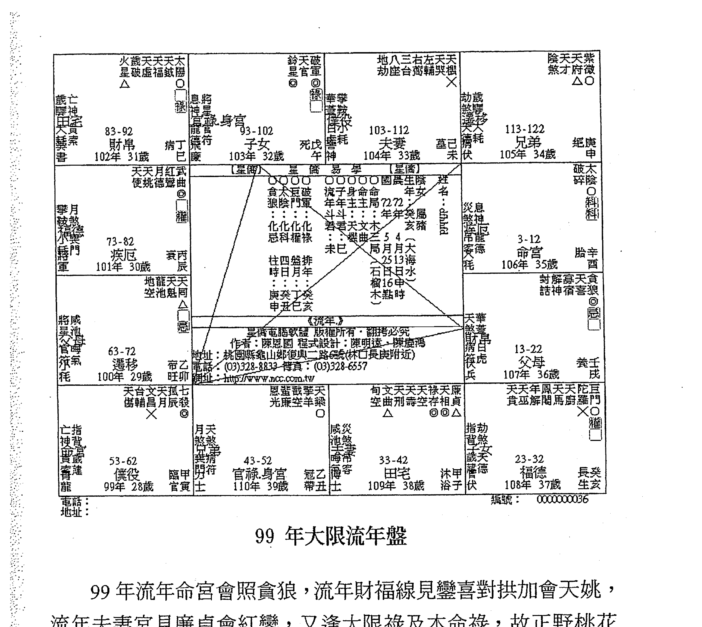
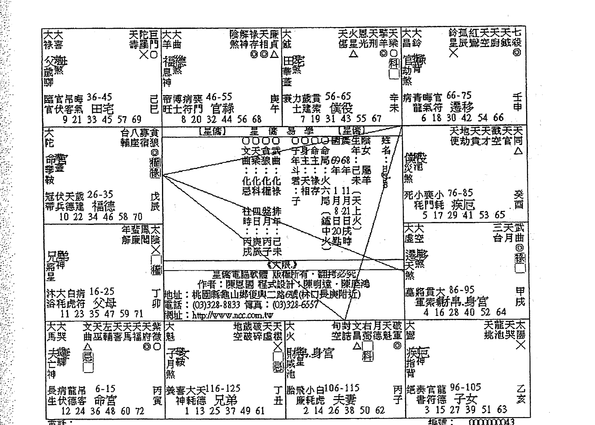
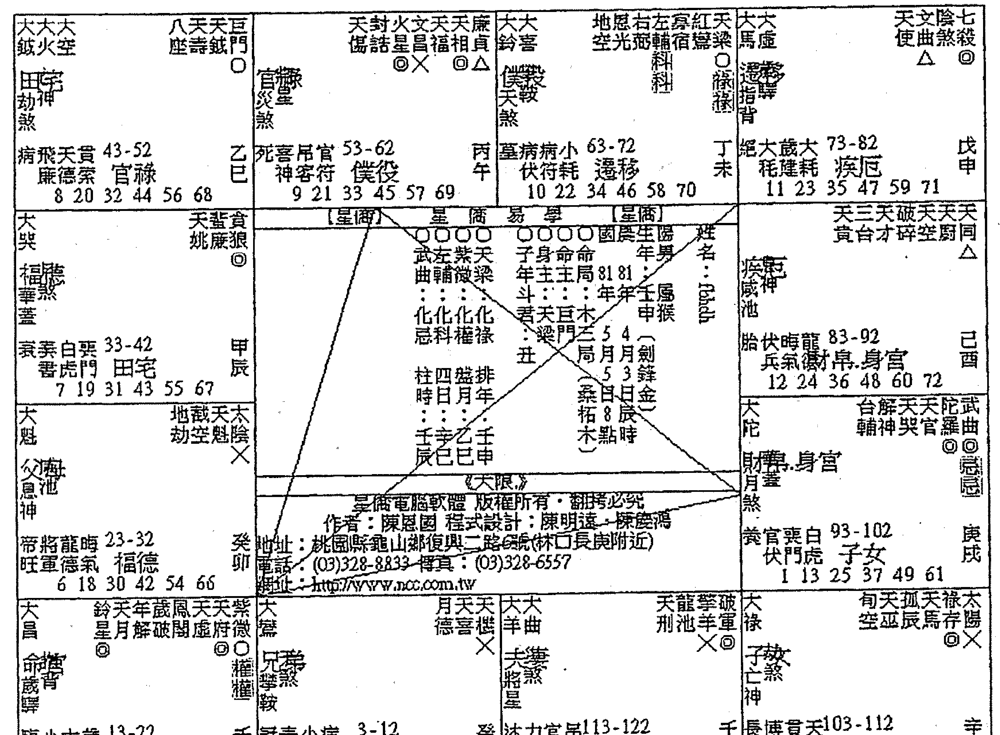
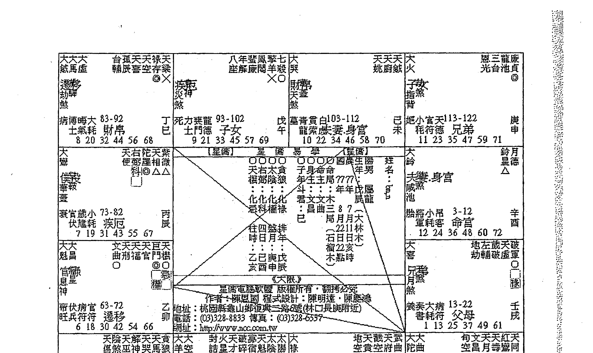
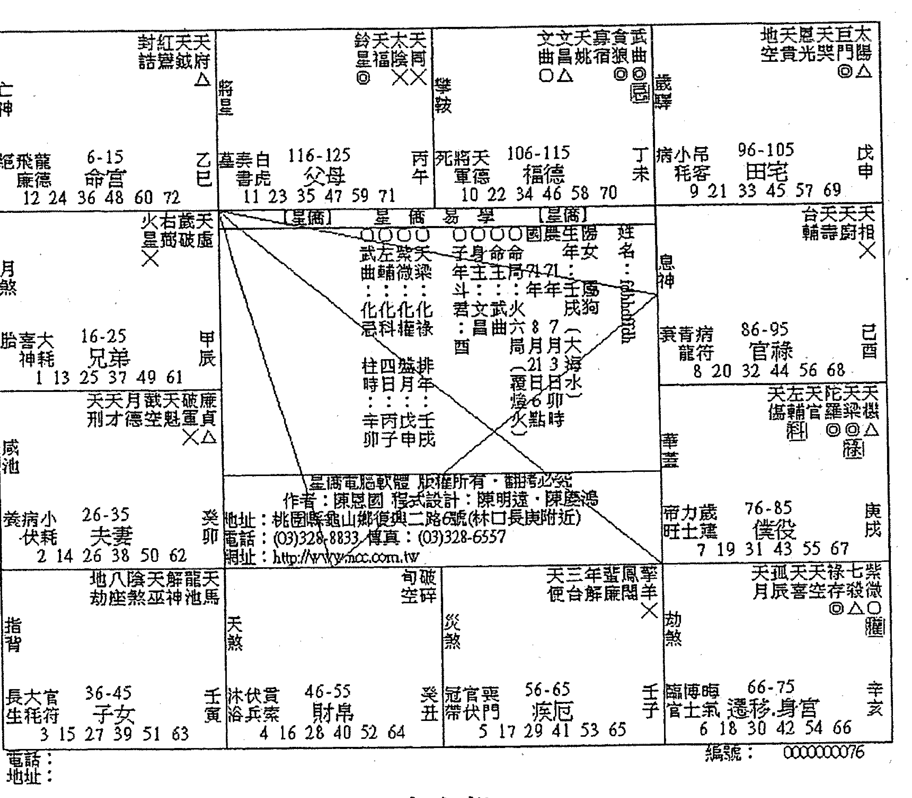
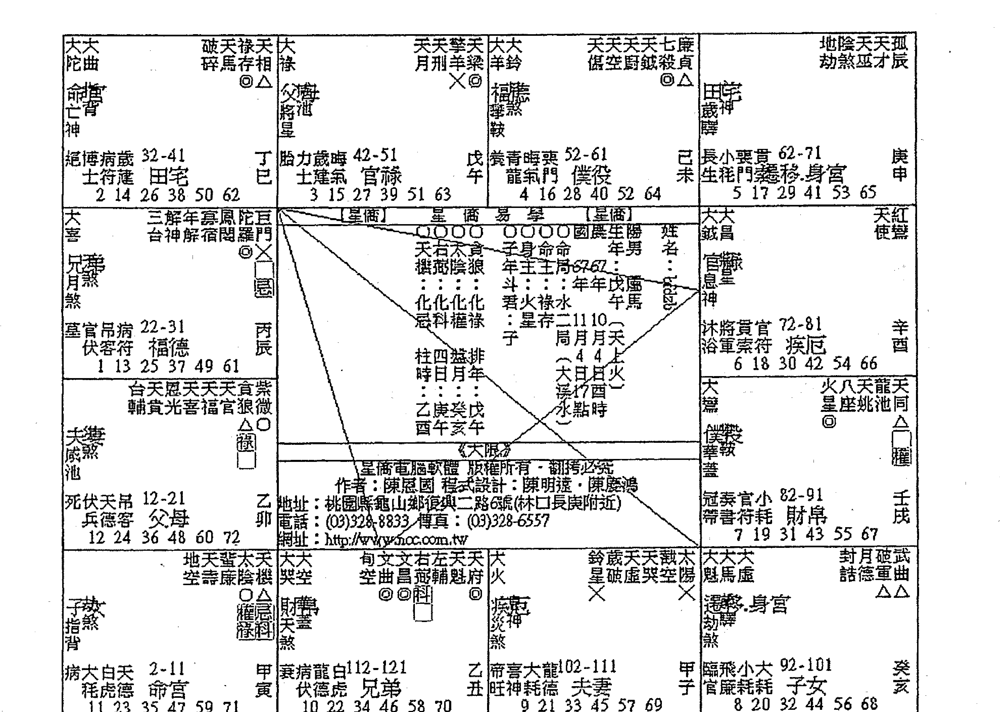

## 紫微斗数

白话阐述紫微斗数论命技巧及概念 带命理者进入深奥的命理殿堂 系列书籍汇集百余命例 并以图文互动方式浅显分析解说 务求提升论命理论功力

紫微论命实例解析 深入浅出 范例论命 白话讲述 学然大成

了然山人 著

## 滴天髓阐微

## 上卷

日常运用须知论技巧及要旨，诚为论命入深奥的命理殿堂。系列书籍汇编二百命例，辅以图文及详细的分析解说，帮助提升命理实际功力。

了然山人 著

## 自序

常言道：紫微斗数，易学难精。我想，这也是许多对此术有兴趣的同好，心理永远的痛。很多人学了几十年，经常是星曜特性及四化的公式背的滚瓜烂熟，但一摊开星盘，就不知所措，因为斗数看的是三方四正所有的星曜，星曜的组合那么多，到底该怎样研判推论才能够得到正确的答案？提供命主最适切的建议呢？

其实，看过山人文章及教学视频的同好，大概都知道，山人一直强调，学习紫微斗数，基础理论还有星性、格局，记得大概就好，重点是在实战经验。因为紫微斗数是活的，他论盘的重点在三方四正的星曜组合，绝对不是单看宫内的神煞或星曜能判断推理出来。所以，最好的方法，就是以战养战，多多研究他人的论盘技巧，吸收各前辈大师的实务经验，才是快速提升斗数论命技巧的捷径。

但可惜，市面上斗数书籍那么多，多是介绍理论及推演技法，有关论命实例分析书籍，少之又少。纵然给您找到，不是太过简略的分析，就是搔不到痒处或是内容完全看不懂的状况。而为何实例分析书籍少见且经常会有这种通病呢？其实大部分的老师是故意这样写的，答案很简单，正所谓『江湖一点诀，说破不值钱』，尤其是命理五术更是如此，因专业技巧是由经验一点一滴的累积而成。试想一本书卖你几百元，收一个学生，少说三万起跳，您真的认为，您花几百元，就能买到老师的『江湖诀』吗？这就是问题的根源所在呀！

有鉴于此，所以山人从2012年起出版紫微斗数实例分析书籍，就是希望能以浅白的说明，毫不保留的论命技巧及经验分享，让更多人，能够藉由此书得到更多实务论断的技巧及方法，快速提升自己的经验值。因山人最主要的目的是传承，如何将此门流传千余年的中国古星象学 - 紫微斗数推广及发扬光大，培养新一代的命理人才，让这学问能够永续流传，这才是山人真正关心的事。

也很感谢所有同好，长期以来的支持鼓励，而山人这套汇集近20年实务论命经验及精心挑选的真实案例分析书籍，自上市以来，一直有很好的评价与销售成绩。有许多同好，因此而突破了自己多年的盲点，快速提升了自身的论命技巧，甚至实际开业为人设砚解惑的同好，也所在多有。

每次收到类似的感谢函件，山人都感到相当温馨。毕竟一个人的一生，不是自己有多少成就，而是你成就了多少人。这就是为师者，最大的成就，所以山人期许所有同学都能够青出于蓝而更胜于蓝。俗谚：长江后浪推前浪，前浪倒在沙滩上，但浪能越来越高，越来越精彩，那前浪也算是倒得其所，不是吗？

这次再版，主要是因为上册有关论命技巧的部分编入山人2018年新作《紫微星诠》中，加上旧版有许多错字疏漏处。因此山人再度重新整理，区分为上下两册发行，感谢山人嫡传高徒-紫心老师的细心校对，让此书的内容，更臻完美。

本系列汇集百例论命实例分析，都是山人精选出的真实案例，搭配生动活泼，深入浅出的解释，将山人二十余年的技巧，毫不保留的与大家分享。也希望更多的同好及后学者，能因此而受益。也期待能与所有紫微爱好者，一起推广传承，此门流传千年的中国古星象学。

> 注：本书命例系以民国计年，如要换算成西历日期，必须加上1911。例如生年为民国60年，换算成西历则为：1911+60=西元1971年。

了然山人2018.3.10

## 了然山人老师

## 星命学速成班招生中

想要在短期内快速学成七政四余及西洋占星术吗？只要3天8小时，就能让你拥有一日吉凶的精准度。

不需要任何易学基础，不用抄，不用背，了然山人老师的正统美式教学，让你轻松成为命学高手。

不用担心学不学得会，了然山人老师首创满意保证承诺，如果课程结束，无法达到以下两点教学目标，学费全额退还。

- 能以七政四余(改良版)或西洋占星术论断本命盘12宫。
- 能以七政四余(改良版)或西洋占星术论断流年，流月，流日吉凶。

本课程采用一对一传授，让你彻底了解吸收，上课地点在台北车站附近，欢迎加入山人的line <id: kzf0910> 了解报名。

术传有缘，希望我们有师生的缘分

了然山人

## 目录

案例1、想问感情与事业 ................................ 2
案例2、关于紫微斗数，我想问事业（创业） ........... 12
案例3、是否命中无姻缘呢 ............................ 19
案例4、请问武贪适合的工作 ............................ 23
案例5、2011 年运势 ................................... 29
案例6、适合开店当老板吗？以及适合店面方位？ .......... 33
案例7、无法存钱又常遇到小人 .......................... 44
案例8、何时才有姻缘 .................................. 50
案例9、能帮我算算 2010 年的运势吗 .................. 60
案例10、七杀和擎羊坐命女生，请大师帮帮忙 ............ 68
案例11、我的命格适合从军吗 ........................... 79
案例12、七杀独坐女性，请教创业跟财运 ............... 90
案例13、急问紫微命盘达人有关事业发展状况 ............. 98
案例14、情路受挫：命格注定情关难过吗 ............... 105
案例15、很想创业但不知我是否适合 ................... 116
案例16、请问大师，我适合往演艺圈发展吗 ............. 122
案例17、今年跟明年哪个桃花运好 .................... 122
案例18、高人可以算一下我的命吗 .................... 132
案例19、请帮我看看我的命盘与该注意的地方 ...... 142
案例20、请问明年的考运 ............................ 149
案例21、关于紫微斗数「机阴坐命」的人 ............ 155
案例22、请协助看命盘并针对事业给一些宝贵建议 ... 162
案例23、小儿流年煞星汇聚，请救救恐惧害怕的妈妈 .. 170
案例24、今年过得超惨，请帮我分析一下命盘 ......... 177
案例25、烦请精通紫微斗数的老师帮我看命盘 ......... 181
案例26、想转行，目前是否适合 .................... 187
案例27、快当完兵了，找什么样的工作比较适合我 .... 194
案例28、能帮忙用紫微斗数看看我的感情问题吗 ..... 201
案例29、此时转职是否恰当 ....................... 207
案例30、紫微运势分析工作与感情 ................. 216
案例31、请教一下，小弟的迷惑不解 ............... 226
案例32、麻烦帮我算算姻缘及事业 ................. 234
案例33、有关感情方面的命格 ..................... 238
案例34、流年不顺，请大师帮我算算 ............... 247
案例35、此八字之人何时会结婚 ................... 252
案例36、遇到事业瓶颈，请求解惑 ................. 260
案例37、想开店，请帮我看看 ………………………… 266
案例38、请帮我看一下感情 ………………………… 275
案例39、快退伍了，脑中一片空白 …………………… 279
案例40、请大师为我看命盘 ………………………… 285
案例41、我是否有老板命？偏财运？ ……………… 291
案例42、想知道姻缘何时到来 ……………………… 296
案例43、请帮助离婚边缘的我 ……………………… 302
案例44、请问几岁结婚比较好 ……………………… 311
案例45、遇到人生最大的打击 ……………………… 317

斗数论命实例解析

## 【案例1】想问感情与事业

提問時間 | 2011-09-17 02:03:36

最近感情不顺
总觉得自己卡住了
不知道自己做的决定对还是不对
我想直接分手 他却想分开一阵子
加上最近想要考取「芳疗师」资格
有点蜡烛两头烧
想请专业人士来帮我解答

- 1. 断断这段感情会更海阔天空吗？
- 2. 芳疗师这个行业适合我吗？（如果不适合可以往哪个方向？）

女生（71.12.10 寅时）农历
回答得越详细越好
谢绝广告文

补充：
小女子想再请您几个问题：

1. 我在学习芳疗过程适合在目前的居住地（高雄），还是要去外地（如是要往何方）？
2. 我何时会有新恋情？（感情方面真的想重新开始，毕竟周遭的亲友没有一个人支持）
3. 我生命中的贵人是家人还是朋友？亦或是自己的另一半？我觉得很多命理师都算不准我的命运，真不知道要开心还是难过。最后再次感谢您的回答！

### 回覆内容

看来你的异性缘应该还蛮好的吧，应该是属于气质型的女孩。本命宫会双禄，除了是个小气财神外，更是会舍得对自己好一点的新时代女性。

整体而言，你的命宫结构很漂亮，整体运程上应该不会有太大的挫折出现，唯一会出现的大慨就在男女关系上。

就本命盘夫妻宫而言，无主星且会空劫星，以至于感情上易开花，但不容易有结果。因此只是会走得比较辛苦，比较累。你的命盘最漂亮在官禄宫，所以考取芳疗师发展事业对你是比较有利的，加上你本命双禄马交驰，又落于四生地，因此芳疗师此类的技术人员对你还挺适合的。尤其你是太阴坐命，心思细腻有标准女性特质，从事美容类工作，确实很适合。客服或企划类工作，你也可以考虑尝试看看。

至于感情问题，山人帮你用流年看看。这个流年夫妻宫逢空劫加会孤寡，且逢巨门是非星坐，想来你们应该是口角争执纠纷蛮严重的。严格说来，今年夫妻宫并不是很好，建议你专心往工作方面发展，至于感情就尽量顺其自然。因今年流年夫妻宫不佳，分开一阵子，让彼此可以冷静思考，也不见得是件坏事。正好你可以利用这段时间准备考取专业人员资格。

建议你可以跟他沟通，先分开一阵子，让你专心准备考试，等到你考试合格后再试着相处，重新开始，或许可以避开今年的尴尬也说不定。

一个人适合哪类型的工作，不能全赖五行决定。应该要考虑命主个人特质，不同的人有不同个性。如机月同梁格局的人去做业务工作，或是杀破狼加煞格局去做内勤行政工作，断然是不合宜。故命主适合工作应以其人格特质、个性、思考模式及个人强项来做思考。

### 命盘解析及说明

表格内容摘要：
- 表头包含多个宫位名称及星曜，如「亡神」、「铃星」、「红鸾」、「天马」、「白虎」、「天文」、「解神」、「紫微」、「攀鞍」、「天德」、「寡宿」、「岁驾」、「吊客」、「台辅」、「文昌」、「天刑」、「天哭」、「破碎」等。
- 各宫位包含大限年龄范围、天干地支、主星、辅星、杂曜、长生十二神、将前十二神、岁前十二神等信息，并标有化禄、化权、化科、化忌等四化符号。
- 表格中部有一个三角形区域，包含命盘基本信息，如「星侨易学」、「阳历生日：72年71年1月12日」、「农历生日：70年12月12日亥时」、「女命」、「姓名：123」、「命宫在卯」、「身宫在卯」、「命主巨门」、「身主文昌」、「斗君在卯」等。
- 表格底部有版权信息：「星侨电脑软件 版权所有・翻拷必究」、「作者：陈思国 程式设计：陈明远・陈庆鸿」、「地址：桃园县龟山乡复兴一路6号(林口长庚附近)」、「电话：(03)328-8833 传真：(03)328-6557」、「网址：http://www.ncc.com.tw」。

#### 本命盘

命主本命宫坐太阴，凡见本命宫坐太阴的人，不管男女生，都几乎是俊男美女型，且太阴为女性表征，故通常具有心思细腻、浪漫、爱幻想的特性。加上三方四正会红鸾天喜，基本上表示此人的异性缘极佳，因红鸾天喜这两颗属桃花星，入命不会煞表示异性缘佳（落福德宫亦同）。加上贪狼星居子，古曰：「泛水桃花。」两相加乘下，命主桃花定然相当旺盛。

但命宫同时会照孤辰，寡宿星，因此命主为情所困，并不让人意外，此点可由夫妻宫星宿组合状况得到反证。

本命宫坐禄存，三方会化禄，形成双禄交流，在一般状况下，基本上此型属于小气财神型，但福德宫见天同福星，天同为福星，因此推论命主对自己很好，很舍得花钱在自己身上，但对朋友或亲人就不一样了。

命宫三方四正不见煞，又日月均在庙旺处，且构成明珠出海局，又身宫正曜多，为命强身强之局，故命主就结构上而言，相当漂亮，命强者，大限行进纵使有风浪，多能安然度过，只是稍微辛苦点。因此古人说，落土命七分，此言不虚啊。

本命宫坐天马，又落于四生地，故命主喜动不喜静，三方四正形成禄马交流格局，故命主适宜外地经商求财。加上命主身居官禄，且禄马在官禄宫相会，因此对于事业成就的追求上，会较为注重，就此而言，建议命主朝事业发展方向，应该是最符合他的需求。

由于命主问的是男女关系，以论命而言，记得山人在三才理论里谈到的，论命要从远观到近观，这样才能够尽览全貌，避免发生见树不见林，见林不见树的两种极端状况，此点在论命时需谨记在心。

另外从事芳疗工作是否适合，这点要从本命宫来看，本命宫不会昌曲，所以适合以技艺为生，加上太阴坐命心思细腻，故从事美容芳疗相当适宜。

无论命主提什么问题，都要从本命宫、福德宫来判定大方向，然后再针对命主的问题，逐渐 zoom in。基于此论命原则，本命宫、福德宫看完了，现在我们看他的夫妻宫。上节提到，本命宫见孤辰寡宿，常出现感情困扰，此困扰是喜欢的人不见得会喜欢你，但不喜欢的却死缠烂打，甩都甩不开。命主夫妻宫三方会地空及地劫，对宫会寡宿，因此提出感情困扰问题，并不意外，因此局人经常会「为情所困」。

至于这段感情是否应该斩断？首先看大限盘，确认此姻缘为正缘或桃花，再来研究流年盘，这就是运用三才理论的方法。

| 宫位 | 星宿 | 年龄段 | 甲子 |
| :--- | :--- | :--- | :--- |
| 财帛 | 亡龙指白 | 64-73 | 12 24 36 48 60 72 |
| 子女 | 铃红天天 | 54-63 | 11 23 35 47 59 71 |
| 夫妻 | 天文解天紫 | 44-53 | 10 22 34 46 58 70 |
| 兄弟 | 寡岁吊亡病 | 34-43 | 9 21 33 45 57 69 |
| 命宫 | 息病将岁 | 24-33 | 8 20 32 44 56 68 |
| 父母 | 华岁擎晦 | 14-23 | 7 19 31 43 55 67 |
| 福德 | 劫晦岁云右孤天天太 | 4-13 | 6 18 30 42 54 66 |
| 田宅 | 天八天龙天武 | 94-103 | 3 15 27 39 51 63 |
| 官禄 | 指官劫小背符煞耗 | 84-93 | 2 14 26 38 50 62 |
| 身宫 | 威小灾大池煞耗 | 74-83 | 1 13 25 37 49 61 |

> 星侨电脑软件 版权所有・翻拷必究 作者：陈国成 程式设计：陈明达・陈庆鸿 地址：桃园县龟山乡复兴二路6号(林口长庚附近) 电话：(03)328-8833 传真：(03)328-6557 网址：http://www.moc.com.tw

### 24 ~ 33 大限盘

从大限盘来看，大限命宫会红鸾，福德宫见銮喜对拱，逢本命禄引动，大限夫妻宫会天喜，故本大限应有正缘出现，倘流年结构佳者，应为命主成婚之时。现在我们在来看看流年命宫：

（此处包含紫微斗数命盘表格，涵盖福德、田宅、官禄、仆役、父母、命宫、兄弟、夫妻、子女、财帛、疾厄、迁移等宫位及相关文字信息（如星曜、宫干、岁数等））

### 100 年流年命宫

流年夫妻宫逢空劫对拱加会寡宿，孤辰会照流年命宫，且逢巨门是非星坐，因此应该双方常有口角纷争，又夫妻宫见空劫对拱，故有分隔两地或是聚少离多的情况，所幸流年化禄稳定住格局，因此并不会对双方造成太大的困扰，命主只对于感情上认为有点卡卡的，并没有太过于严重的不悦感。

加上流年命宫颇为漂亮，故建议命主专心准备考试，感情部分困扰难免，但不致于有太大状况，因此顺其自然即可，不需要刻意斩断。

另补充的部分，山人认为一个人适宜的行业，不应该光看五行而定，应该就命主的命宫三合组成的特性来讨论，才能够找到最佳的方向。

## 【案例2】关于紫微斗数，我想问事业（创业）

提問時間 | 2011-05-11 13:58:20

我是国历69年4月2日子时出生，我想问事业（创业）的问题，请老师们为我解答，感恩。我是女生。

### 回覆内容

是否适宜创业这问题确实是要好好评估，山人帮你看看好了。单从命盘看来，你应该是属于气质型的女生，应该外型很秀气，但是一路走来确实是蛮辛苦的，感觉整个环境好像都不是很有助力，而且你思考应该也带有点反传统、固执、坚持己见，也带点迷糊散仙才是，一直感到是属于劳碌命。还有你应该是对朋友很讲义气的，如果真要做合伙生意，最好提防生肖属猴的朋友。

从本命盘看来，缺少适宜经商的格局，辅以财帛宫状况来看，聚财不易，怎来怎去，不过财库还算稳定，保守点会较适合你。

今年流年本命天马会禄落福德宫，财宫又禄权交流，有点闲钱，难怪会有创业念头，但同时会空劫，所以应该是表面看起来一片大好，但实际不如预期，甚至有被骗的可能。因此只怕到头来是白忙一场，不宜为之。本命盘没有创业格局，流年亦不佳，真心建议你不要轻易尝试。

### 命盤解析及內容說明

| 宮位 | 命宮/身宮 | 兄弟宮 | 夫妻宮 | 子女宮 | 財帛宮 | 疾厄宮 | 遷移宮 | 僕役宮 | 官祿宮 | 田宅宮 | 福德宮 | 父母宮 |
|------|------------|--------|--------|--------|--------|--------|--------|--------|--------|--------|--------|--------|
| 年齡範圍 | 5-14 | 15-24 | 25-34 | 35-44 | 45-54 | 55-64 | 65-74 | 75-84 | 85-94 | 95-104 | 105-114 | 115-124 |
| 天干地支 | 己卯 | 戊寅 | 己丑 | 戊子 | 丁亥 | 丙戌 | 乙酉 | 甲申 | 癸未 | 壬午 | 辛巳 | 庚辰 |
| 主星 | 太陰 (科) | 天機 | 天同 | 武曲 | 天府 | 天相 | 七殺 | 廉貞 | 天梁 | 紫微 | 天同 | 天機 |
| 化星 | 科 | 權 | 忌 | 祿 | | | | | | | | |
| 雜曜 | 鈴星、文曲、文昌、天刑、天哭、武曲 | 陰煞、破碎、龍池、亡神 | 武曲、天府、天馬 | 貪狼、右弼、三台、天刑、空亡 | 地空、地劫、天壽、天傷 | 天姚、天哭、天虛 | 咸池、晦氣 | 天機、天馬、天刑、天哭 | 天梁、天壽、天傷 | 紫微、天府、天馬、天刑 | 天同、天梁、天馬、天刑 | 天機、天梁、天馬、天刑 |
| 標註 | (科) | (權) | (忌) | (祿) | (空) | (劫) | (殺) | (刑) | (梁) | (府) | (同) | (機) |

#### 本命盤

太陰坐命，循前例，為氣質型的漂亮女生，三方會空劫，空劫入命者，古曰：「浪裡行舟。」糟糕的是此浪，並非天意所致，大都是自己個性上的缺陷造成的。

而此局外在表現為迷糊散仙，且勇於反潮流反社會，常常因此招致失敗，但此局人的想像力豐富，創作能力強，故空劫入命者，適合往研發、創作或企劃等方向，善用此優點，讓自己有更廣闊的空間。

命身同宮，基本上表示命主個性較為固執，堅持己見，有點頑固。加上空劫入命，可以斷定命主是一個相當鐵齒的人，有時候想法不一定正確，或是與大家認知有相當差異，但堅持己見，常會讓人感到是為反對而反對，故此格局者經常會招致非議且充滿是非，此是非並非口舌，而是為人處世態度造成的問題。

故單就點來看，命主確實不適合創業，因此個性常常會導致嚴重的挫敗。且命宮匯集四煞，所幸命身皆強，足以抵禦，但三方為外在環境的展現，命雖夠強但外在危機四伏，不利於己，縱使英雄也只能徒呼負負。所以雖然這麼簡單直接就可以斷定命主不適宜創業，但為了慎重起見，還是必須針對財帛宮及田宅宮來做分析。

創業首看是否帶有祿馬交馳格局，或是雙祿在命宮交流，命主天馬星居巳，對宮直接空劫來沖，此局又稱為半空馬，不但追不到財，還累得半死。再來看看她的祿星坐宮，祿存坐僕役宮，古曰：「祿落僕役。」縱有官也奔馳，故命主定然是那種重義不惜財，相當願意資助朋友的人，所以縱使賺錢，也會因朋友義氣而轉手成空，剛好呼應她的半空馬格局（山人註：交朋友，選這種就對了，吃香喝辣好不愉快）。

財帛宮逢化祿本是美事一樁，但偏逢空劫同度，到手亦成空，另外也叫做倒祿的格局，祿星在斗數裡表徵為財貨之意，偏偏空劫是土匪之星曜，財遇土匪，定然難留，再多都不夠，故稱之為倒祿。

田宅宮是難得好一點的組合，三方雖不會祿，無大富可言。但田宅宮三方會天府，紫微及武曲，且不見煞忌，故尚稱穩定，所以建議命主，只要好好守成，不圖非分之想，仍然不會窮到哪裡去的。（註：有同學會問，武曲不是財星嗎？會照應該也是表示有財之意，此點容山人說明如下：武曲是財星沒有錯，但武曲之財，需要靠自己努力而得，與祿星為天賜之財，在基本星性上，有相當的差異，故此處絕對不能搞錯。好的論命者與一般論命者，差異就在對於基本星性的掌握程度，此點同學須牢記，確實掌握星性，絕對是學好斗數的不二法門，因為斗數就是星群組合，連星曜的基本特性都掌握不住，又何來學好的一天？）

好了，基本盤看完了，我想大家都應該知道跟怎樣跟命主作建議了吧。但我們還是要秉持研究精神，因為雖然本命不適合，但若流年運勢正旺時，倒是可以建議命主來炒個短線，不過千萬要見好就收，否則難逃本命盤的詛咒啊，所以來看看她問命當年 100 年的流年盤。

| 宫位 | 年龄范围 | 干支 | 备注 |
|------|----------|------|------|
| 福德 | 105-114 | 102年 34歲 辛巳 | 小耗 |
| 田宅 | 95-104 | 103年 35歲 壬午 | 冠帶 |
| 官祿 | 85-94 | 104年 36歲 癸未 | 沐浴 |
| 僕役 | 75-84 | 105年 37歲 甲申 | 長生 |
| 父母 | 115-124 | 101年 33歲 庚辰 | 帝旺 |
| 命宮.身宮 | 5-14 | 100年 32歲 己卯 | 衰 |
| 兄弟 | 15-24 | 111年 43歲 戊寅 | 病 |
| 夫妻 | 25-34 | 110年 42歲 丁丑 | 死 |
| 子女 | 35-44 | 109年 41歲 丙子 | 墓 |
| 財帛 | 45-54 | 108年 40歲 乙亥 | 絕 |
| 疾厄 | 55-64 | 107年 39歲 甲戌 | 胎 |
| 遷移 | 65-74 | 106年 38歲 癸酉 | 養 |

#### 100 年流年命盤

先看流年命宮，三合會空劫及擎羊陀羅四煞齊臨，此時出征鐵定是沒有好結果。但命主為何有此衝動呢？先看看福德宮，天馬會流年化祿及化權，福德宮是人思緒的判識處，流年福德宮這麼漂亮，難怪會有這種想法，加上流年官祿宮大限化科，流年化權會照，相當不錯。流年財帛宮祿權交流，手上應該有些閒錢才是。所以在工作上相當不錯，手頭上又有點餘裕，會想在事業上有所進取，並不讓人意外。

但吉處藏凶啊，看到空劫星落在此三合之處，故推論目前的機會只是表面感覺不錯，私底下卻暗潮洶湧，只怕貿然投入後，白忙一場，賺到的也是經驗而已。

再觀其僕役宮亦是權科交會，加上本命祿落僕役，故推論必定是朋友部屬邀集合股或投資。

綜上所述，命造除本命不宜創業外，流年也不佳，所以炒短線看來也不必了，還是回歸田宅宮的狀況，不要想東想西，把錢存下來。因命局不佳，加上所有情況均不利於己，縱是掌握好機會，也難逃到手成空，風雲際會的宿命。因此建議命主好好在職場上發展，把錢守好，自能安享晚年生活。

## 【案例3】是否命中無姻緣呢？

**提問時間**：2011-03-13 16:45:56

我的生日資料

西元 1984 年 6 月 7 日晚子時出生。性別男性。

1.  請問本身是否命中無姻緣或者只有同居的命呢？
2.  如果命盤中是有姻緣的話，大概是幾歲左右較有成家可能？
3.  是否可指點未來另一半大概是什麼類型或從事哪方面職業？

**回覆內容**：

1.  應該不太可能會沒有姻緣，以這個盤來看，本命宮無主星，借對宮太陰天同論，通常太陰坐命的都是屬於氣質型的帥哥或美女，況且你夫妻宮尚稱穩定，也不會煞忌，怎樣看都不像是沒姻緣的，不用想太多，你還年輕。
2.  沒錯的話，這個盤勢姻緣成得比較晚，照判斷應該成於 35～44 這個大限，因命遷線逢變喜對照且化祿引動，不過如果這段時間遇到好對象，要提前結婚也未嘗不可。
3.  以夫妻宮星宿來論，夫妻宮坐天機天梁，基本上年紀應該會比你稍長或是比你成熟得多，可得賢妻，唯個性頗為剛烈，又會照太陰，因此會是屬於氣質型的女生，總論還不差就是。

**提問者意見**

謝謝山人的細心回覆 ^^

### 命盤解析及內容說明

| 宮位/內容 | 資訊 | 宮位/內容 | 資訊 | 宮位/內容 | 資訊 | 宮位/內容 | 資訊 |
| :--- | :--- | :--- | :--- | :--- | :--- | :--- | :--- |
| 劫小 煞耗 | 天天月破天七紫 武姚德碎陰殺微 △○ | 疾大 煞耗 | 台陰右天天歲天天 韌煞弼壽才破虛癸 | 天龍 煞德 | 天天天 指白 月官鉞 背虎 | 左黃天截 輔廉馬空 |
| 小 耗 | 115-124 兄弟 8 20 32 44 56 68 絕巳 將軍 | 命宮.身宮 | 5-14 命宮.身宮 9 21 33 45 57 69 胎庚 奏書 | 父母 | 15-24 父母 10 22 34 46 58 70 養辛 飛廉 | 福德 | 25-34 福德 11 23 35 47 59 71 長壬 生申 |
| 華官 蓋符 | 文恩龍天天 曲光池樑機 △ ◎ | [星曆] | 星 曆 易 學 [星曆] ○○○○ ○○○○ 國農生陽 太武破康 曲曲重貞 年身命命 年主主局7373 化化化化 年年甲屬 忌科權祿 斗：：：子鼠 :星火破五65 申 局月月海 柱四盤排 路旨日金 時日月年 傍23子 土點時 壬壬庚甲 子申午子 [ ] | 姓名 | C00 | 威天 池德 | 天天破康 喜福軍貞 ×△ 權祿 |
| 育 龍 | 105-114 夫妻 7 19 31 43 55 67 墓戊 辰 | 喜 神 | 35-44 田宅 12 24 36 48 60 72 沐癸 浴酉 |
| 息貫 神索 | 三紅孽天 台驚羊相 ×× | 月昂 煞容 | 鈴文天年寡鳳 昌貞解宿閣 ◎× |
| 力 士 | 95-104 子女 6 18 30 42 54 66 死丁 卯 | 星濤電腦軟體 版權所有 翻拷必究 作者：陳思國 程式設計：陳明達 陳慶鴻 地址：桃園縣龜山鄉復興二路5號(林口長庚附近) 電話：(03)328-8833-傳真：(03)328-6557 網址：http://www.ncc.com.tw | 病 伏 | 45-54 官祿 1 13 25 37 49 61 冠甲 帶戌 |
| 崴喪 庫門 | 討火孤祿巨太 攀晦 語星辰存門陽 鼓氣 ◎ ◎◎○ 墨 | 天天天天陀貳武 將崴 使刑空魁羅狼曲 星建 ◎◎ 科 | 解太天 神陰同 ◎○ | 亡病 神符 | 天旬地地八天 傷空空劫座府 △ |
| 博 士 | 85-94 財帛 5 17 29 41 53 65 病丙 官 寅 伏 | 疾厄 | 75-84 疾厄 4 16 28 40 52 64 衰丁 伏 丑 兵 | 遷移 | 65-74 遷移 3 15 27 39 51 63 帝丙 大 旺子 耗 | 僕役 | 55-64 僕役 2 14 26 38 50 62 臨乙 官亥 |
| 電話： | | | | | | 編號： | 0000000013 |
| 地址： | | | | | | | |

本命宮無主星，借對宮太陰天同來論，循前例，通常太陰坐命的都是氣質型的帥哥美女，外表條件不會太差。至於一生的姻緣，當然看本命盤的夫妻宮。

本命盤夫妻宮呈現機月同梁加昌曲對拱的星群組合，機月同梁格局的穩定性很高，古曰：「機月同梁當吏人。」此格局出現在夫妻宮，基本上表示命主喜歡的女孩類型屬於穩定，乖巧簡單的女生。加上會見龍池、鳳閣等星宿，故有才藝才華的女生也是能夠吸引他的重要因素。又命主夫妻宮坐天梁，因此婚配對象有可能年紀比他長，而夫妻宮坐天機應屬賢內助型的女生，加上三合不會煞忌，整體而言尚稱穩定。

至於姻緣成於幾時，此時就必須看鸞喜的分布宮位，從本命盤看來，鸞喜會照於35～44這個大限宮位，故推論命主最遲應在這個大限內成婚，以現代的概念，這應該是適宜晚婚的命局，至於哪一年，就必須要一年一年的逐步搜尋。（註：不一定要等到鸞喜對拱的大限才能成婚，只要流年行進時夫妻宮組合穩定且逢祿沖起，亦為結婚的時機。且鸞喜屬正緣，天姚、咸池等雜曜屬野桃花，大限流年遭沖起時亦有婚配的可能。所以各位同學千萬別斷章取義，認為只有鸞喜入大限命宮才適合結婚，如此誤了自己或他人的好姻緣，這也是造口業呢。）

所以山人在回覆時只是告訴命主最有可能的成婚時機，讓他能夠安心，不會因為一時的失落而誤解自己。因此最後再附註說，如有遇到好姻緣，亦可成婚，以免命主誤會，認為非得在這個時間才能成婚，白白耽誤自己的好姻緣。

所以好的論命者要有正確的觀念，畢竟會來尋求命理協助的人，大都在十字路口徘徊，身為命理老師應該給他們正確的方向與專業的建議，協助他們盡速走出陰霾，重拾信心迎接人生的下一個挑戰，這不也是功德一件嗎！

## 【案例4】請問武貪適合的工作

### 提問時間：2011-10-25

您好，想請問一下紫微命盤

本人是 1974 年農曆 9 月 20 日卯時生，男性

最近換了工作，想找工作但是都沒下文，不然就是沒聯絡，快要慌死了。

有找作業員、包裝員、超市等，但都沒消息耶，是不是有年紀了都不用了，不知道從命盤中到底適合什麼工作？請給意見好嗎？感激不盡。

補充：家庭代工適合做嗎？

### 回覆內容

古曰：「武貪不發少年人。」基本上武貪屬晚發格局，而且你的武貪會陀羅，陀羅主慢，遲滯，不過有四吉星會照，表示你蠻有才華，貴人與機遇都不差，其實你比較適合武職文做。

忌遇貪狼又稱之為風流杖綵，男女之間我想對你是很困擾的問題吧。先就流年幫你看看，流年文昌忌坐官祿宮會雙煞，可謂煞忌交馳。

而且流年命宮重疊財帛宮，又逢刑囚夾印的格局，文昌忌又坐官祿沖本命宮，今年慎防在工作上因財務問題或誤當人頭而惹上財務上的官非，自己真要多加小心。

祿落僕役又逢空劫，對朋友介紹工作或機會自己要特別當心。至於幾月比較找得到工作，沒錯的話應該在農曆 4～5 月間，只是這工作帶有些問題存在，自己多加注意，苗頭不對就快閃吧。

做家庭代工是可以，但不要牽涉到上游的營運問題，做好自己應該還可以。因為看來會有這方面的糾紛產生，文昌忌多屬文書問題，如支票被跳票或被倒貨款等，總之自己多注意，尤其你對朋友要特別注意。

### 命盤解析及內容說明

| 殖宮 | 宮干 | 大限 (歲) | 虛歲 | 流年 | 流年歲數 | 內容摘要 |
|------|------|-----------|------|------|----------|----------|
| 父母宮 | 壬申 | 15-24 | 5 17 29 41 53 65 | 長壬 生申 | | 地年歲風天天載 空解破虛馬空 |
| 福德宮 | 癸酉 | 25-34 | 6 18 30 42 54 66 | 沐癸 浴酉 | | 喜神 |
| 田宅宮 | 甲戌 | 35-44 | 7 19 31 43 55 67 | 冠甲 帶戌 | | 病伏 |
| 官祿宮 | 乙亥 | 45-54 | 8 20 32 44 56 68 | 臨乙 官亥 | | 大耗 |
| 僕役宮 | 丙子 | 55-64 | 9 21 33 45 57 69 | 帝丙 旺子 | | 帝旺 |
| 遷移宮 | 丁丑 | 65-74 | 10 22 34 46 58 70 | 衰丁 伏兵 | | 伏兵 |
| 疾厄宮 | 戊寅 | 75-84 | 11 23 35 47 59 71 | 病丙 官伏 | | 博士 |
| 財帛宮 | 己卯 | 85-94 | 12 24 36 48 60 72 | 死丁 卯 | | 力士 |
| 子女宮 | 庚辰 | 95-104 | 1 13 25 37 49 61 | 墓戊 辰 | | 青龍 |
| 夫妻宮 | 辛巳 | 105-114 | 2 14 26 38 50 62 | 絕己 巳 | | 小耗 |
| 兄弟宮 | 壬午 | 115-124 | 3 15 27 39 51 63 | 胎庚 賓午 | | 將軍 |
| 命宮 | 癸未 | 5-14 | 4 16 28 40 52 64 | 養辛 飛廉 | | 飛廉 |

#### 本命盤

命主命無主星，借對宮武曲貪狼來論，本命宮坐昌曲對照魁鉞，為文星拱命及坐貴向貴格局，古曰：「天魁天鉞，蓋世文章。」且魁鉞為貴人的表徵，故推論命主除了有才華之外，也有不錯的貴人運才是。

且命主身宮坐紅鸞，外型頗佳，且魁鉞入命的男生，通常是體格魁武，相貌端正，氣度恢宏，所以推斷命主應屬於帥哥型的型男才是，廟旺日月及左輔右弼夾身宮且逢本命科祿權拱。

府祿相三合又會財宮，整體而言，倘不會煞，此局人應有相當的作為。

但可惜命宮三方會擎羊，陀羅雙煞，同時也沖福德宮，而擎羊大煞正坐財宮，所有好格局都被破壞光了，因此命主應有懷才不遇及諸事不順的感覺，此盤因煞星落宮不當，導致人生起伏不定，容易有暴起暴落的情況，確實相當可惜。

命無主星的人，通常較沒主見，因外在三方較本命強勢，家裡沒大人的情況下，故易隨波逐流。

而命星坐武貪屬晚發格局，古曰：「武貪不發少年人。」所以運勢晚發，身坐貪狼遇陀羅煞星，謂之風流綵杖，多因男女之間的桃花起糾紛。

命局如此，命主應於福澤有損，故建議命主宜多行善事，勤加佈施，期能改變命運。至於此局人適宜哪類型工作，山人建議武職文做，畢竟命主本身還是才華洋溢的，只是時不予我罷了。所以命主提及家庭代工事業，是相當適宜的，只要不要牽涉到上游的財務問題，專心做好自己分內工作，最多就是上游付不出貨款，最後賠上工錢而已，故應可保平安無虞。

既然談到找工作，那就應該用流年來看，命主提問當年為民國 100 年，其大限／流年命盤如下：

| 宫位 | 内容 |
|------|------|
| 福德 | 亡貫歲祿 神索弊門 封天孤天七紫 話巫刑辰廚殺微 △○ 年馬福德 105-114 小耗 夫妻 絕已將軍 102年 40歲 |
| 田宅 | 年魁喜田宅 115-124 兄弟 胎庚午書 103年 41歲 |
| 官祿 | 年空官祿 祿 5-14 命宫 華蓋 104年 42歲 |
| 父母 | 哉大劫小 舞耗煞耗 地年歲鳳天截 空解破開虛馬空 年陀僕役 15-24 父母 長壬生申 105年 43歲 |
| 命宫 | 擎小華官 文八三月 天天天 耗盡符曲 昌座合德喜宮鉞 ○△ 科忌 5-14 命宫 華蓋 104年 42歲 |
| 兄弟 | 鈴龍 星池 較耗○ 115-124 兄弟 胎庚午書 103年 41歲 |
| 夫妻 | 105-114 夫妻 絕已將軍 102年 40歲 |
| 子女 | 95-104 子女 墓戊辰 101年 39歲 |
| 财帛 | 85-94 财帛 死丁卯 100年 38歲 |
| 疾厄 | 75-84 疾厄 病丙寅 111年 49歲 |
| 迁移 | 65-74 迁移.身宫 衰丁丑 110年 48歲 |
| 仆役 | 55-64 帝丙大 仆役 旺子宅 109年 47歲 |
| 官祿 | 45-54 官祿 臨乙官亥 108年 46歲 |

### 大限 / 流年命盘

命主流年命宫重叠本命财帛宫，对宫会廉贞，廉贞化气为囚，擎羊化气为刑，天相为印信，故构成易导致官非的「刑囚夹印」格局，加上流年文昌化忌坐官禄宫且冲命宫，颇有即将引动的感觉，而文昌化忌表文书失识，如支票开错金额，或是文件乱签，误当保人等状况，且文昌忌落于官禄宫，因此在职场上需相当的小心，看来极有可能发生因此惹上官非的状况，故提醒命主要多加注意。

而此流年化禄及本命禄落流年兄仆一线，且逢地空地劫来拱，本有劳碌无成的味道，加上双禄皆落仆役宫，故除在职场上要特别注意外，更须提防因太过于相信朋友或太重义气而招来是非困扰。

综上所述，整体推论，感觉上很有可能今年工作上相当不顺利，另有朋友介绍工作或事业，看起来很乐观，但暗地里危机四伏，结果很有可能因力挺朋友，到头来白忙一场，甚至因此吃上官司是非。所以山人建议命主特别提高警觉，一见苗头不对，应即刻离开，方为最佳的明哲保身之道。毕竟流年凶险，确实不要去冒任何的风险为宜。

## 【案例 5】2011 年运势

### 提问时间
2011-03-01 19:07:49

女性，72 年农历 2 月 29 日卯时，属猪，请教 2011 年运势。
谢谢。

### 回覆内容
命造民国农历 72 年 2 月 29 日卯时瑞生。

今年流年看起来会很有发挥，多贵人与助力，整体流年命宫看来尚称平顺，但文昌化忌直冲流年命宫，故今年不可为人作保或是背书。如从事文字工作或创作者，需注意因文字惹上麻烦或官司，从事会计财经类工作，对于商业文书类的要特别注意，如收到空头支票等，或误填标单等文书上的失误。如你尚在念书，则学业部分恐有挫折与不顺利。尤其你的文昌忌又坐官禄宫，在职场上可得特别注意与小心。

在工作上因化忌干扰且会双煞，因此会感到有志难伸或是挫折感很重，仆役宫看来危机四伏，吉处藏凶，慎防因友破财，对朋友要特别提防。尤其你今年文昌忌直冲命宫，所以不要轻易与朋友有太多的金钱往来才是。

不过就迁移宫来看，辅弼魁钺四大吉星汇聚，因此今年多助力与贵人相助，但自己还是要特别小心文昌忌引来的麻烦事。

至于钱财部分不会有太多的进展，得中有失，尤其文昌化忌也冲财宫，对于山人提醒你的财务部分，要特别注意。

### 提问者意见
谢谢大师解惑

### 命盘解析及内容说明

| 区域 | 内容摘要 | 备注 |
|------|----------|------|
| 上半部分 | 复杂的紫微斗数命盘图表，包含宫位、星曜、干支、年龄区间（如74-83、102年31岁等）等信息 | 图表结构为传统命盘，含多栏位与文字标注 |
| 下方标注 | 软件版权、作者、设计者、地址、电话、传真、网址等信息 | 例如：星亿电脑软件 版权所有，作者：陈恩国，程式设计：陈明远、陈庆鸿，地址：桃园县龟山乡复兴三路6号（林口长庚附近）等 |

### 大限 / 流年命盘
命主问命当年为民国100年，以流年命宫观之，太阳会照太阴，为日月并明之局，流年命宫大限化禄，流年化权，三方文曲流年化科，文昌化忌入命，且本命宫逢天魁正坐，故整体而言尚称稳定，在工作上虽不一定有好的发展，但至少努力会被看见才是，此点从官禄宫逢庙旺日月齐照可证。而迁移宫逢辅弼魁钺四吉星会照，故命主当年的贵人运颇强，机遇也多，且可得到朋友部属的助力。

此盘流年缺陷为文昌化忌冲命且坐官禄宫，文昌化忌表文书失识，如在学阶段则有中辍的可能，如在职场上则容易有误填报表资料，误填标单，或因为文字（例如常用的部落格、FACEBOOK 等），而惹上麻烦，尤其是文字工作者逢文昌化忌时须特别注意。

流年仆役宫逢大限武曲化忌又会空劫，故为吉处藏凶之局，故提醒命主对于朋友要更加注意，尤其是生肖属老鼠及属狗的朋友，看来有因友而奔波之累。

至于财运部分，流年文昌化忌冲财宫，且陀罗正坐，故须特别注意金钱的运用，不宜跟会或进行相关的理财投资，尤其是朋友间的借贷类型。

## 【案例6】适合开店当老板吗？以及适合店面方位？

### 提问时间
2011-02-26 15:08:09

我想问大师们，有人会算我的紫微斗数或者用其他方式算我适合创业开店吗？

我71年（1982年）10月24日生，出生时间下午1点～3点。希望大师们可以回答我的所有问题和算出我的紫微斗数！！！感谢大师^^"

-   补充1:
我农历9月初八，男性

-   补充2:
我想在今年的夏天开早餐店，最好早餐之外，下午开始可以卖别的，譬如药炖排骨等，但点对我来说很重要，资金也有了，所谓天时地利人和，缺一不可。所以期盼各位大师可以给我点意见！！感激不尽。

### 补充 3：
忘了补充，我有一位合夥夥件（他男性），顺便给他的生辰八字，麻烦各位大师帮我算看看跟他的组合！他国历民国 71 年（1982 年）11 月 5 日生，农历 9 月 20 日，出生时间早上 6～9 点。（PS：我和他都是修行者，打坐参禅已经数年，虽然清楚明白个性会改变一生遇到的人事物，平常也有在做善事、定期捐血、定期买米去捐给孤儿院，我本身在早餐店经验已经有 5 年左右，基本上是熟手。我是知道人一生当中有固定不能改变的命格和能改变的，我想就是运吧）……想清楚知道自己命格和合夥人的搭配……所以请各位大师能帮我算看看！！好让我参考，感谢大师 ^^

### 补充 4：
至于财务方面和企划部分，我都是交给我女友去规划。我女友 67 年生，农历 8 月 11 日，国历 9 月 13 日；出生时间接近中午。（烦请帮我算算我们 3 人的组合）可以的话顺便帮我算我女友跟她家人的缘份，还有她的财运，工作适不适合转换跑道（换工作）。目前她在 LED 产业担任工程师。

命造民国农历 71 年 9 月 8 日未时建生。

嗯，难怪你会想当老板，紫微坐命的人大都比较有自己做主的企图心，而且这颗紫微还化权，你本身很有才华，只是桃花会很重，紫微贪狼的组合为桃花犯主，加上会天姚，命宫三方四正桃花星齐聚，福德又见銮喜对照，但本命化忌冲入，就整体而言，当心因桃花破财。

紫微坐命是很好，但不见辅弼来拱，不构成大格局，充其量也是孤军，缺乏助力，创业时会比较辛苦。

而且你的本命盘财帛宫见武曲，武曲为财星，本应该是好事，但偏偏武曲化忌，财星化忌表示周转不灵之意，又落财帛宫，表示你平常在财务调度上容易出现问题。加上本身并没有出现利于经商禄马交驰格局，反倒形成半空马，其意为空忙一场之意。且缺乏得力的助手，往往是一个人孤军奋战。

你的财帛宫坐禄存，禄存基本定义是财货，乍看之下非常好，财落财位，但可惜禄存必遭羊陀夹制，因此你的财帛多属于稳定之财，而且财库煞星汇集，难以聚财，从哪个角度看来，创业对你都不很适宜。

又以这个大限（24～33）来看，本命武曲化忌冲大限命宫，本来就容易发生周转问题，大限命宫又逢空劫夹制，本来就有奔波无获之意。且子田线又是煞忌交驰，在本命及大限均不利的情况下，良心建议你不要轻易尝试，去找工作会比较实际，

也不至于让自己白忙一场。况且现在早餐店一堆，景气也不是很好，食材成本一直上飙，大环境也不是很好，天时就不佳，且你本命不宜创业，加上你的大限运势不利创业，真的不建议你贸然尝试。大概这样吧，希望对你有帮助，朝职场发展，对你会比较好。而且你本命宫带公门格局，可以朝这方向发展。

补充回覆：

你命盘本缺得力助手，紫微落命不逢辅弼，就像是包公审案不遇王朝马汉来帮忙查案，纵有再大的理想也不容易实现。

而且你这朋友比你更不适宜，首先他的命盘和你一样，都出现半空马的格局，你们两个都喜欢掌权管事，如果两个一起创业，那要听谁的呢？你们都很有才华，整体命宫星宿组合也有许多的相似之处，所以很合得来，但合夥做生意是两回事。建议你们两个好朋友还是在职场上发展，会比较适合。

### 命盘解析及内容说明

| 宫位 | 主星/煞星（部分） | 年龄段 | 十干 |
|------|-------------------|--------|------|
| 命宫 | 铃昌曲辅          | 24-33  | 乙巳 |
| 父母 | 天哭天刑          | 14-23  | 甲辰 |
| 福德身宫 | 地劫天福          | 44-53  | 丙午 |
| 田宅 | 喜神天贵          | 34-43  | 丁未 |
| 官禄 | 天刑天马          | 64-73  | 己酉 |
| 仆役 | 天火天哭          | 54-63  | 戊申 |
| 迁移 | 华盖天哭          | 84-93  | 辛亥 |
| 疾厄 | 旬空天福          | 74-83  | 庚戌 |
| 财帛 | 天贵天哭          | 94-103 | 壬子 |
| 子女 | 指背天哭          | 114-123| 壬寅 |
| 兄弟 | 月煞天哭          | ...    | ... |
| 夫妻 | ...               | 104-113| 癸丑 |

星盘电脑软件 版权所有・翻拷必究
作者：原意国 程式设计：陈明远・陈庆鸿
地址：桃园县龟山乡复兴二路6号(林口长庚附近)
电话：(03)3288833 传真：(03)328-6557
网址：http://www.hoc.com.tw

### 本命 / 大限命盘

这个大限（24～33）天相坐命，本命武曲化忌直冲，本来在财务上就容易发生周转问题，加上大限命宫逢空劫夹制，大限田宅亦逢忌冲，田宅为人财库的象徵，逢忌冲表示不甚稳定。大限仆役宫状况相当凶险，加上大限不见禄马交驰，倒是形成拆马忌的状况，此时出师征战，只怕凶多吉少。

既然大限不宜，那咱们再来看看流年好了。

以此局来看，流年文昌忌坐命宫，化忌入命表波折起伏大，而文昌忌表文书失识，再观其兄仆一线亦为禄忌交驰，显示朋友或合夥人对命主并无太大助益，倒有可能对合夥事业有所妨碍。流年田宅宫三煞齐聚再会化忌，库位已破，又如何能奢望创业成功呢？

至于命主提供合夥人生辰八字，经山人排盘后，两人的星盘组合颇为相似，通常星盘组成相似的人与人之间，有种特殊的吸引力，因此两人相处确实会相当契合，但其命星都是属于喜欢掌权的人，一山不容二虎，此两人合夥的结果如何，我想不需要再多说了吧。而此现实状况，不也反证了这个大限流年命盘表示出来仆役宫的状况吗？

## 【案例7】无法存钱又常遇到小人

### 提问时间
2011-02-26 14:18:44

大师：

我想请问我总是无法存钱，常常无法控制自己的购物欲，还有我很喜欢到处交朋友，但是常常交到的都是对我别有心机，甚至会暗中调查我陷害我的小人。

而我桃花运很好，但是常常遇到追求我追不到就很歇斯底里的男人。

我是1987年2月12日子时生，属兔，女性。我想请问，我是不是命中注定没有带财，只会把钱花光光？因为我每次想存钱，但过没几天钱就花光了。

还有，我是不是该斩小人？因为我觉得大家认识就是缘分，也分不清楚谁好谁坏，但常常因为交友不慎惹一堆麻烦给自己，我命中是否带烂桃花？因为追求不到就歇斯底里的男人我遇到好多次，真的搞到出门都很害怕！也怕自己的手机被监听，是否有解决的方式？

麻烦大师们帮我解答，我真的很苦恼……

### 补充 1 :
你说的这个方法我有用过，但每次叫爸妈帮我存钱，没多久家里就需要帮忙，钱又拿出来花光了。

### 补充 2 :
唉……我是未婚妈妈喔，我本身感情走得并不是很顺遂，除了家人总是对对方身家不满意之外；不然就是到最后往往不断起争执，还有出轨，常常被追求，但几乎都是会造成恐惧的烂桃花。我宁可过稳定的生活，但不要有烂桃花，甚至连好桃花都不要也无所谓，就连在网络上发表文章，我都害怕是不是有人在监视我，请大师开示了。

### 回覆内容
杀破狼格局的人通常人生路途比较会有大起大落，这点可能也要请你多担待。

至于桃花，你本身桃花颇旺是事实，贪狼坐命会廉贞，大小桃花汇聚，又会天喜，福德宫也会红鸾。加上你命立四马地加会天马，本身你就是有点过动的倾向，也可说是活泼过头，加上异性缘强，桃花旺，难免遇到的男生很多，当然其中有一些怪咖，难以避免，所幸命宫三方四正星宿组合尚称稳定，否则引发桃花劫就很麻烦。

至于你的钱存不下来，这也难怪，财库逢煞星正坐，加会空劫这两颗土匪星，本来就聚不了财。财帛宫虽逢辅弼来拱，又会禄存，可惜破军正坐，破军星基本涵义就是先破后立，控制力往往不佳，容易有随性所致乱花的情形。辅以你财库的状况，钱财部分，真的会蛮辛苦的。还是要做好理财规划，慎用金钱，否则财库不佳又不善理财，真担心你。

你的夫妻宫逢左辅单入，本来就容易有另一半出轨不忠现象，加上鸾喜对拱，所幸整体星宿组合尚称稳定，好好协调，应该不至于走到多难堪的地步。

至于小人部分，本命宫见阴煞，确实有犯小人的现象，至于去斩小人，我想不必了，平常多行点小善事，我想会比你花钱去斩小人来得有用的多。以你财库的状况，建议你要多补财库，并不是拿钱请人帮你补，而是多行善事，多积福报，利用善事的方式来补你的财库，才是最有用的。

### 提问者意见
大师～谢谢您
您说得非常详细。

### 命盤解析及內容說明

| 宮位 | 星曜組合 | 年齡 | 地支 | 神煞/長生 |
| :--- | :--- | :--- | :--- | :--- |
| 命宮 | 貪狼、天姚、天刑、天虛、天哭、天傷、天刑、天哭、天虛、天姚、天刑、天哭 | 4-13 | 寅 | 絕 |
| 兄弟 | 太陽、太陰、左輔、右弼、天魁、天鉞、天馬、天魁、天鉞、天刑、天姚 | 14-23 | 卯 | 胎 |
| 夫妻 | 天機、天同、天梁、天機、天同、天梁、天機、天同、天梁、天機、天同、天梁 | 24-33 | 辰 | 養 |
| 子女 | 紫微、天府、天相、天機、天同、天梁、天機、天同、天梁、天機、天同、天梁 | 34-43 | 巳 | 長生 |
| 財帛 | 武曲、七殺、破軍、武曲、七殺、破軍、武曲、七殺、破軍、武曲、七殺、破軍 | 44-53 | 午 | 沐浴 |
| 疾厄 | 天同、天梁、天機、天同、天梁、天機、天同、天梁、天機、天同、天梁、天機 | 54-63 | 未 | 冠帶 |
| 遷移 | 巨門、天機、天同、巨門、天機、天同、巨門、天機、天同、巨門、天機、天同 | 64-73 | 申 | 臨官 |
| 僕役 | 廉貞、天府、太陰、廉貞、天府、太陰、廉貞、天府、太陰、廉貞、天府、太陰 | 74-83 | 酉 | 帝旺 |
| 官祿 | 天府、太陰、貪狼、天府、太陰、貪狼、天府、太陰、貪狼、天府、太陰、貪狼 | 84-93 | 戌 | 衰 |
| 田宅 | 天機、天梁、天同、天機、天梁、天同、天機、天梁、天同、天機、天梁、天同 | 94-103 | 亥 | 病 |
| 福德 | 天機、天梁、天同、天機、天梁、天同、天機、天梁、天同、天機、天梁、天同 | 104-113 | 子 | 死 |
| 父母 | 天機、天梁、天同、天機、天梁、天同、天機、天梁、天同、天機、天梁、天同 | 114-123 | 丑 | 墓 |

電話：
編號：0000000021
地址：

#### 本命盤

命坐貪狼會廉貞，大小桃花均到齊，且加會桃宿，夫妻宮又見鸞喜對拱，追求者難免，而暗合位又見本命化祿及天姚，暗戀仰慕者也多，可謂之桃花盛開，明的暗的都來了，但相對麻煩事也一堆，比起沒有桃花運的女生而言，這到底是該喜還是該悲呢？只能說，過與不及均為災，凡事持中道而行為宜。

所幸本命宮星宿組合不見煞忌，整體而言尚稱穩定，也因此不會產生桃花劫的狀況，因此對於怪咖的追求者應不需多慮，僅是遇到怪叔叔類型的追求者，徒增自己的困擾罷了，只能說，桃花太旺，也是一個錯吧。

而命立四生地，對宮又見天馬，可想而知是個喜動不喜靜的人，而本命盤化祿入兄弟宮，古曰：「祿入兄僕，縱有官也奔馳。」因此命主相當重視朋友，也對朋友相當講義氣，會有重義不惜財的狀況，而太陽太陰坐兄弟宮，故命主應有頗有成就的兄弟姐妹才是。

我們都知道，本宮表示自己的狀態，而外在三方對應的是外在環境的影響，例如以兄弟宮為命宮時，則對宮就是兄弟宮的遷移宮，表示命主在外的交往對象，再觀其三方，擎羊陀羅雙煞均到齊，故朋友難有知心，且須慎防「真心換絕情」的狀況，甚至有可能誤交損友而導致自己人生的挫折與拖累，從命主自述的狀況，反證了命盤顯現的狀況。故建議命主對於交友部分，須特別謹慎才是。

再來看命主的財務問題，田宅宮為財庫的象徵，陀羅正坐，加會地空、地劫這兩顆土匪星，財難免破耗難留，其財宮會祿存、昌曲及輔弼對拱，四吉星會照，雖坐破軍，但影響不大，因此錢不會缺，但財庫已破，導致存不下錢。至於花到哪去？除自己因貪狼坐命，福德宮坐紫微，所以對於物慾的需求較大之外，另外因祿落僕役，故遭友拖累而破財的狀況，在命主身上應該經常發生才是（註：所以交朋友，就要交祿落僕役的人，因爲好康多多）。因此建議將錢存在父母兄弟或是可信任的人身上，應可解決此問題。

至於夫妻關係，由於暗合位見祿，除表示命主暗地裡的追求者多之外，同時也暗示了男女關係之間容易有「偷吃」的癖好，以命主夫妻宮星曜穩定不會煞忌的狀況看來，研判應該是男朋友出軌情況居多。

至於小人問題，因本命宮帶陰煞，所以難以避免，此點只能靠命主多加提防了。至於補財庫的問題，山人建議凡事皆由因果而起，須知今生一切不順遂的果報均是由前世或累世種下的惡因所致，因此多行善事，累積資糧與福報，自然可以改善財庫狀況，甚至是長期以來困擾命主的問題。如了凡四訓中的袁了凡居士，就是因爲持續行善持咒，結果完全改變了既定的命運。所以只要勤加行善，廣結善緣，自然命運就會改變。

## 【案例8】何時才有姻緣？

提問時間 | 2010-10-03 23：35：40
--- | ---
本身已經34歲，身邊的朋友一個個都成家了，想請問自己何時才有姻緣？ | 性別男
陽曆66年2月7日 | 晚上7點生
謝謝！ |
+ 補充1： | 
1. 愛的人不愛你，不愛的卻死纏著你這句真是一針見血啊，從以前就常出現這狀況。 | 
2. 28～29歲那段時間真的情路不太順，真的在幫人家養老婆，不過到這年紀了，難免會擔心自己的婚姻，該不會一生都沒姻緣吧，還請了然大師指點迷津，謝謝。 |

### 補充 2：

想請問大師，我的夫妻宮中有主星天相星，夫妻宮中有天相星的是不是比較好？還是也要對應其他星才有用？煩請解答，謝謝。

### 補充 3：

夫妻宮坐天相星算是很好的一顆星，卻因組合不佳而影響到夫妻宮，了然山人解釋得很詳細，小弟萬分感謝，以後定多做善事、佈施的。綜合見解，小弟並不是沒有姻緣，應該會晚婚對吧？

可以看出大約幾歲會結束單身漢生活嗎？問題繁多還請見諒。無限感激！

## | 回覆內容 |

這問題確實蠻苦惱的～山人幫你看看出了什麼問題。

命造國曆 66 年 2 月 7 日戌時建生。

以本命盤夫妻宮的狀況，要有好姻緣，只怕是有點困難。其一除了命主的眼光頗高外，空劫臨夫妻宮，不易有好姻緣，得亦復失，更何況總是愛錯人。

祿存會照，加上空劫，形成倒祿格局，匯聚於夫妻宮，因此到最後大概都是別人的，幫人家養老婆吧，辛苦了。

鑾喜會於福德宮，身宮又坐紅鑾，照理來說異性緣不差，而且你應該長的還蠻帥的吧。

可惜，愛錯對象，愛的人不愛你，不愛的卻死纏著你。我想你的困擾大概如此。

建議你，其實被愛是比較幸福的。與其去追求那不確定的可能，倒不如珍惜身邊的對象。嘗試接受，我想是比較好的途徑。

26～27 歲那年應該有不錯的緣分出現，只是這個緣分看來走得很辛苦。28～29 時大概是情路最不順的時候吧，又以整體大限走勢來看，實在是完全忠實反映了夫妻宮顯現的狀況。

以你的狀況，對象應該不缺，只是自己不喜歡，看來這狀況會一直延續。該怎麼做？只能勸你珍惜身邊的人，牢記被愛比愛人幸福。

### 補充回答1：

夫妻宮表現的是配偶之相貌、體型、個性、所從事的行業，即結交異性朋友的方式是屬於浪漫主義或速戰速決型的。處理感情的態度與方法；賞識的異性類型等。所以以夫妻宮的星當然可以推論出另一半的個性與外貌，如果不考慮三方四正的影響，你的夫妻宮坐天相星，以你是男性而言，配偶漂亮、乖巧、賢慧有氣質。天相在夫妻，對象比較可能傾向與周邊較熟悉的對象成婚，但可惜你的夫妻宮組合不佳，大限與流年行進四化牽引均不利於夫妻關係。

### 補充回答2：

以整體組合而言，如果你持續保持現在的原則，那未來的狀況可能就會和命盤顯現的狀況差異不大，不容易有姻緣。

山人的建議已經告訴你了，既然天相星坐夫妻宮，至少表示你的對象與你喜歡的類型，且應該是你已經認識或是身邊的人。

被愛比愛人更幸福，嘗試改變，多去看看愛你的人之優點，也許你會有不同的體會。

要改變命運，首先要改變自己，運由性生，自己都改變不了自己，那運又如何能改？其二要多做善事，多積福報。

> | 提問者意見 |
> 感謝大師您的詳細解答，謝謝！

## | 命盤解析及內容說明 |

| 宮位 | 星曜組合 | 年齡 | 地支 | 神煞/長生 |
| :--- | :--- | :--- | :--- | :--- |
| 命宮 | 武曲、七殺、破軍 | 3-12 | 卯 | 帝旺 |
| 兄弟 | 廉貞、天府、太陰 | 13-22 | 辰 | 衰 |
| 夫妻 | 天機、天梁、天同 | 23-32 | 巳 | 病 |
| 子女 | 紫微、天府、破軍 | 33-42 | 午 | 死 |
| 財帛 | 天府、太陰、貪狼 | 43-52 | 未 | 墓 |
| 疾厄 | 天機、天梁、天同 | 53-62 | 申 | 絕 |
| 遷移 | 巨門、天機、天同 | 63-72 | 酉 | 胎 |
| 僕役 | 破軍、巨門、天相 | 73-82 | 戌 | 養 |
| 官祿 | 廉貞、天相、天同 | 74-83 | 亥 | 帝旺 |
| 田宅 | 紫微、天府、破軍 | 84-93 | 子 | 衰 |
| 福德 | 貪狼、天機、天梁 | 94-103 | 丑 | 病 |
| 父母 | 恩光、天解、擎羊 | 104-113 | 寅 | 絕 |

電話：
編號：0000000022
地址：

#### 本命盤

命主本命坐武曲，三方紫微與輔弼會照入命，形成君臣慶會大局，想來命主在事業上應該頗有成就才是。身宮坐紅鑾星，故命主應屬於帥哥型的男生，外型應該不錯。（通常女命身宮坐紅鑾，外表大都屬艷麗型的女生，而身宮坐天喜，表示命主為俏麗型的女生，各位同學不妨自行比對，相當準確）身坐財宮，對金錢非常看重，官祿宮又形成君臣慶會大局，因此命主應該在工作上是相當肯打拼衝刺的人，但事業與感情難兩全，

人一天只有二十四小時，很難在其間求取平衡點，所以命主應該是對事業的重視程度更勝於感情。

此點可從其夫妻宮地空、地劫會照可見一斑，空劫會夫妻，基本上表示多與喜歡的異性有緣無份，或是感情難以開花結果，而祿存與空劫相會，形成「倒祿」格局，通常此局出現夫妻宮，容易產生遇人不淑或是感情上遭欺騙的狀況。所以命主在男女關係上頗為坎坷，確實是有跡可循。加上夫妻宮會照紫微，通常夫妻宮遇到紫微星，表示命主眼光頗高，經常是難有姻緣的主因。

綜上所述，命主身坐紅鸞且逢廉貞、貪狼兩大桃宿，所以應該不是缺少異性緣的人，只是因為眼光較高，會比較去追求自己喜歡的對象，但通常條件好的女孩，追求者眾，所以也因此常有失落的感覺吧。所以建議命主把眼光放低一點，娶老婆，賢慧就好，其實命主身邊應該也有一些女性的仰慕者，只是他不願意去接受而已。被愛比愛人還輕鬆，與其苦苦去追求那撈不著的湖上倒影，倒不如珍惜身邊的景物，試著去接受身邊的事物，這樣會實際多了。倘命主能依此而行，感情路也就不會再那麼崎嶇了。

每個人命盤的吉星與煞星的數量都一樣，差別只在排列組合不同，當吉星都到了事業宮位，那煞星自然就會落入六親宮位。也因此，命無兩全，通常事業方面優秀的人，與家庭關係通常不佳，而家庭關係好的呢？事業通常不是很優秀。因為當你注重事業時，自然就忽視家庭；重視家庭的人，便無暇兼顧事業，因爲人的一天總共也只有二十四小時，當你大部分時間給了工作，那家庭的時間就少了，所以命無兩全，人亦無兩全啊。

> 古曰：「數內包藏多少理。」學者需當仔細端詳，其意便在此，命理是描繪一個人的一生起落，倘習命者對人生沒有一定的體認，又怎能成爲一個好的論命者呢？

另命主補充內容提到夫妻宮坐天相星，由於天相星化氣爲善，所以單以此曜來看，應該是心地善良且乖巧的賢內助才是，也暗示了命主喜歡的女性類型。一般此曜出現在夫妻宮時，表示另一半是身邊已熟識的朋友或是鄰居同學等，常常會是從朋友變成情人的狀況呢。

至於山人爲何斷定命主在 26 ～ 27 歲那年應該有不錯的緣分出現，而 28 ～ 29 時大概是情路最不順的時候呢，這就要從命主的本命／大限盤來看了，命盤如下：

### 23～32 歲本命 / 大限盤

| 宮位 | 星曜組合 | 年齡 | 地支 | 神煞/長生 |
| :--- | :--- | :--- | :--- | :--- |
| 命宮 | 病符、力士 | 23-32 | 卯 | 病 |
| 父母 | 恩光、天解、擎羊 | 33-42 | 辰 | 死 |
| 福德 | 貪狼、天機、天梁 | 43-52 | 巳 | 墓 |
| 田宅 | 紫微、天府、破軍 | 53-62 | 午 | 絕 |
| 官祿 | 廉貞、天相、天同 | 63-72 | 未 | 胎 |
| 僕役 | 天梁、天機、天同 | 73-82 | 申 | 養 |
| 遷移 | 破軍、巨門、天相 | 83-92 | 酉 | 長生 |
| 疾厄 | 天機、天梁、天同 | 93-102 | 戌 | 沐浴 |
| 財帛、身宮 | 廉貞、天相、天同 | 103-112 | 亥 | 冠帶 |
| 子女 | 紫微、天府、破軍 | 113-122 | 子 | 臨官 |
| 夫妻 | 廉貞、天相、天同 | | 丑 | |
| 兄弟 | 紫微、天府、破軍 | | 寅 | |

23～32 這個大限，大限命宮鑾喜對照，大限夫妻宮會紅鸞及大限破軍化祿，故引動姻緣格局，此時命主應該有成婚的打算，但廉貪化雙忌入，形成祿忌交馳的局面，姻緣需要桃花，而命盤大小桃花廉貪與貪狼雙化忌會照入命，由祿忌交會而引動的姻緣，多半是夾雜著許多不利因素，怎會有好結果呢？所以命主在那段時間應該是真心換絕情，正好反證了命主本命盤夫妻宮顯現出的狀況，加上官祿宮空劫對照，雖三方向稱穩定，但可預見到的是命主為了事業而奔波勞碌，加上感情如此艱辛，真是辛苦了。咱再看看命主 26 歲的流年盤：

### 26 歲大限流年盤

| 宮位 | 年齡 | 星曜組合 | 神煞 |
| :--- | :--- | :--- | :--- |
| 命宮 | 26歲 | 劫晦、指葳、弧天天天禄、災耍威晦、恩解年豎鳳摯天、天貫月喪、天破紫指官亡員、天鈴天天龍 | 博士、福德、病癸、力士 |
| 父母 | 27歲 | 孤辰、天喜、天空、祿存、煞門、池氣、光神、解廉、閣羊機、天煞、紫煞門 | 死甲、青龍 |
| 福德 | 28歲 | 天機、天梁、天同、天相、天府、天廕、天壽、天虛、天哭、天刑、天姚、天巫 | 墓乙、小耗 |
| 田宅 | 29歲 | 天機、天梁、天同、天相、天府、天廕、天壽、天虛、天哭、天刑、天姚、天巫 | 絕丙 |
| 官祿 | 28歲 | 天機、天梁、天同、天相、天府、天廕、天壽、天虛、天哭、天刑、天姚、天巫 | 墓乙、小耗 |
| 僕役 | 29歲 | 天機、天梁、天同、天相、天府、天廕、天壽、天虛、天哭、天刑、天姚、天巫 | 絕丙 |
| 遷移 | 30歲 | 天機、天梁、天同、天相、天府、天廕、天壽、天虛、天哭、天刑、天姚、天巫 | 胎丁 |
| 疾厄 | 31歲 | 天機、天梁、天同、天相、天府、天廕、天壽、天虛、天哭、天刑、天姚、天巫 | 養戊 |
| 財帛 | 32歲 | 天機、天梁、天同、天相、天府、天廕、天壽、天虛、天哭、天刑、天姚、天巫 | 長己、生亥 |
| 子女 | 33歲 | 天機、天梁、天同、天相、天府、天廕、天壽、天虛、天哭、天刑、天姚、天巫 | 沐庚、飛廉 |
| 夫妻 | 34歲 | 天機、天梁、天同、天相、天府、天廕、天壽、天虛、天哭、天刑、天姚、天巫 | 冠辛、喜神 |
| 兄弟 | 35歲 | 天機、天梁、天同、天相、天府、天廕、天壽、天虛、天哭、天刑、天姚、天巫 | 臨壬、病符 |

命主 26 歲流年盤，夫妻宮會紅鸞，命宮鸞喜對照，看來此時應有正緣出現，但大限貪狼化忌及破軍化祿同時入夫妻宮，形成祿忌交馳的狀況，對宮又逢地劫來沖，所以這個姻緣間問題應該是相當的多，以整體組合加上夫妻宮的狀況來看，若不是碰到離過婚有小孩的女生，就是個性非常公主病的小女生，總之是個相當不穩定的對象。所以山人推論孽緣由此時而造啊，那結束在幾時呢，山人推測應該在 28 歲那年，命盤如下：

### 28 歲大限流年盤

紫微斗数命盘表格：
包含宫位（如命宫、兄弟、夫妻、子女、财帛、疾厄、迁移、交友、官禄、田宅、福德、父母）及相关星曜、年龄范围（如23-32、33-42、43-52、53-62等）和年份信息（如102年38岁、103年39岁等）。具体条目如劫煞、岁建、病符、孤辰、天空、天官、灾煞、丧门、恩光、天贵、天刑、天姚等，以及各宫位详细数据。

28 歲流年夫妻宮，鑾喜雙拱又逢貪狼化忌引動，加會地空、地劫，空劫雙煞本有得而復失的味道，而鑾喜逢化忌引動，轉化方向不良，因此有可能是分手的一年，原因應該就是對方另結新歡或遇到其他的對象而分手，所以推測命主28歲那年會是在感情路上走得最辛苦且最感到挫折的時候。（註：推論單一事件時，由於命盤顯現狀況會有些許時間上誤差，因此倘由命盤推定應該狀況出現在28歲，以山人多年論命經驗而言，應以27～29歲的期間來敘述（前後各加1歲），會比較客觀及正確。畢竟命理屬於統計學的範疇，要加上一些誤差值才是。千萬不可過於武斷，切記！）

## 【案例 9】能幫我算算 2010 年的運勢嗎？

｜提問時間｜ 2010-01-06  19：52：53

我國曆 1978 年 4 月 20 日凌晨 4 點 55 分生，想問 2010 年運勢及感情有著落嗎？

｜回覆內容｜

沒說性別，山人幫你用男性來看看明年的流年。

命造國曆 67 年 4 月 20 日寅時建生。

如果以流年夫妻宮來看，朋友會介紹對象。但看起來不容易有結果，因本命夫妻宮逢雙煞，雖會輔弼及昌曲，但會走得蠻辛苦的，要很努力。

沒錯的話。這個十年大限（32～41）結束前會有紅鸞星動，所以不要太著急，緣分會來的。沒錯的話應該是在 35 歲前後，這段時間就多看看，多走走，多參加朋友間的聯誼活動，不要整天待在家裡當宅男，縱使有緣分也是碰不到呢。

在工作上應該會有異動升遷的機會，也會有表現自我的機會，但因競爭者眾，所以會蠻辛苦的就是。

以整體看來，明年應該在職場上會有所發揮。雖然會比較奔波勞碌，但會有好的結果出現。畢竟你應該是個天生的領導者，所以不用太擔心。

### 命盤解析及內容說明

| 亡病歲要 神符陣門 | 鈴破祿太 星碎存陽 | 將歲息貧 星撓神索 | 文天左華破 曲貧輔羊重 | 華晦華官 輔氣蓋符 | 天八三天 天天天 慮座台空廚錢機 | 歲喪劫小台文恩右天孤天 病門煞韓輔昌光孤才辰府微 |
| --- | --- | --- | --- | --- | --- | --- |
| 年 馬 福德 32-41 | 年年 祿喜 田宅 42-51 | 官祿.身宮 52-61 | 僕役 62-71 | 息貫炎大 神索煞耗 | 天地紅太 使空寫陰 | 年年 祿虛 遷移 |
| 月吊鞀晦 封天年寡鳳陀武 | 曲煞駁氣 詰月解宿開羅曲 | 【星僑】 星 僑 易 學 | 【星僑】 0000 0000 國曆生陽 流子身命命 年年生主局6767 斗斗：：：年年戊屬 君君火祿水 ：：星存二43 卯子 局月月火 2014上 大日日火 漢4寅 水點時） | 息貫炎大 神索煞耗 | 天地紅太 使空寫陰 | 年年 祿虛 遷移 |
| 咸天將歲 火天天天天天 池德星庭 星姚喜福官同 | 姓名： 官 72-81 | 疾厄 106年 40歲 | 華官天寵 蓋符煞德 | 陰僻龍貪 煞神池狼 | 年 羊 疾厄 | 82-91 | 財帛 107年 41歲 |
| 指白亡病 背虎神符 | 天蜚天七 天龍月吊 巫廉馬殺 煞德煞客 | 旬地天天 空劫魁梁 | 災大咸天 煞耗池德 | 天歲天天戳天廉 壽破虛哭空相貞 | 劫小指白 煞耗背虎 | 天月巨 刑德門 |
| 年年 鉞曲 兄弟 | 夫妻 112-121 | 兄弟 110年 44歲 | 年年年 昌鈴塔 爵女 | 102-111 | 夫妻 109年 43歲 | 年 火 財帛 | 92-101 | 子女 108年 42歲 |

### 100 年大限 / 流年盤

由於命主僅提問 100 年的運勢及感情發展，故以流年命宮來推論。流年命宮三方不見煞忌，且逢大限祿權科會照與流年化祿對照，因此今年對命主來講，是相當順心如意的一年，而大限命宮見天姚星，天姚星為野桃花的象徵，加上流年化祿引導，故今年應該也會有很強的桃花運才是。

既然問運勢，大概也是工作方面的問題，命主流年官祿宮逢大限化科及化權會照，以及流年化祿，除在工作上有所進展外，還有可能被加薪呢，另逢魁鉞對拱，輔弼夾宮；故當年在工作上想來除了貴人與機遇多之外，談起業務來，應該也是相當稱心如意，但流年文昌化忌坐僕役宮，因此特別需要注意朋友或部屬拖累自己的工作或是財務狀況。又命主提到感情的發展情況，按照三才理論，此時應該要對照大限盤後，方可正確的進行推論，其大限盤如下：

| 亡病指截<br>神行背建<br>命宫<br>癸大大<br>陀曲火<br>博士<br>2 14 26 38 50 62 | 铃破禄太将威咸晦<br>星碎存阳星建池气<br>△ ◎ ○ 父母<br>癸大<br>禄<br>力士<br>3 15 27 39 51 63 | 文天左擎破<br>曲贵辅羊重<br>× ×◎ 福德<br>大人<br>羊<br>青龙<br>4 16 28 40 52 64 | 华晦月丧<br>盖气煞门<br>天八三天天天<br>伤座台空府钺机<br>×忌科 田宅<br>丧门神荣辅昌光弼才辰府微<br>△ 科<br>小耗<br>5 17 29 41 53 65 | 紫微<br>△○<br>长生<br>申 |
| --- | --- | --- | --- | --- |
| 月吊天病封天年寡凤陀武<br>煞客煞符诘月解宿开罗曲<br>◎◎ 兄弟<br>人喜<br>官伏<br>1 13 25 37 49 61 | [星图] 易 学 [星历]<br>天右太贪子身命命<br>魁刑阴狼年主主局6762<br>:: :: :: 斗：：：年年戊历<br>化化化化君火禄水<br>忌科权禄：星存二4 3（<br>柱四益排子<br>时日月年局月月天<br>：：：：（2014上<br>壬壬丙戊大日日火<br>寅子辰午溪4寅时<br>水点 | 息贯将官<br>神索星符<br>官禄.身宫<br>大人<br>钺昌<br>将军<br>6 18 30 42 54 66 | 天地红太<br>使鸾鸾阴<br>○<br>权<br>沐浴<br>酉 |
| 咸天灾吊火天天天天天<br>池德煞客星姚喜福官同<br>△ △<br>夫妻<br>魁 | 華管擎小<br>盖符较耗<br>仆役<br>人台<br>华盖<br>82-91<br>7 19 31 43 55 67 | 阴解龙贪<br>煞神池狼<br>◎<br>权<br>冠带<br>戌 |
| 伏<br>12-21<br>死乙<br>父母<br>卯<br>12 24 36 48 60 72 | 星儒电脑软体 版权所有·翻印必究<br>作者：陈恩国 程式设计：陈明远·陈历鸿<br>地址：桃园县龟山乡复兴二路6号(林口长庚附近)<br>电话：(03)328-8833 传真：(03)328-6557<br>网址：http://www.yfcc.com.tv | 奏书<br>财帛 | 天月百<br>刑德门<br>○<br>忌 |
| 指白劫天背虎煞德<br>天蚩天七天龙华白巫廉马杀煞德鸾虎<br>◎ 子女<br>大耗<br>11 23 35 47 59 71 | 旬地天天空劫魁梁<br>○ 疾厄<br>大人<br>铃<br>102-111<br>9 21 33 45 57 69 | 灾大息龙天煞天哭天廉盖耗神德寿破虚哭空相贞<br>◎△ 迁移<br>大人<br>魁马虚<br>92-101<br>8 20 32 44 56 68 | 命宫<br>癸 2-11<br>病伏<br>10 22 34 46 58 70 | 兄弟<br>丑<br>衰乙<br>神 | 夫妻<br>帝甲<br>旺子<br>廉 | 子女<br>临癸<br>亥 |
| 电话：<br>地址： | 编号： 0000000023 |

### 本命 / 大限命盘

目前命主走的是32～41這個十年大限，大限命宮坐太陽會照太陰，為日月並明之局，且逢大限祿會照，故在整體運勢上，是相當強旺的十年，在工作上表現能被看到，也是開創新契機的一段好時間。唯對宮巨門化忌來沖，故須特別注意謹言慎行，以免造成自己困擾。

而夫妻宮結構相當漂亮，逢鑾喜對拱，大限四化在三方四正匯聚，引動此局，加上夫妻宮正曜星性穩定，故婚姻必成於此大限，且同時會照天姚星，故命主應正緣及桃花皆有，感情運勢應該相當順利，令人羨慕呢。既然問的是流年感情運勢，大限看完了，讓我們再微觀至流年盤吧。

| 宮位 | 年齡範圍 | 詳細信息 |
|------|----------|----------|
| 福德 | 32-41 | 鈴破祿太等星曜 |
| 田宅 | 42-51 | 年年將息等星曜 |
| 官祿身宮 | 52-61 | 文天左擎破等星曜 |
| 僕役 | 62-71 | 天八三天天天等星曜 |
| 父母 | 22-31 | 月煞等星曜 |
| 遷移 | 72-81 | 年年等星曜 |
| 疾厄 | 82-91 | 年羊等星曜 |
| 命宮 | 12-21 | 年年火天等星曜 |
| 兄弟 | 2-11 | 年年天璽等星曜 |
| 夫妻 | 112-121 | 天月衰病等星曜 |
| 子女 | 102-111 | 帝喜大天等星曜 |
| 財帛 | 92-101 | 臨飛小白等星曜 |

中間有星僑易學信息：姓名、出生日期等。

#### 100 年大限流年盤

民國 100 年流年夫妻宮雖見日月齊照，且逢魁鉞對拱，又會紅鸞，但同時遇到地空、地劫，故當年的感情運應該是看得到但吃不到，而且天梁正坐，該對象極有可能較命主年長許多，而且應該是頗有成就的女強人。由於流年感情運不是很好，故山人對於流年感情運勢的主題僅輕輕帶過，改以大限來鼓勵命主，畢竟流年僅主當年運勢，而大限是 10 年的總和，故不需要太過於介意，因大限看來是相當順利且美好的呢，而且以流年走勢來推估，命主極有可能在 35 歲前後成婚，所以一年的不順利，不算什麼的，不是嗎？

## 【案例 10】七殺和擎羊坐命女生，請大師幫幫忙

｜提問時間｜ 2011-08-08  22 : 03 : 38

今年我遇到最大的困難點，因爲本來工作待遇還不錯，因聽信友人的建議選擇跳槽，但是非常不理想，待遇上也是。目前背負許多經濟上壓力，請各位大師能幫忙指點。
女，65 年農曆 8 月 15 日卯時生。想知道未來這幾年的工作運和財運，在此由衷感謝大師。

｜回覆內容｜

從你的敘述來看，你的命格頗爲強勢。基本上個性是愛恨分明的女生，三方四正形成殺破狼格局，因此你會有跳槽的想法是很正常的。

因爲殺破狼格局的人本來就充滿冒險犯難精神，不喜歡太悶的工作環境，勇於接受挑戰。

七殺在斗數裡算是帥星，勞心勝於勞力。加上財福一線被空劫拱掉了，雙祿又落兄僕，註定會爲友破大財，且錢財守不住。加上七殺坐命會擎羊，因此頗爲勞碌辛苦，聚財也不易。

既然你問的是這段時間的工作運，先幫你用大限看看吧！

34～43 這個大限，大限官祿宮適逢日月昌曲等吉星拱照，大限化祿引動，看來有機會在工作上得到升遷或加薪機會，也可望能獲得適當的發揮舞台。

但可惜大限忌亦落於此宮，祿忌交馳，因此受到影響。化為現實狀況就是看起來很好，但可惜暗潮洶湧，不如所想，因此發生你現在的狀況並不意外。

再以今年流年來看，大限流年同宮干，形成雙忌雙祿落官祿宮，我想今年應該會感到更大的不順遂及壓力吧，雖說有日月拱照，但勞碌難免。

明年的話官祿宮又逢空劫，財宮化忌會照，應該是要到 102 年時會稍微轉好，這兩年就當作磨練吧。

### 提問者意見

感謝您的解析

### 命盤解析及內容說明

| 封火孤天天天祿天 | 年蜚鳳羊七 | 文文天 | 地天恩天龍康 |
| --- | --- | --- | --- |
| 誥星辰喜空官存梁 | 辭廉閑羊殺 | 曲昌月 | 空貴光姚池貞 |
| △ ⊗ × | × ○ | ○ △ | ◎ |
| 劫煞 | 災煞 | 天煞 | 指背 |
| 14-23 兄弟 | 4-13 命宮 | 114-123 父母 | 104-113 福德 |
| 6 18 30 42 54 66 | 5 17 29 41 53 65 | 4 16 28 40 52 64 | 3 15 27 39 51 63 |
| 天天截陀天紫 | [星曆] | [星曆] | 台月天 |
| 刑壽空羅相微 | 易學 | | 輔德鉞 |
| ◎ △ △ | ○ ○ ○ ○ | 國農生陽 | 姓名： |
| 華蓋 | 庚文天天 | 子身命命 | 年女 |
| 24-33 夫妻 | 官昌機同 | 年主主局6565： | 戌池 |
| 7 19 31 43 55 67 | 化化化化 | 斗：：：年年丙辰 | 咸池 |
| 沐浴 | 忌科權祿 | 君文破金 (沙 | 94-103 田宅 |
| | 申 | 局月月土 | 2 14 26 38 50 62 |
| 右巨天 | 柱四盤排 | 8 15中 | 西 |
| 疾門檻 | 時日月年 | 砂酉日土 | 天歲天破 |
| ◎ ○ | ：：：： | 中 5卯二 | 才破虛軍 |
| 權 | 乙癸丁丙 | 金點時） | ○ |
| 息神 | 卯寅酉辰 | | 月煞 |
| 34-43 子女 | 星僑電腦軟體 版權所有 翻印必究 | 士彥神 |
| 8 20 32 44 56 68 | 作者：陳思國 程式設計：陳明遠、陳慶鴻 | 84-93 官祿 |
| 帶卯 | 地址：桃園縣龜山鄉復興二路6號（林口長庚附近） | 1 13 25 37 49 61 |
| 喬龍 | 電話：(03)328-8839 傳真：(03)328-6557 | 戌 |
| 地解天貪 | 網址：http://www.ncc.com.tw | 陰天天天武 |
| 劫神哭狼 | 天旬鈴八三破寡太太 | 煞廚福府曲 |
| △ | 使空星座台碎宿陰陽 | ◎ ○ |
| 歲驛 | ◎ × | 亡神 |
| 44-53 財帛 | 華蓋 | 將星 | 康德 |
| 9 21 33 45 57 69 | 54-63 疾厄 | 64-73 遷移.身宮 | 74-83 僕役 |
| 臨官 | 10 22 34 46 58 70 | 11 23 35 47 59 71 | 12 24 36 48 60 72 |
| 宮寅 | 帝旺 | 衰病子 | 病亥 |
| 電話： | 丑 | | 編號：0000000030 |
| 地址： | | | |

#### 本命盤

本案例中，命宮坐七殺，七殺坐命，個性剛毅果斷，愛恨分明，三方形成殺破狼格局，又會擎羊煞星，古曰：「七殺破軍，專倚羊鈴之虐。」倘命主三方四正加會鈴星，倒形成鈴羊奇格，加上殺破狼的衝勁，我想其爆發力不可小視，在任何行業中應可很輕易的成為佼佼者，但可惜沒有會照。

殺破狼格局的人，本來就是因爲自身個性過於積極及決絕，常常會衝過頭而導致自己的失敗，因七殺、破軍兩曜本性均帶強烈的孤剋性，加上貪狼這顆象徵欲望的星曜會同，故會對於自己的欲望，例如事業、錢財等，表現的更加積極進取與發揮冒險犯難的精神。這就是殺破狼命格大起大落的原因，衝勁十足是件好事，但手段過於激烈或思慮不周時，太過躁進經常會引起反效果。

此局雙祿均於兄僕宮交流，古曰：「祿落僕役，縱有官也奔馳。」故命主對朋友相當的好，願意爲朋友付出與犧牲，且重義不惜財，故此局人經常因友而破財，所幸僕役宮三方四正尚稱穩定且會四吉星，故命主亦可獲得朋友助力而成事。

觀其財帛宮與福德宮一線，恰逢地空、地劫對拱，而福德宮除表示命主的福報之外，更可反映出命主的思考模式及邏輯，空劫臨福德，表示命主想法較爲新潮，想像力豐富，勇於創新等，但此優點同時也是缺點，因過於前衛，較易有反潮流，反社會的傾向，故古曰：「空劫入命者，疏狂。」其意便在此。

財福一線遭空劫拱掉，而財帛宮爲人一生財富多寡的表徵，地空、劫套句山人的形容詞是：土匪星曜，經常是賺不夠花的情況（以此比例而言，看來是花在朋友身上才是），因此必須更加努力去賺錢，所以較爲辛勞但無所獲，故經常被視爲勞碌命。再從其財庫（田宅宮）看來，雖會祿存，但三方會火鈴，更是反證了命主財務狀況容易有大起大落的情況，正好對應目前面臨的狀況，真的是相當符合。

觀其夫妻宮，紫微正坐，表示命主對於另一半的要求頗高，加上陀羅，故命主以晚婚爲宜，古曰：「武曲加煞爲寡宿。」又以夫妻宮三方的組合狀況看來，要有好的姻緣，看來是相當困難。

基本盤大概分析完了，看來是不甚理想。但山人常說，本命盤主的是人一生的總和，雖然總和不好，但當大限或流年狀況甚好時，尚有一拼的機會，只是必須見好就收，否則難逃敗亡的命運。又因命主問的是未來幾年的事業與財運，所以現在我們就把它拉近，到大限盤來看：

紫微斗数命盘表格，包含12宫位及星曜信息。主要宫位有：兄弟宫（14-23）、命宫（4-13）、父母宫（114-123）、福德宫（104-113）、夫妻宫（24-33）、子女宫（34-43）、财帛宫（44-53）、疾厄宫（54-63）、迁移宫（64-73）、官禄宫（84-93）、田宅宫（94-103）、仆役宫（74-83）。每个宫位内列有相关星曜和数字。

### 本命 / 大限盤

命主提問時，運勢走的是 34～43 這個大限，大限官祿宮逢日月齊照，四吉加臨，三方不見煞星侵擾，而六吉星全於三方四正拱照，故本大限應是命主最應該有機會在職場上發光發熱的最佳時間點才是。

三方天馬天巫同會官祿宮且逢祿引動，是故應有相當的異動升遷甚至加薪的機會，但可惜大限文昌化忌正坐，所以在職場上發展受到此忌星干擾，故此10年間，在職場或事業發展上，都是乍看之下一切都很好，包含待遇及升遷等，但其間暗潮洶湧，好看但不是很好吞得下去，這就是祿忌交馳的威力啊。

因此命主目前遇到的困境與挫折的情況，以大限來分析其實並不讓人意外。至於未來幾年的運勢，就必須看流年盤的走勢，先從問命當年來看：

這是一个紫微斗数命盘图表，包含十二宫位（如命宫、兄弟、夫妻、子女、财帛、疾厄、迁移、交友、事业、田宅、福德、父母）及其对应的星曜、干支、大限年龄等信息。图表中间有个人出生信息（姓名、阳历年份、命主、身主等）和软件版权信息（星仪电脑软件）。

### 100 年大限 / 流年盘

以 100 年流年盤來看，大限與流年同宮干，因此造成了雙祿雙忌的狀況，好的會更好，但不順遂之處，其威力也是加乘，故流年官祿宮文昌化雙忌，看來當年在工作上，真的會是非常的有無力感。至於幾時狀況能轉好呢？這就要從流年盤逐年檢視，命主 101 年及 102 年大限 / 流年盤如下：

| 兄弟 | 命宫 | 父母 | 福德 |
|------|------|------|------|
| 兄弟<br>14-23<br>102年 38歲 | 命宫<br>4-13<br>103年 39歲 | 父母<br>114-123<br>104年 40歲 | 福德<br>104-113<br>105年 41歲 |
| 夫妻<br>24-33<br>101年 37歲 | 田宅<br>94-103<br>106年 42歲 | 官禄<br>84-93<br>107年 43歲 | 迁移<br>64-73<br>109年 45歲 |
| 子女<br>34-43<br>112年 48歲 | 财帛<br>44-53<br>111年 47歲 | 疾厄<br>54-63<br>110年 46歲 | 仆役<br>74-83<br>108年 44歲 |

星僑電腦軟體 版權所有·翻拷必究 作者：陳思國 程式設計·陳明遠·陳慶鴻 地址：桃園縣龜山鄉復興二路6號(林口長庚附近) 電話：(03)328-8833 傳真：(03)328-6557 網址：http://www.ncc.com.tw

### 101 年大限 / 流年盤

先從 101 年命盤看起，流年財帛宮武曲化忌正坐且會照流年命宮，武曲化忌表財務周轉易出現問題，看來命主的財務狀況在 101 年會更加惡化，可以說是挖東牆補西牆的狀況，官祿宮逢地空，地劫對拱，工作上依然勞碌且不容易有所收穫，所以流年運勢看來也是不佳。

至於102年流年命盤，日月齊照，且逢魁鉞來拱，三方架構尚稱穩定，在工作及財務上均有好轉的跡象。但財務方面仍是相當辛苦，因流年財宮逢對宮文昌化忌影響，還是要特別當心因商業文書（例如支票、採購合約等）造成財產的損失。另官祿宮部分，大限流年均化權，形成疊權，又逢日月齊照及天鉞正坐（通常天鉞星表女性貴人，天魁星表男性貴人），故在職場上會有不錯的發展與表現，也應該能得到長輩的賞識提攜才是。

## 【案例11】我的命格適合從軍嗎？

｜提問時間｜2009-10-01 21:01:09

1985年02月05日（凌晨05:00～06:00，媽媽說的）出生的女生今年猶豫是否要離職（傷腦筋），我預計明年要報考軍官班考試（想趁年輕時衝衝看），所以想了解自己的命裡適不適合當兵。請問：

- 1. 整體命格如何？事業如何？
- 2. 適不適合當職業軍人？有沒有官運？
- 3. 順便問個小問題，真命天子何時出現？幾歲結婚比較好？（有點開始擔心自己嫁不嫁得出去～呵呵，目前沒有出現喜歡的人，該不會獨身一輩子吧～）題外話啦！！

### ｜回覆內容｜

山人幫你用西元（國曆）生日看看。

以官祿宮看來，武曲坐命，允文允武，尤其頗適合擔任武職，或是從事財經之類的工作，擔任職業軍人是不錯的選擇。因爲官祿宮逢空劫來拱，所以在一般行業中發展，只怕是多起伏波折。職業軍人頗爲穩定，可以克服這問題，以本命盤官祿宮來看，只怕加薪的機會比升遷的機會還高。

本命坐天府會紫微，雙主星坐命，再會雙祿，府祿相三合入命，但可惜會劫煞，所以財總是得中有失。

命會七殺，紫殺化權，以命格來看，你是一個很容易就會接近權力核心的人，而且你的領導欲應該也蠻強的，但可惜不會輔弼，所以常常都是孤軍奮戰。但如果從軍就不同了，因爲小兵一定要接受長官領導。

而且你的本性有點反傳統，反潮流的思維，所以如果要當職業軍人，服從是天職，自己要有心理準備。

至於嫁不嫁得出去，我想這問題要問你自己了，如果老是當宅女，縱使天給你絕佳的緣分也是錯過，對不對，所以命理只能提供作參考。

以本命夫妻宮來看，只怕情場這條路會走得很辛苦，我想你應該會有遇人不淑的問題發生，以整體星宿組合來看，以晚婚爲宜。如果單以大限來看，這個大限（26～35）情路會走得辛苦，雖然不乏有對象出現，且大限命宮三方會桃宿，所以結婚的機會是有的。

至於獨身一輩子，看來不會啦，這個大限縱沒有結成婚或錯過，下個大限也會有機會，所以不要想太多。倒是要慎選，不然很容易出現雙方爭執口角，吵鬧分手的結果。

不過如果要當職業軍人，我想你的選擇會很多的。只要特別注意對方的品行及素行，還有重視雙方的溝通協調，我想應該還有轉危為安的機會。畢竟命由性生，一個人的命運好壞，由個性來決定。所以希望夫妻關係好，自然就要彼此尊重多溝通，這樣姻緣才會長久。

### | 提問者意見 |

非常感謝了然山人的回答！！！！謝謝您的解惑！！！！ 小女子會銘記在心的！！！感激不盡！！！

### 命盤解析及內容說明

| 宫位 (年龄) | 星曜/说明 | 宫位 (年龄) | 星曜/说明 | 宫位 (年龄) | 星曜/说明 | 宫位 (年龄) | 星曜/说明 |
|:--|:--|:--|:--|:--|:--|:--|:--|
| **56-65 疾厄宫**<br>6 18 30 42 54 66 | 天機、天梁、天同、封誥、火星、月德、天馬<br>☆ 劫煞、小耗 | **46-55 财帛宫**<br>5 17 29 41 53 65 | 紫微、天府、天哭、天虛、解神、三台<br>◎ 灾煞、病符 | **36-45 子女宫**<br>4 16 28 40 52 64 | 天官、天鉞、文昌、文曲<br>○△ 天煞 | **26-35 夫妻宫**<br>3 15 27 39 51 63 | 破軍、截空、天刑、八座、地空<br>△ 指背、白虎 |
| **66-75 迁移宫 (身宫)**<br>7 19 31 43 55 67 | 七殺、龍池、天壽、陰煞<br>◎ 華蓋、寡宿 | **基本信息** | 【星僑】<br>命主：祿存<br>身主：文昌<br>斗君：辰<br>排盤年月：丁丑年亥月<br>陽女 74年生<br>甲子年生<br>國曆 73年12月12日<br>農曆 73年12月1日酉時<br>姓名：*** | **16-25 兄弟宫**<br>2 14 26 38 50 62 | 天喜、天福、恩光、台輔<br>咸池、天德 | **6-15 命宫**<br>1 13 25 37 49 61 | 太陰、天馬、右弼、旬空<br>○ 帝旺、月煞 |
| **76-85 仆役宫**<br>8 20 32 44 56 68 | 太陽、天梁、擎羊、紅鸞、左輔、天傷<br>×◎◎ 息神、卷舌 | **版权信息** | 星僑電腦軟體 版權所有・翻拷必究<br>作者：陳思國 程式設計：陳明遠～陳慧鴻<br>地址：桃園縣龜山鄉復興二路60號(林口長庚附近)<br>電話：(03)328-8833・傳真：(03)328-6557<br>網址：http://www.noc.com.tw | **86-95 官禄宫**<br>9 21 33 45 57 69 | 武曲、天府、祿存、地劫、天相、孤辰、天空<br>◎◎△ 歲驛、攀鞍 | **96-105 田宅宫**<br>10 22 34 46 58 70 | 天同、巨門、陀羅、鈴星、天虛<br>×× 將星、晦氣 | **106-115 福德宫**<br>11 23 35 47 59 71 | 貪狼、天姚<br>○ 亡神、病符 | **116-125 父母宫**<br>12 24 36 48 60 72 | 太陰、天馬、右弼、旬空<br>○ 臨官、官符 |

#### 本命盤

由於命主首問是事業發展，正所謂本命盤觀全象，所以我們從她的官祿宮看起，這個官祿宮，雖逢雙祿交流，且天府、天相、祿存加上化祿三合會官祿，倘不考慮煞星影響，此局也應該是事業有成之人，但可惜被空劫拱掉，加上擎羊陀羅夾宮，煞星匯聚，故命主倘在職場上發展，恐怕是勞而無獲，無論是在工作或事業上，都相當的辛苦，故從事軍職，謀個鐵飯碗，給國家養，應該是最佳的選擇。

畢竟，以命主官祿宮星曜的組合狀況，想要在社會上混口安穩飯吃，看來是相當的艱難。

再來看命主的本命宮結構，命坐廉貞，三方七殺紫微會命，紫殺化權，故命主相當容易就能夠接近權力核心，加上廉貞星的外顯，應為女強人的命造，可惜地空、地劫落宮不當，否則命主應是相當有成就的女強人才是。

循例，紫微入命，首先要看是否有會合左輔、右弼這兩顆星曜，形成君臣慶會大局，古曰：「君臣慶會，才善經邦。」在斗數中，紫微為帝星，倘架構良好者，通常會以貴格論之。但可惜紫微單入會命，表示為孤軍一人，缺少助力的狀況下，必須單打獨鬥，也格外的辛苦，此點不也反證了官祿宮顯現出的狀況嗎？

且紫微星由於為帝星，所以領導欲相當的強，因此從事擔任軍士官，完全符合命主的個性，加上三方會合星曜陽剛性過重，故建議從事軍職，將是命主最佳的選擇。至於官運問題，我想各位看倌看過山人上述的分析後，也知道結果了吧，應該不需要再贅述才是。

回到另一個感情問題，命主夫妻宮為破軍坐命，對宮又有武曲會照，加上地空、地劫來拱，孤辰寡宿亦同會照，以此種結構看來，我想姻緣不給他來個兩、三回，很難有個好結果，建議以晚婚為宜，因此目前沒有對象，其實反而是件好事呢。

雖然結構不佳，但會不會沒有姻緣呢，看來是不大會，因命坐廉貞，廉貞是斗數理的第二桃花星，加上大限逆行，在16～25歲時就見鑾喜於命宮對拱，此組合主姻緣。只是須參照四化牽引軌跡而定，目前只是初判命主不太可能會沒有姻緣，只是較容易會遇人不淑或感情路坎坷罷了。現在我們從最有可能產生姻緣的第二大限來看。

| 宮位 | 星曜與數字 |
|------|------------|
| 財帛宮 | 天使封誥火星破天權 天哭 △ △ 56-65 疾厄 6 18 30 42 54 66 |
| 子女宮 | 三解歲天天紫微 台神破虛哭微 ◎ 46-55 財帛 5 17 29 41 53 65 |
| 夫妻宮 | 文文天天曲昌官鉞 ○△ 36-45 子女 4 16 28 40 52 64 |
| 兄弟宮 | 地八天蜚歲破空座刑廉空軍 △ 26-35 夫妻 3 15 27 39 51 63 |
| 疾厄宮 | 陰天龍七煞壽池殺 ◎ 66-75 遷移身宮 7 19 31 43 55 67 |
| 命宮 | 台天恩天輔貴光喜福 16-25 兄弟 2 14 26 38 50 62 |
| 父母宮 | 天年廉貞府貞才解宿閣 ◎ △ 祿 6-15 命宮 1 13 25 37 49 61 |
| 僕役宮 | 地天孤祿天武劫月辰存相曲 ◎ ◎ △ 科 76-85 僕役 8 20 32 44 56 68 |
| 官祿宮 | 鈴天天陀巨天星空魁羅門同 ◎ XX 權 86-95 官祿 9 21 33 45 57 69 |
| 田宅宮 | 天貪狼 O 96-105 田宅 10 22 34 46 58 70 |
| 福德宮 | 旬天右太空巫馬陰 ◎ 科 106-115 福德 11 23 35 47 59 71 |
| 父母宮 | 116-125 父母 12 24 36 48 60 72 |

星僑電腦軟體 版權所有·翻拷必究
作者：陳恩國 程式設計：陳明遠、陳慶鴻
地址：桃園縣龜山鄉復興二路6號(林口長庚附近)
電話：(03)328-8833 傳真：(03)328-6557
網址：http://www.ncc.com.tw

#### 16 ～ 25 大限 / 本命盤

山人常說，鑾喜主姻緣，故見鑾喜之大限，有成婚或正緣的機會，但仍須視三合及四化牽引而定，此大限命宮雖見鑾喜對拱，惜係由本命忌沖起，故此緣分會走得相當辛苦，加上大限夫妻宮煞忌交馳，由整體星群結構看來，對象應該是蠻有才華的男生，會走得如此辛苦，推想應該是由命主自己及外在環境（例如雙方父母反對等，以山人的經驗推測，應該是父親的問題機率最高）所造成的。

故此大限縱然成婚，也難逃分手的命運，這不也反證了本命盤夫妻宮所顯現出來的狀況嗎？不過往事已矣，畢竟已經過去了，再痛再苦的經歷，我想就留給回憶吧。人總是要往前走的，所以現在我們就來分析目前這個大限吧。

天封火月破天
天使諾星德碎廚機
△ △
去雲
妻癸
煞煞
56-65
疾厄
絕己
6 18 30 42 54 66

三解歲天天紫
台神破虛哭微
◎
兄弟
夫夫
煞煞
46-55
財帛
墓庚
5 17 29 41 53 65

文文天天
曲昌官鉞
○△
病符
36-45
子女
死辛
4 16 28 40 52 64

地八天蜚歲破
空座刑廉空軍
△
命宮
指指
背背
26-35
夫妻
病壬
3 15 27 39 51 63

[星曆] 易學 [星曆]
0000 0000國曆生農 姓名：
太陰破軍 ◎ 子身命命 年女
廉貞曲軍直 年主主局7473：
：： 斗：：：年年甲屬
化化化化 君火祿火 子鳳
忌科權祿 ：星存六2 12～
辰 局月月海
柱四盤排 5 16中
時日月年 山日日金
：：： 頭5卯
己乙丁甲 火點時
卯亥丑子

作者：陳恩國 程式設計：陳明達・陳慶鴻
地址：桃園縣龜山鄉復興二路6號(林口長庚附近)
電話：(03)328-8833 傳真：(03)328-6557
網址：http://www.ncc.com.tw

電話：
地址：
編號： 000000031

#### 26～35 大限 / 本命盤

這個大限命宮及夫妻宮三方會貪狼及天姚，正野桃花星匯聚，故在此大限，姻緣不會是問題，只是結果應該仍然不盡人意而已。大限夫妻宮逢本命祿沖起，但同時也會大限武曲化忌；仍然是祿忌交馳的狀況，加上天姚為野桃花星，所幸三合尚稱穩定，否則桃花劫狀況難免。又其本命夫妻宮坐破軍，以此大限星群結構推論，對象極可能是有婦之夫，事業上頗有成就且應該相當富裕，所以此大限命主極可能成為所謂的小三，被金屋所藏的「嬌」啊。以命主的本命夫妻宮結構而言，未嘗不是一條較為好走的路，只是，必須要取得原配的同意才行呦。

否則最好還是不要這種姻緣，因這種戀情，相當辛苦與無奈。而且女人是有賞味期限的，等青春年華飛逝，容顏逐漸老去時，又怎能再討得花心男的歡心呢？最後大都是孤單終老，且破壞他人家庭，自造惡業，為了短暫的歡愉，換來終生的無奈與嘆息，這又是何苦呢？

山人有個好友，也是同時擁有原配與小三，最不簡單的是，這兩個女人彼此知道對方的存在，且達成共識與協議，一周七天，哪幾天屬於小三，哪幾天屬於原配都分配好了，乍看之下，原配相當的有氣度，應該是相當好的情況。但可惜山人的朋友壽元不長，因大腸癌於52歲病逝。記得出殯的那天，元配名正言順的拒絕小三進入靈堂及協辦後事，只見那位小三在靈堂外痛哭失聲，卻礙於自己的身分，無法見到摯愛最後一面，送他最後一程，我想，這也許就是「大老婆最後的復仇」吧。看到這裡，各位青春正茂的女孩們，你們真的還願意當小三嗎？

好了，也該回到正題，因上述的分析，所以山人相當贊成命主投身軍旅，除可獲得安穩的工作外，更有機會得到不錯的姻緣，改變自己的命運。此話怎說？因為部隊裡男女比例懸殊，所以女生的選擇機會相當的多，加上軍人生活通常較為規律，只要不去找有婦之夫，真的給他當了小三，其實，是有逆轉勝的機會呢。

這也是命理之所以迷人的地方啊。只是，縱然你知道可能的狀況，就不會發生嗎？以山人十餘年的論命經驗來說，答案是否定的，往往提前預告命主，卻怎樣都避不掉，這就是因果業力的牽引，絕非命理這種世間法能改變的。故老夫再度奉勸各位看倌，眾善奉行，諸惡莫作，多行善業，必得善報。

## 【案例12】七殺獨坐女性，請教創業跟財運

| 提問時間 | 2009-10-26 17:41:33 |
|:--|:--|
| 生日 | 國曆1971年3月11日下午17:46出生 |
| 問題 | 想請問：<br>- 1. 目前工作運勢？<br>- 2. 何時有機會創業？大約是什麼性質的事業比較有利？<br>- 3. 創業獲利好嗎？可持續多少年？<br>- 4. 我育有二個兒子，跟兒子未來關係如何？兒子未來是否會有成就？<br>- 5. 我是否可留下不動產？為數多嗎？<br>以上，請賜教，非常感謝。 |

### | 回覆內容 |

看起來你應該算是職場上的女強人吧，個性頗為強勢，而且偏財運應該也不差，聰明有才華，多貴人及機遇，只是能者多勞，所以會比較辛苦與奔波，這也是難免的。

好了，接下來就針對你的問題來回答：

1. 以今年流年來看，會有不小的財富收入，但慎防因為言語招惹麻煩，甚至是莫名奇妙收到空頭支票等，不過今年看起來蠻順利的，雖說很奔波，但多少會有收穫，所以還算平穩。明年的话，慎防因失誤而破大財。
2. 創業的話，本命盤見祿馬交馳，確實頗適合於外埠經商求財。從你的財宮來看，錢財不容易守住。不過只要當心點，不要被騙財就可以了。整體而言財庫尚稱穩健，加上財帛宮會雙祿，所以如果保守點，能留下的不動產應該還不少。
3. 以創業時機來說，這個大限（34～43）頗為合適。只是要比較注意朋友或合夥人甚至是屬下的操守，因看來會在這裡傷得蠻嚴重的。建議你以獨資為宜，不過這段時間景氣不是很好，所以雖說命格頗為合適，但還是保守行事比較好。畢竟天時是最重要的，天時不佳，再強勢的命都得低頭的，這點你要切記。另第4和第5問題回答同上。

### | 提問者意見 |

謝謝您的指點

### 命盤解析及內容說明

| 宫位 | 星曜/说明 | 宫位 | 星曜/说明 | 宫位 | 星曜/说明 | 宫位 | 星曜/说明 |
|:--|:--|:--|:--|:--|:--|:--|:--|
| **114-123 長生 巳**<br>兄弟宮<br>9 21 33 45 57 69 | 天左天歲天天截天<br>月輔才破虛馬翌福梁<br>X<br>歲驛<br>土歲猴<br>恩神<br>龍德<br>火天七<br>星鳳魁殺<br>回 O<br>華蓋<br>白虎<br>鈴八三<br>星座合哭<br>A<br>劫煞<br>羊陀 | **4-13 沐浴 午**<br>命宮<br>8 20 32 44 56 68 | 地天解陀廉<br>劫罡神曜貞<br>X回 | **14-23 冠帶 未**<br>父母宮<br>7 19 31 43 55 67 | 月紅天紫<br>德鸞相微<br>AA | **24-33 臨官 申**<br>福德宮<br>6 18 30 42 54 66 | 擎輦<br>少災<br>祿 |
| **104-113 養 辰**<br>夫妻宮<br>10 22 34 46 58 70 | 文文太巨<br>昌曲微門<br>：：：：<br>化化化化<br>忌科權祿<br>柱四盤排<br>時日月年<br>：：：：<br>乙乙辛辛<br>酉未卯亥<br>台輔<br>將星<br>寅 | **34-43 帶 酉**<br>田宅宮<br>5 17 29 41 53 65 | 右破天祿<br>弼碎官存<br>回<br>煞<br>白虎 | **94-103 胎 卯**<br>子女宮<br>11 23 35 47 59 71 | 天穿天擎破<br>刑宿喜羊重<br>回O<br>咸池 | **84-93 臨 寅**<br>財帛宮<br>12 24 36 48 60 72 | 天文文曲太<br>使曲昌府陰陽<br>回回 回X<br>科忌 擁<br>陰天武<br>煞空府曲<br>回O<br>指背<br>黃龍 |
| **74-83 墓 丑**<br>疾厄宮<br>1 13 25 37 49 61 | 旬地天恩天孤天使<br>空空貴光姚辰煞狼<br>A<br>亡神<br>蓋害<br>天封天年鳳天<br>馬話雲解開同<br>回<br>月煞 | **64-73 死 子**<br>遷移.身宮<br>2 14 26 38 50 62 |  | **54-63 病 亥**<br>僕役宮<br>3 15 27 39 51 63 |  | **基本信息** | 星僑電腦軟體 版權所有 翻拷必究<br>作者：陳思園 程式設計：陳明遠 陳慶鴻<br>地址：桃園縣龜山鄉復興三路6號(林口長庚附近)<br>電話：(03)328-8833 傳真：(03)328-6557<br>網址：http://www.ncc.com.tw<br>電話：<br>地址：<br>編號： 0000000032 |

[星個人]
OOOO
OOOO國慶生院
姓名：
0000
子身命命
年主主局6060
斗：：：年年辛屬
君天破金
亥豬
機軍四3 2(
局月月釵
1115冊
砂日日金
中17酉金
點時

#### 本命盤

命主七殺坐命，逢天魁，天鉞拱命，故一生多機遇貴人且非常的聰明有智慧，古曰：「天魁天鉞，蓋世文章。」其意便在此。三方型成殺破狼格局，表示命主個性積極，開創性十足，事業的衝勁更是沒話說。且三方構成兩個斗數奇格火貪、火羊格局，古曰：「威權出眾。」表示命主能在職場上出類拔萃。同時火貪局又被視為偏財的象徵，故命主的偏財運應該相當的不錯才是。此命局為標準的殺破狼加煞局，且煞星均成格，故命局的衝擊性極強，適宜在職場或事業上發光發熱，整體而言是一個聰明能幹的女強人命局。可惜紫微不逢輔弼，架構稍弱，為孤君奮戰格局。

本命化祿落子女宮，基本上相當重視子女關係，也願意犧牲奉獻，會是一個相當稱職的好母親。只是事業心如此強的女生，還要兼顧家庭關係，我想真的會是很辛苦。

田宅宮見雙祿交流，又逢輔弼拱，且日月齊照，形成「日月照壁」之局，格局相當大，整體結構相當漂亮，故命主應喜以購買不動產做為理財的方式。可惜財帛宮見地空地劫對拱，加會擎羊陀羅雙煞，因此財務起伏相當的大，此類型煞曜帶來的影響，就是錢怎麼來就怎麼去。但財庫看起來相當穩健，到底錢會到哪去了呢？以此局研判，應是替人作保或背書等所造成的財務損失，或因投資不動產造成的。因本命文昌忌會田宅，而文昌忌表文書失識之意，且多由他人所造成，觀其兄僕一線，本命祿會兄弟，化祿會僕役，故命主應當也是相當照顧兄弟朋友，有可能因此產生財務上的損失；又田宅宮會太陽太陰，故命主購買不動產投資時，大都喜歡豪華氣派類型的房子（也就是俗稱的豪宅），但此類不動產交易金額頗高，一個閃失可能就賠上一生的積蓄，加上本命忌星干擾判斷，亦極有可能係因購買不動產造成的損失。

故命主基本上能夠留下財產給孩子，但前提是不能與兄弟朋友有太深入的金錢往來，且不宜貿然投資豪宅類型不動產，否則以本命盤來研判，可能留下債務會大於資產呀，不可不慎。

本命盤見祿馬交馳，相當適宜創業，以財帛宮及田宅宮的狀況來研判，通常山人都建議創業以小本生意，流動性佳的買賣業或小吃業爲主，而且只宜獨資，不可合夥。總之，以其田宅宮穩健的狀況來看，不管創業或投資理財，只要保守謹慎，我想雖無大富之有，但小富可也。

通常七殺武曲坐命的女生，感情路向來不是很順利，古曰：「武曲加煞爲寡宿。」因此類型星曜過於孤剋及決絕，尤其命主三方構成的大格局，更表示是一個相當強勢的女生，此點可從其夫妻宮察覺出來。紫微坐夫妻宮，基本上表示命主擇偶條件相當高，三方會煞過多，故此生要有一段穩定的婚姻，我想是非常辛苦的。以整體命盤推論，命主極可能是已離婚獨力扶養小孩的職業婦女才是。而空劫會福德宮，基本上可以勞碌命論之，蠟燭兩頭燒，真的要好好保重身體啊。

至於小孩未來的成就，從本命盤看來，子女宮坐天機巨門，三方星曜結構尚稱穩定，故小孩聰明，好動，活潑，口才不錯，但好的時候嘴巴甜，壞的時候愛頂嘴。且命主與小孩較容易產生代溝，看起來與小孩的相處時間不多，至於小孩未來的成就，我想還是要針對孩子的命盤來看會比較準確。不過單以此命盤看來，應該不會太差才是。

至於目前運勢及創業問題，我們就從命主目前的大限狀況看起。

星侷電腦軟體 版權所有·翻拷必究
作者：陳恩國 程式設計：陳明達·陳慶鴻
地址：桃園縣龜山鄉復興二路6號(林口長庚附近)
電話：(03)328-8833 傳真：(03)328-6557
網址：http://www.ncc.com.tw

| 宮位 | 星曜、神煞與數字 | 年齡範圍與宮位 | 干支與長生十二神 |
| :--- | :--- | :--- | :--- |
| 兄弟 | 天左天歲天天戲天月輔才破虛馬空福梁 財帛 驛背 114-123 | 兄弟 9 21 33 45 57 69 | 癸巳 長生 天德 祿 |
| 子女 | 火天天七星廚魁殺 ◎ O 息神池 4-13 | 命宫 沐浴 甲午 白吊 客 |
| 夫妻 | 鈴八三天星座合哭 △ 妻煞 蓋煞 14-23 | 父母 7 19 31 43 55 67 | 乙未 冠帶 |
| 兄弟 | 地天解陀庶劫巫神星頁 X◎ 劫亡 煞神 24-33 | 福德 6 18 30 42 54 66 | 丙申 临官 |
| 夫妻 | 月紅天紫德鸞相微 △ △ 104-113 | 夫妻 10 22 34 46 58 70 | 壬辰 養 |
| 命宮 | 右破天祿弼碎官存 ◎ 災將 煞星 34-43 | 田宅 5 17 29 41 53 65 | 丁酉 帝旺 |
| 子女 | 台龍巨天輔池門機 ◎ O 搬災 星煞 94-103 | 子女 11 23 35 47 59 71 | 辛卯 胎 |
| 官祿 | 天文文蜚太太使曲昌廉陰陽 ◎◎ ◎X 科忌 權 月華 蓋養 田宅 感池神 74-83 | 疾厄 1 13 25 37 49 61 | 辛丑 墓 |
| 福德 | 陰天府武曲煞空府◎ O 64-73 | 迁移·身宮 2 14 26 38 50 62 | 庚子 死 |
| 父母 | 天寡天孛破刑宿喜羊軍 ◎ O g 天學 煞較 44-53 | 官祿 4 16 28 40 52 64 | 戊戌 衰 |
| 僕役 | 旬地天恩天孤天貧空空貴光妣辰綴狼 △ 亡劫 神煞 84-93 | 財帛 12 24 36 48 60 72 | 寅 絕 |
| 僕役 | 天封天年鳳天傷詰壽解闇同 ◎ 54-63 | 僕役 3 15 27 39 51 63 | 己亥 病 |

【星侷】柱四盤排 時日月年 ：：：： 乙乙辛辛 酉未卯亥 子身命命 年主主局 60 60 斗：：： 年年辛庚 君天破金 亥豬 ：機置四 3 2 局月月鈕 （1115釦 砂日日酉 中17金 金點時） （大限）

### 本命 / 大限盤

在這個大限（34～43），大限命宮逢輔弼來拱，又見本命祿與大限化祿交流，且財宮見雙祿馬交馳，三方穩定不會煞忌，基本上表示此大限財多，故此大限確實是創業的好時機。但大限田宅宮逢空且會地劫，庫位已破，形成有財無庫的狀況，賺再多，也只是空歡喜而已。

至於最大的漏財處在哪裡呢，從本命盤來看只有兩個原因，其一是兄弟朋友造成，其二是自己投資誤判，以此盤來看，兄弟僕一線遭空劫拱，且僕役宮亦同會擎羊、陀羅兩大煞星，故可推斷此處必為命主的破財處。

所以此大限投資創業相當適合，故山人建議創業的話只宜獨資，不宜合夥，賺到錢可以購置不動產或是從事穩健的投資上，同時注意朋友兄弟甚至是部屬的財務狀況，不要輕易相信他人，謹慎行事，以守成為主要目標，倘能如此，將此大限的財給守住，應能留給下一代相當的財富才是。

## 【案例13】急問紫微命盤達人有關事業發展狀況

｜提問時間｜ 2009-10-12 18:06:36

農曆67年6月13日辰時男性命盤解析，拜託大大一下。事業一直不順！

｜回覆內容｜

看來你的偏財運還不差，但可惜總是橫發橫破，怎來怎去。其實事業會感到不順，多少與你自己也有點關係。如以此局來看，你是個觀念很新潮、前衛、反傳統，很有自己品味及個性的人。

加上武曲坐命會貪狼化祿，基本上你對於財務很有概念，也對賺錢很有興趣，但可惜空劫臨命，又拱財宮，此局若貿然投資或投機，絕對是敗局居多，而且極有可能因為爛桃花而破大財，自己要特別注意。其實以你的命格來看，如果能從事研發、創作方面的工作，是很適合你的。記得，雖然你的偏財運不差，但只適合腳踏實地，千萬不要太過於投機，否則很容易晚節不保。

如果以你整體盤勢來看，做生意也不錯呢。但是切忌不要太過度操作財務槓桿，因當武曲化忌那年，你鐵定出現大問題。以你福德宮情形來看，穩紮穩打的來做，應該是前景還不錯。
再以大限來看（32～41），命宮天機化雙忌，表示這段時間你的計畫常常會出錯，而且應該有失眠或腦神經衰弱這方面的問題；再加會煞星，所以這段時間盡量以謹慎保守為宜。大限不佳，就不要硬衝，否則只會越陷越深。財宮雖見暗祿，但仍難抵擋僕役宮的損耗，如屬下、朋友、股東或合夥人等的拖累與糾紛，這段時間朋友對你是弊大於利。我想你會出問題與狐群狗黨脫不了太大關係，以你的盤勢來看，其實得財還蠻容易的呢。因府祿相三合會福德，財宮亦會雙祿，祿馬亦見交馳。只要注意好自己的行為，避免因思慮不周或閃神造成的失誤，倘能穩扎穩打，切莫投機，事業會有不錯的發展。尤其這個大限整體星宿組合不佳，故整體而言不是很順利，所以更要保守應對。

### | 提問者意見 |

我不求發財，只求溫飽。衷心的感謝您的解答！今後我將會多努力、多注意、多小心、多關心。

## | 命盤解析及內容說明 |

| 宮位 | 星曜、神煞與數字 | 年齡範圍與宮位 | 干支與長生十二神 |
| :--- | :--- | :--- | :--- |
| 福德 | 火恩八右天破天祿 光明座弼壽碎馬存 △ 科 ◎ 亡神 22-31 福德 絕 | 丁巳 | 2 14 26 38 50 62 |
| 田宅 | 封文天舉天 詔昌姚羊機 × ×◎ 局 將星 32-41 田宅 胎 | 戊午 | 3 15 27 39 51 63 |
| 官祿 | 地鈴天天天天破紫 空星箕空厨鉞軍微 △ ○◎ 攀鞍 42-51 官祿 養 | 己未 | 4 16 28 40 52 64 |
| 僕役 | 天文天孤 傷曲巫辰 △ 歲驛 52-61 僕役 長庚 生申 | 5 17 29 41 53 65 |
| 父母 | 陰年寡恩陀太 煞解宿間羅陽 ◎○ 12-21 父母 墓 | 丙辰 | 1 13 25 37 49 61 |
| 命宮 | 地天天天天七武 劫月喜福官殺曲 ○△ 咸池 2-11 命宮 死 | 乙卯 | 12 24 36 48 60 72 |
| 兄弟 | 天蜚天天 刑廉梁同 ◎△ 指背 112-121 兄弟 病 | 甲寅 | 11 23 35 47 59 71 |
| 夫妻 | 旬天天 空魁相 ◎ 天煞 102-111 夫妻 衰 | 乙丑 | 10 22 34 46 58 70 |
| 子女 | 解識天天天巨 神破虛哭空門 ○ 灾煞 92-101 子女 帝甲 旺子 | 9 21 33 45 57 69 |
| 財帛 | 月貪廉 德狼貞 ×× 82-91 財帛.身宮 臨癸 官亥 | 8 20 32 44 56 68 |
| 疾厄 | 天台龍太 華蓋 使輔池陰 ○ 權 72-81 疾厄 冠壬 帶戌 | 7 19 31 43 55 67 |
| 遷移 | 三左天紅天 合輔才黨府 ○ 寡宿 62-71 遷移 沐辛 浴酉 | 6 18 30 42 54 66 |

【星儀】 子身命命 年男 天右太貪 斗：：： 年年戊屬 化化化化 忌科權祿 星曲二76 住四盤排 時日月年 ~1713上 虞庚己戊 大日日火 辰辰未年 漢8辰 水黏時 ) 皇儀電腦軟體 版權所有・翻拷必究 作者：陳思國 程式設計：陳明遠・陳慶鴻 地址：桃園縣龍山鄉復興三路88號(林口長庚附近) 電話：(03)328-8833 傳真：(03)328-6559 網址：http://www.ncc.com.tw 編號： 0000000033 電話： 地址：

#### 本命盤

此盤相當可惜，倘地空、地劫落宮得宜，此人應為事業有成的企業家之局才是，但可惜落於命身三合這個重要區域，命、身、財、官都被拱掉了，真不是普通的衰。難得雙祿於財福一線交流，又雙祿馬交馳，且府祿相三合於福德宮（最慘的還是雙祿呢），被弄成所謂的倒祿，看得到，吃不到。又官祿宮逢魁鉞拱且有文昌文曲來夾，但因此兩曜影響，在事業上難有好的發展，整體而言所有好格局都破光了。加上財庫星宿組合不佳，田宅宮天機化忌正坐，再會擎羊與天梁，注定與富貴無緣，所幸命主不積極追求財富，否則求之不得，徒增人生困擾罷了。

本命宮坐武曲會祿，加上三合鈴貪成局，古曰：「威震邊疆。」又此組合人，財常橫發，故又被稱為偏財局，但都被空劫給搞成所謂的「兩重華蓋」、「浪裡行舟」，真是令人相當的惋惜。

其實空劫星對命主造成的影響，多是在自己身上，地劫入命，為人疏狂，想法較為激進，不被人所接受，加會地空，地空入命者，想多做少，個性糊塗散仙，故命逢此兩曜干擾，又怎能期待功成名就之時呢？故空劫入命者通常被稱為勞碌命，因平常人努力後尚有收穫，但此兩曜卻是再怎樣努力都成空，財遇盜匪，又怎能有餘呢？故以勞碌論之。

此兩曜雖不佳，但其缺點同時也是優點，想法激進前衛，因不守舊，勇於推翻，故利於研發創新，想多做少，故想像力豐富。因此空劫入命者反倒非常適合從事研究、發明、企劃、創作等，將其缺點轉化為優點，這才是論命者應該給命主的建議與方向。並非看到什麼組合就不好，組合不佳已是事實，該怎樣幫助他人重新發現自己的長處，重新設定人生方向，且給與信心與鼓勵，這才是命理老師應有的做為。

這也是山人論命十餘年，一直抱持的心態，許多同學因此而重新出發，找到新的方向，開創新的局面，擁抱另一個新的人生，這，不也是累積善業的一種方式嗎？

好了，回到正題吧，既然事業不順，聚財不易已是事實，故建議命主修身養性，可以去打坐、參禪，磨練自己的心，不再輕浮疏狂，把空劫帶來的影響減到最低，並善用此兩曜的想像力與創新力，重新選擇自己人生的定位，或許還能有逆轉的機會呢。

本命盤分析完了，依據三才理論，現在我們就轉進大限盤來看看。

這是一個紫微斗数命盘，包含十二宫位。每个宫位内列出星宿（如天機、天梁、天同等）、神煞、干支、年龄范围（如22-31， 32-41等）和流年小限数字。图中央有个人基本信息（姓名、出生日期、时辰、命局等）以及软件版权信息。

### 本命／大限盤

這個大限命宮勢逢天機化雙忌，天機化忌表計畫失誤和策略不當，又表現在身體健康上，表示此大限命主易有失眠或腦神經衰弱問題，命宮組合為天機擎羊會天梁，又逢化忌帶動，是相當險惡的星宿組合，故此大限會是相當辛苦的一段時間。

而財宮會暗祿，表示多業外之財，但前提是必須是合法之財，正所謂君子愛財，取之有道。否則天梁與天刑同坐財宮，且三合天機化忌虎視眈眈，走險路的話可得小心吃牢飯。而其大限僕役宮凶險異常，故建議命主此段期間特別小心朋友兄弟，避免讓自己的運程更加崎嶇。

## 【案例14】情路受挫：命格註定情關難過嗎？

提問時間｜2009-09-30 18：55：18

女，生辰：民72 年農曆3 月23 日子時出生，今年初與一名大我八歲的男性交往（民64 年農曆6 月6 日出生，時不詳）。因少女時期算命紫微斗數老師曾提及我姻緣會在26 歲左右出現，我相信此位是我良人，無奈造化弄人，年中兩人因爭吵分手。
分手一個多月後聽說對方已有心儀對象（追求階段，確定不是因爲第三者而分手，是分之後才認識），我該挽回此位男性嗎？我是真心喜愛，也懊惱自己交往期間性格的頑劣。這位注定與我無緣嗎！？結果何時會出現呢？我的心現在非常痛苦……若不是他，那我命中的緣分何時會出現？
另外，小時候曾經被一名略懂命相長輩看過後，對我家人說我會有墮入風塵命。後來看過我命盤的老師也說我不宜在北方，會有「氾水桃花衆人妻」的疑慮（我住台北）。
我目前工作遇到瓶頸，但身邊有人一直建議我可以去做個人精油推拿工作室，我擔心這當中是否有何陷阱！不知道自己能不能全身而退！
也請大師幫忙解惑，感激不盡，感激感激……

### 「回覆內容」

精油推拿，算是專門技術，但是如果是還要做特殊的服務，建議你還是不要。如果是單純技術服務的話，也還不錯。至少一技在身，比較不用擔心失業，如果能在專門技術類做得好，甚至獲利會更多呢。

唉，何謂墮入風塵呢？如果照這樣說，那每個在賺的女生，不就都是同年同月同日生的嗎？因爲命理是用出生年月日來看，相同時辰出生的那樣多，以共盤的觀念來看，就會覺得這真的是胡言亂語。人要從事什麼行業，決定在於自己，凡自由意志能選擇的事情，就不能用命理來論，因過於武斷甚至害人入歧途，造業不淺。

所以不要想太多，好嗎？墮入風塵的原因有很多，絕對不是單靠命盤就可以判斷得出來的。

在斗數中，之前老師幫你說的泛水桃花格局，看來並沒有，我想可能是因爲貪狼化忌加上你命坐武曲，三合會昌曲，所以才會有容易墮入風塵的推論，但那是古代的說法。

憑什麼女生命會昌曲就是淫蕩，男生就是文星拱命，可當高官？這完全是中國古代男尊女卑的大男人想法，不提也罷。

因爲文昌、文曲代表的是才華及聰明智慧，所以有才華又有聰明智慧的人參加科舉考試，多會有上榜的希望。你想想，古代女生講究三從四德，足不出戶，沒有考試受教育的權利，如果很有才華又聰明的話，自然就會讓很多男人仰慕，而男生叫做「風流」，何以女生叫做「淫婦」呢？這就是中國的大男人沙文主義作祟，不是嗎？

到了現代，女生也有受教參加考試的權利。與古代的環境大異其趣，女生有才華，可以當作家，可以考公務員，甚至在職場上女生都比男生還強。這古代的觀念，到了現代可以淘汰，所以不需要想太多。

倒是你異性緣不錯，人應該也長得不差，又具備有聰明才智。所以自己要把持好，雖說古代的觀念可以淘汰，但是自己還是要多注意才是。

以你本命夫妻宮來看，可能在感情路上比較波折，因為呈現祿忌交馳的情形，加上七殺坐夫妻宮，三方型成殺破狼，而且你本命坐武曲，基本上武曲不宜坐女命，古曰：「妻奪夫權。」因武曲本性決絕，如果落田宅之類的宮位還不錯，但落命或六親宮位，自然就過於孤剋，所以你的個性應該也是如此。以你夫妻宮的情況來看，晚婚並不是一件壞事，錯過就錯過吧，早婚對你而言反而不好呢。

記得，命由性生，一個人的命是由他的本性所造成，所以只要改變自己的個性，自然命運也會改變。要夫妻關係好，首先就要放下主導權，多讓讓男生，而且女生本來就應該要溫柔一點，這樣對於你感情發展會比較好，畢竟沒有男生喜歡「恰貝貝」的女生。

至於對象是不是你的良人，我想這問題取決於你自己手上，命理頂多提供你對象的參考。如果你自己不肯改變，縱遇到了良人，也難逃不好的結果，對不對？

以大限（25～34）來看，這個大限結束前，就會有婚姻了，因大限命宮會照次桃花，大限夫妻宮又走桃花且逢大限化祿引動，沒有姻緣都難呢。

專心發展自己的事業，至於感情的事，正好可以趁此時間好好的修自己，等到下個緣分到了，你自己也改變了，不就能夠珍惜得來不易的緣分了嗎？祝福你。

## | 命盤解析及內容說明 |

| 父母 (15-24, 丁巳) | 福德 (25-34, 戊午) | 田宅 (35-44, 己未) | 官祿 (45-54, 庚申) |
|-------------------|-------------------|-------------------|-------------------|
| 命宮身宮 (5-14, 丙辰) | (包含星曆、星曜等信息) | (包含星曜、數字等信息) | 僕役 (55-64, 辛酉) |
| 兄弟 (115-124, 乙卯) | (包含星曜、數字等信息) | (包含星曜、數字等信息) | 遷移 (65-74, 壬戌) |
| 夫妻 (105-114, 甲寅) | 子女 (95-104, 乙丑) | 財帛 (85-94, 甲子) | 疾厄 (75-84, 癸亥) |

#### 本命盤

命主身宮坐紅鸞，一般而言，身宮表後天，紅鸞入身宮，通常是屬於艷麗類型的女生，天喜入身宮，通常屬於俏麗類型的女生，加上此兩星曜在命遷一線對拱，故其異性緣必定非常好，且命見三台八座，通常此兩曜入命，命主外型會給人有貴氣的感覺，但此兩曜入命對女生而言並非好事，因過於貴氣，給人冰山美人的印象，配合命主的自述看來，應該是外型相當搶眼的女孩，但仰慕者多於追求者，加上命主命坐武曲，個性應該比較激烈，也比較自我，因此要求一份好的歸宿，真的要好好調養自己的個性。

山人經常引用古書說：武曲加煞爲寡宿，但此局三合並不會煞，故只表示命主脾氣較剛烈，仍有改進空間，因此山人才會苦口婆心的勸告命主要改自己的脾氣。

以此命盤看來，三合不會煞，又有吉星拱，財福線雙祿交流，又祿坐財帛，基本上表財多，田宅宮逢輔弼來夾，父母宮逢廟旺日月對照，主父母親在社會上有一定的地位，家境應該頗爲良好，加上人又漂亮，應該是很好命的才是，會這樣想，我想應該是本命盤貪狼化忌在作怪。因貪狼化忌主較易有情緒問題，表徵其外就是心神不寧及胡思亂想的情況。所以當命主聽到其他的算命老師說的話，也就疑神疑鬼的，倘命主真的如他們所說的墮落風塵，我想這些老師真的造了極大的口業及惡業，此點係專業論命者須特別謹慎的地方。命理是爲人解惑，經常要扮演心理輔導師的角色，正確的論命，是依據命主的特性，替他選擇最好的路，趨吉避凶，走出困境，迎向新的人生，這才是命理老師最應該做的，可惜像山人一樣心態的老師很少，因爲許多老師以賺錢爲目的，不說的聳動點，嚇死你，怎讓你心甘情願掏出大把鈔票給他呢？所以山人習命及爲人解命服務以來，一直相當清貧，其因便在此。不過錢財乃身外之物，爲了賺那黑心錢導致自己背上了惡業，打入地獄道，絕對是划不來的。

基本上，人要選擇何種行業，是自己的自由意志，並非由命決定的，倘真有淪落風塵這種格局的話，那只要看到同樣生辰的人，管他三七二十一，全部都直接去當「海底雞」了嗎？所以坊間的這些老師，看著古書，囫圇吞棗，語不驚人死不休，真是害人不淺，因此山人針對這些老師所說的情況，逐一破解，主要是要讓命主安心，他的命格並沒有那麼差。

至於命主適宜做哪個行業，以命局來看，昌曲文星拱命，帶公門格局，適宜從事文職工作，對宮鈴貪成局，為威權出眾之意，亦宜武職顯貴，另武曲為財星，是故命主亦宜從事金融行業。此命文武雙全，實為難得一見之奇局也，因此命主無論從事何種行業，都能夠出類拔萃。

至於命主最關心的感情問題，從夫妻宮來看，七殺正坐，三合鈴貪成局會照，對宮逢紫微來拱，表命主眼光頗高，整體而言，尚稱穩定，惟因七殺孤剋性太強，加上孤辰、寡宿同會，加上本命貪狼化忌會照，因此感情方面易因情緒及個性問題而造成自己的挫敗，故山人建議以晚婚為宜，與現任男友分手，其實也不算壞事，早婚對命主並不好呢。既然談到姻緣成於何時，我們就從大限盤來看：

| 兄弟 (15-24) | 命宮身宮 (25-34) | 父母 (35-44) | 福德 (45-54) |
| --- | --- | --- | --- |
| 薪天 天天 太<br>破虛 福鈸 陽<br>兄弟<br>妻亡 驛神<br>喪病 善行<br>9 21 33 45 57 69 | 台左 天破<br>輔輔 官軍<br>○命宮身宮<br>息將 神星<br>8 20 32 44 56 68<br>[星徽]<br>○○○<br>貪太 巨破<br>狼陰 門軍<br>化化 化化<br>忌科 權祿<br>柱四 盤排<br>時日 月年<br>：：：：<br>壬癸 丙癸<br>子已 辰亥 | 恩天 天天<br>光哭 橫<br>X<br>父母<br>祿華 季盖 轂<br>白晦 胞氣<br>7 19 31 43 55 67 | 恩天 天天<br>光哭 橫<br>X忌<br>福德<br>劫歲 煞屏<br>天寡 喪門<br>快<br>6 18 30 42 54 66 |
| 文三 天月 紅武<br>曲台 月德 驚曲<br>主書<br>學月 鞍煞<br>小吊 嘉<br>妻亙<br>10 22 34 46 58 70 | | ○○○○國農生陰<br>身命 命年女<br>主主 局72 72：<br>：： 年年 癸屬<br>斗 君天 廉五 3 玄豬<br>戊<br>：局 月 月 大<br>5 23 海<br>沙日 日 水<br>中0 子一<br>土點 時<br>《天限》<br>星傷電腦軟體 版權所有：翻拷必究<br>作者：陳恩國 程式設計：陳明達、陳慶鴻<br>地址：桃園縣龜山鄉復興二路18號(林口長庚附近)<br>電話：(03)328-8833 傳真：(03)328-6557<br>網址：http://www.ncc.com.tw<br>天黃 戴華 天<br>貴廉 空羊 梁 | 甲實<br>忌神<br>55-64 僕役<br>5 17 29 41 53 65<br>鈴文 八陰 解寡 天貪<br>昌座 煞神 宿喜 狼<br>○X<br>○恩<br>祿祿 華蓋<br>65-74 遷移<br>4 16 28 40 52 64<br>天機 天祿 天廉<br>空空 存相 貞<br>◎◎△<br>75-84 疾厄<br>3 15 27 39 51 63<br>編號：000000034 |
| 天天 天龍 天天<br>姚壽 才池 魁同<br>子女<br>病歲 星池<br>官天 蔡德<br>115-124 兄弟<br>11 23 35 47 59 71 | | | |
| 封天 孤天 七<br>誥巫 辰馬 殺<br>財帛<br>巳神 背<br>龍白 虎<br>105-114 夫妻<br>12 24 36 48 60 72 | | | |
| 電話：<br>地址： | | | |
| 紫右 府弼<br>△○<br>科<br>祿 | 天火 破太<br>傷星 碎陰<br>△○<br>科權 | 天解 寡天 貪<br>宿喜 狼<br>○恩<br>祿祿 | 天 地地 天年 凤天 陀宜<br>使空 劫刑 解闇 周羅門<br>X○ 權 |

### 本命 / 大限盤

此大限命會天喜，且夫妻宮逢鸞喜對拱，又逢大限貪狼化祿引動，是故在此大限結束前，必定能聞到喜訊無疑，所以命主真的不需要去想太多呢。至於命主提到26歲的正緣，咱就看看當年的命盤，看看其他的老師怎樣論解的。

| 宫位 | 年龄范围 | 年份 | 年龄 | 主要星曜 |
|------|----------|------|------|----------|
| 父母 | 15-24 | 102年 | 31歲 | 岁破、虚、福、钺、阳等 |
| 福德 | 25-34 | 103年 | 32歲 | 台、左、辅、天、破、官、重等 |
| 田宅 | 35-44 | 104年 | 33歲 | 恩、天、天、紫、光、奘、機等 |
| 官禄 | 45-54 | 105年 | 34歲 | 右、天、紫、科等 |
| 命宫 | 5-14 | 101年 | 30歲 | 文、三、曲、台、月、德等 |
| 仆役 | 55-64 | 106年 | 35歲 | 天、火、破、太、伤、星、碎、陰等 |
| 兄弟 | 115-124 | 100年 | 29歲 | 封、天、现、天、七、诂、巫、辰、马、般等 |
| 迁移 | 65-74 | 107年 | 36歲 | 铃、文、八、陰、解、害、天、官、星、昌、座、煞、神、宿、喜、狼等 |
| 夫妻 | 105-114 | 99年 | 28歲 | 亡、歲、神、曆、福、德、貢、癸、門、青、龍等 |
| 子女 | 95-104 | 98年 | 27歲 | 月、孽、煞、秋、父、母、癸、時、開、氣等 |
| 财帛 | 85-94 | 97年 | 26歲 | 咸、將、池、星、命、宮、身、宮、晦、藏、德、海等 |
| 疾厄 | 75-84 | 108年 | 37歲 | 指、亡、背、神、兄、弟、戊、肩、曆、符等 |

### 26 歲大限流年盤

看到這個命盤後，各位看官應該知道為何其他老師會說正緣成在 26 歲了吧。流年命宮坐廉貞次桃花星，會照紅鸞，又夫妻宮見鸞喜對拱且逢大限及流年化祿引動，命宮三合穩定不見煞，故此年應有婚配情況。但為何發生命主目前的情況呢？其實是因為這個老師所言有誤，錯得相當離譜，這又是命理害人的例子。

因此狀況是落在「夫妻宮」，主婚配，為開花結果的時刻，解釋成正緣出現時機，確實相當勉強，因為除非閃婚，否則怎麼可能當年認識就馬上結婚呢？況且命主夫妻宮不見火鈴對照，完全沒有閃婚的跡象，因所遇非人，所以兩人分手並不讓人意外。其實以山人的論點來看，正緣應該是出現在24歲，倘當初命理老師沒有這樣跟命主說，也許26歲那年已經成婚了，而非目前面臨的困境啊。山人舉此例，就是要讓大家知道，胡亂推論的結果，是會影響其他人的一生。命主就是遵照那位老師說的26歲正緣來交往與發展，結果對象錯誤，弄得好好的姻緣被破壞，這真是造了極大的口業啊。

至於山人為何認為正緣應該出現在24歲呢？我們就從命主24歲的大限流年盤來看。

| 宫位 | 年龄段 | 年份/年龄 | 宫位 | 年龄段 | 年份/年龄 | 宫位 | 年龄段 | 年份/年龄 |
|------|--------|-----------|------|--------|-----------|------|--------|-----------|
| 父母 | 15-24 | 102年 31歲 | 福德 | 25-34 | 103年 32歲 | 田宅 | 35-44 | 104年 33歲 |
| 命宫·身宫 | 5-14 | 101年 30歲 | ... | ... | ... | 仆役 | 55-64 | 106年 35歲 |
| 兄弟 | 115-124 | 100年 29歲 | ... | ... | ... | 迁移 | 65-74 | 95年 24歲 |
| 夫妻 | 105-114 | 99年 28歲 | 子女 | 95-104 | 98年 27歲 | 财帛 | 85-94 | 97年 26歲 |
| ... | ... | ... | ... | ... | ... | 疾厄 | 75-84 | 96年 25歲 |

### 24 歲大限流年盤

夫妻宮表男女關係，逢祿引動的情況就是婚配，並非緣分。所謂緣分天註定，所以應該要看的是命宮，此流年命宮，鸞喜會照入命，三合穩定，主有正緣可期待。但可惜因命理老師的話，我想錯過了這個緣分，也註定錯過了 26 歲成婚的機會，導致目前情場失意的狀況，這都是自己做的選擇所造成的結果，怎能令人不長嘆呢？

所以習命者切莫學藝未精，心態未正確，就貿然與人論命，也不宜太過於武斷，因這都會造成因果錯亂的結果，因果關係無疑的存在這個世界上，如今因果亂序，因人為因素遭到破壞，除了苦了命主之外，最後會是誰遭殃呢？這問題就留給大家自己去思考吧。

## 【案例 15】很想創業但不知我是否適合？

| 提問時間 | 2009-10-26  18 : 58 : 45

出生年月日：農曆民國 65 年正月 28 日早上五點整出生
性別：男

多時來我一直打算創業，希望經營屬於自己的事業，但更不想因爲一時的衝動而作出莽撞的決定，三年前也已經有過一次和朋友合作創立工作室的的失敗經驗，所以關於創業的想法更是謹慎。

在家道中落前我的生活上堪稱優渥，但在職場上則是跌跌撞撞。學生時開進口雙門跑車上下學代步，自我傲慢、爲所欲爲、光鮮亮麗、不可一世，父執一門堪稱望族（凡 45 歲以上長輩必聞，說這並是不想補充什麼）。家道中落後同儕朋友的冷眼，早期親戚看我大不中用完全表露無遺，切身應驗俗話說的：「一塊錢，逼死一條壯漢」的道理（至此是期望有朝重振的動力）。所幸自己屬於敢說敢作，所以不管對手公司大小，更不知這樣是成或者是不成，只求贏得客戶，所以即便再微薄的利潤，我依然竭盡所能的去拼鬥。前輩總是說我：初生之犢不畏虎……固然想完成自己的夢想，也让我的辛苦能轉化成家人更優渥的生活品質，更希望僅剩的母親能安養晚年（63 歲），不必再到旅館辛苦打零工。

所以我真的很想要知道何時適合創業，和合適的創業模式，工作性質？還有我的財運如何？

現 在 的 方 向 朝 網 際 網 路 發 展 ， 創 造 一 個 交 易 、 娛 樂 、 傳 媒 的 虛 擬 平 台 。 現 職 綜 合 廣 告 公 司 ： 舉 凡 預 算 規 劃 、 電 視 、 平 面 創 意 的 工 作 內 容 。

## ｜回覆內容｜

創 業 並 不 是 每 個 人 都 適 合 的 ， 先 前 已 經 失 敗 一 次 了 ， 以 命 盤 看 來 ， 山 人 建 議 你 不 要 嘗 試 。

雖 說 你 的 府 祿 相 三 合 入 命 宮 ， 表 示 你 是 一 個 對 事 業 充 滿 衝 勁 且 很 善 於 存 錢 的 人 。 但 可 惜 天 馬 星 雖 會 化 祿 ， 但 也 同 時 會 陀 羅 及 空 劫 ， 加 上 你 的 財 庫 不 甚 穩 定 ， 看 來 你 應 該 是 賺 多 ， 但 花 出 去 的 也 多 ， 且 本 命 無 正 曜 的 人 ， 本 來 就 比 較 沒 有 主 見 ， 不 過 你 的 工 作 能 力 與 衝 勁 倒 是 蠻 強 的 。

整 體 看 起 來 ， 為 命 弱 身 強 的 格 局 ， 縱 使 成 功 也 因 根 基 薄 弱 ， 為 風 雲 際 會 ， 難 以 持 久 。 要 賺 錢 ， 不 一 定 要 創 業 ， 創 業 有 可 能 會 成 功 ， 但 也 可 能 會 失 敗 。 尤 其 現 在 台 灣 景 氣 不 是 很 好 ， 加 上 你 的 本 命 盤 及 大 限 顯 示 出 的 情 況 均 不 適 合 創 業 。 建 議 你 還 是 放 棄 ， 否 則 錢 沒 賺 到 ， 只 怕 會 更 糟 。 以 你 的 整 體 格 局 來 看 ， 保 守 點 ， 以 福 德 宮 的 組 合 看 來 ， 應 該 還 有 機 會 可 以 安 享 晚 年 。

以大限來看，這個大限（33 ～ 42），空劫同入命宮，財宮會雙煞，財庫化忌，加上你的本命不宜創業，此時冒險，只怕是肉包子打狗，有去無回。為了家人著想，建議你還是留在職場上發展。

# │ 提問者意見 │

感謝山人您的熱心，主要對於未來的無法預測，所以希望透過行善的方式盡量的作到趨吉避凶，山人的提醒我會好好注意。

# | 命盤解析及內容說明 |

| 宮位1 | 宮位2 | 宮位3 | 宮位4 |
|---|---|---|---|
| 封火天孤天天天祿貪廉<br>劫煞<br>病符晦 63-72<br>土氣 遷移.身官<br>8 20 32 44 56 68 | 天年蜚鳳季巨<br>災煞<br>死力喪 73-82<br>土門 疾厄<br>9 21 33 45 57 69 | 文文八三夭<br>天煞<br>墓青貴 83-92<br>龍索 財帛<br>10 22 34 46 58 70 | 地解龍天天天<br>指背 籌<br>絕小官 93-102<br>耗符 子女<br>11 23 35 47 59 71 |
| 天左輔花太<br>傷輔空羅陰<br>華蓋<br>喪官歲 53-62<br>伏建 僕役<br>7 19 31 43 55 67 | 星宿電腦軟體 版權所有 · 翻拷必究<br>作者: 陳志圓 程式設計: 陳明達 · 陳慶鴻<br>地址: 桃園縣龜山鄉復興三路6號(林口長庚附近)<br>電話: (03)328-8833 傳真: (03)328-6557<br>網址: http://www.noc.com.tw | 天天思天天月天七武<br>輔賞光刑壽德鉞殺曲<br>咸池<br>胎將小 103-112<br>軍耗 夫妻<br>12 24 36 48 60 72 | 天右驚天太<br>月煞破虛空<br>月煞 |

#### 本命盤

命無正曜，借對宮廉貪論之，貪貞巳亥化忌加煞，富貴不長久，以其命身宮星曜組成看來，為命弱身強之造，縱使創業有成，仍因根基不甚穩固，而風雲際會一場，以此比例看來確實如此。

府祿相三合會命，又逢昌曲拱照，魁星正坐，父母宮祿權交流，是故命主少時家境定然不差，且其三方逢羊陀雙煞且同梁及天馬會照父母宮，是故與父母相處定然多有爭執不睦的情。

況，且與父母親緣分較浅，以此結構看來極有可能為庶出或非婚生子女，不易得到父執輩太多的庇蔭。縱使家道未中落，祖產得亦不多。至於家道中落部分，仍須以父母親命盤論斷。（話雖如此，以此盤大限走勢而言，家道中落時間應落在23～32這個大限，以流年看來應在24歲前後才是。）

再觀其命盤架構，紫微不逢輔弼，格局不高，田宅宮雖會化祿，但逢空劫對拱，形成「祿倒」，財逢盜匪，得亦復失，可惜了這個府祿相三合局呀。不過至少表示命主善於理財且運用得當，只是財庫破耗難留，賺再多也不夠呀。否則以其財帛宮逢昌曲拱照，得財容易來看，還真可以富命斷之呀。

至於創業，山人常說首重「祿馬交馳」，而貪貞坐命，適宜以公關或服務類性質進行創業，故命主欲從事網際網路服務虛擬平台，是相當不錯的方向呢。但可惜天馬與空劫同度加會陀羅，為標準的「半空馬」格局，加上田宅狀況不佳，倘貿然創業，由於財宮尚稱漂亮，倘大限或流年星曜組合佳時，應能有不錯的收穫，但因財庫已破，最後大概都以割地賠款作收。是故此局人定然不宜創業，此點從命主自述內容可見一斑。

而其官祿宮天府正坐又逢魁鉞昌曲四吉星會照，且不會煞忌，故倘能全心在職場上發展，定然有一番作為才是。創業成功固然是日進斗金，揚眉吐氣。但倘若不幸失敗，又過度擴張，只怕是淒慘落魄。其實吃人頭路也是個不錯的選擇，至少沒有跑三點半的壓力，且以其官祿宮漂亮的程度看來，如專心在職場上發展，應該也能有不錯的收入及成就才是。且其母親高齡

63 歲，經濟並不寬裕且須由命主奉養的情況下，實在無法承受創業失敗的結果，況且其本命相當不宜開創事業，故建議命主在職場上好好發展。

至於命主適合行業，由於命會昌曲，又逢魁星，適宜從事文職類工作，故目前從事廣告宣傳企劃工作，是相當適才適性的。

## 【案例16】請問大師，我適合往演藝圈發展嗎？

| 提問時間 | 2009-07-28 11:07:04

國曆1985年9月2日子時出生，女，我適合往演藝圈發展嗎？請問一下我要匯幾元？總是麻煩大師很不好意思，總要意思給一點，當請喝茶。

### 回覆內容

你的命盤看來與已故巨星倪先生的命盤很像，都是廉貪對拱，當然是適合做藝人。而且你的屬於「紅艷煞」，你的異性緣一定不錯。但是要特別注意感情糾紛，而且會引發嚴重的後果，在選擇對象時一定要謹慎。

貪狼本屬桃花星，廉貞屬於次桃花，加上家花紅鸞、天喜都入命，滿地桃花開，不受異性歡迎都很難。這表示你很容易就能吸引到異性，但你的脾氣有時候卻會嚇到人，有時也讓人感到難以接近。

藝人就是要很受人注意，異性緣也要很好，所以你滿適合當藝人，加上你的貴人運應該也不差，會有發展；只是波折會滿多的，尤其在感情方面，還有脾氣要稍微收斂點。祝你美夢成真，至於喝茶錢不用了，只要做三件善事就可以了。

### 命盤解析及內容說明

| 龍天天<br>池哭同<br>◎ | 台月截天天武<br>輔德空府府曲<br>○○ | 天蔑天太太<br>姚破虛陰機<br>×△<br>忌 | 天天天天貢<br>實喜福錢狼<br>△ |
|---|---|---|---|
| 青指當 92-101 子女 紀辛<br>龍背符 巳<br>3 15 27 39 51 63 | 小咸小 102-111 夫妻 胎壬<br>耗池耗 午<br>2 14 26 38 50 62 | 將月大 112-121 兄弟 養癸<br>軍煞耗 未<br>1 13 25 37 49 61 | 奏亡寵 2-11 命宮.身宮 長甲<br>書神德 申<br>12 24 36 48 60 72 |
| 文右天擎破<br>曲魁官羊軍<br>△ ◎○ | [星歷] 易 學 [星歷]<br>太紫天天<br>陰微梁機<br>: : : :<br>化化化化<br>忌科權祿<br>柱四盤排<br>時日月年<br>: : : :<br>丙甲甲乙<br>子辰申丑 | ○○○○ ○○○○○ 廟生陰<br>主主局 74 74<br>斗 : : : 年年乙屬<br>午 局月月海 丑牛<br>( 2 18中<br>井日日金<br>泉23子<br>水點時<br>） | 天天年蠻鳳巨天<br>壽才解廉開門機<br>◎○<br>祿 |
| 力天黃 82-91 財帛 墓庚<br>士煞索 辰<br>4 16 28 40 52 64 | 姓名: 呂 | 飛將白 12-21 父母 沐乙<br>廉星虎 酉<br>11 23 35 47 59 71 |
| 天火三天祿<br>使星台刑存<br>△ ◎ | 星僞電腦軟體 版權所有·翻拷必究<br>作者: 陳恩國 程式設計·陳明遠·陳慶鴻<br>地址: 桃園縣龜山鄉復興二路6號(林口長庚附近)<br>電話: (03)328-8833 傳真: (03)328-6557<br>網址: http://www.noc.com.tw | 旬鈴文左寡天紫<br>空星昌輔宿相微<br>◎× △△<br>科 |
| 博癸喪 72-81 疾厄 死己<br>士煞門 卯<br>5 17 29 41 53 65 | 天破<br>傷碎 | 喜攀天 22-31 福德 冠丙<br>神輾德 帶戊<br>10 22 34 46 58 70 |
| 封恩陰天解孤紅天陀廉<br>詰光煞巫神辰鸞空馬羅貞<br>×◎ | | 天七<br>魁殺<br>○ | 地地八天<br>空劫座月梁<br>×<br>權 |
| 官劫晦 62-71 遷移 病戊<br>伏煞氣 寅 | 伏華歲 52-61 僕役 衰己<br>兵蓋建 丑 | 大息病 42-51 官祿 帶戊<br>耗神符 旺子 | 病歲吊 32-41 田宅 臨丁<br>伏辭客 亥 |
| 電話: | | | 編號: 0000000115 |
| 地址: | | | |

#### 本命盤

從事演藝工作，有幾個重點，首先需要的是粉絲的擁戴，其次是有相當的才華，才能吸引觀眾買單。依照三強理論而言，首先要看命宮異性緣如何，異性緣好，表示本身即具備相當的吸引力，走起演藝圈，自然比起一般人來得容易成功。

命主本命宮立於申宮四馬地，加會天馬，是故本性喜動不喜靜，個性較為外向活潑，而廉貪會命，廉貞與貪狼都是斗數裡的桃花星，入命表示相當適合在交際應酬中成就，同時廉貞也适合流动之财。另会红鸾、天喜两颗正桃花星，鸾喜会命者，通常都有超强的异性缘，又天喜落身宫，大都属俏丽型的漂亮女生（红鸾入身宫属艳丽型的女生）。故命主除在外条件亮眼外，命宫四大桃宿汇聚，感觉上很像已逝巨星倪先生的盘。而三方又会合天魁、天钺，古曰：“盖世文章。”定然相当有才华，加上昌曲会福德，除暗示命主天资聪颖之外，也表示命主气质出众，正所谓：文昌文曲，不读诗书也可人。而天魁天钺又可表示贵人与机遇，所以命主除外形抢眼，气质出众且才华洋溢，完全符合艺人的特性之外，加上天魁天钺的加持下，相信在这一路上能得到贵人提携而成事的，所以山人非常支持命主往演艺圈发展。

但可惜本命宫三方同会擎羊与陀罗，表示在这一路上，外在环境给的考验也颇多。不过艺人就是如此，台上一分钟，台下十年功，大家只看到他们光鲜亮丽，却忽略了一路上辛苦奋斗的历程。每一位英雄豪杰，都经历过无名小卒的阶段，有朝一日功成名就，没人会记得那段卑微困顿的过去，只会为你的成就喝采。就像享誉国际的大导演李安，坚持追求梦想的路上，相当困苦落魄，我想应该曾经受过许多人的冷言冷语，但天公疼憨人，只要坚持努力，走过那无名小卒的阶段，成功就会在眼前，坚持，就对了。山人常说：人除非自己看不起自己，否则没有人能看不起你，不是吗？山人也衷心的希望命主能够坚持，定会有所成就。

## 【案例17】今年跟明年哪个桃花运好？

### 提问时间
2009-09-24 21:06:55

想问今年适合谈恋爱还是明年？对象如何？

民国72年5月25日申时，国历，女。

### 回复内容

只要你喜欢，什么时候都可以谈恋爱。命理是可以帮助你了解感情运势，但主导权仍然在你自己手上。观念正确，山人就来帮你看看了。

没错的话，你应该是属于气质型的女生，而且个性开朗外向，可说是同时具备女性的特质及外在，人际关系也不差，整体而言是个满不错的女生。只是脾气偶而发起来，可是会让人受不了呢。

而且你命见魁钺贵人星来扶持，所以你身边的贵人及机遇应该也不差。此局亦为标准的公门格局，如果没错的话，你应该是公务员。如果不是的话，可以去尝试考考看。以你的天分，只要努力点，机会很大呢。

以流年夫妻宫来看的话，今年恋爱应该不是很好，而且两人相处之间口角多，内心颇多辛酸，要谈恋爱的话，明年倒是不错。流年夫妻宫见大限化权化禄，且逢本命禄。没错的话，明年你的对象应该还颇身有份地位的呢，而且正野桃花都有，看来是桃花朵朵开。

但自己可要谨慎选择，因明年遇到二手货（离过婚的男生）或是想偷吃的男人的机率也不小，反正尽量慎选就是了。

谈恋爱的话，只要有心经营，随时都可以，明年的感情运势会不错，但自己对象还是要慎选，毕竟这是自由意志的选择。

你的姻缘动得很早，大概在22岁前后就有姻缘的迹象。从星盘上推论，应该是家里兄弟及父母反对而作罢，不过错过也不是件坏事，因为你的本命盘夫妻宫显示以晚婚为宜。

### 提问者意见

写得详细，一目了然。

命盘图表为复杂的紫微斗数命盘，包含十二宫位（命宫、父母、福德、田宅、官禄、迁移、疾厄、财帛、子女、夫妻、兄弟、仆役）及其中的主星、辅星、干支、年份、年龄等信息。中间区域有“星僑電腦軟體 版權所有·翻拷必究”及作者、地址、电话、网址等信息。表格上方左右列有“火貪天天天太星破虛福鉞陽”、“地八三右左天天劫座台弼輔癸機”、“陰天天紫煞才府微”等星曜名称及符号。

#### 本命盘

命主太阴坐命，太阳拱照，本命呈现日月并明的状况，且同会天魁、天钺，古曰：“天魁天钺，盖世文章。”因此命主颇具才华，且此局又称为公门局，适宜参加典试任官职。又此两曜为贵人及机遇的象征，故命主颇具才华且态度端庄凝重。而三方火星，擎羊会照入命成局，古曰：“威震边疆。”因此命主乃为文武皆宜的新时代女性，整体而言命局结构相当漂亮。

而太阴为女性象征，此曜坐女命最佳，且通常太阴坐命的人大都是气质型的帅哥美女。加上日月拱身，昌曲来夹，故除其外型不错外，也是个很开朗外向的女生，故其异性缘必定相当的不错。

紫微架构不佳，虽命逢日月，但仍无以言大贵，唯太阴主富，而命主子田线双禄交流，且府禄相三合会田宅，表示命主善于守财，可得祖荫，虽财宫会双煞，但以其财库稳定的状态，大富虽难求，理财方面只要保守谨慎应对，小富可也。

至于命主提到男女关系，我们就从夫妻宫来看，夫妻宫坐天机及辅弼，辅弼是助力之意，本是吉曜，但入六亲宫位，反而是坏事。因男女关系是私事，助力太多，反成为障碍，试想，两个人交往相处时，身边有太多的三姑六婆参与意见，你一言，我一语的，故这段姻缘想要平顺圆满，恐怕难了。此点可从对宫天梁、擎羊会天机，加上空劫齐临的凶险状况可见一斑，故命主此生要有好的姻缘，只怕相当困难，故建议以晚婚为宜，早婚易有生离死别的状况发生。至于问命当年的婚姻状况，依据三才理论，我们先从本命大限盘来看：

紫微斗数命盘图表，包含十二宫位（如命宫、兄弟宫、夫妻宫等）、星曜（如天机、天梁、贪狼等）、干支、数字区间、四化符号及个人信息（如姓名、生辰八字等）。

#### 本命大限盘

大限夫妻宫不见桃宿，故应无成婚的机会。三合会天梁，再会天魁天钺此种老人星，只怕这段时间吸引的男生年纪通常都比较大，且应以已婚的男生居多。加上本命夫妻宫的结构不佳，有带刑克的味道，这段时间倘不稍微注意，只怕难逃沦为“小三”的命运。故山人在回复时一直希望命主这段时间对象的选择上能更加谨慎，避免发生憾事，其意便在此。至于这两年的恋爱运如何，由于命主提问是在民国98年，我们就从98年及99年的流年看起：

| 宫位 | 年龄 | 宫干 | 主星 | 辅星/杂曜 | 备注 |
|---|---|---|---|---|---|
| 命宫 | 3-12 | 辛酉 | 破军 | 火星、天姚、解神、天刑、天喜、寡宿、封诰、旬空 | 106年 35岁 |
| 父母 | 13-22 | 壬戌 | 天机、巨门 | 天哭、天虚、天马、天刑、天姚、天厨、天巫、恩光、天贵、三台、八座、恩光、天贵 | 107年 36岁 |
| 福德 | 23-32 | 癸亥 | 天相 | 地空、地劫、天钺、天官、天福、天寿、天才、天厨、天巫、恩光、天贵、三台、八座 | 108年 37岁 |
| 田宅 | 33-42 | 甲子 | 天同、天梁 | 文昌、文曲、擎羊、陀罗、火星、铃星、地空、地劫、天刑、天姚、天马、天厨、天巫、恩光、天贵、三台、八座 | 109年 38岁 |
| 官禄(身宫) | 43-52 | 乙丑 | 紫微、天府 | 天魁、天钺、文昌、文曲、左辅、右弼、擎羊、陀罗、火星、铃星、地空、地劫、天刑、天姚、天马、天厨、天巫、恩光、天贵、三台、八座 | 98年 27岁 |
| 仆役 | 53-62 | 丙寅 | 太阴 | 天魁、天钺、文昌、文曲、左辅、右弼、擎羊、陀罗、火星、铃星、地空、地劫、天刑、天姚、天马、天厨、天巫、恩光、天贵、三台、八座 | 99年 28岁 |
| 迁移 | 63-72 | 丁卯 | 贪狼 | 天魁、天钺、文昌、文曲、左辅、右弼、擎羊、陀罗、火星、铃星、地空、地劫、天刑、天姚、天马、天厨、天巫、恩光、天贵、三台、八座 | 100年 29岁 |
| 疾厄 | 73-82 | 戊辰 | 天机、巨门 | 天魁、天钺、文昌、文曲、左辅、右弼、擎羊、陀罗、火星、铃星、地空、地劫、天刑、天姚、天马、天厨、天巫、恩光、天贵、三台、八座 | 101年 30岁 |
| 财帛 | 83-92 | 己巳 | 天相 | 天魁、天钺、文昌、文曲、左辅、右弼、擎羊、陀罗、火星、铃星、地空、地劫、天刑、天姚、天马、天厨、天巫、恩光、天贵、三台、八座 | 102年 31岁 |
| 子女 | 93-102 | 庚午 | 天同、天梁 | 天魁、天钺、文昌、文曲、左辅、右弼、擎羊、陀罗、火星、铃星、地空、地劫、天刑、天姚、天马、天厨、天巫、恩光、天贵、三台、八座 | 103年 32岁 |
| 夫妻 | 103-112 | 辛未 | 紫微、天府 | 天魁、天钺、文昌、文曲、左辅、右弼、擎羊、陀罗、火星、铃星、地空、地劫、天刑、天姚、天马、天厨、天巫、恩光、天贵、三台、八座 | 104年 33岁 |
| 兄弟 | 113-122 | 壬申 | 太阴 | 天魁、天钺、文昌、文曲、左辅、右弼、擎羊、陀罗、火星、铃星、地空、地劫、天刑、天姚、天马、天厨、天巫、恩光、天贵、三台、八座 | 105年 34岁 |

### 98年大限流年盘

本命宫三方四正不见桃宿，且流年夫妻宫会照地空、地劫，本有缘浅之意，且陀罗正坐，陀罗主慢，迟滞，是故98年时倘要发展恋情，是相当的辛苦，且以整体盘势观之，倘真有恋情发展，极有可能是婚外情，且会相当的辛苦，例如与有妇之夫外遇，意外怀孕的状况，因流年子田线看来有“基隆”（台语）的感觉，实须慎之。



### 99年大限流年盘

99年流年命宫会照贪狼，流年财福线见鸾喜对拱加会天姚，流年夫妻宫见廉贞会红鸾，又逢大限禄及本命禄，故正野桃花全到齐，可谓百花齐放，故99年的恋情应相当精彩。倘以夫妻宫为命宫，其对宫便是迁移宫，故流年官禄宫坐破军，命主的对象极有可能是“二手货”，以整体结构看来，这个二手货无论在经济上还是外形上条件应该还满不错的呢。至于何时比较有机会能有正常的缘分出现呢，以大限看来应该落在33～42这个大限，但仍是煞忌交驰，故此时虽有婚配的迹象，但也有相当的问题产生。因本命盘夫妻宫结构如此，要有稳定的感情，只怕是相当辛苦。

## 【案例18】高人可以算一下我的命吗？

### 提问时间
2009-09-21 14:34:35

西元1982年12月1号属狗，早上6～7点生。好像是这个时间，因为问过父母，他们也没说很正确，我只能说大概，还有我是双胞胎（PS：弟弟出生不到两年就死了）。总觉得人生好惨，惨到不行了，做甚么事好像都不对，真的有点想死的念头，恨……恨……恨……恨啊！

### 回复内容

唉，人生不如意十之八九，放宽心，天无绝人之路，何必言轻生呢。你要知道不管在任何的宗教，自杀都是很大的罪业，尤其是佛教，人如果自杀的话，由于阳寿未尽，所以必须要重复自残的方法直到阳寿尽为止。假如你今年23岁，而你注定要活到80岁，你选择跳楼轻生，那恭喜你，你要每天跳，跳到80岁；而且不是这样就结束，这一世轻生的人，投胎转世后也会再度轻生，一直因果循环，无止无尽。

重点是，轻生的人无法超荐至西方极乐世界，只能一直重复一直重复，想到这样恐怖，还是算了吧，想开点，好吗？

七杀朝斗入命宫是大格局没错，可是仰了个空斗，代表你工作上能力虽强，但总是会错过机会，表现得很好，升迁却总是别人。能者多劳，辛苦的事都你做，但享受的都是别人。本命坐七杀，三方形成杀破狼格局，此局人注定大起大落。

杀破狼格局的为何总是大起大落，究其主因就是中国人常说的，命由性生。一个人的命运，完全取决于自己的个性，七杀坐命的人，脾气暴躁，虽说不如破军冲动，但喜爱冒险、刺激却是本性。

虽说有勇有谋，但冲过头了，总是不好，也因此惹来人生许多无谓的困境，而且你的杀破狼还加煞，再会空劫，且命身各一，所以常常会因为自己错误的判断和冲动的性格，造成自己的挫折。倘你能静下心想，许多挫折大部分是由自己造成的。

本命格局带禄马交驰，颇适合经商创业。但是你的个性确实需要修正，否则大起大落真是难免。

加上你本身应该偶而会有点秀斗，就是糊涂的意思，有时刻人感到有点散仙。不过你的财库看来颇为稳健，只要不投机，谨慎行事，做事稳扎稳打，看前顾后，我想晚景应该可期。建议你可以朝向专业技术发展，或者文学创作等工作类型。

好啦，不要想太多。建议你可以去学习打坐或禅修，把自己冲动的个性给修练一下，因为你的个性如能够做大幅度修正，我想应该还不算差的呢！

### 提问者意见

谢谢你，你给的答案很好，也很仔细，我会听进去的。还有，我发现我越来越懒散了，变得不太想工作，唉。

| 宫位 | 星曜与备注 | 年龄范围 | 数字序列 |
|------|------------|----------|----------|
| 子女 | 封诰、三台、红鸾、天马、天钺。辅星：蜚廉、破碎。 | 95-104 | 2 14 26 38 50 62 |
| 夫妻 | 铃星、天刑、天才、天福、天相、廉贞。辅星：天官、天福。 | 105-114 | 3 15 27 39 51 63 |
| 兄弟 | 文昌、文曲、寡宿、天梁。辅星：天马、天哭。 | 115-124 | 4 16 28 40 52 64 |
| 命宫 | 地空、阴煞、天巫、天哭、七杀。辅星：天刑、吊客。 | 5-14 | 5 17 29 41 53 65 |
| 财帛 | 火星、解神、截空、天姚。辅星：天刑、天姚。 | 85-94 | 1 13 25 37 49 61 |
| 父母 | 病符、病符。 | 15-24 | 6 18 30 42 54 66 |
| 福德 | 天官、恩光、天姚、陀罗、武曲。辅星：天刑、天姚。 | 25-34 | 7 19 31 43 55 67 |
| 田宅 | 孤辰、天喜、天空、禄存、太阴。辅星：大耗、禄存。 | 35-44 | 8 20 32 44 56 68 |
| 疾厄 | 天使、月德、截空、天姚。辅星：天使、月德。 | 75-84 | 12 24 36 48 60 72 |
| 迁移 | 地劫、龙池、天府、紫微。辅星：禄存、指背。 | 65-74 | 11 23 35 47 59 71 |
| 仆役 | 天伤、旬空、右弼、左辅、破军、天机。辅星：科、大耗。 | 55-64 | 10 22 34 46 58 70 |
| 官禄 | 天使、月德、截空、天姚。辅星：天使、月德。 | 45-54 | 9 21 33 45 57 69 |

#### 本命盘

山人常说，为人论命经常要扮演心灵辅导者的角色，因登门求问者，大都是在人生的十字路口徘徊，迷惘。这个时候，要怎样依据个性的缺陷及人生未来的方向给命主最适当的建议，并不吝给予鼓励与信心，期待能重新开创人生，我想，这是命理存在的最重要目的，同学必须有此心态，千万不能趁虚而入，诳称改运改命，行诈骗之实，要知道，善恶到头终有报，这果报可是相当严重的呢！

以本例中，命身空劫各一，古曰：“空劫命身，浪裡行舟。”为标准的劳碌命，难得七杀朝斗格局，却也朝了个大空斗，加上三方形成标准杀破狼格局，基本上表示人生起伏波折较大，此种命格的人，经常会有挫折感的产生。而地空星坐命，为人较为糊涂，散仙，且容易胡思乱想，因此命主会有这种想法并不让人意外。但三方火羊成局，古曰：“威权出众。”因此命主亦适合以武职显贵，例如军、警及专业技术人员。

地空及地劫双曜虽然性质不佳，但其丰富的想象力及勇于推翻和创新的能力却是无庸置疑，所以亦相当适合从事研发、创作、企划等行业。

难得双禄交流于田宅，又逢昌曲来拱，但可惜逢双空同会，库位已破，此点可从其财帛宫火贪横财格虽成局，但同时亦会照羊陀双煞，主财来财去一场空的情况可见一斑，紫微架构不佳，无以言贵，整体命盘架构，完全符合本命宫浪裡行舟的情况。

既然本命盘不佳，那我们就来看看这个大限是否有较好的发展机会，毕竟本命盘仍见禄马交驰格局，适宜创业求财，倘遇到较好的大限，仍有翻转的机会，乞丐也有三天的好运，虽是风云际会，但倘能见好就收，仍有小富的指望。其大限盘如下：

这是一个紫微斗数命盘的表格。内容按宫位划分，包括：
- 子女宫 (95-104): 星曜：封诰、三台、红鸾、天马、天钺。辅星：蜚廉、破碎。大限年龄：2, 14, 26, 38, 50, 62。
- 夫妻宫 (105-114): 星曜：铃星、天刑、天才、天福、天相、廉贞。辅星：天官、天福。大限年龄：3, 15, 27, 39, 51, 63。
- 兄弟宫 (115-124): 星曜：文昌、文曲、寡宿、天梁。辅星：天马、天哭。大限年龄：4, 16, 28, 40, 52, 64。
- 命宫 (5-14): 星曜：地空、阴煞、天巫、天哭、七杀。辅星：天刑、吊客。大限年龄：5, 17, 29, 41, 53, 65。
- 财帛宫 (85-94): 星曜：火星、解神、截空、天姚。辅星：天刑、天姚。大限年龄：1, 13, 25, 37, 49, 61。
- 官禄宫 (75-84): 星曜：天使、月德、截空、天姚。辅星：天使、月德。大限年龄：12, 24, 36, 48, 60, 72。
- 迁移宫 (65-74): 星曜：地劫、龙池、天府、紫微。辅星：禄存、指背。大限年龄：11, 23, 35, 47, 59, 71。
- 仆役宫 (55-64): 星曜：天伤、旬空、右弼、左辅、破军、天机。辅星：科、大耗。大限年龄：10, 22, 34, 46, 58, 70。
- 田宅宫 (35-44): 星曜：孤辰、天喜、天空、禄存、太阴。辅星：大耗、禄存。大限年龄：8, 20, 32, 44, 56, 68。
- 福德宫 (25-34): 星曜：天官、恩光、天姚、陀罗、武曲。辅星：天刑、天姚。大限年龄：7, 19, 31, 43, 55, 67。
- 父母宫 (15-24): 星曜：病符、病符。辅星：病符、病符。大限年龄：6, 18, 30, 42, 54, 66。
- 身宫 (85-94): 星曜：火星、解神、截空、天姚。辅星：天刑、天姚。大限年龄：1, 13, 25, 37, 49, 61。

命盘中心信息：
- 姓名：[姓名]
- 性别：男
- 阳历年月日：[年份]年[月份]月[日期]日
- 农历年月日：[年份]年[月份]月[日期]日
- 生肖：狗
- 命主：廉贞
- 身主：天相
- 局数：[数字]局
- 排盘日期：[年份]年[月份]月[日期]日 [时辰]

版权信息：
- 星僑電腦軟體 版權所有・翻拷必究
- 作者：陳思國 程式設計：陳明達、陳慶鴻
- 地址：桃園縣龜山鄉復興二路6號(林口長庚附近)
- 電話：(03)328-8833 傳真：(03)328-6557
- 網址：http://www.ncc.com.tw
- 編號：0000000037

#### 本命大限盘

此大限（25～34）本命宫见陀罗煞星正坐，火铃冲命，夫官一线被空劫拱掉，因此无论是在事业发展及感情上，都相当的不顺利，加上地空坐命的人常会胡思乱想，难怪目前会有这种想法。但大限毕竟是10年的总和，总会有那么几年是好运顺利的状况，到底命主何时会稍微转好呢？以流年看来，可能要到102年，咱就检视这几年（98～102年）的流年状况吧：

### 98年大限流年盘

| 宫位 | 年龄范围 | 年份 | 岁数 | 长生 | 地支 | 星曜及资讯 |
|------|----------|------|------|------|------|------------|
| 命宫 | 5-14 | 105年 | 35岁 | 长戊 | 申 | 七杀、天梁、天哭等星曜 |
| 父母 | 15-24 | 106年 | 36岁 | 沐浴 | 己酉 | 陀罗、天官、天刑等星曜 |
| 福德 | 25-34 | 107年 | 37岁 | 冠带 | 戊 | 天姚、天刑、天寿等星曜 |
| 田宅 | 35-44 | 108年 | 38岁 | 临官 | 辛亥 | 太阴、天存、天马等星曜 |
| 官禄 | 45-54 | 109年 | 39岁 | 帝旺 | 壬子 | 七杀、天刑、天寿等星曜 |
| 仆役 | 55-64 | 98年 | 28岁 | 衰 | 癸丑 | 破军、天马、天寿等星曜 |
| 迁移 | 65-74 | 99年 | 29岁 | 病 | 壬寅 | 紫微、天马、天寿等星曜 |
| 疾厄 | 75-84 | 100年 | 30岁 | 死 | 癸卯 | 太阴、天马、天寿等星曜 |
| 财帛 | 85-94 | 101年 | 31岁 | 墓 | 甲辰 | 太阴、天马、天寿等星曜 |
| 子女 | 95-104 | 102年 | 32岁 | 绝 | 乙巳 | 破军、天马、天寿等星曜 |
| 夫妻 | 105-114 | 103年 | 33岁 | 胎 | 丙午 | 天机、天马、天寿等星曜 |
| 兄弟 | 115-124 | 104年 | 34岁 | 养 | 丁未 | 天机、天马、天寿等星曜 |
| 其他资讯 | - | 流年大限资讯 | 陈思国·陈明远·陈庆鸿程式设计 | 桃园县龟山乡复兴二路61号(林口长庚附近) | 电话：(03)328-8833 传真：(03)328-6557 | 网址：http://www.moc.com.tw |## 99 年大限流年盤

| 宫位 | 年龄范围 | 年份/年龄 | 主要星曜 |
| :--- | :--- | :--- | :--- |
| 命宫 | 5-14 | 105年 35岁，长生申 | 地空、天巫、七杀、天哭、天虚 |
| 父母 | 15-24 | 106年 36岁，沐浴酉 | 武曲、天姚、天官、恩光、天贵 |
| 福德 | 25-34 | 107年 37岁，冠带戌 | 天喜、天刑、天马、龙池、凤阁 |
| 田宅 | 35-44 | 108年 38岁，临官亥 | 孤辰、天德、禄存、太阳、太阴 |
| 官禄 | 45-54 | 109年 39岁，帝旺子 | 天寿、年解、蜚廉、凤阁、擎羊、破军 |
| 仆役 | 55-64 | 110年 40岁，衰癸丑 | 天刑、天姚、右弼、左辅、破碎 |
| 迁移.身宫 | 65-74 | 99年 29岁，病壬寅 | 地劫、天姚、紫微、天府 |
| 疾厄 | 75-84 | 100年 30岁，死癸卯 | 天使、月德、截空、天魁、太阴 |
| 财帛 | 85-94 | 101年 31岁，墓甲辰 | 火星、解神、岁驿、天虚、贪狼 |
| 子女 | 95-104 | 102年 32岁，沐浴巳 | 封诰、三台、红鸾、天马、巨门 |
| 夫妻 | 105-114 | 103年 33岁，胎丙午 | 铃星、天月、天刑、天才、天福、天相、廉贞 |
| 兄弟 | 115-124 | 104年 34岁，养丁未 | 文曲、文昌、寡宿、天梁 |

**星盤**
排盤年月日時：壬戌年辛亥月戊午日乙卯時
武曲：化忌
紫微：化科
天府：化權
天梁：化祿

**星系**
流年斗君：在申
身主：天相
大限：10-19
小限：6

**姓名：asdf**
命主：廉贞
局：土五局
海水
卯時
年龄：71
属狗
壬戌
男命

**《流年》**
星橋電腦軟體 版權所有·翻拷必究
作者：陳恩國 程式設計：陳明遠、陳慶鴻
地址：桃園縣龜山鄉復興二路6號(林口長庚附近)
電話：(03)328-8833 傳真：(03)328-6557
網址：http://www.ncc.com.tw
編號： 0000000037

#### 99 年大限流年盤

| 宫位 | 年龄范围 | 年份/年龄 | 主要星曜 |
| :--- | :--- | :--- | :--- |
| 子女 | 95-104 | 102年 32歲 | 封誥、三台、紅鸞、天馬、巨門 |
| 夫妻 | 105-114 | 103年 33歲 | 鈴星、天刑、天月、天才、天福、天相、廉贞 |
| 兄弟 | 115-124 | 104年 34歲 | 文曲、文昌、寡宿、天梁 |
| 命宫 | 5-14 | 105年 35歲 | 地空、陰煞、天巫、七殺 |
| 财帛 | 85-94 | 101年 31歲 | 月煞、攀鞍、父毋、天姚、天機 |
| 疾厄 | 75-84 | 100年 30歲 | 咸池、將星、小耗、建星 |
| 迁移 | 65-74 | 111年 41歲 | 指背、亡神、官符、耗 |
| 仆役 | 55-64 | 110年 40歲 | 天煞、月煞、貫索、客 |
| 官禄 | 45-54 | 109年 39歲 | 災煞、咸池、天刑、男德 |
| 田宅 | 35-44 | 108年 38歲 | 孤辰、天喜、天空、祿存、太陽 |
| 福德 | 25-34 | 107年 37歲 | 華蓋、天煞、歲建、德、伏 |
| 父母 | 15-24 | 106年 36歲 | 息神、災煞、病符、大耗 |

## ### 100 年大限流年盤

作者：陳思園 程式設計：陳明遠・陳慶鴻 地址：桃園縣龜山鄉復興三路6號(林口長庚附近) 電話：(03)328-8833 傳真：(03)328-6559 網址：http://www.ncc.com.tw

| 命宫 (5-14) | 父母 (15-24) | 福德 (25-34) | 田宅 (35-44) | 官禄 (45-54) | 仆役 (55-64) | 迁移 (65-74) | 疾厄 (75-84) | 财帛 (85-94) | 子女 (95-104) | 夫妻 (105-114) | 兄弟 (115-124) |
| :--- | :--- | :--- | :--- | :--- | :--- | :--- | :--- | :--- | :--- | :--- | :--- |
| 紫微天府、天姚、恩光、天贵、天官、天厨、陀罗、武曲 | 武曲、天相、天哭、天虚、天刑、天福、七杀、地空、阴煞 | 天同、太阴、天喜、天德、天福、天寿、天虚、天哭、天官、天厨、陀罗、武曲 | 天机、天梁、禄存、天马、天刑、天姚、天福、天寿、天虚、天哭、天官、天厨、陀罗、武曲 | 天相、天府、天哭、天虚、天刑、天福、七杀、地空、阴煞 | 武曲、天相、天哭、天虚、天刑、天福、七杀、地空、阴煞 | 天同、太阴、天喜、天德、天福、天寿、天虚、天哭、天官、天厨、陀罗、武曲 | 天机、天梁、禄存、天马、天刑、天姚、天福、天寿、天虚、天哭、天官、天厨、陀罗、武曲 | 天相、天府、天哭、天虚、天刑、天福、七杀、地空、阴煞 | 紫微天府、天姚、恩光、天贵、天官、天厨、陀罗、武曲 | 廉贞、贪狼、天刑、天姚、天福、天寿、天虚、天哭、天官、天厨、陀罗、武曲 | 天府、天哭、天虚、天刑、天福、七杀、地空、阴煞 |

星僑電腦軟體 版權所有·翻拷必究
作者：陳啓國 程式設計：陳明遠、陳慶鴻
地址：桃園縣龜山鄉復興二路6號(林口長庚附近)
電話：(03)328-8833 傳真：(03)328-6557
網址：http://www.ncc.com.tw

### 101 年大限流年盤

一个复杂的紫微斗数命盘表格，包含多宫位、星曜、干支、大限、流年等信息。

### 102 年大限流年盤

從這幾年大限命宮狀況看來，98 年雙忌臨命，諸事不順，99 年空劫拱命，100 年仍是雙忌會命，101 年，羊陀加地空會命，仍是相當的辛苦。

102 年雙祿會命，又逢輔弼拱，財帛宮亦是相當漂亮，此段時間看來財務方面會有頗大進展，但田宅財庫位又逢空劫拱破，有財無庫，應特別小心，這種吉處藏凶的狀況，表現出來就是外在一片大好，卻暗潮洶湧。但只要能守住財，不亂投資或輕言投機，我想尚有可爲。

## 【案例 19】請幫我看看我的命盤與該注意的地方

**提問時間：** 2009-09-16  16：18：42

我是女生，西元 1980 年 1 月 8 日晚上 8：24 分生。請特別告訴我在事業、財帛、婚姻、子女宮中，有無什麼特別需要注意的地方。感謝！

**回覆內容：**

以這個生辰的本命盤來看，本命宮非常強勢，有領導者的格局，加上祿馬交馳不會煞，頗利於遠地經商賺錢，而且性格頗獨立，屬於自主的新女性。沒錯的話，你的個性頗為寬厚，在團體裡總是很容易成為領導者，而且工作能力強，異性緣也不差，桃花還滿旺的就是。
喜動不喜靜，也能夠在交際應酬中成就。整體而言命局還不錯，在事業上會很有成就。
不過個性頗為好強，偶爾會讓人覺得滿不講理，但其實心裡頗軟的就是，而且幫夫運頗強，但可惜有時候會言過其實，甚至因為失言而惹上麻煩。

紫微會輔弼，府相又逢祿，在在都顯示出這是個女強人的好格局，而且品味很不錯，整體而言格局頗高。

但可惜財宮祿忌交馳，財庫亦逢煞，表示你雖然很節省，很會存錢，但錢總是留不下來，起起伏伏的，來來去去。

至於婚姻，你對家庭或另一半很捨得花錢，也很用心經營，且祿落夫妻，表示你很適合與另一半共創事業，加上你本身強勢，幫夫運強，所以你也很適合外場征戰呢。

但對方脾氣應該不是很好，也頗為善變。婚姻部分，初期應該頗為順利，但晚期恐不甚如意，所以雙方要做好溝通。相處模式有點忽冷忽熱的感覺。

子女孝順也聰明，反應也不錯，和你一樣都是個喜歡領導的人，如以星宿組合來說，至少也有兩個。

總之，此盤在事業上發展不錯，只是要注意財務調度問題，不可亂投資或投機，因庫破嚴重，錢怎樣來就怎樣去，所以看緊荷包，可能會是你主要的任務。

**提問者意見：**

很感謝你的意見，我會多注意你的提醒的！謝謝！

### 命盤解析及內容說明

命盤解析表格，包含十二宮位、星曜、數字等資訊。

#### 本命盤

此盤結構完整，相當漂亮，首先紫微坐命又逢左輔，形成輔弼拱主大局，命主格局頗高，而府相會雙祿且落本命宮，武曲化祿坐財宮，財星得位不會煞忌，遇者富奢，爲富貴雙全，財官全美之局。本命宮又形成七殺朝斗，且三合不會煞忌，格局相當大，古曰：「朝斗仰斗，爵祿昌榮。」因此紫微七殺化權，加上天府爲南斗主星，因此在事業工作上衝勁相當強，加上紫微架構完整，能得朋友屬下助力成事，倘得天時機遇，亦能掌社稷權柄也，故此局爲女強人甚或是女政治家之命造。

一般而言，雙祿命宮交流，主出身望族，此點從父母宮逢日月，福德宮祿權交流，可見一斑。而鑾喜於命宮交流，主異性緣佳，最難得是雙祿馬交馳會命，主得意發財在遠鄉，相當適合創業。

唯其陀羅坐田宅，三方會空劫，主財來財去一場空，祖業破耗難留，對照其財帛宮狀況，可斷為財多無庫之局。

山人常說，命理無兩全，因每個人的星盤，吉煞星數量均相同，差別只在分布位置，以山人十餘年論命經驗觀之，當吉星全數照命時，煞星自然就進入六親宮位，故有高處不勝寒之感。許多老師看到此盤都會認為此例中的命主是相當好命的天之驕子，因格局相當的大，但以山人的觀點只會說相當的強勢，因命強事業強但六親弱，這應該不能算是好命，此例便是如此，且看山人就六親關係逐項分析也：

+   1. 夫妻宮：破軍正坐加會廉貞，三方雖不會煞，但星曜性質不佳，故命主定多感情困擾，加上右弼星坐，其感情應以第三者介入狀況最多，故整體研判以晚婚為宜。
    2. 子女宮：太陽正坐，古曰男三女二，現代社會生育率低，且其子女宮加會擎羊陀羅雙煞，故推論應至少有二人，但因結構組合不佳，故與子女關係不佳，常有爭執與意見不合狀況發生。

+   3. 父母宮：雖逢日月並明，但三方會擎羊、地劫，故與父母亦相當疏遠或早有生離死別之事。

+   4. 兄弟宮：坐天機會巨門，兄弟間難以齊心，三方四煞匯集，除主命主與兄弟緣淺，更主內門難以合諧。整體而言相當險惡，兄弟無義。

綜上所述，命主格局大，整體命盤極為強勢，但卻與六親緣淺且帶剋，當你擁有一切時，卻沒有人能與你分享的那種孤單失落，此點由郭台銘先生之例可見一斑，所以吉星會命真是好格局嗎？此點就見仁見智了。

本命盤強勢，不代表終身福厚，諸事順遂，尚須看大限星曜結構而定，畢竟運佳也要限佳，相輔相成，富貴方可綿延昌榮，雖命主未提及此問題，但本著研究的心情，那咱們就來看看這個大限如何。



### 本命大限盤

此大限命宮見雙祿交流，財帛宮亦同；官祿宮相當漂亮，又逢大限化祿引動，雖會本命忌，但因格局夠強，故影響不大，古曰：「紫微逢吉集，無有不貴。」且可降七殺，制火鈴，故命主這段時間在事業上定然大有收穫，且祿馬交馳，輔以命宮及財帛宮狀況，可斷言命主在此大限應可取得相當的成就與財富才是。

台語俗諺有云：有一好沒兩好，觀其大限田宅宮擎羊會太陰，縱有財也難留，夫妻宮暗合位見天姚野桃花，又鑾喜對拱，对未婚的人而言，正野桃花全开，情场得意，但对已婚的人来说，感情上易有第三者困扰产生，倘流年不佳又逢流年化忌引动，极有可能引发天马解神这组离婚组合，故夫妻相处之间不可不慎。子女宫四煞汇集，加会天伤、天使，古曰：「劫空伤使祸重重。」且子女宫三方主星曜构成天机、天梁、擎羊会的恶局，又逢大限天机化忌引动，是故命主须特别注意子女身体健康状况，以免发生憾事。至于家庭关系最艰困凶险之时，就须看流年吉凶状况而定，碍于因果所限，无法为大家分析，也请有兴趣的同好自行推演。但以结果而言，应是惊险过关才是，只是可能在此破耗不少钱财。

## 【案例20】請問明年的考運

**提問時間：** 2009-09-13 09 : 44 : 24

你好，想請教明年2010年7月考運，1971年11月30日上午8：55生，女，感謝你。

### 回覆內容

以流年來看，明年如果要考試，正逢魁鉞科星來拱，再加上昌曲文星來輔助，雖說流年大限不逢化科，且本命盤昌曲落陷，但是整體看起來考試運不錯，只要努力點，應該會有機會的。

還有就明年官祿宮看起來，競爭會很激烈，雖然考運不錯，但還是要努力。畢竟考試這碼事，99%靠的是實力，但考運也有加持的作用，如果不讀書，不努力，那縱使給你再好的命，都還是枉然。如果肯努力，命再爛，都可以考上，對不對。

加油，明年流年本命宮星宿組合不差，考運不錯，難得有機會，要好好加油呢！以山人推斷，如果你肯努力的話，至少備取沒問題，四大吉星來拱照，雖說昌曲強度不足，但努力必有所成，好好把握這天賜的好運勢，錯過就要更努力了。

**提問者意見：**

感恩了然山人，也不曉得在堅持什麼，連續補了幾年術科（術科有進步），學科聽了山人的話也在每天複習中，還有行善積德也給我當頭棒喝，明年若有此福氣定當好好感謝山人指點。

### 命盤解析及內容說明

| 宮位/年齡 | 虛歲41-50 (民國84-93年) | 虛歲51-60 (民國94-103年) | 虛歲4-13 (民國?年) | 虛歲14-23 (民國?年) | 虛歲24-33 (民國?年) | 虛歲34-43 (民國?年) |
| :--- | :--- | :--- | :--- | :--- | :--- | :--- |
| **年干四化** | 廉貞化祿, 天機化權, 太陰化科, 巨門化忌 | 同左 | 同左 | 同左 | 同左 | 同左 |
| **流年大限** | 大限走父母宮 (84-93歲) | 大限走福德宮 (94-103歲) | 大限走命宮 (4-13歲) | 大限走父母宮 (14-23歲) | 大限走福德宮 (24-33歲) | 大限走田宅宮 (34-43歲) |
| **年齡/虛歲** | 41歲 (辛卯年) | 42歲 (壬辰年) | 4歲 (甲午年) | 14歲 (乙未年) | 24歲 (丁酉年) | 34歲 (戊戌年) |
| **宮干四化** | 辛干：巨門化祿，太陽化權，文曲化科，文昌化忌 | 壬干：天梁化祿，紫微化權，左輔化科，武曲化忌 | 甲干：廉貞化祿，破軍化權，武曲化科，太陽化忌 | 乙干：天機化祿，天梁化權，紫微化科，太陰化忌 | 丁干：太陰化祿，天同化權，天機化科，巨門化忌 | 戊干：貪狼化祿，太陰化權，右弼化科，天機化忌 |
| **星曜組合** | 天機、太陰、天同、巨門、天相、天梁、七殺、破軍等 | 同左 | 同左 | 同左 | 同左 | 同左 |
| **主要星曜** | 文昌、文曲、天魁、天鉞、祿存、化祿、化權、化科、化忌等 | 同左 | 同左 | 同左 | 同左 | 同左 |
| **备注** | 表格内容为命盘解析核心，详细列出了各年份、大限、宫位、星曜与四化飞伏关系。 | 表格内容为命盘解析核心，详细列出了各年份、大限、宫位、星曜与四化飞伏关系。 | 表格内容为命盘解析核心，详细列出了各年份、大限、宫位、星曜与四化飞伏关系。 | 表格内容为命盘解析核心，详细列出了各年份、大限、宫位、星曜与四化飞伏关系。 | 表格内容为命盘解析核心，详细列出了各年份、大限、宫位、星曜与四化飞伏关系。 | 表格内容为命盘解析核心，详细列出了各年份、大限、宫位、星曜与四化飞伏关系。 |

#### 99 年大限流年盤

命主問命當年是民國 98 年，西元 2009 年，由於考運係屬流年偶遇，且此考試為入學考試，並非國家考試，與本命格局較無關聯，因此我們直接切到 2010 年（民國 99 年）來看。

民國 99 年流年命宮在寅宮，三方逢文昌、文曲、天魁、天鉞等四大吉星拱照，加上雙主星坐命，流年武曲化權會照，化權表權柄之意，亦可視為工作的表徵。故命主 99 年考運相當好，倘能多加努力，應有錄取的希望。

考試，是相當公平的競爭方式，命理之說充其量可以告訴命主哪些時候的考運比較好，但自己不努力讀書，縱使給你再多吉星也沒用，只要肯努力準備，縱使流年再差，誰說會考不上？

後來命主果眞於99年順利進入理想中的學校進修（沒記錯是備取入選，確實相當好運），於當年底再度拜訪山人，詢問未來發展方向及適性所在，因此我們就從本命盤看起：

| 宮位 | 主星/輔星 | 干支 | 大限年齡 | 數字序列 |
| :--- | :--- | :--- | :--- | :--- |
| 夫妻 | 恩光、歲破、天虛、天馬、天裁、天福、巨門 | 癸巳 | 104-113 | 9 21 33 45 57 69 |
| 兄弟 | 封誥、文曲、天刑、天廚、天相、天貞、廉貞 | 甲午 | 114-123 | 8 20 32 44 56 68 |
| 命宮 | 地空、天貫、天哭、天梁 | 乙未 | 4-13 | 7 19 31 43 55 67 |
| 父母 | 文曲、陰煞、天巫、陀羅、七殺 | 丙申 | 14-23 | 6 18 30 42 54 66 |
| 子女 | 解神、月德、紅鸞、貪狼 | 壬辰 | 94-103 | 10 22 34 46 58 70 |
| 福德 | 帝旺、博士、吊客 | 丁酉 | 24-33 | 5 17 29 41 53 65 |
| 田宅 | 裘力、病符、土符 | 戊戌 | 34-43 | 4 16 28 40 52 64 |
| 官祿 | 病符、青龍、歲建 | 己亥 | 44-53 | 3 15 27 39 51 63 |
| 僕役 | 死符、小耗、晦氣 | 庚子 | 54-63 | 2 14 26 38 50 62 |
| 遷移 | 墓門、將星、喪門 | 辛丑 | 64-73 | 1 13 25 37 49 61 |
| 疾厄 | 紀奏、貫索、書索 | 庚寅 | 74-83 | 12 24 36 48 60 72 |
| 財帛 | 胎元、飛廉、官符、廉符 | 辛卯 | 84-93 | 11 23 35 47 59 71 |

#### 本命盤

本命宮坐天梁，命主較有原則性，年少老成，具同情心，且三方不會祿，格局不錯（因天梁不宜會祿）。但同時地空坐命，三方會地劫，表命主較為糊塗、散仙，愛幻想、有些不切實際，且想法新潮，不易為人所理解，整體而言為傻大姐類型的女孩。

日月照命，昌曲夾命，兩種格局均主貴，而日月昌曲，出世榮華，故命主出身環境相當不錯，另輔弼拱命，表命主多助力而成事，同時也稍稍緩解空劫入命的遺憾。

山人說過，空劫入命者，想像力及創作能力相當強，故進入藝術大學進修，是相當的適性且未來發展相當好，因藝術創作相當需要此類型星曜加持。空劫雙曜雖不佳，但倘能將其優點發揮，把惡曜轉化成爲助力，反倒是件好事。許多老師看到空劫入命者，直接鐵口直斷說這是貧窮之命，浪裡行舟，兩重華蓋等。古書亦曰：「此命宜僧道。」但本命盤於落土時已定，無法改變，如何讓命主趨吉避凶，找回信心及重新設定人生方向，擁抱新生，這才是命理老師的道德與責任。

## 【案例 21】關於紫微斗數「機陰坐命」的人

提問時間 | 2009-09-05  18 : 43 : 49

我是西元1983年，國曆6月14日，早上8:15分出生，性別:男。

如何從紫微斗數中看出我至今為何仍無法自立自強呢？人家說男怕入錯行女怕嫁錯郎，從紫微斗數中看得到我的潛能嗎？

我現考社會行政，是幫助弱勢族群的，是對的嗎？

為了讓專家得以解釋清楚，下面稍為解釋我的各階段人生：

階段 1：1992 年～ 1998 年

國小三年級迷上棒球，過程中有參加自組棒球隊、田徑隊，也有接受訓練。到了國三感覺得不到家人的支持，就選擇去念工科

階段 2：1999 年～ 2006 年

高一開始念電機科，當上第一堂實習課我就發現不喜歡這門科目，但不知道怎麼跟家人講，在無助下，一拖就拖了七、八年，過程也有想過放棄，結果考上二技後，決定不要在工科裡混，便休學了。

### 階段3：2006年～至今

當兵一年完後，工作都浮浮沉沉，好不容易在一家公司做了八個月又被裁員，因為學生生涯學無所長，現在也是處在沒自信的情況，每每往未來一望，都有種絕望感，所以現在就用剩下的積蓄，拼公職。

# |回覆內容|

看你寫了好多，不過你的問題是機陰坐命的人，所以山人先就機陰坐命的特性及缺點分析給你聽。命造國曆72年6月14日辰時建生。通常機陰坐女命，交際手段會比較高，但男命坐機陰，情況就大不同了，因為太陰為女性的象徵，所以仍以入女命為宜。

以男命而言就難免會有多愁善感，凡事想太多，而且經常會往壞的地方去想，個性上容易會有魄力不足的問題。

凡事想太多，得不到，苦，所以容易失眠，而且天機代表智慧，而太陰又有過於陰沉的感覺，表示你事情很容易往壞的地方想，建議你放開心胸，想開點，不要太過於鑽牛角尖，這樣在人生路上會走得比較順利呢！

有句俗諺是這樣說的：「能解決的事情，就不用想太多；不能解決的事情，想再多也沒有用。」山人遇到機陰坐命的人，大概都會這樣跟他建議。凡事順其自然，不要想太多，人生會快樂得多。

至於你從事社會工作，其實滿合適的，因太陰是女性的表徵，所以為人比較善解人意，溫柔堅韌，很適合去幫助人，因為有愛心，感情豐富。

至於考試的話，本命宮見昌曲，為文星拱命之局，且化科坐本命，蓋化科有功名的意味。文星拱命，古曰：「賈誼登科。」所以從事公職也不錯，但可惜盤中昌曲皆落陷，縱有如此利於考試的格局，只怕要多考幾次。不過只要努力，加上自己本命加持，會考上的，不要想太多。

以流年來看，明年本命宮逢太陰化科，又三方昌曲來拱，考上的機率滿高的。要加油哦，努力點，會有機會的。

而且你的年紀還輕，對男生而言，29 歲才算開始。連中年都還沒到，事業不順，這是正常的狀況。通常太年輕有成就的人，晚景都不是很好，正所謂年少得志大不幸。況且你很適合往公門發展，也許這樣的逆境對你是一個重生的機會呢！

｜提問者意見｜

謝謝了然山人的教導，有茅塞頓開的感覺，感恩！

### 命盤解析及內容說明

| 宫位 | 星曜与数字 | 其他信息 |
|------|------------|----------|
| 天機太陰 | 92-101 田宅 | 丁巳 |
| 天同天梁 | 72-81 僕役 | 己未 |
| 天府 | 82-91 官祿 | 戊午 |
| 天相 | 62-71 遷移 | 庚申 |
| 紫微貪狼 | 102-111 福德 | 丙辰 |
| 天機巨門 | 112-121 父母 | 乙卯 |
| 太陰 | 2-11 命宮 | 甲寅 |
| 天同 | 12-21 兄弟 | 乙丑 |
| 天梁 | 22-31 夫妻 | 甲子 |
| 天府 | 32-41 子女 | 癸亥 |
| 廉貞七殺 | 42-51 財帛 | 壬戌 |
| 天機太陰 | 52-61 疾厄 | 辛酉 |

注：表格包含合并单元格和特殊符号，此为简化提取。

#### 本命盤

本命宮坐天機太陰，三方形成標準的機月同梁格局，古曰：「機月同梁當吏人。」此局人適合穩定且一成不變的工作，倘公司要聘用行政人員，用此種格局的人，保證穩定性相當足夠，此點從命主自述內容可見一斑。輔弼同會命宮，輔弼拱命成局，又本命宮逢文昌文曲來會，為文星暗拱，為公門格局的一種，且官祿宮不會煞忌，又形成陽梁昌祿的奇局，為公門高員首選，結構如此漂亮，倘任公職，應可順利領到退休俸才是，故此盤勢左看右看，都適合在公門發展。且四吉星會命，三合不會煞，照理命主應是相當好命的才是。

命主自述曾就讀工科，但因其適性在文科，且理工科為專業技術人員，在古代為武職，由於命主三方不會煞，雖說相當漂亮的命局，但卻不利於從事武職，故讀電機科會感到不適應，是正常的。休學也未嘗不是件好事，畢竟工作還是要適性適所，才能走得長久。

由於命主主要問題在機陰坐命，因此山人花了相當的篇幅介紹此組合的優缺點，此組合最大的問題就是鑽牛角尖，自尋煩惱。明明本命格局架構頗大又財官雙美，倘行入佳限時，應有相當成就。故首要問題，就是希望命主能夠不要再胡思亂想，以免自誤如此漂亮的命盤啊。

命主自述目前準備公職考試，以其命盤而言，是相當正確的選擇，但可惜盤中文昌，文曲均落於陷地，古曰：「昌曲居陷地，林泉冷淡。」故可能要多考幾次了。

由於命主帶公門格局，故何時能金榜題名，已非單純流年可論，應由大限與流年牽引軌跡來做推論為宜，其大限盤如下：

| 宫位 | 星宿/内容 | 年龄/流年 | 备注 | 宫位 | 星宿/内容 | 年龄/流年 | 备注 | 宫位 | 星宿/内容 | 年龄/流年 | 备注 | 宫位 | 星宿/内容 | 年龄/流年 | 备注 |
|---|---|---|---|---|---|---|---|---|---|---|---|---|---|---|---|
| 田宅 | 天天歲天天天天年<br>亞姚破虛福鉞相空<br>△ 息將神星 | 92-101<br>臨害大貫 田宅 丁<br>官神耗煞02年 31歲 巳 | | 官祿 | 封文陰右天天<br>誥昌煞茹官梁 × ◎ | 82-91<br>冠飛龍官 官祿 戊<br>帶廉德符03年 32歲 午 | | 僕役 | 年年年年<br>陀鉞鈴喜 華攀羹鞍 | 72-81<br>沐柔白小 僕役<br>浴書虎糾04年 33歲 | | 遷移 | 天地天天七廉<br>傷空月哭煞貞 ◎ △<br>劫煞 年年年祿馬虛 | 62-71<br>長將天大 遷移 庚<br>生重德和05年 34歲 申 |
| 福德 | 年癸<br>攀月較煞<br>102-111<br>帝病小衰 福德 丙<br>旺伏耗弼01年 30歲 辰 | | 疾厄 | 年羊<br>災煞息神<br>52-61<br>養小吊龍 疾厄 辛<br>耗客德06年 35歲 酉 | | 財帛.身宮 | 年解天祿太<br>空神空存陽 ◎ ×<br>指背劫煞 德 | 42-51<br>胎青病 財帛.身宮 壬<br>龍符虎07年 36歲 戌 | | 子女 | 三年鳳天陀破武<br|台解關羅重曲 × △ △<br>權 科 | 32-41<br>絕力歲天 子女 癸<br>土逢德08年 37歲 亥 |
| 父母 | 年曲<br>將星池<br>112-121<br>衰大官晦 父母 乙<br>耗符弼00年 29歲 卯 | | 兄弟 | 鈴孤太天<br>星辰陰機 ◎ ○ △<br>科 月天煞煞 | 12-21<br>死官喪病 兄弟 乙<br>伏門符10年 39歲 丑 | | 夫妻 | 火天天蚩截擎天<br>星刑才廉空羊府 ◎ ◎<br>咸災池煞 | 22-31<br>墓傅晦吊 夫妻 甲<br|土氣窖09年 38歲 子 | | | | |
| 命宮 | 2-11<br>病伏貫歲 命宮 甲<br>兵索建99年 28歲 寅 | | | | | | | | | | | | | |

#### 100 年大限流年盤

民國 99 年流年命宮，逢文昌文曲拱照，且太陰化科，主科名，三合穩定不見煞，官祿宮三方形成陽梁昌祿格局，又逢流年太陽化祿引動，考運奇佳，是故只要稍加努力，考運絕對比起一般人強太多的。因此命主倘於 98 年聽進山人勸告，努力讀書準備，99 年應該是金榜題名，功成名就之時。

註：至於命主後來是否有金榜題名，礙於個人隱私，無法明說，只能說目前任職於某公家單位。

## 【案例 22】請協助看命盤並針對事業給一些寶貴建議

｜提問時間｜ 2011-05-13 13：14：50

老師你好：

我是農曆 70 年 11 月 23 日寅時出生，女性。懇請老師能撥空看看我的命盤，稍微談論一下我的「事業」，給我一些寶貴的建議，謝謝你！

由於留言太冗長，因此將我的困惑精簡如下：

1. 明年和下個大限是否有機會考取正式的國小教師或公務員呢？若有，哪幾年的考運較佳呢？
2. 我的命盤適合從事復健（語言治療）工作嗎？

另外補充兩個事件，也麻煩你撥空幫我看看：

（一）由於陷入苦惱的情緒漩渦中，上個月我曾經跑去算命，算命師說我：「『機梁破』、『蔭星破』、『同梁破』、『文昌化忌』，所以不可能從事教職和語言治療，因為表達能力不好，無法擔任『傳授』、的工作，學生和病人會聽不懂我在說什麼……。」

（二）前阵子我的论文指导教授看我陷于实习困境中，曾找我约谈……她问我：「有没有兴趣做研究工作？」、「这一行不走临床实务，也可以走学术研究」、「毕业后也可以先找个研究助理的工作……。」

想请你为我解惑的问题是：

3. 我的命盘是否有「不宜从事传授工作」的象征呢？若有，能弥补吗？或是真的会严重到使我无法胜任教职或治疗工作呢？（我不想因为自己的不适任而损害学生或病人的权益）
4. 我的命盘是否显示将来有可能从事「学术研究工作」呢？或是你对我的事业发展有其他看法，也恳请你给予建议，谢谢老师！

# | 回复内容 |

很难理解，何谓同梁破、机梁破等拉哩拉杂的怪格局，只能告诉你，正统斗数里面没有你说的那个算命老师提到的这些格局，所以不用想太多。如果方便，可否告知那位算命老师姓名，山人非常有兴趣跟他讨教，这些格局从何而来？或许是山人学艺未精，以至于没听过，亦或是台湾能有超越已位列仙班的陈希夷道长等级之大师出现，真该好好的跟他请益才是。

你提到的這些，只有文昌化忌，有成立，但那是生年忌，因為你辛酉年出生，辛年文昌化忌，就是說和你同年生的人，本命盤通通是文昌化忌，倘其所言為真，那每個辛年生人，都不能當老師或從事研究工作了嗎？真是可笑之極，如此胡言亂語，又說出一堆不知所云的格局，這老師算命能準，真是見鬼了。

連斗數基本知識都不足，況且本命忌到大限就不一定有影響，更何況是流年呢。那個老師只能說他是江湖術士，胡謅一通，所以不要太介意，也不要想太多，就當做救濟貧困，他說的就當沒聽到吧，好嗎？

你的格局正確來看是貪狼坐命，三方形成殺破狼加煞格局，基本上此局人穩定性不足，但衝勁十足，性格剛烈，故適合以武職顯貴。換成現代話來說就是適宜走研究發明等專技人員路線，能發揮長才，尤其適合軍警、技術職類人員等，所以你從事研究工作，很是適合。尤其你宜離家背景發展，研究工作很適合你。但如要從事教育工作，要好好修練你的衝動與脾氣，尤其國小老師，對你確實不宜。

你的算命老師說對一半，不太適宜從事教職，是因為你個性的問題，絕對不是因為你表達的問題，如真要執教，建議你還是朝向專業技術傳授方面來走，因學生年紀較大，且專技方面的老師，因為學生都有一定的年紀，所以稍微有點個性還可以，且專技人員本來有點脾氣是正常的。但若你要教小學也未嘗不可，只是建議你要學學禪修或心靈課程，讓自己不要情緒起伏過大，畢竟小朋友很難承受的。至於公務員，看來也不是很適合，因太過穩定沒有挑戰性的工作與你殺破狼的個性相悖，當然你堅持也沒話講，只是可能會做不久。

總之老話一句，你要從事教職或公務員，不是不行，可要先修心，如果要從事公務員，可以朝向技術類型如軍警、技術類，不要偏向行政類的話，也未嘗不可，你的格局本來就是武職為佳。

拉拉雜雜說一堆，簡單說，斗數裡沒有所謂不宜從事傳授工作的格局，縱使是殺破狼局，也可以走向技術傳授方面來發展，況且命由性生，倘你願意改變個性去適應這個工作，又有何工作是不能做的呢？故你所敘述的事情真是讓人費思量啊！

建議你從事學術研究工作，是最好的選項，因挑戰性及變異性頗大，很適合你殺破狼局的人呢！

至於那個老師說的話，就忘了吧，連斗數基本理論也搞不清楚的人，說出來的東西，能信才怪，只是誤己誤人罷了，所以別想太多。

# | 提問者意見 |

謝謝老師指導。

### 命盤解析及內容說明

| 宮位 | 主星/星曜 | 年齡範圍 | 干支 | 宮幹 | 數字 |
|---|---|---|---|---|---|
| 疾厄 | 天機、天梁、恩光、破碎、天福、天相 | 73-82 | 癸巳 | 病符伏虎 | 3 15 27 39 51 63 |
| 財帛 | 文曲、陰煞、解神、紅鸞、天廚、天馬、破軍 | 83-92 | 甲午 | 死大耗德 | 2 14 26 38 50 62 |
| 子女 | 天刑、天才、天壽、天機 | 93-102 | 乙未 | 喪伏兵客 | 1 13 25 37 49 61 |
| 夫妻 | 絕官符、伏符 | 103-112 | 丙申 | 12 24 36 48 60 72 |
| 遷移 | 封誥、武曲 | 63-72 | 壬辰 | 喜龍德神 | 4 16 28 40 52 64 |
| (中心) | (星曜/姓名/生辰等信息) | - | - | - | - |
| 兄弟 | 天刑、天才、天壽、天機 | 113-122 | 丁酉 | 胎博歲土達 | 11 23 35 47 59 71 |
| 僕役 | 帝旺、大耗、天馬、天虛、天傷、天哭、天同 | 53-62 | 辛卯 | 5 17 29 41 53 65 |
| 命宮 | 養力士、氣土 | 3-12 | 戊戌 | 10 22 34 46 58 70 |
| 官祿 | 臨官、將軍、冠帶、武曲、七殺、左輔、八座、天巫、天馬、天鉞、天哭 | 43-52 | 庚寅 | 6 18 30 42 54 66 |
| 田宅 | 將軍、冠帶、武曲、七殺、左輔、八座、天巫、天馬、天鉞、天哭 | 33-42 | 辛丑 | 7 19 31 43 55 67 |
| 福德 | 沐浴、小耗、貫索、天機、天梁 | 23-32 | 庚子 | 8 20 32 44 56 68 |
| 父母 | 長生、青龍、天機、天梁 | 13-22 | 己亥 | 9 21 33 45 57 69 |

**中心区域信息:**
- **星曜:** 文曲、文昌、太陰、巨門、化忌、化科、化權、化祿
- **姓名:** ccbh
- **生辰:** 民國70年12月11日
- **農曆:** 辛酉年11月4日寅時
- **命宮:** 子年斗君
- **命主:** 貪狼
- **身主:** 天相
- **局數:** 木三局
- **軟件資訊:** 星僑電腦軟體 版權所有・翻拷必究
- **作者:** 陳庭國 程式設計：陳明遠、陳慶鴻
- **地址:** 桃園縣龜山鄉復興二路6號(林口長庚附近)
- **電話:** (03)328-8833 傳真：(03)328-6557
- **網址:** http://www.ncc.com.tw

#### 本命盤

命坐貪狼，三方形成殺破狼格局，又本命宮坐擎羊，為標準殺破狼加煞格局，身宮又坐七殺，雖對宮紫微天府，形成七殺仰斗格局，但可惜會陀羅及化忌星破局。故命主脾氣應該不是很好，且殺破狼格局者，個性積極主動，不適宜從事文職或缺少變化的工作，因此倘擔任國小教師，如性情未改，只怕是不太適合，畢竟與小朋友相處，需要相當的耐心。但若擔任專技老師，因學生較為年長，故尚可為之。

紫微不逢輔弼，無以言貴，府相不會祿為空庫一座，難以言大富。

田宅雖逢輔弼夾，但會空劫，財庫已破；財宮雖逢四吉星來拱，但不會祿，故仍無法以財多論。天馬會陀羅加會忌星，為折足馬格局，亦不適合創業。

以命宮星曜組成及整體盤勢來看，適宜從事武職，例如：軍人、警察、專業技術人員或業務員等。至於命主倘準備考試擔任公務員，仍以專業技術為宜。以此局組合而言，從事研究工作亦是相當不錯，例如命主目前從事醫療復健工作，倘能繼續走下去，我想應該會是相當不錯的呢。

至於命主提到其他的算命老師給他的建議，山人認為那是無稽之談，因翻遍斗數全書，絕對找不到那個老師所說的那些格局，倘依命宮星宿組合，應為殺破狼加煞會武曲才是，山人猜想可能是星曜太多，那位老師眼花了？至於斗數裡是否有不適合從事教職或言語表達工作的格局，很肯定的跟大家說，只有適合從事此類工作的格局，如巨日格、天闕格等，絕對不會有不適合的格局，這點也請各位同學寬心。

另外讓山人更感詫異的，就是那位老師居然說，文昌化忌，不宜教職，但此為本命盤化忌，本命盤四化跟隨天干變化，亦即與命主同年出生的同學朋友，全都是文昌化忌，所以大家都不能從事教育工作了嗎？根本是胡扯。文昌化忌，主文書失識，倘於求學過程遇到，也有中輟學業的問題產生，與以口為業的教職，有何關聯？倘那位老師說巨門化忌，這倒有可能，但是應該是在大限流年行進間發生才有影響，本命巨門化忌，充其量也只是命主容易因言語惹上是非而已，連最基本星性都搞不清楚，還開業論人命，坊間到底有多少這種江湖術士呢？論不準就算了，如果因此害人誤入歧途甚至影響後續因果發展，可真是造了極大的口業。

好了，既然命主提到大限流年考運問題，我們就轉進大限盤分析吧！

| 宫位 | 内容 | 宫位 | 内容 | 宫位 | 内容 |
|------|------|------|------|------|------|
| 官禄宫 | 天機 天梁<br>化權<br>73-82<br>3 15 27 39 51 63 | 财帛宫 | 天同 天梁<br>化科<br>83-92<br>2 14 26 38 50 62 | 子女宫 | 太陰 天府<br>93-102<br>1 13 25 37 49 61 |
| 田宅宫 | 太陽 天梁<br>63-72<br>4 16 28 40 52 64 | 仆役宫 | 武曲 貪狼<br>53-62<br>5 17 29 41 53 65 | 兄弟宫 | 天機 天梁<br>113-122<br>11 23 35 47 59 71 |
| 福德宫 | 紫微 天府<br>3-12<br>10 22 34 46 58 70 | 父母宫 | 天機 天梁<br>13-22<br>9 21 33 45 57 69 | 命宫 | 天機 天梁<br>13-22<br>9 21 33 45 57 69 |
| 夫妻宫 | 天機 天梁<br>23-32<br>8 20 32 44 56 68 | 疾厄宫 | 天機 天梁<br>33-42<br>7 19 31 43 55 67 | 迁移宫 | 天機 天梁<br>43-52<br>6 18 30 42 54 66 |

#### 33～42 本命大限盤

看考運，尤其是公職考試，當然看文昌文曲及化科等類型星曜，以33～42這個大限來看，三合不會昌曲，官祿宮亦會空劫，且本命盤文昌文曲均為落陷狀態，故此大限倘要準備國家考試，只怕要多加努力。但大限不佳，畢竟是10年的總和，此段時間倘流年漂亮，仍有可為。依推測命主應在99年的考運最好，但顯然是錯過了，之後幾年看來是沒有比較好的流年，因此命主倘要準備國家考試，可能要多加努力了，而考試本來就是靠實力，命理最多只是告訴你哪年考運比較好，但考運好，不肯努力，也是沒用；而考運差，但肯發憤圖強，頭懸樑，錐刺股，又有誰敢說他考不上呢，對不對？

## 【案例23】小儿流年煞星汇聚，请救救恐惧害怕的妈妈

| 提问时间 | 2012-02-05 19:37:56 |
|---|---|
伟大无私的老师好：

点阅老师影音教学，看了非常感动，老师真的很伟大，无私奉献传承伟大学问，非常佩服。敝人喜欢斗数很久，始终有学没有通，无法理解无通也不精，在此拜托老师帮忙解惑。

男，农历81年04月03日辰时生。今年逢生年忌在本命子女宫与大限财帛忌重逢+流年迁移忌，三忌重叠，三方有陀罗、铃星、火星等煞星会集，此等可怕的交会，会产生何种可怕的生死关头吗？拜托老师救救恐惧害怕的妈妈，如何解套。

## | 回复内容 |

今年是壬辰年，目前大限走壬宫，本命出生于壬申年，壬年武曲化忌，因此造成三叠忌的状况，看起来确实很凶恶。山人看过你孩子的本命盘，命强，身强，福德不空，这个大限也是一样，所以应该不用担心发生什么太大的意外。

山人論命談的是三才理論，因此四化只看牽引軌跡，你的問題應該由流年來看，所以只看大限與流年四化牽引軌跡，首先要跟你談武曲化忌的本質，武曲是財星，化忌代表財務週轉不靈，雙化忌入流年命宮，做生意的人要特別小心，其實武曲化忌，不太帶有生命危害的情況。況且這個流年命宮、身宮、福德宮皆有主星且不逢空，加上本命格局強勢，以山人十餘年的經驗，真的要告訴你，你多慮了。

通常會發生災禍的情況，如以三才理論來談，本命盤牽引大限盤，大限盤牽引流年盤。所以只有本命弱，大限命弱加上流年命弱，且福德逢空，再會廉貞化忌此類的星曜才有可能會有重大意外，而且武曲化忌，本身就不代表血光。因此真的不要想太多，你孩子未來應該會滿有成就的，六吉星就會照三吉星了，吉星高照，逢凶化吉，沒問題的。

惡局是要由化忌引動，但你兒子的流年命宮並未形成不良的星宿組合，如：巨火羊，羊陀疊併，鈴昌陀武，殺拱廉貞等。

以山人看來，你孩子沒在做生意，所以沒有武曲化忌本質帶的財務週轉的問題，加上本命宮吉星會照，命強身強，最多就是今年在學校與同學間會有點狀況，不合或出門在外諸事不順而已，別想太多哦！

就山人以上的分析來看，你的孩子不會有大亂子，這點你大可放心，別自己嚇自己了，好嗎？大概這樣吧！這孩子好好栽培，日後會有不錯的成就，加油哦！

## | 提問者意見 |

> 老師你功力真的太神奇了，何時出書，好期待！

### 命盤解析及內容說明

| 宮位 | 大限年齡 | 虛歲年齡 | 天干地支 | 大限主星 | 流年主星 | 紅線標註內容 |
|---|---|---|---|---|---|---|
| 父母 | 43-52 | 22歲 | 乙巳 | 廉貞天府 | | [星應] 武曲、左輔、紫微、天梁 化忌、科、權、祿 [星應] 流年命主：壬申年 申猴 局：54(桑柘木) 辰時 |

### 大限流年盤

正所謂天下父母心，我們就先從大限流年盤來看看，到底是什麼狀況吧！這個流年，大限流年武曲均化忌，形成疊忌居遷移宮，沖流年命宮。

由於命主為壬申年出生，此大限（13～22）走的是壬寅宮，問命當年是民國101年，為壬辰年。而壬年天干亦是武曲化忌，是故於當年形成三疊忌且落遷移直沖命宮，我想那位母親擔憂的就在這兒吧？三疊忌，險惡無疑。但當論及意外事件時，首先要看其本命盤命身強弱，然後從大限、流年盤來檢視，以這個流年而言，命宮貪狼，身宮破軍，福德宮廉貞、天相，均有主星坐守，且不會空，故流年命身皆強，雖然沒看本命盤狀況，但以流年來看，應該不至於有太大狀況才是。

其次要看是否有出現惡局被引動，例如：巨火羊、殺拱廉貞等，以流年命宮星宿組合看來，並無特殊惡局。有人會說，流年命宮三方會羊陀雙煞，又逢流年羊陀且逢三疊忌，形成羊陀疊併的惡局，爲何山人說無妨呢？羊陀疊併是惡格沒錯，但其對命盤的影響與化忌相同，爲引爆的雷管，大多數人命盤中都有惡局，但因沒有引動，故沒有危險產生，惡局有何懼，只要不被引動，充其量也是啞彈而已。

況且此盤流年命宮三方並無惡局產生，是故沒格局可沖起，何來凶危之有，且武曲化忌本質上並不包含血光，化忌星的性質，是隨星曜性質而定，武曲是財星，故化忌就是財務問題，又能有什麼太大影響呢？

且討論此意外事件時，並非單看此點，尚須參酌命宮、身宮及福德宮強弱，加上上述四星曜而定，盤中空劫拱兄僕，傷使夾田宅，均不落於流年及小限命遷線，加上命身皆強，福德未倒，且武曲化忌本身就不是意外事件的表徵，又何來擔憂之有？故山人提醒該位母親，真的是多慮了。

話雖如此，依據三才理論，仍然需要檢視本命盤即大限命宮後方可定論，其本命盤如下：

八天天巨座壽鉞門 天封火文天天廉傷詰星昌福相貞 地恩右左寧紅空光弼輔宿驚梁 天文陰七使曲煞殺
病飛天 43-52 乙已 死喜吊 53-62 丙午 墓病病 63-72 丁未 殆大歲 73-82 戊申
廉德 宮祿 神客 僕役 伏符 遷移 耗建 疾厄
8 20 32 44 56 68 9 21 33 45 57 69 10 22 34 46 58 70 11 23 35 47 59 71
天畫貧 姚廉狼 ◎ 武曲左輔紫微梁 子身命命 年主王局01-81 年年壬風 斗： ：年年壬屬 君天巨木 ：樂門三5 4 化化化化 忌科權祿 丑 局月月劍 （桑日日金 拓8辰 木點時）
...
星僑電腦軟體 版權所有 翻拷必究
作者：陳思國 程式設計：陳明遠 陳慶鴻
地址：桃園縣龜山鄉復興二路6號(林口長庚附近)
電話：(03)328-8833 傳真：(03)328-6557
網址：http://www.mcc.com.tw

#### 本命盤

以本命盤看來，祿科會命，表命主家境良好，且三方格局為機月同梁，加上輔弼拱命，三方尚稱穩定；命身宮皆有主星且不會空曜，其命身皆強，故倘真有凶危，也應該是在（礙於因果，請讀者自行推演）的大限。且若不逢流年化忌沖起，亦不會有太大狀況產生。本命盤看完了，我們就轉進大限盤看看：



#### 本命大限盘

以大限而言，命宫、身宫及财福线均有主星坐守，且不会空曜，紫微正坐，古曰：「得消灾解厄。」是故根基仍强，此大限应不至于有太大的意外状况才是。

好了，现在本命、大限、流年三才都看完了，我想同学应该可以很肯定的回答这位母亲的问题了吧！其实术业有专攻，有担忧还是找专业的人来帮忙，否则只是自己吓自己而已呢。不过父母亲就是如此，培养孩子成长，有太多需要担忧的事情，期待著他顺利平安长大，每个父母都会希望永远保护子女，这就是亲情啊，所以为人子女者，更要孝顺父母，报答养育之恩才是。

## 【案例 24】今年過得超慘，請幫我分析一下命盤

｜提問時間｜ 2009-10-13 15：29：01

1974 年 10 月 14 日辰時生。

工作：目前在父親經營的招牌店工作，每個工作案件都超級不順利，不是客戶挑毛病，就是裝好後一堆後續問題，現在店裡負債累累，連個人生活費都常有一餐沒一餐的。

愛情：交往 9 年女友提出分手，我整個人快崩潰了，想知道一下我的命盤以及未來該如何面對。

## ｜回覆內容｜

你的本命宮天同坐命，基本上天同為福星，福星坐命，難免積極度不足，而且三方會天梁、天機，為半套的機月同梁格。

基本上機月同梁格的人，並不適合自營生意，因為缺乏衝勁，喜歡穩定的環境，且天同坐命的人通常都有點員外性格。

再加上你的本命盤呈現出「折足馬」的格局，基本上此局人不宜經商，只適宜在職場上發展，這也就是古人說：「機月同梁作吏人」的原因。

而且財宮見煞忌交馳，基本上金錢的流動性比較大，所以如果繼承祖業的話，建議你單純的做幕僚及管理工作，對你會比較適合。

因為就你田宅宮的星宿組合，看起來滿穩健的，如果能夠保守一點，我想晚景可期。

至於業務發展工作，最好交給父親或可信賴的人打理，會比較好。而且你的格局本不宜經商，但既然繼承父親的事業，就聽山人的建議去做，盡量以保守不擴張為最上策，否則財庫再佳，也難彌補財宮的流失。未來的話，如果可以，真的建議你把事業交回給父親，甚至如果家族同意的話，換人經營或稍作休息。畢竟現在大環境不好，命強的人都得低頭，更何況是不宜作生意的人呢。最好的方法是回到職場上工作，對你會比較好呢。

## | 提問者意見 |

非常感激了然山人指點，現實生活中也的確發現不適合自營業，目前也著手往職場努力。

### 命盤解析及內容說明

（命盘图表内容，包含大量星曜、宫位、数字和术语，结构复杂，以表格形式呈现。具体内容无法在此以纯文本Markdown表格完全还原，但根据要求视为一个整体表格元素。）

本命宮坐天同，三方會天機、天梁、巨門，為半套的機月同梁格局，雖說少了太陰，但其基本性質還是一樣的。天同坐命，首先要看是否會煞，倘不會煞忌，則命主個性將過於軟弱，因天同為福星，少了煞星的激發，反倒是不好的結構。此比例中三方會陀羅，因此尚稱良好。但其愛享受的基本性質還在，所以會有點員外的個性，故相當不適宜創業，蓋開創事業者，必須有果斷與絕情的特質，就像武曲星一樣，加上機月同梁格局的人，只適合穩定工作。此點從本命盤天馬不會祿，反而會煞的情況，折足馬的格局，可見一斑。

此盤父母宮雙祿，田宅會祿，福德宮日月正坐，昌曲來夾，正所謂日月昌曲，出世榮華，是故家境應該不差才是。福德宮雖有魁鉞來拱，昌曲來夾，但地空正坐，三方再會地劫、擎羊、陀羅，故命主較為勞碌，且想法因空劫影響，所以比較特立獨行，而福德宮三方會羊陀雙煞，表命主雖然性喜穩定，但外在環境壓迫到不得不去做，所以常會感到內心痛苦，所以我想命主對於接下家族事業，應該是在半強迫的情況下吧？

但，接就已經接了，該怎麼解決這個狀況，才是命理老師應該提供的建議。一般而言，山人會建議命主改擔任行政內勤類型的工作，只是要找個能夠信任且能力足夠的 CEO 來幫忙執行及確立經營方向，且不過度擴張，以守成為最高原則，我想未來仍然是相當不錯的。以命主田宅宮的結構而言，依然能夠守住祖業的。

由於其官祿宮三方會三煞，表示外在環境仍然給命主相當的壓力，所幸逢魁鉞扶拱及日月齊照，因此倘進入職場當個朝九晚五的上班族，也是一個不錯的選擇。

另外山人漏掉回覆感情問題，在此一併分析。其夫妻宮擎羊獨坐，三方會空劫，故感情路上應頗為波折，易有生離死別或第三者介入的情況，加會天梁，婚配宜長，且以晚婚為宜。

## 【案例25】煩請精通紫微斗數的老師幫我看命盤

｜提問時間｜ 2009-09-30 18：56：34

麻煩精通紫微斗數的大大協助解命盤，西元1973年11月15日16：00，性別：男。想問事業運，上班族或自行創業較佳？以及財運。謝謝囉！

## ｜回覆內容｜

如果以這個命盤來看，建議你還是當上班族比較好。發揮你的創意及想像力，因你的命盤看來帶著折足馬的格局，馬已折足，再奔波也是惘然。

加上本命會空劫雙煞，且太陽坐命，太陽坐命表貴氣，也表名聲，建議你在職場上發展，追名逐利，是你最好的求財模式，至於創業，最好不要輕易嘗試。

因為以田宅宮做為財庫來看，雖逢本命忌侵擾，但整體看來尚算穩健，所以只要不要投機或亂投資，我想晚景可期。但如果輕言創業的話，以此格局，結果恐怕不是很妙，望君慎思。

至於事業運，以大限來看（32～41），官祿宮逢七殺正坐，本來起伏波折就會大一點，加上大限雖逢祿權來會，但也會照本命忌，形成祿忌交馳，也因此更增加了職場上的辛勞與波折，錢是會賺得到，只是辛苦點，而且必須慎防因錯誤投資或投機而破大財。如果真的逼不得已的話，可以嘗試小本創業，如賣小吃、攤販或現金流動性大資本小的微型創業為主，但前提是以養活自己及家人為原則，切莫貪大。

## | 提問者意見 |

感謝山人的提醒，我主要的目的也只是過生活而已，不敢奢望有大錢入帳，日子過得去就很滿足了。

### 命盤解析及內容說明

| 指背 八龍天天天天天 座池哭馬福鉞府 △ 咸池 102-111 丁 冠帶小耗 92-101 戊 沐浴大耗 82-91 巳 長生龍德 72-81 庚 |
|---|
| 福德 巳 田宅 午 官祿.身宮 未 僕役 申 |
| 11 23 35 47 59 71 12 24 36 48 60 72 1 13 25 37 49 61 2 14 26 38 50 62 |
| 天煞 112-121 丙 辰 父母 10 22 34 46 58 70 |
| 災煞 2-11 乙 命宮 9 21 33 45 57 69 |
| 劫煞 12-21 甲 寅 兄弟 8 20 32 44 56 68 |
| [星曆] 鈴天天月天太天 星月刑德官陰同 ○ ◎ XX 科 月煞 92-101 戊 午 |
| 地天貪武 劫貞破狼曲 ◎ ◎ 忌 82-91 巳 官祿.身宮 |
| 天陰天天天巨太 區煞並壽喜門馬 ○ △ 權 72-81 庚 申 |
| 恩光台解鳳天 三年壽鳳天 相 X 將星 |
| 義小耗 白虎 62-71 辛 遷移 酉 |
| 3 15 27 39 51 63 |
| 天封天天寡天天 使詫姚宿梁機 ◎ △ 52-61 壬 戌 |
| 晦青天 龍德 52-61 壬 疾厄 戌 |
| 4 16 28 40 52 64 |
| 病伏兵氣 12-21 甲 寅 兄弟 8 20 32 44 56 68 |
| 文祿 曲存 △ ◎ 威嬖 |
| 火天陀七紫 星馬羅殺微 △ X △ ○ |
| 病伏兵氣 12-21 甲 寅 兄弟 8 20 32 44 56 68 |
| 死官歲 伏建 22-31 乙 丑 夫妻 7 19 31 43 55 67 |
| 墓博病 士符 32-41 甲 子 子女 6 18 30 42 54 66 |
| 絕力吊 士客 42-51 癸 亥 財帛 5 17 29 41 53 65 |
| 編號： 0000000051 |

#### 本命盤

命主命坐天魁，外表應該頗為莊重有威儀，三方火貪會命成局，古曰：「威權出眾。」適宜以武職顯貴，且紫殺化權入命，因此命主在職場上應該能輕易掌握權力才是。惜紫微不逢輔弼，故仍為孤軍奮戰之局。

而地空坐命，更是一大致命傷，地空坐命，人必有迷糊、散仙與思慮不周的狀況發生，且三方同會地劫，更是讓人難以理解的想法與做法，也因此經常招致失敗，所以此兩曜入命，通常被稱爲勞碌命，確實是有他的原因在。最糟糕的是本命破軍化祿入命，破軍得祿，好事一樁，卻剛好被空劫雙煞搞成「倒祿」，實在可惜。

但此兩曜入命，命主的想像力及創新能力卻是無庸置疑，是故命主適宜從事研發、行銷規劃、創作等，應有不錯的發展才是。

既然看創業，首先看是否有「祿馬交馳」格局，古曰：「發財得意於遠鄉。」此例中，天馬居巳宮，對宮陀羅正沖，爲標準折足馬格局，因陀羅主慢，遲滯，拖延，而天馬主動，此兩曜相遇，怎會有好結果呢？加上空劫入命同會財帛，而財宮陀羅正坐，因此命主並不宜輕言創業。

命主身居官祿且逢日月輔弼夾拱，所以命主在職場發展上經常是讓人注目，加上能力強，氣度翩翩，是個很不錯的人才但可惜亦被空劫拱掉，且三方四正又會羊陀，四煞齊聚還有本命化忌正坐，是故在職場上會經常有失落不得志之感，或經常因跟錯對象或判斷錯誤以至於被打入冷宮，所以在職場上發展成就也是有限，我猜因爲這樣所以才想要創業吧，但可惜創業此路也不通。

難道一生就這樣了嗎？這也不盡然，否則命理老師存在的意義爲何呢？本命盤畢竟是一生的總和，倘能遇到較好的大限，全力衝刺，見好就收，切莫戀棧，縱使是風雲際會，但因守成得宜，其實仍有反轉的機會。以命主田宅宮三合穩定的狀況看來，守成應該不是難事，所以我們就來看這個大限的發展吧！

| 宫位 | 星曜/神煞 | 宫干 | 大限年龄 | 其他信息 |
|------|-----------|------|-----------|----------|
| 命宫 | (示例：天机、太阴等) | (示例：癸) | 2-11 | (其他标注) |
| 兄弟 | ... | ... | ... | ... |
| 夫妻 | ... | ... | ... | ... |
| 子女 | ... | ... | ... | ... |
| 财帛 | ... | ... | ... | ... |
| 疾厄 | ... | ... | ... | ... |
| 迁移 | ... | ... | ... | ... |
| 交友 | ... | ... | ... | ... |
| 官禄 | ... | ... | ... | ... |
| 田宅 | ... | ... | ... | ... |
| 福德 | ... | ... | ... | ... |
| 父母 | ... | ... | ... | ... |

#### 32～41 本命大限盤

以此大限盤來看，田宅宮難得逢大限祿權，卻也被空劫給拱掉，財庫已破，而財宮大限太陽化忌正坐又會照官祿宮，主聲名地位有損或容易陷入人事鬥爭中，故命主極有可能因爭執或工作上出錯而被打入冷宮甚至頻臨失業邊緣，而大限財帛及田宅結構不佳，這段時間看來是相當辛苦。

因此山人會建議倘真萬不得已的情況下，可以微型創業，從事現金流動性高的事業為主，如小吃、攤販或加盟事業，以養活自己和家人為目標，不可做大，因大限遷移宮會本命祿，逢文昌文曲吉星拱照，且三方架構尚稱穩定，故做小生意或業務開發等，或許尚有利基，但因本命大限均不佳，故謹慎為上。

## 【案例26】想轉行，目前是否適合？

| 提問時間 | 2009-09-08 14:15:40 |
| --- | --- |

我是女生，國曆 72 年 10 月 22 日卯時生，目前工作是製造產業的網路企劃，想到同性質更大的公司，請問今年適合嗎？倘不適合，是否要繼續原本的工作？

我這工作目前已經做了一年又三個月了，還在考慮要不要撐到兩年，累積經驗，所以很苦惱，而我目前雖是企劃，但由於公司是傳統產業，有很多的束縛跟不自在，所以我才考慮換工作的。

### 回覆內容

這問題確實是滿苦惱的，基本上站在長遠的發展上看來，當然是到越大的公司去越好，因爲大公司穩定，但小公司有發展，這點確實要好好思量一番。

建議你除了命理角度，更重要的是要去分析自己的個性，像是抗壓性、執行力，還有人際關係及與環境的融合程度。

企劃類的工作滿適合你的，算是選對行業，如果是做行政之類的沉悶工作，以你整體格局而言，不要輕易嘗試，因爲太無聊，對你喜歡變化且活潑的人來說，並不是很適合。

以大限來看，大限官祿宮逢擎羊煞星正坐，看來不是很穩定，多有競爭及波折，而且逢科忌交馳，表示你的表現越好，越會遭受忌妒或小人陷害。以大限官祿宮看來，不建議你輕易換工作（前提是你目前這個工作做有幾年了，也滿習慣這個環境，頗為穩定。但如果是剛到職沒多久，如果有更好的機會，不妨嘗試。）

流年官祿宮逢化祿引動，沒錯的話這工作待遇或福利比較好，對你也很有誘惑性，但是逢雙煞同時會照，所以看來可能會有一段苦日子要挨。雖然有機會異動，但基本上山人是不建議你換工作，如果這工作做得得滿久的話，還是停在原地為宜，這幾年流年都不是很好，尤其是明年。

流年命宮逢空劫與化忌侵擾，財官兩宮均同時受擾，基本上明年可能會很不順心，如果此時離開熟悉的環境，只怕明年會很辛苦，如果以職場上的經歷而言，可能要到民國 102 年之後，才會有種否極泰來的感覺。山人建議你因這幾年的官祿宮看來不是很穩定，加上流年命宮都不是很好，貿然換工作，只怕不適應還有競爭過於強烈。

好的開始是成功的一半，第一步你的工作已經選對了，接下來就是磨練經驗，雖說傳統產業比較家庭式經營，但是經驗賺到是自己的，而且企劃人員，每個行業都需要，資歷越深，經驗越豐富，被其他行業挖角的機率才會更高，所以一動不如一靜，因為你的工作主要是創意與規劃等，除了要聰明的腦袋外，更需要豐富的歷練，加油吧！

### 提問者意見

非常仔細中肯的回答唷！謝謝你。

### 命盤解析及內容說明

包含十二宫位、星宿、干支、数字序列等复杂信息的紫微斗数命盘表格。表格分为多个格子，每格包含宫位名称（如命宫、父母、福德、田宅等）、主星、辅星、干支、流年数字（如6-15， 76-85）以及各种符号（○， △， □， ×）。表格中间区域包含星曜名称（如贪狼、巨门、太阳、太阴）、四化（化禄、化权、化科、化忌）、身主、命主等信息。表格下方有版权信息（星儒电脑软体 版权所有）和作者联系方式（陈思国、陈明远、陈庆鸿，地址电话等）。

#### 本命盤

命主昌曲坐命，此局除为公门格局外，由于是文星，入命表示命主天资聪颖，反应灵敏，充满智慧，因此担任需要文采及创意的行销工作确实是相当合适。

双主星会命，可惜不逢辅弼来拱，因此格局不大，而府相不会禄，为空库一座，财宫化忌，田宅会地劫，天马与地空同度，为半空马格局，也不适宜创业，是故命主较适宜于职场上发展。

而福德宮會本命忌，故多精神上煩惱憂慮，難有清閒之時，但卻反倒適合長期需要腦力激盪的企劃類工作，因此山人才會認為命主選擇目前的工作類型是絕對正確的，正所謂男怕入錯行，女怕嫁錯郎，遇到適性適所的工作，是相當幸運的呢。

跳槽換工作，由於屬流年偶遇，因此須由流年盤來看，但依據三才理論，仍須先從大限盤看起，其大限盤如下：

表格包含多列数据，涉及命理学中的宫位、星宿、年龄区间（如106-115、116-125、6-15、16-25、96-105、86-95、36-45、76-85、66-75、56-65、46-55）、天干地支（如丁巳、戊午、己未、庚申、丙辰、乙卯、壬戌、甲寅、乙丑、甲子、癸亥）、以及星曜组合（如紫微贪狼、天府、天机、太阴等）和术语（如命宫、夫妻、兄弟、父母、子女、财帛、疾厄、田宅、福德、官禄、仆役等）。表格下方有文字“星僑電腦軟體 版權所有·翻拷必究”、“作者：陳思國 程式設計：陳明遠·陳慶鴻”、“地址：桃園縣龜山鄉復興二路6號(林口長庚附近)”、“電話：(03)328-8833/傳真：(03)328-6557”、“網址：http://www.ncc.com.tw”。右下角有“編號：0000000052”。

#### 26～35本命大限盤

以此大限而言，命宮坐紫微貪狼，三方鈴羊，鈴貪會照入命，古曰：「威權出眾。」是故在此大限在事業發展上應該有相當的成就才是。

而大限官祿宮，擎羊正坐，但與鈴星同度，形成鈴羊奇局，大限科忌會照引動，是故在事業發展越有成就時，就越容易遭到嫉妒及小人陷害。但至少在職場上，會是相當有成就的一個大限。現在我們就再轉進流年看看吧！

| 宫位 | 年龄范围 | 备注 |
|------|----------|------|
| 官禄 | 106-115 | 丁巳 |
| 父母 | 16-25 | 庚申 |
| 田宅 | 96-105 | 丙辰 |
| 财帛 | 26-35 | 辛酉 |
| 福德 | 86-95 | 乙卯 |
| 子女 | 36-45 | 壬戌 |
| 兄弟 | 116-125 | 戊午 |
| 命宫 | 6-15 | 己未 |
| 迁移 | 66-75 | 乙丑 |
| 仆役 | 56-65 | 甲子 |
| 疾厄 | 76-85 | 甲寅 |
| 夫妻 | 46-55 | 癸亥 |

星僑電腦軟體 版權所有·翻印必究
作者：陳思國 程式設計：陳明遠·陳慶鴻
地址：桃園縣龜山鄉復興二路6號(林口長庚附近)
電話：(03)328-8893 傳真：(03)328-6557
網址：http://www.ncc.com.tw

#### 98 年流年盤

以此流年盤來看，雙忌會命，且流年官祿宮雖逢化祿，但同時也會擎羊、陀羅雙煞，因此亦相當的辛苦與挫折，故此時倘非必要，確實不太適合換工作，不順利與挫折已是事實，那你會願意在新環境還是原有熟悉的環境呢？因此山人極力建議命主不要輕易跳槽，因接下來的流年運勢都不是很好，因此留在原地，會比換一個新環境來得好多了呢！

## 【案例27】快當完兵了，找什麼樣的工作比較適合我？

| 提問時間 | 2009-09-08 17:34:11 |
| --- | --- |

我是西元1986年08月28日晚上20時生的，如果以紫微、星座來看的話，我適合做什麼工作？可以請各位大師指導一下嗎？還有，我什麼時候才可以遇到我的真命天女呢？

### 回覆內容

快當完兵退伍了，恭喜，這是人生新的開始呢，正所謂男怕入錯行，女怕嫁錯郎，這時候來確認人生的方向真是個很棒的時機呢！

從你的命盤看來，是屬於標準殺破狼加煞的格局，但你是貪狼坐命，比起七殺或破軍坐命稍微好一點點，可是也難免波折起伏，因為對於物質的要求非常高，沒錯的話，你應該也是三分鐘熱度的人，盡量改變這習慣吧！

其實一般殺破狼格局的，以武職顯貴居多，由其你本命逢輔弼來拱，表示你多來自於朋友同事或是同梯朋友的助力，所以建議你可以簽自願留營，擔任軍官，滿適合你的，況且現在外面景氣不好，出來不見得找得到工作，幹個十年軍官退伍，也才四十多，還有一筆退休金可領，剛好可以來當創業的本錢，也躲過這波不景氣，何樂而不為呢？

如果真想出社會打拼的話，可以朝向專業技術類工作、業務、企劃等方面發展，因為殺破狼格局的人，尤其加煞，比較適合波動性，或挑戰性大的工作，太過沉悶的環境可能對你是件很難過的事。

以這個大限看來（23～32），大限命宮權忌交馳，加上雙煞來拱，倘非必要，真的建議你留營，至少可以避免掉這段波折起伏。而且這段時間要特別注意人際交往關係，因為看來很可能會被朋友連累，甚至是騙錢等都會發生。

至於姻緣問題，如果以本命夫妻宮來看，你的眼光應該還滿高的，就整體組合而言仍建議以晚婚為宜，以大限走勢看來，你的結婚年齡應該會在30歲之後。

以流年看來，今年應該有不錯的對象出現，但可惜特別需要注意不要太花心，以免引起桃花劫，破大財，到時候人財兩失，那可就划不來了。緣分問題，基本上你適合晚婚，所以一切隨緣吧，時候到了，自然會有姻緣出現的。

### 命盤解析及內容說明

| 亡神 | 病符 73-82 |
| 病索 疾厄 癸巳 2 14 26 38 50 62 | 將星 | 死符 83-92 |
| 力官 財帛.身宮 甲午 3 15 27 39 51 63 | 學較 | 墓青 93-102 |
| 小耗 子女 乙未 4 16 28 40 52 64 | 歲驛 | 絕小 103-112 |
| 大耗 夫妻 丙申 5 17 29 41 53 65 | | |
| 月煞 | 衰官 63-72 |
| 伏門 遷移 壬辰 1 13 25 37 49 61 | | | | | 息神 | 胎將 113-122 |
| 軍德 兄弟 丁酉 6 18 30 42 54 66 | | | | | | |
| 咸池 | 帝伏 53-62 |
| 旺兵 僕役 辛卯 12 24 36 48 60 72 | | | | | 華蓋 | 養奏 3-12 |
| 書虎 命宮 戊戌 7 19 31 43 55 67 | | | | | | |
| 指背 | 臨大 43-52 |
| 官死 官祿 庚寅 11 23 35 47 59 71 | 天煞 | 冠病 33-42 |
| 病帶 田宅 辛丑 10 22 34 46 58 70 | 災煞 | 沐喜 23-32 |
| 浴神 福德 庚子 9 21 33 45 57 69 | 劫煞 | 長生 13-22 |
| 飛廉 父母 己亥 8 20 32 44 56 68 | | | | | | |
| 電話： | | | | | | | 編號： 0000000053 |
| 地址： | | | | | | | |

#### 本命盤

命宮貪狼正坐，三方形成殺破狼格局，加會擎羊、陀羅煞星，為標準殺破狼加煞格局，此局衝擊性強，加上左輔、右弼同會命宮，為輔弼拱命之局，可得同輩或部屬助力而成事，適合以武職顯貴，尤其是擔任軍官，故山人建議命主志願留營，當個志願役的軍士官，比較適性。且本命宮逢天魁，天鉞來夾，除表示一生多機遇及貴人，同時也適宜於公門發展，左看右看都是公門中人呢。加上台灣整體環境惡劣已久，擔任軍職，除可混口穩定的飯吃外，15 年退役後，還有幾百萬的退休金，加上軍官薪水高，吃住都由國家買單，可以存下不少錢，加上退休金可當成創業基金，所以不論是從哪個角度來看，擔任軍職是很好的選項呢。

一般而言，武職人員在古代就是從軍，現代可引申為專業技術人員、業務員等在特定領域打拼的工作，所以倘命主不願續留軍隊，從事此類型工作也不錯，殺破狼格局的經常都是老闆命呢。因韌性強，不服輸，衝勁幹勁都十足，但往往也常敗在這個原因，凡事有利有弊，端看你怎樣去看待了。

以整體盤勢而言，府相不會祿，無以言大富，空劫會田宅，財庫已破；身居財宮，但擎羊正坐，對宮加會廉貞化忌及天相，形成刑囚夾印的格局，求財必帶官司是非。

而化祿坐僕役宮，古曰：「祿落僕役，縱有官也奔馳。」故命主應是屬於相當重視朋友，且有重義不惜財的情況，但其三方會野桃花天姚及對宮地劫來沖，故有可能因朋友連累而破財的情況，是故於交友時應特別謹慎為上。

而夫妻宮紫府正坐，如單以夫妻宮來看婚配對象，則配偶個性較為強勢，有貴婦氣質，舉止端莊得宜，賢慧持家，應會有個不錯的對象才是。只是命主擇偶眼光相當高，而三方會陀羅，故命主仍以晚婚為宜。基本盤分析完了，那我們就轉進大限盤看看這段時間的狀況。

紫微斗数命盘表格，包含12宫位及星宿信息。主要宫位有：命宮、兄弟、夫妻、子女、財帛、疾厄、遷移、交友、官祿、田宅、福德、父母。每个宫位内列有星宿名称（如紫微、天府、天机等）及数字序列，表示大限年龄范围。表格顶部和底部有额外标注，如「天限」和作者信息。

#### 23～32 本命大限盤

以此大限而言，大限命宮雖會雙煞，但紫微及右弼會照入命，形成輔弼拱主之局，因此外在環境雖然不利，但應能得到相當的助力得以度過難關。而其大限化祿及本命祿均落於僕役，三方會火鈴空劫，以基本盤看來，命主本身就是極為講義氣的人，在此大限，看來為友破財難免，且易遭朋友拖累，在此期間真的需要多加小心便是。

而大限夫妻宮雖坐貪狼桃花星，但三方會煞甚多，是故在男女關係上，仍然是相當的辛苦，此點正好與本命盤顯現出宜晚婚的狀況遙相呼應。接下來我們就從流年盤來檢視吧！

| 宫位 | 年龄范围 | 星曜信息 | 干支 |
|------|----------|----------|------|
| 田宅 | 73-82 | 天孤天祿太 使辰官存陽 | 癸巳 |
| 官祿 | 83-92 | 八龍擊破 座池羊軍 | 甲午 |
| 僕役 | 93-102 | 年年年年 陀紙喜空 | 乙未 |
| 遷移 | 103-112 | 天月天天 姚德喜機 | 丙申 |
| 疾厄 | 113-122 | 地恩破天 劫光碎鉞陰 | 丁酉 |
| 財帛 | 3-12 | 句火天天天巨 空星貴月魁門 | 戊戌 |
| 子女 | 13-22 | 封文天天天天廉 詰昌才廚福相貞 | 己亥 |
| 夫妻 | 23-32 | 地鈴寡紅天 空星宿慕梁 | 庚子 |
| 田宅 | 33-42 | 年年年 魁鈴驚 | 辛丑 |
| 兄弟 | 43-52 | 文陰天解天七 曲煞巫神馬殺 | 壬寅 |
| 父母 | 53-62 | 帝伏晦晦 旺兵氣翁 | 癸卯 |
| 命宫 | 43-52 | 大歲歲 官耗遷建 | 庚寅 |

#### 99 年大限流年盤

以此流年而言，田宅宮會除本命祿外更化雙祿，看起來在錢財上有豐富的收益，但空劫同臨，形成吉處藏凶的狀況，財庫已破，至於會如何破財呢？看來問題應該是出在朋友身上。

而男女關係看來不會有太大進展，甚至有可能因此破財消災呢，且流年疾厄宮劫空傷使同會，且雙祿忌同會，是故99年無論是在對象選擇及朋友交往關係，真的需要加強注意，以免破財消災又把自己身體搞差，就得不償失了。

## 【案例 28】能幫忙用紫微斗數看看我的感情問題嗎？

提問時間 | 2009-08-19 18:23:28
--- | ---
男，陽曆：1981年7月12日，陰曆：辛酉年6月11日，生辰：子時。想問問我未來是否能結婚？未來的感情順利嗎？在什麼時候會找到有緣人？
另外問一下：女，陽曆：1984年10月29日，陰曆：甲子年10月6日，生辰：巳時。這個八字和我會合嗎？

### 回覆內容

如果以你的本命夫妻宮看來，你的對象應該是溫柔大方，聰明嫻淑，依賴性頗強的女生，但可惜對宮空劫來沖，所以緣分雖有卻經常難修成正果，確實滿可惜的。

沒錯的話，你的姻緣動得滿早的，22 歲那年有一個對象，但口角爭執頗為嚴重，加上身邊的小人也多，確實有點可惜。

這個大限（24～33）的夫妻宮逢化忌，重疊本命財宮，極有可能會在這被騙財，所以自己要特別小心，不要想婚想瘋了，尤其是今年，夫妻宮見化祿，但逢空劫與孤寡，所以今年要特別注意。

這個盤整體而言，夫官線不佳，表示你在職場上或感情上都常會感到挫折與失落。你問的這個女生應該是你的同事吧？

至於未來感情順利嗎？只能說你要好好努力，明年夫妻宮不差，應該會有不錯的緣分出現，至於這個八字與你合不合，我想這取決於你的態度，你想想，每個人結婚都會去合八字，也都會挑日子，如果有用的話，那台灣的離婚率為何這樣高？

兩個人相處，最重要的是重視溝通協調，彼此寬容，包容對方的缺點，如果能夠做到的話，誰說八字不合的不會有好姻緣呢？所以合不合的問題應該是要取決於你自己。

山人在幫忙合盤的時候，答案永遠是，很好。因為只要能做到互相包容與溝通，彼此肯為對方付出，改進自己的缺點，誰說不好呢？加油吧！

### 命盤解析及內容說明

| 右破天截天 福相 △ | 台天紅天天天 輔姚萬廚魁梁 ◎ | 恩八三寡七廉 光台宿煞貞 ◎△ | 天陀 巫羅 × |
|-----------------|--------------------------|---------------------------|------------|
| 指背<br>長將白 24-33 夫妻 癸巳 | 咸池<br>羨小天 14-23 兄弟 甲午 | 月煞<br>胎青吊 4-13 命宮.身宮 乙未 | 亡神<br>絕力病 114-123 父母 丙申 |
| 天煞<br>文陰天天巨<br>曲煞壽才門 △ X<br>沐泰龍 34-43 子女 壬辰 | 星僑星僑易學(星僑)<br>0000 0000<br>文文太巨<br>昌曲陽門<br>：：：：<br>化化化化<br>忌科權祿<br>在四盤排<br>時日月年<br>：：：：<br>庚辛乙年<br>子卯未酉 | 星僑<br>0000四國生陰<br>子身命命<br>年生主局7070<br>斗：：年年辛風<br>：周曲四7 6<br>局月月石<br>一1211榴<br>砂日日木<br>23子<br>金點時<br>姓名：vborn | 將星<br>左天天祿<br>輔哭官存 ◎<br>墓博歲 104-113 福德 丁酉 |
| 灾煞<br>火天截天貪紫<br>星月破虛狼微<br>△ △○<br>冠飛大 44-53 財帛 辛卯 | 辛<br>華蓋<br>地空<br>劫煞<br>臨喜小 54-63 疾厄 庚寅 | 息神<br>天年鳳龍天<br>貧解閣池府 ◎<br>辛<br>帝病官<br>旺伏符<br>64-73 遷移 辛丑 | 擎鞍<br>鈴文天舉天<br>星昌空羊同<br>◎ X ◎△<br>忌<br>死官晦 94-103 田宅 戊戌 |
| | | 天旬解天太<br>傷空神喜陽 X<br>歲驛<br>庚<br>衰大貫<br>耗索<br>74-83 僕役 庚子 | 喪門<br>地地蜚孤破武<br>空劫廉辰軍曲<br>△△<br>己<br>病伏喪<br>兵門<br>84-93 官祿 己亥 |

#### 本命盤

命身同宮，通常表示命主較固執，堅持，主觀意識強，加上紫微天府雙主星會命，更加深了此性格，而命宮又坐廉貞、七殺，整體架構頗為剛強，但可惜不會輔弼，無法形成君臣慶會大局，無以言貴。又空劫來拱，福德宮亦無正曜，為命弱身弱之造，倘大限星宿組合較為兇險，則須特別注意身體健康才是。

## 【案例29】此时轉職是否恰當？

| 提問時間 | 2009-08-28 23:24:35 |
|----------|----------------------|
| 生辰     | 民國65年國曆八月五日，中午11時35分，男性。 |

目前工作內容為房仲業的倉管，另外還有一堆行政及外出寄信等雜項的基層工作，工作量大且可能還會再增加這類的基層工作內容，考慮轉職中，但不知此時是否合適？又，哪些方面的行業及職項適合自己？

### | 回覆內容 |

本命宮格局為機月同梁格，基本上此局人只適合穩定的工作，不宜承受過大的變動，因此從事行政及倉管等較沉悶的工作頗為合適。但本命坐天梁天馬，亦為梁馬漂蕩格，多浮動不穩定，雖本命天同化祿，但漂蕩仍難免。

本命火羊格，雖有橫發之運，惜庫逢雙空，財逢雙煞臨，更是橫發橫破，難有餘糧。總感到自己像是過路財神，建議理財部分盡量保守，避免投機為宜。

先以大限來看，命造命身同宮，此大限逢空劫雙煞入命宮再會空，本大限難有所獲且多波折起伏，大限官祿亦逢空。故此段時間在職場上也難有穩定之時，通常不會有很好的工作機會在等你。

以大限觀之，如果這個工作做得滿穩定的話，還是不要輕易離職，因大限命宮及官祿均不佳，以穩定保守為宜。

以流年來看，這兩年在職場上整體運勢不佳，今年感挫折無成就，明年官祿宮逢煞，但有競爭及辛勞起伏之感。如果要轉職，建議等到民國100年，此時流年星群組合看起來結果會比較好。

### 命盤解析及內容說明

太微賦有云：「同梁守命。」男得純陽中正之心，加上三方四正形成機月同梁格局，是故命主應頗為古意老實之人。機月同梁屬於穩定型的命格，照理說倉管行政應該是相當適合，為何命主會有想轉職的打算呢？其實是因為命主命立四生地，本性喜動不喜靜；且三方火羊會命成局，古云：「威權出眾。」其福德宮又逢文昌、文曲來拱，表命主相當聰明有才華，基本上此局文武皆宜，也因此擔任倉管行政雖然適性，但缺乏挑戰性，對火羊局的人，確實是苦悶的原因，故會有轉職念頭，並不讓人意外。

而天馬會天梁，又稱為梁馬漂蕩局，天梁原則性過強，再會天馬，馬為動之意，故在工作上離職原因經常是原則性問題，道不同不相為謀，大有天涯我獨行的痛快，是故古人評為漂蕩。自古名士不也皆如此，如陶淵明歸去來兮，倘時勢不予我，不如隱居山林，自在逍遙過活，倒也樂得輕鬆。

既然命主問的是工作方面的問題，我們就來看看本命盤官祿宮吧！觀其官祿宮，天機化權正坐，天機最喜與廟旺太陽相會，形成天闕格，得以發揮長才，名揚千里。但可惜會太陰，天機雖為聰明機敏，但與太陰同會反倒顯得陰沉，因照度不足，容易往不好的方向發展。聰明是件好事，往好的方向可以利益人群，倘若往壞的方向發展，那就貽害社會了。

這就是斗數，星曜只有性質，好壞與否須看三方四正導引方向而定，故斗數易學難精，其因便在此，山人常說：斗數難明，總在高人一掌中，它與一般死板的術數不同，倒像是化學方程式，元素不同，其變化也不同，結果也不同。要掌握箇中三昧，可需要相當的經驗才是。這也是山人出版此類推演技巧書籍的原因，就是希望同學能有實際的案例練習，逐步推演學習，掌握訣竅，快速提升功力，同時建立正確觀念，這是山人最大的心願。

回到正題吧，此天機會太陰頗為陰沉，加上擎羊正坐，故命主在職場上的發展較為波折不順心，加上本命梁馬漂蕩，所以在工作的穩定性上比較不足，常感到有志難伸或是違背自我原則而感到苦悶，這也造成了工作上不順心的主因。而轉職是人生大事，那這幾年到底發展如何？我們就從大限盤看起吧！

### 14～23 本命大限盤

此大限見鸞喜對拱，本主姻緣，但可惜由對宮化忌引動，因此這段緣分只怕是相當辛苦，此點可從大限夫妻宮照會羊陀雙煞及大限化忌可見一斑，故此大限倘有姻緣出現，也必在此大限內結束。根據流年走勢研判，最有可能出現在22歲前後。

（註：經實證命主表示確實在22～23歲間有段緣分，只可惜最終未能開花結果。）

至於命主提到的男女合盤問題，其實並沒有什麼合不合的問題，山人論命十餘年，遇到很多情侶前來哭訴，因為很多命理老師拿著八字不合的理由，導致雙方必須各分東西，常令山人很感嘆，要知道姻緣天註定，百年修得，也只是同船渡的緣分，能共結連理，白頭偕老，這是修了多久的緣分呢，縱使知道是孽緣，也是累世因果所致，習命者何苦去破壞此因果關係呢？要知道因果不滅，這果報最後會報應到誰身上呢？

其實合盤最主要是要看男女雙方的個性缺點，忠實的分析給雙方知道，取其長處，補其短處，彼此能深入了解對方優缺點所在，也能夠理解與包容。畢竟婚姻是一輩子的事，總是要互相體諒，寬容，這樣才能走得久。倘男女雙方真能做到，誰又敢說八字不合的人不能結婚呢？倘八字相合，但雙方互不退讓，此姻緣又怎麼可能會有好結果呢？所以習命者須有正確觀念，命理諮詢應該要忠實告訴求問者所有的情況，指引對命主最有利的方向去走，未來的一切讓他們自己去決定，畢竟那是他們的人生，千萬不可過度自我涉入，否則自誤誤人，造業不淺，這才是專業論命者應有的心態呀！學習命理不難，肯努力一定能有所成，但人生的歷練與對世事的因果必須有一定程度的體會，因為命理老師經常得扮演心靈輔導者的角色，倘對人生的體驗不足，除無法讓問命者釋懷，只怕是造成自己更大的業障，習者慎之。

### 33 ~ 42 本命大限盤

大限命宮空劫正坐，本有勞而無功之意，對宮本命廉貞忌與貪狼忌會照，故本大限整體運勢看來依然是勞碌難有所成，而官祿宮同會空劫也反證了此大限在職場上亦是白忙一場，故縱然轉職，也應該不會有太好的發展才是。

而大限田宅進天傷天使夾制之地，命身會雙空，本命廉貞化忌沖命身，又逢大限羊陀於三方沖起，廉貞化忌本帶有血光的意味，所幸福德宮紫微正坐，否則還真要擔心身體狀況呢！不過流年不佳時，仍須特別注意。大限看完了，正所謂乞丐也有三天好運，倘流年運勢佳，仍有可為，故現在我們來看看這三年的流年盤吧！

#### 本命盤

看到紫微坐命，第一件事，就是看三方四正是否有左輔、右弼，形成君臣慶會的大格局，倘不見輔弼來拱，就是孤君一員，缺乏助力不易成事。此局紫微坐命不會輔弼，且福德宮逢空劫來拱，為標準勞碌命，難有精神享受之時。而福德宮又可代表人的思想與思緒，故空劫入命者，想像力與創新能力均佳，適宜從事研發、創作等行業，定能有相當成就。

而空劫帶有反潮流，反社會，推創新的本質，但太過新潮時常讓人難以理解，此兩曜會照入命，加上命主本性過於剛強自負，是故人生會徒增相當多的困擾，正所謂命由性生，倘以如此性格與脾氣，我想人生的路真的會走得相當辛苦。恰巧空劫兩煞曜又同居官祿宮，是故在職場上發展亦是相當奔波。故空劫入命者經常被稱為勞碌命，其因便在此。

田宅宮難得昌曲來拱，再會化祿，本應屬財多之造，但本宮卻逢擎羊正坐又與化忌同度，形成祿忌交馳局面，三方又會天機太陰，故財庫已破。而財宮坐紫微會本命祿，卻也同時會照空劫，主財來財去空一場，確實相當可惜。

再來看命主最在意的感情問題，夫妻宮坐天相，此曜化氣為善，故得妻賢淑，脾氣及外表均佳，且依賴性強。通常天相坐夫妻宮，往往暗示命主的另一半多是周邊的異性，如鄰居、同學、同事等，故山人推測另一位女性應該也是命主的同事或同學、鄰居才是。

但問題又回到空劫雙曜落宮問題，剛巧落在命身官財遷這個人生最重要的三合區域，同時也把夫妻宮給空掉，而空劫會祿為倒祿格局，夫妻宮逢此，故感情上應經常發生第三者或遇人不淑，始亂終棄的狀況，難有順利的時候。至於山人為何推論22歲前後有姻緣的機會呢？這就要從大限盤看起：

| 宫位 | 年龄段 | 天干地支 | 主要星曜 | 备注 |
|------|--------|----------|----------|------|
| 官禄 | 33-42 | 癸巳 | 病博晦官 士氣衍02年 38歲 | 地地孤天天天祿 空劫辰喜空官存 |
| 僕役 | 43-52 | 甲午 | 死力夷小 士門翔03年 39歲 | 天天天年蜚鳳擎天 貴壽才解廉開羊機 |
| 遷移 | 53-62 | 乙未 | 墓青貫大 龍索翔04年 40歲 | 天八三天破紫 憲座台姚重微 |
| 疾厄 | 63-72 | 丙申 | 耗小官龍 耗符德05年 41歲 | 封火龍 詔星池 |
| 田宅 | 23-32 | 壬辰 | 氣官歲貫 伏建榮01年 37歲 | 鈴文右武陀太 星昌曲空羅陽 |
| 福德 | 13-22 | 辛卯 | 帝伏病要 旺兵符甲00年 36歲 | 陰天解天天天 煞巫神哭馬梁同 |
| 父母 | 3-12 | 庚寅 | 盡大吊暗官 99年 35歲 | 咸池 鈴星 |
| 兄弟 | 103-112 | 辛丑 | 沐喜白病 09年 45歲 | 旬破寡天 空碎宿相 |
| 夫妻 | 93-102 | 庚子 | 長飛龍吊 08年 44歲 | 台恩天天巨 輔光厨福門 |
| 子女 | 83-92 | 戊戌 | 養病大天 07年 43歲 | 天紅天貪廉 月鸞魁狼貞 |
| 財帛 | 73-82 | 丁酉 | 胎將小白 06年 42歲 | 文左武天太 曲輔破虛陰 |

星儒電腦軟體 版權所有·翻拷必究
作者：陳恩國 程式設計：陳明遠、陳慶鴻
地址：桃園縣龜山鄉復興二路10號(林口長庚附近)
電話：(03)328-8833 傳真：(03)328-6557
網址：http://www.ncc.com.tw

### 98 年大限大限盤

| 宫位 | 星曜与内容 | 年龄范围 | 流年信息 |
|------|-------------|----------|----------|
| 田宅 | 劫亡煞神 田宅 | 33-42 | 病博晦贯 田宅 癸巳 |
| 官禄 | 灾将煞星 官禄 | 43-52 | 死力丧官 官禄 甲午 |
| 仆役 | 天攀煞鞍 仆役 | 53-62 | 墓青贯小 仆役 乙未 |
| 迁移 | 指背驿 迁移 | 63-72 | 绝小官大 迁移 丙申 |
| 福德 | 华月煞 福德 | 23-32 | 衰官戏丧 福德 壬辰 |
| 疾厄 | 年羊铃 咸池 疾厄 | 73-82 | 胎将小龙 疾厄 丁酉 |
| 父母 | 息威神池 父母 | 13-22 | 帝伏病晦 父母 辛卯 |
| 财帛 | 月华煞盖 财帛 | 83-92 | 养奏大白 财帛 戊戌 |
| 命宫身宫 | 戌指背 命宫身宫 | 3-12 | 临大吊客 命宫身宫 庚寅 |
| 兄弟 | 擎天煞 兄弟 | 113-122 | 冠病天病 兄弟 辛丑 |
| 夫妻 | 将灾星煞 夫妻 | 103-112 | 沐喜白吊 夫妻 庚子 |
| 子女 | 亡劫神煞 子女 | 93-102 | 长飞龙天 子女 己亥 |
| 备注 | 表格包含星曜、四化、流年等信息，中间有【星俪】子表，内容复杂。 | | |

#### 99 年大限流年盘

| 命盘区块 | 宫位/岁数区间 | 星曜与干支信息 | 对应宫位 | 岁数区间 | 星曜与干支信息 | 对应宫位 | 岁数区间 | 星曜与干支信息 |
| ---- | -------------- | -------------- | -------- | -------- | -------------- | -------- | -------- | -------------- |
| 年马/劫煞/福德 | 33-42岁 | 地空、地劫、孤辰、天喜、天空、祿存◎<br>病符、晦氣、喪門02年 38歲<br>癸巳 | 田宅宫 | 43-52岁 | 天魁、天喜、財帛、天才、解神、廉貞、閏羊、天機◎X<br>死力、喪貫03年 39歲<br>甲午 | 官祿宫 | 53-62岁 | 天傷、八座、三台、破軍、紫微◎□<br>墓青、貫官04年 40歲<br>乙未 |
| 年铃/华盖/父母 | 23-32岁 | 鈴星、文昌、右弼、截空、陀羅、太陽、天刑X△◎○<br>衰官、歲晦01年 37歲<br>壬辰 | 福德宫 | 13-22岁 | 天府、七殺、武曲O△<br>帝伏、病歲、旺兵符00年 36歲<br>辛卯 | 父母宫 | 3-12岁 | 陰煞、天巫、解神、天哭、天馬、天梁、同◎△<br>臨官、大耗01年 47歲<br>庚寅 |
| 夫妻宫 | 113-122岁 | 冠帶、病符、天吊、兄弟宫<br>辛丑<br>伏德06年 46歲 | 子女宫 | 103-112岁 | 沐浴、喜神、白虎、天德、夫妻宫<br>庚子<br>浴神09年 45歲 | 財帛宫 | 93-102岁 | 長生、飛廉、龍德、白虎、子女宫<br>己亥<br>生廉08年 44歲 |

## # 100 年流年大限盤

以命主問命當年 98 年流年看來，官祿宮雖會流年化權，故有轉職的機會及想法，但逢地空地劫正坐，仍是勞而無獲，難有好的展望，99 年逢天機天梁會擎羊的組合，因此倘若 98 年轉職，99 年時倘不是公司出現問題，就是被迫離職，尤其命主是相當有原則性的人。故山人建議命主一動不如一靜，整體走勢不好時，還是待在自己已經相當熟悉的環境，倘有差池，也較容易過關。再來看看 100 年流年，官祿宮紫微正坐，又逢大限破軍化祿，雖同會廉貞忌，但行至紫微運時，一般而言通常是相當強勢的運程，又逢魁星會照，三方不會煞，整體組合尚稱穩定，是故倘命主預定轉職，應選在此時為宜。

## 【案例30】紫微運勢分析工作與感情

| 提問時間 | 2009-10-13  17:54:58 |
|----------|------------------------|
| 內容     | 我農曆69年2月15日，酉時生。想問我命運很糟嗎，工作不順利，又被朋友出賣，現在又找不到工作。<br>女人緣還不錯，不過感情路也是很糟，失戀一直走不出來，失業又失戀，想問我的人生什麼時候才可以變好。 |

### | 回覆內容 |

看來你的異性緣應該是不差的，因為你的本命帶有「泛水桃花」的格局，風流韻事應該還不少呢。不過桃花多並不代表是好事，要是正緣可以扶持一輩子的人才對，而且你的桃花多，但都不容易有結果。因為，又形成「桃花犯主」的格局，且又會天刑，對此局形成制軸，因此你在感情路上會感到挫折，基本上此局人，非常容易為情所困。

而且你應該是個自尊心很強，又很愛面子的人，領導欲也強，也比較善變且多疑，頗為倔強，應該也沒有什麼耐心，也不喜歡受人約束，其實心裡應該還頗感孤獨的。

不過你的工作能力還滿強的就是，但總是缺乏助力或得力的幫手，還有你身邊的小人應該也還不少吧？

所以很多問題都是自己造成的，正所謂「命由性生」。一個人的際遇，除了命盤顯現的狀況之外，與他自己的個性與習性，脫不了太大的關係。

至於你的命好不好，基本上你的命宮三合不會煞忌，且逢府相來朝，所以格局還算不錯，不會差到哪去。但福德宮卻是十分複雜，所以看起來問題大概都出現在自己身上，基本上雙主星坐命的人，都會讓人感到有點好大喜功，只是福德宮較為複雜，所以難免奔波勞碌，比較不容易有成就就是。

以大限看來，這個大限（23～32）看起來會非常的辛苦與不順，走破軍運程，再加祿倒格局，錢是會賺到，但可惜大部分是投資失誤或被騙財，導致財雖不缺，但卻難有餘糧，這點從你本命財庫可看得出來。財難聚，而且事業通常是波折起伏。所以建議你這大限避免投資或從事投機事業，甚至不要輕易相信人，看來這個大限結束前，很有可能破一次大財。

通常走破軍運程的大限流年，都會非常辛苦，而且到最後賺到的只有經驗還有波折而已，所以這幾年，一切以保守為宜，切莫投機。

33 歲開始邁入下一大限，看起來會逐漸轉好。雖說競爭與挫折難免，但至少會出現助力幫忙，整體看起來會比這個大限好一點，加油吧！

## | 提問者意見 |

謝謝，很中肯，但其實我常幫助別人，但聽了你話，我會再多做善事的。

### 命盤解析及內容說明

命盘图表，包含十二宫位、星曜分布及流年信息。

#### 本命盤

看到紫微坐命，第一件事，就是看三方四正是否有左輔、右弼，形成君臣慶會的大格局，倘不見輔弼來拱，就是孤君一員，缺乏助力不易成事。此局紫微坐命不會輔弼，且福德宮逢空劫來拱，為標準勞碌命，難有精神享受之時。而福德宮又可代表人的思想與思緒，故空劫入命者，想像力與創新能力均佳，適宜從事研發、創作等行業，定能有相當成就。

貪狼居子，謂之泛水桃花，因子位為水旺之地，因此一生多有風流韻事，但因夫妻宮坐七殺，三方會地劫與天刑，結構並不好，故雖異性緣佳，但不容易有結果。且祿存會空劫，為倒祿格局，此局人經常會遇人不淑或是感情路上相當崎嶇坎坷，此點亦可從夫妻宮得到反證。

通常紫微坐命者，領導欲強，耳根軟且善變多疑，有強烈的自尊心及優越感，比較不願意屈服於人等特性。但因其命宮三方並不會煞忌，尚稱穩定，故命主應是頗為厚道，心思純正之人。至於事業部分，天府正坐，加會紫微，雙主星相會但不見輔弼，故較有好大喜功的感覺，加上紫微坐命，我想命主應該經常會有創業的念頭才是。

另錢財部分，亦構成倒祿局，是故財必難聚，賺錢會相當辛苦。至於田宅宮，擎羊正坐，又逢天空，雖難得輔弼來拱，但仍難逃橫發橫破的命運。故此結構萬不可從事投機事業，只宜腳踏實地的工作，我想仍有可為。

由於本命盤看的是一生的總和，而大限盤是看這10年的運勢，倘本命不佳，而大限遇佳構時，仍有風雲際會的機遇，那我們就來看看這個大限是否有轉機吧！

大昌 子劫煞 摧大天天113-122 天左天天月輔馬機△ 夫災煞 死伏吊吊3-12 辛已 兵容容 命宫 壬午 墓官病病13-22 伏符符 父母 癸未 絕博歲歲23-32 土建建 福德 甲申
劫煞 8 20 32 44 56 68 9 21 33 45 57 69 10 22 34 46 58 70 11 23 35 47 59 71
財帛 華蓋 衰病白白103-112 庚辰 伏虎虎 夫妻 7 19 31 43 55 67 天羊 疾厄 台天太輔梁陽◎◎ 息神 禄馬 戊寅 帝喜龍龍93-102 己卯 旺神德德 子女 6 18 30 42 54 66
紫微天府 同陰曲陽 : 化化化化忌科權祿 柱四盤排時日年 : 辛癸巳寅酉卯卯申 (天限) 天府 天相 天梁 天同 巨門 文昌 文曲 月德 天喜 天魁 巨門
星協電腦軟體 版權所有·翻譯必究 作者:陳恩國 程式設計·陳明達·陳慶鴻 地址:桃園縣龜山鄉復興二路33號(林口長庚附近) 電話:(03)328-8833 傳真:(03)328-6557 網址:http://www.noc.com.tw
陰龍食大 煞池狼火 田亡神 0 天封火孤天太 傷訣星辰官陰 ◎科○△
臨飛大大83-92 戊寅 宮廉耗耗 財帛 5 17 29 41 53 65 冠帶小小73-82 己丑 帶害耗耗 疾厄 4 16 28 40 52 64 沐浴軍符63-72 戊子 官將星 遷移·身宮 3 15 27 39 51 63 長生耗素素53-62 丁亥 僕役 2 14 26 38 50 62
地天解天祿破 劫巫神壽存軍 ◎△ 遷 背 命指 23-32 福德 甲申 右破天學 煞碎空羊 × 胎力晦晦33-42 乙酉 土氣氣 田宅 12 24 36 48 60 72 天天廉刑哭府貞 ◎△ 德月煞 義青喪喪43-52 丙戌 龍門門 官祿 1 13 25 37 49 61

### 23 ～ 32 大限流年盤

以此大限命宫看來，倒祿格局正坐，且空劫入命，仍然是勞碌難有所成的時候，且走破軍運程，縱使結構佳者，也是相當辛苦，因其帶有先破後立的本質，更何况結構不佳者，走得會更加辛苦。

所幸官祿宮及夫妻宮三方向尚稱穩定，只是這段時間的波折起伏稍微大了點，同时也因大限空劫入命影響，比較會因求之不得而經常感到失落。至於何時會轉好，按大限走勢來看，下一個大限（33 ～ 42）會比較順利，其大限盤如下：

| 天左天天大紫大<br>財帛宮 疾厄宮 遷移宮 子女宮<br>病大天白113-122<br>耗德虎 兄弟 8 20 32 44 56 68 | 天紫大<br>福微 鈴空<br>命宮 夫妻宮<br>死伏吊天3-12<br>兵容德 命宮 9 21 33 45 57 69 | 鈴八三寡紅截天陀<br>星座台宿驚空鉞羅<br>父母宮<br>墓官病吊13-22<br>快符客 父母 10 22 34 46 58 70 | 大大<br>鉞曲<br>福德宮<br>絕博歲病23-32<br>土蓮符 福德 11 23 35 47 59 71 |
|---|---|---|---|
| 羊 疾厄宮<br>病煞 華蓋<br>衰病白龍103-112<br>伏虎德 夫妻 7 19 31 43 55 67 | 女 戲池 煞<br>天武太<br>同陰曲陽<br>化化化化<br>忌科權祿<br>柱四盤排<br>時日月年<br>辛癸巳庚<br>酉卯卯申 | 鈴星座台宿驚空鉞羅<br>大限命宮<br>姓名：某男<br>年月：庚申年<br>局：水二局<br>31 15 福<br>楊日酉木<br>木點時 | 破天擎<br>碎空羊<br>田宅宮<br>胎力晦歲33-42<br>土氣建 田宅 12 24 36 48 60 72 |
| 大祿虛<br>遷移宮 息神<br>帝喜龍大93-102<br>旺神德耗 子女 6 18 30 42 54 66 | 文文月天天宜天<br>曲昌德喜魁門同<br>官祿宮<br>天旬文<br>使空曲<br>XX<br>田宅宮 | 大大大<br>魁火喜<br>奴僕宮<br>沐將官貫63-72<br>浴軍符藝移身宮 3 15 27 39 51 63 | 龍池狼<br>煞池<br>父母宮<br>養青雲晦43-52<br>龍門氣 官祿 1 13 25 37 49 61 |
| 紫府相曲<br>官祿宮 奏書<br>臨飛大小83-92<br>官廉耗耗 財帛 5 17 29 41 53 65 | 天封火孤天太<br>傷訣星辰官陰<br>福德宮<br>冠奏小宮73-82<br>希書耗符 疾厄 4 16 28 40 52 64 | 大馬<br>將神<br>田宅宮<br>長小貫喪53-62<br>生耗索門 僕役 2 14 26 38 50 62 | 天府貞<br>父母宮<br>戊子 編號：0000000058 |

### 33～42 大限盤

此大限命宫虽坐擎羊煞星，但逢左辅右弼来拱，且昌曲拱照，又同时会大限禄权及本命禄，万祥云集，故整体运势颇佳，而大限夫妻宫会銮喜，又逢昌曲魁铖吉星拱照，应有嫁娶等喜事加临才是，但因同会火铃，故应是闪电成婚的感觉，虽煞星正坐且对宫本命忌冲，以致双方相处不甚融洽，应该冷战的机率颇高，但因吉星会照，是故仍属稳定之局。而大限官禄宫亦是六吉星会照加会大限化禄，虽同会擎羊陀罗，但因铃星会照，形成难得的铃罗及铃羊局，反倒是有横发及展现实力站稳地位的机会呢，可算是强运的大限，应好好把握才是。只是务必见好就收，谨慎行事，切莫投机，因大限仅主10年运，倘此大运无法把握之时，只怕再来的大限就辛苦了。

现在我们就来看看问命当年的流年盘，看看到底发生了什么事吧！

| 年年年陀曲哭 | 天左天天月輔馬樑 | 年祿災煞池 | 天紫福微年年年羚八三寡紅戮天陀年年羊鈴虛空星宿台宿鴛空鉞羅年年祿喜指亡背神 | 地天解天祿破劫巫神壽存軍 |
|---|---|---|---|---|
| 官祿 113-122 轉大天官 兄弟 岁 34歲 | 僕役 3-12 死伏吊小 命宫 兵客粒3年 35歲 | 遷移身宮 3-22 墓官病大 父母 伏符粒04年 36歲 | 疾厄 23-32 拔博歲龍 福德 士達德05年 37歲 | 甲申 |
| 華天蓋煞 田宅 103-112 轉病白貴 夫妻 伏虎粒01年 33歲 | 台天太輔梁陽息災神煞 | 福德 93-102 帝喜龍喪 子女 旺神德門00年 32歲 | 陰龍貪煞池狼馬 | 乙酉 |
| 83-92 財帛 飛大晦 官廉耗煞31歲 | 父母 73-82 冠奏小耗 疾厄 帶書耗粒08年 30歲 | 兄弟 63-72 沐將官祿 遷移身宮 淳軍符粒09年 41歲 | 夫妻 53-62 長小貫吊 僕役 生耗索粒08年 40歲 | 丁亥 |

### 98 年大限流年盤

此流年命宮逢雙煞沖且文曲化忌正坐，雖同會輔弼，能得朋友助力，但波折仍難免，而流年官祿宮亦是煞忌交馳，又流年夫妻宮火星正坐又會照陀羅，主雙方關係冷淡，內心痛苦，且常有爭執狀況發生。本命太陽忌會照，又逢流羊陀來沖，而對宮又單見左輔，輔弼單入夫妻宮，多有小三或小王問題發生，以盤勢推論，應是女方問題居多才是。

星應電腦軟體 版權所有・翻拷必究 作者：陳恩國 程式設計：陳明遠・陳慶鴻 地址：桃園縣龜山鄉復興二路8號(林口長庚附近) 電話：(03)328-8833 傳真：(03)328-6557 網址：http://www.hnoc.com.tw

不過流年畢竟只主當年之運，但這個破軍大限星曜組合不佳，也難有太多的好日子可過，但盼命主能看開一切，男子漢大丈夫，一時的失意不算什麼，只要保持信心，吃苦當成吃補，趁這段時間好好磨練自己的心性及累積豐富經驗，化危機為轉機，定能在下一個強運時再創高峰。

畢竟透過命理分析的協助下，已經可以預見下個大限是相當強運，我想應能讓命主有更多的信心度過這段人生的低潮才是。暴風雨雖然可怕，但倘能預先知道幾時會停歇，我想就沒什麼需要擔憂的，這也是命理術數迷人的地方呀。所以命理之說，是一把兩面刃，是要造善業幫助失落的人們走出困境，找到適合的方向，迎向新生；或是造口業誤人一生，這就要看各位命理學者怎樣取捨了。

## 案例 31：请教一下，小弟的迷惑不解

｜提问时间｜2011-03-01 17:48:26

西元 1988 年 8 月 22 日亥时出生。

我想请教老师们：我的工作、前程。因为我没经历过什么工作，学业也没完成，只有国中毕业，因为青春期叛逆，爱玩不读书，退伍后发现，工作十分难找，又加上学历不够没啥经验，请问我该怎么走，才是比较好的。

## ｜回复内容｜

在这个高学历无用武之地的社会，连高学历都很难找到工作，更何况你目前的状况呢。山人帮你看看，你比较适合怎么走。

本命宫无主星，煞星独坐，本身个性就比较急躁，强烈，天机巨门组合，天机化忌，天机星本为聪明机灵，化忌后此特质却反成阻碍，如因思虑太多以致于错失良好机遇，或思绪产生障碍盲点，导致计划失策甚至发生严重的误判或延誤。而且你应该很容易焦虑，甚至有经常性失眠的状况。而天机巨门组合本过于阴暗，尤其在求学时期这个大限，走破军运程且煞星汇集，加上你本性急躁易怒，所以求学过程不是很顺遂，所幸

這個大限逢昌曲入命，表示你尚有繼續完成學業打算，而且大限主星天同，也難怪你會有此種轉變。

以大限走勢來看，昌曲入大限命宮，表示求學之路尚未完全斷絕，建議你可以準備考試把學業完成，或者去職訓局報名參加專業訓練，你的本命頗適合從事專技工作，如汽車修護、汽車美容、模組開發、室內設計等都還不錯。

年紀也不小了，今年虛歲也24了，能有這種想法很好，但要確實的去做，正所謂萬貫家財不如一技在身，對於自己的未來也很有幫助。你本身就很聰明，專技工作也包含研發，應該能走出你自己的路。只是不要再走回頭路就是了，浪子回頭金不換，好好把握住青春的時間，看是要去職訓局參加技職訓練或是重拾書本，這個大限文昌文曲都入命，要好好把握，對自己的未來發展是很好的呢。

### 命盤解析及內容說明

| 劫煞 | 台輔天機天同天梁 | 辛<br>病符晦氣 83-92 財帛 丁巳<br>土氣 8 20 32 44 56 68 |
|---|---|---|
| 華蓋 | 天機右弼天同天梁天相 | 丙辰<br>衰官歲 73-82 疾厄<br>伏兵 7 19 31 43 55 67 |
| 息神 | 文曲天刑天機天福天官天陽 | 乙卯<br>帝伏病 63-72 遷移<br>旺兵符 6 18 30 42 54 66 |
| 歲驛 | 天陰天解天天天貪<br>傷煞巫神哭馬狼 | 甲寅<br>臨大吊 53-62 僕役<br>官耗客 5 17 29 41 53 65 |
| 災煞 | 八座年解鳳閣華蓋七殺 | 戊午<br>死力喪 93-102 子女<br>土門 9 21 33 45 57 69 |
| 天煞 | 星僑 易學<br>[星僑]<br>OOOO 國曆生陽<br>天機太陰貪狼 子身命<br>權府陰狼 年主主局??<br>化化化化 年年戊辰<br>忌科權祿 看文文木<br>往四盤排 昌曲三87<br>時日月年 局月月大<br>乙己庚戊 二221林<br>亥酉申辰 石日日未<br>榴22亥<br>木點時 | [星僑]<br>星僑電腦軟體 版權所有・翻拷必究<br>作者：陳憲國 程式設計：陳明遠・陳庭鴻<br>地址：桃園縣龜山鄉復興二路6號(林口長庚附近)<br>電話：(03)328-8833 傳真：(03)328-6557<br>網址：http://www.ncc.com.tw |
| 亡神 | 地天截天武<br>空貫空府曲 | 甲子<br>沐喜白 33-42 田宅<br>浴神虎 3 15 27 39 51 63 |
| 指背 | 天姚天廚天鉞 | 己未<br>墓青貫 103-112 夫妻.身宮<br>龍索 10 22 34 46 58 70 |
| 咸池 | 鈴星月德 | 辛酉<br>胎將小 3-12 命宮<br>官耗 12 24 36 48 60 72 |
| 月煞 | 地左截天破<br>劫輔破虛軍 | 壬戌<br>養奏大 13-22 父母<br>喜耗 1 13 25 37 49 61 |
| 恩光 | 三台龍池貞 | 癸亥<br>長飛龍 23-32 福德<br>生廉德 2 14 26 38 50 62 |

#### 本命盤

命宮無主星，借對宮天機巨門論之。天機為斗數中的軍師，聰敏機穎，本質相當好，但因斗數是由三方四正會照星曜影響其性質，好壞均看組合星曜影響而定。聰明雖然是好事，但往不好的方向發展，就危險了。這就是斗數，吉無純吉，凶無純凶。知乎於此，斗數造詣方能有精進的時候。

那這個天機星是好是壞呢？由於此天機巨門同坐，巨門化氣為暗，是故會將天機往不好的方向引導，所幸三方太陽太陰照會，可解其暗，但因太陽落陷而太陰廟旺，仍嫌陰暗。而其文昌文曲會福德，表示其人相當聰明有才華，但要用對地方，否則就危害社會了。以命宮組合來看，倘行限不佳，此聰明極有可能會走錯方向，一般智慧型犯罪者，大都屬這類型。

再觀其命財官三方結構都相當漂亮，可惜火鈴同居此三角地帶，是故好格局都破壞光了，而命主本命宮火鈴匯聚，更是表示命主個性剛烈暴躁，衝動易怒，且此兩曜為暗煞，故有不開心之處，通常是口不言，但以行為表現之，不像擎羊一般，喜怒形於色，加上天機巨門會，其性更加深沉難測，且本命盤紫微架構頗高，具有領導者格局，且能得到屬下及朋友助力而成事，綜括而論，此局人倘走錯方向，可真是相當危險。所幸命宮三方向稱穩定，故命主本性頗為良善，除了脾氣差一點，應不至於誤入歧途才是。

而其僕役宮坐祿，表示對朋友相當重視，且有重義不惜財的狀況，但因僕役宮組合不佳，是故命主朋友雖多，但難有知心，酒肉朋友居多，故在叛逆期時，愛玩不讀書的原因，我想百分之九十九與豬朋狗友有關。

整體而言，命主天資相當聰穎，且反應快，學習能力也強，倘能順利完成學業，我想會是一個不錯的人才。雖然年少輕狂錯過了學習機會，但回頭不晚，且年紀尚輕，仍有改變的機會，故山人建議命主繼續學業或至職訓局受訓，學習專業技術，發揮本身過人的才智，定能有所成就。

台灣社會也是有一位大企業集團的沈總裁，也曾因年少輕狂，逞兇鬥狠，但後來浪子回頭，現在企業版圖橫跨娛樂、建設及政治界，開創了一個社會上數一數二的大財團呢。以此為鏡，雖然曾經走錯，但只要把聰明用在對的地方，我想成就還是會很不錯的呢。

現在我們看看求學期間的大限盤（13～22）到底呈現怎樣的狀況吧！

大大 戲 幕
台孤天天祿天 輔辰喜空存梁
八 年 肇 屬 摯 七 座 屏 廟 閣 羊 殺
天天天 姚尉鉞
大大 馬哭
夫 身宮 指 背
病博晦電 83-92
土氣德 財帛
8 20 32 44 56 68
丁 死力襲白 93-102
土門虎 子女
9 21 33 45 57 69
戊 墓青貫天103-112
龍索德妻.身宮
10 22 34 46 58 70
己 絕小官吊113-122
耗符容 兄弟
11 23 35 47 59 71
庚 申
大 虛
天右陀天紫
使煞羅相微
科○△△
遷際
華煞
蓋
箕官歲大 73-82
伏建耗 疾厄
丙 辰
文天天天巨天
曲刑福官門機
○  愚○
僕煞
息池
神
帝伏病小 63-72
旺兵符耗 遷移
乙 卯
大大 昌鈴
官祿
臨大吊官 53-62
官耗客符 僕役
5 17 29 41 53 65
甲 寅
地址：桃園縣龜山鄉復興二路2號(林口長庚附近)
電話：(03)328-8833 傳真：(03)328-6557
網址：http://www.ncc.com.tw
[星僑]
星 僑 易 學 [星僑]
天右太貪
機煞陰狼
: : : :
化化化化
忌科權祿
往四盤排
時日月年
: : : :
乙巳庚戊
亥酉申辰
《天限》
星僑電腦軟體 版權所有·翻拷必究
作者：陳恩園 程式設計：陳明達、陳慶鴻
地址：桃園縣龜山鄉復興二路2號(林口長庚附近)
電話：(03)328-8833 傳真：(03)328-6557
網址：http://www.ncc.com.tw
子身命命
年主主局7777
斗：：：：年年戊屬
辰龍
若文文木
：昌曲三8 7 (一
己 局月月大
2211林
石日日木
榴22亥)
木點時)
鈴月
星德
△
兄弟
咸神
池
胎將小病 3-12
軍耗符 命宮
12 24 36 48 60 72
辛 酉
大 陀
命 蓋
月盡
煞
養奏大歲 13-22
書耗建 父母
1 13 25 37 49 61
壬 戌
地左歲天破
劫輔破虛軍
○
科
封火天破寡天太
誥星才碎宿魁陰陽
○ 
羊曲火
福祿
將煞
星
大大大
地天魁天武
空貴空府曲
○○
□
忌亡煞
神
大大 祿喜
冠病天貴 43-52
甲 帶伏德索 官祿
乙 沐害白喪 33-42
丑 浴神虎門 田宅
甲 長飛龍晦 23-32
子 生廉德氣 福德
癸 亥
2 14 26 38 50 62
編號： 0000000059

### 13～22 本命大限盤

由此大限看來，其實命宮呈現君臣慶會的格局，一般人在行限時遇到此格局，通常會有很不錯的成就，但可惜此格局出現於學生時期，對於一個學生來說，如此強運對他並沒有太大作用，因學生應專職在學業而非事業發展上，但因此限星曜組合如此強勢影響下，以至於無法專心於學業上，故會有中輟學業去配合此大運發展的情況發生。所以少年得志不是福，此言真的不虛啊！回到目前這個大限，看看命主下一步該怎麼走吧！



### 23 ～ 32 本命大限盤

此大限同梁會命且逢文昌文曲相會，加上三合不見煞忌，是個相當穩定的大限，想來命主應該也有重拾書本的打算才是。故此時是重新開始的大好機會，以命主聰穎的天資，應能有不錯的成就才是。

又魁鉞昌曲等四吉星加日月會照於財宮，故在錢財上應有相當的收穫，但其大限田宅卻是煞忌交馳，是故此大限仍是有財無庫，至於最大的破財處會在哪裡呢？由於命主本身對朋友相當講義氣，此大限化祿又落於僕役宮，加上地空地劫會照且陀羅煞星正坐，故此大限極有可能因誤交損友遭其拖累導致破大財的狀況發生。

故此大限行進要特別注意交友狀況，倘能守住這個大限的財祿，我想對命主下個大限是會有相當助益的，因看來下個大限會走得很辛苦呢，台語俗諺有云：「好天要積雨來糧。」未雨綢繆總是好的。這就是命理對人們最大的幫助，預測未來，防患災禍於未然。

## 【案例 32】麻煩幫我算算姻緣及事業

| 提問時間 | 2009-10-14 15:49:00 |
|----------|----------------------|

小弟於民國 71 年 8 月 13 日戌時出生。不知道我的工作應該選擇哪方面會比較好，還有姻緣運如何，麻煩幫我解析一下，謝謝 ^^

| 回覆內容 |
|----------|

以你的命盤來看，你應該是個想像力豐富，有創意，不落流俗，有自己風格的人，如果選擇事業方向，山人建議你可以朝向創意發想的部分來發展，例如：企劃、流程規劃、創作、研發或美工這類型的，對你會比較適合。

同時也建議你可以朝向專業人員發展，你的格局屬於武格，專技人員，與古代的武職相似，而且你的想像力及創意都不錯，從事專業技術類工作，對你也是很適合的呢。

同時你的本命宮見輔弼拱主的格局，基本上你的品味及格調都不差，在團體裡大概都是個領導者，管理能力應該也不錯，所以也可以朝向管理方面的工作來發展，如營運管理、行政總務、領隊等。

由於你的公關能力應該也不錯，所以也可以考慮從事公關或娛樂業等，在交際應酬中成就事業。

至於姻緣部分，基本上你的對象應該個性滿強勢的。整體而言，以晚婚、同年齡為宜。姻緣的話，看起來不會沒有，不過你比較適合晚婚，所以隨緣點，機會不是沒有的。

另以你的本命宮來看，絕對不宜進行投資或投機事業，因看起來敗局居多。只要多加注意，我想整體發展應該還不錯的，加油！

## ｜提問者意見｜

謝謝老師的詳細解答 ^^，讓我有方向了，感恩喔！

### 命盤解析及內容說明

```
亡神 右弼天馬七殺紫微 擎羊 天姚天福 天寡才宿 歲驛 三台天巫哭
紀飛龍 85-94 廉德財帛.身宮 乙巳 胎喜白神虎 95-104 子女 丙午 養病天伏德 105-114 夫妻 丁未 長大吊生耗客 115-124 兄弟 戊申
月煞 天台陰歲天天天 使輔煞破虛梁機 星儒 易學 武曲左輔紫微天梁 化忌化科化權化祿 年主主局年年壬戌 月文文士戊狗 年年壬戌 局月月大~13日月~大日日海~1日戌~土點時(二) 沐伏病浴兵符 5-14 命宮 己酉
墓奏大壽耗 75-84 疾厄 甲辰 柱四盤排 時日月年 ：：：： 壬戊丁壬 戌辰未戌 恩天陀光官羅
死將小軍耗 65-74 遷移 癸卯 星儒電腦軟體 版權所有·翻拷必究 作者:陳恩國 程式設計:陳明遠·陳慶鴻 地址:桃園縣龜山鄉復興二路6號(林口長庚附近) 電話:(03)328-8833/傳真:(03)328-6557 網址:http://www.y.ncc.com.tv 冠官歲帶伏進 15-24 父母 庚戌
指背 天文天龍巨太傷曲刑池門陽 旬地鈴破貪武空空星碎狼曲 封文天解年蜚鳳擎太天誥昌貪神解廉闕羊陰同 火孤天天祿天星辰喜空存府
病小官耗符 55-64 僕役 壬寅 衰青貫龍索 45-54 官祿 癸丑 帝力喪旺土門 35-44 田宅 壬子 臨悔暗官土氣 25-34 福德 辛亥
```

#### 本命盤

此盤格局乍看之下相當漂亮，可謂是財官雙美，首先是君臣慶會大局入命，紫微會輔弼，格調頗高，而府祿相三合會福德，田宅及父母皆會祿，表示命造家境頗佳，可惜地空地劫同會，雖有輔弼同行，但仍難避免人生路上的挫折。尤其命主地劫坐命，古曰：「為人疏狂，放蕩不羈。」無論在職場上或是創業，經常都是因為這樣的個性而自招敗局。如同三國時期的袁紹，家族背景是四代三公，兵多將廣，卻被曹操在官渡打得落花流水，就是因其疏狂自負的個性所致，因此縱使格局再漂亮，但自身性格倘不改善，仍難逃衰敗之運。故命主首要任務應是調伏心性才是，倘能改變自己個性，讓空劫煞星對自己的影響減到最低，以此局勢而言，成就會是相當不錯的呢。

山人常說，空劫雖是大煞星，倘運用得宜，仍有可為。故建議命主從事研發、創作之類的工作，將此類星曜的不良本質給運用在需要創意發想的工作上，自然就可以發揮所長。但此局人千萬不可從事投機事業，因其狂妄不羈的個性經常會招致重大損失。

由於命主提問的方面是工作適合方向，除研發外，命主領導能力強，亦可擔任公關、領隊、營運管理、行政總務或是娛樂事業等類型工作，從政也是個不錯的選項。畢竟廉貪和貪狼星都適合在應酬中成事，公關能力都不差。

另姻緣問題，本命盤夫妻宮無正曜借對宮武曲貪狼論之，以此組合看來，對象性格頗為強烈，個性較為獨斷，且加會孤辰寡宿，故以晚婚為宜。至於姻緣成於幾時，按整體走勢初判，應成於 25～34 這個大限。

正所謂，男怕入錯行，女怕嫁錯郎，行業的選擇相當重要，倘能選擇適性的工作，自然成功的機率就比他人還高，工作起來也會特別愉快。倘選擇到不適性的工作，例如殺破狼局的人，跑去做內勤文書，那不但是難有成就，更可能是苦悶的來源。山人有許多的學生，原本工作及事業發展相當不順利，有一餐沒一餐的，但經針對命主的個性優缺點詳加分析，在踏入職場之初或是重新再出發之時，選擇適性方向發展，往往都頗有成就的呢！

## 【案例33】有关感情方面的命格

| 提問時間 | 2009-08-05 18:47:04 |
|----------|----------------------|

我朋友帮我去问命理老师有关我的命盘，但是不知道为什么会说：「你这辈子就是不会有婚姻。」听了害我好难过，难道我就真的嫁不出了？

因为我年纪也不小了，我朋友也跟我说：「命是不会改的，只有运才能改变，人应该要认命。」那所以我就真的是命中注定没婚姻？有谁可以帮我看一下是不是真的这样？

我的农历生日是64.3.14未时，再麻烦大师帮我看看。谢谢！

| 回覆內容 |
|----------|

命造农历64年3月14日未时瑞生。

山人看来是还好，你现在应该是公务员吧，因为你的本命带有阳梁昌禄的好格局，古曰：「阳梁昌禄，金殿传胪。」而且通常带此命格的人除了有官运之外，最重要的大概都是大官。许多政界的大人物或机关首长都有此格局，整体看来还不差呢。

而且盘中太阳居庙旺之地，所以此局的威力颇强，如果不是公务员的话，可以去考考看，我想上榜的机会很高的。

而且你的夫妻宮帶有「祿存鴛鴦」格局，也很有機會嫁入有錢人家，怎會說你的夫妻宮不好呢？而且三方四正均不見煞忌，又見雙祿交流，怎會差到哪去呢？且看來你未來的老公頗有文才，年紀應該比你還大且心思細膩呢！如果硬要說有什麼地方不好，我想應該是夫妻宮見三台八座這兩顆星吧！因此星曜不宜成對出現在夫妻宮，因帶有貴氣讓異性感到難以接近，尤其是女性，夫妻宮見之，輕則晚婚，重則孤單終老。但前提條件是，須見煞侵且正曜性質不佳，你的夫妻宮不見煞，正曜性質也不差，所以那個老師可能沒有看得很仔細吧？

如果說看到女生夫妻宮見三台八座，就會有不好的結果，那紫微斗數未免也太簡單了吧，尤其你的本命宮格局如此的好。

但畢竟你給男生的感覺還是帶有貴氣，而且太陽會命的女生，通常比較有男子氣概，經常會和男生相處像是兄弟一般。所以你應該更要把身段放低一點，溫柔一點，盡量多笑，放放電，遇到喜歡的男生，就勇敢的去跟他表白，沒錯的話你也應該是一個氣質美女，只是個性比較外向罷了，所以對方拒絕的機會應該不大呢。放寬心吧，不要想太多。而且有沒有婚姻，其實要看自己，自己如果交往範圍都是女生，或者是喜歡當宅女，那怎會有姻緣來呢？

> 提問者意見
>
> 雖然未來的事情還很難說，還是謝謝你這麼詳細的分析跟解說，多做善事是一定要的。

#### 本命盤

古曰：「陽梁昌祿，金殿傳臚。」此格局通常為高官首選，也是公門命格理最強的格局，是故山人推測應為公務員，因公務員必須參加國家考試，與古代科舉考試相同，故帶此格局者，依山人經驗80%以上都是公務員，且因格局夠高，多為高級公務員呢！

而其紫微星會輔弼，形成君臣慶會的大格局，架構相當良好，可以貴命論之。又其官祿宮逢廟旺日月齊照，又會祿權，搭配本命陽梁昌祿格局，在職場或工作上都應該是輕易能有成就的女強人才是。

再觀其命宮三方四正不見太多煞星侵擾，又星群組成大局，足見命主心思純正，且太陰坐命，山人常說，太陰坐命的人，不管男生女生，都是屬於氣質型的女生，所以外在條件應該還不錯才是。雖說三方會照太陽，但那是外在的表現，本命宮坐的是太陰，故只是個性比較外顯像男生罷了。

但因命宮立於沐浴，又會天姚野桃花，是故命主桃花應該不缺，但因三方加會孤臣寡宿，所以正緣來得會比較辛苦，我想這應該是命主苦惱的地方吧！

而盤中昌曲拱福德，更是說明了命主的多才多藝與聰明才智，所以命主不知道找哪個老師給他這樣論斷，說嫁不出去，這種格局橫看豎看都是一個條件很棒的女生呢！

以此盤的夫妻宮來看，三合會昌曲且不會煞忌，又逢雙祿交流，雙祿交流於夫妻宮，又可稱為「祿合鴛鴦」，有嫁入豪門的機會，也適合和丈夫一起打拼創業，實在看不出有哪兒不好的地方。加上天梁會夫妻宮，主丈夫年紀較大，且從本命盤推估，命主應成於32～41這個大限，只是姻緣晚成，應該還不至於到絕望的地步，我想真是多慮了。

很多命理老師都習慣鐵口直斷，但他們卻不知道自己的一句話，經常是貽誤命主一生呀。說真的，這個盤怎樣看都是不錯的，為何那個老師會跟命主說沒有姻緣呢？真是讓人想不透。

山人研究命理十餘年，一直有一個疑問未解，由於因果不滅，經常遇到這種被江湖術士貽害的師兄師姐，而造成現況的問題，到底是因為命主自己的業障導致遇到了江湖術士而自誤，還是江湖術士信口開河，亂造口業，間接造成命主的困境？也許這一切都是天意吧，也並非山人這種凡夫俗子所能理解的吧！既然命主提到感情不順，那我們就看她這 20 年的姻緣情況好了。

### 22 ～ 31 本命大限盤

以此大限夫妻宮看來，日月並明，且祿權相會，又逢本命祿，倘此時會見鸞喜或貪狼廉貞此類正桃花星，姻緣應該早已成矣，但可惜此時會照的是天姚這顆野桃花星又逢沐浴，縱使大限引動姻緣，也只是露水姻緣罷了，無怪乎命主會有這種感慨。說到野桃花，首先就是要看是否會形成所謂「桃花劫」的狀況，以此看來，三合不會太多煞忌且逢祿權，整體結構相當穩定，應不至於有遇人不淑或是其他比較感情受挫嚴重的狀況。由此觀來，此段期間姻緣應該不會沒有，只是以桃花居多，不過既然是野桃花，沒有結果倒也是好事一樁呀，你說不是嗎？這不也反證了本命盤呈現桃花多於正緣的狀況嗎？既然命主姻緣成得比較晚，那現在我們就來看看目前這個大限的姻緣狀況吧！

### 32 ～ 41 本命大限盤

此大限命宮次桃花廉貞星正坐加會紅鸞天喜，是故此大限內有正緣可期待，倘流年結構良好，則應為成婚之時。

從大限夫妻宮看來，桃花星貪狼正坐且化祿，三方會照天喜，是故此段期間應有大婚之喜才是，但其三方同時空劫羊陀四煞齊臨，加上左輔單入，且大限夫妻宮暗合位見本命祿及野桃花天姚，縱然成婚，也難避免偷吃的狀況，且此婚姻定然走得相當崎嶇無奈，因會煞過多，整體星曜組合相當凶險，是故此段期間感情路上難有平順之時也。但其本命盤就是桃花多於正緣，故也甚為無奈。以整體盤勢看來，此時對象極有可能是年紀較長且曾經有過婚姻經驗甚或是已婚的男人才是。

命由性生，要知道一個人一生際遇起伏，取決於自己的個性，倘個性輕浮急躁，自然難有成功的機會。婚姻也是一樣，倘不懂得包容珍惜對方，也不重視彼此協調溝通，自然相處起來會格外辛苦。故山人奉勸命主要主動出擊，畢竟女追男隔層紗，以命主優雅外型及聰明才智，我想會很容易有對象出現的呢。只是此對象要多加注意，因極有可能遇到已婚的男人或莫名其妙當了小三，因此弄到自己辛苦勞累，也誤了別人的美滿家庭呀！

## 【案例34】流年不順，請大師幫我算算

| 提問時間 | 2009-09-29 14:17:13 |
|----------|----------------------|

我是民國 68 年 11 月 23 日午時 11:30 出生，性別：女，覺得自己一直以來工作不順，賺的錢始終存不起來（曾有一次被詐騙光存款，或者是總有一些事情發生導致必須支出），求學歷程不順（學生時期很想唸書但總是靜不下來，現在則是覺得自己很認真卻考運不佳），結婚三年，和另一半相處尚稱融洽，但仍時有爭執（今年頗多），父母的健康也在今年亮起紅燈，搞得自己捉襟見肘，哎～我覺得自己真的好累丫，最近真的有點想不開了，我不知道是不是自己命格不好，請問是否可請紫微大師替我算算命盤，看看我的命格如何？是否有轉寰空間？感激不盡。

| 回覆內容 |
|----------|

你的命盤看起來頗為強勢，屬於女強人的命造。你的領導力與統御力都不錯，在職場上應該是個頗為強勢的人。而且你偏財運應該也不差，沒錯的話家庭環境應該也還不錯，也很能得到朋友同事的幫忙及推舉，整體而言，屬於還不錯的格局。

但可惜同時會見空劫坐命，雖說有紫微及輔弼等助星來撐持，讓你可以踏實一點，但自己總是會有時候過於投機，導致破財。加上天府會空劫不會祿，所以會發生你說的意外破財，你的命格絕對不宜投機，腳踏實地會有成就，而且你的偏財運本來就不差，何必去冒險呢？

不過你應該是滿固執，堅持己見的人，而且看來你也應該不是那種能坐得住的人，所以讀書靜不下來也是真的。以個性來看，你應該頗為急躁的，經常是理智勝於感情，完美主義，但多煩惱糾紛，也滿勞碌的就是。整體而言，你的命格很不錯，只要不投機，應該能有一番成就才是。而且福根頗厚，所以要好好珍惜。至於你說的問題，基本上你的老公應該不是你的同事就是親友、同學、鄰居等，處世積極，責任心重，心思應該還滿細膩的。脾氣看來是來去一場風，過了就沒事了。

以大限來看，這個大限雖常感無力，但總是有適時的助力出現幫助度過難關，所以還不錯啦，不要想太多。以流年來看，今年過得會辛苦點，明年會好很多很多，搞不好還會多添個小寶寶呢，多忍忍吧！總不會一直都很平順的，對不對。

至於考試的話，看來要很努力，因這幾年考運看來都不是很好，要比別人拼才會有機會。

### 命盤解析及內容說明

| 地支 | 巳 | 午 | 未 | 申 |
|---|---|---|---|---|
| 宮位 | 命宮.身宮 | 父母 | 福德 | 田宅 |
| 年齡段 | 3-12 | 13-22 | 23-32 | 33-42 |
| 細分數字 | 9 21 33 45 57 69 | 8 20 32 44 56 68 | 7 19 31 43 55 67 | 6 18 30 42 54 66 |
| 主星/輔星 | 地空、地劫、天馬、七殺、紫微 (符號X△○) | 天刑、天姚、祿存 (符號◎) | 羊刃 (符號◎) | 封誥、陰煞、天刑、天姚、紅鸞、天喜、天空、天鉞 |
| 雜曜 | 病符、官符、吊客、伏兵 | 死符、博士、病符 | 力士、歲建 | 青龍、晦氣、龍德 |
| 地支 | 戊辰 | 酉 | 戌 | 亥 |
| 宮位 | 兄弟 | 官祿 | 僕役 | 遷移 |
| 年齡段 | 113-122 | 43-52 | 53-62 | 63-72 |
| 細分數字 | 10 22 34 46 58 70 | 5 17 29 41 53 65 | 4 16 28 40 52 64 | 3 15 27 39 51 63 |
| 主星/輔星 | 天機、天梁、鈴星、三台、文昌、文曲 (符號X△◎) | 廉貞、破軍、天空 (符號X△) | 貪狼、武曲 (符號X△) | 天府 (符號△) |
| 雜曜 | 奏書、蜚廉、年解、火星 | 小耗、喪門 | 將星、貫索、將軍 | 武曲、天府 |
| 地支 | 丁卯 | 丑 | 子 | |
| 宮位 | 夫妻 | 財帛 | 疾厄 | |
| 年齡段 | 103-112 | 83-92 | 73-82 | |
| 細分數字 | 11 23 35 47 59 71 | 1 13 25 37 49 61 | 2 14 26 38 50 62 | |
| 主星/輔星 | 太陰、天同、天喜、天福、天官、太歲 (符號◎○) | 破軍、天機、天梁、左輔、右弼、破碎 (符號◎◎) | 天機、天梁、天同、天相、天刑、天姚、月德、天巫、天使、天虛 (符號◎○) | |
| 雜曜 | 旺庫、大耗、白虎 | 冠帶、喜神、大耗 | 沐浴、飛廉、小耗 | |
| 備註 | 編號：0000000063 |

#### 本命盤

紫殺化權坐命，兼得天府來朝，又會輔弼形成君臣慶會大局。祿權會命，其家境必然優渥，此點從祿坐父母，田宅逢日月會照形成日月照壁之局，而廟旺日月夾財，古曰：「不權則富。」的超大架構可見一斑。惜地空、地劫同時坐命，是故好格局已破，相當可惜。倘空劫不落於命宮這個三角區，以命主架構而言真是可以財官雙美，富貴綿延來形容之。

## 【案例 35】此八字之人何時會結婚？

｜提問時間｜ 2009-09-21  16 : 46 : 19

男生，民國 64 年 9 月 13 日申時生，請問何時會結婚？會有小孩嗎？

## ｜回覆內容｜

何時會結婚，這個問題我想是操在你自己手上吧，你如果願意，明天就可以了，現在登記結婚很方便，不是嗎？只是要結婚還是要有對象，所以山人幫你看看幾時比較有緣分的可能，只是結婚時間，還是自己要決定呦。因為命理充其量只能告訴你何時比較有機會，但決定權操在你自己手上。

看來你比較喜歡會撒嬌，溫柔的女生吧，只是空劫拱夫妻宮，緣分會比較辛苦一點點，不過以夫妻宮看來，倒是可以得到對方的助力，所以等得還滿值得呢！你的姻緣應該動得很早，沒錯，在 24 歲前後有個很好的姻緣，但以你的狀況來看，應該是錯過了。

以本命盤看來，晚婚對你而言是一件好事，因為這個大限內如果結婚的話，也不容易度過此大限，所以不用擔心。

你今年35歲，正好是這個大限的最後一年，行運至下個大限（36～45），看來有成婚的機會，但爛桃花應該也不少，自己要小心選擇，沒錯的話，對象應該是介紹的。

至於有沒有小孩，現在科技發達，真的喜歡小孩的話，可以去做人工受孕或試管嬰兒，科技發達的現代，連不孕症的都可以有小孩了，所以有沒有子女這個問題，我想應該要從命理中剔除了。雖說如此，命理只是不能推算出子女數量，但與子女相處及個性卻還是可以略知一二，現在就子女個性與相處幫你分析：從子女宮看來，子女頗有文藝才氣，也應該滿有才華的，聰明溫順，只是個性比較不積極，也有點言過其實的感覺。在管教上會比較辛苦。

### 命盤解析及內容說明

| 第一列 | 第二列 | 第三列 | 第四列 |
| --- | --- | --- | --- |
| 火破斃孤 星碎廉辰 △ | 天鈴天三天截天 傷星貢台喜空廚機 ◎ 華盖 祿存 | 地天年鳳龍破紫 劫月解閩池重微 ◎◎ 科 | 天恩八天天月天天 使光座姚壽德福鈇 |
| 絕伏喪 兵門 官祿.身宮 辛巳 86-95 5 17 29 41 53 65 | 墓大貫 耗索 僕役 壬午 76-85 6 18 30 42 54 66 | 死病官 伏符 遷移 癸未 66-75 7 19 31 43 55 67 | 病喜小 神耗 疾厄 甲申 56-65 8 20 32 44 56 68 |
| 學較 天天天天擎太 刑才空官羊陽 ◎○ | [星衡] 星 掘 易 學 [星衡] ○○○○ ○○○○國辰生陰 姓名 太紫天天 年男 名:: 陰微梁機 年主主局6464: 化化化化 斗：：年年乙屬 忌科權祿 ：同門六98( 卯兔 丑 局月月大 138溪 柱四盤排 霹日日水 時日月年 ：：： 霹乾申 戊壬乙乙 火點時 申戌酉卯 ) | 災煞 歲天天 破虛府 ○ | 衰飛大 46-55 乙 靡耗 財帛 酉 9 21 33 45 57 69 |
| 將星 地右天祿七武 空劫哭殺曲 ◎○△ | [星衡電腦軟體 版權所有·翻拷必究 作者：陳恩國 程式設計：陳明遠·陳慶鴻 地址：桃園縣龜山鄉復興二路6號(林口長庚附近) 電話：(03)328-8833 傳真：(03)328-6557 網址：http://www.ncc.com.tw] | 天煞 討太 詰陰 ○ 恩 | 帝奏龍 36-45 丙 旺春德 子女 戌 10 22 34 46 58 70 |
| 養博歲 己卯 士產 福德 106-115 3 15 27 39 51 63 | 寡天 宿相 ◎ 月煞 | 旬文陰紅天巨 空曲煞驚魁門 △ ○ 指背 | 天左天貪廉 亞輔馬狼貞 XX |
| 長力病 生士符 父母 戊寅 116-125 2 14 26 38 50 62 | 沐青吊 溶龍容 命宮 己丑 6-15 1 13 25 37 49 61 | 冠小天 帶耗德 兄弟 戊子 16-25 12 24 36 48 60 72 | 臨將白 官軍虎 夫妻 丁亥 26-35 11 23 35 47 59 71 |

#### 本命盤

命宮三方會合孤辰寡宿，且三方不會桃宿，姻緣本身就較為困難，加上天相星坐命，化氣為善，三方紫微天府朝拱，整體而言尚稱穩定，是故命主個性頗為良善，有同情心，為人敦厚老實，在感情的應對上感覺頗像「大仁哥」那類型的男生。正所謂男人不壞，女人不愛，忠厚老實的男人，在感情上總是比較吃虧呀（在下便是）。

而空劫雙煞除空掉命主的財帛與官祿，致使無論在職場上或金錢上都難逃奔波勞碌無所獲、浪裡行舟的命運，更糟糕的是命主為命身同宮之結構，以致於命空身空，加上福德、田宅均無正曜，可謂命弱身弱之造，倘行限不佳時，須特別注意身體健康情況才是。

古曰：「紫微可降七殺，制火鈴。」但卻說紫微會空劫只宜僧道，其因便是空劫帶來的影響，是紫微架構再好都無法緩解的。簡單說來，縱使再多助力與貴人來幫忙，但自己過於疏狂，仍難逃敗戰之命。舉例來說，項羽才能，力拔山河氣蓋兮，但因過度自信及疏狂，遭劉邦背信偷襲，以致兵敗烏江，羞愧中自刎身亡，這不就是最好的例證嗎？

其實空劫帶來的影響，大都是因本性所致，故倘能修身養性，例如學習禪修靜坐，練習氣功等，將此兩曜帶來的影響減至最低，我想仍有可為，所以這也許是古人評定此局只宜僧道之因吧！

而通常地空地劫坐命的人，相當容易遭到欺騙而破財，故命主自述曾遭到詐騙情事，實為意料中事，而此兩曜為土匪之意，財遇土匪，又怎能期待有餘糧之時。

而命立四馬地，又逢天馬正坐，本身就有過動的徵兆，是故命主喜動不喜靜，要能靜下心來唸書，我想是相當困難的，加上盤中昌曲文星均落陷，古曰：「林泉冷淡。」所以倘要準備國家考試，如不將此本性善加調伏，只怕難以期待金榜題名的一日。

另夫妻宮逢天相坐，通常伴侶為周邊朋友，例如鄰居、同事、同學等，而其丈夫看起來責任心強，做事積極，但較易有夫（妻）管嚴的現象，我想夫妻爭執主因大概在此吧！因命主紫微坐命，領導欲強，且不喜歡受人約束，愛面子且不會輕易低頭的頑強個性，加上命身同宮的人本身就比較固執，是故遇到夫管嚴的另一半，只怕是大小爭執不斷呀，故發生此狀況著實不令人意外。

所以倘命主希望能有轉圓空間，其實根本解決之道，就在自己身上呀。倘本性不改，縱使大運星曜組合再怎樣強勢，也難逃衰亡或再次遭逢詐騙破大財之運呀！

此點從本命夫妻宮星曜組合可見一斑，廉貪雙桃宿落於夫妻宮，照理來說姻緣應不缺，且天馬星正坐，表示命主頗爲積極，但可惜三方空劫會祿落於夫妻宮，形成倒祿格局，山人常說，此局倘出現於夫妻宮，則容易有遇人不淑或感情遭欺騙的狀況。以此狀況來說，係由外在環境所致，並非自身緣故，推測是遭對方冷落或是默默付出那類型的男生才是。又本性良善，是故應是犧牲自己，成全他人，擁有偉大情操的那位「大仁哥」。所以姻緣以晚成爲宜，早婚對命主並不甚妥當，也因此目前的狀況倒也是好事一樁呀。

由於婚姻是由命主自行決定的，凡能以自由意志決定的事件，通通應列入不可推算的範圍，此點學者需謹記。命理僅能協助推論幾時較有機會遇到正緣或是婚事之時供命主參考，命理老師切莫過度自我涉入，倘因此延誤他人婚緣，則業障深重呀，習者慎之。

由於其大限逆行，是故在第二大限，即有姻緣可期待，現在我們就來看看，到底發生了什麼事吧！

### 16～25本命大限盤

大限命宮見鸞喜對照，主有正緣可期待，倘行運星曜組合佳又逢化祿引動者，往往是婚配之時。但觀其夫妻宮，太陰正坐，雖會天喜，應有不錯對象出現，但三方大限天機化忌加上擎羊、陀羅會照，可謂是煞忌交馳，凶險異常。故情路走得是相當艱辛呀，以整體架構推論，太陰會擎羊，古曰：「人離財散。」加會天刑，故極有可能會出現桃花劫的狀況，真心換絕情，最多是感到失落與無奈，而遭欺騙感情而破財消災事亦小，倘因此捲入官非吃上牢飯，那就得不償失了，故命主在此大限內的感情確實需要謹慎行事呀。而此狀況正好與其本命盤夫妻宮呈現的狀況不謀而合，是故倘此大限如有姻緣可成，也極有可能在此大限告吹收場。至於何時比較有機會脫離此種宿命糾纏，以大限看來，穩定的姻緣應在 36～45 這個大限，其命盤如下：

## # 36 ~ 45 本命大限盘

以此大限而言，福德宮會鸞喜，而夫妻宮會紅鸞，且逢大限天同化祿，又逢昌曲魁鉞四吉星拱照，雖會擎羊煞星，但整體而言相當穩定，是故此大限內應有姻緣可成，也可說此大限的感情路是較為平順之時。此大限夫妻宮無主星，借對宮同梁論之，天梁主長輩，是故此時感情應為姊弟戀的情況居多，其實這樣也不錯，畢竟女生較為年長，閱歷較豐富，自然就會比較珍惜類似大仁哥這類型的男生。而年輕漂亮的女生，往往因條件優越，選擇較多，而忽略了默默付出的男生。

以山人論命多年的經驗，許多前來詢問姻緣的女孩，絕大部分都是超齡美少女這種類型，外在條件相當不錯，但卻因年紀偏大，對象難尋，倘未遇山人開解疑惑，結果通常都是孤單終老，不停怨嘆自己「水人沒水命」，但究其因，大都是自己造成的。有個故事是這樣說的：有個女孩，在海灘散步，一心想撿到一顆最漂亮的貝殼，她就這樣一路走呀走，看到了一個又一個美麗的貝殼，但這個女孩認為，再繼續走下去一定會有更漂亮的貝殼，所以一直沒有去把它撿起來，就這樣一直走到盡頭，發現手上一顆貝殼都沒有，但路已走到底了，這時才在懊悔苦惱，一切已經太遲了。

看完這個故事後，希望各位青春正茂的女孩，能多加留意且珍惜身邊那些默默付出的「大仁哥」吧，因為被愛永遠比愛人還幸福，通常這種男孩都很平凡，但正因如此，所以對感情比較珍惜，如此婚姻也走得長久。山人經常在論命時聽到一句相當令人省思的話，提出來與大家分享，這也是這些超齡美少女的共同心聲：帥哥都是別人的啦。

## 【案例36】遇到事业瓶颈，请求解惑

| 提问时间 | 2009-09-24 16:52:06 |
| --- | --- |
| 正遇到事业瓶颈，茫无头绪，不知该往哪方向走，继续就业（电子业或汽车技术业或运输业）还是创业？请贵人指点迷津。 本人民国六十五年七月二十三日卯时生（农历），谢谢！ |

## | 回复内容 |

没错的话，你应该长得还满帅的呢，气质也不错，不过个性上有点优柔寡断，颇为内向，而异性缘应该也不差才是，且应该都是以才华吸引异性的呢，不过应该是个小气财神吧！

福德宫见本命盘三奇嘉会，表示你不论在哪一行都很容易能够有所成就，福报颇厚，双禄又夹父母宫，魁钺夹仆役宫，整体而言这个盘颇为稳定，表示命主也很有才华及天份，基本上这个盘适合以智慧或技术赚钱，所以电子业及汽车技术业都不错。至于创业的话，则万万不可，因本命盘天马会空劫双煞，呈现半空马之局。

马为动中求财之表征，半空马的意思就是：忙碌了老半天，却什么都没有得到，比人家努力奋斗，最后总是一场空，就像在半天空的马一样，脚一直在努力踩，但却连一步都走不动。

加上你的財庫看來漏財嚴重，所以若創業的話，確實十分不宜。而朋友雖然是你的助力所在，但是也很容易在無意間推你入火坑，因此與朋友交往之間需特別謹慎。

以今年流年來看，流年文曲化忌正入命宮再會是非巨門星，沒錯的話今年應該有發生因為言語或文字而惹上麻煩，尤其是對異性，這點要特別注意。

流年命宮雖逢日月拱照，但可惜均落陷地，無力扶持流年命宮，加上流年命宮呈現祿忌交馳狀況，所以今年的情勢整體而言可說是吉凶參半，但應該還不至於出現太大的狀況，只是比較失落罷了。

至於工作部分，流年官祿宮逢火鈴雙煞侵擾，所以在事業上會感到挫折與無力感，甚至常常背後是非特多，但所幸有貴人星來拱，在職場上雖覺困擾，但會出現即時的貴人，所以多多忍耐吧，並不是那樣絕望的。

### 命盤解析及內容說明

| 宮位 | 年齡段 | 星宿 | 备注 |
|------|--------|------|------|
| 命宮 | 2-11 | 封火孤天... | 劫煞 |
| 父母 | 12-21 | 八牟蚩... | 災煞 |
| 福德 | 22-31 | 文文天... | 天煞 |
| 田宅 | 32-41 | 地三龍... | 指背 |
| 兄弟 | 112-121 | 天恩右... | 華蓋 |
| 官祿 | 42-51 | 台天月... | 咸池 |
| 夫妻 | 102-111 | 死伏病... | 息神 |
| 僕役 | 52-61 | 冠奏大... | 歲驛 |
| 子女 | 92-101 | 病大吊... | 歲驛 |
| 財帛 | 82-91 | 衰病天... | 將星 |
| 疾厄 | 72-81 | 帝喜白... | 亡神 |
| 遷移 | 62-71 | 臨飛龍... | 祿神 |

#### 本命盤

命主太陰坐命，加上紅鸞坐身宮，故應爲氣質型的帥哥。而太陰爲女性的象徵，男命遇之，則略顯優柔寡斷，處事積極度不佳，缺少魄力及開創性，故此曜宜女不宜男。鸞喜會命，主其異性緣頗佳。魁鉞會命，古曰：「蓋世文章。」且昌曲坐福德，故命主定然相當聰明有才華，又此爲公門格局，故命主亦適合參加國家考試擔任公務員呢！

又命宮三方會火鈴，古曰：「太陰火鈴反成十惡。」雖有點言重了，但至少表示命主較易有莫名是非產生，且多由自身所致，以整體結構看來，極可能因酒色而起，此點須特別注意。

紫微會輔弼，格局頗高，祿權科三奇加會於福德，故倘行運佳時，應有一番成就才是。惜府相不會祿，爲空庫一座，無大富可言，此點從田宅宮會破軍且逢空劫來拱的凶險情況可見一斑，雖有昌曲拱財宮，但財庫已破，怎麼來就怎麼去，所以學習理財及不衝動消費守住錢財，我想是第一要務。

以整體格局看來，命主頗適合以巧藝爲生，所以從事電子、機械等技術職類都相當不錯。且福德宮除昌曲正坐，又逢祿權科三奇加會，通常此局人，不論學習什麼都相當容易有成就，倘能專注於技術本業，以其命盤架構看來，定能有相當成果才是。

至於命主提問是否適合創業，山人常說，創業首重祿馬交馳，此例天馬落寅宮，與地劫同度，更會地空，爲標準半空馬格局，加上財庫已破，倘真要創業，只怕忙到頭來一場空，賺到的只有經驗罷了。以其整體盤勢來看，較適宜在職場上發展。至於命主目前到底遇到了什麼問題，這就要從大限盤及流年盤進行分析，方可提供最佳的建議。

#### 32～41 本命大限盤

記得上節提到的「半空馬」格局嗎？此大限命宮三方同會天馬空劫，又本命大限廉貞化雙忌入命牽引，化忌爲多管之神，半空馬格局會命已經夠糟糕了，又逢雙忌，因此命主在此大限會更加奔波勞碌，難有所成，又此雙忌正坐財宮又沖官祿宮，是故無論是在職場上或是財務上都會有付出雙倍的努力，但仍是一場空的感嘆，此大限看來相當不佳，但人生的路程不可能永遠順風，也不可能永遠逆風，高低起伏，才是人生呀。

至於為何命主會感覺遇到瓶頸，而非挫折與失落，肇因在於上個大限（22～31）命宮逢本命祿及大限祿雙祿交流，又逢昌曲吉星拱照，三合穩定，大限官祿宮亦是雙祿，故整體看來是個相當順利的10年，但可惜行運到這個大限整個運勢急轉直下，是故會有遇到瓶頸的感覺。十年河東，十年河西，斗數行運就是如此，十年一輪，總會遇到好的大限與壞的大限，因人生本來就是有高有低，所以遇到逆境不需要灰心，遇到順境也要居安思危，這才是面對人生最正確的態度。

山人認為最好的行運，是平均行進，不要有太大的起伏，因人很難承受兩個差異太多的大運，倘上個10年大限不管事業、愛情或是財富均一切順風，而下個10年卻是充滿了失落與無奈，此時就容易滋生許多不好的想法。但好過難過，日子要過，且大限僅主10年之運，過了就沒事了，且以命主下個大限（42～51）研判，應會有較好的機遇。

故此大限還是奉勸命主，趁此時機休養生息，謹慎行事，韜光養晦，累積實力，或是再度踩穩腳步重新出發，這樣才能在下個強運出現時，大展身手，再創高峰。

## 【案例37】想开店，请帮我看看

提問時間 | 2009-09-21  16 : 44 : 13

我想开店请紫微老师帮帮我，（国）66年6月24，（农）5月8日，我是女生，子时生，想做美容、整体造型。

### 回复内容

如果以本命盘来看，命主本身带有禄马交驰的格局，且双禄在命宫交流，财宫亦会禄，颇适宜经商创业。

美容健身颇为适合，因命主命宫无主星，借对宫太阴论，太阴本有温柔体贴，追求完美的本质，且尤其适合女性。而且以命主的特型而言，适宜将名逐利，但特别需注意谨言慎行，因为非常容易遭人毁谤或恶意中伤。只是财库看来有点损，建议你创业的话最好找个可以信得过的人帮你管理钱财。如果创业的话，必须特别注意属下及朋友或股东，看来对你的阻力大于助力，甚至有可能发生养老鼠咬布袋的情况，或遭朋友、股东拖累，如果创业的话，以此格局看来，仍以独资为宜。

美容工作应该不需要太大的成本，可以尽量朝此方向来走，以此局来看，如果不投机，应该有成功的机会。

再以大限（32～41）来看，财福一线看来非常糟糕，财库又不甚稳健，天马又会双忌，不建议你在此大限开业，如果你够保守，赚到的是经验。如果太冲动，可能连老本都赔上。如果真要创业，以下个大限为宜。虽说本命颇适合经商，但大限行运不佳，确实风险很大。如果真要创业，明年流年不差，可以尝试，但见好就要收，切莫恋栈。因大限主10年之起伏，而流年仅主当年的运势，大限不佳，流年纵使再好，毕竟也是短期，难抵挡后来的损失。至于今年流年命宫见双煞，财库又破得厉害，所以今年则万万不可贸然投资。

### 命盤解析及內容說明

| 兄弟宫 | 命宮.身宮 | 父母 | 福德 |
|--------|-----------|------|------|
| 天天年鳳天陀七紫<br>巫娥解廚羅殺微<br>X△O<br>指背<br>112-121<br>乙<br>總官歲<br>伏蓮<br>兄弟<br>3 15 27 39 51 63 | 台陰右天祿<br>輔煞刑空存<br>©<br>咸池<br>2-11<br>丙<br>胎博晦<br>土氣<br>命宮.身宮<br>2 14 26 38 50 62 | 天蜚擎<br>月廉羊<br>©<br>月煞<br>12-21<br>丁<br>養力爽<br>士門<br>父母<br>1 13 25 37 49 61 | 左孤天<br>輔辰馬<br>亡神<br>22-31<br>戊<br>長青貴<br>生龍索<br>福德<br>12 24 36 48 60 72 |
| 夫妻 | 子女 | 財帛 | 疾厄 |
| 文曲光宿喜天梁科<br>天煞<br>102-111<br>甲<br>墓伏病<br>兵符<br>夫妻<br>4 16 28 40 52 64 | 火三星台相<br>災煞<br>92-101<br>癸<br>死大吊<br>耗客<br>子女<br>5 17 29 41 53 65 | 封截天巨太<br>詰空官門陽<br>◎○<br>劫煞<br>82-91<br>壬<br>病痛天<br>伏德<br>財帛<br>6 18 30 42 54 66 | 天天真武<br>使刑哭狼曲<br>◎◎<br>息神<br>72-81<br>癸<br>衰喜白<br>神虎<br>疾厄<br>7 19 31 43 55 67 |
| 遷移 | 僕役 | 官祿 | 田宅 |
| 帝飛龍<br>旺廉德<br>62-71<br>壬<br>遷移<br>8 20 32 44 56 68 | 旬解太天<br>空神陰同<br>◎○<br>遊權<br>52-61<br>辛<br>奏大<br>官書耗<br>僕役<br>9 21 33 45 57 69 | 天地地八天天厭天天天<br>傷空劫座壽才破虛福魁府<br>△<br>歲驛<br>42-51<br>庚<br>冠將小<br>帶軍耗<br>官祿<br>10 22 34 46 58 70 | 鈴文天月紅<br>星昌貴德鸞<br>◎X<br>攀鞍<br>32-41<br>己<br>沐小官<br>浴耗符<br>田宅<br>11 23 35 47 59 71 |
*星僑電腦軟體 版權所有，翻印必究*
*作者：陳思國 程式設計：陳明遠、陳慶鴻*
*地址：桃園縣龜山鄉復興二路3號(林口長庚附近)*
*電話：(03)328-8833 傳真：(03)328-6557*
*網址：http://www.noc.com.tw*
*編號：0000000066*

#### 本命盤

創業首重祿馬交馳，命主天馬落申宮，三方會祿，是故適宜經商，但因對宮巨門化忌正沖，是故創業時機仍需詳加審酌為宜。

本命宮見雙祿交流，加上祿坐本命，為小氣財神的象徵，雙祿交流表財多，加上祿馬交馳格局，是故相當適合創業，但巨門化忌影響仍大，巨門化忌主口舌紛擾，為使事業發展能順利，通常都建議以獨資為宜，因股東間容易有是非產生，此點可從本命僕役宮空劫會雙煞的兇險狀況反證。而空劫正坐僕役宮，僕役宮除主朋友外，尚包含聘請的員工，以此格局看來，連員工都容易有虧空或是把客戶惡意帶走的狀況，故無論屬下及朋友皆不得力，反倒不要遭其所累就好。

其財宮會本命祿加上又逢輔弼來會，尚稱穩定，但其田宅宮卻相當糟糕，就整體星盤研判，問題大概都出在朋友身上，是故此局人對於交往朋友及員工需相當注意及提防。

命宮無主星，借對宮太陰天同論之，基本上太陰坐命的人，不論男女，都屬於氣質型的帥哥美女，且通常心思細膩，富有同情心及溫柔體貼，從事與「美麗」相關的美容業，確實與本質相符。而太陽與巨門同會命宮，太陽能驅巨門之暗，是故命主口才必佳，相當適宜從事推銷、講授課程等事業，尤其以美容業特性來說，主要收入在課程及產品，倘能兼差講授美容課程，那收入會更高，因此命主從事美容業可謂是相當適合呢。

尤其美容業初期門檻不高，一切以技術本位，就像媚登峰的莊董事長當初就從兩張美容床開始美容事業，一直發展到橫跨兩岸的大企業呢。

但創業除了技巧經驗及本命外，尚需考量天時的問題，斗數理就是大限的運行，縱使本命再如何強勢，但遇到了不好的大限，就是英雄也枉然，是故能否掌握最佳時機出戰，除能獲得更大的收穫外，也避免嚴重的挫敗，畢竟創業是跟他拼身家的，倘一個不慎，只怕多年辛苦瞬間化為烏有，這也是命理最迷人的地方，能幫助命主掌握天時，積極進取，獲取最大的成功。既然命主說打算創業，那我們就來看看這個大限運勢如何吧！

| 宫位/星宿 | 天府 | 天相 | 天梁 | 天同 | 太阴 | 天机 | 紫微 | 廉贞 | 武曲 | 太阳 | 巨门 | 天相 | 天梁 | 天同 | 太阴 | 天机 |
| :--- | :--- | :--- | :--- | :--- | :--- | :--- | :--- | :--- | :--- | :--- | :--- | :--- | :--- | :--- | :--- | :--- |
| **命宫** | 乙巳<br>2-11 | 丙午<br>12-21 | 丁未<br>22-31 | 戊申<br>32-41 | 己酉<br>42-51 | 庚戌<br>52-61 | 辛亥<br>62-71 | 壬子<br>72-81 | 癸丑<br>82-91 | 甲寅<br>92-101 | 乙卯<br>102-111 | 丙辰<br>112-121 | 丁巳 | 戊午 | 己未 | 庚申 |
| **大限** | 文曲 化科<br>廉贞 化禄<br>武曲 化权<br>太阳 化忌 | 天机 化禄<br>天梁 化权<br>紫微 化科<br>太阴 化忌 | 天同 化禄<br>天机 化权<br>文昌 化科<br>廉贞 化忌 | 贪狼 化禄<br>太阴 化权<br>右弼 化科<br>天机 化忌 | 巨门 化禄<br>太阳 化权<br>文曲 化科<br>天同 化忌 | 天相 化禄<br>天梁 化权<br>紫微 化科<br>天机 化忌 | 天府 化禄<br>太阴 化权<br>文昌 化科<br>廉贞 化忌 | 贪狼 化禄<br>巨门 化权<br>文曲 化科<br>天同 化忌 | 天机 化禄<br>天梁 化权<br>紫微 化科<br>太阴 化忌 | 天同 化禄<br>天机 化权<br>文昌 化科<br>廉贞 化忌 | 贪狼 化禄<br>太阴 化权<br>右弼 化科<br>天机 化忌 | 巨门 化禄<br>太阳 化权<br>文曲 化科<br>天同 化忌 | 天相 化禄<br>天梁 化权<br>紫微 化科<br>天机 化忌 | 天府 化禄<br>太阴 化权<br>文昌 化科<br>廉贞 化忌 | 贪狼 化禄<br>巨门 化权<br>文曲 化科<br>天同 化忌 | 天机 化禄<br>天梁 化权<br>紫微 化科<br>太阴 化忌 |
| **身宫** | 天机 天梁<br>化权 化科 | 天同 太阴<br>化禄 化忌 | 紫微 贪狼 | 武曲 七杀 | 天府 天相 | 廉贞 破军 | 天梁 天同 | 太阴 天机 | 巨门 太阳 | 天相 天府 | 贪狼 紫微 | 七杀 武曲 | 破军 廉贞 | 天同 天梁 | 天机 太阴 | 太阳 巨门 |
| **流年** | 66 | 66 | 66 | 66 | 66 | 66 | 66 | 66 | 66 | 66 | 66 | 66 | 66 | 66 | 66 | 66 |
| **干支** | 乙巳 | 丙午 | 丁未 | 戊申 | 己酉 | 庚戌 | 辛亥 | 壬子 | 癸丑 | 甲寅 | 乙卯 | 丙辰 | 丁巳 | 戊午 | 己未 | 庚申 |
| **年份** | 2-11 | 12-21 | 22-31 | 32-41 | 42-51 | 52-61 | 62-71 | 72-81 | 82-91 | 92-101 | 102-111 | 112-121 | | | | |
| **月份** | 2, 14, 26, 38, 50, 62 | 1, 13, 25, 37, 49, 61 | 12, 24, 36, 48, 60, 72 | 11, 23, 35, 47, 59, 71 | 10, 22, 34, 46, 58, 70 | 9, 21, 33, 45, 57, 69 | 8, 20, 32, 44, 56, 68 | 7, 19, 31, 43, 55, 67 | 6, 18, 30, 42, 54, 66 | 5, 17, 29, 41, 53, 65 | 4, 16, 28, 40, 52, 64 | 3, 15, 27, 39, 51, 63 | | | | |
| **日期** | (略) | (略) | (略) | (略) | (略) | (略) | (略) | (略) | (略) | (略) | (略) | (略) | | | | |
| **时辰** | (略) | (略) | (略) | (略) | (略) | (略) | (略) | (略) | (略) | (略) | (略) | (略) | | | | |
| **五行局** | 水二局 | 水二局 | 水二局 | 水二局 | 水二局 | 水二局 | 水二局 | 水二局 | 水二局 | 水二局 | 水二局 | 水二局 | | | | |
| **命主** | 贪狼 | 贪狼 | 贪狼 | 贪狼 | 贪狼 | 贪狼 | 贪狼 | 贪狼 | 贪狼 | 贪狼 | 贪狼 | 贪狼 | | | | |
| **身主** | 天机 | 天机 | 天机 | 天机 | 天机 | 天机 | 天机 | 天机 | 天机 | 天机 | 天机 | 天机 | | | | |
| **博士** | 力士 | 青龙 | 小耗 | 将军 | 奏书 | 喜神 | 病符 | 大耗 | 伏兵 | 官符 | | | | | | |
| **博士** | 力士 | 青龙 | 小耗 | 将军 | 奏书 | 喜神 | 病符 | 大耗 | 伏兵 | 官符 | | | | | | |

#### 32～41 本命大限盤

以此大限命宫看來，三方會大限祿權，且居官祿宮，故命主有創業的打算並不讓人意外，但觀其天馬星，除會本命巨門忌，尚有大限文曲化忌來沖，此兩星曜化忌均主口舌，尤其美容業是屬於「人」的事業，倘口舌是非紛爭多的時候，是相當難有收穫的。

此點由大限官祿宮會羊陀雙煞及僕役宮會陰煞及本命忌正坐的情況可見一斑。又此大限財宮雖逢祿權，但逢本宮陀羅正坐，又對宮空劫來沖，錢不是賺不到，只是聚散無常，到手成空。但本大限的田宅宮逢本命化祿及祿存，三方不會煞，是故尚稱穩定，因此倘能謹遵山人建議獨資且小規模經營，不過度擴張，其實尚有可為也。其實這段時間仍以寄人籬下學習技術為宜，因貿然創業，只怕失敗機率仍高。尤其此大限福德宮坐空劫，主勞而無獲，賺到的只有經驗罷了，那何不稍微吞忍，俟大限利於己身時，再行衝刺，可以避免此段時間的挫折與失落呢。至於下個大限情況如何，我們就看下去吧！

大
天
天
年
鳳
天
陀
七
紫
病指
疾
巫
姚
解
陽
周
羅
殺
微
指
背
X△○
財
博
祿
存
池

g
絕官歲龍 12-121
伏德 兄弟
3 15 27 39 51 63
乙
巳
胎博晦白 2-11
土氣命宮.身宮
2 14 26 38 50 62
丙
午
養力喪天 12-21
士門德 父母
1 13 25 37 49 61
丁
未
長青貫吊 22-31
生龍索客 福德
12 24 36 48 60 72
戊
申
大
虛
文忌喜天
天
天
曲
光
宿
喜
梁
機
△
◎科
[星儒]
星 儒 易 學
[星儒]
○○○○
○○○○ 國 農 生 陰
姓
名
男 女
年 年 丁 屬
巳 蛇
大
羊
破龍天破廉
碎池鉞重貞
X△
兄
弟
星
沐小官病 32-41
浴耗符符 田宅
11 23 35 47 59 71
己
酉
臺伏病大 102-111
兵符耗 夫妻
4 16 28 40 52 64
甲
辰
大
天
曲
鈴
三星台相
△ X
排盤年
乙
月
丙
日
丁
時
戊
己
庚
辛
壬
癸
子
丑
寅
卯
辰
巳
午
未
申
酉
戌
亥
命宮.身宮
鈴
文
天
月
紅
星
昌
貴
德
鸞
◎X
辛
亥
死大吊小 92-101
耗容耗 子女
5 17 29 41 53 65
癸
卯
大
空
封歲天宜太
詔空官門陽
◎○
忌
天火
祿
田宅
祿
羊
煞
祿
蓋
天
天
天
貪
武
使
刑
哭
狼
曲
◎◎
福德
忌
神
神
旬
解
太
天
空
神
陰
同
◎○
祿
忌
科
忌
祿
煞
昌
曲
巨門
大  
天  
地  
八  
天  
天  
天  
天  
天  
天  
天  
才  
破  
虛  
福  
魁  
府  
△
父母
宮
祿
煞
病符天官 82-91
伏德符 財帛
6 18 30 42 54 66
壬
寅
衰喜白貫 72-81
神虎索 疾厄
7 19 31 43 55 67
癸
丑
帝飛龍喪 62-71
旺廉德門 遷移
8 20 32 44 56 68
辛
子
臨衰大晦 52-61
官書耗氣 僕役
9 21 33 45 57 69
壬
亥
電話：
地址：
編號： 0000000006

#### 42 ～ 51 本命大限盤

以此大限命宮看來，大限太陽祿會照，又逢本命祿，且三合會昌曲及鸞喜，三方吉星拱照，對於美容業的老闆而言，是相當適合的一個機會。只是本命巨門忌造成的影響仍存在，是故需謹言慎行爲宜。且大限僕役宮仍是相當兇險，是故對於合夥人或員工仍是須多加提防爲宜。

而此大限財宮亦會化祿且逢本命祿正坐，是故此時衝刺事業確有利基，但因大限田宅會雙煞，財庫不穩，為財多無庫之局，因此山人建議此大限倘要創業，財務部分可交給父母親或是可信賴的人來操作，且不可過度擴張或投機性操作，應可避免凶險狀況才是。

## 【案例38】請幫我看一下感情

| 提問時間 | 2010-02-07 16:07:38

我是在農曆75年2月初8寅時出生的女生，這幾年來一直遇不到好對象，之前交了一個男朋友，也因為個性方面不合而分手。目前感情都處於空窗期一陣子了，難道我的感情緣分還未到嗎？請幫忙解惑，謝謝！

### 回覆內容

看起來你的異性緣應該還不錯才是，命宮見鸞喜對照，照理說異性緣應該不錯。但總是遇不到好對象的原因，是因為命宮同時也會照孤辰寡宿加上空劫，如果不是有緣無分，就是認識的異性很多，但總是差了那一步，確實滿可惜的。如果異性緣不好沒對象也就認命了，但異性緣好卻總難修成正果，很令人扼腕啊！有時候應該是你自己過於新潮或反傳統，嚇走不少乖乖牌的男生吧？還有帶點過於孤剋的個性所致，而且如以你夫妻宮看來，你的眼光還滿高的呢！基本上比較適宜晚婚，較易有好對象。

而且 75 年次還算年輕，緣分是要慢慢琢磨等待的，所以不要想太多，倒是自己的個性要稍微修改，會比較好哦！

如果單就明年的流年看來，桃花還是有，不過性質比較屬於野桃花，所以基本上不會和這段時間差異到哪去，建議你專心在職場上發展。女人和男人很像，有錢、有地位，還怕沒男人啊？對不對？

反正你比較適合晚婚，把精神放在事業上，所以不要想太多哦！

### 命盤解析及內容說明

鈴天左孤天祿七紫 星月輔辰馬官存殺微 △ ◎△○ 祿
將星 天文龍華 傷曲池羊 X X 攀鞍 亡神 天月天 壽德喜 歲驛
天台文天解年歲闕天 使輔昌巫神解開虛 △ 解神
臨博貴 85-94 官士索 官祿.身宮 癸巳 冠官官 75-84 帶伏符 僕役 甲午 沐伏小 65-74 浴兵耗 遷移 乙未 長大大 55-64 生耗耗 疾厄 丙申
12 24 36 48 60 72 11 23 35 47 59 71 10 22 34 46 58 70 9 21 33 45 57 69
封天截陀天 詔癸空羅梁機 ◎◎祿
月煞 廉文天天 貞昌機同 化化化化 忌科權祿 〔星儀〕 星 儀 易 學 〔星儀〕 年女名 子身命命 年主主局9525 斗： 年年丙辰 土五3 2（ 丑 局月月迴 17 8 中 火 四日火 上4寅 時 生點時 桁日月年 戊庚辛丙 寅申卯寅 姓名：
帝力爽 95-104 旺士門 田宅 壬辰 地右破天破廉 空刑碎鐵軍真 X△ 戀 息神
養病寵 45-54 伏德 財帛 丁酉
1 13 25 37 49 61 8 20 32 44 56 68
火天天天 星才空相 △ X
天蜚 刑廉 咸池
袁青晦 105-114 龍氣 福德 辛卯 地寡紅貪武 劫宿廉狼曲 ◎◎ 災煞 華蓋
胎喜白 神虎 子女 戊戌
2 14 26 38 50 62 7 19 31 43 55 67
忌八天巨太 光座桃門陽 ◎○ 天煞 〔星儀〕 姓名：陳恩國 程式設計：陳明遠・陳慶鴻 地址：桃園縣龜山鄉復興二路6號(林口長庚附近) 電話：(03)328-8823 傳真：(03)328-6557 網址：http://www.ncc.com.tw
天三陰天天太天 貴台煞爵福陰同 ◎○ 勝祿 劫煞
指背 旬天空魁府 △
猜小歲 115-124 耗建 父母 庚寅 死將病 重符 命宮 辛丑 墓奏吊 書容 兄弟 庚子 飛廉德 夫妻 己亥
3 15 27 39 51 63 4 16 28 40 52 64 5 17 29 41 53 65 6 18 30 42 54 66
電話： 地址： 編號： 000000068

#### 本命盤

此盤命遷線見鑾喜對拱，照理說異性緣應該不錯，但為何總是遇不到好對象呢？此例中，命宮又同會孤辰寡宿，是故桃花雖不缺，但不容易遇到好對象，而感情也不容易開花結果。加上命宮坐地劫星，地劫入命，主人疏狂不羈，情緒較不穩定，加上武曲貪狼的組合，對女命而言，有點過於剛強，畢竟大部分的男生都會喜歡溫柔點的女生，古曰：「武曲加煞為寡宿。」其意便在此。對於尋找另一半，確實會有點辛苦。加上其夫妻宮坐天府，對宮紫微會照，應該眼光也頗高。是故姻緣問題其實只要從自身改善，自然可以避免地劫星的影響才是。

命主身居官祿，所以對於事業或職場上的發展會比較積極，而紫微會輔弼會命，格局頗高，官祿宮紫微七殺化權且逢本命祿，輔弼拱財又會祿，應為富貴雙全之命造，惜逢空劫雙煞在此三合區作怪，好格局大概都破光了，也因此人生路上會走的比較辛苦，得而復失，錢財聚散無常，在工作上也比較容易感到挫折與無奈。

以此盤綜合論斷，命主以晚婚為宜，雖夫妻宮三合不會煞，頗為穩定，但整體格局而言，早婚並不是一件好事，所以建議命主修心為上，專心在事業上發展，當事業有成時，姻緣自然會到，此點亦適用於女生呢！

## 【案例 39】快退伍了，脑中一片空白

| 提问时间 | 2009-09-26 02:55:59 |

再过二十几天即将从部队退伍，但对于退伍后的工作想法还是一片空白，感情也是一片空白。想请问大师，1986 年 2 月 15 日 18 时生的我到底适合什么样的工作？命中注定的另一半何时会出现？烦请各位解惑，感激不尽……

| 回复内容 |

快退伍了，恭喜，人生的新开始，第一步真的要慎选呢！

从星盘看来你满适合担任公职的哦，本命宫逢魁钺昌曲来拱，又昌曲星皆居庙旺之地，可以朝向公务人员方向来走，魁钺拱命，又可称为公门命格，昌曲来拱，亦是标准的文星拱命。

我想你的成绩及学业应该也都不差，聪明，尤其你命坐天梁，身坐天同，再会魁钺，所以很容易就能得到长辈的提携与扶持，所以不论是担任公职或是在民间企业，都很容易有升迁发展的机会。

如果以命格结构来看，以内勤，文职为宜，社会工作也不错，尤其是司法类的，如律师、检察官等，都很适合你。

如果是经商或创业就不甚妥当，虽说双禄在命宫交流，但可惜与天梁星来会，天梁星会禄，便容易出现随波逐流，没有主见，甚至是因财惹上麻烦的情形。也因此斗数化禄中，唯有天梁化禄最不宜。不过就整体而言，此命盘格局十分漂亮，要好好把握。

至于另一半几时会出现的问题，命理可以提供你参考，但不是绝对值，毕竟姻缘的问题，还是掌在你自己的手上。以命盘看来，老婆应该还算贤慧，但个性颇为刚烈，所以两人之间口角纠纷难免，以聚少离多为宜，而且看来你老婆帮夫运还不错呢。至于姻缘问题，以大限来看，这个大限（22～31），有红鸾星动的兆头。没错的话，这个大限结束前，看来要不成婚都难呢。所以不要急，时候到了，自然就会有姻缘了。而且这个大限对你而言很棒，逢日月昌曲来拱照，相信你退伍后，不论是在职场或是官场上，都会满顺利的，要好好把握。趁此大限把自己的基础打稳，对自己的未来会更好。不要再继续脑袋空白，好好把握这天赐的好机运，认真打拼才对，加油！

本命盘
正所谓：“日月昌曲，出世荣华。”且双禄于命宫交流，主出身望族，故命主幼时家境定然不错，而天魁、天钺在三方拱命，昌曲又会福德，表示命主聪明有才华，此局又可称为公门局，倘命主能在公门发展，应该会有相当的成就。而紫微会辅弼，除领导力强，能得人助外，架构颇高，可以贵格论之。又魁钺主贵人与机遇，亦能得长辈提携。整体命宫三方不见煞忌，倒是六吉星会照了四颗，加上同梁守命，为人古意善良，又兼具聪明与才华，如此漂亮的盘，真是羡煞旁人呢！

看到这个星盘架构，我想大多数的人都会觉得命主真是好命，但事实真是如此吗？山人常说，每个人的命盘，吉星与煞星都相同，差别只在不同宫位，倘吉星全数照命，那煞星呢？大概都到六亲宫位去了。六亲皆差，我独好，我想这不会是一个完美的星盘。此点可从这张命盘看出来，子田线会空劫，除表示祖产及钱财难留外，更是与子女缘浅，再观其疾厄宫煞忌交驰，一生定然多灾，要求子可能要去不孕症科先挂号，擎羊坐父母，陀罗坐兄弟，更是表示其与父母兄弟缘浅的状况，六亲宫位均不佳，这能算是好的星盘吗？山人认为，只有吉煞星均匀分布的才是真正的好命人，不是吗？

财宫见日月昌曲且会本命禄，三方稳定，基本上表示财多，但田宅宫却遭空劫拱破，为有财无库之局。以此局而言，由于命里缺兄弟，加上天梁会双禄，心慈善良，富有同情心，非常容易遭部属或朋友诈骗破财，所以必须要相当提防才是。尤其此局天马会空劫，加上与本命廉贞忌同度，为拆马忌十半空马格局，创业是相当不适宜。天梁坐命会禄并不是好事，因天梁为风纪官，拥有太多财富，往往会因此而惹上麻烦。

此局官禄宫相当漂亮，倘能进入公门，以其稳定状况，定能安稳至退休，但因天梁星带有强烈的原则性，加上又会天刑，经常显得有点过度不近人情，因较缺少圆融性，所以在人群中会显得孤独。因此山人认为从事法官、检察官或军警类都不错。倘真要求职，可朝向财务、稽核及行政内勤方面发展，又命主个性善良有同情心，从事社会工作也是相当的不错呢。

至于命主提到感情问题，基本上夫妻宫相当漂亮，三方会禄权及魁钺，主得贵妻或因妻而贵。但因巨门正坐，是故双方口角纠纷较多，以聚少离多为宜。至于姻缘部分，倘依大限走势看来，应成于 22～31 这个大限。由于命主即将退伍，我们就来看看这个大限的走势吧！

| 巳 | 午 | 未 | 申 |
|---|---|---|---|
| 大大马空 夫亡神 绝傅贯吊 土索容命宫 2-11 2 14 26 38 50 62 | 天孤天禄天 禄辰官存梁 大大昌火 胎力官病 父母 12-21 3 15 27 39 51 63 | 天恩龙擎七 贵光池羊杀 大铃 命寿骅鞍 养青小岁 福德 22-31 4 16 28 40 52 64 | 天月天 大大大 地解年岁风天 廉 才德喜 铍曲劫 神解破关虚马贞 父母 官禄 田宅 32-41 5 17 29 41 53 65 |
| 大羊 子发月煞 墓官丧天 伏门德兄弟 122-121 1 13 25 37 49 61 | 八左天截陀天 紫座辅哭空罗相微 [星仪] 柱四盘排 时日月年 乙庚庚丙 酉寅寅寅 | 0000 廉文天天 真昌机同 化化化化 忌科权禄 0000国历阳 年男 姓名 : 生年月日时 : 75年7月2日18时05分 (乙寅年丙寅月庚寅日甲申时) 【皇榜】 子身命命 生主局 7575: 斗 : 年年丙属 君天武水 寅虎 禄:梁曲二21一 局月月簸 (15 7中 长日日火 流18酉 水点时) | 天破天 刑碎钺 福德 相德 息煞神 沐将龙吏 42-51 浴军德门 官禄 丁酉 6 18 30 42 54 66 |
| 大条 财棚 威星 池 死伏晦白102-111 兵气虎夫义 12 24 36 48 60 72 | 合天巨天 辅空门机 《大限》 星仪电脑软件 版权所有・翻拷必究 作者: 陈恩国 程式设计: 陈明远・陈丽鸿 地址: 桃园县龟山乡复兴三路8号(林口长庚附近) 电话: (03)328-8893 传真: (03)328-8357 网址: http://www.ncc.com.tw | 天火三天右蛮破 伤星台月茹廉军 O 田宅 华煞 冠奏白贯 52-61 带书虎索 僕役 戊戌 7 19 31 43 55 67 | 旬封天天 空诘魁同 官禄 劫背 O 己亥 |
| 大大陀喜 疾厄指神背 病大岁龙92-101 耗楚德子女 11 23 35 47 59 71 | 地阴贪 空煞狼 大虚 运胜身固科 天煞 亥 衰病痛大82-91 伏符耗财帛 10 22 34 46 58 70 | 文文天天寡红太 曲昌姚寿宿营阴阳 大魁 僕役 灾池煞 辛丑 帝喜吊小72-81 旺神客耗疾厄 9 21 33 45 57 69 | 天铃天天天武 使星厨福府曲 大哭 官禄劫背 禄 庚子 飞天宫62-71 官廉德德移身宫 8 20 32 44 56 68 |

### 22～31 本命大限盘

此大限命宫见銮喜交流，又逢大限禄及本命禄引动，是故在此期间定然成婚，因此姻缘问题，命主大可放心呢。

大限命宫适逢日月昌曲同照且正坐迁移宫，此时出外打拼，必有相当成就，加上双禄会大限财宫，此限定然财多。惜大限太阴化忌正冲命宫，太阴主富，太阴化忌则多有投资失利的情事发生，此点由大限田宅会煞的凶恶状况可见一斑，是故此大限依然呈现财多无库的状况，所以建议命主这段时间应在职场上全力冲刺发展，不论是从公或从商，以此强运的庇佑下，定能有相当成就，同时尽量避免投资，因看来会有破大财的现象。我想退伍后的生活，会是相当精彩的呢！

## 【案例 40】请大师为我看命盘

| 提问时间 | 2009-10-03 12：57：14 |

小弟为农历民国72年正月16日巳时生，请大师帮忙看一下命盘及事业方面。目前工作为政府机关，可以为我看未来是继续待在公门好，还是时机到了便可转行与老婆一起做生意，因为小弟工作上时间原因无法照顾妻小，心里实在不好受。

| 回覆内容 |

公家机关很适合你呢，本命带有文星拱命格局，加上盘中昌曲皆居旺地，所以身在公门确实不让人意外。至于适不适合与老婆转行一起创业，你的本命盘见禄马交驰，但也会地劫，创业成功率不是没有，但得中必有失，这点从你财库有损就可以看得出来。

所以山人建议你的方向，继续待在政府机关，因你创业会有成但钱财难聚，老婆创业时你就站在帮忙的角度，至少公家机关稳定的收入可以支撑老婆创业草创期的经济来源。

这段时间站在辅导帮忙的角色，如果你老婆创业没有成功，至少你有稳定的收入，如果成功了，再来考虑转行一起打拼，这样不是比较实际吗？也比较可以两全其美，对不对。

### 命盘解析及内容说明

命盘主图，包含十二宫位、星曜、大限等复杂信息。具体内容如图所示，因结构复杂，此处以文字描述其整体框架：为紫微斗数命盘，分为十二格，各宫位标注有天干地支、星曜名称（如紫微、天府、武曲等）、年龄范围、大限及流年信息等。盘中附有连线和符号标记，中部有“易学”及个人信息（如姓名、性别、生辰八字等）区域。下方有软件版权信息。

#### 本命盘

盘中昌曲皆居旺地拱命，为标准文星拱命格局。而魁钺照命，此命格为标准的公门格局，是故于公家单位任职系相当适宜。此局三合会铃星擎羊，形成斗数奇局“铃羊局”，古曰：“威权出众。”故亦适宜以武职显贵。此盘允文允武，相当漂亮，惜其官禄宫煞忌交驰，故在公门路上，起伏挫折难免，且擎羊正坐，定然相当艰苦，且我想这也是他打算离职创业的原因。官禄宫决定了一个人在职场上的状况，倘星群结构不佳，那在工作上也难有顺利的时候。正所谓：时不予我，倘一身高强武艺的人，生于太平年代，我想除了当屠夫、武师或卫戍外，也没有什么功成名就的机会；倘文采超群，却生于战乱，不过也是一介贫士。因此，除了命格强弱之外，天时及运限亦须相辅相成。古曰：“命好身好限好，到老荣昌。”其意便在此。

而命主身居夫妻宫，故家庭关系应为其最注重之处，也因此命主会想与老婆一起创业。以本命盘看来，天马会空劫，为标准半空马格局，化禄落财宫且逢魁钺昌曲来拱，主财路广，得财容易，但其田宅宫却会三空，为有财无库之造，故命主只适合以兼差性质进行创业，例如网拍等，倘全力投入，则以其库位的状况，只怕是赚不够赔的状况。

至于与老婆一起创业，以本命夫妻宫来看，天府正坐，主妻贤慧，能力强，善于理财，但双煞会照，因此双方相处经常会因为意见想法不合而起争执，且以整体结构来说，吵架时的火爆场面想来应该还满恐怖的呢。倘再一起创业，只怕是会把家庭关系弄得更僵。

由于命主本命不适创业，但兼差性质无妨，且收盆会比专职来的好，因此建议由老婆先行运作，而命主站在辅导协助的角色，例如开早餐店，就负责采买及准备食材等，加上创业初期财务压力相当大，不如暂时留在原位，至少可以提供家庭一份稳定的收入。等到老婆的生意稳定后，再来考虑转行全力协助，但因本命不适宜创业，是故仍以站在后勤幕僚的角度为宜。

山人常说，倘本命不宜创业，但大限流年见双禄马交驰等好格局时，有风云际会的运势时，仍可放手一搏，只是因本命不宜，故需见好就收，毕竟大限再好也只有10年，流年再好，也只有1年，届时一切又打回原状，到头来一场空，赚到的只有人生经验，又何必如此劳累呢？

这就是命理对生意人最大的帮助，能够提前预知运势好坏，以做进退的凭据，自然成功获利的机会比把握不住天时的人来的大，就像三国赤壁之战，倘没有那阵关键的东风助威，纵有火烧连环船的妙策，却成无用。故不知时运而贸然行事，犹如瞎子摸象，但以命理方式预测未来，选择正确时机进击，则因知己知彼，自然百战百胜呀。那现在我们就看看命主这个大限创业运势何如吧！

紫微斗数命盘图：包含12宫格，每个宫位有星宿名称、数字和符号，如命宫、夫妻宫、财帛宫等，以及相关注释和数据。具体宫位内容包括：
- 命宫：破军、武曲等星宿，年龄范围3-12岁。
- 夫妻宫：天同、巨门等，年龄范围23-32岁。
- 财帛宫：天机、太阴等，年龄范围43-52岁。
- 等等（详细星宿和数字分布）。
图表中还包含版权信息：星仪电脑软件，作者陈慧国，程式设计陈明远、陈庆鸿，地址和联系方式。

#### 23～32本命大限盘

以此盘看来，由于大限夫妻宫双禄入，又会化权，且会照紫微贪狼，为桃花犯主，故创业的想法应由其妻影响。但夫妻宫三方逢大限文曲忌冲，形成禄忌交驰局面，加上三方会羊陀双煞，因此两人在此段时间争执必定更加严重，倘真的一起创业，只怕是夫妻感情决裂问题的开端。而大限命宫不会禄，且财帛宫逢大限化忌正冲，田宅宫亦会空劫，此时进击，只怕是铩羽而归居多。且文曲忌对于创业者来说最不适宜，文曲主口舌，化忌则表示易因言语惹祸，做生意以求财为目的，当然是以和为贵，但在此曜化忌的影响下，自然做起生意来会相当艰辛。因此命主倘站在辅导协助或后援的角色，其实是相当适宜的呢！

## 【案例41】我是否有老板命？偏财运？

| 提问时间 | 2009-09-07 20:26:16 |

请问一下，我是否有老板命？有财运？我68.09.07号辰时出生 (国历)，谢谢！

| 回复内容 |

本命坐天同，基本上，天同为福星，福星坐命，三方又见魁钺辅弼及文曲等六吉星来拱，没错的话，你应该是一个满有福气的人，不但机遇多，贵人多，来自朋友及同事的助力也多，也很容易就能得到长辈的赏识，整体而言还不差。

也因为造成你有点偷懒，不积极，因为事情总是能轻骑过关。这也就是，古曰：“天同不见煞反为祸。”的原因。其因为何？因天同为福星，本身就有一点懒散不积极，加上众吉星拱照更使这种懒散本性更加加强，所以此组合常常出现豪门的败家子弟。见煞曜对天同来说反而是好事一桩，因为能激发天同星奋发向上的本能。

从你整体格局来看，属于机月同梁格局，反证了这种情况，基本上你比较适合稳定的工作。因此局人通常积极度不足，且容易投机及操作过度的财务杠杆，所以容易产生败局。

加上此局人个性通常颇为敦厚，严格说起来不宜创业，因个性有点像是古代的员外个性。

虽说你的本命盘见禄马交驰格局，但可惜逢本命盘文曲化忌来阻碍，形成所谓的拆马忌格局，加上你本身不太积极的个性，不是很适宜担任老板或创业，既使是守成，也需要注意。以此局来看，朋友及属下会是你的致命伤，因为朋友对你只有害处，很少有盗处，甚至需要担心被朋友或属下骗财，对人存点戒心，这是山人给你很衷心的建议。

以财宫来看，财宫虽逢本命禄，但亦逢文曲化忌，可谓禄忌交驰，且此忌又是要命的文曲化忌。为何文曲化忌要命呢？尤其是对生意人，因文曲为口才之意，化忌则转变为因言语惹麻烦，生意人以和为贵，倘是非纠纷不断，又怎能期待生意能够赚钱呢？

从你的财库来看就知道了，煞忌正坐又逢空劫来会，库破得严重，所以破财的情况严重，尤其必须注意桃花劫，也是因为朋友引起。

综上所述，山人良心的建议你，最好能够注意朋友及钱财的流向，最好当个上班族，或是稳定的工作，因为这样比较适合你。如果继承祖业的话，切记山人说的:提防你的属下及朋友，小心的维持，人家说:创业维艰，但守成更不易，尤其你更是如此。

### 命盘解析及内容说明

陀破武
罗军曲
X△△
息神
禄
病力吊 113-122
士客 父母 己
5 17 29 41 53 65
擎
鞍
死青天 3-12
龙德 命宫 戊
4 16 28 40 52 64
将
星
墓小白 13-22
耗虎 兄弟 丁
3 15 27 39 51 63
亡
神
绝将龙 23-32
军德 夫妻 丙
2 14 26 38 50 62
电话：
地址：
封文禄太
诰昌存阳
X◎◎
华
盖
衰病 103-112
士符 福德 庚
6 18 30 42 54 66
[星亏] 星 儒 易 学 [星亏]
◎◎◎◎ ◎◎◎◎ 闽农生陈
姓
名
：
吕
书文天贫武
曲梁狼曲
：：：
子身命命
年主主局
斗：：
化化化化
忌科权禄
：相贞三 9 7
君天廉木 未羊
戊 局月月天
挂四盘排 时日月年 （7日日火
甲丁壬己 林8辰上
辰丑申未 木点时
）
星亏电脑软件 版权所有・翻拷必究
作者：陈恩国 程式设计＼陈明远・陈庆鸿
地址：桃园县龟山乡复兴二路6号（林口长庚附近）
电话：（03）328-8833 传真：（03）328-5557
网址：http://www.noc.com.tw
火八三岁破天七痴
星座台破碎虚杀贞
◎
◎ △
月
煞
胎丧大 33-42
书耗 子女 丁
1 13 25 37 49 61
地天华紫天
空姚寿羊府
◎◎
劫
煞
帝官岁 93-102
旺伏建 田宅 辛
7 19 31 43 55 67
冠大丧 73-82
带耗门 僕役 癸
9 21 33 45 57 69
台天左巨
辅贯辅门
X
天
煞
沐病贯 63-72
浴伏索 迁移 甲
10 22 34 46 58 70
旬月天天
空德魁梁
◎
科
指
背
c
养飞小 43-52
廉耗 财帛・身宫 丙
12 24 36 48 60 72
文恩孤红天天天太天
曲光宸鸳空厨铁阴机
△
忌
△△
临伏晦 83-92
官兵气 官禄 壬
8 20 32 44 56 68
天截天贪紫
伤空官狼微
△◎
圈
d
天天天龙天
使月才池哭相
△
长喜官 53-62
生神符 疾厄 乙
11 23 35 47 59 71
编号： 0000000071

#### 本命盘

命坐天同，三方无煞有吉，且左辅右弼拱命，整体来看，相当漂亮，但真是如此吗？正所谓：天同不会煞反为灾，因天同化气为福，三方吉星会照过多，表示福气过大，过与不及均为灾，斗数正曜均不喜与煞曜同会，惟独天同必要，因煞曜可以刺激天同的软弱成长，倘不会煞忌，缺少激发力量，则此人难有所成。

## 【案例42】想知道姻缘何时到来？

｜提问时间｜2009-09-07 16:27:56

我想知道我的姻缘，28岁了，家人一直催促，目前无男友，其实我自己也很急也很无奈。我心里面也是很无言，姻缘什么时候才会来呢？！请大师给小妹一点点指引，感激不尽。

小妹是国历70年5月2日晚上23点55分出生，属鸡。

｜回复内容｜

先谈谈你个性上的问题，没错的话你应该是个满大喇叭型的女生吧，而且个性颇为固执，坚持己见，不过相对而言还满敢作敢当的，同时脾气应该也不是很好，所以你应该常有口舌是非，正所谓命由性生，还是要改改这个性会比较好。好了，回来谈正题吧！由于本命文昌忌入本命夫妻宫，也因此你对男生的信任度不佳，基本上比较适宜晚婚，因为个性较为成熟，对感情也比较能够容忍。

不过从夫妻宫来看，倒是能够得到老公的帮助，可以说是你的贵人所在，基本上对方的年龄会比你大得多，个性有点女性化的温柔，温文儒雅，有耐心且重感情，而且应该还满有气质的呢！

以大限来看，本（22～31）大限逢銮喜会照且夫妻宫逢化禄引动，要没有姻缘，很难。没错的话31岁前就会成婚了，只是这婚姻能否持久，才是关键所在。

基本上山人建议你可以在这时候找对象，结婚宜在31岁后，这样会比较好。没错的话明年就会有对象出现，因大限逢銮喜对照，又流年夫妻宫见銮喜对照且太阳化忌转化禄，甚至有成婚的可能，所以耐心，不要急。不过还是建议你31岁后结婚比较好，如果没有办法的话，那就要靠你自己改改个性。

### 命盘解析及内容说明

#### 本命盘

本命盘巨门坐命，巨门主口才，又与文曲同度，是故命主口才定佳，而三方会太阳会照能驱巨门之暗，虽于落陷宫位，但逢铃星补足，是故命主相当适宜以口为业的工作，如：老师、教授、客服、业务行销等等。而三方魁钺拱福德，昌曲拱命，足见命主除口才佳之外，更是聪明伶俐，智慧与气质兼备的好女孩。又此局为公门格局，故命主相当适宜在公家机关发展，尤其以其特性而言，担任教师是最佳的工作选项。

通常命身同宫的人，较为固执，坚持己见，有点顽固，加上口若悬河的口才，辩才无碍虽是好事，但以此星曜组合看来，相当容易因得理不饶人的个性而惹祸上身，虽说有理走遍天下，但山人必须奉劝命主，得饶人处且饶人呀，以免给自己带来人生的困扰。

巨门坐命的人，较易引致口舌是非，纵使结构再佳，亦难脱离其背后是非的本质。有的时候，沉默比起滔滔不绝来得有威力，正所谓「沉默是金」，尤其是应对到男女感情之事时，此点更是造成双方感情不睦的主因，故倘希望得到良缘，此点是命主首要修正之处呀。毕竟男人也是爱面子的呢，倘不留余地，咄咄逼人，只怕这段感情要开花结果，会相当的辛苦呢。

既然提到姻缘问题，那我们就从本命夫妻宫看起，本宫坐太阴天机，表示婚配对象属于有气质，谈吐优雅，聪明温顺，性情体贴温柔的好男人，但因三方会照天梁，且天机坐夫妻宫，亦宜长配，故配偶年纪应较命主大许多。反过来说，此局宜与年纪较长的男生婚配。而对宫陀罗正冲，陀罗主慢，迟滞，是故命主以晚婚为宜。晚婚定义以现代而言，应该为30岁之后。

那命主的缘分可能成于何时呢？又或何时会有正缘的机会出现呢，此点就要从大限或流年盘来推敲了，其22～31本命大限盘如下：

#### 本命大限盘

| 宫位 | 年龄范围 | 星曜与备注 |
|------|----------|------------|
| 兄弟 | 12-21 | 绝病白贯 父母 癸 伏虎煞 02年 33岁 |
| 命宫.身宫 | 22-31 | 胎大天官 福德 甲 耗德03年 34岁 |
| 父母 | 32-41 | 养伏兵客 田宅 乙 兵客04年 35岁 |
| 官禄 | 42-51 | 长生官病大 官禄 丙 生伏符05年 36岁 |
| 田宅 | 52-61 | 沐浴贯龙 仆役 丁 浴士06年 37岁 |
| 福德 | 62-71 | 冠力晦白 迁移 戊 带士气07年 38岁 |
| 疾厄 | 72-81 | 临青灾天 疾厄 己 官龙08年 39岁 |
| 迁移 | 82-91 | 帝小贯吊 财帛 庚 旺耗案客09年 40岁 |
| 仆役 | 92-101 | 衰胎官病 子女 辛 军符10年 41岁 |
| 夫妻 | 102-111 | 病奏小耗 夫妻 庚 奏耗09年 30岁 |
| 子女 | 112-121 | 死飞大晦 兄弟 辛 廉耗气00年 31岁 |
| 财帛 | （未在表中标注明确年龄范围） | |

（注：原OCR文本为复杂紫微斗数命盘，此处根据其结构和数据转换为核心信息表格。）

以此大限看来，銮喜会大限命宫，主有姻缘可得，而大限夫妻宫会天喜但逢本命文昌化忌及大限太阳化忌，加会擎羊陀罗，煞忌交驰，是故虽星群结构倘良好时，姻缘能成，但其间必定夹杂许多纠纷，甚至该姻缘难过此大限，这不也反证了本命盘显现只宜晚婚的情况吗？是故目前命主表示并无对象，其实并非坏事。至于近几何时能有好姻缘可期待呢？这点就要从流年本命或夫妻宫状况来逐年推敲，以整体流年走势研判，应在30岁那年机会较大，其流年命盘如下：

#### 99 年大限流年盘

此流年命宫会红鸾，夫妻宫见鸾喜对照，又逢太阳化禄，三方结构相当稳定，是故应有缘分可期待才是。对宫见天梁老人星。记得吗？先前本命盘分析时提到命主宜长配，倘以夫妻宫为命宫，则对宫即为迁移宫，故此流年遇见的对象年纪应较命主大上许多，且外型看起来应颇有气度及仁慈的呢。且此局逢化禄引动，即有可能在当年即成婚，但因本命适宜晚婚且31岁时不论流年命宫及夫妻宫均较30岁时的状况来得稳定，故建议应于31～32岁时成婚。

## 【案例43】请帮助离婚边缘的我

｜提问时间｜2009-08-31 16:48:45

我跟老婆婚姻出现问题了，老婆藉工作跑去大陆，目前我不知道她在哪，只能偶而用 e-mail 联络。她说我们个性不合，留一封信就走了，我想是因为我脾气不好。虽我不会对她发脾气，但对别人她看了会害怕。我才结婚两年，到最近一年突然两人关系变了样（最近一年搬的新家），我们没有吵架，没有外遇，也没有经济上的问题，能协助我们吗？
我的生辰63 年 9 月 22 寅时（农历）
我老婆66 年 2 月 27 日未时（农历）
我本不信命运，但这事太不合理了，我不知道该怎么办，请帮助我。

｜回复内容｜

以你的本命盘看来，你的夫妻宫坐太阳且化忌，所幸太阳居午宫位庙旺之地，所以伤害没那样重，但还是会感到痛苦，太阳化忌，双方容易离异或因工作关系而疏远。

没错的话，你的太太个性比较外向、开朗，体格应该还不差。在家里面，你们的角色好像颠倒，你比较像太太，而太太比较像先生，不过还算满能干，贤慧的，只是带着大女人主义，夫妻相处时有口角纠纷。

夫妻宫虽见化忌但不遇煞，所以推论外遇的机会不高。倒是小人不少，也许是因为你的个性所致，你属机月同梁格，本来积极度就不足，又逢天机太阴坐命，男命得太阴，虽说外型颇为俊美，但毕竟太阴星属女性的象征，男命得之本来就有魄力不足的问题，再加上天机，更是胡思乱想钻牛角尖，也许本来没有什么事的，反而因为乱想而出现问题。

不过你的秉性倒是颇为宽厚，我想你太太的个性，大概也只有你能容得下。好了，现在用大限来看看了。

如果以大限命宫的星宿组合，确实会走得很辛苦，你会感到内心痛苦，拖泥带水不干脆，加上你自己的魄力不足，所以如果要离婚，可能很有得拖的。而且看起来大限夫妻宫颇为精彩，坐紫贪加野桃花星天姚，再会桃宿禄权科全都来，另逢四煞同袭，再会空劫，等于斗数六煞全齐了。再加孤辰寡宿，天空旬空也一起来凑热闹，除了化忌没来，全挤在一起，真是够了。桃花朵朵开，但开得很凌乱，辛苦，也不会有结果，而且此大限姻缘难保啊，但看自己造化。

没办法，从这个组合看来，你应该是仓卒成婚的，因重叠父母宫，我想与你父母脱不了太大的关系。

今年应该不会有离婚的可能，如果山人推论没错，若你真有意离婚的话，明年保证有机会，想不离都难。不过姻缘难得，自己要好好考虑清楚，建议你多沟通了解。夫妻之间，毕竟要走一辈子，如果有小孩的话，那就更不应该。毕竟小孩成为单亲，是件很痛苦的事，而且对他们的成长过程会有很深的伤害，为人父母者，万不可因自己的快乐与情绪，而害到小孩，毕竟他们是无辜的。
山人还是建议你，好好的沟通协调，看是哪儿出了状况，万不得已，千万别走上这条路。

### 提问者意见

感谢了然山人，结婚跟父母有关，仓促成婚没错，蒙你的关心一再补充，《了凡四训》我已经看过了，也能接受他的观念，行善积德已是我的终身课题，没想到我的夫妻宫如此精彩，这件事有了结果，我会以 mail 通知大家，让大家印证一下命运的奥妙。再次谢谢你的热心，我感受到了。谢谢！

### 命盘解析及内容说明

#### 本命盘

此局命宫见天机太阴，此组合本身较易有胡思乱想，钻牛角尖的状况发生。因为太阴星为女性象征，想像力本身较丰富，天机为智慧聪明，两相加乘下，故此命局为自寻烦恼的组合。

山人常说，命宫坐太阴，基本上无论男女，其气质都相当出众，但此曜宜女不宜男，因此曜缺少魄力与开创性，常常想多做少，且面临重大决策时，往往是游移不定，造成自己的困扰。

此命局三方四正构成机月同梁的组合，此局人偏向稳定的环境，不喜变动，所以比较适合静态的工作，如行政内勤这一类的。但相对而言，开创性不足，所以倘对象本命星曜强势之时，往往都是「PTT 俱乐部」成员呀！

此例由其妻的星盘看起来便是如此（星盘如后），本命宫廉贞正坐，对宫贪狼及天姚、天喜星会照，大小桃花及正野桃花群聚命宫，为标准桃花格局，故其异性缘必佳，又身宫坐红鸾，应属艳丽型的女生。但因孤辰寡宿同时入命，又夫妻宫坐七杀及禄存，且对宫武曲会照，两曜均是相当孤克之星，因此感情上较倾向速战速决型，该分就分，该离就离，不留情面，相当强势，因此仓卒成婚之后，又留下一封信就离开的行为，以此结构看来，确实不让人意外。且廉贞星本来就是颇为强势的星曜，加上三方紫微、天府会照入命，双主星加会，故其对权力的掌控欲望相当大，尤其在夫妻关系，一定是站在发球权的那方，以男方机月同梁的格局，遇上此类型的女生，我想当妻奴应该是免不了的。

以其夫妻宫及本命宫的整体组合加上大限流年星曜组合情况研判，应是以「金屋藏娇」的情况居多，但命主既然认为没有，那就不需要再次给他伤害，毕竟命理也只是预测，并非百分百准确，倘事实并非如此，那贸然脱口而出的话，反而是带给双方更大的嫌隙，更加难挽回呢，毕竟劝和不劝离，习命之人应有此心态，纵使预知最后可能会以分手收场，但姻缘难得，仍应该以双方屏弃成见，重新接纳对方为重点，人事已尽，至于未来，就留给当事人自行决定吧！

#### 女方之本命盘

至于到底双方出了什么状况，此点在回复时以男方的命盘分析推演过，基于科学辩证的精神，现在我们改以女方的大限命盘来讨论，至于男方的大限命盘，就请各位看官自行推演了。

女方之本命盘

#### 女方 25～34 本命大限盘

以此大限命宫看来，见銮喜对拱，又逢本命禄引动，有姻缘迹象，在此大限内定然成婚。再观其夫妻宫，大小桃花对照，加上天姚、天喜同会，桃花朵朵开，且不会煞忌，故此段期间男女关系上，定是相当精彩的呢。既然命主说最近一年夫妻感情生变，那我们就看看去年（97）和问命当年（98）到底发生了什么事。

#### 女方 97 年大限流年盘

以此流年命宫看来，流年命宫逢空劫，本有劳而无获之意味，故倘此时外派，应无太大的发展才是。倒是夫妻宫相当精彩，除銮喜对拱，又会天姚野桃花，且逢流年贪狼化禄引动，加上空劫双曜会照凑热闹，以此架构推论，分离与姻缘两种结构同时存在，应是有弃旧迎新的味道，对照命主自述的情节，要说没有第三者出现，那还真是让人意外。但因三方不会煞忌，是故仍维持聚少离多状况，但状况应成立于97年无误。且女方本命盘星曜结构即显示忠诚度不足，古曰：「紫破辰戌位，爲臣必不忠，爲子必不孝。」（山人註：那爲妻呢？）至于与原配的婚姻，应在98年即出现状况，其流年盘如下：## 女方98年大限流年盘

命盘表格，包含以下宫位信息（基于图片提取的近似内容）：

| 宫位 | 年龄范围 | 内容描述 |
|------|----------|----------|
| 命宮 | 5-14 | 長青貫龍 命宮 戊 |
| 父母 | 15-24 | 沐小官自 父母 己 |
| 福德 | 25-34 | 冠將小福德身宮 庚 |
| 田宅 | 35-44 | 臨奏大吊 田宅 辛 |
| 官祿 | 45-54 | 帶飛龍病 官祿 壬 |
| 僕役 | 55-64 | 衰喜白虎 僕役 癸 |
| 遷移 | 65-74 | 病病天晦 遷移 壬 |
| 疾厄 | 75-84 | 死太吊喪 疾厄 癸 |
| 財帛 | 85-94 | 蓋伏病貫 財帛 甲 |
| 子女 | 95-104 | 絕官滅官 子女 乙 |
| 夫妻 | 105-114 | 胎博晦小 夫妻 丙 |
| 兄弟 | 115-124 | 養力夷大 兄弟 丁 |

表格中还包含星曜符号和详细注释，如天馬、年解、陀羅等。

以此流年夫妻宫三方會天馬與年解，為離婚的組合之一，且由大限流年均化忌引動，但因會照陀羅，陀羅主慢，遲滯，因此也有人說倘星盤出現離婚的組合，會照陀羅則可免離，話雖如此說，但雙方已情義無存，如此拖延下去，只是讓彼此更加痛苦，雖說暫時沒有辦法離婚，但這樣折磨下去更是痛苦。

對照命主於問命當年的狀況，是否相當符合呢？只盼雙方能夠和平協調收場，也希望不要走到離婚這一步。（註：雖說是勸和不勸離，但根據雙方流年盤推論，98 年是女方想離婚，但男方不願意呀！）

## 【案例44】請問幾歲結婚比較好？

｜提問時間｜ 2009-08-25 02：33：43

我有一個堂姊，她是農曆1982年7月3日卯時出生，因為都忙著工作，我很擔心她已經快30歲了，不知道什麼時候才會嫁得出去？想幫她問問事業運跟感情運，越詳細越好喔！因為我堂姐真的很急，很想知道！

## ｜回覆內容｜

沒錯的話，她的異性緣應該還不錯，人應該長得也不錯，屬於清秀型的女生，個性溫和善良，不喜歡受他人約束，而且領導統御、企劃組織的能力都不錯，不認輸，注意小細節，對於目標非常執著。

雖缺乏開創力，但頗擅於守成，理智重於感情，也滿喜歡掌有主控權，而實際上在工作上也很輕易就能掌控主導權，所以還不錯，難怪會專注事業呀！

至於財運，府祿相雖三合，但財帛宮逢武曲化忌射入，又庫逢空劫，因此雖然你堂姊滿會存錢的，也很節省，但可惜錢都因為意外而破財，導致來來去去，不太安穩就是。

至於適合從事哪方面的工作，其實都不錯。此格局文武職皆宜，唯不宜開創類型的工作，如：業務……從政其實也不錯呢！

至於婚姻方面，本命夫妻宮為廉破這個帶著矛盾的星宿組合，加上孤辰寡宿會照，姻緣會比較淺，整體而言建議以晚婚為宜。

這個大限（26～35）走本命夫妻宮，逢廉貞次桃花正坐，逢大限化祿引動，應該會有結婚的情況。但三方，大限及本命化忌會照，形成祿忌交馳，加上大限夫妻宮見紅鸞及昌曲，且武貪均為化忌的情況。因此姻緣雖有，但走得會比較辛苦（爛桃花或者容易遇人不淑的情況），這點要特別注意。

沒錯的話，26、27歲時有一段姻緣，這幾年的姻緣都會滿辛苦的，尤其是明年特別要注意，如果遇見的對象脾氣不是很好的話，建議避而遠之。（PS：你堂姐的幫夫運頗強，也會是個賢內助，手藝也不差，古曰：「府相之星女命纏，定當子貴與孫賢。」所以男生娶到她可幸福的呢，漂亮有氣質又賢慧能幹。）

## | 提問者意見 |

了然山人的講解真是專業==，讚喔^^

## ｜命盤解析及內容說明｜



#### 本命盤

古曰：「府相之星女命躔，定當子貴與孫賢。」命主天府作命，三方會天相，也會天廚，表示賢慧持家且手藝佳，心思也細膩。而三方四正不會煞忌，又逢天鉞入命，主心思純正善良，且外型雍容華貴。加上身坐天喜，基本上屬於俏麗型的漂亮女生（倘身宮坐紅鑾，則多為艷麗型的女生）。說真的，不管哪個男生能娶到這個內外兼修的好女生，都是不知道修了幾輩子的福報呢！

福德宮逢昌曲正坐，主聰明有才華，而紫微天府雙主星會命加七殺，工作能力強，故此局文武皆宜，從政也是個相當好的選項呢。惜紫微不逢輔弼，為孤君一人，格局不夠大，否則以此格局，定有一番成就呢！

而府祿相三合會命，基本上是個相當善於理財的人，且昌曲拱財，得財容易，但田宅財庫逢空劫來拱，為有財無庫之局，而武曲化忌沖財宮，更是會發生財務週轉上的問題，因此建議命主不宜投機或是投資，否則難逃庫破的命運呀。

既然提到姻緣，那就從夫妻宮看起吧，本宮坐廉貞、破軍再會化忌，是故在感情路上會較有波折，起伏較大，且其夫妻宮暗合位見化祿，主有偷吃的徵兆，故以晚婚為宜，早婚則易有爭執及相處不和諧的狀況，所以目前命主專心在事業上，倒也是一件好事呢。那咱們來看看條件這麼優的女生，這個大限是否有姻緣機會呢？

大限盤：

| 宮位 | 星曜與年齡範圍 |
|------|----------------|
| 命宮 | 絕飛龍喪 6-15，廉德門 |
| 兄弟 | 胎喜大晦 16-25，神耗氣 |
| 夫妻 | 養病小耗 26-35，伏耗建 |
| 子女 | 長大官病 36-45，生耗符符 |
| 父母 | 墓奏白貫116-125，書虎索 |
| 財帛 | 沐伏貫吊 46-55，浴兵索容 |
| 福德 | 死路天官106-115，軍德符 |
| 疾厄 | 冠官喪天 56-65，帶伏門德 |
| 僕役 | 帝力貪龍 76-85，旺士建德 |
| 遷移.身宮 | 臨博晦白 66-75，官士氣匙移 |
| 田宅 | 病小吊小 96-105，耗客耗 |
| 官祿 | 衰青病大 86-95，龍符耗 |

其他信息：
- 編號：0000000076
- 地址：桃園縣龜山鄉復興三路6號(林口長庚附近)
- 電話：(03)328-8833 傳真：(03)328-6557
- 網址：http://www.ncc.com.tw

此大限命宮坐廉貞三方會昌曲及天喜，又其夫妻宮會貪狼、紅鸞及天姚野桃花，故應有姻緣的機會，惜同會雙忌侵擾，是故應有遇人不淑或經常遇到爛桃花的狀況，但因本命大限均化忌，故此大限在姻緣路上，會走得相當辛苦。至於山人為何推測於 26 歲時有姻緣出現呢，其大限流年盤如下：

26 歲大限流年盤：

| 宮位 | 星曜與年齡範圍 |
|------|----------------|
| 命宮 | 絕飛龍大 6-15，廉德和02年 32歲 乙巳 |
| 兄弟 | 胎喜大晦 16-25，神耗氣03年 33歲 丙午 |
| 夫妻 | 養病小耗 26-35，伏耗建04年 34歲 丁未 |
| 子女 | 長大官病 36-45，生耗符索05年 35歲 戊申 |
| 父母 | 墓奏白竄 116-125，書虎德06年 36歲 己酉 |
| 財帛 | 沐伏貫吊 46-55，浴兵索容07年 37歲 庚戌 |
| 福德 | 死將天白 106-115，軍德虎08年 38歲 辛亥 |
| 疾厄 | 病小吊天 96-105，花容德 |
| 僕役 | 帝力幾病 76-85，旺士建得 |
| 遷移.身宮 | 臨溥晦懿 66-75，官士氣建 |
| 田宅 | 長大官貫 36-45，生耗符索99年 29歲 |
| 官祿 | 衰青病吊 86-95，龍符害 |

其他信息：
- 姓名：chuchu
- 命主：7171
- 年女：戊狗
- 夫妻：己酉
- 兄弟：76-85
- 僕役：庚戌
- 遷移.身宮：辛亥
- 電話：
- 地址：
- 編號：0000000076

此流年命宮見鸞喜對拱，又逢大限破軍祿引動，而流年夫妻宮逢紅鸞，是故此流年內應有正緣可期待，只是流年命宮同時會照孤辰寡宿，且此祿為破軍祿，故對象極有可能是「二手車」（意指曾有過婚姻的男人），對照大限夫妻宮的狀況，此緣分只怕會走得相當艱辛呀。

以本命盤及大限流年走勢，山人建議命主專心於事業上，感情的事情就順其自然，當事業有成了，自然會有條件好的男生出現呢，其實以命主的狀況，頗適合姊弟戀的呢。

## 【案例 45】遇到人生最大的打擊

| 提問時間 | 2009-08-24 14:57:54

小弟我民國 67 年 11 月 4 日酉時出生（國曆），對自己前途感到茫茫然一片黑暗。本身從事工廠工作很認真，卻因為要照顧 94 歲老奶奶無法配合公司不定時加班而被公司裁員，目前在領失業補助過生活。98 年 7 月 29 日，父親又因急性肝腎衰竭往生，往生前卻無法開口說話交代任何事情，現在只能跟哥哥借錢來幫父親處理後事。

之後要開始找新工作，但是很怕從事製造業做幾年又可能失業，到時候年齡越來越長，工作越來越難找。不知道我是否適合從事業務方面工作，我對命理又感到半信半疑，在網路上不斷找資料但是卻看得很含糊不清，不知道是否有對命理方面有研究的好心人能解開小弟的困惑？

## | 回覆內容 |

唉，只能說你的人生目前階段頗為辛苦，雖說命身主星均居廟旺之地，但可惜命身空劫各一，且在命宮三方四正匯集，所以比較辛苦也比較波折起伏，也多大起大落。想開一點，人生總不是那樣悲觀的。

本命宮天機化忌正坐，你常會感到焦慮甚至有失眠的症狀，而且常常因為想得太多，以至於錯失機遇，頗為可惜。

你的格局屬於機月同梁格，基本上此局人比較適合穩定的工作，不太喜歡變動及改變，沒錯的話，你的原則性頗強，想法有點特立獨行，建議你可以多聽聽別人說的話，不要太過於堅持己見，廣結善緣，自然人生的路會走得更順一點。

如果你以你命宮星曜的組合，基本上你的想像力頗為豐富，也滿有創意的，雖然說常不被人所了解，但可以善用你這特性，從事研發、企劃、行銷規劃、營運規劃、專門職業技能、文學創作及發明等，比較需要想像力的工作，對你會比較適合哦！

至於業務工作，山人不建議你去做，因為業務工作變動起伏較大，對你這平穩個性的人，確實不太適合。

山人建議你可以去職訓局上一些專門技術的訓練課程，因為你頗適合從事這方面的工作，加上職訓局還有提供生活補助及津貼，而且專門技術人員越老是越值錢呢，因為有豐富的經驗與熟練的技巧。尤其下個大限是個相當強運的大限，倘能好好把握，定能有不小的成就呢。

加油哦，人生逆境總難免，不過總不會永遠是逆境的，暴風雨過後就是萬里晴空，也會有炫麗的彩虹出現，想開點會比較快樂。

### 命盤解析及內容說明

本命盤：

| 宮位 | 星曜與年齡範圍 |
|------|----------------|
| 命宮 | 病大白 2-11，甲 耗虎 |
| 兄弟 | 寰病龍 112-121，乙 伏德 |
| 夫妻 | 帝喜大 102-111，甲 旺神耗 |
| 子女 | 臨飛小 92-101，癸 官廉耗 |
| 父母 | 死伏天 12-21，乙 兵德 |
| 財帛 | 冠奏官 82-91，壬 帶書符 |
| 福德 | 墓官吊 22-31，丙 伏客 |
| 疾厄 | 沐將貫 72-81，辛 浴軍索 |
| 僕役 | 絕傳病 32-41，丁 胎力歲 |
| 遷移.身宮 | 羨青晦 己 長小喪 庚 |
| 田宅 |  |
| 官祿 |  |

其他信息：
- 姓名：
- 國曆生陽 年男
- 命主：祿存
- 命局：67 67
- 年年戊屬 午馬
- 地址：桃園縣龜山鄉復興二路3號(林口長庚附近)
- 電話：(03)328-8833 傳真：(03)328-6557
- 網址：http://www.ncc.com.tw
- 編號：0000000078

太陰天機本為自尋煩惱的組合，此組合落命宮，且又逢天機化忌，因此容易有疑神疑鬼及鑽牛角尖的情況。又天機主智慧，化忌時在身體上反應就容易有腦神經衰弱現象，諸如：失眠、頭痛等。

此例命身空劫各一，古曰：「浪裡行舟。」人生多大起大落，勞碌卻難有所獲，其財帛宮會羊陀雙煞，故得財需相當努力，所幸祿存坐田宅，又逢輔弼拱田宅，財庫尚稱穩健，與天馬同度，表示財多由自己努力獲得，加上凡見祿存，必遭羊陀夾宮，故祿存星表示的是細水長流之財，類似上班族領的死薪水。而府祿相三合會田宅，更主此人為小氣財神，以此結構推論，命主應該只是不善於理財罷了，倘不進行投機生意，我想以此結構而言，應能安享晚年生活才是。

整體命局結構為機月同梁，此局人性喜穩定，不愛變動，是故在工廠任職，以工作性質而言確實滿適性的。

其三方雖會照火星、擎羊，為威權出眾之局，但逢空劫，是故格局已破，但仍適合從事武職，而空劫入命，想像力豐富，勇於創新，是故相當適任需要創意的工作，例如：技術人員、軍警、研發、企劃等，而業務工作，經常需要開發，變動性相當大，雖然此類工作職缺相當多，但以命主格局而言，相當不適合，與其浪費時間在此，不如趁此機會報名職業訓練局課程，學習專業技術，重新出發，除適性發展外，一技在身，也能讓自己更加的有信心邁向未來，畢竟技術人員是越老越值錢呀。到底幾時會開始轉好呢？依據三才理論，我們就先從問命當年的大限盤看起。

紫微斗数命盘表格，包含以下信息：
- 宫位分布：父母、福德、田宅、官禄、交友、迁移、疾厄、财帛、子女、夫妻、兄弟、命宫
- 星曜与年龄范围：
  - 父母宫：大大祿喜，32-41岁
  - 福德宫：破天祿天，42-51岁
  - 田宅宫：天天擎天，52-61岁
  - 官禄宫：天天天七廉，62-71岁
  - 交友宫：地陰天天孤，72-81岁
  - 迁移宫：天紅，82-91岁
  - 疾厄宫：火八天龍天，92-101岁
  - 财帛宫：封月破武，102-111岁
  - 子女宫：鈴歲天天天，112-121岁
  - 夫妻宫：旬文文右左，12-21岁
  - 兄弟宫：台天恩天天，2-11岁
  - 命宫：大陀，22-31岁
- 其他信息：
  - 姓名：陈先生
  - 年男：戊馬
  - 命主：祿存
  - 身主：天梁
  - 地址：桃園縣龜山鄉復興二路6號
  - 电话：(03)328-8833
  - 网址：http://www.ncc.com.tw

#### 22 ~ 31 本命大限盤

由於命主問命當年為民國 98 年，剛好是 22 ～ 31 大限的最後一年，此大限命宮三方會火鈴，又逢地劫、陀羅，整體結構相當凶險，且其官祿宮逢空劫對拱，故在事業或職場發展上相當不順利，有勞而無獲的味道，而大限財宮亦是煞星匯聚，故聚財辛勞，所幸田宅宮相當穩定，故僅是破財，但不致於發生太大的損失才是。以整體結構研判，此段時間確實相當辛苦與勞碌，和命主所述的狀況不謀而合，但畢竟此大限快走完了，正所謂：種到壞田望後年。來看看下個大限，是否能有轉機吧！



### 32～41 本命大限盘

此大限命宫相当漂亮，除得天府天相同会，且大限命宫禄马交驰会于迁移，三方四正无煞有吉，且六吉星全数进入财福一线兼会照命宫，官禄宫又逢双禄，此时应是风云际会，意气风发之时。

果真是柳暗花明又一村，黑夜过后就是黎明了，倘命主能依照山人建议趁空档学习专业技术，则在此强运大限，必能取得相当成就才是。

但因本命相当弱势，根基薄弱，所以此大限纵有富贵也不长久，此点从大限田宅宫逢空劫会煞的凶恶情况可得反证也。

但知此天赐大运，纵知不耐久，仍应全力冲刺，好好把握，抄个短线，故更须见好就收，切莫恋栈，亦勿投机，以整体盘势推估，破耗之处应在兄仆一线上，例如遭友骗财或因兄弟遭拖累等状况，倘能于此大限守成不躁进，以其本命盘田宅宫稳定的状况，定能安度晚年生活才是。

## 煮酒話紫微 上卷

國家圖書館出版品預行編目資料
煮酒話紫微：斗數論命實例解析 / 了然山人著. -- 初版. -- 新北市：現代美，2019.05
冊；公分
ISBN 978-986-97737-2-0 (上卷：平裝)
1. 紫微斗數
293.11 108006452

## 斗數論命實例解析

- 作 者 —— 了然山人
- 出版單位 —— 現代美股份有限公司
- 地 址 —— 新北市 236 土城區學府路 1 段 98 巷 2 弄 9 號 9 樓
- 電 話 —— 02-8953-7799
- 傳 真 —— 02-2274-0889
- 總 經 銷 —— 吳氏圖書股份有限公司
- 地 址 —— 新北市 236 中和區中正路 788-1 號 5 樓
- 電 話 —— 02-3234-0036
- 傳 真 —— 02-3234-0037
- 網 址 —— http://www.wusbook.com.tw
- 印 刷 —— 現代美股份有限公司
- I S B N —— 978-986-97737-2-0
- 初版一刷 —— 2019 年 5 月
- 定 價 —— NT$ 480 元

缺頁或破損請寄回更換
版權歸作者所有，內容權責由作者自負