白话阐述紫微斗数论命技巧及概念，带读者进入深刻的命理殿堂。系列高水准命例，辅以图文并茂及系统性分析解说，能快速提升命理功力与功力。

## 紫微斗数
## 下卷
## 斗数命理案例解析

- 深入浅出 实战论命
- 自话讲古 学易大众

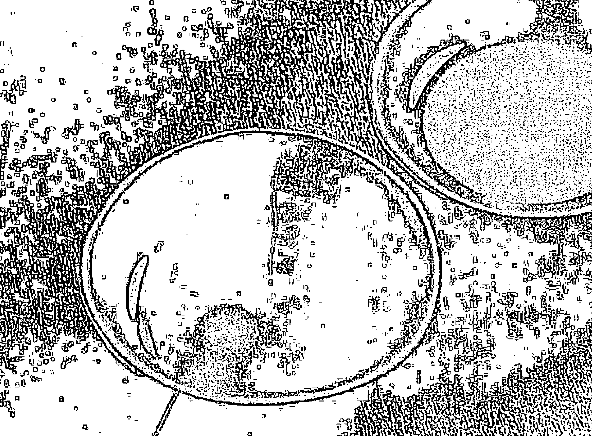

## 庐山人

白话阐述紫微斗数论盘技巧及观念。带领读者进入深奥的命理殿堂。系列书籍汇集百余命例，辅以图文并茂及系统性分析解说，轻松提升论命经验与功力。

## 紫微斗数

论

## 论命合婚案例研究

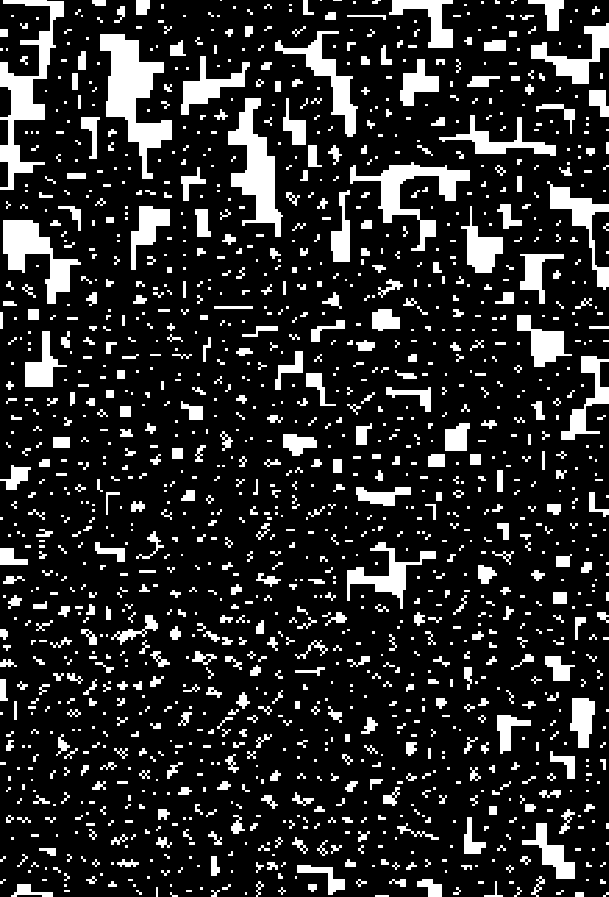

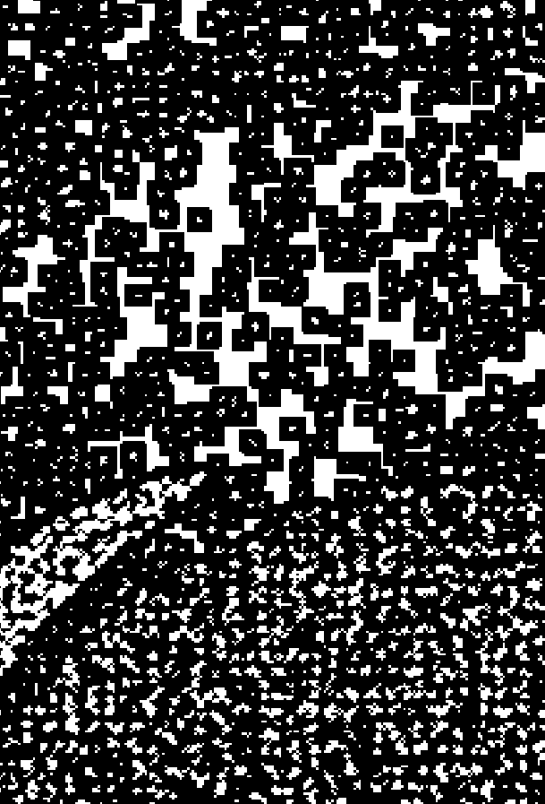

深入浅出 实战论命 自信详批 拿捏大好

了然山人 著

## 自序

常言道：紫微斗数，易学难精。我想，这也是许多对此术有兴趣的同好，心理永远的痛。很多人学了几十年，经常是星曜特性及四化的公式背的滚瓜烂熟，但一摊开星盘，就不知所措，因为斗数看的是三方四正所有的星曜，星曜的组合那么多，到底该怎样研判推论才能够得到正确的答案？提供命主最适切的建议呢？

其实，看过山人文章及教学视频的同好，大概都知道，山人一直强调，学习紫微斗数，基础理论还有星性、格局，记得大概就好，重点是在＜实战经验＞。因为紫微斗数是活的，他论盘的重点在三方四正的星曜组合，绝对不是单看宫内的神煞或星曜能判断推理出来。所以，最好的方法，就是以战养战，多多研究他人的论盘技巧，吸收各前辈大师的实务经验，才是快速提升斗数论命技巧的捷径。

但可惜，市面上斗数书籍那么多，多是介绍理论及推演技法，有关论命实例分析书籍，少之又少。纵然给您找到，不是太过简略的分析，就是搔不到痒处或是内容完全看不懂的状况。而为何实例分析书籍少见且经常会有这种通病呢？其实大部分的老师是故意这样写的，答案很简单，正所谓『江湖一点诀，说破不值钱』，尤其是命理五术更是如此，因专业技巧是由经验一点一滴的累积而成。试想一本书卖你几百元，收一个学生，少说三万起跳，您真的认为，您花几百元，就能买到老师的『江湖诀』吗？这就是问题的根源所在呀！

有鉴于此，所以山人从2012年起出版紫微斗数实例分析书籍，就是希望能以浅白的说明，毫不保留的论命技巧及经验分享，让更多人，能够藉由此书得到更多实务论断的技巧及方法，快速提升自己的经验值。因山人最主要的目的是《传承》，如何将此门流传千余年的中国古星象学 - 紫微斗数推广及发扬光大，培养新一代的命理人才，让这学问能够永续流传，这才是山人真正关心的事。

也很感谢所有同好，长期以来的支持鼓励，而山人这套汇集近20年实务论命经验及精心挑选的真实案例分析书籍，自上市以来，一直有很好的评价与销售成绩。有许多同好，因此而突破了自己多年的盲点，快速提升了自己的论命技巧，甚至实际开业为人设砚解惑的同好，也所在多有。

每次收到类似的感谢函件，山人都感到相当温馨。毕竟一个人的一生，不是自己有多少成就，而是你成就了多少人。这就是《为师》者，最大的成就，所以山人期许所有同学都能够青出于蓝而更胜于蓝。俗谚：长江后浪推前浪，前浪倒在沙滩上，但浪能越来越高，越来越精彩，那《前浪》也算是倒得其所，不是吗？

这次再版，主要是因为上册有关论命技巧的部分编入山人2018年新作《紫微星诠》中，加上旧版有许多错字疏漏处。因此山人再度重新整理，区分为上下两册发行，感谢山人嫡传高徒-紫心老师的细心校对，让此书的内容，更臻完美。

本系列汇集百例论命实例分析，都是山人精选出的真实案例，搭配生动活泼，深入浅出的解释，将山人二十余年的技巧，毫不保留的与大家分享。也希望更多的同好及后学者，能因此而受益。也期待能与所有紫微爱好者，一起推广传承，此门流传千年的中国古星象学。

注：本书命例系以《民国》计年，如要换算成西历日期，必须加上1911。例如生年为民国60年，换算成西历则为：1911+60=西元1971年。

了然山人
2018.3.10

## 了然山人 老师
星命学速成班招生中

想要在短期内快速学成《七政四余》及《西洋占星术》吗？只要３天８小时，就能让你拥有一日吉凶的精准度。

不需要任何易学基础，不用抄，不用背，了然山人老师的正统美式教学，让你轻松成为命学高手。

不用担心学不学得会，了然山人老师首创满意保证承诺，如果课程结束，无法达到以下两点教学目标，学费全额退还。

1. 能以七政四余（改良版）或西洋占星术论断本命盘１２宫。
2. 能以七政四余（改良版）或西洋占星术论断流年，流月，流日吉凶。

本课程采用一对一手传，让你彻底了解吸收，上课地点在台北车站附近，欢迎加入山人的 Line ID: kzf0910 了解报名。

术传有缘，希望我们有师生的缘分

了然山人

## 目录

- 案例 46、感觉命不好，请帮忙分析紫微命盘 ……… 2
- 案例 47、桃花跟婚姻 ……… 7
- 案例 48、能否帮我算一下工作运 ……… 14
- 案例 49、是否可以考虑转行 ……… 20
- 案例 50、事业问题，请大师给我衷心的建议 ……… 25
- 案例 51、命坐太阳见太阴化忌 ……… 34
- 案例 52、请大师指点命盘 ……… 39
- 案例 53、请大师帮忙解惑 ……… 43
- 案例 54、问紫微斗数感情与事业 ……… 48
- 案例 55、帮我看一下紫微斗数 ……… 53
- 案例 56、姻缘何时来 ……… 59
- 案例 57、请老师帮我解命盘（现逢人生最低点） ……… 64
- 案例 58、请老师指点感情与事业问题 ……… 72
- 案例 59、请大师解惑：家庭、事业蜡烛两头烧 ……… 77
- 案例 60、我的命中真的就缺钱吗 ……… 83
- 案例 61、前途茫茫，想创业不知道合适与否 ……… 90
- 案例 62、事业老是不顺，请大师指点 ……… 97
- 案例 63、想知道我的“命”如何 ……… 101
- 案例 64、请达人为小女子解命 ……… 107
- 案例 65、待业中，请高人帮我解紫微找方向 ……… 115
- 案例 66、想换工作，请教紫微达人 ……… 118
- 案例 67、好想结婚，请大师指点迷津 ……… 126
- 案例 68、我的命格属于机月同梁吗 ……… 132
- 案例 69、想以紫微斗数看感情婚姻 ……… 137
- 案例 70、未来就职往哪方面发展好 ……… 143
- 案例 71、算命＆工作运势 ……… 148
- 案例 72、请帮忙分析整体命格与运势 ……… 152
- 案例 73、我的命不好吗 ……… 156
- 案例 74、请问我的五行属性较适合哪一类型的工作 ……… 164
- 案例 75、请指点待人行事的注意事项 ……… 170
- 案例 76、請問我今年或明年的結婚運到了嗎 ……… 176
- 案例 77、人称“铁扫把”，请大师帮我解惑好吗 ……… 183
- 案例 78、关于婚姻与小孩请协助解盘 ……… 188
- 案例 79、一切就任它“顺其自然”吗 ……… 195
- 案例 80、想问此人的财务状况与工作运途 ……… 200
- 案例 81、此女命盘未来婚配对象的条件吗 ……… 207
- 案例 82、从命格看事业、财运&中年或晚年能享福吗 …… 211
- 案例 83、两人的命盘是否适合结婚 ……… 217
- 案例 84、困惑之人请紫微高人解命 ……… 221
- 案例 85、算命老师说 31 岁之前有个死劫，吓死人了 … 228
- 案例 86、感情困扰请老师解惑 ……… 235
- 案例 87、我是一个没福气的人吗 ……… 241
- 案例 88、想成家立业但苦无另一半 ……… 247
- 案例 89、请帮忙算算夫妻宫 ……… 251
- 案例 90、家里阴盛阳衰，而我会是同性恋吗 ……… 255
- 案例 91、诸事不顺、挫折磨难不断，求老师论命赠言 …… 260
- 案例 92、即将消逝在感情宫位的对象，紫微如何破解 …… 266
- 案例 93、为何命理师告诉我这番话 ……… 268
- 案例 94、命中缺木，请问如何让运气变好 ……… 270
- 案例 95、关于感情的问题 ……… 276
- 案例 96、紫微可否看出有无功名？何时考运佳？或运势何时拨云见朗？ ……… 282
- 案例 97、正缘会出现在何时？对方大概会是怎样的人？ …… 288
- 案例 98、请高人指点工作迷津 ……… 294
- 案例 99、请教是否适合外出创业 ……… 302

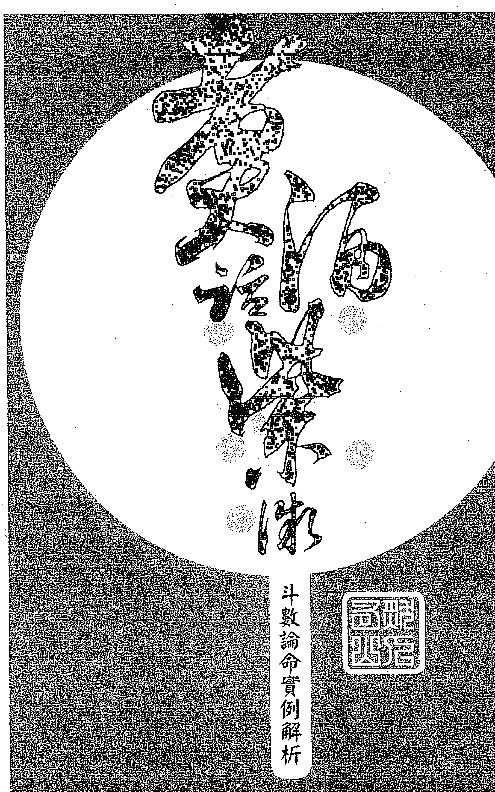

## 斗数论命实例解析

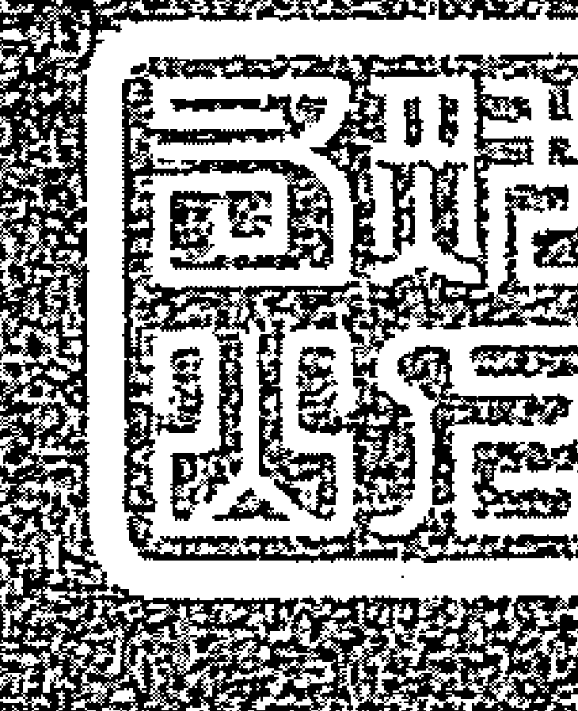

# 【案例 46】感觉命不好，请帮忙分析紫微命盘

| 提问时间 | 2009-08-13 06:14:26 |
|----------|---------------------|

我单身多年都没桃花，就算有也都是烂桃花，玩玩拍拍屁股就走，也没说半句话。现在又失业半年多以上，怎找工作都没（连洗碗工也去找），怎那么命坏，小时就没爸爸，妈妈也不疼，现在工作、恋爱都没，加上这次水灾把我家淹光光，是不是上辈子没烧好香==

我1982年农历1月27日早上8点多出生，女生。

拜托，好需要有人帮我解答，好灰心喔，感觉快走不下去了。生活都跟人借钱，这些年来出车祸好几次，还包石膏，不然就是开刀，像今年又开一次，长肿瘤，光肿瘤开八次刀，每开一次刀又要休息一段时间。我一个人生活光房租还要吃饭，用信用卡借钱过活，现在卡不能用了，目前欠债60多万，为了这些，我又有忧郁症，目前吃药中，好烦！

## 回复内容

从你的命盘看来，由于羊陀夹父母宫加上空劫同度，且加会化忌，所以与父母缘分比较浅，没错的话，父母亲的波动比较大，所以还是比较适合靠自己哦！

你应该是一个满有气质的女生，个性部分比较会钻牛角尖，想多于作，外在的部分给人家感觉开朗乐观，平易近人，整体看起来算是一个满不错的女孩呢。

你的格局属于很有名的“机月同梁”格，古曰：“机月同梁当吏人。”所以你比较适合稳定的工作，变动性太大的工作不是很适合你，如业务比较适合守成，不适合开创。至于感情问题，天梁化禄会照，适合嫁个“老”公，且夫妻宫落四马地，天马正坐加会同梁，为梁马漂荡局，是故恋情来来去去，难有稳定之时。本命太阴陀罗坐，并不是很好，但所幸有辅弼来拱，虽然困难，总是会有及时的助力出现，但波折起伏总是难免。

身居财帛，表示你对钱财非常的重视，但因为个性比较稳定，所以难有积极的动作，这是本性的问题。而财逢煞，库逢空，所以钱财来来去去的，很难有剩下来，建议你要做好金钱的管理。

建议你可以去当义工，把自己的心情给放开，也顺便累积自己的福报。虽说是天定不可违，但后天运势是掌在自己手上，只要多行善累积福报，我想会有改变的时候。最重要是要改改你那钻牛角尖的毛病呢。忍一时，风平浪静。退一步，海阔天空。

下个大限看起来会比这个大限好得多，整体运势会有转机的，所以这段时间多忍耐，人生总不可能永远顺风，但也不可能永远逆风，黑夜来临，黎明亦不远，这段时间就当作磨练吧！

只要你能够看开一点，多去布施，自然会有改变的机会。

> 佛家有曰：“欲知前世因，今生受者是。欲知来世果，今生做者是。”

今生所受的业力都是累世种下的因所造成的，这因有善因，也有恶因，所以今世尝到累世的果，如果今世感受的大都是不好的，那就是因为前世没有种下足够的善因，因此来世要得到善果的话，今世就要多积善因。明了了因果关系的存续后，多种善因，自然可以改变呦，祝福你。

## 命盘解析及内容说明

| 宫位     | 星宿/内容             | 年龄段 | 天干 | 备注   |
|----------|-----------------------|--------|------|--------|
| 疾厄宫   | 长飞龙生康德         | 74-83  | 乙   | 亡神   |
| 财帛宫   | 沐喜白               | 84-93  | 丙   | 将星   |
| 子女宫   | 病天                 | 94-103 | 丁   | 攀鞍   |
| 夫妻宫   | 临大吊               | 104-113| 戊   | 岁驿   |
| 迁移宫   | 养奏大书耗           | 64-73  | 甲   | 月煞   |
| 仆役宫   | 胎将小重耗           | 54-63  | 癸   | 咸池   |
| 官禄宫   | 绝小官耗符           | 44-53  | 壬   | 指背   |
| 田宅宫   | 墓青贵龙索           | 34-43  | 癸   | 天煞   |
| 福德宫   | 死力丧土门           | 24-33  | 壬   | 灾煞   |
| 父母宫   | 病博晦土气           | 14-23  | 辛   | 劫煞   |
| 命宫     | 哀官岁伏建           | 4-13   | 庚   | 华盖   |
| 兄弟宫   | 帝伏病旺兵符         | 114-123| 己   | 息神   |

本命坐太阴，故命主应属于气质型的漂亮女生，三方逢辅弼拱命，且科禄会命，为日月并明之局，且父母宫坐禄，田宅宫逢府相朝且会紫微，是故其幼时家境定当不错。

其父母宫逢空劫对拱，又会本命忌，表与父母亲缘浅，纵家境良好，亦难受父母庇荫，尤其与母亲关系颇为疏远，颇有年幼离家的味道。对应命主自述之关系，确实相当符合。

本命宫星宿组合呈现机月同梁格局，是故命主较为适宜稳定型工作，例如行政内勤或是秘书等工作，颇为适性。

至于感情部分，从夫妻宫观察，天马会同梁，为标准梁马漂荡局，故感情较为飘忽，来来去去，多有速食型爱情的感觉，不易有稳定之时。而对宫会照老人星天梁化禄，故婚配对象以年长为宜，且以整体结构看起来，仍以晚婚为宜。

至于财运部分，由于府相不会禄，无大富可言，财宫坐天机且会天梁与擎羊，聚财不易且得财颇为辛劳，三方煞星汇聚，更主为财烦恼。而田宅宫虽逢紫微会照且天相正坐，应有祖荫可得，但因对宫地空正冲，是故财库有损，但整体而言，只要不从事投机事业，其实还算稳定呢！

# 【案例 47】桃花跟婚姻

| 提问时间 | 2009-07-27 17:44:31 |
|----------|---------------------|

老师你好：

我是国历 76 年 9 月 8 日早子时出生，女生，我想请问我的桃花跟婚姻。

因为朋友们结婚的结婚，有伴的一堆……羡慕死我了 ==

麻烦你了！

## 回复内容

今年也才 23 岁，还年轻，可以多看看，不用太紧张。以国历生日的命盘看来，你应该是属于气质型的女生，聪明机伶口才也好，背景及内涵都有，你的命宫非常漂亮，只是你比较爱玩，跑来跑去，不太能静下来，也因为浪漫爱幻想，所以才会有这种感觉吧！

你的条件应该很不错，不要去想太多，年轻就是本钱，而且你的夫妻宫星宿组合很漂亮，没错的话你的另一半年纪应该比你大，个性开朗乐观，但直率有个性，而且成就应该还不错，双方之间的口角争执满多的，可能是因为都很有想法吧！

你即将走的是 25-34 这个大限，福德宫见銮喜对拱又逢大限化禄及本命禄拱照，大有红鸾星动之兆，夫妻宫也是相当漂亮，因此山人大胆预言，你铁定在这个大限结束前会遇到你的 Mr. right，且姻缘应该成于此时，所以真的不要想太多，你绝对不会孤单一辈子的。倘山人推论没错，你去年应该有个不错的缘分出现，但不知道你是否错过了呢？不过没关系，因下个大限有更好的姻缘出现呢！

总之，你還年轻，而且整体星宿组合结构都很漂亮，不要担心太多，不会没有姻缘，只是好姻缘没那么容易出现，要再等等。知道吗，太早有姻缘，对你反而不好呢！

## 命盘解析及内容说明

|          | 破军 破碎 95-104 子女 乙巳 | 太阳 天机 105-114 夫妻 丙午 | 天府 天相 115-124 兄弟 丁未 | 天机 太阴 5-14 命宫·身宫 戊申 |
|----------|---------------------------|----------------------------|----------------------------|----------------------------|
| 华盖     | 天同 天梁 85-94 财帛 甲辰 | [星历] 星仪 易学 [星仪]   |                            | 紫微 贪狼 15-24 父母 己酉   |
| 将星     | 天刑 天哭 75-84 疾厄 癸卯 |                            |                            | 天同 天梁 25-34 福德 庚戌   |
| 亡神     | 天官 截空 65-74 迁移 壬寅 | 七杀 廉贞 55-64 仆役 癸丑  | 天梁 45-54 官禄 壬子      | 天魁 35-44 田宅 辛亥       |

### 本命盘

此命局相当漂亮，科禄权三奇佳会命宫，古曰：“科权禄拱，名誉昭彰。”加会文曲，福德宫逢昌曲辅弼对拱又逢魁钺夹，且夫妻宫形成阳梁昌禄奇格，故命主定然天资聪颖，才华洋溢。且禄权会命，家庭环境定然不差，而命宫三合无煞有吉，加上天机坐命，化气为善，更表示命主心思纯正，本性善良加上太阴坐命，基本上命主属于气质型的女孩，应属于才华洋溢，温柔善良的好女生呢。整体而言，可以财官双美论之。

但因命立四馬地，又會照天馬，是故個性喜動不喜靜，活潑外向，且具公門格局，以此整體星盤組合看來，相當適合從事企劃、公關及行政等工作。當然，倘能參加國家考試擔任公職或參與政治活動，更是前途不可限量。

而田宅宮雖逢空劫正坐，但觀其財帛宮相當穩定且逢祿權，是故應該只是不善於理財而已。至於命主最關心的夫妻宮，見太陽正坐，會照天梁，是故配偶年紀較長，個性直爽，有正義感，性急，且有大男人主義傾向。其實夫妻宮除表示未來配偶的樣貌與個性外，其實也暗示了命主喜歡異性的類型。正所謂知己知彼，百戰不殆，倘諸位看官有心儀對象，不妨嘗試看看，我想會有意外的收穫呢！

命宮太陰天機的組合，大都屬於愛鑽牛角尖且容易自尋煩惱的人，由於太陰具有豐富想像力，而天機又為智慧的象徵，因此山人認為命主定然是嚮往瓊瑤式愛情的小女生，正所謂，少女情懷總是夢呀！

所以才會有這種感觸，是可以理解，因以星盤整體結構推論，命主聰明、漂亮、有才華，家庭環境及背景都不錯，怎會沒有對象呢？其命宮三方會照紅鸞、咸池，照理說異性緣不差，為何目前是這樣的狀況呢？我想這問題應該出在大限行進上，正所謂命好運好也要限好呀，大限不利於己，縱本命再強勢，也只能徒呼負負；反過來說，倘本命不佳，但大限強勢，則有風雲際會之勢，因此行限的強弱是相當重要的。但命主問命當年也才芳齡23歲，還相當年輕，實在無須過於操心才是呀。那我們就來看看這個大限到底出什麼問題了吧！

命盘表格内容：
大耗 破碎 天府 太陰 ...
95-104 105-114 ...
星僑電腦軟體 版權所有
作者：陳思國 程式設計：陳明遠、陳慶鴻
地址：桃園縣龜山鄉復興二路6號(林口長庚附近)
電話：(03)328-8833 傳真：(03)328-6557
網址：http://www.kysoft.com.tw

## 15～24 大限本命盤

此大限夫妻宮逢擎羊，且野桃花天姚星正坐，本身桃花就會多於正緣，而三方會地空地劫，得亦復失呀，不過既然是桃花，錯過也就罷了吧！因此年紀不正是應該好好讀書的時間嗎？倘忙於戀愛，可不容易把書讀好呢。尤其命主整體格局相當漂亮，未來成就可期，倘於此時把重點放在戀愛上，只怕對其未來影響會是相當的大，所以再度驗證山人所言：其實沒有對象，對命主而言，並不是壞事呀！

那命主的姻缘可能成於幾時呢？看來在25～34這個大限便有成婚的機緣，其大限本命盤如下：

| 宫位 | 主要星宿 | 年龄段 | 天干地支 |
|------|----------|--------|----------|
| 疾厄宫 | 破軍, 貪狼 | 95-104 | 乙巳 |
| 子女宫 | 天機, 太陰 | 105-114 | 丙午 |
| 夫妻宫 | 天梁, 天府 | 115-124 | 丁未 |
| 兄弟宫 | 紫微, 天相 | 5-14 | 戊申 |
| 财帛宫 | 天同, 天梁 | 85-94 | 甲辰 |
| 疾厄宫 | 廉貞, 貪狼 | 75-84 | 癸卯 |
| 迁移宫 | 天機, 太陰 | 65-74 | 壬寅 |
| 仆役宫 | 天同, 天梁 | 55-64 | 辛丑 |
| 官禄宫 | 紫微, 天府 | 45-54 | 庚子 |
| 田宅宫 | 天相, 天梁 | 35-44 | 己亥 |
| 福德宫 | 天機, 太陰 | 25-34 | 戊戌 |
| 父母宫 | 天同, 天梁 | 15-24 | 丁酉 |

## 25 ~ 34 大限本命盤

此大限命宮會天喜，表示正緣將現，福德宮逢鸞喜對拱又逢本命祿及大限祿引動，要不成婚都難呢。而此時夫妻宮三方相當穩定，又大限化科正坐，故此時的對象，應是有相當身分地位的好男生呢，但因會照天梁這顆老人星，故年紀應稍長於命主，但男生年紀越大，個性思想就愈成熟，與命主可是相當登對的呢，也祝福她能在此大限遇到自己的 Mr. right。

# 【案例48】能否幫我算一下工作運？

｜提問時間｜ 2010-06-15 17：55：52

你好，最近為工作的方向很迷惑及煩惱，剛好在網路上尋找有關算命的文章就找到你這來了，不曉得你能否幫我算一下工作呢？我是國曆71年8月12日辰時出生，若可以則非常感謝你，不方便也沒關係。謝謝！

｜回覆內容｜

沒錯的話，你應該是女生吧，且應該是滿有想像力的人，想法頗為特別，有時讓人難以接受，做事情總感到東做西成，個性的話應該是滿開朗大方，有點大姊頭的樣子，但陽剛中又不失女生的溫柔，但平常時是以陽剛外顯個性的女生居多。

看來你應該也是屬於比較愛打抱不平，正義感的人，心直口快，常會不自覺得罪人，所以這些都是你個性上的缺失，要記得改進，這樣對自己未來都比較好。女生還是比較溫柔點，有原則是好事，但也要聽聽人家怎說。

就你個命宮星宿組合來說，比較適合創作、研發、公關、企畫及其他可以發揮你想像力的工作。而且你應該外型屬於俏麗型的女生，異性緣應該也不差，加上你的個性，應該好哥們很多吧！

至於工作的話，以大限來看，呈現祿馬交流的狀況，適宜在動中求財，只是錢財部分應該還是不易守成，不過在這10年至少辛勤奔波會有點收穫與成就感的。幫你用流年看看，我想去年對你應該是還滿順利的一年，但今年工作上應該滿辛苦的，對宮逢大限化忌沖，雖坐紫微但無輔弼來會，因此更感到單打獨鬥，而且做任何事都感到有點卡卡的，看似順利的卻一再因故延宕，而且外在的競爭壓力很大。確實來說，今年的工作運應該很辛苦了，而且貪狼化忌坐夫妻宮，相信在男女之間的關係上也會有不小的影響。總之今年多忍忍，明年應該會順利的多，這段時間就當成磨練經驗吧！

人生就是這樣，起起伏伏，不會有永遠順風，也不會有永遠逆風，看開點，不要想太多。至少你的工作運沒有連續走壞好幾年，我想明年就會有轉機了。

## 命盤解析及內容說明

| 宮位 | 範圍 | 干支 | 主星 |
|------|------|------|------|
| 福德 | 104-113 | 乙巳 | 火天右紅天天天 |
| 田宅 | 94-103 | 丙午 | 封文天天紫 |
| 官祿 | 84-93 | 丁未 | 地鈴八三寡 |
| 僕役 | 74-83 | 戊申 | 天文天天破 |
| 父母 | 114-123 | 甲辰 | 陰歲天七 煞破虛殺 |
| 命宮 | 4-13 | 癸卯 | 冠病小 帶伏耗 |
| 遷移 | 64-73 | 己酉 | 墓青病 籠符 |
| 疾厄 | 54-63 | 庚戌 | 死力歲 土連 |
| 兄弟 | 14-23 | 壬寅 | 臨大官 官耗符 |
| 夫妻 | 24-33 | 癸丑 | 帝伏貫 旺兵索 |
| 子女 | 34-43 | 壬子 | 衰官喪 伏門 |
| 財帛 | 44-53 | 辛亥 | 病傳晦 土氣 財帛.身宮 |

### 本命盤

太陽坐女命，相當不適宜，其理由如同太陰坐男命相同，一般太陽坐女命者，個性陽剛，比較像是大姐頭類型的女生，和男生相處就像哥兒們，故通常是很難找到好的對象。所幸會照太陰，因此尚能保留其女性溫柔婉約的一面，身宮坐太陰加天喜，是故命主應是氣質出眾且外型俏麗可人的漂亮女生，而鑾喜拱身，其異性緣必佳，又此局亦為日月並明之局，且逢雙祿於命宮交會，主出身望族，且財宮坐祿會本命化祿，田宅坐紫微，家境定當不差，應可以財官雙美論之，可惜地空地劫星亦落入這個三合區，好格局大概都已經破壞光了，確實相當可惜呀。

而其地劫坐命又與太陽同度，個性頗為強烈，具正義感，說話經常是過於直接而傷害到他人，且應是個相當堅持己見的人，故空劫入命者，大都因自身個性上缺陷而導致敗局，也增加了人生的勞碌波折。也因此山人多建議此局人，學習禪修，研讀佛經，或參加心靈課程，讓自己浮動難安的心給止住，這樣才能避免受空劫星曜過度影響自性。畢竟羊陀火鈴四煞是外在的煞星，老天要給我們什麼挫折，無法掌握，但此空劫兩曜，卻是可以靠自己勤加修心，加以調伏的，倘命主能將此影響減至最小，以其命宮格局看來，定有相當成就才是。

相同道理，官祿宮雖逢日月拱照，但地空正坐，再會地劫，因此在工作職場上，自然相當勞碌波折而難有所獲。倘大限行運不佳，就會讓自己深感挫折與絕望，至於命主適宜哪方面工作，以其整體格局而言，相當適合從事以口為業的工作，例如：教師、業務、客服人員、活動企劃及公關等，甚或是從政亦為不錯的選項。

而目前命主在工作上相當不順利，基於三才理論，我們就先從大限盤來看看，到底出了什麼問題吧！

| 大限 | 火天右红天天天 | 封文天天紫大大 | 地铃八三寧 | 大 | 天文天天破 |
| 星賞窗慧馬鉞機 | 詔昌妣福微火虛 | 空星座台宿 | 傷曲啞哭軍 |
| 長飛龍官104-113 | 乙養奏白小 94-103 | 丙胎將天大 84-93 | 丁絕小吊龍 74-83 | 戊 |
| 生廉德符 福德 | 巳書虎耗 田宅 | 午軍德耗 官祿 | 未耗容德 僕役 | 申 |
| 12 24 36 48 60 72 | 11 23 35 47 59 71 | 10 22 34 46 58 70 | 9 21 33 45 57 69 |
| 隱歲天七 煞破虛殺 | 左天天 輔壽廚 | 財帛身宮 | 息生神 |
| 田宅 月煞 煞 | 科 | 口口 |
| 沐浴神耗索 114-123 | 甲辰 | 墓青病白 64-73 | 己酉 |
| 父母 | 龍符虎 遷移 | 8 20 32 44 56 68 |
| 大大大 魁昌空 劫光月德空魁梁陽 | 天台天陀天廉 使輔官羅府貞 | 子女 華蓋 |
| 福德 咸煞 池 | ◎◎ | ◎◎△ |
| 冠病小喪 4-13 | 癸卯 | 死力戲天 54-63 | 庚戌 |
| 帶伏耗門 命宮 | 士建德 疾厄 | 7 19 31 43 55 67 |
| 2 14 26 38 50 62 | 天龍天武 刑池相曲 | 旬天破亘天 空才碎門同 | 解年蜚鳳擎貪 大大大 神解康閣羊狼 陀曲馬 | 天天祿太 辰喜空存陰 |
| 大大 鈴鑒 | ◎△ | ☒ | ☒ | ☐ | ◎◎ |
| 父母 指煞 背 | 命宮 天書 煞 | 兄弟 絕神 煞 | 夫妻 | 大耗 劫煞 |
| 臨大官晦 14-23 | 壬寅 | 帝伏貫歲 24-33 | 癸丑 | 衰官裹病 34-43 | 壬子 | 病傳晦吊 44-53 | 辛亥 |
| 官耗符氣 兄弟 | 旺兵索楚 夫妻 | 伏門符 子女 | 士氣煞帛身宮 | 3 15 27 39 51 63 | 4 16 28 40 52 64 | 5 17 29 41 53 65 | 6 18 30 42 54 66 |

## 24 ～ 33 大限本命盘

本大限命宮逢輔弼來拱，三方雖會火鈴，但在吉星的助力下，應只會稍感挫折，並不會產生全面性的挫敗才是，且其官祿宮逢大限化權及化科對照，會照本命祿存，且三合不會煞忌，整體而言，尚稱穩定，以整體組合而言，這個大限應有不錯的發展才是，為何命主會感到波折與不順利呢？其實因為大限主10年之運，大限再好，畢竟是這段時間的總和，還要觀察其流年狀況方可斷吉凶，這也是山人一再強調三才理論的重要，倘無法確實掌握此要訣，則遑論人命呀！現在我們就來看看，到底這個流年發生了什麼事吧！

紫微斗数命盘图表，包含多个宫位（如命宫、兄弟、夫妻、子女、财帛、疾厄、迁移、交友、官禄、田宅、福德、父母等）及星曜分布。图表下方附有联系信息：星僞電腦軟體 版權所有，翻拷必究。作者：陳恩國 程式設計：陳明遠、陳彥鴻。地址：桃園縣龜山鄉復興二路6號(林口長庚附近)。電話：(03)328-8833 傳真：(03)328-6557。網址：http://www.ncc.com.tw

電話：
地址：

## 99 年大限流年盤

命主問命當年為民國99 年，其流年官祿宮三方會羊陀雙煞，大限貪狼化忌沖，雖逢紫微正坐，可稍解其惡，但挫折定然難以避免，此時在工作上，我想應該是在職場上因本性過度耿直外放，樹敵過多，遭到孤立冷落甚至是反撲，更可能因此而失去工作，確實是相當挫折的時候。但流年畢竟只主一年之運，以其流年走勢看來，應該要到民國102 年才會開始轉好，100 年雖逢空劫臨命，但只是勞而無獲，無論如何，都會比99 年還好，所以奉勸命主，趁此機會好好修心，這段期間的挫折，就當作逆增上緣，磨練自己的心境更加成熟。畢竟人生路途還很長，挫折難免，但要如何應對，這才是人生最重要的任務。

# 【案例 49】是否可以考慮轉行？

｜提問時間｜ 2009-11-12 00：25：40

我是國曆 69.1.11 上午七點多出生，女生。之前我有感應到上天希望我未來不論是否要轉業，就是選擇可以助人，並且把抽象概念轉為具體文字或者口語（可以請山人幫我從命盤上看看我感應到的是否正確？）。倘若我有機會可以留在國外發展事業，只要符合以上兩者條件，是否可以考慮轉行？還是我必須要回國繼續從事特殊教育工作比較好？謝謝你！

｜回覆內容｜

如果以你的本命宮來看，你的個性應該是頗為寬厚，外表看來氣度翩翩，口才應該也不差，你的命格而言屬於異路功名類，適合以其他方面的專長來獲得成功，口才應該也不差，而且本身也具有標準的公門命格。且容易得到長輩的提攜及照顧，也有多貴人及機遇，只是你與兄弟之間的緣分比較淺。我想這是你會想選擇留在國外的原因，父母對你倒是照顧有加。
你的本性寬厚仁慈，很適合擔任社會服務類型的工作，我想助人的行業與你的本性確實很適合。山人是建議你，如果可以的話，特殊教育也是奉獻服務的一種工作，所以滿適合你的。

基於三個原因，山人會這樣說：

- 1. 你本來就適合以口為業的工作，所以當老師或講師，再恰當也不過。
- 2. 而且你的個性開朗樂觀，秉性寬厚仁慈，從事特殊教育需要的就是這種個性的人，如果給一個急性子或脾氣躁怒的人來教的話，我想會很不恰當。
- 3. 你整體星盤組合確實滿適合從事社會服務的工作，特殊教育也是服務社會的一種方式，老師薪水都差不多，很少人會想去選特教類的，因爲比較辛苦，也需要耐心，不如去教一般的學生來的輕鬆。而你命宮會天梁，天梁化氣爲蔭，本來就喜歡照顧幫忙有困難的人呢。特殊教育類工作確實是符合你的感應，因你本性就應該如此做，加油哦！

## ｜提問者意見｜

謝謝老師指導。

## 命盤解析及內容說明

包含宫位、星曜、流年、干支、长生十二神、博士十二神等信息的复杂表格。

### 本命盤

本命宮無主星，借對宮同梁來論，同梁會馬，本為梁馬漂蕩之格，喜遠離出生地，較為自在。故目前旅居國外，倘打算歸國，應該內心相當的糾結吧！畢竟本身並不喜歡長期待在一個地方，所以山人能夠理解其內心的掙扎。

但命主自述因天意感應要歸國服務，其實倘以其專長，回來幫助更多的鄉親，是相當好的，畢竟落葉要歸根，外國月亮終究沒有故鄉圓，台灣才是自己的家鄉呀！倘能將國外所學貢獻回國，我想是造大功德一件呀。所以山人相當贊成命主歸國服務，尤其是打算從事特殊教育，作育英才，更是需要給她拍拍手。

其命宮同梁，古曰：「同梁守命，得純陽中正之心。」加上三方不會煞忌，心思純正，且更顯示命主仁慈，心地良善與樂於助人及服務人群的精神，此局人相當適合從事社會服務性質工作，也許因爲其個性磊落光明，且學有專長，加上輔弼拱命，無論遇到再大的挫折，都會有適時的助力出手相助，也因爲個性寬厚仁慈，是故教育較弱勢的特教學生，確實相當適合，也許是因此，故神祇降意命主服務人群吧！

其命宮三方同時會照巨門及太陽，巨門爲暗曜，入命本主背後是非，但因太陽能驅巨門之暗，優化巨門本性，是故命主口才必佳，相當適合以口爲業的工作，例如教師、律師、教授及講師等。是故回國擔任特教老師，確實是適性也適所。

只是命主僕役宮相當糟糕，看來不太容易能有知心好友，且易受友拖累，因此命主須特別注意交友狀況才是呀。

其本命盤府祿相三合會父母宮，基本上理財能力相當不錯，而天府坐父母，主父母個性慈祥，相處融洽。（註：就是因爲父母皆善良，才能教出不汲營於私利，願爲衆生犧牲奉獻的好孩子呀。）

而其財宮日月拱照，且三方不會煞忌，主財源寬廣，財來不缺，但因財庫逢空劫，是故得中有失，不易守成。但因府祿相三合且財宮相當穩定，故僅是不善於理財，並非破敗祖業。

此局人心軟善良，有強烈的同情心與同理心，但朋友多無義也無益，是故相當可能因友拖累或遭欺騙而破大財，此點是相當需要注意之處。

不過天公疼憨人，倘真遭友詐財，也就當作前輩子欠的因果吧，但山人還是寧願命主能盡量避免，倘註定真要破財，也寧願把錢拿來佈施濟貧。

山人論命十餘年，此例相當奇特，也許僅此一例。因登門者多問事業及感情，大都是因為自己的因素求教，絕少碰到有願意利他的師兄、師姐，也許，這也是一種緣分吧，也許是天意要山人給他這臨門一腳，因作此決定需要相當大的勇氣呢！

# 【案例50】事业问题，请大师给我衷心的建议

提问时间 | 2009-07-23 21:20:43

我 1981 年 9 月 27 日晚上 7～8 点之间出生。
几年前因为生意失败，欠下不少债务，所以这几年都在努力赚钱还债，即将在今年 12 月解套。现在又有朋友找我到广州经营内地服装批发的生意，我想去试试，但又有生意失败的阴影，很担心又要面临一次的失败，因为我也快 30 岁了。所以想在此问问大师，我的流年问题？我现在事业上应该守还是该攻？流年到几岁的时候再来做生意会比较好？

回复内容

嗯，看来你还是满上进的人，不会被生意失败的挫折给击倒，愿意去面对，就像当初国扬集团的侯西峰总裁一样，周转不灵，但他豪气的说：我将再起。勇敢的面对，值得给你鼓励。
本命宫格局不错，为辅弼拱主的大格局，紫杀化权，所以很容易接近权力核心，加上很容易就可以得到来自朋友同事的助力，在职场上是个天生的领导者。府禄相三合，代表你在创业或赚钱时是一个满会守成的人。

加上武曲貪狼正坐財宮，雖說利於求財，但時常會為了賺錢而不擇手段，加上雙主星入命，所以難免會有點好大喜功的味道，而且財宮見武貪坐，古曰：「武貪不發少年人，為先貧後富之運。」以大限運行來看，確實也是如此。

可惜福德宮逢空劫雙煞侵襲，本身就會比較波折勞碌，加上身居財宮，就整體盤勢看來，是個為財拼生死的人。但從你的財庫來看，財庫有損，所以錢難留，聚散無常呀。

天馬落命宮，但可惜沒有會祿，不成「祿馬交馳」格局。對於創業不利，常常都是忙得團團轉，但錢總是有點給他無緣。

至於你說的攻守，山人覺得你的觀念正確，以你的命盤看來，確實是需要見好就收，伺機而動的人，所以出擊時機對你而言很重要。

加上紫殺化權坐命又有輔弼拱主格局的，通常很難服從在人家的麾下，所以縱使大權在握，可能你內心裡創業的慾望還是蠢蠢欲動。

以大限來看，這個大限走的是天相運程，通常走天相都滿穩定的。且逢本命祿存，再會天府，照理說應該是有賺大錢的機會。可惜大限命宮逢空劫來拱，有勞而無獲的現象，所以創業出現問題，並不意外。

下一個大限逢煞星正坐，比較會有好事多磨的情況，也是不宜。以今年流年來看，創業是萬萬不宜。流年命宮星宿組合不佳，加上大限不佳，如果貿然創業，恐怕損失會比上次還嚴重，建議你最好三思。

明年流年運勢會比較好，建議你可以考慮明年做短期衝刺，見好就收，千萬不可戀棧。

不過，山人還是建議你最好在職場上發展，吃人頭路，至少壓力不會那樣大，而且以此局看來，創業要有成可能要到 40 歲之後。所以可以趁這段時間蓄積能量，大限不好，就抄短線，但切忌拉長戰線，否則庫破威力是難以抵擋的呢！

## 命盘解析及内容说明

| 破碎星 | 天府福 | 天使紅天太天魁陰同 | 天月煞星宿 | 鈴星 | 天天姚才 | 陀羅門 | X O △ |
| :--- | :--- | :--- | :--- | :--- | :--- | :--- | :--- |

### 本命盘

山人常說，創業首重祿馬交馳，以此盤看來，天馬居亥宮，三方四正，雖不會祿，但會武曲財星，也不逢煞忌，是故仍適合創業。只是武曲之財要靠自己很努力獲得，所以起伏波折自然比帶祿馬格局的來的大。

此命格格局相當大，也很漂亮，紫微會輔弼入命，且對宮天府來朝，命立四生地，天馬正坐，表示命主是個靜不下來的人，加上身居財宮，對金錢相當重視，所以會想創業求財，確實不讓人意外，因本命即為所謂的老闆格。而其府祿相三合會福德，基本上表示命主是個善於守財的人，只是祿存逢空劫，連帶也破壞此難得的結構，得亦復失，聚散無常，此點從其田宅宮同時會照天機天梁及擎羊的險惡組合，可見一斑，雖逢魁鉞來拱，危急時刻能有貴人出手相助，但仍是相當兇險。以此兩個結構整合看來，雖無大富可期待，但小富應該仍不是問題才是，只是必須要能守得住財，否則終究還是一場空呀！

其財宮武曲貪狼正坐，又會廉貞，古曰：「武曲貪狼廉貞逢，少受貧而後受福。」且此局落於四墓地，此局橫看豎看都是屬於晚發格局，難怪年輕創業時鍛羽而歸。

只是其命宮組合相當漂亮，為君臣慶會格局，古曰：「才擅經邦。」但因身居財宮，以賺錢為職志，是故寄人籬下領死薪水，應該非命主所願。許多武貪格局的人，年輕時創業都很慘烈，初期因能力佳，有謀略可以賺得到錢，但後繼乏力，常因年少得志，氣焰高張，常常會忽略了身邊的兇險，以致遭到敗績。且武貪組合相當絕決與無情，求財無論是手段與方法通常相當具侵略性及強勢，正所謂過剛則折，所以只有當年紀漸增，能收斂性情時，創業方能有成，這也是武貪不發少年人的原因。

且命主問命當年29歲，還算年輕，實在無須過度擔憂，以其君臣慶會格局加雙主星坐命的超強格局與工作能力，到哪裡任職都能適應良好，反倒是須先修煉自己的個性，這樣才能在大運來時有成功的機會呀。至於命主自述創業曾遭失敗，到底出什麼狀況呢？我們就從大限盤看起吧！

## 23～32本命大限盤

| 大大陀曲財帛身宮指背 | 破截天福空府△子家感池 | 天天紅天貴廉廚魁陰同XX煞權 | 大羊夫妻月煞 | 天貪武月宿狼曲◎◎兄弟亡神 | 鈴天陀巨太星天才羅門陽X◎△祿權忌 |
| :--- | :--- | :--- | :--- | :--- | :--- |
| 病虎虎虎 63-72 癸巳 11 23 35 47 59 71 | 衰小天德 53-62 甲午 12 24 36 48 60 72 | 帝青龍客 43-52 乙未 1 13 25 37 49 61 | 臨力士符 33-42 丙申 2 14 26 38 50 62 |
| 大空天台恩三天天 傷輔光台刑壽 疾厄天煞死奏龍龍 73-82 壬辰 10 22 34 46 58 70 | [星儀] 易學 [星儀] 文文太巨昌曲陽門 化化化化忌科權祿 柱四煞排時日月年 ：：：： 戊丁辛酉酉 君天巨三同門三9 8 卯局月月石 2730 平日日未 地19戌 不點時 | 大大鉞昌笑命權皇將星 冠博歲歲 23-32 丁酉 帶士進進夫妻 3 15 27 39 51 63 |
| 大虛右弼天破廉 顛破虛軍貞 遷移癸煞 煞 墓飛大大 83-92 辛卯 9 21 33 45 57 69 | 星儀電腦軟體 版權所有·翻拷必究 作者：陳恩國 程式設計：陳明遠·陳慶鴻 地址：桃園縣龜山鄉復興二路6號(林口長庚附近) 電話：(03)328-8833 傳真：(03)328-6557 網址：http://www.ncc.com.tw | 八天擎天天座空羊梁樑◎◎△父妻變鞍鞍 沐官晦晦 13-22 戊戌 浴伏氣氣兄弟 4 16 28 40 52 64 |
| 僕煞劫煞 文解月天曲神德鉞 火 官祿華蓋 壹 地火年鳳龍空星解闇池◎大喜 田宅息神神 | 匈封文陰天空詰昌煞喜 大大魁馬 福德歲驛 | 天左蜚孤天七紫巫輔廉辰馬殺微△O 福德歲驛 |
| 紹喜小小 93-102 庚寅 8 20 32 44 56 68 | 胎病官官103-112 伏符符福德 辛丑 7 19 31 43 55 67 | 養大貫貫113-122 耗索索父母 庚子 6 18 30 42 54 66 | 長伏表表 3-12 已亥 生兵門門命宮 5 17 29 41 53 65 |
| 電話： 地址： | | | 編號： 0000000084 |

此大限命宮逢祿存正坐，雖得府相來朝，再會右弼，唯其三方遭空劫來拱，為標準的倒祿格局，此局落感情上，會有遇人不淑的遺憾，落命宮三方，則有勞而無獲，甚至破大財消災的狀況，對照命主這段期間的狀況，果真不虛呀。但，這不也反證了武貪不發少年人這句話嗎？命財官遷均被拱掉，怎能期待有創業成功的時候呢？

失敗為成功之母，開創大業的一定經歷過挫敗，所以就當成累積經驗吧，此點從命主自述的內容看來，確實有吸收到教訓了，所以才會請教命理老師，只是聽不聽得進去，就看自己的造化了。

以此大限看來，98 年的機會，應該也是失敗的機率為高，但我們仍需從流年看起，畢竟大限是 10 年的總和，倘流年得盆，不妨抄個短線，只是務必見好就收，否則流年一過，便立刻打回原形呀，現在我們就來看看流年盤吧！

## 98 年流年大限盤

| 年年年 陀曲哭 指指 背背 官祿 63-72 病將白官 遷移 02年 33歲 癸 | 破截天天 碎空福府 △ 威池 威池 僕役 53-62 衰小天小 疾厄 03年 34歲 甲午 | 天天红紅天太天 使貴驚雁魁陰同 祿權 月煞 月煞 遷移 43-52 帝青帛財帛.身宮 旺龍客耗04年 35歲 乙未 | 年年羊虛 月煞 天寡貪武 月宿狼曲 ◎◎ 權祿 疾厄 33-42 臨力病龍 子女 05年 36歲 丙申 |
| :--- | :--- | :--- | :--- |
| 天天 煞煞 田宅 73-82 死奏寵貢 僕役 01年 32歲 壬辰 | 天台恩三天天 傘輔光台刑壽 | 【星僑】 易 畢 【星僑】 0000 00000 國農生陰 姓名 年男 文文太旦 梯于身命命 昌曲陽門 年年主主局9020 化化化化 斗斗：：年年辛屬 忌科權祿 君君天巨木 西雞 辰卯 局月月石 2730 平日日木 地煞戊 木點時 | 年 昌 將將 星星 財帛.身宮 23-32 冠博歲白 夫妻 06年 37歲 丁酉 |
| 災災 煞煞 福德 83-92 墓飛大耍 官祿 00年 31歲 辛卯 | 柱四盜排 時日月年 壬戊丁辛 戌申酉酉 | 《流年》 星僑電腦軟體 版權所有・翻拷必究 作者：陳恩國 程式設計：陳明遠・陳慶鴻 地址：桃園縣龜山鄉復興二路6號(林口長庚附近) 電話：(03)328-8833 傳真：(03)328-6557 網址：http://www.yocc.com.tw | 子女 13-22 沐官晦天 兄弟 07年 38歲 戊戌 |
| 年 爹 劫劫 煞煞 父母 93-102 絕喜小晦 田宅 99年 30歲 庚寅 | 文解月天 年 火 曲神德鐵 華華 壽壽 命宫 103-112 胎病官歲 福德 98年 29歲 辛丑 | 地火年鳳龍 年 空星辭閣池 ◎ 息息 神神 兄弟 113-122 養大貫病 父母 09年 40歲 庚子 | 天左彎孤天七紫 巫輔廉辰馬殺微 △○ 歲歲 歸歸 夫妻 3-12 長伏喪吊 命宫 08年 39歲 己亥 |
| 電話： 地址： | | | 編號： 0000000084 |

此流年逢祿權會命，且逢本命祿會，形成雙祿交流，財宮亦會雙祿，手頭上應該是有點閒錢才是，此時倘結構良好，確實相當適合炒個短線才是。

但三合空劫雙煞又來攪局，亦形成倒祿局，流年財宮亦被拱掉，且流年田宅會雙煞，又逢對宮天機擎羊正沖，與財無緣，依照推論，其僕役宮流年文曲化忌會照，文曲化忌，即有可能因口舌惹是非。由於流年不佳，倘與朋友合資，只怕會因事業發展不順產生口角爭執作收。以其田宅宮的凶險狀況，只怕這次賠的會比上次還多。故今年的機會，只能用吉處藏凶來形容，千萬不可貿然行動呀！至於幾時會好轉，看來應在 43 ～ 52 大限，但勞碌難免呀，故奉勸命主，人要蹲得夠低，才能躍得愈高，沉潛一段時間，休養生息，畢竟命盤已經告訴你，年少難發，不如趁此機會好好磨練自己的經驗及性情，當大限機會來臨時，自會有作為。

# 【案例 51】命坐太陽見太陰化忌

| 提問時間 | 2009-10-31 14：24：29 |
| :--- | :--- |
| 女，74.1.27 戌時（農曆）生。曾去算命，老師說我一生操勞，無家室之樂，真的嗎？可以化解嗎？ |

## 回覆內容

唉，誰的一生不操勞的呢？除非你家裡很有錢，終身不需要工作，否則誰能避免呢？說這話好像用處不大吧？如果花錢算命得到的答案是這樣，那建議你可以跟老師要求退錢，因為這是大部分人共通的特性。

山人幫你看了一下，女命坐太陽，確實不宜，因太陽是男性的表徵，女命得之，會讓人感到像男人婆。異性緣雖好，但大概都是像兄弟一般的關係，不易發展戀情。畢竟很少有男生喜歡娶個男人婆回家的。所以通常只有當大姊頭的份，家室之樂當然很難得到。

所幸你有對宮遷移位太陰會照，表示你在陽剛中還帶有一點的女人味與氣質，比單純太陽正坐的女生來的好，所以不要想太多，沒有那樣嚴重。

而且以你的夫妻宮來看，夫妻宮見天同，表示關係頗為和睦，以整體星宿組合來看，配偶應該滿賢慧的，而且應該感情生活還頗為美滿的呢。只是他的年紀應該比你大滿多的就是，應以晚婚為宜，所以應該不會發生沒有家室的問題出現啦。

我想老師為何會說你很辛勞，其實應該是說，在職場或工作上，很認真，也很努力，立下許多的汗馬功勞。但是升遷總是沒有你的份，因為你的本命帶有「李廣不封」的格局，但整體而言，命宮會輔弼來拱太陽，且太陽居辰宮，正要明亮的時候，辛勞難免，但在助力幫忙的情形下，所以還可以輕鬆度過，再怎樣勞累，如果能夠得到朋友或屬下、同事的助力，又怎會太操勞呢？只能說不容易有升遷機會，縱有升遷，也會來的有點晚，如此而已。

至於化解的問題，基本上人一生的遭遇及經歷是由因果關係而衍生。因不滅的情形下，果怎會改變呢？所以命能改嗎？可以化解嗎？答案是不能，只有一個方法，就是行善積德，《了凡四訓》已經很清楚的讓大家知道行善改運的實例了。

命理屬於學術的範疇，如果說命理能改運，必定是融合宗教儀式。但你想想，如果命隨隨便便就能改的話，那改命的為何不去改自己的呢？讓自己成為王永慶或郭台銘，幹嘛要在這賺你幾千元，這不是很無聊的行為嗎？所以要化解改運前，除要想到因果關係的存續之外，更要想到這一點。

## 命盤解析及內容說明

| 天天龍天<br>巫才池哭 | 三月截天<br>台德空廚懋 | 歲天破紫<br>歲虛軍微 | 鈴八解天天天<br>星座神馬福鉞 |
| :--- | :--- | :--- | :--- |
| 指背<br>長青官<br>生龍符 14-23<br>父母<br>3 15 27 39 51 63 | 咸池<br>沐小小<br>裕耗耗 24-33<br>福德<br>2 14 26 38 50 62 | 月煞<br>冠將大<br>帯軍耗 34-43<br>田宅<br>1 13 25 37 49 61 | 亡神<br>44-53<br>官祿<br>12 24 36 48 60 72 |
| 台左天華太<br>輔輔官羊陽<br>◎○<br>天煞<br>養力貫<br>士索 4-13<br>命宮<br>4 16 28 40 52 64 | [星僞] 太紫天天<br>陽微梁機<br>：：：：<br>化化化化<br>忌科權祿 | 易學<br>子身命命<br>年主主局7474<br>斗：：：年年乙屬<br>君天廉金<br>相真四3 1<br>成 局月月海<br>（白日日金）<br>鎖20戌<br>金點時 | 天地天年蛩鳳天<br>傷刑解庫閣府<br>◎<br>將星<br>帝飛白<br>旺廉虎 54-63<br>僕役<br>11 23 35 47 59 71 |
| 天祿七武<br>貴存殺曲<br>◎○△<br>災煞<br>胎博喪<br>土門 114-123<br>兄弟<br>5 17 29 41 53 65 | 往四盤排<br>時日月年<br>：：：：<br>戊丙戊乙<br>成辰寅丑 | | 旬天右寡太<br>空月茹宿陰<br>◎<br>忌 |
| 文陰孤紅天陀天<br>曲煞辰鴦空羅梁同<br>△ ×◎△<br>劫煞 | 地火惡天天破天<br>空星光尫壽碎相<br>◎ ◎<br>息神 | 封文天互<br>詔昌魁門<br>△ ◎<br>驛馬 | 天貧廉<br>使狼貞<br>×× |
| 絕官晦<br>伏氣 104-113<br>夫妻<br>6 18 30 42 54 66 | 墓伏歲<br>兵庭 94-103<br>子女<br>7 19 31 43 55 67 | 死大病<br>耗符財帛.身宮 84-93<br>8 20 32 44 56 68 | 病病吊<br>伏客 74-83<br>疾厄<br>9 21 33 45 57 69 |

### 本命盤

太陽爲男性的象徵，不宜女命。其因與太陰坐男命相同，不再贅述。此曜坐命，個性較爲強勢外向，且頗有男子氣概，就像是大姊頭類型的女生，因此不容易發展男女之間的感情，故通常太陽坐女命，夫妻宮定然不佳。以此例便可印證，其夫妻宮雖逢鸞喜對拱，三方會祿，基本上姻緣不缺，但因陀羅煞星正坐，陀羅主慢，遲滯，拖延，故命主以晚婚爲宜，早婚易有生離死別狀況產生。而其夫妻宮呈現同梁會馬格局，古曰：「漂蕩。」因此其感情狀況應也是分分合合，難有穩定之時。

再觀其子女宮，逢空劫會照，與子女緣分淺薄，而其兄弟宮坐祿且逢羊陀夾制，對宮逢地劫來沖，又坐星性質過於孤剋，故兄弟多無義且易遭拖累，其父母宮亦會空劫，緣分淺薄，六親宮位皆不佳，因此曾經有老師斷其無家室之樂，其來有自。

命理無兩全，通常事業發展好的人，其六親宮位定然不佳，六親宮位佳者，其事業發展通常不甚順遂。其因在於每張星盤的吉煞星數量均相同，當吉星過度集中於事業宮位，煞星自然就落入六親宮位，這也是無奈的事實呀。以命主的本命宮看來，太陽坐命會輔弼，屬於開創型的人，能得朋友部屬助力而成事，格局頗佳。府祿相三合，表示命主善於守財及理財，觀其財宮逢魁鉞來拱且會本命化祿，得財容易，財源寬廣，但同時會照擎羊，得中有失，整體結構尚稱穩定。田宅坐紫微會祿，財庫頗為安穩，此生在財務狀況上，應不至於有太大波折才是。

雖說太陽坐女命不宜，但此局命宮乃呈現日月並明的狀況，表示命主個性上仍有溫柔婉約的女性特質，不至於過於男性化。唯因擎羊坐命，煞氣過重，是故命主脾氣定然不佳。而命宮逢擎羊力士，古曰：「李廣不封。」因此在事業職場上常會感到有志難伸，縱然立下再汗馬功勞，但升官發財總是失之交臂，此點從其官祿宮雖逢昌曲吉星拱照，但亦呈現同梁會馬的漂蕩組合可見一斑。故命主在職場狀況就如同此組合一般，難有穩定之時。

雖說擎羊力士為李廣不封格局，但最後李廣仍是擔任大將軍且名垂青史，此局只是表示事業成就比較晚罷了，所以也不需要過度憂慮，畢竟一分努力一分收穫，天公疼憨人。最怕就是自我放棄，這樣就真的不封了呀。

至於可否化解，正所謂命由性生，人一生的際遇好壞，與自己的個性脫不了關係，倘能改變自己的個性，不要讓命運給限制住，那才是真正的改命，除此之外的唯一方法就是行善積德，絕對不是花錢買些開運商品配戴，或是老師利用宗教儀式幫忙改運、補財庫等方法。倘這些方法有用，那這些老師只要自己把自己改成富豪的命局，還需要在那兒裝神弄鬼，累個半死，賺你那幾千元嗎？世間所有姻緣，不論好壞，皆由累世因果而生，倘這麼容易就可以改變，那你又視因果關係為何物呢？

# 【案例52】請大師指點命盤

| 提問時間 | 2009-09-04 14:15:18 |
| :--- | :--- |
| 女，農曆69年7月18日戌時生。 | 問何時會有正緣？還有事業。我適合自己開業嗎？還是再等時機？還是該轉業？再請問財運方面如何？ |

## 回覆內容

命造農曆69年7月18日戌時瑞生，就你的問題分開說好了。

-   1. 正緣問題：

以你的本命夫妻宮來看，雙祿會照於夫妻宮，表示你對另一半通常都很好，很願意付出，而且嫁入有錢人家的機會還滿高的呢。此格局亦可稱為祿存鴛鴦格，頗適合與另一半共同創業。以你本命格機月同梁來論，你可以主內，老公主外；我想能夠賺到錢的。至於正緣的話，下個大限（35～44）大限命宮見鸞喜對照，又加會天姚，姻緣應該是在這時會出現，所以不用想太多了。

不過你這幾年應該有結婚的機會出現，是否是你自己錯過了呢？其實錯過也還好，因爲下個大限的姻緣會比較好，也比較穩定呢。

### 2. 創業部分（含財運）

本命盤雖見祿馬交馳格局，但同時會照化忌，爲拆馬忌格局，所以基本上不適合創業。但是如果能與老公一起創業則尚有可爲，或者是做一些小生意也不錯。但可惜財宮會照化忌，財庫亦逢空，所以財來財去，不是很安穩，建議你要做好理財規劃，盡量避免投資或投機的事情。

還有以你本命機月同梁的格局，基本上比較適合穩定的工作，創業是很辛苦的，而且起伏波折大，以你的個性，確實是不太合適。加上財宮不穩且庫逢空的情況，建議你最好能在職場上發展。

綜上所述，山人建議你最好不要輕易嘗試創業。至於姻緣的話，這個大限如果錯過，下個大限還會有機會，所以穩定中求發展，是山人目前給你的建議。

## 命盤解析及內容說明

| 天使 | 天天貢天才福拱◎ | 天寡紅鹹陀破紫 姚宿喜空鉞羅軍微 ◎◎◎ | 鈴祿 星存 X◎ |
| :--- | :--- | :--- | :--- |
| 小劫天 耗煞德 55-64 疾厄 臨辛 官巳 6 18 30 42 54 66 | 青炎吊 龍煞客 45-54 財帛.身宮 帶壬 午 5 17 29 41 53 65 | 冠壬力天病 帶午士煞符 35-44 子女 沐癸 浴未 4 16 28 40 52 64 | 博指歲 土背蓮 25-34 夫妻 長甲 生申 3 15 27 39 51 63 |
| 台恩右藍太 輔光薇廉陽 O [星儀] | 星儀 易學 [星儀] OOOO 國農生賜 姓 子身命命 名 命 年女 : 87 斗:: 年庚屬 祿存五 申猴 ( 局月月石 2818宿 屋日日木 上20戌 土點時) | 官咸晦 伏池氣 15-24 兄弟 黃乙 酉 2 14 26 38 50 62 | 地破天擎天 劫碎空羊府 XO |
| 將華白 軍蓋虎 65-74 遷移 帝庚 旺辰 7 19 31 43 55 67 | 同陰曲陽 化化化化 忌科權祿 壬癸甲庚 戌酉申申 | 伏月雲 兵煞門 5-14 命宮 胎丙 戍 1 13 25 37 49 61 | 左天太 輔哭陰 O 科 |
| 秦息龍 書神德 75-84 僕役 衰己 卯 8 20 32 44 56 68 | 旬地月天天空 空空德喜魁相 ◎ | 封火文龍耳 誥星昌池門 X△ O | 八天孤天貪廉 座月辰官狼貞 XX |
| 飛歲大 廉驛耗 85-94 官祿 病戊 寅 9 21 33 45 57 69 | 喜攀小 神鞍耗 95-104 田宅 死己 丑 10 22 34 46 58 70 | 病將官 伏星符 105-114 福德 墓戊 子 11 23 35 47 59 71 | 大亡貢 耗神索 115-124 父母 絕丁 亥 12 24 36 48 60 72 |
| 電話： | 網址：http://www.noc.com.tw | 星儀電腦軟體 版權所有．翻拷必究 作者：陳恩國 程式設計：陳明遠．陳慶鴻 地址：桃園縣龜山鄉復興二路8號(林口長庚附近) 電話：(03)328-8833 傳真：(03)328-6557 | 編號： 0000000093 |

### 本命盤

命主太陰坐命，故應屬氣質型的漂亮女生，盤中日月會照於命宮，又逢輔弼來拱，整體格局相當漂亮，此為標準的「丹墀貴墀格」，古曰：「早遂青雲之志。」故命主行運早發，或許因此錯過不少緣分吧！

命主既提到緣分與事業問題，那我們先從姻緣問題開始分析，雙祿落夫妻宮，主配偶有相當大機率出身名門望族，又此局可稱為「祿合鴛鴦」，相當適宜與配偶一起打拼事業。但其夫妻宮逢火鈴來拱，加上本命忌沖夫妻宮，極有可能發生閃婚的狀況，且其間相處相當不協調及融洽，火鈴帶來的影響，多是口不言但心理折磨痛苦，故縱使進入豪門，也難逃深閨怨婦的結果，這就是煞星的威力呀，以此夫妻宮看來，感情路上會是相當辛苦，真可惜了這個祿合鴛鴦格。由於夫妻宮結構不佳，加上會照天梁與天馬，是故感情路上想來走得相當辛苦與波折，所以建議命主以晚婚（31 歲之後）為宜。從命盤看來，鑾喜於35～44 大限對拱，研判姻緣應成於此時。但觀此大限夫妻宮，會照廉貪，大小桃花匯聚，但逢化忌引動，且加會空劫，得亦復失，以整體星群結構研判，對象極有可能是事業有成的有婦之夫，以命主優越的外型條件，成為小三的機率不小呀。

其次來看看事業問題，命主身居財帛宮，故對於錢財多寡相當重要，此點從雙祿會福德可見一斑，由其財宮觀來，天機正坐，三方組合穩定，但不會祿，故得財須靠自己的智慧及雙手努力。加上田宅宮逢空劫來拱，庫位已破，財來財去，空歡喜罷了，此局人切忌從事投資或投機事業。

而天馬與本命忌同宮，形成拆馬忌的狀況，配合其機月同梁的穩定格局，創業相當不宜。又與天梁共度，形成梁馬漂蕩局且會合於官祿宮，因此在事業發展上經常會因為個人理念與想法以至於起伏過大，難有穩定之時，以其本命格局之大，我想在事業發展上，應會經常出現有志難伸的感慨。

# 【案例53】請大師幫忙解惑

| 提問時間 | 2009-08-26 14：47：34 |
| :--- | :--- |
| 男，農曆民國74年3月9日晚上7點出生。國曆74年4月28日晚上7點出生金牛座。因爲已經對未來產生迷惘了，請大師幫忙解惑，不管是工作（較適合的工作性質）、婚姻，都是我想知道的，不用挑好的說，光挑好的說是不會對我有幫助的！ |  |

| 回覆內容 |
| :--- |
| 本命七殺獨坐，三方形成殺破狼格局，所以辛勞波折難免，雖逢昌曲吉星來拱，爲文星暗拱格局，可惜均落陷，才華是有的。通常殺破狼格局的人都有幾個共通特性，諸如：事業心頗重，喜歡冒險，刺激，不喜歡一成不變，敢衝，敢冒險，做事果斷但不縝密，有計劃，個性頗爲急躁等。至於財運的話，我想這是你最重視的地方，對於求財很積極，但可惜總有好事多磨的感覺，加上求財手段有時候過於劇烈，也有點過於投機，沒錯的話，有因色破財的問題，自己要特別注意。財庫逢空劫，庫已破，加上財宮星宿組合不佳，所以錢財流動性大，來來去去的，經常感到自己像是過路財神。至於夫妻宮關係的話，看來你的眼光頗高，所以不宜太早結婚。對方頗有責任感，也比較有主見，加上你本身脾氣也不是太好，所以看來雙方相處不是很融洽，常有爭執的情況。所以如果要維繫住一段長久的感情，自己要多忍讓，改改自己的個性，這樣對婚姻比較好。至於工作性質的話，基本上你比較適合波動性大的工作，太沉悶無聊的行政工作，對你而言很難適應。可以從事如：業務、專門技術人員或軍警等武職都不錯。 |

## 命盤解析及內容說明

| 宮位 | 星曜、干支、數字等內容 | ... |
| :--- | :--- | :--- |
| （複雜的十二宮位星曜排列表） | ... | ... |

### 本命盤

命主七殺坐命，三方形成殺破狼格局，在七殺、破軍兩曜的衝擊及貪狼這顆象徵慾望的星曜導引下，此局人衝勁相當足夠，但經常是衝過頭導致自己的失敗。也因如此，所以太過於沉悶單調的環境，會成爲其苦悶的來源。殺破狼並非不佳，結構佳者，往往是事業有成的企業家。這就是斗數最重要概念：主星曜僅有星性特質，整體影響仍須視其會合星曜而定。

> 「四正吉星定爲貴，三方煞拱少爲奇。對照兮，詳凶詳吉，合照兮，觀賤觀榮。」所以不能說看到什麼組合就一定不好，一定要參照其三方四正會合星曜來做評斷。以此例而言，七殺坐命，三方殺破狼成局，但會照文昌、文曲，帶有文星暗拱格局，此命真適合文職嗎？答案是否定的，古曰：「破軍昌曲，一介貧士。」這推理相當簡單，舉例來說，李白為詩仙，是個大文豪，倘令其帶兵打仗，我想未出征就已經先輸了，當然中國歷史上有少部分允文允武的將領如呂蒙等，但大部分均是如此呀。此點從星盤中昌曲皆落於弱鄉可見一斑。也因此命主較適合以武職顯貴，以現代觀念來說，類似專技人員、軍警及業務等工作。另由於命主身居財宮，因此對於金錢相當重視，一般而言，身宮除表示後天的狀況，更可以暗示命主此生最重視的點，如身居夫妻宮，就表示命主相當重視夫妻家庭關係等。既然如此，我們就看看他財帛宮的狀況吧！財宮見天馬會陀羅，謂之折足馬，表示追求財富的路上，會相當辛苦，且難有所獲，此點從其田宅宮（財庫）會雙祿，且逢日月齊照，形成日月照壁的大格局，但也同時會地空地劫及化忌的情況可得反證。山人常說，祿會空劫，謂之「倒祿」，故命主在求財時，常會感到好事多磨，縱使賺到大筆財富，也很難守成，整體而言，錢財流動相當大，以整體結構看來，此生定有相當大的財務起伏，我想這也是造成命主苦惱的主因吧？另命主提問婚姻部分，夫妻宮坐紫微，基本上表示命主擇偶條件相當高，也是造成情路坎坷的主因，因條件好的女孩子，競爭者多，在追求上相對辛苦。故通常夫妻宮見紫微者，大都建議晚婚為宜，其因便在此。又見擎羊正坐，故雙方相處常有激烈爭執的情況，感情不甚和睦。所以山人也勸誡命主，要好好修習自己的個性，多多忍讓，正所謂命由性生，一生的成功失敗，取決於自己的個性，因此唯有改變自己的個性，多行善事多積福報，才能扭轉自己的宿命。

# 【案例54】問紫微斗數感情與事業

| 提問時間 | 2009-08-25 14:12:52 |
| :--- | :--- |
| 陰曆乙丑（1985）年9月22日寅時生，男生，問：<br>+   1. 什麼時候換工作較合適？自行創業行得通嗎？有什麼注意事項？<br>2. 什麼時候會走入婚姻？感情上需要注意什麼嗎？<br>3. 請幫忙算算這幾年的運勢，感謝。 |  |

| 回覆內容 |
| :--- |
| +   1. 基本上你的格局帶有折足馬的格局，在古代，馬是求財的工具，但馬折足，再奔波也是惘然，所以基本上就不利於經商求財，加上這格局在命宮對拱，所以你一直有想要自行創業的打算，但山人良心的建議你不妥，還是在職場上發展比較好哦！<br>2. 這個大限（22～31）命宮，逢貪狼桃宿正坐，所以在這個大限成婚的機率不小。基本上你的異性緣還不差，就是不要太花心。以你夫妻宮的星宿組合來看，比較適宜晚婚。<br>+   3. 以流年來看，今年流年命宮無正曜又逢空劫來沖，所以今年會感到諸事不順，而且多口舌是非。明年走的是破軍運程，起伏比較大。後年會好的多，流年命宮見雙祿交流，會有不錯的財運與進展。 |

## 命盤解析及內容說明

（此部分包含一个复杂的紫微斗数命盘表格，为大型复杂图表，记录了命主（男性，民国44年乙未年生）的命盘信息，包括各宫位（命宫、兄弟、夫妻、子女、财帛、疾厄、迁移、交友、官禄、田宅、福德、父母）的主星、辅星、干支、十年大限起止年龄等。由于结构复杂，无法用简单Markdown表格完整复现，保留其描述性内容。）

### 本命盤

命立四馬地，逢天馬正坐，是故命主喜動不喜靜，所以會有創業的想法並不讓人意外。但因天馬會照陀羅及擎羊雙煞，呈現「折足馬」格局，對於創業相當不利。加上命宮主星雖強，但雙煞會照，表示外在環境並不利於己，以命主田宅宮會雙祿且格局穩定的狀況來看，倘在金錢的運用上能謹守本分，保守以對，我想雖無大富可言，但小富卻是沒問題的呢！命主身居官祿，且命宮逢紫微與左輔會照，爲君臣慶會格，加上文昌文曲拱身宮，整體看來架構頗高，在工作或是職場上，通常都是一呼百諾的領導者。且其本命逢天魁天鉞拱照，除其人相當有才華之外，也表示其一生多機遇及貴人，是故倘能專注於職場上發展，由於格局夠大，應能有不錯的結果才是。至於感情部分，命宮逢鑾喜對拱加會廉貞，故其人異性緣必佳。加上魁鉞入命，昌曲入身，是故其人外表氣度不凡，文質彬彬，外在條件理應也不差才是。夫妻宮貪狼正坐加會紫微，表示擇偶條件甚高。但因三方形成殺破狼格局，又逢孤辰寡宿會照福德宮，故其人在感情上亦多波折，但大都是由自身因素造成的，所以仍以晚婚爲宜。至於幾時有機會走入婚姻，以大限行進看來，應落在 22～31 這個大限才是。以流年觀之，應落在 28～30 歲之間。由於命主問命當年爲民國 98 年，流年命宮位於丑宮，其流年盤如下：

（此部分为另一个复杂的紫微斗数流年命盘图表，包含十二宫位、星曜分布、大限流年等信息。具体内容无法用简单Markdown表格完整复现，保留其描述性文字信息。）

### 大限／流年盤

以此流年看來，流年命宮無正曜，表示外在環境較為強勢，加上地空地劫會照，又逢流羊陀來沖，是故值年不管是在工作或是財務上都會備感波折崎嶇，諸事不順，而難有所成。且巨門星正坐，三方結構不佳，是故當年多口角是非。99年流年命宮逢破軍陀羅，更有好事多磨的感覺。整體看來運勢轉好應在民國100年，雙祿會命宮，三方組合穩定，倘有轉職打算應於此時，故建議命主這兩年就當作磨練經驗了。畢竟機會是留給準備好的人，以命主格局加上豐富歷練，我想當運勢轉好之時，定能有所成就的。

# 【案例55】幫我看一下紫微斗數

| 提問時間 | 2009-08-24 18：20：16 |
| :--- | :--- |
| 女，國曆68年5月14日午時生，麻煩幫我指點一下迷津。我想了解自己的正緣什麼時候會來，大概幾歲會結婚，還有另一半大概是什麼樣子，最近一兩年如果想考公職有希望嗎？工作方面比較適合從事哪方面的呢？ |  |

| 回覆內容 |
| :--- |
| 先從你的夫妻宮談談你未來的另一半吧，沒錯的話，他的年紀應該比你還大，個性直爽，有正義感，頗為急性，有點大男人主義，而且對家庭喜歡操有主控權這類型的男生。如果說結婚的話，在36～45這個大限有結婚的徵兆，鑾喜同會入大限命宮，且本命祿存引動大限夫官線。當然這幾年也可以，畢竟結婚與否是看自己，沒有人可以幫你決定，明年流年也不差哦！以流年來看的話，明年應該會有不錯的緣分，從流年命宮及夫妻宮觀來，應該屬於正緣的機率居多，甚至你自己會有想婚的打算呢。至於考公職的話，雖說本命不帶公門命格，但誰說沒有公門命格就無法當公務員呢？許多的公務員也是沒有所謂公門命格的，因為從古至今，要擔任公職，就是只有透過考試制度。所以縱使命格再好，但不肯讀書考試，也是惘然。假使命格不好，但肯努力讀書，又有誰說會考不上呢。正所謂十年寒窗無人問，如果要擔任公務員的話就要好好讀書，對不對呢？至於工作方面，我想你的想像力及創新能力應該還不差，雖說常常不被人所了解，但可以善用你的這特點，從事研發、企劃、行銷、活動規劃或專業技能等這類型的工作。 |

## 命盤解析及內容說明

（此部分包含一个复杂的紫微斗数命盘表格，为十二宫位星曜分布图表，记录了命主（女性，国曆68年生）的命盘信息。由于结构复杂，无法用简单Markdown表格完整复现，保留其描述性内容。）

### 本命盤

本命宮星宿組合呈現機月同梁格局，古曰：「機月同梁當吏人。」主因在於此格局較為穩定，不喜歡變動，是故有意從事公職，對命主是相當適合的。但觀其命宮，不見昌曲或是魁鉞這類文星，且昌曲在盤中均為落陷，古曰：「昌曲於弱鄉，林泉冷淡。」故想考上的話，可能要很努力才可以。不過就像山人常說的，縱使給你六吉全彰，或陽梁昌祿格，自己不肯讀書，又怎能期待考上的一天呢？畢竟考試是靠實力，不具備格局者，肯努力用功，誰又能說他一定考不上呢？此命宮組合相當特別，三方雖會火星，擎羊，構成火羊局，但同時會照陀羅與空劫，好格局大概都被破壞光了。且此命宮無煞，表命主心思純正，但三方卻是四煞齊臨，表示外在環境對命主相當的不利，經常需要面對外在重重的挑戰，雖有左輔右弼會照命宮，但此類星曜屬人助星曜，雖說有同事朋友幫忙能度過難關，但折磨與痛苦卻是難免。加上空劫居遷移宮且直沖命宮，此局可謂是標準的「勞碌命」。奔波辛勞卻難有所獲，此點可從其本命宮坐天馬會空劫及陀羅、擎羊得知。祿馬交馳格局，雖說是研討命主是否適宜經商的判識點，但亦可推論命主一生事業成就的發展，尤其此局落命宮，更是忠實反映了命主所面對的困境呀。另命主關心的婚姻問題，我們就從其本命夫妻宮看起。太陽天梁正坐，基本上暗示命主配偶較為年長，個性直爽，性急，有正義感及同情心，大男人主義，也有點「博愛」的跡象，整體看來坐星尚可，但可惜空劫與陀羅同會，以致於在感情上會相當辛苦，常常會是人家的「回憶」，加上本命宮不見一顆桃花星，推論在感情上應是相當空白才是，以整體結構研判，命主以晚婚為宜。至於婚姻會成於幾時呢，就本命盤看來，36～45 星曜穩定，看來比較有機會，所以我們就來看看這時的大限盤吧！

### 本命大限盤

此大限命宮逢鸞喜拱照且逢本命化祿引動，大限福德宮坐廉貞，夫妻宮會貪狼、紅鸞及天姚又逢本命祿，是故在此大限應有成婚機會，先前曾提到，夫妻宮組合宜長配，命主又宜晚婚，故姻緣成於此時確實會相當不錯。但婚姻的決定權在自己，凡人之自由意志能夠選擇的事情，均應列入不可算的範圍。所以命理頂多提供參考，當流年甚佳或是遇到情投意合的對象時，仍可成婚。千萬不要被命理的框架給桎梏住了。

| 宮位 | 星曜與干支 | 年齡 | 宮位 | 星曜與干支 | 年齡 | 宮位 | 星曜與干支 | 年齡 | 宮位 | 星曜與干支 | 年齡 |
| :--- | :--- | :--- | :--- | :--- | :--- | :--- | :--- | :--- | :--- | :--- | :--- |
| **田宅宮** | 地空 地劫 太陰(自化忌) 紅鸞 天刑 廉貞(祿) | 9 21 33 45 57 69 | **官祿宮** | 天使 天壽 天才 祿存 貪狼(科) 天機(權) | 8 20 32 44 56 68 | **僕役宮** | 右弼 左輔 蜚廉 巨門(忌) 天同(祿) | 7 19 31 43 55 67 | **遷移宮** | 封誥 陰煞 孤辰 紅鸞 天空 天廚 天鉞 武曲 曲(忌) | 6 18 30 42 54 66 |
| **福德宮** | 陀羅 鈴星 文昌 天姚 廉府 天刑 天馬(忌) | 10 22 34 46 58 70 | **(星盤資訊)** | 姓名：<br>年女：<br>年生6868：<br>命主：<br>身主：<br>命局：<br>天干：己<br>地支：未<br>四柱：<br>年：己未<br>月：己巳<br>日：壬午<br>時：甲辰 |  | **疾厄宮** | 恩光 天空 天官 天梁 太陽 龍德 神(科) | 5 17 29 41 53 65 |
| **父母宮** | 火星 天機 年解 蜚廉 鳳閣 咸池 池 | 11 23 35 47 59 71 | **(版權資訊)** | 星僑電腦軟體 版權所有・翻拷必究<br>作者：陳國明<br>程式設計：陳明遠、陳慶鴻<br>地址：桃園縣龜山鄉復興二路2號(林口長庚附近)<br>電話：(03)328-8833<br>傳真：(03)328-6557<br>網址：http://www.ncc.com.tw |  | **財帛宮** | 文曲 解神 七殺 白虎 華蓋(科) | 4 16 28 40 52 64 |
| **命宮・身宮** | 天月 天喜 天福 破軍 歲建 背 | 12 24 36 48 60 72 | **兄弟宮** | 八座 三台 歲破 天破碎 天虛 天符 煞 | 1 13 25 37 49 61 | **夫妻宮** | 旬空 台輔 天刑 月德 天魁 紫微 吊客 煞 | 2 14 26 38 50 62 | **子女宮** | 天巫 天池 天哭 天馬 天機 天梁 天德 劫煞 | 3 15 27 39 51 63 |其實男女之間相處，重視的是溝通協調與包容，縱使八字再合，姻緣再正確，但雙方不肯互相扶持，老是在吵鬧，又怎能期待這段姻緣會有好結果呢？正所謂，命由性生，倘雙方能夠相互忍讓，以溝通協調取代爭執吵鬧，誰又敢說，八字不合或姻緣不對的組合，不能白頭偕老呢？此點習命者需謹記之。

男女之間，並沒有所謂不合盤的問題，只有雙方是否願意互相體諒包容，命理老師此時應扮演心靈導師的角色，告訴男女雙方對於婚姻生活正確的觀念與態度，玉成該姻緣才是，俗云：「勸和不勸離。」千萬不要過於武斷，白白毀了他人的美好姻緣，也害自己背上口業呀！

# 【案例56】姻缘何時來？

## 提问時間
2009-08-15 14:53:31

姻緣何時來？對象大概是什麼樣子？會幸福嗎？自己的財運又如何？還有什麼要注意的？謝謝！
女 1980-06-21 (農) am2:15

## 回覆內容
如果以本命盤夫妻宮來論，基本上你比較適合晚婚，這樣比較容易遇到好對象，且最好與同年齡的男生交往為宜。
個性部分有點糊塗與散仙，做事情有時候又過於激進，基本上不宜投機。想像力頗為豐富，但有時候太過於前衛，反而會讓人無法理解。三方四正形成殺破狼格局，所以你的個性較為急躁，不適合太穩定的工作，因此在人生的路上會感到起伏波折，多奔波勞碌。而工作部分建議你可以從事研發、創意發想的工作，如：企劃、行銷或專門技能的工作，比較可以發揮你的長才。

建議你最好能夠改改自己的個性，正所謂命由性生，命運的起伏與個性脫不了關係。殺破狼格局的人為何起伏較大？就是因為投機冒險的本性所致，投機冒險行為，固然有成功的機會，但相對而言，失敗的機會也高，所以才會有大好大壞的情況，要改變此格局，就是要謹慎不要急躁，切莫投機。尤其你的本命逢空劫齊臨，更是不宜從事投機或投資事業。

至於財運部分，因為庫逢煞星正坐，所以錢財難聚，多來來去去空歡喜。建議你要做好財務的管理，除了不投機，更要好好地把錢給守住，我想小富是沒有問題的呢！

## 提問者意見
很實用喔，謝謝！

## 命盤解析及內容說明
文曲台馬陽 天姚福軍 台輔宿鸞空鉞羅機 天巫存府微
小劫天耗煞德 兄弟 6 18 30 42 54 66 (13-22)
青炎吊客煞 命宮 3-12 5 17 29 41 53 65
力天病煞符 父母 113-122 4 16 28 40 52 64
帝癸旺未土背建 福德.身宮 103-112 3 15 27 39 51 63
恩光天壽武曲 夫妻 23-32 7 19 31 43 55 67
封火天天同誥星月 忌△△
奏息龍德 子女 33-42 8 20 32 44 56 68
天天年歲鳳天七 刑才解破開虛府殺
天旬月天天天 使空德喜魁梁
地天解龍天廉 劫貪神池相貞
天鈴孤天巨 傷星辰官門
飛歲大廉驊耗 財帛 43-52 9 21 33 45 57 69
喜擎小神鞍耗 疾厄 53-62 10 22 34 46 58 70
病將官伏星符 遷移 63-72 11 23 35 47 59 71
大亡貫耗神索 僕役 73-82 12 24 36 48 60 72
[星儀] 太陰武曲 化科權祿
[星庫] 國慶生閩 年女 姓名: 1234
子身命命 年主主局6969:
斗:::年年庚風
君天破木 申猴
申 局月月石 (1 21榴)
楊日日木 柳2丑 (木點時)
星儀電腦軟體 版權所有，翻拷必究
作者: 陳恩國.程式設計: 陳明遠、陳慶鴻
地址: 桃園縣龜山鄉復興二路33號(林口長庚附近)
電話: (03)328-8833 傳真: (03)328-6557
網址: http://www.noc.com.tw

### 本命盤
命宮破軍正坐，故三方勢必形成殺破狼格局，因七殺與破軍永遠在兩方遙遙相對。而殺破狼局雖然穩定性較差，但倘破軍能會到化祿或祿存，對破軍來說，反而轉化為穩定的殺破狼局。七殺坐命，則需會到天刑或化權，亦是轉化特性的組合。山人常說，斗數星群，吉無純吉，凶無純凶，端看會照的星曜而定，千萬不要一看到殺破狼局的就直接評斷這個是不好的格局。況且殺破狼加煞，是個相當利於武職顯貴的格局呢！

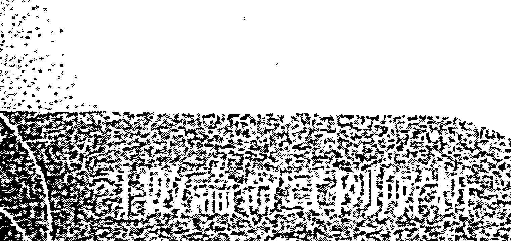

此例殺破狼並未見祿，因此爲標準的殺破狼格局，衝勁十足，喜愛冒險刺激，願意接受挑戰等，但同時三方亦會空劫星，山人常說，空劫爲土匪星曜，所以也表示了這個殺破狼局的優點被劣化，空劫會命，徒增勞碌，難有所成，以殺破狼激進冒險的個性而言，確實會成爲命主苦悶的根源。

而空劫會命者，大都屬於迷糊型的傻大姐，且想法常常不爲人所理解，又莫名的堅持，因此古曰：「空劫入命者，疏狂。」但此兩曜卻因充滿豐富的想像力，是故相當適合從事企劃、研發或專技人員等類型工作，恰巧能將此兩曜缺點轉化爲優點呢，是故煞曜入命並非全然不佳。

命宮天姚正坐，三方加會廉貪，亦爲桃花格局，只是多爲野桃花非屬正緣。此點從其夫妻宮同會地空、地劫的狀況可得反證，表男女關係之間多是有緣無分，聚少離多甚或是易有生離死別的狀況。而夫妻宮武曲正坐，古曰：「妻奪夫權。」又曰：「武曲加煞爲寡宿。」以命主殺破狼的命宮組合加上夫妻宮的星曜組成，我想，此生倘希望有段穩定的感情，只怕是相當困難。

所以山人在回覆時一直苦勸命主要改變自己的個性與習性，正所謂命由性生，倘能改善自己衝動、易怒、得理不饒人的個性，我想除了在命主最在乎的姻緣路之外，對於其未來的發展也有相當幫助，倘能如此，我想此命局仍有可爲之時。

至於財運部分，先從田宅宮（財庫）看起，太陰擎羊同度，古曰：「人離財散。」又逢天空正坐，聚財不易，雖得昌曲來拱，但財庫破耗嚴重，所以錢財大概都是怎麼來就怎麼去，此點亦可從財帛宮會地空且呈現殺破狼的組合可得反證。至於最大破財處在哪裡呢？應該就在兄弟朋友身上，命主本命化祿落僕役宮，表示對朋友相當重義氣，常會有重義不惜財的行爲，但可惜僕役宮逢空劫夾制，表朋友難有知心，加會化忌與陀羅，我想應該是經常發生「真心換絕情」的狀況。加上身居福德又逢紫微，因此也是個很重視享受與生活品質，也就是很捨得對自己好的人，錢也大多耗費在此吧！所以命主要做好財務管理，因昌曲拱田宅，主得財容易，倘能謹慎保守，我想未來仍是可期待的。

# 【案例57】請老師幫我解命盤（現逢人生最低點）

## 提問時間
2008-12-15 23:17:11

小弟我現逢人生最低點，也曾去算過命，老師都說我的命不好，讓我對人生感到很沮喪，每晚都睡不好，短短時間就瘦了十多公斤，感到很煩。

工作方面：原本我在前任公司待了五年，因為和好友講好要去大陸發展才辭掉工作。之後去了大陸才發現不適合合夥投資生意，又回到台灣。自從回到台灣後（去年十月）找工作才感到很吃力，工作難找啊！陸陸續續在七月、十月都做了一個月的工作，因不適合又沒做了，我自己也很不想要這樣不穩定的！

金錢方面：回台灣之後我就將三分之二的積蓄投入股票，因為想要賺錢增加收入，沒有想到反而套牢更慘。

感情方面：和女友交往半年，我很愛她，但感覺她好像要離我遠去，因為她告訴我：她年紀也不小了，想要有穩定的未來，我沒有辦法給她經濟上的安全感，所以我感到很無奈。

我的資料：國曆63年7月22日下午1:30生。出生於臺北縣。

我想請問各位老師的是：

1. 工作何時才能夠穩定？何時才能找到適合的工作？
2. 我的女友和我會有結果嗎？會是我的正緣嗎？

她的資料：國曆67年3月13日早上8:00出生。出生於臺北市。

## 回覆內容
看來你確實是很低潮，今年尤其是，流年不甚佳，煞忌齊臨。好在流年僅主一年之運，眼看今年就要過去了，明年看來你會滿順利的，多忍耐吧！

如果可以的話，明年是結婚的好日子，倘雙方有意願就結婚吧！姻緣運很強，你這個女朋友看來也不錯呢，至少在你苦的時候不離棄你，明年開始轉好後，得對人家好一點。

明年己丑年，整體看來不錯，有外出或調動的機會，也會有助力出現，同時貴人與機遇都還不少呢，應該也會有至外地工作的機會，且明年應該會賺到錢。耐心點，人總沒有一直平順的吧，好好展望明年，你會很不錯的。

如果真的沒方向的話，建議你可以去考公務員，明年你的流年命宮正逢魁鉞入命，考上的機會不小，努力點會有金榜題名的機會的，可以走這方向。反正沒工作，剛好專心唸書，考上後，工作穩定了，也就可以結婚了，女朋友也不會沒有安全感了，對不對呢？況且考運正好，不去嘗試看看，真是很可惜呢！

你的本命盤看來並不適合經商，而且容易被騙，主因在你的個性有點散仙，常常會因判斷錯誤或誤信他人，導致破財。由於財庫不佳，甚至是好不容易存了點錢，卻又發生意外，如：家裡修繕、修車等意外支出，導致你再賺都感到不夠，因為總是存不下來，雖然自己很節省了，但莫明的意外支出總是很多，對不對？

大概這樣吧，忍耐點，今年要過去了。山人是不知道你找哪個老師幫你看，說你的命盤不佳。整體而言你的命格並不差，只要改掉你那散仙的個性，還有不要太相信人或太投機，導致破財，換言之，不要再輕易投資，因為你相當不適合。

你的人緣好口才佳，只是口舌糾紛多了點，適合以口為業的工作。個性開朗，喜歡照顧人，直來直往的個性，也常常會得罪人。不過這是個性坦率人的通病，不要介意。

其實危機也是轉機，但看你怎樣看待，此時命理可以作為未來方向的參酌。山人依你的命盤來分析，只能告訴你未來最好的方向，但要怎樣做是看自己的呢！千萬不要山人跟你說明年考試上榜機會大就不讀書，這樣還是沒用的。看來你後來幾年都沒有這樣的好機運了，加油！

## 命盤解析及內容說明
| 宫位 | 内容 | 备注 |
| --- | --- | --- |
| 天恩右孤天天天 傷光煞辰馬廚相 | 52-61 僕役 2 14 26 38 50 62 | 絕巳 |
| 地天龍天 劫姚池梁 | 62-71 遷移 3 15 27 39 51 63 | 胎庚 |
| 天月天天天七廉 使德喜官鉞殺貞 | 72-81 疾厄 4 16 28 40 52 64 | 養辛 |
| 火天年歲鳳天截 星巫解破闇虛空 | 82-91 財帛 5 17 29 41 53 65 | 長壬 |
| 地陰天天巨 空煞壽哭門 | 42-51 官祿 1 13 25 37 49 61 | 墓戊 |
| 太武破廉 砺曲軍貞 : : : 化化化化 忌科權祿 | 柱四盤排 時日月年 : : : : 辛甲辛甲 未子未寅 | 姓名: 年男 63 甲屬 寅虎 |
| 文天天學貪紫 昌月空羊狼微 | 92-101 子女 6 18 30 42 54 66 | 沐癸 |
| 力咸晦 士池氣 | 32-41 田宅 12 24 36 48 60 72 | 死丁 |
| 八天天祿太天 座刑才存陰機 | 102-111 夫妻 7 19 31 43 55 67 | 冠甲 |
| 博指歲 士背建 | 22-31 福德.身宮 11 23 35 47 59 71 | 病丙 |
| 官天病 伏煞符 | 12-21 父母 10 22 34 46 58 70 | 衰丁 |
| 伏災吊 兵煞客 | 2-11 命宮 9 21 33 45 57 69 | 帝丙 |
| 大劫天 耗煞德 | 112-121 兄弟 8 20 32 44 56 68 | 臨乙 |

本命盤太陽正坐，通常太陽坐命的男生，個性開朗，有正義感，個性較為急躁，經常因為過於直來直往而得罪人不自知，但做事積極主動，其實整體而言，由於太陽除為中天星曜外，更為男性表徵，男命得之，相當適宜。倘結構佳者，其成就更是不可限量呢！

此盤由於太陽居子位，為落陷宮位且本命化忌，加上三方會照地空、地劫，為「浪裡行舟」的格局，空劫入命，除為人較為迷糊散仙外，也暗示了命主此生難逃勞碌奔波無所成的味道，故此局又稱為勞碌命。而此兩曜係自三方會照，表示外在環境對命主相當不利，但因太陽坐命者，通常事業心強，由命盤構造看來，並非命主不努力，而是外在環境強於本命所致，也因此倍感失落吧！且一顆坐落於官祿，一顆坐落於遷移，這兩個對男人最重要的宮位，我想這應該是其他命理老師會說命局不好的主因。

而本命宮三方巨門火星會照，當流年擎羊出現於值年命宮三方位置時，就構成巨火羊的惡局，此局山人稱為「禍必自招」，意思就是因為自己的問題導致嚴重的錯誤結果。

三方會照巨門，巨門為暗曜，子位太陽又照度不足，暗上加暗，且空劫雙曜除讓人奔波勞碌外，同時也會讓人容易胡思亂想，綜合此兩因素，我想命主遇到困境會失眠加上暴瘦，是有他的原因的。但太陽巨門結構本質尚稱不錯，所以命主仍然適宜從事以口為業的工作，如業務員、講師等。

而其盤中天馬會陀羅，為標準折足馬格局，是故此局人不宜創業，也因空劫入命，故不宜從事投資或投機的事業，必然遭逢重大挫敗。再觀其財帛宮，雖逢本命祿，但三方會照雙空，主與財無緣，空歡喜一場罷了，此點從命主自述經歷可反證此結果。但其田宅宮逢科祿權三奇佳會又逢文昌文曲來拱，主得財容易，相信命主家境應該也還不錯才是。故若命主能夠專心在職場上發展，不輕言創業或從事投資及投機事業，我想以其田宅宮穩健的狀況，雖無大富之有，但小富卻是沒問題的。以命主尚未滿 40 歲，還算年輕，人生還有很長的路要走，倘能聽進山人所勸，穩紮穩打，謹守本分不踰矩，我想亡羊補牢，還是猶時未晚的。這也是命理最可貴之處，就是能依據本命缺陷，指導命主趨吉避凶，改變人生。

而命主問命當年為戊子年，流年命宮居子，與其本命宮坐落宮位相同，星曜組合相當差，又上節曾提過命主本命宮逢巨門火星會照，而戊子年適逢流羊於流年遷移宮，整體三方四正構成巨火羊惡局，所以當年的不如意，必是由於自身的因素所造成的，此部分可從命主自述內容得到反證。不過流年畢竟只主一年之運，發生的事就已經發生，逝者如斯，重點是要把握好未來才是，所以我們就來看看民國 98 年己丑年的命盤吧！

| 天恩右弼天馬天相<br>◎△ | 地天龍天劫姚池梁<br>◎ | 天月天喜天官天鉞七殺<br>◎△ | 火天年歲鳳天截星巫解破開虛空<br>X |
|--------------------------|--------------------------|------------------------------|------------------------------------|
| 官祿 52-51<br>小亡貴耗神索 102年 40歲 | 僕役 62-71<br>路官祿 103年 41歲 | 遷移 72-81<br>奏章小耗 104年 42歲 | 疾厄 82-91<br>飛廉大耗 105年 43歲 |
| 田宅 42-51<br>青龍煞門 101年 39歲 | 福德、身宮 32-41<br>力士晦氣 100年 38歲 | 父母 22-31<br>博士背遠 99年 37歲 | 子女 92-101<br>喜神神德 106年 44歲 |
| 財帛 92-101<br>昌虎星 沐癸浴酉 | 夫妻 102-111<br>病符白虎 107年 45歲 | 兄弟 2-11<br>伏兵煞客 109年 47歲 | 命宮 12-21<br>官符病符 98年 36歲 |
| 官祿 52-51<br>年年年年官指<br>52-51<br>小亡貴耗神索 102年 40歲 | 僕役 62-71<br>年小威祿耗池 103年 41歲 | 遷移 72-81<br>年年年大月空虛羊耗煞 104年 42歲 | 疾厄 82-91<br>年年龍亡喜鉞德神 105年 43歲 |

### 大限流年盤
正所謂柳暗花明又一村，人生不可能永遠逆風，也不可能永遠順風。在命主身上得到證明，民國98年流年命宮逢天府正坐，三方會照天魁、天鉞及左輔、右弼，四吉星匯聚，雖坐陀羅煞星，但此曜入墓不凶，故98年當年可會是相當順利的一年。天魁、天鉞表機遇及貴人，屬天助型吉曜，而左輔、右弼表助力，為人助型吉曜，是故98年在事業發展上，應會有相當成就才是。

又此年逢紅鸞、天喜會照流年命宮，且夫妻宮武曲化祿，看來有結婚的跡象，所以建議命主是個很適合結婚的時機呢！加上流年看來會有一番新氣象，故要求婚，此時最為適宜。而魁鉞入命，基本上亦可表示考運頗佳，是故山人建議倘命主一時之間找不到方向，也賦閒在家，不如趁流年魁鉞會命時，專心衝刺國家考試，當個公務員，也是很不錯的選擇呢！

# 【案例 58】請老師指點感情與事業問題

## 提問時間
小弟在奇摩知識家與 blog 看見你，抱著感恩的心想請你指點迷津。

生辰年為：國曆 72 年 2 月 8 日子時，今年才剛於軍中退伍（已退伍 3 個多月），當兵前邊唸書邊從事導遊工作，現今退伍回到旅行業，適逢過渡期想轉換跑道，並猶豫是否該轉換工作地點，加上年紀近三十而立的關係，對事業與婚姻（單身許久）皆有很多的迷惑！特請山人能撥空解迷論命，小弟再三感謝！定會多行善並持感恩之心！

## 回覆內容
如果就你的本命盤來說，本命坐廉貪會貪狼，且落於丑宮，從事娛樂業頗為合適。旅遊業導遊也可算是娛樂業，所以我想你從事這工作應該還滿有樂趣才是呢！而且你的異性緣應該也不錯，從事這行業應該不錯，如真要轉行，建議你多多考慮。

至於婚姻關係，由於你的本命夫妻宮星宿好，雖逢鸞喜對拱，但也會空劫與孤寡，且對宮本命忌直沖。所以你應該是異性緣很不錯，認識的女生也不少，但是都很難有結果，喜歡的對象不是有男朋友，就是感情一直出現停滯不前或是單戀的情況，感情路應該頗為波折才是。

以你的本命盤來看，比較適宜晚婚，早婚對你並不是好事，所以別想太多。男生專心衝事業才比較對，有錢了，還怕沒有女人嗎？

這個大限命宮及福德宮逢地空、地劫來拱，因此會常常感到勞累疲倦，奔波來去，卻不太會有收穫，也難怪你會有想轉業的想法。建議你就當成磨練，這樣下個大限轉好時，會有你上場的機會的。

## 命盤解析及內容說明
| 流亡龍 43-52 病乙 | 喜將白 53-62 死丙 | 病擎天 63-72 丁未 | 大歲吊 73-82 戊申 |
| 2 14 26 38 50 62 | 3 15 27 39 51 63 | 4 16 28 40 52 64 | 5 17 29 41 53 65 |
| 文天三陰歲天 | [星僑] 星 僑 易 學 [星僑] | 天貧紫 |
| 曲實台煞破虛同 | 武左紫天 子身命命 年男 名 | 府狼微 |
| 奏月大 33-42 衰甲 | 化化化化 年主主局9321： | 伏息病 |
| 書煞耗 田宅 辰 | 忌科權祿 斗：/：年年壬屬 | 兵神符 83-92 胎己 |
| 鈴左月截天 | 昌門三212～ 戌狗 | 6 18 30 42 54 66 |
| 星輔德空魁 | 丑 局月月大 | 文恩八天陀巨 |
| 將咸小 23-32 帝癸 | ～826海 | 昌光座宮羅門 |
| 軍池耗 福德 旺卯 | 桑日回水 | 宮華歲 93-102 養庚 |
| 12 24 36 48 60 72 | 拓○子～ | 伏蓋建 子女 戌 |
| 封天龍 | 木點時） | 7 19 31 43 55 67 |
| 詰月池 | 星僑電腦軟體 版權所有·翻拷必究 | 天年蚤風肇天地地天右天天孤天天天祿天 |
| | 作者：陳思國 程式設計：陳明達·陳慶鴻 | 姚解廉開羊梁空劫巫茹壽才辰喜空馬存相 |
| 小指官 13-22 臨壬 | 地址：桃園縣龜山鄉復興二路6號(林口長庚附近) | 103-112 長辛 |
| 耗背符 父母 官寅 | 電話：(03)328-8833 傳真：(03)328-6557 | 夫妻 生亥 |
| 11 23 35 47 59 71 | 網址：http://www.nocc.com.tw | 8 20 32 44 56 68 |

星僑電腦軟體 版權所有·翻拷必究

作者：陳思國 程式設計：陳明達·陳慶鴻

地址：桃園縣龜山鄉復興二路6號(林口長庚附近)

電話：(03)328-8833

傳真：(03)328-6557

網址：http://www.nocc.com.tw

### 本命盤
本命宮廉貞正坐加會貪狼又落丑宮，加上紅鑾入命，從事娛樂業或是公關交際類工作相當適宜，因此從事導遊工作，相當適性。正所謂，男怕入錯行，我想在導遊工作上，命主應該是相當得心應手才是。

三方火贪成局，因此命主除偏财运强之外，也表示了其冲劲十足的本质，故倘命主于运限恰当时，应会有相当成就。尤其此局利于武职显贵，对于在外打拼的命主而言，更是如虎添翼呀！因此山人建议命主继续留在原工作上，会有一番成就的。倘要转换跑道，仍是以娱乐休闲产业为最佳，当然，公关行业亦是不错的选项。

至于感情部分，本命宫三方加会红鸾，基本上表示此人异性缘甚佳，照理说伴侣应该不缺才是。问题在于对宫寡宿正冲，夫妻宫逢地空、地劫正坐加会本命禄，形成倒禄格局，此局出现于夫妻宫，经常会有遇人不淑的感慨，在感情路上会是相当的挫折，以男生而言，大都是只有帮人家养老婆的份。加上又会照孤辰寡宿这两颗星曜，且对宫本命忌冲，纵使成婚或有稳定对象，也难逃生离死别、聚少离多或貌合神离的状况。我想命主应该经常碰到喜欢的人不喜欢她，而不喜欢的人，却黏着不放的情况。但因夫妻宫天相正坐，表示配偶应该都是身边熟识的人，例如同学、邻居等，因此建议命主要好好把握珍惜身边现有的女生，与其辛苦去追求那湖中月影，倒不如把握住身边的花朵。倘真能如此，我想命主的情路应该会感到顺多了，毕竟被爱比爱人还幸福呀！

至于命主提到事业问题，那我们就转进这个10年大限，看看该怎么给他建议吧！

### 本命大限盘

| 宫位 | 星曜与信息 |
|------|------------|
| 福德 | 红鸾天喜破军曲 飞亡龙 43-52 官禄 |
| 田宅 | 天台解天太阳 病乙喜将白 53-62 仆役 |
| 官禄 | 天刑 死丙病攀天 63-72 迁移 |
| 仆役 | 天哭天虚 墓丁大岁吊 73-82 疾厄 |
| 父母 | 文天三阴岁天天曲宾台煞破虚同 33-42 田宅 |
| 命宫身宫 | 铃左月戏天空德魁 23-32 福德 |
| 兄弟 | 封天龙诰月池 13-22 父母 |
| 夫妻 | 勾火破七廉空星碎杀贞 3-12 命宫身宫 |
| 子女 | 力灾夷士煞门 113-122 兄弟 |
| 财帛 | 天年蚤凤擎天姚解廉阁羊梁 103-112 夫妻 |
| 疾厄 | 文昌恩光八天陀巨座官罗门 |
| 迁移 | 天贪紫厨狼微 尖Q起缠 |

此大限命宫逢地空、地劫会照，本有劳而无获之味道，加上财宫空劫正坐与天马共度，田宅宫会照羊陀双煞，库位亦破，官禄宫亦同，是故此大限无论在事业或是财务上都会呈现相当辛苦的状况。且大限破军禄与本命禄虽于财宫，但被空劫搞成「倒禄」格局，加上鸾喜对拱，只怕此大限难逃因桃花而破大财的状况，但盼命主慎之呀！

# 【案例59】请大师解惑：家庭、事业蜡烛两头烧

## | 提问时间 |

小弟在知识家上有看过大师为网友回复的文章，不瞒大师，小弟最近因工作及家人健康上的问题烦心，是标准的夹心族，家庭事业两头烧，真是身心俱疲。小弟觉得事业运不是很顺，忙东忙西，但赚不到什么钱，又要三天两头往医院跑（父母、小孩），加上年纪也不小了，对于未来有很大的不确定感，所以附上小弟的生辰八字，烦请大师抽空帮小弟解惑。

国历64年3月11日早上2点40分出生，感激不尽！

## | 回复内容 |

投胎人世间，本来就很苦。以佛家来说，会成为一家人只有四种因缘：欠债、还债、报恩、报仇。所以辛苦点也就当作是来还债的，心情也会好多了呢！

你的本命坐武曲贪狼，且落于四墓地中，为晚成格局，古曰：「武贪不发少年人。」便是此意。想想，早发对你的命局而言并不是件好事，因通常都没有太好的结果。因此你年轻时候比较辛苦，并不是件坏事，所以别想太多。

你的命宫三方无煞，表示一路走来虽然辛苦，但没有太大的挫折与不顺，最多就是感到失落。命不会煞虽然很好，但相对而言，个性也不具冲劲（杀气），无法成就太大的事业。

你本命宫逢日月夹又会昌曲，为文星拱命及日月夹命局。想来你应该也是满有才华的人，家境也还不错才是，整体个性比较偏向文人方面。

就本命盘看来，你应该不会有太大的挫折与不顺利，只是这个十年大限（36～45），大限命宫逢双煞侵袭，福德宫又逢空劫拱，所幸有辅弼两大助星对拱，因此纵是有不顺利或挫折，最后总是会闯关难过，闯关过。

至于事业部分，因逢禄马交驰且会禄权，因此环境会迫使你不停奔波赚钱，但可惜大限官禄宫坐陀罗，陀罗主迟滞，打转，因此禄马交驰会陀罗，便构成了折足马的格局，表现在现实上，就是忙得要死，烦得要死，却赚不到什么钱，运气差一点，还会赔钱作收呢！不过到下个大限就会开始转进大运了，此时定然会有相当的成就才是，正所谓柳暗花明又一村，不是吗？

因此在目前这个10年大限，建议你不要轻易尝试去做需长期经营的生意或创业，因为最终赚到的只有经验。如非得要做生意，建议你可以跑跑短线，打打游击。趁流年运势转好时来做，运势转差时马上收，这样也许还有获利守成的机会。

但因你本命太过平稳顺利，加上上个10年大限还算平顺，因此遇到这个不是很吉祥的大限，会感到无力与挫折感，这是难免的，所以不要想太多。学着锻炼自己吧，一切的劳累就当作磨练与还债。等到这个大限走完，状况会好多的，毕竟人生总不会一直顺风，对不对。

## | 提问者意见 |

谢谢山人在忙碌之余拨空回答我的问题，山人的回答让我明白自己面对到的处境，再麻烦山人了，万分感谢。

## 命盘解析及内容说明

| 宫位信息 | 星曜与宫位细节 |
|----------|----------------|
| 顶部行 | 文天破紫孤七紫<br>曲巫碎廉辰杀微<br>◎ △○ 科；天八天天截天<br>伤座寿害空厨；台年凤龙<br>辅解闇池；天天三解月天天天<br>便贵台神德马福鉂 |
| 年龄段行 | 伏兵 86-95 绝辛 大息费 76-85 墓壬 病符官 66-75 死癸 喜劫小 56-65 癤甲；<br>官攀 96-105 胎庚 飞煞大 46-55 衰乙；博将岁 106-115 养己 奏天龙 36-45 帝丙；<br>力亡病 116-125 长戊 青月吊 6-15 沐己 小咸天 16-25 冠戊 将指白 26-35 临丁 |
| 其他信息 | 包含化科、化权、化禄等符号，以及宫位如命宫、兄弟宫、夫妻宫等，具体细节见图片。 |

### 本命盘

命坐武贪又落四墓地（辰戌丑未），为标准晚发格局。此局人通病就是大鸡晚啼，纵使结构再好，也难逃年轻时的挫折与劳碌。其实年少得志大不幸，因年轻气盛，加上成功来的快，因此过于自信与狂妄，最后都难以守成，落得一无所有的下场。所以命主晚发局，并非坏事。

综观其命宫三合，不见煞忌，且逢文昌、文曲拱照，为文星拱命格局；又本命宫逢日月来夹，古曰：「夹日夹月谁能遇，夹昌夹曲主贵兮。」故此命格局相当大，想来命主出身环境定然不差。只是命好还要运限配合，正所谓：命好运好限好，终身富贵。但别忘了，武贪落四墓地为晚发格局，以命主格局而言，定然会有相当成就，只是不会在年轻之时，晚发格局通常在行约45岁之后。

山人常说，大限行进方式最忌讳波折过大，举例来说，倘上一个大限无论事业感情都相当顺利，当大运转进下一个大限时，人生崎岖波折，东做西成，诸事不顺。对于命主而言，会是相当的折磨。此例正好印证这个观点，尤其大限星宿组合看来，此盘之起伏颇大，可谓大好大坏各一轮，也难怪命主会如此的感慨与失落。

以其大限星宿观之，本命宫（6～15）相当漂亮，命主定然家境相当优渥，而第二大限（16～25），天机、天梁会擎羊的格局会照大限命宫，又逢太阴擎羊人离财散格局会照，是故此大限定定有相当的苦头吃。当大运转进到26～35这个大限，双主星会命，又逢府禄相三合入命，虽铃星正坐，但影响不大，是故应该是个很好的大限，但因地空、地劫夹拱命宫，是故温饱无虞，但在事业发展上，难有相当成就，正好印证武贪不发少年人的论点，但整体看来一切尚称顺利。

但走到36～45这个大限，也就是命主问命时的大限命宫，逢地空正坐，三方会照擎羊、陀罗双煞，又对宫天机、天梁、擎羊这个刑克格局直冲，因此其家人健康状况比较容易出现问题，所幸左辅、右弼拱照，可免其刑克。此意并非可免除，而是病痛折磨免不了的，但因此两曜拱照下，得以顺利过关，正所谓关关难过，关关过（因此山人一直提醒各位同学在论盘时，千万不能使用消去法，认为大限遇吉星，就可以抵消，这是不可能的。吉星充其量是让事情能够顺利度过，但该受的折腾还是躲不过）。所以命主自述的现况，其实是可以预见的。

再观其46～55这个大限，大限命宫三方不会煞忌，又逢昌曲来拱，财官双美，搭配命主本身具备的大格局，想来此大限定有相当的成就才是。而此时已步入中老年了，岂不再度验证武贪不发少年人这句古谚了吗？

综上所述，命主大运行进起伏过大，一好一坏，而且接连四个大限，真是够折磨人的。倘运限搭配一直不好，一般人还会认命的接受，最怕就是这种大好大坏的运程呀！

也因如此，故山人在回复命主时，除劝其要接受命运的淬炼考验外，同时也预告了下一个大限，整体运势会非常强劲，会有一番全新气象，让命主能更坦然的接受目前的困境，进而把握即将来到的大运，这就是命理学说最迷人的地方，不是吗？

# 【案例 60】我的命中真的就缺钱吗？

## | 提问时间 | 2011-02-12 15：27：16

因为心情很沮丧，在网路上逛逛，想知道自己的运气怎么会这么差。好心的帮助别人，结果却被倒债2百多万。新年才刚开始，就遇到这样的事。看到山人的文章，知道山人对紫微斗数很有研究。想要请教山人，眼前的难关要怎么过去？我的命中真的就缺钱吗？好不容易和先生工作开始稳定了，结果现在发生这样的事，让我好沮丧。可以请山人帮我看看吗？万分感谢！生日：1976/03/22（国历）中午12：30左右出生，目前是工作是会计，先生是在大陆工作。

其实你的本质是属于很贤慧型的女生，正所谓「府相之星女命缠，定当子贵与孙贤」。你本身天府星坐命，应该属于清秀型的女生，天府星基本上擅于守成，不善于开发，而且你应该有坚持固执己见的毛病才是。

就星盘看来，你的财帛情况非常不佳，空劫齐临本命忌冲，因此聚财不易，而且财库逢煞汇聚，就是说当你身上有钱的时候，总是会有突发状况发生，钱也存不起来。

又天同化禄坐仆役宫，正所谓：禄落仆役，纵有官也奔驰，意即你是个很讲义气的人，尤其对朋友，所以朋友应该是你最大破财之处，正所谓肥水不落外人田，化禄星代表的是财富，财富落在朋友宫，加上你的财得来不易，所以对朋友要小气点，肥水还是落在自己家比较好呢！

至于做网拍或生意，基本上万万不可，因为你的命盘呈现半空马格局，聚财不易但败家很容易，加上空劫会命，做生意很容易被骗或是投资失利，尤其在目前的状况，更是不宜。

不过你帮人家采购，基本上属于工作而非创业，所以可以朝这方向进行，也稳定多了。至少帮忙采购不需要负担成本与风险，以你会计的观点，帮人打工应该都是净利，只需付出劳力成本罢了，何乐而不为。

总之记得，不要对朋友太讲义气，肥水要落自己家；切忌创业或投资、跟会等理财行为。你的财多属正财，投机绝对不宜。

其实只要注意这些，以你的能力，我想一段时间后就有机会损益两平，但切记，不要再再来一次，因空劫会命的人，常会忘了教训，一犯再犯。

山人帮你看了今年的流年，贵人运很强，机遇也好，流年命宫呈现非常好的状况，在工作上也会有进展，甚至掌权。只是财帛宫又逢地空、地劫两煞，容易有财到手成空的现象，因此今年好好珍惜机会，努力做，不要投机，把握好今年的机会，我想年底结算时你应该会有所进展，加油！

## | 提问者意见 |

谢谢山人再帮小女子解答，万分感谢。希望我能早日脱离困境，有能力希望可以为山人和所有需要被帮助的人出一点力，感恩。

## | 命盘解析及内容说明 |

本命盘

山人在看到命主自述内容，心里便在猜想，此人命必逢空劫，因空劫入命者，一生至少会被骗一次。其因为何？因此局人经常都是聪明一世，糊涂一时。且空劫两煞曜影响的是自己的判断力，所以误判状况，对空劫会命者，是很正常的，因此山人暱称此二曜为「土匪星」。另其必有化禄或禄存正坐或会照命宫，因只有禄落仆役者，才会有重义不惜财的状况（所以倘要借钱或是找「人呆」，只要找这种格局的人，包准没错）。当星盘一排出，果然与山人推测相同。

可惜命主没有早点遇到山人，且听进劝告，谨慎行事，自然此严重损失不会发生。但山人常说因果关系的存续问题，所以这也许是命主上辈子欠朋友的因果债，还了也好呀！

而命主命身同宫，基本上表示是一个固执，坚持己见的人，但后果不管好坏，都会自行承担。我想这也是她目前难过的原因吧！其实此个性之人，加上空劫会照，推测应该是相当固执，完全听不进他人劝告，也很难沟通之人才是。因空劫带来的疏狂本质，加上自己莫名无谓的坚持，自然造就这种个性，也因此遭朋友诈骗的结果，其实真的不令人意外。

至于命主是否适合创业，我想以此个性之人，创业要成功，只怕是会很辛苦。从星盘看来，禄存与天马同度，本是好事。但又与空劫同宫，此局称为半空马＋倒禄格局，故创业或做小生意是万万不宜。此局本为禄马交驰会命，最宜外地经商求财，但可惜被空劫给搞掉了，但因会照本命宫，是故经常会有创业的想法。

但以星盘结构看来，鍛羽而归的机率相当大呀！而此点可从其财帛宫及田宅宫星曜结构得到反证。倒禄格局落于财帛宫，得财不易，且经常是过路财神，钱财怎来就怎去。而田宅宫会擎羊、陀罗双煞，库位破耗严重，以此田财之星曜结构加上自己的个性，我想乖乖的待在职场上发展，是最好的选项。尤其命主目前从事会计工作，相当适宜。

站在命理研究者的立场，咱们就转进朋友倒债那年的流年盘看看到底是怎么回事吧！

该图表为一张紫微斗数命盘，包含十二宫位及星曜分布、流年大限等信息。

**命盘基本信息：**
- 姓名：(空)
- 生日：(空)
- 命主：(空)
- 身主：(空)
- 生肖：(空)
- 命宫：(空)
- 身宫：(空)
- 命局：(空)
- 五行局：(空)

**星曜排布 (年月日时)：**
- 年：丙辰 (火六局)
- 月：戊戌
- 日：辛卯
- 时：戊子

**作者与联系方式：**
- 作者：陈思国
- 程式设计：陈明达、陈庭鸿
- 地址：桃园县龟山乡复兴二路6号 (林口长庚附近)
- 电话：(03)328-8833
- 传真：(03)328-5557
- 网址：http://www.hoc.com.tw
- 编号：000000107

**十二宫位与流年大限示例 (部分)：**
- 官禄宫 (46-55岁)：流年102年 (38岁)
- 仆役宫 (36-45岁)：流年103年 (39岁)
- 迁移宫 (26-35岁)：流年104年 (40岁)
- 疾厄宫 (16-25岁)：流年105年 (41岁)
- 田宅宫 (56-65岁)：流年101年 (37岁)
- 财帛宫 (6-15岁)：流年106年 (42岁)
- 福德宫 (66-75岁)：流年100年 (36岁)
- 子女宫 (116-125岁)：流年107年 (43岁)
- 父母宫 (76-85岁)：流年99年 (35岁)
- 命宫/身宫 (86-95岁)：流年98年 (34岁)
- 兄弟宫 (96-105岁)：流年109年 (45岁)
- 夫妻宫 (106-115岁)：流年108年 (44岁)

**(表格中还包含大量主星、辅星、四化、神煞等具体分布，因结构复杂，此处仅列出框架性信息。)**

### 大限流年盘

看了这么多案例，相信大家已经看出来了吧，禄马交驰会流年命宫，又逢地空、地劫会照，虽不逢化忌引动，但因禄落流年仆役且会照双忌，又引动太阴擎羊这人离财散的格局，可以肯定的说，这位朋友借完钱后，铁定消失的无影无踪。以此结构看来，被朋友倒债，并不意外。所有的格局被化禄或化忌引动，会使格局往好坏方向发展，其表现状况是被外在环境逼得不得不为，但无引动表示决定在自己。

以整体命盘看来，命主其实钱并不缺，问题出在自己身上呀。倘能不要那么心软讲义气，也不胡乱投资，又怎会有缺钱之时呢？此盘只适宜稳定保守，所以也劝诫命主，其实只要知道自己的缺点，开始改善，时犹未晚，过去的就过去了，只要不再重蹈覆辙，自会有一个好结果的。

# 【案例61】前途茫茫，想创业不知道合适与否？

## ｜提问时间｜

了然山人大师你好！

在知识＋看见您帮人解盘，非常精确详细，很喜欢你的见解风格。小弟非常敬佩你！有在知识＋发问过，但是无缘得到你的福份与指点，所以小弟厚着脸皮，不请自来，特地请求了然山人大师能够帮忙小弟指点迷津！

小弟出生于，甲寅年润四月初三日卯时呈祥，初中毕业，至今仍然一事无成，内心万般懊悔，目前面临失业危机！买大乐透又频频损龟，无颜回乡见江东父老。

前途茫茫！都年过三十有五了，不想再蹉跎光阴了，想全力一搏，自己创业，也不知道该做哪一类比较好，不知哪一途得宜本命？

恳请了然山人大师帮忙小弟解惑命盘并指点明灯。

功德无量！阖家平安！

## | 回复内容 |

甲寅年，是民国63年吧，那就先用63年男性帮你看看，至于大礼，只要做三件善事就算是给我的大礼了。

命造农历63年闰4月3日卯时建生，但是因为63年有实施日光节约时间，应该要往前调1小时，所以可能要知道你的卯时的确实时间是几点，卯时是指上午5～7时，所以还是要知道你如果是5时或是7时出生的，如果是5时，那时辰往前调1小时的话，就变成寅时了。不过还是先用卯时帮你看看，如果是上午5时出生的话，那结果就会完全不一样了。

如果以卯时这个盘来看的话，你的本命宫无正曜，借对宫太阳巨门来论，基本上命无正曜的人，比较容易随波逐流，也比较容易飘浪。加上你的命身宫都被空劫给拱掉了，所以人生的路走来会比一般人来得波折起伏，也满辛苦的，加油！

而且看来你没有偏财运，加上本命宫逢空劫来拱，又禄存坐命，形成所谓的「倒禄」格局，建议你千万不要去尝试买乐透或赌博，因为此格局真的很破财。

有的人有偏财运，但有的人没有，而且这个格局看来，连正财都会很辛苦，因为你很难留住财，经常都是左手来右手去。

所以山人良心的建议你不宜创业，在职场上发展会比较好。而且没错的话，明年流年命宫十分不好，恐将会有大破财的情况。

如果目前暂时找不到工作的话，建议你可以去职训局学习专业技能，政府还有补助呢，以你的能力，倘能在专业技能方面发展会有很好的结果。而且今年你的流年命宫见昌曲魁钺等文星拱照，考运不错，可以去考一些专门的证照，难得今年流年利于考试，要好好把握。

没错的话，你的感情路上应该也是一直遇不对人吧，满挫折的。又禄存为财货之意，禄存坐命，表示你对于钱财相当重视，可以说是小气财神，但可惜禄存必遭羊陀双煞夹制，加上命无正曜借对宫太阳巨门来论，而甲年刚好又是太阳化忌，所以除了被空劫拱之外，更形成「羊陀夹忌」之局。特别提醒你，明年流年正值你本命宫，所以会非常辛苦。

不过你的优点也还不少，你的人缘好、口才佳，反应应该也满机伶的，满适合从事业务方面的工作，或是其他以口为业的工作。

而且你的想像力应该也满丰富的，适合从事专门技能、研发、规划、文学创作等，可以让你想像力充分发挥的地方。但有时候太过于新潮，反被人家感到激进或难以了解，我想这点应该会让你满困扰的。

你常会感到身边小人多，口角是非也多，因为有时候你的言语过于直接，常常会在无意间得罪人，同时也因此造成自己无谓的困扰，这点你确实要好好改进，对你的未来会比较好。

## 提問者意見

感謝大師提點。

## 命盤解析及內容說明

| 宮位 | 星曜 | 數字 | 宮位 | 星曜 | 數字 | 宮位 | 星曜 | 數字 | 宮位 | 星曜 | 數字 |
| :--- | :--- | :--- | :--- | :--- | :--- | :--- | :--- | :--- | :--- | :--- | :--- |
| 命宮 | 博指歲土背建<br>命宮 6-15 | 11 23 35 47 59 71 | 兄弟 | 管天病伏煞符<br>兄弟 16-25 | 12 24 36 48 60 72 | 夫妻 | 伏災吊兵煞客<br>夫妻 106-115 | 9 21 33 45 57 69 | 子女 | 大劫天耗煞德<br>子女 96-105 | 8 20 32 44 56 68 |
| 田宅 | 小亡黃耗神索<br>田宅 36-45 | 2 14 26 38 50 62 | 官祿 | 46-55 官祿 | 3 15 27 39 51 63 | 僕役 | 56-65 僕役 | 4 16 28 40 52 64 | 遷移(身宮) | 66-75 遷移 身宮 | 5 17 29 41 53 65 |
| 福德 | 青月喪龍煞門<br>福德 26-35 | 1 13 25 37 49 61 | 父母 | 力威晦土池氣<br>父母 16-25 | 12 24 36 48 60 72 | 疾厄 | 喜息龍神神德<br>疾厄 76-85 | 6 18 30 42 54 66 | 財帛 | 病華白伏蓋虎<br>財帛 86-95 | 7 19 31 43 55 67 |
| | | | | | | | | | | | |
| 星曜 | 封八孤天天<br>詰座辰廚府△ | | 星曜 | 鈴龍太天<br>星池陰同@ XX | | 星曜 | 天文文右左月天天天貪武<br>傷曲昌苑輔德喜官錢狼曲O△ @@ | | 星曜 | 地天惡陰年歲鳳天截互<br>空貪光煞解破關虛空門陽O△ | |
| 封八孤天天<br>詰座辰廚府△ | | 鈴龍太天<br>星池陰同@ XX | | 天文文右左月天天天貪武<br>傷曲昌苑輔德喜官錢狼曲O△ @@ | | 地天惡陰年歲鳳天截互<br>空貪光煞解破關虛空門陽O△ | |
| [星曆] | 太武破廉陽曲軍貞<br>化化化化忌科權祿 | | 姓名：XXX<br>年男 甲屬<br>虎寅～<br>大水～<br>卯時 | | 電話：(03)328-8833<br>傳真：(03)328-6557<br>網址：http://www.ncc.com.tw | | 天刑 | |

### 本命盤

此盤祿存與地劫坐命，加會地空，形成山人常說的「倒祿」格局，加上本宮無正曜可平衡，故此局人，一生都會過得相當辛苦勞碌且難有所成。原因很簡單，祿存表示財貨，而地空地劫是盜匪星曜，財遇盜匪，自然轉手成空。而命無正曜，好像家裡沒大人一般，自然容易受到外在環境影響而隨波逐流，所以其偏財運不佳，也是意料中呀。

而地劫坐命加會地空，其人通常自我意識相當高，勇於創新及敢與眾不同，想像力豐富，但相對而言，讓人難以理解，也經常因爲這種個性，而導致人生的挫敗，這也就是古人評價地劫坐命者疏狂。但山人常說，煞星雖然帶來不好的影響，但倘能將此缺點轉化成優點，倒也是件好事。以地空、地劫爲例，此兩曜星性雖然不佳，但其豐富的想像力與勇於創新的想法，卻是其他正曜所沒有的優點。而什麼行業需要這種特質，例如：文創業、發明家、專門技術人員、研發等。倘能將此缺點轉化成優點，加上勤加修心，例如學習打坐、氣功、參禪等，讓此兩曜對自身的影響降到最低，自然會有很大的改變。

回到正題吧，命無正曜，借對宮太陽巨門論之，巨門爲暗曜，此暗並非黯淡無光，而是過度明亮，掩蓋住其他星曜的光芒。所以這顆星曜最適宜見到太陽，因能平衡其本性，而巨門表示口舌，因此太陽巨門組合，相當適合以口爲業的工作，例如：業務員、講師、教授、律師等。

以此盤整體論之，較適宜在職場上發展，且應該朝向專業人員方面去走，所以建議命主參加職訓局提供之訓練課程，正所謂，一技在身，勝過家財萬貫。且以命主的創新與充滿想像力的特質，在此類行業發展，定能有相當成就。而命主問命當年爲民國98年（己丑年），隔年（庚寅年）流年走回本命宮，星曜組合相當差，加上庚年天同化忌會照流年命宮，初判應該也是相當辛苦的一年。而本命不宜創業，加上流年亦不利於己，此時驟然出征，只怕是徒留遺憾罷了。

# 【案例62】事業老是不順，請大師指點

| 提問時間 | 2009-07-23 12:32:04 |
| :--- | :--- |
| 本人（女）是農曆74年02月03日中午12點出生，想請問要往哪方向發展、該如何賺大錢。謝謝！ | |

## 回覆內容

如果就你的命盤看來的話，建議你還是在職場上發展會比較好，可以向專業技術或企劃規劃這方面來走。賺大錢的話，可能要先改改你的個性。沒錯的話，你是一個頗為固執，堅持己見的人，喜歡享受，也滿愛亂花錢的吧，而且你的本性帶點糊塗、散仙，這些缺點都要改進，才有機會能賺大錢呢！

雙祿在命宮交流，本來應該是屬於財來不愁的，可惜空劫同時入命，再加上對宮太陰化忌會照，造成祿忌交馳的情況。雖見輔弼來拱，但卻難避免損失的發生，尤其是不善於理財這一點，正所謂，只有你善於理財，財才會理你呀，不是嗎？

所以建議你，在個性上缺陷還沒辦法改善前，最好不要嘗試創業，因為創業雖然說有賺大錢的機會，但是也有賠大錢的可能，以你命宮星曜組合看來，可能是屬於後者的機率比較高。

不過你倒是想像力滿豐富的，雖然想法有時過於特立獨行，有點跳躍式思考，倒滿適合從事發明、研發或專業技能的工作。相信有很多你可以發揮的空間。如果能有創新的發明，就像發明「好神拖」的人一樣，也是賺大錢的方法，對不對呢？

至於今年不順的話，以流年看來，煞忌交馳又逢空劫來拱，不順是必然的，建議你今年一切以保守為宜。

## 命盤解析及內容說明

| 地劫 | 月德 | 八座 | 封誥 |
| :--- | :--- | :--- | :--- |
| 82-91 財帛 | 92-101 子女 | 102-111 夫妻 | 112-121 兄弟 |

### 本命盤

命主天同坐命，三方形成半套的機月同梁格局，由於天同是福星，故天同坐命的機月同梁，其人較喜歡享受，也比較懶散，而雙祿會命，主得財容易，更讓軟弱的天同缺乏衝刺動力，所幸火星同度給予刺激，是故仍有可為也。斗數諸曜均不喜會照煞曜，唯天同星例外，因此曜倘缺乏煞星刺激，只怕是個性軟弱的人罷了。

福星會照雙祿，又逢火星激發，本是相當良好的格局，但對宮本命太陰化忌，造成祿忌交馳局面，且三方又會照地空地劫，把此格局搞成「浪裡行舟」，盤中雙祿均被土匪給掠奪，怎能期待有富裕的一天呢？確實是相當可惜。

天馬會雙祿落於命宮，本是相當適宜創業的格局，但也因與空劫同度，是故命主必然不宜創業，但因此格局會照命宮，是故經常會有創業的想法與衝動。貿然行事，只怕會與本命盤顯現的狀況相同，就是慘賠收場，賺到的只有經驗與一肚子氣罷了。是故命主只宜在職場上發展，但受薪階級，基本上是不容易有發大財的一天，是故也建議命主，可運用其豐富的創新與想像力，從事研發或創作，加上努力修煉自己的心性，使空劫雙煞對自己的影響減小，我想仍有可為的。

# 【案例 63】想知道我的「命」如何？

提問時間 | 2009-07-13 17:28:49
---|---
我是女生，1980年12月13日寅時生（國曆）。 | 

是這樣的，談感情都還滿不順遂的，工作目前滿困苦，我都不小了，我想知道幾時才能穩定？還有我想知道我的真命天子是怎樣的人？我將來會不會為錢所苦？工作幾時才能算真的平順呢？

## 回覆內容

從你的基本命盤看來，七殺坐命，三方形成殺破狼格局，又命宮落於「天羅地網」的辰戌位，所以一路走來會比較辛苦與波折是難免的，不要想太多。

沒錯的話你是一個頗有威嚴的人，事業心重，處事果決但容易衝動行事，性急，但個性頗為獨立，敢衝、敢冒險、敢面對危難，對因難有勇氣克服，但脾氣應該也不是很好吧，經常會讓人感覺有點喜怒無常。

你的格局利於武職顯貴，如：軍、警或技術人員，對你而言，一成不變的工作不是很適合你。

加上女命坐七殺，確實是不甚妥當，因為男生通常都比較喜歡小女人型的，七殺為斗數裡的帥星，其本性過於陽剛與絕決，常會讓男生望之卻步，所以雙方相處多有爭執。

就你的夫妻宮看來確實也是如此，不過你對男朋友應該都不錯，也應該滿大方才是，但管的也很緊。多讓讓男生吧，體貼一點，我想你的感情路會走的順一點。

建議你可以去學學瑜珈或打坐等，讓自己的個性能平靜一點，這樣也比較不會因為衝動而誤事。

以你的命盤看來比較適合晚婚，你的對象應該是頗有才華，有責任感的好男人。但就像山人之前說的一樣，彼此常有爭執口角，還是老話一句，有時候多讓讓男生會比較好。因為男人都是很愛面子的，再怎樣不高興，回家裡關門打狗甚至跪主機板都可以，不要在外輕易表現出來。

談談你的財運吧，你的府祿相三合不錯，表示你是一個很會存錢與理財的人。貪狼正坐財宮，表示你對於金錢頗為重視也很積極，但可惜財庫有破，所以你總是感到挫折，經常是好不容易存了點錢，不是因為家庭就是因為意外而破財，總之，就是存不下來。

至於工作的話，我想今年應該走的很辛苦。己丑年的流年命宮正好是整個命盤裡星曜組合最差的宮位，所幸有貴人來幫忙，但是挫折還是難免，多忍忍吧！

明年看來在工作上會有變動，但應該還是波折的一年，這幾年整體看來不是很順利，可以趁此機會，好好的修正自己的個性。

## 命盤解析及內容說明

| 宮位/星曜 | 天太使陰 | 文八陰解天貪<br>曲座煞神才福狼 | 天寡紅截天陀天<br>刑宿蕊空鉞羅門 | 台文三祿天武<br>輔昌台存相曲 |
| :--- | :--- | :--- | :--- | :--- |
| **疾厄**<br>小劫天耗煞德<br>55-64 | 隔辛<br>官巳 | **財帛**<br>青災昂龍煞容<br>45-54 | 壬力天病士煞符<br>35-44<br>子女 | 沐癸<br>浴未 | **夫妻**<br>侮指歲土背蓮<br>25-34 |
| **遷移**<br>封火蜚天詰星廉府貞<br>65-74 | 帝庚<br>旺辰 | **【星傷】** | | **兄弟**<br>官崴晦伏池氣<br>15-24 |
| **僕役**<br>天傷<br>奏息龍書神德<br>75-84 | 衰己<br>卯 | | | **命宮**<br>伏月喪兵煞門<br>5-14 |
| **官祿(身宮)**<br>天左年歲鳳天天天破<br>巫輔解破關虛馬廚軍<br>飛歲大廉驛耗<br>85-94 | 病戊<br>寅 | **田宅**<br>旬地恩月天天<br>空劫光德喜魁<br>喜攀小神鞍耗<br>95-104 | 死己<br>丑 | **福德**<br>鈴右龍星茹池微<br>天孤天天費桃辰官樞<br>病將官伏星符<br>105-114 | 墓戊<br>子 | **父母**<br>大亡貫耗神索<br>115-124 |
| 電話： | | | | 編號：0000000111 |
| 地址： | | | | |

### 本命盤

女命坐七殺，確實相當不適宜，因過於孤剋與決絕，不論是在對待工作或感情上，都會有速戰速決的現象，且待人處世，經常過於無情。對女生而言，這也是不容易找到伴侶的原因，畢竟男生大都希望另一半屬於溫柔賢淑類型，「恰北北」的女生，我想大多數的男生大概都敬謝不敏，此點可從夫妻宮會照火鈴雙煞可得反證，通常夫妻宮見火鈴，會有閃電成婚的徵兆，又因為彼此瞭解不足，過於衝動與激情，因此雙方相處經常是口不言，但內心痛苦折磨。所以如何減緩七殺星帶來的影響，我想是命主此生無論在工作或感情上，都必須要先改善的課題。正所謂命由性生，倘不改變自己的個性上缺陷，又怎能奢望有穩定之時呢？

而七殺坐命，三方定然形成殺破狼格局，因七殺與破軍永遠在三方四正遙相對望，而殺破狼局的影響，我想不需山人再贅述。此局爲殺破狼加煞，衝擊性相當強，加上三方會照星曜相對穩定，故倘命主有志於衝刺事業，應該會有一番成就才是。此局相當適宜以武職顯貴，例如從事軍、警或專業技術人員。不過從命主自述及本命祿落夫妻宮的結構看來，應該是對感情比較執著吧！

至於財運部分，田宅宮逢空劫對拱，三方又照會擎羊、陀羅，加上本命宮化忌直沖，又太陰、擎羊，此人離財散格局成立，是故財庫破耗相當嚴重，錢財經常是怎來就怎去，聚散無常，以此財庫狀況，想要有富裕之時，我想會是相當困難的。其破耗最嚴重之處，推估應是在兄弟朋友之間，因本命化祿落僕役，表示此人對朋友相當講義氣，自然會有重義不惜財的狀況發生。但以其兄弟宮及僕役宮的星曜組合看來，朋友間難有知心，且多是酒肉朋友，雖說朋友有通財之義，但對於這些損友而言，只怕是肉包子打狗，拿錢讓人家花罷了。其實命主財宮組合頗爲穩定，加上府祿相三合，表示對於財務管理很有一套。故只要不要對朋友太過於慷慨及過度講義氣，因此而莫名背上債務，我想未來仍可期待。

還是老話一句，這些缺點我想命主應該自己都很清楚，但狀況來時，就是無法避免，所以倘希望在感情及財務甚至於工作上有穩定之時，改變自己的個性，才是釜底抽薪的良策呀！

# 【案例 64】請達人為小女子解命

｜提問時間｜2009-07-27 18:07:42

女:60/12/25 辰時生（過立春/鼠），97年因先生婚外情而離異。因安全考量，故一個人在外租賃有管理員的房子，租金不低，想請問何時有機會買屋（今年破財破得厲害……）？未來的感情、婚姻路？

## ｜回覆內容｜

因婚外情而離異，唉，男人就是這樣，有了新歡就忘了舊愛，有小孩嗎？要堅強一點呢！

命造農曆60年12月25日辰時瑞生，如果從你的本命宮看來，確實破財會滿嚴重的。我想一直以來都是如此吧，本命祿存正坐，但逢地劫沖入，所以破財難免，同時最好也避免投資，否則恐怕是肉包子打狗，有去無回。

而你的本命宮坐武曲七殺，三方四正形成殺破狼格局，所以一路走來多顛簸且多起落，難有享清福之時，這也是殺破狼格局的無奈之處。

況且女命坐武曲本來就不宜，再加上七殺來助威，所以你應該要讓自己脾氣稍為和緩一點，多讓讓男生。在家中盡量不要太過於強勢，武曲本性就是過於強勢與任性，也因此造成了人生路途中無謂的波折與困擾。

建議你可以去學習打坐或瑜珈，如果有宗教信仰，也可以去唸唸佛，讓自己可以平靜且學習放下，這樣對你未來比較好歐，也可望有機會跳脫殺破狼的格局。

其實殺破狼格局並不是造成自己波折的主因，主要是因為自己個性使然。所以首要之務，是要學習，如何不執著與放下，這樣必然會有改變的時候。

如果就你的夫妻宮看來，早婚並不是好事，沒錯的話，你與先生之間聚少離多，先生老是在外面奔波，而且看來你的姻緣很早就動了吧！

沒錯的話，45 歲之前還有一次機會，不過可能會是二手貨（開開玩笑，就是指離過婚的男生），自己要好好把握。同時趁此時間好好修正自己的個性，下次機會再來時，也比較容易能夠走得長久。

## 命盤解析及內容說明

| 宮位 | 星曜 | 年齡範圍 | 數字 | 宮位 | 星曜 | 年齡範圍 | 數字 | 宮位 | 星曜 | 年齡範圍 | 數字 | 宮位 | 星曜 | 年齡範圍 | 數字 |
| :--- | :--- | :--- | :--- | :--- | :--- | :--- | :--- | :--- | :--- | :--- | :--- | :--- | :--- | :--- | :--- |
| 廉貪、天機、巨門 | 居歲天截天倉廉、光破虛空福狼直 | 86-95 | 9 21 33 45 57 69 | 大息龍 | 病歲大、伏寡耗財帛身官 | 96-105 | 8 20 32 44 56 68 | 伏華白 | 106-115 | 7 19 31 43 55 67 | 官劫天 | 116-125 | 6 18 30 42 54 66 |

### 本命盤

古曰：「武曲加煞為寡宿。」故女命不宜坐武曲，主因在於此曜本性過於剛毅，個性愛恨分明，倘會煞忌，更是強化此特性，因此武曲加煞之女性，感情路上通常非常辛苦。此點可從夫妻宮星曜組合得到反證，夫妻宮逢空劫會照，是故夫妻相處間應是聚少離多或是貌合神離的狀況，且與欣賞的異性多是有緣無分，而天馬解神（年解）這組離婚的組合亦出現於此，故倘逢大限或流年化忌引動之時，離婚的機率相當高。所以如何修煉自己的心性，使七殺及殺破狼加煞格局對自己的影響減到最小，這才是命主最應該做的事，否則再好的姻緣，也會因此而搞砸。

至於買屋部分，由於置產需要充足的銀彈，故我們就從命主的財帛宮看起，廉貪會祿馬，適宜外埠經商求財，並於流動或交際中成就事業，三方組合頗為穩定，得財應該不困難才是，但本命盤天馬會空劫，呈現半空馬格局，又會照於福德宮，而福德宮又是人思想的象徵，因此推論命主應該經常有創業的想法。但由於出現半空馬格局，所以建議還是在職場上發展會比較妥適。且其田宅宮雖會陀羅煞星，但因格局不錯，所以尚稱穩定，只要不冒險創業，晚景應可期待才是。至於姻緣問題，我們就來看看命主自述 37 歲離異那年到底發生了什麼事吧！

| 恩光 截空 天虛 福德 貪狼 廉貞 | 封誥 文昌 解神 天廚 巨門 | 天相 天哭 天虛 地空 | 文曲 天刑 天才 陀羅 天梁 天同 |
| :--- | :--- | :--- | :--- |
| 遷移 年年年年大歲 疾厄 年年龍息 財帛.身宮 年年白華 子女 年年吊客 86-85 龍馬曲陀耗神 96-105 空祿德神 106-115 哭羊虎蓋 116-125 喪吊客 | | | |
| 病歲大 財帛.身宮 102年 43歲 臨官巳 大息龍 耗神德 子女 103年 44歲 帝旺午 伏華白 兵蓋虎 夫妻 104年 45歲 衰未 衰乙 官劫天 伏煞德 兄弟 105年 46歲 病申 | | | |
| 【星僑】 星僑 易 學 【星僑】 姓 名: OOOO 流年 女生 民國61年 辛亥年 OOOO 國曆生辰 命主局 年年主： 文文太巨 昌曲陽門 ： ： ： 化化化化 忌科權祿 ： ： 君君天文 樓曲六 212 局月月釧 925針 辰巳 山日日金 下辰 火點時 庚庚辛辛 庚午丑亥 | | | |
| 僕役 年小驁 76-85 驁耗鞍 疾厄 冠壬 神鞍耗 101年 42歲 帶辰 地三左龍天 劫台輔池府 | | | |
| 官祿 官將 66-75 符星 飛將官 沐辛 夫妻 年年吊喪 6-15 昌鋮容煞 命宮 死丁 廉星符 洛卯 106年 47歲 酉 | | | |
| 《流年》 星僑電腦軟體 版權所有・翻拷必究 作者：陳恩國 程式設計：陳明遠・陳慶鴻 地址：桃園縣龜山鄉復興三路6號(林口長庚附近) 電話：(03)328-8833 傳真：(03)328-6557 網址：http://www.moc.com.tw | | | |
| 兄弟 年年天 16-25 喜符煞 力天病 父母 薨戌 士煞符 107年 48歲 戌 | | | |
| 天旬鈴天孤天 傷空星月辰鎖 火蜚破紫 星廉軍微 天天夫 姚空機 八天右年鳳天 座巫魘解闇馬 | | | |
| 田宅 年貫亡 福德 年裏月 父母 晦氣 命宮 年歲指 56-65 鈴索神 46-55 火門煞 36-45 氣池 26-35 魁建背 秦亡貫 僕役 長庚將月喪 官祿 養辛小咸晦 田宅 胎庚青指歲 福德 繇己 壽神索 99年 40歲 生寅軍煞門 98年 39歲 丑耗池氣 97年 38歲 子龍背建 96年 37歲 亥 電話： 地址： 編號： 000000112 |

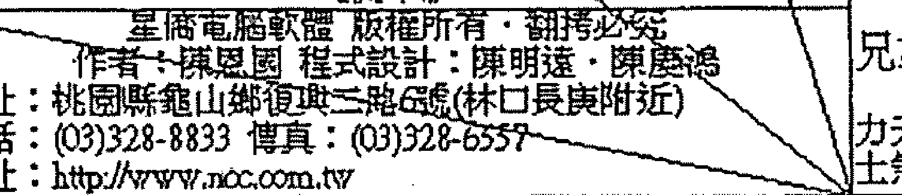

### 37 歲大限流年盤

前例曾說過，天馬解神是離婚的組合之一，尤其是逢流年煞曜或化忌沖起尤確，而 37 歲流年命宮逢天馬年解正坐，又逢流年羊陀沖起，所以此年對於婚姻部分，必須要相當小心。尤其命主七殺坐命，處事果決，愛恨分明，又加上此組合出現流年命宮，我想只要有一點小狀況，則這段婚姻是離定了。再觀其夫妻宮，暗合位逢流年化祿，又會紅鸞，配偶易有偷吃狀況發生，故命主自述由於婚外情而離異，確實是有跡可循。

不過逝者如斯，還是要展望未來才是，人不能永遠活在過去呀！如果以本命盤推估，36～45這個大限相當有梅開二度的機會，我們就轉進大限盤看看吧！

命盤表格包含十二宮位及相關星曜、數字：
| 宮位 | 星曜 | 年齡段 |
|------|------|--------|
| 僕役 | 恩光、天貴、截路、天刑、天馬、貪狼、廉貞 | 86-95 |
| 遷移 | 封誥、天官、解神、天刑、天馬、巨門 | 96-105 |
| 疾厄 | 地空、天刑、天馬、天哭 | 106-115 |
| 財帛身宮 | 文曲、天官、天馬、陀羅、天刑、天哭 | 116-125 |
| 官祿 | 天同、太陰、天機、月德、紅鸞、太陽 | 76-85 |
| 子女 | 破軍、天機、祿存、七殺、武曲 | 6-15 |
| 田宅 | 地空、三台、左輔、龍池、天官 | 66-75 |
| 夫妻 | 天台、寡宿、天刑、華蓋、太陰 | 16-25 |
| 福德 | 天機、天梁、鈴星、天刑、孤辰、天哭 | 56-65 |
| 父母 | 火星、天蚤、破軍、紫微 | 46-55 |
| 命宮 | 天機、天梁、天刑、天姚、天空 | 36-45 |
| 兄弟 | 八座、天官、右輔、年解、鳳閣、天刑 | 26-35 |

### 本命大限盤

此大限命宮會照紅鸞，又逢天姚正坐，主有姻緣可期待，而大限夫妻宮逢鸞喜對照，又逢大限祿引動，是故應有再婚的機會才是。

但因孤辰寡宿同時會照，且逢喪門弔客及官符，整體結構相當雜亂，是故此婚姻期間必夾雜許多不利因素，以經驗研判，對象若非有婦之夫，演出小三扶正記，就是有多次婚姻紀錄的男人。

由於命主問命當年為民國 98 年，故以流年觀之，民國 99 年 40 歲時即有對象出現，但對象是有婦之夫的機率極高，由於命主自身深受其害，也深深盼望命主不要從被害者轉變成為加害者，那就罪過了。

# 【案例65】待業中，請高人幫我解紫微找方向

| 提問時間 | 2009-07-27 11:16:11 |
|----------|---------------------|
| 國曆 | 64/9/15 丑時，感恩～ |

## 回覆內容

從你的命宮看來，比較適合變動性較大的工作，如：業務、總務或專業技能方向。看起來雖然你一路走來頗為顛簸，但至少都會有適時的貴人出現，雖然辛勞仍難避免。

你具有公門命格，我想你應該還滿有才華的，文筆應該也不錯，只是你的脾氣有點陰晴不定。建議你稍作修正會比較好，至少可以避免掉一些無謂的挫折。你的行動力頗強，但有時候卻會過於衝動行事，這樣通常結果不是大好，就是大壞。

本命具有公門命格，可以嘗試去考公務員，太單調的內勤行政工作不太適合你，不過總務工作倒還滿適合的。從流年看來，明年流年命宮逢昌曲文星拱照，考運應該還不錯，可以試試。

## 提問者意見

所言極是。感恩、感恩～

## 命盤解析及內容說明

| 宮位 | 星曜組合 | 年齡區間 | 備註 | 宮位 | 星曜組合 | 年齡區間 | 備註 |
|------|----------|----------|------|------|----------|----------|------|
| 命宮 | 三天月、天天破、台姚、德福、機軍 | 2-11 | 長甲 生申 | 父母宮 | 飛煞、大限112-121 | | 義乙 酉 |
| 兄弟宮 | 台天、年鳳、龍輔、月解、閣池 | 12-21 | 沐癸 浴未 | 福德宮 | 奏天、龍限102-111 | | 胎丙 戌 |
| 夫妻宮 | 大限22-31 | | 冠壬 帶午 | 田宅宮 | 將指、白限92-101 | | 絕丁 亥 |
| 子女宮 | 伏歲、東限32-41 | | 臨辛 官巳 | 官祿宮 | 小咸、天限82-91 | | 墓戊 子 |
| 財帛宮 | 官攀、晦限42-51 | | 帝庚 旺辰 | 僕役宮 | 青月、吊限72-81 | | 死己 丑 |
| 疾厄宮 | 佛將、歲限52-61 | | 衰己 卯 | 遷移宮 | 力亡、病限62-71 | | 病戊 寅 |

### 本命盤

> 古曰：「天魁天鉞，蓋世文章。」此局又稱為魁鉞拱命，為公門格局的結構之一。因古代以科舉取士，此局人天生才華洋溢，文章令聞，通常都是文官的首選，故此局被封為公門格局，是其來有自的。而盤中文昌文曲皆於旺地，是故倘命主目前待業中，建議可以去嘗試看看。但因其格局是殺破狼加煞，穩定性較不足，所以適合以武職顯貴，例如：軍、警、專技人員或是總務工作皆相當適宜。

以整體結構看來，命主是以擔任公務員為最佳選項。其因為何？由於本命宮三方會照擎羊、陀羅、地劫、天空等，四煞匯聚，表示外在環境對命主相當不利，加上官祿宮結構不佳，倘於一般職場上發展，恐怕會是相當挫折與失落，我想也應該不會有太好的發展前途才是。而公務員相對穩定，對命主來說，應該是最好的選項才是。由於參與考試，是流年偶遇，命主問命當年為民國98年（己丑年），以整體盤勢推估，民國99年（庚寅年），流年命宮及官祿宮皆逢廟旺昌曲拱照，考運應該相當不錯，所以建議命主可從98年開始準備，99年參加考試，我想在吉星的拱照加上本命格局的加持下，只要努力，一定會有上榜機會的。

> （註：考試是講究實力與公平的，沒有格局的人只要努力仍然是金榜題名的機會，有格局的人不肯讀書，縱使給你六吉全彰，還是沒有用。這些所謂公門格局，是指其天賦相當優異，參加考試獲取功名，比起沒有天賦的人，自然較為容易，此點同學須謹記，不要認為沒有格局就當不成公務員，這是錯誤的觀念。）

# 【案例66】想換工作，請教紫微達人

| 提問時間 | 2009-10-31 22:59:33 |
|----------|---------------------|
| 農曆 | 74年1月14日亥時，女。命宮是紫微貪狼星，想請教紫微達人們，明年想要換工作（想考空姐）不知道合不合適？明年換工作好嗎？還是不要變動比較好？明年工作上有什麼該注意的？一直很苦惱，所以想請教，希望能給我些參考。 |

## 回覆內容

看起來你是一個有才華心思細膩的女生，當空姐確實是滿適合的，服務類性質的工作都不錯。

以大限來看，大限官祿宮星宿組合不錯，應該是能在事業上有所進展才是，以流年來看，明年流年命宮逢化科，會天馬，所以會有異動的徵兆。但是遷移宮會雙煞，本命宮又逢陀羅正坐，陀羅主慢，而官祿宮又逢空劫來拱，雖會太陰化科，但也會化忌，造成科忌交馳的局面。

基本上可能會發生努力很久，卻高分落榜，或是縱然錄取，也有可能無法如願，如本想當空姐卻變成地勤人員，陰錯陽差，而且以官祿宮逢空劫來推論，看起來在職場上會很辛苦與勞累。

所以山人建議你，還是利用閒暇的時間準備，得失心不要太重，以免希望過大，失望也大，現在的工作還是把它顧好，等到考上後再煩惱這問題也不遲。

你的本命宮逢文昌文曲來拱，古曰：「文星拱命。」是利於典試科舉的格局，建議你可以朝考試方面嘗試看看，不過明年流年不佳，會有形勢一片大好，但卻暗潮洶湧的感覺。

以流年來看，後年本命宮逢昌曲來拱，要考試的話後年機會比較大，明年的話就當做考個經驗，努力點，也許還會有機會的。

明年的話自己要特別注意情緒的管控，看起來會有情緒上的問題，而此問題極有可能是因為感情上所造成，自己要多加注意喔。

## 命盤解析及內容說明

| 宮位/項目 | 內容 | 年齡/數字 | 宮位/項目 | 內容 | 年齡/數字 | 宮位/項目 | 內容 | 年齡/數字 | 宮位/項目 | 內容 | 年齡/數字 |
|---|---|---|---|---|---|---|---|---|---|---|---|
| 左上區 | 台三天、龍天天、輔台巫池癸相 △ | | 右上區 | 月截、天天、德空廚梁 ◎ 獲月煞 | | 上右二區 | 歲天七、廉破虛煞貞 ◎ △ 亡神 | | 上右一區 | 天解、天天、天天傷神喜馬福鉞 |
| 側邊標籤 | 指背 蒼龍 | 區域標籤 | 咸池 小耗 | 區域標籤 | | 區域標籤 | 龍德 |
| 宮位 | 25-34 福德 | 干支 | 絕辛 巳 | 宮位 | 35-44 田宅 | 干支 | 胎壬 午 | 宮位 | 45-54 官祿 | 干支 | 養癸 未 | 宮位 | 55-64 僕役 | 干支 | 長甲 生申 |
| 數字序列 | 3 15 27 39 51 63 | 數字序列 | 2 14 26 38 50 62 | 數字序列 | 1 13 25 37 49 61 | 數字序列 | 12 24 36 48 60 72 |
| 星曜區 | 左天府、輩巨、輔才官羊門 ◎ ✕ | | 中央區 | 【星亙】 星 德 易 學 【星亙】 | | 資訊區 | 國民身隱 年女 姓名：4582 |
| 側邊標籤 | 天煞 華蓋 | | | | | | | | | 區域標籤 | 將星 病符 |
| 宮位 | 15-24 父母 | 干支 | 墓庚 辰 | 星曜 | 太陰微梁機 化化化化 忌科權祿 | 時辰 | 子身命命 年生主局7474 斗：：：年年亥屬 君天文文土 丑牛 相曲五31 玄 局月月海 （5 14中 城日日金 頭22亥 土點時） | 宮位 | 65-74 遷移 | 干支 | 沐乙 浴酉 |
| 數字序列 | 4 16 28 40 52 64 | | | | | | | | | 數字序列 | 11 23 35 47 59 71 |
| 星曜區 | 文天祿、貪紫、曲貴存狼微 ○ ◎ △ ○ 科 | | 時辰 | 往四盤排 時日月年 ：：：： 癸癸戊乙 亥卯寅丑 | | | | | | 星曜區 | 天旬地、天右寡、天使空劫月煞宿同 △ |
| 側邊標籤 | 災煞 病符 | | | | | | | | | 區域標籤 | 華蓋 劫煞 |
| 宮位 | 5-14 命宮 | 干支 | 死己 卯 | 軟體資訊 | 星亙電腦軟體 版權所有・翻拷必究 作者：陳恩國 程式設計：陳明達・陳慶鴻 地址：桃園縣龜山鄉復興三路總(林口長庚附近) 電話：(03)328-8833 傳真：(03)328-6557 網址：http://www.ncc.com.tw | | | | | 宮位 | 75-84 疾厄 | 干支 | 冠丙 帶戊 |
| 數字序列 | 5 17 29 41 53 65 | | | | | | | | | 數字序列 | 10 22 34 46 58 70 |
| 星曜區 | 火陰天、孤紅天、陀太星煞壽辰鶯空羅陰機 ◎ ✕ ○ △ 忌祿 | | | | | 星曜區 | 封天破、天詔姚碎府 ◎ | | | 星曜區 | 地天太、空魁陽 ✕ | | | 星曜區 | 文恩破、武昌光軍曲 ○ △ △ |
| 側邊標籤 | 劫煞 喪門 | | | | | | | | | 區域標籤 | 歎驛 吊客 |
| 宮位 | 115-124 兄弟 | 干支 | 病戊 寅 | 宮位 | 105-114 夫妻.身宮 | 干支 | 衰己 丑 | 宮位 | 95-104 子女 | 干支 | 帝戊 旺子 | 宮位 | 85-94 財帛 | 干支 | 臨丁 官亥 |
| 數字序列 | 6 18 30 42 54 66 | 數字序列 | 7 19 31 43 55 67 | 數字序列 | 8 20 32 44 56 68 | 數字序列 | 9 21 33 45 57 69 |
| 底部標籤 | 電話： 地址： | | | | | | | | | 底部標籤 | 號碼： 0000000035 |

### 本命盤

此命為文武雙全之局，命宮三方逢昌曲來拱，為文星拱命之局，命主聰明有才華，又此局又稱為公門局，相當適宜朝公門發展。又鈴貪入命成局，古曰：「威權出眾，宜以武職顯貴。」三方不會煞忌，故此結構相當漂亮。古曰：「昌曲入命，不讀詩書也可人。」通常昌曲入命的人，大都有相當的氣質，身宮坐天姚，故命主外型應該不差，加上龍池、鳳閣入福德，表示命主心思細膩，多才多藝，故擔任空姐，應是相當適宜。

命雖坐紫微，但不逢輔弼，架構不佳，為孤君一人，難以言貴。府相不會祿，為空庫一座，地空、地劫夾財帛宮，同時會照田宅宮，此生財務方面相當辛苦，財來財去，無大富可言。而天馬會陀羅，為標準折足馬格局，不宜創業。故命主較適合在職場上發揮才能，並不適宜開創事業。

好了，基本盤大概分析完了，該回到命主詢問的問題了，依三才理論，應先由大限盤來研判工作上的整體走勢，再從流年逐年檢視，故我們先從大限盤看起。

紫微斗數命盤：
| 宮位 | 主星/星曜 | 年齡範圍/數字 |
|------|-----------|---------------|
| 命宮 | 紫微、天府等 | 5-14, 17, 29, 41, 53, 65 |
| 兄弟 | 天機、天梁等 | 15-24, 4, 16, 28, 40, 52, 64 |
| 夫妻 | 天同、天梁等 | 5-14, 5, 17, 29, 41, 53, 65 |
| 子女 | 火星、鈴星等 | 115-124, 6, 18, 30, 42, 54, 66 |
| 財帛 | 貪狼、巨門等 | 105-114, 7, 19, 31, 43, 55, 67 |
| 疾厄 | 天府、天相等 | 95-104, 8, 20, 32, 44, 56, 68 |
| 遷移 | 天機、天梁等 | 85-94, 9, 21, 33, 45, 57, 69 |
| 交友 | 太陽、太陰等 | 75-84, 10, 22, 34, 46, 58, 70 |
| 官祿 | 紫微、貪狼等 | 65-74, 11, 23, 35, 47, 59, 71 |
| 田宅 | 天府、天相等 | 55-64, 12, 24, 36, 48, 60, 72 |
| 福德 | 天機、天梁等 | 45-54, 1, 13, 25, 37, 49, 61 |
| 父母 | 天同、天梁等 | 35-44, 2, 14, 26, 38, 50, 62 |

> 《天限》
星僑電腦軟體 版權所有·翻拷必究
作者：陳恩國 程式設計：陳明遠·陳慶鴻
地址：桃園縣龜山鄉復興二路6號(林口長庚附近)
電話：(03)328-8833 傳真：(03)328-6557
網址：http://www.ncc.com.tw

### 本命大限盤

此大限官祿宮無正曜，借對宮紫微貪狼來論，三方會照天府，雙主星入官祿宮且逢本命紫微化科及大限文曲化科，化科主科名，是故命主此段期間內參與國家考試或其他類型的考試均相當適宜，且倘流年佳時，考運更是超強。且整體結構不會煞忌，看起來相當穩定。故建議命主可積極準備考試，包含空姐考試等。

既然命主預定明年跳槽且考空姐（99年），故我們看看當年的流年盤。

| 宮位 | 年齡範圍 | 年份 | 歲數 |
|------|----------|------|------|
| 福德 | 25-34    | 102年 | 29歲 |
| 父母 | 15-24    | 101年 | 28歲 |
| 命宮 | 5-14     | 100年 | 27歲 |
| 兄弟 | 115-124  | 99年  | 26歲 |
| 田宅 | 35-44    | 103年 | 30歲 |
| 夫妻 | 105-114  | 110年 | 37歲 |
| 官祿 | 45-54    | 104年 | 31歲 |
| 子女 | 95-104   | 109年 | 36歲 |
| 僕役 | 55-64    | 105年 | 32歲 |
| 遷移 | 65-74    | 106年 | 33歲 |
| 疾厄 | 75-84    | 107年 | 34歲 |
| 財帛 | 85-94    | 108年 | 35歲 |

### 99 年流年大限盤

流年命宮見天馬，是故有異動的跡象，且逢流年太陰化科沖起，故有往考試方向發展的情形，但流年命宮同時會照天同化忌，形成煞忌交馳的局面，且逢陀羅正坐，陀羅主慢，遲滯，加上命宮均不會昌曲，因此倘 99 年參加考試，只怕是要相當努力才行。加上天同化忌，主情緒上問題，如心情低落、疑神疑鬼、心神不寧等，故提醒命主須特別注意管控自己的情緒，別讓化忌影響了自己的思緒。大限既然適合參加相關考試，那我們就來看看 100 年時命主的考運如何？

### 100 年大限流年盤

100 年大限命宮逢文曲化雙科，又逢昌曲拱流年命宮及流年官祿宮，文昌化雙忌同會，形成科忌交馳狀況，雖略有遺憾，但總比 99 年來的好多了，因此山人認為 100 年時，只要認真，應該能有上榜的機會。

但考試畢竟是以實力取勝，縱使給你文星拱命，加紫微化科，所有的好星都給你了，若你不肯讀書，又怎樣能期待有金榜題名的一天？倘命不帶格局，文星一顆都不見，但抱持著必勝決心，頭懸樑，錐刺股的苦讀，有誰說她會考不上呢？所以

命盤充其量是告訴命主考運優劣，考運好的人，猜題命中率高，考運不好的，可能背了100題只出不到2題，故仍然有一點差異，考試除了實力外，還是需要那一點點的運氣，就像賭博一樣，技術好不一定贏錢，但運氣不好，鐵定輸錢。所以倘見昌曲入命且化科，基本上只要有努力，上榜機會相當大。因此雖說考試靠實力，但命盤推理還是有那一點點的幫助的，你說是嗎？

# 【案例67】好想結婚，請大師指點迷津

| 提問時間 | 2009-08-05 20:14:43 |
|----------|---------------------|
| 內容 | 小女子67年4月10日上午9：45生（農），希望各位大師能指點迷津，我在感情、工作跟財運都不太好，目前適婚年齡，家人很急，謝謝！ |

## 回覆內容

如果單從星盤看來，確實你的一路上都會走的滿辛苦的，命坐貪狼且居子宮，為泛水桃花格局，但可惜被煞星給壓抑住，加上天姚這顆野桃花入命，所以桃花縱然開，我想也都是爛桃花居多吧！

而且你應該是滿注重婚姻關係的人，但問題也常常在這裡發生。如果以夫妻宮看來，對你而言晚婚並不是件壞事。

從你的星盤看來，你應該是個滿重義氣的人，但可惜朋友卻不這樣想。基本上你的朋友對你是阻力大於助力，而且沒錯的話，你應該也會被朋友所連累，所以交友一定要謹慎。

看來你應該也是一個滿喜歡享受的人，喜歡美食與裝扮，不過以整體盤勢來看，可能波折及勞碌難免，這點也要多忍耐。

沒錯的話，你的個性應該也不是很好，也頗為急躁，正所謂，命由性生。命運的起落，多由個性而生起。所以建議你，可以去學習瑜珈或打坐，讓自己的脾氣與個性能夠和緩一點，這樣可以減少人生的波折。

## 命盤解析及內容說明

```
天文天、破祿天、地火天、擎紫、天封右、左天天、天鈐陰、孤破
儀昌貫、碎存機、空星才、羊微、使話弼、輔空廚、鉞星煞、辰軍
◎ ◎△ ×◎ 科 X △

悔亡病 74-83 長丁 官將歲 64-73 養戊 伏擎晦 54-63 胎己 大歲喪 44-53 起庚
土神符 僕役 生巳 伏星蓮 遷移 午 兵鞍氣 疾厄 未 耗庫門 財帛 申
12 24 36 48 60 72 11 23 35 47 59 71 10 22 34 46 58 70 9 21 33 45 57 69
地三、天天年、鳳陀七 【星儀】 易 學 【星儀】 文紅
劫台姚、壽解宿、羅殺 ◎◎ 天右太、貪 子身命命 年女 曲鵞
:: 化化化化 年主主局6767 :: 年年戊 ◎
忌科權祿 斗：：：午馬
柱四盤排 星火貪金
時日月年 ：局狼四54
：（
丁戊丁戊 寅 ～1610上
巳寅巳午 海日日火
中9巳
金點時）

力月吊 84-93 沐丙 病息貴 34-43 墓辛
土煞容 官祿 浴辰 伏神索 子女 酉
1 13 25 37 49 61 8 20 32 44 56 68
天天、天天太 八解龍、天康
喜福官、梁陽 坐神池、府貞
◎◎ ◎△

青威天 94-103 冠乙 喜華官 24-33 死壬
龍池德 田宅 帶卯 神蓋符 夫妻.身宮 戌
2 14 26 38 50 62 7 19 31 43 55 67
天蜚、天武 合天月、天
月廉相、曲 輔巫德、馬陰
◎△ ◎

小指白 104-113 臨甲 將天龍 114-123 帝乙 舜癸大 4-13 衰甲 飛劫小 14-23 病癸
花背虎 福德 官寅 車煞德 父母 旺丑 喜煞耗 命宮 子 廉煞耗 兄弟 亥
3 15 27 39 51 63 4 16 28 40 52 64 5 17 29 41 53 65 6 18 30 42 54 66

星儀電腦軟體 版權所有・翻拷必究
作者：陳恩國 程式設計：陳明遠・陳慶鴻
地址：桃園縣龜山鄉復興二路68號(林口長庚附近)
電話：(03)328-8833 傳真：(03)328-5557
網址：http://www.ncc.com.tw
編號：0000000116
```

### 本命盤

貪狼居子，謂之泛水桃花，表示桃花運相當旺盛，但是好桃花或是爛桃花，就要看本宮及三方四正會合星曜而定。以本例而言，三方會照地空、地劫、火星、鈴星及陀羅，最糟糕的就是陀羅這顆星，因陀羅化氣為忌，正所謂：忌遇貪狼，謂之風流杖彩，多因桃花或風流韻事而惹上麻煩或官非，此局便是如此，加上天姚這顆野桃花星會命，為紅豔煞的情況，我想命主桃花定然不缺，但大都屬於爛桃花類型，無怪乎如此煩惱，真是辛苦了。

而命主身居夫妻宮，想來對於男女及家庭關係相當重視，卻老是遇到爛桃花，也是相當的無奈呀。此點可從其夫妻宮星宿組合得到反證，三方會照四煞，最要不得的就是地空地劫兩煞曜，到手也成空，是故命主對於心儀的對象大都有緣無分，勉強交往則難逃同床異夢及聚少離多的情況。倒是爛桃花不少，喜歡的人不喜歡自己，不喜歡的人卻黏得緊緊，況且倘遇流年化忌或星宿組合不佳時，這些爛桃花甚至會導致桃花劫的結果，所以命主以晚婚為宜呀。

由於命宮會煞過多，表示外在環境相當不利於自己，而空劫入命，又可稱為勞碌命，想來命主無論在感情或事業上，應該一路上都很波折才是。不過沒關係，以大限看來，因大限逆行 (註：順行那可就糟糕了)，因此命主不至於屬於那種會孤單終老的人，以大限盤勢推估，姻緣應該成於 34 ~ 43 這個大限，正好呼應了山人晚婚的觀點呀。其大限盤如下：

### 34～43 本命大限盤

在此大限中，鸞喜會照入命，又逢大限祿權引動，想來這個大限必有姻緣可成才是。而其夫妻宮逢日月拱照且加會輔弼及魁鉞，因此對象想必在社會上有一定的地位，而且能得到配偶的助力與光環呢！加上大限夫妻宮會照天喜逢大限巨門化祿引動，三方穩定無煞，此段時間定然有好消息傳出呢，且應該是可得配貴夫才是。從整體盤勢看來，此姻緣研判應該是由長輩介紹媒合的對象。其實這樣也好，因為命主倘自由戀愛，以此盤勢推估，遇到的對象都不會太好。所以這段時間的失落，就當作歷練人生吧，真的不需要太擔心。

倒是命主由於空劫入命，三方會煞，故脾氣應當不佳且較為急躁，有點過於偏執疏狂的感覺，故當務之急，是先鍛鍊自己的心性，把煞曜對自己的影響減到最低，這樣當好姻緣來到時，才不會又因自己的個性而讓好對象退避三舍，這就不妙了。

因此山人回覆時一直希望命主由自身改變，畢竟有可能配得貴夫，倘自己的個性不改正，自然難逃本命盤夫妻宮顯現的同床異夢或是聚少離多的狀況。

# 【案例68】我的命格屬於機月同梁嗎？

｜提問時間｜2009-08-05 11:53:30

1978.05.18. 卯時，男性。有人跟我說我是機月同梁格，也說我的好星都在奴僕宮，對朋友有利，對自己則普普。紫微達人能否指教，3Q！

## ｜回覆內容｜

是機月同梁格沒錯，基本上此格局適合穩定單調的工作，積極度不足，但守成有餘，古曰：「機月同梁當吏人。」便是針對此特性而言。

至於好星都在奴僕宮這部分，就表面上看六吉星確實都在這裡，所以朋友並沒有看錯。至於是否對朋友有利，對自己則普普，山人是不這樣認為。首先，以大限來說，如果你的大限走到奴僕宮位，自然這些吉星會在此大限拱照而順利一點，流年也是這樣。再者，以朋友來說，表示你朋友間多貴人也多助力，並不是單純的說只有對朋友有利。

而且僕役宮代表的意義是命主與朋友、同事或下屬間相處狀況的判識宮位，如：得力與否？朋友性情、傾向及彼此的相處關係等。所以你朋友說的算是對了一半，而且如單純的以你的奴僕宮來看的話，你的人際關係中，交往層級高，能夠得到寬厚誠實的朋友，並且能得到手下的擁護。但會因爲朋友而破財，朋友越多，煩惱越多，而且我想你應該常發生因爲幫助朋友反遭來埋怨的情形，且恐有因友遭拖累的情形。

## 命盤解析及內容說明

| 位置 | 宮位 (年齡段) | 天干地支 | 星曜 (甲級/乙級/丙級) | 小星/雜曜 |
| :--- | :--- | :--- | :--- | :--- |
| 左上 (1) | 田宅 (32-41) | 丁巳 | 封誥、天貴、恩光、破碎、祿存 | 博士、亡神、病符 |
| 中上 (2) | 官祿 (42-51) | 戊午 | 鈴星、三台、擎羊、天機(忌) | 力士、將星、歲建 |
| 右上 (3) | 僕役 (52-61) | 己未 | 天傷、文曲、文昌、右弼、左輔、天空、天馬、破軍、紫微(科) | 青龍、攀鞍、晦氣 |
| 最右 (4) | 遷移/身宮 (62-71) | 庚申 | 地空、八座、陰煞、天刑、孤辰 | 小耗、歲建、天空、驛馬 |
| 左中 (5) | 福德 (22-31) | 丙辰 | 火星、天姚、年解、寡宿、鳳閣、陀羅、太陽 | 官符、月煞、吊客 |
| 中央 | 命盤基本信息 | - | 姓名：[空白]，男命，民國54年午時生，陽男，水二局，命主：貪狼，身主：天同，排盤：星僑易學 | 排盤軟體資訊、作者、程式設計、地址、電話、傳真、網址 |
| 右中 (6) | 疾厄 (72-81) | 辛酉 | 天台輔、紅鸞、天府 | 將星、息神、貫索 |
| 左下 (7) | 父母 (12-21) | 乙卯 | 天喜、天福、天官、七殺、武曲 | 伏兵、咸池、天德 |
| 中下 (8) | 兄弟 (112-121) | 乙丑 | 地劫、天月、天壽、天廉、天梁、天同(祿) | 病符、指背、白虎 |
| 右下 (9) | 夫妻 (102-111) | 甲子 | 旬空、天姚、天相 | 喜神、災煞、大耗 |
| 最右下 (10) | 子女 (92-101) | 癸亥 | 天月、天德、天馬、貪狼、廉貞(忌) | 飛廉、劫煞、小耗 |
| 底部 | 財帛 (82-91) | 壬戌 | 天官、蓋符、華蓋 | 奏書、官符 |
| 底部 | - | - | 電話：[空白]，地址：[空白]，編號：0000000117 | - |

### 本命盤

命主同梁坐命，三方形成機月同梁格局無誤，此局在斗數裡相當有名，基本上此格局人，由於缺乏積極性，做事較為單調，一成不變，就像台灣大部分的公務員心態一樣，古曰：「機月同梁當吏人。」但相對而言，穩定性足夠，所以山人一直認為倘企業要徵才之時，機月同梁格局的人是最適宜的，除非你要聘請業務，否則內勤或基層工作，此格局為最佳。

古曰：「同梁守命。」男得純陽之中，因此，命主應該是個正直，誠懇又重信義的人。但空劫於命身宮對拱，勞碌且無所成，加上三方天機天梁與擎羊相會，太陰擎羊又成局，且天梁正坐命宮，是故命主原則性甚強，經常會讓人感到不近人情，但有時候又會有許多無謂的堅持。

命盤逢紫微輔弼同度，形成君臣慶會格局，又逢雙祿馬交馳，適合從事買賣交易獲得利潤，整體而言，命盤相當漂亮，財宮逢雙煞襲，錢財破耗難流，但財庫卻是雙祿交流，此局為財弱庫強之局，只要命主能守成，不遭詐騙或投機，我想晚景仍是相當值得期待。但通常空劫入命者，一生至少會被騙一次以上，這也是一種無奈呀。

倘命主真要創業，建議盡量選擇流動性高，規模小的微型創業，例如網拍、園遊會、攤販或小吃等，必有利基，因小本經營，縱遭詐騙或倒債，以其田宅宮穩固的狀況，損失也有限呀。

至於命主提到僕役宮吉星匯聚，確實是如此，六吉全彰，山人常說，六吉星匯聚之處，也是命主最強的宮位，輔弼表示命主交友的層級甚高，能成為助力，魁鉞則是貴人的象徵，表示能得到提攜協助，而昌曲表示朋友間多有才華能力之人，紫微會輔弼，為君臣慶會格局，能因朋友、部屬助力而成大事，所以那位朋友說錯了，應該是倒過來，說是朋友會對他很好很照顧，並不是他對朋友很好呢！

至於什麼狀況會對朋友很好呢？山人一再提醒大家，交朋友要選哪一種命局的人呢？就是祿落僕役的人，只有這種結構才會對朋友很好。正所謂，祿落僕役，縱有官也奔馳。以此種結構而言，大概只有朋友對他好而已。由於雙祿落子田線，因此對自己好，會比較正確呢！（山人註：此星群結構之人，由於同梁坐命，外表經常給人忠厚老實的感覺，能輕易得到朋友信任，此點從僕役宮可看出來。但三方煞曜群聚，雙祿又落田宅，肥水絕不落外人田，以山人經驗，此局人經常會是扮豬吃老虎那類型的呢，所以我看是朋友要特別小心吧！）

# 【案例 69】想以紫微斗数看感情婚姻

提問時間 | 2009-07-29 12:22:25

男，1978年3月23日丑時，想問一下婚姻與工作運勢：

1. 我异性緣一直都不錯，只是都沒遇到想定下來的另一半，想問何時會出現真命天女？
2. 請解析一下流年運勢以及未來的工作運。
3. 請問我八字月支劫財透干是什麼意思？
4. 未來子女宮如何？

回覆內容 |

命造國曆67年3月23日丑時建生。

1. 因為你的命宮坐天姚，天姚為野桃花，並非正緣，所以不容易遇到可以或讓你想定下來的另一半。而且你的女朋友多是屬於桃花類型，來來去去的，所以會有這種感覺。至於正緣的話，以你的夫妻宮來看，建議以晚婚為宜。沒錯的話，你的姻緣動的很早，21歲前就有很要好的女朋友，錯過的話，看來正緣要等久一點。

2. 今年流年逢日月昌曲及魁鉞等吉星拱照，再會本命祿存，倘不考慮流年四化的情況下，應該是滿順利的。沒錯的話金錢部分應該也小有進帳，至於守不守得住，就看你自己了。

3. 既然山人是用紫微斗數幫你看的，就用紫斗的角度解釋你的財運。基本上財宮逢煞侵，所幸庫並未逢破煞，逢廟旺之日月拱照，為日月照璧格局，加上祿存正坐，又逢吉星會照，所以你的財基本上是守得下來，只是賺錢會比較辛苦，容易遇到不如意或挫折。不過賺了之後你不至於會有太大的破財，至少不會當過路財神，來去一場空。

4. 你的子女宮逢空劫來夾，基本上與子息比較無緣。不過現代科技進步，可以做人工或試管，所以子息數量就看你自己。至於小孩的狀況，基本上應該屬於口才好，人緣佳那類型的，不過個性有點懶散就是了，而且應該還滿會讀書的呢！

## 命盤解析及內容說明

紫微斗数命盘表格。共分12个宫位（子、丑、寅、卯、辰、巳、午、未、申、酉、戌、亥），每个宫位包含：
- 宫位名称（如：命宫、兄弟、夫妻等）
- 主星、辅星、杂曜名称及符号（如：七杀、紫微、天府等，部分星曜下有◎、○、△、×等符号）
- 年龄区间（如：2-11, 12-21...）
- 长生十二神（如：病、死、墓、绝等）
- 十干四化标注（如：化禄、化权、化科、化忌）
- 小限、大限等附加信息。
表格中心区域有额外文字：
【星僑】
星 僑 易 學
【星僑】
姓名：男
出生：民國67年 月 午時
年月日時：戊 午 年 月 日 未時
身宮：午
命宮：午
四柱：戊 午 甲 子 乙 丑 未 時
排盤年：乙亥
星僑電腦軟體 版權所有．翻印必究
作者：陳恩國 程式設計：陳明達、陳慶鴻
地址：桃園縣龜山鄉復興二路1號(林口長庚附近)
電話：(03)328-8833 傳真：(03)328-6557
網址：http://www.ncc.com.tw

### 本命盤

命主七殺坐命，對宮逢紫微天府，為七殺朝斗格局，古曰：「七殺朝斗，爵祿昌榮。」因七殺星會紫微化權，所以不論在工作上或創業，都很容易能夠掌握權力，且由於七殺坐命，衝勁十足，加上紫微天府優化七殺的劣質性，故此局人工作能力強，往往能得到很不錯的成就呢！而其三方火羊成局，適宜以武職顯貴，三方雖會地空，由於格局不錯，所以僅表示命主不善於理財罷了。

横看竖看，命主都应当会有不错的发展与成就才是呢！至于财运部分，财帛宫虽逢本命贪狼化禄正坐，但三方空劫羊陀四煞汇聚，求财会相当的辛苦，且大概都需要靠努力获得，倘不会煞，逢本命禄正坐，得财会是相当容易的呢！这就是煞星带来的影响呀。再观其财库，得昌曲辅弼四吉星拱照，因此库位颇为稳固，倘能稳扎稳打，晚景应可期待才是。而禄存正坐田宅，表命主多为稳定之财，且太阳化禄本身就不代表钱财，其象征是名声。是故以财帛宫及财库状况看来，命主宜将名逐利，不可以钱滚钱，否则破耗难逃。

由于命主问的是缘分，我们就从本命宫看起，本命宫野桃花天姚正坐，故命主应桃花不缺，但正缘会比较难得。此点可从夫妻宫得到反证，地劫正坐，得亦复失，三方会擎羊、陀罗双煞，感情不容易有稳定之时，所以一路上走来，会相当的崎岖波折。

再观其子女宫，逢地空、地劫夹制，表与子息缘分浅，或是聚少离多的情况，所以这又反证了夫妻宫显现的情况，倘在古代，恐有无后之虑。但现今科技发达，不孕症夫妻可透过试管婴儿等生育技术得子。台湾新竹的送子鸟诊所创下的最高纪录还有 61 岁成功得子的呢，所以不需要太过于担心。也因为如此，山人认为子息数量是无法推论的，因科技进步。

所以各位同学千万别看古书说，见到什么星，小孩几个，是男或是女，这都很容易出问题的呢！其实命主也大可放心，因就大限行进看来，32～41 大限内有姻缘可成，其大限盘如下：

### 本命大限盤

| 命宫 | 父母 | 福德身宫 | 田宅 | 官禄 | 疾厄 | 僕役 | 迁移 | 子女 | 夫妻 | 兄弟 |
| :--- | :--- | :--- | :--- | :--- | :--- | :--- | :--- | :--- | :--- | :--- |
| 文天左破天禄太曲月輔碎馬存陽◎歲指違背 | 天舉破貫羊軍◎晦氣池 | 天台八三天天天傷輔座台竺廚鉞機◎裏門 | 天解天孤天紫神才辰府微◎貪己索神 | 天文右紅太便昌弼騭陰◎科官符 | 地恩天天龍空光刑壽池◎小耗 | 天陰煞七刑哭煞殺◎破碎 | 天姚廉殺◎天劫德煞 | 旬天空魁梁◎白虎蓋 | 地陰歲天天天煞天廉劫煞破虛哭空相貞◎顯德神 | 月巨門◎大耗 |
| 傅亡病士神符田宅2 14 26 38 50 62 | 絕丁力將歲星建官祿3 15 27 39 51 63 | 胎戊青舉晦龍較氣僕役4 16 28 40 52 64 | 養己小歲喪耗門遷移5 17 29 41 53 65 | 長庚生申 | 沐丰浴酉 | 死乙卯 | 墓丙辰 | 冠壬帶成 | 病甲寅 | 衰乙丑 | 帝甲旺子 | 臨癸官亥 |
| 鈴年寡恩陀星解宿閱羅曲X濟天符煞 | [星屬] 天右太貪樞弼陰狼：：：：化化化化忌科權祿 | [星屬] 子身命命年主主局斗：：：火祿水：星存二子 局月月一2315上大日日火溪2丑水點時 | 年男：名：冬年馬 | | | | | | | | | |
| 官月吊伏煞容福德身宮1 13 25 37 49 61 | 柱四盤排時日月年：：：：乙甲乙戊丑申卯午 | | | | | | | | | | |
| 封天天天天誌喜福宮同癸客籠 | (天限) 作者：陳思國 程式設計：陳明遠·陳慶鴻星僑電腦軟體 版權所有·翻拷必究地址：桃園縣龜山鄉復興二路6號(林口長庚附近)電話：(03)328-8833 傳真：(03)328-6557網址：http://www.noc.com.tw | | | | | | | | | | |
| 伏威天兵池德父母12 24 36 48 60 72 | 火天蜚七星姚廉殺◎天劫德煞 | | | | | | | | | | |
| 大指白耗背虎命宮11 23 35 47 59 71 | 病天龍伏煞德兄弟10 22 34 46 58 70 | | | | | | | | | | |
| 電話：地址： | 編號： 0000000120 | | | | | | | | | | |

大限命宮會照紅鸞，夫妻宮鸞喜對拱，又逢太陰化祿引動，三合無煞有吉，是故此大限內應有喜事加臨才是。且此大限命宮，逢太陽正坐，會照太陰，呈現日月並明之局，且盤中日月均居未落陷，加上昌曲輔弼四吉星拱照，太陰化祿及本命祿對照，形成雙祿於命宮交流格局，魁鉞又於福德宮拱照，加上命主本身格局構大，能力強，衝勁足，故推論命主此大限事業與愛情兩得意，真是羨煞旁人呢！

命主問命時間為民國 98 年（西元 2009 年），時年 32 歲，剛好跨進這個大運的時間點。而大限主 10 年之運，我想這 10 年，應該會是命主最強運的時候，以流年推算，34 歲倘非遇見真命天女，便是有喜事到來了，所以命主實在無須多慮呀！

# 【案例 70】未來就職往哪方面發展好？

| 提問時間 | 2009-07-29 14:55:55 |
| :--- | :--- |
| 我農曆79年10月26日，陽曆79年12月12日16:00生，女生。可以給我一些關於我未來職業的資訊以及今年考運嗎？ |

## | 回覆內容 |

如果以你的命盤看來，建議你可以往專業技能方向發展，或者是研發、文學創作、企劃或規劃方面發展。因為你的想像力應該還滿豐富，雖然本性有點迷糊。

本身格局屬殺破狼逢煞，所以人生路上基本上會比較波折起伏，不過異性緣倒還是不錯呢，而且你應該也是很愛漂亮的女生吧！

可惜你的脾氣應該也是屬於不太好那一型的吧，個性講理，卻不是很合群。雖說脾氣不是很好，但是你的心地還算是頗為善良，不過脾氣一來，很難控制，過了總是會後悔，可視傷害已經造成了。所以要稍微改變自己的脾氣，會比較好。

至於今年的考運很不錯，流年命宮正逢昌曲文星夾拱，流年命宮又見魁鉞對拱，因此非常不錯。雖說你的命盤昌曲皆落陷，對此格局有點打折，但有總比沒有好，只要再努力一點，我想考上的機會很大。整體來看的話，今年流年很適合去參加考試呢！

但不要山人跟你說考運不錯就不讀書，這樣還是沒有用的，考試靠的是實力，雖然運氣也很重要，但畢竟光憑運氣，還是沒有金榜題名的機會。加油！

## 命盤解析及內容說明

包含十二宫位、星曜、数字、天干地支等信息的紫微斗数命盘表格。

### 本命盤

一個人適合的工作類型，基本上必須從其命宮星曜組成特性來考量，例如殺破狼加煞的人，你叫他從事單調乏味的內勤行政工作，我想是相當不適宜，又倘如機月同梁此類穩定型的人，你讓他做業務或是開發工作，又是一個不適宜。工作必須與本性相符合，才能夠做得長久，發展得順利。許多在職場上屢感不順，很大的原因是選錯行業，倘能依照個人特性，選擇適合自己的工作類型，是相當必要的。這也是常言道：男怕入錯行的道理呀。

那命主到底適合哪一種類型的工作呢？廉貞坐命加上鸞喜於命遷一線對拱，表示命主異性緣相當好，適合往公關方向發展。又三方雙主星會照，所以事業心應該頗強。但可惜紫微不會輔弼，只是孤君一人，缺少助力難以成事，加上會照地空、地劫這兩顆土匪星，因此較會有力不從心或是勞而無獲的感慨。而地空坐命，表示命主生性較為迷糊，且容易受騙上當。通常地空坐命的人，一生至少會被騙一次以上。

至於空劫雙曜雖然讓人得而復失，但其豐富的想像力與勇於創新的想法和觀念，卻是相當適合從事如：研發、創作、行銷企劃、電視節目製作、客服等類型的工作，加上命主整體星曜結構頗為進取，較為枯燥乏味的工作，我想是相當不適宜的，因此建議命主可朝創意發想的方向發展，會有不錯的結果呢！

至於考運的問題，以本命盤觀之，本命宮不會昌曲，且均位於落陷宮位，因此想透過考試擔任公職，只怕要相當努力才是。但由於考試屬流年偶遇，就像創業問題一樣，雖說本命不適合創業，但大限流年強運之時，倒是可以抄個短線，見好就收。而考試也是如此，雖說考試靠的是實力，但倘能在吉星高照之時應考，我想只要努力，上榜機會還是頗高的。所以我們轉進命主問命當年看看吧！

### 大限流年盤

命主問命當年為 2009 年，民國 98 年，流年命宮逢昌曲夾拱，又魁鉞對照，四顆利於典試的星曜咸集，又象徵科名的大限化科入流年命宮，故考運應當是相當的好。問命當年倘能聽下山人勸告，專心準備，我想上榜機會是相當高的。但考試畢竟是以實力取勝，倘不肯努力讀書，再多的好星或是再強的格局，都是惘然，不是嗎？

# 【案例71】算命&工作運勢

│ 提問時間 │ 2009-07-29  16：58：27

您好：
我想請問我的工作運勢。陸陸續續都有工作，可是都做不久，我知道問題還是在我，只是想要知道從事什麼會穩定一點？謝謝！民國 73 年 11 月 10 日辰時生，我是女生。

│ 回覆內容 │

命造國曆 73 年 11 月 10 日辰時瑞生。
從命盤看來，確實是你自己的問題比較大，我想在工作上你不乏貴人的幫忙及朋友的鼎力相助，但可惜你面對困難與挫折的時候，常常過於衝動。
而且以你的命局來說，你也是一個不喜歡被人家管的人，因為你本身命格帶有輔弼拱主的大格局，是一個領導者的格，但可惜逢雙煞侵擾，且逢空劫來拱，反而造成你喜惡分明，過於主觀，且帶點高傲的個性。加上你的脾氣應該也不是很好吧！沒錯，你也是一個有點迷糊散仙的人才是。

其實你的本命格局不錯，只要能改掉你自己的缺點，對未來的發展會比較好。如果沒有辦法改變自己的話，那麼工作要穩定，我想會有點困難。

建議你從改變自己的個性來著手，可以去學習打坐、瑜珈、泡茶等等，讓自己比較平靜穩定，好好的修煉自己的心。如果你能夠下定決心好好改變自己的話，以你的格局，應該能有一番發展才是。畢竟輔弼拱主又逢魁星拱命的格局真的不容易遇到，而且你也具有標準的公門命格，可以去試試考公務員也是不錯。

## 命盤解析及內容說明

命盤表格，包含12宮位信息：
| 宮位 | 主星 | 其他星曜 | 年齡段 |
|------|------|----------|--------|
| 命宮 | 紫微、天府 | 天魁、天鉞等 | 5-14 |
| 兄弟宮 | 天機 | 天梁、天同等 | 15-24 |
| 夫妻宮 | 太陽 | 天刑、天姚等 | 25-34 |
| 子女宮 | 武曲 | 七殺、破軍等 | 35-44 |
| 財帛宮 | 天同 | 天機、太陰等 | 45-54 |
| 疾厄宮 | 廉貞 | 天府、天相等 | 55-64 |
| 遷移宮 | 天相 | 紫微、破軍等 | 65-74 |
| 僕役宮 | 天梁 | 天機、天同等 | 75-84 |
| 官祿宮 | 天府 | 紫微、天相等 | 85-94 |
| 田宅宮 | 太陰 | 天機、天梁等 | 95-104 |
| 福德宮 | 天機 | 太陽、天同等 | 105-114 |
| 父母宮 | 天同 | 天機、天梁等 | 115-124 |

### 本命盤

命主格局相當漂亮，紫微坐命會輔弼，形成君臣慶會大局，古曰：「才善經邦。」表示命主工作能力強，在團體中都是領導者，也都能得到部屬及朋友的擁戴支持而成就。又祿權科三奇佳會，學習能力相當強，在任何行業很輕易就能夠出類拔萃，而此局人家境通常都是相當不錯才是。

以此格局而言，應能在各領域中得到一定的成就與地位。且又逢天魁天鉞對拱，相信命主應該也是相當聰明有才華的，且此局又可稱為公門格局，故從事公職，也會是相當適宜的。

另命宮三方會照又陀羅及擎羊，此兩煞星帶來的是挫折與不順利，但在大格局的支撐下，雖然外在環境不佳，但卻是關關難過，關關過。並非大格局能抵消煞曜影響，除非是成爲斗數奇格如：鈴貪、火貪這類，這點必須要特別強調。而命主本身空劫會命，個性略帶點迷糊散仙，但由於格局夠強，因此想要詐騙他，我想還是很困難的呢！充其量也只是較無理財觀念罷了。

通常紫微坐命又成局者，主觀意識都相當強，且絕大多數不願意屈居籬下。但因空劫影響，所以待人處世上，經常會給人家滿不講理的感覺，而且也經常發生誤判形勢的狀況，我想這也就是命主在工作上會不穩定的原因，並非工作不適合，而是因爲自己誤判形勢及太過急於想要做主的個性而敗事。以此格局看來，我想老闆對命主的工作能力及才華，應該都是評價很高的呢，只能說是小廟容不了大和尚了。終歸起來，問題都出在自己身上呀，這也就是這些煞曜帶來的影響。

故命主倘能練習修心，如打坐、瑜珈等，讓空劫對自己的影響減少，以此格局而言，定然會有相當成就才是。倘不願意改變自己，只怕這種一年換 365 個老闆的狀況，會層出不窮，也不容易有穩定的時候。正所謂命由性生，其意便在此啊！希望命主能真正改善自己個性的缺陷，不要白白浪費此難得一見的大格局呀！

# 【案例 72】請幫忙分析整體命格與運勢

｜提問時間｜2009-08-15 17:28:38

請問女生國曆 64 年 8 月 14 日早上 5 點生的人命盤與紫微斗數如何？

例如婚姻、事業、往什麼方向做哪一行，、財運、子女等越詳細越好，謝謝！

｜回覆內容｜

民國 64 年實施日光節約時間，出生時間應該向前調 1 小時，所以山人用寅時幫你看看。

命造國曆 64 年 8 月 14 日寅時瑞生。

本命宮天梁正坐，表示你是一個喜歡照顧他人，對人有同情心也富有正義感的人。但原則性過強，且喜歡依據自己的原則來判斷是非，也因此總是帶點千山我獨行的孤傲，個性頗為好勝。而天梁加會天馬，又為梁馬飄盪格局，很難有穩定的時候。

本命宮見祿忌交馳，表示人生的路上多波折起伏，勞碌難得享受，本命宮格局亦形成機月同梁格，正所謂機月同梁當吏人，意即你比較適合從事穩定的工作，如內勤或文書工作，變動性過大的工作不是很適合你，如業務或企劃類。建議你可以從事社會服務、法官、醫師或內勤行政等相關工作發展，會是相當適宜的呢！

財運部分，財宮見祿忌交馳，錢財得中有失，且波動較大。財庫雖逢對宮祿存會照，但逢空劫雙煞來襲，因此可以庫破來論。故整體而言，金錢及財運部分，大都是來來去去空歡喜，所以你要比其他人更注意自己的金錢管理。身體方面，多注意婦科方面及胃的疾病。

## 命盤解析及內容說明

| 三破蜚孤天<br>台碎廉辰相 △ | 文天哉天天<br>曲喜空廚梁 X ◎ | 天年鳳龍七<br>姚解開池殺貞 ◎ △ | 台文月天天<br>輔昌德福鉞 △ |
| :--- | :--- | :--- | :--- |
| 青歲褰 113-122<br>病辛 龍驛門 兄弟 巳<br>9 21 33 45 57 69 | 小息貫 3-12<br>死壬 將華官 13-22<br>墓癸 8 20 32 44 56 68<br>7 19 31 43 55 67 | 奏劫小 23-32<br>絕甲 6 18 30 42 54 66 | ... |
| 力士晦 103-112<br>衰庚 夫妻 辰<br>10 22 34 46 58 70 | ... | ... | ... |
| 博將歲 93-102<br>帝己 子女 旺卯<br>11 23 35 47 59 71 | ... | ... | ... |
| 官亡病 83-92<br>臨戊 財帛 官寅<br>12 24 36 48 60 72 | 伏月吊 73-82<br>冠己 疾厄 帶丑<br>1 13 25 37 49 61 | 大咸天 63-72<br>沐戊 遷移 浴子<br>2 14 26 38 50 62 | 病指白 53-62<br>長丁 僕役 生亥<br>3 15 27 39 51 63 |

### 本命盤

命主天梁坐命，而天梁化氣爲蔭，是故命主有同情心，性情耿直，能關懷他人，但天梁星在斗數裡扮演監察官的角色，所以原則性相當強，此要倘會照天刑之類孤剋性質的星曜，更是鐵石心腸如包公一般。

而三方會照天馬，爲梁馬飄盪格局，終其一生，難有穩定之時，適宜離鄉背景發展。而此局人，大都有種道不同不相爲謀的孤傲之氣，這也是飄盪的主因呀。三方星曜又組成相當有名的機月同梁格局，因此命主只適合穩定的工作，缺乏接受挑戰的勇氣。至於命主適合從事哪類型工作呢？例如：教育、法務、內勤行政等。而命宮逢日月拱照，父母宮又昌曲吉星來夾，表示命主家庭背景相當不錯，父母職業應頗爲高尚，又鑾喜於命宮對拱，表示其異性緣絕佳，整體而言，還算不錯呢！

至於財運部分，財宮太陰正坐，太陰主財，又逢昌曲拱照，主得財容易，但陀羅亦同度，又本命祿忌交馳，表示得中有失，且錢財難以守成，往往都是怎麼來就怎麼去，此點從其田宅宮雖逢紫微、祿存借星正坐，但逢空劫會照可見一斑，因此在財運的部分，由於庫破嚴重，難有餘糧之時。此局人更需要做好財務規劃，否則晚景確實堪慮呀！

至於身體健康部分，由疾厄宮觀之，天府正坐，對宮天姚會照，加會空劫，須特別注意婦科方面及胃部方面毛病。另子女宮部分，紫微正坐三方結構尚稱穩定，故應有相當聰明優秀的子女，但性情應該和命主一樣相當倔強與高傲呢！

# 【案例73】我的命不好嗎？

｜提問時間｜2009-08-15 18:33:59

1985 年 7 月 29 日早上六點出生。最近身邊的人迷上算命，但有很多個說我命不好。最近在創業，雖然我不是很信這個，但心裡還是會怕怕的，也不知道該相信誰！誰叫現在騙人的算命太多了！一堆死要錢的！

我現在賣女裝，這是我喜歡的行業。怎麼辦，好多算命的都說我這次創業會白忙一場，但是這次我做的是有點中規模的店，讓我超擔心的。

｜回覆內容｜

看來你好像滿迷惑，好命壞命沒有絕對，正所謂命由性生，個性決定自己的命運，這點希望你要記住。

命造國曆 74 年 7 月 29 日卯時建生，就本命宮來看，格局雖不算上格，但也不算劣局，所以儘可寬心。

本命宮三方四正見魁鉞來拱，為坐貴向貴的公門格局，也表示命裡多貴人提攜及扶持，而本身頗具才華，古曰：「天魁天鉞，蓋世文章。」

雖本命宮見擎羊煞星正坐，但居廟旺之地，凶星得地不爲凶，且得府相來朝，又紫微坐命且化科，適合將名逐利。

你的爲人頗爲忠厚老實，聰明靈敏，志氣高傲，性情倔強，對任何的事物都具有非常強烈的好奇心。喜歡學習新的事物，但是由於缺乏耐心，容易有半途而廢的情形，耳根較軟，個性善變且多疑，易受他人影響。同時有著強烈自尊心及優越感，不喜歡受到別人的約束，也較不喜歡屈服於別人的領導之下。舉動穩重，有正義感，感情容易衝動。放寬心吧，整體而言，你的命局不會太差。

在斗數中，擎羊雖是煞星，你的本命宮見擎羊星，可謂之煞星坐命。但煞星如居廟旺，可謂之得地，就像凶煞被供在廟堂上，凶可不凶反爲吉。擎羊星吉化，就正面來看，表示處事積極，有先見之明，且有前瞻性，毅力強，事業心強。

如命坐擎羊星，創業宜獨資，適合當小型工作室老闆，但其煞氣仍在。不過你的命宮見天相同度，所以說多少可以收斂這種煞氣，山人推估你的個性應該是脾氣來的快，去的也快。每次發完脾氣後都會後悔，但傷害往往造成，這就是你比較適合獨資的原因。

至於你已經開業了，以流年本命宮看來，適逢日月正坐，看來形勢一片大好。且流年財宮見祿馬交馳，表示會有一番作爲。但流年財庫逢煞，又流年命宮逢文曲化忌射入，可謂吉處藏凶之勢。建議你以保守爲宜，儘量不要在今年作擴張的動作，以守成爲主，注意好現金流量，應該是沒有太大問題。而你這個大限走的又是殺破狼運程，通常走殺破狼運程，在此 10 年間多大起大落，在加會空劫雙煞，搭配你本命格局，我想花的會比賺的多。

## 補充一下：

你的本命星宿組合不錯，差的是這個大限及流年不好，大限是指 10 年的運勢，波折起伏比較大。流年是單指當年的運勢，這幾年的流年都不是很好，也請多擔待。其實人生就是起起落落，運勢好的時候往前衝，運勢不好的時候保守應對，掌握天機，方可立於不敗。

## ｜提問者意見｜

真的太感謝你了 ^^。

## 命盤解析及內容說明

| 宮位 | 星曜 | 數字 | 長生 | 宮干 | 宮位 | 星曜 | 數字 | 長生 | 宮干 | 宮位 | 星曜 | 數字 | 長生 | 宮干 | 宮位 | 星曜 | 數字 | 長生 | 宮干 |
| :--- | :--- | :--- | :--- | :--- | :--- | :--- | :--- | :--- | :--- | :--- | :--- | :--- | :--- | :--- | :--- | :--- | :--- | :--- | :--- |
| 父母 | 封誥 天梁 天馬 天機 天魁 右弼 天官 恩光 天刑 X 權 | 114-123 | 長生 | 辛巳 | 福德 | 七殺 截空 天刑 月德 天姚 八座 火星 ○ | 104-113 | 養 | 壬午 | 田宅 | 貪狼 破軍 天虛 文曲 文昌 ○ △ | 94-103 | 病 | 癸未 | 官祿 | 廉貞 天鉞 天福 天喜 天巫 三台 地空 ◎ | 84-93 | 絕 | 甲申 |
| 命宮 | 紫微 天相 天梁 羊刃 天官 陰煞 ◎ △ △ | 4-13 | 沐浴 | 庚辰 | （中間區域為命盤核心排盤資訊，包含生辰、命主、身主、五行局等詳細數據） | | | | | | | | | | 僕役 | 白虎 將星 飛廉 74-83 墓 乙酉 |
| 兄弟 | 天機 巨門 祿存 天月 ◎ ◎ ○ | 14-23 | 冠帶 | 己卯 | （星僑電腦軟體 版權所有・翻拷必究）<br>作者：陳恩國 程式設計：陳明遠・陳慶鴻<br>地址：桃園縣龜山鄉復興二路6號(林口長庚附近)<br>電話：(03)328-8833 傳真：(03)328-6557<br>網址：http://www.ncc.com.tw | | | | | | | | | 遷移.身宮 | 天德 犀書 秦擎 64-73 死 丙戌 |
| 夫妻 | 貪狼 陀羅 天空 紅鸞 孤辰 天刑 地劫 X △ | 24-33 | 臨官 | 戊寅 | 子女 | 太陽 太陰 破軍 鈴星 ◎ ○ X | 34-43 | 帝旺 | 己丑 | 財帛 | 武曲 天府 天魁 解神 ◎ ○ | 44-53 | 衰 | 庚子 | 疾厄 | 天同 天壽 天使 ◎ | 54-63 | 病 | 辛亥 |
| 電話：<br>地址： | | | | | | | | | | | | | | 編號： | 0000000124 |

### 本命盤

紫微坐命，首先要看是否會合左輔、右弼形成君臣慶會的大局，倘結果是沒有，那就屬於孤君無輔，倘會煞過多，則為無道之君。此例中，三方四正中不會輔弼，故不構成大局。但逢天魁天鉞拱照命宮，為坐貴向貴格，又可稱為公門格局，基本上表示命主天資聰穎，才華洋溢，且魁鉞二曜也是貴人與機遇的象徵。此盤倘會照輔弼，那命主定然會有相當的成就才是。而此盤左看右看，實在想不出差在哪裡，此盤格局雖稱不上極品，但至少可以貴格論之，倘說到不好，最多就是擎羊煞星坐命，但擎羊與天相同度，古曰：「天相為善曜，可制擎羊之惡。」此處必須特別說明，並非天相會擎羊便可抵消其影響，而是可以抑制及優化，但其暴戾之氣仍存在，其外在表現是雖然脾氣火爆，但往往像陣風，過了就沒事了，而且發完脾氣後經常是後悔的呢！故此盤並非不佳，因此山人才勸誡命主寬心。

而紫微坐命的人，通常不太願意寄人籬下或是順從他人領導，尤其命主三方又會照天府，天府星為南斗主星，雙主星坐命，我想要他乖乖在職場上受人指揮領導，會是相當苦悶的事。因此會有創業打算，並不讓人意外。而通常擎羊坐命者，創業只宜獨資，加上紫府不會輔弼，缺少得力助手，靠著個人的能力單打獨鬥，會是相當辛苦的呢！所以個人工作室對命主而言，確實是個好事。又此盤天馬居巳，三方四正不會祿就罷了，還會照本命太陰化忌，形成拆馬忌組合。故此盤創業相當不適宜，輔以其命宮情況，倒也是相當符合的呢！以田宅宮狀況看來，日月昌曲共度，又會雙祿，我想命主家境應該相當優渥，有祖業及祖產可得，財庫相當漂亮，而觀其財宮，武曲正坐，財星得位，又三方形成火羊的偏財局，主財多，與其本命田宅宮的狀況相呼應。但三方會照地空，除將火羊局給破壞之外，亦表得中有失，以此狀況看來，不宜貿然進行投資。

而命主雙祿均落僕役，古曰：「祿落僕役，縱有官也奔馳。」基本上命主相當照顧兄弟朋友，是個對朋友兄弟相當講義氣甚至是重義不惜財那類型的人。所幸三方組成良好，看來不太會有「真心換絕情」的結果。看到這裡，山人實在搞不清楚，為何有算命老師說他的命不好呢？真是費思量呀。

而命好，是否就保证终身富贵呢？那可不然，正所谓「命好运好限好，到老荣昌」，因此命局与运限的行进状况是相辅相成的。依据山人多年经验，举凡本命宫领有大格局者，通常是属于「大器晚成」型，事业成就会比较晚。不过这也是好事，因年少得志大不幸呀。

基於运限相辅相成的道理，山人也常说，倘本命创业不宜，若大限流年漂亮，倒是可以炒个短线，但必须见好就收，切莫恋栈，仍是有可为的呢！所以我们就来看看命主这个大限的状况吧！

| 田宅 | 官祿 | 僕役 | 遷移身宮 |
|------|------|------|----------|
| 福德 | 星儀 | 疾厄 | 易學     |
| 父母 | 兄弟 | 夫妻 | 子女     |
| 命宫 | (内容) | 財帛 | (内容)   |

### 本命大限盤

命主問命當年為西元2009年，時年25歲，正值24～33這個大限，其大限命宮逢空劫對拱，且命身各一，又逢陀羅正坐，我想這個大限貿然創業，只怕是花錢買經驗又勞碌而無所獲罷了。此點可從其大限財帛宮的狀況得到反證，破軍正坐，三方會照擎羊陀羅，主其錢財聚散無常，難有餘裕。而大限田宅宮倒是相當穩固，故僅是賺不到錢，但不至於有太大的破財狀況才是。

所以店既然已經開了，這段期間就是只宜保守，小小的做，切莫進行過度的投資擴張，否則再穩的財庫，再多的家產也無法支撐財宮的破耗呀！

# 【案例74】請問我的五行屬性較適合哪一類型的工作？

| 提問時間 | 2010-02-13 10 : 26 |
|----------|---------------------|

老師你好：

我平常每個月都有固定在做善事，提問後也會完成您所說的做三件善事，在這有個問題想請教老師你，希望老師你能幫我回答一下，謝謝。民國 70 年農曆 8 月 12 日晚上 11 點 05 分生，男生。從事電子業至今已有了一段時間，到現在對人生的方向還是毫無目標，不知如何是好？目前從事研發助理工程師，想轉換跑道從事電子業測試工程師或電機水電相關的工作，不知今年適不適合換工作，金木水火土哪一類屬性的工作比較適合自己？謝謝！

| 回覆內容 |
|----------|

如果單從你的命盤看來，你比較適合研發或是流程改造、工業工程管理等，所以研發助理工程師、或電子業測試工程師應該還滿適合你的才是。不過測試的話，工作內容應該比較死板，發揮空間不那麼大，所以還是建議你再考慮爲宜。

看來你的想像力滿豐富的，也會有特立獨行的想法，其實電機水電這類型的專業也滿適合你的，因為需要動腦來排解困難與問題，但研發工作更適合你呢！

以流年命宮幫你看，今年流年命宮逢化忌且會雙煞，基本上會感到很不順利。而且在情緒上會有不穩定的現象，自己要多注意情緒的問題，不過今年倒是滿適合以頭腦或腦力賺錢的工作就是。

以這個10年大限來看（26～35），官祿宮逢天馬但會空劫，形成半空馬的格局，古曰：「馬遇空亡，奔走無方。」且同時會照入命，所以會發生現在的感觸並不意外。在工作上感到奔波勞碌但沒太大的成就感，多擔待點吧！基本上以大限的情況來看，建議你還是留在原工作崗位上，因為不管轉不轉換跑道，都不容易有感到很滿意的時候。與其如此，不如堅守原位為宜，至少在自己熟悉的環境，比較不會出現適應不良的問題。

今年流年官祿宮雖逢忌星，但也照會雙祿，又逢魁鉞來拱，表示在工作上雖然有不如意，但也能得到長輩或貴人的協助，整體而言還算不錯，算是這個大限比較好的一年。升遷應該是沒有，但加點薪水應該是沒問題，所以不需要想太多。

至於五行屬性的問題，基本上山人認為應該是以一個人內在個性來決定，並非看五行能夠斷言的。這部分因觀念不同，所以山人不便回答，也請見諒。

## 命盤解析及內容說明

| 破軍天碎空福相 | 天天紅天天輔壽才警刑魁梁 | 天穿七廉月宿煞貞 | 感天陀光姚羅 |
|---|---|---|---|
| 將指白 46-55 絕癸小咸天 36-45 墓甲青月吊 26-35 死乙力亡病 16-25 病丙軍背虎 財帛 巳 沱德 子女 午 龍煞容 夫妻 未 士神符 兄弟 申 | 天文八天亘【星儒】 星 儒 易 學【星儒】 天天祿使曲座刑門 0000 0000國慶生陰 姓 祭官存△ × 文文太巨 子身命 年男 名 昌曲陽門 年主主局: 化化化化 年年辛壓 忌科權祿 君天文火 酉雜 :同曲六 9 8 巳 局月月石 一 9 12木 山日石子 下23子 火點時 | 鈴文三天擊天 昌台空羊同 ◎× ◎△ 恩 | 地地天左哲孤天破武 空劫巫輔廉辰馬軍曲 △△ |
| 秦天龍 56-65 胎壬 書煞德 疾厄 辰 | | | 官華晦 116-125 帝戊 伏輜氣 父母 旺戌 |
| 飛災大 66-75 義辛 廉煞耗 遷移 卯 | | | 喜劫小 76-85 長庚神煞耗 僕役 生寅 | 病華官 86-95 沐辛伏蓋符 官祿 浴丑 | 大息貢 96-105 冠庚耗神索 田宅 帶子 | 伏歲喪 106-115 臨己兵驛門 福德 官亥 |
| 天封天解月天太天 傷誥貧神德錢陰機 ○△ | 年鳳龍天解闡池府 ◎ | 旬陰天太空煞喜陽 × 權 | 编号： 0000000125 |

### 本命盤

祿存坐命，三方得府相來朝，呈現府祿相三合的狀態，又紫微、右弼借星坐命，形成君臣慶會大局，整體而言，可以財官雙美論之。以此結構，倘行限良好，勢必會有一番成就才是。

有人說，選擇工作，必須參照五行屬性，方能適性發展。但山人認為，應該是以命主自身的特性來做考量。例如殺破狼格局的人，叫他從事內勤行政，我想是相當不適宜的。機月同梁格局的人，你叫他去做業務開發，我想應該是做不長久的。

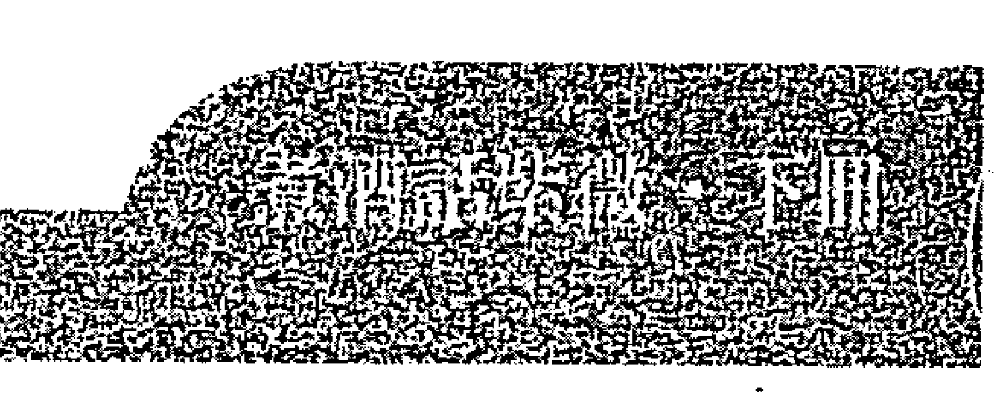

所以單以五行考量，其實不是很正確呢！應該要輔以命主特性，才是最佳的方案呢！

至於命主適合哪類型工作呢，本命宮不見一顆文星，倒見象徵才藝的雜曜：龍池、鳳閣等會照入命，因此命主適宜從事技藝或專門技術類工作，以其君臣慶會的大格局而言，會有不錯的成就。而福德宮亦可觀察出一個人的思考模式，其福德宮逢地空地劫正坐，山人常說，此兩曜雖帶來不順利與挫折，但其充滿想像力及勇於創新的特質，相當適合研發類工作，因此命主最適宜從事專門技術或工藝類的研發或是企劃工作。

而目前命主擔任研發助理工程師，以整體命局組合而言，是一個相當適性的工作，所以山人才會希望命主能繼續堅守崗位。至於命主打算轉往測試及電機水電工作，其實也未嘗不可，因此類工作都屬於專門技術類科，但由於空劫入福德，所以從事研發工作，會是更適宜的呢！

以山人經驗，通常命宮格局大者，多屬於大雞晚啼型的，年輕時通常是相當波折與失落。這也就是孟子所說：天將降大任於斯人也，必先苦其心志，勞其體膚，空乏其身，行拂亂其所為，所以動心忍性，增益其所不能。年輕時的不如意，都會是日後成功的基石。所以一時的不順利，真的不需要太在意。至於是否適合轉換跑道，由於職業轉換，屬流年偶遇，依照強盤理論，我們就轉進流年盤看看。

| 宫位/位置 | 宫干/年份 | 星曜 (庙旺利平陷) | 杂曜/神煞 | 备注/岁数 |
| :--- | :--- | :--- | :--- | :--- |
| **田宅宫** (巳宫) | 癸巳 (102年, 33岁) | 破军(平), 截空, 天福, 天相(庙) | 贯索, 亡神, 将星, 指背, 白虎 | 财帛 (46-55) |
| **官禄宫** (午宫) | 甲午 (103年, 34岁) | 天机(庙), 天梁(庙), 天同(旺), 天府(庙), 天相(庙), 红鸾 | 台辅, 天寿, 天才, 寡宿 | 子女 (36-45) |
| **仆役宫** (未宫) | 乙未 (104年, 35岁) | 廉贞(庙), 七杀(庙), 天真 | 青龙, 月煞, 吊客, 天煞 | 夫妻 (26-35) |
| **迁移宫** (申宫) | 丙申 (105年, 36岁) | 天机(平), 廉贞(平), 陀罗(陷) | 小耗, 攀鞍, 死符, 亡神, 力士, 病符 | 兄弟 (16-25) |
| **疾厄宫** (酉宫) | 丁酉 (106年, 37岁) | 紫微(旺), 天府(旺), 天哭, 禄存(庙) | 息神, 天德, 龙德, 丧门 | **命宫** (6-15) |
| **财帛宫** (戌宫) | 戊戌 (107年, 38岁) | 武曲(庙), 天相(庙), 破军(旺), 天刑, 天马 | 白虎, 华盖, 帝旺, 官符, 嗨气 | 父母 (116-125) |
| **子女宫** (亥宫) | 己亥 (108年, 39岁) | 太阴(庙), 天机(庙), 天梁(庙), 天同(庙), 地空(庙), 地劫(庙), 天巫 | 灾煞, 吊客, 冠带, 伏兵, 岁驿 | 福德 (106-115) |
| **夫妻宫** (子宫) | 庚子 (109年, 40岁) | 武曲(平), 天府(平), 天刑, 天姚 | 大耗, 贯索, 沐浴, 天煞 | 田宅 (96-105) |
| **兄弟宫** (丑宫) | 辛丑 (110年, 41岁) | 天机(旺), 天梁(旺), 天同(旺), 凤阁, 龙池, 天解 | 病符, 华盖, 官府, 长生, 伏兵 | 官禄 (86-95) |
| **命宫/身宫** (寅宫) | 壬寅 (99年, 30岁) | 紫微(庙), 贪狼(庙), 天哭, 天虚, 天月, 天贵, 解神, 旬空 | 喜神, 劫煞, 小耗, 天煞, 岁建, 指背, 长生 | 命宫/身宫 (76-85) |
| **父母宫** (卯宫) | 癸卯 (100年, 31岁) | 太阳(旺), 巨门(旺), 天机(庙), 天梁(庙), 天同(庙), 天府(庙), 火星(庙), 右弼, 贪狼(庙), 紫微(庙) | 晦气, 咸池, 养, 辛 | 迁移 (66-75) |
| **福德宫** (辰宫) | 甲辰 (101年, 32岁) | 天相(庙), 天使, 八座, 天刑, 文昌(庙), 天机(庙) | 丧门, 月煞, 胎, 壬 | 疾厄 (56-65) |
| **中心信息** | 姓名: IGGY<br>生辰: 70年辛酉 (1970年)<br>命宫: 酉 (身宫: 卯)<br>五行局: 火六局<br>命主: 贪狼<br>身主: 天相<br>斗君: 酉 (流年斗君: 丑)<br>流年: 99年 (庚寅年) | 星侨易学<br>星侨电脑软件 版权所有·翻印必究<br>作者: 陈思国 程式设计: 陈明远、陈庆鸿<br>地址: 桃园县龟山乡复兴二路6号(林口长庚附近)<br>电话: (03)328-8833 传真: (03)328-6557<br>网址: http://www.noc.com.tw | 编号: 0000000125 |
| **页码** | 168 | | |

## 99 年大限流年盘

命主问命当年为西元 2010 年，岁次庚寅年，流年命宫在寅宫，三方会羊陀双煞又逢流年天同化忌入命，天同化忌，主情绪上问题，表示这个流年在情绪管控上要特别注意。而三方会煞，表示外在环境对命主相当不利，因此会有转职打算，其实不让人意外。至于是否有转职成功的机会呢？

以流年官禄宫来看，逢天梁化权及魁钺拱照，基本上倘流月官禄宫亦为化权之时，倒是有转职成功的机会。但 100 年流年命宫空劫会照入命，加会天马，本有徒劳无功之意味；而 101 年流年命宮亦會照三煞，顯見這幾年運勢都不會太好，既然如此，何不停留在原工作崗位上，至少在熟悉的環境，遇到不如意時，也較能夠適應。加上流年官祿宮逢貴人星拱照，顯見能有長輩及適時的助力出現，所以山人一直希望命主能留在原工作崗位上，除適才適所外，更因未來幾年流年不佳，在此考量下，還是不要輕舉妄動為宜呀！

# 【案例 75】請指點待人行事的注意事項

| 提問時間 | 2009-08-24 22：03：57 |
|----------|------------------------|

想請教你關於一位男性友人，丙午年10月1日巳時（農曆），從事汽車業，請問你該命盤之人行事各方面該注意事項，再次感謝你的指點！

| 回覆內容 |
|----------|

基本上這位男性命宮天同坐命且化祿，算是很有福氣的人。沒錯的話家境應該也不差才是，橫財運及偏財運都不錯，脾氣是有點暴躁，基本上還算是滿穩定的人。但個性有點散仙糊塗，財庫頗為穩健，看起來應該還滿顧家的就是。

但先天兄弟緣分較淺，所以對於兄弟朋友都滿照顧的。基本上有點重義不惜財的感覺，所以財要守住，先要改掉這毛病，否則借錢或投資朋友只怕是有去無回的居多。

基本上此人頗適合以口為業的工作，個性觀念開朗樂觀有正義感，所以從事汽車銷售還不錯。不過想法有時候過於新潮，激進，而且有點拖泥帶水不乾脆，算是本性上的矛盾。雖然嚮往自由自在穩定而且享受的生活，但總在命運的牽引下難以如願。

今年邁入一個新的大限（44～53），這十年時間看來會非常辛苦，尤其不宜再創業，因本命宮逢四煞齊臨且化忌，走起來會非常的不順與挫折，而且往往是表面看來一片大好，但卻暗藏凶惡，為吉處藏凶之局，是故如經營事業者不可不慎，建議此大限盡量不要進行過度投資，一切以穩定為上。因此大限稍有不慎，只怕晚景堪慮，因大限命宮，財宮均不佳。尤其是僕役宮化忌，表示朋友、屬下無助力就算了，甚至可能會害人，命主這種重義不惜財的個性，在此大限，千萬對朋友要提防點。

雖說大限不佳，畢竟只是10年的總和，至少會有那麼幾年是好運的。是故不宜進行長期投資，如房地產或研發、生產類的創業，短期的投資則尚可，但千萬記住見好就收，窮寇莫追，追之必遭伏兵，應採取打跑戰術為宜。或可參照山人的生命曲線理論，這10年大限中在進出間掌握天時，該攻則攻，該守則守，應該能安渡此大限，畢竟以命主的財庫穩健狀況來看，應可期待晚景。

切記，此10年大限險惡，絕對不宜擴大或輕易投資，一切以穩定中發展為上策，如有其他需要亦歡迎與山人面談。

## 提問者意見

謝謝老師，希望能盡速與老師面談。

## 命盤解析及內容說明

|  | 文破天天祿天<br>昌碎馬官存府<br>© △<br>科 | 地火天天擎太天<br>空星月刑羊陰同<br>◎ X X X X<br>祿 | 封天貳武<br>詰空狠曲<br>◎ ◎ | 鈴天陰天孤巨<br>星頁煞巫辰門陽<br>X ◎ △ \|\|\| 114-123<br>士神符 兄弟<br>2 14 26 38 50 62 | 4-13<br>士星建 命宮<br>3 15 27 39 51 63 | 14-23<br>龍輙氣 父母<br>4 16 28 40 52 64 | 24-33<br>耗犀門 福德<br>5 17 29 41 53 65 \|\| 地恩解年甯鳳鹹陀<br>劫光神解宿闘空羅<br>◎ | [星儒] 星 儒 易 學 [星儒]<br>0000 0000 國晨生陽<br>廉亥天天 子身命命 年男<br>貞昌機同 年主主局5555 ：<br>： ： ： ： 斗 ： ： ： 年 年 丙 屬<br>化 化 化 化 君火破金 午 馬<br>忌 科 權 祿 ： 垦軍四 1 10<br>申 局 月 月 天<br>枉 四 盤 排 入 12 1 河<br>時 日 月 年 砂 日 日 水<br>： ： ： ： 中 10 巳<br>辛 乙 己 丙 金 點 時<br>巳 亥 亥 午 ( ) | 文紅天天<br>曲鸞鉞相<br>◎ X \|\|\| 官月吊 104-113<br>伏煞容 夫妻.身宮<br>1 13 25 37 49 61 | 旬天破廉<br>空喜軍貞<br>X △<br>祿 | 34-43<br>軍神索 田宅<br>6 18 30 42 54 66 \|\| 伏威天 94-103<br>兵池德 子女<br>12 24 36 48 60 72 | 星態電腦軟體 版權所有、翻拷必究<br>作者：陳恩國 程式設計：陳明達-陳慶鴻<br>地址：桃園縣龜山鄉復興二路5號(林口長庚附近)<br>電話：(03)328-8833 傳真：(03)328-8557<br>網址：http://www.ncc.com.tw | 天八三右左<br>使座台弼輔 | 天歲天天天夭<br>才破虛哭廚福 | 天台月天七紫<br>機輔德魁殺微<br>△ ○ \|\| 大指白 84-93<br>耗背虎 財帛<br>11 23 35 47 59 71 | 瘁天龍 74-83<br>伏煞德 疾厄<br>10 22 34 46 58 70 | 喜災大 64-73<br>神煞耗 遷移<br>9 21 33 45 57 69 | 飛劫小 54-63<br>廉煞耗 僕役<br>8 20 32 44 56 68 \|\| 電話：<br>地址： | | | | 編號： 000000126 |

### 本命盤

命主天同坐命且化祿，福星坐命化祿原本並非好事，但因與火星、擎羊雙煞同度，因此得以激發其軟弱本質。天同坐命者，由於太過於員外個性，本不宜創業。但此局在煞星的激發下，又火羊成局，故相當適合以武職顯貴，而汽車業，不管是銷售或是維修，都是相當適宜的工作，正所謂，男怕入錯行，看來命主的選擇是正確的呢！

此命盤帶著相當的矛盾，三方機月同梁成局，又天同化祿坐命，本應是消極懦弱且個性穩定的人，但受煞星激發，有被外在環境所迫，不得不為的感覺，但其喜愛享樂懶散的本質，卻是無法改變的。

而地空地劫夾制兄弟宮，表命主與兄弟緣分淺，倘非獨生子就是與兄弟關係疏遠，而祿落僕役，更是表示命主相當重視兄弟朋友，命裡欠兄弟的缺陷正好給他理念的來源，因此推斷命主對待兄弟朋友是相當的講義氣，甚至時有重義不惜財的狀況發生。所幸兄僕一線尚稱穩定，在付出之虞，亦能得到回報。

而此盤最漂亮的，莫過於田宅宮，逢昌曲及輔弼四吉拱照又會本命祿，想來祖產應是不少才是。而財宮逢天同化祿會照，又火羊成局，綜合推論，命主得財容易，門路相當多。但同時會照地空，表得中有失，以命主重視朋友的狀況，應是破耗於此才是。整體而言，此盤格局相當良好，倘能守成不躁進，我想未來會是很不錯的呢！

另有關這段時間的注意事項，基於三才理論，所以我們要從大限盤看起，其大限盤如下：

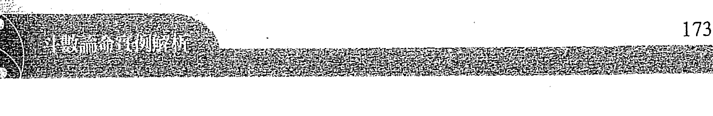

| 疾厄 | 文破天闕祿天<br>昌碎馬官存府<br>© 科<br>©▲ <br>羅色<br>德神 | 財帛 | 地火天天擎太天<br>空星月刑羊陰同<br>◎<br>× ××<br>台鈴<br>虛鑾<br>福星 | 子女 | 封天貪武<br>誥空狼曲<br>◎ ◎<br>哭擎<br>德蛟<br>福祿 | 夫妻.身宮 | 鈴天陰天孤巨太<br>星貴煞巫辰門陽<br>×<br>◎▲<br>吊客<br>客祿 |
|---|---|---|---|---|---|---|---|

### 本命大限盤

命主問命時間為西元 2010 年，時齡 44 歲，剛好跨入一個新的十年大限，此大限命宮逢地空、地劫拱照，本有徒勞無獲之意，而此局又稱為浪裡行舟，表面上看來一片大好，但暗地裡卻危機四伏。加上羊陀雙煞亦同時會照，表示其面對的競爭與壓力是相當強大，四煞齊臨大限命宮，此大限想要有所成就，只怕會是相當困難。加上天姚野桃花正坐，加會煞星，只怕要特別提防「桃花劫」的狀況。

雖說此大限田宅宮逢輔弼正坐，相當漂亮，但其命宮星曜組合的破耗相當嚴重，倘不好好守成及管好自己的「下半身」，則再多的祖產也不夠敗呀。所以山人建議命主在這 10 年間，由於本命帶祿馬交馳格局，且財庫相當穩固，勉強可以創業，但保守為上，以守成為最高指導原則，萬不可過度擴張或操作財務桿桿，最重要的是「路邊野花不要採」，因此大限極有可能因此而破大財呢！而下個大限（54～63），紫微七殺正坐，紫殺化權，又得天府來朝，本命祿會照，加會大限祿權，形成疊祿及另類的疊權，看起來非常漂亮，通常走紫微的大限都是相當強運的時候，加上祿權巡逢加雙主星匯聚，故推測命主在事業上應會有相當的成就，也應該是相當強運的大限，但前提是必須能忍過這段時間的不順利呀。

這也是山人再三叮嚀命主需面談的主因。山人研發的生命曲線理論，可以找出大限流年的強運點，在此強運點出擊，定然有所收穫，但因大限不佳，故需見好就收，不可戀棧。待下次運至之時，再戰江湖，採游擊戰術，我想這個大限星宿組合縱然不佳，也能有一條生路的呢！

# 【案例 76】請問我今年或明年的結婚運到了嗎？

| 提問時間 | 2009-09-01 23 : 40 : 13

我是 1982 年 06 月 16 日未時生的，農曆閏4 月 25 日，想問今年或明年有結婚運嗎？

| 回覆內容

結婚，只要你們雙方想結婚就隨時可以結婚，哪有結婚運這回事呢？因為結婚的時機決定權在自己，命理只能當作參考，或是提供比較適宜結婚的時機點，這樣才比較正確。還有，沒有出生時辰，無論是八字或紫微等命理術數，都沒有辦法做整體的論述，所以也沒有辦法幫你男朋友看。

不過其實不需要看，原因很簡單，如果兩個人看了不合盤，你們會因此分手嗎？如果不會，那看又有什麼意義？如果會，哪個老師會拆散人家的姻緣呢？縱使給你六合，又如何呢？台灣大家結婚哪個不去合盤？不去挑良辰吉日？如果有用的話，那離婚率怎會如此之高？

其實婚姻這件事是取決於兩個人，願不願意重視雙方的溝通協調及包容彼此的缺點，如果都能做到，誰說八字不合不會有好結果？如果做不到，縱使給你們六合，誰敢保證這婚姻能長久？對不對。

好啦，觀念正確了，那現在山人就用命理的角度幫你看看，幾時姻緣有動靜，讓你做參考。

以大限來看，這個大限（24～33），大限命宮見次桃花正坐，再會紅鸞、天姚等桃花星來拱，加上大限夫妻宮見化祿引動，只能說，這個大限不結婚都很難，所以盡可寬心。

如果以流年來看，流年夫妻宮見鸞喜對照，又逢本命祿存，照理說今年就應該結婚了。但可惜文曲化雙忌正坐，所以雙方應該最近口角糾紛嚴重，甚至有財務問題，今年的情形只能說，雖然很有結婚的機會，但最後總是因爭執而不了了之吧！

單就命理角度來看，姻緣應該是成於30歲左右，但是如果今年問題可以克服的話，也是有機會的。

## 命盤解析及內容說明

| 天天紅天七紫<br>巫桃鸞鉞殺微<br>△O<br>權 | 天地八陰右天<br>使劫座煞茹福 | 天壽<br>月宿 | 火三左天天<br>星台輔哭馬<br>X 科 |

### 本命盤

以本命宮看來，鑾喜對拱加會天姚野桃花，表示命主異性緣相當好，而本命宮得府相來朝，女命賦有曰：「府相之星女命纏，定當子貴與孫賢。」因此看來是相當旺夫的呢！加上超強的異性緣，應該不太會有孤單一輩子的狀況，再來我們觀察命主的夫妻宮，次桃花廉貞正坐，再會紅鑾及天姚，正野桃花到齊，三方星群組合相對穩定，我想桃花過多，會是命主的困擾吧！故此盤怎樣看來，都不會是沒有姻緣的情況呢！所以只是姻緣成於何時的問題。基於三才理論，我們就轉進地盤（大限盤）看看這個大限的狀況吧！

| 宮位 | 财帛 | 子女 | 夫妻 | 兄弟 |
|------|------|------|------|------|
| 天星 | 天天紅天七紫<br>巫姚鸞鉞殺微<br>○○<br>白虎 | 地八陰右天<br>劫座煞茹福<br>天咸德池 | 天寡月宿<br>吊月容煞 | 火三左天天<br>星台輔哭馬<br>科X<br>病符亡神 |
| 大限年龄 | 64-73 | 54-63 | 44-53 | 34-43 |
| 干支与神煞 | 飛亡龍<br>廉神德<br>遷移<br>12 24 36 48 60 72 | 長乙秦將白<br>生巳書星虎<br>疾厄<br>11 23 35 47 59 71 | 養丙將攀天<br>午軍鞍德<br>財帛<br>10 22 34 46 58 70 | 胎丁小歲弔<br>未耗驛客<br>子女<br>9 21 33 45 57 69 |
| 地支 | 卯 | 午 | 未 | 申 |
| 宫位 | 疾厄 | 命宮 | 父母 | 命宮 |
| 天星 | 天地歲天天天<br>傷空破虛梁機<br>祿存天馬<br>天刑 | 姓名：XXX<br>武左紫天<br>曲輔微梁<br>：：：：<br>化化化化<br>忌科權祿<br>排盤年月日時：<br>癸庚乙壬<br>未午巳戌 | 鈴天天陀<br>星貫官羅<br>◎<br>晦氣鞍 | 封天天破廉<br>誥才府軍貞<br>X破<br>歲建星 |
| 大限年龄 | 74-83 | 24-33 | 14-23 | (在表格上部) |
| 干支与神煞 | 喜月大神煞耗<br>僕役<br>1 13 25 37 49 61 | 沐甲<br>浴辰 | 青息病<br>龍神符<br>夫妻<br>8 20 32 44 56 68 | 力華歲<br>士蓋蓮<br>兄弟<br>7 19 31 43 55 67 |
| 地支 | 辰 | 酉 | 戌 | (在表格上部) |
| 宫位 | 遷移 | 田宅 | 福德.身宮 | (在表格上部) |
| 天星 | 文月截天天<br>昌德空魁相<br>△<br>大炎耗煞 | 旬台天破貪武<br>空輔刑碎狼曲<br>○○○ | 解年解鳳擎太天<br>神解府羊陰同<br>X◎◎<br>貫息索神 | 文天孤天祿天<br>曲壽辰喜空存府<br>◎○△<br>驛門破碎 |
| 大限年龄 | 84-93 | 104-113 | 114-123 | 4-13 |
| 干支与神煞 | 擒威小伏池耗<br>官祿<br>2 14 26 38 50 62 | 冠癸帶卯 | 恩寵巨太光池門陰<br>○○○<br>官祿<br>○○○ | 伏天貫兵煞素<br>福德.身宮<br>4 16 28 40 52 64 | 帝癸旺丑官癸夷伏煞門<br>父母<br>5 17 29 41 53 65 | 博劫晦<br>士煞氣<br>命宮<br>6 18 30 42 54 66 |
| 地支 | 卯 | 丑 | 亥 | 亥 |
| 其他信息 | 電話：<br>地址： | (表格中部文字)<br>作者：陳恩國 程式設計：陳明遠．陳慶鴻<br>地址：桃園縣龜山鄉復興二路6號(林口長庚附近)<br>電話：(03)328-8833 傳真：(03)328-6557<br>網址：http://www.moc.com.tw | (表格中部文字)<br>《天限問:15分界.命身論.其他論》<br>星僑電腦軟體 版權所有．翻拷必究 | (表格中部文字)<br>姓名：XXX<br>國曆生陽 年女：71.2.1<br>身主：戌狗<br>命宮：卯<br>局月：64<br>大海水<br>金鉗時 |

### 本命大限盤

命主問命當年為西元 2009 年，時年 28 歲，大限落於 24～33 這個宮位，大限命宮廉貞正坐加會紅鸞天姚，大限化祿及化權會照引動，因此正野桃花同時引動，可謂百花齊放呢！而大限夫妻宮會照天喜，又逢對宮化祿引動，此大限結束前，必能聞到喜訊無疑。但同時會照孤辰寡宿，所以對象必須慎選，對象錯誤，則離異的狀況也是有可能會發生呀。

以此大限夫妻宮結構看來，理應晚成為宜（註：須視流年的姻緣狀況而定，因此段期間緣分包含正緣及桃花，該如何選擇，我想這就是命主自己的抉擇，命理老師充其量只能提供建議罷了）。由於結婚是流年偶遇，基於強盤理論，我們就轉進問命當年的流年盤看看吧！

| 宮位 | 年齡範圍 | 星宿 |
|------|----------|------|
| 官祿 | 64-73 | 天天紅天七紫... |
| 田宅 | 74-83 | ... |
| 福德身宮 | 84-93 | ... |
| 父母 | 94-103 | ... |
| 命宮 | 104-113 | ... |
| 兄弟 | 114-123 | ... |
| 夫妻 | 4-13 | ... |
| 子女 | 14-23 | ... |
| 財帛 | 24-33 | ... |
| 疾厄 | 34-43 | ... |
| 遷移 | 44-53 | ... |
| 僕役 | 54-63 | ... |

### 大限流年盤

命主問命當年爲己丑年，流年命宮位於丑宮，貪狼、廉貞雙桃花星匯聚，加上紅鸞會照又逢大限流年祿權引動，是故本年應有正緣可遇才是。但因流年夫妻宮雖逢鸞喜對拱，但由大限流年文曲化雙忌，所幸三方四正星曜組合頗爲穩定，而文曲表口舌，是故今年應有結婚打算，但經常因口角爭執而作罷，其實結婚不只是兩個人的事，還牽涉到兩個家庭背景，尤其台灣是屬於移民社會，除傳統的閩、客族群及原住民之外，尚包含民國37年隨著國民黨敗退來台的軍人，而這些軍人來自中國的各個省份，自然會有不同的嫁娶習俗。

有鑒於此，雙方家庭在嫁娶習俗上認知的差異，往往是爭執的主因。而當雙方家長爭執不下之時，我想苦的就是這對將成婚的新人了，所以當年不是沒有成婚的可能，只是雙方要盡量互相包容對方家長在文化習俗上的差異，盡量避免因婚事而爭執，我想還是有成婚的機會呢！但單以命理角度由流年推估，30 歲那年成婚會是更好的選擇呢，所以倘當年因爭執而作罷，未來還是會有機會的呢！

# 【案例 77】人稱「鐵掃把」，請大師幫我解惑好嗎？

| 提問時間 | 2009-08-29 08 : 21 : 02

老師你好，我想請問今年牛年農曆 6 月出生的小孩好嗎？我的小孩子出生日期為國曆 2009/08/17 是男生，早上 9 點 23 分出生。有一位老師說不好，說是「鐵掃把」，要我去找診所護士改出生證明，要我報戶口時改為國曆 2009/06/21，請大師救我，幫我解惑。

## | 回覆內容 |

各位煩惱的父母親，首先要澄清一個觀念，就是人的命在他出生的時候已經定了，改變出生日期，不但改不了命，反而是害了這個孩子呀！

你試想，如果你在公司上班，只是一個小職員，當你到了董事長辦公室，你敢坐在董事長的椅子上嗎？為何副總統不敢坐在總統的位子？又為何沒升到將軍的人，不敢隨便佩戴星星在肩上？

都是怕沒有這個福分，所以大人不要隨便幫小孩改日期，因這樣反而是害了他。所有的事，都是由因果所造成的，沒有辦法用投機取巧的方式改變它，這樣清楚了嗎？山人幫你孩子看看吧！

## 命造國曆 98 年 8 月 17 日巳時建生。

本命宮見天機太陰坐，此格局爲標準的機月同梁格局，古曰：「機月同梁當吏人。」整體而言不算太差，只是這個小孩有點散仙，聰明但是個性有點溫吞、內向，不過機謀多變，多才多藝也是他的優點呢！所以命局整體看來還不算太差，不要想太多，要知道，鐵掃把又如何？如果能夠多行善積德，自然有改變的機會，命格再好又如何？自己不努力也是惘然，所以這位父母親，不要擔心，好嗎？

沒錯的話，這小孩的家境頗爲寬裕，如果真的擔心的話，可以考慮重拜父母，比去戶政事務所謊報日子還實際得多。

對了，既然是小孩，就順便把這小孩該注意的地方一併告訴你，八字學尚稱之爲「小兒關煞」，也請多加注意。

-   撞命關：勿入中元壇內，保平安。
-   直難關：限內刀器利器小心可保平安。
-   四柱關：所有修造動土、不可近前，遠離爲吉，俗忌坐兒童車，須小心可保平安。
-   落井關：勿近井邊、河邊、水邊、渡舟、有坑洞穴的地方，去玩必險，有水厄之災，勿近爲要。
-   雞飛關：怕看殺生，防之爲要，以免不吉。

## | 命盘解析及内容说明 |

| 宫位 | 数字范围 |
|------|----------|
| 田宅 | 96-105 |
| 官禄 | 86-95 |
| 仆役 | 76-85 |
| 迁移 | 66-75 |
| 福德 | 106-115 |
| 父母 | 116-125 |
| 兄弟 | 16-25 |
| 夫妻.身宫 | 26-35 |
| 子女 | 36-45 |
| 命宫 | 6-15 |
| 疾厄 | 56-65 |
| 财帛 | 46-55 |

### 本命盘

這又是一個不學無術的老師惹出的麻煩，山人論命多年，此類型事件遭遇相當頻繁。所以論命者務須謹慎言行，讓這位母親如此苦惱，還要爲了你的一句話，竄改出生時間，犯了「使公務員登載不實罪」，這又何苦呢？倘竄改時間有效，冒個犯法的風險也就罷了，但這是無謂的行爲，若竄改出生時間有效的話，那全國的嬰孩不就都是台灣首富郭台銘，因爲沒人會把時間改成「乞丐」的格局，這聽起來是否有點荒謬無厘頭呢？

也就是因為如此，所以中國術數經常被視為迷信，都是這些不學無術的江湖術士搞出來的呀，胡亂編造故事背上因果，自己下拔舌地獄就算了，還要讓中國五術因此蒙上迷信的惡名，真是為禍不淺。

以山人多年論命的經驗，其實一個人的命運好壞，在出生的那一刻，就已經註定了七分，為何會如此準確？除了山人立論的統計學的基礎之外，最重要的是因果關係。倘改出生時間就能改變因果，各位同學，你認為可能嗎？許多家長就是有這種迷思，總認為小孩的出生時間好，就能保證終身富貴，但事實上，人命是天定，不可能因人為因素遭到改變，許多父母望子成龍，都會擇日剖腹。但，真的有用嗎？如果有用的話，那每個人都是王永慶了。哇！那台灣豈非成為「香格里拉」，一個沒有窮人的國度，每個都是巨商豪賈，這是多麼理想的境界，倘真如此，我想連佛祖釋迦牟尼都要跟這些狂妄的命理師請益了呢！

改變出生時間或是擇日擇時剖腹，有可能讓小孩的命變得更好嗎？用「第三隻眼」來想都知道：根本不可能！家長倘選擇這樣做，經常是害了這個孩子，因為每個人天生命格的承受力不同，格局大者，承受力佳，可堪重任，但沒格局者，你硬給他大格局，請問他承受得住嗎？

山人在回覆時舉了很淺顯的例子，假如你今天是公司的小職員，讓你去董事長的椅子坐坐看，我想你會感到頭暈不舒服，又台灣曾有某位民意代表，受高層賞識，進入政府擔任部長等級的要職，但在就職前幾日，因登山心臟麻痺而意外死亡。爲何？就是因爲承受力不足。大人尚且如此，又何況這個寶寶呢？這並非山人危言聳聽，而是真實的例子呀，爲人父母者，當須慎之。

縱使真是鐵掃把，也是因爲累世的因果所致。佛家常說，會成爲一家人，只有四種因緣：還債、討債、報仇、報恩罷了，知乎於此，何須過度在意呢？再怎麼說都是自己的孩子，再怎麼樣不好，就當作還債了吧！讓山人感到納悶不解的是，通常命理老師遇到這情況，都會建議八字帶鐵掃把的孩子，重拜父母可免刑剋，從未聽過要去戶政事務所改日期的建議，真讓人匪夷所思。基於研究的心態，倘有機會，山人倒真想拜會這位大師，探究其因，也許是山人學養不足吧，以至於聞所未聞。

觀念正確了，我們就幫這位煩惱的父母親看看孩子的命盤吧！天機太陰坐命，三方形成機月同梁格局，基本上此局人穩定性相當足夠，又紅鸞天喜入命，異性緣絕佳，但因天空正坐會照地空，雙空會命，故個性會相當迷糊散仙，但整體星曜組合相當穩定。身宮又逢天魁天鉞此類貴人星拱照，命身皆強，福德不倒，又怎會有太大的問題？而田宅宮得府相朝，又逢昌曲拱照，家境定然不差，又有什麼必要去亂改呢？至於命帶刑剋，過房或重拜父母及用孩子的名義行佈施與放生，累積福報與資糧即可，這位父母親，真的不需要擔心太多呢！

# 【案例78】關於婚姻與小孩請協助解盤

提問時間 | 2009-08-27 10:49:02

農曆76年4月27日卯時，男，可以看出幾歲結婚與小孩的情況嗎？之前有別的老師說：「不是沒小孩就是會『離開』。」

## | 回覆內容 |

看來你對這問題很重視，你應該是獨子吧，壓力會比較大。

其實有沒有小孩這點，爲何許多老師不會回答你？原因很簡單，現代科技進步，可以做人工，也可以做試管，不孕症的都可以子孫滿堂。而且古代強調多子多孫，現代少子化當道，所以用古代的命理論子息數量，基本上已經不會正確。

但與小孩的相處及小孩個性，卻還是正確的。只是有沒有小孩這個問題，以目前的生殖科技來講，決定權在你自己手上，而非天意，這樣清楚了嗎？好了，基本觀念正確，現在就幫你看看。

結婚這回事，其實決定權也在你自己，命理充其量只能提供你參考値，因爲你如果想結婚，明天就可以呢！

如果單純以命理的角度來看，你青少年時期多為單戀，且常有拖泥帶水的情況。以你現在這個大限來看（24～33），大限命宮逢桃宿對照對照本命盤夫妻宮，大限夫妻宮逢化祿，沒錯的話婚姻應該成於此大限，所以耐心點，不要急，時候到了，自然就會結婚，至於確實的年紀，雖然可以推論的出來，但是這樣會有暗示的問題，有時候反而是害了你，所以只能大概的告訴你，也歡迎你在這大限成婚後再來與山人印證。

至於小孩的情況，子息數量問題，上節已經敘述過，你的孩子看起來個性比較強硬也比較叛逆，有主見，不喜歡被人管，而且是個過動兒，比較坐不住，老愛到處跑來跑去。以子女宮逢雙煞的情形來看，推論是子息數會比較少，當然，如果你去做人工受孕就另當別論。

就像山人說的，雖然子息數量不會準確，但相處模式及小孩個性，卻是相符的。

## 命盤解析及內容說明

| 宮位/資訊 | 星曜（化祿/權/科/忌） | 數字序列 | 地支 | 宮幹 | 限歲 |
| :--- | :--- | :--- | :--- | :--- | :--- |
| **田宅宮** | 封誥 八座 天才 破碎 蜈廉 孤辰 天廚 陀羅 (忌) | 5 17 29 41 53 65 | 巳 | 乙 | 94-103 |
| **官祿宮** | 天機 (祿) 天梁 (權) | 6 18 30 42 54 66 | 午 | 丙 | 84-93 |
| **僕役宮** | 天同 太陰 文昌 文曲 右弼 左輔 年解 鳳閣 龍池 破軍 紫微 (科) | 7 19 31 43 55 67 | 未 | 丁 | 74-83 |
| **遷移宮** | 地空 天貴 恩光 陰煞 月德 | 8 20 32 44 56 68 | 申 | 戊 | 64-73 |
| **福德宮** | 青龍 華蓋 晦氣 龍德 | 4 16 28 40 52 64 | 辰 | 甲 | 104-113 |
| **（中央區）** | [星儀] 星儀 易學 [星儀] 宜天機 天同 太陰 子身命命 化忌 化科 化權 化祿 柱四盤排 時日月年 乙癸乙丁 卯酉巳卯 (註：此為中央資訊區，非單一宮位) | - | - | - | - |
| **疾厄宮** | 大耗 炎煞 天耗 | 9 21 33 45 57 69 | 酉 | 己 | 54-63 |
| **父母宮** | 小將 歲建 耗星 | 3 15 27 39 51 63 | 卯 | 癸 | 114-123 |
| **財帛宮** | 病符 天煞 伏兵 | 10 22 34 46 58 70 | 戌 | 庚 | 44-53 |
| **命宮** | 將軍 亡神 病符 | 2 14 26 38 50 62 | 寅 | 壬 | 4-13 |
| **兄弟宮** | 喊月 吊客 書煞 容 | 1 13 25 37 49 61 | 丑 | 癸 | 14-23 |
| **夫妻宮** | 飛廉 咸池 天德 | 12 24 36 48 60 72 | 子 | 壬 | 24-33 |
| **子女宮** | 喜神 指背 白虎 | 11 23 35 47 59 71 | 亥 | 辛 | 34-43 |
| **其他資訊** | 星儀電腦軟體 版權所有・翻拷必究<br>作者：陳恩國 程式設計：陳明遠・陳庭鴻<br>地址：桃園縣龜山鄉復興二路3號(林口長庚附近)<br>電話：(03)328-8833 傳真：(03)328-6557<br>網址：http://www.noc.com.tw<br>編號： 0000000130 | - | - | - | - |

### 本命盤

中國俗諺有云：「不孝有三，無後爲大。」在傳統中國父系社會下，大都強調多子多孫，尤其是傳宗接代的觀念根深柢固。尤其倘若你是獨子的話，我想壓力會是相當的大。所以子息有無這個問題，對中國人而言，是相當重要的事情呢，也因此此斗數裡會有子女宮的存在。

由於斗數創自中國宋朝，當時的社會氛圍與現代大異其趣，所以古代的標準，到了現今確實已經不適用。因現代少子化當道，加上生殖技術進步，縱使不孕症的夫妻，都可以透過試管或是人工方式成功受孕，或是採用代理孕母的方式。所以有無子息這個問題，我想應該可以從斗數古籍裡淘汰了，因不符合社會進展现況呢！但與子女相處狀況、個性等卻還是相當的準確呢！所以同學千萬別斷章取義說子女宮不用看，因為不符合現代社會型態，只有子息數量無法推算罷了，其餘的部分，還是可以推估的。

至於命主自述其他的命理老師會說他不是沒小孩就是會「離開」（應該說成：生離死別的狀況），到底為何如此論斷，就是因為命主子女宮三方四正會照羊陀雙煞，加上天馬正坐，所以有此推論，並不意外。其子女宮雖逢羊陀雙煞來沖，但同時也會照昌曲輔弼等四吉星，表示求子路上因煞星影響會比較辛苦，但在吉星拱照下，只要努力，也是會有好結果的。所以山人會說，那位老師說對一半，是否無子息或是生離死別的狀況，以此星曜結構看來是有可能的，因古書有曰：「廉貞，一人，若貪狼破軍七殺同，主孤。」但這位老師只看到煞星卻忘了吉星也同時會照，此為凶中帶吉之局，尚可撐持呀，以山人觀點，充其量也只是得子較為辛苦且較晚罷了，沒有那麼嚴重呢！且以此盤論之，除非自己不努力，否則應該還是會有孩子的呢！最慘的狀況就是找代理孕母，一樣可以圓夢，不是嗎？

至於孩子的個性及相處模式呢？這問題就要從該宮星曜組合逐一拼湊了，廉貪正坐會照紫微與輔弼加上天馬，因此個性上較為強勢及叛逆，好勝心強，有過動傾向，喜動不喜靜，而天壽、天福正坐，表與子女感情深厚，所以整體而言，相處模式還算不錯呢，只是要多注意過動及較為叛逆的問題。而結婚時間點呢，基於三才理論，我們就轉進最有可能的（24～33）大限看看吧！

### 本命大限盘

这个大限命宫逢鸾喜对拱，主有正缘可期待，夫妻宫逢天喜且会照本命禄及大限禄，是故此大限应有喜讯可闻才是。但因大限命宫逢本命忌，因此增添了起伏与波折。于成婚年龄，就要逐年搜寻，以流年看来，正缘可能要到28岁前后，正确结婚年龄，应落在30岁前后，而子息问题，倘若女方子女宫颇强，亦可补足命主之不足处，以山人经验，有无子息这个问题，还是要以母亲命盘结构为准，所以还是有逆转的机会呢！纵使女方也是子息缘浅，但还有现代生殖科技帮忙，最多就是花点钱了吧！所以命主真的不要太担心呢！倒是先烦恼对象在哪儿，会比较实际一点，因为人类总不可能无性生殖吧，没对象，还谈生孩子这件事，好像有点太过了呢，各位看倌你说对不对呢？

# 【案例79】一切就任它「顺其自然」吗？

| 提问时间 | 2009-08-30 00:05:12 |
|----------|---------------------|
| 内容     | 人真的是什么命造就什么人吗？当然要更好就要更努力。不过如果感觉没得选择，那是否就让它顺其自然？<br>或许我的命宫在太阴，整个对任何事都超软弱的，当然什么命就有什么优点缺点。但是，总是觉得好无力喔！好难改变。<br>难道目前什么事就不要强求，时间到运就到吗？<br>目前刚毕业找工作，觉得什么都很不顺，又无可奈何。请问就我的紫微八字来说，目前我该如何做呢？<br>本人：女，民国75年国历5月26日13时27分（未时）生。谢谢！ |
| 回复内容 | 嗯，你说的话，基本上对了80%，正所谓命由性生。一个人的命运决定在他自己的个性，一个积极度不足的人，怎能期待在工作上大放异彩呢？至于命是否天定，以山人多年论命经验，一个人此生如果没有自造大善大恶，基本上人生的运势及历程，不会与命理所叙述的相差太大。所以命理老师都劝人多行善事，就是因為要改變命運，除了改變個性之外，更重要的就是多行善事，自然就會有改變，所以山人才會說你說對了80%了。沒關係，山人幫你看看，你未來適合的方向吧！<br>基本上你是太陰坐命的女生，由於太陰代表女性，因此坐女命最適宜。倘落男命則不恰當，因會有缺乏魄力及過於天馬行空的感覺。而且太陰坐命，通常都是屬於氣質型的女生，美麗不一定，但氣質絕對不會差。<br>而太陰坐女命，基本上較為多愁善感，感情豐富，也不擅長拒絕別人。個性平和，善解人意，對逆境比較採容忍的態度。相對積極度不足，個性頗為固執、倔強也較為主觀。<br>不過你的除了太陰坐命外，還逢太陽來會，表示你外在表現給人家的感覺還算是樂觀開朗，也喜歡照顧弱小，有正義感，會打抱不平，不過有時候言語過於坦率，常常得罪人就是。<br>至於你適合的工作，基本上你是屬於機月同梁格局的人，古曰：「機月同梁作吏人。」所以適合穩定單調的工作。加上太陰坐命本身積極度就不足，所以你比較適合擔任如：公務員、行政內勤、秘書、作業員、行政助理或社會工作。<br>不過本命宮逢空劫羊陀四煞侵襲，雖說逢日月來拱，但人生路上的挫折與失意難免。而且日月喜會照，坐命威力較弱，所以助力總是不足，也難免你會感到失落與無奈。建議你可以朝向山人分析的工作方向發展，會比較適合你。 |

## 命盤解析及內容說明

| 宫位 | 星曜组合 | 大限年龄 | 干支 | 备注 | 地支 | 流年 |
| :--- | :--- | :--- | :--- | :--- | :--- | :--- |
| 疾厄 | 天禄、天使、天辰、地劫、华盖、天机 | 53-62 | 癸 | 病 | 巳 | 12 24 36 48 60 72 |
| 财帛 | 地劫、龙池、天羊、天机 | 43-52 | 官将 | 官 | 午 | 11 23 35 47 59 71 |
| 子女 | 恩光、右弼、左辅、天德、天喜、破军、紫微 | 33-42 | 伏举 | 小 | 旺未 | 10 22 34 46 58 70 |
| 夫妻 | 火星、阴煞、年解、天虚、凤阁 | 23-32 | 大岁 | 大 | 官申 | 9 21 33 45 57 69 |
| 迁移 | 力士、月煞、东门 | 63-72 | 死壬 |  | 辰 | 1 13 25 37 49 61 |
| 仆役 | 天伤、文昌、贯索、天空、七杀、武曲 | 73-82 | 墓辛 |  | 卯 | 2 14 26 38 50 62 |
| 命宫 | 喜神、华盖、白虎 | 3-12 | 沐戊 |  | 浴戌 | 7 19 31 43 55 67 |
| 官禄 | 八座、天月、天寿、天梁、天同 | 83-92 | 绝庚 |  | 寅 | 3 15 27 39 51 63 |
| 田宅 | 台辅、寡宿、红鸾、天相 | 93-102 | 胎辛 |  | 丑 | 4 16 28 40 52 64 |
| 福德<br>(身宫) | 三台、天刑、天才、天厨、天福、巨门 | 103-112 | 养庚 |  | 子 | 5 17 29 41 53 65 |
| 父母 | 旬空、文昌、天巫、天马、天魁、贪狼、廉贞 | 113-122 | 长己 |  | 亥生 | 6 18 30 42 54 66 |

### 本命盤

命主太陰坐命，故應屬於氣質型的漂亮女孩。在斗數裡，太陽是男性的表徵，而太陰就是女性表徵，所以女命坐太陰，絕對是適宜的呢！而太陰坐命者，心思細膩，想像力及感情豐富，善解人意等優點。以此例而言，由於三方四正同時會照斗數四煞：擎羊、陀羅、地空、地劫，除表示外在環境對命主相當不利之外，也劣化了太陰星優良的本質。

例如原本想像力豐富，但因空劫會照，反倒形成鑽牛角尖，胡思亂想。而善解人意的優點，亦會轉化成暴躁易怒，讓人難以理解與相處。命宮天機、天梁、擎羊會的孤剋組合，更是證明了此論點。因此命主會提出目前的疑惑及困擾問題，實在不讓人意外。

基本上而言，學校剛畢業，工作經驗不足，找工作本身就較為吃虧，加上台灣景氣長期不佳，年輕人待業往往需要超過半年以上。所以應該趁此時間，積極的學習專業技能，增加職場競爭力才是，而非消極的在那兒胡思亂想，這樣真會悶出病來的呢！

至於命主適合哪類型的工作呢？由於命宮三方四正組合為著名的「機月同梁」格局，基本上此局人較適合單調的工作，也因為穩定性足夠，所以往往是大企業最喜歡的人格特質呢！加上太陽會照，其個性應該也是頗為外向開朗，而且長得有氣質又漂亮，相當適合如：秘書、行政內勤、客服人員、公關等類型的工作，應該會相當適性的呢！所以建議命主在這段時間可以一邊找工作，同時參加一些專業技能訓練課程，例如語文課程、電腦文書處理等技能，增加競爭力，我想應該是能夠離開目前困境的狀況。且工作適性發展，對命主而言，會是很棒的第一步呢！

人生就像在海上航行，一定要有方向與目標，專心一致前進，自然會到達目的地。若否，就是真的隨波逐流了，四處漂泊。這也是命理可以對人們有幫助之著力點，就是在這個十字路口，幫助命主撥雲見日，找到最適性適所的方向，勇敢大步前進，相信在命理協助之下，一定會有好結果的。

# 【案例 80】想問此人的財務狀況與工作運途

| 提問时间 | 2009-08-29 23:06:39 |
|----------|---------------------|
| 内容     | 论命：男，農曆民國48年3月3日巳時生。<br>想問此人：<br>財務狀況與工作運途，是屬於投機事業亦或苦幹實幹亦或上班族？<br>在哪幾年是大發大落，或陷於經濟困境，或有財務糾紛等？<br>出外朋友大都為哪些類型，是否對此人真有所幫忙，或純粹互相利用等？<br>健康方面應該注意些什麼？與妻小相處情況如何？ |
| 补充内容1 | 2009-08-30 03:12:40 補充：<br>To 了然山人：<br>此命盤主人從小家境不好，二十幾歲的時候進入公職服務，認識另一半結婚，白天是公務員，晚上從事娛樂事業。這種一天睡不到幾個小時的日子過了十幾年，將近二十年。如你所說，這個主人很不喜歡公務員生活，所以晚上的娛樂事業才是他最開心最有精神的時候。因為是他自己當老闆經營的，也因此他很少跟子女碰面甚至是講話。26～35歲確實走得很辛苦，因為卸下白天公務員身分後又馬上出門當老闆。他的老婆是個對於家事很能幹，小孩一手照顧，多煩惱又身體不太好的配偶，他們口角滿嚴重。但是因爲從小家境不好，再加上從事娛樂事業，當上老闆經營有成賺了不少錢，野心和膽子愈來愈大，結果遭到朋友不良誘惑轉而經營投機事業，導致身敗名裂，現在日子過的非常不好。以前晚上經營娛樂事業的時候常常會喝酒應酬，現在在家會藉酒消愁，所以胃確實不好。 |
| 补充内容2 | # 2009-09-02 00:32:32 補充：<br>那晚年運勢大概如何，想請問如果現在經營小本生意（吃的方面）會賺嗎？我說的是至少能有點小賺，能衣食無虞就好，不求大富，只求安飽，因爲這個命盤的主人目前經濟狀況很差，或者是繼續投機或娛樂事業？ |
| 回复内容 | 由於民國48年實施日光節約時間，時間應該要向前調1小時，所以還是需要實際的出生時間方可確實的排盤，不過還是先幫你用巳時來看看。你的問題，還是分項回答：<br>- 1. 投機事業，看不出來，苦幹實幹，有一點。但紫殺化權，加上本命宮祿權巡逢，又紫微天府雙主星坐命。但逢羊陀雙煞，在逢文昌單入，給人家感到有點言過其實。雙主星坐命，本來就有點好大喜功的心態。綜上所述，我想上班族的生活對你是不適合的，因你也不喜歡久居人下。沒錯的話，這是個老闆格局。<br>- 2. 哪幾年大起大落，26～35歲這個大限走得很辛苦，36歲之後逐漸轉好。<br>- 3. 交遊頗為廣闊，朋友多為專業人才或精於某一種學術或技術者，各階級及各方面的朋友都有。朋友是你的貴人所在，但彼此信任度不佳，如果是老闆的話，公司部屬流動性較大。如果是上班族的話，就是常常自己換老闆。<br>- 4. 至於健康方面，必須注意胃部方面的疾病。<br>- 5. 以星盤看來，你的姻緣動得很早，沒錯的話在25歲前就已經結婚了，大概在23歲左右，老婆聰明賢淑，持家有方，多才多藝，但時常有口舌不和，或多病多憂的情況。而子女活潑好動，個性外向，頗為聰明，口才不錯，滿會說話的，好的時候嘴巴甜，壞的時候愛頂嘴。與子女的代溝頗深，與子女相處機會不多或少見面。 |
| 补充内容3 | # 2009-09-03 23:27:30 補充：<br>切忌繼續投機，因為將邁入下一個大限，所以如果繼續從事這種事業下去，只怕下個大限很難過的去。聽老師的話，做小生意很好，腳踏實地，會有不錯的發展，晚景應該還不錯呢！ |

## 命盤解析及內容說明

| 宫位 | 星曜组合 | 大限年龄 | 干支 | 地支 | 备注 | 流年 |
| :--- | :--- | :--- | :--- | :--- | :--- | :--- |
| 迁移 | 力士、岁弊、大耗 | 66-75 | 己巳 |  |  | 5 17 29 41 53 65 |
| 疾厄 | 博士、恩宠、天德 | 56-65 | 墓庚 | 午 |  | 6 18 30 42 54 66 |
| 财帛 | 官符、将星、白虎 | 46-55 | 死辛 | 未 |  | 7 19 31 43 55 67 |
| 子女 | 伏兵、劫煞、天德 | 36-45 | 病壬 | 申 |  | 8 20 32 44 56 68 |
| 仆役 | 青龙、攀鞍、小耗 | 76-85 | 胎戊 | 辰 |  | 4 16 28 40 52 64 |
| 夫妻<br>(身宫) | 大耗、灾煞、吊客 | 26-35 | 衰癸 | 酉 |  | 9 21 33 45 57 69 |
| 官禄 | 小耗、将星、官符 | 86-95 | 癸丁 | 卯 |  | 3 15 27 39 51 63 |
| 兄弟 | 病符、天煞、病符 | 16-25 | 帝甲 | 戌 |  | 10 22 34 46 58 70 |
| 田宅 | 将军、亡神、贯索 | 96-105 | 长丙 | 寅 |  | 2 14 26 38 50 62 |
| 命宫 | 喜神、指背、岁驿 | 6-15 | 临乙 | 亥 |  | 11 23 35 47 59 71 |
| 福德 | 天月、云弼、天煞 | 106-115 | 沐丁 | 丑 |  |  |
| 父母 | 飞廉、晦气、天池 | 116-125 | 冠丙 | 子 |  |  |

### 本命盤

這個命盤看來相當強勢，紫殺化權坐命又會照天府，雙主星坐命，企圖心與事業會是相當旺盛，我想寄人籬下對命主而言會是相當痛苦的事情。以命主補充內容看來，此局人擔任工作沉悶單調的公務員，確實相當不適合呀。但山人常說，紫微坐命，首先要看是否會合左輔、右弼形成君臣慶會大局，否則也難逃孤君奮戰的命運，難有相當成就。

而本命宮並未會照輔弼，不構成大局，爲無輔孤君，加上三方羊陀會照，表示外在環境對命主相當不利。通常雙主星坐命的人，事業企圖心大，加上文昌單入命宮又會貪狼，主人經常是文過其實，有點虛華浮誇的狀況。加上雙主星坐命，更彰顯此特性，想來創業應是貪求規模要大，加上缺少助力，且朋友、部屬間信任度不佳，才會招致投資失利的命運才是呀！

而文昌、文曲會福德宮，亦表示命主天生相當聰明有才華，所以通過國家考試，擔任公職並不讓人意外。但公務員生活單調，我想會是命主苦悶的根源呀，只能說，工作選擇理應適性適所，否則再好的工作，除賺錢填飽肚子的功能外，實在無法滿足個人的成就感。命宮三方形成鈴貪、鈴羊此類橫財局，加上命立四馬地，喜動不喜靜，而通常命帶橫財局者，相當適合從事偏門生意，所以從事夜間娛樂事業，確實相當適宜。但可惜同時會照陀羅破局，故難逃橫發橫破命運，勉強繼續從事此類事業，我想最後大都是敗局收場才是。也因此命主表示目前從事小吃生意，以此盤而言，相當適宜。倘腳踏實地的做下去，我想晚景應該還可期待，畢竟人生70才開始，命主50多歲重新出發，也還不晚。

另談到事業大起大落的問題，以大限看來，26～35大限命宮會照陀羅，外在環境不佳。而大限財宮逢空劫夾制，照理說財應該難聚。但詭異的是，昌曲亦同時會照，通常昌曲照財宮，表財來容易，但空劫夾制，難以守成，因此推論在財務上較有大起大落的狀況，對照命主從事夜間娛樂業的財務狀況，確實是相當符合呀。另大限官祿宮逢羊陀雙煞沖照，因此在事業上也較有起伏，所以這段時間走的會是相當辛苦呀。

至於朋友問題，由於僕役宮無主星，借對宮天機天梁論之，主交遊廣闊，朋友多為專業人士或精於某種學術或技術者，但逢地劫正坐，故朋友相處難有知心，且多有因友破耗之情事發生，此點從其本命宮呈現孤君無輔的情況可得反證。而身體健康問題，觀其疾厄宮天同太陰正坐，多有消化系統及代謝問題產生，以經驗判斷，應是胃部疾病的機率最高呢！

另有關於姻緣問題，由於鑾喜於16～25這個大限對拱，加上會照本命祿，倘此間流年穩定且又逢化祿引動，定有喜訊可聞呢，所以推論命主姻緣成的相當早，以流年看來，應成於23歲前後，本命夫妻宮逢天相正坐，表示配偶賢慧持家，且婚配對象多是鄰居、同學或同事等週邊較為熟悉之人，此點與命主補充內容相當符合。又命主與孩子的關係部分，以子女宮觀之，太陽巨門正坐，主個性活潑外向，口才相當不錯，三方會照地劫，表個性較為叛逆，且相處之間代溝頗重。又會照旬空及天空，故與子女緣分較淺，有聚少離多的狀況。

總而言之，命主相當不宜從事投機事業，定然以敗局居多，倘能做點小生意，以其田宅宮穩健的組合而言，應能有不錯的成就。

# 【案例81】此女命盤未來婚配對象的條件會很糟嗎？

| 提问时间 | 2009-09-05 19:37:15 |
|----------|---------------------|
| 内容     | 西元1980年國曆3月3日午時生，女性。姻緣運如何？未來婚配對象的條件會很糟嗎？ |
| 回复内容 | 未來婚配對象，是自己選擇的，如果你好好的選，怎會有這個問題呢？要知道，一切都是因為自己造成的。自己如果結婚前慎選，婚後重視雙方的溝通協調，怎會面臨很糟的狀況呢？<br>命理就是這樣，如果預先知道的話，自己就更要小心，這不就是命理最大的好處嗎？所以說，別想太多，山人幫你看看吧！<br>命造國曆69年3月3日午時瑞生。以此盤看來，夫妻宮見太陽正坐，三方會照巨門、天梁，太陽化祿居午宮，且不見煞忌侵擾，怎會多差呢，想太多了吧？ |

The request was rejected because it was considered high risk

如果以流年来看，可能这几年的波折都满大的。你的问题应该是何时会稳定一点，而不是何时适合换工作吧！这几年看来以稳定为上，如果真要看官禄的话，可能要到民国102年之后才会开始转好。所以这段时间有工作就加减做，累积实务经验，这样对以后的发展会更好呢！

## 命盘解析及内容说明

| 宫位 | 星曜1 | 星曜2 | 星曜3 | 星曜4 | 星曜5 | 星曜6 | 星曜7 | 星曜8 | 星曜9 | 星曜10 | 星曜11 | 星曜12 | 星曜13 | 星曜14 | 星曜15 | 星曜16 | 星曜17 | 星曜18 | 星曜19 | 星曜20 | 星曜21 | 星曜22 | 星曜23 | 星曜24 | 星曜25 | 星曜26 | 星曜27 | 星曜28 | 星曜29 | 星曜30 | 星曜31 | 星曜32 |
| :--- | :--- | :--- | :--- | :--- | :--- | :--- | :--- | :--- | :--- | :--- | :--- | :--- | :--- | :--- | :--- | :--- | :--- | :--- | :--- | :--- | :--- | :--- | :--- | :--- | :--- | :--- | :--- | :--- | :--- | :--- | :--- | :--- |
| **封破截天** | 火红天天天 | 文文天恩天寡破紫 | 地天陀 | | | | | | | | | | | | | | | | | | | | | | | | | | | | | |
| **话碎空福** | 星鸾厨魁机 | 曲昌贵光月宿军微 | 空姚罗 | | | | | | | | | | | | | | | | | | | | | | | | | | | | | |
| **病指白 114-123 长癸 大咸天** | 4-13 沐甲 伏月吊 | 14-23 冠乙 官亡病 | 24-33 临丙 | | | | | | | | | | | | | | | | | | | | | | | | | | | | | |
| **伏背虎 兄弟 生巳 耗池德** | 命宫 浴午 兵煞客 | 父母 带未 伏神符 | 福德 官申 | | | | | | | | | | | | | | | | | | | | | | | | | | | | | |
| **3 15 27 39 51 63** | 2 14 26 38 50 62 | 1 13 25 37 49 61 | 12 24 36 48 60 72 | | | | | | | | | | | | | | | | | | | | | | | | | | | | | |
| **天太** | 〔星衢〕 | 星 桥 易 摹 〔星衢〕 | 台天天天禄天 | | | | | | | | | | | | | | | | | | | | | | | | | | | | | |
| **刑阳** | | | 辅寿哭官存府 | | | | | | | | | | | | | | | | | | | | | | | | | | | | | |
| **O 权** | | | @O | | | | | | | | | | | | | | | | | | | | | | | | | | | | | |
| **喜天龙 104-113 养壬** | 文文太巨 年主主局7070 : | 子身命命 年女 : | 博将岁 34-43 帝丁 | | | | | | | | | | | | | | | | | | | | | | | | | | | | | |
| **神煞德 夫妻 辰** | 昌曲阴门 斗 : : : 年年辛凤 | 姓名 : bylon | 士星旌 田宅 旺酉 | | | | | | | | | | | | | | | | | | | | | | | | | | | | | |
| **4 16 28 40 52 64** | 化化化化 酉鸡 ( | | 11 23 35 47 59 71 | | | | | | | | | | | | | | | | | | | | | | | | | | | | | |
| **右天武七武** | 忌科禄禄 申 | 同军四 9 8 | 天华太 | | | | | | | | | | | | | | | | | | | | | | | | | | | | | |
| **弼才破虚发曲** | | 局月月石 | 羊阴 | | | | | | | | | | | | | | | | | | | | | | | | | | | | | |
| **O△** | | 1114榴 | @O | | | | | | | | | | | | | | | | | | | | | | | | | | | | | |
| **飞灾大 94-103 胎辛** | 柱四盘排 | 砂日日木 | 力擎晦 44-53 衰戊 | | | | | | | | | | | | | | | | | | | | | | | | | | | | | |
| **廉煞耗 子女 卯** | 时日月年 中6卯一 | | 士较气 官禄 戌 | | | | | | | | | | | | | | | | | | | | | | | | | | | | | |
| **5 17 29 41 53 65** | 癸壬丁辛 金点时 | | 10 22 34 46 58 70 | | | | | | | | | | | | | | | | | | | | | | | | | | | | | |
| **地八解月天天天** | 劫座神德钺梁同 | 天铃年凤龙天 | 旬三阴天巨 伤巫辅辅辰马狼真 | | | | | | | | | | | | | | | | | | | | | | | | | | | | | |
| **@△** | 使星解开关相 | 空台煞喜门 XX | | | | | | | | | | | | | | | | | | | | | | | | | | | | | | |
| **@ @** | O | | | | | | | | | | | | | | | | | | | | | | | | | | | | | | | |
| **奏劫小 84-93 绝庚 将华官** | 74-83 墓辛 小息贯 | 64-73 死庚 青岁丧 54-63 病己 | | | | | | | | | | | | | | | | | | | | | | | | | | | | | | |
| **书煞耗 财帛 寅** | 符 疾厄 丑 | 耗神索 迁移.身官 子 龙驿门 仆役 亥 | | | | | | | | | | | | | | | | | | | | | | | | | | | | | | |
| **6 18 30 42 54 66** | 7 19 31 43 55 67 | 8 20 32 44 56 68 | 9 21 33 45 57 69 | | | | | | | | | | | | | | | | | | | | | | | | | | | | | |

**本命盘**

此局三方四正形成标准的机月同梁格局，正所谓「机月同梁当吏人」，此局人稳定性相当足够，但积极度不足，故适合较为单调的工作内容。而天魁天钺拱命，除了表示命主相当聪明机灵，这也是公门格局的一种呢，其实也可以尝试看看呢！

而身宫坐天喜，命宫会太阴，故命主外型应是相当亮丽，且巨门化禄会照，午宫为日正当中，恰可驱巨门之暗，故命主口才定然相当好，从事卖场营业工作，相当适宜。所以山人建议命主可从事如：客服、电话行销、柜台小姐等类型，定然会有不错的成就。而銮喜会命，也可尝试往演艺圈发展看看呢！

优点说完了，该来看看缺点了，此局命宫三方会照擎羊、陀罗，虽本命宫火星正坐，本有形成火羊奇局的机会，但可惜会照地劫、天空破局，在没有优化的情况下，命主个性定然相当急躁且刚烈，加上会照地劫，是故应对进退相当情绪化且欠缺思考。再观其官禄宫，虽逢庙旺日月会照，表示在工作上相当容易得到上级长官赏识与拔擢，也经常会有表现自己的机会，但擎羊正坐又会地劫，表示大都因自己个性上的问题，导致到嘴的鸭子飞了呢，就像命主自述目前面临的困境一般。加上此局人经常有想多做少且过度表现自我的状况，经常因此而遭人妒忌甚至陷害，所以想要在职场上升迁到不错的高度，自己的个性，真的要多加修正呀，倘持续如此，只怕难有升迁之时。至于为何其他老师说命主当年有升迁机会呢，基于三才理论，我门就转进流年命宫看看吧！

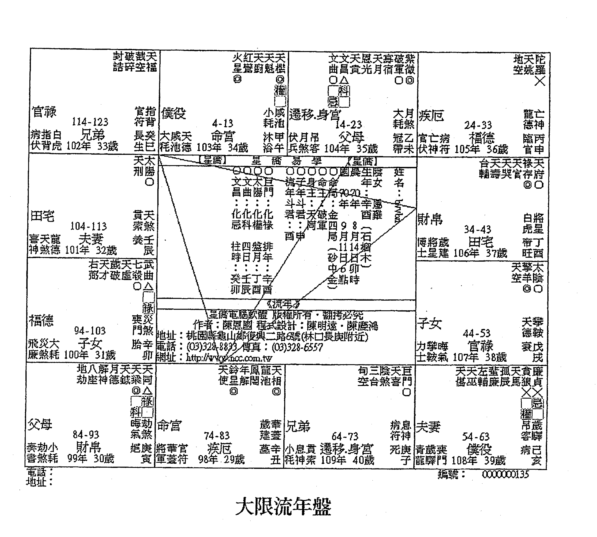

### 大限流年盘

命主问命当年为西元2009年，民国98年，岁次己丑年，流年命宫落于丑宫，其流年官禄宫会照天马及本命禄，形成禄马交驰，本有异动的味道，而对宫加会天巫又逢流年贪狼化权引动，天巫表赏赐之意，故有升迁加薪的机会无误，以此结构看来，倘非在原工作上得到异动升迁的机会，就是跳槽后得到更好的职位与待遇，相当不错。但可惜大限廉贞化忌同度，形成权忌交驰的情况，权忌交驰的外在表现就是当你的权力越大，越容易遭到权力反蚀，且因化忌星影响，纵然跳槽成功，也不容易有好的机会。倘命主早些遇到山人，山人应该会建议命主待在原工作岗位上，而非轻率的跳槽呀，这不也点出命主在个性上过于冲动及欠缺思考的问题了吗？

而以流年看来，99年流年命宫空劫对拱，本有劳而无获的味道，又逢天机天梁擎羊会且又流年天同化忌引动，会是相当辛苦落寞的一年。100年官禄宫又是科忌交驰，整体观之，应该要到民国102年后在职场上的发展才会转好，所以升迁问题，我想这几年应该是免了，倒是趁此机会好好修身养性，把煞星对自己的影响程度降到最低，同时累积更多的经验与专业知识，才能在下次机会再度降临时，好好把握。

# 【案例85】算命老师说31岁之前有个死劫，吓死人了！

| 提问时间 | 2009-09-07 21:34:51 |
| :--- | :--- |

我哥哥1981年12月5日未时出生，他不知道在哪里算到说31岁之前有个死劫，吓死人了！还有什么空劫夹命的？可以帮忙解析一下吗？谢谢！

## | 回覆内容 |

死劫，真可怕的说法，放宽心，不要想太多。以科学的观念来看，命理是由出生年月日时所组合而成的，所以共盘的机率很高，以台湾2000万人为例，共盘的除了你之外，还有76人呢！

如果真有死劫的话，那么共盘的76人都会在同一年同一时间死亡吗？无稽之谈，命理就是太多宿命论式的论法，才会到现在还被视为迷信。不过容易发生意外事故倒是真的，只是罪不致死。

共盘的问题在山人的部落格有专文叙述，限于篇幅没办法完全写出，有兴趣可以至山人的部落格看看。

空劫夹命，意思就是命被空劫双煞给挟持，通常表示的意思是人生的路程比较容易失去机遇，例如本命宫逢紫微七杀，紫杀化权，但逢空劫夹命，便形成权力必须受制于人的组合。空劫夹命，其实普通可怕。如本命宫化忌，形成空劫夹忌，那才真可怕。古曰：「空劫夹命为乞。」此乞并非乞丐，而是人生走势诸多不顺，空劫双煞为土匪之意，倘人被恶煞左右挟持，自然不容易有顺利的时候，也因此古人形容为乞。

回到你的问题，倘以国历生日来看的话，根本没有死劫这回事，无论就大限或流年看来都是如此，31岁那年文昌化忌入命，文昌化忌顶多是财务损失，安心吧！这只是江湖术士在唬人的罢了。连空劫夹命这种寻常的格局都说成这样恐怖，其他真不敢想像呢！放宽心，不要想太多，倒是31岁那年倘参加国家考试，也许还有可能金榜题名呢！况且以流年看来，三方四正不逢煞侵，虽说会照化忌，但整体而言不构成太恐怖的格局，所以不要想太多。

## | 提问者意见 |

很有帮助，谢谢！

## 命盘解析及内容说明

| 宫位 | 星曜与备注 | 宫位 | 星曜与备注 | 宫位 | 星曜与备注 | 宫位 | 星曜与备注 |
| :--- | :--- | :--- | :--- | :--- | :--- | :--- | :--- |
| **铃破截天天** | 地阴解红天天紫 | 天天寡 | 陀破 |
| **星碎空福机** | 劫煞神厨魁微 | 贵刑宿 | 罗军 |
| **将指白 2-11 临癸** | 小廉天 112-121 冠甲 | 青月吊 102-111 沐乙 | 力亡病 92-101 长丙 |
| **军背虎 命宫 官巳** | 池德 父母 带午 | 龙煞客 福德身宫 浴未 | 士神符 田宅 生申 |
| **11 23 35 47 59 71** | 12 24 36 48 60 72 | 1 13 25 37 49 61 | 2 14 26 38 50 62 |

### 本命盘

命理真的能论断生死吗？答案绝对是否定的，其道理很简单，命理的统计单位是人的出生年月日时，那相同时辰出生的人有多少？这是个很简单的计算，列式如下：

```
60 (1甲子) ×12 (月) ×30 (天) ×12 (时辰) =259,200
```

倘若以台湾2000万人计算，则共盘的人有

```
20,000,000/259,200=77
```

意思就是扣除命主1人，尚有76人是共用同一个盘的，那倘真有死劫这种事情，岂非另外那76人都会在同一时间，因为同一个原因，一起魂归西天吗？套用一句台湾的流行用语：这不是荒谬，那什么才是荒谬呢？再者，倘若用中国12亿人口计算，那共盘人数更是惊人。所以这种浓浓宿命论的说法，就是导致中国命理迄今仍被视为迷信的主因，因经不起科学辩证呀。许多老师讹称能推算出死期，经过山人以科学方式验证，完全的破解此妄言。再怎样说，命理终究是世间法，有其极限存在，并非任何事都能够推论的，简单的说，凡是自由意志可以决定的事情，通通应该归类到不可推算的范畴才是。

至于死期是否真的可以推算呢？确实是可以的，但并非使用命理这门技巧，而是类似佛祖的六神通或其他出世法，才有可能做到，但通于此术的老师，多为方外之人。佛祖又严禁弟子显现神通力，故纵使精于此法，又怎会冒着破坏因果及戒律的风险，只为你区区数千元的代价来为你论断呢？所以日后读者在遇到号称能用八字、紫微或其他命理术数断死期的命理老师，大可将他视为江湖术士，不听也罢。

山人论命以来，经常遇到此类型问题，中国术数倘再如此宿命论，永远都会被视为迷信，又怎能像西洋12星座一样，让普罗大众接受呢！这也是山人多年来的感慨呀。只是此传统观念就像老太婆的棉被，盖之有年也，这也是一种无奈与感慨呀！

回到问题原点吧，山人常说，论断重大意外时，首先需检视星曜组成是否构成所谓的恶局，如铃昌陀武、巨火羊、杀拱廉贞等，同时需注意命、身及福德宫强弱问题。倘本命宫命身及福德宫无主星且会空曜，则确实发生重大意外的机率会是比较高。此例命宫三方不构成恶局，且命宫有主星，福德宫与身宫虽无主星，但也不会空曜，田宅宫亦不空，怎会有太大的意外发生呢？所以跟命主说死劫的这位老师，连最基本的三强理论都搞不清楚，难怪会把空劫夹命这种星盘必然出现的组合说的这么严重，真是无言以对呀。而31岁那年怎会被断为死劫呢？咱们就转进31岁那年的流年盘来看分明吧！

### 紫微斗数命盘表格
| 宫位 (年龄) | 星曜与备注 | 宫位 (年龄) | 星曜与备注 | 宫位 (年龄) | 星曜与备注 | 宫位 (年龄) | 星曜与备注 |
| :--- | :--- | :--- | :--- | :--- | :--- | :--- | :--- |
| 福德/身宫 (2-11) | 破碎 破碎 破碎 | 田宅 (112-121) | 紫微 天府 天相 | 官禄 (102-111) | 破军 寡宿 天刑 | 仆役 (92-101) | 天同 天梁 天机 |
| 命宫 (102年 33岁) | 白虎 将星 指背 | 父母 (103年 34岁) | 威池 小耗 天德 | 福德/身宫 (104年 35岁) | 青龙 月煞 吊客 | 田宅 (105年 36岁) | 力士 病符 亡神 |
| 兄弟 (12-21) | 奏书 天煞 龙德 | 夫妻 (22-31) | 伤官 大耗 飞廉 | 子女 (32-41) | 病符 小耗 劫煞 | 财帛 (42-51) | 丧门 大耗 官符 |
| 疾厄 (52-61) | 天哭 天虚 官符 | 迁移 (62-71) | 驿马 天马 天伤 | 官禄 (72-81) | 天姚 天刑 天哭 | 仆役 (82-91) | 天喜 红鸾 天姚 |
| 田宅 (92-101) | 天福 天寿 天虚 | 福德 (102-111) | 天官 天福 天寿 | 田宅 (112-121) | 天喜 红鸾 天姚 | **作者信息** | 星侨电脑软件 版权所有·翻拷必究<br>作者：陈思国 程式设计：陈明远·陈庆鸿<br>地址：桃园县龟山乡复兴三路68号(林口长庚附近)<br>电话：(03)328-8833 传真：(03)328-6559<br>网址：http://www.ncc.com.tw |
| **编号** | 0000000136 |

### 大限流年盘

此流年命宫并未出现任何的斗数恶局，且命宫太阳够强势，田宅又逢紫微正坐，又怎会有生死关头产生呢？除非命主自我了断才有可能。否则以此结构看来，能出多大的状况呢？况且此流年命宫形成斗数奇局“阳梁昌禄”，古曰：“金殿传胪。”是公门格局中，最尊贵的一种，通常政府的高官大员都带有此格局，又逢大限流年双化权引动，此时参加国家考试，也许都能够金榜题名呢！

再者，虽然文昌化双忌坐流年命宫，但文昌化忌，不表示血光，因此最多就是金钱损失罢了呀，又何来性命交关之危呢？

如果那位老师说是101年的话，还有点说的过去。因101年流年命宫落于辰宫，而七杀廉贞又在此天罗地网处对拱，这就是俗称的车关呀，但壬年廉贞并未化忌，且命宫三方四正亦不会忌星，纵有恶局，但不被引动，充其量也是哑弹，有何畏惧呢？纵使引动，命身不空，最多就是受点伤罢了，谈到死劫，真的是言重了。连恶局都没有，就解释成死劫，倘真有恶局出现，真不知道这位大师该如何解释呢？倘因此造成命主心理压力过大，整天胡思乱想，心神不宁，以此情况继续下去，我想也许不到31岁就可能把自己搞成神经病了，没死都被这位老师吓死，这不是造业吗？命理应该是要帮助在十字路口或遭逢人生低潮而彷徨无措的众生，找到新的方向，得到新生才是呀。这些不学无术的江湖术士，胡言乱语，害人不浅。要知道善恶到头终有报，习命者须戒慎之，切莫因一时之快而自造口业呀。

# 【案例86】感情困扰请老师解惑

## | 提问时间 |

山人你好，小女子又来向你请益了。最近因为感情的事情，把自己弄得很不解，在我的工作职场中，遇到了一位很心仪的男孩子，他很符合我心中所设定的条件类型，因此让我心动，很期待与他共事。只是不晓得为什么，从以前到现在，只要我有心仪的对象，过没多久，单身的他就会找到另一半，有另一半的就会步入婚姻，我总觉得自己有“便媒人”的命，冥冥中会带桃花给别人，这情况有趣到自己想忽视都很难。山人，可否请你帮小女子看看，我到底该怎么做才好？其实我满困惑的，或许是因为伤过太多，所以不会太过强求，对缘分看得比较开，但也总会有寂寞难过的时候，独立坚强久了，说真的，也想要有个肩膀来依靠，就我自己对自己命盘的分析，可能我也是个难有姻缘的人，我知道自己很ㄍㄧㄥ、很矜持，而我正努力调整改变中。新的一年将至，想听听你的意见分析，无论优劣与否，对我来说，都是成长，也是提升。不好意思，麻烦你了！

民国75年3月21日酉时生（国历）

## | 回覆内容 |

若单从你的本命夫妻宫来看，你的眼光应该还满高的。不过看来你的对象应该都是身边的人，如:同学、同事或是邻居等，整体看来比较适宜晚婚，但是如果有不错的对象，倒是可以试试。

只是建议你这个大限（24～33），对于感情还是看开点，因为山人很担心你的状况会一再重复发生，让你自己感到很挫折。分析你这个大限的夫妻宫，贪狼桃花星正坐，但与野桃花天姚星相会，对宫廉贞化忌射入加上空劫来袭，因此你这段时间很容易会错过好姻缘，就像你现在面临的困境一样，桃花不是没有，只是和对方是有缘无分，只怕长久下去会让你自己陷入困境，尤其廉贞、贪狼这组桃花组合，会野桃花再加化忌，很担心你会为情所困，甚至是遇到感情上的骗子。

今年的缘分看起来还不错，对方年纪应该比你还大，聪明，经济状况应该还不错，看来要好好把握才是，试着交往看看，女生追男生应该很容易。不过可别太快把你那急躁火爆的脾气给显露出来，这样会吓跑人呢！

基本上坚强的女生，个性都比较内敛也比较急躁，也喜欢接受挑战与刺激。但大部分的男生还是比较喜欢小女生类型的，所以平常时也要适时表现出你温柔的一面，尤其是职场上，好事不出门，坏事传千里。偶尔表现出你那有点散仙的潜质，其实还会满可爱呢！

毕竟你还年轻，多方尝试，不过要多加观察，因就这个大限看来，极有可能会发生遇人不淑的状况。

偶尔把自己的条件稍微放低一点，有时候看起来蠢蠢或普通的男生，才是当老公的最佳人选。山人阅人无数，有许多的熟女师姐，都很有气质，也很漂亮，无奈沦落到40多岁都还单身，看来大姊头是当定了。她们最常跟山人说的一句话就是：帅哥到最后都是别人的，因此而蹉跎耽误了花样青春年华，发现时往往悔之已晚，但又奈何？帅哥本身就比较花心，因为条件好，追求到最后，有个故事是这样说的，一个女孩在海边捡贝壳，一心只想捡到一颗最棒的贝壳，一路上走呀走，沿途看到很多贝壳，但因为一直想着下一个会更好，路到底了，手上却一颗也没有，清楚吗？

所以你还年轻，试着把自己的条件给放松一点，适时的表现出自己女人的那一面。女生嘛，本来就不要太ㄍ一ㄥ，柔弱一点，会让男生更生怜惜之心，自然会有好桃花出现。太强势或太坚强的话，反而会让男生不敢靠近，因而错失机会。再度提醒你，帅哥或条件好的男生，常常都是毒药，自己要多观察。这个大限夫妻宫看来很辛苦，注意为上，尤其是明年。

## | 提问者意见 |

感谢老师指导，我会多注意。

## 命盘解析及内容说明

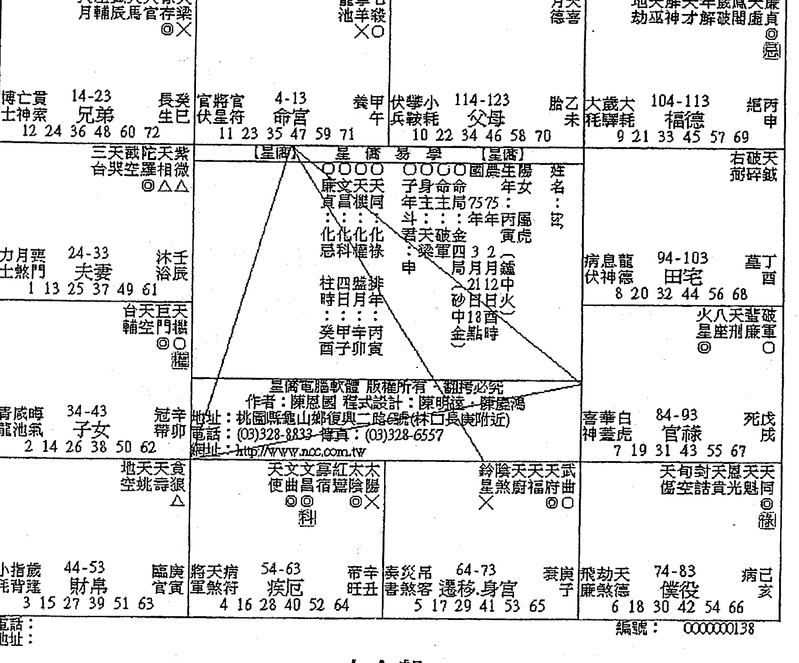

### 本命盘

古曰：“武曲加煞为寡宿。”命主七杀坐命，会照武曲，本性较为刚烈，加上火羊、铃羊成局入命，故此为女强人之命造。女强人不是不好，而是感情路通常较为波折，因过于强势及主导性过强。时代虽然在改变，但大部分的男生，还是会比较喜欢温柔婉约，带点小女人个性的女孩。所以通常女强人的感情路，都会比较崎岖。

此局为杀破狼加煞，冲击性相当强，于事业发展上相当不错，以山人观点，建议命主可于事业上冲刺，毕竟此局适合发展事业而不利于男女关系，所以暂时将感情放一边，等到事业有成，口袋钱多多之时，还怕没有对象吗？养只小狼狗都行呢，对不对？而这不也是趋吉避凶的方法吗？

再从夫妻宫观之，紫微正坐，表示命主眼光相当高，没有高富帅等级的男生，我想还很难看的上眼。陀罗正坐，以晚婚为宜。而火铃同会夫妻宫，基本上暗示命主易有闪电成婚的状况，对于七杀坐命的人而言，由于其个性爱恨分明，果断且速战速决的本性所致，因此倘发生此状况，其实并不让人意外。而火铃冲夫妻宫，除表示双方相处多是口不言而内心痛苦折磨，加上陀罗主慢，迟滞，延宕，故命主纵然姻缘早动，也难逃双方相处不和的问题，以整体看来，其婚姻以晚成为宜。至于晚婚应该到几时呢，通常山人建议是在32岁之后。此盘是否真的没有姻缘呢？其实不然，如果没有意外，姻缘应成于34～43这个10年大限，婚期应在36岁前后，因此大限命宫会照天喜，夫妻宫逢鸾喜对拱，又会照本命禄及大限化权化科，三合稳定无煞，且以该大限夫妻宫逢日月昌曲正坐再会辅弼的星群组合看来，对象应该是满有成就，且家庭背景应当也是相当不错的呢！这不也反证了命主较适宜晚婚的观点吗？姻缘不会没有，只是来的比较晚。

倘命主真要追逐感情，也建议命主将眼光放低一点，因夫妻宫坐天相星，表示配偶多是身边早已熟识的人，例如同学、同事或是邻居等，所以可以从身边的异性去找找，也许会有不错的结果呢！山人开业论命以来，经常看到许多气质出众的「超龄美少女」，人长得漂亮，但却是单身，情路长期不顺，一直埋怨「水皮没水命」。主因在于年轻时条件优异，择偶条件甚高，到最后，落得一场空，不是当小三，就是孤单终老。因40多岁的男生大概都已成家立业，好对象不容易寻觅。而这些女孩的共同心声就是「帅哥到最后都是别人的」，看到此处，各位豆蔻年华的女性，能不戒慎之吗？

# 【案例 87】我是一個沒福氣的人嗎？

| 提問時間 | 2009-09-13  23：45：54 |
|---|---|

山人你好：

最近因工作上發生了一些事，讓我開始不得不思考自己個性上的缺點，我想請山人幫我看我的命盤，在個性上我需要注意些什麼？我適合從事怎麼樣的工作呢？

我的生日為 68 年 1 月 23 日子時（國曆），我本來的工作是會計，進去才二個月吧！目前這份工作已經離職。一開始進去時我就自以為是了，而作帳方式也太隨性了，有些動作也造成讓人產生其他的聯想，才會導致後面的後果。會不會引來牢獄之災或財損之類的我也不太清楚，但一開始的個性及做事方式如果可以避開，也許後來不會這樣！而這件事其實造成我精神很大的折磨，讓我差點變成神經病，也差點被朋友們抓去看心理醫生！雖然最近的精神狀況有好點，但其實還是放不開、想不開，還是會偷偷哭。

仔細思考會變成這樣子，應該跟我的個性和做事方式有關，我的個性似乎太剛烈了、太直來直往了點、不太懂得柔軟、太有自己的想法了吧！沒有顧及到其他人的想法。所以想請山人指點一下，在工作人際關係方面我要特別注意什麼？工作運何時會變好呢？以我的命盤來說，我是不是一個沒福氣的人呢？不管是工作上或是財運或是婚姻、健康之類的，我怎麼覺得都不太順！不期望大富大貴，只希望能平平順順，但似乎也是一種奢求。看著朋友們的工作穩定，錢財都有固定的收入，而且我好不容易找到的工作卻搞砸了，而錢財也在流失中，花得更兇，似乎留不住財。

懇請山人幫我指點一下我的疑惑吧！讓我明白，我現在該做些什麼？我現在完全處於茫然的狀況下，不知道該怎麼辦？以前從來沒想過要給人看命盤之類的，當身邊的朋友們都在為愛情之類的跑去算命時，我卻沒什麼感覺，但人總是要遇到自己覺得人生中的最大挫折時，才會想透過別的方式，來更了解自己，來提醒自己該注意些什麼。

## 回覆內容

這張命盤整體而言是頗為強勢的命盤，三方四正會雙祿不會煞忌，加上火貪成局，相信你的偏財運還不錯，常常會出現意外之財。但很可惜的是逢煞破局，加上你的財庫又有損，財宮顯示出來的現象是你財務的流動性頗大，總是感到怎樣來就怎樣去，所以還是建議你可以把錢財交給信賴的人管理會比較好。

沒錯的話，你的個性頗為主觀，也比較會堅持己見，固執。有時候給人感到有點霸氣，命宮主星為武曲貪狼，古曰：「武貪不發少年人。」而且舉凡命格強勢的大都走中老年運，以你的大限走勢看來確實也是如此。武貪坐命的人，如果年輕發財，老來必定無靠。原因很簡單，武曲為財星，貪狼表示物欲，當此兩星相會時發生的加乘效果。對於金錢的執著比常人還堅持，手段自然會頗為激烈。所以只有當中老年時候能把這個性給收斂起來之後，方可有成就的機會。而年輕時年少氣盛，自然容易陷入困境。

做財務工作確實很適合你，因為你是天生的財務精算及規劃人才。加上雙祿會命宮，以此局來論，只要不投機，不貪求，金錢對你而言是不虞匱乏的。如果以你的理財來看，有時會過於偏向投機，雖說經常都是好的結果，但終究並非正途呀。你的本命宮也帶有標準的公門格局，沒錯的話，你出門在外或多有貴人提攜扶持及良好的機遇，而且你本身應該也很有才華。所以如果真的找不到合適的工作，不妨往這方向去嘗試。我想以你的格局，努力點應該會很有希望的。

24 ～ 33 歲這段時間，我想是你很辛苦的時候，總感到四處奔忙，卻毫無所獲。而這個大限看起來也差不多，苦在壓力與競爭，還有謀事不順的困境。不過既然走的是中老年運，所以年輕時的挫折，就當作磨練吧！

至於今年對於財務方面要特別小心，看來很有可能因此而引發官非困擾。以職場上來看，這兩年工作感覺上不是很穩定，有經常換工作的可能。下個大限（34～43）官祿宮看來是穩定多了，加油吧！

> ** 提問者意見 **

謝謝大師指點。

## 命盤解析及內容說明

| 欄位1 | 欄位2 | 欄位3 | 欄位4 | 欄位5 | 欄位6 | 欄位7 | 欄位8 |
|---|---|---|---|---|---|---|---|
| 破祿七紫<br>碎存殺微<br>◎△○ | 天台解孽<br>傷輔神羊<br>X | 天天天天天<br>壽才空廚鉞 | 天天孤<br>使刑辰 | ... | ... | 恩紅破廉<br>光鸞軍真<br>X△ | ... |
| 44-53 官祿<br>博亡病士神符<br>2 14 26 38 50 62 | 54-63 僕役<br>長丁力將歲士星建<br>3 15 27 39 51 63 | 64-73 遷移<br>沐戊青攀晦浴午龍輓氣<br>4 16 28 40 52 64 | 74-83 疾厄<br>冠己小歲霎蒂未耗鏖門<br>5 17 29 41 53 65 | ... | ... | 84-93 財帛<br>將息貧軍神索<br>6 18 30 42 54 66 | ... |
| 34-43 田宅<br>官月吊伏煞客<br>1 13 25 37 49 61 | ... | ... | ... | ... | ... | 文龍<br>昌池<br>X | ... |
| 24-33 福德<br>伏咸天兵池德<br>12 24 36 48 60 72 | ... | ... | 94-103 子女<br>表華官書蓋符<br>7 19 31 43 55 67 | ... | ... | ... | ... |
| 14-23 父母<br>大指白耗背虎<br>11 23 35 47 59 71 | 4-13 命宮.身宮<br>病天龍伏煞德<br>10 22 34 46 58 70 | 114-123 兄弟<br>喜癸大神煞耗<br>9 21 33 45 57 69 | 104-113 夫妻<br>飛劫小廉煞耗<br>8 20 32 44 56 68 | ... | ... | ... | ... |

**本命盤**

正所謂「武貪不發少年人」，且此組合又落於四墓地，更是標準的晚發格局，所以年輕時的挫折，正好是未來成功的經驗累積呢！此盤命局星曜組合相當強勢，紫殺化權入命，在工作上相當容易進入權力核心，又因武曲為財星，故相當適合從事會計類工作，因此從事財會工作，確實是相當適宜。命宮及財宮均會照雙祿，表得財容易，財路較廣，又天魁天鉞會照入命，除表示多貴人及機遇外，更象徵命主天資聰穎，才華洋溢，而此局又可稱為公門局，故參與考試擔任公職，也是相當適宜的。整體看來是個相當不錯的命局，但可惜紫微不逢輔弼，否則未來的成就相當值得期待呢！

通常魁鉞拱命者，其外在氣度及儀表均相當出色，但此曜因本質心慈善良，通常當不成生意人，此點從其天馬與空劫同度，形成半空馬格局的組合可見一斑。但可惜空劫同臨官祿，又逢羊陀夾制，因此在職場發展上會是相當辛苦與挫折。而此局由於本命宮火貪成局，表偏財運相當強旺，又財宮會鑾喜適合賺取所謂的「歡喜財」，同時火貪、鈴貪均成局，通常在理財上較為有投機的傾向，但因三合穩定無煞，因此投機的結果大都應該是良好的。以命主田宅宮穩健的情況看來，撈偏財確實是相當適宜呢！或許因此，所以象徵正職的官祿宮才會如此弱勢吧！但畢竟此非求財的正道，因此山人才勸戒命主不宜過度沉迷此道。

只是命主命身同宮，個性上較為固執、堅持己見，加上主星曜匯聚，個性過於強勢，因此在職場上常因此個性而遭致非議，所以遇到目前的困境，確實不令人意外。加上問命當年正24～33這個大限，官祿宮逢空劫齊臨，雖逢輔弼拱照，其危害稍可緩解，但仍難逃起伏波折及勞而無獲的困境，尤其本命盤官祿宮相當弱勢，大限組合亦不佳，因此這段時間真的就是多忍耐了，而大限疾厄宮逢羊陀雙煞會照，所以身體健康狀況要特別注意呢，好在命主即將邁入下一個10年大限（34～43），大限官祿宮星曜組合較為穩定，所以這段時間的不順利，就當成磨練經驗及心性吧！

# 【案例 88】想成家立業但苦無另一半

| 提問時間 | 2009-09-13 09：29：39 |
|---|---|

小弟國曆 1982 年 6 月 22 日戌時生 ^^，麻煩你了。另外，可以再幫我看一下我的夫妻宮嗎？我很想趕快成家立業，但是苦無另一半 =="。

## 回覆內容

從本命盤看來，與父母緣分較淺，沒錯的話你的上半身應該有傷疤，而你的本命宮結構看來還不差，應該還滿有文學天份，也滿會讀書的。具備標準的公門命格，整體而言還不算太差，只是你的那帶點叛逆本性應該要稍微修正一下會比較好，學習修行對你而言是相當好的事情呢！

比較可惜的是你的福德宮逢煞星正坐，而財宮會照雙煞，所以你應該會感到很努力但收穫常常不如預期，賺的錢應該剛好只夠用。從整體看來，你應該屬於凡事親力親為那類型的人，但容易遭人怨妒，所以山人建議你比較適合抱持老二哲學。其實做老二並沒有什麼不好，天塌了，有高個子頂著，對不對呢？

如果單就你的事業宮來看的話，雖然見擎羊，但有左輔右弼來撐持，所以縱有困難也能有適當的助力幫你度過難關，但競爭及惡意中傷仍難免，不過誰沒有遇過這回事呢？所以不要擔心太多，煞星，每個人都會見到的。

不過你還真要提防你的朋友，因為看來你很容易會因朋友而破財。且朋友對你並沒有太大益處，所以交友一定要謹慎。至於夫妻的話，我想第三者應該是你很大的問題。還有身邊的小人往往是影響你男女關係的重點因素吧！基本上你比較適合晚婚，姻緣來的太早對你反而不好，最好是能在35歲後才結婚。

> ** 提問者意見 **

謝謝老師！

## 命盤解析及內容說明

| 列1 | 列2 | 列3 | 列4 |
|---|---|---|---|
| 八天天紅天天<br>座巫姚奼鉞府<br>△ | 陰右天天太天<br>煞弼才福陰同<br>XX | 天貪武<br>月宿狼曲<br>◎◎<br>忌 | 左天巨太<br>輔癸馬門陽<br>科 ◎△ |
| 飛亡龍 95-104<br>姑乙 子女 2 14 26 38 50 62 | 喜將白 105-114<br>神星虎 夫妻 3 15 27 39 51 63 | 病孽天 115-124<br>伏軾德 兄弟 4 16 28 40 52 64 | 大歲吊 5-14<br>耗孱客 命宮 5 17 29 41 53 65 |
| 台嵐天 輔破虛 | [星儀] 星 儀 易 學 [星儀] 武左紫天 曲輔微梁 化化化化 忌科權祿 柱四盤排 時日月年 戊丙丙壬 戌子午戌 | 子身命命 年主主局71 71 斗::: 年年壬戌 君文廉土 :昌貞五6 5 午 局月月大 一大日日水 騰20戌 土點時 | 地三夭 劫台廚相 X |
| 秦月大 85-94<br>書煞耗 財帛.身宮 1 13 25 37 49 61 | 伏息病 15-24<br>兵神符 父母 6 18 30 42 54 66 | 天陀天天 官羅梁機 ◎◎△ 德 | 天月戳天破廉 使德空魁軍貞 X△ |
| 將咸小 75-84<br>軍池耗 疾厄 12 24 36 48 60 72 | 官華歲 25-34<br>伏蓋達 福德 7 19 31 43 55 67 | 封文恩解年蜚鳳華 誥昌光神解廉闘羊 △ X | 火孤天天徐七 星辰喜空存殺微 △ ◎△○ 德 |
| 文夭夭龍 曲賁壽池 △ | 天旬地鈴天破 傷空空星刑碎 ◎ | 小指官 65-74<br>耗背符 遷移 11 23 35 47 59 71 | 青天貧 55-64<br>龍煞索 僕役 10 22 34 46 58 70 | 力災廉 45-54<br>士煞門 官祿 9 21 33 45 57 69 | 博劫晦 35-44<br>士煞氣 田宅 8 20 32 44 56 68 |
| 電話： 地址： | | | 編號： 0000000142 |

### 本命盤

命主太陽巨門坐命，又太陽可驅巨門之暗，巨門本主口舌，但經太陽優化此缺點後，轉變成爲口才絕佳，辯才無礙的優點。基本上此局人相當適合以口爲業的工作，如：老師、教授、業務員、講師等。有許多律師及 top sales 其本命都帶有巨日的格局呢！又三方昌曲拱照，故命主除口才好之外，其聰明才智也是相當出色的呢！而左輔坐命，主人心慈善良，三方整體而言尚稱穩定，倘逢天時之助，應能有一番成就才是呀。

而太陽為男性的表徵，男命得之，相當適宜。其外在表現頗為陽剛，做事主動積極，個性坦率，不拘小節，個性頗為急躁，經常因說話過於直接，得罪人而不自知。又男命逢太陽正坐者，經常都有較為「博愛」的通病，倘再會合天姚或鸞喜此類象徵桃花的星曜尤確。

三方會照擎羊煞星，表示命主個性頗為叛逆，且此曜不管是正坐或會照命身宮，其人身上多帶有傷疤，倘正坐身宮，以山人經驗，機率將近90%，實在是因為此曜煞氣太重所致。

而本命化忌正坐兄弟，兄弟緣較淺，而空劫會照僕役宮又逢化忌會照，是故命主多酒肉朋友，來去相當快，缺少知心好友，對於命裡缺兄弟的人來說，也是相當苦惱的事情呀。以此結構而言，朋友、部屬不但對命主無助益，當大限流年組合較差之時，更有可能因此而受拖累，故勸誡命主，此處不可不慎呀！

至於姻緣問題，由於命主夫妻宮坐太陰，可謂艷福不淺，因太陰坐妻宮，主可配得美嬌娘，氣質大方出眾，聰慧可人，個性溫柔賢淑，持家有方。反之，若太陽坐夫妻宮，則可能落得「家有河東獅」的窘境呀。以其結構看來，由於會照擎羊及陀羅雙煞，基本上在感情上較會產生單戀或是辛苦追求卻屢屢落空的情況。故此局人以晚婚為宜。早婚容易有生離死別的狀況，所以目前沒對象，其實也不算是壞事呢！以大限走勢看來，姻緣應成於36歲前後，故不需多慮。

# 【案例 89】请帮忙算算夫妻宫

| 提问时间 | 2009-09-19 01:18:24 |
|---|---|

63年6月15日农历卯时生，女生。

## 回复内容

民国63年适逢日光节约时间，所以出生时间需要往前调一个小时，所以还是要确实的时间，才会比较准确。不过山人还是用你提供的卯时来帮你看看夫妻宫。

从你的本命宫看来，你的脾气应该不是很好吧！正所谓，命由性生。女生嘛，本来就应该温柔一点，对不对。

如以夫妻宫星宿组合来看，命主宜晚婚，早婚易发生问题。没错的话，你的对象处事积极，责任心重，对你也有助力，但脾气也不是很好。加上你自己本身个性颇为强势，所以在硬碰硬的情形下，难免会出现争执口角。较易与原先已认识的人成婚，如同学、邻居、同事等。家庭生活看起来颇为单调，所以还是要改改自己的脾气会比较好，因为看来婚姻生活会走的满辛苦的。没错的话，这个大限（33～42）有姻缘的迹象，婚姻应该会成于此时。

综上所述，山人建議你還是先把自己的個性給修正一下。畢竟雙方相處需要的是尊重與溝通協調，這樣才會走的長久。

## 命盤解析及內容說明

紫微斗数命盘，包含以下宫位及信息：
- 父母宫（113-122岁）：大耗、亡神、贯索，病己巳
- 福德宫（103-112岁）：病符、将星、伏兵，衰庚午
- 田宅宫（93-102岁）：攀鞍、小耗、煞神，喜庆旺未
- 官禄宫（83-92岁）：飞廉、大耗、驿马，临壬申
- 命宫（3-12岁）：伏兵、月煞、丧门，死戊辰
- 夫妻宫（23-32岁）：博士、指背、岁建，绝丙寅
- 子女宫（33-42岁）：力士、天病、煞符，胎丁丑
- 财帛宫（43-52岁）：青龙、灾煞、吊客，养丙子
- 疾厄宫（53-62岁）：小耗、劫煞、天德，长生乙亥
- 兄弟宫（13-22岁）：官府、咸池、晦气，墓丁卯
- 仆役宫（73-82岁）：息神、龙德、喜神，冠带癸酉
- 迁移宫（63-72岁）：将星、白虎、丧门，沐甲戌
各宫位标注星曜符号（△、◎、×等）、长生十二神及年龄区间，中间附作者信息及网址。

### 本命盤

命主七殺坐命，此曜在斗數裡是帥星，帶著強烈的孤剋性，故命主處事果決，敢衝敢拼敢冒險，對於開創事業而言，是相當不錯的，但本性上頗為暴躁且性急，女命性情如此，想要有段美滿的姻緣，只怕會是相當困難。此點從其夫妻宮呈現的狀況可得到反證。雖祿存正坐又會化祿，形成雙祿交流，主可配得貴夫，且配偶家庭背景定然不差，倘時機得宜，有當少奶奶的機會呢！但逢空劫齊臨，形成倒祿格局的情況，縱使進入豪門，也難逃深閨怨婦的結果呀。通常此局出現夫妻宮，經常會有遇人不淑及情路波折的狀況。究其因，都是因為自身個性所致。至於婚配對象，由於天相坐命，基本上會是周邊鄰近的朋友，男命可得賢慧持家之妻，女命可配個性良善之夫。但因煞星干擾，因此兩人在相處上較為冷漠且生活單調。

而七殺坐命，三方必然形成殺破狼格局，因七殺與破軍定然在三方遙遙相望，是故也增添了人生的起伏與波折。命主倘希望人生路途較為順遂，夫妻關係美滿，首要任務便是修煉自己的心，改變自己的個性，才能扭轉情勢，改變命運呢！這也是建議晚婚的原因，因人會隨著年紀增長，處世態度及應對進退越成熟，較利於婚姻。

由大限觀之，姻緣應成於33～42這個大限，命宮逢鸞喜對拱，主有正緣可期待，夫妻宮會照天喜，且太陰化祿沖起，又逢昌曲吉星拱照，故此大限內定有喜事加臨呢！沒錯的話，問命當年命主36歲，即有相當不錯的對象出現呢，只希望命主能聽進山人勸告，好好改變自己，別錯過了此段難得的緣分。

# 【案例 90】家裡陰盛陽衰，而我會是同性戀嗎？

| 提問時間 | 2009-10-26 16：09：42 |
|---|---|

從小家裡就陰盛陽衰，父母把我當男人帶大，打扮也較中性，我會變成同性戀嗎？我是 74.6.15 辰時（農曆）。

## 回覆內容

會不會變成同性戀，我想這問題在你自己身上，看你自己喜歡的是男生或是女生，自己最清楚，命理分析只能夠提供你參考。

如果單以命盤來看的話，看起來不像是個男人婆的樣子，且疾厄宮雖會陰煞，但子女宮不會哭虛。以命盤看來，欠缺成為正牌同性戀的必要條件，也不構成一般較易有同性戀傾向之格局。而你的夫妻宮看來也不算太差，子女宮會魁鉞，表示孩子日後應頗有成就才是呢！以山人的經驗看來，應該不會是同性戀才對。

沒錯的話，你的心思還滿細膩的呢，不過思考邏輯卻是滿前衛也有點叛逆，也滿有豐富的想像力，無怪乎你會問這問題，不奇怪。

你應該也是小氣財神一個，但常常會有胡亂投資或莫名破財的情況，對自己很好，很捨得花錢在自己身上。以你的本命宮格局來看，千萬不要輕易相信人，因為可能會因此破大財。盡量避免跟會或從事投機事業，看有沒有機會把自己的錢財給守住。

不過如果就你的父母宮看來，雙親應該想法與觀念還滿開明的，所以會把你當男生來看，也不是很奇怪。雖說命盤不構成同性戀的條件，但這一切還是要看你自己，因為這問題決定權在你自己手上。喜歡異性或是同性，都是自己的選擇，命理只能提供你參考。

右弼天天天 葡池哭馬機 X
封誥天月截天刑 話昌姚德空廚機 X
地火恩藏天 空星光破虛 Δ
天文天天天廉 傷曲巫喜福鉞貞 Δ
青指官 25-34 福德 3 15 27 39 51 63
小耗小 35-44 田宅 2 14 26 38 50 62
將月大 45-54 官禄 1 13 25 37 49 61
奏亡龍 55-64 仆役 12 24 36 48 60 72
力天貴 15-24 父母 4 16 28 40 52 64
地八天祿亙天 劫座月存門機 ◎○□
飛將白 65-74 迁移 11 23 35 47 59 71
博災爽 5-14 命宮 5 17 29 41 53 65
鈴天孤紅天陀貞 星刑辰驚空羅狼 ◎ ×△
官劫晦 115-124 兄弟 6 18 30 42 54 66
伏華歲 105-114 夫妻 7 19 31 43 55 67
大息病 95-104 子女 8 20 32 44 56 68
病歲吊 85-94 財帛 9 21 33 45 57 69
星儀電腦軟體 版權所有·翻拷必究
作者：陳恩國 程式設計：陳明遠·陳慶鴻
地址：桃園縣龜山鄉復興三路60號(林口長庚附近)
電話：(03)328-8833 傳真：(03)328-6557
網址：http://www.ncc.com.tw
姓名：
性別：
農曆：74年6月8日申時
國曆：74年7月26日申時
命宮：亥
身宮：亥
五行局：水二局
紫微天相在亥
天機太陰在戌
太陽天梁在酉
武曲天府在申
廉貞貪狼在未
天同太陰在午
太陽巨門在巳
天機天梁在辰
紫微天府在卯
武曲貪狼在寅
天同巨門在丑
太陰天同在子

### 本命盤

山人常說，凡屬自由意志可決定的事情，通通應該歸類到不可推算的範圍。同性戀傾向也是如此，一個人喜歡的是異性或是同性甚至是雙性，都是自己的選擇，命理最多只能提供建議與參考，但並非絕對值，千萬不要看到山人此篇的分析，就不分青紅皂白，看到類似的盤就直接認定這位命主是同性戀，不然被飽以老拳之時，可別埋怨山人呢！畢竟命理只是統計學的一種，此點同學務必牢記。

山人論命多年，也遇到許多正牌同性戀的同學，其實這些只是上帝不小心裝錯身體的靈魂，實在不需要用異樣眼光看待，他們也是人，只是選擇與一般人不同罷了，不是嗎？山人認為，應該也有結婚及利用領養的方式孕育下一代的權利，倘真能如此，我想孤兒院的棄嬰應該也能少一點呢，畢竟這些孤兒，都是這些所謂正常性向的人所造成的，不是嗎？而何謂正常，何謂不正常，其實是社會大眾所共同認定且接受的標準，倘全世界都是這些所謂正常的人所組成，那世界就無趣了，也不會有愛因斯坦或是梵谷此類的奇才出現了呢！

以山人經驗，正牌同性戀，以命宮主星曜而言，女性應該是太陽坐命，而男性應該是太陰坐命，因此兩曜為男女外在的表徵，倘錯置男女，較易有性別認同混淆的狀況，而疾厄宮應有陰煞這顆雜曜在作怪，子女宮應會合天哭、天虛或是地空、地劫等星曜，主與子息較為無緣，且易有不孕或無後的狀況發生，此些重點成立，成為同性戀的機率真的還滿高的呢！

此盤完全不符合山人所述的三個要件，因此山人認為命主並不具備正牌同性戀的要件，又其子女宮會照文昌、文曲及天魁、天鉞，主可得有成就之後代，而夫妻宮逢日月正坐加會輔弼，故其婚配對象其家庭背景不差，東看西看，都不像是同性戀的星盤呢！會有這種想法，我想是因為空劫入命所造成的，因空劫入命者，想法疏狂，思想前衛，敢與人所不同，充滿豐富的想像力，但也經常因此而招致敗局，而其父母宮紫微天相正坐，表示雙親觀念想法雖然頗為開明，但因紫微為帝座，主觀意識較強，加上陰煞這顆怪星同度，故從小被父母親當成男生來養，陰陽錯置，確實是不讓人意外。以本星盤看來，倘命主真有性別認同問題，我想應該也是父母親所造成的，並非本性呀。為人父母者，豈能因一己之私而影響子女的一生呢！

# 【案例91】诸事不顺、挫折磨难不断，求老师论命赠言

| 提问时间 | 2009-10-12 17:18:42 |
|---|---|
山人你好，在下自从今年生场大病后，诸事特别不顺，人生挫折磨难似乎不断，总觉又累又苦，常有轻生之念，请问若求论命赠言，捐助流浪猫金额？
PS：六十一年次，农历二月十三日午时生，女性。

| 回复内容 |
|---|
人生不如意十之八九，有时候挫折是来自于前世的业障，就当作在还债，这样心情会好过一点。

没错的话，你的外型应该属于俏丽型的女生，异性缘不错，但与男生之间总觉得像哥儿们。你的个性开朗外向，照顾弱小，具有正义感，但有时直言不讳，会让人有点受不了。

本命宫无正曜，基本上比较没有主见。加上天梁化禄入命宫，所以你应该常常会因为自己的原则性而惹麻烦吧，有时也会让人感到有点无理取闹的感觉，在职场上也难免遭人忌妒或猜忌，我想这也是你感到灰心的主因。

只是从你的本命盘看来，你应该一路走来都感到波折辛苦，而且也会有遇人不淑之叹。桃花虽然很旺，但大都属于烂桃花。因你的本命盘带泛水桃花的格局，加上你本身异性缘不错，所以会有这种感叹。而且此桃花会煞星，又形成风流杖彩，所以也经常是为情所困。

不过直得庆幸的是你命里多贵人及机遇，基本上你本命宫带有公门格局，我想你应该也算是满有才华且聪明的女生才对，没错的话应该是公务员吧！如果不是，可以尝试看看。

你的福德宫虽坐禄，但逢对宫空劫来袭，因此难免波折辛苦。以山人的观点，此类型属于还债型的，所以辛苦折磨难免，尤其是在感情上。

钱对你来说是来得快去也快，很难能存下来，虽然自己相当节省。建议你不要进行投资，因为赔钱的机会比较大，也不要跟会，因为后果可能满挫折的。至于大病部分，这点你可以放心，你的本命宫见天寿星，此曜为延寿之星，基本上寿元应该还蛮长的，病痛难免，但会痊愈。只是身体经常会感到很虚弱，其实你的命身皆无正曜，且逢空，福德亦逢空，可谓命弱身弱之造，所幸天寿星正坐，加上魁钺来拱，所以虽然体弱多病，但还是能够顺利度过，这点可以放心。

其实你应该还蛮庆幸的，千万不要有轻生的念头，因为你身边的贵人很多，而且有延寿之星在照护着你，在适当的时候都会拉你一把。否则以你命弱身弱，福德又空的星盘组合，可能不是很好。所以连老天都帮你，自己要更努力。就像山人说的，你属于还债型的人。就当作欠债还钱，人生会快乐的多。

## | 提问者意见 |

谢谢老师，我会多行善事累积福报的。

## | 命盘解析及内容说明 |

| 地劫空劫台辅月德破碎天马天机天梁 | 天魁天钺天哭天福天相天梁天刑七杀 | 天刑天马天解破碎天虚星神重 |
|---|---|---|
| 飞廉小耗 45-54 财帛 己巳 官符煞耗 6 18 30 42 54 66 | 天煞灾煞 35-44 子女 丙午 带煞禄德 5 17 29 41 53 65 | 将星龙德 25-34 夫妻 丁未 沐浴白虎 4 16 28 40 52 64 |
| 天哭天钺文曲文昌七杀 [星号] X △ ◎ | 星仪 易 学 [星宿] ○○○○ ○○○○ 国历生时 姓 武曲左辅紫微天梁 年主主局16-61 年女 名 化科化禄化权化忌 年火文土 子鼠 | 小耗白虎 15-24 兄弟 戊申 长生煞 3 15 27 39 51 63 |
| 喜神华盖 55-64 疾厄 甲辰 帝旺煞 7 19 31 43 55 67 | 星曲：局月月癸 2招 大日日木 点时 丙丁癸壬 午巳卯子 | 天贵八座右弼天寿天喜天府 5-14 命宫.身宫 己酉 养煞 2 14 26 38 50 62 |
| 旬空恩光红鸾截空天空天魁天梁太阳 ◎ ◎ 豫 | | 文曲天刑年解凤凰天陀罗天廉 宿阁官星府真 X ◎ ◎ △ |
| 病符息神 65-74 迁移 癸卯 衰煞 8 20 32 44 56 68 | 星仪电脑软件 版权所有・翻拷必究 作者：陈恩国 程式设计：陈明达・陈庆鸿 地址：桃园县龟山乡后兴二路6号(林口长庚附近) 电话：(03)328-8833 传真：(03)328-6557 网址：http://www.ncc.com.tw | 力士月煞 115-124 父母 庚戌 胎煞 1 13 25 37 49 61 |
| 天姚孤辰天相武曲 ◎ △ 趋 | 天官天空天同 XX | 台辅阴煞擎羊贪狼 XO | 禄存太阴 ◎ ◎ |
| 大耗丧门 75-84 奴仆 壬寅 病煞 9 21 33 45 57 69 | 伏兵晦气 85-94 官禄 癸丑 死煞 10 22 34 46 58 70 | 官符岁建 95-104 田宅 壬子 墓煞 11 23 35 47 59 71 | 传亡病符 105-114 福德 辛亥 绝煞 12 24 36 48 60 72 |
| 电话： | | | 编号： 0000000146 |
| 地址： | | | |

### 本命盤

山人常說，一個人的命運，在出生時已經註定七成以上，當命盤一排出，好壞立見分明。命無格局者，承擔力弱，注定如何踢騰，都難有好的結果。此時命理老師就應該扮演心靈輔導師的角色，所以習命之人，除隨時充實自身的專業之外，更重要的是必須要有豐富的人生體驗，這樣才能夠安慰這些陷於困境中的芸芸眾生，依照其特色與屬性，協助他們找到人生的新方向，同時揮別過往陰霾，勇敢迎向新生，我想，這才是命理存在的目的。千萬不可趁虛而入，造成命主二次傷害，這豈非造業不淺，學者須慎之。提出一句話與大家勉勵：莫因貧賤而欺之，勿以富貴而攀之。故習命者應安貧樂道，以協助苦難眾生走出困境迎向新生為要。這個心態，是每個習命者所應該遵守的原則呀。

回到主題吧，命主命身均無正曜，福德又逢空又遭羊陀夾置，為命弱身弱之造，所幸本命宮見天壽星及輔弼、魁鉞拱照，否則倘大限流年凶險，還真有性命交關之危呀。但此曜終究只是助星，仍難以避免傷病的折磨。此局空劫正坐財宮，會照本命及福德，為標準的勞碌命。倘以福德宮為累世福報的觀察宮位來看，這一世的資糧均被空劫此土匪星曜搶奪殆盡，以因果關係來看，又怎能期待有順利的人生呢？故此類結構山人經常歸類為「還債型的人生」，既然是由因生果，欠債還錢。所以通常建議命主可朝向宗教方向尋求心靈寄託，並以正確的心態來面對人生，再多的苦難，都是累世所種之惡因所造成，還完了就好，能這樣想，人生會快樂的多。

> 天涯我獨行，不必相送

整體而言，由於本命宮逢輔弼魁鉞四大吉星拱照，除表示命主心慈良善，加上天梁化祿坐命，故命主本性定然相當善良，有同情心，願意照顧弱小，但此曜為風紀官，因此原則性較強，而三方又會照天馬，形成梁馬飄蕩之局，此生難有安定之時，加上空劫齊臨，且命身同宮者，其個性大都有較為固執、堅持及不知變通的毛病，但優點是不論結果如何，都會自己承擔，因此我想應該經常會有「天涯我獨行，不必相送」的感慨吧！

我想命主會如此，大都也因此而造成的吧！有原則性是好事，但切莫過頭，正所謂過與不及均為災，以此結構而言，便是堅持過度了，加上空劫及天馬會照，以至於產生諸事不順的感觸，其實命由性生，倘命主能適時的放手看開，人生定然會順暢的多呢，不是嗎？

# 【案例92】即将消逝在感情宫位的对象，紫微如何破解？

| 提问时间 | 2009-08-23 11:25:17 |
|---|---|
即将消逝在感情宫位的对象，紫微如何破解？明年我十年运要转运了，但之前喜欢的对象，却不在未来那个大运的感情宫位中了，这样是否代表缘已尽？请问这样如何解决呢？又感情宫位看哪里呢？谢谢！

## | 回覆內容 |

我想你对于斗数有误解了，10 年运势转变表示的是宫位改变，运势跟着改变。如：某人大限13～22位于本命盘兄弟宫，大运走势逆行，则以此兄弟宫为大限命宫，依序逆向布12宫，作为观察这10年各宫位变化的情形。而下一限为23～32，位于本命盘的夫妻宫，则以此宫为大限命宫，依序逆向布12宫，斗数观大限是要了解此10年间的变化。宫位改变表示的是情况改变，而非对象改变。

以上例来说：假定你在 13～22 大限结婚了，此时夫妻宫的星宿假设为天府，如以你的论点来看，23 岁会走另一个 10 年大限，在这新的大限，假定夫妻宫为太阳与擎羊的组合，表示你的老婆会消失，要换一个老婆了嗎？？？那斗数共有 12 宫，不代表每个人一生要娶 12 次嗎？所以你真的是误解了呢！大运改变是指整体情势的改变，以夫妻宫看来，是双方相处模式或是欣赏对象的改变，而非婚配或交往对象的改变，倘真如此，天下不大乱才怪呢！所以算命还是要去找真正的老师，比较不会有此种误解产生。

还有，斗数是属于统计学的一种，只是能推论观察出你一生的起伏，并无法改变或破解，如果你想要破解的话，我想你可能要去依循其他的宗教而行。因为命是天定的，没有人可以改，但运是后天的，可以靠自己改变，其方法只有两种，除此之外别无他法：

- 改变自己的个性
- 行善积德

另感情的话，基本上当然是看夫妻宫了。

## | 命盤解析及內容說明 |

如回复内容。

# 【案例 93】为何命理师告诉我这番话？

| 提问时间 | 2009-08-24  21 : 23 : 16 |
|---|---|
我今年 21 岁，我女友本人没到，但是他一看到我女友名字和命盘，他说我们两个人个性都很强，就说我女友是个独立自主和能力很好以及个性很强的女强人。他说现在她是喜欢我的外表，往后结婚就不是了。他还说叫我努力学个技术，三年会有成绩，他意思就好像是讲将来我女友是怎样，很能干，我也忘记，他说别想说她会在家帮你顾小孩，没叫我顾就不错了，他说就看你 要选择一个贤妻良母型还是女强人型。还跟我说淡淡交往就好，他说这种要以娶老婆为目标不鼓励。

他说现在不分，等过个三、四年还是分，他说如果到那时候我 还是继续在跟我现在这个女友交往，那恭喜，就圆满。我真的 不太懂这意思，这位命理师大家好像都说很准。

## | 回复內容 |

仔细阅读了你的内容，我想你女朋友的命盘应该算是女强人格局，偏偏你也是个性比较强硬的人，所以结果可能是不好的。

男女双方交往一开始认识凭的是感觉与外表，但过了一段时间之后，就是彼此之间的相处。正所谓相爱容易相处难，如果两个人都是比较强势也比较硬底子的个性，相处之间难免会常常发生争执。而且个性强的人，通常都好面子，也比较不会低头认错。

所以除非一个肯低头认错，否则当两个强势个性的人一起闹起别扭，很可能分手的结果就随之而来，就像石头碰上石头，结果往往是两败俱伤。

通常婚姻或男女关系，需要以互补为基础，女生脾气不好，男生脾气好，或者相反，都可以走得长久。当然，如果愿意为对方改变自己的个性，主动低头的话，那是更好的。所以如果你与对方都不愿意改变自己的个性去适应对方，那这段感情一定会走得很辛苦，所以我想命理老师要表达的意思应该就是这样。

除非愿意因为喜欢这个女生而改变自己原本强势的个性来配合她，否则应该要去找一个属于贤妻良母型的女生，夫唱妇随那种，那应该就可以很圆满。最后一句话的意思，应该就是，你与这个女生交往如果过了三、四年还能再继续相处，应该就会有圆满的结局，因为你们已经找到最好的相处模式了。原因是，如果两个强势个性的人能相处四年以上，那必定有一方已经改变，愿意为爱去改变自己，那当然结果是圆满。希望这样解释能让你清楚命理老师的本意。

# 【案例94】命中缺木，请问如何让运气变好？

## | 提问时间 |

我知道我命格缺木，请问老师给啥建议会让运气比较好？除了多做善事跟唸经之外，现在改名叫林〇〇，1983年1月29日寅时出生。

## | 回复內容 |

其实改名字真的能改变命运吗？这点山人非常存疑，看你提到念经，我想你應該也是佛教徒，佛陀谈的是轮回与因果，今生的一切，都是因为前世的修为而来，种瓜得瓜，种豆得豆，绝不是改个名字就可以改变的。如果改个名字就能改变现况，那轮回与因果也就不存在了，不是吗？这点希望你能理解。

姓名学可参考，但绝不能太认真，因为姓名学是这个世纪发明的产物，不像中国命理，历经数千年演变，所以姓名学老师都会问你的生辰八字，因为它主要是利用八字或斗数排出命盘，了解你的概况后，再评论你的姓名，这是业界公开的秘密。

山人看过你的命盘，你的本命格局还不错。禄坐命宫，基本上是个小气财神，也是个很舍得对自己好的人。加上你的命宫出现君臣庆会的大格局，相信你在朋友群中会是个领导者，而且异性缘好，际遇与贵人都多，命宫整体格局非常强势，相信你在未来会有很好的发展。

不过你应该会觉得奇怪，为何这段时间好像不是很顺。其实并不是你的名字出问题，而是大限问题。正所谓十年河东，十年河西。命盘每十年一转，有好命格，也要有好运势。以山人经验，命格强势者，多属大鸡晚啼型。加上你的福德宫坐武曲贪狼，又落四墓地，正所谓武贪不发少年人，所以你是走老运的，年轻时难免挫折，当作学习经验了。山人看你这个大限（24～33），空劫会忌，整体而言，这十年的钱财与工作上都满糟糕的，多多忍耐，当作学习经验，命理有时终须有，你的命格强势，会有好结果的，不要想太多，下个大限会不错的。

## ｜提问者意见｜

感谢老师！

## 命盘解析及内容说明

| 飞亡龙 廉神德 64-73 迁移 12 24 36 48 60 72 | 铃红天七紫 星蒋钺杀微 △ △ 权 | 天文三解天 便曲台神福 X | 天封阴岁天 恶煞破虚梁机 禄 | 喜月大 神煞耗 74-83 仆役 1 13 25 37 49 61 | 火左月截天 星辅德至魁相 △ 科 X | 病威小 伏池耗 84-93 官禄.身宫 2 14 26 38 50 62 | 天龙月池门阳 ◎ ◎ | 大指官 耗背符 94-103 田宅 3 15 27 39 51 63 | 寡宿 | 将擎天 军鞍德 44-53 财帛 10 22 34 46 58 70 | 胎丁 小耗吊 34-43 子女 9 21 33 45 57 69 | 青息病 龙神符 24-33 夫妻 8 20 32 44 56 68 | 恩天陀 光官罗 ◎ | 力华岁 士善建 14-23 兄弟 7 19 31 43 55 67 | 天右孤天禄 巫茹辰喜马存府 ◎ △ | 官灾爽 伏煞门 114-123 父母 5 17 29 41 53 65 | 衰壬 博劫暗 士煞气 4-13 命宫 6 18 30 42 54 66 | 背丁 小耗吊 34-43 子女 9 21 33 45 57 69 | 绝戊 申 | 墓己 酉 | 死庚 戌 | 痛辛 亥 | 台文天八天 辅昌贲座刑哭 △ | 地天破廉 空才厨军贞 X △ | 天年蜚凤擎太 姚解廉阁羊阴同 X ◎ ◎ | 旬地天破食武 空劫寿碎狼曲 ◎ ◎ 忌 | 伏天贵 兵煞索 104-113 福德 4 16 28 40 52 64 | 帝癸 旺丑 | 名: English | 年女 属狗 | 姓名: | 身主命局7271 | 子年斗：： | 化化化化 忌科权禄 | 卯：：： | 时日月年 ：：：： | 壬丁癸壬 寅巳丑戌 | 四排盘 | 往时 | 阳生年 | 大海 水 | 金点时 | 作者：陈国 程式设计：陈明远·陈庆鸿 | 地址：桃园县龟山乡复兴三路1号(林口长庚附近) | 电话：(03)328-8833 传真：(03)328-6559 | 网址：http://www.mcc.com.tw | 编号：0000000147 |

### 本命盤

许多人在运势不佳时，都会改名，希望能带来好运气，我想这是心理作用大于实际作用。须知今生所有磨难，都是因为累世所种之恶因所致，倘改姓名就能改变因果，那你又把因果关系视为何物呢？不过改个名字，重新出发，迎接新生，倒是不错的呢！

命主祿存坐命，原理應該也是小氣財神一個，而府祿相三合會命，更表示命主不但善於理財，對於「守財」，應該也很有一套呢！而此命局相當漂亮，天府正坐，會照紫微，雙主星會命，又逢左輔右弼，形成君臣慶會大局，古曰：「才善經邦。」加上魁鉞拱照，除表示命主才華洋溢及聰明之外，也是多貴人與機會的象徵，整體而言是一個強勢的領導者格局，倘大限流年搭配得宜之時，定能有一番相當大的成就才是。但因格局夠大，古曰：「能降七殺，制火鈴。」故煞星不但對命主影響不大，倒是能夠激發其潛能呢！且以山人經驗，通常本命格局大者，大都屬於大器晚成型，年輕時都會比較辛苦。命主年紀尚輕，故此段時間的不順利，是相當正常的。並非其命運不佳，而是大限問題，所以這段時間就當成累積經驗，畢竟命格強勢者，未來相當值得期待呢！

> > 古曰：「才善經邦。」

> > 古曰：「能降七殺，制火鈴。」

又本命宮逢鸞喜對拱，表示異性緣相當好，但夫妻宮逢空劫對拱，又逢本命忌，雖逢魁鉞拱照，但感情路上難免出現單戀或是聚少離多狀況。整體看來，以晚婚為宜，且命主命宮得府相來朝，古曰：「府相之星女命纏，定當子貴與孫賢。」因此命主幫夫運相當強的呢！由於命主問命當年正值24～33這個大限，基於三才理論，我們就轉進這個大限盤看看到底出了什麼狀況吧！

> > 古曰：「府相之星女命纏，定當子貴與孫賢。」

### 本命大限盤

不出山人所料，此大限命宮逢地空地劫對拱，本有勞而無獲之意，而其財宮及官祿宮亦同時拱掉了。以此星曜組合，我想不論是在職場或是錢財獲取上，都難逃勞碌奔波，謀而不成的狀況。而雙主星坐命者，其事業心及企圖心都強，加上本命格局相當大，所以會有目前的感嘆，其實並不令人意外。這不也再度呼應了山人所言：舉凡格局強勢者，大都屬大器晚成型的人呢！

正所謂命好運好限好，到老榮昌。以大限行進而言，此盤相當有趣，不論順行或逆行都差不多，各位看官可自行推敲便知。因此建議命主趁此機會累積經驗，一時的不順心不算什麼的，就像民進黨前主席林義雄的名言：不要看我的一時，要看我的一生。想當初協助周武王打敗商紂王的軍師姜子牙，不也是到65歲才開始大運嗎？命裡有時終需有，只是早晚罷了。也希望命主此段時間能將吃苦當成吃補，時機到來，定然有所成就。

# 【案例95】關於感情的問題

## 提問時間

老師你好：

我想要問關於感情的問題，我和男友交往了一年又兩個月，感情好的時候很好，吵架的時候他的情緒起伏很大，而他非常在意我前男友，不斷的和我的過去吃醋，交往至今仍沒有改善，生活細節也都會問及我的過去，我和他意見不合時也會牽扯到我的過去，我想要問我和他究竟適不適合走下去，他是不是我結婚的對象？

我的國曆生辰是 74 年 4 月 29 日早上 7：42（女）

他的國曆生辰是 67 年 6 月 17 日中午 12：30（男）

如果真的不適合，我之後有沒有機會可以遇到好的男人？

## 回覆內容

雙方適不適合這個問題，我想很難單純用命理角度給你分析，因為感情是一種因果存續關係，以因果角度來看，這問題只有四種因緣組成：報恩、報仇、討債、還債。在因果不滅的情形下，縱使不適合，也還是要走下去，所以只有彼此容忍，彼此調整，互相包容，感情才能長久，不是嗎。如果兩個人都不肯包容諒解彼此，縱使以命理角度合盤，也是沒有用的，不是嗎？先幫你看看你的姻緣好了：

看來你應該是屬於有氣質的女生，太陰坐命的女生通常有氣質，男生通常滿帥的，本命宮六吉會照再會祿權，表示你的心地良善，仁慈，是個很 nice 的人。再由你的夫妻宮來論，由於逢雙煞來沖，會合孤辰寡宿，本來感情路會走得比較辛苦，以因果觀念來看，是以還債居多，這點可能你自己要多擔待。

況且你的男女關係相處模式，可以說爭執及冷戰通通都來，一般這種情形，山人都建議晚婚，因為年紀漸長，人的性情會比較成熟，也比較懂得包容與尊重。在這個前提下，感情才能夠長長久久。

以大限（26～35）看來，本命宮見鑾喜對照，逢昌曲，照理來說應該有不錯的緣分會在這個大限出現，甚至成婚也不無可能，所以這段時間可以多看看，真的覺得無法相處，就應該及早結束，因為女生的青春有限，山人學生中有很多熟女（30歲以上），漂亮有氣質，但就是因為年輕時浪費在同一個不適合的男孩身上，到了年紀大了，才發現終是一場空，反倒是自己因為年紀問題，很難找到好對象，所以會更辛苦呢！

趁你還年輕，多走走看看，這個大限應該會遇到你的真命天子，至於是否是你身邊這位，就要靠你自己好好評估了，你的條件不差，好好把握姻緣才是。

## 命盤解析及內容說明

### 本命盤

命主太陰坐命，基本上屬於氣質型的漂亮女生，而太陰為女性象徵，因此有心思細膩，溫柔婉約的特質，魁星坐命，外表雍容華貴。而昌曲會命，故命主天資聰穎，相當有才華，又輔弼入命加會天魁，主心慈善良，整體而言，是個兼具外在與內涵的好女孩。

但官祿宮逢天機、天梁、擎羊會此孤剋格局，又此局直射夫妻宮，所以在感情上容易有生離死別的狀況發生。同時陀羅亦會照，主拖泥帶水，若即若離。又如以夫妻宮為命宮，對宮就是夫妻宮的遷移宮，逢此孤剋格局，無怪乎與前男友分分合合，加上孤辰寡宿會照，此組合之人，經常是為情所困呀。而又以命宮星曜組合而言，會有目前困境產生的主因是過於心軟善良，這也是情路波折的主因呀。

命會煞星雖然不佳，但至少具有果斷及敢愛敢恨的特性，加上太陰本性就較為柔弱，又夫妻宮煞星齊臨，以整體結構看來，山人實在相當擔心會因此發生不良的後果呢！所以建議命主，倘雙方真的無法相處，該斷就斷，否則必然禍害自己呀。

許多的同學都會擔心，倘與這個對象分手後，是否不容易再遇到好的對象。其實以命主的外型及內涵，真的是多慮了。加上以大限星盤看來，鸞喜會照入命加上夫妻宮逢六吉拱照，沒錯的話在此大限內必有姻緣可成，又何需想那麼多呢？這也是山人奉勸命主多看看，多接觸其他對象的主因，畢竟年紀尚輕，又何苦如此執著呢？又命主問命當年為民國99年，我們就來看看流年的結構如何吧！

| 宮位 | 年齡段 | 流年 | 主要星曜 |
|------|--------|------|----------|
| 田宅 | 56-65 | 102年 29岁 | 天龍、天七、紫微等 |
| 福德 | 46-55 | 101年 28岁 | 天天、擎天天、貪月官等 |
| 父母 | 36-45 | 100年 27岁 | 博災耍、士煞門、鈴星等 |
| 命宫 | 26-35 | 99年 26岁 | 官劫晦、伏煞氣、歲指等 |
| 兄弟 | 16-25 | 110年 37岁 | 病天符煞、黃巳、天破等 |
| 夫妻 | 6-15 | 109年 36岁 | 大息病、耗神符、天魁等 |
| 子女 | 116-125 | 108年 35岁 | 病歲弔、伏臂客、天劫等 |

### 大限流年盘

此流年命宮逢鸞喜對照，又逢流年化祿引動，故應有正緣出現才是，我想這應該也是命主困擾的主因，由於太過心軟善良，故與前男友藕斷絲連，但因流年夫妻宮逢天機、天梁、擎羊會照，又逢大限流年雙化忌引動，整體情況相當兇險，倘非六吉拱照，還真有可能鬧上社會新聞版面呢！故倘真要斬斷感情糾纏，99 年會是個很好的機會。只是此點決定權在自己，倘不願勇敢的向過去揮手告別，又怎能期待新生呢？

山人開業論命多年，有許多登門的熟女同學，年輕時就是與前男友如此拖延，分分合合數次，當有新對象出現，又捨不得舊情人或是遭其苦苦糾纏，不得不放棄新的緣分，與舊情人重修舊好，但除非男方願意改變，否則最後結果定然是再度分開，如此循環不已，因而蹉跎美好年輕歲月。當年華老去之時，好對象更難覓得，最後的結果通常都是孤單終老，這又何苦呢？

以命主的夫妻宮帶此孤剋格局觀之，此狀況確實相當有可能發生，到時候再來怨嘆「水人沒水命」，又有何用？這不也是自己一手造成的結果嗎？故在面對此問題，怎可不慎呢？正所謂，捨得就是有捨才有得，不捨焉能有得呢？也希望命主能聽進老夫的勸告，做出最好的決定。

# 【案例96】紫微可否看出有無功名？何時考運佳？或運勢何時撥雲見朗？

## 提問時間

大師你好：

我24歲研究所畢業後，走了幾年好運，工作也沒很認真，但是長官都待我很好，財運也不錯。自民國97年起，就開始發生大小倒楣事，工作認真也沒起色，感情也不順遂，生活總覺得煩悶沒目標，一整個胸口鬱悶無法透氣。

現在我專心準備參加考試，今年前半年專心努力，卻逢考運不佳，總覺考題不難，考完也算有信心，結果卻是大失所望。我不知道問題出在哪？雖然不想歸咎於命運，更不願意以流年不佳解釋一切，但真心不明白，冥冥之中是否有些因緣已成定局？？？故想在此誠心誠意向你請教，紫微可看出有無功名嗎？或者考運何時較佳呢？或者運勢何時會撥雲見朗？若大師有空，勞煩你為我解惑。失禮之處，請你見諒。

生日：69年5月21日23：45（農）

## 回覆內容

整體而言，你的格局還不差，三方四正不會煞忌，至少外在的環境不會對你產生太大的阻礙，只是身邊總是不缺小人就是了。

三方形成殺破狼格局，又會火鈴，整體而言此格局適合以武職顯貴，如專技人員等。沒錯的話你應該是屬於比較堅持己見，固執的人，但頗有擔當就是。

如果說是參加考試，以你的星盤看來，昌曲均落陷，古曰：「昌曲弱鄉，林泉冷淡。」基本上你的考運並不是很好，準備考試是必須要比人家更努力才有機會。不過考試就是這樣，給你天生好考運，自己不讀書也是惘然，但請你稍微放寬心，因為你的考運不是很好，尤其是要參加國家考試，基本上要比別人更認真。畢竟考試這東西，八分靠自己，二分才是靠運氣。好好加油。

以你目前的10年大限看來，昌曲拱命身，至少表示你的求學還滿順利的，但因均為落陷情形，所以會辛苦點。至於大限夫妻宮，坐七殺，三方也形成殺破狼局，所以這段時間感情會走的辛苦波折點。所幸會煞不多，所以只是不太順遂，不至於多嚴重就是，這點算是滿慶幸的。至於感情部分，建議你不用擔心太多，因為下個大限看來會有良緣出現，沒錯的話應該在34歲前後會成婚，所以感情部分，順其自然，對的人一定會出現，只是不是現在。

至於考試的話，山人是建議你好好努力讀書，因為以流年看來，這幾年的考運真的不是很好，不過考試這東西是看自己，加油。

## 提問者意見

感謝老師指點。

命盤解析及內容說明

### 本命盤

命主破軍坐命，而七殺與破軍必再三方相會，故此局定然為殺破狼格局。而殺破狼並非不佳，倘會照煞星，相當適合以武職顯貴，如同此盤。而武職倘以現在觀念，就是專技人員或是軍警等。且此局人天性愛冒險，處事積極，台灣有許多中小企業的老闆都是此格局的呢！只是殺破狼局的大起大落，也是因為這種個性所致呀！

命主谈到准备公职考试，首先看命局是否带有公门格局，倘带格局者，自然考运较佳。以命主格局而言，只见文昌贪狼会照入命，而文昌贪狼的组合，多为眼高手低，文过饰非，加上盘中文昌文曲均于落陷宫位，我想倘真要参加公职考试，只怕是要比别人更努力了。虽然说考试靠的是实力，但考运好的人，自然上榜机率会比较高。这就像打麻将一样，技术好不一定赢钱，但运气差，定然输个精光。所以考运好坏，其实也有影响呢！而考试上榜与否，除了观察本命盘之外，由于是流年偶遇，依据强盘理论，倘流年运势利于己之时，确实上榜的机会比较高呢，现在我们就转进流年盘看看吧！

### 大限流年盤

命主問命時為民國 99 年（庚寅年），流年命宮在寅，三方僅會照文昌星，略顯無力，故考運並不是太好，以流年看來，於 101 年時流年命宮逢昌曲拱照，流年官祿宮逢流年化科，考運會比較好，因此建議命主這幾年保持平常心應試，就當成累積經驗。但考試畢竟是以實力取勝，縱使命中無功名，但肯立志寒窗苦讀，誰說他會考不上的呢，此分析僅提供命主參考，並非絕對值。考試除了努力，考運也相當重要，倘能在考運較佳之時應考，我想努力後應該會更容易金榜題名的呢！

# 【案例97】正缘会出现在何时？对方大概会是怎样的人？

## 提问时间

山人你好：

有幸从奇摩知识+连结到你的部落格，不晓得是否能烦请老师解惑一下呢？

我出生于国历73年7月29日戌时，目前是幼教老师。这几年来，感情路上一直不是很顺遂，总容易不小心成为第三者，或是被劈腿。其实期间也有许多追求者，但我就是无法动心，因为心里头就是有一个很在意很在意的人（我们俩对彼此的心意应该是相互喜欢的），暧昧好多年，但总是缺少那临门一脚。他是国历70年11月1日出生的（可能是辰时出生），他目前是职业军人。想问问看，我和他有没有机会有一段良缘呢（我其实很希望是他）？不知道为什么，这么多年下来，我还是坚持执着于他。好几次，快要放弃了，想要把他当普通朋友了，他又让我燃起希望，然后一次又一次的失望。如果不是他，那我的正缘会出现在何时？对方大概会是怎样的人呢？

另外，我有报考年底的地方政府公职考试，不晓得今年考运如何？是否能够有好的成绩呢？谢谢！

## 回覆內容

就你夫妻宮來看，這種曖昧的情愫是相當難以避免的，感覺上對方的個性難以捉摸，加上可能也是抱持不婚主義的人，所以雙方相處意見不容易合諧。而且破軍坐夫妻，所以容易遇到結過婚的男性，也就是山人暱稱的「二手貨」。加上又見右弼單入，所以很容易出現你目前的問題，第三者或者是被劈腿，加上你的本命宮看來桃花並不算很旺，所以大概都是被背叛的情況居多。

而且沒錯的話，你非常有可能是火速結婚一族，不過以此局來看，基本上建議以晚婚為宜，比較穩定。況且你還算年輕，所以可以再多等等。

如果就大限走勢來看，你的姻緣動的應該還滿早的，沒錯的話這個對象應該是在22、23 歲左右認識的，但對你而言，早婚並不是一件好事，所以錯過也是一件好事，不要想太多。

至於考運，由於本命盤文昌文曲均落陷，且本命並不具備公門格局，所以要考公職可能要多幾次，而且要比人家更認真。但考運好，不讀書也是沒有用，肯認真努力的人，縱使考運不好，也還是有機會的。這一點正在準備考試的你要有深切的體認，畢竟考試是講實力的，並不是像賭博一樣，運氣占大部分。雖說整體考運不是很好，但今年流年逢魁鉞拱照，考運應該還不錯，只要認真努力一點，還是有希望的。加油。

## 提問者意見

謝謝老師，我會努力準備考試。

## 命盤解析及內容說明

| 宮位/星曜 | 丙申 (26-35) 夫妻 | 癸酉 (16-25) 兄弟 | 甲戌 (6-15) 命宮 | 乙亥 (116-125) 父母 |
| :--- | :--- | :--- | :--- | :--- |
| **主星/雜曜** | 鈴星、截空、破軍、祿存、天馬 | 奏書、咸池、天德、龍德 | 將星、月煞、吊客、青龍 | 旬空、三台、天月、太陰 |
| **大限** | 26-35 | 16-25 | 6-15 | 116-125 |
| **干支/神煞** | 病壬、飛廉、指背、白虎 | 衰癸、奏書、咸池、天德 | 帝旺甲、將星、月煞、吊客 | 臨官乙、小耗、亡神、病符 |
| **數字** | 3 15 27 39 51 63 | 2 14 26 38 50 62 | 1 13 25 37 49 61 | 12 24 36 48 60 72 |
| **宮干/地支** | 壬申 | 癸酉 | 甲戌 | 乙亥 |
| **其他星曜** | 天姚、天官、天鉞 | 左輔、天才、天廚、鳳閣、天府、貞 | 紅鸞、天刑、天哭、攀安、天梁、太陽 | 封誥、火星、文昌、恩光、貪狼 |
| **年齡/神煞** | 死辛、飛廉、指背、白虎 | 衰癸、奏書、咸池、天德 | 帝旺甲、將星、月煞、吊客 | 臨官乙、小耗、亡神、病符 |

| 宮位/星曜 | 己卯 (76-85) 僕役 | 戊辰 (66-75) 遷移 | 丁巳 (56-65) 疾厄 | 丙午 (46-55) 財帛/身宮 |
| :--- | :--- | :--- | :--- | :--- |
| **主星/雜曜** | 官符、息神、貫索、伏兵 | 伏兵、華蓋、官符 | 大耗、劫煞、小耗 | 病符、伏兵、大耗、煞氣 |
| **大限** | 76-85 | 66-75 | 56-65 | 46-55 |
| **干支/神煞** | 養丁、官符、息神、貫索、伏兵 | 胎戊、伏兵、華蓋、官符 | 絕己、大耗、劫煞、小耗 | 墓庚、病符、伏兵、大耗、煞氣 |
| **數字** | 8 20 32 44 56 68 | 7 19 31 43 55 67 | 6 18 30 42 54 66 | 5 17 29 41 53 65 |
| **宮干/地支** | 丁卯 | 戊辰 | 己巳 | 庚午 |
| **其他星曜** | 文曲、天貴、陰煞、天巫、解神、孤辰、天馬、祿存、天相、武曲 | 天刑、天哭、紅鸞、天梁、太陽 | 天月、破碎、天使、德、天機 | 天壽、破碎、天哭、紫微 |
| **年齡/神煞** | 養丁、官符、息神、貫索、伏兵 | 胎戊、伏兵、華蓋、官符 | 絕己、大耗、劫煞、小耗 | 墓庚、病符、伏兵、大耗、煞氣 |

| 宮位/星曜 | 丁丑 (96-105) 田宅 | 丙子 (106-115) 福德 | 乙亥 (116-125) 父母 | 甲戌 (6-15) 命宮 |
| :--- | :--- | :--- | :--- | :--- |
| **主星/雜曜** | 力士、擎羊、晦氣 | 青龍、將星、歲驛 | 小耗、亡神、病符 | 將星、月煞、吊客 |
| **大限** | 96-105 | 106-115 | 116-125 | 6-15 |
| **干支/神煞** | 沐浴丁、力士、擎羊、晦氣 | 冠帶丙、青龍、將星、歲驛 | 臨官乙、小耗、亡神、病符 | 帝旺甲、將星、月煞、吊客 |
| **數字** | 10 22 34 46 58 70 | 11 23 35 47 59 71 | 12 24 36 48 60 72 | 1 13 25 37 49 61 |
| **宮干/地支** | 丁丑 | 丙子 | 乙亥 | 甲戌 |
| **其他星曜** | 地空、天空、天魁、陀羅、巨門、天同 | 封誥、火星、文昌、恩光、貪狼 | 旬空、三台、天月、太陰 | 將星、月煞、吊客、青龍 |
| **年齡/神煞** | 沐浴丁、力士、擎羊、晦氣 | 冠帶丙、青龍、將星、歲驛 | 臨官乙、小耗、亡神、病符 | 帝旺甲、將星、月煞、吊客 |

**星僑電腦軟體 版權所有・翻拷必究**
作者：陳恩國 程式設計：陳明達、陳慶鴻
地址：桃園縣龜山鄉復興二路5號(林口長庚附近)
電話：(03)328-8833 傳真：(03)328-6557
網址：http://www.ncc.com.tw

**命盤基本資料**
- **星僑易學**
- **姓名：** REBEK
- **性別：** 女
- **國曆：** 73年 甲子 屬鼠
- **農曆：** 73年 七月 海中金 戌時
- **命主：** 破軍
- **身主：** 天機
- **命局：** 火六局
- **排盤日期：** 甲子年 壬申月 甲戌日 甲子時

### 本命盤

以本命盤看來，命主格局不小，雙主星會照同時又逢輔弼來拱，形成君臣慶會大局，而雙祿會命，三方無煞有吉，昌曲夾田宅，想來家境及背景應該很不錯，身居財宮又會雙祿，主財來容易，而龍池、鳳閣會命，主心思細膩，手工藝能力強，具有藝術氣息，加上本命宮又逢府相朝，其賢慧程度不在話下，而府相會雙祿又在命宮三合會命，天生就是理財高手。此種命局當個幼教老師，我想會是有點屈就，不過女孩子嘛，不一定每個人事業心都是很重的呢！也有許多是以家庭為重的。此局倘落男命，則應能開創一番大事業才是。但落女命也不差，縱使不追求事業成就，其賢慧及理財專長，也是能幫夫旺夫的呢！只能說誰能娶到她，真的是好福氣呀。

從命主自述看來，對於感情的重視程度應遠大於事業，我們就來看看，這位女孩的夫妻宮到底發生什麼事了吧！破軍正坐，基本上對象以「二手貨」居多，就如同命主自述的，經常莫名奇妙成了小三，火鈴同會夫妻宮，有閃婚的可能，而閃婚由於雙方了解及認識度不足，所以相處之間多是口不言而內心痛苦的狀況，天馬會照，故應是聚少離多。而右弼會照入夫妻宮，表感情上易有第三者出現，以命主本命不見桃宿的狀況推斷，應是遇到負心漢居多，整體夫妻宮結構看來，相當符合命主自述的狀況。所幸三方不會煞忌，所以縱使受傷也不致於發生社會事件。又依據命主自述，目前有個對象，但因雙方總缺那臨門一腳，山人推論，也許是因為雙方都沒有同時單身的時候，加上當時正值求學時期，雙方家長應該也並不是很贊成，所以才會有這種狀況發生。

而以本命盤看來，命主的姻緣動的很早，在 16～25 這個大限，就應該已經有成婚的跡象，以流年走勢推估，此男孩應在 22 歲前後認識，但因當時大限夫妻宮會照雙煞又逢空，縱有緣分蠢動，也難有結果，也因此拖延到現在吧！其實以命主的夫妻宮結構看來，仍然是以晚婚為宜，因對於感情的態度與想法會比較成熟。

另有關準備公職考試的事情，首先命宮不具備公門格局，倒是文曲單入，適合所謂的異路功名，就是循著非正統的方式任公職，例如戰國時代的蘇秦，靠著口才佩掛六國相印。

而盤中昌曲皆位於落陷宮位，古曰：「昌曲在弱鄉，林泉冷淡。」是故倘要金榜題名，可能要比別人更認真準備，也要有多考幾次的心理準備了。畢竟參加考試屬正途功名，對命主適合以異路功名取勝的命局而言，會是比較辛苦的。不過考試畢竟是靠實力的，只要認真努力，其實不管有沒有格局，都會有希望的。而命主問命當年是民國98年，流年命宮逢魁鉞拱照，考運還算不錯，努力點應該會有機會的。

# 【案例 98】請高人指點工作迷津

## ｜提問時間｜

你好，最近為工作的方向很迷惑及煩惱，剛好在網路上尋找有關算命的文章就找到你這來了，不曉得你能否幫我算一下工作呢？我是國曆 71 年 8 月 12 日辰時出生，若可以則非常感謝你，不方便也沒關係，謝謝！

## ｜回覆內容｜

沒錯的話你應該是滿有想像力的女生吧，想法頗為特別，有時讓人難以接受，做事情總感到東做西成，個性的話應該是滿開朗大方，有點大姊頭的樣子。陽剛中又不失女生的溫柔，但平時應該屬於陽剛型的女生才是。

看來你應該也是屬於比較愛打抱不平，有正義感的人。心直口快，常常會得罪人，所以這些都是你個性上的缺失，要記得改進，這樣對自己未來都比較好，女生還是比較溫柔點，有原則是好事，但也要聽聽人家怎麼說。

就你的命宮星宿組合來說，比較適合創作、研發、公關及企劃或其他可以發揮你想像力特長的工作，而且你應該外型屬於俏麗型的女生，異性緣應該也不差，加上你的個性，應該好哥們很多吧！

至於工作的話，以大限來看，呈現祿馬交流的狀況，表越動越有財。只是錢財部分應該還是守不太住，總是因為意外而支出，常感到有過路財神的感覺吧！不過在這10年至少辛勤奔波會有點收穫與成就感的。

幫你用流年看看，我想去年對你應該是還滿順利的一年，但今年工作上應該滿辛苦的，對宮大限化忌沖入，雖坐紫微但無輔，因此更感到單打獨鬥，而且做任何事都感到有點卡卡的，看似簡單順利的工作卻一拖再拖，而且外在的競爭壓力很大。確實來說，今年在工作運應該很辛苦，而且貪狼化忌坐夫妻宮，相信在男女之間的關係上也會有不小的影響。總之今年多忍忍，明年應該會順利多了，能讓你有表現的機會，雖說還是有點空虛感，但應該比起今年會好很多，如果有工作的話，堅持下去，明年有可能會受到重用。雖說很辛苦，但多少會有點小回報。

人生就是這樣，起起伏伏，不會有永遠好，也不會有永遠壞，看開點，遇到逆境多忍忍，自然就雨過天晴，不要想太多，至少你的工作運沒有連續走壞好幾年呢！

## 命盤解析及內容說明

| 宮位 | 星曜 | 數字 | 天干地支 | 年齡段 |
| :--- | :--- | :--- | :--- | :--- |
| 福德宮 | 火星 天機 右弼 紅鸞 天馬 天鉞 天機 | 104-113 | 乙巳 | 12 24 36 48 60 72 |
| 田宅宮 | 封誥 文昌 天姚 天福 紫微 | 94-103 | 丙午 | 11 23 35 47 59 71 |
| 官祿宮 | 地空 鈴星 八座 三台 寡宿 | 84-93 | 丁未 | 10 22 34 46 58 70 |
| 僕役宮 | 天同 文曲 天巫 天哭 破軍 | 74-83 | 戊申 | 9 21 33 45 57 69 |
| 父母宮 | 喜神 月煞 大耗 | 114-123 | 甲辰 | 1 13 25 37 49 61 |
| 遷移宮 | 青龍 息神 病符 | 64-73 | 己酉 | 8 20 32 44 56 68 |
| 命宮 | 病符 咸池 小耗 | 4-13 | 癸卯 | 2 14 26 38 50 62 |
| 疾厄宮 | 力士 華蓋 歲建 | 54-63 | 庚戌 | 7 19 31 43 55 67 |
| 兄弟宮 | 大耗 指背 官符 | 14-23 | 壬寅 | 3 15 27 39 51 63 |
| 夫妻宮 | 伏兵 天煞 貫索 | 24-33 | 癸丑 | 4 16 28 40 52 64 |
| 子女宮 | 官符 災煞 喪門 | 34-43 | 壬子 | 5 17 29 41 53 65 |
| 財帛宮/身宮 | 博士 劫煞 晦氣 | 44-53 | 辛亥 | 6 18 30 42 54 66 |
| **備註** | 星僑電腦軟體 版權所有 翻拷必究<br>作者：陳思國 程式設計：陳明遠、陳慶鴻<br>地址：桃園縣龜山鄉復興三路6號(林口長庚附近)<br>電話：(03)328-8833 傳真：(03)328-6557<br>網址：http://www.ncc.com.tw | 編號：0000000151 |

### 本命盤

命主太陽坐命，此曜女命相當不宜，因太陽為男性的象徵，女命得之，其個性因過於陽剛，心直口快加上脾氣通常頗為急躁，大部分男孩子都比較會退避三舍，此點由其提問內容語氣可見一斑。由於女生仍然是以姻緣為重，女生個性太像男生，與男孩子較難發展男女情愫，感情路上不易有發展，故此曜坐女命，大都以大姊頭居多。所幸命主三方仍然會照太陰，是故仍保有女性溫柔婉約的特質，整體給人感覺是個外剛內柔的女孩。又其身宮坐天喜，故應屬俏麗型女生，而鑾喜拱身，更是表示其異性緣絕佳。又火鈴拱照夫妻宮，相當有閃婚的可能，且與配偶相處之間，大概也是口不言而內心痛苦折磨。

此局有兩個可惜之處，其一是少了文昌星，其命宮倘再會照此曜，便形成「陽梁昌祿」奇局。其二是命宮逢地空地劫拱照，為浪裡行舟，因此而增添了人生的波折與不順心。而此兩曜帶來的影響經常是因想法過於偏執且聽不下他人勸告，故經常遭到失敗的苦果。山人常說，倘命逢空劫，應勤加修心，想辦法把此兩曜的影響減少，畢竟此兩曜帶來的影響，是可以靠自己的努力改變的。但羊陀火鈴此四煞的影響，就是難以靠自己改變。因此空劫入命者，尚有可為也。且此曜的想像力及創新能力是超越正常人的，所以適合從事研發、創作、規劃、企劃等，善用其天馬行空的想像力及勇於創新的優點，我想激發出來的成果，會相當不錯的呢！

至於工作部分，基於三才理論，我們就轉進大限盤看看吧！

### 本命大限盤

| 官祿 | 僕役 | 遷移 | 疾厄 |
|---|---|---|---|
| 火星 天貴 右弼 紅鸞 天馬 天鉞 天樞 △ | 封誥 文昌 天姚 天福 紫微 ✕ ◎ □ 小耗 | 鈴星 八座 三台 寡宿 △ 大耗 月煞 | 天傷 文曲 天巫 天哭 破軍 △ 蜚廉 白虎 |
| 飛廉 亡神 龍德 104-113 福德 長生 乙巳 12 24 36 48 60 72 | 奏書 將星 白虎 94-103 田宅 沐浴 丙午 11 23 35 47 59 71 | 將軍 攀鞍 天德 84-93 官祿 冠帶 丁未 10 22 34 46 58 70 | 小耗 歲建 吊客 74-83 僕役 臨官 戊申 9 21 33 45 57 69 |
| 陰煞 歲破 天虛 七殺 ◎ ○ 索煞 | 【星儀】 星 儀 易 星 【星儀】<br>0000 0000 國農生陽 姓 名 : <br>武左紫天 子身命命 年女 <br>曲輔微梁 年主主局 71 71 : <br>：：：： 斗 ：： 年年壬國 <br>化化化化 君文文金 戊戌 <br>忌科權祿 ：昌曲四 8 6 一<br>柱四盤排 局月月大 <br>時日月年 一1223海<br>：：：： 金日四水<br>甲丁丁壬 箱/辰 時<br>辰卯未戌 金點時<br>《天限》<br>星儀電腦軟體 版權所有・翻拷必究<br>作者：陳思園 程式設計：陳明達・陳慶鴻<br>地址：桃園縣龜山鄉復興二路6號(林口長庚附近)<br>電話：(03)328-8833 傳真：(03)328-6557<br>網址：http://www.noc.com.tw | 左天府 天壽 廚 ◎ □ 白虎 將星 | 青龍 息神 病符 64-73 遷移 墓 己酉 8 20 32 44 56 68 |
| 地劫 恩光 天月 截空 天空 天梁 太陽 ◎ ◎ 蜚廉 | 子女 | 天台 天陀 天廉 使輔官羅府貞 ◎ ○ △ 天哭 德較 |
| 病符 咸池 小耗 4-13 命官 冠帶 癸卯 2 14 26 38 50 62 | 力士 華蓋 歲建 54-63 疾厄 死 庚戌 7 19 31 43 55 67 |
| 天刑 龍池 天相 武曲 ◎ △ ◎ 紫微 | 父母 | 旬空 天才 破軍 巨門 同 ◎ □ | 兄弟 | 解神 年解 蜚廉 鳳閣 舉將 貪狼 ◎ □ ✕ 病符 夫妻 | 辰喜空存陰 ◎ ◎ □ |
| 大耗 指背 官符 14-23 兄弟 臨官 壬寅 3 15 27 39 51 63 | 伏兵 天貫 貪狼 夫妻 24-33 夫妻 帝旺 癸卯 4 16 28 40 52 64 | 官府 災煞 喪門 34-43 子女 衰 壬辰 5 17 29 41 53 65 | 博士 劫煞 晦氣 財帛 身宮 44-53 病 辛亥 6 18 30 42 54 66 |
| 電話：<br>地址： | 編號： 0000000151 |

此大限命宮逢火鈴同襲，雖見輔弼拱照，但煞星帶來的不順遂本質仍然存在，不可能因見吉星而抵銷，這是同學必須深切認知的地方。而此大限官祿宮天馬正坐，此曜主動中求財，對宮會照本命祿，形成祿馬交馳之勢，對創業者而言，是相當好的時機，對職場工作者而言，則有異動或是外地工作求財之意，且能有不錯的收穫呢！

而官祿宮也逢輔弼拱照，三方無煞有吉，因此在工作發展上應是相當順心如意的大限呢！但為何會有目前的困境呢？因大限畢竟是 10 年總和，總是有那麼幾年是困頓的，畢竟人生不可能永遠順風，也不會永遠逆風，所以問題應該是出在流年上，我們就轉進流年盤看看吧！

### 大限流年盤

火天右紅天天天 星頁斷駕馬鉞機 |
田宅 104-113 飛亡龍 廉神德 102年 32歲 |
福德 114-123 喜月大 神煞耗 101年 31歲 |
父母 4-13 病咸小 伏池耗 100年 30歲 |
命宫 14-23 大指官 耗背符 99年 29歲 |
兄弟 24-33 24-33 110年 40歲 |
封文天天紫 詰昌姚福微 |
官祿 94-103 官將 符星 103年 33歲 |
田宅 103年 33歲 |
僕役 84-93 將攀天 軍鞍德 104年 34歲 |
地鈴八三寡 空星座台宿 |
小華 遷移 耗較 胎丁 未 |
74-83 僕役 105年 35歲 |
天文天天破 傷曲哭哭軍 |
大歲 耗屏 申 |
左天天 輔壽厨 |
疾厄 64-73 青息病 龍神符 106年 36歲 |
財帛.身宫 54-63 疾厄 107年 37歲 |
解年蜚鳳華貴 神解庫開羊狼 |
子女 44-53 108年 38歲 |

命主問命當年爲民國 99 年，流年命宫會照陀羅，本有拖延遲滯的意味，也表示了今年整體運勢會有感覺卡卡的狀況，但因整體格局尚稱穩定，故並不算太差。但其流年官祿宫雖逢紫微正坐，對照對宮大限貪狼化忌及羊陀會照，貪狼化忌主情緒問題，而羊陀雙煞使得工作上除了面臨極大的壓力外，更需要面對好事多磨的情況。

在此兩煞影響下，無怪乎命主會感到相當的挫折，不過流年畢竟僅是當年之運，過了就好，畢竟這10年官祿宮相當不錯，以流年看來，運勢真正轉好可能要到102年，但過了98年，會逐漸好轉的呢！

# 【案例99】請教是否適合外出創業？

## | 提問時間 |

了然山人你好：

我國曆71年5月10日晚上六點生，我想請教是否適合外出創業，因本身家中經營小工廠，收入勉強可以過活，但我已29歲，希望能外出創業，卻受到家裡反對，產生家庭革命，不知是否還要堅持己見？能給我一個建議嗎？

## | 回覆內容 |

你的命立四馬地，我想你應該也是屬於那種坐不太住的人，此局人本來就適宜在奔波中求財。而對宮雙主星會照，表示你本性不喜歡寄人籬下，加上本命盤呈現殺破狼格局，整體看來比較勇於接受挑戰及追求成就，所以你會有這種想法不讓山人詫異。

而你本命宮見地劫入命，地劫本來就是反傳統、反潮流，所以你應該對家裡的經營模式有許多的意見，也因此想要自行出外創業吧！而雙祿馬交馳於田宅，整體而言，頗適合創業求財，但因命身空劫各一，古曰：「浪裡行舟。」如要自行創業的話，可能會很辛苦，也不太容易有很大的斬獲。倘眞的要出去闖一闖，建議創業規模不可過大，且最好以獨資為宜，這點是山人必須先跟你說清楚的事情。

從你的田宅宮及父母宮來看，家境應該還不錯。而且你的田宅宮頗為漂亮，如果以田宅宮為財庫的話，算是十分穩健的。沒錯的話，父母親應該也有打算把公司工廠交給你，因你的田宅宮見天巫星，天巫星主長上贈與之財，如果有自己的想法，可以多磨練經驗與視野，等待機會讓老屋翻新，這不也算是光宗耀祖嗎？

以山人的觀點，建議你克紹其裘，在家裡的工廠內打拼，因為看起來早晚會是你的，同時改改你自己那有點過於新潮的想法，多與父母親溝通經營模式與方法。地劫入命的人雖然反傳統、反潮流，但其創新及豐富想像力的優點卻是不可忽略。許多從事企劃或研發工作的人命宮都見地劫星，就是因為這特點。所以也許父母的觀念過於老舊，試著溝通與了解。你現在應該努力的方向是，如何使父母親創建的事業逐步擴大，以你的田宅宮看來，確實應該如此做。

｜提問者意見｜

謝謝老師指點。

### ｜命盤解析及內容說明｜

| 紅天巨 | 天天天廉 | 右左寡天 | 地陰天七 |
| :--- | :--- | :--- | :--- |
| 爐鏡門 | 才福相貞 | 祿輔宿梁 | 劫煞哭殺 |
| 飛亡龍 95-104 絕乙<br>廉神德 子女 | 喜將白 105-114 胎丙<br>神星虎 夫妻 | 病舉天 115-124 養丁<br>伏鞍德 兄弟 | 大歲吊 5-14 長戊<br>耗廚客 命宮 |
| 天恩天貧天貪<br>貴光妣破虛狼 | 武左紫天<br>曲輔微梁 | 伏息猜<br>兵神符 | 火解天陀武<br>星神官羅曲 |
| 矣月大 85-94 墓甲<br>書煞耗 財帛 | 化化化化<br>忌科權祿 | 15-24 父母<br>沐己 浴酉 | 武曲<br>陀羅 |
| 天合八月截天太<br>使輔座德空魁陰 | 柱四盤排<br>時日月年 | 伏息猜<br>兵神符 | 火解天陀武<br>星神官羅曲 |
| 將威小 75-84 死癸<br>軍池耗 疾厄 | 宰癸乙壬<br>酉巳巳成 | 官華歲<br>伏善進 福德 | 封三天孤天祿太<br>誥台巫辰喜空馬存陽 |
| 地天龍天紫<br>空月池府微 | 天旬文文破天<br>傷空曲昌碎機 | 鈴天年葷風葷破<br>星刑壽解廉闖羊軍 | 小指官 65-74 病壬<br>耗背符 遷移.身宮 |
| 青天賞<br>龍煞索 僕役 | 力災喪<br>土煞門 官祿 | 博劫晦<br>土煞氣 田宅 | 編號： 0000000145 |

### 本命盤

此盤命立四生地，故命主喜動不喜靜。而地劫坐命，表示想法頗為前衛、新潮，但也有反傳統及潮流的缺點，想法經常不被人所了解與接受，因此古人評此曜為疏狂。我想這應該也是命主打算自行創業的原因，畢竟父母親創建事業的觀念與想法，定然與命主有相當差異，老一輩的人總希望沿用舊模式，拒絕新思潮及改變，固然穩健經營是件好事，但當社會大環境產生改變之時，倘繼續固步自封，則後果堪慮。就像是網路購物狂潮席捲而來之時，消費型態跟著改變，許多老店因為跟不上潮流變化而黯然退場。因此命主應該做的，是與父母多加溝通協調，以其創新及研發能力，為家族事業再創顛峰才是。

此局亦為七殺朝斗格局，古曰：「爵祿昌榮。」且此局由於雙主星會照，七殺化權，因此工作能力相當的強，應可開創一番新局才是。但可惜朝了個大空斗，因與地空地劫同度，反倒變成盲目衝刺，而難有所獲。加上空劫命身各一，增添了人生的勞碌與波折。福德宮化忌又逢陀羅正坐，而福德宮亦可表示一個人的思考模式，因此命主的想法經常是相當跳躍與混亂，且容易鑽牛角尖。加上地劫正坐，因此倘過於年輕就接下家族事業，由於社會經驗不足，加上年少輕狂的個性，只怕是會犯了許多第二代企業家過度擴張導致敗亡的通病呀。

雖說本命盤雙祿馬交馳，且不會煞忌，頗適合創業求財，但因空劫命身各一，故創業只宜獨資且規模切不可過大，否則仍難逃敗亡之運。但以其雙主星會命的人而言，規模不夠大，也無法滿足其成就感，這也是相當矛盾的事情呀。田宅宮逢雙祿交流，加上輔弼會照，三方不會煞忌，相當漂亮與穩健，同時也表示家庭環境背景相當的不錯，但商場如戰場，一個判斷失誤，可能一夕之間多年奮鬥結果化為烏有，尤其是地劫坐命者，以山人經驗，一生至少會被騙一次以上，長此以來，則再多的祖產都不夠賠呀！

所以建議命主能夠克紹箕裘，好好接下家族事業，不要輕言創業，同時趁此時間磨練心性，讓空劫雙煞對自身的影響減至最低。以其雙祿馬交馳及雙主星坐命的格局看來，定能將家族事業給經營的有聲有色的呢！這不也是光宗耀祖的一種方式嗎？創業雖然辛苦，但守成更是不容易呢，這也是山人對命主的期待呀！

## 煮酒話紫微（下卷）斗數論命實例解析

國家圖書館出版品預行編目資料

煮酒話紫微：斗數論命實例解析／了然山人著．——初版．——新北市：現代美, 2019.05

Ⅲ； 公分

ISBN 978-986-97737-2-0(上卷：平裝)

1.紫微斗数

293.11

108006452

-   作者——了然山人
-   出版單位——現代美股份有限公司
-   地址——新北市 236 土城區學府路 1 段 98 巷 2 弄 9 號 9 樓
-   電話——02-8953-7799
-   傳真——02-2274-0889
-   總經銷——吳氏圖書股份有限公司
-   地址——新北市 236 中和區中正路 788-1 號 5 樓
-   電話——02-3234-0036
-   傳真——02-3234-0037
-   網址——http://www.wusbook.com.tw
-   印刷——現代美股份有限公司
-   ISBN——978-986-97737-2-0
-   初版一刷——2019 年 5 月
-   定價——NT$ 480 元

缺頁或破損請寄回更換
版權歸作者所有，內容權責由作者自負<!-- no content -->