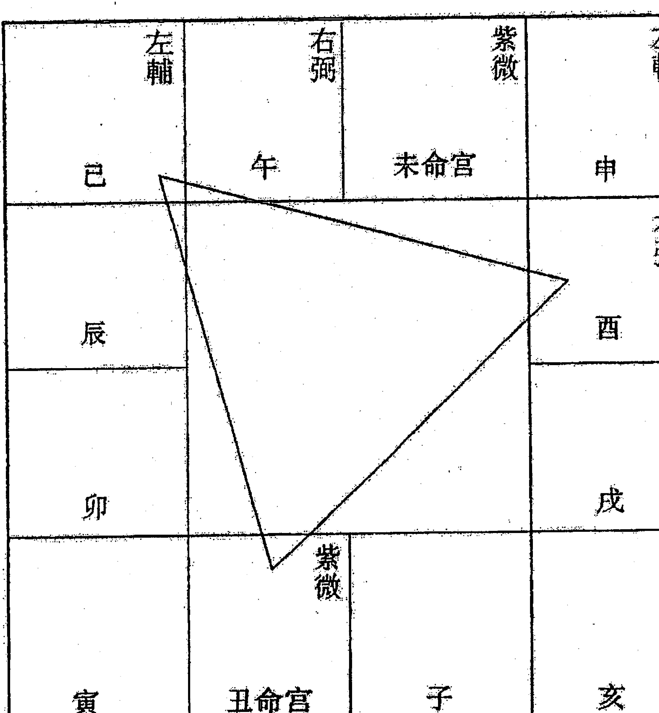
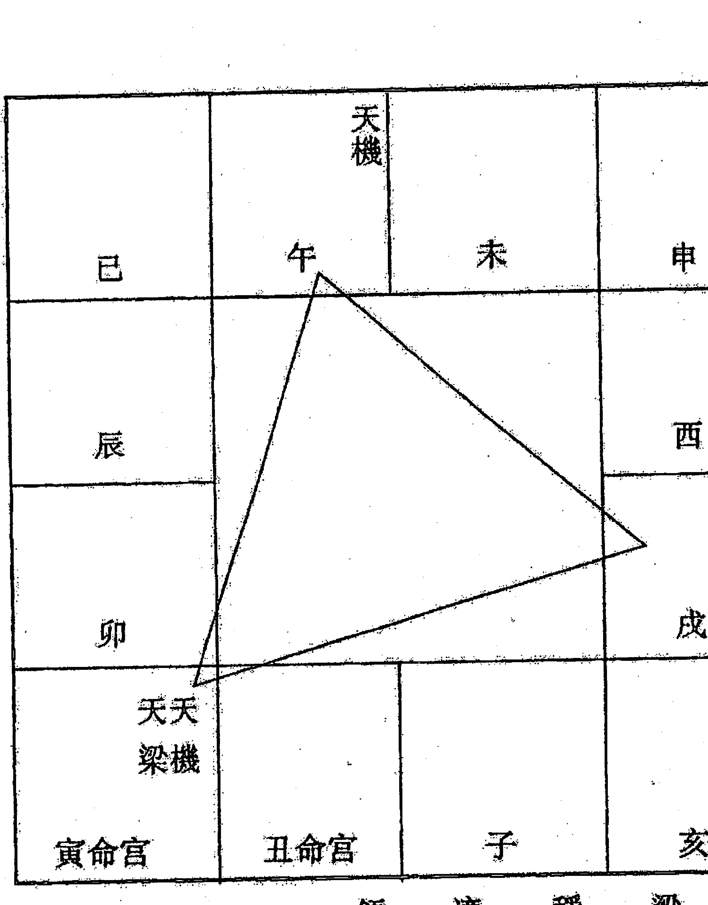
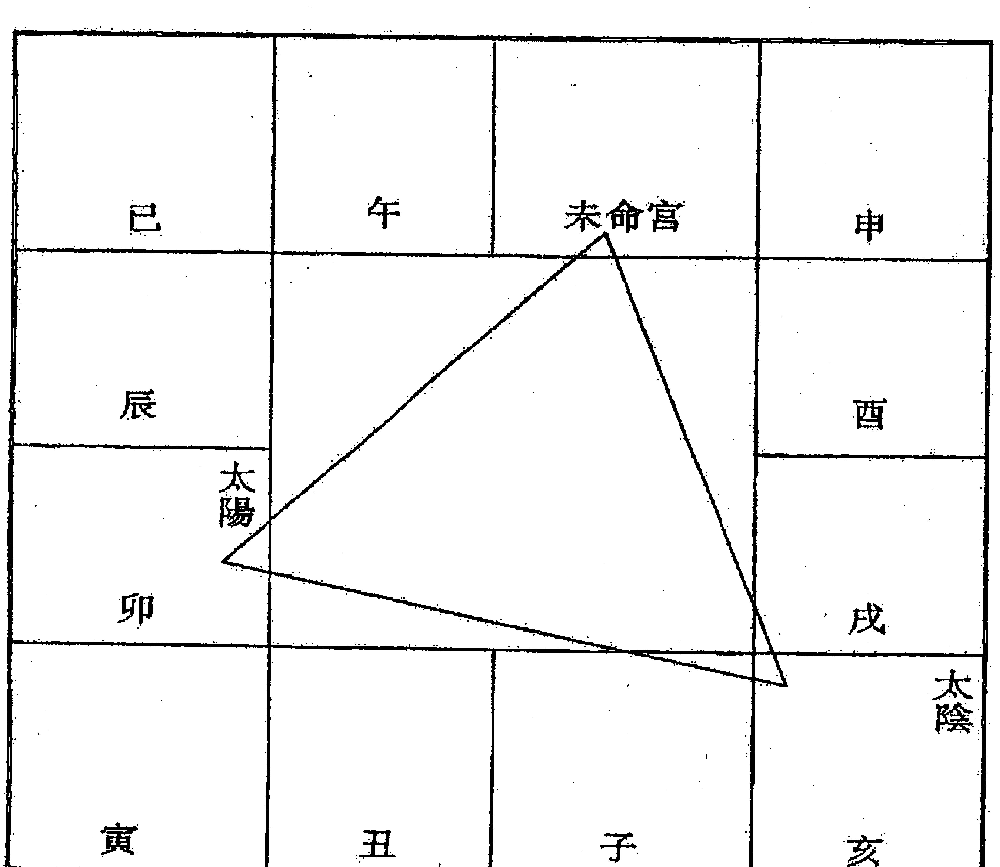

# 紫微斗數全書

## （一）紫微星情详述

陳希夷先生著

## 紫微星情講話

### (一)紫微斗數

(辨理班選用資料)

王育之編著

## 目录

- 前言 7
- 第一章 紫微安星起盘法详解 18
- 第一节 排定紫微十二宫 19
- 第二节 定五行局和起大限 23
- 第三节 主星起例法 26
- 第四节 乙至戊级星起例法 34
- 第五节 命主與身主 41
- 第二章 安星口訣與掌盤 42
- 第一节 安星口訣詮釋 42
- 第二节 掌中排盤法概要 53
- 第三节 星情強弱的判定 54
- 第三章 紫微斗數星情及斷訣 61
- 一 紫微星 61
- 二 天機星 65
- 三 太陽星 69
- 四 武曲星 74
- 五 天同星 77
- 六 廉貞星 81
- 七 天府星 85
- 八 太陰星 88
- 九 貪狼星 90
- 十 巨門星 94
- 十一 天相星 96
- 十二 天梁星 99
- 十三 七杀星 101
- 十四 破军星 104
- 十五 禄存星 107
- 十六 文昌星 109
- 十七 文曲星 110
- 十八 天魁星天钺星 112
- 十九 左辅星 113
- 二十 右弼星 113
- 二十一 擎羊星陀罗星 115
- 二十二 火星铃星 119
- 二十三 地劫、地空 122
- 二十四 天马星 124
- 二十五 天刑星 125
- 二十六 天姚星 127
- 二十七 阴煞星主小人，又名魁神。 128
- 二十八 红鸾星 天喜星 129
- 二十九 天哭天虚 131
- 三十 龙池凤阁 132
- 三十一 孤辰寡宿 133
- 三十二 三台八座 133
- 三十三 台辅封诰 134
- 三十四 天才天寿 135
- 三十五 恩光天贵 135
- 三十六 天官天福 (136)
- 三十七 華蓋 (137)
- 三十八 咸池 (137)
- 三十九 劫煞 (138)
- 四十 天空 (138)
- 四十一 大耗 (139)
- 四十二 破碎 (139)

## 第四章 紫微格局現代解析 (141)

### 第一節 圖解斗數格局 (141)

### 第二節 雙星組合看法 (181)

### 第三節 斗數常用「術語」說明 (196)

## 第五章 星情法論婚姻 (199)

## 第六章 紫微批命法 (220)

### 第一節 定盤十二宮概要 (220)

### 第二節 三方四正原理 (224)

### 第三節 活盤運轉原理 (228)

### 附：《形性賦》註釋 (241)

## 前言

《紫微斗數》终于和大家见面了，此舉實現了我個人多年來的一個心願，也是我作為一個職業術數者的開端。回首自己的人生歷程已不自覺地要生出一些感慨了，尤其是象我這樣一個出身貧寒，研究的又是不被社會所承認的『學問』，更難免歷經許多風波和坎坷。時至今日，一些朋友常戲謔地稱我是負了某種使命的，故要經受以前的種種『劫難』。時常翻讀史書時，看到古代仁人志士們的曲折遭遇，不禁心下釋然，反倒有些汗顏起來，這些又哪裡算得上是『坎坷』，無怪乎今生注定要做個平凡者。

從祖父上溯三代都是清貧不第的讀書人，沒獲得什麼功名，倒是收集了不少線裝古書珍本。值得慶幸的是，大部分書冊都能完整地保存到現在，這都得歸功于那些實善良人的幫助。

祖父自幼喜愛中醫和術數，除了看家藏古書外，據說還是從了名師的，所以在當地很有些名氣。記得小時候，才開始學習識字是祖父便教我一些術數的歌訣，以及唐詩宋詞。及到大些是時，便開始教給一些術數的推理方法，學着學着，竟着了迷，後來祖父去世，留下一大堆手稿，除了藥方之外，其它便是術數之類，主要是四樣，紫微斗數和六壬，還附有許多實際推演的例子，許多地方是改了又改，幾乎看不清楚了，那時覺得這一定是一好東西，直到十幾年后，才將這些全部弄懂，方覺得從此進了另一個天地。進入了地理學中稱的「下元七運」，有關五術類的東西紛紛出山，氣功、特異功能、中醫玄學一時掀起空前熱潮。那時心里很高興，便開始偷偷給人算命，印證所學的觀點。

邂逅了一位老人，竟也會紫微斗數，相互一切磋，發現推算的方法和重點很有些不同，方始明白紫微斗數原來有派別之分，遂拜了一位老師，此即恩師蔡心鴻前輩。曹硯明前輩后來又結識了不少數界的朋友，從消息靈通者處看到了許多港臺斗數書籍，并大致了解了外面紫微斗數的發展和運用情況，因覺國內紫微斗數發展緩慢，幾無一本堪稱「合格」的學習書籍，而斗數書又大多粗制濫造，泛濫成災，因此有了一套斗數學習資料的想法，經過兩年多的整理和總結，大致完稿。但由于近兩年來，雖多方面奔波，終未如愿。故知緣份之有定數，不可強求。

下面，借此書和各位熱心的讀者見面之機，談一下我個人對術數和斗數的一些粗淺認識和體會。

## 一、術數的概況與分類

各種辭典中對「術數」所下的定義均不統一，大多從意識形態的角度將其歸結為一種迷信方術。

術數從其思維方式和最終目的來說，大略可歸入道家的範疇，是人類認識世界以及改造社會和自身命運的一種方法，帶有獨特的東方文化特點。因其體系的完備和可操作性（包括令人折服的準確性），流傳數千年，雖屢遭禁錮，卻以其自身頑強的生命力長盛不衰，成為世界歷史長河中一顆璀璨的明珠。

當今世界對《易經》及其派生的各種應用學科正越來越受到包括西方經濟強國在内的的世界各國科學界的廣泛重視，而術數本身也伴隨着世界經濟的發展而得到補充和完善，以適應新的社會環境。其已成爲對西方人有極大誘惑力的港臺文化的重要組成部分之一，而如何將古典術數結合中國國情，使之更好地爲振興經濟服務，是擺在所有術數學者面前的一項重大任務。

目前的興起了一股學易用易的熱潮。各種古今術數書籍大量擁向市場，雖魚目混雜，瑕瑜互見，但也令人十分欣喜。

術數在其形成和發展的過程中，由于多種原因，形成許多不同的推算方法，甚至連其基本運算條件和最終結果也分成不同的類型。有的以觀天上星宿亮度及布局變化作爲推理條件，有的根據來人間事的時空作爲推理條件，還有的以人出生的生辰八字來進行推演，……有的預測的是個人的終生運氣，有的預測具體事件的成敗，還有的則以推算國家軍國大事爲主……其門類繁多，不一而足。而按照不同的標準也有不同的分類方法。

就我個人認爲，根據各門術數的準確率和精深度而言，大致可分爲上、中、下三個不同層次。

上层包括「上三式」和「五大神数」。
「上三式」即奇门遁甲、太乙神数和大六壬。其中太乙以测天时为主，侧重社会兴衰和广义的天灾人祸预测，术者须懂天文；大六壬天地两盘配以三传四课，专决人事之疑；奇门遁甲则以天地人三盘分别配以八门九星，以时间的差异造成的格局和星的排列不同来预测事物发展的趋势并加以趋避，若配以「法术奇门」可达「谋事在人」的最高境界。
其代表作主要有：《遁甲符应经》、《奇门心悟》、《遁甲演义》、《太乙人道命法》、《太乙金镜式经》、《太乙统宗大全》、《六壬金口诀》、《大六壬类聚》、《六壬大全》……

「五大神数」系指紫微斗数、邵子神数、铁版神数、南极神数、北极神数。其中紫微斗数系以一百多颗星曜依人出生年、月、日、时排成命盘，来推测人一生吉凶祸福、穷通寿夭，尤其长于运程的把握，其公开出版的古籍在民国以前仅有《清朝木刻陈希夷紫微斗数全集》和《紫微斗数全书》两种，邵子神数和铁版神数相传均为宋邵雍所撰，邵子神数是他传给儿子邵伯温的，又称「洛阳派铁版神数」，二者皆系以生辰八字化卦，又以卦起数来逐条查对被测者人生轨迹，其准确度也令人叹为观止，尤精于六亲的推算，常使被测者目瞪口呆；后来许多不信命者因而成爲徹底的宿命论者；南极神数和北极神数系将五星推命法和古典星命学融一爲一，亦以人出生的生辰八字爲基础，其运算体系颇为类似邵子神数，同爲上乘术数之一。

上层术数对于传承有十分严格的标准，非博学多才而又品质敦厚者不传，且大多爲一綫單傳，其傳人亦須立下重誓，且不得以功名富貴為念，故其名聲反不太盛。中層術數則包括四柱法、六爻法、風水學、梅花易數、測字法、選擇法、古典姓名學、手相、面相……其共同特點是，均有較完備的理論體系和較高的準確性，其傳人多為學問之士和僧道者流，且不自秘其術，能為上至達官貴人，下至販夫走卒所普遍接受，在民間享有較高聲譽，成為民俗文化的一個重要組成部分。其中四柱法以人生辰八字為基礎，用五行生克制化原理配以神煞斷人一生吉凶術咎，在民間流傳最廣，其典籍也最多，如《淵海子平》、《命理探原》、《滴天髓征義》、《窮通寶鑒》……六爻法則與《周易》有密切關係，其源出于《京房易》，乃用每卦六爻納以不同干支，并由各自所在宮位定出六親，配以六獸，以五行生克為主占某事之成敗始終，其代表作有《火珠林》、《易冒》、《卜筮正宗》、《增刪卜易》、《易隱》……手面相學則純以人之五官、面上部位及掌紋、氣色等，配合八卦和五行生克原理，占斷人生命運，其經典著作有《麻衣神相》、《柳莊神相》、《相理衡真》、《神相金鉸剪》、《平園相學》……風水學以人住宅和墳墓看吉凶，也廣泛用于趨吉避凶，其中又分八宅和玄空兩大派，而玄空法又與紫微斗數同出一源，比八宅法更具靈活性，其操作方式也極為獨特，其著作大致有《八宅明鏡》、《地理辨正》、《地理正宗》、《沈氏玄空學》……其它預測方法不一一介紹，讀者若有興趣，可查閱有關書籍。下層預測法主要指民間流傳的一掌金、諸葛神數、相兒經、金錢課、五格剖象法……其理論體系極為精疏，所下論斷十分籠統，大都模棱兩可，無嚴格的推理方式，只是呆板地照

## 二、紫微斗數與命理學的親緣關係：

這裡所指的命理學，乃指以人的出生時間配以干支、星煞推論人一生命運的方法，其脫離《易經》的卦爻而能獨立存在。其中主要包括如下四類：四柱預測學、五星推命術、十八飛星、紫微斗數，除前者以五行生克為主，而以星宿神煞為輔之外，后二種皆以星煞作為其立論之根本，以星煞之性質和互相交錯而形成的格局來推論人一生的吉凶禍福，并由此后溯至大限、小限及流年。但它們之間又有區別：五星推命術所用星宿皆為實星（即宇宙中原本存在的星），業其術者必須精通天文，并要隨著星體的變換而對原有的理論體系作適當的修正。而十八飛星及紫微斗數所用星宿皆為虛星，但其理論體系卻甚為完備，以之前者毫不遜色。此三種實際應稱為星命術，其中又以紫微斗數最為完備，加以后人的不斷擴充、深化，遂成為星命學中的集大成者，并由原有的簡要評斷發展為根據歲運運行而顯現的不同星情組合加以逐事詳斷，故其聲名也日益彰大，遠遠超出前兩者之上。上述四種推命方法對待測者均只要求提供出生年、月、日時，最初提出這種觀點者基於人出生的時間存在著極大的偶然性，認為其中必然與各人的不同命運極為相關，但并沒有提出切實可行的推理方法，后人沿著這一思路逐步延伸，由於各自的學術素養和文化背景的不同，遂發展成為不同的體系，上述的命理預測方法皆是其中行之有效的方法之一。

其产生的时代也各不相同。其中五行推命术约形成于汉朝，四柱预测法则开始完备于唐李虚中，而由宋徐子平加以进一步发展。（今有不少人认为李虚中只用三柱推命，此实为谬论，乃是对韩愈的「李虚中墓志铭」未能深究而产生了误解。大倡此说者乃民国命理学家袁树珊，但袁在其著作《命理探原》中及时纠正了这一错误说法，读者可察批书。）而十八飞星及紫微斗数相传均发明于宋陈搏。所以我认为，此四者系同出一脉而分为四支，有着极为密切的亲缘关系。

## 三、紫微斗數的源流及其特點

紫微斗數在傳承上，對擇徒要求十分嚴格，雖不象鐵版神數那樣有嚴格的條規，但也決不輕以示人。其原因是多方面的，一則因爲斗數體系過于龐雜，重邏輯推理，非有過人的記憶力和精密的邏輯思維能力不足以繼承其衣缽；一則在擇人而教時，還十分重視品德修養。故其傳人多是迂腐不第、淡泊功名的讀書人，還有一些老實巴交的正經莊稼人。

后来又有人遁入空门，遂在僧道中也有精研其术者。还有一种带有传奇性的说法：自宋以后，有关紫微斗数的真传落入宫内钦天监之手，专用于为皇上趋吉避凶，而在民间由于多种原因，仅有收藏其书而无得其真传者。直到八国联军进入北京，精于此道者携秘籍流落民间，才为许多人所知。抱这种观点者甚至还能举出几件确凿的证据来。但依笔者之见，可能是一者兼有，并非始终单线所传，这点从其后来南北两派在技术风格上的差异可以得到证明。

紫微斗数在流传中，由于各人天赋的差异和侧重点不同，逐渐形成不同的门派，如现今广为人知的白云派、昆仑派、中州派、江南派……但观其技术风格，大致可分为南北两大系。南派以星情、格局为主，注重总体把握、配以活盘运转，用“三方四正”推运程；北派以四化为牵引，重河洛九宫之气数，精于细微推断。二者合璧，可得“未卜先知”之神效。

从斗数典籍来看，以手抄本较多，真正公开印制流传的只有《清朝木刻陈希夷紫微斗数全集》和《紫微斗数全书》两种（以下简称《全集》和《全书》）。其中又《全集》价值较高，保留了斗数的原有风格，而《全书》则掺入了后人雕琢的痕迹，如“骨髓赋”等即是后来术士加入的，还有一些把五行和生旺墓绝的观点，融入其中，反把后学者引向歧途。估计多为一些先前研究过命理而后又半路出家，改攻斗数的术士所为，由于未得真传，所以引进其它理论曲为解释，以自圆其说，遂致以讹传讹。另外，《全书》中由于传抄中出现的笔误也为数不少。当然，《全书》大致上保持了原书的风貌，仍具有很大价值。

民国时期，民间许多斗数家也多曾有著作问世，但多作为抄本流传，真正付印的极少。详观诸书，在推理方法上逐步向纵深方向发展，并开始将斗数用于卜筮、风水等领域，并提出了种种新方法和设想，《斗数宣微》即其中代表作之一。但这些观点究竟该如何评价，今人对此褒贬不一。客观地说，是有利有弊：一方面，该书拓宽了后学者的研究思路，对推算结果的深度有了很大提高，尤其是“活盘运转”观念的提出，对流年、流月的推算从方法上得到了具体化；但另一方面，开始将斗数神化起来，并将其提到一个至高无上的境界

## 四、本書的編排原則：

全書共分四冊，即《紫微星情詳述》、《流年凶灾詳断》、《斗数四化断訣》、《斗数宣微》。

《紫微星情詳述》：首先分兩章講述起命盤的方法，第一章為查表排盤法，使沒有基礎者也可入門；第二章則講安星口訣和規律，以及掌中排盤方法，并公開起紫微星秘法，使讀者擺脫古書中冗長而不切實際的起紫微星口訣，達到快速排盤的目的。接下來則講「紫微星情與断訣」，以具體明確的論斷讓讀者了解各星曜的本質同賦性，為學習活盤及四化打好基礎。接后則是「紫微格局現代解析」，為學習活盤及四化打好基礎。接后則是「紫微格局現代解析」與「星情法論婚姻」兩章，以邏輯推理的現代方法取代傳統呆板的口訣論命法。最后則講述目前斗數界正統的推理方法，具體內容包括定盤十二宮意義、三方四正原理，活盤運用方法及實用舉例等內容，系統介紹了紫微斗數推命術的規律。本書

## 一、紫微星情與断訣

口訣論命法。最后則講述目前斗數界正統的推理方法，具體內容包括定盤十二宮意義、三方四正原理，活盤運用方法及實用舉例等內容，系統介紹了紫微斗數推命術的規律。本書是全套书的重点，以星情配合四化断流年为主，读者有欲在斗数中深造者，务必熟玩本书并反复实践领悟。

《流年凶灾详断》采纳了别派观点，经实践验证确有可取之处，故稍作整理后介绍给读者。该书的特点是：不论四化的影响，纯以星曜力及星情组合为主，逐一分析各种凶灾发生的显象。编写此书的目的是使读者在领悟了星情及四化断法的基础上，再进一步拓宽眼界，以利于自己对星情有更深层的领悟，大家可在实际运用中去反复玩味，以期对各星曜的赋性有更明确的认识。

《斗数四化断诀》属北派观点，纯以四化为主，而以星情为辅，是斗数的高层次观点，很多地方只可意会不可言传。因此本书须在基础稳固后方可修习，以免喧宾夺主。若能理解清楚则可逐渐应用于实作，若认为难懂则可只以第一册的方法为主，再以小星的断法为辅，也可细推流月等。该书目次安排为：四化基本功、北派论副星、部分事项的分类占断法、北派论财官特别命例分析。由于每一宫干及流年、流月天干、原命天干均可同时飞出四化星，因此若不能把握侧重点，则极易造成四化满盘飞的混乱局面，给初学者的感觉是「乱说乱有理」。而这些地方正是北派斗数的重点和难点，难以表达清楚，读者可用循序渐进的方法去慢慢领悟。

《斗数宣微》乃古籍原文照印。该书具有思路灵活，博采众家之长的特点，书中很多观点乃作者（民国王亭之先生）自创，对近代紫微斗数的发展起到了承先启后的作用，但也需以一分为二的觀點去看待。為了保留古籍原貌，未作增刪和改動。該書主要內容包括：雜論問答、斗數論陰陽宅、簡批四十例、看身命之關係、運限之假借等等。

斗數體系博大精深，窮畢生精力也未必能窺其堂奧。而其魅力之無窮也每每使人興之所致，每興望洋之嘆。予集近三十年之努力，于實作中亦常有力不從心之感，對迷惑難解之斗數亦稍有所悟，對個人的運程把握乃至人生哲理的領悟有所裨益，則本人至感欣喜。

惟是書倘能使后學者對紫微斗數有所了解，對個人的運程把握乃至人生哲理的領悟有所裨益，則本人至感欣喜。

另外，謹以此文为序。

王亭之
丙子年八月于菊風書屋

# 第一章 紫微安星起盘法详解

紫微命盘的制作是『紫微斗数推命术』的基础，其方法是以人出生的时间通过一定的规则把一百多颗星曜填入相应的十二宫内，并排定大限的运行规则。相当于『四柱预测学』中的『一起八字、排大运』。

其具体步骤如下：

1. 将出生时间转化成农历年、月、日、时；
2. 排定以命、身宫为首的十二宫；
3. 将命宫地支纳干，定出五行局，并将各大限的起止年限填入相应的宫垣；
4. 将三十二颗甲级主星按一定的规则填入相应的宫中；
5. 在命盘上排定各副星的位置。

本章与第十一章介绍的均是命盘的起例方法。其区别在于：本章专为未入门的读者所写，用表格的形式提供最简易的入门方法。第二十一章则着重星系排列的规律和各星曜之间的固定关系，给出排盘的记忆口诀，并披露掌中排盘方法，使读者抛开表格，独立、快速地在手中排命盘。

## 第一节 排定紫微十二宫

| 巳 | 午 | 未 | 申 |
| :--- | :--- | :--- | :--- |
| 辰 | 姓名：黄×× 陽男 | | 酉 |
| 卯 | 甲戌年九月廿日申時生 | | 戌 |
| 寅 | 丑 | 子 | 亥 |

**表一**

【注】：表内各方格内的地支先不填写，后面有详细说明。

首先，请读者先准备一张如下的表格（表一）：

然后，将待测者的出生时间转换紫微推命所用的标准形式。即：出生年用干支表示，月、日均用农历的数表示，并将钟点化为十二地支所表示的时辰。

【例一】某男子一九三四年十月二十七日下午十五时四十五分出生转换成：甲戌年九月廿日申时生（陽男）

按出生年的天干，以甲、丙、戊、庚、壬为阳，乙、丁、己、辛、癸为阴，标明「阳男」、「阴男」、「阳女」、「阴女」。如上例中即为一「陽男」。再将待测者的姓名、性别、出生时间按表一的格式填入表中。

之后，查表二找出待测者的命宫和身宫。

## 第二一 命宫、身宫速查表

|   | 正 | 二 | 三 | 四 | 五 | 六 | 七 | 八 | 九 | 十 | 十一 | 十二 |
|---|---|---|---|---|---|---|---|---|---|---|---|---|
| 子 | 寅 寅 | 卯 卯 | 辰 辰 | 巳 巳 | 午 午 | 未 未 | 申 申 | 酉 酉 | 戌 戌 | 亥 亥 | 子 子 | 丑 丑 |
| 丑 | 丑 卯 | 寅 辰 | 卯 巳 | 辰 午 | 巳 未 | 午 申 | 未 酉 | 申 戌 | 酉 亥 | 戌 子 | 亥 丑 | 子 寅 |
| 寅 | 子 丑 | 丑 寅 | 寅 卯 | 卯 辰 | 辰 巳 | 巳 午 | 午 未 | 未 申 | 申 酉 | 酉 戌 | 戌 亥 | 亥 子 |
| 卯 | 亥 丑 | 子 寅 | 丑 卯 | 寅 辰 | 卯 巳 | 辰 午 | 巳 未 | 午 申 | 未 酉 | 申 戌 | 酉 亥 | 戌 子 |
| 辰 | 戌 亥 | 亥 丑 | 子 寅 | 丑 卯 | 寅 辰 | 卯 巳 | 辰 午 | 巳 未 | 午 申 | 未 酉 | 申 戌 | 酉 亥 |
| 巳 | 酉 戌 | 戌 亥 | 亥 丑 | 子 寅 | 丑 卯 | 寅 辰 | 卯 巳 | 辰 午 | 巳 未 | 午 申 | 未 酉 | 申 戌 |
| 午 | 申 酉 | 酉 戌 | 戌 亥 | 亥 丑 | 子 寅 | 丑 卯 | 寅 辰 | 卯 巳 | 辰 午 | 巳 未 | 午 申 | 未 酉 |
| 未 | 未 申 | 申 酉 | 酉 戌 | 戌 亥 | 亥 丑 | 子 寅 | 丑 卯 | 寅 辰 | 卯 巳 | 辰 午 | 巳 未 | 午 申 |
| 申 | 午 未 | 未 申 | 申 酉 | 酉 戌 | 戌 亥 | 亥 丑 | 子 寅 | 丑 卯 | 寅 辰 | 卯 巳 | 辰 午 | 巳 未 |
| 酉 | 巳 午 | 午 未 | 未 申 | 申 酉 | 酉 戌 | 戌 亥 | 亥 丑 | 子 寅 | 丑 卯 | 寅 辰 | 卯 巳 | 辰 午 |
| 戌 | 辰 巳 | 巳 午 | 午 未 | 未 申 | 申 酉 | 酉 戌 | 戌 亥 | 亥 丑 | 子 寅 | 丑 卯 | 寅 辰 | 卯 巳 |
| 亥 | 卯 辰 | 辰 巳 | 巳 午 | 午 未 | 未 申 | 申 酉 | 酉 戌 | 戌 亥 | 亥 丑 | 子 寅 | 丑 卯 | 寅 辰 |

[注]:上为命宫,下为身宫。

## 【例二】：例一中的某男命宫在寅，身宫在午。查表三，以命宫为基础，按顺针方向排定命宫，兄弟宫、夫妻宫、子女宫（原称男女宫）、财帛宫、疾厄宫、迁移宫、奴仆宫（又称交友宫）、官禄宫（又称事业宫）、田宅宫、福德宫、父母宫。

【注】：十二宫的具体意义在第六章第一节将有详细说明。

## 【例三】：例一中某男的命盘可完成为图一所示。

表3 十二宫速查表
| 命宫 | 兄弟 | 夫妻 | 子女 | 财帛 | 疾厄 | 迁移 | 奴仆 | 官禄 | 田宅 | 福德 | 父母 |
|---|---|---|---|---|---|---|---|---|---|---|---|
| 子 | 子 | 戌 | 酉 | 申 | 午 | 巳 | 辰 | 卯 | 寅 | 丑 | |
| 丑 | 丑 | 亥 | 戌 | 酉 | 未申 | 未 | 午 | 巳 | 辰 | 卯 | 寅 |
| 寅 | 寅 | 子 | 亥 | 戌 | 酉 | 申 | 未 | 午 | 巳 | 辰 | 卯 |
| 卯 | 卯 | 丑 | 子 | 亥 | 戌 | 酉 | 申 | 未 | 午 | 巳 | 辰 |
| 辰 | 辰 | 寅 | 丑 | 子 | 亥 | 戌 | 酉 | 申 | 未 | 午 | 巳 |
| 巳 | 巳 | 卯 | 寅 | 丑 | 子 | 亥 | 戌 | 酉 | 申 | 未 | 午 |
| 午 | 午 | 辰 | 卯 | 寅 | 丑 | 子 | 亥 | 戌 | 酉 | 申 | 未 |
| 未 | 未 | 巳 | 辰 | 卯 | 寅 | 丑 | 子 | 亥 | 戌 | 酉 | 申 |
| 申 | 申 | 午 | 巳 | 辰 | 卯 | 寅 | 丑 | 子 | 亥 | 戌 | 酉 |
| 酉 | 酉 | 未 | 午 | 巳 | 辰 | 卯 | 寅 | 丑 | 子 | 亥 | 戌 |
| 戌 | 戌 | 申 | 未 | 午 | 巳 | 辰 | 卯 | 寅 | 丑 | 子 | 亥 |
| 亥 | 亥 | 酉 | 申 | 未 | 午 | 巳 | 辰 | 卯 | 寅 | 丑 | 子 |

[注]:十二宫的具体意义在第六章第1节将有详细说明。

### 图 1 例1中某阳男十二宫排列

巳 | 午 | 未 | 申
辰 | | | 酉
卯 | 甲戌年九月廿日申时生 | | 戌
寅 | 丑 | 子 | 亥

## 表4 五行局速查表

|   | 甲 | 乙 | 丙 | 丁 | 戊 | 己 | 庚 | 辛 | 壬 | 癸 |
|---|---|---|---|---|---|---|---|---|---|---|
| 子 | 水 | 火 | 土 | 木 | 金 | 水 | 火 | 土 | 木 | 金 |
| 丑 | 火 | 土 | 木 | 金 | 水 | 火 | 土 | 木 | 金 | 水 |
| 寅 | 火 | 土 | 木 | 金 | 水 | 火 | 土 | 木 | 金 | 水 |
| 卯 | 火 | 土 | 木 | 金 | 水 | 火 | 土 | 木 | 金 | 水 |
| 辰 | 木 | 金 | 水 | 火 | 土 | 木 | 金 | 水 | 火 | 土 |
| 巳 | 木 | 金 | 水 | 火 | 土 | 木 | 金 | 水 | 火 | 土 |
| 午 | 土 | 木 | 金 | 水 | 火 | 土 | 木 | 金 | 水 | 火 |
| 未 | 土 | 木 | 金 | 水 | 火 | 土 | 木 | 金 | 水 | 火 |
| 申 | 金 | 水 | 火 | 土 | 木 | 金 | 水 | 火 | 土 | 木 |
| 酉 | 金 | 水 | 火 | 土 | 木 | 金 | 水 | 火 | 土 | 木 |
| 戌 | 火 | 土 | 木 | 金 | 水 | 火 | 土 | 木 | 金 | 水 |
| 亥 | 火 | 土 | 木 | 金 | 水 | 火 | 土 | 木 | 金 | 水 |

## 第二节 定五行局和起大限

[定五行局] 用『五虎遁月法』求出命盘中各地支的天干。

诀云：甲己之年丙作首，乙庚之岁戊为头，丙辛必定寻庚起，丁壬壬位顺水流，更有戊癸何处发，甲寅之上好追求。

即甲、己年生人起丙寅、丁卯……，乙、庚年生人起戊寅、己卯……，余仿此。将各干支填入命盘中。（不清楚者可查阅有关四柱书籍入门章节。）

【例四】：前例中，甲戌年生某男各宫干支依次为丙寅、丁卯、戊辰、己巳、庚午、辛未、壬申、癸酉、甲戌、乙亥、丙子、丁丑。

查表四（五行局速查表）求出待测者的命盘五行局。再按五行局数的固定对应关系确定命盘的局数。

即：五行局属水者为水一局，属木者为木三局，属金者为金四局，属土者为土五局，属火者为火六局。

## 【例五】：前例中甲戌年生某男对照表四，命宫寅支，年干甲，为火六局。

上面求出的五行局数，主要用于确定大限的起止年限，至于大限运行的顺序，以命宫起第一步大限。然后分两种情况：阳男阴女按顺时针运行，以父母宫起第二步大限，福德宫起第三步大限，田宅宫起第四步大限……以此类推；阳男阳女则按逆时针运行，以兄弟宫起第二步大限，夫妻宫起第三步大限，子女宫起第四步大限……以此类推。

每步大限所管年限为十年，以五行局数所确定的虚岁年限为第一步大限的起始年，向后推十年止，再从十年后的岁数转入第二步大限……直至生命终结。如命局为金四局的阳男，虚岁四、十三行命宫大限，十四、二十三岁行父母宫大限，二十四、三十三岁行福德宫大限，三十四、四十三岁行田宅宫大限，四十四、五十三岁行官禄宫大限，五十四、六十三岁行奴仆宫大限，六十四、七十三岁行迁移宫大限……依此类推。

## 【提示】：以上起止限均为虚岁，即出生之年为一岁，一进入第二年正月初一则为二岁，此为通行计算算法。也有的派别认为，应从第二年的生日起计二岁，此为又一种算法。事实上两种方法在实际推算中并不产生太大差别，故无关宏旨。

## 【例六】：前几例中的甲戌年生某男命盘已完成如图一。

| 田宅 36-45 己巳 | 官禄 46-55 庚午 | 奴仆 56-65 辛未 | 迁移 66-75 壬申 |
| 福德 26-35 戊辰 | 姓名:黄××  阳男 |  | 疾厄 76-85 癸酉 |
| 父母 16-25 丁卯 | 甲戌年九月廿日申时生 火六局 |  | 财帛 86-95 甲戌 |
| 命宫 6-15 丙寅 | 兄弟  丁丑 | 夫妻  丙子 | 子女  乙亥 |

### 图2 某男大限起止年限图

## 第二节 主星起例法

紫微斗数中，大小诸星计有一百二十颗左右。当今港台斗数界将其按重要性（常用性）的不同划分为甲、乙、丙、丁、戊五个级别，此法颇为可取。本节介绍三十二颗甲级主星的起例法，其星宿名称如下（括号内为其简称）：

- 紫微星系：紫微（紫）、天机（机）、太阳（阳或日）、武曲（武）、天同（同）、廉贞（廉或贞）
- 天府星系：天府（府）、太阴（月）、贪狼（贪）、巨门（巨或暗曜）、天相（相）、天梁（梁）、七杀（杀）、破军（破或耗星）
- 八吉星：文昌（昌）、文曲（曲）、左辅（左或辅）、右弼（右或弼）、天魁（魁）、天钺（钺）、禄存（禄或天禄）、天马（马）
- 六凶星：擎羊（羊或羊刀）、陀罗（陀）、火星（火）、铃星（铃）、地空（空）、地劫（劫）
- 四化星：化禄（禄）、化权（权）、化科（科）、化忌（忌）

【提示】：一、一般情况下，禄指四化星中的化禄，不指八吉星中的禄存。二、昌、曲、左、右、魁、钺又称六吉星。表五—十三为各主星的速查表，可照此一一列入命盘。

|   | 1 | 2 | 3 | 4 | 5 | 6 | 7 | 8 | 9 | 10 | 11 | 12 | 13 | 14 | 15 |
|---|---|---|---|---|---|---|---|---|---|---|---|---|---|---|---|
| 木 | 辰 | 丑 | 寅 | 巳 | 寅 | 卯 | 午 | 卯 | 辰 | 未 | 辰 | 巳 | 申 | 巳 | 午 |
| 火 | 酉 | 午 | 亥 | 辰 | 丑 | 寅 | 戌 | 未 | 子 | 巳 | 寅 | 卯 | 巳 | 申 | 丑 |
| 土 | 午 | 亥 | 辰 | 丑 | 寅 | 未 | 子 | 巳 | 寅 | 卯 | 申 | 丑 | 午 | 卯 | 辰 |
| 金 | 亥 | 辰 | 丑 | 寅 | 子 | 巳 | 寅 | 卯 | 丑 | 午 | 卯 | 辰 | 寅 | 未 | 辰 |
| 水 | 丑 | 寅 | 寅 | 卯 | 卯 | 辰 | 辰 | 巳 | 巳 | 午 | 午 | 未 | 未 | 申 | 申 |

|   | 16 | 17 | 18 | 19 | 20 | 21 | 22 | 23 | 24 | 25 | 26 | 27 | 28 | 29 | 30 |
|---|---|---|---|---|---|---|---|---|---|---|---|---|---|---|---|
| 木 | 酉 | 午 | 未 | 戌 | 未 | 申 | 亥 | 申 | 酉 | 子 | 酉 | 戌 | 丑 | 戌 | 亥 |
| 火 | 午 | 卯 | 辰 | 子 | 酉 | 寅 | 未 | 辰 | 巳 | 丑 | 戌 | 卯 | 申 | 巳 | 午 |
| 土 | 酉 | 寅 | 未 | 辰 | 巳 | 戌 | 卯 | 申 | 巳 | 午 | 亥 | 辰 | 酉 | 午 | 未 |
| 金 | 巳 | 卯 | 申 | 巳 | 午 | 辰 | 未 | 午 | 未 | 巳 | 戌 | 未 | 申 | 午 | 亥 |
| 水 | 酉 | 酉 | 戌 | 戌 | 亥 | 亥 | 子 | 子 | 丑 | 丑 | 寅 | 寅 | 卯 | 卯 | 辰 |

## 表 5 紫微星速查表

【注】:表中生日指的是农历的出生日期，此表中规律性不强，其简便记忆法在第二章中会讲到。

表6 紫微系主星速查表
|      | 子 | 丑 | 寅 | 卯 | 辰 | 巳 | 午 | 未 | 申 | 酉 | 戌 | 亥 |
|------|----|----|----|----|----|----|----|----|----|----|----|----|
| 天机 | 亥 | 子 | 丑 | 寅 | 卯 | 辰 | 巳 | 午 | 未 | 申 | 酉 | 戌 |
| 太阳 | 酉 | 戌 | 亥 | 子 | 丑 | 寅 | 卯 | 辰 | 巳 | 午 | 未 | 申 |
| 武曲 | 申 | 酉 | 戌 | 亥 | 子 | 丑 | 寅 | 卯 | 辰 | 巳 | 午 | 未 |
| 天同 | 未 | 申 | 酉 | 戌 | 亥 | 子 | 丑 | 寅 | 卯 | 辰 | 巳 | 午 |
| 廉贞 | 辰 | 巳 | 午 | 未 | 申 | 酉 | 戌 | 亥 | 子 | 丑 | 寅 | 卯 |

表7 天府星速查表
|      | 子 | 丑 | 寅 | 卯 | 辰 | 巳 | 午 | 未 | 申 | 酉 | 戌 | 亥 |
|------|----|----|----|----|----|----|----|----|----|----|----|----|
| 紫微 | 子 | 丑 | 寅 | 卯 | 辰 | 巳 | 午 | 未 | 申 | 酉 | 戌 | 亥 |
| 天府 | 辰 | 卯 | 寅 | 丑 | 子 | 亥 | 戌 | 酉 | 申 | 未 | 午 | 巳 |

从表六中可由紫微星的地支（由表五查得）查得天机、太阳、武曲、天同、廉贞的排法，此六星为一大星系。

表七可由紫微星所在的地支查出天府星所在的宫度。再由天府星所在地支从表八中查出太阴、贪狼、巨门、天相、天梁、七杀、破军的排法，此八星为一大星系。

以下表九、表十、表十一、表十二分别为年系、月系、时系诸星及火铃速查表。从以下四表中可查出八吉星、六凶星的排盘方法，读者可自行查表排入待测的命盘。

除上述五星外，天马星亦为年系星，其法以年支查，凡寅午戌年生人天马在申，申子辰年生人天马在寅，巳酉丑年生人天马在亥，亥卯未年生人天马在巳。也有的派别把天马列为月系星，读者可在实践中对比印证，本门定天马为年系星。

## 表8 天府系主星速查表

| 星曜 | 子 | 丑 | 寅 | 卯 | 辰 | 巳 | 午 | 未 | 申 | 酉 | 戌 | 亥 |
| :--- | :--- | :--- | :--- | :--- | :--- | :--- | :--- | :--- | :--- | :--- | :--- | :--- |
| 天府 | 子 | 丑 | 寅 | 卯 | 辰 | 巳 | 午 | 未 | 申 | 酉 | 戌 | 亥 |
| 太阴星 | 丑 | 寅 | 卯 | 辰 | 巳 | 午 | 未 | 申 | 酉 | 戌 | 亥 | 子 |
| 贪狼星 | 寅 | 卯 | 辰 | 巳 | 午 | 未 | 申 | 酉 | 戌 | 亥 | 子 | 丑 |
| 巨门星 | 卯 | 辰 | 巳 | 午 | 未 | 申 | 酉 | 戌 | 亥 | 子 | 丑 | 寅 |
| 天相星 | 辰 | 巳 | 午 | 未 | 申 | 酉 | 戌 | 亥 | 子 | 丑 | 寅 | 卯 |
| 天梁星 | 巳 | 午 | 未 | 申 | 酉 | 戌 | 亥 | 子 | 丑 | 寅 | 卯 | 辰 |
| 七杀星 | 午 | 未 | 申 | 酉 | 戌 | 亥 | 子 | 丑 | 寅 | 卯 | 辰 | 巳 |
| 破军星 | 戌 | 亥 | 子 | 丑 | 寅 | 卯 | 辰 | 巳 | 午 | 未 | 申 | 酉 |

## 表9 年系诸星速查表

| 星曜 | 甲 | 乙 | 丙 | 丁 | 戊 | 己 | 庚 | 辛 | 壬 | 癸 |
| :--- | :--- | :--- | :--- | :--- | :--- | :--- | :--- | :--- | :--- | :--- |
| 禄存 | 寅 | 卯 | 巳 | 午 | 巳 | 午 | 申 | 酉 | 亥 | 子 |
| 擎羊 | 卯 | 辰 | 午 | 未 | 午 | 未 | 酉 | 戌 | 子 | 丑 |
| 陀罗 | 丑 | 寅 | 辰 | 巳 | 辰 | 巳 | 未 | 申 | 戌 | 亥 |
| 天魁 | 丑 | 子 | 亥 | 酉 | 未 | 申 | 未 | 午 | 巳 | 卯 |
| 天钺 | 未 | 申 | 酉 | 亥 | 丑 | 子 | 丑 | 寅 | 卯 | 巳 |

## 表10 月系诸星速查表

| 月支 | 寅 | 卯 | 辰 | 巳 | 午 | 未 | 申 | 酉 | 戌 | 亥 | 子 | 丑 |
|------|----|----|----|----|----|----|----|----|----|----|----|----|
| 左辅星 | 辰 | 巳 | 午 | 未 | 申 | 酉 | 戌 | 亥 | 子 | 丑 | 寅 | 卯 |
| 右弼星 | 戌 | 酉 | 申 | 未 | 午 | 巳 | 辰 | 卯 | 寅 | 丑 | 子 | 亥 |

## 表11 时系诸星速查表

|      | 子 | 丑 | 寅 | 卯 | 辰 | 巳 | 午 | 未 | 申 | 酉 | 戌 | 亥 |
|------|----|----|----|----|----|----|----|----|----|----|----|----|
| 文曲 | 辰 | 巳 | 午 | 未 | 申 | 酉 | 戌 | 亥 | 子 | 丑 | 寅 | 卯 |
| 文昌 | 戌 | 酉 | 申 | 未 | 午 | 巳 | 辰 | 卯 | 寅 | 丑 | 子 | 亥 |
| 地空 | 亥 | 戌 | 酉 | 申 | 未 | 午 | 巳 | 辰 | 卯 | 寅 | 丑 | 子 |
| 地劫 | 亥 | 子 | 丑 | 寅 | 卯 | 辰 | 巳 | 午 | 未 | 申 | 酉 | 戌 |

## 表12 火星、铃星速查表

| 年支   |      | 寅 | 卯 | 辰 | 巳 | 午 | 未 | 申 | 酉 | 戌 | 亥 | 子 | 丑 |
|--------|------|----|----|----|----|----|----|----|----|----|----|----|----|
| 申子辰 | 火星 | 寅 | 卯 | 辰 | 巳 | 午 | 未 | 申 | 酉 | 戌 | 亥 | 子 | 丑 |
|        | 铃星 | 戌 | 亥 | 子 | 丑 | 寅 | 卯 | 辰 | 巳 | 午 | 未 | 申 | 酉 |
| 巳酉丑 | 火星 | 卯 | 辰 | 巳 | 午 | 未 | 申 | 酉 | 戌 | 亥 | 子 | 丑 | 寅 |
|        | 铃星 | 戌 | 亥 | 子 | 丑 | 寅 | 卯 | 辰 | 巳 | 午 | 未 | 申 | 酉 |
| 寅午戌 | 火星 | 丑 | 寅 | 卯 | 辰 | 巳 | 午 | 未 | 申 | 酉 | 戌 | 亥 | 子 |
|        | 铃星 | 卯 | 辰 | 巳 | 午 | 未 | 申 | 酉 | 戌 | 亥 | 子 | 丑 | 寅 |
| 亥卯未 | 火星 | 酉 | 戌 | 亥 | 子 | 丑 | 寅 | 卯 | 辰 | 巳 | 午 | 未 | 申 |
|        | 铃星 | 戌 | 亥 | 子 | 丑 | 寅 | 卯 | 辰 | 巳 | 午 | 未 | 申 | 酉 |

## 表十三 四化星速查表

表十三为四化星速查表，以出生年天干对表查得，填入命盘中该星下方。表十二乃本门四化星查法，与有些门派在庚、壬两干上有歧议，读者可自行识别取舍。

【例七】对照表五—十三查出甲戌年出生某男星分布如下：## 表13 四化星速查表

|    | 甲  | 乙  | 丙  | 丁  | 戊  | 己  | 庚  | 辛  | 壬  | 癸  |
|----|-----|-----|-----|-----|-----|-----|-----|-----|-----|-----|
| 化禄 | 廉贞 | 天机 | 天同 | 太阴 | 贪狼 | 武曲 | 太阳 | 巨门 | 天梁 | 破军 |
| 化权 | 破军 | 天梁 | 天机 | 天同 | 太阴 | 贪狼 | 武曲 | 太阳 | 紫微 | 巨门 |
| 化科 | 武曲 | 紫微 | 文昌 | 天机 | 右弼 | 天梁 | 太阴 | 文曲 | 左辅 | 太阴 |
| 化忌 | 太阳 | 太阴 | 廉贞 | 巨门 | 天机 | 文曲 | 天同 | 文昌 | 武曲 | 贪狼 |

对照表五、表六查得：紫微在酉、天机在申、太阳在午、武曲在巳、天同在辰、廉贞在丑。

对照表七、八查得：天府在未、太阴在申、贪狼在酉、巨门在戌、天相在亥、天梁在子、七杀在丑、破军在巳。

对照表九、十、十二查得：禄存在寅、擎羊在卯、陀罗在丑、天魁在丑、天钺在未、天马在申、左辅在子、右弼在寅、文昌在寅、地空在卯、地劫在未、火星在酉、铃星在亥。

对照表十三查得：廉贞化禄、破军化权、武曲化科、太阳化忌。将各星填入命盘，列成图三。

|  |  |  |  |
|---|---|---|---|
| **破軍 武曲** 化祿 化科 | **太陽** 化忌 | **地天劫鉞府** | **天太天馬陰機** |
| 己巳 36-45 1969年 田宅 | 庚午 46-55 1979年 官祿 | 辛未 56-65 1989年  | 壬申 66-75 1999年 遷移 |
| **天同** |  |  | **火貪紫星狼微** |
| 戊辰 26-35 1959年 福德 |  |  | 癸酉 76-85 2009年 疾厄 |
| **地空 擎羊** |  |  | **火貪紫星狼微** |
| 丁卯 16-25 1949 父母 |  |  | 癸酉 76-85 2009年 疾厄 |
| **文曲 右弼 祿存** | **天魁 陀羅 七殺 廉貞** 化祿 | **文昌 左輔 天梁** | **鈴星 天相** |
| 丙寅 6-15 1939年 命宮 | 丁丑 兄弟 | 丙子 夫妻 | 乙亥 子女 |

## 圖3 甲戌生生某男命命盤主星圖

## 第四節 乙至戊級星起例法

### 一、年干系諸星起法（表十四）

### 二、年支系諸星起法（表十五）

### 三、月系諸星起法（十六）

### 四、安臺輔、封誥（乙級星）

二星皆為時系星，子時生人臺輔在午，封誥在寅；丑時則臺輔在未，封誥在卯……順時針運轉，依此類推。

### 五、安日系諸星（乙級星）

### 六、安長生十二神表（丙級星）

### 七、安丙級星天使、天傷

### 八、安生年博士星（丙級星）

天傷必在奴僕宮，天使必在疾厄宮。

先找到祿存星，從祿存星的宮位起，陽男陰女順行，陰男陽女逆行，安十二星。順序如下：

- (一) 博士
- (二) 力士
- (三) 青龍
- (四) 小耗
- (五) 將軍
- (六) 奏書
- (七) 飛廉
- (八) 喜神
- (九) 病符
- (十) 大耗
- (十一) 伏兵
- (十二) 官府

## 九、以流年年支為參照，安流年歲前諸星

以出生年干配合出生年支排入命盤，參考四柱術中的空亡星。例：辛酉年生人屬甲寅旬，子、丑空亡，則旬中在子，空亡在丑宮。

## 十、安旬中、空亡星

## 十一、安流年前諸星：（表十九）

以上乙至戊級星共八十六顆，除部分乙級星外，征驗度均不高。有些星如將前、歲前諸星，只在論及流月、流日時作為參考使用，因此不作為本書重點，只簡要介紹。

| 星级 | 星曜 | 甲 | 乙 | 丙 | 丁 | 戊 | 己 | 庚 | 辛 | 壬 | 癸 |
|------|------|----|----|----|----|----|----|----|----|----|----|
| 乙   | 天官 | 未 | 辰 | 巳 | 寅 | 卯 | 酉 | 亥 | 酉 | 戌 | 午 |
| 乙   | 天福 | 酉 | 申 | 子 | 亥 | 卯 | 寅 | 午 | 巳 | 午 | 巳 |
| 乙   | 天厨 | 巳 | 午 | 子 | 巳 | 午 | 申 | 寅 | 午 | 酉 | 亥 |
| 乙丙 | 截路 | 申 | 午 | 辰 | 寅 | 子 | 申 | 午 | 辰 | 寅 | 子 |
| 乙丙 | 空亡 | 酉 | 未 | 巳 | 卯 | 丑 | 酉 | 未 | 巳 | 卯 | 丑 |

## 表14 年干系副星表

|      | 子 | 丑 | 寅 | 卯 | 辰 | 巳 | 午 | 未 | 申 | 酉 | 戌 | 亥 |
|------|----|----|----|----|----|----|----|----|----|----|----|----|
| 天空 | 丑 | 寅 | 卯 | 辰 | 巳 | 午 | 未 | 申 | 酉 | 戌 | 亥 | 子 |
| 天哭 | 午 | 巳 | 辰 | 卯 | 寅 | 丑 | 子 | 亥 | 戌 | 酉 | 申 | 未 |
| 天虚 | 午 | 未 | 申 | 酉 | 戌 | 亥 | 子 | 丑 | 寅 | 卯 | 辰 | 巳 |
| 龙池 | 辰 | 巳 | 午 | 未 | 申 | 酉 | 戌 | 亥 | 子 | 丑 | 寅 | 卯 |
| 凤阁 | 戌 | 酉 | 申 | 未 | 午 | 巳 | 辰 | 卯 | 寅 | 丑 | 子 | 亥 |
| 红鸾 | 卯 | 寅 | 丑 | 子 | 亥 | 戌 | 酉 | 申 | 未 | 午 | 巳 | 辰 |
| 天喜 | 酉 | 申 | 未 | 午 | 巳 | 辰 | 卯 | 寅 | 丑 | 子 | 亥 | 戌 |
| 孤辰 | 寅 | 寅 | 巳 | 巳 | 巳 | 申 | 申 | 申 | 亥 | 亥 | 亥 | 寅 |

## 表15 年支系副星表(全为乙级)

| | 子 | 丑 | 寅 | 卯 | 辰 | 巳 | 午 | 未 | 申 | 酉 | 戌 | 亥 |
|---|---|---|---|---|---|---|---|---|---|---|---|---|
| 寡宿 | 戌 | 戌 | 丑 | 丑 | 丑 | 辰 | 辰 | 辰 | 未 | 未 | 未 | 戌 |
| 蜚廉 | 申 | 酉 | 戌 | 巳 | 午 | 未 | 寅 | 卯 | 辰 | 亥 | 子 | 丑 |
| 破碎 | 巳 | 丑 | 酉 | 巳 | 丑 | 酉 | 巳 | 丑 | 酉 | 巳 | 丑 | 酉 |
| 华盖 | 辰 | 丑 | 戌 | 未 | 辰 | 丑 | 戌 | 未 | 辰 | 丑 | 戌 | 未 |
| 咸池 | 酉 | 午 | 卯 | 子 | 酉 | 午 | 卯 | 子 | 酉 | 午 | 卯 | 子 |
| 天德 | 酉 | 戌 | 亥 | 子 | 丑 | 寅 | 卯 | 辰 | 巳 | 午 | 未 | 申 |
| 月德 | 巳 | 午 | 未 | 申 | 酉 | 戌 | 亥 | 子 | 丑 | 寅 | 卯 | 辰 |
| 天才 | 命官 | 父母 | 福德 | 田宅 | 官禄 | 奴仆 | 迁移 | 疾厄 | 财帛 | 子女 | 夫妻 | 兄弟 |
| 天寿 | 由身宫起子，顺行数至本生年支，即安天寿 |

由身宫起子，顺行数至本生年支，即安天寿

## 表16 月系副星表

| 星级 | 星名 | 一 | 二 | 三 | 四 | 五 | 六 | 七 | 八 | 九 | 十 | 十一 | 十二 |
|---|---|---|---|---|---|---|---|---|---|---|---|---|---|
| 乙 | 天刑 | 酉 | 戌 | 亥 | 子 | 丑 | 寅 | 卯 | 辰 | 巳 | 午 | 未 | 申 |
| 乙 | 天姚 | 丑 | 寅 | 卯 | 辰 | 巳 | 午 | 未 | 申 | 酉 | 戌 | 亥 | 子 |
| 乙 | 解神 | 申 | 申 | 戌 | 戌 | 子 | 子 | 寅 | 寅 | 辰 | 辰 | 午 | 未 |
| 乙 | 天巫 | 巳 | 申 | 寅 | 亥 | 巳 | 申 | 寅 | 亥 | 巳 | 申 | 寅 | 亥 |
| 乙 | 天月 | 戌 | 巳 | 辰 | 寅 | 未 | 卯 | 亥 | 未 | 寅 | 午 | 戌 | 寅 |
| 乙 | 阴煞 | 寅 | 子 | 戌 | 申 | 午 | 辰 | 寅 | 子 | 戌 | 申 | 午 | 辰 |

| 神煞 | 水二局 | 水二局 | 木三局 | 木三局 | 金四局 | 金四局 | 土五局 | 土五局 | 火六局 | 火六局 |
|---|---|---|---|---|---|---|---|---|---|---|
| | 陽男 | 陽男 | 陽男 | 陽男 | 陽男 | 陽男 | 陽男 | 陽男 | 陽男 | 陽男 |
| 長生 | 申 | | 亥 | | 巳 | | 申 | | 寅 | |
| 沐浴 | 酉 | 未 | 子 | 戌 | 午 | 辰 | 酉 | 未 | 卯 | 丑 |
| 冠带 | 戌 | 午 | 丑 | 酉 | 未 | 卯 | 戌 | 午 | 辰 | 子 |
| 臨官 | 亥 | 巳 | 寅 | 申 | 申 | 寅 | 亥 | 巳 | 巳 | 亥 |
| 帝旺 | 子 | 辰 | 卯 | 未 | 酉 | 丑 | 子 | 辰 | 午 | 戌 |
| 衰 | 丑 | 卯 | 辰 | 午 | 戌 | 子 | 丑 | 卯 | 未 | 酉 |
| 病 | 寅 | 寅 | 巳 | 巳 | 亥 | 亥 | 寅 | 寅 | 申 | 申 |
| 死 | 卯 | 丑 | 午 | 辰 | 子 | 戌 | 卯 | 丑 | 酉 | 未 |
| 墓 | 辰 | 子 | 未 | 卯 | 丑 | 酉 | 辰 | 子 | 戌 | 午 |
| 絕 | 巳 | 亥 | 申 | 寅 | 寅 | 申 | 巳 | 亥 | 亥 | 巳 |
| 胎 | 午 | 戌 | 酉 | 丑 | 卯 | 未 | 午 | 戌 | 子 | 辰 |
| 養 | 未 | 酉 | 戌 | 子 | 辰 | 午 | 未 | 酉 | 丑 | 卯 |

## 表 17 安長生十二神表

注:表 17 中,阴女安法同阳男,阳女安法同阴男。

## 表-18 流年岁前副星表

| 类别 | 神煞 | 子 | 丑 | 寅 | 卯 | 辰 | 巳 | 午 | 未 | 申 | 酉 | 戌 | 亥 |
|------|------|----|----|----|----|----|----|----|----|----|----|----|----|
| 戊 | 岁建 | 子 | 丑 | 寅 | 卯 | 辰 | 巳 | 午 | 未 | 申 | 酉 | 戌 | 亥 |
| | 晦气 | 丑 | 寅 | 卯 | 辰 | 巳 | 午 | 未 | 申 | 酉 | 戌 | 亥 | 子 |
| | 丧门 | 寅 | 卯 | 辰 | 巳 | 午 | 未 | 申 | 酉 | 戌 | 亥 | 子 | 丑 |
| | 贯索 | 卯 | 辰 | 巳 | 午 | 未 | 申 | 酉 | 戌 | 亥 | 子 | 丑 | 寅 |
| | 官符 | 辰 | 巳 | 午 | 未 | 申 | 酉 | 戌 | 亥 | 子 | 丑 | 寅 | 卯 |
| | 小耗 | 巳 | 午 | 未 | 申 | 酉 | 戌 | 亥 | 子 | 丑 | 寅 | 卯 | 辰 |
| | 大耗 | 午 | 未 | 申 | 酉 | 戌 | 亥 | 子 | 丑 | 寅 | 卯 | 辰 | 巳 |
| 丁 | 龙德 | 未 | 申 | 酉 | 戌 | 亥 | 子 | 丑 | 寅 | 卯 | 辰 | 巳 | 午 |
| 戊 | 白虎 | 申 | 酉 | 戌 | 亥 | 子 | 丑 | 寅 | 卯 | 辰 | 巳 | 午 | 未 |
| 丁 | 天德 | 酉 | 戌 | 亥 | 子 | 丑 | 寅 | 卯 | 辰 | 巳 | 午 | 未 | 申 |
| 戊 | 吊客 | 戌 | 亥 | 子 | 丑 | 寅 | 卯 | 辰 | 巳 | 午 | 未 | 申 | 酉 |
| | 病符 | 亥 | 子 | 丑 | 寅 | 卯 | 辰 | 巳 | 午 | 未 | 申 | 酉 | 戌 |

| 分组 | 星名 | 地支1 | 地支2 | 地支3 | 地支4 |
|------|------|-------|-------|-------|-------|
| 丁   | 将星 | 午    | 子    | 酉    | 卯    |
|      | 攀鞍 | 未    | 丑    | 戌    | 辰    |
|      | 岁驿 | 申    | 寅    | 亥    | 巳    |
| 戊   | 息神 | 酉    | 卯    | 子    | 午    |
| 丁   | 华盖 | 戌    | 辰    | 丑    | 未    |
| 戊   | 劫煞 | 亥    | 巳    | 寅    | 申    |
|      | 灾煞 | 子    | 午    | 卯    | 酉    |
|      | 天煞 | 丑    | 未    | 辰    | 戌    |
|      | 指背 | 寅    | 申    | 巳    | 亥    |
|      | 咸池 | 卯    | 酉    | 午    | 子    |
|      | 月煞 | 辰    | 戌    | 未    | 丑    |
|      | 亡神 | 巳    | 亥    | 申    | 寅    |

## 表 16 安流年将前诸星表

## 第五節 命主與身主

### 一、安命主：（貪、巨、存、曲、貞、武、破）

> 訣曰：貪狼居子破軍午，巨行丑亥祿寅戌，文曲卯酉廉申辰，武曲巳未命主當。

解析：

- 一、命主以子午兩宮分界，子宮貪狼，午宮為破軍；
- 二、其餘命主一順一逆占兩宮，
- 三、以命宮之地論命主星，如命宮在丑則命主巨門星。

命主簡索表如下：

### 二、安身主：

> 訣曰：子午府殺丑未相，寅申天梁卯酉同，辰戌文昌巳亥機，生年支上安身主。

解析：身主是以出生年地支來取，如子年生者天府星是身主。

命主與身主在斗數中并不太重要，不必深入研究。

| 命宫 | 命宫 | 丑亥 | 寅戌 | 卯酉 | 辰申 | 巳未 | 午 |
|---|---|---|---|---|---|---|---|
| 命主 | 命主 | 巨門 | 祿存 | 文曲 | 廉貞 | 武曲 | 破軍 |

| 生年地支 | 子午 | 丑未 | 寅申 | 卯酉 | 辰戌 | 巳亥 |
|---|---|---|---|---|---|---|
| 身主 | 天府七殺 | 天機 | 天梁 | 天同 | 文昌 | 天機 |

## # 第二章 安星口訣與掌盤

## 第一節、安星口訣詮釋

### 一、安身立命：

> > 口訣：寅上起正尋生月，順至生月兩分蹤；
> 逆至生時取命宮，順到生時可安身。

詮釋：這是講述安命宮、身宮的方法。即從原盤的支寅上起正月，看被測者的出生月份，如七月出生在申之類。再以出生月份為起點，逆時針數到出生的時辰，該宮位即是命宮所在，順時針數到出生的時辰，該宮位即是身宮所在。例某人七月寅時出生，則在申宮起子時，未上起丑時，午上起寅時，那麼午即是命宮；同理順時針旋轉，申上起子，酉上起丑，戌上起寅，那麼戌所在的宮位即是身宮。

### 二、定五行局：

起出命宮之後，用「五虎遁月法」（可查閱有關四柱的書籍）求出命宮的天干，再根據命宮干支的納音五行確定命主的五行局。按照水一局、木三局、金四局、土五局、火六局的規律定局數。

## 纳音五行查法如下：

## 口诀：

- 甲子乙丑海中金
- 丙寅丁卯炉中火
- 戊辰己巳大林木
- 庚午辛未路旁土
- 壬申癸酉剑锋金
- 甲戌乙亥山头火
- 丙子丁丑涧下水
- 戊寅己卯城头土
- 庚辰辛巳白蜡金
- 壬午癸未杨柳木
- 甲申乙酉泉中水
- 丙戌丁亥屋上土
- 戊子己丑霹雳火
- 庚寅辛卯松柏木
- 壬辰癸巳长流水
- 甲午乙未沙中金
- 丙申丁酉山下火
- 戊戌己亥平地木
- 庚子辛丑壁上土
- 壬寅癸卯金箔金
- 甲辰乙巳佛灯火
- 丙午丁未天河水
- 戊申己酉大驿土
- 庚戌辛亥钗钏金
- 壬子癸丑桑柘木
- 甲寅乙卯大溪水
- 丙辰丁巳沙中土
- 戊午己未天上火
- 庚申辛酉石榴木
- 壬戌癸亥大海水

### 三、安南北斗诸星诀：

指安紫微系與老一輩府系十四顆主星。

> 口訣：紫微天機逆行傍，隔一陽武天同當，又隔二位廉貞地，空三復見紫微郎。
天府太陰與貪狼，巨門天相及天梁，七殺空三破軍位，八星順數細推詳。

詮釋：前四句講述安紫微星系六顆主星的方法。即以紫微星為起點，逆時針安天機，再空一宮位，順次安太陽、武曲、天同，再空兩個宮位後安廉貞。而廉貞與紫微之間恰好空著三個宮位。例紫微在寅，則天機在丑，子宮空，亥宮安太陽，戌宮安武曲，酉宮安天同，申、未宮空，午宮安廉貞，巳、辰、卯三宮位。余仿此。

后四句講述安天府系八顆主星的規律。即以天府星為起點，順時針旋轉接著安太陰、貪狼、巨門、天相、天梁、七殺，接著空三個宮位後安破軍。破軍與天府之間空一個宮位。
如天府在寅，則太陰在卯、貪狼在辰、巨門在巳、天相在午、天梁在未、七殺在申、酉戌亥三宮空、破軍在子、丑宮空。余仿此。
天府星的安法以紫微為基準，二者關係如下圖。紫、府二星呈現下圖所示的斜線對應關係，即除寅、申兩宮紫、府同宮外，其它如紫在午，則府在酉，反之若紫在酉，府必在午。其它則按上圖所示照此推理。

### 四、安文昌文曲星訣

| 紫 | 府 | 紫 | 府紫 |
| :--- | :--- | :--- | :--- |
| 府 | | | 府 |
| 府 | | | 紫 |
| 紫府 | 紫 | 紫 | 府 |

口诀：子时戌上起文昌，逆到生时是贵乡，
文曲数从辰上起，顺到生时是本乡。

诠释：文昌星从戌上起子时，逆时针数到命主出生的时辰，该宫位安文昌星。如人生丑时，从戌上起子，逆数至酉宫起丑时，则文昌星就安在酉宫。

文曲星从辰上起子时，顺时针数至命主出生时辰，该宫位安文曲星。如人生丑时，辰上起子，巳宫起丑，即安文曲。

### 五、安左辅右弼星诀：

口诀：左辅正月起于辰，顺逢生月是贵方；
右弼正月宫寻戌，逆至生月便调停。

诠释：左辅从辰上起正月顺行，如正月生者，就辰宫安之，二月在巳宫。

右弼从戌宫逆行，如正月，就戌宫安之，二月在酉宫，余仿此。

### 六、安天魁天钺诀：

口诀：甲戊庚牛羊，乙己鼠猴乡，## 七、安天馬訣：

口訣：寅午戌人馬在申，申子辰人馬居寅，已酉丑人馬在亥，亥卯未人馬在巳。

詮釋：即四術中的驛馬星。以年支為準，若年支為申、子、辰之人，即在寅宮安天馬。其依次類推。

## 八、安祿存星訣：

口訣：甲生祿存在寅宮，乙生在卯丙戊巳，丁己在午庚在申，壬亥癸子辛祿酉。

詮釋：與四術中的祿堂起法一致。以年干為主，甲年生人祿存在寅，乙在卯，丙、戊年生人在巳，丁、己生人在午，庚在申，辛在酉，壬在亥，癸在子。

## 九、安擎羊陀羅二星訣：

口訣：祿前擎羊后陀羅，夾限逢凶禍患多，歲限逢之俱不利，人生遇此莫蹉跎。

詮釋：擎羊、陀羅二星的起法是以祿存為基準，如祿存在寅，則寅前一位為卯安擎羊，寅后一位為丑安陀羅。其它依此類推。

口訣：甲廉破武陽為伴，乙機梁紫月交侵，丙同機昌廉貞位，丁月同機巨門尋，戊貪月弼機為主，己武貪梁曲最平，庚日武陰同為首，辛門陽曲昌到臨，

## 十、安火鈴二星訣：

口訣：寅午戌人丑卯方，申子辰人寅戌揚，巳酉丑人卯戌位，亥卯未人酉戌房。

詮釋：以生時配合生年十二支來起。假如申子辰年丑時生人，則自寅宮起子時，順數至丑時，在卯宮安火星，同理在戌宮起子時，順數至丑，即亥宮安鈴星。其它仿此。

## 十一、安地空地劫訣：

口訣：亥上起子順安劫，逆回便是地空鄉。

詮釋：從亥宮起子時，一順一逆數于生時，順數安地劫，逆數地空。如子時生劫空俱在亥宮；丑時生者，地劫在子宫，地空在戌宮。其它依此類推。

## 十二、安四化星訣：

壬梁紫左武宿是，癸破門陰貪狼停。

詮釋：以出生年干，大限天干、流年天干為主，如甲生人，廉貞化祿，破軍化權，武曲化科，太陰化忌。其它依此類推。

以上所舉是斗數中三十二顆甲級主星的安星方法，讀者務必熟記憶（也可按自編口訣記憶），這是掌中排盤的基礎。
下面介紹副星的安星口訣與規律：

## 十三、安天伤天使诀：

口訣：命前六位是天傷，命后六位天命當。

詮釋：天傷安在奴僕宮，天使安在疾厄宮，如果身與大限、太歲夾在傷使中間，謂之犯夾地。若加會惡曜，多凶。

## 十四、安十二宫太岁杀禄神歌诀：

口訣：博士力士青龍小，將軍奏書蜚廉否，喜神病符大耗至，伏兵至處官符了。
博士聰明力士權，青龍喜氣小耗錢，將軍威武奏書福，蜚廉主孤喜神延，病符帶疾耗退祖，伏兵官符口舌纏，生年坐守十二殺，方敢斷人禍福源。

詮釋： 前四句是指排博士十二星的順序，從祿存星起博士，陽男陰女順排，陰男陽女逆排。后八句指博士十二星所代表的星曜賦性，讀者可自行參研。 古人對此十二星十分重視。

## 十五、安天刑天姚星訣：

天刑星從酉上起月，順至本生月安之。
天姚從丑上起正月，順至本生月安之。

## 十六、安三臺八座訣：

三臺從左輔星所在宮位起初一，順數至本生日安之。
八座從右弼所在宮位起初一，逆數至本生日安之。

## 十七、安天哭天虛星訣：

口訣：天哭天虛起午宮，午宮起子兩分際，哭逆巳兮虛順未，數到生年便居中。

詮釋： 二星以出生年支為準，從午宮起子，逆數至本生年支安天哭，順數至本生年支安天虛。

## 十八、安龍池鳳閣訣：

以本生年支為準，從辰上起子，順數于本生年支安龍池，從戌上起子，逆數至本生年支安鳳閣。

## 十九、安臺輔封誥訣：

從午宮起子，順數至本生時辰安臺輔；從寅宮起子，順數至本生時辰安封誥。

## 二十、安紅鸞天喜訣：

口訣：卯上起子逆數之，數到當生太歲支， 坐守此宮紅鸞位，對宮天喜不差移， 年少婚姻喜事奇，老人必主喪其妻， 三十歲前為吉曜，五十年后不相宜。

詮釋：以本生年支為準，從卯上起子，逆數至本生年支安紅鸞，紅鸞的對宮安天喜。

## 二十一、安天德月德解神訣：

天德星，從酉上起子，順數至流年太歲上安之；月德星，從子上起子，順數至流年太歲上安之；解神，從戌上起子，逆數至流年地支年支上安之。

## 二十二、空截路空亡訣：

以本生年干為準，甲己申酉宮，乙庚午未宮，丙辛辰巳宮，戊癸子丑宮，丁壬寅卯宮。 即甲己年生人申酉兩宮安截路空亡，其它依此類推。

## 二十三、安旬中空亡诀：

口诀：甲子旬中空戌亥，甲戌旬中空申酉，甲申旬中空午未，甲午旬中空辰巳，甲辰旬中空寅卯，甲寅旬中空子丑。

詮釋：同于四術中的旬空，斗數中以本生年支爲準安之。

## 二十四、安斗君訣：

口訣：太歲宮中便起正，逆尋生月即留停，又從生月宮輪子，順到生時填斗星。

詮釋：從流年地支所在宮位起正月，逆數至本生月所在宮位，再從該宮位起子，順數至生時安該年斗君，即該流年的正月，再順布十二月。不明白者可參看本書第六章第三節三——「斗君活盤看法」。

## 二十五、安小限訣：

口訣：寅午戌人起辰宮，申子辰人起戌宮，巳酉丑人起未宮，亥卯未人起丑宮。

詮釋：隨流年一年一轉，出生年便取當地支三合位基地所對沖的宮位爲該年小限宮位，以后按男命順數，女命逆數的方法去逐年運轉，以配合流年斷命。惟小限不論四化，而以流年丙一戊級星爲主斷事。

## 二十六、安流羊流祿流陀訣

## 第一節 掌中排盤法概要

上一節講述了紫微斗數各星的安星口訣，從中可以了解到各星的排法是有規律的。而熟練掌握這些規律，是斗數的重要基本功之一，也是掌中排盤法的基礎。

掌中排盤法是在掌中定出十二宮的宮位，將斗數中的各星按照排盤規律記憶在掌中排出來，其要求是必須對安星規律如指掌，以減少記憶負擔。相比起查表排盤有如下優點。

一、節省時間。一般在三分鐘之內即可排出32顆甲級星在掌中位置，比起翻書查表法迅速。
二、由于是建立在熟悉安星規律的基礎上，因此減少了出錯率。
三、因不需翻書，從側面而言，為提高術者的形象起到了很大作用。

當然，由于記憶的負擔，掌盤一般只排出三十多顆星曜，主要用于四化論命，也可用于大限，流年簡批。如果要用小星論斷一些細微的方面，則隨各人情況而定，也可不用掌盤。

本書中的掌盤只排二十一顆甲級星，推論方法以用本書第六章的方法為主。下面簡要介紹掌中排盤方法。

如下圖所示，一般用左手，以食指、中指、無名指、小指排盤，以拇指作飛指。以無名指根下的部位為子宮，順時針在四指及掌中排出十二宮。然后將紫微系、天府系計十四顆主星及八吉、六凶、四化是排入掌中。根據各人的具體情況，也可將天姚、天刑、咸池等重要的乙級星乃至流年小星、斗君逐步排入掌盤以細推流月運程。這中間有一個逐漸熟悉的過程，有心者勤下功夫，不難領會。

## 第二節 星性强弱的判定

一個斗數星曜所處的宮位不同（包括十二地支宮和命盤分類判定十二宮），則對其賦性也會產生極大的影響，甚至呈現截然相反的判定結果。因此，對星性强弱判定也是斗數的重要基本功之一，它大致包括以下三個方面的內容：

一、各星相對十二地支所處的廟旺利陷狀態；二、各星與同宮以及會照的副星所產生的組合星性；三、各星位于各分類宮位對命主本人所產生的吉凶膩性差異。

以上是南派紫微斗數用星情判命的三個重要法則，它使斗數預測法更具靈活性，也提高了準確率。使之成為與江湖派生搬硬套的口訣式斷命截然不同的祿法。本節主要討論各星的「廟旺利陷」法則。「廟旺利」是指將各星按照其所處的十二地支宮而產生的星性強弱，將其分為廟、旺、得地、利益、平和、不得地、落陷等七種狀態。這七種狀態使各星產生由吉到凶的變化趨勢。大體而言，廟旺為佳，落陷為凶。

舉例如下：

1.  紫微星為帝座，一般而言，是一顆十分吉利的星宿，但因其所處的宮位不同，也會有不同的差異。如命宮逢紫逢在辰戌天羅地網之地，狀態為「平和」（也有的派別認為是「落爭」），則紫微星所顯示的吉性大減，而此時對宮的破軍對本宮的影響不可忽視，致使命主在性格上極具叛逆性，而易呈現現情緒不穩、胸無定見的凶性，三方四正加煞更凶。
2.  破軍通常是不吉的星曜，凡命、限逢破軍，均主起伏極大，極易遭致失敗。但破軍在子、午二宮入廟，則稱「英星入廟格」，三方四正 吉星加臨，主破舊立新而終至富貴。許多名將、實業家屬此格。
3.  巨門為暗曜，通常命宮及六親宮坐此星均主不吉，但巨門在子、午為廟旺之地，三方會吉，則為「石中隱玉格」，主貴。……

下面列出各星的「廟旺利隱」宮位，供大家實踐中參考：

| 星名 | 庙 | 旺 | 得地 | 利益 | 平和 | 不得地 | 落陷 |
| :--- | :--- | :--- | :--- | :--- | :--- | :--- | :--- |
| 紫微 | 丑午未 | 卯巳申酉亥寅 | 辰戌 |  | 子 |  |  |
| 天机 | 子午 | 卯酉 | 寅申 | 辰戌 | 巳亥 |  | 丑未 |
| 太阳 | 卯 | 寅辰巳午 | 未申 |  | 酉 | 丑戌 | 亥子 |
| 武曲 | 辰戌丑未 | 子午 | 寅申 | 卯酉 | 巳亥 |  |  |
| 天同 | 巳亥 | 申子 |  | 寅 | 卯辰酉戌 | 丑未 | 午 |
| 廉贞 | 寅申 |  |  | 辰戌丑未 | 子午卯酉 |  | 巳亥 |
| 天府 | 子丑寅辰未戌 | 午酉 | 卯巳亥申 |  |  |  |  |
| 太阴 | 亥子丑 | 寅酉戌 |  | 申 |  | 午未 | 卯辰巳 |
| 贪狼 | 辰戌丑未 | 子午 |  | 卯酉 | 寅申 |  | 巳亥 |
| 巨门 | 寅卯申酉 | 巳午亥子 |  |  |  | 丑未 | 辰戌 |
| 天相 | 子午寅申丑 |  | 辰戌巳亥未 |  |  |  | 卯酉 |
| 天梁 | 子寅午卯辰戌 | 丑未 | 酉 |  |  |  | 申巳亥 |
| 七杀 | 辰戌丑未寅申 | 子午卯酉 |  |  | 巳亥 |  |  |
| 破军 | 子午 | 子午卯酉 | 寅申 |  | 巳亥 |  | 卯酉 |

## 第四节 星曜赋性一览表

| 星名 | 斗分 | 五行 | 陰陽 | 化氣 | 基本赋性 |
| :--- | :--- | :--- | :--- | :--- | :--- |
| 紫微 | 南北 | 土 | 陰 | 尊 | 為官祿主。解厄制化延壽。 |
| 天機 | 南三 | 木 | 陰 | 善 | 為兄弟主 |
| 太陽 | 東斗 | 火 | 陽 | 貴 | 為官祿主。為父為夫為男。 |
| 武曲 | 北六 | 金 | 陰 | 財 | 為財帛主 |
| 天同 | 南四 | 水 | 陽 | 福 | 為福德主。解厄制化。 |
| 廉貞 | 北五 | 木火 | 陰 | 囚 | 在身命為次桃花。在官祿為官祿主。 |
| 天府 | 南一 | 土 | 陽 | 賢能 | 為財帛田宅主 |
| 太陰 | 西斗 | 水 | 陰 | 富 | 為財帛田宅主。為母為妻為女。 |
| 貪狼 | 北一 | 水木 | 陽 | 桃花 | 主禍福。 |
| 巨門 | 北二 | 水 | 陰 | 暗 | 主是非 |
| 天相 | 南五 | 水 | 陽 | 印 | 為官祿主。能制廉貞之惡。 |
| 天梁 | 南二 | 土 | 陽 | 蔭 | 主壽。解厄制化。 |
| 七殺 | 南六 | 火金 | 陰 | 將星 | 在天主肅殺。遇紫微化為權。 |
| 破軍 | 北七 | 水 | 陰 | 耗 | 主禍福。司夫妻子女僕役。 |
| 文昌 | 南北 | 金 | 陽 | 科甲 | 司文為能文之士。 |
| 文曲 | 北四 | 水 | 陰 | 科甲 | 司文為舌辯之士。 |
| 左輔 | 南北 | 土 | 陽 | 助力 | 為紫微相佐之星。行善令。 |
| 右弼 | 南北 | 水 | 陰 | 助力 | 為紫微相佐之星。司制令。 |
| 天魁 | 南助 | 火 | 陽 | 貴人 | 司才名之星。主昼生贵。 |
| 天钺 | 南助 | 火 | 陰 | 贵人 | 司才名之星。主夜生贵。 |
| 天马 |  | 火 | 陽 | 驿马 | 司禄之星。主迁动。 |
| 禄存 | 北三 | 土 | 陰 | 爵禄 | 司贵寿。解厄制化。 |
| 擎羊 | 北助 | 火金 | 陽 | 刑 | 主刑伤。 |
| 陀罗 | 北助 | 金 | 陰 | 忌 | 主是非 |
| 火星 | 南助 | 火 | 陽 | 杀 | 主性刚 |
| 铃星 | 南助 | 火 | 陰 | 杀 | 主性烈 |
| 化禄 | 中斗 | 土 | 陰 | 财禄 | 掌福德主财禄。喜见禄存。 |
| 化权 | 中斗 | 木 | 陰 | 权势 | 掌生杀主权势。喜合巨门武曲。 |
| 化科 | 中斗 | 水 | 陽 | 声名 | 应试主文之星。喜会天魁天钺。 |
| 化忌 | 中斗 | 水 | 陽 | 多咎 | 为嫉妒之星。主是非。 |
| 地空 |  | 火 | 陰 | 空亡 | 主多灾。 |
| 地劫 |  | 火 | 陽 | 劫杀 | 主破失。 |
| 龙池 |  | 水 | 陽 |  | 主科甲。 |
| 凤阁 |  | 土 | 陽 |  | 主科甲。 |
| 天刑 |  | 火 | 陽 | 孤克 | 主刑天，入庙掌兵刑，遇太阳武贵。 |
| 天姚 |  | 水 | 陽 | 风流 | 入庙为风雅耗禄，陷地为淫佚。 |
| 天哭 |  | 金 | 陽 | 刑克 | 主忧伤 |
| 天虚 |  | 土 | 陰 | 空亡 | 主忧伤 |
| 红鸾 |  | 水 | 陰 |  | 主婚姻喜庆 |
| 天喜 |  | 水 | 陽 |  | 主婚姻喜庆 |
| 孤辰 |  | 火 | 陽 | 孤 | 主孤忌入六親宮,妻宮尤甚。 |
| 寡宿 |  | 火 | 陰 | 寡 | 主寡。忌入夫宮、命宮。 |
| 破碎 |  | 火 | 陰 |  | 主損耗不全 |
| 将星 |  |  |  | 化凶 | 入命身宮主武貴 |
| 攀鞍 |  |  |  | 功名 | 入命身宮主武顯 |
| 歲驛 |  |  |  | 運動 | 入命身宮主武顯 |
| 息神 |  |  |  | 消沉 | 入命身宮若無吉化解主人無生氣 |
| 華蓋 |  |  |  | 孤高 | 入命身宮宜僧道不宜凡俗 |
| 劫煞 |  |  |  | 盜 | 喜諸吉化解。忌諸凶。 |
| 灾煞 |  |  |  | 灾禍 | 喜諸吉化解。忌諸凶。 |
| 天煞 |  |  |  | 克父 | 忌入命身父母夫妻宮 |
| 指背 |  |  |  | 誹謗 | 忌入命身宮 |
| 咸池 |  |  |  | 桃花 | 入命身財福諸宮主好色。 |
| 月煞 |  |  |  | 克母 | 忌入身命父夫妻宮 |
| 亡神 |  |  |  | 耗敗 | 官非 |
| 歲建 |  |  |  | 年運 | 主一年禍福。忌與命相沖照。 |
| 晦氣 |  |  |  | 咎 | 喜諸吉化解。忌諸凶。 |
| 喪門 |  |  |  | 喪亡 | 主孝服妨妻虛驚,喜諸吉化解。 |
| 貫索 |  |  |  | 獄灾 | 喜諸吉化解。忌諸凶。 |
| 官符 |  | 火 |  | 讼 | 主官非刑杖。喜吉化。 |
| 小耗 |  | 火 |  | 小失 | 喜诸吉化解。忌诸凶。 |
| 岁破 |  | 火 |  | 大败 | 忌入命身财田宅 |
| 龙德 |  |  |  | 化凶 | 喜入命身宫。 |
| 白虎 |  | 金 |  | 凶 | 主刑伤。喜诸吉化解。 |
| 天德 |  |  |  | 化凶 | 喜入命宫 |
| 吊客 |  | 火 |  | 孝服 | 主孝服妨妻虚惊。喜诸吉化解。 |
| 病符 |  |  |  | 灾病 | 喜诸吉化解。忌诸凶。 |
| 小限 |  |  |  | 年运 | 主一年吉凶 |
| 斗君 |  |  |  | 月运 | 主一月吉凶 |

以上表格所列乃斗数星曜最原始最基本的赋性，以后的星情皆由此推阐、衍生而来。因此熟记本表，对斗数星情的理解和记忆可起到事半功倍的效果。

# 第三章 紫微斗数星情及断诀

## 一、紫微星

紫微星己土，北斗主星。主黄色、生女。
紫微星乃至尊之宿，又名帝座，專司官貴，為事業之星。入命為人早年面黃白色，老年紅黃色或赤色，長圓面型，中等身材而腰背多肉，性情多變動，剛柔不濟，故雖為人忠厚，但心地較小且耳軟心活，有多方面之嗜好及興趣，亦有隨心所欲不顧一切之意。
不會左右則不貴，多勞碌、成敗，更忌有四煞在陷地無制來沖，謂之奴欺主，多殘疾或不善終。大限逢之亦有此象，軍人行限逢之多煞沖，多是壯烈成仁而得身后之光榮。
此星入命或行限逢之，最喜會祿存、左右、昌曲、武曲、天相等吉星。若吉少而逢煞沖反不利。男命若落于兄弟、子女、父母、疾厄、交友宮、雖廟旺亦作不利之論。
尤以交友宮反主為人勢利，因友人皆貴，本身成逢迎之人，亦先辛勞奔馳之命也。福德宮男為陷弱，而女坐廟旺，因男女不同，以女喜安享之故也。
此星在疾厄有脾胃之疾，濕熱，雜癆等症。在田宅宮富，且近有富裕之家，高樓或土坡微高之地，甚或名人墳墓等。皆主吉。

一、紫微星喜會左輔、右弼，輔佐、策劃，為左右手。會天魁、天鉞，為太監傳聖旨。會天相為宰相，會天府管財庫，會祿存為聖旨。

二、紫微星入那宮，那宮就想高、尊貴。

三、紫微星入命，較會風流桃花不斷，較會有豔遇。

四、紫微入六親宮，主勞祿。

五、紫微入交友，較會成為逢迎之人。

六、紫微不會六吉星，變孤君、暴君。尤其沒會左右。

七、紫微為官祿主，所以入官祿宮較好。

八、紫微星會羊、陀，為人較惡質。

九、紫微星會空、劫，精神空虛，可為宗教領袖。

十、紫微星會火、鈴，心情較不清閒。

十一、紫微星加鸞、喜、貪、姚、咸、沐浴等桃花星，為人較重色欲。

十二、紫微星不喜入男命福德宮，較會懶散。

十三、紫微為高尚之星，自認較高尚，不喜歡愛人恩惠，所以精神上會空虛。

十四、紫微星為高之星，故小孩，或做事要小心從高的地方摔下來，尤其是紫府同宮。

十五、紫微星主貴不主財，故忌為別人背書，以免受人拖累。

十六、紫微星己土陰土，土無所不包，無所不容，故即使不如意亦埋藏心底，表面快### 十七、紫殺
表現在事業上，創業家。

### 十八、紫相
理想高，較不切實，與上司會合不來。

### 十九、紫貪
桃花較重，人緣好，為桃花犯主。加劫、空反為空門之人。

### 二十、紫府
物質享受較好，但精神上空虛。

### 二十一、紫破
欲望大，不滿足，人生波動較大，桃花低級。

### 二十二、紫微
喜歡人逢迎，耳根較軟，容易見異思遷，但本性仍為忠厚。

### 二十三、紫微
己土（生金），有土斯有財，隱藏的財，陰財，如古董。

### 二十四、紫微
紫微，貪狼，天姚，咸池，沐浴……等桃花星多，而且在財帛宮時，容易賺風化錢。

### 二十五、紫微
紫微在田宅宮，住高樓大廈，或地勢較高。住宅附近有公家機關。

### 二十六、紫府
紫府加左、右在夫妻宮，容易始亂終棄。

### 二十七、紫府
紫府在寅申——精神較空虛，物質滿足，孤高、高傲。男命一表人才，忠厚老實相，女命容易有桃花，因空虛而被引誘。

### 二十八、紫微
紫微加祿存——前羊后陀夾，精神更空虛，很嚴重。

### 二十九、紫府
紫府加昌曲——較會說謊話。寅宮較申宮嚴重。

### 三十、紫貪在卯酉宮
桃花犯主，男女同論。

容易吃虧后翻臉無情，較會結交權貴。

- 加空劫最好，較會走正途，中晚年會走宗教。
- 身材、人緣、口才好，愛上司器重，適合外緣。會偷偷學習五術、哲學、神仙之術。
- 女命加左、右，容易淪落風塵。
- 加四煞，容易為色損前程，或自己荒唐影響配偶。
- 加火、鈴富貴格，為人怪异。

### 三十一、紫相在辰戌
對宮為破軍，富而不貴有虛名。受破軍影響很大，故情緒不穩定容易改變主張。對上司叛逆性強，與上司較不合。

- 辰戌為天羅地網，因想逃出故叛逆性強，常有爭執，如有化權就不會。
- 紫相遇空、劫為富屋貧人，遇羊刃失勢。

### 三十二、紫殺巳亥宮
七殺為戰將，化殺為權（若紫微化權更好）。個性強悍，愛掌權，不喜人管，事業心強，故很想創業，愛做老闆。在巳宮較亥宮好。

- 加羊陀適合武職，技術格。加空劫化權可為寺廟住持，修道院院長。

### 三十三、紫微破軍丑未宮
人生不安定，對四周環境常不滿意。與人較合不來，不適合薪水階級。

- 遇天姚、咸池桃花星，容易有桃花、淫奔大行。遇羊陀容易一竿子壓倒眾人。

### 三十四、紫微星
紫微星在人，為男人，有勢者，高壯者，首領。

克應在事——大型事業，官祿，俸祿，官事，精密事。
在物——高山，高樓，丘陵地，名人墳墓，別莊，公館，大的政府機構。
在病——腦部病變。
紫微是己土，所以是脾胃消化系統毛病。
入水宮胃病，入火宮胃熱，入木宮常漲氣洩腹。

## 二、天機星

天機星乙木，南斗第三星。主綠色，生男。
天機星又名善宿，為延年益壽之星，作兄弟之主宰。人命為人少年面青白色，老年青黃色，中等身材，入廟則肥胖，陷地則瘦弱。性格多計較精明且勤勞謹慎，若與天梁同度于身命之地，多為好說喜善辯，有特殊技藝之人，心地善良有宗教之信仰。此星若加魁鉞昌曲，主多學多能。如有羊刃沖破或加空劫，則孤甚或是僧道之命。
天機會巨門于旺地，武職榮身。若與太陰同度于寅申二地為探花格，吉多方貴不然平常，然多反不吉。此格女命逢之，不論貴賤多是一度婚姻，不然填房偏房方可惜老，加煞有淫行。且女命得此星，除子午入廟加吉為佳外，余官如有吉拱亦是美中不足。若與巨門同處于西宮。男命東南生人可吉，如西北生人縱有成就必不利。女命更忌，傷夫克子，淫賤無疑，大限逢之，亦作此論。
天機入限主有環境之變動，會天馬有遠行異鄉之兆，且除子午廟地外，餘皆主家務多糾纏不安。此星會天梁、天同、無煞來沖主有高壽，行限如逢機梁日月四星會合于旺地，必有多增財利再加吉更有貴。
天機于疾厄宮，主有肝膽之疾，性燥驚恐之數，眼花齒落之象，女命經血虧損。于田宅宮，主有爭執計較之人與樹木、森林、電焊、樓窗、木棚、堆積之雜物等，以不見煞為佳，有旺弱之分，旺吉陷凶。

### 天機星特性及斷訣

- 一、天機星坐命特性——單星最準。
- 二、天機星主頭腦的動。最怕自恃聰明，反被聰明誤，較會受人排斥。
- 三、天機加昌、曲、化忌、煞星，很會胡思亂想，神經質更嚴重，與其相處特別注意。
- 四、天機化忌坐命，不是兄弟輩、父親輩有缺陷，就是本身身體有問題（眉有斷絕，稀少）。
- 五、天機、天梁加地劫、地空，宗教信仰好。
- 六、天機星容易見異思遷，較無耐心，三分鐘熱度。坐命，中年以后較會思慮、穩重、成熟，所以為晚發格局。
- 七、天機坐命加煞，與兄弟緣份較薄。兄弟宮不好更嚴重，兄弟宮好較輕微（服務兄弟姊妹，沒有功勞）。
- 八、天機、巨門坐命為破蕩格，白手成家，不依祖業。
- 九、機巨坐命加煞星，為人較陰沉，脾氣不好。容易有是非，尤其夫妻間尤甚。研究心強烈，必有傷心戀史。
- 十、機巨坐命，夫妻宮為日月，感情必復雜，較有是非波折，故晚婚格局。
- 十一、機月女命桃花強烈，娃娃臉，易落海飄泊。
- 十二、機梁會祿、權、科，官格，軍師格。
- 十三、機梁加天姚，很會說廢話——說話不著重點。
- 十四、機梁加空、劫，孤苦貧寒，修道緣重。
- 十五、天機天梁擎羊會，早有刑克，晚有孤。
- 十六、機月同梁為吏人，上班好，不宜創業，為公家格。
- 十七、機、巨、愛辯、好辯。
- 十八、機、梁，善辯，口才特別好。
- 十九、機、月，人生波折大，善變。個性較不穩。
- 二十、天機代表眉毛，手足傷，筋骨，機車，小樹木，機械，腦神經，意外（人算不如天算），茶葉，一切會轉動的東西。
- 二十一、天機為兄弟主，手足之情，主四肢。率直，仁慈，隨和，哲學，宗教思想，反應快，學術研究快，聰明。主善。如自恃聰明反被聰明誤。主惡。

——智慧星，多變化，最適合計劃、企劃、鑽研。

化忌在命身不是天才型，就是反應較差。不是兄弟輩、父親輩有缺陷，就是本身有缺陷。化忌不利六親（男性）與死亡有關。

- 二十二、機陰在寅——驛馬很強，較易出車禍。跋涉他鄉，動盪不安。

坐命適合畫家、設計家、宗教家、軍師、命理學家、企劃、小說、學術研究。

腦筋靈活，鐵齒之人，五術人才，他心通。

女命桃花強烈，感情複雜，宜偏房。

長得娃娃臉（很多），清秀，漂亮。遇昌曲容易淪落（加會桃花星時特別注意）。

男命為人緣桃花。

在福德宮，衣著較隨便。

- 二十三、機梁在辰戌宮，三方四正祿、權、科有官格（軍師格）。

加煞星心術較會不正（羊陀嚴重，火鈴其次）。

加天姚不著重點，很會說廢話。

遇空劫孤苦貧寒，或修道之人。

加流羊也要注意在何宮。

——善辯，口才伶俐。晚發格局。一般有巧藝在身。

- 二十四、天機應在人——兄弟、平輩、男性父執輩、設計師、師字輩。

克應在事——驛馬、思想、宗教、哲學、五術、學術。

克應在物——車輛、機車、機器、玻璃、電焊、小樹、眼鏡（眶）、車床、鐵道、轉動物、茶葉、眉毛、窗。

克應在地——小樹林旁、玻璃行、眼鏡行、鐵道旁、機車行、機器工作場……等。

克應在病——乙木，頭暈眼花、腦神經衰弱、手足傷、筋骨、多夢、憂慮（神經系統）。

## 三、太陽星

太陽星丙火，司官祿之主，乃中天主星。主紅色，主生男。太陽主權貴，男以之為父星，女以之為夫星。入命喜白日生人吉，夜生人即使在廟旺之地亦需扣分。以卯辰巳為旺，午為廟，未申宮則偏宮西下，主人先勤后惰，有始無終，酉戌亥子則名失輝，多費心勞力，是非亦眾，若再逢煞沖破，主眼目有傷。此星最喜祿存及三臺、八座，得一同度即可增輝有聲名。入命于旺地，主人少年臉黃紅色，老年赤色，圓型面，中等身材壯碩，性剛強好動，心地善慈，言語直爽。女命得之，有男子氣概，但女命雖以之為夫星，而最喜廟旺于夫妻宮則大吉，如正坐太陽有奪主星之兆，多奪夫權，且易接近男性為美中不足。

又且居戍亥，月在辰巳謂反背失陷，若有凶煞冲破，有失明之虞，但若無煞有吉。秘經雲：陰陽反背，反大吉。如日在寅宮，巨門同度亦作旺論，在卯乃日出扶桑，辰巳名升殿，居午謂日麗中天，富貴全美。因皆在廟旺之地，不怕忌星，多富而不貴。如有一二煞星來冲，雖有小疵，亦無大礙，最忌羊刃同宮，作破局論。太陽在旺宮，有天刑同度，多是武職榮顯。此星于疾厄宮，主頭部之症，血壓太高，大腸不佳，痔漏便血，肝火過旺或目疾斜視、失明等。

- 一、太陽普照大地，無所不照，故光明正大，博愛，仁慈，公正，無私，剛直，不拘小節，急性，仗義直言，愛打抱不平。
- 二、太陽怕軟不怕硬，軟心，所以理財能力不好。
- 三、太陽坦白無心機，做事較有原則。
- 四、女命坐太陽較博愛，所以感情不利。奪夫星，能力強，壓過丈夫。較會管束丈夫，也較勞碌。 廟旺力量更強，加桃花星，較會落陷。
- 五、太陽落陷在命疾，易有眼睛、生殖器、小腸之毛病。頭部、心臟、腦神經衰弱、高血壓、中風，以上五項至少會有一項。
- 六、太陽落陷在官祿，忙碌異常，事業不利，加祿權科還有利可圖。
- 七、日月反背格局：先勤后惰，有頭無尾，離鄉較好。容易有夜生活、勞心、努力、六親無靠，為自立格。
- 八、陽梁昌祿，利于科甲。
- 九、太陽落陷加火鈴在田宅，容易火灾與火有關事故。
- 十、太陽化忌，主事業不順，破財。
- 十一、太陽旺坐命，掌父、夫、子權、故與父、夫、子緣份較薄。
- 十二、巨日寅宮守命，食祿馳名。（富格）
- 十三、巨日天刑寅宮，司法人員好。加化權，司法官。加祿科，律師好。（有錢又有名）
- 十四、巨日女命——感情是非特別多（要競爭男友）。
- 十五、巨日同宮，適合老師、用口才的人。做事勤奮，有板有眼，較容易成功，對事業很固執。
- 十六、陽巨巳亥，較注重享受，尤其口福。
- 十七、日落未申，為人先勤后惰，較會有爭執，三心兩意，好吹噓。夜生人較嚴重。
- 十八、陽梁在卯，為日照雷門，屬官貴。為人愛面子，事業心強，愛快出名，做事急——因想早日成功。野心大，小局事業較不愛，為人剛直爽朗、豪放，不拘小節，好濟施，人緣好。喜管閒事，家事不愛管。
- 十九、陽梁在酉，日月反背為漂蓬之客，浪跡天涯，勞心費力。
- 二十、陽梁女命主性剛，有男子氣概，男子事業心，職業婦女好，桃花星多，特別注意感情困擾。
- 二十一、日月守命之人，性急，好動，忙礙辛苦。較會三心二意，雙腳踏雙船。個性變化無常。

加羊刃會煞，六親緣份薄。孤獨，修道命，學五術宗教好。

- 二十二、走到太陽或太陽化權，有很大的創業心。
- 二十三、太陽主父、夫、子、男人、驛馬、事業、技術（與電、火有關）引擎、馬達、煤氣、瓦斯，一切可發生能源的東西，亦代表電話。
- 二十四、巨日寅宮——勤奮做事有板有眼，較容易成功。對事業較固執。遇天刑，巨陽化權可為司法官。

三十歲前運不好，很多先貧后富。有事業工作上的競爭。女命機智有桃花，要競爭男女。

命坐申宮巨日照命比坐命好，食祿馳名。

- 二十五、巨日申宮，為人先勤后惰，較會有爭執，較會三心兩意。好吹噓，是非較多。日生人不嚴重，夜生人較嚴重。
- 二十六、巨日——適合老師，用口才的人。
- 二十七、巨日巳亥宮坐命，食祿好，較重享受。
- 二十八、陽、梁、昌、祿（祿存），化祿——科甲功名有利，技術官運，文學都好。在卯宮坐較有利。在酉宮坐命較會苦心勞力。
- 二十九、陽梁在酉——懷才不遇，滿腹牢騷。早離鄉背井，到外地發展。外柔內剛，口舌是非多。

女命容易遇人不淑，尤其會桃花星多時。
流年大限遇陽梁，與老友相遇，天梁化祿，老發已婚，太陽化祿，寒暄。

- 三十、日月丑未——性急，好動，果斷力不夠，個性晴時多雲偶陣雨，較無恆心，會三心二意。

較孤獨命，六親緣薄。
遇昌曲第六感很準。出世榮華，造化不錯，特別注意感情問題。
遇羊陀化忌，人離財散，學五術宗教好。

- 三十一、太陽落陷，男命會有一段光明失落的日子。
- 三十二、太陽入大限流年，有強烈創業心，尤其化權。
- 三十三、太陽在人——父、夫、子、政治人物、服務員、夜生活人。

在物——眼睛、能源、電、馬達、電燈、瓦斯，與火電有關，能發出能源的東西，斑點，青春痘。

在地——工廠、學校、公家機關，與技術有關。

在病為丙火——心、血管、舌、腦、精神、小腸。

肝旺性急，属循环系统。头部毛病，失眠，眼睛。

## 四、武曲星

武曲辛金，北斗第六星，司财帛之主，又名将星。主白色，生女。

武曲为刚毅之宿，入命主为人少年面青白色或青黑色，老年青黄色，体型中矮而壮硕，面方圆而声大，性刚心直器量宽宏，最喜西北方生人，富贵长久，东南方生人可富不贵。女命加吉虽佳，但多早寡。

此星入命与天府同度于子午宫，而无羊刃冲破，主有高寿。以财帛田宅为庙乐之乡，逢吉多而为福，遇煞多亦可作福。如会禄马于旺地之命或大限逢之，主异乡得富贵，同贪狼而无吉相扶，反主天寿，且量小悭吝之人。最喜与禄存同度于财田之宫，必发财巨万。

此星以辰戌丑未四库之地为庙乐之乡，若火贪同度或对照，主大富贵，亦喜年支为辰戌丑未生人，如与昌曲同度，主人文武皆能。若与七杀火星同度，有因财被劫之凶，煞多横天。此星不论男女逢之，而会合羊刃，男孤女寡，刑克极重。

武曲之星最喜化权，若人命得之而身宫逢廉贞之阴火相克伤，陷地则一生贫贱。如旺地有吉扶，亦有富贵之人，但结果仍是不利也。

若命逢武曲，而身得破军，旺有富，陷地乃破离祖业。

- 一、武曲为正财星，财主。性刚。亦为寡宿星，缘星，吃素星。
- 二、女命武曲加六煞，六親必有刑傷，與六親較無緣，較會接近宗教，會吃素（必先鐵齒以後才會）。適合職業婦女。
- 三、財星化忌，較會有破財，官祿加六煞嚴重。
- 四、武曲性急，速戰速決，有勇無謀（無心機），很固執，冥頑不靈，食古不化，女人較嚴重。
- 五、武曲加祿存天馬最好——求財于遠方。
- 六、武曲發脾氣很快（脾氣發完不會記恨）。心情好很會活動，心情不好就會很靜，精神較孤獨。
- 七、武曲化忌加羊、陀，主車禍、刑傷、破財。
- 八、武曲化忌加空、劫，主破大財。化忌加天刑，主官符。化忌加火、鈴，是非禍端。
- 九、武曲加昌、曲，文武全才。
- 十、武曲在病，屬肺，氣不足。 為呼吸系統——鼻、支氣管炎、肺部毛病——嚴重吐血、肺癆傷，哮喘病。
- 十一、武曲天府加祿存，標準富格。 且六親緣份較好。
- 十二、武曲加化忌、羊陀，慳吝之人。
- 十三、女命武府坐命，夫妻宮爲破軍，最好晚婚。
- 十四、武貪坐命（一）不發少年。（二）勤快勞心努力。（三）離鄉發展好。（四）橫發格
（五）六親緣份較薄。（六）女命潑辣（尤其發脾氣時）。（七）加化忌羊陀，龍池淺灘，慳吝

- 十五、武曲天相坐命（一）不愁衣食。（二）事業心強烈。（三）主觀意識很強。（四）注重個人享受，喜好美食。故理財特別注意。衣食為業好。（五）孤克較不嚴重。

- 十六、武曲七殺坐命（一）個性剛強頑固、古怪，做事斬釘截鐵，較會硬拼。（二）好勝不認輸，敢愛敢恨，平常不愛講話。（三）七殺好動，故容易外傷，加化忌羊陀，因錢財而受傷。

- 十七、武曲七殺入夫妻宮，因個性不合或金錢問題造成夫妻不睦，最好晚婚。

- 十八、武破坐命。（一）破祖離鄉，不承祖業。為白手成家，故較辛苦勞碌，六親較無緣精神空虛。（二）喜冒險，孤注一擲。（三）巧藝為生，較勞苦之功夫。（四）武曲主孤，破軍主勞碌，故

- 十九、武曲主剛毅果決，活力充沛，性急。富行動力，勇敢，堅強。

- 二十、武府在子得午宮，物質財源好。因坐財星與庫星。遇煞較會為富不仁，因財被劫。

會魁鉞，在金融機構好。——女命美麗，漂亮，人緣好，重欲，偏房命。坐命夫妻為破軍。男命會得一妻管

- 二十一、武曲化忌會素食，但吃得有點勉強。
- 二十二、武曲化祿也會吃素，但吃得心甘情願。
- 二十三、武曲在人——生意人，政治人物，金融人員，軍警。

在事——與財有關之事：……素食，信宗教。

在物——金子、罐頭、五金、裝飾物、保險櫃、牛肉、鼻子、疤痕……。

在地——土地公廟、金融機構、富有者之旁、寺廟、塔、派出所、軍營、素食店、小土堆。

在陰宅——亂石堆、小山丘、寺塔。

## 五、天同星

天同星，陽水，南斗第四星，可延壽，為福德之王。主黑藍色，生男。
天同福星及益壽保生之宿，入命少年面色色，老人微黃色，長方面形，入廟肥胖，陷弱矮小，性溫和慈善，精通文墨。若煞星同度沖破，則主孤單破相，若與陀羅同度，多有眇目、斜視之象。
此星男若得之于事業宮，如本命無格避，反不以吉論。因福星多安享，反不能創造也。如人幼年老年逢之，均作吉論，以其得父母之蔭護及老年安享。如壯年逢之，亦不能開創，故雖廟地，僅是坐享，陷地則不利矣。但如另有正星同度，當別作他論。例如：與太陰……

同度在子乃水澄桂萼之格大裕，不論其年少或年老也。此星最喜會天梁及左右，秘經有曰：蔭福聚不怕凶危，二星僅寅申宫同處，以寅較申為佳，加吉扶，多是富貴雙全之人，女廟旺得之，一生安享富裕，助夫益子，且是相貌端莊，秀麗。

但巳亥二宫女虽美貌，加吉亦有富貴，而淫蕩不免。如在酉宫，女命再嫁，或是妾侍，因酉乃水之沐浴地，丑未宫落加煞，多是風塵女郎，若有吉扶，亦是先賤后富，不作全美之論。

此星不論男女是之，單守于卯或酉宫，且是庚年干，年支为子午卯酉之生人，必是凶死或早夭，因庚年羊刃在酉，化忌入命之故也。天同于疾厄主膀胱、疝氣、水膨之類。入田宅有積蓄，有水道、水溝、水坑、井泉或低凹之地，皆以吉論。

- 一、天同星女命：
（一）心地善良、温和廉虚、平和。
（二）眉清目秀，身材丰满（福壽星）。
（三）懒散，爱享受，注重衣著。
（四）有老大味道，较会照顾别人。
（五）爱撒娇，小孩脾气。
（六）在戊宫为反背，主辛劳、奔波、驿马强。
（七）在卯酉宮會桃花星主淫慾、偏房、風騷。

- 二、天同星男命：（一）個性溫和，較不會發脾氣。

（二）懶散之人，游手好閒。比較沒有開創心（官祿同論）。

（三）在戌宮為反背，主勤奮。

- 三、天同星加化忌、羊刃，變成有沖勁，但較辛勞。

- 四、天同星與火星在巳亥宮，可能與黑道有關，為人較邪。

- 五、天同入命福，可享受而忙碌，固較無干勁，懶散。

- 六、天同化祿，為享受而忙碌，固較無干勁，懶散。

- 七、兒童星，小孩星，較有小孩緣，故適合開幼稚園。

- 八、天同女命有很多是姨太太，因愛撒嬌，較會受寵愛。

- 九、天同加文曲，烟消雲散。

- 十、天同在病力：（一）排泄系統。（二）膀胱系統（疝氣、墜腸）。（三）水道疾病——膀胱尿道、陰道。（四）腸疾。（五）耳疾。

- 十一、同陰子午宮坐命：（一）忠諫之才，清要之職。 丙丁年生人富貴忠良。

（二）適合學術研究、藝術、醫學（婦產科）。

（三）在子宮，適合中醫、中藥。

（四）在午宮加羊刃，為馬頭帶箭格，威震邊疆。較刑克六親，意外傷害較多。

（五）男命得女子之助成功（配偶助力大）。

（六）同陰之人較會用心機。

（七）同陰女命，美麗而淫，感情不利，爲偏房之命。

### 十二、天同巨門丑未宮坐命

（一）是非口舌多，較會犯小人。

（二）與家人朋友有代溝、不合現象。

（三）較會懷才不遇、孤單。

（四）爲人較辛勞，因對別人沒信心。

（五）大部分嬌小豐滿，情欲重。

（六）女命多偏房，甲戊庚生人魁鉞入命更嚴重。

### 十三、同梁寅申宮

（一）擅于外交，擅于掩飾自己，但本性善良。

（二）固執、硬脾氣，會有宗教信仰。

（三）喜歡照顧別人，故適合服務人員。

（四）同梁坐命，夫妻宮爲巨門，夫妻感情不利。較會有口舌是非，子女宮廉貞，較浪

### 十四、同梁已亥坐命

男浪蕩，適合藝術家；女淫貪，適合演藝人員。

### 十五、女命天同在命福

有福可享。

在巳亥卯酉，較會淫欲，因有錢有福，太閑。

## 六、廉贞星

廉贞星阴火，北斗第三星，司品职权令，化气为囚。主红色，生女。
廉贞又名囚宿，若居人之命身，又号次桃花，为人少年面白色，老年红黄色，甲字脸型，高颧骨，眉宽口横，中等身材，能言善辩。陷地逢煞，多有面麻或雀斑，性狠而狂，无礼义。
最喜天相同度，以制其恶，再逢帝座，可掌权。有白虎同，则牢狱之灾不免。若再陷地见火星，易自寻短见。巳宫弱地，主人好说而无主见，亥宫为绝处逢生之格，加吉可贵显。
此星于女命，主善妒。庙旺贞节，陷地淫滥不免，若再与贪狼、天姚、咸池等桃花之星会合，娟妓命。
若人行限逢囚于陷弱之宫，又逢白虎来冲，必有官讼及牢狱之灾。如煞多主横死，轻则伤残不免也。如廉囚在亥及巳宫，当有贪狼同度，已陷弱，亥较旺，但不喜有昌曲同度，立命逢之，主横死夭亡。行限遇之，亦有凶险，粉骨碎尸之象。
此星于疾厄，主有癌症、花柳、心气不足、痰喘、喀血、失眠症等。于田宅，易有口舌争兢，近有树木、篱障、院落及堆积杂物、破烂及小庙等，入庙为吉，陷弱逢煞则凶。

- （一）廉贞坐命：（一）性烈（较杀气），喜表现。主观强、固执强、性硬（主贪怒、争执）。
- （二）做事较会慢慢来（或暗暗来），不大光明正大。
- （三）较有冲劲，爱争。辛劳肯奋斗，事业心重。
- （四）爱管人，不喜被别人管。
- 一、廉贞为官禄主，属于计划性，营业状况（内部）。太阳官禄主辛劳奋斗奔波忙碌（外在）。
- 三、廉贞在身、命、福、田四宫，会桃花星为次桃花，大部分为肉欲桃花。
- 四、廉贞因性刚硬，与六亲较会有代沟。
- 五、廉贞会煞，邪恶时很邪恶，尤其巳亥最坏。
- 六、廉贞加火、铃。较会恩将仇报。
- 七、廉贞加文曲——油腔滑调，为人好色。
- 八、廉贞加羊刃——可能为小偷（鼠辈之头），再加左、右更有可能。
- 九、廉贞为官符星，一生特别注意官符之事。
- 十、廉贪巳亥宫坐命：（一）意见多，爱幻想，讲得多，做得少，较没主见。
- 十一、廉贞男命较会犯酒、色、赌。
- 十二、廉杀丑未宫：
  - （一）很有冲劲，肯吃苦，较会成功。适合自己创业，不适合合伙。
  - （二）很会胡思乱想。
  - （三）不加煞星，反为积富之人（较节俭）。
  - （四）加羊刀较会因事业、桃花或冲动时发生官符。
  - （五）廉、杀、羊——路上埋尸，或者会有伤残（在迁移严重），尤其廉贞化忌。
- 特别注意：
  - （五）廉、贪、陀为风流彩杖。 再加化忌，特别注意花柳病。
  - （四）廉贞贪狼加陀罗，男命二度新郎（夫妻宫坏时严重），女命二度新娘（福德宫不好）。
  - 离乡发展发。
- 十三、廉破卯酉宫：（一）为人坚强，能吃苦，破祖离乡，白手成家。

## 十四、廉相子午宫

- （二）口才不错，但较狂妄。平常不喜说话，很阴沉。较会横发横破。
- （三）为人冲动，被刺激时特别冲。
- （四）加火星、铃星（较厉害）、羊、陀，会有想不开的念头，或者会有忧郁症。
- （五）加羊刀，容易有外伤、残废、死亡。廉贞化忌加四煞，容易有血液问题。

## 十五、廉府辰戌宫

- （一）较节俭，外交不错。
- （二）夫妻宫不好（破军），所以晚婚，聚少离多好。适合职业妇女。
- （五）廉贞化忌天相会羊刀，注意乳癌开刀。

## 十六、廉贞在病

疑难杂症、心脏、血液不通、自杀念头。

## 十七、廉贞长相

颧骨高，口横大，眉毛粗黑，眼睛大。

## 十八、廉贞主红色

化忌遇煞星在田宅宫容易发生火灾。

## 十九、容易火灾格局

- （二）廉贞
- 更无胆。
- 加文昌、文曲
- (B) 太阳　遇红鸾、化忌、羊陀流年田宅宫容易火灾，遇天
- (C) 火星　马更严重。
- (D) 天刑

二十、女命廉贞化忌在官禄宫，行驼遇到时容易下海。

二十一、廉贞寅申对照：（一）较坚强，能吃苦。口才外交不错。
（二）破祖离乡。
（三）遇四煞化忌，较消极悲观，有自杀念头。否则会身体不好，尤其忧郁症。

二十二、流日廉贞化忌时，胃肠不好。

二十三、大限、流年遇廉贞化禄，未结婚有婚讯，结婚后有桃花。

二十四、廉贞在人为——重工业人员，贸易人员。

- 在事为——桃花、电线走火。
- 在物为——电器类、电视、电脑、重工业、与血有关。
- 在地为——风月场所、山产、水果园、空地、荒山、经济价值不高的田地、小庙……等。
- 在阴宅——附近杂乱。加煞五鬼火，不吉。

## 七、天府星

天府星，戊土，南斗主星，主延寿解厄，司权之宿，又号令星。
天府为财帛、田宅主，又名禄库，乃富贵之基，在数掌财宅及衣禄，为帝座之佐，或能制羊刃为从，化火铃为福。忌入空亡，则以孤论，不吉。入命，为人早年青白色，老年黄白色，长方脸，中高身材，微胖，性外柔内刚，有争权夺利之心，且高傲异常。喜会昌曲则可贵，逢武曲禄存主有钜万之资，若与天相印星会合于身，虽逢煞冲破，亦是田财富足。女命得之，清正、机巧、旺夫益子。
秘经曰：天府是禄库，命逢总是富。逢煞冲，主其人奸诈不正，而仍多享受。此星以父母、交友宫为陷弱之乡，兄弟宫则平常论。于命、身而会天相，主六亲不缺，衣食丰足，享用极佳。
于疾厄主脾胃不佳，气结膨胀，湿热下注，脚腿浮肿，逢火之星主寒。于田宅主富足，附近环境甚佳，高楼，微高之地，或山岗牌坊等，均作吉论。

一、天府坐命特性：（一）忠厚、老实、坦白、心地慈善，对钱较吝啬，落陷时较不会。（二）操心、唠叨、大小事要管。（三）做事按部就班，较无冲劲，无魄力，男命不大好，适合公教人员（做事较会慢慢来）。（四）凡财星入命主性刚，天府外柔内刚。对钱较现实、保守。（五）较会自命不凡、高傲（但人缘不错）。二、天府入福德，爱摆阔，爱面子。
三、天府可制四煞，火铃较有力，羊陀会变奸诈。
四、天府之财为要付出代价的财，要动才能求财。
五、天府会空劫，主孤。
六、天府加文昌，很会记账。天府加文曲，桃花多。
七、女命天府较劳碌命，为家庭付出很多。
八、天府在交友，较会逢迎别人。
九、天府在病为：脾、胃、风湿、脚气、口臭。
十、天府星优点——才华出众，多才多艺，脑盘好。缺点——骄傲自大，目中无人，自负。
十一、天府、天相、天梁、相当于化科，有延寿解厄之功。
十二、天府星为计较星，任何宫位皆会计较。
十三、天府会天相遇羊刀，为破格。
十四、天府在人为——农牧人员、生意人、金融人员、上班族。
- 在人为——财帛、计较、薪水、唠叨。
- 在物为——农产品、动产、不动产、金钱...。
- 在地为——高楼、山岗、饮食店、高级住宅区。

## 八、太阴星

太阴，癸水，中天主星，为田宅之主宰，化气曰富，又为母星，男为妻宿。太阴为财星，又主一生之快乐享受。如人命，必先考其上弦或下弦，宜夜生人，白日出生，虽在旺地亦需扣分。最喜会禄存及三台八座，能增其光辉。入命为人少年面青白色，老人青黑色圆脸带方，中高身材，微胖。外貌文静怕羞，内心好动性急。好享受，多飘泊，且易与女性接近。身宫居之，多有随母继拜，离祖过房等。若在陷地，与文曲同宫，多作九流术士。
此星卯辰巳午为失辉，酉戌亥子为庙旺之乡，丑未宫有太阳同，为平和之地加吉亦佳，煞冲不利。凡人得太阴庙于妻宫，主妻贤而有内助，本人一生多艳遇。加文曲，则可影响对方之事业官，主贵。若在陷地，则不作此论。此星最忌与羊刀同度，主财逢破，且为母妻之宿，冲破家中阴人，有刑克伤亡。
太阴于疾宫，主阴亏，糖尿，疝气，湿气下注，肝旺目疾，及小膨等症。于田宅主富，近低洼之地，有水坑、水道、井泉，及光线不足之处。

- 一、太阴坐命：
  - （一）外表文静，文质彬彬，外柔内刚，内有急性好动。
  - （二）性仁慈，博爱，较会有猜疑心，较阴沉。较易有感情方面的困扰。心灵脆弱。酒量不错。
  - （三）男命：有女子之态，得女子之助而成功。比较喜欢接近女性（猪哥性较重。）桃花星多时，因女性而失败。加禄、权、科，必得女性帮助。
  - 女命：标准女性，最有女性美。
- 二、太阴入命财，较会存私房钱。
- 三、太阴会文曲，灵感特别好——古书九流术士。
- 四、太阴大小限逢，落陷、化忌，感情不顺利。
- 五、太阴，谈情说爱之星，相思之星。
- 六、太阴在亥为月郎天门，男命定能得女之助而成功。但本命驿马强烈，辛劳奔波。
- 七、日月丑未同，个性阴晴不定，两脚踏两船。日月交替，故劳碌奔波，在家呆不住。
  - 入命、夫、福，必有感情上的困扰。
  - 加吉不会煞，富命、贵命，但桃花强烈。
  - 加左右定有第三者介入（夫妻宫）。
  - 加昌曲，风流才子，心情多疑多虑。
- 八、机、月寅申格——驿马强，在家呆不住。离乡发展好，动中求财。
  - 加羊刀、化忌，五术命、宗教家、仙道家，六亲缘分很薄。
  - 女命必有感情困扰，桃花重，晚婚格局，适合职业妇女。

九、太阴在病为，阴水亏损——泻痢、阴塞、疝气。肾脏、膀胱——下部疾病。加羊刀会得肝病。
十、太阴为母、妻、女、护士、文教人员、艺术人员、所有女性、房地产、财帛主、化妆品、女性用品、装饰用品、计程车、弹簧床、沙发、饭店。
十一、太阴为财帛、田宅主，入财帛宫、田宅宫得位，适合经营房地产、女性用品。
十二、太阴星爱清洁，有洁癖。（煞星冲破不论）
十三、行运时遇之，谈情说爱顺利，化忌则感情不顺，失恋、单恋、缘薄。
十四、太阴落陷化忌遇阴煞，容易犯煞。
十五、太阴在人为母、妻、女，所以生命与母、妻、女缘分较薄。
十六、太阴在身宫，最好拜义母或由别人带大。
十七、太阴代表头发，太阴化禄喜留长发或欣赏长发。
十八、男命太阴星坐命女性化，喜自由，好文章风花雪月，温柔柔顺，对女性喜欢献殷勤，重感情，待人和气真正喜欢的女人不容易相处。

## 九、贪狼星

贪狼星，阳木，北斗第一星，乃解厄之神，为祸福主，化气曰桃花。贪狼乃桃花之宿，虽属木而根为水，在数则乐为放荡之事，遇吉富贵，逢凶虚浮。为人少年面青白色，老人青黄色，长圆脸型。庙地长耸肥胖，限地矮小淫佚。性刚威猛，且有机谋，做事急速，不耐静，陷地则多作巧成拙，随波逐流，与人交，厚者相待薄，薄者反厚。
贪狼之人，多好高吟，浮荡，赌博花酒，有瞒人授学神仙之术，爱憎之心极重，略带偏激，易迷恋色欲，故喜禄存厚重之星相扶以正。若遇火铃，辰戌丑未四库之庙旺地富大贵小。此星于女命，嫉妒心极高，陷地伤夫克子，且不正大，会合廉贞之次桃花，更淫荡。故女命得之，若无制化，反喜入于空亡，则为人端庄。
贪狼若与破耗分处于身命之地，男好花酒、赌博、游荡以破家；女则淫荡而无媒自嫁，重则落于风尘。若再逢羊陀交并，多作风流之鬼，若与昌曲同度，则为人多虚少实，作事颠倒，言语吹嘘。若与武曲同度而无吉，则为人奸鄙，每有肥己之心而无济人之意，若犯帝座而无制化，便为无益之人，必得左右、昌曲，夹制会合可解。
此星于疾厄，主肝胆之疾，胃脾不佳，及白癜等症。于田宅旺地主富足，陷地先贫后富，近有公共娱乐场所，饮食店，派出所，桥梁，高大之树木，电焊，院内堆积杂物之类。

- 一、贪狼，多欲，主祸，寿短。少欲，主福，寿长。
- 二、贪狼为正桃花星，大桃花星。
- 三、贪狼为才星，多才多艺，但博学不精。亦为财星，偏财星。
- 四、贪狼动星，主好动，驿马。爱求表现，故亦主争。
- 五、欲望特别多，嫉妒心重。（女命特别严重）
- 六、做事急性，想速战速决，故做事较潦草。
- 七、贪狼喜学神仙之术，有慈悲之心。
- 八、紫贪卯酉同宫为桃花犯主，卯宫严重。为人较好色，能言善道，多才多艺，很会察言观色，说谎高手。
- 九、紫贪加劫、空，脱俗高僧。
- 十、紫贪加羊刃，女命墙外桃花。
- 十一、贪狼辰戌丑未，加火、铃为「火贪、铃贪格」，不管文武职皆一鸣惊人，横发格以武职较好，加化权更好。生意人喜横发格，但不能加羊陀，否则为破格。
- 十二、贪狼寅、申、巳、亥，上奔波，驿马，桃花重，加左右昌曲。
- 十三、贪狼入财帛宫（庙旺），适合股票、投机生意。尤其化禄。
- 十四、贪狼不适合女命，为正桃花，较不耐寂寞。最怕加羊陀、鸾喜、姚咸沐、昌曲、左右、魁钺，属肉欲桃花。
- 十五、贪狼加空劫，桃花减轻。且走正派路线，但赌性不改。

## 十六、贪狼星特性：

- （一）脑一流，做事速战速决，反应快，学习能力特别强。
- （二）人缘特别好，多才多艺，能言善道。
- （三）容易掩饰自己缺点，为人较自傲。
- （四）喜怒无常，不定性。欲望多而强，喜大场面。

## 十七、贪狼甲木，

教化之始，很多从事教育工作。

## 十八、贪狼入疾厄，

容易有外伤，尤其会昌、曲、羊刃、书云、「粉身碎骨。」

## 十九、贪狼子午卯酉遇六煞，且

寅午人立命午
申子辰人立命子
巳酉丑人立命酉
亥卯未人立命卯

> 会手脚乱
> 来(偷性很重)。

## 二十、贪狼在流年田宅宫，

屋内有装潢之事。

## 二十一、贪狼在人为——

- 教师、演艺人员、声色场所上班的人。
- 在事为——欲望、贪念、赌博、喝酒。
- 在物为——艺品、乐器、酒、棋子、大树木。
- 在地为——酒店、气功馆、庙宇、证卷公司。
- 在病为——肝、胆、肾脏、脚的毛病多。

## 十、巨门星

巨门星，阴水，北斗第二星，在数司是非暗昧，化气曰暗，又名隔角煞。
巨门为阴精之星，在身命主一生招是非，六亲寡合。为人少年青黄色，老人青黑色，方长型脸。庙地长耸，陷地矮小瘦弱。性多疑，喜欢骗，做事进退反复，与人交初善终恶，且是为多学少精，口舌便佞，一生多劳心。女命庙地，亦是美中不足，陷地则伤夫克子，多为偏房，且多淫欲。
此星于六亲皆不利，故在兄弟则骨参商，于父母则遭弃掷，于子女先损后招，于夫妻最忌在陷地，到处为灾。
此星最喜庙旺及禄存以解其厄，则富贵。更喜癸生人，化权财官双美。如在陷地再有羊陀煞星同度，男盗女娼，如有火铃白虎同度来冲，必遭刑配之事。大限在陷地逢之加煞，主有官灾是非，丧服，破财，甚或火灾，皆因其为孤独之数，刻剥之神，除于僧道方免凶灾。
此星于病，主气管炎，哮喘症，胃脾不佳，温热过重，湿瘠，顽癣，皮肤病及眼目之疾。
于田宅主之搬弄是非，近有水沟，下水道、井桥、夹道、破墙、烟筒及火车经过之铁桥等。

- 一、巨门坐命：
  - (一)猜疑心重，个性难明，即捉摸不定。口舌是非特别多。
  - （三）入辰丑未较会丢东西，想东忘西。
- 一、巨门化禄，口才好，食禄好。
- 二、巨门化权，有权威。
- 三、巨门化忌，很会说废话。
- 四、巨门暗曜，隔角煞，不利六。
- 五、巨门入子女，损后招。
- 六、巨门入福德，心不清闲，容易犯煞。
- 七、巨门遇化禄、禄存、化权，可解其恶。
- 八、天机巨门卯酉同宫，破荡格，白手成家格。三方四正会吉，三奇加会，可至高官。
- 九、天机巨门子午宫，为石中隐玉格。
- 十、巨门加文曲，桃花重。加羊刃，性生活不正常。
- 十一、巨门加地空，胃溃疡。巨门加地劫，胃下垂。女命有子宫糜烂或子宫水道之病。
- 十二、巨门加地空，胃溃疡。巨门加地劫，胃下垂。女命有子宫糜烂或子宫水道之病。
- 十三、巨火羊，会有厌世念头。
- 十四、巨门为孤独之宿，为补其孤独，较爱以口舌、赌或掌权来补偿孤独。
- 十五、巨门在辰、戌、丑、未坐命，且为丁年生人，容易被骗，丢东西。
- 十六、巨门入命福，常想吃东西，尤其零食。
- 十七、巨门为门户，巨门化之这年，婚姻有阻，有人反对。
- 十八、巨门宫干化科的宫位，是非较少，讲话人家较会接受。
- 十九、巨门在人——密医、巫师、符仔仙、小人、仙道、道士、以口生财族。
  - 在事——口舌是非，好吃、多嘴、遗失、走失、窝盗。
  - 在物——货车、户口名簿、五谷、鬼魂、神坛。
  - 在地——阴庙、暗沟、坟墓、杂乱阴暗处。
  - 在病——脾、胃、气喘、暗病。

## 十一、天相星

天相星，壬水，南斗第五星，专司衣食，化气为印，为官禄之主。天相印星，在数司爵，为善福，有衣食享受之宿。入命少年面青白色，老年黄白色，圆中带方脸型，旺地中高身材，弱地瘦小而偏食，为人情喜调停，多管好奇，亦喜酒食。此星十二宫中皆为福，无失陷，仅有旺弱之分，兼可化廉囚之恶。若与紫微左右昌曲嘉会，乃财官双美之局，尤喜会天府于身命，一生厚实安享，并有高寿。若在陷弱地，逢武破羊陀同行，则为巧艺之人，更加火铃则伤残不免。女命得之，入庙聪明端庄，温和仁慈，衣食遂心，三方吉拱得贵助，忌昌曲冲破，以偏房论。弱地面逢七杀，或破军之身垣，主不正大，侍女辈也。此星旺地，行限逢之，多增财利，于疾厄，主膀胱之厄，糖尿，淋浊寒湿及气虚等症。于田宅一生富裕，近有水道、流水、水坑等为入局。

一、天相星，司爵，官贵地位。为官禄主（较紫微、太阳无力）。——衣食之宿，喜好衣着，美食，端庄整齐。
二、天相特性——喜做和事佬，喜欢调解纷争。爱管闲事又怕事，服务热心。
- 心肠端正，不偏私，有幽默感，正义感。
- 个性温和冲劲不足，相貌端正，忠厚老实型。
- 喜欢清闲生活，不喜惹无谓麻烦。
三、天相加昌曲、天姚，邪桃花。
四、女命天相、昌曲在命宫、福德宫，必有桃花，注意感情问题。喜欢跟已婚男人交往，男命则嫖赌饮至少沾上一种，尤其赌。
五、廉、相、羊，刑囚夹印。廉、相、天刑，化忌之时，注意官符。
六、天相坐命身，会藏私房钱。
七、天相加天姚，毒品、香烟、吸毒。
八、天相加羊刃，印章失效，桃花变色。
九、天相加羊陀，劳心、福不全、破相。
十、天相加火铃，病痛，残疾，或带病延年。
十一、天相加劫、空、贫道，不富裕。
十二、天相为道星，鸡婆星，很好，不好的话很会排斥。
十三、大限流年天相遇煞，尤其遇羊刃特别小心，受人欺骗，破财，意外灾难，遭小偷，残疾。
十四、天相在人——调停人员，会计人员，服务人员。
- 在事——享受，求学问，爱表现。
- 在物——喷水池，流动小溪，印鉴，文件，支票。
- 在地——服饰店，自助餐，农药店，溪流旁。
- 在病——膀胱，下半身毛病。

## 十二、天梁星

天梁星，戊土，南斗第二星，司寿禄，乃父母之主宰，化气曰荫。天梁乃延寿之宿，入命少年黄白色，老年黄黑色，方长脸型，庙地高而壮，陷地矮而瘦。性孤高不群，正直无私，有名士风度。临事果决，有机谋，善舌辩，易争竞，最喜入庙地化科，极吉，若再会合左右昌曲，富贵不少，尤其得太阳旺地于福德，三合昌曲，如天梁居寅，太阳在辰于福德，乃万全声名，极品之贵。 （此星乃化危解厄之神，行限逢之，若有惊险之事，结果化危为安。）
此星旺地得之，主有高寿，与天机空劫会合，仅宜僧道。女命得之，有男子之志，入庙为贵，陷地加煞，则伤夫克子，且是淫贱。此星于子午为入庙，无煞富贵，寅宫旺，以丁生人三奇并禄存来合，及己生人，化科入命禄存与天钺来合，均是上格。命申宫，丙生人权禄加会，如会文昌更吉，卯宫太阳同，以六壬生人，化禄并天魁入命为上格。辰宫己生人，化科入命，魁钺来夹，及丁生人三奇会合富贵。戌宫入命，己生人化科入命，禄存入财，但太阴陷地，中富中贵论之。
此星于疾厄，胃脾不佳，腿脚浮肿，肝旺及湿热等。 于田宅主富格，近有高楼，微高之地，坟墓及土坡等为入格，以吉论之。

- 1. 天梁星特性——老大星，喜欢照顾别人，满腔热血，乐于助人，正义感重。会路见不平。

不平。拔刀相助。

霸道、固执、孤高、自负。正直无私，有威严，厚重，心地善良。

多管闲事（阴他人），但家内事不爱管。

外表厚重，内心善良，辩才不错。喜浮云野鹤生活。

带桃花，为正桃花，人缘桃花。

二、天梁为父母星，一般有父母荫。为神明星，斗数的神荫星，主寿禄。为师格。
三、天梁偏向中医，天相偏向西医。
四、天梁太阴分在命身两宫，飘泊之客，在家闲不住，尤其以命坐酉宫阳梁，身坐巳宫太阴最为严重。
五、同梁巳亥为飘荡，驿马强烈，浪迹天涯，女命淫欲，桃花重，喜照顾比自己小的男人。
六、紫微、贪狼、天同、天机、天梁，不发少年人。
七、天梁化禄主桃花，结过婚（中吉），高级桃花。
八、天梁化禄在财帛，会添油香钱。
九、天梁化禄、权，会抱私意，讲话言过其实。
十、天梁所坐宫位，为意外求神的方位，在坤卦、艮卦，神荫特别灵。
十一、天梁宫位化禄、权、科、忌入福德、三合方，比较会接近命理或宗教。
十二、天梁加哭虚在田宅，住宅附近有坟墓。加天马，经常搬家、迁动。
十三、天梁加天马于女命，活泼、外向、热诚、爽朗、异性缘颇佳、交游广、男友多。
十四、阳梁昌禄——胪传第一名，利于科甲。
十五、天梁加阴煞，神煞混杂，最好有正派的宗教信仰。
十六、天梁加四煞，空易反胃。
十七、天机天梁遇劫空，宗教缘重。天机天梁为军师格，善谋略，宜策划幕僚、秘书、企管人才。
十八、天梁在人——中医师、五术人才、公益人员、宗教人员。
在事——慈善事业、教育、说大话。
在地——宗教场所、慈善机构、中医、别墅。
在病——脾、胃、泄腹、反胃。

## 十三、七杀星

七杀星，庚金，南斗第六星，乃数中之上将，亦成败之孤辰，专司权柄。
七杀乃火化之金，孤克刑杀之宿，司生死，喜会帝座则有威权，不然皆凶。人命主少年青白色，老年红黄色，眼大，方长脸型。庙地肥胖，陷地瘦弱而有伤残，或是微麻，性急而喜怒无常，做事进退不定。庙地有谋略，逢紫微功吉，有生杀之权，武职最利。加左右昌曲会合，极品之贵，忌逢空亡，则无威力。逢凶煞于四生之地，为屠宰之人，若会刑囚二星，主伤残，且刑克极重。

七杀入命，无吉相扶，行限逢凶煞，流年不扶，则横死夭折。若守身垣，无论旺弱及其人之富贵贫贱，早年定历艰辛。七杀入于事业宫，得地加吉，极品之位；陷地加煞，百工屠宰之人。入子嗣则孤单，于夫妻主克。会刑囚于田宅之位，早年父母刑伤，晚年子嗣孤克。同煞曜于疾厄，则残疾不免。女命入庙加吉，旺夫益子，有男子之量，陷地加煞冲破，多刑克且不洁、下贱。

行限逢之，得会帝座（指紫微而言）而禄马可解其厄。如果命三合原有七杀，而岁限又逢七杀，谓之七杀重逢，若此年流羊陀来冲或相夹，必有凶祸，煞重则死亡。如在庙地，再会帝相禄存相扶照，方可解其厄。七杀在寅申子午四宫为庙乐之乡，午申宫为七杀朝斗，多辛劳独创，独当一面，成就辉煌。子寅宫为七杀仰斗，成就亦大，但多因人而贵，陷地则奔波流离，但不依祖业，多作副座，而得掌权。

此星于疾厄，主肺经之疾，暴怒伤肝，痨伤、劳伤、脊肋炎、吐血，大肠湿热不一，及阳痿等症。
于田宅，庙主暴发富足，陷则破败，近有高楼，庙宇，公共场所，或废旧之房屋，或山岗及寺塔，庙吉陷凶论之。

- 一、七杀星为孤克星，精神空虚，六亲缘薄。
- 二、七杀星为战星、战将，离乡才会有发展。
- 三、七杀星为驿马星，要奔波劳碌，故驿马强。
- 四、七杀星为财星，辛苦赚来的钱。
- 五、七杀星特性——好动不耐静，不喜人管，喜独当一面。性倔强，不认输，不承认失败。辛苦奔波，做事挣扎，速战速决，能单独处理任何事情。个性倔强，不认输，不承认失败。眼大性急，有威严，权威，喜好冒险。喜怒形于色，给人感觉反覆无常。聪明有魄力，勇于承担一切责任。个性刚强，内心脆弱。
- 六、七杀坐命：少年坎坷不利，身体较会有毛病，容易外伤。辛苦劳碌，但有吃苦耐劳坚忍不拔精神。
- 七、女命七杀，沉吟福不全，一般感情不利。眼大漂亮，属于冷艳型。（但父母不可破）
- 八、七杀入命、夫：不宜早婚，早婚必有败局。不是感情不利，就是身体不好。破解方法聚少离多，相处时间短暂好。
- 九、七杀加天姚，感情纠纷明显。
- 十、七杀加羊陀，不是血光之灾就是伤残。
- 十一、七杀加铃星，意外祸端。
- 十二、七杀、破军为离乡命，自立奋斗白手成家。战将不离乡，没有战功。
- 十三、七杀加火铃或火铃夹七杀，肺定不好。

## 十四、七杀主血光、外伤、打架、军警、特务、重工厂、爬虫类、恐怖事物、生意人、创业家。

## 十四、破军星

破军星，癸水，北斗第七星，司夫妻、子息、奴仆之宿，在数为杀气，又为耗星。破军化气曰耗，乃不利六亲之宿，入命少年面青白色，老年青黄色。庙地五短身材，腰或肩斜，陷地瘦高，破面或麻面，性凶暴狡诈而奸猾不仁，与人寡合，动则损人。为善，喜助人；为恶，视六亲如仇，待骨肉无仁义，好捕禽兽，且狂傲而多疑。此星惟天府能制其恶，禄存能解其狂，与帝座同，主有成有权而淫欲，逢天府则富裕而内存奸伪，与廉贞火铃同度有官祸，刑忌同度则有残疾，与武曲同度，主成败不一，孤克飘泊，与文曲同度贫寒，即或子午破军庙地，亦是外华内虚，富屋贫人。与文昌同度，主奔波劳碌但于卯宫加吉可贵。女命得之，陷弱则刑克极重，兼是淫荡飘泊，庙旺而逢冲破，亦是美中不足，且丧节不洁。故耗星于身命，多弃祖离宗，骨肉分离；在夫妻，婚姻不正，亦有刑克；在子嗣，先损后招；于父母，主刑克；在田宅，则破荡；于交友，招谤怨；于财帛，破财不聚，发不耐久；在事业，主清贫，加煞贱业；于疾厄，阴虚、阴痿、经水不调、阴疾、腿疾、遗精、赤白带、下腹痛之症；于田宅庙旺，亦是先破后成。近有水道、堆积破料、皮败之家、菜市、小市、屠宰各业等。

- 一、破军为将星、动星，主孤独、波动、奔波、不安。必有破耗，不利六亲，尤其夫、子、奴。
- 二、破军入命身，经过波折后很多为修道命。入兄弟，兄弟争执不合。入交友，朋友无助有害。入夫妻，早婚感情不睦，先成后破或先破后成，破镜重圆，婚姻不正。入财帛，辛苦赚钱，过路财神。入官禄，为工作辛苦忙碌。入迁移，出外损耗，犯小人。入田宅，不承祖业，破祖离乡（但晚年好）。入父母，与父母有代沟。
- 三、禄存、化禄，可制破军恶。
- 四、破军星特性：性难明，难以捉摸，反覆不定。私心重，记恨心重，有报复心态。将军、英雄之宿，干劲十足，不做则已，一鸣惊人。好胜心强，敢爱敢恨。刚直，不善言词表达，容易得罪别人，但会承认错误赔不是，给人反覆无常之感。成功之前付出努力多，做事先破后成。喜创业，破祖离乡。
- 五、破军加陀罗，夭折命（幼年），尤其福德不好更应特别注意。限逢劳碌，周转度日。
- 六、廉破卯酉宫，男女桃花多，女命特别注意。
- 七、破军加羊刃在子午宫，事业能发挥。孤独，六亲不利。奔波劳碌，心情不舒爽，易积劳成疾，最好走修道命。
- 八、破军加羊刃、红鸾，必有血光之灾。
- 九、破军加文昌，水厄。奔波劳碌，怀才不遇，宗教缘重。
- 十、破军加文曲，水厄，一生贫苦。除非三合方有禄、权、科。
- 十一、男命破军文曲入夫妻，二婚之人。女命为偏房。
- 十二、女命破军加化忌，煞星坐命、夫宫，婚姻不好。容易下海翻滚。
- 十三、破军宜推销、军警、运输、修道、特务、贸易、外交、菜市场生意、杂乱之事、车船、货柜。
- 十四、大限入杀、破、狼格局，人生有很大变动，包括住家、环境、工作……等。
- 十五、七杀追求实质的欲望（事业上），破军追求精神上的满足，精神较空虚，贪狼追
- 十六、武曲、破军，爱打麻将，较投机。
- 十七、破军、天马，男浪荡，女性生活需求多。
- 十八、破军化禄入女命，容易整形美容。
- 十九、破军遇昌、曲入田宅，容易漏水。
- 二十、破军人生转变，原动力，开创格局，较会冲。修道人。

## 十五、禄存星

禄存星，己土，北斗第三星，司贵爵，掌寿基之宿。

禄存吉星，与他星无相克，十二宫亦无弱旺之说，必考其同宫之正星，庙旺则亦乘旺，如陷弱则以陷弱论之，乃锦上添花之星也，最忌单守，反必羊陀相夹制则凶，主为人一生受他人之欺侮，孤独刑克，一姓延生。

禄存为人面黄白色，圆脸，或圆方脸，微高身材，主瘦，陷地则形态孤寒，微麻或伤残，性孤独刻薄，为守财奴，乘旺则有君子之量，持重耿直，有机变，多学多能。怕火铃冲破，则为七艺之人。女命主清白秀丽，旺夫益子。

此星最喜会合化禄，并与禄马交驰，乘旺则财官双美，若与帝相同度，主增威权，日月增吉祥，尤为紫府廉贞会合为上格，最忌空亡，则不能为福也。可增光辉，天府武曲同度，则财发巨万；与天机同宫，则有高艺随身；天同天梁，更增吉祥，尤为紫府廉贞会合为上格，最忌空亡，则不能为福也。

- 一、禄存为财星、寿星、禄星，衣食之宿，孤独星，锦上添花之量，劳碌得财之星，有延寿、解厄、制化之功。
- 二、禄存无胆星，胆小。入财，对钱财处理较无胆量，也较吝财，自己比较不会花。
- 三、天刑加禄存入命、身、财，得各增，或禄存独坐亦是。
- 四、禄存入六亲，与六亲缘份较薄。入夫妻，晚婚适合，彼此有孤克。
- 五、禄存入命，食禄不缺，较吝财。
- 六、紫、杀加禄存，为事业忙碌，但收获不少。
- 七、禄存可解厄，尤其对巨门制化力量最大，其余浮躁之星也有制化之力，但较小。
- 八、禄存入女命，衣食不缺，不甘寂寞，喜抛头露面。适合职业妇女。
- 九、禄存等于化禄，但力量大于化禄。
- 十、禄存、化禄最怕化忌、劫、空、羊、陀，称为禄逢冲破，吉处藏凶。
- 十一、命宫、疾厄宫有禄存，童年多疾病。（大部分是小病）
- 十二、禄存入命，早年辛苦才能够挣脱羊陀夹。因羊陀夹命，所以六亲缘薄。
- 十三、禄存财星要不停劳碌才能进财。
- 十四、禄存遇天马为富格，远方求财。
- 十五、禄存星需要强而有力之主星配合，否则不能为福。

## 十六、文昌星

文昌星，辛金，南斗第五星，为文魁之星，司科甲名声，又名文贵。

文昌主科甲功名，名誉，文学之宿，人命面黄白色，长圆脸型，中高身材，先瘦后胖，且眉目清秀俊雅，举止儒雅，有器度，学识广博。喜巳酉丑生人，入庙于巳酉丑宫，申子辰为旺地，亥卯未是利益之乡，寅午戌作陷弱论。此星最喜会合太阳天梁禄存，主富贵不少。文昌之人，多是先难后易，陷地加煞冲破，多为巧艺之人，且是带疾延年，旺宫有暗痣，陷地多斑痕。

女命得之，即或入庙加吉，虽富贵亦福不全美。陷地若会廉贞羊火，乃娼妓之命。此星之人略带孤僻耿直，于疾主大肠之疾，肺部咳嗽之类，湿热等症；在田宅主晚成富足，近有文具店、文庙、学校、收香之家、报社等。

## 十七、文曲星

文曲星，癸水，北斗第四星，司科甲、名声，又名文华。

文曲主文星，异途功名，乃文雅风骚之宿，于身命主桃花滚浪，为人面青色，圆长脸型，有痣，中等身材，先瘦后壮，略带孤僻，伶俐善辩，若单守身命，逢恶煞冲破，为便佞小人。

以巳酉丑为入庙，申子辰为旺地，亥卯未平和，寅宫利益，午戌为陷弱。

此星若与廉囚同度，则为公吏；与太阳同行，则九流术士；逢破耗贫寒，且有水厄；与贪狼同度，则做事颠倒；与恶煞同度，则为人奸伪。女命不宜得此星，有水性杨花之习性，善与同梁及武曲相会，则聪明果决，如煞多冲破，仅宜僧道出林之人。

此星于疾厄，主精神不足，上火下寒，阴分亏损，先天不足，经水不调等症。在田宅主晚成，近有古玩金石店、文具店、学校、新闻事业、派出所、水池、水坑，及地面微凹之处。

- 一、文昌为时系星，短暂强而有力。斯文，有儒者风范（外表）。
- 二、文曲为癸水，口才、舌辩、艺术方面。风流但文雅，（外表）较无儒者风范。不会有风流现象。一生时坐命时较瘦。
- 三、文曲加煞星坐命，为人较会奸诈，强词夺理。
- 四、文曲入命、福，论桃花格局，尤其文曲独坐。
- 五、昌曲化忌定有破耗，文昌化忌无解，文曲化忌花钱可消灾。
- 六、破军加文昌，辛劳之命。加文曲，桃花、水厄、贫寒。
- 七、贪狼加文昌、文曲，粉身碎骨，政事颠倒。
- 八、女命贪狼、文曲守命、夫妻，论桃花，一般不能为正房，为偏房、填房、同居命。
- 九、廉贞文曲，油腔滑调，尤其寅申宫。
- 十、女命巨门、文曲，感情复杂，口舌锐利。
- 十一、文昌、文曲为临时贵人，遇廉、杀、羊、陀同宫，为人较虚伪。
- 十二、文昌遇四煞在财，为清高有名望的学者（尤其文昌化科）。
- 十三、文昌坐命，聪明能干，思想敏锐精细，好学不倦。
- 十四、昌曲夹命属贵格，多学多能，学校成绩不错。
- 十五、文曲聪明能干敏锐，精打细算型，较会桃花破耗。
- 十六、昌曲同宫坐命，心情不稳定，风流才子，较有名无利。因时系星坐命所以心情反覆不定，思想容易变迁。
- 十七、文昌化忌，聪明不用功，精神不能集中，散散的。文曲化忌，词不达意，桃花缠身。
- 十八、文昌为主契约，文曲为附带契约。

## 十八、天魁星天钺星

天魁，丙火，阴火，南斗之助星，司科名之宿，和合神，又号天乙贵人。

天魁为天乙贵人，日贵，利日生人。天钺为玉堂贵人，阴贵，利夜生人。二星若来乘旺入于身命，或相夹相拱，主一生得贵助，且有文章之美。吉多主贵，即逢煞忌冲破，亦可为人之师。天魁为人，面红黄色，圆脸，地阁小，身材较矮，略瘦，性喜多管闲事，口快心直。天钺为人，面红黄色，方脸，地阁小，身材较矮，略瘦，性慈缓，好济人之困，亦有私情淫欲。

此二星若与昌曲左右日月加会，主早年扬名，平步青云，兼得美贤之妻，女命得之，吉多为贵妇，若加恶煞，即富贵而淫欲不免，凡人行限逢之，常人增财，官员高升，女人添丁。然四十岁之后逢之于四墓之地，却不作贵人论。

天魁于疾厄，主暴怒伤肝，皮肤症，及一切火症。天钺于疾厄，主肝胆之疾，胃脾不佳，及肝部湿疾等。于田宅，主富贵，近有碑楼、亭台、小风坟墓，及高楼大厦，以吉论之。

于田宅，主精雅，近有林园，清静之地，花园住宅，微高之地，以吉论。

- 一、天魁为阳贵人，长辈贵人，帮助人很明显，心地善良。
主高贵，功名，风雅。心直口快，有一说一，有一说二。比较会得罪人，较不会隐瞒。喜管闲事，但遇棘手问题时会逃避。
长辈贵人，较威严，分析能力强。设想周到，说话有分量。

## 十九、左辅星

左辅星，戊土，北斗帝极主宰之宿，在数主善。左辅最喜会合右弼，得帝座更佳，守于身命及诸宫，因在十二地盘中无失陷，仅有旺弱之分，故到处降福。入命人面黄白色，圆长脸型，中高身材，略瘦，忌见四煞冲破，主伤残，且富贵不久。性风流敦厚慷慨，而能文能武，女命得之，能干家务，温婉贤淑，有煞冲破则不利。此星若与紫府武贪权禄加会，富贵不小。最忌廉贞破耗巨暗同度，不夭即残，官刑灾厄连绵不断。若单守命身，多离宗庶出。如于夫妻之位，主二度婚姻。于病主胃脾不佳，腿脚浮肿，及温热下注等症。于田宅主富裕，近有微高之房屋，山地，商业机构及房屋之废基等，以吉论。

## 二十、右弼星

右弼星，癸水，北斗帝极主宰之宿，在数主善。右弼星最喜会合左辅，得帝座更吉，守于身命不论何宫，因仅有旺弱之分，故到处降福。入命人面青白色，小圆长型，中矮身材，瘦而有痣或斑痕，精于文墨，性耿直而好施济，且小心谨慎，有谋略。女命贤良有志，旺夫益子，即逢一二煞冲破，亦不为下贱。此星于四墓之地最吉，再会紫府天相昌曲，则终身福寿，最忌与廉贞同度，则遭刑。若单守身命，多离宗庶出，在夫妻之位，定主二度佳期。于疾厄主阴虚、阳痿，先天不足，精神见短，经水不足。在田宅，主积富，近有水坑、水道、水沟、井泉，及行楼而筑之小屋，以吉论之。

- 一、左辅星，指平辈贵人，阳贵人。主善，主福，行善令。为聪明、机灵、有谋略、忠厚、耿直、度量大、稳重、随和，人缘好。
- 二、右弼星，指平辈贵人，阴贵人，属桃花。主善，主福，行制令。表面随和，事实上擅制，刚强。异性缘好，忠厚，好施济，有野心。
- 三、左辅、右弼入夫妻、命，宜晚婚，修身养性。如逢好星较不要紧，如加桃花星、煞星、恶星，就须特别注意，因夫妻不须他人相助。
- 四、太阳加左、右入夫妻，姻缘早，最好晚婚，太阳博爱。
- 五、命宫无主星，只有左辅、右弼，与父母缘薄，小时候别人带大，小姨所生。
- 六、左右坐命较重感情，尤其是右弼。初恋大部分不会成功，但永远怀念着对方。
- 七、左右最不喜与杀、破、狼同宫，容易有感情困扰，婚姻波折。
- 八、左右加煞星、化忌，变成没有主意，拿不定主意。
- 九、左右加四煞、左辅、右弼十二星化忌入田宅宫，容易遭小偷。
- 十、女命夫妻宫有左辅、廉贞加羊刃，容易被逼成婚。
- 十一、左辅加羊陀，容易意气用事，受人利用。
- 十二、右弼为传令之星，较热心、鸡婆心。帮助人会很快付诸行动。有同情心，成人之美。讲义气。
- 十三、读书限、命宫有左、右，容易形成重考、补考、辍学。
- 十四、右弼女命，胆小、害羞、体贴老公，喜幻想。孩子脾气，喜布置家庭。
- 十五、左辅圆滑交际，右弼鸡婆桃花。
- 十六、左右化科因桃花出名。

## 二十一、擎羊星陀罗星

羊刃星，庚金，北斗助星，在数主凶厄，又名天寿，化气曰刑。

羊刃为人面红白色，甲字脸型，中高身材，庙旺则胖，陷弱则瘦。有伤残或破相，多眇目麻脸，性奸猾不仁多是非，刚暴而孤单，视亲为疏，反因成怨。入庙则性刚果决，有机谋及权威。

利西北生人，以年辰戌丑未生之人，立命于四墓之地为福；亦主离祖远乡，六亲无依。
若居子午卯酉四败之地，刑克极重，尤以酉宫主凶死横天，卯次之，子午宫吉多可解。女命得之，入庙加吉，亦美中不足，逢耗杀冲破，多孤寡下贱。

此星与廉贞火星同度，或巨门暗忌星会合，入命主刑责官非，身有伤残，且不善终，仅僧道可免。此星会日月于身命，男克妻，女克夫，六亲不利，财源不聚。会左右昌曲，有暗痣或斑痕。

羊刃于疾厄，口舌眼斜，羊角疯，疯症及铁石之伤。于田宅，主破财，刑克人口，近有断墙、叉路，二分之房地等，以凶论之。此星入身，所居之处多在路边、坟墓。

陀罗星，辛金，北斗助星，在数主凶厄，又名马扫煞，化气曰忌。陀罗为人面青白色，圆方脸型，面颊较宽，庙则胖，陷则瘦，身材中等，有伤残，或唇齿有伤。

利西北生人，且是辰戌丑未年支生人，立命于四墓为福，陷地则性格奸猾，心术不正，做事进退，横成横破，一生飘荡不定。庙旺则威猛，有机谋，利武职荣显，文人不耐久。

此星单守身命，主孤单弃祖，宜入赘，一姓延生，巧艺为活，尤忌久居出生之本地，当主恶死，外出不妨。女命得之，外虚内狠，凌夫克子，六亲不和，且无廉耻之心。

此星以巳与丑为入庙，申与辰为旺地，寅为陷，戌平和，亥利益，未得地。陀罗忌与贪狼同，则酒色而成痨，并因色犯刑。与火星同度，则主伤残，而有疥癞。与日月同行，男克妻，女克夫，六亲不和，若与羊刃分处于身命，刑克日重，目疾不免。与破耗同度，主求乞。

此星于病宫，主肺病吐血，面部有伤，湿气，白癞疯，背骨突出，铁石之伤及筋骨酸痛。
于田宅主破荡，刑克，近有破败之屋，碾磨店，断墙等，以不吉论。此星守于身，居处多有残破之石块，乱石，墓地。

- 一、羊刃，庚金，明枪，主刑克，化气为刑。为刑罚之宿，刑克六亲。大部分为外伤，主凶厄。
- 二、羊刃入命宫，没远见，自以为是，不接受别人意见。

个性刚强，霸道，有理讲不清。固执，容易冲动，爱与别人计较。感情敏感，敢爱敢恨，较会由爱生恨。容易感情用事，记恨心强烈，恩怨分明。处事事情喜干脆，不喜拖拖拉拉。

-   三、羊刃外伤，右手右脚，陀罗外伤，左手左脚。
-   四、羊刃加太阳和太阴主眼疾，头部病痛。刑克六亲。（太阳指男性，主阴为女性）
-   五、日、月、羊丑未同宫，主眼疾，头痛。刑克六亲。感情波折。
-   六、羊刃加同阴、贪狼、破军，在午宫，为马头带箭。
-   七、破军加羊刃在午宫，刑克很重。
-   八、七杀加羊刃，主疾病意外，适合外科医生。
-   九、昌曲加羊刃，脑神经毛病多，神经质，慢性头痛。
-   十、羊刃在事为凶散，意外，血光，开刀，打针。报复，争强，好动，冲动。不会得到外来帮助。本身也不爱受别人帮助。
-   十一、羊刃在病为急症，外伤，大肠，肺经。
-   一、陀罗星，辛金，暗箭，是非之星，化为忌星。主刑克，凶厄。
-   十二、陀罗入命宫，一生奔波，波折很大，心不清。离乡背井好，否则不易发展。
-   不服输，多是非，顽固，大器晚成，容易犯小人。

-   一、幼年多灾，意外扭伤，牙痛，骨骼。会有长期精神折磨。——加巨门或巨门化忌，会有轻生念头。很容易相信认识之人，容易受欺骗。
-   二、加巨门或巨门化忌，会有轻生念头。很容易相信认识之人，容易受欺骗。
-   三、贪狼加陀罗，好色，号风流彩杖。加天马为折号马。
-   四、羊、陀重逢入命、疾，大部分为意外之灾。本身伤害或六亲刑伤，加红鸾，定血光之灾。
-   五、陀罗在夫妻宫，一般感情纠缠利害感情波折大，爱得痛苦，被人嫌东嫌西，临时有状况而退婚。——新建、增建工程。
-   六、陀罗入福德，精神上长期不开朗。
-   七、羊刃入田宅，住宅附近有三叉路，羊肠小径。流年田宅有羊刃破军，住宅或附近有新建、增建工程。
-   八、命、夫宫羊刃，本身与夫妻皆宜技术格，与刀、利器有关最好，夫妻较不会有刑克。
-   九、羊刃天相，身体易伤残，不可作保、背书，易受累。个性不良，染上不良习惯。
-   十、羊刃武曲，因财被劫，因财持刀。
-   十一、羊刃贪狼——性生活过度，败肾。
-   十二、羊刃廉贞——是非多，官司，灾难，被窃。
-   十三、羊刃七杀——灾难，脊椎骨受伤。
-   十四、羊刃天同——易受外伤，无福。

-   十五、羊刃太阴——肝病，神经衰弱。
-   十六、羊刃红鸾——为情伤心。血光之灾。
-   十七、羊刃力士——劳而无功。
-   十八、羊刃太阳——克父、克夫。
-   十九、羊刃巨门——性生活不正常，伤残惹祸。
-   二十、羊刃破军——破败、残疾。
-   二十一、羊刃劫空遇财星，破产。
-   二十二、陀罗为暗中进行，别人不了解。自以为是，固执，记恨心强（但不会表现出来）。
-   二十三、陀罗在身宫，缩腰。身迁同宫坐陀罗，喜东张西望。
-   二十四、流年入陀罗，好坏事情都会拖。

## 二十一、火星铃星

火星，丙火，南斗浮星，在数主凶厄，又号杀神。

火星又名大杀将，入命主人面红黄色，长圆脸，中等身材，略壮，陷地矮瘦，麻面或有伤毛发多异相，性刚强狠毒。会羊、陀则幼年灾多，难养，宜二姓延生，或过房离祖。

此星利东方南方生人，西北之人不利也。若在身命或六亲之宫，必有刑克伤亡。最喜会贪狼于旺宫。

以寅午戌为入庙，申子辰为陷地，亥卯未为得地，巳平和，酉丑为弱地。女命陷地得之，淫邪不免，伤夫克子，外虚内狠，一生多是非下贱。

此星行限逢之，虽在旺地亦有成败起伏，陷克则克害六亲，且有官灾患疾，得会贪狼方解，火星于疾厄宫，主暗哑，累瘾疡，疽，湿毒，及一切火症，麻面等。于田宅宫主破败，近有庙宇，山尖，寺塔，火炉等，主不吉。

铃星，丁火，南斗浮星，在数主凶厄，又号杀神。

铃星与火星同性，为大杀将星，十二宫皆不利也，尤以西北生人，入命身及六亲之位，皆主伤克，东南生人，反主伶俐，有急智。此星入财帛，主有偏财。入命面青黄色，面型古怪。西北之人主矮，且有伤克或麻面，胆大出来，性急而孤僻，会羊陀则形貌不清，或有伤残、破相延年，加煞多无吉，主颠狂之症且破相，重拜父母。

此星会七杀主阵亡凶死，逢破军则财破屋倾，与廉囚羊刑同度，主遭兵刃之厄。女命限地无吉，背六亲，刑夫克子，不贞，下贱，贫寒，会贪狼反吉。以寅午戌宫为入庙，申子辰陷地，亥宫平和，卯未宫得地，巳宫利益，酉丑宫弱地。

铃贪同官，以东南生人为福，西北生人不耐久，于疾厄宫，主头部之疾，虚火上升。于田宅主破败不吉，近有玲珑之寺塔庙宇。

-   一、火星——个性激烈（爆发）。性刚、外向。脾气快发快过。
-   二、铃星——个性激烈（阴沉）。性烈、内向、会报复。脾气慢发，很会记恨。
-   三、火铃喜爱音乐，尤其铃星。
-   四、火铃于辰、戌、丑、未与贪狼同宫，为火贪、铃贪格。主横发资财，横发后会破。最好把财转动，置产。
-   五、火星入命——争强斗胜，爱辩论。急躁不安（不安现实）。
    -   果断刚强，不喜爱束缚，做事较有头无尾，讲求效率。
    -   一生较奔波劳碌，尤其加破军。
-   六、火星加巨门——主刑克、官非。
-   七、火星加天马为战马，火星加羊刃入四墓地，为权威出来最有力。
-   八、铃星入命宫，聪明，伶俐，反应快。果断，机智，急躁不安，头脑比火星好。
    -   不安现实，好大喜功，爱表现，心胸较窄。
-   九、火、铃星，来得快去得也快，财也一样。
-   十、铃星偏财比火星强。
-   十一、火星在病为一切火症，湿毒——皮肤，麻面——青春痘（皮肤有关），目疾。
-   十二、铃星在病为皮肤病，头部毛病，虚火之症。
-   十三、火、铃加羊、陀为外伤。
-   十四、火、铃入命，小孩子记忆特别好。
-   十五、火、铃为好争，不耐静，祸端。
-   十六、火星入命身，容易火伤、烫伤，尤其火六局。入田宅，注意火灾。
-   十七、铃星为愁胆星，事情做了常后悔，乃情绪化所引起，会有意想不到的灾祸。入迁移，慎防交通事故。
-   十八、火星为发高烧，铃星则是发炎。

## 二十三、地劫、地空

地劫，丙火；地空，丁火，乃劫杀之神，二星又名断桥煞。

地劫为人面青黄色，申字脸型，天庭不满，地阁不足，有吉星同度，主矮胖，不然枯瘦。

性格顽劣，做事疏狂，且易喜易怒，不行正道，喜行邪僻，一生多飘泊劳碌。有正星同充于端地。则祸较轻，加煞多冲着，夭折，且是孤寒。

女命无吉，仅宜偏房、侍女，煞多娟妓之流。

地空为人面青黄色，申字脸型，天庭不足，地阁不丰。有吉同主矮胖，不然枯瘦。

性格孤僻，做事虚空不实，不行正道。一生多成败，不聚财，退祖业，飘泊劳碌。有吉星同度，则祸较轻，加煞冲则孤寒贫贱，重则夭亡。

二星皆是孤独飘泊之宿，入人之身命，无吉照，仅宜僧道。若同度之正星落陷加煞，亦是早年难养，宜离宗他出，一生飘泊。若同度之正星入庙地，反主聪明，但一生劳心且带孤僻，是为美中不足。二限逢之，常人破败，官员失职，甚或损寿。

地劫于病，主手足之疾，胃痛，目昏及癌症，于田宅主破荡，近有猪场，炉坑，坟墓及堆积，污土，砖石，主不吉。地空于病，主腹病，腿脚之疾，及上火下寒等；于田宅主破败，近有濠沟，井，空地，主不吉。

-   一、地空，好的空出，属精神面。地劫，坏的劫入，属物质面。
-   二、地空入命，孤僻，心性不稳定。遇天机更明显。多幻想，好变动，喜标新立异。
-   三、地劫入命，顽劣，固执，喜怒无常，个性不稳定。不合群。容易有是非。
-   四、地劫花钱会心痛，较吝啬。地空，较会挥霍，不痛心。
-   五、劫空，灵感好，点子多，铁齿（早年）——遇天刑、华盖要明显。
-   六、劫空入命、福、财，开销多，常入不敷出，洞愈挖愈大。
-   七、劫空入命、福，半空半俗好，无为而无所不为。有正派宗教信仰好。
-   八、地空本身判断错误引来破败，损耗。地劫外来影响破败，损耗。
-   九、劫空限学五术灵感好。入命适合科学家、作家、诗人。
-   十、地劫入子女主流产，加煞更显。
-   十一、女命有劫空，感情波折多，宜晚婚。
-   十二、劫空做买卖空卖空的生意可。

## 二十四、天马星

天马，丙火，在数主奔驰。

天马之性格好动不实，逢善则善，遇凶则恶，易变而好动，最喜与禄存或化禄交驰于身命乘旺之地，财官双美，若逢恶煞同守，则主凶死他乡。如与陀罗同度，名为折足马，火星同度名为战马，无吉相救，皆主凶死外地。

若逢太阴同度于亥，名为财马，太阴居巳同度名为贵马，武曲天相同度于寅申宫，加吉谓之财印坐马，紫微七杀于巳亥，谓之权马，均吉。行限逢之，遇吉增吉，逢凶加凶。于病主流行性之病，且必考其同度星之性质而定，天马最忌空亡，主一生奔走无成。

-   1. 天马为流行星，好坏皆跟别人流行。好动，马上行动。
-   2. 天马遇天姚，爱漂亮又流行。聚妻嫁夫要衡量。
-   3. 天马禄存，为禄马交驰，在夫妻宫主配偶带财来。
-   4. 天马紫府为扶与马，主功名。
-   5. 天马太阳，雄马，主贵。天马太阴，雌马，主财。
-   6. 天马羊刃，负尸马，主白费心力，灾厄。
-   7. 天马火星，战马，冲劲十足，容易牺牲于战场。
-   8. 天马陀罗，折足马，拖延不顺，灾难。
-   九、天马逢空，死马、空马，白忙，落入圈套。
-   十、天马破军，破马，女命容易失身。
-   十一、天马贪狼，贪吃的马，桃花重。
-   十二、天马武曲天相，财印坐马，不愁衣食。
-   十三、天马巨门太阳，竞争是非。女命容易私奔。
-   十四、同梁巳亥遇天马，野马，易受引诱。（先同居后婚）
-   十五、天马羊刃武曲，武圣骑赤兔马带关刀。

## 二十五、天刑星

天刑阳火，主刑天，庙地又名大喜神，有权威，在数主医药。天刑之性格带孤独，高傲，有才干，多劳禄，亦刑克。入命易有伤残官非，若入命或病宫，幼年注意小儿麻痹症，广东生人，小心麻疯病，旺地主大权，逢太阳主武贵，同文曲则允文允武，成名于边疆。最忌与天哭同度入命，则孤寒灾疾不免，仅宜僧道，六亲无情。此星以寅卯酉戌四宫为入庙，若其他诸宫，有正星庙旺，亦可为旺。但如逢恶煞冲破，或正星陷地，则主孤克疾病，不利矣。此星旺地或乘旺而逢巨门天梁或天相等星，多主司法界成名。

-   二、天刑为铁齿不信邪的人，加华盖更验。（年轻时）
-   三、天刑为上天刑罚之宿，也是与仙佛共修之宿，所以天刑星的人最晚在中晚年会是宗教的忠实信徒。
-   四、天刑星遇化权为武贵，遇主星化忌定犯官符，逢白虎官符更验。
-   五、夫妻宫（一）天刑单守。（二）天刑遇主星化忌。（三）天刑逢六煞。（四）天刑又宫干自化忌。以上组合夫妻容易闹离婚。
    -   破解方法：
        -   （一）夫妻各自工作。
        -   （二）夫妻聚少离多。（如船员、军、警、…等）
        -   （三）晚婚。
        -   （四）共同的宗教信仰。
-   六、天刑遇火星、红鸾，容易火灾、烫伤。
-   七、天刑为官非医疗，又为丧门星。在六立宫且主星化忌，逢丧门，吊客，贯索，哭虚更验，一般主男较重。
-   八、天刑入命，看起来「黑方」，似乎很难接近，其实心地很好。
-   九、天刑所在宫位宫干化忌冲田宅，容易犯官司坐牢。
-   十、天刑运很容易兼职，亦为修好的好运，行运走天刑会信宗教，否则四周朋友常会游说你信。
-   十一、天刑入命官疾，不是身体有毛病，就是事业间断断不顺利，有宗教信仰后会渐渐顺利。
-   十二、天刑入命官疾，很有宗教缘，且带有为宗教奉献之命。天刑入财帛的人需要多花钱贡献宗教、社会。
-   十三、天刑限遇主星化忌，事事不如意。然天刑星的不如。有正派的宗教信仰后，会慢慢消失，而且不怕天刑支，您说奇怪不奇怪。

## 二十六、天姚星

天姚，癸水，在数主爱慕风流好淫。天姚之性格，庙地有机谋，学术高深，文采风流，游戏风尘，陷地则阴毒而多疑，能应对善颜色，兼好淫欲。加红鸾更甚，多因色惹祸，破家败产。人限主无媒自招，加刑煞主夭折。此星女命最忌入命身福德，主淫贱。天姚以卯酉戌亥宫为入庙，其他诸宫亦可乘旺，但不主学识文采且好淫，陷地多作术士，亦飘荡。

-   一、天姚为桃花秀才。口才好，处事圆滑，察言观色，知进奶，最喜欢风花雪月。
-   二、天姚如盛开的桃花，化为破耗，主风骚，早熟。为人幽默，优雅，斯文，反应快，机智。
-   三、天姚最喜聊天，话匣子一开 关不住，入迁移，喜欢到外面开讲，回家很静。
-   四、天姚遇主星化忌，主水厄，遇尤甚水星，主星化忌会哭虚入六亲，容易遇丧事。
-   五、天姚为艺术才艺星，主爱慕，虚荣心重，喜爱装饰外表。主风流，好淫，遇桃花星严重。
-   六、天姚星是一颗摇摆的星，所以跳舞舞姿很漂亮，为舞林高手，尤其遇天马。
-   七、天姚入财帛，最好有某种嗜好或艺术、技艺，否则容易花天酒地，赌博。
-   八、天姚加羊刃，水厄、桃花、凶死。
-   九、特别淫佚的桃花组合为：天姚天马、天姚破军、天姚贪狼、天姚红鸾、天同天梁巳亥天姚、紫贪姚、廉贪桃、七杀天姚、天相天姚。
-   十、天姚为风流桃花，人缘佳，易招异性，发桃花财。谄媚升进，较不会自制，身忙心乱。

## 二十七、阴煞星（主小人，又名鬼神。）

阴煞星乃是无形界总代表，有鬼神之称。入人身命多猜疑。主小人陷害。因有活鬼缠身，故有害人之阴谋，搬弄是非。行运逢之，主是非很多。

-   一、阴煞入命疾，尤其对祖先不敬，容易得“业力病”，象个药橱，检查也查不出真正的病源，很容易被冤枉开刀。童限容易夜间发烧，易见怪事。
    -   破解方法宜勤敬祖先，广积阴德。要神医，也要药医。化小人为助力，自己修持。
-   二、一月、七月出生的人最易犯阴煞，因为寅宫为「鬼门」。
-   三、阴煞所在的卦位，流年有人动土，易犯煞。
-   四、阴煞在兄弟宫，夫妻在床，无缘无故吵架。
-   五、阴煞入命、福、疾，少管阴事，探病须择日，不可随便跟人去阴庙找明牌，容易犯煞。
-   六、阴煞入夫妻，夫妻吵嘴多，而且大部分是莫名其妙。
-   七、阴煞入财，常花冤枉钱。
-   八、阴煞入交友为交友劫。阴煞入官，工作场所小心。
-   九、阴煞入田，家里阴森不清爽，是非多。
-   十、阴煞入迁移，出外骑车、开车小心，容易胡思乱想。

## 一十八、红鸾星 天喜星

红鸾星，癸水，天喜星，阳水，在数主婚娶喜庆。红鸾之性格，为流荡且带虚荣，直爽而易与人接近，且多变动。早年逢之，主婚姻之喜，中年逢之，添丁，不然桃花，或有喜庆团聚，老人逢之不利，多丧妻之痛。此星若与桃花之星同宫，更增淫欲，与大耗同宫，多喜投机赌博。

天喜之性格喜热闹，与人有缘，但也带孤独，为人随遇而安，多交游，多外出。早年逢之，得上辈之喜爱，中年逢之，多交友缘分，老人逢之，多孤而易接近少年人。入财帛宫财易来易去，二星若交驰病宫，加羊刃入身命，或同度于疾厄，主有血疾手术之苦。若红鸾入命多早婚，天喜入命多早订婚，未必早婚。

容易有血光之灾或丧妻之痛，尤其会煞主星化忌时厉害。结婚后为添丁喜庆，否则容易惹桃花，尤其桃花星多或夫妻感情不睦时。老年遇之，

-   一、红鸾，一般解释红鸾星动，未结婚者代表结交异性朋友机会多，媒人进门机会多。
-   二、天喜主桃花，走天喜限容易发生肉欲桃花。
-   三、红鸾主红色，女人月事，血光之灾（尤其会羊刃）。
-   四、红鸾羊刃，失恋、血光、生产开刀。
-   五、红鸾劫空，姻缘受阻。
-   六、红鸾陀罗，姻缘拖拉，月经不顺。
-   七、红鸾火星，容易火灾。
-   八、红鸾遇桃花星，更增淫欲。遇大耗主星忌，主破败、破财。
-   九、红鸾遇紫微或主星吉，主吉庆之事。
-   十、红鸾遇昌曲化科封诰，主有喜帖，文书喜庆。
-   十一、红鸾遇昌曲化忌，可能退婚，姻缘不成。
-   十二、天喜早年逢，早熟，很得长辈喜爱。中年逢，朋友多，人缘佳。晚年逢，多孤独，喜接近年轻人。

## 二十九、天哭天虚

天哭，阳火，助巨门之凶；天虚，阴火，助破军之恶。

天哭为人性孤僻，劳碌，仅于丑卯申三宫，加吉多福，不然多刑克破败。若与巨暗同度，主增凶，必有丧服。小限逢之，而有丧门同度，必有丧事，不然破耗。

天虚之性格，为华而不实，孤寒贫贱，六亲无依，仅宜僧道九流。若与破耗同度，更增凶虐，到处不利，女命得之更凶。二星若夹限或大小二限各得其一时，必有破败及丧服之忧，必正星庙旺，禄马来救方解。

-   1. 天哭主爱哭，苦瓜脸，小孩更验。易被周遭之事感动而流泪。
-   2. 天虚主虚弱，身体多病。虚名虚利。
-   3. 天哭巨门增巨门之凶力。天虚破军，增破军之破耗。
-   4. 天哭多愁善感，晓嘴，忧虑型。天虚感情薄弱，懦弱刑。
-   5. 天虚在财，钱财虚耗，可看不可用。
-   6. 天哭在官，很会唱哭调仔。
-   7. 哭虚限注意华而不实，伤心事。
-   八、天虚一切不实际，不踏实，尤其主星逢煞忌时。
-   九、哭虚夹限不喜巨门化忌逢，容易有丧事、灾厄。
-   十、天虚适合医疗人员，买空卖空生意，经纪人。

## 二十、龙池凤阁

龙池，阳水；凤阁阳土，辅天府天相以增享受。

龙池之性格，为聪明有作为，文雅而有声誉，专辅天府之功，可增饮食之享受。

凤阁之性格，为敏捷而好服饰之讲究，有文章之美，风流亦有声誉。此二星专辅府相，以增贵及享受。若入身命逢煞冲破，则龙池主有耳疾或一耳有聋，凤阁主牙齿早坏。

-   一、龙凤为攀龙附凤，结交权贵之星，必须三合或同宫才有力气。
-   二、龙凤入夫妻宫，主以配偶为贵。或金屋藏娇。
-   三、龙凤同宫，主星旺，主有名望。亦主科甲，灵感好，思想广阔。修玄学很好，且进展很快。
-   四、龙凤在命迁，出外逢贵人。
-   五、龙凤，风流不下流，讲究高级享受。

## 三十一、孤辰寡宿

孤辰，阳火，寡宿，阴火。孤辰之性格，为孤僻而固执，飘泊而六亲不依，加煞多破相残疾及心理不正常之人。寡宿之性格，为孤独，不近人情，飘泊而六亲不依，多相貌可憎怪异之人。二星最忌入财帛，不论正是庙旺与否，结果暗耗不留。入命男孤女寡，再如身命二宫逢之，则外家多无后嗣，本家人丁亦少。

-   1. 孤寡入命财官，野心大，财官让其独掌而大。
-   2. 夫妻宫为寡，福德宫为孤，容易守活寡。
-   3. 男忌孤，女怕寡，不能解释为孤男寡妇。孤寡入命较会自私自利，看高不看低。
-   4. 孤寡主掌权，独霸，孤傲，高高在上，很难与之相处。代表孤独、难逢知心人，外表高傲，内心脆弱。自以为是，多疑，神经质。

## 三十二、三台八座

三台之性格，为耿直无私，有威仪，逢吉加吉祥。八座之性格，为直爽而急躁，口快心直，善良多义，逢吉加吉祥。此时事星若逢日月同度，对照或三合，可增日月之光辉，十二官中无失陷。于病多主胃脾之疾，于田宅主富足，近有三列成行之房屋，及牌楼，或八字形之建筑，以吉论。

-   一、三台八座专辅日月之光，太阳落陷三台八座，不算日月落陷。
-   二、三台八座在三方或同官，夫妻感情不睦。
-   三、三台八座三方四正会到，有车阶级，尤其主星日月。三台车较小，八座车较大。

## 二十二、台辅封诰

台辅，阳土，事辅左辅。封诰，阴土，事辅右弼。

封诰之性格，为正道而刚强，有坚决之意志及文章之美，事辅而主贵显。

台辅之性格，为精神干练，气度沉稳，聪明而有艺术之爱好，事辅右弼而主贵显。此一星若会合魁钺左右之福寿格，当更增吉祥，财官双美。

-   一、台辅主贵，谈吐高雅，善于穿著，文笔好。
-   二、封诰为封彰之星，会好星时「记功、嘉奖、犒赏」。遇昌曲化忌变成「记过、罚单、调职」。
-   三、台辅容易「招人妒」，扶助——体贴型。封诰容易「惹人言」，完美——能干型。
-   四、封诰为行为模范。遇火星于田宅，小心火灾，生路被封死。

## 二十四、天才天壽

天才，陰水，輔天機。天壽，陽土，輔天同、天梁。
天才之性格，為有才藝，聰明，機警、正氣而仁慈。天壽之性格，為忠厚溫和，且有高壽兼勤奮。

此二星最喜會合同梁或天機，增壽益智之宿，主長壽而智慧高。天才于病，主脾胃濕熱之症，于田宅主吉，但需參考正星而定。

- 一、天才就是「天才」，入命必有某種天才。格局好是天才將軍，格局差是天才小兵。天才遇伏兵，有理講不清。
- 二、天才遇主星化忌，煞多，小心變白痴。因其帶神經質。
- 三、天壽遇同、梁、天機，老氣橫秋，不喜少年運。
- 四、天壽與羊刀，壽命有損，陰德有損。
- 五、機月同梁格局會天才、天壽，主高智慧，高辯才，也可能是高壽。

## 三十五、恩光天貴

恩光，陽火，專輔天魁。天貴，陽土，專輔天鉞。
恩光之性格，為處置慎重而小心，磊落而光明，有才藝，亦風流。一生多近上貴，專輔天魁以增貴，及多文藝。

天貴之性格，為厚重而篤實，但略帶孤僻，偏激，一生多得上司之寵信與提拔，專佐天鉞，以增名聲及人緣。此二星乘旺入命，無論會合魁鉞與否，多是重信用，言出必行的人。

- 一、恩光、天貴行限利于考試。遇昌曲更顯。
- 二、少年運主成績好，中晚年升遷，名望，地位。
- 三、恩光、天貴同宮或三合，容易得到名望，地位，限運同論。修道人喜恩光天貴照，表示道功精進。

## 三十六、天官天福

天官，陽土，輔天梁。天福，陽土，專輔天同。
天官之性格，為喜清閒而懶散，絕頂聰明而欠魄力，故佐天梁而有名士風度，主先貴而后多失職退休。若輔天梁，則為學術或藝術成名之人，足不貴，而聲名較貴者尤甚。此星若與天梁同度逢煞沖破，多作特務情報人員。
天福之性格，為性急而誠實，無機變，亦多管閒事，喜助人為樂。佐天同則一生多福，兼有高壽。此二星若逢同梁一宿于旺地身命，主富貴而壽高。

- 一、天官天福就是天官大帝賜福，表示有陰德積德之人。
- 二、天官，主升官，主貴。天福為福份自得，福蔭綿綿。

## 三十七、華蓋

華蓋，陽木，在數為威儀、儀表。華蓋之性格，帶孤獨而有宗教之信仰。孤傲不群，喜助弱者，且直言無忌，君子遠之，小人畏之。此星逢日月，則增威儀，且有儀表。

- 一、華蓋星，就是才華天下，亦為鐵齒不信邪之人。
- 二、華蓋遇天刑、劫空，鐵齒后宗教忠實信徒。
- 三、華蓋遇昌曲魁鉞，主文筆好，善修辭。
- 四、華蓋巨門，口才更好，更厲害。會孤寡，晚婚好。
- 五、華蓋遇紫微，破軍的宗教格，可能為宗教主持人。

## 三十八、咸池

咸池，陰水，又名桃花煞，在數主淫邪。咸池之性格為淫蕩而帶虛花，好色而淫邪，帶孤克，多疾病。為人好酒及賭博，加煞有特殊之嗜好，忌逢桃花之宿，更凶。

- 一、咸池與屬水之星同宮，長相艷麗，臉上略有美人痣。與太陰同宮，酒量很深。
- 二、貪狼遇咸池，容易外遇。入財帛，會花天酒地。入田宅，家產容易敗光。
- 三、男命咸池遇祿存，六吉星而主星弱時，會積女性、暗昧之事、邪淫事業而得財起家。

## 三十九、劫煞

劫煞，陰火，在數為小人。劫煞之性格，為心急而狠，貪鄙而勞碌，口齒無德，是非長短。最忌與火鈴同度，更增凶虐。逢羊鈴則陽奉陰違。

- 一、巨門遇劫煞，容易遭小偷，遭失東西。限逢無吉星，主劫財、傷身。
- 二、劫煞遇羊刀，容易意外傷害。

## 四十、天空

天空，陽火，在數管命主身主之宿。
經曰：駕前一位是天空，身命原來不可逢。主祿存若逢此，暗祿不怕你英雄。駕則生年太歲也，前一位則安天空，身命逢之無吉，多孤寡僧道。二主者即命主、身主，若與天同度，無吉有煞，多主天折。若祿存厚重之星，雖是乘旺與天空同度，則若有若無，不作吉論。

- 一、天空與劫空略同，頭腦一流，能吸收又能創造特殊靈感，富幻想。
- 二、天空入命福，有正派宗教信仰好，比較不會變成疏狂。宜半僧半俗。
- 三、天空在酉遇陽梁在卯宮，為萬里無雲的貴格。
- 四、空星有一特性，逢吉不吉，逢煞不惡。

## 四十一、大耗

大耗，陽火，在數則暗耗。大耗之性格，為善散財，輕財而浮華，六親不依。若與紅鸞同度，不論正星廟旺與否，多主耗財。若入田宅會流耗，則遇竊盜。若加火星并巨門入命或田宅，主有火災。此星入命，不宜同近親往來，不然多耗損而無進益。

- 1. 大耗星主耗財，也會耗長上。不喜在財官、田宅、福德宮。
- 2. 大限逢大耗入長輩單位遇煞，主長輩不利。
- 3. 紅鸞遇大耗在財、田，主破財、盜劫、火難。

## 四十一、破碎

破碎，陰火，在數主殘破不全。破碎之性格，孤寒而勞碌，坐立不寧，少成多敗，且多是非。此星入命或行限逢，主作事將成又生風波，反復顛倒，多不稱意，尤以早年逢之，若有魁鉞相夾相會，主雖有貴助，而機緣不巧。

- 1. 破碎遇煞星逢武曲、七殺、貪狼在命疾，容易摔斷骨頭手足等，尤其遇屬金的主星。
- 2. 破碎不喜在夫妻宮遇煞，夫妻感情容易破碎。
- 3. 破碎遇膺火主星且化忌，注意腦溢血，血管破裂。

# 第四章 紫微格局現代解析

## 第一節 圖解斗數格局

斗數專家對「格局」非常重視，因為格局好壞影響人生至巨。一個富貴雙全的命造，絕對有好的格局，相反，一個落魄貧賤的人，也脫離不了壞的格局。所以筆者認為格局的好壞必影響一生的運途，因為好格局遇到煞星、凶星來沖破時，有抵擋的能力，在行運時極易成功。然而壞格局遇到煞星、凶星來沖破時，完全無招架之力，故在行運時極易慘敗，大凶；若遇流年、大運來扶助時，成功較慢、成就就不高，同時年運一過，挫折接踵而來，這就是斗數專家重視的原因。

格局與雙星組合在斗數論命上非常重要，不論你是初學者或是職業人士都必須對它有深入了解。格局的高低、好壞，沖破與否，完全取決于七煞。七煞入格局三方四正，對格局產生不利的影響。何謂七煞，即是羊刀、陀羅、火星、鈴星、天空、地劫、化忌。以上觀念絕對正確無誤。

## 一、紫府同宫格

| 巳 | 午 | 未 | 申 (命宮) |
|---|---|---|---|
| 辰 |   |   | 酉 |
| 卯 |   |   | 戌 |
| 寅 (命宮) | 丑 | 子 | 亥 |
| (紫微天府) |   |   | (紫微天府) |

### 重點說明

- （一）紫微、天府兩大主星同宮坐命在寅宮或申宮。
- （二）紫府為財星，故一生錢財不缺。
- （三）紫府同宮在六親宮以「孤」論。
- （四）精神易空虛、苦悶。
- （五）紫府與羊陀或文昌同宮，心術不正。
- （六）早婚不利，宜晚婚。
- （七）理財能力佳，有小氣吝嗇的傾向。
- （八）適合「財務」工作，如財務官、稅務官、貿易、高級技術員。

## 二、紫府朝垣格

| 巳 | 午 | 未 | 申 |
|---|---|---|---|
| 辰 |   |   | 酉 |
| 卯 |   |   | 戌 |
| 寅 (命宮) | 丑 | 子 | 亥 |

### 重點說明

- （一）紫微、天府在三方四正照命宮，謂之「紫府朝垣格」。
- （二）紫府加吉星來拱命，一生富貴雙全。
- （三）能得到權貴人士幫助。
- （四）適合從事貿易財經。

## 三、極向離明格

| 巳 | 午 (紫微) | 未 | 申 |
|---|---|---|---|
| 辰 |   |   | 酉 |
| 卯 |   |   | 戌 |
| 寅 | 丑 | 子 | 亥 |

### 重點說明

- （一）紫微(極)坐命在午宮(離)，無煞星沖破謂之。
- （二）紫微坐命，喜左輔、右弼守照，能發富貴。
- （三）心靈較空虛，有富貴運。
- （四）適合政商界任職、創業。

## 四、極居卯酉格

| 巳 | 午 | 未 | 申 |
|---|---|---|---|
| 辰 |   |   | 紫微貪狼 (酉) |
| 卯 (命宮) |   |   | 戌 |
| 寅 | 丑 | 子 | 亥 |

### 重點說明

- （一）紫微、貪狼坐命在卯宮、酉宮謂之。
- （二）有宗教或吃素。
- （三）個性較強，具好勝心，不易服。
- （四）口才好，人緣也不錯，易接近酒色財氣，賭性較強。
- （五）桃花組合，早婚不利，女命桃花較重。
- （六）適合修道、傳道、學五術、推銷、老師。
- （七）紫貪在官祿，易利用職務之便圖利自己。（貪污）

## 五、輔弼拱主格

### 重點說明

- （一）紫微（主）坐命，三方四正有左輔、右弼來拱照，或在兩鄰夾命謂之。
- （二）一生極易受貴人相助。
- （三）適合大型企業領薪或公職。

## 六、菩薩朝綱格

| 巳 | 午 | 未 | 申 |
| :--- | :--- | :--- | :--- |
| 天機天梁 (辰命宮) |   |   | 酉 |
| 卯 |   |   | 天機天梁 (戌命宮) |
| 寅 | 丑命宮 | 子 | 亥 |

### 重點說明

- （一）天機（善）、天梁（蔭）同宮坐命在辰宮或戌宮，謂之。
- （二）聰明機智、有企劃分析力、口才佳。
- （三）心地善良、為孤獨之命。
- （四）機梁與羊刃同宮，早克晚孤。
- （五）有宗教緣，女命早婚不利。
- （六）適合公職、技術、五術、經商。

## 七、機月同梁格

### 重點說明

- （一）天機、太陰、天同、天梁齊集會照命宮謂之。
- （二）機月同梁的組合，較穩定、安於現狀。
- （三）做事或處理能力佳，適合當輔助人員。
- （四）適合公職、大型企業領薪階級，創業不宜。

## 八、日照雷門（或稱：日出扶桑）

| 巳 | 午 | 未 | 申 |
| :--- | :--- | :--- | :--- |
| 辰 |   |   | 酉 |
| 太陽 (卯命宮) |   |   | 戌 |
| 寅 | 丑 | 子 | 亥 |

### 重點說明

- （一）太陽在卯宮坐命謂之（白天生人最佳）。
- （二）個性較強，喜歡助人，社交能力不錯，也喜出風頭。
- （三）做事積極、人緣佳、易獲名聲。
- （四）適合政治、公職、貿易等行業。

## 九、陽梁昌祿格

| 巳 (祿存) | 午 | 未 | 申 |
| :---: | :---: | :---: | :---: |
| 辰 |   |   | 酉 (太陽、天梁) |
| 卯 |   |   | 戌 |
| 寅 | 丑 (文昌) | 子 | 亥 |

### 重點說明

- （一）太陽、天梁、文昌、祿存在三方四正會齊照命謂之。
- （二）陽梁昌祿，適合國家考試、正式考試，易有佳績。
- （三）聰明、知識水平高，財官雙美。
- （四）適合學術研究、公職、經商。

## 十、金燦光輝格（又稱：日麗中天格）

| 巳 | 午 (命宮) | 未 | 申 |
|---|---|---|---|
| 辰 | (太陽) |   | 酉 |
| 卯 |   |   | 戌 |
| 寅 | 丑 | 子 | 亥 |

### 重點說明

- （一）太陽在午宮坐命謂之。
- （二）少年得志，成就極佳。
- （三）理想遠大，才華出眾。
- （四）個性較強，有孤傲、寡合的傾向。
- （五）財官雙美，但晚年成就平平。
- （六）適合政經界。

## 十一、日月同宮格

| 巳 | 午 | 未 (命宮) | 申 |
|---|---|---|---|
| 辰 |   | (太陰 太陽) | 酉 |
| 卯 |   |   | 戌 |
| 寅 | 丑 (命宮) | 子 | 亥 |
|   | (太陰 太陽) |   |   |

### 重點說明

- （一）太陽(日)、太陰(月)同宮坐命在丑或未。
- （二）一生勞碌，事業成敗不定。
- （三）性情好動、神經質、多愁善感有異性緣。
- （四）日月逢煞星，易有眼疾（如近視），逢羊陀，財散人離。
- （五）孤獨命，大多在外漂泊奔忙。
- （六）日月入夫妻宮，早婚有刑克。
- （七）適合五術、公職、或大型企業領薪。

## 十二、明珠出海格

### 重點說明

- （一）太陽（日）在卯、太陰（月）在亥，命坐未，謂之。
- （二）成就較早，有才華。
- （三）心地善良，興趣廣泛，財官雙美。
- （四）此格命宮無主星，最忌羊刃入命來破格，虛名虛位。
- （五）此格女命大多清秀可人。
- （六）適合慈善事業、教育、教師文藝、文職、圖書館、文化、管理、政府。

## 十二日月并明格（又称：丹墀桂墀格）

| 巳 | 午 | 未 | 申 |
|---|---|---|---|
| 辰 |   |   | 酉 (太陰) |
| 卯 |   |   | 戌 |
| 寅 (太陽) | 丑 (命宮) | 子 | 亥 |

### 重點說明

- （一）太陽在巳、太陰在酉、命坐丑；太陽在寅、太陰在子，命坐子謂之。
- （二）丹墀是指太陽，桂墀是指太陰。
- （三）此格逢羊陀或化忌坐命，主克雙親。
- （四）少年得志，學識功名俱佳。
- （五）心地善良，事業職位漸入佳境。
- （六）適合任職慈善機構、教育、公職。

## 十四、府相朝垣格

| 巳 | 午 | 未 (天府) | 申 |
|---|---|---|---|
| 辰 |   |   | 酉 |
| 卯 (命宮) |   |   | 戌 |
| 寅 | 丑 | 子 | 亥 (天相) |

### 重點說明

- （一）天府、天相在三方拱命謂之。
- （二）社交關係極佳，一生衣食不缺。食祿好。
- （三）有困難時，常得貴人相助，逢凶化吉。
- （四）適合公職、民意代表，公關服務業。

## 十五、月朗天門格

| 巳 | 午 | 未 | 申 |
|---|---|---|---|
| 辰 |   |   | 酉 |
| 卯 |   |   | 戌 |
| 寅 | 丑 | 子 | 亥 (命宮) |
|   |   |   | (太陰) |

### 重點說明

- （一）太陰在亥坐命謂之。（晚上生人更佳）
- （二）一生較奔波，但財運相當好。
- （三）此格的男性斯文，女性身材面貌俱佳。
- （四）聰明、智商高、學識好。
- （五）個性溫和、細心、有禮。
- （六）適合從事學術研究或藝術文化。

## 十六、月生滄海格（又称：水澄桂萼格）

| 巳 | 午 | 未 | 申 |
|---|---|---|---|
| 辰 |   |   | 酉 |
| 卯 |   |   | 戌 |
| 寅 | 丑 | 子 (命宮) | 亥 |
|   |   | (天同太陰) |   |

### 重點說明

- （一）太陰、天同同宮在子坐命或田宅宮。
- （二）注重生活情趣，喜歡自由處理的生活。
- （三）聰明、企劃分析力佳。
- （四）女命有氣質、性情開朗、感情豐富、感情脆弱。
- （五）女命異性緣佳，但感情易遭挫折，不宜早婚。
- （六）適合任法官、督察（因無私心）、外交、公關、娛樂業。

## 十七 石中隱玉格

| 巳 | 午 (命宮) | 未 | 申 |
|---|---|---|---|
| 辰 |   | 酉 |   |
| 卯 |   | 戌 |   |
| 寅 | 丑 | 子 (命宮) | 亥 |

### 重點說明

- （一）巨門坐命在子宮或午宮，且有祿、權、科之一三方四正照命者，稱為「石中隱玉格」。
- （二）此格必經歷一段挫折，不順歲月，中年以後發達。
- （三）適合「口」的行業，研究發明。

## 十八、日月夾命格

| 申 | 未 (命宮) | 午 (太陰) | 巳 |
|---|---|---|---|
| 酉 |   | 辰 |   |
| 戌 |   | 卯 |   |
| 亥 | 太陰 |   | 寅 (太陽) |
| 子 | 丑 (命宮) |   |   |

### 重點說明

- （一）太陽（日）、太陰（月）夾命謂之。
- （二）太陽為官祿之主，主貴不主富，太陰為田宅之主，主富不主貴，兩者夾命，不反背（日月無光），則富貴雙全。
- （三）若太陽在申、太陰在午，命坐未，為日月顛倒反背，雖仍有富貴，但必奔波勞碌中獲得。
- （四）若日月夾財帛宮，則財旺；若日月夾遷移宮，則為出外命。
- （五）適合貿易、公職。

## 十九、祿合鴛鴦格

| 巳 | 午 (命宮) | 未 | 申 |
|---|---|---|---|
| 辰 | (化祿 祿存) |   | 酉 |
| 卯 |   |   | 戌 |
| 寅 | 丑 | 子 | 亥 |

### 重點說明

- （一）祿存、化祿同宮坐命或祿存、化祿各入命、身宮謂之。
- （二）一生富裕，名利雙收。
- （三）適合投資、貿易、財經界。
- （四）此格有化忌或空劫入命為破格，主破財。

## 二十、雙祿朝垣格

| 巳 | 午 | 未 | 申 (祿存) |
|---|---|---|---|
| 辰 (化祿) |   |   | 酉 |
| 卯 |   |   | 戌 |
| 寅 | 丑 | 子 (命宮) | 亥 |

### 重點說明

- （一）祿存、化祿在三方四正拱命謂之。
- （二）一生富裕，名利雙收。
- （三）此格最怕化忌或空劫入命來破格，損財。
- （四）適合財經、生意、投資。

## 二十一、命無正曜格

| 巳 | 午 | 未 | 申 (命宮) |
|---|---|---|---|
| 辰 |   |   | 酉 |
| 卯 |   |   | 戌 |
| 寅 | 丑 | 子 | 亥 |

### 重點說明

- （一）命宮無主星，謂之「命無正曜」。
- （二）命宮無主星，個性情緒較易受外界影響，以致處理事務的立場，較不堅定。
- （三）遇七煞入命時，六親緣薄，若不是早年離家，即是受人帶養，且個性怪異，多奸偽。
- （四）此格大多幼年多災，一般為庶生（姨太太所生）或養子之命，也有一姓廷生的情況或拜義父母，或為神之契子。
- 注：七煞即羊刃、陀羅、火星、鈴星、天空、地劫、化忌。

## 二十二、英星入廟格

| 巳 | 午 (命宮) | 未 | 申 |
|---|---|---|---|
| 辰 | (破軍) |   | 酉 |
| 卯 |   |   | 戌 |
| 寅 | 丑 | 子 (命宮) | 亥 |
|   |   | (破軍) |   |

### 重點說明

- （一）破軍在子宮或午宮坐命，且無煞星沖破謂之。
- （二）主觀較強，喜冒險投機。個性多性急果斷，有開創精神。
- （三）逢煞星沖破，福不耐久。
- （四）此格無破，必發富貴。
- （五）適合軍警、創業或具有挑戰性行業（如賽馬......）。

## 二十三、七杀朝斗格

| 巳 | 午命宫 | 未 | 申命宫 |
|---|---|---|---|
| 辰 | | | 酉 |
| 卯 | | | 戌 |
| 寅 紫微天府 | 丑 | 子 天府 | 亥 |

### 重点说明

- （一）七杀坐命在寅、申、子、午，无煞星冲破。所谓「朝斗」，就是向着紫微或天府。
- （二）此格在外常遇贵人帮助。这里的贵人大多是地位高，有名之人。
- （三）能独当一面，可为领导阶层，财官双美，具有企划分析力。惟较劳碌奔波，是非纠纷不少。
- （四）逢七煞冲破，财官不耐久。
- （五）适合军警、公职、民意代表为神之契子。

注：七煞即羊刃、陀罗、火星、铃星、天空、地劫、化忌。

## 二十四、马头带箭格

| 巳   | 午   | 未   | 申   |
|------|------|------|------|
| 辰   |      |      | 羊刃 |
| 卯命宫 |      |      | 戌   |
| 寅   | 丑   | 子命宫 | 亥   |

- （一）羊刃坐命在四败之地（子午卯酉）谓之。另一种是：七杀、破军、贪狼、同阴在午与羊刃同宫坐命。
- （二）事业大起大落，一生奔波劳碌。
- （三）此格本身灾厄不少，无吉星制化时，轻者刑克，重者损夺，故书云：『马头带箭，非天折则主刑伤。』
- （四）此格大多为离乡背景，飘泊之命。
- （五）适合军警、自己创业，领薪不宜。

## 二十五、火贪格（铃贪格）

| 巳 | 午 | 未 | 申 |
|----|----|----|----|
| 辰 |    |    | 酉 |
| 卯 | 贪狼星 火星 |    | 贪狼星 铃星 戌命宫 |
| 寅 | 丑 | 子命宫 | 亥 |

- 1. 贪狼、火星同宫或贪狼、铃星同宫坐命。前者为“火贪格”，后者为“铃贪格”。
- 2. 经商或投资投机有意外横发的机运。
- 3. 此格大多早年离乡出外，到远地发展、深造。
- 4. 财名双收，为老板命。最忌羊陀来破格，遇之因色招祸。

## 二十六、文桂文昌华格（又称：昌曲同宫格）

| 巳 | 午 | 未命宫（文昌昌曲） | 申 |
| ---- | ---- | ---- | ---- |
| 辰 | 酉 |  |  |
| 卯 | 戌 |  |  |
| 寅 | 丑命命（文曲文昌） | 子 | 亥 |

### 重点说明

- 1. 文昌文曲同宫坐命谓之。
- 2. 聪明好学，知识水平高。
- 3. 对事情的分析能力很强。
- 4. 书云：「文桂文华，九重贵显」。
- 5. 文昌、文曲在福德宫为「玉袖天香」，有女人缘。寿命不长。
- 6. 女命婚姻不美，易患神经衰弱。
- 7. 昌曲遇破军。劳碌奔波命；昌曲遇空劫夹，一生劳碌难有成就。

## 二十七 文星拱命格（文星暗拱格）

| 巳 | 午 | 未命宫 | 申 |
| --- | --- | --- | --- |
| 辰 |   | 酉 |   |
| 卯 | 文昌 |   | 戌 |
| 寅 | 文昌 | 丑命宫 | 子 |

### 重点说明

- （一）文昌、文曲在命宫三方四正拱照，谓之文星拱命格；若文昌文曲夹命宫，谓之文星暗拱格。
- （二）聪明，学识、学问极佳。
- （三）处事分析力佳，反应也很灵敏。
- （四）流年大运遇到化忌时，注意文书出问题。适合行业：文书、声名有关之行业（如作家、艺术家……）。
- （五）昌曲夹命，不富则贵。但不可逢煞星冲破，否则学艺难精，事业难成。

## 二十八：武贪格

| 巳 | 午 | 未命宫 贪武狼曲 | 申 |
| --- | --- | --- | --- |
| 辰 |  |  | 酉 |
| 卯 |  |  | 戌 |
| 寅 | 丑命宫 贪武狼曲 | 子 | 亥 |

### 重点说明

- （一）武曲、贪狼同宫坐命在丑宫或未宫谓之。
- （二）武贪不发少年人。书云：贪武墓中居，三十才发福。
- （三）此格在家乡无发展运，宜出外发达。
- （四）个性刚强、有决断力，做事积极，喜速战速决。
- （五）主观、小气，同时律己很严。
- （六）适合军警、创业。

## 二十九、廉贪格

| 廉贞贪狼 巳命宫 | 午 | 未 | 申 |
|-------------------|----|----|----|
| 辰                |    |    | 酉 |
| 卯                |    |    | 戌 |
| 寅                | 丑 | 子 | 廉贞贪狼 亥命宫 |

### 重点说明

- （一）廉贞、贪狼同宫坐命在巳宫或亥宫谓之。
- （二）廉贪在亥，逢化忌或者有桃花星，称为『泛水桃花』。
- （三）廉贪逢桃花星，男放荡，女多淫。
- （四）廉贞化禄逢贪狼时，注意女命失身。
- （五）喜冒险、投机，易沾上酒、色、赌。
- （六）廉贪入命，早婚不利。若在夫妻宫早婚主刑克，离婚。
- （七）适合演艺界、公关、娱乐业。

## 三十、巨机同临格

| 巳 | 午 | 未 | 申 |
|---|---|---|---|
| 辰 |  |  | 天巨机门 |
|  |  |  | 酉 |
| 卯命宫 |  |  | 戌 |
| 寅 | 丑 | 子 | 亥 |

### 重点说明

- 1. （一）巨门、天机同宫坐命，谓之巨机同临格。
- 2. （二）此格必为白手生财，不靠祖业
- 3. （三）个性刚强固执，大多有技术在身。
- 4. （四）早年辛劳，败多成少，中年后渐发达。
- 5. （五）女命逢四煞（羊、陀、火、铃）冲破，婚姻不利（伤夫克子）。
- 6. （六）破荡格局，喜创新研究，易遭小人。
- 7. （七）适合算命、律师、代书行业。

## 三十一、日巨同宫格

| 巳 | 午 | 未 | 太阳巨门 申命宫 |
|----|----|----|-------------------|
| 辰 |    |    | 酉                |
| 卯 |    |    | 戌                |
| 太阳巨门 寅命宫 | 丑 | 子 | 亥                |

### 重点说明

- （一）太阳、巨门同宫坐命，谓之日巨同宫。
- （二）喜竞争，个性固执，易受人小陷害。
- （三）与父母无缘，有代沟，一生多奔波劳碌。
- （四）女命感情问题多。
- （五）适合竞争行业，如民意代表、推销、贸易、五术。

## 三十二、雄宿朝元格

| 巳 | 午 | 未 | 申（廉贞） |
|----|----|----|------------|
| 辰 |    |    | 酉         |
| 卯 |    |    | 戌         |
| 寅（贪狼） | 丑 | 子 | 亥         |

### 重点说明

- （一）廉贞坐命寅宫或申宫，对宫是贪狼谓之。
- （二）能言善道，交际手腕佳。
- （三）在工作上，能任领导阶层，也很有表现。
- （四）此格桃花太重，女命不可早婚，否则感情、婚姻必遇波折。
- （五）此格易接近酒色财赌。
- （六）适合外交官、公职、公关人员、娱乐业。

## 三十三、坐贵向贵格

| 巳 | 午 | 天魁 未命宫 | 申 |
|----|----|----------------|----|
| 辰 |    |                | 酉 |
| 卯 |    |                | 戌 |
| 寅 | 天钺 丑 | 子         | 亥 |

### 重点说明

- （一）天魁坐命宫，对宫天钺来照合，或天钺坐命宫，对宫天魁来照合。
- （二）天魁、天钺又称为天乙贵人。天魁为阳贵，日生人，阳贵坐命，最合此格；天钺为阴贵，夜生人，阴贵坐命，最合此格。
- （三）书云：天魁天钺盖世文章。
- （四）坐贵向贵，一生逢贵人相助。

## 三十四、铃昌陀武格

### 重点说明

- （一）命宫三方四正会齐铃星、文昌、陀罗、武曲谓之铃昌陀武格。
- （二）此格在流年、大运逢之，必主破财灾厄。
- （三）财官大败。

## 三十五、羊陀夹忌格

| 陀罗 | 化禄忌存 | 羊刃 | （第四列） |
|------|----------|------|------------|
| 巳   | 午命宫   | 未   | 申         |
| 辰   |          |      | 酉         |
| 卯命宫 |          |      | 戌         |
| 寅   | 丑       | 子命宫 | 亥         |

### 重点说明

- （一）化忌坐命宫，羊刃、陀罗夹，谓之羊陀夹忌格。
- （二）羊陀夹忌「在流年、大运上能断死劫。
- （三）书云：羊陀夹忌为败局。
- （四）百事皆凶，刑克六亲。

## 三十六、三奇佳会格

### 重点说明

- （一）化禄、化权、化科入命宫三方四正谓之。
- （二）此格有遇难呈祥的解厄能力。
- （三）书云，科权禄合，富贵双全。
- （四）三奇佳会逢空劫、羊陀、化忌虽有成就，但路途多艰。

## 三十七、刑囚夹印格

| 化禄忌存 | 午命宫 | | |
| :---: | :---: | :---: | :---: |
| 巳 | 午命宫 | 未 | 申 |
| 辰 | | | 酉 |
| 卯 | | | 戌 |
| 寅 | 丑 | 子宫（廉天羊贞相刃） | 亥 |

### 重点说明

- 1. 羊刃（刑）、廉贞（囚）、天相（印）同宫在子或午坐命。
- 2. 此格刑克很重，六亲缘薄。
- 3. 个性刚强，一生是非不断，官讼不少。
- 4. 女命早婚会生离死别（丈夫早逝）。
- 5. 女命要防开刀、流产。

## 三十八、空劫夹命格

| 巳命宫 | 午 | 未 | 申 |
|---|---|---|---|
| 天空 辰 | | | 酉 |
| 卯 | | | 天空 戌 |
| 寅 | 丑 | 子 | 亥命宫 |
| | | 地劫 | |
| | 地劫 | | |

### 重点说明

- （一）天空、地劫夹命宫，谓之空劫夹命格。
- （二）书云：劫空夹命为败局。
- （三）空劫夹流年，大运，该年运破财，不利感情。
- （四）空劫夹命再逢化忌坐冲，一生刑克贫贱。
- （五）适合五大、修道、现金交易之自由业，创业艰困，不易成功。

## 三十九、机月同梁格

| 巳   | 午（天机） | 未   | 申   |
|------|------------|------|------|
| 辰   |            |      | 酉（太阴） |
| 卯   |            |      | 戌   |
| 寅（天天梁同） | 丑   | 子   | 亥   |

### 重点说明

- （一）天机、太阴、天同、天梁会齐在命宫之三方四正，谓之机月同梁格。
- （二）此格具备有企划能力，同时处事也很得体。
- （三）适合担任公职（军、公、教），幕僚（军师），不适合创业，但可兼差。
- （四）较安于现状，平稳发展。

## 第一节 双星组合看法
### 四十、紫相：紫微、天相同宫，坐命在辰或戌

| 巳 | 午 | 未 | 申 |
|----|----|----|----|
| 辰 紫微 天相 |    |    | 酉 |
| 卯 |    |    | 戌命宫 紫微 天相 |
| 寅 | 丑 | 子 | 亥 |

#### 重点说明

- （一）个性具反判性，易发牢骚，爱面子，不得志。
- （二）在工作上常与上司唱反调，对父母兄弟也有反抗心，故六亲之缘较薄。
- （三）较重视声名权位，若工作上无法满意，通常会别找行业发展。
- （四）此格的职业大多无实权宜，当顾问、参谋、秘书、副主管，也适合自由业。

### 四十一、紫杀，紫微、七杀同宫，坐命在巳或亥

| 七紫 杀微 巳命宫 | 午 | 未 | 申 |
|-------------------|----|----|----|
| 辰                |    |    | 酉 |
| 卯                |    |    | 戌 |
| 寅                | 丑 | 子 | 七紫 杀微 亥命宫 |

#### 重点说明

- （一）个性刚强、主观，喜掌权，不喜被人来管。
- （二）早年劳碌奔波，晚年较易成功发达。
- （三）事业心强，喜欢自己当老板，适合创业。
- （四）紫杀坐命，有谋略，也有文艺才能。
- （五）紫杀会羊、陀、火、铃，主孤克、刑伤。
- （六）适合财务工作，如会计、出纳员、税务员。
- （七）女命有夺夫之权，早婚不利。

### 四十二、紫破．紫微、破军同宫，坐命在丑或未

| 巳 | 午 | 未命宫 (破军紫微) | 申 |
| :---: | :---: | :---: | :---: |
| 天空 辰 | | | 酉 |
| 卯 | | | 戌 |
| 寅 | 丑命宫 (破军紫微) | 子 | 亥 |

#### 重点说明

- （一）个性较固执、主观，理想高，不喜爱雇于人，而喜自己当老板。早年辛劳。
- （二）一生大多动荡不安，居所易变动或常整理移动家物。
- （三）与父母缘较淡薄，常有代沟。
- （四）女命神经质，情绪不稳，有时勤快，有时很懒。
- （五）适合创业、公职、贸易、公关。

### 四十三、机阴、天机、太阴同宫，坐命在寅或申

| 巳 | 午 | 未 | 天机太阴 申命宫 |
|---|---|---|---|
| 辰 | | | 酉 |
| 卯 | | | 戌 |
| 天机太阴 寅命宫 | 丑 | 子 | 亥 |

#### 重点说明

- （一）与宗教有缘，略有神经质，富策划能力，但易钻牛解尖。
- （二）感情定性不够，故婚前常换异性朋友，也有因找不到结婚伴侣，被迫一个换一个。
- （三）女命婚姻不美，多为偏房，有外遇桃花问题。
- （四）机阴为运星，又在四马之地 (寅申)，故为出外发展之格。
- （五）适合动态工作，如外务推销员外勤人员。

### 四十四、武府：武曲、天府同宫，坐命在子或午

| 巳 | 午命宫 武曲天府 | 未 | 申 |
| 辰 | | | 酉 |
| 卯 | | | 戌 |
| 寅 | 丑 | 子命宫 武曲天府 | 亥 |

#### 重点说明

- （一）个性刚柔适合，表达能力佳，具领导格。
- （二）武府怕煞星（羊、陀、火、铃、空劫、忌）同宫，主孤独、刑克；不逢煞星，命格甚高，不贵则富（老板格居多）。
- （三）为人较小气、节俭，财运甚佳。
- （四）适合公职、财经界、贸易、服务业、代理业、推销业。

### 四十五、武相：武曲、天相同宫，坐命在寅或申

| 巳 | 午 | 未命宫 | 申命宫 |
|---|---|---|---|
| 辰 |  |  | 酉 |
| 卯 |  |  | 戌 |
| 寅命宫 天武 相曲 | 丑 | 子 | 亥 |

#### 重点说明

- （一）个性温和，富有正义感，有度量、谋略，主观强。
- （二）武相皆为衣禄之神，故吃穿不愁。
- （三）喜做大事业（事业心较强），故武相之人，大多同时兼管二种以上行业，也有兼差的情况。
- （四）较重视享受（好酒食）、声名，喜人请客或奉承。

### 四十六、武杀：武曲、七杀同宫，坐命在卯或酉

| 巳 | 午 | 未 | 申 |
| :---: | :---: | :---: | :---: |
| | | | 七武 杀曲 |
| 辰 | | | 酉 |
| 七武 杀曲 | | | 戌 |
| 卯命宫 | | | |
| 寅 | 丑 | 子 | 亥 |

#### 重点说明

- （一）个性较刚强、固执，有果断力，做事积极，好胜心强，不易服输。
- （二）武杀会火铃，易发生金钱纠纷、被倒帐的情况。
- （三）武杀会羊刃，父母宫（相貌宫）有煞星，则会破相、血光。也会因财与人发生纠纷。
- （四）六亲缘份较淡薄，常有孤独感。

### 四十七、武破：武曲、破军同宫，坐命在巳或亥

| 破武 军曲 | 午 | 未 | 申 |
|----------|----|----|----|
| 巳命宫   |    |    |    |
| 辰       |    |    | 酉 |
| 卯       |    |    | 戌 |
| 寅       | 丑 | 子 | 破武 军曲 亥命宫 |

#### 重点说明

- （一）个性情绪化，易冲动，富冒险精神，投机性强，做事常有孤注一掷的现象。
- （二）不继承祖业，而另创他业，白手生财，有一技之长。早年奔波劳碌。
- （三）女命会凌夫，六亲缘薄，婚姻不美。
- （四）武破为财来财去之格。会羊陀主破相，会火铃主官讼是非。

### 四十八、同阴：天同、太阴同宫，坐命在子或午

| 巳 | 午命宫（太阴、天同）| 未 | 申 |
|---|---|---|---|
| 辰 |  | 酉 |  |
| 卯 |  | 戌 |  |
| 寅 | 丑 | 子命宫（太阴、天同）| 亥 |

#### 重点说明

- （一）个性温和、感情丰富、自尊心强，最怕受感情打击。
- （二）同阴在午，会羊刃为马头带箭格，出外发迹之命，适合军警及见血行业。
- （三）同阴的女命，大多偏房。
- （四）同阴在子，适合领薪阶级，较安于工作。

### 四十九、同巨：天同、巨门同宫，坐命在丑或未

| 巳 | 午 | 未 (天同巨门) | 申 |
| --- | --- | --- | --- |
| 辰 |   | 酉 |   |
| 卯 |   | 戌 |   |
| 寅 | 丑命宫 (天同巨门) | 子 | 亥 |

#### 重点说明

- （一）个性温和，社交能力佳，惟奔波劳碌、怀才不遇，是非多。中年以后渐入佳境。
- （二）不论男女皆有异性缘，若同巨逢羊陀，主男女邪淫，并防血光。女命婚姻不美，大多为偏房或同居者。
- （三）适合外交、公关、大众传播界、餐饮业、服务业、民意代表。

## 五、同梁，天同、天梁同宮，坐命在寅或申

重點說明：

- （一）聰明、個性溫和，善于掩飾外表，社交能力不錯，暗藏虛偽，有不實在的一面。
- （二）喜花錢應酬，是非因應酬而生。
- （三）同梁有遇難呈祥，逢凶化吉的特性。
- （四）同梁在寅，一生流動、飄泊之命，是非不少。
- （五）同梁在申，較能得聲名，也很有才華。
- （六）適合公職、領薪、政界。

| 巳 | 午 | 未 | 申命宮 天同天梁 |
|---|---|---|---|
| 辰 |  |  | 酉 |
| 卯 |  |  | 戌 |
| 寅命宮 天同天梁 | 丑 | 子 | 亥 |

## 五十一、廉府：廉贞、天府同宫，坐命在辰或戌

| 巳 | 午 | 未 | 申 |
|---|---|---|---|
| 天廉 府貞 辰命宮 |   |   | 酉 天廉 府貞 戌命宮 |
| 卯 |   |   |   |
| 寅 | 丑 | 子 | 亥 |

**重點說明：**

- （一）社交能力很強，能得貴人相助。男命有女性緣，女命婚姻不美，不宜早婚。
- （二）勤儉持家，理財能力佳，略帶小氣。
- （三）廉府會吉星，富貴可期。
- （四）適合細密工作，如研究、企劃、工程設計。

## 五十二、廉相：廉贞、天相同宫，坐命在子或午

| 巳 | 午命宮 | 未 | 申 |
|---|---|---|---|
| 辰 | 天廉相貞 | | 酉 |
| | | | 戌 |
| 卯 | | | |
| 寅 | 丑命宮 | 子命宮 | 亥 |

重點說明：

（一）常有孤獨感（心靈空虛），聰明是技術人才。做事、傳技能較不實在，易藏私、留一手。
（二）廉相逢羊刃，形成「刑囚夾印」則官訟是非不斷。
（三）與六親較無緣，做事欠積極，作風保守，為大器晚成者。
（四）適合公職，成大型企業領薪者。

## 五十三、廉破：廉贞、破军同，坐命在卯或酉

| 巳 | 午 | 未 | 申 |
|---|---|---|---|
| | | | 破军廉贞 |
| 辰 | | | 酉命宮 |
| 破军廉贞 | | | 戌 |
| 卯命宮 | | | |
| 寅 | 丑 | 子 | 亥 |

**重点说明：**

- (一) 个性较强，不易服输，喜破旧创新，故不依祖业，另创他业，大多为生意人。可惜易横发横破。
- (二) 廉破逢化忌加会羊刀，或廉破会火铃，均主官讼、官非。
- (三) 领薪较不稳定，常满腹牢骚，不满现状。
- (四) 廉破会火铃，有人称为狼心狗肺。

## 五十四、廉殺：廉貞、七殺同宮，坐命在丑或未

| 巳 | 午 | 未命宮 | 申 |
|---|---|---|---|
| 辰 |  | 酉 |  |
| 卯 |  | 戌 |  |
| 寅 | 丑命宮 | 子 | 亥 |

**重點說明：**

- （一）個性較剛強，對外待人客氣，律己較嚴。
- （二）離鄉背景之命，早年奔波勞碌。
- （三）廉殺路上埋屍，是指加會羊、陀、化忌，才會發生車禍、血光、意外之災。廉殺會羊刃，有官司。
- （四）廉殺反為積富之人，是指加會吉星才會發富。未比丑好。
- （五）有文藝才能，慾望較大，喜賺大錢或做大事業。出外易得貴人相助，但六親無緣。
- （六）適合武職、寫作（文藝）、機械、五金之販賣或修理。

要學習斗數，必須要了解斗數的術語，否則將無法溝通，以致在學習過程中出現阻礙，希望有心學習的朋友，能熟記了解。

## 第③節 斗數常用「術語」說明

- 一、本宫：主事之宫。例如若问夫妻，则夫妻宫为本宫。若问事业，则官禄宫为本宫。
- 二、对宫：本宫对面之宫位。也就是地支六冲的宫位。例如命宫的对宫就是迁移宫，夫妻宫的对宫就是官禄宫，以上的关系就是六冲关系。
- 三、三方四正：以「本宫」为准，逆数第五宫及顺数第五宫，此二宫合称三方，也称为三合宫。三合宫加对宫为四正。
- 四、夹宫：本宫的两个邻宫，称为夹宫。
- 五、三吉星：即化禄、化权、化科。
- 六、四化星：即化禄、化权、化科、化忌等四星。
- 七、六吉星：即文昌、文曲、天魁、天钺、左辅、右弼等六星。
- 八、七吉星：即六吉星加禄存星。
- 九、四煞星：即火星、铃星、羊刃、陀罗等四星。
- 十、六煞星：即四煞星加上天空、地劫。
- 十一、七煞星：即六煞星加化忌。
- 十二、天羅宮：命盤上的辰宮。
- 十三、地網宮：命盤上的戌宮。
- 十四、竹羅三限：七殺、破軍、貪狼逢煞星而言。
- 十五、四馬之地：又稱四生之地，也就是寅申巳亥之地。立命在四馬之地，一般來說較好酒色，感情不穩定。
- 十六、四庫之地：又稱孤獨之地，也就是辰戌丑未之地。立命在四庫之地，一般來說六親緣分較淡薄。
- 十七、六親宮：命宮、夫妻宮、子女宮、僕役宮、父母宮等六宮。
- 十八、六陽宮：命宮、夫妻宮、財帛宮、遷移宮、官祿宮、福德宮等六宮。
- 十九、六陰宮：兄弟宮、子女宮、疾厄宮、僕役宮、田宅宮、父母宮等六宮。
- 二十、大運：又稱為大限，主十年運勢。
- 二十一、流年：又稱為太歲，主當年運勢。
- 二十二、小限：主一年運勢。
- 二十三、斗君：主當月運勢。
- 二十四、主星：指北斗七星、南斗六星，加上中天星，共十七顆主星。
- 二十五、北斗星：即貪狼、巨門、祿存、文曲、廉貞、武曲、破軍，共七顆。
- 二十七、南斗六星：即天府、天梁、天机、天同、天相、七杀，共六颗。
- 二十八、中天星：即紫微、太阳、太阴。
- 二十九、遇、坐、加、会、逢：大多数星辰与另一星辰同宫。「会」也可指星辰在本宫的三方会照。
- 三十、冲、照：凶星在对宫曰「冲」，吉星在对宫曰「照」。
- 三十一、南斗助星：指火星、铃星、天魁、天钺而言。
- 三十二、北斗助星：指羊刃、陀罗、左辅、右弼而言。
- 三十三、庙旺：星辰最亮，吉星吉，凶星凶。
- 三十四、平和：星辰亮度正常，吉星吉，凶星最凶。
- 三十五、落陷：星辰暗淡，吉星不吉，凶星更凶。
- 三十六、天盘：指本命盘而言。
- 三十七、地盘：指大运命盘而言。
- 三十八、人盘：指流年命盘、小限命盘而言。

# 第五章 星情法論婚姻

## 紫微星

本章中所標星均指夫妻宮的星曜。例：『紫微（子午）命坐破軍』，乃指子或午宮為夫妻宮時，正值紫微星坐守，這時命宮必是破軍星。

不論男女，其配偶均帶有強烈的自尊心，在下決心結婚之前，可能有經過一番深思熟慮的傾向。因此難免較為晚婚，但可白首偕老，不會離異。

- 一、紫微（子午）命坐破軍：宜晚婚，以相差十歲為佳。（命妻宮戊年無煞同坐可早婚）
- （二）男命——夫妻不美，防小人破壞。
- （三）女命——易為有婦之夫的姘婦。
- （四）己生人因武曲化祿，祿存在午妻宮，雙祿太旺，主晚婚佳。
- （五）如本命不強者反主二度婚姻，不然為懼內者。
- （六）子女宮單守，其人因媒妁而婚，年約二十。
- （七）男女得輔弼魁鉞，得妻助夫業。
- （八）遇空劫會因妻之浪費而產生經濟困擾。
- （九）遇羊陀火鈴、空劫，口角意見爭執特多，宜婚前多考量對方品性。
- （十）单守夫妻宫，指外貌平庸。
- （十一）紫微在年，丁巳生人（本命在申破军）主二度婚姻。（丁年破军阑宫，己年对宫

一、紫破（丑未）命坐天府：保守稳重，凡事相让，配偶宜年长，双方应独立工作以公职

- （二）吉多可得内助，杀多主二度婚姻。虽不美俊，但风度绝佳，妻室个性好动善变，极爱热闹。夫妻不易和谐。
- （一）男命（甲、乙、壬）可娶年长之妻，亦可偕老。
- （三）加羊陀辅弼，婚后宜常付出容忍、耐心及爱心，女若大于男或可免刑克。

三、逢六煞左右地劫同宫：刑克。与人共夫或共妻之命。

四、紫府坐寅申宫：离婚之命。

五、禄存天马坐寅申：男命娶嫁妆丰富的妻子。

- （二）同度太旺，必须缓聚，否则易滋缺憾。中等身材，北人得胖妻，南人得瘦妻，情绪极易受环境影响，而缺少主宰，心地良善，此数夫妻宫十有八九受母亲冷落。
- （二）夫妇防因意见及性生活不易协调而产生冲突。
- （二）紫府星曜过旺，故会早婚或晚娶，早娶得内助，但会因劣子嗣而分离。晚娶得悍妻或主双方志趣难合。

六、紫贪（卯酉）命坐天相。

- 九十、男命——妻子性高強有男子之志，刑克不免，須遲婚可偕老。
- （二）女命——夫妻生活美滿有情趣，若逢煞則需擔負許多重任。
- （三）吉多擅交際，可助夫妻。性難控御，貌美秀麗，善言。見殺破浮蕩敗家。
- （四）男命得此妻官，縱使妻偕老亦必有三女。如居卯位，不論吉凶，多有出身風塵者，同年或加吉或能白首。

七、魁钺、禄科同宫，在事業上雙方可互助益，或從事餐飲、成衣、大眾傳播可發揮潛力，減少風波。

八、六煞、沐浴、咸池、红鸾同坐夫妻宫：大限不吉，或有另結新歡，只要輔弼不同宮，亦會回頭，終會白首偕老。

## 九、紫相（辰戌）命坐七杀：

- （一）男命——配偶有表現，可輔助丈夫操掌實權。
- （二）女命——表現超過丈夫，利于遲婚，夫以技術專家或研究人才爲吉。幕僚工作次之，可以偕老。

## 十、紫相戌宫：

- （一）男命喜在外釣馬子。
- （二）女命抛夫弃子。

## 十一、加煞，有刑克。

（一）紫相戌辰位主早婚之象，北人主妻瘦，南人主妻胖，五、能操持家务，略显摄噪，貌秀丽而不绝。（二）配偶身世也可能颇具名望，至其身已呈没落之势，此数妻宫，如男命之女官欠旺，主多生女。

## 十二、紫杀（巳亥）坐命，对宫为武贪。

- （一）男命——妻驭夫有术、健谈，喜大众化工作，宜职业妇女，可兼顾家庭与事业。宜迟婚。
- （二）女命——夫宜年长，工作以公共关系、表演性质或旅游业经理、主管。宜迟婚。
- （三）望之俨然有富贵气象，非高则矮（居多数）。娘家未必富裕，甚或无依，但主妻甚少活跃，但有艳名。个性外和顺，对内欠佳，已亥较旺，遇昌曲、夫妇相敬如宾。

## 十三、禄马在巳亥：男命——娶嫁妆丰富的妻子。

## 十四、天马天梁坐巳坐，女命——漂荡易受外界诱惑。

## 天机星

男性可娶得拥有艺术才华的美女为妻，女性则可得性格温和，具优异才能的美男子为配偶。

## 一、天機（子午）命坐同樑：

- （一）男命——加六吉，應關照妻子的辛勞，對異性保持距離，否則多生悔恨。
- （二）男命——加六煞，應努力工作，加強經濟基礎。
- （三）女命——午宮加煞，三嫁（男女皆應遲婚方可偕老）。
- （四）子午單守吉多，主妻身材苗條高佻，性柔弱好動，宜晚娶方可和諧。
- （五）此類夫妻有時婚配異國人或外省籍，臉為瓜子臉，色青白。
- （六）如殺多，常為二度以上婚姻，身材小巧豐滿，性猶豫沉吟，情緒好惡不定，色青黑，髮帶黃，見羊刃主克死，余亦主分離。
- （七）女主夫長，多屬知識分子，加巨暗四殺生離不合。

## 二、天機（丑未）命坐太陰：

- （一）女命——海上工作者或生性淡泊的醫生，學者方可偕老。
- （二）加煞加化忌——克配偶（查天機化忌之年）或三嫁。
- （三）不論吉多與否，宜過三十歲方婚，否則有刑。
- （四）忌親上加親，體型瘦小或極干瘦而高，色黑黃，心性不常。
- （五）無殺出身平凡家庭，有殺主三度婚姻。

## 三、機月（寅申）命坐巨門：

- （一）男命——申宮，娶潑辣凶悍的妻子，有二度婚姻，不太理想，應配合三方四正。
- (二)在寅晚娶和順諧和，風華高雅，年齡以差三、四歲者爲佳，不宜相差太多。
- (三)膚色白淨，杏子臉(凸出)，應參考本命生時以定臉型之大小及體型之胖瘦。
- (四)在申宮極性好動，臉型多數側景如彎圓，其餘與寅同。
- (五)男命如遇昌曲魁鉞，因美妻而致富。

四、左右昌曲陀忌火。同坐夫妻宮易造成波折。

五、祿存天馬坐寅申。男命——娶嫁妝豐富的妻子。

至有婦奪夫權之象。

- (一)不論旺弱，主妻能幹而少風情，體型不豔，在卯有極可親之象，在酉容貌古怪，甚
- (二)機巨妻宮非頭大即口大，額廣、唇翹，卯位色青白或青黃，加殺精黑發亂，在酉加
鳳閣殺多兔唇及虎牙。
- (三)如遇魁鉞，則因美妻而致富。

六、機巨(卯酉)命坐天梁。最不理想的配置，梁落陷，女命有私情。

七、機梁(辰戌)：不會左右空劫，男女亦可偕老。

- (四)機巨妻宮極嫌桃花之星，主敗蕩，即文曲亦不定，有驂首弄資之象。
男命——應娶年長的妻子，不可賭博作投機事業。
- (一)有格，皆美，有內助豐姿容，但恐體弱多病，尤以戌宮無吉有殺主妻子夭折，如吉
殺混雜亦常有分離。
- （二）辰宫色黄白，戌宫色青白，体型略瘦，脸型长，两眸明媚，黑白分明，性格内向良善，加昌曲魁钺因美妻致富。

## 九、天机（巳亥）化忌、六煞

不逢煞，可惜老。宜从事公职。克配偶（查天机化忌之年）或二嫁。

- （一）在巳有急智精算，惜行事冲动欠持久力，体型中等，脸方圆，色带黑，晚婚免刑，否则有妾偕老。
- （二）居亥好舌辩，行事精明，具特殊技能，体型中等，略胖，色青黑，杀多为长舌妇。

禄存天马坐巳亥：男命娶妆丰富的妻子。女命漂荡易受诱惑。

## 十、天梁天马在巳亥

男命娶妆丰富的妻子。女命漂荡易受诱惑。

## 太陽星

## 一、太阳（子午）命坐机月

- （一）男命——妻能吃苦耐劳。
- （二）女命——丈夫显赫。
- （三）太阴落陷——有刑克。
- （四）子宫单观，加杀主生离死别，加吉亦主两度婚姻。妻性急暴躁，不明大体，是非混淆。

滑。 如加杀多主克夫，吉多亦不美。

- (五) 單守在午，桃花多，有非禮成婚情事，老年反主無妻。 晚婚有懼內而外置妻，極活
- (六) 與魁鉞于午辰已同宮，女性夫婦富有，加四殺受夫冷落，宜忍之。

一、日月(丑未)命坐機巨：男、女皆自私，宜嫁娶離婚或續弦之對象可減少波折。

- (一) 日月居丑早婚有克，二十歲后婚免刑，妻宜年少。 早婚加殺，亦看壽天，體瘦高，色黃黑，發黃而稀，晚婚妻貌美。 參看本生時而定臉型，體略胖，風度端雅，色白黑發性好
動。
- (二) 日月居未，大體與丑同，唯須早婚為宜，無殺妻親偕老，有殺兩度婚姻，貌與丑
同。

三、陽巨(寅申)命坐機梁： 嫁娶從事法律傳播、教師，女嫁遠方可減少波折，可偕老。

- (一) 通論為同床異夢型，陽巨同官而無四殺來會則得偕白首。 宜晚婚，不然早鰥寡，
- (二) 加煞二度婚姻，晚婚兩度，外貌俗氣，色紅黑，體結實帶胖，陽男陰女以居寅較佳，
陽男陽女以居申為勝。

四、輔弼同官：防第三者。

五、祿存天馬坐寅申： 男命娶妝豐富的妻子。

六、陽梁(卯酉)命坐天機： 宜遲婚，有波折亦可化解。

## 七、太阳（辰戌）命坐天机

- 1. 早婚，无杀偕老，有杀宜晚婚，卯位胜西位，妻多贤慧明理，性强能干，卯宫多數有妾，色紅白或黃白，體型先瘦后胖，妻家門風高級。夜生人下巴帶尖，外貌未必美秀，風度尚稱優雅。
2. 與輔弼空劫火鈴同宮，妻若河東獅吼，加昌曲魁鉞祿存，妻為富豪權勢之名門嬌女，女性則主夫專權霸道。
3. 女命成加羊刃——克夫。
4. 女命太阳化忌——夫婦動刀致破裂。
5. 辰稍胜天戌，但无论辰戌有无与否，多难免家务纠纷，婚姻不全美。辰宫艳丽，体胖，白净，戌宫微黑，体胖而矮。
6. 此两宫如见两个以上之煞星，多主克死，再要偕老，惧内难免，戌宫化禄有外遇意味。

## 八、太阳（巳亥）命坐天机

- 1. 男命——巳宫，妻贤可偕老。
2. 女命——夫贵（乙、庚、戊有空劫左右）没婚姻儀式。

（三）男命——亥官，妻性剛，揮善固執，可偕老。
（四）女命——夫緣不足，宜遲婚，多忍耐。
（五）亥逐于巳，巳官早婚偕老，貌精而能理事，性急，身體適中。亥官貌平凡，色帶黑，見殺破相，兩妻到老，且舉止古怪，吉多可解。

## 武曲星

一、武府（子午）命坐貪狼：
（一）男命——妻子柔中帶剛，能幫助丈夫事業，然時有爭執需溝通。
（二）女命——易遭有家之人追求，多感情困擾。
（三）旺地中等身材，體微胖，長方臉，色青中帶黑，外貌沉靜，凡心急躁，晚婚無煞可偕。

二、左右魁钺火鈴昌曲：女命——宜遲婚或習一至兩種謀生技術。

三、武貪（丑未）命坐天相：
（一）男命——妻宜年長，可免中途婚變。
（二）女命——嫁年長者，可得鼓勵，才華得以發揮。
（三）加煞忌——離婚之命或配偶先死。防第三者。

（四）身材中等，方圓臉，色稍黃黑，個性強，但能自制南人以武曲為主，北人以貪狼為

主，武曲色较青，贪狼色较黑。武贪格宜晚婚，不然必须强配，再不然则经波折后，一妻到老。武贪格最忌羊陀会合冲照，必须身命均强方能免刑。

## 四、武相（寅申）命坐七杀：

- （一）男命——宜从事文教、医务工作，年龄相仿可偕老。
- （二）女命——在寅，早年守寡。
- （三）为各持己见，互不相让格。忌逢火星，主克夫运，尤以身宫属烈，一见火星寡宿则现。色青白，寅宫瘦而高，申宫矮而胖（指多数），喜好享乐，见杀性懒，吉多亦少子，陀罗同主死别，左辅同为三度婚姻之象。

## 五、武杀（卯酉）：加煞——男女三婚犹鳏寡。

- （一）刑克深重，或主晚年孤寡。震宫有恶死之象，纵然吉多亦主二度以上婚姻，形貌古怪，脸方圆，天庭地阁有缺憾，声暗哑。加羊刃，妻虽有若无，居酉见禄存辅弼，防小人破坏。
- （二）男女三婚犹鳏寡。

## 六、武曲（辰戌）命坐破军：

- （一）男命——甲己庚癸生，妻子任劳任怨。
- （二）女命——人生波动需迟婚。
- （三）庙旺青黄色，或青黑色，体矮小，声量特高，庙旺壮硕，陷失瘦弱，性情强，较能干。

（四）女嫁發達之夫，感情不易融洽，加昌曲魁鉞祿存，因妻致富，加四殺空劫，有爭執或開丑聞。

## 七、武破（巳亥）命坐天府，有兩度婚姻，加煞有刑克。

- （一）如奉兒女之命結婚，雙方均不易接受對方。巳宮通常可得妻助，兩妻到老而寵妻
- （二）武破巳宮爲絕處逢生，循環不息，故桃花多，亥閏陽女較佳，性雖燥烈但心地良善，泄氣于破軍水，面方型，色黃黑，體肥胖而不高，貌為中上，有吉不克，祿存同宮一度婚姻，見殺或火鈴陀來沖有克。

## 天同星

## 一、同陰（子午）命坐陽巨

（一）男命——會吉星，妻賢治家有方。

（二）女命——宜廿八歲以后成家較吉（偏房命）。

（三）居子爲水澄桂萼格，配偶容貌俊美，爲金童玉女型，強配偕老，否則一度婚姻。面帶圓形，性強心急，中年漸胖，女有幫夫運，儀態佳，家庭圓滿。

（四）午宮瓜子臉，體型中矮，不胖色黃，男命東南生人主吉，妻美麗。西北生人有克，相平凡中下，加殺沖必克無疑，縱遇祿存亦有克，不見合于公婆。加殺多，多娶風塵之女。

## 二、同巨（丑未）命坐阳、梁：

- （一）男命——宜娶文教、推销工作者为妻，可免惹是非，可偕老。
- （二）女命——夫贵可惜无名份（偏房命）——。
- （三）巨门主刑六亲，必晚婚方少刑。貌中等，若妻赋性贤明慧德，则能偕老，惜寿元短加陀若眼目有伤不克，少子。一般而言侧室多，加四杀冲，多主克夫。

## 三、同梁（寅申）命坐阳、巨：

- （一）男命——妻贤治家有方。
- （二）女命——左右同宫可惜老（偏房命）。
- （三）男妻貌美，女夫俊朗，和睦恩爱，寅胜于申。无杀出身世家，多内助，温和寡言，灵敏异常。脸长方，身格中等，色白，微胖，妻多子。不畏羊陀夹，纵遇一、二煞冲，不过主妻体弱多病而已。

四、同巨化权羊（丑）： 禄存在子，太阴在亥，晚景佳，一度婚姻。

## 五、禄存天马坐寅申：

- 男命——娶嫁妆丰富的妻子。

## 六、天同（卯酉）命坐太阳：

- （一）男命——妻贤。
- （二）女命——夫贵，中年孤独或再嫁。
- （三）杏子脸，体态婀娜结实，色白中透红，喜交游，兴趣广，性格普通随和。卯酉为和平之地，必晚娶方吉，如早婚虽无煞冲亦有长期之分离。

天同为福星，不喜魁星罗网之地，早婚必多风波，宜晚婚。

七、天同（辰戌）命坐太阳，男女宜于三十岁后婚嫁可免婚姻波折。

八、天同（巳亥）命坐日月，男女应避免外界诱惑，妥善处理双方家庭之人际关系可偕老。

（一）巳宫貌美，体苗条，色白中透红；亥宫瓜子脸，体微胖丰满，中年后肥胖。性情多变，有特殊嗜好（如赌博）。遇杀冲主克，与禄存同宫主克，加会文曲天姚、咸池红鸾主风骚，不妥于室。

## 廉贞星

一、廉贞（子午）命会七杀：

（一）男女宜公职，可偕老。

（二）加煞左右——有刑克。

（三）庙旺婚姻美满，性刚而惧内，妻碍夫尚佳。脸型微长，双眼皮，发柔顺光洁，身材中等，肥瘦有度，色红白，性外和内刚。

二、廉（丑未）：

（一）男女宜公职，可偕老，有车祸。

二、廉贞（寅申）：

（一）男女宜公职，可偕老。

（二）加煞左右化忌同宫——婚姻有波折。妻性可靠多较夫为强。

（三）成婚须下坚决意志，宜多容忍互谅，婚事多数须经过波折，女或再嫁，丑较未格局佳。

（三）寅宫旺，申入庙，有吉无杀，为旺夫益子格。出身世家，脸型多数为瓜子脸，身材苗条，风度优雅，中高，色白或微红，性温和。

四、禄存天马坐寅申：

男命——娶嫁妆丰富的妻子。

五、廉贞（卯酉）命坐天府：

（一）男女——配偶从事大众传播、娱乐工作者可偕老。

（二）加煞左右——男女需互相容忍可偕老。

（三）卯宫平和，有吉星稍可救败，酉宫陷地，婚姻无救。加吉亦主晚婚，逢杀冲破，虽再婚亦难偕老。

六、廉贪（巳亥）命坐天相：

（一）巳宫刑克不宜早婚，居亥无煞特佳，加吉完美，兼得妻助，杏脸，善应对，聪明能干。

居巳宫，中等身体，加杀见疤，发额边际成八字形，为人无主张，好动的话，喜爱新奇。

加吉亦佳，无吉有杀主一度以上婚姻，遇人良善而举止无度，略显颠狂。

## 天府星

一、府曲（子午）命坐贪狼：

（一）男命——妻子能帮助丈夫事业，然有时会争执需沟通。

（二）女命——易遭有家室之人追求，感情多困扰。

二、天府（丑未）命坐紫贪：

（一）男命——妻宜年小十岁以上（己庚年可与年龄相仿者结合），可偕老。

（二）女命——夫宜年长十岁以上，无正式婚姻关系亦可偕老。

三、府紫（寅申）：

（一）男命——妻子能帮助丈夫事业，然有时会争执需沟通。

（二）女命——夫宜年长十岁以上，无正式婚姻关系亦可偕老。

四、天府（卯酉）命坐廉贞，男女皆能偕老。

五、府廉（辰戌）：男女可从事同一性质工作可偕老。

巳宫——二月或六月生，夫妻生离死别。

亥宫——八月或十一月生，夫妻生离死别。

## 太阴星

一、阴同（子午）：

（一）男命——会吉妻贤治家有方。

（二）女命——宜廿八岁后成家较吉（偏房命）。

二、阴阳（丑未）：男女皆自私，宜嫁娶离婚或续弦之对象可减少波折。

三、阴机（寅申）：男娶泼辣凶悍的妻子，有一度婚姻。

四、禄存、天马坐寅申：男娶妆丰富之妻。

五、太阴（卯酉）命坐巨门：男女宜迟婚，双方宜公教可偕老。

六、太阴（辰戌）命坐巨门：戌宫——丙、丁、辛、壬、癸可夫唱妇随偕老。

七、太阴（巳亥）命坐巨同：男女皆配偶治家有方可偕老。

## 贪狼星

一、贪狼（子午）命坐武相：宜年长三、五岁，配偶外貌俊美，可偕老。

（一）男命——娶年长之妻可免婚变。

（二）女命——宜嫁年长者才华可得发挥。

三、贪狼（寅申）命坐紫相：男女宜从事同一性质之工作方可偕老。

四、贪紫（卯酉）：

（一）男命——妻有男子之志，刑克不免，须迟婚可偕老。

（二）女命——夫妻生活美满，逢煞则需担负多重任务。

五、贪狼（辰戌）命坐廉相：男女宜公职，可偕老。

六、贪廉（巳亥）：男女同一职业可偕老。

## 巨门星

一、巨门（子午）命坐同、梁：

（一）男命——妻有男子之志，逢左右魁钺，妻子的表现胜过自己。

（二）女命——独坐应修身养性，防止口舌引起波折。

二、巨同（丑未）：

（一）男命——娶文教、推销工作者为妻可免是非，可偕老。

（二）女命——夫贵惜无名份（偏房命）。

三、巨阳（寅申）：嫁娶从事法律传播教师（女嫁远方可减少波折，可偕老）。

四、巨机（卯酉）命坐天梁：最不理想的配置。天梁落陷，女命有私情。

五、巨门（辰戌）命坐天梁：

（一）男命——妻性刚能为家庭牺牲，可偕老。

（二）女命——事业有表现，婚姻不理想。

（三）左右同宫（男女宜注意慎防波折）。

六、巨门（巳亥）命坐天梁：男女应妥善双方家庭之人际关系，可防口舌是非，可偕老。

## 天相星

一、相廉（子午）：男女宜公职，可偕老。

二、天相（丑未）命坐武杀：男女皆有才华，可偕老。壬生女命防婚变。

三、相武（寅申）：

（一）男命——配偶宜文教医务工作者，年龄相仿可偕老。

（二）女命在寅，早年守寡。

四、天相（卯酉）命坐紫杀：

（一）男命——妻性刚，多有主见，双方有时会不协调。

（二）女命——配偶内向，无煞同坐亦可偕老。

五、相紫（辰戌）：

（一）男命——配偶可辅助丈夫事业操掌实权。

（二）女命——表现超过丈夫，宜迟婚，夫以技术、研究专家为吉，幕僚工作次之，可偕老。

六、天相（巳亥）命坐廉杀：男女应各自工作互相照顾，亦吉。

## 天梁星

一、天梁（子午）逢左右，男女皆配偶，志向远大，乐善好施，婚姻中途有波折，三方吉者不离异。

二、天梁（丑未）命坐天同：

（一）男命——妻较年长，乙、丙、丁、己、辛生，不逢煞可偕老。

（二）女命——夫贵，生活富裕。

三、梁同（寅申）：

（一）男命——妻贤，治家有方。

（二）女命——左右同宫可偕老（偏房命）。

四、梁阳（卯酉）：男女宜迟婚，虽有波折亦可化解。

五、梁机（辰戌）：

（一）不会左右空劫，男女亦可偕老。

（二）男命——娶年长的妻子，不可做投机的事业及赌博。

六、天梁（巳亥）：男女皆不宜经商，婚姻多波折。甲、乙、丙、壬生人较吉。

## 七杀星

一、七杀（子午）命坐廉贞：男女宜服务公职，不逢煞波折少。

二、杀廉（丑未）加煞：

（一）男女宜公职，可偕老。（有车祸）

（二）男女三婚犹鳏寡。

三、七杀（寅申）命坐武曲：双方以年纪相差五至十岁为宜，迟婚可免波折。

四、杀武（卯酉）：加煞，男女三婚犹鳏寡。

五、七杀（辰戌）命坐紫微：男女宜迟婚，各自为政，可免波折。

六、杀紫（巳亥）：男女配偶宜大从传播工作者，宜迟婚。

## 破军星

二、破紫（丑未）：凡事相让，配偶宜年长，双方应独立工作，以公职为佳。

三、逢煞左右地劫同宫：与人共夫或共妻之命。

四、破军（寅申）命坐廉府：

（一）男命——妻子有个性，宜文教、秘书，可偕老。

（二）女命——婚前易变或介入他人家庭，晚婚不少波折。

五、破军（辰戌）命坐武府：男女——配偶贤贵，可互相辅助事业，可偕老。

六、破武（巳亥）：有一度婚姻，加煞有刑克。

## 第六章 紫微斗数

## 第一节 定盘十二宫概要

此节主要讨论命宫、兄弟宫……第十二宫的应用看法，是抛开星情的广义推断法则，大家在学习中代入星情及四化的概念去综合推理，则可更深入理解其内涵。

一、命宫：可看出一个人的个性、长相，一生所从事行业的状况。一个人的事业绝对不完全仅从事事业宫来看，往往要看命宫。命宫与其他十一宫关系极为密切。不论看疾厄或事业，一定要配合命宫为准据。

二、兄弟宫：看兄弟姊妹的关系，也可以看合伙人的状况，如果你是生意人的话。另外可看朋友里与我们最知己的至交状况，因其与交友宫通气之关系。另一方面也可得母亲的性格，再配合四化便可断母亲的个性及长相与处世为人。

三、夫妻宫：能看出配偶的相貌及体型与从事的工作或感情如何，其是否浪漫有情调，婚姻生活是否美满或离异，再配合兄弟宫来看婚姻好否，因兄弟是感情的桥梁。

四、子女宫：可看子女俸养的情形及性生活的能力（女人则由田宅宫看性生活），又子女为我所生所泄，也可看才华与智慧才能。在活盘时，子女也可看合伙的生意，因为为交友的事业宫。又本人从事艺术、加工之类的工作，看子女宫也很重要，因子女宫表示才华。

五、财帛宫：看财之运用，本身是否富有，要看田宅与福德，因福德为财之源，福德宫不好而财帛宫好，赚钱很辛苦。如财帛宫化禄而福德宫化忌则财无来源，赚钱必异常辛苦。

有的人福德宫好而财帛宫破，赚钱很容易，但赚的钱留不住。另外，一个人的衣服是否讲究，也看财帛宫。如财帛宫化科的人穿着就很讲究，很注重外表，但不一定很有钱，必要再查田宅宫，要田宅宫与福德宫好才有钱。

六、疾厄宫：此宫可看出人的一身最弱的器官，可能发生什么病痛。同时还要看福德宫。疾指内伤，厄指外来的伤害或破坏。如疾厄宫破，田宅宫也破，或者疾厄宫破至事业宫，则做事业被人倒掉，可由四化追踪看出。疾厄宫化至奴仆宫可看出受朋友连累而破财，或化至子女宫，则是被不肖子所花用，或化至夫妻宫则配偶花用。

七、迁移宫：看我们出外所处的环境。若外出定要先看迁移宫，再看财帛与事业宫。最好迁移宫有贵人星，出外有贵人帮助。此外还要看奴仆宫，若奴仆宫不好，则出外所交的朋友对你无益。

八、奴仆宫：看属下是否得力，也可看『人灾』。有时每个宫都好，只奴仆宫不佳，每走到奴仆宫之限，便被人骗钱，或被属下亏空。如天机化忌在奴仆宫之年限会出现被朋友出卖的事情。

九、官禄宫：看社会地位和所从事的行业。学生看学业也从事业宫来看，求学时若事业宫有昌曲魁钺不逢破，则比较能够发挥。成年人官禄若化忌，则会频繁地更换工作。从政者官禄宫化禄、化权，均是大权在握之兆。

十、田宅宫

幼年时可看其家庭状况，家人是否安宁，生活富裕与否，皆由田宅宫看出。因其为父母之福德，福德宫不好，则父母可能有争吵之倾向。田宅宫也看居家的环境变化及家里布置的情形，也可看邻居及迁徙，若本命宫动，田宅宫也动，则有迁移搬家的可能。田宅宫又为藏财之库，是否有钱须看田宅是否能容纳，否则财帛宫、福德宫再好，所赚的钱也难留下来。女人看桃花也看田宅宫，若田宅的星属动星或桃花星，且福德宫也不好，此人感情必然比较乱。即福德宫有桃花星化忌冲破者，此人感情浪漫，交友随便。田宅宫的应用很广，须仔细领悟。

十一、福德宫

看人一生的享受、口福，生活是否愉快。福德宫有化忌，则一生精神不愉快，尤其再逢日月化忌，则一生性情不稳定。福德宫遇天同、天梁的人比较懒，若本命是天府、天相比较稳的星，此人很懒，只想享受。福德宫为动的星如日、月、忌、劫、天刑……等则属精神的折磨，或有住院的情形，天刑也主任医院挨刀。福德宫也可看人的寿命长短，年老时若疾厄宫坏或福德宫有破，则可能会死。若福德宫坐机、梁、贪……等较长寿的星曜，本人寿命也较长。福德宫也可看人的个性是悲观抑是乐观，或精神愉快否。

十二、父母宫

看父母与我的缘份或情感，及父母的社会背景。就业时，父母也可看上司或老板。父母宫也代表长辈，四化追踪时，若化到父母宫，可能就是应验到长辈、上司、父母。化到兄弟宫，此人与我同辈。化到夫妻宫，此人是异性或配偶。化到子女宫，此人年纪比我们小或自己子女。故父母宫不单代表父母而已，也可以看师父。幼年时可看父母事业顺利、赚钱是否，其他限里看父母也一样，由父母及四化与三方四正来观察父母的状况。

十三、身宫：

配合命宫可看出一个人的形体和外在表现。而身宫可看一个人的气质，如有府、同、梁庙入命，而身宫有好星的话，他不但身材好，而且看起来相当有气质。再配合父母宫也有府相同梁或天姚、龙池、凤阁之类，可判定这人长得相当不错。故看相貌须命身父母三宫合参。

身宫表人一生栖息之地，若有杀、破、羊陀、火铃等煞星冲破，往往会有残疾、破相等。

身宫配合田宅，也可看出你出生时，或所居住的环境。

身宫落入夫妻宫：对于感情的吉凶福感受特别深刻。

财帛宫：一生极重视金钱与财帛收入的状况。

迁移宫：一生比较动荡不宁，喜出外游荡。

事业宫：比较重视名利及事业的发展。

福德宫：较好享受，有钱花的自己身上，满足于娱乐。

## 第二节 三方四正原理

『三方四正』法是紫微斗数中最原始，最基本的推理方法，古时主要用来定格局和推定盘的大限及各宫的大致情况。后来又引进活盘中，使其运用更灵活，也使斗数在准度和精度上得到大幅度的提高。

『三方』即指三合之方，如命宫在子，除看子宫星曜赋性外，其三合方申宫和辰宫也对命宫产生很大影响，同理，命宫在申时，亦须兼看子宫及辰宫，命宫在辰时须顾及中、子二宫。

除三合方之外，本宫的对宫也对本宫产生极大的影响，这就是为何本宫无正曜，就要借助对宫的星曜来定格局和看形性的原因所在。『四正』在命理学中的原始意义是指子午卯酉四正之方，紫微斗数中借用来指本宫、对宫、三合宫的星情来综合推断本宫性质的方法即称之为『三方四正』法。

这种方法是紫微斗数推命的基础，在斗数批命中随处可见，举例如：天府为财帛田宅主，是一颗表示财富的星曜，但其特点是须有禄存化禄方能发挥其作用。若此时本宫中不与二禄星同度，而在三方四正中可会合一禄或二禄中的一个，或会照到流禄，均能发挥天府的功用。

各宫的三坊位置是固定的，对应为如下四组：

命宫、官禄宫、财帛宫为一组，父母宫、子女宫、奴仆宫为一组，福德宫、夫妻宫、迁移宫为一组，田宅宫、疾厄宫、兄弟宫为一组。

上面每组中，各宫相互之间具有影响力。而各宫与其对宫也是固定的，对应如下：

- 命宫与迁移宫相对，称为活动线；
- 兄弟宫与奴仆宫相对，称为感情线；
- 夫妻宫与官禄宫相对，称为婚姻线；
- 子女宫与田宅宫相对，称为桃花线；
- 财帛宫与福德宫相对，称为财福线。

三方四正在命盘中常用一个三角形加一条直线表示，以示重点突出，如下图即表示命宫在寅时的三方四正关系。

| 巳 | 午（天机） | 未 | 申 |
|----|------------|----|----|
| 辰 | 午 | 酉 | |
| 卯 | 午 | 戌（太阴） | |
| 寅（天同梁同，命宫） | 丑 | 子 | 亥 |

上图是命宫在寅、天同、天梁坐守的命盘，三合方为午宫的天机，戌宫的太阴，对宫申宫中无正曜，构成典型的「机月同梁」命格。若再安上各副星，再配以四化中的吉星落入三方四正，而煞星、凶星不会照或者得到制化，则构成「机月同梁」格中的上格，是优秀的辅助性人才。

在三方四正的四个宫位中，以本宫及对宫的力量最大，三合宫位则力量次之。

除此之外，还有一个「夹」的重要概念必须了解。即《骨髓赋》中所言：「夹贵夹禄少人知，夹权夹科世所宜；夹日月谁能遇，夹昌夹曲主贵分；夹空夹劫主贫贱，夹羊夹陀为乞丐。」以其中的「夹昌夹曲」为例来说明『夹』的概念，即指文昌、文曲两颗星夹本宫。如命宫在未，时生人，则文曲必在午，文昌必在申，即为『昌曲夹命』。斗数尤其重视魁钺夹、左右夹、辅弼夹，不论本宫、官禄、财帛或者大限、流年遇之，地主吉。若遇煞忌冲破，自当别论。

## 第三节 活盘运转原理

活盘运转原理的发明是紫微斗数预测学在方法上的一次重大飞跃，它改变了以往古典推命中呆板方式，而使斗数赋予了灵性。至于它的首倡者是谁，由于斗数典籍的缺乏已无从考证。而从现存的有关斗数预测的书籍中，明确提出这一观点的最先见于民国斗数名家王裁珊的《斗数宣微》中。

坊间的书籍，极少提到活盘看法，大部分只说到皮毛，交待不清楚，以致内容不能连贯，留下遗珠之憾。在实际推演中，只用甲级主星来推论，一则重点突出，一目了然；二者便于掌盘排算。

经常遇到一些学斗数的朋友来访，说对于斗数的精准度表示怀疑，实际上大多是不会大限、流年、斗君、小限的活盘运用所致，排出命盘，只会呆板地查对古籍中「某宫的看法」。比如查兄弟宫见紫府同宫，则断定兄弟二人，一旦与实际情形不符，就认为紫微斗数方法不足凭信。而事实上，紫微斗数是一种灵活的推命方法，与奇门、四术等高级占测柱一样，同一个命盘，不同的人来断便可能会有很大差别，要视术者功底的深浅而定。而对活盘运转原理的领会与实践，是提高斗数精准度的重要途径。

一、大限的活盘看法：
大限的活盘即指当大限行抵某一宫时，则把该宫作为该大限的命宫，再依次逆布十二宫。然后以这个新盘所构成的格局来确定这步大限趋势，再加上禄忌的动态牵引，就可以知道这步大限的吉凶成败。

举例如下：假设图（一）是原命盘，当大限走到二十五-四十四岁时，该大限的命盘即如图（二）。

**图（二）为大运二十五-四十四岁命盘**

说明：命盘的田宅宫，为大运二十五-四十四岁的命宫，以要推求的大运命宫为准重新逆布十二宫，星辰不动。

四化星除在本命盘扮演极重要的角色外，在活盘论大限时显得尤为重要，这里指的是以大限的宫干飞出的四化星。但对于本命的四化星，即生年的四化星，也要参看。推断大限时除看星情外，最重要的是看大限的四化星，而以本命的四化星为辅，尤重本命的化忌同宫，则大限化权的力量足以抵挡本命的化忌，如在一般情况下，如果大限的化权与本命的化忌同宫，则大限化权的力量足以抵挡本命的化忌。

| 子女 太阴 | 夫妻 贪狼 | 兄弟 巨门天同 | 命宫 天武相曲 5-14 |
|--------------|--------------|------------------|------------------------|
| 子女 廉天贞府 |  |  | 父母 天太梁阳 15-24 |
| 疾厄 | 阳男、土五局 |  | 福德 七杀 25-34 |
| 迁移 破军 | 仆役 | 官禄 紫微 | 田宅 天机 35-44 |

**图（一）命盘**

| 迁移 太阴 | 疾厄 贪狼 | 财帛 巨门天同 | 子女 天武相曲 |
|--------------|--------------|------------------|----------------|
| 仆役 廉天贞府 |  |  | 夫妻 天太梁阳 |
| 官禄 | 阳男、土五局 |  | 兄弟 七杀 |
| 田宅 破军 | 福德 | 父母 | 命宫 天机 35-44 |

**图（二）为大运35-44岁命盘**

二、流年的活盘看法

流年是指一年的运气。其看法是：不管天干如何不同，一律以地支宫位为准。例如一九九四年流年，即以「戌」为推，本命盘成宫即是流年命宫，再逆布十二宫，星辰不变。如下图：

断流年必须在大限的总趋势下去把握，而以对流年命宫的影响为主，看法同大限相同，即以三方四正配合禄忌的牵引。

研究流年命宫，首应配合流年的四化星，再配合三方及福德宫，亦要同时参看大限及本命，现在以某丁命盘为例，分条阐述如次：

流年命宫：某丁辛酉流年命宫甲级主星为空地星与流年禄存星，会照三方，主忙碌异常，但有表现，否极泰来。

流年兄弟：某丁辛酉流年兄弟姊妹宫为申宫，宫内甲级星有破军化权、天钺、右弼及文昌化忌，会合二方研究，主兄弟姊妹为开创事业及文字工作忙碌。

流年夫妻：某丁辛酉流年夫妻宫在未宫，宫内无甲级主星，应以对宫之星曜为主，配合三方研究，主要与异性应酬。

流年子女：某丁辛酉流年子女宫在午宫，宫内甲级主星为紫微化科、左辅星、文曲星化科、会合三方，主子女学业成绩佳。

## 本命宫

| 巳迁移 太阴 | 午疾厄 破军 | 未财帛 天机 | 申子女 紫微天府 |
|--------------|--------------|--------------|------------------|
| 辰仆役 武曲 | 阳女、木三局 |              | 酉夫妻 太阴 28-32 |
| 卯官禄 天机 |              | 94流年       | 戌兄弟 贪狼     |
| 寅田宅 七杀 | 丑福德 天梁 | 子父母 天廉相贞 | 亥命宫 巨门    |

## 一九九四年流年命盘

| 巳疾厄 太阴 | 午财帛 破军 | 未子女 天机 | 申夫妻 紫微天府 |
|--------------|--------------|--------------|------------------|
| 辰迁移 武曲 | 阳女、木三局 |              | 酉兄弟 太阴     |
| 卯仆役 天机 |              | 94流年       | 戌命宫 贪狼     |
| 寅官禄 七杀 | 丑田宅 天梁 | 子福德 天廉相贞 | 亥父母 巨门    |

流年財帛：甲戌年流年財帛宮為辰宮。甲級主星為天機星化祿會照三方，主財來財去。

流年疾厄：甲戌年流年疾厄宮為辰宮。甲級主星為擎羊及七殺星，會照三方，主時有小恙。

流年遷移：甲戌年流年遷移宮為卯宮，甲級星為太陽化忌（大限）、化權、天梁星化權、祿存星會照三方，主奔走忙碌，也利于遠行。

流年僕役：甲戌年流年僕役宮在寅宮，甲級主星為武曲星化科天相星入廟，陀羅星會照三方，主故知新友，甚感投緣。

流年官祿：甲戌年流年官祿宮在丑宮，甲級主星有巨門化祿、天同星、地劫星、會照三方主事來繁忙，辛苦中有進步。

流年田宅：甲戌年流年田宅在子宮，甲級主星為貪狼、天魁星、鈴星會照三方，鈴貪成格主任所安適。

流年福德：甲戌年流年福德在亥宮。甲級星為火星、太陰化忌會照三方，主先勞后逸。

流年父母：甲戌年流年父母宮在戌宮，甲級主星為廉貞星、天府星會照三方。因甲戌年父母不在，父母宮只在會照其他宮位時可做參考。此外亦作上級主管論，主其主寶交融。

以上只是簡批，學者可仿此，結合星情及四化自行深研。對星及其相互之間形成的可靠局越清楚，實踐得越多，則論斷越準確。研究流年時，應配合四化星，此時宜以流年四化星為主，大限四化星為輔，本命四化星為參考。

如果流年無會照該年的四化星，而流年命宮三方會照本命四化星中之化祿、化權及化科，而不逢化忌，則主一年順遂。若是流年逢大限四化星中之化祿、化權、化科而不逢化忌則大限的力量強過本命，必有更多表現，亦能持續。如流年逢該年四化星中之化祿、化權、化科而不逢化忌，必主一年好運。但也應配合大限之四化星及次年之運氣，若次年運吉，大限的四化星對流年能有幫助，主流年吉利，而且十分突出。若大限的化祿、化權、化科無法幫助，或本身大限不吉，即使流年一年吉利，也只是很短暫的時間，而且表現也不十分突出。流年若命宮化忌，或會照化忌，對流年的影響最大也最直接，主一年波折不順，但以整個人生而言只是短暫的。若流年逢化祿、化權、化科，又逢大限之化忌，則大限的化忌對流年也有影響，會使流年增加辛苦，減少努力的成果。若逢本命的化忌，則本命的化忌對流年的影響甚小。

### 三、斗君活盤看法

- 一、斗君口訣：「流年太歲尋斗君，逆數生月，順數生時，即是斗君位。」

## 二、斗君所落的宮位為正月，順數宮位二月，一直順數至十二月。

## 三、斗君法是推算流月的權威法門，民間推四柱用的『一掌金』法，即由此法而來，在流月的推算中，以星情為主，也須配合四化星，這時的四化星是用流月的天干來起的。

斗數論斷法，先看原命盤的星曜格局，以判斷命主層次及形性，即求測者的性格、長相、等。再進而推論各大限的吉凶，即何時順，何時背，主要表現在哪些方面。并且隨著大限命宮的位移，也同時導致各宮位的相對變化。這時要注意四化的牽引，尤以化祿與化忌為主，若三方四正逢化祿，則十年吉慶，再配合星情的星性及廟旺利陷判斷表現在哪些方面。逢化忌，則十年必有凶咎。若祿忌同時會照，須視具體情況而定，或吉凶互見，或先凶后吉，或先吉而后凶。如此逐一推算，則一生大致情況即可一目了然，連六親的基本概況也有迹可尋。

緊接著還可細推流年，其方法是以大限為總趨勢，如大限為凶，則流年縱吉也不會有太大的起色，只是相對有所發展而已。推流年即以流年的天干去四化，看其所落的宮位對流年命宮的影響，若能從三方四正會照到，則其作用力不可忽視。

四化的化權與化科相對來說顯得不那麼重要，須視格局而定，即如果根據命盤推演的結果，確是有掌權柄或聲名遠播的格局，化權和化科才顯得十分重要，而且以對祿宮的影響來判斷其程度。而化祿也不僅主發財，若官祿宮逢廉貞等權星化祿，也極有升職的可能。

## 甲戌年流年命盘

| 巳疾厄 太阴 | 午财帛 破军 | 未子女 天机 | 申夫妻 紫微天府 |
|--------------|--------------|--------------|------------------|
| 辰迁移 武曲 | 阳女、木三局 十月末時生人 |              | 酉兄弟 太阴     |
| 卯仆役 天机 |              |              | 戌命宫 贪狼     |
| 寅官禄 七杀 | 丑田宅 天梁 | 子福德 天廉相贞 | 亥父母 巨门    |

## 甲戌年流月命盘

| 10月 巳疾厄 太阴 | 11月 午财帛 破军 | 12月 未子女 天机 | 1月 申夫妻 紫微天府 |
|------------------|------------------|------------------|----------------------|
| 9月 辰迁移 武曲 |                  |                  | 2月 酉兄弟 太阴     |
| 7月 卯仆役 天机 |                  |                  | 3月 戌命宫 贪狼     |
| 7月 寅官禄 七杀 | 6月 丑田宅 天梁 | 5月 子福德 天廉相贞 | 1月 亥父母 巨门    |

| 陀罗 文昌 七杀 紫微 已巳 | 地劫 天梁 天机 化科 庚午 | 擎羊 辛未 | 火星 天魁 壬申 |
|--------------------------|--------------------------|-----------|----------------|
| 铃星 天相 丁卯           | 土五局 己酉年十一月×日巳时生 |           | 甲戌           |
| 左辅 太阳 巨门 丙寅      | 贪狼 武曲 化权 化禄 丁丑  | 右弼 天钺 太阴 丙子 | 天马 天府 乙亥 |

学习成绩也急剧下降，显然文章仍写得不错，但总的说来，境况不佳。如此只到一九九三年大学毕业，此时已进入第三步大限。

第三步大限命宫在巳，天干与生年干重合，大限的四化与原命四化重叠，因此四化的牵引力极大。巳宫为大限的命宫，为紫微、七杀、文昌、陀罗坐守，因紫武廉、杀破狼是所有星系组合中最强劲的一组对星组合，所以命宫的紫微、七杀使命主在性格上突变，即通常所说的“弱命走强运”，命主会突发一股强烈的想成就大业的想法，特别对原盘命宫无主星时更是如此。按有些派别的说法则十分形象——“少年人运行紫微，想当皇帝。”而从实际情况来看，正是如此。命主曾多次向省级部门提出许多有关经济改革和农村建设的提议，并得到有关部门的重视。因大限的财帛宫武曲化禄与贪狼化权和官禄宫的文曲化忌同时会照到大限的命宫，而且杀破狼主开创，限行至此，往往会出现人生大幅度的变动，所以总的说来，这步大限动荡极大。而文曲化忌的影响使命主本人不满足于所干的工作而产生频繁地变动工作的情况，而且有时是不自主的。事实上，命主在短短的两三年内，已三次调动工作，且本人仍不满意。

一九九五年乙亥，命主本人报考北大政治系研究生，未被录取。此因流年的官禄宫被对宫的文曲叠忌冲破，不仅考研难取，连本职工作都会走下坡路，出现频频失误。同时文曲叠忌正值流年的夫妻宫位，而且夫妻宫值破军、廉贞的组合，命主谈过三次对象均未成功，而且最后一次险些出官司，此乃因文曲化忌主文书上的麻烦，冲照流年的官宫，所以直接影响到本人的事业，所幸并未成讼。

> 《骨髓赋》云：贪武墓中居，三十才发福。

当然，古赋中的断诀并非铁则，尤其今日社会瞬息万变，对个人命运影响极大。但对于这个命盘却十分合适。预卜其前程远大，他日必有成就，就这步大限而言，虽环境屡变，但动中必有进展，当发愤努力才是。

接着又推了一些其他方面的细节，命主点头称是，满意而去。

一九九六年丙子，流年命宫天同化禄，会照原命及大限的禄存，而且化忌不照，官禄宫天机化权与原命天梁叠科，今年在事业上必有发展。

命主本人表示：虽去年考试失利，但并未打击其信心，准备继续报考，并拟半脱产复习，专心应付考研，请测结果如何。我细推片刻，因大限及流年均为佳运，断其今年考研必中。最后对方表示，一有结果立即反馈信息，并请测事业上后运如何。

## 附：《形性赋》诠释

## 一、《形性赋》原文：（一依《紫微斗数全集》本）

原夫紫微帝座，生為厚重之榮；天府尊星，當主純和之體。金烏圓滿，玉兔清奇。天機為不長不短之資，情懷好善。武曲乃至至毅之操，心性剛強。天同肥滿，目秀清奇。廉貞眉寬，面橫口闊。貪狼為善惡之星，入廟必應長聳；天梁穩重，玉潔冰清。七殺如子路暴虎馮河；火鈴似豫讓吞炭裝啞。暴虎馮河兮，災目眼凶；吞炭裝啞兮，暗啞聲沉。俊雅文昌，磊落文曲，在廟定生異痣，失陷必有班痕。左輔右弼，為溫良規模，擎羊陀羅，有狡詐體態。若逢魁鉞，必具足威儀；重合三臺，則十全模範。星論廟旺，最忌空亡，殺落空亡，竟無威力。破軍不仁，背厚眉寬，行坐腰斜。性態如春，乃是祿存之盛德；情懷似火，此誠破耗之威權。祿逢梁廟，抱私財與他人；耗遇貪狼，淫情于井底。貪星入于馬垣，易善易惡；惡曜扶同善曜，稟性不常。財居空亡，巴三覽四；文曲旺宮，聞一知十。暗合廉貞，為貪婪之曹吏；身合可數，實奸盜之伎兒。男居旺，最要得躔，女居死絕。專看福德。命最嫌于敗位，財却怕落空亡。機刑殺蔭孤星，論嗣續之宮不為奇特；陀忌耗凶曜，守相貌之躔決然傷體。兼之童格，宜相根基。紫微肥滿，天府精神，祿主天梁，也應厚重。日月曲相與天機，皆為俊美之姿；乃是清奇之格，上長下短，目秀眉清。武曲貪狼，形小聲高而量大。天同陀忌，肥滿目眇，耗殺擎羊，身體遭傷。

若遇陀羅，巨暗必生異痣，又遇耗殺，定主形丑貌粗。流年老少皆同，倒限卻觀于童煞，更居死絕之限，貌哺徒勞其力。此是數中之綱領，乃為星緯之機關。玩味專精，以參微妙。限有高低，星尋喜怒。假如連限駁雜，終有浮沉。至于將于朝元，最忌限遇行后忌。或曰「凶迭」、「凶迎」，皆為偃蹇無情，遭逢困厄。如逢殺地，更要推詳；但遇空亡，必須細察。精研于此，不患不神。

## 二、《形性赋》注釋——摘自香港王亭之先生所著《斗數四書》

- 原夫紫微帝座，生為厚重之容。
  - 「注」：紫微面型長圓，即額與地閣雖圓，但卻成長型。膚色為紫膛色，非白非黑非黃。中等身材，腰背豐厚，故稱為「厚重」。

然而此中卻因同宮的星不同，有許多變格。

- 紫破，煞忌并見，主眼神游移不定。
- 紫貪，臉形帶扁。
- 紫殺，臉型帶方，即地閣略方。
- 紫府，臉型帶扁圓，或較紫殺更方。
- 紫微見輔弼及佐曜，主觀強而主見少，相貌必豐厚大方，雙目慈和。
- 然若為「在野孤君」的紫微，則帛寡，神狡，雖五官端正亦帶缺憾。
- 天府尊星，當主純和之體。
  - [注]：天府主方脸，或长方脸，或略带圆形之扁方脸。身多微胖，或老年发胖。无禄而煞忌刑耗重重者，主瘦。面色黄白，与廉贞同度则皮肤粗黑。五官端正，心性温和。眼神端正，但会煞忌则眼光流走不定。女命天府，鼻多成胆形。

- 武曲乃至坚至毅之操，心性刚强。
  - [注]：武曲面圆长型，多带瘦。居辰戌二宫，为入『天罗地网』，主身形瘦长，居卯宫反主体态肥胖，居酉宫亦主身长高大。而色青白、青黑，总之必带点青色调。性果敢刚毅，有决断力。但见煞忌刑曜时，刚毅又变为狠毒，或睚眦之怨，终身不解。

- 天同肥满，目秀清奇。
  - [注]：天同圆方脸，或方脸。面色黄白，或带微红。凡天同在命宫，皆主体态丰满，眉清目秀，眼神仁慈。唯若化忌，则眼神柔弱，再会煞曜，主破相。天同、巨门同度，会火铃主有昇痣或胎记。见陀罗主命天同太阴于子宫同度，眼细。

甚或目眇
女命天同太陰于子宫同度，眼神流麗。

- 廉貞眉寬，面橫口闊。
  - 【注】：面型長圓而瘦。眉寬、口闊、顴高。面色黃，或略帶黃黑色。與貪狼同度，面色黃白，與天府同度，則臉色、膚色皆精黑。凡廉貞主露，如眼露神、眉露骨、顴露棱。與煞忌同，則鼻露孔、肋露橫骨。

- 貪狼為善惡之星，入廟必應長聳。
  - 【注】：貪狼入廟則身軀肥滿高大，若落陷則反主形小。面色青白，或青黃。而型長圓，或圓方。貪狼落陷，見羊陀又化忌，主面有疤痕或有斑痣。

- 巨門乃是非之曜，出垣必定橫髯。
  - 【注】：巨門而型方長。一般主體態瘦小，或身材中等，僅與巳、午二宮的太陽相會時，始主肥胖，面色青黃，落陷則青黑，與入廟的太陽同度或會照，則面色紅黃，若與落陷的太陽同度或會照，面色青黑帶紅。若會煞忌，好斜目視人。巨門、陀羅，主生异痣、胎記。

- 天相精神，相貌持重。
  - 【注】：面型為方臉，或微帶圓。面色青白，或青白帶黃。一般均中等身材，中年后易轉為肥胖。天相主五官端正，相貌敦厚。為刑忌所夾時，主暗破相，雖面目端好，眼神亦有缺點，言詞每多夸大。

- 天梁穩重，玉潔冰清。
  - 【注】：天梁在命，主面色黃白。面形長方、鼻直、顴高，多身軀微胖，尤以天梁在午宮，主矮胖，在巳宮，則中年后始發胖，及主身長。眼神清朗，唯居午宮時眼光峻利逼人；落于陷宮，又見桃花，則眼神亦有豔光。與天機同度，擅長詞令。

- 七殺如子路暴虎馮河。
  - 【注】：七殺坐命，眼神不怒而威，故曰暴虎馮河、唯帶桃花諸曜，則眼神反媚。面型長方，帶瘦者居多。見化祿則體態豐盈。目大，會吉曜神和，會凶曜者神銳。

- 火鈴似豫讓吞炭裝啞。
  - 「注」 火鈐在命 聾必啞沉 故曰吞炭裝啞

- 暴虎馮河兮，灾目眼凶。
  - [注]：七殺雖主大目，却不一定露凶光。說是灾目眼凶，乃指落陷的七殺而言，且兼見刑忌諸曜。
- 吞炭裝啞兮，暗啞聲沉。
  - [注]：火鈐任一曜單守命宫，均主聲音帶沙，或「鵝公喉」。所謂暗啞聲沉，言其大略而已。總之，可體會其爲「五音不全」，聲調有异。

- 俊雅文昌
  - [注]：文昌對正曜的影響，爲「俊雅」，即無論跟什麼形性的正曜同度，皆增加其俊雅。此外又主多雀班、主胖、主黄白色。
- 磊落文曲
  - [注]：文曲對諸正曜的影響，爲「磊落」。又主多痣。主嘴有棱角、主青黄色。
- 在廟定生异痣，失陷必有斑痕。
  - [注]：昌曲見火鈐，主有异痣，若更落陷，則爲胎記或斑痕。
- 左輔右弼，爲温良規模。
  - [注]：左輔的影響，于體態爲瘦長，于面色爲黄白。右弼的影響，于體態爲中矮，于面色爲黄白多斑點。

便从气质上来说，辅弼的影响皆主温良。

- 擎羊陀罗，有矫诈体态。
  - 〔注〕：羊陀对正曜的影响，并矫诈。如面型受影响而为上圆下方，上大下小之类。

- 若逢魁钺，必具足威仪。
  - 〔注〕：魁钺皆主地阁方。于相貌，地阁方者多威仪。

- 重合三台，则十全模范。
  - 〔注〕：上言紫微得府相朝垣，或得左右相夹而言。尤以后者，称为『三台』。得此星曜组合，则性形皆厚重温良，故曰十全模范。

- 星论庙旺，最忌空亡。
  - 〔注〕：见地空地劫，影响面型为尖小，时呈榄核之形。或从侧面视之，额削、下巴削，而颧骨则耸露。此句在说明星性须依其庙旺利陷而言，唯最忌与空劫同躔。

- 破军不仁，背厚眉宽，行坐腰斜。
  - 【注】：破軍主人背面 唇實 行坐臥余 可破村 可口吃 可口破蕩 庚可不口月生手。面型長，或長圓。面色青黃，或帶黑。入廟眼神朗，落陷眼神濁。

- 性態如春，乃是祿存之盛德。
  - 【注】：祿存對正曜的影響，是令尖方起角的面刑變得圓。祿存對性格的影響，是圓滿，故曰性態如春。但祿存含煞，反主形孤。祿馬交馳，則額方而飽滿。

- 情懷似火，此誠破耗之威權。
  - 【注】：凡破軍人廟，見祿存則秉性耿直，若落陷無祿，則性剛寡合，好行僥僥險。此即破軍有祿與無祿之分別。

祿逢梁廟，抱私財與他人。

- 耗遇貪財，逞淫情于井底。
  - 【注】：此言天梁入命見祿存，女命主淫奔。

- 貪星于馬垣，易善易惡。
  - 【注】：此言破軍會貪狼，亦主淫奔。古論女命殺破狼皆性情淫蕩。

- 惡曜扶同善曜，兼性不常。
  - 【注】：泛泛之論。言惡曜與善曜同會之時，主人善惡無定。

- 財居空亡，巴三覽四。
  - 【注】：巴三覽四猶言欠缺事業恆心。

- 文曲旺亡，巴三覽四。
  - 【注】：除寅、午、戌、申四宮外，文曲均為廟旺。文曲廟旺主聰明。

- 暗合廉貞，為貪婪之曹吏。
  - 【注】：暗指文曲，文曲為暗曜，此言廉貞與文曲同度，主為貪吏。

- 身命可數，實奸盜之伎兒。
  - 【注】：身命可數，不明其義。此處必有錯字，或即指「貧居旺宮，終身鼠竊」。

- 男居生旺，最要得躔。
  - 【注】：男命居生旺宮垣，要看所躔是否吉曜。若為凶曜，則雖生旺亦無用。

- 女居死絕，專看福德。
  - 【注】：女命若居死絕之地，則看其福德宮如何定其形性。

- 命最賺于敗位。
  - 【注】：命宮敗位，形性皆有缺憾。此亦泛泛之論而已。

- 財卻怕落空亡。（亦泛泛而言，不可一概而論）

- 機刑殺蔭孤星，論嗣續之宮不為奇特。
  - 【注】：此言天機、武曲、七殺、天梁等星，本質主孤，若孤星坐命，時有過繼出房的情形。然須見火鈴始是，日月僕役才已少過繼的性行。

- △陀忌耗因凶曜，守相貌之曜決然傷體。

【注】：泛指陀羅、化忌、破軍、廉貞而言，謂凶曜守父母宮，主身體受傷。

- △兼之重格，宜相根基。

## (以下論小童形相)

- △紫微肥滿，天府精神。

【注】：紫微坐命，小兒肥滿，天府坐命，則主精神。

其實若晝生人太陽坐命，夜生人太陰坐命，亦主飽滿精神。

- △祿主天梁，也應厚重。

【注】：此以天府為祿主。

- △日月曲相，與天機皆為美俊之姿，乃是清奇之格。

上長下短，目秀眉清。

【注】：總言日月文曜府相等。天機未必是，如「機巨」則可能尖削。

- △武曲貪狼，形小聲高而量大。

【注】：武曲一星單躰亦是。

- △天同陀忌，肥滿日眇。

【注】：天同化忌，與陀羅同度，有此克應。

- △耗殺擎羊，身體遭傷。

【注】：此言破軍七殺與擎羊同度而言。其實破軍與天相對，已暗藏破相之機。

- △若遇陀羅，巨門必生異痣。

【注】：巨門、文曲見陀羅，主異痣。

- △又遇耗殺，定主形丑貌精。

【注】：此言耗殺守于命宮，非承上文謂巨暗遇耗殺。耗殺指破軍、七殺。

## 书名：紫微星情详述

作者：王亭之

学术指导：曹砚明

总编及策划：陆兆斌

责任主编：李光大

封面字书：王大能

版式设计：王佳能

绿人排版：王旺

出版：国际易学应用出版社

（香港九龙窝打老道92号二楼A座）

发行：易林书局

印刷：易林书局印务公司

国际书号：ISBN 7-82524-738-1/0

本册定价：86.00元

全套定价：668.00元