# 王亭之紫微斗数全集三 

前 序  

命學之書。列強亦頗講求。吾國言命者。代不乏人。蓋命者天之所賦也。有一定不移之理。知命之有一定。當順時以受之。或居易以俟之。夫人生一世。斷然不能有盛衰。亦不能有剝無復。如行路然。有坦途。有崎嶇。必為吾人之經過。預知崎嶇。當由推命始。既知命矣。自能趨于坦途。免行多少崎嶇不平之路。所以斗數一書。為知命者作。如性命之微。機遇之奇。或由困而亨。或自賤而貴。縷晰詳明。了如指掌。足見此書。闡發微妙。明心見性。有益于人事者。固非淺鮮。余愛之深。而信之篤。故將所問所答。以及著述雜論錄出。願質同道者。共同考正焉。  

希夷先生傳  

陳摶，字圖南，號扶搖子，亳州真源人。初生不能言，至四五歲戲渦水，水濱有青衣媼引置懷中，乳之即能言。敏悟過人，及長經史一覽無遺。先生曰：向所學，但足記姓名而已，吾將游泰山與安期黃石輩論出世法，安能與世脂韋汨沒出生死輪回間哉，乃盡散家業惟攜一石鑑而去。梁唐士大夫挹其清風，得識其面如睹景星慶雲，然先生皆莫與交，唐明宗親為手詔召之，先生至，長揖不拜，明宗待之愈謹，以宮女三人賜先生，先生賦詩謝曰：雪為肌體玉為肋，多謝君王送得來，處土不興巫峽夢，空煩雲雨下陽臺。遂遁去隱武當山九石岩，服氣辟谷凡二十余年，后移居華山年已七十余矣，常閉門卧累月不起。周世宗顯德中，有樵于山麓見遺骸，生塵迫而視之，乃先生也，良久起曰：睡酣奚為擾我？復世宗召見賜號白雲先生。一日乘驢游華陰，聞宋太祖登極，拍掌大笑曰：天下自此定矣。太祖召不至，再召辭曰：九重仙詔休教丹鳳銜來，一片野心已被白雲留住；太宗初年始赴召，惟求一靜室，乃賜居于建隆觀。閉戶熟寐月余方起，辭去賜號希夷先生。一日遣門人鑿石室于張超谷，既成，先生往造之曰：吾其歸于此乎。遂以左手支頤而終，七日容色不變肢體尚溫，有五色雲封谷口彌月不散，年一百一十八歲。初兵紛時，太祖之母挑太祖、太宗于籃以避亂，先生遇之即吟曰：莫道當今無天子，却將天子上擔挑。又遇太祖、太宗與趙普游長安市，入酒肆普坐。太祖、太宗之右先生曰：汝紫微垣一小星爾輒處上次可乎。種放初從先生，先生曰：汝當逢明主名馳海内，但惜天地間無完名，于名将起必有物败之可戒也，放晚年竟丧情节，皆如其言。有郭沉者少居華陰，嘗宿觀下，中夜先生呼令速歸，且與之俱往。一二里許有人號呼報其母卒，先生因遣以藥使急去可救，既至，灌其藥遂生。華陰令王睦謂先生曰：先生居溪巔，寝止何室？先生且笑且吟曰：華山高處是吾宫，出即凌空跨小風，臺榭不將金鎖閉，來時自有白雲封。一日有一客過訪先生，適值其睡，見傍有一异人，聽其息聲以黑筆記之，滿紙糊塗莫辨，客怪而問之，其人曰：此先生華胥調混沌譜也。先生嘗遇毛女，毛女贈之詩，詩云：藥苗不滿筍，又更上然巔，回指歸去路，相将入翠烟。太宗聞先生善相人，遣詣南衙見真宗及門亟還，問其故曰：厮役皆將相也，何必見王。于是建儲之議遂定。先生以易數授穆伯長，穆授李挺之，李授邵康節，以象學授種放，放授廬江許堅，堅授范諤，至今糟粕猶存也。  

贅言  

凡物有對待即有數。數說始于易。謂天地之數。趨吉避凶者是。又謂知進退存亡不失其正。則吉不必謂福。凶不必謂禍。樂天知命。素位而行。斯謂之君子。道之行廢命也。公伯察如命何。懦者固顯言命。然行廢、命。雲何行廢、命。故知命者當知數。命數無涯。其一爲紫微斗數。聞傳自先天演卦華山處士陳希夷。是法易學難精。觀雲主人嫺之久。獨多心悟。著書發微。言多奇辟。猶自謂粗疏。不敢問世。或懲以文會友。借助他山。則欣付手民。書成顧予欲一言。予誠有不能已于言者。書以質觀雲。且告讀此書者。  

- 一、學命數者當知安命造命。救弊補偏。釋回增美。  
- 一、當知萬物一體。清濁同源。見人得失如己得失。隱惡揚善。因病施藥。  
- 一、數學繁頤。毫厘千里。當自虛心。不可自是。  
- 一、知進退存亡不失其正。財毋苟得。難毋苟免。不耽近利。免從惡因。因日時不準。五運異宜。推算有誤。歌訣不熟。抉擇不精且折兌不準。運化不靈。心有偏向。鬼神主使。自己親屬善惡轉變。  
- 一、星盤如預算。現實如決算。變數小易大難。  
- 一、人心如日。運如火鏡。命如艾。三合火生。無日不出火。無鏡不引火。無艾火不燃。故心空無數。心戀轉數。  
- 一、生死前定。忠奸在人。流芳千古。遺臭萬年。自余類推。善擇所處。  
- 一、數每不齊。各有所爲。天挺命世。尚難全備。以錯綜故。澄觀方了。  
- 一、天下身家、孰大孰小。萬世當時、孰長孰短。神識形骸、孰親孰疏。精妙塵濁、孰重孰輕。大任苦勞餓乏拂亂、凡民逸樂飽足宴安、孰取孰舍。  
- 一、君子問禍不問福。殷憂啟聖。為他成美過惡。廣種福田。  
- 一、此書引人入勝。初非定稿。世毋膠執。尚賜磋商。  
- 一、斗數詳者。聞有數十冊。願共匯研。居易俟命。義標十三。以象成歲。乙亥立冬前三日西昌果園居士。  

紫微斗数序  

紫微斗数一书，为五代时，陈希夷先生所著，与徐子平同时友善。渊海子平地理医相等书，皆有所论。考斗数论命，分五局，本于河图，兼有先天八卦。切于后天八卦。用水火既济未济，判断吉凶。以鬼谷纳音。由命垣定局布星。颇切人事。而天地之妙，亦存乎其中矣。惜少深求之士，每多以游戏视之耳。余友吕裁珊，性颖悟，喜读书，博览群籍。酷嗜命理。于斗数一书，颇诣旨趣。引申旧说，参考实验。凡原书脱落讹字诸病，均经悉心订正。析其是非，尤能秉其心得。判人体咎，无不中的。又从谈命之外，洞澈阴阳二宅之吉凶。人生隐微琐细之得失，更了如指掌矣。是集著述，阐明奥理，顿见真机。虽笔意详略不同，或互文见意，或比类相形。因此悟彼，见微知著。得于语言文字之外音。斗数原论。言有未尽发微等著。而此媲美于后矣。学斗数者得斯，亦可作南针一切云尔。  

民国戊辰年暮春之初序于京师援古证今室北平孙光辅撰。  

數一得之見啓言  

余喜研究命理之學。子平一書。以八字分四柱。論榮枯。吉凶暗藏。變化莫測。實難入其堂奧。斗數一書。以十二宮布群星。判休咎。禍福照然。好惡分清。尚易求其精微。茲按斗數書中所載。考諸事實。頗有效驗者。披露一二。惟書內間有混合。多有不能強解者。本擬征諸高明。不期朋好。反來質問。亦有不能強對者。謹將拙見所及。不揣淺陋。答諸于后。是否合宜。務祈高明匡正是幸。  

書 旨  

此書之本旨。緣由人心惟危。道心惟微。惟精惟一。允執厥中。十六字真言立意。復以陳希夷先生所著。飛星紫微斗數之法。并宣其數。故曰命理宣微。因希夷先生不夸丹道。守正懷奇。對于易理地理醫相子平等書。皆有神妙獨到之訣。流傳至今。普利人天。玄機一露。爲萬世法。然此書之宗旨。雖有一一發明。不敢獨秘。蓋欲吾人了解華山高卧之著。而師之者與。庚午秋八月栽珊識于觀雲草堂。  

例言  

是書之發明。爲初學斗數者。易于入門。其安星各法。注解清楚。而便分布。斗數流行本。種類不同。安星亦异。有失本旨。兹訂正星曜六十四位。以歸原制。書中辨正理由。皆載于廿四回答之内。一覽便知。申明書中意旨。及古課用法。尚不止此。學者心領神會。當在言傳之外。列星論說。原書間有混合。兹從經驗得來。與事實有符合者注入。故與原書不同。推陰陽二宅法。本從心得。繼之以經驗。試之有奇效。特列一門。以備堪輿家研究。雜論各條。系數十年經歷。參考屢試有驗。故特諭之。以公同好。學斗數者。星曜不熟。自可按書查核。便明梗概。習之日久。自然貫通。著述本意。系屬提倡斗數命理。使人入欽于此術爲宗旨。附子平預測妻妾子女法。不過有此設想。未敢斷其必然也。是集。注重初學。易于明了。取言簡意賅。文法簡陋。句讀俚俗。在所不計。識者諒之。  

總論  

命理宣微。發源于陳希夷先生紫微斗數。雖系言命。而多根據理學。判定人事。以之研究。而輸入新知。與無可捉摸者迥异。尤非世之妄災休咎。藉謀升斗者。所同日語也。斗數一書。相傳日久。好古之士。每多珍之。亦不過看成一種推命之作。多未究其至理。命者天之所賦于人也。惟命者當以人事為人定之。天有天之事。地有地之事。人有人之事。天事天文也。地事地理也。人事為人一生之所遇也。凡人事之所有。皆與人生有最密切之關係。豈有講天文。察地理。而不知人事者乎。人事者即命中之境遇。人事同而境遇不同也。孟子曰君子修身以俟命。又曰莫之為而為者天也。莫之致而致者命也。孔子曰道之將行也輿命也。道之將廢輿命也。又雲不知命無以為君子也。孔孟皆以命字難違。是以后世碩學名儒。言之鑿鑿。法用雖不相同。皆為萬古不磨之大典。與孔孟之學正同。際此文明時代。命理一道。已成專門之學。若風行一世。研究愈精。亦心理學之催眠術也。古有宅葬兩經之傳。故命理宣微有陰陽二宅之論。以決古人之疑。余本由感受之理學發明。其說有三。吾人未生以前所感受者為何。既生以后所感受者為何。既死以后所感受者為何。不必論人生之命強弱。便論人生之感受良與否。即為一種新科學。自無懷疑之余地。除命學固有之外。世之欲卜田宅墳塋。當于陰陽二宅論內求之。自能洞澈其精微。請閱者三復期言。切勿河漢觀之。  

金四局  

| 地支 | 日期組合 |
| :--- | :--- |
| 巳 | 二十五、十九、十六、初六 |
| 午 | 二十九、二十三、二十、初十 |
| 未 | 二十七、二十四、十四 |
| 申 | 二十八、十八 |
| 辰 | 二十五、十五、十二、初二 |
| 酉 | 二十二 |
| 卯 | 十七、十一、初八 |
| 戌 | 二十六 |
| 寅 | 十三、初七、初四 |
| 丑 | 初九、初三 |
| 子 | 初五 |
| 亥 | 三十一、初一 |
| 紫微金宫起例 | 紫微金宫四歲行 初一行猪二歲龍 順進二步逆退一 先陰后陽是其宮 惟有初二辰上起 進三退四逆行踪 |

金局因納音論  

甲子乙丑海中金  
甲午乙未沙中金  
壬申癸酉劍鋒金  
壬寅癸卯金箔金  
庚辰辛巳白蠟金  
庚戌辛亥釵釧金  

自寅宮納音數起，數至命宮，遇此六金節為金局，尋日安紫微可也。  

木三局  

| 巳 | 初四 十二 十四 |
| :--- | :--- |
| 午 | 初七 十五 十七 |
| 未 | 初十 十八 二十 |
| 申 | 十三 二十一 二十三 |
| 辰 | 初一 初九 十一 |
| 酉 | 初六 初四 十六 |
| 卯 | 初六 初八 |
| 戌 | 初九 十九 二十九 |
| 寅 | 初三 初五 |
| 丑 | 初二 二十八 |
| 子 | 二十五 |
| 亥 | 二十二 三十 |

生逢木宮三歲遊  
初一騎龍初二牛  
逆進二宮安二日  
順回四步一辰求  
順二回宮牛頭地  
逆進二步二辰儔  

本局因納音論。戊辰己巳大林木 戊戌己亥平地木 壬午癸未楊柳木 壬子癸丑桑柘木 庚申辛酉石榴木 亦自寅宮順數，如前定局宮中所載日期看命，即在局中尋本人生日上安紫微。  

| 巳 | 初九 初八 |
| :--- | :--- |
| 午 | 十一 初十 |
| 未 | 十二 十三 |
| 申 | 十四 十五 |
| 辰 | 初六 初七 十七 三十 |
| 酉 | 十六 十七 |
| 卯 | 初四 初三 二十 十九 十七 十六 三十 三十 |
| 戌 | 十九 八 |
| 寅 | 初四 初三 二十 十九 十七 十六 三十 三十 |
| 丑 | 初四 初三 二十 十九 十七 十六 三十 三十 |
| 子 | 二十 三 二 |
| 亥 | 二十 二 |

坎水宮中二歲行  
初一起丑初二寅  
順行一步進一日  
陰陽雖异行則同  

水局因納音論  
丙子丁丑澗下水  
丙午丁未天河  
甲申乙本泉中水  
甲寅乙卯大溪水  
壬辰癸巳長流水  
壬戌癸亥大海水  
亦自寅宮順數至命  
遇此內納音即為水二局  
按日安紫微。  

火六局  

| 巳 | 初十 十四 二十 二十九 |
| :--- | :--- |
| 午 | 初十 十六 二 三十 |
| 未 | 初八 二十二 |
| 申 | 初四 十四 二十八 |
| 辰 | 初八 十四 二十三 |
| 酉 | 初一 二十 十 |
| 卯 | 初十 十 十二 十七 |
| 戌 | 初七 二十六 六 |
| 寅 | 初六 十一 二十一 |
| 丑 | 初五 十五 二十五 |
| 子 | 初九 十九 |
| 亥 | 初三 十三 |

離火宮中六歲知  
初二騎馬初一雞  
退二進二各一日  
逆回三步尋生期  
另有初二各其位  
先陽順行逆退之  
退二安一退二日  
順進五官是其基  

火局因納音論。丙寅丁卯爐中火 丙申丁酉山下火 甲戌乙亥山頭火 甲辰乙巳覆燈火 戊子己丑霹靂火 戊午己未天上火 其定局之法如前注，見極詳明者審而察之，自然貫通其理也。  

土五局  

| 巳 | 二十四初十 三十八 |
| :--- | :--- |
| 午 | 二十九初 五十三一 |
| 未 | 三十初 十八六 |
| 申 | 二十三 十一 |
| 辰 | 二十十七初 九五三 |
| 酉 | 二十八 十六 |
| 卯 | 十二十四初 二十 |
| 戌 | 二十一 |
| 寅 | 十初初 七九五 |
| 丑 | 十初 二四 |
| 子 | 初 七 |
| 亥 | 二十六初 二 |

戊土五歲居其中  
初一年上二亥官  
逆行二宮安一日  
惟有九日不能同  
二宮一日順二次  
退二三次又逆從  
惟有六日無正位  
逢四對宮去尋蹤  

土局因納音論：庚午辛未路傍土、庚子辛丑壁上土、戊寅己卯城頭土、戊申己酉大驛土、丙戌丁亥屋上土、丙辰丁巳沙中土。  

其法如前，但局內口訣學者不省不必用他，只按五局所載日期尋本人生日在何宮，即于本宮安紫微。  

安身命例  

凡看命俱從寅上起正月。順數至本人生月止。又自本生月上起子時。逆數至本人生時安命。假如正月子時生。就在寅宮安命身。丑時則逆轉丑宮安命。再順去卯宮安身。寅時則逆轉子宮安命。順至辰宮安身。餘宮仿此。又如閏正月生者。十五日以前。作正月看。十五日以后。作二月看。凡有閏月俱依此為例。或遇閏月。即以下月定之可也。納音甲子歌。務要熟讀。就如甲年生。安命在寅。却按甲己之年起丙寅。丙寅丁卯爐中火。就去火局尋某日期。起紫微星。如是正月初一日生者。是火局。酉宮有初一日。就從酉宮起紫微。庶無差誤。若錯了。則差之毫厘。失之千里矣。納音甲子歌。在前面五局內尋之可也。  

每年正月建寅。二月建卯。三月建辰。四月建巳。五月建午。六月建未。七月建申。八月建酉。九月建戌。十月建亥。十一月建子。十二月建丑。一律順行。查看曆書便明。  

安十二宮例  
一命垣。二兄弟。三父母。四子女。五財帛。六疾厄。七遷移。八奴僕。九官祿。十田宅。十一福德。十二父母。如是女命。妻妾宮改為夫主宮可也。  

起五寅例  
甲己之歲起丙寅。乙庚之歲起戊寅。丙辛之歲起庚寅。丁壬之歲起壬寅。戊癸之歲起甲寅。  

安天府例  
須查紫微。再安天府。惟寅申二宮。紫微天府同宮。余宮俱各斜填作對。假如紫在子。府在辰。紫在丑。府在卯。紫在寅。府在丑。紫在卯。府在子。紫在辰。府在亥。紫在巳。府在戌。紫在午。府在酉。紫在未。府在申。紫在申。府在未。紫在酉。府在午。紫在戌。府在巳。紫在亥。府在辰。  

布紫微訣  

紫微天機星逆行。隔一陽武天同情。又隔二位廉貞第。空三便是紫微星。  
假如紫微在寅宮。則逆行丑宮安天機。隔子宮一位。亥宮安太陽。戌宮安武曲。酉宮安天同。又隔申宮未宮二位。至午宮安廉貞。又空巳辰卯三位。便見寅宮紫微星矣。余仿此安。  

布天府訣  

天府太陽順貪狼。巨門天相與天梁。七殺空三破軍位。隔宮望見天府鄉。  
假如天府在寅宮。則順行卯宮安太陽。辰宮安貪狼。巳宮安巨門。午宮安天相。未宮安天梁。申宮安七殺。隔酉戌亥三宮。在子宮安破軍。隔丑一位。便是寅宮天府星也。余仿此。  

布六助星訣  

辰上順正尋左輔。戌上逆正右弼當。辰上順時尋文曲。戌上逆時覓文昌。  
亥上子時順安劫。逆行便是地空亡。數至生月生時住。十一宮中仔細詳。  

安右弼  

假如正月生人。即在辰宮安左輔。戌宮起正月。逆數至本人生月生時住。安左輔。戌宮起正月。逆數至本人生月生時住。安右弼。余仿此。  

安昌曲二星  

亦不拘男女。辰宮起子時。順數至本人生時安文曲。戌宮起子時。逆數至本人生時安文昌。假如子時生人。即在辰宮安文曲。戌宮安文昌。如丑時生人。則自辰宮順行巳宮安文曲。自戌宮逆行酉宮安文曲。余仿此。  

安劫空二星  

亦不問男女。俱在亥宮起子。順數至本人生時安地劫。再由亥宮起子。順數至本人生時安地空。余仿此。  

安祿權科忌四化訣  

甲廉破武陽為伴。乙機梁紫月交侵。丙同機昌廉貞位。丁月同機巨門尋。戊貪月弼機為主。己武貪梁曲最平。庚日武陰同為首。辛巨陽曲昌曜臨。壬梁紫左武宿是。癸破巨陰貪狼停。  

凡命不問男女。但甲年生人。則廉貞下安祿。破軍下安權。武曲下安科。太陽下安忌。又如命屬乙年生人。則天機下安祿。天梁下安權。紫微下安科。太陰下安忌。余仿此。  

安天傷天使訣  

命后六位為天使。命前六位為天傷。大限相逢遇小限。此星乃是活閻王。  

此以命宮為主。假如命立寅宮。則后六位在酉。即酉宮安天使。前六位在未。即未宮安天傷。余此仿。  

安天魁天鉞訣  

甲戊庚牛羊。乙己鼠猴鄉。丙丁豬雞位。壬癸兔蛇藏。六辛逢馬虎。  
此是貴人鄉。  

此不拘男女命。俱以生年十干為主。假如甲戊庚三年生人。則丑宮安天魁。未宮安天鉞。余皆仿此。  

安祿存羊陀訣  

甲祿到寅宮。乙祿居卯府。丙戊祿在巳。丁己祿居午。庚祿定居申。辛祿酉上補。壬祿亥中藏。癸祿居在子。  
祿前一位羊刀當。祿后一位陀羅苦。羊刀即擎羊也。

凡命俱以生年十干爲主。假如甲生人。寅宮安祿存。乙生人卯宮安祿存。餘仿此。假如祿存在寅。則于前一位卯宮安羊刃。后一位丑宮安陀羅。餘仿此。

安火鈴星訣：寅午戌人丑卯方。申子辰人寅戌揚。巳酉丑人卯戌位。亥卯未人酉戌房。

凡命俱以生年十二支爲主。假如甲申年丑時生人。則卯宮安火。亥宮安鈴。餘仿此。

安天馬訣：申子辰人馬居寅。寅午戌人馬居申。亥卯未人馬居巳。巳酉丑人馬居亥。

凡命俱以生年十二支爲主。假如命屬申子辰年生人。則寅宮安天馬。餘仿此。

安紅鸞天喜訣：紅鸞卯上子年起。逆行數至生年止。對宮即是天喜星。運限命逢偏有喜。
凡命不問男女。俱自卯宮起子年。逆數至本人生年安紅鸞。對宮即安天喜。假如甲子年生人。即在卯宮安紅鸞。酉宮安天喜。如乙丑年生人。則逆行寅宮安紅鸞。申宮安天喜。

安天姚天刑訣：天姚丑上順正月。天刑酉上正月輪。數至生月皆住脚。便安刑姚二星辰。假如正月生人。即在丑宮安天姚。酉宮安天刑。如二月生人。自丑數至寅宮安姚。自酉數至戌宮安刑。餘并仿此。

安命主訣：子屬貪狼丑亥門。寅戌生人屬祿存。卯酉屬文巳未武。辰申廉宿午破軍。

凡命俱以生年十二支爲主。假如命屬子年生人。則貪狼爲命主星。如丑亥兩年生人則以巨門爲命主星。餘并仿此。

安身主訣：子午生人鈴火宿。丑未天相寅申梁。卯酉天同身主是，巳亥天機辰戌昌。丑未兩年生人。則天相爲身主。此以生年十二支爲主。假如子年生人。則鈴爲身主。餘并仿此。

安三臺八座星訣：三臺左輔順初一。數至生日定其蹤。凡命俱以所定之左輔右弼二宮爲主。假如初五生人。左輔原在子宫。則自子宫起初一。順數至辰宮初五止。即于辰宮安三臺。又如初五生人原右弼在寅宮。則寅宮起初一。逆數至戌宮初五止。即于戌宮安八座。餘仿此。

安龍池鳳閣星訣：龍池起子順行辰。生年便是福元真。鳳閣戌上逆數子。遇至生年是吉神。凡命不拘男女。俱以辰戌二宮爲主。假如甲子年生人。辰宮起子。即安龍池。戌宮即安鳳閣。如乙丑生人。則自辰宮起子年。順數至巳宮爲丑。即安龍池。自戌宮起子年。逆數至酉宮爲丑。即安鳳閣。餘仿此。

安天才天壽星訣：命宮起子天才順。身宮起子天壽堂。曲前三位是臺輔。曲后三位封誥鄉。假如甲子生人。命立寅宮。則天才在寅。身立午宮。則天壽在午。如乙丑生人。命立寅宮。則自寅宮起子年。順數至卯宮爲丑。即安天才。如身立午宮。則自午宮起子年。順數至未宮爲丑。即安天壽。餘并仿此。假如本命文曲在子宮。則前三位寅宮安臺輔。后三位戌宮安封誥。餘仿此。但以文曲本宮數起。假如初五日生人。本命文昌在子宮。則自子宮起初一。順數至辰宮爲初五。再退后一步爲卯宮。即安恩光。如文曲在午宮。則自午宮起初一。順數至戌宮爲初五。再退后一步爲酉宮。即安天貴。餘并仿此。凡命俱以本命生年十干爲主。假如甲生人則未宮安天官。乙生人則辰宮安天官。餘仿此。安天官星訣：甲未乙龍壬犬宜。丙蛇丁虎己辛。戊兔庚豬癸宜馬。其人貴顯可先知。安天福星訣：甲愛金雞乙愛猴。丁豬丙鼠己寅頭。戊尋玉兔庚壬馬。辛癸逢蛇爵祿優。此以生年十干爲主。假如甲生人。則酉宮爲天福。乙生人則申宮安天福。餘仿此。安天空訣：駕前一位是天空。身命原來不可逢。二主祿存若值此。閻王不怕你英雄。主即命主身主星是也。假如子年生人。則子宮安太歲。前一位丑宮。即安天空。餘仿此。安旬中空亡訣：甲子旬中空戌亥。甲戌旬中空申酉。甲申旬中空午未。甲午旬中空辰巳。甲辰旬中空寅卯。甲寅旬中空子丑。

假如人命生年，自甲子乙丑至癸酉十年内生人，俱系甲子旬中。則戊亥二宫落空。餘同此推。

安截路空亡訣：甲己之歲空申酉。乙庚之歲午未求。丙辛生命空辰巳。丁壬寅卯最堪憂，戊癸生人空子丑。命犯空亡萬事休。

假如甲己生人。則申酉二宮落空。又有正空旁空之說。如甲生人申爲正空。酉爲旁空。如己生人。酉爲正空。申爲旁空。

安天哭天虛星訣：天哭天虛起午宫。午宫起子两分蹤。哭逆已行虛順未。生年尋到便居中。

凡命俱以生年十二支爲主。假如辰年生人。則自午宫起子年。逆年巳宫至寅宫爲辰。便安天哭。又自午宫起子年。順行未宫至戌爲辰。便安天虚。餘仿此。如子年生人。即在午宫安二星便是。

安孤辰寡宿星訣：寅卯辰人安巳丑。巳午未人怕申辰。申酉戌人亥未。亥子丑人寅戌填。

此以生年十二支爲主。假如寅卯辰年生人。俱在巳宫安孤辰。丑宫安寡宿。餘仿此。

安劫殺星訣：申子辰兮蛇開口。亥卯未兮猴速走。寅午戌兮猪面黑。巳酉丑兮虎哮吼。

此以生年看。假如申子辰生人巳宫安劫殺。餘仿此。

安華蓋星訣：申子辰人辰上是。巳酉丑人丑上藏。亥卯未人未上是。寅午戌人戌上中。

當。此以生年爲主。假如申子辰年生人。俱由辰宮安華蓋。餘仿此。

安桃花殺訣：寅午戌兔從茅里出。申子辰雞叫亂人倫。亥卯未鼠子當頭坐。巳酉醜躍馬南方走。

此以生年爲主。假如寅午戌年生人。卯宮安桃花殺。餘仿此。

安大耗殺訣：鼠忌羊頭上。牛嗔馬不耕。虎嫌雞喙短。兔怨猴不聲。龍憎豬面黑。蛇驚犬臥茵。有人犯此殺。財食散伶仃。

此以生年爲主。假如子年生人。未宮安大耗。餘仿此。

安破碎殺訣：子午卯酉巳。寅申巳亥雞。辰戌丑未丑。犯之則不宜。

此以生年爲主。假如子午卯酉四年生人。巳宮安破碎殺。餘仿此。

安生年太歲十二神訣：

- 太歲
- 太陽
- 喪門
- 太陰
- 官符
- 死符
- 歲破
- 龍德
- 白虎
- 福德
- 吊客
- 病符

此以生年爲主。假如甲子生人。不問男女命。俱在子宮安太歲。順行一宮安一神。

安生年博士十二神訣：博士力士青龍績。小耗將軍及奏書。飛廉喜神病符錄。大耗伏兵至官符。

凡命俱以生年祿存宮爲主。假如陽男陰女。祿存在寅宮。則寅宮起博士。順行每宮安一星。如陰男陽女逆行安之。餘并仿此。

定大限訣：大限就从局内数。男女顺逆分阴阳。阳男阴女顺推估。阴男阳女逆行真。俱以命宫为主。假如阳男阴女。命安子宫。属金四局。即在子宫起四岁。逆行亥宫为十四。每十年过一宫。余仿此。

又如阴男阳女。命安子宫。亦属金四局。即在子宫起四岁。逆行亥宫为十四。每十年过一宫。余仿此。

定小限訣：假如寅午戌生人。俱在辰宫起一岁。一年过一宫。男皆逆行。女皆顺行。余仿此。此限管一年之吉凶。

以生年为主。假如寅午戌生人。俱在辰宫起一岁。一年过一宫。男皆逆行。女皆顺行。余仿此。此限管一年之吉凶。

定小限诀：寅午戌人辰上起。申子辰人戌上推。亥卯未人丑上是。巳酉丑人未上归。

定小儿限诀：

- 一命二财三疾厄
- 四岁夫妻五福德
- 六岁官禄顺流行
- 七八九岁无间隔

凡小儿不拘男女。俱以命宫起一岁。逆数财帛宫为二岁。疾厄宫为三岁。余仿此。每宫依吉凶星断，并要看流年太岁所值吉凶神及何限。至出童限后。方照大人小限论。

定流年斗君诀：太岁宫中便起正。逆回数至生月分。本月顶起子时位。生时到处安斗君。

假如流年为甲子。太岁即在子。便从子宫起正月。逆行数至本人生月止。即在月上再起子时。顺行数至本人生时止。即于时上安斗君。从斗君宫内。起流年正月顺行。逐月遇吉凶而断。如看逐月逐时吉凶。即在月上起初一日。日上起子时。皆顺行。

定流年文昌星訣：甲蛇乙馬報君知。丙戊申宮丁己雞。庚猪辛鼠壬逢虎。癸逢玉兔步雲梯。以流年十干爲主。如甲子流年。則文昌在巳宮。乙丑流年。則文昌在午宮。餘仿此。此星用之大有奇效。

定流年三煞：三煞即劫煞灾煞歲煞是也。以灾煞爲重。因臨于子午卯酉也。寅午戌殺在北方亥子丑。亥卯未殺在西方申酉戌。申子辰殺在南方巳午未。巳酉丑殺在東方寅卯辰。以流年十二支爲主。假如流年屬寅午戌。則亥子丑三宮安流年三煞。餘仿此。

定竹羅三限訣：只論三方殺破狠。竹羅三限此中詳。若加巨暗凶星會。大小限遇入泉鄉。

凡大小二限。三方四正。遇七殺破軍貪狠三星。并巨暗。及流年太歲諸星殺曜交會。其年必凶。或凶中藏吉。

定流祿流羊流陀訣：甲祿到寅宮。乙祿居卯府。丙戊祿在巳。丁己祿居午。庚祿定居申。辛祿西上補。壬祿亥中藏。癸祿居在子。祿前一位羊刃當。祿后一位陀羅苦。此三星用之最驗。故補入以流年十二支爲主。不與生年分布者相同。此關一年吉凶。比如生年亦有此三星。流年又遇此三星。名爲迭祿迭羊迭陀。迭羊陀照命。及迭羊陀夾命者最凶也。

定流年天馬訣：申子辰年馬居寅。寅午戌年馬居申。亥卯未年馬居巳。巳酉丑年馬居亥。

此以流年爲主。如值申子辰三年。在寅宮安天馬。謂之流馬。大小限遇之。或三合身命遇之。主遠行。多動少靜。再見吉星。主圖謀遂意。此法原書未載。用之頗有應驗。故特列入。

問答二十四條

問：紫微斗數書內。如何不講起八字。
答：定準時刻。即起八字。按子平法將四柱排列。以便參考。斗數雖未明載。閱者當擴充之。以便核對命盤。互相研究。頗有關係。并能搜出理由。運用無窮。惟安身命及定十二宮之星曜。仍照原書之訣不得取用他法。而遵舊制。

問：斗數按五局。定數目。起大限。理宜水一火二木三金四土五之數。因何改爲水二局火六局。其理何在。
答：此先天之體。變爲后天之用。按先天本位乾南坤北。離東坎西中五。考后天乾屬六數。坤屬二數。是取先天乾卦火位。而用后天乾六之數。取先天坤卦水位而用后天坤二之數。其木三金四土五乃遵原數。并無變化。查斗數注重南北水火二方。聯合先天。天體用。是以有此變更也。

問：此書安身命。如何遇閏月便以下月排定。
答：此書本注重年上干支二字。生時地支一字。其月日均重數目字。故遇閏月便以下月定之。若分節氣。則不符矣。

問：閏月若以下月定之。便與下月生人。同此年月日時者一例：恐有未合。
答：憶古人著書。必迭加詳考。出書后。歷經數代。相沿已久。遇閏月生者便作下月推算。當有實驗。始能流行至今。如民國十四年乙丑四月十三交立夏爲四月。閏四月十五交芒種。在芒種以前爲四月。芒種以后爲五月。若在閏四月十四日生者。便與前四月十四日生者相同。又如閏四月十五日交芒種。以后爲五月。五月十七日交小暑爲六月。若在閏四月十六日生者。便與五月十六日生者亦相同。故此書重月日數目字。若按節令。亦有雷同。難免與事實不符。仍當重生年干支。而取用干支。雖同不同。恐其不合斗數之用意耳。

問：既重生年干支。其他書内名目。能否參用。
答：干支本定五行陰陽旺弱。此書重命宮納音。與生剋制化。及刑冲破害。對于八字干支。亦可參考。其他名目。只在暫理求之。

問：參刑冲破害。有何證實。
答：如八字有此四者之一。則其身命宮與三方四正。必有四殺相纏。或見空劫等凶星。即如八字中有刑冲破害之意。故刑冲破害與相穿相合可作參考。

問：四殺在十二宮中有何效驗。
答：羊陀火鈴四殺。雖廟旺亦是凶星。不論落在何宮。皆有刑冲克害之病。如在廟旺。或吉多亦福不全美。若論身命宮必有刑傷破相。或連年疾病相纏。

問：原斗數書取用之法。
答：此書為數學。為理學。以數定命。以理度事。雖法天文。而合地理。不外乎五行為體用。如占課有用來時。再加本年本月日。定出吉凶禍福。并能定出終身。及后世子孫。蓋取法有自來矣。

問：天空地劫木屬二星。并無地空之名。或有用之者。究屬從何爲是。
答：書有二種法各不同。一本載地空地劫。為凶煞之星。另有天空與旬空截空同。原注雲地劫為殺星。地空為空亡星。二星人身命。均不利。考之事實。頗有奇驗。一本載天空地劫。并無地空。即目下之流行本。疑是后人重刻。删去地空。改爲天空。有失本旨。仍當遵循舊制爲是。

問：考查人之病症。當以何宮爲主要。
答：推測疾病。當以疾厄宮爲最緊要。先看身命三合。有無灾煞之星。再查疾厄宮星曜之受制。如無决斷。便生猶豫。病症亦難捉摸。治療有關性命。則亦無從入手矣。必須在身命疾厄等宮推測之。當有把握也。

問：有從命前之宮起大限者。有從命宮内起大限者。當以何說爲是。
答：書分二種。兩法皆有。如在命前起大限。考諸事實。均不相符。假如從命前一宮起大限論。人生百歲后。大限始能行到命宮。不過百歲者。則本命宮之星曜。反未行到。似有未合。當遵從命宮内起大限。較爲的確。人之一生尤以次宮限爲要。因看其造就如何。

問：十二宮中如何有重復之星曜。
答：列入宮中之星曜。不可移動。便以該宮斷之。有生年之星曜。有流年之星曜。各主各事。不可相混。不可以重復去之。

問：有安正星。不布其他吉凶星可乎。
答：若只安正星。不列其他吉凶星。則見事既少。斷事亦狹。吉凶難定。精細難求。恐不能得其究竟也。總以布全爲是。

問：命宮如兩正星并立。與助星。或其他吉凶星。或單守。或并立。當取何星。斷人面色身軀性情。
答：如兩正星并立。或其他南北吉凶各星同列。雖有書内成文。亦要斟酌男命女命。與現在之年齡定之。或胖或瘦。老幼不同。時有變化。并須參考此人。屬諸何星。附屬與加雜是何星。若見本人。則一目了然矣。兼可考其生時。有無錯誤。

問：諸星曜名稱。吾人何以知之。
答：本以五行陰陽推測再以人事而度之。必有某星。某星主管何事。其性體亦必似之。當主何吉凶。而以此再推人事。無有不應。吾故日本以人事度星曜，復以星曜度人事。其名稱蓋吾人之虛擬也。所以天地間事。皆吾人心中之一動。度其勢有必然矣。

問：關係一人之身命。僅此十二宮乎。
答：一人之身命。雖關系于十二宮中。然在十二宮之外。尚有不可思議者。有見有不見。所以十二宮中排列各星曜。對于一人命內身外。無一不用。自有看不到處。若能審透。無一不應。

問：火鈴二星。當由書內所列地支之位起時辰。數到生時安之。驗諸事實。較為有效。若在地支本位安之。恐其有誤。當以活為妙。以飛為是。
答：此說甚是。

問：定天殤天使如何不分陰陽順逆。
答：命前天殤。命后天使。書內明載。惟遇陽男則順行六位安之。陰男則逆行六位安之。譬如陰男則當逆行安天殤。方為命前。順行安天使。方為命后。女命亦當按大限法順逆安之。考諸事實。方可有驗。

問：若有十二月三十日亥時生人。如二十八日已交立春。應如何定之。
答：既交立春。論子平法干支當取用下年。惟排定此書之星曜。仍用本生年干支。及原月日之数目字。若改爲次年，則不符矣。

問：截路空亡分陰陽否。
答：截路空亡占二宮。本有陰陽之分。又有正空旁空之別。行運值此二宮。均屬坎坷之地。陰干以陰爲重。陽干以陽爲重。旬空亦然。惟金空則鳴。火空则发。值此宫尚佳。水空则泛。木空则折。土空则陷。值此宫不吉也。

問：斗君定在何宫。即以何宫为正月。便由正月初一。扣满三十日为一月。若至二月再由二月初一。则将所行过之日。未至一周。复又退回数起。恐有未符。
答：书内原有安斗君诀。又有明载用法。相传相习。用之不疑。亦无深究者。若以定出斗君为正月。即于斗君之宫起初一。无论大小月接连推下。至年终十二月止。自无退回之理。时辰仍由日上起。亦颇有验。

問：有用流年三煞。有用飞天三煞。当以何说为是。
答：现在流行本内。有用飞天三煞。即奏书将军直符。寅午戌年。飞入亥卯未宫。有不吉等句。查该书内。以奏书主福禄。为吉曜。则不能再以凶论。生年既安博士十二神。流年又引用之。则不必再布飞天三煞矣。历书年神方位之图。一看便知。斗数原书载三煞。系劫煞灾煞岁煞。为流年三煞，阳年在南北。阴年在东西。尤以灾煞为紧。因临于子午卯酉四正之方也。逢之当有不祥。或见战克之虞。

問：此書能否定海外人之命运。
答：各列强如英俄等国皆讲命理。法虽不同。其理则一也。若将该国之历对照阴历。定出年月日。其时刻。各国皆讲钟点。即以钟点定我国时支。亦无不可。惟各国人士自生之日。多扣满一年。始为一岁。按中国法。当增一岁。方能相符。然运用之妙。仍恃乎一心。

問：竹罗三限大小限遇即入泉乡何以如此之凶。
答：书内以限遇七煞破军贪狼。为竹罗三限。必須流年凶煞相纏。巨暗相會。主不吉。詳考命盤上。七煞破軍貪狼。謂之煞破狼，分布三方。為全盤關鍵。如吉曜祿馬等星來輔。或命垣遇之。多為開創之因。或為名利兼收之人。限運遇之。多為更新之機。強臺直上。其他各宮得之。亦屬爭強。對宮來合，亦必橫發一時。

斗数杂论十则

## 杂论一

天地有阴阳之分。吾人有男女之别。男子本属诸阳。而有秉乎阴。女子本属诸阴。而有秉乎阳。天地阴阳之气。参合于男女之间。故得天地中和之气。为圣为贤。得天地刚大之气。则为忠臣。为烈士。得天地清虚之气。则为隐逸。为列仙。得天地之正气。则为君子。得天地之余气。则为庸人。其气虽殊。其理一也。可以君子论之。其不得地者。当以常人视之也。古有孤阴不生。孤阳不长之说。此为难得阴阳和平中正之气。其生克之理。犬牙相错。自不待言。盖斗数一书。为知命者言理。以阴阳为体。以星曜为用。学者或于阴阳之理参考。便得其梗概矣。

## 杂论二

男命太阴守命者。虽性急心直。举止间反有女子之状态。女命太阳守命者。多性烈心动。动静间反有男子之志量。推求此理。可见星曜之性质。大与人合。如某男命。丙戊年九月十五日巳时生。乃太阳守命。冲动太阴。便有流荡邪淫之情形。又如某女命。戊戌年八月十三日子时生。乃太阴守命。冲动太阳。便有水性杨花之实迹。虽然如是。亦必根据福德宫为何如耳。盖男子太阴守命。喜与女子接近者多。而女子太阳守命。能与男子周旋者亦多也。故男得女星有柔。女得男星有刚。其紫破守命者多淫欲。机梁守命者多计较。巨日守命者多竞争。同梁守命者多奸伪。廉贞贪狼主多好说。虽然天生人命。究属在乎所秉赋者。正与不正耳。是故排定紫府。便知此人之性体。布齐星曜。则洞见斯人之肺肝矣。

## 雜論三

八字起出。即安身命。如子午卯酉。為四敗之地。主惡。又為桃花地。此四宮安命者。必為人好酒色。多風流。而飄蕩難免。辰戌丑未。為四墓之地。主刑。又為孤獨地。此四宮安命者。必為人外表沉厚。而內多游移。弃祖離宗。刑克六親。離鄉遠處為美。寅申巳亥。為四生四馬之地。主勞。又為辛勤地。此四宮安命者。必為人聰明流合。受制于人。辛勤劳碌。自寻苦恼者。居其多數。故安定命宮。不論其富貴貧賤。壽夭賢愚。淫貪邪正。亦不能離此義也。

## 雜論四

按人事論五行中先有土。而后有金木水火。故土在十二宮中無失陷。不過有旺弱之分。如星之分野。各有所屬。太陰水為陰水。太陽火為陽火。固不待言。其紫微屬土。乃為陰土。天府屬土。乃為陽土。破軍水為陰水。廉貞火為陰火。武曲金為陰金。七殺金為陽金。天機木為陰木。貪狼木為陽木。天梁土為陽土。天同水為陽水。其餘諸星。雖有五行之別。而陰陽之分。亦要審度周詳。其生克制化之理。當易明矣。其廟陷旺相之說。則在目前。四生四庫四絕之地。亦須深求。即如書中所雲。水入火鄉。木入金鄉。皆為受制。若破軍之陰水入于午火之地。反為水火既濟。入于辰戌。每有升沉。若入亥宮。則歸本位。比如江湖之水。本有波瀾。入于大海。反不能施其威權矣。又如廉貞之陰火。則歸于申宮。為入廟。落于午宮為陽火。不利陰火。雖為受制。尚可冲動子水。若入巳宮。則歸本位。巳火力弱又為金之長生。金能泄火之氣。火氣被泄。力量更薄。反無主張也。二星并立一宫。有用与无用。由此考之。亦能贯彻其要领矣。

## 杂论五

星曜有五行之分。阴阳之别。务要分清。属何五行。认定属阴属阳。及入庙旺陷。与诸星之性情。熟于胸中。断事自然不难。全盘审透。不问何事件。便可应答。

看命者。当存隐恶扬善之心。如悟出有何种隐情。必要谨言为妙。如家庭父子兄弟朋友之间。一表而过。其次者。略示意义。借题发挥。亦无不可。惟在论事者之敏捷与否。

看命者。只以财官两宫。兼及合宫，再看财官两宫。与对宫。兼及合宫。再看大小限运。及现在之祸福如何。其他又当别论。看命盘。先看命身两宫。与对宫。兼及合宫。次看生平大运。以何宫为强。何宫为弱。现行之大运如何。本年小运如何。再以安斗君法。定出正月。按月推下。看现行月令如何。非此恐有遗漏。故须缜密无遗。批评断事。庶有轻重之别矣。

## 杂论六

太阳守命者。有孤独苦淫之分。无论落陷与否。多克父克子。因夺父星。并克妻妾。身宫亦同。会合身命垣者。亦多如是。若太阳在申。太阴在午。反先克父。其母自然孤苦矣。行日月限。或对宫亦然。再参合父母宫。或流年太岁冲身命以断之。太阳在亥方小运遇之尤凶。大耗限。亦克六亲。查人生世间。无论贫富贵贱寿夭。难逃孤独苦淫四字。有占一字者。或二字。或三字。或四字俱全者。有寿于此者。有天于彼者。必恃乎深求耳。

## 杂论七

女命巨门守命垣者。凌夫克子。破家败产。是非多端。若太阳同宫。或与天机同宫。及机梁同宫。机月同宫。或为七煞同宫。会合化忌。或四煞有一尤烈。男落妻妾宫。终身与合家不得安宁。两星并立一宫。非纯性如是。太阳守命垣。经云。有早遇贤夫信可凭之语。然必夺夫权。佞口进谗。牝鸡司晨。可哀也夫。化忌为多管之宿。男命落于妻妾宫。主问是非。多疑多虑。监察男人。心多猜忌。婚配之举。不可不慎也。

## 杂论八

按经云。紫府武曲双禄主财。详考其他。如擎羊文昌左辅七煞天刑陀罗男。午破军。红鸾天喜等曜。皆为财星。擎羊之财。或十年。或一年。或一月。或一日。或一时。七煞陀罗之财。来则必破。或横发之后。或散去。或非我所享。左辅文昌之财。较久远而不绝。破军之财。过则必败。红鸾天喜之财。来则不存。凡财宫财星。以单守为美。再加吉星相辅。三方吉星相照相合为妙。若见凶星。得亦不聚。反出是非。太阳天梁巨门之财。必因口才竞争而得。两正星并立一宫者。皆如是。孤寡之星入财宫。财来财去。余资何有。魁钺文曲为兼接之财。火铃之财。未到手即成空。铃星又为偏财。咸池亦主财。

## 杂论九

紫府寅申同宫守身命。或落于兄弟妻妾夫主子女父母等宫。皆以孤论。或续娶。或孤子。或克夫。或克妻妾。或兄弟生离死别。或单传。或父母早亡。若再加他星。别论他星。尤以紫府为宗。仍不离此意旨。太阳太阴入疾厄宫。加刑煞。有眼目之疾。或吊眼羊角疯。或痰症。其他各宫。日月守身垣。见有羊陀火铃四煞之一。亦主眼目之疾。或吊眼羊角疯。或痰症。其他各宫。

## 杂论十斗数之旧制

定为十二垣。皆有所司。兹特扩而充之。以命宫前一宫为父母宫。其上为福德。以福德宫。作祖父宫看。以田宅宫。作曾祖宫看。高祖以上。按次推之。可考以上祖先十二代之兴衰。以子女宫。往下推至财帛宫。作嫡孙宫看。玄孙以下。按次推之。可知后裔十二代之强弱。人道即天道。变化无尽期。

遇此则眼目不明。时有肝郁发于二目。致成目疾。或发现于中年。或发现于晚景。破军与七煞守身垣。遇一多主破面。相貌宫亦然。相貌即父母宫也。羊陀火铃四煞。入身垣。有亦主面伤难免。身垣之对宫。见有四煞之一来会。亦多破面。十二宫中。见羊陀火铃。无论旺弱。即以有冲破论之。斗数之冲。不与子平六冲法相同。无论何宫吉星。见四煞之一。即谓之被冲。或对宫见之亦然。

数多一法门。俾初学者。有所研究耳。过而复始。如春夏秋冬四时气运不同之义也。此法参考。颇有应验。故特论之。按斗数之旧制，定为十二垣，皆有所司。兹特扩而充之。以命宫前一宫为父母宫。其上为福德。以福德宫，作祖父宫看。以田宅宫，作曾祖宫看。高祖以上，按次推之。可考以上祖先十二代之兴衰。以子女宫，往下推至财帛宫。作嫡孙宫看。玄孙以下，按次推之。可知后裔十二代之强弱。人道即天道，变化无尽期。

### 补论

凡官商两界之人。如遇大限。行至官禄宫者。或来合。不论此宫星曜好坏。此十年之内。较比他宫为佳。原因联络三方。会合本命。必得吉星拥护。辅助命垣。官员值此定有升迁调补之机。商人值此。或出意外生财之路。历经考查。屡试有效。所以有少年中年老年之发达。

| 天梁身主 禄存 火星 封誥 動煞 妻妾 | 七煞 擎羊 兄弟 | 文曲 文昌 天鉞 紅鸞 寡宿 命六 垣歲 | 廉貞 地空 父母 命主太歲 十六 |
| :--- | :--- | :--- | :--- |
| 紫微 天相 陀羅 華蓋 八座 恩光 天貴 子女 | 戊申八十八歲九月二十三日卯時 陽年男命 火六局 戊申 壬戌 癸巳 己卯 陳太傅寶琛 命垣納音己未天上火入火六局 | 天姚 天空 咸池 破碎 天喜 天輔 天虛 福德 二十六 | |
| 天機 巨門 天財 天官 天福 化忌 大限 十六 財帛 | | 破軍 天哭 三臺 田宅 三十六 | |
| 貪狼 右弼 化祿 地劫 天馬 天虛 風閣 長生 疾厄 七十 | 太陽 太陰 化權 天魁 天喜 鈴星 小限 身垣 六十年 移六 | 武曲 天府 左輔 天使 龍池 奴僕 五十六 | 天同 孤辰 官祿 四十六 |

昌曲守命垣。日月守身垣。身命得昌曲日月之光。魁鉞相守照。爲坐貴向貴，是以富貴壽考。經雲：昌曲臨于丑未，時逢卯酉近天顏。又雲：魁鉞命身多折桂。又雲：日月同宮官居侯伯。日月坐遷移與化權尤美，祿科左右夾身亦佳，蓋攀龍附鳳，挾此爲奇。當。以六十六歲後爲生平最得意之運，稱晚清之太傅，交到七十六歲后，非此可比，乙亥年春壽終，因白虎，喪門沖身命垣，并小限之故，大運巨門化忌，大耗之鄉不吉。

| 宫位与星曜 | 详细信息 | 宫位与星曜 | 详细信息 |
| :--- | :--- | :--- | :--- |
| 紫微七杀、地空地劫、天殇、天虚、三台、凤阁 | 五十六岁，疾厄 | 天钺、右弼、封诰、天贵、天刑、天厨 | 二十六岁，妻妾，斗君 |
| | | 擎羊 | 三十岁，子女 |
| 天机天梁、文昌、火星、天喜、寡宿 | 化科，十六岁，迁移，大运 | 廉贞破军、铃星、破碎、八座、天官、龙池 | 十六岁，兄弟，劫 |
| 天相天姚、天才、天寿、天使 | 七十六岁 | 文曲、红鸾、大耗 | 化忌，六岁，命垣，身宫，空 |
| 太阳巨门、恩光、天福 | 八十六岁，长生，官禄 | 武曲贪狼、天哭、华盖 | 化禄化权，田宅宫，命主 |
| 天同太阴、天魁、恩光辅弼 | 福德 | 天府天马、天刑、天虚 | 小限，父母宫 |

**中间命主信息：**
己巳六十歲三月二十四日午時
陰年男命 火六局
己巳
戊辰
丙申
甲午
梁士治總理
命垣納音甲戌山頭火入火六局

文曲紅鸞守身命於帝旺之鄉，機梁文昌化科天喜相合，巨日長生左祿諸吉加會，以富以貴。內附化忌，雖落旺宮究系多管之神，非沉靜持久之宿。所美者祿存立於財庫，主富。左輔日月長生并諸吉合照，故有財神之名。經雲：祿存守於財宅，堆金積玉，紫微七煞擎羊亦佳，并有奇處。武曲命主財，假巳未相夾尤美。福德宮諸吉與天府拱命主，亦佳，并有奇處。武曲命主，孤為財。武曲祿權入於田宅宮，當然富有財產。武貪為商業，亦理財產。

之權令，經雲：武曲貪狼財宅位，橫發資財，而日月諸吉復相夾，有以上之種種是以爲金融之樞紐。按化忌、巨門官貴不甚得意，每生風波，大運由二十六歲至五十五歲皆一帆風順，現行大運亦吉，多徒自奔馳，老運極佳。本年小限入午官、羊陀、太歲冲身命吉中藏凶，明年来財甚旺。按經有雲：昌曲已辛壬生人限逢辰戌慮投河，如入廟吉。大小二限俱到，命坐辰戌者一星輕等語。昌曲在辰戌無同宮之理，既雲

| 天恩三文天破武 福光臺昌鉞軍曲 | 華天天紅地太 蓋官才鷺空陽 | 寡封天 宿誥府 | 鈴太天 星陰機 |
| :--- | :--- | :--- | :--- |
| 破碎 化祿 四十三 財帛 | 三十三 子女 | 身垣 二十二 妻妾 | 化科 十三 兄弟 |
| 天天壽劫輔同 左地天 大疾厄五十三 運 | 癸西五十六歲正月二十六日巳時 陰年男命 木三局 癸西 甲寅 丙午 癸已 梁任公總長 命垣納音辛西石榴木入木三局 | 八天貴座 紫微 貪狼 文曲 天刑 天哭 命化忌 三歲太歲 命垣 | 天右巨 空弼門 化權 空父 母 |
| 天天虛魁星 六十三 運移 | 鳳龍天擎七廉 閣池姚羊煞貞 | 天祿天 喜存梁 博士 路田 宅 | 孤臺天陀天 辰輔馬羅相 長生 福德 亡 |
| 大天耗劫煞使 小奴運僕 | 劫官祿 | | |

紫微斗数命盘表格，包含命宫、身宫、各宫位（如兄弟、妻妾、子女、疾厄、迁移、奴仆、官禄、田宅、福德、父母）及其主星、辅星、煞星、化曜、干支、年龄大限等信息。

一星輕若三方吉拱恐別有論斷，況昌曲落戍俱非入廟也。癸酉年小限行亥，二月十五日未時逝世于滬上某醫院，享年六十五歲。按小限在戍逢壬申年即不穩，甲戍亦沖提綱。紫貪守命垣，天府守身垣，無煞，魁鉞昌曲加會，身命科權相夾固貴，尤美者文曲天刑入命垣，天刑得地，名曰天喜神，文主文，刑主權，故爲總長，言論杰作自是文學泰斗。惜官祿落于劫路擎羊見七殺，不久必動。又因

化煞入命垣。不甚得意。然廉貞七殺亦主權令為財。運行二十二歲后，即蒸蒸日上，饒有名，至五十二歲，皆為佳境。其后，較次六十三歲，后會合身命，復為社會尊崇之運，晚年可稱逸樂，不意真竟在此限中不祿。

巨門守命垣在午，為石中隱玉格，己生人福厚。內附左輔祿存諸吉，亦巨門所喜之宿。博士尤主聰明，文峰左右昌曲魁鉞加會身命。福德宮同梁化科、長生皆是福德之基，當以權貴論。故財官兩旺，聲譽遠播，命坐空亡，有火空則發之說。現行大運為天府限，合武曲、七煞、天相、擎羊、正財權大隆，福祿光明之時，潤身潤屋，自不待言。將來大運精心文事，均屬佳境。有此盛名，何戰不勝，何攻不克，出則驚人矣。本年小運克太陽太陰，擎羊沖命不吉。明年被迫主動，庚午為佳，吉凶相半，命垣巨門咸池大耗，非善理財者與祿存相混。

| 列1 | 列2 | 列3 | 列4 |
|------|------|------|------|
| 孤辰天貴祿存文昌天機化忌命主博士遷移 | 龍池火星擎羊天使地空左輔紫微 疾厄 | 封誥天喜天鉞 財帛 | 天虛鳳閣天馬鈴星右弼破軍化科長生子女 |
| 天哭陀羅天殤地劫七煞 流羊斗君僕五十二 | 戊寅四十八歲三月初十巳日 陽年男命 水二局 戊寅 丙辰 庚申 辛巳 廖仲凱先生 命垣癸亥大海水入水二局 | 破大文碎耗曲 流年白亡虎垣妾妻 | 生年華天廉蓋府貞 七月初一日兄弟 |
| 天天三天天太陽身主小三殺四十二 | 寡宿恩光天才天紅鸞天巨門天同福德二十二 | 貪狼化祿 劫父母十二 | 劫殺臺輔天壽八座天座天刑太陰化權 命垣二歲 |

太陰守命在亥，名日月朗天門，白日生人較次。文曲守身，昌曲加會，身命，遷移祿存，在外亦佳。身命獲日月之光，魁鉞會身，當以貴論。行運入劫，不甚得意。交四十二歲后，大運入官祿宮，始展。復遇小限行卯，本為官祿騰達之機，是年乙丑年羊陀夾大小運三煞在寅卯辰，白虎入身沖大運，小運三方為凶，流羊入辰與七殺陀羅諸星相見，是年斗君落於辰宮，七月在戊合辰，即於是月初一日已未午初被狙擊而亡。

> 二六各月皆凶，遷移羊陀夾忌，尤非吉兆，身命限運雖佳，而流年凶煞作黨，亦難逃此絕命流年太陰化忌為害。

| 破三天天天天天 碎臺刑鐵殤梁 大運疾厄五十二 | 華感天臺紅七 蓋池官輔鸞煞 財庫財帛四十二 | 寡天天宿壽才 子女三十二 | 天廉貴貞 長生妻妾二十二 |
| 文天紫曲相微 命主遷移六十二 | 癸酉五十六歲九月初六日子時 陰年男命 水二局 癸酉 任戌 辛亥 戊子 朱聾廣先生 命垣納音壬戌大海水入水二局 | 天八天哭座姚 兄弟十二太歲 |  |
| 天鈴天天巨天 虛星魁使門機 化權奴僕七十二 | 辛亥 戊子 | 天祿左天武 喜存輔府曲 博士旺福德 | 天命文破空垣昌軍 化祿空身命二垣歲 |
| 大劫恩封右貪 耗煞光詔弼狼 化忌小運官祿八十二 | 華鳳龍擊太太 蓋閣池羊陰陽 化科劫田宅 | 天祿左天武 喜存輔府曲 博士旺福德 | 孤天陀地地天 辰馬羅空劫同 身主亡父母 |

破軍守身命，在戌爲旺宮，癸生人爲福，宜出外，主孤，復落空亡，內附化祿、火星，文武兼備，當以財官兩旺論，紫相昌曲加會身命亦佳。初行大運在酉。行入申宮，較前爲美。行入未宮，仍無大展。交到四十一歲，運行入午，三方會合財權兩旺，榮膺至旅長，大運將交己巳，亥與丑酉多非吉曜，地劫、地空、陀羅、天馬、刑、使、哭、姚尤緊，小限行戌爲地網，是年甲子，子爲祿，午爲財，子午相沖，大小運皆弱，故去職。復經齊督委以師長，亦不久辭職北上，丙寅年小運行子，子午相會諸星主有權，七煞、流羊相見復沖動子爲劫路，主勞動，吳帥委以參議不及百日，吳去亦離任矣。大運至辰，可爲吉境，然破軍水入亥，歸諸本位，恐無力矣。

| 列1 | 列2 | 列3 | 列4 |
|------|------|------|------|
| 破陀太碎羅陽 | 咸紅封祿文破池鸞誥存昌軍 | 寡天鈴恩擎地天宿女星光羊空機 化科 田宅 | 紫微天府 命主 長生 官祿 八十二 |
| 空父 母 | 博士 福祿 | | |
| 右武弼曲 二歲命垣 亡 | 丁酉二十九歲七月十五日辰時生 陰年男命 水二局 丁酉 戊申 壬寅 甲辰 胡文炳博士 命垣納單甲辰覆燈火入火六局 | 太陰天機天使天哭天貴 奴僕 七十二 化祿 太歲 | |
| 天虛天刑地劫天同 劫兄第十二 化權身主 | 天鳳龍華天才閣池蓋梁 三十二 子女 | 廉貞天相天喜 身垣四十二財帛 | 贪狼左輔天空台輔 遷移 六十二 |
| 七火劫煞大耗煞星煞 路大妻妾 二十二 | | 天馬天魁天福 禍厄 小運 五十五 | 巨門天痣天魁天馬孤辰天福 化忌 五十五 話厄 |

武曲守命垣於辰，右弼附之主孤克，主財權廉貞，天相守身垣於子，較為孤弱，而為財庫亦主富足，紫府、天相、左、右、文曲、長生加會身命，文昌、祿存、博士、合身垣，魁、鉞夾遷移、官祿官，文武皆宜，福德官祿存在午，又得破軍水，水火既濟，當以財官兩旺論，可富可貴，名利兼收，終身福厚自不待言。按命垣武曲主財，與對宮貪狼相合為經濟家最美，福德官祿存為財，身命復會合紫、府、武曲諸財星，若經商理財必獲厚利。現行大運，即蒸蒸日上，三歲后，會日、月、天鉞中吉，四十二歲后，來財極旺，當大展懷抱，有所建樹也。

## 紫微斗数命盘

| 天虚 天马 地空 地劫 七煞 紫微 化科 四岁 长生 身命垣 | 三台 天刑 父母 路 | 华盖 天哭 福德 劫 | 恩光 劫煞 天福 封诰 八座 天铖 田宅 亡 |
| :--- | :--- | :--- | :--- |
| 天才 天官 天耗 天寿 铃星 擎羊 文昌 天梁 化权 天机 化禄 兄弟 身主 | 乙亥六十岁十月初六日午时 阴年男命 金四局 乙亥 丙戌 己巳 庚午 朱康甫诗家 命垣纳音辛已白腊金入金四局 | 破军 廉贞 破碎 官禄 八十空禄四 |
| 龙池 火星 禄存 天相 博士 妻妾 二十四 小运 | 寡宿 天姚 天喜 天使 文曲 奴仆 七十四 |
| 天贵 孤辰 陀罗 巨门 太阳 命主 子女 三十四 | 右弼 左辅 贪狼 武曲 财帛 四十四 | 咸池 天空 奏书 天魁 天伤 太阴 天同 化忌 疾厄 五十四 小运 大运 | 凤阁 天府 太岁 六十四 迁移 |

紫微、七煞守身命垣在巳旺宫，乙生人财官格，天府来朝，左、右加会，并坐长生，以贵论。所美者，化科入身命垣，故为诗家，而权、禄、昌、曲、擎羊、天才、机、梁等曜引助之，成名之基兆于此矣。生平奔驰苦况及地劫、地空、天马、天虚诸宿之为害也。大运四十四岁后为最佳境，老运亦美，廉贞、破军在酉入空，官贵难大展，有金空则鸣，甲戌年寿终。

| 天机天姚 天钺 劫煞 破碎 天虚 台辅 天寿 | 紫微 右弼 三台 天福 天哭 天虚 | 天才 大耗 | 破军 左辅 天座 恩光 化科 |
|---|---|---|---|
| 身垣 妻妾 | 兄弟 化权 | 命垣 二岁 | 长生 父母 十二 |
| 七煞 华盖 龙池 | 壬子七十七岁五月十一日亥时生 阳年男命 水二局 壬子 丙午 辛酉 乙亥 单议甫堪舆命相家 命垣纳音丁未天河水入二局 | 咸池 天喜 天姚 身主 二十二 沐浴 |
| 太阳 天梁 文曲 天魁 红鸾 化禄 八十二 财帛 路空 | 廉贞 天府 天刑 地劫 陀罗 寡宿 凤阁 天官 田宅 三十二 |
| 武曲 天相 天使 天马 孤辰 化忌 七十二 疾厄 小限 劫亡 | 天同 巨门 天空 天刑 火星 封诰 六十二 迁移 | 贪狼 地空 擎羊 天伤 天贵 命主 太岁 五十二 奴仆 | 太阴 文昌 禄存 博士 斗君 官禄 四十二 |

天才守命垣在未，多才多艺，三台、八座、科、权、左、右相夹，日、月、昌、曲、双禄加会，钺入身，魁合命，到处遇贵，聪慧敏捷，自是特长。禄存入官禄宫，在职不久，因羊、陀相夹必暗被排挤，虽云壬禄在亥方为吉，究厉利于飘流四海为家者，心高性傲，难屈人下，故官贵不展，文曲入卯，有众水朝东之说，财库落于劫路、空亡之内，阳、梁亦主争竞，双禄始振命垣，大耗，外出为吉，身垣与福

德宫各星为飘泊风尘之证，迁移诸曜亦是主张是非之宿，非此不能作术士，不能扬名声。运行入丑，六十一岁后反佳，本年大小运限入劫路、空亡、孤辰、天马化忌、天使不吉，经云：三合明珠生旺地为稳步蟾宫，日卯月亥来朝照格日明珠出海，按此详查身命较弱，诸吉星未能入本身命垣，故官贵不展而名利兼收，考禄存入官禄宫者，在职多不久，或连起风波，盖羊、陀相夹之故耳。

| 第一栏 | 第二栏 | 第三栏 | 第四栏 |
|--------|--------|--------|--------|
| 昌流生大封红天 在年年耗诘鳌梁 已文之  六小身週十 迥垣移六 | 铃天七 星使煞  七疾十 厄六 | 寡天天文文 宿官铖昌曲 身主  财帛 | 天天地廉 哭马空贞  禄  子女 劫空 |
| 天恩火天左天紫 贵光星殇辅相微  天五 虚大奴十 运仆六 | 甲戌六十二岁正月二十三日卯时 阳年男命 火六局 甲戌 丁卯 丁卯 癸卯 朱子桥先生 命垣纳音乙亥山头火入火六局 | 天蠹天天 福辅才刑  妻 路亡妾 |
| 咸天擎巨天 池府羊门机  四官十 禄六 | 华右破 盖弼军  权  兄弟 太岁 |
| 馅三禄地食 池盈存劫狼  博士命主田宅 斗君 | 破天陀天太太 碎妣罗魁阴阳  忌  二福十 德六 | 风八天武 阁座府曲  科  父母六 | 劫孤天天天 杀辰空喜同  命初 垣六 |

天同守命垣在亥，化福为福德主，暗合寅方禄存、博士，仁慈耿直，博学多能，天梁守身垣在外飘泊，火铃相夹，多动少静，紫微入奴仆，难免奔走，昌、曲、魁、钺相合身命垣亦佳。所美者，生年流文昌在巳，主文艺聪明，官禄宫巨门、擎羊，风波多变，是非不宁。大运入寅交三十六岁，左、右、七煞、破军、禄、马相聚，即蒸蒸日上，财权两旺，名利双收，四十六岁后，美中不足，五十六岁后，名美财虚官有劫，甲戌年冲大小运不吉，乙亥年太岁岁破冲身命垣，又为大耗、天马之乡，仍非佳境，丙子年凶吉相半。

| 列1 | 列2 | 列3 | 列4 |
| --- | --- | --- | --- |
| 天凤八天文七紫福阁座钺曲煞微 | 天天天天咸官才使空池 | 台辅 | 孤天天天辰寿殇喜 |
| 八太官十成禄四 | 七十四亡 | 六迁空移四 | 疾五四十四 |
| 赛天左天天宿星辅梁机 身主 田宅 | 癸巳四十三岁正月初六日子时生 阴年男命 金四局 癸巳 甲寅 庚寅 丁丑 邓大鹏先生造 | 天龙三天文破廉贵池台刑昌军贞 禄四财帛四 破碎 |  |
| 封天相天魁 | 福身德垣 | 大铃地右耗星空弼 三十四大子运女 |  |
| 劫红巨太杀惊门阳梁父母 | 华天恩天擎贪武盖哭光姚羊狼曲 忌命主小命运垣四劫 | 禄地太天存劫阴同 博士斗路君科兄弟十四 | 天陀天天虚罗马府 妻妾二十四 |

武贪守命垣在丑，附有擎羊化忌，宜武宜商，生平冒危险多风波势所必然，因落劫路之内每有劫制，奔驰之虞。昌、曲、紫微、天钺来合，文职贵显，天相、天魁守身垣主聪明，多管难免，操心努力，交二十四岁大运会官禄官，即蒸蒸日上，财权两旺，可称鸿运。二十四岁左行地空、大耗限，铃、火、巨门相会，急欲奋发有为，惟事与愿违，诸多不济，美有贵人相助，故履险如夷，然声噪一时者亦由于此。四十四岁后行酉，三方昌、曲、魁、钺、化禄、紫微、七煞、武曲、贪狼，并遇天刑为旺主权令三方来合，名利双收，尊荣安乐无不备具。本年白虎，丧门冲命限，大耗、流羊入田宅不吉。明年是非争强，财禄遂心，后年白虎冲大小限并身垣，吉凶相半。

| 疾厄 (七杀、天刑、天梁、天同、三台、化忌、身主、太岁) | 妻 (天相、天魁、天钺、红鸾、寡宿) | 子女 (巨门、天贵、八座、斗君) | 命宫 (廉贞、贪狼、劫煞、天官、身垣、财帛) |
| :--- | :--- | :--- | :--- |
| 父母 (太阳、天哭、化禄、十五、流羊) | 庚寅三十六岁六月初六日辰时生 阳年男命 土五局 庚寅 癸未 甲辰 戊辰 报国寺竹禅和尚 命垣纳单己卯城头土入土五局 | 迁移 (天府、左辅、擎羊、大耗、破碎、六五) | 疾厄 (太阴、天使、华盖、台辅、恩光、化科、七十五) |
| 福德 (右弼、火星、孤辰、天才、二十五) | 田宅 (天机、文昌、文曲、天姚、龙池、封诰、天福、三十、劫空、大运、十五) | 官禄 (紫微、破军、地空、地劫、天钺、天喜、铃星、四十五、路亡、禄) | 命主 (文曲、禄存、天马、天伤、凤阁、天虚、长生、博士、五十五、奴仆) |

紫府朝命，左辅亦佳。武曲、七煞守命在卯主孤克，内附地劫、天空、咸池，对宫擎羊、大耗，官禄群煞，福德孤辰、火星，身宫廉、贪、劫、煞皆会于身命，紫、府无力，故出家为僧命，太刚而身太弱矣。大运至午入劫路、空亡亦非佳境，三十五岁是年甲子小限在寅，会流年禄、马并申官本命，禄、马、长生有动机，被举为一刹之主，然擎羊入卯，见七杀为羊、陀迭并大凶。因为禄马较轻，不及一载，遇乙丑年乙禄居卯，羊、陀相夹，年三煞落于寅、卯、辰，白虎冲命，群凶团聚，小限入卯，羊、耗见七杀，故绝于此大限，入劫路、空亡亦无力。经云：七杀、羊、铃流年，白虎刑戮空殃。又云：杀临绝地会羊、陀，颜回夭折。验诸此矣。

孤辰 天福 天马 火星 天钺 天弼 天梁
破碎 空
六十 小运 迁移二

天官 天姚 天喜 天铨星 天殇 七煞
五十二 疾厄二

华盖 天寿 龙池 地劫
四十二 财帛

大耗 劫杀 廉贞
三十二 子女

天空 天使 紫微天相
七十二 奴仆

癸卯三十九岁闰五月初六日申时
阴年男命水二局
癸卯
戊午
己丑
壬申
米少堂先生

天虚 左辅
二十二 妻妾 大运

天哭 天魁 地空 巨门 天机
权
官身太禄垣岁

己丑

封诰 破军
禄
兄弟 十二

盖辅 天才 三台 天刑 文昌 贪狼
忌
田宅

寡宿 凤阁 犁羊 太阴 太阳
科
福德路

咸池 八座 红鸾 禄存 文曲 天府 武曲
博士
命主
父母劫

陀罗 天同
身主
初一
命垣

天同守命垣在亥入，庙化福德主，推诚相与，见微知著，令人钦佩，内附陀罗，主刚强出众任劳任怨。魁、钺来合，可谓向贵，双禄夹垣为生成之福，财禄无缺。巨机守身垣在卯入庙，敦厚聪明文武皆大贵。附有化权、天魁亦可名为坐贵。左右合于身垣，乃直上青云之基，迁移官天梁遇马而火星驰，初行大运在戊，煞、狼相会，定主少年英雄。现行大运入酉合官雄禄，自二十一岁后即蒸蒸日上，财官双美，惟巨机多主风波，二十一岁行申方入长生，合于紫、府、昌、曲、武、禄诸吉相照，声名远播。四十二岁后自当人和以济，高枕无忧。五十二岁后，权位极隆。本年白虎入身垣，小运行空难免奔波不宁。明年壬申小运入午，流年作冲必动，此大放光明有所建树时也，机缘一至万勿忽诸。

即主光风霁月。二十六岁后，官禄宫来合，超迁之喜功名之庆，自不待言。学业进步亦启于此。借用卯方为妻妾宫，主有争克。大运入辰，虽属财权两旺，因合田宅宫，廉贞、大耗，忧艰内伤在所难免，复因红鸾、天喜与大耗相混而消财。交四十六岁左右，定入青云得路，有名利双收之象。大运入寅，必享尊荣，事业之成，毫不费力，自然到处欢迎。晚年行丑，则获福无涯矣。本年小运仍在劫路之内，白虎、丧门冲命垣，并小运太岁岁破冲身垣，同、巨、羊、刑、天哭诸凶结党，明年天马在寅，流禄入身主，有搀兑驿马变化，日卯月亥蟾宫折桂。

紫微斗数命盘表格：
| 宫位 | 星曜与注释 |
|------|------------|
| 疾厄 | 孤封三天天 辰誥臺鉞使 七十四亡 |
| 财帛 | 天天龙铃天 福寿池星机 八十四 |
| 子女 | 天文文破紫 喜昌曲军微 化权 |
| 妻妾 | 天恩凤天天地 虚贵光阁刑马空 |
| 身垣 | 天火太 哭星阳 六 身空垣移十 四 |
| 命主信息 | 壬寅三十四岁十二月二十七日寅时 阴年男命 金四局 壬寅 癸丑 癸丑 乙卯 陈叔良先生 纳音庚戌钗钏金入金四局 |
| 兄弟 | 破大台八天 碎耗辅座府 |
| 奴仆 | 咸天天天左七武 池空魁煞辅煞曲 化科化忌 十四 |
| 命垣 | 初四 |
| 父母 | 华天陀太 盖官罗阴 |
| 福德 | 寡红天 宿惊相 |
| 夫妻 | 天夫攀巨 才姚羊门 |
| 官禄 | 劫禄右贪廉 杀存弼狼贞 |

太阴守命垣在戌，太阳守身垣在辰，日月并明，互相照合，堪称佳善。书内有云：日月辰月戊并争耀，权禄非。又太阴主一身之快乐，羊、陀、火、铃四煞互冲身命垣主权，多忧思亦主孤克。魁、钺夹身垣得贵人助，日月为光明磊落之宿，乃坦白无私之象，惟火、陀相混心性益加强，因空亡尚能柔以济之。所美者铃星在午，生平多偏财，禄存引运，化禄暗合，财禄无缺。二十四岁大运行子，巨门、羊、铃忽来绚烂，凡百喜庆均于于意中得之，真奇遇也。惟巨、羊非稳重之曜，难免有挫折之虞。交三十四岁后，紫、府、昌、曲、天钺、天相、天喜、红鸾诸吉来会，天日重开，不但文艺有进，贵人亦皆相合，富贵功名无不遂心，措置自能裕如也。四十四岁后，大运行寅入正劫，虽属劳动尚稍安妥，又为官禄宫，定主春风得意，锦上添花何如之。

| 宫位1 | 宫位2 | 宫位3 | 宫位4 |
|--------|--------|--------|--------|
| 巨门 地劫 地空 陀罗 天马 天虚 三十四子女 大运长生 | 廉贞 天相 禄存 恩光 博士 妻妾二十四 | 天梁 擎羊 三台 八座 天才 天寿 天哭 华盖 兄弟十化科 | 七煞 天铖 封诰 劫煞 身命垣四岁 |
| 贪狼 左辅 文昌 铃星 红鸾 大耗 化权 财帛十四 亡 | 己亥三十七岁正月初四日午时 阴年男命 金四局 己亥 丙寅 壬子 丙午 薛子敬先生 命垣纳音壬申剑锋金入金四局 | 天同 天刑 天官 破碎 父 劫母 | 武曲 右弼 文曲 天喜 寡宿 化忌 福德 化禄 命主 |
| 太阴 天殇 火星 龙池 疾厄十四 | 天天姚使机 身主 七十四 小奴运仆 | 破军 天魁 天辅 台辅 天贵 天空 咸池 八十四 官禄 | 太阳 凤阁 田宅 太岁 |
| 紫微 天府 天福 孤辰 六十四 迁移 | 天机 天使 天姚 身主 七十四 小奴运仆 | 咸池 天空 天贵 天辅 天魁 破军 八十四 官禄 | 太阳 凤阁 田宅 太岁 |

七煞天铖守身命垣，为朝斗格局，主文武兼备，聪明异常，福禄欢喜自不待言。因落旁劫，难免东奔四驰，官商各界均能如意，生平最好替人帮忙，因天铖入身命，化忌入福德，天魁入官禄，所以得高人辅助之力。现行大运在巳，虽有是非坎坷，落空亦无大碍。戊寅己卯两年中，平静守，庚辰有挤兑事或驿马劳动，交四十四岁后大运入辰，定主名利齐来，微有虚花之处，亦属乐境。

| 宫位 | 星曜与注解 | 宫位 | 星曜与注解 | 宫位 | 星曜与注解 | 宫位 | 星曜与注解 |
|---|---|---|---|---|---|---|---|
| 田宅宫 | 太阳 化权 小限：正空劫 | 官禄宫 | 破军、左辅、文曲、天魁、三台、咸池、大耗 化科 身宫、官禄 | 奴仆宫 | 天机、天梁、天使、天寿、恩光、天虚 | 迁移宫 | 紫微、天府、右弼、文昌、陀罗、天喜、八座 化忌 臺辅、六十三 |
| 福德宫 | 武曲、封诰 旁：福德、劫亡 | （中宫） | 辛丑三十五岁三月十三日寅时 阴年田命 木三局 辛丑 壬辰 己卯 丙寅 马道存先生造 命垣纳音松柏木入木三局 | 疾厄宫 | 太阴、地空、天殇、禄存、凤阁、三台、天官 博士、五十 | 财帛宫 | 贪狼、擎羊、寡宿 四十三 |
| 父母宫 | 天同、天姚、天才 父母 | | | | | | |
| 命宫 | 七杀、天钺、红鸾、天空、孤辰、劫杀 命垣 初三 | 兄弟宫 | 天梁、地劫、华盖、破碎 兄弟 十三岁太岁 | 夫妻宫 | 廉贞、天相、铃星 妻妾 二十三身主 | 子女宫 | 巨门、天马、天刑 化禄 命主 子女 三十斗君、大运 |

七煞守命垣，在寅合有紫府为朝斗格，左右魁钺昌曲加会，文武皆贵，因迁移宫陀罗化忌，扰乱其中，故多风波。官禄宫又为身宫，多为孤高之宿，以致心性孤癖，然亦道学之基，所美者身垣化科，主文艺聪明，心性孤高，破耗咸池文曲铃星廉贞，精神有盗泄之虞，阴分亏损总宜静养。现行大运禄马交驰，巨门与太阳相持，常有蒸蒸日上之势，火星来混，偶有破败无妨，交四十三岁左右大运入戌，三方来合有财权并旺，名利双收之概。本年小运行为巳为田宅，遇太阳则克，制阳星仍在空劫之内，火星与流年天马，对方巨门难免是非奔驰。四正有喜亦造因于客岁，因去年红鸾入田宅，最进益者流年文昌入官禄，身垣流年化科入迁移。明年小运行午，大耗之乡三煞流羊太岁，岁破战于身垣，白虎丧门冲命垣，或见失和不安之象。丙子流年廉贞化忌，合身亦主苦恼事繁，丁丑年流禄与流年大耗入午方有挤兑，瑕瑜互见。

| 太阳禄存天刑天空孤辰 | 擎羊破军凤阁台辅 | 天机权 | 紫微天府龙池 |
| --- | --- | --- | --- |
| 时生变路 十五日子 限疾厄 博士劫杀 | 财帛 | 白虎子女 | 妻妾 |
| 武曲文曲陀罗华盖 | 丙辰二十岁九月十三日子时生 | 三煞咸池恩光天钺太阴 | 弟兄吊客 |
| 太岁 迁移 红鸾大耗流年劫 | 阳年男命 木三局 | 十九日 | |
| 天同天贵 奴仆禄 流斗禄君 | 丙辰 戊戌 己卯 甲子 王洪叙造 | 铃星文昌贪狼 身主科 初命身三垣 | 命主忌 |
| 七煞右弼火星天马天座天才天寿 封诰 天哭 流官陀禄 | 破碎寡宿天梁 田宅亡 | 廉贞天相左辅三台天福 福德 空 | 巨门地劫地魁天红大耗地空 父母 大运十三岁 太岁 |

静生其字也，河北省良乡县人，生于北平，葬于西郊紫竹院之东南，山高阜用，丙山壬向，兼子午三分。北有莲溪，再北为长河，直达高亮桥，乃发源玉泉山，西北有万寿寺，佛楼高耸绿树缭绕颇可观焉。贪狼文昌守身命垣在戌。魁钺相夹。武曲文曲来合，附有铃星为旺。主文武兼备。静生之为人心性刚强。耿直无私。虽属少年。举止沉厚。老气横秋。好读书。工山水人物。颇似清湘法。道学命理，尤其其所喜。真风流儒雅之士也。不幸限运不扶。染于时令。未至一周。竟于乙亥年正月十九日辰时。将所秉赋者。还诸天地。查其致命之由。癸酉春。即患肝旺头晕之疾。因日元为己卯。卯酉作冲。流年贪狼化忌。流羊入田宅。不喜在家。多动少静。益伤肝胃。又值太阳入身命垣。大耗入官禄宫，应付书画。心性益烈。心气益亏。次年甲戊太岁压身命垣。卯与戌合。化忌入疾厄。小限行辰为天罗被冲。限运即不稳。书云铃昌罗武。限至投河，又云限至天罗地网。屈原有沉溺之殃。虽未投河，病已深入。药亦无效。不胜为人才痛惜。大限在亥。巨门大耗空劫非佳。交乙亥。亥卯又合。小运行巳。入劫路空亡。生年之禄。与流年之马。被太岁岁破作冲。两限已倒。故道遥而去。呜呼寿命不永。非人力所能挽救。书云禄倒马倒。忌太岁之合劫空。验诸此矣。太阳限。亦主克本身。究其病源。实造因于壬申秋冬之间。壬禄在亥。与生年丙禄在巳。羊陀迭并。白虎丧门冲身命。武曲化忌在迁移。即不吉也。延长两载有余。始终未愈。惟诗画苍老。益加严重并自知不禄。常余言。诸多伤心厌世语。余以他意解之。而亦不能也。即所谓己土临于卯位。未中年而灰心。又天元秀气云。己土居卯聪明智辩。考其疾厄宫。太阳主头部疾。肝旺头晕。合有禄存巨门。主脾胃疾而好气。大耗空劫。劳碌奔波。火盛土焦。土不能生金。则肺虚气亏无疑。盖心性刚强者。有如斯之害。亦可怜矣。余与之徘徊。年限最久，故知其祥。今竟先我而去。不知相见在于何时。特志于此。以俟将来会晤时道及之。

| 第一列 | 第二列 | 第三列 | 第四列 |
|---|---|---|---|
| 武曲 破军 天马 红鸾 大耗  五 仆 十 化 六 权 | 太阳  大 运 六 化 迁 十 禄 劫 移 六 | 天府 天罗 陀罗 天钺 天刑 寡宿  七 十 疾 六 厄 路 | 天机 太阴 禄存 天马 天哭  八 十 财 帛 博 化 士 科 |
| 天同 文曲 天虚  四 官 十 化 六 忌 禄 小运 | 庚戌七十三岁十一月初一日子时 孔夫子仲尼 阳年男命火六局 壬戌七十三岁四月初二日寿终 | 紫微 贪狼 擎羊  子女 |
| 铃星 咸池  三 十 田 六 宅 亡 | 巨门 文昌 华盖  妻妾 |
| 左辅 龙池 三台  二 十 福 六 德 长生 空 | 廉贞 七杀 火星 天魁 破碎  十 父 母 六 | 天梁 右弼 凤阁 八座  斗 君 六 身 命 垣 岁 | 天相 地空 地劫 天空 天喜 天姚 孤辰  兄 弟 地煞 |

天梁守身命在子入庙日月双禄文曲化科，博士加会有弼为辅，左辅长生落于福德。经云：天梁主人清秀温和，得形神稳重性情磊落，昌曲左右加会，位至台省，故为鲁司寇。又云：天梁太阳昌禄合，胪传第一名。歌云：文章有声名，天梁本为善谈道理之宿，故夫子文章冠于一时，并为后世法，初行大运十六岁，魁钺紫府较佳，二十六岁后，左辅长生日月禄马，本以美论，惜行空亡日午落劫，机月同宫又为心地窄小之宿，所遇均非其人。三十六岁后仍行空亡，本宫星曜不佳，会合紫府天相可得贵人辅助，而天府落劫，旁有陀罗诸凶作难，天相与诸败同宫，更无力矣。反凶对宫紫贪贵宿，又被擎羊冲散，此运只主馈赠。四十六岁后入官禄宫，当大展怀抱，而化忌巨门又为是非不顺之星。五十六岁后入巳宫，对方亥宫星曜不吉，故主周游列国奔驰不宁。经云：夫子绝粮，限到天伤之内。又逢大耗尤烈，限行至午，为一生之美运。七十三岁小运入天罗忌巨非吉，又遇太岁岁破白虎入大限冲身，命丧门流羊力士在子，太运流陀在戌，是年二煞在亥，子丑身命既弱，诸凶为迭复冲大小运。是以终焉。时壬戌年四月初二日，斗君在子，四月在卯，初二日在辰，五六七月未能行，经查乃化忌入官禄宫一生多不顺利，为害非浅，伤使相夹，大运按此造不吉，故难脱过此限也。再查父母宫廉贞七煞主武，又兼火星天魁性主勇猛，故叔梁纥为健将，颇有威名。兄弟宫空劫，对宫破伤大耗主有伤残，若无天相恐难生存。妻宫以文昌华盖论，主清高能持家政。子女宫紫贪本主后嗣不旺，虽有伯鱼而早亡，因擎羊有冲，又见对宫铃星煞重为克，财帛为嫡孙之宫，内布机月禄马博士化科各吉星，以是得子思继续家风，著述利于后世。迁移宫太阳落于午宫，虽非守命垣，亦可名为日丽天中，内附化禄到处得人挹注，因有劫路利多不取，而历次被侮亦因劫路为偎。奴仆宫借作弟子论，武破主孤勇伤主天，又见对方空劫，孤辰劫煞，多主孤苦飘泊，红鸾天喜天相天姚化权，学识醇正各具所长。官禄宫天同水入水库不得发展，其得力处以文曲兼对宫文昌，为生平之职责。化忌与对宫巨门均主是非争持，假如官禄宫若有煞星反得威权持久，决不至为鲁司寇只二三月去职。田宅宫铃星威池田园零落，惟喜对宫紫贪最妙，逝后为历朝封赠传流水久。福德宫左辅龙池三台，虽然位高品尊，而对宫机月禄存天马，福难安享身主奔驰，化科博士皆为文豪，是以为万世师也。

## 命理宣微阴阳二宅合论

紫微斗数。本为推命之书。全盘星曜。六十三位。分布于十二宫中。各有司。虽系命理之作。然关系于阴阳二宅。亦有所有。故发明之。以宣其微法以全部分论定。院内为内局。院外为外局。屋中为内局。院中为外局。又有人局不入局之分。命盘无此种星曜。事实虽近。为不入局。必与我命中无关系。命盘有此种星曜。事实虽远。年代未达。亦为入局。必与我命中无关系。命盘有此种星曜。事实虽近。为不入局。必与我命中无关系。命盘有此种星曜。事实虽远。年代未达。亦为入局。必与我命中无关系。皆有所属。考诸事实。基验颇切。始敢公诸同好。而共研究也。

宅葬两经。历代皆有讲求。而著述之。故世人尚之广矣。或就形势。或取卦例。或讲龙砂。或剖生克。均有议论宏辨。若延堪舆家。至三人者。各据理由。无所适从。假令有吉宅一所。兄弟四人同居。既云吉宅。当并腾达。何有向隅者。盖所得之气不同。而吉凶之方亦异也。得凶则凶。得吉则吉。居吉则吉。居凶则凶。往凶则凶。往吉则吉。吾人当有先知之法。方能趋吉避凶。所以执此书熟习之。可消灭一切不祥。登仁寿之域。纳福禄之门。贫者可以致富。贱者可以致贵。而动静自然咸宜矣。虽牲畜之微。亦不能离此义理也。安星法。仍用原斗数安星诀。按本人年月日时。布齐众星后。以子为北。以午为南。以卯为东。以酉为西。经纬既有。八方已定。按宫审查。可知阖院各屋。以至全部分之吉凶。与各屋中所住之男女。形性善恶。及四邻之旺弱休咎。而牲畜等类。均了如指掌。阴宅亦本此意。如移去。中外出。虽有变动。亦不能离此大旨。无论自置。或租赁之房屋。所行之门。不相宜也。若改变吉方。又有雄厚之住宅居住。而不得发展。盖所住之屋。不相宜也。或外局冲破。若聚净土以蔽之。或将山向换调之。必然渐获福。金门宅经云。得地得宫。世贵名雄。失地得宫。衣食过充。斗数之法。以宫为房间。以地为全宅。以宫为十二垣。皆有深意存焉。用其字面。为此书之表里。阴阳二宅。以得气为要。得气者昌。失气者亡。院屋基田。不获日月之光。各处黑暗。树木严密。而气不流通。即为死气之宅。人必孤独多病。而宅亦倾圮矣。有阴无阳不生。有阳无阴不长。阳阴之气配合。方为吉宅。诸事乃济。夫天地之大。托日月为明。一身之荣。托两目为光。日月能照万物。两目能识万情。故阴阳二宅。至于屋内。当作如是观。若二目不明。日月失辉。即成衰败之象。岂可敷衍而不顾及哉。世之父母肥。而子孙瘦。

父母寿。而子孙天者何也。必所乘之气不同。而阴阳二宅亦如是也。阴阳二宅。如医生疗病。无论何症。必要设法治之。若成不治之病。宜速移去。不可迟缓。迟则祸害破败。必层见迭出。彼时再欲迁动。贫贱孤独之象已见。而收 实难矣。惟阴阳二宅不吉。必有不吉之处。一阅此书之指定。而我便知。既知之后。可防患于未然。并免行运坎坷。较医生有先知之妙。自治之方。勿使延宕迟而不能治之时也。观夫天道有变。地道有变。人道亦有变。故发明斗数之精微。以洞明人道之变。天道地道。神而明之。亦贯彻其中矣。天有五行。地有五行。人有五行。而人日日所接近者。又为五行。故一院之中。一屋之内。皆有所属。如桌柜箱匣。书画镜钟。沐首之贮水之缸。墙壁所悬。地面所列。及一切应用等物。若心领神会。智人自能超悟也。执此书于左右。人人皆可自考阴阳二宅。以何方为吉。何方为凶。而吾个人现得何方之气。何方土脉。何方水法。查从前现在。及将来。有何变动。一睹此盘。吉凶立判。代人看。虽不赴该处。实地查验。即以该人命盘。斟酌旺弱。现得何方气脉。受何方宰制。与运限有何种关系。是吉是凶。应如何调整趋避之。应如何年年补修之。勿使残破。而取康平。此书之法。较他宽广敏捷。虽数百里之远。千万里之遥。一阅命盘。不但阴阳二宅。如在目前。即内外局一切隐情。亦难藏匿。讲习精神学者。亦可作一研究资料云耳。地理书云。寻龙容易。点穴难。又云三年寻龙。十年点穴。若按此书。用亡者之命盘。或长子之命盘。查水源。测土脉。审明吉凶之垣。应坐应向。立辨得失。点穴亦易。何用延时日。再推吉官。以贻后人。

若有坎坷不平。当修补之。或见内局不吉。冲陷等。外局不净。破碎等病。即用客土培垫之。或聚高土遮避之。使其勿见其破。而观其净。若强作形势。贪其朝对。弄巧成拙。为害匪浅。阴阳二宅。当以藏风聚气为要。天地之范。不外乎八卦。八卦无全吉。五行无定位。利于彼。而害于此。万难十分。犬牙相错。难得其真象。而益于吾个人者，尤难纯吉无凶。不过取其大醇小疵而已。大凡北省之地。平阳最多。缺少河道。是故地面真水。平阳难得。虽得之。亦未必入我命中。为我所有。故不及地脉之气。气者地气也。地脉足则有气。升腾最速。百日后。立见影响。若知地脉之气。则用此书审查。即知旺于何方。流行何方。真象既知。取之不尽。用之不竭。而天地之良好精华。于斯可得。此为天地自然之气。非人力强使之者可比。若表面布卦例。讲五行。用人力造作。决不能使天然之气为我所得。此书系取自然之方。得自然之气。而葬之居之。何愁不发。

阳宅如有五层三层等类。即以命盘之方位。再推开一层。或二层。至三四层。或将该层所居之人命盘考查。亦可。如有东院。即以寅卯辰推出。丑巳兼用。其西南北三方各院亦按此法。一室之中。则缩小之。是以放之则弥六合。卷之则退藏于密。其味无穷。皆实学也。玩索而有得焉。 假如院内南，房前偏东。有树一株。虽系南方。若缩小之。亦为东南。可以东南论。其他如此类推。概不备载。诸星有吉凶旺弱之分。如紫微天府太阳左辅天梁魁钺。其次武曲天相禄科权为吉星。在旺宫。或吉多。皆可居葬。七煞破军太阴地空地劫天马天姚咸池大耗劫路空亡羊陀火铃四煞。皆不宜坐向。吉凶相混。复杂不纯。不可居葬。凡十官见四煞之一。皆为冲破之方。流年羊陀亦为冲论。生年二煞不可葬。以防流年再迭。流年太岁岁破白虎丧门吊客之方宜避。羊陀相夹之方。不可居葬。以防流年相迭。果然纯吉亦可微错。变化用之。其他仍遵历书。较为慎重。

## 命理宣微阴阳二宅诸星所属吉凶总论

紫微 其色红黄、或赤红。主有宽厚诚实之人。或富户充裕之家。与高阜、土地、土岭、山头、山坡、丘陵、及高人之方墓、砖窑、街门、房屋、或见微高之平原等类。皆为入局。主慈宜静。以吉论。加煞为冲。半吉。

天机 其色青黄、或青黑。主有争持计较之人。或谨慎辛勤之家。与树木、森林、电杆、桥木、破屋、露骨、及后窗、敷窗、立木、灯杆、木牌、木棚、堆积柴草、机械、农具、编织器具等类，皆为入局。有荣枯之别。吉凶之分。

太阳 其色红黄、或赤红。喜动。主有刚强争竞之人。富足隆盛之家。与高阜、岭岗、丘陵、坟墓、及微突出高起等类，皆为入局。以吉论。有冲为破半吉。落陷失辉。与见煞主孤苦。阳光太过亦不吉。入酉戌亥子丑各宫。以院屋墙壁物品均属黑暗断。

武曲 其色青黄、或青白。主有性刚心直之人。或商业富足武职孤寡之家。与庙宇、僧道、寺塔、坟墓、高楼、山石、高屋、山墙、土山、烟筒、孤坟、及突然而立之物，皆为入局，以吉论。

天同 其色黄白、或青黄。主有文武流合之人。积蓄小康之家。与水道，沟渠、井泉、水坑、湖滩、山润、及江海大小之河。或低洼之地方等类。皆为入局。以半吉论。

廉贞 其色红黄、或青黄。主有善言舌辩谄佞妒妇之人，时常口角之家。与树木、森林、坑、论。

柴草、篱障、瓦砾、荆棘等类，及院落房舍，堆积破烂各物，土山、土块、小庙财神楼皆为入局。有吉凶之分。

## 天府

其色红白、或黄白。主有争权夺利之人，来财甚旺之家。有不持久之憾。与高耸之峰、山头、土山、土岗、及微高之土地、牌坊、房山等类皆为入局。以吉论。加煞为冲。半吉。

## 太阴

其色红黑、或青白。喜静。主有奔波远行之人，忽起忽落之家。与水坑、水池、水道、泽溪、湖海、江河、井泉、苇塘、及山涧、沟渠、水澉、下涯、微凹、微低、微低一片之土地，院屋墙物黑暗等类，皆为入局。有吉凶之分。失辉孤苦半吉。亦主树木，因有阴也。暗则不吉。孤独多病。

## 贪狼

其色青黄、或青白。主有性鄙贪取之人，辛勤劳动之家。与衙署、吏役、商贾、树木、森林、电杆、立木、船只、几案、及公共处所。房檐、橡木、堆积柴草、破烂物品、院屋不净，或有青白色茫远地一片，皆为入局。有荣枯之分。吉凶之别。

## 巨门

其色青黑、或青黄。主有搬弄是非之人，口角争斗之家。与水沟、水道、天沟、窗门、井桥、破墙、豁口、道口、小道、小门、夹道、土山、土岗、地边，各残破往下流水，及火车经过之铁桥、烟筒、吉星楼等类。皆为入局。以凶论。

## 天相

其色红黄、或青白。主有调停多管经商流合之人，与水道、水坑、河水、涧水、流来之水，与其他水会合、交流、及箱匣木器之类。皆为入局。以半吉论。

## 天梁

其色黄白、或青黄。主有文武耐劳之人，耿直孤独口舌相争克妻之家。与土坡、土山、土岭、沙陇、孤坟、及微高之土地，皆为入局，有旺弱之分。

## 七煞

其色红黄、或青黄。主有刑伤刚强之人，孤独商贾武职之家。与山石、山头、庙宇、高楼、寺塔、坟墓、墙角、房角、兽头、房脊、高处、花瓦、缺陷、残破、公共场所、楼窗等类。皆为入局。有吉凶之分。

## 破军

其色青黑、或青黄。主有劳碌不宁破面孤独商贾文武游移飘泊之人。与大坑河道、江湖、河海、滩溪、聚水、下洼、破烂、砖石、顺水流行、或堆积残破、房檐如蓑衣，破墙、水缸、地面不整、破局、破大门、破山、破败之家、或先破后成、先成后破，与破败之院落、草席、猪羊屠宰各生意，菜市、小市，如水面，一片之土地等类，皆为入局，有吉凶之分。

## 左辅

其色黄白、或青白。主有谨慎辛勤之人，经商有业之家，与高坡、土山、土墓、及微高之土地、房舍、废基，皆为入局。有吉凶之分。

## 右弼

其色青黑、或黄黑。主有心小劳碌操持家务之人，与水道、水沟、小河、流水、豁口、井泉不旺、味苦、水坑、水缸、沟眼、水壶、筒盂等类，皆为入局。有旺弱之分。

## 文曲

其色青黑、或青黄。主有文士手艺孤独之人，与喜金石文玩读书之家。衙署、学校、水坑、水道、水池、地面微凹之处、微低之坡。皆为入局。有旺弱之分。

## 文昌

其色青白、或黄白。主有性直心独之人。与文庙学校及读书之家。善于书画、敬惜、字纸、书肆、土岗、土坡等类。皆为入局。有旺弱之分。

## 禄存

其色青黄、或红黄。主有孤独富足、惜财刻薄辛勤之人。与土岗、土坡、高阜、及微高之土地、坟墓、窑墩等类，皆为入局。有旺弱之分。

## 天铖

其色红黄、或黄白。主有忠厚、心慈性缓善言、济困扶危操劳坚忍之人。与微高之土地、坟墓、窑墩等类，皆为入局。有旺弱之分。

## 天魁

其色红黄、或青黄。主有心直口快、性急出头、露面能事多管之人。与碑楼、亭台、山岗、山坡、土岭、坟墓、茂盛之树木，土地巍峨之山石、雄壮映目之类。皆为入局。以纯吉论，见煞为冲。次吉。

## 天伤

其色红黄、或青黑。主有疾病破败之人，与残破不完整之地方。或见孤寡、伤残、官非、丧亡、破败之家。入于奴仆宫。则奴仆多病内伤虚耗者。皆为入局，会吉半凶。

## 天使

其色青黄、或红黑。主有窃取苟且之人。与被人主动被窃嫌疑，厕所、废地、废物、及一切磨待、贪图、丧亡、破败、遗失、强硬、携走物件等类。入于奴仆宫，则奴仆有侵主之害。

## 地空

其色青黑、或青黄。主有劳碌不宁僧道走亡之人，或有被陷者，罢官失事，及地面坎坷、大小土坑、炉坑下洼之处、壕沟、水沟、地窖、猪圈、煤窑、土井、水井、空地、空院等类。皆为入局。非吉。

## 地劫

其色红黑、或青黄。主有奔驰劳动背屈身矮之人。与短墙、猪圈、地岗、分陇、阡陌、隔断、炉坑、土坑、院屋、坟墓、地面坎坷不平、堆积砖石污土等类。皆为入局。不吉。

## 擎羊

其色青白、或青黑。主有奸滑是非伤残破面飘泊之人。离散之家。与隔断之墙壁、大小之道路、及叉路两分之房地、地边、豁口、山坡之分水岭、水车胡同、剪道等类，先死别离，皆为入局。不以吉论。

## 陀罗

其色青白、或青黄。主有心性狡猾残伤破面之人。与隔断之墙垣、道途、甬道、残缺、不齐不整、破败之处，砖灰砂石之墓、两分之地边、破烂砖石、碾磨，起坟分家析产等类，皆为入局。非吉。

## 火星

其色红黑、或青红。主有性情暴烈、孤独伤残、阴毒破面、离散之人，与庙宇庙基、山尖山头、道途僧道、坟墓、寺塔、庙墙、火炉等类，皆为入局。不吉。

## 铃星

其色青红、或青黄。主有孤独敏慧。性急心多。眼疾残伤之人。与墙房之砖瓦、枪眼、沟眼、窗棂、透亮之处。及玲珑寺塔庙脊。皆为入局。有吉凶之分。

## 天马

其色红白、或红黄。主劳动心绪不宁、走亡在外之人。与夹道中厕、道途、地边微低、地角缺残、牲畜之棚、阵门、漏屋、马道。或苦守操劳之家。破败之处。残破之物。皆为入局。有吉凶之分。

## 红鸾

其色红白、或青黄。主有浮华流荡他方之人。与喜庆团聚欢合之事。及水坑、水池、水道、鱼缸等类。皆为入局。有吉凶之分。会大耗因红鸾而伤财。

## 天喜

其色红白、或黄白。主有直爽流合他方孤独之人。与水洼、水沟、水道。及喜庆团聚欢腾之事。皆为入局。有吉凶之分。

## 天姚

其色红黄、或红黑。主有直爽风流飘荡、学识术士私情等人。与地沟、暗沟、水坑、水道、厕所之类。及各种土井。皆为入局。有吉凶之分。

## 天刑

其色红白、或青黄。主有文武劳动商贾。孤独、僧道、官役、伤残、带疾之人。与被罪走亡官非、及牢狱、当铺、刀剪、石块等物。皆为入局。有吉凶之分。

## 三台

其色青黄、或青白。主有耿直心实之人。与亭台、楼阁、山门、房舍、阶石、坟墓、山冈。凡三列之势。皆为入局。有吉凶之分。以吉论。

## 八座

其色黄白、或青黄。主有爽快心善之人。与楼台、殿阁、亭树、及土山、土坡、影壁、宫门、坟墓等类。凡八字之势。皆为入局。以吉论。

## 龙池

其色红白、或红黄。主有英才伶俐之人。与水道、水泉、水井、坑池，及微高之土地。一切雕梁、楼台、殿宇、水榭、池塘、鱼缸之类。皆为入局。以吉论。

## 凤阁

其色红黄、或青白。主有文雅锦绣之人。与门楼、宫门、牌楼、碑楼、山土之岭、雕梁、书栋、鸡窝、鸽窝之类。皆为入局。以吉论。

## 天才

其色青黄、或黄白。主有性情直爽。多才多艺之人。与坟墓、高台、土山、土坡、山头、树林、书阁、书案、雕梁等类。皆为入局。以吉论。

## 天寿

其色青红、或青黄。主有直率忠厚。劳动年高之人。与土山、土坡、高埠、山头等类。皆为入局。以吉论。

## 台辅

其色红黄、或黄白。主有文人高士正直之人。与高阜、土坡、土岭、及微高之类。皆为入局。以吉论。

## 封诰

其色黑黄、或黄白。主有干练艺术之人。与亭台高坡、土山、土岗、碑楼、牌坊、整齐之处。皆为入局。以吉论。

## 恩光

其色红黄、或黄白。主有耿直磊落、多才多艺、风流、济急利物之人。与庙宇，土阜、慈善各地方、琉璃、文具等类。皆为入局。以吉论。

## 天贵

其色青黄、或青白。主有厚重直爽孤独之人。与土阜、亭台、文雅、玩物等类。皆为入局。以吉论。

## 天官

其色黄白、或青黄。主有直率谨慎。安逸失职之人。与丘陵、庙宇，隐然光华者。皆为入局。以吉论。

## 天福

其色红白、或黄白。主有主急性直，多动多管之人。与道边之土坡、土岗、土山、及房舍等类。皆为入局。以吉论。

## 天哭

其色红黄、或青黄。主有孤独、失业失职、死亡贫苦之人。与砖瓦、后窗、残破烂物、悲哀之事。皆为入局。非吉。

## 天虚

其色红黑、或青黄。主有孤独、困苦、失事败业之人。与高处之物、空虚之家、夹道、空地等类。皆为入局。非吉。

## 孤辰

其色青黄、或青黑。主有孤寡残疾飘流之人，或败绝孤苦之家。与坟墓、丘陵、孤树、孤峰、亭塔之类。皆为入局，以凶论。

## 寡宿

其色青黑、或红黄。主有孤孀、死绝、残疾、辛勤劳碌、工艺之人。与空地、空屋、坟墓之类。凡败气之处。皆为入局。有吉凶之分。

## 劫煞

其色青黄、或红黑。主有性急心狠、破财散财、掣肘牵动之人。与阶石、门槛、土岗、阡陌、残破、地面不平之处。皆为入局。不吉。

## 华盖

其色红黄、或青红。主有孤寡、心直口快自立之人。与亭台、牌坊、庙宇、坟塔、房舍、及伞之形势、仪仗、门楼等物，树木、土岗等类。皆为入局。半吉。

## 咸池

其色红黄、或青黄。主有心直性急、散财离祖、浮荡虚花、孤独破产之人。私情淫奔之事。与厕所、水坑、水道、堆积破烂物件、及不洁之处、或书画镜台之类。皆为入局。不吉。

## 大耗

其色红黄、或青黑。主有僧道孤寡、暗消破败之人家。与大院、空地、大坑、柴草、残破房门、敞棚、煤堆、荒废地方、堆积破烂物件、及不洁之处。皆为入局。不吉。

## 破碎

其色青黄、或青黑。主有劳碌不宁孤苦之人。烦琐之事。与残破地方。砖瓦、石块、杂草木料、堆积破烂繁杂等类，皆为入局。不吉。

## 天空

其色红黄、或青白。主有孤寡性独游移之人。与远望水面、楼阁、亭台、塔寺、房舍、山峰、云岫、树梢、高树、天灯、无线电杆、钟楼、吉星之楼、空地、空院、夹道、高大之房舍破处、能见天日等类。皆为入局。有吉凶之分。

## 化禄

其色黄白、或青黄。主有蓄财、职业操劳之人。与土坡、冈岭、及微高之土地，皆为入局。以纯吉论。

## 化权

其色青黄、或黄白。主有立业经营操劳之人。与树木森林、屋舍木器等类。皆为入局。以纯吉论。

## 化科

其色青白、或青黄。主有聪明英才。风月飘荡。文士手艺人。与水坑、水泉、水源、文具等类。皆为入局。以吉论。

## 化忌

其色青黑、或青黄。主有是非、多管性急心躁多病之人。与沟眼、水道、暗沟、水坑、水池、天沟等类。皆为入局。以凶论。

## 空亡

其色青黑、或青黄。主有孤苦劳碌、疑是疑非、心悬两地之人。与道途隔断、河道夹道、空院、空地、空屋、坑洼、缺残，皆为入局。有吉凶之分。

## 截路

其色青黑、或青黄。主有奔驰不展、劳碌不宁、抑郁不舒、谨慎惜财、木讷面善之人、与道途间断、河道坑坎、阡陌、土坑、土台、炉台、缺残遮蔽等类。皆为入局。非吉。有正旁之分。

## 阴阳二宅应见土色法

人多知衡。水之轻重。而不知各处土量。亦有轻重之分。气脉自不同也。色也有异焉。虽一块之土。半亩之田。其色自有殊别。况地宫为息壤。乃太古坤元之厚载。滔天东流。始现大地。决塞淤泥。每据为龙砂。复经历代之变迁。水冲沙压、土物相杂、旧基乱。年湮久平。或房庙倾圮之丘基。或砖瓦取土之坑窑。已属泄气之气。何可再卜宅兆。是以人置宅图基。以避祸求福者。尤当审查以土地势。人多知以水为财。其不知容水气者。当以土为要。八方土地肥满。亦主财。即有土此有财之说也。若执命盘。按定方位。则东南西北四围既明。取出田宅宫。作全宅之基地看。即按该宫星曜以全盘按方断之。论断土色。及其他应见各星。将此田宅一宫取出。置诸中央。而关乎全部也。亦关乎全部四面较详者。比如该地南北长五丈。东西宽五丈。以面积十丈见方。分为十二宫。复以十二宫。按星详细论断。设如东方卯宫是紫微贪狼二星。应见青红色之土，土脉滋润。在此字上作葬口。以我为尊。而财禄充裕。往前敷尺。则得贵人拥护矣。假如紫微在午。内无复杂。子方亦纯。再有吉星拥护。定能富贵必矣。其他星曜。均以此意旨而推测之。考其旺弱。自然透地无疑。凡各宫中有多复杂。诸煞迭见者。不但土色不纯。而亦不洁。譬如遍身疮痍。人疮色焦。有何良好气脉。非星地洁。气圆土润。不能致富致贵。黄土虽为色之正。断不拘泥。学者精心研究。应验无穷。以上所言。尚有深意。

## 诸星年属土色表

| 星宿 | 土色 |
|------|------|
| 天机 | 青黑无气枯干 |
| 天同 | 黄白或青白 |
| 太阴 | 黄黑或青黑或见水 |
| 天相 | 青黄 |
| 破军 | 青黑或青黄 |
| 文曲 | 青黑或黑砂土 |
| 地空 | 青黄流砂或见他物 |

存除用命盘参考两宅外。如遇新宅院。新基田。亦可用占课法卜之。则尽知其详细矣。

身垣亦作阴阳两宅看。因吾身所置之地方。个人有个人之宅体。如太阴守身垣。其所住之房屋。多为阴暗。其所葬之地方。多为低洼。或见水。及最湿润。与气不流通之地方。太阳守身垣者。其所居之房屋。多喜高大。其所葬之地方。必属高阜。

铃星多遇砂土。或浮屠。地空地劫。地内多有旧墓。及地岗残物之类。天同天相多被移动。破军大耗多为乱。其他各星。皆有所属。只在详考。占课亦可用此判断。

| 星宿 | 土色 |
|------|------|
| 地空 | 青黄流砂或见他物 |
| 文曲 | 青黑或黑砂土 |
| 破军 | 青黑或青黄 |
| 太阴 | 黄黑或青黑或见水 |
| 天同 | 黄白或青白 |
| 天机 | 青黑无气枯干 |
| 廉贞 | 红黄或红黑不纯 |
| 天梁 | 黄白 |
| 左辅 | 黄白或青白 |
| 文昌 | 青白 |
| 化禄 | 青黄 |
| 羊刃 | 青黑石砂 |
| 铃星 | 红黄蜂窝 |
| 天喜 | 红黄 |
| 三台 | 青黄 |
| 凤阁 | 青白 |
| 天贵 | 青黄 |
| 天空 | 青黑 |
| 孤辰 | 青白无气绝土 |
| 华盖 | 青黄破碎 |
| 化忌 | 青白或见水 |
| 天魁 | 红黄 |
| 天虚 | 青白无脉败土 |
| 劫煞 | 青黑有劫土劫气 |
| 大耗 | 青黑不纯瓦砾荒砂破碎 |
| 截路 | 青黄 |
| 空亡 | 青白 |
| 红鸾 | 青红 |
| 天刑 | 青黄砂石孤克 |
| 天寿 | 青黄 |
| 恩光 | 青白 |
| 天使 | 青黑无土 |

羊大耗红鸾。或因红鸾而消财。如妇女生婿嫁娶染病等事。不过有轻重之分耳。虽云大利讼等事。今年天运乙亥。阳宅居住东房。多不顺利。正东之门亦然。当见死亡疾病迁移脱离诉讼等事。因流禄官符居卯。合西方吊客三煞。并合亥方太岁。未方白虎之故。寅辰流陀流南北。而丑未之方丧门白虎。居住造葬亦为不详。

丙子年太岁在子。三煞岁破流年力士五黄在午。正南北之房屋。居之较凶。丁丑戊寅己卯三年。东南之方位居之。吉凶不一。再参以命盘。较为详细。

陈叔良先生。生于光绪二十八年壬寅。十二月二十七日卯时。阳年男命。金四局。曾称佳城在保阳。用壬山丙向。兼子午三分。按命盘详查。巨门擎羊坐子。此方冲破。天机在午。南方亦多枯干之象。并无朝照。故不利于次门。祖墓亦不安。燕侣四人。陈公居三。二兄已故。东方一派较高。以长门称旺。三门四门。得未方紫破。及天府之美。有意外之财。因破军同宫。过则有破。西方天府为助。大耗同宫。亦非全美。将来申方一带入局。定主吃亏。按命盘看。申方为妻妾宫。妻宫有克。酉宫作长兄宫看。申宫可作二兄宫看。故有辞世之憾。以子女宫作四弟宫看。至午方天机。对方巨门擎羊冲破。则无第五位矣。此飞星之妙。活看之法。亦可考验。其他各宫皆可以活盘运用之。陈兄印荣。字叔良。浙江嘉善人。侨居河北保定。任开源矿业公司总经理。为得月山房主。因太阴守命垣故名。素喜斗数之谈。成为希夷先生同一宗派。亦未可知。

薛子敬先生。生于己亥年正月初四日午时。宝城在右安门外镇国寺南五里外。据称子山午向兼丙三分。坐空朝满。以东北艮方来龙为长生。西北戌方为水库。余按命盘详较。参以事实。该地子方坐空。延长至西北一带。皆大洼下。为破军之水。主出外。咸池水主孤独。贻害次门。并各门。东北高阜。即紫微天府也。长门初旺。正东偏北。为戒烟所之义地。高中有洼。东北角亦洼。即为太阴。火星即主乱与该所也。东南青龙之首。坎坷不平。小道小水沟。及微低之土地。即巨门地劫地空陀罗天马也。各门皆不利。正南为向上。在正坐之方。皆大洼下。有坟墓数座。一片丛树。即禄存廉贞也。西南远处。蜿峨之龙岗也。前面之气。大不充畅。被下洼之树所劫。无外明堂之可言。水自西而东流。即天相也。渐渐低平。向本坐地而来朝。为七煞。正西之低与洼。为天同。贻害三门。武曲为西北之砖窑。按全坐论断。青龙之首落陷。白虎之方高大。难免妇女争权。剥杂起于内室。若拨调山向、坐紫府而向七煞。或坐七煞而向紫府。前有相宜之照。后有绵远之靠。或坐七煞。向正北远处之高岗。亦可。此高岗为命盘上。亥方太阳之土地。以武曲文曲之砖窑。为活巽方之文峰。定主财禄文明之象。其正西之余地。垫平为要。各门可无贻害之处。薛公身命垣。亦得寅申两方之美。及子方之天魁土地。惟天魁主孤贵。原以戌方一带低洼为财库。不知散财破家伤丁飘泊。皆此之害。况戌方及正北一带大洼下。主寿禄不永。父子无情。克妻刑子。祖业难承。按该地坐落一带之地方。约有数十里。多为砂土之山岗山岭。高低不一。不能纯以平阳看法。当参以山地看法较妥。若不速为整顿。拨调山向。将来后世子孙。身命运限。皆随此为转移。殊难补救矣。

## 第二集序言

余于戊辰秋九月。曾印就一种宣微初集。出书之次。均被友人携去。而自无余。迨后因被数次刺激。虽生出无限感想。而学理突增。令人淡薄之念又灭。勿怪古人有秘不传。或奇货可居。热心之初。正是灰心之始。创所谓不作风波于世上。自无冰炭到胸中。真有古今同情之感。然吾人学识之进步。必须见挫折。被挤兑。方能有成。自当抱有百折不回之心。故对于第二集之发刊。而谨慎从事、不贻悔于将来。历经李明庶、谢弥安、郭寿同、舒养拙、马道存、汪太冲、张申府、陈叔良、孙光辅、孔星桥、薛子敬、张云溪，诸位先生之督促付梓。情不获已。乃于今夏。重为编制。送由天华馆主，酌核办理。而余所欲枕山打睡之机缘。又杳如黄鹤矣。是为记。
中华民国二十四岁次乙亥白露日栽珊识于观云草堂。

## 观云草堂跋语

云者气也。有变化莫测之象。风云变化。天地为动。人事亦然。观云者，盖设身局外。而静观之。绝非一味乐山爱水之流。与人世无关痛痒者也。至观云寄身于斯堂或别有所观。而藏光隐形。以乐于此堂者。岂可得乎。余为书额并跋。

光辅孙承烈

## 命身之关系

人之生也。受气于父。成形于母。父精母血。即此意也。受气于父为阳。为先天。又以阴论。成形于母为阴。属后天。又以阳论。用此讲命。始能切乎人事。何则。比如日月之分、明则为阳。暗则为阴。受气为暗。成形为明。故阳中之阴为命。先天也。阴中之阳为身。后天也。先天之阳为体。阴则为用。后天之阴为体。阳则为用。取其体用。为人之身命。其实人之身命。又皆立于后天。先天后天。合而为一。不能离也。称身命者。乃容量其固有之灵气。即有所凭依。吾人每有立于后天。而强求先天者。岂不知尽在吾人之身。通俗上每对于先天后天之道。又以迷信视之。不知吾人固有之一切。即先后天也。先中生无之意。古今中外人士，皆难免也。岂不知既登此人世。即有与无也。无非有中生无。无中生有之意。通常人至无可奈何时。有云弃我后天之身。从我先天之命。此退阳进阴。动静极思静之意。又何能离此天父地母。人至病危与急难之时。每多呼母。罕有呼父者。情因母有慈爱。而惜吾身也。又因与地母相离。而归天父。是弃我后天之身。从我先天之命。故人生世间。乃天命也。吾人往往至无能为。与喜怒哀乐之际。而呼天。是问命于天。而祝祷者也。或有怨天者。亦是有中思无之意。究属有天。故敢断言曰。有世界即有天。有天即有迷信。而所迷信者。皆世间之人。

事也。亦天地所造成。迷信固不能少。见不迷信无以搜求。不搜求无以进化。迷信尤须专心致之。方能有得。如声光化电，以及各种科学，何尝不由迷信而至进化。又何尝不是吾人之事也。皆无中生有，有中复求其无也。始能似今之所见闻。如由无声电影，而生出有声电影。由有线之电话，而生出无线之电话。虽然尤未已也。故余对于紫微斗数书中义理。亦根据此意。又不仅于此哲学一道为然也。命属阴无影无形。身属阳有形有影。命为无形。身为有形。是一定不移之理。无形之命，人不能见。故每怀疑。有形之身，人能见之。故每论其为人如何。心性如何。体质如何。此通常之见解。人人易晓。未必要的确。究竟某人心性如何。及环境之优劣。与夫将来之富贵贫贱寿夭。非搜其身命，不能洞澈其精微也。是以守身之星，与附属之星。或属某星。兼属某星。是何等心性及形影。便是斯人之心性与形影也。惟人之心性与形影。每听命为转移。每听星曜为转移。每听运为转移。每听所感受者为转移。然丝毫不能离于命也。以命为中枢。若无命则身死。身死则命终。有任自己心性而不听命与其他者。必难如意。或触机小有如意。亦难持久。详查之。亦与命合。有时任自己心性侥幸而随我所欲。亦必与我之命运感受相合。方克有济。若无那等身命。又无那等机缘。或机缘未至。断难勉强。断难战胜天地自然。又多有怨命与恨身者。而我如何不及他人。盖不知命。不知身。不知所秉赋者为何如。而任自己心性为可能。每见此等人负气。亦颇可怜。盖不知天高地厚之所以然。人之强弱智愚。绝不能齐。即相关于身命也。经云身强命弱有负苦。命强身弱亦天亡。身命相关。盖有由矣。旷观世人。为名利者多。为身命者有几人哉。命属先天之阴。身属后天之阳。以紫微斗数书中。载明数至生月起时辰、逆回安命。顺行安身。逆回安命者先天也。顺行安身者后天也。其实身命均有阴阳。排定十二宫。为有极。身命定后。如两仪之分。承父母之遗体。自此则立于天地间矣。布齐星曜。如人之行止。即是临于此四象八卦之上。经过子午卯酉。度过春夏秋冬也。以有形之身。秉诸无形之命。行于天地之间。即如履于全盘十二宫。而动静均听星曜之指导。星曜主动。吾身吾命绝难求静。星曜主静。吾身吾命绝难求动。动静皆由星曜主持。吾人一时一刻。不能勉强也。吾人之身命。亦难跃出此十二宫中。星曜取义。乃代表天地构造之气。与万事之纲领也。悉其纲领。始可谈命。讲身命者。法虽不同。其理则一也。亦是人类中一种之规定。故大学皆以修身为本。中庸首言天命。古圣先贤。又何尝不讲身命一切也哉。命为气。身为形。气凝则成形。命为气。身为血。气血相合而成人。命与身。乃天地构造而成。不仅吾人也。万物同然。构造之精。无不备有。而又以吾人之身命往取之，取之不尽。用之不竭。是造物者之无尽藏也。既无尽藏。则搜索之。研究之。际此文明昌盛。进化神速。真有一日千里之势。若将身命之理。列入科学研究之。必日益精深。西洋对于命学。以天文算学医理手相等法考验。并详较人身所获有之成分。而再且较多寡轻重纯驳。以定生人之富贵贫贱穷通寿夭。其于命理而在形迹求之为多。我国每假古人遗传之法而定命。神妙者固亦不少。至于面相手相言语声音。及一切起居动静。亦能求之于形迹。精详者虽不多见。深通者不为少焉。若以斗数法定之。亦能求之于形迹并能预测将来之变化。按此身命哲学列入中医学分门研究作一种预言之法以防不测。岂不更进一层。若以身命学为空谈为迷信或怀疑未免失之太甚矣。天为阳为父。地为阴为母。天一数。地二数。此三数相合则生人。天一地二人三。所以人生世间为第三者。三数属阳即吾人之身也。而全体又秉乎天地阴阳之气。天开于子为水。地辟于丑为土。人生于寅为木。亦列于三数。故赖天地而生。又赖天地而长。更赖天地而养吾人之身。始能存乎天地之间。经营人事。甲乙丙属于天干。而丙为第三者。丙火生于寅而死于酉。丙为太阳之火。自东而升至酉则没。古云人生于东。人死归西。即此意也。人与万物非太阳不能生养。又人以头部为主。属于内。为目。为阳明。故论断人身。先问其面部为如何。然后及于高矮胖瘦。明其义理。则预言可得一把握也。吾人获此第三者之位。立于天地之间，为人当尽此第三者之事。事者人事也。凡天地之所有。皆人事也。是人秉赋天地而生。复搜索天地之事。兢兢业业。不忘于勤。即尽人事也。即尽天职也。古圣先贤。断无对于岁月。而听其消磨。若消磨岁月之流。亦断不能称圣称贤。若称圣称贤。必能尽第三者之事也。人生世间。当然仰赖父母抚育之。培养之。教导之。虽至于成。仍不免惦念。顷刻不失于怀。此爱子之情切。为人子者。承父母之培植。而人子供养父母。如父母之待子而情切者少矣。若顺乎父母之心。斯尽孝子之义。不忘父母之恩。而宣父母之爱。可称尽人子之事也。人子之事。即人事之本根。天为父。地为母。人人所知。古语有云。若泄天地之密。为造物者所忌。吾曰不然。若顺乎天地之情。即世间之人人事也。研究天地之道。即世间之所有也。不忘天地之妙。即求其精微也。而宣天地之教。即传扬天博地爱之意也。如有所得于心。而笔诸于书。以告世界后世。此正发表其好生之德。又何忌之有。可称尽人子之事也。古人惑于所忌之言。耽误多少进化。况为父母者。未有不倾囊而教子。使其子尽其良智良能。较为父母者盛强百倍。方合父母之愿。为人子者。承父母之心。必邀父母所喜。父母经营之事业。为己所备者。十之一二。为子所备者。十之八九。深喜其运用也。故天地间一切。如土地山川之所产。日月之光。雨露之润。皆为吾人之所备。天之造物。尤能盛强百倍。运用之。至于万物万事。未有不倾心而教之。倾囊而与之也。较天地为万物万事之纲。又为研究万事万能之法。吾故曰。古语所云。盖误解所忌也。斗数之书。至于精微。方合天地之愿。是真造物者无尽藏也。由此言之。吾人之身命。担负天地间亦大矣哉。若虚度岁月。而待发白身衰。亦无能为也。而尚不知生于世间为何事。岂不大背乎天地固有之灵气。而掷身命于无益之地也哉。

## 看命之理解

以理解之。斗数一书。以一纸命盘。何能包罗万象。原设六十三位星曜。定人身命。与其他诸星。及流年所经诸星。即能判定吾人一生之境遇。不亦神乎。然以理解之。不仅吾人一生身命之内。其他无所不有。世间只有方圆两个形势。其凹凸。亦在方圆之中。比如太阴属于方而凹。太阳属于圆而凸。星曜亦然。先取出一位星曜。定出水火木金土。五行中属于何行。辨以阴阳。别以凸凹。再究该星曜之心性。落于何方。应当如何。落于何宫。应当如何。与其他星曜相遇。又当如何。加以臆度。加以比拟。加以形容。或指实一种。或虚设一事。考查的确。再与原书相参。随手笔记。如遇看命。以之判定。自然应验如神。精心求之。不离理想。若再有所得。仍续之于后。必渐渐入于玄奥矣。命盘中虽有千变万化。百考终有一得。极其精微。莫不由于工夫中得来。惟人之聪明智慧。有深浅之别。脑力迟速自不同耳。若由此数学入步。凡世间之哲理。皆可以捷足先登。

## 看命之论断

看命断法。友人时来质问。余每告以不看原书。故看命时。对于断法。无所措手。友人云。书内词句已记其大半。讲命者十之七八。其他各宫。多有混合。或未言及。实不得其要领。余按原书之理。与实地考验有效者。答之曰。凡原书中。无论身命。无论男女命。有语皆可置于十二宫中论断。友人仍未解其意。余复摘句详言之。

假如斗数骨髓赋注解所云。梁居午位。官资清显。因午宫安命。天梁坐守是也。丁生人上格。己生人次之。癸生人主富。又次之。若命盘上。他宫得此午方天梁星曜。亦可惜断。虽不能官资清显。当然见出清高孤峰。谨慎聪颖。如加煞被冲。或复杂不纯。则孤弱寒苦之意。必有其他情节矣。又如巨门天机居卯为旺。亦主破荡。无论男女身命临之。及其他宫。又何尝不如是。功名富贵亦不能无破荡之人。又如机居卯酉。多如脱俗僧人。紫微为北极。如坐守命宫。加煞主僧道。无煞加吉最佳。附有左右主贵。有声名。若子方安命。以卯为田宅宫。则田宅富有。亦可据此为断。入于其他各宫。均可推广斯意。全盘以紫府为枢纽。其次日月之旋转。其次则煞破狼之分布。以四化为用神。以流年四化流禄流羊流陀流马咸池大耗红鸾天喜等星。又为用神。断事自然神妙。太岁三煞等星。更不可少。余在第一集紫微斗数杂论中有云。以命垣前一宫为父母宫。其上为福德。以福德宫作祖父宫看。以田宅宫作曾祖宫看。其上为高祖。按次推之。遇羊陀主该代分家析产之类。遇破军大耗火铃等星。主该代破家败业。或先破后成之类。如见宫内众吉相聚。当然该代兴隆。如遇煞破狼之代。多为外出创业不承祖业之人。此法可考以上祖先十二代之盛衰。以子女宫往下推。至财帛宫作嫡孙侄孙宫看。以疾厄宫作曾孙宫看。玄孙以下。按次推之。可知后裔十二代之强弱。人道即天道。变化无尽期。周而复始。如春夏秋冬四时流行之意。必须参合对宫。互相考证较妥。比如父母宫是廉贪。其父母之命盘三合多有廉贪。其父母宫为七煞。其子女宫是同梁。其子女之命盘三合必有同梁。其余一切由此法推测莫不皆然。

## 颇有深意存焉

盖剥复循环之事。家家所遇。人人所有。万勿耻其一时。而自己虽不作可耻之事。亦不可耻于人。若考上代。以及本身。准无可耻之事乎。耻之一字。虽圣贤不免。如以上之断法。亦可加在推出各宫。再论定之。

如天梁在午。有禄无煞。诸星拥护。必然此代光荣。又如巨机之类。入于祖父宫。或曾祖宫。此代定有破荡败业。或见先后破家之人。其于兄弟妻妾嫡孙曾孙各宫。以至大小限运。莫不皆然。虽云破荡。亦系争强之人。惟事与心违。所处环境。不能由己耳。按经云。巨机同宫。公卿之位。加吉方论。余谓至公卿之位者。未必不为破荡之人。公卿自是公卿。破荡自是破荡。而破荡者。亦能有至公卿。若无吉。则下等同行贪武。威压边夷。辰戌丑未安命。如此断。若临于兄弟妻妾等宫。则兄弟妻妾。固不破荡必矣。其他各宫。与紫微斗数之注解。如此借用论断可也。又如擎羊火星。威权出众。能兵权万里。然威压家庭。或邻里。以及亲朋。令人生畏。概可想见。或冲散别居。其他之宫皆以此推求。为人谈判。无不中的。

## 运限之假借

紫微斗数书中。对于运限。只论三方四正。与流年诸吉凶星。尤有未尽者。兹申明之。亦可考证。此法名曰运限之假借。又为命垣之转移。即全盘十二宫移动之意。有大限十年之假借。有小限一年之假借。比如今年大运交入寅方。即借寅方为比十年之命垣。以戌方为财帛宫。午方为官禄宫。其他各宫。均作移动。如看小限。管一年之吉凶。即以本年小运之方位。作一年之命垣。其他各宫。亦皆旋转。加以流年星曜。断验惊奇。

命盘定准后。比如命落寅方。按顺行大运论。现行大运出寅入卯。则将命垣借置于卯方。若大运逆行。则命垣皆逆行。其他各宫。亦随此大运之借置。按次移动。若小运入申。即将命垣移转申方。小运顺行。则命垣亦顺行。小运逆行。则命垣亦逆行。其他各宫。亦随此小运按次移动。则以辰为财帛。以子为官禄。此一年之运限。与命垣及其他各宫也。仍随之而动。原命盘中之命垣。

若至次年。小运入酉。则命垣即移于西方矣。其他各宫。仍随之而动。此一年之运限。与命垣及其他各宫也。为一生无动之命垣。此为十年有动之命垣。与一年有动之命垣也。故触机必发。而看命之活有如此。惟仍不能离于全盘总关照。以定吉凶。是为至要。假如看命。本年小运与身命垣无大凶险。而突遭不测。或系年前之运限不吉。或次年之运限不吉。有延长月令。必须前后照应。

延长月令之分。必须前后照应。

盖天地之大。世界之广。万国交通。何能生于斯。居于斯。而死于斯。流年吉凶星曜。皆有旋转。运限亦有旋转。命垣亦有旋转。故吾人一生之感受。有千变万化之境遇。死盘活用。自然入于玄奥矣。吾人如一法轮。命盘亦如一法轮。此法轮常转。亦犹随世界法轮常转。及天地内外之法轮常转也。尚有其他活盘之讲解。容再发表。

## 相契之鉴别

人以类聚。物以群分。无论其为善为恶。为富为贵。为贫为贱。莫不以相契。而后方可贯彻一切。假如此人是善或恶。若与我气味相投。或相处同等之地位。亦不计其善与恶。富与贵。贫与贱也。皆有容纳之地步。或爱之。或畏之。或使令之。或委托之。偶有不相契处。亦不肯舍去。或离之。而复合。或复离。皆意中事也。

或善与善相契。恶与恶相契。又有一言之相契。一时之相契。一日之相契。一月之相契。一年数年。数十年。及一生之相契。又有勉强相契。与不相契。及伪相契之分。不论古今之人。满我意者即相契也。不满我意者。即不相契也。

又有在满意与不满意之间。与似相契而不尽相契之别。

比如大运行于寅方。在此十年内。相会合者为一般人。大运临卯。而会合者又是一般人。所以人之一生。所遇者必有多少变迁。何能尽为相契。因时光已过。有相契者。而想再谋一面。亦不可得。真令人发生一种感想。不相契者。复又见面。亦令人发出一种遗恨。

惟久别之真相契。自然有一种痛快淋漓之长谈。盖至情也。

凡相契者。必有相静。因关心深切。或因列于同等之心性思想行为。或各有迟缓。各有喜忌。始而相契。久而相静。不相契则无相静。无相静。则不真相契也。况相契之类甚繁。又有相处无静。与相契无言之分。其退有后言者。亦世间必不可不少者也。朋友中。有诤友。不易得。家庭中。尤难得妻妾中之诤友。而福泽益深矣。看命者。无论自看。与人看。对于相契处。当鉴别之。以他人之命盘。校对我之命盘。如父子母女夫妻朋友之间。婚姻之事。以至种种之事体。相契者可望成就。相契者。即相合也。若加煞虽合。必有冲破。假如命垣在巳。天相坐守。身垣在卯。紫贪坐守。与此两宫附属之星。及三方星曜相同者。方能相契相合。其次夹命夹身。亦有之。如迁移宫为武破。而所遇者多武破也。或官禄宫亦然。如田宅宫有廉贞合贪狼。同居同院。定有此等人。虽非真相契。而亦不能不敷衍。其他往来亲朋亦多如是。又如妻妾子女。为一家人。虽有不喜爱者。必有不良之表现。而亦无法。同事工作人亦如是理。命盘中身命三合四正。有相同之星曜。自然相合。若不相同相合。必有生死别离。不得谓之相契矣。若研究心性之邪正。爱情之短长。至于一切缘法。须于此道求之可也。巨门太阳天梁天同天机文昌等星曜。守身命者。或对方来合。多入法律医学各界。其次或卜士星相之流。因多属于是非道艺之宿。不然亦争名利于是非场中。佳者则在外交上峥嵘。如罗文干总长八字。己丑年三月十二日戌时生。巨门守命垣在午。身宫化忌。法律辩护。在外交席上争持一切。其黎炳文字雅亭。为有清时代进士。入法律界。担任辩护。八字庚辰年。九月初七日巳时生。巨门守命垣在巳。又如王质卿大夫。太阳天梁在卯。其他医士太阳守身命垣得众多。佳运则入于宦途权贵。劣运则入于九流术士。及各慈善团体。相契之义理。即是七煞找七煞。破军寻破军。昌曲与昌曲相近。魁钺与魁钺往来。故同类相聚。相契之义理。同气相求。惟看命者。当要认定命盘为何等人。与何等人相近。与何等人相远。便可以畅谈无差。刘冠雄总长。咸丰十一年辛酉四月二十八日亥时生。破军守命垣在午。张作相军长。光绪七年辛巳二月初九日卯时生。破军守命垣在子。子午破军。各有不同。

| 天刑 马 陀罗 地空 地劫 贪狼 廉贞 | 禄存 巨门 博士 化忌 福德 命主 亡 | 华盖 天哭 擎羊 天相 田宅 空 | 劫煞 诰封 封诰 天梁 天同 化禄 官禄 八十六 |
|---|---|---|---|
| 天虚 恩光 父母 | 大耗 红鸾 铃星 文昌 太阴 化禄 身命 六垣 | 丁亥四十九岁九月十五日午时 阴年男命火六局 蒋中正主席 丁亥 庚戌 己巳 庚午 命垣纳音覆灯火入火六局 | 破碎 天姚 天钺 七煞 武曲 斗君 七十六 奴仆 |
| 天寿 天才 龙池 火星 天府 十六 兄弟 正 | 孤辰 三台 右弼 二十六 妻妾 榜 | 小运 三十 六子女 | 破军 紫微 咸池 天空 台辅 八座 左辅 天机 科 身主 四十六 财帛 大运 | 天福 天贵 凤阁 天魁 天殇 太岁 五十六 疾厄 | 寡宿 天喜 文曲 太阳 迁移 六十六 |

太阴守身命垣，在辰为失辉。经云：阴阳反背反大贵，阴阳在辰戌丑未本有互相照合之意，迁移宫太阳来合，日月相会，文昌为极旺之垣，文曲来合可谓昌曲并临，禄权科三奇拱照，赋云：科权禄拱，名誉照彰。又云：阴阳会昌曲，出世荣华。此亦似之太阴居辰，亦作飘蓬之客在外光荣，迁移宫复得魁钺相夹尤美，按以上种种之权贵主大富贵，铃星主聪明机警，大耗主奔波不宁，操心劳动消耗精神。大运行丑，即强台直上，执掌中华。亦云伟矣。四十六岁左右中辰来合，定主威震华夷，惟对方巨门化忌，为是非多事之宿，恐难坐享安逸矣。本年乙亥化忌，流羊大耗红鸾入身命垣，主劳碌不宁，小限紫破复见克制。明年驿马傍劫，大耗入田宅化忌，入相貌宫非安靖之象，戊寅年行陀罗大耗之乡劳碌不安。

| 劫孤天天太 煞辰空喜阳 | 天凤破 福阁军 | 八三陀天天 座臺罗钺机 | 天龙铃禄天紫 才池星存府微 |
|---|---|---|---|
| 禄 小十 运四 父母 | 一 十福 四德 劫 | 三田 ○宅 路 四 | 博士 四空 十四 官禄 |
| 华天臺南天左武 盖贵辅辅辅曲 权 命初太 垣四岁 | 庚辰光绪六年正月廿八日戊时生 阳年男命 金四局 庚辰 黄鄂总理 已卯 丙申 戊戌 命垣纳音庚辰白腊金入金四局 | 咸天孽天地太 池刑羊殇劫阴 科 大五 运十奴 君亡四仆 | 天右贪 虚弼狼 六十 四移 |
| 天同 忌 兄弟 | | | |
| 天恩天文七 哭光马曲煞 妻妾 | 破寡天天地天 碎宿姚魁空梁 子女 | 封火文天康 诰星昌相贞 身主 财帛 命主 | 大天红天巨 耗官惊使门 疾厄 |

武曲左辅守命垣，在辰入庙，赋云：武曲庙垣威名赫奕，贪狼右弼来合，附有化权文武为良，财官双美。书云：贪武墓中居，三十才发福，紫府禄存博士天相文昌加会，富贵寿考。三十岁左右大运行于劫路空亡之内，官途不甚得意，交四十四岁入官禄宫，一鸣惊人，更为金空则鸣之确证，惟禄存临于官禄宫，有挤凶被迫之虞，因羊陀相夹之故，官禄铃星身垣火星，亦主握柄不久，大运入酉，非前

可比，入戊武贪相会，煞破同到权位隆。甲戌年双化忌，夹小限并命垣，整顿华北有不已之苦衷，三方来合紫府武贪等星称贵。乙亥年流羊大耗入命垣，小运太阳天马主克，阳星对方巨门大耗天使太岁有是非，主变动非吉。明年入劫羊陀太岁冲身命垣，并小运吉中藏凶。又因大耗入田宅化忌入身垣之故，戊寅己卯两年变化莫测。

|  |  |  |  |
|---|---|---|---|
| 大耗 甲子 小运 入此 官壬 不戌 吉年 大耗 红鸾 火星 天殇 天梁  五十二 小运 奴仆 | 封诰 天文 左辅 七煞  身主 迁移  六十二 大运 | 行入此宫 寡宿 天官 铃星 天钺 天使 地空  甲子 五十二 小运 疾厄 | 天虚 天马 文昌 右弼 廉贞  化禄  财帛 身宫 长生 劫旬 |
| 天虚 天相 紫微   四十二 官禄 | 甲戌六十二岁同治十三年三月 初七日 辰时生 阳年男命 水二局 甲戌 吴佩孚将军 戊辰 己酉 命垣纳音丙子涧下水入水二局 | 天福   路空 子女 |
| 咸池 天姚 擎羊 地劫 巨门 天机  三十二 田宅 |  | 华盖 天台 天才 破军  化权 太岁  妻妾 |
| 龙池 八座 禄存 贪狼  命主 二博士 福德 | 破碎 天贵 陀罗 天魁 天阴 太阳  化忌  斗父 君母  十二 | 凤阁 三台 天府 武曲  化科  命垣 初二 | 劫煞 孤辰 天空 恩光 天刑 天虚 天同   兄弟 |

武曲天府守命垣 在子。附有三台凤阁化科。文武为良。紫微七煞廉贞天相左右昌曲化禄会照。武职威勇。福禄聪明。七煞来合。可谓朝斗格。一生爵禄荣昌。经云府相相同来会命宫。全家食禄。又为府相朝垣之格。富贵必矣。诀云府相朝垣格最良。出仕为官大吉昌。又云紫府朝垣。食禄万种。武曲庙垣。威名赫奕。廉贞守身垣在申。入庙为最旺。廉贞入身垣。为次桃花。赋性刚## 廉贞天府守命垣在子
廉贞和平天相入庙，附有化忌，生平是非波折。贪狼在戌入庙守身垣，考其相貌乃兼孤辰之宿。魁钺夹身垣，得高人辅助之力。身命夹巨门每起风波招非。官禄宫武曲入庙主武职，因落劫可主财赋之官。附有陀罗地劫，多属残伤不宁之局。紫府为财星，入财帛宫遇空亡，亦多名美财虚。大运交二十五岁后，七煞天马朝紫微，即主财权两旺，惟午方击羊等星，颇具冲破之象。中年大运行官禄宫。官途有展，因入正劫之方，难免有奔走劫制之虞。现行大运会巨门，多动少静，是非争持，劳碌不息。甲戌年小限行申，紫府合七煞武曲天相，当有峥嵘。化禄入命垣，定有来财之处。太岁压身垣，流陀入相貌宫主克身，流羊入田宅主动。乙亥年太阴限，主漂泊，晚年见天喜不吉，红鸾大耗流羊入官禄宫，并合身命垣必生变端。明年双羊化忌，后年巨门限化忌。

## 紫微贪狼守身命垣
在酉无煞主贵主福寿，附有化禄主财。咸池天喜临之，更主孤高。书云：极居卯酉多为脱俗之僧，有煞方论，无煞常人主贵，虽无煞亦主孤高不群。贪狼为次桃花，遇紫微为桃花犯主，天喜咸池，所以为孤也。天魁禄存博士化科，红鸾右弼诸吉来合，定主精明干练。大运行戊。昌曲铃陀即主峥嵘。大运行子入正空，有劫制之虞。午上擎羊有冲，在此运内重遇流年凶煞。必生变化。现行大运在丑，虽在傍劫之内，究属为官禄宫，三方相合正富贵齐来，满天星斗光耀逼人时也。大运入寅，天马遇火星为战马，对方机月化忌，恐难安静。老运尊荣，此亦煞破狼之格局，有紫微武曲廉贞相邀，诸吉拱照，武职权贵。

此造与梁任公先生命盘参看，便知文武不同。运限亦异。

## 破军临子入命垣
庙地。书云：破军子午宫无煞。官资清显至三公。甲癸生人合格，然贪狼七煞加会，所以武职权贵。廉贞天相守身垣，附有天钺贵人火星两冲，亦主武职名振。禄科夹身，紫府天魁武曲相合，主武主贵运，入申方有威权。五十二三两年不利，因大耗太阳限，并武贪之化忌。壬禄在亥，擎羊冲身命垣。癸禄在子，羊陀夹命。寅卯两宫。各遇流年大耗，故不吉。乙亥非祥，丙子丁丑，又如壬癸两年，有变化莫测之象。小限紫府天马三方来合，可主权令，惟波折不免，因廉贞化忌，流羊多冲之意。

## 凤阁天官为吉曜守命垣在酉
主清贵，文武皆吉。临于正劫之内，难免有碌劫制之虞。再合对宫论断，巨门天机居卯，生人位至公卿，不贵即富。其中并无剥杂不纯之宿，其贵可复守身垣，当然名誉昭彰。书云：巨宿天机为破荡女命不宜，乾命遇之亦难免必无事，或先破后成，亦未可知。交二十四岁后，大运脱去申宫傍空，亥卯两方相合，并合对方为官禄宫，日月昌曲定主刚断，英持智勇天锡之象。擎羊铃星天同主武职。权。惟官禄宫化忌，多风波。卯方巨机，火空则发，七煞破军贪狼相会，武曲天府天魁右弼博士并，双禄萃聚一堂，此风云际会时也，有财权两旺，名利双收之概。惟大耗咸池之乡，虚花不实者，或亦有之。四十四岁后，陀罗遇天马，为折足马。天梁遇马主漂泊，必有往返徒劳之苦。化科得用，或有进益。五十四岁左右，紫府魁钺相会，逸乐无穷。借用申方廉贞为官禄宫。自然神峻气劲，若无傍劫则权位尤隆。甲戌年流羊冲身垣，小限天罗。大限无力，凶多吉不。亥年太岁冲，大小运官符流禄入身垣。遇巨门是非不宁。

## 廉贞破军守命垣在酉
乙生人主吉。因乙禄居卯，亦可为荣。武贪守身垣在丑，又为官禄宫，聪明风采可知。大运交二十一岁后，虽入正劫旬空而左右天府武贪禄存天相相会，饶有名，火星地空，难免东奔西驰。三十二岁后，因寅方巨门对方化忌，又在劫空之内，官途难大展。文昌天魁当有进益。交四十一岁后，大运入巳，逃出劫路空亡。已酉丑三合身命官禄，大有名利双收之象。五十一岁后行辰，机梁禄权魁钺相会，财官并美，晚景逸乐。

## 紫微七煞守身命垣
在巳为旺，武职最利。魁钺来合，高人为辅，禄科相夹，财荫并茂。附有陀罗，书云：见陀亦发财，旬空临之，有火空则发之说，难免有犹豫之虞。因身垣遇空之故，紫微降伏七煞。书内明载七煞属金为火，主肺热。加以陀罗金助成七煞之鏖，紫微亦随波逐波矣。紫微属阴土，因心性过于刚强，则未旺水脑，土干金虚（参看疾厄之判定），然武职之贵，仍在紫微七煞与陀罗之力。禄存入于相貌宫。主财。身垣与命垣同宫，若身垣临于他宫，又当别论。大运在辰，即系美景。交二十六岁后，合官禄宫天府左右加会，即蒸蒸日上荣膺要职，财禄为聚。惟劫路火星，有动制刑冲之害。未方擎羊主生变化，魁钺擎羊亦主偏财。三十六岁大运行寅，为傍劫乃巨门大耗之乡，化忌相扰宜静养，勿操心称吉。所美者，文昌铃星禄存来合，自然得享安康之福。大运入丑，武贪为财权，合身命垣并官禄宫，脱去空劫，主大富大贵。本年太岁冲身。命垣遇流年天马，多动少静，不喜再遇迭陀。

## 七煞守身命垣
在寅有朝斗格，主武职权贵。天马孤辰同宫，宜于道门争荣。迁移宫之火星，官禄宫之擎羊，与哭虚相缠微破其局。初行运多漂泊，大运入辰，武贪左右昌曲禄科，紫府天相作合，正风云际会时，也由此步步春台。若无铃陀夹杂，其中尤美。交三十岁后，大运行巳，日月相合，豹变龙兴，光华灿烂。空劫巨门，主坎柯争持，波折不宁。现行大运，在官禄宫虽是空亡，有火空则发之说，贪狼七煞会聚一堂，定主财权两旺，名利双收之象。晚景随遇而安，自然康乐无极。明年白虎冲身，命垣双击羊动。大运小限，地网突生波折。后年巨门限遇流年化忌，官禄宫见大耗，官是官非。五十一岁戊寅太岁压身，命垣流羊冲，大小运不祥，流年文昌到申来合定有进益。

## 巨门守命垣
在巳为旺。附有文昌合，有文曲主文艺并。身垣太阴化科，盖以此成进土，官禄落空，有金空则鸣之说。擎羊化忌，之宿。官途不展。巨门为是非耗，故入法律界担任律师之贵。大运行午未，又夹命垣，故奔驰不宁，官职不展。交三十四岁左右，大运行中，左辅贪狼破军相会，自然名噪一时。现行武曲限。合贪狼较前尤美。本年巨门限，太岁岁破来冲，身垣官符太阴化忌，羊陀来夹，不以吉论。身命相夹，流年在大耗，红鸾擎羊，主破财消财，是非不安。

## 廉贞天府守命垣
在戌为旺。善云。戌站 天府星千金，左右三台 八座诸吉。为辅七煞武 曲铃陀，主武职之贵。 紫微化科，文昌守身 垣，主聪明，心性亦高 尚。三十五岁左右，入 劫路旬空地空火星限， 合有巨门天同化忌孤 辰，天马天使地劫奔波 不宁。所美者，日月并 明，在外显光华。官禄 宫大耗。亦多虚耗精 神，铃陀每有残伤冲破 之虞。四十岁后行午合 寅戌并对方，本主大展，因劫路而挫折。交五十岁后，天机化禄，太阴天刑等星，多属漂泊之宿，宜于道门争荣。化忌又为多管之神，其他可掌法令之权，因天刑在酉，借为官禄之用，然化忌在亥，亦多波折。明年有动机，宜进取之。魁钺夹命垣，若顺行运较此为优。

## 廉贞破军守命垣
在卯。赋云：廉贞煞不加声名远播。书云：乙生人破军同吉，因附有禄存之意，博士主聪明文学。天相守身垣，敦厚持重，衣禄丰足。天相又能化廉贞之恶。官禄宫若无劫路空亡铃刑天虚，可居元宰。财帛紫微七煞主财，因水空则泛，不能独享。天马同宫。可谓与马之财，天马又落空，决难在手，乃奔波而分配之，有财来财去之意。武贪府相，即主亨通之兆。大运交四十五岁后，财权两旺，命垣禄存官禄武贪均属财星，故为当业经理，亦银钱行之一。禄存主惜财，主富有积蓄，为人心性孤高，乃天相廉贞禄存也。田宅主先破后成，天同太阴咸池大耗并对方火星主冲散，一生在外奔波，虽有家而无家，化忌又主对于家庭操心分神。甲戌年流羊冲破，生年之禄主分其积畜。明年小运大耗之乡，廉贞化忌非详。七十四岁流年戊寅小运克太阳，遇巨门大耗将军入身垣，或见疾病亦未可知。所以八字北方一气漂泊在外，有财未享，等于财来财去。己卯太岁岁破，二杀冲身，命垣并大小运，大运在未，交生日以前仍在西方。

| 第一列 | 第二列 | 第三列 | 第四列 |
| :--- | :--- | :--- | :--- |
| 破劫禄破武 碎煞存军曲  八十三 博士 财帛 | 天天天台擎太 虚哭贵辅羊阳  九十三 子女 空 | 大天天 耗钺府  亡 妻妾 | 天太天 姚阴机  兄弟 化化 权忌 |
| 华龙天陀天文天 盖池刑罗使曲同  斗七十三 疾厄 | 戊子四十八岁八月十六日子时 阳年男命 木三局 戊子 商震主席 辛酉 乙未 丙子 | 咸天天天贪紫 池寿才喜狼微  小运初三 身垣 命主 化禄 | 寒凤铃文巨 宿阁星昌门  十三 父母 身主 |
| 天天红右 福官鸾弼  六十三 迁移 化科 | 天天七廉 空魁煞贞  四十三 官禄 傍 | 恩八天 光座梁  三十三 田宅 太岁 | 地地左天 空劫辅相  二十三 福德 |
| 孤封三天天 辰诰台马星伤  五十三 奴仆 |  |  |  |

| 疾厄 | 财帛 | 子女 | 夫妻 |
|------|------|------|------|
| 破恩天 天 碎光伤机 禄 五十 疾厄五 | 咸封红文紫 池诰鸾昌微 科 四十 亡路 身财 大运 垣帛 | 寡天天火地 宿贵才星空 空劫 三十 子女五 | 天天文破 福钺曲军 二身 妻十主 妾五 |
| 天三擎左七 官台羊辅煞 六十 迁移五 | 乙酉五十五岁正月十三日辰时 阴年男命土局 乙酉 孔星桥先生 戊寅 癸丑 丙辰 命垣纳音壬戌大海水入水二局 | 天哭刑 小兄十太 运弟五岁 |  |
| 天天禄天 地劫 天太 虚寿存使 梁阳 博士 权 奴仆 七十五 斗君 |  | 天天空 八右天 庸 贞 辅座弼府 初五 命垣 |  |
| 大劫铃陀天武 耗杀星罗相曲 官禄 | 华凤龙天巨天 盖阁池姚门同 身主 田宅 劫 | 天天贪 喜魁狼 福德 路 | 孤天太 辰马阴 父母 忌 |

| 劫孤天空刑喜昌门 身主 小长命初 运生垣四 | 天凤三地天空相贞 命主 父十 母四劫 | 封天火陀天梁 诘寿得罗钺梁 二 十福 四德 | 龙八禄七 池座存煞 博士 三十田斗 空四宅君 |
| --- | --- | --- | --- |
| 华地贪 盖劫狼 太岁 兄弟 | 庚辰五十六岁九月初七日已时生 阳年男命 金四局 庚辰 黎炳文 进士 丙戌 律师 壬申 乙巳 命垣纳音辛巳白蜡金入金四局 | 咸天天擎文天 池才姚羊曲同 四 十官 化忌 亡四禄 | 天恩天武 虚光殇曲 化权 |
| 铃太星阴 化科 妻身 妾垣 |  | 天左破使辅军 疾厄 七十四 | 大天蛮红太 耗官辅驾阳 化禄 |
| 天天贵哭马 弼府微 子女 | 破寡天天 碎宿魁机 财帛 |  | 文生选十 昌年移四 |

| | | | |
| :--- | :--- | :--- | :--- |
| 初 命 六 旬身垣 | 父 博 母 士 | 福 德 | 斗 田 君 宅 |
| 文天天天 姚曲梁机 | 丁酉三十九岁四月二十九日子时 | 天天破康 哭钺军贞 |
| 命 科 主 | 阴年男命 火六局 | 小 官 太 运 祿 歲 |
| 兄 十 空 弟 六 | 丁酉 | 天铃天文 空星使昌 |
| 天八火天 虚座星相 | 鲍毓麟局长 乙巳 | |
| 二 妻 十 正妾 六 | 戊子 | 奴 僕 |
| | 壬子 | |
| | 纳音乙巳覆灯火入火六局 | |
| 劫天封天巨太 杀官诰寿才门阳 | 华恩凤龙贞武 盖光阁池狼曲 | 天天天太天 刑喜寿阴同 | 天三天天地地 福台马魁空劫 |
| 大 耗 三 十 六 长女 运 | 四 十 六 财 帛 | 五 十 六 疾 厄 化禄 身主 | 六 十 六 迁 移 孤 辰 |
| | | 化权 | |

| 劫孤天空刑喜昌门 身主 小长命初 运生垣四 | 天凤三地天空相贞 命主 父十 母四劫 | 封天火陀天梁 诘寿得罗钺梁 二 十福 四德 | 龙八禄七 池座存煞 博士 三十田斗 空四宅君 |
| --- | --- | --- | --- |
| 华地贪 盖劫狼 太岁 兄弟 | 庚辰五十六岁九月初七日已时生 阳年男命 金四局 庚辰 黎炳文 进士 丙戌 律师 壬申 乙巳 命垣纳音辛巳白蜡金入金四局 | 咸天天擎文天 池才姚羊曲同 四 十官 化忌 亡四禄 | 天恩天武 虚光殇曲 化权 |
| 铃太星阴 化科 妻身 妾垣 |  | 天左破使辅军 疾厄 七十四 | 大天蛮红太 耗官辅驾阳 化禄 |
| 天天贵哭马 弼府微 子女 | 破寡天天 碎宿魁机 财帛 |  | 文生选十 昌年移四 |

| 破劫恩禄地地太 碎煞光存空劫阳 博士 田宅 | 天天擎破 虚哭羊军 大四官运十禄 旬 | 大天天天天 耗姚钺伤机 化忌 五中二仆 十奴 | 封火天紫 诏星府微 六十二 迁移 |
|---|---|---|---|
| 华龙铃陀文右武 盖池星曜昌弼曲 身主 化科 福德 二十一 | 戊子四十八岁七月十五日午时 阳年男命 水二局 戊子 杜月笙先生 庚申 乙丑 壬午 纳音甲寅大溪水入水二局 | 咸天天太 池喜使阴 七小运 化权 疾厄 | |
| 天天开红天 福官刑弯冈 父母 十二 | 乙丑 壬午 | 寡凤文左贪 宿阁昌辅狼 化禄 命主 八十二 财帛 | |
| 孤天天八天七 辰寿才座马煞 天命 初垣二 | 天天空魁梁 兄弟 傍 | 台三天天廉 辅台相贞 正妻妾 太岁 | 天巨 贵门 九十二 斗君子女 |

| 破陀七紫 碎罗煞微 | 咸台红禄 池辅鸾存 | 寡天擎右左 宿贵 弼辅 | 合对宫看 |
| :--- | :--- | :--- | :--- |
| 初 命 六 旬身垣 | 父 博 母 士 | 福 德 | 斗 田 君 宅 |
| 天文天天 姚曲梁机 | 丁酉三十九岁四月二十九日子时 | 天天破康 哭钺军贞 |
| 命 科 主 | 阴年男命 火六局 | 小 官 太 运 祿 歲 |
| 兄 十 空 弟 六 | 丁酉 | 天铃天文 空星使昌 |
| 天八火天 虚座星相 | 鲍毓麟局长 乙巳 | |
| 二 妻 十 正妾 六 | 戊子 | 奴 僕 |
| | 壬子 | |
| | 纳音乙巳覆灯火入火六局 | |
| 劫天封天巨太 杀官诰寿才门阳 | 华恩凤龙贞武 盖光阁池狼曲 | 天天天太天 刑喜寿阴同 | 天三天天地地 福台马魁空劫 |
| 大 耗 三 十 六 长女 运 | 四 十 六 财 帛 | 五 十 六 疾 厄 化禄 身主 | 六 十 六 迁 移 孤 辰 |
| | | 化权 | |

天府
小运
福德
擎羊
天官
父母
破军
廉贞
禄存
博士
命垣
初五
左辅
地空
陀罗
红鸾
天虚
孤辰
劫杀
兄弟
十五
天同
太阴
咸池
天耗
忌
路
田宅
乙丑七十一岁十一月初二日酉时
阴年男命 土五局
乙丑
徐泽如经理 戊子
癸亥
辛酉
命垣纳音己卯城头土入土五局
文曲
文昌
文光
恩贵
天盖
华盖
破碎
妻妾
二十五
太岁
武曲
贪狼
铃星
天刑
天虚
八十五
官禄
劫
天魁
火星
子女
三十五
太阳
巨门
地劫
天使
天钺
天喜
天福
命主
七十五
奴仆
长生
天相
身主
六十五
大运
身垣
天机
天梁
天伤
天寿
寡宿
权禄
疾厄
五十
五
亡
紫微
七煞
天马
天姚
封诰
科
财帛
四十五
空## 某男命三十八岁八月廿一日未时生

| 第一列 | 第二列 | 第三列 | 第四列 |
| :--- | :--- | :--- | :--- |
| 天同 祿存 紅鸞 封誥 大耗  命主 博士 三十二 小限 田宅 | 天府 武曲 天刑 擎羊 鈴星 天壽  四官 十二祿 | 太陽 太陰 左輔 右弼 文昌 文曲 天鉞 寡宿 華蓋 天刑 天傷 科 身主 奴僕 五十二 | 貪狼 地空 天馬 天哭  祿 身垣 遷移 長生 十二 |
| 破軍 陀羅 火星 天姚 天虛  福德 二十二 | 戊戌三十八歲八月廿一日未時生 陽年男命 水二局 戊戌 壬申 辛酉 壬寅 丁未 命垣納音甲寅大溪水入水二局 | | 天機 巨門 天使 寡輔  忌 疾厄 七十二 |
| 天官 天福 咸池  父母 十二 | | | 紫微 天相  財帛 太歲 八十二 |
| 廉貞 地劫 八座 旌池 命垣 初二 | 天魁 破碎 兄弟 路 | 七煞 天刑 三台 鳳閣 天才 妻妾 劫 | 天梁 天喜 恩光 天貴 天空 孤辰 劫殺 子女 斗君 |

龍池水天壽土爲吉曜守命垣在寅，合有巨門太陽火星天馬天姚，主在外崢嶸。命無正曜二姓延生，地空陀羅天刑天虛守身垣，在辰復落空亡，身命俱無正曜，故入空門神佛。書雲：三不兮號天刑，爲僧爲道是孤身，哭虛二星皆同到，總是難逃有疾人。天虛入身垣，天哭合命垣，羊陀火鈴四煞均合身命，生平多走極端。大運入辰，奔走四方。交三十二歲后，入巳火空則發，紫府諸星相合，財權兩旺，還為一刹之主，于西直門外廣通寺，因巳方乃大耗之鄉，故收入皆修補工程，決非其他所能比擬。甲戌太歲沖身垣，羊陀夾命垣，主災厄。乙亥年擎羊大耗入身，陀羅入命太歲沖，大小運難免勞碌不寧，主克六親不以吉論。丙子年雙擎羊，三煞太歲歲破其沖，必迭起變端。

## 某男命三十八岁四月十八日卯时生

| 第一列 | 第二列 | 第三列 | 第四列 |
| :--- | :--- | :--- | :--- |
| 天同 祿存 紅鸞 封誥 大耗  命主 博士 三十二 小限 田宅 | 天府 武曲 天刑 擎羊 鈴星 天壽  四官 十二祿 | 太陽 太陰 左輔 右弼 文昌 文曲 天鉞 寡宿 華蓋 天刑 天傷 科 身主 奴僕 五十二 | 貪狼 地空 天馬 天哭  祿 身垣 遷移 長生 十二 |
| 破軍 陀羅 火星 天姚 天虛  福德 二十二 | 戊戌三十八歲四月十八日卯時 陽年男命 水二局 戊戌 戊午 郭喬同先生 庚子 己卯 命垣納音甲寅大溪水入水二局 | | 天機 巨門 天使 寡輔  忌 疾厄 七十二 |
| 天官 天福 咸池  父母 十二 | | | 紫微 天相  財帛 太歲 八十二 |
| 廉貞 地劫 八座 旌池 命垣 初二 | 天魁 破碎 兄弟 路 | 七煞 天刑 三台 鳳閣 天才 妻妾 劫 | 天梁 天喜 恩光 天貴 天空 孤辰 劫殺 子女 斗君 |

廉貞守命垣，在寅為旺。附有地劫。主威權有勞碌。貪狼守身垣，宜藝術爭強，附有地空，主奔馳不寧，廉貞空劫皆宜于道，遷移祿馬在外，財祿遂心。財帛紫相財星入財宮主富，有武府入官主掌權。若無擎羊擾亂其中，定主武職權貴。鈴星有一切意外之喜，大運入田宅，天同大耗家中難免耗財之虞。交四十二歲后，行官祿宮三方相合，主大展懷抱，有所建樹，自然名利雙利，晚景尤美。乙亥年大小運入巳，吉凶半之。丙子年，雙擎羊太歲三煞沖，小運白虎沖身，命垣或見憂傷亦未可知。又因喪門化忌，臨于命宮之故，丁丑年官祿宮事繁，墳墓有移動，主荒燕氣散欠整頓。

## 某男命四十七岁二月初二子时生

| 第一列 | 第二列 | 第三列 | 第四列 |
| :--- | :--- | :--- | :--- |
| 天機 左輔 陀羅 龍池 天哭 | 紫微 祿存 三台 臺輔 咸池 大耗 | 天梁 擎羊 天虛 | 破軍 天使 天鉞 天喜 八座 |
| 福德 小運 | 田宅 亡 | 官祿 空 | 奴僕 路 |
| 七煞 文曲 文昌 天壽 天貴 父母 忌 | 已丑四十七歲二月初二子時 陰年男命 火六局 已丑 謝彌安先生 丙寅 戊寅 甲子 命垣納音爐中火入火六局 | 右弼 天官 流年 文昌 六運 移六 劫 | |
| 太陽 文曲 文昌 天壽 天貴 父母 忌 | | 廉貞 天府 文昌 天傷 鈴星 天刑 恩光 | 斗君 疾厄 五十六 寒宿 |
| 武曲 天相 紅鸞 天姚 封誥 天空 孤辰 劫殺 兄弟十六 身主 祿主 | 天同 巨門 華蓋 破碎 命主 妻妾十六 | 貪狼 天魁 子女三十六 權 | 太陰 地劫 地空 天馬 四十六 財帛 大運 |

太陽天梁守身命，垣，在卯日出扶桑，日照雷門格，日居卯晝生人合局，右造雖非晝生人，亦主光明磊落，道貌可親。太陽天梁皆主聰明慧悟多才多藝，附有化科尤美。火星若不作沖，自當早為聲勢，生平得日月之光華，遠處爭榮。火星遇太陽，主左目驚傷相貌，文曲化忌每多波折，亦好管之曜。財帛宮太陰空劫天馬，有財不聚。官祿擎羊雖主武職權貴，究屬不足，有官難守。因擎羊作冲故，况落于未方之空，天虚宜于道門中立足，非純武職也。福德田宅諸星，多系清高孤僻之宿。交三十六岁后，合田宅大耗破家内憂。大運入亥。太陰空劫主漂泊劳碌，合日月化科，天梁天機主文藝增新，有大放光明之象。誠恐火星爲害，心性不恒，若能鎮懼，定主名噪一時，爲終身之福而逸樂亦無窮也。本年羊陀夹身，命垣太歲冲，大小運不吉。明年大耗之鄉，内外不寧瑕瑜互見。丁丑白虎冲身，命雙擎羊入官祿，變化莫測。其后入劫宜静守，若平心静氣専力醫術之學，有神存心手之能定享盛名。

## 某男命四十八岁七月二十二日戌时生

| 第一列 | 第二列 | 第三列 | 第四列 |
| :--- | :--- | :--- | :--- |
| 破碎 劫殺 祿存 天使 太陰 博士 疾厄 權七十二 | 天虛 天哭 天壽 擎羊 貪狼 祿 八 財身十 命主 帛垣二空 | 大耗 八座 三臺 天姚 天鉞 巨門 天同 子女 亡 | 恩光 鈴星 天梁 武曲 身主 長妻 生妾 |
| 華蓋 輔 龍池 陀羅 右弼 天府 廉貞 科 六十二 遷移 | 戊子四十八歲七月二十二日戌時 陽年男命 水二局 戊子 舒養拙先生 庚申 任申 庚戌 命垣納音壬戌大海水入二局 | 咸池 天喜 天劫 天梁 太陽 小兄 運弟 | 寡宿 天貴 天才 鳳閣 左輔 七煞 命垣 初二 |
| 天官 天刑 天紅 天禍 刑驚殤 五十二 斗君 奴僕 | | 封誥 火星 文昌 紫微 劫 福德 二十二太歲 | 天機 十二 忌 父母 |
| 孤辰 天馬 文曲 破軍 四十二 大運 官祿 | 天空 地空 天魁 田宅 三十二路 | | |

七煞守命垣在戊，入廟合有左右天府祿科，可稱財官格局。昌曲雖弱，身命加會亦美。若無羊陀火星夾雜，其中更妙。然為人聰明博學熱心好道，亦在此一切紫貪相會廉煞相合，亦光風霽月之士也。性情之剛，乃擎羊火星哭虛也。紫微七煞貪狼廉天府，亦難屈人下。現行之運，入官祿宮合身命垣，正有為卯，時也。交五十二歲入卯，方天刑入廟主權，文武皆宜，名譽昭彰，喜氣頻來，極一時之盛。老運吉慶高枕無憂，非徒自喜人亦羡之。乙亥文昌午，有進益。丙子雙擎羊，三煞太歲歲破共冲身垣。遷移雙陀羅廉貞化忌，必有變化争撓之虞，或見疾病。丁丑流祿大耗入午，消耗精神。

## 袁世凱總統命盤

| 第一列 | 第二列 | 第三列 | 第四列 |
| :--- | :--- | :--- | :--- |
| 武曲 破軍 陀羅 鈴星 天馬 天貴 田宅 命主 | 太陽 地劫 祿存 三臺 博士 官祿 | 天府 天使 羊擎 華蓋 奴僕 太歲 | 天機 太陰 天誠 紅鸞 天姚 八座 天空 劫殺 孤辰 六十 六移 |
| 天同 地空 火星 天刑 寡宿 福身 德垣 | 己未咸豐九年八月二十日未時 火六局 袁世凱總統 癸酉 丁巳 丁未 |  | 紫微 貪狼 天廚 天才 封誥 恩光 天官 權 疾厄 |
| 父母 右弼 文昌 鳳閣 | 廉貞 七煞 破軍 天虛 兄弟 六旬 | 天梁 天魁 天鉞 咸池 大耗 妻妾 二十六 空 | 天相 左輔 文曲 龍池 天壽 天哭 身主 子女 三十六 忌 |

天喜為吉曜，守命垣在寅，天福長生，機月來合，主爭強。紫府夾遷移在外遇貴，命與亥合，有天相比忌，身與酉合，有紫微狼太陽。在午日麗中天，附有祿存雖非守命垣，然官途亦可用。惟官祿宮之地劫。身恒之地空火星天刑，故生平奔馳不寧。交五十六歲后，若不入劫路空亡。丑方不遇旬空，真未可量也。流年甲寅乙卯均不吉，田宅宮陀羅天馬為折足馬，鈴破俱是殘傷之宿，故不利于國家，又被地空地劫所夾。

## 張志潭總長命盤

一張紫微斗数命盘表格，包含十二宫位（如命宫、父母宫、福德宫等）及星曜分布。表格中间为个人信息：光緒十年歲次甲申十月初十日子時生五十二歲，陽年男命，水二局，甲申、乙亥、辛巳、戊子，張志潭總長，乙亥年八月十九日亥時壽終。表格四角及内部标注有各宫位名称、主星、辅星、煞星及流年信息。

天府守身命垣在亥，紫微七煞來合主貴。附有地劫地空孤辰，生平奔馳不寧。有孤高不群之象，難免有始無終，莫展其才。大運行丑，武貪左右魁鉞紫微七煞。祿權科相會，定主財權兩旺。大運入寅，祿馬交馳，蒸蒸日上。惟巨門化忌，火星是非不順，名美財虛。火星遇天馬為戰馬，故不易長久。大運入卯為官祿宮，木當有為，因擎羊落于官祿宮中，每生風波。本年大運行辰，在未交以前，仍是大耗之乡羊陀相夹。小限在丑，先吉后凶。若无太岁压身命垣，或不至有此绝命。

## 来振标夫人命盤

来振标夫人五十一岁十一月二十四日申时生
壬午 壬子 丙午 丙申
机梁守命垣在辰为旺。主慈善有余。寿福无疆。坐禄为有根之财。乃生成之福。魁钺来夹主贵。天马守身垣在申。与坐禄相会。则禄马亦交驰也。主富贵操劳。虽落空亡。有金空则鸣之说。与巳暗合。亦可谓之舆马。主尊荣。复得左右昌曲相拱。是以荣显贵耀。胸怀琳琅。桂子兰孙。风采翱翔。

- 初运十六岁。府相禄魁。红鸾云聚。即蓝玉生光。
- 二十六岁后，多动少静。益显光华。
- 三十六岁后。虽财权双美。操心努力。在所难免。而所遇者皆声名贵显。凡百喜庆。均于无意中得来。
- 现行大运交入子方。偏财正辅，福满一堂。
- 五十六岁后。紫府魁钺。诸吉相合。绚烂慈祥。宜欣喜。勿扰疑。

## 某男命四十二岁十月二十五日亥时生

癸巳 癸亥 癸酉 癸亥
详查贵造。天同太阴守命垣在子。为庙旺。有水澄桂尊之意。附有禄科。生平财禄无缺。惟地空劫路。乃奔驰之宿。时有劫制之虞。即所谓半天折翅。浪里行船之句云。身垣无正曜临。机梁来合。福气兴隆。地劫大耗守之。亦系坎坷之宿。附有天姚红鸾。主風騷之客。到處遇貴。按身命垣諸星推測所秉賦者。為人心性剛強果決。志謀宏遠，有守有為。堪稱上格之命。孤高不群。自是特長。初行十四歲大運。雖有往返徒勞之苦。亦頗不惡。交二十四歲后。大運入戌。環境不良。破敗之象迭見。行三十四歲后。大運入酉。三方來合。高人為輔。財祿遂心。至四十四歲后。財官命三宮俱合。主財權兩旺。小有挫折。亦無大礙。去舊從新。乃必有之事。五十四歲后。可蓄可儲。片玉寸珠。皆功德也。諸事順遂。自是晚景之福。命垣 在外光明。主財祿。有奔波。

- 兄弟宮 有克。
- 妻妾宮 主克。
- 子女宮 爭強。有克制。
- 財帛宮 有爭。主橫發資財。
- 疾厄宮 肝旺。肺虛。大腸忽燥忽瀉。
- 遷移宮 在外勞心。刑克。
- 奴僕宮 得力。風柔不濟。
- 官祿宮 文武皆宜。每生爭持。
- 田宅宫 先破后成。
- 福德宫 光荣。
- 父母宫 主克。

本年太岁在甲戊压身垣。白虎冲命垣。与二杀相战。不吉。小运行地空，则失事。

## 某男命四十一岁闰五月十五日午时生

- 乙未
- 壬午
- 乙卯
- 壬午

紫破守身命垣在丑为旺。主贵。主富。附有化科主文。天相左右来朝。得有辅佐。文武皆宜。此到处欢迎之命也。

为人心性。好高骛远。刚柔有不济不虞。然心慈面软。是其专长。

初行十六岁大运。财禄即能顺取。因替人分忧。难免东奔西驰。消耗金钱。

交二十六岁后。大运到亥。府相天禄来合。并会官禄宫。定主财权双美。行三十六岁后。大运入戌。日月虽失辉。而昌曲为用。亦主在外方现光华。偶有变局。无碍前途。

四十六岁后。大运行酉。官禄福德命垣三方相合。财权两旺。有所建树。真生平之最佳境界也。

卯方火星作冲。恐有小挫。若能留意。或可减轻。大运入申。同梁为荫为福。贵人亲近。

福履绥之。春光熙熙。事业增新。俱意中事。当属上吉。晚景逸乐。

## 方外女命四十七岁十月初十日酉时生

丁亥 辛亥 癸巳 辛酉
貴造武曲天相守命垣在寅。武曲乃司財賦之星。合有天相紫府為最貴之命。孤克二字。在所難免。暗合亥太陰化祿。天魁為左。自然穎悟超群。亦屬巨富。附有地空劫空。則艱辛忍耐。每每相纏。心性本來剛強。多有劫制。蓋阪依三寶。得享山林之樂者。亦由此耳。

破軍守身垣在申方。破軍為耗星。主殤傷。疏親離鄉巧藝。不守祖業。惟宜于僧道。不至有東傾西敗之虞。內附地劫。主奔馳。亦主有籌算憂慮。而后志寧神定。不貽悔于日后。

總之命身主孤主貴。有財權。官祿官作于空亡。又被冲破。官星不見。宜入空門。自有神明為之扶助。不患不福祿綿綿。永保無疆。當平心靜氣。不辭勞瘁。皇天不負苦心人也。

- 一命宫 主孤克。有財權。最貴。操心。
- 二兄弟 三四人。欠和。亦有冲。
- 三道情 進步慈祥。
- 四徒弟 二人。主有貴。有財。聰明。
- 五財帛 早年較弱。中年大旺。先難后易。
- 六疾厄 陰火心氣疾。肝旺風邪之症。
- 七迁移 離宗在外。勞心欠安。不甚得力。懷怨。掌山林。主權貴。先破后成。改換一發。主福壽。有勞碌。性暴心慈。不能雙全。即相貌宮。又作師長宮看。
- 八奴僕
- 九師號
- 十田宅
- 十一福德
- 十二父母

初行大運。十四歲以后。太陽太陰化祿魁鉞相合。漸獲禎祥。因在劫路之內。諸多蹭蹬。然門徑無差。得意不足喜。失意不足悲。居安思危。故免意外。二十四歲后。大運入辰。各方來合。勇敢果決。雖勞碌耗財。亦無自餒。二十八九兩年。不以順適論。交三十四歲后。大運行巳。為長生之地。大放光明。得享尊榮。與天心相合。自無塵垢之象。三十四三十六三十七三年。當非佳境。交三十八歲時。逢甲子。沐得春氣。定有發生長養之機。必有來財之處。四十四歲后。大運入午。為師號宮。即官祿宮。三方來合。增長智慧。到處吉利。喜氣來時。自不覺歲月之長。惜落空亡。有火空則發之說。又被火星作冲。好在火入火方。歸于本位。亦無大礙。美有祿存博士坐守。惟天祿入午。有不久之虞。四十四歲。是年庚午。禄馬入身垣。難免奔馳。辛未身弱金旺不吉。壬申四十六歲。太歲破沖身命垣。流羊沖大運。流羊小運入天羅。又爲大耗之鄉。消耗金錢。刑克六親。本年小運行卯入劫。奪取太陽光華。命垣逢流年文昌。當有進益。凡耳之所聞。目之所見。手足之所及。皆能有益于身心。惟流年大耗入命垣。必有驚心勞碌不寧之事。或見肝旺急熱之症。明年小運入地空。主失事。天馬入身垣。則奔馳。天祿入命垣。雖有來財之奇。然大受擠兌。又遇官符。不見訴訟爲妙。四十九歲。小運入丑。主口舌是非。喪門白虎不祥。丙子白虎沖身命垣。流羊三殺在午。與太歲相戰。小運遇之，非吉。非交過丙子年。災難可消。事事如願。若早依附得人。急流勇退。或可減輕一切。五十四歲后。大運入未行空。本宮與對宮星曜復雜。好在亥卯兩方。日月得地爲強。自然安樂無疑。六十四歲后。大運行申。益當勤修以上求上進。即真即幻。固爲仙家之秘。即色即空。亦佛家之宗也。幸勿忽此。

# 叢談

人之善惡賢愚。系個人之天性與機緣相周旋。如大舜之父至頑。其弟殊惡。恒以殺舜爲事。所以人是一小天地。好歹賢愚。在乎個人秉賦之命。即所謂個了生死苦。他人何能替我擔負絲毫。既生斯世。只看個人天性如何與機緣如何。良者趨之。不良者避之可也。

若論貞淫善惡之途。必須在預選陰宅一道求之。自不爾。人之心性。各有不同。雖雲有遺傳之關係。而身命不同。運限不同。機緣不同。遺傳亦能移動。若一味以遺傳爲盡是。尚有未符。比如父母系爭強之流。何以子孫爲示弱之輩。父爲臣宦。子不能繼之。父吝子奢。父放子慳。父武子文。父胖子瘦。何以不同。故全恃乎個人身命運限爲何如耳。況時代變遷。遭遇不一。上代所爲。而子孫何能盡守舊業以嬗傳于不朽。是以種種遺傳。亦多被個人命運境遇而轉移矣。至于疾病。亦不能以遺傳爲盡是。其他兄弟姊妹。亦如是理。

命理一道。包羅萬象。真有不能已于言者。友人楊近仁君。自米宅來函。内附刊造一紙。系癸亥年十月十一日寅時。連生一女。令批。接連生一女。普通上謂之雙生。有同一時辰者。頗難作答。不得已思之再四而具復。手示敬悉。内附坤造一件。按書詳查該造。命垣主福蔭。身垣主殘傷。所雲雙生一節。先落生者主強。后臨盆者主弱。或先弱后強。雖同一時辰。亦不相同。將來之境遇。更有千里之隔。存亡不一。好惡亦異。若加相法。或論心性。定知優劣。如心性剛強。不甚謙讓者。命劣。福薄。心性柔缓者。不甚争竟。命优。福厚。盖先天之阴为柔。先天之阳为刚。刚劣柔优。又如刚易折而柔常存之意也。又说卦传立地之道曰柔与刚。忽忆及十余年前。有谢子清者。所生二女。颇似之。先落生者性柔。出阁后。家庭丰富。颇享清闲之福。后落生者性刚。出阁为续室。家庭平常。夫死遗弱子女三人。而操劳受苦。望转勋之。或如此理。人生世间。诸般不易十全。又各有所偏。而不知终日所为。及饮食起居一切为何事。与夫古今。至于将来。本求一中字。惜每多不悟也。允执厥中。实为千古不易之道。按斗数法。除羊陀火铃四煞。刑冲破害外。其他亦多孤独克制泛滥之宿。再加上流年各凶煞。可见人之身命。亦难乎其为身命也。若无之。则世间之人。无所畏惧。必有不能立足之人。所以限制人者。皆在此生老病死苦。而亦难逃也。若不求乎中。亦难乎其为人也。

# 附相宅小言

地理一道。岂易言哉。即以中国地理而论。山水之源。土地之分。物资之产。气脉之变。实有不能已于言者。至于阴阳两宅。略知一二。便称地理家。便称堪舆家。殊不知堪者堪天也。当明天文。舆者舆地也。当知地理。岂可混称堪舆者乎。余对于人事尚有未明。何敢言及天文地理也耶。窃思阴阳两宅。为人事中之主要。为地理中之隅。言两宅者。不过为人置宅图墓。称相宅之士斯可矣。何可以堪舆家自居。而敷衍了事。不知关系家族与种族之重要。即或天文地理人事。俱能了解。若用诸阴阳两宅。必有余無不足。謂之堪輿家。謂之地理家。孰曰不宜。茲經命理中考驗得來。關於陰陽兩宅之優劣。是否之處。以待請教。

以斗數之法相宅。無非遵照庸常之理。對於陰陽兩宅。一看命盤。便可明了好壞。宜速整頓。此齊家之要道也。如宅之全部左右。并无依據。落空。則左右夾攻。前后毫無依據。落空。則腹背受敵。左右前后均無依據。則四面楚歌。何能鎮懾。風不能藏。氣不能聚。孤獨凋零。破敗奔走。內憂外患。接踵而至。即以門前一方而論。吾人獨擋一面。尚非容易。故左方之輔。右方之弼。前方之照。后方之靠。必須有之。可以解內憂。拒外患。而擁護之力必多。再如金石之堅。松柏之茂。福祿壽喜。自然美滿一堂。而逸樂亦無窮矣。

原斗數所云。太陰乃水之精。為田宅主。田宅者即墳地住所田房及院落。并參看對宮。均包藏在內。若以太陰為田宅之主。凡塋地住所田房及院落。皆主晦暗低下坑窪之意。如女寡。或漂泊逃亡。書云。以太陽為表。理固然也。按命理論太陰。為女星。為母星。屬于陰性。主靜。可主家政。故以為田宅主。殊不知與命理中事實不符。大小運限遇太陰。尚主奔波飄流。在外顯光明。所以陰極求陽也。太陰為月。遇山川大陸。江湖河海。方顯其精華。絕不能放在家內屋內。與箱篋中。太陰入田宅。因主破家晦暗水窪低陷等病。故有奔走四方。攀求高阜之地。而栖止。所以有陰極生陽。陽極生陰之說。太陰靜中有動。太陽動中有靜。有時亦生變化。故動靜變化。盡在其中。如日月蝕及其他各種相纏。與風雲氣候。春夏季秋冬四時之不同等類。紫微天府在全命盤中。旋轉其精華之晦明。若以紫貪武貪紫祿武府等星。再加各吉星為輔。作田宅主。自然富有基業。家中必有福德壽高之人。為之主宰。人丁亦大旺。天機入田宅。多主枯干之象。被擠兌。難舒暢。破軍陀羅巨門天同大耗貪狼等星入田宅。晚年佳。亦系先破后成。或遇運限大旺。或值子孫昌盛。絕不能無破。紫府雖美。在寅申同宮。尚主孤寡。以上所論。不但田宅。至于墳墓全塋。亦若是焉。再參看本書之兩宅合論便知。

紫微天府七煞太阳。多屬于來龍。或為朝照。若武曲天梁祿存魁鉞等星主孤。龍砂朝照。久則孤絕。巳亥寅申來龍。或朝照為優。子午卯酉之方。雖佳而少。其他日久殘破生變。各有得失。坐山朝向宜于天干。不至有貽害。只在慧心人一查其究竟耳。

地理書以窪下為陽。高起為陰。系取內藏之意。按斗數陰陽形勢。含有凸凹。而陰屬于凹為方。陽屬于凸為圓。其實方圓與凸凹相參合。陰陽即為起伏。陰伏陽起。凸凹亦然。總論為陰陽。非葬凸向凹。而必須朝凸。或葬凹向凸。萬不可葬凹向凹。或葬凸而向凹。并无朝凸也。

于凹為方。陽屬于凸為圓。其實方圓與凸凹相參合。陰陽即為起伏。陰伏陽起。凸凹亦然。總論為陰陽。非葬凸向凹。而必須朝凸。或葬凹向凸。萬不可葬凹向凹。或葬凸而向凹。并无朝凸也。

陽宅喜動。陰宅喜靜。陽宅不可無陰。陰宅不可無陽。陰宅宜氣韵生動。陽宅宜氣韵生靜。陰陽二宅。必須動靜合宜。陽之太過則炎嚴。陰之太過則晦暗。有柔有剛。均非中和之相。必須陰陽調和。剛柔相濟。方為吉宅。左右有密切接近之輔佐。

陰陽二宅。必須動靜合宜。陽之太過則炎嚴。陰之太過則晦暗。有柔有剛。均非中和之相。必須陰陽調和。剛柔相濟。方為吉宅。左右有密切接近之輔佐。前后有環繞關情之照應。亦爲吉宅。形勢亦然。形勢俱在。不必認定布卦。若一味論卦體。究不知能否合于生者亡者之命。此是一大問題。人皆知墓地如手掌一般。四面環抱。按地考查。十不得一也。故不久衰微敗絕或漂泊。墓地最忌殘破不整。低窪落陷等病。有惑于水庫之說。而掘深坑。以致破家敗業。不可收拾。令人痛惜。當以土厚肥滿爲吉。定主豐隆福祿之象。人知全墓遍地種樹。而不知八方培土圍護陰陽兩宅之坑窪。知爲積水聚財之坑。而不知大耗地空破軍太陰之鄉也。水庫等坑。未必能發財官。確能預備造成死走逃亡之家。而不以爲然。豈不惜哉。知墓地八方有避風之要。而不運土培補。使之不透。亦可怪焉。墓土無論何等貴處。當以藏風聚氣爲主。尤以年年修理之爲要。左右龍虎砂。當在本墓地基相毗連爲妥。遠則難借。即或借用。亦未必準能有所得。或未到時期。若未到時。而先被其害。亦無所爲用矣。本墓左右前后若低窪。遠處雖高。亦無補其缺。一塊墓地。即如一人之全體。何能借他人之皮肉。而益我之身軀。本墓之外。爲外局。能否借到之形勢。須于命盤上考查。便知詳細矣。并由命盤上考查。何支爲旺。何支爲弱。何支孤絕。可見地理一道。又關係吾人之身命也。無疑。阡陌一字昭穆葬。在普通用之頗相宜。惟低中求乳。高處尋窩之法。微有出入。低中求乳。乃得惟列獨尊之意。大地至我不過葬埋兩代。或三二穴。地即不能用。四圍遇低下之地。確主飄流敗絕。高處尋窩。乃得藏風聚氣之意。然左右龍虎砂宜環抱有情。若孤高不群之穴地。亦主出孤寡之人。日久败绝。若平高之地。四面毫无依据。亦无起伏。失去辅佐。风不藏。气不聚。八方皆透。定主生离死别。分家散乱。日久败绝。

千发万发。只在一向。地理家每此误解。只论一向之方有一种之形势。对于全墓左右背后不问。铸成大错。所向者未必能得。亦未必准吉。而祸害确及于全家矣。此一向之误。有不可尽于言者。又有徒讲水法。不顾其他者。岂不知地大欺水。水大欺地。每多以墓前就道为宜。而不知落劫。当以朝案为要。如无美好朝案。或聚土培一龙岗亦可。惟不可用三峰五峰笔架式。乃断节之龙也。故有万山朝供。不如眠弓一案之说为妥。坟墓后多有聚土成山。名曰坟山子。以避风。惟不及余地多而足满。或有绵远之靠为吉。比如子午宫。有破军贪狼天同太阴大耗地空巨门擎羊等星。绝无接连后靠之地。比如太阳天府等星。在午宫必有前照之山等象。

阴阳两宅、东西各国。皆讲求之。义理略有不同。即以各省县之教堂而论。未有不采取上高地点方位与形势。请详考之。便知非虚。按整顿基地。青年人多不顾及。中年人较为注意。终不及老年人之心切。所以中间相隔二三十年之失修。必有破败残缺之形迹。水冲低陷之病。若至家业凋零。虽欲整顿。不但力量薄弱。而后人亦已长成。发福不及。若全墓毫无好处。再无补救。将来运限。亦皆平常。或凶险迭见。故阴宅当以年年修补培土。勿使其坏。可以延长。乃趋吉避凶之要道也。

按平阳之地。坐空朝满。山坡之地。坐满朝空之说。求其至理。坐空亦当有依据。朝空亦當有指實。決非真空。此中大有研究。無論山地平陽。總以前有相宜之照。后有綿遠之靠為純吉。不然前空官祿假。后空子孫寒。余意以八方皆不可遇空。空則必有害。此說將來再為詳細發表。有幾種偽作。鋪張其說。妄擬名詞。以惑觀聽。為害最深。余亦不敢論其是非。總以多看幾種地理書籍而知何者為宜。其偽者自明矣。凡書皆有精華。能得其精華。便不為虚耗工夫也。查滿之為要。以正南正北坎離一方為真實。其次東南西北。乾巽一方為的確。其余各均當飽滿為純吉。若圖一時之發。過則即敗。終非善策。整頓舊墓。或建立新墓。必須早作準備。若人已生。八字已定。何能改易。惟要好兒孫。當在未生以先。或二十年以前圓之。若既生以后。只論墓地之好壞。則八字身命俱非。若行好運時。墓地氣運。自然生動。若只等好命運。不早注意祖墓。亦非。況墓地一事。關係至要。時時在心。一點不可輕忽。若預觀墓地。與氣脉之興衰。及内外之變局。只看命盤行運好壞。便知梗概。又何必捕風捉影。而妄談吉凶耶。墓地有不佳之處。行運必見波折。如不爲然。即請按墓地參合命盤。或以命盤參合墓地。便知不謬。對于墓地。不早為整頓。日久益壞。子孫必被其害。亦可憐矣。從來葬法選擇。多引用劉伯溫選擇要論。以亡者之年命干支參合。尚有遺漏。雖遇極好墓田與山向。難免發生敗絕。每以非龍真穴的種種批評。其實亦不盡在此。蓋亡者八字命運有不合之故。當以亡者年月日時之喜忌研究為宜。比如喜金水。而葬于木火之方。為亡者八字所忌。何能得氣。生人焉得不有敗絕之虞。比如亡者日元是辛丑。用丁未向。日元是壬子。用丙午向。日元是辛亥。而用丁巳向等類。與流年月日時相對。皆不吉。安葬選擇吉期。自當注意亡者四柱年月日時之干支與喜忌。總之研究坐理。必須熟習子平。不然有誤選擇。不但墳墓如此。至于陽宅街門房屋亦當根據子平四柱。喜者居之。忌者避之。較妥。若按坎一坤二。男幾宮。女幾宮之九宮。詳考不甚有驗。此其大而未化者也。或參用紫微斗數命盤強宮居之。葬之。坐之。向之。亦可。或按紫微斗數法參考生者死者之命盤。吉宮吉月吉日吉時亦可。此系個人之吉日吉時。造葬之期。可免發生不利之事。全墓地上。不可用石物石碑。磚物塊牆之類。即陀羅等煞。久則即成地劫劫煞破耗等星。定主家庭分離破散刑傷之害。圖墓之事。舉意在永安先靈。而起發后人。坐向如不合先靈四柱之所喜。后人必難發展。或發現種種不良之情形。非所以安先靈也。當將先人四柱。及本人四柱按斗數命盤詳查方位。便知喜忌。一地亦不必多葬。即為孝子也。若地大戶多。自當愛護之。修補之。萬勿以為公中之事不相干己為要。蓋有切身之關係在焉。三吉六秀祿馬貴人等地名詞。地理家每假此侃侃而談。对于正局之內外緊要之點。則多忽略。究竟能得與否。而不知也。好處未必能得。壞處已漸發現。地理家雖覺錯誤。不但不圖挽救之法。而反隱忍不言。以免貽笑于人。豈不痛哉。

普通之人有云。先有有德之人。而后有有德之地。每至無可奈何時，便以無德。不能得有德之地。加乎其上。絕非探源之論。若獲良好墓田。子孫必發。按德之一字講解最廣。若以狹義德字加于人身。亦不可行。德為萬能之首。大學首言阜之地。左方有輔。右方有弼。不落空亡。左空女克男。主出孤寡之人。（左空街道小胡同小院空場空院皆是女克男患勞疾癱瘓等症遠處出外之類）右空男克女。主出克妻續娶之人。（右空街道小胡同空聲空院皆是或婦女多病死亡續娶納妾外遇之類）左右皆空。男女皆克。只看所空者為何如耳。主要之房后。遇空與窪坑。子孫稀少。或天折。久則敗絕。或飄流在外。披星戴月。必須飽滿得有依據。門前太空。氣散。主狹氣滯。氣亦不到。故難發展。必須氣韻生動。有滿壁春風之象。為吉。街巷看氣口。假如來氣。自東向西。由門前經過。有迂回之勢。來水必須自西而東流。與氣相撞相接。為吉。優者發旺一時。過則主凶。劣者家圍零落。長幼奔馳。久則逃亡敗絕。兩分之水。兩分之氣。孤獨克傷。男女桃花。卜宅者亦不可認定磚瓦木石好。便為吉宅。

按歷書所載。推定一切吉凶日期。本為全國通用之品。至于個人。亦有一本曆書。即八字命盤也。若推定個人吉凶日期。必須參合個人八字與命盤。并八字之喜忌。及流年所遇一切。是吉是凶。認定個人之身命運限。不能天下之人。盡趨于一個目標也。吉日則天下之人皆為吉日。凶日則天下之人皆為凶日。比如賭博之事。若均作吉日看。何以有勝負之分。實有未解。當與選擇家。命理家。研究之。至于其他各本。萬勿爲片面之書所誤。吉則未必真吉。凶則未必真凶。只在個人之喜忌爲何如耳。以上對於相宅一道。雖略言數則。未盡者實多。尚有難以筆述者亦多。如有心得。將來再行發表可也。茲將相宅命盤列后。

| 紫微七煞來龍 | 天府為朝照 | 坐東南向西北一帶 |
|---|---|---|
| 天梁機看宮與參已 | 坐西北向東南一帶乾山巽 辛山乙亥由巳戊由辰壬山丙 | |
| 坐東南向西北一帶巽山乾 辰山戊巳山亥 兩山壬乙山辛 | | |
| 坐東北向西南一帶癸山丁艮山坤寅山申 | 此破廉東南自破軍貞或西軍自北之水而東或 | |
| 天相 | | |
| 之水水和謂歸即合之兩一 | | |
| 巨門陽殘巨依之有高大破門據象有惟有處 | 貪武狼曲向坐脈有有高可可龍靠阜 | 天同太陰此東而之水自東而太或陰流由西 | 天府可可青來向坐龍龍 |

比如紫微七煞來龍。天府為朝照。坐東南向西北一帶。長門較弱。或乏嗣。因西南一帶低窪空散之象。二三門較旺。因東北一帶飽滿之故。坐天府向紫微七煞一帶。主長門次門較旺。二門弱。或無之。若坐武貪。向西南一帶。以紫微七煞為青龍。（即巽方飽滿之意。）以紫府為來龍。或以太陽為來龍。則長門較旺。三門漂泊。其巨門之殘破處。宜聚土補之。或遮蔽之。惟武曲不可純坐純向。恐出孤寡。人丁稀少。必須布齊各吉凶星后。斟酌用之。參看本書內論說。并考原地爲何。總以相宜爲要。

| 天机 | 紫微 | 破军 |
|------|------|------|
| 气韵较枯 | 来龙或朝照 | 有水而低 |
| 七煞 | 坐西北向东南一带 戊山辰 辛山乙 坐西向东一带 酉山卯 坐北向南一带 子山午 | |
| 太阳 天梁 | 坐东南向西北一带 午由子 辰山戌 坐东向西南一带 卯由酉 艮山坤 乙由辛 | 廉贞 天府 来龙或朝照之案 |
| 武曲 天相 | 天同 巨门 | 贪狼 | 太阴 |
| 孤高之象来龙 | 不完足有残破 | 气散 | 低洼或去水 |

坐西北向东南一带。长门较旺。坐北向南一带。长门次门人丁较旺。三门主弱。坐东向西一带。出文人。长门初旺。终绝。次门在外经营。三门平常。因贪狼气散。太阴低洼之故。若坐西向东亦出文人。长门弱。次门艺之人。紫微由巳至戌。由亥至辰。计十二宫。以天府为配。成双山二十四向。其他布齐吉凶星后变化用之。以无害于各支派为要。如见不吉之处宜速培补。

# 或拨调山向。可避祸而求福。

- 巽巳向
- 丙午向
- 丁未向
- 坤申向
- 庚酉向
- 辛戌向
- 乾亥向
- 壬子向
- 癸丑向
- 艮寅向
- 甲卯向
- 乙辰向

| 紫微 | 破军 |  | 天机 |
| 天府 |  |  | 太阳 |
| 太阴 |  |  | 武曲七煞 |
| 廉贞贪狼 | 巨门 | 天相 | 天同天梁 |

坐紫破一方主横发。有巧得之事。二十年后必败。坐西向东。或坐东向西。坐太阳向太阴。有外堂之水。惟本地之向方。宜塾起。不使水山前方流下。主在外峥嵘。以紫府为青龙一派。若坐同梁。则孤弱漂泊矣。廉贞在已亥。不宜坐向。各宫巨门亦不宜。

此六垣之盘。加以对宫。为十二垣。本应画成圆式。以便省目。因急于付印。供诸快睹。未及求全。达者谅之。其于阳宅。个人应住之房屋。及出入之门户。亦可用此参考。

| 太陽 | 破軍 | 天機 | 紫微天府 |
|------|------|------|----------|
| 武曲 |      |      | 太陰     |
| 天同 |      |      | 貪狼     |
| 七煞 | 天梁 | 廉貞天相 | 巨門 |

紫微天府七煞互相坐向。当将武曲之左右聚土圍護。不然出孤寡之人。人丁必弱。武曲如孤高之山尖。见之宜避或微错。其次廉贞可坐可向。惟破军不可坐向若破军之外局。必须有相宜之高阜或朝照。如用之。可出武职权贵。其次商业领袖。文职不耐久。必须自己考察其意昧。不专在笔墨上。或用命盘。口传手指。久则熟于胸中。一见可知其名。亦能不用命盘而自知。或他人之两宅。亦可不用命盘。若参合命盘。更为的确無疑。

| 天府 | 太阳 | 破军武曲 | 天机太阴 |
| :--- | :--- | :--- | :--- |
| 紫微贪狼 | (对角线区域) | 天同 | (对角线区域) |
| 巨门 | (对角线区域) | (对角线区域) | (对角线区域) |
| 天相 | 天梁 | 廉贞七煞 | (对角线区域) |

坐廉贞七煞向天府。用癸山丁向。或兼子午。或丑山未。坐天府向廉贞七煞。亦可用之。坐天梁向太阳不能多葬。因地小之故。若大地最好。其后无山。则后方外局。聚土培之。为吉。东南武破为青龙。坐太阳向天梁。亦可用之。惟天梁孤弱。若能前方外局。聚土培一龙岗。可为朝案最妙。卯酉紫贪。可坐可向。亦主在外峥嵘。此种看法。可以详细命盘。便知何方之利。被何方之害。預知一切。並將來之變化。何支爲旺。何支爲弱。按個人向口一看四周。可知個人得何方之利與害。

| 天同 坐不土木 向能活活 | 武曲 天府 人此或之孤高 家等见意峰阜 | 太阳 太阴 不高半半 整一低阳阴 | 贪狼 气散 |
| 破军 气低 散洼 |  |  | 天机 巨门 豁点足缺 口或之不残 |
|  |  |  | 紫微 天相 案弱不 面朝 |
| 廉贞 坟树高或 墓柯阜见 |  | 七煞 高阜 | 天梁 土宜松土 培解活 |

坐子向午方一带，主出武职，二三门旺长，门弱，或坐午向子方一带，长门较旺，次门孤，单，三门衰微。坐东南，向西北一带，虽有朝案，乃立于危殆不安之地位。因紫微在戌之故，主人在外漂泊，或远处尚属可用。后因破军在辰之意，辰宫紫微之案朝之亦如此，理若拨调山向，则又变化矣。或坐贪狼向廉贞，或坐东北方向西南一带，必须修理不完之处，惟西南之方气散之。點，宜培土聚氣，亦難能之事。飄蕩之向總不可用。太陰太陽在丑未，為半陰半陽之地，其地勢必半陰半陽，有高有低。凸凹不一，坐凸坐凹各有得失，必須運土補足缺欠，及高起前方之案，或分作兩塊窪下作外堂。無論何方勿使跑水，如跑水定主敗絕。太陰在亥子坐向。皆不宜。不承祖業離祖破家，對於父母多無情，其天梁天同天相廉貪武破在亥，亦不宜坐向。

## 疾厄之判定

天地尚有未完足之部分。亦難長期調和。此其至理。顯而易明。所以氣血成人后。必有一部分、或數部分，不完足者在焉。自不能長期調和。難免發生疾病。又有表里之分、或因禀賦、或因遺傳、或因流年所染、追本求源。無非五行生克制化使然。至于臨時之危險。與氣候。而發生疾病災厄。亦不能離此命盤之構成。凡五行太過與不及。皆生疾病。人生世間。疾厄一事。在所難免。是以斗數原書。專備疾厄一宮。為人生命理之最關緊要者。于此可見疾厄病。乃吾人生平必不能無之事。世人不察。每每忽此。雖知有安命保身之道。而不能用。豈不惜哉。原書對於疾厄所載。未及詳諭。若以星曜之陰陽。辨以五行之旺弱。頗見奇驗。如疾厄宮。是何星曜。與對宮各星相參。即得要領矣。此系為生平不動之疾厄。以參合身命。為第一步。加以流年運限。為第二步。有先天之疾病。即原盤中之疾厄也。有后天之疾病。即流年所遭遇也。分初年中年老年發生之疾厄。或為終身之疾厄。又有嗜好與環境。及心性構成之疾厄。無論如何造成。皆與身命有最切之關系。全在看命者詳查耳。至于所遭刑克災厄。又當加以大小運限所遇凶煞論斷。查原斗數書中。對于疾厄。專備一宮。可見疾厄。為人之生命最關緊要者。雖標出諸星所主之疾星所屬。尚有未載。兼有混合。讀者若不得其義理。判斷無從着手。茲將各星曜所主之疾病。分而列之。以便參考。先由身命垣與三方推測。再看疾厄宮與對宮相合。按星論斷。每一位星曜。主一種疾病。或不至於大謬。此系自考驗得來。是否合於醫理。未敢斷其必然。只在精心求之可也。若能參合醫學。亦無不可。雖按星曜發明。亦難盡載。惟各病症之名目。當在慧心者研究考驗可也。際此時代。外相太多。或因經濟壓迫。或因事繁工作。勞心傷神。上火下寒。陰分虧損者為多。社會普通上。多有下晚至子丑時后。方得安眠。亦虧陰之一大原因。身體不獲健康。何能延壽。知之者固亦不少。然亦無能為也。余申明此意。雖未能盡醫士之學。然亦養生之道雲耳。

紫微為陰土。主脾胃之疾。脾胃寒弱濕勢膨脹之類。或為嘔吐之症。紫微為北斗星。性質如龍。剛柔不濟。心地較小。耳軟心活。無所不好。性喜縱欲。不願其他一切。難免有雜瘍之虞。原著內雲。桃花犯主為至淫。如貪狼咸池天姚同宮皆是。再遇廉貞尤烈。比如紫微守命垣。或守身垣。廉貞守身垣。或守命垣之類。

天機為陰木。主肝膽之疾。肝旺性燥驚恐之類。或胸堵脅肋扎疼。陰分虧損。頭部刺激等症。肝旺日久。系枯乾之象。以至經血枯竭。因肝旺。延及肝病頭暈耳聾眼花齒落等症。

太陽為陽火。主心火。大腸乾燥。肝旺性急。一切陽明之疾。或目赤頭昏風寒時令瘟疫。痔漏便血耳鳴及一切瘋症。濕熱皮膚各種下寒疾。急怒沖肝沖肺等類。

武曲為陰金。主肺經咳嗽。肺結核。勞傷吐血。鼻血鼻塞。酒迷音啞哮喘語塞氣結等類。兼及肝旺脾胃大肠密结两目昏迷不清之类。

天同为阳水 主肝旺动气。膀胱水道之疾。气分疾。寒势风邪疝气淋结溺血痔疮便血等症。或头昏目赤胸膈腹疼水胀瘫痪之类。

廉贞为阴火 主心火性急心燥。肝旺水亏失眠。暗疾难言。流行感冒风邪斑点痔疮便血痰喘喀血手淫意淫经不水足。或枯竭。花柳等症。心性暗急，心血亏损。心气不足之类。

天府为阳土 主胃病。浮肿腿脚气。湿热下注。麻痹节风黄肿。口臭牙疳。舌疮翻胃。脾胃寒弱。气结脏腑中脘等症。见火性星曜为热。

太阴为阴水 主阴水亏损。上火下寒。肾冷精冷。霍乱阴痿。泻痢疝气。湿气下注。小肠等症。或因脾胃湿热肝旺。致成目疾。与诸般被水之害。腰痛下痿。三消糖尿病水脏等症。

贪狼为阳木 主肝胆之疾。肝旺胆虚。气脏。头昏肝风抽搐气闭。牵连脾胃肺部下寒等症。气冲肝。肝肿之意。发现惊恐。贪狼木之肝旺。系肝部肿胀之象。或外见白癣疯。湿热太盛。气血之疾。湿疮癣痒。皮肤刺痒。

巨门为阴土 主脾胃不合由重郁所致。湿热太盛。气血之疾。湿疮癣痒。皮肤刺痒。

天相为阳水 主膀胱水道。寒湿气脏有水呕吐。先天不足。后天亏损。气血相混。淋浊糖尿病。皮肤等症。

天梁为阳土 主胃病兼及肺部肝旺性急。头部沉昏。食后糟杂不消。反胃噎膈之类。

与天府土参看。

七煞为阴金　主肺病暴怒冲肺冲肝努伤磕伤残疾胁肋瘵疾。上行吐血下行便血大肠
乾泻不一。肝旺性急。气虚阴亏之类。
破军为阴水　主下寒上火阴亏遗精漏伤水湿腿疾及水泻腹痛而胀或与一切水症血
水不调赤白带下之类。
左辅为阳土　主脾胃等症参看天府土。
右弼为阴土　主阴分亏损先天不足上火下寒精神短欠性急燥经水不足等症。
文曲为阴水　主上火下寒胆小性燥斑痣之类参看右弼水。
文昌为阳金　主大肠之疾肺部咳嗽之类心性急燥肝旺脾弱三焦湿热等症。
天魁为阳火　主急躁暴怒肝气阳明皮肤一切火症。
天钺为阴火　主暗急肝胆脾胃肺部湿痰等症。
地劫为阳火　主目昏手足腿部之疾气结胃疼等症。
地空为阴火　主上火下寒气血腹泻腿脚之疾。
火星为阳火　主一切火症湿毒暗哑瘰疬之类目疾麻面皮肤症男落妻宫主妻目疾女落
夫宫主夫目疾。
铃星为阴火　主一切虚火头部之疾。
化禄为阴土　主脾胃之疾与禄存土参看。

化权为阳木 主肝旺之疾与贪狼木参看。

化科为阳水 主阴虚水亏膀胱等症与文曲水参看。

化忌为阳水 主肾寒。阴虚精冷。淋浊遗漏。经血不调。赤白带下。积聚痞块。胸满不畅之类。又因好多事。属于气分。气脏水脏。肝旺性急。脾胃下泻。脚气便血。痔疮之疾。遇太阳则目疾阳明症。遇太阴则下寒白带等症。

天伤为阳火 主劳疗腰腿疼痛牙疼耳聋等症。

天使为阴火 主劳碌遗漏神失之疾。

禄存为阴土 主脾胃之疾。肝旺心性急躁。阴水亏损。气膨水膨。大肠干燥咳嗽劳伤等症。因羊陀相夹。故如是与紫微上参看。

擎羊为阳金 主大肠之疾干燥或腹泻肺经病羊角疯羊毛疗口眼歪斜及一切疯症四肢气闭四肢疼痛与气迷痰迷气分等症铁石之伤蜂螫毛虫之害等类。

陀罗为阴金 主肺部疾吐血腰腿手足面部伤或湿气白癜疯与铁石砖瓦伤筋骨疼痛骨突出之类。

天马为阳火 主肝旺心气疾瘟疫流行下寒劳动滞疡等症手足腿痛赤白带下遗漏手淫之疾与太阳火参看。

红鸾为阴水 主上火下寒阴虚伤寒劳伤等症。

天喜为阳水 主膀胱湿热寒湿湿之类与头部肺虚等症。

## 天姚为阴水
主阴虚膀胱湿热遗漏之类。

## 天刑为阳火
主肝旺心急脾胃之疾肺热咳嗽时令等症。

## 三台为阳土
主脾胃疾阳明湿热粉刺瘤等症。

## 八座为阴土
主脾胃皮肤下部之疾。

## 龙池为阳水
主下寒上火目疾腰腿之类与弼参看。

## 凤阁为阳土
主脾胃疾阳明等症。

## 天才为阴木
主肝气疾之类与天机木参看。

## 天寿为阳土
主脾胃等症与紫微土参看。

## 台辅为阳土
主脾胃之症。

## 封诰为阴土
主胸腹等症。

## 思光为阳火
主阳明火症。

## 天贵为阳土
主脾胃等症。

## 天官为阳土
主皮肤等症。

## 天福为阳土
主脾胃下寒膀胱等症。

## 天空为阳火
主头部火症内部寒湿伤水之类。

## 天哭为阳火
主肝旺脾湿疟疾等症经血枯乾之疾。

## 天虚为阴火
主火上炎心气疾之类。

- 孤辰为阳火　主急热闷郁等症。
- 寡宿为阴火　主风火劳伤气闷性燥下寒症。
- 劫煞为阴火　主胸膈腹胀手足等症。
- 华盖为阳水　主肝气疾头部风症之类。
- 桃花为阴水　主杂痨吐血便血下火脾胃寒湿目疾或酒色荒迷等症。
- 大耗为阳火　主肝旺操劳心气疾痫疾之类两目赤肿暗哑耳聋等症。
- 破碎为阴火　主心气疾肝旺脾胃下寒肺部之症。

以上共六十位星曜。按原书为六十三位。其实六十四位。旬中空亡。为一空一亡。劫路空亡。有正旁之分。因原书两种空亡。以生人之年阴阳天干为准。遇阳干正劫定在阳宫。遇阴干正劫定在阴宫。旬空亦如之。盖空者不实之意。亡者无也。正劫者正在劫制之内。旁者较轻也。其他尚有一绝命星未载。当在言外，绝命一见。定主寿终。限运不扶。即绝命星见也。绝命星即流年凶煞。冲破命身运限。即告气绝。故谓之绝命星。

其他生年太岁十二元神均主有疾厄再按流年太岁天干地支以次论断。旬中空亡火　主因犹豫而操心奔波。动路空亡火　主奔驰。肝旺肺部之疾。及闷郁不舒、一切急热、或寒湿气结杂痨等症。

## 星曜之形相
古语云。天圆地方。系取阴阳之理。而定其形势。男子属于阳为圆。女子属诸阴为方。天地相合。而万物生。男女相合。始能成人。所以人字两画。一阴一阳。若有一笔。则不能称之曰人矣。即为孤阴不生。孤阳不长之说也。男女面部有方形。有圆形。或圆长形。或方长形。均由此方圆二形势。定其美恶。辨其区别。所以星曜亦有方圆各形势之分。以星曜之形势。而定出吾人之形势。后以吾人之形势。再合星曜之形势。既有此形势。便易于捉摸。一见其人。即可知属于何星曜。以之断事。更进一层。比如男女婚配。或恋爱。若形势不合。自难长久。失恋割爱。离婚弃养。势所必然。吾人既秉天地而生。故男子阳为圆长形。女子阴为方长形。男女一切接近。何当不是由此两形势而生育为人。世间万事。亦莫不由此两形势而用行舍藏。若同一形势。或孤独。或不久。生死别离。在所难免。必须方与圆。圆与方相匹配。始得其真切。所以男女接近。谓之方圆两个形势的恋爱。亦无不可。若圆与圆配。即天配天也。方与方配。即地配地也。自难相宜相投。或孤独一生。查原斗数书中。对于身命不分之点甚多。按命垣为无形。身垣为有形。若谓人之形势当由身垣诸星。与对宫详较。是何星曜。附带何星。即能定出一种面部形势。身躯高矮肥瘦。父母宫又称相貌宫。亦可参看。究不及身垣之灵活。

比如官禄宫为紫府。紫微为圆长脸。天府为方长脸。若是圆方脸。必紫府相兼。或有附属之星。或对方之七煞。惟七煞头面等部有刑伤。或对方之附属星曜。其他各宫皆以此

推测。按星断之。谚云：有心无相，相遂心生；有相无心，相随心灭。此言以心相为上。无如心不能见。若以星曜考之，当见其心矣。其心形善恶，自难藏匿。较麻衣道者，尤能

神速。有不可思议之妙。

按原斗数书内对于面部形势虽有形性赋。及其他兼有一二。亦多混合。兹将各星所主。至于心性善恶。只在有心人参考研究耳。有兼二星。

人之面部形势色相大概。开列于后。或三星者。惟面部形势色相。有少年中年老年之别。比如紫微在少年时。黄白色。老年变为红黄色。或红色。况在十二宫中。各有不同。又有兼属他星之意。或因宿疾缠绵。气色渐改。顿改。亦必有之理。惟在详查耳。习之既久。自能入妙。

## 面部形式分为八种
- 脸
- 方脸
- 圆长脸
- 方长脸

圆方脸。因两颧略高略札。略圆。圆多为圆方脸。

方圆脸。因两腮。或两颧。略圆。天庭地阁较方。方多为方圆脸。

上圆下方。因天庭两鬓左右略圆。

| 星曜名 | 色泽与特征 | 脸型与身材 |
|---|---|---|
| 紫微 | 黄白色。老年红黄色。或赤白。 | 圆瘦长脸。主中高身躯。 |
| 天机 | 青白色。老年青黄色。 | 圆瘦长脸。有长圆脸。胖瘦不一。 |
| 太阳 | 红白色。红黄色。赤色。 | 圆脸。主胖。或圆长脸。 |
| 武曲 | 青白色。青黑色。青黄色。 | 圆瘦长脸。高中不一。 |
| 天同 | 黄白色。方脸。 | 主胖。方长脸微圆。主脸。高中不一。 |
| 廉贞 | 黄色。红黄色。 | 圆瘦长脸。高扎颧。或麻面。高中不一。好说。 |
| 天府 | 黄白色。方脸。 | 方长脸。有微圆之扁方脸。主中高。 |
| 太阴 | 青白色。青黑色。 | 方长脸。圆长脸微方。扁圆脸。 |
| 贪狼 | 青白色。或青黄色。 | 青黑色。青黄色不一。圆脸。圆长脸。扁圆脸。胖瘦不一。中高身躯。 |
| 巨门 | 青黄色。青黑色。 | 方长脸。主瘦主孤寒。中矮破面。 |
| 天相 | 青黄色。黄白色。 | 方脸。或微圆。主胖。中高身材。 |
| 天梁 | 黄白色。方长脸。 | 胖与微胖。有瘦小。主孤高。身躯中矮。 |
| 七煞 | 红黄色。或青白色。 | 方长脸。或方脸。胖瘦不一。主破面。或麻面。中高不一。 |
| 破军 | 青白色。圆长脸。 | 胖瘦不一。主有伤或微麻。 |
| 左辅 | 黄白色。青黄色。 | 主瘦。身躯中高。 |
| 右弼 | 青黑色。青白色。 | 小圆长脸。或小方长。主瘦。矮中身材。有痣。或斑点。 |

| 星曜 | 描述 |
|------|------|
| 文曲 | 青黄色。 青黑色。圆长脸。 主痣。中矮身躯。多痣。孤寒。 |
| 文昌 | 黄白色。 圆方脸。 主胖。主中高。 |
| 地劫 | 青黄色。 青黑色。 圆方脸。天庭不满。地阁不足。主胖主矮。或枯瘦。 |
| 地空 | 青黑色。 青黄色。 圆方脸。地阁小。天庭小。主胖主矮。或枯瘦。 |
| 天残 | 青黄色。 红黄色。 方圆脸。胖瘦不一。中等身躯。 |
| 天使 | 青黄色。 圆长脸。 身躯微高。 |
| 天魁 | 青黄色。 圆脸。 地阁小。身躯较矮。微瘦。 |
| 天钺 | 红黄色。 方脸。或方长脸。 微胖。 |
| 禄存 | 黄白色。 圆长脸。微高。 主瘦。或有微麻残伤。 |
| 擎羊 | 红白色。 或青白色。圆长脸。 身躯主高。胖瘦不一。有残伤。孤形。 |
| 陀罗 | 青白色。 圆长脸。或汶身。 身躯高矮不一。不瘦。有残伤。或牙齿不齐。 |
| 火星 | 红黄色。 长圆脸。 身躯中等。或矮。主瘦。或有麻。有残伤。 |
| 铃星 | 青黄色。 圆长脸。或方长脸。 主矮。主瘦。有残伤。或微麻。 |
| 天马 | 青白色。 青白色。方长脸。 中等身材。不瘦。 |
| 红鸾 | 红白色。 红黄色。方长脸。或方圆脸。 中矮微胖。 |
| 天喜 | 黄白色。 方长脸。 中高身材。胖瘦不一。 |
| 天姚 | 红黄色。 圆方脸。 中矮微胖。 |

- **天刑**：红黄色。或红色。或红白色。
  中高不一。主胖。亦有瘦形。
- **三台**：黄白色。
  中矮身材。圆长脸。
- **八座**：黄白色。
  中矮身材。方长脸。
- **龙池**：黄白色。
  中矮身材。方长脸。
- **凤阁**：黄白色。
  中矮身材。方长脸。
- **天才**：青黄色。
  中高。圆长脸。
- **天寿**：黄白色。
  中高身材。圆长脸。或方脸。
- **台辅**：黄白色。
  中矮身躯。微胖。
- **封诰**：黄白色。
  中矮身材。微胖。
- **恩光**：青白色。
  红白色。圆长脸。中材。
- **天贵**：黄白色。
  方长脸。中高材。
- **天官**：黄白色。
  方圆脸。中材。
- **天福**：黄白色。
  方脸。或方圆脸。中矮身躯。主胖。
- **天空**：红黄色。
  方圆脸。高材。天庭不满。
- **天哭**：红黄色。
  圆长脸。中高材。孤瘦形。
- **天虚**：青黄色。
  圆长脸。中材。
- **孤辰**：黄白色。
  小圆长脸。中矮。孤瘦形。

- 寡宿：红黄色。方圆脸。中材微胖。天庭地阁不足。
- 劫煞：青黑色。青黄色。中矮微瘦。有胖圆脸。
- 华盖：青黄色。中高材。微胖。圆长脸。
- 桃花：红白色。红黄色。中矮身材微胖。圆方尖下颏。有痣。或见麻面斑点。
- 大耗：青黑色。中等身材。圆方脸。
- 破碎：青黄色。中矮。方长脸。孤寒形。

将来第三集。有命盘之相面及手相法。与看面相手相之阴阳两宅法。其他尚多。现着手编辑。容日出版。

## 占课之说明
占卜一道。相传种类不一。外洋亦有多种。占卜之术。不过各据一法。以决吉凶。穷神达化。无妙不入。此法系由心理学推测而问世。仍用原斗数之星曜。分布于十二垣。无论何事。均可占之。至于关乎十二宫、与十二月月令、及阴阳两宅之吉凶、与夫四邻之祸福可考案。颇有奇验。诸试一占。以观其效。

占课是心诚则灵。如问吉凶祸福。则以本年本月本日为体。再以十二时为用。即请占课者取得某时。便定出全盘星曜。再由安斗君法。定出正月。按月断事。日时亦以此推注。比如以该月为占课者之本位。对宫即是对方。再次推日。日为本位。对宫即是对方。时亦

如之。会合三方。加以流年太岁博士二十四神煞。无论何事。均可以理断之。如占阴阳两宅气运之好坏。再加生人之岁数。便知一切。其他之占。亦可用之。或用较宽之法。以本年本月为体。以日时为用。以取得某日。再得某时。即以某时。推至何宫。便以该宫为主。仍用原斗君法。定出正月。以次推断。取日时法。用两个字亦可。比如天性二字。天是四画。作初四日看。性字是八画。作未时看。加以本年本月。成为一占。取日如过三十一画。则减去三十画。下一画。作为初一日。取时如过十三画。则减去十二画。下一画。即是子时。倘三字之占。可将上一字作日用。下两个字作时用。下二个字笔画。合并为一。作时用。如遇四字。可得上两个字作日用。下两个字作时用。务以灵活为妙。

一占不只问一事。如十二个月月令。与全盘十二宫。以内以外。及八方之优劣。皆可以义理度之。自得至妙。攻阵破敌之法。须于斯道求之可也。

梦寐之事。除按命盘详查外。亦可占卜。必表而出之。是吉是凶。并可用此卜法是何意思。以决其疑。

## 占课之决疑
占课法。既为上述。至于判断。则以原斗数书中所载。均可借来作判。引申其说。亦在自己考验。与论事之活动。辨别理由。或吉或凶。亦恃乎精神上作用。如遇羊陀火铃四煞之一。与劫路空凶大耗等等不吉之星。所问之事。多波折。有冲破。或难成就。比如遇诉讼

之事。在开审日时。占得好星曜。必见顺利。法官亦能深信其理由。若无好星曜。法官一见。便怒形于色。虽有十分理由。必要别生枝节。纠纷转舵。其他占事。莫不皆然。

| 天八天天天七紫 虚座姚马煞微 科 兄弟 | 台天天天右 辅薇才弼 流命身 昌年坦 | 华天 盖哭 斗父 君母 | 劫天天天左 杀福钺辅 福德 |
|-----------------------------------------------|-------------------------------------------|-----------------------------|-------------------------------|
| 天天红系文天天 官贵鸳羊曲梁朵 权禄 大耗 妻妾 | 乙亥五月十四日子时 占者问坟塋现在如何取得 说话二字说字十四画话字十三 画即以址四日子时看 乙亥 壬午 辛酉 戊子 木三局 | 破三火破康 碎墓星军贞 田宅 | 破恩天铃文 寡光喜星昌 官禄 |
| 龙禄天 池存相 博士 子女 | 乙亥 壬午 辛酉 戊子 木三局 | 破恩天铃文 寡光喜星昌 官禄 | 凤天地地天 阁使空劫府 五月 奴仆 太岁 |
| 孤封陀巨太 诰罗门阳 财帛 | 天天贪武 刑痫狼曲 疾厄 | 咸天天太天 池空魁阴同 忌 子十逊 时四移 日 | |

右问坟塋。系癸山 丁向。占得右弼守身命 垣。地势较窄。向口亦 少。西北天府之来龙。因 地劫地空天使。主道途 坎坷。泄气不安。东南紫 微七煞。青龙上一带见 旺。男丁不弱。女眷多 克。田宅廉贞破军火星 破碎。主全塋复杂。亦主 克右方。查本年流年大 耗红鸾入妻妾宫。主刑 克内眷。因田宅宫有火 星三煞。故不吉。

| 列1 | 列2 | 列3 | 列4 |
| --- | --- | --- | --- |
| 天虚天贵天姚天马火星天殤天梁 权 疾厄 | 铃星右弼七煞 文流昌年 财帛 路 | 华天恩地 盖哭光劫 五月 子女 | 劫天杀天福左辅 贞 亡 妻妾 |
| 大天红擎天紫 耗官鸯羊相微 科 迁移 | 乙亥五月十九日申时 占者问所住房屋现在如何取得 十九日申时 乙亥 壬午 丙寅 丙申 土五局 | 破天碎才 三申煞兄 空时弟 | 破军 寡宿诰喜 |
| 龙禄天巨天 池存使空门机 禄 博士 斗君 奴仆 |  |  | 命垣 |
| 孤寡陀文贪 辰辅墓罗昌狼 身官 垣禄 | 天寿刑太阴 阳 忌 十九日宅 | 咸天空座魁曲府曲 福德 | 凤阁 天同 父母 太岁 |

此占问房屋。查其命破军。已成破耗之象。又有寡宿。对方擎羊大耗。主变动不宁。其身贪狼。气韵已散。又有孤辰。陀罗属于伤残分离之象。恐难久住。已主冲动。田宅化忌。不以顺利论。日月之象。天刑主刑克。按时看。对方巨门官符。是非口舌。现在不利主。财禄如何。午方财官。本佳。因劫难取。以巳方之财论。是财来财去。有比肩分夺之象。并因卯方双禄。本主财。为巨门地空所破。总以见财论。问月令如何。八九十月有为。正二三五月不顺。

| 三天 盘虚马梁 权 初乙日时弟 (财帛) | 台七 辅煞 交流 昌年子 女路 | 华天 盖哭 夫主 劫 | 劫天 煞福寿 才姚钺贞 康 兄弟 亡 |
| --- | --- | --- | --- |
| 天红 擎天 文天 紫 刑惊羊使曲相微 大官 斗君 疾厄 科 | 乙亥八月初七日子时 占者问妇人之病取得 作新二字作字七画为初七日新字 十三画即为字子时以年月为体以日 时为用 | 空 身命 垣 | 天破八火 贵碎座星 |
| 恩龙 禄右巨 天 光池存弼门机 命禄 身主 迁移 | 乙亥 甲申 日元 癸未 时 壬子 水二局 接子平法亦可占课 | 寡天 铃文破 宿喜星昌军 | 父母 |
| 孤封 陀天贪 辰诰罗痫狼 奴仆 | 太太 阴阳 官禄 忌 | 咸天 天天武 池空魁府曲 田宅 | 凤地 地左天 阁空劫辅同 八月 福德 太岁 |

考此占。月日时。均被太岁冲动。又遇天梁天马。漂泊驿马之乡。难以镇慑。身命垣在酉。火星守之。又为火星冲破。本年三煞临于西方。虽泄火之气。又遇金空。火见空益烈。身命俱被火焚。疾厄宫紫微主脾胃疾天相水分疾。擎羊肝旺大肠干燥。天刑大耗之火最盛。诚恐入于杂劳火焚之症。紧防八九月。夫主宫天哭白虎。对宫丧门太阴化忌。太阳亦不利。田宅见桃花煞。迁移羊陀相夹。非详。

| 天相天马天虚 | 天梁天辅天贵 | 廉贞七杀华盖天哭 | 天姚天钺天才天寿天福天杀 |
|---|---|---|---|
| 财帛 | 流年、子女、文昌 | 妻妾、劫 | 兄弟、亡 |
| 巨门文曲擎羊红鸾天刑天官天耗 斗君 疾厄 | 
乙亥八月初四日子时
占者问事取得
以义二字以字占者本人按以义
字十三画即以初四日子时看
乙亥
甲申 水二局
庚辰
丙子 | 
破军火星
空亡 身命垣 | |
| 紫微贪狼右弼禄存龙池 博士 迁移 | | | 寡宿天喜铃星文昌天同 父母 |
| 天机太阴陀罗封诰孤辰 禄 子四时 奴仆 四仆 | 天府 官禄 | 太阳天魁天恩光天空天池 田宅 | 武曲破军左辅地劫地空太岁 福德 八月 太岁 |

身命被火星所冲。正局已破。不能成就。美有对方紫贪化科禄存。当有其他之转机。日时为本人之所占。落于寅方为机月化忌。主本人有争持。往返劳动。好在紫府贵人相夹。并对方天钺。定有高人扶持。尚可调解。因紫微化科。主书面之帮助。此事必须耗财。因田宅之咸池。财帛宫之天相天马之意。

# 附子平新理解（可预测妻妻子女）

观流传命理各书，对于六亲推断，固属确验，其他未能言及者尚有之。按人生后，八字既定。皆以年观祖基。月观父母兄弟。日支为妻妾。时支为子女。又以为父。胎为母。月为兄弟之类。与八字互相照应，颇有奇验。然若以年观祖基，究为何祖。曾祖高祖以上，均难指定。月观父母兄弟。以一干支，定出四种。尤混合。日元以天干为本身。以地支为妻妾。日元之干支，何可分与妻妾。而我之秉赋。能存于天地间者，恃此干支运用。若仅以地支为妻妾。究竟何妻为助。何妻为败。何妻永寿。何妻夭亡。或团聚。及离异。与妾之贤愚。来去之次序。均难指实。时上干支。为子女。而何子女主贵。何子女主贱。何子女消财。何子女峥嵘。及心性好恶。与何子女存亡出继流落之类。皆不能分析。是以深思醉醒子象篇所云。钩玄索隐。发表归根。向实寻虚。从无取有。余意欲究未明之理。非徒固己见为定议。兹就管见所及，而推广四柱之关系。愿与同好君子研究之。作为子平新理解。亦不敢断其必然也。按提纲既能推行运之顺逆。而此理或亦有之。 当此文明进化时代。万勿以不合古人而弃之。则幸甚。说明列次。

由以上若干代。
由年上干支。逆推干支。作祖父一代看。再推作曾祖一代看。再推则高祖。依次而推。

由年上干支，顺推干支。作父母一代之兄弟姊妹看。每一干支占一位。

由月上干支。顺推干支。作自身兄弟姊妹看。每一干支占一位。
由日上干支。顺推干支。作妻妾看。每一干支占一位。
由时上干支。顺推干支。作子女看。每一干支占一位。
以上以日元为主。仍照原各命理书之讲解。与名词论断之。如对于财官印煞及各喜忌。并诸命理书所载之论说。亦可多选择有验者引用之。以便断事较宽。考验既广。其得愈深。

如某人八字。为癸卯壬戌辛未庚寅。元配离异。并无第三妻。
年 癸卯
月 壬戌
日元 辛未
次妻 癸酉 禄堂 戊酉 害
三妻 甲戌 换旬 攀羊 无
时 庚寅
如某人八字。为壬辰癸卯癸卯甲辰。得有一妻一妾。

+   - 三妻 甲戌
- 次妻 癸酉 禄堂
- 日元 辛未 元配 壬申 离异
- 月 壬戌
- 年 癸卯

+   - 日元 癸卯 元配 甲辰
- 月 癸卯 胞弟 甲辰 一生劳苦续娶妻室
- 年 壬辰 一生劳苦有子夭亡现有一子
- 时 庚寅

妾 乙巳 贵人非理成婚无所出
妾 丙午 出身秦楼无所出
时 戊午
有一岁。
王有珍先生。生于咸丰二年正月十六日寅时。甲戌年八月十七日子时寿终。享年八十

年 癸丑
月 甲寅
日元 辛酉
癸亥 续室
时 庚寅

女 壬辰
辛卯 沐浴
壬戌 元配早故
酉戌穿 擎羊
比肩 卯酉行 难存

男 癸巳 生十二日天亡
甲午 得力 贵人
女 乙未 操劳
刘彩轩八字。 辛巳五十五岁五月十四日 时生。 五岁克父。 生母八十三岁。 寿终。

年 辛巳
月 甲午

壬辰 非理成婚因妻财致富于八年前生离

癸巳 非理成婚 长生 寅巳相刑颇切

何小圃先生。生于同治元年二月二十六日戌时。享年七十二岁。甲戌冬季寿终。

如某人八字。壬午五十四岁正月初三日卯时生。
年 壬午
月 壬寅
日元 庚寅
时 辛卯 咸池故

+   - 日元 乙亥
- 丙子 元配故咸池
- 丁丑 续室
- 时 丙戌
- 女 丁亥
- 比肩
- 男 戊子 亡 咸池
- 男 己丑 亡 以上均元配生
- 男 庚寅 在
- 辛卯 在
- 壬辰 在
- 女 癸巳 在
- 以上均续室生

# 汪太冲先生八字

年 壬戌
月 癸卯
日 己卯
时 甲戌

男
故
人
子卯刑
半合
乙木克日元

男
故
寅木克

男
在

男
故
与日元为比

男
在
相穿

以年上庚子为父母。庚见庚为比肩。故克父。庚子之上逆推。为己亥正印文昌。其祖父成丙戌科进士。时上又遇丁亥正官文昌。子嗣当然博学鸿才。有官能守。光宗耀祖。可以预贺。按丁亥顺推是戊子。偏印食神为女。己丑正印为男。生扶庚金日元。又为贵人。时上之美当属此贵子也。再推则庚寅。与日元为比。见空亡。有亦难存。辛卯劫财。卯与戌合。必属女星。又为戌之咸池。或因此邀合之故。而至虚花。其次壬辰。与日元戌字作冲。有亦难立。日元庚戌。顺推为辛亥。定主内助贤明。而心性孤高。不过微有克制耳。

日元庚金。长生在巳。冲动亥方文昌。故尚文艺。日元戊字与卯方咸池作合。故孤癖刑克。亦道学风流之一。似此看法。参合喜忌较妥。暂试于此。以俟请教。郝蓉圃先生。甲申五十一岁八月初七日子时生。现行戊寅运。丁丑运大限。癸酉年患癫痫。

| 年 | 甲申 | 空亡。 |
| 月 | 癸酉 | |
| 日元 | 戊寅 | 元配己卯 冲提 |
| 咸池 | 一日失明 | 见刑伤反克夫 |
| 时 | 壬子 | 劫路 |
| 男 | 癸丑 | 贵人 劫路 |
| 女 | 甲寅 | 比肩长生 临官 |
| 男 | 乙卯 | 沐浴 咸池 |
| 男 | 丙辰 | 偏印 比肩 目疾 |
| 男 | 丁巳 | 禄堂 与寅相刑 |

羊有冲。故一生并未收徒。曾在病危之际。只傅法徒体朗和尚一人而已。朱廉甫先生八字。为乙亥丙戊己已庚午。由此时再推。即辛未壬申。生平得有一男一女。盖日元巳与申合。而复刑。巳字为偏才之故。申字为巳字贵人。落于劫空。不得力。某僧人五十四岁。五月二十四日未时生。八字为壬午丁未己酉辛未。得有二女一男。壬申长女天亡。癸酉之男尚在。今春复得一女。为甲戌。

> 张作霖元帅。光绪元年二月十二日巳时生。相传第五姨太太独擅专宠。按此法考之。

相传第五姨太太独擅专宠。按此法考之。似有至理。何第五姨太太同时遇祸。并可推测。

+   年 乙亥
月 己卯
日元 庚辰 元配 辛巳 长生

+   六 五 四 三 二
壬午 沐浴 劫路
癸未 冠带 劫路
甲申 禄堂 合辰
乙酉 旺咸池 乙庚合辰酉合擎羊提冲
丙戌 辰戌冲

时 辛巳

+   顾维钧会长。相传生平多艳福。按此法考之。亦有趣味。

+   年 丁亥

+   月 癸丑

# 日元 己亥 元配 庚子 咸池 贵人

+   - 时 乙未
- 元 丙寅
- 月 己亥
- 年 辛卯

| 二 | 三 | 四 | 五 | 六 | 七 |
|---|---|---|---|---|---|
| 辛丑 飞刃 | 壬寅 合 | 癸卯 半合 | 甲辰 | 乙巳 | 丙午 |

时 戊辰
年 辛卯
月 己亥
日元 丙寅
空亡
某男命。光绪十七年十一月初六日未时生。

+   - 男 丙申 亡 文昌 聪明 文学
- 男 丁酉 在 奔驰 不得力 贵人
- 男 戊戌 出继 不得力
- 男 己亥 在 远处 空亡 贵人
- 男 庚子 亡 书画 文化 哲学 可观

# 陈叔良先生。

女 辛丑 在 丙辛化水
壬寅 无 比肩

壬寅三十四岁十二月二十七日卯时生。燕侣四人陈公居三次门已故。

# 日元 癸丑

乙卯

癸巳

壬辰

+   一 甲寅

+   二 乙卯 故

+   三 丙辰 本身

+   四 丁巳

辛卯

光绪十七年七月十五日生。两岁克父三岁克母。

# 日元 丁丑 丁未 丙申 元配 戊寅

张性存先生。辛亥二十五岁九月二十七日未时生。声称大哥。隔山已故。二三哥尚在。

父已故去十六年。生母健在。有姊一妹一。妻被克有残病。

日元 辛亥 壬子 癸丑

己亥 癸丑

日元 辛酉 元配 壬戌 有残病 相穿

乙未 癸亥 乙丑 戊子 己丑 夫 庚寅 此为正夫主

王有珍之夫人。同治二年癸亥十一月十六日寅时生。为续室。

时 甲寅 乙卯 丙辰 丁巳 戊午

男 男 女 在 十二月夭亡

男 戊午 在先破财产后有扶助现依生活

# 女 己未 在

戊午之男性王先生。时下甲午之男得力

吴兴武先生八字。

+   - 时 甲午
- 日元 丙申 己亥 辛丑
- 文昌 元配 丁酉
- 贵人 咸池 故
- 辛丑 庚子 戊戌 合 故

# 编后语

# 命相卜筮

之术是中国民俗文化的重要组成部分之一，千百年来，久盛不衰。至于其价值究竟如何，理论界至今争论不休，终无论定论。因各自立论的基础不同，所以见仁见智，在所难免，于此也勿庸多言，相信各位热心的读者自有定见。

紫微斗数预测学是一门较为高层的命理预测方法，其体系结构之完整，立论之严谨，相比于其它门类的术数，确有独到之处。虽然由于传承的原因，其普及程度比一般大众熟知的预测方法如四柱、六爻等有所不及，但历代皆不乏高人精研此技，并阐幽发微，不断发展完善。

本书即民国斗数界泰斗斗观云主人王裁珊先生所著，其内容言简意赅，见地独到，可谓字字珠玑，确属不可多得。我會将这本书由手抄本刊行面世，并作为函授内容的一部分，意在开发初学者思路，也为有一定基础的读者提供一个可供参考的蓝本。在排版过程中，组织了专人进行校排，清除了原书中的脱字漏字现象，并对其中的错别字一一订正。但对原书中断句一句号句到底一的情况并未全部排正，另外对书内举例中的命盘部分，因排版难度较大，加上时间仓促，在一些细微的地方也未能做到十全十美，但对读者理解原意并无太大妨碍，特此敬告。

最后，对所有关心和支持过《教程》发行工作的同志表示由衷的感谢。

# 紫微斗数

# 十干四化断决

(办理班选用资料)

王亭之 编著

## 第一节 四化基本概念

### 一、『廉贞化禄』

① 廉贞乃权柄之星，命宫廉贞化禄，主其人颇具威权，且能得部下及友人的支持。有持续性领导的的机会。

② 廉贞星在身命宫又叫次桃花，惟不遇化禄，桃花显示不出来。女命廉贞坐命，谓“清白自守”。不过廉贞加会桃花星(昌曲、天姚、沐浴、咸池)，情形自又另当别论。

③ 本宫化禄，过去不能解决的事，遇化禄，即可迎刃而解。

④ 廉贞化禄会吉星在本宫及迁移，有喜庆之事，会遇佳人，结婚的机会到了，并且可以得到对方的帮助。惟若会遇杀星，感情缠绵，而不会有结果。

二、夫妻宫：（廉贞星化禄在夫妻宫）所交的异性朋友不好(如吧女之类)。

### 三、财帛宫：

四、事业宫：不宜开长期支票，否则可能被跳票倒帐。

五、田宅宫：讲究一流（室内）装潢，购置新潮家电设备。

# ## (二)天机星化禄

一、本宫：本宫天机星化禄，思想敏捷，联想力强，智商高，所计划之事可以实现，不过落陷华而不实，事事不能如愿。

+   - ①入庙财源滚滚，流动性大。
- ②落陷过手之财。

极为劳心。环境会有好的转变，如再会机阴于寅申巳亥，还可能迁居国外去。

# ## (三)天同化禄——1.天同化禄在本宫，入庙安享快乐，不劳而获。落陷颇用心。

五、田宅宫：天机化禄在田宅。有好的变动之事。

四、事业宫：天机星化禄在事业官。

三、迁移宫：天机星化禄在迁移，主有远行迁动之事。

入庙迁吉，落陷不实际。

二、在夫妻：配偶贤贤。

三、在子女：贪玩。

四、在财帛：入庙财源可以预估，不劳而获。落陷则不甚理想。

五、在田宅：购置华丽的花园洋房。

# ## (四)太阴化禄—

一、太阴化禄在本宫，入庙一生快乐，安逸。落陷好景不长，劳心。

### （五）【巨门化禄】

+   一、本宫：巨门星化禄入庙有口福，有声望。落陷有是非。
二、财宫：巨门星化禄在财宫入庙，所得之财是想尽办法竞争得来（例如作掮客）。落陷因口舌是非而破财（小财）。

### （六）【天梁化禄】

+   一、事业宫：○武职好，竞争得来，当老师。不利经商。（○指庙旺，x指落陷，下同）
二、财宫：○要心机得来之财，不劳而获之财（暴发）。又费尽脑力还得不到。
三、事业宫：○地位好。又劳碌少成。
四、田宅宫：○格局高，多福气。又格局低，进养老院。

### （七）【破军化禄】

二、太阴化禄在财帛：入庙财利来自远方，得异性的帮助，为间接的获得。落陷不甚理想。

+   三、在事业宫：入庙事业晚成，但可以持久。落陷更晚。
四、在迁移：入庙有旅游之事，接近大自然。
五、在田宅：增置不动产，为分期购。
六、在福德：入庙精神爽朗。落陷不佳。

### （八）【破军化禄】

1. 本宫：破军星化禄在本宫，入庙环境突变。落陷变坏。
2. 财帛宫：破军化禄在财帛，入庙可意想不到之财(暴发)。落陷所得之财，乃是有条件之交换，如典当、贷款、朋友间情面的帮忙(你帮我，我帮你)。
3. 事业宫：破军化禄在事业宫，入庙主迁。落陷降级，或贱业。

# ### (九) 破军化权

+   1. 本宫：破军化权在宫入庙，有环境变动的迹象，是好的发展，主动的去改变。落陷有变动，但不吉。在寅申巳亥四马之地变动不吉。
2. 财帛宫：破军化权在财帛宫入庙，先去后来，先破后成，来得突然。落陷劳而无功，所做努力，不见得有所收获。加杀可能周转不灵了。事倍功半，劳而少成。
3. 破军星化权在事业：入庙，主动地去改变。落陷降级，失职，或有是非。
4. 破军星化权在迁移：入庙有重大的改变将来临，至于确定动与不动，得视二合有无出现天马始可定论。破军化权入庙在迁移会天马，可确定会有变动。
5. 破军化权在田宅：修理房子。

# ### (十) 天梁化权

+   1. 本宫：天梁化权在本宫入庙：主不合群，惟对事务的见解有独到之处，善于言词，颇能令人折服。落陷，爱打抱不平，好管闲事。
2. 天梁化权在财帛：入庙辛劳有得。落陷多遭白眼，不可言利。

### 三、天梁化权在事业：入庙可掌大权，惟一生事业反复不定，落陷则差，好赌之徒。

+   △天梁不遇杀冲，化禄、化权，皆吉，化科较差，惟有利赌博。

+   ▲天梁落陷遇杀冲好赌。

### （十一）【天机化权】

一、本宫：天机化权入庙，①精打细算，②主动出外，③动之可以有成，④四马之地远方吉利。

+   △大限行运遇天机化权有家务纷争，大夫妻宫亦同论。

二、天机化权在财帛宫，入庙财旺，遇贵星可得财，落陷周转不灵，或者贷款创业。

三、天机化权在事业：入庙主动改换工作，可高升。落陷则不理想，加杀因变动而招致不良后果。

四、天机星化权在迁移：入庙主远行，化权又会天马必然出国。

五、天机化权在田宅：变动家中布置。

六、天机化权在福德：心绪不宁。

### （十二）【天同化权】

一、天同化权在本宫入庙：快乐安祥，不劳而获。落陷无福可言。

二、天同化权在财帛：入庙坐享其成，所得比意料更为丰硕。落陷破耗。

### 三、天同化权在事业：可坚守岗位，可改变环境。

四、天同化权在田宅：喜在家享福。

> △巨（忌）机（科）在卯酉，本宫天同化权在财帛，主原计划周详，进行有波折，结果有来财之喜。

### （十三）太阴化权——

+   一、太阴化权在本宫：入庙好享受，自得其乐也。落陷不可言福，且多是非。

+   二、太阴化权在财帛：入庙善于运用金钱，得来容易。落陷浪费，加杀不留财。

+   三、太阴化权在事业：从事非努力的工作，掌暗权（没有实的地位，却有实质的权柄）。

+   四、太阴化权在夫妻：落陷在感情方面有不可告人之事发生。

### （十四）贪狼化权——

+   一、本宫贪狼化权表达能力强，能言善道，有意外收获，好客，风流，尤以寅申巳亥酉之地更喜接近女色；巳亥之地好吃（命主贪狼亦有此现象）。

+   二、贪狼化权在财帛：入庙横发（辰戌丑未吉），财旺好客。落陷来财不多，花费在女色。

+   三、贪狼化权在事业：入庙有意外的机遇，有暗权。落陷得游乐事业方面之财。

+   四、贪狼化权在夫妻：男命采主动攻势，有实质的感情发展；女命有不正当的感情（尤

以本生年贪狼化权，行大限又重遇一贪狼化权，几不可避免。本生年无而大小限遇，无此迹象，宜慎断为是。

### （十五）武曲化权

+   一、男命武曲化权在本宫无往不利，惟劳碌奔忙，一生多烦心，宜武职。

+   二、武曲化权在财帛：入庙财旺、好客，闹中取财。

+   ①武破在巳亥化权亦吉，惟得财有小损。

+   ②在寅申化权所得之财不稳，加杀愈靠不住。

+   三、武曲化权在事业：入庙有外迁之喜，可兼差，军职吉。

+   四、武曲化权在田宅：家里住，学校住。

### （十六）太阳化权

+   一、本宫太阳化权在寅卯辰巳午东南方，入庙主人固执，好胜心强，威风八面。落陷表现不出来，强烈自卑感，加天刑有刑讼。

+   二、太阳化权在财帛：入庙发展迅速，能得心应手。落陷有小财，加杀不利。

+   三、太阳化权在夫妻：落陷加杀天刑同，有离婚的可能。

+   四、太阳化权在事业：入庙有权，可为人大代表，为民意代表。落陷有小人，多是非。

### （十七）紫微化权

一、紫微化权在本宫，有领导才干及统御能力，会左右无往不利，大权在握。不会左右小局面而已。在辰戌亥子宫不得志，自命清高。

△紫微化权在限、运、本宫及对宫，会昌曲、左右、魁钺、禄存，必然有好的转变。

二、紫微化权在财帛：入庙财旺，得公门之财。平常所得之财不能全留。

三、紫微化权在事业：入庙会左右，职掌指挥，在公为主管，在私为老板。平常小单位主管，掌权不大。

### 【十八】巨门化权】

一、本宫：巨门化权入庙，动则得利，开口即得。落陷遭人非议。女命本宫落子午卯酉寅亥之地，婚姻较为不吉。（如本命宫入卯酉，巨门星化权，夫妻宫日见见擎羊）。

二、巨门化权在财帛：入庙可凭借口舌生财。落陷加杀因财而惹是非。

三、巨门化权在交友宫：落陷加杀会因朋友事而陷入困境。

辰戌丑未宫巨门化权会天刑有是非、刑讼，惟可以摆平。

### 【十九】紫微化科】

+   △化科：
①名誉地位，
②科甲，
③权利名份，
④合作，
⑤享誉及遂心之事。

一、本宫紫微化科入庙会左右，一呼百诺，有声名，幼年即受师长喜爱。落陷虚名。

二、在财帛：入庙富足，有偏财运（如中奖）或虚有之财。

### (二十)【武曲化科】

+   一、本宫武曲化科：庙旺财名可得，服务界及财界吉利。落陷外华内虚。
二、在财帛：庙旺得财安稳、富足。在巳亥武曲化科遇破军化权，得而复失，不能全守得住。
三、在事业：庙旺宜军职、财界，事业可发达，名利有。落陷有财而无支配权(钱财由妻掌理)，财名虚有而已。
四、落陷不吉，加杀朋友告贷，有借无还，财难聚。

### (二十一)【天机化科】

+   一、本宫天机化科：庙旺聪明善企划，声名日有进境，惟波动不免。落陷虚名，居寅申巳亥地，波动尤大。
二、在财帛：庙旺善于处理流动性资金。落陷过手之财(如会计、出纳)。
三、在事业：庙旺职位变动，考试顺利。落陷反复无常。

### (二十二)【文昌化科】

+   一、文昌化科在命宫：庙旺智商高，有名声，才华出众，多才多艺，童年可为模范生。
二、在财帛：落陷财源少，加煞因文书惹祸(如退票)。
三、在事业：位高权重，声名远播。落陷徒劳无功，或虚名而已(如因广告而得来者)。

### 三、在庙旺有声望，早登科。落陷劳碌，华而不实。

### （二十二）【左右化科】——

-   一、本宫右化科，庙旺主善思考，善策划，可得提拔而获取名誉地位。（左辅直接帮助，右弼暗中协助）。
-   二、在财宫：庙旺因友人之协助而获得财利。落陷则有求于朋友，靠友之支援，乃借贷而来之财。
-   三、在事业宫：入庙因别人之帮助而事业发展得很好。落陷不得力，反会去帮助别人。

### （二十三）【天梁化科】——

-   一、天梁星入命之人，有理论与技术方面之才华，故对历史及哲学之研究，或医术医药之研究颇为适宜。遇化科则对上述各项之研究有创见，会突破。加以心地善良，所思所想皆以下途为前提，因此名气好，人缘佳。入庙无往不利，落陷效果稍逊些。
-   二、天梁化科在财帛：入庙钱财得业容易，属不劳而获者（如他人之赠与）。落陷则适得其反，施舍济助他人。
-   三、天梁化科在事业：庙旺无实质权柄，惟性活圈子里，风评颇佳，是享有名声之人。落陷有小人，导因于天梁入命者喜出风头之故。

### （二十四）【太阴化科】——

-   一、本宫，太阴化科因女人而成名，要不然就是从事中间商而得财名。
-   二、事业宫：太阴化科庙旺善理财。落陷华而不实。
-   三、在财宫：庙旺富足，因女人得财。落陷虚名。

### （二十五）【太阳化忌】

-   一、太阳星在本宫化忌，不问庙陷皆主一生劳碌，入庙劳碌而有成。落陷多口舌是非，定从事律师、民意代表之职务。
-   二、在财宫：庙旺来财辛苦，从竞争中得来。落陷外表看好，实则经常破财。在申宫破财又揽不清。
-   三、在事业：庙旺纵使计划周祥亦有变化，不如意。落陷一事无成。
-   四、太阳在卯辰巳命宫化忌，表里不一，口是心非，尤以辰巳为最。心眼小，违反太阳正大光明之本性。
-   ①太阳陷地化忌，女命不吉。在亥子丑夫星暗，婚姻不美满，有名无实。
-   ②女命太阳庙地化忌亦不吉，终身辛劳（在辰巳宫有养女之份）。

### （二十六）【太阴化忌】

-   一、本宫及福德宫太阴入庙化忌，会吃暗亏，有难以启齿之心事。落陷内心经常感到很苦闷。
-   二、女命太阴化忌在夫妻不吉。
-   ①男命只限于那段运限，并不是很好的结婚运。
-   ②女命太阴化忌在卯辰巳夫妻宫主，可能所嫁之夫曾离过婚，或结婚的对象，对之总有不愉快的感觉。
-   三、太阴化忌在财帛宫：入庙来财，然稍有波折，或先破后成。落陷则破财在不知不觉中，或是一事无成。
-   四、太阴化忌在事业：入庙晚成，或先前不顺而后顺利，或间接地成就了。落陷多变动，暗地里小人特多。
-   五、太阴化忌在奴仆宫：与女同事不和，暗地里有小人。
-   六、太阴化忌在田宅宫：卖房子。

### （二十七）【廉贞化忌】

-   一、在本宫很凶，尤以在亥子丑水乡为最。主刑讼，桃色纠纷，惟所主何事，需视所会之星评判，若会法律之星则主刑讼事，若会桃花之星则主桃花事。
    -   ① 女命化忌在水乡又会桃花星当优先考虑。廉贞在寅申巳亥化忌桃花迹象较为明显。
    -   ② 本命廉贞化忌，常觉得烦闷不乐，好似有难以解开的事。在子午卯本化忌在刑讼方面较为明显。廉贞化忌在丑未，七杀同，则显示在身体健康方面，辰戌亦同此论，如发高烧或有疾病缠身。
-   二、廉贞化忌在财帛宫：入庙也会破财，或周转不灵。落陷则要大败，例如资金被冻结，败得令人心不甘。
-   三、廉贞化忌在事业：入庙做投机生意之人，颇有壮志难伸之感。落陷加杀，必破败，倒闭或结束营业。
-   四、廉贞化忌在夫妻宫：有感情破裂之迹象。女命逢之，有如被情锁所系。
-   五、在田宅：不可购置不动产，恐将因此而被查封。

### （二十八）巨门化忌——

-   一、一句无心的话也将得罪于人，或一时激动之词，竟导致他人终身怀恨。一生是非特多，几乎无法脱离小人的纠缠，换句话说：永远感受到有一股牵制的力量。或将会受骗，尤以太阳落陷，将因自己无法拿定主意，致遭人算计而蒙受损失。
    -   ①限运逢巨门化忌亦同此论：小人、口舌、纠缠事，层出不穷。
    -   ②巨门化忌克六亲，口角刑伤。
    -   ③落陷被欺侮破耗。
-   二、巨门化忌在财帛宫：入庙有文书方面是非，一般而言，巨门星入庙化忌，有天机化科在卯宫，当有两种迹象之显示：先不顺而后顺，或先破后得（因巨门化忌主前者，天机化科主后者）。天机乃智慧之星，这说明了善于计划，又逢化科，则所计划之事会是周详的，但因巨门化忌，故易受打击，或打相当大的折扣亦在所不免。或者该来之财，其间会受到阻扰。
-   三、本命在申无主星，对宫日月来照。以上指的是飞入卯宫庙地而言。财帛宫巨门落陷化忌丁生人（阴同机巨）还是要破财，因是非而破之财。落陷会武曲。
-   四、事业宫巨门星化忌：入庙官讼破败，不务正业。一生极为坎坷。落陷欺诈倒闭。
-   五、本宫巨门化忌或对宫巨门落陷化忌，或事业宫巨门化忌，主有刑讼之事。再会火铃、白虎、官符星又飞入，尤在辰戌丑未之地落陷，打官司必败无疑（注：巨门化权的官司可以拉平）。丑未宫有天魁天钺则情况乐观些，因坐贵向贵之故（例如评判人正好是你的好友）。

### （二十九）【天机化忌】

-   一、天机化忌在本宫，入庙做事会失算，反复不顺，有家务纠纷等。落陷为不好的变动。
    -   ①如限运逢天机化忌主会变动。
    -   ②天机化忌在本宫或对宫来照，主家务纷争很严重。
-   二、天机化忌在财帛，入庙计算偏差，估计错误。对钱的事颇为烦心（借钱借的很厉害）。
-   三、天机化忌在迁移宫，迷路，会有纠缠不清之事发生加劫，会出车祸。再加入天马车祸必定很严重（加劫空天马）。
-   四、天机化忌在事业，入庙常常更换职业（事业），计划经常失败，管理更不利。落陷被降级，进退维谷，皆不利。
-   五、天机化忌在田宅宫，容易迁居。
-   六、在福德：一辈子不得清闲。烦心事特别多，庸人自扰。

### （三十）【文曲化忌】

-   一、文曲化忌：入庙讲话不动听，声名不佳，感情有困扰。落陷有文书之误，名誉有损，如契约、支票之不顺利。
-   二、如本宫文曲化忌，这一年不可能出国。
-   三、财帛宫文曲化忌：入庙资金被冻结，例如买了土地，却因禁建而受冻结。或应收账款成了呆帐。落陷会因空头支票、或人头票、或退票、或文书事而破财。
-   四、文曲化忌在事业：入庙辛劳而成就不大。落陷有坏消息，白费心机。

### （三十一）【天同化忌】

-   一、天同化忌在财帛：庙旺无能为力，防不胜防。下陷破财在不知不觉中。
-   二、本宫天同化忌：无福可享，一生精神生活不如意。
-   三、天同化忌在事业：没有太好的发展。

### （三十二）【文昌化忌】

-   一、文昌为名利，科名之星，本宫及福德宫化忌主不明事理（文昌原为明理之星，因化忌之故，反成不明理之人）。
-   二、在福德文昌化忌：
    -   ①会做出过份的事情（如本命巨门，杀破狼加会），
    -   ②选举落选，
    -   ③会胡思乱想。
-   三、大小限本宫及福德逢化忌：烦心，做任何事都感到不是（指精神上的烦）。
-   四、文昌化忌在财帛：文书、支票、财务上较会有问题，若不会杀，情况较不严重。
-   五、事业宫化忌：这一年文书方面要特别注意。
-   六、田宅宫逢文昌化忌：会有查封、抵押之事发生。

### （三十三）武曲化忌——

-   一、本宫：财务烦，因财务而是非。落陷加杀主破财。
-   二、本宫武曲化忌在寅申巳亥：有孤独感，心胸不朗，乃依技术谋生之人。
-   三、夫妻宫武曲化忌：加杀很不和谐，或吵架或分离。
-   四、武曲化忌在疾厄：肺部有疾，加擎羊、天刑会有伤残之事。
-   五、武曲化忌在事业宫：有下降之现象。
-   六、在福德：心中经常闷闷不乐。

### （三十四）【贪狼化忌】——

-   一、本宫及福德宫及夫妻宫贪狼化忌：对感情及婚姻不利，尤在巳亥丑未子宫，感情上的问题最为严重。时常想更换职业。
    -   ①例：廉贪在巳亥，财帛见破军化禄，主在辛苦竞争中一定可以赚到钱。
    -   ②又如本宫破军化禄，贪狼化忌在事业，主从事不是很高级的事业，但仍然可以赚钱。
-   二、贪狼化忌在夫妻宫，很不利，有离婚的可能。
-   三、本命宫贪狼化忌有再婚的现象，大限贪狼化忌也有可能。
-   四、贪狼化忌在财帛宫：经常莫名其妙地破财，财破了还不知晓（因贪狼是颗暗星之故）。或是为了桃花事而破财。
-   五、贪狼化忌在事业宫：不是很理想的事业，从事娱乐界方面的行业。
-   六、在田宅：加杀不利于女性，有是非及病痛之事（太阴化忌亦同此论）。
-   七、在福德：例：本宫紫府在寅申，贪狼化忌在福德，不是感情困扰，而是感情一片空白（因紫府主孤）。

## 第二节 四化深入

### 一、化禄星

化禄，己土，今论庚金，在数为福德之神，主吉。
凡化吉之宿，第一先考其所化之正星，即禄之基是否庙旺，庙旺则大吉，陷弱发也虚花。故化禄之星入于身命，三方有科权相会，或有禄存乘旺来朝拱，吉不待言，必无煞冲破，不然吉中有凶，终归失败。
行限逢之，旺地十年行运富贵，陷而冲破，有成亦败，虚花不实。此星入命，必看其正星之性质，以定其相貌性情。女命得之，旺地助夫益子，能干多享受，陷地逢之，反作虚荣论之。
化禄入疾厄，因其太旺，反主多病，至于何病，当参考所坐星以定。其他之宫，化吉虽佳，仍需看其所化之星之性质，方可论断也。
再如庚生人，太阳火化禄在午宫更吉，但需再考其年支。若庚午生人，当较庚子生人为福厚，因午为火，有助于太阳，子为水，不利太阳之火也。其他之化禄，亦需先论年支与所化之星，喜或忌，方可定其富贵也。

### 二、化权星

化权，甲木，今论丙火，在数掌生杀之宿，主吉。
人命若逢正星庙旺化权，主为人极为古怪，到处受人尊敬，有权威，富贵不小，君子嫌之，小人畏之。若加科权禄巡逢，极品之贵，陷地性乖张，不通情理，言语乏味，面目可憎。
女命得之，入庙刚烈，有男子之志，内外如意，但多夺夫权，陷而再逢煞冲，孤寡贫贱。
一限逢之，无有不利，但易有家务纷争。若逢刑忌劫空，则为官失职，常人破耗，官灾口舌。
数中以巨门及武曲二星最喜化权。再化权则自视甚高，与人寡合，有专门之理论，不信他人之言，亦需参考其年支之五行，以定化星之强弱。如天梁本是理论之宿，且为有名士风度，再化权之人情性，亦必考其何星化权以定之。

### 三、化科星

化科，壬水，今论甲木，在数乃上界司掌文墨之宿，主名声。
科星最喜会合魁钺，主文学可夸，兼声名显扬，多少年得志，为人聪明豁达，面目俊秀，贵而有声名。
命宫所化之星庙旺，三合权禄，无煞忌冲破，贵显不小，陷弱逢破，亦可为文章之士，能为人之师，最嫌空亡，主虚名而贫寒。女命得之，化星庙旺无破，即为贵妇人，庙而逢破，美中不足，即使富贵亦不免淫慾。陷地化科，反主不吉，加魁钺会合，主有私情。
此星亦须考其生年支之喜忌以定分数，如甲生人，武曲化科，喜甲申生人，金旺，若甲午生人，火去克武曲之金，当减分也。至于入其他各宫，亦必先看化星的旺弱及其情形，方可定其吉凶。

### 四、化忌星

化忌星，壬水，为上界多管之宿，主是非口舌，又名计都星。
化忌之宿未被破格，仅主多是非纠缠而已，必先考正星是否庙旺，若庙旺则有旺地化忌不忌之说，陷地主凶，金水之星庙旺化忌，更是不忌，仍是兼有富贵。如太阴化忌在亥，及武曲化忌在巳宫，长生之地等。
如木火之星化忌庙旺，若太阳居午，及天机化忌在卯等，多富而不贵，或贵而不富。属土之星不化忌，但化忌怕入四墓地，主增凶，再如属火之星，于亥子水乡化忌，加煞凶恶异常，多伤残夭亡。
此星入命，主一生多是非，易遭人嫉，性急躁，带疾，多起伏胜败，但武职反作吉论，行限亦是。女命得之，不论旺弱，易遭口舌是非，旺地亦有富足，但不能贵，且晚年多病，陷地加煞，六亲不和，多是非，亦贫贱。此星在十二宫中，先看化星得地与否，及正星之性质方定吉凶。

### 五、四化论及断诀

-   一、四化就是化禄、化权、化科、化忌，半数组合星辰为垂象未应时，反以配合四化断吉凶，故星辰为体，四化为用。
-   二、化禄五行属金，西方4、6金，主秋天。秋天为万物收成之时，为采摘收获而得利，故论禄主忙碌、收获、得利、财禄、食禄、享受、人缘、解厄、贵人、情缘、聪明才艺。源头好（来源好）。
-   三、化权属火，南方2、7火，火有炎上之势，故主势力、争执、成就、力争上游、好高、爱面子、争执、增值、霸道、自负、有服众、掌权、才华、能干、专技、固执、管制、挥霍、外伤、急性病。
-   四、化科属木，东方3、8木，春木，生生不息，正在萌芽。所以科主生长、教化、功名、声名、善缘、贵人、解厄、科甲、名誉、珍惜、清白、平顺、高尚、气质好。
-   五、化忌属水，北方1、6水。北方属天寒地冻，万物收藏凋敝，故化忌主收藏、凋敝、不顺、隐伏、情义、道义、管束、黏住、凶险、驿马、灾祸、变迁、亏欠、死亡、沉迷、自卑、疾病、破财、六亲刑克、是非、官非、车祸。
-   六、化禄最忌会地劫、地空、化忌，谓之禄逢冲破。喜会吉星权、科会，夹，拱。
-   七、化权三合有化科魁钺昌曲，主文章，名望远播。
-   八、化科会魁钺昌曲之科甲，会羊刃、火星较累。化科会劫空，科甲不顺，怀才不遇。
-   九、化忌之星又落陷，受害更凶险。忌星会、合、冲皆有不好之处，但以忌冲较厉害。
-   十、化禄入六亲宫，对六亲好，有情义。
-   十一、化权入六亲宫，较会有争执，意见多。
-   十二、化科入六亲宫，六亲对待“好来好去”。
-   十三、化忌入六亲宫，为管束，关心，欠债，为业力。
-   十四、化禄入财帛宫，财来源好，较会赚钱，也较会花钱。
-   十五、化权入财帛宫，较会管理财，运用财。
-   十六、化科入财帛宫，财来源平顺，上班好。
-   十七、化忌入财帛宫，较会为钱烦恼，财来源也较不顺，对钱较执着，较会成为钱奴才。
-   十八、化禄入官禄，一生运气较好，在事业上较能发挥。
-   十九、化权入官禄，能在事业上掌权，真正的老板格，主管格。
-   二十、化科入官禄，事业上较平顺，上班好。
-   二十一、化忌入官禄，一生运气较差，在事业上须经一番折磨后才会成功，且为人对事业很执着。
-   二十二、化禄入田宅，在家较有人缘，且较早年就会有房地产，也较会关心家庭。
-   二十三、化权入田宅，喜欢在家掌权，代表家里大小事情皆喜欢管，有家跟六亲也会有争执，早年也会有房地产。
-   二十四、化科入田宅，家宅平顺，在家人缘也好，早年也会有房地产，家宅风评也不错。
-   二十五、化忌入田宅，家宅不顺，在家痛苦，与六亲相处较不和谐，较晚才会自己的房地产。
-   二十六、化禄入疾厄，为人较乐观，但幼年可能多病（小病）。
-   二十七、化权入疾厄，为人较霸道，幼年可能多外伤。
-   二十八、化科入疾厄，为人风度好，幼年平顺较无疾痛。
-   二十九、化忌入疾厄，为人较自卑，放不开，幼年多灾多难。
-   三十、化禄入福德，较会享受，敢花钱。心情舒爽，但忙碌。
-   三十一、化权入福德，较会挥霍，充胖，心情较不闲。
-   三十二、化科入福德，较会计划用钱，心情较平和。
-   三十三、化忌入福德，较没钱享受，有钱也舍不得花，一生操劳，没一时清闲。
-   三十四、化禄入迁移，在外际遇人缘好。
-   三十五、化权入迁移，在外争势多，但能成功掌权。
-   三十六、化科入迁移，在外平顺，人缘好。
-   三十七、化忌入迁移，在外不顺，离乡好。（越远越好）。
-   三十八、化禄入命宫，聪明，自立，人缘佳，有解厄之功。
-   三十九、化权入命宫，自视高，任性，霸权，机智，不易接受别人的意见，主观强，什么事都要管。
-   四十、化忌入命，坎坷不顺，固执己见，易犯小人，灾厄多，上班宜。重限身体较多灾。

### 六、四化动态论（一）

-   一、禄权，财利，发达，吉祥，名利双收。（利大于名）
-   二、禄忌，禄不可解忌，双忌论。
-   三、禄科，名扬，才干，获利，名利双收。（名大于利）
-   四、权科，名利得，专技为主，不刚愎自用。
-   五、权忌，以技艺，薪俸为主，比较辛劳，较不定性。
-   六、科忌，学术，手艺为主，先忌后得助，经过一番磨练后终能成功。
-   七、生年禄自化禄，禄出相抵消，等于无禄。
-   八、生年禄自化权，禄权。但须防得中有失（财须出外得）。
-   九、生年禄自化科，禄科。但须防得中有失（名须出外得）。
-   十、生年禄自化忌，双忌。不顺，特别注意。
-   十一、生年权自化禄，禄权。
-   十二、生年权自化权，同类抵消等于无。
-   十三、生年权自化科，权科。能得贵人。
-   十四、生年权自化忌，权忌。
-   十五、生年科自化禄，禄科。名声可传很远。
-   十六、生年科自化权，权科。
-   十七、生年科自化科，权科。
-   十八、生年科自化忌，忌出等于没有了。
-   十九、生年忌自化禄，禄忌，双忌。
-   二十、生年忌自化权，权忌。但是较有是非。
-   二十一、生年忌自化科，有贵人，但不显。
-   二十二、生年忌自化忌，不忌。反正已经坏了，不去执着。
-   二十三、禄、权、忌同宫，金生水克火，以忌星力量较大。
-   二十四、权、科、忌同宫，水生木生火，以权星力量最大。
-   二十五、禄、科、忌同宫，金生水，水多木漂，以忌星力量大。
-   二十六、禄、权、科喜入照对宫，忌入冲对宫。
-   二十七、大限、流年四化与生年四化产生碰撞时，依以上原则判断。大限化禄入本命福德，产生禄忌，所以在此大限特别注意钱财问题。
-   二十八、各宫四化与生年四化产生碰撞，也依以上原则判断。如生年忌入福德，化忌入福德，则特别注意子女来损你的财。
-   二十九、甲宫化忌冲某宫，则甲宫与某宫缘不好。如夫妻化忌入官禄，夫妻留不住，在家待不住。财化忌入福，表示财不住，享受、兴趣花钱。

### 三十、化忌有下列几种：

-   （一）射出忌（流出忌）——化忌到对宫为射出忌，即流出去留不住。
-   （二）水命忌——命、财、官、田化忌到对宫，等于流出忌。此种命格，适合薪水阶级，店面现金生意，不适合工厂，投机生意最好少碰。
-   （三）顺水忌（流水忌）——化忌除了到对宫外皆称为流水忌，流到化忌宫。
-   （四）互冲忌（纠缠忌）——任何两宫位的化忌成互冲状态即为互冲忌。如命宫化（禄）忌到福德，交友化忌入财，即我与朋友在钱财上较会产生冲突。
-   （五）禄来忌（是非忌），较会口角，合不来。如：命化禄入夫妻，夫妻化忌入命。（我对配偶好，配偶不会对我那么好），但配偶内心仍关心我，只是较会口角，是非。如命忌入夫，夫忌入命，你对他好，他就对你好，你对他坏，他就对你坏。
-   （六）忌来忌，循环忌，以牙还牙忌。
-   （七）反弓忌，回力忌。大限命、财、官、田（以大限命宫最厉害）化忌冲本命、大限（本命严重）命、财、官、田皆为反弓忌。
-   （八）拆马忌，四马忌。
    -   ※冲命、田大部分为意外、灾难、破财。冲财、官，大部份破财，副业失败。生年忌落在四马位。在命、身代表奔波劳碌，在六亲宫缘份较薄。
-   （九）四库忌，入库忌。生年忌入四墓库地即为入库忌。
    -   四库忌入命、身、迁、疾，比较辛苦，劳碌，奔波，付出较大代价来生活。
    -   四库忌入财、田宫好，财守得牢。但自化禄忌就严重了。
-   （十）进马忌，主灾祸。卯宫化忌入丑宫，丑宫自化忌，冲宫未宫最厉害。其次亥宫，其次丑宫。
-   （十一）退马忌，主灾祸。（原文重复，应为笔误，保留一项）
-   （十二）绝命忌，劫数忌。钱、财、生命、事业要注意。生年忌落入本命之命、财、官、田，而命、财官、田化忌冲入。大限、流年走到，特别注意。
-   （十三）逆水忌，回水忌。会横发。生年忌在迁、福、夫，从命、财、官化忌入迁、福、夫，碰到生年忌，称为逆水忌。

### 三十一、禄、忌对宫以双忌论，忌冲宫厉害。

### 三十二、生年忌逢大限忌入，以双忌论。

### 三十三、生年忌逢大限禄入，以双忌论。

### 三十四、权忌——发生事情较快，好辩，争强，不讲理。

### 七、四化动态论（二）

一、命宫自化禄：聪明，人缘好，能独立思考，但较忙碌。为自立格，为禄出，荫他人。忌星入我宫好。

二、命宫化禄入兄弟宫：对兄弟朋友好，对母亲好，禄照交友，在朋友间人缘好，赚钱机会大，所以禄入兄弟线为赚钱线。兄弟为财之田，所以赚钱家用较有钱花。

三、命宫化禄入夫妻：想早婚，对配偶有情。因禄照官禄，配偶对我事业有帮助。我给配偶制造忙碌。但夫妻化忌不可冲我宫。

四、命宫化禄入子女：对子女关怀有缘。——子女为我生我泄，为桃花宫，故性欲望强，桃花强。生子后会发财。一般早得子女。但子女宫不可自化禄忌或化忌冲我宫。禄入子女照田宅，可做店面生意或房产。

五、命宫化禄入财帛：但化禄忌或化忌冲我宫才好。表示有钱赚。禄照福德，有享受，赚钱容易，花钱也爽快，多赚多花。

六、命宫化禄入疾厄：身体较弱（尤其重限）。一生较劳碌，忙碌（身体忙碌）。为人较乐观，开朗。照父母，与父母缘份好，孝顺父母。入光明线，文书线，头脑好，较会长辈提拔。

七、命宫化禄入迁移：外缘好，在家待不住，喜欢往外跑。出外好，较有钱赚。因照夫妻，故对配偶好。

八、命宫化禄入官禄：为工作忙碌，事业较顺利。升迁机会较好，薪资较高。因照夫妻，故对配偶好。

九、命化禄入田宅：适合房地产，较顾家，也比较喜欢购买家庭用品。

十、命化禄入福德：有福可享，劳心，财的来源好，表示忙着赚钱。容人之度量大。

十一、命宫化禄入父母：与父母有缘份，有孝心，物质精神皆有。物质较多。与上司缘好，求学限有老师缘。

十二、禄、权、忌入子田线，命化入也论，对性较需要。女命空、劫入田宅，较无桃花，较会冷感。桃花星化禄、权、忌严重，特别注意。星入庙，性较旺，落陷较无。

十三、命宫自化权：固执、霸道、占权。要他信服很困难。反应敏捷，好胜争强不服人。做事难守其位，容易与人争执（在工作、权力），亦容易外伤。

十四、命化权入兄弟交友线：较会与兄弟朋友发生口角，是非。在兄弟间想当领导人物（但命、财、官没生年权）结果变成交际很差，与兄弟朋友较会计斤计较。

十五、命化权入夫妻：喜干涉管束配偶，夫妻容易冲突，感情较差。权照官禄，事业光明，升迁有利（事业让配偶管）。

十六、命化权入子女：管束子女严格，子女反抗心重。权照田宅，在家有权威，且不动产也较多。合伙时为主股。

十七、命化权入财帛：掌财权。较会去运用钱，使钱滚钱，有钱较会投资、创业。照福德，享受奢侈，无节制，浪费。

十八、命化权入疾厄：同命自化权。顽皮、顽固。不容易信任别人。身体上麻烦，内心挣扎，外在冲突。如身体被强占，或强占别人。权照父母，不听父母之言。

十九、命化权入迁移：在外喜表现，爱争权。居领导地位，但易招忌。会从事较竞争之工作。

二十、命宫化权入官禄：工作上有表现，有创业心。工作能力强，易成功，升迁容易。求学期间学业有表现，在校活跃。（生年权：文昌入命、财、官，才论学业）否则论活跃。

二十一、命化权入田宅，在家掌权，说话有权威。不动产增加，性欲较强。权照子女，故管束子女严格。住家豪华。

二十二、命化权入福德：享受不节制，为人较奢悭摆阔，而影响身体。喜高级豪华用品。

二十三、命宫化权入父母：与父母有代沟，意见冲突，容易不务正业。权照疾厄，身体多灾难、外伤。

### 八、四化动态论（三）

一、命宫自化忌：个性固执、自私、凡事游移不定。命运也较坎坷，童限身体不好，或者有暗疾。时常会很不情愿的往外跑。冲迁移，注意意外之灾。

二、命宫化忌入兄弟宫：管束兄弟，关心兄弟，欠兄弟债，易受兄弟拖累。冲交友，夫妻间的感情不好，因交友为夫之疾。（兄弟宫为夫妻间的桥梁，引伸为床位。）冲交友，在朋友间吃不开，与同事不合。

三、命宫化忌入夫妻宫：管束配偶，因过份关心而引起烦厌。冲官禄，创业特别小心，上班较好。

四、命宫化忌入子女宫：一生中易有大劫数，易有桃花外遇。必有子女让你烦心，子女不好管教，冲田宅，则家宅容易变动，不安宁，比较不容易有自己的不动产。

五、命宫化忌入财帛：一生为财操劳，影响自己身体。真正的钱四肢，人两肢。只有劳碌，较无福享受，冲福德。

六、命宫化忌入疾厄：身体不健康，抵抗力较弱，易有意外灾厄，心情较不清闲，比较不会胖。冲父母，与父母缘分较薄。童限较没老师缘。父母为夫之田，所以（女命）在夫家没地位，搬出去住好。

七、命宫化忌入迁移：在家运途不易开展，出外自立奋斗好。在外要经过一番磨难才会成功。冲命，注意意外之灾。

八、命宫化忌入交友：关心朋友，珍惜友情，易为朋友所累。冲兄弟，与兄弟缘分较薄。冲床位，夫妻聚少离多好。兄弟为夫之父，冲兄弟，女命跟公婆不和，男命与岳父母较不和。

九、命宫化忌入官禄：对工作热心，工作上执着。事业比较有波折，上班较好。冲夫妻，执着事业而忽略夫妻，所以先立业而后成家比较好。

十、命宫化忌入田宅：家中多事，不顺。关心家庭却又不想待在这里。冲子女，与子女缘分薄，尤其男孩子。子女宫为合伙宫，所以不适合合伙。

十一、命宫化忌入福德宫：心胸肚量较小。一生操劳，心情常不清爽，易有悲观想法。冲财帛，口袋常空空，有多少花多少。财帛为（夫妻之夫妻），夫妻常为财吵嘴。

十二、命宫化忌入父母：关心父母，孝顺父母，但得不到父母的赞赏。冲疾厄，身体较会有灾难。女命忌入夫之田，在夫家不好过。冲疾厄，有口难言，速速搬离夫家。

※命宫化忌入官禄冲夫妻、命宫化忌入兄弟冲交友、夫妻化忌入迁移冲命宫、夫妻化忌入父母冲疾厄，以上格局为夫妻缘分较薄之格局，特别注意。

### 破解方法：

- （一）夫妻聚少离多好。
- （二）晚婚好。
- （三）夫妻各有各的工作、事业。
- （四）有虔诚的宗教信仰。
- （五）婚礼愈简单愈好。
- （六）特别注意化忌之星为何，如为巨门星，那就少念经（唠叨）；武曲星，钱财特别注意。

注意。

# 第二章 北派副星断诀

## 第一节 小星重要断诀

一、四化星常在同宫里或三方重见，一个化吉，一个化忌，宜如何处理？如丁年天同化权，巨门化忌。

又如乙机阴同时化禄及忌时，忌的影响力不大。因天机喜化禄，太阴化忌则主精神上困扰些而已，结果还是个好的变化。

二、双化忌年度并不好过。

三、科禄权夹表示很好（不可等闲视之）。

四、六吉夹：日月夹、紫府夹、昌曲夹、魁钺夹宜特别把握。

五、六凶夹：羊陀夹、火铃夹、空劫夹，则须注意。

六、本宫无正星，以对宫配合身宫星来断容貌及个性。

七、本宫无正星两姓延生，看对宫，如巨门破军，尤其女命造两性延生颇多。

八、流年见本宫无正星，往往是在方针上无法确定之时（设想之事常改变）。

九、童运本宫无主星，再见羊陀及杀破狼有开刀的可能。

十、本宫无正星又见三合杀凑，可能要告别人世。

十一、本宫无正星，财宫又不好时，财破得很厉害，尤其在大限逢，更可论断。

十二、巨门、天机有羊陀火忌伤使同宫。主官灾刑讼，破财。

十三、伤使昌曲同限运逢有刑伤之事。如再见丧门、白虎、吊客来冲身命宫，限又临死绝之地，往往会有损人口，夭折之事。

十四、天马守夫妻，太阴禄存同，得妻财，加杀不论，且表示配偶来自远方，若天马与机梁同（动星），主配偶常出远门。

十五、紫府与天马：在外名利双收，得贵人扶持，少年考试如意，中老年逢主外迁，出外有好的发展。

十六、天马逢劫空遇太岁冲动，或小限逢。主车祸，加化忌尤甚。

十七、红鸾大小限及太岁冲动：主婚姻喜庆之事。三合吉星来会主外迁。会桃花星主外遇。三〇岁前遇为吉兆，五〇岁后主丧妻，或小人。

十八、本宫七杀破军擎羊，疾厄红鸾或天喜。或反过来，本宫红喜，疾厄杀破羊，主开刀，或外来刀伤之事。

十九、本宫紫微，三合见鸾主好机运。

二十、红鸾天姚，不论男女，异性缘好。男命好酒色，女命忌心强。

二十一、红鸾在兄弟，兄弟感情好。在夫妻，情意浓（男娶美妇，女嫁俊郎）。在子女：生女比生男多。在财宫，来财旺，喜投机事业，好赌。在官禄：早年书念得好。在福德：美食衣，加桃花星有艳福。

二十二、龙池流日逢，有口福。

二十三、龙池三合，对宫，同宫见，考试顺利。

二十四、贪狼咸池，一生中必然有桃色事（男子同论）。

二十五、蜚廉与凶星同宫：主血光、车祸、横祸。

二十六、孤辰入父母，母早亡，父落单。

二十七、天哭天姚，破财。

二十八、大小限天姚破军。水厄之事。

二十九、身命三台，夫妻八座，有离婚可能，可解（如遇天相同宫不算）。

> 心得：因某种因素夫妻分居一段时日，而非感情破裂。

三十、流禄喜入庙。身命及一限逢再会天马（生马流马）主：有特殊机遇，或意外之喜，论断。若小限有刑伤，其年可能车祸。

三十一、流羊、流陀不喜守照大小限，主刑克伤亡。

三十二、流年大耗，入本命田宅宫，或与生年大耗对照或同宫，来入本命的田宅，或流年田宅主遭窃，因而变卖不动产。

三十三、流年的大耗不喜与红鸾或流鸾在一起，入大小限，或飞入大小限之财宫，会破财。若大小限再落陷地，破得更厉害。

三十四、限运逢...四杀、破军、巨门、大耗，主亲人亡故或本身官灾，或血光，或疾病。

三十五、廉贞，火星同宫陷，较易想不开，寻短见，一生起伏大，女性特别灵验。

三十六、火星会天相，比较会有伤残之事发生。尤在亥子丑廉相化忌，主残疾之事发生。

三十七、火星会破军...主奔波劳碌，一生不聚财。

三十八、火星会羊陀...儿时难养，灾病特多。会有人帮忙养大。

三十九、武曲会羊陀火星...因财而起事端。

四十、火星会天马谓之战马...在外有刑伤（如车祸）。

四十一、好赌之星（命宫坐）...破军、廉贞、贪狼、咸池、天姚、天梁陷加杀冲破，天同在寅申辰戌。

四十二、子女宫有截路、空亡...主父子之情感不好，不到长成就离去（一去不返）。没有截路空亡亦怕见破军、巨门。

四十三、龙池...男命龙池坐命又会吉星，表示接触高阶社会人士，其本身之声誉也因这提升。其人一生财务状况不错。

女命龙池坐命，长相好，虽不艳丽，但清秀。智慧高，能干，心志坚定，不容易被异性攻破其防线。淫欲不动于心。守身宫而有煞冲时，主有耳部之毛病。若疾厄宫再不好，晚年会有耳聋或重听的可能。

四十四、凤阁：方长脸型，中矮的身材，喜欢修饰外表。眉目清秀，风度优雅。

（一）女命凤阁坐命，举止高贵，优雅，性格。缺点是好粉饰、好享受，懒些。讲究穿着，有文士的风度。文笔不错，具文学艺术天份。不过对异性的诱惑不易摆脱。惟若遇贪狼、咸池、天姚，则比较会有进一步的发展。

（二）凤阁坐命，对绘画具天份，再会甲级科名之星，其人声名颇高。女命身命逢，长相好，志节高。秀外慧中。

（三）天相同，主衣禄之享用丰富。但天相在卯酉巳亥等平和或陷宫，纵使再会天府亦不济事，必得凤阁而后衣禄可享。

（四）凤阁入身命，杀冲，主牙齿不好，口腔病，或牙周病。

（五）凤阁守夫妻宫巨门同，主配偶嘴巴大，嘴唇厚。

四十五、龙池、凤阁少年碰到，（三方或对宫或同宫皆可）主考试顺利。中年运逢，会府相，可接触上流社会之人士。若福德再好，有得享受。

龙池、凤阁，喜术数之学（如医命卜相）。龙池与贪狼、巨门、机梁会合，主口才不错，靠嘴巴吃饭。为人师表。

四十六、华盖：五行属阳木，主威仪。面色青黄。圆长的脸型。中高身材，微微发胖。

仪表威严。女命清秀。男命性格孤高，性情孤独，傲气，不合群。自命清高。惟喜助人，扶弱济贫，爱出风头。说话直言无忌。君子远之，小人畏之。

（一）华盖之性质为孤高不群，故不论会何星曜，中年、晚年皆有孤独之象（精神方面）。再会孤辰、寡宿，则男鳏女寡，要不就是晚婚。会有宗教信仰。如遇旬中空亡，或天空星同宫，则对宗教有浓厚兴趣。

（二）华盖主文章科名，如会化科或昌曲魁钺等科名之星，则文笔好，善修词。华盖又叫术艺之星。若华盖入宫，又见煞，则这种人一定是挟术走天涯之流。靠口才、特艺立身。日月同，更能增加其知名度。（不会日月，与三台八座、禄存同宫同此论。）

四十七、咸池：为桃花星，又叫败神。五行属癸水。主邪淫之事。指的是实质的，肉欲的关系。面色白里透红，漂亮，艳丽。圆方脸，下颚尖。中矮身材，微胖。相貌轻佻浮华，脸上较会有痣，或是斑点。有几颗水性之星——天同、天相、太阴，与之同宫都会比较漂亮。再与咸池同度，则更增艳丽。（仅供参考，宜慎断为是。）

（一）咸池个性浮荡虚花，天生好色，有虚荣心，见异思迁。易沉迷欢乐场中。轻财、爱花钱。会煞败家，不留祖业。喜欢喝酒、赌博。女命若因咸池导致流落风尘，会是吧女、酒女之流，因酒量好之故则私生活很不检点。

（二）男命有咸池、禄存坐命，会因女性之帮助或钱财之支援而起家。

（三）女命咸池得左右、魁钺等贵人同宫，主依靠男人过活。

（四）财帛宫有咸池遇煞冲，可断为会因花酒、赌博而破财。

（五）贪狼会咸池主一生中定然会有外遇。女命亦然。

四十八、大耗星：星前大耗叫破星。博士十二星之大耗叫天耗。小耗叫地耗。

（一）大耗星之安法：阳男阴女冲前一位，阴男阳女冲后一位。

例：戌年阳男（见图一）
戌年阳女（见图二）

（二）冲前一位：顺延一位之谓也。冲后即倒退。

（三）大耗星耗财，也会耗长辈。圆方的脸型，中等身材，容貌浮华，颧高、嘴大、丑陋，中年秃头。

（四）性格：浮华，轻财，幻想多。六亲缘薄。限遇大耗，如在父母，父母不吉，再有丧门、白虎、吊客主是年丧亲。若会吉星，财进多于出。其人好客、慷慨、度量大。好坏不分，是非不别。大耗会恶煞（擎羊、杀破狼）或同宫，正星落陷，则此人寒酸刻薄，贪饮下流之辈。

（五）命遇或限运逢大耗，表破财。也不喜在田宅宫，财帛宫见到。田宅宫会合流年大耗，这一年易遭盗贼。再有火巨会合田宅宫，要防火厄临门。红鸾会大耗在财帛主破财。

四十九、破碎：破碎会魁钺，凡事将成而后败。凡事会拖延。

（一）面色青黄。方长的脸形。脸上或身上会留有伤痕。如有吉星庙旺，其人英俊，威严，不怒而威。个性坐立不宁。不合群，做事反复，工作没效率，一生劳碌，是非多。做事起伏，成败很厉害。如破碎入命，再遇煞冲较心狠，巧言令色之辈。

（二）又破碎星代表孝服，又叫白衣煞，在丑宫的破碎星，有长辈亲人早亡的可能。限运逢，加遇丧吊、巨门、大耗来会。主长辈亲人或姻亲有去世的可能。若破碎会魁钺，主凡事将成而后败。

（三）破碎与杀破狼同，此人握有相当权柄。若为军人，可掌生杀大权。

（四）破碎在巳，有刑讼事，若有武星入庙在巳逢破碎，适得其反，掌他人生死之权。

五十、劫煞

（一）劫煞有吉星同宫，相当聪慧、敏锐，才智过人，胸罗万象。做事高明、爽朗。可得横财。劫煞也可以劫他人之财，要看同宫之星好坏。会凶星主奢侈，做事慢。与擎羊铃星同宫

（二）劫煞也可耗钱财，限运逢，财来财去。

五十一、蜚廉属火。不喜在命身宫及父母宫碰到。入身命，父母宫再不好，无吉化解，主孤克之命。入命主其人孤僻，吉星同宫有威权。凶星同渡，血光、车祸、横难。

五十二、解神：（宜微排法正确）可逢凶化吉，消灾解难。尤其对小限如丧门等之化解力很强。如七杀逢白虎、擎羊同宫，主血光，有解神，福德宫又好，可安然渡过。疾厄宫不好，解神也可减轻其灾祸。

五十三、天德（排法，由酉宫起子年太岁，顺至生年安之）

天同二德叫压煞星。会交往会地位不错的人。遇凶危亦可安然渡过。

五十四、孤辰、寡宿又叫隔角煞。

（一）孤辰为阳火，形象孤寒，脸色黄白，小圆长脸，孤瘦，两颊陷落。

（二）孤辰坐命加煞会有破相之事，性格固执，不近情理，消极。一生喜在外游荡，以在家为苦。六亲缘薄。加煞冲，心理不正常，怪僻。孤辰入命不吉，尤以男命为最忌。落父母宫不论男女命，皆主母亲早亡，父亲落单。

（三）寡宿阴火，红黄色，方圆形脸，中等身材。相貌怪异，讨人厌。为人孤独，不近人情。有心理变态。无正星同宫或煞星冲，个性显著，多疑，神经质，自以为是。对别人所做之事总是不满。

（四）女命不喜寡宿入命宫及夫妻宫。

（五）孤寡之星忌入财帛宫，不管财帛宫之星庙旺与否，也会有暗耗。若财帛宫正星陷落，最后会分文不留。

（六）身命三合逢孤寡，主晚婚。再加华盖，晚婚是必然的。

（七）孤寡与空亡同（截空不算）在身命宫，早年父母缘薄，由别人带大。

（八）孤寡在夫妻，主一生中有一段时期与配偶分房或分居。或由于感情不合，或由于工作上的原因。

五十五、天哭、天虚

（一）天哭阳火，主刑克之事。天哭与巨门同宫，主是非，让你有哭哭啼啼的事发生。

（二）天虚阴火，虚耗空亡之星，与破军同宫能增强其特质。

（三）天哭，红黄色的脸，中高身材，孤瘦的体形，这个人看起来闷闷的，忧郁之象。个性孤僻，不合群。思想灰色，悲观消极。

（四）天哭坐命之人，受打击会起厌世之感。女命多幻想，感情容易冲动。尤以廉破在卯酉会地劫，感情不顺时，须防他吃安眠药。

（五）天哭坐命六亲缘薄，奔波劳碌。天哭丑卯申为庙地，此三宫位会吉星，衣食丰足，声名在外（会禄存或化禄）。除丑卯申三宫外均主刑克破财，尤其巨门暗星，限运逢，有哭丧事。天哭与丧门同渡，主有丧事发生，或破耗事发生。天哭会杀星，早年离乡背井。

（六）天哭限运三方逢天刑、擎羊，有丧亡血光事发生。

（七）天哭天虚又自称黄泉星，主破财。

（八）天虚面色青黄，圆长的脸，中等身材。容貌孤寒。性格华而不实，好吹嘘，喜欢瞒。阳奉阴违，小人形态。一生缺乏六亲照顾。在外飘泊不定。天虚在福德，也主飘泊。晚年碰到，看淡世事。

（九）天虚主消耗破败空亡，虚花不实。命运逢之多成败。限运逢之易有虚惊。如会禄## 五十六、天刑

主孤克刑伤。入庙表权威（寅卯酉戌为庙地，申子辰、巳午亥为平和，丑未陷地）。方形的脸，红黄或红白的脸色，或高或矮，较胖，略带孤落，个性孤独，高傲。有才干，一生多劳碌，性刚，无毒，脾气不好。入命较有肢体刑伤之事。陷地遇，有手术之灾。天刑主官非。如遇廉巨落陷，有法律诉讼官司等事。庙旺可掌刑杀大权，如法官。正星落陷化忌又逢天刑，主官司。有无牢灾，要看其他星情。流年白虎来冲，火铃来会，此年要坐牢。

- （一）天刑早年无肢体刑伤，则晚年孤独易入空门。
- （二）天刑加太阳可为武职，生产事业。
- （三）与禄存在卯酉戌亥又有天梁主人事财物方面的监察权。
- （四）与文昌文曲，为训导人员。

### 五十七、天姚星

五行属癸水。

一般而言，癸水的星曜与感情桃花有关。

- （一）天姚主风流淫荡之事，卯酉戌亥为庙地，申子辰寅巳午平和，丑未陷地。又名「玄姹」。脸形方圆红黄面色，中矮微胖，眉目分明，动作轻浮。入庙姿色漂亮，性格表现上有机谋。学术上有相当天份，谈吐好，有游戏人间、玩世不恭的格调。外向，喜装饰，虚荣，陷地多疑，深沉，令人摸不清。不容易相信别人。应对不错。也喜装饰。对唱歌、旅游相当喜好。
- （二）天姚人好喝酒，一生多飘荡。太阴、破军、经鳌、天姚，都主飘荡。在庙地守命身宫，主好学，且对学术有相当深度的修养。也有统御能力，但有些儿贪花恋酒。陷地遇恶煞，因女性破财，甚至因桃色纠纷搞出拆讼。
- （三）天姚擎羊同主火。但据统计天姚、擎羊与杀破狼同宫，不见得会夭折，但早年会有肢体刑伤之事。开刀、打架、或受伤等之血光之灾。
- （四）天姚紫微同宫，谓之桃花犯主。紫微在卯酉之地，左右昌曲夹也叫桃花犯主的格局。咸池、天姚、文曲与紫微同宫，皆是。紫食卯酉要防患感情色欲问题起纠葛，加桃花花更是。
- （五）若天姚廉贪与沐浴碰在一起，三合会煞冲破时，主一生感情不好，复杂得很。
- （六）文曲天姚同宫在学术上会有成就。而这类学术，一般为术数，或不入门的学术。惟一生财务不错。若财帛宫好，更可如是断。
- （七）女命忌入身命福德。只见天姚，不见其他桃花星还好。若遇其他桃花星，如咸池、红鸾、贪狼、廉贞，都是相当不利。
- （八）天姚与正星皆陷地，一生飘荡辛苦，一辈子不能安享家中。
- （九）天姚守福德，无煞冲，主异性缘不错。
- （十）大小限逢天姚，主交往异性朋友，可会见自己认识的。进展速度快，而且可发展实质的关系。与咸池有相同的作用。大小限有天姚、三方红鸾天喜，或其他桃花星，主有一段恋爱过程。遇红鸾天喜，甚至可以断为可以结婚。大小限遇天姚、破军主水厄。如在限运之疾厄宫碰到，而又有煞星同时来冲动父母宫时，主这段时间父母有不幸事发生。

### （十一）【天姚在十二宫状况】

- 1. 在夫妻，会重婚。加化忌、破军、左右同宫，更是应验。若遇杀星来冲，一定离婚再结婚。
- 2. 在财帛：因赌或异性纠纷而破财。惟需财帛宫一身不吉为条件，始可成立。化忌或三合煞星业冲，或有流年陀罗，火铃劫空来财帛宫，会破财，不一定是因色破财，也可能是把钱借给异性而破财。
- 3. 在迁移：庙旺主外出遇贵人提拔。
- 4. 在子女庙旺：子女俊秀，美丽，若再逢水性星曜，则生女之比例高。
- ⑤在官禄，主做事较没永久性，常变换职业，或调动员务。
- ⑥在田宅，男命不能得祖荫。女命不宜。
- ⑦在福德，主多幻想，一生忙碌，异性缘不错。善交际。
- ⑧在父母，父或母之一方，有二次婚姻的可能。若再有桃花星同宫更验。A、小时他人带着带大。B、容貌姿色俊美漂亮。
- ⑨在兄弟，姐妹多，兄弟少。各奔东西，若再有巨贪同宫，主同父异母，或同母异父的兄弟。

### 五十八、阴煞

为小人星。守迁移，福德会杀，主那段时间有人拉后腿。阴煞的小人都是潜伏的，守本命的人多猜疑。忌妒，加羊陀，心性阴沉，暗地行事心狠。

### 五十九、天巫

主升迁。大小限逢会吉（如禄马），叫天巫赶马，主调动，升迁。若不会吉星，无多大作用。

天巫坐命，喜宗教。会机梁，天生喜好宗教。

### 六十、天同

主疾病。大小限或斗君遇之，有正星化忌逢煞破，可断为这段时间会有生病之可能。疾厄宫若再不好，则病重。

### 六十一、天才星

主才能。与天机同宫，多才多艺。面色青白，圆长脸型，中高身材，相貌：聪明外露。有才艺，机擎，反应快。正派、仁慈。对环境的适应力很强，能攻能守，能屈能伸，有才干，口才好。略带神经质，有点傲气。

- （一）天才星入身命，会昌曲魁钺科星，则才能不错，有名气。在财官迁福官位比较有用，其他宫位，作用不大。
- （二）天才守疾厄，主神经衰弱。男性容易工作疲劳。精神紧张，而有阳萎、阴亏的可能。
- （三）守田宅宫不错。

### 六十二、天寿

属阳土，主增寿。与同梁同宫，南方生人长寿。圆长呈方形脸，黄白色，中高身材。容貌忠厚温和。性格敦厚老实。不大计较，待人温和谦恭。做事正直，勤奋，不厌倦，能力强，智慧高，深谋远虑，安于现状。对部属要求不刻薄，不重名利，喜助人，不喜嘈杂环境。有孤独感，感情方面是理智型人物。限运逢之，早年不活泼，再遇空亡则孤独死板，中年会学到不少经验，老年主安享。

- （一）天寿在酉戌亥为入庙，其他宫位亦不失陷。
- （二）天寿在身命二方与机梁会合主高寿，高智慧。

### 六十三、三台、八座

三台阳土，八座阴土，为紫微的辅佐星。是北斗的司权之星，三台八座命或三合见主有社会地位，早年遇到，主考试如意。

- （一）侍征：圆长、黄白、中矮。面带威严，性严肃，耿直无私，心直口快，干脆利落，光明磊落，富仁义心，好交朋友，且朋友都不错，看不惯坏人。人缘好，心地善良，喜排场。缺点为好动不耐静，性急多疑，喜欢自动手做事，不随便委托他人。
- （二）八座：方长的脸，黄白色。中矮身材，喜怒哀乐不形于色。温和，仁慈，善良，喜助人。直爽，干脆，急性子，但做事稳健。八座入命人，对宗教比较信仰。缺点懒散，喜欢享受玩乐。
- （三）三台八座同守身命，或三方，对宫会遇，则本身所处的社会地位不错。一星单守，主在外不得人缘，会被别人孤立。三台是太阳的部下，八座是太阴的部下。此二星会于本命，有日月，则可增日月之光辉。或于三方会遇亦可增太阳与太阴之光辉。主社会地位高，名声好。
- （四）若紫微会三台八座，这种人社会地位也相当不错（主名贵而不主财富）。
- （五）三台八座也是一对出外远行的星座，守于身命，较可能早年离家在外，出国的机会也会较多。一般而言，多可能是有车阶级。
- （六）三台八座喜合而不喜分。若三台守身命宫，夫妻坐八座，夫妻将因某种因素，有一段时间要分离。
- （七）天相与三台八座同宫，不管分合，均不主离婚。
- （八）财帛宫有三台八座会合，表示财物之聚积能力不错。若分守，不能三方对宫本宫见，主轻财，破耗。
- （九）迁移宫三台八座合进，出外得贵人助，不能合则在外孤立。
- （十）官禄宫，有三台八座，工作清高，在商界。
- （十一）田宅宫，家居马路边，来往车辆多。
- （十二）魁钺守身命，三方见三台八座，为人君子风范，正直，名誉好。

### 64、恩光

属火，是辅佐天魁的星曜，与天魁同渡，可增天魁的作用。

- （一）圆长的脸形，面色青白或红白，中等身材。眉清目秀，面带笑容，处事谨慎小心。为人光明磊落。热情乐观，不带邪气。为善不欲人知，施恩不图报。讲义气，人缘好。好学、智慧，有服务热忱。重视外观，爱面子，言谈好修饰，重感情。
- （二）文章好，多才多艺，一生接近贵之人，有名声。坐身命，或官禄宫，可得特殊恩宠，少年走恩光，三合有文星来会，表示成绩不错，且能得奖赏。中晚年遇，可得上司礼遇。

### 65、天贵星

阳土，为天钺之辅佐星。与天钺同宫，增加天钺的作用。

- （一）脸方长，黄白色。中高身材微胖。眉清目秀，个性厚重笃实。讲信用，沉默寡言，自视甚高。与人相处较差，有名望，才千高。略带偏激、孤僻。多得上司恩宠，提拔。为人理智，感情专一，少变，相当豪爽。与天钺同宫，会增加天钺的声名。
- （二）少年身命宫有天贵星，求学成绩不错，能得到校方重视。寅辰为庙地。天贵庙旺，此人有相当的领导能力，一生名利双收。若同宫正星高旺，定作此论。三合会文昌，都主此入具英雄气概，且聪明，例如政治家。
- （三）太岁，大小限逢天贵，少年考试不错。中老年主升迁，或有地位、声望人士相助。
- （四）兄弟宫，兄弟无刑克，正星吉，兄弟有社会地位。
- （五）夫妻宫：主配偶长得不错，为人也不错。
- （六）财帛宫：天贵在财帛，以吉论。
- （七）子女宫：天贵在子女，正星庙旺，主子女成材。
- （八）天贵在迁移：主在外得贵人扶持提拔。
- （九）在奴仆：主部下得力。
- （十）官禄：天贵在官禄，一生较会有固定的职业，例如公教人员，或公司上班。
- （十一）在田宅：可得祖业。
- （十二）在福德：衣食丰足，居家或在外皆顺利，得贵人助。
- （十三）恩光天贵会合守身命，主重信用，言出必行之人，一生得贵人助，年事愈高德望愈重。
- （十四）天贵守身命或官禄，较可能服公职。

### 六十六、天官

阳土，主可显达、清贵。天梁同，服公职，或特务、情报工作，安全人员，调查员等。

- （一）性格：做事稳重，有目标，有原则，为人聪明爽直，有先见之明。机智、才智过人，好逸恶劳，懒散，爱清闲，安静的生活环境。做事魄力不够，有隐情、感伤事不随便吐露，性情有些怪异。
- （二）大小二限逢之：主职位升迁，或名誉上扬。职务变动，生意人发财。与天梁同主享名后隐退。格局好，中老年乐林泉。学术上或艺术上享有名气。
- （三）天梁天官同，逢化忌或逢煞冲局，主服情报工作，一生处于是非之中。

### 六十七、天福

主有社会地位，且一生相当地会享用，为中年星座，主恩赐，福寿，名利。为天同之辅佐星。

- （一）方形或圆形的脸，黄白色，中矮，微胖有福相。女命清秀端庄，但不艳丽。女命天同天福旺夫益子。急子，乐观，诚实。直爽，好交友，乐于助人，与朋友交往、待人处事能恰到好处。多管闲事，但管得令人心服口服。喜欢运动，缺点是较懒惰，好享受，衣食无缺。以寅申巳亥为庙地。守身命，寿高。一生在外得贵，婚姻早。无煞冲，则家中喜摆饰，喜装潢。早婚，夫妻偕老。父母兄弟不刑克，一生名利双收。
- （二）天福在各宫皆以吉论，与天同同宫主寿高。太岁，在小二限逢之，主升迁，少年考试顺利，生意人能赚钱。

### 六十八、台辅星

阳土，为贵气之星，与左辅同，可使左辅的好处更加发挥出来。脸方长，黄白色，中矮的身材，微胖，眉目清秀，智慧能力出众。判断能力，组织能力不错。个性正直，刚强，意志坚决。女命台辅与桃花同宫主感情事一，对象非常好。不问男女，灵鹫入命，主做事稳重，丝毫不苟，生活严谨，谈吐高雅。重感情，善良，喜助人，爱绘画。凤阁台辅，服装设计，文笔好，会左辅化科，少年成绩不错。老运不宜，老运台辅会招忌，在本宫、在事业，均作此论。

### 六十九、封诰

阴土，封彰之星，主有社会地位，最喜逢右弼星。

方长脸形，黄白色，中等微胖，稳重型，智慧高，聪明，精明干之人。气度沉稳。言词含蓄，喜小动作。尤以女性，小动作能令人舒服，例如你口渴，他会替你倒茶。体贴入微。爱干净。上进心强。重感情。服务精神好，富推理能力，但稍为懒散。特征：艺术爱好与天份兼少运逢，主特殊奖赏。

### 七十、空亡

田大空亡（含地空、天空、截空、旬空）。地空由亥起子时，逆布到生时安之。（飞星叫：「天空」，寅微叫：「地空」。）

驾前一位安天空。例子年生人，天空在「丑」即太岁之前一宫。

> 【依经验】：地空与截空，不能算「空星」。天空与旬空才是空亡星。截空的作用力，不同于空亡的作用力。

- （一）天空：阳火，为管命主与身主的星。（驾前一位是天空，身宫原来不可逢，二主禄存若逢引，净王不怕你英雄。）意即：身主命主逢天空主灾。
    - ①禄存忌空、天空、旬空、截空，主财路空。纵使有钱，也守不住。
    - ②天空坐命，有宗教信仰，有特殊灵感。聪明，富幻想。吸收能力，创造能力强。同宫正星不好，主多学少成，淡泊名利。
    - ③身命逢天空：主孤独、晚婚，加华盖，孤寡，很晚婚，甚至不婚。
    - ④天空纵与禄存、天同同宫亦不可以吉论。
    - ⑤好星遇天空，会被空掉。恶星逢之，亦将被空掉，而不能为祸。
    - ⑥入身命主孤，六亲无缘，可能要入空门。

### （二）旬空

阳年空阳，阴年空阴。

例如：甲子旬空戊亥，甲丙戊人「戌」之作用力大，反之乙丁己人「亥」的作用大。意即来得厉害。

- ①旬空在命身宫，表示此人心性生活泼，喜过悠游自在的生活。气量大，不与人计较。与吉星同宫，一生中有意外的福份，与凶星同宫一生中较有成败、飘泊之象。小时远离出生地。有宗教信仰，与华盖同，对术数之学有相当兴趣，晚年热心于宗教。句空劫煞同，比较奸诈。
- ②限逢空亡，比较会学术数之学，或宗教。如行运逢空亡，本命再加遇同梁天机，则会与宗教术数接触。

### （三）截空

阳年空阳，阴年空阴。

截路有如行路受阻，截空入命，早年做事每每事与愿违，有志难伸。

- ①入财帛，主某段限运里，所赚的钱会有消耗，而此种消耗是可以预见的。例如：家务负担等。 总是要钱财要被截去一部份。
- ②大运遇截空，要扩展生意不可能，有反复不测之事发生。行运遇截空，会不满现实，老是想换工作，或换环境。
- ③马遇空亡，终身奔走，比较上，截路空亡之作用力大。
- ④身命四空，一生非僧即道。指的是：天空、地空、旬空、截空。
- ⑤限运遇空亡，总是吉凶不定。

## 第二节 流年星断诀

1、流昌：甲蛇乙马报君知。……

- （一）甲年在巳，乙年在午，丙戊在申，丁己在酉，庚年在亥，辛年在子，壬年在寅，癸年在卯。
- （二）本生年不布流昌星。
- （三）流昌与贵人星同宫，或与文星组合在一起，无煞冲，主书读得不错。命身宫有流昌，主这种人较有科甲之命。煞冲，则灯火辛勤。亥子为庙地，巳酉为得地，这些宫位主贵，如教员、公务员、有社会地位者。流昌坐命，不贵即富。无正星庙旺，虽发但不耐久。
- （四）流昌会左右，这种人可吃公家饭。
- （五）流昌遇四煞劫空冲破，发不耐久，苗而不秀。但喜术数之学。若服公职则为小职员，不服公职则是跑江湖之类（医生亦是）。
- （六）流昌会正星庙旺不逢煞，主有权贵在身。
- （七）流昌会桃花，一生多感情纠缠，女命感情复杂，男友多。
- （八）限运逢生年流昌，或流年流昌飞入本命，身宫、大小限或三合方见，再会太阳太阴流禄等，或交会魁钺左右三台八座科禄权、天马等吉星与科名有关之星，只要有其中之一二组会到，则：①考试顺利，②升迁，③做事顺利，④精神生活愉快。
- （一）女命流昌飞入大限，该年往往会生子女（四十岁以前）。

### 二、流魁流钺

天魁昼贵，阳贵，天钺夜贵，阴贵。冬至起至夏至节前一小时，天魁当令。夏至到冬至前为天钺当令。

- （二）天魁贵人，得男性之帮助大，天钺贵人主得女性之帮助大。魁钺要会照且正星庙旺才有作用。魁钺喜会化科，本命逢之，声名见之社会。流魁流钺进入大小限或本命宫时，若加遇化科，且科星庙旺，主这①若为知名人物可声名上扬。②若为不知名人物，则第二三步运遇到，主其年利于考试。③生意人遇之，或夹小限，可得他人之帮助创业，或得到职业。
- （三）斗君遇当年之流魁钺，表示那一个月会遇到贵人，好处在后头，以后可得帮助。天魁贵人若为女性，讲话比较会算数。
- （四）四十岁后在丑未宫甲戊庚年遇魁钺（坐贵向贵之格），不管同宫正星旺陷都不见得会兑现。天钺不见得会兑现。天魁贵人若为女性，讲话比较会算数。一場病。除非有化科来会，这种事情才不会发生。或本身有事求于贵人。加遇杀星说不定还要生。

### 三、流马

大小限或本命宫身宫，或身命二方碰到流马时，主会有远行之象，或有迁动之事，其年多动少静。

- （一）流马与本年的禄存同宫或交驰，主其年做事顺利，或有升迁之事，生意人会赚钱。
- （二）少年遇之，利于考试。禄马有解厄延寿之作用，可使疾病安然度过。

### 四、流鸾喜

未婚时走本生年的鸾喜大限，或流鸾喜入命，人小限，多主其年有结婚喜庆之事。婚后主有生产之事。

- （一）老年若夫妻宫加煞冲，宜注意有丧妻之痛。
- （二）流鸾喜入疾宫加煞冲，有血光之灾或手术。

### 五、流禄存

喜庙旺在身命或二限逢，主其年有相当好处。加生年天马或流马则更吉旺，有特殊机遇或意外之喜。单守或不庙旺，再有生年禄存同宫，招双羊陀来，会出意外之事。加煞冲，有意外凶险，或大破败。其凶险破败得视大小限之吉凶来加以判断，若小限有刑伤格局，其年可能招车祸。

### 六、流羊陀

不喜守照，冲大小限，主破败刑克。若有双羊陀入度，冲照则很凶，刑克伤亡，家破人亡之事会发生。

- （一）流羊陀与巨门廉贞七杀等恶星相遇，纵使庙旺也不好，往往会发生官灾、诉讼、伤残、血光之事。
- （二）七杀重逢（本生年之命宫或二方见有七煞星，而流年小限再走七杀）加羊陀叠并，少运老运会有重大刑伤或死亡。纵本宫再好也会大伤残或大破败。中年遇到不见得会有生命上的危险，往往主生意上的不如意，或工作上不顺利，或灾难多而已。

### 七、流年大耗

入本命田宅或与生年大耗对照或同宫，入本命田宅、流年田宅，主招盗劫。即使不招小偷也主生意上之不如意，若卖房地产加煞冲则损失很大。流年大耗不喜与红鸾、流鸾一起入大小限或大限财帛宫，即使很赚钱也会破耗，若流年小限再落陷则会大破败。

### 八、灾煞

灾煞星入命，此人敢作敢为，生性凶悍。（流年三煞，以灾煞为祸最重）。

- （一）与吉星庙旺同度（七杀、廉贞、贪狼、武曲等）会服军职，且可掌权。
- （二）灾煞主不宁之事，落本宫田宅而正星庙旺主家中人口疾病不安，正是落陷家中人口伤亡。
- （三）灾煞入大小限，纵不遇煞冲，亦主做事不顺；加煞，可能要大破败。
- （四）劫煞、岁煞比灾煞轻些。
- （五）屋向朝东，流月三煞在寅卯辰东方，若田宅宫不好，主家中人口刑伤事发生（宜微）。

### 九、天哭，丧门遇之必有刑伤

- （一）巨门忌星皆不吉，身命运限忌相逢，又兼太岁官符至，官非口舌决不空。吊客丧门又相遇，管教灾病两相攻。
- （二）巨门化忌又主不利六亲，不是别人家中有丧亡，则家主本身有疾病。

### 【博士十二神】

- （一）博士：坐命聪明含蓄智慧。思想城府周密。有寿有权。入命：主这种人有文风，会合化科昌曲会有点成就。
- （二）力士：权星，可操持权柄。遇陀螺讲话别人不敢听。会擎羊李广不封的格局，考试不理想，中晚年费尽心机仍不见得会有成就。
- （三）青龙：属水，主喜事或进财。个性急变，一生中有酒色之事。
- （四）小耗：又叫地耗，属火。耗财较小，坐命主不聚财，不守财。一生中不要做合伙事。
- （五）将军：属木，主威武，入命个性暴燥，性急。太岁压地耗之年，不可替人作保。
- （六）奏书：属金，主福禄，在流年流年遇到，有文书之喜。例如申请案件通过。入命对文章写作有兴趣。
- （七）飞廉：属火，主孤克。入命限也会招牢狱、孝服、破财之灾。会白虎则灾祸不小。
- （八）喜神：属火，主吉庆之事，如限运有桃花星而会喜神，则感情事可持续，而且会结婚。
- （九）病符：属水。主灾病，入命或疾厄宫主病危缠身。

# 第二章 紫微断要诀

## 第一节 行运、发财、刑讼的看法

一、先看命宫这主星，将主星之所主表示出来。

例：武曲天相主财、权(武曲主财，天相主权)。

二、再看三合局，如紫府守五、九宫位，主最贵之命。

三、再看暗合来配论。

四、然后『身宫』。如破军守申宫，那么『破军』所主的是什么，把它表示出来。(破军为耗星，主伤残之相，及疏亲、离乡、巧艺，又破军主克六亲，及不守祖业。)

### （一）本命财帛宫

#### 一、断财帛

+   1. 六、廉狼：仕途、夫妇、色情、健康、财利。
    2. 七、天府：仕途、财利、恒产。
    3. 八、太阴：妻子、财利、恒产。
    4. 九、贪狼：夫妻、色情、健康。
    5. 十、巨门：是非、财利、健康。
    6. 十一、天相：仕途、丈夫、学问。
    7. 十二、天梁：誘行、健康、学问。
    8. 十三、七杀：仕途、健康、伤害。
    9. 十四、破军：夫妻、健康、财利。
    10. 十五、昌曲：学问、声誉。
    11. 十六、火铃：财利、健康。
    12. 十七、魁钺：仕途、交际。
    13. 十八、羊陀：伤害、争执。
    14. 十九、左右：仕途、交际。
    15. 二十、禄存：财利、恒产。

### （二）行运财帛宫

当你拿到拿盘时，第一要看他到底是往哪一方面发展的。

+   一、在公家机关发展的有关主星如下：

    ○紫微、太阳、天梁、天同、天相、化科、魁钺、昌曲、左右。

    ○尤其身宫，或事业宫有魁钺，化科这种人，往往是服务公职者居多。

    ○左右、魁钺，适合服务于公家机构，代办之类。

    ○昌曲，服务于文化、教育机构者，为数不少。

    ※最重要的是：看本宫之位及星情。

    例如：飞入贪狼，那就是桃花的格局，会把桃花的性质带出来。
    如小限之宫位有空亡、华盖、及孤克之星多的话，那么此运精神方面会有问题（盖孤克之星乃主精神方面者）。

+   ○发财：

    二、比较上，与政治（应含文教）有关的星有：太阳、巨门、贪狼。

    (一)太阳，巨门的组合。

    (二)寅申巳亥的阳巨。

    (三)太阳在卯辰巳入庙者（落陷不算）。

    *   (四) 巨门会合与政治有关的星（庙陷不问）。
    *   (五) 贪狼独守。
    *   (六) 紫微，贪狼的组合。

#### 三、走商界路线者：（若服公职亦与财务有关）武曲、廉贞、天府、太阴、贪狼、七杀、破军

上述诸星坐何宫位有发展，及多财富？不要小看杀、破、狼入庙，武曲在四墓之地，天府坐命者，上述发起来很厉害。

+   - (一) 太阳会左右同宫，天马会禄存，出外得财。
    - (二) 行限遇太阳，较会接近与政治有关系的。

> ※看盘之顺序：从生年、大限、小限、月、日、时一路看下去。

    例如禄存在财帛宫，主星入庙，主来财稳，踏实而有钱，如加会左右于财帛宫时，会有不劳而获之财。若会火铃劫空，往往要相当的辛苦，慢慢的才会赚一点钱。

    太阳在巳，发起来也很厉害，惟有武破夹，故而是个「大头仔」。太阴化禄也是。

    ○宫位・财帛宫强的人，较会成为商人。官禄宫强的人较易成名。

#### 四、何运限会发展？何运限会破？

行成格的运限，即使财帛、官禄不吉，然本宫已成格，仍可取贵、取富。

何运限或取富，得看行运至何宫位成格。

例：武贪会火星化权禄，可能是暴发户。日月昌曲同，出世荣昌(日月昌曲在丑未同宫，尤丑宫往往可取贵，但不一定有钱)。行天府限可能是金钱较稳定，或购进不动产。

+   五、破财倒闭：（看二个半宫位）
    - (一)财帛宫
    - (二)田宅宫
    - (3)半个福德宫

+   六、那些在财帛宫会破财？
    - （一）廉贞化忌
    - （二）太阳化忌
    - (3)天机化忌，至于主星之庙陷情况，得凭经验(道行)去斟酌。

+   一、巨门化忌，不但破，且有刑讼之事发生。
    二、禄存落陷或单星会劫空。
    三、化忌会空劫，会煞星会破得厉害。
    四、本宫星平或陷，或无主星，且财帛宫不好，田宅宫再不好，也会破得很厉害。
    五、武破的本宫及武破的财帛宫。
    六、武杀会煞的本宫及财帛宫。
    七、廉贪的财帛宫。
    八、武破会熬的财帛宫。
    九、太阳落陷的财帛宫。
    十、财帛宫禄存单守会劫空，是破财的时机。

    ○『心得』：本宫无主星，对宫紫贪，火星，禄存，财帛宫天相会天空地劫破一千万以上，福德宫武破截空天马。

#### 八、『财』性质方面：

例：七杀之财暴发暴破，何去何从？『得』凭经验（道行）去斟酌。『官』的性质方面：取名或取贵。

### （三）断刑讼

(一)从『宫』的方面来看：分本宫、迁移、官禄。
(二)从『星』的方面来看：有太阳、廉贞、七杀、巨门、天刑、官符、火星、天相、文昌化忌、白虎。

### (三)如何组合：

+   - 一、太阳化忌或太阳落陷化权碰到煞星，加天刑同宫。
    - 二、廉贞白虎同宫。
    - 三、刑囚夹印（廉相会擎羊）。
    - 四、廉贞会擎羊的官禄宫。
    - 五、巨门会火铃白虎及巨门落陷化忌的宫位。
    - 六、七杀会流羊官符。

    太岁压官符星（如流年官符飞入本命限的时候）。

+   （四）以上刑讼的轻重，要参看三合局会合的情形而断定。

    例如：有魁钺禄存在一起比较能够解开（只是是非一场而已，刑讼不致真正构成）。

#### 四、命盘排就，如何下断

+   一、先看命宫落于何宫位。二、再看身宫落何宫位，何星居座。三、看三方四正如何拱照，抑或四煞破。四、看夹拱如何。

+   （一）命身二二者很重要，如得南北二天之吉星庙旺值守，三合又得来吉在庙地，且无四煞空、天刑、廉贞、大耗、化忌交会，及冲照，或夹持，如此，不问命身坐何宫位，皆作美论；若得有格局者，又得吉拱（化权禄），或吉夹（禄权夹，魁钺夹）为美上加美，秀实之最也。

+   （二）官禄宫佳，以贵断，财帛宫胜官禄宫，以富论；官禄宫、财帛宫皆吉，以富贵双全论。然富与贵这之命格，其生年命务必入格。如三奇加会格，将星得地格、明珠出海格、日照雷门格、雄秀朝桓格。

+   （三）不入格，且三方有二煞星冲破，则一生忧劳。

+   （四）煞入财，则财晦；入官则官吝，入迁则出门多咎。

+   （五）若三方仅见杀、破、廉、贪四凶，一般比较四煞为轻，亦主个性刚，意志坚定，但武人者之反作祯祥。

+   (六) 命坐七杀，或冲照，纵然入庙亦不利。
    (七) 凡命得长生、临官、帝旺，又得众吉守照，终必发达。
    (八) 武人宜见博士、将星之同守身命。

### 【本命夫妻宫可看】

配偶的形貌及精神生活状况、缘份厚薄、可否偕老、妻财有无等等。

+   一、行运逢桃花格局，或有桃花星的组合，不必看夫妻宫就可直断有感情事发生。

+   （一）夫妻宫廉贪或贪狼化权、禄，会有感情事发生。

+   （二）化科出现在夫妻宫：那么一段时间跟某异性会有精神上的往来，应可指为恋爱，不见得马上就可结婚，夫妻宫有科星是公证结婚。

+   二、问嫁某人嫁几岁？

    第一从夫妻宫的星座去看对象年龄之长幼。那些星座飞入你的夫妻宫，再看它的天干合化：例：本命的夫妻宫是同梁，要在下限去确定。因同梁的年纪较大一点(用命者的生年往往上去推)，若值丙年天同化禄，丁年天同化权，往往就是你结婚的对象。

+   三、你在那一年交往的异性及其个性：

    第一把生年夫妻宫的星座来看，可推知性喜活泼型的、还是文静型的。次看各宫的星型去断，再次看限运夫妻宫的形象个性。

+   四、看桃花、外遇：

    本生年命盘有桃花格局的人，比较会有桃花。本生年命盘没有桃花的格局，而限运逢，通常只是夫妻感情好些罢了。※女命夫妻宫有桃花，并非发生在本身，而是配偶有外遇。或是先生有一段桃花的过程。

+   - ※女命最忌：本宫、身宫、福德宫桃花星多。

#### 五、如何看婚姻：

用本生年夫妻宫去推断早婚、迟婚。如红鸾天喜生命者，通常早婚较多（尤以红鸾为是）。魁钺也早婚，日月坐命也早婚。

+   - ※什么时候是结婚的好时机，会不会偕老，有没有好结局？

+   - （一）考虑红鸾、天喜，青龙、喜神，这些婚姻星的正座在何宫。

+   - （二）太阳、太阴、天同、禄存。

+   - ※若无上述（一）、（二）的条件，三方再会煞，那么创下离婚记录是必然的。

+   - ※大限见鸾喜、见青龙、喜神（三方见也算），可断这步大限很有结婚的可能。

#### 六、什么年度结婚？

##### （一）看流鸾喜飞到什么宫位？

+   - 一、本命，2、身宫，3、本大限里，4、本命夫妻宫及福德宫，5、六合也要重视。（六合例：甲生人，命宫在子，流鸾飞入丑，子丑六合，那么也就如同飞入子宫同等意义了。）

+   - (二)如六合有桃花星(是暗的)，往往可能有暗的桃花在进行。
    - (三)科、权星到，往往也是结婚之年。
    - (四)恋喜到，而有杀星冲破的话，往往是事将成而散的年度，不来还好，来了烦恼也多。

    ※可结婚的条件：通常看第三步大限，本命宫旺，夫妻宫没破，多构成可结婚的条件。女命可能结婚的年限：大限逢太阳(庙陷不问)、行破军、行紫破、行日月反背、廉贞、夫妻宫行化禄、行天同、禄存。

#### 七、事论夫妻刑克：

+   - （一）本命盘有对配偶不利的星座，如巨门、七杀、破军、白虎、擎羊。
    - （二）夫妻宫有杀星(对配偶不利的星座)会丧偶：巨门、七杀、破军、白虎、擎羊。
    - （三）丧偶要分二方面去看：1、由本身所导致者，如夫妻宫有杀星当座。2、配偶本身早天者(太阳，太阴庙陷)
        例：男命——夫妻宫不吉，太阴又落陷，三合及本宫且见杀星，则夫妻不能偕老。女命——太阳落陷，且夫妻宫不吉，也如是断。如行抵甲年太阳落陷又化忌，可能要告别夫君。

#### 八、看配偶的好坏：

本命星座光芒和平以上，或是有杀冲破，但夫妻宫的星座组合好，那么姻缘也相当不错，可得妻助力。

另一方面也表示，配偶的家世比本人好。上述本命及夫妻宫的组合，若有一二桃花星飞入，

由于本命宫不如夫妻宫，故表示会有其他的桃花纠缠事发生，本人的婚姻将不美满。

+   (一)是非起自门外的论断：本命及夫妻宫都好，但夫妻宫的对宫及三方有杀星来冲时

+   (二)紫府的夫妻宫要晚婚才好：主一、太太不讲理。2、没有小孩，夫妻不合。

+   (三)男命太阴，女命太阳入本命宫：入庙主有外遇，异性缘颇佳。陷主虽有若均匀，得不到慰藉，再会杀冲主分离。

    惟得参详配偶的命盘方可论断——是分离，或病痛，或开刀事（七杀、破军主开刀）

    例如：机阴在申，或阳巨在寅，主夫妻是非多。

+   (四)夫妻宫桃花星多，例如天姚逢化权，贪狼逢化禄，表示配偶有外遇。

#### 九、夫妻宫的好格局：天同左辅同宫，天相右弼同宫——表示配偶的环境很好。

+   (一)但本宫无正星时，往往中途夫妻会有变化。夫妻宫没有成格局，但官星入庙地，这最好。

+   (二)如天府、天相、天同、天梁、化科、廉贞、单星庙，但是杀破狼的夫妻宫，再会杀，大限又不好时，主分离。

## 第二节 北派论合婚

(一) 夫妻宫的星座，能在配偶的命宫或三方，或本宫见到最好。如夫妻宫的星座是天梁，而配偶的命宫也见天梁星。

(二) 男命夫妻宫正星属南斗星座，宜配阴干的女性。相反的北斗星飞入夫妻宫，宜配阳女。女命南斗的夫妻宫宜配阳男，北斗的夫妻宫宜配阴男。

+   - 一、论分离：夫妻宫有煞星主分离——如见火铃，且有六杀星夹时。如地空地劫或羊陀夹禄存。

+   - 一二、一度婚姻常是一颗正星在一起，成格局不算，有杀冲破可算。但要分先后，例如同巨会羊陀火铃，主上半生的婚姻要破（因巨门是北半星）。

+   - 二、杀破狼的夫妻宫主分离，就算庙旺，若有杀星冲破，大限又不好时。注：夫妻宫本身也会杀破狼的格局，这些星座个性很刚强，故容易出问题。

#### 二、桃花的组合：（分肉欲、精神、及桃花所带来的吉凶）。

实质的一面，及精神的一面：一、紫贪及咸池、天姚。二、没有会咸池，天姚主精神的方面。如单星贪狼逢咸池天姚（本宫、福德、夫妻），男命这种组合在夫妻宫，对异性特别体贴，颇得异性喜爱。

+   - 一、天姚逢武曲，天相会损财及损精神。

+   二、昌曲在夫妻，男命易在外与人同居。女命容易和另一男人有过感情，然后再嫁。

+   三、机阴和昌曲的夫妻宫，主多妻的格局。

+   四、女命太阳化禄，先生容易有外遇。

+   五、沐浴咸池主实质的桃花。

+   六、廉贪巳亥(男女同论)。会杀星，对异性会产生好感。——实质的。

+   七、贪狼化忌易为情所困。

+   八、廉贪女命较好骗。

+   九、贪居亥子遇羊陀主泛水桃花)——实质的。

+   十、女命廉贞会桃花星多时，不见得会有桃色事件，可能是风骚一些而已。

+   十一、廉贞会咸池或会文曲是精神的。

+   十二、贪狼会陀罗是实质的，主风流彩杖，有酒色之事发生。

+   十三、同巨会文曲主精神的，女命不吉。

+   十四、廉贞会天姚不好。

+   十五、巨门会天姚不好(实质的)。

+   十六、红鸾会天姚愈真(实质的)。

+   十七、天梁化禄、化权、贪狼化权的夫妻宫：1、会有另一个感情发生。2、对女命尤不利，婚前会与有妇之夫发生感情。

+   十八、天钺逢右弼，女不吉，男无防。

+   十九、天钺会化科，女命感情复杂。

+   二十、日月居丑未，男无防，女不吉，若组合不佳，落风尘。女命在丑，日月在未会照较好些。

+   二十一、日月进命宫，天梁座夫妻宫会嫁长者。若天梁会权禄，会有复杂的感情发生。

+   二十二、杀破狼逢桃花星——女命桃花。

+   二十三、杀破狼逢禄马不好。

+   二十四、天梁、巨门分守命身落陷地，感情不顺，一生劳碌。

+   二十五、女命命宫在寅，对宫同梁来照，主婚姻有波折。会昌曲，可能要下嫁离过婚的人。

+   二十六、阳梁的夫妻宫会杀不利。

+   二十七、女命阳梁，不是晚婚，就是婚姻会有发展不顺。

+   二十八、天梁夫妻宫加杀有离别之象，尤以天梁在子的夫妻宫。

+   二十九、子午宫天梁的夫妻宫，对宫化忌来冲，会娶到一位离婚再嫁的夫人。

## 第三节 论十二宫婚姻

#### 一、紫微夫妻在子午

（一）晚婚。不会左右更晚，甚至有抱独身主义的可能。男命太太年纪会大一些，或曾

（二）如丁生人，禄存同在夫妻宫，或是对宫，这种夫妻宫很旺，但太旺的夫妻宫并不好，主感情会比较多一点。

（三）如本命再不强的话，可能会有一度婚姻。

（四）又如紫微在夫妻宫会吉多，对太太会尊重。

#### 二、紫微独守规律在子：

（一）三十岁以前能经人介绍而恋爱成婚。男命加会魁钺昌曲可得太太的帮助，且配偶的家世不坏。

（二）紫微子午夫妻，加会左、右、魁，定主因妻致富，同时本身的性需求也高，因本命宫坐破军，破军若无吉星来制化，就是一颗淫欲之星。

（三）紫微单守夫妻会劫空，会因太太的不能节俭而发生经济的困扰。

（四）如会羊陀火铃，主会有口舌争端，故宜晚婚。

（五）紫微单守在子，不会他星，表示太太不很美。

### 【补流年星】：

+   丧门白虎吊客官符：
    （一）丧门吊客主孝服哭泣之事。吊客入本命或限运主近亲死伤之事。丧门入本命或限运逢主不好的疾难与身命有关。老少运遇之，官星落陷加煞，少运开刀，老运开刀或死亡。
    （二）白虎主官非、生病等，入限主意外凶险。也主长辈孝服。
    （三）官符主官灾，入本命或行限主其年有官讼是非或牢狱之灾会发生。

### 【十二生旺库】：

+   一、生长：主发生之现象。在十二宫皆吉，忌与空亡同宫。入命主温厚聪明，寿命较长。
    二、沐浴：为桃花地，喜入夫妻宫或与空亡同守。入身命、财帛宫、田宅、官禄主破财失职。遇煞更厉害。
    （一）沐浴往往主与异性有关，因异性而导致破财失职等状况。
    **（二）** 入命主优柔寡断，不听忠告一，生感情纠纷多。职业易变，生逢败地发也虚花。“败地”指的是沐浴。

    **三、冠带：** 主喜庆，入任何宫位皆吉。入命主好胜心强，要求高，喜批评别人。对事情要苛刻。有名望，有权威，自私自利为自己打算。

    **四、临官：** 入十二宫皆吉。坐命白手起家。早年不顺，中晚年有成。若为巨富之命，早年丧妻，不很富有则高寿。

    **五、帝旺：** 入命其人傲气，做事一意孤行无依赖心。独来独往，以自己的喜好运去创造未来。不向人低头，过于自傲，易得罪人，成就颇费苦心。
    女命坐帝旺，男子气，贞洁。

    **六、衰：** 入身命无生气，少运喜吉来解，否则不活泼。入命外表沉静，内心急燥，没耐性，宜守成不宜创业，创业艰难困苦。女性外貌文静、秀气，内心较刁蛮。

    **七、病：** 主病厄，不喜入少运，或疾厄宫，名声不响亮，喜幻想，做事没有恒心，老少运逢，易患重病。坐本命可能结婚一度，早年若无婚变，中年夫妻不和。

    **八、死：** 忌入老少运，入命限主多官、刑、破财、疾病等。加吉好些，否则带病延年。个性喜钻牛角尖。固执、顽固不化，优柔寡断。

    **九、天马：** 寅午戌马在申（以生年定天马），五行属阳火，主奔驰运动，远行，坐命一生多动少静，限运逢主动。
    个性好动，不安于现实，外向，喜变化。一生奔波劳碌，喜户外活动。往往是离乡背井在外创业之人。性急，喜会化禄或禄存于身命之中，限运逢变吉。主名利双收。

+   - (一) 禄马同宫，在外遇贵，愈动愈有钱。
    - (二) 天马遇空亡，终身奔走(截空最厉害，天空旬空次之)。天马遇旬空，或死绝之地叫死马，主一生奔走，而且做事往往没有结果。
    - (三) 天马守夫妻：
        - ①与太阴禄存交驰于庙地，可得妻财，加煞不论。
        - ②娶远方之妻或嫁远之夫，
        - ③天马合动星(机梁)主配偶常出远门。
    - (四) 在疾厄：主有流行性疾病感染。
    - (五) 紫府遇天马叫扶马，主在外奔波名利双收。有贵人扶持，少年主考试如意。中才细遇之主升迁，或有好的发展。
    - (六) 天马日月叫雌雄马，做事积极，讲效率、负责，庙旺成功容易。在巳与太阳同宫叫贵马，主名声上扬。在亥做事拖延不顺。结局也不好。遇太阴叫雌马，做事稳扎稳打，且是被动的，不会做冒险事，庙旺有好结局。在亥宫叫财马，财运好，有钱。在巳宫拖延，暧昧，易招小人。与武相同度寅申会吉叫『财印坐马』主名利双收。与紫杀在巳亥叫『权马』，大权在握之流。与火星同宫叫『战马』，好战勇猛，有冲劲，会吉，商场发展快。与陀罗同，叫『折足马，一生做事拖延不顺，有阴碍，受人牵制，招小人迫害。与七杀同宫加擎羊叫『负尸马』，
        做事徒劳无功，白费心机。 限遇无吉星加白虎，主外伤车祸，再加凶星死于外乡。

    （七）战马、折足马、贪尸马，在限运逢无吉星而有白虎羊陀冲照，无禄马来解，主创伤车祸。天马逢地劫地空，有太岁冲动，或小限遇之，无吉星会出车祸或跌倒（因动而遭刑伤之事）。一生做事拖延，前途无光。

    十、刑囚夹印： 主有官司刑讼、牢狱之灾。 女命刑夫克子。

    十一、北斗星主果断，果敢，冲动，性情刚烈，固执。

+   （一）南斗富思考力，优柔寡断。
    （二）暗星：贪巨阴破。
    （三）明星：太阳、天同、天府。

(六) 紫微夫妻在午，破軍入命宮，丁生人祿存在午，可能有兩度婚姻。

### 三、紫破丑未夫妻
- （一）會吉多者內助。
- （二）會凶較不合，重則離婚。
- （三）配偶雖不美俊，但風度氣質頗佳。
- （四）太太個性好動，較情緒化，愛變化，喜熱鬧，生活彼此能和諧。
- （五）遇羊陀加左右沖或同宮，感情會往外發展，娶年長之妻較能偕老。
- （六）沒星多，婚姻一度。
- （七）雙方也不太容易接受對方的個性。
- （八）雖能得妻助，但往往會在外另有同居人，對再來的感情較欣賞。
- （九）所交的女友都是智慧型，太太個性強。

### 四、紫府夫妻在寅申
- （一）太旺的關係，宜晚婚，若三方會殺星，夫妻不和。
- （二）配偶中等身材，北方生人太太較胖（胖的原因是偏于紫微型）。南方生人會較瘦一點（因偏天府型）。
- （三）太太情緒化，拿不定主意，惟心地善良，孤獨感，不能得嫁家的照顧，及父母的愛護，雙方常意見相左。

### 五、紫相夫妻在辰戌
- （一）若早婚會在第二步運，晚婚則要等到第三與第四之交才結婚。晚婚的原因，可能是受愛情打擊所致。
- （二）北方生人妻瘦，南方生人妻胖。太太善理家務，但脾氣大。做事三分鐘熱度。
- （三）形貌清秀，但不豔麗。配偶在他自己的生活圈裡是很活躍的人。子女宮機巨，生女兒多。

### 六、紫貪卯酉夫妻
多會吉，配偶善於交際。能助夫，而不好駕馭。外貌美、會講話（因貪狼的關係）。男命若與太太能偕老，但往往在外會有小老婆。卯宮的太太，曾有感情複雜，或風塵中人。

### 七、紫微七殺夫妻在巳亥
- （一）家世不錯，若個性豪放，較偏於七殺，個子高。偏紫微，穩重，個子矮一點。家世雖不錯，但得不到家助。
- （二）如會昌曲魁鉞，婚前多男友，感情複雜。
- （三）性格方面：善交際，人緣好，但不善理家。
- （四）會昌曲的夫妻宮，夫妻互相尊重。

### 八、天機夫妻宮在子午
晚婚好。晚婚多，多會吉星太太苗條修長，好動。與遠方人結為配偶，如外國人，至少亦不同省籍者。
- （一）晚婚好。晚婚多，多會吉星太太苗條修長，好動。與遠方人結為配偶，如外國人，至少亦不同省籍者。
- （二）太太臉長圓，皮膚白。如殺星多，尤忌本宮或對宮擎羊來沖，這種婚姻往往會生變的。又如有殺星來沖破的話，這種太太會拿不定主意，做事多猶豫，情緒不定。

巨門會羊，很厲害，絕對的。

女命天機子午夫妻，先生年長些較佳。先生是知識份子，有專家，天機夫妻，對宮

### 九、夫妻宮天機在丑未
不問有無會吉，要到三〇歲結婚才好，早婚往往持續力較差。太太體型瘦小，家世並不好，普通人家。有殺沖破不利（本身感情複雜）。

### 十、夫妻宮機陰在寅申
婚姻美滿和順，且妻子美貌，有氣質，年紀較小（三二、五風之間）。

> ※【心得】：巨門在辰坐命，機陰坐夫妻，辛生人不是很辛苦，就是感情有波折。若會昌曲、魁鉞，不但娶妻貌美，還可能是多妻。

### 十一、夫妻宮巨在卯酉
太太能幹，但小地方不善體貼，外貌並不豔麗。會吉人緣好，外貌不好。若本宮會合不好，表示太太並不好應付，在家爭權抓權。派頭不小。
- （一）加殺，太太頭髮並不烏溜。會魁鉞，太太會助幫夫。
- （二）機巨夫妻宮最怕與桃花星同宮，表示太太不安份，文曲也是。

### 十二、機梁辰戌夫妻（本宮無主星）
會吉太太為賢內助，雖不美但氣質好，怕太太，身體不很好。
- （一）辰：皮白、高瘦，若胖則矮。性格善良內向。加昌曲魁鉞因美妻而致富。
- （二）戌：不會吉，有殺沖，太太早夭，吉凶同宮主分離，小別，或經常出遠門，（因本宮無主星，對宮『午』同陰來照，同阻主飄泊故。）

### 十三、夫妻宮天機巳亥
- （一）巳宮：晚婚好（因本命財宮同巨來照之故），太機智，有智慧，精打細算，善於理家，守財，但做事衝動。臉方，中等身材，身圓皮黑。男命有家務紛爭。女命早婚會有問題。
- （二）亥宮：男命太太口才佳，作事精明，且有技能在身。體型中等略胖。會殺多，長舌婦。

### 十四、夫妻宮坐太陽
- （一）男命太陽在夫妻宮入廟，則會受太太的挾制，妻子精明幹練，事業心重，丈夫會有受壓迫的感覺。
- （二）女命夫妻宮太陽入廟地，則丈夫不錯，家庭幸福。比較上，越是廟地的丈夫，越自以為是，獨裁。
- （三）太陽夫妻最忌羊陀同宮，尤以陷地，主有喪配偶的可能，若羊陀來自對宮沖，或三方會見，較輕，身體較弱而已。如同宮再有化忌，則得嚴重。
- （四）本命是太陽坐命，而走太陰太陽的流年時，桃花很重，也很明顯。

### 十五、夫妻宮太陽在子午
- （一）「子」：1、殺星同宮定然生離死別（死別不少）。2、會吉有二度婚姻。3、妻子的個性急躁，晚上生人皮黑，聲音如男人。
- （二）女命加煞多配配偶早喪。體型小、瘦，晚上生人皮黑，聲音如男人。
- （三）「午」夫妻太陽，命宮機陰，主桃花多；縱不離婚也早喪，晚婚好（但在外也會有小老婆），太太的風度氣質好，鼻子高，雞蛋臉，有魁鉞同宮，妻家世主貴（如縣長、議員），但不主富，吃公家飯，加殺不離異也受先生冷落。

### 十六、夫妻宮日月在丑未
- （一）「丑」早婚不好（三〇歲以後）；太太年紀輕，加殺若非不健康，就是早喪；雙妻命者較多。
- （二）「未」早婚、晚婚都可以（因太陽入廟地），不管在丑在未若加煞：1、身體不好，2、早喪，3、二度婚姻，有此三種情況之一發生。

### 十七、夫妻宮陽巨在寅申
太太能幹，尤在寅，太太往往是職業婦女。無煞沖可偕老，因受巨門影響，晚婚吉，早婚不死別也生離。

「申」：太太外向，作事認真，但不細心，喜出點子；加殺沖有離婚的可能，尤其在申陀羅同，每多婚姻不美滿，離婚率頗高。

### 十八、夫妻宮太陽在辰戌
- （一）辰較成吉，一般而言不問在辰戌：多主家務紛爭，婚姻不美滿。在辰，妻艷麗、豐滿、細白，成有點胖，膚色不很白。此一宮若得一殺很厲害，尤其戌宮，只稍得一殺就很可瞧了。
- （二）女命在辰太陽化祿，先生會有外遇的可能，大限逢也如是斷。

### 十九、夫妻宮在巳亥
「巳」：早婚，太太性急，明理，皮膚白一點，「亥」：皮黑一點，有殺沖，不是身體欠佳，就是有破相之事。

### 二十、武曲天府夫妻宮在子午
中等身材，體態豐滿，長方形臉，外表沉靜，內心急，晚婚好。女命會吉（左右、祿存）先生都不錯，事業有發展。

### 二十一、武曲貪狼夫妻宮在丑未
中等身材，太太個性強，具獨立性，善家務事，早婚波折多，不美滿，有雙妻的可能。癸生人擎羊與武貪同宮，主夫婦不常在一起，太太凶狠，因本命宮天相坐命之故。

### 二十二、武相寅申夫妻
彼此各想各的。因本命座七殺，性格剛強，武相的夫妻宮，配偶也剛，故不相讓。最不喜火星武曲同宮（武曲火星為金火相克，為寡宿）。

### 二十三、武殺卯酉夫妻
- （一）晚年比較不好，因（借）廉貪坐命，容易分居。
- （二）『卯』：女命武殺夫妻宮，遷移宮廉貪來照，再會煞多，主先生因禍或開刀死于非命。尤以武殺加擎羊、白虎，每多應驗。會吉多，二度婚姻比率高。武殺的夫妻宮，對方性情古怪，往往臉上會有疤痕。
- （三）『酉』：武殺夫妻宮，祿存、左右同，妻不安份，有外遇。

### 二十四、武曲辰戌夫妻
- （一）配偶聲高，體壯結實，性剛毅、能幹。
- （二）女命丈夫事業有發展，感情不很好，會祿存、昌曲、魁鉞可因妻致富，會四殺劫空多紛爭吵架。
- （三）『酉』：武殺夫妻宮，祿存、左右同，妻不安份，有外遇。

### 二十五、武破巳亥夫妻
- （一）有奉父母之命成婚的可能。
- （二）『巳宮』：太太善理家務事，兩人家庭生活較好，妻子美麗端莊，有理智。因天府坐命，故夫妻宮不怕陀羅，惟甚忌火鈴，有之恐離婚，若無火鈴，又恐犯桃花。
- （三）『亥宮』武破：個子不高，相貌不美，會吉夫妻和順，會祿存可能再度婚姻（因羊陀夾耗星之故，惟需加會火鈴才如是斷）。

### 二十六、廉貞在夫妻宮
- （一）女命不會殺星、桃花星可清白自守。
- （二）男命婚姻不惡，只是與配偶間生活較清淡一些而已，不夠體貼，卻能幹。如廉貞與文曲天姚同宮較可能有桃色事件發生。

### 二十七、廉貞夫妻在子午
午宮的婚姻美滿，晚婚較吉，配偶性剛，掌權之人，臉長圓，身材中等，格外柔內剛。

### 二十八、廉殺夫妻在丑未（命宮無主星）
- （一）不宜早婚，早婚恐二度。婚姻有波折，娶再嫁女之可能。
- （二）女命會羊陀或化忌，有離婚訴訟之可能，個性強。會昌曲，有不正常的感情發生。

### 二十九、廉貞寅申夫妻
- （二）未宮：雄秀朝垣格，較不會有感情煩惱。
妻子清秀，風度好，能助丈夫，賢慧，一般不會桃花或同宮都很好。惟寅宮人太太性格較為暴躁。

### 三十、廉貞破軍卯酉夫妻
- （一）見殺星，必然有問題，不見好些，在卯會左輔，稍佳。
- （二）酉宮廉破最不吉，縱有左輔祿存來解亦枉然，定然離婚，最少也得分居。
言語風趣，好內助，子女多。

### 三十二、廉貪巳亥夫妻
不宜早婚，亥宮妻子美麗，身材苗條。巳宮中等身材，長相平常，喜新的事物，加殺可能再婚。

### 三十三、天同在夫妻
- （一）不論男女多舉止平穩，和藹可親，長方型臉，中高身材，福相。
- （二）男命妻子較胖，賢慧、聰明、內助，不甚豔麗但清秀。
- （三）女命丈夫性情溫和，感情好。祿存同，並可協力致富。有殺欠和：生離。

### 三十四、同陰夫妻在子午
- （一）「子」：配偶較俊美（金童玉女的搭配），異性緣很好，太太性情溫和，儀態好。
- （二）女命丈夫性急，中年後發胖。
- （三）「午」：體態，中等身材，太太胖（二〇歲以後發胖），午宮同陰不喜祿存同，因有羊陀夾，忍與公婆不和。

### 三十五、同巨夫妻在丑未
- （一）巨門克六親，因巨門（北斗）主上半生結婚定然婚姻不美滿（絕對的）。
- （二）長相平常，晚婚好。太太明理、賢慧，晚婚可相當的和順。
- （三）加羊陀先生太太視力不好，子女不多。加殺離婚，再婚的很多。

### 三十六、同梁夫妻在寅申
- （一）太太美麗，好內助，溫和伶俐，長方臉，身材中等，微胖。祿存同不怕羊陀夾，也不怕殺星。女命丈夫溫和穩重。
- （二）女命同梁較不好（命宮太陽），有桃花星進來則不美麗。不加桃花，太陽在辰感情複雜，由於本身之故，導致夫妻不和。
- （三）女命在寅，本宮無正，對宮同梁來照，主婚姻有波折，如會昌曲可能會嫁給離過婚的人。

### 三十七、天同卯酉夫妻
- （一）男命主太太身體結實，長相不錯，白裡透紅人緣不錯，喜交游，興趣廣泛。晚婚吉。
- （二）早婚有一段時間可能要分離。
- （三）女命天同卯酉夫妻：尤其命宮在巳的本命，有一段時間分離，或離婚。

### 三十八、天同辰戌夫妻
- （一）天同是福星，不宜落入天羅地網，早婚有風波，對宮是巨門，有可能生離死別。
- （二）男命較好些，但感情上都會有風波。
- （三）女命二次婚，因本命太陽落陷，要不就是嫁再娶之夫。

### 三十九、天同巳亥夫妻
- （一）【巳】：桃花星會多，配偶花一點，太太美麗，白裡透紅。
- （二）『亥』：太太瓜子臉，微胖（中年後）。巳與亥之性格多變，會殺不能偕老（因本命坐日月）。
- （三）女命並不好，祿存同（羊陀夾）加會文曲，天姚，咸池，紅鸞，不安於室。

### 四十、天府的夫妻宮
天府是令星之故，具獨立性。能理家務，賢內助，能守財，有私房錢，子女金，穩重，外柔內剛，會胖，有貴婦之相。

### 四十一、丑未夫妻（未比丑吉）
中等身材，豐滿，晚年發福，外柔內剛，妻內助，會殺，太太脾氣古怪。

### 四十二、天府卯酉夫妻
懼內，長方臉，身壯，微高。配偶個性固執（因對宮武殺之故），個性雖剛，可偕老，太太事業心重。

### 四十三、天府巳亥夫妻
- （一）感情很好，不會殺，可惜老，不過可能在外會有小太太。有殺二度婚姻。
- （二）太太氣質好，風度佳，善理家務。

### 四十四、太陽在夫妻宮
- （一）可得太太幫助，能偕老，但桃花重，清秀豐滿，文靜，作事講求效率。年輕時太太很可愛，孩子氣。月中生人臉似滿月。上半月生人杏子臉，下半月生人瓜子臉。
- （二）卯辰巳：太太和順、美麗、善良、風度好，會吉更佳，婚姻好。落陷有潔癖。
- （三）卯：性急、好動、富而不貴。
- （四）酉：在嬌氣，興趣廣泛。
- （五）辰：太太有近視，色盲，性好多變。
- （六）戌：清秀，外表體面，中年豐滿，晚年胖。
- （七）巳：美又嬌，好動，有一雙水汪汪的眼睛。中年很風光，晚年孤獨些。
- （八）亥：因妻致富成家。一生多豔遇，有殺沖較不能偕老，豔麗、骨少、內多、皮細。相當體貼。

### 四十五、文昌、文曲的夫妻宮
- （一）文昌男性對異性很有吸引力。女命家世好。機陰文昌同，太太甚是美麗，往往會有雙喜並存之象，可惜老。
- （二）昌曲不喜會空劫。
- （三）機巨卯酉的夫妻宮會劫、文昌，婚姻波折很大，再婚一、二次。
- （四）昌曲守夫妻宮（文昌一顆就夠），三〇歲主二婚。
- （五）文曲會，金屋藏嬌。文昌，明目張膽。
- （六）機陰文曲在夫妻同宮。感情相當困擾，精神壓力重，家中是非多。加空劫忌，再婚。
- （七）女命昌曲在夫妻宮，可能要被金屋藏嬌，或再婚。

### 四十六、左右、魁鉞夫妻宮
- （一）右弼：可能再婚，在外很可能有秘密情人。
- （二）左輔：可能再婚，有公開的情人。
- （三）左右同：雙妻偕老較多。
- （四）昌曲加左右，或機陰加左右，太太美麗清秀。加四殺空劫，或左右與廉貞同宮，則太太年紀較輕。
- （五）女命命宮紫破，夫宮左右廉貞同，往往會交上年長的男友，或嫁「老公」。
- （六）左右晚婚好，早婚可能再婚。
- （七）左右最不喜日月、機巨、武殺同，若再加火鈴沖，往往要生離。惟左右夫妻，配偶頗得力。
- （八）魁鉞的夫妻宮，很即，家世不壞，若會殺差一點。

### 一、化科、權、祿的夫妻宮
- （一）化祿的夫妻宮不太好，但異性緣不錯。
- （二）化權、科的夫妻宮不太要緊，但會交往較久才結婚。
- （三）權星在夫妻宮或本宮，表示你主動地追求他。權星在夫妻宮的對宮，表示他主動地來追求你。

### 二、化忌的夫妻宮
- （一）主常常吵鬧。太太的情緒轉變很大。
- （二）對宮的化忌來照，表示配偶查得很嚴。

### 三、祿存的夫妻宮
- （一）晚婚好，太太年紀較輕，往往因妻得財。加火鈴空劫有波折。
- （二）女命祿存的夫妻宮：主當偏房，或為再嫁夫人（加空劫如是斷）。
- （三）祿存加空劫（婚姻生活較孤寂些）。

### 四、天馬在夫妻宮
會祿存，嫁妝多，加吉快樂，匹配遠方之配偶，且妻子會給你帶來某種好運。

### 五、四殺的夫妻宮
- （一）不見得很壞。但羊陀在子、午、卯、酉就不好。
- （二）四殺會好星，主對方的身體不好。
- （三）陀羅主冷戰，羊刀主鬧一鬧而已。
- （四）四殺同殺破狼的夫妻宮，如會南斗諸星，較差一點。
- （五）火鈴緣份好，但配偶性剛，晚婚交好。

# 第四章 論財運
## 第一節 北派論財帛宮
- 一、財帛祿入命：表示有錢。（圖一）
- 一、當大限走到田宅位，本財成奴僕，是奴僕財入我命，這種情況，會賺很多錢。
- 二、財祿入兄弟宮，叫入庫（因兄弟為財帛的田宅位），財入兄弟位，表示對自己慷慨，對別人則是很吝嗇。
- 三、財祿入奴僕宮：表示可投資錢去當股東。
- 四、財祿入夫妻宮：有錢給太太存放。
- 五、財祿入子女：表示子女很會花錢，也表示會照顧家庭。
- 六、祿入田宅宮：也表示顧家庭。
- 七、財帛自化祿：叫祿出，不好。
- 八、財帛入福德：享受較優裕。
- 九、財祿入疾厄：是把錢花在自己身上，吃好、穿好，要不然就得吃藥。
- 十、財帛入官祿：官忌回財，表示應再投資，再擴充。

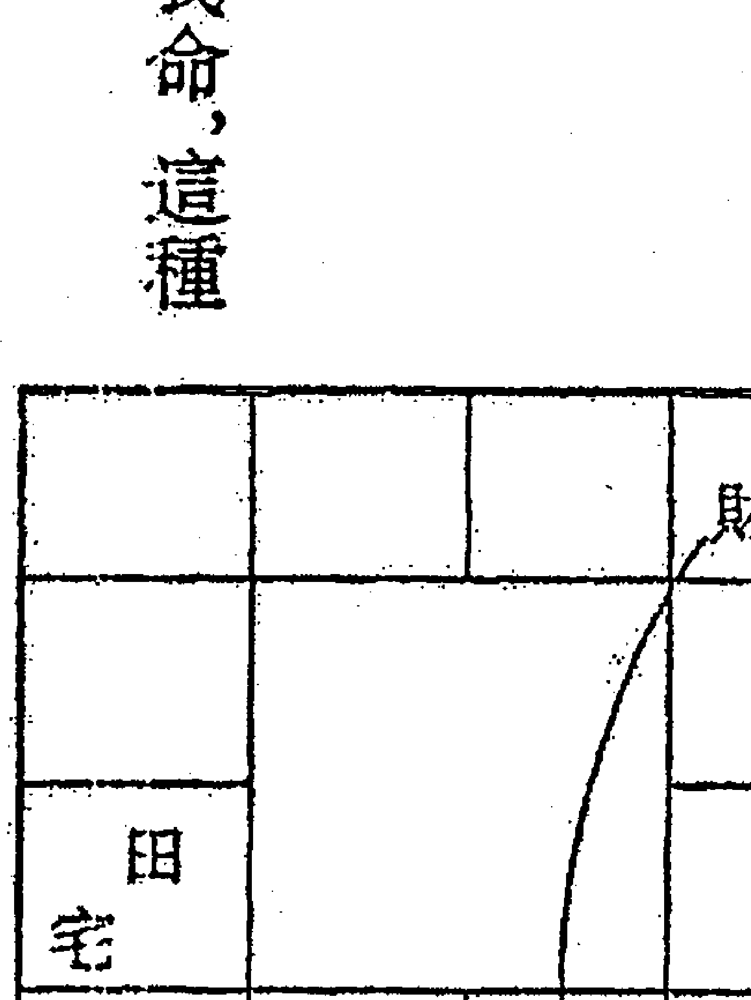

圖 1

- 十一、祿入父母：（奴僕的財帛宮），不好。
- 十二、財帛化祿入田宅：除照顧家庭外，也表示家裡有錢，流日走到本宮，這一天家裡即會有錢。
- 十三、田宅化忌入財帛：表示家裡缺錢用，流日走到本宮必定如是斷。
- 十四、財忌入夫沖官：賺不到錢，只宜上班，夫妻宮是福德的事業（化的地方），財忌入顯示一生無福享受。
- 十五、財忌入兄弟：表示向兄弟拿錢，忌入交友意義相同。
- 十六、財忌入命：（財帛的事業），表示賺錢很辛苦，也很節省。
- 十七、財忌入命：（奴僕財），表示虧損倒帳相當嚴重，事出莫可奈何。
- 十八、財忌入福德：有錢就拿去做自己喜歡做的事，也就是有錢就拿去享受。
- 十九、財忌入田宅：表示「有錢」，是一點一滴慢慢賺來的。
- 二十、財忌入官祿：有錢就想投資。
- 二十一、財忌入遷移：有錢就在外面花光。
- 二十二、財忌入疾厄：用身體去賺錢，女命拿身體去換錢。
- 二十三、財忌入子女：子女會花錢。
- 二十四、田宅忌入財帛：這一天家裡沒錢。如果非要不可的話，可考慮何宮使流日（命）化祿，如由夫妻宮化入，可叫太太去借，便可以借得到，要不然可以找天刑（業力星）所在宮位，如天刑在田宅，田宅是異性朋友（田宅是交友的夫妻）即可以借得到。

【註】：天刑是業力星，與借貸有關，流日宮裡有天刑，這一天朋友來借錢，是肉包子打狗，有去無回。

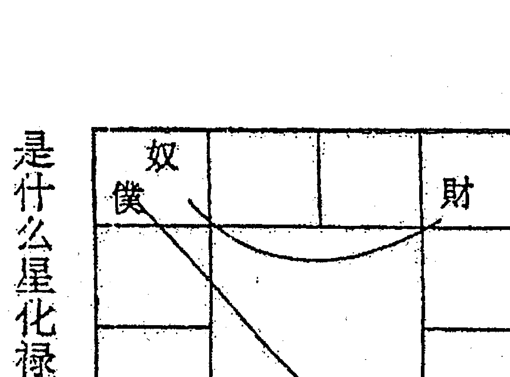

流日奴僕化祿入財帛，去討債，或去借錢，便有希望。

是什麼星化祿，如果化祿是天機（兄弟星）則指來來去去，有如“你兄我弟”四海一家。

## 【借錢】
流日化科處就是貴人方，先想想科方有何朋友會是貴人。流日的財帛化權入流日（命），毫無意義，實在沒有祿星入命（流日），就找科，沒有科便找魁鉞（用流日干去追）。

- 二、生年四化：
一、化祿權（同宮）：最會賺錢，是生意人。
二、（科忌）（不忌）：是專門技術人員。

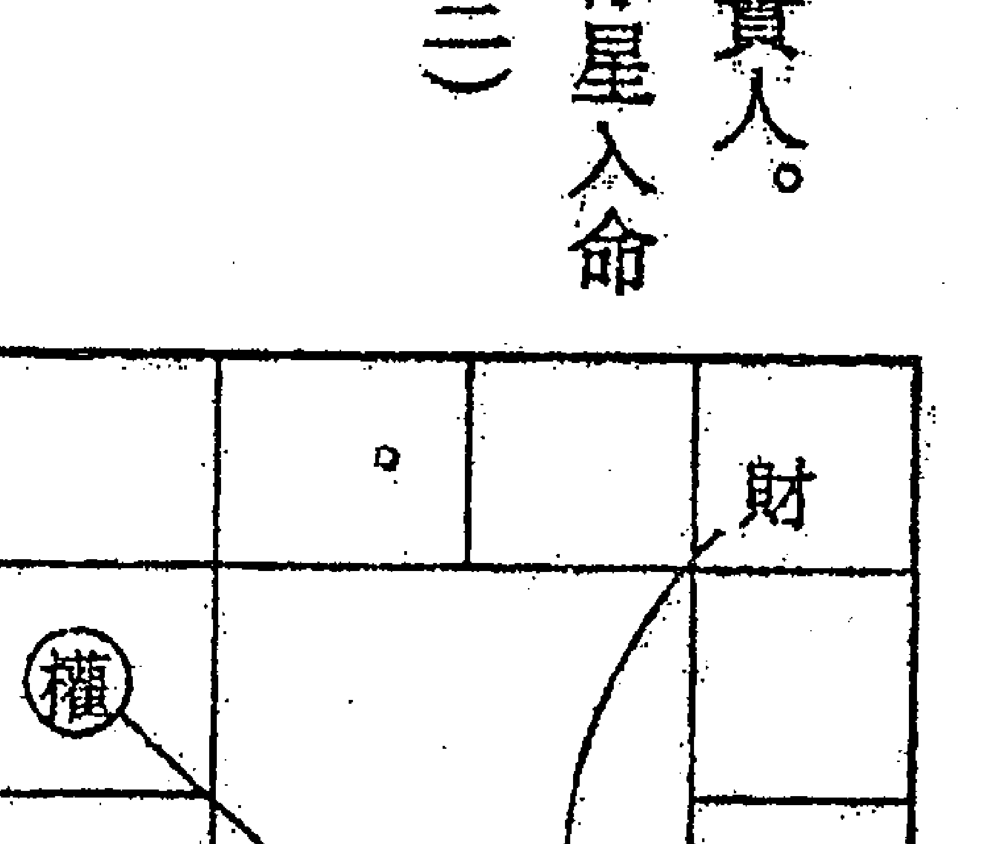

三、科權：專門學術之學者。
四、科忌
五、權忌
六、祿忌
皆是上班命。
七、本命的命、財、官（本命三方之任何一宮），有巨門星，且田宅或疾厄的干是「丁」，這種人容易淪為竊賊或遭竊。
八、田宅有巨門，奴僕干為「丁」，流年的奴僕丁巨門化忌入田宅，這一年會遭小偷。
九、官祿忌入兄弟沖奴僕：難支持。（問題探討：兄弟是財之田，故不可沖。）
> （問題探討：兄弟是財之田，故不可沖。）
十、官祿忌入疾厄沖父母：流年走到父母宮，會倒閉。
十一、官祿忌入子女沖田宅：會虧錢。
十二、疾厄忌入官祿：表示用身體去抓事業。
十三、疾厄忌入事業：就沖夫妻，當流年走到夫妻位，會倒。
十四、事業祿入疾厄再轉忌回事業，一身當二用。
十五、事業忌入命：是上班人，但一生事業安定。
二、事業祿入疾厄，再轉疾厄忌入事業：用身體找工作。流年在子，斗君走到戌，會倒閉。（問題研究：事業忌入命在子沖午，斗
> （問題研究：事業忌入命在子沖午，斗

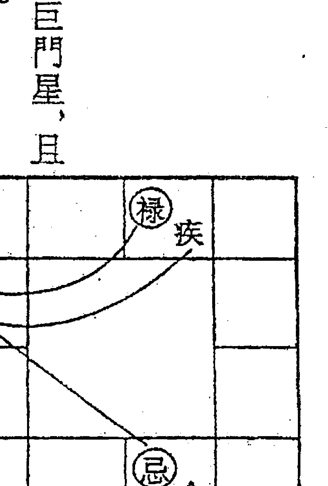

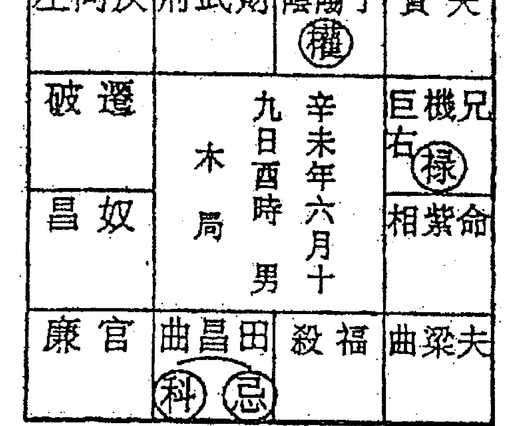君在戌、午为其财帛。（图四）

例：周某的八字：辛未。六。十九。酉。男。（图五）

- 一、生年午巨门化禄入兄弟宫且兄弟宫自化忌出，表示兄弟不领情，要不然就是没有兄弟。
- 二、禄在兄弟照奴仆，是说奴仆会把对宫（兄弟）的禄抓来。
- 三、生年权入子女宫，儿子有权。对子女管束，但子女不理。

【注】：生年的权，是先天带来，命宫飞出是自己给的。

- 四、权在子女照田宅：有房子，但子女不一定在家。
- 五、若文曲化科文昌化忌入田宅，时系星入田宅：房子变动较多。（科忌不忌等于没有科忌）。昌曲在田宅表示分期付款购得，地点在学校边；干支辛丑土五局，表示五○○公尺内有学校，对宫权照，表示房子大。
- 六、命宫戊贪狼化禄，表示对太太有情。夫妻宫内廉贞化忌在对宫，表示太太心在外面。夫妻贪狼会陀罗表示配偶身体不健康。
- 七、命权入子女，子女自化忌出。不领情。
- 八、疾厄化科，身材不会很高大，有贵气，有病容易好。

| 科 | 疾 | 权 | 子 | 禄 | 夫 | 忌 | 兄 | 戊 | 命 |
|----|----|----|----|----|----|----|----|----|----|
|    |    |    |    |    |    |    |    |    |    |

| 巨權 丁 昌貪官忌 鈴丙 陰田宅科乙 府紫福甲 | 相廉遜 右戊   羊機父乙 | 梁疾 己 癸未五月七日午時 女命七歲金局  破命祿權存甲 | 殺財 左庚 子同辛 曲武夫科壬  梁陽兄忌癸 |
|----|----|----|----|

# 圖8

《例》——（圖八）

- 命祿入遷：在午，表示南部較有發展。
- 生年權入奴僕：交朋友不隨便，交上后，對朋友忠心耿耿（死忠）。
- 忌在官：工作認真，事事親自動手。

壽元：第五大限甲太陽化忌沖本田，也是大疾流年走到戊，（壬戌年）流田被沖——去世。從第五限甲忌入之年（未）起，就天天吃藥（每二小時服一次）。死于一九八三年（歲次壬戌）十一月十二日五時。

此外，現在從事什麼行業？需看大限的財帛。九、廉什麼錢？看財帛。甲太陽化忌，限遇忌以後，可以做太陽的事業。再者，甲化祿轉忌，忌在天同（疾厄宮），可以從事算命，服務，飲食之業。（圖七）

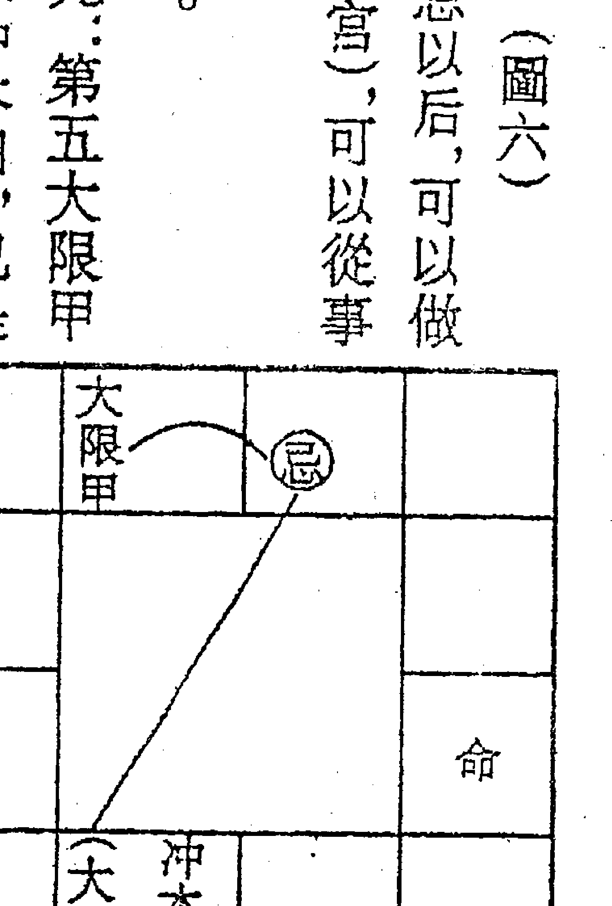

| 命甲 | 癸 | 夫壬 | 微辛 | 殺 |
| --- | --- | --- | --- | --- |
| 廉乙 | 破 | 庚辰8月9日五 | 水局 | 吳先生 |
| 22-31丙 | 同戊 | 陰 | 武己 | 貪 |
| 府丁 | 陽戊 | 巨 |  |  |

# 圖9

科入田宅，房子漂亮，太陰，房子暗一點，火星表示房子周圍有噪音。祿存坐命宮，有錢，較孤。破軍化權，一生用錢較輕。命忌入兄弟，與兄弟緣薄。科入夫妻，先生瘦小，但很英俊。

好。妻之太陰化忌，忌入大命，表示多怨言。夫妻祿出，感情不好。夫妻，且夫妻宮祿出，又夫。

▲《例》夫妻宮武曲化忌在丑，要考虑忌沖過以后才結婚。（圖九）

.第三限丙文昌化科在酉，這一年三十歲才結婚。天梁的事業：甲廉貞化祿，在酉照卯，這一年買股票賺錢（股票看天梁）。

△《例》（圖十）生年壬天梁化祿（財帛宮）轉太陰化忌入宮祿沖夫妻——夫妻常因錢而吵架。

| 財 | 子 | 夫 | 兄 |
| --- | --- | --- | --- |
| 梁乙 | 殺丙 | 丁 | 廉戊 |
| 疾甲 |  |  | 曲命己 |
| 遲癸 |  |  | 破父庚 |
| 權壬 | 陰宮癸 | 武府田35-44壬 | 同福辛 |

# 圖10

· 命宮己文曲忌出——有錢坐吃山空。
· 第四限的財帛戊天機化忌入大田：四十一歲戊年買房子。丑年結婚。（圖十一）
· ▲《例》何先生的命造——（圖十二）
· 大疾己的忌追忌入亥沖巳，巳為流疾，也是流日（重疊），這一天腳會斷。
· 大限在寅宮，壬天梁化祿入午，轉丙廉貞化忌入未沖丑，這一年叫沖本命（流命）；次年行抵寅（流年），叫沖兄弟；流年入卯叫沖夫妻，辰年叫沖子女，巳年叫沖財，行抵申宮以後開始不好。

## 第二節 舉例論行運

○行運什麼時候開始好：
分上下半年生（六月↑，七月↓）分上下。上半年生：人遇忌或遇沖后就好；下半年生：人開始不好。
· 當太陰行抵福德表與享受有關，大限的權星化入之官，當大限走到或照會當老闆。（或大官的權入大限命。）
· 流年星到大官的權，（在大命）照之年與人合夥。

| 流日 |  |  |  |
| --- | --- | --- | --- |
| 辰 | 壬辰七月 申時 陽男 | 大疾 | 年 流 |
|  | 太陽 命 | 午時 流月 |  |
| 大限 壬限 |  |  |  |

圖 12

# △大限的權入本命的一五九宮，當流年走到會當老闆（實有的），會照也會當老闆（虚有的）可能是合伙。

·生年四化要坐（入）三方才好，應于流年照才好。
·大限四化要入命之三方。
·若以本命盤看夫妻，仍以本命盤之十二宮為用。同理，看六親，仍以本命盤為用。其所不同者，要以六親宮之干為用（飛四化），如看夫妻，就用夫妻宮的干去化。
·流年三吉要入命——好。
·看合伙：祿權科要入我三方才好。

△看借錢，找天刑（業力星）。如天刑在卯，流日走到辰，那麼天刑在流日的兄弟宮，表示兄弟欠我，就去找兄弟借。同理行抵午，子女宮在卯，那麼可以說是學生或岳母、子女欠我。若走到子位的話，天刑在田宅（流日的），就是异姓朋友欠我，找异性朋友張羅，可以有希望。

·今天他答應我的事會不會照辦？
·看文曲宮之干所化之忌有沒有冲我三方。
·△收票，放利息可不可靠（圖十三）
·文昌所坐宮干之忌，化入本宮沖事業，表示支票不可收。

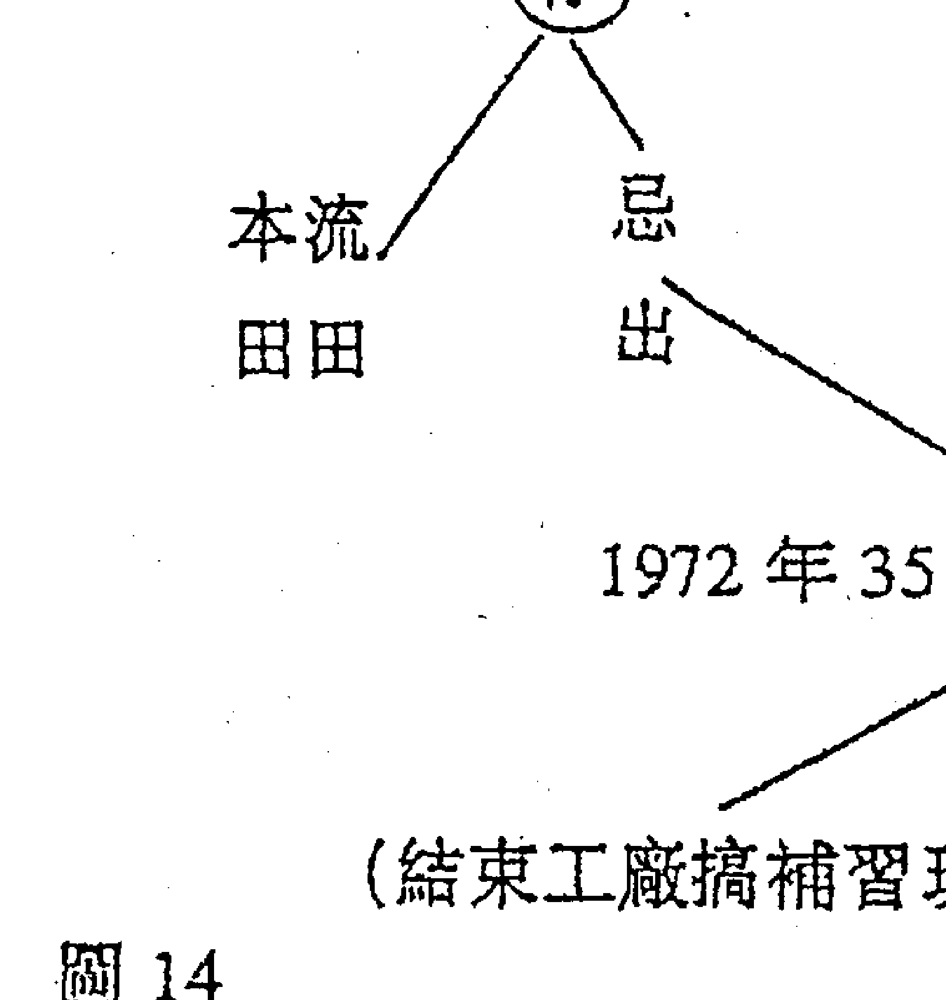

人。
·文昌忌入本宫冲奴仆也是开空头支票或使用人头支票的。
冲命 搬家，改行。
▲流年在亥，命宫甲禄入，癸忌出，冲奴仆——（图十四）
所以比较困难。一九七二年（三十五岁）流田（也是本田）禄忌
乙未年二月二十四辰时生。（图十五）
·行业看财之忌，有没有入一六九十宫。

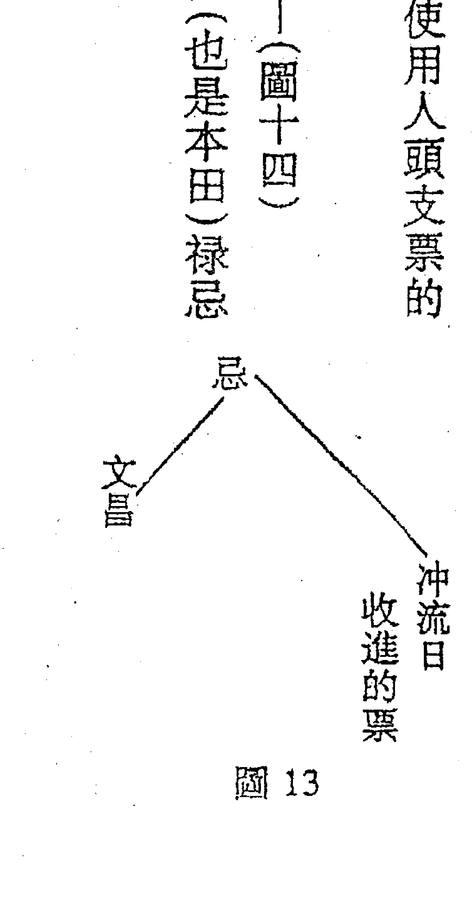

·事业忌入迁移，冲命，表示常换工作。
▲金库怎么放？（图十六）
·已使武曲化禄，故金库要向自己的方向。
○先考虑科再找禄、权。
▲办公桌怎么放？（图十七）
甲方。
甲之宫使事业的田宅（疾厄）的对宫化禄，故办公桌要向甲方。
▲事业忌入迁移冲命换工作，命忌入迁移亦同。
·大限则表示十年，流年则是一年常换工作。
·大官的禄入子照田——赚钱。

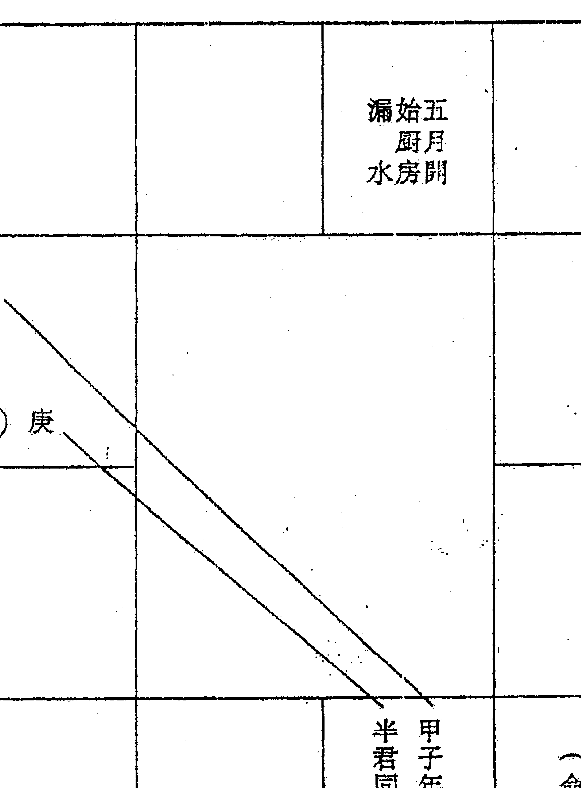

> 大官的忌入子照田——衝錢。 那幾年好，那幾年壞，以忌遇，或沖遇來決定。 一般來講業忌或沖過以后轉好。 財也是財帛化之忌沖遇以后才好。

# 圖15

# 論祿權科忌的五行屬性

- 五入中宮，故一般誤為祿從土。祿應屬金，金能生水，故祿逢忌成雙忌。
- 權屬火，科屬木，忌屬水。
- 祿是財、情、多、胖。
- 權是成就，是大，是霸道。

· 科是助力、贵人、少、小、樸
· 忌是多管之神，是非星（動不動就得罪人）。
· 忌有粘性，磁性。
· 天刑的對宮（遷移）忌入命，要跋涉他鄉。飛祿，再激出忌叫命理，你所欲謂之情，因而重因，因種因必得果，故飛祿再追忌。

# 圖 17

· 命祿入兄，兄自化忌出，表示本來我可以幫助兄弟達成願望，但沒有結果，此即祿追忌的因果關係。
· 又命甲廉貞化祿入兄弟，兄弟癸破軍化祿入疾厄，是說你對兄弟有情，也要可以得兄弟的

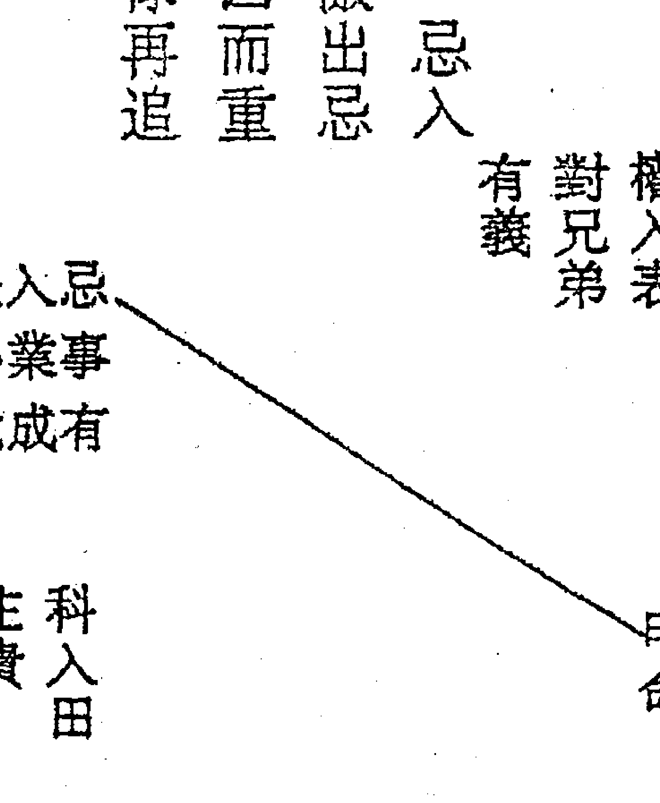

祿入表把情放在兄弟

在家裡

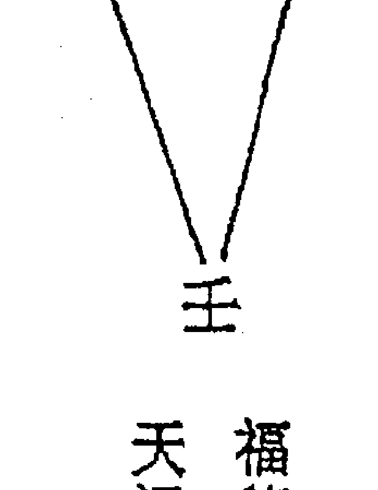

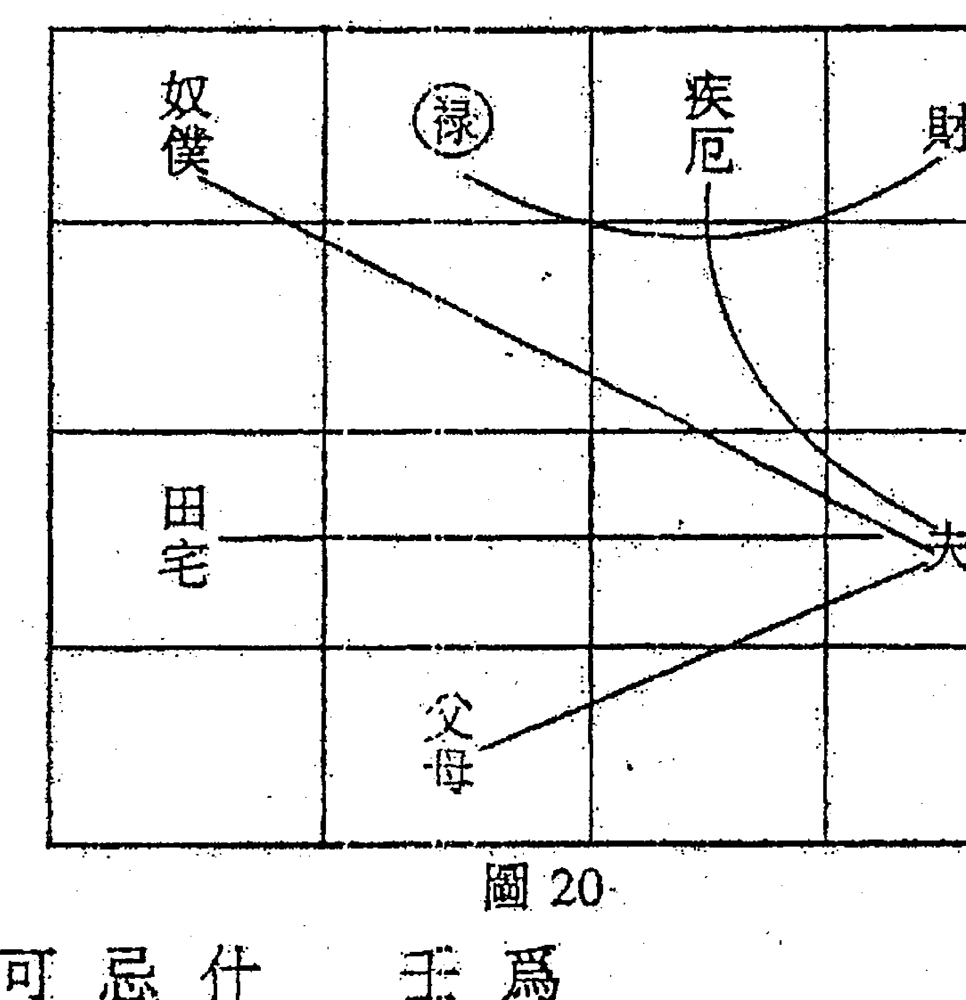

# 親情與安慰 (圖十八)

祿是情，權是義。

# ○題外：斷事情的因與果，才用流動時間

# ▲斷事情發生的結果（流日）：

一九八四年十月十五日。十月是乙亥月，乙庚之歲戊為頭，從下一宮（子）起一號、戊子、十五號在寅，流干是壬，天梁化祿在福德，人家拿東西給我吃。（圖十九）

紫微化權在本疾（流日的奴僕），表示你要來成就我什么（這一天林先生來）。化科入田宅，把家里打掃干凈。忌在田宅，這一天沒有出去。田宅成流日的父母，忌入也可。

# ○補述：壬（福德）忌入田，拿東西到家里來給我吃，權是義，有所成就。

「機昌」的組合，是電子交換機，若開事業，機昌表示你所從事的工作是操作電信交換機（交換手）。

財祿入遷：這種人要出外才會有可賺。賺錢就拿回家給太太存放（遷移是夫妻的財帛）。（圖二十）

科入財帛：過得去而已，有錢不多，餓不死，到非用不可的時候錢就來。
胖不了，瘦不了，少生病，流年科入，今年比較苗條。
貴人在外，出外較能得到提拔。
奴僕：朋友是貴人，能得朋友的幫助。
科入子女：小老婆很漂亮「風情萬種」。也表示子女愛美。
科入官祿：不會開門也開不大。
是配偶的貴人，配偶「漂亮」。一有桃花，配偶馬上知道。
家居生活講空情調。

講科星

科入兄弟：關心有限、緣薄，情非得已時來助你。
與父母緣薄，關心有限。
科入福德：必然會有一種嗜好，且是很濃，有成就的。

# 下頁

【說地部份】：○上學舉以子官為命宮，逆布兄弟、夫妻等十二官情形。（圖二十一）（見

斗數分三部：談「天」，說「地」，講「人」；天地合而數生。

圖二十二是說地部分，即指各綫的意義而言。圖中某綫是指連接某官及對宮的綫所表示的含義。祿入夫妻，照事業，二人共同創業。視其所以，觀其所由，察其所安。（圖二十三）

# ◎斷賺錢→講二五之用(圖一十四)

# 【特注】：

- 命自化忌：（做事不專心）事業不專注，并常換，無法恆久，致一事無成。太多情、好哭、缺乏信用。
- 生年忌入兄弟：前世欠兄弟。
- 生年忌入夫妻：欠妻子的債。
- 考年忌入疾厄：帶疾延生。
- 生年干四化及本宮自化——本易。
- 命宮化出：交易。
- 他宮飛入：變易。

# 命宮忌入兄弟：是才能么。

▲圖二十五年干祿入一至五宮涵義圖。
▲圖二十六年于忌入各宮補注圖。

○補述：命忌入事業：有事業。
（圖二十七、圖二十八、圖二十九、圖三十）
事忌入命：非做不可。命忌入田：會賺錢，視錢如命。

●命中注定大生意人→權祿分守一五六九宮
▲圖三十一，生年干飛祿科入三纖圖。
△圖三十二，重要提示。

廉貞——囚星，政治是非。自化忌還是有，走到對宮的時候。天刑——業力星」
廉貞的事業，忌入本命的二合方，有官非，坐忌之位會發生，沖宮更凶。
官司要贏：找天刑的官祿的科方。
問官司誰打贏？看「子女宮」化三吉入我三方為優。表示我贏。
三吉入奴僕的三方多，則是他贏。

(奴) 對人比較人緣。 因 對人羅索，使人厭惡，所以「人緣」。
(遷) 在遷移，做事不專心，淺緣。
(疾) 會發胖，性欲比較強，深緣。
(財) 錢財一如井水，用過即來，不用也不會比較多。
(官) 對事業淺緣。 一天到晚想做這，想做那，所以無法專一門。
(子) 子女多，情欲強。
(田) 主顧家。 一出生，父親剛剛好有錢，父親連着好運三年。
(夫) 對太太好。 太太發胖，自己也發胖。
(福) 好享受
(父) 深緣
(命) 祿入命，多情自私。 (兄) 兄弟多，對兄弟多情，（得參照星情）。

# 圖 23 年干化祿入各宮涵義圖

| 忌入奴僕：錢花在兄弟朋友身上。長（年是如此） | 忌入遷移：先用在應酬。 | 忌入疾厄：把錢花在父母身上，或存父母那兒。 | 五之庫在二，（五是財帛宮）忌入財帛：很節省。 |
|----|----|----|----|
| 忌入事業：沖夫妻，投資卻賺不到錢。 | | | 忌入子女：消耗很大，也是股東事業。 |
| 田宅是命之命。忌入田宅：很省，稍有積蓄。 | | | 忌入夫妻：就是投資在事業 |
| 忌入福德：沖財，主賺不到錢。 | 與忌入疾厄同論。 | 忌入命宮：很會花錢。 | 兄弟宮是財帛的田宅（財之庫）。 |

# 圖24 年干化忌入各宮涵義圖

(財帛)
財祿入命『錢較多』。不賺不行。不會『沒錢』。行限至卯財帛或奴僕，主會賺很多錢。
(子女)
祿入：疼小孩子婦多，原因是好色。
(夫妻)
祿入夫妻，老婆發胖。會疼她。
(兄弟)
命祿入兄弟，兄弟宮不管祿出、忌出，示本身人緣好，但得不到相等的回報。
(命宮)
年干祿入命，此人比較惜情。

（財帛）喜歡賺錢。
（遷移）心在外面。
（奴僕）欠朋友債。
（事業）最有創業精神。

# 年干忌

（田宅） 窮忌入田比較不怕（忌小）
（福德）心神不寧，不能安心享受。
（父母）人緣好（深緣），孝順父母。
（命宮）不欠人情，自化忌——慷慨，好施。

(奴僕) 與朋友關係不好。
(遷移) 不能安心靜下，喜往外跑。
(疾厄) 身體瘦小，健康較差。
(事業) 很有敬業精神。
(田宅) 太陰忌不好，無吉星會常搬家。
(福德) 賺不到錢。
(父母) 不住一起，但是心惦念着。
命宮飛「忌」。

# 圖 27 命宮飛忌圖

(奴僕)朋友多，有情。
(官祿)年干祿較好，命干祿辛苦，忌入表示外面再粘個。
(田宅)是歡樂宮會愛上年長的異性，錢和情，往往一起來。
(福德)祿入照財，好吃懶做。
(遷移)有錢讓妻子管。
(疾厄)把錢花在身上，不花就會吃藥。
(父母)深緣對父母孝順。前生欠朋友債。
命干祿

# 图29 命宫飞权图

| 交友謹慎：一交就對朋友忠心。較不會傷心事 | 表面好看，沒有實力，好看而已。 | 奴入，身體健康。 | 奴入善理財。 |
|----|----|----|----|
| 老板命 | | | 權入子女：對子女管教嚴。一定有房子，權交子女，可以與子女商量。 |
| 有自己名下的房子。 | | | 權(是祿的餘氣)入夫妻子事業，好。太太身體也好。 |
| 權入福德：較可能成為技術師——工匠。 | 對父母很照顧，但較隨便，有時會頂撞。 | 命宮干化化權入宮。權在命——霸道。 | 權入兄弟：與兄弟好，可商量，也會頂撞。 |

忌入奴仆，很危险。转忌入疾，田，夫，都是桃花。
喜到处跑，（吉普赛人。）
带疾延年。一般较穷。冲奴仆财借不到钱。
赚钱少。守财奴。
有一个固定的事业。上班好。
「赔钱」子女少，会有外遇，不喜欢住家里。
室内工作者。兄弟忌入田是老大。
对太太不放心，（各方面）有科就不忌。
忌入福德，较没钱，像「洪通」
与父母较没话说。
命宫干化出忌。自化忌慷慨正直。
是老么，从我结束之意。

# 图30 命宫飞忌图

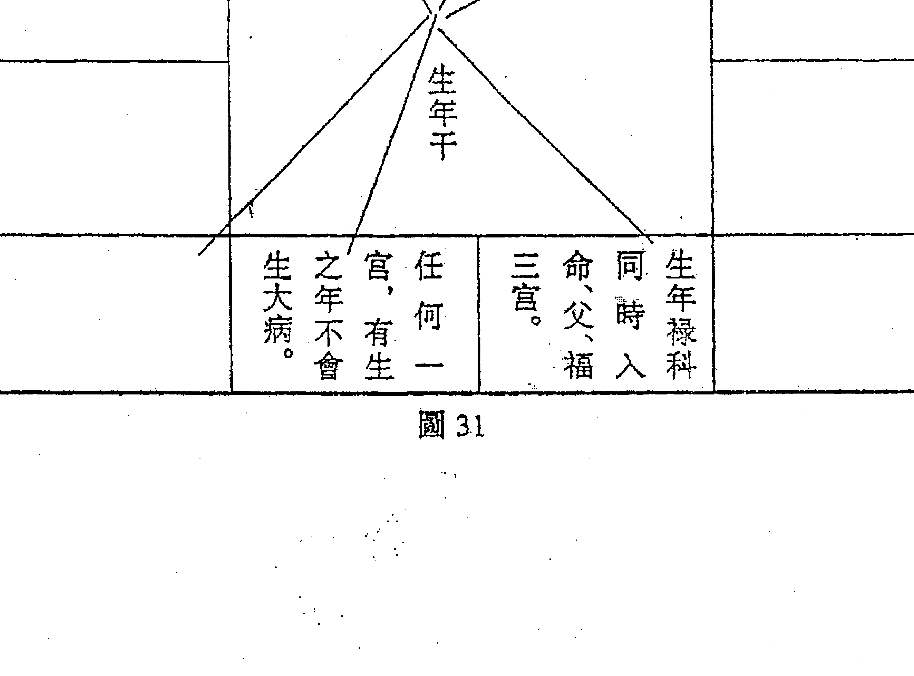

| 列1 | 列2 | 列3 | 列4 |
|------|------|------|------|
| ⑤奴僕官是同齡之人，逆走一官小一歲，順行一官大。 | ③財忌入疾厄沖奴僕財：會被倒。 | ④財祿入奴僕也會被倒。 |  |
|  | ○題外： ⑥什麼時候還錢。 ⑦奴僕的奴僕（夫妻）權入兄弟沖奴僕：我逼他很緊。 ⑧若奴僕的田宅，自化忌出，即跑了。 | (子女) |  |
| ②忌入田宅沖子女，沒有兒子，要忌過才會有。 |  | (夫妻) |  |
|  | ①有沒有子女，看子女的事業。 | (兄弟) | (命宮) |

得到。
· 其余为他宫。
· 借钱，奴仆宫要禄入本命宫，忌入我方，才拿得到。

▲（图三十三）设子女宫忌入命，且同时化禄（权科）也入我宫，表示『有』。否则叫禄随忌走显現——

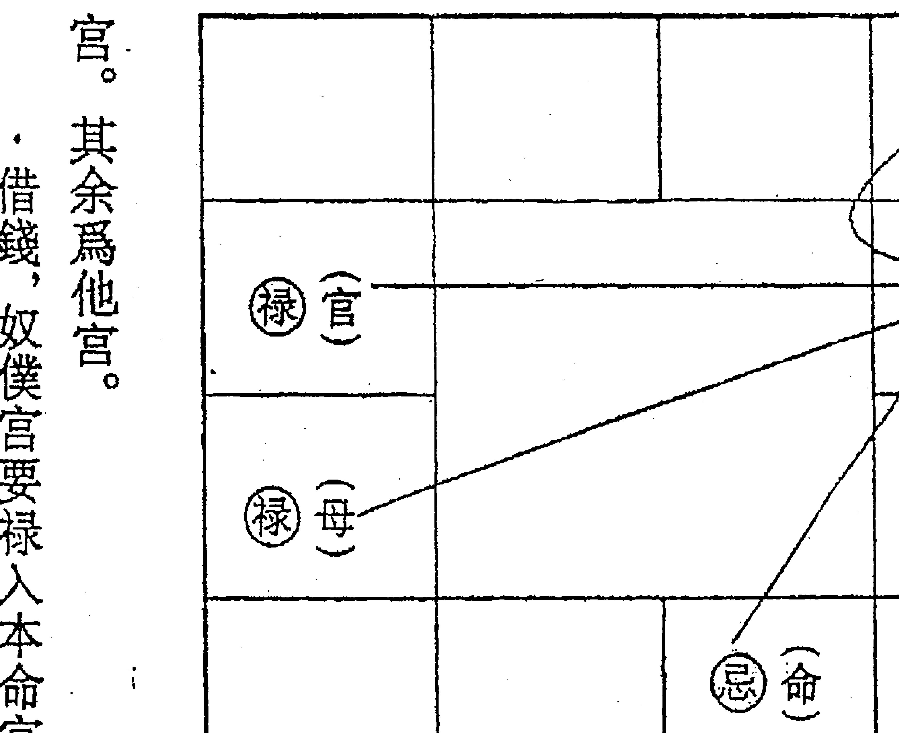

· 流年
· 要大限三吉照才好（照流命，流官）。
· 命财官田（二五九十宫）叫我。

○ 题外：子女为奴仆的事业，为我事业的奴仆，故官司从子女宫看起。
· 生年四化要入本命三
· 大限坐本命禄、权、科，好。
· 大限禄、权、科要入本命，好。

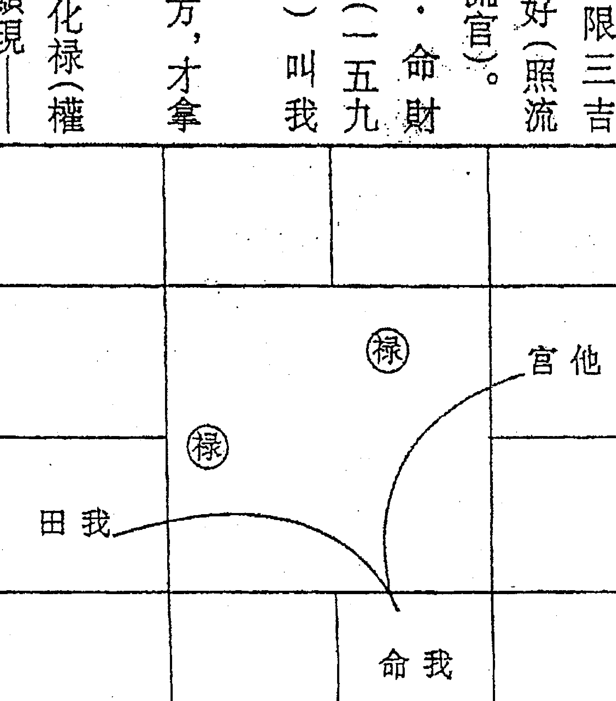

有。
不好。
（圖二十四）禄入我宫，忌也不入我宫——好。

- 禄入我宫，忌入他宫。为禄出，（损财）
- 禄入他宫，忌入我宫。为禄出，（损财）
- 禄入他宫之任何一宫，忌入我宫任何一宫，都叫禄随忌走。（禄的意思）
- 从他之任何一宫，忌入我宫任何一宫，都叫禄随忌走。（禄的意思）
- 我宫之任何二宫——好。若禄忌同一宫，是禄忌同一宫——不好。

他宫禄照本宫，忌入本宫——也好。
他宫（朋友）的钱归我所用。

1. （一）生年四化最要紧，最强。
2. （二）自化禄：用钱宽裕，会花也有得花。
3. （三）自化权：敢花钱，不见得有钱。
4. （四）自化科：有节制。
5. （五）自化忌：等于双忌，损失。
6. （六）生年禄：遇本宫自化，叫禄出，什么都没有。

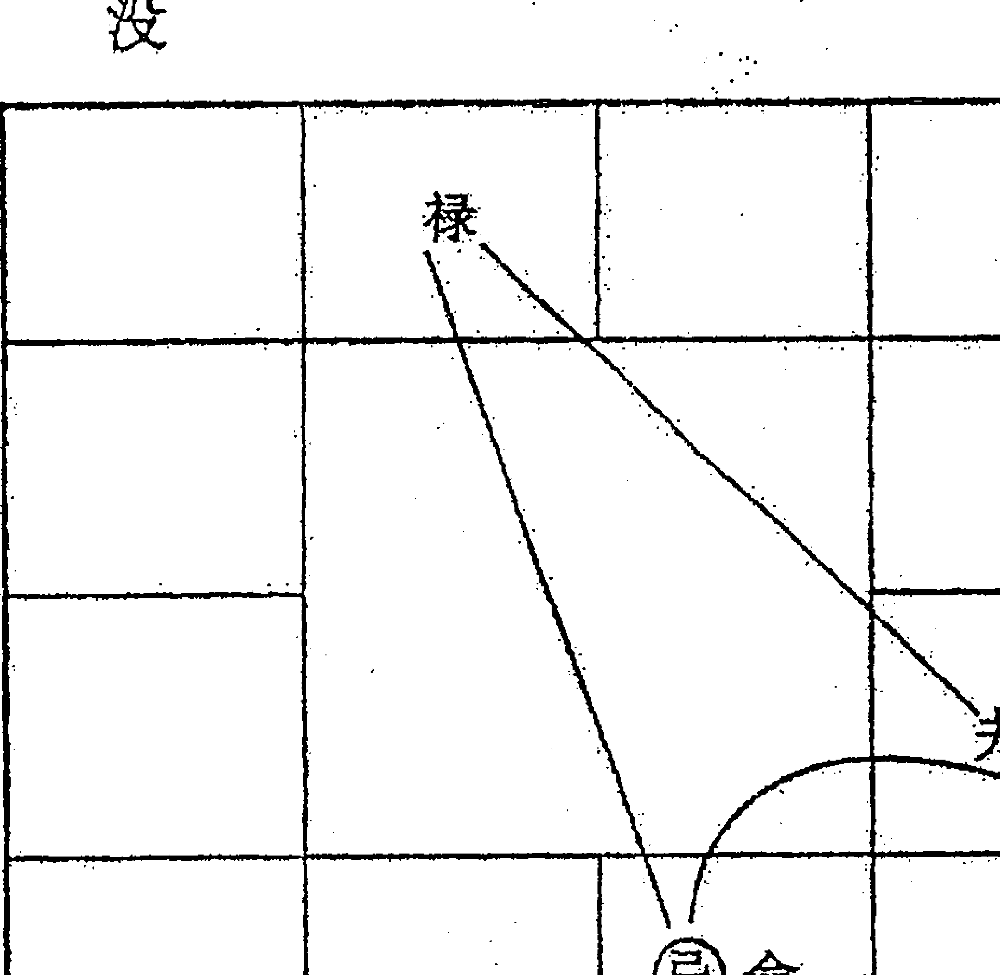補述：他宮祿忌同入我宮之同一宮，不吉。

- 他宮之祿忌，除不可同一宮外，同一線也不好。（圖二十五）
- 「科」是貴人，這種貴人是要到碰壁的時候才來，但不多。
- 生年權逢自化祿：有名聲，出外才好。
- 生年權逢自化權：沒有權，叫權出。
- 生年權逢自化科：能得貴人。
- 生年權逢化忌：辛苦。
- 坐權是實，權照是「虛」。
- 生年科，逢自化祿：名聲好，遠四方。
- 生年科，逢自化權：聲名佳。
- 生年科，逢自化科：叫「無科」，沒有貴人。
- 生年科，逢自化忌：忌出，沒有了，也不忌。
- 生年忌，逢自化祿：叫雙忌，對宮比本宮凶。
- 生年忌，逢自化權：很麻煩，有是非。（對宮好些，有點錢）。
- 生年忌，逢自化權：貴人不顯。
- 生年忌，逢自化忌：不忌。
- 生年權科，遇自化科：較勞累。
- 生年科忌，逢自化忌：反復不定。（好壞不一）
- 流年對本命：要入三合方，才好。
- 流月對大限：要入三合方，才好。
- 流日對流年：要入三合方，才好。
- 流時對流月：要入三合方，才好。

## ○補述：

- 流年四化變入本命的三合方，才好。
- 流月四化變入大限的三合方，才好。
- 流日四化變入流年的三合方，才好。
- 流時四化變入流月的三合方，才好。

○設生年干四化入卯位，而酉（對宮）有自化忌，可沖回，是說對宮的忌不影響本宮。（圖二十六）生年干忌入，逢自化忌，叫忌出，不忌，剩下的看星情。

流年的忌落在那里，那里就是今年的問題。流月的忌，流日走到，就是問題日。什麼的事業，事業是行為一是洛書后天之用。

柯先生：壬辰、七、六、申，男。（圖三十七）
- 生年干壬天梁化祿在遷移，表示情在外面，做什麼都不認真。（圖三十八）
- 權入田宅：在家霸道。
- 科入夫妻轉祿入命宮，表示妻子只對命造一人好。
- 生年干在武曲化忌入兄弟；表示跟兄弟錢財抗搞不清（武曲是財帛星）。
- 文曲在命宮，那爭辯，可以當民意代表。
- 父母宮天府坐守，兩鄰日月落陷夾，表示父母的成就只能達到自我滿足。
- 官祿忌入命，不做也不行。

| 同宮 年我 | 一小 歲我 | 二小 歲我 |
|----------|----------|----------|
| 日流     |          | 癸       |
|          |          | 巨門     |
|          |          | (流年)   |

圖 39

財帛戊天機化忌入福德：有錢就找二五朋友聚。
命祿入遷移在外有人緣。
兄弟宮是財之庫位也兼看壽元。
兄弟宮辛文昌化忌入福德，冲財，表示賺不到錢。

> ○ 附注：天相坐命人，很多會下棋。

- 兄弟宮是官祿的疾厄，設武曲化忌在兄弟，則不可做五金之事業。

△ 討錢，看流日對宮之星，是誰使他化權。設巨門在戌，流日在辰，未宮干為「癸」癸使巨門化權壓流日，權沖化，可以討回錢財。（圖三十九）

- 找小二歲的人去，或末時去即有希望。
- 設大官忌入本官為巨門化忌，則創業要做暗的（地下），不可以登記，登記就做不起來。（圖四十）

如官祿宮，甲廉貞化忌入疾厄則表示事業與身體有關——要多做。

|     | 大官 |     |
|-----|------|-----|
| 本官 | 入忌 |     |
|     |      | 命  |

圖 40

|      | 丙權入寅宮 | 這一年開始不好。 | 這一年與人股東 |
|------|------------|------------------|----------------|
| 照申 | 柯先生     |                  |                |
| 大限壬 |            | 命宮             |                |
|      |            | 沖酉年的事業     |                |

## 圖41

大限壬天梁化祿，轉丙廉貞化忌入未沖丑，表示未年開始不好，丑年最不好。大官的權星寅宮，照申，故申年與人合夥做生意。（圖四十一）

酉年，宮干己，使子位文曲化忌入流田沖子女，沖到流年的合夥宮，故「散股」。大限干壬紫微化權入卯位，照酉，故股東散股后，很快地自己再做起壬戍年官祿在寅，干壬天梁化祿入流年的財帛宮，財帛丙天同化祿入流年命宮，這（圖四十二）一年很好。

癸亥年，羊陀夾忌，六親亡故——父死。

癸亥年，宮干辛、巨門化祿入流年的交友宮，交友宮甲忌入父母（交友財），所以這一年很好。（圖四十三）

這一個大限，科入疾厄，會瘦一點。也會好一點。

但也很辛苦（因自化忌出）。（圖四十四）

癸亥喪父的跡象：流年，父母的疾厄的事業，

疾厄丁，巨門化忌在事業，這種人是黑名單上的人物，會被掃黑。

- 破軍的忌入命、疾厄，是流氓頭目。
- 破軍的忌入子田線是小流氓。
- 天刑與忌星同宮，流日走到該宮無所事事。
- 天刑在兄友線，朋友三教九流多。
- 天刑在官祿，表示作業多。
- 命坐機巨，或同梁，逢自化祿或權，這種人愛說謊話，很
- 天刑在父母與父母無緣，易犯小人。
- 命忌入夫妻沖事業——不可能自創業。
- 財忌入夫沖事業——借貸做生意。
- 官祿忌入夫妻，用太太的名義做事業可能。
- 官祿忌入命或遷移出外創業（搬家再做有科）。
- 命忌入福，很懶，不務正業。
- 由官祿忌入命：被環境所逼不能不做。
- 忌入福沖財，表示「借錢做事業」。

| | | 忌沖 本夫 |
|---|---|---|
| 命庚 | 庚午、五、三、 宜男 | 大限 |
| | | 財 |
| 夫戊 | | 忌 |

- 夫妻忌入財沖福，夫妻會因錢吵架。（圖五十一）
- 柯先生二十五歲結婚。（圖五十二）
- 壬辰年七月申時生，男。
- 甲辰年，忌入本命（流年忌入命）自己認識的。
○ 特注：科在本命的三方是經人介紹的。
- 對象是親戚：夫妻忌入子，子女忌入命。

巳辰即寅

這一年
大限
照

## 第五章 特别命例流年分析
【例一】台湾某先生命造

| | (父) 庚申 左輔 南西金 16-25 | (命) 己未 七殺 廉貞 西南南土 | (兄) 戊午 天梁 右弼 摯羊 南火 | (妻) 丁巳 天相 南東火 | (福) 辛 金酉 26-35 |
|---|---|---|---|---|---|
| (子) 丙辰 巨門 陀羅 土東東南 | (財) 乙卯 紫微 貪狼祿 文曲 木東 | (田) 壬戌 天同 華蓋 土西西北 36-45 | (官) 癸亥 武曲 破軍 文昌 北西水 46-55 | (奴) 甲子 太陽 北水 56-65 | (遷) 乙丑 天府 北北東土 | (疾) 甲寅 天機忌 太陰祿 北東木 |

中央信息：
臺灣某先生命盤
火六局
戊寅年5月x日亥時(陽男)

> 圖 1

| 夫 |   | 命 |   |
|---|---|---|---|
|   |   |   |   |
|   |   |   |   |
|   |   | 忌 |   |
|   |   |   |   |

| 工廠 | 官之田 |   |   |
|---|---|---|---|
|   |   |   |   |
| 大官 |   |   |   |
|   |   | 流年 | 大限 46-55 |

# 五）

- 夫妻忌入子女，子女忌入命，配偶是亲戚，或配偶是亲戚介绍的（表兄妹）。（圖二）
大財忌沖流財，一九八四年倒閉。大官祿忌沖工廠，倒閉。流年甲也沖工廠，該年倒閉，九月倒閉。（圖三）

| 大財 | 流財 |
|---|---|
|   |   |
|   | 冲 |
| 忌 |   |
| 忌 | 流年 大限 45-55 |

- 廉杀坐命或疾厄，属鬼才。左右夹命，廉杀在命，日月夹照，很聪明，小学程度。夫妻宫天相，好打扮，爱听好话，耳根软。斗君忌入事业，则表事业无成。斗君忌入财帛，则表财帛难得。流年或流月，遇华盖会去烧香拜佛，算命。五十六、六十五大限忌在大田，田宅变动，此大限要
流年工廠沖財帛。工廠沖財，沒工廠也沒錢，倒閉。（圖三）

- 再見了。（圖六）（大田祿忌在大限，還是這大限）
- 五十六，六十五大限，就離壽元不遠了。大限也忌出，就更不好了。（圖七）
- 本命應于大限：
- 疾厄忌入大限五十六，六十五，此大限有問題，大田宅也不行了，大命又忌出，所以也沒運了。
- 疾厄有機陰不好，屬糖尿病或中風。
- 機陰代表稅捐處，用於梅花易時機陰化忌，可能去繳稅。

田宅機陰要看落的宮位，才可斷是否是稅捐處。例：落在寅申巳亥，屬鄉下，則代表山溝邊。

# ▲一個人的成就，要看交友宮：

交友祿入命，朋友對他很好，但交友忌出，都是假

| 命 |   |   |
|---|---|---|
|   |   |   |
| 疾 |   | 56-65 |

朋友有求于他時，對他很好，他求于朋友，朋友不睬。所以也構成倒閉的原因。1984年流年走到奴僕宮，今年發生的事就是僕與他的關係。

- 奴僕祿權入財帛，一定是大生意人（自己）
- 奴僕忌入父母冲疾厄（工廠），不能合伙。
- 官祿有生年忌，官祿宮又權出，這種人，會為事業而不擇手段。
- 交友忌冲命，朋友是煞星。（圖九）
- 交友宮有天相，屬和事佬，喜愛人讚美，這種人我就要小心。
- 生年忌在官祿，很勞累，很用心于事業。（圖十）

| 奴 |  |  | 財 |
| --- | --- | --- | --- |
|  |  |  |  |
|  |  | 沖 |  |
| 福 |  |  | 命 |

# ## 例二一 王先生命造

- 奴僕忌入福德沖財，朋友來花我的錢（共享）。（圖十一）
- 絕對不要向朋友借錢，借了就慘了，賺不及還。
- 只有祿忌，是因爲要周轉，而向朋友借。
- 只有忌星，是錢借給朋友。
- 福德是財的遷移，財的外面，不是自己的。朋友來抓，所以賺的不夠還。

圖11

命宮：武曲 破軍 天鉞
忌
南東火
乙巳
6-15

（二）
太陽 地劫
南火
丙午
16-25

（二）
天府 天刑
西南南土
丁未
26-35

（一）
天機 太陰
南西金
戊申
36-45

（一）
天同 天空
土東南
甲辰

壬午年11月20日未时(陽男)
王午年11月20日未时(陽男)
王先生命造
火六局

（一）
紫微 貪狼
權
金西
己酉
46-55

（一）
文昌 天魁
木東
癸卯

（二）
巨門 陀羅
土西北
庚戌
56-65

（一）
巨輔
科
北東木
壬寅

（二）
廉貞 七殺
北北東土
癸丑

（一）
天梁 右弼 祿
擎羊
北水
壬子

（一）
天相 文曲 祿存 天姚
北西水
辛亥

二十六歲流年財帛科入本田，權入流田，買房子。（圖十三）

※命坐生年忌的人，心情都不會很開朗，而很操勞。

生年祿在疾，忌在命，為一六同宮，雙忌。（圖十四）

二十六、三十五大限，大命入本交友，此限一定會結婚。

二十七歲流年走到在夫忌會結婚。（圖十五）

走到大限科坐、科照之年，也有結婚跡象。

兄弟宮忌沖疾厄，代表與兄弟無緣，兄弟死了一個，還剩三個。

兄弟宮（母親）忌沖疾厄，與母親無緣。

疾厄宮武曲化忌，胸部有問題。

命主武曲在命宮，小時候難養。

生年權在官祿，自己會做老闆。

# ## 問題。

- 權沖夫妻，對太太很凶。
- 夫妻祿入命，對太太很凶。
- 夫妻倆到那里，都是同進同出，但生氣時會罵老婆。
- 生年科在子女，子女少，子女愛漂亮，身材瘦。
- 命祿入田，出生后會為家里帶來好運，顧家，但田宅忌出，對家里幫不上忙，家里也不領情。
- 命忌入祿田宅，對家里好，家里得不到他的恩惠，反而把家搞得亂七八糟。
- 命權入疾厄，代表才华，但較操勞。
- 命科入官祿，過得去而已。

十六～二十五大限，生年忌在大限兄弟宮，是兄弟的問題。

- 兄弟祿入財，轉忌入官祿，兄弟幫忙工廠作事，結果還是沒有賺到錢。（圖十六）
- 財忌入官沖夫妻，財務問題，并與夫妻相處得不好。
- 兄弟與父母住在一起（兄忌入父沖疾，兄弟與他無緣）。（圖十七）

收拾。

* 夫妻宮坐天魁屬陽貴，向男的調錢。
* 夫妻宮坐文昌，很有學識，人緣好，幽默。
* 太太很會調錢，也愛錢。（圖十九）
* 大限田宅之事業，科入本田。此大限有買房子，因田宅忌出，買了又賣（被查封）。（圖二十）

△論妻可否參與事業
▲如圖十八：
* 夫妻祿入命，娶了老婆才發的。
* 夫妻忌入官，轉忌沖本命，太太一定會參與他的事業，但沖回夫妻自己，太太最好不要參與事業。（夫妻化忌在他的三方上）。
* 夫祿入命，太太能幫他調錢，使他生意愈做愈大，而無法收拾。

The request was rejected because it was considered high risk## 第二節 兄弟宮

兄弟宮在斗数的十二宫位占了一席之地。因为它是人伦的一个部分，它缘之于血亲，大部分的人都有这一份亲情存在。但在传统斗数的论命，似乎只是聊备一格，因为一般论命重点，很少把兄弟宫列入重要宫位，因此常为斗数的研讨者所忽视。不能否认，与『我』在一生中关系最密切的，有父母、夫妻、子女，兄弟固然也是血缘之亲，但不能与直系血亲的父母和子女相比，套用现代的法理来说，他只是旁系血亲，在和『我』的利害关系上，也没有如夫妻间那样地密切、那样地休戚相关。也许是基于这一理由，因而在古今命理（斗数）上对于兄弟宫，仅多偏向于论及兄弟间的情份厚薄和人数多寡。不可否认的，有关和『兄弟』间的情缘厚薄，一般人都会关心，但斗数命理探讨这个宫位，其重点并不只在这个『关心』上。我认为这个宫位既然是命宫的接领宫位，这个宫位星曜的强弱气势，必然对左邻的命宫造成某种程度的影响作用。也许只由命宫右邻的兄弟宫，尚不足以说明邻接宫位的重要性，若再把命宫左邻的父母宫和兄弟宫，这两宫夹辅命宫时，对命宫可能造成某种程度的影响作用，就可以强调出接邻宫位，对所夹辅宫位的重要性。左右邻宫（即父母宫和兄弟宫）的星曜若都是庙旺，那命宫所在宫位，正如一栋大楼建筑在一大片坚固的地基上，当然会比大楼建筑在一边靠山，另一边领接悬崖绝壁的地方，随时可能发生崩塌危险的地方，要来得稳固安全。这是一个很浅显的道理，因为一个宫位若被强旺的左右邻宫所辅，正是斗数所论庙旺利陷的吉利好宫位。

若另从属于伦理性和教育性的观点来说，一个人从小和父母及兄弟姊妹同在一屋檐下长大，长期的朝夕相处，不只言行举止会受家人影响，长期与家人相处而耳濡目染，通常也会受到潜移默化的影响作用。心理学上说，一个人一辈子人格的形成，受到家庭的影响最大，而人格的良劣，往往对决定一个人一辈子，将扮演什么样角色，具有相当重大的影响作用。

因此斗数命理，在兄弟宫方面的探讨，除了显现出这个宫的情缘厚薄之外，我认为更应该从斗数命盘宫位的互动作用方面去考量，有时这个兄弟宫的吉凶，也会对一个命造的一生命运，造成相当程度的影响作用。

## 【命例】

## 手足之情

这个命例的主人翁林老板，是个典型家族经营企业的负责人。他在己亥大限后期，由于在兄弟间排老大，因此虽用非所学，还是不得不挑起他令尊大人所经营的事业。接管事业之初，他眼看着刚出社会的几个兄弟姊妹，都没能找上理想的工作，因此他要这些兄弟姊妹共同来参与公司的经营。一来让他们有份较安定的工作，二来也想藉兄弟间的同心协力，把这个父亲传下来的事业好好经营发挥，好让大家有利共享。难得林老板有这一份手足情深的善念。

林老板在己亥大限后期接管这个家族公司，初期，兄弟间倒也和舟共济，事业经营在和乐气氛下欣欣向荣。但到了戊戌大限的后半段，林老板逐渐发现，弟妹们对公司营运上的意见愈来愈多，甚至无不表现出他们人人都是公司的所有权人，既为公司的所有权人，就有权利享有当老板的充分权力和权利，因此搞得公司经营事权分歧，徒生很多意见，而造成很多经营上的困难。

到了丁酉大限，情况更糟，几个弟妹作事，根本就凭自个的意愿行事。会计小姐，经常向林老板报告，他的弟妹常常向她预支公款，但总是不正式报帐，让她在帐务处理上造成许多困难，而不知道如何是好。林老板每碰到这种窝囊事，也只有痛心疾首，而无以回答。

林老板命座天机在丑位，依星曜赋性，天机属『兄弟主』，化气曰『善』。这种人在兄弟间会表现出一种兄友弟恭的手足之情，因此他才会在接掌家族事业后，安顿弟妹们在自己的公司工作。

己亥大限，林老板坐落的太阳先天化权，己干武曲化禄、贪狼化权，禄权引动在后天的兄弟宫位上。这个兄弟宫，本来气势强过林老板的大限宫位，但由于化禄有『解危制厄』作用；另外有火贪的炼制和左右的扶持，使弟妹们还不敢过分表露嚣张气焰。再说，当时弟妹们初入社会，年纪还轻，亦还未婚，公司事务都能听诸于大哥林老板的吩咐办事。及至戊戌大限下半期，弟妹们年纪稍长，并已结婚，家庭再不是单纯同母所生、同父所养的成员，因此對這個家族經營的事業，意見也就多了起來。

戊戌大限，貪狼化祿、太陰化權，右弼化科、天機化忌：這個忌星會入后天的兄弟酉宮，和文昌化忌一攪和，使林老板深受和弟妹合伙經營事業意見不合的痛苦（丑酉和巳宮為先天官祿的三合方）。但兩顆會坐后天兄弟宮忌星，究竟還不是什麼剛烈惡星，何況林老板大限三方四正會強宮，這個戊戌大限亦使他的身宮會見兩個化權，因此弟妹們意見雖多，但事業還可勉強維持運作。

到了丁酉大限，林老板雖自座大限的天同化權，但由于文昌化忌會了巨門化忌，經過兩忌的破壞之下，使天同化權失去權威，從此以后，他的弟妹們在公司，幾乎到了上無尊長，下無法紀的地步。除上述現象以外，林老板的先天兄弟宮，破軍有地劫同踞，這個宮位三方四正的星曜組合，甚為強旺，氣勢凌駕命宮之上。己亥和戊戌兩個大限的兄弟宮，一個會有貪狼化權、一個會太陰化權，大有喧賓奪主之勢。

尤其是，林老板從第一大限的辛丑限到第五個大限的丁酉限，先后使先天的官祿巳宮，會有后天大限的化忌星，也使文曲由科變忌，巨門亦由祿轉忌。這些一連串化忌沖擊先天事業官。加上兄弟姊妹間共事的不能和諧，使林老板對這個分崩離析的家族事業，失去了信心，也感到無比痛心，使秉性剛烈、友愛的林老板，不知何去何從？像林老板這種典型的家族企業，很多會碰上類似這種經營上的困擾。這種因親人參加經營的公司，后來變成一個公司會有好幾個老板，最后導致事業的瓦解。我告訴林老板，最好請出老太爺出來裁決，由老太爺決定，把這個公司交給子女間最適合的人選，負責經營，其他人一律以擁有股權作爲股東，但必須退出在公司的經營管理。公司用人一律公開甄選，唯才是用，任何親人皆在摒棄之列。若是沒法辦到，乾脆把這個公司頂讓，兄弟姊妹間各分取應有的所得，然後各奔前程，否則一旦拖下去，除了這個事業毀掉以外，兄弟間亦將視同陌路。因爲，丙申大限，廉貞化忌，會沖先天的兄弟宮，更使兄弟姊妹間，更加無法共事。

這是一個中小企業，特別又是一個家庭公司，所出現在經營上的大悲哀。

| 位置 | 星曜與宮位 | 干支 | 年齡範圍 |
| :--- | :--- | :--- | :--- |
| 巳宮 | 文曲(科)、巨門(祿)；官祿宮 | 癸巳 | - |
| 午宮 | 天魁、天相、廉貞(忌) | 甲午 | - |
| 未宮 | 天梁 | 乙未 | - |
| 申宮 | 陀羅、七殺 | 丙申 | 55-64 |
| 辰宮 | 火星、左輔、天喜、貪狼 | 壬辰 | - |
| 中央（命主信息） | 林老闆；男命(一九四一年元月日丑時) | 辛巳 | - |
| 中央（局數） | 土五局 | - | - |
| 酉宮 | 文昌(忌)、祿存、天同；財帛宮 | 丁酉 | 45-54 |
| 卯宮 | 太陰；身宮 | 辛卯 | - |
| 戌宮 | 擎羊、地空、右弼、紅鸞、武曲 | 戊戌 | 35-44 |
| 寅宮 | 天鉞、天府、紫微 | 庚寅 | - |
| 丑宮 | 天機；命宮 | 辛丑 | 5-14 |
| 子宮 | 地劫、破軍；兄弟宮 | 庚子 | 15-24 |
| 亥宮 | 鈴星、天馬、太陽 | 丙申 | 25-34 |

這個命造者經營家族公司事業，一念之仁，讓兄弟姊妹共同參與經營，但先天兄弟宮不佳，后天兄弟宮又忌煞交沖，公司在兄弟姊妹共同經營下步入困境，這是家庭公司經營上的最大困境與悲哀。

## 第二節 夫妻宮

自古以來男女婚姻制度和觀念，不只因時代不同而有差異，甚至在同一時代也會因地域或宗教信仰的差別而大異其趣。當今之世，若把各地婚姻的現象、制度和習俗，作詳盡的調查和報導，必定成為一部洋洋大觀的巨著。歐美為一夫一妻制，但對性的觀念，相當開放，中東的回教國家，一夫可以多妻，但卻視淫為罪大惡極，咱們國人除了特殊原因以外，只有少數人可以公開享有齊人之福，男人或女人儘管有偷腥或作第三類接觸，但都不公開。這種現象，不單由于法律的限制，甚至還帶有禮教和習俗的束縛，尤其臺灣目前正處在這種半舊不新、既不中也不西、中西兩不像的兩性關係，致使相當多的婚姻亮起紅燈。未婚的未盡是童男和處女，已婚的，很多有婚姻上的困擾和波折，不免使人懷疑究竟現有的婚姻制度有什麼不對。婚姻一旦發生問題，家庭懇談中心亦未必能提出什麼好意見。我不認為命理研討者，若泥守古老方法，能用一成不變的個案的談論，婚姻問題才會特別多。張老師也不一定就能提出什麼好辦法。因此在命理的古傳命理法則，來給現代婚姻做適當闡釋。現代人已不再是老祖母時代的父母之命、媒妁之言，就可訂下一生的美滿姻緣。未婚者的遲遲不婚，不只是八字少了一撇，還可能牽涉到個人某些心理生理問題，事業問題、求學問題、家庭問題，甚至婚姻觀念問題，還有一些莫名其妙的原因。一個算命先生也許可以從命盤里推演論斷出婚姻觸了礁，以及如何去排除這些礁石？那這種論命也等于白論，因為問題還是存在。要了解這些問題，除了要精通命理法則以外，還要懂得很多相關學識，也要通達人情世故和法令典章。很多婚姻方面的困擾問題，有些固然可以用命理來釋疑解難，但老祖宗傳下的這套命理，若不能融會于當今社會的理念，也未必能為天下怨偶排憂解難，也不一定能給未婚的孤男寡女幫得上什麼大忙。

## 【命例一】

## 斗數合婚

臺灣起碼在近一甲子以來，可能有某些人一輩子因為什麼原因，而娶不到老婆，但當醫生而一輩子娶不到老婆的并不多見。老一輩的醫生，甚至元配以外還娶小老婆，都是司空見慣的事。因為女人有個醫生丈夫，一輩子就好象開到金礦，可以享盡生活上的優裕。所以以前一個醫生要討幾個老婆，是件相當簡單的事。

近一、二十年來，一個年輕人只要咬緊牙關擠進醫學院的醫科窄門，他就可能會有富有人家透過媒人找上門來，想結兒女親家。因此不但會有如花似玉的閨女可以當老婆，也會有富有的準泰山岳父。古人說，書中自有黃金屋，書中自有顏如玉，對今人來說，只有讀上醫科的醫生和準醫生，才有這種希望。難怪近幾十年來，每個醫學院的醫科，會叫有志于此的年輕人擠破了門。

這種類型的夫妻宮，就結不了婚嗎？若結婚就有刑克嗎？眾說紛紜，莫衷一是，閣下的高見又如何？

不過，凡事都會有例外。這個命例的楊醫師，他不但目前擔任某公立大醫院的內科門診主治大夫，還擁有考試院中醫師特考通過中醫師資格，因此診斷起病，可真中醫理合參辨症，用起藥來，可比一般只用一種中或西醫療法的醫生，來得神妙無比。這是幾年來醫療主管單位積極提倡中西醫合并研究的結果，這也是二千多年前的中醫祖師爺——張仲景先生所始料未及的。

這個命例是好友李先生提供的。李先生，大學學的是中國文學，然而涉獵之廣，除了本科外，諸凡中西洋哲學文學、心理學、邏輯學、社會學，特別是咱們老祖宗所特有的易理之學，也無不涉獵。近些些年，李兄也跟着探討斗數命理，據他自己說，沒拜師，沒進過補習班，單憑自己看書研究。由于學識根基深厚，雖然時間還不很長，但在朋友間閑談斗數命理時，常有驚人之語。而他也很有自知之明，不敢因此引以爲傲。究竟書讀多了，他知道學術這種東西無窮無盡，單憑他幾年對斗數的探研，自己了解多少，自然心知肚明，并不像一般年輕人，常把自己看成了一代宗師般的妄自尊大，自認爲對命理已到無所不通的境界。

前些日子，他在上班時來電話，說是好久不見，要向我問安。并說碰上斗數難題要約個時間登門造訪。幾天以后，他帶着一籃時節水果到舍下來。

見面時，他提出這個楊醫師的命盤，問我說，夫妻宮紫破在丑，羊刃同坐，會鈴星和貪狼化忌又不見左右，這麼凶的格局，能否討到老婆？這個命造，假使早生一甲子，只要家世中等，身無殘障，在甲寅大限時就會結婚了（大限夫妻宮，形成雙祿輔祿）。但他生在現代，又是醫學院學生，還是學生身份自然不會結婚，結婚之事最快也得延到乙丑大限學校畢業，到社會服務當上醫生后，也就是說，最快也要到乙丑大限內才會結婚。這全因時代不同，跟他個人遭遇有關，不能全說是命理原因。

小李又說：「楊醫師人長得還不錯，家世也優裕，個人無什麼大缺陷，在乙丑大限卅一歲以前，儘管媒人門戶為穿，還是結不成婚，是否因為先天夫妻宮太凶？當大限進入先天夫妻宮的乙丑大限時，又碰到大限夫妻宮（亥）文昌坐守，和對宮貪狼化忌造成昌貪凶格，才沒結婚」

我說：「一般的命理現象，可以這麼說，不過在這個命例上，若要把沒結婚全歸在這個方面，我以為并不盡然。最重要的是，楊醫師的命宮和夫妻宮的星曜組合，所顯示的『意識型態』對選擇偶有某種特殊條件，有要對方既精明又能干，和「高品性型」的期望。至于臺灣俗話所說「水某富丈人」（太太漂亮、丈人富有）一類型的太太，并不是他所追求的對象。」

我不能說他這種「意識型態」對不對，因為這是他對擇偶的一種潛在意念，在沒碰到合他意的對象前，要說為什麼給他介紹那麼多好女孩他都不接受，他也講不出個道理來。基本上，紫微得破軍化祿的強化，使他在婚姻方面形成一種正面而強烈的意識型態。貪狼化忌由巳官來會，酉宮又有鈴星三合會入協助對羊刃的制化，形成一種制煞為用的功能。紫微可以制宰陀羅之虐，酉宮又有鈴星三合會入協助對羊刃的制化，形成一種制煞為用的功能。在這種情形下，就算請下了月下老人，恐怕也無濟于事。因此，對乙丑大限夫妻宮（亥）的昌貪格，我的看法不是楊醫師不想結婚，而是根本不容易碰上他理想中的對象。

小李接著問道：「目前三十五歲（丁卯年）大限行甲子運，大限夫妻宮太陽化忌，恐怕又會歲月蹉跎，青春虛度，而繼續找不到老婆了。」我說：「我看你是被星曜所迷惑了，我還是強調，一旦他碰上他心目中的理想對象，他就會很快結婚，你別只注意到后天夫妻宮的戊位，为什么不看這個大限（甲子），正為雙祿輔祿（廉貞化祿作用到亥宮來）？由于丑宮是先天夫妻宮，對還沒結婚的人而言，也是一種可能結婚的吉相作用。再說，后天夫妻宮太陽化忌，受地劫沖破，常有去凶的轉化作用，并不可全作凶論。我倒認為，楊醫師今年很可能會碰到心目中的理想對象，你該準備紅包吃喜酒了。」

小李接著問說：「何以見得？」我說待你收到楊醫師的訂婚禮餅，把它轉送給我時，我才告訴你如何看法。

接著他又拿出另一張許小姐的命盤，說是一位女牙醫師。小李說：「這個女孩子，命宮坐貴向貴，又是陽梁昌祿，難怪能考上牙科，當個女牙醫師。不過女孩子婚姻很重要，夫妻宮亦是身宮，天機獨坐在巳位，受三方羊刀、鈴星、火星和天同化忌來沖煞，在婚姻來說，恐怕也是凶多吉少。」我說：「小李啊，你又被星曜，特別是忌煞諸凶星所迷惑了，看到忌煞好象看到魔鬼一般可怕，難道你對五行的生克制化完全不了解？鈴星屬火，可制擎羊金，巨門水可制火星火，以命盤的靜態來看，不一定就代表對天機會有什么傷害，若不在行運限時，再有忌星來引動，這些凶星在五行制化下，形成平衡，不一定會產生為害作用。特別是婚姻一事，事涉兩個人，因此不能單憑一個人的命盤，就來鐵口直斷他的婚姻必定如何？否則老爺爺時代也用不着配婚再娶媳婦了。

在日常生活中，常會發現到，在外人看來大好人的兩個夫妻，實際的家庭生活卻是怨偶一對。也有眾人所認定的大惡人的一對夫妻，但夫婦的感情卻好得很。

婚姻是兩個人的事，不是單憑一個命盤可以鐵口直斷，否則就不叫做夫婦了。

小李有問不完的問題，他又問說：「許小姐丁卯年二十八歲，正好大限引動文昌化忌亥宮來沖，看來這個限也會青春虛度。」我說：「你怎只看忌不看祿？」一張命盤這麼看法就會叫你看得恐怖兮兮的，为什么不看巨門化祿也會入巳宮，特別是今年，又會照太陰化祿，是大限巳宮的夫妻宮位使巳宮的結婚征兆強了起來。巳宮雖然也有巨門化忌會入，但流年會照太陰化祿和流年夫妻宮有大限巨門化祿，形成極大的牽動作用。先天命（在未）又為流祿和祿存所輔，在婚姻上，若以祿忌力量消長比較，還是祿的力道比較強，因此我以为她也許會在幾度猶豫之下，今年很可能會訂下鴛盟，甚至走入禮堂完成終生大事。若你認識她，她又得再準備另一個紅包。不過記得文訂之喜的禮餅，送你的那份要記得也轉送到這裡來。

接著我又說：「許小姐的先天夫妻宮在巳，機陰化科見天魁，並有諸忌煞制化，在她的婚姻『意識型態』裏，可能要選取有高技術學識的婚配對象才結婚，這也是她在這個大限到二十八歲還沒結婚的理由。因此男孩儘管多，但能合她心意的可不易碰到。不過今年看來，讓她碰上理想極有可能。」

| Column 1 | Column 2 | Column 3 | Column 4 |
| :--- | :--- | :--- | :--- |
| 天機 天姚 辛(身宮) 巳 夫妻宮 23-32 | 右弼 紫微 壬午 13-22 | 陀羅 天鉞 癸未 命宮 3-12 | 祿存 左輔 破軍 甲申 |
| 龍池 七殺 庚辰 | 許醫師 庚子 女命(一九六〇)年五月日亥時 | 木三局 | 擎羊 鈴星 天喜 乙酉 |
| 紅鸞 文曲 天梁 太陽 祿存 辛卯 | | 地劫 天府 廉貞 丙戌 | 丙戌 |
| 天馬 天相 武曲 戊寅 | 火星 天刑 天魁 巨門 天同 己丑 | 地空 貪狼 戊子 | 文昌 太陰 丁亥 |

這位小姐的夫妻宮，看來刑克很重，婚期會很慢嗎？何時才會紅鸞星動？

「假使把這兩個配成對，他們結婚的成功機會如何？」小李緊接着問，原來繞了一大圈，這才是問題所在。這個年輕人，城府真深，算我老眼已花，看不出他會不着痕跡引我上道。因此我也沒好氣地說：「什麼配成對？好像童養媳放作堆，這個年頭還作興配對？特別是當事者雙方又不是找不到對象的販夫走卒，只求湊合湊合，究竟是怎樣一回事？」我務必先問清楚，免得又囉嗦個沒完。

小李於是說：「他們兩位經人介紹認識，後來因為男方家長經由算命先生合婚後，說什麼兩個的命都太硬，將來結婚恐怕不盡理想，兩個相克，必有一害。所以現在兩個年輕人為了這個問題大傷腦筋，你的看法如何？」我說：「你別以為許小姐命在未宮無主星、巨門天同照會作用不大，身宮又是天機，而把她看成柔順而無主見的，除了上面提過，屬於坐貴見貴兼陽梁昌祿外，她的命宮，在午有紫微右弼同坐，在申有破軍左輔同位，這兩宮雙輔廬未的命宮來，其作用有如紫破同宮的強烈作用，絕不能如上述的單純以命宮的主星來論斷。」這正是老虎不發威，把它看成病貓來。她命宮的這種紫破星曜作用，若和楊醫師的夫妻宮兼身宮，正是紫破在丑位，不正是勢均力敵？若以兩個人的互動關係來論，這正是格局的相契。夫妻關係亦是一個人的一種人際關係，只是特別講求命身和夫妻宮上的相契為要件。

因此，我認為這兩人若結成夫妻應該很相配。

小李儘管精明透頂，初聽這種論調，似乎很難會意，斗數假使能經人一點就通，那就太好了，因此也怪不得他一時腦盤轉不過來。那麼，天機夫妻宮受羊、陀、火和天同忌的忌煞冲撃，不就成了『天機天梁擎羊會，早主刑克晚見孤』的凶格，前面我已經談過它們間所發生的制化作用，不一定專虐為害，斗數命理，每一宮位，都需依三方四正的星曜組合，一并來綜合論斷，因此許小姐的夫妻宮在五行方面因火、鈴齊會，再得天機來生，天機木又得太陰水來生，而水又適足制火的過于熾烈，因此并不構成早主刑克晚見孤，在夫妻宮方面，應該可以作此論斷。

同時也由于火鈴同會，使許小姐在夫妻宮上，現出『火』的作用轉強，足以可克制楊醫師夫妻宮擎羊的凶性。正如一個持着一把長槍，一個人拿着盾牌，足以抵御長槍的傷害。

還是蠻配合的。因此我不贊成命理，把他們看成不宜配對成婚的對象。

這是我個人的看法，他們將來若有機緣結婚，才能以真象來證明誰對。

否則，目前的依理推論，都是紙上談兵，都不可強說誰對誰錯，因為誰也都不是不食人間烟火的活神仙。

【后記】一個多月后，小李來電話告知楊醫師已決定跟許小姐行文訂之喜，我要小李記得，一定要把他們的喜餅轉過來。

【再記】在此祝賀楊醫師和許小姐即將行文訂之喜，并預祝他們的百年好合。又本書所提及中西醫藥理論觀點，蒙楊師指正，特申謝忱。

## 第四節 子女宮

「不孝有三，無后為大」這種重視子嗣的傳統觀念，不僅牽涉到宗祧上的香火問題，也多少帶有家庭功能方面養兒防老的實質考慮。但這並不是意味著一般家庭不再重視生男育女的問題，這也是當前醫療科技上，一方面千方百計地在想盡辦法使大多數的人能少生小孩，以免人滿為患；另一方面卻也在竭盡所能，想盡辦法為不孕的夫婦解決生個一男半女的問題。畢竟，在一個家庭里，就算什麼都有，若是沒有孩子，似乎就不像個「家」，正如有女還要子，才能湊成個「好」字一樣的道理。因此，可以肯定，在人類的社會里，只要有男女婚姻和家庭制度的存在，生養孩子的事，應該是絕大多數人所關心。當然，在命理的解說和探討上，優是值得深究探討的一重要宮位。從生物學的觀點來說，男女之間由結合而生子，必定由男女雙方來共同完成。女人生小孩，不可能像植物一樣可以無性繁殖，以枝條來衍生，也不像某些低等生物可以單性生殖（如為害植物的紅蜘蛛），甚至以單細胞分裂來繁殖的某些原生動物。這種現象不是什麼大道理，而是天地間一種共知共識的事實。但一般論命者，當談到子女宮時，却都單憑着一張命盤而高談闊論，以爲只要從這張命盤就可窮盡天機，有無子嗣、能生幾男幾女，只要命盤在手，事關子女的一切，全都可以鐵口直斷，必定了無疏漏。這種充滿權威性的論斷，會使人懷疑他就是主宰生男育女的神明化身，他（她）是注生娘娘座下的使者，而無視于生男育女必須男女雙方在生育機能上能夠健全才能辦到。夫妻之間，只要任何一方生育的生理功能有缺陷，想要得個一男半女，就變成可望而不可得。在古時，人們對生育生理功能認識不多。但卻也知道，一旦元配夫人在婚後多年不育時，先生會再找另一個女人來完成傳宗接代的大事，這種事在當今社會也屢見不鮮。實際上，元配夫人不能生育，並不意味着責任全在女方，男方同樣也可能會有造成不能生育的生理缺陷。因此生男育女之事，筆者認爲仍須考慮到單張命盤以外的其他因素或條件。生育這一回事，跟其他宮位一樣，決不似古論命法那麼單純、簡單，也不是知識淺薄者所能充分了解。因此不妨看看，以當今專業婦產科醫師的精闢高見：

## 另一種「夫妻不合」

民國七十六年六月九日產科醫師詹益宏在民生報發表的專論。「開玩笑，我們夫妻感情好得很，怎麼會不合呢？」這是筆者在一對不孕症夫婦做完同房試驗」，向病人宣布不孕的原因，是由于太太的子宮頸分泌物與先生的精子不合時，那位先生的反應。所謂子宮頸的分泌物與先生的精子不合，是指太太的分泌物對先生的精子有敵意，或者有抗體，使得先生的精子進入子宮腔內時無法生存，因此無法成孕并不是指夫妻之間的感情不「和」。根據大多數醫師經驗，屬于這種情形的不孕症，大約占了百分之五至十五。因此，一對夫妻如果做過各種檢查，仍然找不出不孕原因時，必須安排做「同房試驗」。「同房試驗」是夫妻同房數小時后，到醫院由醫師取出子宮腔內的精子，在顯微鏡下觀察它的活動力，如果多數精子的活動力良好，即表示沒有這方面的問題。反之，如果所有的精子都不動或只有少數幾隻具有活動力，即表示情況不好。這種檢查通常選擇在排卵期當天、或前后一天，分泌物較多的時候做。如果第一次的檢查顯示正常，醫師通常會安排再做一次，連續兩次檢查不正常，醫師才會正式宣布不孕的原因是屬于精子與子宮頸分泌物不合。由于宗桃觀念的根深蒂固，因此，在老祖母時代選媳婦、配八字時，子息有無或多少，便成為考慮的必要條件。就算娶來的媳婦生小孩如同母親下雞蛋般的容易，但若老是弄瓦而不弄璋，將會使老祖母引為最大憾事。從現代的遺傳學已經知道，生男的遺傳因子決定在男人的身上，只要含有Y因子的精子和卵子結合受胎，才能生男，否則生女，也就是媳婦老是弄瓦，其實不在媳婦。這個道理，在老祖母時代當然不清楚，難怪她們會怪罪媳婦肚皮不爭氣。

在斗數的論命法則上，雖然列有命中帶孤而無子嗣（多半指不會生兒子），以及生男生女推演方法的文字，但也無法知道這些道通天地的先聖先賢，他們對生男育女的奧秘了解到什麼程度？后人很難從文意晦澀難明的字里行間，了解個究竟，但可以肯定地認為，有關生育以及任何子女現象方面，一定牽涉到夫妻兩個人的具體條件。筆者不以為從單一命盤的星曜，就能夠絲毫不爽地洞察天機。

### 【命例】 生男育女

林太太和林先生結婚，是在一種半新不舊的婚姻習俗下結合，即親友介紹、八字由雙方父母向算命先生請教，認為婚姻美滿、子息無匱、福澤綿綿，又經一段時間交游，待兩情相悦后，才走進禮堂，送入洞房。林太太在甲申大限的適婚年齡結婚，這個階段結婚的婦女，除非刻意節育，不愿多生小孩，要不然包管在婚后十年内生上半打以上。但奇怪的是，林太太婚后幾年，肚子一直不争氣，竟然生不出一男半女來。年轻夫婦由于事業繁忙，不生小孩也免去不少累贅，倒是急壞了丈母娘。因此，曾經在一段時間里帶林太太看遍了臺北地區的大牌婦產科醫生，甚至對婦產科特别有研究的老中醫。如此這般的折腾了幾年，該作的檢查和試驗，可以服用的仙丹妙藥，皆已使盡，就是查不出原因也生不了孩子。林太太生孩子的生理机能绝无问题，林先生亦健全无碍，但是夫婦間却一直彈彈虛發，搞到最后，林家都懷疑因祖墳或陽宅風水有問題，致使這個大媳婦莫名其妙地懷不出兒孫來。求神問卜、算命，那是必然的意料中事，只是林太太的肚皮一直沒任何變化。

由于林先生事業忙碌，天天早出晚歸，甚至幾天出差外地不回家，已成了夫婦生活間的常態。林太太亦以林先生一向溫和體貼顧家，因此林先生在外頭的活動都不太過問。一直到林太太年近四十，眼看生育無望后，有一次跟林先生提起想領養小孩的事，但林先生竟然支吾其詞的不置可否，他先生在外頭早已有親生子女，只是沒讓她知道。這才使她想起林先生為什麼對領養小孩不置可否的原因。后來林先生為了安太太，也同意讓她向親友領養一對小孩。

從林太太的命盤上，由甲申大限到乙酉大限，的看不出有什么影響生育上的大毛病。實際上，婦產醫生也認定她很健康。若從六親緣份上來探討，命和身宮在斗數命盤上的星曜組合，是呈現一種六親緣份有缺的類型，而這個類型，特別在夫妻宮和子女宮方面較為顯著。也許這才是造成婚后不孕和先生另起爐龜的原因。

不過，若從行限和子女宮所推演的命理現象，單由林太太的命盤上，似乎構不成生不了小孩的理由。甲申大限廉貞化祿，照酉宮的紫貪，由于先天子女宮無甲級星，使紫貪的作用全盤進入，再與原來的祿存引動。同時廉貞化祿也會照了大限子女宮的巳位武破。武...

| 文破武昌軍曲 | 地天咸紅太空刑池驚陽 | 天府 | 火天太天生錢陰機忌祿 |
| :--- | :--- | :--- | :--- |
| 辛巳 | 壬午 命宫3-12 | 癸未 13-22 | 甲申 23-32 |
| 庚(身宫)辰夫妻宫 | 林太太 乙酉 | 女命(一九四五年)十月 日巳時 | 文曲狼微科 |
| 己卯 子女宫 | 鈴星祿存祿 | 木三局 | 天姚巨門 |
| 戊寅 | 己丑 陀羅 | 戊子 左右七廉輔弼殺貞 | 丁亥 天天喜魁梁 天天馬相 |

這個婦人的子女宮凶到不的程度嗎？女人生小孩是很自然的事，想生而生不出來，才是意外，但事出有因，那是必然的。假定林太太嫁的是其他人，并不是林先生，那林太太還是沒法懷孕嗎？這個問題雖可假定，但是不能加以試驗。因此一切的假定，仍無答案。

破只會不會忌煞，正利于大限子女宮，因此在這個甲申大限，林太太竟養不出一男半女，寧非怪事？乙酉大限，天機化祿、太陰化忌。天機化雙祿，和太陰化雙忌，都不對先后天子女宮造成什么作用。而大限運紫貪會左右見祿存，有鈴貪成格的大好局面，也沒有理由生不出小孩，最后竟搞到抱螟蛉子，實在難用命理，作任何合理解說。

筆者以為，造成某一事實，必然事出有因。當今醫學，都可以讓很多不育的女人生出小孩來，而林太太絕不會無緣無故變成一只一個蛋都不下的老母雞。于是要求林太太提供林先生的生辰資料，排上命盤加以研究。因此發現到某些特殊的現象：林先生的夫妻宮和子女宮，也都同樣呈現著某一種特殊類型。

夫妻宮在亥，太陽落陷，鈴星同度，為地空地劫所夾，是為空劫夾煞格，子女宮在戌位，武曲加擎羊和地空，又會有辰宮的火星不利六親煞星。當然，戌宮也會左右和三方四正的星曜配合，并不盡然只凶不吉，問題是，林太太她需和另一女人共事林先生，而林先生却可享齊人之福。另外，林太太只有收養的螟蛉子，而林先生却兼有親生和領養的子女，成為雙父親。造化弄人，使人想不透究竟原因何在？

由于林家夫婦的這個案例，使我想起詹益宏醫師在報上發表「另一種夫妻不合」的文章，所提到夫妻結婚而無法生育的那一種特殊理由和現象。我試着從命盤上以倒果為因的方式找理由，結果讓我發現命盤上，可以找出正詹醫師所說的另一種夫妻不合——影響生育的命理原由。我曾經用同樣的方法，在不同命例上尋求某些特殊事項，好像都可以求出，理論上還講得通的現象。只是經手的案例還不太多，不便輕易公開說出，以免招惹衛道人士指為旁門左道，而被以科學挂帥的現代高級知識份子識為過份的意識膨脹。這種「夫妻不合」的事，暫且不說，因為說了也說不出個道理來。倒是林先生和林太太在夫妻宮及子女宮方面，各人的命盤命現象，如何來解說他們各自的實際遭遇？能否有一個合理的解說～道才是探討的重點。同好們，閣下的高見如何？

## 第五節 財帛宮

從人要求生存的演變進化過程來看，首先是自給自足，接着才是以物易物、交換有無，再接着才用某種物體來代替某些事物的償付，這個能代表某事物價值的東西，就是金錢。若套用經濟學對貨幣（金錢）三種主要功能的認定：(1)交換的媒介 (2)價值的標準 (3)價值的儲藏，就可以知道金錢的重要。人一旦過着群居的社會生活，一輩子蠅營狗苟，就不能排斥金錢的賺取。因為沒錢，就談不上最起碼的柴米油鹽基本生活，這正是無錢則無以養活生命的道理。因此，財帛宮就成斗數命理探討的重要宮位。

姑且不論古傳斗數在「財帛」這方面的推演法如何，但必須搞清楚，「財帛宮」這一宮位在命盤上究竟扮演着一種什麼功能。太多的斗數論命者，一直對這個宮位的功能混淆不清，以為有錢無錢、賺錢虧錢，全部都應在這個宮位上，幾乎把事關金錢（財帛）上的一切有無和功過，一概看在財帛宮上。這種稻麥不分、魚目混珠的錯誤論和方法，會使論命的真實性和現實格格不入，亦使論命的層次每況愈下。

在基本的斗數論命法則上，財帛宮若僅針對金錢的得失而言，它應該指關於金錢來源的有關現象。講得更實際一些，能不能賺到錢，賺錢多少和難易，以及在賺錢一事可能產生的性質和變化，提財帛宮的真正功能。

一個現在或今后可能賺很多錢，是財帛宮的問題，一個人現在手頭很拮据，將來金錢也不寬裕，銀行戶頭結存仍不過五個數位的存款，就不一定是財帛宮不好的原因，因為他很可能有很好的收入，但總是花費太多。這事牽涉的範圍很廣，但絕不能單以財帛宮來論斷。若以虧錢一事來說，一個人在作生意時，因貸款收不到被倒帳而所受的金錢損失，跟他把錢出借收不回的損失，雖然同樣都是金錢損失，但造成損失的原因和性質卻完全兩樣。因此在斗數論命上，把前者貸款方面的倒帳列入財帛宮，但后者借貸方面的損財，卻不論為財帛宮有凶象的原由。很多人，由於理念不清，因此常有這種雞同鴨講的錯誤觀念，以為只要屬於金錢損失，都是財帛宮出了問題。傳統的斗數論命，像這種理念不清之處太多，因此怎能渴求這門學術，能發揮出它的應有功能？當人類懂得使用某一種東西代表某一定的價值（即錢幣）之後，人們不但為著基本生活而謀求財利，同時也為著更多更大的財富而盤算著如何去賺錢。這就是自古以來所謂的生財之道，也就是當今講求的求財方式或方法。求財亦好，理財也罷，古今以來，謀求財利之道，已經產生太大變化，不僅目的不同，方法也有差異。古人多為生活而賺取蠅頭小利，今人固然亦為生活，但已不再單純只為生活，求財理財也常為求得更多更大的目的。求財之道，不要以為只是單純在理財工具上，由算盤變成電子計算機、電腦，這些屬文明利器的問題，因為在這些文明器之下的確還藏有太多的大學問。一個作生意的老闆，若就生意上可能有失去請教命理先生，算命仙固然可以依命理現象，頂卜可能的吉凶，但通常只得到吉凶的結果答案。若是去請教深諳企業管理與理財專家，他們必會從這個公司經營的相關資料上加以了解，不只產品在市場上的行銷評估，也會就公司經營管理制度、財務結構，甚至公司營運的「損益平衡」去分析……等等維系著公司賺錢與否的關鍵問題，加以深入研究，然后逐項提出分析和研判，最后才推出具體因應改革的意見，提供給老板作為經營上的參考。絕不是單憑一句上上大吉就可保證財源滾滾，或是下下大凶而關門倒閉。筆者絕不相信，任何一位再高明的算命先生，能一無所誤地逐一斷出大老板王永慶先生名下所有企業單位，今年有那個公司賺？那個公司虧？那個公司虧？為什麼賺？那個公司虧？為什麼虧？但我相信，到了年底，在王大老板的腦海里，對他旗下的所有公司，在還沒見到公司的結算報告以前（一般都在次年上半年中才結算清楚），屬下有那一個公司可能盈虧及原因，應該都能相當了然。

不要以為王老板有神機妙算的神通，大家都知道他擁有很健全的事業管理部門，網羅各種學有專精的企業管理專家，隨時為他事業王國下的每一個企業單位，殫精費神和獻策。

### 【命例】 財來財去

一個算命仙仔，若只死纏着殘缺的古祿命法則，而不知企業經營為何物，到底何德何能，竟敢根據一張死命盤，甚至單憑財帛宮的星曜，就去斷定賺了多少錢、虧了多少本。

斗數十二宮各有所主，財帛宮主生財之道，一個人除非能得祖蔭，一出生就擁有家財萬貫,并能守成,則一輩子食用無缺,可以不必爲財來財去而擔憂煩惱。但絕大多數的人,一旦獨自謀生后,必須爲五斗米而奔波勞碌,上焉者財源滾滾。好像財利跟他特別有緣,有求必應,呼之即來。下焉者,拼着老命絞盡腦汁,但財利似乎與他緣薄,愈是追它,它會跑得更快,離你更遠,如果能夠讓你逮到,算你幸運。更糟的還有一種人,像過路財神,賺錢生財很積極,也很有辦法,但往往賺虧之間形成兩極化,有時賺比虧多,但有時虧大于賺,到頭來變成一場空。

這個命例是筆者公司屬下的一個經銷商。十多年來,歷盡賺錢和虧錢的莫測變幻,在同樣的求財方式下,但在不同的限運里,却出現截然兩樣的財賺虧遭遇。賺虧之道雖然可以用企業管理的分析方式來探討賺虧原由,但亦可從斗數命理,發現這種財利消長的原因和軌迹。

命座武、相、右弼、文昌在寅位,是個祿權嘉會的紫府相朝垣格局。紫微廟旺入午位,爲身宫所在地,三方左右昌曲嘉會無煞,可主一生財官順利無礙。根據星曜賦性所說,武曲司財帛之主,又名將星,天相專司衣食,化氣日印,爲官祿之主宰,天府爲財帛之主宰,號令星,廉貞司品秩與權令,化氣日囚。命宮和財帛宮星曜組合,大部分星曜賦性都對「財帛」具有相當的突顯作用,這種命格一旦在他后天行運能得到充分發揮,在求財方面,將會產生強旺的企業傾向。

不過,由于財帛宮(戊)爲火鈴雙煞所夾,酉位的火羊爲兩大凶星的相克(也是克制),如用五行生克制化的原理，酉亥火鈴兩星對戌位正好成為火生土的相生作用，因此此命格，形成生財的積極作用，特別當有吉化來引動時，吉象會更為明顯。但如遇酉戌亥三宫任一宫被忌煞引動時，就可能造成任何求財都變成負面的虧累。

這位黃先生于庚辰限初期加入本公司，為本公司某一縣之經銷商。由于經營得法，在這大限間，除銷售本公司產品外，亦作純投資（一人不參與經營）某一種化工原料產品的生產生意，結果兩邊都發了財，使他在年紀輕輕的三十多歲，由兩袖清風而變成住有富麗洋房，出入有富豪牌洋車代步。

在斗數命盤上，當庚辰大限時，限運正是先天福德宮（限運好時，主財利的興發），先天的財帛宮（戌），得太陽雙化祿在酉宮的吉化引動，使酉宮和亥宮的兩組星曜吉輔戌宮，造成先天吉象的正面凸顯。大限的財帛宮子宮，有貪狼、文曲（不見煞，有昌貪那種歪打正著的正面有利作用），及左輔會有由申宮而來的破軍、祿存，這種大限財帛宮的吉象，會使他對生財發生濃厚的意念。人在好運當頭時，常會福至心靈，因此原為一個不甚起眼的市場，在他經營下漸入佳境，那項任何人都不願投資經營的廉價的化工原料生產生意，亦都讓他賺不少錢。當然在這個大限時，並不是只賺不虧，生意上的呆帳有時亦難免，由于有天同化忌在丑宮，當乙卯年太陰化忌時，使子宮成為雙忌所夾，當庚申（一九八〇）年為天同化雙忌來會入酉宮（雙忌力量較大），亦激發火星的凶性，使與亥宮的鈴星產生互動作用，因此在這兩年，就會發生經銷公司貨品上的貨帳無法收取，而變成呆帳損失。只是在連續幾年在賺錢下，偶而一兩次的呆帳損失還可承受得了。作生意若只賺不賠，天下所有的生意人，豈不人人發財，而絕無倒閉跑路的事。但大運行入辛巳限后，除了先前投資的化工原料產品已見好即收外，原有地區經銷販賣的產品，還繼續擴大經營。本來對一個作買賣業的生意人，歷經十年以上的經營后，經驗會更老到，生意經也會越來越精，但沒想到，他老弟卻越混越回去。打從三十五歲（一九八四年）開始，每年都聽到他被倒帳的事，甚至倒帳的金額，一年比一年大，簡直使他窮于應付。因此今年（丁卯一九八七年），又再度被一位十來年的老客戶倒帳后，實在應付不過來時，最后找上公司的營業主管，要求通融支援，協助渡過被倒帳的難關。

辛巳大限，巨門化祿、太陽化權、文曲化科、文昌化忌，對先后天財帛宮（戌和丑）來說，和庚辰大限形成相當程度的變化。以吉凶兩極化的簡要說明，先天財帛宮（戌）原有火鈴夾制，無凶忌煞引動時，為火鈴生成位（注一），由于文昌化忌（也是先天命宮）的沖動，使戌位受到沖擊，造成火鈴夾制的凶性發作。大限財帛宮（丑）成為天同化忌和巨門化祿的忌祿沖（吉凶混雜），此宮又為寅和子兩宮所夾宮位，吉相是左右輔、昌曲輔，凶相則是文昌化忌，使得文昌化忌和貪狼成為特殊（昌貪）凶格。因此在辛巳大限的先后天財帛宮上，呈現一種吉凶參半不穩狀況，不再如庚辰大限的吉象大于凶象（指先后天財帛宮）。因此，限運進入辛巳宮后，再由流年引動的忌煞作用，而造成年年被倒帳的風波。

甲子年（一九八四）三十五歲入大限辛巳，此年廉貞化祿、太陽化忌，寅宮成為雙祿輔祿（甲年流祿在寅），也變成雙忌夾忌，這年在生意上該賺到的都賺到了，不該有的倒帳也都發生，因爲未宮和酉宮都沒主星，經由卯、丑兩宮忌祿照入的作用，使流年財宮（申）形成雙祿輔祿，也有雙忌所夾，又受文昌化忌的沖害，那一年賺虧之間，幾乎兩相抵銷。據所知，年終結算多少賠了一些。

乙丑年（一九八五），天機化祿，太陽化忌，生意繼續作，利潤固定，生意作大自然有賺頭，只是擔當不起呆帳發生，否則又會造成一年辛苦將成白費。由於流年進入大限的財帛宮，丑宮正是昌貪所夾的凶宮，太陰化忌和火鈴造成十惡的格局，遂和酉宮的火星狼狽爲奸地夾殺戌位，流年同時引動先天財帛宮的凶象（注一）。流年財帛宮有火星羊刃兩煞虎視眈眈，諸凡先天、大限和流年的財宮，皆形成不穩的凶相，因此這年又再度發生呆帳，又平白的辛苦一年，得失相抵之后，帳目上還是浮上赤字。

丙寅年（一九八六）三十七歲，天同由化忌轉化祿，經銷業務在順利中拓展市場，營業蒸蒸日上，原以爲這年大概否極泰來，利潤將隨生意的擴大而大有賺頭，沒想到下半年快近年終結帳時，又來了幾筆大倒帳。幾個來往多年的大客戶大跳其票，使手中持有的未兌現支票形同廢紙，一年的努力又成泡湯。年終結算的赤字更大。流年坐大限的文昌化忌，流年財帛宮廉貞又化忌，再由所夾制的火鈴的加重肆虐，若再加上流羊由午宮會入，更成了「刑囚夾印」（注二）的大凶格。這種流年錢帛的大凶畢集，有如雪上加霜，呆帳不但金額大，而且不只一筆（一個客戶），兩三個原以爲信用可靠的客戶，一概周轉不靈，全部出了問題。這種連續三年在財帛宮方面的凶象，所引起的爲害，會相當強烈。

丁卯年（一九八七）三十八歲，由於在連受三年呆帳的賠累，已到不勝負擔地步，因此這一年做起生意格外小心，抱着少呆帳，才有得賺的穩當作法。但人算不如天算，到了下半年，恐懼中的倒楣事又再度發生，又有一個十年左右的大客戶，又再度宣告破產，清理債務。在手上未兌現的支票和未結付的貨帳，金額之大，使他變成清理債務時所有債權人的爐主（臺灣俗語，廟會時的主事者），因此逼得他在週轉成大問題之下，只好拜託公司的主管經理，懇請公司能給通融支援，以解倒帳所引起的困境。丁年使太陰化祿、巨門化忌，特別這個大限財帛宮的巨門由化祿轉成化忌，使大限財宮的丑宮有一個化忌，使它的破壞力道如同雷霆萬鈞之勢，而不是流年太陰、太陽，日月并明的雙祿交馳，所能補救或力敵。他在電話中，用一種極其無奈又喪氣的語氣問我說，他究竟要到幾歲以后才能免去霉運，往日那種英挺風發所充滿的十足信心，似乎都已不復存在，人生果真十年河東、十年河西，如同滄海桑田般，難能逆料？

## 注一
- （一）酉宮無甲級星曜，卯宮之太陽天梁照入酉宮爲用，而使戌宮成爲日月所輔。日月爲成對星曜，故具夾輔作用。
- （二）當太陽或太陰遇吉化（化祿）時對所輔宮位，會產生吉輔作用。
- （三）火星與鈴星，五等皆屬火（廉貞屬火，天府屬土，故有火生土作用），當酉亥兩宮或其一宮，遇祿星時，使火星與鈴星對戌宮有「火生土」之相生吉化作用。（火與鈴，也是成對星曜）。
- （四）當酉或亥宮，遇化忌時，不但破壞日月之吉輔戌宮，也使火星與鈴星，產生煞星凶性，而夾制戌宮。

## 注二
- （一）「刑囚夾印」凶格為廉貞天相擎羊同宮（子午），遇廉貞化忌時為「正格」。
- （二）但廉貞天相與擎羊三方會合，遇廉貞化忌時，也肆虐為凶，但屬「刑囚夾印」之偏格。
- （三）戌宮之凶，因尚有火星與鈴星，這兩煞星夾制，故遇凶引動時，其凶象顯著。
