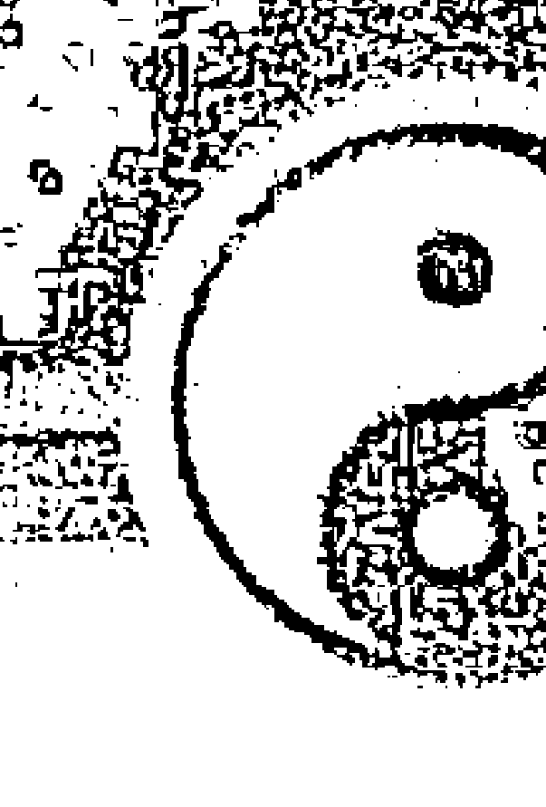

## 玄武三十七签全解

## 五论求财

解签人：金圣

## 命宮三方四正

## （五）紫微斗數

## （辦理班選用資料）

## 王亨之 編著

## 目 錄

## 序

## 鄭一 觀念篇

- 殺破狼格局為何不開創
- 庫破財不聚
- 號子里的女營業員
- 過路財神之一
- 過路財神之二

## 鄭二 求財各有門道

- 從廿十萬到四億元
- 股票經紀人
- 三奇嘉會義主大發？

## 命會空劫半空折翅

## 行家投資血本無歸

## 怎一個貪了得

## 高利貸下的犧牲者

## 李大娘的退票

## 賭徒的衆生相

## 股票、房地產、外匯操作一起來

# 卷三 結語

## 紫微斗數大崩盤

## 序

運用斗數談論命理，命盤上除了命宮以外，還有清晰分明的其他十二個宮位。這十二個，幾乎可以用來談論一個人一生錯綜複雜的人生際遇，休咎與榮辱。

遺憾的是，在古傳僅有的幾部鬥數典籍裏，絕大部份文學，幾乎都偏向于星曜與格局賦性的闡釋，很少剖析有關十二宮的特具作用和本義，至于十二宮位在命盤上的推論適用方法，更是稀如鳳毛麟角。近人琳琅滿目的鬥數論著裏，絕大部份是極其呆板的認定，某星曜在某宮位的必然性作用，不抵把星曜賦性，常作出極其荒謬，也無視于宮位本義的命理運用。這種生吞活剝式的鑽研古傳命理學術，不抵使其命理探討和論斷，不能用以推演實際的人生遭遇，這種論著，更會錯誤引導有心于鬥數命理的同好，走向理念不清的死胡同，而無法籍此窺盈大千世界的百態人生。

筆者在漫長的門數命理學習過程中，發現到星曜賦性和格局作用的了解，固然是研究這門學術的最基本要項，但對十二事項宮位特具作用性的合理運用，也同樣是學習門數命理不可或缺的極其重要部分。但很遺憾，在近代學者的諸多論著中，卻發現示，對有關宮位實際功能的運用上，一直滯留在觀念模糊和運用混淆錯亂中，因此使門數命理的推論很難適切應用在目前這個光怪陸離，又變化萬千的當代社會。

在老祖宗時代，一個人一生的財富，除了生于豪門之家，當他（她）哇哇落地時，通常較可能享盡一生的榮華富貴以外，其他庶民百姓的富貴與窮通，上焉者，發奮圖強加上命運助勢，有的可能茅廬出公卿，也可能寒門出富貴，等而下焉者，一生胼手胝足祇可溫飽。因此這裏推論財富的命理條件，傳統上除了命身格局以外，無不以「財」、「官」兩宮的吉凶旺弱作為命理跡象的推論依據。在一般百姓人家，財富通常都來自「官祿」一」所從事行業的興衰榮枯。事業亨通，財源廣進，事業坎坷不濟，則利薄財窮，所以論及財富盈虧與多寡，在鬥數命理上，無不以「財官」兩宮合并推論其吉凶消長，一生在財富上，不單是僅求聊以維生，甚至祖孫三代作為論斷依據，因此在古代，一生為人儕備的一僕役一族，除了極少數有奇遇或巧取豪奪而橫發外，一生在財富上，不單是僅求聊以維生，甚至祖孫三代

但時代演變，社會環境已非昔日可比。雖然現代人仍須從各行各業裹討生活，但求財與生財之道，古今已經迥然迴異。一個人開創事業，因鴻業駁發，固然可以廣進財源。但一個擁有資金的人，不管他是主持事業的大老闆，或是為人作嫁的上班族，祇要他有正確的理財觀念和妥善的理財方法，再透過適當的投資途徑，他照樣在不大動干戈經營鉅辛的企業下，可以擇得巨大豐厚的財利。

在門數命理上，經由事業經營而求得財利，由於來源性質有異，因此在門數命理推演所根據的理論和方法，就應該有其截然不同的差別所在。但很遺憾的，對這裹迥然不同的求財方式，在當今的鬥數命理界，除了那些自認為鬥數命理專家，大發其荒誕無稽的謬誤觀念和錯誤百出的推論方法以外，竟然不曾聽聞有關這方面的正確理念和討論。

筆者在多年業餘的論命經驗裏，經常會碰到同好提及類似這種財利得失推論方面的謬誤觀念，諸如把金錢存人投資公司或貸放友人被倒帳，投機炒作股票，因適利空而大賠老本，偏偏常在財帛宮并不太顯現兇煞時而損財。類似這種似與門數命理背道而馳的事迹真相，常使這些同好百思不得其解，甚至因而懷疑門數命理，在推論財利得失方面的準確性。

其實類似這種一般鬥數初學的研習者之間。因此每逢有這種同好前來研討門數命理時，常帶費盡口舌，經詳加解說后，才能使他了解。

為了澄清門數命理十二宮位，在命理推論上的實際應用，筆者希望能以一宮一書方式，逐一以實際命例，從多方面詳加探討，聊作初學同好鑽研門數命理的參考之用。

十二宮位能否如願完成書，除了祈求老天爺能多假我餘年之外，更期待初學同好，能勿吝多賜捧場。

## 卷一 观念篇

## 殺破狼格為什麼不開創？

先天命格對求財心態的影響

己巳年底，某一下午上班時間，接到小李電話，說他踢到鐵板，這幾天心裡很不是味道，想找個時間跟我見面，要我給他訂個時間。電話中，我問他傷得多重？走路方便否？他說，那兒是傷到腳，是傷到心——自信心。哦！我立刻意會，他大概又好說大話，狂語連篇，搞得下不了臺了，所以才打電話求解圍。

記得在丁卯年底，有一次在一位朋友家裡閒聊時，有位高先生談到他曾經遇見過的命理異人奇事，在座的有位年輕朋友，也口沫橫飛說道，他曾經拜在兩位當代高人的門下學命相，一位教他學看相，一位教他學命理，言談中隱約表示，他已盡得兩大高人的真傳，並大有青出於藍的造詣。因當時是初見面，我除了羨慕他的奇緣巧遇外，也不便表示意見。

在座的，有位生性好捉狹的陳先生，就當面問起小李說：『你看我今年的財利狀況如何？』

這位年輕人，往陳先生臉上，端詳了一番后，說道：『你今年四十一歲，行運在兩眼之間的間的《山根》部位。你的山根雖不斷折，但嫌低陷無力，上班領薪尚可，求大財利無緣。

與準頭選懸瞻又不露窮，顔臉氣色不暗、不晦，兩耳鮮中透潤，我想陳先生，今年必然財利順遂。只因另有老前輩在場，我不便班門弄斧，貽笑大方，只好靜默不語。

另一位高先生則話帶揶揄地笑說：「小李啊！你說陳先生，今年除了在公司拿課長的薪水以外，也趁著房地產節節高漲時，炒了三四攤房地產，足足淨賺了四、五百萬元，你說這樣的財利還算差嗎？」

接著陳先生又半帶數落和教訓地跟他說道：「半瓶醋才幌，人家在命理上的修為，已非你想像所及，只是深藏不露，你却自我吹噓。在真正的行家前面，你還是少開金口、少出醜爲妙。或是干脆叩個頭拜拜師，也好指點你一二。」

小李面帶驚奇的聽了后說道：「怎麼會這個樣子？」

高先生得理不讓人的又說：「若要說命理，你的道行還算小學低年級，在座有人會嫌你還不够格當徒弟呢？」

散會后，我送在座的一位命理界老前輩回家途上，他語重心長地說道：「初學三年，打遍天下，再學三年，寸步難行」。幾年來，這句話，一直讓我回味無窮，并存戒惕。

小李直到戊辰年底，看過我的兩本著作后，才輾轉經由出版社電話取得聯系，才續上這段命理因緣。

見面時，小李拿出這麼一張命盤，問道：

| 辛巳 福德宫 | 壬午 田宅宫 天机禄 | 癸未 事业宫 破军紫微科 | 甲申 仆役宫 天钺 |
| --- | --- | --- | --- |
| 庚辰 父母宫 擎羊 太阳 | 乙酉 男命 一九四五年 十二月二十日戌时 | | 乙酉 迁移宫 地劫 天府 |
| 己卯 命宫 5-14 禄存 左辅 七杀 武曲 | | | 丙戌 疾厄宫 太阴忌 |
| 戊寅 兄弟宫 15-24 陀罗 文曲 天梁 天同 天机 | 己丑 夫妻宫 25-34 火星 地空 天相 | 戊子 子女宫 35-44 天文 巨魁昌门 | 丁亥 财帛宫 15-54 右弼 贪狼 廉贞 |

命身都居“杀破狼”宫位，而成为双重的“杀破狼”格局时，通常都比较属于“开创”的类型，这种命格不只在事业上倾向于开创，在理财方面，也趋向于积极性。但这个命造的主人翁，大半辈子是上班族，理财方面，相当谨慎保守，除了薪水之外，别无其他生财之道。为什么？……

「這個命造命身宮合為雙重〈殺破狼〉格局。七殺武曲在卯廟旺，有祿存同坐，可增加強命宮格局主開創的命理作用。身宮在亥有廉貪狼，是為〈絕處逢生〉之地。若再以左輔命宮，右弼身宮來論，這一對頗具穩定、耐心和延續作用的星曜配置兩宮，在命理上應論為白手成家的命格，人到中年時也將是所從事行業中的佼佼者吧？」

> 「我略看了命盤后應道：『這個命造，雖然命身宮都是〈殺破狼〉格局，又會左右，理論上有主利于開創的命理條件，但這種格局在這個命盤上，卻需要加上幾個特點，兼并考慮，否則在命理推論上，將會因差之毫厘而繆之千里了……』

第一，〈殺破狼〉需兼會羊、蛇、火、鈴、空、劫、六煞曜中的某些煞星于適當宮位。煞曜雖主煞害，但往往也是命理現象的一種〈沖擊作用〉及一種〈憂患意識〉。人常有好逸惡勞心理，若一輩子都在安逸無憂中度過，自然缺乏憂患意識，而不思自強，也因而渾渾噩噩地過完一生，因此，命身宮不會煞的人，一輩子也許平順過日，但想要論及成功立業，恐怕就不是這種命格組合的人所能辦到。

第二，七殺武曲在卯廟旺又和祿存同躔，不但助七殺的開創，反使這個命宮格局呈顯極端的保守。祿存雖可助旺同宮的甲級星曜，但前后的羊陀兩煞，卻會如同兩個保護神似的護衛着命宮。這兩個保護神，護衛命宮的安全有余，但也因此而限制了命宮，不使其向外沖鋒陷陣與冒險犯難。

：：這個命造，命身宮三方都不見煞星，一生既無波折，自然沒有憂患意識，也就沒刻苦耐勞的冒險犯難沖動，因此一輩子將會偏向安穩，不如他人辛苦開創了。

「地劫不也沖入命宮嗎？」小李問。

我說：「地劫也為六煞之一，在命宮的對照宮位，對卯宮應該有某種程序的沖煞作用，但遺憾的，它對卯宮祿存的沖擊，在此卻有（祿逢沖破）的害處。像這種命身所會均屬北斗剛星的人，個性都較剛烈，膽識大意志強。本來祿存在命宮，應該可使這方的生性更加彰顯，卻因這個地劫來沖，反而使他個性偏向溫和，膽識不強，意志不甚堅定。因此更使命身格局的個性作用，偏向保守、拘謹和缺乏決斷力。」

小李不勝詫異的說道：「怎麼你會對這個命盤格局，有此异于常理的解說論法？」

我說：「重點是我的分析與基本人的事實表現，是否吻合？我相信只要命盤正確，這種性向論斷，應該不離譜。」

小李說，我的分析和事實還很符合，但就是弄不懂，我為什麼會有這解釋和判斷。

這個說來話長，近年來有很多搞斗數命理的人，僅在玩一些滿天飛星的（四化）游戲，甚至奇門、八字、斗數兼容并用。更甚者還把（哈雷）彗星也排上使用，似乎不標新立异，就不足以顯示道行高深。反而把傳統這些極為寶貴的星曜賦性和格局作用，視如弃履而不用。我贊成學理上的創新，但創新的理論，若違背命理邏輯，恐怕就很難在學理上站得住脚，因此，所據而推演出來的命理論斷，恐怕只能自說自道，必將無法和事實真象相互吻合了。

我對這個命造性格上的分析，其實只是很傳統地依理論說，根本毫無稀奇可言。小李聽來似懂非懂。我乘機勸他在星曜和格局賦性作用上，多下功夫，否則別說在斗數上不能登堂入室，也將一輩子會在圍牆外徘徊，老是找不到圍牆的入口大門。

隔了一會后，小李又說：『武曲為財帛主，祿存也主財富，這兩星同坐命宮，應該主利財帛。另外七殺同宮、主變動，左輔同坐、又主財源的綿延不絕，應該可以作這種解說吧？』

『若只單純從這個組合來論，是可以做這個解說。』我說：『但只能說，他一輩子在財帛上『無缺』。但卻不能據作『富格』論。七殺雖有求變作用，左輔也會綿延不絕，但并不足使他在求財利上，會有如他人一般，有種強烈謀求財利的意願。我的看法，他在求財方面，會偏向保守謹慎。這個道理和前面所談，命格成爲一種保守性格的道理一般。因此這種人，一輩子的財富，也都是由積少成多，慢慢節省積累而來的，應非積極追求而致富。斗數命理上，另有一種〈積富之人〉的命格，若要說這個命造，所以會『無缺』，應該同樣由這個道理而來。』

『不過，若根據你在前幾本著作里，一再強調行限四化引動的理論來看，這位先生，第一個限運的己卯宮，到第四個限運的戊子限當中，一直是己、戊、己、戊四天干，反覆使命宮和財帛宮武曲和貪狼化祿，不正是吉化命宮與財宮，使這兩個宮位因引動而產生積極求財的意願嗎？』小李提出這個『半子之矛攻子之盾』的問題來。看來他還是滿用心在看這方面的書籍。

追求財利的論斷，除了命宮和財帛宮以外，另一個重點宮位就在福德宮。而財帛宮則作為求財方式的論斷宮位。比如說，一個人，他的財源究竟主要是來自薪資收入，或是做生意求財、巧藝得財，甚至用不很正當的手段求取財利，都要看財帛宮。也就是說，諸凡以人為主，而付以勞心努力來求得財利的命理迹象，就要用財帛宮的星曜組合來加以研判。

而福德宮在求財方面的作用，卻屬另外一種對財利欲望強弱的表徵。福德宮既強且旺的人，他對求財的心態會極爲強烈，因此當他有了多餘的資金以后，他將會積極地利用這些資金去生財。福德宮弱陷的人，就算有了錢，也比較不會有這種『用財求財』的強烈心態。

這個命造的先天命宮和財帛宮，雖然歷任四大限的吉化引動，誇他的先天福德已宮太陷弱，因此就算他有了積蓄，也沒太大的膽識，敢用錢去滾錢。先天福德宮的這種跡象，若再把它和命宮的保守性格型態兩相并論，這個命造，在后天的行運里，也只能顯示，在他進入社會工作后金錢收入上的穩定。并不意味着，他在穩定收入以外，還有什麼大財源，甚至運用積蓄去投資生財發財的現象。

「這種行運，他不會去買股票嗎？」小李問。

「台灣的股票，近幾年來形成一種畸形發展，也許是投機者的樂園，但對一個生性保守的人，大概不會去輕易地嘗試這帶有相當冒險性的賺錢行徑。當然，這位先生也希望賺更多錢，但我不認爲他會把錢投入這裏飄忽不定，得利毫無準頭的股票上。」

小李又說：「他的先天田宅宮在午，天機化祿為《石中隱玉》格，命宮又有祿存。這兩個宮位的祿星交互作用，一旦有了積蓄，是否有可能把錢投入房地產方面去求財？先天田宅宮在午會照祿權又成格局，原則上作吉論，也可看作他在不動產方面應有強烈欲望情況才對。但因戌宮的太陰化忌和寅宮陀羅，使原有的吉象大減。特別是太陰為田宅主，因化忌會沖先天田宅宮，它對田宅宮的吉象不利影響會更深遠。另從己卯限運起，到戊子大限，甚至延到丁亥限運，每一個大限天干忌星都不斷地會沖先天田宅午宮。這種忌星相繼沖害這個宮位，除了表示庫因沖破受損而財利不聚以外，也會影響他在利用投資不動產以生財利的意願。因此我認為，他十幾年來，在房地產方面，也只限于購置自用住宅。至于把積蓄投資在不動產上來生財，也將會趨向保守。因此在房價飆漲的這幾年來，他也不見得就賺到什麼錢來。他在不動產方面的這種跡象，也跟他生性的保守作風有關。這個道理，就和他不敢去買股票發大財的原因一樣。不能光憑田宅宮如何，就追下判斷。斗數的其他十一個事項宮位，固然有其特殊意義和功能，但在個別事項宮位的論斷上，仍不能偏離命宮的基本特性和功能來作綜合研判，因此斗數論命，會格外重視命身格局，原因就在于此。

> 一、根據傳統理論，（《殺破狼》命格，不是都比較屬於不靠祖蔭，白手成家的類型格局嗎？小李問。

「古傳的典籍上是有此一說，這個格局的人命，不管他有否家產家業可承蔭，他一輩子的產業成果，都比較偏于自行開創。但是也得格局好，自行開創才會有良好成果，並不是所有殺破狼格局的人，都能真正達到白手成家的目的。」我說。

「這位先生的格局還不算凶吧！若自己創業，結果又將如何？」

「正如前述，他雖屬〈殺破狼〉，但卻是個太過于穩健的命理格局，也許守成有餘，但想要有開創性的創業，其魄力，恐怕就太不足了。這個道理，前面已詳談，就不再贅述，不過正由于大限延續祿星來吉化命宮和財官兩宮，又有左輔右弼扶持，雖然一輩子在事業上不見得有大作為，但在職業上，只要安份己去謀求個工作，也應該可以很平穩地做到退休年齡。」

「我問小李：「那個原來對這個命盤，究竟作怎麼樣的論斷？」

小李垂頭喪氣說：「我原以為〈殺破狼〉的命格，都主開創。像這個命身宮雙重〈殺破狼〉的人，不只會有左輔右弼，而且三方又有地劫一個煞星，因此他不但是個白手起家的人，到了限入戊子大限時，必然會在他所從事的行業上，闖出名堂來，若自己經營事業，至少也會小有成就，若幫人做事，也必定表現輝煌，為老板倚為左右手的得力高級干部。這幾年來，台灣的股票和房地產狂飆，我也以為他必然會及時投入賺他幾票，所以我諭斷這個人，這幾年來，應該在事業和財利將會兩得得意。」

沒想到這個，打從己丑限起，進入一家民間企業公司以后，一直很平穩、安份于他的事業差事。十多年来，才熬到了一個業務課長。差事雖順利，但也談不上有杰出現象，待遇報酬，也只能勉強說成可以接受。十幾年來，夫妻省吃節用，多少存點錢，卻不敢心存僥幸在股票上投機冒險。而房子住了十來年，已嫌太小，也因猶豫不決，遲遲不敢買新屋，而遺憾無限地時常嘆氣，這輩子恐將沒能力，再買更寬敞的房屋。

> 哦！這麼論斷，難怪會踢到鐵板，這個鐵板的的確踢得不輕呢！我的確沒了解到，命身宮都是〈殺破狼〉的人，也會一輩子「吃死頭路」。

小李說。

> 我以不為然。什麼叫做「吃死頭路」（臺語，意即領人薪水沒出息），人生安穩平順就是福，你別滿腦子的功、名、利、祿，好像不追求這些，就枉費一生。看來你不只斗數不通，你的人生體驗還更淺。年輕人，多下點功能吧！

## 庫破財不聚

### ——純投資的重點宮位

戊辰（一九八八）年底，接到陳先生從臺南來電話問起，若不參與經營，只是純投資于某種事業經營，應該根據什麼重點條件來分析論斷可能的盈虧。傳統上，對于這個問題的探討，通常以先后天財帛宮的吉凶，作為投資后有否生財的論斷依據。近年來，有些斗數研習者，又提出一個特別看法，認為田宅宮破損的限運，不利于投資。其原因在于庫破財不聚。即使再好的投資，也將無利可得。其實這兩種說法，表面上看似合理，但若依此論斷，結果不一定正確。因為這兩種說法，全都患了理念不清的誤謬，沒有先把如何生財的性質加以分辨，因此使論斷依據的重點宮位發生偏失，最后會使推演的結論和實際結果大異其趣。財帛宮的財，主求財的方法、得財的難易，及所得多少。福德宮的財，主利用既有的財去理財生財，也就是偏向一種純投資生財。田宅宮的財，是主投資者把擁有的資金投入自行經營的事業上，若庫旺則財聚，表示他財力雄厚殷實，可以作中長期的大額投資。因無資金短缺、周轉困難的顧慮，因此在事業經營上，至少沒有資金調度的困難。若庫位殲破，又想投資太大事業，到時候，事業經營勢被資金周轉困難而拖垮。所以限過庫凶的人，就不宜從事太大的投資經營，更不利于投資回收太慢的行業。

| 天府 紫微 科 天钺 | 天机 禄 | 破军 | 太阳 文昌 |
| --- | --- | --- | --- |
| 甲申 福德宫 | 癸未 父母宫 | 壬午 命宫3-12 | 辛巳 兄弟宫13-22 |
| 太阴 忌 文曲 | | 男命 一九五五年 十月X日巳时 张先生 木三局 | 武曲 擎羊 地劫 |
| 乙酉 田宅宫 | | | 庚辰 夫妻宫23-32 身 |
| 贪狼 | | | 天同 禄 天存 铃星 |
| 丙戌 事业宫 | | | 己卯 子女宫33-42 |
| 巨门 | 廉贞 文曲 天魁 | 天相 | 天梁 同 天机 文曲 火星 地空 陀罗 |
| 丁亥 仆役宫 | 戊子 子女宫35-44 | 己丑 夫妻宫25-34 | 戊寅 兄弟宫15-24 |

己卯大限的戊辰年(1988)投资于养猪场，结果血本无归。这个投资亏损的命理理由，应该怎么来解说？这个养猪场，为什么会失败？为什么来诊断？因此，纯投资结果要如何论断，就须以限过的福德宫吉凶，作为论断依据了。

陈先生目前在台南一家电子公司当主管级的工程师，他是我认识年轻朋友中，狂热于斗数业余研习的一位。己巳年中，有一次在我南下台南公差时，他提出两个纯投资的命例来讨论。

他说，张先生和王先生，于戊辰年底向他请教，关于投资另外一个朋友经营养猪场的事。由于投资金额上百万，因此事前来了解一下，这个投资的结果将会如何？三十多岁的年轻人，上百万元的投资额不能说少，必须在投资前小心些。

原来这两个人想要投资一位养猪朋友的事业。『据这位养猪朋友说，台湾的养猪事业，只要能达到某个经济规模，以一、二十年来的景气而言，这个事业应该是个值得经营的好事业，因此想把目前略嫌小的规模扩充，所以才邀张、王两位好友参加投资。』陈先生就命理上分析说：

『戊辰年张先生三十四岁，大限在己卯运，己干使武曲化禄，文曲化忌。流年流禄在巳，贪狼化禄、天机化忌。流年在辰宫，正好坐武曲大限化禄被卯巳的双禄所辅，戌宫贪狼化禄来会。因此辰宫是个坐禄会禄，又是双禄所辅的吉祥毕至的大好宫位。大限的福德巳宫，在戊辰年有流禄进入，流年的福德午宫，也有巳未两宫的禄星辅佐，先天的福德申宫，也会有辰宫武曲的多重禄星吉化来照。这种本命、大限、流年的福德宫……都吉祥之下，来作纯投资，应该可以得到预期的投资利益。再以王先生来论，戊辰年二十五岁，大限在戊辰运，大限贪狼化禄，天机化忌。戊辰年贪狼再化禄，流禄在巳宫。由于大限和流年的福德重叠在午宫，这个宫位，在戊辰年时，正好被双禄所辅（未宫无甲级星，让宫主曜作用到未宫为用）。这个福德宫既然为双禄所辅，所以应该仍作吉论。若纯投资由福德宫位为重点来论断，那么这两人限运的福德宫，至少不能作凶断。』

我说：「你拿福德宫来判定做为纯投资能否赚钱，理论上很正确。因为纯投资若赚钱，那是用钱去赚钱，不是自行经营事业来赚钱，所以重点宫位不在财帛宫，当然也不会在事业宫。若是投资的钱亏了，更不是因为先后天行运的财官两败，而是把既有的钱因投资而亏损。既有的钱财，就是福德宫的财，所以凡是利用既有的钱去作纯投资，其吉凶论断，一律根据福德宫。不过你所定出来的重点位，恐怕有些不妥当，因此，所论断的结果，恐怕会和事实的结果不尽相符。」

以张先生的命盘来说，己卯大限的己干使文曲化忌，酉宫因而在先天和大限以化忌同宫。这个投资发生在戊辰年，戊干天机化忌在戊，正好使先天福德申宫被先天、大限和流年的《三代忌星》夹制。这个先天福德宫，又会有寅宫的陀罗、火星，及辰宫的擎羊和地劫四煞，其凶甚为强烈。

而戊辰流年福德午宫，虽有双禄所辅，又有贪狼流年化禄由戌宫来会，但午宫究竟有地劫和流羊同蹑，火星、陀罗又从寅宫来冲，所以午宫的吉象也不稳固。

另外，若用大福德巳宫来看，这宫位在戊辰流年，虽然有流禄入坐，但也会有酉宫的先天后天忌冲击，所以还是吉中带凶。

戊辰年底投资养猪，翌年就是己巳年，流禄在午，武曲化禄，文曲化忌。若重点宫位定在午宫，固然到了己巳年时有流禄同宫，并有戊年的贪狼化禄来会，但有地空同蹑午宫，使午、戌所会双禄减弱吉化作用——禄逢冲破。若重点宫位定在申宫，己年又有文曲化忌再度引动申宫受（二化忌）（含戊辰年的天机化忌）的凶象，其凶甚大。若重点宫位定在巳宫，文曲化忌为大限和流年双忌，再加上先天的太阴化忌，成（三化忌）冲击这个宫位。

先天福德申宫呈凶，大限福德巳宫亦凶；流年福德午宫（戊辰年的福德宫）禄逢冲破。从这个观点而推论，张先生在戊辰年时所纯投资的这个养猪事业，到了己巳年间，恐怕就难逃亏损之厄。

再看王先生的情形又如何？戊辰年大限在戊辰宫，戊干使大限的天机自化忌。大限坐先天福德宫自化忌，而行天命宫太阳又有先天化忌。由于命宫忌星和大限宫化忌的互为引动，这意味着，在这个限运里，任何纯投资，将无利可得，甚至会血本无归。很凑巧，王先生竟在流年和大限重叠的戊辰年，参加了这个纯投资的养猪事业，岂不使先天福德宫原有大限和流年的天机变化忌？这种情况下的福德宫重点位，就定在辰宫即可，不必另定在大限的福德午宫。若把辰宫定为王先生投资的重点宫位，其凶性之大，恐怕就不是定在午宫，被双禄所辅的吉象可比。既然两人的重点宫位都呈凶，我的看法，这个纯投资，将于己巳年以断本收场。

陈先生说：「你提出的这个《重点宫位》理论，很实际，也管用，但对初学的人，很难作充分掌握。究竟在我们论断时，应该把《重点宫位》订在那一宫？是先天的福德宫，大限的福德宫，或是流年的福德宫？」

定重点宫位的方法，的确有些让初学午练的人觉得困扰，但只要掌握原则，再仔细分析，应该不难分辨。

### 以这个纯投资的个案为例：

第一，想用纯投资来赚钱，重点宫位必定在福德宫。
第二，仔细检视流年、大限和先天三个福德宫的吉凶程序，比较其轻重。
第三，三代忌交会比两代忌强，两代忌比一代忌强。同样的禄星，两代和一代的作用，也有这种强弱的比较之分。
第四，不论吉或凶，只要能成为〈格局〉的，都以〈格局〉的作用较强烈，因此吉凶的程序，首先要以成格的《格局》来论。不成为格局时，再由禄吉和忌凶来比较其强烈程度。

另外，吉与凶的程序，尚须兼顾重点宫位及三合方星曜的庙旺利陷情况。星曜在旺宫禄吉最佳，陷地禄吉亦虚发。旺宫忌凶为冲击，陷地忌凶最为恶。这些吉凶分辨的道理，也同样应用在命盘一般其他事项的论断上。不过还有更重要的，若要把上述的几点弄得清楚，必先要将星曜赋性和格局作用搞通。舍此基本光运用四化，想要探讨紫微斗数，必将一辈子在墙外徘徊，找不到寺门。

陈先生又问：「这个投资确实失败了，投入的资金，也全部泡了汤，能否从命盘上看出，这个养猪场，究竟因何失败？」

「这两位投资者的福德宫同呈凶像，但凶象呈现的性质不甚相似。只是投资同一个事业，当然会由于相同的原因而去老本，不可能因为不同的理由而亏钱。因此我需要了解，在这次投资，那一边比较主动，」我说。

养猪场是张先生的朋友开的，因想扩大规模，才邀张先生投资。所以张先生也因为再邀好友王先生，一起加入。陈先生说。「既然是由张先生先起意参加投资，理论上应该可以依据张先生的命盘来推演看看，他发现，这几年台湾的养猪事业，在出口的牌价上，常一落千丈，连饲养成本都没办法回收。因此有些资金较少、规模较小的养猪场，常在出口景气低迷时，不堪累赔而一蹶不振，最后亏损累累。若依命理上的迹象分析，他们的这次投资失败，其因不在出口牌价低落，很可能因为饲养管理不善，致使猪场发生某种毛病，而使整个养猪场毁于一旦。」

陈先生回答说：「的确是因为遭受「猪瘟」侵袭，使全场的大小猪只死去大半。这个养猪场规模不大，资金也不多，不能承受如此重大的打击，也就因此关闭了。在乡下，老祖母时代曾经有句话形容，一个人在走倒楣运的时候会「透早（大清早）出门捡猪屎，都会碰到猪漏屎（拉肚子）」。这两个年轻人，霉运当头，所以才碰到这种倒楣事。」

### 号子里的女营业员
——福德宫和生财理财的关系

有一次碰到斗数同好游先生时，他提出一个看似平淡无奇的命盘问道：「你看这个命造有何特殊之处？」命坐太阴化忌和太阳落陷在丑宫，天梁化权在巳陷弱为先天事业宫，未酉两宫无甲级星曜，为争弱宫位。若单从命宫的三方四正星曜组合来综合判断，这个人的个性格约略有下列几点情况：

- 1. 其一，命宫太阴化忌太阳又陷位，其性格优柔寡断，作事先勤后惰。
- 2. 其二，太阴化忌会铃星于先天财帛宫，两星合而为〈十恶〉，并与天梁化权三合于事业宫，因此于处事求财，时而果断固执，时而却又毫无主张。
- 3. 其三，左辅与右弼夹辅命宫，经过一对星曜扶持后，其性格带有相当稳定、韧和耐性。
- 4. 其四，若由铃星会天梁化权于三方来照，她的待人处事，自有其粗中带细，精明能干之处。

游先生听了我这一段似乎前后矛盾的性格分析以后说道，她的确是个性格与能力很难以捉摸的女人，平常像个既无知又无能力的妇道人家，但做起事业来，又像个不让须眉的女强人。

紫微斗数命盘：
十二宫位分布：
- 己巳宫：田宅宫 36-45，主星：紫微、七杀。
- 庚午宫：事业宫。
- 辛未宫：仆役宫。
- 壬申宫：迁移宫，主星：天钺。
- 癸酉宫：疾厄宫，主星：廉贞、破军（权禄）。
- 甲戌宫：财帛宫，主星：文昌、天马。
- 乙亥宫：子女宫，主星：天府。
- 丙子宫：夫妻宫，主星：天同、太阴。
- 丁丑宫：兄弟宫，主星：武曲、贪狼（科）、天魁、火星、陀罗。
- 丙寅宫：命宫 6-15（身宫），主星：太阳、巨门、禄存（忌）。
- 丁卯宫：父母宫 16-25，主星：天相、铃星、擎羊。
- 戊辰宫：福德宫 26-35，主星：天机、天梁、文曲、左辅。

这种命身格局，投入如走马灯似的股票公司当营业员，能混得下去吗？她是一辈子的小女营业员命？或是一旦飞上枝头当凤凰的大富婆格局？在命理上有合理的解说吗？

不过一个人的性格，可不能全由命宫来论定。我在《斗数与人生》一书的『祸福根基——《谈身宫的作用》』文里提到，一个人的性格正与年增长，年龄慢慢增大后，即因受「身宫」的调整作用，使其命宫的原有性格，会逐渐受到修正，并趋向「身宫」所禀赋的性。

我说：「王小姐的身宫在亥，正好兼备这两个条件，不只是身宫，还是先天的夫妻宫。」

王女士身宫在亥，有天同庙旺坐守并会昌曲和双禄星，三方又无杀曜冲合。据古传星曜赋文所述『天同为福星，女命主安享，性温和慈善，有机枢，无激亢，精通文墨，女命得之最为善。』

。若根据古传的这两条说法，她很可能就在己卯大限间，曾有婚姻上的波折，也同时在这个限运里，当婚姻发生后，也有不甚正常的感情发生。」

游先生说：「她的确在这个限运里和先生离婚，以后又和一个有妇之夫生个小孩。」

「身宫也是先天夫妻宫，不利婚姻的格局形成后，一旦后天行运的夫妻宫又有凶象时，就比较容易导致婚姻的破裂。另外，王女士也或许正好嫁给一个年次不甚相配的先生，因而会使这个婚姻导致破碎。」

「己卯大限文曲化忌在限本宫，这种限运的夫妻宫丑位，能看得这么凶么？」

大限本宫文曲化忌，大限夫妻宫有先天太阴化忌，何况还会有来自酉宫的铃星，使丑宫带有「十恶」凶格。这两个宫位的「两代」忌星互相为引动，其危害作用极大。丑卯两宫均有四颗甲级星都会化忌，也即在这十年内，会有四年的忌星化在丑卯宫上，因而引动三代的忌星在丑卯两宫相互忌害。

丑宫原有「十恶」凶格，卯宫文曲化忌与铃星成忌煞交冲，而先天夫妻宫又有主不利婚姻的「福不全」格局，因此大限的本宫和其夫妻宫，这种两双忌煞互为侵害，遂使她的婚姻走上危害。当然同梁已亥宫的格局作用，也因此导致王小姐在离婚后，再有不正常感情的现象发生。

> 「王小姐在癸亥年（一九八三），进入证券公司当营业员，你看她，这几年下来的发展会如何？」游先生问道。

癸亥年二十九岁，大限行入己卯限，正是先天的福德宫。巨机在卯为庙乐之地天机五行属木，得化禄增祥，另有巨门五行属水为相生，使木得枝繁叶茂。又有禄存之厚土来培木，文曲之水再滋润，这种宫位格局作为先天福德宫，并于这个限运期间能从事「以钱滚钱」的逐财求利行业，若能持之以恒，必然会有非常优异成果。

> 游先生说：「若依照你的「连续引动」理论，大限己卯宫，打从己丑、戊寅和己卯三大限间，两次己干使文曲化忌，戊干使天机化忌，作为钱财之「库」的福德宫，历经三大限的忌星冲击之后，这能在逐财求利上，有优异成果吗？」

> 「巨机在卯，据古赋文，除了有上述的记载之外，另有早年辛劳多成败，中年之后勃然而兴，并主竞争。」

「股票营业员想赚巨额业绩奖金，除了既紧张又忙碌的代客户操作和办理股票交割之余，更需主动的去争取多客户来捧场，以便提高其业绩。台湾的股票市场近几年来，虽然有突飞猛进的成长，但业界的高度竞争，股价的狂飙与猛跌的剧烈变化，对一个以赚取营业奖金的营业员，更需要为争取更多更大客户而「奔波」，为着分秒必争及时办理股票买卖而「忙碌辛劳」，也因股价腾涨，交易量大增，业绩奖金多而「成」，因狂跌交易缩减，业绩大降，奖金不也减少而「败」吗？」游先生提出他个人的看法。

我说，若就金钱之「库」的福德宫受三大限化忌的延续作用，它应该主有下列的四种现象：

第一，因忌的延续作用，即彰显这种宫位所具有的「竞争」、「奔波」、「辛苦」与「成败」。
第二，巨机在卯即与双禄星同蹑，若能反映上述的这种迹象，使其凶性出现，现本宫既有的大吉大利作用，就能得到充分的彰显。
第三，钱财之「库」不冲不动，不动不发。假定这个福德宫在限运行入时不受忌星冲动，王小姐将不会如此奔波辛苦地去从事于高度紧张又忙碌的股票行业。福德宫庙旺又不会忌煞的人，较会耽于安逸，又将如何能于剧烈竞争和忙碌中逐财逐利？
第四，钱财之「库」虽旺但不会忌煞，这种宫位会使一个人守财有余，而用钱赚钱的意愿不足。用钱滚钱来赚钱，固然可赚到钱，但也可能亏损，这也正是所以「库」不冲不发之理。

基于这些理由我认为王小姐在这已卯大限间，恐怕不只当营业员，除了曾有过丰硕的奖金收入之外，她也可能在「用钱滚钱」的求财上，有过很好的进帐。

游先生接着说道：「她在癸亥年进入股票公司当营业员时，流年走入大限财帛宫，戊宫有流年破军化禄，大限已干武曲化禄在子宫，使流年亥宫成为双禄所辅，流年事业宫正是大限本宫，有禄存和天机化禄。若以流年本宫天同庙旺并被双禄所辅，堪称强旺有力，但流年事业卯宫有大限文曲化忌，并会有酉宫铃星来冲，成为忌煞冲忌局面，她的营业员差事，可能称职如意吗？」

> 「前面已经说过，巨机在卯的这一干星曜组合，本质上是个吉祥毕集的宫位，当流年在亥宫时，事业卯宫的忌铃会冲，即因受冲动而使事业得因「冲破瓶颈」而开展，要是没得这种忌煞的冲击，反而使事业趋于波平浪静，也许她很可能就安于原有的工作环境，或是蹲在家里，不想有所事事了。」我说。

> 「但这年的流年福德丑宫流羊进入，使丑宫会酉宫后，成为两煞一忌，她可能获得什么好业绩奖金吗？」游先生问。

> 「流年本宫与事业宫，既旺且吉，营业绩效自然会好。业绩奖金收入，当然也跟着水涨船高。流年福德宫忌煞来冲，只是意味着辛劳，并不一定表示收入很差。」

甲子年（一九八四）流年坐武曲，有大限干化禄，流年财帛申宫有廉贞化禄，使流年本宫不只双禄交流，更是紫府相朝垣的大局面。流年事业辰宫有擎羊会申宫火星，经双禄吉会又成为「火羊」的横发格局。另外，这一年的福德寅宫有流禄入坐，除了使寅宫成为双禄交驰外，还使火星会贪狼，再形成另一个主横发的「火贪」格局。因此，在这一年中，她可能在营业员的差事上，曾有过格外优异业绩奖金收入，说不定还在有了巨额收入后，也曾经把业绩奖金转投在股票上。

游先生回忆着说道：「大概就从这一年开始，有几位股票大户透过她办理股票买卖，因此她的业绩递增，很快就成为一个出色的超级营业员，不但业绩奖金暴增，也常跟随着大户们买进股票。由于身为营业员，又经常接近大户，股市行情相当灵通，因此这一年的确在股票投资上曾有过相当不错的斩获。」

王小姐这一年所以会把业绩奖金的收入投入股票，究竟要根据什么来论断？一把既有的钱拿来投资生财，就是所谓的理财。王小姐先天福德宫财库甚旺，巳卯限时的福德宫天梁化权并会铃星，即主既有钱财上的善于运用——理财。丑宫太阴化忌冲巳官，会产生如前述所谓的「库」因冲而「动」，因「动」而投资。因此，在巳卯大限里，她一旦有了资金以后，就不会把钱呆板地存在银行里，将会及时地把钱投入在她所认定有利的投资上来生财。

甲子年，破军化权来会流年福德寅宫，这个宫位又有巳卯大限的贪狼化权，贪狼又和申宫的火星成为〈火贪〉，经廉贞化禄和寅宫流禄吉化后，不正是会激发她把资金作为投资生财的作用吗？
游先生说：「若单就寅宫而言，有丑宫先天太阴化忌，和卯宫的大限的文曲化忌夹来制。这种被双忌所夹制的流年福德宫，对这一年的财利吉凶又作何解释？」

至于投资股票的得利方面，又可分成两方面来谈：

其一，吉象方面，寅宫除了双禄交驰外，另成《火贪》格，而双忌夹制陀罗，虽已有《双忌夹煞》的凶格现象，但是两吉与两凶比较，吉的作用大于凶的作用，因此获利的机会仍然较大。
其二，流年福德宫双忌夹煞，虽有因凶象出现而损财，但只要她能作中长期投资，少作短线投机买卖，则因凶象而损财的机会，自然会减少。因为己卯大限本宫与其福德巳宫，究竟还是一个利于因投资而得利的运限宫位。

游先生于是又接着说：「王小姐在早些年间开始买股票时，的确偏向于中长期性的投资，较少作短线的投机买卖。
往后几年她一直当营业员，这个差事干久了，不但广结善缘，使她的业绩和奖金扶摇直上，也因摸熟了这个股票投资的生财之道，因此她一有资金，就会陆续地买进股票。
丙寅年（一九八六）时，股票指数约在八、九百点左右，当时一般股票的价格便宜，若与目前（己巳年）比较，几乎如天壤之别。因此以她当时的奖金收入之丰，及陆续用奖金买入股票所累积的股票总数，几乎已到大户程度。
股票陆续多进少出，这些股票几乎年年让她分得配股——股仔子。因此当股票到丁卯年（一九八七）开始飙涨时，她手中拥有的股数，已高达近千万股之多。根本原由就是如此没错。假定把买股票的年份从乙丑年（一九八五）开始推演，乙干使巳宫天梁化权，丙寅年天同化禄天机化权分会卯巳两宫，使这两宫同为禄权照合，丁卯年太阴化禄天同化权照巳宫，戊辰年太阴化权会巳宫，流年禄存在巳宫。这种禄权延续不断的进入卯巳两宫，除了会使她的股票投资多进少出外，也因为会让她从这个投资上，得到非常优厚的投资利润。」

> 「股票从丁卯年下半年腾涨后，虽然也有过大崩盘，但过后随即暴涨不已，因此她在前几年买进及衍生股票总值，到了戊辰年间，累积的总金额少说也接近二十亿元左右。已巳年的股票指数又经常盘旋在八九千点之间，因此她在这一年原本拥有的股票，自然就如滚雪球样地越滚越大。」在己卯限间，从一个小营业员，变成个拥有巨额资金的股票投资者，真能单凭先后天的福德宫吉象来判断吗？」

关于这个问题，必须先了解两个很重要的宫位用法。

「福德宫」的生财，是指利用原有资金生财的「财」。因此也是一个「库」的宫位，这个「库」是属于「动产」方面的「库」。这个「库」吉又旺时，就可以经过「纯投资」来生财。买股票，就是一种纯投资。

「田宅宫」通常也作「库」论，但这个「库」，比较偏向于「不动产」方面的「库」。一些豪门巨富的这个「库」必然既吉且旺。若论这两个「库」在财富上的比较，「田宅」之「库」的富，自然会比「福德」之「库」的富，来得更加强大。

以目前臺灣一般人而言，現金擁有上億的人，絕不會比不動產超過億元以上的人多。臺灣目前不少上百億元以上的豪富之家，其財富多以不動產為主，隨機擁有上百億現金的恐怕就寥寥無幾了。
因此在命理上，一個命造要成為富，必然要有強旺的先天田宅宮。所以『庫』破不藏財，『庫』盈聚財富，就是這個道理。
王女士的先天田宅宮在辰，為見右弼的紫府相朝垣格。當己卯大限，己干使武曲化祿時，正好會照辰宮，也照入后天田宅宮的午宮，使先天的田宅之庫均呈吉且旺。
七殺在午為『朝斗』格，并有左輔右弼來會，經武曲化祿吉化后，主『庫』興發和開創之象。
因此，王小姐在己卯限間，先天的田宅之『庫』，除了因旺而能聚集財富外，也可能在不動產投資或房地產投資方面，有過很好收獲。
『辰午兩宮不也同時會到戌子兩宮的空劫星嗎？難道沒有『半空折翅』和『浪里行舟』之害；怎麼反主吉祥與發與開創？』游先生說。
我說：『空劫兩曜有『不穩』的作用，但這種不穩，當有祿吉同樣照入田宅宮位時，會使不穩作用，呈現在『無心插柳柳成蔭』的現象上。因此她在不動產的投資與購置，常常會是臨時起意，隨興而作，而非長期、有計劃性的投資。這種隨興隨緣式的投資，即因空劫兩星的波動作用。但也因辰午兩宮位強旺，又得武曲化祿吉化后的增祥，使她大有成果。』
游先生于是說道，她的確在近幾年間，除了購置一些房地產以外，也曾經投資朋友經營的建築公司，同樣的讓她受益不少。
所以王小姐在己卯限間，雖然得自先后天福德宮的佳美，使她在股票投資上斬獲巨金，但也因田宅之一庫的強旺，更加鞏固她的財利于不散，因而能聚集成富。所以這個田宅之一庫，也正是使她成富的一個重要宮位。
能一生財而不能聚財，無論如何都成不了“富”字輩人物，其原則就在于此。
游先生繼續提到：“在戊辰年（一九八八年）政府準許增設證券公司以後，王小姐除了一家證券公司并自任董事長以外，也出資與人合夥開了兩家證券公司和一家財務公司，你看她的這些新投資結果將會如何？”
這些投資，若由她當負責人，並親自經營管理較適合，但若只出資與人合夥，交給合夥人經營，可不盡理想。因為她所投入的這些生財公司，很難找到理想的負責經營人才，因此將會使這些合夥事業，在往後的經營上遭遇困難。
大限遷移宮，無甲級星曜，除了宮位陷弱無力外，酉宮的鈴星為煞曜，丑宮有太陰化忌來合，成為忌煞交害。酉宮的對宮為大限卯宮，有文曲化忌沖入酉宮，使卯酉兩宮的忌煞互為沖擊，而產生“離心”的排斥作用。
戊辰年天機化忌，己巳年文曲化忌，這兩年的忌星連續在卯宮，也都沖擊酉宮，使合夥之間一直不能融洽。最遲到了庚午年流羊進入酉宮，天同化忌沖卯宮，也許在這年王小姐所投資，由合夥人負責經營的這些公司，將會出現問題，若不拆伙，就在這年也會有相當程度的虧損產生。
『合夥人不是看交友宮麼，怎麼您會遠在遷移宮？』
『這是一般人的最大誤解，也許把『僕役宮』改寫成『交友宮』，才會有此誤導。我也知道許多大師級的同好，對這個宮位有這種誤用而不自知。「僕役」，即為你所用的人，就是部屬。「合夥人」居于同等地位，當然要取遷移宮，道理很簡單，但有太多人常習而不察，才會有這種錯誤論調。王小姐在己卯限間與人投資的公司，經營結果如何，就有待游兄你能留意，並把結果情況隨時告知，以便了解這些推論是否正確。』

## 過路財神之一

### 逐財求利的命理條件

這是個逐財求利一大虧的命例，虧得叫她莫名其妙。她來問我，在求財上，如何去趨吉避凶。韓小姐，大學國貿系畢業。畢業後一直在不同的貿易商公司作事，從業務人員到老闆的秘書都做過，但都因職重薪低，因此在四、五年內換了五、六家公司。後來在戊辰年（一九八八），經由朋友的介紹，進入一家期貨公司當內勤業務的辦事人員。期貨公司，其實就是個投機者大發橫財的樂園，當然也有人在此虧損累累。這賺虧之間，全看個人是否鴻運當頭，可沒什麼大道理。韓小姐說，當期貨公司的內勤業務辦事員，薪水不多，但只要能諳于期貨買賣之道，除了自己可以投入資金賺錢外，也可以幫客人操作，賺取傭金。一個精于此道的操作手，要是委托的客戶和金額多，一個月從客戶得到的傭金，可以多達幾十萬。這也是她雖學有專長，但會改行換業的原因。見面時，她拿出一份由電腦排好的斗數命盤來，說是利用朋友的電腦排印的，作爲隨身攜帶，有空時拿出來看看研究。她說，曾經自行鑽研過不少坊間出版的斗數書籍，但越看越糊塗，因此遇到有比較重大的事情時，還是向精于此道的人請教。

這個造命在期貨公司帶客戶大賺也給自己帶來豐碩傭金收入，但自己的資金投入炒作卻大虧，究竟為什麼？盈虧的道理，應該如何分辨？

他開頭問我，這幾年她的財運如何？大限坐武曲天相在申宮，同宮有鈴星。武曲化忌和鈴星合為「寡宿」，武曲為財帛主，成凶格時，最不利于用錢滾錢的逐財求利。另以大限財帛宮在辰，有廉貞和天府并坐。廉貞和武曲化忌會合，也成為「財與囚仇」凶格，同樣不利于用錢滾錢。這兩個不利求財的凶格，再會沖三方煞星，在子的擎羊和辰宮的地劫，更使爭逐財利如履薄冰，稍一不慎，就會跌得很慘。
但這些凶險，只是應在用錢投機賺錢方面最凶，如一般的正常投資，凶性倒不一定會很大。若是普通的上班族時，就成為職繁責重，而薪水較低。
『那我在這個大限就注定要既辛苦且沒錢了？』韓小姐問道。
『也不盡然。大限福德宮在戌，也是先天本命宮，正好為先天的雙祿所輔。大限戊干的貪狼化祿會成宮，仍使這個福德宮呈現吉象。特別是貪狼在午有火星同宮，巧成「火貪」格，午宮的這個吉格也會照先天的福德子女宮。這個吉象，也意味著，在戊申大限有豐碩的財利收入機會。』我說。
『又是凶又是吉，不前后矛盾嗎？』
『不矛盾，而是吉凶各自應驗在不同求財的方式上，只要不去呼應凶象，不讓它發作就不會虧錢，盡量去發揮吉象方面，財利自然滾滾而來。』
『這話又怎麼辦？』韓小姐不解地問。
財帛宮不住時求財，要是經由一種勞其心力的方式來取財利，也許還可在辛苦中得財利，求得愈多當然就越辛苦。
比如說，你在戊辰年進入期貨公司做事後，若曾幫客人操作買賣，將會賺到不少應得的傭金。
假定你自己也投入資金想撈他一票，結果會事與願違，偷雞不成，反蝕把米。』
韓小姐說：『我去年主管內部業務之餘，漸漸把操作期貨的技術摸熟了，之後，先是幫客人操作買賣。沒想到一開始就很得心應手，在短短的幾個月內，單單傭金的收入，就有上百萬元的收入。經不起這種暴利的誘惑，我把傭金賺來的錢，也投入在自行操作期貨買賣上。結果正如你所說的，右手賺來，左手虧去，最後還是一無所有，去年算是白忙一場。
為什麼同樣是我操作買賣，幫別人就會賺，為自己就會虧？這個道理總是想不通～』
『其實幫別人賺錢，你也分得不錯的傭金啊～這正是前面我所說的，你在求財方面，最利於勞心努力來賺錢，最不適于利用自己的資金去求財利，道理就在這裡。』
韓小姐接著又問：『那麼今年（己巳）的財利吉凶現象還是如此嗎～』
『今年你二十八歲，大限還在戊申運，同樣的會貪狼化祿和天機化忌。
己巳流年，己干武曲化祿，流祿在午，文曲忌在酉宮。
在吉象方面，大限的武曲由忌轉祿，今年「寡宿」和「財與囚仇」的凶性會轉淡。武曲化祿又和午宮的流祿輔流年福德未宮。特別是流祿入午宮時更助強貪狼化祿和火星所成「火貪」橫發格局的吉化力量，因此論吉方面，財利會比去年更好。但凶象仍然很強。首先，大限的兩個凶格——「寡宿」與「財與囚仇」的凶性仍在。流年文曲化忌在酉宮，和天機大限化忌，正好夾制先天命宮戊宮，戊宮有陀羅，成為「雙忌夾煞」的凶局。戊宮同時為大限福德宮，太陰福德宮在己年引動沖破，主求財辛苦，亦不利于投資投機方面的求利。當然戊宮亦有雙祿所輔，不能說成全凶。因此我認為在己巳流年的戊宮，在財利的求取方面，只宜勞心的求財方式。流年的福德未宮，雖有雙祿輔，但亦有流羊入，另天機化忌由亥宮來沖。從這個流年福德宮看，也只宜勞其心力，利用勞務傭金來求財利，才最適合。若再從大限戊干使天機化忌在大限田宅宮并論，那麼己巳流年除了引動大限的福德宮逞凶之余，也使大限田宅宮忌煞交加（未宮會有流羊）之下，使財庫兩破。若你一旦有沈不住氣，自行投入資金想大賺大撈，恐怕最後將會後悔莫及，悔不當初了！結論是，在今年的財利求取方面，還是應該在賺取傭金方面全力以赴，就會有大豐收，千萬不要自行投入資金用以賺錢。』韓小姐沈默了一會兒又問：『幫別人賺錢可以，若自己的兄弟姊妹買賣，情況又如何？』
若你在去年(戊辰)也幫自己的兄弟姊妹買賣期貨，結果是有失所托，對他(她)們都不很好交待。
韓小姐：『真的是這個樣子。同樣不是我的資金，幫別人就賺，為自家人卻賠了，真是想不通。』
『今年還是如此嗎？』
『今年千萬別再為自家兄弟姊妹幫忙賺錢，否則更凶，更會不好交待。』
人間的事，就這麼難以用常理理喻，但在命理上，所有吉凶，卻都躍然于命盤上。

## 過路財神之二
### ——另一個逐財求利的命理條件

己巳年初，和簡先生見面時，他拿出一張用白紙畫成的斗數命盤，要我跟他談談他的命理。
從這份命盤，我又碰到了一位年輕的斗數同好者。愈來愈多的年輕人，對這個老祖宗傳下來的文化有興趣。看來，斗數命理將來也必然會連綿不絕的傳延下去，真是個可喜的現象。
我問他現在干什么行業？
『一、事業行別跟成果有關嗎？』
『當然有關。在同一大限里，干不同性質的類別，成敗會有很大差異。真正的命理本來就要有這套論法。因此，要談事業，我必要先了解，你目前干什么行業？』
簡先生說，『丁卯年（一九八七）服兵役退伍後，臨時找了個差事。到了戊辰年初，轉到一家投資公司兼營期貨的公司工作。除了當經理，負責一個部門的行政工作之外，也幫客戶操作期貨買賣，賺取傭金。』
『若以這個職務而言，你會很稱職。兼辦客戶操作期貨買賣，也會額外賺取相當不錯的傭金。
不過，有一點要特別留意的，你千萬不可把自有的資金投入期貨買賣，否則會大賠。』
『情形正如你的推論。在近半年間，我幫客戶操作賺取的傭金每個月都在十幾二十萬元之間。這是薪水之外的額外收入，對我來說，簡直太好了。』
當時我以為，既然在期貨漲跌判斷上能那麼正確順利，為什麼自己不也投入資金，大賺它一票，結果是把所有賺到的傭金賠光，還向家裏要了幾十萬，也跟著賠進去。
我搞不懂，這究竟是什麼道理？
『這個情況，在命理上要分幾個方面來說明：』
- 一、在吉的方面，你的大限事業宮有破軍祿吉象，在戊辰年有貪狼化祿來吉會。這兩個化祿星交互吉化作用，使你的職務順利進行。貪狼祿又是你大限的財帛宮，在吉化情形上，也是吉象極現。戊辰流年的財帛宮在子，有祿存在，因此使你的流年財帛宮吉象畢集。這兩個吉象說來雖是互相呼應，但仍以對寅宮的大限事業宮的作用較大。所以我斷定你如利用職務去幫人家操作，若只賺傭金，會是大吉象。雖然申宮有武曲大限壬干的化忌來沖，但只是表示干擾，工作上的忙碌而已，與你賺取傭金無關。
- 二、但若在自己投入資金買賣期貨，去求財逐利時，凶象卻是大于吉象。在這個方面，又可以從下列迹象來說明：

| 丁巳僕役宮 74-83 天馬、天鉞、文昌、太陰(科) 地空 | 戊午遷移宮 64-73 貪狼(忌) 地劫 | 己未疾厄宮 54-63 右弼、左輔、天同、天機、巨門 | 庚申財帛宮 44-53 武曲、天相 |
| --- | --- | --- | --- |
| 丙辰事業宮 廉貞、天府 | 簡先生 金四局 癸卯男命 一九六三年 四月×日巳時生 | | 辛酉子女宮 34-43 文曲、天梁、太陽 |
| 乙卯田宅宮 鈴星、天姚 | | | 壬戌夫妻宮 24-33 七殺 身 |
| 甲寅福德宮 火星、破軍(祿)、擎羊 | 乙丑父母宮 | 甲子命宮 4-13 祿存、紫微、天機 | 癸亥兄弟宮 14-23 陀羅 |

戊辰年帶人操作期貨買賣，賺了不少傭金，自己投入資金自行操作，卻賠了，為什麼？命理跡象，應該怎麼推論？想出國留學，攻讀那方面的科系較好？未來何去何從，該給他作什麼建議？替人論命的人自己對現代這種日新月異的社會，到底懂了多少？自己若不懂，可能提出合適的建議嗎？
大限壬戌，壬干使武曲化忌，入先天財帛宮。在這個大限時，正好使你的先天命宮，也是大限福德宮，會有雙忌。
這兩顆忌星所落入的宮位，其一在你的先天遷移宮（大限財帛宮），另一在先天財帛宮（大限夫妻宮），都會造成不利影響。
武曲在先天財帛宮一化忌，自然表示在這個大限內，求財的困難。特別是武曲為財帛主，若去賺錢財求利的投資和投機錢，最為不利。
戊辰年的戊干使貪狼化祿、天機化忌，天機化忌似與流年的求財理財沒關係，但貪狼化忌自沖，凶象加強。因此在戊辰年時的午宮，吉凶比較，凶象會大于吉象，特別是，若再把同宮的地空和寅宮的火星雙煞并入論斷，更顯得凶象重重。
但若論子宫祿存和寅宮破軍化祿也會照午宮，再加上貪狼因戊干化祿，使會寅宮火星而成為（火貪）橫發格，本來一旦成格時，要以格局為重。但因貪狼本身忌祿自沖，和化祿所成的格局，在吉象上，又有程度上較弱的差別。
綜合這些原因，使流年的福德午宮，成為吉凶相伴。在命理作用上，就會有先吉后凶的結果。
流年福德宮的這種命理現象，若要貿然去逐財求利，結果會偷雞不成，反蝕把米，連老本都會賠上去。
當然武曲化忌又正好在戊辰年的三方里，也意味著逐財求利的不利作用。
這些凶象，一旦你把自己的資金，也投入期貨市場時，自然得不到便宜。因此虧錢就成為必然的現象。
『武曲化忌也是你戊辰流年的事業宮，若再和寅宮的火星會合來論，正好成為正格的〈寡宿〉。因此你在這一年進入這公司，能否做到年底都有問題。』
『這個公司就在年底倒閉，最大的老板跑掉了，公司的一些高級人員，有幾位已被官方收押，我自然也就失業了。』
接著，我又說：
簡先生有點惶恐地接著說道，他目前正徘徊在何去何從的十字路口上，究竟繼續找事做下去，或是干脆再申請國外的學校、出國留學去，因為有關的留學資格測驗，如托福和GMAT等他都已通過，這些證明還都能有效使用。
『唉！說來也夠令人覺得晦氣。去年已接到美國大學的入學許可證，本來準備要在八、九月間出國留學。由于在上半年進這公司的幾個月間，單是幫客人操作期貨買賣，每月收入有十多萬元。因此在猶豫之下，遂放棄留學，就在這個公司待下來。搞到最後兩頭落空，又賠了錢，好不後悔。』
『因此現在很彷徨，究竟何去何從，簡直六神無主。』簡先生說。
『我勸你還是準備留學去。若你繼續下來找事作，恐怕很難找到讓你滿意的差事。』我說。
以現在的行情，一位大學剛畢業的學生，除非有特殊技術才能，一般的業務人員，月薪都在一萬五千元到兩萬元之間。而在期貨公司月收入就有十多萬元，會使他心裡產生一種遊罷五岳歸來不看山的心理。對一個差事，一旦產生這種排拒心理，做起來會覺得委屈而痛苦，那這很麻煩的，這點我勸簡先生要好好考慮。
『那麼今年己巳流年再申請學校還有機會得到入學許可證嗎？』簡先生問。
『只要你付之行動提出申請，結果我認為是可以肯定的。因為這年的事業宮在酉，正好是大限壬戌的天梁化祿。若把巳酉兩宮合併來論，正好成爲〈陽梁昌祿〉格，這個格局最利于考試和讀書。』
『文曲流年化忌也在酉宮，不也有干擾嗎？』
『這個化忌再加上卯宮的鈴星，有忌煞引動之害，但力道沒有成格的〈陽梁昌祿〉來得強，也多少有點干擾，但無大礙，只要你付之實行，一定可以達到目的。』
『我大學時原來讀政治系，不過若以后有機會繼續深造，準備改攻企管方面，若在命理方面的看法，那方面比較適合我？』簡先生又問。
『我看了一會兒命盤說：『從理論上談，〈府相朝垣〉的命格，在職業類別的適應範圍較廣，大體上在任何方面都比較能適應。』但以你命盤上的組合，似乎以學企管方面會比較適合。這個理由可以從幾方面來說：』
第一，你的命身宮六吉不會，命宮又坐紫微星，身宮為南斗剛星的七殺，兩宮合為（紫殺）帶威權的格局。你人外相看來温和，似乎與人無争。但認識你較深的人，都知道你有幾近剛毅個性，做起事來，充滿信心之余并帶有霸道的權威性。
這種現象若投入必須和群眾結合，或結黨成群的政治圈里，不但得不到援助，并會因個性，使人際關係無法融洽相處。一旦在政界打滾，會變成斯人獨憔悴。這一類命理現象，不可能使你在政界里春風得意，平步青雲。一是走入這行發現不對勁時，想再回頭，為時已晚。
第二，若你能改攻企管方面，到時利用在這方面的專業才能，就可被各種需要這種專業人才的機構所重用。
你六吉不會，雖無援助，但在你的職業上，只要靠的是學有專精，一旦在這方面頗具權威性，人自然就會來請你去幫忙。
第三，在你的命格中，除了（紫殺）格局帶威權之外，由大限連結的引動，從第一個大限甲干破軍化權會身宮，第二大限癸亥巨門化權雙權會大限官祿，壬戌大限紫微化權在先天命宮，辛酉大限，太陽化權自坐，庚申大限武曲化權再自坐，己未大限巨門化權自坐，戊午大限太陰化權和巨門化權夾輔大限官祿。
這種連權的特質，再加上命格上本已帶威權的條件，會使你一輩子在權柄上，大彰其威力。
只要你學有專精，就有適當的環境讓你發揮，那你就前途無量。但若入錯行業，這種權柄作用，也會使你前途無「亮』。我回答。
『企管方面，目前又分得很細，我想改讀財務管理，你認為如何？』
『若據命理上的現象來談，改攻財務管理，也許是比較理想的一項。這因為你先天的財帛宮有顆武曲星，武曲是為財帛主，天相為官祿之主宰，天府為令星，亦為財帛之主宰，因此，若能在財務管理的學術上繼續深造，把你潛伏的這種命理特質，充分磨練并發揮，是再好不過。所以非常的贊成你，盡可能朝這方面學習深造。因為你在這方面的潛在能力，要比其他方面來得更好。不過有一點，我還是要特別忠告你，以後你真的成為財務管理專家時，并不代表你可以靠你的專長、自己去逐財求利，發大財，你若如此，不僅賺不到大錢，反而會越做越糟，結果反被你自己的專長害慘了。』
『怎麼會變成這個樣子，究竟又為什麼？』簡先生又驚訝也不甘。
我說：『這個要從你先后天的田宅宮和福德宮來論斷。你先天的田宅宮在卯無甲級星曜，作弱論，并會有鈴星和陀羅兩煞星。先天福德宮雖有破軍化祿，表面上看似很好，但因有火星同坐，另午宮會有地空和貪狼化忌，也是雙煞和一忌沖擊寅宮，成爲吉中帶凶。而且連續幾個大限，也都使后天的田宅宮破損。田宅有破，藏不了財，在刻意求財途The request was rejected because it was considered high risk到了壬戌年，壬干武曲化忌在卯宫，正好和巳宫的化忌夹制大限事业辰宫，成为双忌夹煞（火星）凶格。武曲化忌又是大限的田宅宫。卯宫又会亥宫的廉贞大限化忌，因此凶性也很强。
综合这些凶性来看，二十一日的这张命造只要在壬戌年扩充毕业，除非经由严密的策划，否则事业将会因没预期中的顺利，而导致资金的短缺。他在壬戌年发生的财务官司，在二十一日的命盘上，大概可以作此解释。
另外的二十三日命盘，大限也在丙子限，同样是天同化禄和廉贞化忌。在这个大限里，武曲化禄和先天事业午宫成为双禄交驰，在事业上也一样会呈现有吉象的一面。特别是先天命格为“杀破狼”的格局，通常在这种大限里，较会想在事业上、企业方面有所突破。
不过遗憾的，大限天同化禄在亥宫，和先后天的事业宫不吉会，大限又坐地劫星。大限还在这里不受大限天干吉化情况下，想要在事业上，有所作为，恐将困难重重。
再者丙干廉贞化忌在申宫，正好和大限的武曲星，成为〈财与囚仇〉。武曲的先天化禄，在此大限正在，可作为“吉处藏凶”解。
〈财与囚仇〉的凶象，和因田宅宫与福德宫破损财败，所引起的财务纠结，带有源自“不择手”引起的财务纠纷。后者的财务问题，但在性质和原由上，差别很大。

| 巳 (田宅宫) 陀罗 左辅 文曲 忌 | 庚 (事业宫) 禄存 七杀 | 未 (仆役宫) 擎羊 | 壬 (迁移宫) 破军 紫微 | 天钺 |
| :--- | :--- | :--- | :--- | :--- |
| 戊 (福德宫) 身 火星 太阳 | | 己丑 男命 一九四九年 12月22日丑时生 | | 癸 (疾厄宫) 右弼 文曲 天府 |
| 丁 (父母宫) 七杀 武曲 禄 | 火六局 | | 甲 (财帛宫) 地空 太阴 |
| 丙 (命宫 6-15) 天梁 天同 科 | 丁 (兄弟宫 16-25) 天相 地劫 | 丙 (夫妻宫 26-35) 天魁 巨门 | 乙 (子女宫 36-45) 铃星 贪狼 廉贞 天机 |

这个命造的生日肯定生在二十二日或二十三日两天中的一日，但无法确定究竟那一天才对。论命者，人言人殊，莫衷一是。如何来分辨生日是那一天才对，阁下有何高明办法？这个命例提供参考。

到了壬戌年流年，武曲转成化忌。也就在这一年里，引动〈财与囚仇〉的凶性发作。壬年流年擎羊在子宫，使子宫除了〈财与囚仇〉的凶格之外，又多上〈因财持刀〉的凶格。若再把辰宫的火星合并运用，武曲一化忌，和大限事业宫的火星，又多了一个〈寡宿〉凶格。

〈财与囚仇〉、〈因财持刀〉和〈寡宿〉，三个凶格并在一起，这种财务问题的纠葛可就大了。

假定在壬戌年，因财务问题所引起的诈欺和干犯罪据法官司，那么便会曾因此而有的官非，比如说因而被判刑坐牢之类，就以这个命盘迹象较准确。

“二十二日的命盘，不也是有财务困难吗？”林先生问。

“上面我讲过，一个是单纯的资金周转困难所引起的财务问题。另一个比较属于不很单纯，带有不择手段而形成的财务是非。因此前者比较属于民事问题，只要民事方面解决，刑事上不会有太大难关。

林先生说，这位朋友后来在甲子年（一九八四）被判刑坐牢，直到丁卯年（一九八七），才被释放。

那么这个牢狱之灾的前因后果，以及进出监牢的时间，和二十三日的命盘，更加符合。二十二日的命盘，可不能作此论断。所以我认为生日应该二十三日才正确。

林先生说，这位朋友在坐了几年牢以后，也许历经磨难和在里头韬光养晦以后，对佛学方面因接触而有了浓厚兴趣，这个现象和命宫的贪狼，有“授学神仙之术”赋性有没关系？

“贪狼在命宫，据古赋文有此一说，但我的看法，命身会照地空和地劫，也多少有些关系。

都有关系。”我说。

“那当然还需看他有什么专长，命里上的理论如此，不见得他就能从事这方面的行业。

谈命理，不能脱离现象，否则就变成空谈。

林先生说：“这位朋友，头脑很灵活，一向对股市方面颇有研究和心情。因此经常在报章上发表股市方面的相关文章，偶而也会见机买卖股票。”

“就命理上，他在这一行的发展如何？”林先生问道。

在这一行赚钱谋生的人，除了一般的股票投资和投机者以外，还有如证券公司，经纪股票买卖业务员，赚的是客户交易股票的手续费行业。个人的股票经纪人，专门帮股票的投机或投资者想点子炒作股票，赚取盈余的佣金或红利。因为这些人的身份和在股票方面的性质都不尽相同，因此在命理上，并不可相提并论。

“能否看出他在这一行上，比较适合扮演什么身份？”林先生问。

“若依命理而言，他比较适合当个人经纪人的角色较为有利。”

我说。为什么如此，这得从几个方面来说明：

第一，命身宫除了魁钺以外，不会昌曲和左右。《杀破狼》的格局，变化有余，但不会左右，因此欠缺事业多变化之下的持续和稳定。因此不利于经营证券公司。这种机构，固然对瞬息万变的股票市场，要有高度的应变能力，但必须维持这个机构的长期稳定，才可使它信誉昭著，然后才有发展赚大钱机会。

《杀破狼》不会左辅和右弼，格局虽好，只能当战场上的大杀将，要他长期稳定千军万马的军心，他可没有主帅者的能耐。

另外，前面所提到，命身宫都会空劫星，难免有《半空折翅》之惊。 因此这位先生更不利于开证券公司当老板。

第二，先后天的财帛宫（到乙亥大限时）和福德宫皆破，这种人求财不利于经由投资或投机赚取。要是利用资金去投资和投机赚钱，胜算机会不大。

但在乙亥大限时，先后天的事业宫都有禄星，表示他在职业上，虽然当不了老板，若是为人作嫁帮佣，还是会有很好的机会和表现。

第三，他既然在股票方面已了解到可发表专文程度，可见他颇有心得。 因此，他若能当有关证券机构方面的专家顾问，或是帮人炒作股票赚取红利或佣金，应该最为妥当。

林先生说，这位朋友目前在一家顾问公司当证券分析员，表现很好。林先生接着又问道，既然目前先天的财帛宫和福德宫都不好，自己不宜投入股票，那么帮人家买卖股票，可能赚到钱吗？
“若以既过的戊辰年（一九八八）来说，我的看法是，只要他在这一年帮人炒作股票，他必定获益不错——当然帮人买卖股票越多，他也赚得越多。”
“不是在乙亥大限时，先天的福德宫，和财帛宫都凶吗？怎么可能赚到钱？”
这些凶都比较属自己的投入资金想赚钱方面。但若用劳心努力去赚劳碌钱，就不一定作此论。前面曾提过，在乙亥大限里，先天的事业宫都有禄星，只要在职业上，是属于从事帮佣、为人作嫁，还是会有很好表现。
戊辰年贪狼化禄，禄存在巳宫。使辰宫成为双禄所辅，这些禄星，使他在戊辰年，只要去反应吉象，去替人买卖股票，就会赚大钱。寅宫贪狼化禄、和武曲化禄辅大限福德丑宫，流禄在巳照丑宫。使大限的福德宫吉祥毕集。流年行入先天的福德宫，正好为大限天机化禄和流禄在巳所辅，流年财帛宫有先天武曲化禄来会，使这个流年在财帛上，呈现出吉象的一面。流年福德宫在午，原就有禄存，在武曲化禄和贪狼化禄吉化之下，使他财源丰足。

林先生疑问说：“流年辰宫有流年天机化忌和巳宫文曲先天化忌夹制，辰宫还有火星，巳成双忌夹煞凶格。流年福德午宫，也是被巳宫的文曲忌大限太阴化忌作用到未宫所夹制，另有地空地劫来冲，还是有凶象，为什么你却论吉？”
“我也曾说明过，福德宫的这些凶象，正是适合去赚劳心努力的辛苦钱。这与投入资金赚钱的性质完全两样。我以为在辰午两宫的吉凶，应该作此分别，否则非吉凶混淆不清，究竟是赚还是亏都无法分辨。
假定他在戊辰年内，自己的资金也介入股票买卖，那么类似这种格局，就成为（吉凶相伴）。一旦股票经常买卖不停，将会有先盛后败的危机。所以吉凶的论断，有时要看当事者，在求财利上的手段或方式，然后再依事实据命理迹象来认断。”我说。
林先生说：“这位朋友在戊辰年，据我所知，以帮人买卖股票赚取佣金和红利为主，自己很少投入资金买卖。
据他自己说，几乎全年都生活在为人作嫁的忙碌和紧张中，但的确让他赚了不少，少说大概也有上亿元左右的收入。
戊辰年股票在年中阶段飙涨得厉害，社会游资大量投入股票市场，有钱想投机股票，而不懂得炒作的人大有人在。因此让这些精于此道的行家经纪人，有了大展身手的好机会。这位朋友恭逢其盛，正好让他连到机会。委托的客人大有斩获，自然会按照约定的佣金或红利给他。他也在这一年，财利滚滚大发特发。”
“那依命盘行运看，这位朋友往后的财运能否继续的兴旺下去？”林先生接着问说。
我个人的意见是，要看他以后在求财利手段方面如何的问题。若他一直坚守在戊辰年时的身份和职务，也就是在同类以“劳力生财”的方式，他可能继续的好下去。问题是这种命格和往后的行运引动，可能会促使他，一旦赚了这些钱以后，野心还会更大。到时一旦自己当老板搞公司或是把自己的资金介入股票市场，最迟就在甲戊大限运间，他会把曾经拥有的财富几乎散尽。因此他将来如何，得看他自己的造化了。

得泡了汤。周先生确是个有心人，难得能透过买股票的这位朋友，留下这么一份完整资料。本来嘛，做学问，研究命理就需踏实，绝不可打高空，否则随兴的高论总是空谈。他说这位朋友谢先生，自己经营一家公司，一向不涉入股票，但他眼见周遭一些朋友，在股票上得利而大受诱惑，因而在年初时，由初尝轻试，继而投入数百万元玩起真的来。

## 投入股市的命理迹象

我接过这份记录详尽又统计分明的资料，约略的看过以后，周先生马上问说：“这位谢先生这几年来虽然事业不甚理想，但一向不作任何投机来生财，为何他竟会在己巳年间兴起投入股市的念头，斗数命理究竟要根据什么来解释？”
己巳年四十六岁，大运行入癸酉限，癸干使先天财帛宫破军由化权再加上化禄。先天的这个财帛宫位为紫破会左右的《杀破狼》格局，又有廉贞先生天化禄在巳来朝。癸酉限不只使先后天的廉贞和破军双禄交会，大限酉宫也正好会在巳、丑的三合方，因此，由癸干引动的禄里，其激发力道特别强烈。
到了己巳年，又再度行入先天命宫和大限宫位的三合方，己干使武曲又化禄，于是就在己巳这年，巧使《三代》禄星分别在先天命宫和财帛与事业宫位上。大限和先天命宫三合，流年行入先天命宫也会大限，一旦又逢流年有吉化引动时，自然就会有想从事投机或投资的念头。

| 巳 命宫 3-12 | 午 父母宫 13-22 | 未 福德 23-32 | 申 田宅宫 33-42 |
| :--- | :--- | :--- | :--- |
| 右弼 贪狼 廉贞 禄 | 文曲 巨门 | 天钺 天相 | 文昌 天梁 天同 |
| 火星 太阴 | 谢先生 甲申 木三局 | 一九四四年 男命 六月X日寅时 | 地空 左辅 七杀 武科 |
| 戊辰 兄弟宫 | | | 癸酉 事业宫 56-65 |
| 大耗 擎羊 天府 | | | 太阳 忌 |
| 丁卯 夫妻宫 | | | 甲戌 仆役宫 |
| 丙寅 子女宫 禄存 | 丁丑 财帛宫 陀罗 地劫 | 丙子 疾厄宫 天魁 破军 紫微 权 铃星 | 乙亥 迁移宫 天机 |

这个人在己巳年间开始买股票，全年纪录详见附页。在各个月分里，为什么赚为什么亏，应该都可以作合理的解释。
本文仅提供一种探讨方式作为研究参考。阁下若尚未到熟能生巧程序，希勿误用，以免弄巧成拙，那就非笔者本意，且太罪过了！

| 盈亏 | 月份盈亏 | 备注 | 月份负进总金额 | 月份得利百分比% |
| :--- | :--- | :--- | :--- | :--- |
| +22.342 +43.637 +22.485 67.000 +164.125 -12.656 -1.295 -49.948 | +88.464 | | 2,057,080.00 | 4.30% |
| +145.755 76.475 +43.472 -216.345 配 2.000 股 -82.247 +4,268.00 配 1,200 股 | 负差部份亏损 -28,667 配股值盈 +258,800 本月计 +230,133 | 裕隆配 2,000 每股以 67 元计负值，134,000 华纸配 1,200 股，每股以104 元计负值，124,800 元 配股值合计 258,800 | 5,885,813.00 | 3.90% |
| +15.769 | +15.769 | | 151,727.00 | 10.39% |
| +94.615 +152.410 -94.320 3 张同日负出 +67.080 +163.964 +3,294.00 -228.627 -22.918 -95.040 -35.496 | +197.425 -61.927 | 亚火部分2张+44,720.00 亚火部分一张+22,360 | 4,877,305.00 5,983,561.00 | 4.04% |
| -361.090 +43.685 | | 十二月二十七日封闭时收盘负： 幼益：232 通纺：120 南纺：10250 润泰：63 以上在封闭前未售出 | 7,601,384.00 2,709,056 33,697,563.00 | |

| 日 | 日 | 干支左 | 干支右 | 股票 | 张数 | 负债NT | 负入总金额 | 月 | 日 | 干支左 | 干支右 | 负债NT | 负出总金额 |
| :--- | :--- | :--- | :--- | :--- | :--- | :--- | :--- | :--- | :--- | :--- | :--- | :--- | :--- |
| 3 | 6 | 戊辰 | 壬子 | 启宝 | 2 | 65 | 13.196 | 4 | 5 | 己巳 | 己巳 | 77 | 153.583 |
| | 17 | 戊辰 | 戊午 | 南亚 | 3 | 91 | 273.409 | 4 | 19 | 己巳 | 癸未 | 106 | 317.046 |
| | 23 | 己巳 | 乙 | 开发 | 3 | 550 | 1,625.47 | 3 | 24 | 戊辰 | 己未 | 560 | 1,647.06 |
| 4 | 1 | 己巳 | 丑 | 润泰 | 10 | 62 | 620.930 | 4 | 7 | 己巳 | 辛未 | 69 | 697.930 |
| | 6 | 己巳 | 庚午 | 长荣 | 20 | 74 | 1,482.22 | 4 | 23 | 己巳 | 丁亥 | 82.50 | 1,645.05 |
| | 8 | 己巳 | 壬申 | 彰银 | 2 | 520 | 1,041.56 | 4 | 13 | 己巳 | 丁丑 | 516 | 1,028.904 |
| | 13 | 己巳 | 丁丑 | 长荣 | 10 | 82 | 821.230 | 4 | 23 | 己巳 | 丁亥 | 82.50 | 822.525 |
| | 13 | 庚午 | 丁丑 | 旭丽 | 3 | 155 | 465.697 | 4 | 23 | 己巳 | 丁亥 | 139 | 415.750 |
| 5 | 6 | 庚午 | 庚子 | 开发 | 1 | 569 | 580 | 1,732.59 | 5 | 12 | 庚午 | 丙午 | 628 | 1,878.348 |
| | 6 | 庚午 | 庚子 | 长荣 | 10 | 73 | 731.095 | 5 | 24 | 庚午 | 庚戌 | 81 | 807.570 |
| | 9 | 庚午 | 癸卯 | 润泰 | 7 | 61.50 | 431.145 | 7 | 24 | 庚午 | 丙午 | 68 | 474.572 |
| | 12 | 庚午 | 丙午 | 裕隆 | 20 | 77 | 1,552.32 | 7 | 15 | 壬申 | 丁巳 | 67 | 1,335.980 |
| | 14 | 庚午 | 戊申 | 远纺 | 5 | 122.50 | 613.419 | 7 | 15 | 壬申 | 丁巳 | 106.50 | 530.902 |
| | 16 | 庚午 | 庚戌 | 华纸 | 8 | 103 | 825.236 | 6 | 16 | 壬申 | 戊申 | 104 | 829.504 |
| 6 | 6 | 辛未 | 巳 | 润泰 | 3 | 44.20 | 151.727 | 8 | 24 | 辛未 | 戊寅 | 56 | 167.496 |
| 8 | 2 | 癸酉 | 甲子 | 远纺 | 10 | 113 | 1,131.69 | 8 | 2 | 癸酉 | 戊寅 | 123 | 1,226.310 |
| | 3 | 癸酉 | 乙丑 | 正兴 | 10 | 158 | 1,582.37 | 10 | | 癸酉 | 丙戌 | 174 | 1,734.780 |
| | 19 | 癸酉 | 辛巳 | 力霸 | 10 | 102 | 1,021.53 | | 7 | 乙亥 | 癸亥 | 93 | 927.210 |
| | 30 | 癸酉 | 壬辰 | 壹火 | 2 | 575 | 三张合计 | 9 | 10 | | | 三张合计 | |
| 9 | 1 | 甲戌 | 癸巳 | 壹火 | 1 | 560 | 1,712.56 | 9 | 2 | 甲戌 | 己亥 | 595 | 1,779.645 |
| | 7 | 甲戌 | 己亥 | 正兴 | 1150 | 154 | 1,773.65 | 10 | 24 | 甲戌 | 壬寅 | 169 | 1,937.620 |
| | 7 | 甲戌 | 壬寅 | 中纺 | 3 | 44.20 | 132.798 | 9 | 5 | 乙亥 | 癸亥 | 45.50 | 136.092 |
| | 10 | 甲戌 | 丙辰 | 力霸 | 21 | 93 | 1,955.93 | 10 | 28 | 甲戌 | 丙辰 | 82.50 | 1,727.303 |
| | 24 | 甲戌 | 癸亥 | 劲益 | 4 | 387 | 1,550.32 | 10 | 10 | 乙亥 | 丙寅 | 383 | 1,527.404 |
| 10 | 2 | 乙亥 | 丁卯 | 远纺 | 10 | 118 | 1,818.77 | 10 | | 乙亥 | 己丑 | 109 | 1,096.730 |
| | 6 | 乙亥 | 辛未 | 工矿 | 9 | 212 | 1,910.86 | | | 乙亥 | 辛未 | 209 | 1,875.368 |
| | 10 | 乙亥 | 己丑 | 劲益 | 5 | 359 | 1,787.67 | 11 | 30 | | | | |
| | 28 | 乙亥 | 己丑 | 远纺 | 10 | 113 | 1,128.69 | 12 | 8 | | | | |
| | 28 | 丁丑 | 壬戌 | 劲益 | 5 | 318 | 1,592.38 | | | 丙子 | 辛酉 | 247 | 1,231.295 |
| 12 | 1 | 丁丑 | 壬戌 | 广兴 | 10 | 66 | 660.990 | | | 丁丑 | 己巳 | 71 | 704.675 |
| | 9 | 丁丑 | 庚午 | 南纺 | 5 | 102.50 | 1,026.53 | | | | | | |
| | 13 | 丁丑 | 甲戌 | 南纺 | 10 | 95 | 475.712 | | | | | | |
| | 14 | 丁丑 | 乙亥 | 润泰 | 10 | 54.50 | 545.817 | | | | | | |

# 全年负入总额

作用。因此当先后天福德宫形成《府相朝垣》时，一旦限运呈现较强烈的求财命理迹象时，这未亥两宫也会因此而产生相似的求财反应。在这个案例里，先天、大限和流年福德宫，正好分居在未、亥两宫。未宫感受丑宫的吉化引动，亥宫和未宫三合外，也和巳宫对照而大受感应。只是，府相若未受四化引动，似乎形成静态，因此在推论时，常会不受重视。不过在这个命盘里，未宫也有丑宫的破军禄权来会，亥宫也有巳宫廉贞化禄和贪狼流年化权来合，因此这两个福德宫，也在限运受到对宫吉化会合的激发。所以当限运使后天财帛宫受到强烈引动时，这两个福德宫，自然而然地，随即产生了『以钱滚钱』的这种求财效应了。另外，未宫在己巳流年有流羊进入，并有卯宫擎羊和丑宫地劫与陀罗，亥宫也有未宫流羊和卯宫擎羊来冲。这两三年来股市大兴风浪，造就了不少暴发的股票族。谢先生就是在这种命理迹象和环境促使之下，因而走入股票市场，假定没有此环境，那又不知道他会去投机什么来求财了。

## 月份的赢亏理由

周先生看着记录表说道：『三月份为戊辰月，流月在辰宫，福德宫在午。戊干天机化忌和流年文曲化忌会冲午宫。怎么会这种财帛宫和福德宫双破之下，不断反赚呢？』

我说：“你用的是传统的斗君来定流月，但根据我多年的验证，利用这种斗君法所定的流月，似乎很难和实际的情况吻合。若是改从流年宫位做为正月斗君宫位，几乎都可以得到既符合又合理的解说。”

“你擅用这种定斗君法，究竟根据什么理由或理论，能有合理的解释吗？”

我当然有它的理由根据，但这个问题，不在这篇文字的讨论范围，容后再详谈。

要是从流年太岁起斗君，那么二月份就定在未宫，则流月福德宫在酉。酉宫武曲为流年化禄，三月戊干贪狼化禄会酉宫。酉宫得流年和流月天干双化禄之下，使他在这个买卖的股票只赚不赔。

四月份在申，天干为己，月份福德宫在戌。谢先生买卖五次，结果赚三次赔两次，最后净赚十六万九千多元。

流月福德宫在戌，戌宫坐太阳化忌，但酉宫有流年与流月的武曲化禄，亥宫有廉贞化禄，遂使戌宫成为双禄所辅。

另外午宫有流禄，寅宫有先天禄存，使戌宫得此双禄来朝而吉化。

不过午宫的文曲，又因流年与流月干使它成为双化忌，同样冲击戌宫，也使戌宫有凶来冲。

又是禄又是忌的，使周先生听来似感疑惑，于是问说：“这种吉凶混杂的组合最难分辨，究竟是吉或是凶。

“既然属「吉凶混杂」的组合，代表有吉也有凶。买五次，赢三次，输两次，不正是有吉也有凶吗？”

“那为什么不会是输三次赢两次呢？”

这个需从吉凶力道的强弱来分辨。戌宫被双禄所辅，又有禄存和流禄来会，这四个禄星辅照戌宫，其力道要比由午宫来冲的双忌力量还强，要不是戌宫的太阳落陷，又有先天化忌，单就文曲的双忌来冲戌宫，其凶性就要更弱小了。

这种禄忌对戌宫所造成的吉凶对比，既然禄吉比忌凶力量来得更强，所以赢得次数会较多。月底输赢两相抵，也就成正数而赚钱了。

周先生于是接着谈五月份情况。他说，这个月买的股票有六次之多，其中先买的三次在同月间卖出，后买的三次却在七月份才卖掉。若单根据买进的月份来核算最后的盈亏，

- 就有下列两种情况：
  - 其一，单就买卖价差部分，输赢两相抵，则净亏两万八千多元。
  - 其二，因配股价值达二十五万八千多元。因此扣掉价差亏损部分，这个月份还赚有二十三万元左右。

“这些状况，在命盘上究竟要如何推论？”他问。

这种情形的确比较复杂，不过还是可以依实际状况理出条理来。

五月斗君在酉，天干为庚，四化为太阳化禄，武曲化权，太阴化科，天同化忌，流月福德宫在亥。

流月行入流年化禄的武曲宫位，月份又有武曲化权，因此使谢先生更大胆地把资金投入股市，所以在这个月里买进的股票总额，累计高达五百九十万元之多。

周先生接着说道：“但月份的福德宫在亥，亥宫既没有年与月份的禄星会照，也不见两者的忌星来冲，因此禄星似乎和亥宫毫无瓜葛。若论凶煞，却有卯宫的擎羊和未宫的流羊由双方冲，理论上不也可以据以推论亥宫，同样带有相当程度的凶象，为什么又能转亏为盈呢？”

“你这个问题问得很好，可见你已渐能思考入微，这就是进步的现象。”

巳宫有廉贞先天化禄，丑宫有大破军化禄，酉宫为五月斗君，有流年武曲化禄。这三代禄里交会于巳宫，其禄吉作用甚强。亥宫无甲级星曜，使巳宫的这一组合吉曜照入亥宫为用，不也使亥宫同样感受强烈的禄吉作用吗？

五月间买进又卖出的三次股票所以会赚，应该可以据这道理解释。

“那么同样在五月间买入的另外二次，为什么又有两次在差价上的亏损，另外一次差价的净益也不多呢？”

依记录来看，谢先生是个抢短线差价买卖的人。所以会在五月中旬买进，待七月中下旬卖出，可能由于进了股票后接着下跌。另因可能考虑到买进后正可过户分配“股仔仔”所以才俟待领到配股后才出售。

至于五月买进七月卖出，之所以会有差价亏损，是因为七月天干为壬，壬干使武曲化忌，这个武曲所在宫位，正是五月的流月斗君。斗君本宫「因忌而破损，亥宫又得不到壬干的化禄吉化，也就因而以较低价卖出了。

“但因得配股，使留到七月份才卖出的股票变成反败为胜，又是从何解释？”周先生问。

“五月庚干太阳化禄，七月壬干天梁化禄，不正使申戌两宫成双禄来辅酉宫吗？”

我说。

周先生喃喃自语的说道：“原来是这个道理。五月买进的股票，七月间卖出，月令宫位还是在酉宫。同样的福德宫，到了七月份时，还是定在亥宫”

“本来应该就是这个样子，绝没有把五月份买进的股票，在七月份卖出时，将月份宫位移到亥宫，把福德宫也移到丑宫的道理。但有太多的大师却不知道这种看法，实在令人纳闷。”

六月份他只买一次，又在同月间卖出，赚到一万五千多元。

六月在戌，坐破阳化忌又落宫位，月今天干为辛。辛干使巨门化禄会戌宫，也照入月令福德子宫。但流年文曲化忌也冲戌宫及子宫，流月辛干文昌化忌也冲子宫。

戊宫另会有来自午宫的流禄，巨门化禄及文曲流年化忌，子宫同样受到午宫的这两个禄星和忌星之外，又加上辛干的文昌化忌来自申宫。戊和子同样受到禄忌冲击，形成吉凶混杂，因此这就有吉凶并行之象。

周先生又问：『这种月令若多买几次，情况是否也将如五月份般的盈亏参半？』

理论上应该可以应该想。但他只买一次，又在同月间卖出。虽然只赚一万五千多元，但获处比，在前后九天的时间，就赚有十个百分点的利润，也算不错了。

这种忌禄并冲，但巨门为甲级星曜，文昌为乙级星，除非因化忌形成『凶局』，通常由甲级星形成的化曜，其力道要比乙级星强，因此使他得利。

另外，月令坐人忌禄交冲的落陷宫，太阳又因辛干化权，常会使他产生一种买与不买，或买多少，犹豫不决的心理。最后他只买一笔，应该可以用成宫所坐的月令陷落，使他提不起勇气，可做较合理的解释。

另外若从自四月份以后忌星的延续冲击子宫，也可作另一种使他不愿意多买的原因。

四月天干为己，文曲化忌，五月庚干天同化忌，六月辛干文昌化忌。这三个月的化忌延续冲击六月份的福德子宫，因此消减了他多买的意愿。

三个月化忌连续的为害，成为〈三胎〉凶格，若多买几次，就会应上这个凶格的凶象。

七月份在亥，福德在丑，月干为壬，天梁化禄与亥宫无涉，倒是武曲化忌冲照丑宫，丑宫又会照空劫宫位。月令忌星冲击力在本月甚强，可能使他认为股市将会『利空』，因而干脆不买。

“和『鬼月』的观念或许有关联吧？”周先生说。

也可能是如此。很多人在这个所谓的『鬼月』间，什么重大事都不敢做，因此不在鬼月结婚，生意不开张，不遠游旅行……特别有些如同被『鬼』迷心窍的股票族，更会忌讳鬼。

八月在子，福德宫在寅，天干为癸。癸干破军化禄，巨门化权，贪狼化忌。

破军化禄和贪狼化忌与子寅两宫无会。但这两宫同时会有年宫的流年禄存和文曲流年忌星，月干巨门化权，也同时照会这两宫。这个月他买四笔，两笔在同月卖出，两笔分别在九和十月间出手。结果三笔赚一笔亏，净赚近二十万元，全因子寅两宫会照午宫的流禄，其吉象大于文曲忌星的缘故。

“这个月三十日买进『台火』一张，翌日九月一日再买两张。类似这里同一样股票在不同的月或日子买进的，它的月（日）命本宫和月（日）令福德宫，究竟要根据那一天来推论”

当然要根据第一次买的月（日）令来订定。因为既然是同一种股票，总不能说先后买的往后会有涨跌上的差别。因此可以根据“缘起”的时间，作为推论依据。你不妨自行依此情况来推演看看，结果应该就是如此。

九月份在丑，福德宫在卯，天干为甲。

甲干廉贞化禄，破军化权，武曲化科，太阳化忌。

甲干使丑宫成为禄权科的《三奇嘉会》，这个宫位又是紫破会左右的大格局，另有地劫同踞并会地空，流年也由未宫直冲而入，因此虽然也买入五次，但累计总金额却比前几个月要来得更多。

从月令丑宫三奇嘉会，又有流年的武曲化禄来会，表面上似乎是个大吉大利的月份宫位，但买五笔，虽赚三笔，不过所亏的两次，其金额大于所赚的三次，因此结果还是亏钱达六万多元。

“流年文曲忌星，和月令太阳化忌，既不冲月令丑宫，也不为害福德卯宫，为什么还会亏钱呢？”

月令丑宫，会有先天廉贞化禄，自坐大限破军化禄，流年武曲化禄在酉宫，月令又使廉贞再度化禄，使丑宫这会集“四代化禄”而成锦上添花，因此对丑宫似乎吉祥毕集，这会使苏先生误认为是个“利多”的大好机会。

“你刚才谈到五月份时，认为亥宫得巳宫集破军禄和武曲禄与廉贞禄，三大禄吉作用照亥宫，使亥宫呈吉，因而使五月份获利。为何集《四代禄》的丑宫反会“误认”有“利多”之害呢？”周先生问。

我回答：“你这个问题问得很鞭僻入微，看来你已能条理清晰有条不紊。 这个道理，即因巳宫不坐空亡，而丑宫自坐地劫又会地空，因此这两个宫位，同样禄星的吉化下，巳宫的吉化作用较稳定，而丑宫的吉化，就带有极大动荡不稳现象了。固然巳宫同样有空劫自酉丑来会，自然也使巳宫吉象多少有点不稳，这也正是五月份所以会有两次亏损的一个原因。要是没有空劫冲击，亥宫得自巳宫照会的吉象会更大，也许就不会有两次差价亏损，而会赚得更多。我再三强调，用“钱滚钱”的求财，除了本宫之外，重点宫位在福德宫。九月份福德宫在卯，天府擎羊同守，天府也为财帛之星，虽可制擎羊之恶，但本宫有流间，酉宫有地空双煞来冲。这三天凶星，会使天府很难全制其恶，所以一旦在此月份里多买或是大买时，恐怕就难使天府全制三煞的为害了。所以买五次，赚两次赔三次，赔大于赚，于是使结果成为负数。十月份斗君在寅宫，月令福德在辰宫，天干为乙。寅宫为羊陀夹禄，主〈委屈〉宫位，午宫有流禄和文曲流年忌星来会。本宫弱陷，虽有双禄，但另因忌星“还有戌宫太阳先天化忌”来冲，因此月令本宫不作吉论。月份天干为乙，天干使天机化禄、天梁化权、太阴化忌同时会照辰宫。辰宫会禄权两曜，会使谢先生认为“利多”兼“长红”，因此虽也同样买进五次，但累积总额却为全年最多的一个月份。但太阴化忌恰好引动辰宫同踞的火星，使这个月份福德宫成为〈十恶〉凶格。从记录表上看，先前买进的“远纺”和“工矿”两项，后来以跌价亏本卖出。“勤益”先后买两次，第一次买进的，在十一月间脱手仍是大亏。周先生补充地说道，『勤益』和『远纺』这两支股票，直到十一月二十七日（阴历）封关那天，『勤益』以一百三十二元收盘，『远纺』却是涨到一百二十元之多。也许他还看好『远纺』，因此他还是没把它卖掉，以略补这个月的其他股票损失。周先生接着又说：『勤益』和『远纺』同样都买进十张，但单价，『勤益』的平均成本却有远纺接近两倍多价格，而『勤益』跌幅接近一百元，『远纺』的涨幅不到十元，因此怎么看，他在十月份买的股票看来是输定了。除非过了年后，『勤益』又能起死回升，长期长红。一看来辰宫的『十恶』凶格，的确极凶无比。『周先生利用计算机合算一番后，接着说道：『假定十月十日买进的五张『勤益』股票，也在十月二十八日以一百四十七元同时卖出，则这笔，又会多亏高达五十六万之谱。那么连带已卖出十张『远纺』所亏九万五千元，再加上工矿又亏三万五千，这个月所买进的亏损总额高达一百零五万之谱。要是扣除时亏损一百万元之多。』由三月到九月累积赚约六十四万左右，但到十月底，却反成亏损约二十多万元。买股票本来就需本身拥有资金，才能耐得住长期跌压，要是贷来资金，或是以『丙种』买『利多』，那就灾情惨重。财政部长郭婉容女士曾说，股票跌价就不卖，不卖就不亏。股票族，要是能认同部长的这种说法，就不会有走上街头瞎胡闹的闹剧发生了。

十一月份大概就因资金被套牢，所以没再买进。

十一月份再买进五次，部额累计只有一百七十万之多，看来已经不起十月间的大套牢和卖出三笔的亏损，所以在月底对关前的股市大长红之下，仍无力再有什么交易。

周先生颇有感叹地接着说道：『近年关时，股市有连续几天的大飙涨，指数也再度冲越万点，对关时甚至冲破一万一千点的指数记录，但唯独谢先生手上握有的股票涨幅不大而给谢先生十月间所买的股票带来『利多』行情。』

辰宫有太阴化禄，午宫有流年禄存，并会寅宫禄存，合成双禄交会。因此他在封关前所售出的那笔股票还是赚了钱，没出售的，在封关前也都呈现涨势。

周先生怀疑地问：『丁干不也使巨门化忌，午宫也有文曲的流年忌星吗？怎么这个月所买的股票又会看好？』

太阴与火星同宫，午宫又有铃星来会，当太阴化忌成为“十恶”时，它的凶性特别强烈但若是太阴成为化禄时，火铃两星，不但不为恶，反有因煞得化禄，而有如同“制煞为用”的同样功能，因此辰宫的太阴化禄，就非一般“弱陷化禄发也虚花”的作用可比。

虽然“用钱滚钱”的求财重点在福德宫，但也和其他命理事项的推论一样，仍需重视行限（月令）本宫，也就是在限运（月令）本宫强旺之下，相对的重点宫位（福德宫）才能因吉化而凸显其吉象。要是限运本宫（月令）不佳，相对的，重点宫位（福德宫）再佳，也不会好到那里去。

十二月辰宫就因上述的吉象，因此使午宫所会变禄吉象显现，而相对的变忌（巨门和文曲双忌）之凶，也就不会为恶太强烈。

“有一点，我观念一直转不过来的，就是十月份的福德辰宫，为什么历经十月乙干天机化禄会辰宫，十一月丙干天同化禄会辰宫，十二月丁干太阴又化禄，辰宫也在连续三个月连禄吉化下，十月间买的股票，到年底封关时，还是低迷不振呢？”周先生说。

这个道理，可以分成几点来说明：

第一，十月份在寅宫，前面已说过，这是个「委屈」的宫位，虽然有午宫的流禄来吉化，但也有文曲忌星来干扰，因此是个极弱陷的宫位。

第二，辰宫因乙干太阴化忌，已成「十恶」，要是把铃星加上，可就成雪上加霜的大凶格。

第三，十月、十一月和十一月的三个天干，
- 十月乙干，天机化禄会辰宫，但是太阴化忌，使辰宫成为「十恶」。
- 十一月丙干，天同化禄虽分会寅辰两宫，但寅宫太弱而辰宫太凶，因此仍难起死回升。
- 十一月丁干，太阴化禄于辰宫，但巨门化忌又冲寅宫。因此这三个月的禄星虽然延续照入辰宫，仍难使寅辰两宫同时并旺。

这两个宫位，一个太弱，另一个太凶，三个月化星虽对辰宫成“连禄”，但也有一次造成“十恶”，另有一次对寅宫形成忌害，所以连续三个月的禄星照辰宫，也就难使辰宫展现吉象了。

若从这个观点来推论，自然不会认定辰宫，经三个月的禄星吉化，就会使这个宫位转凶成吉。

逢先天、大限和流年《三代》化禄的年份宫位里，一开始买股票，最后竟会亏损又套牢。

大限福德宫为空宫，“动产之库”虚弱，巳宫虽有廉贞化禄和贪狼及右弼来照，但究竟照而为用的力道较弱。何况卯宫有擎羊，末宫还有流羊来击，一禄难敌双羊，空宫的亥位，也就被凶象占据了。

流年福德未宫有天相与流羊同踞，卯宫又会擎羊，丑宫地劫及陀罗来冲。这种宫位坐煞又有诸多煞星来冲，根基就已经不稳固，就算丑宫有大限破军化禄来朝，但单一化禄吉象，却抵御不了众多煞星的凶象力量了。

大限福德宫弱又凶，流年福德宫又不佳，在这种流年从事股票炒短线买卖，想求发财，除非能见好即收，要是全年买卖不停，到了年终，结果就会如此一既亏损又套牢。

谈了一整天，谈得口干舌焦。但周先生还要我谈谈买卖股票日期吉凶因果的推论法，于是我委婉地说道：“年轻人，既然已有详尽的明细记录，你就自个儿回去研究吧！日子的推论法，其原理原则和月份一样。学而不思则罔，不自己多用脑筋思考，老是靠人家指导是永远不会进步的。

## 三奇嘉会，必主大發

### ——一个期货炒作者的命理格局

丁卯年春节过后不久，我又到高雄公差，晚上造访了无居士么弟府上。他好茶道，经常备有各种名贵茗茶。与同好饮佳茗闲聊，也是人生一大乐事。因此一有南下之便，常会乘空叨扰。

待我到黄府时，已经有位年轻朋友在座，略经介绍寒暄后，这位朋友，拿出一张斗数命盘来，说是要问我请教。但言谈语气中，却带有一般年轻小伙子所具有的表面客气，却满怀自信的心理。原来这位洪先生，近年来眼看着不少年轻朋友，经由炒作期货，短期间斩获甚丰，因此他也雄心勃勃、跃跃欲试，常偷空到朋友的期货公司了解状况。经过几个月的摸索研究，他已有相当信心，认为大可下场一搏。他认为这种可大发横财的捷径，不好好发它几票，更待何时？

黄先生指着命盘对我说：

> “丁卯年二十九岁，流年和大限重叠。因丁干使太阴化禄，天同化权，天机化科，巨门化忌。虽然今年行入双重《三奇嘉会》的卯宫，也许意味着他在工作表现方面的吉象，若是想要炒作投机性质的期货来赚钱，因限运的财帛亥宫，有巨门化忌，并会未宫的羊铃和巳宫的陀罗，恐怕会偷鸡不成，反蚀把米。所以我极力劝他，万别去做这种横财梦。只是他财迷心窍，自信满满，准备就在今春大挥一番。”

| 陀羅 | 太陽 火星 | 祿存 破軍 | 擎羊 鈴星 | 天機 | 地劫 | 天鉞 天府 紫微 |
|------|-----------|-----------|-----------|------|------|----------------|
| 己 巳命宮 3-12 | 庚 午父母宮 | 辛 未福德宮 | 壬 申田宅宮 | | | |
| 戊 辰兄弟宮 13-22 | 左輔 武曲 祿 | 洪先生 | 木三局 | 男命 一九五九年 己亥 元月廿三日酉時 | 癸 酉事業宮 | 太陰 |
| 丁 卯夫妻宮 23-32 | 天同 | | | 甲 戌僕役宮 | 右弼 貪狼 權 |
| 丙 寅子女宮 33-42 | 地空 七殺 | 丁 丑財帛宮 | 文曲 忌 文昌 天梁 科 | 丙 子疾厄宮 | 天魁 天相 康貞 | 乙 亥遷移宮 身 | 巨門 |

丁卯大限的丁卯年炒期货亏老本，逢此双重“三奇嘉会”的年份为何会亏钱？论者众说纷纭，莫衷一是。这个举例提供一个推论的标准模式，作为此类问题的研究参考。

“不听，正好您来，所以烦您给他指点一番。”

“指点不敢当。命理若能运用妥当，可作很好的咨询，但我往往会碰到言者谆谆，听者藐藐的情形。常在事过境迁之后才觉后悔，当初为什么会把命理的建言当做耳边风，若不知及时刹车，不但会把已赚到的输掉，还会赔上老本。在赚了几个钱后，我约略看了命盘后说道：『今年（丁卯）下场搞期货，会先盛后衰。』

『既然先赢，为什么会后输？是否和财帛宫巨门双化忌有关？』黄先生问道。

『有关系，但在推论这种金钱游戏上的输赢，所需取用的宫位，亥宫只能说は「重要宫位」，而不是「重点宫位」。』

『「重要宫位」又和「重点宫位」有什么不同？』

我说：『首先要分辨的是，炒期货赚钱，他必定先要有一笔不少的资金作本钱，好像买卖股票一样，口袋空空，还炒什么股票。』

买卖期货有它的一套特别规矩。在你进场下单买进以前，必先缴纳某一宗货品，一笔买入的三成保证金。比如说，某甲产品，你一次买进一笔价钱一百万元期货，就需在下单前先缴三十万元保证金，然后才可以一下单买进。因此炒期货的人，必先要有本钱，否则做不了这种游戏。

身无积蓄，可以靠打工或上班来领工资和薪水，这种钱的多少或难易，可以据财帛宫来论断。但利用既有的积蓄来赚钱，也就是用钱滚钱，这个重点宫位就在福德宫。所以福德宫强旺陷弱，或是大吉抑大凶，就维系着利用既有的钱去赚钱，成为最重要的重点宫位。

财帛宫对照着福德宫，是影响福德宫三方宫位中，最强烈的一个宫位。因此福德宫的吉凶判断，除了本宫为首要外，其次就是对照的这个财帛宫位。所以说，财帛宫在期货买卖赢亏的作用上，是个仅次于福德宫的重要宫位。

洪先生限入丁卯运，丁干使巨门化忌，正好和先天的丑宫文曲化忌同冲先天福德未宫，以及大福德巳宫。这种大限和先天化忌同会冲入一个宫位，必定会在这个限运里，对所冲入宫位造成极大的破坏力。

先天的福德未宫坐天机并有擎羊和铃星，会冲亥丑双忌后，不只使未宫成为双忌双煞凶象，也使这个宫位成为（天机天梁擎羊会）的恶格。

大限的福德巳宫有太阳坐守、陀罗同踞，虽有邻宫的双禄来辅，但也会有亥丑双忌来冲，同样是个忌煞交冲的宫位。

先后天的两个福德宫，同样遭受先后天的两颗忌星来冲击，何况这两个福德宫本就有煞星，因此在丁卯大限，这两个宫位，都同时呈现了凶险。因此在这个限运里，除非乖乖的打工或领薪水，若想要买卖期货发横财，恐怕要比缘木求鱼更难了。

“那丁卯年大限与流年重叠，忌星再度由亥宫会冲巳未两宫，流年羊陀也分进这两个宫位，那岂不更凶了。”黄先生说。

正是如此，所以我慎重地建议洪先生，能不玩期票最好，若一定要玩，也必须要把握住分寸，见好即收。万一输了，也要悬崖勒马，以免陷入太深，否则后悔莫及。

才讲完话，洪先生就起身告辞，因有他约，须先离开。

本来嘛！他雄心勃勃的，没想到我却大泼冷水，难怪他会藉故快快离去。

黄先生说，这个家伙屡劝不听，看来他真的要倒楣了。一个人真的走上厄运，恍如鬼魂迷住心窍，硬是要往深渊里一头栽下。朋友一场，也只能言尽于此，是好是坏，只有凭他的造化了。

这种人，我碰过很多，不足为怪。何况命理，又不能事前做个试验看看，只有事过境迁，才能证明事实的真象如何。

感慨归感慨，黄先生还是把话题转回命盘上再说道：“这种想经由投机方式来赚钱的人，在命理上，究竟有何特殊现象？这位洪先生，想用炒期货来发财的心态，在命盘上，能否根据什么迹像来解说？”

一般来说，类似这种用钱滚钱的投机赚钱方式，多半源自于一种求财心态的作崇。这种心理除了要考虑命宫作用之外，财帛宫，往往是个重要关键。通常财帛宫会有忌煞凶星的人，比较有求财不择手段的现象。在斗数星曜里，诸如天机、天梁和杀、破、狼之类的星宿，若又与煞星同宫在财帛宫，就比较有诸如赌博与投机生财的倾向。

在洪先生的命格里，就有这种倾向存在。到了丁卯大限，再度引动限运财宫的巨门化忌，又和巳未两宫的一干煞星来会后，自然的会有某种投机生财的意念。这种意念，一旦有适当的环境来促成，他就会把意念付诸行动，有人会去赌钱，有人会去玩六合彩，有人会买股票，像洪先生他就炒期货了。
但有些命盘，先天财帛宫无此迹象，只是后天限运财宫如此，也会去赌博投机。这种人，大部分会在过完此限运后，就不再作兴此道。当然也有些人会一辈子非赌即投机地过完一生。这些不同情况，应该都可以从先天命格和后天行限里加以分辨。
“那么赌和投机的输赢，就是用财帛宫来看了？”黄先生问。
“不是的，这两者的输赢，关键还是在福德宫。我说，投机要有本钱，赌也要有赌本，因此仍以福德宫为重点宫位，只是我个人对赌和投机感到深恶痛绝，因此在我的文章里，绝口不提那种情况会投机成功，那种现象会赌赢钱。就算在学理的探讨上，也只有一点到为止，我不愿意去助长社会上的这种不良歪风邪气。
洪先生先后天财帛宫都因化忌，同时这两宫也和先福德宫的天机擎羊与铃星照会，因此到了丁卯流年，化忌星和流羊流陀，几乎同时对巳、未、丑、四个宫位产生冲击作用，因忌与煞，会使原本就带凶象的四宫，产生不择手段的求财意念，也因凶煞的再度引动，他一时执迷于期货炒作时，更会让他陷入泥淖，而无法自拔。
黄先生又问：“他刚才一听到他炒作期货会大亏时，就不甚满意地藉故离去，这种不甚礼貌的行为，命盘上能作解释吗？

这种命身格局的人，通常都属自信心很强烈的人，特别是命宫太阳又被双禄所辅，在巳宫的这个庙旺宫位，处世待人，自有他一套喜好标准。所遗憾的，他生在酉时，太阳已酉下无光，难免会增加他有一种不着实际的眼高于顶心态。也会使他存有话不投机半句多的心理。大限会有禄权科的三奇嘉会，另会使他自信聪明才智高人一等，但又因有权忌交冲，也会使他性格显现固执，也许在猜疑背后还要骂你一句『乌鸦嘴』。

命理上的这些现象，不只使他听到不中意话就离去，当他初炒期货时，若是一开始就旗开得胜赚了钱，不但不会见好即收，恐怕会愈炒愈大，无非只想要赚得更多。相反的若是输了，他会像一般的赌徒一样，为想翻本越炒越大，最后把积蓄输光了，无法再炒，而后悔莫及。

你看着吧只要他不进期货公司则罢，一旦进去炒作，绝难使他全身而退。莫说想发横财，恐怕会叫他输得一塌糊涂心痛不已。

后记：这个案例论过后，早已忘得一干二净。但在同年的七、八月间，接到黄先生的一封信，寄来洪先生的命盘，上面注明：上半年炒期货，把多年的积蓄五十多万元，全部输光。

## 命会空劫、半空折翅。

### 一个不动产仲介者的生财之道

吴先生商专毕业，服兵役后在几个私人公司服务过，由于高不成低不就，两年间换了三个老板，最后总是自己拍拍屁股走路。戊辰年底经朋友介绍找我论命。

见面时他拿出自己排好的一张斗数命盘，劈头就问，命身会空劫星的人，是否注定一辈子在事业上，就会《浪里行舟》兼《半空折翅》的半途而废和漂浮不定？

那么十月生的人，因为命身必然分坐空劫星，难道这种人也将一生下来就注定一辈子落魄不得志了？我不作正面答复地反问道。

“一般书上都说，像我这种财官兼命身宫都会空亡星的人，会一辈子萍踪无定，事业无成吗？”这个年轻人，引经据典的提了他的论点。

在古赋文上，对这两颗星的确有这种赋性方面的解释，但它的赋性作用，并不只是表现在这方面。这两个空亡星另有属“玄学”方面的作用，因此一个命格会空亡的人，只要他格局好，往往都是“想像力”极为丰富的人。有很多科学家、思想家、宗教家，这些亟需凭丰富想像力的人，常在命格上会坐空亡星，也因此才会有他们的辉煌成就。据个人所知，当代的几位命理界高人，也都是属于这种命理格局。吴先生会涉猎命理，理论上，也和此空亡星有关呢！

| | | | |
| :--- | :--- | :--- | :--- |
| 乙巳命宮 6-15 | 庚午父母宮 16-25 | 辛未福德宮 26-35 | 戊申田宅宮 36-45 |
| 鈴星 天右鉞弼 巨門 | 文天廉 曲相貞 | 天梁祿 | 文七 昌殺 |
| 甲辰兄弟宮 | 吳先生 壬寅 男命 一九六二年 六月×日寅時 火六局 | 癸酉事業宮 身宮 |
| 火星 天太魁陰 | 陀羅 武曲忌 |
| 癸卯夫妻宮 | 庚戌僕役宮 |
| 壬寅子女宮 | 天紫府微機 地劫 癸丑財帛宮 | 天機 擎羊 壬子疾厄宮 | 破軍 辛亥遷移宮 |
| | | | 祿太存陽 |

命宫会空劫，身居事业宫地空同踞，据古赋文解这种人一辈子的事业表现将会波动不稳——浪里行舟或半空折翅。若真是如此，十月份生人，命身宫必然和空劫同宫，岂不是全都很糟。这个命例谨提出这种命格在理论探讨上的另一种看法。

尽信书，不如无书。许多书上对星曜赋性阐释不完整，实在害人匪浅。我经常碰到一些年轻朋友，有这种星曜作用方面的误解和误用。

若以吴先生这个命身格局架构而论，在聪明才智上应该属于聪颖灵敏的人，脑筋动得快，有如天马行空，缺点则是难免会有趋于不着边际的幻想成分。好在他还有左右两星辅佐，尚不至于凡事都坠入凭空想像。因此从这个组合上看，来，他还是个既能想像，也能力行的人。

“那么为何在二十三、四岁间的近两年里，总是没一个地方能待上一年呢？”他问。

二十三、四岁时，他的大限行在丙午限。丙午天同化禄，天机化权，廉贞化忌。这个限运也会寅宫的紫微先天化权。

丙午限先后天会化权，也是他服完兵役踏入社会做事的起初阶段。这种权星的作用，会使他积极的想在职业上有所表现。特别是先后天的两个权星，也都同时落在先后天的财帛宫上，因此他会有一种既想作大事，又想赚大钱的心态。

大限本宫廉贞化忌，会上大限事业宫武曲化忌，正好成为双忌之下的〈财与囚仇〉。

一个初出茅庐的小伙子，作事的能力和经验尚待磨练，自然只能找到一个从基层干起的职员差事，高职高薪的职位，自然轮不到他。这种现实和理想的重大差距，自然不能安于职低薪少的工作。他也因此而另谋“高就”，希望有朝一日能凤栖乔木了。

“那么以我的命理条件来说，我最好走上那一行呢？”他又问。

我说：“这种命格和行运，若能从事一种半带外动的服务业，将会使你命理的最大潜在能力充分发挥。”
“为什么要外动又要带服务业呢？
“命身会坐空亡，既然有〈浪里行舟〉的作用，因此你应该不是一个只安于枯坐办公厅，天天按时候朝九晚五上下班的人。何况进入丁未大限后，大限田宅宫武曲化忌。田宅宫会忌煞的人，也会呈现不耐整天困守于案牍劳形。”
丁未大限丁干使太阴化禄，这一个禄星引动他先天迁移亥宫的禄存，成为三禄拱照。
亥宫又是丁未大限的事业宫，因此这个亥宫，不只主大限事业的吉利，也是象征着他在事业方面，若能带有外动并且愈困难又竞争的差事最为有利，所谓“乱世出英雄”，即是也。
至于服务业，先天财帛丑宫天机坐会空亡，并有铃星三煞来冲，主劳心之财。后天财帛卯宫，太阴化禄和火星同宫，也会酉宫地空冲照，求财性质几与丑宫相似。这种星曜组合的财帛宫，异于一般投资生财，买卖业得利，也非以钱滚钱的投机财。
基于命理上的这些条件，我作上述的这种论断。不过命理理论虽是如此，并不代表他必然会走上这一条路，只能说，若他能走上这条途径，应该比较有利，成就也会比较高。
吴先生说，就在丙寅年（一九八六）的一次机缘，他进入一家专门作房地产仲介生意的公司服务，这个行业，正好应上繁忙社会的需要，不只使买卖双方各得其便，也同时造就了不少的就业人口。

吴先生接着问道：“从事这个行业，能有利可图吗？丙午大限（财与囚仇），丁未大限虽会三禄，但日月反背，岂不是除了纸袋中极微薄的薪水，还有什么厚利可图？”

“我不认为你在丙寅年进公司后，会很安份的只图上班领薪水。”

“当然，业绩好，公司也会另发奖金，因为这种行业底薪都不高，一般业务人员常有奖金可得。”吴先生补充的问答道。

我还是不以为然的说道：“丙寅年一十五岁，大限还在午宫。这年天同化禄，流禄在巳宫，流年在午宫，使午宫成为双禄所辅，但同时也因廉贞化忌而成为（刑囚夹印）格，流年财帛宫成官禄，也是双禄夹煞格。流年的福德辰宫，和大限福德申宫，不只是都被双禄辅，又成（昌贪）。在多重的吉象和（离正位而颠倒）的作用下，我不认为在你经手仲介买卖所赚取的佣金，会全部交给公司，再从中领取奖金。”

“那年的确有几个小 Case（个案），是我直接介绍给双方的买卖客户。由于服务到家，也给双方客户省了不少钱，因此双方客户，都曾经另给酬劳。这个年轻人，总算说出了事实：『丁卯年（一九八七）中以后，由于房屋景气复苏，不只买新房的人增多，买卖旧房子的人，也跟着多起来。许多房地产仲介公司大发利市。一些脑筋动得快，又有资金来源的业务人员，也常会相机行事，私下买进房子再卖出赚差额，公司方面，只要每个月有要求的业绩交代就可打发。您觉得像我这种行运，丁未限的田宅宫武曲化忌并陀罗，有可能在类似自行买进卖出，来赚差额钱财吗？』”

这个年轻人，不是来问命，简直是在考算命先生。像这类“考”的客人，偶而也会碰到其中以略懂命理皮毛的人居多。我既然敢打着业余论命的招牌，就不担心来客提出什么问题。只是对这种只学一招半式，就想找人套招的年轻人，有时难免在谈命说理上保留三分。

丁未大限坐先天福德宫，天机化禄。丁干使太阴化禄会后天福德宫。这两个先后天的福德宫，根据其三方四正的星曜组合来看，巨额资金也许没有，但买卖老旧房的较少资金，再加上调头周转运用的能力，还是勉强可行。

另后限运的福德宫的天同化权会太阴化禄，也会使他激起积极求取财利的心理。这些命理条件，会在一个适当的现实机运下，发挥其潜在的本能。因此我认为，他在这一两年间——丁卯和戊辰年，应该也会和其他业务人员一样，打着公司的招牌去赚取额外的私人财利。

“丁卯年财帛宫在亥，太阳落陷，流年虽变化禄，但也坐日月反背宫位，流年福德巳宫，不只巨门化忌，也坐陀罗，怎么可能赚到这种钱？“这个年轻人，不知道是心有疑惑，或者明知故问，但问题却颇言之成理。

丁年流禄在午宫，这个禄星，不只使流年田宅宫吉化，也会照大限田宅戌宫。流年本宫太阴化禄，不只只是大限的财帛宫，太阴赋性为（田宅主），既有双禄吉化，又会天同化权，很自然会兴起符合不动产买卖来生财的想法。

至于大限与流年财帛宫的日月反背，与其所会的一干煞星，只是意味着，在经手买卖的房地产之间，所付出的辛劳不是如中彩票似的，一宗小买卖就能大把大把的捞入巨额差价财利。

另外也可显示，在丁未限间，诸凡经手的房屋仲介或是私下买进卖出，都比较偏向于旧房子方面，也在这种房子上获利较多，新房子成交的机会较少，所以获利就不很大。

吴先生于是说道：“丁卯年中以后，房地产景气否极泰来，沉寂多年的房地产买卖，奇迹似地热络起来。很多人买新房子，也有很多人卖旧换新。因此同样使中古屋买卖成为热门生意。这一年我的确在公司里赚到不少仲介的业务奖金，当然私下也多少赚到一些买进卖出的差额钱。很奇怪的，我就是很少赚到经手新房子仲介和买卖方面的财利。
不晓得这种现象，要从什么迹象来分辨？”

“学斗数，若不把星曜赋性与其星曜组合作用，弄得滚瓜烂熟，当然就无法分辨出其
所以了。”我说。

那么戊辰年（一九八八），天机化忌冲大限未宫，也是流年田宅宫。流年擎羊在午宫，子宫又有先天擎羊来冲这个流年福德宫位，这种流年田宅和福德宫在双重忌煞交冲之下
要是再私下买卖房子赚钱，不就凶多吉少了吗？”

“这是你的看法，我的看法是，你不可能在尝到甜头后，把这条生财之路断绝掉。你所说的这种忌煞凶象，在命理上，只是一种较艰辛的作用。比如说，买进中古屋时，房主出价较高，卖房子时，客人还价较低，你往往要费尽口舌，才能完成一宗买卖，而不像丁卯年，买卖之间，能在皆在欢喜中完成交易。”

不过若依流年辰宫化禄，又被卯巳两宫的禄星所辅，而流年福德午宫的〈刑囚夹印〉方面，也许件数较少，但赚取差价的总金额，比起丁卯年，应有过之而无不及。贪狼化禄，又为火铃所夹，成为横发的〈火铃资格〉，难道你不承认今年发了？

“我反问。”

吴先生说：“很奇怪，今年所有经手的个案，不管新旧房子，在接洽的买卖之间，总是有些比较不顺遂的问题发生，特别是在新房子的买卖方面，有些新房子的个案，原以为能大赚一票，待完成交易后，所赚取的奖金却没多少钱。反而在中古屋方面的各种交易，的确有料想不到的好成果。但在我们公司的同事间，却有人适得其反，应在新屋交易个案的表现上，全都有不错的收获。”

“从命理上，也许可以说明这种差异的缘由。因为你在这个限运内从事这种不动产的仲介和买卖生意，你会因命理因素，产生一种特有因应心态，这种心态，自然会反应在你的做事方法上。这个也正是我前面提起，你这几年间，在房屋买卖和仲介方面，比较利于中古屋的原因。这个现象，并不代表你在新房子仲介或买卖方面一无是处，只能说，你在

《新》与《旧》两者之间的同样力求表现，其成果却截然不同。

也许一脚踏进这个行业后，求财得利顺畅无阻，他也跟很多心怀雄心壮志的年轻人一般，因此他问我，对于自行创立房地产仲介公司，在命理上的条件如何。

他自己分析，『丁未限的丁未太阴化禄，使大限的《财》《官》两宫成为双禄并明合照大限官禄位。虽然日月反背，经营事业可能较为辛苦，并主事业上的竞争现象。但房地产仲介，本就是个较具竞争性的行业，当然在心态上就必须要有这种心理准备。』

“你这些话没错，能将命理和实际兼顾并论，才是真正的谈论命理。但从事当老板开公司，在现实考虑上，将不只限于某些资金、有些微经验和有市场就能办到。

若在台北市从事这个行业，固然市场大，但竞争也颇剧烈，公司不只要设在人潮众多的街道上，门面也不能太寒酸。为了拓展业务，用人更不能太少，以免势单力薄。办公处所讲究地点，办公厅更需讲究气派，雇用人员，更不能小猫两三双，光是这些必然条件，就不是小家子气的家庭式，或玩家家酒般的小公司所能撑出门面。这些都属硬件方面的条件，至于属于软件的经营方针和管理策略，以及主其事的老板，有关这方面的历练和魄力，恐怕都不是想方法就能解决。

有许多当伙计很成功的人，为了想替自己赚大钱，而当起老板，结果常适得其反，只是达到当老板的心愿，但最后负债累累而后悔莫及。

你丁未限的这几年间，虽然因缘际会地让你赚了一些钱，也让你得了一些仲介买卖房地产方面的经验，但是你目前只是个伙计，私下所赚的“私房钱”，也只能说是机遇上的巧合，并不代表你在这一行上已有深入而充分的了解，否则你就不会只赚中古屋钱，而在新屋和土地方面所获无多，可见你不只在经验上还须磨练，在相关的专业知识上，也有待加强，一个三十岁不到的年轻人，太想早扬名立万，常会使事与愿违。就命理而论，本命田宅宫七杀不会吉化，后天田宅宫又是武曲化忌，这种先后天田宅宫，也许能聚小财，但恐还难能聚雄厚资金，开起小公司，作作小买卖也可能。但若要投入综合性的房地产仲介行业上，恐怕财力尚有不逮。在台湾开房地产仲介公司，若只做纯媒介性的仲介业务，想要赚大钱，谈何容易！我看你不会只想开纯仲介业务的公司吧！另从多用从业人员来说，丁干使巨门化忌，这一个忌星，正好和先天仆役宫武曲化忌互为引动。武曲化忌成为赋性作用上的〈寡宿〉。这个宫位的凶象，使你难能拥有尽忠职守的员工。到时也将会如目前在公司这几年的，打着公司的招牌，却作起“私房”买卖。养兵，但兵不能为你效劳驰骋于商场上，难道只靠你这个老板，就能支撑得了大门面？也许你会考虑在资金和人手上与人合伙经营，但你先天迁移宫太阳在亥为落陷，又有巨门化忌来冲。虽然卯未两宫有化禄并照亥宫，但亥宫的太阳终究太弱，也许召到有意的投资人，但不一定会在经营理念上和你共通。一旦合起伙来，在经营上会意见纷歧，最后不欢而散。另从大限迁移丑宫来看，天机居丑本陷弱，再因地劫同宫，巳宫铃星及酉宫地空来击，

使丑宫不只不稳，且极脆弱。这种限运的迁移，要找一个志同道合的合伙人，几乎难上加难。

到了戊申大限七杀坐守，属〈七杀朝斗〉格，会寅宫紫府并化权，财帛辰宫为火铃夹辅的贪狼化禄，事业宫破军擎羊主开创。你的年龄也由青年进入中年阶段，心智和经验历练都已渐成熟，命理行运也呈旺势。这时再看环境和你本人所具备的条件，或许还可以去创业当老板，好好的发挥一番事业。我一口气说下来，虽然有些泼冷水，但毕竟根据命理和人生经验，作善意的劝告。

最后我劝告吴先生，丁未限正是赚钱聚集资金，以及经验磨练，以待后来创业的最好阶段。若是还不知足，又无自知之明，莽撞地去创业当老板，那么就在丁未限间，结果将会使他吃不了兜着跑路。年轻人，希望你能好自为之，能稳心而后动。

## 行家投資 血本無歸
### ——自行經營與純投資的盈虧分析

丁卯年(1987)年中，有次南部出差前，接到了了無居士么弟的電話，要我公事處理之餘撥出時間見面，有斗數問題當面討論。這個年輕人，業餘時間勤于排盤演練，近年來，多有疑問，也常會藉機與我討論。那次，他帶來一位黃姓朋友，說是有個投資機會，看似不錯，但投資金額不小，因此諮詢，作為這次投資的參考。

黃先生說，有家也是他們同行的電子公司，為擴展事業，極需增資。他認為這家有工廠的公司，所製造的產品，在市場很看好，只因資金短缺，致生產規模，不足以應付日益增長的需求而受掣肘，若能增資改善，應被看好。所以他和所服務公司的兩位老闆，有意出資支援。

丁卯流年，轉忌星，正好使大限的財官都因化忌而成雙敗，這種年份來投資，恐怕凶多吉少。
據此論斷。但若為其他的純投資，所運用的方法就有所不當。我說。
「為什麼？」

> 「黃先生於卯年三十歲，大運在甲寅限。甲干使太陽化忌，流年丁干使巨門化忌。丁卯流年，轉忌星，正好使大限的財官都因化忌而成雙敗，這種年份來投資，恐怕凶多吉少。」

> 「你這個看法，若是應用在他自己經營事業的創業，或是在此年擴大增資，就可以。」

電子行家去投資朋友的電子公司。在常理上，這個投資是否可行，應該在行家的眼里可以一目了然。但最后這位行家承認對這個他所投資的電子公司的營運和體質，是看走了眼。所以及時抽回資金，沒遭損失。因此他同意斗数命理的確有其值得咨詢的參考價值。

因為純投資的吉凶結果，要用先天、限運或是流年的福德宮，來作為論斷依據。因此，如果我來論，我會說，甲寅大限的福德宮在辰，會照有太陽及天機的兩顆忌星，在這種限運裏作純投資，恐怕難能討好。推論結果雖與你相似，但所用的重點宮位不同。

『如果按你的論法，我有疑問：丁卯年不正使太陰化祿，天同化權，天機化科，讓辰宮成為『三奇嘉會』嗎？應該作吉利論吧！』居士么弟弟的反應也很快。

於是我回答說，但太陰在辰為落陷，何況先會太陽和天機，為大限與先天的兩大忌星，因此辰宮的『三奇嘉會』，會成為『華而不實』、『發也虛發』，將使投資的結果，變成表面看好，結果無利可圖。很多事業增資和投資，常會陷在這種泥沼裏。

『若是太陽和天機這個化忌的星凶，既然對辰宮會造成如此傷害作用，為什麼黃先生不光是純投資不利，在甲寅限裏的事業午宮，豈不是成為忌煞交加，極為凶險的宮位？那他在甲寅限的事業，還有得混嗎？』了無的么弟說。

黃先生說，『進公司是辛酉年（1981）。』

於是我接著說『那就不能作凶論了。辛酉年二十四歲，大限正好進入甲寅途，甲干，廉貞化祿，破軍化權，武曲化科。辛干也使巨門化祿，太陽化權，文曲化科。

辛酉流年，正是會甲寅大限的《三奇嘉會》，辛干也正好引動甲寅大限三合方的《三奇嘉會》。」

根據這兩個《三奇嘉會》巧合而論斷，我認為黃先生進入這個公司后，職位也許不是頂高，但責任卻很重，也許相當忙碌，但待遇尚可。年輕人嘛，來日方長，多磨練些，對以后總沒壞處。

居士么弟于是說道，黃先生在這家公司，很受老板器重，工作情形也的確如此，因此目前也是這家公司的一個小股東。

我說，是的，行運這種運限，只能當個小股東，并親自參與經營。也就是他的事業型態，仍然以勞心努力為主，投資為次。若是反其道，以資金為主，反而討不到更大便宜。究竟限運無甲級星，過于弱限，何況財官兩官又有忌煞交沖，不但不利自己經營事業，也不甚利于偏重投入太多資金，去與人合伙經營事業。

對黃先生的這個純投資命例，談過后，我早就忘了。直到己巳年底，我再度到高雄和了無居士么弟碰面時，他再提起，這位黃先生已于戊辰年底，把丁卯投資的資金抽回。因為經過一年多以后，他投資的這家電子公司營運并沒改善，不但對外舉債加多，而且公司日漸虧損。也許黃先生聽到那次命理分析時，當初并不同意我所做的命理分析建議，還是和他兩位老板一起參加投資。但日后他眼見所投資的這家公司，一直沒見起色，并有惡化趨勢，所以他就在戊辰年底，藉機會、找理由，把投入的資金抽回，雖然未得利，但總算把老本完整地收回來。

為了探討黃先生的兩位老板在這個投資案的命理迹象，經由黃先生設法，取得他兩位老板的生辰資料，看看到底是怎么一回事。

因此這次見面時，居士的么弟，提出另外這兩位投資者的命盤來。大老板李先生，丁卯年三十九歲，大限在戊辰，戊干使貪狼化祿，太陰化權，天機化忌。丁年干使太陰化祿，天同化權，巨門化忌。歲運卯宮坐流年天同化權，會有先天福德宮的太陰化祿。卯宮又是先天的財帛宮位，逢此歲運，一旦有投資——以錢賺錢的機會時，會有強烈的投資意願。若從大限福德午宮來看，破軍和祿存同宮，又會有戊宮的貪狼先天化權和戊辰大限的貪狼化祿，同宮又有火星成為（火貪）橫發格局。這種大限福德宮，也具有強烈的用錢賺錢的投資意願，一旦在某個流年再度被吉星引動時，較會及時付之投資行動。丁年流祿在午，使大限福德宮吉化，若用大限運的這個福德宮，也可以說明，他會有這件投資的意願情事。不過這位李老闆丁卯年投資的重點宮位，似乎要定在流年的福德巳宮較為妥善。巳宮太陽有鈴星陀羅同跨，鄰宮有雙祿所輔，酉宮會有大限的太陰化權。當丁卯年時，太陰又化祿，使巳宮增加會祿存，若作為丁年激發他的強烈投資意願，也甚為妥當。「既然三個福德宮都有明顯的投資意願迹象，那麼要根據那個宮位，做為丁卯年投資的重點宮位呢？」了無弟問。我說：「這個問題須先分辨三個宮位所呈現的吉凶現象如何？若是吉大于凶，就利于投資，反之凶大于吉，就不可投資。」

| 宮位 | 星曜 |
| :--- | :--- |
| 丁巳 僕役宮 | 鈴星 |
| 戊午 遷移宮 | 祿存、貪狼、廉貞、擎羊、文曲、巨門 |
| 己未 疾厄宮 | 天相、天鉞 |
| 庚申 財帛宮 | 文昌、天梁、天同 |
| 丙辰 事業宮 (44-53身) | 陀羅、左輔、太陰、權 |
|  | 黃先生 一九五八年 戊戌月 x日寅時 金四局 |
|  | 黃先生 一九五八年 戊戌月 x日寅時 金四局 |
| 辛酉 子女宮 | 地空、武曲、七殺 |
| 乙卯 田宅宮 (34-43) | 火星、天府 |
|  | 黃先生 一九五八年 戊戌月 x日寅時 金四局 |
|  | 黃先生 一九五八年 戊戌月 x日寅時 金四局 |
| 壬戌 夫妻宮 | 右弼、太陰、科 |
| 甲寅 福德宮 (24-33) |  |
| 乙丑 父母宮 (14-23) |  |
| 甲子 命宮 (4-13) |  |
| 癸亥 兄弟宮 |  |

大運戊辰限自坐武曲化祿，大限化祿貪狼由戊宮來照，丁卯年祿、權、科、三奇嘉會的年份作純投資，為何會虧損？

純投資與投資本人經營事業的重點宮位有別，若不知道這個道理，在論斷上，就會造成適得其反的結論。

先天福德宮在酉，太陰有大限化權和流年化祿，除了巳宮會有鈴星陀羅雙煞之外，其用也不甚強烈。余尚無大凶忌煞會沖，似乎不太凶險。只是酉宮亦未會先天和大限的雙祿，所以吉象不強。大限的福德午宮，有先天祿存會大限貪狼化祿，吉象強烈，但遺憾的，午宮有地劫同躡，使午宮的吉象呈波動不穩，難免有吉處藏凶之害。所以也不能全作吉論。流年的福德巳宮，雖然太陽居旺宮，為日月雙輝宮位，但同宮卻有鈴星陀羅同躡，又被辰午兩宮的地空地劫夾制，使成為《空劫夾煞》的凶格局。巳宮的對照亥宮為巨門和文曲化忌，戊辰限使天機化忌沖亥宮，天機化忌與擎羊，也成為極強凶象沖煞亥宮。丁年巨門再化忌，流羊在未也跟著沖亥宮。亥宮就在丁卯年會沖三代忌星于一宮，并有雙羊雙陀由巳未兩宮來擊。因此丁卯年時的亥宮，其凶性大到頂點。丁卯年的福德就在巳宮，經亥宮的大凶一沖后，不正意味著，所投入的資金，將會如石頭丟入大池塘一般的，一陣漣漪后，失去蹤影。因此這一年的純投資，恐怕將有如那塊石頭，永遠沉在池塘底了！若再把投資后的兩三年吉凶，對巳宮的引動加以追蹤，那麼吉凶情況將會更加明顯。戊辰年，流祿在巳宮，天機化忌在未宮。流祿使巳宮成為雙祿輔祿的吉象宮位。天機化忌沖亥宮，引動亥宮的凶象加劇。但因重點宮位在巳宮，所以亥宮儘管有凶象來沖，巳宮的吉象仍可抵禦。這種情況會使李老闆覺得他這個投資，在戊辰年雖然不盡理想，但未到危險程度。到了己巳年，武曲化祿，流祿在午宮，流陀在巳宮，流羊在未宮，文曲化忌在亥宮。流年走入巳宮，又被雙重的雙祿所輔，但亥宮又有文曲再度化忌，和未亥流年而來的忌煞引動，這種情況會使李老闆慢慢覺得這個投資，會有如曹操啃雞筋——食之無味，棄之可惜的感覺。庚午年，太陽化祿在巳宮，天同化忌在卯宮，流年羊陀在未酉分沖卯宮。巳宮似乎還是存有吉象，還不致因而關門倒閉，但亥宮再度受天同化忌來摧殘，使亥宮連續四年的忌煞交沖，使其凶象一年一年的加重。連續三年的凶象，即成〈三胎〉惡格，何況四年來一年比一年惡化。因此我認為，到了己巳年，李老闆已經無法眼睜睜地看他投入的資金，被如此無謂消耗下去，他很可能會像黃先生那樣，要求抽回所投資的資金吧？居士么弟接著說道：「這個公司還繼續在苦撐著，但經營情況一直未能改善，所以李老闆在己巳年中，提出要求退回資金，但只拿回極有限的金額。因此他常感慨說道，剩下的錢想要收回，恐將遙遙無期了。若根據這個推論，李老闆的事業宮，在戊辰限時，由於天機化忌沖入亥宮，使這個先天事業宮，成雙忌和羊陀鈴星諸煞引動凶象沖害后，不是正好表示，他的事業就在這個戊辰限內發生危機嗎？

他目前經營的這家公司，開始于什麼時候？我問道。

居士么弟說：「大約在己巳大限的后半限內，詳細的年份不是很清楚。」

於是我接着說道：「那麼他進入戊辰限后，他的這家公司一直呈現快速發展。因為己巳限的己干武曲化祿，正好是戊辰限所坐的主要星曜。到了戊辰時，適時的又有戊干使貪狼化祿來接龍，何況戌宮的貪狼化祿后，《火貪》的橫發格局作用，發揮到最大。
除此之外，辰宮坐左輔，右弼在戌宮，因左右兩星的互為牽引作用（成對星曜），會使辰戌的雙祿交馳和《火貪》吉象發揮到極點。
大限事業申宮紫府廟旺，三合方也是個會左輔的紫府相大結構，事業應該越做越大才對，因此這個限運的事業如何，就需要從他在那一個限運開始經營為基礎來推論。
居士么弟半帶疑惑的又問道：「那麼大限引動先天事業宮在亥的忌煞交沖，絲毫都沒有凶象作用嗎？」

「當然也有作用。」我很肯定地答說：「第一，他若在這個限運，才開始的新事業投資經營，將會呈凶，就作不好論。
第二，事業經營愈大自然會愈忙碌，就會有顧此失彼的現象。俗語說：『拳』字頭散。

> 俗語說：『拳』字頭散。

| 天干/宫位 | 财帛宫 | 子女宫 (34-43) | 夫妻宫 (24-33) 身 |
| :--- | :--- | :--- | :--- |
| 乙 巳疾厄宫 | 丙 午财帛宫 | 丁 未子女宫 34-43 | 戊 申夫妻宫 24-33 身 |
| **星曜** | **陀罗** | **天机科** | **紫微**、**禄存**、**羊刃** | **破军** |
| **甲 辰迁移宫** | | 吴先生 | 丁酉 八月×日亥时 一九五七年 金四局 | 铃星 | 天钺 |
| | | | | 己 酉兄弟宫 14-23 |
| **癸 卯仆役宫** | 右弼、文曲、天梁、太阳 | | | 地劫 | 廉贞、天府 |
| | | | | 庚 戌命宫 4-13 |
| **壬 寅事业宫** | 火星 | 天相、武曲 | 巨门、天同（忌权） | 地空 | 贪狼 | 天魁、左辅、文昌、太阴（禄） |
| **宫位** | 壬 寅事业宫 | 癸 丑田宅宫 | 壬 子福德宫 | 辛 亥父母宫 |

丁卯年三十一岁，大运在戊申限，戊干使大限事业宫贪狼化禄，先天事业寅宫有火星，正好使大限宫位合火星和贪狼，成为“火贪”“横发格”，但偏偏在纯投资上赔了老本。赔钱是事实，因此在命理上，应该会有迹象可循。阁下能从命盘上，推论出其所以然吗？

> 「大限有地空同踞，不也有禄逢冲破的不稳凶象吗？」居士问。

具有不稳的现象，因為（空劫）來就有（半空折翅）和（浪里行舟）的作用。但却不一定有（禄逢冲破，吉处藏凶）的凶格作用。因為同宫的武曲五行属金，与地空同坐，反有（金空则鸣）的作用。戊宫適有火星來會，也使火星有（火空则發）的正面作用。因此这个同坐的地空，正好使武曲和火星格外發揮賦性上的正面作用。

另外，在古賦文里有『化禄還為好，休向墓中藏』，武曲属金，一旦化禄又坐入五行属土的四墓庫之地的辰宫，將因化祿而呈靜態墊居在這個宮位里。這顆「將星」若被安置在一個太安穩的宮位，有如大將軍被閒置在宮廷或后方，將會無所作為。因此武曲化祿和地空同坐，正好刺激它沖開墓庫而有所作為。所以地空在此，反作吉論了。

另一位吳先生，也是黃先生公司的同仁兼股東老板，丁卯年一起參加這次的純投資。

丁卯年三十一歲，大限戊申運。 戊干貪狼化祿，太陰化權，天機化忌，丁干太陰化祿，天同化權，巨門化忌。 福德宮的子和戌兩宮，因此引動純投資跡象的重點宮位，應該以流年福德巳宮為主。巳宮特別會有（三代化權）——天同先天化權，太陰大限化權，天同流年再度化權。因此巳宮一旦使太陰再度由丁干的化祿之下，遂會產生強烈的，運用資金去投資的意願。但丁卯年的這個福德巳宮所坐的天機，在戊辰限時，因戊干而化忌，丑宮會有先天的巨門化忌，丁卯年時，巨門再度化忌。因此在丁卯年時，巳宮除了三忌會沖以外，本宮還有陀羅，酉宮有鈴星，丁卯年流陀又在巳宮，因此這個宮位成為忌煞交侵相當強烈的一個宮位。

居士么弟問道：「亥宮不是也有太陰的化祿來朝嗎？何況巳宮另會有魁鉞文昌和左輔諸吉，難道沒有吉化的解凶作用？」

若從這些吉象會照看，的確使巳宮并非只凶不吉，但是若就吉凶力道強弱的比較而言，巳宮的天機本身已有大限所引動的化忌凶象，太陰化祿由對照宮位來會，其吉象，無法化解天機既有凶象。何況，由亥宮來會的祿星，只有一二隔代祿星，它的吉化力道沒有巳宮所會，一、二、三代忌星全到的凶象力道那麼強勁，所以巳宮的凶險，還是大于吉象。

至於魁、鉞、左輔和文昌，這四顆吉星所發生的吉化作用，再和丁卯年時，巳宮所坐的雙陀，及酉宮的鈴星三煞抵充，恐怕吉象力道就要抵消大半了。假使硬說這些吉星應該還有吉化作用，那麼吳先生的投資，就算無利可圖，但短期內，尚不致于全部泡湯。只是這個卦算，好像吊在牆壁的高處上，牆下垂涎欲滴的貓，儘管渴望，但卻遥不可及。

在吳先生的命盤上，于投資在后的流年里，卻也同樣出現不利巳宮的凶象出現。

戊辰年，流祿在巳宮，但也使天機再度的化忌，更形成羊陀夾忌的敗格，因此巳宮仍然呈現吉凶相混合。

己巳年，行入這個重點宮位，武曲化祿在寅宮，文曲化忌在卯宮，和巳宮都沒什麼關聯，但這年的祿在巳宮，使巳宮兩個陀羅，因先后天的巨門和天機皆化忌而產生暗耗作用。
庚午年，太陽化祿和流祿在申宮，都不會巳宮，但天同化忌卻來沖巳宮，流羊在酉也同沖這個宮位。
這個命盤，巳宮同樣有延續四年的凶象，因此巳宮的危險凶象，實在是與年增強。所以吳先生也難逃這次投資上的虧損。
居士的么弟，聽我這麼分析后慨嘆道：「這三位電子事業行家，自己經營的事業卓然有成，但卻會栽在同行的事業投資上，說來實在滑稽好笑。也許純投資的事業經營，其大權操在他人的手上，容不得股東的插手干預，才會使投資如同肉包子打狗，有去無回吧！」

我翻看了三張命盤后答道：「其實這一年的純投資，除了前述的方法，利用重點的福德宮位來衡量吉凶之外，另外還可以用其他更簡單的方法，可以分辨他們三人這年所投資的這家公司，其事業經營，根本就已到病入膏肓的嚴重程度，只是他們未加詳察，誤認為只要舒解資金困境，就可以使經營順利并步上正軌賺錢。」

假使能了解個中詳情，我認為這個公司的主其事者，在他們三人相繼投入資金后，又再度發生經營困難時，這三位新股東所給的任何建議，這個負責人非但不接受，更不妥協，才是最使人生氣而不能接受的。所以才會在戊辰年和己巳年，繼續要求退回資金。

居士么弟，不勝感慨地答說：「的確如此，也因如此，好朋友兼股東，最后也把這些關係都弄僵了。經營事業困難，有時想純投資，當干股東也相當不容易。錢丟了，還給惹上烏煙瘴氣，真是不值得一

## 怎一個貪字了得？
——一位上班族的撈財之道

斗數同好高先生，是位上班族，就因斗數因緣而認識。近年來經常會提出一些，他所謂的一『不知所云』的命盤與我共賞，也經常會介紹親朋好友要我論命。其实在和这些客人讨论命理时，他除了常替朋友提出问题外，也会就命理迹象，提出他独特的见解，因此也常使我在枯索肝肠时，获得峰回路转的灵感和解答。

古人曾说：『与德者为邻，与有能力者共事，与有学识者研究学问，是人生的三大乐事。』

有一次他提出他的老学长，也是老同事，李先生的这么一个命例。李先生学化工，而高先生学会计，在十多年前，他们先后进入同一家化学公司工作。李先生在台中工厂当工程师，而高先生在台北总公司财务部门任职。十多年来，因业务性的公事接触，加上同学关系，两个人在公谊和私交上颇为融洽。也因为这种双重关系，所以高先生对李先生，在公事和私人情况方面，均颇为熟悉。高先生说，这位李先生约在丁未限初进入公司。当时，公司正建厂生产某种化工原料。一位学有专长的工程师，自然要负起既重要又繁杂的技术职务。若以丁未大限坐天同化权巨门化忌和擎羊地劫同宫，并会亥、卯两宫火星和地空来并论，似乎对他当时所肩负职责的繁杂，还很吻合。我看了命盘以后接着说道，若再把大限丁干四化——太阴化禄、天同化权、天机化科和巨门化忌加上并用，应该更能凸显出，李先生在丁未大限进入贵公司以后，的确卯足了劲，全力付出，也多招惹是非吗？怎么会有好表现？又怎能得到公司老板的赏识呢？「高先生提出不同的意见说道：

> >丁未大限的这些忌煞凶性，我以为应该表现出他的工作职务上——技术生产多属煞曜的赋性上，当然也代表他职务上的艰辛和繁杂，甚至职责方面的重担。天同双化权虽在落陷宫位，但得左辅右弼邻宫夹辅，另有火星由大限事业亥宫来会，使擎羊得制化而成制煞为用。擎羊如一把利剑，可增强天同双权的权柄作用，因此他可以在这个限运里，得以发挥其所学。至于双忌加上空劫，在实际现象方面，也许会因职责繁忙辛苦，有时难免心性不稳，脾气不好，甚至略有盛气凌人的霸道。丁未的禄权科三奇嘉会大限事业宫，何况巳、亥两宫，原已有先天化禄和化科在，因此他的表现应该不错。至于能得公司的赏识，除了他在职务上表现优越之外，在命盘上，也有几点迹象可寻：第一，大限迁移丑宫，除了日月并明拱照之外，另有由巳宫太阴变化禄来照，使这个宫位产生两种值得探讨的命理迹象。| 天干地支 | 星曜/内容 | 宫位/年龄 | 备注 |
| :--- | :--- | :--- | :--- |
| 乙巳 | 陀罗 | 疾厄宫 | |
| 丙午 | 太阴禄，铃星 | 财帛宫 44-53 | |
| 丁未 | 禄存右弼贪狼，擎羊地劫 | 子女宫 34-43 | |
| 戊申 | 巨门天同忌权 | 夫妻宫 24-33 | |
| 己酉 | 左辅天相武曲 | 兄弟宫 14-23 | |
| 庚戌 | 七杀 | 命宫 4-13 | |
| 辛亥 | 文曲紫微，火星 | 父母宫 | 天马天魁权科 |
| 壬子 | | 福德宫 | |
| 癸丑 | 天刑 | 田宅宫 | |
| 壬寅 | 文昌破军 | 事业宫 身宫 | |
| 癸卯 | 地空 | 仆役宫 | |
| 甲辰 | 天府府貞 | 遷移宫 | |
| 中央 | 李先生 丁丑 五月x日申時 一九三七年 金四局 | | |

一個上班的薪水階級，在一般人的心目中都會認為，生活安定有余，卻很難談得上有發大財的機運。但這個命造，卻有异常情！ 他在職務上大發其財。有發財的事實，命理上必然有他的道理，閣下的高見如何？

甲、丑宮為空宮，基本上作弱論。因此當時的廠長——李先生的直屬主管，不是軟弱無能，就是在生產上的技術管理，都聽取李先生的意見。因為丑宮雖有昌曲來輔，但其力道總沒有未宮諸如上述力道的強勁。

乙、丑宮當成該廠長的重點宮位，酉巳兩宮，除了會陀羅的一顆煞星外，都屬柔和之星，何況酉宮有天鉞來照。這種本宮無甲級星曜，合方會有柔和且落陷的日月雙星，碰到李先生先天命身宮殺破狼的強硬格局，更難與其爭強斗勝。

李先生先天命在戌，魁鉞輔命為夾貴。夾貴的命格，即作近權貴之論。在一家私人企業任職，命格帶有近權貴格局的人，一旦限運來應合時，就比較有機會和權貴階級——也就是老板接近。

李先生在丁未大限時，命宮自坐雙權，并會大限事業亥宮的天魁，而亥宮三奇佳會，更顯現出他經由工作的表現，逐漸引起老板的重視，近而接近公司的權貴階層。

高先生說：『多年來我一直在為這個命盤的丁未限運感到納悶，原來會是如此。』

於是我接着應道：『這只是一個人一己之見，是否有所偏差，就有賴前輩高人的指點。』

高先生点点头，又提出问题：

> 「丙干天同化禄和巳宫的太阴先天化禄辅午宫。午宫本身有贪狼、禄存和右弼，宫位强旺，又是双禄辅禄，除了反映他在这个大限里工作环境良好，又有很好的表现以外，在星曜賦性上，又代表什么，会使他在公事上有些什么特殊表现？」

和高先生讨论命理多年，偶而他还会提出一些试探性的问题来，好在只有两个人对谈，就算漏气又有何妨。只有我还没到神仙论命——铁口直断的登峰造极境界。凡人么，谁能不犯错，何况只有在百折不挠的经验中，才能真正的体会会到命理的真义所在。

> 「在这个丙年限，一旦当上厂长，大概会《权》《利》一把抓」

> 「不，我说的是，除了《权》以外，还会抓住利益的《利》，甚至因握有柄之便，得寸进尺地抓紧了〈利〉字。」

> 「这又怎么讲呢？」

丙午限天机化权和先天天同化权作用到丑宫后，使子宫的紫微星，成为双权所夹辅，紫微并会左右，更能发挥带座权威，何况右弼来自午宫，使子午两宫具有某种程序的感应作用。

李先生既然当起厂长，顶头上司应该是老板阶层的总经理或是董事长。由于他在丁未大限表现优异而高升，必然会受到老板方面的信任。因此他这个厂长必然能得充分的授权和信任。

若把子宫看成老板宫位，又因这个宫位所会的三方皆无忌煞来冲（铃星在午和贪狼成格，不作凶论），因此李先生在这个大限时所碰上的老板们，应该很好对付。

> 好对付的老板，又得他们的信任有加，这个厂长是怎能不威风八面，抓握大权呢？

高先生提出质疑。

> 「李先生命宫无化权，大限的命宫也不见权星，可作掌握大权论吗？」

高先生提出质疑。

命宫的架构为〈杀破狼〉，生性上不会是歇脚眼。丁未大限已有诸如上述的制煞为权作用，到了丙午大限，紫微在子，也是大限老板宫位，大限事业宫七杀，原为他的命宫，这两颗星曜正好成为〈紫微七杀带权威〉的格局，这个格局在权柄的作用上，并不弱于任何一颗星曜的化权作用。因此从这个由他本命宫和老板宫位形成的权柄，其力道之强烈，也许在贵公司的同仁之中，难有人堪与媲美。

> 「的确如此，反正在他当厂长以后，诸凡工厂和生产相关的事，不只老板对他言听计从，任何狗屁倒灶的事，谁也奈何不了他一根汗毛。」

> 「那么在所谓〈利〉的方面又如何呢？」

> 「一个管技术生产的厂长，除领得较高的薪水，和相当优厚的盈余奖金以外，难道在命盘上又能看出他在这个限运内，有什么大利可得吗？」

我不知道高先生是否明知故问，於是我指着命盘继续说道：「大限坐先天财帛宫为双禄辅禄，并有主横发的〈铃贪〉格局。另外文昌由大财帛宫来会，又成为〈离正位而颠倒〉的〈昌贪〉格局。大运变化多端的〈杀破狼〉限，再加上〈铃贪〉、〈昌贪〉，又是先天后天的财帛宫，对一个大权在握的厂长，除非不要让他沾上得财利的机会，否则那种为求一己私利的，〈离正位而颠倒〉的〈昌贪〉赋件，必然会及时出现，并发挥到相当大的作用。」

工厂在台中，所以另设有处理财务的单位和人员在管理账目，厂长似无亲自处理财务方面的机会。『高先生说，『一个接触不到账目的人，不可能在这方面动脑筋吧？』

个人近一二十年来在公司职务上，都在监督公司各个部门，当然工厂也包括在内。因此了解，一个太嚣张、有所欲为的厂长，打从兴建工厂装设机器，到原物料采购，都可以种种『专业和实际生产必需』理由来为所欲为。对于这类必须有专精的行当，一般老板可不一定样样精，除非一个公司有健全的职务划分制度，否则这位李厂长就很可能會逮住机会大发其私己之〈利〉了。

「『不知道，你们公司在这方面的制度如何？』我问高先生。」

「『唉』高先生叹了一口气后说道：『本来这些差事，在厂内都有专人负责，但正如你所说，我们这位厂长老兄，总会找上冠冕堂皇的大理由，把部属压得不敢动弹，于工厂所有的的大笔支出，例如兴建厂房、安装机器以及大宗购买原物料类……等大案，几乎都在他」

操纵决定下呈报公司的部分同仁，有时看他嚣张霸道到了谱，会向老板另提建议。但每当公司一有和他不同意见时，他可就直冲着老板老实不客气的说道：

> 「有实际经验又有担当的人，就别卷缩着，大可出来负责做做看，可别只讲没责任的风凉话。」

说来好笑，有时老板虽也觉得他太强词夺理，但终究还是依了他的意见来行事。也许他正鸿运当头，在他当厂长的几年以来，正是我们公司的产品、市场景气都一直看好时期公司老板们，眼看财利滚滚而入，不多理会他在职务执行上，有违常理的胡作非为。

在这段期间，诸凡盖工厂订机器，总有千百个理由，让他选取他理想中的特殊厂家来和他配合，成本高得令人莫名其妙，但老板最后还是依他的意见核准行事。尤其长时间为生产需要而采购的大宗原副物料，价格也会比类似品高得离谱。

不过，高先生仍不解地问：

> 「命身格，不会凶煞恶煞的人，若以合命身宫六吉会有文昌左右和魁鉞辅命五颗吉曜，竟会擅用职务钻营很不光明的私利，又能表现得理直气壮，这些在命盘上，又是从什么星曜结构显出来的？」

命身不会凶煞恶煞，又会诸吉曜，这种人在待人方面，常使人有一种易和人相处的感觉。尤其魁鉞辅命，更会使他在言行举止和待人方面，会维持相当的绅士风度。另外在双重的命身〈杀破狼〉和〈昌贪〉三种格局上，表现出他作事的能力、条理与足智多谋。

一般领薪水的上班族，很多人都会犯得过且过，不积极、不负责的毛病。但这位厂长先生，在公事表现方面，主动负责、不条不紊、并且善尽职务。所以他能得老板的提拔委以重任，并言从计听，不是没有道理。命理上的诸多因素，又能让他在得其所哉的机缘里充分发挥，当然会使他表现出潜在的能力。

至于他在职权上某些太为私利的作为，除了前述的某些命理因素以外，还有当他行入先天财帛宫的丙午大限，正好让他命理上的一些特殊格局，得到充分发挥的机会。

丙午大限，丙干使天机化权，廉贞化忌。天同化天化权，作用到丑宫后，知天机化权辅先天福德子宫。子宫的紫微星会左辅和右弼，又经双权夹辅时，带座的星赋力道大彰。福德宫可以看出对财富需求和处理的基本心态，有此紫微权化坐守，对财利欲求心理大增。

若把这个宫位再和〈铃贪〉〈昌贪〉合并论断，岂不更可说明，他在丙午限时，会利用职权去大搞其私利的现象。

至于擅用职权去赚这种钱财，也可以用大限廉贞化忌，会冲先后天福德宫来解说。会福德宫，正好引动他产生一种擅用职权谋取私利，不是光明坦荡的钱财意识。

廉贞为囚星，遇化忌会出现不是光明正大的赋性作用。会福德宫，正好引动他产生

若把先后天福德子申两宫与先天财帛宫的两午大限，三个宫位合并论断，除了不会煞曜以外，又有左辅右弼会照来看，这位厂长，在这个大限内，可正是财利滚滚，连绵不断。

因为，星，在这二宫位不会凶煞之下，更具有稳定作用。所以也可以说他，足足发了十来年的。

那么这颗廉贞化忌的囚星，难道不会去破坏先后天福德宫对于财利的聚留吗？何况廉贞会武曲成为《财与囚仇》的凶格。高先生思虑详密地问道。

虽然廉贞化忌，使大限福德申宫成为凶格，但在申宫的二方里却再无凶星来冲，因此映辉。因此在这个大限里的先后天福德宫，仍作吉论。至于廉贞化忌的囚星，也许只是一个限运内，求财上的一种不很光明正大的心态和手段。

另外，他若不去另作其他营利事业，或什么投资和投机事情，就不会使这个凶象引发，不至于有漏失财利机会，因此不必看成有太大祸害。

再从丙午限丙干天同化禄和先天太阴化禄合照丑宫，这个先天的田宅宫位，若他能把来的钱财，投入在购买房地产上，那他的财利不但可以无损地保留，甚至还可以增值。

「在这十年来，他把握机会上下其手，捞得不亦乐乎，再作其他生财行为，可不一定会稳赚不赔，因此他在这些年来，倒是买了些不动产，可也有数倍的增值。」高先生补充地说。

我说：「不过己巳年已是丙午大限的最后一年，接着行乙巳限运。乙干使天机化禄，

「这个限运使先天财帛午宫成为双忌夹，这一夹制，也使羊陀产生夹制午宫的煞害作用。因此李先生限入乙巳运时，当年的鸿福财运，已经一去不复回。」

高先生语带诧异地问道：「乙干也使天机化禄，使巳宫另成双禄交驰，不也有呈祥作用吗？」

「没错，是先生天和限运双化禄，使巳宫成双禄交驰。但乙干也使太阴由禄转忌，由此忌星另引动两个凶格的作用。」

其一，禄星与亥宫天马会巳宫陀罗，使吉象的《禄马交驰》成为带凶的《折足马》，做起事来难称心顺利。

其二，太阴化忌会亥宫火星，成为《十恶》凶格，若在这限运换了新的老板上司，当年那种既和谐又信任的主从关系，就不复存在。

「那么午宫原来就是羊陀夹禄，为何在丙午大限时，羊陀对午宫不生夹害牵制，一旦到了乙巳限途，就会使羊陀对午宫产生不利的掣肘作用？」高先生仍然不解。

「这个道理，要根据禄星同宫的星曜来作为判断依据。同宫的星曜若强盛，则羊陀会如包青天身边的两大护卫王朝马汉保护着它。若禄存独坐，或同宫里曜陷弱，甚至会煞大凶，则羊陀就成身边的两大奸佞小人，虎视眈眈地想欺凌主人。」我回答。

丙午大限，使午宫成为双禄辅禄，所以羊陀成为护卫，乙巳大限，午宫为双忌所夹，使午宫原有强旺气势大减，所以羊陀便趁机呈凶虐午宫。

所以乙已大限时，不只限运差，可能遭遇的环境状况，已大异上一个丙午限，因此他恐怕再没机会去钻营一已之私利了。

> 高先生叹了一口气说道：『这几年来他捞得也够了，少说也有好几个九位数的钱。若再把所买的不动产，在这几年的增值合算，少算也有三五个九位数左右。这些积聚的财富，已够他下半辈子悠游不完了！』

戏法人人会变，各有巧妙不同。生财之道人人也各有其窍门绝活。但一个上班族在十年间，能生财有道到这种程度，的确让人觉得匪夷所思，也许财神爷特别厚爱他吧！

## 高利贷下的牺牲者

——从福德宫看倒帐

华先生于己巳年十月间由竹北来电话，话中提起，大限福德宫会变禄又有忌煞来冲，在财利上会有什么作用？

这位老先生，老当益壮，勤学不懈，一有疑问就来电话互相讨论。我若有空闲，就会在电话中和他聊上几句，但有时不详看命盘，可不敢随口武断表示意见，因此也常用掌上推盘，了解个大概时才能回答他。

我跟他约个大概：丙戌大限的这个福德宫，只要去赚劳心努力的钱财，应该财源广进但千万不能作投资、投机或贷放高利，否则将会遭到『利空』而受亏损。

长途电话不便详谈太久，要不然他论命的润金赚来不易，花在讲不清的电话费上，实在太可惜。

约在两个星期后的星期天，华先生又来电话说要登门造访。偶而他会利用假日返台北家里时前来见面，每次他总有讲不完的命例趣事。我很羡慕地想着，待我再几年退休后，不晓得能否有他这般的消遥自在。

他拿出那天在电话中谈起的命盘。他说，这位洪先生在丙戌大限间，原在一家机械厂当厂长，但在丁卯年（一九八七）中，因顶撞老板后辞职。戊辰年，进入一家投资公司当营业部门经理，负责公司在某个地区吸收资金的职务。

「在命理上，这一年新到职的差事稳吗？待遇又如何？」华先生提出问题说道。
先天命宫为紫破守命的「杀破狼」格局，六吉不会，先天事业宫有「昌贪」和「铃贪」来合成格，将主一生谋事的多变化。大限丙戌，太阳陷宫又坐地劫，运限不稳，三方会忌煞，会使行运多波折。
戊辰年坐先天太阴化忌于隐宫，但流年事业申宫有大限天同化禄，子宫有先天天机化禄，流年会先后天禄星，故有换新工作环境机会。另外流年三合方，申宫有先天天梁化权，子宫有大限天机化权，辰宫有流年太阴化权，集三代化权于流年，所以，在这流年里所接新差事，能掌权而为部门主管。
但若以流年辰宫所坐太阴化忌并擎羊，是为「人离财散」格，此格会因流年天机化忌引动而逞凶，何况戌子两宫还有空劫来冲，使流年太岁宫位呈现动荡不稳的现象。
在这种流年带有吉凶混杂的情况下，进入一个新环境服务，在命理上会有表面稳定，暗地里藏有不稳凶机存在。因此若就工作的稳定性而言，正是个「吉凶相伴」，先吉而后凶的流年运势。
丙戌限，两干使廉贞化忌在巳宫，己巳年文曲化忌在卯宫，会使辰宫成为双忌夹忌宫位，因此洪先生的这个差事，到了己巳年恐难继续。
至于待遇方面先天福德卯宫，天府禄存为财星逢禄库，虽入闲宫，但三方无煞曜（铃

| 贪狼 廉贞 辛巳 事业宫 | 巨门 壬午 仆役宫 | 天相 癸未 迁移宫 | 天天天 铎梁同 权 甲申 疾厄宫 |
| :--- | :--- | :--- | :--- |
| 擎羊 庚辰 田宅宫 | 洪先生 火六局 | 丁酉 十一月x日亥时 一九四五年 | 铃星 乙酉 财帛宫 46-55 |
| 禄存 文曲 天府 己卯 福德宫 | | 地劫 丙戌 子女宫 36-45 | 太阳 |
| 陀罗 火星 左辅 壬寅 父母宫 身宫 | 破军 紫微 科 己丑 命宫 6-15 | 地空 天魁 右弼 天机 禄 戊子 兄弟宫 16-25 | 文昌 丁亥 夫妻宫 26-35 身 |

很多社会人士贪图厚利，把钱存入投资公司，因为不明就理，而被倒帐；但人在投资公司服务，又把钱存入公司，最后被自家公司倒掉了，又能怨谁？人在走霉运的时候，就别想贪求无声！

星在酉来会尚不为凶，还可作富足论。丙戌限福德宫在子，天机化禄和右弼天魁同宫，是为《石中隐玉》格，申宫有大限天同化禄来会，使限运福德宫另成变禄交驰，所以也作财源丰足论。

但这个宫位有地空同踞，辰宫冲照（财散）凶格，也使它吉处中暗藏凶象。限运的这种福德宫，求财生财，若是以劳心劳力的方式得之，财利会在艰辛中源源而得。但若采用“以财生财”的求取财利方式，则会有很大凶机。一旦运程呈现凶象，他所投入用为生财取利的资金，将会发生凶险，而有血本无归之虞。因此这个限运在戊辰年后的财利得失，就须看他用什么方式去求财了。

听了这么一大段分析后，华先生接着说道：

> 『这位先生在去年（戊辰）换工作前，我曾跟他说，他的新工作可能很忙，但待遇还不错。然而却在今（己巳）年中，又再度到命相馆来诉说，他已失业，又可能会赔上五、六百万元，真是屋漏偏逢连夜雨。』

原来这个客人戊辰年进了这个新公司——一家颇具规模的投资公司当吸收资金的主管之后，月薪本已优厚，再加上个人和部属经手吸收的资金很多，因此他每月业绩奖金收入，常高达十幾二十多万元以上。这家投资公司，以极优厚的业绩奖金——依客户存款金额的百分之一，作为吸收资金人员的奖金。投资公司经常采用新进人员担当营业人员和主管，可把触角无孔不入的扩展到整个社会层面，每个新进人员都有他的至亲好友和人际关系，因而能不遗漏地网住社会上，很多略存有几个钱的家庭。公司给予存款者月息四分的重利，吸收资金的员工则能得一分业绩奖金，公司的钱财也就如潮水般地翻滚涌进。这位洪先生眼看着公司的业务正处于鸿图大展，财源广进的盛况下，他不但奋力积极向亲友劝邀投资，也在他进入公司二三个月后，把既有的储蓄，全部投入在自己公司里。据他说，到年底概约一算，半年不到的期间，全部的收入，比以往二三年的薪水还多。戊辰年为流禄在巳，卯宫有禄存，流年财帛宫有天同化禄，事业申宫有天机化禄，难怪他在忙禄中大有斩获。子宫的天机忌禄冲犯空亡，不只使他忙中生财，也使他原本不易或不该得的财，变成意外得到。「不过戊辰年存进公司的钱，为什么会到己巳年才发生问题呢？」华先生不解的说道：「戊辰年财帛宫天机化忌又逢双擎羊，流年福德午宫，有流羊又有子宫的忌星与戌子两宫空亡来冲，寅宫另有火星陀罗双煞冲照，这种流年福德宫忌凶毕现，为何不在这些年就发生被倒帐问题，而却发生在己巳年福德未宫，凶性不顶大的年限里？」当戊辰年洪先生把积蓄存入投资公司时，流年辰宫，被巳宫的流禄及贪狼化禄和卯宫的禄存夹辅，申宫有天同大限化禄，子宫有先天化禄来会，因此辰宫虽会诸凶与天机流年化忌，尚不至于令辰宫的凶象强过吉象。一到了己巳年，流年本宫自坐大限廉贞化忌，但也会有流年武曲化禄。流年福德未宫，虽也有流羊会文曲流年化忌，可是这宫位仍然被午宫的流年禄存和大限天同化禄在甲来辅，先天禄存又由卯宫来会。

流年本宫不凶，福德宫又吉大于凶象，为何洪先生会在这年被倒帐？华先生思考周详地提出疑问。

这个疑问涉及斗数命理论事项上的两个关键问题：

+   第一，洪先生把钱存入投资公司在戊辰年，而非己巳年。因此己巳年发生的倒帐，不应该把它定在己巳流年的福德未宫。也就是这笔倒帐的重点宫位，理论上，应该定在午宫里。这午宫在戊辰年时的凶象，已如前述，只因流年太岁宫位很吉，所以才无被倒债之事发生。

+   第二，丙戌大限福德宫在子，子宫的凶象也已如前述。但己巳年文曲一化忌时，辰宫即被巳宫的廉贞化忌（大限）和文曲化忌夹制。这一夹忌使辰宫的（财散）凶格引发其凶性而冲激子宫——这个大限的福德宫。若再以存钱流年的天机化忌，作为前因后果的（缘起缘灭），不就使戊辰年存钱造成的因，到己巳年而有倒帐的果了吗？

> 「你这个（缘起缘灭）的运用方法很玄妙，这种推论方法，我很认同，也屡试不爽。但以这种命使来论，若将子宫定为被倒帐的重点宫位，那么到了己巳年，流禄入午宫照子宫，武曲化禄也会先天福德宫。因此己巳流年，在使先后天福德宫都吉化之下，为什么又会被倒帐？」

华先生不愧老谋深算，客人多，阅历丰富，因此推命析理精辟入微，很令人钦佩。

我回答說：「若從這個觀點來看，我同意，戊辰存入投資公司的錢，在己巳年間，雖有被倒帳危險，但似乎不至於全被倒光，連部份都收不回來。」

華先生接著又說道：「這家投資公司，就在己巳年中宣佈停止出金，也就是所有的存款凍結各種給付。但公司並未宣佈破產解散，甚至也沒有清算債務。因此洪先生手頭握有的五、六百萬元存款（投資）質證，豈不全泡湯了。」接著他又說道：「庚午年，太陽化祿照辰宮、流年祿存在申宮，分會子辰兩宮，應該多少可以拿些回來吧。」

我說：「但庚午也使天同由祿轉忌，子辰兩宮。這兩個宮位原為吉中帶凶，又經申宮的忌祿再衝動下，恐怕還是凶多吉少，不可太樂觀。」

華先生接著說：「也許洪先生，他得在公司服務之便，多少可能拿些回來吧。」

「不過，我看連要回來部分錢的機會也不大，因為戊、己、庚，連續三年的忌星，也都連繫衝擊著子和辰兩宮，因為這種連續三年的凶性太大了，因此很難收回。」我不表同意的說道。

討論完華先生帶來的命例后，我也從檔案里拿出一份命盤來。

這位王小姐學校畢業后做事幾年，省吃儉用地存了些錢。就在癸亥年底（一九八三），蔡辰洲當選立法委員之際，積極想把他旗下的企業雄圖大展，而以高利廣納民間遊資時，她也把仅有五十万元储蓄，放进蔡氏经营的事业机构生利。癸亥年她二十五岁，大限庚午，限运坐先天福德宫，这个宫位天机禄存，本属〈石中隐玉〉宫位，奈何又有文曲化忌同坐，而铃星也由子宫来冲，使这个宫位成白玉玷瑕。另外庚干使天同化忌冲照午宫，使这个宫位更受摧损。大限福德申宫，无甲级星作限弱论，经天同化忌和铃星冲撃后，更形破损，因此，这个限运内，把储蓄贷放民间高利，就难逃被倒帐的厄运了。

先后天福德宫这么凶，怎么还会有贷放高利息求财的想法呢？

华先生提出不同的看法。午宫有禄存，申宫有庚干的太阳化禄照会。先后天的福德宫都会照有禄星，自然可作吉象论，只是它的吉象比凶象的力道小，但吉象仍有它的作用存在。癸亥年，破军化禄，巨门化权，流禄在子。流禄会照先后福德的午申宫，巨门化权也在这个宫位同时分照这两宫。这种由流年同时引动的大限与其福德宫位，会使这个命造激起如何去理财生财的强烈意愿。流年本宫在亥，破军化禄在流年财宫，卯宫有〈财帛主〉的武曲先天化禄及大限化权。这些皆主与财利有关的星曜会合又吉化后，很自然的就会产生强烈的理财求财心理。从流年引动的这两种命理迹象，正可以用来说明，她之所以把钱从银行里提出，改投入蔡氏事业集团的原因。

| 陀羅 | 祿存右弼文昌天機忌 | 擎羊 | 破軍紫微 | 天左文鉞輔昌 |
| :--- | :--- | :--- | :--- | :--- |
| 己巳父母宮13-22 | 庚午福德宮23-32 | 辛未田宅宮33-42 | 壬申事業宮身 |  |
| 太陽 | 王小姐 己亥 五月×日寅時 一九五九年 |  | 地空 | 天府 |
| 戊辰命宮3-12 |  |  | 癸酉僕役宮 |  |
| 地武殺曲祿 | 木三局 |  |  | 太陰 |
| 丁卯兄弟宮 |  |  | 甲戌遷移宮 |  |
| 天梁同科天劫 | 天相 | 鈴星 | 天巨魁門 | 火星 | 貪狼廉貞権 |
| 丙寅夫妻宮 | 子丑子女宮 | 丙子財帛宮 | 乙亥疾厄宮 |  |

把錢存入金字招牌的私人事業集團，最后被倒帳，在東窗事發前，任誰都不會相信。這位小姐做夢也不會夢到，她的積蓄，會被這種響叮當的人物倒掉！

變存放高利貸的意願嗎？

「我的看法正好相反，一個人限運進入這種強烈又帶凶煞的年份時，往往會作出很大的錯誤判斷，也因為這種判斷，所以她才會把辛苦得來的積蓄，全部改存入蔡氏的集團事業里生息。」我說。

蔡氏當年還沒出紕漏前，蔡家的字號，本是信用萬無一失的金字招牌，也難怪這位小姐會理所當然的把她積蓄的錢存進。也許因為她有這個行運，又偏逢蔡氏大量吸入資金，所以才會促成她改存高利存款。

蔡氏當理董事主席的臺北十信，在翌年的甲子年底違規受罰，曾被勒令停止營業幾天。到了乙丑年初，整個十信風暴一發不可收拾后，使蔡氏旗下的集團事業，一個個地掀翻了底，而擁出經濟大風波。弄得當時很多為貪圖高利的存款人如喪考妣般，瘋狂的走上街頭。這些民間存款債務，后來據說由蔡家其他人士，情不甘心不願的，象徵性撥款支援，才草草處理了結。因此這位小姐的五十萬元存款，也沒能全部收回。

乙丑年（一九八五），流年在丑宮正好是癸亥年的福德宮，也是癸年流羊進入的宮位，丑宮有地劫，三方會有羊陀和地空，使丑宮呈現凶煞而不穩。

大限午宮也是先天福德宮，到了乙丑年，經太陰化忌再沖后，使這個宮位被二代忌星——先天、大限和流年化忌所沖破。

面大限福德申宫，在乙丑年时，也分别被辰寅宫两宫里的羊陀忌煞来冲害。

『看来在限运福德宫，逢有忌煞交冲凶象时，想要赚些高利生息，常会偷鸡不成，反蚀把米。但很多升斗小民，却常为贪图高利而鲁莽行事，诚可怜亦可悲。』华先生不胜的感嘆道。

> 台湾有句俗话说：『贪字贫字杀。』人常因贪而后贫。一个人一生能赚多少，享用多少，常有定数，又何必强求？

谈完两个为高利息诱惑下，而损失不少的命例，华先生说：『看来福德宫不佳的人，想要放高利生息，实在太过没保障，但很多人常挡不住这条财路的欲望，而遭受损失。』

我接着说道，放钱生息被倒帐，有时不全是为生重息才会如此。有些人因被熟人调钱周转，当时运不济时，也会被倒帐。

于是我又从档案里，拿出一个命例。这位太太，在戊辰年（一九八八）初，被朋友调借一百多万元，作为生意周转急之用。熟朋友生意告急，并约定短期周转后就可奉还，没想倒，约定还钱的时间已到，不只无法如约偿还，也空无一物。这位吴太太，就如此的平白损失一百多万元。

华先生看了命盘后说，戊辰年四十七岁，大限在丁未限，丁干使巨门化忌，戊辰年擎羊在午宫，戊干又使天机化忌，巨门忌星正好由子宫冲午宫，顿使戊辰流年的福德宫位忌煞交加。所以她在这时借出去的钱，就有出无回了。

理理论上是這個樣子沒錯。」我接著說到。「通常要把錢借給朋友周轉或生息時，必須要留意福德宮有否破損，一旦遇有凶煞，常會使貸放出的錢收不回來。」以吳太太的福德宮來論，先天福德宮在丑，坐天相并與鈴星地空同度，酉宮有地劫來合，先天福德宮本就極不穩固。大限丁未，福德宮在酉宮有地劫，會有丑宮地空和鈴星兩煞，下曲先天化忌又由卯宮來沖。這種先后福德宮都兩雙破損，一旦流年引動大限福德宮受忌煞沖擊，或是流年福德宮呈凶時，把錢外貸生息，就有被倒帳的機會。成交辰年天機化忌加擎羊的福德宮，正好成為《天機天梁擎羊會》的格局，這個格局又因天機化忌引動逞凶。子宮巨門化忌加擎羊本已很凶，若再把夾制子宮的鈴星和火星所成雙煞夾煞忌并論，更使子宮成為《終生縊死》的凶限惡格。這個惡格沖激午宮，會使這個宮位更形惡化。所以吳太太在戊辰年借出的錢，最后會血本無歸。把錢借給朋友周轉或生息，除了應該留意福德宮有否瑕疵以外，還要注意到限運的僕役宮有否會凶。要是這個宮位，同樣的忌凶交加，卻把錢出借他人，那就會變成劉備借荊州——有借無還了。丁未大限使子宮所形成的惡格——《終生縊死》，不只是大限僕役宮，也會沖擊着先天僕役辰宮的宮位。戊辰年偏偏又行入這個辰宮官位，又使擎羊和化忌在午宮，午宮的凶象同樣會加強子宫凶惡格局作用。

流年的僕役官在西，這官位如述，原本就是忌煞交沖的不穩官位。

先天、大限及流年僕役官，全部呈不穩而借錢給朋友，后果必然「借錢容易還錢難」，甚至朋友間從此因而形同陌路。

這種命理跡象，同樣可以應用在一般親友間的「搭會子錢」。會首只要有福德官和僕役官雙破，必會被會員倒帳。會員遇此，就會被會首倒錢。

華先生問說：「若是會首有此凶象，能否從眾多的會員里推測出那個會員會發生倒帳嗎？」

又問：「假如一個人同時搭三四個會，可能推論得出，那一個會首會倒會員的錢嗎？」

當然都可以，只是這個問題牽涉範圍較廣，不是三言兩語所能說清，只好等待以后有機會再詳談了！

## 李大娘的退票
### ——從財帛宮談賭徒的命格

己巳（一九八九）年中，有一天上班時間，財務部的會計小姐，送來一大堆傳票待審核簽字。驀然，在一個紅色卷宗里，看到一張傳票登錄着，要從銀行調回二張本欲托銀行代收的支票，二張支票都是南部一客戶——李大娘所開的，這個銷售本公司產品已近十年的客戶，一向業績滿大，信用極好的，怎麼會突然間要求收回已付帳款的支票，難不成信用出了批漏～於是，我給在南部的經銷商——黃先生撥了個電話，想了解個中究竟。黃先生接了電話后，喚聲嘆道，他會給李大娘害慘，已付帳的支票有四十多萬無法兌現，而未付的帳款也近四十萬元。他在電話中懇求，希望公司能給他時間處理這筆爛帳。

我們公司產品採買斷的經銷制，因此，所收客戶的支票轉付公司，一旦不能兌現，仍需要由經銷商負責兌現。二十多年來這類呆帳實在不計其數，也的確難為了他們。

談完電話后，我才想起，約在十年前，當我還兼任營業部主管時，經常會到各地拜訪客戶，了解市場。就在一次南下訪問李大娘時，在約略了解產品銷售情況以后，李大娘要我幫她看看店里的櫥窗應該如何擺設，店門應該開在哪一邊？

不知道她為什麼會問我這些？因此推辭說：「你怎麼會問我這個？我又不是地理師～沒想到，她卻開門見山地說道：『你是行家，你們黃先生再三推薦過，你精于此道，相...

| 火星 | 祿巨存門 | 擎羊 | 天廉相貞 | 天文天天鉞曲昌梁 | 地空 | 七殺 |
| :--- | :--- | :--- | :--- | :--- | :--- | :--- |
| 丁巳子女宮 33-42 | 戊午夫妻宮 23-32 | 己未宮弟宮 12-22 | 庚申命宮 3-12 |  |  |  |
| 陀羅 | 貪狼祿 | 李大娘 戊子 女命 一九四八年 十月×日卯時 |  |  | 天同 |
| 丙辰財帛宮 43-52 | 木三局 |  |  | 辛酉父母宮 |  |
|  | 太陰權 |  |  |  | 武曲 |
| 乙卯疾厄宮 |  |  |  | 壬戌福德宮 |  |
| 天天紫馬府微 | 鈴星 | 天右左天魁弼輔機科 忌 | 破軍 | 太陽 |
| 甲寅遷移宮 | 乙丑僕役宮 | 甲子事業宮 | 癸亥田宅宮 |

丁卯大限丁干使太陰化祿，讓先天時帛辰宮成爲雙祿輔祿的吉祥宮位，大限事業宮酉，不但是雙祿照會，也是祿、權、科三奇嘉會宮。理論上這個丁巳大限，應該是她財官兩旺的限運，但偏偏在己巳年 (1989) 落成退票的厄運，究竟爲什么？

信你也希望我這個店能生意興隆，才能多賣你們的產品吧！
好個能言善道的老闆娘，難怪同業間會稱呼她「李大娘」。
既然如此，我只好硬着頭皮，當場起了她的斗數命盤，並在附近的文具店裏，買了個小指南針，略測方位，才給她稍作些微更動的建議。

十多年來，我不知道給我少客戶，做了類似的免費服務。
作生意嘛，有時額外的這一套，也着實幫助推銷商和客戶間的距離，間接地使客戶更樂意銷售公司的產品。
學命理原爲興趣，沒想到還會有這些收穫。

李大娘言行舉止的爽朗使人印象深刻。
印象中她的生意，堪稱山城的首屈一指，怎麼會落到今天支票無法兌現的地步。
回家后，我找出舊檔案，發現就在幫她測店舖方位的那年——辛酉年（一九八一）原留有當時的評語紀錄，慎防丁亥限后期，因賭而破財。

第二天，我又給管轄的經銷商黃先生電話，提及當年應該跟他提起，李大娘就在四十歲前后，會因賭破財的事。
作批發生意，很忌諱客戶有這種敗財的事情。
爲何黃先生，這個經驗老到的老經銷商，竟然沒有發現到李大娘會敗財敗到無法償付貨帳。

實也賺了些錢。
家居生活也還儉樸，不知道爲什麼，到了丁卯年（一九八七）中，開始簽賭「大家樂」。
待「大家樂」因愛國獎券停止發行后，接着賭起「六合彩」。
原先只是偶爾簽賭運氣，漸漸的越簽越大，也跟一般鬼迷心竅的賭徒一般，信起來「明牌」的鬼把戲。賭徒嘛,總有輸贏,也因而越賭越大。到了「六合彩」賭風席捲全省的時候,她乾脆當起組頭來成天不作生意,到處找人簽賭注。到了戊辰年下半年,就常有拖延償付貨帳的情事。黃先生曾經語帶責備地警告她,要是繼續的執迷簽賭「六合彩」,將要中斷生意往來。奈何一直有巨額貨帳沒收,就如此耽誤下來,最後累積近百萬元的貨帳懸挂未付。這個年頭,做這種弱勢生意的確也太難強制客戶。李大娘命身宮分坐寅申,與空劫同踞,為〈七殺朝斗〉格,難怪言行有干脆俐落的男人作風。她約于戊竿限末或丁已運初,從事零售農業資材零售店的生意,諸凡農樂、肥料、種子、種苗都在販賣之列。李先生在一個農業性的人民團體機構服務,因此這個店面即由李大娘獨挑大樑經營。能力強也能言善道,因此博得鄰近農友歡迎與愛顧。據黃先生說,李大娘幾年來所賺的錢,不只使薪水生涯的李先生購新屋、買田地,也使李先生在他的服務機構,得以廣結善緣,逐年晉升,目前已身居一個地方分支機構的主任職位。丁已限,雖然巨門化忌自坐,但太陰化祿和巳宮的祿存輔先天財帛宮,這個宮位又是貪狼化祿。雙祿輔祿的這個先天財帛宮,難怪她在這個限運里,財源會如下淡水溪般的源源不絕。先天事業（子）官,得雙祿所輔的貪狼化祿吉化,大限事業酉官,也得卯已兩宮祿星照會,使天同化權彰顯于事業,讓生意能在穩定中快速成長。近幾年來,農業雖然在農產品開放進口下，受到嚴重衝擊而趨萎縮，但李大娘的業績，并未受太多影響。 但從命盤的相關宮位——先后天的財帛宮，那種特殊的組合，卻也使李大娘，在這個 丁巳限運里，隨波逐流的，因賭注六合彩而損失不少。 在斗數命理上，先天財帛宮有忌煞同宮，一旦遇后天所行限運的財帛宮，又有忌煞同 宮，在錢財的收入上，常有賭性傾向。李大娘的先天財帛宮貪狼化祿并陀羅，正是有這 種先天上的性格因素。丁巳大限財帛宮在丑。有天機化忌和鈴星，三方會有巨門大限化 忌和火星。這種先后天的財帛宮組合，一旦限運逢到，又有那種下賭環境，很多人常會有 這種傾向。李大娘，處在當時大家樂、六合彩賭風盛行的社會里，就很難不受誘惑。 而天同大限化權，經先天太陰化權強化后，使她在這個限運里，讓她的心態上，會 凸顯出極為強烈的一意孤行性格。 另從大限財帛丑宮，除了雙忌雙煞沖會以外，打從第一個庚申大限到第四個丁巳限運 每限天干化忌星都沖擊著丑宮，待入丁巳限時，這個宮位出現的凶象作用會格外劇烈。 李大娘在這個限運下，一來生意收入充足有余，再因所處環境正逢賭風熾烈，近朱者 赤，近墨者黑，何況她先天既有這種賭性，又配合限運所行的命理迹象。 久賭必輸。李大娘初期只下賭注，繼而當起莊家，玩起上十萬、百萬元的輸贏游戲。 賭徒的性格，輸得越多，下的賭注越大，一旦沉迷，就有如鬼魂蒙住心竅。 黃先生的告誡，聰如馬耳東風。因此她會把

丁卯年（一九八七），巨門化忌，流羊流陀由巳、未冲丑宫。戊辰年，丑宫天機雙化忌，己巳年除了流年羊陀再冲丑宫外，文曲也化忌冲丑宫。三年延續的忌煞冲丑宫，使李大娘的「六合彩」莊家愈做愈大，負債也越陷越深。

幾年來的生意收入雖好，但總是在一次又一次幾十塊、幾百元，既零碎又微薄的利潤中賺取。然而她竟會在類似那種一番兩瞪眼的六合彩上，輸到血本無歸的程度，實在不能不叫人慨嘆。

李大娘的支票退還給經銷商后，根據公司約定，必須于特定的時間內，由經銷商負責兌回現金。有一天黃先生來電話訴苦說：「李大娘表示，她已沒錢付貨帳，更無法繳納已開出支票所需要的現金。這些欠款待以后繼續做生意賺錢時再還，看來這筆貨款，將要列在收款遙遠無期的未收帳款的科目上了。」

於是我拿出帶在公事包里的李大娘命盤來，隨后我告訴這位已二十來年的老伙伴道：「李大娘這幾年應該買有不動產，大可逼她處理來還債。她的負債全因賭起，不因為生意虧損，或是家里運道不濟才如此。生意人，固然不宜因錢而逼人太甚，但若對這種人太仁慈，豈不成爲爛好人。若你不趕快處理，等好的其他債主找上門擠着要債時，恐怕對你的欠款就要償還無期了。」

黃先生接着回答說：「李大娘確實在近十年買過土地，但似乎都是在李先生的名下。目前她們夫婦倆又在鬧別扭，李先生恐難願意出面解決債務，唉……。」

于是強調說：「她和先生的意見欠和，不是這三兩年的事，因此我想她不會把賺到的錢，全用她先生的名義來置產，因此不妨去詳加了解，並幫她想法，如何由她名下的不動產來處理所欠下的債務。」約莫過了兩個禮拜左右，黃先生來電話告知，李大娘在他的勸告和建議之下，終於同意出售一塊她名下的土地來償還部分欠款，總算是臨時解決了燃眉之急。李大娘，這位南部山城的老客戶，我由衷地遙祝她能迷途知返。庚午（一九九〇）年，她即將行入丙辰限運，在這運限里，有貪狼的先天祿星，三方無凶星，又無忌星引動，大限事業宮七殺，能藉着《地空》星的轉化作用，使她否極泰來。

## 賭徒的眾生相
### ——從財帛宮看賭博的命理格局

認識吳先生，這位斗數命理界的后起新秀，就在戊辰年中。有次，和幾位同好在茶館里擺龍門陣的時候，由于他言談之間的謙虛和對斗數認知略異他人，因此讓我留下深刻印象。也許是投緣吧！從此以后經常通電話討論一些命理的瑣碎雜事。
己巳年中，有天我路過他的住處，順便造訪，才知道他在斗數命理方面，年紀輕輕的，就有那種與眾不同的觀念和執着，這大概跟他平時博覽群書、熱愛真理的求知態度有關吧。
浸淫命理二十多年，認識的同好不少，但在較年輕的一輩里，像他這樣熱衷于斗數的，還真不多見。真希望他能好自爲之，有朝一日，給這個混沌的斗數界，厘清出一條坦蕩大道來。
開談間，他提出了斗數命理，在求財格局上某些特殊狀況。近年來臺灣社會，各階層人士上爲者炒地皮、飆股票，下焉者賭錢、玩六合彩，幾使我們這個社會成爲狂賭王國。他在近幾年的論命間，偶而也會碰到一些嗜賭成性的客人。在累積較多的實例經驗以后，發現在賭徒的命盤上，幾乎都有某些共同特點。因此他從舊檔案里，抽出幾個命例，逐一指出他在《賭》方面所理出的命理觀點，和推演方法。于是，我提出個人的看法說道：「炒地皮玩股票，固然帶有賭運氣成分，但在命理和現實條件上與賭博略有差異。」

以現實條件而言，這兩樣的人，都必須先擁有某程序的財力，否則運氣再好也炒玩不起。但賭金錢和玩六合彩，卻可賭大也可賭小，受金錢限制就更小了。

打比方說，打電動玩具可以有純為鬆懈心神而娛樂的機種玩法，也有可輸贏金錢的吃角子老虎，和數不清種類的玩錢機臺。

一個賭樂于賭錢的玩家，他可能就會對純娛樂的玩法，感到索然無味。若從這個觀點來觀察，這兩種電動玩具的人，在命理跡象方面，應該也會有某些差別。

于是吳先生先指出這個林姓的命盤說道：「這個客人，于乙丑年（一九八五）間，因賭錢前后輸掉一百萬元左右。」

乙丑年三十一歲，大限在壬午運，壬午使武曲化忌在限過的財帛寅宮，這宮位的地劫和陀羅，壓忌星引動而逞害。

乙丑年，流陀在寅宮，除了增強寅宮的凶象之外，流羊進辰宮和先天擎羊同踞，使由這一年的羊、陀兩大煞星與寅宮的忌煞，同時沖向先天和大限的福德宮位。行運如此，一旦坐上賭桌，將會有輸無贏。」

我對吳先生說：「基本上我同意你這個論點。另外我想提出一個看法供參考，在推論賭The request was rejected because it was considered high risk> 周先生笑着說：「幾百萬是小錢，那要什麼才算大錢呢？」

我接著說道：「若這種帶有投機的金錢遊戲，唐小姐應該還有其他玩得更大項目才對。」

先後天的擎羊和化權進入財帛宮，就可能玩上更大的金錢遊戲。三年賺幾百萬元是小意思。

那唐小姐必然還有其他更大金錢投注。

還是從實招來吧！周先生語帶調侃地說道。

> 「沒有啦！這幾年，偶而也透過一位在外國銀行作事的朋友，買賣外幣，賺賺利息和匯率差額而已，是多少賺了點錢，但也不多呀！」唐小姐終被周先生一樣樣地掏出生財之道。

據唐小姐說，近年來英鎊因英國景氣關係，不但幣值率常有大起伏，而且利率奇高。

因此一些有資金的玩家，除了玩股票之餘，也會把錢投入英鎊上，德國的馬克也有人介入。

只是企求得利的方法略有不同而已。

這種外匯的投注得失，有時也跟股票的輸贏，同樣會使人高興得如飄上雲端，當然也會有掉入萬丈深淵的痛苦。雖然在介入資金前，都會從技術面分析再分析。但有時人算不如天算，上百萬的資金，常會在幾天中，眼睜睜的看它流失而跺腳不已，唐小姐把外匯炒作的情況約略作了解說。

> 「原來我們這位大小姐，的確是生財有道，否則我才不相信，你只在那個麻雀似的兩人公司，就會有這麼好的收入，讓你一年接著一年的買房子。」周先生吁了一口氣接著又說道：「那麼從唐小姐的限運上來看，她這幾年在投入金錢遊戲方面，該是春風得意，財源滾滾了？」

我看了命盤後回答說，那也不盡然，唐小姐在戊辰年若是在外匯上，有過較大金額的投入，而且若不肯認賠，可能到現在還在被套牢中。

「唉！晦氣得很，被套牢了，到目前約虧損了三四百萬。」唐小姐嘆了一口氣說。

「那麼凶嗎？」周先生隨口問說。

戊辰年天機化忌沖大限福德丑宮。流羊入流年福德午宮，文昌大限化忌會午宮。擎羊因文昌化忌，除了忌煞引動午宮成為忌煞凶象以外，也使擎羊和武曲因忌星引動，而成為〈因財持刀〉的劫財格。若把忌星作陀羅用，也使午宮成為〈鈴昌陀武〉凶格。

大限福德宮會有雙忌〈天機及巨門化忌〉和未宮擎羊逞凶，流年福德宮，又是雙重凶格，她若投入大筆資金於這種投機的金錢遊戲上，恐怕貪不到便宜。尤其是，這一年特別會逞凶在外匯的炒作上風險最大。

「正是如此，去年以英鎊存進銀行，打著既賺利息又賺匯率差額算盤。若按照以往的經驗，獲利應該比股票好且穩當。沒想到，錢投入後，英鎊大跌，真是損失不少，直到現在還套牢著。有時想認賠算了，但又不甘心，所以一直耗在那裡，想來就心痛。」唐小姐心有不甘心地訴說道。

周先生半帶驚奇，半帶嘲弄說道：「怎麼唐大小姐也有馬失前蹄的時候。我還認為

# 財神婆特別關照著你呢

本來嘛，這種輸贏分明的把戲，固然有它一套遊戲學問，但誰也不敢說，能夠十拿九穩穩賺不賠，否則那些所謂的分析專家，豈不是都成財神爺的化身。這種用錢滾錢的金錢遊戲，固然不能不相關的某些原則訣竅，但就命理而言，若無財運，那麼人兩腳，錢四腳，不管你追得多快，錢還是沒能讓你逮著。

唐小姐在辛亥大限的相關祿身運宮位〈財〉〈福〉兩宮，固然吉象強烈，所以她在此限中，于職業工作上，有較豐碩的收入，但究竟也有忌煞混雜的凶機。這種凶機，會使她在勞心努力的求財上顯現辛勞得財，但若應在用錢滾錢的求財方面，就有逞凶的危險。這種凶險就會發生在《福德宮》再度被忌煞引動的時候。 戊辰年使大限和流年的福德宮同受忌煞沖害，因此她在這年，投入這種投機性的資金，難免會有機會碰到，若不認賠，就有被套牢之苦。

不過唐小姐在辛亥限運，經由工作和投機得來的金錢，能夠大部分應用在購置不動產上，還是不失為最佳的理財途徑。 這個道理，在命盤上有著充分的吉象可循。

- 第一、先天田宅宮七殺坐守，三方不見忌煞。 這種田宅宮，對不得祖蔭，無祖產可得的人，到某個限運，當先後天田宅宮又有吉化後，一旦庫旺財豐，除了會驅使她對購置不動產大感興趣外，而且在不動產的購置上，也會給她帶來很大的增值利益。

第一大限田宅宮寅宮，不只為雙祿所輔，並會午宮武曲天府祿存的《積富之人》，也是

〈紫府相〉的大架構。這兩個格，使寅位的田宅宮穩如磐石。戊宮雖然也有文昌化忌來沖，但撼動不了寅宮這個穩如泰山的宮位，所以還是瑕不掩瑜。

唐小姐在理財上，把大筆資金利用在不動產上，並不像一些人，把全部資金投入帶有相當投機性的股票和外匯炒作上，使她在理財上可能的危害減到最低程度，臺灣這幾年來，固然有人在股票方面大發特發，但房地產在這些年間也有大幅的高漲，因此發房地產財的，大有人在。資金能把它分散在各種不同的投注上，也可使危險性比孤注一擲的做法來得降低。唐小姐在這個限運裡，在理財上，能配合命理上的這種有利條件並善加運用所以她能從兩袖清風，累積成爲一位小富婆。

從不少的命例經驗中發現到，在求財理財方面，一旦這個人先後天的相關宮位——除了命宮之外的財帛、福德、和田宅宮——若是吉象畢集，他總會在財利求取方面，會有很好的生財之道。相反的，若是忌煞交迫和凶格並陳，在理財手段上，就會出現每著皆失的拙劣表現。

因此從命理的角度來檢討生財，除了應該多方面了解，實際社會的有利生財狀況外，若能透過命理分析，一個人在這方面的良窳比較和趨勢，將不失為在這個經濟社會裡，如何去洞察，何者才是一個人的生財理財最佳途徑。

# 卷一

## 緒言

# 紫微斗數大崩盤

## ——命理應用該有科學態度

己巳年陽歷九月中旬，有一天接到東樵居士電話，約定周末下午來舍下，討論命理界預測股票漲跌問題。這位斗數命理的後起之秀，近幾年來勤於鑽研斗數，又因相關學術基礎的深厚，以及對學術研究的執著，因此每見一次面，總會發現到，他在論命技巧上，一次比一次進步。我曾再三告誡他，論命技巧固然重要，但命理的正確觀念，應該是研究命理的最高指導原則。有很多人窮其一生於命理，但最後迷失於如同五里迷霧中，主要原因在於欠缺命理的正確觀念。

見面時他問說：「您能否用紫微斗數來預測股票的漲跌行情？」

> 我笑說：「在拙著《斗數論命》一書裡，我曾表示，假若我能運用斗數來預測股票的走勢行情，我將先讓自己大發其財，也用不著這種苦行僧似地與人論命和寫文章，來賺這種嘔心瀝血的蠅頭小錢；」

參透股票行情走勢，又能毫不藏私地把它公開出來，這種人的命理造詣，必定已超凡入聖，他們的德行也必然修為到無我、無私、無欲的崇高境界。

東樵居士語帶疑惑地問道：「近年來作發財大夢的人很多，因此有不少命理界人士，竟然運用命理來預測股票全盤漲跌大勢，您認為可能性和可信度如何？」

所目悉耳熟的「推背圖」和「燒餅歌」，據傳就是前輩高人，所作有關後代遞延變化的「預言」。

說著我從書櫥裡拿出「辭海」，翻出這兩則預言典故，讓他自家閱讀。

《推背圖》書名 相傳唐貞觀中李淳風與袁天罡共為圖讖，每圖附七言詩一首，預言歷代興亡變亂之事，至六十圖，袁推李背止，故名推背圖，此書傳本不一，其詩大都在可解不可解之間。李、袁二氏雖實有其人，而此書是否為其所作，則殊難置信。

《燒餅歌》民間流市之一預言歌謠，相傳明太祖方食燒餅，適劉基至，帝詢以後世治亂，基作此歌以對，故稱燒餅歌；亦名帝師問答歌。其詞皆作隱語，不足憑信。

這兩則「預言」的詳細圖文原書，在坊間都有現代版來發行，假使閣下有興趣，不妨也去買本看看，將保證你越看越迷糊，也許會讓你體會到，什麼叫「天書」。

「您說，預言之事「于今尤烈」，難道說近代的命理學者，也有類似「預言」嗎？」

「有，但和「推背圖」與「燒餅歌」的預言性質有點差異。」

於是我又從書櫥上拿下一份剪貼資料來。

這份資料刊登在中國時報的前身——

五日（陽曆）臺北市的氣候情況。

師提起，民國五十四年間，臺灣的星象界前輩，曾和氣象界專家，預測民國五十四年五月十

徽信新聞。 為了想了解這則老前輩有關氣象預

測的詳情，我特別商請服務在中國時報的好友，林銘忠先生，從報館的舊檔案裡，影印出這三則報導消息。

# 徵信報，民國五十四年五月五日第二版

## ○哲學與科學，互相較短長 預測十五日的氣候，看誰的推論正確

【本報訊】一個由學者們所組織的「三保學術研究中心」為積極溝通哲學與科學的學術思想，曾于五月一日由該中心的哲學家推論五月十五日臺北市的氣候，只待十天就可以知道哲學與科學的推論何者比較準確。

這個研究中心為積極溝通哲學與科學的學術思想，自本年起，在每月胡望聚餐中，曾先後邀請哲學家與科學家聯合座談會，彼此交換研究心得，初步先求得觀念上的協調，並為提高雙方的興趣，經哲學組專家在一日的聚合時提出預測十五日臺北市的氣候，當時徵得氣象專家王崇岳的同意，雙方于一星期內將預測報告密封，送請臺灣電視公司保管在下次聚會中公開宣布，藉冀證實哲學專家之推斷與氣象專家的觀測是否相符，其預測方法，將于六日公開報告。

三保學術研究中心由各學者教授所組成，主持人有李熙謀、王成春、王崇岳、黃紹祖、李百年、朱山、陸致、王德董、陳易庵、吳俊民、江公王、余祥琴等。

【本報訊】三保學術中心科學組的王崇岳教授，前預測昨（十五）日的天氣是「多云至陰，陣雨與昨日天氣完全相符。

王氏這次天氣預測是在本月六日密封交由臺灣電視公司保管，至昨天下午給拆封，證實王氏以科學方法預測天氣與事實相符。

而哲學組以易經、斗術推算昨天的天氣是：『晴多雲、高溫、午后三時至五時有點雷陣雨』，與昨日天氣稍有出入。

這項科學與哲學預測天氣的比較，在相互融洽的氣氛下已得到結論。氣象專家王崇岳對這次預測天氣表示：氣象學研究是根據科學與數理推算，他說，他不甚了解可用命理、斗數等方法算出天氣。

# ○各憑學問，互較短長，哲學對抗科學，陰陽五行登場

## 十五日天氣如何，準不準過後方知

[本報訊] 三保學術研究中心哲學組，于六日在記者會中預測本月十五日臺北市的天氣是晴多雲，午后三時至五時有輕雷，東部有陣雨，也是本月氣溫最高的一天，而以科學方法預測氣象的王崇岳對這一天的預測則密封交由臺灣電視公司保管，將于十五日公布，屆時，可以看到用哲學與科學方法預測天氣的比較了。根據易經原理來預測天氣的哲學組命理家有陸致、李百年、陳易庵、王德重等人。代表科學預測氣明的王崇岳教授則根據過去七十年來的氣候紀錄，配合統計數學的原理來計算當日的天氣。他認為，天氣預測可以確定某一天的天氣概況的。他並預測民國七十五年十二月十二日有冬秀颱風。原子科學家李熙謀博士在記者會會中說，科學上的預測應該有百分之百的把握才作定論，雖可作大膽假設，但必須小求證。他說，參加三保學術研究中心的科學家們是對哲學命理的研究抱著學習與了解的態度。李熙謀博士又說：即使這次以科學計算來預測天候的王崇岳教授，對他的研究，目前似仍在實驗階段。王教授則點頭承認李博士的觀點。

哲學組的陳易庵表示，他們以易經及陰陽五行的數理推算天候，只是與科學上方程式的推導作一個比較，有遊戲性質，但希望藉此溝通哲學與科學之間的思想。《推背圖》和《燒餅歌》，是用來預言後代王朝的遞延變化。在中國傳統的意識思想裡，一直認為有某些道通天地的高人，可以預知天機不可泄露的任何天下大事。因此這種思想觀念托附下而衍生。而「氣象預測」，卻是國人認為根據易理和陰陽五行學說，就可以推演有不測風雲的氣象變化。也許這些老祖宗傳下的學術，有它的道理和通用範圍，但能否據以推測天候變化實在令人存疑。在科學的領域裡，有所謂的「大膽假設，小心求證」一言。但這個「大膽假設」，絕對不是隨便意識過度膨脹的「假設」，我們實在無法了解，這些老前輩們，如何運用易經和陰陽五行數理來推演氣象。要是把「假設」一定在道理不通、理論欠明的觀念上來推演，實在很難使人置信，類似這種推論，能有什麼正確答案。『那您根本否定老前輩的這種星象觀念了？』否定，我不敢。但我更肯定要有正確的星象觀念，我肯定易數之學有它的特定功能，而這些功能都可以經得起千錘百鍊的驗證。利用螺旋槳推進器，可以使飛機上天空，但不可能真正道理地妄加相信，就是愚昧，這個觀念很重要。

不可能真正道理地妄加相信，就是愚昧，這個觀念很重要。

但很遺憾的，在中國傳統的星象界，卻把星象之學，視作無所不能無所不通的神仙之術，這就難怪乎星象之學，在世界文明進入廿世紀的這個時代，仍然沒能像其他的學術一樣，進得了殿堂之門。

「改朝換代的天下大事和大自然影響下的氣象天候，不可能以星象來隨便預測，那麼和股票族群利害相關的股票行情，也不能用星象來作通盤的預測嗎？吳東樵說。

現代的星象研習者，也和老前輩一樣認為，星象之學可以用來研判天底下的任何大小事物所以他們認為星象應所當然的，可以用來推論股票的漲跌起伏行情。因此才有「自由時報」

在民國七十八年九月六日（陽曆）刊登，利用紫微斗數推論九月七日，股票將會大崩盤的預測消息。這份報紙，還刊登有「奇門遁甲」的不同論調。

# ○奇門遁甲說

## ——尾盤走揚收紅線

由於市場盛傳紫微斗數顯示本月七日股市將出現回檔，一時間使市場人心惶惶。但尚據陰陽五行奇門遁甲推算的命理卻指出，農曆八月八日（即九月七日）不但不會崩盤，甚至會在金融股帶動下，尾盤走揚並收根紅線。
據命理師的說法，今年屬火年，八恰好在巳午兩個時辰中，分別屬金與木，根據陰陽五行排列推算，本月七日若無重大利空衝擊，因為屬金的關係開盤後行情會由金融股領先走揚，且電子股尤其是小型電子股也會有強勁表現，到了十一點以後，屬木的紡織股則會接延續行情，並與大盤出現一片欣欣向榮的局面。
當日九時至十二時
只要政府不刻意打壓行情，依奇門遁甲推算，九月七日應該是會收紅線，怎會有崩盤之說呢？

# ○星象幻術、入侵股市

## 紫微斗數：明天崩盤；奇門遁甲：申至長紅

記者李文雁/台北報導一種星象幻術的至威已侵入股市，紫微斗數與奇門遁甲將在九七大火，連日來股市已陷入明顯的低潮。

紫微斗數派預測股市將在九月七日崩盤，相信此道的散户急慷記退出改作觀望，相反的投資人則表示，此無非與香港‘九七’大限的數字作悲觀的聯想，沒有道理認同。他們表示，天下沒有這種巧合。

另外一派奇門遁甲人士提出反擊，力稱九七股市將收中紅到長紅，此派人士指出，其預測是根據財政部長郭婉容的生辰八卦算出的，九七股市勢收紅是有道理的。此外，為打擊紫微斗數，必要時，將發動‘五千弟子’聲援。

儘管眾說紛紜，可信度也頓值得懷疑，但是，投資人在‘寧可信其有，不可信其無’的心態下，已多少受到傳染。事實上，包括各種技術分析亦經常出現分歧的看法，所以，九七的預測最後仍有待事實證明，投資人得小心斟酌。

# ○紫微斗數說。諸凶作祟會破財

本年為己巳年，年的忌星是文曲星，而文曲星化忌落在酉宮，也就是陰曆的八月，由於文曲和文昌這兩星在票據、證券、文書這些方面影響較大，所以可以論財。

流月方面，月令宮位（癸酉）除坐落有文曲化忌、官符、天刑等諸星外，二方四正有太歲、鈴星、天哭、陰煞、陀羅等諸凶星坐伺，雖然也有太陽、太陰及天梁化科諸星庇蔭，惟力道不足，故月令不以吉論。

至於八月六日（國曆九月七日）流日在寅宮，坐殺破狼局，因此容易變化，且三方四正火星諸凶作祟，故日主不利，且就九月七日而言，財帛官廉貞化忌主福德宮，有不安之象，可能破財。

# ○技術分析說：逐步墊高有潛力

近日內大盤雖然一直在萬點上下震盪盤整，不過就昨天的大盤走勢來看，尾盤雖有急跌現象，但因低檔接手非常強勁，由此可見，雖然追高意願不足，但逢低承接卻頗強，因此在整個大勢有逐步墊高底部的趨勢下，大盤可能欲小不易。

尤其大勢至今已盤成三角旗型整理，底部自七月十四日的七六九九點探底反轉以來，已讓七月廿六日的八五四六、八月廿一日的九一四○、八月廿二日的九四八二及八月卅一日的九七六九點越墊越高，因此只要消息面一經澄清後，大盤將有突破盤局的潛力。

此外，目前十日、卅日、七十一日移動平均線仍呈上升趨勢，這對指數具有助漲效果。

# ○紫微斗數崩盤 行情熱鬧非凡 投資人理性戰勝迷信

〔記者劉福運、蘇輝斌／臺北報導〕由於紫微斗數派預測昨天股市將有「崩盤之災」，辰吉一開盤，覺得人心情都很緊張，惟從指數的大漲一百零四點來看，不僅已使紫微斗數派「九七七崩盤」之說不攻自破，同時也證明只要投資人都能保持理性，那麼再多的謠言，也難以「打垮」股市。

昨天晨市開盤後，在多頭主力刻意進場點火，並刺激散戶的追價意願，而不少因「九七崩盤」而做空的南部投資者，昨日以積極進行回補，而手中持股者惜售心態亦遇濃厚，大盤在此情況下買氣一直維持不墜，終能以開高走高局面收盤。

根據證券專家指出，股市昨天在業內、市場主力聯手下擊下，可以說是「打了一場漂亮的仗」，重拾投資人的信心。

證券專家表示，從昨天的盤面來看，事業上，市場主力早已有合力破除迷信的徵兆，因為甫一開盤，幾乎出現「滿堂紅」的局面，且緊接著舉凡有主力介入股票，諸如嘉面、東和、建臺、南港、正豐、濟業、寶祥、國揚等等，都呈現相當強勁的走勢，由此可見，為破除迷信，原本并不是很合作的市場新舊主力都傾巢而出。

證券專家說，除了多頭主力聯手之外，投資人昨天雖然一開始也心慌慌，但終究還保持理性，而並沒有急殺股票。

據指出，近日明顯有不少業內或市場大主力為將「九·七」崩盤之說攻破，而聯手硬撐，雖然市場實壓沉重，然大盤仍呈現盤局，因此，推論市場主力在前幾日必定吃進不少籌碼，而在星相幻術已驅攻破，昨日盤局表現對後市而言，又似乎以榮面居多。

表這則斗數預測股票漲跌，指的是國歷九月七日——陰歷八月八日那天的股票行情。

根據這個預測分析說明：流年斗君——元月份在寅宮，所以八月（陰歷）份才會在酉宮。

斗君的起算法人言人殊，這個命例由寅宮作為流年斗君的宮位，也是其中的一派用法。

依照這個用法，所以八月份斗君才會本宮，因此是「癸酉」月。根據這位高人分析，八月六日（陽曆九月七日）流日在寅宮，順行而數，六日才會在寅位。

筆者翻遍民國七十八年（己巳）多種版本的黃曆記載，陽曆九月七日，正確的陰曆日期是八月八日才正切。因此把陽曆的九月七日說成陰曆八月六日，真不曉得根據是什麼曆書或曆法，這種「亂點鴛鴦譜」式的胡亂編按陰曆，可真是天下大奇聞和大笑話。陰曆的日子，似乎可以讓這位大師隨意編訂，斗數命理界的這類高人不少，難怪斗數命理，在中國傳統的命理學上，才會被人認為不入流的旁門之學。

又依這篇分析所說：日斗君在寅，本宮坐破軍，對照宮為武曲化忌（武曲為財星），事業宮貪狼化忌……故日主不利。且就九月七日（指陽曆，本文預測所按的陰曆為八月六日）而言，廉貞化忌主福德宮，有不安之象，可能破財。

翻開黃曆，陰曆八月六日的日子干支為「戊辰」。那麼八月六日的月份與日子的四化星座該是：
八月癸干：破軍化祿，貪狼化忌。
六日戊干：貪狼化祿，天機化忌。
筆者真不能了解，這個分析文中指的武曲化忌和廉貞化忌，這兩個忌星究竟依據什麼干來化忌？

若根據月干的破軍化祿，日干的貪狼化祿，以及月干的貪狼化忌，這兩化祿和一化忌會照日主寅宮，是否就可以推論「日主不利」？陽曆九月七日的正確陰曆是八月八日。八日的干支是「庚午」八月癸干，破軍化祿，貪狼化忌。八日庚干：太陽化祿，天同化忌。若依上述的方法來訂流日，八日這一天，正好進入辰宮。辰宮有天府廉貞坐守，廉貞並沒被年和月日的四化所引動，三方所會的子宮戊宮沒化星，申宮武曲為流年的化祿星。日主辰宮的福德宮在午有貪狼坐守。午宮雖有月干的貪狼化忌，但流年祿存也在午宮，何況寅宮還有月干的破軍化祿來照會。假定這個命盤可以運用，又假定這種月斗君和日斗君的推演方法無誤，當八月八日斗君進入辰宮時，由于辰宮無忌煞之害，事業申宮有流年武曲化祿，財帛宮在子會有流年祿存和武曲化祿的雙一照會。流日福德午宮，由于月份的癸干四化，使這個宮位有貪狼化忌並會破軍化祿。在理論上，這個午宮的忌祿沖，也許只能據以推論，這一天的股票行情，將會在高低震盪中起伏變化。但由於日主強勢，因此整個行情趨勢，將會往上攀升。也許這位高人忙中有錯，或許他有什麼獨門訣竅，才會取用陰曆八月六日的日子來推論陰曆九月七日(正確的陰曆是八月八日)的股票行情。很遺憾的，在這則報導裡，他沒作# 详细说明。

笔者无意强调这则分析方法的正确或谬误，但必须指出，命理的推论绝不能违背“命理逻辑”，否则这些推论都变成一种猜谜游戏，那么这种命理就没什么意义了。

> “我不懂这位斗数命理高人，究竟凭甚么理由来排这张斗数命盘，作为推论股票涨跌依据？”

看到这个命盘，使我想起戊辰年上半年间，有位在股票市场进出频繁的斗数同好——谢先生，有次在电话中谈起，他在利用戊辰年股票开盘的时辰卦理，排出斗数命盘来研究股票的涨跌趋势。他问我，这种卦理命盘，用来预测股票行情的可行性如何？由于电话中无法详谈，因此我提议他，先试它一年看看，假定在一年的十一个月、和一个月的二十四个股票交易日子里，论断大体上都吻合，那就有其可行性。我再三嘱咐他，千万不要在还没经过详细验证前，就妄加采用。在电话中，他还语带兴奋说道，假定这个卦理命盘能通，那真是太好了。

记得我随口称赞他说，他将是陈希夷后的第一人。因此我想报载上的这个命盘，其始作俑者，说不定就是这位谢先生。至于为何会被其他高人抄袭来作为创见发表，那就不得而知了。

> “究竟根据甚么时辰卦理来排命盘？”

台湾股票在春节后开盘，惯例上都选在阴历正月五日的上午九时，这个时间也是向来每天股票市场开始营业时辰。因此报载的这个命盘，就是根据“己巳年正月五日巳时”所排出来的命盘。

> “他们为什么认定，根据这个时辰排出来的命盘，就可以用来推论今年股票的涨跌行情？”

这个理由就是因为他认定，既然根据一个人的出生年月日时所排出的命盘，可以用来推论这个人，一生的穷通祸福和休咎荣枯，那么一年开始的股票开盘时辰，同样依理可以作为推论股票的涨跌依据。有人还把辛亥革命，在武昌响起的第一道枪声时间，作为中华民国诞生的“落土时辰”，再以这个时辰来排起命盘，用来大谈这个多灾多难国家的命理之道。这种人不但曲解了斗数命运，更昧于历史。

满清覆亡和民国的成立，自有其错综复杂的历史因缘，因此，利用武昌的这一道枪响来做民国开始，排盘推论国运，就显得理论欠通和道理薄弱了。

> “那么由股票开盘时辰排出的命盘不可用吗？”吴东樵说。

且慢谈能不能用，先谈由这个时辰所排出命盘的一些情况。假定用这个时辰排命盘，那么：

- 丁卯年(一九八七)元月五日巳时。(星期一)
- 戊辰年(一九八八)元月六日巳时。(星期一)
- 己巳年(一九八九)元月五日巳时。(星期五)
- 庚午年（一九九〇）元月五日巳时，（星期三）

若把这四年的开盘时日排成命盘，将会发现到某些共同点：

- 其一，命宫都在酉宫，身宫都在未宫。
- 其二，文昌必定在巳宫，文曲一定在酉宫。也就是命宫每年都会照昌曲。
- 其三，左辅一定在辰宫，右弼一定在戌宫。
- 其四，地空和地劫，必定会夹制巳宫，巳宫也是命盘的财帛宫位。

因为所取用的月份都是元月，时辰都是巳时，而且每年流年斗君，元月份都从寅宫起，

那么基于“地空”和“地劫”必定分坐在辰午两宫的现象，则：

- 元月份在寅宫，会地空于午宫，
- 三月份坐地劫于辰宫，
- 四月份被空劫夹制于巳宫，
- 五月份坐地空于午宫，
- 七月份坐申宫，会地劫于辰宫，
- 八月份坐酉宫，财帛宫在巳，为空劫夹制，
- 九月份在戌，午辰空劫来冲，
- 十一月在子，会有辰午两宫的两空亡。

“地空”和“地劫”两星都具有“半空折翅”与“浪里行舟”的起伏不定的赋性作用。

那么在不同年份里，将会有相同的月份上，股票必定会呈现必然的雷同明显变化。假定股票在斗数命盘，可发现有此明显迹象，也就意味着股票涨跌行情，必定是跟随着月令推移，形成有规则起伏，就好像气候每年都会跟着节气推移，有规则变化。我对他说：台湾的股票发行已久，若你有兴趣，不妨把近十年的资料，拿来依月份绘成趋势图加以比对，看看每一年在相同月份里，会不会有类似的起伏变化？假定股票真的有固定月份的必然变化，那么那些时时在绞尽脑汁的股票分析专家，应该早就会发现到这个事实，他们都早已成为拥有巨资的股市大亨，用不着长期绞尽脑汁去写拿不到几个小钱的伤神稿费了。”

“一发现这些用斗数钻研股票行情的高人，并不是用空劫两星来推论，而是用四化的禄权、科、忌，与星曜五行特质来研判，”他说。这个年轻人，阅遍新旧出版的斗数书籍和专论，因此和他闲聊时，常会提到很多新奇古怪的听闻。“地空、地劫两星赋性，古传典籍叙述不多，因此后人对这两星的应用也多不甚了了，他们也不知道如何运用。至于四化的正确应用和‘五行’实际本质，据我所看过近代人所发表的论集里，也几乎都在理念不清的打混战中。因此他们运用‘四化’和‘五行’于股票推论，其可靠性，就需存疑了。”我说。

“有人说，一九八八年手铐欠三三三，三于武由七录，所以言手及票才会大暴涨，才会中。週一万点的指数大关，每日交易总额才常会高逾千亿以上，”这个年轻人在冲泡茶又点上一支烟后，继续说道：“又因为股票买卖就是金钱游戏，武曲为财帛主，一旦化禄时，就会使‘财帛’大起作用，因此台湾的股票，才会在己巳年有此空前的辉煌纪录和表现。”

这种歪用理论，比不懂理论来得更糟烂。台湾的股票似乎开端于民国五十年前后，那是否都有超过往前几年份的特出成长纪录。据记忆所及，在民國七十五年（丙寅）时，股票指数一直都还不到一千点的低档处徘徊。台湾的股票虽然跟随着经济发展而成长。据记忆所及，在民國七十五年（丙寅）时，股票指数一直都还不到一千点的低档处徘徊。股票近年来，就在民國七十六年间开始，才有大幅度的涨幅，七十七年接着进入如火如荼的狂飙年份，七十八年指数的冲破万点大关，应该只是连续飙涨二年后的结果而已。民國七十六年岁次丁卯，丁干太阴化禄，太阴为〈田宅主〉。七十七年岁次戊辰，戊干贪狼化禄，贪狼主〈祸福〉。七十九年岁次庚午，庚干太阳化禄，太阳为〈官禄主〉。古传的星曜赋性作用，“太阴”和“贪狼”各有其所“主”，像是利用斗数星曜化禄星来论股票，那丁卯和戊辰两年间的股票高涨，也应该和这两颗化禄星有关。因此，若太强调武曲化禄的作用，就不应该忽视前两年这两个化禄星的功能了。只要台湾的经济发展和政治安定，以及国际政经没有异常变化，主管其事的财政部長不再发布不利股票的“利空”消息，台湾淹脚目的社会游资还找不到适当的投资管道，那么股票市场，在“财气”和“人气”两旺之下，任谁都不会预测股票，会再有戊辰年中秋节后，那种跳楼般的大狂跌。

假定庚午年间，股票也会继续往年的膨胀不已，那么斗数命理的股票专家，恐怕又要再用《官禄主化禄》来解说。因此说不定，这些传逾千年的星曜赋性，以后恐怕就有劳这些大师们出来重新修订了。又假定庚午年股票不涨反跌，又将如何解说。

“武曲为财帛主，据这些专研的斗数股票专家认为，‘银行股’所以会居高墙，就是因为武曲化禄的原因，”东樵居士说：“他们犯了理念不清和意识过度膨胀的大毛病。若真的要谈银行股票价位，民國七十七年（戊辰）的价位应该高过己巳年，这两三年来真正居高墙而不下的，也许应该首推以保险业为主的‘国寿’股票。但保险行业在斗数命理的理论上，似乎应该归类于‘服务业’一行，究竟保险的业务本质有异于银行，因为银行偏重于金钱‘借贷’为主。但若以今后银行所扩张业务范围情况来看，像承办国内外汇兑业务来赚取的服务费，也兼并有赚取劳务费用的性质。因此若硬是把银行说成只主‘财帛’借贷行业，不正是患了知识的‘贫血症’吗？”

很多命理研习者，硬是把社会上的各行各业，依木、火、土、金、水，作有板有眼的归类。因此把机械五金业和开银行，都归在“金”的这一行里，把开化学工厂的归生“水”类，把木材产业归在“木”类，把房地产归在“土”类，把电器行业归在“火”类。这种观念，不只误解了“五行”的本义，也把命理上用以推演职业类别的方法导入歧途。百货公司和杂货贸易商，所买卖的商品包罗万象，军公教人员，公私机构的行政人员，这些行业和从业人员的行业五行类别，该如何划分？既然可以把各种股票归类在不同的“五行”上，也应该可以把社会上三百六十行的各行各业和从业人员，依照“五行”类别，这种“五行”的分类法，真有道理吗？假定有人仍然认定股票一定可以依“五行”来分类，那么不妨查看报载每天刊登股票涨跌行情表。是否凡是相同属金、属木、属水、属火、属土的股票都同时涨或是同时跌？假定没有，就可以证明，利用五行来归类股票，就是一种毫无道理的鬼扯谈。

“我曾经详细看过报载的这种股票行情表，五行同有股票，毫无这种同涨或同跌的迹象。”东樵居士又问道：“报载里提到，己巳年命宫在酉有文曲坐守，文昌在财帛宫。因为文曲和文昌这两星在票据、证券，文书这些方面影响较大，所以可以论财。这个说法是否正确？”

在星曜赋性上，“文昌”谓之“文桂”，“文曲”谓之“文华”，皆主聪明才智，但也论及文书之类没错，但若硬是把它说成票据、证券、和属于股票类，似乎有牵强之嫌。前面已说过，只要排盘的月份是正月，时辰是巳时，命宫一定坐文曲，财帛一定有文昌。也因为这个原因，所以这一类的高人才会据以断定，台湾的股票，必然可以根据这个命盘推论。

# 推论

在斗数命理里，虽然常用星曜有三四十颗之多，但在论断时，通常依作用程序，分成甲、乙、丙三个等级来推论。（也有用到一百多颗者，又分为甲、乙、丙、丁等五级）。通常以甲级星曜（如紫微系列和天府系列共十四颗星）为格局架构的主干，其次配合六吉星（魁、钺、昌、曲、左右）和六煞星（铃、空、劫）再检视众多星曜所构成吉凶格局，它的个别赋性作用并不顶强烈。必须配合其他星曜作用才能凸显特殊作用，比如某个宫位有某颗星曜，它必然会显示什么？

很遗憾的，这种错误观念，很普遍地被受，也被某些大师极力推广。最糟糕的，还有不少高人用此错误观念，大量出书祸害后学。与人论错命，只影响一个人，但错误的论著，却会害惨有心于学习斗数命理的很多人。著书立说是千秋大事，因此下笔之时，实在不能不加慎重严谨了。

> > “那么报载‘紫微斗数说，诸凶作祟会破’文里的那些说法是否正确？”——东樵居士问

> > 验证——反反复试验的理论，便不足取。

我的看法是，结果是否正确并不重要，重要的是所引用的理论是否可信？凡是通不过验证——反反复试验的理论，便不足取。

我对东樵居士说：命理是用来探讨人生百态，买卖股票也是百态中的一项求财之道，讨论并无妨，但是立论根据必须正确也合乎道理，并能通过逻辑上的验证，且百试不爽，才能成为定则。因此我更强调，利用命理来探讨任何一件事，不管是口说，或立文成章，对于尚未成熟的立论，应该秉持着学术良知，确实探讨命理运用的真相，若是有其他的目的，他的命理学术必然被私欲所表现，他的学术成果也就堪虑了。

| 项目 | 内容 |
| :--- | :--- |
| **书名** | 论求财 |
| **作者** | 王亭之 |
| **学术指导** | 曹砚明 |
| **总编及策划** | 陆兆斌 |
| **责任主编** | 李光大 |
| **封面字书** | 王大能 |
| **版式设计** | 王佳能 |
| **录入排版** | 王旺 |
| **出版** | 国际易学应用出版社 （香港九龙窝打老道92号一楼A座） |
| **发行** | 易林书局 |
| **印刷** | 易林书局印务公司 |
| **国际书号** | ISBN 7-825252-758-0 |
| **本册定价** | 96.00元 |
| **全套定价** | 668.00元 |
| **联系电话** | TEL:13017666257 |