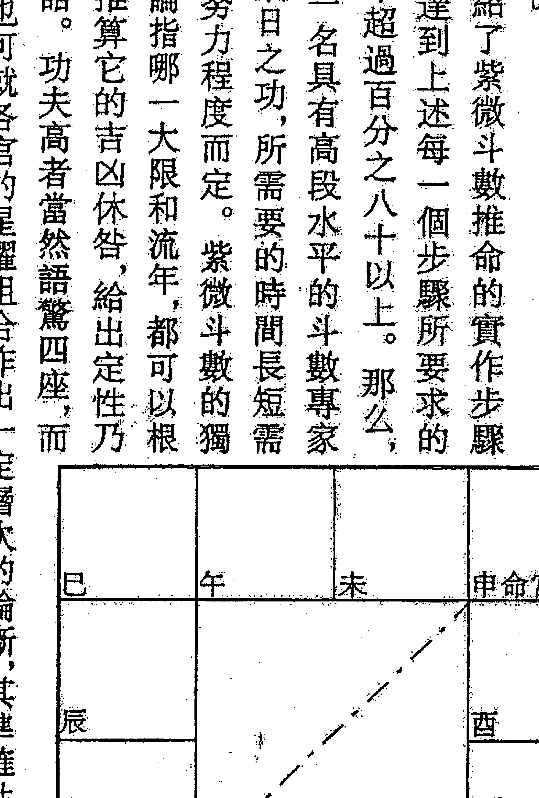

# 紫微斗数全集
### （六）流年篇 辅导与答疑
王亭之 著

## 流年篇 类道断答诀
## (六)紫微斗数
王亭之 编著
(办理班选用资料)

## 目录

自序

《卷一》事业篇

《卷二》开创篇

《卷三》考运篇

《卷四》流年篇

《卷五》财运篇

《卷六》婚姻篇

辅导与答疑

紫微预测法举例

副星星情详述

紫微命法提示

## 大家的美食
### 自序

传统习惯中，算命先生是一个介于天人之间不世出的人物，只有他们才配泄漏天机，透露求教者的生命痕迹，这种人不是神仙之流又是什么，翻开八字和斗数古籍，神仙论断、神仙事迹，到处充斥，暗示后代习命者如法炮制，才能修成正果。我曾经多次遇到一些镜头，迄今印象深刻。命盘排好（现在是电脑打出），我清清喉咙，「请问，想知道什么？」

动手书，其间数易其稿，最后再利用校对重读一遍，发现还算差强人意，敬请大家指正。去年夏天我忙碌异常，除了赶热闹写了《立委选战，鹿死谁手》外，选评注清朝八字学者命是那种模样，效法天壹宗智者大师拜经，期待技术分析早日公开，使斗数论命臻于完备。八十一年五月下旬出版《紫微论命不求人》，二十天之后再版，这是一件令人振奋的事，算是命理丛书一项新的记录，一些朋友告诉我他们是看了此书才恍然大悟原来斗数算希望藉此把斗数的推算提升到咨询的层次，足以公开讨论，甚至公开辩论。我们首度有系统的披露现代方法学的成果，这本书的理念源自《紫微论命不求人》，两书堪称姊妹之作，后者属于共盘推论，只要时间条件相同，结论并无差别，此书提供的是技术分析，利用输入法和定宫原理，分别别人事物的差异，堂而皇之进入论命的深层结构。

大部分会这样回答：「把你通通告诉我。」一部分则说：「把我过去发生的事情叙述一遍。」他们认为这是检证学者或算命先生功力的不二法门，遇往事迹，娓娓道来，高手无疑。但是他们碰到的是我，我通常会答曰：「坦白说，我什么都不知道。」

反应倒是可以预知的，他们先是大吃一惊，然后喃喃道：「为什么跟传闻的不同……有些人立刻露出鄙夷的神情说：「别假仙啦，谁不知道你段数最高，知道过去未来。」

「我赶紧声明没有那么厉害，否则早已随美国总统之邀，担任白宫军师了。有些朋友约我谈命，在电话那头交代说：「我先把生辰给你，有空帮我仔细瞧瞧。」我说来了再排，命盘的主人不在，那只是一张白纸黑字，没什么用处。他们偶尔还会这样亲切：「给你充分的时间观察、思考，断得更准。」我只好向他们道谢。我不好意思说我对各种命理结构已经了如指掌，只一眼，就能推断，那样有点自傲，让人反感。」

神仙论断的存在已是老太婆的棉被——盖有年矣，那种观念根深蒂固，任凭九牛二虎之力都动不了它一根寒毛，我何德何能，凭几本薄书就想拨乱反正，简直蜉蝣撼大树嘛。

- (一) 技术分析是条件式的，你必须告知某事，然后依照命宫原理进入系统，在命盘一个个的特定宫位中搜玄寻秘，依稀发现一些共盘无法推知的蛛丝马迹，换句话说，如果阁下三缄其口，或者生怕因漏了口风，被猜出内心的事，那么只好继续共盘伺候，所有的分析和结论必然符合所有同命者，在台湾，他们共有七十七人之多（平均人口数）。

技术分析跟铁口直断正好背道而驰，由于违反惯例，被江湖术士嗤之以鼻，毫不意外，我们认为算命跟医生诊断有异曲同工之妙，如果拒绝向医生陈诉病情，不是被下逐客令，就是引来兽医，只有后者的患者是不必说话的。就重要性而言，命运分析何其严肃，影响层面何其广阔，顾客却不屑合作，岂有此理。进行技术分析之前，有个重要观念必须确实体认——定宫，癸酉年开创的新业，必以西宫及三方宫位为起始点，缺乏定宫的概念，或者不知定宫为何物，便无法欣赏现代命理学者的神乎其技，而任何习命者、算命先生纵有通天本领，论命造诣已臻化境，假相而已。有些算命馆门庭若市，术士月入数十万甚至百万，论命方式不过是十二宫从头到尾讲一遍就拉倒，偶尔触及一些玄机，也是瞎猫刚好碰到死老鼠，台北好几位大师算一个命三十分钟，收费新台币三千元，时间一到，端茶送客，他一律讲解共盘，技术分析是啥，可能茫然，生意却好得不得了。《斗数疑难一百问答现代篇》记载，输入法处理的事项必须是可算的，否则即使条件齐全，也是老虎吃天，不知该从何处下手，譬如我们输入父母的条件，仍然不知父母自己发生了什么大事，输入子女的条件，仍然不知亲子关系如何演变，可见科技再发达，对造物者内在世界的了解仍是一片混沌，此时颇能体会德国科物理学家海森堡提出「测不准原理」的心境。他说，「被观察的现象始终是不可分割的，一个孤立自主的世界永远不可能存在。」

本书三十篇文字只是我业余论命记录下的一些雪泥鸿爪，在《紫微论命不求人》之后我答应另外写的一本书，过去像《现代紫微》、《紫微之路》，我曾试图在推论中演示类似的斗数论命的最高境界，那些论式一来未臻完善，二来有了选择性（选择取样），不如本书客观且有系统。这些年来，我思辨斗数禄命的历程，跟唐朝禅师青原惟信颇有几分神似。他说：「老僧未参禅时，见山是山，见水是水。既参禅后，见山不是山，见水不是水，等到有了歇脚处，见山仍是山，见水仍是水。」山水本无不同，所以不同者仅是修行者心境的改变。当然也有不少人认为我强调科学方法学，未免陈义过高，是不解东方玄学的特殊结构所致，现在的「悟境」不是进步，而是退步，似被层层魔障束缚着，不能动弹，无法看清事物的真相。偶尔反身观照，好像有那么一回事，希望读者也能思辨，让我牵着鼻子走。我近来常扮演着「命理终结者」的角色，许多人希望我评论其他命理学者的谈论，或者解释某算命先生为什么要那样说，以及看过的书又如何让他们迷惑。多数情况，聆听我的解析后，满怀欣喜，点头离去或挂断电话，更多的时候仍要舌战唇敝，大战三百回合。我从不指望我的意见被遵奉如仪，西谚说得好，「一个人的美食是另一个人的毒药」。（One's meal is another's poison），在阅下进行实验（付诸实现）之前，不应贸然肯定该方法或演算是确实无误的，那可能是害你的，这点务必记住。

### 卷一 壹华素鉴

#### 神明开香烟 一

- □我念的是企管，这种学科适格吗？
- □好像不太适格。
- □大学毕业后果想参加高考，因为收到入伍令只好打消，退伍前夕忽然接到朋友推荐，进入这家公司，近来生活安定，想重拾书本，不知考运如何？壬申年准备一拼，万一落榜，癸酉年卷土重来，你看这两年的运势如何？
- □目前大限在寅，环境相当强势，却是一步静运，什么事都是缓慢的，不急不徐的，不吉不凶的，虽不积极准取，却利坐下来读书研究学问。

+   - (一) 壬申年天梁禄在丑，大限兄弟宫，流年合伙宫，所有好事，与我无关，武曲忌在辰，大限福德位，流年开宫也，岁运对钱财大支显然产生坏的作用。该忌照入流年事业宫，干扰了考运，要加倍努力。
+   - (二) 癸酉年破军禄进入大限事业宫，这是二十五岁以后遇到的最好的流年之一(另一个是甲戌年)，旧业（几年苦读下来，可算旧业）大吉大利。忌星贪狼不照流年，不再受到干扰，吉祥如意，明年甲戌年也是。

考运吉凶跟中榜与否，没有绝对的关系，仍是实力要紧，这跟古人说的「先尽人事，再听天命」的道理是相通的。

| 癸巳 太阳星 火 | 甲午 破军 左辅 文昌 擎羊 科 | 乙未 天机 铃星 地空 | 丙申 紫微府 天曲 右弼 |
|---------------------|------------------------------------------|---------------------------|------------------------------|
| 壬辰 陀罗 武曲 | 丙午 一九六六年三月八日辰时           |                           | 丁酉 天钺 太阴         |
| 辛卯 地劫 天同 禄存 |                                          |                           | 戊戌 贪狼                 |
| 庚寅 七杀 25-34 | 辛丑 天梁                             | 庚子 天相 廉贞 忌 命宫 | 己亥 巨门 天魁         |

这种结构允文允武，看来精神充沛，只要运程不悖，发运是意料中事，没什么好怀疑的。依照传统，坐忌是冲破，可能造成哪些不适，遭遇哪些灾难？倒是值得研究，并成为析命的重点。

理论上说，坐忌既不肯定吉祥，也不必然兆祸，只是在朝垣的组合中显得有点奇异而已。朝垣格朝向帝座，成为幕僚，自己发挥不如为人作嫁；忌星感应后，一切价值都受到扭曲，变得有点暧昧莫明。

- □若能顺利考上公务员，以后仕途吉凶如何？
- □大限的禄星（先天的不算）照进事业，才算一步事业吉运，可为事业经营推波助澜。

虽然先天波动频仍，起储存不免，后天行运却是静运、动运交替——每隔十年就遇一次静运，似乎一缓一急，一跃一顿，无法永远保持静止或波动状态。

事业不逢吉运，完全靠运，借运使力，难免有些失落感。此生只有一个次吉运，那是辛卯大限，巨门禄从亥照未，这个未就是十年事业宫，虽是斜照，仍然带来一些吉意，助你老兄攻城掠阵。

庚寅大限与辛卯大限之间似乎存着一道无形的鸿沟，因为庚寅的事业到了辛卯之后，忽然中断，换句话说，三十五岁以后不再延续以前的旧业，不知怎么一回事。所幸庚寅以后的诸限不逢破事业的坏运（忌星侵入事业），可保平安无事。当然，次坏运仍是有的，壬辰大限武曲忌斜照事业，凶力略逊，造成小小的破耗。

- □家里的人好像帮我算过命，那是很久以前的往事了，我自己从未试过，因为不相信命运的轨迹那么容易被掌握进而观察出来，而相士骗财骗色的消息时有所闻，多少产生一些厌恶感，最近流行紫微斗数，每天午休时间，办公室内三五成群，展读命盘，成为一种休闲活动，我因为好奇，就请他们帮我排一张命盘，其中一位同事告诉我说，我不会久做一事久居一位，预言在不久的将来一定要离开目前的工不知根据什么理由？坦白说，我是有点野心，也许真的会卷起袖子跳出来开创，现在这种冲动并不大。请问，同事说的那种机率究竟多高？

> □命理有个经验法则是这样写的，『影响事情成败的外因愈多，命理所能掌握、理解的就相对愈小。』不是什么事都能推论，所有的推论也非客观到不能质疑。

此命格成『君臣庆会』，虽是朝垣，仍有领导统御的能力，群策群力，缔创伟业。羊陀照耀后增强波动，生长周期的曲线起伏大，历程中充满变数与挫败意识。这种人明显的充满干劲，积极进取，富于冒险犯难，不易被环境打倒。辅弼照入，足智多谋，乐与人为善，昌曲有文学艺术方面的修养，都将是丰富生命的动力。忌星自坐，内心则始终不能平衡，要求甚高，近乎自我折磨。羊陀照命的人，多半有笔如刀，有舌如剑，往专技方面发展，成就非凡。

> □有朝一日水到渠成，非跳出不可，我该往哪个方向发展，才算适性，并且较无失心？
> □忌星牵引煞星袭击命宫，这种人心性浮动，内外相应，从事波动、更换率或淘汰率高的行业，才能无咎。这些行业的活动力都很强，充满投机，大起大落，成败迅速，包括推销、中盘批发，以及所有的技术行业都算适性。羊陀昌曲联结，有艺文的内涵，潜能释放，转化为生命力，成就将更惊人。

- □同事说我的财宫紫微、天府加弼曲，构成一个巨大的命格，乃是天生的富命，但我这今上班听差，领的是死薪水，台湾俗话叫『死猪仔价』，何以致富？
- □那些同事的论断有误，正统命理可没那种说法。
- □那么我何时走到财运，可以发点小财过过瘾？
- □辛卯大限巨门禄守财宫，进财顺畅，是一步不错的财运，从事买卖，将本求利，当有可观的钱财进帐。四十五岁以后的诸运都非财运，无法靠运获财，其中壬胡大限武曲忌斜照进入财宫，有点小破。继续任职，再好的财运都不过是神明闻香、欣赏鲜美供果，看得到享受不到。
- □文昌忌进入田宅宫，库破，还指望发财吗？
- □忌在大限田宅，主三种征兆，一是经常搬家，居无定所；二是经常出差、远赴外埠；三是库破，无法囤积。应在何者，或以何者为重，并无定论，端视呼应的方向而定，其中轻者是出差频仍，四海为家；对生意人来说，库破主财务结构脆弱，可能周转不灵，万一营运失策，将导致破产跑路。
- □既然无法累积，这样的富庶岂非只是建筑在沙滩上的阁楼？
- □那也不见得。

财宫兴旺，钱财流通顺利，从事商卖，利润可观，既然如此，财为什么还会流失？答案也许是扩弃营业、添购设备或转投资。

#### 三

+   □如果三十岁之前成家，是否仍会二婚？
+   □谁说会有二婚？
+   □那些同事说的，他们认为我的妻宫杀破狼加煞、昌贪恶格成立，婚姻有败，趋吉避凶之法就是我必须拖到辛卯大限才能成家，此说是否可信？
+   □好确实是个有趣的推论。

庚寅大限是旺限，环境壮阔，禄忌未动，婚姻静止，若想成亲，还须别人帮忙。辛卯大限巨门化禄在亥，这个亥只是财宫，利财，但仍未照妻宫，情况跟前运略同。但是讨论婚姻不能只看一个人的命盘，万一配偶的星曜已动，还是结得成婚的（我被动而对方主动）。此命运婚吉祥的理由是事业心盛，太早成家，婚姻容易成为绊脚石，最好等到奋斗完成，进入辛卯大限，就更理想。

+   □妻宫强旺，太太凶悍，可能娶到一只河东狮，那岂不是惨兮兮？

社会科学探讨的是人和社会的关系，因为无法重新来过（重复制作），因此只能假设支持的证据。就命理而言，夫妻宫的作用不在于预测对象的家世、长相、健康以及各种相关状况，因此断言会嫁娶怎样的对象，只是猜测，没有认知的意义。

妻宫杀破狼加煞，冲激甚大，对方也有强烈的副业企图，希望自己的一片天空，三十岁以后才会逐渐稳定，并考虑婚姻。我们的假设是，在她奋斗告一段落之前就急着迎娶进门，她必心有未甘，婚后问题层出不穷。我们曾经多次发现类似的结构大学一毕业就迫不及待走进厨房，生儿育女，并不十分称职，后悔早婚，但为时已晚。

- □当兵期间认识一个女孩，她是我妹妹的同班同学，属牛，大概是一九七三吧，你看她适不适合我？

因缺乏命盘，只能就刑克的部分加以探讨。癸丑年是对你老兄个吉凶参半的年次——

她也许会尽情爱护、照顾你老兄，满足你的大男人主义，可是一旦发生纠纷而无法解决，说离就离，毫不留情。

- □我现在又有一个对象，一九六九年生，在生意场合认识，约会过几次，双方的感觉都还算满意，如果跟她成亲，成败如何？

娶己酉年这种女孩，可以帮忙做事，业，夫唱妇随，她也巩固了你们的婚姻，跟从前那个癸丑年不同，万一发生不适性而想要脱离，比登天还难。这种女人花钱很凶，会花掉你半生积蓄，如果想要个有钱的老婆少奋斗几十年，似乎也不可得。

#### 四

(半年后) ，他来南部公出，抽空到我的工作室喝茶，十分钟后从公事包内掏出一张折得快要稀烂的黄纸。

- □有一次回乡，无意中找到祖母当年请人帮我批算的八字命单，母亲回忆说，那是我弥月不久，我乡村一名执业术士批算的，上面记载我命中缺水，必须往北发展，并从事跟水有关的行业譬如水族馆、海鲜餐厅或在航运公司任职之类，才能补先天之不足，是否可信？其他方面又显示了什么？

口我稍涉八字，可以稍微谈一谈。

丙午 此命以日干庚为元神（自我），由于地支找不到另一个金做为根基，因此天辛卯干三金（辛庚庚）只是虚浮，像浮萍那样四处漂流，依八字学的原理，此时庚寅 必须放弃自我，向局中最旺的五行（水、火）投降，术语叫做从财官格，由庚辰 于五行集中，遇到好运冲发，往往一发如雷。

八字禄命观念并非缺什么就补什么，行业选择、财物获取的方向也是那些。五行只是抽象符号，必须类化，才能使用。理论上说，这种命因为七煞透出，当以追求社会地位，建立个人声望为满足，能贵不能富，或说贵比富易。七煞被合去（辛与同伴作合），则有中途改弦易辙之象。

- □祖母还说，那个算命先生说我一大头壳，娶某无竹壳（不一定），究竟何义？
- □我也不知何义。
- □祖母曾经叮嘱母亲，我的八字缺水，带了『水关』，严严禁我去溪流戏水，我迄今不会游泳，就跟此事有关。

什么叫『水关』？有什么作用？ 刚才说过，八字的推算，不是少什么就加什么，多什么就减什么，而是整体规划，全盘考量，有时候少了什么反而更好，多了什么则更差，江湖术士不求甚解，才派给你老兄如此一关。此外，这个八字所缺的水，跟我们饮用的自来水、溪边流动的水无关，不要误会。

- □长辈不许我吃牛肉，不知又犯了什么冲。

回江湖算命认为带魁罡的人吃牛肉破戒（约指破罡而言），黄俊雄布袋戏里那些先觉身上的金光体），福泽有损。魁罡是八字神煞，共有四个：庚辰、戊戌、壬辰和庚戌，日柱见之才算，你只是时柱魁罡，不真。但江湖术士不管这一套，只要四柱见到，一律坚持，你辩不过他们。

### # 七甲水田
### ## 一

> > □禄在父母宫可得祖产，田宅宫却被忌破，则是无祖产可得，这种主张岂非自相矛盾？

其实命理没有那种推论法，不要误会。

忌星侵入先天田宅，断定祖基无靠是可能的，这种人多半弃祖离家，在外发展，但是问题好像不会这么简单，因为一个人要不要外出，是可以选择的事，这里只隐约透露像你老兄这种人留在故乡宛如虎落平阳。

就亲情缘份而言，煞星不入命宫三方，必入六亲之宫，阻隔其间的关系，所以这是一个十分孤高而冷峻的命格。即使如此，禄在父母，暗示将把一生中最好的东西献给尊亲，孝道是无穷尽的，即使早年因为家境穷困而疏于照顾，长大后也愿意赚钱奉养他们，善尽人子之实。

> > □我到底能不能获得祖产？
> > □为什么不知道。
> > □为什么不知道？

先天田宅象征祖居和祖基，前者具体，后者抽象，不论前后，都由许多人（所有的亲族）共用，因此无法确切指出有无或多寡，其理甚明。

| 乙巳 陀罗 天梁 | 丙午 七杀 | 丁未 擎羊 | 戊申 廉贞 四十三-五十二 |
|---------------------|--------------|--------------|------------------------------|
| 甲辰 文曲 天相 紫微 | 一九四七年 丁亥 十一月×日子时 | | 己酉 火星 天钺 |
| 癸卯 巨门 天钺 | | | 庚戌 铃星 文昌 破军 |
| 壬寅 左辅 贪狼 | 癸丑 太阳 太阴 禄 | 壬子 右弼 天府 命宫 | 辛亥 地劫 地空 天魁 天同 |

命中无煞，说他是好命人，保证不会错误，但不能像传统命理那样膨胀为荣华富贵，唾手可得，否则保证就没完没了，在漫长的生命旅程中，任何人都不可能完全避开灾难，一旦遭逢，抗拒起来，也许就要大费周章了。

现代人欲望高，受家庭和社会环境影响，多少有点非分之想，保有一两点煞星，作为竞争的动力。这种人缺乏进取的豪情，如何在社会中安身立命，确保令人担忧。

### 過不再發

得不得祖產顯然屬于特性，意思是因人而異，無法使用共盤追蹤，若執意要推，至少還須輸入父祖的條件，否則我們推斷你老兄在第三運也就是二十八歲那年獲得父親遺留的七甲水田、兩棟房屋，那麼只要生辰相同，鐵定在同一年限獲得同樣祖產，這是否違背了邏輯推論的規則呢？

□有個業餘朋友說，我在己酉大限因為武曲祿進入田宅宮，四十一歲丁卯年會得遺產，數目不小，我半信半疑，過了半年也就淡忘了。沒想後來居然成真，這又怎麼說？

□仍是剛才那句話，必須肯定所有同命者都在那年獲得遺產，才能確定與武曲祿進入田宅宮有關，否則只是偶合(偶然符合)。

#### 二

我自己摸索學會斗數，這中間也給很多人算過，業餘執竈均有，一些算命先生堅持我的命格巨大，不發運沒有天理，有人認當富貴雙全，因為紫府坐命，三方不見一煞，符合古代貴顯的條件，但是而在我現在只是一家民營銀行的襄理，距發達似有一段路程，問題的症結究竟在哪？

符合貴顯就會貴顯，我們可沒這種說法。現代命理的要求比古代嚴苛很多，認為除上述條件之外，尚須許許多多不同因素的配合，職位愈高，相對條件愈苛，盡很多人冒着頭破血流的危險，拼命往里面擠之故。

古人論命常在有意無意間將命理與現實人生的關係簡單化，像一機巨居卯，位至三公一文桂文華，九重顯貴一、一朝斗仰斗，爵祿榮昌，現代人隨便瞧一眼就能判斷那根本是不可能的。

□「君臣慶會」既然都不足以言貴，該怎樣的結構才能顯達？

□襄理已是高級主管，說是「君臣慶會」之福，一點都不為過。 有吉而無煞，傾向文職顯貴，在事業上力求表現，締創彪炳業績，較無意外。 由於具備了發達的條件，當比一般命格容易貴顯，追求社會地位，建立個人聲望，宛如桌上拿柑。 煞星遁形，優點是可以免除肉體與精神上的煎熬（通常也會拒絕接受煎熬），一般世俗所盛讚的「好命人」或「有福氣的人，但缺點更多，冒險犯難、怒犯天條等霸氣，將一無所有；相對的只能蕭規曹隨、「歌德派大將」，缺乏煞星也無法學習專業技術和特殊技術，只能從事一般行業。

□我辦理的業務大部分是放款，工作煩瑣，沒什麼成就感，將來可能轉業嗎？

□紫府都是帝座，坐南帶會北帶的人極易幻想他就是皇帝，無論存乎於心或是形之於外，都給人一種高高在上、君臨天下的感覺，故性格難免桀傲，手段難免高壓，不管任職自創，都會取法乎上，律己苛人。

不過，這樣的結構仍以任職為佳，在大衙門奉公，循序漸進，多能發揮所長，升到一個不錯的職位，自創力量有限，格局大小，浪費生命而已。

□如果不靠算命，我們憑什麼方法可以獲知運勢的強弱？

回其實每個人都有預知的本能，只不過受到慾望、貪念和各種現實環境的污染、覆蓋，才慢慢消失。举个例子：帮别人猜六合彩号码，一定中奖，可是自己签注，一定不中。

那是因为有了欲望（得失心）后，预知能力跟着消失。

佛教的天人跟道教的神仙类似，他们因为修福而生在诸天，等到福报结果，仍会依照个人原有的业缘，天人福报将尽，会出现这五种衰相。

- (一)头上花萎。
- (二)腋下出汗。
- (三)衣裳垢腻。
- (四)身失威光。
- (五)不乐本座。

十几岁前自杀身亡的日本作家三岛由纪夫生前出过一书叫《丰饶的海》，其中收有《天人五衰》一文，描述的就是上述情况。一个人的旺运已尽，衰运即将到来，也会逐渐发生天人一样的衰相，稍微留意，定能发现。

> □我们又不是天人。

不必如此妄自菲薄。在佛陀的心目中，每个人都是一个尊贵的佛。

#### 三

几天以后，我们又有机会讨论他的命运，仍是他问我答。

> □戊甲大限诸星吉祥，算不算一步好运？

囗斗數的吉運泛指祿星（大限化出）進入大限三方諸宮，尤其事財二宮，因為那是一般人奮鬥的目標。從整個運程的消長看，好運來得極早，辛亥大限就遇上事業吉運，巨門祿在事業宮盤踞，讀書考試，順利無比；過此，則有連續二十年的平運，一切呈靜止狀態，即今有什麼重大事項發生，也是別人的牽連。

戊甲大限是個動運，后勁很足，可望發揮所長。

囗戊甲大限貪狼祿在遷移位，古書只說「化祿遷移位，發財于遠郡」就拉倒，我一直做內勤業務，呼應不到祿的吉祥，還算不算好運。

囗當然算好運。此限結構甚旺，沖激力大，貪狼祿在遷移位引動，外緣佳美，往外發展的行業多能順利開展，只不過門市與內勤未能充分呼應，好運像是飄在天空的雲彩。

天機忌侵入健康宮，體能受到干擾，還望善自珍惜。

囗丁未大限太陰祿仍在遷移，與目前的這步大運有什麼異同？

囗其异有二，一是命無主星，自主性弱，外境的作用力大，常受環境的影響而改變初衷，二是巨門化忌進財，有損財、無端破財等情。其同只有一，祿在遷移，外出獲利，人際關係吉祥，人緣大好。

囗我在己巳年（一九八九）調升一次，升到目前的副理，此年事業宮（在酉）無星，本弱，為什麼還會升官？不該升而升，是否暗示以后還會再動。此外，你看我何時升上經理？跟總經理寶座有緣嗎？

□升官的事跟個人的命運有關，但並非必然有關，此事尚牽涉許多外境——老板，包括各單位主管）的支持、個人的努力，都足以左右，顯非個人微薄的力量所能承擔，因此命盤上不一定顯示升官、貶謫的各種軌迹。

□壬申年政府開放銀行民營，有個熟人想拉我到一家新銀行，條件是給我當業務經理，那是一個肥缺，但壓力很大，我膽子小，幾度細思量后，終于放棄，還被同事冷嘲熱諷一番呢。如果我到那邊去，前途會比這里亮麗嗎？

□從本命看，這種人沖勁不是很足，新開的銀行急需沖刺，沖起來會倍感艱辛，容易產生水土不服。

從運勢看，目前的運程很強，可以考慮。不過，壬申年武曲忌就在流年的事官，此年進行的任何一項新的轉變就是我們常說的「壞的開始」，未來的日子就不會太順暢，若真的有此意圖，不妨等一兩年后再說。

### 過不再發

一

口殺破狼因爲動蕩，所以晚發，例外的情況仍時常發生，譬如我這個命，甲辰大限廉貞祿在申，二十四歲起就走了好運，這種例外究竟是吉是凶？

囗可以視爲不吉，但不必然是凶。

關鍵在於殺破狼加煞需要現實環境的磨礪，一個人處在順境中，諸事順遂，談不上什麼歷練——只有在逆境中，到處碰壁才會反省，早遇吉運，顯然找不到歷練的環境。從另一個角度說，早發的人必受「發過不再發」的自然律所規範，中年以后無運可走，此后想要登峰造極，奈何時不我予。

囗不加煞的話，早發可望順理成章嗎？

> 囗原則上可以，殺破狼無煞（尤其還加吉），有如機月同契，耽于安逸，生命歷程欠缺沖激，早發晚發，便無差別。

囗我擁有那麼多异格，它們之間會不會相互抵消？因爲我曾經看過有此專家主張「祿多不吉」、「忌多不凶」。

囗貪狼跟火鈴陀分別構成的特別格局，那將產生無窮的潛能，開發出來，必能創造彪炳業勛。其中火鈴與貪狼會照，構成「火貪」、「鈴貪」武格，得以「威鎮諸邦」，從事專業并往外发展的行业，成就卓著。

火铃与陀罗会照，则形成「火陀」、「铃陀」异格，得以「威权出众」，可望在短期内出类拔萃，获得佳绩。

□忌星进入夫妻宫究竟暗示克妻，还是一婚不能到底？

阖都不是。

妻宫与事业对照，婚姻基石不稳，涉及事业，现象从婚姻引起，万一婚姻有败，事业也就别想发达。

□我确实有过一次婚姻失败的记录，这难道跟忌在妻宫无关？

阖应该无关，退一万步说，即使有关，也只是间接的关系，因为离婚牵涉的外在因素很多。我们只能说，你们这种人对婚姻本来就持有一种奇特的信念，一遇挫折，多半弄得玉石俱毁。

□我可能达到哪方面的成就？

命理属于类型分析，故无法量化，因此当一个人走了财运，我们只能说他进财顺利，可望经由贩卖而获财，至于进多少财，那是推测不出的；事业好运，情况一样，我们永远无法预言他们创几个事业，做多大的官，否则跟李达哲同一生辰的人都是李达哲，而王永庆的同命者也都是王永庆。

波动性强的命难耐枯燥烦琐的行政业务，多半在任职一段时日后跳出来自我开创，如此而已。好运来得很早，初出茅庐就是一步佳运，盖甲辰大限结构壮观，廉贞禄在事业宫内坐守，事业环境十分良好，无论上班、换业或者创业，都会顺利成功。乙巳大限是壮年期，天机禄从卯冲酉，这个酉也是大限的事业宫，继续挺进，二十年事业吉运下来，必有彪炳业绩。

乙巳大限忌星太阴进入丑宫，乃大限财宫，不利进财。命理学有个经验法则——「发过不再发」，经历一个高峰后，不可能再遇另一个高峰，此命早发，丙午以后便无运可走了。

说法相差未免过于悬殊。

口丙午大限是七杀朝斗，主「爵禄荣昌」，应该与发驳业，为什么反而变成劣运？

两种口「爵禄荣昌」只是一种假相，不要受惑。此限财源尽破，忌不会禄，见凶不见吉，只能墨守成规，贸然扩充，焉有不败者。

- （一）禄星天同在亥，乃大限的合伙宫，图利他人、照顾他人，帮别人发财而已。
- （二）忌星廉贞在申，这是大限的福德宫，此宫被冲，财源中断，不再是什么钱都赚得到的情况必不能免。

福德与财宫对照，自然也破坏了钱财支配的稳定性，此去十年浪费、损财以及开销大的情况必不能免。

若要新创，坚持不做老板（让贤），只站在协助的立场，把决策权交出，即可无咎。

#### 三

□我們的企業預定壬申年出走，轉進大陸，此時做此事，吉凶如何？

□大型、長期的投資多屬緩慢成長的行業，大環境必須佳美，才能維持，并立于不敗之地；遺憾的是整個大環境竟然不利從事這樣的轉變。 流年宮位在申，三方結構強勢，所以想做就會着手進行，但宮內的忌星（廉貞）是大限所化，信心不是很夠，其他有關祿忌牽引的吉凶分布如下：

- (一)祿星天梁在巳，大限的兄弟宮兼流年的子女宮，均與事業無關，不會帶來助力。
- (二)忌星武曲在子，大限的遷移宮，也是流年的事業宮，歲運相加，不就是一幅一出外做事不吉的景象嗎？

如果事業非由本人親自掌權，或者分幾個階段完成（今年之內不會全部完成），也許會出坑緩沖的機會——不會一下子就兵敗如山倒。 其實，甲戌年才是投資甚至進行各種改變的青年。

□未來的丁未大限命宮無星，顯系弱運，處在那種環境中，我還能做怎樣的踢騰？ 保平安可能，添福壽則有困難。

祿星太陰在丑，遷移宮也，人際關係不錯，從事推銷、中盤批發、國際貿易、業務代表等往外發展的行業，多有斬獲。 忌星巨門在卯，大限的財宮，與上一運略似，財宮受到干擾，賺錢不易，破財、損財以及被客戶倒債的情形，層出不窮，必須特別留神。

有些命書指出，田宅宮強旺、見祿，可以投資房地產，並可能獲得祖產，我有這方面的機會嗎？如果可以投資，何時適宜？

先天田宅宮雖然可以類化爲祖居，卻不在可算的範圍之內，因爲祖居由親族所共有，分家之後，本人能分到幾甲或幾坪地，必須輸入別的條件，並非每個人都無例外。

> 那種說法，不可盡信。

一個人能不能投資房地產，那是後天行運遭遇的事，宜觀大限田宅宮的旺弱，大致上說，此宮見忌，財物結構脆弱，從事鉅額投資，極易因爲週轉不靈而弄得血本無歸。

財源被破，大環境時時刻刻籠罩着損財的陰影，有動輒得咎之象，臺灣房地產的投資充滿投機，這種運程易被套牢，不然就是該賺的沒賺到，不該賠的卻賠了。

> 那麼投資股票又如何？我指的是短期投資，搶帽子那一種。

炒作短期股票不但需要技術，而且需要運氣，技術可以學習，運氣目前沒有。由於影響股市漲跌的因素實在太多，實非單純的命理所能掌握，完全交給命運，好像沒什麼道理。

財源弱勢，不是隨便投資都能賺的錢，最好守己守分。若真的對股票買賣感興趣，不妨利用中綫做短綫，不然乾脆放長綫釣大魚，可保無咎。

### 過眼雲煙

□我的事業宮是廉貞、天府和擎羊，從這三個星辰中，能斷我從事哪種行業？

行業可以自由選擇，也可以隨時更換，我不知道你願意做哪一行。就命理而言，事業宮的作用不是拿來推斷一個人該從事或曾從事哪種行業，而是診斷他做的行業是否適性，這是后斷；若是先斷，則提供一些適性的行業，以免走了冤枉路。

□其實我沒有別的意思，我既非沒有工作，也不是想改業，我只是想了解我這樣的命該做哪種行業才算適性，是否發揮了我的潛能。

我略諳斗數，有一陣子像發了瘋似的到處算命，有人指出我這個命應該是個女強人，擁有事業，但為夫操勞，福澤有損；也有人堅持這是一個破格，勞碌而終無所得，最后連我都懷疑我為什麼五十幾歲了竟然越活越倒退，不知哪根筋出了問題？

翻不知該如何描述的性格、根據命盤顯示，坐紫會府，結構壯觀，輔弼照入，格成「君臣慶會」，雖是女流之輩，仍具有領導統御的潛能，雄才大略，得以號召百萬雄兵一她突然笑著打岔說：「我連領導十個人都覺得困難重重。」二、成就一番事業，絕不是蓋的。

擎羊、火星會合，增強積極性和沖擊力，并與諸星構成兩個特別格局：

- (一)火貪格。古書譽此能「威鎮諸邦」，是個戰將格，獨當一面，開疆闢地。

文武兩種格局分別成立，若要分成主副，強弱該如何分？老實說迄今尚無定則，有人批評命理舞法適應多元化的社會，這就是證明，問題會那麼簡單嗎？

勉強分之，不是不可以，上班族感受君臣慶會絕對比火貪敏銳，反之大老闆對火會，火羊一類的格局將有不同的反應，我們能叫他們出示賦業，專長和社會地位的資料嗎？理論上是能的，可是這樣一來不把他們嚇跑才怪。

### (二)火羊格。

古書譬此能「威權出衆」，意指任何行業，都能出類拔萃，崢嶸頭角。煞星畢竟煞星，蘊含着強烈的挫折與挫敗意識，這種人一輩子不得安寧，鞠躬盡瘁，死而后已，不過也從中磨練了積極與韌性。若將煞星的本質誘發出來，也就是學習專業技術，并從事事業行業，將可一發如雷。若無技術，或只是一個全職的家庭主婦，那么內心波動，懷才不遇。

+ □吉煞混雜，有什么特別的作用？
+ □五吉二煞，文武皆備，文的成分多些，所以學習技術，多傾向于文，其他像詩詞歌賦，多少涉獵一些。文昌與貪狼形成惡格，有用非所學、不務正業的傾向，做事不專心，時時想改弦易轍，恐怕也是一生無法改善的缺點。
+ □忌星坐命，有什么現象？
+ □忌星有干擾、破壞，使之失衡的作用，忌在任何一宮，往往也是一生最無法克服、無法妥善處理的致命傷。忌在命宮，影響的是正常運作的心理狀態，始終有種與衆不同、標新立異的想法，他可能在參與的社會中稱霸，甚至征服了世界，可是唯一無法克服的頑敵，竟是自己。
+ □祿在疾厄宮，并照入父母宮，此二宮遙遙相對，相互感應，到底是健康的問題多，還是親情緣份的問題多。
+ □祿則有穩定、自信、享受的作用，祿在健康宮位，涵義最為模糊，因為健康具有相當大的個別差異性，換句話說，只要時辰相同，命盤便無不同，可是他們的稟賦却千差萬別，因此祿在健康的宮位究指何義，實在不知。

> □性格剛烈的人牝雞司晨，爲夫勞累，福澤不厚，是否有此一說？

□星曜過旺，性格剛烈，易碎易折，不知妥協，進而與人爲善，所幸煞不多，不會損人利己。命宮旺于夫宮（仍須三方結構一齊斟酌），確實有點牝雞司晨，妻奪夫權，爲夫爲家操勞，是跑不了的。

#### 二

> □我是護理學校畢業的，三十年前的護校生吃香得很呢，我目前在一家私立醫院擔任護理長，環境單純，工作也不艱巨，頗能勝任，雖換過好幾家醫院，就是未曾離開過護理，這是否跟命運相悖？

□由于忌星牽引煞星，整個命局呈現動性，從事的行業自以波動、技術性、不逆命格爲主，也就是活動力較強俗稱的『武職行業』，一般行業像行销、批發、業務代表和工程設計、施工等，一定可以發揮潛能，如果只是煩瑣的行政業務，極易產生倦怠感，也無成就感可言。

缺乏專長的人大抵只能做服務業，甚至爲人做嫁衣裳，并可能經常換業，而任何一種行業都很難做過五年。

> □曾有算命先生說像我這種坐忌的人最好從事破壞性行業，什麼叫破壞性行業？我們每天在醫院替人開刀動手術，這種工作能不能叫破？

□我也不清楚，最好詢問那個替你算命的人：

忌星的本質是破壞、干擾，使之失衡，忌星居命心理狀態始終處于不調和之中，苛己寬人，捨己成仁，還會長期似苦行僧的方法，虐待自己。但因心理狀態不易調和，所以要用學習新知來克服或滿足，從事創作、研究、翻案這些工作最為適性，除此之外，也需要宗教來陶冶。

□護理長已經到頂了，這是我們這個行業無法改變的宿命，不信命都不行。不過，我仍想了解我往后的運程如何，可不可能締創事業第二春？

此生最好的事業運當在第一大限甲午，廉貞祿在該限事業宮內，可惜當時太小，祿的吉力發揮不出，無法帶來實質的幫助，乙未大限祿星天機和忌星太陰都在事業宮內牽動，這十年的事業(包括學業在內)都是動盪的，時好時壞、時吉時凶，此時也許已經踏入社會，那麼可能連續換好幾個單位。過此的幾個歷程中祿星不再感應事業，意思是想靠事業的拱托來成事，比較不易達到目的。

事業背運在丁酉，這十年因為忌星沖破了大限事業宮(在丑)，使得一個人無不有效經營與職掌她的業務，受創最大的是創新，重大改變也是，蓋極易生變，愈變愈壞。處在波動過程中，即使上班聽差，也會常換老闆或職務。

#### 三

+ - □我這個命何時走到財運？
+ - □目前的戊戌大限就是一步如假包換的財運。這無疑的是一步強運，三方星曜甚旺，最重要的還是祿星貪狼從福德射入財宮，福德為財源，此去十年，發財終于找到一個萬紫千紅的春天，經營商賈，將本求利，十年下來，腰纏萬貫，儼然一個小富婆。繼續從公，這樣的好運一點作用也沒有。

祿在財而不在事業，仍感受一些吉力，護理長的寶座也許就在四十四歲以后才坐上。

+ - □忌星天機在已，這是大限的健康宮，體能受到干擾，極易疲勞，甚至感染疾病，我們一天到晚跟病患在一起，感染的機率更高，因此很怕受到波及，你看有此可能嗎？
+ - □命理對這類灾難始終無法找到答案，因此只能自求多福。

忌星所在也是合伙人的福德位（合伙宮在卯，已宮便成他們的福德宮，并射財帛宮），一時與人合伙（純投資），多遭損財惡報。因此很多人說，這是『朋友敗財之運』。

+ - □可以看出壽元具短嗎？
+ - □當然不可能，那是『命理程式的不可能（formula impossible）』。
+ - □許多算命先生批命批到某年某月，就嘎然而止，有的還會加一些曖昧的詞句，像『若積陰德，延壽一紀』之類，好像他是閻羅王，真的會準嗎？
+ - □但白說，命運迄今仍然無法讓知識分子理解，進而取得共信，其來有自。許多推論根本通不過邏輯學的檢驗，算命先生或江湖術士卻依然故我，你問他為什麼那樣推，他們多半答說：『天機不可洩漏。』其實命理只是一種推論，與天機何干？

在醫院上班，感染病菌的機會比一般行業更高那是一定的，平常多加防範，便能避凶，如果據此肯定一定會患病，必是宿命論者。

庚子大限天同化忌在丑，沖擊疾厄宮未，這個丑宮又是先天疾厄宮，先后天疾厄宮全部遭殃，尤其先天疾厄從祿轉忌，我不會在此限中罹患絕症，藥石罔效，然后魂歸離恨天。

#### 四

我們一直不厭其煩地述說一事，臺灣的命理平均人口數是七十七人，若以全球五十二億來算，那是兩萬人，這些人都將罹患惡疾，然后邀約共赴黃泉，你相信嗎？

很快就要交入己亥大限，不知道這步運程的吉凶如何？

己亥大限是機月同梁的組合，即使會照一干煞星，仍算平順，蓋祿星武曲和忌星文曲均不入三方，此去十年可以安穩度日，享一下福。晚年走這樣的運，相當祥和，算是好運。

祿在田宅，財庫充實，居家鞏固，忌在子女宮則破壞親子之間的感情，跟她們相處，不太和諧，也是事實。

晚年的物質生活會匱乏嗎？

> □此事涉及一個家庭或一個家族財務的興衰，無法一概而論，現僅討論個人運勢的消長，而不涉其他，從己亥，庚子兩限的狀況推測，應該不會，蓋兩步大運的忌星均不入財福二宮，破財的機會不高。

這一生最少有兩次發財的機會，過去的丁酉大限和現在的戊戌大限：

- （一）丁酉大限：太陰祿在亥，照巳，也就是從福德牽動財宮。
- （二）戊戌大限：貪狼祿在子，照午，也就是從福德牽動財宮。

> □財宮結構如此佳美，為什麼始終不發財？

□命理所有的祿忌牽照例需要呼應，否則仍不會發生所預期的效果。而即使走到極好的財運，若不經商，也不與人金錢來往（譬如放高利貸、跟會），運財童子仍將過門不入，有時甚至連手頭較為寬鬆都談不上。

破財的運限自然也存在著，那是丙申大限，廉貞忌從福德射入財宮，財宮受創，破財不免，所幸此時可能仍是上班族，最多應驗在財物比較缺乏，經常寅吃卯糧。

### 唯宜僧道

□廉破坐命，三方照入七星，算不算太強？命強的人據說注定性格急躁，福澤薄弱，終生勞碌；此外，還有哪些缺點？

□跟巨日人（居寅申）比較，這種星群剛好強三倍半，顯然太過，過猶不及，有違命理的中庸之道。古書說這種人『唯宜僧道』，意思是無法跟正常人一樣追求功名富貴，只好遁世，學佛修道。古代命學家也認為命局遭煞攻擊（煞星越多越烈），剛愎私用，容易犯上，無法考選功名，做不了官，顯不了貴，于是退而求其次，從事百工，往富庶的方向發展。

福澤的厚薄屬於宗教研究的範疇，命理無法推論，即使雙胞胎，祖德門風、生長環境無一不同，但是各人的『業報』不同，福份的多寡、厚薄便有差距，故為特性無疑，從共盤中摸索，那是沒有摸清門路。

□看過一本斗數古籍，裡面指出財宮的機梁主『好說』，暗示我當以口舌賺取生活之資，跟現在的職業性質不很符合，將來可能改行嗎？

□機梁是否表示『好說』（喜歡說話、好商量），我不清楚，清楚的是，財宮不是觀察將以哪種特定方式求財，而是研究此人的錢財觀念、享受程度、理財手段等等。像閣下這種命做個愉快的上班族最為篤定（如果環境許可，當然可以創業），財源來自下列幾個方向：薪水、傭金，并可能兼及一些不特定的外快，看起來不會橫發，當然也不會橫敗，屬于積富之人，也就是靠儲蓄和節儉致富。

乙亥大限天機化祿進入財宮，算不算一步財運？

許多大學同學在私人機構任職，也有人開公司做老板，他們在校成績并不怎樣，卻拜臺灣經濟起飛之賜，分別有了極好的發揮機會，紛紛當上董事長、總經理、業務經理，最起碼也是業務經理，只有我還在中間地帶力爭上游，每次開同學會，相形見絀，覺得很沒面子。

如果斷論老兄有老板命，豈非斷論其他的人都可能做老板，或者說，我有老板的命嗎？近來始終有人慫恿我跳出嚟，你看我適合當老板嗎？或者說，我有老板的命嗎？

那是宿命論者的謬論。老板不是天生的，每個人都可以依照他的意願或實際狀況，選擇投身任何一種行業，萬一做垮了，還可更換一種，東山再起。

就斗數而言，這個命由紫府廉武相（或紫相朝垣）與殺破狼組成，前者遇右弼，構成「君臣慶會」，這是文格，具有領導統御的潛能，得以群策群力，成就大業；后者見火鈴則為武格，利于武職顯貴，堪稱文武雙全。這種人天生的有點霸氣，做事積極有干勁，富于冒險犯難，與傳統的官僚系統有悖，在公家機構任職，層層受制，潛能發揮不出，只好困頓。

文格與武格之間，若要分個主副，究竟何者為主？何者為副？

□火贪、火羊利武，君臣慶會利文，故文武兼備，可春可秋。但朝垣是朝向帝座（紫微）從公自創，最好能跟着某特定人物走，成為他們的智囊或下游公司，從此扶摇直上。

#### 二

□有一次跟一個業餘研究者討論，他說我不配做內勤，因為『殺破狼加煞』主動，利動不利靜，并從事技術性行業譬如產品推銷、機械設計等等，才能發達。我是臺中豐原人，日前離鄉背井在臺北工作，經辦一般行政業務，這種枯燥無比的工作需要耐力，你看我要不要換業？

□羊陀火鈴星都是煞星，波動增強，一生似乎顛沛流離的日子多，恬靜舒坦的日子少，強烈的挫折感與挫敗意識必無日無之，雖然腐蝕了一個人的斗志，却也從中產生免疫力和鍛煉生命的韌性。煞星在現代又稱科技星，發揮在專業技術或特殊技藝上，成就卓越。興趣不高，不妨換業，趁現在還能冲刺，迅速改變生活方式，拖延下去勢必后悔莫及。

- □如果請調，我該調哪個部門？
- □往武職行業方向發展，較能得心應手。
- □我可以參加選舉嗎？
- □選舉分很多種，不知老兄要選哪一種？
- □當然是民意代表，縣議員、省議員或立法委員之類。
- □性格尖銳的人做民意代表，爲民喉舌，監督施政，必屬一流，肯定把政府官員罵得血壓升高，宿疾復發。煞星是致命武器，煞星多見，攻擊火力強盛，做在野黨的議員比執政黨要適當得多，因爲執政黨員有護航政策的責任，不若在野黨那樣肆無忌憚。
- □三十五歲以后總覺得內心浮動，開始對公私不耐，偶爾還會挑剔上司交辦的案子，弄得大家怒目相視，考績如何，可想而知。這跟丙子大限天同祿在命宮牽動有無關係？
- □丙子大限是機月同梁，強命走弱限，環境溫和，不妨坐下來深觀，統整并思考未來要走的路：此運有兩種主要現象：
  （一）財宮、遷移無主星，在這些方向發揮，困難度增加。
  （二）三方只見祿吉不見忌煞，穩定力強，信心十足，守株即可待兔，堅守陣地，以不變應萬變，動則難免會碰到許多心力無法解決的難題。

廉貞忌在子女宮，沖射田宅，若有什麼事項發生，必在這些方面。對生意人來說，田宅宮的另一層意義就是財庫，庫破則財務結構不佳，從事長期投資或回收慢的行業，可能虧到底，不能不防。

- □我這幾年內有沒有升遷的機會？
- □人事异動普受各種外境作用，不是個人的意志所能左右的，因此從命盤上無法確實掌握升遷的軌迹，這是事實，與功力無關。此限坐祿，穩定自信，其中壬申、乙亥這些年份

#### 三

- □未来十年环境的吉凶如何？这辈子事业运约在何时？
- □丁丑大限是先天事业宫，结构强旺，环境仍然壮阔，禄（太阴）忌（巨门）均未牵动，静运而已，适合定下来养精蓄锐。禄忌进入别人的宫位（合伙宫在年，忌在他们的财宫、禄在他们的迁移宫），好事坏事似乎全与我无关。

在本人方向，事业宫紫杀坐守，财宫廉破居中，都没什么破绽，弱势的是人际关系，外缘不佳，出外发展事业，无法得心应手。

丙寅大限才是事业佳运，天同禄从妻宫照射进来，为事业带来了花繁叶茂春天，表示老而弥坚，晚年仍然大有可为，坐享清福，还不到那个时机。廉贞忌在酉，健康之位也，体能必多起伏，应善自珍摄。

- □到这么晚才走好运，廉颇已老，不知尚能饭否？
- □许多人在晚年才建立彪炳业勋，然后一直掌权，直到驾鹤归西，备极哀荣，所以不必妄自菲薄——有人埋怨没有好鞋子穿，有人却连脚都没有，这个世界始终无法圆满。每步大运都有一个缘，不可能六十年内完全照命，也不可能完全不照命，因此没有一个人一辈子走不到好运的，只是早走晚走而已。

### 神仙論醫

#### 一

- □書上指出，忌在父母，定克尊親，對沖疾厄，則健康不佳，是否因此讓我成為標準的藥罐子，
- □克親雲雲，只是古代命理家、江湖術士的誤解，以為親情緣份可從命運中窺破，并能設法預防，譬如只要過房、當螟蛉子（童養媳）等等，注生娘娘就放你一馬。其實那些不幸事件只是特性，少數一兩個人所獨有，不能從共盤（或八字共程式）中推論，否則保證天下大亂，因為只要生辰條件相同，便無例外。

至于忌沖疾厄是否危及健康，我們認為未必。

- （一）斗數所有的星曜（包括大大小小一百多顆全部排上），仍無法涵蓋所有的疾病，譬如古代就沒有癌症、AIDS、多氯聯苯毒害。
- （二）一個人的健康顯與父母、祖代的遺傳有關，但命理無法掌握這方面的資料，即使掌握，也不知道該如何處理或分辨。

- □小時候我們住在鄉下，媽媽找附近村子裡一個瞎子算命先生批過我的八字，他說我的命太硬，不好養育，我確實體弱多病，父母曾懷疑我養不養得大，鄉下醫療設備極差，也缺乏醫護觀念，有事就拜神求佛，光是香灰、符水，不知吃了多少斤，高中畢業前后因為運動量增加，才逐漸健壯起來。從命中透析一個人的健康，確實了不起，請問什麼樣的命才叫太硬？是否跟坐天府會紫微這些南北帝星有關？

- □此命坐府會紫，三方宮位都見星曜，結構強旺，得以承擔重任，開創事業。煞星照入輔弼不照，「孤君」而已，性格孤獨冷峻，親情緣份不厚，內心孤獨，不喜熱鬧喧嘩，慣于單打獨斗，自我肯定，適于獨自從事學術研究。

根據簡單的命理結構就泄漏了一些獨立事件，該算命先生雖是瞎子，必是大羅金仙下凡，非我們這些凡夫俗子所能及。

八字祿命認為五行集中并構成特別格局者，比較容易沖發，但是這種命屬于偏枯，五倫有缺，無緣享福，成長期問，多灾多難，也就是臺灣俗話說的「歹腰飼」(不易養)。

不過，命理只能隱約看出一個輪廓，而無法一一指出哪些事項——太過具體，便成特性，有宿命論之嫌。

- □從算命先生的口中隱約發覺，我的福澤相當薄弱，勞碌終生，到老仍無法享福，這又跟見煞太多或孤君有關？
- □福澤一事極其抽象，其中的厚薄、有無，自然無法從共盤中窺知，我們偶爾提出，不過從眾隨緣，當做一種話題，並非我們獲得宿命通，足以觀察任何人的前世因緣。這類現象具有個別差異，常令科學方法學頭大，卻是宗教（尤其佛教）研究的主題。從命盤上我們只能隱約看出，煞星多見，耐力、韌性和攻擊力均強，禁得住無情命運的衝擊，也能學習專業技術，成為科技文明時代的寵兒。

#### 二

- □我念會統，目前在一家私人公司擔任進口汽車推銷，業績平平，卻深獲老板器重，不知是我能力不錯，還是外緣特佳的關係，即使如此，仍然覺得有股無形的力量在面前橫阻着，無法全力施展，關鍵也許在於我不適合做推銷業上。
- □這種命任職自創均可勝任，任職則不論公家或私人機構，若說有什麼缺點，必是不耐煩躁，一般行政業務難稱適性。

結構大的人本質上可以發展大事業，有朝一日卷起袖子跳出來獨立經營，是順理成章的事。當然啦，此時仍須運動，否則很難達到巔峰。

- □我對雕刻、陶瓷（手拉胚）很感興趣，大學時代住在一個寺廟雕刻師家里，耳濡目染，學會一些技巧，老先生曾經表示要收我為徒，并傾囊相授，但我的父母不同意，我也因為玩心未泯，不想沉耽于此，于是就放棄了，如今細思，覺得有點可惜，希望今后能騰出時間磨練，但推銷業務繁忙，占去太多的時間，不知何年何月才能走這條路？
- □技術分好幾種類型，可依個人的興趣選擇學習，讓潛能充分釋出，轉化獲福。大致上說，年輕時期不妨廣泛學習，二十五到四十之間以后才要求定于。
- □我的好運來得遲或速？

從運勢轉移的軌跡看，辛丑大限好運無疑，但終其一生仍以辛卯大限坐祿，做事篤定為最佳，只是事業遭到忌沖，常思變動，故吉凶互見。來得早，作用不大，過度動蕩則會疲于奔命，都是美中不足。

當然不是走不到好運就肯定庸庸碌碌，沒沒無聞，而是說在一般的運程中經營運作，艱辛備嘗，只能一點一滴累積。

- □庚寅大限很快就走完了，剩下這幾年還有開創的契機嗎？
- □庚寅是個靜運，整個命理環境呈現靜止狀態，一切緩慢進行，諸事安祥，若想改變甚至開創，一時間內動不起來，即使勉強動得，進度上也是拖拖拉拉的，需要時間的配合，壬申、癸酉都非吉年，甲戌可行，但立刻就要改限了，這點應該心裡有數。

大限祿星太陽在兄弟之言，為人作嫁，保證無慮，但不能跟他們合作，尤其純投資或主權由對方操控，因為合伙人的事業宮被破，事業做不起來。

#### 三

- □辛卯大限命宮坐祿，好運無疑，個人的意志足堪左右十年的局勢，但是忌星從夫宮沖射事業宮，尤其后者無星，此番受創，敗績顯露，一發不可收拾。如此一祿一忌，何者為強？可能帶來什么災難？
- □坐祿穩定，守株即可待兔，故一動不如一靜；事業遭忌，事業動蕩，常想換業。何者為重為強以及吉凶大小，端視呼應的範圍或項目而定，如果致力事業，顯然呼應了忌星的缺點，可能吃不完兜着走。

- □壬辰大限天梁祿在父母宮，應該沒有作用，但武曲忌進入財宮，勢將大破其財，中年以后經濟情況如此之差，豈非注定一輩子困頓？
- □那倒不一定。天梁祿在合併人（酉宮）的財宮（巳宮），自己做破財，幫別人忙反而得利，記住這點就行了。如果延續舊業，不但不敗，反而更上層樓，其中的差別，判若雲泥。

- □記得有人告訴我，我的財宮被陀羅、地劫占據，此二星對錢財的破壞力量最大，不發財的命理因素即在此，此說是否可信？
- □我想跟那些星曜無關，而與行運不遇旺財運，無法順利獲財有關。沒有太多的時間去追求物質享受，不會精打細算，這些現象正是生意人的致命傷。最好的財運應在辛丑大限，巨門祿進入福德位，財源廣招，照入財宮，順利來財，只是當時年紀小，作用不大。以后只有辛卯大限的祿星斜照財宮，其余都跟財運無關，想要發財，就會大嘆時不我予。

- □我在壬申年跟了幾個會，有同事的，也有鄰居的，還買了一些股票，其中一個已經標來用掉了，剩下的比較穩當，等需要時才標，你看會不會被倒掉？
- □此事牽涉其他諸多外境，還要討論。我們對外境了解不多，現在只就個人的命盤加以探索，海底撈針一番。

- （一）庚寅大限在錢財支配方面只是平運，沒什麼重大災難臨身，可以放一百個心。民間互助會的重頭戲在會頭，只要他穩得住陣腳，大概可以收到錢。
- （二）天同忌沖破財庫，財庫是藏財之所，財庫有損，不易聚財，辛苦聚集的一點小財，容易在頃刻間化為烏有，從事大型投資或回收慢的行業失策的機率高，一般小投資則沒什麼影響。

### 鞠躬盡瘁

（第一次討論，某日午后，在我的工作室内。）

- □這種命可能發達嗎？
- □具備了發達的條件，時機成熟，就可能發達。傳統命理主張擁有發達的命就注定發達，已被后代學者修正，認為還要許多外在因素的配合，這些因素或多或少，與發達的程度成正比——越在高峰，困難度越高，成功的條件也越苛，此外，還要走到強而有力的運程，趁勢鵲起。

就結構而言，老兄這個命紫相朝垣，輔弼相加，格成「君臣慶會」，擁有領導統御的能力，得以群策群力，成就不小，這也是殺破狼加煞，沖勁極強，尤其鈴貪、鈴羊、鈴陀分別成格，前為武將，得以威鎮諸邦，后為异路功名，在世間百業中鶴立雞群。

- □命宮諸煞會聚，幾呈六煞全彰的地步，主哪些凶兆？
- □毫無疑問的，煞星將帶來沖擊、煎熬與強烈的挫敗意識，煞星會照越多，那些現象就越顯著。但這種人干勁十足，勇于開創，敢于冒險犯難，多能异軍突起，只不過勞心勞力，難享清福，諸葛亮說的「鞠躬盡瘁，死而后已」，庶幾近之。小時候不懂得保護自己，常遭外傷，長大后則脾氣暴躁，精神苦悶，神經過敏。此外，還可能導致下列諸項事實：
  - （一）積極性和韌度均強，在高度競爭的社會立足，如魚得水。
  - （二）煞星隔絕六親的親情表達，故親緣不厚。
  - （三）學習專業技術或特殊技藝，潛能釋出，成就卓越。

- □二十五歲以后經歷兩個甲、兩個乙，甲的忌星是太陽，在父母宮，乙的忌星是太陰，在田宅宮，日月雙忌各在不同的宮位，請問它們各有什麼作用？
- □先天是先天，后天是后天，基本結構屬于先天，行運則是后天的事，兩者的關系似即似離，又即又離，常會混淆。如何界定，端視作用而定，一般而言，后天脫離先天是自然而然的事，包括祿忌在內，譬如如此命，不再管破軍祿、貪狼忌，因此日月在甲乙四個運程中化忌，我們只考慮當時的宮位關系即可，不必理會那是先天何宮，不然問題會變得很復雜；唯有如此，才能看清運勢轉移的軌迹，斷出吉凶榮枯。

乙卯大限：太陰忌的所在是大限合伙宮，若有什麼壞的影響，必在合作事業方面。

乙寅大限：太陽忌的所在是大限事業宮，事業的開創、經營與執掌，均呈不穩定狀態。該忌沖射妻宮，則危及婚姻。

乙丑大限：太陰忌的所在是大限健康宮，由于祿（天機）忌同宮，吉凶交錯，體能狀態起伏大，時好時壞，該忌沖父母宮，與尊親感情不睦，父母若已過世，則不呼應。

The request was rejected because it was considered high risk不克勝任而遭到調職，他們說因為甲戌年太陽忌侵人事業宮，那種論法可信嗎？

□顯然不可信。我問你一事，你是老板嗎？

□當然不是。

□只有老板才能對員工的調動為所欲為，這是常識。破軍不是『先立后破』，而只是一顆不帶任何吉凶成分的主星，不少習命者堅認該星主先立后破，那是望文生義。破軍祿進酉，這是大限妻宮，沖照事業，舊業今年大吉，若有异動，八成是好的動，或者動后必好。不過，動或不動的權力操在老板手中（即使自己積極爭取，決定權仍在老板），他點頭，事乃能成。此宮也是流年的命宮，對于各種現象，自信滿滿。貪狼化忌在丑，不能不注意。這個丑是大限福德，與財宮互通有無，錢財支配遭到破壞，跟人金錢來往，多遭損失，此年起始的事業有敗，是個『壞的開始』

### 爵禄榮昌

#### 一

> □我是閏五月生的人，對于該以五月排盤抑或六月，一直很迷惑，最近翻書還發現有些人指十五日以前用五月，以后用六月，你說何者為確？

> □答案是五月。老實說，此事已成定論而不必再爭論了，如果還有疑問，不妨各排一張比對一番。

> □我們那個時候還有夏令時間（日光節約時間），那么我應生于申時還是酉時？

> □這就要訴諸實際的印證了。

> □如何印證法？我性格急躁，做事欠缺耐性，大學念的是機械，畢業后學非所用，在一定私人公司擔任業務與行銷，除此之外，事業心蠻強的……。

> □破軍坐命會煞是典型的殺破狼加煞，并構成异俗，才有這種效果。酉時（請讀者自己排盤）生人命無主星，三方不見一煞，斷無如此現象。

> □古書說破軍主先立后破，我迄仍無那種徵兆，是古人說的不盡然可信，還是時機未到？

> □破軍主先立后破或先破后立，都是望文生義，缺乏實證的基礎，可以不必理會。此命的特别格局還真不少，格局均蘊藏着無限的潛能，開發出來，成就卓然，作用如下

|   | 乙巳 | 丙午 | 丁未 | 戊申 |   |
|---|---|---|---|---|---|
|   | 天天鉞梁祿 | 鈴右七星弼殺 |   | 地劫 | 左廉輔貞 |
| 甲辰 | 天紫相微 |   |   |   | 己酉 |
| 癸卯 | 地天巨天空魁門機 |   |   | 庚戌 命宮 | 陀火破羅星軍 |
| 壬寅 | 文貪昌狼 | 癸丑三十四-四十三 | 癸子二十四-四十三 | 辛亥 | 天同 |
|   |   | 太太陰陽 | 攀文天武羊曲府曲忌 |   |   |

有人問道，這個命昌貪和火貪，鈴貪混雜，會不會像化學無素那樣抵消、質變?我們的看法是，星曜結構是物理變化而非化學變化，不會產生變化，至於該如何分辨吉凶，以及貪狼見火鈴后，能否免除昌貪的惡性?請大家思考。

此外，紫相朝垣輔弼不照所形成的孤君狀態在火貪，鈴貪成格后，究竟增強還是減弱? 頗似的疑難，須先弄清，研究命理，才可望修成正果。

- (一)「火貪」、「鈴貪」武格，得以「威鎮諸邦」，開疆闢地，揚名異域。
- (二)「火陀」、「鈴陀」异格，得以「威權出眾」，在各行各業中出類拔萃。
- (三)「昌貪」惡格，暗示學非所用，不務正業，喜歡旁門左道。

鈴昌陀武算不算？

在命宮、事業、遷移這三宮中都是「二缺一」，所以構不成，財宮則會齊，因此有關的錢財支配、物資享受、理財手段，都有暴起暴落的現象。

我算不算是個心性復雜的人。

算。

#### 二

像我這樣的命若不跳出來自創，實在愧對天生如此一個大格局。但是我上班時間超過二十年，職業幾近定型，要我卷起袖子跳出來，我還有些徬徨呢，有朝一日心一橫，說不定會一頭栽下去，那麼我該往何處去？

朝垣是朝向帝座，仰望帝座，無論上班或是任職，最好找個直屬長官、上級單位，成為他們的心腹「智囊團、下游公司」，從此扶搖直上。還有一點，若是任職，在大衙門內奉公，循序漸進，多能發揮，小機構則宛如龍困淺灘，蓋命越壯觀，越需一個大舞臺供他驅馳，才能奔騰翻躍。

□我現在的工作穩定有餘，衝動不足，距飛黃騰達尚有一段路程，我該怎樣調適？人嘛，對未來總是有一分憧憬，我仍要問：何時才走到好運？

□好運不是沒有，不是來得太早，就是來得太晚，所以感覺不出它的存在。

（一）太早是第一運就走到了，辛亥大限巨祿就在事業宮坐守，讀書考試，一帆風順，文昌化忌在田宅宮，離鄉背井，負笈遠遊。

（二）太晚是必須等到甲辰大限才再再遭逢姹紫嫣紅的春天，廉貞祿在事業，經營吉祥，此時已六十開外，不知還要不要為事業操心，遲來的好運不算好運，蓋無福消受。

□我這個命很怪，一生經歷了兩個壬運、兩個癸運，壬的忌星武曲，在先天福德位，癸的忌星貪狼在事業宮，究竟有什麼壞的作用？

行運是后天的事，須從后天宮位著手，才能看清運勢轉移的軌跡，四十年間一共經歷兩壬兩癸，其中癸丑、癸卯的祿忌均未牽引大限命宮及其三方，乃靜運一個，也就是沒什麼特好特壞的事情臨身。壬子、壬寅就不同了，忌星武曲照會，祿星天梁則過其門而不入，故感受到的只是凶運帶來的諸多不順、運勢阻滯和強烈的挫敗意識。

壬子大限坐忌，內心浮動，不安現狀，難免影響事業一貫的運作。壬寅的忌在妻，婚姻前途備受考驗，感情溝通不良，常起勃谿，該忌衝擊事業，自然而然破壞了事業的穩定，重大抉擇或改變宜深思熟慮，才不致鑄成錯誤。

□財官『七殺朝斗』古籍指此格為『爵祿榮昌』，主橫發資財，我始終只是一個老實上班族，領的是死薪水，想發點小財都覺得困難重重，為什麼理論與實際相差這麼大？

□『七殺朝斗』只是星曜排列的必然性，不能列入特別格局，若要論格，財宮在午，它的三方是寅午戌子，照到火鈴與貪狼、火鈴與羊陀這些四處飛竄的星曜才叫格局，此外君臣慶會也算。財宮結構既壯觀且複雜，既見吉格（火貪、鈴貪、火羊、鈴羊、鈴陀），又逢惡格（昌貪、鈴昌陀武），表示既可橫發，也會橫敗。這種情形反映到現實人生就是一旦求財，獲得運助，多能頃刻致富，富可敵國，然后遇凶，一夕之間暴敗，敗得一文莫名。

這個命不發達的原因有二：

（一）走不到旺財運（大限祿星進入大限財福二宮），無運推波助瀾，想要獲取巨財，當然枉費心思。

（二）光拿薪水，不會發財。

□跟鈴昌陀武有沒有關係？

□略有關係。

從壬子到壬寅的四十年間，忌星（壬武曲、癸貪狼）只有武曲入限，但不直接入財，破壞力不是很大，壬子限忌星牽動二分，稍微嚴重一點。

□不走財運，當然不可能發財，如此一來，豈非跟擁有如此一個巨命的初衷違背？

□很明顯的，這又是一個命與運相互衝突的結構，必須認清命運，知所進退，才能無憾。

終生為人作嫁，雖然無法開拓人生，卻可保證無慮，不受命運愚弄。

□我能參加投資嗎？

□投資分好幾種，我不知道你選哪一種？

□純投資，因為我還要上班。

合伙官在午，他們的事業官在戊，破軍祿坐守，財官在寅，貪狼忌坐守，由此推知，由合伙人全權經營的事業只能得名而無法獲利。問題是開公司做事業，誰不想賺錢，因此投資下去的資金連回收都有困難，還指望他們賺錢分你老兄一杯羹嗎？

□癸丑大限祿忌均未牽引，吉凶顯然都發生在別人身上，但此中仍有些許差異。

□壬申年初我投下了一百多萬在小男子經營的一家玩具公司，專門外銷，看來是凶多吉少。

□此年天梁祿在巳，這個巳正是你老兄的大限事業宮，量是這樣的吉祥合伙人卻感受不到，相反的武曲忌在子，這是合伙人的遷移宮，外出宮位受阻，外銷生意發生什麼困難，不卜而知。癸酉年貪狼忌照入他的財宮，冰上加霜，不知能不能拖到那個時候。

我使用閣下的命盤討論別人的事，不夠客觀，也許小男子正在走好運，財源滾滾，發得驚天動地，這種事是可能的。

□那麼今年投資的環境是否好轉？

□癸酉年破軍祿與貪狼忌均未照入歲運，靜年而已。這樣的吉凶分布，顯又與合伙人有關，若有什麼事件發生，八成在他們身上。

### 生死事大

一九九一年四月中旬，我們幾個朋友到日本看廟，在東京偶遇臺灣去的陳小姐，她在那裡念書並且就業，當天晚上，我們坐地下鐵到橫濱中華街吃料理，從車站出來，天空飄着蒙蒙細雨，突然想起『長崎今夜又下雨』那首日本演歌。任憑雨點打在頭上，在昏暗的街道上躑躅而行，燈火也朦朧，雨花也朦朧，那種淒美，頗難描繪。我一邊款步，一邊跟陳小姐討論命運，在異國的雨夜里，另有一番風味。

> □我念藥學，獲得碩士學位，目前在日本一家規模不小的藥品公司上班，迄今還在懷疑是否適性，你看哪種職業比較適合我？

- (一)學的是一套，用的又是一套。
- (二)每一次變換行業，無法銜接——無法延續從前的經驗，造成經驗的浪費。

> □文職行業包括藝術性工作嗎？譬如藝術創作、美術設計，或專指文學、文書而言。

命盘表格，包含多个宫位及星曜分布，如：
- 天機忌 (丁巳)
- 擎羊、紫微 (戊午)
- 天機 (己未)
- 破軍 (庚申)
- 陀羅、左輔、七殺 (丙辰，命宮)
- 一九五八年一月×日戌時，戊戌 (中央)
- 地劫 (辛酉)
- 天梁、太陽 (乙卯)
- 右弼、天機、貞 (壬戌)
- 文曲、天相、武曲 (甲寅)
- 地空、鈴星、天魁、巨門、天同 (乙丑，35-44)
- 文曲、貪狼、祿 (甲子)
- 火星、太陰 (癸亥)

這是一個特例——我們原則上不提供特例，以免讀者誤以爲命題都是預先設計的，只符合她一個人而不再具有普遍性。

她提出的每個問題都很新鮮，一般論命場合很難遇到，我們發現人其實是很脆弱的，許多事情原本可以透過經驗加以處理，竟然要求諸其他層次的知識協助，似乎優柔寡斷，從命理結構看，她一點都不像是這種人，又是怎麼一回事。

□大概不必過度波動、出賣努力，一天到晚東奔西走的工作，都在文職範圍之內。藝術工作若是類此，文職何疑，不過設計、施工之類必須敲敲打打，則是文武兼備。

□在公司機關層層節制下任職較能發展？還是獨立自主較能發展？如果我不到公司上班而專職學術研究，是否可行？

□這個命擁有領導統御的潛能，需要一個巨大寬廣的舞臺，大公司空間大，如魚得水，小公司則宛如龍困淺灘。一般而言，外境的組織越健全，越能凸顯自己高超的能力，自尋發展，應大處着眼，接受較高的層次或艱巨的題材挑戰，學術研究本身就是一件苦差事，須有殉道的精神，全心投入，方以致之。

□未來二十年的事業必然有強有弱，有起有落，我該如何面對？

□無論吉凶，任何人對于他的困境都要勇敢接受，逃避一輩子，終究不是辦法。有關運程的得失消長，預推于下：

- (一) 癸酉年起轉入乙丑大限，這是一步弱運，蓋財宮、遷移均無主星，這兩方面比較無力承擔。祿星（天機）在事業，忌星（太陰）在夫宮，遙遙相對，事業見祿，經營執行，通暢無阻。忌星出現，定性動搖，偶爾會出現錯誤，因而想要換業。該忌從夫宮射出，專業的挫折八成與婚姻有關。
- (二) 甲子大限是旺運，也是此生最佳事業運，廉貞祿從夫宮照耀事業宮，眼前運大異其趣，這是婚姻造就了事業，若無婚姻，則只應驗在單純的事業經營上，庇蔭吉祥順利，吉力略遜。

#### 二

太陰忌沖破田宅宮，居無定所，不是經常喬遷，就是不時出差、出遠門。

+ □我是遲婚的人，是否命中注定遲婚或失婚？

+ □婚姻是一種選擇——每個人可以自由選擇對象，當然也可以選擇要不要結婚。婚姻絕非命定，否則雙胞胎將同時成親，而其中一人離異，同命者將無一倖免，天下不大亂才怪。

婚期不可推算是因為推算婚期之前，須先滿足一個條件，就是理想出現了；可是無論就命理或就現實而言，這一半的出現都是不規則的——有的時間一到，自然現身，有的則杳如黃鶴。因此肯定某人該在何時成家，只是憑空暗示，讓人高興而已。目前的甲寅大限就是適婚年齡，廉貞祿雖不直接照入夫宮，但已牽動整個結構，紅鸞星蠢蠢欲動，對象也升火待發。

如果拖到乙丑大限，太陰化忌沖破夫宮，理想對象遁形，出現的多半鴉鵲鳥，讓人泄氣。但這種情形並不表示找不到對象或已無婚姻可言，而是忌諱一見鍾情，然后閃電結婚。

+ □若能結婚，結婚是愉快抑或悲慘？

+ □婚姻的成敗必與配偶的良窳有關，必須輸入他的條件，才能推算。愉快或悲慘，又視兩人如何經營婚姻，無法一概而論。

這個命的夫宮結構佳美，紫府朝垣、右弼照入，格成『君臣慶會』，同樣具有領導統御的能力，機緣成熟，往往成為棟梁（公司裡面的中上幹部，未來的領導階層等等）。但這種類型多半願意做個上班族，響往安定的生活，有幸配到這樣的男人，鶼鰈情深，白首偕老，應無問題。

□所謂『紫府朝垣』，系指對象而言，或是我自己？ □批對象而言。 夫宮只能描述或描繪配偶類型，后者譬如有哪種性格？對婚姻（家庭觀念、兩性關係）抱持着怎樣的觀念？婚后會不會受到風吹雨打而影響到穩定等等。但描述是一回事，事實又是一回事，因為對象可以自由選擇，選不選得到描述的那種類型，誰都沒有把握。 所以古人說『得之，我幸；不得，我命』，不是沒有道理。

#### 三

□一九九二年外出不利，那么往后延一年，是否吉祥？

□壬申年武曲化忌入寅，流年遷移宮也，外出官位見忌，俗稱沖破，肇凶不肇吉，旅游、遷移難稱理想。到美國念書將是一個『壞的開始』，有許多預想不到的難題出現。癸酉年不再逢忌，而流年田宅逢破，外出是順理成章的事。

□未來若改行潛心研究佛學，可算我的事業嗎？我能倚此維生嗎？

□修行是一種工作，也是一種適合投注畢生精力的事業。

修行的目的在于解脱，佛陀說「生死事大」，人間一切有形的成就（富貴功名）很快就成為過眼雲煙，《金剛經》也說，「凡所有相，皆是虛妄」，隨時拋弃可也。修行不一定要出家，因為解脫（證得涅槃）不是出家人的專利，在佛陀住世的時代，維摩詰的境界與佛同，他只是一個在家居士。

歷史上有兩個人值得佩服，一是釋迦牟尼，一是弘一和尚。前者曾經是個太子，擁有享受不盡的榮華富貴，却毅然弃世，尋找另一種層次的生活方式，终于悟道創教；后者是留日藝術家兼文學家，在三十九歲聲望如日中天之时，放棄財富，從事南山律宗的研究。

人總要放棄一些世俗的東西，才能追求靈性的覺悟，好像杯子，必須空着，才能再倒進淨水。

工作與修行魚與熊掌不能兼得，實在讓人困惑，此事最后仍須抉擇，一些朋友的看法僅提供參考。

- （一）藍吉富老師和李元松大師的意見是你不宜再過一般人的生活，包括上班、結婚在内，那只會徒增痛苦；換句話說，最好能夠追求大家不能追求或難以追求的事物，譬如從事學術研究、佛道靈修等等。除非經濟條件不允許，必須努力賺錢，以便買米下鍋。
- （二）我雖推算了婚姻的得失，在現實環境的考量下，仍要建議你從婚姻的枷鎖中解脫出來，尤其目前的心境無法正常面對婚姻；内心徬徨疑惑，始終有股化不開的悲憤，選擇錯誤的機率將高得出奇。
- （二）若要修道學佛，臺灣無疑的是個理想的地方，不然直接飛到印度、尼泊爾或克什米爾梵行幾年，當有所成。完全拋開俗務，脫離世俗生活，將比去紐約、巴黎進德修業，獲得更大利。

#### 四

□我可能生幾個子女？他們各自的運勢如何？身心健全或者殘障？哪年懷孕較吉？

命理因爲受時間限制（兩個普通時化約爲一個命理時），無法達到一個時辰一個命以及「一個命造就一個人生的理想境界，因此許多特殊事項無法透過共盤加以討論，得出一個結果，這是程式的不可能，與個人的功力無關。我們曾將這種理念透過一個普遍定律加以規範——「凡是一個人的自由意志可以選擇或決定的事項，才能推算」。否則便是不可推算，六親（父親、母親、兄弟、姊妹、配偶、子女，統稱六親）緣分以及他們個別的榮枯，均非自由意志所能詮釋，必在這個範圍之內。

退一萬步說，如果利用輸入條件法隱約觀察，配偶這一條件必不可或缺，因爲嫁給甲乙丙丁其中一人，得出的子女數、性別排列，必然不同。我們也許可以經由命理的軌迹比較出何年懷孕，母體可以無礙（例如流產、妊娠中毒等事），但目前尚無對象，這樣的預測沒有實質的價值。

- □乙丑大限忌星進入先天疾厄宮，可能罹患什麼疾病，還會有哪些明顯的傷害？
- □此去十年體能的干擾最強，過來是癸亥大限（五十五歲以后），你是藥學碩士，當然比我這個門外漢更懂得如何珍攝了。

命理無法預斷疾病或症狀，因此究竟罹患什麼病甚至何時患病，實在無法預知，即使忌入此宮，也不能肯定什麼一命理不推測病情的原因一一是命理學者不是醫生，一是斗數所有的星曜不夠涵蓋所有的疾病。

至于重大傷害的發生，跟佛教的業報觀念（憑因結惡果）有關，命理一無所知。

+ □未來可能在哪些年份有意外事故發生？怎樣的災難？

+ □這步大限祿忌在事業與婚姻一一宮牽引，若說有什麼事項發生，不外乎這些一事業佳美，婚姻有敗，並且相互牽連。

意外事故（accident）是個人的獨立事件，在不可推算的範疇之內，將肇致什麼災難，無法給予確切的答案。從佛教業報的觀點看，重大災難都是業障起現行，逃不掉的，佛陀十大弟子一神通第一的目犍連死于梵志的亂棒，道理即在此。

## 第二卷 第三卷

### 自我肯定

#### 一

> > □記不得哪本斗數古籍說，武曲會鈴星，形成一種叫做寡宿的現象，二星坐照，顧名思義，親緣淡薄，刑克嚴重，令人不寒而栗，我承認個性有點剛毅，可是還不至于去忤逆長親，更遑論克死他們了，因爲我蠻孝順的，不知現代的命理家對這種古說有什麼意見。

> > □老實說，我根本不知斗數曾有這種現象，當然更弄不清其中的涵義了。

八字有孤辰、寡宿兩個神煞，合稱孤寡，這類神煞充滿主觀而強烈的價值判斷，聽起來毛骨悚然，却意外流行于江湖算命好幾百年。該星從年支取，寅卯辰年生孤辰在巳、寡宿在丑，申酉戌年生孤辰在亥、寡宿在未……，余此類推。 這個命卯年生，因此巳宮安孤辰，丑宮安寡宿，剛好一在事業，一在財宮。

> > □我這個命有哪些特別的情況？

> > □天下的命都是普普通通，無一特別，因爲任何一個命盤都由兩萬以上的人所共用，不可能有什麼特別。就正統命理而言，紫府朝垣、輔弼不照，孤君而已，性格冷峻，處事待人，不易立刻獲得別人認同：喜欢单打獨斗，自我肯定。 殺破狼照入鈴星之后，產生另一種力量，這個鈴星

| 辛巳 | 壬午 | 癸未 | 甲申 |
|---|---|---|---|
| 貪狼 廉貞 | 巨門 | 文曲 文昌 天相 | 地空 天鉞 天梁 天同 |
| 擎羊 太陰忌 | 乙卯 一九七五年十一月×日卯時 |  | 七殺 武曲 (乙酉 命宮) |
| 天府 (己卯) |  |  | 太陽 (丙戌 12-21) |
| 地劫 陀羅 左輔 (戊寅) | 鈴星 破軍 紫微 (己丑) | 火星 天魁 右弼 天機祿 (戊子) | (丁亥) |

哪種結構人喜歡自我肯定？

答案是主星強旺，無論哪種組合都算，也不管是否照見輔弼：當然，輔弼照命，自視頗高，相當自我期許，成就卓越，人中之龍也。 這個命鈴貪勢將成為主導，凌駕紫府武相這一系統，但因孤君狀態的存在，奮斗起來，心力交瘁，倍感艱辛，也是事實。這種孤將示現在自己的心理和所遭遇的對象身上，因為朝垣的孤是一種雙面作用。

作用大哉，不但增强抵抗力，而且构成鈴貪格，得以『威鎮諸邦』，从事武职行业，潜能释放出来，有了开创的契机。两种组合的命多具双重性格，一隐一显，深藏于中、呈现于外，但多半要到独立自主的时候（壮年以后）才会逐渐显露。鈴貪成格而紫府朝垣不成，故武略胜文筹一筹，从事略带武职性质的行业，成就高些，日后无论行业的选择抑或人际关系的运用，宜以此为准绳。命宫星曜旺，承担力强，可以畀以重责；煞星多半在六亲宫位，阻隔了亲情缘份，这方面难免有所不足。

- □我原想念自然学科，妈妈说女孩子念理工太辛苦，于是改弦易辙念起商学，不知道这种改变是吉是凶？会不会跟我的基本命格起冲突？
- □冲击力虽强，却非十分突出，盖六煞只见其一，仍然表现婉约纤细的一面，求学期问可以学习专业技术，但不宜过度冷僻，一般技艺如雕刻、烹饪、编织都适合发展，学习这些技艺的目标是激发鈴貪的潜能：如果数学不错，当然可念自然类组，否则还是选文法商比较保险而且轻松。
- □进入社会之后，从事哪种类型的行业才算适性？
- □见煞不多，这个命影响安定的生活，上班任职，作息正常，将是平生所愿。当然可以先上班一阵子，再伺机跳出创业，由于欠缺辅佐人材，校长兼打钟也，每事躬亲，必须任劳任怨，方能有成。鈴貪不一定专指技术，学有专精，潜能充分发挥，优点凸显出，成就必高。

以后就要走这条路。甲戌年将参加大学联招，不知考运如何？可能考上第几志愿？丙戌大限是巨日兼日月拱照的结构，煞星照入，有点浮动，却是一步精采的事业好运，盖天同禄从申照寅，在安定中进步，考运不错。廉贞忌在巳，大限健康宫也，对读书考试本无作用，但体能受到干扰，面对各种挑战，总有一种心余力绌的感觉。这个命从初限起，连续三十年健康宫位遭到忌星侵袭，书固然要念好，身体更需锻炼，才可无碍。考运好坏与中不中榜以及考上第几志愿，没有直接的关系——考运坏中榜的很多，考运吉落榜的更多，可见实力最重要，考运不过推波助澜而已。

#### 二

如果考不上大学，相信很快就要就业，也立刻面临择业的困境，丁亥大限命无主星，我会受到怎样的遭遇？此限有两事比较凸出，一是命宫无星，一是禄忌不照，前者普受外境的作用，会跟着社会的脉动或父母师长的意见走，后者因为是静运，显示经历的是个静态的社会，一切按部就班，平稳安祥。三十一岁以后的戊子大限是机月同梁组合，命宫有星，但运程仍旧十分柔弱，贪狼禄仍不照命，相反的天机忌在命宫坐守，故心浮气躁，颇不安定，若有什么改变，想必是内心挣扎在那里起仗，冲激造成的。

#### □见忌不见禄，该如何趋吉避凶才能无咎？

#### □方法有二：

- （一）随着忌星起舞，也就是参与波动行业，而不接触静态行业。
- （二）甘心为别人作嫁衣裳。

#### □何时才走到好运？

其实好运来得很早，就是现在的丙戌大限，再来是己丑大限，间隔二十年，前者利事业，后者利财。

比较而言，己丑的结构较旺，冲激力强，一生最好的运程必在此。丙戌为求学阶段，走了好运，对升学有助，努力加上毅力，念个博士回来当嫁妆，不是什么难事。

#### □己丑大限走了财运，真的可以发财吗？可能发到什么程度？

当然不会这么简单。

#### 发财，尤其发大财通常要三事搭配，天衣无缝后方以致之，哪三件？

- （一）先天拥有发财的条件（至少财宫成格），不具备的人免谈。
- （二）走到财运，环境烘托，不走财运的人只能看人吃香喝辣。
- （三）从事求财的行业，若是上班族，仍然不发。

先天财宫铃贪成格是发财的主要条件，己丑大限遇到发财的环境，这是后天的际遇，但是仍欠东风，该东风是你必须经商，用钱滚钱，当能累积无穷的财物，朝九晚五的上班族和全职的家庭主妇，再好的财运，仍然无用，这点跟传统的说法迥异。

#### □ 上班族走了财运，手头会不会宽裕一些？

古代命书主张会，我们认为作用仍然不大，因为财无源，不会突然从天上落下黄金。

#### □ 有发财运必有破财运，该运约在何时？戊子大限还是戊寅大限？

这个命得天独厚，一辈子走不到破财运，财物可免被人劫夺，不过略破还是存在的，那是戊子大限，天机化忌照入财宫，由于只是斜照，杀伤力不强，可以无惧，只要不做生意，不与人金钱来往就行了。

#### 三

#### □ 书上说，杀破狼的人早婚不利，为什么不利？这跟孤辰寡宿入命有没有关系？

杀破狼加煞波动大，野心强，想要独自创业或成就一番志业，通常要等奋斗告一段落后才会考虑结婚，故宜迟婚不宜早，此命只见一煞，冲激不大，丁亥大限遇到理想的对象，即可携手，筹组家庭。

#### □ 那么你看我什么时候可以遇到『较好的一半』？

此事无法预测。

大致上说，二十一岁之前的丙戌大限就有良缘，因为天同禄进入夫宫，红鸾星已动，自有君子来求，自己也会主动去爱去欣赏一个人。不过，若想升学，此时的桃花开得再艳丽，必然无法结果，反而干扰读书考试的意愿。进入丁亥大限之后，夫宫未动，环境静止，对择偶无助也无阻，想要出阁，还须别人的协助，例如透过介绍、相亲等方式，才能达到目的。

- □静运中找不到理想的对象，会不会青春蹉跎，最好干脆出家礼佛？婚姻可以自由选择，包括对象的选择、何时踏上红毯、要不要做单身贵族等等，出家当然也是一种选择，不宜视为命中注定。
- □我可能出现两次或两次以上的婚姻吗？据说武曲、七杀坐命，刑克极重，断无良缘。
- □如果从原始命盘上推知，宿命论者无疑。

### 大口鸡慢啼

#### 口火在外、贪在内，可能成格吗？

此二星只要在三方四正内会照，即可成格。火星照入，增强杀破狼的冲劲与积极性，并形成火贪，古籍对此格评价甚高（誉为「威镇诸邦」），武职显贵，从事侵略性、波动性的行业，如鱼得水，成就卓著。

#### 口昌贪是个恶格，将带来哪些灾难？

口昌贪之所以形成恶格，是会让人「颠三倒四」、「旁门左道」和「学非所用」，向为古与命理所排斥，现在社会多元化，思想开明，旁门左道没什么不好，不务正业则让人接触不同型态的事物，成为一个博学的人。

#### 口吉格与恶格同时入命，是相互抵消呢？还是吉凶参半呢？

口吉凶分别存在。

火贪虽是佳构，仍以专业为适性，若无技术，成就不会太高。至于有人认为克亲、六亲不靠，那是江湖相士的危言耸听，不必理会。

长大后要接受现实环境的炼狱，孟子说得好，『天降大任于斯人也，必先苦其心志，饿其体肤，劳其筋骨；……「经验法则指出，这种人的成就与早年的磨练成正比，而与家庭环境成反比，不可不知。

#### □这是我的孩子，家里只有他是男孩，三方宫位六颗主星本来已足，偏偏会照一堆煞忌，显然太过，过犹不及，据说刚烈的人终生劳碌，六亲无缘，他确实从小就若是生非，让家人生气。

#### □此命由两种星群组合构成，一是紫府廉武相，一是杀破狼，前者不照辅弼，孤君而已，性格冷峻，擅于单打独斗，自我肯定。后者加一两点煞之后，顿成杀破狼加煞，冲击力强，积极进取，是非池中之物。

成就的高低，当然是无法预料的，因为还要看他做哪一行，以及是否尽力，类此之命，能否将火贪的潜能释出，也是关键，释出者高，潜藏者低。命理不是宿命论，关键在此。

#### □未来走武职的路大概没什么问题，这个孩子从小就不喜欢艺文，像绘画、音乐，几乎都在及格边缘徘徊。他十分好奇，喜欢动手实验，经常把收音机、旧电视拆开再组合，弄得房间、客厅到处都是零件，凌乱不堪，数学物理成绩都在八十分以上，走向自然学科也许是他的宿命，你们的看法呢？

回煞忌互见，破坏性强，遇到阻碍，惯采强势手段予以摧毁，火贪成格，更是无坚不摧，声势如破竹，是个研究学问不可多得的高手。

「昌贪」这个恶格在学习过程中表示分心、不专心，心有旁骛，无法贯彻，必须改善，成就才会高，因为成大事业者哪个不是独沽一味，数十年于一业。

#### > □事业宫见廉贞，书上说廉贞是官禄主，化忌后不得做官(从事公职)，它的五行属火，不能做跟火有关的行业，才能逢凶化吉。做不做官是以后的事，但是理化实验都要用到火，该如何调适，才能逢凶化吉？

#### > □放心，正统斗数没有那种说法。

事业宫逢忌，事业的经营有一种不安定感，老是挥不去，先天所成，非人力可回天；只有从事本质波动、越动越有利的行业，才能免灾，譬如工程设计、艺术创作，个性发挥，可望转败为胜，一般行政业务与命理性格严重冲突，不做怨天尤人者几希。

#### > □禄在疾厄宫，主哪些作用？

昌贪被忌星催化，即使换业，通常无法延续旧业，浪费许多宝贵的经验。

#### > □禄在疾厄宫，作用最不明显，因为该宫不能直接探讨健康的消长。禄照父母，暗示对父母百般考顺，言听计从吧。

- ### > □癸酉年他将上高二，依照惯例，今年也要选科，我们决定依照他的兴趣让他念自然组(第一类组)，不知是否适性？

#### > □除了事业表现有点不稳之外，其他方面还算平顺。如果数理化成绩不错，选择理化医无疑是一条正确之路，未来前途一片亮丽，可以预料。

由于昌贪坐命，这种人约不会择一而终，因此一般行业都用得到的知识像管理学、行销学、社会科学，多少涉猎一些，才能驰骋于各行各业，并立于不败之地。此外，最好能学习两种以上外语，保证这辈子没什么缺失。

- - 还有两年的时间就要参加大学联考了，未知考运如何？考不考得上大学？

- - 戊戌大限因为事业遭忌，波动震荡，多少影响读书的定性，念起书来，常想半途而废。乙亥年参加大学联考，此年的事业宫仍然无星，环境是静止的，不吉也不凶；但禄（天机）忌（太阴）照入大限事业，延续性工作受到庇荫，考试可算旧业，因此成绩时好时坏，起伏略大。

丙子年天同禄照入岁运宫位，运程有助，考起来轻松愉快；万一一乙亥年失败，可在丙子年卷土重来。

考运佳美，不等于中榜，相对的考运差，不等于落榜，大学如此，托福也是。

- - 将来可能出国深造吗？

- - 「可不可能出国深造」不是命理命题，而是现实命题，要求命理推论，显然失当。有闘深造的现实问题包括（一）通过托福考试，（二）申请到学校；命理对此二者无法说可或不可。

- - 换另一种问法，如果出国留学，能顺利拿到博士学位吗？

- - 这个问也没有答案，否则也是宿命论——同命者只要出国留学，都能拿到或拿不到博士学位。凡是在推算中肯定某人某事必然如何，不必思辨，就知道那是宿命论。深造期间可能在第一运戊戌，也可能在第二运己亥，其中戊戌是巨日组合，事业无星，读书就业的自主力弱，但这不碍留学的决心。天机化忌从申射入寅，冲坏事业，是个背运，显示十六岁以后的十年内，事业运程起仗甚大，顺利完成学业不是不能，而是要付出更大的耐力与精神。乙亥大限禄忌都在迁移位，外出有吉有凶，与读书顺逆的关系不大。

## ## 三

- - □光有命而无运仍旧不会发，这点我们很清楚，他这辈子哪个运最吉，辛丑或是庚寅，可望达到什么成就。
- □运势的吉凶、良窳可以藉着命理结构推敲出来，但是成就的高低却不能，因为此事包含太多的变数，盘根错节，错综复杂，不是简单的命理所能掌握。

这个命有个特色，从戊戌到庚寅都是动运——禄忌或单禄单忌进入大限三方，五十年内，环境一直呈现动性，内外呼应，他在事业、钱财、人际关系上就会伺机而动，幅度非常之大，因此坚持一个理念五十年，是不太可能的。

己亥、庚子、辛丑二步大限吉凶互见，有好也有坏，其中己亥禄忌都在迁移，外出与人际关系吉凶参半，事业无星，承担力弱，随环境起舞，比较无法自主。庚子大限堪称此生动荡最烈的一个十年，天同忌侵入事业，影响所及，不是常换行业，就是常换老板，给人一种动一冬换二十四个头家」的感觉。太阳禄在迁移宫，出外有利，从事推销、中盘批发、业务代表之类，呼应优点，好运无疑。

- - 辛丑大限坐先天忌星，坐宫不稳，波折难安，不知会遭遇哪些挫折？

- - 此限不佳的关键不在坐廉贞忌而在于文昌忌——廉贞只是先天忌，它的破坏力在后天行驼中业已消失，可以置之不理，此时只要注意辛干化出的巨门禄和文昌忌就行。巨门禄不入大限，相反的文昌忌却在财宫盘踞，财物支配终于出现破绽，商人破财，上班族则没什么损失，若有，不过是开销大罢了。

- - 人生最辉煌的二十年都在跟命运搏斗，成就必受影响，是否意味着没有重大成就？

- - 大致上是，但有例外，社会上许多大成就者并非走到好运才建立庞大的事业。

禄忌牵动而见忌较多，利破不利立，己亥、庚子都是禄忌交替，有吉也有凶；辛丑只忌不禄，比较无所得。若非完全为了求名求利，这样的运势算是差强人意，没什么不好。

- - 晚年这步庚寅大限有哪一些特色。

- - 庚寅禄忌进命，显示仍然会有一些波动，无法坐享清福。

禄在事业官，事业大吉，忌入财官，钱财大碍。晚年才走事业运，乃大器晚成，台湾俗话称做『大只鸡慢啼』，虽已垂垂老矣，总算走到了，可以无憾。

- - 这样的命适合在适婚年龄中成亲吗？所谓适婚年龄，约在何时？

#### 四

□忌冲妻宫，婚姻基石不稳，事业未成，经济基础薄弱，此时成家，失败率高，不在话下就因果关系而言，忌从事业宫射出，其病在事业，当先料理事业，等事业有成或奋斗告一段落，才考虑筹组家庭，将可弥寂先天的破绽。

适婚年龄应在己亥而非戊戌，而戊戌的后五年(31～35)又比前五年吉祥。

#### □娶哪种女孩最吉？

命理无法提供最吉的对象，最多只能告诉你较吉或次吉，这是一个重要观念。命盘上有些轨迹可循，可供参考。

妻宫及其三方是紫府廉武相的组合，自以寻找同一组合的对象为妻，退而求其次，杀破狼也不错，两人在个性、生活习惯、思考方式、人生观这三方面都可望接近，鹅鰈情深，白首可期。如果娶到机月同梁或巨日那些组合，就达不到相契的效果。

#### □忌星冲入妻宫，究竟离婚或者克妻？

#### □不知道。

#### □为什么不知道？

□克不克妻是不可推算的，而离不离婚则要看他娶到谁，以及他们有没有离婚的意愿命理（斗数、八字）有一条经验法则指出，「婚姻的成败必与配偶有关」，令郎目前尚无对象，想推算婚姻成败，这就像老虎想吃天，不知该从何处下口。

#### □戊戌大限不宜成家的理由除了天机化忌在妻宫外，与三方照到的诸多煞星，形成一「恶性的网」有没有关？

□忌动妻官，通往婚姻的大门已开，俗称红鸾星动，他会积极追求异性，只不过忌主失衡，理想对象模糊，一见钟情，后然闪电结婚，可能埋下苦难的种子。

□以前我们乡下的算命先生都说，对象的八字合某种生肖者大吉，冲某种生肖则大凶，半数是否也有此一说。

□江湖算命术利用八字的年支（生肖）跟对象的年支比对，判别吉凶，合者吉、冲者凶，故三合六合大吉，六冲三刑大凶。譬如这个丙辰年男孩，辰为龙，与酉（鸡）六合，与申（猴）子（鼠）三合，因此配到辛酉年、庚申年或甲子年的女孩大吉大利，相反的跟壬戌年（狗）六冲，娶到己未年（羊）或乙丑年（牛）三刑，大凶大败。其实那种合婚见树不见杯，完全没有意义。

除了「相契」之外，还有「刑克」，那是一种暗中伤害，无可奈何，因为人总有一破（人生必苦，总是无法圆满），配婚后对方的破一定影响到我，若能预先了解破在哪里，虽无法立即改善，可以避免触发，勉强算是一种趋吉避凶之道。

吉祥的对象是戊午和甲子这两种年次的女孩，前者将会受到尽情爱护、照顾，后者则有助于婚姻的巩固。最劣的对象是同年、辛酉年和癸亥年这三种，同年将破坏婚姻的稳定让他觉得缺乏安全感；后一二者可能施虐或拖累，变成怨偶。其余的年次，均属平常。

□这是我们唯一的男孩，他成家后要跟两老同住，我怕娶到的媳妇跟我们不合，这种事可以预先知道而避免吗？圗三代同堂的伦理值得鼓励，避开丁巳年（一九七七）和庚申年（一九八〇）这两种女命，一切OK，否则要进门，造成婆媳不和，婆媳不睦，就会后悔莫及。

### 卷二·九章算术

### 武贪晚发

张先生从事玩具生产兼贩卖生意多年，业绩尚称良好，壬申年申请了一个专利，由于样式新颖，成本极低，市场远景看俏。过去因为工资昂贵，人手难找，难与外国产品竞争，生意做得不是很顺，这类新产品的推出如箭在弦，势在必行，他打算癸酉年投入资金，大力生产，希望了解一下命理方面的看法。

□我是命身同坐七杀廉贞，三方会紫府贪武破，其中廉贞化禄、破军化权、武曲化科，似乎花团锦簇，吉有魁鉞，煞遇陀罗，因此性格刚烈无比，冲劲更是十足，固执而不服输，丝毫不理会别人的意见，实应肇于紫府朝垣辅弼不照，性格桀傲不驯。十五岁以后脾气忽然收敛不少，在地方广结善缘，颇孚众望。

了无先生说杀破狼加煞，冲劲强，最利开创，但有晚发的倾向，这方面确实符合，盖四十五前颠沛流离，起起伏伏，居无定所，惶惶然不可终日。己巳大限见禄不见忌，生活趋于稳定，转业投资玩具生意，着实发了一笔小财，才有现在的房子可住；此后无论个性、生活方式或人际关系都步入人生最佳之境。我想了解的是，所谓『晚发』，大约能发到什么程度或什么时候。

| 己巳 四十五-五十一 | 庚午 | 辛未 | 壬申 |
| :--- | :--- | :--- | :--- |
| 破军 武曲 | 太阳 忌 | 天府 天鉞 | 天机 太阴 |
| 戊辰 | 文曲 天同 | 癸酉 | 贪狼 紫微 |
| 丁卯 | 擎羊 左辅 | 甲戌 | 铃星 文昌 巨门 |
| 丙寅 | 火星 | 丁丑 命宫 | 陀罗 天魁 七杀 廉贞 禄 | 丙子 | 天梁 | 乙亥 | 地劫 地空 右弼 天相 |
| 中央（命宫） | 一九四四年 十二月×日子时 甲申 |

武贪(杀破狼加煞)应该晚发，但是早发者大有人在，一切唯视行运而定，早发晚发都是发，为什么命理要重视此一问题，甚至喋喋不休？有此一问，表示对类似问题的了解不够深刻，也对人生阶段性的评估缺乏一个见的认识。

武贪最好晚发，早发就会使得两件事发生不了作用，一是潜能释放不出减低成就；一是必受发过不再发的限制，很快就走到运势的头。

口顾名思义，晚发指发得较迟、发得较晚，迄今尚无一条确切的界线可循；依照经验，大约往前或往后第四步大限之前发达，属于早发，之后才叫晚发，水二局跟火六局的误差达到四年之多，蛮大的。

古籍指『武贪不发少年人』，正确的说法是『杀破狼不发少年人』，这种统计仍不够周延，若能扩充为『杀破狼加煞不发少年人』，那就更适当了，无煞则响往安定，缺乏冲激则不致颠沛流离，早发的机率反而很高。近来我们实验发现，仍要做一些修正：

- (一) 杀破狼加煞(三颗以上)，早遇吉运，仍会早发。
- (二) 机月同梁或巨日加煞(三颗以上)，需要磨练，也有晚发的倾向。
- (三) 晚发的人因为前半段接受历练，人生经验丰富，发起来将比早发的人壮观而且耐久，大约都能维持到晚年，然后安然交棒。

□坐贵向贵，了无先生解释为有贵人拔刀相助且为别人的贵人，确是至论。生命历程中，我不知多少次在最迫切最需要协助的时候，无意中获得别人无条件的提携，可贵的是，我多半不知他们是谁，即使后来知道，对方也一笑置之，别人投我以桃李，我报之以琼瑶，我自然帮过无数的人；除此之外，还有其他的涵义吗？

□两贵的作用在斗数诸星中属于比较隐晦的一个，我想也许跟时代背景有关，现代社会频仍，人与人之间的关系是开放的、互助的、不侵犯的，贵人星黯淡，良有以也。依我们的观察，此星也主贵气，隐然有种气宇轩昂的架势。

口禄星自坐，权科来照，形成『三奇嘉会』，对一个生意人来说，这种贵格是吉是凶，或者还蕴含了其他什么特殊的意义？

□法学的假设必须根据『二元对立』精神来建立，天地事物，有吉必有凶、有黑必有白、有好必有坏、有善必有恶；反之亦是。斗数若是一门学问，任何一种假设都必须合乎『二元对立』，才有认知的意义，我们不排权科，就是基于这样的古籍所谓『三奇嘉会』、『明禄暗禄』、『科权禄拱』等统计，必通不过科学的检证，弃之可也。禄星具有稳定、自信、享受等作用，禄坐命宫，言行举止，充满自信，在事业经营、钱财支配，甚至客户往来上，坚持『宁人负我，我不负人』的信念，守己守分，但难免有律己苛人的倾向。

- ### 一

- ### □己巳大限是先天事业宫，武曲禄自坐，三方紫相朝垣、辅弼加会，成就『君臣庆会』，禄来牵动，命限双禄交驰，煞星遁形，依理只肇吉而不肇凶，确属一生罕见的佳运，事业经营与钱财支配，究竟呈现何种局面？

- ### □刚才说过，禄有稳定等作用，禄在大限命宫坐守，十年之内，心境坦然，得享财福，该禄分别照入事业、人际关系、钱财等宫，带来吉祥，提升了成功机率，跟前面戊辰大限相较，判若云泥。

戊辰大限是机月同梁的组合，等于强在事业宫，常想换业# 每個行業都做得牢騷滿腹。

己巳大限文曲忌進入兄弟宮并沖射合伙宮，壞事與我無關，保平安兼添福壽，祿星對外境尤其事業與錢財的吉意只是斜照，力道略減，無法發得驚天動地，必須了解這層關係，小心翼翼，惜緣惜福，才不致發過即敗。

口我們預定癸酉年推出新產品，依我自己推論，此年既是「君臣慶會」，必屬佳運，流年坐大限事業宮，貪狼由化權轉為化忌，吉變成凶，而大限祿（武曲）與流年祿（破軍）均在流年財宮巳，這個巳恰巧也是大限命宮，這種關係錯綜複雜，該如何辨識？

口長期發展的行業不能只看流年，而應仔細考量大限，蓋流年主一年的得失，很快就成為過去——長期投資觀察流年不過是推敲以此年為起始，究竟「好的開始」或者「壞的開始」，前者具有心理學所說的增強作用（鼓舞作用），對一個初出茅廬或試圖東山再起的人，「好的開始」具有激勵的意義。

就流年而言，癸酉年是個吉年，蓋破軍祿化進財宮，進帳順利，做了之後立刻見財；軍祿、貪狼忌照入丑，對事業而言是祿忌交替，好壞齊來，吉凶并見。此外，酉是大限的事業宮，忌星居中，混亂可知，因此癸酉年發展任何一項長遠性事業，確定只是「壞的開始」，埋下了劣因。在古典命學上，這叫「吉處藏凶」，總有一些挫敗潛藏着，隨時爆發，形成阻礙，不能等閒置之。明年甲戌，廉貞祿在丑，這是大限的財宮，也是癸酉年開始的這個行業的事業宮，祿星居間，收成有望，預料越做越好，越做越順手。但乙亥到丙子這些年份將每況愈下（最多維持一個平順的局面），可能的話，應趕在乙亥年到來之前讓所有資金回收，甚至把該賺的都賺回來，拖延越久，時局對你老兄越不利。

## 口癸酉年有財可得嗎？需不需要另用其他方式求財？

囗此年的財運極好，短期性的、偶然性的求財行為，可望獲財。但是外銷生意不能只看財宮的消長，而應參照事業甚至遷移方面的吉凶，因為市場遠在海外，遷移位置不能受阻（忌星盤踞），不然往外求財的目的就達不到——古籍說的「化祿遷移位，發財于遠郡」，如此一來，得失牽一髮而動全身，還有討論的餘地。

- （一）大限事業宮在酉，貪狼化忌在焉，顯示這是四十一歲以來事業最動盪的一年，此年開展任何一種行業都是「壞的開始」，做起來備感艱辛，流年事業宮在丑，從丑的位置看，破軍祿和貪狼忌均入此宮，故吉凶參半。
- （二）大限遷移宮在亥，只見破軍祿而不見貪狼忌，遇吉而不遇凶，外銷應該有利，流年遷移宮在卯，只見貪狼忌不見破軍祿，凶多吉少。

準此而言，我們認為過了癸酉年才能順利拓展。

口庚午大限太陽祿自坐，天同忌在妻宮，此去需要注意什麼？我個人的淺見是，祿星自坐而財宮無星，財呈弱勢，事業遭忌反射而有所變動，乃吉凶參半之年，在事業與錢財支配方面將出現怎麼樣的局面？需要防範什麼？

## 回忌星所在，將是命盤中最難以有效掌握的一環，忌在妻宮，若說有什麼缺點，必在婚姻幸福與家庭和諧的維護上。

此外，該忌沖射事業，有關事業執掌、經營多少也會遭遇一些橫逆。但這種情形并非必然發生，通常還需呼應，譬如夫妻鶼鰈情深，婚姻固若金湯，什麼事都不發生，跟傳統命理的主張明顯不同。

有關事業的成敗，分析如下：

- （一）忌星只對庚午大限以后新創的行業施虐，只要不再創新，受創的程度將減到最低，甚至根本沒有感應。
- （二）延續己巳大限的舊業，可以無咎，雖然這項舊業進入庚午大限后并未出現佳績，預計只能維持現狀。

# # 牝雞司晨

#### 一

□我目前在一家電器量販店擔任經理，這種工作適合我嗎？
□忌煞沖激，命局呈現動性，行業選擇自以波動、技術為適性，譬如行銷、中盤、業務代理以及各種產品加工、販賣等，當然也包括所有的專技在內，果能如此，火貪格的潛能充分釋出，成就卓越。一般行政業務容易倦怠，毫無成就可言，能不做就不做。

□命理學家總強調，不走運而想發達，門都沒有，據你的看法，我何時才逢好運，丙午大限或乙巳大限？
□這個命在很早的時刻就走過事業好運，初運己酉，祿在事業，為事業（學業課業）帶來佳績；此時年紀尚小，意義不大。往后諸運，不再走事業運，經營事業全靠運助，就會感到力不從心。上帝不會趕盡殺絕，除了已成過眼雲煙的戊申大限之外，這輩子也不曾走到破事業的運程，因此事業始終在平靜無波中安度，不算太好，但也不算太壞，這個部分似乎有點運與願達的樣子。

| 乙巳 天文七紫 鐵曲殺微 | 丙 午三十五-四十四 | 丁 未 | 戊申 |
| --- | --- | --- | --- |
| 甲辰 天天 梁機 祿 | 壬辰 九月×日丑時 一九五二年 | 己酉 命宫 | 文破康 昌軍貞 |
| 癸卯 火天 星魁相 | 庚戌 | 地陀 空羅 |  |
| 壬寅 右巨太 弼門陽 | 癸丑 貪武 狼曲 忌 | 壬子 地擊左太天 劫羊輔陰同 | 辛亥 鈴天 星府 |
| 强旺的女性注定要做女强人,也注定牝鸡司晨,在封建社会里, 她们的遭遇多半是悲惨的,可能嫁不到好丈夫而沦落风尘,即使嫁到 正常家庭,也会因为能力太强,光芒盖过丈夫,被视为不祥,逐出家门 ,流落街头,最后仍要沦落。  忌星冲击夫宫,着实让人替她捏了一把冷汗,我们也搞不清迄今 未婚是命造太强造成,还是夫宫遭忌的结果。 |  |  |  |

□目前的丙午大限命與事業不見主星，一切欲望似乎都是望眼欲穿，我該如何自處，才比較沒有得失心。
□命宮無星，內心空虛，易被外境牽著鼻子走，處事待人，缺乏自信，全看現實的臉色行事。事業宮的陀羅、地空都是輔星，有點駁雜，也有點混亂，這是旺命走弱運，整個氣勢弱了下來，不僅此運如此，前兩運也有同樣的現象。

這步大限有那些吉凶被凸顯出來，請看我們的分析：

- （一）天同祿在子、大限遷移宮也，祿遷移位，發跡于遠郡「的經驗，外緣佳美，出外得利，適合從事推銷、業務代表這樣的波動行業。
- （二）廉貞忌在酉，乃大限田宅宮，并未作用不大，田宅為住所，也是財庫，庫破則不易聚財，不宜從事長期投資、回收慢的行業，以免失血過多，導致短期內無法翻身。

#### 二

□我可能在未來幾年內出來處創，請幫我找個吉祥的年份？
□不確定的事最難下手，因此只能依據祿忌牽引的位置，隱約找出吉凶的方向，敬請參考辦理。不過，后天行運所有的祿忌牽引，無一不呼應，缺乏呼應，船過水無痕，好像什麼都不會發生一樣。

癸酉年：破軍祿在酉，大限田宅宮兼流年命宮，穩定性強，但沒有重大事項凸顯。貪狼忌在丑，乃大限健康宮，今年是二十五歲以來體能最弱的一年，該忌進入流年事業宮，容易發生思辨上的錯誤，遭到老闆斥責。

甲戌年：命宮無星，內心虛弱，廉貞祿在酉，大限田宅宮兼流年兄弟宮，好事都在別人身上。太陰忌在寅，大限財官也，延續性行業財運很差，吃頭路可免，該忌所在也是流年事業宮，歲運的事財全部遭忌，新舊業大凶，最好以不變應萬萬變。

乙亥年：天同祿成熟，說不定會碰到理想的對象；該祿并照事業，舊業呈祥。太陰忌在子，大限遷移位，外出易招物議。

丙子年：財與遷移弱勢，天同祿在子，為大限遷移宮，是近來外緣最好的一年，適于主動出擊；廉貞忌沖流年住所，應驗在搬家及經常出差、旅遊上。祿星在流年命宮坐守，任何一種行為舉止，內心都是篤定的。

□ 哪年最佳。
□ 看來是乙亥年最佳，而癸酉年最劣。
□ 如果繼續任職，流年的好壞是否就此不發生作用？
□ 確實如此。

> □ 曾經讓人看過面相，看相先生說我鼻子有肉，可能致富，努力經營，有朝一日成為富婆，富是不敢奢望啦，只要生活無慮就好，我有這個命嗎？

□ 財宮形成异格，可以驟發，短期間內進財無數。發財還須運勢烘托，並從事可能發財的行業，如果繼續上班，仍然不發，這個觀念千萬記住。忌挾煞沖財，走到壞運時，則會頃刻間傾倒，失去一切——起落頻仍，突然變成億萬富婆，瞬間又是一文莫名。

> > □有個客戶邀我合夥開一家專賣生鮮蔬果魚類的超商，由我全權處理，可望賺錢嗎？

> > 回此命逆行，到七十四歲癸卯大限止，一直未能走到旺財運，自然喪失了驟發的良機。如果順行，四十五歲起連走二十年財運，富貴可期；造化弄人，唯有自求多福。如果從事以事業帶動錢財的行業，把賺錢擺在后面，大概所有的技術服務業都算，那麼目前的丙午大限勉強算是一步好運，偶發一點小財，應該不算意外。祿在遷移，往外發展，才能獲利。

#### 三

> > □我因為家庭和個人的因素而婚姻蹉跎，但結婚的念頭仍未消失，未來數年內可能出現婚姻的機會嗎？可能是怎樣的對象？

> > □戊申大限天機忌牽引大限命宮并使整個命局活絡起來，紅鸞星已動，追求者已現，由于此時心理未臻成熟，易受命運戲弄（無法辨別誰才是理想對象），鑄成錯誤的機率很高，過此，也就是二十五歲以后十年內，夫宮星曜未再牽動，婚姻于是呈靜止狀態，若想出閣，要靠媒人大力促成。

丙午大限天同祿從遷照入命夫二宮，結婚的火花再度燃起，外境逢吉，較能遇到良緣，可望在場合或事務交涉過程中，找到志同道合的人，發展成為婚姻對象。壬甲年（此限最后一年），可能感受到異性的親切示意。

> > □如果可能，嫁给哪种类型的人才能偕老？

> > □跟紫府廉武相这种组合订盟，无论个性、生活习惯、思考方式或者人生观，都十分接近，婚后保证某种程度的稳定，杀破狼也不错，相亲相爱，爱河永浴。但最好别去惹机月同梁或巨日这两种人，很快就会同床异梦。

命宫的星曜比六宫旺，掌握，支配一切，多少有牝鸡司晨的征兆。

## 如果我是老板

#### 一

□我研究自己的命盤時發現，這個命一無是處，命弱，事業也弱，欲望不高，創業艱難，忌星照命，簡直落井下石。我不知道還能做什麼事？

- （一）只要找到一個理想的工作就心滿意足。
- （二）無法久做一事、久居一位。

當然，要不要創業是一種意願，也是一種選擇，事業宮再弱再破的人都可能因為環境的因素，譬如繼承父母的遺志、朋友促成而獨立經營事業。

□事業見昌曲，還有一顆擎羊、昌曲主藝術文學，是否要從事這方面的行業才能發達？
擎羊象徵刀筆，更主毅力，發揮得宜，成就卓越，不言可喻，不過對我能否發揮潛能仍無十分的把握，為什麼會這樣？

剛才的敘述都算精確，六吉沒有絕對的吉祥，六煞也沒有絕對的凶禍，我們還要考慮呼應，以及是否將吉煞的潛力激發出來。忌主干擾，波動是無可避免的，只要順其自然，從事本質上不受限制、沒有固定規格的行業，全力以赴，可望轉化為生命的原創力和爆發力，摧枯拉朽，無堅不摧，就是凶也會變吉。所謂的轉化，指透過事業知識或技術的鍛煉、雕琢而言。若無專長，忌星將盡情破壞事業的經營、執掌，常有一種不安定感，危機意識強烈，當思變動，一年換二十四個頭家。

| 己巳 | 庚午 天梁 陀罗 | 辛未 七杀 右弼 | 壬申 文昌 文曲 擎羊 | 廉贞 左辅 天钺 地空 |
| --- | --- | --- | --- | --- |
| 戊辰 | 紫微 天相 | 一九五九年 五月×日卯时 己亥 | 癸酉 |  |
| 丁卯 命宫 | 天机 巨门 | 甲戌 | 破军 |  |
| 丙寅 | 贪狼 地劫 | 丁丑二十六-三十五 太阴 太阳 铃星 | 乙亥 武曲 天府 天魁 火星 禄 | 天同 |

老板不是天生的,不必要什么理由,也没有什么特别的条件,但是拥有一个强大的结构,足堪担当大任,则是重要的。此命最大致命伤不在事业无星,也不在于外在三方有两宫无星;而在於事业宫既弱又遭忌,野心微弱,缺乏竞争力和一些成就者具有的杀气。当然,他只要不做老板(经营者),一切缺点都将化为无形,什么事也不发生。

> □我是外文系畢業的，還懂一點國際貿易的實務，這算不算專業技術？

> □當然算。

> □那麼我何時走到事業佳運，可以趁勢再起？

> □最好的事業運在乙亥和甲戌這二十年，又以甲戌殊勝，因為此限殺破狼結構，環境強勢，見祿不見忌。

- （一）乙亥大限是機月同梁，安定中求進步，財宮無星，略現弱勢，天機祿在卯，乃大限事業宮，事業好運無疑；太陰忌從丑射未，財宮遭到破壞，明顯的是一步破財運。
- （二）甲戌大限廉貞祿在申，照財入寅，這個寅就是事業宮，必為事業經營與執掌帶來開花結果的契機。

> □二十年好運能替我帶來什麼樣的事業成就？

> □這就很難說了。命理不是無奈的宿命論——不是走到什麼運就鐵定獲得什麼成就，履試不爽。我想普天之下，尚無一種祿命術能夠達到這種效果。其中的道理不難明白，命運雖同，每個人的家世、成長環境、參與的社會和努力的程度則千差萬別，二十年下來，有人開着賓士車嘟嘟來，有人卻騎着摩托車輸輸去，在知命者看來，一點都不覺得奇怪。

□我在哪個階段可能遭遇破事業的運程。
先天事業波動難安，但是上帝關了一扇門，一定會再開另一扇門，七十五歲之前，完全遇不到破事業運（忌星坐照事業宮），因此不虞遭到潰敗的命運。微破仍然是有的，丙子大限廉貞忌在申，那是財宮，斜照入辰，這個辰就是事業宮，財運不佳，累及事業，恐怕是跑不掉的。

#### 二

□過去有好幾個算命先生交代我不能跟別人合伙，因為奴僕宮的星曜強過我的命宮不知幾倍，跟他們合作，肯定被吃得死死的，你的看法呢？
□我甚不以爲然。經驗法則指出，祿在命宮及三方諸宮，自己動手，才能獲利，祿在別人的宮位，特別是忌星進命，則要托別之福，先幫別人成事，他們自會分我一杯羹。目前的丁丑大限祿忌均在命宮三方顯現，好壞吉凶，自己通吃，合伙事業普通而已。我要提醒閣下的是，丁丑的事業好運只是斜照，吉力略減，但忌星侵襲財源卻是直接的，因此不宜過度擴充或膨脹，以免資金被卡死，弄得全盤皆輸。

□我們幾個朋友在己巳年開創了一家投資顧問公司，老板不是我，而是一個學長，他的腦筋一流，我的工作是策劃，兼辦一點業務，從我的命盤可以看不出公司營運的成敗嗎？
□似乎不能，你想想看，利用員工或部屬的命盤推敲老板的命運，有沒有道理？

□如果我做老板呢？
□己巳年創新的事業開始時並不怎麼樣，預料要過了此年才會逐漸起色，然后歷經庚午、辛未到壬申，成效都算不錯，癸酉年以后停頓，甲戌年大破。

□確實如此。看來他們不讓我當老板，絕對是個錯誤的抉擇。那么，我個人的成就要到何年何月才得以達到顛峰？
□顯然要到乙亥和甲戌兩限，成就才會拉到最高點。

- （一）從丁丑到乙亥這段歷程，足足還有十余年，這是一段漫長的歲月，還有得等。
- （二）中間隔着丙子大限，祿星(天同)不照忌星(廉貞)進入財宮，破財運也。
若讓丁丑大限的行業延續到丙子大限，也許可以不必等那么久，好運就翩然蒞臨，并且一直發到乙亥，前后共計二十年。若非延續，也就是丙子大限中新創了行業，這種新業想要賺錢，將比登天還難。

□我的先天財宮主星坐守，無沖無破，可能發財嗎？
圖機月同梁原本就主按部就班，在財物的追求上，保守有余，沖勁不足，既不會橫發，也不會橫敗。財源來自三個方向：薪水、工資、傭金，屬于積富之人，也就是靠儲蓄和節儉達到小康。在后天行運中出現兩個奇特的現象，不能不交代。

- （一）事业始终旺于财物，故宜从事服务业，用事业带动钱财，才能顺遂。
- （二）一连走了二十年破财运，丁丑、丙子和乙亥，其中丙子冲擎最强，受创程度最烈，盖忌星挟煞冲射财宫。这段运程对商人杀伤力大到无穷，此外贩贾业者买空卖空，货物滞销，成本增加，常为钱财支配伤透了脑筋，在准备跳出来自我开创时，不妨三思而后行。

## 関門開門

□我這個命適合自行創業，還是繼續跟人家合作？
□機月同梁兼巨日的組合，前者只見一半，故后者為主導，你們這種人開朗爽快、恩怨分明，有點叛逆，但重視公義與道德情操，富同情心；火星與羊陀諸煞照入，上述性格更顯，吉星二見，吉祥溫馨，其中左輔富手段、有謀略，處事待人，極其圓滿，貴人星帶來貴氣，外觀氣宇軒昂，并成為別人的貴人。

□煞星見那麼多，嚇死人了，可能帶來什麼災難？
■三遇煞星（火羊陀），略見沖激，故精神肉體都會飽受煎熬與折磨，始終處于緊張狀態中。煞星因為相互牽制、沖擊而形成特殊格局，其中火星與擎羊構成火羊格，與陀羅構成火陀格，主「威權出眾」，迅速出頭，但也形成「巨火羊」，這是一個惡格，古書說這種人「終究繼死」，有點宿命論兼危言聳聽，廣泛解釋為脾氣欠佳，剛愎私用，導致常遭意外，險象環生。所有潛能都必須適時釋放，導向專業知識或技術，才能轉化，進而成事就業。

□我現在從事服裝設計，兼營門市販賣，你看適性嗎？
■不論殺破狼或機月同梁，只要煞星多照，心性就不會太安逸，選擇上班過了這一生，不會適性，除非該項職務本身具有專業性，可以補其不足。

| | | | |
| --- | --- | --- | --- |
| 天鉞 巨門 丁巳 命宮 | 文昌 天相 廉貞 戊午 | 天梁 地空 己未 二十五-三十四 | 文曲 七殺 庚申 |
| 貪狼 忌 丙辰 | 癸卯 八月×日辰時 一九六三年 | 天同 辛酉 |  |
| 地劫 天魁 右弼 太陰 乙卯 |  | 武曲 壬戌 |  |
| 鈴星 天府 紫微 甲寅 | 擎羊 火星 天機 乙丑 | 破軍 祿 甲子 | 陀羅 左輔 太陽 癸亥 |

巨日加煞本來就十分突出，其中的煞星可能構成异格，傾向异路功名，意思是運用超人的智慧，過人的毅力，迂回以進，仍能致富致貴。這種人通常也自信可以不依循正常管道，達到追逐名利的目的。如果聰明過度，就會异想天開，旁門左道，不擇手段，事態變得疑重大事業家如果作奸犯科，危害社會，無疑也將是一流的，俗話說“賊仔狀元才”，就是這個意思。

從事的行業若像造形設計（包括所有的藝術創作）、電腦程式設計、新聞採訪、律師、外科醫生，都算適性，服裝設計當然也算在內，在波動、不安定中安身立命，比較篤定。自行創業仍以上述行業為準，武市比門市吉，不妨多角化經營，門市兼武市，技術服務業由于具有獨占性，比較不受經濟景氣影響。

古今中外的命學無不強調必須走到佳運，才能發達，那麼我的事業佳運約在何時？人在逆境中也能發達，只不過做得比較艱辛罷了。

最佳事業運在丁巳、戊午兩限，緣于祿星分別照入事業宮，有關的事業、學業發展，一帆風順；只是當時年紀小，好運的實質效果不顯，最多庇蔭讀書順利，名列前茅。往后不再走到類似的好運，遇到的只是次好運，那是四十五歲起的辛酉大限，巨門祿斜照進入事業，仍會開花結果，把握良機，前途一片亮麗。這個命難得的是，一生不見破事業運，事業發展不虞受阻，在執掌與經營上，可以高枕無憂。

這步己未大限煞星照入很多，諸煞將形成一種怎樣的惡性環境，帶來怎樣的災難？己未大限機月同梁，安定中進步，煞星多照，環境駁雜。有關的吉凶分布，仍要斟酌祿與忌牽引的方向：

- 武曲祿在戌，乃大限田宅，財庫充實，賺進來的錢存起來，九只牛都拉不出，該祿沖照子女宮，親子感情已增。生意人財庫興旺，可望累積大筆財富。
- 文曲忌在申，父母宮也，與長親的感情時逢低潮，并生齟齬，另沖健康宮位，體能起伏大，常感心余力絀。

> 我雖有擴充甚至改變經營方式的打算，但並非迫切，也許一兩年后，也許三五年后，請幫我看看哪年的運氣較佳，讓我心里有個譜。

> 癸酉年：破軍祿在子，大限合伙宮也是流年田宅宮，祿在別人處，圖利他人而已。
甲戌年：廉貞祿在午，大限兄弟宮兼流年財宮，可能在別人無意的指點下得財，而臨時起意的求財行為也能獲財，太陽忌在亥，乃大限事業宮，延續行業不佳，在今年可能被迫做一些改變。
乙亥年：天機祿在丑，大限遷移宮也是流年福德宮，并照入后者的財宮，外緣大好，出外得利。太陰忌在卯，大限的財宮，舊業此年進帳不順，有浪費、損財（虧本）等象，這也是流年事業宮，此年新創，是個『壞的開始』，大忌。
丙子年：天同祿在酉，大限福德宮并照財宮，是二十五歲以來財源最好的一年，舊業得財，親子感情今年增長不少；惟廉貞忌在午，大限兄弟宮也，有兄弟敗財的不祥徵兆。

#### 二

> 這輩子哪個運的財勢最好？是庚申事業見祿，還是辛酉祿進財宮？

> 庚申大限事業宮的祿只是先天祿，在后天運程中不用——改用大限化出的太陽祿。庚申大限的祿（太陽）忌（天同）均未牽引財福二宮，靜運一個，意思是說，此去的財物支配只維持一個平常的狀態。辛酉大限祿（巨門）在財宮，就是世俗盛讚的財運，進財順暢也能享受財福，這是此生所能遇到的最佳財運。

遇到破財運時，可不可能頃刻間敗得一無所有？

這種命受到先天結構的限制，不會橫發，發得跟環亞財團總裁鄭綿綿平起平坐，當然也不會橫敗，敗得傾家蕩產，必須托缽維生。

驚天動地的破財運沒有，微破卻是存在的，那是五十五歲以后的壬戌大限，武曲忌自坐，然后斜照進入財宮，造成財物微損，生意人受創大，即使不刻刻意求財，也會因為開支略大，手頭時常拮据。

算命的目的不外趨吉避凶，找出災難發生的位置和年限，早做預防，可免到時手忙腳亂，依命盤顯示，我什麼時候會見血光？

血光之災大概包括車禍、開刀、身體殘傷等等，遺憾的是這些屬于個人的獨立事項，非共盤所能窺破，因此答案是『不知道』。

在此，只能隱約掌握到一點健康方面的信息，那就是從戊午到庚申的三十年內，忌星都在干擾健康宮位，多少影響體能的正常發展。

- 戊午大限：天機化忌在丑，這個丑正是健康之宮。
- 己未大限，文曲化忌在申，并冲射健康之宫寅。
- 庚申大限，天同化忌在酉，并冲射健康之宫卯。

忌星侵入健康宫不必必然表示患病、恶疾或其他损及健康的现象，所以不必紧张，但因体能呈不稳定状态，一旦生病，比较难以医治，却是事实。

□过去有个算命先生说，我这人巨门坐命，伶牙俐嘴，尖酸刻薄，是非不断，靠口舌吃饭，前面那些三对极了，最后一项则有点偏差，准确率算是蛮高的，有时候观察自己的命盘，看那些星宫穿梭转移，真会怀疑我为什么会是这样一个人。

> □巨日组合本来就充满光热，热情洋溢，煞星照入，挫败意识显现，内忙外乱，脑筋不停思索，由于攻击力强，致力干一事，无坚不摧；缺点是欠缺手段和耐力，如果无法坚持到最后五分钟，一切努力可能付诸东流。无论男女，性喜标新立异，做一些出人意表的选择，成败功过，颇难断论，必须等到最后一刻，也就是古人说的「盖棺始能论定」。有领导统御的本事，喜欢单打独斗，自我肯定。

□禄在兄弟宫，是我去帮兄弟，还是兄弟来帮我？

当然是你去帮人，且是纯情付出，即使对方有负于你，也会一笑置之。

#### 二

□我在庚戌大限从事国际贸易，做皮衣、时装加工外销，我只是其中一个小股东，负责产品拓展和海外市场开发，你看我合适吗？

□事業遭忌（武曲忌居中），并受羊陀夾制（該宮前有擎羊、后有陀羅），頓成『羊陀夾忌』，這是一個敗局，事業承擔力弱，有優柔寡斷的傾向，執行業務常受外境操控，時感心余力絀。忌在事業本來就存有一種不安定感，憂思意識強烈，少有一種行業能做五年以上。無論從事何業，最好別一下子投注大筆資金，相反的能在短期內回收者，才可積極參與，唯有如此，方能避免被套牢，導致血本無歸。

□什麼時候才走到好運？

□如果好運僅指事業運而言，那麼一生幾乎走不到這樣的好運。

別人發財發事業也算好運，那就穩當了，因為祿星不照命，必照別人的宮位，他們獲利，然后分我一杯羹，未嘗不是可行之道。

□癸丑大限破軍化祿照入事業宮，算是一步好運嗎？

□算。不但癸丑算，壬寅也算，遺憾的是此時已屆古稀，不知還能發揮什么效果。

□庚戌大限有哪些利弊得失？

□此限利財不利事業，太陽化祿在子，福德宮也，財源吉祥，隨便做便賺進銀子；祿星引動財官，進財容易，物質條件十分良好。但忽略天同化忌照入事業可能帶來的災害，靠經營事業賺錢，特別像買空賣空的販賣業首當其沖，挫折、不順必不能免。

□癸酉年交入另一新步新程——辛亥，這步程看似理想，其實問題很多，一是坐先天忌星（武曲），一是坐大限忌星（文昌），忌忌相激，破壞力增強，豈是好運？

□武曲忌是先天忌，此時可以弃之，改用大限祿忌，才免迷惑。祿星巨門在星，這是大限的合夥宮，暗示圖利他人；忌星文昌在亥自坐，坐宮不穩，內心彷徨，該忌照入事業，影響事經營的一貫性。

這種運勢不利新創，所有的業都是壞的開始，往后可要慘淡經營，巨門祿進入上運的遷移位，舊業繼續開拓，大吉大利。壬申年是此限最后一年，若想延續舊業，那么應在年底之前完成創新。

□我想到歐美先進國家發展服裝業，你看前途如何？

□辛亥大限不是一個什么了不起的運程，在這種環境中開創（重新站立），成功率不高，出國是改變環境，風險更高。往后發展的方向可以有一：

- 先別忙着創新，舊業仍然可做，不妨依循着一個地區的需求，局部修正。
- 放棄自我開創，改與他人合夥，藉別人的力量完成我的志願，只是不能做老板。

出國發展服裝業屬於舊業延續，應屬可行。因為照煞不多，競爭力弱，不宜從事投機業，必須拚得你死我活的行業。此外對新的環境不會很快適應，出國就業時，這點也要考慮在內。

> □過去有知命者告訴我，壬申年因為武曲化忌進入財庫（在亥），主破大財，可能破得什麼都不剩，著實讓我恐慌，是否如此。

> 此年宮無主星，自主性弱，發生在身邊的挫折，恐怕無力扭轉。外在三方是巨日兼機月同梁，按部就班，無法躐等，若有什麼沖擊，不會大到讓人措手不及。天梁祿在午，這是大限的財宮，舊業可以得財，也是流年的妻宮，照射事業，新業大吉，是個「好的開始」。武曲化忌在亥，這個亥只是大限的父母宮，作用不大；照射流年田宅宮，時常外出，甚至出遠門。流年庫破，財進財出，不會破到底。

> □癸酉年起交入新限，那位先生又說，在新舊交接的時刻，最容易發生意外，危機自外而來，舊貪狼化忌從遷移宮射入，我做的正是國際貿易，受創必大，有什麼方法可以防止。

> □所有的意外都是特性，依理無法推測，這是一程式的「不可能」。此年的命宮仍無主星，跟去年一樣，自主力弱，必須努力祈禱別發生災難，否則不知該怎麼善后才好。其中破軍化祿在亥，這是大限的命宮，自信心增強，想到什麼會付諸實現，也是今年福德宮，今年的財勢特佳，臨時起意的求財行為，多能遂願。貪狼化忌在卯，乃大限的事業宮，舊業挫折不免，這也是流年的遷移位，人際關係很差，容易跟人臉紅脖子粗。這是近年來少見的比較波動的年份，一年到頭，內心浮動，惶惶然不可終日。

> □甲戌流年太陽化忌沖破財宮，顯然又遇到一個破，廉貞化祿進入大限財宮，則主成，如此一成一破，究竟怎麼一回事，最后是得是失。

- 此年廉貞化祿在未，乃大限的財宮，舊業可望得財，惟太陽化忌在子，流年福德也，財福相對，因此該忌自然沖擊了財宮，與人金錢來往、借貸與人等行為必破，當然還包括開銷特大在內。
- 乙亥年天機祿、太陰忌都在田宅宮，這種情形是吉兆還是凶兆？
- 此年歲運重疊，天機祿、太陰忌都在丑，歲運田宅也，由于不照命宮及其三方，難得一個沒什麼大事的靜年，可以喘一口氣矣，其他是經常外出，家庭生活比較無味吧。

### 成人之美

□我命宫坐忌，這顆文曲忌主哪些凶象？
□文曲不一定象徵文學藝術，化忌后該星原有的性質也不會隨之消聲匿迹，它只是一顆輔星（助星），己年生人藉着這顆星把忌帶到其中一個宮位，若有什么凶象，應以所在宮位的人事物為準而加以論述。忌星干擾內外環境的安寧，在命主內心澎湃，難以調伏，行運主偶遇，則見异思遷，更換行業或執掌的業務，無法一業到底。

□遷移宮火星照入，格成火貪，理論上說是可以『威鎮諸邦』的，古書也記載我這種命有出將入相『將相之名』的迹象，我是離鄉往外發展的人，為將為相完全不敢想，唯一的希望是從此化險為夷，可能嗎？

□命中星強，能夠承擔重任，被畀以重責，優點是攻擊火力強旺，開疆闢地，揚名异域；用在原本就變化莫測的工作，譬如程式設計、藝術創作這些項目，潛能發揮，如魚得水，否則就會朝三暮四，勞心努力而無所得。

□辛未大限巨門化祿進入事業宮，事業前途一片大好；文昌化忌沖財庫，財藏不住，如此一吉一凶，請評估一下，到底是幾分吉又幾分凶？

殺破狼加煞沒錯，但是加吉更多，看來氣勢仍嫌不足，傾向柔和安逸，一點都不覺得意外。里外禄忌交替，吉凶并见，乐极生悲，悲极生乐好像光影那样，在眼前虚晃着，说好也好不到底，说坏也坏不到哪里去，只怕内外交战的结果，内心敌不过现实环境的压力，要是续坚持真善美的信念，那就是自讨苦吃。

□這是哪門子的算命法！千萬記住，吉就是吉，凶就是凶，吉凶各有宮位，找出來確認一下，才能達到趨吉避凶的效果。此限是機月同梁組合，環境柔和，在安定中求進步，按步就班，逐步擴充，是此去十年的特色。祿星巨門在亥，大限事業宮也，顯示此刻正在走事業好運，成功率高，可以創業或從事各種興革。忌星在辰，乃大限子女宮，親子關係溝通不良，常見齟齬，對生意人來說，田宅就是財庫，庫破則庫存少，財務結構不佳，從事長期投資和回收慢的行業要小心，以免弄得血本無歸。

□甲戌后交入庚午大限，是否仍有上運的吉祥？

□恐怕沒有。辛未是個動運，動則有利，庚午是個平運，蟄伏狀態，一動不如一靜。庚午大限殺破狼結構不弱，但祿（太陽）忌（天同）均不照命，事業、錢財和人際關係這些方面沒有大起大落之象。此限受羊陀夾制，冥冥之中，好像被人和被環境強力掣肘着，外境壓力甚大，無法想到做到，跟四十五歲以前那種情況相比，差別很大，準備大顯身手時（通常是擴充營業、別創新業、感應較強），要多加一層的考慮。如果延續舊業，未來這個十年仍算好運，業績可觀。

### □己巳大限呢？

□情况与庚午大限类似，禄忌未动，静运一个，没有大事，宁静度日而已。

□是否表示二十年内，什么事也不发生？

□我想，处在这样一个多元又急骤变化的社会里，不可能什么事都不发生，偶遇流年禄忌牵动（进入大限命宫及其三方），就会蠢蠢欲动，只不过大环境支配的力量大，流年瞬间即逝，想做重大变革，必须通盘考量，才能无咎。

#### 二

□如果我利用别人的力量成就我的事，可行吗？他们会不会认为我只是『死道友不死贫道』不够意思？

□禄在别人的宫位，图利他人，明矣，因此主动帮别人忙，他们感恩图报，你自己也能接受好处，这种互蒙其利的行为何乐不为。当然仍要分辨吉凶分布的状况，探知何者可行何者不可行，而不能含混带过。

- 庚午大限的合伙宫在亥，太阳化禄在兄弟宫并照入合伙宫，直接图利个人，譬如借钱给人、帮他们拉生意；天同化忌在卯，合伙人的事业宫，显示他们的事业目前颠沛流离，跟他们合作事业易遭连累。
- 己巳大限的合伙宫在戌，忌星居中，跟上运相反，合伙存有戒心；他们的迁移宫(在辰)有禄照入，最后还是会帮他们忙的。这等于说，禄忌交替，吉凶参半，有好也有坏，要不要合作，應就現實的需要來決定——合伙的對象屬于不確定，最好輸入他們個別的條件，才能客觀，此處僅作概念性提示。

□我 一直幫太太照顧她的美容院，因爲女性普遍愛美，這個店經營得還算興隆，最近準備再開兩到三家連鎖店，其中一家跟別人聯盟，未知是否可行？

□如果只是純投資而不參與業務（由別人全權經營），那麼那家店面的興衰，無法使用你老兄的命盤進行推敲。

□明年想赴國外（法國或美國）深造，你知道我們這行追求時髦，時時刻刻自我充實，否則有被三振出局之虞，我想了解的是，我去好，還是太太去好？

□辛未大限的田宅宮受到忌星干擾，可能應驗喬遷，居無定所，自然也意味着離鄉背井，到處奔波。至于外出的目的，必須經營事業（求學也算），才能得利，若是求財，顯然弱勢。事業宮見吉，自己動手，凸顯吉祥，進而獲福，交給別人，或者自己沒什麼興趣，經常不來店裏走動，那麼該店的命運就由那個替你跑腿的人決定。假如迫于情勢必須選擇后者，不妨找個目前運勢不錯的人，給他一些股份，他會幫你擺平一切，包括賺錢。問題是文昌化忌在辰，那是合伙宮（在子）的事業宮，想找這樣的助手還真不容易呢，看來仍然迫切需要老爺親自出馬。

□在经营行业方面，我也许还会做些调整，壬申、癸酉这种年份，哪个较吉？

□壬申环境强大，紫府右弼，君臣庆会，可以号召一些朋友共襄盛举。天梁化禄在丑，大限迁移位，旧业此年声名大噪，并可获利。新业因为武曲化忌进入流年财宫，则赚不到钱，临时起意的求财行业不仅无法得财，还有破耗之象，套句俗话，就是偷鸡不着反蚀把米。

癸酉年是辛未大限最后一年，意外平静，没什么重大事项临身，可以舒一口气。破军禄在午，大限的兄弟宫，也是流年的子女宫，均与岁运三方无涉，贪狼忌在戊，乃大限田宅宫、流年的父母宫，也都无涉。

> □有人告诉我，甲戌年才是理想的年，大吉大利，有横财进账，可信吗？

> 略为可信。此年起大限进入庚午，大环境因为不受禄忌牵引，依静止，但一交运就出现一些变动，只是情况不烈。廉贞禄在子，乃大限迁移宫，外出得利。也是流年福德位，照射财宫，财势佳美，任何求财行为都可获利。岁运相加，今年出外赚钱，可以如愿。太阳忌在巳，大限的兄弟宫，没什么意义。

### 祿逢空劫

李先生在丙寅大限將工廠交給兄弟后，舉家遷移美國，迄今已有十來年，其間除了做顧問性質的參與外（家人仍稱他為總董），并未實際擔任事務，不過近幾年來也曾幫忙一些國外業務，替工廠賺了不少錢，但是他個人做的一些投資反而賠了不少錢，以至目前呈半退休狀態。

鑒于周遭的經濟環境尤其臺灣的景氣低迷，若不迅速處理廠房，就會越拖越不利，恐有被淘汰之虞，這兩三年內屢走東南亞，大陸各地，尋找生存之路，最后仍然決定在印尼──十八年前，他在那里曾經有過輝煌的戰績，因此想將臺南的工廠部分機器遷移過去，跟當地人合資投廠。

李先生曾習斗數近十年，就業余水準來說，段數算是很高了，此次行動，我們曾有如下的討論：

1. 實質上的困難；萬一發生困難，也比較無法妥善處理。祿忌牽引，大環境主動，什么事都不做（退隱，優游林泉），可能性不高。不過，忌星巨門自坐，心理受到干擾，常思變動，換另一個角度說，內心的統一性被打。

禄逢空劫，古书指结果为“吉處藏凶”，我们不破，应该是禄的吉祥去而復來，呈一波三折狀谓藏凶，實指吉凶明暗交替，又吉又凶，只有當顯現的時候，才會肇凶。就以丁丑大限为例，禄呈现（太陰）與空劫同，吉祥反覆，仍不算凶，等到忌星（巨門）照入，冲破或禄逢冲破。这种关系暧昧不明，其中的吉祥仍要斟酌的禄忌所在，不宜一概而论。

亂了，過去的原則到此全部推翻，偶爾也會异想天開，出奇制勝。外境對忌的作用是間接的，因為只是斜照進入事業、人際關係、財宮諸宮，或多或少的沖激，仍然存在。

#### 二

口庚午年走的是大限合伙位，太陽祿從子女照田宅，這個田宅也是大限的財宮；流祿在流年福德宮，因此流年事業宮為雙祿（太陽、太陰）夾輔。應可從事長期性的生產事業。惟流年天同忌進入大限命宮，引動大限忌星（巨門），雙羊雙陀照射，看來凶多吉少。此外，還表示什麼？

從籌思這個計劃以來，事情總是一波三折，歷經數次折騰，對方好不容易才答應簽約，我回美后再度檢討計劃，做了一些可行的研究，自我質疑，也自我釋疑，始終未能接到他們 ahead 的 sign，大限命宮坐歲運雙忌、會雙羊雙陀，不過遷移宮見雙祿馬交馳，往外發展應該可行，此說是否可信？

口過分執着歲運祿忌和歲運宮位的關係，事情的真相反而變得模糊不清，大大減低斗數推論的功能。譬如太陽祿（庚午年化出）跑到酉宮與太陰祿（大限化出）夾輔庚午年的事業宮（在戌），以及歲運雙忌同宮，其實是可以不必如此大費周章的。

此年的吉凶消長，不妨分兩個方面來說。

-   （一）祿在卯、忌在丑，均與流年無關，而與大限有關，吉凶顯然只凸顯在五十五歲以后的延續行業，新業做起來就比較力不從心。

（二）天同忌所在正好是大限命宫，合伙宫化出一个表示阻礙、干擾的星曜進入命宮，不就暗示对方把烫手山芋丢过来给我吗？在这种状况之下，所有的計划就不能太一厢情愿了。卯宫是大限的福德位，若能真诚合作，他们助我取财，利润还是有的；合作不成，其他免谈。

理论上说，庚午年的环境十分壮观，诸事可以一蹴而就，但别忘了与人磋商，至少还有一个人，不能坚持我的运好，万事如意，因为对方一个犹豫，就会泡汤。这类牵涉外境的推论，往往只能推到一个约略的程度，然后看对方如何反应，再来调整自己的步伐；无法斩钉截铁，完全肯定，我们实在无法完全掌握所有的外境。

口辛未年禄权照耀，大限命宫也就是流年迁移宫终于见禄权与流年禄存，福德兼大限财宫也有禄存在焉，形成双禄交驰并引動火陀吉格；此外，大限巨门由忌转禄并照入天同权，呈現一片喜氣洋洋的美麗景象。只不過流年三方偏逢空劫，乃吉處藏凶之局，文昌化忌進入流年田宅并照射大限田宅，如此歲運田宅交叉見忌的情形，是否表示嚴重的破財現象，或只是住所异動（我必须前往印尼主持公司，似已预知此事），或者賺到的錢留不住（我要繼續擴張投資），这点我一直耿耿于懷。

口辛未年禄星在丑，这个丑是大限命宫、流年迁移宫的重叠，大小環境見吉，不再是去年那般模樣了，新業舊業到此年終於有了生機。大限命宫见禄稳定，舊業可行，流年见禄外出得利。

忌星不入歲運宮位，壞事與我無關，但是忌入歲運的田宅看來仍然有關，也許經常出門，四海為家。行運中的田宅宮又稱財庫，藉以觀察庫存（財務結構）的虛實，歲運均算，只不過流年一縱即逝，原則應以大限為準。商人庫破，資金不足，不宜進行大型投資，以免周轉不靈，導至血本無歸。

#### 三

口丙子大限天同這個祿進入了丁丑大限的命宮，顯示舊業仍然大有可為，是否如此？

不過廉貞忌進入本限正好宮，這也是先天事業宮，妻與事業遭沖，各有哪些作用？

因此限量多且雜，廉貞忌牽動事業，一步動運，歸隱林泉，頤養天年的美夢不易成真。

動運的吉凶仍要斟酌祿忌牽引的所在，此去見忌而不見祿，凶多吉少，不言可喻。祿星在丑，這是父母宮，意義不大；照入健康宮位，體能增強，氣勢仍然如虹，老而彌堅。這個丑宮正是前進的命宮，延續行業越來越篤定。廉貞忌對誰發揮破壞的作用？答案是這步大限新創的事業。顯而易見，趨吉避凶的不二法門無非是延續舊業而不要新創。

忌星進入先天宮位，干擾的層面不大，最多是內心傍徨，眼前的事拿不定主意，忌從妻宮衝擊事業，破壞事業的均勢，這才是重點。

口在我的意識裡，若無法在丁丑大限內

法。我有不得已的苦衷，非得在最近兩年內解決臺灣的事業不可，這其間還牽涉兄弟財產

屆時只好高唱「歸去來辭」，這是我對晚景的看法

業，那邊進入丙子大限之後機會

分割的問題，利字所在，處理起來，千頭萬緒，非外人所能想象。我認為能在印尼投資，就是解決此一問題的最佳办法，不知能否順利完成？丁丑和丙寅，甚至乙亥、甲戌這些大限都是動運，命理環境跟現實環境內外呼應，故動者恒動、靜者恒靜。剛才說過，隨遁的機率不高，結果竟然隱遁，或受迫于某些情境，不得不為之，當然是可能的，但是內心澎湃，懊惱兼鬱卒，無日無之，日子必不好過。丁丑大限的事業受祿牽動，成功率高，可以創新；此路不通，不妨另辟蹊徑。也許有人會問：『祿遇空劫，乃祿逢沖破也，吉處藏凶，還指望馬到成功嗎？』『祿遇空劫，吉意打個折扣是免不了的，但畢竟仍有祿的內涵在，不一定藏凶，因為其中缺乏凶的誘因，這跟祿忌交替的情況不同。所以寧願見祿逢空而不願見忌逢空，蓋空劫對忌的破壞不可能負負得正。前面提到事業『祿馬空劫』，傳統也認為這樣的結構必須波動，主動出擊，動才有利不動則什麼都不發生，而不一定肇凶。就流年而言，歷庚午、辛未到壬申這些年份的祿星都跟大限宮位有關，投資案可能着手進行，套句術語，這是一個『好的開始』。

后記：李先生印尼的投資案最后未成，黯然返美。

### 卷五 木道篇

### 花開并蒂

口紫貪坐命主有雙重性格，古籍的說法是因為貪狼不克紫微土，五行相克，天人交戰，內心不安，思想矛盾，該說頗為可信，我確有這種情形。但是火星照入之后，一來火貪自成一格，二來木生火，火生土，木貪生克，從此得以化解，此說是否可信？

口斗數星曜有無五行屬性？許多學者堅持有，我尊重他們的看法。我們一直不用五行生克制化，因為那是八字的理論，斗數何干？我們不太了解諸星的屬性，推算時根本不考慮五行的生克制化。

口算命先生看出我有兩個母親（母親是父親前偶后再娶的對象）？實在有夠厲害，簡直嚇死人了。我問他是怎麼看的，是否跟巨門坐父母宮刑克重有點關係，他說最大的關鍵是會到忌星，看到你的書（《斗數疑難一百問》）才覺得他是猜的，問題是為什麼猜得那麼準？

口我再強調他是猜到的，難免有人我嫉妒人，才說風涼話。此事事實不難辯證，如果他依據的不過是斗數命盤，那麼依照邏輯推理，同命者一律擁有兩個媽媽，你相信嗎？類似的際遇經常發生，恍惚之間，還以為碰到了一個地仙。現代人不再像古人那樣不求甚解，凡事都要追根究底，再玄再妙，一旦無法自圓其說，想讓人相信也難。

| 己巳 火破武 星軍曲 | 庚午 文太 昌陽忌 | 辛未 鈴天 星鉞府 | 壬申 文曲 |
| :--- | :--- | :--- | :--- |
| 戊辰 天同 | 甲午 12月X日辰時 一九五四年 | 癸酉 命宫 |  |
| 丁卯 地擎左 劫羊輔 |  |  | 甲戌 |
| 丙寅 | 丁丑 | 丙子 | 乙亥 天貪 |

命宫强旺，承擔力強，雖然比柔弱的人多一分達的條件，時來運轉，功成名就，不在話下：命理調這種觀念，系站在務實的角度，希望所有的推論夠密切契合現實的社會。

禄在事业，明示一生奮斗的重心在此，暗示他野心旺盛（煞星多照也有關系），不太可能就此耽於逸，過好日子。

口我是五專電機科畢業，退伍後換了兩三個工作，待最久的是一家電腦裝配廠，四廠，戊辰年才出來創業。請問，我這個命究竟適合任職還是自創？

口結構強旺的人得以承擔重任，「君臣慶會」是錦上添花，讓老兄擁有領導統御的能力，可成大事，榮華富貴，比一般升斗小民容易獲得。

羊陀火劫一千煞星會照，波動增強，煞星成格，其中火貪「威鎮諸邦」武職顯貴；火羊、火陀「威權出來」，迅速出頭。君臣慶會則能掌握權柄，進入權力的核心。這些格局仍以專業技術或特殊技藝為適性，若無專長，成就仍不會太高。

口廉貞祿進入事業宮，該星原為官祿主，是否暗示我可能獲得一官半職？

口祿星有穩定的作用，并成為一生努力的重心，祿在事業，企圖心強，希望經營事業，
科班出身，顯然擁有專長，成就必高，可以從事製造、加工等業，只要適性。
可以——上班可以不必負擔成敗，自營則要。

#### 二

口戊辰年中跟幾個朋友合開了一家公司，我出資最多，也內行，所以被舉為董事長，我們專替一家外銷公司做配件組合，營運狀況不錯，這兩年想擴充營業，生怕景氣不好，賺來的錢被吃掉，十分擔心，股東之間意見紛紜，無所適從，我的運程軌跡看，該不該做，若要擴充，何時進行較吉。

口丙子大限是一步極佳的運程，事業見祿（天同），俗稱走事業運，此去十年當可盡情

揮灑，從事重大的開創與革新。其中丁卯年、庚午年、辛未年和壬申都是吉年，多一分冲刺，多一分收穫，癸酉年以后運勢轉下，最好量入爲出。

康貞忌在戌，乃大限父母宮，與本人無關而與合伙人有關，因爲正好是他們的財宮，表示投資別人（純投資），可能遭到拖累。原則上說，祿在三方，自己做才能獲利。

事業宮的關係密不密切。

-   口壬申年，就事業而言，堪稱花開并蒂。
    天梁祿在子，道是大限命宮，祿在命宮，有穩定的作用，也是流年事業宮，新創事業，屬於『好的開始』。新舊事業見祿，吉祥如意，不言可喻。

-   口最近不少公司到彼岸設廠，廣東、上海有的是廉價勞工，你也知道臺灣的工資太高又找不到人，爲了降低成本，產業出走有不得已的苦衷，我們想跟着走，你看可行嗎？

-   口祿在大限事業宮，大環境對有關事業的經營、轉變、擴充甚至開創，大多能助一臂之力，放手一搏，可也。
    跨海投資牽涉許多外境因素，不宜僅從命盤上考量，否則易有見樹不見林的遺憾，這個問題，命理只供參考，不能盡信。

-   口丁丑大限坐祿，三方呈祥，是否仍在吉運中。

-   口這個祿是天天祿，已無作用（行運必須使用歲運的祿忌），此限用丁來化，就是太陰祿在申、巨門忌在子。由此觀之，環境十分闊觀，卻是靜運一個，蓋祿忌均未進命，沒什麼

特殊的事项出現，有些人想利用命理環境的力量來推波助瀾，那麼處在這種狀況下，勢將大失所望。

寅大限動運無疑，惟命無主星，顯然受迫于外境，自己不一定想動，而此時年歲已高，一動不如一靜。祿星（天同）從福德照財，財源廣招，如果還能從事商賣、售貨，當可獲財。

#### 三

口財宮成格，應主橫發，遺憾的是我迄今仍無發財的感覺，是時機未到，還是盡信書不如無書？

人拼命賺錢、累積財富來改善生活的願望，可說相當殷切。中國古人說過，大富由命，小富由儉，所謂命，除了先天結構佳美之外，走到旺財運並從事可以發財的行業，都是「充分條件」——有了那些條件不一定富庶，沒有那些條件，肯定富庶不了。

行運中，早年的甲戌大限太陽在午化忌，正是大限的財宮，顯示這種物質條件十分拙劣。目前的丙子大限太陽在午化忌，正是大限的財宮，顯示這種物質條件十分拙劣。未來的丙寅祿從福德照財，堪稱此生唯一且最受用的財運，把握良機，努力經營，當可獲財。其他各限的財宮不受祿忌照射，財運平平，預料不會有什麼事。

荒，豈非希望渺茫？口諸運中未見祿星進入田宅，故財庫不實，倉廩空虛，如果我要累積財富，以防晚年饑荒，豈非希望渺茫？

口財庫是藏財之所，財旺庫旺，頃刻間富甲一方，但是祿不可能同時進入兩個宮位，因此祿在財庫，財官穩定（未照忌星），就算吉祥。祿不入財庫而入財官，則錢財流通順利，也算不錯。一般而言，財庫充實不易，弄壞卻十分簡單，只要忌星照會田宅就行了，丁丑大限巨門化忌沖庫，庫存虛弱，不知節制，胡亂投資，就會周轉不靈，嚴重的話還會跑路呢。

口我在己己年發生了一點意外，看得出是什麼意外嗎？

口既是意外，表示那一個特性，共盤當然無力探測，即使事後檢討，也一定檢討不出什麼名堂，不必麻煩。經驗法則指出，凡是意外（各種重大災難，accident），必屬個人獨有，使用共盤推敲，簡直瞎猜。

### 天羅地網

#### 一

> □根據《清朝木刻陳希夷紫微斗數全集》（了無居士現代評注）記載，火食是吉格，主武職顯貴，我卻始終體驗不到「將相之名」、「威鎮諸邦」那種榮耀，因為迄今仍然籍籍無名，毫無權威感，有的只是一股不得志的怨氣。細數一下，進入社會也有十五年以上，轉眼就要四十了，卻是一個小得不能再小的職員，我一直想不通問題的症結出在哪裡。

老兄在哪裡發達？

我在屏東縣某鄉公所擔任課員。那是我的故鄉，當兵到過金門之外，我未曾離開故鄉一步，這跟殺破狼必須離鄉才能發達，是否違背？

據我所知，在那種工作環境中循序漸進、逐步升遷機會可說非常渺茫，鄉下地方派系殺破狼加煞因爲結構強旺，多半顯彰下列這些現象：

-   （一）生命週期的起伏大，難以安定。
-   （二）離鄉背井發展的機會才大，鄉下地方是龍困淺灘。
-   （三）要奮斗到三十歲，才會逐漸安定。

當然，要不要外出是一種選擇，我們只能這樣說，此命離鄉背井比留在故鄉有前途，你老兄選擇后者，一切趨于一緩，有等于無，命理無過。

| 庚辰 | 己卯 | 戊寅 | 乙未 一九五五年 八月×日酉時 | 壬午 | 癸未 35-44 | 甲申 | 乙酉 | 丙戌 命宫 | 丁亥 | 戊子 | 己丑 | 辛巳 |
| :--- | :--- | :--- | :--- | :--- | :--- | :--- | :--- | :--- | :--- | :--- | :--- | :--- |
| 擎羊 武曲 | 天同 | | | 右弼 太阳 | 火星 破军 | 铃星 天机 禄 | | | 天相 廉贞 天魁 | 天梁 文昌 文曲 | 陀罗 七杀 地空 | 太阴 忌 左辅 | 贪狼 | 巨门 | 紫微 天府 天钺 地劫 |

斗数没有天罗地网的说法，不必怀疑，当然更不必破网——怎么破？用忌星冲击吗？破了又如何？有句古赋说，“化禄还为好，休向墓中藏”，也是把八字的观念移植斗数，同样没有认知的意义。

杀破狼加煞本质上冲击就大，成格后更显，潜能无限，冲刺起来，惊天地而泣鬼神。戌宫的贪狼因未朝垣，辅弼不是必然要见的，无形中少了一些顾虑，这是其他星曜（反指破军、七杀而言）所没有的。

### 口那些煞星，格局对我这样一个小小职员，有什么作用？

口羊陀火空会照，增强波动，在逆境中更觉充满强烈的挫折与挫败意识，已如前述，其中火贪、火羊与火陀成格，这些格局得以一威镇诸邦」兼一威权出众」峥嵘头角，掌握权柄。但是处在一个静态社会中，本人又不冀求闻达，特殊格局的潜能无法释放，成果不彰，命运就不容易算准。

口有些书籍指出，辰戌二宫叫一「天罗地网」，在此坐命，运势阻滞，一生困顿，我的情形跟天罗地网无关联，也有人说，深陷罗网，不冲不发，所谓的冲，又指哪种现象？口天罗地网是八字的概念，辰为天罗、戌为地网，都是阴阳灭绝之地，贵人星不临（十二地支中唯辰戌不排贵人星，斗数八字相同）。不过，斗数没有罗网这种星曜，也没有罗网这种宫位；若有，不过是像桃花、禄存、驿马一样，从八字或其他术数中移植过来。至于一不冲不发一事，我略谙八字，正统命理对冲（六冲）是吉是凶，没有定论，端视命局需要而定，有人指出那是忌星的牵动，忌进辰戌，将产生排山排海般的破坏力，就叫破罗破网，反以吉论。是否如此，我们没试过，效果如何，不得而知。

口我这个命运至今未曾发过，理由何在？口其实乙酉、甲申两运就有冲发的迹象，只不过乡下地方生活安定，感受不出罢了。有一事常被人忽略——杀破狼加煞（其实机月同梁、巨日见煞多者也是），必须经过强力的磨砺雕琢，才能成长，早年走到好运，找不到这样的机会，潜能未获转化，成就有限。

口甲申大限完全沒有儲蓄，原因出在哪裡？

-   可能跟兩事有關：
-   （一）吃頭路人領的是死薪水，本來就不會積存太多。
-   （二）太陽忌從巳沖亥，大限庫破，無法囤積，嚴重時還會寅吃卯糧。

口我在甲申大限中出過一次車禍，差點摔死，看得出何時發生嗎？

口車禍是一種災難，也是一種獨立事件，不管傷勢如何，不可能從命盤上發現它的蹤跡，否則同命者都將無一倖免。

口不是故意考你，而是試驗，看看是不是真的不可推？

口從己未年交入甲申大限以來，忌挾煞襲擊流年命宮者只有兩年，一是己未，一是壬戌，壬戌三方照煞較多，若有意外，應在此年。

口都不對，是丁卯年——看來災難不可測，確是至理。

記得那是暮春三月間一個下著雨的午后，天已逐漸轉熱，我騎著一輛破摩托車到附近一個村莊辦理一件公事，為了閃躲一輛砂石車，跟迎面而來的摩托車撞個正著，我的左大腿當場折斷，到現在還未復原。

口不可推算是學理的問題，除非把它推翻。

#### 二

口庚午年跟幾個朋友合伙開了一家卡拉OK，光是裝潢就投下三百多萬，我的股份八

十萬，你知道臺灣社會沒有二年的好光景，不到半年就支持不住，廉讓給人，有人說我這種人只能獨資而不宜合夥，一合即破，你認為呢？

口合伙事業分好幾個層次，包括（一）人來合我，（二）我去合人，此外還有純投資跟一起經營兩種，各有吉凶。

殺破狼加煞的人自主性強，可獨可合，癸未大限機月同梁是強命走弱運，環境不利投機行業；而祿忌不照，表示牽引的宮位在合夥人那邊，這時候還要觀察怎麼引動。

破軍祿在午，這是大限兄弟宮，直接照顧他們、圖利他們，原命不喜跟人合夥，這個時刻合了反而有利，要不要改變作風。原則上是要的，不過還須斟酌忌星落在哪個宮位。

貪狼忌在戌，這個宮位對己對人都有作用；

-   （一）自己的大限田宅遭忌，暗示經常遷移，居無定所。
-   （二）庫破，不然所聚之財還會破去。
-   （三）合伙宮在子，他們的事業宮在辰，忌星沖激，事業起伏大，做不起來。

> □那麼你看我可能在什麼運中發財？

> □走到財運并從事求財的活動，才能發財，这是斗數的經驗法則。
    这個命可能在甲申大限中因為經營事業而獲財，但是上班族缺乏發財的客觀條件，財運只是天邊的彩霞，看得到摸不到，往後不再走財運，發財希望落空。

旺財運已過，破財運卻在未來歲月中虎視眈眈——辛巳大限文昌忌侵入財宮，破壞錢財支配的穩定性，顯示晚年致力求財，不會順遂。祿在遷移宮，人際關係大吉，外出有利，如果從事波動行業，嗚聲在外，可以獲得一些報酬。

口這幾年內有异動的迹象嗎？

口看不出來。

#### 三

（隔天，他打電話到我的工作室。）

口前年卡拉OK倒店，我們每人多少背了一點債，我平常就沒什麼儲蓄，全靠太太跟了一個會把注，請問什麼時候可以還清？

口不走財運，進帳困難，欠的債只能靠省吃儉用慢慢償還，財庫見忌（貪狼忌在焉），入不敷出，而壬申、癸酉這種年份的忌星又去衝擊財庫，屋漏偏逢連夜雨，淒慘可知，看來只有忍耐，期待意外之財，譬如中了統一發票兩百萬元。

口有個朋友邀我投資釣蝦場，資本少、回收快，你看能做嗎？

口癸酉年祿忌均未前來感應，是個穩定平靜的年份，嘴裡能淡出烏來。
    唯一的災難可能出現在健康上，一旦生病，比較難治，還宜善自珍攝。此年的忌星（貪狼）再度對大限財庫施虐，只出不進，何況庫存已空，這次想再投資，恐怕不是老婆標會了

### 火中取栗

**一**

□六吉無一照命，會不會影響到福澤的厚薄？
□斗數的吉星有六，本質各自不同，但隱約傾向文職，最好照進幾個，才不致偏頗。
□我這個命可以構成哪些格局？
□紫相朝垣，七星照會，壯闊異常，輔弼不見，孤君而已，缺乏領導統御的潛能，性格冷峻，喜歡單打獨鬥而不太願意與人共事，一切唯靠自己。
鈴在事業，有畫龍點睛之效，若無此煞，不僅殺破狼失色，陀羅也得不到轉化。古籍說鈴貪武職，得以『威鎮諸邦』，異域，鈴與陀形成異格，得以『威權出眾』。在各種行業中出類拔萃，並往專業知識或技術方面發展，可望一發如雷，欠缺專長，內心波動，經常換業，還要怨天尤人。
□事業宮被忌煞侵襲，並形成『鈴昌陀武』惡格，看起來既凶暴又恐怖，是否意味我這輩子事業起落頻仍，顛沛流離。事實上我雖然念商，對一般行業的經營、管理並無多大的興趣，獨對現在熱鬧的理財投資，以及各種投機行業興趣盎然（研究斗數之前即有這種傾向），問題是，沒有可能因為走財運而獲財？經驗法則指出，祿在事業，奮鬥的重心必在事業的開創、經營上，因此宜用正常的事業來肯定自己，否則縱能發財，也會有憾。業（物質），便能輕安。當然，在錢淹腳目的臺灣，這種事易說不易做。

| 己 | 庚午 34-43 | 辛未 | 壬申 |
|:--|:-----------|:-----|:-----|
| 陀羅 七殺 紫微 | | 擎羊 文曲 文昌 忌 | 天鉞 地空 |
| 戊辰 | 天機 天梁 | 己亥 一九五九年 二月×日卯時 | 癸酉 命宮 破軍 廉貞 |
| 丁卯 | 天相 | | 甲戌 命宮 |
| 丙寅 | 太陽 巨門 左輔 地劫 | 丁丑 武曲 貪狼 鈴星 祿 | 丙子 天同 太陰 右弼 天魁 火星 | 己亥 天府 |

此命之強，一在星曜眾多，一在加煞，前者見帝無輔，不如後者成格壯觀，這種現象容易造成選擇上的錯失和錯誤，“捉龜走煞”，坐失成功的契機。
祿星進入事業宮後，整個精神（氣勢）終於凸顯出來。祿星所在每每成為一生奮鬥的目標，這類武成而文不成的命，沖激略大，物欲強旺，相對的得失心必重，日子過得並不愜意。

「鈴昌陀武」會讓人從高處跌到谷底，永劫不復。這個惡格不會應驗在古賦所說「限至投河」，時間一到（走到該宮），鐵定自溺；它還需一道手續，就是遇忌。我們檢視諸運的牽引關係後發現，從出生到現在，癸酉大限貪狼化忌、壬申大限武曲化忌和辛未大限文昌化忌，惡格的雷管一點燃，焉能不粉身碎骨？”為什麼還活得輕鬆愉快，理由無他，那些運程雖劣，都有父母在呵護，只要不是重大災難（非命理所能偵測），活下去是沒什麼問題的。

**二**

□事業宮不就是「武貪不發少年人」嗎？哪些現象發生？
「武貪不發少年人」是一種統計，誤差率蠻高的，因為早發大有人在，我們認為還須配合運程的消長看，說不定第三大限就走到好運，成為英年早達呢。此命與其說是武貪，不如說是殺破狼加煞，這種結構尤須後天環境的歷練，早逢佳運，將失去歷練的機會。
□我目前從事外匯、黃金和股票的買賣，買空賣空，典型的投機分子，迄今已有十年的炒作歷史，你不能不佩服我。勉強算來，還是學以致用呢，因此尚無改行的念頭。目前雖然衣食無缺，仍舊十分關心何時致富，你看我像個富庶之人嗎？
□從財宮位置看，鈴貪、鈴陀各自成格，祿星引動，確實可以發財，且是驟發，頃刻間進財無數。但別忘驟發與橫破好像硬幣一體兩面，驟發的背後自然沉潛著橫破的誘因——蓦然成為億萬富翁，瞬間變得一文莫名。
結構強旺，呼應在事業或理財的獨特性格上，就是喜歡投機，敢於冒險犯難，火中取栗，熱切希望短期內致富，而對于必須長期經營、穩定成長的行業往往不屑一顧。至於會不會富，必須下列兩個必要條件俱足：

- （一）走到強力的財運，也就是大限祿星進入財福二宮，由環境烘托，順利獲財。
- （二）從事得以發財的行業，老實上班族保證與富庶無緣。

庚午、己巳兩限的祿星一前一後進入財官，這算不算強勢的財運？遺憾的是忌星也來湊熱鬧，吹皺一湖春水，如此一祿一忌，究竟有什麼特殊涵義？
不但庚年、己巳兩限走了財運，前面壬申大限天梁祿進入財官，十四歲起的這步運程也是財運，惟當時年紀小，只花錢不賺錢，所以沒有意義。
庚午太陽祿進財官，從事商賈，日進斗金，並不意外，天同忌在遷移位，外緣欠佳，發展有限，如果從事推銷、中盤批發、國際貿易等武市行業，呼應到缺點，賺不到卻虧得到，減弱祿星帶來的吉祥。
己巳大限情況與庚午略同，也略有不同，這是一步旺限，尤其兩個吉格分別牽動，驟發起來比庚午豐厚。文曲忌在未，與庚午不礙財宮的情形不同，這個未是財源，財源受挫，不再是什麼錢都賺得到，胡亂投資，易遭不測。
□目前的庚午大限命宮無星，且受羊陀夾制，會影響進財的順暢嗎？
□行運中遇到夾制，此時的環境十分狹隘，遠大的抱負無法施展，總有一種受制于人、被逼上梁山的遺憾。該宮是個空宮，內心空虛、傍徨，再遭夾制，幾乎沒有自我發揮的餘地。我們的看法是，被夾的宮位若是命宮，心理狀態受到掣肘，若是財宮，受制的才是錢財支配，這步大限的缺點在于內在的心而非外在的財。

**三**

□妻宮昌曲羊鈴會照，尤其忌星居中，以沖破論，照理說感情的敗著已現，只是不了解到底是怎樣的敗而已？
□此宮無星本弱，忌入于此，乃冰上加霜，卻非敗局，而是顯示兩種另外的意義：

- （一）此生最無法克服的致命傷即在婚姻，萬一（只能假設，還要看娶誰）婚姻有了破綻，勢將無法以平常心處置，不是眼巴巴看著它一瀉千里，就是越弄越糟，以致無法收拾。
- （二）鈴貪、鈴羊成祿忌交替，有吉有凶，顯示婚姻過程複雜尖銳，富于變化，其成其敗，都在瞬間決定，難以有效控制。

□行運中再遇忌星干擾，發生婚變的機率有多高？
□先天結構的問題在後天行運中可望獲得修正，就是利用人生經驗、社會條件等有利因素，加以鞏固。行運偶逢忌入妻宮（大限忌星在事妻二宮牽引），婚姻前途就要受到嚴重考驗，婚變的機率高得可怕。不過，我們不能肯定必然怎樣，因為還有對象的意願必須考慮，而對象是誰，尚不得而知。對婚姻破壞較多。上帝垂鑒，並無這樣的運程出現：庚午大限天同化忌斜照妻宮，只有這個十年的外境。
□有人告訴我說，我的事業會被女人拖累，有沒有這樣的暗示？
□就因果關係而言，忌從妻宮射入事業宮，暗示事業的挫折、不穩，一部分源自婚姻錯誤或家庭缺憾（婚後籌組的家庭），釜底抽薪之法無非是先料理婚姻，別讓它成為事業的絆腳石。

### 奴欺生

**一**

□我遇過一個算命先生，初中有沒有畢業不得而知，學問並不怎樣通，卻天賦異稟，能在顧客報出生辰之後，屈指一算，清楚斷出來此之前做過什麼事，譬如到政府機構洽公、中途車子拋錨、路上跟女朋友吵架，讓人拍案叫絕，以為遇到了神仙。我想了解的是，算命真的可以算準這些雞毛蒜皮瑣事嗎？
□這類個案我也經常碰到，有時候懷疑科學昌明的時代確實有這種「異類」存在，在倪匡的科幻小說中，他們也許就是外星人。
□他斷準我丁卯年發生的許多大事，包括祖母過世、兒子車禍斷腿，我自己也因為財務糾紛跟朋友打了一場官司，里里外外，弄得焦頭爛額，為什麼能在驚鴻一瞥之間，洩漏各種天機？
□真的完全斷準。但那他說我那年的家運很壞，有重大災難降臨，則是千真萬確。若是不是如此，就不能算是斷準，而是包山包海包到的，也可以說是你老兄順著他的話湊準的。
祖母仙逝和兒子車禍都是別人的事，當然可以泛稱『家運不濟』，卻無論如何都不能叫做『斷準』。我認識一人，他從鄰居一個太太的命盤上竟然看出丈夫某年某月拿刀子要殺媽媽（丈母娘），你說神不神！所謂家運，其實是很抽象的，抽象到只要家裡的事，阿狗阿貓，張家長李家短的瑣事都算，我才不相信命盤上會寫著死亡和斷腿這種事，宮位在哪裡？星曜又在哪裡？

| 己巳：七紫殺微 | 庚午：文曲 | 辛未：天鉞 | 壬申：文昌 |
|:---|:---|:---|:---|
| 戊辰：火天天星梁機 | 一九四四年十月X日寅時 甲申 | 癸酉 命宮：地破廉空軍貞祿 | 丁卯：天相 擎羊 |
| 丙寅：巨太門陽忌 | 丁丑 44-53：天右左貪武魁弼輔狼曲 地陀劫羅 | 丙子：鈴太天星陰同 | 己亥：天府 |

命宮三方星曜如此強旺，別人的宮位如此柔弱，何來奴欺莊？他不欺負奴僕就已功德無量了。傳統所謂的奴欺主泛指得不到職員或下人的信任，現代說法是合夥事業有不適性的現象，能避則避。也有人認為上述現象其實系指“犯小人”而事業、錢財上遭到肆意破壞，此語來自江湖算命，現代命理從不做這種主張，因為不知該如何定位——不是外出才遇到小人，小人遍布所有宮位，十二人事宮都能藏身。

□那麼你看我庚午年有什麼破財跡象沒有？
□此年太陽祿進入流年財宮，臨時起意的求財行為，可望順利進財。
□不對不對：老實告訴你好了，太太用我的名義跟了一個會，結果會首跑路，害我們平白損失了二十幾萬元，差點就鬧離婚。
□這筆帳既然記在太太的頭上，最好從她的命盤上推敲。
□為什麼有人硬是在事發的前一年就洩漏這項天機？有個大師從我的妻宮結構，斷準太太破財不免，難道他們都是猜的？
□猜中的機率很高。我當然也可以猜，並且證據確實——閣下庚午年的妻宮在辰，天同忌在子，這個子就是妻宮的財宮，太太敗財，豈非既清楚又明顯。問題是算命真的這麼簡單嗎？此論若真，你們那些同命者的配偶都將在庚午年以丈夫的名義參加互助會，並一一被倒掉。

**二**

□起來的朋友突然問話：辛未年命無主星，外在三方諸星強旺，早在一年前就有人預言他會升官，且是外放，果然如響斯應，命盤上完全沒有跡象，為什麼推得這麼準？
□命無主星，心是空虛的，容易受到外境影響，處事待人，先觀察外境，然後才下決定。庚午、壬申以及甲戌諸年，情況都同，其中辛未年巨門祿在寅，乃大限父母宮兼流年健康宮；文昌忌在甲，大限健康宮兼流年父母宮，祿忌均在父母、健康宮位交替，若有什麼吉凶必在這方面，而非事業。
□你給我刷刷去簡直胡扯，事業不動，卻會升官，哪有這回事？
□升官之事，八成跟大限（延續事業）有關，這點千萬要弄清楚。根據定宮原理，這位仁兄事業的起始點既不在丁丑運，也不在辛未年，而在丙子大限，究竟哪年，當事人不主動提示，就不得而知了。
□好吧，照你的說法，此年的自主性弱極，升遷的理由會是什麼？
□自主性弱是你家的事，要不要給你升官是老闆或你的頂頭上司的事。不是所有的升遷都在好的、吉祥的年份才發生，換句話說，凶年劣年也可能升遷，只不過凶年、劣年的異動可能同時埋下去職的惡因，搞得人生歷程亂七八糟。

□大約八年前，我因為好玩而涉獵斗數，開始讀一些古書，後來跟兩位名師學習，並請他們算過命，迄今疑惑滿腹，他們無一人斷出我丁卯年發生家變，其中有個老師比較厲害，它肯定我辛未年文昌化忌進入父母宮，不開刀則要受傷，結果得急性盲腸炎，害我在醫院足足躺了一個禮拜。也有人斷我壬申年武曲化忌在奴僕宮，是典型的「奴欺主」，定遭朋友陷害，最好用錢解決，故破財不免，結果卻什麼也不會發生。為什麼有些事後來竟不發生，是否我特別注意了，狀況終於有了改變。
□老兄思辨能力這麼差，難怪學不好命理。壬申年命無主星，外境的作用力大，容易被人牽著鼻子走，也許是這個因素，才寧願相信別人的論斷，而拒絕使用學理推論。
武曲忌在丑，大限父母宮兼流年合伙宮，與己無涉，吃頭路人相安無事。
□我發現你很會轉話，大概是你們這個行業的習性吧！他們斷我得財，這件事就準了，這一年之中，我陸陸續續不知中了多少次統一發票，數目不大就是了，公司周年慶中摸彩，也摸到一臺二十九寸彩色電視機。
□學理推論只要方法正確，多少會有些準確率，這點不必懷疑。
□癸酉年破軍祿在流年命宮坐守，貪狼忌在大限命宮坐守，依我自己的推論，守成可以獲利，動輒得咎，事業動蕩難安，內心掙扎，無日無之。這種現象到底什麼吉凶？
□此年的環境很強，自己可以作主，與去年以前正好相反，蟄伏一陣子之後，立刻想要付諸行動，這是一個十分波動的年份，三百六十五天，每天操勞，食不知味。祿在大限財宮，舊業得財，閣下不做老闆，花花綠綠的鈔票雖然引人垂涎，卻是天邊飄過的彩雲，貪狼忌在丑，大限命宮也，新業舊業都有動象，譬如職務調整，甚至跳出來自創。由于坐祿穩定性強，也許在關鍵時刻懸崖勒馬。
事業與遷移略好，廉貞祿呈現的吉祥面沒我的份，太陽忌顯示的壞事卻隆重在臨，該宮本來就是「羊陀夾忌」敗局，傾圮頹廢，如今敗局重逢，太陽二度化忌，災難一定不小，只是不知道是什麼災難罷了。

□甲戌流年恢復無主星的狀態，甚至每況愈下，這回財宮也無主星，三方勢弱，只有；若不呼應，什麼事都不發生。現代命理有個重要觀念，就是呼應——不是命盤上顯示什麼，現實生活就表示什麼。甲戌年個人的心理狀態極弱，若遇重大的變異，自己會沉不住氣，自尋煩惱，但是該忌只入流年宮位而不入大限，表示那是偶發事件，跟四十四歲以來延續的舊業無關。
廉貞祿在酉，與去年一樣，祿在大限財宮，舊業進帳，上班族財運再好，全無作用，就流年而言，酉乃兄弟宮，合作事業將互蒙其利。

□乙亥年忌星侵入父母宮，不記得誰告訴我，此年家有重孝，某個長親將魂歸離恨天，我父母迄今健在，問他到底是誰，他說『天機不可泄漏，修德積陰，就能化解』，你的看法呢？
□乙亥年對新業舊業、對己對人，都是平靜之年，也是一個可以好好喘一口氣的年份。忌星進入大限或流年父母宮，別的事我不敢確定，沒有重孝則是千真萬確。我為什麼膽敢如此鐵口直斷，說給你聽也無妨，假設閣下有三個兄弟，難道指望他們的命盤上忌星一律侵入父母宮，否則為什麼只用你的而不用別人的，除此之外，此事若真，同命者的尊親都將在乙亥年蒙閻羅寵召。你相信嗎？
□希望如此。

### 卷六

### 考古圖

### 妻奪夫權

**一**

□婚姻不美滿，可能導致事業失敗嗎？
□可能，就命理而言，事業與夫妻相對，具有因果的關係，這種精神跟古人強調的「齊家、治國、平天下」的道理是相通的。老兄的事業無星本弱，因此該宮的三方諸宮（巳酉未）的星曜（主副都算）就會無情影響事業的經營、執行，其中最強勢的，要數夫妻宮。
□有什麼特別的作用沒有？
□約有兩個，一是結婚之後才能安定，或開始建立事業，一是事業跟太太有關，例如太太出資（夫唱婦隨、榮辱與共，或跟岳家關係密切）。當然，此事在共盤中仍然只能抽象描述，而無法肯定屬於哪種作用、哪種現象。
□這樣的命婚姻不圓融，先天的因素多，抑或後天的因素多？
□兩者相互牽連，但很難判別何者較多。先天是觀念性的，影響一個人的思維與判斷，後天則是遭遇和選擇，難免受到當時社會環境和家庭因素的作用。
□行運好像不怎麼理想，似未走到精采的事業佳運，必須遲至晚年，也就是己卯大限武曲祿進入事業宮後，才能發揮，但此時已六十二歲，不知還能執掌事業否？

| 天府 辛巳 | 鈴太天 星陽同 忌 壬午 | 天文文 食武 鉞曲昌 狼曲 陀羅 癸未 | 地巨太 空門陰 祿 甲申 |
|:---|:---|:---|:---|
| 火星 庚辰 | 庚寅 二月×日卯時 一九五○年 | | 擎天羊相 乙酉 命宮 |
| 破軍 己卯 | | | 天天梁機 丙戌 |
| 地左劫輔 戊寅 | 天魁 己丑 42-51 | 右弼 戊子 | 七紫殺微 丁亥 |

斗數有一個定則：命強的一方必為支配者，無論事業、錢財或人際關係、婚姻，都會強力支配弱勢的一方。妻一旦旺於夫，妻就自然而然成為家中支柱；弱勢的一方在尋覓對象時，也會鬼使神差地找到那種人，你說邪不邪門！
這種現象究竟是吉是凶，就沒有定論了，端視個人的主觀認定。一般來說，只要符合命理規格，相敬如賓，相安無事，就是完美。
□運程確實有點背。
關鍵是連走兩個戊運、兩個己運，其中己運武曲化祿、戊運貪狼化祿，都在未宮（己的忌星文曲也在未，屬於吉凶參半），但是行運到戊子、戊寅二宮，貪狼祿未遇，遇到的是天機忌，只能感受到忌星帶來挫折和阻滯，行運到己丑，遇到祿忌交替，而未宮只是遷移宮，吉力大減。這些情形都算遺憾。
□我是天生的上班族，丁亥大限當完兵回來，進入一家民營企業，然後歷戊子到己丑，從未想要更換行業，有的只是職務變更，這樣勉強算吉嗎？
□若是如此，那就吉祥如意。我們預測，往後每個運都將是好運，四十歲也就是戊子大限結束前，升到經理甚至總經理這些高位，一點都不覺得意外。
□我現在只是副總，想爬到老大的寶座，也許還要三四年，或者更久。你看我可能擁有自己的事業嗎？
□臺灣人喜歡做老闆，然後開著進口轎車，吃昂貴名菜，在聲色犬馬場所被公少爺叫一聲（張爺）（麻總）過癮，其實不是所有人都能創業，獨立作戰尤需運助，你老兄最佳運程還要等十幾年，實在不必多此一舉。
□我將豈非毫無成就可言？
□也不見得。現在的副總，未來的老總，甚至可能成為股東，進而高升董事長，這就是成就，在我們這些只會搖筆桿的人看來，你們是坐在雲端。

□妻宮星曜旺于命宮，妻比夫強，暗示「妻奪夫權」，我如果跟她爭權，結果會怎樣？記得以前有個算命先生鐵口直斷說，我跟元配的緣份極低，幾年而已，反而跟第一次婚姻的對象才能終老，沒想到竟被他說中。
□那個算命先生的說法沒什麼參考的價值，即使推中（如果使用共盤，猜到罷了），最多是提早得知結果，不能改變宿命的軌跡。從妻宮的結構依稀看出，閣下喜歡追求擁有強烈事業企圖心的女孩，但是她們先天都通常會繼續做職業婦女。你老兄後有沒有找到這樣的對象，以及讓不讓太太繼續經營事業，都是造成婚姻成敗的重要因素。
□老實說，我找的只是一個老實上班族，跟我一樣。據說婚姻成敗還跟結構年齡有密切的關係，我是庚申年三十一歲那年成親的，太陽祿坐命，天同化忌沖破妻宮，似乎我吉祥她遭難，確實是我的堅持才嫁給我的，是否因此而埋下了離異的惡因？
□結婚年限的吉凶當然影響往後婚姻的穩定，但那只是一個因素，而非唯一的因素。
□庚申年種下的因又跟我們戊辰年協議離婚的果有關嗎？
□以前提過，結婚之年的忌星所在宮位，等于一個惡因（陷阱），任何人行運至此，都要小心翼翼，如履薄冰，才能免災。天同所在的午宮，正好是離婚之年，當然很巧，但是若無大限化忌從辰沖戌，讓流年的妻宮破碎，遠因近因齊來，還是無法協議離婚。離婚牽涉的人境極多，依理是不可推算的，上述情況只能當做其中一個因素處理，不能鐵口直斷必然這樣，必然那樣，否則絕對通不過邏輯的檢證。

**三**

□我在庚午年認識一女，能否從命盤上看出她的婚姻關係？
□原則上是不能的，討論她的命運消長，請直接出示她的命盤。若要勉強推測，也就是利用定宮原理，輸入她的個別資料，隱約發現這個女孩也有一次不幸的婚姻，可能在庚午年才脫離苦海，是否如此？
□確實如此。能夠如此泄漏天機，中國命理確是世界上最奇妙的玄術，令人嘆為觀止。俗話說，『一朝遭蛇咬，十年怕草繩』，我目前結識的這個對象能否到老？
□此事實非命理探討的範圍，而是個現實問題，宜從現實環境加以考量——你老兄對於有了瑕疵的婚姻宿命，有什麼改善之道，讓它付諸實現。
就運程而言，己丑大限起連續二十年的忌星只是斜照進入妻宮，干擾的情況不嚴重，只要有心維護，再度勞燕分飛的機率極小。

### 福不全

> 口忌星進入夫宮，破壞婚姻，是否如同古籍所載，生離死別，一婚無法到底？

> 口忌星具有干擾、破壞，使之失衡的作用，忌星侵入夫宮，多少扭曲正常的婚姻觀念，進而破壞婚姻的穩定性，但不必然生離死別或幾度婚姻，因為婚姻的成敗，還須輸入配偶的條件，也就是看你嫁給誰，而死別是特性，不可推算。

古代命理家不了解其間的關係，以為婚姻成敗完全取決于一個人，我們也從此隱約看出，封建時代男人至上的觀念深深影響命理的推論。

> 口古書還說「女命昌曲福不全」，見《清朝木刻陳希夷紫微斗數全集》（女命賦），我自覺福氣還蠻厚的，除了婚姻略有瑕疵之外，其他該有的都有。

> 口這個賦文缺乏客觀性，丟進垃圾桶可也。

所謂「女命昌曲」可以是昌曲居命，那非卯酉時生不可，否則免除「福不全」的厄運，顯然缺乏普遍性。若只是會照，範圍就廣泛多了。

「福不全」的福，應指福氣、福澤、福份等等，理論上是看不出的，因為命理無法推測或掌握那些抽象又具有個別差異的事項——福澤或福報都是佛教探討的主題。

> 口我在庚子大限中，憑媒妁之言，跟認識不到半年的鄉村男人結婚，這段婚姻也許從一開始就是錯誤的，我們仍然維持了十四年，到三十八歲那年才簽字離婚，如果忌星沖破夫宮造成離婚的作用是假的，那麼問題的症結究竟在哪？

口庚子大限太陽祿照入夫宮，二十四歲之前，情竇已開，紅鸞星已動，若有對象，當然可以出閣。拖到己亥大限，也行，武曲祿仍然牽引夫宮，帶來喜訊。有人問道：『庚子大限結婚，己亥大限夫宮再逢沖動，會有外遇嗎？』確實有這樣的征兆，但并非必然。外遇是第三者介入，本人不給他機會，婚外情就燃燒不起來。

探討問題，光用一個人的命盤根本看不出錯誤的症結，蓋婚姻成敗必與配偶有關，這是雙胞胎整個系統相同，卻一個離异一個鶼鰈情深的關鍵所在。使用一個命盤推論兩個人的事，結論必符合所有同一生辰的人，不可能通過邏輯的檢證。

#### 二

> 口我可能再婚嗎？約在何時？

一個人願不愿意結婚（包括再婚），應憑自己的意志加以決定，詢問別人，那些意見再好再妙，最后仍要自己決斷，只有深信命中注定的人，才會交給神明或命理來處理。如果你有這個意愿的話，首先是積極尋覓一個對象，等此人出現了，再來研究何時結婚不遲。

命理提示的婚訊并非到了某個年限，肯定找到對象，然后牽手走進洞房，命理可以幫忙規劃一個理想對象，按圖索驥，在茫茫人海中尋尋覓覓，『得之，我幸，不得，我命』，如此而已。許多人要求先定吉時良辰再來找對象，那是本末倒置，沒有意義。當然啦，較好的一半一旦現身，何時結婚可能變得不重要了，因為你們愛什麼時候結婚就什麼時候結婚，連玉皇大帝都管不着。

口在丁酉大限中再嫁，大環境對這種行爲有助嗎？口此限三方結構甚旺，環境會讓一個人武裝起來，野心旺盛起來，想要做點什麼事的欲望積極而又熱切。由於祿（太陰）忌（巨門）均未牽引，靜運而已，包括婚姻在內的所有情況都呈靜止狀態，若想找伴，還須別人推你一把。

三 （一不知是不想跟我囉嗦，還是被我的博學所懾服，她于是嘆了一口氣。）口坦白告訴你好了，我在戊戌大限認識一人，他跟我一樣，婚姻也是坎坷，家裏找不到一點溫暖，但太太堅持不離，十幾年來就這樣擺着，你看何時才能脫離苦海？口抱歉之至，此事從老大姊的命盤上，完全判斷不出。口也許性相近之故，我們頗爲投緣，彼此之間有一種默契，也許將來有一天可能結婚。不過我對婚姻的事已不再堅持非有法律名分不可，只希望不再鑄下錯誤，結不結婚倒無所謂。你的看法呢？口我一向尊重別人的選擇。

婚姻的基本要件是兩情相悅，希望有情人終成眷屬，因爲曾經發生種種問題，爲了保護雙方的權益，才制定了法律。 如果不想麻煩法律，事情當然就好辦了，不是嗎？

口他大我兩歲，好像是甲申年生（屬猴），看得出他的職業、錢財和其他有關的事項嗎？ 如果我們終能結合，會不會產生刑克現象？

口職業可以選擇，其他事項屬於私事，命理推測不出。 至于刑克之事，不如想像中那麼嚴重。 他將鞏固你的婚姻，讓你覺得跟他在一起（或嫁給他）安全可靠。 唯一的缺點是跟你的子女感情不融洽，這點也要仔細考慮。

口有些情侶平常在一起沒事，一旦踏上紅毯，就會發生意外，導致生離死別，從命盤上看，我們有無那種現象？

口不知道。

### 得之我幸

口你看我這個命是好命還是壞命？

口判斷一個命好壞，一定主觀，蓋其中并無一個標準，因此正統的命理分析不做這種結論；我們只要把命理結構、運程消長充分描述，供當事者參考，就算功德圓滿；若說有什麼好壞，應由自己判斷。

就命理結構而言，三方照見吉煞、祿忌，強弱平均，文武相稱，沒有特別凸顯的事項；社會地位和個人聲望適度，可以成為一個稱職的幕僚人材。

口祿存據說有逢凶化吉、遇難呈祥的功效，它跟遷移宮的化祿形成「雙祿交馳」，錦上添花，祿忌劫竟成「祿逢沖破」，乃吉處藏凶，這種凶指的是什麼？

口我們不排祿存，因為那是八字的概念，斗數主要星曜除十四主星、六吉六煞外，并無一顆祿存。命坐祿存，前后必是羊陀，正確的說法是「羊陀夾命」，終生難逃受人牽制的命運，何人制你？父母和兄弟姊妹也。生命歷程中，總覺得有種無形的壓迫，必須戒慎戒懼，委曲求全，包括待人接物、自由思考，老覺得施展不開。

祿忌交會于命宮，好壞吉凶，不能十全——好不能好到底，壞也不會壞到底，總是「山窮水盡疑無路，柳暗花明又一村」。

這種命這輩子若說有什麼值得探討的，將不在成不成格，擁有什麼樣的特殊潛能；也不在於是否照入輔弼，懂不懂得左右逢源；而在於祿忌交馳，吉凶并見，糾纏不清，無法確切判斷人性的善惡優劣。

祿星產生的穩定，自信和忌星產生的干擾，破壞力量，將同時出現在生命歷程中，能否抵消？答案當然是否定的——兩事同時存在：將造成什麼影響，端視它進入哪個宮位而定。

口夫宮無星，看來婚姻基礎也不好。

口夫宮無星只是小事，嚴重的是再遭忌沖，無星的宮位本弱，忌沖是破壞該宮的均勢，弱宮好像本來體弱多病，再患重疾，就有活不下去的感覺，有俗話說的「屋漏偏逢連夜雨」那麼淒慘，必須隨時避免發生問題，否則只能流淚看它落花流水。

該忌從事事業射入，暗示要先料理事業，等事業穩定，再談婚姻，甚至于可以這樣說，不管婚姻的結果如何，事業不能放棄，也就是不能做全職的家庭主婦。

口我現在南部某縣政府地政單位上班，似乎注定要過安定日子，空閒時間喜歡談玄搜秘，研究人生哲學，對命理、宗教、冥想音樂都有很高的興趣，忘記哪本書說過，天機星照命的人有研習五術的傾向——此說是否爲真？

口臺灣坊間可以購到一本斗數專書，作者說故事一流，他認爲所有星曜都是周朝伐商將士的化身，破軍是紂王，天機是周朝三軍總司令姜子牙，因此天機坐命，乃姜子牙再世，談玄學仙，修習五術，卓然有成，天機不坐不照，想學好斗數，門都沒有。

其實機月同梁加吉，安分守己，選擇上班將是此生所願，能擁有一份不錯的工作，就心滿意足。閒暇研究佛道命理，也許興趣使然，不必跟星辰扯在一起，這些事誰都可以做，正如同誰都可以吃牛排、意大利披薩一樣。

#### 二

口人生苦短，生命歷程充滿不可知的變數，據我觀察，我的生長周期一定坎坷崎嶇，否則福報不會這麼差，日子過得這麼辛苦。依我自己的淺見，必須進入甲申大限后才算否極泰來，蓋廉貞祿在遷移，命局洋溢着一片祥和，但好運來得太晚，有用嗎？

> 口確實如所諭。除甲申大運外，辛巳大限也是不錯，甚至比甲申殊勝，詳情分析如下：

- （一）辛巳大限是機月同梁組合，財官最弱，對上班族來說，無關緊要。巨門化祿在酉，乃大限事業之宮，初出茅廬，即可獲得賞識。文昌忌在子，體能略差，但無大礙。
- （二）甲申大限是殺破狼，強限無疑，衝擊起來，力勁更猛。廉貞化祿在寅，這是遷移位，出外發展大吉，從事武市行業像國貿、批發、業務代表，均屬吉祥，吃頭路做內勤，作用不顯。俗話說，遲來的好運不算好，蓋已無福消受也。

一生最劣運在午，那是個強限，屬于弱命走強運，環境壯觀，行運至此，大概都想藉着運勢的沖力做些轉變，不知你有沒有那種沖動？武曲化忌自坐，破壞均勢，內心浮躁，無日無之。

> 口壬午大限很破，會不會犯過而被解職，導致換業？

> 口可能會也，因為此事牽涉的外境很多，非命理所能完全掌握。如果把去職、降調、扣薪等等當做一種災難，這種事顯然無法從命盤或八字中預知。

> 口曾想出國念書，學些手藝，在不久的將來可望如願嗎？

這是一個現實問題，宜從現實環境中考量。依目前的制度，想赴歐美留學，須先通過托福考試，申請學校，然后才能成行，這兩個階段均非命理〈而是現實〉。短期習藝不必這麼麻煩，只要有錢有閒，即可成行。在庚辰、辛巳兩限中出國深造，吉祥如意，一定可以順利學成。

#### 三

> □命夫二宮無一主星，到底暗示我或對方遲婚較吉？有沒有記載說我要嫁一個年紀較大的人？過去有人說，照見太陰月亮這類星辰，婚配對象宜長不宜少。

> □命夫之宮無星跟早婚晚婚并无直接的關係，而跟個人對婚姻所持的心態有關。日月只是十四主星之一，本質是中性的，不會去管人家對象的年歲，不必懷疑。

> □看得出我的婚訊約在何時嗎？

> □這種類型嚮往安定，適合在第一運，也就是辛巳大限出閣，二十五歲以后對象出現，即可踏上紅毯，共組家庭。

夫宮無星又遭忌沖，婚姻前途難稱穩當，充滿變數，必須深思熟慮，考驗真實的感情，才能確保無礙，相反的經常意氣用事，缺點一暴露，必遭不幸。遲婚也許可以改善，因此辛巳比庚辰吉祥，拖到辛巳大限，算是改善了一大半。此限巨門祿照入先后天命夫二宮，形成一個有利的環境，揮偶成親，喜氣洋洋。

> □辛未年認識一男孩，能看出他是否為我命中所愛？

> □曾跟他花前月下，卿卿我我，談過戀愛嗎？

> □為什麼要這樣問？

□他大我兩歲，好像是甲申年生（屬猴），看得出他的職業、錢財和其他有關的事項嗎？如果我們終能結合，會不會產生刑克現象？

□職業可以選擇，其他事項屬於私事，命理推測不出。至于刑克之事，不如想像中那麼嚴重。他將鞏固你的婚姻，讓你覺得跟他在一起（或嫁給他），安全可靠。唯一的缺點是跟你的子女感情不融洽，這點也要仔細考慮。

□有些情侶平常在一起沒事，一旦踏上紅毯，就會發生意外，導致生離死別，從命盤上看，我們有無那種現象？□不知道。

□為什麼鐵板神數能明確告知一個人『夫長四春，屬牛，姻緣何在？』我們先來看看這個對象。

□談過戀愛，付出感情，使用夫宮的結構探討，勉強可以測知一些狀況，如果只是愛慕而未曾付諸行動，不過萍水相逢，只能運用遷移宮來觀察了。但是此年認識一大堆人想從中篩揀這樣的人，恐怕也是困難重重。

□遺憾的是，沒有付諸行動。不知何故，對於走進婚姻，我內心隱然有種不安定感，現在的心境雖已逐漸穩定，仍不想被婚姻套牢，因此辛巳大限后期甚至拖到壬午結婚的可能性很高，婚姻專家說，姻緣（感情之事）十分微妙，該來的不請自來，說不定明年就發生了，一點辦法都沒有。當然，若能預知他是誰，不是可以避免浪費時間和感情嗎？

英文“The better half”翻成中文是較好的一半。

+   □婚姻的本質存在着太大的變數，沒有人能夠確切知道那個人是誰，何時現身。
+   □其實鐵板神數只是一種江湖算命式，利用文字魔術套出有關的六親生肖和他們各自的消長，那些事實坦白說都是顧客自己說出來，並無參考的價值。譬如你被批出“一夫一夫又一夫，移棲三枝，數中注定”，看誰還敢惹你？
+   □夫宮見煞忌，婚姻有破，一婚不能到底，該如何趨吉避凶？我可能出家禮佛嗎？
+   □千萬記住，婚姻的成敗必與配偶的良窳有關，依例須輸入配偶的條件，才能推論，這是一個定則。古人和一些當代理命家完全不考慮這樣的規則，客觀度當然值得懷疑。忌沖之官所象徵的人事物往往成為生命最弱、最無力克服的一環，必須小心維護，像保護一個價值連城的古董一樣，才能和諧圓滿。

至於要不要出家，那是一種選擇，自己決定。

那麼你看看我嫁給哪種對象，才可能白首？

+   □婚姻成敗的檢討，直從兩個部分進行，一是相契，一是刑克，前者必須出示對象的命盤，若無對象，只能退而求其次，觀察刑克，這個部分所占比例不高，不必疑慮。最好的對象要數辛丑、庚子這兩種年次，其中辛丑年會付出他們最誠摯的關懷，庚子年則鞏固了婚姻的基石，家庭美滿，穩若磐石。最劣的是甲辰、戊戌這兩年，前者破壞婚姻的基礎，讓你覺得嫁給他們缺乏安全感，後者可能對你施虐。

只有兩種人比較特殊，一是丁酉年，他們雖然鞏固了婚姻，卻隱然有被拖累的危機；一是同年，雖能盡情照顧妻小，一日發生沖突，一氣之下，說離就離，絕不含糊。

□如果找不到理想中的對象，豈不是要抱憾終生？

□不必如此悲觀。

中國人認為婚姻的結局無非是『得之，我幸，不得，我命』，把成敗推給縹渺不可知的命運，終究有點消極，卻是中國人面對不可知、不可抗拒的大環境的一種處世哲學，值得參考。

### 太歲入卦

□我在辛未年認識了這個女孩，因而動起了結婚的強烈念頭，她也已有肯首，壬申年中托人向女家提親，說巧不巧，剛好碰到她的祖父仙逝，過程于是有了波折，雙方幾乎弄得不歡而散，我一氣之下，干脆打消念頭，不過兩人仍舊暗中密切往來。她小我二十歲，懂事體貼，真誠待我，甚合我心。

□這個部分屬於合婚的範疇，斗數古籍不載，現在人自己摸索，使用的方法都很怪，缺乏現實的驗證，無法讓人置信。我們認為，合婚宜分兩個步驟進行，一是相契，一是刑克，命盤攤開，比對一番，優劣立見，騙不了內行人。

（二）男命的妻宮及其三方諸星是典型的機月同梁，因此對象的命宮及其三方最好就是機月同梁（巨日也可），才算相契，反映在個性、生活習慣、思考方式和人生觀這些方面。

太歲入卦是一種觸機，最後仍要回歸基本結構，就是妻宮機月同梁宜配機月同梁（或巨日），才算相契。婚姻成敗的考量，先天為準，而非一限一年、一時一地的偶遇。

斗數合婚早有固定而有效的方法，即觀察兩造之間的相契和刑克，從這些方向切入，才能客觀看出適不適性，以及可能帶來哪些無形的傷害。

忌星侵入夫宮，一生最大的致命傷在於婚姻，必須能夠防止甚至進一步改善缺點，才可成親，也才能白首。有沒有能力做到這點，那就各憑本事了，這是命理無法確切掌握的事，不必苛責古今的命理學家。

這個對象正好符合前面的機月同梁，可是前者會加深她的夫宮的波動，覺得嫁給那樣的家庭缺乏安全感，勉強牽手，後患無窮。

都會因為接近而相知相惜，誠如古人所說，『知性，可以同居也』（此同居僅指同處一個屋檐下）。如果娶到紫府廉武相或殺破狼的組合，並非相契，不算良緣。

### （二）這個甲寅女孩天機坐命，三方諸星是機月同梁，契合男命妻宮無疑。

過去的算命先生談到刑克，口沫橫飛，胸脯拍得咚咚響，卻無一不是站在宿命觀點加以鐵口直斷，其實刑克只是暗中的傷害，無可奈何，在合婚的得失評量上所占比例不高，可以不必計較。

### （二）對男命來說，娶到這種女孩的優點是加強親子之間的親情緣份，生命歷程中增添許多潤滑劑，缺點則是花錢很兇，讓你老兄覺得必須拼命工作，省吃儉用，才能讓妻子溫飽。

若想娶個太太來減少奮斗的時間，那麼這種希望也會落空。

### （二）對女命來說，嫁給這種男孩優點不顯，缺點則是讓她覺得婚姻（家庭）缺乏安全感，由於歷程中難免發生意外，可能說離就離，比較絕情。

+   □她年小純情，我不忍心傷她，因此以何種方式、何時分手才是良機？
+   □存此善心，即使下地獄，也會甘心。

分手的方式，我沒什麼經驗，問我等於問道於盲。我有一友是佛學專家，有人向他請教婚姻維繫之道，他大搖其頭曰：『不行，我結婚次數太少，還不夠成為專家。』其實他有過三次婚姻的經驗，老練之人也。我的意思不是要大家都去請教伊麗莎白泰勒（她嫁過八次），而是說這種事最好找經驗豐富的人商量，若無商量的對象，那麼在不太傷害對方的前提下，自己想辦法。

+   □癸酉年以後我的妻緣如何？有無良緣？要如何判定？
+   □這步癸酉大限的結構很強，屬於弱命走強運，任何人都想藉著運助，振衰起敝，外境（包括成家念頭在內）是動的，想作老僧入定狀，恐不可得。

+   （一）破軍祿自坐，有穩定的作用，此去十年，自信滿滿，許多事情從此已經知道怎麼做才會盡善盡美。
+   （二）問題也許出在貪狼這顆忌星上，該忌在丑，這個丑就是事業宮，沖射入未，就是妻宮，理想對象不易現身，自己也會迷惑，因此不宜一見鐘情，然後閃電結婚，否則失敗率很高。事業一旦有敗（基礎不穩），勢將波及婚姻，釜底抽薪之法不外乎先料理事業，等事業安定，再來考慮成家，也就是先立業再成家。

如果自覺奮斗已經結束，當然可以籌組家庭。

+   □何時才是結婚的最佳時機？鄙友說我的兒女緣薄，得子不易，如果現在就成家，那麼癸酉年忽得運助，可望獲子，是否如此？
+   □事實上任何命理並無婚期的推算方法，進一步說，命理在婚姻方面的功能不在於討論婚期，也不在於診斷對象的良窳，而是協助當事人規劃他們的婚姻——尋找較好的一半。

我們確信只要此人出現，愛什麼時候結婚就什麼時候結婚。像老兄這種嚮往安逸的生活方式的人，適婚年齡在壬申大限而非癸酉大限，延到癸酉，已算遲婚，對婚姻隱然有幾分不適性的傾向。

至于推斷尊親、貴親屬之間緣份的厚薄，坦白說是不確實的，因爲那是『程式的不可能』（formula impossible），這類事項具有極大的個別差異——命盤相同，六親却千差萬別，豈是簡單的命理程式所能掌握。退一步說，子女是婚姻的產物，若要推算何年有孕、得子，豈是討論，而是猜謎遊戲了。

□我不是宿命論者，始終認爲自己所做所爲即使不敵先天，也該有幾分自我控制的力量，這種觀點是否正確？即使惡緣是真的，我若執意繼續前緣，那麼下場可能如何？有什麼趨吉避凶之方？

□命理不是宿命論，理由之一是任何一個命造（命理結構，像斗數命盤、八字格式）都非由一個人獨自占有，而是許多人共用，故稱『共盤』（共同命運或命運共同體）。目前臺灣的平均人口數是七十七強（兩千萬除排列組合得259200），想教它宿命也難。

命理的功能不是洩漏天機，譬如今定你老兄做官可成連戰，經商不輸王永慶，也非鐵口直斷一個災難，屆時果驗，譬如今預言明年中秋節前三天發生車禍，果然隆撞斷大腿，而在於分析基本結構，描繪生長周期，提供當事人另一種思考層次的資訊。

命理從來不會告訴一對戀人說：『你們的結合必是善緣或者惡緣。』因為命理沒有那麼厲害，雖然命理學者可以透過合婚的檢證，隱約發現婚後有些不適性，但絕不危言聳聽，讓人膽戰心驚。無論如何，我們殷切希望天下的有情人最後都能破除萬難，成為眷屬。

### 地上神仙

#### 一

□我這個命適不適合在適婚年齡中出嫁？婚期約在何時？

□此命事業野心不大，適婚年齡中遇到對象，即可出閣。但是忌星坐命，心性難安，影響外境，調適之法不外乎先讓自己定下來，太早嫁人，婚姻難保。

經驗法則指出，大限夫宮干感應祿星（大限宮干化出才算），俗稱紅鸞星動，理想對象現身，兩情相悅，即可吹吹打打，送入洞房，可是從乙卯丁已的二十年間，祿不照而忌照，覓到佳偶的機率不高，不信的話，有盤為證。

-   （一）乙卯大限：太陰忌在丑，正是夫宮。
-   （二）丙辰大限：廉貞忌從申沖照寅，這個寅也是夫宮。
-   （三）丁已大限：巨門忌在卯，也是夫宮。

丙辰大限雖是冲射，感受卻最強，因為其他兩限分別見祿（乙卯的祿星天機在大限命宮，丁已的祿星太陰在財官）；丙辰正好又是適婚年齡，窈窕淑女，君子好逑，但思想觀念受到扭曲，對象的好壞，難以有效判斷，多方尋尋覓覓，望盡千帆皆不是，如果一見鐘情，然后閃電結婚，肇禍率將高得出奇。

□高中時代曾認識一男友，他在大學聯考落榜后當大頭兵去也，我考上中部一所教會大學，從此過我另一種層次的生涯，這段期間認識不少男友，比較深刻的是一个同系學長，結果兩年后分手，他負笈赴美，爲什么以前的交友都無法善終。

口乙卯大限忌星在夫宫坐守，擇偶心態受到干擾，戀愛不易開花結果，惟同一生辰諸人有人高中畢業不再升學，可能二十一歲之前就出閨，但是這樣的結局可能不好。這種事要持續三十年，到四十歲乃止，想一想，難免要怨嘆造化弄人。

#### 二

口辛未年中我在朋友的喜宴上邂逅了一個帥哥，長得一表人材，能說善道，讓我心頭小鹿亂撞，我們相互吸引，交換名片，相互邀約吃過幾次飯，半年后才發現不妙，趕緊煞車，回首前塵，仍有些許惆悵，據說從命盤上可以解我心中之惑，請問我們是什麼分手的原因嗎？

□你們老是把命理學者當做神仙，這樣會阻礙命理學的進步。坦白說，我們若是神仙，絕對不會研究命理，每天埋首故紙堆，煮字療饑，而是去關懷國民生計，廣度無邊眾生了。

如果推測不錯，此年遇到的那個男孩可能是個有婦之夫，跟他談戀愛，等于公然介入他們的婚姻，一輩子不得超生。

> (她于是嘆了一口氣。)

口看來命運之事絕對不假，人受命運擺布、愚弄，一點都不假。是怎麼看出的。

□不神奇，江湖一點訣而已。
你注意這個宮位（我指給她看），祿星牽動，如此這般，于是天雷勾動地火。但千萬留意，並非光有這樣的牽引，就鐵定在那個年份遇到那樣的對象，命理絕對推算不出某人在某年某月會遇到一個怎樣的對象，那是鐵口直斷，也是宿命論。

□為什麼我會鬼使神差地在那年遇到他，而不是別的年份，剛好是個有婦之夫，如果隔年見面，那個人仍是已婚嗎？
此事需要提示——告知交往的年限，才能論斷。

□這個問題顯然已超出學理以及我們的認知之外，無法答覆。
依我們的經驗，此事純屬后天環境的遭遇，丙辰大限因為忌沖夫宮，遇到的對象多半鴉鵲鳥，出狀況的機率高，不過這個部分命理是掌握不到的，尤其現在社交頻仍，誰遇到誰都在不確定中。

#### 三

□據說，高明的算命先生經由夫妻宮的結構可以隱約透析未來對象一些特殊狀況，譬如家世、學歷、身高體重，此事令人生疑，但也許只是我的疑慮，事實又如何？
□不必懷疑，那是不可能的。
夫宮坐府會紫，輔弼不見，孤君也，這種對象將是一個怎樣的人，相信即使把陳希夷從墳墓里叫醒，仍要望盤興嘆：夫妻宮的作用不在於推看配偶的長相，也不在於泄漏祖宗八代的秘密，而是觀察一下喜歡哪種類型的對象。所謂的類型，多半是抽象的、概括的，才能涵蓋許多不同形式的人，也合理（夫妻宮）一個，事（同）生辰的人却有千千萬萬這一不變事實。

大致說來，此命喜歡工作穩定，略帶專長的公務員或私人機構的職員。孤君是這種對象的通性，他們通常是只身出外奮斗，擅長單打獨斗，校長兼打鐘也。

婚配對象的命理組合當以『紫府廉武相』為佳，其次同為『殺破狼』則氣味相投，可以夫唱婦隨；嫁給『機月同梁』或『巨日』的男孩，性向背離，難免同床異夢。

> □我命宮的貪狼強過他的府武嗎？換句話說，婚后是我駕馭他還是他駕馭我。

> □這種事很重要嗎？

> □不重要。聽說從命中可以隱約發現夫妻相處的關係，不是嗎？

> □命宮與夫宮堪稱勢均力敵，難分軒輊，相敬如賓也——當然還要嫁給誰。

> □萬一我嫁一個機月同梁或巨日的對象，結構如何？

> □那就不相契了——無論個性、生活習慣、思考方式，甚至人生觀，都有顯著的不同，必須學會寬容，互相遷就，才能白首。

#### 四

她從皮包內掏出一張預先排好的命盤。

> □壬申年初我又認識一男友，就是這張命盤這個人，目前已經論及婚嫁，去年年中他的母親拿我們的八字請人合，算命先生說我們兩人犯沖，打了回票，男友不吃那一套，堅持要娶我，但我心里怕怕，怕因此引起夫家上下的煩惑，下半輩子不知要怎么過，迄今仍舉棋不定，不知能否出現轉折？

□所謂犯沖，其實就是生肖相沖，江湖相士認為兔與雞沖，因為八字的地支卯酉六沖，沖則散則凶，這種合婚法流傳很久，并載于農民歷中，鄉下人早已根深蒂固，想要扭轉乾坤將比登天還難。

正統的合婚絕不會那么草率，此地我只能提供一些簡單的資訊（命盤并未載出）：

-   （一）女方的夫宮天府、武曲坐守，三方所見，乃紫府廉武相的組合，最好嫁給同一類組的男孩，才算相契。
-   （二）這個男方的妻宮天府坐守，三方聽見，就是紫府廉武相，他娶到同一類組的女孩，就是相契。
-   （三）男女雙方的命星都見殺破狼，性格相近，可以攜手打拼。

□男友家族聽到的是一套，你講的又是一套，我們到底該聽誰的？

□這種事就要你們自己去判斷了。

### 姻缘前定

#### 一

己巳年中，經朋友介紹認識了四十九年次的林先生，半個月不到，他就迫不及待央媒到我家來提親，嚇了我一大跳。而在認識之前沒幾天，意外地跟一個朋友到臺南讓人算過八字，算命先生告訴我三十歲以後結婚較能白首，以致不敢貿然答應他的求婚，此時，林先生也表示他願意等我到三十歲以后。

認識之初，林先生表現得非常積極，從年初到五月，幾乎天天到我家報到，他住高雄而我家在屏東，往返要花一個多鐘頭，居然風雨無阻，因此頗獲家人良好的印象。最近不知何故，突然一個禮拜不曾聯絡，我的心中于是有了疑問。由于我個性內斂又害羞，跟他交往的五個多月中一直未曾去過他家，連電話也未打過一通，就寫了一封信去問詢，才知道他跟朋友合夥開電腦公司虧了兩百多萬元，投資股票也被套牢，一時無法承受，干脆閉門思過；在此之前，他做日本進口生產賺了一些錢，今年竟然大破，難道人合伙會因為地域對象不同而有吉凶嗎？

口斗數并無地域的劃分，譬如歸納出一個人生在三界十方哪個方位必然富貴，哪個方位則是貧賤，同樣生于臺灣，只能到南部工作、北部求學、歐洲留留、美國經商等等，因此判斷庚午年大破，與流年、大限錢財支配的消長有關，而與對象是日本或日本人無關。

| 辛巳 | 壬午 命宫 | 癸未 | 甲申 23-32 |
| :--- | :--- | :--- | :--- |
| **巨门** | **火六天廉** **星昌相贞** | **地陀天天** **空罗钺梁** | **文七** **曲杀** |
| 寅辰 | 庚子 9月×日辰时 一九六〇年 | | 乙酉 |
| 贪狼 | | | **擎天** **羊同忌** |
| 己卯 | | | 丙戌 |
| **地天** **劫阴** | | | **武曲** |
| 戊寅 | 己丑 | 戊子 | 丁亥 |
| **铃右天紫** **星弼府微** | **天天** **魁机** | **地破** **辅军** | **太阳** **禄** |

如果遇到不可能相契对象，譬如这两个命盘所示的情形，明知结果是不良的，却因感情已经付出，无法割舍，该如何处理？放弃、从头做起？还是不管三七二十一，嫁了再说？或者还有第三种作法。

局外人多半选择前者，当事人则犹豫再三，仍拿不定注意。感情之事始终无法按照常理判断，问张老师或协谈中心的义工，这个世界为什么有那么多的感情纠纷，他们也许双手一摊，再耸耸肩。

甲申大限是殺破狼結構，君臣慶會和鈴貪成格，十分壯闊，廉貞祿引動三方，吉祥如意，故有英年早達的傾向。廉貞這顆祿化進妻宮然后斜照進人事業，只利事業經營，獲財的程度則是平運，財宮（在辰）并未會到祿星，因此必須透過一般行業的經營，才能得財，炒作股票、投資別人等間接行業，無法償願。

跟日本人做生意是一種經營，這樣的事業可望如意，庚午年大破，由于天同忌未照歲運任何一宮，顯與流年無關，最多是間接關係，那可能是個延續性行業，使用庚午年的宮位判斷，不一定看得出來。

口斗數賦文說，天相坐命的人平穩，篤實持重，做人厚道，惟好飲嗜酒，他的外觀看來確實如此。我始終不知他內心想些什么，似乎覺得他保留了三分神秘，不夠透明。有關他的事業得失，我的推論如下，不知是對是錯：

-   （一）庚午年與人合伙而損失不小，他是純投資，先后天福德位皆無凶象，大限福德被忌夾，似不嚴重，若說有什么凶象，不過是先后天田宅忌居其中，這是庫破，因而肇凶。
-   （二）紫雲先生的書說投資看福德，了無先生能否解脫其中的道理？合伙事業尤其是純投資，吉凶作用的顯示，不在本人的命盤，而在那個合伙人的命盤，那個家伙現在必須正在走好運，連番斬獲，才能分我一杯羹，否則就是大家湊錢買鞭炮給他放。

合伙之事可能起始于庚午年，也可能不是，時間不確，因此無法定宮處理，現在假設起始於庚午年，那麼在命盤上就以做下列的解析：

-   （一）甲申大限的合夥宮在丑，他們的事業宮在巳、遷移宮在未、財宮在酉。
-   （二）庚午年太陽祿在亥，這是合伙人的妻宮并照入事業宮，事業運勢不錯，天同忌在酉，卻是他們的財宮，進財顯有困難。

由（二）得知，此年合夥人只利事業而不利時，如果做的是一般販賣業，那麼業績儘管如日中天，結算后發現反而虧掉老本。

#### 二

口當時我還出示過林先生的八字，算命先生斷言（庚午年）上半年是「比肩劫財」，被...還說今年的財運不錯

我還聽說人家說，約可賺八十到一百萬元，從他的命格看，似乎夸大其詞，何況他有各奮的傾向。

口一比肩劫財」是八字的術語，意指庚午年的天干庚或地支午，跟八字的元神相同（術語比肩或劫財），不過我翻出他的八字（庚字、丙戌、癸未、丙辰），發現流年的庚干只是印而午支則是財，無一是比劫。

至於斗數論者指出此年財運不錯，恐怕也是假相，因為祿星（太陽）并未照入財福，何來財運？

甲申大限結構壯觀，生意好時，偶爾一個月或一次進貨賺個百萬銀子，不足為奇，但不是每次都如此，否則賺他二三年，腰纏萬貫，還要費心去投資別的行業嗎？

#### 三

□那個算命先生警告我說，林先生不是我命中的丈夫，甚至斷言我未來嫁的對象必非此人，真叫我傍徨。我嫁給他已無問題，會不會因此旁生枝節，導致無法結合？
口我想沒有一種祿命術能夠確切指出誰跟誰是命中夫妻，即使鐵板神數最多也只透露「夫長三歲，姻緣前定」，中間仍有一些彈性在，因此鐵口直斷跟誰無緣，又跟誰白首，正是流傳了千百年的江湖陋習，沒什麼道理，可以不必信受。
婚姻的先決條件是兩情相悅，如果覺得對方可以托負終身，嫁給他就是正確的選擇，不必理會它人的胡言亂語。
口算命先生說他庚午年有姻緣，遇到我之后反而無疾而終，也參考知他果。我想知道的是，辛未年天梁居命，受廉貞祿與流年祿存夾輔，妻宮巨門化祿，吉祥如意，畢竟凶多吉少，算命先生却斷我此年將因男友或丈夫破財，你認爲如何？
口就邏輯而言，如果婚期可以推算，那么同命者都將在同年同月同日，踏上紅毯。
推斷一個人什麼時候出現姻緣或姻緣約在何時，八成是猜迹，運氣好命中率高些而已。我們始終堅持命理在婚姻方面的功能只是協助當事人找到理想的對象，一旦找到，小倆口愛什麼時候結婚就什麼時候結婚。
庚午那年，林先生的妻宮静止，辛未那年忽然動了，蓋祿星進入妻宮，芳心動了起來，

| 天機 天昌 天鉞 | 紫微 右弼 火星 地空 | (空) | 破軍 左輔 鈴星 |
|---|---|---|---|
| 乙巳 | 丙午 | 丁未 | 戊申 |
| 七殺 地劫 | 壬寅 一九六二年 5月×日巳時 | (空) | 文曲 |
| 甲辰 | (空) | (空) | 己酉 |
| 太陽 天梁 天魁 祿 | (空) | (空) | 康貞 天府 陀羅 |
| 癸卯 | (空) | (空) | 庚戌 |
| 武曲 天相 忌 | 天同 巨門 | 貪狼 擎羊 | 太陰 |
| 壬寅 | 癸丑 命宮 | 壬子 | 辛亥 23-32 |

命理探討婚姻成敗的技術應該是很謹慎的，一絲不苟的，對就是對，錯就是錯，不會突然用什麼前世姻緣，命中注定這般虛語詞，否則必然是“做戲無法，變出菩薩”：勉強用之，不過從俗，在於說明不可知命運的一種權宜，希望別過分計較。

有個問題相當有趣，當事人認為她的婚姻與前世業報有關——果報當前，逃避不及，那麼命理學者該如面對，嚴詞斥責呢？還是一笑置之？

將會主動表示愛意。忌星侵入大限妻宮，對延續過來的感情，突生厭倦，如果他同時擁有兩個女友，就會喜新厭舊。

即使如此，仍無法確實推論會不會或願不願成家，理由無他，此事可以選擇——他能充分選擇要不要在此年與愛侶牽手。

至于你本人呢？辛未年文昌忌進入流年夫宮，破壞力極強，強到讓人談婚色變。所幸巨門祿適時照入，帶來些許吉意，不是全然無解（不會只肇凶不肇吉）。

#### 四

□幾乎每個算命先生都強調我生性聰明，異性緣重，天曉得我念到高職畢業，成績一直殿后，進入社會后的工作表現也是同事中最差的，老板傷透了腦筋，最后無非是記過了斷。婚姻方面，相了二十幾個對象沒有一個滿意，更遑論交往了，鄰居的三姑六婆指責我眼光太高，其實不然，因為那些人連我的父母兄弟都不滿意，其中偶有一兩個條件不錯，反而是我怕配不上而自動打退堂鼓。早期遇到的多半是獨生子，年紀稍大后遇到的多半同胞眾多，不知是否命中注定？

圖才智的高低從命里是推測不出來的，理由有二：

-   （一）智商屬于特性，從共盤中推測不出，否則愛因斯坦的同命者的□都在一百四十以上，
-   （二）才智需要開發和培養，并受遺傳、生辰環境、教育等外境的影響，這些外境永遠無

命理能判别的只是这个人是否专心一意、好学精进，原则上说耐力强、求胜心重的人才智较高。如果照见空劫之一，富于联想、虚构与模仿等潜能，比较容易拥有专业知识或技术，爆发力也大，如此而已。

至于认识的对象的差异性，必跟行运有关，壬子大限和辛亥大限的迁位（人际关係）截然不同。但前者是否意味独生子，后者是否意味兄弟众多，命理也无法解释，更遑论去推知了。

朋友交往的得失，该观察什么宫位？答案是迁移宫，而非夫宫——迁移宫考量外出遇到的不特定对象，必须付出感情，才能使用夫宫。

-   - □這個賦文語意模糊，缺乏普遍性，不能成为定理。
-   - （一）『昌曲照命』的前提已经失真，故『福不全』的结论无效。
-   - （二）福澤这种事从命理中无法推敲。
-   - （按：福澤、福份、福报都是佛教专门术语，意指前世之因起现行为后世之果，由于有个别差异，非但命理无法推论，一般佛学者也是茫然。）我们不排也不论桃花星，因为

-   - □斗數古賦說，『女命文昌文曲，福不全』所谓『福不全』究指六亲不全或者其他涵义。對婚姻有什么坏的影响。林先生是我此生第一个男友，多虧我命中聚集了那么一堆桃花星。

异性缘、外遇、红杏出墙、水性杨花等等情形，均为特性，不能使用共盘推论。

□從我倆的命盤看得出此生能否得男嗎？就遺傳學而言，生男生女是丈夫的事，他太陰坐子女宮并會照一干煞星，結婚生子的這步大限（乙酉）忌星侵入，沖動先天子女宮，根據古籍的說法，太陰為女星，是否意味著得子已不可能？

□此事屬于『程式的不可能』，無法推測，不管子女宮照入什么星曜。

（辦理班選用資料）

王亭之 編著

### 紫微斗數

### 講義與答疑

### 紫微預測法舉例

#### ——續《紫微星情詳述》

【例一二】：這個例子是我在一九八八年為了求證斗數理認的正確性，而四處實踐推演命盤期間，所積下的許多案例中的一個。張先生系某村一位農民。據他所言，曾請許多民間算命先生算命，得到的結果大都是模棱兩可，似是而非，一日爭論起來，算命先生便以一句「你的時辰不准」來作結。所以對于預測這種東西，他一直是半信半疑。于是張先生便報出出生時間，請我驗證下到底是不時間錯了。其生時為農歷丁丑年九月二十日寅時，排出版盤如圖一：（見第八頁）

因為是陌生人，又有關紫微斗數的聲譽。所以我不敢造次，低代仔細看了看命盤，用本派的「對時一方法詢問了一情況，覺得時間并無錯誤。再從《形性賦》的角度來看他的外貌、氣質和性格，也覺得沒有什麼出入。張先生身材中等，胖瘦適中，眉目清秀，言談舉止間帶些斯文之氣。所以我對他說：「時間絕對不錯」張先生于是便請我給他預測一下以前發生的事情，我便為他簡批了以下幾條：

-   1. 懷才不遇，一生未受重用，只是為領導作一些輔助性的工作；
-   2. 父母有刑克，小時候你父親就去世了，一九六一年辛丑母有大病灾或者去世；## 三、没有同父母兄弟，有离宗庶出之象，即有异姓兄弟；
#### 四、子女宫有刑克，多半生在老大身上；
#### 五、结婚时，爱人家家庭条件比你家好，结婚后勤劳能持家，是个贤内助；
#### 六、一九五五年参军受到阻碍没去成；
#### 七、一九六三年有官司或者牢狱之灾；
#### 八、十五、二四岁间有一场大病，可能发生在一九五九年己亥；
#### 九、四五、五四年十年间，夫妻间经常吵架；
#### 十、一九八二年有离职之类的事情发生。

下面将推理方法简要介绍如下：

## 一、格局浅析：

命宫无正曜，斗数术语称之为「弱命」，表示命主遇事无主见，多受外界力量推动行事。行至强星坐守的大限时志气冲天，因弱命走强运，心理上不能平衡所致。本造文昌坐守，天机化科照入，表示命造本人有文才。官禄宫禄权坐守，成「水澄桂萼」之格，居清要之职，偏向文书一类。因为机月同梁主辅助性才能，所以本造应是一个做辅助性工作的职员。那么其格局高下如何？丁年生人，禄权科忌均从三方四正照入，如果迁移宫不逢巨门化忌的话，则为「三奇嘉会」的上佳格局，富贵无疑。只可惜对宫的巨门化忌严重冲破了格局，而且因本宫无正曜，要借星安宫，忌星的破坏力更大，几乎无法承受。古籍中认为「宜僧道，而现代多指怀才不遇，难受重用。而实际上命造本人在公社，大队里做了近三十年的会计工作。

命宫无正曜，六亲中必有缺陷，至于其表现形式和严重程度则要针对具体的命盘而定。

本造父母宫廉贞破军坐守，本就主刑克，又会合地空、地劫、火星、陀罗四颗星，父星太阳又与巨门化忌同宫，父亲早逝无疑。事实上命主之父死于一九三九年卯，其时本人不满两周岁。因流年命宫为原盘父母宫，逢四煞冲照，小限宫在酉，流年羊陀与原局羊陀同宫，形成一羊陀叠并，分别冲照流年及小限的命宫，明现命主该年有一场大凶灾，又加之流年父母宫无主星坐守，且会合巨门忌，所以父亲去世的显象极明。

为何断有异姓兄弟？兄弟宫羊陀独守，对宫地空冲照，显然兄弟宫刑克极重，又加上武曲星主寡，所以命主本人无同父母之兄弟姐妹。《太微赋》云：「辅弼单坐命宫，离宗庶出」，是指命宫无正曜，逢左辅或右弼坐守，主有异姓兄弟和两重父母。本造虽不是辅弼单坐命宫，但右弼从对宫照入，又逢巨门化忌，加之父母宫刑克，所以也视为「离宗庶出」。

兄弟宫又为母亲宫，逢羊陀地空主刑克。

十五～二十四岁大限走到未宫，丁干使巨门叠忌冲照大限的父母宫（父母宫为兄弟宫即母亲宫的福德宫，古人一律视为父母宫，一则因古代夫权至上，对母亲的探讨不被重视，一则福德宫冲破也主本宫凶灾极大），也同时照入大限的命宫，所以母亲在本限必有大灾，甚至去世。一九六一年辛丑，辛干使巨门化禄被巨门化忌冲破变成双忌，又使文昌化忌在大限的父母宫形成忌星重重交会。事实上，命主的母亲死于该年。

子女宫紫微七杀坐守，三方会武曲、贪狼、天府、廉贞，但因禄权不照，又加以火星、陀罗、地空、地劫四煞冲破，所以必有刑克。而紫微星又不会左右，仅魁钺二星照入，不能制伏煞星。

夫妻宫无主星，为禄存、文曲坐守，为羊陀所夹，但会合对宫的太阴化禄、天同化权、左辅、右弼，所以妻子贤惠，能操持家务，为贤妻良母型。至于丈人家比自己家富裕，乃双禄对照之故，但因同时会照到原命的巨门化忌，故好也不多。

## 三、运程分析：

五、十四岁行第二步大限戊戌，财帛宫天机化忌，原盘巨门化忌均照入大限命宫，父母宫又凶星会聚，家庭条件差自不待言。

十五、二十四岁行第一步大限丁未，与原命四化重叠。命宫无主星，借对宫星曜安星，武曲贪狼为用。武曲主参军、从商、手艺、利器等等，一九五五年流年又行抵未宫，又形成流年迁移宫坐武曲的情形，该年命主本人年满十八周岁，正与当时参军的条件符合，所以有参军的机遇，但因为有地空星坐守，表示想干的事受到阻碍，加上主星不力，不能成功，于是去不成。事实上，据命主本人讲，已经填了表格，直等体检过后便可入伍，但遭到家里人的强烈反对，遂撤去了申请。同时，这步大限巨门叠忌在疾厄宫，表示该大限内必有一场大病。那么为什么发生在一九五九年己亥呢？因为己亥年羊陀叠并，而小限的命宫又坐在陀罗叠并的宫位，且主星为七杀，虽不是标准的七杀重逢，也极为凶险。而流年天干使文曲化忌留守流年的疾厄宫，又与巨门叠忌相会照，从而引发了大限疾厄宫的凶性，主疾病缠身难免。命造本人实际于该年大病缠身，卧床达半年之久。

二十五、三十四岁大限行抵午宫，对宫天同化禄与原命太阴化禄会合本宫的禄存，应是一步好运，事业上有进展。但官禄宫与大限命宫会原命的巨门化忌，有冲破之虞，表示官非口舌之事难免，但不致构成大凶。一九六三年癸卯，流年擎羊冲起原命的擎羊会照流年的命宫，而流年命宫为巨门化忌和天梁所夹，形成类似「刑忌夹印」的格局。通常情况下，天梁为荫星，但也带有刑杀之性，尤其在不能得到入库的太阳照会时较为严重。同时，流年贪狼化忌与大限田宅宫的廉贞化忌、破军化禄交冲，形成禄逢冲破的凶格。而这种田宅宫被严重冲破的凶象除了表示住房、田产遭劫难或家中老人有大灾之外，也主有发生牢狱之灾的可能性（事实上坐牢必然田宅即住所动荡）。实际情况是：命主在这年成为被改造的对象，连家也不让回，差点入狱。另外，在这步大限中还有一次官司缠身的情况，即一九六八年戊申，流年命宫被天机化忌和巨门化忌所冲，小限命宫又坐巨门化忌的宫位，巨门化忌本身就主官司口舌，显象极为明。

三十五、四十四岁行抵巳宫，为紫微七杀坐守的宫位，属「弱命走强运」，命造本人干劲猛增，似被一种巨大的动力所驱使，工作特别卖力。但因紫微无辅助，又三方四正禄权不照，所以尽管他本人感觉良好，但并无实质性的进展，是一步平运，须流年来定其吉凶，起伏不会很大。

四十五、五十四岁大限甲辰，机梁坐守，大限的禄权科在三方四正不照，仅太阳化忌落在夫妻宫与巨门化忌同守。因巨门为暗曜，主口舌，所以四十五岁以后夫妻经常闹矛盾，吵个不停。而且，两颗忌星还冲对宫的官禄宫，会导致工作职务上的不利变动。太阳巨门为外乡人的组合，表示外地调来的干部对自己不利。一九八二年壬戌，当流年走到太阳化忌和巨门化忌两颗忌星坐流年官禄宫时，命主正式离职，结束了近三十年的会计工作。而他本人接着说，一九八三年癸亥，他本人又被请回大队，但已不再做会计，而是干一些后勤方面的杂务。流年的破军化禄一般指旧业创新的开始，所以不再干以前的职务而有新的变动，而大限机月同梁的格局决定了所干工作的性质依然是辅助性的工作，正与命造所言相符。

预测到此为止。张先生甚感满意，觉得这套“算命术”确实非同小可。事后，张先生又主动提出帮我收集几个典型命例，并亲自领我一道去走访那些具有典型事例的一个个村员，收集了许多宝贵的特例命盘。

四川万县张先生，研究八字命理多年，颇有心得，经常游历川鄂湘等地，寻师访友。一九九五年春，张先生来到我会，命出一人的八字共同探讨，其八字为辛未、己亥、丙辰、己亥。问其人格高下如何，我便问其生于何月何日，以便紫微排盘。张先生说是十月十一日生人。据其生时排出命盘如图二。

## 命盘分析

命宫在子，天相廉贞坐守，本无太大奇特之处。但辛年生人，巨门化禄，与父母宫构成『财荫夹印』大格，且无破。我便说到：『此人大富大贵无疑，而且六亲之中，父母均寿高；兄弟中虽略见刑克，但应各有功名前程。』对其本人助益良多。张先生听罢，惊讶中带有疑惑，又问道：『您看此人是干什么的？』我低头再看命盘，『财荫夹印』主富贵双全，但地空坐命，恐怕钱财方面要差些。身宫在戌夫妻宫，为贪狼入庙坐守，躔火星、擎羊，『火贪格』与『羊火格』分别成格。加上辰宫的武曲对照，可视为『贪武同行』格的一种。古赋中有云『羊刃火星，威权出众；同行贪武，威压边夷』『贪狼火星逢庙旺，名镇诸邦』。官禄宫又是『武曲庙旺，威名赫奕』。很显然，此人必是军政要人。张先生惊讶之余，从包中拿出一本书。原来命造本人竟是清末有『中兴第一臣』之称的名将曾国藩。接下来再照书中履历，细推大限流年的运程，竟能一一吻合，丝毫不爽。下面作一简要批断：

## 一、文昌化忌为何冲不破巨门化禄？

在紫微斗数中，辅佐二曜共计八颗星，即天魁天铖、左辅右弼、文昌文曲、禄存天马。其中前四颗为辅曜，表示他人的助力；后四颗为佐曜，表示以自力为主，包括本身的学问能力等。辅曜中，魁铖表示贵人的提携，辅弼表示亲友同僚的帮助乃至部下的效命。佐曜中，昌曲代表自身的学识修养，禄马表示自身能力及自己所付出的努力。在这八颗星中，又只有辅弼昌曲四颗星参与四化，且均不能化禄、化权，而只能化科；其中昌曲二星还能化忌。根据紫微斗数各主星的特性，昌曲化忌的影响也不尽相同，其中尤以紫、武、廉及杀、破、狼一组星系怕昌曲化忌。武曲尤怕文曲化忌，贪狼尤怕文昌化忌；昌曲化忌对『机阴同梁』这组星系的影响又小些，特别对于巨门而言，影响又至为轻微。例如《骨髓赋》中所说『巨门辰戌为陷地，辛人化吉禄峥嵘』，乃是指巨门在辰戌二宫落陷，但逢辛生人巨门化禄，再文昌化忌同宫，反成为一大格局，主历尽艰辛而终能富贵。所以在图二所示的命盘中，文昌化忌对『财荫夹印』的格局不构成冲破。但在大限上的三方遇到，会出现文书方面的失误。

大凡紫微批命，对于格局的高低以命身宫为主；至于命造的发展方向和行业断定，以命身二者再参官禄宫。另外，本例中福德宫『七杀朝斗』成格，表示命造本人确有成就大功业的雄心壮志。至于迁移宫的『英星入库』和财帛宫的『紫府同宫』与本人格局关系不大，而且也缺少一些成格的必要条件，须要岁运的引化方能起作用。

## 二、财帛宫紫府同宫，为何命主一生生活简朴？

说到对于财富的看法，一般书中认为，紫微也是一颗财星，主财丰盈。但严格说起来，这种观点不尽正确。通常情况下，紫微主贵不主富，而且以化权或得辅佐为佳。至于说紫微也主富，是指在紫微得用后——即构成贵格，因为有了权力，当然不至于财富平平。

紫微斗数十四主星中，财星计有三颗，即天府、武曲、太阴，且有各自得用的条件。天府虽为财帛田宅主，但必须得禄才主富裕，禄指禄存或化禄必须同宫或在三方四正会合，否则也要大限或流年的禄存或化禄在三方四正会合或同宫，术语叫做冲起，才主财源广进。至于本例中，命造一生生活简朴，除了天府不得禄之外，还有一个原因就是命宫地空星坐守；另外，财帛宫还遇一颗陀罗星，主财源散失。所以曾国藩寄回老家的俸银，还要周济亲友。除此之外，命身宫的地空地劫除了耗财之外，对其人面貌的影响还为脸型尖小、呈核状。查曾文正公的像谱正是如此。

# ### 三、六亲宫位的看法

父母宫天梁坐守在未，与辅弼同宫。三方四正会齐天机、太阴、禄存、太阳化权、天马。天梁本来就有长寿的星性，又加上三方四正全无半点煞星，又有禄权拱照，当然更是「福如东海，寿比南山」。至于说辅弼二星不宜坐守六亲宫，是指单星而言，同宫则不在此论。兄弟宫巨门化禄、文昌化忌与铃星坐守。对宫太阳化权与天马，三合天机、天同及文曲化科。四化星会齐，所以兄弟里面，大多有自己的功名前程。因为巨门化禄是本命成「财荫夹印」格的必要条件，所以兄弟中必有对命造本人有特别助力者。看曾国藩一生履历，兄弟众多，且有不少在帐下效力，老九曾国荃更是其一生的得力助手。而同时兄弟宫有化忌、铃星同守，表示兄弟中有刑克，而事实上，其弟中有随军阵亡者。子女宫太阳居酉为庙旺之地，又有禄存同守，三方四正无杀星会照，对宫又有文曲化科，表示子女为才华横溢，身怀特殊技艺之人，且在本行业中声名显赫。

夫妻宫独立成格。在现代，因妇女地位的提高，表示妻子有自己的事业。本命盘夫妻宫成『贪武同行』的大格，在现代应该是不小的事业，但由于时代的不同，仅表示娶名门望族之女，老丈人在当地有权有势而已，这是古今看法的不同。

# # 四、一生运程概略：

大运逆行，十五至二十四岁大限走到兄弟宫。前面讲到，昌曲化忌对原命巨门化禄无大碍。因原命盘的禄权科三奇嘉会，所以这步大限利科名。二十三岁癸巳流年，禄忌不照，但流年命宫坐原盘太阳化权的宫位，加上流年巨门化权、太阴化科分别从对宫及官禄宫照入，该年有科举成名之象，所以入『县学』。二十四岁甲午年，流年命宫坐午位，值破军坐守，魁钺佳会，官禄宫因为火贪格突显的性质，加上流年禄存在寅，对宫廉贞化禄，本宫破军化权，官禄宫会武曲化科而化忌三方不照，所以『举乡试』。

二十五、三十四岁大限走到戊戌，为贪狼入庙坐守的宫位。因有『贪武同行』的大格在，以大限宫干使贪狼化禄在大限的命宫，主这步大限飞黄腾达，非同小可。二十八岁戊戌年，流年走到大限命宫坐守的宫位，年干又与大限宫干相成大限和流年的命宫贪狼叠禄，使『贪武同行』格的威力发挥到极致，主该年平步青云，锦上添花。事实上命主于该年『成进士，改翰林院庶吉士。』而三十三岁癸卯年『以侍讲充四川乡试正主考』，乃因流年三合方会大限的巨门化权、太阴化科，冲起原命的『文曲化科』，所以主文书之喜。

# # 三十五，四十四大限行抵酉宫。

为大限主星太阴庙旺之地，得三方辅弼，权科拱照。大限太阴化禄与原命禄存同坐命宫，大限禄存又在财帛宫照入。赋云『合禄拱禄』，定为「巨擘之臣」。因有原命的上佳格局在，必主功成名就，蟾宫折桂。至于福德宫巨门化忌，乃因重任在肩，自然殚精竭虑，不得安宁。

# # 四十五，五十四岁大限行抵申宫。

为『紫府同宫』格，集南北斗主星于一宫，所以贵为三军统帅，战功显赫。至于官禄宫廉贞化忌，乃吉中藏凶之象，有血光病变之兆，万事宜小心谨慎，不宜倨功自傲，更不宜侥幸弄险。观曾国藩一生名利之关键，全在这两步大限之中。自四十一岁奉旨办团练，直至日后因攻克金陵，生擒太平天国忠王李秀成，赏太子少保衔，锡封一等候，位极人臣，无不可从命盘上一一寻其轨迹。至于其中也有惊险反复之事，乃流年运势使然，但因大限的吉化力，而终于有惊无险。学者可对照其履历，一一细研，当不难发现个中机关。

# # 五十五，六十四岁大限行抵原命疾厄宫。

乃落陷的天机坐守的宫位。三方四正的四化星呈吉凶交集之状。虽有本宫天机化禄与天梁化权的禄权佳会的辅助，但福德宫的太阴化忌及官禄宫的文昌化忌对落陷的天机构成的凶象也不可忽视。大凡主星庙旺者虽见煞星也足可抵挡，而天机星本就不是一颗星力强旺的星曜，又加上居落陷的宫位，所以难免吉凶不定，有运程回落之兆。主要表现为精神上的意志消沉和行动上的奔波劳碌。而官禄宫的文昌化忌明白地显示这步大限中有文书上的失误。这就是后来因教案一事，与外夷签订条约而致威名重挫的命理依据。六十一岁壬申年，福德宫武曲化忌，加上小限疾厄宫坐大限的太阴化忌，又受流羊流陀相冲照，该年疾病身亡。从以上的推理过程可以看出：紫微批命法即先从原命盘所形成的格局来推断命主一生的社会地位和所从事的行业状况，并可以从原盘对六亲作一个大致的推断。然后再由大限所形成的格局以及四化的牵引来断命主一生运程的概况，从而在大限的既定前提下去细推流年，就可对命主的人生历程有一个清楚的把握。

张先生听完以上这番论述，说他原先是因为从该八字中找不到判断命造大贵的充足理由，所以想试一下别的预测方法，不想论断竟如此神奇。他觉得紫微斗数这套预测体系实用价值极高，很有研究的必要。请我给他推荐几本入门的书以便自行研习，过一些时日再登门请教。

## 「后记」

一年以后，收到张先生的来信，信中说他本人『将紫微斗数与八字命理结合，在给人预测时准度和精度迅速提高，现在当地已很有名气了……』并随信附寄了几份实际推演的例子，当真进步很快，令人欣慰。

通过以上的几个例子，相信读者对于紫微斗数的预测方法已经有了一个大致的认识。事实上，对于每一流年的十二宫所代表的事类都可用类似的方法来作一个准确的批断。但这种不着重点的方法既浪费时间又不切实用，所以一般不予采用。而在实际推演中，这种逐年流水账似的推算方法也没有必要。通常只须抓住命造一生中比较突出的方面来加以阐述，再加以限运流年中点出几个关键的时间段即可。如排出这条主线，逐层深入找出其克应的时间及原因，其它方面简要提及即可。这种提纲挈领式的「重点论命」法，对于针对性地验证斗数理论十分必要，是提高预测水平的捷径。下面的几例即是按照这一思路来批断。

## 【例四】 这是几年前一位海外同行提供的命例，命盘如图。

命宫在戌，天府、廉贞坐守，皮肤粗黑。性格方面天府可制廉贞之恶，又见左辅右弼对照，性格温良。还有，对宫七杀陀罗冲照，有破相之虞，面带疤痕。从格局上来分析，天府廉贞坐守得辅弼，身宫紫微、羊刃、火星、文昌得对福德宫的贪狼化禄拱照，官禄宫武曲天相坐守，综合起来，大致可确定命造本人是经商的，格局中上。财帛得禄星拱照，一生财源丰裕，但三合方吉凶互见，有起伏。所以分析这个命造的重点可放在财帛的消长方面。

大限顺行，二十二、二十三岁大限走到甲子位，为原命的福德宫，有贪狼化禄坐守，与大限迁移宫的火星构成火贪格；同时，大限的廉贞化禄与天府同坐原盘命宫，也为大限的夫妻宫，拱照大限的官禄宫，天府得禄非同小可。所以这步大限内必然大发。一九七七年命主三十岁，流年走到大限的奴仆宫，坐原命的天机化忌和禄存，这年开始有了自己的事业，但为搭架子耗资不少。一九七八年戊午，与大限天干重合，变成了贪狼叠禄坐大限的命宫，同时冲照流年的命宫，经营投资必获大利。一九七九年己未，武曲化禄在寅，加之大限贪狼化禄在子，使流年的迁移宫变成『双禄夹辅』，是在外地经商得大利之兆。实际情况是，陈先生在这两年赚钱近两千万台币。一九八〇年三十一岁进入第三步大限，天同巨门坐守，魁钺扶身、地空、禄存、天机化忌照入。大限天干使天机化禄、太阴化忌在大限夫官线形成忌禄冲。又加上大限财帛宫无主星坐守，主耗散。流年禄忌不照；辛酉年命无主星坐守，同时会流年的巨门化禄和天机化忌，在这两年里，命造将生意进一步扩大，但生意极差。一九八二年壬戌，与原盘命宫重合，财帛宫得流年武曲化忌和原盘贪狼化禄会照，吉凶互见，无利可言。一九八三年癸亥，流年命宫坐大限的太阴化忌所在的宫位，被对宫的天机化忌照入，形成两忌对冲，苦不堪言，命造本人于该年被友人拖累，失财达七、八百万元。紧接着一九八四年甲子，流年命宫坐贪狼化禄的宫位，有火贪格的显象，但同时太阳化忌冲大限无主星坐守的财帛宫。该年眼看着做了几笔生意，满以为要『收复失地』，不料又在年底被人倒帐近千万元。这是因为大限的凶象牵制了流年的发展，纵会吉也无大发展，反时时有倾败的危机。以后的年限因为没了命造本人的生活履历来对照，推论从略。

# ## 【例五】：沙市市唐老先生退休前曾任某厂的党委书记，对于算命一事一向是坚决不信，不仅自己不信，而且还大肆宣传，到处发表评论。

今年夏天，在一次乘凉的时候偶然相遇，唐先生听说我研究命理，便用疑惑的口气想探个究竟。我对他说，命理也是一门学术，具有很强的科学性，不可以『封建迷信』而一概否定，也不能因为有人算得不准而下定论，因为水平有高低，功夫有深浅。唐先生于是对我说：『那您给我的一个熟人算一下，看看到底怎么样？』便报出一个人的出生时间，排出命盘如图四。我在手上排出命盘，稍后便对他说：‘这个人面目清秀，身材瘦小，性格文静，不爱说话，象个大姑娘似的。有一门手艺、从事和异性接触多的行业。母亲操劳家务，很能干，命造本人也很辛苦。’说到这儿，唐先生听完这句话，呆了片刻，便又环顾左右而言他去了。后来，旁边的人告诉我说，这可能是他儿子的生辰，他儿子跟您说的很相符，是个美容师，今年患肺结核，十分严重，经常咯血，已花去近万元医药费，正在好转。

## 下面简要分析：

一、命宫坐太阴化忌与文曲，太阴坐命者眉清目秀，举止斯文，有女子之性格，且多从事与女性接触的行业。太阴与文曲同宫，是一个偏门手艺的组合，美容师这一职业正好与上述相符，可见时间是没有问题的。另外太阴被化忌，驿马的性质很明显，所以奔波劳碌难免。

二、那么太阴化忌为何不克母呢？太阴在申酉戌亥子宫位均属庙旺之地，对化忌有一定的抵抗力。何况对宫又坐禄存与天同，三合会太阳、天梁化权。所以虽有刑克，不致大凶，所以断他母亲‘操持家务，很能干’。

三、一九九九年丙子，大限在午宫，天干壬使武曲在大限的夫妻宫化忌，表示这一大限家庭问题很突出，兼之武曲为寡宿之星，所以十分严重。另外，武曲所在的宫位又为原命的疾厄宫，逢流年引发也有发生疾病的危险。丙子年流年命宫在子，为廉贞天相坐守的宫位，年干丙使廉贞化忌，与流年夫妻宫的武曲化忌相会冲，这种组合主有血光之灾。因为廉贞...
[/content]化忌坐流年的命宮，所以對武曲而言，血光既不應在妻子，也不應在官祿，而是應在疾病。武曲為金，主肺部疾病，所以斷為『肺部病變而引起吐血』。以上的思路希望大家能夠仔細領悟。因為一顆星曜在命盤裡加上活盤的作用，往往會表現在不同的宮位，如上述武曲化忌所在的宮位既是原命的疾厄宮，又是大限的夫妻宮，還是流年的官祿宮，如果不仔細分析，很容易張冠李戴。（完）

## 圖一

| 火星、陀羅、七殺、紫微 | 文曲、祿存 | 羊刃 | 文昌 |
| :--- | :--- | :--- | :--- |
| 乙巳 35-44 子 | 丙午 25-34 妻 | 丁未 15-24 兄 | 戊申 5-14 命宮 |
| 甲辰 55-64 天梁 天機 化科 財 | 張先生 丁丑年九月廿日寅時 陰男 土五局 | 己酉 父 | 地劫、天鉞、廉貞、破軍 |
| 癸卯 55-64 天相 疾 | 庚戌 福 |
| 壬寅 65-74 遷 右弼 巨門 化忌 | 癸導 75-84 權 地空 貪狼 武曲 | 壬子 (身) 左輔 鈴星 天同 太陰 化權 化祿 | 辛亥 田 天馬 天魁 天府 |

## 圖二

| 天馬、太陽、化權 | 天鉞、破軍 | 天機 | 陀羅、天府、紫微 |
| :--- | :--- | :--- | :--- |
| 癸巳 | 甲午 遷 | 丁未 55-64 疾 | 丙申 45-54 財 |
| 壬辰 | 武曲 | 曾國藩 清嘉慶辛未年十月十一日亥時 陰男 土五局 | 丁酉 35-44 子 |
| 辛卯 | 天相 疾 | 戊戌 (身) 25-34 妻 |
| 庚寅 遷 天魁 七殺 | 辛丑 父 左輔 右弼 天梁 | 庚子 5-14 田 左輔 鈴星 天同 太陰 化權 化福 | 己亥 15-24 兄 鈴星 文昌 巨門 化忌 化祿 |

圖三
| 祿存、天機、化忌 | 文曲、火星、羊刃、紫微 | 地空、天鉞 | 文曲、破軍 |
| :---: | :---: | :---: | :---: |
| 乙巳 72-81 疾 | 丙午 (身)財 | 己未 子 | 庚申 妻 |
| 左輔、陀羅、七殺 | | | 辛酉 兄 |
| 甲辰 62-71 遷 | | | 右弼、天府、廉貞、化科 |
| 地劫、天梁、太陽 | | | 庚戌 2-11 命 |
| 癸卯 52-61 權 | | | 太陰化權 |
| 鈴星、天馬、天相、武曲 | 天魁、巨門、天同 | 壬子 22-31 禍 | 癸亥 12-21 父 |
| 壬寅 42-51 官 | 癸導 32-41 | 貪狼化祿 | |

圖四
| 文昌、太陽 | 地空、破軍 | 天機 | 天鉞、天府、紫微、化科 |
| :---: | :---: | :---: | :---: |
| 乙巳 45-51 財 | 壬午 32-41 子 | 癸(身) 未 22-31 妻 | 丙申 12-21 兄 |
| 左輔、地劫、羊刃、曲 | 某男 65 年生 乙巳年正月十五日 已陰男 水二局 | | 文曲、太陰、化忌 |
| 庚辰 52-61 疾 | | 丁酉 22-11 | 右弼、貪狼 |
| 天相疾 | | | 丙戌 父 |
| 己卯 62-71 遷 | | | 天馬、巨門 |
| 陀羅、七殺 | 己丑 | 天梁化權富 | 天廉、天魁、貞相 | 丁亥 福 |
| 戊寅 72-81 權 | | 戊子 | 田 | |

## 副星星情補述

《學習指南》中提到《方術異聞》中的星情論斷很有特色，下面將其副星的星情補述如下：

## 一、文昌文曲

卯酉時生人昌曲在丑未同宮，若與日月魁鉞交會，一生必然很有發展、聲名極佳、加化科更好、昌曲會破軍在丑未，若為命遷縱表示有水灾。 去世必與水有關，如死在洗澡間，天雨路滑發生意外等。
昌曲會破軍在疾厄、脾濕、吃生冷的食物，皮膚易發癢、搔破皮淌水（非血）。
大限的田宅破軍會昌曲、屋頂再怎麼修，總是會漏雨。
昌曲入命或官祿、從事的事業和文教有關，與紡織品有關，因文昌為經，文曲為緯，文昌為直為原料，文曲為橫為加工。
文昌為文書星，會天刑與法律有關。
文昌化忌逢官符，有官訟是非。
文昌在命，格局差也會當文書。
文昌在父疾線，命財官三方，逢生年干辛，或三合方有辛使文昌化忌，學業易受阻。
父疾縱有文昌，大限的官祿逢辛使文昌化忌，此限必然文書麻煩多。

命宫在子午綫，卯酉時生人，昌曲同度在丑未視為吉利，有知名度，有社會地位。昌曲在田宅，表此人家里多藏書，但不愛讀書。昌曲會六煞，巧藝之人，且帶疾延生。文昌在命、禮數特別多，說話喜夸大。文曲化科沒學位、文昌化科主知名度。女命廉貞會昌曲、擎羊、火星易為媚。昌曲入命神經衰弱、會煞精神入疾厄同論。巨門會昌曲易消沉、昌曲會左右有領導能力。紫府同梁祿存魁鉞與昌曲交會，主享有盛名，富貴不小。昌曲會祿存、鬼才。會廉殺羊陀。則虛偽奸詐。昌曲與貪狼同度、服公職、凡事不計較，不計仇、外華內虛。文昌化忌在財帛、不可用支票、作保，或與人作銀錢之合約。昌曲的職業宜文教，如出版業、圖書公司、編輯、攝影、文告社、海產業、食品、紡織。昌曲入命多才藝、小生意人、因昌曲為時系星、善變、多不能成大企業家。文昌化忌入田宅、會有房地產的紀紛。文昌在疾厄，主肺疾、咳嗽、心臟病、會四煞或化忌更驗。昌曲化忌、主神經過敏、悲觀、神經病、失眠、鑽牛角尖、空頭支票、文書困擾、是非多爭、犯官司、破財、生病。

昌曲为时系星，故代表分期、断断续续、细水长流、入财帛宫、因文书、契约而得财，化忌则因文书票据而破财，资金冻结。或放款，期票不能收回。

官禄宫怕化忌，化忌表冲动。故文昌化忌在官禄，只是文书手续延误。仍可成事。惟会四煞则不能成事。文昌化忌在官禄会天刑。因文书事而引起官讼是非。文昌在迁移。

文曲主名望、有技艺专长，又称魁星、主文星，异路出仕，于身命为流浪桃花。学习能力强，能举一反三，闻一知十，喜金石书画，头脑冷静，善推理分析，能大胆设想，细心求征。不信邪，有愚公移山之志，反应快，有创造能力，喜舌辩，言语幽默、便佞，假惺惺，会擎羊则说放大很倔，常与人吵架。

文曲化忌木讷，不能把握机会，廉贞会文曲，服公职或与公务机构有关，或与车有关之生产工厂加工。

太阴庙旺会文曲，富而多艳福，书念得不错，太阴在陷宫会文曲，九流术士。

巨门会文曲在命宫，没有恒心，经不起考验。入官禄常换工作，入财帛发也虚获。

破军会文曲，不安定，劳碌命，有水厄，在财帛主破耗，

天同会文曲在命、没恒心耐力。没干劲做事半途而废，

贪狼会文曲做场反复无长，不爱计较，文曲见陀有异痣斑痕。

文曲入命为桃花，女命会太阴、天同、天姚、主多犯桃花，幻想多，不切实际，有禄存可解。

倘福德宫的组合再差，落风尘或为妾。

文曲化忌加煞在疾厄有中風之可能。

昌曲落陷帶煞一樣很有名，是惡名上報那一種。

> 斌雲：

燈火辛勤是指雖然勤奮好學，珍惜每一分可以利用的時間，但總是考場不如意。例如官祿丙使文昌化忌入疾厄（文書縫），但示為木庫，未之本氣為己土，文昌屬金，金克木為囚。未為燥土不能生金，故未官的文昌只有聰明，肯上進、很博學、但不容易拿到學位，一生很難當大官。

昌曲出現在三合方、命遷綫為格調高，雖聰明，但求學的態度並不是很府具，只是很幸運考場如意。出現在父疾，兄友綫為智商高，較可能成為讀書人（一生以作學問為樂趣者）。

告是一些權貴的朋友。

魁昌左右為「攀龍附鳳」，並不是去搖尾乞憐，而是本身條件不錯，自然「往來無

昌曲已亥會廉貞，會有車禍、很嚴重、大限流年逢、皆宜特別注意。

昌曲會吉星，若不少年得志、亦大器晚成。

守田宅、中晚年有自己名下的房地產，凡田宅有昌曲，表分期付款買來的，大限流年逢同

昌曲在田宅與五行屬水的星同宮、再加化忌、大限流年逢之，表水管破裂或水道堵塞

> 賦雲：

「女命昌曲，富貴多淫。偏房填房侍婢。

「今日指從事服務于男性或其工作環境男性居多，一生戀愛多次。或人長得甜。是异性注目的對象。昌曲坐命的女性較易開三角戀愛。面臨抉擇時每多猶豫。

昌曲均代表才華。唯兩星所主有別。文昌爲歌星、演員，文曲爲詞曲、導播。文昌爲正規教育、代表學術、學歷、文曲爲課外之技能、技藝。

文曲會同、梁、貪、陰、容易接近宗教、玄學。

二、左輔右弼

驗。

此二星爲「多」的意思。在官祿爲事業多，有關系企業。同時做兩種以上的工作，在財帛爲鈔票多，在夫妻爲配偶多，在子女爲兒女多，凡左右在六親宮加化科，多的意味更衝破均爲貴格，會紫府更好。

立年在丑，二、六月生人，左右必出現在財官拱命，九、十一月生人，左右夾命，不逢煞

左輔右弼又稱善星，秉性寬厚，好施舍，以會吉星爲條件，若會廉囚反成奸惡之徒，女命家庭不美滿。

立命在未、三、五月生人形成左右夾命，八、十一月生人，左右出現在財官位，與立命在丑同。左右同宮或分守命身宮，不犯煞冲，一生福澤綿長。

命宮無主星，左右之一單守離宗或偏房庶出，或入贅妻家。

凡命身會左右。 魁鉞或出現在三合方，對宮，一生多貴人，無風險。 若三方成格更主高壽，多福，女命得之旺夫益子。
入財帛為間接之財，亦主銀錢出入流動性大。 不重視錢財（不是破財）。 少年行限逢右弼，主單戀，「愛你在心口難開」。 左輔天府同，有地位，很神氣。 右弼天相同，真福氣。
左右入父母，有過繼或認干爹，對父母至為孝順。
左右入兄弟，「真惜情」，善待兄弟、朋友。 入子女，對子女寵家。 入疾厄，有宿疾，小毛病多。 左右在遷移，經常往外跑，好交際。 入福德，可能戀愛兩次，也很喜歡交朋友。 入官祿宜公職，若為私人機構亦主文書、秘書、檔案處理。 會兼職、工作負責。
左右入身命者，為人厚道，可以作朋友。 會廉、巨、羊例外。
左右入身命者，為人厚道，可以作朋友。 會兼職、工作負責。
左輔較有干勁，大多當司機或司輪（與方向盤有關）要不然也對駕駛很感興趣，剛滿法定年齡就急著學開車。
右弼較保守、厚道，也會開車。
左右一生做事持續有恆、少變動。 昌曲則適得其反，沒定性，任何事皆反覆無常。
左右入田宅對家庭有責任感。 若同會之主星化忌，或加煞易遭竊。
左右為平輩之貴人多，其人又憨厚，故雖交游多，但多主精神方面，為公事，而非桃花、兒女私情。 左右又為傳令之宿格局高人家替我傳令，格局低為替人家傳令。 合同陰一生衣食無缺，爲人機要秘書，是爲人傳令；會紫、府、貪，一呼百諾、手人有人爲我傳令。
左右會七殺、破軍短壽，命、疾同論。

## 三、天魁天鉞

魁鉞分陽貴、陰貴。
天魁陽貴人星，日生人（卯至酉時）喜，入陽極（子至午宮）爲正位，天鉞陰貴人，夜生人（酉至卯時）喜，入陰極（午至子宫）爲正位。
魁鉞入命身者很隨和、雖喜出風頭，但不爭好勝，凡事自己躬親，不假手他人。
甲戊庚生人，立命丑未叫『坐貴向貴』，主出外多貴人助，交游廣、能得長輩、上司的提拔。

魁鉞在五十歲以前管用，五十歲后叫貴人變鬼，所謂變鬼。
是把權柄交給別人，並非一定逢小人。
魁鉞逢日月昌曲同會，在生活圈子里非泛泛之輩。
青少年利于考试，壮年名声好。

天星英俊斯文，常面帶微笑，女命清秀端莊，瓜子臉。
個性心直口快，好管閒事，故易得罪人。
心地慈善好施舍，有認養的情形。
樂觀進取，有責任感，處事有條理有謀略，學習能力強，博古通今。
有威儀，有雅量。
用心時設想周到，心思細密，但也有小迷糊的時候。
對戲劇，音樂、藝術、哲學方面有興趣。

天鉞性不知于魁星積極，但較爲和善。
體態優雅，含蓄清秀。
女命病態美，很追人喜愛。
性格文靜善良，誠實正直。
好濟人之困，有慈悲心。
由于本性不積極，故常有被逼急了才去做。
不太會拒絕人。
因此恐有私情。
女命相當女性化、容易被感動、吃虧上當。
有時候。

天分，達觀而愛笑。
魁鉞在官祿，宜公教、文書工作。會武相，武貪、宜經紀人，中間商、從事公共關係性質的工作。有很多在保險公司服務的例子。

天魁在疾厄，皮膚過敏、搔癢、火毒、肝火旺，故急燥易怒。天鉞在疾厄、心臟、消化系統、泌尿系統方面的疾病、女命生理病（婦女病）。

天魁在田宅，附近有學校或公務機關。

天鉞在田宅，純住宅群，有林園、空氣清新。格局高、為洋房別墅。

魁鉞在夫妻，配偶家世不錯，書香人家，或其父為公教人員。

魁鉞在子女，表兒女中必有成名之人。在財帛、貸款容易，流年的財帛有魁鉞、好調錢借錢沒問題。在遷移，出外逢貴，在奴僕，朋友、同事很得力。在福德一生有貴人照顧，女命不宜。在父母會吉星，主父母長壽，享福。

## 四、祿存天馬

六吉星均表示好學、左、曲、魁較優、右鉞銷差。

祿存是鈔票，天馬是運鈔車。祿馬最喜出現在三合方或對宮。若再會財星更好，有祿無馬，有馬祿祿都是美中不足。祿馬會齊叫折鞭馬、左右逢源，動得越勤利越大。祿存優點是厚重，持家勤儉，認真儲蓄，且祿存有解厄、延壽、逢吉星錦上添花的功能。

祿存忌逢空亡。
天馬入命身為驛馬星，主一生好動，不安於現實，勞碌奔波，活動力強，從事旅遊業很合適。

# ## 五、擎羊陀羅

羊陀永遠夾祿存，祿存是鈔票，若祿存與廟旺的主星同宮（財星更好）表示鈔票有其所在，有人，羊陀成為受僱的看守。

比如武貪財星在辰戌丑未。會羊、火，賦云：‘威權出众’、‘威压边夷’。有很多命例是高中畢業，以商人的恣態從事文教工作。如大型文理補習班的創辦人，招生的手法一流，但自己不善授課。老師是重金禮聘的。是相當傑出的生意人。晚發，出遠門謀求發展成就較大。

祿存單守，羊陀即成小人。故祿存在十二宮之任何之一宮單守，皆可判定此造‘錢脚’，一考與錢財無緣。

或與會之主星落陷，也表示無助。例如太陰在巳與祿存同宮，大限逢有倒債九千萬的命例。

羊陀祿存除本生年者外，尚有限年之流流祿羊陀。

紫微、天馬、祿存出現在三方四正。定然好命格。

### 一一 擎羊星：

擎羊是尖尖的東西，如注射針、針灸的針、細細長長的東西，與意外有關，會於命遷線，一生多流血，事故常是被尖細之物體所傷。 命例：某造女命，戊子年生人命宮在子，遷移在午，天機化忌會擎羊、午為離火、輕清在上、故主頭部。 曾做過兩次隆鼻手術。 若以命宮為頭，遷移即成生殖器，做過結紮手術。 又一例男命戊生人，曾一度車禍，撞歪了鼻子，住院一次。 隨後找另一家整容外科做糾正手術。 割過包皮，一造完全巧合。 梁會擎羊、六親緣薄、常有孤獨感、不是沒有親人，而是親人疏遠，各自為政。 除武貪會擎羊可威鎮邊疆、同陰在午會擎羊，天馬在巳，叫「馬頭帶箭格」，主可以在外地發跡，出國最好，但六親刑克、破相不免。 【注意】：六親刑克可能是緣薄，不常相聚而已，未必指克死。 日月會擎羊在辰戌丑未也是六親寡合，有視力障礙，不利於財。 在田宅，表父母早喪 。 機巨在子午卯酉、命坐擎羊、夫妻宮必有陀羅、六親刑克極重，一生帶疾延年，配偶相當不利，若更會化忌，官訟是非不免。 七殺中破軍與擎羊同宮，早年即有破相的事發生，限逢主破敗，入身宮很凶，會破面、破身。

廉殺的組合會擎羊在丑未，流年走到對宮，更有流羊加會，血光逃不過，很凶。有官訟是非。
擎羊會火星同宮在卯午，是領袖格，有相當之統御能力，會得力之主星更驗。苦所會主是為惡星，則主血光、破相。
擎羊會左右昌曲于身。命宮有暗痣、斑痕。
擎羊會鈴星為下格。若在命遷綫且無吉會，一生無發展。替人幫工。
總之命主若出現了擎羊。要考虑所會主星是什麼，是否具殺傷力，例如武、破、廉、殺、機、相會擎羊在命遷綫，就是一生會破相、破敗，無大發展。且是經常性的，不幸的遭遇會一再重負。若為紫府這種吉星。表一生中會一度破敗或外來的創傷。
擎羊入夫妻、爭吵不免。入子女、女命流產、墮胎。入財帛橫發橫破，發不耐久。入疾厄、屬外來之創傷，鐵石等之傷害。呼吸器官及消化系統不良之疾患。
擎羊入遷移沖命，求謀不遂。入官祿會動星，常常換工作。入田宅會惡星，家中人口刑傷，惡如巨、破、廉、殺，若為日、月表不利父母。
流年有擎羊，破軍入田宅，表住家附近有人修建房屋，地劫在流田也是，入福德一生操勞煩心。入父母主破相。限年逢羊刃，求謀不遂，事多反復。（下轉第一二期）

## 紫微斗数

## 輔導與答疑

# # 紫微批命法提示

# ## 一、紫微斗数推命的运作步骤：

一、首先确定原命盘的正误，即出生时间是否准确。如果时间出现误差，则推出的结果必然与实际情况风马牛不相及，所以这一必要的步骤不可忽视。一般的定时方法，主要根据命宫的星曜对照来人的长相和性格来定。达到一定的水平后，还可以推两件以往发生的事来验证命盘。但这就需要对星曜附性了如指掌，对各种格局和多星组合所克应的事情，以及各种斗数理则有准确的把握。对于初学者来说，一时还很难做到这一点。需要不断学习和反复实践。如果发现推论的结果与求测者的经历不符，则可用所报时间的前一时辰和后一时辰再分别排盘以作校正。

二、命盘确定后，再根据命宫的三方四正星曜组合，定出命主的格局，并根据吉凶星和四化星曜的会照情况。确定格局的成败及高低程度。这样，根据这个格局的性质就可确定命主的发展方向和职业，大致是哪个层次的人，即社会地位的高下等。如果没有明显的格局，就参看官禄，财帛和迁移宫星曜组合强弱程度，以确定命主的贫富贵贱。

三、格局已定，再分析命主的六亲情况和一生各方面的得失。大致包括以下内容： 如父母有无刑克。自己有无离宗庶出，过房改继，兄弟人数多寡，贫富如何。以及对本人有无助为力，爱人的性格如何，有无刑克，能否白头偕老，岳家家庭状况如何；子女人数多寡，有无成就，带刑克否；再看奴仆宫星曜组合，以断定命主的人际社会关系，同事朋友间能否对自己有所帮助等等。另外，福德宫、迁移宫、财帛宫、官禄宫、田宅宫、疾厄宫也要一一详查，以明被测者各方面的得失。

四、接下来再看运程的起伏。

在看运程之前，可先不理会原命盘上各宫所代表的具体意义，只看哪些宫位的三方四正能构成格局，哪些星曜组合，会呈现出某些吉凶显象。如提升，出名以及各种凶伤疾病等等。尽管这些显象在原命盘中与命宫无关。但在大限流年走到这些宫位时，则必然会出现与此相吻合的克应。但必须注意的是，大限的成就又受原盘命宫格局的制约，假如一个命宫格局不高的人，即使行到大红大紫的大限。也决不会陡然成为国家要员或者名商巨贾，只是相对本身来说，社会地位得到很大提高，或者个人财富的积累得到增加。另外，还要细审大限的四化星以及各种吉凶星对这种格局或各种吉凶组合的发挥或损抑程度。

六、在大限的总趋势下，去看大限所辖的哪一个流年会发生大限所显象的各种事类。以及流年，小限本身又会受四化及流曜的影响而出现哪些吉凶组合。如羊陀叠并、七杀重逢、双禄夹辅、双忌夹忌、合禄拱禄等具体情况（这些名词的定义请参看后面的答疑内容）。

这样，对一个命盘的运程起伏就有了一个清楚的认识，达到一定的水平之后，还可断出各種顯象究竟發生在某一流年的什麼時候，或者哪一個具體的月份。
以上詳細介紹了紫微斗數推命的實作步驟。
如果能夠大致達到上述每一個步驟所要求的標準，並且準確率超過百分之八十以上。那麼，您無疑已經成爲一名具有高段水平的斗數專家。
當然，這絕非數日之功，所需要的時間長短需視個人的悟性和努力程度而定。紫微斗數的獨特之處即在於無論指哪一大限和流年，都可以根據一定的原則去推算它的吉凶休咎，給出定性乃至定量的準確斷語。功夫高者當然語驚四座，而即使稍有基礎者，也可就各宮的星曜組合作出一定層次的論斷，其準確性決非一般江湖術士可比。

## 二、借星安宮原理：

在紫微斗數的諸般法則中，有一個極爲重要的內容，即借星安宮。在斗數十四大主星所構成的基本命盤中，除紫府同宮的組合之外。每一個命盤都有兩個到四個空缺的宮位，那麼，這些宮位的性質究竟應該根據哪顆主星去確定呢？答案是：借對宮的星曜來評判

这时候这个宫位的吉凶就要依照借来的星曜再结合三方的情形来下断语。如下图所示，即是紫贪星系中，申宫无主星坐守，借对宫机阴安命的情况。

那么，这个宫位就与对宫的性质完全等同吗？其差别主要表现在如下两个方面：

- 一、凡原盘命宫无正曜，均主其人行事不主动，易受处世环境的左右而随波逐流，即通常所说的『没有主见』。但并非说不能富贵，在有些情况下，也会构成三奇喜会等上乘格局，但其成功并非自成自立，多因人成事，当大限行抵这一宫位，谓之走弱运，多主意志消沉，上进心不强，若三方四正曜组合强劲，再得吉星照会，也可以有所作为，需视具体情况而定。
- 二、原命盘如果命宫无正曜，还主六亲中有一一缺陷。古人认为『命无正曜，二姓寄生』，指过房改姓，随母继拜或庶母所生等。但经实践验证，未必尽是如此。也有的只是父子分离，夫妻不能团圆等。总之，多少带点孤克的味道。

除了在原命盘和大限中命宫无正曜时，可借星安宫之外。凡在命盘中的任何一个宫位。如果碰到没有主星坐守，都可以用这一法则。此外，利用借星安宫原理，还可以形成各种格局，如夹局等。

> 例如：在《全书》对「夹贵夹禄少人知」的注解中有这样一段话：『此格如甲生人，安命在子。廉贞化禄居亥，破军化权居丑，是科、权、禄夹命，定主富贵。』这里指的是如图二所示的紫破星系中，天机在子宫命宫，亥宫无正曜，借巳宫廉贞贪狼安宫。甲年生人，得破軍化權、廉貞化祿分別在丑、亥夾命宮，即構成祿權夾命的貴格。

三、斗數中的五行生克：在一般門類的術數中，『五行生克』這一概念不可忽視。往往起著主導性的作用。而獨有紫微斗數于五行生克不大重視。即不以五行生克作為主要依據。但也并不是一點作用也沒有。如：

圖一在某些反格的成格條件里，五行生克起著畫龍點睛的作用。當然，這些情況不常碰到，下面舉例說明：

> 例：《骨髓賦》中有一句賦文叫做『廉貞七殺反為積福之人』，即是因為廉貞為火，七殺為金，得火制金，在有此三宮度能夠起到『化殺為權』的作用。

|    | 七殺 | 廉貞 |    |
|----|------|------|----|
| 巳 | 午命宮 | 未 | 申福德 |
| 辰 |       |    | 酉 |
| 卯 |       |    | 戌 |
| 寅 | 紫微破軍化權 | 子命宮 | 亥 |

《全書》認為：「貞居未、殺居午、身命遇之、反為積福」，這裡實際上指的是廉貞七殺居未同宮和七殺居午，廉貞居申兩種情形，以下分別說明：如圖三所示，屬老一種情況。廉貞火克七殺金，能解七殺之剛戾、化殺為權、屬貴格。那麼二星居丑如何？答案是：不能成格。因丑為金庫，能邦七殺金而不利廉貞火，不比未為木庫、能生廉貞之火。增其克制之力，屬雄宿朝元格中的一局，多主武職顯貴。第二種情形即如圖四所示：七殺在午坐命宮，福德宮必為入廟的廉貞獨坐申宮，得火克金的制化，也為積福之人。

那麼七殺坐子，廉貞居寅為什麼不能成格呢？因為七殺坐子宮為水之旺鄉，廉貞火不能施其威權。所以這一格局僅僅包括上述兩種情形。五行生克還體現在其它一些少數格局中，起著點綴的作用。如火貪格最喜見武曲，因武曲為金，又是大財星、火星屬火、當武貪互見時必在四墓之地、有火生土、土生金的吉化作用，能夠增強火貪格的吉象。所以火貪格以在丑未為正格，辰戌次之。當然，除此之外還有另一個原因即武貪二星在辰戌丑未入庫。當貪狼火星在其它的宮位同度時，也可稱為火貪格，只是力量小些。即使火貪二星只在三方會照也在三方會照也能呈現火貪格的性質，這就是格局的層次差異。

### 四、論疾厄宮

疾厄宮的含義是包括內在的疾病和外來的傷害。因此，既不宜煞忌會照，也不宜主星太旺。一般以天府、天相、天同、天梁等代表安閑、福壽的星坐守為宜，故有府相同梁入廟于疾厄之說，主人一生少病痛而心境愉悅。

至于疾厄宮逢不同的主星坐守所主的疾病，須詳察各星的賦性而定。《教程》老一冊及《斗數宣微》中「疾厄之判定」均有論述。另外，如限運流年之疾厄宮，命宮被羊刃、天刑沖破及化忌再沖時，也會同現病痛之症。所以對于疾厄宮的看法，除了流年命宮，疾厄宮之外，還要注意原命和大限的疾厄宮，綜合評判，方無疏漏。疾厄為一生之至關重要的環節，儘管對升官發財沒有絕對的妨礙。但設若人生身體健康。無病痛凶灾，儘管與財官無原命疾厄宮不見凶星同遍和會照。但在所行大限的宮干使該星化忌時，逢流年殺曜再煞忌，則有開刀手術的征兆，七殺破軍逢煞也有類似的情況，均不可等閑視之。

|      | 頭部 | 五部官祿 | 肩部 |
|------|------|----------|------|
| 巳   |      |          |      |
| 午   |      |          |      |
| 未   |      |          |      |
| 申   |      |          | 福德 |
| 酉   |      |          | 雙手肋部 |
| 戌   |      |          | 腰腹 |
| 亥   |      |          | 股足 |
| 子   | 生殖器 |          |      |
| 丑   | 股足 |          |      |
| 寅   | 腰腹 |          |      |
| 卯   | 雙手肋部 |          |      |
| 辰   | 肩部 |          |      |

圖5

缘，也不幸中之大幸；否则，即使万贯家财，而本身却因患绝症而英年早逝，或痼疾缠身而不得解脱，也未必可称之佳命。可见疾厄宫之推断对于人生来说，决不无足轻重的。除了用星情取象来论疾病之外，各宫位也与人身各部位有如图五所示的一一对应关系，此法出于后天八卦图，术称「戴九履一」法，与星情法相配合，可收相得益彰之效。

> 【注】：上图中所示的宫位为原盘，大限、流年的疾厄宫所在的宫位，未申酉戌亥为右，巳辰卯寅为左。

### 《教程》疑难四十问

自《教程》寄出后，陆续收到了广大读者的来信，从来信的内容看，大家的学习进度很快，部分学员已经将整个教材仔细阅读了一遍，开始转向记忆和实践。能够这样当然很好，不过需要提醒大家的是：紫微斗数以星情和格局为体，四化及流曜为用，所以星情是斗数的基础，务必下大力气去推演、比较并记忆。如果一开始就去飞四化，则有舍本逐末之嫌。

各星的赋性有其共性，有其变性，一些书称之为‘本易’和‘变易’，所谓的共性指的是同一性质不论所处的地支宫位如何，都具有一些共同的性质。而变性则指同一星曜所处宫位不同，由于同度的星曜或者庙旺利陷的差别而带来星曜赋性的变化。这些内容在《紫微星情详述》的第三章讲得比较清楚，是必须熟练掌握的基础内容，一般国内出版的书籍中几乎没有提到。

另外，《紫微星情详述》的前两章内容不是曹砚明先生所著，是函授前夕由学会两名会员参考有关书籍编写的，由于时间仓促，参考书较乱，编后审定也不严格，所以在一些地方不是很明了，部分来信中提出了一些问题，在下面的答问中会陆续予以说明。

对于有些关于四化追踪方面的内容以及由于篇幅限制在本期未能解答的问题，留待下期集中解答。

【问题一】：就书中一些术语和方言作一些说明。

- 同度、同躊、同行——都是同宮的意思。
- 鐵齒——指堅決否認命運的存在，無論怎麼說也不相信。
- 豬哥性——指好爲女人獻殷勤，在女人面前百依百順。
- 背書——與「作保」的意義相近，指有關財務方面的書面保證。
- 低級桃花——指肉欲桃花，只追求肉欲上的享受而不管是否會建立感情。如貪狼桃花多屬此類。
- 高級桃花——指以精神上的享受爲主，類似古時「才子佳人」之類的桃花。如文曲文昌再遇桃花星則表現爲此類。
- 業力——源于宗教中「因果報應」的說法，不必深究。

> 【問題二】：《教程》中對星曜附性并没說某宫，如《直斷一百五十八條》之八「天梁有慧根……又如《詳述》四十八頁，「紫微會羊陀，爲人惡質」等。是否不論在哪一宫，只要命盤中有即如此斷？」

答：對《教程》中的這些條文，如果沒加特別說明均指在命宫而言，因爲條文太多，如果每條前均加上「落命宫」等字樣，既占篇幅，又沒有必要。由于國內斗數書籍少，所以大部分學員對此不了解，特此說明。

至于提到的《直斷一百五十八條》中說天梁、貪狼、天機三星適合學術數，其實太陰、文曲、華蓋等星也有學術數的傾向。至于紫微星，有些派别也認爲與術數有緣，其實紫微若不會吉星則爲人邪僻，喜學一些偏門的學問，但因耳根軟，主見不強，缺乏深入鑽研的精神，所以多學少精。而紫微若會吉星則宜向政治方向發展，又不會去鑽研這些「小學問」，故嚴格來說，紫微應該不算，「紫微會羊駝，爲人惡質。是指紫微與羊刃或陀羅同宮，又無其他吉星同宮或會照，則爲人既無才能，事業上不能發展。又要維持其權威的形象，所以變 得喜怒無常，素質較差。

### 【問題二】：對書中一些內容的說明及更正：

- 一、《詳述》P二十三頁倒數第四行及P二十四頁圖三中文昌、文曲的安放位置有誤，正確的安法是文曲在子、文昌在寅。
- 二、《詳述》P二十三頁最下面一段有誤。應爲：如紫在午、則府在戌；反之若紫在戌，府必在午。即完全按照上面的圖中斜綫所示的規律去——對應。
- 三、生年博士星、流年前星，流年將前星是推流月的三個不同體系，其中出現了名稱相同的星曜，一些派別將其中歲前諸星中的小耗、大耗、病符等曜署起別的名稱來替代。而本派在實作中只以博士十二星爲主，對后兩種體系只重其中，少數幾顆星，所以在編寫前兩章時，只是照書羅列，並未作其它處理。至於這些丁至戌級星的使用方法，並未作詳細說明，乃因不是本書重點。而且在推命中所占比重很輕。今后若有機會，我會將另撰專著介紹。

十六页表中的安法。至于「三十八页」的方法摘自《全书》，是三颗星在流年的安法，其中的解神亦应以流年地支为准而不是以本生年支为准，否则即与安凤阁星方法一样，显然有误。

五星在流年中，主要有减轻凶危、解厄制化的功用。

入命和身宫，「七十七页十五条「丁子」为「丁年生人，「一百○六页二十八条中的人命」

《详述》十三页表二中左边的竖行代表出生的时辰。

【问题四】：什么叫斗数？「斗」指什么，「数」又指什么？
答：「斗」的意思即星斗，指紫微排盘的全部星曜。
「数」即指一种推理方法，不是通常意义上「数」的概念。
所以斗数即指依据人的生辰将各种星曜按一定规则排入命盘，从而依据星曜附属性和一定的推理法则来预测人生命运和世事变迁的一种术数。

【问题五】：紫微斗数中时辰的确定到底是用北京时还是应该用地方时？
答：这个问题在港台命理界（包括斗数和四术）曾引起激烈的争论，这也是斗数学习过程中必须解决的问题，因为斗数和四术也有不同之处，在四术预测中即使时辰稍有误差，也不是说就什么也算不出来，而是根据情况还可略作一番推理。而斗数则不同，时辰一错之后，再推出的结论便是与命主本人完全无关的第三者的命运，所以确定时辰的准确性是紫微斗数预测学的必要条件。那么如何确定时辰的正确与否呢？其实，在斗数界凡在师承门派的专家都自有一套确定时辰的秘法，而且是决不轻易泄漏的。有人根据一颗痣的颜色、位置和大小即可断定来人所报时间的正误，令人惊异。在《紫微星情详述》中，曹先生没有公开本门的断时方法，为此特在书后附录了摘自王亭之先生著作中的《形性赋》诠释，初学者再对照《斗数宣微》一百八十一——一百八十六页的内容就可根据被测者的面部长相及性格特征大致判定该人的命盘正误。水平到一定程度后还可根据流年发生的具体事项来进一步鉴别。总之，在实际推演之前，先确定命盘的正误为前提条件，对于初学的读者来说，也可暂不理会这些内容，如果有出生的准确钟点。即以北京时间来起盘一般没有误差。

在古赋中有「不准但用三时推」的说法，即如果根据被测者报的时间起盘推出的结果如果与实际不符，使用前后各一个时辰分别再别起一盘，从而根据三个命盘的情况再校对时辰的正误。由于上述的原因，所以紫微斗数的预测一般都是面对面地进行。

在这里必须强调的是，术数是一门实证科学，任何理论都必须经得住实践的反复检验。其它关于排盘中有歧异的问题也应遵循这一原则，命盘的推演必须与命主本人的以往经历相符。初学者必须树立这一正确的理念，才可深入学习，而不致被一些「振振有辩」的理论迷惑，也可避开那些无休止的理论争论的怪圈。另外《斗数宣微》中对闰月的处理不是说「上半月上月，下半月按下一处理」，而是一律按下一个月处请看「十六『安身命例』和「二十五页问答二十四条之第三问和第四问

本派对于时间的处理原则请看《学习指南》中的『排盘疑难解答』，如果大家觉得有争议，可在实践中去鉴别取舍，不强求一致。

### 【问题六】

《详述》中安身主，生年支为子时，身主为天府、七杀、而《全书》中的身主安法是目前所通行的方法，所以大家也可参考。至于其作用各派也有一些不同的见解，民间有些门派用它来推『竹箩三限』。而本派中，据曹砚明先生讲：命主，身主是结合奇门和廿八宿来定方位，再配合法术施用来为人趋吉避凶的，它不属于预测学的范畴，所以并未深入介绍。而通常的斗数书籍中。都只是将命身主简单地罗列在命盘上，实际推演中则不理睬，殊无必要。

### 【问题七】

答：请看《详述》中二十九页的安小限诀，以出生年支的三合局基地所对冲的宫位作为出生之年即虚岁为一岁的小限宫。即巳酉丑年生人从未数，申子辰年生人从戌数，寅午戌年生人从辰数，亥卯未年生人丑数，然后按照『男一律顺行，女一律逆行』的原则去看一岁、二岁、三岁...：时小限宫位。举例如：丁巳年生人，地支三合局为巳酉丑，该局基地为丑，丑对冲的宫位为未，那么它出生那年的小限就安在未宫，然后再逐年流转去推以后每一年的小限。即以上例中，若为男命则一岁戊年坼小限就转到申宫，女命则转到午宫，其它以此类推。小限与流年的宫位合参，是判断流年进程的方法之一。

### 【问题八】

许多读者已经注意到《流年凶灾详断》一书中的小限安法与《详述》中所说的完全不符，下面作一说明。

《流年凶灾详断》一书是因紫微斗数有卦位、卦象之说，即有些书中所言之「奇门紫微」，所以引进别派的观点以给读者一个全面的认识，对于书中的例子也大部分照搬原书。书中不仅提出了「中限」的概念，而且小限的安法也与通常的观点不同。其具体方法是：以命主五行局的长生宫位为一岁时的小限，随后则不分男女，阴阳一律顺时针运行（书中四十六页的「小限」应为「中限」）。大家在实践中请仍以《详述》的安法为准。

### 【问题九】

答：隔角煞即巨门星、主口舌、官非、吵架等。凡巨门星落在六亲的宫位均不吉，轻则吵架争竞、重则刑克重重、尤以巨门化忌为然。巨门最喜化禄、化权或入庙，则转凶为吉、

### 【问题十】：请重点说明『杀破狼』格局，特别是位于命宫、夫妻宫时的情形。

答：『杀破狼』即指七杀、破军、贪狼三星而言，此三星永远在三方会照，若七杀坐命宫，则财帛宫必有贪狼，官禄宫必有破军，其它亦可类推。『杀破狼』主开创，凡大限行至『破狼』坐守的宫位，均主人人生大幅度的变化。其中七杀指以往往在这方面没用任何基础的开创，破军主去旧更新；贪狼多指表面风光，而无开创的实质。若能自成大格，富贵不小。如『七杀朝斗』，『英星入庙』『贪武同行』等均是大格。一般情况下，开创的结果要看同宫和会照的星曜吉凶而定云熬星多则主艰难险阻重重。会吉星多则主功成名就。其中尤以化禄和禄存为佳，最忌 七杀化忌，廉贞化忌来冲。《斗数宣微》认为『杀破狼分布三方，为全盘关键』，就是因为这场大幅度变动的结果直接关系到后半生的命運。 開創成功，則半世無憂，開創失敗，則苦不堪言。 凡原盤命宮為『殺破狼』格局，則人生起伏極大，小小機緣即可導致大起大落。若三 方四正吉星會照，則主歷盡艱險而終能功成名就，若凶星沖破，則人生災難挫折極大，甚 至生來即帶殘疾，或日后喪于刀兵之災等等，尤以七殺，破軍坐命宮為然，貪狼在此列。 至于『殺破狼』坐夫妻宮，因夫妻是兩個人的事，喜穩定而不喜開創，否則即指提婚姻不穩，逢 歲運角發易引起離婚，喪偶等情形，但若不會熬星及化忌則不在此論，若破軍化祿反主婚姻變 則。若夫妻宮三方四正見空劫、火鈴、化忌等煞星，則婚姻難以維持，離婚率極高。但若夫 妻宮的三方四正見輔佐諸曜，如左輔右弼，天魁天鉞等，則主其人本身有外遇，或其配偶有 外遇，若夫妻宮見桃花星及輔佐星，則為外遇之象。若夫妻宮為『殺破狼』，又見煞忌刑曜， 則其人婚姻不幸，配偶性質剛烈，或性情不定，若三方四正會合桃花星，則配偶易有外遇， 若命宮的三方四正見輔佐星及桃花星，則主其人一生多桃花，且易有婚外情。

姻美满（须不见煞忌）。

### 【问题十一】：能否以主星说明六亲的成就、性格外貌、特别是兄、父、奴的成就？

答：凡任何一个命盘之中，均有禄权科忌及八吉六凶星曜，可先不以命宫为主，而一一观察各宫的喜忌及所成的格局。若六亲所在的宫位得吉星重重拱照，则该宫位所代表的六亲必然吉庆贵显，反之则平平庸庸，甚或带刑克。比如父母宫得三奇嘉会，则多为官宦子弟、家庭富足；父母宫煞星层层会集，则刑克难免，甚或离宗庶出。《教程》由于篇幅所限，并未对各宫位坐何星会对该宫位所表示的事类产生的影响作出详尽分析，大家可参照《全书》一百○五一一百八十页的内容研究。这个过程实际上就是将《详述》中的客星赋性拆开來一一組裝到命宮、兄弟宮、夫妻宮……第十二個宮位中，以對命盤的實際推演作模擬練習。

### 【问题十二】：竹萝三限中，三星逢煞星是指三星的哪几颗相逢，相逢又有何煞？

答：这个问题可参照『问题十一』的解答部分，对于竹萝三限的使用方法，许多门派均有不同的推理方法，如流身主等。而《全书》九下一页的意思是说，在大限凶的情形之下，当流年走到七杀，破军坐守的宫位，再逢三方四正煞忌重重会照，须特别注意预防凶灾，其实书中反言『若在小限相遇，作死限断』，颇言过其实，未必如此之凶。

### 【问题十三】：请介绍一下夹局的意义，如吉星夹辅、煞星夹制、双禄夹辅、双煞夹制等都是基础知识，请详细说明。

答：夹局的确是斗数中的一个重要概念，许多格局均与夹有关，如前面晚清名臣曾国藩的命例中提到的『财荫夹印』，它的反面则是『刑囚夹印』为指丁年出生的人立命午宫，值天相廉贞坐守，则为巳宫的巨门化忌和未宫的擎羊所夹，一生是非口舌缠身，岁运再遇凶星便有牢狱之灾，此即《太微赋》中所言『刑囚夹印、刑杖唯司』，也有的认为是天相廉贞与羊刃同宫方为『刑办夹印』本派认为，二者均是。一般情况下，斗数最重对星所夹，所谓对星即指成对的星曜。斗数中比较重要的对星有左辅右弼，文昌文曲、天魁天鉞、闘刀陀罗、火星铃星、地空地劫等。另外还有双化禄夹、禄权科夹、双化忌夹凡吉曜夹即为吉星夹铺，会极大地增强所夹宫位的吉性；凶曜夹即为煞星夹制，会引发所夹位的凶性。即以左右夹辅而言。凡三、五、九、十一月生人，左辅右弼必夹未或丑宫、若二宫紫微，天府等主星坐守的命宫，则主命主本人得部下拥戴，再加吉星会照可成就一番大业。

据说紫微例，丑未二宫的紫微必与破军同宫，古语有『为臣不，为子不孝』的断语。这是因为破军的不满加上紫微无吉加煞的刚愎自用便形成一组不佳组合，但若得到左右的夹辅，则能增强其稳定性而转凶为吉。倘若二星得左右夹三方四正再有昌曲吉供照，则成为『君臣的格局，从政必有声名。

### 【问题十四】: 权空与地空的作用力有哪些不同?

答：斗数中的空曜计有地空、地劫、截路空亡、旬中空亡、天空七颗、其中又以地空地## 【問題十五】

《詳述》中二十五頁安天空星由生年推出，而《全書》中八十四頁則以生時安，請校正說明。

答：《全書》八十四頁的天空星實為地空星，而《詳述》二十五頁的則為乙級星中的天空星，其作用力大小有區別。而《全書》中無乙級天空星，反以叫地空為天空。至於二星的作用分別，請參照前面「問題十四」的解答部分。

### 【問題十六】

《詳述》中的「廟旺利陷」表與《紫微預測學》中的出入較大，未知朱本宗何法，以何為憑？另外，《指南》中的實用排法又不同，為什麼？

答：對於「廟旺利陷」的排法有許多種，《全集》和《全書》中的大致相同，為第一種；後來清朝道人鐵卜子（即《鐵版神數》的修訂者）又提出一種，現今通行的「廟旺利陷」表，即《詳述》中所列出的又為第三種。而實際上，許多高手自己使用的「廟旺利陷」表又有差別，不盡一致。

《學習指南》中所列出的一種為我會所使用的排法，其中有兩處印刷錯誤，即圖一中紫微在子時申宮的武曲為平，戌宮的七殺為廟，請更正。

那麼，在以上這幾種不同的排法之中，到底以哪種為準呢？答案是：大家可自行選擇，

凡某宮得空星坐守或照會，則該宮所顯示的吉凶作用大減（但并非完全無用），特別對四化星和祿存的影響較大。凡命宮得空曜重重會照，則功名財利難求。但空曜又主氣度玄思，與宗教及哲學有緣，故若不以富貴為念，則反而吉祥。

而且只須記住各星在何宮入廟，在何宮落陷即可。這部分內容沒有太大歧異。廟旺利陷的概念是為了說明各星隨坐宮的不同而顯現的星性強弱變化。如果熟悉了各星所在不同宮位的特點，那麼廟旺利陷自在其中。

### 【問題十七】：如何比較兩個宮位的強弱？

答：紫微斗數中的十四顆主星根據會照的情形可分為兩組，即紫、武、廉、殺、破、狼、府、相為一組，巨、日、機、月、梁為一組。前一組的星曜決不可能在三方四正中會照到另一組，反之亦然。相對而言，第一組星曜坐守的宮位為強，第二組坐守的宮位為弱。其中又以紫武廉與殺破狼的雙星組合為最強，以命無正曜的宮位為最弱，機月同梁坐守的宮位次弱。

在定盤十二宮中，以命宮為第一宮逆數，則奇數宮為陽宮，偶數宮為陰宮。凡陽宮的星曜強過陰宮則為我強他弱，反之則為他強我弱。例如條文中有「紫微居奴、為逢迎之人」，其原因為何在？即是因為紫微為帝星乃是最強最尊的星曜，如果居奴僕宮，那麼我的社會關係中都是一些層次較高的人，和這些人能夠周旋在一起，那麼當然本身就成了逢迎之人了。再者，如機月同梁格的人宜從事輔助性的工作也是同樣的道理。兄友線的星曜組合強過命宮，而本身又缺乏擔當責任的魄力，雖足智多謀也只能為他人之輔佐，人榮與榮、人辰與辱，至于其層次則看吉凶星的會照，加吉無煞也能富貴齊來。

### 【問題十八】：斗數中的沖是個什麼概念？是否某宮的三方四正中只要有七煞任何一星就算本宮逢冲，逢冲會發生什么后果？某宮逢冲，那么這個宮組成的格局是否就破了？

答：斗數中，任何宮位的三方四正中只要有七煞中的任何一星就算逢冲，但對本宮的影響程度不同，以本宮和對宮力量最强，三方四正次之。逢煞星冲照產生的后果是使該宮位所代表的意義呈現挫败之情形，其理吉星混合時的情形很復雜，就一般而言可以這樣理解：即比較某宮所會照到的吉星和凶星的力量強弱來判定輔助星對主星的吉凶作用，例如某宮的三方四正中吉星的力量大于凶星的力量，则仍呈現出吉的性質，反之则凶。

至于逢冲之后是否會破格，應該说一般不會，大凡各種格局均有各自成格和破格的必要條件，并非一見煞星即破格。但煞星冲照對格局有减損作用则是必然的，即使原格局的發揮程度减弱，或者增加成功的挫折和危难。

### 【問題十九】：星宿組合很復雜，某宮破不破由哪些條件確定？比如日、月夹命、而太陽所在宮位的三方四正中有煞星或化忌，是否就認爲被冲破，日月夹的作用就没有了，或反而變凶了？

答：這個問題前面说了，需具體問題具體分析。即以問題中所提到的日月夹命而言，只有天府在丑未被機陰和太陽所夹，和武贪在丑未被同陰和日巨所夹这四種情况可以成格，而又以天府在未和武贪在丑爲正格，因爲日月不反背（即不失陷）。而在這些條件達到后，一旦逢太陽化忌或太陰化忌即以破格論之。但太陽或太陰所在宮位的三方四正逢煞星或其它星化忌则仍不爲破格，只對格局有所减損而已。

### 【問題二十】：某煞星在某宮的三方四正中，那麼這顆煞星是對三方四正中的各宮都有沖的作用，還是僅對某星有沖的作用？

答：這顆煞星對其所在宮的三方四正均有沖的作用。但必須注意的是，看煞星的同時也須看吉和兩鄰宮的星曜，不可一見煞就惴惴不安，以為所沖的宮位就百無一用了。看凶而不看吉是初學數最易陷入的誤區之一，務須徹底清除這一障礙。事實上，不光吉星對煞星所造成的危害有減損的作用，就是煞忌和煞忌之間也有克制的作用，如前面講過的化忌遇空劫則減凶，如羊火同宮、陀鈴同宮在沒有其它煞星照合下反視為吉祥。

### 【問題二十一】：《斗數四化斷決》七十三頁『天馬逢地劫地空，有太歲沖動……』這個『太歲沖動』何解？

答：這裏指的是命盤中除命宮外的各種格局和有具體顯象的一些星曜組合，即如上述的『天馬逢劫空』必須在大限和流年走到這個宮位或者它的三方四正時才會被引動，從而發生該和局所顯示的事情。這裏的『太歲沖動』即指流年走到『天馬逢地劫地空』所在的宮位，會發生下文所要表現的事項。

### 【問題二十二】：《詳述》P.91-92頁提到的動星和動星動的概念，請解釋。

紫微斗數中，動星即驛馬星不僅指天馬星，其它帶動蕩性質的星也稱為動星。主要有天機、天梁、化忌、地劫、落陷的太陽太陰等。假如限運年遇到這些動星，則奔波勞碌難免落陷動蕩更甚。凡有動星坐守的宮位，即稱為動宮，一般而言，命宮、田宅宮、夫妻宮、福德宮等宮位不宜動，動則有搬家、勞碌、婚姻不穩，憂心等現象。

### 【問題二十三】：《斗數宣微》二十一頁說『太陽守命者……因奪父星』，太陽不是父星嗎？

答：太陽為父星為夫為男，最宜守父母宮和女命的夫妻宮，且不宜落陷，落陷則帶刑克，所以《紫微斗數全書》中說：『端正紫微太陽星，早適賢夫信可憑』，即指廟旺坐女命的夫妻宮能因夫而貴。

既然太陽為父星，則以守父母宮為正。如果命宮坐太陽，則稱為『奪父星』，其意為『把守父母宮的主星奪到了自己宮里來』。凡太陽守命者，廟旺尚佳，倘落陷則克父克子，女命還克夫，而且一生奔波勞碌難免，多從事競爭性強的職業。如果三方會吉，也可事業有成，只是人生未免太過孤克，不為佳命。

### 【問題二十四】：請詳述由流年太歲安流羊流陀流祿的方法。

流年星曜中除流年四化之外，流祿流羊流陀流馬也十分重要。其安法為：以流年天干安流祿流羊流陀流馬也十分重要。其方法見《詳述》二十一頁表九然後流祿前一宮安流羊，后一宮安流陀。

| 巳流財 | 午流子 | 未流夫 | 申福德 |
|--------|--------|--------|--------|
| 天機化祿 | 文左紫曲輔微化科 | 文右破昌弼鉞軍 | 流地祿空 |
| 七殺羊 |  |  |  |
| 辰流疾 | 大限甲申 | 西流年命宮 |  |
| 祿天太存梁陽化權 | 辛酉流年 | 天康貞府 |  |
| 卯流遷 |  |  |  |
| 陀天武羅相曲 | 地天巨劫同門 | 鈐天貪星魁狼 | 太火星陰化忌 |
| 寅 | 丑 | 子流田 | 亥流福 |

圖 7

### 【問題二十五】：

答：《詳述》后面附录的《形性赋》诠释中的说法是以命宫为主吗？还要三方四正否？

《形性赋》诠释以命宫为主，兼看身宫，不看三方四正，如果命宫无主星则借对宫的星曜论形性。其庙旺利陷亦以对宫的地支来论。这部分内容可与《斗数宣微》一百八十一、一百八十六页合参。

### 【問題二十六】：

各星的庙旺利陷有无规律性？另外八吉星六凶星及四化如何分庙旺利陷

圖6

| 巳命宫 | 午 | 未 | 申 |
|---|---|---|---|
| 辰 |  |  | 酉 |
| 卯 | 攀羊 |  | 戌 |
| 寅 | 丑流年命宫 | 子 | 亥小限 |

注：图中显示星曜位置关系：天府、天梁在巳宫；流羊在未；流陀在丑；七杀、廉贞在亥。

### 【問題二十七】：《紫微星情详述》二百页某丁命盘图如下：

以上命盘为乙×年三月×日寅时生人，大限甲申使廉贞化禄、破军化权、武曲化科、太阳；流年四化为巨门化禄、太阳化权、文曲化科、文昌化忌。

### 【問題二十八】：请详述斗君的安法，另外，流月的好坏是否由每个宫流月的四化及本宫如何看？

答：《详述》一百O一页斗君口诀的如下：从流年地支的宫位起正月。逆数到出生的月份止，再从这一宫位起子时，顺时针数到出生的时辰，该宫位即这一流年的斗君宫位，即正月宫位，往下再顺时针排一月、三月……：例：八月寅时生人，一九八七年丁丑斗群及流月宫位如何排？首先以丑宫为正月，逆时针数到八月，即午宫；从午宫起子时，顺时针数到寅时，即申宫。那么申宫即丑年斗君，也就是丁丑年正月份的宫位，然后再顺时针下数，酉为二月宫位，戊为三月宫位……：未为腊月宫位。

以上定出的各月宫位即流月的命宫，至于各月的四化星定法，则以流年去循流月的天干，用这个天干去安流月的四化星。也有的书上观点与本派不同，认为应该以流月地支的宫位为流月命宫，用原盘宫干去四化，在此也给大家讲清，请自行在实践中去鉴别取舍。

### 【問題二十九】：眾多星入命或入其他十二宮，其吉凶以甲級、乙級星推排即可嗎？

答：對于各宮的吉凶判定，主要用甲級、乙級星所構成的格局或星曜組合來推演，而丙、丁、戊級星幾乎對其沒有影響；就是推大限、流年的吉凶也是如此，一般不涉及丙至戊級星。丙、丁、戊級星主要用來推流月和流日。

本派論流月的星情以博士十二星爲主，再參以前、歲前星中的少數幾顆，再看流月的四化星，幾者綜合起來推判，主要用來推演流月發生的瑣事，以及流年顯象的事發生在哪個具體的月份。

### 【問題三十】：沒有格局的命如何論高低？

答：這里的格局指的大概是狹義的格局，即古籍中明白標出的如：日月夾財、府相朝垣等等，如果命宮不能形成此類格局，則以命宮的雙星組合以及，三方四正的吉凶星照會情況來推論，也可分看財帛宮、官祿宮、遷移宮等來綜合評定，六親宮中，以父母宮看其出身，以夫妻宮看其助力等。然後再隨着大限的推移來看運程的起伏，即可大致明了此人大概干何職業，貧富貴賤如何等等。這些東西很難靠理論去講清楚。有一個長期實踐，熟能生巧的過程。

### 【問題三十一】：何為法律之星和桃花之星的組合？

紫微斗數的星曜中，屬於法律方面的星大致有巨門、擎羊、天刑、官符等，屬於桃花方面的星主要有貪狼、廉貞、咸池、大耗、天姚、紅鸞、天喜、文昌、文曲等等。兩類星曜同宮即為法律之星和桃花之星的組合。至于書中有關這方面的斷訣，須具體情況具體分析。

### 【問題三十二】：如果廉貞化忌入父母宮，而父母宮有文昌星是否也有被化忌之說？

答：這種說法不成立，四化星是依附主星而顯示主星不同性質的一種標志，不能脫離主星而獨立存在，因此某星化忌不能說與它同宮的星都被化忌。對于化祿、化權、化科也遵循同樣的原則，只不過化祿主要指財祿喜慶，化權主要指地位的提升，化科主文章與聲名，化忌則主破耗與挫敗。

### 【問題三十三】：生年化祿入官祿宮，但被沖破，是否表示事業沒有成就？

答：化祿被沖破一指會合化忌而言，而六煞星只減損其程度，不能算沖破。并且癸干的破軍化祿會合貪狼化忌屬特殊情況，也不能算沖破。凡官祿宮化祿被化忌沖破則指事業起伏大，但并非沒有成就，其具體情況要配合限運流年的作用力來把握。另外，這種格局的命盤也指一生常有改變工作，甚至改行的情形發生。

### 【問題三十四】：天刑為何又為醫療星？

答：一般而言，天刑為法律星，也為宗教星的一顆，但其取象也為刀子、手術刀等鋒利的器具，所以也是醫療星，主要指外科中的動手術而言。凡天刑在原命或大限的疾厄宮、命宮，在被流年引動時，常有開刀動手術的情形發生。

### 【問題三十五】：什麼叫生年祿自化權、生年科自化忌等等？

答：生年祿自化權是指生年祿坐落的宮位，其宮干又使該星化權。生年科自化忌是指生年科坐落宮位的宮干又使該星化忌，其它照此推理。祿權，權忌等等均與此相類似。另外，還有一些術語，如科忌

### 【問題三十六】：《全書》三百四十四頁以后的附錄中提到的「虛、貴、印、壽、異、天杖、異、毛、刀」等星是怎麼回事？為什麼《教程》中沒有提到。

答：上述部分講的是與紫微斗數無關的另一種預測方法。即《詳述》前言中所提到的「十八飛星」預測法，其自成一套體系，所用也是虛星，但其排宮和推論方法完全不同。

大家如有興趣，可參有關書籍，茲不贅述。

### 【問題三十七】：《斗數四化斷決》一百一十五頁「股票看天樑」，一百六十九頁又有一「文曲」——股票」之說，為何？

答：現代斗數界以文曜和科星看股票，認為凡財帛宮三方四正見昌曲化科及其它化科者宜做證券投資。并且尤以文曲化科、文昌化科、天梁化科為然。其立論根據是：文曜及科星屬文書，與財結合起來則象意為靠文書有關的行為來求財，如出版發行、投稿、證券投資等，又須不見煞忌，方可憑此發財，否則則主文書面的失誤或與文書有關的破財，尤以會合化忌為最凶。

【注】：天梁縱不化科也具科星的性質，因天梁代表風度、修養，外表文靜、斯文、說話條條有理，天梁化科則其吉性更顯。

### 【問題三十八】：關于用紫微斗數預測期貨、股票、房地產的具體方法講一下。

答：用斗數測期貨、股票，目前尚無定論，其關鍵在於起盤的方法問題。目前常用的起盤法有以下幾種：一、以每年股市開市的時間起盤；二、用《斗數宣微》中的拆字起盤占課法排盤；三、根據買入時間或問事時間隨機起盤。在排好命盤之後，根據財帛宮的強弱來分析其漲落趨勢。如果是長期投資，可用斗君法來按流月、流日推算。由於這方面的資料和經驗不多，所以請大家自己去探索總結。香港斗數界有人曾在幾年前用第一種方法在報紙上公開預測股市，但遭失敗。因此，讀者如果想把它作為課題來研究未嘗不可，如果涉及的責任很大，則奉勸大家最好用其它占卜方法如六爻、大六壬等來預測，后者已有前人和今人總結出來的行之有效的成法可借鑒，準確率很高，可參考有關書籍。至于預測房地產，則以自己本身的命盤為主，看大限及流年的田宅宮，兼看財帛宮。如果大限逢財星如天府、太陰、武曲等坐田宅宮又遇祿存和化祿拱照，則做房地產必可升值，具體的時間又須看流年田宅宮的引發情況如何。

### 【問題三十九】：祿存在命宮有錢，但財帛宮逢空劫如何看呢？

答：祿存在命宮主一生衣祿不缺。但祿存在命宮必為羊陀所夾，要想富裕還須有其它條件的配合，首先必須命宮的主星廟旺，才主吉利，尤以主財的星為佳。此時如果財帛宮逢空劫則主得到的比預期的少，或者錢到手之後又馬上破去不少，必須再看與儲財有關的田宅宮是否破損來決定。而且還須看大限和流年的財帛宮的變化情況來綜合分析。

### 【問題四十】：在具體分析命造的過程中如遇到用三合斷是吉而用四化斷是凶時，應如何取舍？

答：三合和四化必須綜合起來考慮，三合主要看格局和運勢的強弱，四化主要看動態的變化。比如一步大限中如果三合方星曜組合強勁，則主這步大限里，周圍的環境對自己十分有利，有發展的趨勢。但是是否能得到大的發揮，或取得實質性的進展，則取決于四化的配合。如果四化不照，縱有發展也十分緩慢，無成績可言。若只會合化忌及煞星，則動中必有失誤，但這種失誤未必構成大凶。

——上接第一期

### 陀羅星：

陀羅是勾勾的東西，如手術刀。是團團轉，遙遠的期待，吹毛求疵，打破砂鍋問到底，相當于一顆化忌。陀羅入命主傷殘，唇齒有傷、破相、丑八怪，行坐歪邪，彎腰陀背，縱遇吉星也打折扣，一生飄蕩，遠離家門。好處是機謀、機威、果敢有爲，很多教授陀羅坐命。缺點是剛愎自用、反復無常。吃軟不吃硬，見不得別人比自己行。

陀羅與貪狼同宮，是寧願花下死，做鬼也風流。與日月同宮，配偶相克害，眼目有傷，加化忌目盲。

與破軍同、破財、破相。

與七殺同，破相、多變動。會昌曲左右，有暗痣、斑痕。

與火星同、無正星、易墮落入黑道。

與右弼同，謹慎拖延，受人牽累。

羊陀夾命，若原盤成局，則多小人。若不成局則沒什麼大發展。

羊陀夾命，祿存必在命宮，若三方出現火鈴空劫沖破，主破敗、刑傷、限運逢同論。（祿逢沖破）。

陀羅入寅申巳亥主刑傷，入辰戌丑未主破相，入巳為金長生之地，主機智伶俐，反應快惟刑傷難免。

陀羅是拖拖拉拉，團團轉、遙遠的期待，所以入命則一生起伏大，如久居出生地易遭凶險喪命。遠出他鄉可望橫發、有威權，但原盤要成格才算。

陀羅入命的人，打破砂鍋問到底，求知欲強，所以很多學者陀羅坐命。

女命多遲婚，六親刑克。

入父母比坐命更凶，父母早喪，本人破相。

入夫妻，交往的過程會受阻礙，不然配偶帶暗疾。

入子女，女命泌尿，生殖系統會開刀，如天刑更驗。

陀羅入財帛，一生對錢財很執著，會橫發橫破，成天一腦子都在想錢。入疾厄，有病說不清，身體小毛病一大堆。入遷移，出門辦事沒有效率，出外無貴人。入交友，朋友中有不講理的人。入官祿，做事吹毛求疵，好處是很細心，做事務必求其盡善盡美。壞處是做事多反復，一生成敗浮沉，工作頗不安定。入十二宮之任何一宮，大體表示該宮有這種趨勢。入夫妻，想討個老婆好過年，卻連年光陰虛度，入子女，想生個兒子傳香火偏難得，入財帛，年過中年，錢財方面依舊難望有成，入疾厄，中年以後這裡病，那時病……其它宮位類推。入田宅，表家中或鄰居中有頭腦不清楚者，也表示出生地之住宅有石磨。入福德，再會桃花星『一生酒色誤前程』。

### 六、火星：

性格激進果敢，辦事有效率，不耐靜，不安於現實。這種人最好不要得罪他，有神經質心狠狡詐。

火星貪狼同宮，為火貪格、主橫發、有名望、有特殊技藝。與太陽同，為火燒通天格，主一生奔波勞碌、容易火傷、燙傷。與破軍同，更是勞碌奔波，與七殺同，有專長、技藝。

與巨門同，有官災，早年刑克。女命一生感情複雜。會左右昌曲有暗痣、斑痕。火星天馬同，謂之戰馬，主刑克、車禍，死於外地。火星入命有火傷、燙傷之事、勞祿奔波。三合方會羊陀，早年難養、多火毒、癩瘍、多發燒、生病、住院、過房、二姓延生。若本命成格，主有威權，加會擎羊、威權出眾。女命貞節，但頗為辛勞。不成格則狠毒、姙、凌夫克子，感情複雜、多是非。

### 七、鈴星：

聰明機智，好勇斗狠，反復無常。會廉貞、巨門，主官訟是非、七殺同、壽命不長、賦文說『陣亡』應解為『死于工地』、或斗毆致死。與破軍同，一生辛勞奔波、大破財、與太陽同、火傷、燙傷、勞碌。左右、昌曲同、有暗痣、斑痕。與貪狼同，橫發外地：入命會羊陀、空劫主破相、二姓延生。入財帛，主偏財運。入疾厄、火氣大、易發燒、浮腫：入田宅、星子裡有聲音、如咕咕的鐘聲等。火鈴夾為敗局，成格亦多小人牽累。不成局則成敗多端，一生無大發展。

### 八、地空、地劫：

空是空去、劫是劫入。立命在亥、子時生人，立命在巳、午時生人，必然空劫坐命，這種命型表什麼都剩一半，自己享齊人之福，感情兩頭分。財上的努力，縱能儲蓄，後來又失去大半。立命在子、午、卯、酉時生人，一生為錢財若惱、不管事業多有發展，借錢和經常四處張罗计孛是很正常的事。地空为『半天折翅』，留不住的意思，入十二宫之任何一宫，就表示该宫有此迹象。地劫叫『浪里行舟』，意味着再怎么艰辛，依旧勇往直前的意思，只是得来不易而已，并非得不到。例如——地劫在夫妻，讨个老婆颇费周章。在子女，生了五、六个女儿，才等来儿子。在财帛，就是没钱，也张罗一些放在荷包里，心里才觉得踏实。在官禄，很会争取工作。在田宅，可能家居乡间、附近经常有人在挖土。地劫入福德，享受要争，如预存私房钱以备享受之用。或背着配偶偷偷地享用一番，可能的情况是，配偶节省舍不得花，而自己却偏好享受，故有此怪现象。地劫就是争取。在十二宫之任何一宫同论。

> > [注]：本篇中的『会』均指同宫或在对宫拱照，三合方不算。

(本期编辑：黄汉云 刘明财)

## 斗数直断一百五十条

下面的一百五十条推理法则，是将实践中的征验和从有关古籍，以及港台名家的斗数书摘录出来的精华部分集结而成，准确度较高，供大家在实践中参考。

- 1. 擎羊落本宫，有时不但不甚怕，甚至还代表权力，最怕迁移宫正照。遇火星铃星别当另论。
- 2. 天同或太阴守命漂亮。而天府在卯或巳守命，前者父母宫太阴独守，后者同阴共守父母宫且均为太阴陷宫。因父母宫又为相貌宫。
- 3. 空劫进福德宫，视钱财如粪土，甚难有所积蓄。
- 4. 天马与空劫同守财帛宫，主贫，有钱不花心不甘。
- 5. 巨门在子、午宫为石中隐玉格，强出头必祸，隐安其位，为福不薄。
- 6. 机梁同度或会照到财帛宫，谋财多巧取，但未必定富。
- 7. 贪狼守命者，擅长交际应酬，也善知人意，在好的宫度且有化敌为友的力量。
- 8. 天梁有慧根，天机多学多能，贪狼爱好神仙修炼术，都能学好数术。
- 9. 女命命宫、福德宫或夫妻宫有红鸾高照，多是漂亮而具魅力的人，但易招狂蜂浪蝶。但加上天刑星则有敦促自律及克制任性的作用。
- 10. 火星守命多性急，进入中年火气仍盛。
- 11. 女命武曲守命，一般都是能干，有丈夫志和夺夫权的。
- 12. 天机守命，必有浓厚兴趣去学一门与本业完全无关的东西，如会吉星，身兼数职。若四煞会照，则有夭寿之险。
- 13. 天同在午宫立命与羊刃同度，为马头带箭格，大将之命。
- 14. 天府守兄弟宫，不遇六凶，兄弟众多，在五人以上。
- 15. 天相守命，天梁与化禄夹拱称「财荫夹印」，福厚；化忌及羊刃夹拱，为「刑忌夹印」，有牢狱之灾。
- 16. 破军守夫妻宫者，又加左辅、右弼会照，婚姻不利。
- 17. 疾厄宫有落陷的擎羊和天刑，多经过大手术者。
- 18. 天梁或天同在庙宫守命不遇煞曜者，多主寿。
- 19. 破军会合化忌有水险，尤以文曲化忌为验。
- 20. 天梁最怕照到羊、陀、天刑三星，一生必有一次九死一生的危险。
- 21. 夫妻宫太阳在庙宫与巨门同守，极可能与异族通婚。
- 22. 武曲在卯宫守命，身材矮小，说话还带点沙音。
- 23. 夫妻宫有寡宿星，若二方四正会星再不吉，极可能离婚。
- 24. 如果大限及流年子女宫为太阳，定生男；若为太阴定生女。
- 25. 斗数对正财分二种，禄存之财是积聚而来的财；武曲之财是做生意或凭某种机会得来之财，太阴是薪金或酬金之类的财。
- 26. 至于横财，贪狼化禄会火铃，必有意外之财，包括生意或意外收获。破军化禄之财，更属意外中意外之财。
- 27. 天梁守命的人在都有极强的预感，尤以在陷宫为然。但也并非一生始终都有，风水对其也有一定的左右力。
- 28. 天机守子女遇煞星，子息必然稀少，同时也来得很迟。
- 29. 事业宫会照到天巫星与封诰星可主升职，命宫文曲化科，同样获极快升级。
- 30. 紫破同守官禄宫，多主事业变动，此时兼看奴仆可获很大启示。
- 31. 天相守夫妻宫有「亲上加亲」之说，配偶可能是同事或旧同学或以前的邻居。
- 32. 武曲守兄弟宫，兄弟不和，再化忌，关系更是恶劣。
- 33. 贪狼守命宫遇乙级「天空」星，不会有不良嗜好，只是对神秘及宿命之事更具兴趣。亦多变为矮小。
- 34. 在桃花太旺的命盘中，如遇天空守命，不但不怕桃花烦扰，相反的更显得清白贞节。
- 35. 化禄、权、科会照父母宫于外围，父母不一定富有，但多长寿，若再见空劫，可能还要供养父母一段很长时间。
- 36. 天梁化禄易招人批评争议，故天梁不太宜化禄。
- 37. 太阳在某些宫度也不太宜化禄，如太阳在午化禄既损其质，更使得天同夫妻宫化忌。
- 38. 破军在戌宫田宅，更为化禄，很多是会有祖业的，若不化禄，则要看父母宫星曜如何，若父母宫三方四正有吉星拱照，同样会有祖业。即使父母宫不吉，仍可得遗产，惟可能来自上一代长辈，如姨妈和叔父等，准确度奇高。
- 39. 疾厄宫禄星太多或叠禄，很多时也表示有病。只是化忌在疾厄，未必能治愈，加上夫妻、田宅不吉，情况更恶劣。而化禄每多是可以治愈的。
- 40. 「月朗天门」格局中，太阴在亥化忌，迁移宫便有天机化忌正照，官禄宫则有天梁化科与禄存。反而比太阴化禄而使福德宫巨门化忌为佳。
- 41. 天机双化忌守奴仆宫，易被朋友出卖。
- 42. 太阳会巨门于迁移宫，见煞忌，主客死他乡。
- 43. 太阳坐命的人，运限行至贵显星曜坐守的宫垣，便须特别注意，可能为开运的年限。所谓贵显星曜，即紫微、天府、天梁、太阴等。
- 44. 大限疾厄为破军，见武曲化禄，三煞会照而火星同度，主十年牙病。
- 45. 天同与火星在流日的田宅宫主换灯。
- 46. 天同在田宅宫，见化禄及吉曜主有庆典。
- 47. 天同在田宅宫见文曜主重修。
- 48. 天同见火星在田宅宫而天梁同度或会照则主火烛虚惊。
- 49. 武曲化忌居卯宫，在现代，可能变成生死关头。
- 50. 大限太阳化禄与巨门同度，主受异国人或异乡人提拔。
- 51. 「太阳怕逢暗破军」系指原来太阳坐命的人，在有些情形下，不喜大限或流年命宫，行经廉、破、巨等宫位。
- 52. 原来的宫垣是北斗星坐守，则再逢北斗坐守的宫垣，吉凶便比较要紧，若逢南斗坐守的宫垣，吉凶则轻缓。如最嫌「文武二曲双化忌」即是此意。
- 53. 天同双化忌守田宅宫时，须看命宫三方四正是何星曜，如果遇到不吉的星曜，或迁移宫遇廉贞化忌与七杀同宫的话，则会有颇大的灾难，特别以远行为然。
- 54. 天盘寡宿守夫妻宫的人，再遇到煞星拱照夫妻的话，很多是很难成婚或者很迟才结婚者。
- 55. 如果已婚的人，在大限遇到寡宿守夫妻宫时，同样遇到煞星拱照的话，则在那个大限之内很易离婚。流年遇到则不一定离婚，可能发生一些「寡宿」的事。
- 56. 同巨同宫，因不能会照太阳，纵不化忌亦不美妙，除非其中有一星化禄，或者有吉星拱照，方可消除不良影响。
- 57. 天盘武曲化忌守疾厄，但大运顺行，一生也遇不到武曲化忌守夫妻宫，则要注意流年遇武曲双化忌守夫妻宫。
- 58. 昌曲在原盘夹福德宫，多是特殊聪明和喜读书之人。
- 59. 武曲化忌守田宅：一、不宜置产业；二、慎防公司、家宅被人打劫。
- 60. 紫贪转入福德宫遇煞冲，色欲伤身之事难免。
- 61. 女性如果天同忌守命，再加上夫妻宫十分热闹，极可能沦落风尘。
- 62. 同梁守命，有「高个子」倾向。
- 63. 夫妻宫热闹，而命宫有天刑或天空的，反主清白。
- 64. 天同化忌守田宅，子女宫又多煞星会照，该年添丁会因而带来极大的烦恼，即母子均有问题，为难产。
- 65. 一般人遇官符，会有官非之事发生。但若兼会龙德及奏书，纵有官非，亦会大事化小，小事化无。
- 66. 破军化禄时每有新机会和意外之财，只是此时事业宫必是贪狼化忌，表示新机会到来时，马上有人企图分一杯羹，自然有争夺之风。
- 67. 破军的作风，每在不知不觉中会做些刻薄寡恩之事，被人认为无情无义，难以得到别人的一致欣赏。
- 68. 地空地劫与天马，火星等同守命宫的人，一般除了极为好动外，每多有浮躁不安的缺点。这种人可能十分聪明，举一反三，只是思路欠深远和计划欠周详，易功亏一篑。
- 69. 武曲守奴仆宫，偏多卖友之客。另外如空劫，化忌等星进入奴仆宫，也多是不妙的。
- 70. 紫微星若无吉星朝拱，尤其又落辰戌，一生灾遇比别人多。
- 71. 紫微遇空劫且无百官朝拱，很多时会有出家的思想。
- 72. 紫微守命者多心高气傲及易信人言。若无吉星拱照，则性情每多孤僻或专横赌。
- 73. 贪狼在身宫者，最怕遇到天机化忌，是为多变或多忧多虑，奔波劳碌或嗜酒嗜赌。
- 74. 羊、陀、火铃四煞并照，于天机则有夭寿之险。
- 75. 武曲不宜守六亲的宫度，守父母宫易见刑克，除非有天府、天寿化解，兄弟宫无缘及不睦，有吉星拱照及入庙者可免。
- 76. 武曲守子女宫则子女迟得，有迟至四十岁后得子者，子女个性刚强，遇化忌及四煞，则无子。
- 77. 天同在亥宫化忌，兼会四煞空劫天刑等星，则刑克孤单或极为劳碌或破相或有病灾等事情。
- 78. 天同戌宫守命，对宫有化忌正照，但兼会禄存与化禄，是为否极泰来，属能富贵之上格。
- 79. 天同易情绪化，守夫妻宫时须迟婚方能白头偕老。
- 80. 廉贞星怕落陷及化忌，此时易沉迷酒色而致祸。
- 81. 天府坐辰戌若会照到六吉星，无论从商或从政，都能出人头地。
- 82. 天府守命之人亦擅于排难解纷。
- 83. 太阴与天机同度守父母宫虽无刑克，但易早离父母。
- 84. 贪狼在辰戌，对宫武曲会照，有先贫后富之说，要三十岁后方能发达。
- 85. 贪狼守命之人毛发多属浓者。在辰宫必身材高大。
- 86. 贪狼守命好施小惠予人，能化敌为友。
- 87. 贪狼守命寅宫，最怕四煞拱照，易有牢狱之灾。
- 88. 贪狼守命午宫为木火通明，主人多计谋。
- 89. 贪狼守兄弟宫会照吉星，兄弟和睦，反之则不和，与廉贞同宫，则孤单或不和。
- 90. 贪狼守夫妻宫以迟婚或婚前曾遇波折为佳。
- 91. 贪狼守子女宫会照吉星者三人以上，与紫微同度则极迟才有子女，化忌则子女多病灾。
- 92. 贪狼化忌守父母宫，兼会红鸾、天喜、廉贞、咸池、天刑等星则每多为庶出。
- 93. 巨门化忌之后会照四煞等凶星而无吉星化解，则有投河服毒轻生的情况发生。
- 94. 天梁与天机同度，很多时会有出世之想。
- 95. 天梁不宜与财星同度，会照则可。尤其午宫为然，易遭人怨，少人缘。
- 96. 天梁在落陷的巳宫守命者，每多负有特殊任务，或身兼数职，例如身为间谍者。
- 97. 天梁落夫妻宫者，每多长配，如配偶比自己年长者。
- 98. 七杀守兄弟宫会照左辅右弼，必然兄弟众多。
- 99. 七杀守夫妻则配偶有独立处事的能力，能独当一面。
- 100. 七杀守子女则迟得，在卯酉二宫更迟，同样不宜会煞忌。
- 101. 七杀守父母有早年弃祖离家之象，亦主刑克，有紫微或吉星同度或会照可免。
- 102. 破军最怕落辰，一生风浪极大，自有不寻常的灾遇或有拖延时间甚长的疾病。
- 103. 破军最宜子午立命，有禄权科而无恶煞会照者，福泽甚厚，既为国家之栋梁又可为声望极高之儒将。
- 104. 武破同宫在巳化禄者，为威震边疆之将领，在亥则次之。
- 105. 破军在寅申立命，多属性情倔强，幼年即弃祖离家者。而且寅申宫守命，必是紫微守夫妻宫，须察其会遇吉凶星，因既有终身不婚，亦有两度花烛者。
- 106. 破军守兄弟宫，主兄弟志向不同或分居等。
- 107. 破军守子女宫，则长子易有破相等情况。
- 108. 破军临父母最怕有武曲或廉贞同度，均主刑伤，与紫微同宫及吉曜拱照，可免刑克。
- 109. 太阳守命，不拘小节，个性豪爽，但易招怨。
- 110. 太阳守命在庙宫，大多面色红润，在陷宫大多面色青白，身体多有异痣。
- 111. 太阳在陷宫化忌守官禄，事业必见动荡，改行之象。
- 112. 女命太阳化忌守夫妻宫于子，既难得到满意的对象，也极易为男人所累。
- 113. 大限太阳化忌在事业宫，流年又遇天机化忌在财帛，事业必会遇到很大波折，经济上亦会周转困难。
- 114. 太阴化忌守兄弟宫者，每多兄弟情长者，因为担忧。
- 115. 流年太阴双化忌在本宫表示有忧心的东西或失眠，睡得不稳，易醒。
- 116. 太阳双化忌到迁移宫，该年不宜远行，在外并不称心，一定无法如期归来。
- 117. 廉贞双化忌落在疾厄宫，会有疾病。包括严重的意外伤亡、癌症、肾病、脓疮，甚至性病。但绝对不会遇到意外或不能回来等事情。
- 118. 廉贞双化忌守田宅宫，很多时是应在家里老人身上有灾。但若家中有人生产，可解去此劫。
- 119. 廉贞怕与七杀同宫兼遇化忌及四煞会照，有战死沙场之险或刑戮之灾。
- 120. 流年遇廉贞七杀，极不宜远行，防意外及血光之灾。
- 121. 流年走到廉贞忌会武曲，有木压雷惊之险，今日以车祸为主或被兽类咬伤。
- 122. 流年廉贞化忌入子女宫，子女有灾（血光）谨防发生意外。
- 123. 田宅宫遇廉贞会照武曲同时化忌，若再有孤辰，寡宿同宫，当年家中必有老人亡故。
- 124. 流年遇到廉贞星双化忌入奴仆宫，会遇到为朋友所累或被朋友出卖之事，严重的可导致与朋友极大的冲突。因其属桃花星，故对异性朋友应十分注意。
- 125. 巨门化忌守父母宫，父母经常争吵。
- 126. 巨门守财帛与官禄，若双化忌无吉可解，不单只破财，更要防官非。
- 127. 大限走到巨门化忌守夫妻宫，且有煞星拱照，若未婚，而红鸾星又适好在此时进入夫妻宫，他在此大限内结婚，但会迅即离婚。
- 128. 凡看孝服须先看田宅宫，若田宅吉，本身大限亦吉，天机化忌守父母就主早离父母，并不可认为父母寿短。
- 129. 天机化忌守夫妻宫，小则自己有病，使配偶担心，大则可致身亡，使配偶万念俱灰。
- 130. 天机守兄弟宫主兄弟分离，或同胞兄弟少或无。
- 131. 见天机化忌守兄弟宫并会照左辅右弼，必要同时参照父母宫，因这时极可能有异母兄弟。
- 132. 子女宫天机化忌，再见煞星会照难有子，但可能会有女儿。
- 133. 流年天机化忌或太阴化忌守田宅，都有搬家之象。
- 134. 天同若双化忌守疾厄宫，那人的脚部必有问题，可能脓疮或动手术。
- 135. 天同双化忌守田宅宫，家庭内有愁云气氛，若吉星会照，居家会大肆装修或更换许多东西。
- 136. 天同双化忌守夫妻宫则显示感情上的困扰，大多属情绪化的，并非第三者介入，已婚者会弄得分居甚至离婚。
- 137. 天同化忌与巨门同地丑未，若为夫妻宫，非吵个天翻地覆不同。
- 138. 天同化忌守命，对男人而言是不满现实的人，而且十分感情用事。
- 139. 昌曲化忌守命宫，为人作事多疏忽大意，亦主善忘。
- 140. 昌曲化忌守官禄宫，易发生辍学或留级，也易遇到一些轻信寡诺之事，使你大感失望，亦防文件上的失误。
- 141. 文昌化忌守父母宫：①与父母无法沟通。②会合天机与煞星则主早岁与父母分离。
- 142. 文昌双化忌落在奴仆宫，流年财帛宫再遇天同化忌，当年会受到朋友或手下人之牵连而破财。
- 143. 武曲化忌守疾厄宫，病有轻重之分，轻如牙患，重如肿瘤或结石等。主要看煞星的会照，若羊、陀、铃一同拱照，而以三星均不进入本宫时情况最轻，最严重的是双星入宫，一星会照。
- 144. 武曲双化忌守财帛宫，有破产的危险。
- 145. 武曲在卯宫立命会照化忌及煞星，有木压雷惊之险。酉宫立命也有意外之灾，如再遇化忌及煞星，会有牢狱之灾。
- 146. 武曲化忌守田宅宫，购置房产时，很多时会发生纠纷或一些意料不到的麻烦。
- 147. 贪狼守寅宫化忌，流年走到变为田宅宫双化忌，若再遇到火星，须十分注意火灾。
- 148. 贪狼化禄可从交际应酬中取财或得到好机会，若遇火铃，有意外横发之财。
- 149. 贪狼化忌迁移宫，出外旅行应小心失窃。
- 150. 贪狼守夫妻宫，第一次双方认识时，根本没注意对方，相隔一段时间后，偶然再相遇，才开始有约会，直到结婚。

书名：流年篇、辅道与答疑
作者：王亭之
学术指导：曹砚明
总编及策划：陆兆斌
责任主编：李光大
封面字书：王大能
版式设计：王佳能
录人排版：王旺
出版：国际易学应用出版社
地址：(香港九龙窝打老道92号11楼A座)
发行：易林书局
印刷：易林书局印务公司
国际书号：ISBN 7-825252-758-0
本册定价：98.00元
全套定价：668.00元