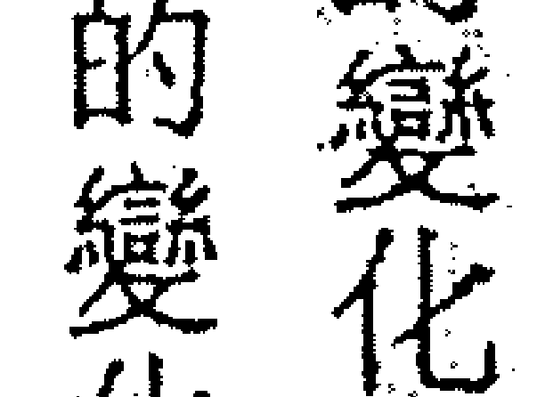
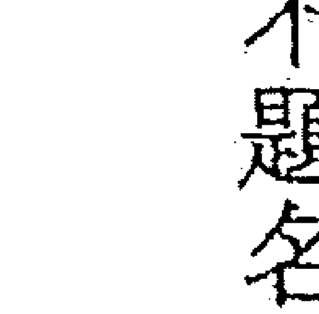
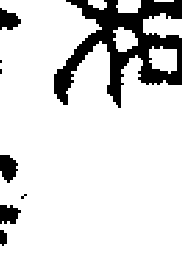
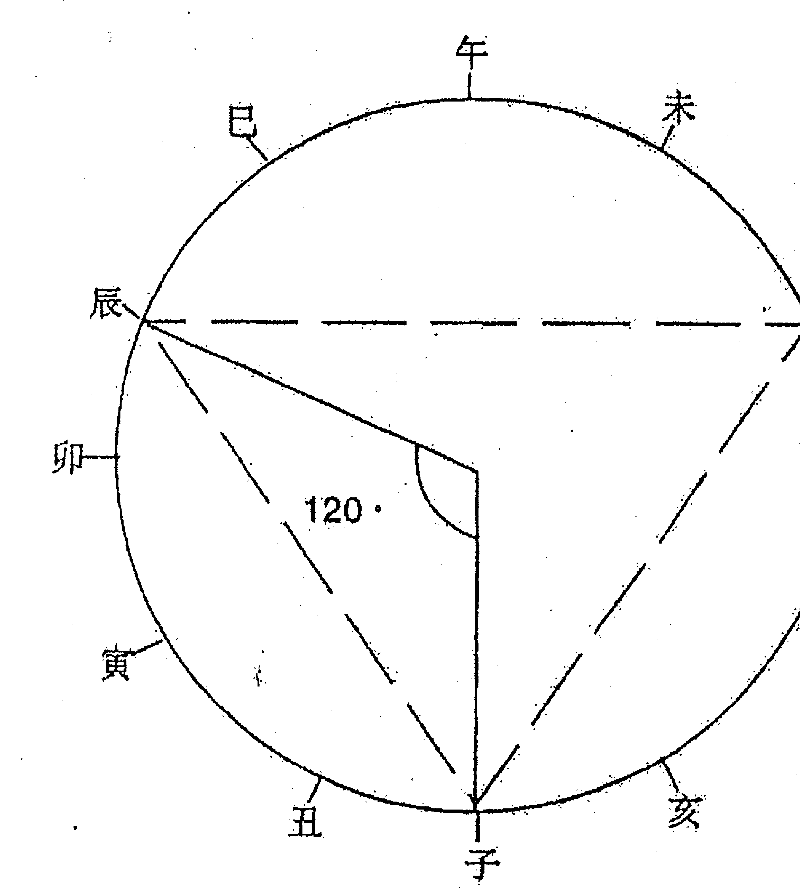
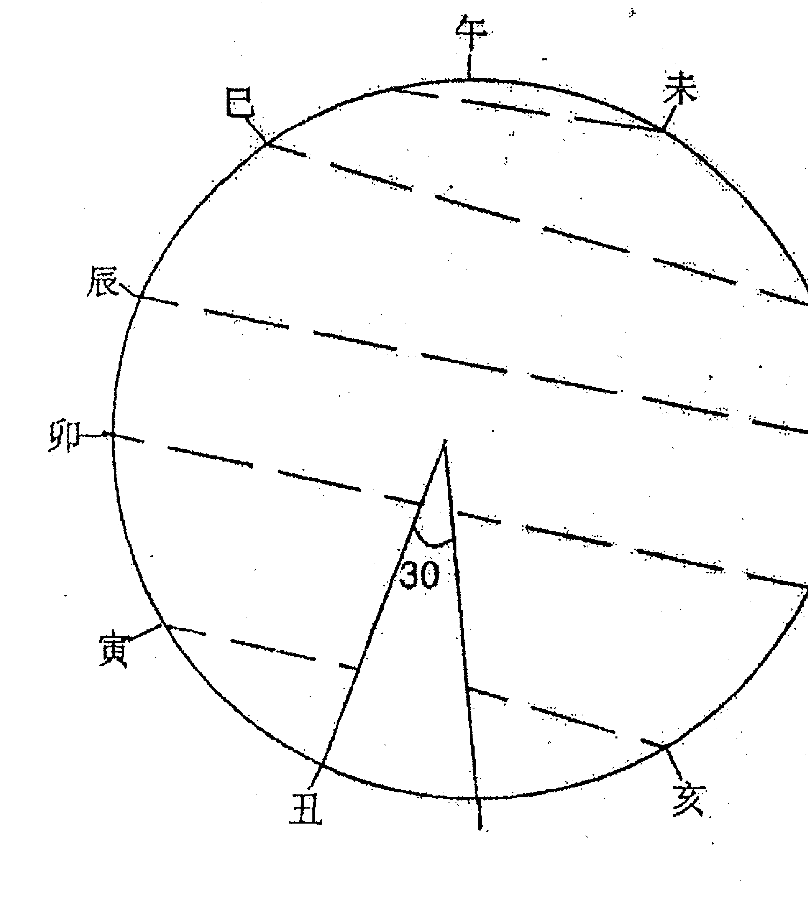

# 王亭之紫微斗数全集四


## 别序

本卷内容，为两篇斗数古赋的注释，即《太微赋》与《形性赋》。这两篇古赋，《十八飞星策天紫微斗数全集》（简称《全集》）及《紫生斗数全书》（简称《全书》）均有收录。本卷注释，《形性赋》依《全集》本，参考《全书》本；《太微赋》则依「八喜楼钞本」，参考《全集》及《全书》本。注释之时，依中州派的观点，故跟坊本的注释有所不同。又因钞本文字与坊本时有歧异，而钞本注文则接近中州派的观点，故可以说，本卷实在亦发扬中州派斗数之术，此中开合与得失，可比较而知。盖合不合理，一点即明，无须喋喋也。本卷各篇，均曾在《星岛日报》发表。结集时各有修订。

> 大学之道，在明明德，在亲民，在止于至善。

《大戴礼记》注

## 明代著作《太微赋》

我们先谈《太微赋》。这篇赋文，《十八飞星策天紫微斗数全集》，以及《紫微斗数全书》均有收录，但均未提撰者的姓名。然『八喜楼钞本』《全集》，则谓为白玉蟾所作。白玉蟾为著名的道家，又为主内丹修炼的神霄派掌门，行五雷法，却未闻有术数方面的论著，是故称之为《太微赋》的撰者，恐怕只是托名。托名白玉蟾殆亦有据，因《全书》有一篇《斗数发微论》，《全集》有一篇《玉蟾发微论》，内容全同，一开头即是——『白玉蟾先生曰』，可见——向以来，古代斗数家即喜将一些斗数篇章，称为白玉蟾的作品。古人撰述喜欢托名，取其易于流通，而撰述本人的姓名却反而不显。但若撰述者拿出自己的姓名来公开作品，却可能反而令作品不得流传，这便是时代的局限了。斗数家托名陈希夷、白玉蟾，即是这种情况。凡有所托名，当然是托古人，因此，托名之学必出于明代斗数家无疑。盖清初钞本已流行，是故斗数的编写与托名撰述，相信可能是明中叶以后的事。由是推理，不妨将《太微赋》看作是明代中叶斗数家的著作。

## 三十六、六十三之类

《太微赋》开头说：

> > 『斗数至玄至微，理旨易明。 虽设问于百篇之中，犹有言而未尽。』

根据这几句话便可以知道，《太微赋》实在是承接《诸星问答》而写的。这《问答》，

接下来，《全书》、《全集》有两句话：

> > 『一星分于一十二垣，数定乎三十六位。』

这两句，在《全集》本则为：

> > 『一星分于十二官，数定乎六十三位。』

其实，两种说法都不对，按《八喜楼钞本》此两句应作：

> > 『一星分于十二官，数定乎六十三位。』

为什么《全集》、《全书》都错呢？很可能是《全集》先多衍一个『三』字，编《全书》的人，以为『六十二』欠解，于是改为『三十六』。三十六、七十二，是道家常用的数字。既改为『三十六』矣，便顺便将『十二官』改为『一十二垣』，以求对仗工整。

实际上，『数定乎六十位』才是对的，此即斗数依十四正曜组合的『六十星系』。近年王亭之提出六十星系之说，有人以为没有根据，殊不知根据在于此，而且正是紫微斗数的『数』。

## 引言

感慨万千再谈斗数
自避地夷岛之后，读经修密，王亭之即很少谈术数。此番返港，主持《佛家经论导读丛书》的编务，仿佛重堕红尘。末法时代，佛家的是非不比俗家少，王亭之本来雄心勃勃，

自避地夷岛之后，读经修密，王亭之即很少谈术数。此番返港，主持《佛家经论导读丛书》的编务，仿佛重堕红尘。末法时代，佛家的是非不比俗家少，王亭之本来雄心勃勃，

极力推广这套「众书」，以期学佛的人可以直接读佛家经论，

代佛教学术丛刊》，其初亦无人响应，王亭之虽竭尽棉薄之力支持，曼涛终为债项逼死。曼
涛死后，这套「众刊」却不断给人翻版，有些图书馆则购全套收藏，佛门中人撰述文字，亦

征引「众刊」的资料。这种情形若早十年出现，曼涛何至负债。

本也就相应减低；第二，王亭之可以重出江湖，为人看紫微斗数、玄空风水，将收入拨为一
「众书」的出版基金。是故理应不会重蹈曼涛当年的覆辙。
或有佛门中人，视我王亭之之谈术数为外道，然而须以外道养内道，以术数支持内典的
印行，实在亦并非内道的光荣。而且，中州派反对宿命，

实在亦并非内道的光荣。而且，中州派反对宿命，实在不违反佛陀的经教，是则重出
江湖，再谈斗数，又有什么不可？

## 吉凶机遇非宿命

中州派紫微斗数的特色，正在于反对宿命。本派认为，凭斗数所能推出的，只是人生可能发生点什么际遇，至于碰到际遇，能否把握，抑或任其失去，则往往只系于当事人的一念。

推断灾难亦如是。推出什么时候可能发生灾难，灾难却并不一定会发生，即使发生，令之扩大或缩小，亦往往只系于一念。有时当事人甚至可以令灾难化解于无形。
这决定吉凶祸福的一念，即是佛家所说的「业力」。业力的善恶，即是人生吉凶祸福的依据，既然有业力因果左右着事情的变化，所以便非宿命。

因此推断斗数，只能说什么可能有什么事件发生，绝对不可能说，一定有什么事发生，亦正因如此，所以我们才能说可以「趋吉避凶」，若谓人生宿命，一切事情都必然发生，无可逃避，是则还何必要推算命运。知道了，不能改，有时反而不如不知。

在斗数的领域中，前人推断事情发生的机遇，有几篇很著名的著作，即「太微赋」、「骨髓赋」，以及「女命骨髓赋」等。如今许多斗数著作，都有引用，唯历代刻板或排印，时有错误，王亭之这次重出江湖谈斗数，即用清初「八喜楼钞本」作为蓝本，解释这几篇重要的赋文，供研究者参考。

## 太微赋

依清初「八喜楼钞本」

夫斗数至微，玄理难明，虽设问于百篇，犹有言而未尽。至于星辰分野，祸福浅深，贤愚天寿，各有所司。其星分于十二宫，数定乎六十位，失度为虚，入庙为奇。

大概以身命为福德之本，加以源流，为穷通之察。星有同躔、数分定局，须明其生克制化之要，必详乎得垣失度之基。

观乎太微台躔，司天几之宰象，牵列宿而成垣。土星苟居其垣，不可移动；金星专司财库，最怕空亡。帝君摇则列宿奔驰，贪守空则财元失主。各司其职，不可参差。苟或不察其机，更忘其数之变，则造化远矣。

例曰：

- 太微天府，全依辅佐之荣。
- 七杀破军，专依羊铃之虐。
- 日月最嫌反背。
- 禄马更要交驰。
- 禄逢冲破，吉也成凶。
- 马遇空亡，终身奔走。
- 生逢败地，发也虚花。

绝处逢生，危而不败。
星临庙旺，再观生克之机。
命坐强宫，细察制化之理。
空亡定要得用，天空最为紧要。
败绝专看扶持，吉曜大有奇功。
诸星吉，逢凶也吉。
诸星凶，逢吉也凶。
辅弼夹帝为上品。
桃花犯主为至淫。
君臣庆会，才善经邦。
魁钺同行，位居台辅。
禄文拱命，既富且昌。
日月夹财，不权则富。
马头带剑，镇御边疆。
卯位极居，空门受荫。
刑囚夹印，刑杖唯司。
善荫朝纲，善慈之长。

贵入贵乡，逢者昌禄。

财居财位，遇者富奢。

太阳居午，谓之日丽中天，有专权之贵，敌国之富。

太阴居子，号曰水澄桂等，得清要之职，忠谏之材。

北帝辅弼同垣，一呼百诺。

文曲破军寅卯，从水朝东。

日月守命不如合照。

荫福聚会那怕凶危。

贪居亥子，名为泛水桃花。

刑遇贪狼，号曰风流采杖。

七杀廉贞同位，路上埋尸。

破军暗曜共乡，水中作家。

禄居奴仆，纵有官也奔驰。

帝遇凶徒，虽获吉而无道。

帝坐金车，则曰金舆捧辔。

福德文曜，谓之玉袖添香。

太阳会文昌于官禄，玉殿传胪。

太阴会文曲于妻宫，蟾宫折桂。
禄存守于田财，积玉堆金。
财荫坐于迁移，巨商高贾。
耗居禄位，沿路乞求。
贪会旺宫，终身鼠窃。
杀临绝地，天年天似颜回。
贪坐生乡，寿考如同彭祖。
忌暗同居命宫疾厄，困弱虺赢。
凶星会忌迁移相貌，刑伤产室。
刑煞会廉于官禄，枷纽难逃。
官符夹刑于迁移，离乡遭配。
善福守于空位，天竺生涯。
辅弼单坐命宫，离宗庶出。
七杀临于身命，逢羊刃必定阵亡。
羊铃合于命宫，遇白虎须当刑戮。
官符发于吉曜。
流煞败于破军。

> 羊铃凭太岁以引行，病符官符皆作祸。火陀依年限为居寄，劫煞更煞尽成殃。秦书博士与流禄，尽长其祥。力士将军共青龙，主显权势。童子限如水上之泡，老人限如风中之烛。遇煞无制，乃流年最忌。人生荣辱，为限步浮沉。

处世必有休咎，数中定乎纯杂。学者至此，可采玄微。

> [按]此「八喜楼钞本」实为「三钞」本。先师据原钞本覆钞，当年来遑全录，仅据之钞于坊本《太微赋》上，以作比对。坊本无论为《十八飞星策天紫微斗数全集》本，抑《希夷先生紫微斗数全书》本，与钞本相比，错漏立见。至于注文的错误，更无论矣。钞本注文详见本书各篇所引，故此处不赘。

近年研究斗数的人，但依《全书》，或依《全集》解说本赋，于原交错漏处却茫然不觉，却能言之凿凿，未见存疑，是则公开清初钞本，或将有助于后来斗数家的研究也。

## 主星重百官朝拱

太微天府，全依辅佐之荣。这句赋文，是说南北极主星，都须『百官朝拱』。太微即是紫微，为北斗主星；天府则为南极主星。
唯按中州派所传，除紫微、天府之外，日生人尚以太阳为主星，夜生人亦以太阴为主星；所谓日夜，以寅申一时为界。寅时至未时为日，申时至丑时为夜。
又，太阳、太阴为主星，仅分日夜，不论男女；世传仅男命可以太阳为太阳，女命则以太阴为主星，不确。
所谓『全依辅佐之荣』，即说『百官朝拱』（见第69页图52）。所谓『百官』，紫微最重

天府、天相二星朝拱，即名为『府相朝垣』（见图二），垣即是帝垣。
其余天府、太阴、太阳等，以『八吉』朝拱为吉。八吉又分两组，即『辅曜』与『佐曜』，

微斗数》
大致而言，辅曜以他力为主，佐曜则以自力为主。
《全集》改为『全依辅弼之荣』，便单指左辅右弼，不如『钞本』之称为『辅佐』涵盖面
广。
（《全书》无此句。）
辅佐之外，尚有三台八座、恩光天贵等朝拱，已详说于《中州派紫微斗数》。

### 10、府相朝垣

| 巳 | 午 (命宫) | 未 | 申 |
| :---: | :---: | :---: | :---: |
| | ↑ 紫微 | | |
| 辰 | | | 酉 |
| | | | 天府 廉贞 |
| 卯 | | | 戌 |
| 寅 | | | 亥 |
| 武曲 天相 | 丑 | 子 | |

## 杀破不宜煞忌刑

七杀破军，专依羊铃之虐。
斗数本来有一个名相，叫做『杀破狼』，此即指七杀、破军、贪狼三曜，在星盘的三方会
台，主人人生大幅度的变化。（见图）。

三颗星曜所主的变化性质，各有不同。贪狼的变化带有粉饰的意味，七杀的变化主
突如其来的开创，破军的变化则主去旧更新。是故三曜的变化中，便以七杀、破军一曜为
重。
以此之故，便不喜更见煞忌刑诸曜。

> 古人说：『七杀重逢四煞，腰驼背曲阵中亡』，此指七杀会照火铃、羊陀，或则残疾，或
者刀兵之灾，包括开刀手术不利。
又说：『七杀羊陀迭併主凶亡。』
又说：『七杀临绝地，会羊陀，天似颜回。』
又说：『七杀羊陀会生乡，屠宰之人。』
至于破军，则有：『破军火铃，奔波劳碌，官非争斗』的说法。
又说：『破军羊陀同宫，主有残疾。』
又说：『破军刑忌同宫，主有残疾。』
凡此皆说七杀、破军不宜见煞忌刑曜。赋文但说『羊铃』，不过举例而言。

由于赋文



### 3、杀破狼星系举例

| 宫位 | 星宿 |
| --- | --- |
| 巳 | 破军 |
| 午 | 破军 |
| 未 | |
| 申 | |
| 酉 | |
| 戌 | 贪狼 |
| 亥 | |
| 子 | |
| 丑 | |
| 寅 | 七杀 |
| 卯 | |
| 辰 | |

| 宫位 | 星宿 |
| --- | --- |
| 巳 | |
| 午 | |
| 未 | 破军 紫微 |
| 申 | |
| 酉 | |
| 戌 | |
| 亥 | 廉贞 贪狼 |
| 子 | |
| 丑 | |
| 寅 | |
| 卯 | 武曲 七杀 |
| 辰 | |

| 巳 | 午 | 未 | 申 |
|---|---|---|---|
| 紫微七杀 |   |   | 廉贞破军 |
| 辰 |   |   | 酉 |
| 卯 |   |   | 戌 |
| 寅 | 武曲贪狼 | 丑 | 子 | 亥 |

| 巳 | 午 | 未 | 申 |
|---|---|---|---|
|   |   | 七杀廉贞 |   |
| 辰 |   |   | 酉 |
| 紫微贪狼 | 卯 |   | 戌 |
| 寅 | 丑 | 子 | 武曲破军 | 亥 |

的形式有限制，是故对一些说法，只能意会。七杀、破军所最不喜的忌星，为廉贞化忌、武曲化忌。此外破军又还不喜文曲化忌。若见忌更见煞曜，凶难灾险重重。

## 日月反背主孤寸

日月最嫌反背。斗数家一向将“日月反背”看成是很大的格局，倘如命宫与迁移宫分居“反背”的宫位，那就给看成是相当不良的先天结构。日月的“反背”，其实即是太阳与太阴两星曜同时失辉。太阳由申宫开始日落西山，至丑宫尚未日出，所以太阳居于申、酉、戌、亥、子、丑六个宫垣，即是失辉。（见图四）。太阴则由寅宫起月坠西天，至未宫犹未月出，所以太阴居寅、卯、辰、巳、午、未六个宫垣，亦是失辉。（见图五。）然而太阳失辉的六个宫垣，仅在戌、亥、子三垣为独坐，其余或与天梁同度，或与巨门同度；太阴失辉的六个宫垣，仅在卯、辰、巳三垣为独坐，其余或与天机同度，或与天同同度。是故日月同时失辉，而又独坐相会的宫垣，便仅有太阳居戌、太阴居辰；以及太阳居亥、太阴居卯这两种情形。这两种情形，都叫做“日月反背”。（见图六、七）倘如命宫与迁移宫为日月反背，日生人，太阳在命宫、太阴在迁移宫，又比较太阴在命宫、太阳居命宫。若是夜生人，则情形刚好相反，喜太阴居命宫。日月反背有“百官朝拱”，情形又好一些，若无朝拱反见煞忌，则人生太过孤克。

### 4、太阳失辉的宫垣

| 地支 | 星曜 |
|------|------|
| 申   | 太阳巨门 |
| 酉   | 太阳天梁 |
| 亥   | 太阳 |
| 子   | 太阳 |
| 丑   | 太阴太阳 |
| 寅   | 太阳 |

### 5、太阴失辉的宫垣

| 地支 | 星曜 |
|------|------|
| 巳   | 太阴 |
| 午   | 太阴天同 |
| 未   | 太阴太阳 |
| 辰   | 太阴 |
| 卯   | 太阴 |
| 寅   | 天机太阴 |

### 6、日月反背(一)

| 巳 | 午 | 未 | 申 |
| --- | --- | --- | --- |
| 太阴 | 日月相对独坐 |  | 酉 |
| 辰 |  |  | 太阳 |
| 卯 |  |  | 戌 |
| 寅 |  |  | 亥 |

### 7、日月反背(二)

| 巳 | 午 | 未 | 申 |
| --- | --- | --- | --- |
|  |  |  |  |
| 辰 | 日月相对独坐 |  | 酉 |
| 太阴 |  |  | 戌 |
| 寅 |  |  | 太阳 |

## 禄马交驰始有用

## 禄马更要交驰

禄指禄存，马指天马。凡禄马，必须能互相会照，或能同宫，然后才能发挥特殊作用。

如若不然，则只能单独论断，禄存就是禄存，天马就是天马。（见图八。）

若禄马同宫，或在三方会照，那么，就有一个特殊的性质，此性质一般亦称为「禄马交驰」，但却其实不是，只宜称为「禄马」。

「禄马」有两种性质。见煞忌刑曜，特别是见火铃，或浮动的星曜，如天机、失运的太阴、太阳等，则主须奔波劳碌以求财；若见吉曜，特别是再见财星，如武曲、入庙的太阴等，则主离乡背井而发财，在现代，亦可能是人不离乡，而财源则在外地。

但是，原来的星盘中有「禄马」，并不一定能发挥作用，必须「交驰」然后才能发动。

什么叫做「交驰」呢？

即是，大限的「禄马」，冲起原局的「禄马」；或流年的「禄马」，冲起大限的「禄马」。

什么叫冲起呢？

例如天马在寅宫，在申宫或寅宫见流马。

又例如禄存在申宫，在申、子、寅三宫见流禄。

如上两种情形，同时并见，那么，便可以称为「禄马交驰」了。（见图九。）

### 8、禄马分布图

|  |  |  |  |
|---|---|---|---|
| 禄存(丙戌年)<br>天马(亥卯未年)<br>已 | 禄存(丁巳年)<br>午 | 未 | 禄存(庚年)<br>天马(寅午戌年)<br>申 |
| 辰 |  |  | 禄存(辛年)<br>酉 |
| 禄存(乙)<br>卯 |  |  | 戌 |
| 禄存(甲年)<br>天马(申子辰年)<br>寅 | 丑 | 禄存(癸年)<br>子 | 禄存(壬年)<br>天马(巳酉丑年)<br>亥 |

### 9、禄马交驰一例

|  |  |  |  |
|---|---|---|---|
| 辛巳 | 壬午 | 癸未 | 甲申<br>流禄<br>禄存<br>命宫 |
| 庚辰<br>命宫<br>大运 | 行庚辰大限 | 庚子年生人阳女 | 乙酉 |
| 己卯 |  |  | 丙戌 |
| 天天<br>阴马<br>戊寅 | 己丑 | 戊子 | 丁亥 |

## # 禄逢冲破吉成凶

禄指禄存，也兼指化禄。唯《全书》却认为化禄不妨冲，它的说法是——

> >「小限逢之，主进财入仁之喜。大限十年吉庆。恶曜来临，并陀羊火忌冲照，亦不为害。」

这个说法跟中州派的意见不同。

> >《全书》认为只有禄存才怕冲。它说——「怕火铃空劫冲照，下局巧艺多情之人。」

> >「禄存入命陷宫来，劫空铃火必为灾，若无吉曜来相奏，夫婦分離永不諧。」

这是说女命。

> >「禄存守命莫逢冲，陀火交加福不全，天机空劫忌相会，空门僧道得清闲。」

其实《全书》的说法，只宜于论命宫时作为参考，若用以论大限流年，则不着边际。

依中州派的传授，「禄逢冲破」，主要是指运限来说。所谓冲破，专指忌星来冲，不必论煞刑诸曜。

有煞刑，只加强冲破的性质，并不是冲破的必须条件。

冲破得能令全局转吉为凶的，是本干化禄逢本干化忌相冲，如己干，武曲化禄，逢文曲相冲；乙年天机化禄，逢太阴化忌相冲之类。

是故性质最严重的冲破，只有乙、丁、己、辛、癸五种可能，而癸干的冲破，性质则最为和缓，未必可称为凶。（见图十。）

### 10、中州派的『禄逢冲破』

| 巳 | 午 | 未 | 申 |
|---|---|---|---|
| 太陰(忌) 辰 | 乙運化忌沖化祿 | 酉 | 申 |
| 卯 |  | 戌 |  |
| 寅 | 丑 | 子 | 天機(忌) 亥 |

| 巳 | 午 | 未 | 申 |
|---|---|---|---|
|  |  |  | 借星安宮 |
| 天機(忌) 巨門 卯 |  | 丁運化忌沖化祿 | 酉 |
|  |  | 戌 |  |
| 寅 | 太陰(祿) 太陰 丑 | 子 | 亥 |

### 10、中州派的『禄逢冲破』

| 巳 (文曲忌) | 午 | 未 | 申 |
| :---: | :---: | :---: | :---: |
| 辰 | 己干化忌冲化禄 | | 酉 |
| 卯 | | | 戌 |
| 寅 | 丑 | 子 (贪狼武曲忌) | 亥 |

| 巳 | 午 | 未 (辛干化忌冲化禄) | 申 |
| :---: | :---: | :---: | :---: |
| 辰 (巨门忌) | | | 酉 |
| 卯 | | | 戌 |
| 寅 | 丑 | 子 (文曲忌) | 亥 |

### 10、中州派的『禄逢冲破』

| 巳 | 午 | 未 | 申 (破軍祿) |
| 辰 | 癸運化忌沖化祿 | | 酉 |
| 卯 | | | 戌 |
| 寅 | 丑 | 子 (貪狼忌) | 亥 |

## 馬遇空亡主奔波

馬遇空亡，終身奔波。馬指天馬。它只居寅、申、巳、亥四個宮垣，不入余宮。（見圖十一。）

空亡指『正截路空亡』而言。每一年干，有兩顆截路空亡，如甲年，截空在申、酉二宮。然而這兩星曜卻分一正一副，稱為『正空』、『旁空』，前者即為正截路空亡的簡稱。

> （見圖十一。）

由于天馬與正空的分布有一定規律，所以只有甲、辛、壬三個年干會碰到『馬遇空亡』的情況。

斗數的空曜，除截空外，還有天空、旬空、地空等等，除『天空』外，其餘的空曜與天馬同宮，都不能稱為『馬遇空亡』。

『馬遇空亡』其實亦可視為『祿馬交馳』的破格。即是說，天馬喜與祿存同宮或會照，但即使如此，卻不宜偏偏碰着正空，若碰上了，則雖主進財入仕之喜，亦必奔波勞碌，不得安居。

不過這情形卻亦未必壞，現代人，有『坐飛機多過坐汽車』音，可是其人卻能發財，或能入仕，很可能所碰到的即是祿馬交馳遇正截路空亡的情況。

如果不是祿馬交馳，只單單一顆天馬，倘遇空亡，則主奔波而無收穫。

古人認為『宜僧道』，即指游方挂單的僧道而言，性質可見。

### 二、天馬分布的宮位

| 天馬<br>(亥卯未年生人) | 巳 | 午 | 未 | 天馬<br>(寅午戌年生人) | 申 |
|---|---|---|---|---|---|
|  | 辰 |  |  |  | 酉 |
|  | 卯 |  |  |  | 戌 |
| 天馬<br>(申子辰年生人) | 寅 | 丑 | 子 | 天馬<br>(巳酉丑年生人) | 亥 |

### 二二、陽年陰年生人的正截空圖

| 正截空<br>(辛年生人) | 巳 | 正截空<br>(寅年生人) | 午 | 正截空<br>(乙年生人) | 未 | 正截空<br>(甲年生人) | 申 |
|---|---|---|---|---|---|---|---|
| 正截空<br>(丙年生人) | 辰 |  |  | 正截空<br>(己年生人) | 酉 |
| 正截空<br>(丁年生人) | 卯 |  |  | 戌 |
| 正截空<br>壬年生人 | 寅 | 正截空<br>(癸年生人) | 丑 | 正截空<br>(戊年生人) | 子 |  | 亥 |

## # 命宮敗地，表面風光

生逢敗地，發也虛花。

要弄懂這句賦文，先要弄懂什麼叫做「敗地」。所謂「敗地」，即指四桃花沐浴之地。

原來古代術數家將十二支分為二組——寅、申、巳、亥為四長生，子、午、卯、酉為四沐浴，辰、戌、丑、未為四墓庫。四沐浴亦稱為四敗地，可是卻又稱為四旺地。由此可知所謂「敗地」，即指子、午、卯、酉而言。

子是木的敗地，午是金的敗地，卯是火的敗地，酉是水與土的敗地。（見圖十三。）

然則什麼叫做「生逢敗地」呢？

這須以命宮的納音為基礎。如命宮在甲子，甲子的納言為金，那么，午便是敗地。若命宮居于午垣，是即為「生逢敗地」。《全集》注此條，說是以「生年納音」為準，此注不確，瞧以「命宮納音」為準。（見圖十四。）

然而亦不是命宮「坐敗地」，便立即「發似虛花」。依《全集》，還須「又加刑耗忌凶」，然后才「雖發亦主虛花」。所謂「虛花」，即是香港人所說的「有姿勢，無實際」，一切只是表面風光。

若依中州派之說，則唯有動蕩的星曜怕敗地。例如天機、巨門居于卯宮，若為丁卯，納音丁卯屬火，卯為火之敗地，是則始為「生逢敗地」。

### 13子午卯酉败地

| 巳 | 午 | 未 | 申 |
|---|---|---|---|
| 辰 | | | 酉 |
| 卯 | | | 戌 |
| 寅 | 丑 | 子 | 亥 |

表格内文字：
午格：金的败地
酉格：水圭的败地
卯格：火的败地
子格：木的败地

### 14、阳年阴年生人命宫坐守败地图

| 巳 | 午 | 未 | 申 |
|---|---|---|---|
| 辰 | | | 酉 |
| 卯 | | | 戌 |
| 寅 | 丑 | 子 | 亥 |

表格内文字：
午格：丙辛年生人 命宫(金) 坐此败地
酉格：丁壬年生人 命宫此败地 乙庚年生人 命宫(水) 坐此败地
卯格：甲己年生人 命宫(火) 坐此败地
子格：丁壬年生人 命宫(木) 坐此败地

## # 命臨絕地，絕處逢生

絕處逢生，危而不敗。 這句賦文，一般皆將「危而不散」誤為「花而不敗」或「花而不敗」。這樣一錯，整句 賦文就欠解。

什么叫「絕處逢生」呢？

> > 《全集》注曰：「假如土水生人，安命在巳，巳為水土所絕之地，卻得金星坐于巳， 金又生水不絕，為母來救子之理。巳中丙火乘旺，火又生土，雖寅、申、巳、亥為四絕，又為 四生，故曰五行絕處即是胎元，生日逢之名為受氣。」

這段注文，鈔本無「巳中丙火乘旺」以下一段，此殆為後人參考「子平」的說法加入， 但卻加得不合理，是故我們亦可以不理。

其實「絕處逢生」非常簡單，凡「長生十二神」中的長生、臨官、病、絕四神，一定居申、 寅、巳、亥四宮。仍以命宮的納音取局，若命宮恰恰排在絕神所臨的宮垣，即稱為「命臨絕 地」。（見圖十五。）

命臨絕地其實並不代表「絕」，只是若臨絕地，而碰到能生命宮納音五行的星，則稱之 為「絕處逢生」。

如《全集》所舉的例，即如武曲為金星在巳，命宮納音水或納音土的人，亦即水二局或 土五局的人，便逢「絕處逢生」之例，除可頭誰（見圖十六。）所謂「危而不敢」，亦即絕處逢生之惹耳。

### 15、四長生地變是四絕地

| 金長生地 | （空） | （空） | 土長生、水長生 |
| :---: | :---: | :---: | :---: |
| 巳 | 午 | 未 | 申 |
| 辰 | 四生地 | （空） | 酉 |
| 卯 | （空） | （空） | 戌 |
| 火長生 | 丑 | 子 | 木長生 |
| 寅 | （空） | （空） | 亥 |

| 火絕地、水絕地 | （空） | （空） | 金絕地、木絕地 |
| :---: | :---: | :---: | :---: |
| 巳 | 午 | 未 | 申 |
| 辰 | 四絕地 | （空） | 酉 |
| 卯 | （空） | （空） | 戌 |
| 金絕地、木絕地 | 丑 | 子 | 火絕地、水絕地 |
| 寅 | （空） | （空） | 亥 |

### 16 絕處逢生，星生納音

| 武曲破軍 | 胎 甲午 | 美 乙未 | 長生 丙申 |
| 絕命宫 癸巳 | 納音: 水二局 | 丙申年生三月十六日 亥時男 | 紫微 貪狼 沐浴 丁酉 |
| 基 壬辰 | | | 冠带 戊戌 |
| 死 辛卯 | 七殺 廉贞 衰 辛丑 | 帝旺 庚子 | 臨官 己亥 |
| 病 庚寅 | | | |

## 星曜组合论生克

星曜庙旺，再生克之机。

这句赋文，《全集》及《全书》都有一段注文——假如水土生人，基库在辰。

帛同度为财库，与官禄同度为官库，与煞同为空库；与迁移同为破库

凡辰戌丑未为四基库，此亦纳音上取。

> 【此依《全集》本，《全书》收各异。】

这段注文可谓极陋，殆属传钞之误。因为注文所论，实为那一宫落在基库的性质，完全与赋文无关——即就注文本身而论，亦不能仅凭财帛宫为基，即便说为财库，迁移宫

为基，即便说为破库（《全书》说为劫库）。如此论断，过份简单，应该是斗数流入江湖

后，为江湖术士所增添。

依中州派所传，这句赋文的意义，举一个例便可明白——如“火贪格”最喜见武曲，尤

喜见武曲化禄。为什么呢？这即是因为火星属火，贪狼、化禄属土；武曲属金。此祖星曜

相会，即有火生土、土生金的相生性质。（见图十七、十八。）

当见到星曜庙旺时，应据其同宫及相会的星曜生克，以定其加强或削弱的作用。其

实，相反而言，当见到星曜落陷时，亦应该这样观察，只不过赋文受形式限制，便只能说得

一边，读者当自行体会其意。统而言之，无非只是看星曜组合而已。

### 一 火贪格之例一

| 巳 | 午：禄存、△火星 | 未 | 申 |
|----|------------------|----|----|
| 辰：武曲(禄) | 己丑年十二月十四日卯时男 | 酉：贪狼(禄) | 酉/戌 |
| 卯 |  | 戌 | 亥 |
| 寅 | 丑 | 子：贪狼、武曲(忌) | 亥 |

### 二 火贪格之例二

| 巳 | 午 | 未 | 申 |
|----|----|----|----|
| 辰：巨门(忌) | 己卯年四月初八日辰时男 | 酉 | 戌 |
| 卯 |  | 亥 |  |
| 寅 | 丑：贪狼(禄)、武曲(忌)、△火星 | 子 | 亥 |

## 十二宮流動生變化

命坐強宮，細察制化之理。須明星曜組合間的生克制化，所謂生克制化，亦即對基本星曜組合（六十星系）的加強、削弱、轉化的作用。

本句意思，大致上亦如是，然而卻有一點不同。所謂「命坐強宮」，即是命宮的星曜組合好，或什麼又臨廟旺之地。在此情形之下，為什麼還要「細察制化之理」呢？依師門解釋，這句是統言十二宮的「制化」，不過舉命宮為例而言。

命宮有二，一為原局的命宮，一為流動的命宮，此包括大限的命宮，以及流年的命宮。所謂生克制化，即是後者對前者的影響。

假如原局命宮是坐于巳宮的太陽，順行大限，依次會破軍、天機、紫府……等，每經行一大限，便都要看此大限星曜組合，對原局星曜組合的影響。（見圖十九）大限如是，流年亦如是。命宮如是，十二宮亦皆如是。

各星曜組合于經行運限流年時的性質變化，以及其特有的反應種種，即是《紫微星訣六百韻》的內容。筆者已將之一一詮釋，寫入于《中州派紫微斗數》一書之內。必須能知變化與反應，然後才能作出推斷。

### 16 每大限都要看原命局星曜组合受该大限星曜组合的影响

| | 破军 (午)<br>第二大限 | 天机 (未)<br>第三大限 | 紫微天府 (申)<br>第四大限 |
|---|---|---|---|
| 太阳 (巳)<br>原命宫 | 武曲 (辰) | 天同 (卯) | 太阴 (酉)<br>第五大限 |
| | 天梁 (丑)<br>第九大限 | 廉贞天相 (子)<br>第八大限 | 贪狼 (戌)<br>第六大限 |
| | | | 巨门 (亥)<br>第七大限 |
| 七杀 (寅) | | | |

## # 关于空曜的误传

空亡定要用，天空最为紧要。斗数中的空曜，有句空、截空、地空、天空等，其中句空、截空皆成对出现，地空与地劫则是一对“对星”，唯天空一曜无对。依中州派所传，诸空曜以地空、地劫一对最为重要，此外则为空。是故赋文说：“天空最为紧要”，其实不确。很可能是于斗数流播江湖之后，江湖中人误以天空、地劫作为对星，是故才有此说。

其实关于“空亡定要用”的说法，实亦大有问题。注文说：“假如身命宫，唯金空则鸣，火空则发，二限逢之反为福论；若水空则泛、木空则折、土空则陷，为祸矣。”如是云云，无非根据子平家言，是故此注必为清代术者加入无疑。而且，既曰身命宫如何如何，下面却说“二限逢之”，那便是矛盾，究竟“定要用”的空亡，是指在身命宫见，还是指在大限、小限的命宫见呢？注文显现含混。

若依中州派所传，唯主星（紫微、天府、书生人的太阳、夜生人的太阴）不宜见空，财星亦不宜见空，天马更不宜见空，空曜若重重交会，则星曜组合的性质改变。同时，亦无“天空最为紧要”的说法。

“八喜楼钞本”亦有此句，唯无注文，是则此或乃明末清初斗数家的误传。

## # 敗絕之地喜扶持

敗絕專看扶持，吉曜大有奇功。此句依「八喜樓鈔本」，坊本皆作「若逢幾地，專看扶持之曜，大有奇功。」誤。蓋賦文體裁講究對仗，依本句，則能與上句「空亡定要得用，天空最為緊要」成對偶之句，若依坊本，則顯然無偶可言。

> > 注文曰：「假如命在敗絕地，遇祿存、祿主扶，吉。」《全書》注本則改為：「假如命在敗絕地，又祿存、化祿扶持，反美。」

《全書》的注文這麼一改，卻改錯了。所謂「祿主」，其實不專指化祿，而是指斗數十四正曜中制裁星，如武曲、天府、太陰三曜即是。武曲主求財的行動、天府主儲財的能力、太陰主求財的計劃，是皆為「祿主」。

星曜化祿，反不視為祿主，因為並非「祿」的主星，也可以說，並非「主祿」之星，例如破軍化祿，往往只是舊業創新的開始，並不主得財；廉貞化祿，更可能只是生活上優雅的享受，亦不主發財。不過，一般情況下能舊業創新，或能生活暇適，自然財源亦不俗，是謂化祿主財而已。

但在身命宮居敗絕地之時，化祿未必能扶持，如廉貞化祿可能是二世祖，破軍化祿可能是傾家兒。必須有良好的星曜組合，然后才能收扶持之功——敗絕指子、午、卯、酉四宮見沐浴為敗地及寅、申、巳、亥四宮見絕神而言。（見圖十三、圖十六。）

以六十星系为主

诸星吉，逢凶也吉。诸星凶，逢吉也凶。

此句注文曰：『假如身命二方，但吉多凶少，则吉，凶多吉少，则凶。仍看吉凶失陷，以及生克制化之力，以定祸福。』

这段注文，可谓不着边际，纯属敷衍之词。吉多凶少则吉，凶多吉少则凶，这已经是常识的层次，何劳乎《太微赋》加以提点。

实际上这两句赋文，乃总结以上各句赋文而来。上面提到『禄逢冲破』、『马遇空亡』、『生逢败地』、『绝处逢生』、『星临庙旺』、『命坐强宫』、『空亡得用』、『败绝扶持』等等情况，总结起来，无非是「诸星吉，逢凶也吉。诸星凶，逢吉也凶。」

这话怎么讲呢？

「诸星」是指整组星系而言，如「紫微破军」、「天同巨门」、「天府独坐」等等六十星系（见图二十），加上所会星曜，形成种种性质，若性质吉，如「紫破」见禄，又得百官朝拱，则为「诸星吉」。诸星凶呢？此即指「遇冲破」、「遇空亡」、「逢败」、「逢生」等等而言。总的来说，赋文是教人着重看星盘中六十星系的结构，以结构吉凶为主，不可拘泥于「生处」、「败地」等小节。

輔弼夾帝不制貪狼

輔弼夾帝為上品，桃花犯主為至淫。
這兩句賦文，應該分開來讀。「輔弼夾帝」是一種情形，「桃花犯主」又是一種情形。可是《全書》的注文卻將之混同，說道：「假如身命，紫微與貪狼同垣，男女邪淫奸詐，用計施機。若得輔弼夾帝，貪狼受制，則不必拘此論也。」如此一注，誤盡蒼生。
左輔、右弼二曜夾紫微的情形，只有兩種可能，一是夾丑宮，一是夾未宮。然而紫微在丑、未二宮，必然是「紫微破軍」同垣。若「紫微貪狼」同垣，則一定在卯、酉二宮，而此二宮，卻永無輔弼相夾的機會。是則「貪狼受制」之說，可謂無稽。（見圖21。）
賦文「輔弼夾帝為上品」，依然是「百官朝拱」的意思。只不過一般朝拱指在三方四正相會，而唯輔弼二曜，能夾「紫破」即能收朝拱之效，這可視為朝拱的例外情形。
在《中州派紫微斗數》中，筆者說，「紫破」的性質，有動盪與安定的分別，而且須據此分別來推算其所經行各宮垣時的反應。「輔弼夾帝」，可以說是增加「紫破」一系星曜的安定色彩。
所謂安定，不是指其缺乏開創，亦非說人生少了變動，只是說雖開創及變動，而仍能見安定，而不見橫逆相加，是故稱為「上品」。

21 輔弼夾帝的宮位

|   | 左輔 | 紫破微軍 | 右弼 |
|---|---|---|---|
| 巳 | 午 | (三月生人) 未 | 申 |
| 辰 |   |   | 酉 |
| 火的敗地 卯 |   |   | 戌 |
| 右弼 寅 | 紫破微軍 (九月生人) 丑 | 左輔 子 | 亥 |

桃花犯主有高卑

輔弼夾帝為上品，桃花犯主為至淫。

上文已說明了「輔弼夾帝為上品」，現在可以談一談「桃花犯主為至淫」。

所謂「桃花犯主」，是指「紫微貪狼」的星系而言，桃花即指貪狼。

依中州派的說法，並非一見「紫貪」即視之為桃花犯主，因為「紫貪」有物欲型與情欲型的分別，桃花犯主，僅指后一種情形。

有人以為獨坐于、午二宮的紫微，因對宮為貪狼，亦視之桃花犯主。不確。這在《中州派紫微斗數》中已有詳細的說明。

當一「紫貪」見桃花諸曜，如紅鸞、天喜，咸池、大耗、天姚等，則真的構成情欲型的桃花犯主格局。若見文昌、文曲，便更增加桃花的色彩。倘會桃花諸曜又見煞忌，那便是最壞的結構。

這種星系結構。

由是可知，桃花犯主，亦可能有高下不同的格局，不能一概而論。

俗語說，是下流不是風流，即是這種星系結構。

順便說一句，這種情形，恰好說明了賦文所謂「空亡定要用一」的例，其用即是制化。

（見圖二十三。）

上文已經說過，「輔弼夾帝」根本不可能制犯主的貪狼，制化之道，唯在空曜與刑曜——

當桃花犯主而見空曜星時，性質變為高雅，見刑曜時，則主其人尚能自律，而情欲的性質則實未改變。

22 桃花犯主見煞忌，主情卑下

命盘表格（第一个）：
- 地支分布：巳、午、未、申；辰、酉；卯、戌；寅、丑、子、亥
- 星曜：未宫有七殺 廉貞、天祿 機存；酉宫有天咸 喜池、右弼 擎羊；卯宫有貪狼 紫微（命宮卯）；子宫有地空 地劫；亥宫有武曲 破軍
- 其他：午宫有大耗

庚午年二月初十日 丑時男

23 桃花犯主見空曜刑曜為制化

命盘表格（第二个）：
- 地支分布：巳、午、未、申；辰、酉；卯、戌；寅、丑、子、亥
- 星曜：未宫有天祿 機存；酉宫有文昌 擎羊；卯宫有貪狼 紫微、天鉞 天昌（命宮卯）；子宫有天空 天劫；亥宫有破軍 武曲（祿）
- 其他：午宫有天空 截空

庚午年三月初十日 丑時男

「君臣慶會」二種情形

君臣慶會，才善經邦。

所謂君臣慶會，其實亦可視之為「百官朝拱」的格局。但其所指，卻不是一般的「百官朝拱」，故可視為特殊的朝拱結構。

鈔本注文最為正確，《全書》及《全集》的注文則均錯誤。

> > 鈔本注文雲：「假如紫微得府相、文昌、文曲，天府得天同、天梁協之，紫微得夾，為君臣慶會，逢之無不富貴。但有煞星與刑忌同耗同，則謂之奴欺主，臣欺君，反為禍亂也。」

《全書》誤為「四耗」，然後《全書》又將之改為「四星」，於是錯上加錯，此所以鈔本之可貴也。

因指廉貞，耗指破軍，故此實乃指「紫微天相」的星系而言，「紫相」必遇廉、破，若見吉則「才善經邦」，宜向政治發展。但若廉破二曜帶煞忌刑曜，則「反為禍亂」。

至於說天府得同、梁之「協」，則指天府獨坐巳、亥二宮而言，此時「天同太陰」居其后「會」的格局——「君臣慶會」的一種情形（見圖二十四），可謂無鈔本則無以明之。

24 君臣慶會三種格局

| 巳 | 午 | 未 | 申 |
| --- | --- | --- | --- |
| 破軍 文昌 | 天府 武曲 | | （一）紫相昌曲 |
| 辰 | | | 酉 |
| | | | 紫微 天相 文曲 |
| 卯 | | | 命宫 戌 |
| 廉貞 | | | |
| 寅 | 丑 | 子 | 亥 |

| 巳 | 午 | 未 | 申 |
| --- | --- | --- | --- |
| 天府 | 天同 太陰 | | |
| 命宫 巳 | | | |
| 辰 | （二）同梁協府 | 天機 天梁 |
| | 借星安宫 | | 酉 |
| 卯 | | | 戌 |
| | | | |
| 寅 | 丑 | 子 | 亥 |

|   |   |   |   |
|---|---|---|---|
| 巳 | 左辅 午 | 紫微 破军 命宫 未 | 右弼 申 |
| 辰 |   | (三)辅弼夹帝 | 酉 |
| 卯 |   |   | 命宫 戌 |
| 寅 | 丑 | 子 | 亥 |

「魁鉞同行」有吉凶

魁鉞同行，位居臺輔。

> 此句賦文，《全集》與《全書》皆與下句連混，作「魁鉞同行，位居臺輔，祿文拱命，既富且昌。」於是注文便說：「假如魁鉞守身命，兼得權祿昌曲吉曜夾扶，無不富貴。但有刑忌相起，以圖構成一個格局。」

若依鈔本，此注文實作「假如魁鉞守身命，兼得昌曲，無不富貴。但有煞忌相沖，宜為僧道。」

這是天魁守命，會天鉞，或天鉞守命，會天魁的情形而言。此格局忌見四煞空劫刑忌沖破。



> 有一首古歌說：「魁鉞文星守貴榮，何愁金榜不題名。」

說的便是「魁鉞同行」的格局。若然凶眾無星救，痼疾烟霞耳目寧」。魁鉞昌曲同時會照命宮，主科甲登仕之貴。然而若見煞忌刑劫諸凶會照，則主「痼疾」，或主「烟霞」。烟霞也者，即是山林隱逸，雖有名望亦不能登仕版，此即同注文所雲「宜為僧道」之意——中州派所傳，魁鉞見羊鈴，主痼疾；見空劫，主不第。

紫亦可以參考。

25 魁鉞同行見煞忌沖破, 難登仕版

| 巳 | 午 | 未 | 申 |
|---|---|---|---|
| 辰 | 甲午年六月十二日<br>子時男 | 酉 | 命宮 |
| 卯<br>紫微 破軍 鈴星 擎羊<br>忌 | 丑<br>巨門 天同 天魁 火星 陀羅 | 子 | 亥<br>地空 地劫 |
| 寅 | 丑 | 子 | 亥 |

『祿文拱命』的結構

祿文拱命，既富且昌。鈔本注文云：「假如祿權昌曲守身命，無不富貴，但有刑忌相沖，宜為僧道。」這段注文，因「宜為僧道」的情形與「魁鉞同行」的格局相同，是故便令到編纂《全集》、《全書》的人，將兩格混為一格。實則賦文本句，原與下句「日月夾財，不權則富」成為對偶之句，是故萬無跟上句混連一起之理。茲依「八喜樓鈔本」將有關賦文四句排列，讀者即可明其句讀：「君臣慶會，才善經邦；魁鉞同行，位居臺輔。祿文拱命，既富且昌；日月夾財，不權則富。」現在一談「祿文拱命」的格局。這個格局，是說命宮星曜，得化祿、化權、化科相會，同時又得文昌、文曲會合。因為化科小屬「文星」，是故便說為「祿文拱命」，未提到化權，只是因為遷就四字一句的句法。這往往是古人用歌賦體裁的局限。「祿權科會」，當然是斗數中的一個良好結構，再加昌曲，主利科名，因為說為「既富且昌」，昌即是求名得手。（見圖二十六。）然而刑忌相沖，卻破壞了格局，如「機月同梁」，很容易祿權科會，但在丁午，雖祿權科會卻同時必見巨門化忌，那就不是「既富且昌」了。說「宜為僧道」，亦指才高不遇。（見圖二十七。）

26 祿文拱命，利科名

| 巳 (太陰 祿存) | 午 | 未 (巨門 天同 祿) | 申 |
| 辰 |  | 丙年生人 | 酉 |
| 卯 |  |  | 戌 |
| 寅 (廉貞) | 丑 | 子 | 亥 (天機 文昌 天魁 命宮) |

27 祿文拱命見忌，才高不遇

| 巳 (太陰 祿存) | 午 | 未 (巨門 天同 祿 忌) | 申 |
| 辰 |  | 丁年生人 | 酉 |
| 卯 |  |  | 戌 |
| 寅 (廉貞) | 丑 | 子 | 亥 (天機 文昌 天魁 天機 命宮) |

「日月夾財」指命宮

日月夾財，不權則富。

> 《全書》此條漏注；《全集》注云：「假如日月夾財帛，命宮又得吉曜相扶，則富貴全矣。如羊陀刑忌沖，僧道宜之，俗人則不爲美。」

日月能相夾的情形，僅有一種。

若財帛宮為「武貪」，則命宮當為「紫微七殺」。

一為太陽在子午，「天機太陰」在寅申，「太陰天同」在子午，所夾者為「武曲貪狼」。

斗數的星盤，僅有六種基本結構，其中即有兩種可構成「日月夾財」的格局，占了三分之一。何況，還有一種情形，可以憑「借星安宮」而成日月相夾。如「紫微在巳亥」及「紫微在子午」的星系，讀者觀圖即明。倘如連這也算在內，則有大半數的結構，均可成爲「日月夾財」，由此可見，這個格局未免太濫。因爲全部算起來，等於有十八分之一的機會可以「日月夾財」（見圖二十八）。顯然，不可能世界上有十八分之一的人，具有「不權則富」的潛質。

是故中州派唯以午宮的太陽與申宮的「機月」夾天府，而「機月」任一星又化祿，然後始稱為「日月夾財」（見圖二十九）。且天府應該在命宮，蓋天府即為財庫也，不指財帛宮而言。天府無祿，亦主有財。

28 有十八分之一的日月夾財機會

紫微斗数命盘（上方），包含十二宫位和星曜分布：
- 巳宫：太陰
- 辰宫：廉天貞府（标注財帛宫辰）
- 卯宫：卯
- 寅宫：寅
- 申宫：天機武曲（命宫）
- 酉宫：天太梁陰
- 其他宫位：午、未、戌、亥、丑、子为空或未标注
- 中间有“借星安宫”文字和箭头指示

紫微斗数命盘（下方），包含十二宫位和星曜分布：
- 寅宫：太陽巨門
- 丑宫：武曲貪狼
- 子宫：太陰天同
- 亥宫：天府
- 未宫：标注財帛宫未
- 其他宫位：巳、午、申、辰、酉、卯、戌、子为空或未标注
- 中间有“借星安宫”文字和箭头指示

28有十八分之一的日月夾財機會

|   | 太陽 | 天府 | 天機太陰 |
|---|---|---|---|
| 巳 | 午 | 未 | 命宮 申 |
| 辰 |   |   | 酉 |
| 卯 |   |   | 戌 |
| 寅 | 丑 | 子 | 命宮 亥 |

| 紫微七殺 |   |   |   |
|---|---|---|---|
| 命宮 巳 | 午 | 未 | 申 |
| 辰 |   |   | 酉 |
| 卯 |   |   | 戌 |
| 太陰巨門 | 武曲貪狼 | 天同太陰 |   |
| 寅 | 財帛宮 丑 | 子 | 亥 |

紫微斗数命盘表格。第一行包含宫位：巳、午（太阳）、未（天府，命宫）、申（天机忌、太阴禄）。第二行包含宫位：辰、酉。第三行包含宫位：卯（财帛宫，紫微、贪狼、禄存）、戌。第四行包含宫位：寅、丑、子、亥（命宫，天相）。
中间标注：乙年生人。
右侧竖排标题：26 中州派『日月來財』以天府為命垣。

紫微斗数命盘表格。第一行包含宫位：巳、午（太阳、禄存）、未（天府、擎羊，命宫）、申（天机忌、太阴）。第二行包含宫位：辰、酉。第三行包含宫位：卯（财帛宫，紫微、贪狼）、戌。第四行包含宫位：寅、丑、子、亥。
中间标注：乙年生人。

26 中州派『日月來財』以天府為命垣

三種『馬頭帶劍』

馬頭帶劍，鎮御邊疆。

注文雲：「假如午宮安命，遇有天同、貪狼、羊刃，丙戊人逢之化吉，唯以羊刀在命為美，富貴皆可許。」《全書》加多一句：「只不耐久。」

這段注文說得甚不明白，茲依中州派所傳，說明如下——

第一種情形是，午宮無正曜，擎羊獨坐。此擎羊便是「劍」。凡擎羊在午，祿存必在巳，是即必為丙年或戊年。現在這種情形，只指丙年而言，因為

唯有丙年才能于遷移宮見化祿的天同，斯然后合「馬頭帶劍」之格。（見圖三十。）

第二種情形是，貪狼在午，于戊午時化祿，同時擎羊亦必在午宮與貪狼同度。在此情

形之下，亦是「馬頭帶劍」。

第三種情形，是「天同太陰」在午，與擎羊同度，丙午天同化祿，此亦可稱為「馬頭帶

劍」。這種情形，是第一種情形的「反盤」。

三種情形，以第一種為正格，第二種為別格，第三種為反格。中州派稱之為能「鎮御

邊疆」者，僅第一種情形，此取其化祿在遷移宮，是故有「邊疆」之意。若在現代，無非是離

鄉背井，在外地建功立業之意而已。

除二種情形，白手與家却未必在外。

30 馬頭帶劍有三格

| 巳 | 午 | 未 | 申 |
|----|----|----|----|
| 祿存 | △擎羊 命宫 | | |
| △陀羅 辰 | 正格 | 丙年生人 | 酉 |
| 卯 | | | 戌 |
| 寅 | 丑 | 太陰 天同 祿 | 命宫 亥 |

| 巳 | 午 | 未 | 申 |
|----|----|----|----|
| 祿存 | 太陰 天同 祿 | | |
| △陀羅 辰 | 反格 | 丙年生人 | 酉 |
| 卯 | | | 戌 |
| 寅 | 丑 | | 命宫 亥 |

30 馬頭帶劍有三格

| | | | |
| --- | --- | --- | --- |
| 祿存 | 貪狼<br>禄<br>▲鈴羊 | | |
| 巳 | 午 | 未 | 申 |
| △陀羅<br>辰 | 別格<br>戊年生人 | | 酉 |
| | | | 戌 |
| 卯 | | | |
| 寅 | 丑 | 子 | 命宮<br>亥 |

「空門受蔭」的「紫貪」

卯位極居，空門受蔭。此句賦文，《全書》及《全集》本均缺漏，于是乎「馬頭帶劍」一句便變成無對偶之句。今依鈔本補入。

此是指紫微居于卯位，見煞曜而言——最典型的結構是，「紫貪」同宮，生于癸干，貪狼化忌。此時陀羅亦必在亥。這便已經形成「卯位極居」的基本結構。

倘如地空或火鈴等又入卯宮，或與卯宮在三方四正相會，則「卯位極居」的結構完成。它能夠成為一個格局，完全是因為「紫貪」的性質徹底改變。

> 有一首古歌說：「紫微卯酉忌相逢，文曲蹉跎豈有成，借問此身何處去，緇衣削髮立空門。」這首歌所說，即與「卯居極位」同意。

紫微貪狼星系雖屬「桃花犯主」，但一見空忌（如貪狼化忌見地空），則意義完全改變，反而變成好哲學或好藝術。更見煞曜，特別是「火陀」或見「羊鈴」，則主科名不利。懷才而不利科名，在古代，很多時候便會遁入空門。古歌所說即是此意。

（見圖二十一。）這樣便比較客觀一些。

中州派則不肯定其出家，但謂「紫曜遇空，必作談禪之客」。比較客觀一些。然「卯位極居」的人，亦常受國師封號，紫亦主其雖出家談禪，畢竟有成。

3 紫曜遇空，必作禅之客

|  |  |  |  |
|---|---|---|---|
| 巳 | 午 | 未 | 申 |
|  | 寅時男 | 癸未年四月廿八日 |  |
| 辰 |  |  | 酉 |
| 紫微貪狼(忌) 天魁 命宫 卯 |  |  | 戌 |
| 寅 | 丑 | 子 天巫 命宫(祿) 武曲武軍 | 亥 陀羅 火星 △△ |

是「刑忌」不是「刑囚」

刑囚夾印，刑杖唯司。

> > 注文曰：「假如命身有天相，卻被羊貞夾之，主人受官非刑杖，終身不能發達，宜為僧道。」

此段注文實誤，因為天相絕對不可給廉貞所夾，亦即廉貞決不會居于天相的鄰宮，這是安星的規律決定，沒有例外。然而奇怪的是，連清初「八喜樓鈔本」亦如是，猜想其所以致誤，實在因為誤在「囚」字，廉貞化氣為囚，所以注家一不思索，便說是「羊貞夾之」了。事實上，「刑囚夾印」乃屬誤傳。依中州派的說法，只有「刑忌夾印」，而無「刑囚夾印」。所謂「刑忌夾印」，是指巨門化忌，而天梁與擎羊同度而言。凡看天相，必看夾宮，這是中州派的秘傳。十四正曜中亦唯天相始有此種性質。天相必為天梁、巨門所夾。是故天梁基本上可視之為刑，巨門基本上可視之為忌，一有刑忌沖起，「刑忌夾印」的格局便告坐實。此于大限流年中亦然，不必是原局的結構。在斗數的結構中，唯「廉貞天相」在午，丁千生人，然后才會天梁擎羊坐未官，巨門化忌坐巳宮，斯始為真正的「刑忌夾印」。此局命宮「廉相見祿」，一般人或許以為很好，實則因太陽在亥，會巨門化忌于兄弟宮，巡行十二宮時，每六年即有一次官司的機會，斯所以不美。（見圖三十一。）

32 刑忌夹印在午，每六年有官非

| 巳 | 午 | 未 | 申 |
|----|----|----|----|
| 巨门 (忌) ▲ 陀罗<br>兄弟宫 | 天相同 禄存 | 天梁 ▲ 擎羊 |  |
| 辰 | 丁年生人 | 酉 |  |
| 卯 |  | 戌 |  |
| 寅 | 丑 | 子 | 太阳<br>亥 |

「善荫朝纲」朝天同

善荫朝纲，善慈之长。天机化气曰善，天梁化气曰荫，所以“善荫朝纲”，即指天机、天梁一曜而言。

> 八喜楼钞本注文云：“假如天同守于身命，天机天梁化吉相助，以为富贵之论也若加刑忌等星，则为僧道之人，俗人反不宜矣。”

> 《全集》注云：“假如天机天梁天相守于身命，兼化吉相助……（以下全同钞本）。”

因为“天机天梁天相守于身命”是不可能的事，所以《全书》的注文便改为：“假如机梁二星守身命，在辰戌宫，兼化吉相助，以为富贵，加刑忌耗煞，僧道宜之。《全书》这么一改，变成是辰、戌二宫，“机梁同度”，以为改对了，谁知却大错。赋文明明说是“善荫朝纲”，并不是说“善荫守命”。“朝”也者，在三方相会也。因此，唯有天同在辰戌，天梁在子午，“天机太阴”在寅申，这个结构，机梁在三方朝会天同，然后才可以称为“善荫朝纲”。钞本注文不误，后来《全集》本错了，《全书》却以为加以改正，谁知却愈改愈错。说是“善慈之长”，本亦未说到富贵。盖天同主感情，会善荫吉星，自然主多行善事。唯力行善的人，应该亦不会贫因到哪里去，且亦应有社会地位，如此而已。（见图三十三）

### 33、善荫朝纲有社会地位

| 地支 | 星宿         |
|------|--------------|
| 巳   |              |
| 午   | 天梁、禄存   |
| 未   |              |
| 申   |              |
| 辰   | 巨门(己)     |
| 中心 | 丁年生人     |
| 酉   |              |
| 卯   |              |
| 戌   | 天同(禄)     |
| 寅   | 太阴(禄)、天机(科) |
| 丑   |              |
| 子   |              |
| 亥   |              |

## 「贵人贵乡」多机遇

贵人贵乡，逢者昌禄。
《全集》此句作「逢者明禄」，此实缘明代的人，每将「昌」字写成「二日」并排，而非一上一下，于是后人便易误之为「明」字。
《全书》编者以为「明禄」不通，于是改为「获禄」。

注文说：「假如身命遇有贵人，又兼吉曜权禄来助，限步逢之亦主发福。」
这个格局，其实无非是「天乙拱命」的格局而已，中州派定之为伪格，即由穿盘附会而成，于斗数学理的根据。

天乙指「贵人」，即指天魁、天钺。古歌云：「天乙相随命里来，定应名占少年魁，文章盖世追班马，异日当为宰相才。」此指魁钺守命而言。

魁钺二星在星盘中的排列（见图三十四），只有「相对」、「相会」、「相夹」三种情形。

「相夹」者另有「贵星夹命」一格（详见拙著《王亭之谈斗数》的「格局论」），若仅「相会」、「太过平凡，所重者唯在「相对」。

凡魁钺相对，甲、戊、庚三干在丑、未宫，这种情形亦不难出现。况且魁钺仅指人生易得机遇，是则称之为「贵人贵乡」，仅可视为人生多机遇。

### 34 天乙贵人的排列图

#### 甲戊庚年生人 相对

| 巳 | 午 | 未（天钺） | 申 |
|---|---|---|---|
| 辰 | 甲戊庚年生人 相对 | | 酉 |
| 卯 | | | 戌 |
| 寅 | 丑（天魁） | 子 | 亥 |

#### 甲戊庚年生人 相会(二)

| 巳 | 午（天钺） | 未 | 申 |
|---|---|---|---|
| 辰 | 甲戊庚年生人 相会(二) | | 酉 |
| 卯 | | 命宫 | 戌 |
| 寅（天魁） | 丑 | 子 | 亥 |

#### 乙己年生人 相会(一)

| 巳 | 午 | 未 | 申 |
|----|----|----|----|
| 辰 |    |    | 酉 |
| 卯 |    |    | 戌 |
| 寅 | 丑 | 子 | 亥 |

注：辰宫为命宫，申宫有天钺，子宫有天魁。

#### 甲戊庚年生人 相会(二)

| 巳 | 午 | 未 | 申 |
|----|----|----|----|
| 辰 |    |    | 酉 |
| 卯 |    |    | 戌 |
| 寅 | 丑 | 子 | 亥 |

注：辰宫有天钺，酉宫有天钺，戌宫为命宫，亥宫有天魁。壬癸年夹辰宫，丙丁年夹戌宫。

## 「财居财位」富奢翁

财居财位，遇者富奢。注文云：「假如紫微、天府、武曲居于财帛之宫，又兼化禄权，及禄存到限，乃为富奢也。」《全书》异同。

天府及武曲为财星，此无别说。唯紫微则实不应视之为财星。此外，据中州派所传，财星还有一颗太阴。

若紫微居财帛宫，兼化权，则武曲必同时化忌，这是一个并非良好的结构，反主人浪费是「奢」则有之，而「富」却未必。由是可知「财居财位」实不应将紫微列入。

若天府、武曲、太阴三曜居财帛宫，见化禄或禄存，那便的确是一个很好的基本结构（见图三十五）。但若仅见天府化科，武曲化权、化科；太阴化权、化科，则未必主富厚豪奢。

至于武曲、太阴二星，则以武曲、太阴化禄始为正格。武曲主行动，太阴主计划，二者又有分别。

若「财居财位」的情形发生于大限或流年，其时忽逢化禄及禄存，亦主于限内发财。

然而却亦须视原局的财帛宫如何，不能一概而论。

但无论如何，于原局或年限见「财居财位」的情形，却实在值得注意发财的机遇。

### 35 中州派财居财位三例

#### 例一：辛年生人

| 子 | 丑 | 寅 | 卯 | 辰 | 巳 | 午 | 未 | 申 | 酉 | 戌 | 亥 |
|---|---|---|---|---|---|---|---|---|---|---|---|
| | 天府<br>财帛宫 | 寅 | | 卯 | | | | | | | |
| 子 | | | | | 天相<br>命宫 巳 | | 午 | | 未 | | 申 禄存 |
| | 财帛宫 丑 | | | | 巨门 (忌)<br>辰 | | 辛年生人 | 财帛宫天府见禄 | | 事业宫 酉 | |
| | | | | | | | | | | 戌 | |
| | | | | | | | | | | | 亥 |

#### 例二：己年生人

| 子 | 丑 | 寅 | 卯 | 辰 | 巳 | 午 | 未 | 申 | 酉 | 戌 | 亥 |
|---|---|---|---|---|---|---|---|---|---|---|---|
| | 紫微<br>命宫 丑 | 寅 | | | | | | | | | |
| | | | ↑天钺<br>卯 | 廉贞天府<br>辰 | 巳 | 贪狼 (禄)<br>禄存 午 | | 未 | 天相 武曲 (忌)<br>财帛宫 申 | 天钺 ↓<br>酉 | 丙丁年<br>夹戌宫<br>命宫 戌 | ↑天魁<br>亥 |
| 子 | | | | | | 己年生人 | 财帛宫武曲化禄 | | | | |

#### 例三：丁年生人

| 巳 | 命宫（午）| 未 | 申 |
| :--- | :--- | :--- | :--- |
| 辰 | 丁年生人 | 财帛宫太阴化禄 | 酉 |
| 卯 | | | 太阴（禄）<br>财帛宫（戌）|
| 事业宫（寅）<br>天同天梁（机） | 丑 | 子 | 亥 |

注：
1.  表格中“午”宫位标注为“命宫”及“禄存”。
2.  “戌”宫位标注为“财帛宫”，内有“太阴”及圈出的“禄”字。
3.  “寅”宫位标注为“事业宫”，内有“天同天梁”及圈出的“机”字。
4.  中央标注“丁年生人”及“财帛宫太阴化禄”。

## 日丽中天 重视文曜

太阳居午，谓之日丽中天。有专权之贵，敌国之富。

这是说太阳守命，独坐午宫。其对宫必为独坐子宫的天梁，另外借会申宫的「天机太阴」，于事业宫则见巨门。

太阳主贵，于午垣时为正午的太阳，前人以为极贵。因为一十二垣的太阳，以午宫最为光辉。同时所会的太阴则主富。是故当星系结构好的时候，便说为主富贵双全。（见图三十六）

如今太阳在午宫，自然就能化刑暗为祥和。

然而这个星系结构，必须见禄曜与文曜，然后始许富贵。禄曜指禄存及化禄，文曜则主文昌、文曲。古人重禄，故曰：「庚辛之年生人，富贵全美。」

> 女人逢之，旺夫受封侯。」

道理在于，庚年生人，既太阳化禄，又借会申宫的禄存，辛年生人，则会巨门化禄，太阳亦化权星。盖太阳本质主贵，非见禄则不能称为富贵双全也。

然而午宫太阳，实在光芒太甚，依中州派的观点，认为反不及巳宫的太阳尚有发展，空耗诸曜，必主浮而不实。

### 36 太阳在午，日丽中天

| 巳 | 太阳 命宫 午 | 未 | 天机太阴 申 |
| 辰 | 借星安宫 |   | 酉 |
| 卯 |   |   | 巨门 戌 |
| 寅 | 丑 | 天梁 子 | 亥 |

### 37 太阳在巳见文昌禄，主富贵

| 太阳 禄 命宫 巳 | 午 | 未 | 申 |
| 辰 |   | 辛丑年十一月十四日未时男 | 太阴 禄存 酉 |
| 卯 |   |   | 戌 |
| 寅 | 天梁 丑 | 子 | 巨门 禄 文曲 科 天马 亥 |

## 太阴居子，看福德宫

太阴居子，号曰水澄桂萼，得清要之职，忠谏之才。
注文说：“假如身命坐于子宫，遇有太阴，丙丁生人应主富贵全美。必无私曲，有摈选之才。”
因为太阴居子则必与天同同度，成为「阴同」星系。丙干天同化禄，丁干则太阴化禄，此即以化禄为美。
与太阳相比，太阳主贵，太阴主富，然则何以化禄的「太阴天同」，赋文却称为「水澄桂萼」而主贵呢？
关键在于此时的福德宫必为寅宫的「太阳巨门」。寅宫的太阳既为旭日初升，又借会辰宫的「天机天梁」。当丁干时，禄存在午宫来会，丙干时，则「天同太阴」化禄借会于午宫，这样一来，就很容易成为「阳梁昌禄」的结构。（见图三十八。）因为基本组合已见「阳梁禄」，只欠文昌。在本格，却有子寅辰、午申戌六个时辰，可得文昌同会「阳梁昌禄」，利于科名，受此影响，是故丙丁年生人的「太阴天同」居子，便定为贵格了。
然而本格却依然害怕虚耗诸曜，如天虚、火星、大耗、天使等。

### 38 水澄桂萼，福德宫阳梁昌禄

|  | △ 擎羊<br>午 | 未 | 天马<br>申 |
| --- | --- | --- | --- |
| 天机天梁<br>(禄)<br>△ 陀罗<br>辰 | 借星安宫 | 丙戌年七月<br>初八日申时男 | 酉 |
| 卯 |  |  | 戌 |
| 巨门太阳<br>文昌 (科)<br>福德宫 寅 | 丑 | 天同太阴 (禄)<br>文曲<br>命宫 子 | △ 铃星<br>亥 |

## 「紫微破军」领辅弼

北帝辅弼同垣，一呼百诺。
注文云：「假如紫微守身命，有左右夹持，富贵终身，无不吉庆，以为全美之论也。」
赋文原说「北帝辅弼同垣」，注文却说「左右夹持」，这即是紫微最喜见辅弼之意。盖在「百官朝拱」的格局中，唯「府相朝垣」、「辅弼同垣」两种朝拱最为重要。
能见左辅右弼同宫，只四月生人，辅弼同宫于未，十月生人，辅弼同宫于丑。这时丑未宫的星系则为「紫微破军」。
若辅弼夹，则有二月、五月、九月、十一月生人，夹丑未宫的情况，所夹的星系亦为「紫破」。（见图三十九）。
是故可以这样说，只有「紫微破军」的星系，才能与左辅右弼有密切的关系。而「紫破」实在亦须要辅弼。王亭之尝譬喻「紫破」星系，犹如梁山泊的宋江带着李逵，李逵的破坏力强，是故有领导力的宋江才能将他驾驭得住。如紫微无力，则破军便不受控制，反而令到「紫微」不良不莠，人生反复。
然而赋文所谓「一呼百诺」，实际上亦仅指地位崇高而已。若还要富，「破军」最重得禄，「紫破」亦不例外。此文以破军本身化禄为贵，除禄次之。

### 36 紫微破军在未与辅弼有密切的关系

#### 例一：四月生人

| 巳 | 午 | 未 (命宫) | 申 |
| :---: | :---: | :---: | :---: |
| 辰 |  |  | 酉 |
| 卯 | | | 戌 |
| 寅 | 丑 | 子 | 亥 |

*表格中心标注：紫微、破军、左辅、右弼*

#### 例二：十月生人

| 巳 | 午 | 未 (命宫) | 申 |
| :---: | :---: | :---: | :---: |
| 辰 |  |  | 酉 |
| 卯 | | | 戌 |
| 寅 | 丑 (右辅、右弼) | 子 | 亥 |

*表格上方中心标注：紫微、破军*

#### 例三：三月生人

| 巳 | 午 | 未 (命宫) | 申 |
|----|----|----|----|
| 辰 |  |  | 酉 |
| 卯 |  |  | 戌 |
| 寅 | 丑 | 子 | 亥 |

*表格标注：左辅在午，右弼在申，紫微破军在未（命宫）*

#### 例四：五月生人

| 巳 | 午 | 未 (命宫) | 申 |
|----|----|----|----|
| 辰 |  |  | 酉 |
| 卯 |  |  | 戌 |
| 寅 | 丑 | 子 | 亥 |

*表格标注：右弼在午，左辅在申，紫微破军在未（命宫）*

## 「众水朝东」主耗散

文曲破军寅卯，众水朝东。
文曲一星虽为文曜，但同时又具有暗曜的色彩，所以许多时候，并不构成良好的星系组合。如「文曲破军」，即称为「暗耗」组合非佳，尤不宜见于亥、子、丑三宫。即居寅、卯，亦主耗散，说「众水朝东」者，即耗散之意，犹谓财如流水也。

注文说：「假如身命居寅卯，遇文曲破军，却有刑煞冲破，一生惊险；限步到此，须逢吉则平，遇凶不吉。」又细注云：「终身辛苦。」
言命局则「一生惊险」、「终身辛苦」。言限步则须遇吉始平，一遇凶则破败，由此可见「暗耗」结构的不利。

《全集》及《全书》，将文昌也算在里面。不确。文昌破军并非「暗耗」，故非本格。
破军在寅宫为独坐，若戌时生人，便构成「暗耗同宫」（见图四十）；在卯宫为「廉贞破军」，若亥时生人，便是「见图四十一。

破军主破坏，破坏后是否有建设的力量，对推算十分重要。王亭之在《中州派紫微斗数》中对此有详细论述。若见刑煞而又见文曲，每主「蛊惑师爷」，喜作茧自缚，虽有小聪明却反为所误，是故便多惊险反复。
若破军化禄，或见禄存，则虽反复却能终抵于成，便不致终身辛苦。

## 暗耗在寅见禄的格局

| 巳 | 午 | 未 | 申 |
|----|----|----|----|
|    | 贪狼 |    | 武曲天相 (科) |
| 辰 | 酉 |    |    |
|    | 七杀 |    |    |
| 卯 | 戌 |    |    |
|    |    |    |    |
| 寅 | 丑 | 子 | 亥 |
| 破军 (忌) 文曲 左辅 禄存 命宫 |    |    |    |

甲午年十一月初九日戌时男

## 暗耗在卯见禄的格局

| 巳 | 午 | 未 | 申 |
|----|----|----|----|
|    |    | 天机、武曲、贪狼 (科) | 天相 |
| 辰 | 酉 |    |    |
|    |    |    |    |
| 卯 | 戌 |    |    |
| 破军 (忌)、廉贞 (禄)、文曲、擎羊 |    |    |    |
| 寅 | 丑 | 子 | 亥 |
|    |    |    | 七杀、紫微、文昌 |

甲午年十一月初三日亥时男

## 日月合照要看明暗

日月守命不如合照。

注文说：

> 「假如日月守身命，虽会吉曜，不为全美。如逢凶星，定有凶灾。」

如是三台于命，又兼会吉，以为全美论。假注日：

> 「守者，守身命也，合照，拱照合也。」

这是说，若命宫居丑未，为「太阳太阴」的组合，则为「日月守命」（见图45例一）。若太阳、太阴在三台宫位来拱命宫，则是「合照」。此有「阳梁」与太阴独坐拱丑未，此时丑未宫无正曜，太阳、太阴独坐在巳酉或亥卯，此时丑未宫为天梁独坐，一共两个格局（见图四十一例二及三）。当「日月守命」之时，若太阳明则太阴必暗，若太阴明便太阳必暗。以此之故，格局难以全美。古人虽有「日月并明」的说法，实际上只属望文生义的伪格。若「日月合照」，古人亦称之为「日月会明」，说主少年科第，得作高官，事实上仍须日月的确要「明」才可。如「阳梁」在卯，太阴在亥、拱未垣；倘「阳梁」在酉，太阴在巳，拱丑垣，则有科名亦暹，而且人生较孤，精神上亦多痛苦，尤主男女感情的痛苦。又如太阳在巳，太阴在酉，拱丑宫的天梁，此亦尚可；倘如太阳在亥，太阴在卯，拱未宫的天梁，则反主孤苦多难。是故「日月合照」亦不可一概而论。

### 42 日月守命或会照

#### 例一：日月守命

一个方形十二宫格，中宫标注「例一 日月守命」，命宫在未宫，宫内写有「太阳 太阴」。各宫位地支为：巳、午、未(命宫)、申、辰、酉、卯、戌、寅、丑、子、亥。

#### 例二：日月拱命(一)

一个方形十二宫格，中宫标注「例二 日月拱命(一)」，并有两个箭头从卯宫的「太阳 天梁」和亥宫的「太阴」指向命宫未宫。命宫在未宫。各宫位地支为：巳、午、未(命宫)、申、辰、酉、卯(太阳 天梁)、戌、寅、丑、子、亥(太阴)。

#### 例三：日月拱命(二)

| 太阳 | 巳 | 午 | 未 | 申 |
|------|----|----|----|----|
| 辰   | 例三<br>日月拱命(二) |    | 太阴 | 酉 |
| 卯   |    |    |    | 戌 |
| 寅   | 天梁 | 丑 | 子 | 亥 |

## 「荫福聚会」必遇凶危

荫福聚会那怕凶危。

天梁化气为荫，天同化气为福，二曜同宫，即称为「荫福聚会」。
凡此二曜同度，必在寅申宫垣，三方四正为典型的「机月同梁」结构。古人云：「机月同梁作吏人」，吏不同官，故虽服务公职亦不称为贵。

其中以天同化禄、权较好。若天梁化科或不见禄，则为精贵，谨主声望。（见图四十三。）

然而虽说「不怕凶危」，却并非说「不遇凶危」。恰恰相反，人生必遇凶危，只是由于凶而不凶，危而不危，然后说为「不怕」而已。

天同为福星，但是他的福，却由「非福」发展而来。天梁为荫星，但是他的荫，亦由「无荫」发展而来。故若一个人，早年境遇非佳，慢慢在社会挣扎，逢立了事业与人际关系，打出局面，期间历尽辛酸，那便是「同梁」星系的一般情形了。

至于煞忌重重，则人生必有大波折与惊险，只是终于无事，故说「不怕凶危」的。而实际上人生是充满凶危的。尤其是当与铃星及陀罗同会之际，所遇的凶危更大。但逢魁钺，则凶危的性质减轻。

### 43 荫福聚会，天梁化科主声望

| 巳 | 天机<br>禄存<br>午 | 未 | 天钺<br>申 |
| 辰 | | | 酉 |
| 卯 | | | 太阴<br>戌 |
| 天同<br>天梁<br>科<br>命宫 寅 | 丑 | 天梁<br>子 | 亥 |

## 「泛水桃花」亦主艺术

贪居亥子，名为泛水桃花。泛水桃花是斗数中一个很著名的格局。他的构成，必须与羊、陀同度始是，若无羊陀，则光是「贪居亥子」亦不能说是泛水桃花——甚至仅有羊陀会照亦不是。是故格定这个格局，须特别小心，不可一概而论。

若贪狼居子，对宫必为紫微独坐。子宫仅能有擎羊，不可能有陀罗，且年干又必为壬，于是福德宫既有武曲化为忌星，此星又会照于夫妻宫及财帛宫。

夫妻宫的「廉贞天府」不喜武曲化忌；财帛宫的「破军独坐」亦不喜武曲化忌。因此全盘格局便呈现严重的缺点。（见图四十四。）

若贪狼居亥，必为「廉贞贪狼」星系，仅能与陀罗同度，而不能与擎羊同度。此时年干必为癸，贪狼同时化为忌星，而会照破军化禄。比较起来，便较「贪居子」要好得多。

但此时夫妻却为无禄的天府，且落陷地。因此姻缘必不全美。（见图四十五。）

古人说「泛水桃花」之格，主要指女命而言，福德不佳，夫妻不佳，便说为「淫娼」之命，此乃按古代的社会情形而论。盖「桃花」命薄，「泛水」且主漂流，故如是说。然若有吉曜，则「桃花」化为艺术，是于现代社会又无妨矣，此尤以亥宫为佳。

### 44 泛水桃花，贪狼居子

| 巳 | 午 | 未 | 申 |
| :--- | :--- | :--- | :--- |
| | 紫微 (禄) | | 破军 <br> 财帛宫 |
| 辰 | 壬年生人 | 酉 | |
| 卯 | | | |
| | | 贪狼 △擎羊 <br> 子 <br> 命宫 | 亥 |
| 武曲 天相 (忌) <br> 福德宫 <br> 寅 | 丑 | 子 <br> 命宫 | |
| | | | 廉贞 天府 (科) <br> △陀罗 <br> 戌 |

### 45 泛水桃花，贪狼居亥

| 巳 | 午 | 未 | 申 |
| :--- | :--- | :--- | :--- |
| | | 紫微 破军 (禄) <br> 财帛宫 | |
| 辰 | 癸年生人 | 天府 | 酉 |
| 卯 | | | 戌 |
| 寅 | 天相 △擎羊 <br> 福德宫 <br> 丑 | 子 <br> 命宫 | |
| | | | 廉贞 贪狼 <br> △陀罗 <br> 命宫 <br> 亥 |

## 『風流采杖』因色惹禍

刑遇貪狼，號曰風流采杖。

《全集》注云：「假如貪狼陽刃同垣身命于寅宮，主人聰明。若遇閑居，平常矣。」

《全書》注云：「假如貪狼羊刃同垣身命于寅宮，為人聰明，更主風流（見圖四十六）。若遇閑宮則平常矣。余詳之，非也，寅宮無擎羊到位，只有陀羅所值，后學更明此論。」

此條一則注文，都以「風流采杖」為好事，聰明風流，儼然不壞，其實不然。「杖」雖然為情折磨，是則聰明亦無所用。若在流年、大限，亦主情愁，甚至因情而惹是非。

至于構成「風流采杖」的星系，為貪狼獨坐寅宮，陀羅同度。若更見火星同躔，或見天刑會合，則更增加因情欲而惹禍的程度。（見圖四十七。）

若原局星盤已成「風流采杖」的結構，發動之期，必在受大限、流年羊陀沖起的年份。

倘對宮廉貞與流陀同度，則情形更壞。

「八喜樓鈔本注文同《全集》亦謂「貪狼陽刃同垣」為此格局的結構，實誤。致誤的原因，在以擎羊為刑、陀羅為忌，故見刑字便誤注為擎羊。

又，前后兩句賦文，「氾水桃花」主要指女郎，「風流采杖」則主要說男命。

46 貪狼陀羅在寅宮，福德宮紫微化科主聰明

47 風流采杖，最怕天刑火星同躔

| 地支 | 巳 | 午 | 未 | 申 | 酉 | 戌 | 亥 |
| :--- | :--- | :--- | :--- | :--- | :--- | :--- | :--- |
| 内容 | 紫微天相(科) <br> △擎羊 <br> 辰 | | 乙年生人 | 武曲天府 <br> 夫妻宫 <br> 子 | 酉 | 戌 | 亥 |
| | 贪狼 <br> △陀罗 <br> 命宫 <br> 寅 | | 丑 | | | | |

| 地支 | 巳 | 午 | 未 | 申 | 酉 | 戌 | 亥 |
| :--- | :--- | :--- | :--- | :--- | :--- | :--- | :--- |
| | | | 廉贞 <br> 天刑 | 申 | | | |
| 日期 | 乙酉年十二月初三日亥时男 | | | | 酉 | | |
| | 贪狼 <br> ▲火星 <br> ▲陀罗 <br> 寅 | | 丑 | | 子 | | 亥 |

## 七殺同位主客死

七殺廉貞同位，路上埋屍。這句賦文很受現代人的重視，由于現代人多旅行，而賦文則可解作交通意外，是故便特別受到關注。

然而注文卻十分含混。鈔本雲：「七殺廉貞俱凶惡之星，若同身命，運主凶危。」

「七殺廉貞」的星系在丑、未二宮皆有同度的可能，若吉，則為「雄宿乾元格」。若凶，則星曜性質十分剛戾，易生挫折。賦文所指的「路上埋屍」，原不專主交通意外，實統指客死異鄉而言。古人在異鄉貧病交逼，可以客死，不似今日資訊發達，易得援手也。

若言血光之灾、交通意外等，則七殺與廉貞不必同位，亦有克應。命宮、遷移宮、疾厄宮見七殺于三方會廉貞，倘更見刑煞忌曜，便須小心，然此有時亦主婦女生產，或主開刀手術。七殺尤主盲腸炎等。

「紫微七殺」、「武曲貪狼」、「廉貞破軍」三組星曜，在星盤會合，倘武曲、廉貞皆化為忌星相沖，血光的意味便很重。(見圖四十八。)

若廉貞或七殺獨居遷移宮，當刑忌交侵之際，亦主交通意外。是故推斷這些星曜，須知客死異鄉是一回事，交通意外又是另一回事。

48 廉貞七殺刑忌交侵, 血光意外

(一)原命宫

| 宫位 | 星曜 |
| :--- | :--- |
| 已 | 紫微七殺 (祄) |
| 午 | - |
| 未 | - |
| 申 | 廉破 貞軍 咸池 命宫 |
| 酉 | - |
| 戌 | - |
| 亥 | 天府 文曲 大耗 天刑 |
| 子 | - |
| 丑 | 貪狼 武曲 (忌) |
| 寅 | - |
| 卯 | - |
| 辰 | - |

(二)丙午大運 己巳流年

| 宫位 | 星曜 |
| :--- | :--- |
| 已 | 紫微七殺 (祄) (流年命宫) |
| 午 | 擎羊 (△) |
| 未 | 流年 (△) |
| 申 | - |
| 酉 | 廉破 貞軍 (祄) (△) 火星 |
| 戌 | (△) 記 |
| 亥 | 天府 文曲 (祄) (△) 大耗 天刑 |
| 子 | 擎羊 (△) |
| 丑 | 武曲 貪狼 (祄) |
| 寅 | - |
| 卯 | - |
| 辰 | - |

## 兩種徵驗主水險

破軍暗曜共鄉，水中作家。

鈔本此句失注，《全集》承上句，注雲：「暗要若巨門，若同宮亦主如是。顯然有此誤。《全書》則注雲：「暗曜指巨門，亦同上斷。」所謂「亦主如是」、「亦同上斷」，即指「水中作家」而言。

然而這一改，仍未能得賦文全意。賦文其實意義雙關，卻是說，必須破軍文曲「入鄉水中」，然後才會「水中作家」。所謂「共鄉水中」，即指在亥、子、丑三宮而言。

在亥宮為「武曲破軍」，在子宮為「破軍獨坐」，在丑宮為「紫微破軍」。二組星系，以「武曲破軍」為最劣，這組星系見文曲，若逢化忌，則必同時為羊陀夾，或為羊陀會照。其中又以武曲化忌，羊陀夾忌的情形為最劣。若文曲同度，見煞忌，亦主溺水。但若同時見虛耗陰煞，則主自殺傾向（見圖五十）。所謂「二曲貪狼」，即指「武曲貪狼」與文曲同度而言。

古代重水路交通，故旅行意外多為水險，現代水路交通不如航空普遍，故見「破軍暗曜與「二曲貪狼」，應亦防水險以外的意外。

46 破軍文曲共鄉水中，主水險

| 已 | 午 | 未 | 申 | 酉 | 戌 | 亥 | 子 | 丑 | 寅 | 卯 | 辰 |
| :--- | :--- | :--- | :--- | :--- | :--- | :--- | :--- | :--- | :--- | :--- | :--- |
| | | | 壬子年九月初八日 <br> 亥時男 | | | ▲陀羅 <br> 戌 | 破軍 <br> 武曲 <br> 祿存 <br> 文曲 <br> 亥 <br> ▲陀羊 <br> 子 | 丑 | 寅 | 文昌 <br> 卯 | 辰 |

### 50 二曲貪狼見刑煞，有自殺傾向

| 已 | 午 | 未 | 申 | 酉 | 戌 | 亥 | 子 | 丑 | 寅 | 卯 | 辰 |
| :--- | :--- | :--- | :--- | :--- | :--- | :--- | :--- | :--- | :--- | :--- | :--- |
| 天刑 | | | | | | | | | | | |
| | | | ▲鈴星 <br> 未 | | | 天虛 <br> 酉 | 辛卯年九月二十日 <br> 酉時女 | 戌 | | | |
| | | | | | | | | | 貪狼 <br> 武曲 <br> 命宮 | 文昌 <br> 祿 <br> 文昌 <br> 忌 <br> 丑 | 子 <br> 亥 |

## 禄居奴仆主劳碌

禄居奴仆，纵有官也奔波。

> 注文曰：「假如身命宫星平常，奴仆遇权禄吉曜，以为美论，只是劳碌。」

此段注文其实并未说明真相，若如所言，奴仆宫的星强过命宫的星，充其量只是「恶奴欺主」而已，并不能解释为「纵有官也奔波」。而且，「纵」有官，「也」奔波，意思是：即使好到做官了，也须奔波劳碌，并不是说星盘见「禄居奴仆」，其人就一定做官。

尝见有人解释——「连奴仆都有禄，当然做官，宰相家人七品官，就是这个意思。」这是望文生义，想当然耳的解释。赋文的意思显然不是这样，只是强调「奔波」这一点，其意若曰：连做官都要奔波，不做官的人更无论矣。是故「禄居奴仆」，并不主其人做官。这一点赋文的意思，须弄清楚。

然则，何以「禄居奴仆」则主奔波呢？

禄指禄存，不指化禄，更与化权等吉曜无关。注文说「遇权禄吉曜」，是误解了赋文的意思。凡禄存居奴仆宫，则必为羊陀所夹，即擎羊必居迁移宫，陀罗必居事业宫。这一对羊陀，亦必同时会照命宫。（见图五十一）命主奔波，就是因为羊陀照命，而且迁移宫见擎羊之故。

古人谈术数的著作，往往不肯直指，读者须善体会其意，不宜呆看。

| 巳 | 命宫 午 | 未 | 申 |
| :--- | :--- | :--- | :--- |
| 辰 | | | 酉 |
| 卯 | | 事业宫 戌 △陀羅 | |
| 寅 | 丑 | 迁移宫 子 △擎羊 | 奴仆宫 亥 祿存 |

*注：图中箭头（冲射关系）表示：迁移宫（子）的擎羊与事业宫（戌）的陀羅共同冲射命宫（午）。*

### 5—祿居奴僕實爲羊陀并射命宮

## 無道之君主邪辟

帝遇凶徒，雖獲吉而無道。

> 《全集》注文大約相同。

此注實誤，足見清代的斗數學者粗率，而所傳亦唯口訣、應徵驗，却未重視推理。

賦文說：「雖獲吉，只是假定之詞，並非說一定獲吉。是故「八喜樓鈔本」說：「假如紫微守于身命，見煞刑忌同，恐為人邪辟。那就正確了。因為沒有推斷為「有吉無凶」。

> 假如紫微守于身命，遇有權祿刑忌同位，雖吉無凶，只為人心不正。

紫微坐命實可分為三種結構——

-   第一，紫微見昌曲、魁鉞、輔弼，以及三合八座、恩光天貴、合輔對錯等雜曜，是為「百官朝拱」（見圖五十一）。若無，則為「在野孤君」（見圖五十三）。
-   第二，紫微無「百官朝拱」，却反而見煞、忌、刑諸曜，是為「無道之君」。
-   第三，紫微坐命，既見朝拱諸曜，而力不足，如只見文昌，不見文曲，只見天魁，不見天鉞之類，但亦同時見煞、忌、刑曜。

賦文所指為第一、第二兩種情形。「凶徒」即指煞忌刑耗等諸曜而言，群凶畢集，基本上為「無道」的結構，故即使遇一二吉曜朝拱，亦為無道。（見圖五十四。）注文雲

> 恐為人邪辟

即是這個意思。

「在野」與「無道」不同，須作分別。

52 百官朝拱

| 巳 | 午 | 未 | 申 |
| :--- | :--- | :--- | :--- |
| 福池 | 左辅 | 紫微天喜 破军天钺 | 右弼 |
| | 想天光贵喜 | 命宫 | |
| 辰 | 酉时男 | | 酉 |
| | 戊寅年三月初八日 | | |
| 七杀 武曲 文昌 <br> 天官 虚 | 丑 | 子 | 戌 |
| | 文昌 曲 魁 | | 贪狼 廉贞 |
| 三台 八座 紌鸾 | | 封虚 | (禄) |
| 寅 | | | 亥 |

53 在野孤君

| 巳 | 午 | 未 | 申 |
| :--- | :--- | :--- | :--- |
| | | 七杀 廉贞 天魁 | |
| | 命宫 | (命宫) | 文昌 |
| 辰 | 丑时男 | | 酉 |
| | 戊申年三月初四日 | 天空 | |
| 紫微 贪狼 | | | |
| (禄) ▲火星 | | 子 | 戌 |
| 卯 | | | 武曲 破军 |
| | 丑 | 天刑 | ▲铃星 |
| 寅 | | | 亥 |

| 巳 | 天福 | 紫微 禄 命宫 午 | 命宫 未 | 申 |
| :--- | :--- | :--- | :--- | :--- |
| 辰 | | 壬戌年二月十一日酉時男 | | 酉 |
| 卯 | | | 廉貞府 △ 鈴星 △ 陀羅 戌 文曲 天魁 天虛 科 | |
| 寅 | 天相 天曲 忌 | 丑 | 貪狼 | △ 鈴星 △ 擎羊 子 | 封虛 亥 |

## 紫微獨坐重父母宫

帝坐金車，則曰金輿捧檄。 注文說：「假如紫微守命午宫，前有吉曜者，謂之金輿捧檄，逢刑忌平常。」『捧檄』是捧着梳發的工具，是故不應指午宫紫微，應是指紫微前一宫，即未宫。 是故《全書》便改此句云：「帝坐命庫，則曰金輿扶御轡。」而注文亦改為：「假如紫微守命宫，前有吉曜來呼號者是也。」這樣一改，「金輿」便指紫微前一宫，「御轡」則指守命宫的紫微。 意思說，此有如帝王出行，前有吉曜為之開路。 此改實合賦文的原意，可從。紫微獨坐，只在子、午二宫，以午宫為佳，另有「極向離明」的格局。 凡紫微獨坐，一定見天府、天相，是為「府相朝垣」（見圖五十五），已合「朝拱」的結構。然而紫微在十二宫皆須看（三合），即其左右夾宫，蓋取前呼后擁之意。 前一合為父母宫尤其吃緊，因爲看父母宫即可看出其人的教養，由是可定其人的行藏出處高下如何。 「金輿捧檄」即是這個意思。（見圖五十六。）蓋古人以梳沐代表吸收良好教養，洗去污垢，是故使用「檄」作為寓意。此格稍不及「百官朝拱」，以易招人妒忌，然而不招人妒是庸才，此亦不足為患。

| 巳 | 紫微 命宫 午 | 未 | 申 |
| :--- | :--- | :--- | :--- |
| 辰 | - | - | 酉 |
| 卯 | - | - | 廉贞 天府 |
| 天相 武曲 | - | 贪狼 | 戌 |
| 寅 | 丑 | 子 | 亥 |

### 55 府相朝垣

| 兄弟宫 巳 文曲 右弼 | 紫微 命宫 午 | 父母宫 未 天钺 | 申 |
| :--- | :--- | :--- | :--- |
| 辰 | 借星安宫 双飞蝴蝶射入 | 双飞蝴蝶射入 | 文昌 左辅 酉 |
| 卯 | 巨门 天同 | 天魁 陀罗 丑 | 戌 |
| 寅 | - | 子 | 亥 |

### 56 紫微看父母宫要有吉曜

## 昌曲最宜人福德宫

福德文曜，謂之玉袖添香。此句賦文，《全集》作「福安文曜」，謂之玉袖天香。「福安」指福德宫的安星，然而修辞實在不妥。將「添香」誤為「天香」，乃同音之訛，讀國語，添與天同音。《全書》因既已改動上句，遂不能不改動下句以求以仗工整，是故改雲：「臨官同文曜，號為衣錦惹天香。」此乃不知「天香」乃「添香」之誤而改。《全集》注雲：「福德宫，亦然。「亦然者，乃承上句注文「必掌大權之職」而言，故知此乃確指福德宫的星曜。福德宫主要用以推斷人的聰明才智、精神享受，而命宫則較重物質，若昌曲坐福德宫，當然主人聰明，能讀書長進（見圖五十七）。在古代，求名的途徑以科學為正途，是故福德宫見文曜，便許其功名有成。若改為「臨官同文曜」，便不合理。長生十二神中的「臨官」其實並不指功名，亦不代表聰明，是故福德宫見臨官，未見有如何好處，此蓋清代的術士望文生義之學。其實「玉袖添香」即是陪太子讀書，為皇帝經筵侍讀之類，故才有「面堂朝尊」的說法。

57 玉袖添香，主人聪明

| 宫位 | 巳 | 午 | 未 | 申 |
| :--- | :--- | :--- | :--- | :--- |
| 星曜 | 文昌 | | | 天府、文曲 |
| 宫名 | 福德宫 | | | |
| 地支 | 辰 | | | 酉 |
| | 卯 | | | 戌 |
| | 寅 | 丑 | 子 | 亥 |
| 星曜 | | 天相、天魁、△陀罗 | | 贪狼、廉贞（禄） |
| 备注 | | | 甲午年七月初八日巳时男 | |

58 官祿宮見陽梁昌祿，主科名得意

| 巳 | 午 | 未 | 申 |
| :--- | :--- | :--- | :--- |
| | | 乙酉年十一月初一日丑時男 | |
| 辰 | | | 酉 |
| 太陽 天梁 祿存 | | | 戌 |
| 官祿宮 卯 | | | |
| 寅 | 丑 | 子 | 亥 |

59 玉殿傳臚一例，但太陽居午，易虛名虛位

| 巳 | 午 | 未 | 申 |
| :--- | :--- | :--- | :--- |
| | 太陽 文昌 | | 天機 太陰 文曲 |
| 辰 | 官祿宮 午 | | 申 |
| | 借星安吉 | | 酉 |
| 卯 | | | 巨門 |
| 財帛宮 寅 | 丑 | 子 | 命宮 戌 |
| | | | 亥 |

## 妻宫何以利科名？

太阴会文曲于妻宫，蟾宫折桂。《全集》及《全书》此句赋文，作‘蟾宫折桂之荣’，不过因上句既改，本句便因迁就字数而不得不改。

注文说：‘假如太阴文曲会于妻宫，又兼吉曜来扶限步，男主折桂，女招贵子，男招贵妻。’《全书》则曰：‘男子蟾宫折桂，女子招贵受封赠。’二者比较，显然是《全书》的编辑认为‘招贵子、招贵妻’不合赋文原意，于是以己意窜改，认为男命既主登科，女命自然便应该受封赠。

谁知道这样一改，却恰恰不合赋文原意。太阴于妻宫入庙，又会文曜，何以竟会变成科名得意呢？

此大概跟明中叶以后的官场风气有关。当时王公大臣喜挑选入宫赴试的少年英俊为婿，一经挑选，便容易中式，所以明代的章回小说，便多这类故事，如王魁与桂英，蔡伯喈与赵四娘，陈世美休妻等。其蔡伯喈的故事，因经高则诚撰成《琵琶记》，成为文学名著，更增炙仕休数百年。

在现代，大可以将这星系组合的意义，订定为得岳家提携，由是发迹。

太阳主贵，太阴主富，是故发迹的意思，现代亦应视为得财而非得名。（见图六十）

### 60 夫妻宫太阴随文曲庙旺的宫垣

|   | 巳   | 午   | 未   | 申   |
|---|------|------|------|------|
|   | 太阳<br>官禄宫<br>辰 | 文昌 |      |      |
|   |      | 例一<br>玉殿传胪 |      |      |
|   |      |      |      | 西<br>酉 |
|   |      |      |      | 太阴<br>夫妻宫<br>戌<br>文曲 |
|   | 卯   |      |      |      |
|   | 寅   | 丑   | 子   | 亥   |

|   | 巳   | 午   | 未   | 申   |
|---|------|------|------|------|
|   |      | 例二<br>蟾宫折桂 |      |      |
|   | 辰   |      |      | 酉   |
|   | 太阳<br>天梁<br>福德宫<br>卯 | 文昌 |      |      |
|   | 寅   | 丑   | 子   | 太阴<br>夫妻宫<br>亥<br>文曲 |
|   |      |      |      | 戌   |

### 80 夫妻宫太阴曜文曲庙旺的宫垣

例三 水澄桂萼

| 巳   | 午   | 未   | 申   |
| :---: | :---: | :---: | :---: |
| 辰   |      |      | 酉   |
| 卯   |      |      | 戌   |
| 太阳 巨门 文昌<br>命宫 寅 | 丑   | 天同 太阴 文曲<br>夫妻宫 子 | 亥   |

例四

| 天梁<br>福德宫 巳 | 午   | 未   | 申   |
| :---: | :---: | :---: | :---: |
| 辰   |      |      | 酉   |
| 卯   |      |      | 戌   |
| 寅   | 太阳 太阴 文昌 文曲<br>夫妻宫 丑 | 子   | 亥   |

## 禄守田胜守财

禄存守于田财，积玉堆金。依注文，“田财”指田宅、财帛二宫。禄存主财，故以为富。然此中实有分别——田宅宫见禄存，主家富；财帛宫见禄存，则主身富。

然而“有土始有财”，此事自古即然，是故身富不如家富。况且禄存为固定收入之财，在财帛宫，无非是稳定的入息，即使做生意年年赚钱，其上落亦有限，不如田宅宫见禄存，平常有固定租息，而地价却有增值的余地。此所以田宅宫见禄存，便比财帛宫见禄存为佳。（见图61。）

在近代，地产增值迅速，一个机缘，即可将资金翻几翻，是故田宅宫有禄存，机会便更加好，绝非财帛宫见禄存可及。

财帛宫最宜见化禄，这样，入息来源便比较灵活。不过田宅宫见化禄冲起禄存，机会便更好，绝非财帛宫见禄存可及。

凡禄存单见，力量微小，必须见化禄冲起，然后力量始得发挥。若原局不见禄冲化禄，则必须待行至限步见叠禄时，始有佳景。故“禄存守于田财”，虽然基础不俗，却往往限步吉始得应验。

依推算经验，化禄以太阴于田宅为最佳（见图62），若太阴化禄叠禄存，往往可买得突然富贵。

◎一 禄存在财帛宫有稳定收入；田宅宫最喜
◎二 田宅宫以太阴化禄叠禄存为佳

| 巳   | 七杀 禄存 财帛宫 午 | 未   | 申   |
|---|---|---|---|
| 辰   | 丁年生人 |      | 酉   |
| 卯   |      | 破军 | 戌   |
| 寅   | 太阳 太阴 (禄) 丑 | 子   | 亥   |

| 巳   | 田宅 禄存 午 | 未   | 申   |
|---|---|---|---|
| 辰   | 丁年生人 |      | 酉   |
| 天相 命宫 卯 | 借星安宫 |      | 戌   |
| 寅   | 丑   | 天同 太阴 (禄) 子 | 天府 财帛 亥 |

## 外地发财与本地发财

财荫坐于迁移，巨商高贾。

> 《全书》注文云：“迁移宫与武曲、天梁逢吉曜，作巨商高贾，刑忌煞，平常。”

《全书》注文异同，但易惹误解。商与贾不同，古代曰“行商坐贾”，以南北行为例，开南北行的人，是“坐贾”，而各方办货来卖的客，则是“行商”。这句赋文，将商与贾分得清清楚楚。

> 古人说：“武曲禄马交驰，发财远郡。”

又说：“武曲贪狼作巨商。” 这即是说武曲主动，故作行商。（见图六十三。）

> 又说：“机梁贪月同机会，喜夜经商无眠睡。”

这句说话原指两种情形，其中一种应指“机月同梁”的变格，即天梁在子宫独坐，会“太阴天机”及“天同独坐”——若天梁在午宫则反主从政，不主经商。此云“基夜经商无眠睡”，则正指其为“坐贾”而非“行商”。

+   是故若将赋文的“财”、“荫”，分属于“商”、“贾”，那么便可以说，武曲利行商；天梁利坐贾。

倘如加以现代化，便可认为武曲宜在外埠发财，天梁则宜在本埠发财（见图六十四）。由迁移而定商贾的性质，看似很奇怪，实质不然，因天梁在子宫独坐，命宫必为太阳在午，此有服务色彩，而坐贾实是经纪，亦服务也。

### 83 行商：武曲禄马交驰，发财远郡

| 巳   | 午   | 未   | 申   |
| :---: | :---: | :---: | :---: |
| 紫微<br>七杀<br>天马<br>△陀罗 | 空宫 | △擎羊 | 廉贞<br>破军 |
| 辰   |      | 己卯年十月初八日<br>辰时男 | 酉   |
| 空宫 |      |      | 戌   |
| 卯   |      |      |      |
| 寅   | 武曲(禄)<br>贪狼(科)<br>左辅<br>右弼<br>△火星<br>迁移宫<br>丑 | 子   | 亥   |

### 84 坐贾：天梁逢吉曜，本地发财

| 巳   | 午   | 未   | 申   |
| :---: | :---: | :---: | :---: |
| 空宫 | 太阳<br>左辅<br>禄存 | 空宫 | 太阴(科)<br>天机(禄)<br>右弼<br>△铃星 |
| 辰   |      | 丁丑年三月十六日<br>戌时男 | 酉   |
| 天同(禄) |      |      | 戌   |
| 卯   |      |      |      |
| 寅   | 丑   | 天梁<br>文昌<br>迁移宫<br>子 | 亥   |

### 69 破军守事业宫，逢刑忌，主凶

| 巳   | 天相 廉贞 (忌) ▲擎羊 午 | 未   | 七杀 申 |
| 贪狼 | △陀罗 辰 | 例一 | 酉   |
| 卯   |      |      | 戌   |
| 寅   | 丑   | 破军 事业宫 子 | 亥   |

| 巳   | 破军 ▲擎羊 午 | 未   | 申   |
| △陀罗 辰 | 例二 | 酉   | 贪狼 |
| 卯   |      | 戌   |      |
| 七杀 寅 | 丑   | 天相 廉贞 (忌) 子 | 亥   |

## 贪狼会旺宫的结构

贪会旺宫，终身鼠窃。

> 注文解释『贪会旺宫』为——『寅午戌人命坐午宫，巳酉丑人命坐酉宫，亥卯未人命坐卯宫，申子辰人命坐子宫。此即以子、午、卯、酉四宫为旺宫，若贪狼坐旺，便是小偷之命，详其生年为准。』

然而中州派所传，却以『巳酉丑』人命坐丑宫为是。子、午、卯、酉称为四旺，即火旺于午、金旺于酉、木旺于卯、水旺于子，今中州派独不取金局的旺宫，而取金局的墓库丑，连王亭之亦不知其理何在，只是相传如此。

贪狼主人物欲深，居旺宫之时，可能增加物欲（见图六十六），然而亦仅此而已，何致于『终身鼠窃』耶，所以《太微赋》所言，实有夸大之处。

> 《全书》定人作盗贼之命，诀云——

> 一命逢破耗与贪贞，七杀三方照及身，武曲更居迁动位，一生面背刺痕新。

这是说破军、廉贞、贪狼、七杀等于三方相会，又逢武曲在迁移宫，然后才构成『武曲天相在申寅为迁移宫；又或『廉杀』在丑未为命宫等局，然后始有不良倾向（见图六十七）。

关于这些星系的性质，详见《中州派紫微斗数》，变化甚大，不可一律视为『鼠窃』。

### 68 贪会旺宫四例

| 巳   | 贪狼 命宫 午 | 未   | 申   |
|----|--------------|----|----|
| 辰   | 寅午戌人     |    | 酉   |
| 卯   |              |    | 戌   |
| 寅   | 丑           | 子 | 亥   |

| 巳   | 午   | 未   | 申   |
|----|----|----|----|
| 辰   | 巳酉丑人 |    | 酉   |
| 卯   |    |    | 戌   |
| 寅   | 武曲 贪狼 命宫 丑 | 子 | 亥   |

### 66 贪会旺宫四例

| 巳   | 午   | 未   | 申   |
| :---: | :---: | :---: | :---: |
| 辰   | **例三**<br>申子辰人 | 酉   | 卯   | 戌   |
| 寅   | 丑   | **贪狼**<br>命宫 子 | 亥   |

| 巳   | 午   | 未   | 申   |
| :---: | :---: | :---: | :---: |
| 辰   | **例四**<br>亥卯未人 | 酉   | 卯   | 戌   |
| 寅   | 丑   | 子 | 亥 |<br>**紫微 贪狼**<br>命宫 卯

### 67 破贪贞杀武一例

|    | 贪狼 |    | 武曲 天相 |
|----|------|----|----------|
| 巳 | 事业宫 午 | 未 | 迁移宫 申 |
| 辰 | 例一 |    | 酉   |
| 卯 |    |    | 七杀 财帛宫 戌 |
| 破军 命宫 寅 | 丑 | 子 | 亥   |

|    |    | 七杀 廉贞 |    |
|----|----|----------|----|
| 巳 | 午 | 命宫 未 | 申   |
| 辰 | 例二 |    | 酉   |
| 贪狼 紫微 财帛宫 卯 |    |    | 戌   |
| 寅 | 丑 | 子 | 武曲 破军 事业宫 亥 |

## 杀临绝地主夭寿

杀临绝地，天年夭似颜回。 注文曰：「假如命坐寅申巳亥，逢七杀，遇刑克，不吉。便有吉曜，唯虑凶限临，必然凶灾不免矣。」

这段注文经过请人改写，「八喜楼钞本」则云：「假如七杀加临命宫，坐寅申巳亥，寿夭之论。「这样一来，皆非「七杀朝斗」、「七杀仰斗」、「紫微同宫」的人都会寿夭」是故后人便写得灵活一点。

所谓灵活，是加上「寿夭」的两个条件。第一是要兼遇刑克；第二，是唯虑凶限临。第二个条件很重要，即是说，七杀坐寅、申、巳、亥四宫并不天寿，必须行大限至凶限然才有灾危凶险。

古代斗数家不喜七杀坐命，虽有「七杀朝斗」等贵格，却认为易带残疾，寿亦难长。故有「若是杀强无制伏，少年恶死落黄泉」的说法。而制伏七杀的，即是紫微。「见图六十八。」

在寅、申、巳、亥四宫，七杀必受紫微之化，故注文实在无理。依中州派所传，七杀主命宫，而又恰在「长生十二神」之绝地，再见煞刑诸曜，然后才主人一生带疾。这个说法，应即是《太微赋》的本意。故王亭之怀疑，钞本的注文原来是这样——「假如七杀加临命宫除寅、申、巳、亥，寿夭之论。「盖寅、申、巳、亥为四长生也。

| 巳   | 午   | 未   | 申   |
| :--- | :--- | :--- | :--- |
| 七杀 紫微<br>绝地 | 火六局<br>阴阳女男 | 土五局<br>阴阳女男 | 水二局<br>阴阳女男 |
| 辰   | | | 酉   |
| 卯   | | | 戌   |
| 寅   | 丑 | 子 | 迁移宫 亥<br>天府 |

00 杀临绝地，杀有制，并不天寿

| 巳   | 午   | 未   | 申   |
| :--- | :--- | :--- | :--- |
| | | | 紫微 天府<br>迁移宫 |
| 辰   | 金四局<br>阴阳女男 | 木三局<br>阴阳女男 | 酉   |
| 卯   | | | 戌   |
| 七杀<br>绝地 寅 | 丑 | 子 | 亥   |

### 68 杀临绝地，杀有制，并不天寿

巳 | 午 | 未 | 申（绝地）
---|---|---|---
辰 | 金四局<br>阴阳女男 | 木三局<br>阴阳女男 | 酉
卯 | | | 戌
紫微 天府<br>迁移宫 寅 | 丑 | 子 | 亥

天府<br>迁移宫 巳 | 午 | 未 | 申
---|---|---|---
辰 | 火六局<br>阴阳女男 | 土五局<br>阴阳女男 | 水二局<br>阴阳女男 | 酉
卯 | | | 戌
寅 | 丑 | 子 | 亥（绝地）<br>七杀 紫微

## 贪坐生乡寿考高

注云：「假如寅午戌生人，命坐寅；巳酉丑生人，命坐巳；亥卯未生人，命坐亥；申子辰生人，命坐申，逢贪狼，又逢吉曜，以为吉论。」此即以寅、申、巳、亥四长生，宜贪狼入躔，主寿考。

斗数家一向喜贪狼、厌七杀，此种推断，由明代中叶已经开始。可能因为经过元、明两代战乱频仍，是故不喜七杀，以七杀易带金伤之故。

> 古诀云：「贪狼加吉坐长生，寿考永如彭祖。」此即与赋文同意。然而古诀又云：「武曲贪狼同守身命，无吉寿反不长。」此即以丑、未二宫的「武贪」为嫌，所以嫌武曲，亦同嫌七杀，以武曲为金星，亦主金伤也。

所以我们其实可以这样说，嫌武曲、七杀，总由战乱之故。相对而言，贪狼便在战乱中亦能避免伤害，且能抵抗传染性疾病。

因此王亭之便曾经说过，现代习斗数的人，其实可不拘「命短」、「寿考」之说，不如将「杀临绝地」、「贪坐生乡」两句赋文，改为——「杀临绝地易带疾，贪坐生乡体魄强」（见图六十九），那就反而更好。所谓带疾，往往亦指残疾，如小儿麻痹、脑膜炎之类。

这样改动，即能避免对寿元的武断。

### 69 贪坐生乡，体魄强

| 贪狼 廉贞 | 长生 巳 | 午 | 未 | 申 |
|----------|--------|----|----|----|
| 辰 | 金四局 或 巳酉丑人 | | | 酉 |
| 卯 | | | | 戌 |
| 寅 | 丑 | 子 | 迁移宫 亥 |

| 巳   | 午   | 未   | 迁移宫 申 |
|----|----|----|------------|
| 辰   | 火六局 或 寅午戌生人 | | 酉   |
| 卯   | | | 戌   |
| 贪狼 | 长生 寅 | 丑 | 子 | 亥   |

### 50 贪坐生乡，体魄强

| 巳   | 午   | 未   | 申: 贪狼 长生 |
|----|----|----|---------------|
| 辰   | 水二局<br>或<br>土五局<br>申子辰人 |    | 酉   |
| 卯   |    |    | 戌   |
| 寅: 迁移宫 | 丑 | 子 | 亥   |

| 巳: 迁移宫 | 午   | 未   | 申   |
|-----------|----|----|----|
| 辰   | 木三局<br>或<br>亥卯未人 |    | 酉   |
| 卯   |    |    | 戌   |
| 寅   | 丑 | 子 | 亥: 贪狼 廉贞 长生 |

## 忌暗同宫与困弱

> > 注文云：「假如身命宫、疾厄宫，逢巨门羊陀，为人贫困而软弱，终身不旺发，逢之谕」

忌乃陀罗，暗乃巨门。

此句赋文，与古诀同意。古诀云：「巨门羊陀于身命、疾厄，嬴贫困弱盗而娼。」

然而此义，却唯中州派得传，是故一般推评斗数，便持巨门为暗曜之说，以为命宫阴暗者，政坛上翻手为云、覆手为雨之辈，商界上不择手段、唯利是视之徒，都可以说是别人而不是暗自己。

巨门称为暗曜，其实巨门之暗，是去暗别人而不是暗自己。举例而言，婚姻上的第三者，不宜见巨门同宫。

古诀与赋文，谓巨门、羊陀居命宫则贫，居疾厄宫即弱，这便是以巨门为暗的体会，依徵验，这项推断可谓相当不准确。（见图七十。）

> > 又据古诀云：「巨门陀罗必生异痣。」

其实只是胎记。

太阳与巨门同宫，太阳即能解巨门之暗，故以为吉，故古诀又云：「太阳申宫，立命寅驰名食禄，太阳寅宫，立命甲，先驰名而食禄。」此乃借星安宫的推断，可参巨门之说。

### 70 巨门羊陀守命，得父遗产，生活丰裕

| 宫位 | 星曜 |
|------|------|
| 巳 | 火星、陀罗 |
| 午 | 禄存 |
| 未 | 天同巨门、擎羊 |
| 申 | 武曲天相、天巫 |
| 辰 |  |
| 酉 |  |
| 卯 |  |
| 戌 |  |
| 寅 | 破军、父母宫 |
| 丑 |  |
| 子 |  |
| 亥 |  |

己居年二月廿三日寅时男

## 刑克与伤残之命

凶星会迁移相貌，刑伤产室。

注文云：『假如刑忌火铃守于迁移、相貌二宫，必作身体残疾，祖业破荡，卒奔波劳碌之命也。』

其实此宫已不用来推断相貌，只用来推断父母及衣食父母。

『相貌宫』即是『父母宫』，这是『十八飞星』时代的宫名称谓，斗数家将之沿用下来。

赋文所说的『刑伤产室』，意思是指一生下来便见刑伤。刑指对父母的刑克，伤指其本人的身体残疾。本无『祖业破荡』的意思，作注的人，是由刑克父母这层意思引伸出来，

盖以为一生下来便刑克父母，自然祖业破荡。

由祖业破荡这层意思引伸，便变成『卒奔波劳碌』。盖古代重祖业，有祖业则安定，无祖业则须奔波。

然而注文的引伸，实非赋文的本意。赋文只是说，当凶星会忌于迁移宫时，主其本人身体迁伤（见图七十一）；当凶星会忌于父母宫时，主其刑克父母（见图72）。刑父母绝不等于祖业破荡，更不等于一定要奔波劳碌。

所谓『凶星会忌』，注文以为指火铃会刑忌，盖火铃不喜入父母宫，亦不喜命宫会照。然而实际上残疾须看廉贞、巨门、七杀，刑克须看天梁、巨门、太阴、太阳，非徒火铃而已。

### 71 迁移宫凶星会忌，身体遭伤

丙寅年十二月十一日酉时男

宫位信息：
- 巳：空
- 午：擎羊
- 未：空
- 申：空
- 辰：七杀、陀罗
- 酉：天府、廉贞(忌)、火星（迁移宫）
- 卯：空
- 戌：空
- 寅：空
- 丑：空
- 子：铃星
- 亥：空

### 72 父母宫凶星会忌，刑克父母

乙巳年四月初六日戌时男

宫位信息：
- 巳：巨门
- 午：空
- 未：空
- 申：天魁、铃星（父母宫）
- 辰：擎羊
- 酉：空
- 卯：空
- 戌：空
- 寅：天机、文昌、太阴(忌)、陀罗
- 丑：空
- 子：太阳、文昌、天魁
- 亥：空

## 「刑煞会廉」主官非

刑煞会廉于官禄，枷刑难逃。

> 注文云：「假如刑煞廉贞守官禄之宫，流年雁到此，不为祸定遭刑处也。」

这即是说，若原局的官禄宫见廉贞，又见刑煞，当「流年限」行经此宫时，一就是生灾祸，一就是遭官司。

什么叫做「流年限」呢？此恐有错误，应该是「流年」而已，「限」字衍。《全书》改为「流年二限」，变成是「流年、小限、大限」，不确。中州派唯重大限与流年，小限只偶然需要看，而且小限无十二宫。

可是却有问题发生了。是指大限、流年的「命宫」，抑或是指「官禄宫」呢？

关于这一点，赋文及注文都没有说明，依王亭之的意见，应该还是指官禄宫——中州派的推算有一个特点，为其余外派所无，即是当推算流年大限之时，不光是看流年大限的详细分析，本门精粹，可谓尽在于此。王亭之于《中州派紫微斗数》中已有透露，而且还作出说明，当流年或大限的命宫重叠原局命宫时，是一个克应；当流年或大限的官禄宫重叠原局官禄宫之时，又加以流煞流忌重叠，即有此克应。（见图七十三。）

凡看斗数，每每重视煞忌重叠，此句赋文即是一例。

### 73 刑煞会廉于官禄宫

|   | 破军 ▲擎羊 午 | 廉贞 天府 |   |
|---|---|---|---|
| 已 | 武曲 △陀罗 辰 (流忌) | 丙寅年十二月十一日酉时男 | 酉 |
| 卯 |   |   | 火星 戌 |
| 寅 | 丑 | 天相 廉贞 (忌) 官禄宫 △流羊 庚子 | 已 亥 |

（流年官禄宫）## 因官非背井离乡

官符夹刑于迁移，离乡遭配。

注文云：「假如流年官符与当生官符，夹刑于迁移宫，太岁限行到此，必遭刑离祖。」

此言「太岁限」，即指「流年」。盖古人不常用「流年」之名，习惯称年为「限」也。

《全书》不解此意，于是改为「太岁」，那便变成流年跟小限了，显然不合。

注文说「遭刑离祖」，是指因遭刑而致离乡。故《全书》改为：「必遭刑贬配离祖」，那便说得清楚，即或遭贬官，或遭刺配，由是离开故居（离祖）。

所谓「官符」有二，一为「博士十二星」的官符，一为「流年岁前十二星」的官符。后者永不可能夹流年的迁移宫，是故赋文所言，必为「博士十二星」的官符无疑。

那就是说，若流年迁移宫，为当生「博士十二星」及「流年博士十二星」之官符所夹（见图七十四、七十五、七十六），而被夹的迁移宫有刑曜，则主因官非而离乡背井。

所谓刑曜，即指擎羊。然却必须补充，此擎羊又必须为流羊冲起始的。

（古人则或以天刑亦为刑曜。）

何以不重「岁前十二星」中的官符呢？除了由于它永不夹迁移宫之外，还有一个理由，「岁前十二星有一颗贯索，凡贯索与文昌同宫主官非（见图七十七），既重贯索，则官符的意义便比较小一点了。

#### 74阳年博士十二星分布图

|  | 卯 | 辰 | 巳 | 午 | 未 | 申 | 酉 | 戌 | 亥 | 子 | 丑 | 寅 |
|:---:|:---:|:---:|:---:|:---:|:---:|:---:|:---:|:---:|:---:|:---:|:---:|:---:|
| | | | | 顺行 | | | | | | 逆行 | | |
| | | | 官符 | | | | | | | | | |
| | | | 博士 | | | | | | | | | |
| 例：丙戌年生人<br>阳男顺行<br>阳女逆行 | | | | | | | | | | | | |
| | | | | | | | | | | | | |
| | | | 逆行 | | | | | | 顺行 | | |
| | | | | | | | | | | | | |

#### 75阴年博士十二星分布图

|  | 卯 | 辰 | 巳 | 午 | 未 | 申 | 酉 | 戌 | 亥 | 子 | 丑 | 寅 |
|:---:|:---:|:---:|:---:|:---:|:---:|:---:|:---:|:---:|:---:|:---:|:---:|:---:|
| | | | | 逆行 | | | | | | | | |
| | | | | | | | | | | | | |
| | | | | | | | | 顺行 | | | | |
| | | | | | | | | | | | | |
| 例：癸年生人<br>阳男顺行<br>阳女逆行 | | | | | | | | | | | | |
| | | | | | | | | | | | | |
| | | | | | | | | | | | | |
| | | | | | 博士 | | | 官符 | | 官符 | | |

### 76 博士十二星之官符分布图

| 巳 | 午 | 未 | 申 |
| --- | --- | --- | --- |
| 官符(顺) |  |  | 官符(顺) |
| 官符(顺) 官符(逆) |  | 流年不分男女<br>阳年顺行<br>阴年逆行 | 官符(逆) |
| 官符(逆) |  |  | 官符(顺) 官符(逆) |
| 官符(顺) | 官符(逆) 官符(顺) | 官符(逆) | 官符(顺) |

### 77 命宫文昌贯索主官非

| 巳 | 午 | 未 | 申 |
| --- | --- | --- | --- |
|  |  |  |  |
| 辰 |  | 壬申年九月初六日<br>亥时男 | 酉 |
| 卯 |  |  | 戌 |
| 寅 | 丑 | 子 | 命宫 亥<br>文昌<br>贯索 |

## 「机月同梁」的出家命

善福守于空位，天竺生涯。赋文所指，应是命宫。注文云：「假如身命坐于空位，天机天同三合正照，必主人僧道，逢吉福厚，逢凶定作僧道之命，不为美论也。」

天机化气为善，天同化气为福，是故称为「善福」。

然而有一则古诀却说：「机梁同照命身空，偏宜僧道」此则以天机、天梁、天同三者会照命宫，而命宫又逢空曜而言。

依中州派所传，此局唯命宫在寅，对宫为「太阳巨门」，命宫见截空之正空，再见其余空曜冲起，然后始为出家之命（见图七十八）。

此局曾起午宫的「天同太阴」，戌宫的「天梁天机」，因此称为「善福」也可，称为「机梁同」也可。

不过依赋文之意，却应不同注文，注文说「天同天机三合正照」，赋文却说是「善福守于空位」，那便要成是不可能的事，因为天机、天同根本没可能同守一宫。

所以王亭之怀疑，赋文应是「荫福」守于空位，那便是辰、戌二宫的「天机天梁」。

在斗数中，机月同梁四曜的组合，非常敏感，变化亦非常之大。赋文所指，殆为空曜对这组星曜的影响。然而正因其变化甚大，是故于推断时应该十分小心。

### 78 善福守空位，出家命

| 巳 | 午 | 未 | 申 |
|---|---|---|---|
|  | 天同 太阴<br>△铃星 |  | 太阳 巨门<br>地空 旬空 孤辰<br>天马 |
| 辰 | 酉 |
| 卯 | 壬午年四月初一日<br>卯时男 | 戌 |
| 寅<br>地劫 截空<br>命宫 | 丑 | 子 | 亥 |
| 戌 |
天机 天梁<br>(禄) △铃星 |

## 离宗庶出的推断

辅弼单坐命宫，离宗庶出。

注文云：「假如命宫无正曜，只有左右守照，必难为父母，自小离宗，偏房庶出为美之论也。（见图七十九。）」

斗数重对星，主要的对星为左辅右弼、文昌文曲、天魁天钺、禄存天马、擎羊陀罗、火星铃星。

若对星离散，力量便弱。对星同宫，力量最大；对星于两星相对，力量次之；对星作「双飞蝴蝶式」的相会，力量又次；对星倘如分散相会，则力量更次。（见图八十一。）凡此已详于《安星法及推断实例》及《中州派紫微斗数讲义》。

一个特别的情形是相夹，如左右夹、火铃夹等。力量大小，应以被夹的正曜为评断，如左右夹「紫破」，其力即远大于左右夹天机。

赋文所言，殆属举例，其实不只辅弼单守命宫为「离宗庶出」，火铃单守命宫的克应，亦属如是。（见图八十。）

或问，何以不言文昌文曲、天魁天钺？此则以辅弼一曜有点特殊的性质，主看家人有肉如夫妻、父母、兄弟、子女等。这点性质，与火铃同一意趣。

故看是否有异生兄弟、两重父母等等，看辅弼、火铃为一重要关键，而其余对星则作辅助参考。

### 79 辅弼单坐命，离宗庶出

| 巳 | 午 | 未 | 申 |
|---|---|---|---|
| 天相 紫微 文昌 铃星 陀罗<br>辰 | 七杀 擎羊<br>午时男 戊子年二月十一日 |  | 火星 申 |
| 天机 天门<br>卯 |  |  | 右弼 酉<br>命宫 破军 文曲 |
|  |  |  | 父母宫 戌 |
| 寅 | 丑 | 子 | 亥 |

### 80 火铃单守命，两重父母

| 巳 | 午 | 未 | 申 |
|---|---|---|---|
|  | 擎羊 午 | 太阴 太阳 |  |
| 辰 |  |  | 酉 |
| 卯 | 丙午年十二月廿一日子时男 |  | 戌 |
| 廉贞<br>父母宫 寅 | 火星<br>命宫 丑 | 子 | 亥 |

### 81 对星的力量

| 巳 | 午 | 命宫 未 | 申 |
|---|---|---|---|
| 辰 |   |   | 酉 |
| 文昌 |   |   | 戌 |
| 卯 |   |   | 文曲 |
| 寅 | 丑 | 子 | 亥 |
注：中间有箭头和文字‘双飞蝴蝶式 力量又次’

| 巳 | 命宫 午 | 未 | 申 |
|---|---|---|---|
| 辰 |   |   | 酉 |
| 卯 |   |   | 戌 |
| 天贵 寅 | 丑 | 忌光 子 | 亥 |
注：中间有箭头和文字‘分散相会 力量更次’

### 八一、对星的力量

| 巳 | 午 | 左辅右弼 命宫 | 未 | 申 |
|---|---|---|---|---|
| 辰 |  | 对星同宫 力量最大 |  | 酉 |
| 卯 |  |  |  | 戌 |
| 寅 | 丑 | 子 | 亥 |  |

| 巳 | 午 | 天钺 命宫 | 未 | 申 |
|---|---|---|---|---|
| 辰 |  | 两星相对 力量次之 |  | 酉 |
| 卯 |  |  |  | 戌 |
| 寅 | 天魁 丑 | 子 | 亥 |  |

## # 七杀重逢，羊陀迭并

七杀临于身命，逢羊刃必定阵亡。

> > 注文云：「假如命坐七杀，流年太岁刑忌并临，必主灾病，官非口舌之论。」

由本节起，主要为论流年的微验（前文「刑杀会廉」、「官符夹刑」二句亦是），至于本节，则为著名的微验「七杀重逢」。另一著名的微验为「羊陀迭并」。

七杀重逢，是原局命宫七杀坐守，或与七杀在三方相会，而有羊陀会照，当流年行至七杀坐守的宫垣，有流羊、流陀会照，又同时冲起原局的羊陀，如此即完成七杀重逢的结构。

此如甲年生人，破军在子，命宫，会申宫七杀。羊陀在卯、丑二宫。行至甲申年，流年命宫为七杀，流羊陀亦在卯、丑。若行至庚申年，流年命宫自然亦是七杀，然流羊在酉，流陀在未，冲起原局羊陀，此亦可视为七杀重逢，虽流羊陀并未会照，为祸程度亦较轻而已。

至于羊陀迭并，则如前所举行至甲申流年之例，原局羊陀与流年羊陀叠合。但如庚申流年之例，则并未构成迭并。

七杀重逢往往易兼见羊陀迭并。此不必为命宫，但见流年某宫遇此二者兼见，此宫垣即不吉。如流年父母宫见七杀重逢、羊陀迭并，则每主父母灾病。然而赋文所谓「必定阵亡」，则过守言重了一些，盖主意外或金属伤而已。

### 82 七杀重逢与羊陀迭并

|  | 午 | 未 | 七杀<br>申 |
| --- | --- | --- | --- |
| 辰 | 原命宫 (一)生年甲干 |  | 酉 |
| △擎羊卯 |  |  | 戌 |
| 寅 | △陀罗<br>丑 | 破军<br>命宫 子 | 亥 |

| 巳 | 午 | 七杀<br>未 | 流年命宫<br>申 |
| --- | --- | --- | --- |
| 辰 | (二)流年庚申岁次<br>七杀重逢 |  | △流羊<br>酉 |
| △擎羊卯 |  |  | 戌 |
| 寅 | △陀罗<br>丑 |  | 亥 |

| 巳 | 午 | 未 | 七杀<br>流年命宫申 |
|---|---|---|---|
| 辰 | （三）流年甲申岁次<br>羊陀迭并 |  | 酉 |
| △流羊<br>△擎羊<br>卯 |  |  | 戌 |
| 寅 | △流陀<br>△陀罗<br>丑 | 子 | 亥 |

## 羊铃合命遇白虎

羊铃合于命宫，遇白虎须当刑戮。注文说：「羊铃刑煞坐于命宫，流年白虎到临，当年必主官非破财生灾。」一斗数的四颗煞曜，擎羊喜火星而恶铃星，陀罗则喜铃星而恶火星，这种特质，须当注意。是故便不喜命宫见羊铃，亦不喜见火陀。赋文但言羊铃，是碍于赋体，受句法限制。

赋文的意思是说，原局命宫有擎羊与铃星（或陀罗与火星）坐守（见图八十三），又会刑忌（注文说「刑煞」不合，因羊铃、火陀已经是煞），倘流年命宫行至原来命宫的位置，而「岁前十二星」中的白虎一星，恰恰又与命宫照会，如是即构成「羊铃守命遇白虎」的组合（见图八十四）。

此言「须当刑戮」，是说极重的官司或是非而言。倘如羊铃或火陀守命，有流年羊陀冲起，而白虎亦在三方会照，则亦主官司是非，但程度则大大减轻。

然而亦须视原局守命的星曜而定，倘若原命宫星曜吉，则虽见羊陀，流年又见白虎，所惹的官司口舌则必极轻，例如收到汽车罚款告票之类。

又，如「博士十二星」中的官符，会白虎，入流年命宫，见火铃刑忌诸曜，则所主的是非口舌官司更重。

### 83 原命宫不喜见羊铃坐守

| 巳 | 午 | 未 | 申 |
|----|----|----|----|
| 辰 | 壬寅年八月廿三日<br>酉时男<br>原命宫 | | 酉<br>△火星 △陀罗 戊<br>白虎 |
| 卯 | | 天相 廉贞<br>▲铃星 ▲擎羊 命宫 子 | 亥 |
| 寅 | 丑 | | |

### 84 流年命宫见流年白虎及流羊

| 巳 | 午 | 未 | 七杀 流年命宫 申 |
|----|----|----|------------------|
| 辰 | 一九七二壬子流年 | | △流羊 酉 |
| ▲流羊 卯 | | | 戌 |
| 寅 | 丑 | 太阳 ▲铃星 △擎羊 △铃羊 流年命宫 子 | 亥 |

## 流年反局一例

官符发于吉曜，流煞败于破军。坊本注文说：“刑忌羊火守于身命，连逢吉曜发财，流年小限逢恶曜，必为凶灾也。”这段注文本身虽无大错，但却与赋文无关。故怀疑其为误将前人的细批，当成注文收入，因为钞本的注文实在甚简，仅云：“此言反局”，而今本《全集》、《书》则皆脱漏此四字，想是《全集》的编者以为此四字不是注文，于是反将批注当成原注。所谓“此言反局”，即是说，官符入命宫本不吉，但若命宫星曜吉，无刑煞忌耗，则是年反主发福。

> “刑忌羊火守于身命，连逢吉曜发财，流年小限逢恶曜，必为凶灾也。”

然而所谓发福却又不专主发财，官符是官府的公文，因此亦主权戚，故凡得官府之力，或本身得功名者，皆可谓“发”。

至于“流煞败于破军”，则系指原局的破军组合好，如破军得禄之类，流年至此，本主去旧更新，但若逢流煞，即流羊、流陀，则反成败局，不主更新。（见图八十五）

赋文举此一例，说明“反局”之理。即言流年飞星虽坏，但原局星曜吉，则反能发福，此即不冲即不动之意；又言原局星曜虽吉，但若流年飞星甚坏，却亦可破坏了原局的好处。

读者若能体会这层意思，便能善于推算流年，故对此一例，不宜呆看。

### 85 流煞败于破军，破坏了原局的好处

| 巳 | 午 | 未 | 申 |
|---|---|---|---|
| 天相<br>廉贞(禄) | 文昌<br>左辅 | 七杀<br>文曲<br>天马<br>右弼 | 贪狼 |
| （一）原命宫<br>辰时男<br>甲寅年三月十二日 | | | 酉 |
| | | | 戌 |
| 寅 | 丑 | 破军(禄) | 亥 |

| 巳 | 午 | 未 | 申 |
|---|---|---|---|
| 天相<br>廉贞(禄) | △流羊 | | 贪狼 |
| △流陀<br>辰 | （二）流年丙子岁次 | | 酉 |
| | | | 戌 |
| 寅 | 丑 | 破军 | 亥 |

## # 羊铃遇病符官符

羊铃凭太岁以引行，病符官符皆作祸。

注文云：「假如身命逢羊铃坐守，流年命犯病符官符，流年太岁逢此，则祸与矣。如命有犯病符、官符，兼太岁亦到，主官非口舌。」

此改有误，因不明赋文之意。赋文受体裁所限，句法不同散文。此句犹云：「羊铃遇着凭太岁引行之病符，或官符，皆作祸。」必须这样解，意思才通。因为擎羊虽可说凭太岁引行，每年有流羊，但铃星则无流铃也。

> > 再比对下句：「火陀依年限为居寄，劫煞灾煞尽成殃。」显然火陀亦不依年限，而依年限定宫垣者则是劫煞灾煞。

注文以为太岁入流年命宫，见原局羊铃则作祸，是为误读赋文，误读后，病符、官符便无着落，于是又说「命犯病符官符，兼太岁亦到」，那就变成是原局病符、官符，而流年太岁会入，显然不是赋文的原意。
然而羊铃坐守原局命宫，流年太岁十二星中之病符或官符飞入，是否即能作祸，此实属疑问，古人对「擎羊铃星」的组合敏感，对病符、灾煞等星亦敏感，是故于推流年时便有此说。又须注意，此句赋文明言「太岁引行」，则是表明非「博士十二星」之官符、病符。

## 火陀逢劫煞灾煞

火陀依年限为居寄，劫煞灾煞尽成殃。

> 注文云：「假如身命逢火陀坐守，流年遇劫煞、灾煞，主失财官非之殃。」

斗数有二个系统的流曜，一为「博士十二星」，依流年禄存而安，分阴阳男女顺逆；一为「岁前十二星」，依太岁而安，一律顺行；一为「将前十二星」，依年支而安，亦顺行。

> 《太微赋》于说流年部分，「官府夹刑」句，是说「博士十二星」；「羊铃凭太岁以引行句，是说「岁前十二星」；至于本句，则说「将前十二星」。可谓各示一例，系统分明。

赋文之意实同上句，并非原局「身命逢火陀」、「身命逢羊铃」，再碰着劫煞、灾煞，或官符飞入时，主官非；病符飞入时，主患病。若有「火陀」坐守，为流年命宫，有劫煞飞入时，主失财；灾煞飞入时，主官非。然实际上却难有这样的星曜组合。

关于《太微赋》对于流年的推断，仅能参考，不能视为百分之百的征验，因原局星曜与流曜会合，产生许多变化，不能仅凭一二流曜，即作出官司、破财等推断。

又，赋文此句用「年限」二字，实指流年，此种文句，可证古人常将流年小限混淆而书。

## 流年名利的推断

奏书博士与流禄，尽长其祥。

注文云：「假如年限有吉曜相逢，得奏书、博士、流禄并临，必主科名庆典，商庶则作财喜之论。」

斗数三组流曜，古人唯重「博士」十二星一组，是故论流年推断，便以这组星曜为主。赋文本节，即言此组流曜。

奏书一曜，主由文字、卷牍而得名利，是故凡词讼必视奏书，若与科文诸曜相会时，则主科名得意，或主公文、奏章得上司以至皇帝赏识，是故利投书献策。（见图八十六。）

博士一曜，必须与天魁天钺、文昌文曲相会，然后始主受赏识提拔。亦能解流昌、流曲化忌之不祥，是故中州派亦视此为功名之星。（见图八十七。）

奏书与博士不同之处，为奏书有主科名的意味，兼且有文字受赏识的意味，而博士则仅利于功名，若受赏识，亦不由文字。

至于流禄，必与流年博士同位，故若见吉曜守垣，又见辅佐诸曜，则主因受赏识，因而得财，更见天巫，必主升迁。

由此三颗流曜的涵义，可见流年的际遇，无论为名为利，皆可言「尽长其祥」，赋文的用意即在于此。

然而这些流曜，却不能化解原局宫垣星曜组合之凶，是故必须流年见吉曜，然后始可作准。

### 86 奏书文曜会，献策得赏识

| 地支 | 内容 |
| :--- | :--- |
| 巳 | (空白) |
| 午 | (空白) |
| 未 | 命宫<br>▲陀罗<br>天钺 |
| 申 | (空白) |
| 辰 | (空白) |
| 酉 | (空白) |
| 卯 | (空白) |
| 戌 | (空白) |
| 寅 | (空白) |
| 丑 | 太阴<br>太阳(禄)<br>天魁<br>文曲<br>文昌 |
| 子 | (空白) |
| 亥 | (空白) |
| **中央信息** | 庚午年三月初一日酉时男<br>借星安宫 (斜线指向丑宫) |
| **右侧竖排文字** | 86 奏书文曜会，献策得赏识 |

### 87 博士躔昌曲魁钺为功名之星

| 地支 | 内容 |
| :--- | :--- |
| 巳 | 天机(禄)<br>文昌(科)<br>禄存<br>天博<br>凤士 |
| 午 | (空白) |
| 未 | (空白) |
| 申 | (空白) |
| 辰 | (空白) |
| 酉 | 文曲<br>天钺 |
| 卯 | (空白) |
| 戌 | (空白) |
| 寅 | (空白) |
| 丑 | (空白) |
| 子 | (空白) |
| 亥 | 天魁 |
| **中央信息** | 丙午年九月十一日巳时男 |
| **右侧竖排文字** | 87 博士躔昌曲魁钺为功名之星 |

## 流年權勢的推斷

力士將軍共青龍，主顯權勢。注文雲：‘假如年限逢吉曜，作命身宮，得力士、將軍、青龍並臨，必主權勢之論。’賦文提到的逢流曜，亦屬於‘博士十二星’的組合，由此可見古人推斷流年，對此組流曜的重視程度。

力士主權，但卻必須流年力士與生年力士沖會或同宮，或流年力士與流年化權的正曜同會，然後其年始主權力增長。

權力在哪一方面增長，必須視同宮的正曜性質而定，若天機化權，則主決策之力（見圖八十八），若天同化權，則往往為開創事業的激發（見圖八十九），舉此一例，余可類推。關於‘四化’性質，於《中州派紫微斗數》（深造講義）中已有詳述。

將軍一曜入流年命宮，主得意，但亦可用廣府話形容之為‘得戚’或‘威水’，是故亦可視之為權勢之星。

一般以為將軍主由武職得功名，實誤。此皆望名生義之過。青龍一曜，為流曜中最吉利之神，最喜與紫微同宮，或在對宮照射，其年必主財喜疊疊（見圖九十）。其餘則須視同宮正曜組合的性質，而定其吉利的性質。如會祿，則主掌財權。流年青龍又能解流年白虎之凶，此點更為重要。

| 巳 | 力士 | 天機
綠
命宮 午 | 未 | 申 |
| 辰 | 丙午年三月十四日
戌時男 |  | 酉 |
| 卯 |  |  | 戌 |
| 寅 | 丑 | 子 | 亥 |

### 88 力士增長天機化權之決策力

| 力士 | 天同
綠 | △陀羅
巳 | 午 | 未 | 申 |
| 辰 | 丁丑年八月廿六日
辰時男 |  | 酉 |
| 卯 |  |  | 戌 |
| 寅 | 丑 | 子 | 亥 |

### 89 力士躔天同化權，激烈開創事業

### 60 青龍缠紫微主財喜疊疊

巳 | 午 青龍 | 紫微 破軍 命宮 | 未 申
---|---|---|---
辰 |  | 戊寅年四月初八日 戌時男 | 酉
卯 |  |  | 戌
寅 | 丑 | 子 | 亥

## 北京印社

## 形性賦

> ——依《紫微斗數全集》本

原夫紫微帝座，生為厚重之容。

（注）紫微面型長圓，即額與地閣雖圓，但卻成長型。 膚色為紫膛色，非白非黑非黃。

中等身材，腰背豐厚，故稱為「厚重」。

然此中却因同宮的星不同，有許多變格——

-   紫破，煞忌并見，主眼神游移不定。
紫貪，臉形帶扁。
紫殺，臉形帶方，即地閣各方。
紫府，臉形帶扁圓，或較紫殺更方。

紫微見輔弼及佐曜，主觀強而主見少，相貌必豐厚大方，雙目慈和。然若為「在野孤君」的紫微，則神寡、神狡，雖五官端正亦帶缺憾。

天府尊星，當主純和之體。

（注）天府主方臉，或長方臉，或各帶圓形之扁方臉。身多微胖，或老年發胖。無祿而煞忌刑耗重重者，主瘦。

面色黃白。與廉貞同度則皮膚粗黑。

五宮端正，心性溫和。

眼神端正，但會煞忌則眼光流走不定。

女命天府，鼻多呈膽形。

### 金鳥圓滿

(注)金鳥指太陽。太陽坐命，入廟者圓臉，或面型飽滿，落陷者帶尖長。

面色紅黃、紅白，或帶紫紅。

太陽化忌，主有眼疾。化忌見煞，雙目一大一小，或一高一低。

### 玉兔清奇

(注)玉兔指太陰。太陰坐命，入廟者圓而清秀，落陷者則帶尖、帶薄，

面色青白，或面帶青黃。陷宮見煞忌，則色帶青黑。

天同太陰見煞，主塌鼻梁。

太陰天機見煞忌，亦主雙目高低大小。

太陰會重重桃花，眼神迷惘。

天機為不長不短之資，情懷好善。

(注)天機面型長而帶瘦。入廟則反身長肥胖。天機巨門同度，亦主瘦。

天機巨門，目光浮泛。

天機太陰，目光靈動。

天機天梁，目光沉潛。天機會吉曜則心慈，會凶曜則油滑。面色青白，老年轉為青黃。

武曲乃至堅至毅之操，心性剛強。
(註)武曲面型長圓，多帶瘦。居長、戌二宮，為人「天羅地網」，主身形瘦長，居卯宮反主體態肥胖，居酉宮亦主身長高大。
面色青白、青黑，總之必帶點青色色調。性果敢剛毅，有決斷力。

但見煞忌刑曜時，則剛毅又會變為狠毒，或睚眦之怨，終身不解。
天同肥滿，目秀清奇。
(註)天同圓方臉，或方臉。面色黃白，或帶微紅。
凡天同在命宮，皆主人體態豐滿，眉清目秀，眼神仁慈。唯若化忌，則眼神柔弱，再會煞曜，主破相。

天同、巨門同度，會火鈴，主有昇痣，或胎記，見陀羅，主眼細，甚或目眇。

廉貞眉寬，而橫口闊。
（注）面型長圓而瘦。眉寬、口闊、額高。
面色黃，或色帶黃黑色。
與貪狼同度，面色黃白，與天府同度，則臉色、膚色皆粗黑。
凡廉貞主露，如眼露神、眉露骨、顴露棱。
與煞忌同，則鼻露孔、腮露橫骨。
貪狼為善惡之星，入廟必應長聳。
（注）貪狼入廟則身軀肥滿高大，若落陷則形反主小。
面色青白，或青黃。
面型長圓，或圓方。
貪狼落陷，見羊陀，又化忌，主面有疤痕，或有斑痣。
巨門乃是非之曜，出垣必定橫禍。
（注）巨門面型方長。
一般主體態瘦小，或身材中等，僅與巳、午二宮的太陽相會時，始主肥胖。
面色青黃，落陷則青黑，與入廟的太陽同度或會照，則面色紅黃，若與落陷的太陽同度或會照，面色青黑帶紅。
若會煞忌，好斜目視人。
巨門、陀羅，主生异痣、胎記。

巨門會太陽，體毛多長。

天相精神，相貌持重。
（註）面型為方臉，或微帶圓。
面色青白，或青白帶黃。

一般均中等身材，中年后易轉為肥胖。
天相主五官端正，相貌敦厚。

為刑忌所夾時，主暗破相，雖面目端好，眼神亦有缺點，言詞每多夸大。

與廉貞、破軍相對時，亦主暗破相。

天梁穩重，玉潔冰清。

（註）天梁在命，主面色黃白。

面型長方、鼻直、顴高，多身軀微胖。
尤以天梁在午宮，主矮胖；在巳宮，則中年后始發胖，及主身長。

眼神清朗，唯居午宮時眼光峻利逼人，落于陷宮，又見桃花，則眼神亦有艷光。

與天機同度，擅長詞令。

七殺如子路暴虎憑河。

（註）七殺坐命，眼神不威面怒，故曰暴虎憑河。
唯帶桃花諸曜，則眼神反媚。

面型長方，帶瘦者居多。
見化祿則可能體態豐盈。

目大，會吉曜者神和，會凶曜者神銳。
火鈴似豫讓吞炭裝啞。
（注）火鈴在命，聲必啞沉，故曰似吞炭裝啞。豫讓欲謀刺王僚，伯人認得，于是吞炭便聲帶破裂，由是發音啞沉。
暴虎憑河兮，灾目眼凶。
（注）七殺雖主大目，却不一定目露凶光。說是灾目眼凶，乃指落陷的七殺而言，并且見刑忌諸曜。
吞炭裝啞兮，暗啞聲沉。
（注）火鈴任一曜單守命宮，均主聲音帶沙，或「鵝公喉」。所謂暗啞聲沉不過言其大概而已。總而言之，可體會其爲「五音不全」，聲調有異。

外又主多雀斑，主胖、主黃白色。
（注）文昌對正曜的影響爲「俊雅」，即無論跟什么形性的正曜度，皆增加其俊雅。
俊雅文昌
磊落文曲
（注）文曲對諸正曜的影響，爲「磊落」。此外又主多黑痣，主嘴有棱角、主青黃色。
在廟定生异痣，失陷必有斑痕。
（注）此指文昌、文曲的影響而言。

昌曲見火鈴，主有異痣，若更落陷，則為胎記或瘢痕。
左輔右弼，為溫良規範。

（注）左輔的影響，于體態為瘦長，于面色為黃白。右弼的影響，于體態為中矮，于面色為黃白多斑點。但從氣質上來說，輔弼的影響皆主溫良。
擎羊陀羅，有矯詐體態。

主牙齒不齊。

然而女性的相貌，又必以見擎羊然后才覺『搶眼』，否則雖五官莊重端正，亦不受异性注目。

（注）羊陀對正曜的影響，主矯詐。如面型受影響而為上圓下方，上大下小之類。陀羅擎羊，有矯詐體態。

若逢魁鉞，必具足威儀。重合三臺，則十全模範。

（注）魁鉞皆主地閣方。于相貌，地閣方者多威儀。
（注）此言紫微得府相朝垣，或得左輔、右弼夾而言。尤以后者，稱為『已合』。得此星論廟旺，則性形皆厚重溫良，故曰十全模範。
（注）見地空地劫，影響面型為尖小，時呈橄欖之形。或從側面視之，額削、下巴削，而顴鼻則聳露。空劫對氣質的影響，爲多言無實。

賦文此句，補充說諸星性形，仍須依其廟旺利陷而言。唯最忌與空劫同躡。

> (注) 此言即如七殺之相貌主威，但若落陷空亡，則亦失其威重。七殺尚且如是，其餘星曜可得而知。

破軍不仁，背厚眉寬，行坐腰斜。

> (注) 破軍主人背厚、眉寬、行坐腰斜。或破相，或口吃，或產時難產，或不足月生。其面型長，或長圓。面色青黃，或帶黑。

入廟眼神朗，落陷眼神濁。
性態如春，乃是祿存之盛德。

> (注) 祿存對正曜的影響，是令尖方起角的面型變得圓滿。祿存對性格的影響，是圓滑，故曰性態如春。但祿存含煞，反主形孤。

祿馬交馳，則額方而飽滿。
情懷似火，此誠破耗之威權。

> (注) 破軍化氣曰耗，故「破耗」仍指破軍而言。

凡破軍入廟，見祿存，則秉性耿直；若落陷無祿，則性剛寡合，好行僥弄險。

按，賦文「破軍不仁」句下，無對偶之句，或已脫落。但按文義，此段是專指破軍、祿存以及二者之影響。蓋破軍得祿，與破軍無祿，雖同為破軍，分別卻甚大。

祿逢梁廟，抱私財與他人。

> > （注）此言天梁入廟見祿存，女命主淫奔。

耗遇貪財，逞淫情于井底。

> > （注）此言破軍會貪狼，亦主淫奔。

古人女命，以殺破狼皆不吉，故言其性情淫蕩。

貪星入于馬垣，易善易惡。

> > （注）此言貪狼同天馬。善則為擅長交際，惡則為言語無實。

惡曜扶同善曜，稟性不常。

> > （注）此言當惡曜與善曜同會之時，主人善惡無定。然此實泛泛之論。

財居空亡，巴三覽四。

> > （注）巴三覽四猶言欠缺事業恆心。

文曲旺宮，聞一知十。

> > （注）除寅、午、戌、申四宮外，文曲均為廟旺。文曲廟旺主聰明。

暗合廉貞，為貪婪之曹吏。

> > （注）暗指文曲，文曲為「暗曜」。

此言廉貞與文曲同度，主為貪吏。

身命可敷，實奸盜之伎倆。

（注）身命可敷，不明其義。此處必有錯字。古人以貪居旺宮，終身鼠竊，或指此。

男居生旺，最要得躔。

（注）男命居生旺宮垣，要看其福德宮如何定其形性。

命最嫌于敗位。

（注）命宮敗位，形性皆有缺憾。然此亦泛泛之論而已。

財却怕落空亡。

（注）此亦泛論，不可一概而言。

機刑殺蔭孤星，論嗣續之宮不為奇特。

（注）此言天機、武曲、七殺、天梁等星，本質主孤，若孤星坐命，時有過繼出房的情形。

然必須見火鈴始是。見現代人亦已少過繼的情形。

陀忌耗囚凶曜，守相貌之躔決然傷體。

（注）此泛舉陀羅、化忌、破軍、廉貞等而言。謂凶曜守相貌宮（父母宮），主身體受傷。

兼之童格，宜相根基。

（注）以下論小童形相。

紫微肥滿，天府精神。

（注）紫微坐命，小兒肥滿，天府坐命，則主精神。其實若晝生人太陽坐命，夜生人太陰坐命，亦主飽滿精神。

（注）此以天府爲禄主。
日月曲相，與天機皆爲美俊之姿，乃是清奇之格。上長下短，目秀眉清。

（注）日月曲相不過舉例。總言日月文曜府相等。天機未必是，如『機巨』則可能尖削。
武曲貪狼，形小聲高而量大。（注）武曲一星單躔亦是。
天同陀忌，肥滿目眇。（注）天同化忌，與陀羅同度，有此克應。
耗殺擎羊，身體遭傷。（注）此言破軍、七殺與擎羊同度而言。其實破軍與天相對，已暗藏破相之機。
若遇陀羅，巨暗必生异痣。（注）巨門、文曲見陀羅，主异痣。
又遇耗殺，定主形丑貌粗。

（注）此言遇耗殺守于命宮，非承上文，謂巨暗遇耗殺。耗殺指破軍、七殺。

## 附录

| 宫位 | 主星 | 辅星 | 备注 |
|------|------|------|------|
| 命宫 | 破军 | 武曲、天同 | 02-11命宫，癸巳 |
| 兄弟 | 天同 | 陀罗、火星 | 壬辰 |
| 夫妻 | 天机 | 紫微、天府 | 辛卯 |
| 子女 | 天梁 | 廉贞、贪狼 | 庚寅 |
| 财帛 | 七杀 | 天府、天相 | 己丑 |
| 疾厄 | 天机 | 太阴、天同 | 戊子 |
| 迁移 | 紫微 | 天府、天相 | 丁亥 |
| 交友 | 天同 | 太阴、天机 | 丙戌 |
| 事业 | 天梁 | 廉贞、贪狼 | 乙酉 |
| 田宅 | 七杀 | 天府、天相 | 甲申 |
| 福德 | 天机 | 太阴、天同 | 癸未 |
| 父母 | 紫微 | 天府、天相 | 壬午 |
| 现行大限 | 丙申大限 | 48岁 | 己巳年 |
| 派别 | 中州派紫微斗数 | - | - |

> 绝处逢生，两仪相合

### 17 火贪格之一

紫微斗数命盘表格，包含星曜、宫位、干支、年龄范围等信息。具体宫位如命宫、兄弟宫、夫妻宫等，每宫有主星、辅星、干支（如甲戌、乙亥等）和年龄范围（如06-15、16-25等）。中心标注出生信息：1949年，己丑年十一月十四日卯时男。

| 宫位 | 主星/辅星 | 干支 | 年龄段 | 其他信息 |
|------|------------|------|--------|----------|
| 命宫 | 武曲贪狼(权禄) | 丁丑 | 02-11 官 | 火星 △ |
| 父母宫 | 太阳巨门 | 丙寅 | 12-21 墓 | 八座恩光天贵 天厨飞廉 庚辰 |
| 福德宫 | 天相 | 丁卯 | 22-31 绝 | 天府 天巫 白虎指喜 背神 |
| 田宅宫 | 天机天梁(科) | 戊辰 | 32-41 胎 | 龙德天病 神煞符 |
| 事业宫 | 紫微七杀 | 己巳 | 82-91 临官 | 丧门力士 破碎 孤辰 破军 |
| 奴仆宫 | 文禄存 | 庚午 | 帝旺 | 岁建 月德 82-91 官 |
| 迁移宫 | 天同 | 辛未 | 62-71 沐浴 | 地空天解 华盖 官符 62-71 | 伤官 |
| 疾厄宫 | 破军 | 壬申 | 52-61 长生 | 小耗劫伏 耗煞兵 |
| 财帛宫 | 天府 | 癸酉 | 42-51 养 | 天截天空 截空 灾煞 贯索 |
| 子女宫 | 廉贞 | 甲戌 | 32-41 胎 | 天刑 月煞 天哭 天虚 |
| 夫妻宫 | 天府 | 乙亥 | 22-31 绝 | 天喜 龙池 凤阁 |
| 兄弟宫 | 天机 | 丙子 | 02-11 墓 | 天魁 天巫 |

| 宫位 | 星曜与信息 |
|------|------------|
| 命宫 | 红太阳、解神、天伤、天使等 |
| 兄弟宫 | 天同、七杀、文昌、文曲等 |
| 夫妻宫 | 天机、巨门、左辅、右弼等 |
| 子女宫 | 天相、廉贞、天魁、天钺等 |
| 财帛宫 | 天梁、破军、禄存、擎羊等 |
| 疾厄宫 | 天府、武曲、陀罗、铃星等 |
| 迁移宫 | 太阴、天同、天马、天姚等 |
| 交友宫 | 太阳、天梁、地空、地劫等 |
| 事业宫 | 紫微、贪狼、火星、铃星等 |
| 田宅宫 | 巨门、天机、旬空、截空等 |
| 福德宫 | 天相、廉贞、天刑、天姚等 |
| 父母宫 | 天府、武曲、天哭、天虚等 |
*注：表格内容基于图片提取，包含命盘信息，实际细节可能更复杂。*

## 中州派紫微斗数

男命 1960年 庚子年二月初十子时

紫微斗数命盘表格，包含多个宫位如天相、父母、兄弟、夫妻、子女、财帛、疾厄、迁移、交友、事业、田宅、福德等，每个宫位有星曜和年龄范围信息。

| 天相 文曲 光碎 恩破 | 巨門 鈴星 小限 月鳳寡年 月閣宿解 吊月病15-24 客煞符 墓 | 天梁 左輔 天截 胎 田宅 壬午 35-44 | 七殺 祿存 天馬 奴僕 甲申 55-64 |
|---|---|---|---|
| 病亡大 25-34 身福 官德 辛歲將伏 35-44 田宅 壬午 | 父母 庚辰 天鳳寡年 月閣宿解 吊月病15-24 客煞符 墓 | 命己 卯 天三封天 姚臺諾喜 天威喜05-14 德池神 死 | 兄弟 戊寅 天天黃 巫廚康 白指飛 虎背康 病 |
| 貪狼 紫微 | 中州派紫微斗數 現行甲申大限 癸酉49歲 身主火星 命主破軍 土五局 1930年 庚午年三月初十日丑時陰男 | 天府 科 夫妻 己丑 地天虛 劫哭虛 破災將 破煞軍 帝旺 | 太陽 祿 子女 庚子 耗煞耗 小小85-94 財丁 昂亥 |
| 紅天 龍才 貫息力65-74 索神士 沐浴 | 天同 解陰地龍旬天 神煞空池空使 官化青75-84 疾丙 厄戌 | 文昌 羊擎 ▲ 遷乙 移酉 | 天右祿 馬弼存 辰傷 孤天 養庚博 驛士 長生 55-64 奴僕 甲申 |

**命宫（甲申）**
---
主星：天机、天梁
辅星：八座、天厨、破碎、旬空、旬空、病符、亡神、小耗
长生十二神：绝
大限年龄范围：85-94
备注：天梁化忌
天干地支：甲申

**父母宫（癸未）**
---
主星：破军（陷）
辅星：天钺、截路、空亡、丧门、吊客、岁驿、飞廉、贯索、指背、月煞、息神、咸池、破碎、天煞、指背
长生十二神：长生
大限年龄范围：15-24
天干地支：癸未

**福德宫（壬午）**
---
主星：无主星（对宫天同巨门）
辅星：天空、天哭、天虚、天伤、天寿、天才、天厨、破碎、旬空、病符、亡神、小耗、将星、攀鞍、岁建、晦气、贯索、指背、月煞、息神
长生十二神：沐浴
大限年龄范围：25-34
备注：身宫在此
天干地支：壬午

**田宅宫（辛巳）**
---
主星：紫微、天府
辅星：天马、天刑、天姚、天哭、天虚、天伤、天寿、天才、天厨、破碎、旬空、病符、亡神、小耗、将星、攀鞍、岁建、晦气、贯索、指背、月煞、息神
长生十二神：冠带
大限年龄范围：35-44
备注：紫微天府同宫
天干地支：辛巳

**官禄宫（庚辰）**
---
主星：无主星（对宫天机天梁）
辅星：文昌（庙）、左辅、右弼、天魁、天钺、天刑、天姚、天哭、天虚、天伤、天寿、天才、天厨、破碎、旬空、病符、亡神、小耗、将星、攀鞍、岁建、晦气、贯索、指背、月煞、息神
长生十二神：临官
大限年龄范围：45-54
备注：文昌文曲夹命格
天干地支：庚辰

**迁移宫（己卯）**
---
主星：天同、巨门
辅星：禄存（庙）、天马、天刑、天姚、天哭、天虚、天伤、天寿、天才、天厨、破碎、旬空、病符、亡神、小耗、将星、攀鞍、岁建、晦气、贯索、指背、月煞、息神
长生十二神：帝旺
大限年龄范围：55-64
备注：天同巨门同宫，禄马交驰
天干地支：己卯

**疾厄宫（戊寅）**
---
主星：廉贞（庙）、贪狼（庙）
辅星：天哭、天虚、天伤、天寿、天才、天厨、破碎、旬空、病符、亡神、小耗、将星、攀鞍、岁建、晦气、贯索、指背、月煞、息神
长生十二神：衰
大限年龄范围：65-74
备注：廉贞贪狼同宫
天干地支：戊寅

**财帛宫（丁丑）**
---
主星：武曲（庙）、七杀（庙）
辅星：擎羊（庙）、天刑、天姚、天哭、天虚、天伤、天寿、天才、天厨、破碎、旬空、病符、亡神、小耗、将星、攀鞍、岁建、晦气、贯索、指背、月煞、息神
长生十二神：病
大限年龄范围：75-84
备注：武曲七杀同宫，武曲化禄
天干地支：丁丑

**子女宫（丙子）**
---
主星：太阳（旺）、太阴（庙）
辅星：天刑、天姚、天哭、天虚、天伤、天寿、天才、天厨、破碎、旬空、病符、亡神、小耗、将星、攀鞍、岁建、晦气、贯索、指背、月煞、息神
长生十二神：死
大限年龄范围：85-94
备注：日月同宫，太阴化科
天干地支：丙子

**夫妻宫（乙亥）**
---
主星：天机（庙）、巨门（庙）
辅星：天刑、天姚、天哭、天虚、天伤、天寿、天才、天厨、破碎、旬空、病符、亡神、小耗、将星、攀鞍、岁建、晦气、贯索、指背、月煞、息神
长生十二神：墓
大限年龄范围：25-34
备注：天机巨门同宫
天干地支：乙亥

**兄弟宫（甲戌）**
---
主星：无主星（对宫廉贞贪狼）
辅星：天刑、天姚、天哭、天虚、天伤、天寿、天才、天厨、破碎、旬空、病符、亡神、小耗、将星、攀鞍、岁建、晦气、贯索、指背、月煞、息神
长生十二神：绝
大限年龄范围：15-24
天干地支：甲戌

**身宫（癸酉）**
---
主星：无主星（对宫天同巨门）
辅星：天刑、天姚、天哭、天虚、天伤、天寿、天才、天厨、破碎、旬空、病符、亡神、小耗、将星、攀鞍、岁建、晦气、贯索、指背、月煞、息神
长生十二神：胎
大限年龄范围：5-14
备注：身宫在迁移宫
天干地支：癸酉

25 魁钺同行见煞忌冲破，难获仕版。

1966年 丙午年 九月廿五日亥时生男
命主破军
身主火星
现行辛丑大限
癸酉乙80岁
中州派紫微斗数

- 破军
- 天威伏
- 帝旺
- 辛卯
- 天空
- 旬空
- 天空
- 43-52
- 子
- 事业

- 天同
- 天威伏
- 帝旺
- 辛卯
- 天空
- 旬空
- 天空
- 43-52
- 丑
- 事业

- 天府
- 天威伏
- 帝旺
- 辛卯
- 天空
- 旬空
- 天空
- 43-52
- 寅
- 事业

- 太阴
- 天威伏
- 帝旺
- 辛卯
- 天空
- 旬空
- 天空
- 43-52
- 卯
- 事业

- 破军
- 天威伏
- 帝旺
- 辛卯
- 天空
- 旬空
- 天空
- 43-52
- 辰
- 事业

- 天府
- 天威伏
- 帝旺
- 辛卯
- 天空
- 旬空
- 天空
- 43-52
- 巳
- 事业

- 天机
- 天威伏
- 帝旺
- 辛卯
- 天空
- 旬空
- 天空
- 43-52
- 午
- 事业

- 紫微
- 天威伏
- 帝旺
- 辛卯
- 天空
- 旬空
- 天空
- 43-52
- 未
- 事业

- 天机
- 天威伏
- 帝旺
- 辛卯
- 天空
- 旬空
- 天空
- 43-52
- 申
- 事业

- 酉：天机、天威伏、帝旺、辛卯、天空、旬空、天空、43-52、事业
- 戌：天机、天威伏、帝旺、辛卯、天空、旬空、天空、43-52、事业
- 亥：天机、天威伏、帝旺、辛卯、天空、旬空、天空、43-52、事业

### 27 禄文拱命破格，才恒不遇

| 区域 | 内容 |
|------|------|
| 天府（右上） | 太阴、天机、天梁、天同、天机、天梁、天同、天机、天梁、天同（星曜）<br>官禄 64-73<br>解神<br>童仆<br>74-83<br>紫微 煞 龙 沐浴<br>子<br>截空<br>84-93<br>破军 冠带<br>天刑 截空 红鸾 天喜 天空 官符 空亡<br>破军 将星 临官<br>气煞<br>孤辰<br>乙巳<br>擎羊<br>陀罗 |
| 紫微（中间） | 1937年丁丑年九月九日亥时男<br>金四局<br>巨门、天机、天府、天梁、天同、天机、天梁、天同...<br>身主天相<br>命主巨门<br>天机<br>紫微<br>衰<br>左辅<br>天福<br>天德<br>天煞 劫煞<br>寡宿<br>七杀<br>天梁 天刑<br>太阳<br>天梁 天太<br>文昌 文曲 天魁 天马<br>命宫 辛亥<br>病<br>04-13<br>吊客 岁喜<br>驿马 |
| 天梁（左上） | 太阳、天机、天梁、天同、天机、天梁、天同、天机、天梁、天同（星曜）<br>天梁 34-43<br>天相<br>天武曲<br>天女中<br>34-43<br>天梁 天刑<br>绝<br>天梁 天刑<br>太阳<br>天铃星<br>△ |
| 天同（中间偏下） | 天同、天机、天梁、天同、天机、天梁、天同、天机、天梁、天同（星曜）<br>天同 44-53<br>巨门（忌）<br>胎<br>天梁 天刑<br>太阳<br>天铃星<br>△ |
| 天机（左下） | 天机、天梁、天同、天机、天梁、天同、天机、天梁、天同（星曜）<br>天机 24-33<br>天梁 天刑<br>太阳<br>天铃星<br>△ |

### 31 張麗娟 • 紫微斗數

| 宫位 | 内容 |
|------|------|
| 命宫 | 乙卯 天机 太阴（科） 12-21 小限 府 破碎 |
| 父母宫 | 丙辰 天同 帝旺 02-11 小限 虎 白虎 |
| 兄弟宫 | 甲寅 破军 22-31 小限 月 夫 乙丑 |
| 夫妻宫 | 乙丑 太阳 墓 32-41 小限 咸池 劫空 |
| 子女宫 | 甲子 廉贞 贪狼 42-51 小限 官 力 指背 |
| 财帛宫 | 癸亥 武曲 天府 52-61 小限 火铃 星曜 |
| 疾厄宫 | 壬戌 天相 62-71 小限 地空 旬空 |
| 迁移宫 | 辛酉 天梁 72-81 小限 擎羊 陀罗 |
| 交友宫 | 庚申 七杀 82-91 小限 左右 弼辅 |
| 事业宫 | 己未 天机 92-101 小限 天魁 天钺 |
| 田宅宫 | 戊午 天同 102-111 小限 天官 天福 |
| 福德宫 | 丁巳 天相 112-121 小限 天马 天福 |
| 其他信息 | 1943年 癸未年 四月廿八日寅时男 水二局 紫微斗数 中州派 现行壬戌大限 癸酉52岁 身主天相 命主武曲 |

| 宫位 | 天干 | 主星 | 辅星 | 大限年龄 | 状态 |
|------|------|------|------|----------|------|
| 命宫 | 癸巳 | 太阳权 | 天机、太阴、铃星 | 2-11 | 冠带 |
| 兄弟宫 | 壬辰 | 天同、天府 | 文昌、三恩、墓光 | 12-21 | 帝旺 |
| 夫妻宫 | 辛卯 | 天梁 | 文昌、左辅、天钺 | 22-31 | 衰 |
| 子女宫 | 庚寅 | 七杀 | 天红、孤辰、天空 | 32-41 | 病 |
| 财帛宫 | 辛丑 | 破军 | 建盖、符、华盖 | 42-51 | 死 |
| 疾厄宫 | 庚子 | 天机相、天梁 | 天刑、大耗、息神 | 52-61 | 墓 |
| 迁移宫 | 己亥 | 贪狼、巨门禄 | 天姚、天贵、吊客、白虎 | 62-71 | 绝 |
| 交友宫 | 戊戌 | 太阴、天相 | 封诰、天厨、天官、阁解、将星、廉贞 | 82-91 | 养 |
| 官禄宫 | 丁酉 | 禄存、天机 | 火星、擎羊、天马 | 92-101 | 长生 |
| 田宅宫 | 丙申 | 天府、紫微 | 龙德、力士、天喜、天寿 | 102-111 | 沐浴 |
| 福德宫 | 乙未 | 天机 | 天福、官德 | 112-121 | 冠带 |
| 父母宫 | 甲午 | 天魁 | 天刑、天哭、月煞、破煞、龙 | 122-131 | 临官 |

| 宫位 | 天干 | 核心主星/辅星 | 杂曜神煞 | 大限时段 | 人生状态 | 小限主星/辅星 |
|------|------|----------------|----------|----------|----------|----------------|
| 迁移宫 | 甲午 | 擎羊△、天刑、寡宿、空亡 | 天哭、青龙 | 75-84 | 养 | 天同、天机△、天梁△、右弼、陀罗 |
| 财帛宫 | 丙申 | 天马、恩光、天哭 | 驿马、大耗 | 85-94 | 长生 | 天机△、天梁△、右弼、陀罗 |
| 子女宫 | 丁酉 | 天钺、廉贞△、破军△ | 病符、息神 | - | 沐浴 | 天相 |
| 夫妻宫 | 戊戌 | 左辅 | - | - | - | - |
| 兄弟宫 | 己亥 | 天铃、天魁△ | 晦气、飞廉 | - | 临官 | - |
| 命宫 | 庚子 | 文曲、天同△、天阴△ | 天凤、天贵、年解、天厨、阁解、廉贞 | 05-14 | - | - |
| 父母宫 | 辛丑 | 月煞、天刑、帝旺 | 月空、天喜、天孤、天官 | - | - | - |
| 福德宫 | 庚寅 | 文昌科△、破军、破碎 | 贯索、病符、煞符 | 15-24 | 衰 | - |
| 田宅宫 | 辛卯 | 天相 | 地空、月德、刑空、德 | 35-44 | 死 | - |
| 身宫 | 壬辰 | 破军、天府、岁建、官符 | 截空、限截、天虚 | - | - | - |
| 奴仆宫 | 癸巳 | 禄存、天截、红鸾、七杀、紫微 | 天刑、寡宿、空亡、龙、亡神、博 | 55-64 | 绝 | - |

1946年丙戌年十月初八日申时阴男
身主文昌
命主禄存
五行局土五局
现大限壬辰限癸酉49岁
中州派紫微斗数

水澄世勳，福德値陽梁四曜

## 紫微斗数

1954年甲午年十一月初九日戌时阴男

| 宫位 | 干支 | 主星 | 辅星 | 杂曜 | 长生十二神 | 博士十二神 | 将前十二神 | 岁前十二神 | 大限年龄 | 大限干支 | 流年 |
|------|------|------|------|------|------------|------------|------------|------------|----------|----------|------|
| 命宫 | 丙寅 | 武曲(科) | 天马 | 指背、劫煞、灾煞、天煞、息神、华盖、咸池、月煞、亡神、将星、攀鞍、岁驿、晦气、丧门、贯索、官符、小耗、大耗、龙德、白虎、天德、吊客、病符 | 绝 | | | | 06-15 | 丙寅 | |
| 兄弟 | 丁丑 | 贪狼 | 天刑、天姚、天哭、天虚、天官、天福、破碎、天寿、红鸾、天喜、三台、八座、恩光、天贵、天伤、天使、天厨、天刑、天姚 | 病符、吊客、白虎、天德、龙德、大耗、小耗、官符、贯索、丧门、晦气、岁驿、攀鞍、将星、亡神、月煞、咸池、华盖、息神、天煞、灾煞、劫煞、指背 | 养 | | | | 16-25 | 丁丑 | |
| 夫妻 | 丙子 | 天机 | 文曲、文昌、右弼、天钺、天哭、天虚、天官、天福、破碎、天寿、红鸾、天喜、三台、八座、恩光、天贵、天伤、天使、天厨、天刑、天姚 | 病符、吊客、白虎、天德、龙德、大耗、小耗、官符、贯索、丧门、晦气、岁驿、攀鞍、将星、亡神、月煞、咸池、华盖、息神、天煞、灾煞、劫煞、指背 | 墓 | | | | 86-95 | 甲戌 | |
| 子女 | 乙亥 | 巨门 | 天同、天梁、太阳 | 恩光、天贵、天伤、天使、天厨、天刑、天姚、天哭、天虚、天官、天福、破碎、天寿、红鸾、天喜、三台、八座 | 绝 | | | | 56-65 | 辛未 | |
| 财帛 | 癸酉 | 紫微 | 天府 | 天钺、截空、天刑、天姚、天哭、天虚、天官、天福、破碎、天寿、红鸾、天喜、三台、八座、恩光、天贵、天伤、天使、天厨 | 死 | | | | 76-85 | 癸酉 | |
| 疾厄 | 壬申 | 天相 | 天梁、天同、天马 | 天钺、截空、天刑、天姚、天哭、天虚、天官、天福、破碎、天寿、红鸾、天喜、三台、八座、恩光、天贵、天伤、天使、天厨 | 病 | | | | 66-75 | 壬申 | |
| 迁移 | 辛未 | 破军 | 天同、天梁、太阳 | 恩光、天贵、天伤、天使、天厨、天刑、天姚、天哭、天虚、天官、天福、破碎、天寿、红鸾、天喜、三台、八座 | 墓 | | | | 86-95 | 甲戌 | |
| 交友 | 庚午 | 天机 | 文曲、文昌、右弼、天钺、天哭、天虚、天官、天福、破碎、天寿、红鸾、天喜、三台、八座、恩光、天贵、天伤、天使、天厨、天刑、天姚 | 病符、吊客、白虎、天德、龙德、大耗、小耗、官符、贯索、丧门、晦气、岁驿、攀鞍、将星、亡神、月煞、咸池、华盖、息神、天煞、灾煞、劫煞、指背 | 帝旺 | | | | 46-55 | 庚午 | |
| 事业 | 己巳 | 太阳 | 天梁、天同 | 恩光、天贵、天伤、天使、天厨、天刑、天姚、天哭、天虚、天官、天福、破碎、天寿、红鸾、天喜、三台、八座 | 临官 | | | | 36-45 | 己巳 | |
| 田宅 | 戊辰 | 武曲(科) | 天马 | 指背、劫煞、灾煞、天煞、息神、华盖、咸池、月煞、亡神、将星、攀鞍、岁驿、晦气、丧门、贯索、官符、小耗、大耗、龙德、白虎、天德、吊客、病符 | 冠带 | | | | 26-35 | 戊辰 | |
| 福德 | 丁卯 | 天同 | 天梁、太阳 | 恩光、天贵、天伤、天使、天厨、天刑、天姚、天哭、天虚、天官、天福、破碎、天寿、红鸾、天喜、三台、八座 | 沐浴 | | | | 16-25 | 丁卯 | |
| 父母 | 丙寅 | 紫微 | 天府 | 天钺、截空、天刑、天姚、天哭、天虚、天官、天福、破碎、天寿、红鸾、天喜、三台、八座、恩光、天贵、天伤、天使、天厨 | 长生 | | | | 06-15 | 丙寅 | |

### 临耗在寅进禄

| 天府 | 太阴 天同 | 武曲 贪狼 | 天相 |
|------|----------|-----------|------|
| 天虚 天破 天旬 空亡 辅厨 碎空 病符 小耗 26-35 临官 | 天机 天梁 天空 天寿 阴煞 奏书 46-55 三台 破军 将星 36-45 田宅 庚午 | 天钺 廟 天马 | 巨门 太阳 龙池 凤阁 八座 孤辰 天伤 神煞 空亡 丧门 飞廉 56-65 病 |
| 天喜 小限 天凤 天贵 天解 寡宿 旬空 6-15 吊客 月煞 青龙 16-25 冠带 | 中州派紫微斗数 现行 庚午大限 癸酉 50岁 身主火星 命主破军 火六局 | 天同 天梁 天刑 天姚 截空 截空 龙德 天才 66-75 死 迁移 癸酉 | 左辅 右弼 天官 天福 天寿 天刑 天姚 天空 天哭 天虚 |
| 文昌 天梁 戊辰 文曲 辰 | 破军 廉贞 铃星 天马 | 廟 旺 |
| 命宫 丁卯 铃星 禄存 △ 兄弟 丙寅 | 夫妻 丁丑 天魁 天钺 △ | 事业 辛未 |
| 龙德 天官 天姚 封诰 大耗 | 廟 旺 | 天官 天福 天寿 天刑 天姚 天空 天哭 天虚 |
| 子女 丙子 火星 △ | 庚午 天机 天梁 天魁 天钺 天哭 天虚 天刑 天姚 | 奴仆 壬申 天马 |
| 子斗 七杀 紫微 月德 文昌 | 天地 龙德 月劫 池使 符盖 符 76-85 墓 | 天梁 天机 天相 66-75 死 迁移 癸酉 |
| 命宫 丁卯 铃星 禄存 △ | 小耗 劫煞 大耗 86-95 财帛 乙亥 绝 | 天机 天梁 天魁 天钺 天哭 天虚 天刑 天姚 |
| 白虎 指背 博士 长生 | | |
| 阴煞 廉贞 | | |

甲午年 正月初三日亥时 阴男

现行 庚午大限 癸酉 50岁

身主火星 命主破军 火六局

命主在癸卯时发

| 命宫 戊寅 (15-24) 死 官禄 | 兄弟 己丑 (25-34) 墓 夫妻 | 子女 庚寅 (35-44) 绝 子女 | 夫妻 辛卯 (45-54) 胎 财帛 | 疾厄 壬辰 (55-64) 养 疾厄 | 迁移 癸巳 (65-74) 长生 迁移 | 仆役 甲午 (75-84) 沐浴 仆役 | 事业 乙未 (85-94) 冠带 事业 | 田宅 丙申 (95-104) 临官 田宅 | 福德 丁酉 (105-114) 帝旺 福德 | 父母 戊戌 (115-124) 衰 父母 | 兄弟 己亥 (125-134) 病 兄弟 |
|:---|:---|:---|:---|:---|:---|:---|:---|:---|:---|:---|:---|
| 天府 武曲 天巫 天哭 天虚 | 天魁 贪狼 天刑 天伤 旬空 地空 截空 | 天同 天梁 天喜 天姚 恩光 天贵 天空 小耗 | 太阳 太阴 化忌 封诰 龙池 凤阁 解神 | 破军 地空 劫空 天空 天伤 天虚 晦气 鞍蹇 奏书 45-54 胎 财帛 | 七杀 截空 旬空 天月 病符 空亡 灾煞 75-84 沐浴 仆役 | 紫微 天相 化科 擎羊 △ 福德 庚辰 | 巨门 天机 化禄 文曲 左辅 父母 己卯 | 天梁 贪狼 哭虚 破碎 天刑 博士 岁建 破煞 父母 己卯 | 廉贞 天钺 天空 天伤 病符 65-74 长生 迁移 甲申 | 天梁 贪狼 哭虚 破碎 天刑 博士 岁建 破煞 父母 己卯 | 廉贞 天钺 天空 天伤 病符 65-74 长生 迁移 甲申 |
| 天机 天梁 天巫 天哭 天虚 | 廉贞 天府 天刑 天伤 旬空 地空 截空 | 巨门 天同 天喜 天姚 恩光 天贵 天空 小耗 | 天相 天梁 化忌 封诰 龙池 凤阁 解神 | 七杀 地空 劫空 天空 天伤 天虚 晦气 鞍蹇 奏书 45-54 胎 财帛 | 紫微 天相 化科 擎羊 △ 福德 庚辰 | 巨门 天机 化禄 文曲 左辅 父母 己卯 | 天梁 贪狼 哭虚 破碎 天刑 博士 岁建 破煞 父母 己卯 | 廉贞 天钺 天空 天伤 病符 65-74 长生 迁移 甲申 | 天梁 贪狼 哭虚 破碎 天刑 博士 岁建 破煞 父母 己卯 | 廉贞 天钺 天空 天伤 病符 65-74 长生 迁移 甲申 | 廉贞 天钺 天空 天伤 病符 65-74 长生 迁移 甲申 |

中州派紫微斗数
现行 丙戌大限
癸酉 46岁
身主 天同
命主 文曲
土五局
乙酉年十一月初三日申时
阴男
1945

小限 庚戌 05-14 病 命宫
大限 戊寅 15-24 死 官禄
大限 己丑 25-34 墓 夫妻

### 48 康贞 七杀见刑，血光为外

| 宫位 | 杂曜 |
|------|------|
| 千斗 | 天刑 天空 孤辰 喜神 寅宫 空亡 晦气 劫煞 飞廉 临官 |
| 天截 | 地空 天寿 病符 息神 天姚 |
| 月空 | 天伤 天地 建盖 55-64 帝旺 |
| 天机 | 文昌 天魁 疾厄 甲辰 迁移 癸卯 |
| 巨门 太阳 | 天马 奴仆 壬寅 驿马 病 |
| 吊客 驿马 75-84 病 | 天截 天巫 空哭 使 驿马 病 |
| 壬 | 癸丑 事业 癸丑 |
| 白虎 官府 | 虚星 天府 墓 太阴 天同 |
| 田宅 壬子 | ▲擎羊 龙德 亡神 博士 天刑 大耗 |
| 天红 天刑 大耗 | 天府 科 胎 |
| 文昌 禄存 | 身宫 福德 辛亥 官符 绝 |
| 父母 庚戊 | ▲陀罗 兄弟 戊申 右弼 |
| 命宫 己酉 | 破军 廉贞 恩光 封诰 天厨 龙德 小耗 长生 15-24 官符 指背 小耗 龙池 恩光 天月 神煞 官符 岁建 力士 破军 父母 庚戊 |
| 解神 阴煞 天刑 天空 | 岁建 力士 破煞 父母 庚戊 |
| 限 | 小耗 龙池 龙池 长生 |
| 紫微 | 左辅 旬空 35-44 |
| 地劫 天凤 年解 天空 空亡 门煞 奏书 冠带 35-44 |
| 45-54 25-34 夫妻 丁未 龙池 |
| 65-74 75-84 85-94 05-14 |
| 中州派紫微斗数 现行丙午大限 癸酉83岁 命主廉贞 身主文昌 |
| 壬辰年三月初八日未时阴男 1952年 土五局 己酉 |
| 破军 廉贞 长生 15-24 兄弟 戊申 右弼 |

| 天相<br>天刑 天恩 喜破月<br>小劫飞 64-73<br>解龙天 神池伤<br>符盖盖 54-63<br>巨门 | 天梁<br>天天天 福哭虚使<br>戊灾喜 74-83<br>破煞神 沐浴<br>迁移 乙巳 | 七杀<br>三八 大<br>墓座耗<br>龙天病<br>总煞符<br>84-93 冠带<br>财丁<br>帛未 | 破军<br>天天天<br>姚灾厨喜<br>天威伏<br>德池兵 帝旺<br>身夫<br>宫妻 |
|:---|:---|:---|:---|
| 天府<br>科 | 中州派紫微斗数<br>现行<br>壬子大限<br>癸酉29岁<br>身主火星<br>命主贪狼<br>金四局<br>1972年<br>壬子年<br>九月初八日亥时<br>阴男 | 天梁<br>科 | |
| 太阳<br>左辅 擎羊 | 太阴 | 廉贞<br>白虎<br>指背<br>大耗<br>临官<br>子女<br>戊申 | |
| 破军<br>武曲<br>忌 | 天同<br>天阴<br>天煞<br>劫煞<br>官府<br>天凤<br>寡宿<br>年解<br>吊客<br>月煞<br>官符<br>哀<br>兄弟<br>庚戌 | 文曲<br>禄存<br>命宫<br>辛亥 | |

中州派紫微斗數
現行壬辰大限
癸酉歲
身主天同
命主文曲
命辛丑
天魁火星
奴僕甲午
解空
官華伏符蓋兵
65-74身遷官
鈴星
乙未
托煞府長生
小劫官
65-74
地大月天劫耗德使
陀羅
丙申
疾
天姚天官天虛
歲災博85-94破煞士沐浴
財丁帛酉
祿
陰天煞壽
天力煞士冠帶
羊擎
子女戊戌
破軍真
封誥
白指青虎背龍臨官
天府
天妻己亥
50 二曲 無煞見刑煞，有血光破傷
• 189 •

一张紫微斗数命盘。中央区域为核心信息：阳男，1938年（戊寅年）三月初八申时生，中州派紫微斗数，现运甲子大限（56-65岁），身主天梁，命主禄存，火六局。周围为十二宫位，按逆时针或顺时针排列，每个宫位内标注了该宫的主星、辅星、干支、宫名（如命宫、父母宫等）以及对应的年龄段（大限）。例如：子宫（06-15岁）有破军、贪狼等星；丑宫（16-25岁）有天机、巨门等星；寅宫（26-35岁）有太阳、天梁等星；以此类推至亥宫（46-56岁）。各宫位内还密布其他神煞、长生十二神等信息。整体为一个复杂的、信息密集的方格图表。

紫微斗数命盘，1968年戊申年三月初四日丑时阴男，水二局，命主廉贞，身主天梁，现行丁巳大限，癸酉92岁。
| 宫位 | 主星 | 辅星 | 杂曜 | 大限 | 流年 | 小限 | 五行长生 | 神煞 | 备注 |
| :--- | :--- | :--- | :--- | :--- | :--- | :--- | :--- | :--- | :--- |
| 命宫 (卯) | 天机(阴) | 龙德、天福德、天贵、天寿、天官、天福、天刑、天姚、天虚、天哭、天空、天伤、天使、天厨、天刑、天姚、天虚、天哭、天空、天伤、天使、天厨 | 天机太阴、天同天梁、天相、七杀、廉贞贪狼、破军、紫微天府、武曲天相、太阳天梁、武曲七杀、天同太阴、天机巨门 | 12-21 (父) | 02-11 | 乙卯 | 沐浴 | 丧门、吊客、贯索、官符、白虎、福德、卷舌、天狗、吊客、病符、吊客、天狗、吊客、病符、吊客、天狗、吊客、病符 | 破军、天马、天机、太阴、天同、天梁、天相、七杀、廉贞、贪狼、破军、紫微、天府、武曲、天相、太阳、天梁、武曲、七杀、天同、太阴、天机、巨门 |
| 身宫 (巳) | 天相 | 龙德、天福德、天贵、天寿、天官、天福、天刑、天姚、天虚、天哭、天空、天伤、天使、天厨 | 天相、七杀、廉贞贪狼、破军、紫微天府、武曲天相、太阳天梁、武曲七杀、天同太阴、天机巨门 | 22-31 (身) | 12-21 | 丙辰 | 冠带 | 小耗、大耗、龙德、天福德、天贵、天寿、天官、天福、天刑、天姚、天虚、天哭、天空、天伤、天使、天厨 | 天相、七杀、廉贞、贪狼、破军、紫微、天府、武曲、天相、太阳、天梁、武曲、七杀、天同、太阴、天机、巨门 |
| 父母宫 (辰) | 紫微贪狼 | 龙德、天福德、天贵、天寿、天官、天福、天刑、天姚、天虚、天哭、天空、天伤、天使、天厨 | 紫微贪狼、破军、紫微天府、武曲天相、太阳天梁、武曲七杀、天同太阴、天机巨门 | 32-41 (田) | 22-31 | 丁巳 | 临官 | 官符、吊客、丧门、贯索、白虎、福德、卷舌、天狗、吊客、病符、吊客、天狗、吊客、病符、吊客、天狗、吊客、病符 | 紫微、贪狼、破军、紫微、天府、武曲、天相、太阳、天梁、武曲、七杀、天同、太阴、天机、巨门 |
| 田宅宫 (巳) | 巨门 | 龙德、天福德、天贵、天寿、天官、天福、天刑、天姚、天虚、天哭、天空、天伤、天使、天厨 | 巨门、天梁、武曲七杀、天同太阴、天机巨门 | 42-51 (事) | 32-41 | 戊午 | 帝旺 | 小耗、大耗、龙德、天福德、天贵、天寿、天官、天福、天刑、天姚、天虚、天哭、天空、天伤、天使、天厨 | 巨门、天梁、武曲、七杀、天同、太阴、天机、巨门 |
| 事业宫 (午) | 天机太阴 | 龙德、天福德、天贵、天寿、天官、天福、天刑、天姚、天虚、天哭、天空、天伤、天使、天厨 | 天机太阴、天同天梁、天相、七杀、廉贞贪狼、破军、紫微天府、武曲天相、太阳天梁、武曲七杀、天同太阴、天机巨门 | 52-61 (奴) | 42-51 | 己未 | 衰 | 官符、吊客、丧门、贯索、白虎、福德、卷舌、天狗、吊客、病符、吊客、天狗、吊客、病符、吊客、天狗、吊客、病符 | 天机、太阴、天同、天梁、天相、七杀、廉贞、贪狼、破军、紫微、天府、武曲、天相、太阳、天梁、武曲、七杀、天同、太阴、天机、巨门 |
| 奴仆宫 (未) | 天同天梁 | 龙德、天福德、天贵、天寿、天官、天福、天刑、天姚、天虚、天哭、天空、天伤、天使、天厨 | 天同天梁、天相、七杀、廉贞贪狼、破军、紫微天府、武曲天相、太阳天梁、武曲七杀、天同太阴、天机巨门 | 62-71 (迁) | 52-61 | 庚申 | 病 | 小耗、大耗、龙德、天福德、天贵、天寿、天官、天福、天刑、天姚、天虚、天哭、天空、天伤、天使、天厨 | 天同、天梁、天相、七杀、廉贞、贪狼、破军、紫微、天府、武曲、天相、太阳、天梁、武曲、七杀、天同、太阴、天机、巨门 |
| 迁移宫 (申) | 天相 | 龙德、天福德、天贵、天寿、天官、天福、天刑、天姚、天虚、天哭、天空、天伤、天使、天厨 | 天相、七杀、廉贞贪狼、破军、紫微天府、武曲天相、太阳天梁、武曲七杀、天同太阴、天机巨门 | 72-81 (疾) | 62-71 | 辛酉 | 死 | 官符、吊客、丧门、贯索、白虎、福德、卷舌、天狗、吊客、病符、吊客、天狗、吊客、病符、吊客、天狗、吊客、病符 | 天相、七杀、廉贞、贪狼、破军、紫微、天府、武曲、天相、太阳、天梁、武曲、七杀、天同、太阴、天机、巨门 |
| 疾厄宫 (酉) | 七杀 | 龙德、天福德、天贵、天寿、天官、天福、天刑、天姚、天虚、天哭、天空、天伤、天使、天厨 | 七杀、廉贞贪狼、破军、紫微天府、武曲天相、太阳天梁、武曲七杀、天同太阴、天机巨门 | 82-91 (财) | 72-81 | 壬戌 | 墓 | 小耗、大耗、龙德、天福德、天贵、天寿、天官、天福、天刑、天姚、天虚、天哭、天空、天伤、天使、天厨 | 七杀、廉贞、贪狼、破军、紫微、天府、武曲、天相、太阳、天梁、武曲、七杀、天同、太阴、天机、巨门 |
| 财帛宫 (戌) | 廉贞贪狼 | 龙德、天福德、天贵、天寿、天官、天福、天刑、天姚、天虚、天哭、天空、天伤、天使、天厨 | 廉贞贪狼、破军、紫微天府、武曲天相、太阳天梁、武曲七杀、天同太阴、天机巨门 | 92-101 (子) | 82-91 | 癸亥 | 绝 | 官符、吊客、丧门、贯索、白虎、福德、卷舌、天狗、吊客、病符、吊客、天狗、吊客、病符、吊客、天狗、吊客、病符 | 廉贞、贪狼、破军、紫微、天府、武曲、天相、太阳、天梁、武曲、七杀、天同、太阴、天机、巨门 |
| 子女宫 (亥) | 破军 | 龙德、天福德、天贵、天寿、天官、天福、天刑、天姚、天虚、天哭、天空、天伤、天使、天厨 | 破军、紫微天府、武曲天相、太阳天梁、武曲七杀、天同太阴、天机巨门 | 102-111 (夫) | 92-101 | 甲子 | 胎 | 小耗、大耗、龙德、天福德、天贵、天寿、天官、天福、天刑、天姚、天虚、天哭、天空、天伤、天使、天厨 | 破军、紫微、天府、武曲、天相、太阳、天梁、武曲、七杀、天同、太阴、天机、巨门 |
| 夫妻宫 (子) | 紫微天府 | 龙德、天福德、天贵、天寿、天官、天福、天刑、天姚、天虚、天哭、天空、天伤、天使、天厨 | 紫微天府、武曲天相、太阳天梁、武曲七杀、天同太阴、天机巨门 | 112-121 (兄) | 102-111 | 乙丑 | 养 | 官符、吊客、丧门、贯索、白虎、福德、卷舌、天狗、吊客、病符、吊客、天狗、吊客、病符、吊客、天狗、吊客、病符 | 紫微、天府、武曲、天相、太阳、天梁、武曲、七杀、天同、太阴、天机、巨门 |
| 兄弟宫 (丑) | 武曲天相 | 龙德、天福德、天贵、天寿、天官、天福、天刑、天姚、天虚、天哭、天空、天伤、天使、天厨 | 武曲天相、太阳天梁、武曲七杀、天同太阴、天机巨门 | 122-131 (命) | 112-121 | 丙寅 | 长生 | 小耗、大耗、龙德、天福德、天贵、天寿、天官、天福、天刑、天姚、天虚、天哭、天空、天伤、天使、天厨 | 武曲、天相、太阳、天梁、武曲、七杀、天同、太阴、天机、巨门 |
| 夫妻宫 (寅) | 太阳天梁 | 龙德、天福德、天贵、天寿、天官、天福、天刑、天姚、天虚、天哭、天空、天伤、天使、天厨 | 太阳天梁、武曲七杀、天同太阴、天机巨门 |  |  |  |  |  | 太阳、天梁、武曲、七杀、天同、太阴、天机、巨门 |
| 兄弟宫 (卯) | 武曲七杀 | 龙德、天福德、天贵、天寿、天官、天福、天刑、天姚、天虚、天哭、天空、天伤、天使、天厨 | 武曲七杀、天同太阴、天机巨门 |  |  |  |  |  | 武曲、七杀、天同、太阴、天机、巨门 |
| 夫妻宫 (辰) | 天同太阴 | 龙德、天福德、天贵、天寿、天官、天福、天刑、天姚、天虚、天哭、天空、天伤、天使、天厨 | 天同太阴、天机巨门 |  |  |  |  |  | 天同、太阴、天机、巨门 |
| 兄弟宫 (巳) | 天机巨门 | 龙德、天福德、天贵、天寿、天官、天福、天刑、天姚、天虚、天哭、天空、天伤、天使、天厨 | 天机巨门 |  |  |  |  |  | 天机、巨门 |
| 夫妻宫 (午) |  | 龙德、天福德、天贵、天寿、天官、天福、天刑、天姚、天虚、天哭、天空、天伤、天使、天厨 |  |  |  |  |  |  |  |
| 兄弟宫 (未) |  | 龙德、天福德、天贵、天寿、天官、天福、天刑、天姚、天虚、天哭、天空、天伤、天使、天厨 |  |  |  |  |  |  |  |
| 夫妻宫 (申) |  | 龙德、天福德、天贵、天寿、天官、天福、天刑、天姚、天虚、天哭、天空、天伤、天使、天厨 |  |  |  |  |  |  |  |
| 兄弟宫 (酉) |  | 龙德、天福德、天贵、天寿、天官、天福、天刑、天姚、天虚、天哭、天空、天伤、天使、天厨 |  |  |  |  |  |  |  |
| 夫妻宫 (戌) |  | 龙德、天福德、天贵、天寿、天官、天福、天刑、天姚、天虚、天哭、天空、天伤、天使、天厨 |  |  |  |  |  |  |  |
| 兄弟宫 (亥) |  | 龙德、天福德、天贵、天寿、天官、天福、天刑、天姚、天虚、天哭、天空、天伤、天使、天厨 |  |  |  |  |  |  |  |

## 中州派紫微斗數

1922年 壬戌 年 二月 十一 日 西 時 陰 男

| 宫位 | 主星 | 辅星/备注 |
|------|------|----------|
| 命宮 丙午 | 天府 天相 | 天機 右左 鈺輔 乙巳 弟兄 7殺 天天 才 小限 破煞舊 藤月癸 殺陽 天太 梁陽 天基截月德 崇輔空德 小咸將 耗池軍 天地截龍 姚空空池 官指小82-91 背耗 病 |
| 兄弟 乙巳 | 天梁 | 天紅大月駕乾 龍亡飛德神廉 絕 七殺 |
| 夫妻 甲辰 | 紫微 | 天福 白將喜 02-11 胎 |
| 子女 癸卯 | 天同 | 天咸將 耗池軍 天地截龍 姚空空池 官指小82-91 背耗 病 |
| 财帛 壬寅 | 天機 | 破旬天碎空使 巨天門同 72-81 衰 |
| 疾厄 辛丑 | 天相 | 文文昌曲 陰煞鳳凰年旬 煞開廉解空 煙災力 62-71 帝旺 |
| 迁移 庚子 | 天梁 | 貪狼 公鈴星 八卦天天孤天 座劫空墓尾傷 晦劫傷 52-61 臨官 |
| 交友 己亥 | 天府 | 天刑恩天 天天 天官官貴 天官官貴 華蓋 42-51 冠帶 |
| 官禄 戊戌 | 天機 | 天廚 病符伏 32-41 沐浴 |
| 田宅 酉 | 天相 | 右弼 天火陀星羅 事庚業戊 |
| 福德 申 | 天梁 | 天德 天煞符 12-21 養 |
| 父母 未 | 天同 | 天哭 天解神天天孤天 神巫劫哭 22-31 長生 |

| 天机 | 文曲 | 紫微 | 天钺 | 破军 | 天马 |
|------|------|------|------|------|------|
| 八天破句座厨碎空 | 弥 | 微 | 辅 | 空 | 马 |
| 病亡小符神耗绝 | 阴天凤寡年旬煞贯阁宿空七杀 | 吊月青客煞龙墓 | 天封天月诰喜 | 天咸力德池土 | 子女丁卯擎羊 |
| 天梁阳忌 | 天武相曲科死 | 白指博虎背 85-94 | 财丙德煞府龙天官 | 耗使大天 | 岁将将建星军 05-14 胎 |
| 命宫庚午 | 中州派紫微斗数 | 现行癸酉大限 | 癸酉年戊午身主火星命主破军 | 1954年甲午年六月初一日丑时阴男 | 土五局 |
| 贪狼 | 解地天天天神劫哭虚才岁灾伏破煞兵帝旺 65-74 | 迁移丙子 | 天钺 | 三台截红鸾福空鸾贯息喜索神神沐浴 35-44 | 天魁天空池地龙天廉府贞禄 45-54 |
| 田宅癸酉 | 事业甲戌 | 文左辅昌 | 破军权 | 子斗天恩截孤巫光空辰天钺飞 25-34 长生 | 身宫壬申 |
| 太阴 | 月天德伤小劫大托煞耗临官 55-64 | 奴仆乙亥 | 官禄符盖符冠带 | 天廉府贞禄 45-54 | 田宅癸酉 |

### 57 年初癸酉，福德宮田宅宮主

| 宮位 | 星宿 | 年齡段 | 备注 |
|------|------|--------|------|
| 命宮 | 天機 | 16-25 | 父母宮 戊辰 |
| 兄弟宮 | 太陽 | 26-53 | 福德宮 己巳 |
| 夫妻宮 | 武曲 | 36-45 | 田宅宮 庚午 |
| 子女宮 | 天同 | 46-55 | 事業宮 辛未 |
| 財帛宮 | 天相 | 56-65 | 奴僕宮 壬申 |
| 疾厄宮 | 巨門 | 66-75 | 遷移宮 癸酉 |
| 遷移宮 | 天梁 | 76-85 | 疾厄宮 甲戌 |
| 交友宮 | 天機 | 86-95 | 財帛宮 乙亥 |
| 事業宮 | 太陽 |  |  |
| 田宅宮 | 武曲 |  |  |
| 福德宮 | 天同 |  |  |
| 父母宮 | 天相 |  |  |

```
破军
天机
梁阳
天机
天梁
太阳

天同
太阴
天同
太阴

武曲
天府
武曲
天府

太阳
巨门

天相

+   大限
65-74
临官
白虎背兵
75-84
帝旺
龙德官贵
85-94
衰
天哭暴败
55-64
冠带
解神天截红旬空
神煞厨空鸾空
45-54
沐浴
天吊月病
客煞符
35-44
长生
病符天喜
25-34
养
天哭
建星廉
15-24
胎
天刑
05-14
绝
太岁将
00-04

紫微
天机

文曲

+   辅星
火铃羊陀
禄存
左辅右弼
天魁天钺
文昌文曲
地空地劫
天马

+   流年神煞
病符丧门
贯索官符
龙德白虎
福德天德

+   小限
55-64
冠带
天德月德
45-54
沐浴
劫煞灾煞
35-44
长生
天哭天虚
25-34
养
月煞息神
15-24
胎
将星攀鞍
05-14
绝
岁驿华盖
00-04

1954年
乙酉年
十一月初一日丑时
阴男
五行局
土五局
命主文曲
身主天同
天同太阴
酉宫

+   命宫在戌
身宫在辰
父母宫在亥
福德宫在子
田宅宫在丑
官禄宫在寅
迁移宫在卯
疾厄宫在辰
财帛宫在巳
子女宫在午
夫妻宫在未
兄弟宫在申

+   三方四正
命宫、官禄宫、财帛宫
迁移宫

195
•
```

| 第一列 | 第二列 | 第三列 | 第四列 |
|--------|--------|--------|--------|
| 七杀 紫微<br>孤辰 破碎<br>命宫 辛未<br>05-14 | 天同 天梁<br>天马 截空<br>父母宫 庚午<br>15-24 | 太阴 天机<br>天虚 空亡<br>福德宫 己巳<br>25-31 | 天府 武曲<br>天官 天福<br>田宅宫 戊辰<br>35-44 |
| 廉贞 贪狼<br>天刑 天姚<br>事业宫 丁卯<br>45-54 | 天相 右弼<br>天哭 天虚<br>交友宫 丙寅<br>55-64 | 天梁 太阳<br>天喜 天寿<br>迁移宫 乙丑<br>65-74 | 天机 巨门<br>天刑 天姚<br>疾厄宫 甲子<br>75-84 |
| 天同 天梁<br>天马 截空<br>财帛宫 癸亥<br>85-94 | 天府 武曲<br>天官 天福<br>子女宫 壬戌<br>85-94 | 廉贞 贪狼<br>天刑 天姚<br>夫妻宫 辛酉<br>45-54 | 天相 右弼<br>天哭 天虚<br>兄弟宫 庚申<br>35-44 |

1939年 己卯年 十月初八日辰时 阴男
命主文曲 身主天同
土五局
现 行 丙寅大限
中州派紫微斗数

```
破军
武曲 | △陀罗
八天天龙
座厨哭池 | 紫微
贪狼 | 天机
天梁 | 太阳
巨门 | 武曲
天府 | 天同
天相 | 天府
七杀 | 廉贞
破军 | 天机
太阴 | 天同
天梁 | 贪狼
巨门
--- | --- | --- | --- | --- | --- | --- | --- | --- | --- | --- | --- | ---
官指力12-21
符背士 临官 | 乙巳
耗池土 冠带 | 乙巳
耗池土 冠带 | 丙午
被煞府 沐浴 | 丙午
被煞府 沐浴 | 丁未
父母 | 丁未
父母 | 戊申
福德 | 己酉
田宅 | 己酉
田宅 | 庚戌
事业 | 辛亥
奴仆
天天鸾
月贵辅 | 甲辰
夫妻 | 甲辰
夫妻 | 癸卯
子女 | 癸卯
子女 | 壬寅
身宫 | 壬寅
身宫 | 辛丑
疾厄 | 庚子
迁移 | 己亥
交友 | 戊戌
官禄 | 丁酉
田宅
天天喜
22-31
索煞龙 帝旺 | 天钺
桃花 | 天刑
截空 | 丧门
32-41
小耗 | 天哭
截空 | 孤辰
天空 | 截空
天红 | 恩光
天官 | 天魁
42-51
劫煞 | 病符
将星 | 身财
官帛
武曲
破军 | 天相
天梁 | 七杀
紫微 | 贪狼
天机 | 巨门
太阳 | 天府
武曲 | 天同
天相 | 天府
七杀 | 廉贞
破军 | 天机
太阴 | 天同
天梁 | 贪狼
巨门
△陀罗
12-21
指力 | 紫微
贪狼 | 天机
天梁 | 太阳
巨门 | 武曲
天府 | 天同
天相 | 天府
七杀 | 廉贞
破军 | 天机
太阴 | 天同
天梁 | 贪狼
巨门
大月
耗德 | 02-11
小咸博 | 太阳
左辅
禄存 | 府
天梁
文昌 | 文曲 | 天相
天梁 | 七杀
紫微 | 贪狼
天机 | 巨门
太阳 | 天府
武曲 | 天同
天相 | 天府
七杀
七廉
杀贞 | 中州派
紫微斗数 | 现行
癸丑大限 | 身主
天相 | 命主
巨门 | 水二局
丁丑年
三月十六日戌时
阴男 | 1937年
命宫 | 父母
丁未
擎羊 | 52-61
死 | 疾厄
癸丑 | △曲
火星 | 62-71
墓 | 迁移
壬子 | 文昌
天梁 | 72-81
绝 | 交友
辛亥 | 天相
天梁 | 82-91
胎 | 事业
庚戌 | 巨门
天梁 | 92-101
养 | 田宅
己酉 | 天梁
天相 | 102-111
长生 | 福德
戊申 | 天梁
天相 | 112-121
沐浴 | 父母
丁未 | 天梁
天相 | 122-131
冠带 | 命宫
丙午 | 天梁
天相 | 133-141
临官 | 兄弟
乙巳
```

#### 命盘一

| 巳 | 午 | 未 | 申 |
| :--- | :--- | :--- | :--- |
| **天府**<br>府贞<br>天刑 天哭 天虚<br>恩光 天贵<br>田宅宫<br>戊辰<br>大限82-91 身宫<br>己耗池土 冠带<br>大月天旬天<br>耗德寿一使 | **太阴**<br>天恩天宠<br>月光灾池<br>官指力 82-91<br>符背士 临官<br>△△<br>左火陀辅星罗<br>大月天旬天<br>耗德寿一使<br>72-81 小限<br>天廉 帝旺<br>贪狼 (体)<br>戊辰 田宅<br>癸天苍<br>帝旺 | **贪狼** (体)<br>天梁<br>火星 铃星<br>擎羊 陀罗<br>官禄宫<br>庚午<br>大限72-81<br>丁耗禄<br>沐浴<br>文禄忌<br>小限<br>天旬 虚空<br>己戊月官<br>62-71<br>沐浴<br>巨天门同<br>丁丑 命宫<br>巳 | **巨门** 天同<br>天梁<br>文昌 文曲<br>天马<br>迁移宫<br>辛未<br>大限62-71<br>壬<br>△擎羊<br>文禄忌<br>小限<br>天旬 虚空<br>己戊月官<br>62-71<br>沐浴<br>龙亡佚 52-61<br>天伤<br>解天台天截天(禄)<br>天武 相曲<br>文天昌钺 |
| **辰** | **卯** | **寅** | **丑** |
| **破军**<br>天哭 天虚<br>劫煞 小耗<br>天姚 天刑<br>父母宫<br>丁卯<br>大限92-101<br>庚<br>福丁<br>卯德 | **天同**<br>天梁<br>天机<br>天官 天福<br>夫妻宫<br>丙寅<br>大限102-111<br>辛<br>癸丁<br>丑 | **天机**<br>天梁<br>天马<br>天刑 天姚<br>子女宫<br>甲子<br>大限112-121<br>庚<br>壬<br>子 | **天相**<br>天梁<br>天魁 天钺<br>天厨<br>财帛宫<br>癸亥<br>大限0-11<br>己<br>辛<br>亥妻乙未 |
| **亥** | **戌** | **酉** | **申** |
| **太阳**<br>天梁<br>火星 铃星<br>地空 地劫<br>交友宫<br>壬戌<br>大限12-21<br>戊<br>天机<br>胎<br>天刑<br>吊客丧喜 22-31<br>客驿神<br>绝 | **武曲**<br>天相<br>七杀<br>文昌 文曲<br>事业宫<br>辛酉<br>大限22-31<br>丁<br>七杀<br>胎<br>天刑<br>吊客丧喜 22-31<br>客驿神<br>绝<br>子甲<br>女戌 | **天同**<br>天梁<br>巨门<br>文禄忌<br>迁移宫<br>庚申<br>大限32-41<br>丙<br>天梁阳<br>养<br>地天截凤凰年(科)<br>空官空闱廉解<br>白将大 42-51<br>虎星耗<br>财癸<br>帛酉 | **巨门** 天同<br>天相<br>天梁<br>七杀<br>疾厄宫<br>己未<br>大限42-51<br>乙<br>天府病 32-41<br>德鞍符<br>州宿<br>天寒<br>天煞 52-61<br>天伤<br>解天台天截天(禄)<br>天武 相曲<br>文天昌钺 |
| **子** | **丑** | **寅** | **卯** |
| **廉贞**<br>天相<br>天梁<br>天刑 天姚<br>田宅宫<br>戊子<br>大限52-61<br>甲<br>天府<br>长生<br>龙亡佚 52-61<br>天伤<br>解天台天截天(禄)<br>天武 相曲<br>文天昌钺 | **天府**<br>府贞<br>天刑 天哭 天虚<br>恩光 天贵<br>福德宫<br>己丑<br>大限62-71<br>癸<br>天机<br>沐浴<br>地天截凤凰年(科)<br>空官空闱廉解<br>白将大 42-51<br>虎星耗<br>财癸<br>帛酉 | **太阴**<br>天恩天宠<br>月光灾池<br>父母宫<br>庚寅<br>大限72-81<br>壬<br>贪狼 (体)<br>冠带<br>天梁<br>火星 铃星<br>擎羊 陀罗<br>官禄宫<br>庚午<br>大限72-81<br>丁耗禄<br>沐浴 | **天机**<br>天梁<br>天马<br>天官 天福<br>夫妻宫<br>辛卯<br>大限82-91<br>辛<br>天相<br>帝旺<br>天府<br>府贞<br>天刑 天哭 天虚<br>恩光 天贵<br>田宅宫<br>戊辰<br>大限82-91 身宫<br>己耗池土 冠带 |
| **丑** | **寅** | **卯** | **辰** |
| **武曲**<br>天相<br>七杀<br>文昌 文曲<br>子女宫<br>己丑<br>大限92-101<br>庚<br>天机<br>胎<br>天刑<br>吊客丧喜 22-31<br>客驿神<br>绝 | **天同**<br>天梁<br>巨门<br>文禄忌<br>交友宫<br>庚寅<br>大限102-111<br>己<br>天府病 32-41<br>德鞍符<br>州宿<br>天寒 | **巨门** 天同<br>天相<br>天梁<br>七杀<br>事业宫<br>辛卯<br>大限112-121<br>戊<br>七杀<br>胎<br>天刑<br>吊客丧喜 22-31<br>客驿神<br>绝<br>子甲<br>女戌 | **廉贞**<br>天相<br>天梁<br>天刑 天姚<br>田宅宫<br>壬辰<br>大限0-11<br>丁<br>天梁阳<br>养<br>地天截凤凰年(科)<br>空官空闱廉解<br>白将大 42-51<br>虎星耗<br>财癸<br>帛酉 |
| **寅** | **卯** | **辰** | **巳** |
| **太阳**<br>天梁<br>火星 铃星<br>地空 地劫<br>财帛宫<br>庚寅<br>大限12-21<br>丙<br>天府<br>长生<br>龙亡佚 52-61<br>天伤<br>解天台天截天(禄)<br>天武 相曲<br>文天昌钺 | **天机**<br>天梁<br>天马<br>天官 天福<br>疾厄宫<br>辛卯<br>大限22-31<br>乙<br>天机<br>沐浴<br>地天截凤凰年(科)<br>空官空闱廉解<br>白将大 42-51<br>虎星耗<br>财癸<br>帛酉 | **太阴**<br>天恩天宠<br>月光灾池<br>迁移宫<br>壬辰<br>大限32-41<br>甲<br>贪狼 (体)<br>冠带<br>天梁<br>火星 铃星<br>擎羊 陀罗<br>官禄宫<br>庚午<br>大限72-81<br>丁耗禄<br>沐浴 | **天府**<br>府贞<br>天刑 天哭 天虚<br>恩光 天贵<br>交友宫<br>癸巳<br>大限42-51<br>癸<br>天相<br>帝旺<br>天府<br>府贞<br>天刑 天哭 天虚<br>恩光 天贵<br>田宅宫<br>戊辰<br>大限82-91 身宫<br>己耗池土 冠带 |
| **卯** | **辰** | **巳** | **午** |
| **武曲**<br>天相<br>七杀<br>文昌 文曲<br>子女宫<br>甲辰<br>大限52-61<br>壬<br>天机<br>胎<br>天刑<br>吊客丧喜 22-31<br>客驿神<br>绝 | **天同**<br>天梁<br>巨门<br>文禄忌<br>夫妻宫<br>乙巳<br>大限62-71<br>辛<br>天府病 32-41<br>德鞍符<br>州宿<br>天寒 | **巨门** 天同<br>天相<br>天梁<br>七杀<br>命宫<br>丙午<br>大限72-81<br>庚<br>七杀<br>胎<br>天刑<br>吊客丧喜 22-31<br>客驿神<br>绝<br>子甲<br>女戌 | **廉贞**<br>天相<br>天梁<br>天刑 天姚<br>父母宫<br>丁未<br>大限82-91<br>己<br>天梁阳<br>养<br>地天截凤凰年(科)<br>空官空闱廉解<br>白将大 42-51<br>虎星耗<br>财癸<br>帛酉 |
| **辰** | **巳** | **午** | **未** |
| **太阳**<br>天梁<br>火星 铃星<br>地空 地劫<br>田宅宫<br>乙巳<br>大限92-101<br>戊<br>天府<br>长生<br>龙亡佚 52-61<br>天伤<br>解天台天截天(禄)<br>天武 相曲<br>文天昌钺 | **天机**<br>天梁<br>天马<br>天官 天福<br>福德宫<br>丙午<br>大限102-111<br>丁<br>天机<br>沐浴<br>地天截凤凰年(科)<br>空官空闱廉解<br>白将大 42-51<br>虎星耗<br>财癸<br>帛酉 | **太阴**<br>天恩天宠<br>月光灾池<br>事业宫<br>丁未<br>大限112-121<br>丙<br>贪狼 (体)<br>冠带<br>天梁<br>火星 铃星<br>擎羊 陀罗<br>官禄宫<br>庚午<br>大限72-81<br>丁耗禄<br>沐浴 | **天府**<br>府贞<br>天刑 天哭 天虚<br>恩光 天贵<br>疾厄宫<br>戊申<br>大限0-11<br>乙<br>天相<br>帝旺<br>天府<br>府贞<br>天刑 天哭 天虚<br>恩光 天贵<br>田宅宫<br>戊辰<br>大限82-91 身宫<br>己耗池土 冠带 |
| **巳** | **午** | **未** | **申** |
| **武曲**<br>天相<br>七杀<br>文昌 文曲<br>子女宫<br>戊申<br>大限12-21<br>甲<br>天机<br>胎<br>天刑<br>吊客丧喜 22-31<br>客驿神<br>绝 | **天同**<br>天梁<br>巨门<br>文禄忌<br>迁移宫<br>己酉<br>大限22-31<br>癸<br>天府病 32-41<br>德鞍符<br>州宿<br>天寒 | **巨门** 天同<br>天相<br>天梁<br>七杀<br>交友宫<br>庚戌<br>大限32-41<br>壬<br>七杀<br>胎<br>天刑<br>吊客丧喜 22-31<br>客驿神<br>绝<br>子甲<br>女戌 | **廉贞**<br>天相<br>天梁<br>天刑 天姚<br>事业宫<br>辛亥<br>大限42-51<br>辛<br>天梁阳<br>养<br>地天截凤凰年(科)<br>空官空闱廉解<br>白将大 42-51<br>虎星耗<br>财癸<br>帛酉 |
| **午** | **未** | **申** | **酉** |
| **太阳**<br>天梁<br>火星 铃星<br>地空 地劫<br>福德宫<br>庚戌<br>大限52-61<br>庚<br>天府<br>长生<br>龙亡佚 52-61<br>天伤<br>解天台天截天(禄)<br>天武 相曲<br>文天昌钺 | **天机**<br>天梁<br>天马<br>天官 天福<br>事业宫<br>辛亥<br>大限62-71<br>己<br>天机<br>沐浴<br>地天截凤凰年(科)<br>空官空闱廉解<br>白将大 42-51<br>虎星耗<br>财癸<br>帛酉 | **太阴**<br>天恩天宠<br>月光灾池<br>疾厄宫<br>壬子<br>大限72-81<br>戊<br>贪狼 (体)<br>冠带<br>天梁<br>火星 铃星<br>擎羊 陀罗<br>官禄宫<br>庚午<br>大限72-81<br>丁耗禄<br>沐浴 | **天府**<br>府贞<br>天刑 天哭 天虚<br>恩光 天贵<br>田宅宫<br>癸丑<br>大限82-91<br>丁<br>天相<br>帝旺<br>天府<br>府贞<br>天刑 天哭 天虚<br>恩光 天贵<br>田宅宫<br>戊辰<br>大限82-91 身宫<br>己耗池土 冠带 |
| **未** | **申** | **酉** | **戌** |
| **武曲**<br>天相<br>七杀<br>文昌 文曲<br>子女宫<br>癸丑<br>大限92-101<br>丙<br>天机<br>胎<br>天刑<br>吊客丧喜 22-31<br>客驿神<br>绝 | **天同**<br>天梁<br>巨门<br>文禄忌<br>父母宫<br>甲寅<br>大限102-111<br>乙<br>天府病 32-41<br>德鞍符<br>州宿<br>天寒 | **巨门** 天同<br>天相<br>天梁<br>七杀<br>夫妻宫<br>乙卯<br>大限112-121<br>甲<br>七杀<br>胎<br>天刑<br>吊客丧喜 22-31<br>客驿神<br>绝<br>子甲<br>女戌 | **廉贞**<br>天相<br>天梁<br>天刑 天姚<br>命宫<br>丙辰<br>大限0-11<br>癸<br>天梁阳<br>养<br>地天截凤凰年(科)<br>空官空闱廉解<br>白将大 42-51<br>虎星耗<br>财癸<br>帛酉 |
| **申** | **酉** | **戌** | **亥** |
| **太阳**<br>天梁<br>火星 铃星<br>地空 地劫<br>事业宫<br>甲寅<br>大限12-21<br>壬<br>天府<br>长生<br>龙亡佚 52-61<br>天伤<br>解天台天截天(禄)<br>天武 相曲<br>文天昌钺 | **天机**<br>天梁<br>天马<br>天官 天福<br>疾厄宫<br>乙卯<br>大限22-31<br>辛<br>天机<br>沐浴<br>地天截凤凰年(科)<br>空官空闱廉解<br>白将大 42-51<br>虎星耗<br>财癸<br>帛酉 | **太阴**<br>天恩天宠<br>月光灾池<br>迁移宫<br>丙辰<br>大限32-41<br>庚<br>贪狼 (体)<br>冠带<br>天梁<br>火星 铃星<br>擎羊 陀罗<br>官禄宫<br>庚午<br>大限72-81<br>丁耗禄<br>沐浴 | **天府**<br>府贞<br>天刑 天哭 天虚<br>恩光 天贵<br>交友宫<br>丁巳<br>大限42-51<br>己<br>天相<br>帝旺<br>天府<br>府贞<br>天刑 天哭 天虚<br>恩光 天贵<br>田宅宫<br>戊辰<br>大限82-91 身宫<br>己耗池土 冠带 |
| **酉** | **戌** | **亥** | **子** |
| **武曲**<br>天相<br>七杀<br>文昌 文曲<br>子女宫<br>丁巳<br>大限52-61<br>戊<br>天机<br>胎<br>天刑<br>吊客丧喜 22-31<br>客驿神<br>绝 | **天同**<br>天梁<br>巨门<br>文禄忌<br>田宅宫<br>戊午<br>大限62-71<br>丁<br>天府病 32-41<br>德鞍符<br>州宿<br>天寒 | **巨门** 天同<br>天相<br>天梁<br>七杀<br>福德宫<br>己未<br>大限72-81<br>丙<br>七杀<br>胎<br>天刑<br>吊客丧喜 22-31<br>客驿神<br>绝<br>子甲<br>女戌 | **廉贞**<br>天相<br>天梁<br>天刑 天姚<br>父母宫<br>庚申<br>大限82-91<br>乙<br>天梁阳<br>养<br>地天截凤凰年(科)<br>空官空闱廉解<br>白将大 42-51<br>虎星耗<br>财癸<br>帛酉 |
| **戌** | **亥** | **子** | **丑** |
| **太阳**<br>天梁<br>火星 铃星<br>地空 地劫<br>疾厄宫<br>戊午<br>大限92-101<br>辛<br>天府<br>长生<br>龙亡佚 52-61<br>天伤<br>解天台天截天(禄)<br>天武 相曲<br>文天昌钺 | **天机**<br>天梁<br>天马<br>天官 天福<br>迁移宫<br>己未<br>大限102-111<br>庚<br>天机<br>沐浴<br>地天截凤凰年(科)<br>空官空闱廉解<br>白将大 42-51<br>虎星耗<br>财癸<br>帛酉 | **太阴**<br>天恩天宠<br>月光灾池<br>交友宫<br>庚申<br>大限112-121<br>己<br>贪狼 (体)<br>冠带<br>天梁<br>火星 铃星<br>擎羊 陀罗<br>官禄宫<br>庚午<br>大限72-81<br>丁耗禄<br>沐浴 | **天府**<br>府贞<br>天刑 天哭 天虚<br>恩光 天贵<br>事业宫<br>辛酉<br>大限0-11<br>戊<br>天相<br>帝旺<br>天府<br>府贞<br>天刑 天哭 天虚<br>恩光 天贵<br>田宅宫<br>戊辰<br>大限82-91 身宫<br>己耗池土 冠带 |
| **亥** | **子** | **丑** | **寅** |
| **武曲**<br>天相<br>七杀<br>文昌 文曲<br>子女宫<br>辛酉<br>大限12-21<br>甲<br>天机<br>胎<br>天刑<br>吊客丧喜 22-31<br>客驿神<br>绝 | **天同**<br>天梁<br>巨门<br>文禄忌<br>父母宫<br>壬戌<br>大限22-31<br>癸<br>天府病 32-41<br>德鞍符<br>州宿<br>天寒 | **巨门** 天同<br>天相<br>天梁<br>七杀<br>夫妻宫<br>癸亥<br>大限32-41<br>壬<br>七杀<br>胎<br>天刑<br>吊客丧喜 22-31<br>客驿神<br>绝<br>子甲<br>女戌 | **廉贞**<br>天相<br>天梁<br>天刑 天姚<br>命宫<br>甲子<br>大限42-51<br>辛<br>天梁阳<br>养<br>地天截凤凰年(科)<br>空官空闱廉解<br>白将大 42-51<br>虎星耗<br>财癸<br>帛酉 |

#### 命盘二

| | | | |
| :--- | :--- | :--- | :--- |
| **天机**<br>天梁<br>七杀<br>素神士<br>12-21<br>绝 | 小限<br>阴煞天<br>哭<br>七杀<br>命宫<br>壬辰 | 紫微<br>天府<br>官将力<br>22-31<br>胎 | 禄存<br>解神天<br>神池才 |
| 巨天门同<br>文文<br>昌曲<br>子辛<br>女丑 | **中州派**<br>**紫微斗数**<br>现 行<br>辰限<br>大限<br>癸酉<br>岁80<br>主身<br>命主<br>天梁 | 擎羊<br>福德<br>甲午 | 天月<br>喜德 |
| 天天<br>姚天灾<br>煞厨喜神<br>82-91<br>贪狼 | **丙寅年**<br>**十二月二十一日酉时**<br>**阴男** | **1986年**<br>养 | 天刑<br>天劫飞<br>德煞廉<br>临官 |
| 破天<br>龙恩<br>光白虎<br>子 斗<br>府天廉贞<br>62-71<br>身迁戊<br>官移戌 | 岁破小耗<br>42-51<br>长生<br>事业丙申 | 天马 | 71 随移<br>199 · |# 中州派紫微斗数

现行辛巳大限
癸酉岁65
身主天机
命主武曲
火六局
乙巳年四月初一日戌时
阴男

## 命盘基础信息

天相在辰宫，天梁，23-32，病、死、墓、绝。德煞主，月座空伤，天八座旬空，太阴天同，文曲陀罗，天空哭，地空天马，白虎盖龙德63-72，胎。

天府在卯宫，天机，33-42，死。女，庚，禄存，身宫己，财帛卯。

天机在寅宫，天梁，43-52，身宫己，财帛卯。

天梁在丑宫，天同，53-62，疾厄戊，寅。

巨门在子宫，天相，63-72，迁移己，丑。

天同在亥宫，天机，73-82，仆役戊，子。

廉贞在戌宫，天梁，83-92，事业丁，亥。

七杀在酉宫，天机，03-12，命宫癸，未。

破军在申宫，天梁，13-22，兄弟宫壬，午。

武曲在未宫，天机，23-32，夫妻宫辛，巳。

天相在午宫，天梁，33-42，子女宫庚，辰。

紫微在巳宫，天机，43-52，财帛宫己，卯。

## 宫位与星曜配置表

| 宫位 | 星曜组合 | 神煞与年龄 | 宫干与事项 |
| :--- | :--- | :--- | :--- |
| 命宫（未） | 七杀、天机 | 03-12 | 癸 |
| 兄弟宫（午） | 破军、天梁 | 13-22 | 壬 |
| 夫妻宫（巳） | 武曲、天机 | 23-32 | 辛 |
| 子女宫（辰） | 天相、天梁 | 33-42 | 庚 |
| 财帛宫（卯） | 紫微、天机 | 43-52 | 己 |
| 疾厄宫（寅） | 天梁、天同 | 53-62 | 戊 |
| 迁移宫（丑） | 巨门、天相 | 63-72 | 己 |
| 仆役宫（子） | 天同、天机 | 73-82 | 戊 |
| 事业宫（亥） | 廉贞、天梁 | 83-92 | 丁 |
| 田宅宫（戌） | 天梁 | 93-102 | 丁 |
| 福德宫（酉） | 七杀、天机 | 03-12（小限） | 癸 |
| 父母宫（申） | 破军、天梁 | 13-22（小限） | 壬 |

## 第二命盘：1932年壬申年九月初六日亥时生，阴男

金四局
命主贪狼 庚辰
身主天梁 甲辰
现限甲辰大限
癸酉29岁

### 宫位详情

天梁天机54-63，养。
天刑符煞，冠带。
奴仆宫庚午。
天钺。
天福天使。
迁移宫乙巳，各煞神，沐浴。
天哭灾喜74-83。
红鸾寡宿天才。
财帛宫丁未。
破军贞。
天八座旬空，破碎。
咸池大耗，帝旺，夫妻宫。
身宫。
子女宫戊申。
擎羊。
己酉。
陀罗。
兄弟宫庚戌。
小限。
阴地天空旬空。
煞劫官哭空官。
庚月官官。
限。
煞月官。
门煞官。
天府科。
文昌禄存。
命宫辛亥。
文禄。
孤辰旬空。
亡神亡神，病。
04-13，病。
紫微神士。
父母宫壬子。
左辅擎羊。
太阳太阴天同。
14-23，死。
火星德丑。
禄存。
24-33，墓。
武曲贪狼忌。
封诰天喜天德月德。

### 重复信息块（疑为同一命盘不同角度描述）

天梁天机54-63，养。
龙德神将44-53，胎。
巨门太阳太阴。
天截空天凤阁年解月空虚。
岁岁小限34-43，绝。
破碎耗，绝。
（以上信息块在原文中重复出现一次）

## 第三命盘表格（1958年壬午年四月初一日卯时生，阴男）

| 宫位 | 星曜与详情 | 干支与年龄 | 神煞与长生 |
| :--- | :--- | :--- | :--- |
| 命宫 | 天府(科) | 壬寅 | 04-13岁 白虎指背、月劫空、廉贞寿命、绝 |
| 兄弟宫 | 太阴、天同 | 癸丑 | 14-23岁 大耗、龙德天喜、青龙、德煞、龙德、墓 |
| 夫妻宫 | 贪狼、武曲(忌)、文曲、右弼 | 壬子 | 24-33岁 天哭、天虚、刑灾力士、破军煞土、死 |
| 子女宫 | 太阳、巨门 | 辛亥 | 34-43岁 天月巫德、小耗劫博、耗煞土、病 |
| 财帛宫 | 天机、天梁(禄) | 庚戌 | 44-53岁 解神龙德、天官华盖、官符盖府、衰 |
| 疾厄宫 | 紫微、七杀(权) | 己酉 | 54-63岁 壹号红鸾、天旬辅弼、鸾空天使、贯索息神、帝旺 |
| 迁移宫 | 天相 | 戊申 | 64-73岁 天伤、天使、破碎、阴煞、天刑、指背、龙德、月煞、临官 |
| 交友宫 | 破军 | 丁未 | 74-83岁 天哭、天虚、天刑、指背、龙德、月煞、冠带 |
| 事业宫 | 廉贞 | 丙午 | 84-93岁 天哭、天虚、天刑、指背、龙德、月煞、沐浴 |
| 田宅宫 | 武曲、贪狼(忌) | 乙巳 | 封诰破碎、劫杀、病符小耗、将星神煞、廉贞、长生 |
| 福德宫 | 天同、太阴 | 甲辰 | 天厨、寡宿、解神、吊客月奏、虎盖寿命、养 |
| 父母宫 | 天机、天梁 | 癸卯 | 限、天厨、寡宿、解神、天截地空、廉贞寿命、德池军 |
| **中心信息** | **壬午年四月初一日卯时阴男**<br>**1958年**<br>**金四局**<br>**命主破军**<br>**身主火星**<br>**现行丙午大限**<br>**癸酉5岁岁限**<br>**中州派紫微斗数** | | |

## 第四命盘：1948年戊子年二月十日午时生，阴男

现行乙丑大限
癸酉4岁
身主火星
命主贪狼
木三局

### 宫位与星曜表

| 宫位 | 星曜与大限 | 备注 |
| :--- | :--- | :--- |
| 子 | 天梁、月劫空碎德 | 小限83-92 耗煞士 |
| 丑 | 天机、巨门 | 财帛丁巳，破煞士 |
| 寅 | 奴仆、门驿马耗 | 小限53-62、天马 |
| 卯 | 天马、天空光空 | 病符、43-52 |
| 辰 | 天截空、冠带 | 33-42 |
| 巳 | 天府武曲 | 沐浴、33-42 |
| 午 | 七杀、死 | 子女宫戊午 |
| 未 | 天钺、夫己 | 妻宫未 |
| 申 | 兄庚、右弼 | 火星 |
| 酉 | 辛酉、身命 | 天乙将星、03-12 |
| 戌 | 文曲、父母 | 王戌 |
| 亥 | 天同、福德 | 癸亥 |
| **中心** | **现行乙丑大限、癸酉4、身主火星、命主贪狼、木三局、戊子年二月十日午时、阴男、1948年** | **中州派紫微斗数** |
| **底部** | **79岁葬丑山未向，庚辛乙丑** | **附加信息** |

## 第五命盘：1962年壬寅年八月廿三日酉时生，阴男

现行癸卯大限
癸酉33岁 庚辰
身主天梁
命主禄存
木三局
1962年

### 宫位分布

天相在子宫，03-12，沐浴。天廉相贞。壬子，命宫。
天机巨门在丑宫，左辅右弼，兄弟宫，癸亥，长生。
紫微天府在寅宫，天马，财帛宫，戊申，绝。破驿马耗，83-92。
天钺在卯宫，天龙福池，官符星神，63-72，身宫迁移宫，丙午。
破军在辰宫，死。
天机在巳宫，73-82，墓，丁未，疾厄宫。
红鸾在午宫，13-22，符煞龙。天梁禄。文昌文曲。父母宫癸丑。
太阳在未宫，53-62，病。廉贞神康，索亡飞廉，八座辰空伤，孤辰旬空。
武曲在申宫，43-52，事业宫甲辰。天同。
辅天空。壹截天。气池重，33-42，田宅宫癸卯。天右弼。
建背托，临官。戊指小，23-32，神空空才。解神地截天。斗姆。
七杀在酉宫。

## 第六命盘（复杂表格，1974年甲寅年三月初三日辰时生，阴男）

现行丁丑大限
癸酉2岁
身主天梁
命主禄存
水二局

| 宫位与大限 | 星曜详情 | 神煞与年龄 | 宫位与星曜 |
| :--- | :--- | :--- | :--- |
| **巨门**<br>天孤天厨辰伤<br>贯索小耗 52-61<br>奏书神耗 绝<br>△火星 | **天相**<br>天廉(禄)<br>八座封龙座诸池<br>官符将星 62-71<br>将军星军 胎 | **天梁**<br>恩光天空喜<br>地空官德天使<br>小耗奏书 72-81<br>耗鞍书 荐<br>△天铃钺星 | **七杀**<br>三台截空天风年解<br>墓空虚斗解<br>岁驿飞廉 82-91<br>破军驿马廉贞 长生<br>文曲天马右弼 | | | **破军**<br>天刑<br>丙天劫大耗德煞耗 临官<br>兄弟宫 乙亥 | |
| **贪狼**<br>小限 天天哭朋<br>癸月青龙门煞<br>42-51 墓<br>事业宫 戊辰 | **天同**<br>德禄神<br>天天截破大贯福空碎耗<br>解神阴煞画天科(科)<br>神煞辅廉寿<br>白羊病<br>虎盖符 冠带 | | **太阴**<br>地天空天姚劫空晦咸力<br>气池士 32-41 死<br>田宅宫 丁卯 | **天府**<br>天紫府微<br>斗姆天天巫才<br>22-31 病<br>福德宫 丙寅 | **天机**<br>12-21 衰<br>父母宫 丁丑<br>△天魁陀罗 | |
| | **现行丁丑大限**<br>癸酉2岁<br>身主天梁<br>命主禄存<br>水二局<br>1974年甲寅年三月初三日辰时<br>阴男 | **中州派紫微斗数** | | | | |
| | | | | | | **武曲**<br>太阳(忌)<br>未妻宫 甲戌 | **天同**<br>沐浴<br>子女宫 癸酉 | **身宫财帛宫 丙申** |

## 第七命盘（多层表格，1930年庚午年三月初一酉时生，阴男）

### 第一层：神煞与宫位

| 破碎 | 病符 亡神 大耗 | 小限 天解 月德 | 吊客 月病符 | 天喜 天姚 辅弼 天钺 火星 | 德池 帝旺 | 天空 天厨 廉使 | 白虎 指背 73-82 | 虎盖 临官 |
| :--- | :--- | :--- | :--- | :--- | :--- | :--- | :--- | :--- |
| 天梁 | 病 | 天相 紫微 | 哀 | 巨门 天机 | 子女宫 庚辰 | 夫妻宫 辛巳 将星 伏兵 | 天截空 福空 | 七杀 死 |

### 第二层：命盘核心信息与宫位

| 左辅 壬 | 兄弟宫 壬 | 天马 禄存 | **1930年庚午三月初一酉时男** | **身主火星 命主破军 木三局** | **中州派紫微斗数** | **己丑大限 癸酉9岁** | **身宫迁移宫 63-72** | 文曲 天魁 | 光天虚星 | 恩光 天贵 | 天厨 53-62 | 奴仆宫 戊子 |
| :--- | :--- | :--- | :--- | :--- | :--- | :--- | :--- | :--- | :--- | :--- | :--- | :--- |
| 截空 天哭 天虚 | 03-12 墓 | 破军 沐浴 | 命宫 癸未 | 天魁陀罗 | △ | 擎羊 △ | 火星 △ | 田宅宫 丙戌 | 父母宫 甲申 | 廉贞 绝 | 天马 禄存 |

### 第三层：神煞与大限

| 天封 天月 旬空 | 刑詰 官符 德空 | 小耗 43-52 | 耗煞 长生 | 事业宫 丁亥 | 解神 龙德 旬空 | 官符 华盖 33-42 | 养 | 天同 | 天德 力士 23-32 | 胎 | 紫微 破军 | 红鸾 | 丧门 博士 13-22 | 绝 | 地劫 孤辰 | 天马禄存 | 86岁 事业宫主 |
| :--- | :--- | :--- | :--- | :--- | :--- | :--- | :--- | :--- | :--- | :--- | :--- | :--- | :--- | :--- | :--- | :--- | :--- |

## 第八命盘：1966年丙午年九月十一日巳时生，阴男

| 宫位 | 星曜 | 长生 | 干支事项 |
| :--- | :--- | :--- | :--- |
| 命宫 | 天机 | 病符亡神大耗 02-11 | 癸巳 建星 |
| 父母宫 | 天梁 | 死 | 甲午 晦气 |
| 福德宫 | 七杀 | 墓 | 乙未 |
| 田宅宫 | 紫微 | 胎 | 丙申 |
| 官禄宫 | 破军 | 长生 | 丁酉 |
| 兄弟宫 | | | 壬辰 |
| 夫妻宫 | | | 辛卯 |
| 子女宫 | | | 庚寅 |
| 财帛宫 | | | 己丑 |
| 疾厄宫 | | | 戊子 |
| 迁移宫 | | | 己亥 |
| 仆役宫 | | | 戊戌 |

## 第九命盘（详细宫位表，生辰不详）

| 宫位 | 主星/辅星 | 长生/神煞 | 天干地支 | 年龄范围 | 其他信息 |
| :--- | :--- | :--- | :--- | :--- | :--- |
| 命宫 | 天机权 | 建星士 沐浴 | 甲午 | 04-13 | 破军紫微 冠带 乙未 父母 |
| 兄弟 | 天截破 官空碎 | 长生 | 癸巳 | 24-33 | 天钺截风寡宿年解 月辅空闺 小限 |
| 夫妻 | 七杀 武曲 | 养 | 壬辰 | 44-53 | 吊客月官煞府 阳太 |
| 子女 | 姚喜空 天成伏 | 胎 | 辛卯 | 64-73 | 天天空旬 禄存 |
| 财帛 | 天天空旬 禄存 | 绝 | 庚寅 | 84-93 | 虎盖耗 白虎指背 身宫财帛宫 庚寅 |
| 疾厄 | 巫贫廉空 | 墓 | 辛丑 | 74-83 | 地空天空大耗使 基 |
| 迁移 | 巨门 | 死 | 庚子 | 64-73 | 恩光封诰天天天厨 天哭天虚 破军煞神 灾喜 |
| 交友 | 文昌 科 | 病 | 己亥 | 54-63 | 天火魁星 刑德伤 小耗飞廉 耗煞廉 |
| 事业 | 贪狼 | 衰 | 戊戌 | 44-53 | 解神阴煞龙德 官符华盖池 书府 |
| 田宅 | 天府 | 帝旺 | 丁酉 | 34-43 | 地红劫惊 实息将 紫神军 帝旺 |
| 福德 | 天钺 | 临官 | 丙申 | 24-33 | 丧门小耗 天驿马 孤辰 天马右弼 |
| 父母 | 破军紫微 | 冠带 | 乙未 | 14-23 | 三八天玺座空 晦气婺青龙 气鞍鞍龙 |

## 第十命盘：1937年丁丑年八月廿六日辰时生，阴男

现行壬子大限 27岁
身主天相
命主巨门
火六局

| 子 (命宫) | 丑 (兄弟宫) | 寅 (夫妻宫) |
| :--- | :--- | :--- |
| 天同 天梁<br>地空 地劫<br>甲子 06-15<br>绝 | 天机 天同<br>天刑 天哭<br>乙丑 16-25<br>胎 | 紫微 天府<br>红鸾 天喜<br>丙寅 26-35<br>养 |
| **卯 (子女宫)** | **辰 (财帛宫)** | **巳 (疾厄宫)** |
| 太阳 天梁<br>地空 地劫<br>丁卯 36-45<br>长生 | 武曲 天相<br>天刑 天哭<br>戊辰 46-55<br>沐浴 | 天同 天梁<br>地空 地劫<br>己巳 56-65<br>冠带 |
| **午 (迁移宫)** | **未 (交友宫)** | **申 (官禄宫)** |
| 七杀 破军<br>天刑 天哭<br>庚午 66-75<br>临官 | 天机 天梁<br>地空 地劫<br>辛未 76-85<br>帝旺 | 紫微 天府<br>红鸾 天喜<br>壬申 86-95<br>衰 |
| **酉 (田宅宫)** | **戌 (福德宫)** | **亥 (父母宫)** |
| 太阳 天梁<br>地空 地劫<br>癸酉 96-105<br>病 | 武曲 天相<br>天刑 天哭<br>甲戌 106-115<br>死 | 天同 天梁<br>地空 地劫<br>乙亥 116-125<br>墓 |

## 第十一命盘：1938年生，现年96岁

现行甲子大限
癸酉96岁

### 十二宫综合信息表

| 宫位 | 命宫 (己未) | 兄弟 (戊午) | 夫妻 (丁巳) | 子女 (丙辰) | 财帛 (乙卯) | 疾厄 (甲寅) | 迁移 (癸丑) | 交友 (壬子) | 事业 (癸亥) | 田宅 (壬戌) | 福德 (辛酉) | 父母 (庚申) |
| :--- | :--- | :--- | :--- | :--- | :--- | :--- | :--- | :--- | :--- | :--- | :--- | :--- |
| **主星** | 破军 | 天机 | 贪狼 | 武曲 | 天同 | 太阳 | 天梁 | 紫微 | 天府 | 太阴 | 巨门 | 天相 |
| **辅星/杂曜** | 天钺左辅 | 擎羊 | 陀罗 | 天刑 | 禄存 | 文昌 | 天魁 | 天钺 | 文曲 | 火星 | 铃星 | 地空 |
| | 天哭 | 天虚 | 天刑 | 天姚 | 天福 | 天官 | 天福 | 天厨 | 天哭 | 天虚 | 天刑 | 天姚 |
| | 旬空 | 旬空 | 旬空 | 旬空 | 旬空 | 旬空 | 旬空 | 旬空 | 旬空 | 旬空 | 旬空 | 旬空 |
| | 截路 | 截路 | 截路 | 截路 | 截路 | 截路 | 截路 | 截路 | 截路 | 截路 | 截路 | 截路 |
| | 空亡 | 空亡 | 空亡 | 空亡 | 空亡 | 空亡 | 空亡 | 空亡 | 空亡 | 空亡 | 空亡 | 空亡 |
| | 封诰 | 天贵 | 天厨 | 天厨 | 天厨 | 天厨 | 天厨 | 天厨 | 天厨 | 天厨 | 天厨 | 天厨 |
| | 天官 | 天官 | 天官 | 天官 | 天官 | 天官 | 天官 | 天官 | 天官 | 天官 | 天官 | 天官 |
| | 天福 | 天福 | 天福 | 天福 | 天福 | 天福 | 天福 | 天福 | 天福 | 天福 | 天福 | 天福 |
| | 天刑 | 天刑 | 天刑 | 天刑 | 天刑 | 天刑 | 天刑 | 天刑 | 天刑 | 天刑 | 天刑 | 天刑 |
| | 天姚 | 天姚 | 天姚 | 天姚 | 天姚 | 天姚 | 天姚 | 天姚 | 天姚 | 天姚 | 天姚 | 天姚 |
| | 天哭 | 天哭 | 天哭 | 天哭 | 天哭 | 天哭 | 天哭 | 天哭 | 天哭 | 天哭 | 天哭 | 天哭 |
| | 天虚 | 天虚 | 天虚 | 天虚 | 天虚 | 天虚 | 天虚 | 天虚 | 天虚 | 天虚 | 天虚 | 天虚 |
| | 天伤 | 天伤 | 天伤 | 天伤 | 天伤 | 天伤 | 天伤 | 天伤 | 天伤 | 天伤 | 天伤 | 天伤 |
| | 天使 | 天使 | 天使 | 天使 | 天使 | 天使 | 天使 | 天使 | 天使 | 天使 | 天使 | 天使 |
| | 丧门 | 吊客 | 病符 | 将星 | 攀鞍 | 岁驿 | 晦气 | 丧门 | 吊客 | 病符 | 将星 | 攀鞍 |
| | 贯索 | 将军 | 岁建 | 晦气 | 丧门 | 吊客 | 病符 | 将星 | 攀鞍 | 岁驿 | 晦气 | 丧门 |
| | 小耗 | 大耗 | 龙德 | 白虎 | 天德 | 卷舌 | 天狗 | 吊客 | 病符 | 将星 | 攀鞍 | 岁驿 |
| **长生十二神** | 帝旺 | 冠带 | 临官 | 沐浴 | 长生 | 养 | 墓 | 绝 | 胎 | 死 | 病 | 衰 |
| **将前十二神** | 将星 | 攀鞍 | 岁驿 | 晦气 | 丧门 | 吊客 | 病符 | 将星 | 攀鞍 | 岁驿 | 晦气 | 丧门 |
| **岁前十二神** | 岁建 | 晦气 | 丧门 | 吊客 | 病符 | 将星 | 攀鞍 | 岁驿 | 晦气 | 丧门 | 吊客 | 病符 |
| **大限年龄** | 06-15 壽 | 16-25 病 | 26-35 死 | 36-45 墓 | 46-55 絕 | 56-65 胎 | 66-75 養 | 76-85 厄 | 86-95 身財 | 96-105 官帶 | 106-115 臨官 | 116-125 帝旺 |
| **大限干支** | 己未 | 庚申 | 辛酉 | 壬戌 | 癸亥 | 甲子 | 乙丑 | 丙寅 | 丁卯 | 戊辰 | 己巳 | 庚午 |

戊寅年四月初八日戌时阴男
身主天梁
命主禄存
火六局

90岁紫微安命丑宫
限紫微主星入庙# 紫微斗数

## 古传口诀解密

（办理班选用资料）

王亭之 编著

下集

晋阳城

## 斗数散髓赋

由本节起，试用中州派的观点，来注解紫微斗数另一篇重要的赋文，即《骨髓赋》。这篇赋文，八喜楼钞本未收，由是可知实较《太微赋》为晚出。考其内容，无非是将一些前贤古诀杂采成篇，不似《太微赋》实有意，然而即使如此，本赋却仍不失为斗数的一篇重要文献，因为它既保存了一些古诀，如“贪武基中居，三十始发福”之类，在如今尚流传的古诀中，即无此语，因此便可以用來补充“贪武”一系列的推断。此外，本赋亦经过修饰，赋文琅琅可诵，由是亦使学者便于记忆。只是易于记忆亦有坏处，盖若不善用者，但凭记忆的赋文来推断，那就容易流为武断。凡古诀，只能提纲挈领交代一些推断，实未交代推断的原理，因此若将赋文当成金科玉律，而不管其原则与背景，那么，便时时会犯武断的毛病，以致推断错误。因知其然而不知其所以然，即实难加以灵活运用也。注解本赋，目的便是令到读者能知其所以然。是故注出赋文每句所据之理，便是王亭之所着眼之处。其所着眼，则完全依据中州派的观点，说出只有在什么情形之下，赋文的推断才能准确，而不徒然解释赋文。对初学而言，这种注解十分重要。

## 星曜的先后

群宿众星之主，天门运限，即扶身助命之原。在天则运用无常，在人即命有格局。这段赋文，是为“发论”。然而我们却实在不可轻视此区区几句发论，因为它包含了一些很重要的原则。

第一，“群宿众星”的分布，以紫微为主。由此分布，构成入命的种种格局。这可以视为先天的构造。

第二，先天的星盘却不是一成不变的，运限的推移，即是人命后天的变化。一个大限一个大限地移动，一年一年地移动，是即为“扶身助命”的后天变化。

这两点原则，便否定了专依“三方四正”来推断斗数的程式。看“三方四正”，其实只是入门的基础，若作推断，则必须看星盘的先后天变化。此即所谓“运用无常”。

例如，先天命宫为巨门在午，行经“武曲七杀”所坐的宫垣，变成大限的命宫，此即为后天的命宫。若只推断“武杀”的三方四正，实在不能准确，必须有“巨门行经武杀”的先天后天运行概念，然后才能作出准确推断。因为天相在未为先天命宫的人，同样行至“武杀”，其反应即有不同，这即属“天相行经武杀”。

## 时同路同车不同

说“巨门行经武杀”、“天相行经武杀”，实在亦只是很粗率的说法，若具体来说，应该是这样——

先天命宫为巨门在午的人，行经后天“武杀”在酉的大限，“武杀”成为后天的命宫。

因此，他是以“巨门在午”的本质，来际会“武杀在酉”的环境。

天相行经武杀也如是理解。

命宫如是，十二宫亦皆如是：每一个大运流年，都必须如是理解后天的十二宫，而不是光看后天十二宫的三方四正。亦必须如是理解，推断才可能正确。

他们即使是同年同月生，“武杀”宫垣的三方四正星曜大部分相同，可是际遇则绝对不一。这便即是因为一个命宫的本质为“巨门坐午”（见图一），而另一个命宫的本质则为“天相在未”（见图二）。这有如两架不同的车，同时驶经一条公路，但由于车的性能有异，所以在路上的驾驶情况亦不一样。

所谓“在天则运用无常，在人则命有格局”，指的便是先天本质，其决定，主要在紫微一星。

> 然而先天虽有决定，后天却有“运限”的变化。凡此种种变化反应，已详述于《中州派紫微斗数》此深造讲义之中。

贪狼
文曲
右弼

天府
文曲
右弼

太阴
火星

贪狼
建背军
14-23
长生

三天截风年
重福空闲解

煞恩截天寡
紫光空书宿

病天奏
虎盖寿
24-33
养

天刑
天姚

天府

兄
癸巳

天封
月诰
吊灾飞
客煞廉
冠带

子
辛辰

夫
壬辰

天劫喜
德煞神
临官
44-53

财
庚寅

巨门
禄

天厨
天天空
04-13
养

紫微斗数
中州派

天天天
哭寿伤
白华病
虎盖符
54-63
帝旺

天
魁
甲午
命

身主 天机
命主 武曲
金四局
辛巳年
六月初九日丑时
阴男

破军
紫微

疾
辛丑

小限
七杀
天机
月煞
青龙

天相
胎

天机

解天
神贵
龙德
64-73
衰

父母
乙未

迁
庚子

七武
杀曲
八座
天官
龙池
破碎
空

太

天官
龙池
破碎
空

文左
昌辅
禄存
身福
丙申

田宅
丁酉

天马
铃星

仆
己亥

天天天
财才命
天天天
虚才使
岁战伏
破驿兵
74-83
病

天马
铃星

仆
己亥

## 贪狼 真

| 宫位 | 干支 | 主星 | 辅星/杂曜 | 年龄段 | 状态/信息 |
|------|------|------|----------|--------|----------|
| 命宫 | 乙未 | 天机 | 解神 天巫 天才 龙德 大耗 | 04-13 | 胎 |
| 兄弟 | 丙申 | 天同 天梁 | 天厨 孤辰 空亡 力士 | 14-23 | 养 |
| 夫妻 | 丁酉 | 七杀 武曲 | 八座 官符 博士 破碎 | 24-33 | 长生 |
| 子女 | 戊戌 | 太阳 天梁 | 红鸾 天喜 月德 小耗 将星 | 34-43 | 沐浴 |
| 财帛 | 己亥 | 破军 | 天贵 地劫 空虚 天马 | 44-53 | 冠带 |
| 疾厄 | 庚子 | 天府 | 白虎 华盖 病符 帝旺 | 54-63 | 临官 |
| 迁移 | 辛丑 | 紫微 | 天哭 天虚 病符 帝旺 | 64-73 | 旺 |
| 交友 | 壬寅 | 廉贞 天相 | 天刑 天姚 伤 | 74-83 | 衰 |
| 官禄 | 癸卯 | 天机 太阴 | 天官 天福 月空 阁解 | 84-93 | 病 |
| 田宅 | 甲辰 | 天机 太阴 | 天刑 天姚 伤 | 94-103 | 死 |
| 福德 | 乙巳 | 天机 太阴 | 天刑 天姚 伤 | 104-113 | 墓 |
| 父母 | 丙午 | 天机 太阴 | 天刑 天姚 伤 | 114-123 | 绝 |
| **中心** | - | - | 辛巳年六月九日丑时生男 身主天机 命主武曲 金四局 | - | - |

## 先明格局，次看恶星

先明格局，次看恶星。或有同年同月同时生，则有贫贱富贵寿夭之异。

古人论命，最重格局（本书第二卷即将详论古人所划定之种种格局）。如“日月夹财”为富局，“财印夹禄”为贵局之类。此等格局，乃一系列特殊的星曜组合，古人根据征验，便一一为其定出特殊的意义。然而其中亦有一些望名生义的格局，如“君臣庆会”、“水上驾星”之类，则当属江湖术士的造作，在可测之列。

赋文说“先明格局”，即是说凭先看星盘命宫是否入格，然无论是否入格，均应看煞忌刑耗等恶星。若入格者，则提防受此等恶星破坏。若不入格，或入贫贱之格，则应看恶星所产生的影响。

有时恶星相会，反而彼此削弱其恶。如擎羊遇火星、陀罗遇铃星，即是其例，此又不可不知。有时吉星亦会忽然变成恶星，如武曲化忌者，最妨与文曲同会。文曲本为吉星，此际亦转为恶星矣。

至于同年同月同时生，而际遇有所不同，则在于人之能否趋吉避凶，亦在于人之社会背景。盖斗数所推断者仅为天命，而人事如何，则实关乎佛家所说之业力，业力不同，故同命亦可有不同的际遇与结局。

## 斗数推断非宿命

我们若回观生平，必然会觉得其中有些关键性的年份，真有如冥冥中注定，有时危机千钧一发，有时际遇如灵光一闪，是否能避能趋，回想起来，也会觉得实在没有把握。斗数推断所重者，其实便亦是这些关键性的年份。每到此际，人人的反应都有所不同，因此便自然有不同的际遇。

斗数所能推算的，便只是指出在那一年会走到十字街头。至于向前向后、向左向右，则根本沒有可能算出。因为此等反应实在关乎业力，由于因果的运作，人便会冥冥中自行取向，斗数绝沒有可能算出每一个人的业力因果。所以，同年同月同时而生的人，星盘完全相同，亦有“一贫贱富贵寿天之异”。其所以异，即因为在关键年份，人各有不同的取向，往往行对一步，即由贫贱转为富贵，行差一着，可以是寿变为夭折。

王亭之居夷岛，有人十万火急，电传其子的生辰，邀王亭之为其推算，原来王亭之曾嘱此子是年不可拈花惹草，可是他却在外国染上爱滋。这便是自损其寿的一例。是故斗数推算绝非宿命，赋文对此特别强调，学者实宜注意。

## 社会人事有影响

或在恶限，积百千之金银，遭连年之困苦。祸福不可一途而尚，吉凶不可一事而推。同一星命，祸福不同，除了个人的业力因果之外，还有社会背景、人事关系种种因素。

例如，生活在中国大陆的人，其祸福便应该跟生活在台湾的人不同。由于社会环境不同，运限便可能吉凶顿异。台湾人可以因土地而发家，大陆人亦可以因土地而惹祸。

如今中国大陆提出开放政策，人便有了发家的机会，若迁移宫好的人，还应该可以出外发财，成豪富于异地，而在开放改革之前，倘若在外地有点小交易，恐怕立即就会变成反革命，惹上牢狱之灾。

赋文这一节，即是提醒术者，要推断运限之祸福，必须考虑到种种社会、人事的因素，不可单依星盘来作公式化的推断。同一星系组合，可以在这里为吉，在彼为凶；同一宫垣克应，可以在这里为福，在彼为祸。

故斗数星盘所能推出的，只是一种命运的趋势，其吉凶祸福的决定，还受个人业力的影响，以及社会人事等外在因素的影响。是故人生便无宿命，不可说星命决定一切。必须了解此点，推断斗数才能有益于人。

## “宫位” 实无关“五行”

要知一世之荣枯，定看五行之宫位。《全集》无注。《全书》则注云——“荣者，富贵也；枯者，贫贱也，俱缘人生一命之中而见之也。主星吉、佐星吉、运限吉，明一世安然享其福也；主星弱，佐星凶，则主一生下贱者，加运限凶而流年遇杀劫，定主灾悔而言。一‘五行即木火土金水也。如寅申巳亥则为四生；子午卯酉则为四败；辰戌丑未则为四墓。遇四生临官帝旺则为富贵，遇墓库衰败死绝则为贫贱，墓库胎养则为庸常。’”

注文第二一段可谓陋甚：依五行而言，十二地支可分力四生、四旺、四墓，若长生、沐浴等，则为“长生十二神”，彼此系统不同，今混而言之，是不解赋文之义。而且，推断人之一生荣枯，赋文开头便已经说，“先明格局，次看恶星”，是则岂能光凭“长生十二神”便可定人之贵贱庸常耶。是故这段注文，定为庸常术士所加，《全集》编者将之删去，宜也。赋文的意思其实很简单，无非只是“看宫位以‘知荣枯’之意。由于赋文体例，所以才说成为“一世之荣枯”、“五行之宫位”。以下赋文，无一字跟五行有关，故知“‘五行’之宫位”实无用“五行”来作推算准则之意。

## 赋文指示推命大纲

立命便知贵贱，安身便晓根基。第一先看福德，再二细考迁移。分宫垣之体用，定三合之源流。

这一段赋文，是说推断斗数的纲领——先看命宫、身宫，此后即视其福德宫与迁移宫。凡看一宫，须看对宫，又须看三合宫，此即所谓“三方四正”。命宫所详，为人的先天气质，身宫所详，为人的后天趋向，因此可以说是以命宫为体，以身宫为用。举例来说，一枝火箭，火箭的种种性能即可视为先天的本体，但如何发射，向什么地方发射，发射作何用途，那便是后天之用。物如是，人亦如是，同一破军安命的人，若身宫为紫微，则能掌握开创事业的主权，是决策力。若身宫为“武曲天相”，则只能因人成事，其开创往往亦受命于他人（见图二及图四）。命宫身宫以外，须看福德宫，是因为福德宫主人的思想与享受，这当然有关乎人的命运。破军安命，以“紫微天府”为福德宫的人，其思想便不同“廉贞天府”，前者较主观，后者较圆活（见图四及图五）。此外，迁移宫为命宫对宫，影响固大，而人之主动主静，可谓亦由此决定。

紫微斗数命盘表格（内容为十二宫位及相关星曜、干支、年龄区间等信息，具体文字因竖排及复杂布局，此处仅描述结构）

### 3 紫微斗数身宫的破军命人

04-13 命
14-23 兄
24-63 身
34-43 子
中州派紫微斗数
丁年六月初五日酉时
身主天机
命主武曲
金四局
天梁 阳 太
天钺
紫微
破军
贪狼
巨门
天相
七杀
廉贞
天府
太阴
74-83
64-73
54-63
44-53

天厨解才使
天厨年天天
德劫喜
天官空
月天截
斗
子
德煞神

座空寿
吊灾小
客煞廉
八截天

病天寿
符煞龙
83-92
死

天地天寡
姚劫喜信
贪狼

岁指力73-82
建背土 病

巨门
文陀
△

天紫府微
绝

墓

太阴

事业
甲辰

仆
乙巳

福壬德寅
福王德寅

田宅
癸卯

△铃星

田宅
癸卯

福壬德寅

天相廉贞
迁移
丙午

天旬空
哭空
白华奏
虎盖寿

胎

中州派
紫微斗数

天机
科

海咸博63-72
气池耗 衰

地天空
空

父母
癸丑

丁巳年
四月初五日
阴男

天梁
右弼
辅羊
△

天天旬
刑贯空
龙息大
德冲耗

身命
主主
天武
机曲
木三局

小限
封蜚天
诰廉伤
煞月宫
门煞府
53-62
帝旺

破军

养
03-12

命壬
宫子

龙破
池碎
官游博33-42
符星耗 冠带

阴煞孤
光辰
真亡力43-52
杀神土 临官

疾厄
丁未

天三台天
巫梁辅福庇
破驿神
长生
13-22

太阳
天天马魁

解神红大月
神耗德
小耗病23-32
耗赦符 沐浴
身夫
庚戌

天同
禄

武曲
子女
己酉

文曲
钺

财帛
戊申

七杀
△火

## 由根源来作推断

命无正曜，夭折孤贫，吉有凶星，美玉瑕玷。既得根源坚固，须知合局相生。富贵延长，则财官昭著。
赋文此段，仍说推断的纲领。
“命无正曜，夭折孤贫”等四句，是说命宫的“根源”。以命宫为根基，以其三合宫及对宫为源流，是即所谓“根源”。
“命无正曜”是根基的缺点，“美玉瑕玷”则指源流方向的缺点。赋文在此乃举例而言。——至于“命无正曜”是否一定“夭折孤贫”，那是另一回事。读前贤的著述，尤其是歌赋体裁的著述，必须善会其意，倘不知此仅为一偏之例，而将之执为准则，那便易犯上武断之弊。
至于何谓“美玉瑕玷”，那即是前文所说的“先明格局，次看恶星”。若三方四正已成格局，可是却有凶星同会，那便是“美玉瑕玷”了。
下文于根源之外，又说到“合局相生”，此乃强调三合局而言，合局即是三合局，如命宫在申，其三合局即为子辰之类。
所谓“相生”，并不指五行的生克，只是指其能否扶助命宫。如紫微坐命，三合局宫中有“府相”或辅弼、昌曲等，即能扶助，是即所谓相生。因此，合局其实亦指根源而已。

## 关于运限的推断

盖命好身好限好，到老荣昌，命衰身衰限衰，终身乞丐。

> 《全集》注此一二句云——
> 如身命坐长生帝旺之乡，本宫又得吉星庙旺，及大小二限又遇相生，吉地吉星，世谋为无不顺遂也。
> > 如身命居死绝之乡，本宫不见吉化，更会羊陀四煞空劫诸般恶曜，而运限又无吉星接应，定主贫贱之命也。

注文所云，仅言原则，如生、旺、死、绝之不足以影响人的一生，笔者前已言之矣。
按赋文所云，不过只是总结推断法则。那即是——先看身命二宫，然后看命宫的三方四正，再看福德、迁移一宫，由是定其根源要基。如是推断了命宫之后，便依大限来作推算。
当推断之际，自然仍须考虑命宫的本质，那便即是要基源源流的综合性质。
于推断大限之时，当以原局命宫的一切作为本质，然后视大限命宫的一切作为反应。
关于这点，前已详言之矣。
事实上，“命好身好限好”或“命衰身衰限衰”的命，很难找得到，人生根本无此极端。于推算之际，所须注意者，往往仅为几个关键性的年份，赋文所言，无非只是指示一般性的原则。

## 八个夹局，先谈夹贵

夹贵夹禄少人知，夹权夹科世所宜。上来赋文总论推算纲领，由本节起，即渐论及格局与征应。先论者为“夹局”。对于“夹局”，中州派仅重天相一星，即十四正曜中，唯天相最受前后两宫的星曜影响及其情形的具体条件。其余正曜，只在个别情形下始受影响。今《骨髓赋》所言者，即属于个别情形，唯却未言全。

全赋提到八个夹局，本节先谈四个，即“夹贵”、“夹禄”、“夹权”、“夹科”。此中之“贵”，指天魁天钺。禄权科则指三吉化。唯禄存之禄，亦可作数。

> 《全书》注文举“夹贵”之例云——“假如丙丁、壬癸生人，在辰、戌安命。魁钺加夹。此即谓丙丁、壬癸生人，魁钺在亥酉，夹戌宫为命宫；壬癸年生人，魁钺在卯巳，夹身宫为命宫。如果天魁天钺加夹，即是夹贵（见图六）。至于所夹命宫之星，注文云——“此注有误，‘权禄’一句以下可删。盖魁钺凡夹主星则已合格，主星即紫微、天府，昼生人之太阳、夜生人之太阴。不必更求‘权禄、昌曲夹身夹命’，是即为堆床叠架。”

### 6. “夹贵”必以辰戌宫为命垣

|   |   |   |   |
|---|---|---|---|
| 天钺<br>巳 |  |  | 廉贞<br>天府<br>申 |
| 壬癸年生人命宫辰 |  |  | 天钺<br>酉 |
| 天魁<br>卯 |  |  | 丙丁年生人命宫戌<br>戌 |
| 寅 | 丑 | 子 | 天魁<br>亥 |

## “夹科禄权”为正格

至于夹禄，《全书》注文云：——

“如甲生人，身命丑卯，而寅禄居中，是为生成之禄，允为上格。其余者，若甲寅、乙、卯、庚申、辛酉四位，俱同此格。”

此言夹禄，跟其余的夹格有所不同，余者为命宫给魁钺、昌曲等所夹，此则为命宫与身宫夹禄存。如注文之例，身命二宫分居丑卯，夹寅宫禄存；身命二宫居寅辰，夹卯宫禄存等。

然而依中州派的观点，注文的说法实在有误，盖凡夹禄存的宫位，必为羊陀所蘸之地，且在此情形下，禄存不在父母则必在兄弟宫，跟当局者无直接关系，焉得因此而谓其必为贵格，且许之以富贵双全耶？

实质上，“夹禄”、“夹权”、“夹科”这三个格局，不宜呆呆分看，实应将化禄、化权、化科三者合论，即命宫为禄权、禄科、权科所夹，皆允为合格。

> 如《全书》注文云——
> “如甲生人安命在子，廉贞化禄居亥，破军化权居丑，是科禄权夹命，定主富贵，余皆仿此。（见图七）”

此段注文，则得“夹禄”、“夹权”、“夹科”的本意矣。而此三者，亦实宜依注文，称为“科禄权夹”，或“夹科禄权”。

### 6 格 权夹 命一例

甲子年 十一月 初一日 子时 男

身主 火星
命主 贪狼
水二局

| 宫位 | 主星/辅星 | 大限/小限 | 备注 |
|---|---|---|---|
| 命宫 | 天机 | 02-11 (身命) | 座 天喜、将军、伏兵、官符 |
| 兄弟 | 武曲、七杀 (科) | 82-91 (财帛) | 指背、飞廉、白虎、青龙、长生 |
| 夫妻 | 太阳 |  | 文曲、天喜 |
| 子女 | 破军、紫微 (权) | 12-21 (父母) | 空、天哭、天虚、海擎官、气败府 |
| 财帛 | 天相 | 72-81 (疾厄) | 天刑、天官、天福、天使、天使 |
| 疾厄 | 天同、天梁 |  | 天马、天哭、天虚 |
| 迁移 | 巨门 | 62-71 (迁移) | 解神、阴煞、天哭、天虚 |
| 交友 | 天府 | 42-51 (仆) | 官符、贯索、力士、青龙、龙德 |
| 田宅 | 太阴 | 32-41 (田宅) | 小耗、天煞、地煞 |
| 事业 | 天机 | 52-61 (事业) |  小耗、天煞、地煞 |
| 禄存 | 天梁 |  | 封诰、三台、八座 |
| 子女 (对宫) | 贪狼 (禄) | 22-31 (福德) | 博士、官符 |
| 库 | 天机 |  | 封诰、三台、八座 |
| 马 | 天机 |  |  天马 |
| 空 | 天机 |  | 天空 |
| 刃 | 天机 |  | 天刑 |
| 煞 | 天机 |  |  铃星 |
| 申 | 天机 |  |  青龙 |
| 酉 | 天机 |  |  天德 |
| 戌 | 天机 |  |  月德 |
| 亥 | 天机 |  |  红鸾 |
| 子 | 天机 |  |  天喜 |
| 丑 | 天机 |  |  天姚 |
| 寅 | 天机 |  |  天刑 |
| 卯 | 天机 |  |  天哭 |
| 辰 | 天机 |  |  天虚 |
| 巳 | 天机 |  |  天伤 |
| 午 | 天机 |  |  天刑 |
| 未 | 天机 |  |  天刑 |
| 申 | 天机 |  |  天刑 |
| 酉 | 天机 |  |  天刑 |
| 戌 | 天机 |  |  天刑 |
| 亥 | 天机 |  |  天刑 |
| 子 | 天机 |  |  天刑 |
| 丑 | 天机 |  |  天刑 |
| 寅 | 天机 |  |  天刑 |
| 卯 | 天机 |  |  天刑 |
| 辰 | 天机 |  |  天刑 |
| 巳 | 天机 |  |  天刑 |
| 午 | 天机 |  |  天刑 |
| 未 | 天机 |  |  天刑 |
| 申 | 天机 |  |  天刑 |
| 酉 | 天机 |  |  天刑 |
| 戌 | 天机 |  |  天刑 |
| 亥 | 天机 |  |  天刑 |
| 子 | 天机 |  |  天刑 |
| 丑 | 天机 |  |  天刑 |
| 寅 | 天机 |  |  天刑 |
| 卯 | 天机 |  |  天刑 |
| 辰 | 天机 |  |  天刑 |
| 巳 | 天机 |  |  天刑 |
| 午 | 天机 |  |  天刑 |
| 未 | 天机 |  |  天刑 |
| 申 | 天机 |  |  天刑 |
| 酉 | 天机 |  |  天刑 |
| 戌 | 天机 |  |  天刑 |
| 亥 | 天机 |  |  天刑 |
| 子 | 天机 |  |  天刑 |
| 丑 | 天机 |  |  天刑 |
| 寅 | 天机 |  |  天刑 |
| 卯 | 天机 |  |  天刑 |
| 辰 | 天机 |  |  天刑 |
| 巳 | 天机 |  |  天刑 |
| 午 | 天机 |  |  天刑 |
| 未 | 天机 |  |  天刑 |
| 申 | 天机 |  |  天刑 |
| 酉 | 天机 |  |  天刑 |
| 戌 | 天机 |  |  天刑 |
| 亥 | 天机 |  |  天刑 |夹日月，夹昌曲

夹日月谁能遇，夹昌夹曲主贵兮。

> 注文云：『如太阳太阴在身命前后二宫夹命，不逢空劫羊铃，其贵必矣。如昌曲夹命亦如之。』

凡能为太阳太阴或文昌文曲夹身命，皆为合格，但依中州派所传，仅以夹命宫者为合格。

- 一为命宫在丑未，为『武曲贪狼』，前一宫『太阳巨门』在寅申，后一宫『天同太阴』在子午。

此又有二种分别，以日月庙旺者为佳。如太阳在午、太阴在申，即优于太阳在子、太阴在寅。又如太阴在子、太阳在寅，即优于太阴在午、太阳在申。

然而无论哪一种情形，其实都有附带条件，盖此于后会有专文讨论，收第四卷内。

至于夹文昌文曲，则仅有在寅、辰、申、戌时生人四种情形，此际文昌文曲或在甲、午，夹未宫，或在寅、子，夹丑宫，若命宫在未丑，即属此格。唯此亦不可一概而论，但以父母、兄弟宫皆带秀气，是则本人亦受影响耳。唯若丑未宫为天相，则中州派称之为『昌曲夹印，斯为正格（见图八）。』

紫微斗数命盘

| 宫位/内容 | 详情 |
|------------|------|
| 天截空 | 官空空、德煞士、绝、天劫博士、45-54身事、癸巳各煞士、禄存、思天光伤、天机权、△铃星擎羊、天劫红鸾、月劫灾宿、丙天青、付煞龙、破军紫微、65-74养、迁移乙未、天天姚使、建背耗小、75-84长生、疾厄丙申、天钺、财帛丁酉、△铃、太阳、文、子女戊戌、夫己亥、左辅、天魁、贪狼贞忌、临官、天孤辰、贯亡飞、索神廉、文曲、兄弟庚子、巨门、官符喜、煞福厨池、阴天天龙、帝旺、命宫辛丑、天相、05-14衰、官宫、天月天、昌德寿、小耗病符、子斗、天机权、思天光伤、中州派紫微斗数、身主天梁、命主天廉、土五局、丙申年八月十八日申时男阴、田宅宫壬辰、七武杀曲、地大空耗、龙德神兵、息伏25-34死、福德辛卯、右弼、解神天凤年、冲辅虚阁解、神辅虚阁解、破驿耗、病、15-24、父母庚寅、文昌天马、科、文曲、兄弟庚子、等等。 |

## 夹空劫，夹羊陀

夹空夹劫主贫贱，夹羊夹陀为乞丐。
若依赋文硬解，则命宫为地空、地劫所夹，或为擎羊、陀罗所夹，则主贫贱。然而若执之为原则，便常常陷于武断，是故《全书》注文便有补充——

> 如不贫即夭。
> 『又如命宫化忌，兼陀羊火铃来夹者，亦为下格。或禄在生旺，虽夹羊陀不为下格。
> 『又或羊陀空劫不并临，及三方遇权禄者，不论夹。但逢杀运有灾。』

这即是说，命宫见廉贞、破军、武曲等曜，而廉武二星化忌，再为空劫夹、羊陀夹者，格局最下，定主夭折贫贱。

倘命宫之星非廉贞、破军、武曲，但亦化忌，再逢夹者，虽不如前者之下，但亦为下格。
还可以补充说，若命宫之星三方四正不吉，若遇夹，则亦为不利，可以增加命宫星曜不吉的程度。

但若命宫见禄存，则自然必为羊陀所夹，故禄旺则不论夹。
倘命宫星吉，如见禄、权、科吉化等，则虽为空劫、羊陀所夹，亦不论夹（见图九）。
如此即补充了赋文笼统的说法。

天机 紫微 官符 指背 病 天八龙 巫座池 天武 相曲 死 天太 梁陽 墓 七杀 绝
中州派紫微斗数 命主禄存 身主文昌 水二局 丙戌年 十月十一日未时生 男
福德 22-31 养 官德 乙未
田宅 32-41 长生 各驿耗
事业 42-51 沐浴 符神军
奴仆 53-61 冠带 碎盖书
迁移 62-71 临官 气煞廉
疾厄 72-81 帝旺 嗨劫飞
财帛 82-91 衰 门煞神
子女 庚寅
夫妻 辛卯
兄弟 壬辰
父母 甲午

## 『廉贞七杀』的反格

> 注文云：『廉贞属火，七杀属金，是火能制金为权。如贞居未杀，若年身命遇之，奇格也。化忌下格。』

廉贞、七杀皆非吉曜，然若条件适合，则可收制化之功，故成反格。《全书》的编者不解此意，改为『如贞居未，杀居午』，一改之下立即大错，读者对此须加留意，不可为辗转抄引的各种版本《全书》所误。注文所谓『贞居未杀』即七杀在未（未杀），而廉贞与之同度。

依中州派的传授，不仅『廉贞七杀』居未始为反格，即廉贞居申，七杀居午，亦成反格。盖廉贞火为福德宫主星，七杀金为命宫主星。福德宫主思想，由思想支配行动，故廉贞火便能制七杀金，由是显扬七杀的权力。

『廉贞七杀』除了于未宫同度之外，于丑宫亦同度，然而却不合格，为什么呢？因为丑为金墓，利七杀而不利廉贞。而未则为木墓，可以生廉贞之火。由是可见，构成『廉贞七杀』反格者，主要的力量在廉贞。故一旦廉贞化忌，便全局崩溃。

## 天梁有刑杀之气

天梁太阴，乃作飘蓬之客。

注文云：『太阴居卯辰巳午皆为陷地，若卯巳二宫，遇天梁坐于身命，定主孤寒，不然必流荡他乡耽尽酒色徒耳。』

太阴在卯宫，名为『反背』；在巳宫，名为『天休』，皆失辉之象，且于诸陷宫中性质最不良。故天梁遇之，亦受影响。

若太阴在卯，天梁则必在未宫。在亥中的太阳落陷，不能解天梁肃杀，故不为吉。

若太阴在巳，则『太阳天梁』同度于酉宫，太阳已日落西山，亦不能解天梁之孤刑，是则亦为不吉。

以此之故，赋文说为『乃作飘蓬之客』。此即六亲分散，离祖出家之象。

其实太阴在辰宫时，『天同天梁』同度于申宫，太阴在午宫时，『天机天梁』同度于破宫，性质亦非良好，故亦主流荡离乡。

唯在现代，离乡背井已非了不起的大事，是故『飘蓬』实亦无伤，唯若更加煞忌刑耗重，则恐为『耽恋酒色』之应。

其中『太阳天梁』在酉，文曲化忌与火星或铃星来会，则防吸毒（见图十）；此星系若在福德宫，则防误信邪教，此又比耽恋酒色为甚耳。

天梁虽为荫星，必得太阳入庙平会，始解其刑杀之气，此即为划定格局的大纲。

| 宫位 | 主星/辅星 | 年龄范围 | 干支 |
|------|-----------|----------|------|
| 命宫 | 天同太阴 | 24-33 | 辛未 |
| 兄弟宫 | 天机天梁 | 14-23 | 壬申 |
| 夫妻宫 | 天府 | 34-43 | 庚午 |
| 子女宫 | 天机 | 44-53 | 己巳 |
| 财帛宫 | 天梁 | 54-63 | 戊辰 |
| 疾厄宫 | 七杀 | 64-73 | 丁卯 |
| 迁移宫 | 破军 | 74-83 | 丙寅 |
| 交友宫 | 天相 | 84-93 | 乙丑 |
| 官禄宫 | 武曲天相 | 04-13 | 癸酉 |
| 田宅宫 | 紫微 | 94-103 | 甲子 |
| 福德宫 | 天机 | 104-113 | 乙亥 |
| 父母宫 | 天同 | 114-123 | 甲戌 |

## 廉贞卑微，太阴快乐

廉贞主下贱之孤寒，太阴主一生之快乐。

赋文前已言廉贞之佳格，今乃补充其劣格，前已言太阴之飘蓬，今乃言其快乐。如是补充，即示学人以推断之例，同一星曜，因组合不同，其性质即便大异。故推断斗数，星系最为紧要，能明六十星系之变化，则推算时便易中绳笔矣。

注文曰：『一如身命己亥遇廉贞，乃为陷地，一方前后又无吉星拱夹，允为贫贱。』

又曰：『一如身命自未至子，遇太阴主富贵。或吉多，富贵不小；或吉少，亦入刀笔功名。』

廉贞一星，唯陷于巳亥两宫，此际为『廉贞贪狼』同度。所会者为『紫微破军』及『武曲七杀』，星系性质不但强烈，而且敏感，故人生变化往往甚大。

然若断此为『下贱孤寒』之命，则嫌过甚其词，此组星系纵使出身卑微，但由于变化大的缘故，往往亦于四十后发家。倘得吉化，自然更不孤寒。

注文谈及『吉夹』，误。盖『廉贞』不论夹者。仅丙年廉贞在巳宫化忌，羊陀夹，然后始视为不良（见图十一）。

关于太阴，中州派以申酉戌亥子丑六宫为庙旺，此又与注文『自未至子』不同。

（注：PAGE 241的表格内容破碎且结构不明，无法完整转换为Markdown表格，故略去。）

## 贫贱荣华，空劫吉化

生来贫贱，劫空临财福之乡，出世荣华，权禄守身命之地。

注文注前句云：『此二星在财帛福德二宫值之是也。如身命值之亦然。』

注后句云：『此二星在身命值之，入庙吉多，定主富贵。如财帛福德宫值之，亦然。』

赋文所指『劫空』，即地劫、地空；所指『权禄』，即化权、化禄。

斗数重地空、地劫，其力量不下于火铃羊陀四煞，故往往『四煞空劫』并称。

于吉曜中，则重『四化』，三吉一凶，即化禄、化权、化科三者称为三吉化，一凶即是化忌。

三吉化中，化科仅主名望，并不主财禄权势，故斗数家又特别注重化权、化禄二曜。

说化权及化禄是星曜，不过是方便的说法，实际上『四化』并非独立的星，只是星曜所化之气。

如言贪狼化禄，即是贪狼化为禄气。得应其气机，人生便得财禄。

这两句赋文不过笼统而言，指示初学，看斗数时，原著重于空劫及吉化。

赋文提到四个宫位，即命、身、财帛、福德。由是可知于推断时，福德宫应重视。盖福德宫主享受，虽以精神享受为主，但亦与人生的际遇有关，际遇好，则自然心情开朗，此所以赋文除身命财三者之外，尚强调福德也。

## 『武贪』人生变化大

先贫后富，须还命值武贪。

> 眉批云：『武曲贪狼』二星，故金不克木制性，故云先贫后富。

> 注文云：『如命立丑未，二星同宫，盖武曲之金克贪狼之木，则木逢制化为有用，故先贫而后方富也。』

> 《全集》于同上注文后加多一句：『又或得三方有昌曲、左右等星拱照，主贵。限逢科权禄，则贵显至矣。』

『武曲贪狼』这组星系，三方四正星曜性质异常强烈，故推断时要十分小心。对于这组星系的各种反应，已详于《中州派紫微斗数》一书（即『深造讲义』）。读之即知其变化之急剧，而转变幅度亦大。

其实导致变化大的原因，在于武曲而不在贪狼。说『先贫后富』是由于贪狼受制，此论未确，盖推断斗数，宜将星系整体来推，不能说贪狼受制，即成为『先贫后富』的独立因素。唯中州派此推断观点，于明代初叶已渐晦，故不为后代术士所知，他们才用五行来妄加附会耳。

『武曲贪狼』若与火星同度，即成正宗的『火贪格』（见图十二），主横发，此时若说五行，则火克不成气，又有何好处耶。故知论斗数只须论星系，五行云云，不过点缀而已。

| 宫位 | 主星 | 辅星 | 神煞 | 年龄范围 |
|------|------|------|------|----------|
| 夫妻宮 | 七杀, 紫微 | 天馬 | 天刑, 天姚, 長生 | 24-32 |
| 福德宮 | 天機, 天梁 | 解神 | 天空, 神空, 沐浴 | 34-43 |
| 身宮 | 天相 | 冠帶 | | 44-53 |
| 財帛宮 | 巨門 | 陽祿, 鈴星 | | 54-63 |
| 疾厄宮 | 天同, 太陰 | 衰 | | 74-83 |
| 遷移宮 | 武曲, 貪狼 | 右弼, 左輔, 火星 | | 64-73 |
| 交友宮 | 天府 | 死 | | 84-93 |
| 事業宮 | 天梁, 天府 | 墓 | | |
| 田宅宮 | 破軍 | 絕 | | |
| 父母宮 | 天同, 天梁 | 祿存 | | |
| 命宮 | 天機, 天梁 | | | |
| 兄弟宮 | 天相 | | | |

图十二 火贪格须不见煞忌方为正格

## 「劫杀」中途主挫败

先富后贫，只为运逢劫杀。

此处所说的「劫杀」，并不是年支系诸星中的「劫煞」。此实指空劫、四煞而言。

故注文云：「如身命宫，或有一二正曜，出门亦遇吉限，至中年限行绝地，兼遇劫空煞耗等凶，则身命星无力，故后贫也。」

这里有一个名相：「出门」。

什么叫「出门」呢？古代斗数家将命宫看成「家内」，行完命宫的大限，接着便离命宫而行，顺行者挨次行父母、福德诸宫，逆行者挨次行兄弟、夫妻等宫，是即所谓「出门」。

此即出命宫家内之门的意思。

近人推断斗数，有一争论，即大限应由命宫起，抑或由其前后一宫起。若依《全集》，则属前者，若依《全书》，则属后者。若观乎「出门」这个名相，便知以前说为正，盖人生至少要十几岁才出家门也，若依后说，则岂非一生下来，充其量只到六岁（火六局）便出门耶。

赋文云，无非是说「武贪」之突发后，再举突然破败之例，此即以半途大限忽遇空劫四煞等为征验。

此中又以地空、地劫为关键。

古代斗数家，将地空称为「半天折翼」，将地劫称为「浪里行舟」，由是可见其挫折与波动。这项性质，于推算斗数时实应注意。唯仍须详星系而断，不可一律。

## 昌曲辅弼，有同有异

文昌文曲，为人多学多能，左辅右弼，生性宽厚重。注文云：「假如辰戌丑未、巳亥、卯酉安命，遇昌曲二星是也。有昌曲坐命宫，见羊陀等煞者殃，故看法全要活变。」

又云：「如左右二星坐命，不拘星多星少，亦生宽厚者。」

昌曲于辰戌二宫为相对；于丑未二宫为同坐；于巳亥、卯酉四宫为相会。故二星的关系，以丑未二宫为最强，辰戌二宫次之，余四宫更次。

昌曲同会命宫，宜男命不宜女命，男命主聪明俊秀，女命则主感情多变。赋文本句，系说男命。因《女命骨髓赋》中，另有说及女命见昌曲的征验。

昌曲必须见于福德宫，主聪明多学；在身宫，仅属后天修养；在命宫，仅主其人温文儒雅，故亦可视为多学多能也。

辅弼二星，与昌曲相同，即在辰戌二宫为相对，在丑未二宫为同度，在巳亥、卯酉四宫为相会，其强弱程度亦如之。

辅弼二星，入命宫，或入福德宫，皆主宽厚。即使四煞空劫刑忌诸星，宽厚之性不改，而昌曲则嫌上述诸凶，最忌见武曲化忌同会，必主灾厄。此则为与辅弼不同之处。

## 府相朝垣利仕宦

天府天相，乃为衣禄之神，为仕为官，定主亨通之兆。

此宫『天府天相』，并不指天府坐命宫，或天相坐命宫，实指『府相朝垣』的格局。

故注文云：『如丑安命，巳酉府相来朝；未安命，亥卯府相来朝是也。甲生人无煞依此断，加煞不是。』

丑未二宫无正曜，对宫为『武曲贪狼』，即合巳酉或亥卯二宫府相来朝之格。

若紫微在子，『廉贞天府』在辰、『武曲天相』在申；或紫微在午，『廉贞天府』在戌、『武曲天相』在寅，这亦可以称为府相来朝，但因所朝者为紫微，是故特别称为『府相朝垣』。垣，乃指紫微垣而言。

天府为库星，掌财富，天相为印星，主权力，故府相来朝，便成贵格。

然而来朝的天府必须有禄，天相必须无刑忌夹，然后格局始为完整。

注文云：『甲生人无煞依此断』，误。因为凡甲生人，未宫必见羊陀二合照会，丑宫必见陀罗同度，岂能『无煞』耶。不如说：丙年生人合格，因丙禄在巳，天府必见禄，而天相又不为刑忌夹也（见图十三）。

（注：PAGE 248的表格为示意图，非标准数据表，故略去。）

## 科星的『凶乡』

> 注文云：『如科陷于空劫、羊陀之中是也。又或太阳在戌，太阴在卯，虽化科、权、禄亦不为美。』

此言科星怕被地空、地劫所夹，及怕被擎羊、陀罗所夹。夹则虽化为科星，亦失去其得名望的性质，是故资质虽好，却无声望，是即为『苗而不秀』。

然而此论却有矛盾，盖凡羊陀所夹者，必有禄存同居，科禄同居命宫，亦主飞腾发达，至少在本行本业中薄有声望，是则岂能以『羊陀夹』即视为凶乡耶？

依中州派所传，凡科星与禄存同躔，而落陷于地空地劫所临之地，因同时必为羊陀所夹，是则可以称为『凶乡』矣（见图十四）。

王亭之曾自撰《诸星躔次喜忌歌》，中有句云：『化科喜申丑，劫空大不详。』此即谓化科星曜，忌与地劫地空同度。

注文后段，论太阳太阴。太阳在戌亥子三宫落陷，太阴在卯巳午三宫落陷，故除非构成『反格』，否则先天已有缺憾，故虽得三吉化，亦失去吉化的效应，故不为美。——此段理论虽正，但却与赋文无关。

详赋文之意，以太阳太阴皆主名望，故因科星落凶乡，而顺带提到阴阳落陷乡而已。

（注：PAGE 250的表格内容破碎且结构不明，无法完整转换为Markdown表格，故略去。）

## 禄主的『弱地』

发不主财，禄主躔于弱地。斗数于明代以后，渐失正传，旁门支流虽入江湖，因所得者仅为一鳞半爪，大纲已失。是故推断往往不准，江湖斗数家便另创『太极数』、『甲子新数』等以蒙人，其后便成为铁板神数，于推年运之时，实亦用斗数来推断，故今本《铁板神数》无不附有『紫微斗数』的起例也。如本句注文，谓为不得中州派麟爪则不可，若谓已得其传，却又不然。此即斗数流入江湖的实际情况反映。注文云：『如化禄陷于劫空是也。又或子午申酉宫，虽化权禄无用，亦主孤贫。』此言『化禄陷于劫空』是也。化禄若躔于劫空之地，便打折。其实禄存亦是。但若子午申酉宫，权禄无用，此则有误。盖化权化禄都无陷宫，王亭之的《诸星躔次喜忌歌》云：『化禄居四仲，喜居寅申宫』是知化禄恰喜申宫，与注文相反。而子午卯酉四宫，无非为化禄平闲之地，实不足以令人孤贫。此必为江湖误将平闲传为陷地，由是始有此说。注文又涉及化权，实与赋文无关，唯化权实只忌四煞，与子午卯酉申宫都无关系，由是可见注文实属附会。

## 七殺朝斗的格局

七殺朝斗，爵祿榮昌。
注文曰：『如寅申子午四宮安身命，七殺值之是也。亦要左右魁鉞昌曲坐照拱合，依此斷。或有吉限，尤美。如加煞不是。』

注文謂七殺坐寅申子午四宮，皆為朝斗，此又屬江湖誤傳。

依中州派說法，七殺居寅申二宮時，對宮為『紫微天府』，因紫微為北斗主星，天府為南斗主星，故稱為朝斗，『朝』者無非相對之謂，不拘上下。

然俗傳却以七殺坐寅，為『七殺仰斗』，以其在下方，上仰『紫府』。此亦可通。

唯七殺在子午二宮，對宮為『武曲天府』，則不能稱為『朝斗』。蓋斗數以北斗紫微為主，所謂『朝斗』，是否亦可稱為『朝斗』耶？

其實依斗數安星原則，七殺必與天府相對，故若朝天府亦為『朝斗』，則七殺在十二宮垣中無不『朝斗』。此不應道理。

而七殺能朝北斗，則唯在寅申二宮，故若能成格，非在寅申二宮不可。而七殺亦必見紫微，然後始能化為權力，其力等於化權，稱為『爵祿榮昌』者，即以此之故。若見吉化，當然地位更增，否則亦主掌權。

## 「紫府同宫」亦有缺点

紫府同宫，終身福厚。

> 注文云：「如寅申二宫安命，值紫府同居，命宫三方左右魁鉞拱照，必主富貴。」

> 《全書》如一句：「甲生人化吉極美。」加這一句的意思，是甲年廉貞化祿來會，且寅宫又見祿存，是以為佳。

至于說「三方左右魁鉞拱照」，亦無非是「百官朝拱」之意，是皆有助于構成格局。

然而這個格局却亦未嘗沒有缺點，紫微受天府的影響。可能變得過份小心謹慎，若天府不得祿，是為空庫，一個財庫空虛的皇帝，又過份謹慎，便欠缺開創力，可是又要維持場面，因此便會變得進退失據，高不成低不就，是則便很難說是「終身福厚」了。

或曰：「紫府」得「百官朝拱」，雖不見祿，亦應有相當地位。

關于這一點，可以如此理解——

我們看見社会上有一些人，場面上儼然一方領袖，出入也前呼后擁，可是，其人却可能只是空心佬倌，靠東挪西補來支撑場面。若真給他碰上一個機會，他又不敢親自來做，只做中間人介紹給別人，然后在機構中挂一個虛銜，支點干薪，分點紅利。

這就是「紫府同宫」，雖得「朝拱」，可是却府庫空虛的缺點。

## 午宮紫微主顯赫

紫微居午，無煞湊，位至公卿。

紫微在午宮安命，有一個格局，名為『極嚮離明格』。古人以紫微為帝星，向南而坐，則有如帝王臨朝，是故便以午宮的紫微最為貴重，殊多推許。

> 眉批云：『午為人君之象，其意即在于此。』

> 注文云：『如甲己生人，安命午宮，值之大格，主大貴。其餘亦主常貴。如殺不是。甲祿在寅，會午宮紫微，丁己祿在午，即紫微同官，故注文之意，無非以紫微得祿為佳。蓋紫微可化權，亦可化科，唯下化祿，若得祿，則不但紫微得祿，且在戌宮的天府亦同時得祿，是故為佳耳。』

在野孤君一，唯若天府見祿，天相見權，則更聲勢顯赫。

綜合各項原則，以甲生人為最佳，蓋寅官見祿存，戌宮廉貞又化祿，同會戌宮天府，府庫豐盈，而申宮的破軍則化為權星，對照寅官的『武曲天相』，于是天相亦得權勢。以這樣性質的府相來朝帝垣，顯赫可知（見圖十五例一）。

此局不宜有煞星與紫微同坐。若丙年生人，廉貞化忌，而擎羊與紫微宮，是為破格（見圖十五例二）。若火鈴限紫微，破格更甚，見空劫則宜哲學。

### 15、極響離明一例

例一：
| 巳 | 午 | 未 | 申 |
|---|---|---|---|
| | 命宫<br>紫微 | | 福德宫<br>破軍 (相) |
| 辰 | | | 酉 |
| 卯 | 甲人主頭赫 | | 廉贞 (禄) 天府 |
| 武曲 天相 (禄存) | 事业宫 | | |
| 财帛宫 | 寅 | 丑 | 子 | 亥 |

例二：
| 巳 | 午 | 未 | 申 |
|---|---|---|---|
| | 命宫<br>紫微 (擎羊) | | |
| 辰 | | | 酉 |
| 卯 | 丙人為破格 | | 廉贞 (忌) 天府 |
| 武曲 天相 | 事业宫 | | |
| 寅 | 丑 | 破军 | 子 | 亥 |

## 天府朝垣較被動

> 注文雲：‘如甲己生人，安命戊宮，值之依此斷，加煞不是。如無魁鉞、左右、祿科、亦平。’

這個格局，實在是‘紫微居午’的副格。蓋紫微在午為君象，天府在戌即為臣象，由是說為‘腰金衣紫’。

一紫微居午，甲丁己年生人合格，本格却只有甲己年生人合格，原因在于本格極重化祿與化科。

甲生人，廉貞在戌宮化祿，與天府同宮，而武曲在寅宮化科驪祿存，與天府會照，己生人，則武曲在寅宮化祿，雖無化科，但會照午宮之祿存，亦中臺格（見圖十六）。唯丁年生人

注文 依《全集》為藍本，而編者雖有改對的地方，但不明原意，妄改之例亦不少。《全書》不明此意，在注文中，將‘祿科’改為‘祿權’，殊不知戌宮的天府，永沒有可能同時跟化祿化權相會，是故仍依《全集》為妥。一字之改，看似輕微，却可證明《全書》至于魁鉞，左右拱照，無非亦‘朝拱’之意而已。此格又名為‘天府朝垣’，即朝午宮帝垣之意，故其貴顯較為被動，有受人提攜之象。

### 16、天府朝垣二例

#### 例一
甲年生人合格

| 宫位 | 星曜 | 备注 |
|---|---|---|
| 午 | 紫微 | 财帛宫 |
| 申 |  | 未 |
| 酉 |  | 申 |
| 戌 | 廉贞、天府 | 命宫，禄存同宫 |
| 亥 |  | 戌 |
| 子 |  | 亥 |
| 丑 |  | 子 |
| 寅 | 武曲、天相、禄存 | 事业宫 |
| 卯 |  | 寅 |
| 辰 |  | 卯 |
| 巳 |  | 辰 |
| 午 |  | 巳 |

#### 例二
己年生人合格

| 宫位 | 星曜 | 备注 |
|---|---|---|
| 午 | 紫微 | 财帛宫，擎羊同宫 |
| 申 |  | 未 |
| 酉 |  | 申 |
| 戌 | 廉贞、天府 | 命宫 |
| 亥 |  | 戌 |
| 子 |  | 亥 |
| 丑 |  | 子 |
| 寅 | 武曲、天相 | 事业宫 |
| 卯 |  | 寅 |
| 辰 |  | 卯 |
| 巳 |  | 辰 |
| 午 |  | 巳 |

## 祿權科會取為良

> 科權祿拱，名譽照影。此為三化。如身命坐守一化，財帛官祿宮二化來合，是為三合守照，謂之科權祿拱是也。加吉星位至三公。

這段注文說得十分混亂，他將三化與三合混淆起來敘述，說得毫無條理。三化，是指四化中的三吉化，即化祿、化權、化科。凡三化會合，名「祿權科會」，是一組十分良好的星系結構。即非三化會合，僅得二化星相會，亦能收相得益彰的效果。至于三合，正三合為命宮、財帛宮、官祿宮各得一化星，如是三合，力量最大。次之者，為命宮、遷移宮、財帛或官祿宮，如是三化星會合，亦為三合祿權科。更次者則為命宮無化星，僅遷移宮、財帛宮、官祿宮三處有化星不會命宮。「祿權科會」之中，以此為最弱。若原局三化與大限三化，終生不能沖照，其人的命運便大打折扣。是故賦文所云，是指原局三化已能自行沖照的情況。倘若見煞，則亦打折扣，且須局何星三化，始能推斷其實際命運。

## 武曲廟旺主威名

> 注文雲：「如辰戌二宮安命，為之上格，丑未二宮次之。宜見權祿、左右、昌曲諸吉，依此斷。」

武曲在辰戌丑未四墓宮入廟，當武曲臨于四墓之時，名為「將星得地」。辰戌二宮，武曲獨坐，對宮為貪狼，丑未二宮則為「武曲貪狼」同度。故入廟雖同，由于星系不同，二者便有不同的地方。

「武曲貪狼」同度者，有特殊名稱，名為「貪武同行格」，此格稍遇煞曜即大打折扣，唯喜火鈴同躔，則為「火貪」或「鈴貪」之正格。唯亦主先歷艱辛而后突發，且往往發不耐久。

> 故古人說：「貪武墓中居，三十才發福。」又說：「貪狼武曲同宮，先貧而后富。」辰戌二宮的武曲，由于獨坐，所以便沒有丑未宮「武貪」的這些缺點。

然無論在辰戌宮或丑未宮，武曲必須見祿權來會，始成大格，如武曲化祿，貪狼化權而不会文曲化忌，此即為上。倘會破軍化祿，則必離祖自興，且須先經艱辛。若會廉貞化祿，則武曲必同時化科，破軍亦同時化權，此亦為上格，只是謀為必費力，最弱者為會貪狼化祿，是則可能僅主表面風光（見圖十七例一至例四）。

賦文所謂威名，乃就武曲化科而言。

### 17、武曲入四墓为将星得地，宜见权禄左右昌曲诸吉

例一 己年生人
| 巳 | 午 | 未 | 申 |
|---|---|---|---|
| | 福德宫 | | 事业宫 |
| 辰 | 命宫<br>武曲(禄) | | 戌<br>迁移宫<br>贪狼 |
| 卯 | | | 戌 |
| 寅 | 丑 | 子<br>财帛宫 | 亥 |

例二 癸年生人
| 巳 | 午 | 未 | 申 |
|---|---|---|---|
| | | 命宫 | |
| 辰 | 离祖兴家，必经艰辛 | | 西 |
| 卯<br>财帛宫<br>廉贞 破军 | | 戌<br>命宫 | |
| 寅 | 丑<br>△擎羊 | 子 | 亥<br>紫微 七杀 △陀罗 |

例三 甲年生人
| 巳 | 午 (财帛宫) | 未 | 申 |
| :--- | :--- | :--- | :--- |
| 辰<br>迁移宫<br>贪狼 | **虽上格，但谋为必费力**<br>（注：此为宫内解释文字） | 例三甲年生人 | （空白）<br>酉 |
| （空白）<br>卯 | （空白） | （空白） | 戌<br>命宫<br>武曲 |
| 寅<br>紫微 天府 | 丑 | 子<br>福德宫<br>破军 | 亥 |
| **（顶栏）**<br>巳 | 午<br>（财帛宫）<br>廉相 天相 | 未 | 申 |

例四 戊年生人
| 巳 (事业宫) | 午 | 未 | 申 |
| :--- | :--- | :--- | :--- |
| 紫微 七杀 禄存 | （空白） | 例四戊年生人 | （空白） |
| （空白）<br>辰 | **借主表面风光**<br>（注：此为宫内解释文字） | （空白） | 酉<br>（财帛宫）<br>廉贞 破军 |
| （空白）<br>卯 | （空白） | （空白） | （空白）<br>戌 |
| （空白）<br>寅 | 丑<br>（命宫）<br>武曲 贪狼 | （空白）<br>子 | 亥 |

## 科明禄暗，先名后利

科明禄暗，位列三臺。
注文雲：「如甲生人安命亥宮，值科星守命，天祿居寅，則寅與亥合，故曰科明禄暗。」
斗數以申子辰、亥卯未、巳酉丑等三合為明，以子與丑合、寅與亥合、卯與戌合、辰與酉合、巳與申合、午與未合等『六合』為暗。
稱三合為明，因三合即是『三方四正』，凡推算必須視之，是故為明。若六合，則本不在推算準則之內，只在特別情形下用之推算，是故即稱為暗。
于斗數中，唯祿存一星可以為暗祿，故化祿化權化科即無暗曜，是故可以有『明祿暗』『祿明科暗』之類。
如注文所舉之例，命居亥，祿在寅，此寅宮祿存平時不稱暗祿，唯與命宮科星同斷時，始稱暗祿。
賦文謂科明祿暗生貴。然依中州派之斷，一者固仍須視命宮星系如何而定；二者，暗祿亦須無煞忌刑耗沖破始為的確（見圖十九至二十四）。若沖破，則僅能視命宮星系為斷，暗祿無關也。
凡科明禄暗之局，主人先名后利，利隨名來。在古代，此往往先由科甲，然后為官發家。在現代，讀名校出身的政務官亦可入此格局之內。

贪狼 丙辰 沐浴 龙德煞符 阴煞 天病 八座虚 天府 庚灾火 破煞耗 天封大月 月诰耗德 小劫伏 耗煞兵 临官 父母 甲寅 天钺 事业 丁巳 白指喜 84-93 虎背神 长生 恩天破 光福碎

廉贞 太阴科 天府 天左火星 △ 文曲 阳宅辰 福德乙卯 魁辅星 八座虚 天府 庚灾火 破煞耗 天封大月 月诰耗德 小劫伏 耗煞兵 临官 父母 甲寅

天府 庚灾火 破煞耗 天封大月 月诰耗德 小劫伏 耗煞兵 临官 父母 甲寅

天封大月 月诰耗德 小劫伏 耗煞兵 临官 父母 甲寅

小劫伏 耗煞兵 临官 父母 甲寅

巨门 天钺 神辅官鸳使 解鸾天红天 天威飞 74-83 德池廉 养 奴仆 戊午 吊客月奏 哭煞害 64-73 天相 遷己未

中州派紫微斗数 破紫微斗数 天机 羊陀 △ 04-13 身命乙丑 紫微神士 天同 文曲 金四局 命主 身主 阴男 癸酉年 十二月初九日子时

天机 04-13 身命乙丑 紫微神士 天同 文曲 金四局 命主 身主 阴男 癸酉年 十二月初九日子时

天相 遷己未 吊客月奏 哭煞害 64-73 胎

天相 遷己未 吊客月奏 哭煞害 64-73 胎

天相 遷己未 吊客月奏 哭煞害 64-73 胎

天相 遷己未 吊客月奏 哭煞害 64-73 胎

天相 遷己未 吊客月奏 哭煞害 64-73 胎

天天梁同 刑伤 病亡将 54-63 符神军 绝 七武杀曲 基 庚申 疾厄

天天梁同 刑伤 病亡将 54-63 符神军 绝 七武杀曲 基 庚申 疾厄

天天梁同 刑伤 病亡将 54-63 符神军 绝 七武杀曲 基 庚申 疾厄

天天梁同 刑伤 病亡将 54-63 符神军 绝 七武杀曲 基 庚申 疾厄

天天梁同 刑伤 病亡将 54-63 符神军 绝 七武杀曲 基 庚申 疾厄

七武杀曲 基 庚申 疾厄

七武杀曲 基 庚申 疾厄

太陽 空才彗空 嗨彗壽 34-43 死 文铃昌星 △ 子女壬戌

天右陀罗 △ 天马酉曜 妻癸亥 夫

天右陀罗 △ 天马酉曜 妻癸亥 夫

文铃昌星 △ 子女壬戌

文铃昌星 △ 子女壬戌

文铃昌星 △ 子女壬戌

文铃昌星 △ 子女壬戌

文铃昌星 △ 子女壬戌

18 四化宫禄

### 19 科甲第 癸丑甲合

天梁：三方天龍、臺貴福哭池。官指喜 84-93、符背神、長生。事丁巳、業。天戟：解蓋天大月、神輔官耗德使、七殺。小限天虛：歲月奏 64-73、陰煞菁、遷己未。破軍（祿）：白將小 44-53、虎星耗、基。廉貞：刑天天、天天喜、總。疾厄庚申：龍亡將 54-63、德神軍。福德乙卯：天左火、魁輔星。田宅丙辰：沐浴、陰煞、病符、貫天、煞符。巨門（忌）：冠帶、天機、巨門。貪狼：父甲寅、母。太陰（科）：陰陽、太陽、04-13 身命宮、宮宮、乙丑。天府：14-23 袁。祿存：兄甲子。天曲：24-33 病。天恩地地天、巫光劫空廚、吊喪力。天右陀、馬弼羅、夫癸亥。文昌、鈴星。子壬戌。財辛酉：八鳳豐年、座閤廉解。遷己未：龍亡將 54-63、德神軍、總。身主天相、命主巨門。金四局。癸丑年、十一月十五日子時男。中州派紫微斗數。斗勺、截破碎、歲華宮、建蓋府、帝旺。子斗、△。

| 天天孤 月廚辰 | 太相 | 左火 輔星 | 封龍天 品池使 |
|---|---|---|---|
| 月威 力沐 浴 | 貪紫 狼微 | 奴戊 僕辰 | 官將將 76-85 符星軍 |
| 氣池土 沐浴 | 艮門 | 遷己 移己 | 帝旺 |
| 晦威力 46-55 事丁 業卯 | △攣羊 | 天梁 | 疾庚 厄午 |
| 地天 斗 | 中州派紫微斗數 | 身主 天梁 | 三八恩地天空喜 墓座光空官喜 |
| 劫空 | 天府 | 命主 祿存 | 小擎癸 86-95 哀 |
| 子 | 丙寅年 二月廿七日辰時 男陰 | 火六局 | 身財 官帛 辛 |
| 門煞龍 冠帶 | 天劫大 06-15 絕 | 命乙 官亥 | 解天截天鳳年 神巫空虛閣解 |
| 貞亡小 66-75 索神耗 臨官 | 天限 哭傷 | 文曲 天馬 | 文昌 三八恩地天空喜 墓座光空官喜 |
| 巨門 | 祿存 | 天刑 輔康 白羊病 兇蓋符 | 天天截破大天 貫福空碎耗壽 |
| 龍息喜 德神神 | 死 | 夫妻 癸酉 | 子女 壬申 |
| 天同 | 兄弟 甲戌 | 破武 軍曲 | 天劫大 德煞耗 06-15 絕 |

天同
封誥天天
破軍兵
55-64
疾厄宫
辛巳
天馬
解天空
神廚空
龍德大
冠帶
天武
府曲
45-54
財帛宫
壬午
白虎病
35-44
太陰
陽
天刑天空
福空
天劫喜
德煞神
長生
貪狼
天鉞

陰天紅大月
煞官驚耗德
左輔右弼
擎羊
身遷宫
庚辰

小耗官府
帝旺
官祿宫
己卯

八座龍天天
官將博
75-84
奴僕宫
戊寅

廉貞
天恩天地孤
月光貴劫辰
85-94
事業宫
丁丑

小限
星
鈴星
△
己丑
田宅宫
死

中州派紫微斗數

身主天机
命主巨门

乙亥年
十一月廿一日卯時
陰男

天姚天空
晦咸小
氣池耗
七殺
墓

天火
魁星
△
戊子
福德宫
德

天梁
祿
天三鳳年
巫憂闇解
建背軍
父丁亥

天寡
喜宿
病符
05-14
命宫
丙戌

天機
祿
巨門
15-24
兄弟宫
乙酉

天刑天空
天劫喜
德煞神
長生
貪狼
天鉞

天紫
相微
科

21科名祿暗之卯戌合

### 21科名祿暗之卯戌合

| 紫微斗数命盘 | | | |
|---|---|---|---|
| **天相**<br>八座天截鳳年<br>天福空闘解<br>歲指將 建背軍 臨官 | **天梁**<br>天鰲天天<br>貴輔廚空<br>海咸小 氣池耗 冠帶 | **天同**<br>天龍破天天<br>官池碎才蔣<br>旬天 空使<br>官將博 72-81 薬 | **天機**<br>破武<br>軍曲<br>天地地天天<br>姚劫空虛傷<br>歲歲伏 52-61 絕 | |
| 巨門<br>天截天寡<br>月空喜宿<br>文曲<br>02-11 身命<br>宮官 | 禄存<br>中州派<br>紫微斗數 | 天府<br>白華病<br>虎蓋符<br>32-41 死 | 天馬<br>恩光<br>龍恩大<br>德神耗<br>42-51 墓 | |
| 貪狼<br>紫微<br>火星<br>12-21 衰 | 七殺<br>廉貞<br>沐浴 | 天同<br>文昌<br>鈴星<br>羊刃<br>62-71 胎 | 天機<br>文曲<br>武曲 | |
| 太陰<br>天機<br>天梁<br>22-31 病 | 天相<br>天魁<br>左輔<br>福德<br>甲午 | 廉貞<br>破軍<br>小限<br>忌<br>0-11 | 天機<br>主命<br>主身<br>水二局<br>辛巳年 三月廿八日 子時 陰男 | |
| 天府<br>天梁<br>天相<br>父母<br>癸巳 | 天梁<br>天魁<br>左輔<br>福德<br>甲午 | 七殺<br>廉貞<br>沐浴 | 天機<br>主命<br>主身<br>水二局<br>辛巳年 三月廿八日 子時 陰男 | |
| 天機<br>文曲<br>武曲 | 天同<br>文昌<br>鈴星<br>羊刃<br>62-71 胎 | 廉貞<br>破軍<br>小限<br>忌<br>0-11 | 天機<br>主命<br>主身<br>水二局<br>辛巳年 三月廿八日 子時 陰男 | |
| 天府<br>天梁<br>天相<br>父母<br>癸巳 | 天梁<br>天魁<br>左輔<br>福德<br>甲午 | 七殺<br>廉貞<br>沐浴 | 天機<br>主命<br>主身<br>水二局<br>辛巳年 三月廿八日 子時 陰男 | |
| 天機<br>文曲<br>武曲 | 天同<br>文昌<br>鈴星<br>羊刃<br>62-71 胎 | 廉貞<br>破軍<br>小限<br>忌<br>0-11 | 天機<br>主命<br>主身<br>水二局<br>辛巳年 三月廿八日 子時 陰男 | |
| 天府<br>天梁<br>天相<br>父母<br>癸巳 | 天梁<br>天魁<br>左輔<br>福德<br>甲午 | 七殺<br>廉貞<br>沐浴 | 天機<br>主命<br>主身<br>水二局<br>辛巳年 三月廿八日 子時 陰男 | |## 「日月同临」非正格

日月同临，官居侯伯。

秘云：「如命安丑宫，日月在未；命安未宫，日月在丑，谓之同临是也。」

注文云：「如命安丑宫，日月在未；命安未宫，日月在丑，谓之同临是也。」

日月同临论对宫，丙年人遇福兴隆。

关于太阳太阴，斗数有许多格局与特殊推断均与之有关。如安命在丑，丑宫太阴太阳，谓之「日月并明」，三方四正得太阴太阳，谓之「日月会明」，太阴太阳分居辰戌二宫，谓之「日月辉映」，皆其例也。这类格局，实在无理，若勉强凑合，亦须加许多附带条件。

如今这个「日月同临」的格局亦然，虽注文另秘诀，仿佛十分珍重，实际上亦是牵强附会的格局而已。

> 「命无正曜，一姓延生」
>
> 「官居侯伯」

若就命局星系本身而言，凡丑未太阴太阳，则对宫必无正曜，故对宫仅能借星。古人有诀云：「命无正曜，一姓延生」，然则何以独此格却又「官居侯伯」耶？由是足知零零碎碎碎去硬记口诀与赋文之类，依之作断，实在无益，不如研究星系及其反应，若能洞达，则诀亦在其中矣。

以丑未宫日月而言，未宫较胜，以此时太阳尚有余辉也；若丑宫者，则太阳无光，同色虽佳亦主受牵累。此组星系性质复杂，反应亦敏感，其详可参拙著《中州派紫微斗数》（即「深造讲义」）。

## 「巨機」見煞即破格

巨機同宮，公卿之位。

注文雲：『如辛乙生人安命卯宮，二星守命更遇昌曲左右，上格。如丙生人次之，丁生人亦平常。其余宮分，不在此論。』

此格無非以「巨機」得祿為貴。蓋辛人則巨門化祿、乙人則天機化祿，且能同會祿存，格成疊祿。

若丙生人，則天同化祿來會；丁生人，太陰化祿，借入對宮來會，是均合格。唯其中丁生人巨門必同時化忌，因此便有缺點(見圖26 例一至例四)。

「巨機」的星系本來便有缺點。

古訣雲：『天機與巨門同宮卯酉，必退祖而自興』；

至于女命，更說『天機巨門為破蕩』，其實男命亦有這種性質，『退祖自興』也就意味着破蕩。

是故「巨機」星系，最不喜歡火星或鈴星同躔，若同躔便加強了「破蕩」的特性，若能成家，晚歲亦多灾病。

至于是否能位至公卿，則實須視昌曲、輔弼等吉曜，一如注文所雲。古人籠統名卯宮之「機巨」為「機巨同臨格」，實須細加分別。

然而卯宮「機巨」有一點卻可肯定，即是擅長權變，又富口才，此可視為優點。唯基有煞同躔，則往往變為浮夸。故此格局實在變化甚大，不可拘一。

### 25 機巨同臨四例

| 巳 | 午 | (借對宮) 事業宮 未 | △陀羅 申 |
|---|---|---|---|
| 辰 | 例一 辛人命宮疊祿合格 | (借對宮) 祿存 酉 |  |
| 天巨 機門 命宮 卯 |  | △擎羊 戌 |  |
| 寅 | 太太 陰陽 丑 | 子 | 天同 亥 |

| 巳 | 午 | (借對宮) 事業宮 未 | 申 |
|---|---|---|---|
| 辰 | 例二 乙人命宮疊祿合格 | 酉 |  |
| 天巨 機門 祿存 命宮 卯 |  | 戌 |  |
| △陀羅 寅 | 太太 陰陽 丑 | 子 | 天同 亥 |

| 禄存 巳 | △擎羊 午 | (借對宮) 事業宮 未 | 申 |
|---|---|---|---|
| △陀羅 辰 | 丙人財帛宮疊祿 合格 | 例三 | 酉 |
| 天機巨門 命宮 卯 |  |  | 戌 |
| 寅 | 太陰太陽 丑 | 子 | 財帛宮 亥 |

| △陀羅 巳 |  | (借對宮) 事業宮 未 △擎羊 | 申 |
|---|---|---|---|
| 辰 | 丁人會四化曜 有缺點 | 例四 | 酉 |
| 天機巨門 命宮 卯 |  |  | 戌 |
| 寅 | 太陰太陽 丑 | 子 | 亥 |

## 『火貪』『鈴貪』正格

貪鈴并守，將相之名。

注文云：「如辰戌丑未子宮安命，值之是為入廟，應依此斷。如加吉，唯子辰二宮坐守尤佳。戊己生人合格。」

此以辰戌丑未四墓宮，及子宮為入廟。中州派則僅以四墓宮為入廟。子午為旺地。

故論「鈴貪格局」，實僅四墓宮始然。此即古訣所雲：「貪狼鈴火四墓宮，豪富家資侯伯貴」。

賦文但言「貪鈴并守」，實質「貪火并守」亦然。賦文限于體裁，故僅言鈴星耳。

貪狼于辰戌丑未四宮，實屬于武曲貪狼系列。于丑未宮，「武曲貪狼」同度；于辰戌宮，則武曲與貪狼相對。若貪狼同躔火鈴，則為「火貪」或「鈴貪」正格。若火鈴但躔武曲，則為破格。

然而「武貪」同度，却比武貪相對有許多缺點。

加古訣雲：「武曲貪狼同言，先貧后富。」又雲：「貪武墓中居，三十才發福。」或曰：「貪狼武曲同宮，欺公禍亂。」此等皆是。

是故同樣是入廟，一般情形下丑未不如辰戌。唯「火貪」及「鈴貪」格，則偏偏是丑未優于辰戌。

能成正格，須除一火或一鈴外，余煞即不見，兼且不見化忌，是則主必突發。

若便見昌曲輔弼，同又不限于發財，可功成名立(見圖十二)。

## 天魁天鉞受提攜

天魁天鉞，蓋世文章。

注文云：『如身命坐魁，對宮天鉞，身命坐鉞，對宮天魁，是謂坐貴向貴。更會吉化，其貴必矣。』

賦文此條內容很值得討論。依中州派所傳，天魁天鉞僅為輔曜，可以視為受提攜的際遇，是故并不專主文章。可是明代以后，八股科舉成為士子的唯一出路，士子于是便重「魁星」，相傳魁星衣朱衣，持朱筆，點天下中式士子的姓名。有此傳言，術士便將「天魁」附會為魁星，于是魁鉞一曜便亦于推斷斗數時特別受重視，用之以斷科名。

所謂「蓋世文章」，必定先看昌曲，蓋文昌文曲始為「科文諸曜」也。——文曜指化科官、天福。二者又合稱科文諸曜，皆主科甲與文章。若專視文章，則但看文曜如何。

是故坐貴向貴的格局（見圖二十六），若謂一生易得受人提攜的機遇則可，若定之為「蓋世文章」則不可。雖然于科學時代，受人提攜知遇，亦易中式，但此卻未必與文章有關。

此格若魁鉞分居三合位而非相對，則不是。

## 须问向背要科文禄曜

戊申年 四月 十四日 辰时 男

命宫 乙丑
身宫 戊午
命主 廉贞
身主 天梁
金四局

天梁 天同
天刑 博士
44-52
丁巳
事业宫

太阴 太阳
陀罗 力士
34-43
丙辰
田宅宫

天机 天梁
七杀 禄存
24-33
乙卯
福德宫

天相
小耗 将星
14-23
甲寅
父母宫

天魁 天钺
天空 喜德
04-13
乙丑
命宫

巨门
官符 官符
死
甲子
兄弟宫

破军 紫微
地空 龙德
64-73
戊午
迁移宫

天机 太阴
天马 咸池
54-63
丁巳
奴仆宫

天府
破碎 天煞
74-83
庚申
疾厄宫

贪狼 廉贞
天虚 飞廉
84-93
辛酉
夫妻宫

天梁 天同
月德 解神
衰
壬戌
子女宫

天机 天梁
天官 天福
病
癸亥
财帛宫

## 「禄马交驰」何时发

天禄天马，惊人甲第。

注文云：「如寅申巳亥四宫安命，值天禄天马坐守命宫，更三合吉化守照，依此断。
加煞不是。
此不过是禄马交驰的格局。天马唯坐寅申巳亥四生位，故凡禄马交驰，必非在此四宫安命不可。禄存亦唯在此宫入庙，因此成格。
利迁移致富，是为离乡发迹之兆。
禄马交驰的正格，是禄马同宫，且此宫即为命宫。若禄马在迁移宫，则不成正格，唯亦
但若命宫见禄，而迁移宫见马，此则可谓全非禄马交驰，反而可能变成动静两不相宜
倘命宫天马而迁移宫见禄，是亦非此格，必为离乡背井之兆（见图二十七例一至例四）。
无论成不成格，凡禄存天马同宫或对照，必须行至会原局禄马，且能「叠禄」、「叠马」
的运，然后始主骤然兴隆。例如原局申宫守命，禄马同躔，则至子运或辰运，再见大运禄存
若非禄存冲叠，化禄亦可。唯天马则必不可少。倘无「叠禄马」运限，此局大减色彩。
若禄存单守命宫，无天马，不过守财奴耳。倘天马单守命宫，无禄，是嫌人生过份变动
反不为佳。

### 27 祿馬交馳的四種分別

| 巳 | 午 | 未 | 命宫 申 |
|---|---|---|---|
| 辰 | 祿馬交馳正格 | 例一 | 酉 |
| 卯 |  |  | 戌 |
| 寅 | 丑 | 子 | 祿存 天馬 亥 |

| 巳 | 午 | 未 | 申 |
|---|---|---|---|
| 辰 | 利遷移致富 | 例二 | 酉 |
| 卯 |  |  | 戌 |
| 遷移宫 寅 祿存 天馬 | 丑 | 子 | 亥 |

| 巳 | 午 | 未 | 禄存 命宫申 |
|---|---|---|---|
| 辰 | 动静两不相宜 | 例三 | 酉 |
| 卯 |  |  | 戌 |
| 天马 迁移宫寅 | 丑 | 子 | 亥 |

| 巳 | 午 | 未 | 命宫申 |
|---|---|---|---|
| 辰 | 离乡背井之兆 | 例四 | 酉 |
| 卯 |  |  | 戌 |
| 禄存 迁移宫寅 | 丑 | 子 | 亥 |

## 「左辅文昌」非格局

左辅文昌会吉星，尊居八座，贪狼火星逢庙旺，名镇诸邦。

註又謂：「左輔」句云：「此二星身命坐，更三方吉拱，依此斷。如加煞劫空，非也。」
註又謂：「貪狼」句云：「如辰戌丑未四宫安命，值此上格。三方吉化并照，尤美。如卯宫安命无煞，次之。如四煞劫空，不吉也。」

斗数的星曜讲究配搭，如左辅配文昌、配天魁，而右弼则配文曲、配天钺。此为六吉曜的配搭。若擎羊配火星、陀罗配铃星，可以减凶，或甚至转化其凶性，此则为四煞曜的配搭，能成配搭，往往便又称为格局，此殆斗数家之造作，然實不如中州派之論星系也，成星系则格局已在其中矣。

左辅文昌的格局，其实但论星系结构已可，左辅为辅曜，文昌为佐曜。辅曜带来的好处被带动，如受人提携，佐曜的好处则主动，如读书聪明，但也必须去读，否则便依然不识字。

是故当左辅文昌同宫之时，辅佐星曜已然齐备，因此，由主观努力加上客观的助力与机遇，人生便自然容易成功。

然此格局必须同时更会右弼、文曲，然后左辅、文昌始有力。至于辅佐诸曜，主星然后始能发挥其功能（见图二十八），此更不在话下。

至于「火贪格」，已详前说。

## 巨日同宮所傳有誤

巨日同宮，官封三代。

汪文雲：「寅宮安命，值此無煞空，上格。申宮次之。巳亥不為美。如有日守照，亥有巨門，上格；已有巨門，下格。申有日守命，寅巨來朝者亦上格；寅有日守命，申有巨來朝者，平常之人。」

這段注文可謂不知所雲，疑「申有日守命」句以下一凶，為妄人所加。

蓋凡申寅兩宮見太陽，則必為「太陽巨門」同宮，是則豈能申宮坐太陽守命，寅宮巨門來朝呢？

妄改的人，其實連星系結構的基本原則都不知，只是望文生義，妄作注解，殊不知一不小心便漏了底。由是可知，斗數斷流入江湖之後，實在給人作了許多改動，所有改動，皆由不明原意之過。編《全集》以前，可能只有部分訣法流傳，其后漸漸出現鈔本，于是編為《北集》，乃至清代，則整理為《全書》，但《全集》則始終流傳于省，《全書》却流傳于北方，北派南派之別，即由于此。

巨日同宮必須太陽廟旺，是故寅宮便此申宮好。同理，巳亥兩宮太陽巨門相對，自下以太陽居巳宮為美。

巨門太陽雖可構成格局，但也必須見祿權科等吉化治佳。書生人，太陽尤須百官朝拱

## 「紫府朝垣」穿鑿附會

紫府朝垣，食祿萬鍾。注文雲：「如寅宮安命，午戌紫府來朝，申安命，子辰紫府來朝，是為人君訪臣之象，奇格也。更遇流祿巡逢，必然位至公卿。如七殺在寅申坐命者，亦為上格。加化忌加四煞，見煞為敗局，所以難得純美。」

這個格局，原以七殺坐申寅，朝紫府為正格，即所謂「七殺朝斗」。此格以得祿為貴，平常之論。

誤為「紫府朝垣」，便成為紫微天府去朝七殺，并不合理。后人勉強用「人君訪至」來解釋，然則亦不能稱為「朝」也。蓋朝即是「朝覲」，若人君訪臣則不能稱之為朝覲，由是可知江湖術士胡亂安名，強加解釋之陋。

由于誤定了「紫府朝垣」之名，因此便將子午宮的紫微，以及辰戌宮的「廉貞天府」，會合寅申宮的「武曲天相」，亦稱之為紫府朝垣，此則全屬於穿鑿附會。

凡「紫府」實無朝垣之理，蓋「垣」乃指紫微垣，是為帝座，故可有「府相朝垣」，是天行天相朝紫微。如注文所舉之例，子午宮紫微，得辰戌宮「廉府」及申寅宮「武相」來朝，即是一例。

斗數流入江湖之后，每多似是而非之論，本格即是一例。

## 三吉化局的變格

科權對拱，躍三汲于禹門。相傳鯉魚過黃河，至禹門，三汲浪后一躍而過，鯉魚即便化龍。是故禹門亦稱爲龍門，而「龍門三汲浪」，便亦是由平民突然得科名，登仕版的祝賀話。

注文雲：「遷移、財帛、官祿三方拱是也。或命宮有化科祿曜，三方守照，無煞，亦然矣。
此即所謂科祿權會的變格。變格者，不求三吉化同會，但得二吉會合，亦算及格。因此便有「祿權」、「科權」、「祿科」等吉化的組合。對於每一組合，皆加以符合性質的形容。由是便構成了格局。其實若僅依星系來判斷，便亦可掌握其性質，實不必拘泥于種種格局的名稱也。

依注文所雲，凡二方四正有化科、化權，則已基本合格，無煞，只是影響格局的條件而已（見圖三十）。若依中州派根據星系的看法，則可將吉化與煞曜同斷，如是則應更加準確。

以科權對拱之故，是故許為功名得利。依中州派，則應整體研究科文諸曜，關于此諸曜，前已述及，不贅。要言之，若僅化科而無昌曲，或僅有昌曲而無化科，則皆主好學有成，未必一定功名成就。由是可知，必須科名諸曜與文曜會合，始爲的確。

## 命盘

| 宫位 | 天干地支 | 主星 | 辅星/杂曜 | 亮度 | 十二长生 | 大限年龄 | 备注 |
|---|---|---|---|---|---|---|---|
| 命宫 | 甲寅 | 天同 | 天旬空空、天伤、天使、破碎、天刑、天姚、天巫、福德、天廉、天哭、天虚、寡宿、天官、天福 | 帝旺 | 病符亡伏02-11病 | 02-11 | 命宫 |
| 父母宫 | 乙卯 | 天梁 | 天哭、天虚、破碎、天刑、天姚、天巫、福德、天廉、寡宿、天官、天福、八座、三台、恩光、天贵 | 衰 | 病符亡伏12-21死 | 12-21 | 兄弟 |
| 福德宫 | 丙辰 | 紫微 | 破碎、天刑、天姚、天巫、福德、天廉、寡宿、天官、天福、天马、天钺 | 帝旺 | 病符亡伏22-31墓 | 22-31 | 夫妻 |
| 田宅宫 | 丁巳 | 天府 | 破碎、天刑、天姚、天巫、福德、天廉、寡宿、天官、天福、天马、天钺 | 衰 | 病符亡伏32-41绝 | 32-41 | 子女 |
| 事业宫 | 戊午 | 太阳 | 破碎、天刑、天姚、天巫、福德、天廉、寡宿、天官、天福、文昌、右弼 | 墓 | 病符亡伏42-51胎 | 42-51 | 财帛 |
| 奴仆宫 | 己未 | 天府 | 破碎、天刑、天姚、天巫、福德、天廉、寡宿、天官、天福、天马、天钺、天刑、天姚、天巫、福德、天廉、寡宿、天官、天福 | 绝 | 病符亡伏52-61养 | 52-61 | 疾厄 |
| 迁移宫 | 庚申 | 天机 | 破碎、天刑、天姚、天巫、福德、天廉、寡宿、天官、天福、文曲、左辅 | 胎 | 病符亡伏62-71长生 | 62-71 | 迁移 |
| 疾厄宫 | 辛酉 | 巨门 | 破碎、天刑、天姚、天巫、福德、天廉、寡宿、天官、天福 | 养 | 病符亡伏72-81沐浴 | 72-81 | 交友 |
| 财帛宫 | 壬戌 | 天相 | 破碎、天刑、天姚、天巫、福德、天廉、寡宿、天官、天福 | 长生 | 病符亡伏82-91冠带 | 82-91 | 事业 |
| 子女宫 | 癸亥 | 天同 | 破碎、天刑、天姚、天巫、福德、天廉、寡宿、天官、天福 | 沐浴 | 病符亡伏92-101临官 | 92-101 | 田宅 |

30科权禄拱更见文曜，功名得矣

## “日月并明”有二说

日月并明，佐九重于尧殿。

注文云：“一丑宫安命，日巳、月酉来朝，为并明。辛乙生人合格。如丙生人主贵，丁人主富。加煞空忌平常。”

此格局有两说——

一如注文所云，为丑宫安命，巳酉来合，此时守命宫的星曜为天梁独坐。但此格局实在应称为“日月合照”。

一则为丑未二宫“太阳太阴”同度，此则所谓“并明”。

依中州派，两者皆不成特别的格局。

以流传而言，则以取后说者为多。故于谈格局时，王亭之亦取后说而论之（此详见于本书第三册）。今则且取前一说法而论。

依此说法，应丑宫天梁独坐者是，未宫不是。盖若在未宫，则日在亥宫为失辉，月在卯宫名为反背，此则不能称为“并明”。

天梁在丑，得太阳在巳，可以解天梁孤刑之性。故此亦可以称为良好的星系结构。然其好处亦仅此而已，若谓能“佐九重于尧殿”，则未免过誉。

谓辛乙人合格。辛人禄存在酉，故佳；至于乙人，太阴化忌，显然不合。丙人太阴会禄存及化禄，应主富，丁人则太阴化禄，亦应主富。循其格格，无非亦以得禄为佳之意耳（见图二十一例一至三）。

**三十一 日月并明，以得禄为佳**

|  |  |  |  |
| --- | --- | --- | --- |
| 太阳 |  | 天机 |  |
| 事业宫 巳 | 午 | 迁移宫 未 | 申 |
|  |  | 例一 | 太阴 禄存 |
|  | 辛年生人合格 |  | 财帛宫 酉 |
| 辰 |  |  |  |
|  |  |  | 戌 |
|  |  |  | 巨门 |
| 寅 | 天梁 |  |  |
|  | 命宫 丑 | 子 | 亥 |

|  |  |  |  |
| --- | --- | --- | --- |
| 太阳 禄存 |  | 天机 |  |
| 事业宫 巳 | 午 | 迁移宫 未 | 申 |
|  |  | 例二 | 太阴 禄存 |
|  | 丙年生人合格 |  | 财帛宫 酉 |
| 辰 |  |  |  |
| 天机 |  |  | 戌 |
|  |  |  |  |
| 迁移宫 寅 | 天梁 |  |  |
|  | 命宫 丑 | 子 | 亥 |

|        |        |        |        |
|--------|--------|--------|--------|
| 太阳<br>事业宫 巳 |        | 天机<br>迁移宫 未 |        |
| 辰     | 例一<br>丁年生人合格 |        | 太阴<br>财帛宫 酉 |
| 卯     |        |        | 戌     |
| 寅     | 天梁<br>命宫 丑 |        | 亥     |

## 府相朝垣有限制

府相同来会命宫，全家食禄。

注文云：「三合照临，更遇本宫吉多，身命无败，是为府相朝垣之格，富贵必矣。秘云：『府相朝垣格最强，出仕为官大吉昌。」注文所云，未免太简。若凡天府天相在三合宫位照临，即是府相朝垣，则合格者可谓比比皆是。兹胪列如下——

-   1. 紫微在子午，「廉府」在辰戌，「武相」在申寅来会照。
-   2. 己亥宫无正曜，对宫「廉贪」，天府在酉卯，天相在丑未宫来会照。
-   3. 辰戌宫武曲，「紫府」在申寅，「廉相」在子午来会照。
-   4. 卯酉宫无正曜，对宫「紫贪」，天府在未丑、天相在亥巳宫来会照。
-   5. 廉贞在申寅，「紫相」在辰戌，「武府」在子午来会照。
-   6. 丑未宫无正曜，对宫「武贪」，天府在巳亥、天相在酉卯来会照。

如是，斗数十二个基本盘，可以称为府相朝垣之格。依中州派所传，则仅有紫微在子午、「紫贪」借入卯酉两种情形，可以称为府相朝垣，垣即紫微垣之谓，二者之中，又以前者为正格。子午紫微，则以午宫者为贵。然而若更无辅佐朝拱，则亦未必为官出仕。

## “明珠出海”多缺憾

三合明珠生旺地，稳步蟾宫。

注文云：「未宫安命，日卯月亥来朝，为明珠出海，定主财官双美。如辰日守命，戌月对照，戌月守命，辰日对照，亦主极贵。」

此格其实跟“日月并明”格相似，皆取日月都入庙来会命宫，因此为贵。

本格名为“明珠出海”，则因未宫无正曜，一片空白，故喻之为海，而入庙的日月来会，则喻之为明珠。李白诗云：“海上生明月”，其意境似之。

然依此格局，因迁移宫为“天同巨门”，依中州派推断之例，无煞曜则须借星安宫，故此格命宫虽无正曜，其实借星则有之，于推断时仍须详借星之性质，不能因来会照之太阳太阴庙旺，即贸贸然认为一定科名得意。

“天同巨门”星系，有许多缺点，无论天同化忌，抑或巨门化忌，都易惹是非，重则成词讼。纵不化忌，本身亦易招妒忌，遇人耍手段，弄阴谋，遇煞更甚。是故对“明珠出海”之格（见图二十二），非小心判断不可。

至于注文取辰戌二宫日月对照，以日月皆入庙为贵，此则已非“三合明珠生旺地”之意，无非取日月对拱为美。此局宜见科权，不甚喜化禄，但却喜会禄存（见图二十三）。

然注文此段，必为后代术士加入，附于“明珠出海”之后耳。

**32 明珠出海，易招妒惹是非**

| 巳 | 午 | (命宫)未 | 申 |
|----|----|----------|----|
| 辰 |    |          | 酉 |
| 太阳天梁 财帛宫 卯 |    |          | 戌 |
| 寅 | 天同巨门 迁移宫 丑 | 子 | 太阴 事业宫 亥 |

**33 日月对拱，最宜癸年生人**

| 巳 | 午 | 未 | (借对宫)事业宫 申 |
|----|----|----|----------|
| 太阴 |    |    | 酉 |
| 命宫 辰 |    |    | 太阳 迁移宫 戌 |
| 天同天梁 | 丑 | 巨门 财帛宫 子 | 亥 |

## 手艺人及吏员之命

七杀破军宜外出，机月同梁作吏人。

前句注云：「此二星会身命于陷地，主手艺安身，外出可也。」后句注云：「此四星必三合会齐方准，乃刀笔功名可就，若无四星，三者虽成。」

赋文言七杀破军主手艺，宜外出，乃指居陷地者而言。依中州派所传，七杀陷于卯宫，诸般手艺，即古代金匠铁匠玉匠之类，亦可发家，不过社会地位不高而已。酉宫亦不佳；破军则陷于寅申巳亥酉宫。居陷地有煞，主诸般手艺。七杀尤主操刀。

关于其详，可参考第二册的「古诀」。

至于「机月同梁」的格局，以居寅申二宫者为正格。在寅申宫，「天机太阴」同度，会辰戌宫的天同，与子午宫的天梁。二者中又以申宫安命者为佳，因太阴居申名「天姬」，其善变实出于游移，故不及也。且申为命宫时，太阳必在午，可解子宫天梁之冷，于寅为命宫时，太阳在子失辉，乃不能救济天梁。故「机月同梁」实只得一宫，可由吏员发富荣身。其余各宫，纵四星虽权变的性质不改，然亦难由吏员发身。若成富局，则须原局运限皆见美禄（见图三十四）。

**34 机月同梁居申宫见吉者发富荣身**

紫微斗数命盘

命宫（申）：
- 星曜：破军、武曲、天府
- 干支：庚申
- 年龄：33-42
- 神煞：丧门、咸池、喜神
- 其他：三台孤辰破碎、墓库廉贞破碎

夫妻宫（午）：
- 星曜：太阳、天机
- 干支：戊午
- 年龄：23-32
- 神煞：解神、阴煞、天官、天喜
- 其他：贯索、息神、飞廉

子女宫（辰）：
- 星曜：太阴、天机
- 干支：丙辰
- 年龄：43-52
- 神煞：晦气、病符
- 其他：天空、天刑

财帛宫（寅）：
- 星曜：天同、天梁
- 干支：甲寅
- 年龄：63-72
- 神煞：病符、亡神、伏兵
- 其他：天巫、符神

疾厄宫（子）：
- 星曜：贪狼、紫微
- 干支：壬子
- 年龄：03-12
- 神煞：八座、天虚、岁煞、小耗
- 其他：破碎、冠带

迁移宫（戌）：
- 星曜：天相
- 干支：庚戌
- 年龄：83-92
- 神煞：天德、月德、福星
- 其他：沐浴、长生

交友宫（申）：
- 星曜：天府
- 干支：庚申
- 年龄：13-22
- 神煞：天喜、龙德、月德
- 其他：天哭、天虚、贯索

官禄宫（午）：
- 星曜：天机、太阴
- 干支：戊午
- 年龄：23-32
- 神煞：解神、阴煞、天官、天喜
- 其他：贯索、息神、飞廉

田宅宫（辰）：
- 星曜：天同、天梁
- 干支：丙辰
- 年龄：43-52
- 神煞：晦气、病符
- 其他：天空、天刑

福德宫（寅）：
- 星曜：天机、太阴
- 干支：甲寅
- 年龄：63-72
- 神煞：病符、亡神、伏兵
- 其他：天巫、符神

父母宫（子）：
- 星曜：贪狼、紫微
- 干支：壬子
- 年龄：03-12
- 神煞：八座、天虚、岁煞、小耗
- 其他：破碎、冠带

中心信息：
- 身主：天同
- 命主：文曲
- 局：木三局
- 生辰：癸卯年十一月十六日辰时
- 性别：阴男

小限：
- 大限：藏寡、天空、宿使、吊客、月煞、官府、73-82
- 限：七杀、廉贞、火星、擎羊、铃星、73-82
- 天梁：天梁、83-92
- 天相：天相、长生、田宅、癸亥
- 天府：天府、13-22、交友、己未
- 天机：天机、太阴、03-12、疾厄、壬子

## 主星入庙人高贵

紫府日月居旺地，断定公侯器。

> 注文云：『紫午、府戌、日卯辰巳、月酉戌亥，又化禄权科坐守身命是也。如加煞空忌不是。』

这句赋文，其实即是重主星守命之意。

紫微为北斗主星，天府为南斗主星、日生人以太阳为主星、夜生人以太阴为主星。命宫见主星，然后方论此格。换言之，若夜生人太阳作命宫，日生人太阴作命宫，虽会吉化之星亦不是。

依中州派的说法，凡逢主星守命者，无论其际遇如何，总带点高尚的气质，或有相当地位，至其际遇，则当详运限而定，及由原局所会星曜而定其高下。

但若原局星曜甚劣，煞忌交侵，则工作上虽可独当一面，却未必能够有成，而高尚的气质亦可能流为邪僻，或则自高自大，人生反而显得有点孤立。

前已屡屡提及，凡主星守命，必须见百官朝拱为佳。以紫微为例，若无百官朝拱，是则为在野孤君，主孤；若见煞忌交侵，则名为无道之君，可带邪僻。紫微如是，其余的主星莫不可以与此参看。

赋文所提到的主星守躔宫分，乃指其处于最佳状态而言，此又不可不知。

## 日月同宫为伪格

日月科禄丑未中，定是方伯公。

注文云：「丑未安命，日月化科禄坐守是也。如无吉化，虽日月同宫不为美也。秘云：『日月丑未命中逢，三方无吉福无生，若还吉化方为美，方面权威福禄增。」于丑未宫，太阳太阴同度。在丑宫，太阴旺而太阳陷，在未宫，太阳旺而太阴陷，是故两无全美，反不如日月会合之能得两皆庙旺。

然而不知为何，江湖却偏重太阳太阴的相对位置，并依此成立种种格局，同时巧立诸般名目，真无谓也。

此格由于命宫正曜有缺点，是故并非高格。然亦有微细分别：如日生人，以太阳为主星，故安命未宫较佳，此时太阳尚在旺宫也。同理，如夜生人则以太阴为主星，故安命丑宫较佳，此时太阴亦在旺宫也。

至于注文所云，必须科禄坐守始佳，此则无理，盖若如是，则仅得戌年生人合格，以太阳化科、太阴化权也。然而仍非科禄一吉化补救，焉能如注文所云，能成“定是方伯公”之格局耶？且禄存永不入四墓宫，是则丑未宫更无禄存。

由此可知此赋文实在欠理，无非为江湖流传以讹传讹之诀而已。

## 天梁飘荡有恶性良性

天梁天马陷，飘荡无疑。

注文云：『巳亥申宫安命，天梁失陷，而天马同宫。又或陷于火罗空劫，依此断。』

天梁陷于四长生中之巳亥申位，而四位生位又恰为天马所居之地，故落陷的天梁便极容易跟天马同宫，或相对照。

天梁本身带有孤克刑忌的色彩，落陷时更甚，于三陷宫，又以巳宫为甚。因此定为飘荡亦可。同会天马，自然更增加飘荡（见图三十五）。

天梁于巳亥宫，必与天同相对；于寅申宫，必与天同同度。天同有白手兴家的性质，所以虽飘荡却亦未必不能兴家。强调飘荡，则仅能说出一边，未说出良性的一面。

且现代人不同古代，古代背井离乡乃属不得已之事，而现代人的离乡，已属平常，是故对“飘荡”的定义，实须重新划定。

注文又云，天梁见火星、陀罗、地劫、地空亦依此断。此则不同天马，盖乃属流落他乡，又无所作为的命运。而且时时有被逼离乡的情况，是则可说为恶性的“飘荡”。

于巳亥申三宫，亦有细微的分别，当天梁在巳时，太阳在丑；“天梁天同”在申宫时，太阳在寅，是皆不能解天梁的孤克刑忌；唯天梁在亥宫时，太阳在未，是则太阳尚有余辉，可以化解。故二宫天梁，可定亥宫为佳。

**35 天梁孤克刑忌，天同见天马，更增飘荡**

| 宫位/地支 | 巳 | 午 | 未 | 申 |
|---|---|---|---|---|
| 星曜/宫位 | 天梁 天马<br>命宫 | | | |
| 宫位/地支 | 辰 | | | 酉<br>事业宫<br>(借对宫) |
| 星曜/宫位 | | 亥卯未年生人 | | |
| 宫位/地支 | 卯 | | | 戌 |
| 星曜/宫位 | 天机 巨门 | | | |
| 宫位/地支 | 寅 | 丑 | 子 | 亥<br>迁移宫 |
| 星曜/宫位 | | 太阴 太阳 | | 天同 |

## 廉贞怎样才有声名

廉贞煞不加，声名远播。

> 注文云：「煞谓四煞也。」

如卯宫安命值之，主贵，亦宜三合吉拱是也。加煞平常，或在未申二宫坐命，无煞亦吉。

廉贞躔卯宫，为“廉贞破军”同度，而破军在此则为旺宫，若在酉宫，则破军落陷，故虽同为“廉破”星系，酉宫实不如卯宫也。

这组星系，会“紫微七杀”，又会“武曲贪狼”，星曜性质强烈，而且相当敏感，故若会化科禄权之时，当然可达“声名远播”的境界。然而亦正由于敏感，是故便不宜见煞，见煞则易起不良反应。

至于说未申二宫亦吉，其实未宫的“廉贞七杀”，自成格局，此已见前篇所说。申宫的廉贞制午宫的七杀，亦见前说，读者可以参考二十四页。

总而言之，廉贞甚不宜落陷，是故忌居巳宫，亦不喜子午卯酉四桃花宫。

或问，何以赋文却特别提出卯宫的“廉破”耶？这就是问题的关键了。

在庙旺的宫位，如申寅二宫，廉贞即使见煞，不重亦无大碍，但在不适宜的宫位，则稍见煞亦有所不宜，往往引起过敏的反应。

然而廉贞除非见科名诸曜，否则却不专生“声名”。一般误会喜见昌曲，然而昌曲实为文曜，非科名诸曜也。

## 日照雷门须见禄

日照雷门，荣华富贵。注文云：『卯宫安命，太阳坐守，更三方左右、昌曲、魁钺守照，富贵不小。甲乙庚辛人合格，加刑忌四煞亦主温饱。』卯宫太阳必与天梁同度，若与文昌禄存同度，则另有名局，名为“阳梁昌禄”，主科名得意，此已见另说。若非“阳梁昌禄”格的卯宫太阳，则名“日照雷门”，雷于八卦为震，震属木，故属木的卯宫便亦称为“雷门”。所以能成立“日照雷门”的格局，是因为太阳初升于寅宫，至卯宫而光明已初普照大地，是故卯宫的太阳称为“天乌”，取金乌初现之意。太阳不喜过分散射，当旭日初升之际，阳光散发未久，是以为佳耳，否则便仅主贵而不主富矣。夜生人遇卯宫的太阳，稍次，以日生人为佳。然又以化禄为最佳，故庚年生人，太阳化禄，最为美满，更见吉拱，可许富贵。乙年生人，太阳与禄存同宫，亦可成格；辛年生人，借会巨门化禄，对宫又见禄存，是亦不俗；唯甲年生人，既不见禄，且太阳化忌，虽会吉曜亦不利，一生多是非困忧，未为佳境，注文许甲生人亦富贵，必误。其或为壬年之误。壬生人则见禄，但主清贵（见图三十六例一及二）。

**36 日照雷门一例**

| 巳 | 午 | （借对宫）财帛宫 未 | 申 |
|---|---|---|---|
| 辰 | **例一**<br>甲生人多受是非困 | | 酉 |
| 太阳 天梁 擎羊<br>命宫 卯 | | | 戌 |
| 寅 | 天同 巨门 丑 | 子 | 太阴<br>事业宫 亥 |

| 巳 | 午 | （借对宫）财帛宫 未 | 申 |
|---|---|---|---|
| 辰 | **例二**<br>壬生人<br>主清贵 | | 酉 |
| 太阳 天梁<br>命宫 卯 | | | 戌 |
| 寅 | 天同 巨门 丑 | 子 | 太阴 禄存<br>事业宫 亥 |

## “月朗天门”须吉化

月朗天门，进爵封侯。注文云：『亥宫安命，太阴坐守，更三方吉拱，主大富贵。』无吉亦主杂职功名，壬生人主贵，丁癸生人主富。

太阴居亥宫，于黄道十二宫中，亥为“天门”，故称“月朗天门”，盖太阴于此宫中入庙，是故可构成格局。

太阳主贵，太阴主富。故太阳若富，其富必由先贵而来；太阴若贵，其贵亦由先富而来。唯若“月朗天门”与“日照雷门”，一为命宫，一为身宫，见吉曜吉化，少煞，则富贵齐来，非同小可。

太阴居亥，是故亦以得禄为佳。丙年生人，禄存在迁移宫，又借会天同化禄；壬年生人，禄存与太阴同度，因此合格。以太阴同会禄存之故，许为贵局。

若丁年生人，太阴本身化禄，癸年生人，太阴化科，许为富局，以二者皆主平生可得意外之财故。

其实凡“月朗天门”之格，见吉化即佳，能得吉曜朝拱更佳。尤其是夜生人以太阴为主星，则更喜见朝拱。若勉强分为富格、贵格，反而混淆了对“月朗天门”的认识。

注文所谓“杂职功名”，指捐官出身，此即先富而后贵之意。

## 廉贞寅申逢府相

寅逢府相位登一品之荣。注文云：『寅宫安命，府午相戌来朝，甲生人遇之是也。如加煞不是。如申安命，丑府巳相来朝亦贵。』

寅宫廉贞安命，午宫为“武曲天府”，戌宫为“紫微天相”，甲年生人，既有禄存，亦见廉贞化禄，是故为佳。若在女命，是称为“廉贞清白”（见图三十七例一）。

廉贞喜天府，亦喜天相，唯不甚喜紫微。因为在性质上，廉贞喜府相为调和，但却与紫微有冲突，所以府相朝拱，固然优美，能令廉贞带秀雅的色彩，可是亦同时会见紫微，这样须以禄为调和。一方面天府得禄不为空库，另一方面，紫微见禄亦不致空虚自大，此所以“寅逢府相”的格局，唯甲人始贵。

其实若甲年生人，申宫廉贞独坐亦佳，此时廉贞化禄而迁移宫得禄，会子宫“武府”及辰宫“紫相”，星曜组合亦佳。且禄存不在命宫，无羊陀夹，主人的气度更大（见图三十七例二）。

若酉宫廉贞，则为“廉贞破军”，不成逢会府相的格局，非赋文所指。此时破军非得禄不可，若煞多者，即有诸般挫折与意外，尤不宜见忌星，否则灾祸更重（见图三十七例三）。注文所谓“丑府巳相来朝”，殆指酉宫无正曜的情况，对宫为“紫贪”，此星系性质微妙，详见说“紫贪”文内（第一卷四十三页及五十九页）。

**37 廉贞守命二例**

|  | 武曲天相<br>事业宫 | | 贪狼<br>迁移宫 |
|---|---|---|---|
| 巳 | 午 | 未 | 申 |
| 辰 | 例一 甲年生人<br>女命为廉贞清白格 | | 酉 |
| 卯 | | 紫微天相<br>财帛宫 | 戌 |
| 廉贞<br>禄存<br>命宫 | 寅 | 丑 | 子 | 亥 |

|  | | | 廉贞<br>命宫 |
|---|---|---|---|
| 巳 | 午 | 未 | 申 |
| 紫微天相<br>财帛宫 | 辰 | 例二 甲年生人<br>主其人气度大 | 酉 |
| 卯 | | | 戌 |
| 禄存<br>迁移宫 | 寅 | 丑 | 武曲天相<br>事业宫 | 子 | 亥 |## 例一 戊年生人

最喜見祿

## 墓會左右非正格

注文云：「辰戌丑未安命，二星坐守是也。或遷移、官祿、財帛三宮遇之，亦主終身福焉。」

此云「辰戌丑未」得「二星坐守」，有誤：蓋左輔右弼僅能在丑未二宮同宮；于辰戌兩宮，則二星僅能相對，即一居命宮，一居遷移宮，絕無同宮的可能，是略賦文謹云「墓會左右」，不說「墓坐左右」，寫注文的人，對安星顯然不熟，是故致誤。

按 丑未二宮見左輔右弼同坐，亦稱為「左右同垣」格，古訣云：「左右同宮，按 衣紫」，為格局，殆亦此義。

然而中州派卻不承認此等格局，因為斗數推斷非以正曜星系為主不可，若一宮無正則借對宮全組星系安星，其性質亦以在對宮時均種種性質為斷。是故丑未宮若有正時仍農正 星系為推斷的根據，若無正，則或錯對宮「天同巨門」（紫微在了午），或借對宮「太陰太陽」（紫微王辰戌）由是推斷（見圖三十八例一及例二）。

至于命宮見左輔右弼，或在三方四正見左輔右弼，是時左右二星只不過發運輔的作 用而已，雖可幫助命宮正 但卻不宜依之成格：中州派斗數流入江湖之后綫多附會，比即其中一例。

| 巳 | 午 | (借對宮) 命宮 未 | 申 |
|---|---|---|---|
| 辰 | | 例一 | 酉 |
| 天梁 太陽 財帛宮 卯 | | 四月生人合格 | 戌 |
| 寅 | 巨門 天同 遷移宮 丑 | 子 | 太陰 事業宮 亥 |

| 天同 事業宮 巳 | 午 | 太陰 太陽 遷移宮 未 | 申 |
|---|---|---|---|
| 辰 | | 例二 | 天機 巨門 財帛宮 酉 |
| 卯 | | 十月生人合格 | 戌 |
| 寅 | (借對宮) 右弼 左祿 命宮 丑 | 子 | 亥 |

38 左右同垣只是發揮輔曜的作用。

## 天梁居午宮主貴

梁居午地，官資清顯。曲遇梁星，位至臺綱。

這兩句賦文，其實主要都是說天梁在午。不過前者無文曲，后者則有文曲。

前句注文云：「午宮安命，天梁坐守是也。」丁生人上格，己生人次之，癸生人主富，又次之也。

天梁居巳則劣，在午反佳。丁人則財帛宮太陰化祿，本宮又見祿存、而官祿宮天同又化為權星，故以為佳（見圖三十九例一）。天梁化祿與跟祿存同度不同，化祿則多是非困擾，祿存則反而無事，己人天梁亦見祿存，而且化科、準不見會化祿化權。故曰次之（見圖三十九例二）。至于癸人，則天梁于遷移官見祿存，主為商人，故曰主富。前人重貴不重富，是故日又次之（見圖三十九例三）。

后句注文云：「午宮安命，二星同宮坐守，上格。寅宮次之。或梁在午，曲在子洪沖者，亦官至二品。」

午宮天梁見文曲，自然比光是「梁居午地」為好。至于寅宮，則為「天梁天同」同度，成「機月同梁」之格，加文曲似亦不能改變這項性質。注文當有誤，至謂曲梁對沖亦官居二品，這句話很像清代人的口吻，由是或可 定本賦注文的選作時代。八喜樓鈔本無此，是或不賦較晚出耶？

### 39 天梁居午的分別

| 巳 | 午 (命宮)：天梁 祿存 | 未 | 申 |
|---|---|---|---|
| 辰 | 丁生人上格 (例一) | | 酉 |
| 卯 | | | 戌 (事業宮)：天同 |
| 寅 (財帛宮)：天機 太陰 | 丑 | 子 | 亥 |

| 巳 | 午：天梁 祿存 | 未 | 申 |
|---|---|---|---|
| 辰 | 丁生人次之 (例二) | | 酉 |
| 卯 | | | 戌 |
| 寅 | 丑 | 子 | 亥 |

| 巳 | 天梁<br>命宮 午 | 未 | 申 |
|----|----------------|----|----|
| 辰 |                | 例三 | 酉 |
| 卯 | 癸生人主富     |    | 戌 |
| 寅 | 丑             | 祿存<br>遷移宮 子 | 亥 |

## 科文諸曜主科名

科祿巡逢，周勃欣然入相，文星對拱，賈誼允矣登科。

前句注文云：「命宮有吉坐守，三方化吉拱沖，或命前三位遇科權祿，皆主富貴。」

這句賦文無非只是重視化科、化權、化祿等三吉化而已。周勃為漢代名相（見圖四十），

謂其命局如此，恐有附會。

本人的事，揆術者之意，不過以此宮為人生第四個大限，其時人已步入中年，若逢原局三化，
亦主富貴。其意如此，實未必然。

至于說「命前三位遇科權祿」亦主富貴，此說有點迂曲。蓋命前三位為子女宮，應不關

命宮在丑，躔「天同巨門」，對宮文昌文曲同度，由是可證賦文「對拱」之意。
后句注文云：「如命宮有吉，遷移、官祿、財帛三方有昌曲科星朝拱者是也。」

注文顯然有誤，賦文明言「對拱」，是則為文星在遷移宮之謂，（全書）傳有賈誼的星盤

賈誼為漢代名儒（見圖四十一），少年受知遇，為長沙王的教師，漢代雖無科舉，然按明

清之例，勉強稱之為「登科」亦無不可。

兩句賦文，皆以科文諸曜為重，蓋古人重貴不重福，是故便注重于功名，言周勃賈誼，不
過舉名人為例而已，不必拘泥真為。現代人重富，是故文星對拱之類，未必為佳格。

### 紫微斗數命盤

| 宮位 | 天干 | 地支 | 主星/雜曜 | 大限年齡 | 備註 |
| :--- | :--- | :--- | :--- | :--- | :--- |
| 命宮 | 壬 | 子 | 天府、八座、天福、天虛 | 13-22 | 長生 |
| 兄弟 | 辛 | 亥 | 天馬、天魁 |  |  |
| 夫妻 | 庚 | 戌 | 月德、大耗、天刑、天哭、破碎 | 23-32 | 沐浴 |
| 子女 | 己 | 酉 | 天鉞、天廚、右弼 | 33-42 |  |
| 財帛 | 戊 | 申 | 文昌、天馬 | 43-52 | 臨官 |
| 疾厄 | 丁 | 未 | 破軍、擎羊、寡宿、天姚、天巫 | 53-62 | 帝旺 |
| 遷移 | 丙 | 午 | 文擎、擎羊、廉貞、天府、喪門 |  |  |
| 交友 | 乙 | 巳 | 破軍、建菁、土、病 | 63-72 |  |
| 官祿 | 甲 | 辰 | 天相、天梁、天喜、貴人、天官 | 83-92 | 身宮 |
| 田宅 | 癸 | 卯 | 空、三臺、客煞、小耗、吊客 |  |  |
| 福德 | 壬 | 寅 | 七殺、紫微、天馬、天使、年解、廚閣 | 73-82 | 絕 |
| 父母 | 癸 | 丑 | 天劫、煞將、陰煞、天空、斗君 |  |  |

---

*   **大限**：圖中有多組年齡範圍，如03-12, 13-22, 23-32等，分別對應不同宮位。
*   **星曜**：包含主星（如天府、破軍、紫微）、輔星（如文昌、文曲、左輔、右弼）、雜曜（如天馬、天魁、天鉞、擎羊、陀羅、火星、鈴星、地空、地劫、祿存）等。
*   **宮位**：十二宮位，包括命宮、兄弟、夫妻、子女、財帛、疾厄、遷移、交友（仆役）、官祿、田宅、福德、父母。
*   **神煞**：包含諸多神煞，如將星、指背、月煞、咸池、天哭、天虛、破碎等。
*   **干支**：每個宮位標註了天干地支。
*   **其他資訊**：如生年（丁巳年）、生月（十月）、生日（廿一日）、生時（寅時）、性別（陰男）、五行局（木三局）等。

---

*   **備註**：圖中還包含「身宮」、「命宮」、「大限」等標註。
*   **特殊符號**：有「△△」、「◎」等符號，可能代表特定含義。
*   **小限**：標註有「小限」。

## 中州派紫微斗數

| 符神兵 臨宮 病亡伏 天地 劫 父母 甲寅 命宮 乙丑 兄弟 甲子 夫妻 癸亥 | 天武 相曲 父母 甲寅 命宮 乙丑 兄弟 甲子 夫妻 癸亥 | 天太 梁陽 天三恩天天 姚壹光貴哭 天武 相曲 天魁 乙卯 丙辰 田宅 壬午 | 七殺 天天旬 月空才空 海擎病 氣毅符 沐浴 | 庚歲喜 84-93 門驛神 長生 事 己 天天 馬鉞 左輔 龍鳳年 池閣解 | 對天孤 霍破句 誠福辰 碎空 天 機 天天 馬鉞 左輔 龍鳳年 池閣解 | 封天孤 霍破句 誠福辰 碎空 天 機 天天 馬鉞 左輔 龍鳳年 池閣解 |
|--------------------------------------------------------------------------|-----------------------------------------------------|--------------------------------------------------------------------|--------------------------------------------------|--------------------------------------------------------------------|--------------------------------------------------------------------|--------------------------------------------------------------------|
| 父母 甲寅                                                               | 父母 甲寅                                            | 父母 甲寅                                                           | 父母 甲寅                                         | 父母 甲寅                                                           | 父母 甲寅                                                           | 父母 甲寅                                                           |
| 命宮 乙丑                                                               | 命宮 乙丑                                            | 命宮 乙丑                                                           | 命宮 乙丑                                         | 命宮 乙丑                                                           | 命宮 乙丑                                                           | 命宮 乙丑                                                           |
| 兄弟 甲子                                                               | 兄弟 甲子                                            | 兄弟 甲子                                                           | 兄弟 甲子                                         | 兄弟 甲子                                                           | 兄弟 甲子                                                           | 兄弟 甲子                                                           |
| 夫妻 癸亥                                                               | 夫妻 癸亥                                            | 夫妻 癸亥                                                           | 夫妻 癸亥                                         | 夫妻 癸亥                                                           | 夫妻 癸亥                                                           | 夫妻 癸亥                                                           |

### 41 世傳邵雍之命盤

## 武貪羊火主威權

羊刀火星，威權出眾，同行貪武，威歷邊夷。注文云：「辰戌丑未四墓安命，遇羊火二星入坐，主文武雙主，兵權萬里；如貪狼武曲遇火旺地，亦與同斷。」四煞能互相制肘，如火星與擎羊，鈴星與陀羅，倘成對坐一宮，則能發揮制肘之力，彼此牽制，而凶煞之性亦能轉化。擎羊本主刑傷，與火星同度，則火星能制擎羊之暴，將刑傷轉化為權力。賦文所謂「威權出眾」，即指此而言。同理，陀羅本主陰忌、暗損，唯若與鈴星同度，則為「火煉金笛」，主人暗操力。擎羊與陀羅皆于四墓宮入朝，因此若羊火同宮時，自以在四墓宮為佳（見圖四十二例一、例二及四十三例一、例二）。然未論及正曜星系，故此亦僅為一偏之論耳。于是賦文后句，便補出「貪武一星系，此星系坐丑未二宮，若單見火星，為火貪正格，若間火并見，則名「貪武同行」格。至于「威壓邊夷」，此義當由「權威出眾」引申而來。若按中州派所傳，丑未「武貪」與鈴星同度亦為佳構，名「鈴貪格」，主突發而不為人所知。至若一武貪」與「鈴陀」同度，則主暗掌權力，此如一軍司刑罰之官，又如古代權臣的左右手，皆具此性質。

## 火羊躪于四墓宮，傳化刑傷為權力

| 宫位 | 内容 |
| :--- | :--- |
| 巳 | 
| 辰 | 乙年十月丑時生<br>△火星<br>△擎羊<br>命宮 |
| 卯 | 
| 寅 | 財帛宮 |
| 丑 | 癸年十月丑時生<br>△火星<br>△擎羊 |
| 子 | 
| 亥 | 
| 戌 | 辛年十月丑時生<br>△火星<br>△擎羊<br>命宮 |
| 酉 | 
| 申 | 
| 未 | 
| 午 | 丁年十月丑時生<br>△火星<br>△擎羊<br>命宮 |

**例一**<br>巳酉丑人

| 宫位 | 内容 |
| :--- | :--- |
| 巳 | 丁年十月丑時生<br>△火星<br>△擎羊<br>命宮 |
| 辰 | 乙年十月丑時生<br>△火星<br>△擎羊<br>命宮 |
| 卯 | 
| 寅 | 財帛宮 |
| 丑 | 癸年十月丑時生<br>△火星<br>△擎羊 |
| 子 | 
| 亥 | 
| 戌 | 辛年十月丑時生<br>▲火星<br>▲擎羊<br>命宮 |
| 酉 | 
| 申 | 
| 未 | 
| 午 | 丁年十月丑時生<br>△火星<br>△擎羊<br>命宮 |

**例二**<br>亥卯未人

### 43 鈴陀躔于四墓宮，主人暗操權力

| | | | | |
| --- | --- | --- | --- | --- |
| | 庚年十月丑時生<br>命宮 午 | | | 申 |
| 戊丙年十月丑時生<br>命宮 辰 | | 例一<br>寅午戌人 | | 酉 |
| | | | 壬年十月丑時生<br>命宮 戌 |
| 卯 | | | | 亥 |
| 財帛宮 寅 | 甲年十月丑時生<br>丑 | 子 | | |

| | | | | |
| --- | --- | --- | --- | --- |
| | 庚年十月丑時生<br>命宮 午 | | | 申 |
| 戊丙年十月丑時生<br>命宮 辰 | | 例二<br>申子辰人 | | 酉 |
| | | | 壬年十月丑時生<br>命宮 戌 |
| 卯 | | | | 亥 |
| 財帛宮 寅 | 甲年十月丑時生<br>丑 | 子 | | |

## 李廣不侯，顏回夭折

李廣不侯，羊刃逢于力士，顏回夭折，文昌陷于天殤。
這里提到兩個古人——
一個是漢代的名將李廣。他駐守邊塞，屢挫閼奴，若論功勳當可封侯，然而許多功勞不及他的將領都已得封，他卻終身未得侯位。古人每喜引廣爲例，作爲功名利祿有定數的證據，所謂『李廣無功緣數奇』。
一個是孔子的學生顏回。他是個苦學生，甚得孔子稱賞，然而不但窮，而且短命，年僅三十二歲即便逝世。古人凡學賢人短命之例，必舉顏回。
前句注文云：『二星守命，從吉多平常之命，加煞最凶。女命不論。』
后句注文云：『如丑生人安命寅宮，其文昌陷于未宮天殤，流年又遇煞及羊陀迭并，依此斷。』

> 一 二星守命，從吉多平常之命，加煞最凶。女命不論。

> 一 如丑生人安命寅宮，其文昌陷于未宮天殤，流年又遇煞及羊陀迭并，依此斷。

假如將這兩句賦文，當成一個提示：于推斷時往往連雜曜都要注意到，那麼對學斗數的人來說，可謂有益。但如果將之當成一個固定的程式，一見擎羊與力士同宮便說命薄，（見圖四十四例一及例二），一見文昌與天殤同宮便說短命，那就盡信書不如無信：試看注文，前者爲泛泛之論，后者則全依流年來作附會，則可知賦文只能作爲徵驗之一例，未可視爲金科玉律。

## 擎羊力士隨命宮的分布圖

**例一**
只限陽男

| 宮位 | 巳 | 午 | 未 | 申 |
| :--- | :--- | :--- | :--- | :--- |
| 對應年份生人 | 丙年生人 力士 | 命宮 △擎羊 |  | 庚年生人 力士 |
| 宮位 | 辰 |  |  | 酉 |
| 對應年份生人 | 甲年生人 力士 | 命宮 △擎羊 |  | 命宮 △擎羊 |
| 宮位 |  |  |  | 戌 |
| 對應年份生人 |  |  |  |  |
| 宮位 | 寅 | 丑 | 子 | 亥 |
| 對應年份生人 |  | 壬年生人 力士 | 命宮 △擎羊 |  |

**例二**
只限陽男

| 宮位 | 巳 | 午 | 未 | 申 |
| :--- | :--- | :--- | :--- | :--- |
| 對應年份生人 |  | 己年生人 力士 | 命宮 △擎羊 |  |
| 宮位 | 辰 |  |  | 酉 |
| 對應年份生人 | 乙年生人 力士 | 命宮 △擎羊 |  |  |
| 宮位 |  |  |  | 戌 |
| 對應年份生人 |  |  |  | 辛年生人 力士 |
| 宮位 | 寅 | 丑 | 子 | 亥 |
| 對應年份生人 |  | 癸年生人 力士 | 命宮 △擎羊 |  |## 仲由猛烈 子羽才能

仲由猛烈，廉贞入庙遇将军，子羽才能，巨宿同梁冲且合。仲由是孔子的弟子，孔门弟子之中以其最为威猛，每随侍孔子左右，未尝无保护之意。古人一提到勇而能文的典型，必说仲由。子羽亦是孔门弟子，不但有学问，而且多能，绝非书呆子可比，故亦成为文人的典型。前句注文说：『立命申宫，此二星坐守阳也。』这简直是依照着相传为仲由的命盘来直说，毫无新意。《全书》载仲由之命，如命申宫，廉贞独守，将军同度。评云：『此为府相朝元格，且紫微诸吉星拱台，所以为贤士。但命宫廉贞将军，故主勇猛，更对宫贪狼忌星拱命，故主凶亡，果死孔悝之难。』此评甚陋。府相朝元格何以仅为贤士，而非『府相来会命宫，全家食禄』，又何以会。后句注文云：『立命申宫，子宫有天同，寅宫有巨门，辰宫有天梁，又科权禄左右仲是也。一比亦依相传的命盘来立论。此局实为借寅宫的『太阳巨门』安命，会『阴同』与『机梁』，若见三化吉曜，可扬名于异国，并不专生才能。

## 天同化不化忌？

寅申最喜同梁会。

> > 注文云：『寅宫安命，值同梁化吉，甲庚及申生人富贵，又如申宫安命，值同梁化吉，甲庚及寅生人富贵。』

注文的意思，是取禄存天马为用。

寅宫安命，甲生人禄存在寅为迁移宫；申生人禄存在甲为迁移宫；寅生人天马在申为命宫（见图四十五例一及例二）。

甲宫安命，甲生人禄存在寅为迁移宫；庚生人禄存在申为命宫；寅生人天马在申为命宫。

注文虽分别学午支，但实际上意思是指甲寅、庚寅，及甲申、庚申四年，因为必须如此始能成『禄马交驰』。若非『禄马交驰』，孤禄对『同梁』无益，孤马更主飘荡。

然而吉化亦很重要，否则虽『禄马交驰』亦仅为商贾命，故注文先强调这点。

于是问题来了。倘依中州派的说去，庚年生人实在不利，因庚干的天同化为忌星，若是禄存，则反成『羊陀夹忌』之局，是为『同梁』星系的大忌，何以注文却称为富贵呢（见图四十六）？

> > 《全集》的四化，庚年为『阳武府同』。

> > 《全书》的四化，庚年却为『阳武阴同』（中州派定为『阳武府同』）。

由此可见，注文是在『阳武同阴』之说流行之后的说法，以天同不化忌，是故庚年生人亦无妨。

——这可不可以作为此说较为后出的证据呢？

### 45 寅申同梁会，甲年生人始成禄马交驰

| 巳 | 午 | 未 | 迁移宫 申 |
|-----|-----|-----|-----|
| 辰 | 甲子年生人 | 例一 | 酉 |
| 卯 |  |  | 戌 |
| 天梁 天同 天马 禄存 命宫 寅 | 丑 | 子 | 亥 |

| 巳 | 午 | 未 | 天梁 天同 天马 命宫 申 |
|-----|-----|-----|-----|
| 辰 | 甲戌年生人 | 例二 | 酉 |
| 卯 |  |  | 戌 |
| 禄存 迁移宫 寅 | 丑 | 子 | 亥 |

### 46 寅申同梁会，实不利庚年生人

| 巳 | 午 | 未 | 申 |
|---|---|---|---|
| | | △陀罗 | 天同 天梁<br>命宫 禄存 |
| 辰 | 例二命宫在申垣<br>庚子年生人 | | △擎羊<br>酉 |
| 卯 | | | 戌 |
| 寅<br>天马<br>迁移宫 | 丑 | 子 | 亥 |

## 巨门是否失陷

辰戌应嫌陷巨门。

注文云：「辰戌二宫安命，值巨门失陷，主人作事显置，加煞主辰舌之非，刑伤不免。更遇陷限尤凶。」

注文显然不了解赋文之意：说「辰戌应嫌陷巨门」，并非指巨门失陷，因依中州派所传，辰戌于巨门仅为平闲之地，即「全书」亦如是说，是故不应说为失陷。赋文的意思，是「困陷」之意。其所以不吉，是因星系组合而来，并非由庙旺失陷而来。

巨门于辰戌二宫独坐，会于午宫的太阳，借会寅申宫的「天机太阴」。如此星系结构，加上所坐的宫垣，十干生人多碰到不良组合——

- 甲生人，必碰到太阳化忌。
- 乙生人，必碰到太阴化忌，且遇羊陀。
- 丙生人，或与陀罗同躔，或为间陀会冲。
- 丁生人，巨门本身化忌。
- 戊生人，必碰到天机化忌。
- 庚生人，必碰到天同化忌。
- 辛生人，或与擎羊同躔，或为羊陀会冲。
- 壬生人，或与陀罗同躔，或为羊陀会冲。

十干生人仅己、癸二干无事（见图四十七），而已干且有碰到文曲化忌的可能，其机会为三分之一。十干有八又三分一不佳，难以全美，言「陷巨门」者，即此之意。至于星系能转化为吉，则是另一回事。

### 47 巨门在辰或戌，最易见刑忌

| 巳 | 午 | 未 | 申 (借对宫) Δ 擎羊陀罗 |
|---|---|---|---|
| 卯 Δ 年辰 丙戊罗 巨门(丁年化忌) |  |  | 酉 |
| 寅 Δ 己年陀罗 天机(戊年化忌) 天阴(乙年化忌) | 丑 | 子 Δ 壬年擎羊 太阳(甲年化忌) | 戌 天同(庚年化忌) 亥 |

## 禄倒马倒非甚凶

禄倒马倒，忌太岁之合空劫。

> 眉批云：「禄尽则食绝，财尽则失妻。」

> 注文云：「如禄马临败绝空亡之地，而太岁台劫空，会地劫地空，主剥杂灾悔，发不主财之论也。」

这句赋文，说「禄倒」、「马倒」，是指禄存天马与地空地劫同会，盖指原局即已如是。若流年太岁行至三合空劫的宫垣，本与禄存天马同会，然因空劫之故，便不能得到禄马交驰的好处。如此才是赋文的原意，亦非甚凶也。

> 注文说：「禄马临败绝空亡之地，仅可供参考。不知为什么，江湖斗数家对「长生十二神」非常重视，许多口诀以及诠释，都拿它们来作依据，此或受子平家的影响亦未可料。观其解释星系，亦用五行，即可知其趋向。盖斗数未得真诀，每每推算不验，于是便用子平神煞以求补救也。更发展为「铁板神数」，用推算六亲生肖作为包装，斯则为穷途末路之征而已。

又，台湾斗数家如分为「小限派」与「流年派」，此殆受注释者时用「运限」一词所误导。观本条赋文，明言「太岁」，即知斗数原重流年，亦唯流年始有十二宫分布。小限仅于阴年生人可作为参考。此已于拙著《谈斗数与玄空》中有所详述。

## 紫微可解运限凶？

运衰限衰，喜紫微之解凶恶。

> 眉批：「紫微守身命，可化诸凶。」

汪文云：「如大小二限不逢吉曜，而身命有紫微守照，则限虽凶亦主平吉，盖以身命有主故也。」

紫微斗数全部星曜安排，皆以紫微为主。紫微即北斗，从中原视之，北斗居北不动，只斗柄旋转，指东为春、指南为夏、指西为秋、指北为冬。因此古代阴阳家、历法家皆视之为特殊现象，所谓满天星斗，变换只在中央，便是指北斗紫微视为指挥星辰日月移动的司令，由此批发紫微当成旁星。

斗数本用虚星，但每一个虚星都是一个符号，既定紫微为旁主，那么旁主便是它的符号于推算时也便具有这符号的种种性质。因此斗数推算最重紫微。若得百官朝拱，则无论落在十二宫哪一宫垣，都会带来好处，因为当推算时，十二宫的界限都打破，这祖星系一定有可利用之处，以斯趋吉，自获吉祥。

关于打破十二宫的推算，请参考拙著《安星法及推断实例》，及《中州派紫微斗数》。

运衰限衰（其实指流年不吉），喜紫微之解凶者，其原意即在于此，若云守身命即可解凶便为无理。此殆不明打破十二宫推算的原则，于是便穿盘附会。

## 贫寿富夭，泛泛之论

孤贫多有寿，富贵即夭亡。
吊客丧门，绿珠有随樍之厄，官符太岁，公治有缧绁之忧。
限至天罗地网，屈原有沉溺之殃，运逢地劫地空，阮籍有穷途之苦。
赋文本节，不过泛泛之论，殊无精义。
注：「孤贫」一句云：「如命主星弱，及财官子息陷地，亦宜减禄延寿也，又如太岁坐命，主星又弱，或财官迁移多化吉，或又行吉限，定主发不久，及十年二十年，运过即夭亡也。」
这是说命宫星曜组合不吉，则贫贱者反而是有寿，富贵者则见夭亡。世人每横发后即见凶丧，以此之故耳。
于是以下又举四例，以见中富或贵，皆不易享。
绿珠是石崇的龙姬，石崇富甲天下，后被抄家而死，绿珠于是弃楼自杀，注文以此为大小二限前有丧门，后有吊客之故。
公冶长是孔门弟子，以妻子之故受冤狱。注文以此为「身命宫官符太说坐觊，及二限又遇官符等煞，故有凶。
屈原乃楚国贤臣，受失意，沉江自尽。注文以此为「行至辰戌二宫，逢武曲贫须，更有太岁丧门吊客白虎，及劫煞空亡四煞」之故。
阮籍为晋代名士，一生贫寒，注文以此乃「二限十二宫中但遇空劫」之故。
凡此四例，皆属穿盘，不过说贫有寿、富即夭亡而已。

## 六位廉贞忌昌曲

文昌文曲会廉贞，丧命天年。

此句仍承『孤贫多有寿，富贵即天亡』句而来。前举绿珠坠楼、公冶击狱、屈原沉江、阮籍贫穷，系以运限立说，主旨 in 言原局命宫星弱者，生发则运过即亡，不若贫穷之反能长寿，于是乃言天亡穷败之运限。

由本句起，乃引申此旨，但却以正曜作为立论。

注文云：『己亥二宫安命，值之是也。辛年人最忌。盖武曲天相财帛之星，有之反为得权，主贵。』

己亥二宫为『廉贪』，会『武曲七杀』及『紫微破军』，此组星系反应强烈，属敏感星系之一。凡反应强烈的星系，吉则每由小小机缘而致横发，凶则亦每因小小机缘而致暴败。赋交所指，即是此例。

此种星系结构，最嫌文昌化忌或文曲化忌。『廉杀』、『紫贪』、『武波』一系，以及『紫杀』、『武贪』、『廉波』一系，亦皆嫌之。即是当廉贞在巳、亥、卯、酉、丑未六宫垣时，对此皆须注意。因若构成廉贞化忌及文曲文昌任一化忌，或武曲文曲变化忌之时，往往即有大不如意的事发生，倘煞重则主暴败。

此言『丧命天年』即指横发后死亡，亦即『富贵即夭亡』之意。

## 命空无福寿元长

命空限空无吉，功名蹭蹬。

注文云：『如命限逢凶加煞，其功名必不能就。或有正星吉化逢空劫命限，亦主灯火辛劲，下能上达。』

赋文此句，实暗指『孤贫多有寿』而言。如是总结文意。——观赋文结构，先提显故此段赋文实宜一气呵成而。

然其说『命空限空』，所谓『空』的函义却应讨论。若侬注文，是说『命限逢凶加煞，但斌文之意，则显然是指命限皆见空亡。若不然，何不 说『命凶限凶』耶？

前已说过，中州派以为不吉之空曜，仅指地空、地劫及天空而言，若正截空及正旬空，其力甚微，仅于跟空劫天空同度或照会时，能增加其力量而已。然正截空及正旬空二者比

## 生逢空劫，不宜富贵

生逢空处，犹如半天折翅，命中遇劫，恰如浪里行船。项羽英雄，运至地空而丧国；石崇豪富，限行劫地以亡家。

> 上句注文云：「命宫值地空坐守，作平常论，亦不住财，若加煞忌，大凶。」下句注文云：「命宫遇地劫坐守，作平常论，亦不住财，若加煞忌，大凶。」

两句注文同一意思，即谓命宫有地空地劫，空则不宜贵，劫则不宜富。倘富贵则中途必主挫败，以至凶亡。

命在亥，子时生人；命在巳，午时生人是也。

于是赋文便接着举古人命局之例。项羽为空不宜贵的例子（见图四十八），石崇为劫不宜富的例子（见图四十九）。

> 注「项羽」条云：「大小二限俱逢是也。」

> 注「石崇」条云：「大小二限临于失陷之地，更遇流主等煞，必凶云。」

然此举例实在勉强，仅凭此以断，不足言其暴败。至于石崇，更非是大见空劫而已，仅凭此以断，不足言其暴败。

至于「石崇」条内云：「更遇流主等煞」，《全书》的编者不解何为「流主」，于是改为「流陀」，此殆不知有「流身主」之故。关于流身主，见第四册《零谈》。此处不

| 项目 | 内容 |
| :--- | :--- |
| 宫名 | 兄弟宫 |
| 干支 | 乙巳 |
| 主星/辅星 | 紫微(庙)、天府(庙)、天钺、恩光、天贵、天厨、天哭、天虚、破碎 |
| 神煞 | 将星、力士、博士、临官 |
| 大限年龄 | 12 - 21 |
| 长生 | 冠带 |
| 其他 | 天马、△天姚 |

| 项目 | 内容 |
| :--- | :--- |
| 宫名 | 夫妻宫 |
| 干支 | 甲辰 |
| 主星/辅星 | 太阴(旺)、天刑、八座、天哭、天空、龙德、息神 |
| 神煞 | 帝旺 |
| 大限年龄 | 22 - 31 |
| 长生 | 衰 |
| 其他 | 右弼、天官 |

| 项目 | 内容 |
| :--- | :--- |
| 宫名 | 子女宫 |
| 干支 | 癸卯 |
| 主星/辅星 | 武曲(利)、七杀(旺)、截空、天哭、天虚、岁建、将星、小耗 |
| 神煞 | 衰 |
| 大限年龄 | 32 - 41 |
| 长生 | 病 |
| 其他 | 天梁(同)、天同(权) |

| 项目 | 内容 |
| :--- | :--- |
| 宫名 | 财帛宫 |
| 干支 | 壬寅 |
| 主星/辅星 | 解神、地劫、天截、天空、亡神、将星、病符 |
| 神煞 | 病 |
| 大限年龄 | 42 - 51 |
| 长生 | 死 |
| 其他 | 天同(对)、天梁(对)、吊客、月煞、奏书、天伤、寡宿、贯索、官符 |
| 大限 | 52 - 61 |
| 长生 | 墓 |
| 其他 | 天相(对)、阴煞、红鸾、天喜、天德、月德、岁驿、天空、劫煞、息神 |

| 项目 | 内容 |
| :--- | :--- |
| 宫名 | 疾厄宫 |
| 干支 | 癸丑 |
| 主星/辅星 | 巨门(旺)、铃星(庙)、天哭、天虚、劫煞、灾煞 |
| 神煞 | 墓 |
| 大限年龄 | 62 - 71 |
| 长生 | 绝 |
| 其他 | 天机(对)、巨门(忌)、天哭、天虚、天煞、月煞、封诰、天使 |

| 项目 | 内容 |
| :--- | :--- |
| 宫名 | 迁移宫 |
| 干支 | 庚子 |
| 主星/辅星 | 天相(庙)、火星(庙)、天哭、天虚、天煞、月煞、天德、月德 |
| 神煞 | 绝 |
| 大限年龄 | 72 - 81 |
| 长生 | 胎 |
| 其他 | 紫微(对)、天府(对)、天马、天哭、天虚、劫煞、灾煞、封诰、天使 |

| 项目 | 内容 |
| :--- | :--- |
| 宫名 | 交友宫 |
| 干支 | 辛亥 |
| 主星/辅星 | 贪狼(庙)、廉贞(庙)、天哭、天虚、劫煞、灾煞、天使 |
| 神煞 | 胎 |
| 大限年龄 | 82 - 91 |
| 长生 | 养 |
| 其他 | 天魁、天钺、天哭、天虚、劫煞、灾煞、封诰、天使 |

| 项目 | 内容 |
| :--- | :--- |
| 宫名 | 官禄宫 |
| 干支 | 戊戌 |
| 主星/辅星 | 贪狼(庙)、天刑、天哭、天虚、劫煞、灾煞、天使 |
| 神煞 | 养 |
| 大限年龄 | 82 - 91 |
| 长生 | 长生 |
| 其他 | 天府(对)、天哭、天虚、劫煞、灾煞、封诰、天使 |

| 项目 | 内容 |
| :--- | :--- |
| 宫名 | 田宅宫 |
| 干支 | 己酉 |
| 主星/辅星 | 天府(庙)、天哭、天虚、劫煞、灾煞、天使 |
| 神煞 | 长生 |
| 大限年龄 | 82 - 91 |
| 长生 | 沐浴 |
| 其他 | 紫微(对)、天哭、天虚、劫煞、灾煞、封诰、天使 |

| 项目 | 内容 |
| :--- | :--- |
| 宫名 | 福德宫 |
| 干支 | 丙申 |
| 主星/辅星 | 破军(旺)、紫微(庙)、天哭、天虚、劫煞、灾煞、天使 |
| 神煞 | 沐浴 |
| 大限年龄 | 82 - 91 |
| 长生 | 冠带 |
| 其他 | 天机(对)、天哭、天虚、劫煞、灾煞、封诰、天使 |

| 项目 | 内容 |
| :--- | :--- |
| 宫名 | 父母宫 |
| 干支 | 丁未 |
| 主星/辅星 | 天同(庙)、天梁(庙)、文昌、文曲、擎羊(陷)、天哭、天虚、劫煞、灾煞、天使 |
| 神煞 | 冠带 |
| 大限年龄 | 82 - 91 |
| 长生 | 建禄 |
| 其他 | 天哭、天虚、劫煞、灾煞、封诰、天使、天魁、天钺 |

| 项目 | 内容 |
| :--- | :--- |
| 宫名 | 命宫 |
| 干支 | 丙午 |
| 主星/辅星 | 天机(庙)、天梁(庙)、左辅、文昌、文曲、天哭、天虚、劫煞、灾煞、天使 |
| 神煞 | 建禄 |
| 大限年龄 | 02 - 11 |
| 长生 | 长生 |
| 其他 | 天同(对)、天梁(对)、天哭、天虚、劫煞、灾煞、封诰、天使 |

## 中州派紫微斗数

丁卯年八月二十二日卯时生男

命主天同 身主文昌

水二局

### 48 世传紫微斗数之命盘

| 紫微斗数 | | | | | | | |
|---|---|---|---|---|---|---|---|
| **甲午年 五月 初三日 寅时 阴男** | | | | | | | |
| **命主：破军** | | | | | | | |
| **身主：火星** | | | | | | | |
| **木三局** | | | | | | | |
| **中州派紫微斗数** | | | | | | | |
| **命宫**<br>戊辰 | **父母宫**<br>己巳 | **福德宫**<br>庚午 | **田宅宫**<br>辛未 | **事业宫**<br>壬申 | **奴仆宫**<br>癸酉 | **迁移宫**<br>甲戌 | **疾厄宫**<br>乙亥 |
| **天同** | **天梁** | **廉贞** | **天府** | **太阴** | **贪狼** | **巨门** | **天相** |
| 天钺<br>截空<br>孤辰 | 丧吊飞廉 | 恩光天截红天<br>天空福空鸾伤 | | 三台天龙<br>官符华盖病符 | 贯息喜<br>神神 | 天刑劫耗<br>龙天官<br>德煞府 | 月天德使 |
| **绝** | **墓** | **死** | **衰** | **病** | **死** | **墓** | **绝** |
| 田宅 | 事业 | 奴仆 | 迁移 | 疾厄 | 财帛 | 子女 | 夫妻 |
| 43-52 | 33-42 | 23-32 | 13-22 | 03-12 | | | |
| 辛未 | 壬申 | 癸酉 | 甲戌 | 乙亥 | 丙子 | 丁丑 | 戊寅 |
| **天机** | **紫微** | **天府** | **太阴** | **贪狼** | **巨门** | **天相** | **天梁** |
| 冠带 | 官带 | 临官 | 帝旺 | 衰 | 病 | 死 | 墓 |
| 破军 | 天机 | 紫微 | 天府 | 太阴 | 贪狼 | 巨门 | 天相 |
| 地空<br>天刑 | 地劫<br>天哭 | 天姚<br>破碎 | 天空<br>旬空 | 红鸾<br>天喜 | 三台<br>八座 | 龙池<br>凤阁 | 天官<br>天福 |
| **财帛**<br>丙子 | **子女**<br>丁丑 | **夫妻**<br>戊寅 | **疾厄**<br>己卯 | **迁移**<br>庚辰 | **奴仆**<br>辛巳 | **事业**<br>壬午 | **田宅**<br>癸未 |
| **廉贞** | **天机** | **紫微** | **天府** | **太阴** | **贪狼** | **巨门** | **天相** |
| 禄存 | 文昌 | 文曲 | 右弼 | 左辅 | 天马 | 天魁 | 天钺 |
| 长生 | 沐浴 | 冠带 | 临官 | 帝旺 | 衰 | 病 | 死 |
| **73-82** | **83-92** | | | | | | |
| **小耗大耗** | **岁破兵** | | | | | | |
| **月德** | **太阳** | | | | | | |
| **忌** | **权** | | | | | | |吕后专权，杨妃好色

吕后专权，两重天禄天马，「杨妃好色」三合文曲文昌。

吕后为汉高祖刘邦的妻子，刘邦死后，任用外家吕姓的人，诛杀功臣，自己则垂帘听政，即幕后的皇帝。

杨妃指的是杨玉环，为唐明皇的贵妃，她私通安禄山，安禄山公然称赞她的乳头如「新剥鸡头肉」，「鸡头肉」即是芡实，为唐人口语。杨妃之淫乱可知。

> 前句注文云：『禄存化禄及天马同守命宫是也。』

吕后发太子称权专制，赖周勃平之。

> 后句注文云：『命宫及财官迁移，昌曲合照，更会天机太阴，必主淫之妇也。』

赋文及注文皆世传的吕后，杨妃命盘来说，《全书》截吕后命盘（见图五十），命宫在寅廉贞化禄，禄存同度，对官天马，故注文乃说「禄存化禄及天马同守命宫」。其实有误。

吕后专权于甲戌大限，大限命宫见廉贞双化禄，双禄存，对官又两重天马，如是为「两重」，政赋文所指，并非中原局的命盘，而是说专权的大限，这一点辨正非常之重要。

至于杨妃的命盘（见图五十一），命宫「天同巨门」在未，对官天姚，文昌在卯，文曲在亥，命宫沐浴，又见红、大耗。昌曲会桃花诸曜，性质改变，加上「同巨」的性质，致有此断。

50 中州派紫微斗数 四化之性格

中州派紫微斗数

身主 天梁
命主 禄存
火六局
甲寅年 三月初七日寅时
阴男

命宫 丙寅
禄存 天梁 七杀
大限：06-15 岁指博
长生：建背士

兄弟 丁丑
天陀 魁罗
恩地红寡旬
光劫煞宿空
大限：16-25 病天力
长生：符煞士 沐浴

夫妻 丙子
大限：26-35 吊灾青
长生：客煞龙 冠带

子女 乙亥
天劫小
德煞耗
天天 刑贵
大限：36-45
长生：临官

财帛 甲戌
天紫 相微
解阴贵
神煞廉
龙息奏
德神寿
白华将
虎盖军
大限：56-65
长生：衰 帝旺

疾厄 癸酉
地天截破大天
空福空碎耗伤

迁移 壬申
巨天 门机
擎截天凤年天
辅空辅辅阁解寿

交友 辛未
文天 右弼 昌马弼
官喜德使

官禄 庚午
天太 阴阳 忌
官星府
身事 庚午
官将病
大限：86-95
长生：墓

田宅 己巳
天武 府曲 科
△铃星
天姚 空
咸池府

父母 丁卯
福德 戊辰
火星 羊
康貞 螣
天八 座
小限
月害哭才
天封天
破军
索神耗 绝
贯亡大
天孤 厨辰

命主信息：甲子年 一月初七日未时 男 命主贪狼 身主火星 土五局

| 宫位 | 主星/杂曜 | 年龄范围 | 备注 |
|------|------------|----------|------|
| 命宫 | 天同、巨门 | 05-14 | 沐浴、官耗才 |
| 兄弟 | 贪狼 | 15-24 | 冠带、破煞府 |
| 夫妻 | 太阴 | 25-34 | 临官、小劫大、耗煞耗 |
| 子女 | 天府、廉贞 | 35-44 | 帝旺、官华伏、符盖兵 |
| 财帛 | 紫微、贪狼 | 45-54 | 衰、红鸾、贯息宫、索神府 |
| 疾厄 | 破军 | 55-64 | 病、阴煞辰伤、门驿士 |
| 迁移 | 天梁、天机 | 65-74 | 死、天喜天、姚辅空、晦骜力、气鞍士 |
| 交友 | 天机、文曲 | 85-94 | 绝、天机、文曲 |
| 事业 | ？ | ？ | ？ |
| 田宅 | ？ | ？ | ？ |
| 福德 | 天相、武曲 | ？ | 长生、白虎背、解恩截、神光空廉 |
| 父母 | 天梁、太阳 | ？ | ？ |

**其他信息：**
- 51 世傳極貴妃之命盤
- 宫位旁标注有：禄存、天马、文昌、文曲、左辅、右弼、天魁、天钺、擎羊、陀罗、火星、铃星、地空、地劫、天刑、天姚、红鸾、天喜、孤辰、寡宿、破碎、蜚廉、天空、旬空、截空、天哭、天虚、天使、天伤、天才、天寿、恩光、天贵、三台、八座、台辅、封诰、龙池、凤阁、天才、天寿、恩光、天贵等杂曜。
- 宫位对应地支：子、丑、寅、卯、辰、巳、午、未、申、酉、戌、亥。
- 大限年龄区间：05-14, 15-24, 25-34, 35-44, 45-54, 55-64, 65-74, 85-94。

## 『天梁遇馬』的真義

> > 注文雲：『如寅申巳亥四宮安命，遇天馬坐守，而三方遇天梁疊照是也。』

天梁遇馬，女命賤而且淫。這段注文得中州派的真傳，故可推知當日斗數流入江湖的情況，偶得真訣，而加上穿盤附會，由是亦能欺世盜名，因為憑真訣推算有驗，自能掩飾其附會之陋。但從反面來說，亦可以說江湖流傳的訣法有真，不可一概否定。賦文此句，一般人是將之當成寅申巳亥四宮見天梁天馬守命，其實不是。命在寅宮，無正曜，但天馬守躡，而對宮為『天同天梁』。命在申宮，無正曜，但天馬守垣，對宮為『天同天梁』。命在巳宮，天同守垣，天馬同度，會對宮的天梁獨坐。命在亥宮，天同坐守，天馬同躔，會對宮的天梁獨坐（見圖五十二例一至四）。這四種情形即是注文的意思，亦即是賦文之所指。賦文所謂『天梁遇馬』，即指遷移宮的天梁會命宮的天馬。若天梁天馬同守命，或同守遷移，則不是此格，有可能變成『寅申最喜同梁會』。這點分別十分重要。然而賦文所指，實為飄蕩之命而已，在古代，女子飄蕩可能非淫賦不可，令人則示必然。

52 天梁在遷移會天馬四例

| 巳 | 午 | 未 | 迁移宫 申（天同天梁） |
|---|---|---|---|
| 辰 | 例一 |  | 酉 |
| 卯 |  |  | 戌 |
| 天马 寅（命宫 寅） | 丑 | 子 | 亥 |

| 巳 | 午 | 未 | 命宫 申（天马） |
|---|---|---|---|
| 辰 | 例二 |  | 酉 |
| 卯 |  |  | 戌 |
| 天梁天梁 迁移宫 寅 | 丑 | 子 | 亥 |

| 天同 天馬<br>命宮 巳 | 午 | 未 | 申 |
| :--- | :--- | :--- | :--- |
| 辰 | 例三 | | 酉 |
| 卯 | | | 戌 |
| 寅 | 丑 | 子 | 天梁<br>遷移宮 亥 |

| 天梁<br>遷移宮 巳 | 午 | 未 | 申 |
| :--- | :--- | :--- | :--- |
| 辰 | 例四 | | 酉 |
| 卯 | | | 戌 |
| 寅 | 丑 | 子 | 天同 天馬<br>命宮 亥 |

## 魁鉞夾墀非昌曲

昌曲夾墀，男命貴而且顯。

注文云：「太陰為桂墀。」如太陽太陰在丑未安命，而前后二宮有左右、昌曲來夾是也。

「一注文所言，有誤。依中州派說，太陽必須入廟始能稱為「丹墀」，太陰亦必須入廟，治能稱為「桂墀」。

若依注文所云，太陽太陰同居丑未宮，則必有一星失陷，是則不能稱為丹墀或桂墀矣。

據本派所傳，臺丹墀的情形是——

太陽在辰、太陰在戌。命宮為辰宮或戌宮。

太陽在巳，太陰在酉，命宮為巳宮或酉宮。

上述形，命宮若為丹墀，則遷移宮必為桂墀。反之，命宮若為桂墀，則遷移宮必為丹墀。然后了稱為合格，然后才能討論「昌曲夾墀」。

事實上昌曲二星，却不能夾辰戌、巳酉四宮、故根本上沒可能有「昌曲夾墀」的情形。

可能有的，僅為天魁天鉞夾辰宮或戌宮。斯却為「魁鉞夾墀」，或「二貴夾墀」，主其人易受提拔，能得成就，丹墀主貴，桂墀主富。

唯昌曲或左右，僅能夾丑未二宮，故注文便定為「太陽太陰」丑未二宮同度。此格亦屬江湖誤傳，乃因「魁鉞夾墀」而致誤。昌曲夾陰陽實不成格局，因為有許多缺點。

## 卯酉宫的紫微与廉贞

极居卯酉，多为脱俗之僧，贞居卯酉，定是公胥之辈。

前句注文云：“紫微为北极。如坐守命宫加煞，定主僧道。无煞，加吉化、左右、魁钺，常人可贵。”

紫微在卯酉二宫，必与贪狼同度，构成“紫贪”的星系结构，为敏感星系之一。因为敏感，是故变化甚大。注文暂言，略详一二而已。

准注文云，有煞例主僧道，此言不确，依中州派所传，唯见空劫者始主僧道，且见华盖或天刑。盖华菱主宗教哲学，而天刑则为戒律也(见图五十三)。

紫贪亦喜百官朝拱，故若既得朝拱，又见煞曜，则其变化之大，可谓难以订原则，注文谓“常人可贵”，不过泛言之耳。

后句注文云：“卯西安命，廉贞坐守，加煞，必作公门胥吏，仆役之徒。廉贞在卯酉，必与破军同度，成“廉破”星系结构。此亦敏感星系之一，若无吉化，但见煞曜，主为“没面公胥”，即是不要脸，但要钱的官差，犹如今之贪墨低级公务人员，又或为仆役，或为努力工人之類。——总而言之，不入公门则尚可，一入则必贪墨。是故“廉政”星系，若不见吉化而见煞，无论如何格局不高。

## 紫微斗数排盘（部分）

**天相宫位**
- 主星：天相
- 辅星：天姚、三台、截空、天刑、天官、天空、天哭
- 天干：壬寅
- 年龄段：75-84
- 长生：病

**天梁宫位**
- 主星：天梁
- 辅星：天马、天刑、天姚、天哭、天官、天空、天虚、天寿、天伤、天使、天刑
- 天干：丁未
- 年龄段：35-44
- 长生：冠带

**七杀宫位**
- 主星：七杀
- 辅星：擎羊、天刑、天姚、天哭、天官、天空、天虚、天寿、天伤、天使、天刑
- 天干：丁未
- 年龄段：25-34
- 长生：沐浴

**破军宫位**
- 主星：破军
- 辅星：天刑、天姚、天哭、天官、天空、天虚、天寿、天伤、天使、天刑
- 天干：丁未
- 年龄段：25-34
- 长生：沐浴

**贪狼宫位**
- 主星：贪狼
- 辅星：天刑、天姚、天哭、天官、天空、天虚、天寿、天伤、天使、天刑
- 天干：甲辰
- 年龄段：55-64
- 长生：帝旺

**巨门宫位**
- 主星：巨门
- 辅星：天刑、天姚、天哭、天官、天空、天虚、天寿、天伤、天使、天刑
- 天干：乙巳
- 年龄段：45-54
- 长生：临官

**天相宫位**
- 主星：天相
- 辅星：天姚、三台、截空、天刑、天官、天空、天哭
- 天干：壬寅
- 年龄段：75-84
- 长生：病

**天府宫位**
- 主星：天府
- 辅星：天刑、天姚、天哭、天官、天空、天虚、天寿、天伤、天使、天刑
- 天干：癸丑
- 年龄段：85-94
- 长生：死

**太阳宫位**
- 主星：太阳
- 辅星：天刑、天姚、天哭、天官、天空、天虚、天寿、天伤、天使、天刑
- 天干：壬子
- 年龄段：05-14
- 长生：养

**天同宫位**
- 主星：天同
- 辅星：天刑、天姚、天哭、天官、天空、天虚、天寿、天伤、天使、天刑
- 天干：庚戌
- 年龄段：05-14
- 长生：养

**天机宫位**
- 主星：天机
- 辅星：天刑、天姚、天哭、天官、天空、天虚、天寿、天伤、天使、天刑
- 天干：庚戌
- 年龄段：05-14
- 长生：养

**武曲宫位**
- 主星：武曲
- 辅星：天刑、天姚、天哭、天官、天空、天虚、天寿、天伤、天使、天刑
- 天干：辛亥
- 年龄段：15-24
- 长生：长生

53 紫微斗数

## 「左府」同宮談「右府」

左府同宮，尊居萬乘。

注文雲：「辰戌二宮安命，值此二星坐守，更會三方化吉拱守，必居極品之位。一

同度，成「廉府」的星系，這祖星系與「廉破」星系作一比較。凡天府在辰戌宮，必與廉貞「廉府」星系見煞，不見得有凶險，亦不主地位低微，此蓋由于天府的特性使之然。

唯天府必須見祿，「廉府」亦不例外，否則即為空庫；若無祿而見煞，「廉府」亦具府庫空露的性質，一生多挫折，招是非尤怨，由是影響人生的發展。

「廉府」星系喜見左輔。實際上若左輔在辰戌二宮時，右弼亦必與之對照。也即是說當「廉府」與左輔同度時，遷移宮亦必得右弼。故輔弼之力甚大。

唯若右弼與「廉府」同宮，左輔居遷移，則力量大減。這是因為左右、昌曲實際上部分正途與异路。左輔文昌在古代主科學考試出身，是為正途；右弼文曲則主异路功名，如清代予科舉之外物設的「博學鴻詞」，甚或主軍功出身，或捐班出身。所以右弼不及左輔，而文曲亦不如文昌也。

唯「左府」無祿，亦不見佳。尤喜廉貞代祿(見圖五十四)。

| 宫位 | 天干地支 | 主星 | 辅星 | 杂曜 | 大限年龄 | 描述 |
|---|---|---|---|---|---|---|
| 命宫 | 午 (庚) | 天机 | 天刑、天姚、天空 | 截路、空亡、破碎、天厨、天使 | 6-15 | 命宫 甲戌 |
| 兄弟宫 | 未 (辛) | 紫微 | 天钺、孤辰、截空、破碎、天厨、天使 | 地劫、天空、红鸾、天喜、天刑、天姚 | 16-25 | 兄弟 癸酉 |
| 夫妻宫 | 申 (壬) | 破军 | 天马、天空、破碎、天厨、天使 | 天刑、天姚 | 26-35 | 夫妻 甲戌 |
| 子女宫 | 酉 (癸) | 天同 | 天魁、天钺、铃星、陀罗、封诰、天哭、天虚、天寿 | 天刑、天姚、天官、天福、天厨、天使 | 36-45 | 子女 乙亥 |
| 财帛宫 | 戌 (甲) | 天机 | 天刑、天姚、天空 | 截路、空亡、破碎、天厨、天使 | 46-55 | 财帛 丙子 |
| 疾厄宫 | 亥 (乙) | 紫微 | 天钺、孤辰、截空、破碎、天厨、天使 | 地劫、天空、红鸾、天喜、天刑、天姚 | 56-65 | 疾厄 丁丑 |
| 迁移宫 | 子 (丙) | 破军 | 天马、天空、破碎、天厨、天使 | 天刑、天姚 | 66-75 | 迁移 戊寅 |
| 交友宫 | 丑 (丁) | 天同 | 天魁、天钺、铃星、陀罗、封诰、天哭、天虚、天寿 | 天刑、天姚、天官、天福、天厨、天使 | 76-85 | 交友 己卯 |
| 官禄宫 | 寅 (戊) | 武曲 | 天相、天巫、煞光、恩光、天贵、天厨、天使 | 天刑、天姚 | 86-95 | 官禄 庚辰 |
| 田宅宫 | 卯 (己) | 天府 | 三台、八座、地空、大耗 | 天刑、天姚 | 106-115 | 田宅 辛巳 |
| 福德宫 | 辰 (庚) | 太阴 | 天月、德 | 天刑、天姚、小耗、大耗、劫煞、天煞、天厨、天使 | 116-125 | 福德 壬午 |
| 父母宫 | 巳 (辛) | 廉贞 | 天府、天相、龙池、凤阁、华盖、病符、官符、符盖 | 天刑、天姚、天厨、天使 | 126-135 | 父母 癸未 |

男阴
甲午年七月十六日戌时
身主 火 星 破军 六局
中州派紫微斗数

## 廉會殺而流蕩天涯

廉貞七殺，流蕩天涯。

注文雲：「巳亥二宮安命，值此二星，更加煞化忌逢劫空也。」

《全書》略同，唯加一句：「不得守家，軍商在外艱辛。」

《全書》如此一句，大有道理，因「流蕩天涯」一語，很容易令人誤會，以爲是天涯有子無業游民。實際上卻不是，只如軍商行旅，長期痕跡江湖，不得享家園之福而已。古人安上重遷，故以流離爲苦。

巳亥二宮，是指「廉貪狼」的星系，會卯酉二宮的「武曲七殺」，故賦文所指，不同于丑未二宮的「廉貞七殺」同度。是故賦文實應作——「廉貞會殺」。唯古代術者每喜藏私，半吞半吐，是故便混爲「廉貞七殺」。

凡七殺守命，多主離出生之地發展，且必須歷艱辛而后發，若不離血地又不肯艱辛，則終身平常。此乃推算的總綱。

在巳亥二宮的「廉貪」，因官祿宮爲「武殺」，因此便主鄉而得發展事業，以此之故，便自然有軍商行旅艱辛的徵應，此乃一定之理。若在近代，則行旅亦未必艱辛，此乃古今社會背景不同之故，而「流蕩」則一。

古人不說「廉貪」流蕩，而說「廉殺」流蕩，即因關鍵在于七殺。

## 鄧通及孔子的災厄

鄧通餓死，運逢大耗之鄉；夫子絕糧，限到天殤之地。

> 注文很簡單：「同上斷。」

鄧通為漢文帝時代，為文帝所嬖寵。他去看相，術者謂其「騰蛇入口主餓死，即兩條法令紋由鼻旁延伸入口角。」鄧通以此憂之。

文帝后來知道鄧通的心事，便賜他一座銅山，且特准他取銅鑄錢，流通天下。這樣一來，就如令擁有一架特准的印鈔機。

誰知文帝一死，太子尚未正式登基，便即收回洞山，禁止鄧氏所購之錢流通。鄧通立時破產，至老貧困，果然餓死于野人之家。

去子絕糧是孔子的故事，他由魯國去衛國，中途須經陳蔡二國的邊界，蔡國的人謠言，因聚眾將孔子圍困，孔子被困十日，竟至絕糧。其時同被困者，尚有顏回、子路、子由、子夏等高弟。

依《全書》截孔子的命盤（見圖五十五），若由命宮起行大限，至五十五歲行至權僕宮，為天殤所遷之地。絕糧之豐為六十一歲，殆在此限。

然賦文所舉兩例，實在毫無義理，若依一區區唯曜却能推斷，則全盤星系便皆司置，比不過江湖所傳，增添趣味而已。

中州派紫微斗数
庚戌年 十一月初一日子時 陰男
身主文昌 命主祿存

破軍 武曲 鐵
紅大天 馬耗傷
龍亡大 德神耗 臨官 56-65
小限 天虛 天同忌
天月旬 壯德空
小咸喜 沐浴 36-45
耗池神 冠帶
歲月病 破煞符 46-55
庚辰 事業
田宅 辛巳 奴僕
文曲
白將伏 虎星兵 帝旺 66-75
七廉 殺貞
天火 魁星 Δ
天梁
天攀官 德鞍府 76-85
刑空宿使
天截景天
吊客驛士 86-95
病息 符神士
恩光
貪紫 狼微
天門 巨門
子 女 乙酉 文昌
田宅 丙戌
△ 擎羊 甲申
財帛
天祿 馬存
太天 陰機
天哭 天哭
天陀 鐵羅 ▲
疾厄 癸未
右
建蓋龍 墓
歲華青
月才壽
天天天
死
巨門
天相 天地地天天天
天官空喜
孤 姚劫空官空喜
晦劫小 氣煞耗
辰 絶
父己 母丑
兄丁 弟亥
官指飛 長生 26-35
巫臺詰廚池空
天三封天龍旬
子斗
天月旬 壯德空
小咸喜 36-45
耗池神 沐浴
歲月病 破煞符 46-55

## 『铃昌罗武』主挫败

铃昌罗武，运至投河。

> > 注文云：“此四星交会辰戌二宫，辛壬己生人，二限行至辰戌，最忌水厄，又如恶煞秘死外道。”

> > 又云：“一如四星在辰戌坐命亦然。”

赋文所说的“铃昌罗武”（或称“治昌陀武”），是斗数中一组很重要的星系。武曲在辰戌二宫为独坐，对宫为贪狼独坐，试分析其“铃昌罗武”的结构。辛年生人，陀罗在甲，会辰宫的武曲，若能会文昌，则文昌必然化忌，行至辰宫大限，其干支必为壬辰，于是武曲又化为忌星，加上陀罗铃星两颗煞曜，是故不吉（见图五十六）。武曲每主水险，所以说运至此限制主投河。若壬年生人，武曲已化忌星，陀罗在戌，此已成为不良的星系结构。己年生人则不见陀罗，注文有误，应订正为乙年生人，此时陀罗在寅，会戌宫武曲。行至戌限，干支必为丙戌，如是则尚廉贞化忌与天相，又为大限的流羊流陀所照，如上原局的铃陀，是故亦讲成不良星系。若己年生人虽不成格局，准易逢文曲武曲变化忌的结构，是政亦应小心。然“铃昌罗武”可主挫败，不一定是水厄。克应之年，以会见此祖星系为断。

58 鈴昌陀武的分布圖

| 地支 | 相关内容 |
|---|---|
| 癸巳 | 武曲、文昌、△鈴星、壬辰 |
| 甲午 |  |
| 乙未 |  |
| 文昌忌(寅時) | △鈴星、△陀羅丙申 |
| 辛卯 |  |
| 辛丑 |  |
| 庚子 | 文昌、△鈴星 |
| 己亥 |  |
| 丁酉 |  |
| 文昌 | △鈴星、△陀羅戊戌 |
| （中央格） | 辛年午子 戊寅時生人 |

## 巨門獨怕火星擎羊

注文云：『此二星坐守身命，大小二限又逢惡煞，準此斷。』

前言武曲不喜鈴陀，此言巨門不喜火羊，蓋舉特例而言。

何謂特例？蓋若就一般情況而言，陀羅得鈴星即能解其忌，擎羊得火星即可化其刑，由是可以化凶爲祥。如化陀羅之忌爲剛殺，化擎羊之刑爲威權，但準有武曲，若會鈴陀、則鈴星不解，而巨門若會擎羊，火星亦不化其刑。此即所以稱爲特例。

所以有此特例，若用五行解釋，必支離破碎，不成脉络，蓋十數附会五行乃属附會之事，古代斗數家則用徵驗，故往往知其然而不知其所以然。中州派有一推理系統，已成獨步，其余后起門派，即使是中州派的旁支，亦僅視三方四正而已，因無推理系統，又欲附于學術之林，是故當于平算命術大興之后，便拿子平的理論用來解釋斗數的一些徵驗，然而卻亦未能成爲系統，僅零星片段而已，實在有點心勞力拙。

巨門火星擎羊怕行至『竹籮三限』，关于這點，將見于本書第四册，讀者可自行參閱。——『竹籮三限』目前已無人知其真義，王亭之年前已予以公開，文章收《談斗數與玄空》一書内。

## 地空坐命，六親不聚

> 命里逢空，不飄流即主貧苦。
注文云：『如命宮不見正星，單值地空坐守，更會煞化忌，準此斷。』

《全書》則云：『單值天空坐守』，將地空改爲天空。
按，《全書》的編者因不知地空及地劫爲『對星』，稱爲空劫，逕妄將天空地劫視爲對星，而地空一星則懸置之，此實大爲悖理。凡斗數之對星，皆在安星法中有關係，如擎羊必在祿存前一宮，陀羅必在祿存后一宮，故成爲對星，火星鈴星皆在特定宮位依時辰而安星，故成爲對星，如此例者，昌曲、魁鉞、輔弼等，可謂無一不然。若依此例，空劫自然成爲對星，因皆由亥宮依時起，僅有順行逆行的分別，故實宜作對也。若乎天空，則由年支起，凡生年前一宮即是天空，此安星法根本與依時而安的地劫風馬牛不相及，何得視爲對星耶？
是故賦文此句解釋，仍應依《全集》，定爲『單值地空坐守』始確：命無正曜而借星安宮者，六親中必有一二缺陷，即性質良好，亦主因事而分散，如夫妻不得不各處一方，父子不得不離散分開之類，若見火鈴天馬，即人生更形孤立，賦文所雲，實指此而已，貧則未必必然。

## 「馬頭帶劍」無全美

馬頭帶劍，非夭折則主刑傷。

注文云：『羊刃在午守命，卯次之，酉又次之，為羊刃落陷地是。寅申巳亥四宮，陀羅守命亦然，如戌丑未不忌之。』

『馬頭帶劍』的格局，依古人所雲，優則可以『威顯邊疆』，劣則如賦文所雲，『夭折刑傷。』其分別在於是否會到吉化的星曜，此則有誤，因擎羊在午宮並非落陷。依中州派所傳，擎羊僅陷于子卯酉三宮。

而且，構成本格局的，亦唯擎羊獨坐午宮守命，始為正格，若在卯酉二宮，皆不成格。

除正格以外，還有兩種情形可稱為『馬頭帶劍』的格局，此則已詳于《斗數四書》第一卷五十六頁，此處不贅。

凡『馬頭帶劍』的格局，雖佳亦不妙，從富貴亦未必能得安樂，最著名者為漢光武劉秀（見圖五十七），他一登帝位之後，因為疑心重重，便常藉小故濫殺功臣，殺后又內疚，因此神經錯亂而死，是故逢此格局的人，實應充實自己，同時凡事留有余地，然后才可克享富貴。

若為『馬頭帶劍』的劣格，亦必然有一段時期的風光，如何持盈戒滿，非常重要，否則曇花一現，旋即傾敗。

## 中州派紫微斗数

丙辰年六月初一日丑时阴男
身主文昌
命主廉贞
金四局

| 宫位 | 内容详情 |
|------|----------|
| 天府 | 座宫空空喜辰<br>官指力45-54<br>竹背士 临官<br>八天截天天孤<br>文右禄 昌弼存 |
| 太阴 | 天凤萤年<br>姚閤廉解<br>△陀<br>财乙帛己<br>△擎羊 辅 |
| 贪狼 | 命宫申午<br>贵天青 素煞龍<br>冠带14-23 |
| 巨门 | 父母乙未<br>官旨小竹背耗<br>临官24-33 |
| 天相 | 身福丙申<br>官德<br>文天左 昌錢輔 科<br>田丁宅酉<br>小咸将34-43<br>耗池军 帝旺 |
| 天梁 | 限小<br>地天天 空虚才<br>破煞害 44-53<br>事戊業戌<br>天天梁機（星） |
| 七杀 | 七煞殺微<br>天铃魁星 △<br>奴己僕亥<br>德神飛 龍亡 54-63 |
| 破军 | 病。<br>白將喜 虎星神<br>64-73 基<br>運庚移子<br>解地天天旬<br>神劫福厨壽空<br>74-83 基<br>宿碎空使<br>天攀病 德教符<br>84-93 客累耗<br>吊丧大 绝 寅 |



## 子午破軍須見祿

子午破軍，加官進祿。
注文云：「子午二宮安命，值破軍坐守加吉，必然位至三公。」此論太泛。
王亭之撰《諸星入廟喜忌歌》中有兩句——「破軍忌卯酉，最喜于午方。」此即謂破軍于子午二宮垣入廟，而失陷于卯酉。有人讀過王亭之所寫的《中州派紫微斗數》後來問，為什麼不講廟陷？又有一位開班授徒的人，于上課時公開攻擊：「王亭之連廟旺利陷都不知道。」此實不知談喜忌，而廟陷已在其中矣，實不必每日談一事，都要說一次廟陷者也。

如本例，但言「子午破軍」能加官進祿，此即等于已說子午垣破軍入廟。以星系論，則爲破軍獨坐對「廉貞天相」。此星系如顛倒過來。「廉相」則未見佳，而破軍獨坐則可成佳局，斗數之妙，即在于此。
此星系又名「英星入廟」。然必須見吉化始能稱爲英星，吉化之中，化祿始爲佳，如無化祿，但見化權，亦必須見祿存始妙，故子午垣破軍，最利己年生人也（見圖五十八例二）。
破軍得化祿不如會化權得祿存，以前者之破動幅度較后者爲大之故。人生變動幅度大，終不能視為好事。

此局見煞，又打折扣，故戊年生人雖見貪狼化祿，但見羊陀或迁移見擎羊，此亦主波折（見圖五十八例二）。

## 英星入庙，即破军须见吉化

| 巳 | 午 | 未 | 申 |
| --- | --- | --- | --- |
|  | 天相 廉贞<br>禄存<br>迁移宫 |  | 七杀<br>财帛宫 |
| 贪狼<br>事业宫 | 例一<br>己年生人最利 |  | 武曲<br>夫妻宫 |
| 寅 | 丑 | 破军<br>命宫 | 亥 |

| 巳 | 午 | 未 | 申 |
| --- | --- | --- | --- |
|  | 天相 廉贞<br>禄存<br>迁移宫 |  | 七杀<br>财帛宫 |
| 贪狼<br>事业宫 | 例二<br>戊年生人有波折 |  | 戌 |
| 寅 | 丑 | 破军<br>命宫 | 亥 |

## 『廉贪』最怕文昌化忌

> >昌贪居命，粉骨碎尸。注文云：『如巳亥二宫安命，值此二星坐守，加煞化忌，天亡。』或官禄宫遇之亦是。

贪狼不宜坐申寅巳亥四长生宫垣，其中更不宜巳亥二垣，是为失陷。

凡贪狼坐巳亥，必为『廉贞贪狼』同度，前已屡次说过，『廉贞』、『武杀』、『紫破』三组星相会，反应甚为敏感，如今这组巳亥宫的『廉贪』即是其中一例。

> >古诀云：『廉贞贪狼破军逢，文曲迁移作见戎。』即谓巳亥宫『廉贪』见文曲化忌于迁移宫，主作盗贼（贝戎），又谓『贪廉同宫于巳亥，女人不洁且遭刑。』如是等等，无一诀言其吉利，故知『廉贞』星系，除非能见吉化，又无煞忌刑耗等曜，然后始有作为，否则恐难免人生有不足之处。如古诀云：『男浪荡，女多淫』言女命多淫，实无非谓其婚姻不利，再缘或且三婚而已。

> >赋文言文昌贪狼同会，『粉身碎骨』，此乃指文昌化忌而言。贪狼廉贞与文昌化忌同会，为假斯文（见图五十九），又主一生喜行侥幸，人生必有佳运亦有劣运，当劣运之时，自有『粉身碎骨』之应，此即赋文真正意义所在。

武曲忌与文曲双化忌：『贪廉』则忌见文昌化忌，此皆为星系特色。

## 紫微斗数
辛丑年四月廿五日亥时生人

| 宫位 | 星曜 (主星/辅星/杂曜) | 干支/神煞 | 年龄范围 | 其他信息 |
|---|---|---|---|---|
| 命宫 | 贪狼、廉贞<br>天姚、天刑、天哭、天虚、天刑、天官、天福、天使、天寿、天伤、天空、天厨、天德、劫煞、天煞、亡神、将星、攀鞍、岁驿、华盖、息神、指背、咸池、月煞、灾煞、岁建、晦气、丧门、贯索、官符、小耗、大耗、龙德、白虎、天德、吊客、病符<br>封诰、天马 | 癸巳 | 02-11 | 官禄宫，身宫在此<br>命主：贪狼<br>身主：天相<br>子年斗君：巳<br>五行局：水二局 |
| 兄弟宫 | 天府、天相<br>天福、天官、天刑、天姚、天哭、天虚、天厨、天德、劫煞、天煞、亡神、将星、攀鞍、岁驿、华盖、息神、指背、咸池、月煞、灾煞、岁建、晦气、丧门、贯索、官符、小耗、大耗、龙德、白虎、天德、吊客、病符<br>天钺、天刑、天姚、天哭、天虚、天厨、天德、劫煞、天煞、亡神、将星、攀鞍、岁驿、华盖、息神、指背、咸池、月煞、灾煞、岁建、晦气、丧门、贯索、官符、小耗、大耗、龙德、白虎、天德、吊客、病符 | 壬辰 | 12-21 | 弟宫，身宫在此<br>命主：贪狼<br>身主：天相<br>子年斗君：巳<br>五行局：水二局 |
| 夫妻宫 | 天机、天梁<br>天刑、天姚、天哭、天虚、天厨、天德、劫煞、天煞、亡神、将星、攀鞍、岁驿、华盖、息神、指背、咸池、月煞、灾煞、岁建、晦气、丧门、贯索、官符、小耗、大耗、龙德、白虎、天德、吊客、病符<br>天刑、天姚、天哭、天虚、天厨、天德、劫煞、天煞、亡神、将星、攀鞍、岁驿、华盖、息神、指背、咸池、月煞、灾煞、岁建、晦气、丧门、贯索、官符、小耗、大耗、龙德、白虎、天德、吊客、病符 | 辛卯 | 22-31 | 官妻宫，身宫在此<br>命主：贪狼<br>身主：天相<br>子年斗君：巳<br>五行局：水二局 |
| 子女宫 | 武曲、七杀<br>天刑、天姚、天哭、天虚、天厨、天德、劫煞、天煞、亡神、将星、攀鞍、岁驿、华盖、息神、指背、咸池、月煞、灾煞、岁建、晦气、丧门、贯索、官符、小耗、大耗、龙德、白虎、天德、吊客、病符<br>天刑、天姚、天哭、天虚、天厨、天德、劫煞、天煞、亡神、将星、攀鞍、岁驿、华盖、息神、指背、咸池、月煞、灾煞、岁建、晦气、丧门、贯索、官符、小耗、大耗、龙德、白虎、天德、吊客、病符 | 庚寅 | 32-41 | 子女宫，身宫在此<br>命主：贪狼<br>身主：天相<br>子年斗君：巳<br>五行局：水二局 |
| 财帛宫 | 天同、太阴<br>天刑、天姚、天哭、天虚、天厨、天德、劫煞、天煞、亡神、将星、攀鞍、岁驿、华盖、息神、指背、咸池、月煞、灾煞、岁建、晦气、丧门、贯索、官符、小耗、大耗、龙德、白虎、天德、吊客、病符<br>天刑、天姚、天哭、天虚、天厨、天德、劫煞、天煞、亡神、将星、攀鞍、岁驿、华盖、息神、指背、咸池、月煞、灾煞、岁建、晦气、丧门、贯索、官符、小耗、大耗、龙德、白虎、天德、吊客、病符 | 辛丑 | 42-51 | 财帛宫，身宫在此<br>命主：贪狼<br>身主：天相<br>子年斗君：巳<br>五行局：水二局 |
| 疾厄宫 | 巨门、天机<br>天刑、天姚、天哭、天虚、天厨、天德、劫煞、天煞、亡神、将星、攀鞍、岁驿、华盖、息神、指背、咸池、月煞、灾煞、岁建、晦气、丧门、贯索、官符、小耗、大耗、龙德、白虎、天德、吊客、病符<br>天刑、天姚、天哭、天虚、天厨、天德、劫煞、天煞、亡神、将星、攀鞍、岁驿、华盖、息神、指背、咸池、月煞、灾煞、岁建、晦气、丧门、贯索、官符、小耗、大耗、龙德、白虎、天德、吊客、病符 | 庚子 | 52-61 | 疾厄宫，身宫在此<br>命主：贪狼<br>身主：天相<br>子年斗君：巳<br>五行局：水二局 |
| 迁移宫 | 天梁、太阳<br>天刑、天姚、天哭、天虚、天厨、天德、劫煞、天煞、亡神、将星、攀鞍、岁驿、华盖、息神、指背、咸池、月煞、灾煞、岁建、晦气、丧门、贯索、官符、小耗、大耗、龙德、白虎、天德、吊客、病符<br>天刑、天姚、天哭、天虚、天厨、天德、劫煞、天煞、亡神、将星、攀鞍、岁驿、华盖、息神、指背、咸池、月煞、灾煞、岁建、晦气、丧门、贯索、官符、小耗、大耗、龙德、白虎、天德、吊客、病符 | 己亥 | 62-71 | 迁移宫，身宫在此<br>命主：贪狼<br>身主：天相<br>子年斗君：巳<br>五行局：水二局 |
| 交友宫 | 巨门、天机<br>天刑、天姚、天哭、天虚、天厨、天德、劫煞、天煞、亡神、将星、攀鞍、岁驿、华盖、息神、指背、咸池、月煞、灾煞、岁建、晦气、丧门、贯索、官符、小耗、大耗、龙德、白虎、天德、吊客、病符<br>天刑、天姚、天哭、天虚、天厨、天德、劫煞、天煞、亡神、将星、攀鞍、岁驿、华盖、息神、指背、咸池、月煞、灾煞、岁建、晦气、丧门、贯索、官符、小耗、大耗、龙德、白虎、天德、吊客、病符 | 戊戌 | 72-81 | 交友宫，身宫在此<br>命主：贪狼<br>身主：天相<br>子年斗君：巳<br>五行局：水二局 |
| 事业宫 | 天梁、太阳<br>天刑、天姚、天哭、天虚、天厨、天德、劫煞、天煞、亡神、将星、攀鞍、岁驿、华盖、息神、指背、咸池、月煞、灾煞、岁建、晦气、丧门、贯索、官符、小耗、大耗、龙德、白虎、天德、吊客、病符<br>天刑、天姚、天哭、天虚、天厨、天德、劫煞、天煞、亡神、将星、攀鞍、岁驿、华盖、息神、指背、咸池、月煞、灾煞、岁建、晦气、丧门、贯索、官符、小耗、大耗、龙德、白虎、天德、吊客、病符 | 丁酉 | 82-91 | 事业宫，身宫在此<br>命主：贪狼<br>身主：天相<br>子年斗君：巳<br>五行局：水二局 |
| 田宅宫 | 巨门、天机<br>天刑、天姚、天哭、天虚、天厨、天德、劫煞、天煞、亡神、将星、攀鞍、岁驿、华盖、息神、指背、咸池、月煞、灾煞、岁建、晦气、丧门、贯索、官符、小耗、大耗、龙德、白虎、天德、吊客、病符<br>天刑、天姚、天哭、天虚、天厨、天德、劫煞、天煞、亡神、将星、攀鞍、岁驿、华盖、息神、指背、咸池、月煞、灾煞、岁建、晦气、丧门、贯索、官符、小耗、大耗、龙德、白虎、天德、吊客、病符 | 丙申 | 92-101 | 田宅宫，身宫在此<br>命主：贪狼<br>身主：天相<br>子年斗君：巳<br>五行局：水二局 |
| 福德宫 | 天梁、太阳<br>天刑、天姚、天哭、天虚、天厨、天德、劫煞、天煞、亡神、将星、攀鞍、岁驿、华盖、息神、指背、咸池、月煞、灾煞、岁建、晦气、丧门、贯索、官符、小耗、大耗、龙德、白虎、天德、吊客、病符<br>天刑、天姚、天哭、天虚、天厨、天德、劫煞、天煞、亡神、将星、攀鞍、岁驿、华盖、息神、指背、咸池、月煞、灾煞、岁建、晦气、丧门、贯索、官符、小耗、大耗、龙德、白虎、天德、吊客、病符 | 乙未 | 102-111 | 福德宫，身宫在此<br>命主：贪狼<br>身主：天相<br>子年斗君：巳<br>五行局：水二局 |
| 相貌宫 | 巨门、天机<br>天刑、天姚、天哭、天虚、天厨、天德、劫煞、天煞、亡神、将星、攀鞍、岁驿、华盖、息神、指背、咸池、月煞、灾煞、岁建、晦气、丧门、贯索、官符、小耗、大耗、龙德、白虎、天德、吊客、病符<br>天刑、天姚、天哭、天虚、天厨、天德、劫煞、天煞、亡神、将星、攀鞍、岁驿、华盖、息神、指背、咸池、月煞、灾煞、岁建、晦气、丧门、贯索、官符、小耗、大耗、龙德、白虎、天德、吊客、病符 | 甲午 | 112-121 | 相貌宫，身宫在此<br>命主：贪狼<br>身主：天相<br>子年斗君：巳<br>五行局：水二局 |

## 朝斗仰斗，文桂文华

朝斗仰斗，爵禄荣昌，文桂文华，九重贵显。
七杀朝斗、仰斗的格局，前已讨论过（见五十九页），此处不赘，唯录注文于后，以供参考——「七杀守命旺宫是也。如子午寅申为朝斗，三方为仰斗。入格者富贵。若迁移宫禄一宫，不作此论。」

此注文有误，盖子午七杀仅朝天府，若以此为入格，则七杀无有不朝天府，而在丑未寅申等宫无不庙旺，故知注文实无知附会之谈，不必深论。

至于「文桂文华」，注文云——
「文昌为文桂，文曲为文华，如丑未安命值之，更遇化吉，及三台吉星拱夹是也，或无吉化，昌曲无用处矣。」

文昌文曲二星只能在丑未二宫同垣，于是便因之成格，「文桂文华」云云，无非将「桂」「华」一词分拆，因以立名「桂华」即是桂花，相传月中有丹桂，又有玉兔，故「蟾宫折桂」乃成爲科举得志的代名，于是便又将「桂华」稱月，由是輾转得「文桂」、「文华」之名，唯此等巧立名目，实无根据。

然昌曲同宫，毕竟亦有助力，故见此格局，仍须视正曜如何，尚有吉化，则昌曲自能发挥其助力。然单言昌曲同宫，实不成格。

## 丹墀桂墀，合祿拱祿

丹墀桂墀，早遂青雲之志，合祿拱祿，定為巨擘之臣。

前句注文雲：「丹墀謂日居卯辰巳，桂墀謂月入酉戌亥。此六宮身命值之是也。亦宜見昌曲魁鉞。」

后句注文雲：「祿存與化祿在財官二宮拱命，或命坐祿而遷移有祿對拱，皆主富貴。
秘雲：臺祿拱祿堆金玉，爵位高遷衣紫袍雲雲。」

按，丹墀以太陽廟旺為貴，桂墀以太陰廟旺為貴，然取廟旺為斷，不如仍論星系。
此種種名目，便易流爲皮相之論。是故注文不得不急補一句「亦宜見昌曲魁鉞。」此則仍
論星系也。

古人以太陽太陰廟旺即利于求名，見昌曲魁鉞更的。此無非為古代社會重貴不重富
的反映。其實太陽太陰廟旺守命，若吉，亦能成富格，富而后有名，比比皆是。

至于合祿拱祿，並非以財帛宮及官祿宮見化祿及祿存，以「駕鴦蝴蝶式」合照命宮，
爲「合祿」。若命宮與遷移宮拱照，一得化祿，一得祿存，是為「拱祿」。此等格局，仍須以
正曜星系組合的性質為斷。

賦文兩句，前句既重貴，后句便實應重富，今斷為「巨擘之臣」，則是仍重貴也。由此
可知賦文的寫定，深受科名觀念的影響。

## 昌曲輔弼主貴顯

> 陰陽會昌曲，出世榮華。

注文雲：『如命坐陰陽，財官二宮昌曲來會，或命坐昌曲，一二宮日月來會，更遇魁鉞吉星，富貴自然必矣。』

古代一般斗數家以太陰太陽主科名（唯中州派強調太陽主貴，太陰主富），文昌文曲亦主科名，是故便喜四星相會，認為此乃科名的大格。由是便如賦文所雲。

然而却有一點重要的補充，此格必須見祿始是，尤重祿存。又以祿存在命宮者為佳（見圖六十）。至于陰陽昌曲四星不宜失陷，陷則大打折扣，此又屬必然之理矣。


> 輔弼遇財官，衣绯着紫。

> 注文雲：『如命身有正星化吉，遇三方財帛官祿有輔弼來朝是也。』

依注文所雲，不管正星的星系組合，但求化吉，然后財帛、官祿一二宮見輔弼，即認為合格，未免過份粗率。蓋輔弼不過輔星而已，是否『衣緋着紫』，實應仍依命宮之正曜星系而定，未可一概而論。

按，此兩句賦文無非顯示昌曲、輔弼的作用而已，謂其皆能主貴，必須如斯理會，方可稱為善讀書。若望文生義，妄許富貴，那便成爲武斷。

## 中州派紫微斗数
戊寅年 一月廿三日酉時 陰男
身主 天梁
命主 祿存
土五局

| 宫位 | 星曜 | 干支 | 年龄范围 | 其他信息 |
|------|------|------|----------|----------|
| 命宫 | 破軍<br>祿存<br>天馬<br>天孤<br>天喜<br>天機<br>天馬 | 丁巳 | 05-14 | 官禄宫<br>小限 05-14 |
| 父母宫 | 天府<br>紫微 | 戊午 | 15-24 | |
| 兄弟宫 | 天機<br>天月 | 丙辰 | | |
| 夫妻宫 | | 乙卯 | | |
| 子女宫 | | 甲寅 | | |
| 财帛宫 | 七殺<br>天梁<br>天梁<br>煞祿空<br>陰三地<br>煞喜空<br>病天病<br>符煞府<br>虛指大<br>建背耗 | 乙丑 | 85-94 | |
| 疾厄宫 | 天相<br>天貞<br>天解<br>地天鳳年旬<br>神劫虛閣解空<br>天馬 | 甲子 | 75-84 | |
| 迁移宫 | 巨門<br>天梁<br>天馬<br>60 | 癸亥 | 65-74 | 身宮在此 |
| 交友宫 | 貪狼<br>祿 | 壬戌 | 55-64 | |
| 事业宫 | 太陰 | 辛酉 | 45-54 | |
| 田宅宫 | 太陰<br>天刑<br>破大旬<br>刑碎耗空<br>天梁<br>天解<br>地天鳳年旬<br>神劫虛閣解空 | 庚申 | 35-44 | |
| 福德宫 | | | | |
| 相貌宫 | | | | |

四巨陽最陰星通梁貪# 「合祿鴛鴦」的結構

巨梁相會廉貞并，合祿鴛鴦一世榮。

注文雲：「巨梁廉貪四星，身命二宮相逢廟地，并吉。又如祿存化祿居夫妻宮，有祿來會，亦主富貴也。」

依安星法，「巨梁廉貪」四星無相會之理。故賦文實應作「巨梁相會」、「廉貪并」。

彼此實為二事。

「巨梁相會」，亦只有借星安宮始有可能，如「天同巨門」在未，丑宮無正曜，于是借未宮「同巨」安入，于是便可會酉宮的「太陽天梁」。至于「廉貪并」，則非指巳亥宮的「廉貪」星系而言，而是指一在命宮，一在夫妻宮。

然而賦文的重點則實在「合祿鴛鴦」。

舉例而言。丁年生人，巨門在午安命，祿存同度。財帛宮寅垣無正曜，借對宮「同梁安星。「同梁」原來會合夫妻宮的太陰化祿。此即所謂「合祿鴛鴦」（見圖六十一）。雖丁人巨門化忌，但不成奇格，只須不見煞，不以化忌為嫌。

又如甲年生人，貪狼在午宮守命，會寅宮的祿存，夫妻宮「廉貞天府」而廉貞化祿，這亦是「合祿鴛鴦」的格局（見圖六十二）。

「合祿鴛鴦」本來不限于「巨梁相會」及「廉貪并」兩種，凡命宮及夫妻宮同時得祿，皆是，賦文之意，僅舉出最宜「合祿鴛鴦」之一例而已。

## 61 巨梁相會之合祿鴛鴦

| 巳 | 巨門(忌) 祿存 命宫 午 | 未 | 天同 天梁 福德宫 申 |
|---|---|---|---|
| 太陰 夫妻宫 辰 | | | 酉 |
| 卯 | | | 戌 |
| (借對宫) 財帛宫 寅 | 丑 | 子 | 亥 |

## 62 廉貪并之合祿鴛鴦

| 巳 | 貪狼 命宫 午 | 未 | 申 |
|---|---|---|---|
| 廉貞 天府 夫妻宫 辰 | | | 酉 |
| 卯 | | | 戌 |
| 破軍 祿存 財帛宫 寅 | 丑 | 子 | 亥 |

## 武破手藝，貞居屠宰

武曲旺宮多手藝，貪狼陷地作屠人。

注文雲：『武曲巳亥子命加煞者，手藝安身，貪狼巳亥守命加煞者，必作屠牛宰馬之人。』

或貞巳亥加煞化忌者，天壽。

武曲于卯宮落陷，于巳亥二宮平旺。故曰『武曲旺宮』者，乃指巳亥二宮而言。注文言子宫亦是，未合。

巳亥宮武曲，必為『武曲破軍』星系，此為敏感星系之一，前已提及。凡敏感星系，吉則突發，凶則蹇厄，或突然頓敗，故推斷時不但須看原局星系組合，且須視運限變化而定其起落。

今言『旺宮多手藝』，則是指原局星系有煞，尤忌陀羅、火星。

若見火羅，雖與官祿宮會成『紫貪』的格局，因而可于走『紫貪』運限時，勉強稱為『火貪』，但亦無非一時運氣而已，無法改變原局氣質。而『手藝』則正是原局氣質。

貪狼于巳亥宮，必為『廉貞貪狼』星系，若加煞，古人定為『屠宰』，此在古代實為賤業，比手藝人又下一等。

但此局變化實大，若見空劫，反可視為藝術，如建築、裝修之類（見圖六十三）。

注文說巳亥廉貪加煞化忌主天壽，此原非賦文之意，乃作注者所補。其實即使廉貞化忌亦未必主天，故不必拘泥此說。

紫微斗数命盘表格，包含十二宫位、星曜、干支、年龄范围等信息。例如：命宫（辛巳）有天机、太阴；兄弟宫（庚辰）有天府；夫妻宫（己卯）有天同、天梁；子女宫（戊寅）有贪狼、廉贞；财帛宫（己丑）有巨门；疾厄宫（戊子）有天相；迁移宫（丁亥）有空劫；交友宫（丙戌）有七杀、武曲；事业宫（乙酉）有太阳、太阴；田宅宫（甲申）有天梁、天同；福德宫（癸未）有天钺、陀罗；父母宫（壬午）有破军、紫微。身主火星，命主贪狼，金四局。年龄范围包括04-13（身命）、14-23（父母）、24-33（福德）、34-43（田宅）、44-53（事业）、54-63（交友）、64-73（迁移）、74-83（疾厄）、84-93（财帛）等。

## 天祿主富，魁鉞主貴

天祿朝垣，身榮富貴；魁星臨命，位列三台。

前句注文雲：“如甲生人，立命寅宮，祿到寅守命，亦作祿朝垣格。又如庚在申、乙在卯、辛在酉，此四位祿守命宮，俱依此斷，加煞化忌平常。其餘丙戊，丁巳、壬癸生人，在巳、亥、子、午四宮守命，不為祿朝垣也。”

此處天祿即指祿存，十干之中，僅取甲祿在寅、庚祿在申、乙祿在卯、辛祿在酉，其余六干皆不成格。

何以如此取格，原因難明，當日師傳亦未指出這點，姑且存疑可也。若依中州派所傳，單見祿存守命宮，無論是哪一年生人，皆未必即視之為佳，反而可能吝嗇，必須與化祿、天馬會，然后始視為主富。

后句注文雲：“如午宮安命，紫微坐守，遇文昌、魁、鉞同宮，壬生人奇格。”

《全書》改云：“丙生人奇格。”

然而二者皆無理，壬人之魁鉞在卯巳，丙人之魁鉞在亥酉，與午宮毫無關系，自然不能「遇文昌魁鉞同宮」。

故必須改為「辛生人奇格」，蓋唯辛年生人之魁鉞始在午寅也。

然此不過即是「極難明」格，不必另立格局。

## 武曲如何會太陰？

武曲居戌亥上，最怕太陰逢貪狼。

注文雲：「武曲在戌亥守命，三方見太陰、貪狼化忌加煞，不為美好也，定主少年不利。或有貪火冲破主貴者，甲己壬人合格。」

注文大誤，其誤有二——

1.  第一，武曲在戌亥二宮守命，必無法在三方見太陰。顯然注者根本不知賦文之意。
2.  第二，若見「貪火」，則壬人雖在亥宮時得祿存，唯武曲必同時化忌，從貴亦不耐久，不過一時僥幸，不應成格。

又，己人雖武曲化祿，貪狼化權，唯文曲亦同時化忌，為武曲守命的人所不喜，是故即使成格，亦格局有破，因為一生中必經過文曲化忌的命限也。

賦文其實應該這樣讀——「武曲居戌亥上，最怕太陰（最怕）逢貪狼。」

即是說，武曲在戌宮守命的人，以及「武曲破軍」在亥宮守命的人，不喜行太陰運限，亦不喜行貪狼的運限。

這一點，即是中州派的奧秘。本門打破三方四正的界限，根據星系相會的性質來作推斷，三方四正無非只是入門的基礎，未可視為推斷的至高境界。作注的人可能根本不知如此。

## 化祿實無妨

化祿還為好，休向墓中藏。

注文雲：一如武曲、太陰、貪狼化祿守照命宮，更加吉曜亦富貴。但辰戌丑未四宮，雖化吉無用。辰戌丑未為四墓之神。

賦文此句，實未必盡然。如丑未宮之『紫微破軍』、『武曲貪狼』皆喜化祿，又如辰戌宮之『廉貞天府』、『太陰』，亦喜化祿，是故化祿實不忌四墓。

且依中州派所傳，化祿以辰戌丑未四宮為入廟，是即以四墓為化祿喜居之地，然則何得謂『休向墓中藏』耶？

此必為后代斗數家向子平攀附，然后才作此說。《骨髓賦》之寫成，時有真訣，時則參雜為誤，蓋當日江湖流傳的情形即如上。亦正因為徵驗多偽誤，又不知推理體系，是故江湖操此術者不精，然后由明代起始用『射覆』之法，創『甲子新數』更加精密。然而此無非只是包裝，至于推算年運，則仍依賴斗數。此所以至今坊本『鐵板神數』，必仍附斗數起例也。

江湖斗數先依附子平，終發展為騙術，其發展已入歧路，此所以真術非公開不可，否則便影響此門術數的命脈。

## 「石中隐玉」三種格局

子午巨門，石中隐玉。

注文云：“子午二宮安命，值巨門坐守。更得寅戌、申辰科權合照，富貴必矣。秘云：巨門子午權科照，官資清顯位三公。”

《全書》改云：“更得寅戌、申辰科祿合照，富貴必矣。”

按，以《全集》注文為是，蓋除非文曲文昌化科湊合，否則子午巨門決無一科祿合照之理。而丁年生人，地可見天機化科、天同化權，是一科權合照也。雖丁年生人見巨門化忌者為然。是故必須于發迹后盡量低調，切忌得意忘形。

較佳的“石中隐玉”格局（見圖六十四），是巨門本身化為祿星，若太陽化權，更見文曲化科，則其發跡較早，二十余歲可起步，而傾敗的危機亦小。但仍戒過份高調，且不宜沾最高地位，以退居幕后，或甘居副職為宜。

若子午巨門與擎羊同度，便成破格，一生必陷于是非困擾，雖得權勢亦永不安寧。或一生驚險重重，而又易破敗。

貪狼 | 恩光 地劫 天刑 天空 天虚 福星 丧门 | 官符将军 14-23 长生 | 戊 寅

廉贞 | 龙池 指背 官符将军 背星 14-23 兄弟 | 巳

天梁 | 空亡 三截旬 太阴 | 24-33 夫妻 壬 辰

天相 | 小耗小耗 04-13 身命 午 | 解神天大月德 申煞厨耗德

巨门 | 文昌铃星 忌 | 申

中州派紫微斗数

身命主
命主 金四局
天巨门

辛丑年十一月初三日午时生男

天机 | 六害 64-73 迁移 庚 子 | 右弼

天梁 | 天同 | 天梁 天同

紫微 | 天相 84-93 事业 戊 戌 | 文曲羊刃 科

天府 | 太阳 | 火禄星存 △ 福德 丙 申

天梁 | 天同

64 甲申 宜 结婚吉时

# # 明祿暗祿無足重

注文雲：「如申生人立命亥宮，得化祿坐守，又得寅祿來合。寅與亥合之謂也。與前科明祿暗格（見四十九頁）同斷之。」

前云「科明祿暗，位列三位」，此言未免夸張，今言「明祿暗祿，錦上添花」，此言即覺平實。因為「明祿暗祿」的作用，的確在于僅能增添人生的色彩，而并不能起決定性的作用。

何以如此？因為「暗祿」究非紫微斗數的正格。斗數取三合，是按黃道周天十二宮，每隔一百二十度即為「合」。這可以說是天象上的根據。然而「六合」地無天象的根據。
子與丑合，午與未合，是隔宮相合，二者相差三十度；寅與亥合，卯與戌合等，是在星盤上平對相合，前者相差九十度，后者相差一百五十度，可謂漫無標準，勉強來說，只有「對稱」的關系，而且是不平等的對稱（見圖六十五）。
以此原因，斗數看三方四正，可謂合理，但看「六合」則不合理，完全是由于子平找出來的依據。

然則「明祿暗祿」或「科明祿暗」何以又有錦上添花的作用呢？這也可以說，因為既屬對稱，是故便多多少少有點影響。是故如此，王亭之僅提供參考，總之，暗合不值得重視。



### 85 例一 三合。每合均隔一百廿度



### 例二 六合。不平等的對稱

# # 紫微獨忌入羅網

注文雲：「辰戌二宮安命，遇紫微破軍，莫為陷地，必然不貴，縱使發財亦無實受之命也。」

紫微不喜入辰戌宮，是為紫微之天羅地網，亦如君主受困（是受困），故辰戌宮紫微，並非穩定的結構，稍遇煞忌，即易遭傾敗。

古人將「紫微破軍」比喻為君王親自領軍作戰，這恐怕是明正德年以后的事，正信任江彬，又崇奉道教，于是自以爲有雷部諸神護持，自稱威武大將軍，在官府蓋威武府，時王宸濠作反，正德竟親率大軍親征。后来御駕至清江浦，帝舟覆沒，正德被溺，由是未幾即死。古代衛士由是即比之為「紫微破軍」。因之認為唯左輔右弼才能解「紫破」之凶。

辰戌宮的「紫微天相」，雖不同丑宮的「紫微破軍」，但因為破軍相對，是故便認為亦有點「紫破」的性質。賦文稱為「富而不貴」者，即因為「紫相」在命宮的人，求富尚可，一旦有權勢，必然是非困擾以致傾敗。賦文所謂「有虛名」，其意即在于此。

又，紫微不但在辰戌為羅網，凡紫微守命的人，行辰戌二宮流年大運，亦必有不如意的事發生，由此可領悟斗數推斷的法則。

## 昌曲不解破軍勞

昌曲破軍逢，刑克多勞碌。

注文雲：『如卯酉、辰戌破軍守命，雖得文昌文曲亦非全吉，加煞化忌更不足為貴也。』

在卯酉二宮，『破軍廉貞』同度，對宮為天相。在辰戌二宮，破軍獨坐，對宮為『紫微天相』而破軍在卯酉落陷，在辰戌雖為旺地，但卻為天羅地網。是故在此四宮垣內，破軍雖逢昌曲，亦無大用。凡是系組合，必須氣機相投，然后始主獲吉，今昌曲雖為吉曜，但畢竟不投破軍之機，反而不及魁鉞之可以提供創業的機會，或如輔弼，可以成為開創的助力。

賦文所雲，『刑克多勞碌』，其實并非是因為逢昌曲之故，只是說雖得昌曲亦不能化解基本特性而已。

關于這點，還可以補充一個有趣的例子：據中州派所傳的徵驗，如在寅申宮破軍守命對宮『武曲天相』，見昌曲，不見三吉化，但卻見桃花諸曜，復見煞而忌，主為伶人之命（見圖六十六）。

這個例子便是昌曲不能化解刑克辛勞之一例。蓋往日的伶人，穿出過府，自然辛勞。而見昌曲只是增加其藝術氣質。

斗數的吉曜與凶曜，不能互相抵消，若吉凶混雜，則另有混雜的時性，此必須注意。

### 66 伶人之命盤

| 小耗官符 05-14<br>病 官戊 寅 | 天巫八座火星月德 | 天姚天虚天静<br>庚灾博 15-24<br>死 父母 己卯 | 破碎<br>白虎指背 35-44<br>龍德<br>絕<br>天廉 府貞<br>田宅 辛巳<br>擎羊 △火星 |
| 光明地劫龍池鳳閣年解<br>官華伏<br>符蓋兵<br>衰 | 中州派紫微斗数 | 命主 身主<br>天同 文曲<br>土局<br>乙酉年<br>三月初七日寅時<br>陰男 | 天煞小耗 45-54<br>身事 壬午<br>官業<br>吊客月將 55-64<br>客煞將<br>癸未 |
| 紫微(科)<br>天鈴 魁星 △<br>刑寅辰廉才<br>天孤鸞天<br>天機 祿<br>臨官 | 晦氣暮煞喜神 85-94<br>财帛 丙戌<br>天機<br>昂 | 解神陰煞天空<br>七殺 | 病符亡神奏書 65-74<br>長生<br>天太 梁陽<br>輔<br>遷移 甲申 |

# # 武曲居墓，中年始發

貪武墓中居，三十發福。

注文云：『如辰戌丑未四墓，得一星安命，定主少年不利，加煞忌夭折。秘云：貪武不發少年人，運過三十方延壽。如斯而已。』

武曲于辰戌宮為獨坐，對宮為貪狼。賦文所言，乃指命宮正曜為『武貪』，故實即指丑未兩宮，非言辰戌宮武曲亦是也。但因辰戌宮的武曲亦與貪狼相對，故亦略帶有丑未宮『武貪』的性質。注文則統辰戌丑未四宮而言，一律視之，故有未合。凡武曲于辰戌坐命，少年不利，其不利乃在于環境，如家境貧困之類；而丑未宮的『武貪』，其不利則在于刑克，如父母早亡之類。此即有絕大的不同，故不宜一律視之。武曲化忌，若更見煞曜重重，主少年時必有意外或且重病，此即言其『夭折』之故。但卻不可一律而斷，最嫌者為擎羊，若陀羅則次之。倘若火鈴同度，又成為火貪、鈴貪，另成格局，不作此論。武曲必須得祿，然后始可解諸凶，或能歷艱危而有成就（見圖六十七）。賦文之意，實在于此，若不得祿，則雖歷艱危，亦難言富貴。只宜技藝謀生，或待利器以成業，如牙醫、屠卒之類。

| 宮位 | 天干地支 | 主星/雜曜 | 年齡范圍 | 備注 |
|---|---|---|---|---|
| 官祿宮 | 甲寅 | 天刑、龍池、破碎、指背、耗 | 14-23 | 父母宮絕 |
| 田宅宮 | 乙卯 | 天相、天喜、天貴、福德、月德 | 24-33 | 福德宮胎 |
| 事業宮 | 丁巳 | 龍池、亡神、博士、長生、德、神士 | 44-53 | |
| 田宅宮 | 丙辰 | 歲建官符、破軍、養 | 34-43 | |
| 子女宮 | 戊午 | 中州派紫微斗數、武曲、貪狼、祿 | 54-63 | 奴仆宮 |
| 夫妻宮 | 癸亥 | 天府、八座、天哭、天虛、天才、天壽 | 74-83 | 疾厄宮 |
| 財帛宮 | 辛酉 | 破軍、廉貞、恩光、左輔、鈴星 | 84-93 | |
| 遷移宮 | 己未 | 吊客、歲驛、小耗、臨官、天哭、天使 | 64-73 | |
| 疾厄宮 | 庚申 | 天鉞、天使、天哭、天虛 | | |
| 僕役宮 | 壬戌 | 破軍、廉貞、恩光、左輔、鈴星 | | |
| 命宮 | 甲寅 | 七殺、紫微、右弼、祿存、天廚、天傷 | | |
| 身宮 | 乙卯 | 天梁、天機、文昌、文曲 | | |
| 兄弟宮 | 丙辰 | 太陰、天同、天解、天煞、截空、解神、鳳閣、蜚廉、旬空 | | |
| 子女宮 | 丁巳 | 貪狼、武曲、祿存 | | |
| 夫妻宮 | 戊午 | 貪狼、武曲、祿存 | | |
| 財帛宮 | 己未 | 破軍、廉貞、恩光、左輔、鈴星 | | |
| 疾厄宮 | 庚申 | 天馬 | | |
| 遷移宮 | 辛酉 | 天馬 | | |
| 僕役宮 | 壬戌 | 天馬 | | |
| 田宅宮 | 癸亥 | 天馬 | | |
| 福德宮 | 甲子 | 天馬 | | |
| 父母宮 | 乙丑 | 天馬 | | |
| 身宮 | 丙寅 | 天馬 | | |
| 命宮 | 丁卯 | 天馬 | | |
| 兄弟宮 | 戊辰 | 天馬 | | |
| 夫妻宮 | 己巳 | 天馬 | | |
| 子女宮 | 庚午 | 天馬 | | |
| 財帛宮 | 辛未 | 天馬 | | |
| 疾厄宮 | 壬申 | 天馬 | | |
| 遷移宮 | 癸酉 | 天馬 | | |
| 僕役宮 | 甲戌 | 天馬 | | |
| 田宅宮 | 乙亥 | 天馬 | | |
| 福德宮 | 丙子 | 天馬 | | |
| 父母宮 | 丁丑 | 天馬 | | |

中州派紫微斗數

戊戌年六月十九日午時 男陰

命主：祿存
身主：文昌
金四局

67年
武曲必須得祿，三十始有成就

## 反背天同為大格

天同戌宮為反背，丁人化吉主大貴。

注文雲：『蓋天同戌宮本陷，如遇丁生人，則午宮祿存，更得寅宮化祿拱照，定主大貴。』

天相亦然，如加煞，僧道下局。

天同的『反背』，是斗數的大格。此格局唯中州派及其旁支能知其究竟。

戌宮天同獨坐，對宮為巨門。若丁年生人，則巨門化為忌星（見圖六十八）。

依中州派所傳，天同不畏化忌，但卻並不是說天同不化忌。但天同本身化忌卻不為畏化忌也。倘天同本身化忌，反而容易意志薄弱，或易動感情，因而壞事。

必須受其他星曜的化忌刺激，然后才能將天同那種耽于安樂的性格改變。此即所謂『反背』。

何以天同在辰宮，對宮為巨門化忌，卻又不能成為格局呢？

此則因為只有戌宮的天同，才能碰到午宮的祿存，而辰宮的天同則不能。癸年生人，天同可以會上子宮的祿存，可是四化卻又完全不同，因此戌宮天同才能稱為『反背』。

得反背格局的人，歷盡艱危，甚至六親刑克，然后終成富貴。

注文雲：『天相亦然』，大誤。蓋天相實不能構成見祿存，又見化忌的格局，同時戌宮天相為『紫相』星系，性質完全不同。

### 68 戌宮天同反背大格

| 巳 | 午 (祿存) 財帛宮 | 未 | 申 |
|----|------------------|----|----|
| 辰 (巨門) 遷移宮 | 丁年生人 | 酉 | 戌 (天同) 命宮 |
| 寅 (太陰 天機) 事業宮 | 丑 | 子 | 亥 |

## 巨門文昌為奇格

巨門辰戌為陷地，辛人化吉祿崢嶸。

注文雲：「辰戌巨門坐命本為陷地，如辛生人，巨門化祿。在辰，則酉祿暗合，在戌，則酉祿夾命，必主富貴。加煞非也。」

注文解釋此條誤，化祿固為所須的條件，但「暗祿」、「祿夾」則屬穿鑿附會。中州派解釋此條，則以見文昌為必須條件，辛人見文昌，則文昌必己化忌，與巨門化祿同躔，然后成為奇格（見圖六十九及七十）。但若行至天同的流年，而天同化為忌星者，是年則有傾敗挫折之虞。此蓋因全盤賴天同一星作為調和，是故天同亦不可化忌。

若得辰戌巨門的奇格，世人往往視為幸運，因其一生重要的際遇，表面看來驚險重重，可是實際結局反而十分吉利，此即所以稱為奇格之故。

有一個命例——抗戰時期有人遭陷害，為日軍逮捕，拘留在憲兵手上，凡人至此每每九死一生。可是有一個憲兵軍官卻認得他，因為這軍官曾當間諜，冒充山東商人，且于危險時無意中得到他的救助。那憲兵軍官問明情況，不但替他洗脫，而且罰了陷害他的人一筆錢。其人即便憑着這筆本錢營運而成巨富。

天同反背主艱辛中得貴，巨門奇格則主危難中成富，二者均為奇格。

### 69. 四化格之一

| 列1 | 列2 | 列3 | 列4 | 列5 | 列6 | 列7 | 列8 |
| --- | --- | --- | --- | --- | --- | --- | --- |
| 破武军曲<br>天天天截风年<br>刑巫福空闺解<br>天<br>岁指将 53-62<br>病天泰<br>解天截天寨<br>神贫空喜宿<br>子斗<br>建背单<br>病<br>天同 | 天天喜<br>天劫喜<br>月德煞神<br>83-92<br>绝<br>事庚业寅<br>白华病<br>虎盖符<br>胎<br>田宅丑<br>龙息大<br>德神耗<br>养<br>福德庚子<br>地地天<br>劫空虚<br>破解兵<br>长生<br>父母己亥 | 天封月<br>一<br>天钱弼<br>仆仆辛卯<br>△火星<br>壬辰<br>迁移<br>文曲科<br>天梁<br>左辅<br>天马 | 天天才<br>才爵使<br>吊灾飞 73-82<br>客煞廉<br>墓 | 海咸小 43-52<br>耗池耗<br>衰<br>财帛甲午<br>天魁<br>限<br>庚月青 33-42<br>门煞龙<br>帝旺<br>天府<br>子乙未<br>贯亡力 23-32<br>临官<br>紫神士<br>孤旬辰空<br>太天阴机<br>陀罗△ | 太阳德<br>太阳德 | 中州派紫微斗数<br>七杀贞<br>身主天机<br>命主武曲<br>木三局<br>辛巳年九月廿六日子时阴男 | 小限<br>庚月青 33-42<br>门煞龙<br>帝旺<br>天府<br>子乙未<br>贯亡力 23-32<br>临官<br>紫神士<br>孤旬辰空<br>太天阴机<br>陀罗△ |
| ... | ... | ... | ... | ... | ... | ... | ... |

## 「不荣」的两组星曜

> 注文云：「本宫安命，二星是为陷地，虽逢吉亦无力也。」

「天机巨门」本身其实是一组有严重缺憾的星曜，古人谈女命，曰「天机巨门为破荡」，虽未说男命，实际上亦具有破荡的性格，如器量狭窄、好高骛远、浮夸 等之类。在卯宫者，因能借会丑宫的入庙太阴，是故即利于从事偏门，而其性格亦对所从事的事业有利。

若在酉宫，借会者为未宫的「太阴太阳」，此二星在未宫皆非庙旺，是故酉便不如卯。

「太阴天梁」的组合，因为天梁本身即带有孤克刑忌的性质，必须赖太阳化解。在卯宫太阳初升，光华四射，因此便可解天梁的孤刑，若在酉宫，太阳已日落西山，化解无力，是故亦酉不如卯。

因此酉宫的「太阳天梁」，只能潜于学问，不求世俗荣利，然后便告心安理得，但在其事业范围以内，亦具声誉。

赋文所谓「从遇财官也不荣」，统笼之言而已，机梁一组星曜，「不荣」的情形绝不同，实未可一概而论。

## 日月反背有变局

日月最嫌反背，乃为失辉。
注文云：「太阳在申酉戌亥子，太阴在寅卯辰巳午，则日月无辉，何贵之有？」然有日月反背而多富贵者，要看本宫三合，有吉化拱照，不加煞是也。故白玉蟾先生尝曰：「数中议论最精微，断法在人心活变。」

注文说太阴太阳失辉的宫垣，尚少二宫，应云：太阳在申酉戌亥子丑，太阴在寅卯辰巳午未，是为失辉。但其中太阳在亥，若见吉化无煞，反成大格，是为反背之变局（见图七十二）。太阴在辰，若见吉化无煞，主掌军权，名为「阴精入土」，不以失辉为嫌，此亦反背之变局（见图七十二）。

如日月反背见煞，最在本的反应是刑克六亲。夜生人太阳坐命者不利父，书生人太阴坐命者不利母，然仍须视太阴太阳与什么星曜同躔而定。若书生人太阳坐命，失辉，见煞，但太阴亦同时见煞，则反可能是少年丧母之象，夜生人太阴坐命者，仿此。

注文引白玉蟾之论，此乃明代中叶以后斗数家的附会。白玉蟾为宋代著名道家，称为南宗五祖，精丹法，又为神霄派掌门，精雷法。斗数流入江湖之后，托名创自陈希夷，又谓白玉蟾乃祖师，皆比附以邀名之举耳。

| 左列 | 中列 | 右列 |
|------|------|------|
| 天机 太阴 乙丑 22-31 妻宫 | 天同 天梁 庚申 子女宫 | 天府 紫微 己未 财帛宫 |
| 破军 帝旺 12-21 父母宫 | 武曲 右弼 夫妻宫 | 七杀 天马 子女宫 |
| 天机 太阴 乙丑 22-31 妻宫 | 天同 天梁 庚申 子女宫 | 天府 紫微 己未 财帛宫 |
| 破军 帝旺 12-21 父母宫 | 武曲 右弼 夫妻宫 | 七杀 天马 子女宫 |

### 71. 太阳反背之盘

| 宫位信息 | 星曜与干支 | 星曜与杂曜 | 大限年龄 | 星曜与杂曜 | 宫位信息 |
| :--- | :--- | :--- | :--- | :--- | :--- |
| 丑宫<br>命宫 | 天府<br>丙辰 | 海攀病 05-14<br>气数符 帝旺 | | 光空空<br>恩天旬 | 龙德<br>戊午 |
| 寅宫<br>兄弟 | 天魁<br>乙卯 | 地劫哭寿<br>刑刑天<br>咸将大 15-24<br>建星耗 衰 | | 太阴(科)<br>右弼 | 巳宫<br>父母<br>丁巳<br>丧门驿神<br>临官 |
| 卯宫<br>夫妻 | 铃星(△)<br>甲寅 | 空宿<br>截寡<br>小限<br>吊月官 35-44<br>各煞府 死 | | 破军(禄)<br>擎羊(△) | 辰宫<br>福德<br>戊辰<br>官贯息飞<br>符神廉 冠带 |
| 辰宫<br>子女 | 火星(△)<br>乙丑 | 空鸳<br>截红<br>天咸博 45-54<br>德池土 墓 | | 天同(权)<br>天马 | 午宫<br>田宅<br>己巳<br>天姚地龙凤年天空池阁解才<br>沐浴 |
| 巳宫<br>财帛 | 禄存<br>甲子 | 天厨伤<br>天月<br>白指力 55-64<br>虎背土 绝 | | 天机 | 未宫<br>事业<br>庚申<br>小耗将<br>长生 |
| 午宫<br>迁移 | 陀罗(△)<br>壬戌 | 德煞龙<br>馆天青<br>胎<br>65-74 | | 左辅 | 申宫<br>仆仆<br>辛酉<br>破灾小<br>养 |
| 未宫<br>疾厄 | | | | 太阳<br>七杀<br>文曲 | 酉宫<br>官禄<br>庚申<br>大耗将<br>长生 |
| 申宫<br>福德 | | | | 武曲<br>破军 | 戌宫<br>田宅<br>己巳<br>天姚地龙凤年天空池阁解才<br>沐浴 |
| 酉宫<br>官禄 | | | | 文昌 | 亥宫<br>子女<br>甲子<br>天厨伤<br>天月 |
| 戌宫<br>田宅 | | | | 天相 | 子宫<br>夫妻<br>甲寅<br>空宿<br>截寡 |
| 亥宫<br>子女 | | | | 天同 | 丑宫<br>命宫<br>丙辰<br>海攀病<br>帝旺 |
| 子宫<br>夫妻 | | | | 天机 | 寅宫<br>兄弟<br>乙卯<br>地劫哭寿<br>刑刑天 |
| 丑宫<br>命宫 | | | | 巨门(权) | 卯宫<br>夫妻<br>甲寅<br>空宿<br>截寡 |

## 天地人盘与时差

> 注文云：「欲安身命，先辨时辰，时真则无不应。身命既定之后，即看本宫生旺死绝何如，然后依星推断。」

身命定要精求，恐差分数。
这一节赋文，看似普通，其实重要。
既云「恐差分数」，足见便不是一个时辰的生人只有一个星盘。故中州派正传，每时辰有三个盘，头一刻属地盘；末一刻属人盘，中间六亥则为天盘。一刻即十五分钟。
本派旁支未得此传授，只知地盘为根基，且以人盘为流盘（即大限、流年星盘），于是便攻击王之用天地人盘定命局之法，真可谓瓦缶雷鸣，亦有如广府话的「使铜银夹大盘」。
盖唯大盘恐吓，然后才有机会通人将他的假银当作真银。
地盘人盘依天盘起（见图七十三）。将天盘的身宫作命宫，从头纳音安星定十二宫，即为地盘（见图七十四）；将天盘的福德宫作命宫，从头纳音安星定十二宫，即为人盘（见图七十五）。此乃中州派秘法，王亭之将之公开，读者可以自行征验。观本段赋文，即知分天地人盘之重要，否则何谓「精求」？
同时，出生时辰必须折合为洛阳中州的时间，此点亦什为重要，若不计时差，亦不能称为「精求」。今人每不知此点，于是计算出生时辰都错，时错盘错，何由知命？

| 紫微斗数命盘 |  |
| --- | --- |
| 命宫<br>丙子<br>天机<br>巨门<br>天梁<br>天同<br>天相<br>天梁<br>天同<br>天相<br>天梁<br>天同<br>天相<br>天梁<br>天同<br>天相 | 兄弟宫<br>乙亥<br>文天<br>昌马<br>天梁<br>天同<br>天相<br>天梁<br>天同<br>天相<br>天梁<br>天同<br>天相<br>天梁<br>天同<br>天相 |
| 夫妻宫<br>甲戌<br>七武<br>杀曲<br>天八天<br>月座才<br>太阳<br>忌<br>病息<br>符神神<br>沐浴<br>天 地 天 截 旬<br>刑 空 福 空 空<br>吊客丧飞<br>客驿廉<br>长生 | 子女宫<br>癸酉<br>右弼<br>天机<br>太阴<br>天府<br>天机<br>太阴<br>天府<br>天机<br>太阴<br>天府<br>天机<br>太阴<br>天府 |
| 财帛宫<br>甲申<br>文天<br>昌马<br>天梁<br>天同<br>天相<br>天梁<br>天同<br>天相<br>天梁<br>天同<br>天相<br>天梁<br>天同<br>天相 | 疾厄宫<br>辛未<br>天钺<br>天梁<br>天同<br>天相<br>天梁<br>天同<br>天相<br>天梁<br>天同<br>天相<br>天梁<br>天同<br>天相 |
| 迁移宫<br>庚午<br>恩天寡天<br>光官宿使<br>天梁秦<br>德骸书<br>天机<br>太阴<br>天府<br>天机<br>太阴<br>天府<br>天机<br>太阴<br>天府 | 交友宫<br>己巳<br>左辅<br>太阴<br>三封天<br>墓谐虚<br>小限<br>德神耗<br>龙亡小<br>52-61<br>仆仆<br>己 | 官禄宫<br>戊辰<br>擎羊<br>△△<br>身主戊<br>官业辰<br>月德<br>岁月胥<br>42-51<br>破煞龙<br>基<br>天府 |
| 田宅宫<br>丁卯<br>天机<br>太阴<br>天府<br>小威力<br>32-41<br>耗池士<br>死<br>田丁<br>宅卯 | 子女宫<br>丙寅<br>禄存<br>天机<br>太阴<br>天府<br>子斗<br>煞池寿<br>天阴龙<br>官指博<br>22-31<br>符背土<br>病 |
| 福德宫<br>乙丑<br>天机<br>太阴<br>天府<br>02-11<br>命宫<br>丙子 | 申宫<br>甲子<br>天机<br>太阴<br>天府 |
| 中州派紫微斗数<br>甲戌年<br>一月初一<br>日寅时<br>水二局<br>阴男 | 天机<br>太阴<br>天府 |
| 辛未<br>疾厄宫 | 辛巳<br>交友宫 | 辛卯<br>田宅宫 | 辛丑<br>福德宫 |

### 73. 贪狼坐命的命盘如何在天枢坦

| 宫位 | 星曜与干支 | 大限年龄 | 其他信息 |
|------|------------|----------|----------|
| 命宫 | 天梁、病、父母、己巳、白将将虎星军 | 23-32死 | 七杀、福德、庚午 |
| 兄弟宫 | 天机、巨门、丧、身宫、戊辰 | 03-12 | 破煞龙、岁月青、三封天、丧门虚 |
| 夫妻宫 | 紫相微、病、德神耗、天贵厨厨耗、天天天红大 | 13-22 | 父母、己巳、白将将虎星军 |
| 子女宫 | 禄存、天地破、姚劫碎、冠带、官指博、符背士、临官 |  | 阴煞天天、煞池才寿、斗、煞池士、帝旺、贪狼、兄弟、丁卯 |
| 财帛宫 | 天府、科、天武曲、解神、恩光天寡、官宿、天机奏、33-42基 |  | 田宅、辛未、吊客飞廉、绝 |
| 疾厄宫 | 天同、养、破军权、胎、天八月座、病息喜、符神神、53-62 |  | 仆仆、癸酉、右弼、天钺、解神天空天旬、神辅空哭空、廉贞、74地盘是依天盘之身宫干（戊）经始之安 |
| 迁移宫 | 天机、巨门、丧、身宫、戊辰 | 03-12 | 破煞龙、岁月青、三封天、丧门虚 |
| 交友宫 | 天相、病、德神耗、天贵厨厨耗、天天天红大 | 13-22 | 父母、己巳、白将将虎星军 |
| 官禄宫 | 文曲、福德、庚午、恩光天寡、官宿、天机奏、33-42基 |  | 田宅、辛未、吊客飞廉、绝 |
| 田宅宫 | 天机、巨门、丧、身宫、戊辰 | 03-12 | 破煞龙、岁月青、三封天、丧门虚 |
| 福德宫 | 天梁、病、父母、己巳、白将将虎星军 | 23-32死 | 七杀、福德、庚午 |
| 父母宫 | 紫相微、病、德神耗、天贵厨厨耗、天天天红大 | 13-22 | 父母、己巳、白将将虎星军 |
| 中宫 | 甲戌年、一月初一日寅时、男、阴、木三局 |  | 天盘、身宫干、戊、经始之安、74 |

## 中州派 紫微斗数 人盘

| 命宫 (丙寅) | 兄弟宫 (丁丑) | 夫妻宫 (丙子) | 子女宫 (乙亥) |
|-------------|---------------|---------------|---------------|
| 符指博 长生<br>煞指博 天<br>斗池天<br>煞龙天<br>官指博 长生 | 天陀 魁罗<br>天火<br>风贵年天<br>阁康解才<br>映灾伏<br>开煞兵 | 七杀 贪狼<br>天姚 劫煞<br>地破<br>天天火<br>煞破 | 天梁 天机<br>天马<br>空亡<br>晦劫大<br>气煞耗 |
| 财帛宫 (甲戌) | 疾厄宫 (癸酉) | 迁移宫 (壬申) | 交友宫 (辛未) |
| 天相<br>天喜<br>病符<br>月德<br>小限 | 病符<br>天德<br>死符<br>月煞<br>岁月 | 帝旺<br>官符<br>白虎<br>岁建<br>小限 | 衰<br>吊客<br>天煞<br>天刑<br>小限 |
| 事业宫 (庚午) | 田宅宫 (己巳) | 福德宫 (戊辰) | 父母宫 (丁卯) |
| 文曲<br>恩光<br>天贵<br>天厨<br>小限 | 天府<br>天福<br>天寿<br>天伤<br>小限 | 太阴<br>天机<br>天虚<br>天哭<br>小限 | 破军<br>武曲<br>天喜<br>天成<br>小限 |

## 人生实无宿命

阴隙延年增百福，至于陷地不遭伤。

> 注文云：「此言身命二星俱弱，而有福寿吉庆，此乃阴隙有德者之所致也。天知之。」

命实运坚，稿苗得雨，命衰限弱，嫩草遭伤。

> 注文云：「如命坐陷地，却有四面吉拱，亦为福论。 如命坐陷地，运逢恶煞，必主灵梅见其为坚抑为弱。」

赋文由此两节起，总论「命」与「限」。 命由星而知其为实抑为衰：「限」则由流曜以岁官府等流曜。

说「阴隙延年增百福」，此则关乎佛家所言的业力。 斗数的推算，并非宿命、若宿命，则同一星盘的人，命运便一模一式，更无变化。 中州派的精要，则在于推断人生一些重大的转捩点。 同一星盘的人，碰到转捩点的性质相同，可是每个人因业力不同，反应即不同，由是命运即生变化，以后的发展亦便因此而有所不同。 正因如此，才可以趋吉避凶。 若人生宿命，不能趋避，推断又有何益？

江湖卫士每喜说宿命，盖以人生有定局来惑人心，是故每能推知其小而不知其大，

## 命星善恶举例

论命必推星善恶，巨破擎羊性必刚。注文云：「此三星守命，若居陷地，不但性刚，且定主辰舌是非，如刑威伤破败。」

府相同梁性必好，火劫空贪性不常。注文云：「府相同梁皆南斗纯阳中助之星，身命值之必得中和之性。若贪狼遇固当富贵，但空命值之，则依此断吴。」

昌曲禄机清秀巧，阴阳左右最慈祥。注文云：「昌曲禄机守命，不加四煞，主人磊落英华，聪明秀丽，亦当富贵。如阴阳左右守命不加煞，主人相貌清奇敦淳，度量宽洪。」

武破廉贞冲合，局全固贵，羊陀七杀相杂，互见则伤。注文云：「身命三合，遇武技廉贞守照，更得吉化，富贵必矣。要如紫微能降七杀威权，能使羊陀火铃相善，故紫微同居命宫固佳，在冲台亦可。但七般羊铃终非吉曜，到老亦不得终吉之命。」

贪狼廉贞破军恶，七杀羊刃陀罗凶。注文云：「身命三合有六星守照，更兼化忌，不见吉化，定主淫邪破败贱刑克，如入庙见吉化，亦与前同（按，指与前句同断）。」

以上提纲挈领，举命局星曜善恶之例。既为举例，则自非全面系统论述，读者仅领会其旨可也，不必拘泥。

## 運限喜忌舉例

火星鈴星叠作禍，劫空傷悔重重。 注文云：「大小二限值此凶星，定主傷悔多端。如身命逢之，加吉，火鈴無害，劫空不宜。」

巨門忌星皆不吉，遷身命限忌相逢。 注文云：「夫忌星乃多管之神，十二宫身命二限逢之，皆主不吉，況巨門本非吉曜，若陷地化此，何吉之有。」

更兼太歲官府至，口舌官非決不空。 注文云：「夫太歲官府本為興訟之神，況巨門乃是非之曜，又兼化忌臨之，官訟必不能免。」

吊客喪門又相遇，官殺灾疾兩相攻。 注文云：「夫吊客喪門本主刑孝，但不逢七殺刑刃，猶或可免，災疾則必有也。」

七殺守身終壽夭，貪狼入命必為娼。 注文云：「七殺守身命，陷地加煞，依此斷。如貪狼守命，雖不加煞，或在三合照臨，亦男女皆主淫心。如加煞陷地，則男主飄蕩，女主淫亂。秘云：貪狼三合相遷照，也學壽王偷香。」

## 壽

> 注文云：一二句即前陰德之說，下句與上句反看便見，如孔明燒藤甲軍，乃滅數年之

心好命佳亦主榮，心毒命囚亦夭亡。

今人命有千金貴，運去之時豈久長，數內包藏多少理，學者應當仔細詳。

以上籠統言運限，亦略舉禮例而已。

## 文部省選定

## 《女命骨髓赋》

《女命骨髓赋》应与《骨髓赋》同时成篇，盖斗数初入江湖，仅有《太微赋》及一些古诀流行，后人便以这些古诀为基础，编成《骨髓赋》以及《女命骨髓赋》，此举固然有整理古诀之功，但与此同时，却难免加入了编撰者的个人见解，由是即成瑜瑕互掩。

如前述《骨髓赋》后段，总言命星以及运限，即了无精采，同时忽然插入「七杀守身终寿夭，贪狼入命必为娼」二句，体例固相违，而赋文亦太武断，此即编撰赋文的缺点。

《女命骨髓赋》的情形一样，一方面保持了一些古诀，如「文昌文曲福不齐」、「武曲之星为寡宿」，征验什么为准，但另一方面亦多笼统敷衍之词，如「十干化禄最荣昌」以下一大段赋文即是。

此外，由于近代社会变化太急，整个社会情况与古代已完全不相同，特别是妇女的社会地位与古代两相悬殊，所以在《女命骨髓赋》中的一些说法，在现代可谓已完全改观。

若再拘泥旧说，推断必无准绳。

在注解这篇赋文时，王亭之当随文指出一些征验的基本性质，并由此性质说明古今女命的不同推断。这样做，即是所谓将斗数现代化也。研究斗数，非能随时变易不可，否则背诵口诀，亦只是呆板的纲领而已。

## 府相女命，持家相夫

府相之星女命躔，必当子贵与夫賢。

> > 注文云：『午宫安命，二星坐守，甲生人合格。子宫安命，二星坐守，己生人合格。申宫安命，二星坐守，庚生人合格，必受荣膺封誥。』

注文误。如午宫，一就是『廉贞天相』，一就是『武曲天府』，决无『二星坐守』之理，若分别二星而言，则因有其他正曜参杂，性质因而也就复杂起来，故亦不能说，无论什么星系只须有天府或天相，即能子贵夫贤。是知注文实未理解赋文之意，只是以府相得禄存为佳耳，故乱以甲生人、己生人凑合示例。

赋文之意，无非说女命正曜，喜见天府或天相。盖天府为库藏，合妇女持家之义，天相为印玺，合妇女相夫之义。

天府必须得禄，天相必须得权。又须不见煞忌，然后始能发挥府相之力。

在现代，妇女有自己的事业，所以天府不必为夫守财，可以成为财务工作者，天相亦不必相夫，可以成为公司董事，相助老板。因此子贵夫贤的意义亦同时失去，盖如今已经不是相夫教子的时候也。

若见煞地无禄则为府库空露，相印失权，如是则事业固不能成功，且相夫教子亦恐失败。有权无禄，则徒然只能为驭丈夫，又非佳命。

## 「廉貞清白」的意義

廉貞清白能相守。注文云：「此星未宮坐命，申生人合格。申宮坐命，癸生人合格。寅宮坐命，己生人合格。俱為上局」

此段注文無誤。依中州派，構成「廉貞清白」格的情形有三——「廉貞七殺」在未宮，化祿。廉貞在寅、申宮獨坐，會祿存。唯化祿或祿存同度，則反而不是。未宮的「廉殺」化祿，若在男命則為「雄宿朝元」格（或「朝元」格）（見圖七十六例一），女命則稱為「廉貞清白」格，此皆取廉貞的陰火以制七殺的金苗。說「能相守」，便即是說可以跟丈夫一起度過艱難的日子，而后發家。申宮坐命的廉貞，七殺必在午，是亦即「朝元」格，稱為「廉貞清白」，其理同前（見圖七十六例二）。唯寅宮廉貞，子宫七殺，卻本非「朝元」，但會祿存則仍稱為「廉貞清白」，則以其夫宮亦為七殺得祿也（見圖七十六例三）。三個格局其實亦須看夫宮，未宮廉貞化祿會天府，夫宮天相得見府庫豐盈，是以為佳；申寅二宮，則命宮夫宮同時見祿，故以為美。成立格局的原因即在于此。現代婦女亦適應這項性質，主夫婦分途發展，終能成家業。

### 76 女命「廉貞清白」，命宮夫宮須見祿

| | | | |
|---|---|---|---|
| | | 七殺 廉貞<br>命宮 未 | |
| | | 例一<br>甲年生人合格 | |
| | 天府<br>丑 | 子 | |
| 天相<br>夫妻宫 巳 | 午 | | 申 |
| 辰 | | | 酉 |
| 卯 | | | 戌 |
| 寅 | | | 亥 |

| | | | |
|---|---|---|---|
| | 七殺<br>夫妻宫 午 | | 廉貞<br>命宮 申 |
| | 例二<br>癸年生人合格 | | |
| | | 祿存<br>子 | |
| 巳 | | | |
| 辰 | | | 酉 |
| 卯 | | | 戌 |
| 寅 | 丑 | | 亥 |

| | | | |
|---|---|---|---|
| 巳 | 午（上方有禄存） | 未 | 申 |
| 辰 | 例三己年生人合格<br>(图中有从该格左下角指向左下格‘卯’的箭头，右下角指向右下格‘七杀’的箭头) | | 酉 |
| 卯 | | | 戌 |
| 廉贞<br>（下方文字：命宫 寅） | 丑 | 七杀<br>（下方文字：夫妻宫 子） | 亥 |

## 天同『清白』與『相守』

更有天同理亦然。

> 注文云：「此星寅宮坐命，甲生人合格，卯宮坐命，乙生人合格，戌宮坐命，丁生人合格；巳宮坐命，丙辛生人合格，而主富貴。」

此段注文無非以天同與祿存同會為佳，此外即無義理。

賦文之意，實承上句「廉貞清白能相守」而言，猶云：「天同清白亦能相守。」蓋廉貞天同皆主人感情豐富，是故不清白即不能相守矣。且「廉貞清白」格主其人必須跟丈夫渡一段艱難的日子，而天同坐命的人，亦須經艱苦然後能得安樂，是故便可以說兩星都有「相守」的需要，而唯「清白」始能相守。

天同女命不喜在巳亥，主婚外情；亦不喜在丑未，嫌其與巨門同度，不喜在辰戌，嫌與巨門相對，蓋凡天同見巨門均主感情變化；不喜在午，嫌其落陷，且同度之太陰亦落陷。這樣一來，「清白」的宮垣便只有子、寅、卯、申、酉等五個。實際上天同獨坐的，只有卯酉二垣（見圖七十七）。

由以上的分析，可知「清白」的天同僅卯酉二宮合格。注文所云，僅乙生人卯宮坐命一條為合（圖七十八），其餘皆不足取。

天同得祿，主白手興家。故「清白」謹言其與丈夫「相守」的性質，跟是否能興家無關。推斷現代女命，此點十分重要。

### 77 天同十二宫庙旺分布图

| 戊干在寅 | 天相○○ (夫妻宫 巳) | 戊干在寅 | 太阴△△ 天同△ (午) | 戊干在寅 | 巨门△△ 天同△ (命宫 未) | 戊干在寅 | 天梁△ 天同○ (申) |
|----------|-------------------|----------|------------------|----------|----------------------|----------|----------------|
| 戊干在寅 | 天同○○ (辰) | 戊干在寅 | 庙○○ 旺○ 陷△ | 戊干在寅 | 天同○○ (酉) | 戊干在寅 | 天同○○ (酉) |
| 戊干在寅 | 天同○○ (卯) | 戊干在寅 | 天梁○○ 天同 (寅) | 戊干在寅 | 天同○○ (子) | 戊干在寅 | 天同○○ (亥) |

### 78 女命天同清白格

| 巳 | 午 | 天機 事業宮 未 | 申 |
|----|----|---------------|----|
| 辰 | 乙年生人合格 | 太陰 ☾ (酉) | 酉 |
| 天同 祿存 卯 | | | 戌 |
| △陀羅 寅 | 丑 | 子 | 財帛宮 亥 |

## 紫微太陽的「端正」

> 注文云：「子巳亥三宮安命，二星坐，不加煞，主富貴。」

紫微以在午宮為貴，今取子宫，大概是不喜婦人的命過好。因為紫微在子午坐命，夫宮必為七殺，紫微能化殺為權，已能對丈夫克制，若更在午宮，便克制太甚。

然紫微在巳亥，為「紫微七殺」，夫宮則為天相，此亦命強夫弱，是故注文所言，仍欠的確。要之，古人女命唯取子宫紫微獨坐為「端正」，餘宮皆不取也。

但太陽坐命情形則有不同，太陽必須廟旺始為佳，否則反恐克夫，取巳宮太陽尚可，若

詳賦文之意，無非以女命紫微或太陽，可早配賢夫而已，並沒說必富貴，

此是以夫為重也，至於妻憑夫貴，已經是另外一回事。

所以太陽必須獨坐，而且必須在廟旺的宮垣，因此只有辰、巳兩宮可稱為「端正」，午宮的太陽，在古代女命必不取。

如果用「早適賢夫」的觀點來看，星命應該如此。但現代婦女不重早婚，而且事業比家庭還來得重要，因此午宮的紫微、太陽，亦應該合適，什麼「紫殺」、「紫破」、「陽梁」都無關係，此即古今不同之理。

## 「終是福」的太陽

太陽寅到午，遇吉終是福。

> > 注文云：「午宮安命，太陽坐守，定主富貴，陷地平常。」

賦文明說「太陽寅到午」，而注文則只說「午宮安命」，其敷衍可知，托名為白玉蟾注，真不可信。

前句賦文，是說「端正」的太陽，端正的克應，則是「早適賢夫」，從此相夫教子，妻憑夫貴，如斯而已。

本句所論，則重在福澤，太陽由寅至午皆為廟旺，而不取未宮者，嫌未宮「太陰太陽同度，二曜皆無光輝，是故便只取寅到午五個宮垣，太陽廟旺，女命則不刑親，是皆無刑損，此即是基本的福澤。

若遇吉曜，則除了無刑克之外，還能富貴。如女命太陽廟旺化科，見魁鉞主受封誥。此亦福也。蓋古代女子除封誥之外，更無其餘值得榮曜的事。

唯寅宮的「太陽巨門」，卯宮的「太陽天梁」，無論古今，於女命，終有缺點，即使富貴，難免困擾，稱為福澤者，僅就大體而言，故曰「終是福」，「終是」即非「全是」。

將前后兩句賦文比較，應知「端正」的太陽，不同「終是福」的太陽，知其差異，始能作推斷，此即是斗數精要之所在。

## 女命天相重相夫

左輔天魁為福壽，右弼天相福來臨。注文云：「四星諸宮得地，如身命值此坐守，定主福壽其昌。」注文甚劣，敷衍了事。

復見天魁，則女命主能相夫，夫旺則妻相，福壽僅在於此。

其實賦文此句，重在相夫，是故重點在於天相。此實言天相為命宮正曜，見左輔右弼，

何以不取魁鉞而獨取天魁耶？此則因古代斗數家不喜女命見兩重貴人，此亦如不喜其見文曲文昌，視之為淫蕩也。昌曲主聰明，魁鉞主有機緣，這自然非古代所喜。

因此，男命可以『左右魁鉞為福壽』，而女命則只宜『左輔天魁右弼天相』。這一個觀點，在現代當然不必拘泥，女人有事業，既不是三步不出閨門，有機緣亦并不主淫蕩也。

但天相坐命的女性，事業上實最宜夫唱婦隨，即以丈夫的事業為事業，是故『相夫』的意義亦始終不失。

逢天相須看天府，天府無祿，相夫無力，天相本身又喜化權，然后始能成大業，如無祿有權，則反成鉗制丈夫的女性。倘無祿無權但有煞忌刑耗，是則又必刑克重重，生離死別，三嫁而猶未已也。

## 禄存衣食，府相朝垣

禄存厚重多衣食，府相朝垣命必榮。

注文云：「禄存諸宮守命并吉。紫府武相三合守照，不貴即富。惟寅宮在申，申宮在寅，為朝垣之格，甲庚生人上局，辛乙生人次之。如丙戊、丁己、壬癸生人，遇巳、亥、子、午安命，不吉。」

注文所云，義理不周。無非取遇化忌即為不吉之意。如丙生人，紫府武曲三星在申寅宮皆見廉貞化忌。其餘倣此(見圖七十九例一及例二)。

其實賦文之意并無如此複雜，只是女命宜見禄存，有禄存即有衣食。若求衣食以外的好處，如得封誥之類，則宜見「府相朝垣」。

然而「府相朝垣」亦非略舉一例而已，并不是說欲得榮名，非「府相朝垣」不可。「府相朝垣」之局，只有紫微在子午安命為正局，丙壬年生人均遇化忌，為破局 (見圖八十例一及例二)。癸年雖見貪狼化忌，但命宮却見禄存，故為合格。

若現代婦女，已不主守財，亦不以但得衣食為滿足，若禄存守命，充其量無非打一份好工而已，必須另加正曜吉利，然后始主事業有成。至于「府相朝垣」的格局，女命始終嫌太剛，故多婚姻有變。

前雲紫微宜子宫坐命，今注文又日子宫安命不吉，有矛盾，但此亦正為古代術數家的心理反映，所謂不知可否是也。

### 79 女命寅申紫府武曲三者，丙年生人必見廉貞化忌二例

| 卯 | 辰 | 巳 | 午 | 未 | 申 |
|---|---|---|---|---|---|
|  |  |  | △擎羊 |  | 紫微天府 |
| 七殺 |  | 武曲 |  |  |  |
| 遷移宮 寅 | 丑 |  | 子 | 亥 | 戌 |
|  |  |  |  | 廉貞天相 |  |
|  |  |  |  | 事業宮 |  |
|  |  | △陀羅 |  |  | 西 |
|  |  | 辰 | 例一丙年生人 |  |  |
|  |  |  |  |  | 命宮 申 |
|  |  |  | 命宮 未 |  |  |

| 卯 | 辰 | 巳 | 午 | 未 | 申 |
|---|---|---|---|---|---|
|  |  |  | 紫微 △祿存 |  |  |
|  |  |  | 事業宮 |  |  |
| 武曲天相 |  |  |  |  |  |
| 命宮 寅 | 丑 |  | 子 | 亥 | 戌 |
|  |  |  |  |  | 廉貞天府 |
|  |  |  |  |  | 財帛宮 |
|  |  |  |  |  | 忌 |
|  |  |  |  |  | 西 |
|  |  |  | 例二丙年生人 |  |  |
|  |  |  |  |  |  |
|  |  |  |  |  |  |

### 80 府相朝垣的破格一例

例一 丙年生人
| 巳 | 紫微 △擎羊<br>命宫 午 | 未 | 申 |
|---|---|---|---|
| 辰 | | | 酉 |
| | | | 廉贞 天府<br>事业宫 戌 |
| 卯 | | | |
| 武曲 天相<br>财帛宫 寅 | 丑 | 贪狼<br>迁移宫 子 | 亥 |

例二 壬年生人
| 巳 | 紫微 △擎羊<br>命宫 午 | 未 | 申 |
|---|---|---|---|
| 辰 | | | 酉 |
| | | | 廉贞 天府 △陀罗<br>事业宫 戌 |
| 卯 | | | |
| 武曲 天相 (忌)<br>财帛宫 寅 | 丑 | 贪狼 △擎羊<br>迁移宫 子 | 亥 |

## 紫府互輔須朝拱

紫府已亥相互輔，左右扶持福必生。

> >注文云：『已亥二宮安命，紫府左右守照沖夾，更兼化吉星多，富貴必矣。』

已亥宮為「紫微七殺」，對天府獨坐。此言「相互輔」者，即已宮或亥宮天府安命的人，得亥宮或已宮的「紫殺」為輔，反之，已宮或亥宮「紫殺」安命的人，亦可看亥宮或已宮的天府獨坐為輔。

紫府互輔，為北斗主星與南斗主星相拱照，一般情形下主吉利。凡主星均喜百官朝拱，故曰「左右扶持福必生」。至于何以獨取左輔右弼而不取天魁天鉞、文曲文昌，則前已言之矣，古代斗數家不喜女命見此四星也。故但言「左右扶持」，實言百官朝拱。如恩光天貴、臺輔封誥等，女命見之可增加得封誥的機會。此即朝拱之吉者也。

明白這個古代推斷的原則，則用之于現代，「紫府已亥相互輔」，實為婦女能自創業的徵應。若左右扶持，事業自然有成。唯紫府此際不宜與祿存同度，因為夫宮會見廉貞化忌，或武曲化忌的危險，是皆易見生離死別，非完美格局（見圖八十一例一及例二）。

女命見昌曲、魁鉞，又見龍池鳳閣、三臺八座等，每主多受外情困擾，此亦非為佳兆，必須將精神專注于事業，然后可免困擾。

### 81 女命巳亥紫微七杀逢禄存者，夫宫必遇化忌

例一 壬年生人
巳: 天府 迁移宫
午: 
未: 武曲 贪狼
申: 
辰: 
酉: 天相 夫妻宫
卯: 
戌: 
寅: 
丑: (借对宫)
子: 
亥: 紫微 七杀 禄存

例二 丙年生人
巳: 天府 禄存 命宫
午: 
未: 
申: 
辰: 
酉: 
卯: 廉贞 破军 夫妻宫
戌: 
寅: 
丑: 
子: 
亥: 紫微 七杀 迁移宫

## 機巨破蕩的星系

巨門天機為破蕩。

注文云：「寅卯申宮安命，巨機逢之，雖為旺地，然終福不全美。或富貴不免私情。如居陷地，下賤論。」

如注文言，寅申安命，無正曜，對宮為「天機太陰」，辰或戌宮為巨門獨坐，此乃機巨同臨的一種情形（見圖八十二例一及例二）。

或卯酉二宮，「天機巨門」同度，此為機巨同臨的正格。為第一種情形（見圖八十二例三）。

若卯酉無正曜，借對宮「機巨」，此亦機巨同臨格。為第二種情形（見圖八十二例四）。

其實還有一種情形，即子午安命，巨門與天機相對。此亦機巨同臨（見圖八十二例五）。

若按中州派所傳，以卯酉兩種情形為正格。酉宮最劣，無論「機巨」同度，或借星安宮皆然。但卯宮者亦主浮滑，無論男女命皆如是。訣云：「巨門交人，始善終惡」，即指「機巨」而言。是故為女命者，則更多感情上的缺點，倘化忌見煞，則浮滑愈甚，見火鈴尤甚。

至于子午宮，巨門坐命者另有「石中隱玉」格，天機坐命者，則亦與卯酉宮同論。

寅申安命者，中州派不視為「機巨」格。

此星系徵驗純粹乎感情，因此現代與古代無异，或者可以說，現代人甚于古代，雖不富貴，恐亦難免破蕩之性。

### 82 女命機巨同臨，多有感情上的缺點

例一
命宮在寅或申垣

| 巳 | 午 | 未 | 申 |
|:---|:---|:---|:---|
|    | 太陽<br>事業宮 |    | 天機 太陰<br>遷移宮 |
| 辰 |    |    | 西 |
| 卯 |    |    | 巨門<br>財帛宮 |
| (借對宮) 命宮 寅 | 丑 | 子 | 財帛宮 戌 |

例二
命宮在辰或戌垣

| 巳 | 午 | 未 | 申 |
|:---|:---|:---|:---|
|    | 太陽<br>財帛宮 |    | 天機 太陰 |
| 廉貞 破軍 |    |    | 西 |
| 辰 |    |    | 巨門<br>命宮 戌 |
| (借對宮) 事業宮 寅 | 丑 | 子 | 亥 |

例三
命宮在卯或酉垣（正格）

| 天同 | | 太阴 太阳 | |
|---|---|---|---|
| 财帛宫 巳 | 午 | 未 | 申 |
| | 命宫在卯或酉垣 | 例三 | 巨门 天机<br>命宫 酉 |
| （借对宫） | 辰 | | |
| 卯 | | | 戌 |
| | （借对宫） | | |
| 寅 | 事业宫 丑 | 子 | 亥 |

例四
命宮在卯或酉垣（借星安宫）

| 天梁 | | | |
|---|---|---|---|
| 财帛宫 巳 | 午 | 未 | 申 |
| | 卯或酉借星安宫 | 例四 | （借对宫）<br>命宫 酉 |
| 辰 | | | |
| 巨门 天机<br>迁移宫 卯 | | | 戌 |
| | 太阳 太阴 | | |
| 寅 | 事业宫 丑 | 子 | 亥 || 財帛宫 己 | 巨門 遷移宫 午 | 未 | (借對宫) 財帛宫 申 |
| :--- | :--- | :--- | :--- |
| 太陽 事業宫 辰 |  | 命宫在子或午垣 例五 | 酉 |
| 卯 |  |  | 戌 |
| 天同 天梁 寅 | 丑 | 天機 命宫 子 | 亥 |

## 天梁月曜 上班一族

天梁月曜女命貧。

注文：「己亥安命，天梁值之，寅辰安命，太陰值之。縱使真正，衣祿不逸，假如陷地，則主下賤。」

己亥宮天梁獨守，對宮為天同。會「太陰太陽」，又借會「天機巨門」（見圖八十三例一）。古訣雲：「梁同對居己亥，男浪蕩，女多淫。」此乃受「太陰太陽」的影響，以致性情不定，又受「天機巨門」的影響，故帶破蕩之性。若見煞忌，則如所斷，尤不喜同時見火星、鈴羊。

寅宮的太陰、為「天機太陰」同度，會天同、天梁，是正宗的「機月同梁」格。由于夫宮太陽蕩陷，又會辰宮的巨門，是為夫宮不美（見圖八十三例二）。女命在古代無成為胥吏的可能，而夫星又不能靠，因此古人便斷之為貧命。

辰宮的太陰獨坐，會天機，及「天同天梁」，而夫宮則借「同梁」安星，而會落陷的戌宮太陽，與午宮巨門，是故其性質便大致上跟寅宮的太陰一樣（見圖八十三例三）。

在現代，己亥宮的天梁，雖主婚姻不利，感情波折，但卻可能有自己的事業。

寅辰宮的太陰，因為成「機月同梁」格，而現代胥吏卻許女人信任，是故便不致如古代的婦女成為貧困。然三種格局，到底不宜經商，以服務于公司機構為宜。

### 83女命天梁月曜，最宜上班一族

| 地支 | 宫位/星曜 | 备注 |
| :--- | :--- | :--- |
| 巳 | 天同 遷移宮 | |
| 午 | （空） | |
| 未 | 太陰 太陽 | |
| 申 | （空） | |
| 酉 | 天機 巨門 | |
| 戌 | （空） | |
| 亥 | 天梁 命宮 | 例一 命宮在巳或亥受日月影響性情 |
| 子 | （空） | |
| 丑 | （空） | |
| 寅 | （空） | |
| 卯 | 事業宮 （借對宮） | |
| 辰 | （空） | |

| 地支 | 宫位/星曜 | 备注 |
| :--- | :--- | :--- |
| 巳 | （空） | |
| 午 | 天梁 事業宮 | |
| 未 | （空） | 例二 不美 夫宫性质 |
| 申 | （空） | |
| 酉 | （空） | |
| 戌 | 天同 財帛宮 | |
| 亥 | （空） | |
| 子 | 太陽 夫宮 | |
| 丑 | （空） | |
| 寅 | 天機 太陰 命宮 | |
| 卯 | （空） | |
| 辰 | 巨門 | |
| 巳 | （空） | |

| | 巨门 | | 天梁 天同 |
| :--- | :--- | :--- | :--- |
| 巳 | 午 | 未 | 事业宫 申 |
| 太阴 | / | 夫宫不美 | 例三 |
| 命宫 辰 | \ | | 酉 |
| | / | | 太阳 |
| 卯 | \ | | 迁移宫 戌 |
| (借对宫) | | 天机 | |
| 夫宫 寅 | 丑 | 财帛宫 子 | 亥 |

例三
夫宫不美

#### 羊火昌曲在女命

擎羊火星爲下賦。

> > 注文雲：『此二星守命，旺宮猶可，但刑克不免耳。如居陷地加煞，主下賤，不然則天。』

文昌文曲福不齊。

> > 注文雲：『此二星宜男不宜女也。』

此兩句賦文值得討論——

依中州派觀點，擎羊雖爲刑星，但卻喜火星制化，所以有『羊火同宮，威權出衆』的徵驗，是故并非凡擎羊火星即爲凶也。吉凶的分别，在于是不是會化忌，或更會其他煞曜，尤不喜會空劫。若會化吉及吉曜，則羊火反可以顯權威。

不過古代婦女無所謂威權，所以賦文即不論擎羊火星的上格，但一口說爲下賤，推現代婦女，即宜仔細分別。

至于文昌文曲，主聰明，主才華，主文章，主科名。古代婦女以『無才便是德』，蓋婦女若喜詩詞文學，便每多花前月下之想，而且做丈夫的人便爲難，由是便認爲昌曲二星，宜男不宜女。

古代斗數喜學場貴妃的命來做例（見圖五十一），其實不如學卓文君、愛卿等為例，反為適合。現代女性即有事業，亦有科名，是則昌曲亦獨吉星。至于感情問題的適應，已非單獨是有無昌曲的問題。

#### 武曲為寡宿之理

武曲之星為寡宿。
注文雲：「此星宜男不宜女，如值太陰得令，三方吉拱，可為女將。如陷，遇昌曲，加煞，且主孤寡。」

注文所云甚陋，且望文生義，但說為女將，以為逢武曲就必是將軍，真江湖口吻。

武曲為金星，凡金必帶肅殺之氣，這是武曲的基本性質，若以此點而言，自然可說為不利女性的婚姻，無論在命宮或夫妻宮均是。

是故武曲便不喜與昌曲同度或會照，以彼此的氣質不相投之故。尤不喜文曲，因為文曲正才，每主一一偏之技，倘僅見文曲，而無其他吉曜扶持，其氣質便更落落離合，每每芳自賞，而且成見于深。稱之為「寡宿」，其原因即在于此。

若武曲化忌，更見文曲化忌，其年限甚為凶險，女命尤然。故原局武曲化忌的女命，更不喜會文命，會創主寡。若原局武曲女命會文曲化忌，亦然。此以偏房繼室為較佳，即使與流年，一為武曲。書文曲，任一化忌，女命亦主寡。好的結果亦為生離。

是故現代女命可以對事業有利，却未能改變其婚姻狀況。

致而言，凡曲坐命的性，以婚為宜，且宜有自己的事業基礎。

#### 破軍之性主不常

注文雲：「此孤獨淫佚之星，女人不宜。加四煞必因奸謀夫，因妒害子，不然則為不婢娟尼可也。」

言「性難明」，不是說難以明白破軍的性質，而是說其性不常。古代喜女人循規蹈矩，内助專家，自然就不喜歡其性不常。而且這樣的女性，因思改變現代，是故有機會時亦限難避免「因奸謀夫」、「因妒害子」的事。

凡其性不常的人，愈是株守家園，愈反容易生事。所謂打雞罵犬，日無安寧，往往只是心理上的發泄，倘如能出社會任事，所任之事亦非刻板，則反而能夠發揮其才華。這樣，心理既有寄托，自然就可致家庭無事。

因此謂破軍為「孤獨淫秩」之星，在古代還可以說得過去，若在現代，此定義實應重新簽訂，不可拘于舊說。

破軍以得祿為貴，主可創業。這一點，為古代女性所無，而現代女性則有之。但破軍對煞曜則甚為敏感，尤須注意一般人容易忽視的空劫，女命破軍空劫，往往流于空虛，因心理上的空虛，有時便易做出錯誤的決定，這一點，現代婦女亦須注意。

倘能將「其性不常」的性質，轉為開創的動力，斯亦利于女命也。

## 贪狼只是喜熱鬧

此條《全書》改為『貪狼內很多淫佚』。

> 注文雲：『此名桃花，乃好色之星，不容妾婢，必有嫉妬，因奸謀夫害子，縱不至此之甚淫佚最驗。』

貪狼坐命必喜交際，倘無交際應酬的活動，則必有內心憂慮。但其內心的憂結却與破軍不同。破軍的心理，在于時時喜歡改變現狀，無屋可搬，亦要搬動家私檯椅。而貪狼坐命的人倒不在乎現狀是否改變，只要過熱熱鬧鬧的生活就開心，在熱鬧中，又喜作主角，是為不甘寂寞。

所以二者比較，在古代，貪狼坐命的女性反而容易適應大家庭的生活，若攀《紅樓夢》中的王熙鳳來做例子，應該適合不過。

至于說貪狼為桃花之曜，但卻未說桃花可化為藝術，這在古代，實不以婦女能藝術為重

古代的女畫家，除非是因丈夫或父親能畫，因而成名，否則便只有出身娼妓的人能以畫名，如馬湘蘭、柳如是，由此即可見一斑。

明白桃花亦可化為文藝，是則現代婦女實不必因貪狼坐命，亦泥于古人之推斷。

言『內狼多孤獨』者，其『狼』無非只是內心的憂結，其『孤獨』無非是缺乏社會應酬，二者互有關連，不孤獨即不狠矣。

#### 七殺女命的缺點

七殺沈吟福不生。注文雲：「此將相之星，若居廟旺，主為女將。秘雲：機月演申女命逢，惡煞加之淫巧容，便有吉化終不美，偏房侍奉主人翁。」注文甚奇，賦文明明只說七殺，卻牽涉到「機月寅申」上去，可謂牛頭不搭馬嘴，可能這只是作注文的人，因見賦文未提到「機月」，因之便作補充，是故若依注文，此條便有兩種女命的格局，七殺坐命，以及「機月」坐命。關於「機月」坐命，其實已「在巨門天機為破蕩」一條內說過。注文此段，實應附在文條為合，今且不。關於七殺，古人對女命評贊不高，但七殺入福德宮則更差，訣雲：「七殺單居福德，女人切忌賤無疑。」可謂武斷之極，凡七殺坐福德，命宮必見天相，何得謂為下賤那。由是可知，對於七殺的評償只傷成見。賦文言「沈吟」者，即是時好時壞之謂，此不是說人生的際遇，而是說其人的心理，包括不情。凡七殺坐命的人，遇事每作主觀強烈的情緒反應，此當然不為古人所喜，所謂「沈吟福不生」者，即指此而言。現代女命當然亦不喜此缺點，能作長遠計劃的決定，不臨限難即「沈吟」了。

## 化祿喜「祿存湊合」

十干化祿最榮昌，女命逢之大吉祥。更得祿存相湊合，旺夫益子受恩光。

> 注云：「或命坐化祿，又得祿存沖合，或巡逢、或同宮，皆主命婦之貴，不然亦主大富，必生貴子。」

注文誤：古人女命不喜祿重，得化祿即不宜再得祿存，蓋祿重亦主淫欲，所謂 暖思 淫欲是也。故《骨髓賦》即以后 「兩重祿馬」為嫌 （見圖五十）。《女命骨髓式》亦僅謂「祿存厚重」而不言其沖會化祿，由此可知作注文的人，只是隨文生義，往往忘記了原則。 只有一點說對，即說祿存「巡逢」化祿，此亦即賦文「更得祿存相湊合」之意。 所謂「巡逢」，是說行至的大限或流年宮垣見祿存，此即祿存「湊合」之意。 說得更詳細一點，即是女命原局命宮有化祿，行至祿存坐守的宮垣，即有「旺夫盆子受恩光」之應。

這又可以分幾個清形來說：年運見原局化祿被流祿沖起，年限的宮干化祿被原局祿存沖起；又或者年運的宮干化祿破流祿沖起，皆可視為吉應。 最佳者則為原局化祿被流祿沖起的大限。

這性質亦適合現代婦女，蓋主發財，現代人自然變得比旺夫盆子更直接。

#### 諸般凶曜作提綱

火鈴羊陀及巨門，地空地劫又相臨，貪狼七殺廉貞宿，武曲加臨克害侵。

> > 注文雲：『大抵此等星，女命俱不宜逢。內逢一二亦主淫賤。若并見之，主下賤貧天之命矣。』

三方四正嫌逢煞，更在夫宮禍患深。若值本宮無正曜，必主生離克害真。

> > 注文雲：『此論前數星之中，唯七殺三方四正身命夫宮俱不宜見，見之者依此斷。』

賦文此兩節，無非概括而言，謂女命不宜見何等星曜。至于「三方四正嫌逢煞」，乃指煞曜，非指七殺。作注文的人誤將「逢煞」之煞作為七殺之殺，于是望文生義，胡亂解釋。

古代「四殺」、「七殺」皆用「殺」字。每易相混，王亭之已將之分別書為「四煞」、「七殺」，如是于簡稱時即不易混淆。

由此節注文之失，作注諸者便漏了低，實無獨特心得，不過隨文作注而已。這大概是金陵書賈隨便拉一個江湖術士，編藝成書以作漁利，而該江湖術士則略識一二，于是便又居然寫注文，訂編次矣。凡江湖衛士的著作，每大言以欺人，又或半吞半吐，即此便是一例。

女命吉凶，應憑整星系推斷，現代女命亦已跟男命無異，是故賦文所雲，視為泛泛之論則可，視為的論則不可。
