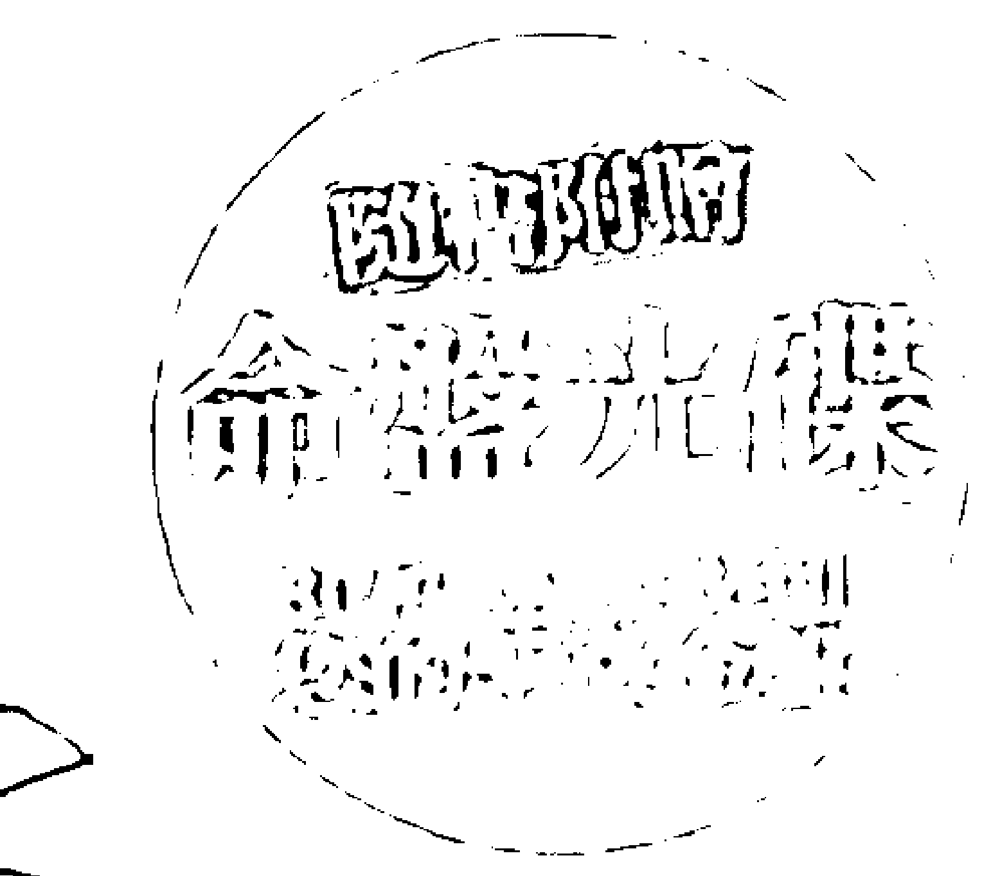
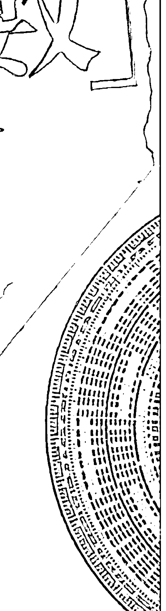
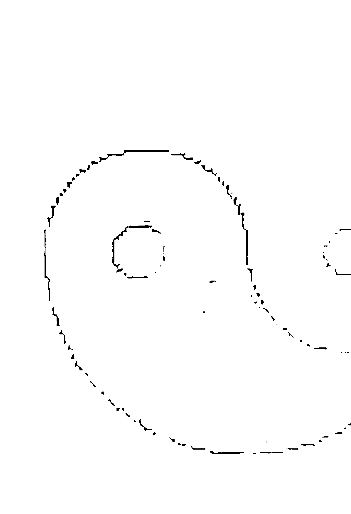
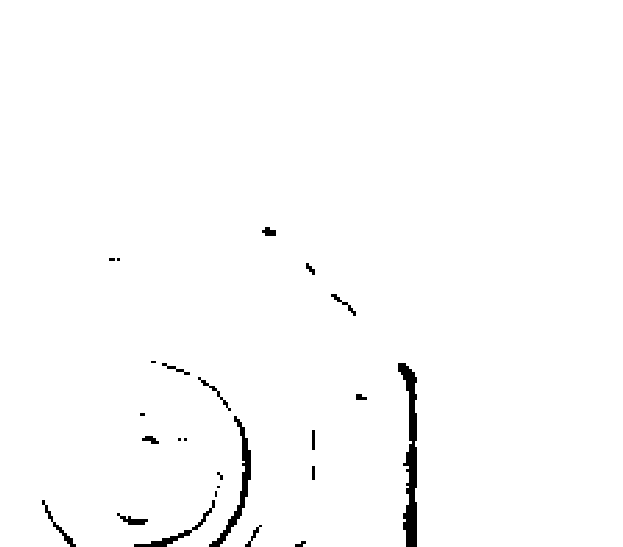

# 第一次學紫微斗數就上手

擁有本書，讓您30秒排出命盤，三分鐘解析運勢吉凶

> 中華星相易理堪輿師協進會全國總會 理事長 張清淵(東祥) ◇著

- ☆一書在手，讓您迅速推算出命盤以及流年吉凶。
- ☆最完整詳盡的解說，讓您有系統掌握斗數堂奧。
- ☆以實用為出發點，讓初學者也能輕輕鬆鬆上手。
- ☆附贈光碟，短短30秒毫不費力排出個人命盤。

## 自序

紫微斗數的入門書籍，市面上可說是琳瑯滿目，不過多數的書籍都是介紹主星的判斷方式，而且也無法做很深入透徹的詳細解說，對於小星的解析與說明更是零零散散，使得許多讀者只能望書興嘆，而不能登入斗數學的堂奧，甚至有研習多年也只是學到一知半解的似懂非懂之境界而已！誠是可惜之至。筆者自民國七十八年出版《神妙玄微斗數》一書後，承蒙讀者的熱烈支持，十餘年來不斷再版，又再版，再刷十幾版，深表感念之餘，亦發心編著有關紫微斗數的入門書籍、半年前出版《第一次學紫微斗數就上手》一書後，許多讀者與內行人都讚賞不已，一致認為書中內容不但淺顯易懂，而且條理分明，尤其是書中透露許多古傳真訣與筆者多年的論斷驗證心得，因讀此書而使得論斷功力突飛猛進的讀者大有人在，本書出版差不多三個月就傾銷一空，並有許多讀者紛紛來信，希望筆者打鐵趁熱，能儘速的出版本書之續集，以應讀者之所盼，並期盼以再次的興起紫微斗數的學習風潮，以讓初學者能駕輕就熟的就能進入紫微斗數之堂奧，並能領悟到紫微斗數之精蘊。

筆者的好友與門生弟子們也不斷催促及誠摯的希望余能迅速出版續集，笔者亦不敢敝帚自珍、抑秘自賞，因此再出版，第一次學紫微斗數就學會，一書，書中不但將六吉星與六煞星做出充分詳實的分析解說之外，更對於坊間一般書中所欠缺的小星論斷要訣，及將坊間書籍所欠缺而無法解說之四化星的來龍去脈均做詳細的剖述解說，而且毫無隱瞞的絕對大公開，將先師王清哲先生之真傳和本人多年之驗證心得公諸於世，而且又附錄筆者實際與人論證之命盤，以供讀者能夠更深入去了解操作論斷之方法，對於學習紫微斗數也將是一大裨益。

持有本書，等於是得到紫微斗數之創始祖師爺陳希夷先生的直接口傳心授之無上心法，對讀者與內行人而言，讀完本書，更是有醍醐灌頂的感受，第一次學紫微斗數就學會，絕對是你學習紫微斗數道路上的一盞指路的明燈，有志研習的朋友，本書

張清淵 謹序於板橋

## 前言

本书得以面世，除了前辈们筚路蓝缕，在紫微斗数的殿堂之中，留下了许多宝贵的经验与诀窍以外，笔者与好友白汉忠、陈启铨、林义章、颜英发、望元、陈慧明以及林志荣、蒋小刚等大师同好，平日在紫微斗数上的相互启发与观念之分享，也是重要的因素，而这些好友也都异口同声的言及笔者在《第一次学紫微斗数就上手》一书笔者著作之《第一次学紫微斗数就上手》一书，前一出版便销售一空，可见读者们对于紫微斗数的求知若渴，回想当初笔者研习紫微斗数之过程，不由得百感交集恩师王清哲先生、好友方外人曾国雄先生、铁版道人、潘子渔等人均已辞世，而好友望元兄却二次中风，然而好友林义章兄现今荣登高雄市总工会理事长，现今有三、四百个会员介绍，拥有三、四千万会员，笔者承蒙恩师教诲，好友之切磋琢磨，使在研究紫微斗数的道路上不至于迷失方向，这一次再接再厉，出版《第一次学紫微斗数就学会》一书，最主要是缅怀先师王清哲先生之教导与提携，及好友之督促鼓励之意。

中，对论命实例及小星之介绍评解太少，而且皆希望为发扬紫微斗数多进一些心力，故而笔者就针对小星及四化之详解及实例验证为重心再接再厉的完成了本书。第一次学紫微斗数范学会后，因此一般初学者或有志研研紫微斗数的朋友们，拥有本书之后，也等于吸收了诸位名师的心血结晶，相信日后功力精进、为人排忧解惑，应该不至于茫然不知所措，或不敢断然直言、或任以模棱两可、语焉不详的含糊其词来搪塞应付，如此也才不负笔者出版本书之初衷。学无止境，百川汇海方能成其大，然而学海无涯，笔者之拙作《第一次学紫微斗数就学会》之出版亦不过是抛砖引玉而已，还望读者们继续努力，领略更多紫微斗数的奥秘，为人生点亮光明路、造福人群

## 本書重點說明

一、斗數風行三十幾年來皆由大陸來台前輩異人－宋山壽先生（師祖）與陳贊先生（師叔祖輩）真傳、後人王清哲先生與康國典先生再傳於台灣北部，恩師王清哲把真訣傳授於我，而我為造福人群奉獻於社會，傳授弟子上百人，於是傳遍全省，更遍佈及全世界。師叔康國典先生風行於日本（東瀛）建道教「清宮」，全日本皆知。

二、本書諸說，以先賢陳希夷之創斗數全書為藍本，配合賦文歌訣，和恩師王清哲口傳心授，與本人三十餘年來印證之心得及同門前輩高人林永義先生之指導至部公諸於世，留傳於千古，造化於後學，所言皆實，可為斗數精進之藍本，及突破學習之黑洞。

三、斗數由十四顆主星和副星，再加上乙級星有一百多顆，本書皆一一剖明解說，以示後學，造化人群，書上所言皆本先賢學說，及恩師王清哲所傳真訣和前輩林永義大師所傳之法，和本人一生之心血所得，不敢藏自私秘，望能藉由本書之出版，而收拋磚引玉之效果。

四、斗數十四顆主星和雙星交会皆本人心得和印證，所言皆為真理，學者聞後如善加運用，造福人群，必有後福，但如持衛非為，恐遭天譴。

五、斗數十四顆星局性詳解，把斗數之精髓皆實際列人，尤其是斷訣秘法乃前航。張不傳之秘，今全部公開，望為後學弟子珍惜之，並能發揚光大，以廣救世濟人之梯。

六、干支與命身主之關係萬道傳秘授，恩師在世，囑吾不可妄傳，今全部公開，望術更能精進，如電腦科技之創新般，日月小變動，一年大變動，日新月異、乃吾師及先賢之功德，也是五術之幸也！

七、四化之解說，一般書籍或授課老師皆一言或一筆以帶過，本書依據斗數先賢陳希夷秘本和河洛理數之理，及前輩林永發大師之教去，更有本人綜合天文地理及古人三才觀念，與易經之理、象、數及本人二十多年研究應驗之心得，詳細說明，使後學之人，更能實際了解四化之真諦，而突破學習紫微斗數之黑洞，有緣者得傳，希望行功立德，以此造福人群。

八、本書將排盤省略，因排盤是固定之法，在一般之書籍皆有，為了不浪費編排之空間故以省略，其他更由基礎星情充分詳細的剖析開微，如有基礎者心能闢後更上層樓，研究多年無法突破者，必可突破學習紫微之黑洞，而解開學習紫微之密碼，可豁然開朗，如深研多年者，更能得到很多不同之訣竅，而使斗數之學達於爐火純青之境界一本書隨書附贈排命盤之光碟片一。

1. 九、本書以正統之紫微學說，絕不添油加醋，或標新立異，也不偏執己見，另創術奇，開宗立派如專以驚世駭俗之說而自創一格，以誤後學，一概不錄。

2. 十、書本之實際命例斷例，皆作實際論命之心得，所言皆實，姓名、人物、地點稍有改變，以避免徒增困擾言，如有雷同，也請勿對號入座，學術言論，不做人身攻擊，請多尊重。

3. 十一、本書因恐不肖之徒用以為騙財騙色或用為做其他之不法工具，則將違反本人付梓出版為濟世救人之初衷，及與宏揚紫微數學之心願背道而馳，故而將本人最為精湛而又為先師十清哲及：清道祖太上老君之所示，『將斗數學最珍貴，不可傳之千萬金難買之流日時訣隱而不宣』，請識者見諒，但識者自認為道德修為好，肯將此學用為濟世救人及願將之發揚光大者或有心、有緣者可與本人聯絡。

4. 十二、『五術學之最高境界為掐指神算（屈指神算），其學可不用人之八字（出生生年月日時，更不須觀人之手面相，也不用知道其人之姓名，只要知道時間、地點、方位而即可對特定的人、事、物加以論斷，並可知其人的前因後果及現今運勢之好壞，而彈指論斷吉凶於千萬里之外，無所差錯，本人學得仙人之傳，得此石破天驚之奇門遁甲絕學，配合紫微斗數之學的千年秘傳法門，自不敢擅此天傳絕學而自秘，但亦不敢傳，以免妄傳非人，但有德、有福、有緣、有份、有心者可與本人聯絡。到晚九點，但請保持禮儀，否則恕難作答：來電或傳真或E-mail或來信詢問，以做學術之研究（來電者最適宜之時間為早上十點。十二、讀書如對本書各章節有不了解之處，或對排命盤之軟體操作有疑問者，可

E-mail：chang.lan@msa.hinet.net
網址：www.cy22723095.com.tw
傳真：（02）22721846
地址：板橋市國光路一六・六號
客服人員：張小姐

## 第一章 六吉星應驗證命斷篇

## 第一章 六吉星總論斷篇

## 文昌星（別名：文貴、文桂、文魁）

文昌星為南斗第五星，乃文魁之首，主掌科甲、名譽、學歷、學位、正途之功名，是為文學之宿。文昌星五行屬陽金，主物質，於人身命，主人聰明儒雅、清秀聰慧、博學強記、機變異常、舉成名披衣紫、福德雙全、縱四殺沖破不為下賤，女命吉地得位充足，四殺沖破偏房下賤，僧道宜之，加祿權科重有師號。文昌為文明之星，人命得之聰明巧且多藝能，主文章發達，聲名顯揚，若生貴家，文必高第，出類拔萃，兩府之地，例如酉酉，必出二品，多生雄傑易，際遇若命有病疾之人，文昌雖旺有暗疾，若居陷地加煞，則易患神經衰弱症。文昌為科甲之宿，主聰明而有文學才華，而化科亦主有名望，故文昌化科時更見財官發達。但若文昌化忌在遷移或官祿宮，則為人作嫁，奔波勞碌，為人作嫁。

## 【斷訣秘法】

- 昌曲會合又合天才在命身、福德，代表其人智慧過人，如又旺，乃會見有奏書、博士、封誥，又逢化科之時，如逢有大型之考試、科舉，將可一舉成名天下揚。
- 文昌落陷化忌之命後主星，代表其人言語天下實際，有專長而無學位。
- 人之命宮，福德只見文昌不見文曲，又不逢化科星，則聰明而未必利。
- 星獨守且對宮之主星落陷，則空有才華而難得展現，因此常有懷才不遇之嘆！落陷則空有虛名，如落陷加煞來沖照，常因好管閒事而多是非，且為人多好高騖遠而流於白私自利，少有實權術之能。

文昌五行屬金，金性從革且內欲，其性涼而帶寒氣故氣急重，如逢化忌則代表其制度規章之事業，導致官司訟禍端難免，且時有重利輕義之事發生，或文書契約之麻煩，或學歷中斷，或考試挫敗名落孫山，或仕途功名受阻。如人在求學之運限於身宮遂文昌化忌在事業宮，見陀羅會有學業中途受阻之現象。

## 【疾厄宮訣秘法】

- 文昌星入命宮，福德宮，且文昌星在巳酉丑生之人，入廟於巳酉丑之宮位又會見其他之吉星，則代表其人可富可貴，但忌寅午戌生人屬陷地，主一生當中難得
- 文昌星會陽梁、樑存於財帛宮富貴而先難後易，陷地人命加擎羊、火星有巧藝之
- 文昌星與破軍同度為波文，逢忌煞沖會易有水災之厄，忌游泳、航海。
- 公海人口之大小、礙運、昌化忌，會因行政犯錯而受處分。
- 文昌星化忌逢白虎、官符、天刑、封誥，心與法律訴訟有関，如文昌星會見天姚、咸池、紫忌交對方，墓六煞沖回，男有花酒拆開而名望受損。
- 文昌星入疾厄宮，加煞曜，陷地遇火鈴擎羊陀羅則下晚湿婦便婦。
- 文昌星在疾厄宮，主肺、大腸、咳漱、哮喘、神經系統之病，有焦溫熱、心性急躁、肝

## 第一章 六吉星应证论断篇

- 木星多之宫位为急躁肝火旺。
- 火星多之宫位为心性急躁。
- 金星多之宫位为肺部咳嗽。
- 水星多之宫位为三焦湿热。
- 土星多之宫位为大肠脾弱。

时系星座原理结构详解
文昌星为时系星座，而时是包含在日之中，而日为月之一部分，月为年的一部分，而年代代表祖宗，月代表父母，日代表自己，时代表子息，故年是根、月是苗、日为花、时为果，这是一个人的生命弧线，因年为一年领导之岁神，俗称太岁，而年之下是为气，代表一个人的精神思想是为阳。而地支为质为里，代表一个人的物质或形之行焉，故年是一个人的精神思想与物质行为之领导。
而我是于今年的第几个月的那一天所出生，如西洋十一星座的排列一样，将一年分成十二个等分，一个月分成三十天，一天分成十二个时辰二十四小时，因此可知月对我们人的影响是比较持久而明显，如月令与季节的转换一样，故其作用力较强而稳定性也較強，因此月是屬生我、育我、養我，故也代表會干涉我，如父母親干涉我求學讀書，或做何種工作、穿什麼衣服，因而它影響我、創造我，如農曆五月份天氣很熱白天很漫長，十一月天氣很冷白天很短促之理一樣，而我是於那一個月份的那一天的那一個時辰出生，故由此可知你於這個月的某一天所出生，而你對這個月的月令節氣的精神，也就是天氣的冷熱寒暑之現象，你是不能夠自我主張或自我作主來改變它，所以是一種出於無奈的不得不接受的情況下來接受它。一天有十一個時辰，但時辰是從我出生的今天所誕生，因此時辰是為日所衍生出來的，是為我所生、我所洩、是洩出情力，所以它與桃花及才華之展露與昇華有關係，但它是暫時性、短暫性、是不持久、不明顯的，可以說是變化快、反應快。而時是為日所分生出來的，既然時是由日所分生出來的，因此時系星也就代表傳宗接代（桃花），也是我的延續如 DNA 的可再造，因此也是才華的展露，是愛的昇華及結晶。

紫微斗數的文昌、文曲、地空、地劫是為時系星的排列組合，因此這些星座有一個共通點，那就是代表反應快、變化快、適應力強，也代表聰明伶俐，因此可知時系星必與感情、聰明、桃花、精力、才華有關，但是為反應快、為短暫性、為不持久。

## 第一章 六吉星應證論斷篇

性，因此需要有很快的適應力，故變化性大，因此需要具有體力、精力及才華內斂的人，才能適應變化的、短暫的事情，及具備爆發性的衝力。

因此時系星座的特性，是其感情易流於放縱、或易變、或短暫、或說謊欺騙之現象，如學生在參加考試的時候，雖然能夠通過一小時的考試而及格，但這並不代表因為考試及格和分數比別人高就是比別人更好，因它包含考試的機運或其他因素，如今天的試題正好是你昨天有準備的，故有點不實在或有說謊欺騙的現象，而文昌、文曲是為從辰戌兩個宮位所排列出來之星系，辰是為天羅、戌是為地網，要衝出天羅地網需要有方法、要冷靜、要有才華、要有步驟，除了循規蹈矩、按部就班以外，反應還要快。而天羅地網代表被約束住，故可知從辰戌兩宮所排列出之星座，已隱含著出生就有意願被駕御，或甘願屈居人下的服務之特性。而文昌星是由戌宮所出而排，如在西方五行為金，而金為收斂主收成，戌宮又為火庫，收斂收成入庫，倉庫中很熱如火庫，而文昌屬金，金入火庫被火煉，故文昌星是被煉出來的，而真金不怕火煉，故文昌星之文章、文華較有內涵，而又有已成熟、已成器、已成鐘鼎之象，金經火之煉故性烈而文筆銳利能指桑罵槐，文昌入庫從戌宮而出，代表有領導組織能力。

文昌五行屬庚金主物質，是理論文學星座，為正規之軍事戰術學星座，文昌為庚金而金性高爽，而寒性較為無留意，是以理法規則為用之現象，也是為學術教育星，有文墨、寫作、書法、繪畫之天分，或代表有關政治、或制定法律、或以官職從事一個人事之管理之法師。

### 男命：

性情磊落，富有文學藝術才華，博學廣識，反應異於常人，偏於仕途功名，但多有先難後易、先苦後甘、晚期可樂，略帶孤僻而耿直，重理智而寡情，崇法而事理分明，故較欠豪情意，事業心重可吃苦耐勞、辛勤耕耘，有智謀，自尊心強而略帶傲氣，中晚年有聲名：文昌星吉凶歌訣：

> 「文昌坐命旺宮蔭，志大財高抵萬金，文藝精華心壯大，須教平步上青雲。」

### 女命：

溫柔止淑閒雅，有古典女性之美，人緣佳，好扮飾，事業心強，多幻想，言語不實，知人善任...，亦福不全。

> 「文昌守命亦非常，限不夭傷福壽長，只怕限沖逢火忌，須教夭折帶刑傷。」

> 「文昌女命逢廉破，陷地擎羊火忌星：若不為娼終壽天，偏房猶得主人輕。」

### 次命文昌星吉凶歌訣：

> 「女人身命值文昌，秀麗清奇福更長，紫府對沖三合照，管教富貴若霞裳。」

## 第一章 六吉星論斷篇

限過文昌不得地，更有羊陀火鈴忌，官非口舌破財時，未免刑傷多晦滯。

> > 「文昌之星最為清，斗數之中第二星，若遇太限與二限，士人值此占科名。」

古云：「鈴昌陀武限至投河」，如武曲、文昌、鈴星、陀羅在辰戌兩宮如又逢武曲陀羅同宮，而武曲貪狼、擎羊，再逢武曲或廉貞化忌反流年來沖會，易挫敗或意外之兆，或是會有水厄之憂，不一定指投河湖水。

身材臉型：長圓型臉、單眼皮而眼睛迷人、中高身材、先瘦後胖、兩眉上揚、兩眼有神銳利而黑白分明、唇紅清香、法令有威、牙齒整齊、皮膚白，如會見封誥於輔佐之位其人有痣，如齡逢紫微多有斑痕。身體部位屬肺、帶主寒氣、少年黃白臉色，中年白潤臉色，老年白黃臉色。

- 優點：聰明、反應快、應變能力強、智慧過人、博學多能、耿直、事理分明、性情磊落、嫉惡如仇、深謀遠慮、志向遠大、天生有愛好藝術才資。

- 缺點：略帶孤僻、有漢氣、活飾、情意欠缺、較任性、好大喜功、幻想多、不切實際、感情多變。

在人：心理方面：為人微、禮威、崇法、嫉惡如仇、多管閒事。

- 情感方面：重理審、守規則、崇法、寡情。

### 文曲星（别名：文华）

文曲星属北斗第四星，乃文雅風騷之宿，主掌科甲、名聲、異途之功名、文墨、文章書長、亦作舌鋒刀筆之徒，文曲五行屬癸水主精神，是為文章之宿，臨人之身命運作斜華、之客，但桃花浪滾，人仕無端，若於官宮注定富面貧而執政。若文曲單居身命，亦主進學聰明潁悟，亦作無名舌辯之徒，因文曲星屬癸水星性，時系之星座是為日之所

在物：紙墨筆硯等一切文具用品，法律、政治、宗教、組織法之書籍、報刊、電有、通信、判決書、有價證券、診斷書。

在事：有關國家政治、法律及有規定性、組織法之制度，帶有權威性及文學性之計政、有關文學、書法、繪畫、藝術、樂律之條文、典章、法令、政法、考試、合約、契約、決策事務。

在天：氣候寒冷冰雪之天。

在地：有文具店、學校、書香之家、學校用品、六法全書、有價證券、診斷書、文具店、制度、權威性之計政、藝術、寫作、法案、條文等。

在數：四九。

## 第一頁 六吉星意論斷篇

主天漢，曲之五行屬癸水，水之五常主智，故曲主智慧，正如一江春水向東流，水流向海之勢，是水波，如洋、如海洋般的流水態，正如其智慧無窮，亦不怕得難，直打不怕難，故為智慧之士。曲則多變化，化氣為舌辯，司掌優雅、文思、艺术，落陷逢煞忌沖破則腦有其表，而在研究事理之時，則常會被問題糾住而膠著不解，或主其人言不由衷，或爲便於自己，或主其人常有懷志走天涯，但卻頁無長短走，故而常有英雄氣短、生不逢矣，落空亡不遇之嘆。曲也依宮位起而排列，辰、戌、丑、未四墓庫，是四墓庫，水庫雖有被拘束之現象，但水庫有調節水位高低的功能，以作爲泄洪或蓄水之用，如水從水庫必氾濫成災，若水太之本性是流動的，是奔騰的，必須導引、疏洪，否則必氾濫成災，故文曲星容易對事執不滿而多是非，故也常有懷才不遇及生不逢辰之嘆：若以天干之合化及五鳳遁，如甲與己合化土，丙辛合三之五鳳遁為甲己起甲子，丙寅、丁卯、戊辰，是戊辰，故甲己合化土，如乙庚合化金，戊癸合化火，丁壬合化木，故甲己合化土，乙庚合化金，丙辛合化水，丁壬合化木，戊癸合化火，故曲之五鳳遁為丙丁，丙辰到辰宮是戊辰，丁巳到巳宮是己巳，戊午到午宮是庚午，己未到未宮是辛未，庚申到申宮是壬申，辛酉到酉宮是癸酉，壬戌到戌宮是甲戌，癸亥到亥宮是乙亥。

## 第一次学术技术教学会

辰，而屬金，故乙庚合化金，因此天干之合化是逢辰则化，依此類推……從以上之測而知天干之合化為逢辰則化，而文曲星是從辰宮起而排列，故文曲星之心情起伏變化很大，因而常有見風轉舵，或做事沒頭沒尾之現象，此如文曲星入財帛宮則代表其人，八面玲瓏，隨機應變，常因輒換首或亂投首而吃虧，主無恒心。文曲乃文章之宿，主文雅風騷、眉目清秀、面帶幽愁、清秀伶俐、言語優美、善辯論，五行屬水而水主智有旁門之聰明、反應快、有創造性反藝術之天分、略帶孤僻不太合群；文曲主科甲乃文章之宿，但為異途之功名而非仕途之功名，善舌辯富有之才華奇巧之才華，且能雙雙出眾，而化科星是主功名、貴人，故文曲化科時其口才好大作佳，當研究理多學多能，主有出頭拔萃，並常有貴人扶持獎揚，廟旺之時則其子華更是受人肯定與扶持，可大放異彩，有博學多聞、雄心萬丈之勢，如文曲落陷配主其人，雖有其表，只是浪得虛名而已，如文曲落陷加煞忌沖照，則主其人常有花言之語及瘋狂之行為，或常因多逞口舌之能，而產生多是非之現象。文曲星五行屬水，水之五常主智，化忌是水上加水、智上加智，但化忌主耗損、是非、暗昧，而文曲主異途之功名，故文曲化忌是水上加水、智上加智，是非加是非，代表其人有異常之智慧，可開創新領悟力強，並有斜路之慧根，於兩旺之時代代表其人有

## 第一章 六吉星應證論斷篇

創造力，富推理及分析之能力，且頭腦冷靜清晰，可向科學上不可能之界限挑戰，如逢主星廟旺之時又加吉星來會照，雖有困難及是非，但仍可得到完整之構想而付諸實現，但若文曲於落陷之時則又代表多是非，而一切變成不理想不中道，如文曲落陷又加煞忌冲照時，會流於剥削不義之舉，或淪爲欺騙之行爲，而是非綿綿，加廉貞、天刑與白虎會導致官訟纏身。

> 【斷訣秘法】

*   文曲單居身命逢化忌星，加羊陀、火鈴冲破只宜空門。
*   文曲與廉貞共處必作公吏，如服務於私人企業，也主其作業會與公職有關，如民間之軍品加工事業。
*   文曲與太陰星廟旺爲蟾宮折桂，有蟾福，且一生多蟾遇。
*   文曲星最怕逢破軍恐臨水以生災且貧寒，故與破軍則多漂泊貧苦且常換工作，一生刑剋勞碌難免，凡事外華內虛。落陷逢忌煞冲爲水中作塚命喪黃泉。
*   文曲喜與同梁及武曲之宿相會，則聰明果決，如煞多冲破，僅宜僧道山林之人。

## 【疾厄断诀秘法】

*   木星多的宮位主精神過敏、神經質。
*   火星多的宮位屬上熱下寒、寒熱之症。
*   金星多的宮位為陰虧、神經痛、經水不調。
*   土星多的宮位為胃寒。
*   文曲守命於巳酉丑居侯伯，武貪三合同垣將相之格，儒林武將，文昌遇合亦然。
*   文曲若陷於寅午戌之地，逢巨門、羊陀冲破喪命夭折，逢火星、鈴星加化忌小心水火驚險，若亥卯未旺地與天梁相會主聰明博學，殺忌冲破只宜僧道。
*   文曲與武曲分守身命而又會合左輔、右弼有將相之材，文武雙全掌權柄有領導地位。
*   女命文曲值之有清秀聰明之貴，若文曲居陷地逢煞忌沖破淫而且賤。
文曲五行屬癸水主精神欠佳、上火下寒、陰虧、先天不足、經水不調、神經痛等症。
水星多的宮位為先天不足。

男命：為伶俐善辯、先瘦而後壯、性情磊落、博學多能、有研究心及旁門左道之異途聰明。

文曲化忌則較無專長，孤傲不合群、性情古怪、有標新立異之作風、或詩詞言語較突出、風流而拖泥帶水、較不誠實、或易捏造事實、喜享受、重欣賞而不重於慾、喜多變化。與天同、天梁或武曲交會則聰明果決，逢煞忌沖破宜僧道山林之人。

### 吉凶歌訣：

> 「文曲守命最為良，相貌堂堂志氣昂，士庶逢之應福厚，丈夫得此受金章。」

女命：為身材苗條、氣質佳、有點微微雀斑、文雅風騷、有幽默感、有怪異之靈感、喜幻想而重性慾、不切實際、易有感情困擾。

### 吉凶歌訣：

> 「女人命裡逢文曲，相貌清奇多有福，聰明伶俐不尋常，有殺偏房也淫慾。」

### 文曲入限吉凶歌訣：

> 「二限相逢文曲星，士庶斯年須發福，更添左右會天同，財祿滔滔為上局。」

> 「文曲限過度陀羊，陷地非災惹禍殃，更兼命裡星辰弱，須知此戌入泉鄉。」

身材臉型：圓長臉、形顏俊美、面白清秀有痣、面帶幽愁感、雙眼皮笑起來迷人、中等身材軟弱、少年青黃膚色、中年白帶黑潤臉色、老年青黑臉色。

- 優點：重感情、伶俐善舞口才佳、異途之功名、喜研究事理、有別人不可能想得到之獨到推理才華、可以樂觀看待事物、標新立異的作風、喜推理與假設、文筆不錯、腦筋聰明、智慧佳、言語受美、直徑柔之靈感與智慧、重欣賞而不重欲。

- 缺點：風流、孤獨不合群、花泥帶水、擺濫事實、精神不正而怪異、多變化有欺騙、狡欺、下流之意。

在天：為雷雨之天，烏雲合之天氣。

在地：遼有山光、金礦、之真地、水池、水坑、微凹之處、戲院、補習學校、圖書館、印刷廠、出版社、風景區、山水幽美之地、瓜果園。

在人：心理方面：思想怪異、想法變化多端。
情感方面：重感情、容易受、拖泥帶水、處處留情。

在物：文具、印刷、宗教用品、婦女用品、音樂器材、書刊文物、古典樂器、奇花異草、蘭草用品、歌曲用品等。

在事：科學上研究性之計畫事務、宗教、五術風俗之奇門秘方或邪術、秘訣、朝代歷史文物之記載等事契約票據事務。在數：為六。

## 月系星座原理結構詳解

-   ◎左輔、右弼為月系星座，月系星座以傳統的八字命理學而言，月柱之干支是為父母，所以與你的自我，有上下之關係，父母為生我、育我、養我、干涉我、影響我、創造我。因此我是出於無可奈何，不能夠自我主張，不能夠自我作主的，凡事有不得不得樣的現象，因此左輔、右弼的貴人星與天魁、天鉞的貴人星的作用不太相同。(請參閱時系星座之原理結構詳解，則將可更深入了解月系星座之意涵)

-   ◎左輔、右弼屬於輔助你的人，天魁、天鉞屬於幫助你的人，因天魁、天鉞是不入天羅地網之辰戌兩宮，因此天魁、天鉞代表要幫助你的人，並不受儀則規範的限制，就可以直接的幫助你，如你考上高普考，才可得到分發考核工作之分配，在分發分配工作當中，並不受到儀則規範之約束，就可直接的幫助你，但要幫助你之前，你自己必先努力用功才能得到高考的好成績，如此別人才可能幫助你，此為錦上添花的帮助，或者你本身很有才华，但却不受重视而默默无名，一旦你的才华能力被发现就可马上用你、帮助你，不必受仪则规范的限制，此为雪中送炭的帮助，是为天魁与天钺的贵人星之力。

◎左辅、右弼是从辰戌两宫出来的，代表人一出生下来，就在这个天罗地网之内，就在这个仪则规范的社会范畴之内，而且一定要遵守，要安分的、按部就班的、循规蹈矩的循序而为，因左辅、右弼是从辰戌两宫出发排列，代表本身就是仪则，规范，而本身也是仪则规范的执行者，而且本身也愿意遵守此仪规，也代表本人很愿意的被天罗地网之规则仪范来约束，而安分守己、循规蹈矩的遵守，因此左辅、右弼就有愿意被驾御的意思存在，这也代表着左辅、右弼可居于人下安分的、甘心的、被驾御的来辅助他的主人，因此左辅、右弼不会好大喜功及争权夺利。

◎文昌、文曲是很聪明的，才华洋溢的，可举一反三的，但要逢化科才有，也就是要有考试的时候，你才有机会表现出你的才华，而这个机会是政府订立的或公司制定的，不是你自己决定的，这也代表这些机会是别人给你，你才得以有表现的机会，所以是保守的、稳定的、长期的，不是一下子就可以看出成果的帮助。

## 第一章 六吉星運途論斷

但這個機會一閃即過，今年一過要等到來年，說不定來年又要費時間，或者試題內容法則的改變，況且今天這個機會，今天一過就沒有了，它是有時間性的，所以文昌、文曲除了要靠自己的聰明才智苦學，還要掌握時效，應用時機才有所表現，但還是受制於別人。

◎天魁、天鉞如星辰貼身之傳令護衛，主動是皇帝自己找上門來進選的，我不必去爭求，縱使要靠心機去爭取也沒有用，所以天魁、天鉞是有權威性，如李遠哲先生自己本身很靜、很肯學問，是諾貝爾獎得主，所以政府主動找他，他不必找政府，但基本上本身要有材質學，要有才華，正如三國時代劉備三顧茅廬孔明之情沉亦是如此，所以它不受像則規範的限制，是錦上添花、是雪中送炭、是權威性的、是實質性的、是立即可見性的、是自由而不受限制性的、是直接性的貴人之幫助、幫忙。

-   ◎文昌、文曲本身遇到有工作機會的考試，才可脫穎而出。
-   ◎左輔、右弼是你在工作當中，而在與工作有關的情況之下，按照順序的幫忙。
-   ◎文昌、文曲喜歡明秀麗、學術研究、出世榮華，利科學考試，斂獲自私自利。

## 左輔星（別名：善令之星）

左輔星為北斗帝極之相輔星，是為相佐帝極主宰之宿，司善令，畫外通，在數主善，在士，命中無失陷，惟有旺弱之分，五行屬陽土，利陽火，是為政治文學助理星壟，全家或全體受惠之星，可到處降福，於人之身命相敦厚、樂觀進取、誠懇大方、不畏一切艱難。

左輔星常帶主宰之星的左右之相，如董事長身旁的謀士，所以主有福氣，守身命諸宮降福，主人形貌敦厚、慷慨風流、外表忠厚老實、很好相處、不會與人計較、談吐幽默、風流而不下流、很有人緣、人人好、樂、奇、祿、權若得三吉沖照主文武大吉，火忌沖破雖富不久，僧道清閒。若與紫微、天府、化祿、化權在三方四正會合，不啻文職、武職、文士、農市，生意名利雙收。如被火星、鈴星、擎羊、陀羅加化忌沖煞，事業有成有敗起伏不常，可研究佛道哲學會很逍遙自在，而過著無憂無慮。

-   ◎左輔、右弼為能者多勞、處處降福、服務大眾，利選舉、推舉、推薦，較淡泊名利。
-   ◎天魁、天鉞福澤深厚、貴人提拔，有權威性，利出仕、特任，較具權威性。

## 左輔星（續）

的生活。女命得之能幹家務、溫文儒雅、尊重賢慧而通曉事理、有禮儀規範，旺地對贈，有被沖破則不利。左輔為戊土，但從辰宮排列而出，辰為水庫，以一年十二個月來講，辰為三月而三月為季春，三月之時樹木已茂盛的展現在你的眼前，茂盛的樹木可臣來疏土，將土壤內的水分、養份舒發表現出來，水庫內及土壤內之水，得此舒發才能滋潤萬物，而使生物表現出生氣蓬勃的現象；而水庫內之水須經疏導才可流入農田灌溉農作物，或流入自來水之過濾水槽，經自來水之輸水管輸入家內才可飲用。

當下雨或自來水之水流，如不經疏導而泛濫成災，須經疏導引通才能入水庫，因此疏導流才能流入家庭飲用或農田灌溉農作物也好，或流入水庫也等、都有一定的管道來疏導流通之能流入水庫，而左輔之辰宮所出，而左輔之五行屬戊土，水庫之土能容納很多水，因此左輔入命身也代表其人之組織能力很強，也代表其人肚量寬宏，因肚量寬宏才能容納很多水，因此左輔入命身代表其人有才華又凝聚力，才能容納很多水，也代表其人有領導才能，而且願意遵守禮儀規範而安守的循規蹈矩，一切按部就班、親疏分明的，代表保守的、穩定的、漸進的，才華洋溢有謀略及策劃的才能，水庫可容納很多地方的山泉水、溪流水，代表一個人書讀很多，知識水準很

## 第一次紫微斗數學會

高：
水庫之水是備水而用，故在輔星人命身也代表其人，常會有備而有用的個性，因此個性溫和飽讀詩書，不流露脾氣如季春（農曆三月為季春）一樣，朝氣蓬勃充滿活力，二月天氣暖和故和其相逢有人緣，因此主輔在數主善（數主後天的現象）。五湖四海之水流入水庫，如四海之內皆兄弟，故代表其人喜交朋友，而什麼水都流入水庫，故也代表其人度量寬宏，但也代表其人有著較無目的之隨便及滿信義。灌溉水或飲用水之流放皆照時間季節來，所以六主輔星人命身之人較注重信義。

灌溉之水庫有調節水位高矮之作用，故適合中間人或為人調停之工作。水匯流入水庫之障礙作瀉，故代表其人若懸河。水庫是用來調節水位及做灌溉、交通或飲用，故之補入身命，代表其、服務心及多方面之才華。而水可散布運行故代表其人思想如水，流來流去很新潮，水可從這邊流到那邊，因而左輔入命身之人多會博古通今、見多識廣、學識淵博；

火車不可汲水、不可乾涸，因此水庫有儲水之功用，而儲水是把大年或以前的雨水、溪流水、泉水的水儲存起來，因此主輔入命身、福德之人喜回憶過去及念

## 左輔星（續）

舊。水庫之水灌溉就給水，故代表左輔可容忍別人，哪裡要水，哪裡滿水，哪裡沒水，人常有主見，不易受人影響，但運動商因此也主容易原諒別人。

> 贊三：「左輔原屬土，右弼水為根，失君為無用，三合宜見君，若在紫微位，爵祿不須論，若在夫妻位，主人定二婚，若與廉貞併，惡賤迍邅，與吉弼在辰戌丑未同度或對拱，主一生受用無窮，如又會到化祿之紫微星，或化權及天府星代表其人有權柄，其人可白手當家，與廉貞、天姚、咸池、化忌逢白虎、天刑迍邅而犯官司刑訟。」

> 贊曰：「輔弼為上相，輔佐紫微星，喜居日月側，文人遇禹門；倘居閒位上，無爵更無名，妻宮遇此宿，決定兩妻成，若與刑囚處，遭傷作盜賊，」榮歡、天府、武曲、貪狼、祿存、化祿、化權、化忌合又落陷無作盜賊。落陷會羊、陀、巨門、廉貞、破軍、七殺、擎羊、廉貞、化忌合又落陷無作盜賊。天機太陰紫微祿權倉武會、文官武職多清。

# 第一次學紫微斗數就學會

天又曰：『羊陀火鈴三方照，縱有財官非吉兆，廉貞破巨更來沖，若不傷殘終是

酒歌曰：『女命左輔主賢豪，能幹能為又氣高，更與紫微天府合，金冠封贈福滔

光又曰：『火陀相會不為良，七殺破軍定不長，只可偏房方富足，聰明得寵過時

君歌曰：『左輔限行福氣深，常人富足累千金，官員更得祿權照，職位高遷佐聖

哀又曰：『左輔之星入限來，不宜殺湊主悲哀，火鈴空劫來相湊，財破人亡事事

## 【斷訣秘法】

多見離宗兼出，出外吉。
左輔與火鈴逢化忌星，火羊火鈴、竊盜、劫、受騙、是非。

+   - 三輔與斗口、天刑化忌、紅鸞、火星、鈴星、封誥、破碎、不順
- 主輔或右弼化科落由華別久之場，或向和人借用之財。化科落身落別人之場，

大財帛久遠之財不絕。

主輔五行屬戊土屬陽土，疾厄宮為脾胃不佳、腳腿浮腫、濕熱、下痢等症，而

多為伴妻應

## 【疾厄斷訣秘法】

+   - 六星多的宮位如天機化忌逢斗口、天刑、封誥、鈴星、陀羅、火星、加煞
- 六星多的宮位為無性門熱，加文昌化忌逢鬥宿。
- 二星多的宮位或主病為下垂之症。

廉、三克、擎羊為因受門起，加火星、鈴星為因癸燒而引起之症。

男命：為人緣佳、敦厚有餘土風度、為人正直而端莊、精明文墨、對事認真、服務心切而好善、喜助人之美、處事光明磊落、每交友、能寬恕別人度量大、允文允武、有威慈、性風流。

# 第二次學紫微斗數就上手

女命：屬溫貞重感情、多聰智、做事認真持家有方、常助人之善、端莊、人緣佳。

身材臉型：圓美臉型、眉清目秀、身材端庄、黑亮眼神有光而誠、膚皮微皺、美豔溫良、有高上之風度。女命之貴安於清秀、秀外慧中、有人緣、端莊、中高身材、性情端爽。少年帶小腰色，中年帶麗腰色，老年帶豐腴色。

優點：敦厚重德、能文能武、喜無助人、正直有信義、有謀略、智謀、服務心切、做事不疾不徐、有操守、無怨無悔。

缺點：風流、奢侈、好大喜功、愛面子、固執。

+   在天：暗昧而無實勞之災厄
在地：微高之屋宇、商業機構、老勢高而俊秀、裝飾豪華之街市、繁華大廈之大廈
在人：心理方面：光明磊落、慈祥、有助人之美、服務心切。
情感方面：重感情、多理智、凡事循規蹈矩，以才能為準
在物：文物、古董金石、印章、珍藏物品、車輛、幾埋於地下之陶器、銀

在事、參謀計劃之作業、智囊團之參謀、心得、仁德色變、推薦人才（正途）、秘在数·

# 右弼星（別名：制令之星）

右弼星為北斗帝相佐之星，司制令內道，是為相左帝座主宰之宿，在數一（後天）主善，五行屬陰是為癸水，利陰貴。是為管理或策謀之助理星座、教育工作、文生夢寐之星座、安全調查之星座，於人命主慎重、文靜、好施濟、樂觀進取、無懈、忠、善從人願、小心謹慎、胸有謀略、不具積極。 輔從辰宮出來而排列，故有疏散之意，故不主，而計從戌宮出來排列組合，而亥亥宮，年十二月來講戌是為九月為西方，六月是三秋收之時，其氣收斂果實已文熟，或熟後必收成，收成而後必收藏入庫，如果此時不收成或收成後不入庫，則一切將無所獲，如此則須等待來年，故右弼有收藏之意故為內道，收藏入庫有執行的 責任，故有辦司制令，司就是執行或負責，制有制變、典章、規則及監督的現象，令 有命令、行動，因此右弼有執行命令的現象，給人有種壓迫的感覺，而右弼屬水、戊

# 第一次學黃極玄妙數學會

為火庫，水入火地（庫）發火交戰，故右弼之人帶有雙重之個性，或主其人之血型為AB型之人，或常有晴時多雲陣雨之個性，而水火交戰代表不合，或精神常受折磨之現象，故右弼之人有時受憂患而略帶冷漠，文昌世是，因文昌五行屬金，金、申而受火煉，故文昌有點憂患而略帶孤獨之象。果實已成熟，要知道什麼時候可收成，故要小心謹慎，如何收成入庫，及選擇何者可為種子，何者可賣掉，何者留著自己食用，這都要很清楚的排列放好，故心須很細心、很謹慎、很溫柔，而且要能觀察細微，知道如何收成，如何入庫、如何選擇何者可為優質之種子，故代表其人善解人意，你來就知道你的來意。收成好之後要入庫，入庫要很仔細的放好，故代表其人細心而膽小，這些必須要有知識才可做得到，代表其人博古通今什麼都要，而月事皆以大年的計算，來作為今年的依據，可重新再來計算，故代表其人很有分析能力，故代表其人很喜歡，而底庫的東西分門別類的排列組合，故什麼東西書收得很好，故代表其人苦與，交往比較有放不開之現象，但相處久了以後，才會去幫助人，而做事常以古法準，故有依賴心，果實收成後要選擇一些做種子，一些賣用，一些保存，些販賣，些儲存，故代表其人很有幻想能

# 第一卷 六吉星总论

右，也代表節俭，也代表做事情按部而有條理，但有沾泥帶水，有凡事慢慢來的習慣。

> 訣曰：『右弼帝極之星，守身命文星特通，紫府吉星同垣，財官雙美文武雙全，羊陀火忌沖破下局斷之，女人賢良有志，縱四殺沖破不為暖，僧道成閒。』

右弼水，南北斗善星，佐帝命入廟學重清秀、耿直、心懷寬恕、好施濟、有機謀，諸宮降福四墓尤佳。失若為無用，若會紫府、天相、昌曲，終身福壽，若與諸殺同垣又羊陀火忌沖合者，福薄亦不為凶。有暗痣、瘡痍、傷殘帶疾，左右、昌曲逢羊陀會生暗痣、胎記（較特殊之瘡痣）。女命會吉星，旺夫益子。

> 男命吉凶歌曰：『右弼天樞上宰星，命逢重厚最聰明，若無火忌羊陀會，加吉財官己世英。』

> 又曰：『右弼尊星入命宮，若逢殺決主常庸，羊陀空劫三方法，須知帶疾免災凶。』

> 限吉凶歌曰：『右弼入限最為榮，人財興旺必多能，官員遷摧僧道吉，士子攻苦必須名。』

> 人曰：『右弼主限遇凶星，掃盜家資百不成，士道傷敗奴欺主，更教家破主伶。』

> 古云：「辅弼为上相，辅佐帝圣君，喜居日月侧，文人遇奇门，独居闲位上，无暂无名。」

右弼为水属阴，生於西四方，为清阳溪，先天不足清神不足，坐下下调，上火下寒，肾膀胱之症。

## 【疾厄断诀秘法】

+   *木星多的宫位，主肝胆不足、神短欠、神经质；
*火星多的宫位，主急性、肝火、肺时多咳喘阵雨、便秘；
*金星多的宫位，主大肠下塞；
*水星多的宫位，主膀胱逆流；
*土星多的宫位，主水不调；

左辅为土是戊土，而为茂盛之茂，为善令之星，如辰之茂盛之戊土植物，万物朝气蓬勃向外扩张，但一门从申正为主，适合人心的对外发号司令，为外通。而右辅于东西收成后之入会通，一失，具有顺序排列，为内容顺序进而计划制定的一...

# 第一章 六吉星應證論斷篇

法令制度規則，以中正而適合人心適用為主。故左輔、右弼為內適與外適，為中和而不偏差。

## 【斷訣秘法】

+   * 右弼與天同、太陰、左輔等較柔弱之星同度，為高級主管之秘書，或機要人員，一生衣食無缺。

+   * 紫微、天府、武曲、貪狼、七殺等會左右，則手下有人為你傳令打拼，一呼百諾。

+   * 右弼與廉貞逢忌加擎羊則為人奸滑、凶惡、名聲不好。

+   * 本命是桃花格又逢一、四、七、十月生人，左右同度於丑未兩宮，或交會於辰戌兩宮，則代表其人之感情易有私情，或二度婚姻，或外頭有小妾，左輔是明著來可以對外公開的，而右弼是不讓人知道而掩飾。

+   * 左輔、右弼入事業宮則會有副業或兼職，左輔代表有兩個半公開之工作或事業，右弼代表一明一暗或家庭加工。

+   * 左輔逢天魁、天鉞加台輔、封誥於廟旺之地，代表其人一生衣食無缺，是福壽

# 第一次學紫微斗數就學會

右弼入財帛宮為間接之財，或過手之財。

男命：端莊文雅、壯大寬宏、心地善良、有急智反應好、重感情、舉止文雅厚重、心性耿直、有謀略亦有私心、右弼獨守男命或主星不旺，為侍從跟班、或離宗、或庶出，落陷與羊陀相會意氣用事易被利用。

女命：為善從人願、面帶笑容、小心溫順而清秀、好趨濟有才智、重感情謹慎、持家有規短、端莊。

身材臉型：臉型小圓長臉型或小方長臉型、面龐清秀、眉目黑白分明、舉止文雅、面帶笑容但有點愁愁臉、文靜清秀。男人言詞幽默，女人外表比實際年輕、善羞、含蓄。加對誥面微麻之女人。中矮、矮壯、溜肩、有痣胎斑痕。少年青黑臉色，中年黑潤臉色，老年黑黃臉色。

+   - 優點：喜暗助人、量大寬宏、有成人之美、謙恭、善解人意、喜歡為人調停、精進之墨、有才智、謹慎、服務心強。
+   - 缺點：拖泥帶水、厚薄不分、有私情及治愜。

在天：氣侯爽朗有點陰暗之天氣。

## 第一章 六吉星应证论断篇

+   - 在人：心理方面：有謀略、有忌冒、有私心的暗中或私下助人。情感方面：重感情、有私心、小心護顧。
- 在地：水坑、水道、水池、井泉、依牆而築之小屋、近水河岸之地勢、景色美麗之河海、沙漠風景區、噴泉或陽星、室內之游泳池、彎曲之河道、水缸、水壺、景盆、蓮河、景湧清幽、或大庾茅屋單獨之平房小而精緻、有勞碌持家務之人。
- 在事：一切私有不屬正途之文化工作、參謀作業、提案草案、保留案件、暗中推薦、信用安全等調查之事件。
- 在物：文房四寶紙墨筆硯、私有之具、水產品如珊瑚、貝殼、珍珠。
- 在數：六。

天魁星（别名：日貴、陽貴、天乙貴人）
天魁星為南北斗之助星與科舉吉之神，主掌科名，主文星考試之宿，五行屬陽屬火，是為科名考試星，代表典型人物制度星度，而昌曲亦主科名，昌曲為時系星曜主考試能合文務題名，故其聰明才智博文多學有關，因此昌曲為考試，而魁鉞亦主科名，但魁鉞是為在科名上之提攜與提拔的力量，因此魁鉞是為出仕，因此可知文昌、文曲為時系星座，其剋應只在一時的成敗，故疾而明，短但不持久。而天魁、天鉞是年系星座，而年系星座主生的榮辱與興衰，故其剋應較快而隱但較有持久性。

天魁別名‘天乙貴人’，若日天出生之人，再當，命中同科甲之星，於人之身命如不富貴亦主聰明，為人清秀美麗、有威可畏、有儀可象，若人身命逢之更得諸吉加臨，三台吉星守照必主少年登科及第，若逢煞忌不為主之華秀士，亦為弟子之師，限步逢之必主清高名成利就。歌曰：‘魁鉞命身限中強，常人得此足錢糧，官吏逢之高選擢，必定當年面帝王。’

天魁為南斗善助之星，化氣為陽貴，身命逢之更得紫府、日月、昌曲、左右相湊，又逢祿祿加臨必少年登美妻、早年登科揚名平步青雲無不富貴，若遇大難必得貴人救助，若遇小人亦不為凶。限步巡逢必主女子添喜，生男則後雅八學功名有成，生女則容貌端莊出眾超群。歌曰：‘天乙貴人眾所欽，命逢全帶福彌深，飛騰名與人爭利，博雅皆通古與今。’

天魁為火，主文墨考試，人命坐宮同宮或得三吉聚無不富貴，況三星又為上界和之神，若天魁星臨命宮，天鉞星守身宮，更逢權守得諸吉加臨，雖不富貴亦主聰明，富貴以後進基業，則不作常人論斷。但此論不正確，因常人就是常人，而貴人就是貴人。

# 第一章 六吉星應證論斷篇

人應是一生中都是貴人，而不是一個人到了四十歲以後發達成功，而使以前的貴人現在就變成小人，更何況天魁、天鉞不入辰戌天羅地網二宮，而墓庫應是辰戌丑未四宮才對，因此天魁、天鉞過了四十歲以後，逢墓庫之運，則不作貴人之論斷的說法是不準確的。人逢貴星者有凶不以爲災，若貴人星居官祿者，賢而威武且可聲名遠播，縱使是僧道亦可享福，與人和睦不爲下賤。女人逢吉星多來照會，多爲宰輔之妻、貴婦論斷，但若加惡殺，亦爲富貴，但難免私情淫佚。

天魁乃正途貴人之星，喜白天出生之人爲吉，夜間出生之人不利。若四顆貴人之星曜左輔、右弼、天魁、天鉞均見，則主煩腦多端，性善而口直心快且多管閒事，脾氣暴躁有威可畏，喜拔刀相助而易得罪人於無形當中。

天魁五行屬陽火，入疾厄宮急躁暴怒，易傷肝而損陽明，有皮膚過敏、搔癢，及一切火症火毒。

## 【疾厄斷訣秘法】

+   * 木星多之宮位爲傷肝陽明。
* 火星多之宮位爲暴怒，毒火症、瘡毒、肝火旺。

# 第一次學紫微斗數就上手

+   *金星多之宮位為皮膚過敏。

+   *水星多之宮位為腎或心臟血液循環之疾。

+   *土星多之宮位為急躁、脾胃燥熱之症。

男命：為人相貌威儀、有威可畏、英俊斯文、氣質佳儀態美、面帶笑容而開朗、神態威嚴、口直心快有一句說一句易得罪人、喜助人為善、榮譽心強、有責任感、有謀略、善於計劃、分析能力強、好出風頭、學習能力強、莊嚴賢能、有理智。

女命：為端莊能幹、賢慧明理、風度雍容華貴、氣質佳、儀態美、能言善道口才佳、好學而記憶力強、較男性化、待人謙恭有禮而度量好。

身材臉型：瓜子臉、凹形臉、地閣豐滿而小、眉目端莊而黑白分明、鼻高聳、鼻直有法令、個子不高神態威嚴、面帶笑容，廟壯而胖、陰瘦小，女命瘦小玲瓏。少年紅黃臉色，中年紅潤臉色，老年青黃臉色。

優點：重感情樂善好施、榮譽心重、喜挺身助人、口直心快。

缺點：多管閒事易得罪人、喜出風頭但不會爭強鬥勝、個性急躁、勞碌、事必躬親不假他人之手。

在天：為暖和天高氣爽之晴天。

# 第一篇 六吉星总论断篇

在地：富丽之牌楼、亭台、山岗、茂盛之树木、高楼大厦、漂亮壮观之坟墓、土地家机关学校之附近、明堂开朗、光线佳空气清新、佈置美轮美奂富丽堂皇、有摆设古物、阴宅荫头较高、附近有名人之墓、清净优雅文教区之地、与邻居和睦相处、有心直口快性急而易出头之人。

在人：心理方面：为人乐观、乐助人、口直心快、急躁易得罪人。情感方面：重感情、乐善好施、无私欲。

在物：天赐宝物中送炭、锦上添花，属美的文物字画、可供欣赏陶冶身心之物、文墨金石玉器、或装饰品。

在事：为推荐信件、考试制度、有关考试之事务、或排难解纷之调解事务、典当文物制度。

在数：为二。

### 天铖星（别名：阴贵、玉堂贵人）

天铖星属南斗之助星是上界和合之神，司科名文墨，五行为阴火，喜夜，

## 【疾厄斷訣秘法】

天鉞為陰火，主心臟、膀胱、肝膽脾胃、肺部濕症之疾、或女性生理之疾病。

*木星多之宮位為肝膽之症。

出生之人為吉，喜與天魁入命身或相夾無不富貴，歌云：「魁鉞同行居台輔，祿文拱命貴而且明。」天鉞為陰貴與天魁為上天和合之神，化氣為陰貴利夜間出生之人，司科名，天魁主正途出身，天鉞主異路功名，故天鉞之貴人只是口頭上的幫忙，或只說幾句美言而已，或貴人出現的較慢，或是較被動，或為間接的貴人，或為無意間而很自然的幫忙之貴人，或到臨急才出現的貴人，或是柳暗疑無路花明又一村的貴人。
天鉞為司科名之宿，於人之身命如不富貴亦主聰明，為人清新秀麗、風度優雅，笑眼對人和藹可親，善助人而稍嫌異途，但一生多近貴而發達。歌云：「魁鉞夾命為奇格」，「魁鉞命身多折桂」，「魁鉞輔星為福壽」，「魁鉞昌曲祿存扶，刑煞無沖台輔貴」，但命身或三合陷弱反多風波，但多可逢貴助沒有大驚險，如命宮三合之主星廟旺則當富貴而福壽，會左輔、右弼四吉齊會於命身、福德主一生多得貴人之幫助。

# 第一章 六吉星應證論斷篇

* 火星多之宮位為小腸或心臟血液循環之疾。

* 金星多之宮位為肺部之疾大腸之症。

* 水星多之宮位為濕疾。

* 土星多之宮位為脾胃之疾。

男命：為能幹而喜助人，暗中助人或口頭上答應，但無實際行動之貴人，但並不是有心欺瞞，而是不太會拒絕人，而行事懶散不積極，逼急了才去做，為人溫和善良、有同情心、性慈心緩、氣度不凡、有私心。

女命：為非常女性化，不太會拒絕人，易被感動，達觀而博古通今，有語言天分，賢淑端莊、依賴性強，喜幻想美化事物，含蓄而有和合之情，尚禮儀而有點淫慾。

身材臉型：方長臉型、凹長臉型、五官端正、眉目清秀、笑臉迎人、地閣豐小、嬌小玲瓏、體態優雅、氣質含蓄、柔弱惹人憐。

優點：心慈好濟人、喜說好聽的美言、或喜在口頭上幫忙別人、尚禮儀、對朋友熱誠、敬老扶幼、誠實無欺。

缺點：性急、重私情，好施濟而易有私情淫佚、或不正之異途、不積極、不會拒。

# 第一次学紫微斗数就上手

# 绝人

+   - 在物：天钺属阴火，主美的不常见之观赏物品、字画之古玩、古董玉器，或私藏之珍宝贵重物品。
- 在事：属于内部的考试（只对内不对外之考试）、或不公开的研究、或科学上之推理而未公开之研究发现、暗中调解、暗中推选指派安排、或排解纠纷事务、或媒介。
- 在天：为晴天，气候爽朗，但有一点阴。
- 在地：有林园清净之地、花园住宅及微高之地、平坦幽静之地、幽美之风景区、室外之园地、纯住宅洋房别墅、空气新鲜清净之地、雅致小巧摆设、字画古董、小山坡、微高之地、孤独之人、或邻居和睦相处、或有私情淫佚之人、或他家之坟墓林园。
- 在人：心理方面：心慈性善济人之困，有私心、或异途之心，热心诚挚笑眼待人。情感方面：重感情，更重私情，有时会偏私。
- 在数：为七。

# 六吉星之特性總括詳解

文昌、文曲、天魁、天鉞、左輔、右弼為六吉星，而文昌、文曲是吉星不是貴人星，而天魁、天鉞、左輔、右弼為貴人星。因為這些星座是輔助的貴人星，因為月可生，日主的我，故為生我、育我、創造我、栽培我而干涉我，故作用力強而明顯，但是漸進的、持續的、穩重的、保守的、有建議性或創造性的，有唐太宗之氣象，何斗之諸葛孔明。天魁、天鉞為年系之星座，年為領導之神，主精神思想及身體形骸之行為，故天魁、天鉞為年下人辰之大羅與戌之地網，因天羅地網有礙手礙腳的感覺，或者沒有結束，東湧的現象，或是要在什麼條件之下才可能幫忙，因貴人不必被約束拘束，所以要東顧慮西，所以建築家貴人的力量大於左輔、右弼的助力。天魁、天鉞的貴人星是較現實的、较實質的、較實際的，也就是較直接的力量，六吉星天魁、天鉞的貴人星是較現實的、较實質的、較實際的，也就是較直接的力量，左輔、右弼是出生入死的幫助，因天羅地網是代表有禮儀、規範、制度、典章，而這些制度、典章會困住人，或限制人在其特定的條件制度之下可以去幫助人，代表在某個制度下可以升遷辦法或制度，使你沒有無限制的、無拘束的、激情的。

去幫助人，而魁鉞因較現實實質不入辰戌二宮，另一說法為玉蟾先生曰：「紫微乃中天之主星，為眾星之樞紐，為造化之機，為人身命之主宰，掌五行育萬物，各有所司，以左輔、右弼為相，以天相、昌曲為從，以魁鉞為傳令，以日月為分司，以祿馬為掌財之司，以天府為帑藏之主，身命逢之不勝其吉。」魁鉞為傳令，為侍衛因傳令如御前侍衛在安樂太平之時才有，如皇帝之御駕親征則有左右、昌曲、武曲、七殺護衛，因此魁鉞之貴人，是你必須先付出你的努力，然後才有人加以認定、肯定欣賞，然後才幫助你、提拔你，正如昌曲之金榜題名登科後才能出仕，出仕後才有貴人之幫助，因此魁鉞屬火，火為顯現明亮的，也就是說貴人對你的幫助也就是魁鉞的貴人，必須是看得見、感覺得得到的幫助，就像火一般的光明，因此即知天魁、天鉞之貴人星是當事人的努力，得到他人的認定讚同欣賞，才有貴人的錦上添花，而天魁是實質的，天鉞為精神之鼓勵的。

一、天魁、天鉞在丑未為坐貴向貴，如遇化祿或祿存加化權會照，則主其人社交層面高，可得長者或上司愛護提拔，書本上說貴人星在四十歲以後就不算是貴人，而會變成小人星，這是不對的說法，因貴人就是貴人，只是人生到了四十歲以後，其歷練更加深了，人際關係也更廣闊了，事業也更有所成就了，而命坐貴人星之人基本上## 第一章 六吉星论断篇

人缘好，因此人际关系也较一般不逢煞星的人为佳。限一到四十岁以后，在事业上一定比二、三十岁更有成就，因此别人也会更喜欢靠近你，或者更愿意接受你的提拔。除了可接受别人的提拔外，也会请你帮助别人，有困难之时，也会请你帮忙，如此或许会更忙碌。而在忙碌当中，或多或少会有些小是非或烦恼，这是难免的。由此可见，贵人星在四、五十岁以后，主其人人、八星的说法是不对的。

+   二、如遇铃、化科遇阴阳、昌曲、左右入命身主其人，文章如刀，声名相当的好，早年遇到考试无往不利，奠下了中晚年声名上扬的基础。诚如此之组合，是可扬名立万。

+   三、午羊、癸年出生之人而命宫在辰，而守天钺星，三宫带天钺，或丙年、丁卯出生之人，命宫在戌宫，则亥宫天魁酉宫天钺，天魁戌宫命宫，代表一生中所交往都社会局面不错，很容易交上贵人，而得到贵人之提拔，可藉人际关系而功成名就。

+   四、如天魁、天钺单守命身，而对宫主星又逢忌并论，如逢二曜煞星加流年化忌冲破，或擎羊、铃星、地空、地劫来会照，则主其人罹疾缠身、带病延年，从大限流年化忌之年，身体状况就开始不好。

+   五、女命坐天钺逢天姚、咸池、沐浴、文曲、贪狼等桃花星，代表其人较淫佚，如夫妻宫之主星不佳，而交友宫之星很多，如左右、昌曲、化科星等，主人际关系复杂，虽多是名流之辈或本身为贵妇级，但加恶煞来冲会，则虽富贵但淫欲难免。但贵人星入夫妻宫，主夫或妻貌美，加吉得夫或妻之助。

+   (一) 魁钺与公职有关，如落陷又逢煞星冲破，会因学有专长而私下教授学生；入事业宫可服公职，有煞星冲破可为社团、财团法人或其他协会之领导人。
    (二) 天钺过财星如武贪、武相，利于做代理生意之工作，或对公共关系等性质之工作很适合，但不利生产之事业。
    (三) 天钺星入夫妻宫主有私情的发展，魁钺入夫妻宫主配偶之家庭环境不错，逢昌曲或化科代表其配偶是为书香门第出身。
    (四) 子女宫魁钺逢才会有天才儿童，加化科、恩光、天贵可幼年成名，但对宫之田宅宫有破则减分。
    (五) 财帛宫逢天钺为间接的贵人，为支助借贷之钱，加昌曲须有借贷合约，但可借到或调度到钱。但天魁、天钺单守财帛宫，对宫主星不佳，主一生清高，虽可动用遂心但不能富，且须福德宫之星好才算。
    (六) 流年遇到昌曲加魁钺，或魁钺加昌曲或左右，会学习新的东西。左辅、天魁

## 第一章 六吉星应证诊断篇

佳，而吉星与天钺稍差。

+   (一) 魁钺、昌曲、左右、禄存扶拱入命身，无刑煞来冲方可言吉，加天马为财官。
    (二) 魁钺加昌曲逢化科星，主盖世文才少得志。
    (三) 魁钺入父母宫无煞逢吉又在长生之位，主父母远而有高寿。
    (四) 天魁说话不客气而直接但有助，天钺言词动听但不一定肯出力来帮助。
    (五) 魁星临命位列三台，紫微星在命宫逢文昌或文曲、天魁同宫，辛年出生之人会。
    (六) 魁、昌曲加左辅、右弼逢禄马加化科、天官、恩光、台辅、封诰、龙池、凤阁。
    (七) 以上星曜，若因化忌而忽然兴旺运限，则非利害名声而得。

## 第二章 年干系星情应吉详解

（图片占位符）

## 第一章 年干星情态详解

禄存星（别名：天禄、禄星）禄存星为北斗第三星，为真人之宿，专司爵禄，为第一人，掌人寿命之星，有解厄制化之功，五行属阴是为己土，主物质。禄到讲吉为添花，是为银行经济学星座、理财专家、金钱的代表，又名天禄星，是为天禄财神之象征，在命身十二宫无落陷庙旺之分，必考其同宫之星，庙旺则乘旺，落陷则以储物论断，故为锦上添花之象。禄存星是以年干排列组合，天马是以年支排可组合，而年干是为领导全局的领袖之神，故年干主精神思想之气质，年支主身体部位之官，形态主物质，禄存为年干系排列星曜，天马为年支星曜，故行运走到禄存天马同宫之时，是谓美名利双收之运势，以时间来说定是发展到最成功的段时间，就时间来说是发展到最恰当位置的时候。当然，个人行运走到禄存的这个时间，即走到禄存的运势之时，就表示这个位置是你

（图片占位符）

人生发展到最恰当之时。而禄存属阴属静是为己土，如同宫之主星乘旺，则此运赚钱是来时挡不住，加天马须东奔西跑，但可处处得名得利，如再遇到财星加左右、魁钺则赚钱如赚水。

禄存又名天禄之神，而禄为俸禄为官禄，故禄代表一个人的身份地位主贵，而禄又为薪资如古代之“食禄千钟”，故禄存又主财富。因此禄存代表享用衣禄，代表福分及一个人之精神享受。天马是年支星系代表身体形骸或行为，又主财，而财为养命之源，因此天马星代表钱财是要靠我们的身体来赚的，要想赚更多的钱就要劳碌，像马一样不停的奔波，与禄存在一起赚钱就容易的多，但还是须奔波劳碌。

禄存为北斗第三星，真人之宿，主贵爵，掌人寿命。帝相扶之施权，日月得之增辉，天府、武曲为厥职，天同、天梁共其祥，故有消灾、解厄、延寿、增福之功能，如与紫微、天相相会可增加权势地位，与太阳、太阴同宫相会，可增加太阳、太阴的光华与明亮度，代表声名显耀功名得增，与天府或武曲财星相会，是为财居财位可增加事业的稳固及财帛的丰富，与天同福星天梁荫星会合，可增加荫福的祥和力量，而

禄存与禄存在命宫逢长生可长寿，长寿的人衣禄享受更长。

禄存于十二宫中，惟身命、田宅、财帛为主富，居迁移则佳，与帝星守官禄，宜

## 第一次紫微斗数教学讲义

紫微星，因禄存为天禄之星厚重而多衣禄，有解厄制化之功，故厚重、为稳固、为用、为大贵、刚，下用大劳心费力就可解化土煞，而禄存取吉入命身宫或财帛宫、田宅宫，天梁属厚重之星为衣禄之神处，入命身宫为老成持重，慈祥和蔼、孝悌佳，入田宅宫为福禄财之助位，可堆金积玉为节俭之财，入迁移宫为财可跨越企业，可自立白手，也可以庇荫子孙的事业地位的成功以安生活之安稳。

禄存最忌单守命宫，而对宫之主星又落陷，谓之命身而无吉化是属守财奴也，乘旺则有吉星之吉，逢吉遇其利，过恶败其助，此禄存落陷其不能为福，更添火铃等助虐其安身，盖禄存得势而亨之。因禄存之前一宫为擎羊，后一宫为陀罗，是属羊陀夹，禄存为己土属阴土，为厚重慈善之星主静，言谓土添花之宿，故在没有主星的情况之下，被羊陀前后夹，变成孤军而同而孤弱，则主其人没有暗星、没有靠山，做人事而钱财不流通，为苦命或守财奴。如果公门或守卫之工作，帮人守财，但如果遇刑忌吉星暗旺及科、禄、权来会助，可给带来大兴财势，而且如果遇到忌煞之星冲，更有制煞解厄的功效，让煞星无法发挥其恶劣之影响，但禄存最怕遇到陷空

## 第二章 年干系星情总论详解

一是为空、截空、地空、天空，土遇空则沦，代表失福或财源损失，如果又逢火星或铃星及化忌是为禄逢冲破，只有靠学习一些巧妙技术来谋生，所以说禄存正如同人的财运官禄一样，需要得到同度星座的庙旺与得运的科、禄、权来会合，才能显现出禄存星的不劳而获，又享受绵久的持续性之发展，乘旺过天马是为禄马交驰。

女命主清淑贤巧、旺夫益子、能干有为、有君子之志，紫府廉贞同会合，作禄存上局，大抵此星诸宫降福消灾，因禄存又名天禄，代表天送的爵禄福分，而禄存属土为阴属己土，正如土壤有稼穑之功，但其稼穑之功是靠人的努力而得的，同样的一个人天生有福守、气质佳、生长环境比别人好，但如本身不努力，亦没办法有所成就。

禄存之福厚根基，是先有创立才有随后而来的成就，故为锦上添花，古代当官的是本身要有才华，求取功名后才能得到皇帝的封禄；故为先苦后甘的星座，尤其女命主星渐旺，而又得禄存在命身宫，代表气质、清秀、秀丽，有品位又皆为家庭付出，才华出众有男子之气概而旺夫益子。

禄存星是先苦后甘的星座，你的天禄爵贵是皇帝封给你的，但皇帝要封给你之前，须本身先有才干能力及打拼奋斗，或有功才才能得到爵、贵、禄，所以说禄存需要

## 第一次紫微斗数教学

看主星的旺弱，来决定格局的高低好坏，而与紫微、天府、廉贞这些事业官禄的主星刚旺同等而得乘旺，如此可使社会地位提升、事业有成，所以禄存在十二宫，只要有逢主星庙旺及科禄权来会合，都有消灾、解厄、增福、延寿的功能，及事有无尽的福分。然禄存不居四墓之地，盖以辰戌为魁罡，丑未为贵人之门，故禄存避之，良有以也。因禄存又名天禄星，主福禄且为过旺乘旺，遇弱陷空亡不能为福，因辰为天罡，戌为地纲，是为魁罡，因甲为十天干之首，而甲申之天魁在丑，天钺在未，故丑未为天魁、天钺的第一个排列组合，因此丑未两宫是贵人之门，而禄存为天厨之禄且为己土，属阴柔静，是你要先苦而后才能甘，故皇帝的封诰是本身先有十年寒窗的受苦，而后功成名就、扬名天下的是为天禄，因一翻天下基，一举成名天下知，要扬名立万让天下之人都知道你的芳名，因此禄存不入辰戌之天罗地网；而禄存善静且本身为己土，己土有稼穑之功，代表本身有能力、有才华、有福分，不必靠贵人来帮助，才华能力环境是靠自己努力用功得来，代表有福分、有真才实学的人，不必在贵人之位与人打交道，靠别人来帮忙。但禄存如主星落陷则为人孤傲、孤寒、寡合，而禄存前后有擎羊与陀罗两颗煞星，而擎羊：如刀或剑，紫微五行属庚金，属刑杀之宿故性

## 第二章 年干系星情应证详解

刚烈，为先锋、为冲刺之宿、为北斗浮星，故凡事皆当机立断而不犹豫，造化事务发展大都，变成虚浮。而陀罗五行属辛金，化气为忌，辛金属阴代表矿石经过原矿的开采、拣运、冶炼而后才能塑造成各种金饰品、小五金、或利器、或器具，因此凡事是急不得，一切皆有规律而不急躁，而原矿开采很多，但一切需要开采、拣运、冶炼、塑造，在这个过程当中如同陀螺般不停地转，意即付出很多但收获很少，但一切又不能忘，此为陀罗之星性，故为发展还不到、还不反，但陀罗不断地动也代表反应很快但容易打结。因而从禄存、擎羊、陀罗，就可看出一个人的人生旅途奋斗打拼气势之伸缩，如其人之大运是逆行之人，必先逢擎羊而再禄存再陀罗，甚至于也有人在其一生之大运中碰不到禄存之运，如个行逆运的人，先走到擎羊之地，则其人常因年纪小就有受伤的迹象而留下疤痕，如又逢天刑、对宫来冲则更易留有疤痕，如年纪小的人因没有事业但身体会有伤，但如年纪稍大的人，做任何事情敢于冒险、敢冲、敢拼，而历经沧桑的奋斗走到禄存之地时，正是累积了奋斗打拼过程的经验，而发展臻于极致的名利双收，然后再经过十年走到陀罗之运时，年纪稍为更大，故凡事就如陀螺之转，该能回顾以前，对以往的

（图片占位符）

## 第一次紫微斗数教学会

> > 诀曰：「北斗禄存星，数中为上局，守值身命内，不贵多金玉。此为迪吉星，亦可登仕路，文人有声名，武人有厚禄；僧道亦主福，官吏若逢之，断然食天禄。」北斗的禄存星，是紫微斗数中的最佳吉祥之星座，如在人的命身宫，纵使不当富贵而有名利的话，也是当有财富而有家庭。如果是武职将有很大的发展空间，读书之人要走文路线之人，或参加科举考试可，一举成名而有知名度，如是走军投多、打拼、奔闯、冒险、吃苦的大胆行为，会产生时我不予的感觉，往往事情要得能保守，就不会因踏出太大步而失败了。

而如顺行之，其运先得先摆，此时凡事忙得团团转，转得团头转向，代表创业维艰的、事事不顺的、日以继夜的惨淡经营，历经沧海的努力，但经过十年走到禄存之运时，年纪稍长，但老当益旺，人气正旺，会产生不服老、不认输而大力的去投资，

因踏出太大步，因太过而易尝到成功而又失败的苦果。所以只说禄存不入四墓库是属良好人生的生活写照，如能以此内照而外观，则一切将是良善美意的。而魁星在「亥」字中「是主壬辰、庚辰、庚戌、戊戌四日出生之人为命带魁罡」代表为人聪明果断，

## 第二章 年干系星情应证详解

职业的武职……必有很高的收入而发大财，连带道修行之人（五行研究者也）亦有福气，当官的必是升官高

> 歌曰：一夹禄拱贵并化禄，命里重逢金满屋，不惟方丈比诸侯，一食万筵犹未足。禄存对向守迁移，三合逢之利禄宜，得逢通人钦敬，的然白手起家基。

如果命中有禄存与化禄来夹命，或是命坐禄存或化禄，又逢天刑、天钺来夹，或是命坐禄存或化禄或禄存加天钺，正如人有重重的财库，主食禄万钟的格局。如果是宗教界的主持，如果有此格局而能专心修仁，必定能够得到信徒的供养，其富裕不逊于政府的高级官员（古代的王公或诸侯、王爷）。如果禄存在迁移宫来对照，三方正又逢吉星来会合，可在大地发迹赚钱起家，是白手起家得财远邑而受人尊敬的格局。

身材脸型：火命身其容光焕发春风和蔼，为瓜型或四方型脸，眉清目秀、五官端正而有耳垂，略带柔性，有点无奈、刻薄（单守命身不遇科、禄、权），老成持重、性情恬淡，多学多能有机谋，心慈俗有福气，身材微高也健后圆满，落地则形态孤寒，微麻或伤瘦，遇火铃冲破微麻、遇劫空、天刑则伤瘦；单守瘦而露骨高、眼眶

（图片占位符）

深、刻薄寒酸之相，遇天刑、哭虚两眉深锁之忧愁面，再遇文昌则早背华而成孤峰寒露孤傲之相；少年青白脸色，中年黄润脸色，老年黄白脸色。

疾厄：肝胃之症、阴虚阳痿、气膨、咳嗽、大肠干燥、肝旺而心性急躁。

### 【疾厄断诀秘法】

+   * 木星多的宫位为肝旺、心性急躁。
    * 火星多的宫位为气膨、胃热燥。
    * 金星多的宫位为咳嗽、痰伤或大肠之疾。
    * 水星多的宫位为阴虚阳痿。
    * 土星多的宫位为脾胃之疾。

男命：血气直持重、反应快、有机变、有才华、聪明、诚实、重信用、能吃苦耐劳、心慈但与人结合。

古诀歌：「人生若遇禄存星，性格刚强百事成，官员迁升昌曲会，滔滔衣禄显门庭。」

又曰：「禄存守命莫逢冲，陀火交加招不全，天空空劫忌相会，空门僧道得清闲。」

（图片占位符）

## 第二章 年干系星应验详解

### 问

女命：居夫后人照顾、清白相守、保守而单纯、肯为家庭付出、节俭而聚财、有才华又男子气概：

> 吉凶歌诀：「女命若遇禄存星，紫微加临百事亨，更遇同贞相凑合，必然注定是夫人」

> 入门：「禄存入命陷宫来，空劫铃火必为灾，若无吉曜来相凑，夫妇分离永不谐」

### 谐

### 合

优点：和义持重、心慈耿直、多学多能、有气魄、能吃苦耐劳、重信用。

缺点：势利、重财薄义、守财奴、万般殷勤、孤独刻薄、善谄上添花、与人寡合。

+   入限歌诀：
    - 禄存主限最为良，做事求谋画吉祥，仕禄逢之多转职，庶人遇此足钱粮。
    - 禄存主限寿延长，做事营谋万事昌，更有科权兼左右，定知此限富食廪。
    - 禄存禄主多富足，婚姻嫁娶添财帛，更兼科禄又同宫，必主荣华享厚福。
    - 禄马交驰限步逢，最怕劫空相过同，更兼太岁恶星冲，限例其年入墓中。

禄存无主星临败绝空亡之地，再逢太岁流年会地劫、天空主败杂灾降。

#### 【断诀秘法】

在天：为阴雨或气候较寒冷。

在物：为库存不动产、保管之物、珍贵之物、保管之有价证券、抵押物品、不动产、仓库内收藏之物品。

在数：一二或倍数乘旺之数。

在事：永久性之金融计划、仓库业务、信托、地政业务、保管业务。

在地：较高之楼房、建筑、土坡微高之处、肥沃之地、聚物之地。

在人：心理方面：保守、重财轻义、与人难合、固执。情感方面：重感情，但节省，以物质金钱来衡量情感。

+   - 禄存入福德宫不吉，单守孤独迟婚年，但应参看子女宫是好是坏而定。
    - 女人禄存入福德宫，而子女宫有子女代表生产之时不顺，难产子宫开刀。
    - 女命禄存化禄临命宫，又逢天马星生活强，属女强人可在商场崭露头角，惟太旺其婚姻易出问题，加天姚、咸池、文昌三方会合不贞洁。

+   - 禄存守夫妻宫，必当比禄来照加官或左辅，会离婚后再婚姻，或一方头。
    - 禄存马前吃饭如农场、牧场、土地、本店、财务、金融、会计、饮食、发噱有关，或公职。
    - 由此可知斗数之星情论吉凶，四化而契机，方位断人事。

### 天马星（别名：驿马）

天马星为斗数中十大界星之一，主奔驰、变动主奔驰运动之星宿，别名驿马，马即禄之星，五行属阳火属丙，身命逢之主驿马主好动，天马坐命，而马有千里之程，无人不能自往，因此天马如独坐并不能发挥什么威力。

#### 【断诀秘法】

+   - 天马论诸宫各有制化，身命临之谓之驿马。

## 第一次紫微斗数研学会

*天马坐身命为驿马星，代表其人活动力强、外向、不安于现实、性急、喜爱变化、好运动、居家不耐久、一生多奔波劳碌，宜在外创业，而其格局好坏与同守之星曜，各有制化，依制化的不同，而产生各种不同的变化。

*天马最喜与禄存或化禄同度，是谓禄马交驰，若主星庙旺加吉主名利双收是属财马，主可在进财地求财而有成就，更在得财地发财，可动中生财。

*天马与紫府同宫谓之扶舆马，获舆马主奔走得利而名利双收，出外有贵人扶助，早年有科名，中晚年位阶晋升，名利地位高，出门有高级轿车使用。

*天马与刑杀同宫谓之负尸马，像负伤的马拖尸，垂头丧气出外应小心，但刑是天刑而非擎羊，因擎羊在卯酉中巳亥为马贵位，故若与七杀、天刑、火星、铃星同宫逢忌杀神，主在外有凶险之事发生，如车祸、跌伤、疾忌刑伤。

*天马与六杀同宫谓之战马，主勇猛是为运动健将，敢冲肯干，但过程皆很惊险，成败不一，若主星庙旺加吉可横发资产，逢煞冲破无吉相救主夭折、车祸、刑伤、破相。

*天马与擎羊同宫谓之害马，逢七杀、破军、贪狼加化忌，易受伤害。

*天马与太阳同宫谓雄马、为人主动积极、行动快速凡事讲究效率而负起重职、在寅主奔波劳碌，于巳宫与太阳同度是为贵马、主一生中多近贵人名气上扬、在申亥与太阳同度主事多拖延不顺。

+   - *与太阴同度谓之难马主凡事被动，不喜冒险而稳重，可在稳定中求发展，做。
    - *天马逢空亡谓之亡马，生死绝之地是为死马，与地空、地劫和十二辰生死绝地之同度是为亡马、死马，而逢太岁年冲劫或小限加临，无吉星来救犹如人之有身无魂，魂不守舍做事不专心，宅气沉沉有气无力，凡事空忙一场没有成绩，如逢杀破狼无吉星进杀陀、火铃、化忌冲则更凶，主因破财伤耗，如由温疾到灾病疾。

天马遇陀罗谓之折足马，如跛脚的马走不动，行事多拖延阻滞，运途滞塞难行，出外不利多受人牵制或小人迫害，凡事欲进则不进，没办法快速慢慢来。

+   - *天马如与禄存同宫谓之禄马交驰，又曰死缰马，可在外交遇贵人，而于。
    - *天马与武曲、天相同度于寅申两宫加吉星是为财印坐马，代表之武业全而名利。

## 第一次紫微斗数学会

+   - 天马与天梁同度或合照加天马主漂荡，女命则多淫贱。
    - 天马逢主星落陷化忌星同度无吉主病马，兆主前途暗淡无望，并主有灾祸之车发生。
    - 天马与长生同度，主出门得财禄，亦主动，但越忙越动越少越好。
    - 太阳、巨门、禄马同度无忌煞刑，加吉有外国企业之发展而成功，如企业之洋盘。
    - 田宅宫见马可在国外或远方置产而致富，或到外国组织公司而发达。
    - 天马入大疾宫遇吉可得妻财，本宫或对宫逢化禄、化权，主配偶佳。
    - 天马与白虎主优游，淡泊名利而徒负虚名。
    - 天马与地空主多灾难有风阴，不聚财。
    - 天马与地劫主破失漂泊下流定而孤独。
    - 天马于疾厄·肝旺心气疾，湿热流行如口蹄疫、禽流感、狂牛症、下突动手足腿痛、遗传、手淫之疾、交通事故。

## 疾厄断诀秘法

天馬為陽火，最喜會祿存，最忌截路空亡，是為死馬，主奔波無力，所圖俱廢沒有結果，或終身奔走最後兩手空空。衝橋截空主不易發展，是為大小難行，經常換職或調遷。如命在辰戌丑未，遇寅申巳亥有天馬，在夫妻宮加吉會為沖奔之局，但加殺則不美，加權祿照臨，必主男得官，女受封贈。

歌曰：「天馬臨限最為良，紫府祿存過非常，官宦逢之應顯達，士人遇此赴科場。」

又曰：「天馬守限不得佳，又怕空劫來相過，更兼太歲坐宮中，限到其人尋死路。」

- 男命：為好動急躁、善變不穩定、坐立不安多變化、喜怒無常、見異思遷、好奔馳、逢善則善、逢凶則凶、無主見。
- 女命：馬多助少靜、不堪寂寥、在家待不住、晴時多雲偶陣雨、感情多變、朝秦暮楚，心性不安、逢吉則吉、逢凶則凶。
- 優點：喜祿馬交馳於身命、福德，可逢凶解厄而得財，適應環境能力很強，肯吃苦耐勞。

## 擎羊星（別名：羊刃、刑、天壽煞）

擎羊星屬北斗浮星，化氣曰刑，別名羊刃、刑、天壽煞，是為斗前二使，在天司引奏，在斗司奏，五行屬陽金是為庚金，主助、或主分裂、或助力轉能源，主宰凶惡

## 六煞星

陀螺、文曲面有汗斑點，加鈴星眼大，是為青黃色或青白色之隱色；加火星捲毛，加鈴羊毛髮粗硬而立，加身材臉型：南方長臉，中等身材而粗硬，加火星捲毛，加鈴羊毛髮粗硬而立，加缺點：無主見，見異思遷，情緒不穩定，落空亡終身奔走，好動、多變化。
在天：不流動、陰暗不定。
在物：動態之各種車輛，如車、船、飛機。
在事：交通事業、航海事業、流亡、發配、改行、變動、升遷、遷居、被逐出境之事、航運事業。
在人：心理方面：多動少靜、心理不安定、易變、喜怒無常；
情感方面：感情多變、見異思遷、處處留情。
在地：大道、道途、地邊微低之地、地角殘缺不全之地、車門、牲畜之柵欄、中廁、漏屋、馬道、鐵路勞邊之房屋、破壞不全之物堆、破敗之處、舊守操勞之家。

或刑伤，化气为刑，在禄之前，寅、申，而陀罗化气为忌，在禄之后，一宫，而禄存代表福分或财富，因此如把禄存比喻为事业、陀罗作为人生历程需照的话，禄存正代表着人的财富与福分或官禄（官禄是为事业的成就），是永远给刑忌相夹，因此财富官禄所带给人的并不是全为吉利的，这是代表一个人的财富与事业的成就，是要经历辛苦打拼，要努力奋斗才能获得成就，也就是如你想要成功的话一定要努力，当你的打拼有所收获时，得到你努力的结果，或当你的理想实现了，虽然你成功了，但你不能好好的珍惜现在的成就，甚至于忘记以前打拼的那段苦日子，不知行善积德，而胡乱的不不知珍惜与节俭的浪费，那么你的福分是有用尽的一天，到时还定会暗到失败或凶恶的苦果，这是古人的人生哲学；紫微斗数的星系排列组合，实际上正隐含着人生的处事哲学，所以有些时候禄存是代表一个人要历经凶险困难方能解厄，或是在既得的成就上而得到锦上添花的荣耀，但难得到现在的成就，但在成就以前，定要有一番的努力才能成功，因此也代表一个人凡事应持续的努力，否则将会功败垂成，或因一些小有成就而稍有松懈废弛，即易为小人所乘，如紫微、贪狼与禄存同度而贪狼化忌，是为羊陀夹忌与禄存同宫，主破财或争财，如能放弃应得的利益，便能够化解羊陀夹忌的凶险，但利之所在是为人皆趨之，欲避凶更加不容易，但有時候是因生病來破財，則更加難以避免，然而用

擎羊為北斗浮星，北斗星原主快速，且擎羊化氣為刑，而刑代表刑傷剋害之意，因此當行運逢擎羊之星時，常會帶來破壞力或刑傷之現象，且其破壞力常處於明顯而快速，使一切事端往往功敗垂成，或是事雖成功卻帶來是非，或引發後遺症，使當事人困擾不湛，但這種破壞力的來源，或反對的力量，當事人是可以在事先明顯察覺得到，因此可知擎羊之刑是處於明面的，正如所謂明槍易躲，只要有所防患警覺，將可使其災禍減輕或減少。

## 擎羊别名羊刃是為刀劍，故擎羊帶來的將有開刀動手術的徵兆，但如與天機、天馬會合逢擎羊，則此忌往往會有受傷之現象，但有時候有擎羊的組合，雖主開刀但卻亦

- 擎羊，主割包皮，但主可開刀也可不開刀，但割包皮之手術縱使開刀也不算是疾病的之腫瘤，可開刀亦可不開刀。

陀羅化氣為忌，代表忌晦、代表四殺與拖延，或事端橫生枝節。而擎羊是功敗垂

## 第二五 年干系星法卷全套解

波，前功盡棄可從頭再來，有進不能進，退不能退之現象，而使事物無回持久，甚至於事雖成功，但既得之利益遠不能到手，如又會見昌曲的話，會有證件缺少之現象，再加左輔、右弼的話，正如工程已點收，但過天阻、天府使錢未發下來，因此而使當人心灰意冷而心煩意亂，因此陀羅星帶來的障礙，往往要處於暗面，當事人難以發現真正的障礙在哪裡，或出於何人之手。不利是暗的，只有當事者才會其最程度，而擎羊則連旁觀的人都感覺得，因此擎羊屬於發展太過的往往沈淪，如擎羊逢力士是為落不對，此為發展太過所帶來的現象，故擎羊是為刀創，是為羊刀、是為先鋒，衝鋒陷陣只有自己靠自己，故較孤獨，做事臨危不亂、不猶豫、能當機立斷，但獨斷而不接受別人的意見。而陀羅是如同陀螺不斷的轉，不急躁而有規律，此即代表人生付出很多收穫很少，不斷地轉動也代表反應很快，腦筋很灵活，但在人生的追求上，往往是原地踏步很難獲得滿足點。因此從細節而言，擎羊帶來的凶兆，並不能單從羊陀本身來推算，而應該看羊陀跟什麼星系的會合，及這些星系處於何宮位，才能看出其具體的反應或所代表的意義，因此須靈活應用與掌握準確。

後，前功盡棄可從頭再來，有進不能進，退不能退之現象，而使事物無回持久，甚至於事雖成功，但既得之利益遠不能到手，如又會見昌曲的話，會有證件缺少之現象，再加左輔、右弼的話，正如工程已點收，但過天阻、天府使錢未發下來，因此而使當人心灰意冷而心煩意亂，因此陀羅星帶來的障礙，往往要處於暗面，當事人難以發現真正的障礙在哪裡，或出於何人之手。不利是暗的，只有當事者才會其最程度，而擎羊則連旁觀的人都感覺得，因此擎羊屬於發展太過的往往沈淪，如擎羊逢力士是為落不對，此為發展太過所帶來的現象，故擎羊是為刀創，是為羊刀、是為先鋒，衝鋒陷陣只有自己靠自己，故較孤獨，做事臨危不亂、不猶豫、能當機立斷，但獨斷而不接受別人的意見。而陀羅是如同陀螺不斷的轉，不急躁而有規律，此即代表人生付出很多收穫很少，不斷地轉動也代表反應很快，腦筋很灵活，但在人生的追求上，往往是原地踏步很難獲得滿足點。因此從細節而言，擎羊帶來的凶兆，並不能單從羊陀本身來推算，而應該看羊陀跟什麼星系的會合，及這些星系處於何宮位，才能看出其具體的反應或所代表的意義，因此須靈活應用與掌握準準。

## 第一次學紫微斗數筆記

擎羊乃北斗之助星，在斗（先天）司奏，在數（後天）司刑厄，化氣曰刑，又名天刑煞或名羊刃。守身命主其人剛毅果斷，機謀好勇，主權貴。西北生人福厚，東南生人立命於辰戌丑未四墓宮，四墓生人立命於辰戌丑未四墓宮，但刑傷亦不惡其煞，但亦主離祖遠行，主孤無依。居子午酉宮為陷地，作嗣訟刑囚桎梏，必主凶死橫夭，卯宮次之，子午較佳遇吉多可解，六甲、六戊生人必有凶禍，縱發亦不久或不善終。

擎羊星為北斗之助星，是書之前二使在斗司奏，如古代之臣子上奏章稟報給皇帝，皇帝會不會接受還未可斷，說不定因此惹來殺身之禍，也說不定因此而升官。

奏代表起伏不定之意思，故奏星，亦為傳星，小有往上星奏之意，步步往上奏之要，疾捷代表勝利的好消息，一方有利的消息要傳遞，但另外一邊也主凶惡刑傷，又名天刑煞或羊刃，於身命宮代表個性狂魯或很衝，且脾氣暴躁、硬爆力強，正如做戰時之先鋒部隊，意孤行而獨斷獨行，獨來獨往且行為暴躁，破滅六親而不講親情、下諂人情，所做所為無天無天，翻臉比翻書還快、反恩為怨。

如果入廟於辰戌丑未四宮，則個性剛強臨事果決能力強，很乾脆不拖泥帶水，說做就做勇往直前，做事情肯負責、有謀略，有勇有謀智商高，敢做、敢拼能成就功名與權勢，而辰戌丑未為四墓庫之土，擎羊為金，故辰戌丑未之二而生擎羊之金，而北方

## 第二章 五星關係總論

或西北方出生的人屬水，擎羊星是為金水相生，如此則土生金、金生水，相生有情可減輕擎羊星之凶力，如長江以北出生之人比較好，但還是有難免背井往外發展的自手起家之命格。擎羊為羊刃，其鋒利和殺傷力很強，在子午卯酉為不吉之象，很容易發生災害禍端，使身體受刑傷而帶殘或中途夭壽，而六親無緣情誼薄弱，尤其是六甲與六戊年出生的人最不好，如甲年出生之人命坐卯酉二宮之人，必然擎羊在卯，而卯為木、擎羊為金、是為金剋木，或命坐酉宮甲年出生之人，酉為金、卯為木，是為金木相剋，而戊年出生之人，擎羊必在丑宮，如命坐子午兩宮，因午宮之擎羊為金，受午宮之火所剋，因擎羊屬金代表氣流、代表空氣、代表濕氣，經午宮之火蒸發成水蒸氣，遇冷則下雨而滋潤大地變成水火既濟，如此正如人在百般艱苦困難之下，反而能激發奮發圖強之心，而與破軍的力量對抗，主經歷艱危之劣力而得到成功，如馬頭帶箭之格焉，在于宮屬水，擎羊屬金，是為金生水而洩金之氣，而擎羊為金故使破軍力減輕，且金水相生有情，但不管如何甲年出生之人命坐子午兩宮，或運逢卯酉兩宮必逢擎羊，或戊年出生之人命坐卯酉兩宮的人，比較容易受到擎羊的迫害而產生生意外之災，或雖然事業做得很好很成功，但如不積極行善積德來迴向眾生，

## 第一次學紫微斗數必會

雖然有一時之當中發財，但怕也不能維持長久，到最後還是會失敗，或身體受到重大
的傷殘，或重病死亡不善終，或晚景淒涼。

若九流之人或者工藝之人必是百業辛勞，加火忌劫空沖破主喪親離祖刑剋六親，
若廉殺火星同度，或巨暗忌星會合入命，主招刑責官司，身有殘疾不得善終，僧道可
免其禍。

如果是九流術士或靠功夫技術謀生之人，雖然是很努力的工作，但還是多勞而少
收穫的勞碌命，而過得很辛苦。

* 如果廉貞星因星和火星同度主上流相會，或會合破軍，再逢化忌入身宮會擎
羊，恐早年就有破相之應，若是流年二限逢之破財或有官災刑訟之事。
* 或是擎羊過巨門化忌入命身，行運遇到主官非訴訟，入身宮逢到巨門化忌又落
陷易有暗疾，或擎羊與巨門同度，不利六親，二限逢之六親刑剋極重。
* 如巨門於酉有擎羊同度，夫妻宮於丑未陽陰同宮，逢陀羅則配偶不好，只有
和尚、尼姑、道士、道姑，不貪人間煙火之修行為善者可避死刑剋之現象。
* 女命人病痛吉亦美中不足，逢忌後沖破多主刑孤下局孤寒下賤，如果是女命坐
擎羊於辰戌丑未，或辰戌丑未生人，為擎羊在廟旺之地，加上有吉星會合是為女中豪

优之美，但在婚姻家庭上恐有美中不足之意。

> ※如果和日月落陷于身命，则阴阳代表眼睛，故有目或近视、远视、色盲、失明、斜视、乱视。

擎羊化气曰刑，陀罗化气曰忌，刑由凶煞、四煞、灾病、刑讼，忌：合临身命，擎羊阳属阳金，在先天司职引奏，在後天主宰凶祸灾厄，化气为刑，代表刑克、伤害、官讼、罚金、正面冲突、正面杀伤力、硬碰硬的伤害、或为明的小人。陀罗化气为忌，代表忌避、代表忌讳、代表畏惧、代表忌惮、代表告诫、代表懊恼、代表唠叨、代表嫌恶、代表暗中进行阴谋，因此心情便处于折麽状态之下而很烦。当暗中进行阴谋之时必心生畏惧，因此心情便处于折麽状态之下而很烦。阳阴又代表父母或夫妇，则伤亲而剋夫、剋妻、或剋儿子、或剋女儿，因此擎羊与陀罗不落在那一宫都不好，在庙旺损害较轻，或反或激发的力量如马头带箭，如落陷损害严重，故擎羊、陀罗为凶神。古诀曰：「刑（擎羊）併桃花则风流惹祸，忌贪狼合因花酒以忘身。刑与暗（巨

## 【斷訣秘法】

門）同行招暗疾而壞目。忌與殺暗（巨門）同度招凌辱而生暗疾。與火鈴為凶伴只宜僧道，刑合殺疾病官厄不免。貪耗（破軍、大耗）流年，面上刺痕，二限更值此，災害不時而生。

「羊陀天壽殺，人遇為殺星，君子防恐懼，小人遭凌刑，遇耗決乞求，只宜林中人。二限倘來犯，不時災禍侵。」

* 擎羊若與貪狼、天姚、咸池及廉貞的桃花星落陷同宮，常會因貪戀酒色而涉足風月場所如酒家、舞廳、PUB等，為女人而爭風吃醋鬧绯聞以致身敗名裂。
* 擎羊遇廉貞化忌、天姚、咸池逢天刑因色鬧官非，遇七殺、化忌因酒色傷身。
* 擎羊與陀羅如與巨門暗星同宮，會有不欲人知的暗疾或不易治療的疑難雜症。
* 擎羊與火星同度無主星或主星落陷，是為在黑社會中之小混混或流氓，若又與擎羊同宮，則易受人牽連，故做事應謹慎，凡此類不能有直接之發展，往往為人之小弟或小嘍囉。

*擎羊与铃星同度或在对宫来会，而主星落陷见三不利，而无法有太大发展，无青羊，奴僕宫趋炎附势之辈，女命为情伤，会桃花星於身，而福德宫之星又不佳，与易，风疾。

*擎羊、陀罗遇刑破军、七杀、巨门、贪狼等星落陷而化权，更逢铃星、火星等会有疾病、灾厄、官符之事发生。

*擎羊、陀罗在陷地坐命无主星，再会合其他煞星且对宫之主星又落陷，更逢墓天枢之老易早逝、夭折、短命、天寿故称为禄书星，如果是正人君子则会有被恐吓胁迫耀目之现象，如果是小人则囚行焉下渡狱而犯法，受屈辱或被判刑等事发生，如准驳军、火昌铃陷遇刑红鸾、火耗加天巫、天刑、阴煞人注火铃会破财，而，无所有落者，临落之杀，遇截空则四处碰壁，只有走修行空门之路练最佳，否则大小限流年走刑则灾祸不轻。

## 攀羊入男命吉凶歌曰：

禄前一位安攀羊，上将逢之福禄加，更得贵人相守照，兵恭万里壮皇家。

又曰：「攀羊守命性刚强，四墓生人福寿长，若得紫府来会合，须知财禄富仓

## 第一次學紫微斗數就上手

又曰：「擎羊一曜落閑宮，陀火沖兮便是凶，更加身命同劫殺，定然天絕在途中。
歌曰：
「擎羊守限細推詳，四墓生人免禍殃，若遇紫微昌府合，財官題達福悠長。」
「天羅地網過擎羊，二限沖兮福患戕，若是命中主星弱，定教一疾夢黃粱。」
「擎羊加殺最為凶，二限休教落陷逢，剋子刑妻賣田產，徒流貶配去從戎。
人女命吉凶：「北斗浮星女命逢，火機巨忌必常惱，三方凶殺兼來沖，不夭終須石上亡。」

## 【疾厄斷訣秘法】

* 金星多之宮位為咳喘肺經之疾或外傷。
* 木星多之宮位為肝膽氣之疾。
* 水星多之宮位為虛濕瘡。

## 第二本 年干系星情总论详解

*火星多之宫位为火金相克大肠之疾：
*土星多之宫位为铁石之伤、疗伤、外伤、乾燥眼疾。
男命：为刚强果决、有机谋而狡诈、为人勇敢、个性刚暴不讲情理、凶残好斗、无情常下讲理，视亲如疏，常反恩为怨，能为善亦之神，带孤独感，常闹情绪且变也多常静不下来、有鬥志努力不懈可掌权柄、不甘於现况好胜心软弱、若小题大作、兴风作浪而事灾乐祸。
女命：为有男子之气概、心性不定、有机智而豁达不羁、有鬥志、易闹情绪、静不下心来、死不认错、翻脸不认人、六亲淡薄易得罪人、对人忽好忽坏的变动。
身材脸型：细长脸或甲字脸，眼神威严凶而有凶光，两眉粗浓，中高身材，两眼则神，若陷则瘦弱或伤残破相。若单守或有凶星同度落陷则凹眼有凶光渺目，女命形态醜陋，而形态不佳。少年青白脸色，中年青滞脸色，老年青黄脸色。
在妻宫主伤痕或外伤。
优点：刚强果决、勇敢有机谋、努力不懈。
缺点：粗暴好鬥、翻恩为怨、喜怒无常、视六亲如荒而孤独。
在天：大暑、冰雹之寒天、龙捲风、飓风

### 陀罗星（别名：忌星、马扫煞、陀螺）

陀罗星为北斗之浮星，在数（后天）主凶厄，此星为忌，别名忌、或细忌、或马扫煞，五行属阴金，主静中而动，主分裂，或动中有静，陀罗为北斗之助星，在数主凶厄，又名马扫煞，化气为忌，此星利西北出生之人，寅、卯、辰、巳、午年出生之人，立命于四墓之地属相，主武职，有谋略，武职类，文人，或文职则心行不正，做事进退两难，一生茫不安。陀罗在后天主

- 在人：心理方面：凶残好斗，刚强、孤独、喜怒无常；情感方面：两极之情感忽冷忽热：
- 在地：坎坷之地、下陷之地、分裂之地、地道、下水道、暗巷地、葬坟、豁口、地边、泥坑、乱石、破碎石碑，或家有破烂之人：
- 在事：举手五行属庚金化气为刑，主刑案事件、破案事件、社会纷乱事件、突发之变动事件、品行不正、一切不正当之行为、分裂、车祸事件、殴打受伤事件。
- 在物：刀、剑、枪、箭等之五行，伤人之凶器、手术用之器具。
- 在数：为凶。

## 第二篇 年干系星情應證詳解

凶厄之事，陀羅星主暗金煞之性，居巳、亥、丑、未為陀羅入廟，有福氣對財運、事業幫助較大。但個性剛強勇猛而有威風，且有機智謀略凡果敢有做為，但卻見不得別人比自己好，若從事軍警官員，或做武市生意的人會高升或賺錢，但對於文人或文職界的人，是非口舌連連，災殃不能持久。陀羅入寅、申、巳、亥主刑傷，辰、戌、丑、未主破損，但三角金之長生，主機智、伶俐、反應快，但刑傷難免。陀羅不喜入寅、申、三、亥為陷地，則無八奸詐狡猾、心術不正，做事情飄泊不定、成敗多起伏，或橫發橫敗、決財不聚，大起大落成中有敗。
陀羅星單居命宮會合火星、劫空、封諸主孤單棄祖，宜入贅或二姓延生，或靠巧藝為生，尤其久居生地（原來之出生地）當主凶死，外出無妨。如果陀羅星落陷單居身命宮，且封當之主星也是落陷，則主凶死，或認泊他鄉異地、棄祖離宗、白手起家，或入贅、或拜乾爹娘，難延生，但還是得靠特殊技藝謀生，不可久留出生地。
悲死，羊陀守住命心行不正暗漢長流，入妻身推形粗、性剛強、破相、氣高、橫發橫破、不守祖業、尾人惡滿不作本健民，做事後段有始無終，若西北出生之人為福，四墓生人又坐四墓宮而會照吉星來著重福，但暗富運互發必傷妻子背六親且陽殘帶疾，

## ——第一次紫微斗数就学会——

如北所示為陰道較吉。因色以成勢，與火鈴同度定不度不光，居疾厄宮暗疾纏綿。

陀羅星在身命落陷之人，會心術不正、品性不良、做事偏激、行為不檢點，如此便，生做事業阻礙，或曾經一段受折磨折苦，不怪，知的心史，或做錯事情而不可告人知，但卻暗自怨嘆心流淚。一生難離相護，個性剛強威猛，再遇火鈴之煞來會，易有破相之應，為人志氣高傲橫不講理，不管是在事業、財運、感情都是起伏不定，大起大落成敗不一，守不住祖業而難愈背井出外謀生，做事虎頭蛇尾有始無終，猶豫不決朝令夕改，見異思遷多進退。如果是辰、戌、丑、末年出生的人，或生時辰、戌、丑、末宮的話是為福地，而又有吉星來會可廣發有財。

女命生陀羅外虛內狠，凌夫剋子，六親不和人無廉恥，如果女命坐陀羅於陷地，主丈夫不旺或遇到火鈴入使，則為人虛而不實，多做作，帶毒夫灌、冷熱無常、多懶妒而偏激、兩個個性、六親不和、不知廉恥。

從擎羊、陀羅、祿存的組合而知此三曜星座，辰是年干系組合而排列之星座，故言是一家人，而祿存主鈔票，若祿存與前旺的主星同宮表示有財不淫，故而羊陀便是受雇的守財神其人所有，皆是與落陷的主星同宮表示有財不淫，故而羊陀便是受雇的守財神鑰，凡此如武貪會擎羊，火星居辰、戌、丑、末宮，亦一「破相出來」、「威遜夷，這表示有很多學歷並不高的人，可重金禮聘智獲人才，禮數十足很夠體面，但目的達到了就不浪費，因武貪主吝，且當然須出遠門求發展成就較大。如祿存單守被羊陀相夾，如此則祿存好比金砂，那就是人兩腳錢四腳，一生與錢財無緣。或祿存與落陷之主星相會也無助，如太陰財帛主在巳落陷與祿存同宮運到反成吉處藏凶，而破財。但如會紫微皇帝星逢祿存主國庫，則天馬成運鈔車，如此不富也難，但須於三方四正會到才可，但如不全於命宮、遷移、財帛、事業宮，如行限遇到時還是枯木逢春風欣欣向榮。而擎羊不入寅申巳亥，陀羅不入子午卯酉，祿存不入辰戌丑未。馬頭帶箭主在外發跡出國最好，但開刀或破相受傷難免，或刑剋六親，但刑剋不代表剋死，可能是緣薄，不常相聚，或賺無吃（賺不到錢）。

* 陀羅是帶勾勾的東西，如手術刀可自由轉動的東西、或牙醫師的鐵鎚、或拖拖拉拉團團轉的東西、或遙遠的期待。
* 陀羅入命身、福德為人反應快而有機智，但也代表團團轉的打破砂鍋問到底，求知欲望旺盛、很积极、肯学习。

陀罗入男命歌诀：“陀罗命内坐中存，更喜人生四墓中，再得紫微昌府合，财禄丰盈远播名。

“陀罗在陷不堪闻，口舌是非一世侵，财散人离又孤独，所做所为不如心。”

陀罗入女命歌诀：“陀罗一曜女人逢，遇吉加临淫荡容，凶杀三方相照破，须防相别主人翁。”

男命：为浮躁无耐性、心性不定、遇事进退沉吟（犹豫不决）、反复无常、顽固、奸滑狡诈耍心机、说话不算数、吃软不吃硬、欺善怕恶、求知欲望强、反应好、

女命：为聪明伶俐、有机智、重感情、喜嫉妒、见不得别人好、意气用事、六亲缘薄、虚而不实、口是心非。

身材脸型：凹长脸或方凹脸型、面颊稍宽、身雄体壮形粗、唇齿有伤、其貌不扬、单守落陷行为不正、腰弯背驼、走路有点拖脚、有凶相而面有斑痕、高矮不一、庙胖陷瘦。少年青白脸色，中年白润脸色，老年白黄脸色。

优点：有机智学习心强、求知欲强、反应好。

缺点：行为不正、不守祖业、有始无终、猜疑不决、好恶不定、冷热无常、多疑、偏激。
- 在天：雨雪之天、寒冷路滑。
- 在地：破败之屋、障碍物、残破之石块、乱石、房屋倒塌之处、沙滩或高、低不平不雅之地、有障碍物、菜市场、杂乱不堪、不整齐之地或高突之地、家中或邻居有头脑不清楚的人。
- 在人：心理方面：好坏不分、多嫉妒、偏激两极个性。情感方面：重感情、多愁、缺乏理智性。
- 在物：破铜烂铁、铁碎、小五金、铁索、铁丝线、钢索、黑铁、刑具、或五金堆、积物。
- 在事：是非纠纷之事、虚设行号、玩法走私、欺诈行为、犯法集团、管训计画、刑事案件、清洁队、处理垃圾之麻烦事。
- 在数：属九。
- 入疾厄：肺部之疾、腰腿手足面部之伤、铁石砖瓦之伤、瘠骨突出（驼背）。

## 【疾厄断诀秘法】
- 木星多之宫位为筋骨酸痛、落齿肝热牙痛。
- 火星多之宫位为肺出血、吐血、面部之火伤。
- 金星多之宫位为铁石砖瓦之伤、肺部之疾、劳伤之肺病。
- 水星多之宫位为湿气、白带症、花柳病。
- 土星多之宫位为瘠骨突出、腰腿手足之伤。

### 火星（别名：大杀将军）
火星为南斗之浮星，在数（后天）主事凶恶，又号杀神，五行属火为阳火是为丙火，主分裂为动力能源，是为大杀将军，利东南生人。

火星为阳火为丙，坐命身性格激进勇敢，办事有效率不闹静，不安于现实，喜自由，刚强出来，神经质而心狠狡诈，所以最好不要得罪这种人，与铃星、擎羊、陀罗合称四煞，再加上地空、地劫则合称六煞。

火铃两星主变动，而所谓变动是指事件发生的前后其环境截然不同，但所带来的变动往往带有不祥之质，而火星所带来的不利是属于明面的，即灾难的发生或来临是人人可以见到的，甚至是可以预期的，而火星之速度也比铃星更快速、更激烈。然而铃星所带来的性质与现象是属于暗的，一切所发生的灾难或变动只有当事人自己知道，且往往是难以预防与捉摸的，例如田宅宫的失火是属于明面，但被八纯火是属于阴暗面的性质，或如疾厄宫来论断疾厄之时，如中医所谓的虚实表里、寒热湿暑之理...样，以明暗来推理论断，因此就有“火明铃暗”之称。

四煞之星即擎羊、陀罗、火星、铃星，而擎羊、陀罗属金，火星、铃星属火，故当此交会之时，便有以火炼金而发扬的现象，但如擎羊之阳金与火星之阳火，即明火与阳金的会合，正如金匠铁匠之洪炉而锻炼成器，因此它往往有锻炼激发的现象，故如能将此两颗星的煞曜性质配合在一起的话，便有改良的性质。而陀罗为阴金，正加矿工开采矿石，须经过陶熔冶炼后始能得到金苗，而铃星为阴火即慢慢的磨练，因此当陀罗与铃星结合的时候，虽可转化这颗煞星的性质，但陀罗主慢、主拖，而铃星主暗火，故这两颗星的组合，其过程定有因暗且长久的艰难局面，故不主激义与锻炼，而变成磨练的现象。但若是火星与陀罗的组合，就会变成“要快，另一方主慢”的胶着状态，而欲速则不达，或转明为暗的变化因而饱受精神的折磨，若铃星与擎羊的组合，变成矛盾的心态或有孤注一掷的现象，将转暗为明，由暗门而变安祥而上的明。

火星、铃星主勤荡，其有星座的组合却是良好的变化，如火贪格与铃贪格，见化禄或禄存主突发，主横发资财则主暴发，但不管发生其好坏环境截然不同。此种组合则火星相生的木火通明、金边的格局，但这两个格局的论命法则，把一明火暗铃一开释得很清楚，如火会之论古歌诀曰：‘火星若得贪狼会，旺地贵无伦，指日立边庭，封侯居上...’

在命身宫见擎羊、陀罗、火忌曜冲，主出犯或过恶，但如主星庙旺逢吉见禄马，将囚过宫或出犯而得到一些财富，因这种变动的客观环境，常因主星的旺弱及遇吉星或煞星的组合之不同，使其变动后环境的好坏的差距有所不同，如遇弱后或出犯后将得到一些财产，或遇弱后祇是香火之承教薪俸而已，或如在父母宫位，有时主出世时父亲已亡故，有时主出世时父亲有公差或事业之关系而不在家，或主童年时与父母亲有一段时间的分离，如父亲因双任务请保母代为照顾，而此皆为动荡，但其动荡之好坏差距很大，如幼儿之时体弱多病吃人之水米，或认养义父义母，或拜认神明为父义母之类。

> 火星若得贪狼会，旺地贵无伦，指日立边庭，封侯居上...

将，动业若遭庭。三方无杀破，中年后始兴。而铃会之会古诀有“铃星贪狼宿，官禄亦不宁，若逢居旺地，富贵不可伦”。因此可知火贪会明火，有几不收拾的处境逃躲的格局，而铃星贪狼为暗火，有慢慢前来，但火势不太强之时便有官禄不宁，代表虽有富贵但却是多事之秋，有多突发性的事件要应付：有如立法委员每通过一条法令，若不合民意必受人唾骂，不通又要受阶峰的压力，代表表面上虽风光但内心多煎熬，由此例则可得如火铃的基本含意。但火星、铃星如加贪狼又见地空、地劫、刑忌，则又主暴发暴败、横发横破的变动之意存在。

入子女宫亦产生不同的变化，如子女宫没有主星只有火星独守，而对面之星又落陷则主孤，若落陷又加刑、忌、杀来冲则主夭折，但如对宫主星庙旺加吉，主有外宠生子或子出庶室，落陷主庶出而孤独，故火星属明面主妻妾所出，铃星为暗的主外宠生子。

而如入交友宫则奴仆宫，如火星守与刑忌凑会主受奴仆、朋友怨尤，但却不会受到陷害或报复。但如是铃星则变成被朋友出卖，或奴仆背主的阴谋陷害，或受私占侵吞。

火铃二曜不能同宫，只有三方会或隔一宫相火，但隔宫相火的力量比三合更大，而火铃二星相火宫位无败局，大小限逢之必主动溢或有灾难之现象，如入命宫又落陷则主其人一生多奔波劳碌在所难免，凡事不能一蹴而袭，或常有无事奔忙，或常有为人作嫁之事发生，即常过嫉妒、或多小人、或受友人之牵累之象，若主星落陷而被火铃所夹亦主：一生延生，或自小离家之象，逢地空、地劫则为凶象，若火铃夹紫羊而主星庙旺加吉，主因波折而创业的成功，但发展过程常因有阻扰而一波三折；有成有败但最后可成功发展。

#### 【断诀秘法】
- 火星与贪狼同宫代表其人有特殊之技术，加魁钺有名望而可横发；加左辅、右弼则有贵人之助而有实创之事业；加文昌、文曲、对话可横发，如下加右、擎羊为守财奴，更加孤辰、寡宿为吝啬、一毛不拔、唯利是图之鄙、见利忘友。
- 火星与太阴同宫落陷加煞逢忌，逢蔽空、地空、地劫、天空为火烧通天格，主劳碌奔波，容易有火阳、灾厄之事。
- 火星与廉贞、七杀同宫，或同宫而落陷加流羊杀星化忌主车祸，或因手术破用或夭折或大破财。但如会吉星可东山再起。
- 火星加大马为战马，个性暴烈如救火，极劳累。
- 火星加擎羊逢诸星，威权出众，女命尚可但辛劳难免，落陷则张淫、决夫剋子、多是非。

歌曰：“火星大杀将，南斗号杀神，若主身命位，诸官不可临。”性情沉静、刚烈出众，毛发多异禀、医齿有倒黄，更与羊陀会，机谋必突进，遇府出外，二姓可延生。此星利东南方生人，不利西北方生人。

歌曰“若得贪狼会，旺地贵无伦，封侯居上将，勋业著边庭；三方无杀破，中年后始兴，僧道多飘荡，不守规戒心”；女人旺地贞洁，陷地凶荡，内俱外陋，伤夫剋子，下贱劳碌人。以寅午戌属火庙、亥卯未庙得地、巳酉丑属弱、申子辰为陷。

火星是南斗星系的杀神，在后天主掌凶恶之事，所以最好不要坐命身宫位，在十二宫都不喜欢火星照，其个性暴躁易怒而且心恶狠毒而阴沉，做事果敢刚强，想做的事，定会去做，谁也影响不了他，火星坐命身的人，比一般人不同，头发会卷毛是天生的天然卷毛，遇天机毛发少而软，遇贪狼毛发多，但有点粗硬又黑或有点红色，而且常会有兔唇，或嘴唇有裂伤，或牙齿有断裂，或豁牙不整齐的现象。

# 第一次学紫微斗数就上手
如果与破军或陀罗会合而在陷宫，或命宫无主星，或主星落陷，小时会有离继多病灾的现象，须经过或出祀或过房给人作义子之类，需藉托别人的福气，来破解小孩子的刑剋的凶力而延长寿命，或经过改名某种来化解其凶煞之力。

火星如果在寅、卯、申、亥年出生之人，命身在寅、午、戌宫，而出生在东南方，即东方、南方、东南方，代表大吉，但不喜西北方，北方或西北方出生的人不利。如果与旺宫的贪狼星会合则威镇边疆的大将军，其功劳事业可威镇遐迩和朝廷。贪狼星旺宫为辰戌丑未为武贪格，午宫旺宫之贪狼遇羊为马头带箭格，如果居庙旺之地，……没有会煞星，如羊陀、破军、七杀的冲破，则在步入中年以后会慢慢的发迹，但是如是僧道的修行之人，则今不守清规头面而苟肉，假慈悲假修行且四处游荡，如果是火命火星在旺地反而守贞洁妇道，如果是落陷的话又有煞星来克会走邪路，或操持比较下贱的行业，加桃花星则易入风月场所，或婚姻上会生离死别而刑剋丈夫与儿子，或做人偏房细姨，不过是非还是一生辛苦奔波。

火星入限吉凶诀：
火星得地限宫逢，喜气盈门百事通，仕官逢之皆发福，常人得此财业隆。

“火星一宿最乖张，无事官灾闹一场，剋伤六亲应不免，破财招苦怪惶。”

“火铃二星入限吉凶歌诀：”

“火曜二星事若何，贪狼相会福还多，更加吉曜逢诸会，富贵坚扬处处歌。”

“火铃限陷血朦侵，失脱寻常不可寻，口舌官灾应不免，须防无妄祸来临。”

火铃二星入男命歌诀：

“火铃二曜居庙地，贪狼紫府宜相会，为人性急有威权，镇压乡邦终有贵。”

“火铃在命落闲宫，西北生人做事庸，破尽家财终不久，须教带疾免灾凶。”

火铃二星，女命歌诀：

“火铃之星入命来，贪狼相会得和谐，三方无煞诸般美，坐守香闺得遂怀。”

“火铃二曜最难当，女命单逢必主伤，若遇三方加煞凑，须防目下入泉乡。”

男命：勇猛刚强、好抢先、舌辩、做事快速而讲求效率、苦自由、有权威、不合群而有神经质、做事无先后秩序、不按牌理出牌、心狠而狡诈、好大喜功而贪、一生多奔波。

女命：勇不耐静守、不安于现实、性急多疑而神经质、做事果敢而快速、内狠外虚。庙旺贞节而辛勤劳碌，落陷感情复杂多是非。

## 第一次见紫微斗数学习会
身材脸型：马长四型脸、两眉粗浓、眼神不定、眼睛大而圆、头发粗又黑而卷毛、或面腮，中等身材而略壮，陷瘦而矮或麻面有伤残，火烫伤或唇齿有伤。少年红黑色，中年红润脸色，老年青红脸色：

优点：有急智、有权威、有自由、重感情而果真刚强、做事而求效快速、

缺点：凶狠、孤独与人不合、急躁而争功、多疑而猜忌、心性不定、好贪多欲、善游荡、多是非。

在天：炎蒸而闷燥之气候。

在地：庙宇、基、山尖、突出之山头、道途、火炉、石油产地、硫磺矿、火山、等高之尖塔、或火之房屋或地方。

在人：心理方面：多是非、善游荡、求功心切、内心急躁
情感方面：嫉妒、多欲、重感情、反复无常。

在物：瓦斯、汽油、石油、起火之油类、酒精、硫磺、易燃之煤、蒸气星座。

在事：快速之事、急躁之事、僧道等庙之事、不规则性之事、需要用心智而快速处理之事、虚无漂渺之事。

在疾厄宫主皮肤病、淋病、麻面、一切火症发炎或传染病。

在数：为二

## 【疾厄断诀秘法】
- 木星多加忌逢陀罗、封诰、小儿麻痹、肢体有伤或皮肤病。
- 火星多之宫位为一切发炎、加封诰、廉贞为有膜，加文昌、天刑会痛。
- 金星多之宫位为肢体之伤、发脓。
- 水星多之宫位为火水不济之症或喑哑或湿毒之症。
- 土星多之宫位为胃热而燥或疮症。

### 铃星（别名：从神、杀神）
铃星为南斗之浮星，别名杀神，是从神，五行属火，是为阴火属丁火，主分裂或动之火转能源。铃星是属丁火别名杀神主凶恶，在四煞星中擎羊、火星是为明枪，其杀伤力强而易见；如恶煞或直接衝撞之事件，而铃星、陀罗是为暗箭，对命运之挫折不易看到，如坎坷或小人。入命身一生起伏大，孤离或离乡背井。

#### 【断诀秘法】
- 铃星与七杀同度落陷守之限，再走七杀，是为七杀重逢之限，见煞忌、流羊羊会主夭折；或如赋文说：“阵亡”，应解为死于战场，或死于工地，或与人鬥殴致死，小限逢见天刑主牢狱，逢擎羊囚牢而破相。
- 铃星与破军同度主因变动而生波，人财逢陀罗见地空、地劫主破财而财星。
- 铃星与贪狼同度变化禄或禄存逢天马，有升调升迁之大吉或突剑之成就。

> 歌曰：“铃星大杀将，南斗为神，值人之命者，性格亦沉吟，形貌多异类，威势有声名。

因铃星为杀神，如果入落陷之宫位申子辰，其凶煞之力比火星更凶悍，铃星为丁火属阴的，做什么事令人防不胜防，很难去捉摸是为何等手，很阴沉而变化多端，是属有计谋的心机毒手，但是于庙旺之地寅、午、戌，主有胆识，敢做敢为、有成就能出名。

> 歌曰：“若与贪狼会，指日立趋庭，庙地财官贵，陷地主孤贫，羊陀若夹合，其型大不清，孤卑并无祖，伤残带疾人。

如某贪狼星与辰、戌、丑、未四旺的贪狼会合，往往他乡外地创业以谋求发展。因是庙旺之地，故事业与财运都很好，但是在落陷的宫位代表孤苦伶仃而贫困。若与羊陀会，主其貌不扬、为孤寡、刻薄之相或有傾生之态，如此再落陷之时又会合擎羊、陀罗二杀星，主不合群而孤单的在外独立生活，而且身体有傷残，一生与疾病分不开。铃星在寅、午、戌宫入庙，申、子、辰宫落陷，亥为平和之地，卯、未为得地，巳为佳，酉、丑为失陷。

> > 歌曰：『僧道多孤荡，遂俗定无伦，女命无吉曜，刑克少六亲，终身不贞洁，寿天乃因贫』

如果铃星落陷宫，纵使是学佛修道之人，亦会动凡心，不守清规而到处游荡，是个修行道之人，而且又无守伦理道德，做些伤风败俗之事，如果是女命铃星落陷，三方又不会合吉星的话，代表六亲无缘而常孤苦伶仃，感情生活糜乱而不守妇道，或入风尘，或晚景凄凉，或孤苦无助，或者早逝。

铃星是为杀神，如果在落陷的宫位，生当申常遭凶灾祸害之事，如果不加以防阴的，是绝对没法去避免其灾害的发生。为人外表贤内心多虚伪，可以说是极情假意、口蜜腹剑。

铃星与七杀在落陷之宫位，如逢七杀重刑併临见煞忌刑冲会合，如果是警察、军人或特勤部队的人，容易在战场或因办案而因公丧亡，或黑社会之火拼而伤亡。如会贪破军、地空、地劫、大耗、破军星落陷于财帛宫或田宅宫之时，会大破财而导致倾家荡产。

钦曰：“廉宿羊刑会，主遭刀兵厄，或遇贪狼宿，官禄亦不宁，若逢居旺地，富贵不可伦。”

廉贞化忌落陷会铃星、擎羊、天刑常常会连受到无妄之灾，如工作遭刀伤，或是警察、军人值勤受伤，或因案遭匪受刀伤之厄。如果铃星遇贪狼于庙旺之宫位，在官禄上、事业上、工作上也常会有所动盪不安，但在庙旺之位不管如何，财利事业上还是会有富贵与成就的。

铃星入限吉凶诀：

> “限至铃星事若何，贪狼相遇福还多，更入庙逢诸吉，富贵荣华处处歌。
铃星一宿不可当，守临二限必颠狂，若无吉星来相照，未免招灾惹祸殃。”

## 第二章 年干系星意义详解
男命：有急智而反应快、机智果断有衝劲、胆大出众、好自而。蛮横不讲理、性急猛烈、动作粗野、装疯卖傻、待人刻薄、孤僻而暴戾、进退沈吟、反复不定、好大喜功、求快弃安。

女命：为聪明伶俐、反应快而热情、不安于现实、讲求奢华净华、好打扮、喜娇柔做作、心理不平衡、多衝忌。

身材脸型：凹长脸或方长脸、两眼大而暴出（凹出）、眼带红丝。西北出生之人苍陷微麻或有伤残，会羊花其就下扬、形貌古怪而异，有粗野暴戾之气及装疯卖傻之气，中等身材，西北出生之人。少年青苍脸色，中年青黄脸色，老年青黄脸色。

优点：威势有声望、急智而反应快、机智而有果断、有衝劲、胆大出众而热。

缺点：性急孤僻、喜动恶而好鬥、顽劣粗野、蛮横不讲理、不按牌理出牌、进退沈吟而反复不定、好大喜功、待人刻薄。

在天：暴烈而炎热、高温之气候、天地高亢乾旱热风之处。

在地：田宅家里有叮叮噹噹的声音如闹钟、珍藏之寺塔、近寺庙嘈杂喧哗、小菜市场、高亢之土地、热带之沙漠地、透亮之处、窗口、沟眼、庙宇、楼房之砖瓦，与邻居损处不佳。

在人：心理方面：有孤僻、胆火、性急暴烈、动作粗野。
情感方面：有热情、请求浮华、多儿虑。

在物：乾柴木薪、木炭、煤炭、乾电池、易燃未燃之物、火山；

在事：粗暴事件、騷然事件、军警处理事、火山爆发灾难、动乱事件、突发事件、乾旱歉收及处理事。

在数：为七。

入疾厄为虚火上升、发烧、火气大、浮肿。

## 【疾厄断诀秘法】
- 火星多之宫位为发高烧高热，加太阳、紫微、天府、连地劫、亡神、天月、阴煞、对诸宫头脑因发高烧而灾冲。
- 木星多之宫位逢文昌、文曲为血液循环不等；
- 金星多之宫位为暗难核，如武曲、贪狼、文昌。
- 木星多之宫位为虚火上升净肿、肾功能之症。

### 地劫星（别名：疏狂星）
地劫星属阴火劫杀之宿，五行属丙火，是为动星，内虚而有瑕疵，性重而做事多疏狂，动荡之间每多憎恶，不行正道多为邪僻之事，女命只可为偏房婢婢而已。为人外华内虚不实在，个性顽劣，或有双重个性，或喜怒无常易喜易怒，敢作敢为，举手投足之间每多贪恶，而见利忘友无感情，与吉星会照则唯利是图，如加坏星来照临则不择手段，常事劫人之事不行正道，常常动歪脑筋而做一些偏门邪僻之事，狂妄不服输每多疑，人不和，心抱不平不满常有怨天尤人的心态，行事淡薄而不节俭，多损耗而财物散去，将成又败多灾多难，一生中多飘泊劳碌而不稳定，女命与六亲缘薄、刑夫剋子一生孤苦，或嫁人为妻，或做偏房，或被雇为佣人之命格：

一、地劫入命歌诀：“地劫从来生发疾，命中相遇多啾唧；若遇羊火在其中，辛苦持家防内室（自家的纠纷灾祸）。”

如地劫星入行限之福德宫，而主星又落陷加忌，代表劫数即将来临。

如果主星落陷而大小限又走到地劫之运时，未逢会有灾难的事情发生，或官符是非之争赖来。

二、歌曰：『劫星二限若相逢，当年无祸危，太岁杀临多疾厄、官符星遇有。』

三、地劫、地空入限歌诀：『极居卯酉劫空临，为僧为道福兴隆，荣辱山林有师号，福寿全到古稀。』（过天魁、天钺、左右有声名）

四、歌曰：『劫空二限最乖张，夫子在陈也绝粮，项羽英雄曾丧国，绿珠逢此坠楼亡。』如人之运有吊客、丧门在大小二限遇地劫、地空。

五、歌诀：『劫空为害最愁人，才智英雄误一生，只好为僧併学术，堆金积玉也须贫。』

地劫、地空坐命身两宫，而主星落陷宫命俗奸猾，主一生常会有糊塗事义生，即聪明一世，糊塗一时而后悔莫及，或判断错误，或好坏不分，或好人不交接人交一大堆。如加文曲化忌、或过天空则常有判断错误的事情发生。地劫是因贪而贫，是典型的因小失大的现象，加文曲到最后破财而贫，如此最好不要投资做生意，而以做学术研究为宜。

六、二星守身命遇吉则吉，遇凶则凶。如四后冲照星者下败，重者六畜不兴，僧道不正，女人婢妾刑剋孤独。

## 第二章 年干系星情验证详解

#### 【断诀秘法】

-   太阴、天梁与文昌、文曲加上地空、地劫可转变为擅长思考，可进行学术研究，而思想独特时有新创意。
-   福德宫或命身宫遇到华陀、火铃、劫空等六煞星三个以上，而主星落陷又是天机、贪狼、天梁、紫贪又逢文曲、天巫、封诰等星，则男为和尚、女为尼姑之命。
-   地劫入财帛宫加禄马，适合买卖空卖空之行业更佳。
-   命身或福德均逢地劫、地空会看破红尘而有宗教信仰。

身材脸型：天庭不满（天空），地劫为地阁不足、四方脸、或甲字脸、或申字脸、中高身材、鼻仰而薄（朝天鼻孔大），两颧低陷即颧骨大而脸头陷、眼睛有点斜视而有红丝、吉星壮硕、凶星孤瘦、青黄或红黄脸色。

在天：天灾、乾旱。

在人：心理方面：糊涂、性邪恶、多耗费、喜怒无常。情感方面：不重感情、重欲望。

在地：地府下陷、破荡、猪圈、坟墓、塔墓、龙池、文曲、封诰、地塘、古井。

## 地空星、截空星、旬空星、截空星所有空星之详解

### ②地空星（别名：断桥煞）

地空星为中天空亡之宿，五行属丁火，是为外虚而有瑕疵，地空星乃空亡之神，主做事虚空、行事正道、成败多端、不聚财、遇祖荣昌，空多不喜，名曰断桥，遇有吉星来会其祸较轻，四杀加少者不等论、多者下贱，女命单守只可为偏房、妓婢。

地空星又名断桥煞，古人称之为「做事虚空，不行正道，成败多端。」而地劫是做事疏狂，因此地劫与地空两星之星情基本上有所不同，地空又曰断桥煞，如要推断行上，碍行阻碍，地角、分陇、阡陌、坑道、隙地、院落地面高低不平。

- 在物：残破不全之物、珍贵物但有疵痕、或腐坏之物。
- 在事：偷盗之事、麻烦赔偿之事、心有不甘但必须花费之事、把握不定之事、不生之事、买空卖空之事、工厂之事、遗失物件之事。
- 在病：手足之疾、目疾、皮肤湿痒、胃溃疡、泄泻、肠症。
- 在数：从无转有又中途而失又变无、或残存之数。

## 第二章 年干系星法总论详解

过桥时桥突然断了，或要过桥时桥已断不能行，故地空主突然发生挫折，桥断了要过桥必然减低重望，减少配带东西，如此过桥或下水皆有利于创造突破，故地空是为空出如台语「痒出」，故最不利于财。而做事虚空代表是反传统的行径，要反传统必然是要大胆创新，大胆创新是要有新的想法，也要幻态而或虚空不实，空中楼阁有时可望不可及。而地空做事疏狂，是有点疏落不拘小节而狂妄无礼仪，故有点反潮流或反习俗的作法，故最适合艺术家、宣传广告的创新，科学家的新发现、新创新。而空亡星有天空（虚怀若谷）、旬空（空无一物）、截空（截然一空）、地空（目空一切）之星，从天空星而言前一位是天空，也就是太岁年支的前一位为天空，正如明年运未到，所以事情的好坏不知，或可能发生之事也无法预测，因此未来未知的，只有凭空幻想、摸索预测，故天空是属于精神面的幻想，如「项羽英雄限至天空而丧」是因精神劳碌折磨，失志而无信心，丧失信心而想不开，故而刎颈自杀身亡。因此行运遇天空星之时，故只要坚定自信心自可化解，因此如有虚怀若谷的气量来以空制空，则气量宽宏而乐观，就不会偏向于幻想，导致所做所为不肯踏实。

#### 【断诀秘法】

-   天空星若与昌曲、华盖、天才同会，可将幻想转化为实际思想。
-   地空逢天才、天姚、天寿代表其人有奇才。

### 一生空入限吉凶歌诀：

「命坐地空定出家，文昌天相资堪夸，若逢四杀同身命，受兹求思福可佳。」

「空亡入限破田庄，妻子须防有损伤，财帛不惟多败失，更忧寿命入泉乡。」

天空入身命是属空出，代表下节俭、孤僻、做事不直道、不聚财、退祖业、六亲无义寡合、常有无端打采、心神不定而风险、多幻想虚伪而做事多变、性不定而刚并，有正星处旺同度反主胆壮，但等心而时有起落，发而不耐久，没有正星或正星落陷主破败，言事失败，如浪里行舟或天人之阁矣，隆时而荣受其实，皆道不佳，与宗教神佛或修行有关。

身材险型：四方脸、中宫脸、天庭窄、地阁尖削不足、反耳肩、眼神无神、鼻梁陷、其貌不扬，逢吉星则眸不然枯瘦，三书黄脸色、红黄隐色。

### 天空星

天空星是天所发生的一种灾难，如飓风无法预解其来临，故是无形态的，是意外来的灾祸，或是因本身的不实，而让外来乘虚而入的有机可乘之灾。而地空是内在的种灾祸，如家庭内部所发生的纠纷，或本身内部的灾病，而天空之星可有填空来填之而不空，如干年出生之人，天空在丑，如其八字之地支，如丙子、己未、辛丑、壬辰，因八字中之己柱辛丑，正好可填空故此天空为不空，可减轻灾祸：故天空代表失败、不实、逃亡、死亡、虚空、幻想。

## 第二章 年干系星忌惮详解

### ◎天空星

### ◎旬空星

句空星名为句中空亡，是为固定的空亡分正空与傍空，但以正空为主，其障碍力较大，傍空力量很微小，旬空星每十二年一次，故为固定的、静态的空亡，是以内为主，阳男阴女以阳宫为正空亡，阴男阳女以阴宫为正空亡，虽然是固定的空亡，就不会有突如其来的障碍，但却会使一件本来积极进行的事情，忽然自行耽搁，但凡非只要事前做好妥善的准备，而能防范于未然，或是当遇到事情之后能先静下来思考，并好好把握一时产生的念头来继续思考，以谋求解决之道，一切自可迎刃而解，故当流日逢到正句空之时就不要去做事，否则必有小挫折。最好的方法是以静制空，以空制动，如此就可以减轻损失，也可以无空之法来补救。故句空是明知故犯的错误，因此可如官空是错误、停顿、空无一物、进不能进、退不能退、进退维谷、想不出办法来、或心悬两地之人、疑是疑非、庸人自扰、孤苦劳碌。代表空院、空屋、空地、坑洼残缺、血液循环之疾。

### 截空星

截路星空亡重站在截路，而如何查路呢？「逢水则截」也就是在水的天干之下，被水所截断的路，亦即地支，如甲己年出生之人起五鼠遁即甲子、乙丑、丙寅、丁卯、戊辰、己巳、庚午、辛未、壬申、癸酉、甲戌、乙亥，此时因壬申与癸酉之天干进壬与癸，而壬与癸之五行属水，故申酉被截空；或乙庚年出生之人起丙子、丁丑、戊寅、己卯、庚辰、辛巳、壬午、癸未、甲申、乙酉、丙戌、丁亥，因壬午与癸未之天干逢壬癸，而壬癸五行属水，故午未被截空；或丙辛年出生之戊子、己丑、庚寅、辛卯、壬辰、癸巳、甲午、乙未、丙申、丁酉、戊戌、己亥；或丁壬年出生之庚子、辛丑、壬寅、癸卯、甲辰、乙巳、丙午、丁未、戊申、己酉、庚戌、辛亥；或戊癸年出生之壬子、癸丑、甲寅、乙卯、丙辰、丁巳、戊午、己未、庚申、辛酉、壬戌、癸亥，而戊癸年除了子丑被截之外，戊亥也被截，但此时因前子丑的路之首已被截断了，也就不必管路尾戊亥如何了；故截路空亡是专指截空，旬空皆由六十甲子所延伸出来的一种空亡现象，既然是宫位的空位现象，故它不是星，只是当星走到这个宫位，所发生的空位现象，如星所代表的吉凶，到这个宫位之时所受到的好坏的现象，因逢到空位而被限制准绳发挥出来，如吉星所落的宫位被截空，则吉星的性情将被限制拘束，而不能发挥其吉星的能力，反之凶星亦以此论断，「逢空逢吉不吉，逢凶不凶。」其意思不是说逢到空位遇吉星则吉星变不好，而遇到凶星亦不好，而遇到凶星亦不好，其真正之意是吉星落逢空亡的宫位，则这颗吉星的吉祥性质将被限制、拘束、牵绊，而使吉星的吉祥作用不能全部的发挥出来，只是降低了好的发挥效力而已，并不代表变为不好。而凶星入空亡宫位，相同的其破坏力、杀伤力将被限制、拘束、牵绊，而使其破坏的效果发挥不出来，故只是被截空截而减少破坏力，而不是变不好，吉星变不吉，请认知其中之意思。

而空星所延伸出来的另一种现象为火空则发、金空则鸣、水空则泛（流）、土空则陷、木空则折，一般坊间皆以火空则发、金空则鸣言吉利，而水空则泛、土空则陷、木空则折为不吉利的论断，此为断章取义之论断，究其本质而言，空并无吉祥可言，而吉凶之论，如财帛宫在午宫之火遇到空亡，则火空则发，但如主星为吉星之星曜之实旺，逢空亡当然火空则发吉，但若主星落陷又为凶星又逢化忌来冲，其火空则发是吉或发凶呢？故亦不应以吉来论，只是逢星加煞马或化禄、化权、化科是等加倍数的好，而凶星其凶将较快速而减凶。

又如金空则鸣入事业宫生，逢申酉金宫见空亡，又如是好星又两旺进来，加化禄、化权、化科是为状元及第，或高升之新闻发布，给大家知道，但若逢财星化忌如武曲财星或天梁荫星恐欲计而金他人，其所鸣放给大家知道，是官商勾结或利益输送呢？或是桃花星加昌曲、麦芽是主所听到的是花边新闻呢？而水空则泛，如果一个事业失败的人，或是感情失意之人，一切失意者遇到水空则泛，则过去的如梦已流逝，一切可重头再来何乐而不善，当然事业好的人就以不善而论之。

木空则折、土空则陷亦可以此论断。截落空亡代表动态的空亡，是意外的空亡，代表抑郁不舒、奔驰不展、一切落空，而一切落空往往起因于忽然来的外来因素，如天灾地变或外来的变化使本人受牵连、连累、拖累，故遇到截空之时应该要有镇静的头脑，凡事处变不惊有胆识而冷静，有果断而能立设危机应变的处理方法，故应在平常多多训练危机意识，及应变的处理方法，但截空之灾难时间一过就消失，一旦救无事，故应谨慎惜财不浪费。

故截空之人木讷面善、个性急速，遇擎羊、力士、封诰有防护，处事谨慎而阅历不舒、惜财而劳碌。

截空代表阻碍不前、有志难伸、不易发展、经常换职或迁职；截空遇陀罗入子女。

紫微斗数之象

在天：晴天阴雪天凉

在地：道途、间断河道、墓地、土台、炉台、缺落之物

在病：肝火旺、眼疾之症、切忌热、湿气、满泄、气虚、肚腹代表疾病

#### 【断诀秘法】

一生中常有意外之灾

-   副空：疾厄宫宜少疾痛，与吉星同度主后逢凶化吉，纵度宽容有病。
-   天空星加天马入命身、福德宫有特殊技艺及宗教信仰。
-   劫空临福德主灾贫，运限逢劫空先富后贫。
-   劫空入命中主业流主有方向之变动不利经商，宜从事或研究宗教、学术、技术发展。

在天：地震、天灾、天火

在地：堤塘、水沟、地窟、猪园、土井、水井、空洼、阴沟、地下室、地下道、防空洞、地下街、市场、地下电线、地下线路、炉坑、下陷之处、地面坎坷不平。

在物：中空之物、铁管、水管、空气管、烟筒、冷气管、瓦斯管、汽油管、暗渠。

在人：心理方面：多幻想、空中楼阁、不实际。

情感方面：糊涂、感情虚妄；

优点：逢主星庙旺，有智慧、反应聪明。

缺点：孤寒、多灾殃、不聚财、多失败。

在事：一切空洞不实际之事、不能之事、超出范围之事、空想神化之事、迷信、谣言、符号、工艺、买空卖空之事。

在病：腰疼、腿脚之疾、上火下寒、气血、皮肿油欲、四肢麻木、浮肿之病。

在数：超出范围之数、借贷之数、不实际之数、转手成空之数、遇吉加禄马为主星的倍数、扩张下跌的数字。

## 第三章 月象星情验证详解

# 第三章 月系星情验证详解

## 天刑星

天刑星是为中天上界管药之宿，五行属丙火，入庙又名天喜神，有权威，在数（后天）主医药，故天刑不一定要带下来吉刑，若没有医药之影响，则天刑仅主激发，或主其人较有口才性，如于庙旺之地，如寅、卯、酉、亥之地是谓天喜神，如于卯宫与太阳、天梁同度，当主其人适合从事法律之事，因天刑之排列是由酉宫起月顺算到生月，即是天刑坐落之宫位，而酉宫之五行是为金，而金气是为肃杀的秋天之气候，以地磁的南北磁之方位而言，酉为西方是为白虎方，而白虎方主口舌是非又主肃杀之气，而大刚心地火；酉金之地，是为金火交战，故天刑的脾气较硬，做事较果断，而酉为金，与金不炼火炼，故一切较实在，凡事以真实是、不造假、不虚伪，而太阳必从东而出，从西而落，这是天经地义的事，为宇宙不变的法则，是没办法更改的，故天刑主刑伤、主威严，并与法律有关，因法律有其不变的条文，而这些条文法律是不可以改变的，如你犯法就是犯法不让人情，故主孤刑。故天刑又主是非、口舌、词讼、孤独、刑克。

天刑为月系星座，而月是为苗，从苗苗到后有成长，须经过一段很长的时间，如父母要管子女，一样（与八字之年为根马祖宗、月为苗苗父母、日为自己为花、时为子女结果之理一样）因而子女必受父母之欲督、干涉、管有波折磨，故天刑所主的刑克，皆为外来因素所引发的为多，故为被动的，是被迫而不得不的一切刑克与是非。

而斗数中擎羊煞星化气为刑，故天刑与擎羊二颗刑煞之星同度之时，可加强其刑煞之力量，因此当擎羊与天刑同度之时，常有官讼是非刑煞之事，而天刑亦不落与大耗同度是为“刑耗”，而破军化气曰耗，故天刑如与大耗或破军星同度落陷必主破败、损耗、倾破，如又会合擎羊、大耗、破军落陷化忌，则刑讼官司、破财、残疾之事在。

> 希夷先生曰：“天刑守身命，不为僧道，定主孤刑，不夭则贫，父母、兄弟不得全，二限逢之，主出家、官事、牢狱、失财，入庙则吉。”

诀曰：“天刑未必是凶星，入庙名为天喜神，昌曲吉星来凑合，定然狱讼到王庭。”

歌曰：“刑居寅上并酉成，更临卯位自光明，必遇文星成大业，手提边疆百万兵。” 歌曰：“三不了今天刑，为僧为道是孤身，哭虚二星皆同到，终是难逃有疾病。” 故天刑最喜与太阳同度是为善，与文曲同度能文能武，不喜与天哭、天虚同度是为孤寒并多灾及突发，僧道宜之，与天梁同度多主医药，而天刑与天巫在一起则主与宗教有关，天刑加昌曲逢三字架，故如流年行抵天刑所在的宫位，会与佛道有缘，会接受密隆戒，或如一道的婚礼、拜师等正式入门之仪式，要不然就是代表对神佛宗教之学有更高一层的认识或突破，因天刑从酉宫起，代表日落之时才出来，正如一个人经过一整天的忙碌的工作，总到了该回家休息的时候，故天刑有点看破红尘之味道，也意味着八之半后归西之理念，为什么八之半要归西呢？何以佛家会循西方为极乐世界呢？因太阳是从东边出来，从西边落山，八之作息以日出日落为准，纵使在此科技昌明的二十一世纪的现代，也离不开这种作息的习惯与法则，因此日月颠倒之生活习惯的人必不健康，日子一久身体也不健康，故其养生之学有关，白天为事业打拼，晚上休息，这是天经地义之事，就如同古代以农立国的旧式社会里，太阳西沉以后，就不用工作与烦恼而无受无虑，并可一家大小相聚在庭院，承蒙庭训，享受天伦之乐，或整个村庄、部落、邻居相聚在一起，享受欢聚睦邻的乐趣，而人死以后，灵魂不知道去哪里？其魂归何处？是魂归极乐天？还是魂归极乐逍遥处？因此古人在梦想人死后，人之灵魂就到太阳沉下去的地方，为人死后的归宿，正如太阳下山以后，人们可快乐而无受无虑的享受天伦之乐的生活，因此人死后之灵魂，一定魂归到太阳下山的地方，也就是西方，因太阳下山以后人的忧愁也减少，也不用工作，故西方为极乐世界。

天刑从酉而起，而酉为西方，故如有旺是为三合善神，庙旺为寅、卯、酉、戌之位，其余各宫为落陷，若再逢主星落陷又逢忌星冲，与六煞无依无靠主孤克而有灾，并不会有开刀或受伤之虑，与武曲将星、破军之星会合，属尚傲不认输而硬气，落落必主发齿，不随便低头。如主星落陷为三不，一号天刑，三不则主没妻财、妻主样、没妻或带孤带疾为三不。天刑不喜见天哭、天虚入疾厄宫，则身体主常生病，一生虽不开药瓶，故天刑入疾厄宫，比较会突发身体，多注重发生之道，或天刑与天同、天梁会照，则会有拖很久而治不好之疾病，遇陀螺更甚。擎羊主刀伤、天刑主拖伤，故天刑与擎羊虽同主刑，但其性不同，擎羊主突发爆发，天刑主胆。

#### 【断诀秘法】

天刑为人性孤独高傲，重理智缺乏情感，有才干多劳碌，交友有异，凡看不顺眼就不理人，有怪僻难以接近

身材脸型：脸型方脸而少，面带孤陋目有威，红黄或红白脸色，落陷有伤痣

- 优点：有才干、有权豪、重理智、做事务实。
- 缺点：孤独、高傲、有怪僻或残疾，缺乏感情、有障碍难以接近。
- 疾厄：心急肝旺、肺热咳嗽、时令之流行病、脾胃之疾、拖很久之病、囚呆病。
- 在天：燥热之天
- 在地：牢狱、拘留所、恶化院、当铺、刀匠、药房、传染病区。
- 在物：长尖之物、刀剪、尖石块、电气物品、电器用具、医药、草药、手术用。
- 在事：药理、政治、军事、辩论、司法推事、检察官、国家刑法之事。

## 第三章 月系星情总论详解

天姚星

天姚星别名女娲，为中天上界风流好淫之星，五行属癸水，乃淫佚之星主风雅焉桃花星，其桃花为野桃花，是因偶然相週萍水相逢就一见钟情发生感情的征兆，如加咸池、红鸾、文曲、沐浴则主淫欲，是为古人所谓的招手成亲无媒自招，因此天姚如入夫妻宫其夫妻的结合，必然会带点不期而遇的性质，加文曲则更可如是而论。

天姚为月系星座，故如入命身、福德其桃花为与生俱来的桃花格，天月系星如父母从小生我、养我、育我，故为本命的，而天姚从丑宫而出，而丑未二宫为日月合璧双双出现的宫位，而丑开天丑开地，而丑中其支含有己癸辛，土中有水，而水之象为智，故天姚为人之生理激素或为智力，因此天姚入命身、福德其人较为早熟，因此天姚如盛开的桃花娇艳绝伦，正如一个人的精力充沛，才会对异性朋友心生喜欢，盛开的花尕才能招蜂引蝶，这是必然的现象，否则男性看到女性不会喜欢，女性看到男性不会喜欢，那是一种违反常理且不正常的心理现象，如此便是心理不健康，一般皆以天姚入命为桃花，但反过来说也代表其健康情形良好，能充分享受性生活的乐趣，故如与紫微吉星于庙旺命临主风骚，有学识、文采风流。天姚守身命心性浮荡、多疑、善顺色、风流多娇、主淫，入庙旺主富贵多奴，居亥有学识。守身命如落陷逢煞冲会，主心性阴毒，而庙旺在戌亥卯酉之地，会见辅弼或主星书旺与天姚善在庙旺之地论命身、事业、财帛富贵而因异性之桃花而生财之象，因此就适宜从事与异性多接触的行业，如服饰业以男装、女装、或理发、美容业、或仲介行业、保险业等等。但如与败星则主破家败产因色犯刑，如色情行业或桃花劫，如天姚与主星落陷并如见阴煞、大耗破军、化忌则无桃花劫，见文昌或妾星化忌主上媒艳之花边新闻，劫因色破财，故天姚之星是主桃花旺财或桃花劫财应分清楚。故天姚入庙代表聪明、学问高深、文采风流、游玩风尘，落陷心性阴毒而多疑、多情忘反善颜色，但善颜色有一种解释：一为投机取巧，善于察言观色、善于应付，另一则好色、爱漂亮、善打扮美颜色、好淫欲，故主爱慕风流，尤其入亥宫若主星再庙旺逢吉则主有学识而富贵福厚，若加左右、魁钺相配得宜，从年轻到老，生性风流好酒色，但可无灾无祸度春秋：因此如主星与天姚皆庙旺而加吉来乘匡皆有谋略、权术高、反应力强。

天姚会恶煞，七杀、贪狼、廉贞、破军、巨门、擎羊、陀罗、火星、铃星，易破家败产或因色犯刑，六合重逢少年夭折，若临限不用媒妁招手成婚，或紫微吉星加临，刚柔并济主风骚，加文曲、红鸾淫，如天刑与擎羊同度又落陷主凶。

> 歌曰：
「天姚居戌卯酉游，更入双鱼一併求，福厚生成耽酒色，无灾无祸度春秋。」
「天姚星与败星同，号曰人间帝带凶，辛苦平生过一世，不曾安逸在客中。」
「人身偶尔值天姚，恣色贪花性气骄，此识若居生旺地，位登极品亦风骚。」如女命则为扫把星，一生会沦落风尘过着生张熟李的下贱痛苦生涯。

败星主贪狼、文曲、廉贞、右弼、红鸾、天喜、咸池、沐浴。如女命则为扫把星，一生会沦落风尘过着生张熟李的下贱痛苦生涯。

天姚性少疑但于庙旺之宫位则有威谋，落陷多疑、阴澄、好淫，而见色起异心。

*天刑少年运落逢天机、天马、铃星、花罗注意小儿麻痹症，南方出生之人小心脏病。
*天刑中年运主官非，若诸星庙旺则主业、官场佳。
*天刑老年运与太阳、文曲逢，是为边疆大臣事业吉，正星落陷逢杀忌冲破主孤寒无依。

## 第三章 月系星情應證詳解

## 咸池星

咸池星乃天上界之桃花煞，故別名曰桃花煞，主淫欲之事，五行屬癸水，為敗不良的桃花星，永遠居於子卯酉之地，此為沐浴之位故其桃花非常的重，為酒色重肉慾之星，假若咸池與沐浴同度為無淫苟合之象，若遇火耗必主因桃花而發生耗損，丑年出生之人與未年出生之人於子宫與六耗同宫，若見文昌、文曲化忌逢天刑，主會有糾纏不清的感情階陷而呈紛擾不清，咸池之人為浮蕩而虛花，吃喝嫖賭皆感興趣，好色而多淫慾及喜賭博。

男命：若主星廟旺與貪狼同度，可因與女性暗昧之事、邪淫之事而得財起家，會有外遇。

身材臉型：為四方臉、尖下顎、輕浮華帶有孤剋、有痣或麻面痣點、中矮或微胖、紅白臉色或紅帶臉色。早熟無媒自招，中年桃花天洩地，重情慾見色起異心，老年多疑陰毒不佳。

優點：重感情。

缺點：淫慾好色、帶孤剋、多疾。

在病：難產、吐血、便血、下寒上火、脾胃寒濕、血疾或酒色荒迷之症。

在天：陰雨綿綿。

在地：地濁、暗滯、水坑水道、廁所或各種土井（離氣重）、污穢濁氣。

在病：陰虛、膀胱濕熱、遺漏、花柳病。

在物：公害之物、暗器、為邪惡傷害的刀筆文章、麻醉藥、春藥、與女人所用事受之用具：毒器、毒藥。

在事：陰謀、販毒、罪惡不正之事、傷天害理之事、或黃色書刊、

在天：阴天。 在地：水坑、水道、厕所、污水池。 在物：图书、镜子、不洁之处： 在事：桃花纠纷、私情之事、三角恋爱、桃花官司。

* 咸池如逢天姚又逢文曲或加煞主有特殊之嗜好，见异思迁稍带邪思，不讲信用与常不记得别人之恩典而忘恩负义，喜流连歌厅游乐场中玩乐。
* 咸池入财帛宫又见破耗或擎羊必主因色破财耗损。
* 咸池入财帛宫之人，什么钱皆括不得花，但有钱皆花在女色与花酒，或因赌博而破财，或财来而桃花也跟着来。

## 第四章 小星星情感應證詳解

## 第四章 論小星星情應驗詳解

## 三台星

三台星在天上是太陽的星象（輿），即為日之精華，五行屬火，陽土，三台星是六吉星，故心隨八座意或曾合後，才能產生其吉祥的力量，若又獨開星則其力量若似無，如果三台其他的對星，其發揮的力量將再加！頭，所謂的六吉星則恩光輿天貴，或把地輿八座，或三台輔佐對星等諸星三台為太陽的儀仗（古皇帝坐的輿），而八座為太陰星的駕護星象，主在其尊以增威其威儀與氣勢，正心古代官員之出人，也必有轎跟隨，社抬以增加其威儀，是高三台與八座之所屬，因此流年逢破軍祿加三台、八座代表其人必有轎車代步，三台為高級大轎車，八座為大轎車，逢兩吉星的星是增加太陽與太陰星的光輝，或儀，因此也代表可增加人的社會地位，或幫助人的財產事業變得更穩定，或使人的名聲變得更好，如太歲小限逢三台、八座主其人一時的聲名非常的好，或其年有出國

## 第四章 论小星星情应证详阐

三台为太阳星之部从，护驾星僚或仪仗，五行属阳土，主性烈而忠心而凡事不苟且，嫉恶如仇而多义，做事光明磊落而耿直无私，干脆俐落而口直心快，交游广阔而不耐静。

身材脸型：方圆长脸型、面带皱纹、或有威仪、黄白脸色、中矮身材。

优点：多助、人缘佳、交游广阔、性善良、耿直无私、口直爽快、处事干净俐落。

缺点：不耐静、性躁烈、善排场、多疑心、用情不专、多变化。

在天：晴朗而稍有云之天气。

在地：附近有二列成行之房屋、或牌楼、亭台、楼阁、或重重叠叠而上的山峰，最少三屋加八座更多屋，或三列梯田、山门、房舍，或三列势之房屋。

在病：为脾胃之疾、阳明湿热、视力差。

## 八座星

八座星為中天太陰星之從屬，五行屬己土屬陰，三台喜白天出生之人，八座星豪問出生之人，性格快心直而凡事稍有女人之態，為人做事穩健而善良，性溫厚多重享受，但有宗教信仰，善良而多仁慈有施濟心，雖有人情味但感受態高而缺乏理智。

在物：車馬、一切交通工具、男之護衛、男警衛、男僕隊。

在事：多管之業務、交通事業、安全措施、保全系統工作、公路計畫、慈善事業。

在人：心理方面：多疑、性情多變、羞怯場。

情感方面：重感情、變化多、不太專一。

身材臉型：面帶隱情、方形長臉型、中矮身材、帶白臉色。

優點：有宗教信仰、溫柔、慈善而乾脆

缺點：性情懶散、玩樂、重、多空想

在天：有雲霧

在地：附近有八字型之建築樓台、拱門、影壁、宮門、墳墓、八角亭、多角型之建築物、或有型之交流道、土坡。

- 在物：小汽車、小型汽車、油珍型華產之車、古代之八人轎、八角亭、花轎、女人之護衛

### 人之護衛

- 在人：心理方面：心性溫文、有龍池心、善良重享受。情感方面：重感情、乏理智、人情味重。

- 在病：呼吸、皮膚、下部之疾。

- 在事：觀光事業、遊樂事業、娛樂事業、動植物保護法、慈善事業之捐款。

## 龍池星

龍池星三天上界科甲輔天府紫微之佐，五行屬壬水，是管二人重科甲及文明之星，與鳳閣對星，龍池與鳳閣除了各有其各自的特點外，仍有其共通性，其共通性是龍池、鳳閣都主才星，而龍池主實、文閣主文，但龍池較偏近於實，而鳳閣偏近於文，而龍池異了，落在丑未二宮同度，左辰戌封拱，則主文武兼資的特性。若因主星落陷不旺則會流於巧匠之性質，但亦必具有文藝色彩，應不只是一般巧匠或工匠而已，故而龍池、鳳閣若與天才或文昌、文曲同度或喜會化科入命身宮，主人聰明易學，才藝可增加聰明才智，更利於典試，若從事為手藝之工作，亦必有相當的知名度，入

### 【斷訣秘法】

* 龍池與天府、天相、祿存會照喜烹調有飲食享受。
* 女命龍池與廉貞、貪狼桃花星主淫慾。
* 龍池與天魁、天鉞或天機、天梁加吉，可因學術成就而被選為典試委員或主正科等職。

入命身、福德主為人聰明、有作為、文采俊美、文雅有聲譽、利考試、智慧高，主藝術或技法、杰出，有傲氣、自視高、標新立異，重感情而不耐久，無度沈住氣資佳，清廉正直氣質爽朗。

龍池在命身、福德主事業主有藝術才華；身材臉型：為方長臉型，容貌嚴肅有傲氣，由矮身材、黑白臉色；優點：聰明有智慧、有藝術、文采優美、有藝術天分；缺點：為人怪異、乏乏匠心、好壞不定、易遭嫉妒、不耐久。

科藝談：

事業主因事業而攀龍附鳳，功名顯達而增加社會地位，入財帛宮可因事業而生財。

## 第四章 论小星清应验详解

## 鳳閣星

鳳閣星是天上界科甲考試之星，輔天相以增貴，主享受之宿，五行屬戊土，與天相同度主調美、音調停、好自由，有機智及繪畫、寫作之天分，有才氣而學習能力強，好裝飾重衣著，性風流易為色慾所動，言語帶粉飾有藝術，與天相會吉

### 驗與方法

在事：書法之研究、雕刻藝術之研究、考試制度、智慧財產權變、享受飲食之經驗與方法。

在物：金石之雕刻、精緻木刻品、雕琢、喜小吃烹調之能手，色香味俱全之精美小菜。

在病：入疾厄宮主耳病、下寒上火、耳疾、腰腿唇齒之疾；

在人：心理方面：怪異、聰明但喜標新立異。情感方面：重感情、但不持久、經不起考驗。

在地：水道、水泉、古井、水井、坑港、一切雕樑樓台、廳宇、水湖瀑布、特殊之風景區、險異之地。

在天：雲雨氣流低之氣候。

## 第一次學紫微斗數就學會

可增貴及享受，入命身、事業官必有一技之長，如會天機、天梁主高藝隨身。入遷移會吉多貴人之助。

- 優點：動作敏捷、有急智、好潔淨、有藝術、寫作之美、言詞美、善調停。 缺點：好粉飾、風流、愛享受、缺乏理智、閒散。
- 在天：晴天爽朗溫暖之天氣，陽光優美。 在地：門樓、宮門、舞樓、山土之嶺、雞窩、天鵝鵠窩、風景優美之地、人工花園、中庭花園、庭陰。
- 在病：脾胃之疾、陽明之疾、耳聾、耳疾，與陀羅截空牙齒之疾，與巨門嘴唇之
- 在人：心理方面：敏達、好自由、有才智。 情感方面：重感情、風流、乏理智。
- 在物：裝飾品、化妝品、服裝、做衣服之布疋、有花色之布疋、考究的衣服眼飾
- 在事：主考試、教育事業、美術、建築、裝潢之設計家 身材臉型：方長臉、喜化裝、眉清目秀、風度佳、黃白臉色、中矮身材。

## 天哭星

天哭星为中天上界凶恶哭耗之星，主刑剋并增巨门之势，五行属丙火为阳火，与天虚星为对星，适两颗星以在丑宫同度及在卯酉对拱之时，其凶恶虚浮之力业会增加，主官灾、漂泊、刑狱、被牢或不测之事，若发生于六亲宫位代表伤心流泪，在财帛宫与田宅宫主损失钱财；在福德主陷于悲观，但是天哭星之作用是为主星落陷不吉之时，天哭星才会发生作用，否则不会有太多的影响。而天虚星又与大耗星同属对星，是谓所谓的「虚耗」。

天哭星行多有面色消沉之思而感情更易冲动，个性孤僻、劳碌、辛苦，逢煞冲则多有伤残或与人不合。与白虎、擎羊同度必主受伤。与小耗同度逢煞有破耗损财之象。丑卯申加吉有福刑剋少。

- **身材脸型：** 天哭星人命、身、福德宫而带煞伤，要愁眉苦脸而少刑剋悲伤，凹长脸型、孤瘦而中高、属红黄脸色。
- **优点：** 在丑卯申加吉有福刑剋少。
- **缺点：** 厌世、自杀念头、孤僻、生离死别、六亲刑剋伤害。

在天：乾旱災清彥重。

在地：磚瓦、後窗、廢棄陳舊之物、悲哀之所、墳墓、加陀羅、天姚垃圾堆靠近垃圾堆。

在人：心理方面：戀念夫色與人寡合。
情感方面：無世孤僻、無情感。
在病：肝旺脾濕、痰濁之症、經血枯乾之症。
在物：喪事之用具、哭死之用品或音樂、殘破不堪之器具、鬼魂死人所用之工具。
在事：喪事、破舊之事、喪門之事、自殺之事、破軍、火鈴之禍、清潔衛生大隊。

### 【斷訣秘法】

* 虛耗或哭虛一落於父母宮或一落於命身之宮，代表不守祖業。
* 天哭人福德宮，主多悲泣消極，且常自尋煩惱，犯入癸夭，多刑人白撻。
* 天哭逢天機星與天才同度代表有才名，逢祿存而可得盛名多顯揚。
* 天哭人夫妻宮加巨門，主配偶刑傷。
* 天哭人子女宮，則與子女緣薄，加陀羅為小產，加煞忌易夭折。
* 天哭入财帛宫，主求财易有破耗难聚之现象。
* 天哭入官禄宫，主事业调职升迁不成空欢喜。
* 天哭入福德宫，代表福薄，衣禄差，一生劳碌贫苦。

## 第四章 流年星情吉凶详解

## 天虚星

天虚星为中天上界虚浮之宿，可增破军之凶气，多虚少实加大耗主空亡，五行为丁火，入身、命主华而不实多吹嘘，并有邪恶小人姿态，做事多阳奉阴违，是不务正业的伪君子是真正的小人，是入命身主悲观而空有其表，六亲无依，破军、大耗同度是为「破耗」，若再与虚耗会见增加其凶煞则到处不利，虚浮不实飘荡无依，喜术数、宗教、玄异、多僧道之人，女命遇此更是婚姻不利，需有正星加吉于庙旺之宫位或禄马方可解其厄。

身材脸型：为面长脸、身短而见孔而有点孤寒之相，带带暗色、中等瘦长身材。

优点：加吉也多耗、福佳。

缺点：无情无义之辈、阳奉阴违、欺诈、虚浮不实、多破败及飘荡无依。

在天：阴雨之天或阴暗之气候。

在病：虚火上升、心气之疾、心虚暗藏之疾。

在地：空虚之家、空屋、后门、各种灾破之处、高处而空虚之物。

在人：心理方面：阴险、浮而不实、无情无义。
情感方面：感情虚浮不贞、无情无义。
在物：中空之物、破败之杂物、无人供奉之神明寺庙、虚设之物、废物、仓库内破败之物。
在事：走私、虚设行号、诈骗赌局、仙人跳、江湖郎中、贩毒、一切不正之行业。

# 红鸾星

红鸾星为中天界合婚嫁之宿，五行属癸水，红鸾主姻缘，古代婚姻是为名门正娶，是男大当婚，女大当嫁的红鸾星动，是指人伦的姻缘之正桃花。而所谓的男大当婚，女大当嫁，就是说人的身体形骸，已经发育成长到了成熟的阶段之特征，就必须结婚生子以传宗接代，因而红鸾星之排列，是从卯宫起子逆算到当年之年支，因卯地伸展是百花怒放之月份，而农历二月份正是春暖花开之季节，可说是百花怒放的

## 第四章 这小星是洛合瑜梓柔

好時光，正引伸了紅色是正人成長的性賀爾蒙激素，到了一定年齡其成長發育激素就成熟，此為人成長的自然激素，它是自然的、純真的、盡善的、盡美的，正如男人長大成熟後，便開始動情而喜歡異性朋友，就會去追求女人，但他追求女人的動機是善良的，是出於傾心的表現，一心一意的只想追求以後能步入禮堂結為夫妻，進而生子以傳宗接代。

在追求或談戀愛的過程當中，總是很真心的把對方想的很完美，不忍心去破壞對方，並把未來的前途想得很美好而無瑕疵，正是所謂的「情人眼中出西施」，盡量的去遷就對方、保護對方，總是體貼、愛憐之意，這一切都在在的表現出傾、盡、美的生理念，而女孩是害羞與靜的，當女人發育到成熟的階段便開始愛漂亮，喜歡把自己打扮得如花似玉、花枝招展的模樣，以吸引異性來追求她，但當異性追求她的時候，她也會表現出對男女的關愛，而她這種愛美的表現並不是造作的，因她那顆善良而純真的心，正充溢著美好無缺的願望，總希望將來結婚後生活能夠美滿無缺，能過著所謂的夫貴子孝、幸福而美滿、真、善、美的家庭生活。

因此紅鴛星動的結婚，是海枯石爛、刻骨銘心的真愛，是靈於付出真愛的關照對等，是無所需求的愛，並不是天殘、咸池的性需求，只是一春風一度，而不一定有深刻

## 第一次學業微斗數學會

的感情，也此而有紅鸞星是屬於婚姻喜慶，但婚姻喜度必要有對方，故紅鸞的對宮是天喜，男女結婚之後必然是生兒育女，因此天喜星是主生兒育女之星曜，而從紅鸞星到天喜星，必須要經過六個宮位，到第七個宮位是為天喜星之位，這正如男女之婚配的陰陽屬性的調合，而使體內的生理產生了改變，如女人結婚以後會生小孩，因而使這個女人由少女而變為少婦，而且她的身體組織系統開始改變，如變得更成熟而更有女人的魅力，或發胖、發福或變得更圓潤，這些作用便是天喜星的特性。

因此正如所謂的「七年之癢」，因此從紅鸞之位算到天喜星經過了七個宮位，而小限或大限走一個宮位，在這二年的人生過程當中，使男女的身體更趨於成熟，而且體質也有多或多或少的改變，並且也有了家庭結構性的改變，如家中多了小孩子的誕生，多了小孩子以後，整個家庭生活形態將因而有所改變，女人必須全心全意的在家照顧小孩子，或是必須出外去賺錢以忙家計，但是男人也必須出外打拼賺錢以養家活口，如比使整個家庭的人際關係之住來更頻繁且更複雜。男人因事業發展的需要而交際應酬，女人因出外幫忙家計而謀職兼婦女，接觸到更多的異事或事業伙伴，因此此人際關係也更為複雜，而小孩子也開始要上學了，如此的改變很容易使這個婚姻家庭產生一些變化，是變好或變壞？是老公有外遇？還是老婆有外遇？或是因經濟錢財

## 第四章 水星桃花命運詳解

因煞而影響夫妻之感情，是否可以衝破這個關卡？這將視個人命盤之組合而定。

紅鸞性歡樂故而直，樂觀開朗有活力，好面子有虛榮心，喜美扮易流於浮華奢侈，個性直爽人緣浮沒有架子易與人接近，愛熱鬧喜戶外活動及團聚歡樂，但心性不常多變動，喜歡接近異性且有異性緣，為人好吝而直爽誠實，但常有時來財去守不住財之象。

身材臉型：為方長臉型或中長臉型、俊秀貌美、唇紅齒白、眉目清秀、面帶喜色、有歡樂之氣象、中等身材、微胖豐滿、紅白臉色或紅黃臉色。

優點：好客直爽、誠實有人緣。

* 缺點：流蕩、愛熱鬧、多變動、財來財去、缺理智、重留果色。
* 紅鸞主紅血球，見太陽落陷化忌逢大耗、白虎、地空主紅血球缺少或缺氧。

在天：陰晴、爽朗或太陽初升之美。

在地：紅鸞、地空、地劫、大耗、陀羅、封誥、蜚廉、火星。

見紫微化祿或祿存逢火星節廟堂之格局，見天梁、龍池、鳳閣、昌曲美輪美奐之廟堂。

在人：心理方面：好客、喜接近異性、愛熱鬧及遊蕩：

情感方面：重感情，缺乏理智、直爽。

- 在物：紅色花草、彩色花束、娛樂性之物、婚姻喜慶禮品、嫁妝，見文昌、陀羅、紅寶石，漂亮之物件。
- 在事：婚姻喜慶宴客（夫妻、廉貞化祿）、跳舞娛樂之事（廉貞、貪狼）、跳舞（天機）、唱歌（五鬼）、行喪（見天姚、咸池）。

### 【斷訣秘法】

*早年逢之，十六至二十五歲早婚；中年逢之，破財升遷吉度；老年逢之如原命夫妻宮有破，而行運又限之夫妻宮亦有破，見六耗逢陽陰化忌之年必有喪偶之痛。
*紅鸞、大耗、玉堂、主生有，三者關係密切，因此三者可配合而看

婚姻與生有。而婚姻生有必須花費，這是免不了的，因為結婚前需要買房子，及婚俗六禮之花費，並須六肆宴請親友而消耗金錢，生小孩後必須做月子以補身體，小孩彌月須宴請親友及小孩之養育須花費，因此除了金錢的花費之外，還需要人力與時間的張羅故很累，所以逢紅鸞天，逢六耗代表是屬於守不住錢財之現象。

## 第四章 港小星星情愿證详解

# 天喜星

* 紅鸞加遇曲池、沐浴、天馬、天同宮跳舞。
* 紅鸞加遇桃花星、咸池、天姚、文曲同度則更增淫欲。
* 紅鸞入命身宮，主早發。
* 紅鸞入夫妻宮，主婚姻美滿、完婚。
* 紅鸞入子女宮，主多生女。
* 紅鸞入財帛宮，主喜歡投機、赌博。
* 紅鸞入官祿宮逢化祿，主少年及第登科。
* 紅鸞入田宅宮，主買不動產、不住。
* 紅鸞入福德宮，主一生福祿安樂。
* 紅鸞入命身宮，見天刑、花曜必空虛，主命拖慢。

天喜星是紫微斗數中天上界，主管熱鬧之宿，五行屬水，為陽水、為血球，天喜不似紅鸞，長得英俊、貌美但卻是浪蕩子，雖然長得不怎麼樣，但是有很多人喜歡他，有人緣，馬人誠實、耿直、易衝動，喜歡熱鬧，不喜歡待在家中，因此天喜入命身之人在外待

## 【疾厄斷訣秘法】

### 之証

不住，如又會見天馬星，一天從早到晚不停的往外跑，多災遊而活潑可愛但易衝動，有點孤僻，喜歡遊樂而被動，有點孤獨但助人好客，適應環境能力強，隨遇而安。

優點：好動人、有服務心、誠實、喜熱鬧、善交友。

缺點：略帶孤僻、好變動、多疑忌。

身材臉型：為方長臉型，面帶樂觀但有孤獨感，中高身材、胖瘦不一、黃白臉色。

在天：陰而受晴如夕陽下山之美。

在地：水涯、水溝、水道、水庫、蓄液、歡聚、團聚之地。遇太陰、文曲、巨門、天同是為水流之交流道、廟市會拜拜場所、熱鬧之地域、水交會之處。

在病：膀胱濕熱之症或寒熱之症、頭部、肺虛。

* 太陰落陷主患天瘟、地瘟、火瘟、白虎、星麻、對骷、陰煞易犯白血球過多。
* 天若人疾厄宮與太陽、火燭會照易得便血之症。

天梁逢七殺、破軍、擎羊、陀羅忌煞主血光之災或開刀。

在物：喜慶或宴客之甲第、獎券、一切抽獎摸彩之獎品、紅色喜飾、糖果、野餐用具。

在人：心理方面：喜交遊玩樂，好自由不受束縛。

情感方面：重感情而用情不專。

在事：宴會、堂會、喜慶宴客、請客、喜筵、年節聚餐。

## 【斷訣秘法】

- 天機入遷移宮，主時足奔波忙碌。
- 天機入夫妻宮，主夫妻情重。
- 天機入子女宮，主多孕生女。
- 天機入遷移宮，逢忌煞，主可得志於一時。
- 天機入官祿宮，則有吉星助，事業之現象，而少平利於考試得冠。
- 天機入田宅宮，主家中佈置滿花簇進。
- 天機入福德宮，主一生快樂安樂有桃花運福。

# 天官星

天官星是屬中天土界賜福樂之星，位於紫微斗數，故天官主宰吉凶與太陽、紫微、天府同度，若人命身、福德天官星為人做事有原則、有目標、有先見之明，故多為先貧後而多有失職之現象，是先成名而後退隱之格局，如勇於急流勇退的話，可安享退隱林泉之樂。

身材臉型：是屬方圓臉型、身材中等、有風度、面帶神秘有神秘感、黃白色。

少年有大分野惡習，中年有富貴與聲望，老年有退職之嫌，應急流勇退而明哲保身。

- 優點：有特殊之天分、才智高、為人直率誠實、有才德而出名、有名士風度。
- 缺點：易有隱情或感傷、懶散怪異、有神秘意、吉凶不一。
- 在天：陰晴不定而雲霧濃厚。
- 在地：丘陵、廟宇、中山之村落、外陽內華之房屋、或隱藏之房屋。
- 在物：裝飾品、怪異之藝術品、神桌、神壇、佛具、香爐、神明宗教之供品。
- 在事：宗教家、哲學家、情報工作、安全工作、宗教事業、道德重修工作。

# 第四章 諸小星星情應證詳解

在病：內臟之隱疾或不明之症。

在人：心理方面：性格不一，內有隱情不可告人。

情感方面：重感情有隱痛之情情感。

> 【斷訣秘法】

- 天官逢主星廟旺而化科之時可貴顯而有聲名，與太陽、天梁會主為學術成名；
- 天官與紫微會則主多近官貴之人。
- 天官若與陽陰或武曲吉化，主先得財祿而後有聲名，如其人因富榮而晉身政壇之職，如立委等。
- 天官遇天梁廟旺逢煞沖，多為特殊之工作人員，如特務、情報人員、或危險工作之工作人員。

# 天福星

天福星爲中天上界恩賜福壽之星，五行爲陽土，天福星主福壽最喜入福德宮，代表有德有福，而常清福，受物極之佳，品實美好，故天福星常佐天同，則一生多福且兼有高壽。若不與天同星同度則天福星應以平常而論。但如天同化祿與天福星同宮，則天福可增加天同星之福力，增加天同星享受之福分。因此也主一生中無災無險，是爲美格。

天福星馬人性急，樂福而貪食，無欺人之心，有仁義而多管閒事喜助人爲樂，但是非不明而多是非，性閒散善享受，而缺少歲養但可名利雙收，與天同星同度，有天賜神佛之緣，有萬敵之宗崇敬信。

天福星吉助天同福星，天官喜助天梁老人星，太陽、紫微官祿星。

身材臉型：天福馬性圓臉或方臉，中等胖，黃白臉色，有福相及性急、樂觀之姿。

優點：慈祥、喜助人、有仁心

缺點：進退兩難無定性生多管閒事非，若斷人底而不管傷人害。

在天：晴天而後有雨。

在地：這邊之土地或土堆、土庫、土丘、房舍、逢地空星馬山洞，加天同馬天然之。

## 天壽星

## 【斷訣秘法】

在物：化裝品、樂器、土產品、精緻之陶器、加古董、對器、文昌帶有彈性之物，加天空、地空海角，舒適享受之物、搖椅、沙發、煙具、按摩器、欣賞之物品。

在病：脾門下寒、花柳病、膀胱之症。

在事：多管之事、媒人、遊、助人為樂之事、娛樂事業。

在人：心理方面：重享受、喜新人歡、不管舊人苦。

情感方面：迎新棄舊、是非不明。

- 天福若與天壽星同守命身、福德、疾厄宮皆為美。
- 天福守命宮，主一生物質生活富裕、精神愉快。
- 天福守福德宮，主一生中較少是非橫逆之事。
- 天福守疾厄宮，主少疾病而得善終。

天機星為中天上界增益智之宿，五行為戊土是宮陽土，為人忠厚溫和、謙恭耿直、守中庸之道，做事正直不偏，凡事皆以息事寧人心態，與人和平相處而淡薄名利，足為仁下士義者。

辦事能力強，喜助人為善而知足，忠心耿耿不會漏洩秘密，孝敬父母顧家而愛妻。

子，好施捨有智慧而穩重，但有孤独而缺活潑意。喜會天梁而增益智，故為天梁之助星，主晚年有福越老越吉，幼年老成但火災活潑力。

天機善入命宮、疾厄宮與福德宮，均主人長壽而一生中無大病痛，且能大病化小，重病亦能轉危為安。但如天梁老人星與天機同度或會照，而大小二限重疊，主其人必有九死一生的災病，但可及時解救；如本人無病痛，在喪門、白虎、吊客及廉忌來沖照，則家中長上必有災殃。

- 身材臉型：為圓長臉或方臉、長相忠厚溫和、是吉黃白色臉色、中高身材。
- 優點：好施捨、有智慧、忠厚老實、處事和平。
- 缺點：孤独而少活潑力及衝勁。
- 在天：為陰天、氣壓高。
- 在人：心理方面：淡泊名利、有宗教信仰、不隨感。

情感方面：重理智、有施捨心。

在物：古董、舊的物品、有歷史性之物。

在地：土山、土坡、高岸、山頭、堤塘。

在病：脾門濕熱、老人病。

在事：宗教服務、有關老人救濟事業、歷史資產、慈善救濟。

## 【斷訣秘法】

- 天才星若入辰戌丑未四墓地為之歸位，如果太陽、天梁等星為高格，但以卯宮之論法，因卯宮為木位是為木剋土之故。
- 天才星入六親宮位主年齡差距大，如入兄弟宮則主兄弟姊妹年齡差距大，如入夫妻宮是天梁進天梁，主夫妻年齡差距大，或為老夫少妻，或妻之年齡比夫之年齡大許多歲，可詳正曜星系靈活論斷。

# 天才星

天才星屬戊土，為天上界最高才智星座，五行是屬「木而陰」，主為人有才幹而多怠智。

反應力快而強，才思敏捷、聰明機警，但有點神經質而略帶神秘感，正氣而仁慈，適應環境之能力很強，凡事能知進退，才幹卓越而有才華，凡事少學而多懂，逆天生成、成、反、順、暢通芳通，若助天機星而成多才多藝，使聰明才智高人一等，而有科學上之創造發明，亦喜文昌、文曲、龍池、鳳閣、天才、的才能而成專門的技術人才。但若主星為浮蕩之星，則反成才子型人物而不修邊幅，天才不知福故喜與天福同度，則聰明福厚皆備，喜入命身、福德宮，不喜入辰戌兩宮為天才星落陷，若主星也落陷而浮蕩則為多變動而常見異思遷，有傲氣而心理不正常。

優點：反應力強、有聰明才智及超人技藝、少學多精、適應環境力強。

缺點：神經質而過敏性、多變動、見異思遷、用情不專。

在天：陰雨不定有彩霞。

在人：心理方面：神祕感、有傲氣。

在地：墳墓高台、土山、土坡、樹林。

在病：肝氣之疾與天機星參看、神經衰弱、蕁麻疹。

情感方面：重感情而見異思遷。

身材臉型：為凹長臉型、中高身材、帶黃膚色、外貌不佳但面帶聰明。

# 第四章 諸小星星情證詳解

# 恩光星

恩光星为中天土界封贈之宿，五行属丙火属阳，与天府星为对星，恩光主贵不主富，专佐天魁以增辉，古书谓恩光「主受殊荣」，亦即是典章以外的特殊荣耀，如古时科举为三年一會试，三年一鄉试是为正典之科举，而正典之外，又有特别举行的考试，是为恩科，因此恩光逢天魁会昌曲，或天钺逢化禄、化科主为恩科得利，故是因得地位而获钱财，见财帛星亦主钱财之所得，是由贵人之提拔而得。 为人的心胸热诚而光明磊落，心性谨慎而热情乐观，多学有心机谋略高，但正派而下带邪气，有限爱心而仁慈，喜储蓄，施恩不望报，一生多近贵，有才华而风流但重感情，并注重小节而言语华丽，总之是天出生之人，专佐天魁以增其才华卓越，学守则非常。

- 在物：娇小希靡之物、雕刻精细之品。
- 在事：证券、经济学家、外交家、介绍业、著作家、小说家、演剧家、服装行号、邪门之赌博。

优点：小心谨慎而耿直、光明磊落、文章优美有才华。

缺点：个性急躁、多风流用情不专、浮华内虚、重视外观、讲究排场。

身材脸型：细长脸型、眉清目秀而带美容多喜色、中等身材肥胖不一，青白脸、红白脸色。

在天：阳光普照晴天。

在地：庭宇、土阜、文具、热闹街市。

在人：心理方面：性豪爽而慷重，重视外观而讲究排场。情感方面：热情而不忠，多风流。

在物：文具、玻璃、纤维、塑料品、发光物品、透明物品、粉墨用品。

在病：阳明火症、高血压。

在事：演艺、戏剧、歌唱、娱乐之事、替人宴客、玻璃制造业、塑胶业。

#### 【断诀秘法】

- 恩光、天梁、龙池、凤阁、三台、八座、文曲帝座之雕刻、玻璃...

# 第四章 諸小星星情意論評解

## 天貴星

天貴星是為中天上界尊陽之宿，五行是為戊土屬陽，專佐天鉞以增昇名與人緣。

當小限走到恩光與天貴戊時往社會地位、聲名會提高，天貴若夜間出生之人，天貴除了專佐天鉞增昇名與人緣以外，亦喜會太陽於青旺，更主白手取功名富貴，而且應定成長官運亨通，雖然是輔佐貴人星的星座，卻惡光、天貴皆為臨時貴人。因此命身、福德宮若遇恩光、天貴一生當中常有臨時之貴人的幫忙。

天貴五行屬戊土，土之五行主信，故天貴為人厚重、篤實、重信用、言出必行，篤實忠厚多才幹，有理智但常帶偏激與人寡合有些孤僻，重理智而情感專一，多得上司之寵信與提拔，專佐天鉞以增昇途學業及人緣，偏激而沉默寡言，不善與天姚、咸池同度主常在花街柳巷，因飲酒作樂而有聲名，受異性青睞而虛華不實。

- 身材臉型：為方長臉型、眉清目秀、沉默寡言、中高身材微胖、黃白臉色。
- 優點：講信用而篤實、老實持重有才幹、忠厚而直爽。
- 缺點：固執偏激、孤僻、善功。
- 在人：心理方面：為人忠厚有信用、重視信義。

# 第一次學紫微斗數就學會

## 【斷訣秘法】

情感方面：重理智、感情專一不變。
在天：陰霧之天。
在地：土阜、古、歷史文物、信用契約保證書、土產事物。
在病：屬脾胃之疾。
在物：食品類、土產品、精美乾種水果、古玩、文雅之物、玩賞之物。
在事：貴人賜宴、歷史文物、信用契約保證書、土產事物。

- 天貴入兄弟宮，代表兄弟有助力。
- 天貴入夫妻宮，主配偶賢美有助。
- 天貴入朋友、奴僕宮，主朋支得力而可相助。
- 天貴入時帛宮，主得貴助而有財，事業平平。
- 天貴入福德宮，主衣食富足。
- 天貴入事業宮，主事業多得臨時之貴人相助。
- 天貴入遷移宮，主出外貴助順利。

# 孤辰星

孤辰星為十二主界孤獨之星，五行屬丙火，與寡宿為對星，但孤辰只於寅申巳亥，而寡宿入辰戌丑未，故只能在三方會合，而孤辰與寡宿所影響的為夫妻宮與子女宮，再配合其他惡曜，則常與父母子女有刑剋或分離之事，若孤辰、寡宿入財帛宮不論正星廟旺或落陷，代表孤軍奮鬥賺錢很辛苦，有暗耗不聚財，若三方會有左右、魁鉞加禄存或化禄可解，更不喜與武曲、天梁、擎羊、空亡等較孤寂之星同度，主獨斷獨行或主謀少婚姻或晚婚，但禄存或化禄可調和孤和寡之意味，而勇而孤女怕窮，因孤辰為一方之氣的前一位氣孤獨之星，而寡宿為一方之氣的後一位為頑善之星，故皆主孤僻固執、不近人情、不近情理、不合群、消極、内心矛盾、心理不正常之現象。但是如果孤辰與寡宿分居之時，其中間之力並所受的衝擊影響更大，與入夫妻、子女、父母、財帛之力重並不多，如在寅與戊宫之時午宫所受之影響較大，若受影響等。

- 武曲、天梁、擎羊、空亡
- 不近人情、不近情理、不合群、消極、内心矛盾、心理不正常

紫微斗数是中国古代算命的方法，它将人生与天上的星曜联系起来，通过分析星曜的位置和相互关系来推断人的命运。紫微斗数不仅是一种预测术，更是一种了解自己和他人命运的智慧。

# 寡宿星

寡宿星為中天上界孤獨之宿，五行爲丁火，主爲人不近人情、多疑、内心矛盾。

## 【斷訣秘法】

- 孤辰入命身、福德宮而煞心現不正常，多消極偏激之思想，加煞又落陷多破相殘疾之人。
- 命宮三方見孤辰、寡宿、夫妻宮入陀羅主晚婚。
- 夫妻宮入武曲孤克之星或廉貞囚星，見陀羅沒婚期，須見禄存或化禄来解。
- 孤辰、寡宿入財帛宮常有財来財去不聚財，及孤軍奮鬥自己赚錢之象，入人事業宮則在創業上缺少貴人之幫助，僅憑雙手白手起家，入疾厄宮稍佳比较不會有併發症。

- 在物：僧道用具、老人用具、拐杖、義肢、義腿、廢物、不能成使之物。
- 在事：養老事業、僧道寺庵、尼姑庵、修道院、寡婦緣矣、宗教場所。
- 在數：爲單數。

口才不好、表達能力差、自以為是、視人無非、視人可怕、心理有病態、與人孤獨寡合。男命逢之孤，女命逢之貧，如命身富或父母、子女當逢孤屬，貧宿主母家無後嗣，本家人亦稀少或父母早亡，使自小就失去撫育、照顧之現象。

- 優點：無
- 缺點：口心矛盾、無產不合
- 在天：無間熱天乾物燥有火災之象；
- 在地：濕窒地、空屋、塌墓場、或敗水之處如禿頂無草之荒塚、孤魂之家、尼姑庵、修道院
- 在人：心理方面：內心矛盾不近人情，自以為是，神經質；
- 情感方面：重物質而感情淡薄
- 在病：血壓火痰傷、氣悶、性慾下寒之症、不可告人之心理病；
- 在物：單、菜、沒人照顧之房屋、零星用具、精神病院、孤獨院、軍人臥室、不安全之災場
- 在事：通姦、喪婦之事、矛盾之事、不近人情之事、不合法之事；
- 在敗：毫不無際而有餘敗之數。

# 第四章 諸小星星情應證詳解

# 大耗星

胖、紅黃臉色。

大耗星為中天上界暗耗錢財之宿，五行屬丙火，又名毛頭星，主暗耗、破財、刑剋，入命宮主輕財而浮華，為人囂張。而大耗星有兩種排列組合，但以生年本命之大耗為主，也有以祿存起博士的十二神之大耗星，兩種大耗星之星性有點不同，生年支的大耗帶點桃花之性質易因色耗損，而博士之大耗只有金錢的耗散，故兩者應分清而論，但若兩顆大耗星同宮或相會沖之時，則易因桃花而耗散金錢的雙重損失，若貪狼與大耗同度，又會有文曲化忌於三方四正，主其人好投機、賭博，但易因判斷錯誤之投資而致破敗耗損。

身材脸型：為四方臉型、孤寒相、鼻塌或鼻孔、顴骨大、眼角突出或眼塌陷、四肢僵硬易禿頭、嘴大聲沉、面色青黑。

優點：無。

- 為人囂張
- 輕財
- 六親不依
- 有刺削

第一次紫微斗數科學會

## 【斷訣秘法】

- 六煞不喜與天機等動星同度，主變動或因變動而不安與耗散。
- 六煞與天虛一在命宮，一在父母宮，則有父業而不能享受。
- 六煞是指資財的損失，天虛未必有資財的損失或指其損失較緩和。
- 六煞星不喜與近親往來，否則多耗損而無進益。
- 六煞人命好壞不分，因友而費大費有性質，坐良善下守且多幻想。

在天：燥熱、乾旱之氣候。

在人：心理方面：多幻想、浮華。

情感方面：無情感、緊張。

在物：損壞、破敗之物品。

在病：肝旺操勞心氣之疾、難癒之疾、面自赤熱、暈眩。

在地：暗消破敗之家、或破敗之大院、空地、大坑、乾而亂、堆放之柴草，殘破的屋門、荒廢之地、方堆積破爛、農器損壞用具，如曾葦簾、大刑、山風蛊卦為廟

# 第四章 諸小星星情應証詳解

# 天使星

天使星行限逢之加煞易招惹、誣陷、或名譽受損，或家宅遭盜賊竊盜而損破，如遇天機化忌逢己、大難、坐劫漫火星、鈴星屬火燒厝，加昌曲主夭折而亡，或遭遇到不平之待遇或誣陷也。

在地：官府、豪強、惡物、一切虐待、貪圖、喪亡、破敗、遺失、強硬損失之物件等。

在病：

- ◎逢甲年太陽化忌：
  - 朝旺 東昏、頭風、濕蒸之症或血壓高、肝旺
  - 落陷 眼疾或目盲、中風、半身不遂或併發症，加煞忌因此而亡。
- ◎逢乙年太陰化忌：
  - 朝旺 肝膽之疾、陰火時扣、腎冷而寒、糖尿痛
  - 落陷 脾胃濕熱、目疾腰痛、或小腸之痛或下元虛冷。
- ◎逢丙年廉貞化忌：
- ◎逢丁年巨門化忌：
  - 廟旺——肝旺失眠、痔瘡、便血、下痢、高血壓、心臟擴大。
  - 落陷——下痢、肚子痛、癌症、毒瘡及併發症，逢煞忌沖則亡。
- ◎逢戊年天機化忌：
  - 廟旺——氣管、扁桃腺、胃腸病、肝旺脾濕、心氣疾病、管道之病。
  - 落陷——逢煞忌沖因為氣喘或併發症而亡。
- ◎逢己年文曲化忌：
  - 廟旺——骨頭酸痛、胸堵、脊脇痛、肝旺。
  - 落陷——逢擎羊沖易有交通事故災禍、加煞忌刑沖易肝膽之疾或併發症而亡。
- ◎逢庚年天同化忌：
  - 廟旺——胃下垂與逢天機胃酸過多、風濕關節痛、冷氣病。
  - 落陷——為以上之併發症、隱隱作痛不太痛，但上午較痛。
- ◎逢辛年文昌化忌：
  - 廟旺——胰臟、糖尿病、膀胱尿道炎。
  - 落陷——腎虛、胰臟、糖尿病逢煞忌沖因併發症而亡。

## 天傷星

天傷星為中天上界虛耗傷殺之宿，五行為丙火（一說為水），主破耗、損失、破財，而天使星乃中天上界疾厄傳使之宿，五行為丁火（一說為水），主災禍、虛耗、被竊取、被虐待、被劫、或遭遇不平之事、或糊塗之事。天傷星只入於人事宮位，即交友奴僕宮，而天使只入疾厄宮，因此可知天傷主因人事之處理不善，所引起的破耗、損失或破敗，是為人為或外來之殺傷力。而天使主自己的疏忽或糊塗及不小心之。

- ◎逢壬年武曲化忌：
  - 廟旺——肺氣管炎、肺癆、肺結核及會疼痛之症，晚上更痛。
  - 落陷——有併發症加煞忌刑沖因此而亡。
- ◎逢癸年貪狼化忌：
  - 廟旺——敗腎、痔瘡、花柳病、肝膽之疾。
  - 落陷——逢煞忌沖會肺癌、鼻癌或併發症而亡。

第一次紫微斗数学会

疏忽：所引起的疾病或災難。希夷先生曰：「天傷乃上天虛耗之神，而天使乃上天侍使之神。」太歲二限逆之。

> 天傷乃上天虛耗之神，而天使乃上天侍使之神。

不問得地否？只要吉多凶福甚災消輕，如無吉值巨門、華陀、火忌、天機，其年必主宮災傷亡破敗。

> 限至天耗蛇天傷，夫子在陳也絕糧。天使限臨人共忌，石崇巨富破家亡。

天傷乃虛耗之神，守臨二限又太歲，不問得地與否，只要眾星吉方可獲喜，若無正星又羊火、巨門必主宮災、喪限、破財、橫事相侵。天使乃傳使之星，務審人間福禍之由，若二限太歲臨有吉聚者福輕，若無正星值者又逢巨門忌羊火，則官災喪亡橫事破家。天傷在疾厄宮、天使宮，是每第六個大限宮位，不第上限是順行或是逆行，在第六大限約在六十歲左右，及在七十歲左右，其時人之壽命之五臟六腑都已往走向衰弱之時，故驗能已退化而較差，身體較衰弱是必然的現象，故天傷、天使與人之死元有關係，尤以天使更驗，但是這二顆星之星性不一，以科、祿、權之星而顯言，逢忌煞，羊陀沖破者動凶，而不分廟旺與落陷，加吉。# 第四套 诸小星星情详解

# 天巫星

星多為福，加凶星少為福，但逢太歲煞祿忌忌度及沖命者，是為靜態之星宿，較無吉凶之應驗也。如果大、限或太歲同宮更驗，或大、小、限與太歲行傷使相夾之。

在地：虔敬不完善之地也，或見孤寡、傷殞、官非、喪亡、破敗之地有關。

在病：為毒傷、腰際疼痛、目翳、牙疼、耳聾等症。

在事：與醫藥、交通、法律、打架、或突來之傷害有關。

### 【斷訣秘法】

- 天機遇太陽化忌落陷者，加陰煞、鈴星為奴欺主或政治嫌疑犯。
- 天機遇太陰落陷化忌落陷，加文曲、鈴星者主桃花糾紛及易犯小人。
- 天機遇廉貞化忌加白虎、羊刃者主牢獄之災。
- 天機遇天同化忌加天馬、擎羊，主交通災禍、家庭糾紛兄弟不和居多。
- 天機遇文昌化忌著主官非，文字官非、詐欺、作奸犯科。

# 天巫星

天巫星主陸遷，主貴而不主富，所以喜與天魁、天鉞同度，如逢祿馬或化科、祿、權加會，或與天梁同度，可發揮天梁的庇蔭力量或職業升遷，如不升遷至少主權力增大。天巫雖主貴但並不是對典試科舉考試有利，同時也不對競爭有利，而是主得到文書喜度獎勵之事，因此喜與科文有關之諸曜同度，然後始可有利於學術之研究，因而得到學術地位，又因得到學術地位，而後又使社會地位提升，並因此而進財，此為天巫星之靈動力。因此天巫星喜入於寅申巳亥四馬之地，但不喜入疾厄宮，因巫即指怪異邪門，故與宗教之巫醫、乩童之類有關，因巫醫常有替人醫病之現象，而醫者父母心，故天巫入命之人有慈悲心，但有點邪門及好壞不分之現象。古之巫術請神降臨，要持續的施法請神，故亦代表其人有耐心、毅力，同時也代表事情的拖拉而不能一下子就解決，玄學、術數、巫醫皆是主一代一代的相傳承，故與遺產有關係。

### 【斷訣秘法】

- 天巫逢化忌加鈴星及空星和亡神，主易有精神分裂之現象。
- 天巫三合遇貪狼喜探究玄學或巫學，遇天梁、天機善蔭之星，主從事術數之學。
- 天巫在田宅宮逢陽陰廟旺見祿存主其人會有祖先遺產。

# 阴煞星

阴煞星在一般的书刊之解释多指为小人星，主易犯小人，其实阴煞星的危害性，必须与煞曜同时会见之时，才能增加阴煞星所主的阴暗面。换言之，阴煞本身虽不主疾病，但当阴煞与恶星同度之时，却往往是带来了危险的讯号，如据统计有很多癌症的病人，往往是因会见有阴煞星，也就是当阴煞星没有会见恶曜之时，并不一定主生癌症，但一会见恶曜逢煞忌冲破之时，就会有染上癌症的现象，因此可知阴煞星的危害性，是必须与煞曜同时会见之时，才能增加煞星的阴暗面。

#### 【断诀秘法】

- 陀罗主不可知的暗中阻碍或拖延，但遇到阴煞之时，则又变成可知的逆人暗中设计拖延，因此如流年之迁移宫或命身宫遇阴煞，而福德宫又会见煞星，则表示这一年会有小人扯后腿；但反过来说，其人命身、福德宫逢阴煞，代表其人生性多猜疑，常心生嫉妒，如加擎羊、陀罗、火星、铃星代表心性阴沉而心狠且多暗地行事，但当主星庙旺而良之时，反从心狠转变为决断力强，但有点翻脸不认人的现象。

流年出現陰煞星見天巫、亡神、天月之時，主當年凡事多不順，往往是邪靈作祟，欲應祭拜好兄弟；入田宅宮時應拜地基主，同時也代表所居住之房屋不太乾淨，則有陰煞在其中作祟，故陰煞主陰謀、小人、有害人之心、有陰謀、鬼計多端。

- 擎羊主明面的競爭或戰爭或衝突或受傷，但與陰煞同度之時，則變為暗中的打擊或暗中被設計殺害而致受傷。

# 天月星

天月星是一顆主疾病的星曜，或主憂心的星曜，然而在推斷之時不能只就以天月星來論斷：換言之，如果其他的星曜之組合，沒有疾病的徵兆之時，天月星並不代表會生病，但是如果其他星曜的組合，是有疾病的徵兆之時，那天月星就會加強疾病的種類。

### 【斷訣秘法】

- 天月星主纏綿性疾病的表徵，如遇天刑及陀螺主慢性病，但如天刑逢陰煞或亡神見天月及天巫，除了是代表其人有慢性病的表徵外，更代表了是靈光病或業障病；但是只有天月星而不見陰煞、亡神則就不能代表業障病，然而當遇見天月星之時，則又可增加其業障的業力阻力，如天梁和天月的組合，則可為老人的致命的危險急症轉化為慢性病，如由腦充血而轉化為不良於行的慢性拖病。
- 天月星與惡星落陷於遷移宮，代表出外染病於他鄉，如與陰煞會見之時，代表病況纏綿而難一下子醫好；如天月入命身或大小限主容易有臨時之小災病，但須逢主星化忌逢煞沖破才有作用，否則不算。

## 華蓋星

華蓋星別名萬民傘主威儀，為中天上界威儀儀表之宿，五行是為陽為甲木，入命有宗教之信仰及思想。
身材臉型：為凹長臉型、儀表威嚴漂亮、中高身材微胖、青黃臉色。
在天：是為有彩霞之現象。
在地：為亭台、牌坊、廟宇、墓塔、儀仗、門樓、旌傘、土崗、孤獨之大樹。
在人：重視智白命不凡、孤獨、高傲、少情感。
在病：多有肝氣之疾、或頭部風痛之症。
在物：為各種傘類、帳篷、沙法之類。開陽傘、或佛、神像之傘盖。
在事：為國家對外表示禮節威儀之儀仗，或宗教式之開導旗旗儀仗、機關團體之衛兵。

### 【斷訣秘法】

華蓋如古代帝王出巡前之儀仗傘盖，故代表氣派高尚不祥之現象，吉助福者，而主無忌，故皆主滯之，小人畏之。

- 華蓋逢紫微、天府可增威儀而有儀表。
- 華蓋為藝術之星與煞星同度於遷移宮，定然跋涉走天涯，以特殊技藝立身，如醫卜星相。
- 華蓋會合天機、天梁同宮必身懷絕技。
- 華蓋加巨門必舌之能謀生，或若指為而化權則易得罪人。
- 華蓋若與日月同宮又逢三台、八座加化科主其知名度增加。
- 華蓋於身命主聰明而具有才藝技能，其人思想特有出世之心，及很多孤芳自賞之態。

华盖星是紫微斗数中的吉星，会诸吉星则有领袖之才，喜出风头，为人热诚、神精质，加空星有敏锐的第六感。

- 华盖加紫微、天府、太阳、太阴等主清贵，加火星则轻财、恬淡、忧郁。
- 华盖不管会那一颗星曜，都表示中晚年孤独、带宗教方面易有孤独、落寞的。
- 华盖如入命身、福德宫，是为宗教信仰或哲学的思想，同时又可将桃花星转化为艺术的力量以化解桃花之现象，如在流年逢华盖、解神则可化解官司刑讼的困扰。
- 流年逢华盖而又走到本命之时，华盖之九曜性质可化解官非是非于无形。

# 破碎星

破碎星是属中天之上界残破不全之宿，五行是丙丁火，是主破坏财运的星曜。如午宫酉宫正时出生之人，破碎入巳宫代表呻吟煞，因为巳中有丙火、庚金、戊土，而三宫又属金之长生地又为火之临官，是为火金相克，主刑仗而中风呻吟。寅申巳亥生人入酉宫为破碎煞，因酉为金之帝旺而破碎为丁火，但酉为火之死地，因此也就产生血光、胰脏癌、呕血之状、服毒、自杀、辰戍丑未时出生之人入此宫是为白衣煞，主对长上不利，因丑宫为金之墓库，火之墓地故主变也。故破碎代表做事反复颠倒，坐立不安、孤寂而多劳碌，凡事少成多败而不能称心如意，常使完整变成破碎，或将定之事则常因岁缘不巧而不易成功，喜与武曲或廉贞星同度庙旺会吉照逢天刑，可掌生杀大权而有權柄如军警人员。
身材脸型：其人为方长脸型、有麻面或破相伤痕、宅盗、中矮身材、逢空劫入命或羊陀或有伤白之处、为人常有抱不平、不满之心思、做事颠倒不完美、行事做半载敢华。
在病：属心气疾、肝旺脾胃下寒之症。
在物：破破碎陀螺、封诰是为堆积破损之物。如逢善廉为发落之场所。或有缺口破。
在地：为残破的地方、砖瓦、石块、柴草、木料、杂草破损凌杂之等物。

### 【斷訣秘法】

- 破碎入財帛宮逢地空、地劫代表有財無庫，會削減財力或有錢守不住的現象，故如遇天府、太陰、武曲、化祿、祿存等財星，會使其財力不如想像中之富足。
- 破碎星又代表支離破碎，逢喪門、白虎、吊客、巨門、大耗及煞忌來沖的話，主長上或親人有去世的微兆，破碎星是一顆可影響一個人的情緒的星座，如主星帶有情緒化之傾向時，破碎星所發揮的破壞力便更大，如天同化忌、巨門化忌、太陽、太陰落陷又化忌，則主會有突如其來的陰暗面，如與心愛的人決裂，雖然決裂後很痛苦且並不開心，但卻寧願痛苦也不願彌補，遇鈴星尤甚，常有精神之前熬。
- 破碎入夫妻宮逢解神，而主星又落陷又逢忌時必主離婚，或感情易橫生枝節，或有一段感情婚姻的爭執聚散，而產生婚姻生活支離破碎的情形發生。
- 破碎入事業宮、財帛宮亦主事業及財運多波折與障礙。

## 劫殺星

劫殺星是為中天小人之宿，五行是為丁火，只入寅申巳亥四馬之地，是為小人盜劫之事，如與陰煞配合會見之時其力並發揮較強，主要影響為疾病或危險之症狀，但逢天梁、天機可化解劫殺不好的現象，劫殺為人口齒無德、不修口德、蜚短流長、心狠而急、行事不留餘地、做事鄙劣。如逢天刑同度交會而見文曲化忌，常會有判斷錯誤的投資，或發生被欺詐之事的官司、訴訟之現象。喜逢地空、地劫及解神、華蓋可將劫殺的不好現象化解。
如大限逢劫殺又有主星落陷，則主其人先富後貧，若無吉星來會合主劫財或傷身。於少年多有偷竊或太保流氓之惡習。中年心狠手辣、做事不正、不修口德。老年無吉曜主殘疾之人。

- 在天：為悶熱、天旱物燥之氣候、或有天災之時。
- 在地：為階石、門坎、土崗、阡陌、殘破之地角、不平之處、坎坷之處、馬路破壞之處。
- 身材臉型：天庭地闊不足、胖四臉型、青黑、青黃臉色、中矮身材、面寒有殺氣、容貌兇橫、重物質、無感情、卑鄙、多慾望。
- 在病：胸隔腹脹、癥瘕手足等症。
- 在物：兇器、盜賊之道具、繩索及一切障礙物。
- 在事：販毒、走私、姦淫、作奸犯科、一切觸犯法律之事。

#### 【断诀秘法】

- 紫微与天府同度之时，往往会有突然的损失或是措手不及的灾难，如再逢火星、铃星，天马便有东西、遇强盗抢劫冲命诸事发生。

# 紫微星

紫微星与火贪基本性质是「萤短流长」，六则发生背后的恶性诽谤或是非，其进背后背后的话言闲语不太相同，六指背后背后闲言闲语不会有压力，只要你不去理它则没半事，但紫微是属于人言可畏而带有相当大的压力，故是属小人星，且个性怪异带孤克。

- 紫微与火铃同度逢煞及主星落陷有凶灾之象，主人骄做且其内心狠毒。

#### 【断诀秘法】

- 紫微忌入六亲宫位，则表该宫之六亲较多口舌是非。

# 解神星

解神星為消災解難的星曜，可化解忌煞的力量，此星亦喜與機闘同宮，喜與龍池、鳳閣夾天府、天相、紫微，不但有排解不好煞氣的力量，隨時還會有好的進展可逢凶解厄。但是解神雖可化凶，但往往也會把吉事消解掉，尤其是最不利婚姻，其次是財帛、事業，故當解神與咸池、天姚同度時，往往因感情而離婚或分居，但喜入命身、疾厄與天梁同宮，尤其入命身無重病或急症，這比天梁、天梁同宮還好，因天梁有助其餘無助。流年遇突門、星客逢解神可化解，逢七殺、官祿、擎羊主血光之災遇解神可化解，若福德宮之組合合人佳則可安然無事。

- 蚩廉在命宮之時當流年逢官無用之物。
- 蚩廉遇刑、天刑、火星、沐浴、咸池、天姚桃花星，再加主星落陷逢煞星，流年流月流日逢之易有血光災生。
- 蚩廉此不當臨身命宮及父母宮位主孤剋、孤僻，無吉逢凶星加煞主血光、車禍、橫禍。

# 第五章 十天干四化星的应验条件详解

## 第五章 十天干四化星的應證詳解

### 何謂紫微斗數的四化神？

紫微斗數的二十五顆主星在其固定的空間位置上，因為一年四季春、夏、秋、冬的遞演，所產生的時間與空間的演變，而在此時空的演變過程當中，使紫微斗數的這二十五顆星曜有廟、旺、利、陷的變化，及所謂的化祿、化權、化科、化忌四用神，故紫微斗數的四化，就是天干的演變，也就是時空的演變，正如一年四季春、夏、秋、冬的自然演進所產生的變化，而此種演變的過程當中，必對天地萬物產生各種固定的及特定的不同影響，而因這種不同的影響，也必激發當中生各種不同的變化，而在其錯綜複雜的變化當中，必有其因果關係及動靜的因素，而藉由其中的演變過程中，來明辨其吉凶災咎的現象，則如俗語所說的人生、老、病、死，或佛家所言的成、住、壞、空，或道家所說的元、亨、利、貞，或儒家所說的吉、凶、悔、吝，或科學家所說的次元數，易、樂、聞之立體空間，此即為紫微斗數的四化用神。

而紫微斗數為什麼要在祿、權、科、忌上加個化字呢？其實四化的這個化字是指變化之意，正如佛家所謂的坐化，道家所謂的仙化，或儒家所謂的羽化，而這些所指的化字，代表宇宙天地間之萬物都會有變化，而此種變化可分為兩種：一為無形的精神幻化，一為有形的物質變化，而無形的精神幻化將回歸於大自然，而有形的物質最終也將化為塵土，故化可分為兩種：一種為氣化為質，一種是物化為量，故凡物必有其質量，紫微斗數的四化神即在言紫微斗數的二十五顆體星的質量變化現象，凡物質量得質化與量化必須達到陰陽平衡或質量均衡，才能夠得到中和，凡物達到中和，才能夠臻於祥和而水火既濟，既濟則功成，功成而後從旺而衰，生生不息的因果循環，週而復始也，因而可知四化星的轉化，乃因地球本身之球體是傾斜的，而由西向東自行運轉和繞太陽公轉，故而地球在自轉與公轉當中，其軸心位置會稍有角度不同的變化，所以說當你在地球的位置上取一點，而直對著星空中的一點，再把兩者之間連成一線，因地球軸本身是傾斜的，故而當地球在運轉時，必然會使定點的星空位置，與地球的位置會產生小角度之偏差，而因位置之偏差，會使星曜本身的亮度產生質與量之變化，同時也使地球上產生春、夏、秋、冬的演變，而春、夏、秋、冬的演變轉化，此仍是宇宙的自然現象，而這四種自然現象就是所謂的四象，也就是宇宙的四種不同的能量；因宇宙的能量無時無刻的在演變轉化，因其不同的演變轉化，必然會影響或改變這些星曜的能量或亮度，故四化就是以十天干來帶動這些星曜，在地球上的一個延伸的大小及其亮度必不同，其所感受的作用也就不同，故在不同的角度所看到的星曜因能量不同質量必改變，因改變後的質量必不同，也就是產生四化的四種不同的能量，同的作用，就是紫微斗數的四種用神，也就是四化神。

因此紫微斗數的四化，化祿、化權、化科、化忌是紫微斗數中二十五顆主星之用神，而這些用神的變化，必因時空的產生不同的變化，而這個用神之變化，如易經乾坤兩卦，元、亨、利、貞之往來相通，因此一切之開始如天行健君子以自強不息，是為元、是為忌，正如人剛誕生，人生的起點是剛開始，因一切才剛要開始故無零，誠如真空狀態，一切皆須從最原始的、最基本的開始摸索、開始學習，人剛出生之時，體質較脆弱，智商也較低，須仰賴有經驗、有智慧的長人或前輩耐心、細心的照顧，否則可能會中途夭折，或易犯疾病，或會遇到很多的阻礙與麻煩，這種現象就是化忌。

### 化忌

化忌屬土水，水潤下面滲透，化忌屬陽水，而水可分冬天之水與夏天之水，但為何化忌為水，如太陽化忌之忌，乃是太陽把大地之水蒸發變成水蒸氣，上升為霧、為雲，再過冷氣流而變成雨水，而又回復滋润萬物的水，是為生命的泉源，而冬天是當冬天一到，大地上是雪片的一片，其水凍冷而結冰，主萬物絕滅，或冬藏、或冬眠，其水不但不能滋潤萬物，而且還會凍冷萬物，需要等到来春的春風化雨而溶化，還原為水而為生命的泉源，是為活水，故化忌本身带有變化或脫胎換骨的現象，正是窮則變、變則通的生生不息，故而化忌代表靈巧聰明與不安定，或應急流勇退而藏密，明哲以保身之意也。

> 道德經曰：「上善若水，水善利萬物而不爭。」

因忌之為水，實乃水就下而滲透，因水就下而滲透，散水看似柔弱無比，但其柔足以克剛，如滴水歷久可以穿石，涓涓細水亦可匯成江流而浩浩荡荡，水可浮起而载舟，但水亦可覆舟，水還可撲滅正在燃燒的熊熊大火，散水其勢而萬萬，但水卻有無比的摧堅力、毀滅力與溶化力。

> 如道德經之曰：「天下之至柔，馳騁天下之至堅。」

因此忌星之意義有九：
- 一、不祥
- 二、不祥
- 三、以召避忌
- 四、敬也（非耀何忌）
- 五、畏懼
- 六、戌忌（守戌总而进退不宜）
- 七、不吉之日
- 八、怨叹
- 九、人之初生第七日为胎日，死後之第七日忌日

由以上可知化忌正如庄子之所谓「萬死萬生，萬生萬死」，或儒家所言「一本散於萬殊，萬殊歸於一本」，故化忌代表小人、小偷、失败、死亡、不完整、消極、損失、凶慎、怨惡、是非、離間、不祥、克樂、招怨、阻礙、挫折、疑惑、猜忌等，也就是有了化忌之死，才有第二代之生，如萬物否極則泰來，旺極而衰、衰極而病、病極而死、死極而絕，絕而後才有新的開始，故而凡事應提防樂極生悲，或樂極生悲之時，再由悲痛中產生化悲憤為力量之現象。

歌訣：忌五行屬水，為上天管之神，人守命身一生事業多阻礙而難得順遂，大限運之主十年晦咎，小限逢之主一年不足，多是非而應謹慎行事，太歲逢之本年不利多阻礙，二限太歲相臨，文人不耐久而斷然罷讀，或遇官災禍害之事，而武人縱有官非口舌雖不勞，但亦多困擾，雖富而技藝之人須防多變，而不宜大投資。

化忌之宿未必為破格，唯主星多是非困擾或多糾纏與阻礙，但皆於所化主星之廟、旺、利、陷而論，逢主星剛旺雖化忌而不忌，但必有是非糾纏，但主星於陷地逢忌煞沖則主凶，如武曲在辰、太陰在亥逢化忌，雖是非而有災，故而太陽居午化忌主因化忌星，乃多管之神，主是非、多咎、纠缠、困扰、不顺。其性属水，为肾、为智。凡主收藏、收敛、结束、收缩、亏欠、怨恨、麻烦、空虚、执着、占有、担忧等意，皆属化忌。其变化常为不如意、不顺心、多波折、多阻碍、多口舌、多纠纷、多操心、多劳碌、多烦恼、多病痛、多破耗、多损失、多变动、多迁动、多奔波、多动荡、多辛劳、多压力、多负担、多牵绊、多是非、多怨尤、多灾咎、多凶险、多危险、多意外、多伤害、多死亡、多失败、多挫折、多阻碍、多困扰、多麻烦、多纠缠、多纠结、多矛盾、多冲突、多纷争、多争执、多吵闹、多嘈杂、多混乱、多复杂、多变化、多起伏、多不稳定、多不确定、多未知、多恐惧、多忧虑、多思虑、多疑虑、多猜忌、多嫉妒、多怨恨、多仇恨、多报复、多伤害、多攻击、多破坏、多毁灭、多终结、多结束、多死亡、多消失、多不存在、多虚无、多空幻、多不实、多虚假、多欺骗、多隐瞒、多隐藏、多遮蔽、多掩盖、多掩饰、多伪装、多做作、多虚伪、多不真诚、多不坦白、多不直接、多不明确、多不清晰、多不明显、多不显著、多不重要、多不关键、多不主要、多不必要、多不多余、多不值得、多不配、多不够、多不足、多不完整、多不完美、多不圆满、多不成功、多不顺利、多不吉利、多不祥瑞、多不平安、多不稳定、多不和谐、多不协调、多不平衡、多不公正、多不公平、多不合理、多不合情、多不合法、多不合道、多不合宜、多不适宜、多不恰当、多不合适、多不正确、多不准确、多不精确、多不精密、多不细致、多不周到、多不全面、多不深入、多不透彻、多不彻底、多不根本、多不本质、多不核心、多不关键、多不重要、多不主要、多不必要、多不必须、多不急需、多不紧迫、多不重要、多不关键、多不主要、多不必要、多不必须、多不急需、多不紧迫。

### 化科

化科星，乃文明之神，主功名、科甲、考试、证书、文凭、学历、声誉、名声、名望、地位、尊严、体面、优雅、斯文、温和、善良、慈祥、仁爱、慈悲、博爱、同情、怜悯、帮助、协助、支持、保护、照顾、关怀、关心、体贴、谅解、宽容、忍让、和善、和睦、和谐、和平、和好、和解、和气、和顺、和悦、和乐、和畅、和煦、和暖、温和、温柔、温顺、温文、温雅、温厚、温良、温润、温存、温暖、温馨、温情、温馨、温和、温柔、温顺、温文、温雅、温厚、温良、温润、温存、温暖、温馨、温情、温馨。其变化常为如意、顺心、顺利、成功、胜利、成就、成绩、成果、效果、效力、效率、效能、效用、功能、作用、影响、意义、价值、重要性、关键性、决定性、根本性、本质性、核心性、主要性、必要性、必须性、急需性、紧迫性、重要性、关键性、主要性、必要性、必须性、急需性、紧迫性。化科星入命，主其人聪明好学，喜欢读书，求知欲强，兴趣广泛，多才多艺，博学多闻，知识丰富，学问渊博，文采出众，才华横溢，艺术天分高，审美能力强，品味高雅，气质高贵，举止优雅，谈吐不俗，风度翩翩，温文尔雅，和蔼可亲，平易近人，心地善良，慈悲为怀，乐善好施，热心公益，喜欢帮助别人，有同情心，有怜悯心，有正义感，有道德感，有责任感，有荣誉感，有尊严感，有体面感，有优越感，有自豪感，有自信感，有安全感，有稳定感，有和谐感，有平衡感，有公正感，有公平感，有合理感，有合情感，有合法感，有合道感，有合宜感，有适宜感，有恰当感，有合适感，有正确感，有准确感，有精确感，有精密感，有细致感，有周到感，有全面感，有深入感，有透彻感，有彻底感，有根本感，有本质感，有核心感，有关键感，有重要感，有主要感，有必要感，有必须感，有急需感，有紧迫感。化科星入命，又主其人一生多贵人相助，多得助力，多得支持，多得保护，多得照顾，多得关怀，多得关心，多得体贴，多得谅解，多得宽容，多得忍让，多得和善，多得和睦，多得和谐，多得和平，多得和好，多得和解，多得和气，多得和顺，多得和悦，多得和乐，多得和畅，多得和煦，多得和暖，多得温和，多得温柔，多得温顺，多得温文，多得温雅，多得温厚，多得温良，多得温润，多得温存，多得温暖，多得温馨，多得温情，多得温馨。化科星入命，亦主其人一生多如意事，多顺心事，多顺利事，多成功事，多胜利事，多成就事，多成绩事，多成果事，多效果事，多效力事，多效率事，多效能事，多效用事，多功能事，多作用事，多影响事，多意义事，多价值事，多重要性事，多关键性事，多决定性事，多根本性事，多本质性事，多核心性事，多主要性事，多必要性事，多必须性事，多急需性事，多紧迫性事，多重要性事，多关键性事，多主要性事，多必要性事，多必须性事，多急需性事，多紧迫性事。

## 第一次学紫微斗数就学会

化科星本身属壬水，水之五常属智，而化科之水带有木的作用，是为智慧的表现，受人肯定，而功成名就的扬名是为化科，为什么科之水带有木的作用呢？因科字乃“禾”与“斗”相合而成，斗是为维护空标，隐涵天地人三才之意，亦即十二个宫位之位置分布，禾是为毅类植物之通称，如苗、麦、高粱之骨干皆为中空，而在其中空处慢慢的升华成长，故因此空而产生抽水作用，因此科可长大而茁壮是为科，而科之五行属水，上乘之水除可生木外，水善亦可生万物，草木因有了太阳之光而能行光合作用，因有了光合作用之后，就有了动力再加上太阳的热能，使草木展现了抽水作用而升华壮大，故禾之中空可产生抽水作用，因而使草木产年轮液涧而升华成长，这种作用也是属于科的范围之内，因此科还有木之中空之意，而空者是为真空妙有，正如宇宙一切万物因有了空才能生存，万物因生存而产生动力，有了动力而显现其形态，因形态的不同种类，便有了不同的分类，又可在分类当中加以分析以为分门别类，因万物在没有形成之前，都有其组织与架构蓝图或其组织之方法与系统，此皆为科之表现在范围之内，故科是为有程序、分门别类、及法律条文，或有组织、有计之事物，或鼓动之科旨（科为动作、言语为旨），或科如金榜题名，亦有消息之意也，也代表名望，或荣望，或张扬之事物。

## 科星之定义

- 一、程也，品。凡事之程序、程式或品类者属科。如学校之分科：文科、理科、工科、商科、资讯科……等等。
- 二、凡物之等差：论语：“为力不同科。”
- 三、断也：如科罪，论罪或依法律条文而断罪。
- 四、科第：古时分科取士，士之登进曰登科也。
- 五、木中空：易曰：“其于木也为科上槁。”
- 六、改阴进：孟子：“程科而后进。”

因此可知化科之科有登科之登第擢甲、断罪、科罪及一切之分门别类，或婚嫁之小登科及奖名、名扬或好事、好事之张扬等等之现象。故化科其象有之长大结婚，及临官而服务社会人群之象，或科学考试之成就，或论断之意，故代表收成、收获而有内涵及智慧才华的展露。而其展露之过程带有城府及心机的现象，但并不好诈，只是合蓄而稍偏向于自私的现象，故而是为廉洁、操守、智慧及含蓄的现象，而代表声名上扬受人尊敬之意，但有时化科也易变成心理上的满足及成就感而产生自褒，但并不代表受人之推崇，也可能因张扬而招阻碍或“丑事传千里”的现象。歌曰：科乃上

## 三化权

化权是属甲木，木能生风也能生火，但木不必类火以生，因草木须靠阳光才能行光合作用，而后得水而生长，行呼吸作用以抽水成长而中空，苗世后活烫而快叶枯黄可生火是为薪火，故如同一个人做任何事情“拿得起，放得下”。因而可知木代表，一切物质而四面八方放射权展的生发力也，是为动态的现象，正如一个人出生而后受教育，长大离宫入社会服务人群，或立足于社会上发展自己的长才，使事业有所成就而声名上扬，当事业的拓展之时，便知自己的分享权力的多寡，而后须经化科的协调的手段，以求权利义务的均衡分配，然后才能凝聚共识，集中力量统一争取，是为权，正如同一个人出来创业或任职，必然得上一些仁使专业事业的行政权，有了这个权以后，以自己的才干（是之教育、教育经验）及智能（科之分门别类的专业知识）

总一、天决定一切事物的进行及取舍的程度，而加以掌握所产生的权柄是为化权，故化权代表权“或地位，但一定是先有地位而后有权力，有了权力以后才能产生权柄，有了权柄以后，就可发号司令而有威风、权柄、动力及积极性或无活准的发挥，不就是“木能生风、生火”的表现吗？化权虽五行属木，但言火的作用，是什么？因为要有太阳之光与热，才能成长茁壮茂盛，但如果草木其本旨不好就成长不了而泄泄去，只有品质良好的才能成长，故化权也代表有才干、有能力及有自信之领导能力，正如树木之顶天立地，因此也代表刚猛自负及大树之取荫相荡，然而六人的权力决定事物的取舍程度，常会有变化，但如以天道来了解权而得知自己的才干与权柄，然后以此来权衡、平衡、均冲来决定事物的取舍，如此力量就能统一集中，而这就是化权，如能依此行事或决定事物，则成为永远不变的定理或定律，因此化权有权利、老练、掌握、领导、权威、猛进、功效、荣誉、健壮、尊贵、得势等之意存在。

### 化权定义：

- 一、权舆，秤之锤。
- 二、权：努力也。
- 三、迦而两道也。
- 四、经之常... 道之常者为经、反经者为权
- 五、平也：礼记，原父子之情，立赏罚之义以权之
- 六、摄官...：权。唐世相用此字，获称权守，今称权官
- 七、孟子曰：嫂溺援之以手者权也，此权有变通之意。
- 八、凡人所凭借而使用其能力者曰：“权”。

> > 歌曰：化权乃掌判生杀之神，人命身若逢主星庙旺化权，主为创业之人，将歇有权威富贵不小，君子嫌之小人畏之。若加科、禄来巡又逢吉，为极品之贵，出将入相。若科、权相逢无杀必为冠世文章，受人钦仰；随地则主乖张、不通情理、言语乏味、面目可憎，若小限逢化权无有不利，但易有家务纷争，如入兄弟宫逢台辅、封诰加文昌、文曲易有兄弟分产之事，或合伙之财务纠纷，但若逢羊陀、空劫、劫空，化权主官失职，常人破耗、官非、口舌。女命化权入命而主星庙旺，为人刚烈而有男子之志，内外如意，但多女夺夫权，若主星落陷逢煞冲破贫贱。斗数中紫武二门或武曲二星化权，可名利双收，如天梁主有名士风度，又马理论舌辩之星逢化权，可为名嘴。

化权反宜自视过高与人寡合。而太阳化权主观易冲动，而为人坦荡心耿直，易得罪人于无形之中。

## ◎ 化禄

化禄五行属己土，为阴，是为财星而带有财禄之性质；故而化禄主进财，但并不代表财富可以积存，故化禄是为福，是为俸禄，知人出生受教育而后长大成家立业，而以所学之专长科、学业来服务社会，以争取名利，而后出人头地拥有权柄及权威性，正如古时之官员，根据你的才能、人品而赐给你百石之禄、千石之禄，或万钟之禄，故有“得命禀禄，赏赐为禄”。因此可知禄是属于福气结果，是为获得、成功、完整，而这种成果与获得是可以感觉得到，可以看出来，也都有显现的形状，这就是土之象，而土主信，因有东西而获得、有成功的事实，及完整的展现，这些都很明显，可以感觉得到、可以感觉得到，有了这些实物才能使你相信，故土主信，但进财之多寡，成功之大小，全视福分之厚薄而决定。

正如一粒种子，播种后经过成长壮而后所结出来的果实，是为禄之表现，或者属于完成后的成品，如以棉纱经过纵横线，即经纬线所织出来的布也属之禄，而这块布匹经过裁缝师之裁剪，而制成一套衣服也是禄的表现：因此也就代表人与人的福分厚薄，或者是由精神与实质方面的成就而已，因此说化禄是为福之表征，也是成就之表征，更是人缘桃花之表征。

## 第一次学紫微斗数就学会

禄之厚薄不同，故所享之福、所收之成果也不同，故福禄的多寡代表因果的好坏，决定你禄福的多寡与厚薄，这要看你是不是有付出，故先有种之种，来培养你的福分。因此可知忌的出生、成长、学习，就如同种子插入土壤中，因有了下雨或有人的水灌溉，及除草、施肥、照顾，如此才能真大茁壮而结成果实，故由此可知忌为因，禄为果，而禄代表、种禄而科为代表、代表媒介，若没有媒介，就不怕有前面结缘与交往，当然就不会有结果。故禄、忌是因果关系，科是媒介，权是缘，故而禄、权、科、忌是为因果业象，故有相同之因而常有不同之果实，仍然是因缘之所数，故此有禄、权、科、忌之因果关系： 因此禄就是代表凡、四、结果、成功、获得、完整、生命、进财、福分、福禄、和谐之义，因果等意。

### 化禄之定义：

- 1. 福也·诗曰：‘天被尔禄’，福禄也。诗曰：‘福禄如茨’，
- 2. 食禀为禄·周礼天府官掌禄，“以赋禄位”，以降养士，故古之禄如今之月薪也

## ## 第五章 十天干四化星的应用详解

因此进财之三样，耗财之为忌，家中得添丁之喜有了新生的主为禄，人之死亡去世为忌，故新开东西为禄，破损东西为忌，新建房子为禄，地震、火灾、房子倒塌、破损等之忌，田园中收为之禄，受损、干旱、水灾、病虫害为之忌，但这些成就完整双边收取，也是经由不宅整、损失、衰颓、灭绝而来，然而万物万物，物极必反，否极泰来，故有了忌必会有禄，而有禄也必会有忌，也就是福好不好就会有祸忌，祸忌做清就有福禄。因此禄与忌的中间必须经过科与权之媒介结合，才会有禄。与忌的产生，故科与权是成败之关键介，也因此禄、权、科、忌正有加乾坤两卦的元、亨、利、贞之四德，即、切、之、间、始、为、元、为、忌，有了开始必有各种发展、成长之演进是为亨为科，在发展演进的和这进展争取为利、为权，最后才有好坏之结果为贞、为禄，故在化忌、化科、化权、化禄里面，又可由其干支解其化禄、权、科、忌，这正代表是时间里有空间，空间里有时间，如此空间时间，时间空间的错综复杂演变，可大到无穷大，小到无限小，则是六而周流六虚，小而退藏于空之理也。

> > 歌曰：禄为福德之神，凡化吉（禄、权、科）之宿，必先考其所化之主星的庙旺落陷，即为禄之基的好坏，如庙旺则大吉，落陷则发也虚发，化禄入命身官禄之位，三方逢吉加科、权相会或禄存乘旺（主星庙旺或化禄见禄存的变禄）来朝拱，必作大官，无煞冲破吉不待言，若逢煞冲则吉中有凶，小限逢之主进时入仕之喜，大限逢之主十年吉庆而当贵，陷或冲破有成败虚发不实，此必看正星之性质及庙、旺、利、陷而定。女命得之旺地刚旺夫益子而能干，且多享受为人和谐，但主星落陷则作虚荣论之，若逢羊陀、火忌冲照为吉处减凶不佳。如庚年出生之人在太阳化禄在子与午，以午为火生土高佳，但若庚午与庚子出生之人以庚午出生之人较庚子出生之人福厚，因午为火有时太阳之火，子为水制不住太阳之火也，余亦复依此为论断依据。在紫微斗数论命学上，一般坊间之言论或学说也仅是 对，一般星曜之性质有所了解或解说，而未能深入十天干之用神四化星的特性及其演变，进而研究斗数，不能入木三分而得其精髓，而仅及其皮毛而已，如此则难以将紫微斗数之精神与意义，淋漓尽致的表现出来，如同一个人仅有躯外壳，而没有头脑灵魂，无异行尸走肉一般，失去年、清神的肉体，生存并不具有任何意义存在。或则如一个人之视力极差，雾里看花之人物质漂浮茫茫不清楚，有如盲人摸象，胡乱猜测焉能指点斯人之迷津呢？四化星，大体而言化科、化权、化禄三星曜，吉利非常，人皆善之，但非随时随地遇之尽皆吉利，有时也会有吉处藏凶，甚至乐极生悲的现象出现，须审查其所冲

## 第三章 十天干四化星的意涵详解

当星曜及四化星交错影响时，吉凶而定。全于化忌这颗星曜，则凶异常，最讨人厌，但亦非到处皆为恶，漫许也会转危为安，进而否极泰来的契机出现，务必详查其所坐、冲会照星曜之吉凶，又四化星交会冲撞的情形，才能下论断，才能断来有如神验、也才能令人拍案叫绝！四化星对吉凶祸福之论断，自有其一其基本的性质及涵意，但亦随着所化星曜而产生不同变化，且具有各样不同的含意，但在斗数各主星与六吉星中，并非每一颗星曜都有四化星的配合，有的四化星俱全，有的仅具有其中一或二种，甚至有的全无四化。因此可知，这十二的用神四化星，是推断紫微斗数的关键又火候，也是其精神灵魂之所在，诸君不得不好好的学习。因每一个人的原命星盘本身有四颗化曜之星，而大限亦根据宫干又有其四化星曜，流年、流月、流日、流时亦各据其本身的天干，而各有其四化，而四化的会合，便使整个星盘起了本质上的变化，因此在推断紫微斗数之时，必要时时的注意四化的基本性质，以及四化星所会合宫位上的星曜，及其本质上所产生的变化，而藉由此来推断预测人命之吉凶祸福。

所以如要推断人的一生好坏，或其命身十二宫位的吉凶时，必须注意及观察其出生年干所引起的四化，这对人的一生都具有基本的影响力。

而大限的宫位上所引起的四化星，基本上是在推论这十年大限中的兴旺休咎，但当这十年大限的四化星与原命的四化星有所冲会时，终会影响及改变这个宫位的本质上的变化。

换言之原命之星盘，正如人生的一张藏宝图，而在寻宝当中，或许会经过很多的凶险挫折，而藉以磨练其无惧的意志，因此走对路必将寻到你人生中的宝藏，而享受幸福、快乐、美景...等，如走错路的话，或许火海而增到人生的地雷火炮区，甚而让你死无葬身之地，或掉入沼泽、深渊误你进退难谷，而充满失望挫折，茫然不知所措而痛苦不堪。

所以说当大限之四化星进，原命的星盘当中，将使这个星盘的本质产生吉凶休咎好坏的变化，如原命盘的田宅宫有原命的化忌星入田宅宫，这就表在你的一生中，必会因置产或田宅之事，而产生耗损或不如意之情事的发生，但所主何事的发生，当以田宅宫之主星的基本星情为参考要件，如武曲星化忌就会产生金钱的耗损，如文昌星化忌将有文书上，或契约上，或过户上不如意的问题产生，但这些事件会在何时发生

## ## 第五章 十天干四化星的应验等解

其发生的时间必然是在大限的四化走入原命的命宫之时，必主在这个大限内将会发生；而当流年小限之四化星走入原命的命宫，或流年小限四化星走入大限之命宫时，必主在这个流年会发生；而当流月之四化星走入原命之命宫时，必主在今个月会发生；而当流日之四化星走入原命之命宫时，必主在今日会发生，由此即可知命盘是活的，看原命之命宫十二宫，而运十二个宫位，再以所主的主星的四化去推测将有什么性质的事情发生，再以流年、流月、流日、流时的不因而产生转移的变化，而在转移的变化当中，再以四化星来推断预测其发生的时间。因此四化星如路之指标，来指示你的行驶路标，加减得失作为事件的轻重、好坏之参考也。

今以甲干之四化星及人之思想来说明甲年四化：

故 四化星为紫微斗数论命术的精神指标，因此想起紫微斗数学好，就必须在四化星上多费点心下点功夫，笔者有鉴于此今将研究之心得叙述如下，而依序由甲年论之：

### （三）甲年之四化星详解

## —— 第一次圣贤微斗数数学会 ——

### 甲年为廉贞化禄、破军化权、武曲化科、太阳化忌：为什么甲年有如此四化呢？

因甲为纯阳之木，木体坚固有参天之势而雄壮，而甲木具有向四面八方放射之动机，并能象征宇宙万物向四面八方放射之趋向，代表万物之生命能，具有生生不息之功能，能散发于外，而有保温及调节空气中的湿度或抽水的作用，且因其呼吸作用而产生净化空气的作用，因其根部之盘踞，而有保持土石之含水作用，及防止土石流之保护作用，故代表仁、代表爱，是属于思想神经，也代表呼吸作用之呼出者，亦即新陈代谢之部分（因树木之呼吸作用是吸入二氧化碳，呼出氧气），因此就有点敏性与第六感之感应力，或其有如加工、塑胶、电器、木类之作用，为人头发粗硬而密生，因此男人如其八字中，日主是甲木而得气通根，则其人身上多长有胸毛，为人喜幻想、喜食酸味、蛋类、豆类之食物。

- 在天：代表气、玄神之事。
- 在地：代表空间——东方。时间——春天、早晨、正月、寅时。
- 在人：足、肝、胆、动脉神经、毛发、胆神经、过敏性症当、长男。
- 在物：园木、森林、车、鼓、乐器、酸、青色、绿碧色、电话、小马、龙、蛇。
- 在事：代表一切交通、观光、运动、外务等职业事务，或如思想、宗教、祈学、流行风、神经、造林、种子、纤维、宣导、电话、电气、塑胶、加工、政治、

董事之一切预算估计、预算估计之平衡、透支追加等：在数：为二、八之大数目。

### ※廉贞化禄

- 一、廉贞化禄：因廉贞之五行为丁火，而化禄五行属土，而火可生土，而甲年之甲木必须得太阳光与热，才能行光合作用，有了光合作用以后，才能行呼吸作用，有了呼吸作用以后，才能行抽水作用，有了抽水作用以后，才能向四面八方放射，也产生了一生生不息的放射动能，如此甲木才能成长壮大，而后甲木将所吸收到之太阳的光与热，储藏于根盘底部而转换成本身能量，是为丁火，是为廉贞、是为内部之热能、是为内部之生长激素，也就是内部的能量，但这一切看不见，故是为阴性的，因此廉贞之火为丁火属阴。
- 二、廉贞为次桃花，为接触性近水楼台之桃花，含苞待放、为含蓄羞涩，又主与洁，因此廉贞化禄使其心动，而开启其桃花之情，入庙代表正常感情得以顺利进展而清白能相守，此为正常之桃花，落陷则容易滋生感情之困扰，或婚姻造成波折不顺，但如不见煞星未必婚姻破裂，但廉贞化禄加见煞星，入见桃花星会冲，则虽主财源学进，但往往因用情太过而沉溺于情，或因而名失节，或甚或因此而致婚姻破裂之
- 三、廉贞为丁火，也代表活动力强，而廉贞为官禄主，代表其人有领袖欲，有号召群众之能力，因而成就大喜功而掌权，而人有高阔凌空而气势凌人之感觉，故使人际关系之进展常蒙受阻碍，但如廉贞化禄将使其人际关系，或交际手腕更加灵活，且当金钱花在交际应酬上，从而改善其人际关系，也因此而使其事业之进展获易成功。
- 四、廉贞为桃花又主，官禄主，故廉贞星基本上具有感情与理智冲突的色彩存在：与破军相比，廉贞星较有理智，因此当廉贞化禄之时，便需要看它的宫位性质决定，而决定或注定是加强感情或加强理智，如与桃花星或文昌、文曲等科星同宫，则主感情色彩增加，而与火星、铃星、地空、地劫加其理智，故廉贞星化忌主色彩之星同宫，虽难进大财较难，但易得到名利双收之成败，若与带理智色彩之星同宫，进财必须应用理智手段，但较偏向于主利而不主名，而廉贞化忌不带带星同宫之时，通常因争财而导致伤害感情，或因感情而破财；若廉贞化忌而与其破军同度，往往使其投资较偏向于带有投机之性质而产生暴发，但时间一过若廉贞化禄又逢化忌之年即暴败，若廉贞化禄与火贪或铃贪同会，而不见煞则有暴发但不致暴败。若廉贞化禄同时见禄马交驰为大富之格，若在寅申而对宫见铃贪或火贪必成巨富，不见羊陀、空劫发财之后，亦可稳定且不致产生破财之象。

## 第五章 十天干四化星的应证详解

### ※ 破军化权

- 一、破军化权：破军属水，是为癸水，而癸水有滋润万物之功，但化权属木，而甲木要成长茁壮，就必须要有丙火的太阳之光与热来行光合作用，而甲木有了光合作用以后，其呼吸作用才能正常而顺畅，呼吸作用正常以后其成长才能顺利，但木的成长需要水的滋润，如甲木没有水分或失去水的滋润，必然终将枯萎而死，因此甲木成长越快速，其向四面八方的反射性越强，所须的水分越多，故破军之癸水有渗透滋润甲木之功，而化权则为掌握甲木之生与死之权柄，但癸水须先消耗而后才能见到甲木之成长，故破军在此有先破后成之义存在，因而甲木要成长就须不断的争取水分、吸收水分，因此甲年破军化权，而破军化权有争取之现象。
- 二、破军属水，甲年破军化权，而化权属甲木，水能生木，木能生风，风为空气中之气流、湿度或其他元素，空气中有湿度、有水分、有水蒸气，而空气中之水蒸气遇冷则下雨，如此才能维持生态的平衡，这是大自然循环的依序，故正如破军之癸水能掌握滋润甲木，甲木也因得到破军水的滋润而产生变化，而成枝干延伸成长茁壮到开花结果，这是一定的秩序及规格与尺度。故破军化权有掌握、渗透、衡量、尺度、规格之变化，因此破军化权有得到权威权柄之象。
- 三、破军星的基本星性最擅长于突破现状，而去开创未来的现象，因此破军当化权之时纵使环境安定，但依然会产生自己主动的去争取，以寻求开创未来的现象，正如同甲木虽然很茁壮了，但还是会主动的去吸收阳光以行光合作用，进而呼吸作用及抽水作用，以使甲木因此得以向四面八方放射，寻求更大的根盘的攀基之势，使枝干树业能更大的向四面八方放射，而得到更壮大。因此破军化权之时，常会增加其冒险的程度，若与煞星同度主会从事危险之工作，如搭棚或爆石之类的工作，加天刑、左辅、右弼便可能转为军警行政之工作，而由此可显达，若再会合廉贞化禄则富贵无比，或如爆竹、爆破或太空火箭导弹之工作，亦可为开发新产品的制造或筑工业起家。
- 四、破军化权居命身、事业、福德宫宜武职显荣，而且具有管理指挥能力，因此也利于人力资源的行业，若破军于福德宫有空劫同度逢化权，常常会有意念的产## 武曲化科

一、武曲为财星，五行为辛金，金之五常主义，代表义气、气魄，而武曲为将星，将星代表能力，是为实践的能力，是为动力的展现，能力的表达，代表幹劲、衝劲，武曲五行为辛金，是为财星亦是将星，故武曲代表力量之集中、力量之收缩、力量之秩序，或力量之实行，武曲为辛金而化科属水，水代表智慧，代表人之思想、构想、理想，而化科也代表分门别类，也代表声名、科名。于是人有了理想、构想之后，必须配合武曲之力量的集中，团结巩固及幹劲（因金有收缩、凝固、归纳之功），因此有了化科水的智慧之计画及分析、归纳，配合武曲辛金的实践能力及力量之集中，及武曲财星主财的经济的求财行动，和辛金的集中意志力的实行，如孔子曰：「诚于中，形于外，谓之有也。诚之所至，金石为开。」由此可知武曲化科是为有钱大家知道，财名显扬而神气风光，增加无限的光采与无比的荣耀，使知名度大增而收益越大，故武曲化科常使人有名利双收的现象，若与廉贞化禄相会，则会因知名度的提高而带来意外的大收获，但武曲化科所得到的知名度提升，是只限于本身的专业领域范围而已，其得名的范围不及太阳、紫微和天机较广泛的范畴，因此可知武曲化科对专业人士最有利，尤其是对多元化的资讯社会，专业人士的社会地位提高及受重视而知名，而得到财源收入的增加因而致富的现象，比比皆是。

二、武曲化科必是太阳化忌，武曲为财星，而化科属科名功名，正如你有钱大家知道，人之钱财不喜露白，财露白必遭贪忌，而太阳为光明星座，代表法律、规章、典范，而太阳化忌代表这些法律、规章、典范的黑暗，或一时被乌云遮日而蒙蔽，而反以财彰显而遭嫉妒引起是非刑忌，如遭绑架、遭怨尤，但须注意太阳星之化忌有无受到激发，如武曲化科逢煞忌冲之限，而太阳落陷化忌入田宅遇红鸾、大耗、地空、地劫反主家遭小偷之劣限也，或太阳落陷化忌入田宅遇文昌、文曲化忌同度，则主因财大招风、招忌之房地产买卖，或有关贸易、契约、合约之问题。

三、武曲化科若是专业人士或自行经营之人士，则必须注重建立知名度才会获得较大的收益，如接受国外大批订单，如此则需藉助化科之功名科名，及化科之流动发布新闻媒体报道，可因知名度的提升而获取大量的利益，如股票的上扬等。如在著名的大机构工作者，则会有因服务机构的好名气，而使你藉此而赚钱，若武曲化科而是火贪或铃贪格，则必有骤发资产，但遇文昌、孤辰、寡宿则常因器小易盈，或因张...

四、如夫妻宫见武曲化科，因武曲为财星为将星，其所代表的本质为妇夺夫权之意，但也主妻子有主理事业的能力，而匡扶丈夫之事业有所成就，如此自己权力虽被剥夺，但并不影响事业得财赚钱的发展，而反主本身的清闲。父母宫见武曲化科主父母有权威，庙旺见煞也不致有死别之忌。疾厄宫见武曲化科主呼吸器官之疾病。武曲化科入命身主有名声，但若落陷则仅具空名而已，入财帛主富足，陷则来财终难留。于事业逢吉宜财经界或武职有名声，陷空有名而无实权。武曲化科见截空、陀罗有补镶牙齿，与火星同度若咳嗽主热咳。若入财帛宫逢武曲化科，三方会照擎羊煞忌来冲逢昌曲不宜跟会，或将钱财借人生利息，或投资股票，则会因小而失大。

五、武曲为辛金，化科为水、为功名、为科名，而甲年武曲财星化科，化科为水，甲年五行属木，故武曲之金之刀可使甲木成为栋梁之功，或可修剪甲木，使甲木之枝叶更茂盛而开花结果，或因应用脑筋、智慧修剪甲木成为漂亮的景观，而为文明之现象，因金有收缩、凝固之功能，而化科之水有渗透、输送之功能，而甲年之木有成长、抽水向四面八方放射之功能及中空之象。

## 太阳化忌

一、太阳五行属丙火，是为光明之宿，主博爱、大方、慷慨、热能、光芒、威仪、权力，为阳明、功名、科甲、理想、热力，但化忌属水，甲年之天干使太阳星化忌，因甲年之甲为木，正如树木之种子播植入土壤中，此时树木之种子，必须消耗太阳之热力，把土壤中之水分蒸发，如此种子才能发芽成长，树木发芽以后，必须吸收太阳的光与热才能行光合作用，而后才有植物的呼吸作用，然后才能吸水、抽水而中空，再向四面八方反射而成长茁壮，这些都须藉由太阳的光与热，正如太阳只求施放而不求回收，是牺牲自己而完成大我的博爱精神，这种精神正如政治人物之精神，人民得此精神而经济成长、政治稳定，社会福利好而治安就好，万物得此精神而生长蓬勃、而生发、而生生不息，因此甲木之成长是太阳之光与热的牺牲及消耗而来，故甲年使太阳化忌。

二、太阳为动星是为日月不停的运转，而太阳发射散发光与热，而化忌为水，为是非，正如人锋芒毕露光芒四射而容易得罪人，因而招忌而产生多口舌是非及纷争困扰，但太阳、太阴最注重庙旺利陷，对庙旺陷的程度感应最灵敏，因此在午宫之太阳为日丽中天，光芒耀眼夺目的太阳遇化忌星后，必产生疑忌诽谤之现象，旺运一过最易倾跌，此为旺极而衰之理，主其人较没有耐心而具爆发性，如寅宫之太阳、巨门同宫太阳化忌，但甲年生人，官禄宫或迁移宫，反宜从事带有是非性质的行业，如律师、刑法部门之行业，而太阳为动星，若不遇天刑而在庙宫有左辅、右弼、禄存、天马，反主宜从事外交之事务，或从事推销，或从事传播之行业，因为这些行业皆带有波动带是非之象，右、魁钺吉星会合，反主经得起考验，又肯吃苦的任劳任怨，或强烈的服务理念及抱负，而可在政界服务，虽化忌，但只不过是因名高招谤、谣言发生，但对实际过程并无影响。但若落陷化忌更兼煞曜，则是非足以影响人生际遇，故太阳落陷见化忌有紫羊、天刑是为官非诉讼之灾，心有意外的纠纷现象，是因为太阳为助星之故。

三、太阳为丙火，为光明、为博爱之星曜，因甲年使太阳之丙火化忌，而甲木是为生长在干燥之地，而陆地与海洋之吸热、散热不同，而太阳之化忌乃发生风云之变化而有异风，忌巳午西有太阳，是为太阳之火与热之消耗减退所致，是为热的一种消耗，正如异风季节，起风一过天气则转凉，故是为热的消耗。热的消耗而天气转凉，火气的发散，若然化忌向消耗，则火之消耗而蒸发，若此为天然气则亦代表电子、发光，若然化忌向消耗，而火之消耗而蒸发，若此为天然气长除此外亦须有水来滋润，才可成长，化忌为水，水主智慧主流动，故万物之成长水与火之功，故而万物能够成长茁壮而开花结果是为水火既济，既济则功成名就，故一个功成名就之人，必当有水之智慧及火之精神动力的消耗，如此才能发挥领导成花的完整及美好的理想，故甲年必使太阳化忌。

四、缘身父母宫当逢太阳化忌，主与上司不和，或虽兢兢业业，仍受上司之不信任而施压。若福德宫逢太阳化忌，又逢火星、铃星化忌，于老年从事宗教活动或入空门修行。但前旺之时，则主声望，而常藉由公众魅力或吸引力，但难免引来争议。入疾厄宫不利眼目，若逢化忌有目疾或旧疾，或未阳化忌入疾厄宫亦主内分泌失调或甲状腺之问题，加天刑、封诰男、女注意生殖之问题，太阳为阳明之星，故应注意阳火旺而引发之肝病、眼疾。

## ○乙年之四化星详解

今以乙木之成长，即花草之成长或智慧发展年之四化，乙年为天机化天机化权、太阴化科、天同化忌。因此，乙年是属阴中少阳，而表现于内之象，而宇宙天地万物，最能象微物之向四面八方扩张反射之趋向者莫如草木，是内在力量向外生发的现象，正如宇宙万物的生命，具有生生不息的生发力量，而要表现宇宙的这种生生不息现象，只有草木的生长最旺盛，而且也最明显、最显而易见的，因此有「野火烧不尽，春风吹又生」之论，而花草皆不可无风，风为天地之自然，可无微不入的播散，正如各种生物必有内在呼吸之气的成分，与大自然之交流而产生变化，因而发生了有生命的作用，这种生命的作用是有灵活性的、是有感性的，而万物生命作用的本能，是先从自己的生存基本现象，故是为局部的仁与爱，正如花草的开花，是渐进的、温和的，如细胞之渐进变化，故是内在的多变因素，本身的求生存必须吸收光与热，而产生功能的光合作用，有之，光合作用而促进成长，就必须把内在之空气同外在去之活力，故此为新陈代谢之呼吸作用（是由内而外为呼），因此带有洩洞性、神经质、或预感、头发细软而蓬松、有藻癣。

| 类别 | 内容 |
| :--- | :--- |
| 在天 | 有云、雾、风、雷、大气压内、在之气等； |
| 在地 | 正东方的空间。时间一为春天、为二月、为卯时。 |
| 在人 | 眩、股、肝、静脉神经。 |
| 在数 | 为三、八之数目或二之数字。 |
| 在物 | 花草之木、藤萝之木、花果、茶园、种子、马星、电线、针线、纸张、叶子、长的物件、酸性的东西、青绿色、蕉或香蕉、马达。 |
| 在事 | 一切动态有变化之现象、特技、体育、舞蹈、旅游、交通、观光、外交、军政、传播、船舶、航海、宗教、国艺、收藏、运动家、思想家、发明家、数理之学、预算、估计、决算、平衡现象、古董、吉元、医生、传教士。 |

## ### *天机化禄

天机化禄，为何乙年天机化禄？因乙为阴为花草之木，乙为正东方为震地，正二月仲春之候是为惊蛰之时，春雷一响，天地的阴阳交合，而散发宇宙的能量，代养花草万物甦醒而活动的时机时间已到，使花草得不到地心之热能的散发（春雷代表热能），而使大地万物藉以生长的空气能量得其扩散，而生发了生命作用，这种运动后结的循环，是有一定秩序及时间性、季节性的，因此到一月份的时候，正是花草发育茂盛生命力最强的时候，故一月不得热，它是没有活性的，是有季节性的，四季季节性的改变是有程序的，是可以计算的，故天机化忌带有计算之推动力，而花草之成长是由内而外的，故代表从内心发出来易有善于攻心扰之现象，而花草之成长是依靠土壤中之隐藏之水分的含量，或滂沱之大雨或大海水，故乙年使天梁之水化忌，而乙木花草之成长必须在海水之上，而花草并无成长的地方，是田园肥沃之土壤，所以种植花草之农人指田园之上，并无种植花草之木，故紫微之巳土化科，但紫微田园之上当雨季之来临，为大雨而茎生浸水，而使乙木因浸水根部腐烂而萎蔫而死，故有赖农夫把田园之土变成天梁之戊土微落，使养水过畅下泻水，这有赖农夫有经验而谨慎的进行，故天梁化权主老人、主经验、主精细进取、主善照顾人、主抱私时而信他人，而天梁有讲解调停之象，因而称为乙年天机化禄、天梁化权、紫微化科、太阴化忌的四化星曜，这长箴计策立，化禄属天阳之福分，故如庙旺得地而化禄，代表所策划的东西或企业案，得到天时地利而知所达成，天机属阴性的星曜，是从内而外的动，是灵活性的带有计算之变动力，是应动脑筋心智的动，因天机属乙木，是属花草之木，是善星、是为动星，庙旺化禄代表出于正当的善的计划之心机动力，而经过完善的计划，且用尽心机、较尽脑汁所设计出、设计出好的发明，而且正适合时代的潮流，得天独厚的受到肯定、赞美与喜爱，因而得到后台老板的赞赏，使得名声上扬、财利滚滚而来，但天机星不是财星，故要成巨富的现象较少。

三、天机星在命，化禄表示天机的灵动而得到新的好的发展机会，因此天机庙旺化禄，利于事业之开创，或工作之选择，或公职的升迁，但有时天机的化禄，只是代表兼职而已，并非主工作之改变，如天机化禄见左辅、魁钺的单一星座代表兼职，若同时见到禄存又见吉曜交驰，主公职工作的升迁，如天机化禄而又见化忌，则系因神道而改变工作环境，若见煞星，工作环境较多挫折力与口舌，若科、禄、权忌皆见又有吉星来会，代表须改变工作环境才可发展，则便会发展为良好的现象，但若忌星来会，代表须改变工作环境，但却太出锋头，或以一时的皮毛而骄傲，否则是成败交参，结局无完美。

四、天机星之木，木能生风，风有传播之媒介或散播之讯息，加桃花星适合巧制或汉堡，而山奇制胜的知旋风或一时尚一过即退流行，应把握时机，是为所谓的时候钱，加天马适合从事武市之生意，或外劳工作，或贸易往来之工作。不见天马及桃花星，反主过合从事零售业。代表智慧之财、心机之财、机会之财、巧艺技术之财，运转之财、突发之财、边手之财、交通之财。在身命庙旺有动必有利，陷动主华而不实。入财帛主无数洋财源源而来，陷则到手而交他人。于事业主调动，庙旺主升，陷平调：

五、天机化禄最忌火铃同度，因天机属木，火铃属火，木生火而烧，凡物经火一烧即成中空不实，故化禄见火铃，反成其人浮动不实之象，纵使发也仅是一时的小富贵，佳运一过反主破败。天机化禄见空劫，只是因获得，时的机会而尝到甜头，但却反而因此种下破败之种子。若机月同度见天机化禄遇空星，其人第六感特别的强。天机入疾厄宫主肝疾，若见天机化禄则主肝旺而脾虚的引发门痛、胃酸，但不见天机化禄则不可以此论断。

## ### *天梁化权

一、天梁为戊土，戊土乃干燥之高山土或水土，而化权属于甲木，乙木为花草或藤萝辍软之木，高山之土上有木可自藤萝之系，可为花草之隐藏，而不受大风大雨之吹打咙，故满天而有其一。一藤萝架田而冬可秋一。故天梁之高山之士，如平原山国架棚之欲高地可时护一木，但要以护花草藤萝之乙木，须依照各种花草之尺度规格及需要加以衡补，而适时的加以拿捏与调解，而这些都必须拿捏得很准确，而这些是需要有工作之经验的，而天梁是老人星，历经人生之考验阅历丰富、经验十足，化权之时虽处事比较积极，但易有老气横秋、倚老卖老的现象，但也主能发挥天梁的监督管理的本质及阶梯变奏，甚为专长人士之所喜，但天梁若化权见煞星，便容易使其人变故固执而主观，因此天梁化权见煞最好是从事专业的工作，否则孤独而较难通达，因天梁也主孤星。

二、天梁主清贵，故化权之时具有名士风度及绅士之作风，容貌具有自然之威仪，如再会吉星加天刑，其职位关于司法而司弹劾监督之责，是为政简刑清则百姓受福，故与刑法、法律、纪律、监察、管理之事有开，或有开尺度、规格、衡量、调解，因此天梁化权加吉星，表面清高，调解而成太主观易流于尖酸刻薄，或常因主观而排解纷而流于霸道之道，太自负而使人难以接近，或较难与人和睦相处。

三、虽天梁主名不主利，但若逢禄存宫见天梁化权而得禄马交驰之时，主于异乡经商而皮巨万，因天梁、天马为驿马背井，化权得禄则主要受异邦推崇而致富，因天梁为戊土，而土主信，故戊土有重厚笃信之意味得禄而信。而若天梁化权见太阳于财旺之地，可从事不动产之买卖所信任之工作，或广告界、传播业的工作，但若从政则此世正支清廉之职，从不吉时代潮流而不利于财，如此最适合从事审核之工作；若再见到天梁、三台、八座之星，可从事慈善业之工作。

四、天梁属戊土，化权或化科，天梁为荫星有施济、怜悯、调节之功，如山中之人星，化权则可得财之光、荣誉，又历灾变物所造留之理论与事实充分的掌握，而加以调节冲突之危性，知死而可逢凶化吉，故适合专业事业及专业知识之研究，入命身主有才士风度，落陷主诠论、论输，于财主主辛劳而得财有信用，落陷财少。于事业做事多反覆，前程可说落陷而不佳，人吉星宫位偶年贵，逢化权年龄差无大。是为历史文之係管、财官之係管，藩之係官商物

## ### *紫微化科

一、紫微星属土，土为万物之生，是有德性，有生气之土，土壤肥沃可滋育万物，故老子曰：「昔之得一者，天得一以清，地得一以宁，神得一以灵，谷得一以盈，万物得一以生，侯王得一以为天下贞，其致之一也。」故紫微之士为生命之源，或为结成万物之枢纽，而化科则如水可渗透滋润，而成像生之...生命，生命得地重气而经过化科的中空之箭送水的滋润而长，因紫微本为尊星，而化科主...名、科名、榜名、知名度，受人及助力，因此紫微星化科很风光很有面子，成就人人知而名扬四海，到处受人欢迎事业推展顺遂。

二、化科主科名，主多才多艺，紫微系帝王星故紫微化科，主多学多能、兴趣广泛、才华出众，更主其才位学而优至名归，绝非浪得虚名，若见昌曲、龙池、凤阁则主有特殊之表现而技冠群雄，在一行一业中得享盛名。

三、紫微化科见昌曲、天才利于文事与术艺之发展，可斩露头角而异彩，常有因独特的见解而建立权威，进而成就学术俱佳的专家学者，故紫微化科代表才华洋溢，受人欣赏、支持且讲话有分量，故紫微化科比其他星曜之化科较可获得更多、更好的利益，但若化科见刑煞重时，反而变成怀才不遇或自大自妄，或不容易满足，是非嫉妒必随名而来，或变成太主观而爱恶随心，则反易成为孤立之苦与人寡合。

四、紫微化科入命身于午宫之时，其交友宫太阴必在巳宫而化忌，而若又是白天出生之人，且刑煞入交友宫，则反主部下不得力，或受友人下属部下之拖累。若紫微在午宫化科，而太阴在亥宫交友宫，虽化忌又无夜间出生之人，则反主下属得力且多为女造就得力，但若见桃花星则主与女部下有男女关系。入命身宫旺有声誉，落陷则虚名；于财帛宫主主而安乐自在，落陷则多得奖金或酬劳但来财不旺。入事业宫主主有名声，落陷则因劳苦而得名。入夫妻宫主配偶好胜而要面子，但不轻易言离，稍加谦让即可，或主夫妻年龄差距较大。入交友宫见紫微化科逢昌曲，主其人智不如部下，或乎华声比不部下，而容易受到部下之倒持。

## ### * 太阴化忌

一、太阴五行属水，而化忌五行又属火，火能使草木生长，太阴为滋润万物之水，是为地中水份之精华，等于人体之血液，而太阴之水如不凝固，会受火之升华而耗散，成水蒸气上升到空中遇冷则化雨，故太阴为水之消耗，因而助长万物之生长，以滋润花草树木之生长成形而开花结果，故乙年使太阴之水化忌，因此太阴之水皆为藏在植物之中或土壤之中，故太阴化忌主内心当藏有痛苦，而局中人者不知，故只是自己内心痛苦，而没有人加以压力，故太阴化忌之时，便会有精神空虚的现象。

二、太阴为月亮，故太阴本为摇动之星座，因本身没有光与热，完全靠太阳之热力与磁力来运转，而太阴又属水，水主渗透流动，水又能生木，是一种风体且易附和，故有强大之传播力，太阴本身具有阴柔之个性，如化忌则主做事缺乏魄力、没主...第五章 十天干四化星的應證詳解

三、太陰化月，而月本身不能發光，須藉助吸收太陽之光而反射，故落陷化忌在身宮而又是本命之遷移宮之時，遇煞刑之星於三方來會之時，可能襁褓即喪父，故見煞星主隨娘繼拜，或離祖過房改換姓，否則刑剋難免，帶有此命格之時，應於出生之時宜繼拜神明，或認義父母以減輕刑剋之現象。

四、太陰化癸水，化忌為壬水，水主管慧，而乙年太陰化忌，因乙木須攀附於甲木之上，且須借助甲木之形狀而依狀攀附，太陰須藉助吸收太陽之光而反射，更須帶太陽之熱力與磁力來運轉，故太陰化忌之時，代表做事太軟弱、不夠強勢，且多會有長時間內心的消沈折磨，而產生易患精神分裂症，如落陷在巳宮逢火鈴、刑煞之星來沖會，或羊陀相夾，反成十惡不赦之人，情緒很難平衡，而做出不可思議、終生遺憾之事，此時應多禮佛拜神、宜修行善，以祈心靈之平靜，則可安然無恙。望有緣者予人論命時應秉持誠心濟人之心態，渡人渡己而功德無量，此為趨吉避凶之道與世人共勉之。

五、太陰化忌入福德宮更見昌曲、桃花星，則主意志薄弱難以抵制外界之引誘，而一再的失足為情所苦，是為紅顏薄命，尤其是落陷在巳，情緒更難稳定，常因一時的衝動而影響一生，而太陰又主智慧、主靜、主收斂，故為文人之文雅氣息，而非武人之組裝，故主刀筆、文光，但落陷化忌又遇昌曲反桃花星，則易流於花酒文章（桃花），陰謀詐術而邪淫難免。太陰為水，為水之常又主收斂，故化忌有拖泥帶水之現象而做事不乾脆。

六、太陰、太陽在廟旺之時，有旺宮不忌之現象，故不怕化忌來侵，此為變景，陷地在奴僕宮須防下屬之暗算，若同時見太陰與文曲化忌沖會，須防下屬盜竊侵吞，或下級拖累而致損失。太陰在命身有忌變，落陷主欠享受。入財帛宮於廟先破後成，陷則破祖或因投資而損失，但往往是由外界的引誘而做成錯誤的決定。入福德宮則情緒難以穩定，精神空虛。入事業宮廟旺事業可成但無聲名，落陷則朝三暮四多變動而一事無成，犯小人而家庭事業都不順。入疾厄宮加四化疾多由虛弱虧損而來，如糖尿病之病...

丙年之四化星詳解

丙年為天同化祿、天機化權、文昌化科、廉貞化忌，何以丙年會產生如此之四化呢？今以人之生活享受與謀生來談丙年之四化。

丙是真火，是為天上太陽之火，是為正星之光，陽中多陰外華內虛之象，因宇宙萬物接受太陽之光與熱能，而產生了生命力，因而有了生命的活力與動力，因而成長壯大、開花結果，使物質越來越堅實，當物質越來越堅實之時，軌會越來越究，因此也就會越來越文明，這是天地交感的自然法則，而這種天道運行的法則，春、夏、秋、冬、日出日落，總是循著固定軌道在變化演進，但因各地所處之環境不同再加上時間的變化，因此所嘗試之經驗與現象必然不同，此乃是陰陽有消長，五行無定位，八卦（方位）無全吉所產生的必然現象，但在大自然的循環當中，總是依循著一定的軌道做有秩序的週而復始的循環變化演進，但在這循環演進的過程當中，人應該順應此天地交感的大自然法則，一切都會顯得更平順，否則就會災禍綿綿，而如何來尋找人與大自然的平衡點呢？紫微斗數的天干四化就是教你如何來追求與大自然的平衡點。

因天上之太陽將其光與熱施放於大地，大地承受了太陽的光和熱，而使土壤內之水分，或江河湖海內之水，被蒸發成水蒸氣，而上升於天空中而變成雲、成霧，或成霜珠之水，或成雨、成雪，或過冷風而下降，使天地間的冷、熱、寒、暑得以調節，因此大地得以風調雨順，也正因為如此大地才能夠生生不息的養育萬物，而萬物因得到外在的太陽的光與熱能之增育與感受，產生內在能量的強烈放射，因此也就是有了活力動力及生命現象，也就是產生向外放射成長上升的現象，這是萬物生發力量的向上昇華之最佳表徵，如此而使萬物達到光輝而有熱力的進能，太陽在高高的天上照耀大地，使萬物得以茁壯成長，因此太陽是光明正大而下繼不奮的，是和平、自由、平等、公正、博愛的最佳表徵，這種博愛的精神，如能伸展發揚則一切是美好的特徵，一切便會無潛浪、無厭惡之現象，這代表禮。太陽使宇宙萬物看起來漂亮美麗、活力旺盛、光明正大、華麗明頭而有敬位有禮貌，但其外表內藏，因生命是有盡期的，故代表外華內虛、華而不實、有始無終之現象。這就像火之燃燒，必須有物之歸附才能起火燃燒，而物體燃燒之時心與火合為一體，而且替無固定之形狀，而燃燒時必產生熱能，使物體膨脹、發出向上上升的現象，物體在燃燒之時，其火光與熱氣心往上升而明亮動人，因而產生物體之向上的心力，使物體成中空之狀態，最後終成灰燼。火在燃燒之時其熱一發不可收拾，其熱度達到大家都敬而遠之，故代表威武、飛翔、剛健、勇敢、升騰、文明、聰明、意志、智慧、見事明辨、自由、人權、光明的、理性的、呈現、昇華、蒸餾、改變創新之現象，也代表外在的美麗、躁性、強烈之反射能、雷电、光線、如紫外線、X光線、紅外線。代表活力、活動、相生、有情。

丙年為天同化祿、天機化權、文昌化科、廉貞化忌，因為丙年火是為太陽之火與恒星之光，象徵天上的太陽將其光與熱施放於大地上，同時天上之恒星各具有其引力，得太陽之熱產生了磁力場貫穿於大地之上，大地承受了太陽的光與熱，而使土壤內之水分或江河湖海之水蒸發成了水蒸氣，上升於天空中成雲霧露珠之水，或遇冷風而下雨，使天地間的冷熱得以調節，而風調雨順的生生不息的長養萬物，同時萬物也因為得到外在的太陽光與熱能之培育，及承受了各星球的磁力場，而產生了內在能量的強烈反應，造成了生命力的昇華，使萬物得以成長茁壯、開花結果，在這種風調雨順的情況之下，最適合花草之成長，而花草之成長必須依附甲木以攀附藤蘿，或靠高土以疏道水路，或土以藏根蓄之功而發育成長，如此花草樹木因為有了光合作用以後，才能行呼吸作用，因為花草樹木的呼吸作用，呼出氧氣以淨化空氣使萬物得以成長，而花草樹木也因此產生內在的力量向外生發，向四面八方做有彈性的放射，因其向四面八方的發展產生中空之現象，花草樹木因而成長茁壯，但在這成長茁壯的過程當中，必須有賴水之滲透滋潤才能行抽水作用，如此才能成長茁壯，但花草植物光靠土壤中潛藏的水分之滋潤是不夠的，更須有賴雨水的灌溉，及露珠之水的滋潤，和水蒸氣的生發力量，才能成長，而這些是天上之水，但天上之水皆須賴丙火之功，因丙火把土壤中之水蒸發及江河湖海之水蒸發成水蒸氣，而成天上之水化雨，或遇冷而下雨，以調節大地的雨、熱、寒、暑，故丙火使天上之水化雨，因有了天上之水化雨，花草樹木才能欣欣向榮，才能開花結果，故丙年天同化祿，因天同屬乙木，化善；甲木，乙木之成長必須依賴甲木之藤蘿攀附，或靠土能疏通火勢而不腐爛而成茁壯，這正與火之性質，故而當適合成長之氣候時序一到之時，萬物花草樹木皆欣欣向榮而充滿了生機，而水灌溉值極爭斗與主張努力上進之現況，代表助力、活躍性，代表出奇制勝及掌握機會，把握機會運用，心般細心研究，而使物質更豐富，物質更豐富文明更進步，一旦有了文明之進步之後，使萬物在光陰之下將過去的經驗，累積內在潛藏的智慧與適應大自然的循環法則，將一切萬物做有條理、有規則、有秩序的分門別類的歸納統計，而一切有了制度之後便構成法治，如此一切在法治之下皆是自由、平等、公正的社會，如此才能使生活到生活樂趣文明的好處，故丙年使文星化科，而廉貞屬丁火，化忌屬壬水，水在上水在下是為火水未濟，而丙火為太陽之大自然的光與熟，是丙火之火，當陽火之丙火促成萬物的成長，萬物皆能產生文明，有了文明以後就會產生草藥的慾念，當這種享受的慾望過火以後，變成只貪圖享受而貪贓枉法，更甚而使，一切資源消耗殆盡，或因而傷風敗俗而犯法或坐牢，故丙年屬廉貞化忌，或可謂來蒸發水，產生水蒸氣，發熱而產生動力，有了動力以後就產生氣流的對流循環，對流不順暢以後就有了水災之發生，故而丙廉貞化忌。

- 在天：萬日、萬虹、雹、雹、紫外線、X光線、紅外線、氣。
- 在地：南方之空間、時間、夏天、正午時分、午時、五月。
- 在人：眼睛、心、上焦、美人、中女、大動脈、心臟、氣管、傳染病之疾生命的老化燃燒。
- 在物：太陽之火、剛烈燃燒之火、電氣之火、火車、甲虫、乾燥之物、赤紅之物、雞、榴、蟹、螺螄、書、赤、紫、紅。
- 在事：旅遊、電氣、戲院、歌劇院、俱樂部、電影院、舞廳、酒家、茶室、大飯店、美容院、服裝設計、美術設計、工藝品、紅寶石、大理石、金銀珠寶飾品業、小說、愛情、傳播事業、宣傳、廣告、法律、命令、禮儀、典範、規律、紀律。
- 在数：為：一、七、二之數。

天同化祿

丙年天同之水為陽水，是為活流有生機之水，是為珠溜之水，是為天然之水，而水經火燃燒而蒸發成水蒸氣而產生氣動，使萬物因氣動而昇華而產生循環傳導活動，如此得以調節風、雲、寒、暑之氣候，而風調雨順萬物得此而成長茁壯，故丙干使天同星化祿，因天同屬水，化祿屬土，因天同之水為田園稼穡之土中所隱藏，以滋潤萬物之水份，是萬物的生機及活力，萬物得此而壯大漂亮而快樂，這所謂天時地利人和的大自然循環法則，是可以應用人的智慧及統計、計算、規劃的，因天同為水，水之五行代表智慧，土態為己土，土地上的萬物是顯現而明顯的、好壞、得失即知，故土之五行主信，然而出生環境的好壞，是由不得你選擇的，是身不由己的，故化祿之己土代表天賜之福兮，或先天之本質的浮雲，因天同為福星、為蔭宿之善星，而天同為水，水主智慧，水有流動及滲透的功能，天同因丙火而化祿，火之主光明、公正、自由、平等、博愛，而化祿是為己土，土主信，故天同化祿代表立足點的平等，能夠在此自由公正博愛的基礎上，而又能夠無拘束的很公平的大活動、或流動、或通用，可決則，或享受一切利益，是無所拘束、是快樂的、是自由的、是享受的、是富運氣的，而天同又為活水經丙火之蒸發成水蒸氣，上升到太空成雲霞蒸蔚而成珠露之水，樹葉上莖莖之水亮麗動人、晶瑩剔透、明亮動人、無雜質、人見人愛，欣沐天真、無邪、稚氣、有人緣而活潑可愛。

二、天同化祿于幼年之時，可得其庇蔭而多玩樂，老年之時可得子女之孝敬奉養，而喜清游山玩水安享晚年的天倫之樂，但天同化祿逢煞星，空劫、虛耗會聚且又有擎羊沖會之時，一生必歷經波折而變幻無常，易小成而大敗，一居順境易傾向於瞻大妄為之現象。

三、當天同化祿與祿存同度或對照之時，代表財氣旺盛，不勞而獲之福氣，往往可以得到合人、欣喜之財，或得到不該得，或不可能得而得之時，如賭博贏錢，或得變、或運氣好而連賺順，若再遇有天梁、左右、魁鉞來會則來財不小，但若僅天同化祿而不見祿存來拱照之時，卻代表有預知之財或服務之財的收入，若田宅之星曜同化祿而不見祿存來拱照之時，卻代表有預知之財或服務之財的收入，若田宅之星曜廟旺而安之時可得祖先之遺產。丙、天同化祿不喜與桃花星相會，雖可得異樂之財，但來者只是加強會因精神享受的特性，反而變成無衝勁而來財不聚，若再見昌、曲來會，則或為風流才子，其所得之財常有風流瀟灑的性質，若再遇空、劫之沖或巨門桃花星化忌星用，則市井成是為所謂的風流才子或大户人家而閨之人而已，或見有昌曲化忌之流年則主風流、是非、花邊新聞滿天飛。

四、因此丙年之天同代表活動、服務、計劃、整理、計劃、加然完成之現象。

（一）天同在子午兩宮無不佳，代表男女皆有異性緣，可得異性之青睞見桃花星更甚，女命不見桃花星，而福德宮佳則有作為而亨福，丁、巳、癸出生之人吉，丁年出生之人可旺發，丙年出生之，天同化祿在午，天機化權在戌宮，太陰、天同在子宫入廟為澄澄潔之格，子宮佳、午宮不佳，但午宮之馬頭帶箭格另當別論。

（二）天同在丑未與巨門星同宮見化祿，男命可使辛勞減少而增進事業上的表現，但為晚發，以丑宮為佳，女命見桃花星及煞星有吉拱，先賤後富格。

（三）天同在寅申，宮有火星同度，是為煞湧乘，遇左右魁鉞等星化祿，可使事業在不甚費力的情況之下，一帆風順的推動而有所表現，但女命較有感情之困授，見桃花星更甚，以寅宮較佳。

（四）天同在卯酉二宮與太陰相對，而化祿雖可使三方會照的星曜增添光輝，但女命則主情緒及感情多困擾，加吉星為先賤後富裕，但在酉宮若逢桃花星及煞星來沖，則主女再嫁，因酉為水土之沐浴。男命在酉宮雖天同化祿，不見吉星來會則主貪圖享受，而卯宮較酉宮佳。庚年出生之人加吉為財官格。

（五）天同在辰戌二宮與巨門星對照，不喜化祿，會使天同星減少開創力而無鬥志。庚年出生之人天同化忌福不耐久多是非，戊宮較佳。丁年出生之人在巨門化忌，天同入火库為迎面春風。

（六）天同在巳亥二宮與天梁對照，最喜化祿，若居福德宮比命宮佳，居命宮較無開創力。壬年出生之人天梁化祿較佳，女命皆主貌美賢淑，逢桃花星易有感情之困擾，逢天馬加桃花星及煞星雖貌美而多淫蕩也。

天機化权

天機為乙木，化權為甲木，乙木為玄氣之風，代表活動性，代表靈動力，故為陰中多陽之氣，活躍於陰暗之道或反應光之引導，可掌握熱及光之傳導，是為傳導交通變化之規格尺度，代表交通之動力、傳播之散播力，或為電信、郵政、旅遊、觀光。也代表機會之掌握，爲掌握機會而應用心機，也代表出奇制勝、積極爭取變化的智慾。

一、天機屬乙木，而木之本質有生發的力量及向外擴展之意，再加上化權則變成更為主動積極，因此適合外出創業而氣勢磅礴，如此可使在外的變動機巧而靈活，而且財源的收入也較為穩定，天機主靈活機巧，若化權加火鈴，則使其機巧與靈活帶有輕浮的現象，因而變成華而不實，或譁衆取寵，應注意後天修養。若天機化權與空劫同度則變成變化多端，常常不按牌理出牌而讓人出乎意料，若再與鈴星同度則投機取巧、投機心很重，此時若見天同化祿來會，則常因投機而得利，但因火鈴代表虛浮不穩定，故若與火鈴同度就須注意常因臨時改變初衷以致投機失敗。

二、天機主智慧，是為謀略之星，口才佳、外交手腕伶俐而靈活，化權之時可助長其策畫及交際能力，並可增加其計畫與謀略，若與文昌化科逢天魁相會，則主謀略計劃成名，若與天梁同度見文昌化科可從事專業的策畫，或為幕僚人才，或為工程技術人才，並可大大提升管理之才能，但辛勞難免。若天機化權又見煞星且本身又落陷，則應小心計畫行事，否則必有波折，若科、祿、權同會又見煞星之時，應以服務業或專業而奔波勞心以謀取富貴之現象。

三、天機為浮動喜變而靈活之星，故在職人員行限逢天機化權，代表會主動爭取升遷調職，若旺地逢祿馬來助，可以使升調如願以償，若落陷逢煞，不是空忙一場，就是縱使能得到升調也不盡理想，但有時天機化權在事業宮，主頻頻換工作或常有兼職之現象，若逢左右之一星更驗。

四、若其人為學術研究人員或為發明家之時，逢天機化權代表其人會不眠不休的投入其研究工作，若遇天同化祿則雖辛勤但會有所收穫。如若是生意人逢天機化權，則會主動積極爭取擴大投資或擴大營業，好懷視星情之組合而定。

五、天機守子女宮煞星重逢，本主無子女，但若逢天機化權則至少可得一子，若同時見有桃花星主得女，天機遇陀羅於子女宮易有小產現象，逢天機化權可減輕流產小產的可能性。天機入疾厄宮主神經衰弱、怔忡、失眠，遇化權可減少此方面的傾向。

（一）天機在子午二宮為入廟，丙、丁年出生之人為財官格，可增加天機的辦事能力，若逢左右、魁鉞而可變為領導能力，但會變成很辛勤忙碌。

（二）天機在丑未二宮為落陷，丙年出生之人最佳，乙、戊、壬年出生之人次佳，但辛勞不免，其他逢煞只宜經商巧藝度日。

（三）天機在寅申二宮與太陰同度，是為紫府夹命宜就職為佳，此時的天機化權比化祿更有力量，丁年出生之人最佳，祿存入事業宮為財官格。

（四）天機在卯酉二宮與巨門同宮，主白手起家，在卯宮為佳，因日月在丑，而丑之太陽開始要東升，而太陰還有光輝，如此可發揮天機星的機巧靈活的辦事能力，又可發揮巨門的辯才、觀察、判斷能力，酉宮太陽西行較差。

（五）天機在辰戌二宮與天梁同度，丙年出生之人主有福，乙年出生之人宜兵法家、軍事家、參謀或有特殊技藝，辰宮較戌宮為佳，故此宮之天機化權可增加本身的領導能力。

（六）天機化權在巳亥二宮，天機星為不得力，丙、乙、辛年出生之人較佳，化權可增加天機星的機巧靈活與變化能力，逢煞忌則主凡事多疑而過敏。

文昌化科

文昌五行屬辛金，金有遇熱而漲之性又有反射之耀，化科屬壬水，而科之意又有如禾本科植物之中空而立之妙用，又有分析、分科、分門別類而歸納之意存在，而水又主智慧及有滲透滋潤之功，而金又為空氣為氣流，又為空氣中之濕度，此種氣流之形成如雲霧或遇冷而成雨，皆賴丙火之蒸發而成，而這種既定的天地自然循環法則則是有一定的秩序，是有其規則性及有其條理的，而這些大自然的陰陽交感法則，是可靠大自然的經驗以及智慧文明的成長，而掌到大自然的秩序與法則，故丙火使火顯化科，因此文昌化科有力量之收縮，物體之堅固，系統之分析及計劃，代表功名、科名、發明及榮譽、或刀筆文章之美妙、或與政治之著作、憲法之條文、法律判決書、或帶有硬性及批判性之文章、正途之教育、或理學、哲學、正當之計劃、思想。

## 一、文昌化科

文昌化科，可視有利科甲之星主功名榮譽，故流年行限逢文昌化科，可視為有利科甲或考試，人身命之時主其人才華洋溢，而聰明過人具有文學資學，剛旺加吉之人可有發展、展長才而揚名顯揚、甚至俱佳可至名階，若獨守無吉星之時，易有懷才不遇而難發現之嘆，落落加煞沖，易流於自私自利而專權謀之士，若廟旺與奏書同會加吉則有文書之喜，或發表作品而成名，或因重要的書面意見而博得大眾稱許，或可期待已久的書函之信息的到來。

一、文昌化科屬水，水代表智慧，科亦有分科、分門別類之含意，或有系統之分門別類、計劃、而文昌五行屬辛金，金有收縮凝固之力，故文昌化科能將本身之智慧凝結、發揮而充分發揮出來，而且又能得到大衆之認同而揚名，故文昌化科與財星及祿存或## 第五章 十天干四化星的含义详解

财星化禄会照，主因文书契约而进财。
- 二、主星又主法律或礼乐，故文昌化科逢红鸾、天喜主喜庆之事，若夫妻宫见桃花星，则往往主有桃花之现象，虽然法律上不承认妾侍的地位或名分，但实际上之社会名义已成。
- 三、文昌属正途之思想及文明，亦代表法准义能，或理想及计划，故文昌化科之象，主思想及计划皆循正当途径，或以正当手段对之实行而成功。落陷加煞易流于邪道或产生法律问题。
- 四、在辰巳为旺地，化科主可增添文思才华之光辉，有淡雅而有文名或在文华之地驰名。
- 五、在酉申子之文昌化科，举止优雅利于考试，或表演艺术之显扬。
- 六、在亥宫或亥宫，未宫为金克木，若与天梁、太阳、文昌、化禄相会，利科举、考试、典章、或主精神之愉快但有傲气。
- 七、在寅午戌化科较嫌无力，如同宫之星曜即当宫表现，若同宫星曜落陷主虚名而劳苦不实而灾情。

## 廉贞化忌

廉贞属丁火，化忌为囚星，火在火之压下是真火水未济，正如人之吸收不良而下痢，因火可蒸发水而产生水蒸气而产生蒸能，因有了热能而产生助力，因有了助力之升华使一切气流产生对流，若循环不顺则对流不均匀产生飓风，而下大雨灾泛滥，这些都是因为丙火之太阳将其光与热施发于大地，而大地上之江河湖海之水或土中之水兮，受阳光与热之蒸发而成蒸气或气流，但因大地有陆地与海洋，陆地与海洋之吸收蒸与散蒸不同，产生高压与低压之气流不能对流，而移成飓造成水灾泛滥，故丙火使廉贞化忌，因此廉贞代表热力之消耗，或能量之发散，化忌也主烦恼、官非、桃花劫务、家庭纷务、灯烟不如意、或输送之纠纷。

一、廉贞星为囚星，囚星正如一个人被囚禁一样，故个性固执而刚强，主观意识强烈，而廉贞之五行属火，火是属阴火，阴火本较晦暗或阴狠，而化忌五行属水，故廉贞化忌，火被水而水火不相容，变成情绪不稳定思想混乱，脾气硬而不会接受别人的意见，及主是非而犯官非，变成解释不开之死结，所谋多不顺遂，遇事纷乱无章，而烦恼或作满口怨，运限逢之有被满怨而不温之叹。

二、廉贞星是丁火，主血液，也主精神享受，故廉贞星又可表征为血缘关系，或星以影响精神享受的人或人，因此廉贞化忌入六亲宫位，代表与六亲之亲缘不和。

三、廉贞与血液有关，故廉贞化忌逢七杀、白虎、擎羊、铃星、因交通意外而有血光之灾，受伤开刀、动手术。廉贞化忌逢对曜、火铃，开车时则多生病或暗病得痨症，若再逢武廉、白虎有丧头或丧事。

四、廉贞为次桃花又为囚星，主精神享受，故廉贞化忌有人之心有千千结深锁难开，主感情或情绪方面多波动困扰，若再逢天刑化忌迁天哭星代表为情伤心落泪，若逢其他桃花星来冲则易因色犯刑；若落陷则主成缔下层之结，逢天相、擎羊为刑囚夹印，再逢化忌易有牢狱之灾。

五、廉贞与七杀入迁移宫，过廉贞化忌逢天马、擎羊、白虎来冲克，主半路埋尸之凶，如太岁流年运限逢之，于该流月、流日之限，应避星避龙外出，或外出之时不宜开快车，同时也忌酒后开车，事事小心，平时多行善举，早晚烧香礼佛诵经，以祈化险为夷而保平安。此乃笔者多年为人论命验证之心得，今抱持济世救人之宏愿公诸于世，期能得到抛砖引玉之效，使人能进以趋吉避凶之道，否则只是突增问命者之烦恼而已，于事无补，于世无益。

六、廉贞化忌入田宅，代表家内多有纷扰之事，且易有功败垂成的败财之象，或来对守不住，此乃笔者多年之经验与应证，心得提供参考，言终着不妨来电询问，可使。

### 廉贞化忌在诸宫详解

- 一、廉贞化忌在擎羊易有金钱的支出，或因纠纷不清的金钱支出而心烦，加文昌或文曲，则有金钱周转不调度困难而心烦，或易因钱财而形成情绪。
- 二、廉贞化忌在卯酉与破军同宫，逢廉贞化忌人多款多波行不顺，对感情不利，逢煞忌泄，主为人较阴险狠毒，华技艺度日，甲、乙、癸年出生之人较佳，辛年出生。
- 三、廉贞在寅申，宫与贪狼对照，申宫廉贞人宫较佳，化忌心性多困扰而阴暗不定，遇事多计较，常有感情之烦。甲、庚年出生之人较佳，逢煞忌。
- 四、廉贞在辰戌，宫与天府同宫，戊宫较佳，辰宫日月反背不利，但辰宫不怕化。
- 五、廉贞在子午一宫有天相同宫，化忌之影响较小，但有情绪不稳定之象。子。
- 六、廉贞在巳亥一宫与七杀同宫，化忌易有波行，若逢，加擎羊、天马易有凶灾横。
- 七、廉贞在巳亥两宫与贪狼同宫，遇化忌其人容貌不佳，加吉可贵显但不耐久，亥宫较佳为绝处逢生，巳宫不佳，逢忌围守加化忌有横祸之象。丙、戊年出生之人较佳。

## 丁年之星详解

为何丁年使太阴化禄、天同化权、天机化科、巨门化忌？因丁是为阴火，是为内在之热能，是导发光之火，灯光之火是为人造之火，人造之火即为后天之火，而非丙火之天上太阳之自然火，丙火是为纯阳之火，而丁火是为阴暗之火，是为室内之火，是为小烛内之火，因万物吸收大自然的阳火或热能，而内敛成内在之火，则内在之热能或能量，而火此产生生气，因为气化而产生动力，因内在的热能是由内而外产生之化，必为内在的升华，是为内在的热能往外的挥发之动力，代表内在美、生而力强，也象征其热情、温柔、热烈，因照耀他人到最后牺牲自己，故代热性、热情，也象征其热情、温柔、热烈，因照耀他人到最后牺牲自己，故热，但具有吸收太阳之光，而内敛成自身之发光，其实太阴之发光是借助收敛太阳之光，故太阴之火之光是属阴火，而丁年使太阴化禄，因为太阴为癸水为水之精，故癸水是地下之阴至精之水，或是人类万物体内之精华之水，如血液、精液，戊土之燥是丙已土，已土为田园之土，而田园之土是接受太阳之自然的光与热的储藏，癸水在宇宙大自然的能量，使土壤的，所谓黄，经过火之锤炼或提炼，或成为自然之精华，如土中所藏之物、有机肥料，有利于植物的生长，或土壤中的煤、硫、石油、金、银、铜、铁等矿物，或为天然气、瓦斯等，地中的资源，故太阴化禄必有完美之土地、房屋或不动产，或有价证券的交易买卖活动，故代表土地之财、房屋买卖之财、矿业之财、珠宝买卖之财、家庭用具之买卖买卖之财。因此，丁火代表外来内刚，内在之热能发挥之动力，也代表放射性，代表烟，或氧化，或隐藏之热力，因丁火为人工之火，吸收太阳之自然阳刚之火与热，而使物质发生蒸发或水蒸气，或成烟雾，或被内部吸收而安藏于内部之热力能量，因大地各种反应程度不一，因此也代表暗门，或多管，或是非，或分裂，有外柔内。

存了太阳的光热和能量是丁火，而丁火为阴火，是为外来的火、为人造的火，不是自然阳刚的火，当大地上储存及接收了太阳之光与热以后，必使大地上的活跃之水、服务之水（即灌溉之水）、滋润之水（即壬水、即天同水），产生了生发力并而有了生命的活动力，因而造成万物的成长壮大、开花结果而丰硕漂亮，而这些自然的规律是有时间性、季节性、周期性的，是可以预先算出来而知道，并加以掌握其时效性，使万物得以欣欣向荣而成成长茁壮，因此当季节时间一到的时候，太阳之光与热很强壮而猛烈，正是大地接受太阳之光与热的大好时候，使大地上江河湖海之水，或土壤中所隐藏之水，被蒸发成水蒸气上升至上空，而成云雾或遇冷风而下雨，流入江河湖海之内储存起来，以为灌溉之用，周而复始的循环不已，故而丁年使天同星之水化权，因天同属壬水，与丁为壬合化为木，故而丁年天同化权，因丁年与壬合为木气，而化权为甲木，代表壬水可滋润甲木使木气旺盛，故壬水有滋润服务甲木之功，但它是有时间性的。
而太阴化禄因为太阴为水之精，正如露珠之水，或云雾蒸腾之水蒸气，或空气中之湿气，而化禄代表福分，也就是上天赐给万物生长的大自然的冷、热、寒、暑调节的功能，以达到风调雨顺以利万物的成长，万物的成长除了靠天同之水的滋润，以加强木气之活跃能力以外，还须靠云雾之气及珠露之水，来调节空气中的湿度以及滋润花草之功，故太阴化禄、天同化权。而天机属乙木，化科属壬水，而木可生风是为玄气之风，是为万物成长之能量，因花草树木之呼吸作用的吸入二氧化碳，呼出氧气，以净化空气及调节空气的湿度，而氧为万物成长之能量元素，如此又可带动花草树木本身的抽水作用及万物的成长，因万物经过吸光聚热产生氧化后，使内在所含之气体产生生生力量，向四面八方放射因而带动万物之成长，这种现象只有花草或藤萝之乙木最明显而易见，时间一到就发芽、开花、结果，因此丁年使天机乙木化科，而化科代表时间、代表消息、讯息，而化科又为壬水，代表有智慧的去分析及计划，做有系统的分门别类的疏导及输送，而万物之成长除了要靠太阳的自然之光与热能以外还必须要有水，因此地水火风为万物生长之能量元素，但巨门之水乃沟渠之浊水，为水出入之门户，当江湖河海及土壤中之水被蒸发成水蒸气成云雾之时，遇冷风而下雨，当大地接受了雨水以后会汇流成河流，河流有冲刷的力量，使水中含有很多杂物，而巨门为污染混浊之沟渠的水流之出入之管道，如不好的加以疏导使其通畅的话，变成泥沙淤积而有被丁火烤干而枯之应，或因而使水不能畅通而泛滥成灾，故而丁年使巨门化忌。

## 太阴化禄

一、太阴为田宅主化气为富，因古时男主外女主内，而太阴属女，古时银行不发达，金银财宝皆存放于宅中，故太阴主富，而太阴化禄为锦上添花，可加强太阴主财的力量，于庙旺之时主财源收入顺遂、如意且精神愉快，但如太阴落陷又是白天出生之人则不主富，仅主精神上称心而已。

| 类别 | 内容 |
| :--- | :--- |
| **在天** | 气。 |
| **在地** | 西南方之空间。时间—晚夏到初秋之季，六、七月、未时。 |
| **在人** | 静脉、心脏、气管、少女、文人。 |
| **在物** | 灯光之火、室内之光、花色布料、化妆品、煤、石油、煤气、瓦斯、厨房用具、石类装潢、建筑材料、苦、赤、紫、红。 |
| **在事** | 情报、政治、党务之宣传，丙火为政治之宣传，丁火为分化之思想、服务台、建筑师、土木工程、歌星艺人、名伶、明星、房屋买卖与建造、瓦斯、煤油、石类装潢设计。 |
| **在数** | 为二、七或三之数，较小之数目。 |

二、太阴为水之精，是为癸水为阴，而天同是为壬水为阳，而水虽同为主财，但天同为福星故天同化禄所主之财，正如人之有福气的由逆转顺，而终于掘出头的进财而得到满足，而太阴为田宅主，本主富又主静为阴水，故太阴对财的波折比天同更小，但太阴化禄其进财的数目，并不一定比天同之化禄少，但太阴较容易满足，而天同为波折后之满足，因此会比较注意享受，但假若太阴化禄与禄存同度或会合之时，其所得之财富也不少且进财又快速。

三、太阴为财星，武曲亦为财星，但太阴主静，武曲主动，太阴之财是为花费精神与时间去计划故主静不主动，故太阴化禄代表计划成功而得财，因得财而又主精神愉快，而武曲主动故武曲化禄是因动因打拼努力而得财很辛苦，化禄得财有成就感但较不易满足。

四、太阴如落陷虽化禄而遇空劫同度或三方来会合，虽然有料事如神的满足感，但实际上并因此而得到该有的财源收入，此时只能保守或以静制动。

五、太阳、太阴代表日夜不停的运转，其运转是有周期性的循环，故太阴化禄可从事于旅游或观光导游业而财源滚滚，而阳阴逢昌曲化科，亦可从事于人寿保险服务工作，或可从事贸易或与外国有生意往来之工作，有钱可赚且又主快乐及有名声。

- 六、太阴为田宅主化气为富，故太阴化禄在田宅宫会有购置房地产之迹象，且环境幽雅、美观漂亮，又主邻居和谐以及家庭圆满和谐。
- 七、太阴化禄女命娇柔、美丽动人而人缘殊盛，男命则异性缘重，但若逢福德宫有巨门化忌，则又主劳心及多是非，若逢昌曲及桃花星会合更加如是论。
- 八、太阴庙旺化禄入福德宫之人，喜好清洁且会积极的投入财务工作，会有只问耕耘不求收获的工作心情，但财源却是丰富而绵绵不断。
  - （一）太阴在子宫化禄有天同星同宫，号曰水澄桂萼，得清要之职，是为忠谏之材，丙、丁年夜间出生之人为富贵忠良之人，可使财源顺遂，男命可增加异性之吸引力，女命可增加本身的女性美。
  - （二）午宫太阴为落陷，若逢擎羊为马头带箭另当别论，丙、丁年夜间出生之人可富贵。
  - （三）在丑未为阳阴同宫，虽化禄但免不了有点口舌是非，而男命可娶美妻，且易有端过，女命易有感情纠纷，戊年出生之人喜欢在丑宫立命，而日月在未宫来照临。壬年出生之人喜欢在未宫，但以阳阴对宫来照为佳。
  - （四）太阴在寅申二宫与天机同宫，丁年出生之人喜在寅宫为旺地，逢煞冲照男命是从母所生者居多，女命为妾或为人之继母居多。卯辰巳宫太阴落陷，一生多是非，女命有女追男、逢火曲、陀罗脸多斑点，男命则耐久。酉戌亥宫为入庙，戌宫与太阳在辰宫对照，之丙、丁年出生之人财官格，诸吉聚主大贵，事业可发展而成功且精神愉快。

## 天同化权

丁火使天同之壬水变成活耀之水，如可三水蒸气，可成云雾雨水，而成流入江河湖海之水，又或渗透入地下之水或成珠露之水，如此之水可调节冷、热、湿、寒之气候，因为这样而造成了风调雨顺及万物的欣欣向荣，但是有季节性的，而季节性的循环，是有一定的尺度系统的，也就是有一定的时间与空间、距离等之操纵的，其当夏天来临天气火热之时，最需要水来调候，否则花草树木必先枯萎而死，故天同掌理上，树木成长之权柄或变化尺度，故丁火使天同化权，而天同属壬水，化权虽能帮计之助、调节之财，或代表多才多艺、善于社交而又能掌握重点、代表心身之调节，或自由与宗教信仰，或正当娱乐、运动之现象。

掌握了，但此时的天同之水是付出调节的，而这此是可以算出来的故代表服务之财、智慧统计之助、调节之财，或代表多才多艺、善于社交而又能掌握重点、代表心身之调节，或自由与宗教信仰，或正当娱乐、运动之现象。

- 一、天同为福星，比较喜欢清闲而不喜欢竞争，故天同善化禄，而比较不喜化权，因为化禄比较安逸，而化权则比较辛劳，但天同星比较懒散，做事没有冲劲，化权则比较积极而有冲劲，正可矫其缺点，使其有奋发向上而求取事业稳定发展之心，但天同既然为福星，福星之所以为福，是代表凡事是经过辛苦波折而后化险为夷而有所成，如此方能说是为福星，因此天同化禄与禄存同度，这才是真正的福星，此时是财源滚滚，而且是以财求财而富的格局。
- 二、天同属水，水之五常主智主聪明，而化禄属木，木主向四面八方放射的生命力量，代表积极也主动，故天同化禄得禄科合的格局，而又成机月同梁之格局，主白手成家而取富贵之格，在事业上较能主动积极的求取发展而达到成功的阶段。
- 三、天同化权会见巨门化忌而又见昌曲、桃花星之时，则主感情困扰而影响人生际遇，天同化权遇到地空、地劫凡事会变得较吉而不稳定，或做事虎头蛇尾，或逆境不决、或虚伪不实。天同化权与太阴化禄同度或会合时则从事业工作，或代理。

### 天同化权在诸宫详解

- (四) 天同化禄最见吉辅，若无主可得助力而创业兴家，但不见左右而只见陀罗，则代表行事有点固执，而且常会去争取超越本身职权的越权举动，而造成事业多竞争而惹来是非，但是非皆为受人批评之是非较多，而且婚姻易受挫折。
- (五) 天同化权若与天马同宫又见巨门化忌，有时父母子女同居一屋，但却经常碰不到一次面。入交友宫则与朋友交往始善终恶。入兄弟宫参商。入子女宫有代沟。女宫有代沟。
- (一) 天同在丑未二宫与太阴同宫，天同化权男女命皆吉，可增加事业的表现，但女命较佳，可使福气与能力而有较多的发挥空间，于宫入庙为水澄桂萼格局较佳。午宫落陷较差，但马迁徙宫之空劫，则男当别论，丁亥出生之人好。
- (二) 天同在丑未二宫与巨门同宫，但天同星落陷，故天同星虽化权，其化权的力量亦难发挥出来，且人心直口快口舌是非，故多辛劳劳碌，男命可得淑美之妻，女命可嫁事业上有表现之丈夫，但见煞刑则马牛暖后羊之命，总之一生辛劳是非在所难免。
- (三) 天同在寅申二宫与天梁同宫，是为荫福聚，但寅宫较申宫为佳，一生当中工作多有好表现，但男女皆易有感情困扰。
- （一）天同在卯宫，不星煞可使事业稳定发展而有成，但如不喜六度生人，男命在酉宫与桃花同宫，主进忌酒色马流腰、太保之类，见双化忌双羊有凶死或胃病之厄，女命为玉堂之女，亦富比潘告佳。
- （二）天同庚戊二宫与三台，是请当中求天同化权的，可为专门之学术研究发展，而得良缘之婚嫁，更表现安家非儿，丙、丁年出生之人较佳。
- （三）天同巳亥二宫与天梁或照，此时天同化权在事业难有表现但多是非易有变化。加天马与桃花星则淫荡下无矣。

## 天机化科

丁火为潦火，是管仲而深之火，是盲吸大自然之火、是为人造之火、是为薪柴之火。正如当二地当在正当六月太的光与热的时候，定是花草欣欣向荣而花朵盛开的季节，这是皆知常与时的，而天机花之木，乙木属花草藤萝之木，化科主科名功名，或为荣衔名誉之义，或为小曲剧类有系统的现象，也就是说当春天，到处天来的时候，正是花草树木长叶或开花结果的时候，而且各种花草树木的开花结果，是有区域性与时间性科别性的差别的，时间到就成长开花，这是众人皆知的，故丁年天机化科，因此天机化科代表有系统之计划，或分门别类之分科规划，代表一、白的行动计划、情报计划、交通系统之计划，或是运送、传播、巡导、分析、广告之事。

- 一、天机化科：天机星主动，而化科为水，水主动、主渗透，故天机星化科时，可增加其活动的活泼性而开朗活泼，故可任外务人员或可从事于替人做举办活动的计划案，因天机为智谋之星主智谋又主动，而化科为水之智谋也主动，故可为擅长计划，且其活动能力可爱人重视，但若同时又见巨门化忌，变成凡事须尽心尽力然后才能将局面摆平，因天机加巨门为能言善辩，但巨门化忌又转成是非，故虽然听慧渊深、反应快速、口才犀利，但会给人有不踏实而有踏空的感觉，故终是历经是非而后摆平。
- 二、天机主智慧之星为乙木，乙木在卯，而卯为扶桑之地为发地，而卯为雷，故天机反应快如闪电，但凡事短虑而浮动，因而天机化科代表学习能力强，但学而不专，变成凡皮毛而学得浮光掠影的知识而没办法深入，故天机化科落陷常多空想，凡事仅止于计划或草拟阶段，或仅在心中盘算而未能付诸于行动，故可为研究家、理论家、评论家、讲师、名嘴，而难为实践家。
- 三、天机化科见天才、华盖于庙旺，可从事学术研究而有独到的见解及新发现，可获得大众的认同和赞赏，且可因此而成名于世，但若落陷逢天机化科仅是偏重于理论生而忽略了实用性，纵使党学得来良好的声誉，但若逢巨门化忌之时，或本身又走到天机化忌的运限之时，当小心聪明反被聪明误，其一切则变为虚伪或声誉下跌，前途亦大受影响，应以后天修为弥补此缺点。
- 四、天机主要变动而化科主立业，故天机化科之时，主创业投资或改变环境，做生意可扬名立万博得名声，但天机本身不主财故不一定会赚到钱，但如逢科、禄、权会，及禄存拱照的机会同溪落，则可因此得财而致富。
- 五、天机为智慧之星，化科主水，水亦主智，且化科之科乃是合「禾」与「斗」字而成，禾为数类如稻麦之植物，其茎「中空」成管状，并部承接土地中蕴藏之水源，具有抽水作用，水沿中空之茎而上源源而不绝，正如一个人的灵感连绵不断地由潜意识中倾泄而出，有万马奔腾、排山倒海之势，文思有如泉涌一时思路顿开而灵感 addButton。而「斗」字乃马织布麻标之表示，可任意向四方延伸发展，如人联想力奇佳可举一反三、触类旁通，所学、所知广博精深。因此禾、斗合成「科」，主人之头脑灵敏有奇想谋略，并可建立名声而声威远播。天机本为智慧之星，再加化科及天才星则如虎添翼、聪敏过人，而果敢的计划与蓝图，并可获得别人的欣赏和支持，而顺心。

## 第五章 十天干四化星的運用詳解

遂意的運用出來，使理想得以實現，逢天魁星則可載譽而歸，亦可為實至名歸之典型。

六、天機星為兄弟主，天機化科入兄弟宮見鈴星主兄弟表面若無其事，然而各自心懷鬼胎，終產生隙縫而反目不和，若又見擎羊來沖則易有受傷或夭折之兄弟姊妹。

- （一）天機在子午二宮為入廟，午宮為木火通明比子宮更佳，子宮較有是非，會昌曲為人聰明，會魁鉞為人有文名，加左右因工作關係而有出風頭的機會，丁、壬年出生之人佳。
- （二）天機在丑未二宮逢昌曲化科，可發揮天機化科的力量，適合在大眾傳播界工作，若獨坐化科力量不足，須有吉星來會照方可成就天機化科的力量，乙、丙年出生之人最佳，其餘逢煞巧偽渡口。
- （三）天機在寅申二宮與太陰同宮，紫府本命有辦事能力而為人信賴，且有異性緣，進財容易而可致富。
- （四）天機在卯酉二宮與巨門同宮，逢天機化科必見巨門化忌，故心較多是非，而且工作辛勞，卯宮比酉宮更佳。
- （五）天機在辰戌二宮與天梁同宮，主有特殊之功夫而成名且口才佳，但男女皆宜晚婚，利於大眾傳播事業。
- （六）天機在巳亥二宮落陷，化科為成功較慢、收穫較遲之現象，在巳宮見太陰主小人在暗處使出詐而不白勾，亥宮遇小人而有衝突。

### * 巨門化忌

巨門為癸水，為溝渠之濁水，經丁火之蒸發而蒸發成水蒸氣、成雲霧珠露之水，而化忌雖為水但亦為沼澤，故此時代代表溝渠之水因泥沙淤塞，而被丁火蒸得乾枯，故丁年使三凶化忌，假若不是二辛使巨門化忌的話，巨門為溝渠之水直濁水，較有雜質及含有更多的有機物或植物質，只要巨門之出口入口保持順暢（因巨門主出入口之管道），反而有利於灌溉之用，故代表先敗後成，代表是非，代表應用心機，嘴裡說的是天花亂墜，最後變成是非創是非、損人害物、言非，主分化、離間、煩惱。

- 1. 巨門主口舌言語，化忌為暗主是非，故巨門星化忌最直接的現象便是口舌是非、是非，但若其人事業宮或財帛宮見巨門化忌，並不是一定是因錢財而惹口舌是非，有時候代表所從事的職業需要靠口、靠嘴或靠嘴生財的工作，如保險業、經紀人、推銷員、發言人、代言人、教師，但化忌表示易因工作而口舌是非之現象：
- （三）巨門在寅申二宮與太陽同宮，不喜化忌易與父母親有代溝，或主與父母親隔離，雖屬下但碰面的機會很少，與上司較會有意見不合的現象，辛年出生之人先馳名而後得祿為財官格，但寅宮較佳，申宮較差。
- （四）巨門在卯酉二宮與天機同宮，為白手起家之格，但先有波折而後才成功，丁年及戊年出生之人成敗差異阻差很多，酉宮較差。
- （五）巨門在辰或戌二宮單守，巨門於此最不怕化忌星之援，可使事業上有特別的表現而成就，但是非難免，癸年出生之人佳，丁年出生之人成敗多。
- （六）巨門在巳亥二宮巨門單守不怕化忌，男女不管如何皆有感情之困擾，及皆常有口舌是非之現象：

## 第五章 十天干四化星的應證詳解

二、巨門本為是非多咎之星宿，化忌可加重其害，天巨門化忌主常遇小人或口舌是非糾纏，而且在工作上每易與上司同事之意見相左，而徒增是非口舌，落陷又逢昌曲化忌加擎羊主囚牢、拖累、欺詐反叛，或因惡性犯罪而致刑時，而旺敗中有救但波折、勞碌難免，因此三限化忌之人可投身帶嘴巴謀生的行業，或從事用人調停之工作，如算命師、名嘴等可減輕其害。
三、若從事歌唱、司儀、演藝工作之人，命宮坐巨門化忌又見天機化科之時，若又見昌曲、天姚等桃花星並會合之時，如其小限流年見天馬、流祿來會之時，可得到吉星拱照而旺發，一時，但再限，遛再會見化忌星之時，必有桃花是非發生，若巨門化忌逢天機化科也主不宜算命或動事宜，否則必生是非。
四、巨門化氣為暗，化忌本為水，主是非損財，故巨門化忌逢地劫、地空會意外損財，而且是暗裡損、不明不白的破財，而且又是心不甘、不願意的破耗，因而容易引發口舌、是非、紛爭、訴訟，若再加天刑、鈴星、白虎常有對簿公堂之現象，而且常因訴訟而增加開支，落進逢煞因破財而惹官非，造成精神與錢財之雙重損失。
五、巨門為溝渠之水，灌渠之水皆依一定管道而行，但化忌之時常會堅持己見，而產生固執很難去疏通，因而引起是非官訟且事後多有後遺症，而飽受精神的折磨。因巨門為溝渠之水較穢，所流過之處心留有痕跡，故事情發生後常有或多或少的後遺症。

六、巨門在夫妻宮，與配偶常有親者疏而疏者親的現象，或在感情上容易造成有難言之隱，若落陷遇天刑、天姚主與配偶同床異夢，意見難安難免爭端難免，宜養鳥或擇好方位更換床鋪之方位，以藉此增加夫妻之感情更和諧。

七、巨門化忌入疾厄宮，加煞星、天刑、文曲、陰煞、天虛等星曜多有神經症患，或骨骱之症，或易有犯陰及不知名之病症，或因果病，宜藉道力、法力、神明之力以祈化解，或請法師消災祈福可獲平安，此乃斗數祿命學上教人趨吉避凶之法，且經筆者多年應驗頗有成效，望傳有緣人，功德不小。

- （一）巨門在子午二宮單守，為石中隱玉格局，辛、癸生人福厚宜手成家，在子宮較不怕化忌，反主有激發力量，在午宮自化忌多是非。女命有感情困擾。
- （二）巨門在丑未與天同同宮，丙、辛、辛年出生之人財官格但辛勞難免，但男命可娶純美賢淑之妻，女命辛勞是非，加桃花星多有感情之困擾。

## 戊年之四化星詳解

戊年貪狼化祿、太陰化權、右弼化科、天梁化忌，因戊為陽土，是為陽中多陰，是為表現外在之土的包容力，是為中心之土，是為頂端之土（山土），是為高山之土，懸土、濕土，其內含有礦物或植物，是為象徵一切向左右前進平行的最明顯的趨向就是土，因此土代表萬物有之立足點，代表顯現於外的類現物，也代表誠信，而高山中最顯觀的莫如貪狼之森林之甲木，因為大地承受並儲存了太陽的光與熱，而產生的生命力量，有了生命力量後，就產生了生命的活力與動力，因而使萬物得以成長茁壯而順遂，這是天地交感的自然法則，這種自然法則是有一定的軌道，做有秩序、周而復始循環演進，它是守誠如一、守信誠、恆久不變，正如萬物有之文明文化是天地之成果，誰亦是很有道的，看就可得知，誰亦如個人之誠信。因天上之太陽將其光與熱施放於大地，而使土壤內之水進行江河湖海之水，被蒸發成水蒸氣，上升於天空中成雲，或遇冷風而下降，或成雨，或成霧，使天地間的冷、熱、寒、暑得以調節而風調雨順，也因為如此得似生生不息的長養萬物，使萬物因而成長茁壯，尤其是生長在高山峻嶺森林中的貪狼之氣大大樹，得到廣大的山林空間裁越茂盛茁壯，正是所謂山中有巨木，或山中有巨木，因此貪狼化祿入長生之位逢吉照又主長壽，當高山峻嶺之大樹成長到相當的穩定的時候，其根盤已深入到地層之深部而自動儲存水分及能量，因此貪狼之五行其其根為水，也因為貪狼之甲木不似一般之花草須常雨水來滋潤，因此山中之戊土上高高上極適合如貪狼之甲木或表皮，寒露時植物行光合作用，或灌溉在常不下雨之時的水分，故而戊年使貪狼之甲木化祿呢？我們常常在高山之上看到千年大樹，雖然其生長的環境有時看起來並不見有水來滋潤，但是卻依然可見其根本堅固，而又極其雄壯。其人有參天之勢，而戊土為高山之土，其氣高亢而安靜不動，是為陽中多陰之面，而貪狼本身五行屬甲木其根屬水，而山中之水又潤水之餘旺，木之祿旺能納水氣，因其樹之根盤深入地府，可直接吸收地府中漸蘊之水分，且其根盤又可儲存水分，使水分不致被太陽所蒸發，除此之外又可使高山之土不被雨水沖刷流失，因此高山之苗本也因此得以成長茁壯，故戊年貪狼化祿也。

### * 貪狼化祿

- 在天：白鼠、灰塵、原子塵、山崗、高山之塵埃
- 在地：中央之空間。時間－晚春或晚秋、三月或十一月、即辰或戌。
- 在人：手指、骨、鼻、背、脾胃、青年、少男。
- 在物：高山之上、燥烈之土、墓土、土花、瓦礫、土中之物、房屋、山、門、虎、鼠、狗、百獸、桌子、黃色之物、甘味之物、土色。

**在事：**
- 幻想
- 大企業
- 發明
- 百貨
- 畜牧
- 農作物
- 種子
- 土地買賣
- 稅務
- 化肥
- 肥料
- 臨礦
- 礦業
- 水泥工業
- 寶石開採
- 營造業
- 建筑材料
- 食品店
- 營造業

**在數：** 為五、十之數。

一、貪狼屬於之星，化祿之時代代表有天賦之才華，加天于座更是才華出眾，但落陷則無吉扶，則有懷才不遇而變成孤芳自賞，致使發展受挫的現象，若旺地加紫微府會大吉星，代表本人具有聰明才智之人頭腦，本人又懂得把握機會而展長。

## 第五章 十天干四化星的應驗詳解

- 一、女命則持家有方，更是擅長女紅家事，且懂得做人的道理，可將家事料理得有條不紊而井然有序，但不見火鈴或天刑、地劫、地空等曜，而又與桃花星同宮則易生之困擾。
- 三、貪狼本抱長交際應酬且手段圓融，故常會對人施小惠，以為放長線釣大魚，雖然缺乏領導能力，但當貪狼星化祿之時，其周圍必圍繞著一群朋友，而儼然成為社交的中心，同時本人也常因善舞長袖、交際應酬而得財受惠，但若貪狼化祿又見化忌星里又見煞星來沖之時，常因參加應酬而破財。
- 四、貪狼化祿與桃花星同度，則其人會好色的情形更甚於不化祿的情形，無煞忌亦無好色之容，若見煞星來會則因酒色財氣惹禍，若又見陰煞、指背、哭虛等雜曜，則易招小人而成群結黨，因此而受拖累，化祿見忌少但有麻煩。
- 五、貪狼化祿與火星或鈴星同度變為火貪或鈴貪，若再加遇左右之一同宮，可增加財源之收入，往往主易得或驟得意外之偏財或橫財；若僅與火星或鈴星無左右，則會空劫則為小偏財，但加空、劫亦主暴發暴敗，故應慎防突然出現的破敗，應迅速將不動產以部分金錢去救急濟貧，否則來財必將有損耗或樂極生悲，變成職位不動產並以部分金錢去救急濟貧，否則來財必將有損耗或樂極生悲，變成花一般的紙上富貴，故應及時行善佈德及配置以防流失。
- 六、貪狼本身亦帶有競爭或賭博之色彩，故貪狼化祿見火星對競爭有利，若同時會見擎羊之時，代表此情雖將成功但恐是曾突生變化，然經努力亦可如願。會陀羅拖泥帶水、很煩。
- 七、貪狼主食祿之星又為桃花星本為多才多藝之星，故化祿逢廟旺則代表交遊廣闊而頭腦很健，但花費甚鉅，所交之友皆為出外謀求發展、難認背井之友，或與財經有關之人員，應以其所會之格局而定。然若陷落無煞逢紫又見桃花星之時，代表常走酒色財氣光門之交际應酬也。
- （一）貪狼在子午二宮為單宮為旺地，在子宮與鈴星同宮，見化祿主有突來之財，若無火星或鈴星亦主有進財之現象，若逢擎羊不致桃花太佳。
- （二）貪狼在丑未二宮與武曲同宮，甲、戊、庚年出生之人見祿存又逢化祿可幫助武曲星，二財星，為武貪格主財官皆格但晚發，見火星主資，有作為更經商或往財經界發展。
- （三）貪狼在寅申二宮，宮廟守，對宮必為破軍，出外有佳運，有突來之財，見羊、陀及桃花星反主感情不佳，喜甲年出生之人。
- （四）貪狼在卯酉二宮與紫微同宮，見火星或鈴星主貴，化祿可增加紫貪同宮之力，逢左右利財經機構擔當重要職務，若逢煞無制反成無益之人，喜乙年出生之人。
- （五）貪狼在辰戌二宮與武曲星對照入廟，己年出生之人最佳，為財官格主福濃，戊年出生之人較差一點，見火鈴武職佳，為晚發且一生多貴人，見羊陀反無力掙脫天羅地網的限制，使事業之成敗起伏較大。
- （六）貪狼在巳亥二宮與廉貞同宮，戊、壬年出生之人雖化祿，但有畫蛇添足之象，福不耐久而徒增困擾，男女逢桃花星多因感情之因素而困擾多端。

## 太陰化權

太陰為癸水乃水之精，是為至陰、至柔之水，而高山並沒有湖泊，如遇到下雨流水一定順山勢而流至山谷底下，或滲透入土層之底層，而後被蒸發成水蒸氣，而後成雲霧蒸騰，而成珠露之水，以滋潤山中之植物的表皮或樹葉，以幫助植物之光合作用，以助其成長，因山中大樹之根盤本有納水之作用，自可儲存及吸收抽取土壤中所蘊藏至陰至精至柔之太陰之水，而太陰為癸水，逢戊年為戊癸合化為火，而火可生土，而化權又為甲木，木又能生火，而火又可生土，因此戊年太陰之癸水可掌握到山上所看見的生命力量。

一、太陰為水屬陰主靜，代表陰柔溫和，因此變成在處理事務上不夠強勢而有點拖拉不積極，遇到太陰化權正好可彌補太陰柔弱之缺點，而變成剛柔並濟使其更力求上進，而主動積極的有奮發向上之現象，使其做事更容易成功而增強辦事的能力。

二、太陰為財帛星化氣為富，故太陰化權變成較利於掌握財權及運用財富，因太陰化權適宜做財務之管理，或財務之監督及審核，或做市場之行銷計劃，因太陰化權有時很容易會遇到天機化忌，若再遇煞星沖破則主本人財帛不聚，一生事業變化多端，只是替人理財而本人之收穫並不大。

三、太陰若化權入福德宮而有天機化忌及巨門同度的話，一生當中，凡事變化多端而不能貫徹始終的行事，常常坐失機會而空嘆時運不濟，有時不我予的感覺。

四、太陰化權屬暗權，為輔助之權利，女命得之可增加判斷能力及馭夫之能力，因此可間接影響先生的決策。

五、太陰化權遇天機化忌，會增加家務糾紛，若又逢羊陀、火鈴來沖會，代表常蒙受女親人之累而煩，或破財傷損。

六、太陰化權逢空劫入疾厄宮，遇天機化忌為腦神經衰弱，常有睡不著之現象。

七、太陰化權落在或化權入田宅宮，有購置房地產之慾望或現象。

太陰入子寅為廟旺，丁年生人廟旺，或戊年逢化權而不見天機化忌為水澄桂萼，得清要之職，為忠諫之臣、為善良之人，可在事業上有表現，見天機化忌事業上變化多端或款人不一。

太陰在丑未二宮與太陽同宮，壬人或戊年出生之人財官格，未為得地，以對宮立命陽、陰合照為佳，但如逢天機化忌變成心神不寧事業多困擾。

太陰在寅申二宮與天機同宮，逢天機化忌見煞星多有感情之困擾，且本身多學而不精事業多變，且常為後母所生，女命皆為人妻或繼母較多。

太陰在卯辰巳之宮位必主落陷，辰與巳逢天機化忌，卯逢天機化忌與巨門同在丑夫宮，主一生當中多孤尅而婚姻不順，應遲婚否則感情多困擾，卯辰多財來財去不聚財。

太陰在午宮主落陷，如晦暗逢天機化忌，又逢其他煞星來沖主多刑傷不順。

太陰在酉戌亥宮入廟，太陰本身為財帛主，若化權加吉為財官格，可增加財祿而有作為。

### * 右弼化科

右弼五行屬癸水，而化科為壬水，五行上水可生木，因樹木經過陽光之光合作用，再逢水之滋潤作用，使木產生抽水作用而中空，因而成長茁壯而開花結果，但戊年之戊與右弼之癸產生戊癸合化為火，萬物有了火就有了動力與能量，這正如大地吸收儲存了太陽之光與熱，而把水蒸氣上升於天空中成雲成霧，遇冷風則成霜成雪或下雨，使天地間之冷、熱、寒、暑得以風調雨順，也因為如此萬物得以生生不息的成長延續，但是右弼為癸水，是為貴人星，是為輔助星座，正如同一個人要想得到別人之幫助輔助之時，本身也必須具備有相當程度的才華，否則也會變成扶不起的阿斗，故左右之貴人為特定之輔助星座。而化科為壬水，是為水上加水，變成水太多之現象，而水多則木漂木浮，唯有處於高山上之樹木或較高處之樹木，才能免於水多木浮之利，亦主個人的進步。

- 1. 右弼屬水，化科亦屬水，水主流動主變化，故右弼化科代表為流動的貴人，故為較不實際的貴人，代表多變化的貴人。
- 2. 右弼為癸水，化科為壬水，凡水皆與桃花有關，因此右弼化科入命宮沒主星之時，常會有崇拜或暗戀某些特殊人物為其偶像。
- 3. 右弼化科逢財星代表商譽很好，在金錢上可愛人信賴，若與紫微星同度主其人受人信賴、推崇又擅長於領導，在事業上可將謀略策畫得很好，變成很好的主帥且適應環境能力很強，若逢煞星沖破變成理想過高而自高自負。
- 四、右弼化科逢財星見空劫又逢煞沖之時，則變成財庫空落或財來不聚，而變成勞碌空財不聚財。
- 五、右弼化科見天機、天梁入事業宮，主其人有商場聞身，或是為特殊的工程技術人才，或在其行業中有相當程度的聲望。
- 六、右弼為癸水，化科亦為水，水帶有流動性又滲透性且水又主智慧，故右弼化科於水，智慧加智慧，而右弼又主貴人星，代其人可發揮高超之智慧或謀略，而能有系統的計畫、分析的接近貴人，而得到貴人的幫助，但不可太過分要求，廟旺之時可成，落陷之時所立之計較偏向重利而缺乏公道，恐事情過後會有拖泥帶水之後遺症也。
- 七、右弼化科逢紫微、天府或武曲財星，使其來計更加富足而擁有富甲一方的聲名。
- （一）右弼化科可增加輔佐力量，獨坐化科時常因替人服務而有所表現，使被輔佐的人有更好的發展，同時自己也有好的收穫，若再與有主星同宮化科時，主錦上添花。
- （1）若化科與文昌、文曲、天魁、天鉞同宮或會照，主在文學文藝方面有好表現，與昌曲同宮，更佳，主利。若與天府、太陰、武曲等星化祿相會，則武曲八吉輔助之力，而使財源收入更加豐富。

### ※天機化忌

天機為乙木，是花草藤蘿之木，五行屬陰，內柔而多變，是由內向四面放射之功能，是屬於片面之動能，是為藤蘿花草之乙木必攀甲木為依附而蟠根以生之象，而戊為高山之土，高山每遭下雨水必沿山勢而沖流，或順山勢之高低而流入谷底，較不剎花草之木的生存，故戊使天機化忌。

- 一、天機星的優點在於機變，而天機星化忌則因過分的聰明機變而成滑頭，會給人有靠不住的感覺，因此天機化忌容易招是非，而遭失敗及精神的波動。
- 二、天機為動星兼財星之主星，故天機化忌常使心中計劃難以實現，而多波折，並文曲同度常因估價或計算錯誤，而使事業難以開展，進財很難掌握，或在時間的控制上常不如預期。
- 三、天機星化忌入命身、福德之人不宜經商，常會有鑽牛角尖而自己打敗自己，故應以平常心去做事，宜早晚燒香禮拜神佛、持誦佛經道經，做事但求身心平衡及合理即可。
- 四、天機化忌入福德宮落陷見火鈴，常小題大做、小事化大事，導致行走極端而無法轉圜，變成常有自殺尋短之傾向。
- 五、天機化忌代表所謀之事不能順心遂意，有懷才不遇之嘆，故主心煩而心神不寧，或身體多疼痛，這多因事業挫折所引起。
- 六、天機化忌主神經衰弱、記憶力減退、失眠、或憂則傷肝，此為天機化忌入疾厄宮之兆，若加天馬逢刑煞則手足多受傷，尤其是手尖與腳尖。
- （一）天機在子午二宮以午宮化忌較子宮差，易因突發事故而發生悔恨事件，見刑煞相沖及天馬來會，應注意四肢之健康。
- （二）天機在丑未二宮為落陷，見天機化忌多感情困擾，事業難以開展而辛勞萬分，見煞只宜經商或巧藝度日。
- （三）天機在寅申二宮與太陰同宮，因有紫微與天府夾命，但多學而不精或做事沒恆心，事業變化及多感情困擾，見丁年太陰化祿、天機化科較好。

## 己年之四化星详解

为什么己年武曲化禄、贪狼化权、天梁化科、文曲化忌呢？己土为中心平地之土，是为湿土，是为粘土，是为稼穑之土，是为可种植农作物之田园之土，是为有磁力及能量之重力场之土，是为能负重之土，是为有团结力，能滋养一切动植物之土，是为有滋润之活力之土，是为四面环山之中心之盆地，是如之横张之趋向的象征，是可蓄藏水分于内在之土，是为四面环山之中心之盆地，是如孔子所说：「诚于中、形于外，为之有也。」故代表诚信团结、代表能忍辱负重、代

- (四)天机在卯酉二宫与巨门同宫，代表其人有才华为白手起家之命格，卯宫日月在丑较佳逢吉有作为，在酉宫易有怀才不遇之现象，若见有桃花星，则可在娱乐界工作反可趋吉避凶。

- (五)天机在辰戌二宫与天梁同宫，见天机化忌多主精神欠佳心神不宁，事业易遇波折，或凡事只重理论不务实际。若不逢天机化忌，丙年出生之人反主有福及有特殊技术在身，乙年出生之人宜兵法军事参谋家，口才好，戊宫比辰宫稍差一点点。

- (六)天机在巳亥二宫落陷，逢四煞忌星易有家事或财事纠纷，事业多变化，巳宫较差。

差。差。差。

## 第五章 十天干四化星的意象详解

### *武曲化禄

表言多才多能、代表柔静厚重、代表顺延、代表坚贞现家、代表固执而任劳任怨、性：表物质，或常神上之负担，是为理财之象或泰理作用，或乱世之象也。

- 在天：风、云、雾或多尘雾之天气。
- 在地：空间、西南方。时间——是晚夏或初秋之候，六、七月（未、申月）之季。
- 在人：脾、胃、腹、肉、或静脉、或感觉神经、为老母、后母、民众。
- 在物：为平地之土、湿土、粘土、稼穑可种植之土、田园之土、古物、柔物、市井、陶瓷、药材、饮食、茶案、花店、古色、雕刻或发明。
- 在事：考古、病疾、银行、金融、军事、出猎、打猎、参加、代书、律师、地理。
- 在数：为六与十之数。

- 正：三黑、牛、百兽、甘、黄、黑、土色。

三二，是宫田土之土，是为稼穑之土，是为黄土，是为有磁力及重力场之土，能负重任有坚结力，田园稼穑之己土，在接受太阳之光与热能后，使土壤内水份蒸发成水蒸气，而上升成云、雾或成珠落之水，或遇冷风而下雨，或在冬天成霜雪，因此而使天地间之冷、热、寒、暑灾而得以调节而风调雨顺，而土壤得以得到滋润的肥沃以滋养万物，否则反适合九紫及其他农作物之种植收成，而这些调节天地间之气候，气流及水蒸气者即为金，故己土含湿而生金，金乃收缩、凝固、团结于敌，故画图压力可滋养一切动植物，故己土有滋润之活力，故己年为武曲之辛金化禄。但化禄属己土，因为农作物自耕作之时，除了天气稳定风调雨顺以外也须有肥沃的土壤，故土象征一代表肥沃的土壤，但是风调雨顺以及土壤肥沃，是上天附予人类的最佳耕作条件福泽，但有了良好的先天条件以外，也应该要靠后天的努力，而后天的努力是一工欲善其事，必先利其器，而武曲为辛金是为后天耕作的利器，故己年使武曲之辛金化禄。

- 一、武曲属辛金五行属阴，化气为财，是为正财之星，是以正当的手段去争取或表求财进行较顺利，而咸丰中的辛劳而且得财也更多，或者其人本来之行动的原意，并不思或不在于求财，但结果却因此而得到大财。

- 二、武曲为财星，而化禄也主财，故武曲化禄代表进财顺利，但若见武曲化禄又会见煞忌刑耗及左右、陀罗诸煞，而不见空劫及文曲化忌的话，则仅代表增加来财的竞争，或使进财变得较复杂，或主必须凭一己之技艺、技术在同行中脱颖而出而

- 三、武曲财星化禄怕与空劫相会，代表进财的过程必多有意想不到的消耗损失，即使来财不聚或有名无实。

- 四、武曲化禄见左辅、魁钺再会三台、八座、恩光，主一生当中可予掌握财权，若又与贪狼同度，即使不成火贪与铃贪之格亦主可发达，但须经过苦难后中年才可进财而发，若见火贪、铃贪之格逢吉星恶煞交并，必须注意流年运限防暴起暴落，或因事业之扩大而致使庞大支出。

- 五、武曲财星见化禄可锦上添花，财源广进，利武职经商，但如己年天干必见文曲化忌，如在三方冲会或同躔，代表吉处藏凶，成功中有败，发时难以久留，甚于变成损耗超过来财时，应该不实而透支，或因判断错误的投资致使资金冻结而波折不断。

- 六、武曲化禄又会见文曲化忌加遇桃花星，主在进财赚钱之后易有感情发生变化，以二度婚姻财之象。

- 七、武曲在子午两宫有天府同宫，武曲财帛星，天府库财星，再逢化禄可使财源滚滚而来，财入库而富有，己庚年出生之人佳。

- 宫本主晚发，但逢化禄及化权可提早发展发财或降低辛劳的现象。
- 武曲在寅申两宫与天相同宫，加化禄主人聪明而肯打拼，精打细算有财禄，武曲与文曲同宫化忌，会影响本身之成就，申宫坐命者日月反背较差。
- 武曲在卯酉二宫与七杀同宫，可增加进取的后劲，在财继界发达表现，若逢四杀兼文曲化忌则因财被劫，酉宫日月背不佳，戌宫人较佳，本地人较差。
- 武曲在辰戌两宫喜武曲化禄，在辰宫不贵则富，在戌宫不贵则富，但皆辛劳。
- 武曲在巳亥两宫有破军同宫，主破祖离家，遇武曲化禄可为军旅中担任财务一职，逢煞为清立身，巳宫个性两顾化、多疑，亥宫做事业。

### ※贪狼化禄

贪狼属甲木，为宇宙中之种子，有生生不息之昇发之力量，而化禄亦为甲木，木木亦未代表生命力很旺盛，俗云「山中自有千年树」，天木可生风，而木上加木，正代表寅木因接受太阳之光与热而行光合作用，有了光合作用而带动加强植物之呼吸作用，因呼吸作用而抽水成中空，致使植物成长茁壮、开花结果。植物之呼吸作用是为吸收二氧化碳而呼出氧气，故而植物有净化空气、平湿热、吸散热调节温度之功能，吸收甲木水气万物生命之根源，故而贪狼化禄，而乙属田圆像树之上、粘土、湿

- 一、贪狼为欲望之星亦为桃花星，主交际，化权可加重交际应酬的意味，甚至是主动的积极进行交际，遇武曲化禄则可因主动交际而得益进财，但善不见到化禄星来会合而又见煞星来会，则其交际应酬亦无非只是浪费金钱与时间而已：

- 二、贪狼化禄若无禄存或化禄星来会合，主其人虽然长于交际应酬，但不会花钱不落虚空的乱花钱，故虽表面上出手大方其实内心常生计较，然而这并不是一个缺点，而是进财必须的手段：

- 三、贪狼为多才多艺之星又为桃花星，故若与煞星会合之时，常因进退失据而想、举止失常，然之一理，而贪狼化禄遇吉星照会之时，可增加其稳定性而减少事业的变化性，同时也使其在事业上可较占优势。

- 四、火贪或铃贪之格若不化禄，则仅主事业上表面风光而声势虽大，且人亦多交际应酬而忙碌，可是实际收获并不如表面的多或好：

- 五、贪狼为欲望之宿事业心本重，持有一马无野草不肥，人无横财不富之投机心态，如命旺加吉可增加稳定性而终有收获，落陷则凡事多变化而须打折扣，加之煞多而生枝节而成效起多端。

- 六、贪狼星俱有很强的占有力，若逢左右、火铃或化禄、禄马来助，则有加官晋爵之欲望和才能，入庙化权时可增加其竞争力，于武职行业头达，或藉由工商转入政界，或由政界往工商发展之成就，然而落陷之时所求难遂且多有偏失。

- （一）贪狼在子午两宫为单守带化权，但仍与桃花星气分不开，多主何进财就有应酬，在于宫遇羊陀为泛水桃花，若再逢化忌或煞星冲，主因色惹祸而破财。

- （二）贪狼在丑未两宫与武曲同宫，戊年出生之人主宫佳，己年出生之人未宫佳，但皆主晚发，主其人有开疆拓土的开创力。

- （三）贪狼在寅申两宫贪狼单守喜化权，男主妻室能干善长理财，女主先生有事业成就，官甲庚年出生之人有作为但见羊陀不佳。

- （四）贪狼在卯酉两宫与紫微星同宫，见火星或铃星，名利双收，事业成就有表现物质生活不乏匮乏，若乙年出生之人。

- 洛，官人有福气又为武仓格，见火铃更可因武职或财经而成功。

- 二 贪狼在辰戌两宫与武曲对照为入庙，二星生人不过文曲化忌为财官

- 三 贪狼在巳亥两宫与廉贞同宫，贪狼星化权，可增加创作及开创力而利于转职，若贪狼见羊陀为不福而久，男女多感情因秦宜保等。

## 第五章 十天干四化星的垂象详解

### *天梁化科

己为田园稼穑之土，是为滋润之土，是为湿土，是为有磁力、磁性、能量之土，是为浩土，因宇宙大地有了太阳之光与热，使土壤内潜藏之水分被蒸发成水蒸气而上升于天空，而成云、成雾迎冷风而下雨，当天下雨之时，水一定是从高处往低处流，因此高山上之雨水，必须依山势之走向而流入山谷，流入平地或汇入湖泊海岸，而天梁属土为是高山之土，是为山岗之土，而化科即为水，正如山上下雨使高山之土得到雨水之滋润，但有一部分之雨水渗入土中之土地底层，一部分之雨水顺山势流到山之谷底，汇流到平原之地，而成为溪流江河再汇入大海，这些都有一定的循环秩序及时间性、季节性，是可得知的，故己土使天梁之发土化科，代表正直无私、代表关节之作用、代表天之施济、代表分析、代表系统统计、代表历史性、代表天地妙有之法气、代表哲学、代表绅士风度、代表收敛、代表发汇、代表集、集合等。

- 天梁主贵是为监察御史之责，故天梁化科主受人信赖而享有清誉，并得展所长，若是为在现代之企业机构服务，必常受人尊重而征询意见，尤以天机天梁在辰戌两宫同度时，更主擅长于策画管理。

- 二、天梁五行属戊土为阳土，为高山或高岗之土，又主名士风度，故天梁化科之时可使声誉达于最高峰，但高山之土本较松软而不够紧密结实，故反易有松软崩塌之缺点，故天梁庙旺化科之时，可使事业名声相当风光与杰出，而受人赞美且声名远扬，但恐锋头太露而树敌应小心。如遇落陷之时其名虚夸不实，如三方加逢文曲化忌则多辛劳而少成就，或因文书契约及异途无谓之是非，或常因判断错误的因小失大，或凡事只重小细节而失大节，把人际关系弄成恶劣不堪收拾。

- 三、天梁化科过太阳，主在大众服务的专业行业中有特殊地位，若再遇昌曲（昌曲不化忌），主可从事专业、专科之学术研究，其人擅长刀笔之光，可从事学术撰述写作而成名。

- 四、天梁五行属戊土，为高山之土，高山之土非一日可形成故具有历史性，且天梁又为荫星可逢凶解厄，代表天之施济，若与贪狼、或巨门，或太阳逢吉星的组合可在医学上成名。

- 五、天梁属荫星五行属土，五常主信，而化科属木，而水带有输送流通渗透之现象，故天梁化科代表其潜意识潜计，可得天独厚得到庇荫的将潜力充分发挥出来，而可得到有历史性的成就，且其名望得化科水遁送流通而遐迩驰名、名震八荒、庙旺时可享万全学名而声威远播、留芳百世，但落陷时其构想不尽完美易有瑕疵，加煞冲破则理论带有邪淫之气而通排尽唾弃，故应多参道礼佛以端正本身之欲望，以祛除邪淫之气。

- 六、天梁主荫星属老人星为维婆星，故天梁化科如老人一样喜欢扶强助弱扶老携幼而动人，但不喜落陷见火星或天马来会合，缺乏少激润与施济之心怀。

- 天梁化科在午，午宫为庙旺，可增加天梁的优点，不会文曲化忌之时或工作升迁之事多可顺利，过困难虽会有顺挫，但能化解且更使工作进步。

- 天梁在丑未二宫为单守，天梁化科与天机对照可化解困难而有所表现，此宫比未宫主…

- 天梁在寅申二宫与天同同守，遇天梁化科主在才华方面有良好之表现而可扬名。

- 天梁在卯酉二宫与太阳同宫，太阳生人命属上格，故天梁化…

- ※天梁在巳亥二宫为单守，不喜见天机、巨门分守身命二宫，见桃花星、天马、化忌星为败伦乱俗之现象。

### ※天梁在辰戌

- (四)天梁在辰或二宫与天机同宫，主虽有高艺随身，巳年出生之人化科在辰又见魁钺来朝主富贵，若戊宫化科入命，禄存入财，但太阴落陷为中等，可在文艺方面或大众传播之艺文工作发挥效力。

- 科有极品之升，其为财官格，加富贵佳。

## 第五章 十天干四化星的应验详解

### ※文曲化忌

文曲五行属癸水，化忌属壬水，而凡水者主智慧，但文曲属异途之智慧，文昌与文曲皆主功名、科名之星座，文昌为正途之功名，而文曲属异途之功名，由此可知水须畅流才能滋润万物，如清润之水可滋润万物而生生不息，但文曲不是正途功名是为异途智慧之水，代表是属混杂不清之水，如下加以清理必造成泥沙淤塞而氾滥成灾，故为不洁而混杂之水，心有淤塞怪道的后遗症，而这些淤积之泥沙，有很多平地田园秽病之荣阔排水不良，而造成下游至原低洼围田之地的堵塞，故巳年使文曲之水化忌，文曲属癸水，化忌属壬水，水主智，智上加智变，但属异途、异路之思维与智慧，故代表文字是非、背信是非、诬告、冲突是非、不易到手、空头支票、或被冻结之现象。

- 一、文曲属水是为异途功名，而化忌亦属水，是为耗损、是为不完全是为暗晦、是为是非，故文曲化忌是为水上加水，智上加智的一种异途之智慧，化忌之时恐有合同、契约、文书、支票或口头约定之失误，或如在操作股票之时的落单错误，或买卖之前一秒钟的判断错误而改变主意所引起之失误。

- 二、文曲化忌与天机化忌相冲之时，不利投机之生意，应见好就收，文曲化忌于福德逢空劫，主聪明人会做傻事常因贾弄聪明反招致损失。

- 三、文曲主口才不错，能侃侃而谈且言之有物，化忌之时常因口舌而是非，若再遇巨门星又逢太阳与本身落陷则是非很难化解，加煞则有官非刑讼，若太阳在庙旺则反能因是非而带来名誉。

- 四、若文曲化忌遇天相、文昌逢擎羊，则为刑忌夹印则主当事人有不得已的苦衷，明知事情对自己不利，却不得不签文书契约而受到损失。

- 五、文曲化忌遇破军同度主有重大的意外事件，如水厄或交通事故，逢擎羊、陀罗、煞星冲会，无禒马来救主凶多吉少。

- 六、文曲为水、化忌亦为水，是为水上加水、智上加智，庙旺可向科学上不可能

- 之界限挑战，虽有剥削、困难、耗损及是非，但逢吉星庙旺仍可得到完美之构想。落陷之时则多是非、不理想、不中道，加煞之时为剥削不义或有欺骗行为。

- （一）文曲在巳酉丑之宫位为入庙，若与武贪同垣或三合加左辅、右弼、天魁、天钺，逢禄马为将相之格，较不怕化忌。

- （二）文曲在亥卯未之宫位为旺地，若与天梁、天相会主聪明博学，若加化忌煞来冲破则宜僧道。

- （三）文曲在寅午戌之宫位为落陷，见文曲化忌逢羊、陀冲破应多注意钱财、票据或感情多生挫折或言语多散失。

- （四）文曲在申子辰之宫位为得地，若昌曲同宫有异性缘，但较有感情之是非。

## ◎庚年之四化星详解

为什么庚年使太阳化禄、武曲化权、太阴化科、天同化忌？庚之五行为金是为阳金，而金为空气中之气体能量及湿度，万物、人与动物与植物皆立于天地之中，而植物与动物之呼吸作用不同，人与动物吸氧而呼二氧化碳，植物吸二氧化碳而呼气，故人与动物是为呼吸之吸，为外在之作用，即新陈代谢之陈，宇宙万物皆赖此气，即能量及空气中之湿度以延生不息之生命，故庚为阳中多阴。金性从革是表现于外有收敛性而产生向心力，是代表物体从外向内凝聚、收敛、凝固之趋向，代表物质固体之收敛性能，因凡物体生长后必会达到从外表在原始凝固，而达到内部的坚固其形态，故金为气体、为能量，故金性代表收敛、凝固、凝聚、团结、坚固，金的传热、散热都很快，故其性凉而与金不相火炼，且金必须火才能铸造成才成器，而做成器具后，必与原来之形状不同，故金性从革。而且金被火冶炼之时遇冷马上收缩、凝固，故适应环境能力很强。而金被火加温煮沸后，不会像水沸腾后水泡乱溅故属于收敛。故金遇冷时很冷，遇热时很热，故有两面之个性，代表喜怒无常、翻脸无情，金最能将火之光线全面的反射出来，故有反射的、一反三的反应能力和企业之不断能力反应略佳，可现学现会反应快、头脑才华、学习容易，金遇冷很冷，遇热很热，热时马上收缩故其性凉而刚毅固执，有暴力而万一不乱有冲杀之气，是为刀等之金、原酸之金，代表改革、寒冷、革新、杀伤、爽直、不合群、头发粗硬、翻脸无情。

- 在天：代表能量、灵气、天、冰、尘。
- 在地：空间—西北方、申、酉之空间。时间—秋天、七、八月之交。
- 在人：首、骨、脓（副肾）、皮肤病、湿气病、肺炎、动脉神经。
- 在物：刀斧之金、原矿之金、马、天鹅、蝉、鱼、金玉、珠宝、回物、木果、刚利、电光、高堂、辛辣、白色、赤白色、文色、孝勇、金印、坚硬之物、大平原、金属化而生物。
- 在事：批评、改革、革命思想、诗人、作曲、变象、空气、五金业、铁工厂、重工业、翻砂、金铜铁矿、造币厂、牙科、珠宝铺、光线、电信设备、钟表制造、电力、农产工厂、改良新产品之计书、军事政治家、镇压组织。
- 在数：为四、九。

### 太阳化禄

太阳为闪火、为阳火、为自然之火，凡星之生，能化阴阳之火，此即大地吸收太阳之天光，即太阳的光与热能后，将潜藏地中之水蒸发成水蒸气，上升到天空成云、成雾、成蒸气，遇冷风则下雨或成珠露之水，在冬天即成霜、成雪，因此得以调节寒、暑、冷、热之季，如此的天地交奏而演化出无情之气上升，重浊之气下降，故天地定位、山泽通气、雷风相薄、水火不相射，如此相错、湿而复始、循环不已，此是大自然的法则，而庚属金，金最能把光线热之由火，金在阳光或光线的照耀之下，一定显其光辉、耀眼夺目，而丙火能把金而汰其热，如温带之流通之利系，大地之丙阳火之照耀，若有水涵润之蒸气而成云、成雾之上升，遇冷凝而下雨而又滋润大地，如此一切才能有硬性成果，故丙年太阳之火化禄，丙太阳而丙火，化禄属火，火生土，而水蒸气需流动之气为金，故金为能量。因此可知太阳之光为热能，有了太阳之热能加上有气之推动，即代表活动的能量之动力充满，故太阳化禄代表健康全动力、代表风光、代表性名成家、代表进出口流动之财、代表政治或交易之财。

- 一、太阳主贵不主富，因此太阳化禄应先建立自己的社会地位，后才有财富可得。

- 二、太阳为光明之星，主动散本身之光与热给大地，故而博爱、慷慨、大方、散太阳化禄可增加其散之对象，使来财虽全留必有部分有利，因太阳主贵不主财，化禄并不主收敛，故太阳化禄不一定增加进财，太阳化禄实际进财效益并不大，但可增贵而显荣，而有利可图。

- 三、太阳化禄若不见昌曲、左右、魁钺来会合，则主其人、薄情、孤独、易招人嫉、嫉妒造成稍嫌孤单。

- 四、太阳化禄不见昌曲、左右、魁钺来会合，则主其人、薄情、孤独、易招人嫉、嫉妒造成稍嫌孤单，与人相处表现得很独立孤单，而建立地位。虽然千万人吾往也的处事作风而得名，但劳碌难免。

- 五、太阳化禄事业有成，主先得名而后得利，若落陷则失辉辛苦、劳碌

- 六、太阳化禄最喜在寅巳之宫位，可取得社会地位而不会过分眩眼，因寅如旭日方升其光华合人化禄如朝霞令人欣赏而下会刺眼可畏，由此便容易由贵而富。而辰巳是太阳已升起而耀眼明亮，但并不是气势凌人，代表光华四射有向心力、有号召力，主一生近贵而求财禄。午宫因阳光太猛烈且光华四射、气势凌人、锋芒毕露，名大于利或易与人产生隔膜，或使人有不感而亲、不敢太接近的现象。

- （一）太阳在亥子宫其落陷失辉，更逢巨暗，主劳碌奔波，化禄可减辛劳补落陷之不足，但对于财禄缺少充实之力量。

- （二）太阳在寅宫为旺宫在申宫为得地，在寅宫化禄庚年生人禄存在申之迁移，为食禄驰名乃正统名派，申宫生金较欠缺一点，较忌走旁门左道，但其业皆可有良好成就的表现。

- （三）太阳在卯酉二宫与天梁同宫，卯为日出扶桑格主贵，为主管或医师可成功，酉宫较差为准探花格，但因落陷多：

- （四）太阳在辰戌二宫与太阴对照，太阳在辰宫为日耀格，太阳在戌宫为挂钟格，主英## 第三章 十天干四化星的意涵诠释

（五）太阳在巳宫与巨门对照，辛年出生之人为双禄朝元，庚年出生之人财帛宫不怕巨暗绊。

（六）太阳在午宫入庙化禄，加左右、魁钺、昌曲诸吉星事业有表现，为日丽中天，主权之贵、敌国之富、富贵金满，但逢煞曜则锋芒毕露、不博人慈、缺少向心力。

（七）太阳在丑未二宫与太阴同宫，如立命在未宫而日月在丑宫来照较佳，因三合巨门入庙，化禄可减少辛劳之程度。

## 武曲化权

为什么庚年使武曲化权呢？因武曲为辛金而化权属甲木，而木代表动态，木能生风代表传播力量，化权就是权柄，或是充分掌握、或充分利用。因辛金之五行属阴，是为小五金，为成材之金，为武器、器具、刀斧、兵器、利器、财帛。因大地接收了太阳之光与热能而产生了能量，使万物产生了生发力，而生生不息地循环了无穷尽的生机。到了庚年使太阳之丙火得以健全之活动能力，并能够完全成功地显现出来，而使有形的物证、物容显得更丰硕、更圆满而又更漂亮，并带动了市场的活络，受买卖之畅通，因而产生各种收成收割的器具或利器，以及收购的买卖方法，因此就有收成农具或利器的买卖流通，及货币的流通或币值代替品的产生，故庚使武曲化权。

- 一、武曲属金，金主收敛、收成，代表收获气象，因此武曲之特性，是为理财之星，故武曲化权代表能掌握实权，做事有魄力，足，权柄在握，为事业之要手，是为理想之实际行动来生实践家，凡不逢左右，无挂无碍，事事必须亲自处理，是为善于自己之实际行动来生对，并不能常计或坐享其成，宜以实际行动来获取财富。其不宜太过刚毅，右眼忌痛，口舌是非多。
- 二、武曲属金，刚性坚毅，果敢有干劲，化权时更可增强其力，而受上司之提拔，晋身性刚毅，做事有魄力，足，权柄在握，为事业之要手，是为理想之实际行动来生。
- 三、武曲利于竞争、武职，如在军政警界或大盘问的生意，必能有实际的成果呈现。
- 四、武曲化权时有逢禄存或化禄夹合，可增加积极求财的企图心与欲望，利于追求更多财富。因此，凡有逢禄存或化禄夹合，可增加积极求财的企图心与欲望，利于追求更多财。

## 第五章 十天干四化星的吉凶详解

五、武曲化权不见吉星而会见煞星之时，利于从事机械或与业性质的工作，以与五金或金属工具有关为宜，若同时会见空劫或与空劫同宫，宜开设工厂或机器工厂，或从事买卖金属之行业，资产丰。

六、男命武曲化权守夫妻宫，一时则妇夺夫权，若见煞忌重重，若无煞冲而仅见禄存则可因妻得财。

（一）武曲在子宫二宫与天府同宫，因天府为财库星武曲为财星，是为财入库，武曲化权逢昌曲不见其他吉星，则其人历苦而，心只想增加财源，晚年出生之人不见煞尚可及有杀刃刚强，女命则太过刚强。

（二）武曲在丑未二宫与贪狼同宫，宫为武贪格，己、戊年出生之人，大贵，为财官双美，丑较佳逢火星、铃星而刚强，四十岁后才发。

（三）武曲在寅申，寅与天府同宫，为人聪明有商业头脑，肯发力及有斗门心，甲、庚年出生之人，日月反背。

（四）武曲在卯酉二宫与七杀同宫，若化权能增加变化的一星反权威，逢吉因变化而进益，逢煞有财务之纠纷，酉宫生日月反背，本地人不好，六害入命佳。

（六）武曲在辰戌二宫与贪狼对照，化权可冲出天罗地网，无宫立命不富则贵，戊富。

（七）武曲在巳亥二宫与破军同宫，为落陷主破祖离家，化权可不劳立身，但如见煞，开终身多成败而劳碌有灾灾三业，凡事宜历练，辛万苦而后有表现。

## 太阴化科

庚之时空为七月实、目之亥，为秋之季是为秋天送爽，秋天的月亮最圆、最漂亮、最迷人，正是月到中秋分外明，这是众所皆知，是古时智慧延续至今的自然不灭定律，故而庚使太阴化科。太阴则名月亮，五行属水是为水之至清，是为纯水、是为小水、是为露珠之水，一年四季行到深秋之季，是为深秋珠落凉意之季，故而庚使太阴化科。当大地接收了太阳之光与热并储存了能量，因而产生了生发力量，产生了生生不息、循环不已的现象，但相同的太阴月光本身不会发光，它必须吸收太阳之光而加以反射出来，其吸收光反射太阳之光正好似金一样，虽然是反射与吸收则是代表外来的，正好似科举考试之金榜题名是外来的功名光明，故而庚使太阴化科。当万物因吸收储存了天光与自然能量，而产生了生发力量以后，就带动了一切之活动力量及生存生活条件，于是有了一切市场的需求，有了市场价格产生了市场买卖价格的变动，有了价值的美些款有，不息的流动，而太阴属月光，太阳与月光不停的回转就好像讯息的流动，而太阴属水，化科亦属水，水是流通的，而化科又有分门、别类、分科的现象，因此就好比资金市场分门、分类、分批的价格，买卖变动讯息的传播流通买卖一样，故庚使太阴化科。

1. 太阴财星化气会富，故太阴化科一般均主由名而带来金钱财源的收入，或在你所从事的行业当中，创造出相当的名望或知名度，因而有较高的收入。
2. 太阴主北点，月亮本身不会发光，故是吸收阳光而后将吸收之阳光反射出来，故太阴之化科性质得到的名声，只是局限于局内之人，或仅限于同行的行业当中，因得到名而后进财，并不像太阳之在社会大众的知名度。
3. 太阴主快美，故太阴化科除了有利财源之外，亦代表比较乐观，故福德宫太阴化科入疾的人，此较易于天派载懂得享受人生。
4. 太阴五行属水，水二五常主智，故太阴之人有智慧，逢昌曲有刀笔之光，而化科主才华洋溢有功名，逢化科遇三台、四座有特殊恩业而吉星高照，可扩张知名度而进财。庚年出生之人，其才华较具内涵，有项才实学实至名归之表现，但应注意人和。而癸年出生之人，其才华较不实，只是短暂性或突发性之才华，其知名度较不能李、东莲是虚名而已。
5. 太阴化科加天手或魁钺、昌曲、癸斗合照或同宫之时，其人必然聪慧过人、文采、学习能力、朴实作、名气远扬、深得朋友之信任而生名远播。
6. 太阴在子宫为人庙，丁年后间出生之人心思细密，具研究进取可成名度。
7. 太阴在丑未二宫与太阳同宫，丑宫入庙亥官得地，但其日月之对宫立命较。
8. 太阴在寅申二宫与天机同宫，丁年出生之人财官隆，进门无较差，主离家门。
9. 太阴在卯辰巳之宫位为落陷，潜因福不大。
10. 太阴在中午官为落陷，在外威胁较大，事业波动亦大。
11. 太阴在酉戌亥之宫位为人庙，戊宫与太阳在辰宫照，与诸吉会照为财官双美可。

## ★天同化忌：

天同属壬水，是为流动之水，而化忌亦主水，天同为福禄之宿、统计星库、智能星，而水之五常主智是属智主加智，而天同金生水，天同又为福星代表有生之福分，而本身又为智能、盆算、统计星座，正如市场之买卖活络，而人应用其智慧，加以统计盈算货源之通货流量，而以屯积或积压货物，以使货物因此而上涨，造成水上加水，不是水涨船高的抬高物价，就是有行无市的没办法去买卖。但是如果没办法把这种预算的智能、盆智、盆算、统计的智慧加以应用得体，建立周密的系统以及万全之分析计划，将会造成经济上、财务上、衣食上、福气上的消耗与耗损，故而庚使天同化忌。

- 一、天同为福星，故天同化忌之时，变成其人有福而享不到，在精神上虽然外表清闲无事、傻闲自在，其实内心深处是充满空虚与苦闷，在婚姻上往往是良好的婚姻而变成恶姻缘的表征，故天同化忌表现为精神生活之困扰，而非物质生活之困扰。
- 二、天同为福星，化禄再有吉星来扶助，而其原命田宅宫之星座庙旺漂亮者，可得祖先遗留下来的财产。
- 三、天同为福星，本为吉祥之宿自有消灾解厄之力量，故不怕化忌之为害，受化忌之冲击影响较小，尤其天同入庙之时化忌的影响更微不足道，但最怕落陷之天同逢双化忌又逢双羊加天马来会则受害较大，甚至于有血光之灾。
- 四、天同为喜爱清闲不喜竞争，故天同化忌居福德宫若遇地劫、地空同会之时，其想法有独特的人生观不为人所理解，但却能自得其乐。然若再与阴煞、天姚、桃花星同会则应常修身养德，否则人生必然会碰到重大的打击而一蹶不振。

1. 天同在子午二宫与太阴同宫，遇化忌表现较少创造力而较不实际。
2. 天同在丑未二宫与巨门同宫，加天同化忌男命辛劳劳碌、艰难度日、无福可享。女命加煞先媵入风尘后富裕，但不免是非困扰。
3. 天同在寅申二宫与天梁同守，女命加煞每多感情困扰，以寅宫较申宫为佳，但无煞逢吉除了有感情困扰外，亦有好表现有公开露面的机会。
4. 天同在卯酉二宫为天同单守，为人貌美加吉不遇擎羊较佳，若加煞逢擎羊会，小限又逢流羊、化忌来冲则有凶死或灾难之事发生，卯宫较佳，酉宫较差。
5. 天同在辰戌二宫与巨门对照，加天同化忌逢煞冲为多是非，入夫妻宫福不耐久多纠纷而分离。
6. 天同在巳亥二宫与天梁对照，男女貌美逢天马加煞及桃花星，则淫荡不免，多有残疾孤克之事发生。

## ◎辛年之四化星详解

辛年为什么会使巨门化禄、太阳化权、文曲化科、文昌化忌呢？辛之五行为阴金，是为阴中多阳，表现于内代表物体之尖锐内缩力与凝固力，其内缩含有电磁能力之作用，有尖锐之动力向中心凝聚旋转之趋势，代表物质之固体的内在收缩性，正如新陈代谢之内在之陈，即人体内呼吸之吸（吸收），代表物体成长后必会达到凝固、坚固，而这种凝固、坚固正如小五金之内在之管道有中空之现象，是从外而内的凝固收缩，故代表两极之个性，代表有吸收性、代表假义、代表有开导或护卫之作用，或属于声音语言，或以口舌为能之现象，而金为空气中之气体湿度能量，人与动植物秉天地之气而生，人与动植物因藉着新陈代谢之呼吸作用之不同，而达到相互平衡之作用，使彼此赖以延续生生不息的生命。而金为空气中的气体湿度，而辛金之五行属阴，代表属于后天的，也就是大自然的、原来的、先天的阴阳二气、清轻与重浊二气的相互交感作用，所产生的物理作用而所引起的变化，这种变化因其地理方位不同必产生不同的地理环境，即谓不同的风水，当然所谓的风水即与所谓的气与能量有绝对的关系，这些因地理环境的不同，所产生的山川的阻隔，而引起的空气中的气流湿度能量的不同的变化，必然产生不同的生长环境，不同的生长环境必然产生不同的文明，不同的文明必然产生不同的生活习俗，而辛金是为阴金，代表天地阴阳二气的自然交感，再产生的气流变化是为阴金，因不同的地理环境产生不同的变化，因不同的变化必产生不同的生活习惯或生活习俗，这种习惯与习俗是属于后天的地理环境所孕育培养出来的，是为辛金为阴金，因金性有收缩、凝固、凝聚、团结的作用，故而将以前培养出来的生活习惯凝聚成生活习惯成风俗，而这些生活习惯及风俗是可能也没办法一下子改变。金之传热散热很快，代表适应环境能力很强、代表性凉、代表对就对，不对就不对，翻脸无情不认人，故金主义，也代表双重个性或两极个性，因遇冷很冷，遇热很热且散热快，代表来得快，去得快、代表喜怒无常，也代表学习能力强，头金不怕火炼，金必赖火冶炼才能铸成各种金饰品、器具、容器、兵剑、刀器，代表可塑性强、代表忍耐力强、有毅力可吃苦耐劳、代表从革改变创新之个性，也代表变化性，也代表举一反三可现买现卖，金加温加热沸沸之时不乱溅，代表团结性，遇冷马上凝固、收缩、团结，代表固执、代表临危不乱、代表头发柔软而细易脱落。

- 在天：代表生机、雨泽、新。
- 在地：空间—西方。时间—八月、秋天、酉时。
- 在人：舌、肺、痰、涎、少女、歌妓、伶人、巫师、静脉神经、气喘病、肺管、管道。
- 在物：金属、荣耀、热汤、布、薄小之物、纸钞之金、小五金、白色、辛辣。
- 在事：口准消息、思维、思考、密语、解音、演说家、法官、推事、检察官、刑警、监察官、警员、经纪人、民意代表、国际贸易、命理学、犯罪、文化小业、曲业出判或财运者、阴业、杂务商、电视机、钥琴、乐器、电子琴制造。
- 在数：四、九。

## 巨门化祿

辛金、巨门星属水，金之五行可生水，而化禄属己土，己土可生金，金可生水，其五行是相互生，而无水代表管水，巨门金又能生水，水土加水，代表智慧极旺，而巨门代表四世代，表出人之道通，出人之道通，必要有固脑筑起满渠堤坝之管道，有了一定的范围或沟渠堤堰之固定范围之长度宽度，如此才能使满渠之水流通无阻，而这些要堤坝之水，是为巨门化禄之土也，而辛金是属阴金代表后天人导出来，也就是运由后天的，从阴水，来甘子满渠、河流、管道之水，以成灌溉、滋润万物之水，必须要有它美、完满之意思、意思，而很光明正大的应用智慧，做很周密、周详的计算，并心诚恳的提拔来加热、来说服大家让人口服，使大众明显地得到利禄是为巨门化禄。

一、巨门化禄大致以口舌生财者居多，亦主劳心、努力以进财，与太阳化权相会主可爱异族赏识或出外而成富之格局，但忌与文昌化忌相冲，主进财之同时亦必有所破耗或破耗后始能进财，应注意人际关系之调和。

二、巨门不是财星，主竞争或因动而生财，故化禄之时虽有进财之现象，但来财亦难全部积留，往往来财后，会将部分来财另作他用，常人得之之时有食禄宴客之花费，经营商业者加昌曲多有广告之开销，陷地逢煞忌冲慎防争执诉讼而花费巨款。

三、巨门主口才，化禄之时可因口生财，利于靠嘴巴谋生之行业，但选择之层次与发展则须视命格之高低而定，适合从事门市店员、演说家、名嘴、评论家、律师、法官、民意代表、医师、命相师、佈道家、传道士、教授、老师、仲介、业务传销、歌唱、演艺、大众传播。

四、巨门代表口舌，化禄时能言善道、擅于言词，说话很甜、很好听，讲起话来头头是道，具有煽惑性，尤其加左右、魁钺可广结善缘而减少辛劳程度，故化禄时逢左右、魁钺可不费吹嘘之力而因嘴巴生财。落陷不逢左右、魁钺往往须历经竞争，或费尽一番唇舌方能进财，且进财未必如人意。

五、巨门化禄如只会文曲化科不见文昌化忌，主口齿伶俐又善辩，且进财不小可打知名度，但若同时会见煞忌恶，则须防文告契约方面有问题而吃亏，落陷更易因作保、签书、帐务、债务等问题吃暗亏，心有不甘而损财。

1. 巨门在子午二宫最喜化禄，会照太阳化权及入庙的天机星为石中隐玉格，主名利双收，适会为他人服务而使他人进财，进而使自己本人因而得财，辛、癸年出生之人可白手起家。
2. 巨门在丑未二宫与天同同守，可减少辛劳而增加财禄及权位，多有口福及多应酬，但较辛劳碌属于晓业。
3. 巨门在寅申二宫与太阳同宫，若无文昌或文曲化忌，可先驰名而后食禄，辛年出生之人为财官皆苍，可从大众传播，加天刑可在法律驰名。
4. 巨门在卯酉二宫与天机同宫，为白手成家辛苦中有作为，先吃苦而后成功之格。
5. 巨门在辰戌二宫最忌化禄，能有表型化禄的功能，最能使落陷的巨门有所表现，而成就一番事业。
6. 巨门在巳亥二宫若化禄，会照对宫的太阳化权可增强事业的表现，亥宫比巳宫更佳。

## 太阳化权

因为太阳为丙火，是为日之精，是为恒星之光，是为动力，是为太阳光，是为热能，是为生发力量的昇华，而丙见辛可合化为水，为什么丙见辛可化为水呢？而化权又为甲木呢？也就是说当丙火很猛烈地将光与热施放给大地的时候，必会使潜藏在地层中的水分，以及江湖河海的水蒸发成水蒸气，上升到天空中而成云、成雾，遇冷风而成雨、成珠露之水，在冬天成霜、成雪。因丙为太阳之光与热为真、善、美，而辛是为空气是为气流是为空气中的湿度，故而丙辛可合化为水，而上升到天空之时，遇到辛而辛是为冷气流或带湿度的气流，故丙辛可合化为水，因而下雨可滋润花草树木。假若下雨之时没有花草树木的根盘，则将成水流氾滥成灾或土石流，故而化权为甲木，可好好地掌握一切下雨所带来的变化的角度规格尺度，正如花草树木之根盘具有含水及聚盘土壤，使土壤不会因下雨而造成土石流，或雨水氾滥成灾之现象，此为太阳化权。而只要掌握此权柄，则火可生木，木亦可生火，而丙辛又可合化为水，水又来生木，木又来生火，火又来生土，土来生金，而金又可生水的五行连纵而相生的格局也。如此而掌握大地冷、热、寒、暑的气候的调节，因而风调雨顺、五谷丰收、国泰民安，故辛使太阳化权也。

## 第五章 十天干四化星的应证详解

一、太阳化权为佳，权条可使一切顺遂而表现生活宫，而比流代表积极、有成就、主管实权，而增加独立性以及开创的能力，并可专注于本身的事业，使个人的地位或事业地位获得成就。

二、太阳为官禄主，化权，官禄事业宫为正位，代表成就辉煌或名气加强而声望高，同事受到他人的羡慕、钦佩，如是在职人员遇太阳化权之时，本人必想要有一番作为而展露才华，其志在升迁，或任职不久之人必想改换行业，或想自行创业另谋出路而求出头的机会。

三、太阳化权代表雄心万丈，利于武职或从商，加禄存可财名兼得而名利双收。如太阳化权或化禄，长于规划或利于奇利之发明。太阳化权与巨门化禄同度最利于从事外交工作，或从事演艺、翻译、律师，或扬名于国际。

四、太阳为热能主星，故太阳化权坐命宫之人，往往较不擅长，常会有不合会答理要求而去闯荡，若能得到贵人的提拔与提携，则事业可顺遂而得利，或旺地并然只是略有波折而增加劳碌，若遇煞星坐命仅主事业多波折，否则只是徒增劳碌、困扰而已，但到最后还是能达到目的，但如落陷之人进繁之时可事业应深思熟虑，不宜安自进行以致蒙受损失。

五、太阳化权落陷居迁移，常为离乡背井往外地发展之命格，若逢魁钺、左右在迁移来会之人，宜离开出生地往外地发展可崭露头角。

六、太阳化权易以金钱资助别人，或易与人有金钱上之往来，若见昌曲化忌则主借贷不还，易有借贷契约上之困扰，若经商之人不宜盖章作保，宜以零售或收现款之行业为佳。

七、太阳为博爱星座主阳光普照，而化权属木，太阳为火，木能生火，可助太阳光芒四射的威力，故太阳化权在庙旺生命之人，其人长相常有令人不威而畏、不寒而栗之自然威仪，而其所言所行较有向心力及凝聚力与号召力，而易受人拥护支持，若再逢化禄或禄存、天马来会则所谋顺遂，但不见禄存或化禄、天马之时，较易流于刚愎自用，运限逢之无禄马应注重人和，人际关系为首要，若遇禄马凑合则威权显赫不可一世，落陷则为善权谋之士。太阳化权入疾厄宫主高血压。

（一）太阳在亥子宫为落陷，化权可增领导能力，但虚有其名无实权，较劳碌奔波。

（二）太阳在寅申二宫与巨门同宫，辛、庚年出生之人财官格，在寅宫为食禄驰名，在申宫较走旁门或不正规门道，在寅宫有实权有权威性及领导能力，适合外交官、法官、仆头行业，在申宫较无实权，适合传播、媒体、代言人、外务行业，较虚有其名或有权无名。

- （日）太阳在卯酉二宫与天梁同度，在卯宫为日出荣花格，为主管或医师，在酉宫为采花格，卯宫辛、丁年生人为财官格，少为国家官员。
- （月）太阳在辰戌二宫与太阴对照，在辰宫会巨门“太阳（金乌）”或桂辉格“月亮（太阴玉兔桂辉）”，为才华声势而有英名，富实双美，戌宫为反背遇煞冲破大凶。
- （火）太阳在巳亥二宫与巨门对照，辛年出生之人为变禄朝元，且有禄权佳会为上格，无财官格，不怕巨暗来缠也。
- （木）太阳在子午宫为日丽中天，化权若逢三吉、魁钺、禄马来会，有忠权之贵、敌国。
- （土）太阳在丑未二宫与太阴同宫，如日月在三合宫立命在未宫，此日月在未宫立命在丑宫更佳，因三合天机、巨门在卯宫之事业宫为入庙，天同在亥宫较佳。若命在丑，日在未宫，因机巨在酉宫为落陷，日月守照是为逢父母、夫妻之宿不利。

## 文曲化科

# 第一次學紫微斗數就學會

文曲星屬陰金，花為泉中之金，是經過人為因素加工提煉之金，是為小五金，是為細小之金，這就是文明的進步，以及水下的提升是有秩序的，是有其時代背景，是有其地理環境因素的存在，並按照各地的生活習俗以及地裡環境，展現出文明，以及人文的思想文化背景，而表現出各種不同的智慧，各種不同智慧，各種不同的理想，而加以計畫、加以分析、加以歸類，配合生態的變覺以及人文背景，和各方面的興趣及風俗民情生活習俗，去做分門別類的疏導規劃，而疏導規劃，乃理則是為化科，化科為禾與斗之綜合字體，代表智慧的節節高升以及應用，欲知理則是為高，而文曲是為美亦是代表智慧，要完成如此之工作，必須應用常人、普通辦法得到文曲智慧的智慧，才有辦法去完成它，故文曲化科是為水上加水，意指加智慧，並非智者是異於常人的智慧，是為文曲化科的最佳表徵，而學海無涯，金生水，金即生水，而水是為管道之金，內在中空之金，有疏導及雕塑之意存在，故而文曲化科即管道。

- 一、文曲星與論之名詞如：故，文曲化科而相為理科或工程上的研究成功。
- 二、文曲星與理科、工程有雙重語言能力的天分，更以口舌廣善正生計管道，或賣其專業，或小營謀取信於人而賺大錢，但遇煞星來沖之

# 第五章 十天干四化星的運用詳解

一、天機

三、天機在命宮，一生變化多端，但機智、巧藝、或憑口才、技術，于時運相背時，必能堅忍一時，應好好把握機會。

三、天機在命宮，一生變化多端，但機智、巧藝、或憑口才、技術，于時運相背時，必能堅忍一時，應好好把握機會。

四、天機在疾厄宮，會照者，主一生易犯小人，多災多難。

五、天機在父母宮，會照者，主父母雙全，且無刑克。

六、天機在福德宮，會照者，主一生忙碌，不得清閒。

# * 文昌化忌

文昌五行屬辛金，是為陰金，而金性主涼而從革，因此辛年文昌之辛金，逢文昌之辛金，其從華力並加強煞氣加重，而文昌本身是為法律，是為以理以法以規則為用，是為正途之科甲科名，代表無情意之作用，代表其性涼而從革，仇，而金為從革，金上加金代表有明爭暗鬥之現象，凡明爭暗鬥之現象，必會有觸犯法律的問題，會有非文昌之正途構想而偏向異途之想法，而多是非紛爭或因犯法而耗損。文昌原本為正途、正義之法律規則條文的力量，觸犯其法律規則必招損多忌、多是非而消耗，或向善惡如性的公信力挑戰，這種現象是為文昌化忌，因而辛年使文昌化忌。

- 1. 文昌屬辛金，代表法律問題，故文昌化忌乃由科名引伸而來，為文書之失誤，包括契約、合約、公文、或替人擔保，或銀行個人信用之破產。
- 2. 文昌化忌過空劫不宜入財帛宮，常會收到空頭支票，或待戶到期不繳還借款。

# 第五章 十天干四化星的應證詳解

的現象
三、陰梁昌祿會科甲榜首，若說法，代表文昌化科對科甲有利，但若文昌化忌代表
未能登科及第，或是參加國家典獻受到遺憾，或代表與人之約會有失約之現象，或文
告契約失誤，入遷移宮代表行期遲延，入交友、兄弟宮代、表受兄弟朋友拖累或爭訟不
和；夫妻宮見文昌化忌代表無婚姻的姻組，或先結婚而慢入戶口之現象。
四、文昌化忌代表其人之講想反作言，或有孤寂，或觸犯法律而官司纏身，廟旺時較
能充分了解法律條例，文認真思過，講通而能圓滿解決，落陷加煞多紛爭糾纏及官非
刑訟之現象，而難以理法。
五、文昌司科甲、主聰明好學，化忌如求學易受阻或學歷中斷，或考試挫敗、名
落孫山。
（）文昌化忌在寅午戌之宮位為廟旺，遇四煞沖破為下陷破格，文昌星之優點易
可慢慢逐步解洪
（）若不見煞星來沖，其不不宜發揮，昌星的才華，而所遇到的公受契約之麻煩
有考非所用，或常因文書、文事、文墨作品之錯誤發生而糾紛不斷，或文書、契約、

合約、作保問題層出不窮。文昌化忌在卯酉二宮如是火生人加煞沖不利，為福不全多刑傷之命格。

# # ◎壬年之四化星詳解

為什麼壬年使天梁化祿、紫微化權、左輔化科、武曲化忌？壬水屬陽為陽中多陰，是表現在外之水、是江河湖澤海洋之水、是大氣中之水、分、是為甘澤長流之水、是能滋生草木長養萬物之水，其性寒而像汪洋天水源遠流長，是為百川之源周流不滯易進而難退，其勢氾濫無孔不入有向下滲透而降之勢，故代表滲透、代表凍結，但水中之水亦有浮著力故可載舟，地球之表面如果沒有水，太陽無法將水蒸發成水蒸氣，也就無法調節氣候，如此就無法產生冷、熱、寒、暑的氣候之調解，宇宙之星球也就不能夠產生萬有引力，而地球之心也就不能造成地心引力，萬物也就無法生長，故代表煩惱、障礙、忙碌、操勞、多變化、沒規則、怪異、孤僻、寡合。

- 在天：氣、天河之水、雨、雪、霜、霧、大氣層之水蒸氣。
- 在地：空間——北方。時間——冬天十月、十一月之氣候、為子時。
- 在人：耳、血、腎、中男、血液循環、輸卵管、動脈。

# 第五章 十天干四化星的應證詳解

# *天梁化祿

天梁屬戊土，戊土之五行屬陽，是為山中之土，是為高崗之土，是為乾燥之土，而天梁又為老人星，故天梁又為地底中所隱藏儲藏陳年之物，而化祿屬己土，五行屬陰，是為濕土，是為田園之土，也就是本來乾燥的戊土很鬆動不堅實，經壬水之滲透而吸收到了水分濕度，且經陽光及地心地熱的蒸發，使土內之物腐化成為有機物成為化合物，地底中經過千億萬年的結晶而成珠寶之原礦成玉礦或地漿，此為土生金之五行生化現象，而土要生金則需火燥土潤土才能生金。而火燥代表太陽光很猛烈很熱，及地心地熱溫度很高，如此才能把地球表面的水及土壤中所隱藏之水分蒸發成水蒸

在物：豚、魚、水中之物、大海水、海洋之水、江河湖海、沼澤之純質之水、泉水、酒、藥、飲料、多骨之物、有帶核之物、鹼、酸、黑、草。

在事：宗教思想、歷史學者、海洋、水產生物、社會事業、病運學、病理化驗、化妝品等之研究、航海家、海員、船船建造、設理X光之技師、警察機關、慈善家、孤兒院、托兒所、救護院、十字會、宗教救濟、慈善團體、社會福利團體、化妝品店、命理師、中西藥房、古玩店、美術雕刻、運動家、等。

在數：為一、六。

氣，上升到上空而成雲、成霧，遇冷風而下雨、下雪、下霜，以調節冷、熱、寒、暑之氣候的轉變，並因而使隱藏儲存在地底下的陳年物，經壬水之滲透，再經陽光地心地熱之加溫而腐化成化合物，而成地底中千萬年的有歷史性之精萃物品，如珠寶、玉、地漿等，故而土能生金，因金除了是珠寶玉以外，亦為空氣中之濕度、玄氣、靈氣、氣流也，這些皆是造物者也就是上天的特別恩賜，人們就應如天梁之老人星、神明星、雞婆星的菩薩心腸去多活動，多加以整理及去加強擴大其結構、規格、尺度及實施，以達到成功之境界，如此就是連山上貧乏之高山土，也都能變成肥沃可供種植的田園之土壞，因此壬年使天梁化祿。因此化祿屬己土，己土為田園土可種植、可稼穡。

- 一、天梁為南斗司壽之星，是為相傳的南斗註生，北斗註死之宿，所以命宮或疾厄宮見天梁主可逢凶化吉消災解厄，但逢化祿是臨危而
厄發生，亦即先有災厄之發生，然後始見其消災解厄能力的發揮，但逢化祿是臨危而不亂。
- 二、天梁為老人星，有倚老賣老及喜歡當老大的心態，因此天梁化祿之時會有自

己想當老闆的慾望，而常常會有運用錢財去經商當老闆的現象發生。

三、天梁為蔭星每多抱私財而益他人，故天梁化祿之時，適合與公家機關有生意之往來，利於帑藏之財（賺公家生意之財），並不適合一般之經商，因天梁為逢凶解厄之星，故凡事常須歷經艱危，而後才可逢凶解厄達於成功之境界，故而多成敗，因天梁雖可化吉但亦為多凶險之星，經商必是凶險重重波折不斷勞碌難免，遇天梁化祿可化險為夷。

四、天梁為蔭星，如人欲蔭人或助人，首先自己必先付出，故天梁化祿雖可財源廣進亦主散財，但皆是為善之散財，落陷再逢煞忌沖照會有所損失，而負債累累、債台高築，化祿廟旺有投資創業及為善的慾望可致成功。

五、天梁化氣為蔭星，可蔭人助人使人不勞而獲，故天梁化祿加天馬可得意外之財，但天梁主清高見化祿之時，雖可得意外之饋贈但同時亦欠下人情，別人有所請託之時反而不好意思拒絕，而帶來感情及人情上的困擾。

六、天梁為蔭星，入夫妻宮化祿見天刑主夫妻年齡差距較大，男命主配少妻年齡差距在十歲以上。天梁加天刑入子女宮主晚年無意中得子，見化祿會紅鸞、天喜之年得天梁與天壽同宮見化祿逢長生廟旺入命身，主其人長壽。

七、天梁與陰煞、天月同度見太陽、太陰會天機逢空曜，則其人有陰陽眼能見鬼魅，若見鈴星同度情形更嚴重，化祿多傾向於宗教、或神秘事項、或為秘修、或為僧道之流。

八、天梁本身主清貴而不主富，故天梁本身常空有助人之心而無助人之力，而化祿之時可增強助人之潛力，若再遇仁慈之星，如天機善星代表其人深具善根與神仙佛道有緣，但心地過於慈善，性善救人不惜慷慨解囊、濟困救危，落陷逢煞沖遇地空、地劫有抱私財益他人之現象，而造成本身之困擾。

(一)天梁在子午二宮為入廟，化祿可遇雖呈祥有逢凶化吉的力量，並且不需付出太多的代價就能得到財務的收穫，故福厚。
(二)天梁在丑未二宮單守，福不耐久，有煞星來沖主精神煩惱較多，見煞逢祿會空劫則抱私財益他人。
(三)天梁在寅申二宮與天同同守，無煞沖逢化祿主福厚，丙年出生之人較佳，見空劫逢祿抱私財益他人。
(四)天梁在卯酉二宮與太陽同守，六壬生人雙祿及天魁入命為上格，加文昌更吉。
(五)天梁在辰戌二宮與天機同守，高藝隨身，若與空劫會合見煞逢祿陛宜僧道，或

巧藝謀生。

（六）天梁在巳亥二宮為單守，若與巨門分居身命宮，則男飄蕩女多淫欲而敗倫亂俗、奔波勞碌也。

# *紫微化權

紫微為己土，其五行屬陰，是為田園之土、是為濕土、是為稼穡之土、是為有磁力之土，也就是說田園之土，若想要行稼穡之功，就要能夠充分的全面掌握分化壬水之能及治水之勢，以控制壬水之多寡，使植物之根盤能充分得到水的滋潤而吸收，並因日光之光合作用加上水分之充分的掌握，而行呼吸作用以使甲木植物成長且抽空，故化權為甲木。甲木代表植物、代表稼穡、五穀農作物，化權代表全面掌握水分的多寡，及充分的吸收水分歸納於植物之根盤，且必須時時刻刻的掌握時效，確立播種生長之期限、尺度、規格，如此才能發揮紫微己土培育萬物的稼穡之功，故壬年紫微化權。
一、紫微為帝座，本具權威性，再化權時乃是權上加權，可增加領導力而可獨當一面負起更大責任，但易流為主觀，使所做的決定很少去為別人著想，而變成自私心較強，或所做所為偏於霸氣而霸道。

# 第一次学紫微斗数就学会

二、紫微为皇帝星，若化权而不见左右却见煞曜来会，正如古代之皇帝喜欢亲近小人，或较易流为习染恶僻，或多疑忌之心，且行事常专权而独断刚愎自用，不能从善如流的察纳雅言，以致处理事情有时会做出偏差错误的决断，而蒙受巨大损失。

三、紫微化权必须见禄存或禄马同会始能富贵，因为紫微化权之时，其三方必然见武曲化忌，如无禄存或禄马、左右之时，常会使钱财在运用上一意孤行，或太过于自信，或任性或鲁莽的投资，使财务发生周转不灵或困难，若遇天刑则易与人有金钱纠纷，遇空劫则场面佳排场大而外华内虚，不遇贵遇擎羊、昌曲常有因财起官司纠纷。

四、紫微化权见左右又同时见煞曜之时，须注意吉凶之性质并不能因紫微化权而定，因此应注意人际关系慎交朋友，不可滥交朋友而受损，应小心择友。

- (一)紫微在子宫喜化权，能增加权威之力并且学习心强，较能察纳善言。
- (二)紫微在午宫喜化权，可增加权威之力，但有主见而稍嫌孤立，个性太强多成败。
- (三)紫微在丑未二宫有破军同守，遇化权主事业有表现，有领袖欲但易近小人，丑宫较佳，甲、庚、己、乙、壬年出生之人逢左右吉扶可功成退隐。

# # 第五章 十天干四化星的应验详解

- (1) 紫微在寅申、寅与天梁同宫，若化权有左右夹，曰、羊陀夹忌生人富贵，权力大、福大，中宫较羞：
- (2) 福大，中宫较羞：
- (3) 紫微在卯酉二宫与贪狼同宫，若逢天姚桃花星过盛无吉，与廉贞狗偷掌权
- (4) 若见吉星左右夹，否则无桃花星临则为吉气清新。
- (5) 紫微在辰戌二宫与天相同宫，主化权，主个性孤独，不进则见昌曲多自私或主观意识强。
- (6) 紫微在巳亥二宫与天同宫，最喜化权可增加威权之力量，使事业有所表现有才气、才华及领导才能
- (7) 紫微在巳亥二宫与天同宫，最喜化权可增加威权之力量，使事业有所表现有才气、才华及领导才能

# *左辅化科

因左辅为贵人星，其五行为戊土，戊土是为高山之土，为山岗之土，而高山之土可阻水并可填海，土越以能涵圣种值，是为人民的仆人星是万物的立足点，故左辅属皆人星，而化科虽属水，但化科之水是有系统之水流，是经过设计建立有系统之计划而，而以戊土之克制施使而成，有疏導及输送系统之水流，以利万物之生长茁壮，存智慧表现出文明及卓越的智慧果集，故主使左辅之戊土化科

- 1. 左輔化科代表金錢上可受人信賴而備受推崇，往往以主動在金錢財務上的幫忙，而有錦上添花的現象。
- 2. 左輔為輔佐之星，陽土是為高山土，是為顯現之土，故左輔化科入夫妻宮，往往在婚姻生活上，兩者皆能互相幫助，且任何事情皆能得到對方的配合與協助。
- 3. 左輔為陽土上高頂而現萬物，故化科主明顯之資，而化科如禾本科之植物，具有抽水及疏導之能，故左輔化科可得到實在、高資、有能力、較有才幹之貴人之幫助提拔，且經過有系統、有計畫應用智慧的幫忙，使事業得以順得十全十美，落陷則資料不夠完備，使貴人之助力與本身之開創力不能充分產生，起而使助力減半，逢煞沖其助力更差。

- (一) 左輔化科可增加辦事效率及表現能力，因左輔為八星，故左輔化科常是幫助他人，使他人有所好表現，間接的也使本身獲利，如演講、寫稿、
- (二) 左輔化科逢昌曲、太陽、天梁、天機星會合，利於考試升遷或文藝方面之表現。現。若與巨門星相會則利於接洽、談判、洽商事務。逢天府、太陰、武曲逢左輔化科對財祿進益有所幫助。
- (三) 破軍、廉貞、七殺等逢左輔化科利於武職顯榮

# * 武曲化忌

武曲属辛金，代表钱财、武力、五金、器具、刀刃之器、代表工制造之金属器材，而壬属水，武曲属金，金又生水，水多则金沉，故壬使武曲化忌，因大地接受了太阳之光与热，产生了引力及地心引力，使地面上及地层中之水被蒸发成水蒸气，上升到天空而成云、成雾，遇冷风则成雨、成霜、成雪、成雹，又下降于大地上，如此週而復始，以調節气候、热、寒、暑的气候，以便风雨调顺，由此可知五行之金是空气之气流、温度、空气、湿气，而今进入二十一世纪，科技文明进步，科学之废气排入大气层造成温室效应，使臭氧层破了一个洞，地球的平均温度升高，使地球的冰点融化，海平面升高，陆地减少，因温室效应而有此现象，故此为金生水，是属八宫四象所造成，故壬使武曲之阴金辛金之忌，而化忌亦为壬水也。

- 一、资金调度困难
- 二、若武曲化忌逢地空、地劫又逢武曲化忌则成败局，当生意外或突然发生的灾祸，或投资失败破财。
- 三、武曲化忌若逢铃昌陀武之格局，而又在辰戌，当的是曜地魁时，则应该小心常因自己的思想或行动，导致自我毁灭的现时，此时不可开快车，或喝酒不开车，开车不喝酒，更应远离军火、毒品、枪炮、爆炸、化学、税务、脱弊、
- 四、武曲属阴金，为孤寡之星，若逢三方四正化忌逢破军、擎羊时常生意外伤害，而导致伤残，心且破军之时见有大耗星亦可开刀动手術
- 五、武曲若逢化忌入命，必主一生当中必会发生财运下落、流年，会煞星之时困难重重，若无吉星则劳碌飘泊，经营难成，技藝偏安或一筹莫展
- 六、武曲若逢化忌，主财来不顺，常常先成后破，然后求财时耗损难存，财来财去支离破碎，多有财务差错或负债缠身而倾家蕩產，
- 七、武曲逢二、三、四、五、六、七、八、九、十、十一、十二、十三、十四、十五、十六、十七、十八、十九、二十、二十一、二十二、二十三、二十四、二十五、二十六、二十七、二十八、二十九、三十、三十一、三十二、三十三、三十四、三十五、三十六、三十七、三十八、三十九、四十、四十一、四十二、四十三、四十四、四十五、四十六、四十七、四十八、四十九、五十、五十一、五十二、五十三、五十四、五十五、五十六、五十七、五十八、五十九、六十、六十一、六十二、六十三、六十四、六十五、六十六、六十七、六十八、六十九、七十、七十一、七十二、七十三、七十四、七十五、七十六、七十七、七十八、七十九、八十、八十一、八十二、八十三、八十四、八十五、八十六、八十七、八十八、八十九、九十、九十一、九十二、九十三、九十四、九十五、九十六、九十七、九十八、九十九、一百

# 第五章 十天干四化星的应証詳解

发生财务问题，使一切无预期的好，运限逢之常因莽撞或孤注一掷的投资，造成踏出大大步，使资金运转失灵而困扰多多，逢煞冲则债台高筑、举债度日，造成难以收拾的场面。

(一) 武曲在子午二宫与天府同守，午宫较怕化忌，子宫不怕化忌，较可减少钱财的烦恼，但情绪不宁及感情和财务的困惑则难免。
(二) 武曲在丑未二宫与贪狼同宫较不怕化忌，因贪狼较不怕化忌，贪狼为甲木、化忌为水，而丑未二宫为土，故贪狼在丑未二宫较不怕化忌，可以间接帮助武曲星，使虽有困扰，但可转化为在才艺方面的发挥，丑宫较佳、未宫较差。
(三) 武曲在寅申二宫与天相同宫，嫌化忌，精打细算可巧艺谋生，申宫日月反背较差。
(四) 武曲在卯酉二宫有七杀同宫，最不喜化忌，变成硬拼硬，硬打硬拼得艰辛，孤剋多成败及多财务困扰之现象。
(五) 武曲在辰戌二宫单守，变成为人吝啬而多计校，且不发少年人。
(六) 武曲在巳亥二宫与破军同宫，在亥宫较佳，因壬年亥有禄存同宫可制化忌星，虽辛劳不免但仍能有表现，较有两极之个性，多有感情及情绪上的困扰。

# 第一次學紫微斗數就學會

# ◎癸年之四化星詳解

為什麼癸使破軍化祿、巨門化權、太陰化科、貪狼化忌呢？癸水為陰中多陽至陰之水，其性較柔，其勢最靜，能潤土養金發育萬物，其始生之處有如雨露之水，其沛旺之處則成江河之水，由此可知癸水並非雨露之水，但集涓滴之水卻可以成江湖之水，故壬癸之水雖為一陽與一陰之屬性，但其體卻不可截然而分開，我們可從自然現象而得知，水得火氣蒸薰必上升而為雲霧，遇冷風冷卻則下降而為雨露泉源，終成江湖河海之水，如此循環不絕的陰陽交替以調節冷、熱、寒、暑之氣候，是為壬水其五，行屬陽，其性像汪洋天水納百川之匯，源遠流長、周流不滯、易進而難退。而癸水屬陰其性較柔，其像為雨露潤澤之水，其勢最靜而可滋潤萬物，得龍而運變化不測，因其始生之處如雨露之水，其沛旺之處則成江湖河海之水也。
故癸水表現於內、為珠露之水、至陰之水、溝渠之水、含有雜物之污水、滋養之水、一切內在之水、體內之水、含有滋潤之水、物體內部所含之水分，以及萬物體內所滲透之水分，發生氣化作用之水分而可使萬物因而產生動力之水分，代表潛藏之活力功能，代表凍結、內部向下之動態之滲透力無孔不入，如地球之表面（壬水）及內在（癸水）若沒有水，地殼會陷落，而萬物因此失去即有的立足平衡點，因地球## 第五章 十天干四化星的印证详解

若沒有水，則地心之火（相火）不能上升，也就不能造成地心引力，沒有水不能蒸發成水蒸氣上升，星球也就沒有萬有引力，故癸水代表多變化、代表陰柔之作用、代表反覆、代表到處流合、代表拖泥帶水、代表欠缺時間觀念、代表厚薄不分、代表多口舌之能。

-   在天：二氫（H2）、水蒸氣。
    在地：空間——東北方之空間，雨露之水。時間——十二月、丑時。
    在人：腎、胃寒、水瀉、痔瘡、白血球、輸卵管、輸精管、靜脈、血液循環。
    在物：淡水魚、水中之物、雨露之水、污水、體內所含之水分、離水、滋滋之水、女人之月經、泉水、地下之水、血、鹼、皮革、飲料、瘀血。

-   在事：藝術漫畫之思想、辯論語言之能手、翻譯人員、律師、司法官、建築師、推事、典獄長、感化院之教官、刑警隊、女化妝品、用具、美容院、女設計家、整形醫院、女人俱樂部、保險、信託、證券業、洗衣店、皮革業、清潔隊、動物園、遊樂場、兒童樂園、茶室、金銀買賣業。

-   *破軍化祿
    在數：為一、六之數。

因破軍本身五行爲癸水，而破軍是爲耗星，也就是說破軍之水經過了大自然的消耗損失，產生有不足的現象，是爲破軍之水，也就是大自然從甲到癸的變化遞演，使破軍之水因消耗而產生破損與不足的現象，到了癸年是爲癸水加破軍之癸水，也就產生了水上加水使破軍之水得了增補現象，而使田園之土因此得到滋潤，能夠長養萬物而得到化祿，因直接感受到滋潤的好處就是己土，己土爲稼穡之土、田園之土，故癸年使破軍化祿。

### 一、破軍爲耗星主除舊佈新
對事情常會有意想不到或意料不到的大幅度的大改變，化祿時使其改變有利，即是挫折性的改變，亦能開創新局而得到更好的境遇。

### 二、破軍五行爲癸水
水主流動主滲透性，故破軍化祿常有因環境的變遷而自然而然的改變，而其改變常使其財源收入有大幅增加，但破軍化祿三方必見貪狼化忌，故變動之後會帶有些後遺症。

### 三、破軍如水其勢不耐靜而主進
故破軍能攻不能守，需要貴人的助力，因此破軍化祿坐命身宮三方會見左右之人，較會傾向喜歡與人合作經營事業。

### 四、破軍爲波動之星
故破軍化祿又主不喜從一而終的穩守一業，常有時時兼營多種行業，或任職者每多有兼職的現象，而且凡事也喜歡掌權及愛管閒事，但因三方會見貪狼化忌，因而往往轉變成是非困擾的根源，難曰能者多勞究覺此非為福。

### 五、破軍屬水，水五常主智
凡水皆與桃花有緣，故破軍化祿時雖大資聰穎，但因三方必見貪狼化忌，廟旺之地尚可，如落陷又逢進桃花星或煞星，常有聰明一世糊塗一時，時因色破財之事的發生。

### 六、破軍化氣曰耗是為波動之星
其三方必會見貪狼、七殺等變動之星，故行運逢之皆主變動而有衝勁，因此破軍化祿在廟旺之地，也代表在舊事業的經營當中另生新猷，或另從事較具有開創性的大規模投資，或在舊的事業當中另有兼業或兼職，如在廟旺會吉將是好的變動，落陷代表勞碌奔波，加桃花煞星沉迷酒色而致敗名裂。

### 七、破軍為大海水
波動性較大，故主事業或起伏大而不穩，破軍化祿之時較重保守，因化祿為土，土可剋水可減輕破軍之波動性，故破軍化祿可減少事業之波折或變遷，廟旺可得精神之安寧而穩定，落陷身心不平衡，遇文曲化忌多判斷錯誤而易失敗。

-   (一) 破軍在午、子、寅宮守，化祿時可減少破軍的波動性，且又可增加其溫和的性質。
    (二) 破軍在丑未二宮與紫微同宮，化祿星可減少破壞之波加進益。
    (三) 破軍在寅申二宮為破軍單守，祿存或化祿星，化祿星可減少不必要的破壞，見吉可運用戰略以溫和方法進取，甲、庚年出生之人適宜。
    (四) 破軍在辰戌二宮單守，破軍化祿星可增加衝勁，利於時局發展，但易親近小人，並有上下克應之象。
    (五) 破軍在巳亥二宮與武曲同宮，逢破軍化祿可在軍警、或武職、或財經單位任職，有好表現，不宜經商，己年出生之人加左輔、右弼星但不耐久。

## ※巨门化权

癸之天干爲水，巨門亦屬癸水，是爲水上加水，而水所生之處有如雨露之水，但其涓細之處卻可成江湖河海之水，可以說是匯滴而成江河。因此巨門之水在癸年是水上加水，癸水成太多，則會氾濫成災。因此就要好好的利用及掌握水流使之循環透過，因此水流之管道之樞紐，應該要時常的留意疏通，使水流能暢通而進益，又減少不必要的破壞性。

匯集大水庫，才不致氾濫成災。而巨門乃出入之通道反流過之管道，主管水流暢通之運作，而化權代表積極掌握水流順暢之灌溉，及掌控水位變化之尺度規格，以利水流之流動循環，而化權屬甲木，代表可利用天然調節水位，水流之暢通外，並可充分利用。

-   一、巨门在斗数中为暗曜，主口舌、爭端、是非、矛盾，故巨門化權常因妒忌之心思不顯現故以產生困擾，或見煞星來沖則當因出鋒頭或言語偏鋒、偏激，而致禍端發生、樹立敵人，但廟旺得吉星則代表能沉潛砥礪奮鬥，而不爭名利且不求自己得到更多的名利。
-   二、巨门主口舌。
-   三、巨門主口舌本具表達能力，化權更能夠發揮強的語言能力及說服力和辯才，所以巨門化權之時可助長其競爭，加強其活動性，而使凡事多欣欣進取，反生野心、口舌強好勝，若陷遇煞星之時，更傾向於不擇手段的競爭而使是非爭端不斷，但廟旺或遇太陽化祿則變成大方灑爽，如本人再不求出鋒頭的話其運自必順遂，因此巨門化權雖可成功立業，但亦必經歷艱辛波折方得有成。

### (五)巨门在辰戌二宫为落陷
巨门化权时可补救落陷的劣势，使巨门的口才及实际的力量得以发挥出来而冲出天罗地网。

### (六)巨门在巳亥二宫巨门星单守
对宫有太阳来照，故亥宫较佳，可得巳宫庙旺的太阳来驱暗，再逢化权可使巨门之口才能力，得以有效的发挥出来而有所成就，但怕逢四煞冲破。

## *太阴化科

太阴为癸水，为水之精乃至阴之水及精华之水，而癸水为内部滋润之水、体内之水、内在之水，故太阴之水为小水，为阴暗不见之水，经癸水之助，是为阴水加阴水，而水代表智慧文明，也就是水始生之处其小有如雨露之水，但其沛旺之处则可成江河湖海之水，故集涓滴之水而可成江湖之水，因此代表着水初生之时刚下雨之时，就应该应用智慧去输送疏导，加以分析做有系统的计划及整理，并可分门别类的规画整理，而化科本身即是程序、条文、科目、分门别类、科第、消息等意思存在，因此癸使太阴小水化科，代表五行上之水生木，正如花草植物有了水，经过太阳之热，在木之中空处升华慢慢壮大，因此木之中空也就产生抽水作用使树木长大，也应在科的范围之内，而太阴小水加上癸水之雨露之水，虽然也是小水，但在水之初生时即应加以疏导应用。

### 一、太陰為財星
化科均主對財源的收入有利，而且必從名望帶來金錢，或在職業範圍內有聲望，故太陰化科入命宮以從事財經工作為宜，或可在同一行業中創造出好名望，因而也得到較高之收入。

### 二、太陰本身主收斂主靜
處事原本溫和陰柔且不夠強勢，見化科代表較肯放，先得名而後得利，即其財源的收入常因名望的上揚，進而使金錢的收入更相當。

### 三、太陰如落陷化科逢煞星
最好不要投資，以任職於公家機關或大型私人機構為宜，並以擴展計畫之工作為佳。

### 四、太陰化科有昌曲同度或會照或夾持
必然聰明過人、文章出衆、博學多能、聲譽俱佳、名氣上揚，但如太陰落陷化科逢火鈴同度反主惡名昭彰。

### 五、太陰五行屬水，水五常主智
故太陰化科主有刀筆之光而才華洋溢有功名，亦偏重於才華之表現與名氣之增加，若太陰化科再逢三台、八座及龍池、鳳閣可擴張知名度，庚年出生之人之太陰化科較具內涵，本身有真材實學可舉一反三，為全面性之聰明智慧，其表現為實至名歸，而癸年出生之人其才華較片面性或虛誇不實，或只是溫婉含蓄美性之才華，一見即知名度不能持久，或變得虛名而已。

-   太陰在子宮入廟號曰水澄桂萼，得清要之職忠諫之臣，丙、丁年夜間出生之人，男增風采可在公職及民營大企業工作多有表現，並利於留學及研究。
    太陰在午宮若化科，但實際力量較小，可任職於大處世或個人的風度上有所益。
    太陰在丑未二宮與太陽同宮，若逢太陰化科可減其虛而不實之現象，使之好轉使一切更實際。
    太陰在寅申二宮與天機同宮，逢太陰化科增加力量，甲、庚年出生之人可增加力量。
    太陰在卯辰巳之宮位為落陷，逢太陰化科，亦華而不實之下，應注重人際關係。

## ＊貪狼化忌

貪狼之五行為陽水，而貪狼乃屬卯木之陽水，因其貪狼甲木之傾向，于癸水，是爲水多，因癸水爲陰寒之水缺火蒸氣，故而無從成長爲習坎而多忌，或難以行舟行江湖上此其限屬水，到了癸是爲甲木之生水，水多則木漂，故而終使癸爲化忌。

### 一、貪狼與破軍
此二星永遠在三方相會，因此貪狼化忌而破軍化祿主開創，而且也可彌補貪狼化忌的缺點，因此貪狼化忌在命或常會有因事業的開創而多出的無謂應酬，然卻不足為患。

### 二、貪狼於廟旺之鄉化忌
若過火鈴，反可使貪狼在才藝等方面有所發揮，或因特殊之才藝而致名立萬，因此貪狼化忌與火鈴同度主突發，更帶有此無心插柳成蔭的性質，但須歷經艱辛及波折，若與擎羊、陀羅同組則必起忌落，而且其起跌過程往往出人意料之外，故不宜投機否則常守不住財而終歸失敗的現象。

### 三、貪狼化忌主爭奪
故貪狼化忌見文昌、咸池、天姚諸桃花星曜，則主愛情上的爭奪，故如逢此星曜之組合應注意感情上的變遷。

### 四、貪狼化忌如無煞星來沖會
雖波折損失難免，但其受害程度為所有化忌當中較輕微的（天同化忌亦是），但如落陷又逢煞星沖照（火羊例外）則男命狂醉花叢，單遇桃花星曜時色加命，因而招災、橫禍或惡疾纏身，女命則不安於室而招手成親。

### 五、貪狼落陷化忌入夫妻宮
多主二次婚姻，或婚前多感情困擾而婚後亦不和諧，如逢煞沖會恐有二次婚姻，命中逢此夫妻應各自創業，或分頭謀職，或同室分床而眠，或常做良性之溝通，以增進夫妻之和諧，更可舉辦二次婚姻以破此格局，有緣者不妨一試。

### 六、奴僕交友宮見貪狼化忌
常因下屬反叛或親信突然的自立門戶，而成為自己的競爭者。子女宮見貪狼化忌，親情每多隔閡而有代溝，此時後天的親子活動及人事補救是非常的重要。

-   (一) 貪狼在子午二宮貪狼單守旺地，對化忌星較有抵抗力，且多能使其才藝有所發揮，多才多藝，而午宮較容易有感情困擾。
    (二) 貪狼在丑未二宮與武曲同宮，貪狼化忌主有才藝技術表現，可藉此維生，亦有感情紛紛遠離酒色財氣。
    (三) 貪狼在寅申二宮貪狼單守，遇煞羊、陀羅煞星則身體面貌多缺陷、傷殘、疤痕，但利於才藝表現發展。
    (四) 貪狼在卯酉二宮與紫微同宮，貪狼化忌在事業及才藝技術方面有好的發展，但化忌都有拖延或增加勞碌的現象。
    (五) 如貪狼在辰戌二宮與武曲對照，見貪狼化忌主有專業的特殊技能而能突發而富，但多成、晚發且多不發。
    (六) 貪狼在巳亥二宮與廉貞同宮為陷地，為福不至大，見羊陀男女淫蕩多感情困擾。

## 第六章 命盤實例詳解

### 一、女老師背夫偷人

吳老師是中部某中學的老師，在鄉下農村長大，自幼家貧，但學業不錯，考上了師大，畢業後順利的進入中學任教，經人介紹而嫁了一個房屋仲介公司的外務員，丈夫比她矮小，但英俊灑脫，工作認真，雖然收入少，但經濟還好，夫妻生活美滿幸福。
就在民國七十六年以後，房地產暴漲，丈夫由仲介到投資房地產，一夕致富，蓋了很多棟大樓，銷售百分之一百，也從此每天交際應酬，早出晚歸，也交了好幾個女朋友，女老師剛開始是找征信社偵查，但一個去，另一個又來，每天守空房，心靈難耐空虛，於是就去找神壇，來為先生斬桃花，但還是不見功效，也是舊的一去，新的馬上又來，真是煩不勝其煩。
也就這樣在一次出國觀光旅程上，遇到了一個三十幾歲的俊男，也是有配偶的男人，交往了一段時間，又在另一種休閒場合認識了一個事業有成的男人，也是有家室的人，暗通款曲一陣子又吹了，她白天上課，晚上周旋於男人之間尋找刺激，她的丈夫每天忙碌應酬也不知道，幾年來，也交了十多個男人，多是男女關係，扯不上有金錢來往之問題，而且所交往的男人，都是在社會上有地位的人，因此男歡女愛各取所需。

民國八十四年因運氣差，丈夫的建築公司垮台了，但有很多錢存在外國銀行，期待東山再起，兩人的桃花也自然消失了。

### 命盤分析

老師命坐天梁於亥宮，天同、天梁逢天馬、天魁加天刑、煞星、天哭等煞星於巳亥兩宮，為男浪蕩女淫合之命格，天刑入命小時難調養，對宮文昌化忌沖入，幼年家境貧寒生活較苦，文曲化科於身宮是酉宮為旺宮又見雙祿，主開一知十故學業還不錯。夫妻宮天機、巨門逢天鉞又有文曲於丁酉宮位化科，主因夫而富，財帛宮於乙未之地有太陽化權、太陰、天同輔、封誥、龍池、鳳閣且化祿入原命之夫妻宮，主先生收入很好，有成就。福德宮無主星，見寡宿三方合孤辰主心靈空虛難耐而三心二意，對宮見太陽、太陰主七上八下而心意馬亂紛紛之格局也！真乃命運之捉弄人也。

### 第五大限与本命的官禄宫在辛卯之地
是四十三岁至五十二岁之运限。无主星见铃星、天哭、天虚入大限，对宫是本命的夫妻宫又是身宫有天钺、巨门、二禄、文曲化双科来照大限之命，主丈夫事业飞黄腾达，此时先生财产增十数倍，但大限福德宫在癸之地，因本大限辛卯加原命文昌化忌，入本命之迁移，正是本大限之福德宫，而福德宫正乃精神享受之位，故主心虚、空虚于是出外寻刺激也，又大运坐天姚、铃星、天哭会二曲，本命又是同梁、天马会天姚于巳亥两宫之桃花格，因此才会有背夫偷情之现象，虽是为人之师表，但也难免会出轨。

### 第六大限走本命的仆役宫（亥宫）
五十三岁至六十二岁，走到壬辰之宫位，大限之福德即本命的田宅宫之三方四正，主在此大限有破财及有财难聚而没办法入田宅入库之象，而六十二年乙亥年太岁在亥宫干支是本命之命宫有大限天梁之化禄，而小限在本命之迁移宫，正是太阴化忌入财帛宫，但幸有天机化禄入本命之夫妻宫，故虽破财垮台，但还是有很多钱，寄存在国外银行，故有期待东山再起之意。

## 二、餐飲界大亨

林老闆是生長在屏東林邊鄉的標準鄉村人，自幼家境也不好，也沒讀什麼書，少年之時學了一點廚師手藝，以流動攤販到市集賣邊，賣海產「切仔麵」為生，生意還不錯，刻苦耐勞，省吃儉用，也存了一點錢。

民國六十二年屏東縣沿海公路開發，由枋寮鄉水底寮部落經佳冬、林邊、東港、新園、林園、小港、高雄開闢公路，尤其是新園五房村和林園工業區隔著一條「高屏溪」造了一條「雙園大橋」打通了沿海大道，以前是以竹筏渡河，現在有了橋交通更方便了。

沿海公路完工後，林邊和東港要到高雄之間的交通是絡繹不絕、車水馬龍，於是林老闆就在住家的一、二樓開了林邊第一家海產店，生意非常興隆，門庭若市，車水馬龍，三年後又在林邊北部開了一間海產店，生意依舊興旺，當年林邊海產一時間開了十幾間，只有他生意最好，根據海產批發商說，林老闆的海產吞吐量佔全林邊的海產店一半以上，可見當年之風光。

林老闆成功後推舉他弟弟出來競選省議員，當了一屆省議員又選上了立法委員，本來在國小任教的弟弟也一夕登天，在政治界名氣響亮，甚至有人認為海產店是他弟弟開的。

| 天 | 地 | 玄 | 黄 | 金 | 木 | 水 | 火 | 土 | 甲 | 乙 | 丙 | 丁 | 戊 | 己 | 庚 | 辛 | 壬 | 癸 |
|---|---|---|---|---|---|---|---|---|---|---|---|---|---|---|---|---|---|---|
| 1 | 2 | 3 | 4 | 5 | 6 | 7 | 8 | 9 | 10 | 11 | 12 | 13 | 14 | 15 | 16 | 17 | 18 | 19 |
| 天 | 地 | 玄 | 黄 | 金 | 木 | 水 | 火 | 土 | 甲 | 乙 | 丙 | 丁 | 戊 | 己 | 庚 | 辛 | 壬 | 癸 |
| 20 | 21 | 22 | 23 | 24 | 25 | 26 | 27 | 28 | 29 | 30 | 31 | 32 | 33 | 34 | 35 | 36 | 37 | 38 |
| 天 | 地 | 玄 | 黄 | 金 | 木 | 水 | 火 | 土 | 甲 | 乙 | 丙 | 丁 | 戊 | 己 | 庚 | 辛 | 壬 | 癸 |
| 39 | 40 | 41 | 42 | 43 | 44 | 45 | 46 | 47 | 48 | 49 | 50 | 51 | 52 | 53 | 54 | 55 | 56 | 57 |
| 天 | 地 | 玄 | 黄 | 金 | 木 | 水 | 火 | 土 | 甲 | 乙 | 丙 | 丁 | 戊 | 己 | 庚 | 辛 | 壬 | 癸 |
| 58 | 59 | 60 | 61 | 62 | 63 | 64 | 65 | 66 | 67 | 68 | 69 | 70 | 71 | 72 | 73 | 74 | 75 | 76 |
| 天 | 地 | 玄 | 黄 | 金 | 木 | 水 | 火 | 土 | 甲 | 乙 | 丙 | 丁 | 戊 | 己 | 庚 | 辛 | 壬 | 癸 |
| 77 | 78 | 79 | 80 | 81 | 82 | 83 | 84 | 85 | 86 | 87 | 88 | 89 | 90 | 91 | 92 | 93 | 94 | 95 |

## 第六章 命盘图例详解

| 宫位 | 年龄段 | 天干地支 |
| :--- | :--- | :--- |
| 命宫 | 1-13 | 甲辰 |
| 兄弟 | 14-23 | 壬寅 |
| 夫妻 | 24-33 | 癸丑 |
| 子女 | 34-43 | 壬子 |
| 财帛 | 44-53 | 辛亥 |
| 交友 | 51-60 | 庚戌 |
| 福德 | 61-73 | 己酉 |
| 田宅 | 94-103 | 丙午 |
| 官禄 | 84-93 | 丁未 |
| 迁移 | 74-83 | 戊申 |
| 疾厄 | 104-113 | 乙巳 |
| 父母 | 114-123 | 甲辰 |

## 第一次学紫微斗数就学会

### 命盘分析

林老师的弟弟，他除了搜集石头，成为全省“奇石界”之名人，但他始终对人还是非常客气、和蔼可亲。不幸的是他在民国八十二年（癸酉年）因癌症去世，享年三十七岁，结束了他劳碌奔波的一生，令林老师各界伸大拇指。

林老先生命坐紫微在卯宫，会合昌曲，宜学艺、法研究或技术研究。三紫会坐命之人，如是女命必擅女红，男命必喜研究特殊之技艺。而龙池凤阁，故主烹饪艺术等。会天魁、天钺、文昌、文曲、天福、台辅、凤阁，主八荣，因此开了好几家林逊淮扬菜馆；一方面会见天魁、天钺而打入别人之团体核心，凡事又小心谨慎、计长深远，故而可充分的应用自己有限的资源去创造更好的利益。因此运程遇到『刁仔耀』的行业，当开始生意就不错。而福德宫在巳宫坐天相、天姚、陀罗，必常为感情而身心忙乱。而乙巳天机化禄入原命兄弟宫，化权入原命田宅宫（也是兄弟宫的事业宫），因而使林老师为兄弟及家庭付出一切、牺牲一切，使其兄弟成为政治人物，而在屏东政坛占有一席之地。其兄弟宫为紫微、天同、天梁、天相、天刑，逢生年科禄权，是为『紫花格』，必为吏人也。此是命也！运也！兄弟宫在酉之地，有紫微、天同、天梁化科、禄，二酉会见禄存、左辅、右弼，是为『探花格』。因此他的兄弟才能在政坛崭露头角。

在第二大限走兄弟宫之时，他的生意就很好，也存了一些钱。而原命之田宅宫又是本大限之事业宫，且逢天梁化禄加禄存，三方会见太阴化禄、天机化科、天同化科禄权来照，而左辅化科在大限之迁移来会照，是为天梁财星入田宅之位，主富裕。而天梁在午宫为入庙，三方会照机阴天同，丁年出生之人见科、禄、权及禄存来会，必发无疑。田宅宫有禄存，逢大限天梁化禄，及原命科禄权会，是为禄存乘旺之势，主「堆金积玉」。天梁为田宅主，因此购买房地产赚了很多，也开了大饭店休闲旅游中心。

第四大限壬子为本命的子女宫，三十四岁至四十三岁，太阳居子虽然落陷，但他在五月中旬的卯时出生，为假反背（因卯时为早上五点到七点，且又是农历十七日出生，是为中旬月圆之时，故本命之日月反背为假日月反背）。且太阳又见三台星及火星在对宫助旺，故本命之太阳不怕落陷也。而对宫丙午之地有天梁双禄来朝，及有火星来增耀太阳之光。在此大限，海产餐厅名列屏东之冠。

大限福德宫即本命之兄弟宫，又有机阴化科禄，财源来得顺利，也出钱帮弟弟竞选民意代表，而渐动全国。

第五大限，辛亥大限为本命的财帛宫，四十四岁至五十三岁，武曲、破军、天福、天马、天魁入限。武破星冒险加天马更是动得厉害，因而转投资大饭店和一些休闲事业但都不顺利。因辛亥见文昌化忌于大限之财帛宫，亦即原命之事业宫（官禄宫），且三方会见吊客、陀罗、擎羊、力士、天虚、天哭，故主转投资必不利于文才、契约及宣传事业上。而廉贞、七杀见擎羊、天虚、大耗逢忌会，半途埋见务，故转投资必主中途有破财损耗诸事。但三方有天魁、天福诸吉星来会，故海产店依然占全省之冠。

第六大限，庚戌大限为本命之疾厄宫，五十四岁至六十三岁，天同在戌宫为反背，且天同化权转化忌，对宫又见巨门化忌成双忌来朝，又见孤辰、寡宿、阴煞、火星、天空、地劫来冲。本大限大限长生之于死地，且大限之疾厄宫在乙巳之地，见太阴化忌，又有天空、地劫、火星及天同化忌来冲。而小限癸酉年在卯宫见贪狼化忌冲破，而文曲命主星又见双丧门、白虎、吊客，主一命呜呼哀哉也，得癌症而亡，享年五十七岁。生前最善收集石头，奇石怪岩而闻名全省，因文昌、文曲见天魁为奇石也。

# 第六章 命盘实例详解

## 三、祖传牙医的人生

庄先生是屏东潮州人，小学毕业后跟随堂兄学齿模技工。在当年新医师法未实施前，有很多祖传牙医，自幼跟师傅学拔牙、治疗、齿模技工，不用牌照。在六○年代的祖传牙医赚很多钱。

庄先生学艺三年四个月后到万丹开业，生意兴隆赚了不少钱，但钱存不住，都花在酒家。在当时万丹酒家有九间，远近驰名。

在二十几年前有一万丹小姐来治疗牙齿而认识了庄医生，小姐身材高挑又有一双大眼睛，是颧骨高之女人形，长得很像电视明星“陈莎莉”。因此庄先生就展开热情热烈的追求，很快就得到美人之青睐，而结婚生下一子。

婚后老婆才知他参加消防义消，而且每天喝酒，又天天上酒家，因而产生了家庭革命。庄先生想起老婆天天羞辱他，于是就打她一顿，因此老婆就跑回娘家告状。

女方提出告诉，经过一年之调解，最后判决离婚，唯一的儿子才三岁也判给女方，结束了三年的婚姻关系。女方离婚后不到一年也和同村的机车行老板结婚。

庄医生一直未娶，在民国七十五年（丙寅年）学堪舆与手面相，因住万丹，人称万丹庄。功夫一流，为人心狠手辣（拔牙时）以假换真（拔真牙换假牙还收费）。堪舆功夫学成后，就把齿模工作室关掉，回故乡开堪舆择日馆。

他的儿子是长孙，当兵前也回来认祖归宗，因为阿公田产五甲多，以后他可得一份，大子一份和大孙一份。他的儿子于当完兵后到汽车保养厂当技工。

### 命盘分析

庄先生为巨门在戌宫坐命，为同巨格，适合外务行销贸易之工作。巨门化禄坐命，一生衣食无缺，但因有羊刃入命，却也因而孤单。书云：“巨火擎羊，终身缢死。”也是大败局。且巨门落陷见羊陀于沐浴之地，主男女邪淫有变态性之风流，更主生离死别、男孤女寡之格。而巨门为嘴，羊刃为刀，当牙齿最适合。而福德在子宫，有天梁、咸池、红鸾、大耗、天姚，三方会见陀罗、地劫、天刑及阴煞，必主一生感情生活不顺，而为情伤风、为爱感冒，所以一生孤单未再娶。

第三大限为本命的夫妻宫。丙申大限二十三岁至三十二岁，机阴遇天空、天刑、陀罗，会见火星、大耗、红鸾及阴煞、地劫，是为败局。而大限之夫妻宫是为甲午，有太阳化权，而太阳居午“日丽中天”，又是卯时出生之人，因此太阳为妇夺夫权，得时又得地，因此太太喜掌权，而造成婚姻不顺。

## 第六章 命盘案例详解

| 宫位 | 星曜与数据 |
| :--- | :--- |
| 命宫 | 天机、天梁、利、旺、1、2 |
| 财帛宫 | 太阳、巨门、利、平、3、4 |
| 兄弟宫 | 武曲、天府、旺、得、5、6 |
| 夫妻宫 | 天同、太阴、利、庙、7、8 |
| 子女宫 | 贪狼、天相、平、利、9、10 |
| 疾厄宫 | 紫微、七杀、旺、得、11、12 |
| 迁移宫 | 廉贞、破军、利、平、13、14 |
| 交友宫 | 天机、天梁、旺、庙、15、16 |
| 事业宫 | 太阳、巨门、利、得、17、18 |
| 田宅宫 | 武曲、天府、平、利、19、20 |
| 福德宫 | 天同、太阴、旺、庙、21、22 |
| 父母宫 | 贪狼、天相、利、平、23、24 |

# 第一次学紫微斗数就上手

二十岁（庚申年）婚姻，小限在午宫位见红鸾、天喜及天姚、咸池等桃花星，是为红鸾星动，又见寅宫无主星借对宫天机、太阴之太阴化科，且流年走到原命之夫妻宫之丙申位，庚年见太阴化科是为小金科之善而结婚。但三方会见阴煞、地劫、地空之星来交会，其它岁已潜伏；三十二岁（壬戌年）小限走到原命夫妻宫，太岁在戊宫，主婚姻不顺而离婚。但太岁子女宫正为原命之子女宫，见文昌化忌、文曲化科，故小孩判给女方。

第四大限为本命子女宫。二十三岁至四十二岁乙未大限，天府入限逢昌曲化科忌；又逢铃星、哭虚、白虎来会，主诸事不顺。三十九岁那年（己巳年）小限在卯无主星，见流年于未宫三方有天哭、飞廉会天巫、伏兵、白虎、天虚、大耗，乃文昌化忌和文曲之大限忌，且大限乙太阴化忌入太阴之田宅宫，冲破身主星天同，必主破财。因而喝酒骑机车，撞伤了一位老人，断了一条大腿，犯官司赔了一大笔钱。

第五大限为本命财帛宫。在甲午大限。四十三岁至五十一岁，太阳居午为日丽中天，且本命又为卯时出生之星人，太阳得地又得时。天魁贵人和天喜会见天钺及巨门化禄，且甲午大限廉贞化禄、破军化权、武曲化科入原命田宅及大限田宅三方，又是太阳化权转化忌。老爹给了他一百多万元，而他也在五十一岁那年开了一家公司，请了五个员工当了三个多月老板，赔了一百多万。因大限之财帛即原命之官禄宫（事业宫）无主星，见地劫逢地空、天刑、力士、陀罗、擎羊来会，来财必不留返成空。而五十一岁辛巳年小限在卯，三方见文昌化忌逢哭虚，又主破财。且大限田宅三方又见太阳化权转化忌，但于旺地得时又得地故不怕，仅主来财不留，因太阳主父亲也。至此可知斗数之变化神妙玄微，但只要理路正确，是奇验奇准无以伦比也！五十二岁壬午流年与大限皆走在甲午宫位，是原命之财帛宫位，有太阳化权见天魁、天喜，三方会巨门化禄及天钺贵人星，又逢太岁壬午年天梁化禄入小限之财帛宫位，即原命之福德宫在子宫。且壬年紫微化权、左辅化科入大限太岁之田宅宫，因此为人做了一门风水（阴宅）赚了两百多万元。

## 四、阿美的奋斗人生

阿美从一个默默无闻的小人物，从小家境贫寒，在困苦中成长。读高雄水产学校毕业后，到广播电台服务，认识了高雄三大家族的朱家少年，婚后做个贤妻良母。丈夫在中钢服务，生活很简素而平凡但却很美满。就在二十几年前丈夫阿雄在家族的拥护下，选上了市议员，做了几届市议员又选上立委，阿美也因此从政，当了市议员二届，以后又当上了立委三届，丈夫也当了监委。就在此黄金时期，她开了两家钢铁公司和一家冷冻食品厂，当了董事长，在高雄称霸一方。接着又办报纸和有线电视台，实在是一位优秀之女强人，也是一位贤内助。

### 命盘分析

命坐未宫无主星，逢羊刃、地空、力士、天哭、白虎入命，主早年命运多坎坷。而在冷冻事业上，奋斗了二十多年，也够辛劳了。后来又逢经济不景气、事业多磨，及退出政坛等等之打击，但她始终很勇敢的面对无情的风雨，毫不退缩，乃现代妇女之榜样，也是勇者之精神。

受孤单之苦，对宫天同化权、巨门化忌来朝，代表一生劳碌不安，及晚年亦恐有刑克之苦。火星在外主长途奋斗与寂寞。幸逢左辅、右弼于对宫、太阴化禄在亥、天魁等贵人星来朝，且身宫、财帛宫为庙旺，三方又见天魁、天钺及太阴化禄来朝会，故主出外有贵人之扶持。命无主星正曜格，也主六亲缘薄，白手起家之格。虽入亥宫但由她打基础，创立了一番大企业。

本命文曲在申、文昌在午夹命，正如人之左右两旁有侍从来扶持本命。最喜三方太阳在卯为日出东方，太阴化禄为月朗天门在亥来会，谓之“日月照壁格”。又有天魁、龙池、凤阁、解神、左辅、右弼等吉星来会，主攀龙附凤多贵人之抬举、扶持、帮忙。且此格之心地善良，兴趣广泛，处世光明磊落，有才学，在社会上很早就成名。但见擎羊、天哭、火星必性急而是非，但又有擎羊、白虎、力士逢地劫、地空，故一生中恐难逃开刀或血光之厄也，亦主晚年恐有刑克之隐忧，如能行善积德或可免之也！夫妻宫天机化科，主丈夫有成就就有地位。财帛居身宫于卯宫，有太阳、天梁，主善于理财。官禄宫（事业宫）太阴化禄为“月朗天门格”，主社会地位高可平步青云。田宅宫有天府，主财入宅位，加廉贞为“腰金衣紫”之格局，表示一生有钱而富有，而贵显之。

## 第六章 命理实例详释

第三部大限为本命的福德宫，己酉大限二十二岁至三十一岁，嫁入豪门。天钺入限主贵人有助，对宫阳梁来朝，且天梁又逢大限之化科，更是本命之身宫兼财帛宫，乃小登科之喜而结婚，美中之恋也，也主渐露光芒。福德宫太阴化禄加天魁、月朗，也主心情快乐，一切顺心如意。武曲化禄会照原命之田宅宫，财富也渐渐累积，当是为财入田宅位。

第四部大限为本命的田宅宫，庚戌大限三十二岁至四十一岁，廉贞、天府入限，为“腰金衣紫”。天寿、天钺桃花三方逢紫微、禄存入限，入禄佳，事业有成。由市议员当选立法委员一路顺畅，大限有天魁、天钺引入，主有长辈贵人扶助而成功。在事业上也当了钢铁公司董事长和水产食品公司的负责人。

第五大限为本命官禄宫（事业宫），四十二岁至五十一岁，辛亥大限太阴化禄、天魁在亥，为“月朗天门”格，主福寿。对宫陀罗干扰主是非多，但也都能一一克服之。

第六大限为本命的仆役宫（交友宫）。贪狼入限，权禄交，大限是为壬子大限五十二岁至六十一岁。但武曲化忌入本命之疾厄宫，故应注意身体之灾及财务之麻烦也。阿美于此大限退出政坛，但大限武曲化忌入于大限之夫妻宫之三方，又为原命之田宅，因其事业也出现了危机，更恐先生亦有问题也（因随迁案也）。故一切有待收拾残局，重新出发。但一、〇、六年丙戌年，廉贞化忌入原命之田宅宫，三方又见流羊、流陀交攻之福德宫武曲化忌（正好是原命之疾厄宫），又是命主本身冲破，因此更应注意身心健康保健或多行善举，以求更大更多之福报也，而祈能消灾解厄、逢凶化吉也！

## 五、易发易破的横财

黄老板是屏东乡下的贫穷子弟，上有一姐二弟一妹。父亲以补锅鼎和雨伞为生，所以他小学毕业后就到东港拜师学艺，学板金去替父亲做水桶和盖铁皮屋为主。在当年拜师学艺学板金，以做水桶和盖铁皮一年就抓到了诀窍，也想到潮州，找门面开店当老板。二年后回到家乡村，到处都有家电出租店要结束营业，于是黄老板就把它顶下来做板金及家电出租，一下子进了二间店面但钱赚不多。当了二年兵时，暂时休息。当兵回来后又顶了二间店面。二十四岁时，他有二、三万，没有子女，以高利贷营生。之后他父亲分了几百万元，在当时几百万是天文数字了，公务员一个月才领三千至四千多。买透天屋三楼店面约三、四十万，得到一笔横财后，把家中平楼加盖二楼并重新装潢得更加新颖，又在屏东市买了二、三间店面做生意。其余的钱买自动切割机、金属条，大量生产水桶和一些建筑业五金，赚了这笔后搬到了屏东市，三兄弟就一起开了一间板金工厂和三家店面，生意全省走透透，赚了很多钱。

后来认识了一位土地代书和一群房地产炒作专家，于是炒作房地产和土地，赚了许多钱，又把钱转做地下钱庄，也赚了更多的钱。就在他四十二岁以后（民国八十四年乙亥年）房地产泡沫，他又大肆炒作地下钱庄，也调了很多资金转贷，经济不成长，利息收不到，收购的房子又卖不掉，直到民国八十七年（戊寅年）宣布倒闭，由亿万富翁，一夕之间一无所有。自己的五金店面，也被法院拍卖，然后再向拍卖者承租店面来做生意。他的五金店是属于建筑五金，因营建业的萧条，使他的生意每况愈下，致使晚节不保，而难以度日。

### 命盘分析

翻看黄老板命盘，太阳化忌坐在子宫为落陷之地，华盖星时生，又在五月天气炎热之时，为之“假反背”。命盘以福德宫和田宅宫最好。福德宫天机、太阴、禄存、八座，为“采花格”和“禄马交驰”，发财在遥远。田宅宫紫微、贪狼、羊刃同宫，主田宅广阔，但因有羊刃故恐横发横破而保不住田宅。财帛宫不主星，而天马遇截空、空亡，主马过空亡终身奔走。夫妻宫天同、文曲、咸池，天同福星，文曲善交际，为受到贤内助。

仅往寅宫（戊寅年）破军，地刑、地空、天相。易受朋友之拖累。所以最后也因朋友引做地下交易而落跑。

第二部大限为本命父母宫，三、四岁至十三、四岁，天府遇陀罗、天刑，虽获吉而无道。天魁、天钺主学业有成。十一岁小学毕业，流年走乙巳年空劫之运，学艺二年而落跑，不知尊师重道，此乃空亡劫之应用。

第三部大限本宫，本命的福德宫，二十二岁至三十一岁，天机、太阴、禄存为禄马交驰。巨门、大限有禄存及天机化禄、天机化权禄三方来会，且天机星为兄弟之主星，也因此，得到大姨婆一大笔时产而小获财富。因他是大长子、父亲不识字，以手艺为生，弟弟还在读初中，就由他管理，也在此发迹。

第四部大限宫，本命的田宅宫，紫微、贪狼遇擎羊、陀罗、火铃，也是常遇煞星，虽获吉而无道。坐红鸾大吉，加破军与武曲财星，置产在高雄市旗山镇，偏财运，大限为丁卯限化禄权科。大限田宅宫，三十三、四岁地，因此由黄金工艺和建筑五金店老板，兼做房地产和土地买卖，发了大财。后来又与地下黑道上等几位，在屏东是呼风唤雨人物。

第五大限为本命的官禄宫，火星入限，四十一、五十一岁，巨门、文昌在辰宫。斗数古书有云：“巨门辰上化权，斗数宫中有二、三巨门辰上化权，有诸记曰：二巨门限陷最乖张，无事官非闹场，哭立丧连终不尾，碍财顺气爱凄凉。”在他四十二岁那年，也就是民国八十四年太岁乙亥年，泄阴宫泄灾、地劫、天姚，本宫武曲、破军化科权，计共：“武破各除险，有正坐一掷的魄力”。是以向同业的地下钱庄和用自己的房子土地六笔向银行贷款去做地下钱庄，但所有借出的钱，利息都无法预期的进来，最后炒了一大笔房地产，但都卖不出去，最后连他向银行借的利息也缴不起，向同业调的钱也还不起利息。因乙亥年太阴化忌入太岁田宅宫，则本命福德宫，且戊辰六限也天机化忌入太岁之田宅，故借贷之财无法入宅入库也。因此更可知斗数学之奥妙神奇也。一直拖到八十二年戊寅年，直抵破产，什么都没有了，最后只好向法拍他房屋的房东租店面来做生意，但因经营五金之生意，而建筑业又不景气，因此收入有限，便藉举债度日。因八十七年戊寅年为四十五岁，太岁在寅宫，有太岁及大限之天机忌双忌入原命福德，二方命流年而小限于子宫走到本命之命身宫，是太阳化忌进癸壶，遇流年、太岁、截空、阴煞诸星来冲会，故该歇业关闭也。第六大限为本命之仆役宫，己巳大限五十一岁至六十岁，天相、天姚加空劫，时不予也。但幸会三方会天府、天魁星来照会，因此只要不再投机而脚踏实地的工作，相信会慢慢地比现在好起来。

## 六、偷拍性爱光碟事件的知名女政治家

在西元二〇〇一年的十二月，轰动全省的女政治家，陈小姐，因偷拍性爱光碟事件而全世界华人皆知，她的传奇一生皆与政治、宗教有连带关系。
陈小姐生于一九六六年（民国五十五年），学历是：政治大学中文系和美国曼彻斯特大学公共行政研究所硕士，经历是：新闻记者、主播、台北市议员、新竹市文化局局长、一家乐园主持人，绰号辣椒凤。

### 命盘分析

命宫在巳，有天同、铃星、右弼、双禄、天马。斗数骨髓赋云：“呂后专权，两重天禄、天马。”呂后为汉高祖刘邦的元配，刘邦登基后坐内宫弄权，陷害皇妃、皇子、少帝、恒山王。
同梁巳亥为男浪荡、女淫欲之格局，一生桃花不断。天同肥满、目秀清奇，小肥胖有天禄，铃星也主胆大出众，双禄也主一生必多财。身宫守官禄宫（事业宫），为天机化权、巨门、左辅、红鸾、天钺，为人缘佳而带有桃花性质，在酉宫为桃花地，且对宫卯地又见天喜、咸池（桃花星）、火星来冲。在事业上多男性贵人相助，也是桃花运，人缘很佳。但财帛宫无主星而有地劫，主开支大。

## 第六章 命盘范例详解

一个复杂的紫微斗数命盘表格，分为十二宫位（命宫、兄弟、夫妻、子女、财帛、疾厄、迁移、交友、事业、田宅、福德、父母）。每个宫位包含主星、辅星、杂曜、天干地支、大限年龄范围、流年小限等信息。表格中包含大量星曜名称、数字、术语和传统中文注释。

第三部大限二十二岁至三十一岁，辛卯大限为本命之夫妻宫无主星，有火星、天喜、咸池居辛卯宫，对宫有天机化权、巨门化禄（大限化禄）、空辅、红鸾、天钺。而大限事业宫即原命之福德宫，太阳（大限化权）太阴，主在此限之癸五年较好，因此于二十六岁（民国八十二年）当电视记者和主播，正声广播电台，头角。二十一岁（民国八十一年甲戌年）代表新闻从业人员当选台北市议员。三十一岁（民国八十五年）爆发宋七力案、妙天禅师案，而闻名全省。在此大限因对宫天机、巨门化禄权，正如斗数精髓：“命宫专权，两重天禄、天马。”因此得理不饶人。大限之福德宫为本命之财帛宫，天同化禄加禄存无异禄，为一生最好的大限。

第四部大限三十二岁至四十岁。庚寅大限为本命之子女宫，廉贞化忌带天刑、指背、蜚廉、白虎。廉贞逢次桃花，逢化忌是咸池桃花，有桃花纠纷，带天刑，必有官非缠身。指背、蜚廉、白虎主背后遭人蜚短流长。三十三岁（民国八十七年）太岁戊寅年廉贞化忌（原命忌）带天刑，会到流年贪狼化禄，更三方有文曲、天机及文昌化科来照。大限与流年皆刑，与紫府先生传出恋情而触动金宫，但因见天刑、白虎逢廉贞忌加擎羊，但也因而潜伏地种下了潜藏的官非之危机也。

三十五岁（民国八十九年）庚辰年因与新竹市长的关系，而当上新竹市文化局长。庚辰年三十五岁小限在午宫，见武曲化权（大限与太岁之化权），太岁在辰逢破军、陀罗，事业有变动，但会见陀罗、天灾、天刑及廉贞化忌、天刑和擎羊、天桃、文曲，主有隐藏是非危机于内也。

三十六岁（民国九十年辛巳年）宣布参选台中立委，高票落选。此乃命运之捉弄也。且辛巳年文昌化忌，在当年十一月爆发偷拍性爱光碟事件而闻名全世界。因此是行好运还是灾运呢？在此大限诸事不利，桃花劫缠身，毁了一生。在三十二岁至四十岁（民国九十一年壬午年）赴新加坡开演唱会。

第五大限四十二岁至五十一岁，地劫坐命为浪里行舟，虽有巨月照，乃是劳心而事务身心忙乱之局也。

陈小姐命坐双禄、天马，虽迁移之宫，但也是属一生劳碌之命。但双禄入命，必然有钱，因此只要能好好处理感情之大事，将来也必可蔚为要角。但如没办法把千千烦恼婚姻处理好的话，恐怕还是会发生事情，为爱奔走劳碌也。

## 第一次学紫微斗数就学会

关于斗数的入门书籍，市面上可说是琳琅满目，不过多数的书籍，都只是介绍主星的判断方式，对于小星的解析与说明，不是轻描淡写一笔带过，便是许多读者只能望书兴叹，甚至有研习多年而不能登堂入室的情形发生。

张清渊老师自从出版《第一次学紫微斗数就上手》一书后，许多读者与内行人都赞誉不已，因为书中内容不但浅显易懂，而且还融合许多古传口诀与张老师多年的论断心得，因此而让功力突飞猛进的读者大有人在；如今张老师再接再厉，出版《第一次学紫微斗数就学会》一书，书中不但将六吉星与六煞星做出充分详尽的分析解说之外，更对于一颗颗心中欠缺的小星详细解说与四化分析，完全大公开。

拥有本书，等于清渊先生直接口传心授，对读者与内行人而言，读完本书，更有醍醐灌顶的感觉。《第一次学紫微斗数就学会》绝对是您学习紫微斗数的道路上，一盏指路的明灯，有志研习的朋友，本书万万不可错过。
