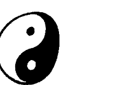

# 簡易紫微斗數

## 技巧篇

潘學山◎著

掌握高超技巧，輕易在重點宮位中，進入人生另一堂奧！

初入紫微，乍見滿盤星光亮晶晶，你是否曾經一頭霧水，不知從何算起？看婚姻是否該看夫妻宮？看事業是否該看官祿宮？看財運是否該看財帛宮？紫微斗數雖簡單易學，卻也博大精深，如何能在最短時間內釐清思緒，並找出正確的答案呢？本書傳授你斗數解盤的高超技巧，教你如何快速尋找重點宮位，並將資料代入正確的宮位內，輕鬆為自己解答命理困惑。想讓你的解盤功力再高一層嗎？簡易紫微斗數技巧篇助你一臂之力！

## 生活五術 21

## 簡易紫微斗數技巧篇

潘學山●著

金菠蘿文化出版

## 前言

拜師學藝，無非就是想從師父那學到絕技，拿到所謂的「秘訣」。所以自古以來，愈是武功高強的人，就有愈多人想要拜他為師父。大家都認為只要得到了師父的真傳，就可以打遍天下無敵手，稱霸武林了。在現今的社會中，我們也會發現有類似的情況，聯招考試，莘莘學子莫不爭先恐後拜訪各科名師，甚至漏夜排除，爭相進入所謂的考前保證班來進行惡補，而每個人每天都必須接觸到的民生問題—食，我們也都可以在街坊上看到「祖傳秘方」，僅此一家，別無分號」的招牌到處林立。就連曾流行一時的六合彩，也可以在路邊攤上看到有許許多多的「明牌、公式」在販賣。其實追究這些現象產生的原因，最主要的還不就是要提供所謂的秘訣，幫助別人更快達到目標，獲得與眾不同的效果。

有人喜歡開「保證班」來吸引顧客，保證你考駕照一定能過關，保證你大學聯考一定能金榜提名，更有保證你一定能減肥成功的。但仔細想一想，如果這些花了大把銀子前來求教的人，一心只為了「保證」二字而「下功夫去學的話，「保證」二字有效嗎？如果一味的迷信保證，恐怕你會輸得更慘。有句話說：「師父領進門，修行在個人。」我想就是最好的說明了。試想，這些曾經花了無數時間去下功夫、去苦讀，並且遇到無數失敗的前人經驗，豈是我們隨隨便便拜了師，甚至是上個保證班就能夠輕易獲得的。如果不親自去學習，反而會因為迷信「保證」而多走許多冤枉路，甚至學到更多的錯誤。要有所成就，最重要的還是得靠自己的努力，自己去充實了。

在各個行業或是學術的領域中，都有其變化無常、高深莫測的一面，斗數亦然。對於一個初學者來說，在拿到一張命盤時，恐怕都會有霧裡看花，不知從何下手的情況。要能分辨出其差異性並且推論出其道理，我想除了要在不斷的錯誤中學習外，對於了解各項法則以及適切的運用一些所謂的推論技巧，相信是學習斗數甚至是任何一門學問的不二法門。

這些所謂的「斗數推論技巧」，在往後我們將會陸續的整理並出版，包括有：

1.  重點宮位：如何在一張有十二個宮位的命盤中，找出一個或兩個具有判斷該事項「因果」的宮位。
2.  入卦法：如何將相關資料（人或物）代入命盤，求取差異性，判斷結果。
3.  三代法：何謂本命、大限、流年，三者關係為何？判斷一件事情，我們又該如何去運用。
4.  定宮：在同一個時期，如果同時有好幾個事業，我們該如何去推論其個別的好壞。
5.  借宮：在無法得知相關的資料時，我們還可以只憑一張命盤就能分辨其差異性，推論出結果嗎？
6.  連續引動：在限運祿忌的持續引動下，該如何判斷？推論的結果會有所不同嗎？
7.  其他：可以運用斗數來卜卦嗎？對於一些較瑣碎的事情又該如何來論斷？

經由出版社給予的意見，希望本書除了論命技巧外，亦能將最基本的入門觀念加以統整，故筆者就將一些在論命前的重點分述在本書的前段。最後還是得感謝出版社的相關工作人員大力支持與相助，也希望讀者能夠給予批評及指教，甚至是提供資料，讓更多想要學習斗數的人，能夠有一套較完整的入門方向。

## 目录

- 壹、命盘排列 013
- 贰、星曜介绍 033
- 参、格局认识 055
- 肆、专有名词介绍 065
  - (一) 十二个宫位 065
  - (二) 本命、大限、流年 076
  - (三) 三方四正、夹、辅 078
- 伍、论命技巧 083
  - 卷一：重點宮位 083
    - 欲罷不能——談柯小姐的感情生活 093
    - 孤獨之旅——學長的大陸之行 103
    - 老師的疑問——一封香港讀者的來信 119
    - 時運不濟——千里馬難遇伯樂 136
    - 情深緣淺——蔡先生的初戀 144
  - 卷二：入卦法 152
    - （一）人 153
    - （二）物 157
    - 酒後論命——論入卦法的運用 161
    - 負心的人——拋家棄子的張先生 171
    - 居家風水——從命盤看住家環境 200
    - 讀者交流（一） 209
    - 讀者交流（二） 227
    - 尋盤啟事 231
    - 紫微斗數命理服務 232

## 壹、命盘排列

1.  首先必须了解——
    十天干为：甲乙丙丁戊己庚辛壬癸。
    十二地支为：子丑寅卯辰巳午未申酉戌亥。
2.  将自己的出生年次（农历）换算成天干及地支——
    例如：五十六年出生，即是丁未年。
    四十三年出生，即是甲午年。
3.  在一张空白的纸中，按照下图方式，依序填上十二个地支。
4.  接著根據出生年次之天干於各地支宮位上填「天干」（起寅首）排列方式如下表：
    若是丙午年出生的人，則於命盤上寅宮的上方填寫庚，癸卯年出生的人，則於寅宮的上方填寫甲。為方便說明，我們以A君（四十三年八月十六日辰時出生之人）為例：

| 年干 | 甲己 | 乙庚 | 丙辛 | 丁壬 | 戊癸 | 宮位 |
| :--- | :--- | :--- | :--- | :--- | :--- | :--- |
| 寅 | 丙 | 戊 | 庚 | 壬 | 甲 | 寅 |
| 卯 | 丁 | 己 | 辛 | 癸 | 乙 | 卯 |
| 辰 | 戊 | 庚 | 壬 | 甲 | 丙 | 辰 |
| 巳 | 己 | 辛 | 癸 | 乙 | 丁 | 巳 |
| 午 | 庚 | 壬 | 甲 | 丙 | 戊 | 午 |
| 未 | 辛 | 癸 | 乙 | 丁 | 己 | 未 |
| 申 | 壬 | 甲 | 丙 | 戊 | 庚 | 申 |
| 酉 | 癸 | 乙 | 丁 | 己 | 辛 | 酉 |
| 戌 | 甲 | 丙 | 戊 | 壬 | 壬 | 戌 |
| 亥 | 乙 | 丁 | 己 | 辛 | 癸 | 亥 |
| 子 | 丙 | 戊 | 庚 | 壬 | 甲 | 子 |
| 丑 | 丁 | 己 | 辛 | 癸 | 乙 | 丑 |

5.  根據出生月份及時辰找出命宮及身宮所在排列方式如下表：

| 生時 | 十二月 | 十一月 | 十月 | 九月 | 八月 | 七月 | 六月 | 五月 | 四月 | 三月 | 二月 | 正月 |
| :--- | :--- | :--- | :--- | :--- | :--- | :--- | :--- | :--- | :--- | :--- | :--- | :--- |
| 子 | 丑 | 子 | 亥 | 戌 | 酉 | 申 | 未 | 午 | 巳 | 辰 | 卯 | 寅 |
| 丑 | 子 | 亥 | 戌 | 酉 | 申 | 未 | 午 | 巳 | 辰 | 卯 | 寅 | 丑 |
| 寅 | 丑 | 子 | 亥 | 戌 | 酉 | 申 | 未 | 午 | 巳 | 辰 | 卯 | 寅 |
| 卯 | 寅 | 丑 | 子 | 亥 | 戌 | 酉 | 申 | 未 | 午 | 巳 | 辰 | 卯 |
| 辰 | 卯 | 寅 | 丑 | 子 | 亥 | 戌 | 酉 | 申 | 未 | 午 | 巳 | 辰 |
| 巳 | 辰 | 卯 | 寅 | 丑 | 子 | 亥 | 戌 | 酉 | 申 | 未 | 午 | 巳 |
| 午 | 巳 | 辰 | 卯 | 寅 | 丑 | 子 | 亥 | 戌 | 酉 | 申 | 未 | 午 |
| 未 | 午 | 巳 | 辰 | 卯 | 寅 | 丑 | 子 | 亥 | 戌 | 酉 | 申 | 未 |
| 申 | 未 | 午 | 巳 | 辰 | 卯 | 寅 | 丑 | 子 | 亥 | 戌 | 酉 | 申 |
| 酉 | 申 | 未 | 午 | 巳 | 辰 | 卯 | 寅 | 丑 | 子 | 亥 | 戌 | 酉 |
| 戌 | 酉 | 申 | 未 | 午 | 巳 | 辰 | 卯 | 寅 | 丑 | 子 | 亥 | 戌 |
| 亥 | 戌 | 酉 | 申 | 未 | 午 | 巳 | 辰 | 卯 | 寅 | 丑 | 子 | 亥 |

6.  若命宫在丑，而该宫位天干为丁，则可找出五行局为「水二局」。
    八、五行局找出后，即可根据该五行局及出生日数找出紫微星所在位置。
    排列方式如下表（解释：若五行局为金四局，而出生日为十五，则紫微星在辰宫）：

| 命宫天干 | 甲 | 乙 | 丙 | 丁 | 戊 | 己 | 庚 | 辛 | 壬 | 癸 |
| :---: | :---: | :---: | :---: | :---: | :---: | :---: | :---: | :---: | :---: | :---: |
| 命宫地支 | 子丑 | 寅卯 | 辰巳 | 午未 | 申酉 | 戌亥 | 子丑 | 寅卯 | 辰巳 | 午未 |
| | 金四局 | 水二局 | 火六局 | 水二局 | 火六局 | 土五局 | 木三局 | 木三局 | 土五局 | 金四局 |
| | 水二局 | 火六局 | 土五局 | 木三局 | 金四局 | 水二局 | 火六局 | 土五局 | 木三局 | 金四局 |
| | 火六局 | 土五局 | 木三局 | 金四局 | 水二局 | 火六局 | 土五局 | 木三局 | 金四局 | 水二局 |
| | 土五局 | 木三局 | 金四局 | 水二局 | 火六局 | 土五局 | 木三局 | 金四局 | 水二局 | 火六局 |
| | 木三局 | 金四局 | 水二局 | 火六局 | 土五局 | 木三局 | 金四局 | 水二局 | 火六局 | 土五局 |

7.  六、命宫找出后，即可顺行排出另外十一个宫位排列方式如下表：

| 兄弟 | 夫妻 | 子女 | 财帛 | 疾厄 | 迁移 | 仆役 | 官禄 | 田宅 | 福德 | 父母 | 余宫 | 命宫 |
| :---: | :---: | :---: | :---: | :---: | :---: | :---: | :---: | :---: | :---: | :---: | :---: | :---: |
| 亥 | 戌 | 酉 | 申 | 未 | 午 | 巳 | 辰 | 卯 | 寅 | 丑 | 子 | 丑 |
| 子 | 亥 | 戌 | 酉 | 申 | 未 | 午 | 巳 | 辰 | 卯 | 寅 | 丑 | 寅 |
| 丑 | 子 | 亥 | 戌 | 酉 | 申 | 未 | 午 | 巳 | 辰 | 卯 | 寅 | 卯 |
| 寅 | 丑 | 子 | 亥 | 戌 | 酉 | 申 | 未 | 午 | 巳 | 辰 | 卯 | 辰 |
| 卯 | 寅 | 丑 | 子 | 亥 | 戌 | 酉 | 申 | 未 | 午 | 巳 | 辰 | 巳 |
| 辰 | 卯 | 寅 | 丑 | 子 | 亥 | 戌 | 酉 | 申 | 未 | 午 | 巳 | 午 |
| 巳 | 辰 | 卯 | 寅 | 丑 | 子 | 亥 | 戌 | 酉 | 申 | 未 | 午 | 未 |
| 午 | 巳 | 辰 | 卯 | 寅 | 丑 | 子 | 亥 | 戌 | 酉 | 申 | 未 | 申 |
| 未 | 午 | 巳 | 辰 | 卯 | 寅 | 丑 | 子 | 亥 | 戌 | 酉 | 申 | 酉 |
| 申 | 未 | 午 | 巳 | 辰 | 卯 | 寅 | 丑 | 子 | 亥 | 戌 | 酉 | 戌 |
| 酉 | 申 | 未 | 午 | 巳 | 辰 | 卯 | 寅 | 丑 | 子 | 亥 | 戌 | 亥 |
| 戌 | 酉 | 申 | 未 | 午 | 巳 | 辰 | 卯 | 寅 | 丑 | 子 | 亥 | 子 |

8.  解釋：若紫微星於辰宮，則天機星在卯宮，太陽星則在丑宮……以此類推。

| 位置 | 廉貞 | 天同 | 武曲 | 太陽 | 天機 | 紫微 |
| :--- | :--- | :--- | :--- | :--- | :--- | :--- |
| 辰 | 未 | 申 | 酉 | 亥 | 子 | |
| 巳 | 申 | 酉 | 戌 | 子 | 丑 | |
| 午 | 酉 | 戌 | 亥 | 丑 | 寅 | |
| 未 | 戌 | 亥 | 子 | 寅 | 卯 | |
| 申 | 亥 | 子 | 丑 | 卯 | 辰 | |
| 酉 | 子 | 丑 | 寅 | 辰 | 巳 | |
| 戌 | 丑 | 寅 | 卯 | 巳 | 午 | |
| 亥 | 寅 | 卯 | 辰 | 午 | 未 | |
| 子 | 卯 | 辰 | 巳 | 未 | 申 | |
| 丑 | 辰 | 巳 | 午 | 申 | 酉 | |
| 寅 | 巳 | 午 | 未 | 酉 | 戌 | |
| 卯 | 午 | 未 | 申 | 戌 | 亥 | |

9.  九紫微星排出後，即可將其紫微星系的其他星曜排出，排列方式如下表：

| 火六局 | 土五局 | 金四局 | 木三局 | 水二局 | 日期 |
| :--- | :--- | :--- | :--- | :--- | :--- |
| 酉 | 午 | 亥 | 辰 | 丑 | 初一 |
| 午 | 亥 | 辰 | 丑 | 寅 | 初二 |
| 亥 | 辰 | 丑 | 寅 | 寅 | 初三 |
| 辰 | 丑 | 寅 | 巳 | 卯 | 初四 |
| 丑 | 寅 | 巳 | 寅 | 卯 | 初五 |
| 寅 | 未 | 巳 | 卯 | 辰 | 初六 |
| 戌 | 子 | 寅 | 午 | 辰 | 初七 |
| 未 | 巳 | 卯 | 卯 | 巳 | 初八 |
| 子 | 寅 | 丑 | 辰 | 巳 | 初九 |
| 巳 | 卯 | 午 | 未 | 午 | 初十 |
| 寅 | 申 | 卯 | 辰 | 午 | 十一 |
| 卯 | 丑 | 辰 | 巳 | 未 | 十二 |
| 亥 | 午 | 寅 | 申 | 未 | 十三 |
| 申 | 卯 | 未 | 巳 | 申 | 十四 |
| 丑 | 辰 | 辰 | 午 | 申 | 十五 |
| 丑 | 酉 | 巳 | 酉 | 酉 | 十六 |
| 午 | 寅 | 卯 | 午 | 酉 | 十七 |
| 辰 | 未 | 申 | 未 | 戌 | 十八 |
| 子 | 辰 | 巳 | 戌 | 戌 | 十九 |
| 酉 | 巳 | 午 | 未 | 亥 | 二十 |
| 寅 | 戌 | 辰 | 申 | 亥 | 廿一 |
| 未 | 卯 | 酉 | 亥 | 子 | 廿二 |
| 辰 | 申 | 午 | 申 | 子 | 廿三 |
| 巳 | 巳 | 未 | 酉 | 丑 | 廿四 |
| 丑 | 午 | 巳 | 子 | 丑 | 廿五 |
| 戌 | 亥 | 戌 | 酉 | 寅 | 廿六 |
| 卯 | 辰 | 未 | 戌 | 寅 | 廿七 |
| 申 | 酉 | 申 | 丑 | 卯 | 廿八 |
| 巳 | 午 | 午 | 戌 | 卯 | 廿九 |
| 午 | 未 | 亥 | 亥 | 辰 | 三十 |解釋：若天府星在巳宮，則太陰星在午宮，貪狼星在未宮……以此類推。

（若以A君出生日期為基準，可將命盤排列至此。）

| 甲 | 破軍 | 七殺 | 天梁 | 天相 | 巨門 | 貪狼 | 太陰 | 星級 | 天府 |
|---|---|---|---|---|---|---|---|---|---|
| | 戌 | 午 | 巳 | 辰 | 卯 | 寅 | 丑 | 子 | 子 |
| | 亥 | 未 | 午 | 巳 | 辰 | 卯 | 寅 | 丑 | 丑 |
| | 子 | 申 | 未 | 午 | 巳 | 辰 | 卯 | 寅 | 寅 |
| | 丑 | 酉 | 申 | 未 | 午 | 巳 | 辰 | 卯 | 卯 |
| | 寅 | 戌 | 酉 | 申 | 未 | 午 | 巳 | 辰 | 辰 |
| | 卯 | 亥 | 戌 | 酉 | 申 | 未 | 午 | 巳 | 巳 |
| | 辰 | 子 | 亥 | 戌 | 酉 | 申 | 未 | 午 | 午 |
| | 巳 | 丑 | 子 | 亥 | 戌 | 酉 | 申 | 未 | 未 |
| | 午 | 寅 | 丑 | 子 | 亥 | 戌 | 酉 | 申 | 申 |
| | 未 | 卯 | 寅 | 丑 | 子 | 亥 | 戌 | 酉 | 酉 |
| | 申 | 辰 | 卯 | 寅 | 丑 | 子 | 亥 | 戌 | 戌 |
| | 酉 | 巳 | 辰 | 卯 | 寅 | 丑 | 子 | 亥 | 亥 |

解釋：紫微星在亥宮，則天府星在巳宮。

排列方式如下：

| 甲 | 星級 | |
|---|---|---|
| 天府 | 星名 | 紫微 |
| 辰 | 子 | 紫微 |
| 卯 | 丑 | |
| 寅 | 寅 | |
| 丑 | 卯 | |
| 子 | 辰 | |
| 亥 | 巳 | |
| 戌 | 午 | |
| 酉 | 未 | |
| 申 | 申 | |
| 未 | 酉 | |
| 午 | 戌 | |
| 巳 | 亥 | |

十紫微星系排出後，即可找出天府星所在。

| 星級 諸星 年干 | 化忌 | 化科 | 化權 | 化祿 | 天鉞 | 天魁 | 陀羅 | 擎羊 | 祿存 |
|---|---|---|---|---|---|---|---|---|---|
| 甲 | 太陽 | 武曲 | 破軍 | 廉貞 | 未 | 丑 | 丑 | 卯 | 寅 |
| 乙 | 太陰 | 紫微 | 天梁 | 天機 | 申 | 子 | 寅 | 辰 | 卯 |
| 丙 | 廉貞 | 文昌 | 天機 | 天同 | 酉 | 亥 | 辰 | 午 | 巳 |
| 丁 | 巨門 | 天機 | 天同 | 太陰 | 酉 | 亥 | 巳 | 未 | 午 |
| 戊 | 天機 | 右弼 | 太陰 | 貪狼 | 未 | 丑 | 辰 | 午 | 巳 |
| 己 | 文曲 | 天梁 | 貪狼 | 武曲 | 申 | 子 | 巳 | 未 | 午 |
| 庚 | 天同 | 太陰 | 武曲 | 太陽 | 未 | 丑 | 未 | 酉 | 申 |
| 辛 | 文昌 | 文曲 | 太陽 | 巨門 | 午 | 寅 | 申 | 戌 | 酉 |
| 壬 | 武曲 | 左輔 | 紫微 | 天梁 | 巳 | 卯 | 戌 | 子 | 亥 |
| 癸 | 貪狼 | 太陽 | 巨門 | 破軍 | 巳 | 卯 | 亥 | 丑 | 子 |

主在十四顆主星皆排列完成後，即可安上六吉星、六煞星、四化星以及鸞、喜、姚、刑等星。

| 命宮 | 父母 | 福德 | 田宅 |
|---|---|---|---|
| 破軍 武曲 己巳 | 太陽 庚午 | 天府 辛未 | 天機 太陰 壬申 |
| 兄弟 天同 戊辰 | 官祿 貪狼 紫微 癸酉 |
| 夫妻 | 丁卯 | 僕役 巨門 甲戌 |
| 子女 | 財帛 廉貞 七殺 丙寅 | 疾厄 天梁 丙子 | 遷移 天相 乙亥 |
| 身宮 丁丑 |

（依出生時辰以及出生年次之地支排列）

| 乙 | 甲 (亥卯未) | 甲 (巳酉丑) | 甲 (申子辰) | 甲 (寅午戌) | 甲 (年本支生) | 星級 |
|---|---|---|---|---|---|---|
| 地空 | 地劫 | 鈴星 | 火星 | 鈴星 | 火星 | 鈴星 | 火星 | 鈴星 | 火星 | 文曲 | 文昌 | 諸星本生時 |
| 亥 | 戌 | 酉 | 戌 | 卯 | 戌 | 寅 | 卯 | 丑 | 辰 | 戌 | 子 |
| 戌 | 亥 | 戌 | 亥 | 辰 | 亥 | 卯 | 辰 | 寅 | 巳 | 酉 | 丑 |
| 酉 | 丑 | 子 | 亥 | 子 | 巳 | 子 | 辰 | 巳 | 卯 | 午 | 申 | 寅 |
| 申 | 寅 | 丑 | 子 | 丑 | 午 | 丑 | 巳 | 午 | 辰 | 未 | 未 | 卯 |
| 未 | 卯 | 寅 | 丑 | 寅 | 未 | 寅 | 午 | 未 | 巳 | 申 | 午 | 辰 |
| 午 | 辰 | 卯 | 寅 | 卯 | 申 | 卯 | 未 | 申 | 午 | 酉 | 巳 | 巳 |
| 巳 | 巳 | 辰 | 卯 | 辰 | 酉 | 辰 | 申 | 酉 | 未 | 戌 | 辰 | 午 |
| 辰 | 午 | 巳 | 辰 | 巳 | 戌 | 巳 | 酉 | 戌 | 申 | 亥 | 卯 | 未 |
| 卯 | 未 | 午 | 巳 | 午 | 亥 | 午 | 戌 | 亥 | 酉 | 子 | 寅 | 申 |
| 寅 | 申 | 未 | 午 | 未 | 子 | 未 | 亥 | 子 | 戌 | 丑 | 丑 | 酉 |
| 丑 | 酉 | 申 | 未 | 申 | 丑 | 申 | 子 | 丑 | 亥 | 寅 | 子 | 戌 |
| 子 | 戌 | 酉 | 申 | 酉 | 寅 | 酉 | 丑 | 寅 | 子 | 卯 | 亥 | 亥 |

| 乙 (天姚) | 甲 (天刑) | 甲 (右弼) | 甲 (左輔) | 星級諸星本生月 |
|---|---|---|---|---|
| 丑 | 酉 | 戌 | 辰 | 正月 |
| 寅 | 戌 | 酉 | 巳 | 二月 |
| 卯 | 亥 | 申 | 午 | 三月 |
| 辰 | 子 | 未 | 未 | 四月 |
| 巳 | 丑 | 午 | 申 | 五月 |
| 午 | 寅 | 巳 | 酉 | 六月 |
| 未 | 卯 | 辰 | 戌 | 七月 |
| 申 | 辰 | 卯 | 亥 | 八月 |
| 酉 | 巳 | 寅 | 子 | 九月 |
| 戌 | 午 | 丑 | 丑 | 十月 |
| 亥 | 未 | 子 | 寅 | 十一月 |
| 子 | 申 | 亥 | 卯 | 十二月 |

| 戊 | 乙 (咸池) | 乙 (天馬) | 乙 (天喜) | 乙 (紅鸞) | 星級諸星本生年支 |
|---|---|---|---|---|---|
| 酉 | 寅 | 西 | 卯 | 子 |
| 午 | 亥 | 申 | 寅 | 丑 |
| 卯 | 申 | 未 | 丑 | 寅 |
| 子 | 巳 | 午 | 子 | 卯 |
| 酉 | 寅 | 巳 | 亥 | 辰 |
| 午 | 亥 | 辰 | 戌 | 巳 |
| 卯 | 申 | 卯 | 酉 | 午 |
| 子 | 巳 | 寅 | 申 | 未 |
| 酉 | 寅 | 丑 | 未 | 申 |
| 午 | 亥 | 子 | 午 | 西 |
| 卯 | 申 | 亥 | 巳 | 戌 |
| 子 | 巳 | 戌 | 辰 | 亥 |

### 解释

奇数年次出生的人为阳，男生为阳男，女生为阳女。偶数年次出生的人为阴，男生为阴男，女生为阴女。若五行局为水二局，命宫天干及地支为丙子，则于命宫处安上大限之2 — 11，父母宫处安上12 — 21……以此类推。

（A 君命盘至此已排列完成。）

所有星曜排列完毕后，最后即是安上大限，至此命盘可算是排列完成。

| 父 | 福 | 田 | 官 | 仆 | 遷 | 疾 | 財 | 子 | 夫 | 兄 | 命 | 宮 | 位 | 陰陽 | 五行局 |
|---|---|---|---|---|---|---|---|---|---|---|---|---|---|---|---|
| 12-21 | 22-31 | 32-41 | 42-51 | 52-61 | 62-71 | 72-81 | 82-91 | 92-101 | 102-111 | 112-121 | 2-11 | | | 陰陽女男 | 水二局 |
| 112-121 | 102-111 | 92-101 | 82-91 | 72-81 | 62-71 | 52-61 | 42-51 | 32-41 | 22-31 | 12-21 | 2-11 | | | 陽陰女男 | 水二局 |
| 13-22 | 23-32 | 33-42 | 43-52 | 53-62 | 63-72 | 73-82 | 83-92 | 93-102 | 103-112 | 113-122 | 3-12 | | | 陰陽女男 | 木三局 |
| 113-122 | 103-112 | 93-102 | 83-92 | 73-82 | 63-72 | 53-62 | 43-52 | 33-42 | 23-32 | 13-22 | 3-12 | | | 陽陰女男 | 木三局 |
| 14-23 | 24-33 | 34-43 | 44-53 | 54-63 | 64-73 | 74-83 | 84-93 | 94-103 | 104-113 | 114-123 | 4-13 | | | 陰陽女男 | 金四局 |
| 114-123 | 104-113 | 94-103 | 84-93 | 74-83 | 64-73 | 54-63 | 44-53 | 34-43 | 24-33 | 14-23 | 4-13 | | | 陽陰女男 | 金四局 |
| 15-24 | 25-34 | 35-44 | 45-54 | 55-64 | 65-74 | 75-84 | 85-94 | 95-104 | 105-114 | 115-124 | 5-14 | | | 陰陽女男 | 土五局 |
| 115-124 | 105-114 | 95-104 | 85-94 | 75-84 | 65-74 | 55-64 | 45-54 | 35-44 | 25-34 | 15-24 | 5-14 | | | 陽陰女男 | 土五局 |
| 16-25 | 26-35 | 36-45 | 46-55 | 56-65 | 66-75 | 76-85 | 86-95 | 96-105 | 106-115 | 116-125 | 6-15 | | | 陰陽女男 | 火六局 |
| 116-125 | 106-115 | 96-105 | 86-95 | 76-85 | 66-75 | 56-65 | 46-55 | 36-45 | 26-35 | 16-25 | 6-15 | | | 陽陰女男 | 火六局 |

### 簡易紫微斗數技巧篇

| 命宫   火星 武曲 破军 (权) (科)   己巳   3-12 | 父母   文昌 太阳 (忌)   庚午   13-22 | 福德   铃星 地空 天钺 天府   辛未   23-32 | 田宅   天马 天姚 文曲 太阴 天机   壬申   33-42 |
| 兄弟   天刑 天同   戊辰   113-122 | 阳男   木三局 | A君甲午年8月16日辰时   (民國43年出生) | 官禄   红鸾 贪狼 紫微   癸酉   43-52 |
| 夫妻   咸池 天喜 地劫 右弼 擎羊   丁卯   103-112 | | | 仆役   巨门   甲戌   53-62 |
| 子女   禄存   丙寅   93-102 | 财帛   天魁 陀罗 七杀 廉贞 (禄)   丁丑   83-92 | 疾厄   天梁   丙子   73-82 | 迁移   左辅 天相   乙亥   63-72 |

## 贰、星曜介绍

认识每一个星曜的意义以及特性，是要踏入斗数这个领域的首要条件。但斗数里大大小小的星加起来，也有一百多颗星，要完全的了解并且能够活用，确实不是一件容易的事情。在实际的论命过程中，我们会发现真正有用且常用的星曜其实也只有三十七个而已。能够了解这三十七颗星曜，在推论命盘时已经绰绰有余了。有人说一些小星即使是有一千个，也敌不过一个主星的力量，更何况将一百多个星曜全部排上命盘，不仅扰乱了推论命盘时的思绪，恐怕也会因为一些不怎么有意义的星曜而做出了错误的推论。

- 十四主星：紫微、天机、太阳、武曲、天同、廉贞。
- 六吉星：左辅、右弼、文昌、文曲、天魁、天钺。
- 六煞星：擎羊、陀罗、地劫、地空、火星、铃星。
- 四化星：化禄、化权、化科、化忌。
- 其他：禄存、天刑、天姚、红鸾、天喜、咸池、天马。

### （紫微星）

紫微星是所谓的北斗帝座，化气为“尊”。身为一位领袖，自然有其领导的欲望，喜好发号司令，并多能成为一群人当中的意见领袖。据说此星座命，若不会忌煞，大都有较深的法令纹，而且长相都较有威严。

此星坐守，最重要的是看左辅右弼二星有没有来相会。有吉助，才能成为“一呼百应”的大格局，若没有左右来会，则就变成凡事必须亲身完成的孤君了。

### （天机星）

此星有两个特性，一个是“善变”，一个是“重情”。

天机星善变的个性，造就此星坐命的人脑筋转的快、心思细腻、聪明、口才好，故有“天机天梁擅谈兵”的说法。此星坐守命宫，最宜从事企画、演说家等工作。

由于此星为“兄弟主”，故广义的来说，很重视“人际关系”，只要没会到太多忌煞星，大都能与人和平相处。

有种说法是一旦“天机星”坐守兄弟宫，有吉星扶持且并未受太多忌煞星，大都能与人和平相处。

煞来冲，兄弟姊妹的数量应该不少，读者可运用看看。

### （太阳星）

太阳星具有光明、博爱、大公无私的精神，故此星坐命，为人大都耿直、敦厚，能照顾别人。

此星的旺弱，是根据其出生时辰来判断，“寅”时至“午”时出生的人，由于太阳的光正属于强旺，故其星性力量最强。至于其坐落於何宫位，和出生时辰比较来说，则就比较没有这么重要了。

太阳星为“官禄主”，故一旦坐守於事业宫，则星性更容易显现出。

### （武曲星）

武曲星座命，为人刚毅、果决，凡事按部就班，一切按规矩来，与人沟通，只讲道理，所以会给人一种不通情理的感觉。

属于北斗星系的星曜，原本就带有“刚”的特性，万一再没有吉星来吉化，那么人际关系上就难免会有寡合的现象发生。

该星为“财帛主”，故一旦牵涉与财有关之现象时，该星的力量就会更加的明显。

### （天同星）

天同是一颗所谓的“福星”，此星坐命的人，为人大都乐观、幽默、乐於与人相处，给人无忧无虑的感觉。

此星若是坐守命宫或是福德宫，难免会显得懒散，没有冲劲，偏向於“享乐主义”。

所以该星坐守这两个宫位时，最好就是要有一些忌星或煞星来冲击，如此脑筋所想的事情才会付诸於行动。或许是因为乐观的天性，绝不给自己造成压力，所以困扰、挫折自然少些，“福”也随之而到。

### （廉贞星）

该星化气为囚，由此引申为放不开、较保守。做起事情来则是按部就班，规规矩矩，不做违反常理的事情。

赋文中“廉贞清白能自守”则是说明一旦该星遇有吉星辅佐，则行为操守绝对是毋庸置疑的。

有人认为廉贞星是桃花星，其实还有红鸾、天喜、天姚等星来助力，桃花的情况才会有，否则应该还是偏向“囚”，清白的特性，对感情问题，也顶多只是浪漫而已，风流但不下流。

### （天府星）

天府星为南斗之尊，亦是所谓的“皇帝”，故和紫微星相同，首重是是否会有左辅及右弼二星。

天府星为财帛主、田宅主，又名禄库，所以此星坐命的人，对於钱财、田宅之处理，大都有强烈的欲望，并且有自己的一套看法。

天府星坐命的人，大都注重生活品味，那是因为贪狼星此时正坐守福德宫的关系。

所谓的“皇帝星”，亦只是星曜上的一个形容词而已，为方便了解而已，勿做过多的引申。

### （太阴星）

### （贪狼星）

贪狼星坐命的人，处世圆滑，善交际，较喜欢新鲜刺激的新生活，一成不变的生活方式，对他来说是最不能适应的。贪狼星是斗数里最具有“桃花”特性之星曜，但先决条件是还得有莺喜、天姚等星来推波助澜，否则桃花情况不明显。贪狼星坐命的人，三方所形成的格局一定是“杀破狼”，所以也代表著此星坐命的人，较适合变化的生活，故此星通常也会较具“投机”的生活方式。

### （巨门星）

谈到巨门星，第一个想到的就是口。有人认为巨门星坐命的人，最适合依口为生，即是担任老师、业务员等行业。也有人认为，巨门主是非，时常会造成口舌是非。而这一正一反的现象该如何去分别，我想巨门星是否强旺，是否有吉星辅佐或是有煞星冲击，应该就可以很清楚的分辨出来。巨门星化“暗”，故难免有多疑、怀疑心强之个性。

### （天相星）

天相星化气曰“印”，印即是所谓的关防，主掌朝廷里大大小小的事情，所以引申为最优秀的幕僚人才。

此星坐命的人，凡事循规蹈矩、条理分明、稳重、踏实。

天相星坐命，则夫妻宫贪狼星坐守，所以有人认为该星坐命的人，感情问题一定丰富而且不擅处理。其实不完全尽然，一旦夫妻宫的贪狼得到制化且吉助，反而是一个浪漫而专情的风雅之人。

### （天梁星）

天梁星给人的感觉是老成持重，端庄矜持，喜欢照顾别人，所以通常都是一群人当中的意见领袖。

该星亦具有“飘荡、突发”之特性，故时常会有一些意想不到的事情发生。行运走到该星时，做出决定的事情也通常是临时起意的，而并非是经过长久计划的。

### （七杀星）

顾名思义就可了解该星的一些特性。七杀星好比是冲锋陷阵的大将，引申在目前的社会型态当中，就变成冲劲有余，保守不足，故人生旅途当中，挫折自然比一般人多出许多。

属於较“刚”的星曜，人际关系上难免会有所缺陷；此星坐命的人，“感情”的道路上通常也较孤寂些。

### （破军星）

“破军一曜性难鸣”正说明了此星坐命的人个性阴沉，令人难以捉摸。此星亦具冒险犯难、冲锋陷阵之特性，和七杀星不同的是七杀较外向，而破军则较内向。“刚”特性的星曜，一旦组合不是很好，“情”缘自然会冲淡许多。

### （左辅、右弼）

左辅、右弼是具有耐心、包容力、敦厚之特性。二星同时具有绵延不断、持续的功能。一旦主星与其同宫，都会加重其原来的力量。左、右二星是紫微及天府最希望遇到的，可见其二星具有处事细心的能力，是一个优秀的幕僚辅佐人才。

### （文昌、文曲）

昌曲二星坐命的人，大都聪明、伶俐、好学，长相方面也都具有特殊的气质。

### （天魁、天钺）

二星如遇贪狼，一旦化忌来引动，所持有的聪明才智就会有聪明反被聪明误、不按牌理出牌的反常现象发生。

### （火星、铃星）

二星坐命，个性冲动、激烈，沉不住气，所以会给人有“火爆浪子”的感觉。一旦遇到争执、问题，火铃二星也会迅速激烈地爆发出来，做起事来绝不拖拖拉拉。任何一颗煞星也绝没有一点可取之处都没有，像是火铃遇到擎羊，则会创造出无与伦比的冲劲、行动力，火铃遇到劫空，也会有突破重重包围、排除障碍的潜力。

### （擎羊、陀罗）

煞星坐命，难免会给人一种不好相处、脾气古怪、说话不留余地的感觉。但要知道，斗数里的任何一颗星曜，没有一颗是完全美好没有缺点的，该怎么将其缺点转化为优点才是最重要的。羊陀坐命的人，说话不怎么留口舌，且句句命中要害、说到重点，所以成为一个辩论家、分析师是最为适合的。煞星坐命的人，若能将其特性转换到工作上面，往技术、专业领域来发展。

### （地劫、地空）

魁钺二星坐命，大都具有高度的服务热忱。帮助别人也时常受人帮助，是此星最大的一个特质。二星由于其“贵”的特质，故待人处事方面，总会给人一种“器宇轩昂”的感觉。

劫空二星坐命，脑筋转的快，但容易变成想的多、做的少，有种空谈的感觉。

劫空二星亦有“浪里行舟、半空折翅”的特性，故人生过程中，挫折、阻碍在所难免。

### （化禄、化权、化科、化忌）

- 化禄：发展、顺利、财力。
- 化权：权力、欲望、企图。
- 化科：名声、聪明、才气。
- 化忌：阻碍、波折、忧虑。

二星一旦遇有忌星来会，不但会削弱原本主星的特性外，更会使得原先的收获大打折扣。而一旦该星遇有吉星扶持，反倒有一种柳暗花明又一村，“转化”的功能发生。

### （红鸾、天喜、咸池）

当主星是有桃花的特性时（廉贞、贪狼、太阳、太阴），鸾、喜、咸池三星则有“锦上添花”的用意。一旦主星并无桃花性质，则此三星较无太显著特质。

不管怎么说，命宫三方四正一旦有一些所谓的桃花星，只有忌煞引动未太明显，此桃花总是好的，而且长相会比较不错。这是不可否认的。

### （禄存）

禄存一星由于前后宫位有擎羊及陀罗二星所夹，所以此星坐守命宫，为人大都保守、放不开。有人也说禄存坐守财帛宫，这种人会比较小气也正是这个道理。此星在判断上有一重点，即是查看同宫之主星是否强旺，一旦主星强旺，则前后宫位之羊陀二星反倒形成保护，促使该宫成为有守有为。而一旦与禄存同宫的主星弱陷，则羊陀反倒会夹制住主星，造成绑手绑脚，没冲劲。

### （天刑）

该星坐命，给人一种冷冰冰、不苟言笑的感觉，一旦主星又是属于“刚”之特性时，情况则会更加明显。

### （天马）

若由字面上来解释，该星是具有“动”的属性。一旦和禄存或化禄结合，则形成禄马交驰——钱财顺畅、发展之特性。一旦和陀罗组合，则形成折足马——阻碍、波折之意义了。

## 简易紫微斗数技巧篇

## 叁、格局认识

所谓格局乃是星跟星组合在一起的时候，所产生出来的一些特殊作用。这些格局的力量是强过每一颗单星所具有的力量，所以在论命的过程当中，也应该是以格局的型态来做判断、分别，而不能仅以单星的力量或特性来做解释。兹将一些重要且常用的格局分述如后：

1.  **君臣庆会**：指三方四正会有紫微、天府、天相、左辅、右弼及其他吉星。
    在斗数的所有格局当中，算的上是最强也最大的格局。一旦格局形成，自然不怕其他忌煞星冲击。
    紫微为“皇帝”，遇有左辅、右弼二星的辅佐，自然变成一位优秀的领导者。不仅能带人心，更能获得众人拥戴，受人帮助。

2.  **一呼百诺居上品**：指紫微会有左辅、右弼二星来辅佐。
    紫微为“皇帝”，遇有左辅、右弼二星的辅佐，自然变成一位优秀的领导者。不仅能带人心，更能获得众人拥戴，受人帮助。

3.  **阳梁昌禄**：指三方四正会有太阳、天梁、文昌及禄存（或化禄）四星。
    该格局的特性偏向于“考试”、“升官”等事件，具有“聪明”、“升迁”的意义。

4.  **日月并明**：指三方或四正会有太阳及太阴二星，且二星又坐守于旺位（太阳寅宫至午宫坐守为旺宫，太阴申宫至丑宫坐守为旺宫）。
    此组合具有光明磊落，乐于与人交往（动）之特性。此格局最宜居于田宅宫。

5.  **石中隐玉**：指巨门一星坐守子宫或午宫。
    石中隐玉乃是意指埋在石头中的玉石，必须经过琢磨，才能见到玉石的光洁明亮。套用在现实生活中，就代表必须先经历一番挫折、阻碍，但终能突破重围，获得成就。

6.  **坐贵向贵**：指该宫位坐有“天魁”，而对宫有“天钺”一星。
    此格局有热心助人，并能时常受人协助的特性，是一种属于“贵”的格局。该格局常用于“人际关系”宫位。

7.  **三奇加会**：指三方四正会有化禄、化权、化科三星。
    化禄代表发展、财禄，化权代表着权力、欲望，化科代表着名气、智力，三者同时具备，自然做起事来顺畅许多。

8.  **火贪铃贪**：指三方四正会有火星、铃星及贪狼。
    此格局代表能突破重围，具有“横发”之特性。该格局的“爆发”力量，有时也不会输给“君臣庆会”格局的吉象。通常该组合较适用于事业及钱财等相关宫位。

9.  **马头带箭**：指擎羊星坐守午宫，并有禄星来坐守或会入。
    擎羊虽为煞星，但坐守该宫位时，一旦有化禄吉助，反而有一种冲破难关，不畏困难的特性。该组合若正处在“事业宫”时，力量则会更加明显。

10. **七杀仰斗**：指七杀星坐守寅宫或申宫。因七杀坐守该宫位时，对宫正是紫微及天府二星坐守，故可以引申出“因人而贵”的一种特性。该格局适用于事业宫及迁移宫。

11. **官资清显**：指天梁星坐守午宫，又有吉星来加会。此格局受到吉助后，事业发展上较易受人提拔而平步青云。此特性于事业宫时较易显现其特性。

12. **铃昌罗武**：指三方四正会有铃星、文昌、陀罗及武曲四星（陀罗可由化忌星来替代）。此格局在赋文中是所谓的“限至投河”，其代表的也只是一种凶象而已，在所有的凶格当中，是力量较为强烈的一个。适用于事业、钱财、人际、夫妻等宫位。

13. **寡宿**：指三方四正会有武曲、火星二星。此格局是属“孤”的特性，故最不利于发生在“六亲”的宫位。一旦相关人入卦宫位亦呈现凶象，难免有“孤克”的情形发生。

14. **机梁擎羊会**：指三方四正会有天机、天梁及擎羊三星。天机天梁擎羊会是“早见刑克晚主孤”，同样的是属孤克的格局，不利于位在“六亲”宫位。至于其他的宫位，凶象也会有，但凶性则没有这么明显。

15. **人离财散**：指三方四正会有太阴及擎羊二星。此格局除了具有“孤克”的作用，不利“六亲”宫位外，由于也具有财散的特性，故对于福德宫及财帛宫同样亦具不利的影响。

16. **折足马**：指陀罗遇到天马的组合。折足马是指断了脚的战马，做起事情来难免绑手绑脚，窒碍难行。此格局最不利于“迁移宫”及“事业宫”。

17. **终身缢死**：指三方四正会到巨门、火星及擎羊三星。斗数里的格局，其实都只是一个形容词而已，代表着是凶格，至于会发生什么事情，还得综合来论。不要因为看到这些惊心动魄的形容词就困扰不已。

18. **浪里行舟**：是指会有劫、空二星。二星本来的特性就是具有波动、不稳定的性质，一旦再具有忌煞来冲击，那么做起事情来难免事倍功半，辛苦、挫折在所难免。此格局最不利于事业宫以及财帛宫。

19. **日月反背**：指太阳、太阴二星一旦弱陷，原本属于“动”的特性就会变得更加波折、劳累。此格局较不适宜于事业宫。

20. **君臣不义**：指三方四正会有紫微及破军二星。二星的组合再加上忌煞引动，人际关系的不和谐就会产生，这人际关系当然包括了亲情、友情、爱情等。此格局最不利于事业宫、迁移宫及夫妻宫。

21. **紫府相**：指三方四正会有紫微、天府及天相。只要是有牵涉到该三星的组合时，最重要的就是看有没有会到左辅及右弼三星。有的话，是一个令人尊敬的领导者，若是没有遇到的，则是一位刚愎自用的孤君了。

22. **杀破狼**：指三方四正会有七杀、破军、贪狼三星。此格局是代表着波动、不耐静、白手起家型，先决条件是有煞星来引动。

23. **机月同梁**：指三方四正会有天机、太阴、天同及天梁四星。和杀破狼会煞的格局比较起来，此格局就显得保守，谨慎许多。

24. **巨日**：指三方会有太阳及巨门二星。二星之组合是代表在困难、竞争的环境当中肯定自我。

※ 以上的四个格局（21、22、23、24），是根据十四颗主星的排列方法而大致分类而成，被用于解释每个人的命宫特性，读者可以试着运用看看自己的命身宫三方四正，到底是属于哪一类型。

25. **双禄夹・双忌夹**：指前后一个宫位皆有化禄或化忌。双禄夹，则有受人帮助、环境有利、保护等作用。而双忌夹，则代表受制于人、环境险恶、不利发挥等特性。

26. **禄马交驰**：指会有禄存（化禄）及天马二星。

27. **桃花犯主**
    指紫微及贪狼二星坐守卯及酉宫。二星的组合一旦再遇到鸾、喜、咸池等桃花星来配合使用，“桃花”的个性及运势就会很明显了。若无这些小星来作用，该格局亦只是对艺术、美学事物很有概念及欣赏能力。

## 肆、专有名词介绍

### （一）十二个宫位

十二个宫位含命身宫、父母宫、福德宫、田宅宫、官禄宫、仆役宫、迁移宫、疾厄宫、财帛宫、子女宫、夫妻宫、兄弟宫，兹分述如下：

#### 命（身）宫：

代表一个人的行为举止、思考模式，简单来说，也就是“个性”。有人说“个性”是决定一个人生成败的最重要关键，可知“命”、“身宫”在命盘上是占有多么举足轻重的地位了。在判断任何一件事情时，除了要注意相关宫位的变化，命身宫的特性也是不容忽视的。“命没了，谈什么都是多余的”，或许可以说明以上的一切。

至于命身宫该如何去分别呢？若我们把命宫当成是先天的，身宫当成是后天的来做解释，那么身宫与命宫最大的差别乃在于身宫具有“增强作用”；亦即年纪愈大，身宫所拥有的力量就会较命宫更具有影响力。

#### 父母宫：

代表与父母亲之间的缘分。此宫位绝对无法推测父母亲的个性、运势，甚至是“生离死别”，否则同命盘的人不都有相同特质的父母了？！更何况，将兄弟姊妹的命盘一起排出，相信也能很清楚的看出这些人的“父母宫”，其星性、格局及运势，都会不尽相同。

若要从命盘中推论父母亲的状况，笔者认为还是得以“入卦法”来做推论会较正确。至于入卦法的运用，后面的章节会做说明。

由于父母宫所能推论出来的东西恐怕会有不切实际甚至是包山包海之嫌，所以坊间少有书籍是针对此一宫位来做说明的。但是也不是说这一个宫位就不重要了，因为做为命盘中最重要的一个宫位命宫正是被“父母宫”以及“兄弟宫”所夹，当有成双成对的星曜在这二个宫位时，命宫的特性就会更加重其星性之力量了。

#### 福德宫：

代表着一个人的精神感受、福分厚薄。福德宫若是忌煞冲，那么通常是个不耐静、坐不住，很难有时间能够真正的静下来休息。即使是夜阑人静，空无一人时，准备入眠的他依旧是会放心不下，胡思乱想，也可以说是是个劳碌命。往好的方面来讲，这种人通常也都会比较有冲劲。若是福德宫六煞不会，又遇许多吉星来辅，那么个性就会变得过度乐观、缺乏冲劲，有点享乐主义的心态。福德宫除了有以上所述的特性外，它亦是在推论有关于『短期投资』以及『动产』时的一个重点宫位，如股票的投资、民间的互助会等等，都需要拿钱出来滚钱的行为，都必须要以福德宫的强旺与否来做为判断。

#### 田宅宫：

一般人最常运用田宅宫来推测祖产的有无、多寡，甚至也有人藉其来判定其人居宅附近的风水。这样的论断其实是有很多漏洞的。祖产的有无多寡，除了要有父母亲的资料代入外，限运的变化也会通常会造成原本看似吉象的田宅宫转变为凶象，看似凶象的田宅宫转变为吉象。所以缺少一些相关资料以及技巧的运用，结果都会大异其趣。

判断居家环境的状况，也必须先测量其正确之方位，再将其代入命盘（入卦法），才能推论的正确，本文实例中将有说明。若是福德宫代表『动产』的话，那么代表『不动产』的宫位就属『田宅宫』了。田宅宫又称为『财库』，库旺才能聚财，所以投资金额庞大，乃至不动产的买卖，田宅宫的旺弱是具有举足轻重的地位。

#### 官禄宫：

代表着对工作处理的心态以及适合的属性。对于一个事业的经营者而言，判断其事业的盛衰不是只光凭一个事业宫即可推论出。除了要注意根基是否强旺外（命身宫），田宅宫（财力是否雄厚）、财帛宫（资金调度是否顺畅）、迁移宫（人际关系是否和谐，客户是否稳定）、仆役宫（员工是否具向心力）都是不容忽视的。相对于事业的经营者，一位上班族的工作顺利与否，命盘的推论就显得比较简单多了。

#### 仆役宫：

代表着与属下之间缘分的厚薄，以及带领员工的一些处事心态。仆役宫强旺，所属员工向心力强，而且相处融洽。反之弱陷的话，不是员工待不住，无法获得有力部属外，即使留下来的员工，也无法胜任任何重要的工作，有种伯乐难遇千里马的遗憾。斗数有个格局叫“奴欺主”，亦即紫微+贪狼的组合，此意谓的是属下的能力乃至权利压制到上司，进而侵犯上司的情况，若套用到宫位来看，若命身宫弱陷，而仆役宫强旺的时候，一旦再遇到忌煞来引动，也会得较为容易了，只要不是形成太大的凶格，就不会有什么“绝裂”的现象发生。偶遇一些小小的忌煞来冲击，反而会使得工作心态上更为积极，更能冲破难关；但不可否认的，辛苦、波折总是会多那么一些。由于此宫位是位于命身宫的三合方，故在命盘上是占有很重要的分量。

#### 迁移宫：

代表着人际关系的和谐与否、外地发展是否顺利。广义的人际关系，除了包括同事、朋友外，凡事上司、客户，乃至于所属的公司，皆是以此宫位来做论断。在事业的属性方面，迁移宫强旺，自然代表客源稳定、出口顺利、贵人提拔等。反之迁移宫若是弱陷或是忌煞冲，就会使得客户难以捉摸、不稳定，这时就应该往零售业、进口贸易为主的行业会较适合了。迁移宫是在命宫的对宫，故影响力自然非同小可。迁移代表着人际关系，自然与人和谐相处，人缘极佳，获上司重用。迁移宫见煞，自然反之。但要注意的是在斗数判断任何一件事情时，最后都还是得再配合先天的命身宫一起论断，否则结果可能会出乎意料。

#### 疾厄宫：

此宫位当然是在斗数中探讨疾病、病痛的一个重点宫位，但在实际的论命过程当中，我们确也可以发现，‘命身宫’通常也是占有极大的份量。有关于‘遗传’方面的疾病，最好也要将其相关人（父母）的资料代入其中，才能明显的判断出其差异性。有人称说先天的疾厄宫是代表着遗传方面的疾病，后天限运的疾厄宫产生凶象，则是代表着‘自己’的饮食、作息而产生的病痛，至于情况是否如此则不得而知了！相同命盘的人是否都会有一些类似的病痛，那么又该如何在求取之间的差异性，我想这是一个很值得大家来探讨的一个宫位。

#### 财帛宫：

代表一个人的求财方式以及进财方式的顺利与否。该宫若是呈现忌煞交冲，则偏向于以劳心劳力、辛苦耕耘之求财方式，这时就仍以‘上班族’为人作嫁的工作较适宜，否则自行创业或是过度膨胀自身的财务状况，做一些超过自己能力所及的事情，资金调度是很容易出状况的。财帛宫以及福德宫是斗数里探讨有关钱财的两个主要宫位，但这两个宫位还是有差别的；财帛宫是指进财的方式以及难易程度，而福德宫则是用钱滚钱的获利状况。纵然说二者之间各有其主导的事情，但也由于二者为‘对宫’之关系，彼此多少也有互相的影响。

#### 子女宫：

代表与子女之间的缘份厚薄。有许多的命理书籍都有说明子女宫有什么星座坐守就有几个子女，其实际是很不科学也很不负责的说法。夫妻两人的子女宫，我想就绝对会有很大的差异性了，那么他们到底会有几个子女，我想这种说法应该是会不攻自破的。

子女宫所要探讨的，应该只是“缘分”问题，一旦忌煞冲或是凶格多，所代表的大都是指缘分淡薄。现在时下所谓的“顶客族”，通常也都具有此情况。

#### 兄弟宫：

代表与兄弟姊妹之间的缘分厚薄。此宫位也是绝对无法推论出其兄弟姻缘良否的唯一宫位。毕竟要在同命盘的人之中取其差异性，就必须将其不同的条件输入命盘。

这些条件当然包括了——

- 结婚对象的年次。
- 结婚的大限以及年份。

观念虽然在日后处理这一类的事情，具有很重要的地位，但它并非是判断姻缘良否的唯一宫位。该宫位是探讨一个人在“感情问题”上的一种意识形态，这种先天的意识形态，而其个性，就得以其入卦宫位的星曜特性及格局来做判断了。

#### 夫妻宫：

探讨处理感情问题的方式、心态以及对异性的一些看法与要求。

是否可以从夫妻宫看出未来另一半的长相、个性呢？这个答案是肯定的——绝对看不出来。

若要推论长相，应该要从认识年份的流年夫妻宫来推论。

这种先天的宫位纵使有一些不怎么好的格局形成，但也有经过限运的变化而使得原本看似凶的宫位变化吉象显现，所以不必过分担忧。

在斗数的十二个宫位当中，属于“六亲”的几个宫位（包括父母宫、兄弟宫、夫妻宫、子女宫、仆役宫等），最不希望的就是遇到凶格或是忌煞冲的情形发生。一旦有这些不利的情况发生（限运引动），再配合入卦者的宫位来看，就应该可以求取其差异性的。

六亲宫位中，所谓的忌煞冲或者是凶格的产生，都代表着“刑克”。

“刑克”也有轻重之别，轻者见面机会少，相处不融洽，重者则是分离或死别；这其中的差异，就要看其限运的变化以及凶格的特性而定了。

### （二）本命、大限、流年

**本命**：在我们根据出生年月日以及时辰所排出的这一张命盘，是所谓的“先天命盘”，也就是所谓的本命。所代表的十二个宫位，根据其星曜格局的特性，而产生出该人对这十二项事务的一种处事心态以及“意识形态”。

**大限**：在这张先天的命盘排出后，我们会排出所谓的“大限”。大限是以十年为一个级距，随着时间的不同而转变。在所谓的大限找出来后，则以此宫位做为大限的命宫，顺行依序为大限的父母宫、大限的福德宫……（排法与先天命盘相同）。

**流年**：亦是所谓的太岁宫位，找出该年年份的地支为何，套用在先天命盘上的地支宫位所在即可找出。

#### 三者之间的关系：

- 本命是指先天的，观念、意识形态。
- 大限是指后天的，十年的运势起伏。
- 流年是指后天的，该年的吉凶状况。

经由三者之间的互相引动，前后配合，就可论断出吉凶。而这其中，又是必要以“大限为主，本命为辅，流年参考”的观念来做判断。

除此之外，在某些事情的推论上，我们也必须要分辨清楚；像是时效较长的，诸如房地产的买卖、事业的经营等等，则是以本命及大限为主。
而时效较短的，诸如炒作股票、交通事故等等，则是以流年来论断即可。

### （三）三方四正、夹、辅

所谓的三合方，即是以该宫为基准，顺行的第五以及第九个宫位。若再加上该宫位的对宫，则是所谓的四正。该宫位的前后各一个宫位是为“夹”。该宫位的三合方，是为“辅”。

1.  若以子宫为准，则辰、申宫是为其三合方。
2.  加上午宫（对宫）后，此四宫是为四正。
3.  子宫是被亥宫及丑宫所夹。
4.  子宫是被辰宫及申宫所辅。

| 巳 | 午 | 未 | 申 |
| :--- | :--- | :--- | :--- |
| 辰 | 年月日时 | 酉 |  |
| 卯 | 局 |  | 戌 |
| 寅 | 丑 | 子 | 亥 |

## 简易紫微斗数技巧篇

## 伍、論命技巧
### 卷一：重點宮位

重點宮位亦即最重要的一個宮位，也就是說當我們在推論某件事情時，會發現有一些相關宮位，當我們在輸入一些已知的條件後，其中有某一個宮位是被引動到最強烈的。這時候，我們就不必什麼宮位都注意（本命、大限、流年），只要很單純的注意其「重點宮位」即可。只要找出重點宮位，往後我們就只要注意其宮位內星曜組合之特性，再配合限運四化對此宮位的變化，就可以推測其後續發展了。

而這些輸入的條件，包括了：
- (1) 事件發生的年份，或者是變動、結束的年份。
- (2) 相關人的出生年次（入卦宮位）。
- (3) 特殊事件發生的年份。

為了方便了解，我們舉以下的三個例子來做說明。

#### 例一

假設A君在庚子大限時（甲戌年）進入目前所服務的公司，目前覺得工作不甚滿意，想要換工作，不知道有沒有機會，與公司還有緣分嗎？

從以上A君所提供的資料：(1) 庚子大限甲戌年進入公司 (2) 丙子流年工作不甚順利之條件，我們在命盤上代入以後，可以發現此事件重點宮位在：

1.  庚子大限時，走入先天事業宮，大限事業宮在辰，有庚干武曲化權來吉化。
2.  甲戌流年進入該公司，甲干造成廉貞化祿破軍化權會入辰宮。（解釋：除了先天命盤上有四化星外（祿、權、科、忌），大限以及流年之中亦會產生其四化。流年甲戌，甲干的四化即是廉貞化祿、破軍化權、武曲化科、太陽化忌。）
3.  進入公司之年份亦正好在大限事業宮（辰）之對宮。（解釋：進入公司是甲戌年，流年在戌宮〈以地支宮位來看〉，戌和辰宮即是對宮之關係，影響力量會大些。）
4.  丙子流年走入大限宮位，流年事業宮亦在辰宮。
5.  工作不順利的話，理應有化忌來引動，丙子流年，廉貞化忌正好坐在辰宮。

由以上的條件輸入後，我們可以很清楚的看出，「辰」宮是這份工作的一個重點宮位，如果我們根據辰宮三方四正星曜組合的特性以及未來流年的變化，就可以很清楚的看出A君和目前這份工作的緣分了。

#### 例二

1.  假設B君要問和女友之間的感情發展。他說二人是在前年（乙亥）認識，女友為五十七（戊申）年出生。
2.  從以上B君所提供的資料：（1）二人是前年（乙亥）認識（2）女友為五十七（戊申）年出生。
3.  可以找出「申」宮是其重點宮位。其理由如下：
- 目前為庚戌大限，庚干太陽化祿由子會入大限夫妻宮申，使其吉化。
- 前年（乙亥）認識，乙干天機化祿亦由寅宮會入申宮。
- 女友為五十七年次（戊申年），代入命盤後，坐入命盤中的「申」宮。

| 僕役 | 遷移 | 疾厄 | 財帛 |
| :--- | :--- | :--- | :--- |
| 天相 陀羅 | 天梁 祿存 | 七殺 擎羊 | |
| 乙巳 | 丙午 | 丁未 43-52 | 戊申 |
| **官祿** | | | **子女** |
| 巨門 (忌) | | B 君陰男 | 天鉞 |
| 甲辰 | | 女 年 月 日 時生 | 己酉 33-42 |
| **田宅** | | | **夫妻** |
| 紫微 貪狼 | 木三局 | | 天同 (權) |
| 癸卯 | | | 庚戌 23-32 |
| **福德** | **父母** | **命宮** | **兄弟** |
| 天機 太陰 (祿)(科) | 天府 | 太陽 | 武曲 破軍 天魁 |
| 壬寅 | 癸丑 3-12 | 壬子 13-22 | 辛亥 |

象正好是正反不一的話，那不是很傷腦筋嗎？

#### 例三

4.  在認識的大限以及年份其天干化祿引動最強烈的是大限的夫妻宮，而先天以及流年的夫妻宮則並沒有明顯的引動情況下，再加女友入卦的宮位亦是此「申」宮時，我們就應該可以把這段姻緣定在「申」宮來做探討了。

由以上推論得知，「申」宮算的上是這段感情的一個重點宮位，這時，若我們在推論二人的感情時，若我們不從「申」宮來做判斷，而卻以先天夫妻宮（戌）或流年夫妻宮來做推論的話，其結果恐怕就會失之千里，差之毫釐了。（因為乙亥年時，此時流年夫妻宮在酉宮，為大限天同化忌以及流年太陰化忌雙忌夾，先天夫妻宮在戌，有大限天同化忌自坐以及先天巨門化忌來會，流年太陰化忌來持續引動在流年以及先天夫妻宮皆是忌會或夾的情況，是不太可能會交女友的。）

| 宮位 | 星曜 | 干支 | 宮位 | 星曜 | 干支 | 宮位 | 星曜 | 干支 | 宮位 | 星曜 | 干支 |
|------|------|------|------|------|------|------|------|------|------|------|------|
| 僕役 | 天機 | 乙巳 | 遷移 | 紫微(權) | 丙午 | 疾厄 | 疾厄 | 丁未 | 財帛 | 破軍 | 戊申 |
| 官祿 | 七殺 | 甲辰 | (木三局) | (女 男 年 月 日 時生) | | 子女 | | 己酉 | | | |
| 田宅 | 太陽(祿) | 癸卯 | | | | 夫妻 | 天府 廉貞 | 庚戌 | | | |
| 福德 | 武曲(忌) | 壬寅 | 父母 | 巨門 天同 | 癸丑 | 命宮 | 貪狼 | 壬子 | 兄弟 | 太陰 | 辛亥 |

假設C君在八十三年間（甲戌）購買一間預售屋，該預售屋在當年動工，丙子年完工，C君想要知道該房子未來是否有增值之機會？

- 1. 流年甲戌以及大限甲辰，甲干破軍化權和先天紫微化權形成雙權夾大限田宅之現象。限運田宅受雙權來夾，自然會興起購置不動產的欲望。
- 2. 甲戌流年時，甲干太陽化忌亦由卯宮會入未宮，化忌的引動，亦可說明動工之跡象，此年亦有流年擎羊來會。
- 3. 丙子流年時，丙干天同化祿亦來吉會大限田宅未宮（完工）。
- 4. 大限田宅宮（未）在購買預售屋的年份以及完工的年份均有受到祿權來吉化，開始動工之年份亦有忌煞來引動的情況下，我們應該就可以將未來宮視為判斷該預售屋的一個重點宮位。

從以上推論得知，此一事件若不由重點宮位來判斷，恐怕眼睛會花掉了，因為先天田宅在卯宮，大限田宅在未宮，購屋當年的田宅在丑宮，這些宮位在往後的年份勢必都會發生不同性質的變化，結果當然會大異其趣的。從以上的三個例子中，可以很明顯的看出，若「重點宮位」懂得運用的話，其實是一個最簡單也最明瞭的推論方法。如果沒有重點宮位的話，我想除了會擾亂了自己的思緒外，大概也會常踢到鐵板的。只要能夠找到重點宮位之所在，我想推論之結果，大概雖不中，亦不遠矣了！大夥兒不妨在往後的論命過程中，試著找找看重點宮位的所在。

#### 欲罷不能——談柯小姐的感情生活

前些日子，同事告訴我，她有一位朋友柯小姐曾經給我算過命，但當時我只是用紙大概寫了一下她目前的運勢，說的不是很清楚，所以希望能再安排時間和她面對面約談。由於柯小姐對感情與工作有些抉擇上的難題，所以我希望我能幫個忙，幫她解決疑惑，也好了了她一樁心事。

在同事的盛情難卻下，我們三個人在星期六的下班後，約在一家咖啡廳見面。在香醇的咖啡以及輕盈的音樂之中，我們聊了將近三個小時；能問的問題，她都問了，而一些平常人比較「難以啟齒」的問題，這位平日作風就頗為「豪放」的柯小姐也幾乎沒有放過。在毫無拘束與保留的論命過程中，的確被她的行事作風及生平事迹留下深刻的印象。

由於此張命盤在推演各項事件時，我們可以發現「重點宮位」——命宮佔有舉足輕重的角色，其格局組合也頗具特色，所以特別提出來做討論。柯小姐的命盤在一排出後，我心裡大概就有一點底了，她的生活應該是多彩多姿的；畢竟命宮的組合是頗具「變化」性，如果我們再把限運的變化加上去看，應該就會更清楚。聽同事說，柯小姐目前最關心的是感情以及事業的問題，所以就從感情方面開始看起。在看了命盤一會後，我告訴柯小姐：「想必妳的感情生活應該是很豐富吧！先天命宮的格局是個標準的紫貪會天喜的「桃花犯主」格局，目前大限在己丑，己干武曲化祿在大限夫妻宮，貪狼化權則在先天命宮，限運夫妻宮和先天命宮在三合方，經過祿權的引動後，感情生活要單純恐怕很難了。」

「的確！這幾年確實是這樣，男朋友是一個換過一個；反正合則來，不合則去。雖然交往過許多的男友，生活也變得多彩多姿，但也總覺得都難了，沒有什麼安全感，就是沒有遇到一個很合適、很安定的對象。」柯小姐面帶疑問地說。「妳遇到的對象大概都是幾年次的？以前有交往過五十六、五十八，最近則交往過五十二及五十四次的。」在將這些年次代入命盤後，我問柯小姐，想必這位五十二年次的男友應該已經分手了吧！至於五十四年次的，「五十二年次的人，坐入妳命盤中的先天命宮，這個入卦的宮位又和妳限運夫妻宮形成三合方，除了有前面所說的限運祿權來做牽引互動的現象，而造成二人相識交往的吉象外，限運化忌也同樣使「巳」宮及「亥」宮形成了昌貪曲貪的惡格，五十二年次的人癸干貪狼化忌又正巧坐在卯宮並會入亥宮，丙子年廉貞化忌再來引動，恐怕已經兇多吉少，感情應該是走向盡頭的時候了。至於五十四年次的人，其入卦宮位在巳宮，這個宮位亦和妳限運命宮及夫妻宮成三合方，同樣也有祿星武曲來做吉化。和五十二年次不同的是「巳」宮是天相坐守，三方沒有形成兇格，所以和這位男友應該是比較有緣分的。」

「沒錯，目前的情況正是如此。五十二年次的這個人今年入監服刑了，我想我們以後應該也沒有什麼機會再碰面了。至於五十四年次的人，目前則同居在一起。」

「除了目前同居的這位男友外，最近還有可能會認識其他的男友嗎？為什麼除了五十四年次的人以外，其他幾個年次的人都無法相處下去呢？到底有沒有可能碰到一個我真正喜歡的人？」柯小姐迫切的提出下一道問題。

「剛剛說過，己丑大限也就是三十四歲以前，妳的感情生活絕對不會斷的，之前認識的男友之所以無法有結果，可以發現這些人所入卦的宮位，都碰巧的在先天命宮的三正四，也都是因為昌貪曲貪的格局所影響，才會無法長久。假使今天讓妳遇到一位五十三或五十七年次出生的，相信他會對妳滿好的，而且關係也會不錯。感情嘛！能珍惜就珍惜，緣分本來就是得來不易，如不好好把握，以後後悔都來不及了。現在的男友對妳也不錯，幹嘛想這麼多，三心二意對妳反而沒好處。」

「有時候也覺得自己很花呀！是不是我有桃花星才會這樣子？其實目前和男友同居，根本也沒有什麼感情存在，純粹是為了『性』而愛。對於『性慾望』方面，命盤上可以看出來嗎？」柯小姐很大方的說出目前對感情的看法。（命宮有擎羊星的，通常都有打破紗鍋問到底的現象。）

桃花是否會產生，這可就要從先天命宮來做分析了。先天命宮裡有幾個組合，這幾個組合碰在一起會有以下的一些現象發生，當然也會是妳的行事作風表現——

##### 〈重點宮位〉

- 1. 紫微坐命卻不見左輔右弼來會，做起事情來難免一意孤行、剛愎自用。加上有羊陀來干擾，想必別人怎麼勸妳，妳還是會依照妳自己的意思去做。
- 2. 殺破狼會煞的格局更會加重妳個性的多變性，愈富變化的的生活，恐怕愈能符合妳的理想，這也正是妳不會喜歡安於現狀的個性所在。
- 3. 紫貪加天喜為桃花犯主格局，這個格局在限運祿權星來引動後，即使大限丑宮走的不是屬於桃花格局，桃花現象還是會明顯產生；如果再加上羊陀來會，「野桃花」似乎就不可避免了。所以在感情發展上，妳也應該要有節制一點，否則對妳沒有什麼好處。
- 4. 昌貪曲貪的格局，就會使得妳目前感情生活呈現多變的情況。說的直接，什麼奇怪的事妳都能做出來。目前的大限，己干文曲化忌再度引動到這個格局時，那麼這種現象恐怕就會更加明顯了。
- 5. 限運的貪狼化權和先天的武曲化權又再度引動這個帶桃花的先天命宮，並且會大限的夫妻宮，多少也會增加妳對異性的企圖心及佔有慾。如果再把權星以及忌星的組合配合主星的強旺合併來看，情況就會更加明顯了。

如果把以上的五點特性綜合來論斷，應該就滿符合妳目前的狀況。其實這些格局的特性也不是說百害而無一利，端看妳自己怎麼去做。如果把這些特性轉化到工作性質上，往一些較具美學、藝術、服裝等行業去做發展的話，成績恐怕會比目前的工作還要好，更能勝任。畢竟妳是女孩子，感情生活太過『豐富』，對妳來說也不是一件很好的事；命盤上已經有這些特性存在，再不注意的話，吃虧的總是妳自己。至於妳問有關『性慾望』的問題，這個我就沒什麼研究了，沒辦法從命盤中看出。更何況看這些東西，實質上也沒有什麼意義，所以這問題就不用回答了。該注意的應該是如何去『趨吉避凶』，如何從命盤上去發展出自己的潛能。

「誰說！以前不是有聽你說過命盤上可以看得出來嗎？怎麼這會兒又沒研究了？反正隨便說說嘛！又有什麼關係！人家都已經問了，你還不說！」「沒好意思什麼？」同事在一旁起哄，非逼我說出來。

子女宮代表著性慾望，疾厄宮代表著性能力，你的先天子女宮為太陽化祿在子宫坐守，卯時出生的太陽正是旭日待升之現象，子宫三方又有火、鈴二星來增強太陽的力量，所以……

大限子女宮在戌，戌宮有先天的武曲化權和大限的貪狼化權（借入酉宮），雙權來夾，應該也可以解釋性慾望方面的旺盛。如果再往下一個大限來走，大限走入先天子女宮的位置，現象已如前述，大限的子女宮在酉，有限運貪狼化祿來吉化的情況下，想必是年紀愈大，這方面的興趣恐怕是會更加的強烈了。

柯小姐和同事聽完我「隨便」的論述後，都忍不住大笑，異口同聲的說那不就變成了「花痴」。

在拉拉雜雜的問了許多該問以及不該問的問題後，柯小姐又提出了有關工作方面的問題。她說前年（乙亥）進入目前所服務的公司，不知道這工作可否做得下去？如果換了工作，未來該走哪方面的行業才適合？如果以進入公司的年份來看，有關事業方面引動最強的還是「卯」宮及「亥」宮。這兩個宮位，除了有先天武曲化權，大限武曲化祿、貪狼化權，以及流年的祿存來持續引動外，這兩個宮位亦是流年的命宮及流年的事業宮。這兩個宮位在（丙子年）廉貞化忌來引動後，恐怕已經會暗藏凶機了，應該最晚到丁丑年吧！

#### 孤獨之旅——學長的大陸之行

本命盤的主角是我的學長也是我的同事，當初在我進入目前服務的公司時，就受到他非常多的照顧。在公事上，我們一起並肩作戰，解決各種問題；私底下，我們更是無話不談的好朋友。

記得我在剛進入公司時（民國八十二年），就曾經幫學長看過一次命盤，那時曾推論他在八十三年時會有不錯的發展，要他好好積存實力，到時一定可讓他好好發揮。隔年初，學長果然被主管賞識，調到關係企業接「財務長」的職務。這份工作待遇雖未明顯的提高，但卻是邁向更高職等的一個跳板。做此職務不到一年，學長又被調到大陸去工作。公司在大陸雖然尚屬在發展階段，一切制度都還在建立當中，理所當然工作辛苦不在話下，但是薪資調幅卻是目前的二倍之多。被公司派駐國外的員工，自然而然也能掌握更多的權利，得到更多的經驗；只要待滿大陸兩年，一旦回到母公司後，職位更可跳等。這點是一直在台灣工作的員工所無法比較的。眾多的利多因素使得公司許多同仁都積極爭取外調的機會，但無奈的是公司員工實在太多，在有好處誰不想要爭取，又僧多粥少的情況下，學長能夠受上司提拔，順利成行，我想除了工作能力表現良好外，機緣也總是比其他的同仁多了那麼一點。

大概在八十五年農曆春節的前几天，接到了學長的電話，他除向我寒暄拜年外，也說要在這一次返台休假期間抽個空來找我，想再請他推論一下丙子年的流年運勢。也因為最近工作上頗不順利，讓他覺得做得好辛苦，很沒有代價，所以想知道一下未來運勢的走向。當初因正好卡到結帳期間，我們的工作比較多，所以在電話中也沒多講，只說見面再談。

記得在幫學長做第二次推論命盤時，是說他的人際關係恐怕有一些問題，確切的細節就無法得知；而後經學長印證，他也說明到了大陸後，和所屬上司的確無法溝通。此療結也正是近日來最困擾的，有時候真的會想乾脆辭職算了，但回想好歹也工作了五、六年，就此放棄真的不甘心。聽完他的不平之聲後，我詢問了他一些相關資料，然後做了以下的推演及分析。

學長是在庚午年時進入公司，這時二十七歲，大限在丙子。

丙子大限為殺破狼主變動的格局，這一個格局若是有受到忌煞星來引動，才會有「動」的傾向，反之遇吉不遇煞，就會變得運程平穩少波折了。（雖然也會有大限的廉貞化忌，但所幸並沒有形成凶格，所以不致產生什麼大凶象。此廉貞化忌的衝擊，也會使得原本平順保守的運勢，多了一點衝勁和企圖心。）

大限坐權會祿及大限化忌，自然而然的會使他在工作發展上，比別人多了一點心和毅力。

流年庚午年時，走到大限的遷移宮，庚干也使太陽化祿和大限的天同化祿雙祿夾流年的事業宮，在流年走到強旺的宮位且流年事業宮形成吉化的同時，找到一份不錯的工作應該是沒有什麼大問題的。（但是剛進公司第一年，應該也是會相當辛苦，流年走到大限廉貞化忌之位置，流年事業宮亦是雙忌夾的『委屈』格局，之所以他能安然度過這一年，就是午宮之三方正四所形成強旺格局有關了。）

至於甲戌流年時，當初曾論斷這一年應該會有不錯的發展，其理由為：
- 1. 甲戌流年時，正好走到的是進公司年份（庚午年）的事業宮，自然而然而然的互動力量上會較為強烈。
- 2. 流年走到的是強旺的宮位，自然能力及運勢皆不錯。
- 3. 流年天干和先天相同，故此年會有四祿來吉會，並且引動紫府相會左右、火貪等吉格。
- 4. 流年天干甲使得流年三方形成『三奇嘉會』的格局。

乙亥流年時，學長又被公司外調到大陸廣州，擔任的財務經理的職位，不僅權力職位更高，連薪資都加倍計算。

關係企業擔任財務長的職位。這個工作雖然職高，但責任也重，但未嘗不是一個邁向更高職位權力的跳板。

大概就在甲戌年年中的時候，學長就因為工作能力受到肯定而被派到

| 宫位 | 星曜 | 干支 |
|------|------|------|
| 疾厄 | 巨门 | 己巳 |
| 财帛 | 天相、廉贞(禄) | 庚午 |
| 子女 | 天钺、天梁 | 辛未 |
| 夫妻 | 七杀 | 壬申 |
| 迁移 | 文曲、贪狼 | 戊辰 |
| 兄弟 | 天同 | 癸酉 |
| 仆役 | 擎羊、太阴 | 丁卯 |
| 命宫 | 铃星、文昌、武曲(科) | 甲戌 |
| 官禄 | 火星、禄存、右弼、天府、紫微 | 丙寅 |
| 田宅 | 陀罗、天魁、天机 | 丁丑 |
| 福德 | 左辅、破军(权) | 丙子 |
| 父母 | 地劫、地空、太阳(忌) | 乙亥 |

命主：阳男甲辰年×月×日×时生，火六局，身宫甲戌。

至於工作性質方面，紫微星坐命雖然沒有會到左輔及右弼，但工作性質上應該還是屬於多元化；也就是說各方面的工作均能接受，不會排斥。如果再配合「昌貪、曲貪」格就會更加明顯了。不過我還是建議前面所說的，如果能把命宮所具有的「桃花」特性轉化到工作屬性上面，多多培養這方面的專長（擎羊、陀羅會入），相信會有不錯的成就。

在來往的客人及香醇的咖啡陪伴下，我們結束了這次將近三個小時的論命過程。雖然在柯小姐起伏不定的感情生活中，無法提供她一個很明確的答案，但看她樂觀的天性，相信她一定有辦法早日找到一位理想的伴侶，在此還是祝福她。

##### 〈重点宫位〉

从学长进入公司到目前发生工作瓶颈的整个过程中，在我们输入相关年份及年次后，就可以发现午宫及戌宫是被引动最强烈的两个宫位，所以若要判断此一工作之后续发展，我认为重点宫位应该是在“午”宫及“戌”宫。

###### 1. 午宫：
-   ① 午宫是进入公司之年份（庚午年）。
-   ② 午宫是此丙子大限时的迁移宫，迁移宫代表着与公司之间的缘分。一旦迁移强旺，并与限运命宫形成正面吉象的互动关系，自然受雇员工会有向心力。但当迁移宫弱陷并与命宫形成凶格时，要想安稳的拿到年终奖金就恐怕要烧香了！
-   午宫为先天及大运、流年命宫之三合方，影响力量当然不容忽视。
-   丙子流年时，丙干亦使“午”宫形成凶格，所以发生与上司不和的情形。
-   甲戌流年时调职关系企业，这一年甲干又使原本就是众多吉格的午宫又再度形成三奇加会的吉格。在这个公司所属的午宫吉象显现的年份里，当经过彼此的互动后，自然会有不错的发展。

###### 2. 戌宫：
-   ① 戌宫为先天命、身宫。
-   ② 戌宫为进入公司年份时的流年事业宫。
-   ③ 戌宫在进入公司年份时（庚午年）受到大限丙干天同化禄及流年庚干太阳化禄所夹辅。
-   ④ 甲戌流年外调时，亦使戌宫形成三禄会且三奇加会的君臣庆会大格局。
-   ⑤ 丙子流年与上司发生不合，此时戌宫亦形成“铃昌罗武”、“刑囚夹印”等凶格。
-   ⑥ 壬辰年生的上司亦在戍宫之对宫。上司的天干武曲化忌以及流年陀罗亦造成戍宫产生凶象。

接着我们就来看看午宫及戍宫在往后几年流年四化的变化，根据其格局及四化的引动，应该就可以推论出其结果了。

1.  午宫及戍宫的三方四正有许多格局，这些格局力量的强弱应该就占有举足轻重的分量。在吉格方面，其三方有紫府相会左右昌曲的君臣庆会大格局，双禄交驰、火贪、铃贪、禄权科三奇加会，而凶格方面，虽隐藏有铃昌罗武、刑囚夹印、昌贪、曲贪等格局，但要注意的是只要是没有持续性的化忌及煞星来引动，这些“隐藏性的凶格”反倒是一种百折不挠、愈挫愈勇的特性。也正因为有这些凶格的产生，学长也才敢独自一人跑到人生地不熟的地域去发展。（这些大陆新设厂的公司，除了少数几位领导干部是台湾人外，其余员工都是当地的大陆同胞。）
2.  乙亥年时，外调到大陆，这一年虽然流年擎羊及陀罗对“午”及“戍”宫产生不利影响，所幸午及戍宫三方格局强旺，加上流年又没有走到三方合方宫位，乙午太阴化忌也没再来兴风作浪，所以没什么太不利的影响。
3.  丙子年时，丙干流年擎羊及陀罗难持续对午宫及戍宫造成凶象，廉贞化忌亦来引动凶格，走入的又是三合方宫位，所以会不会离开这个工作，今年就应该会有所决定了。但我认为应该还是会再做下去，因为：
-   ① 若我们往后面的几个流年来看，丁丑年、戊寅年、卯年庚辰年其天干化忌未再引动这两个宫位，也就是说凶性也只有乙亥和丙子年而已，所以说要有很大的凶象（连续引动），机会相形就小的多了。
-   ② 午宫及戍宫究竟是一个强旺的组合及宫位，自然而然能够承受一些凶象的打击。
-   ③ 若将进入公司（庚午年）的年份庚干太阳化禄一起代入来看的话，丙子流年时，最凶的宫位亦有太阳及天同双禄来扶持。
-   ④ 若把目前遭遇的问题与上司不和，其上司年次代入来看的话，四十一年次的人，虽然壬干武曲化忌造成午及戍宫凶象，但壬干天梁化禄以丙子年的流年禄存亦同时夹辅着“午”宫。
-   ⑤ 虽然说丙干廉贞化忌冲击着大限的命宫以及先天的福德宫，造成学长的心力交瘁，若我们将这位四十一年次的主管其天魁天钺代入命盘，亦可发现魁钺二星夹其限运的事业宫以及先天的迁移宫，所以应该是不应该放弃，否则损失的恐怕不只是金钱了，能被公司派驻海外，工作能力自是已被肯定，目前即使有些工作不及于台湾，身心所承受的煎熬自是我们这群坐在台北办公室的同仁所无法体会的。驻外人员本来就比较辛苦，而且更是孤独，何况当地的生活水准又他应该是沉住气的。七年了，相信凭借着昌曲坐命的细腻心思以及火贪、铃贪的判断力，想必学长也会觉得外面工作不怎么好找，更何况目前的工作又将近做了七年了，相信凭借着昌曲坐命的细腻心思以及火贪、铃贪的判断力，⑥丙子大限以及流年的限运迁移忌，事业宫又没有化禄的情况之下，能否认的是，目前一起共事的这位主管也不是不尽人情、毫无可取之处。

#### 老师的疑问 —— 一封香港读者的来信

出版斗数书籍，除了有微薄的稿酬当收入外，最高兴的莫过于能和许多斗数同好成为朋友。自上一本著作《紫微广角镜》设有命理服务专栏后，就陆陆续续的收到许多读者的来函及电话，而这确是我当初提笔写作时所始料未及的。虽然有些惶恐，但对于这些同好的支持及鼓励，在此也衷心的感谢。在这些来信当中，最出乎我意料之外的，大都具有一個共通性，那就是他们想要的并非只是单纯的“论命”，而是希望我能针对他们所提出的问题来说明推论的过程，也就是说他们要的是中间过程而非推论答案。固然要用笔将推论的过程一字一字的写下，难免会花费较长的时间和延误信件往返的时效，但我却是乐此不疲。毕竟这和我当初写书时的心态相同，能多交交朋友就好。接下来要讨论的这一则案例，就是一位香港读者的来函，他所提出的问题着重在工作方面。由于其中亦牵涉到“重点宫位”的推论方法，所以特别把此案例提出，在此和其他读者共同分享。

##### 潘学山先生：
您好！我并非台湾人，我是一个居住在香港的读者。从先生的新作《紫微广角镜》中得知先生设有“命理服务”，因此冒昧写信向先生请教。

随信附上敝人之命盘，我有些问题想请救先生，不过我首先交待一下我自己的一些个人资料。

-   一九八五年 香港大学毕业
-   一九八六年 香港大学教育学院一年制文凭毕业
-   一九八六年九月至一九八八年八月 在一所中学任教席
-   一九八八年九月至一九八九年八月 在另一所中学任教
-   一九八九年九月至一九九○年八月 转至第三所中学任教
-   一九九○年九月至一九九四年八月 在第四所中学任教
-   一九九四年九月至一九九五年八月 转至第五所中学任教
-   一九九五年九月至今 又回到第一所中学任教

今次请教先生，一来希望能解答在下的一些疑问，二来可偷偷师，因此希望先生能详细告知推演过程。

##### 〈问题一〉工作
我转换工作环境的次数可说是颇多。我想主因除了是“巨机在酉”外，大运及流年必有重要的影响。

八八年戊辰 贪狼化禄在流年事业宫，天机化忌在大运事业宫，同宫还有大运之巨门化忌。是否因此而转换工作不太如意？(是次转工是因朋友“挖角”，但工作环境不太满意，)

八九年己巳 我看不出有任何命理因素。
九○年庚午 大运及流年事业宫受禄星所影响。
九四年甲戌 是年大运已转往戊子，为一强势运程。（弱命走弱运，是否因此较辛苦呢？）大运及流年皆有禄权星冲起。
九五年乙亥 同样流年天机化禄在事业宫，但同样亦见大运天机化忌及流年太阴化忌。这表示了一些什么讯息？请先生为我解答。

对不起，我的中文一向不太好，写来有点难读，请先生见谅，我还有二个有关工作的问题。（一）今年丙子会否转工？（二）本大运余下数年工作如何？烦请先生为我解答。

##### 〈问题二〉居住
我于一九八九年结婚时曾购置一所房子，于一九九二壬申因对房子不太满意（因是年太太小产）卖了，直至现在还是租房子居住。我现时想购买一间房子，丙子年会购得满意的房子吗？如果不能，哪一年较佳？

##### 〈问题三〉疾病
我于一九九五年十二月中患了胃病，直到现在还未痊愈，不知命理因素为何？又几时会痊愈呢？
最后，祝先生新春快乐，诸事如意！
九六・二・十四

###### (一)工作：
有关更换工作如此频繁，本命、大限以及迁移宫之星曜组合应该是一重要关键。

1.  先天命、身宫为“机巨在酉、水败木死”的格局，本属弱势宫位，一旦再有忌煞来冲击，左辅右弼二星的持续特性，就会有早年奔波劳苦，一直较无法安定之情况。
2.  大限丁亥，丁干四化使得先天迁移宫受到“禄忌冲”不稳定的特性，此先天迁移宫（亦是大限的事业宫）亦为空宫，此种“浮动、不稳”之特性当然会明显。
3.  大限命宫天梁坐命，天梁原有“飘荡”之星性，若和此一大限迁移宫（巳）的天同化忌、地空、地劫来做综合论断，也是有奔波、不稳的情形发生。
4.  在先天、大限的命宫弱陷，先天、大限的迁移宫（代表公司、老板）又不稳定的情况下，要想在一个地方长久工作，除非流年有很好的吉助，否则常换工作，命理上应该是满合理的。

| 财帛 | 子女 | 夫妻 | 兄弟 |
|------|------|------|------|
| 地劫空辅天同(忌) | 天府武曲(权) | 陀罗天钺太阳(科禄) | 火星贪狼禄存 |
| 癸巳 | 壬午 | 癸未 | 甲申 |
| 疾厄 |  |  | 命宫 |
| 铃星文昌破军 |  |  | 擎羊右弼天机巨门 |
| 壬辰 |  |  | 乙酉 |
| 迁移 |  |  | 身宫 |
|  | 水二局 | 女 庚子年×月×日×时生 | 文天紫微曲相 |
| 仆役 | 官禄 | 田宅 | 福德 |
| 廉贞 | 天魁 | 七杀 | 天梁 |
| 庚寅 | 己丑 | 戊子 | 丁亥 |

### [B] 有关戊辰流年转换工作不如意，除了以上所述原因外，我觉得本命、大限、官禄宫本已属弱势，只是流年走到强旺的宫位，因此总觉得有志难伸，很想发挥，但时不我予。

### [C] 九五年又回到第一所学校的问题，若将一些资料输入，可以发现出一些迹象。第一所学校是八六年进去，八八年离职。

1.  八六年（壬寅年）壬干天梁化禄会入大限的迁移宫（巳）。
2.  八八年（戊辰年）戊干天机化忌亦会入巳宫。
3.  已宫为此丁亥限时的迁移宫（学校），除了上述凶象外，亦具备了许多的凶格，所以一旦忌煞星来引动，流年擎羊和陀罗再来夹制，离开此学校是有其迹象的。
4.  综合以上三点，我们可以将此人和这学校的缘分定在“巳”宫，看其三、方四正之组合及大限，流年往后的引动，看其后续。
5.  九五（乙亥）年时，流年又走到“巳”宫的对宫，自然有所谓的“相契作用”，套用在感情上面，就是变得很有机缘认识，交往起来也比较有感觉。
6.  流年和“巳”宫都坐会有地空、地劫，二星具有“异路功名”、“反复之特性”，这亦是造成会回原机关之另一命理因素。（天梁星具有“突然”之特性，不知此主意是否也是临时才决定的，并非考虑很久？）
7.  流年乙亥，大限已走入戊子限，流年天干和大限天干同样使得“巳”宫再次产生不利的“因”，所以我觉得这份工作，恐怕最晚在丁丑年就又会离职了（丁干巨门化忌又会入巳宫）。丁丑年事业宫又是巳宫，自然会增加其凶性。

### [D] 至于是否会转换工作和戊子大运之运势如何：
戊子大运开始后，走的是一个强运，自然是一个很好的运程，可以弥补一下先天原本较弱的命身宫。
戊干又使得限运形成诸多吉格，所以只要好好把握，运程会变得转强，戊寅年若能寻得好工作，就应坚持下去，下一个己丑大运、戊寅大限、己卯大运，皆会持续吉化的，放心。

### （二）居所：
何时购屋，我觉得恐怕要等到己卯年较适合，理由：
1.  流年武曲化禄，流年禄存坐流年田宅宫，并会先天田宅宫。
2.  大限田宅并没有受到流年化忌及羊陀来会。
3.  一九九七大限已过，看看局势。
4.  自己住的房子，满不满意较重要，房价高低就不必太在意了。

###### (三)疾病：
1.  流年武曲化禄，流年禄存坐流年田宅宫，并会先天田宅宫。
2.  大限田宅并没有受到流年化忌及羊陀来会。
3.  一九九七大限已过，看看局势。
4.  自己住的房子，满不满意较重要，房价高低就不必太在意了。
疾病大都还是以先天命、身宫占最重要的角色。一旦弱陷，再经大运之冲击，都比较有可能出现身体病痛（如果再输入父母亲的资料，判断才会更精确）。

不过既然问题已出，提供一些意见，仅做参考。
疾病，我比较没有什么研究，诚如书上所言，容易误人误己。
至于研判病情，则依照宫位内星曜所代表之属性来判断了。（书上有说明，不再赘述。）

命宫巨门属水，天机属木，在经过丁亥大限巨门化忌坐守，戊子大限天机化忌持续引动来看，和三方四正的煞星形成相克作用后，属水的胃和属木的肝方面，都应该会比较不适应。所以说这种疾病也不是突然得到的，平常生活压力、饮食问题都应注意。

在往后的大限虽没有再有忌星来冲，但是三方会到时，恐也会不怎么舒服。自己患有胃病，所以也深知其苦，还是多注意身体，别为了工作伤了身体，诚心祝福早日康复。

## 伍、论命技巧

潘学山先生：
在回信的二周后，又收到了这位读者的第二次信函。

乙亥流年的禄存和天机化禄和进入公司年份的庚干太阳化禄夹大限命宫，天机化禄和进入公司年份的庚干太阳化禄夹大限命宫，在本命及大限皆强旺的情况下，升职不无机会。
但此年并非只吉不凶，流年走到的是一个忌煞冲且会凶格的弱势宫位，所以我认为这一年势必要比前面几年更辛苦，更劳心力。
隔年（丙子年），学长从大陆返台回来休假，一回到台湾后，就抽了空打个电话到公司找我，说想要再请我帮他看一下命盘，至于要问的问题，就没有说得太清楚了，只说他会抽空来公司，到时再当面详谈。

因为抽屉内正巧有学长的命盘，所以在他还没有来到之前，利用了一些时间先看了看他的命盘。和往常一样，在还没有和当事人见面前，都会先将看到的一些重点记录下，一来可节省到时说明的时间，二来没有打扰，思绪恐较清楚些。当时我写下的事，
(1) 工作：丙子年须注意，尤与四十一年次人之相处，问题应在二人相处之上，过了明年应该就没关系了。
(2) 婚姻：民国八十七年，和五十三、五十七年次较有缘分认识。

在挂掉电话的隔一天，学长回到公司处理完事后来找我，在我把已排好的命盘拿出后，学长就迫不及待开门见山的问：“你觉得我工作怎么样？有没有问题？”

在稍微地浏览命盘后，我告诉他，今年要注意的是人际关系方面的问题，与同事、上司相处要小心点，毕竟迁移宫化忌且形成凶格，迁移代表的就是这方面的事。至于工作方面应该没什么大问题。

学长听完我的叙述后，马上回答：“准！没错，现在就是和上司处不来。他凡事处处挑剔、刁难，我根本已经做不下去了。”

听完学长大吐苦水，抱怨上司后，我又把目光转回到命盘上，思索了一会儿，我说：“如果你的上司是四十一年次的话，那就必须小心了。”

学长马上用很惊讶且惶恐的口气回答我：“没错，主管就是四十一年次的。真的那么凑巧吗？”我说：“那回大陆后，就要真的要好好处理二人的关系了，否则工作起来不愉快还不打紧，把工作丢了，就得不偿失了。”

“有些事情就是这么的凑巧，碰到了就认命些，早知道早调整一下心态，反正过了当年就没什么关系了，怎么做，就看你自己了。”最后，我是这么跟学长说的。

接着，我们就来推论看看为什么学长会在丙子年的人际关系上面出现问题：

1.  丙子流年走到的是“午”宫的对宫，这个“午”宫是当时进入该公司的年份（庚午）。换句话说，今年走到的宫位是进入公司年份时的“迁移宫”，当流年走到这个与公司迁移不无关系的宫位时，一旦今年“人际宫”出了状况，其宫位之间的互动力量当然非同小可。
2.  丙子流年走到的是大限的命宫，四化和大限相同，丙干廉贞化忌正巧在此限运，及流年之迁移宫，流年擎羊亦坐午宫，使得此限运迁移形成“刑囚夹印”的凶格。
3.  此流年以及大限的迁移宫固然是一個紫相朝垣并会左右、禄权科三奇加会等的大格局，照道理来说，人际关系甚至是和上司之间的相处应该是朝正面且良性的发展，但是经过廉贞化忌来破坏后，“刑囚夹印”、“铃昌罗武”、“武曲、火星”等凶格却也暗藏其凶险之处。
4.  大限以及流年迁移宫既然已经有凶格的形成，一旦又有直接往来的上司或下属有引动到这个凶格，或是坐入到不甚吉祥的宫位时，那么在人际关系上面，自然就会出现不和谐的情况了。

注：
① 当迁移宫吉，相关人入卦宫位亦吉时：则彼此互动关系良好，能互相帮扶、扶持。
② 当迁移宫吉，相关人入卦宫位凶时：会觉得和此人共事较辛苦，意见较多，但还不致有太大凶象。
③ 当迁移宫凶，相关人入卦宫位吉时：能在不怎么顺利的环境中，寻得共事的好伙伴、好知己。
④ 当迁移宫凶，相关人入卦宫位亦凶时：不仅难遇共事之好伙伴，一旦再有往来，意见冲突更是在所难免。

至于我是根据什么理由会认为学长的直属上司应该是四十一年次生的人，以致造成二人在业务上无法互相配合，坦诚相照呢？其实道理很简单：

单：
1.  丙子大限和流年之所以会发生和上司不和的现象，如果我们先不考虑“入卦”的年次问题，那么根据前面所述，我们应该可以确定“午”宫是这个问题发生的一个凶象所在。
2.  如果我们把上司的年次天干代入命盘，他的天干化忌应该是会对午宫造成凶象，唯有如此，二人才会有可能水火不容，符合目前的状况了。
3.  互动关系较为强烈的年次，理应出现在限运或流年的三方宫位，如果是这样的话，那么最有可能的年次应该就是入卦在子宫（四十九年次）、申宫（四十五年次）、午宫（四十三年次）以及辰宫（四十一年次）的人了。
-   ① 四十一年次的人其壬干武曲化忌冲“午”宫。
-   ② 壬辰年生的人坐入命盘中的“辰”宫，这个宫位一为先天的迁移宫，二为限运的官禄宫，是否也意谓着此限运在工作上的上司会产生较大的互动关系。
-   ③ 壬辰年次的人坐入辰宫，和先天命宫相对，壬干武曲化忌在戊，若再将壬年生的人流年陀罗代入命盘，正好使得学长的先天命宫形成“铃昌罗武”的凶格，这种凶性要使二人维持友好关系，似乎是不太可能的人了。

供参考：发展该如何面对，丙子年是否能够安然度过，想必是学长目前最急迫想知道的，命盘上迹象如何？又该如何去做推论呢？笔者提出自己的浅见以提肝胆相照的主管，做起事情来难免束手束脚，无奈遇到大陆发展，总希望能够发挥所长，多加历练，无从发挥，对于自己未来的这两个做为与上司相关最重要的宫位都形成不吉反凶的情况之下，自然会使得学长与这位上司之间的沟通产生问题。

-   ⑥ 限运的迁移宫已成凶格，主管的入卦宫位又是“铃昌罗武”的恶格，产生互动关系，就会有沟通不良的情况发生。
-   ⑤ 假设这位上司入卦在辰宫，那么这位上司的命宫贪狼（辰）恰巧就和学长的先天命宫（戊）文昌形成昌贪格，这也意谓着一旦二人共事，时常会有下属意想不到的政策、命令及行为出来了。
-   ④ 辰宫是昌贪曲贪的格局，一旦再遇有化忌星来冲击，自然这个上司就的。

最后就以公司的经营精神“诚实苦干、创新求进”与学长共勉之。

接到來信，很是高興。特別是從你的信中學習到一些寶貴的斗數知識，令我得益不少。但當中還有一些未能明白的地方，先生可否告知在下？

#### (一)大運及流年事業宮的真正作用是什麼？為什麼在考慮轉換工作的問題上時，並不考慮事業宮的吉凶？例如：

- (1) 八八年（戊辰）戊干天機雖然化忌，但貪狼亦化祿在流年事業宮，大運事業宮（卯）亦會有太陰祿及太陽祿，特別是貪狼化祿。為什麼九年（己巳）又會對這份工作不滿意而轉工呢？按照先生的推演方法，己干文曲化忌令戊辰年的遷移宮（戊）化忌是一項因素，是否可以如此看呢？

- (2) 九〇年（庚午）轉到一所新學校工作，直到九四年（甲戌）離職。是年廉貞化祿在流年事業宮，破軍化權在流年遷移宮並為大運事業宮（大運已轉到戊子）。是年離職的命理因素是什麼？為什麼在乙亥年又再離職？當日離職時並不是決定返回第一所中學任教的。正如先生所說，此主意是臨時才決定的，只考慮了一天。我想我的問題是，為什麼？

接到來信，很是高興。特別是從你的信中學習到一些寶貴的斗數知識，令我得益不少。但當中還有一些未能明白的地方，先生可否告知在下？

#### (二)假定我今年（丙子）轉工，雖然廉貞化忌影響午宮，但下一個大運（己丑）似乎發展不錯，是嗎？從另一個角度看，今年的遷移宮不吉而天同亦化祿，是否意味著今年轉工機會不大呢？

麼我在甲戌年所轉的學校，乙亥年就因為不滿校長的處事方法而離職呢？重點宮位應該放在哪裡？

回函：

- 1. 判斷任何一件事項，首先都必須和「命宮」合併論斷；這也是上一次回信時，主要都是以「命宮」來判斷。正如大運命宮弱陷時，縱使相關事項（遷移、官祿、夫妻）等宮位再強旺，也會大大削弱其力量。

- 2. 當大限或流年事業宮吉，但大運命宮弱陷時，如果在工作上還「要求高、鬥志強」的話，難免會有力不從心、大失所望的情況發生。這時只宜好好培養並保留實力，這樣或許能夠安然度過。這也為什麼人家說「命」

3. 有關 於 戊 辰 年 換 工 作 之 命 理 因 素 ， 雖 然 流 年 及 大 運 事 業 宮 有 其 所 述 之 吉 象 ， 但 也 不 是 全 然 見 吉 ， 還 是 有 其 兇 象 產生——

①戊辰年：貪狼化祿在流年事業宮並形成火貪吉格，只是代表在「這一年」工作上理當滿順利的，但是此貪狼化祿並未會入大運事業，大運化祿亦沒來吉化（申宮），故貪狼化祿吉化的力量還是相當有限的。

②到了己巳年時，武曲化祿及流年祿存並未持續吉化「申」宮，所以到了己年，工作還能否待下去，也是命理上之一因素（若將戊辰年之工作定於辰及申宮）。

③大運本弱陷，大運事業空宮，雖會雙祿，但並未形成格局，力量不強。戊辰年天機化忌沖卯宮，形成兇格「機梁羊會」，卯宮同時有大運巨門化忌做前後之引動，故以大運事業宮來看的話，兇性絕對是較吉象大的多。在戊辰年開始之工作，已使大運事業形成兇象，已是一個很不好的因了，當流年走到大運之對宮，且流年擎羊（午）再度形成兇格會卯宮

#### （二）庚午工作，甲戌離職。

④當然文曲化忌和貪狼形成兇格並會「戊辰」，亦是一因素。

⑤至於戊辰年之吉象，三方不見煞，且形成吉格，這正是工作能安然度過此年之一重要因素。只因大運弱陷，當流年又走到弱宮時，並且忌煞引動工作開始之年份，問題就比較會發生了。

⑥這也正是為什麼要以大運為主，流年為輔的原因了，畢竟流年只是一年，大運是十年，力量較強。

1. 這個工作正好是跨大運，若將工作開始之年份的大運事業卯宮來看的話，到了戊子大運時，天機化忌持續來引動「卯」宮（化祿並未持續吉化），這正說明了丁亥大限開始之工作，到了戊子大限時絕對會有所更改的。

2. 甲戌年離職時，太陽化忌亦沖卯宮，並形成諸多兇格。

3. 為何不以午宮三方來論此一事件，因為庚午年時，此三方並未受到吉化，吉化的是卯宮。

#### (三)乙亥年離職

- 1. 戊子大運三方不會煞且形成吉格，甲戌年又有吉會且入大運事業三方四正，照理來說，此年工作的環境、待遇及發展應該都不錯。
- 2. 唯一兇象在遷移：
  - ①乙亥年遷移有天同化忌及空劫二星，形成不穩。
  - ②乙干太陰化忌和先天同化忌夾大運遷移。
  - ③先天遷移空宮並會太陰化忌且形成羊陀夾。
- 3. 若將此限之遷移看成頂頭上司的重點宮位來看，午宮是個紫府相不會左右，武曲化權之格局，上司「固執」可見其一。
- 4. 甲戌年時，吉化的力量並未影響卯宮，而是戊子新大運的三方，故對舊工作並無吉助。吉化的力量只是顯示在若更換工作上，此「定宮」之方式不得不注意。

#### (四)丙子年欲換工作

- 1. 工作應不難找，機會頗多，應屬人介紹。
- 2. 事業辰宮雖有雙忌夾，但辰宮畢竟形成吉格，辛苦一點而已，應可排除萬難度過。
- 3. 當然重點還是在與上司之關係：
  「午」宮除上述說明外，此年有廉貞化忌來會並形成兇格，故一旦上司年次再使午宮三方化忌，情況就不樂觀了。
- 4. 綜合以上所述，一旦上司年次代入，再引動戊子限三方，二人是不容易相處的。故此年若不重視「人際」，與上司當然處不好，臨時決定換工作當然也有可能。

以上是利用信函和讀者溝通之例，雖然會花不少時間，但經由彼此的腦力激盪，收穫應該會很多，您說是嗎？

| 宮位 | 星曜 | 干支 | 年齡段 |
|------|------|------|--------|
| 命宮 | 右弼、太陰 | 癸巳 | 2-11 |
| 父母 | 天機、文曲、貪狼(科) | 甲午 | 12-21 |
| 福德 | 巨門、天同(祿) | 乙未 | 22-31 |
| 田宅 | 陀羅、文昌、天相、武曲(忌) | 丙申 | 32-41 |
| 兄弟 | 天府、廉貞 | 壬辰 | |
| 官祿/身宮 | 地空、祿存、左輔、天梁、太陽(權) | 丁酉 | 42-51 |
| 夫妻 | | 辛卯 | |
| 僕役 | 擎羊、七殺 | 戊戌 | |
| 子女 | 天魁、破軍 | 庚寅 | |
| 財帛 | 地劫 | 辛丑 | |
| 疾厄 | 鈴星、紫微 | 庚子 | |
| 遷移 | 火星、天機 | 己亥 | |

水二局

陰女 辛亥年×月×日×時生

#### 時運不濟——千里馬難遇伯樂

八十四年年中（乙亥年），同學小劉打電話給我。他說女友最近為了工作的時候頗為困擾，不知道究竟換工作恰不恰當，想要和女友來家裡請我幫他們看一看命盤，解答一下疑惑。對於朋友的要求，我通常是不太會拒絕的，尤其又是有關斗數論命。縱使上了一天的班，再疲倦的身軀也會提起精神的。在同學來到家中後，我迅速的排好命盤並且問了問題後，就開始端詳命盤了。至於推論的方法，其實也很簡單，就是根據其「重點宮位」來看。我覺得這也沒什麼技巧可言，就是多多運用就會明瞭的。八十四年時，葛小姐二十五歲，這時大限走到乙未，流年走到亥宮。

##### 〈重點宮位〉

- 1. 這份工作是八十四年開始的，流年正好走到大限的三合方，並且又是大限的事業宮。
- 2. 大限及流年的化祿（找到工作）、化忌（工作不順利）皆對「亥」宮產生最強烈的引動。
- 3. 所以綜合以上二點，在探討這份工作的起伏時，我們就可以將「亥」宮做為此一事件的重點宮位了。

由此觀之，這個工作一定做不久。道理其實很簡單，就是根據這個重點宮位其三方四正所形成出的格局力量來判斷的。

「亥」宮天機、火星坐守，三方四正除了火星一煞星外，並沒有再會到其他煞星，照道理來說，這種年份開始的工作理應很穩定才是，怎麼會起伏那麼大呢？對於紫微斗數也有一些興趣的同學提出了他的疑問。這一類的問題，我是時常碰到，就連許多大師級的專家也會時常犯此毛病，看命盤只看單星，組合格局不知道，只看本命的四化，大限和流年的四化卻不知如何運用，如果紫微如此單純，那不是對不起整天埋首思索的前輩們了，如果斗數如此好學，那這門學問恐怕早已要被淘汰了。「亥」宮雖然會有先天的巨門化祿，大限及流年的天機化祿三顆祿星，但這或許只是代表著工作比較好找外，似乎看不出來有什麼太大的吉象，畢竟大限以及流年並不是走到強旺的宮位，更何況這些化祿也沒有形成什麼「吉格」。「乙」干為天機化祿、太陰化忌，這雙重的化祿以及化忌星就正好坐在「亥」宮以及對宮「巳」宮。但是乙干所化出來的忌星就和祿星大大的不相同了，其凶象比吉象

## 大，理由有三：

- ①太陰化忌和天機化祿使得「亥」宮形成「祿忌沖」，不穩定的格局，自然地在工作發展上難心平氣和、順順利利。
- ②太陰化忌和亥宮的火星形成「十惡」的格局，一旦工作開始於這種年份，若大限命宮不是很強旺的時候，要想安然度過，順順利利的拿年終獎金似乎是不太可能。
- ③形成格局的力量當然是要比沒有形成格局的力量來的強。

在向同學和其女友說完我的看法後，她也頗為同意的說道：「我想也是。這家公司我真的是待不下去了，和老闆、同事都相處不來，做起來好煩，好沒意義！」

葛小姐先天遷移宮在亥，這個做為論斷人際以及上司交往過程順利與否的宮位在乙未大限時正好是「祿忌沖」，亦是「太陰、火星」十惡的兇格。

大限遷移宮位「丑」，同樣的是會到祿忌以及煞星所沖擊，流年的遷移在「巳」，和先天遷移宮同樣會到不穩定的星曜。

#### 抉擇了！

不過這份工作大概也做不久，最久的話，也可能到八十六年就又面臨

乙未大限，天機化祿在大限事業宮，並會先天巨門化祿。

乙亥流年，流年事業宮也同時會有四祿（巨門化祿、天機化祿、先天祿存以及流年祿存）。

還好，工作應該不難找。

接著同學又問，那假設離了職，會不會找不到工作？萬一找不到工作不就完了？！

自然而然的就不太會與人平和交往、相安無事了。

先天、大限以及流年的遷移宮都同時受到忌煞沖時，在與人相處上，

丁丑年時，流年走到大限的遷移宮，這個宮位正是此大限所代表的一個「公司」重要宮位。雖然丑宮有會到化祿，但是同時也是一個會煞忌不穩的宮位。

流年丁干太陰化忌亦使開始工作的乙亥年形成兇格，亥宮除了上面所述的兇象外，亦會有巨火擎羊兇格。

同學聽完我說的話後，看了看女朋友，二人同時嘆了氣，真夠悲慘的了。

在對工作的問題說明完後，他們又陸續續的問了幾個有關於兩人感情、何時結婚、身體健康等的疑問。在盛情難卻之下一一告訴我的看法後，才在同學贈送了一盒餅乾後結束了這次論命。

在論命結束後，一次老同學的聚會中得知葛小姐已辭去了工作，目前已在另一公司上班，但好像也不怎麼滿意，隨時有辭職的打算。

葛小姐的命盤除了限運走到的是不甚穩定且形成兇格的情況，我想先天事業宮的特性多少也造成目前工作不怎麼順利的一個重要命理因素。

先天事業宮在酉，太陽天梁坐守，羊陀前後夾，當大限以及流年的天梁化權並引動先天太陽化權產生後，會使得她格外想在工作上力求突破，有所發展。但是太陽坐守的宮位畢竟是弱陷，同宮裡又有地空星來沖淡此化權的力量，這一星曜宮位之間的互動後，就會使得葛小姐有一種心有餘而力不足、有志難伸的感慨，如果再把羊陀夾情況綜合來看，應該就會更加明顯了。

##### 【後續】

丙子年春節在與朋友聊天時，又聽說葛小姐對工作有很多的抱怨，又想要換工作了，只是現在工作不好找，且又打算結婚，不能說辭就辭。至於想換工作，其最主要不是工作沒發展，而是和同事相處不來。

這位同事也算是她的主管，六十一年次，大夥兒不妨從命盤上來推論看看，究竟二人相處情形會變得怎麼樣？如果相處不來，究竟緣分到何時結束？如果換成是別的年次生的人當主管，情形會相同嗎？

#### 情深緣淺——蔡先生的初戀

認識蔡先生已經十年左右了，從學生時期大夥兒就玩在一起。大概是家庭的變化吧，他是這群同學裡過得比較不順利的一位，大概是所謂的運沒有開吧！從退伍後，家庭以及工作一直很不順遂，前陣子還在北二高工程程做努力，晚上則在念補校，好運似乎與他搭不上線。身為朋友的我們，也時常鼓勵他，勸他不要氣餓。自己也曾經運用命理來開導他，值得欣慰的，他總是不向命運低頭，還是苦幹實幹。我也相信，「天公一定會疼好人」，總有一天他一定會時來運轉的。也能算學以致用。預

前幾天，接到他的電話，他說目前找到了一家工程顧問公司，在裡面做監工的工作，待遇也還算不錯，與目前學校學的，也能算學以致用。預計做個幾年，再找其他相關工作。身為好友的我，聽到他目前的狀況，甚是高興。而蔡先生在說完自己工作的大致情形後，他也說今天打電話來的最主要的目的，是目前遇見了一位非常心儀的女孩，她的典型就是自己最喜歡的那一種，所以很希望能與她交往，但不知道有沒有這個機會？如果能認識她，往後會有什麼大問題嗎？記得當初在拜師學習斗數時，老師就曾開玩笑的說，在論斷感情、婚姻時，有兩種人最好不要算；一種是即將結婚步入禮堂的，因為假設二人命盤皆是吉象，那還沒有關係，萬一一個人命盤是呈現兇象的話，那怎麼辦？不是觸人家霉頭?!還有一種是剛陷入熱戀，二人正當卿卿我我、濃情蜜意的時候，如果還要算命，那也不怎麼恰當，搞不好還壞了人家的好事。除了這兩種情況之外，在推論感情時，就比較不會礙手礙腳，反正算命不就是為了要「趨吉避凶」嗎？蔡先生的狀況，正好符合推論的狀況，所以在得知他的要求後，身為好友的我當然也義不容辭的接受請託，算了這一次「命」。他除了提供自己的命盤外，也還提供了這位女孩的出生年月日時辰（能拿到別人的出生

了。

時辰，想必已經不簡單了）。而據蔡先生說，目前就等這位小姐的首肯

了，所以決定權在小姐；在推論命盤時，我也就以「她」的命盤來做判斷

命宮在子，天同太陰坐守，是個機月同梁、水澄桂萼以會祿權的吉格，照理來說應該是一個個性溫和，做事不慍不火的特性，但是要注意的是她的命及身宮也同時坐會有六煞星，反而沒有六吉星來照會或輔佐，這就會使得原本看似柔順的個性，變得有其剛強的一面。

（相契）

1. 如果我們將蔡先生的命盤排出，蔡先生亦是屬於機月同梁的格局，這和她的命身格局相同，一旦二人命身宮的星群組合類似，個性就比較相同，相處起來自然容易和諧多了。
2. 蔡先生為五十七年次戊申年生，坐入她命盤中的「申」宮，這個申宮除了是大限的夫妻宮外，也正好在先天以及流年（丙子年）的三合方宮位，所以二人互動關係自然會增強。
3. 丙子年，丙干天同化祿坐子宮，自然和蔡先生有緣分認識。

| 僕役 | 遷移 | 疾厄 | 財帛 |
| :--- | :--- | :--- | :--- |
| 紫微七殺 祿存 癸巳 | | 擎羊 甲午 | 天姚地劫 丙申 |
| 官祿 | 身宮 | 55-64 乙未 | 45-54 丁酉 |
| 天機天梁 陀羅 權 壬辰 | | | 廉貞破軍 天鉞 紅鸞 忌 35-44 丁酉 |
| 田宅 | | 陽女 55年8月×日酉時生 | 夫妻 |
| 天相右弼 天喜 辛卯 | 土五局 | | 火星 戊戌 |
| 福德 | 父母 | 命宮 | 兄弟 |
| 太陽巨門 地空 庚寅 | 武曲貪狼 文昌文曲 科 辛丑 | 天同太陰 鈴星 祿 庚子 5-14 | 天府左輔 天魁 己亥 15-24 |

##### <重點宮位>

如果我們將蔡先生的出生年次，以及他們認識的年份資料代入命盤後，可以發現『申』宮以及『子』宮是他們兩個人在這一段『姻緣』裡引動最強烈的兩個宮位，理由為：

- 1. 『子』宮是先天的命宮也是流年的命宮，『申』宮則是蔡先生入卦的宮位，這兩個宮位正好在三合方，互動關係強烈。
- 2. 蔡先生入卦的『申』宮正巧是目前大限的夫妻宮，一旦對象年次坐入大限夫妻宮或其三方，二人是很有機緣相識及交往。
- 3. 流年丙干天同化祿除了增強先天的吉象外，對於子宮及申宮的互動牽引，亦具有關鍵性的角色。
- 4. 如果我們將蔡先生入卦的申宮當作是其命宮來看，那麼午宮就是蔡先生的夫妻宮了，當流年祿存在己和蔡先生戊申年生的戊干貪狼化祿合併來看，亦可看出申宮坐命的人，在丙年流年時，其夫妻宮有雙祿夾祿的吉象。

綜合以上幾點，在他們兩個人相遇的年份裡，『申』宮及『子』宮是產生這段際遇的最強烈宮位，所以我們就可以將這兩個宮位當作是這一段姻緣的重點宮位，根據往後流年的變化，看看這兩個宮位有無變化，就可以推論其交往的結果了。

申宮及子宮雖然沒有直接的化忌星來引動，表面上除了有煞星來興風作浪外，似乎是沒什麼兇象，更何況子宮又是『水澄桂萼』會祿權的吉格。但是我們把大限戊戌的天機化忌代入來看的話，『申』及『子』宮原本平和的吉象就變得不是很穩定了。

(1) 天機化忌除破壞了原本煞星所產生的制煞為用格局，更使得申及子宮形成忌煞沖，祿逢沖破等不穩定作用。

這些兇象既然使得重點宮位「申」及「子」宮造成不甚吉祥，也使得這位女友的先天以及大限夫妻宮皆不穩定，所以最後這位小姐恐怕就會因為兩人的感情觀念無法溝通而斷絕了再交往下去的可能。

綜合以上的幾點兇象，我們就不難想像蔡先生的這段感情會有怎麼樣的結果了。最怕幫助同學朋友算命是碰到這種不怎麼圓滿的結果，所以回答時也總會含蓄些、保留些，多給人家一點信心。蔡先生在聽完我欲言又止，輕輕的帶過結局後，在臉上似乎也透露了些許落寞與惆悵。

「初戀」最讓人心動，一旦分手也是最讓人心痛，或許蔡先生真的是「情深緣淺」吧！最後我們祝福他，別難過！也許下個女人會更好。

- (2) 大限天干天機化忌後，會使得子女宮的太陰及鈴星形成兇格，天機和天梁二星一旦再遇到流年擎羊，亦會形成「機梁擎羊會」的孤剋格局，這些兇格的產生，都會使得兩人一旦交往，無形之中就會蒙上一層陰影。
- (3) 若以流年的變化來看——
  - 丙子年：雙羊會入子宮，雙陀會入申宮。
  - 丁丑年：巨門化忌由寅會入申宮，流年羊陀並夾蔡先生入卦宮位的夫妻宮。
  - 戊寅年：天機化忌再度引動申及子宮。
  - 在吉象和兇象持續的引動情形下，祿星的力量似乎不敵忌星，所以我認為，兩人如果有交往，應該是不太可能會耗過戊寅年了。
- (4) 蔡先生入卦的這個申宮，究竟不是一個強旺的宮位，更何況又是空宮，這也會使得彼此的互動關係吉象降低。
- (5) 蔡先生為五十七年次，戊申年生，戊干貪狼化祿不會到申宮及子宮，但天機化忌以及擎羊對子宮造成了「機梁羊會」、「太陰擎羊」等兇格。
- 天機化忌也使申宮形成忌煞沖不穩的現象。

### 卷二：入卦法

所謂「入卦」就是代入相關資料進入命盤。當然這些資料包括了「人」以及「物」。

在推論斗數的過程中，我們必須輸入一些資料，否則無法在共同的命盤中找出其差異性。舉例來說，今天和屬馬的結婚或和屬龍的結婚，理應會有不同的婚姻結局。事業上合夥關係也是一樣，合夥人是不同年次的人，必然會有不同的經營結果。也正因為如此，我反對那些鐵口直斷，而根本不在乎是否輸入相關資料的大師們論命。

入卦法一旦運用得當，不只可以同中求異外，更可以從命盤中推論出一大堆命盤來困擾自己的思緒了。光憑一張命盤，只要代入一些資料，就可推論出許多相關的訊息，這也正是「入卦法」神奇以及奧妙的迷人之處了。

只要是相關的人或物，一旦與當事者有密切的互動關係，理應可以代入命盤。但要注意的是這也並非是百分之百，所以我們在代入資料後，最好能夠先檢視一下這個人卦的宮位是否和先前發生的事情、年份，在命盤上都有其跡象。一旦吻合，我們再根據入卦之宮位推論往後的事情，若是根本沒什麼引動，那麼此人或物也就無法入卦在此命盤中，往後自然也不必再根據此入卦宮位來做推論了。

再者，畢竟「入卦法」只是用當事者的命盤來做推論，但這些相關人或物的細微事情，最好就還是根據其自己的命盤來做推論，否則容易有包山包海、套命的嫌疑了。

#### (一) 人

接下來，我們就根據入卦的種類，人以及物來做說明。

##### ① 入卦的方式：

只要是我們知道相關人的出生年次，根據其出生之地支，安在命盤中的該宮位即可。宮位找出後，即可將該宮位視為這個人的命宮，其餘宮位就以此類推（如圖）。

假設 A 君為 55 年次：丙午年出生，即可將命盤中的午宮視為其命宮，未宮視為父母宮，申宮視為其福德宮：……

B 君為 42 年次：癸巳年出生，即可將命盤中的巳宮視為其命宮，辰宮視為兄弟宮，卯宮視為其夫妻宮：……

至於為什麼要以「地支」宮位來做為入卦者的宮位呢？道理很簡單，當事者的命盤當流年一年在走時（先不考慮時間先後的問題），一旦有人出生，自然開始會對當事者有所影響力，互動關係，而這個「出生」、「流年」、「開始」之間的牽連，就是「入卦法」的最基礎原理了。

既然可以從命盤中推論出許許多多的事情，那麼與我們息息相關，甚或是決定每一件事情得失的最重要關鍵──人，也應該可以從命盤中看出。

一旦我們把這些相關的人入卦在命盤上，除了可以推論出彼此的互動關係及後續發展外，更可以只憑一張當事者的命盤，推論出其入卦者本身的事情（包括個性、工作特性、婚姻狀況等等），這是不輸入資料所無法得知的事情。

舉個例子來說，張三在今年同時認識了兩位女孩子，一個是五十八年次，另一個是五十九年次，如果讓鐵口直斷的大師來論斷其姻緣得失，結果一定不外乎兩種，一種就是兩個人同時都有緣分，都可能結婚。（事實上，可能嗎？你要問他誰比較適合，他一定不會告訴你，因為他根本不知道。）另外一種，就是兩個人都無緣，要你再找機會。

這樣的論命法很不科學，有很多漏洞。會有這樣的說法，就是因為這位大師只看夫妻宮的吉凶，而根本不考慮這些「入卦」的問題，而且根本不知道如何運用。對於這一類的問題，在同一年份，或者同一件事情上，如果不將這些輸入的資料（入卦）一起來參考，就會有以上的情況發生。

##### ② 注意事項：

入卦法雖然簡單好用，畢竟非入卦人之命盤，所以最好不要「用之過當」，否則走火入魔、害人害己。最好先檢視一下先前發生過的事情，看看是否有「入卦」於命盤（可以看一下個性、婚姻狀況或重大事情），再來做以下的推論。

#### (二) 物

在入卦法的運用上面，我們除了可以將「人」代入命盤外，亦可將「物」代入命盤，最常使用的，也就是「房子」。房子一來價值不菲，再者使用期間之長，人的大半時間，又幾乎都是與房共處，有著密不可分的感情，其對人的影響力自不比其他人或物來的少。既然有那麼多因素顯示其對人之重要性，勢必會與人產生強烈的互動關係。也就因為如此，「房子」自然可以「代入命盤」，推論其「因果」關係。

一旦入卦於命盤上的房子（包括了公司、工廠、住家等），除了可以推論其「風水」（周遭環境、地勢、建築方式等）外，亦可就其房子的「品質」（買賣的價值，甚至包含是否會有天災人禍等問題）來做一討論，推論的範圍可以說是非常的廣泛。

為什麼我們要以「入卦」的方式來推論以上的問題，而不是以先天、大限或者是流年的田宅宮來推論呢？其實道理很簡單，就是要取其「差異性」。想想看，如果你是在同一個大限（先天、流年亦同）換過很多房子住，假設是用大限田宅宮來推論的話，那豈不是這十年居住的房子環境都一樣了嗎？

先找出最接近年次，然後再順行走會較快。
例：31 為午宮、33 則在申宮
53 為辰宮、52 則在卯宮

| 巳 (43) | 午 | 未 | 申 (33) |
| :--- | :--- | :--- | :--- |
| 辰 (53) |  |  | 酉 |
| 卯 |  |  | 戌 (23) |
| 寅 (63, 3) | 丑 | 子 (73, 13) | 亥 |

##### ① 入卦的方式：

有關於房子的入卦方法，其實非常簡單。我們只需備妥測量的儀器（最好是羅盤，指北針恐會有誤差），然後站在建物的大門測量出整幢建築物的方位坐向，得出結果後，即可代入命盤（如圖）。

假設測量出該建物是坐北朝南，那麼我們即可將該建物入卦在命盤中的「子」宮。假設測量出該建物是坐東朝西，那麼我們即可將該建物入卦在命盤中的「卯」宮。其餘依此類推。

在測量該建築方位坐向時，由於我們不是專業的風水師，未能取得非常精密的測量工具時，那麼所使用的儀器由於會受到「磁場」的干擾（都市的生活、大樓的林立、電器設備使用的頻繁），測量出來的方位恐怕都會誤差在「十五度」左右。

| 南南東 (巳) | 南 (午) | 南南西 (未) | 西南西 (申) |
| :--- | :--- | :--- | :--- |
| 東南東 (辰) |  | 女男 年月日時生 | 西 (酉) |
| 東 (卯) | 局 |  | 西北西 (戌) |
| 東北東 (寅) | 北北東 (丑) | 北 (子) | 北北西 (亥) |

#### 酒後論命——論入卦法的運用

六月份也算是個結婚的旺季，因為一來要避開農曆七月鬼月的不吉利印象，再來又可沾上「六月新婚」的喜氣，所以自然有許多新人選擇在此時完成自己的終身大事。在去年我也收到了已經有好一陣子沒有見面的專科時期同學的喜帖，分享了他們的喜悅。

在溫馨的婚禮結束之後，最好客的小張相約到他家中作客，無意間在小張家中的書架上看到了幾本斗數的書籍，一問之下，才知道小張除了嗜酒如命外，最近竟也開始研究起命理來了，對斗數更有不少的心得。既然。

是老同學又是斗數同好，自然不會放過這個機會。在和小張東拉西扯的各自動發表意見後，小張興匆匆的跑到房裡拿出了一張命盤，他說這張命盤的主角是他的一位朋友，但是怎麼去推論，就是找不出真正的原因，和實際發生的狀況差異很大，所以想聽聽我的意見，看我有沒有辦法自圓其說，看出書的人是真的還是假的。

在對命盤大致的推敲後，我望著書架上獨缺我出版的書後，我告訴小張，趕快去把那兩本書補齊吧！多看一點書，恐怕你就可以推論出來了啊！哈哈！

1.  民國八十三年與女友（五十五年次）分手，因為認識另一女子（五十八年次）。
2.  同年（民國八十三年）又交往五十七年次女子，二人先同居，生女後才結婚。
3.  此五十七年次女子在與邱先生結婚前，曾經結過婚並育有一女，和邱先生同居時仍未離婚，到了八十四年時才辦好手續。

當初在提供這張命盤給我的同時，小張也問過我他的命盤命宮是天府，這是一個紫微斗數命盤圖表。表格包含以下宮位和星曜信息：

- 財帛宮（癸巳）：祿存
- 子女宮（甲午）：天機（權）、左輔、擎羊、地劫
- 夫妻宮（乙未）：紫微、破軍
- 兄弟宮（丙申）：右弼、火星
- 疾厄宮（壬辰）：太陽、陀羅、地空
- 命宮（丁酉）：天府、天鉞、紅鸞；標註：陽男，丙午年3月X日未時生，6-15
- 遷移宮（辛卯）：武曲、七殺、文昌（科）、天喜、天姚、咸池；標註：66-75
- 官祿宮（辛丑）：天相
- 田宅宮（庚子）：巨門
- 福德宮（己亥）：廉貞（忌）、貪狼、文曲、天刑、天魁；標註：26-35
- 僕役宮（庚寅）：天同、天梁（祿）；標註：56-65
- 宮位年齡區間：46-55（丑）、36-55（丑）、36-45（子）等
- 其他標註：火六局、身宮在亥

天府又不是桃花星，流年八十三年走到的宮位又不是很吉祥，何況流年夫妻宮又有太陽化忌來會，火星、地空雙煞增兇，怎會在這種年份感情發展得這麼豐富？命盤有跡象嗎？出生時辰會不會是錯的？
在我的看法是：

1.  先天命宮在西，天府坐守，天府雖不是桃花星，但此宮的三方四正倒也還會到了紅鸞、天喜、天姚、咸池等次桃花，加上三方又沒有一顆忌星或煞星來會，所以至少邱先生應該長得挺不錯，頗有女人緣，自然而然地想要多遇到幾個女孩也應該是輕而易舉的。
2.  民國八十三年時，邱先生二十九歲，大限在己亥，這個大限的宮位要注意的是也是邱先生的身宮，所以影響力會加倍。身宮是廉貞、貪狼坐守，二星的組合就有桃花的特性了，若再把三方會到的天姚、天喜、咸池等星一起配合來看，桃花特性便更加明顯了。在己亥大限，如果沒有幾件轟轟烈烈的感情發生是不太可能的。
3.  己亥大限己干武曲化祿會入身宮，更會激發此限運感情事件之蓬勃發展。

##### 〈重點宮位〉

1.  重點宮位為亥宮。大限為桃花宮位，走到的又是身宮，自然會加重這個怕就會有所差異。
2.  己亥大限己干文曲化忌亦坐亥宮，文曲化忌和貪狼組合起來，自然有可能做出一些較不能讓人接受的事情出來了。當年（八十三年）會同時認識三個女子，最後也先同居、生子才結婚，應該就和「曲貪」格有很大的關係了。
3.  民國八十三年時是事件發生之年份，這年甲干亦使「亥」宮形成三奇加會的吉格，邱先生自然會積極的去開創自己的感情生活了。基於以上幾點，邱先生自然會積極的去開創自己的感情生活了。若不從重點宮位「亥」宮來做分析的話，而是從流年的夫妻宮來做推論，結果恐怕就會有所差異。
4.  若大限宮位是屬桃花的格局，即使沒有受到限運或流年的化祿來引動，還是會有感情發展之機會。但邱先生不但有先天祿存來會，更有大限武曲化祿、流年廉貞化祿來做持續性的引動，所以機會自然不少。如果再把大限的武曲化權以及流年的破軍化權一起代入來看，情況就會更加明顯。
5.  大限是殺破狼主變動的格局，在大限文曲化忌和先天廉貞化忌的引動下，昌貪曲貪的格局更會顯現其個性的變化無常。由於亥宮為桃花格局，並且也會到了先天的夫妻宮，所以處理感情問題，自然會有「顛倒」的情況發生。
6.  若我們把八十三年時他認識的三個女孩年次代入，亦可以發現「亥」宮有其巧合之處。
    - 五十五年次（丙午）：廉貞化忌坐入亥宮，使其昌貪曲貪格局引動。結果：分手。
    - 五十八年次（己酉）：武曲化祿雖會入亥宮，但文曲化忌亦坐守亥宮。結果：分手。
    - 五十七年次（戊申）：貪狼化祿坐守亥宮，先天祿存亦由巳宮來會。結果：同居、生女、結婚。（文曲化忌形成兇格），更何況其擎羊陀羅來沖。形成忌煞沖不利親情的作用。

小張在聽完我只用「重點宮位」來做分析，而不用本命大限甚至是流年的夫妻宮來做分析，確實大吃一驚，直說太不可思議了。在討論完邱先生目前感情生活的重點宮位後，小張緊接著又問——那命盤上我們又該如何去推論這位五十七年次女子的狀況？是不是以「重點宮位」來推論呢？

如果不是的話，那又該看哪個宮位呢？重點宮位是指邱先生在己亥大限時的感情狀況，如果要推論五十七年次生人的狀況，我覺得應該還是要以其「入卦」宮位來做判斷。若不以入卦宮位來做推論，而以重點宮位來看，那麼邱先生在當年所認識的三個女子不就都有同一狀況的發生了（同居、結過婚、生過小孩）。所以說，入卦法是在「同中取異」，也就是判斷其差異性時最好的方式。這也就是為什麼筆者一直強調在推論任何一件事情時，一定要輸入相關的資料，否則很可能會搔不到癢處，流於空談。

1.  在命盤上我們怎麼去推論戊申年女子會和邱先生同居呢？以申宮當作是她命宮來看，就其相關宮位我們就可以看出她的一些事情了。
2.  邱先生大運的田宅宮在「寅」，天同、天梁坐守，此二星若借入申宮來看，亦是戊申年次入卦的命宮。在二人命宮以及田宅宮互相引動的情況看來，一旦二人感情發展到某個階段，自然會想盡辦法多爭取一些相處的時間，在還沒有結婚的情況之下，同居大概是最直接的方法了。
3.  在邱先生己亥大限甲戌流年時，己干武曲化祿和甲干廉貞化祿亦都吉化了戊申年的田宅宮「亥」，這也會使得二人同居的意圖更加明確。
4.  「申」宮和「亥」宮亦形成「火貪」格局，同樣的也是造成二人「同居」之重要命運因素。
5.  亥宮除了是邱先生大限命宮外，亦是戊申年生人的田宅宮。這個宮位形成「昌貪曲貪」顛倒的格局，似乎也可以說明二人在「居住」方面有一些違反常理的情況發生。

「那我們又該如何去推論這位戊申年的女子曾經結過婚，而且還有小孩呢？」張先生又繼續發問。

申宮之子女宮在「巳」，巳宮原本就有祿存星坐守，在二人認識的甲戌年時，甲干廉貞化祿亦增強巳宮祿存之力（戊申年生、戊干貪狼化祿亦會入巳宮），所以運用入卦的方法來看，也應該可以說——只要邱先生在八十三年時遇到了五十七年次的女子，那麼認識到的通常都是已經有小孩的人了。

至於結過婚的話，申宮之夫妻（午）宮除了是雙權輔權的格局外（大限貪狼化權借入巳宮、甲戌流年破軍化權在未宮），夫妻宮坐地劫一星，似乎也可說明其感情方面似有一些「突發」之現象。戊申年生的人戊午為天機化忌，亦使得「午」宮形成祿忌沖的現象，這點應該也可說明此女之感情狀況。話說回來，我在想此女大概是在癸年結婚吧！因為這一年癸干破軍化祿在未，和先天祿存夾「午」宮，結婚的情況恐怕才會更明顯了。

經過互相討論以及輸入條件後，竟然可以推論出這麼多的東西，看來斗數是真的非常的奥妙，我要更用心去研究了。」

#### 負心的人——拋家棄子的張先生

若以入卦的原理來看，最近我也收集了這麼一張命盤，它在運用此方法上，和前面一則邱先生的命盤也有異曲同工之處，我們也是可以從命盤上推論出第三者的一些狀況。

命盤的主角張先生是在民國七十八（己巳）年結婚，配偶為五十五年次。結婚當年生下了第一個男孩，但此男孩因為腦部長了瘤，前前後後開了三次刀，所以有點智障；辛未年時亦生一男孩，正常。張先生在民國八十一年時認識一風塵女子，隨即二人同居。而這位風塵女子曾經結過婚，而且育有兩個小孩，目前仍未離婚。（此女子為四十九年次庚子年出生。）

在推論感情之發展過程，光看二人的互動關係，限運變化就已經很複雜了。一旦再加入一個外遇的對象，若不諳入卦原理之推論，對於整張命盤皆是重要宮位的情況之下，一不小心，恐怕會很容易墜入五里霧之中，推論的結果更可能會大異其趣了。

張先生在與風塵女子同居的過程中，確實也受到了周遭親朋好友的指責與批評。提供此命盤給我的張先生的朋友也曾問過我，造成張先生拋棄妻小而向外發展，除了現實生活上的因素之外，從命盤上我們可以找到答案嗎？如果可以的話，那麼又該如何去推論呢？首先我們就從這個問題開始談起！

##### （個性）

1.  一個人若想胡作非為，他總有千百個理由可以拿來做解釋。所以我認為若從命宮來做分析的話，應該可以看出一些端倪。張先生的命宮在午，是個空宮，前後有羊陀夾的情況下，會使得這個原本就屬弱勢的命宮更加不堪一擊；這種命宮的特性，會使得命造者在遇到困難時，不敢面對問題，總覺得壓力大，唯有逃避一途。
2.  命宮三方是個權星以及忌星的組合，所以在他遇到事情時，會比較不聽人家勸告，比較固執些。
3.  先天福德宮亦是空宮，在大限甲干太陽化忌的直接沖擊下，更會使得他的不安感加強，無法平心靜氣地去處理問題。

若將太太入卦在午宮來看的話（太太為丙午年生），午宮除了前面所說的是弱勢宮位以外，從二人結婚開始的年份，「午」就受到了化忌或流年羊陀的沖擊。一旦夫妻二人溝通上有了隔閡，家庭又出現問題的同時，怕麻煩的他自然會向外發展去尋求解脫，找人訴苦了。

## 【其他】

如果我們把己巳年出生的小孩天干代入命盤，己干亦是羊陀夾先天的命宮以及大限的福德宮。己干的文曲化忌亦使曲貪格形成為先天以及大運的田宅宮，所以我認為，張先生離家的原因多少也跟這個小孩有一點關係。

在看完有關張先生個性以及限運變化的情形後，再回到我們的主題，看看入卦的運用。

此外遇之對象為四十九年次庚子年生，如果我們把她入卦在「子」宮來看的話，可以發現：

1.  子宮是在先天以及大限的三合方宮位，二人互動關係自然強烈。
2.  流年八十一年時，流年命宮亦和子宮形成三合方。流年天干天梁化祿除了會入子宮外，亦使「子」宮之夫妻宮吉化到。
3.  庚子年生的人，庚干太陽化祿在寅，祿存在申，除了使張先生大限的太陽化忌由忌轉祿外，此祿星更吉化了先天以及大限之福德宮。這個化祿的引動，就會使得張先生覺得和這女子在一起能夠擺脫所有煩惱，感到滿足快樂。

至於入卦方面，我們該如何判斷此女已婚並生過小孩，並且會和其同居呢？我們只要輸入幾個庚子年生人之條件就可以明顯看出：

###### 【結過婚】

第一，若將庚子年生人入卦在「子」宮，那麼戌宮即是其夫妻宮，這個夫妻宮在「壬申」年時，二人認識之年份正巧有天梁化祿來坐（天梁借入戌宮，因戌宮為空宮）。換句話說如果二人不是在壬年認識，我們就不能判斷此女結過婚。

第二，壬申流年時，壬之流年祿存在亥宮，甲辰大限廉貞化祿在酉宮，也同樣造成戌宮為雙祿夾祿的情況。

第三，戌宮為地劫坐守，似乎也代表著她的感情方面有一些「額外」的情形發生。

> 附註：在判斷這件事情上，如果我們不用入卦的方式來做推論，而運用「借宮」的方法來解釋，似乎也可以做合理的說明。所謂「借宮」就是當我們無法得知相關人的年次時，由於無法將其「入卦」在命盤裡，這時我們可以取其大限及流年的相關宮位來做推論亦可看出其端倪。如果拿以上的例子來做說明，我們可以將大限或流年的夫妻宮當作是此女的命宮，那麼這個宮位的夫妻宮就是該女的感情狀況了（亦即大限或流年的財帛宮）。當此大限或流年之財帛宮裡有化祿時（會入不算，因為力量不強），我們都可以推論出這個限運或流年所認識之異性「感情曾經發展過」。以張先生的命盤來看，甲辰大限時，大限夫妻宮在子宮，這個宮位原本就有太陰化祿坐守，而流年（壬申）夫妻宮在辰，也同樣地有流年天梁化祿來坐。

##### 【同居】

庚子年生的人，其田宅宮在卯，這個宮位有張先生甲辰大限時的廉貞化祿來吉化，流年化祿雙夾其三代的田宅宮。這種二人的化祿在彼此互相引動之後，只要情投意合，有機會當然會想盡辦法同居在一起。（當然元配夫人的丙干...

###### 【生過小孩】

庚子年生的人，其子女宮在「酉」宮，這個宮位亦坐有張先生甲辰大限時的廉貞化祿，若將天梁化祿借入卯宮（認識之年份）以及太陽化祿借入申宮（庚子年生人之天干）的情形來看，其子女宮亦是雙祿夾祿的情況（以借宮之方法來判斷似乎也是可以看得出來）。

##### 【限運變化】

3.  先天福德宮亦是空宮，在大限甲干太陽化忌的直接沖擊下，更會使得他的不安感加強，無法平心靜氣地去處理問題。

##### （個性）

+   1.  一個人若想胡作非為，他總有千百個理由可以拿來做解釋。所以我認為若從命宮來做分析的話，應該可以看出一些端倪。張先生的命宮在午，是個空宮，前後有羊陀夾的情況下，會使得這個原本就屬弱勢的命宮更加不堪一擊；這種命宮的特性，會使得命造者在遇到困難時，不敢面對問題，總覺得壓力大，唯有逃避一途。
    2.  命宮三方是個權星以及忌星的組合，所以在他遇到事情時，會比較不聽

兄弟 | 命宮 | 父母 | 福德
:--- | :--- | :--- | :---
陀羅 七殺 紫微 | 祿存 | 擎羊 左輔 右弼 | 紅鸞 火星
乙巳 | 丙午 | 丁未 | 戊申
12-21 | 2-11 | |

夫妻 | | | 田宅
天姚 天梁 天機（科） | | 陰女 丁未年×日亥時生 | 鈴星 天鉞 破軍 廉貞
甲辰 | | | 己酉
22-31 身宮 | | |

子女 | | 水二局 | 官祿
文曲 天相 | | | 地劫
癸卯 | | | 庚戌
32-41 | | |

財帛 | 疾厄 | 遷移 | 僕役
天喜 巨門 太陽（忌） | 貪狼 武曲 | 咸池 天刑 地空 天陰 天同（祿 權） | 天魁 文昌 天府
壬寅 | 癸丑 | 壬子 | 辛亥
42-51 | 52-61 | 62-71 |

人家勸告，比較固執些。

若將太太入卦在午宮來看的話（太太為丙午年生），午宮除了前面所說的是弱勢宮位以外，從二人結婚開始的年份，「午」就受到了化忌或流年羊陀的沖擊。一旦夫妻二人溝通上有了隔閡，家庭又出現問題的同時，怕麻煩的他自然會向外發展去尋求解脫，找人訴苦了。

## 【其他】

如果我們把己巳年出生的小孩天干代入命盤，己干亦是羊陀夾先天的命宮以及大限的福德宮。己干的文曲化忌亦使曲貪格形成為先天以及大運的田宅宮，所以我認為，張先生離家的原因多少也跟這個小孩有一點關係。

在看完有關張先生個性以及限運變化的情形後，再回到我們的主題，看看入卦的運用。

此外遇之對象為四十九年次庚子年生，如果我們把她入卦在「子」宮來看的話，可以發現：

+   1.  子宮是在先天以及大限的三合方宮位，二人互動關係自然強烈。
    2.  流年八十一年時，流年命宮亦和子宮形成三合方。流年天干天梁化祿除，了會入子宮外，亦使「子」宮之夫妻宮吉化到。
    3.  庚子年生的人，庚干太陽化祿在寅，祿存在申，除了使張先生大限的太陽化忌由忌轉祿外，此祿星更吉化了先天以及大限之福德宮。這個化祿的引動，就會使得張先生覺得和這女子在一起能夠擺脫所有煩惱，感到滿足快樂。

至於入卦方面，我們該如何判斷此女已婚並生過小孩，並且會和其同居呢？

我們只要輸入幾個庚子年生人之條件就可以明顯看出——【結過婚】

第一，若將庚子年生人入卦在「子」宮，那麼戌宮即是其夫妻宮，這個夫妻宮在「壬申」年時，二人認識之年份正巧有天梁化祿來坐（天梁借入戌宮，因戌宮為空宮）。換句話說如果二人不是在壬年認識，我們就不能判斷此女結過婚。

第二，壬申流年時，壬之流年祿存在亥宮，甲辰大限廉貞化祿在酉宮，也同樣造成戌宮為雙祿夾祿的情況。第三，戌宮為地劫坐守，似乎也代表著她的感情方面有一些「額外」的情形發生。

> 附註：在判斷這件事情上，如果我們不用入卦的方式來做推論，而運用「借宮」的方法來解釋，似乎也可以做合理的說明。所謂「借宮」就是當我們無法得知相關人的年次時，由於無法將其「入卦」在命盤裡，這時我們可以取其大限及流年的相關宮位來做推論亦可看出其端倪。如果拿以上的例子來做說明，我們可以將大限或流年的夫妻宮當作是此女的命宮，那麼這個宮位的夫妻宮就是該女的感情狀況了（亦即大限或流年的財帛宮）。當此大限或流年之財帛宮裡有化祿時（會入不算，因為力量不強），我們都可以推論出這個限運或流年所認識之異性「感情曾經發展過」。以張先生的命盤來看，甲辰大限時，大限夫妻宮在子宮，這個宮位原本就有太陰化祿坐守，而流年（壬申）夫妻宮在辰，也同樣地有流年天梁化祿來坐。化祿來吉化，流年化祿雙夾其三代的田宅宮。這種二人的化祿在彼此互相引動之後，只要情投意合，有機會當然會想盡辦法同居在一起。（當然元配夫人的丙干...

##### 【同居】

庚子年生的人，其田宅宮在卯，這個宮位有張先生甲辰大限時的廉貞化祿來吉化，流年化祿雙夾其三代的田宅宮。這種二人的化祿在彼此互相引動之後，只要情投意合，有機會當然會想盡辦法同居在一起。（當然元配夫人的丙干...

###### 【生過小孩】

庚子年生的人，其子女宮在「酉」宮，這個宮位亦坐有張先生甲辰大限時的廉貞化祿，若將天梁化祿借入卯宮（認識之年份）以及太陽化祿借入申宮（庚子年生人之天干）的情形來看，其子女宮亦是雙祿夾祿的情況（以借宮之方法來判斷似乎也是可以看得出來）。年天梁化祿來坐。生的命盤來看，甲辰大限時，大限夫妻宮在子宮，這個宮位原本就有太陰化祿坐守，而流年（壬申）夫妻宮在辰，也同樣地有流年天梁化祿來坐。

#### 望夫早歸——宋女士的困惑

民國八十五年四月中，接到了一位讀者宋女士的電話，她說希望我能騰出時間見面，然後藉由斗數的推論來幫她解答目前所面臨的一些感情困擾。但由於當時公事較為繁忙，只要是有空閒的時間，總希望能在這家裡，什麼地方都不去，什麼事情都不想，好好的休息一下。所以當初我是希望她能以信件方式來函，然後我再給她回信；一方面這樣我比較可以安排自己的其他時間，再者時間充裕下我反而在推論時會有比較周詳的思考。不過在宋女士的堅持以及盛情難卻下，我答應了隔天以電話方式來回答她所欲推論的事情。

當時這位宋女士在電話中說，目前正遭遇先生外遇的問題，也因為該年廉貞化忌使張先生田宅化忌，應該也有一點關係。）至於如何判斷此庚子年女子在風塵中打滾，命盤上可以做推論嗎？看得出來嗎？如果可以，該如何去解釋，這就留給讀者自己去思考了。若往以下的幾個流年來推，戊寅年時，當戊干天機變為化忌，且流年羊、陀一起會入「子」宮的時候，機梁羊以及太陰火星之凶格將會發生，這一段「外遇」也應該會結束才對。我們在此衷心的期待張先生能早日回頭，縱使外在的環境多麼的迷人，多麼的使人陶醉，但野花總不比家花香，回到家才會感覺家是最溫暖的。

宋女士自己多少也對斗數有些許研究，但總是無法理出頭緒，所以希望我能就她先生命盤上的跡象來說明推論方法及結果。對於宋女士的無奈以及誠懇的請求，再向她詢問了一些相關資料以及目前大致的感情狀況後，我確實是花了滿長的一段時間在思考這張命盤；畢竟這關係到一段姻緣的後續發展，若推論錯誤，不僅誤了宋女士的前途，也砸了自己的招牌。

宋女士所提供的是她先生的命盤，據她說時間很正確，不會有誤。她們是在己卯大限時結婚並且生有小孩（當時先生已是第二次婚姻）。大概是八十四年吧，先生認識了一位小他很多歲的女孩，一直到目前（丙子年），二人仍有來往。至於所問的問題很簡單——究竟這段外遇是否有結束的可能？婚姻又將面臨何種的考驗？接下來，我們就來說明當時我在電話當中向宋女士所做的推論及其結果。

##### 【缘起缘灭】

要探討這一段姻緣的得失，當然此外遇的對象佔有很重要的地位。假設外遇對象認識的年份及所屬年次正好對宋女士先生的命盤產生吉象且持續性互動的話，那宋女士的婚姻恐怕就會有危機；反之若外遇對象的認識年份對命盤產生凶象時，宋女士的先生自然就比較有可能和宋女士重修舊好。當然這也得看宋女士和先生在命盤上是否有良性的互動，若沒有良性互動，最後的結果可能就變成各走各的路了。

據宋女士說，她先生大概是在八十四（乙亥）年認識這位女子的，至於這位女子的年次可能是五十二年次，但是無法很肯定。

宋女士所提供的這兩個條件是在第一次打電話給我時說的，事後也根據她先生的命盤來做一些推演，所屬年次以及認識的年份若代入命盤，所謂的「入卦」確有其合理之處。

我之所以這樣認為，其理由有：

1.  若是五十二年次的人，將其代入命盤後，坐入命盤中的「卯」宮，這個卯宮正是先生大運（辛巳）的夫妻宮。
2.  五十二年次的人坐入卯宮，卯宮為流年（乙亥）三方四正，自然而然的就會比較有緣分認識進而交往。
3.  五十二年次為癸卯年生，癸干四化為破軍化祿，這顆破軍化祿星正好吉化先生的先天命身以及大限的命宮。一經吉化後，自然會覺得這位女子對他滿好的。若再和一些桃花星來配合看的話，先生恐怕更可感受到她所帶來的濃情蜜意。

至於他們為什麼會在乙亥年認識，這可就必須先從先天命盤上的格局來說起了。

1.  先天命身宮在丑，是個紫相朝垣、殺破狼的大格局，若再把六吉六煞的組合一起來推論，確也可以發現有其「動」的特性。先天夫妻宮在亥，這個宮位沒有主星，若將對宮「巳」的星群組合看作是夫妻宮的組合的話，廉貞、貪狼加上紅鸞、天喜的桃花特性以及空劫、火鈴星的突發，似乎意味著這種人在感情上恐怕較無法安安定定度過，多彩多姿較能符合他的命格。
2.  當大限走到巳宮時，由於巳宮的組合特性已如前述，理所當然的碰到心儀對象是在所難免的。（即使限運四化沒有來引動到巳宮及其三方，但只要是限運走到這種宮位，問題還是會出來。）
3.  流年乙亥，走到的又是這個複雜且多變的宮位，外遇是可以想像得到的。
4.  綜合以上各點，若再把流年天機化祿及先天太陽化祿夾亥宮，流年祿存坐入此外遇對象（癸卯年）的命宮，先天祿存借入寅宮後，和流年天機化祿夾卯宮的夫妻宮來看的話，應該就可以確定這些有關外遇對象所輸入的條件應該沒有錯。

在這個外遇對象的「入卦宮位」確定以後，當初在電話裡，我是這麼跟宋女士說的：

> 以限運持續來看下去的話，妳先生應該還是會回到妳身邊，跟這位小姐今年開始已會慢慢疏離了，大概到八十五年吧！這一段露水姻緣就將會結束的。

也懂斗數的宋女士馬上問我，該如何去推論。

> 在這個大限裡，辛巳巨門化祿坐入你的命宮（宋女士為四十三年次，甲午年出生，代入命盤後，坐入命盤中的午宮），到了下一個大限壬午大限時，壬午天梁化祿借入寅宮後，也會入午宮，這種持續由限運吉化午宮，也就是你的命宮之現象來看，除了代表先生還是很照顧妳外，你們倆的情分也最少會維持到壬午大限。

> 第二，辛巳大限文昌化忌不會入午宮，壬午大限武曲化忌也對午宮沒造成任何凶象，在只有化祿持續引動而化忌沒有來逞凶的情況看來，要離婚似乎是不太可能的。

> 第三，也是最重要的一點，妳所坐入的這個宮位——午宮，是個不見任何忌煞的穩定宮位，巨門在子午坐守，又是「石中隱玉」的格局，在目前雙祿交馳的吉化下（先天太陽化祿以及大限巨門化祿），即使有流年忌煞來衝擊，凶性都無法形成太大的作用。在入卦宮位屬吉象，先生限運又沒有造成凶象來看的話，除了代表二人仍維持良好互動關係外，恐怕妳想要離婚，先生還不可能會答應。

> 第四，妳先生目前的辛巳大限四化正好使得三奇加會在妳的命宮三坊四正，而妳的生年甲午四化也正好使得先生的辛巳大限形成三奇加會的吉格，而化忌星都沒有衝擊彼此的宮位，在這種彼此互動吉化宮位的情況下，你們的婚姻是不會有什麼問題的。

> 以上四點是妳和妳先生目前命盤上所顯示的跡象，而妳先生和這位外遇對象在命盤上的變化可就和妳的大不相同了。

> 第一，妳先生辛巳大限時，巨門化祿沒有會到卯宮，但文昌化忌卻和先天的天同化忌借入寅宮後，造成雙忌夾此外遇對象的宮位。若再把認識年份乙亥年的條件代入的話，卯宮除了有太陰化忌來增加凶性外，這一年亦是羊陀夾的凶格。

> 第二，若把外遇對象五十二年的條件代入命盤，癸干貪狼化忌正好就坐在妳先生的大限宮位。

> 第三，在彼此天干輸入都造成對方重點宮位凶象的情形來看，兩個人應該不會維持太久的關係。

> 至於他們二人目前還會聯絡，那是因為八十六年太陰化祿若和申宮祿存借入寅宮來看，在八十六年卯宮仍有被吉化的引動現象，八十六年才可能結束；主要是因為丙子年廉貞化忌必須先借入亥宮後，才能再使卯宮產生凶性，所以力量已經不大了，而八十六年流年擎羊在未宮時，直到沖到卯宮，凶性才會產生。」

宋女士聽完我的推論後，雖然稍放心，但還是有點懷疑的問我：「因丁丑年，流年擎羊在未，雖然使得卯宮形成雙羊會的凶性，但是巨門化忌亦坐入我的命宮，如果再將此巨門化忌和先生辛巳大運的文昌化忌一起來看的話，也形成了雙忌夾先生的大運宮位，這樣看來的話，應該就是我和先生的關係變得比較差，而非先生和外遇對象了。」

「再來，巨門化忌若和天同化忌互為引動後，不正代表著八十六年在感情絕裂後會心情低落了。」

聽完宋女士說明命盤在明年的變化後，可以知道宋女士對此段姻緣的感情是多麼的在乎，對斗數推論的了解更是不在話下。不過或許自己是當事者，難免會陷入「迷霧」中，所以最先考慮到的都是「化忌」的引動。對其吉象反而都沒有注意到。

對於宋女士的疑惑，我認為這些化忌的引動，固然會造成些許不利的作用，但應該還是沒什麼問題的。因為：

1.  巨門化忌雖和文昌化忌雙忌夾「巳」宮，重點在巳宮的凶性，也就是最不利的是宋女士的先生而非宋女士。
2.  文昌化忌為助星，這種一主星一助星所形成的雙忌夾，其力量自然不敵兩個主星或是成對星曜雙忌的力量了。
3.  八十六年（丁丑）為雙忌，卯宮亦被雙忌夾且會雙羊的情況下，這兩個的關係反而更會不好。
4.  卯宮為先生限運之夫妻宮，在受到雙忌夾且羊陀會的情況下，一旦外遇對象的入卦宮位在卯宮，二人的關係是可以很清楚地看出的。
5.  宋女士所入卦的宮位「午」宮，雖然在八十六年造成羊陀夾忌的凶格，但要注意的是午宮是一個「石中隱玉」的吉格，三方四正又沒會到任何一顆煞或忌星來沖，所以在丁丑年時，此雙忌夾還不至於會對宋女士造成太大的凶性。搞不好在這雙煞夾忌的產生後，本來隱藏在石中的玉石更可「露出曙光」。
6.  若看化祿的引動，八十六年流年太陰化祿在辰，流年祿存在午，亦造成了雙祿夾巳宮的情況，此流年祿存在宋女士入卦的宮位，換句話說，也就是用妳的午宮和太陰化祿的辰宮來夾輔著先生的宮位。這正可以說明宋女士和先生在八十六年還是可以維持還不錯的關係。這點吉象是五十二年次外遇對象所沒有的。
7.  宋女士所入卦的宮位正好沒有在先天限運命及夫妻宮的三方四正，所以即使有化忌來引動，凶性自然也降低不少。
8.  至於若把巨門化忌和天同化忌的互動關係來解釋的話，頂多就只是在八十六年恐怕還會再「煩惱一陣子」罷了。

據宋女士說，先生是因為「金錢」的關係才造成二人交往，由於目前先生尚欠此女一些錢，所以目前很難馬上就斷絕關係，永不來往。那麼在命盤上又如何去推論出此「姻緣」呢？

第一，先生是在八十四（乙亥）年認識此女，此年流年命宮正好走入五十二年次（癸卯）入卦宮位的財帛宮。

第二，流年天機化祿和先天太陽化祿來夾流年命宮。此宮位亦是「卯宮」之財帛宮。

第三，若將五十二年次癸卯的天干輸入來看的話，癸干破軍化祿正好坐在先生限運的財帛宮，並且會入先生先天的財帛宮。

第四，在先生限運引動外遇對象之財帛宮，而外遇對象之天干亦引動先生限運之財帛宮的互動情形來看，二人認識是因為「錢財」的關係是有其跡象可循的。

第五，癸卯年生的人，田宅宮在「午」，這個宮位是個只見吉而不遇煞的吉祥宮位，若把先生先天的太陽化祿來會，大限巨門化祿自坐，認識年份乙亥的天機化祿來會綜合一起來看，田宅宮是吉象畢現，可想而知，她的財力絕對不容小覷。

宋女士又接著問：去年先生在認識此女時，這女已經離了婚而且又帶了一個小孩，在命盤上又該如何去判斷？

這當然還是和入卦宮位有相當大的關係。通常只要是某人一旦『入到命盤上的話，我們可以運用『借盤』的方法來推論出一些相關的訊息。

外遇對象入卦在卯宮，其道理前面已述，若我們將卯宮當成是她的命宮來看的話，那麼「丑」宮就是此女的夫妻宮了。藉由丑宮三方之星曜組合以及限運四化之變動，就可以看出此女的感情狀況了。

丑宮是個紫相加殺破狼、廉武的大格局，在乙亥年時，乙干天機化祿使得丑宮形成雙祿夾（先天祿存借入寅宮），這似乎可以看出先生若在這一年認識五十二年次的人，那這位女子感情曾經發展過，甚至可以解釋為已經結過婚了。

丑宮雖然受到雙祿夾，但仔細推敲，丑宮亦有其『破損』所在，空劫、火鈴羊的會入，亦使得吉象變得不完整，這點就可以解釋為『婚姻出過狀況』，甚至是離婚了。若要推測此女之離婚年份，那大概就是在壬申年（武曲化忌會入並引動寡宿格局），或者是在丁丑年（太陽化忌對丑宮逞凶，流年擎羊亦坐丑宮形成雙羊會的情況）了。

在對宋女士先生的命盤說完自己的看法後，看看時間，大概也花了一個多小時，為了不耽誤宋女士的時間，在最後我提醒宋女士往後幾年更應該要注意彼此的婚姻關係，畢竟先生的先天命盤是個複雜多變且會『桃花』的格局，目前走的大限又正好走入先天命宮的三合方，若不小心，那麼先生在這一個大限勢必會在感情上變得多彩多姿。對一個坐在這麼平和宮位（巨門坐午、太陽化祿來會三方不會忌煞）的太太來說，先生若执意要在「花花世界」巡走，就太對不起賢慧敦厚的太太了。要結髮一輩子，恐怕就更需要有更多的福分才行了。最後謹以此文祝福宋女士婚姻能夠長長久久，美滿幸福。

#### 回头太难 —— 分手后的思念

在即將完成第三本書的前夕，接到了讀者呂先生的來信。在來信中，除了討論一些有關書上斗數的觀點外，呂先生也針對目前猶豫、彷徨的一個感情問題提出了疑問。他說與女友於八十四年（乙亥）分手，原因不外乎是女友移情別戀，但是目前在得知女友已和這位男士分手的情況之下，不知道自己和女友還有沒有機會能夠復合。在對其女友仍有感情的情況之下，希望能藉由斗數命盤的推演聽聽我的看法。呂先生提供了自己以及這位六十三年次已分手女友的命盤。

當時在看信時，我認為問題的重點應該是女友會不會回頭，兩人是否會有結果的問題。因此看完呂先生的信後，我覺得目前既然呂先生已不計較此女友曾經琵琶別抱，所以問題的重點應該是女友會不會回頭，兩人是否會有結果的問題。因此應該以女友的命盤來做推論了，所以我們就先從她的命盤來看。

據呂先生信中所述，他們二人是在辛未年時認識，但由於自己是軍人（官預四年），造成二人聚少離多，即使見面了，也會因為一些事情而吵架，所以感情也一直不是很穩定。去年此女出國留學因而認識另一五十七年次男友（所以與呂先生分手），但他們到了今年又因為某些因素而到了形同陌路的地步了。

（入卦）

根據呂先生所提供的資料，呂先生與女友是在辛未年時認識，這年女友是在丙寅大限。

丙寅限時，天同化祿在辰宮會申宮及戍宮。

辛未年時，巨門化祿則在戍宮。

如果我們把呂先生的出生年五十九年次代入命盤後，呂先生是坐入命盤中的戍宮。戍宮除了是其女友限運三合方宮位外，經過大限以及流年化祿引動後，是可以由「戍」宮和「寅」宮看出二人的互動關係。

在化祿引動「戍」宮造成吉化（認識）後，如果我們可以把分手的資料代入去看，似乎也可以發現戍宮有其明顯的表象。

他們是在辛未年認識，辛年文昌化忌雖不會「戍」宮，但是流年擎羊進入此宮後，使得戍宮形成「巨鈴羊」凶格。在認識的年份一旦有凶格形成，情況就不是很樂觀了。

如果我們往下面的幾個流年祿忌來做推論，會更清楚的看出他們之間的交往過程。

辛未年：巨門化祿坐戍宮，流年擎羊亦坐戍宮。

壬申年：祿忌皆未會戍宮，流年陀羅則入戍宮。

癸酉年：祿忌羊陀皆未入戍宮。

甲戌年：廉貞化祿未入戍宮，但太陽化忌則衝擊戍宮，戍宮在化忌引動後，形成忌煞沖的情形，所以這一年開始，二人在感情上會有比較不穩定的狀況出現。

乙亥年：祿忌雖未入戍宮，但此年流年擎羊及陀羅又再度引動戍宮的凶象產生。

戍宮在認識的年份已經是凶格不穩的情況之下，當流年又走到認識年份之三合方，且凶格又一次引動的同時，是可以推論出他們之間交往的結果。

「戍」宮已如前述，在認識、交往、分手的過程中，這個宮位似乎都有明顯的跡象可循，所以對於二人往後的發展過程，我們應該確定地將「戍」宮視為重點宮位，看看戍宮以及命盤中相關宮位的互動關係，就可以推論其後續發展了。

在回信給呂先生時，我給他的答案是「不太樂觀」。我的理由是：

1.  戍宮倒不是一個強旺的宮位，對坐此一個祿忌沖、忌煞沖且有劫空來會的不穩宮位，基本上就會使得二人的互動關係有一種不穩定的跡象產生。
2.  八十五年（丙子）雖有天同化祿來吉化，但此化祿在經過地空星的轉化後，使得這個化祿星有「祿逢沖破」的假象發生。
3.  丙子流年的擎羊及陀羅也同時引動戌宮，使「戌」宮形成巨鈴羊的凶格。
4.  女友在丙子年時，限運夫妻宮「子」宮已有先天太陽化忌來會，流年擎羊亦和太陰形成人離財散的凶格會子宮。而呂先生入卦的戌宮，在丙子年

| 宫位 | 星曜/信息 |
|---|---|
| 命宫 | 天破軍紫微 己丑 身宮 |
| 兄弟 | 天機 戊子 |
| 夫妻 | (空白) |
| 子女 | 太陽 (祿) 文曲 丙戌 |
| 財帛 | 武曲 (權) 七殺 左輔 鈴星 擎羊 乙酉 |
| 疾厄 | 天同 (忌) 天梁 祿存 甲申 |
| 遷移 | 天相 天鉞 陀羅 火星 天喜 癸未 |
| 僕役 | 巨門 天姚 壬午 |
| 官祿 | 廉貞 貪狼 右弼 地空 地劫 辛巳 46-55 |
| 田宅 | 太陰 (科) 文昌 庚辰 36-45 |
| 福德 | 天府 己卯 26-35 |
| 父母 | 天刑 戊寅 16-25 |
| 中央 | 陽男 女 庚寅年×月×日午時生 火六局 |

| 福德 破軍 武曲 (權 科) 己巳 | 田宅 地太 劫陽 (忌) 庚午 | 官祿 天天 天鉞府 辛未 | 僕役 火太 天星陰機 壬申 76-85 |
|---|---|---|---|
| 父母 地天 空同 戊辰 | 陽女 男 63年X月X日未時生 |  | 遷移 天貪 紫狼微 癸酉 66-75 |
| 命宮 擎文 羊昌 丁卯 6-15 | 火六局 |  | 疾厄 鈴巨 星門 甲戌 56-65 |
| 兄弟 祿右 存弼 丙寅 16-25 | 夫妻 紅陀天七廉 驗羅魁殺貞 (祿) 丁丑 26-35 | 子女 左天 輔梁 丙子 36-45 | 財帛 文天 曲相 乙亥 46-55 |若往後的流年來推，八十六年丁丑年，巨門化忌仍坐戌宮，戊寅年，流年羊陀又再會入戌宮，下一個大限丁丑，又是巨門化忌，所以根據限運的變化來看，大概很難平安無事地持續交往下去。

如果把戌宮當成是呂先生的命宮來看，那麼戌宮和卯宮（女友先天命宮）也恰巧形成巨鈴羊的兇格。這似乎代表著命造者一旦和五十九年次的人產生了某種互動關係之後，都會有比較不怎麼有利的情況了。

除了流年以及大限持續會對戌宮造成兇象外（自甲戌年開始），我想會造成其女友不會再回顧的另一個命理因素該是和個性，也就是命宮的星曜組合有關。文昌擎羊坐命，紫貪借過來看的話，紫微星坐命的人，在會不到左右的情況之下，恐怕這個人就會比較好面子；若加上擎羊的話，情況就會更加明顯。即使呂先生已不計前嫌，恐怕女友也會為了「面子」問題而不好意思再去挽回這一段姻緣了。

至於該女命宮所形成昌貪之格局，本來也應該有「反反覆覆」之特性所

呂先生會藉由命理來尋求此段姻緣的得失，想必有其無助與徬徨之處，縱使從命盤上看起來是有些不樂觀，但我們畢竟不是當事人，無法給他一個很明確及滿意的回答，所以在回信的最後，除了要他多加考慮之外，該怎麼做，他自己應該最清楚，誠如佛家所云：「得之我幸，不得我命。」若能抱持這一顆心態，只要盡了力，結果的好壞，其實根本不算什麼的。您說是嗎？

#### 居家風水——從命盤看住家環境

在「入卦法」的運用當中，我們除了可以推論出有關「人」方面的相關資料外，對於「物」，我們亦可用此法來探討。最常見的，莫過於探討房屋的興衰以及風水。至於在探討有關「房子」的現象時，最重要的乃是先測量出整棟建築物的坐向、方位。取得此一資料後，就可代入命盤中的宮位來看。大至整棟房子的增值程度、建築基礎，小至房屋坐向的周邊景觀、建築形成，大致都可推論出。不過要注意的是，凡命盤的取得，必須是以此房屋或該建築最直接或最相關的人為準（不外乎是所有權人、負責人乃至於使用最直接最久的人），總不可能是隨便一個人租了一幢房子來住，才沒住幾天也沒打算住多久，就想根據此人命盤來推測該租賃房子的好壞及周邊環境。由於自己對從斗數命盤上來推論房屋好壞以及風水等問題，一來取得命盤及相關資料較為困難，再者自己也沒花很多的時間在研究此一問題上，所以恐怕無法提供許多參考的資料在以下的案例中。我是將以前上課時，老師提供給我的命盤節錄出，供大夥參考，此案例只是在推論有關房子入卦運用上的一些小伎倆，雖然對實際生活上沒有什麼實質上的幫助，但其實這些道理是相通的；對於其他的事情，只要使用的方法正確，推論的過程無誤，讀者不妨在往後的生活中，配合著實例運用看看，相信會有不錯的收穫以及效果。命盤的主角從小就與家人同住在一起，房子又是自己的（祖宅），加上由於未取得其父母親之出生資料，但我們依然可以從她的命盤上看出其居家附近的一些環境。畢竟從小就居住的房子勢必都會與居住在裡面的人產生出某些的互動關係，也就因為這個原因，我們應該就可以運用「入卦」的原理來做推論。

該祖宅的方位是坐北朝南，如果我們將其代入命盤，可以將其房子定在「子」宮，根據「子」宮的星曜以及相關宮位就可以清楚的判斷其周遭的環境了。

##### 〔說明〕

1.  對面偏左，有一電線桿：「子」宮若為房子坐入之宮位，那麼對宮（午）亦其房子的對面有天機星坐守。天機星代表著「枯木、電線桿」，而且天機星南北斗屬於南斗（南斗代表左邊，北斗代表右邊），所以該「電線桿」應該是在房子正對面且稍微偏左的地方。
2.  出了正門往左邊走，應該會有一些空地，而且也會有廟：子宮的對宮為午，順行（未、申、酉……）乃是左邊，「巳」為空宮，若把空劫二星由亥宮借過來看，可以得知有一些「空地」的情況發生。廉貞一星則是代表著廟。
3.  房子的後面亦有空地及水溝、違章建築的產生：由於空劫二星除代表空地外，亦可代表水溝。二星由於坐在亥宮，所以可以如此判斷。至於違章建築，就是由於空劫且會忌煞沖、祿忌沖的結果而產生了。

| | 癸巳 | 甲午 | 乙未 | 丙申 |
|---|---|---|---|---|
| | 祿存 | 擎羊 天機 (權) | 破軍 紫微 | |
| 壬辰 | 陀羅 文曲 太陽 | 陽男 女 丙午年×月6日子時生 | 天鉞 天府 | 丁酉 |
| 辛卯 | 鈴星 左輔 七殺 武曲 | 土五局 | 文昌 太陰 (科) | 戊戌 |
| 庚寅 | 天梁 天同 (祿) | 命宮 | 火星 天相 | 巨門 | 地劫 地空 天魁 右弼 貪狼 廉貞 (忌) | 己亥 |
| 5-14 | 身宮 | 辛丑 | 15-24 | 庚子 | 25-34 |

## 簡易紫微斗數技巧篇

4.  正門往右走，應該是一休閒公園：子宮對宮為午宮，順行（右）為申宮，申宮為天同、天梁二星坐守，天同為福星，亦即有「休閒」的意謂。
5.  正門對面，應該是屬一雙併之樓房，而且地勢較高：因為「未」宮為紫破二星坐守。（凡雙主星坐守，大都代表屬雙併之房子）。
6.  若住房子的左邊來走，應該也會有金融機構：武曲（卯宮）為財帛主。
7.  房子正對面偏左處，於七十五年時開始蓋房子，七十七年完工：七十五年時，丙干廉貞化忌和流年祿存形成祿忌沖「巳」宮，而七十七年時，戊干貪狼化祿以及流年祿存再度吉化「巳」宮。

由以上七點說明，如果我們把該圖繪出，並且參考當地附近的實際環境，確實是可以發現有其相似之處。斗數之神奇有趣，莫不在此得到最佳說明。讀者不妨按此要領試圖「套套」看，絕對會有一些意想不到的結果。

## 簡易紫微斗數技巧篇

#### 讀者交流(一)

這是一則台中讀者寄來的信，從她前後寄來的三封來信中可以看出亦屬同好，對斗數亦有相當的研究。在每一個想要問的問題當中，都提供了相當多的參考資料，而且每個問題都頗具建設性，與一般人在論命時都會問『你看我的工作、財帛、婚姻如何如何』確實有很大的不同。

王小姐的第一封來信，是詢問有關男友方面的事情。她說男友在八十三年時會和友人（五十六、五十七年次）合夥從事『賭』之行業（抽頭），約半年後結束，但由於許多帳無法順利回收回來，所以大約賠了一百五十萬左右。

由於男友家裡是從事機械五金的中盤生意，不知道此工作是否合適，

前途如何？如果不合適，那又該往哪方面行業來走？頗關心男友的王小姐提出了她的第一個疑問。在探討其男友的未來工作方向前，我們先來看看他在八十三年時的合弊情形。八十三年時，大限在庚戌，庚干天同化忌在辰，太陽化祿在午。先天命身格局為機月同梁且三奇加會的格局，這種人通常處理事情上都會比較有信心，但一旦此格局又碰到劫空二星，就會有眼高手低、好高騖遠的情形發生。他的財帛宮在申，除了會到上述格局外，三方亦會有火空二星，除此之外，並沒有再會到忌星來引，所以在求財上，也會往一些較不務實的方向來走。而且已經決定後，很難會接受別人的意見。大限使太陽化祿在限運財帛宮，更會使他覺得此種方式賺錢百利而無一害。當流年走入大限宮位時（亦是創業之年份），這一年，卻使得本來的陀夾忌的逞兇後，一旦再以這種「賺取佣金、靠人求財」的方式求得利潤

| 僕役 | 遷移 | 疾厄 | 財帛 |
|------|------|------|------|
| 鈴陀右弼武曲 星羅弱軍曲 乙巳 | 天劫姚存 地祿太陽 丙午 53-62 | 擎天羊府 丁未 43-52 | 紅太天 鸞陰機 祿科 戊申 |
| 官祿 火地天 星空同 (權) 甲辰 | 陰男 丁未年×月×日未時生 木三局 | 子女 天左貪紫 鉞輔狼微 己酉 33-42 |  |
| 田宅 文昌 癸卯 |  | 夫妻 巨門 忌 庚戌 23-32 |  |
| 福德 天刑天喜 壬寅 | 父母 七殺廉貞 癸丑 3-12 | 命宮 天梁 壬子 | 兄弟 天魁文曲天相 辛亥 13-22 |

1.  若從事有關五金中盤的生意，在命盤上是滿適合星曜賦性的。「辰」為先天事業宮，且天同坐守，又天同五行屬水，地空五行屬火，火星亦屬火，而對宮巨門屬水且化忌來沖。天梁屬土，天機屬木，這種由忌煞沖且星曜屬性很不單純的情況下，一旦要做生意，最好就是販售一些比較冷門、比較專業的商品了。若想要開家到處都可見到的平價商店，生意恐怕就不好做了。
至於目前在工作方面：
若把兩位合夥人的年次代入來看，五十六年生的人，三奇加會入命宮三方，當然會造成本命主角認為一旦二人合夥，絕對能大撈一筆。但是同樣的，巨門化忌亦使「午」宮形成祿忌沖，羊陀更是使命造限運財帛造成雙夾的情形。所以二人是有緣能合夥，但合夥後，結果恐怕非二人所想像的那樣完美。
而五十七年次的人，戊干天機化忌雖未對「午」造成兇性，但此忌星卻坐在命造者的先天財帛宮。同樣的會使得二人一旦合夥於此「抽頭」之行為，將出現不妙之處。而流年擎羊在午，更使得創業之年份的財帛宮形成羊陀夾煞的不利格局。
勢必將無所收穫。如果再把先天的巨門化忌以及午宮的地劫一星，綜合來推論，祿忌沖的格局以及祿逢沖破的現象，將會使得看似美好的吉象突然變成帶有兇性的危機。

2.  連禒格：若從目前的庚戌限好好開始學習的話，想必一定能漸入佳境。
因為從庚戌限起，往後每一個大限皆會有化禒星來吉化，這種連續化禒的吉格，除了波折較少，事業的發展亦趨向愈來愈好。所謂的一步一步腳印即是此理。
庚戌限一太陽化禒會入先天命宮、大限命宮。
己酉限一武曲化禒坐大限財帛宮，並會入大限命宮。
戊申限一坐有先天的太陰化禒。
丁未限一為先天太陰化禒及流年禒存所夾。
丙午限一坐先天禒存。

3.  連權格：先天命身宮的三方四正為忌煞沖且不會六吉的組合，所以做起事情來難免會缺乏耐心，但經過「連權格」的吉化作用後，可彌補原本

較為弱勢的命宮。這種原本弱勢之命宮在連權作用後，也會有愈挫愈勇，企圖心更旺盛的現象。
庚戌限：會先天天同化權。
己酉限：貪狼化權自坐大限命宮。
戊申限：太陰化權自坐大限命宮且會先天天天同化權。
丁未限：天同化權會入先天命宮。
丙午限：天機化權會入先天命宮。

4.  庚戌大限坐有先天的巨門化忌並會有大限的天同化忌，在這個忌沖的弱勢限運裡，事業要起步難免會較一般人辛苦些；但是要注意的是目前已是此弱勢限運的最後幾年了，往後的限運化忌又都沒有再使「戊」宮產生凶象，所以再辛苦幾年應該是沒什麼關係。

5.  目前的庚戌大限是一忌煞沖的限運，雖然說沒有形成什麼太大的兇格，但要注意的是千萬不可從事「以錢滾錢」的生意或行為，否則所有投資將會有如肉包子打狗，一去不回。唯有「聽差、任命、勞心、努力」，以此限運格局之特性，才會有較好的結果。

以上是就命盤上之吉象做說明，但有一凶象亦要特別小心——遷移宮，代表人際關係以及客戶之間的互動。

①他先天遷移宮太陽、祿存坐守，但同時亦是羊陀夾煞（地劫的不穩格局）。
②大限（庚限）遷移天同地空、火星坐守，對宮有巨門化忌來沖，同様不穩。
③庚戌限遷移：巨門化忌來沖，形成祿忌沖不穩之作用。
己酉限遷移：文曲化忌來會，形成曲貪之格局。
戊申限遷移：天機化忌沖，形成祿忌沖。
④遷移宮忌煞沖，對於外在環境就會有不利之變數，店裡的客戶，亦會有如走馬燈一樣換個不停。當然在人際上也就必須留意了。
⑤命宮三方四正會有劫、空，此二星又分別坐在先天以及大運之遷移宮，所以這幾年事業若要有所發展，就得多勤勞的跑一跑，和客戶多多溝通了。

所以，就工作方面，有關客戶以及人際方面，是最要注意的，其他方

面，應沒有什麼大問題。

在信中王小姐亦問到有關男友在感情方面的問題。她說曾有相士說她男友一生桃花不斷，而事實上情形也確實如此；由於工作之故，常上酒店舞廳，當然自動給電話撒嬌更不在少數，而女友更是從無間斷過。庚戌大限他與一戊申女孩交往，大概是在己巳年時，二人才又復合（先前二人已經認識交往過）。目前為止，自己的同學也還有二、三人喜歡過他，更誇張的是還包括有夫之婦。面對如此多的男友，自己確實也頗為惶恐，在命理上不知該如何做解釋。天梁星坐命，三方會有紅鸞、天姚，真的就會桃花不斷嗎？

命宮天梁在子坐守，此組合並非是桃花的格局。三方雖會有太陽、太陰、紅鸞、咸池等桃花星，但當此主星或格局並非屬桃花星性的，這些「小桃花」就不會產生什麼不利的作用了。

所以我覺得，他的這些小桃花星，只是代表表面相長得挺標致，要不然就是對美學很有概念及欣賞能力。至於「桃花不斷」，我是認為他在兩個大限的夫妻宮（辛亥限、庚戌限）均受到化祿的吉化，才會使得異性緣較

為濃厚，此點跟此人是否命帶桃花是必須分開的，絕不可混為一談。

在王小姐後來的第二封回信中確也說明，男友除了在感情生活上頗為豐富外，對於服裝也有不錯的品味，很注重打扮，對流行非常敏感，有時候，男友還會主動告訴她這一季節女孩子流行什麼服飾。另外，或許是「桃花」之星性使然，男友是非常懂得情趣的。和他在一起，絕不會生活無聊。

至於王小姐男友在感情上的發展，我們就先來看看之前在命盤的變化，為什麼其男友會選擇她（五十八年次）而放棄條件亦不錯的五十七年次女孩呢？

##### （選擇）

1.  戊申年，五十七年次坐入申宮，申宮雖在命宮三方四正，但若將戊申之天干化忌以及流年擎羊代入（午），正好使得「申」宮以及「子」宮形成機梁擎羊會，早見刑剋晚主孤的咒格，所以二人雖有緣認識，當然也會分手。
2.  此男庚、戌限時，庚干天同化忌亦會入「申」宮，亦是二人造成隔閡之

3.  至於己酉年次的人，文曲化忌則未會入子宫，此男庚戌限時，天同化忌亦未會入「酉」宮。所以在命盤上的分析，選擇五十八年次的人是有其跡象的。

4.  至於五十八年次的人，因屬強旺的宮位，自然而然的在二人互動關係上產生吉象，而能夠互相幫忙了。

##### 〔認識〕

王小姐問說他倆打算八十五年時結婚，不知道命盤上的跡象為何？

辛亥限認識，辛亥限之夫妻宮為「酉」宮，當然和「酉」宮之三方四正之年次的人較有緣分，同理亦適用於庚戌限時認識之戊申年次的人。

##### 〔分手〕

五十八年次的人坐入酉宮，這個宮位三方形成昌貪顛倒之格局。辛亥限時，亘門化祿與太陰化祿雙祿夾酉宮，自然有緣認識，但同時文昌化忌亦同時使這個兇格發生作用。

##### 〔復合〕

辛亥限時，使得雙祿夾「酉」宮，到了庚限時，太陽化祿除了持續吉化上一個大限的巨門化祿外，亦會使得這個雙祿產生持續的一種作用，這也是為什麼二人能夠復合的一個重要命理因素。

##### 〔成家〕

凡命宮帶有昌貪、曲貪格的人（合夫妻宮），都比較會有這種分了又合、合了又分的情形。

酉宮三方四正強旺，往後限運並未對此宮位產生不利影響，故雙方不致有太大摩察。

結婚之大限以及大限夫妻宮（申）亦在往後無太大兇象，故應不致成問題。

在王小姐對其男友的命盤提出所有疑問後，在第二封信中，她也提供...

王小姐說：「若以我的命盤來看男友的卦位，似乎是比他的命盤看我...

的卦位來的吉，因他的入卦宮位（丁未）坐入我夫妻宮，還有羊陀均會入命身宮，太陰化祿坐我的福德宮。化祿之力作似乎不敵忌星的力量。實際上我們也分分合合、吵吵鬧鬧，不過目前是不錯。可是一旦結了婚，不知道巨門化忌的作用會不會凸顯出來。您說己酉年女命還算適合，如到他戊申大限時，雙忌夾酉宮，己酉限時，文曲化忌落入我酉宮之福德宮，這到底代表著什麼呢？如果我們真的結婚。─

有關二人在命盤上互動之關係：

1.  男友五十六年次，巨門化忌雖直接會入妳先天夫妻宮，但注意的是，這
2.  在往後大限，限運化忌皆未再對卯宮產生剋性，故巨門化忌不需要太在意。
3.  要注意的是妳的身宮，此宮位和男友入卦宮位形成對宮之關係，且丑宮形成「巨火羊、太陰擎羊」等兇格，故萬一流年有來引動，二人勢必會有爭執出現。所幸在大運沒有持續引動的情況下，以上兇性會降低一些。

| 宮位 | 己巳 13-22 | 庚午 23-32 | 辛未 33-42 | 壬申 |
| :--- | :--- | :--- | :--- | :--- |
| 命宮 | 陀羅 左輔 天同 | 父母 | 紅鸞 祿存 天府 武曲 (祿) | 福德 | 擎羊 太陰 太陽 | 田宅 | 鈴星 天鉞 貪狼 (權) |
| 兄弟 | 破軍 | 戊辰 | 陰 女 男 58 年×月×日戌時生 | 官祿 | 地劫 右弼 巨門 天機 | 癸酉 43-52 |
| 夫妻 | 木三局 | 丁卯 | 僕役 | 天刑 天相 紫微 | 甲戌 53-62 |
| 子女 | 天姚 文曲 廉貞 (忌) | 丙寅 | 身宮 | 丁丑 | 疾厄 | 天喜 天魁 文昌 七殺 | 丙子 63-72 | 遷移 | 天梁 (科) | 乙亥 |
| --- | --- | --- | --- | --- | --- | --- | --- | --- | --- | --- |
| 財帛 | 地空 火星 |

1.  若以王小姐的命盘来看，丁未年生的人会算的上是一个好对象吗？如果我們真的結婚，應該注意哪些事情呢？男友為五十六年次，坐入命盤中的未宮，這個未宮在命盤上就佔有不小的分量了。其理由為二人是在庚午大限時認識，這時庚干太陽化祿坐入

2.  而這二張命盤，若要討論其和男友之間的關係，我覺得身宮是有很重要的角色。因為身宮是男友入卦宮位的對宮，加上身宮本來就沒有主星，必須借入男友入卦宮位內的星曜來看。第二，五十八年次生的人，自己的太歲宮位在酉，這個酉宮同時在命、身宮之三合方，所以就身宮來說，互動關係就會強烈許多。

3.  二人互動關係的好壞，在命盤上，我們就應該可以找出其重點宮位應該在「丑」宮及「未」宮了。

4.  男友命盤在進入戊申大限時，雖造成雙忌夾酉宮，但我認為酉宮是一個強旺之宮位，且有大限貪狼化祿及妳的武曲貪狼化祿、權吉化，所以雙忌夾起不了什麼大作用，爭吵會有，大問題發生難矣！

5.  己酉大限时，武曲二星持續吉化酉宮，好現象。文曲化忌未引動酉，故沒問題，應該注意的是此大限要小心「投資」事宜：畢竟大限及大限福德形成「曲貪」格，容易因為自信心太強而造成投資失利。若妳又在旁增加他投資信心及鼓勵，此「兇性」就會更明顯（畢竟二人走的是同一宮位，在文曲化忌未對二人感情之重點宮位造成兇性之情況下，此化忌星應是在投資上顯示才對）。若以大限的四化走勢來看，二人認識於庚午大限。庚午大限：太陽化祿在未宮，天同化忌雖會入丑宮，但所幸未形成兇格，一旦再有流年化忌（太陰化忌、太陽化忌），故二人相處上，摩擦、衝突在所難免，必須要多加注意了。

#### 讀者交流（二）

这張命盤的主角何小姐，曾經在《紫微解情緣》一書中介紹過，當時是探討有關「婚緣」的事情。目前她的先生出了一些「狀況」，雖然不致影響到夫妻二人的感情，但在無法得知先生的出生年次時，我們是否還可以從命盤中推論出先生到底出了什麼事情？如果可以的話，我們該運用什麼推論的技巧來推敲呢？

##### 母親（壬午年生）：

這種相互之間的吉化引動，就代表你們的關係會朝正面、良性的發展。

父親（丁丑年生）：

- 1. 坐入丑宫，此宫位虽然三方四正会有五煞星，但所幸是要到甲戌大限时才会引动其凶性，故应该没有什么大关系。
- 2. 目前辛未大限，辛干巨门化禄、太阳化权会入丁丑年生人的入卦宫位，而丁丑年生的人其天干四化亦是造成三奇加会入其的身宫。
- 3. 在限运无化忌星来引动时的一些争执了，前面说过未宫及丑宫是由一些煞星所形成的格局而成，一旦争执，影响力当然非同小可。所以我认为二人若要结婚...

辛未大限：巨门化禄会入丑宫，文昌化忌虽和先天文曲化忌夹丑宫，但此时的文曲化忌已经由大限化忌转为化科，故凶性也不致很明显。

壬申大限：天梁化禄会入未宫，同样再造成二人互动关系朝正面发展，武曲化忌则未对丑宫及未宫造成不良影响。

癸酉大限：破军化禄与贪狼化忌二星均未对此二宫造成影响。

甲戌大限：廉贞化禄虽未吉化未宫及丑宫，太阳化忌则坐入未宫，二人关系看起来就会变得比较不和谐了。但是我觉得也没什么关系，一者大限并未和未宫或丑宫形成三合方宫位，故凶性作用就不会太大；第二此时已是五十几岁了，也应该不太会为了一些不必要的争端困扰于此了。

据王小姐后来的来信告知，她们二人也确实在八十四年（乙亥，太阴化忌坐未冲丑宫）时发生过一次大争吵，当然二人双双挂彩，血流如注，男友拿杯子敲破自己的头，而自己则是割断了右手的静脉。

心思细腻的王小姐除了关心自己和男友之间的感情外，对于未来与男友结婚后的公婆相处情形也颇为留意。她说男友的父亲是二十六年出生，母亲是三十一年出生，不知道未来可否相处融洽？

婚，在这些会被引动的流年里，是必须多多去经营二人之间的感情，并且调整心态及脾气。

母亲（壬午年生）：

- 1. 坐入午宫，午宫是一个紫府相朝垣的大格局，虽然没有会到左辅及右弼，但三方也没有什么忌煞来冲，何况还是一个坐双禄，会昌曲、天魁的吉祥宫位，所以，午宫算得上是一个很不错的宫位。
- 2. 虽然到了下一个大运壬申限时，壬干武曲化忌坐守午宫，但午宫毕竟是一个强旺的宫位，所以也应该不会有什么凶象发生。

以上就是与王小姐三次信件往来的大致内容，在彼此互动的论命过程中，不仅可使论命程序更加完备，亦使得推论更加准确，我想这对论命者与被论命者都是最希望达到的。

最近陆续有人向我问起，『你看我哪一年生小孩会较顺利？』对于这一类的问题，我们该如何去推论？到底是要以本命的子女宫为主，还是要以大限的子女宫亦或是流年的子女宫为主呢？请参看下页命盘。本命盘是由读者提供，命造者在八十二年时生产，但当时因胎儿太大，以致难产，女婴则因压迫到右手神经而轻度残障。

| 宮位 | 星曜 | 年龄范围 |
|------|------|----------|
| 遷移 (乙巳) | 火陀右天星羅弱相 |  |
| 疾厄 (丙午) | 鈴祿天星存梁 |  |
| 財帛 (丁未) | 地擎七廉劫羊殺貞 |  |
| 子女 (戊申) |  |  |
| 僕役 (甲辰) | 巨門(忌) | 54-63 |
| 夫妻 (己酉) | 天左鉞輔 |  |
| 官祿 (癸卯) | 地空貪狼紫微 | 44-53 |
| 兄弟 (庚戌) | 天同(權) |  |
| 田宅 (壬寅) | 文昌天陰機(祿科) | 34-43 |
| 福德 (癸丑) | 天府 | 24-33 |
| 父母 (壬子) | 文太曲陽 | 14-23 |
| 命宮 (辛亥) | 天破武魁軍曲 | 4-13 |

中央备注：金四局，出生时间：陰女 男丁未年5月×日×時生

#### 【寻盘启事】

特色：举凡有婚姻、事业、财帛、人际、田宅等相关的人之出生年次。

线索：提供相关资料（事件发生年份、相关人的出生年次）。

酬劳：一经采用并节录于本著作中，将赠予薄酬。

联络地址：台北县永和市文化路192巷12弄13号4楼

| 命宫(6-15) | 父母(16-25) | 福德(26-35) | 田宅(36-45) |
|------------|-------------|-------------|-------------|
| 文曲 天機 陀羅(科) 乙巳 | 右弼 祿存 紫微 丙午 | 攀羊 丁未 | 左輔 破軍 戊申 |
| 兄弟 | 七殺 甲辰 | 陰女男 丁未年5月×日×時生 | 官祿 天鉞 文昌 己酉 |
| 夫妻 | 天梁 太陽 癸卯 | 火六局 | 僕役 火星 地空 廉貞 天府 庚戌 |
| 子女 | 天武 相曲 壬寅 | 財帛 巨門 天同(忌權) 癸丑 | 疾厄 貪狼 地劫 壬子 | 遷移 鈴星 太陰(祿) 辛亥 |

#### 【紫微斗数命理服务】

- 1. 请提供农历出生年月日及时辰。
- 2. 说明欲推论之事项（提供相关人、事之年份及年次）。
- 3. 来函请寄台北县永和市文化路192巷12弄13号4楼。
- 4. 并附上回邮信封及润金六百元整。
- 5. 一星期内一定尽速覆函。
- 6. 欲当面论谈，请电（02）九二九三五三○。