# 紫微初階 一學就通

本書深入淺出，以代表人物的方式，教您輕鬆學會論命

許多學習紫微的讀者到了初階課程往往因為星系的组合變化過於複雜而放棄學習，本書延續「紫微入門一學就通」簡單易懂的原則，看完保證讓您的功力大增，千變萬化的星系組合也能完全掌握。

輔德陸◎著

智林文化

# 制作说明：

本書由《天使神秘学院》出重金从台湾购入的原版书籍扫描制作完成。为达到最好阅读效果，特地把书全部切开后，再经由专业扫描设备高精度扫描完成，并经过一张张的PS后期处理最终成书，其间花费大量的人力、物力以及时间，只为能给大家提供经济并优质的神秘学学习资料而努力。

本学院强力谴责某些机构和个人，把本学院花心血制作完成的电子书籍，包装后直接放在自家网上低价倾销的行为，以谋取不劳而获的经济利益。如果长此以往最终将无人愿意再为大家花心思制作电子书，那以后可能大家再无新书可读。

为让大家以后能够读到更多的好书，也为了本学院的良性发展。本学院恳请大家尽量做到如下几点：

+   一、尽量在天使神秘学院的官方网站购买电子书籍。
    官网访问地址：http://www.ac2011.cn
    短网址：ac2011.cn
    网址含义：(Archangel College 成立时间：2011年)

手机微信购买 请扫以下二维码

手机淘宝等购买 请扫以下二维码

加店长微信号 请扫以下二维码

+   二、在收到电子书后小范围传阅即可，千万不要公开传播，更别挂到网上低价销售。

同时为答谢广大支持者，学院电子书将做如下调整：

+   一、学院会把一些早已收回制作成本的电子书折价销售。
二、最新制作的电子书籍会开放打印功能，大家购买后有条件的可自行打印成书。

## 輔德陸

對命理研究有著不同於一般人的獨特見解與天分，不管是授課或論命皆深受大眾的推崇與讚揚，提倡『無所謂天機』，『個性改變命運』。

+   - 紫微師範學院 院長
- 紫微斗數專業師資培訓
- 中華職業訓練中心 紫微斗數老師
- 台北縣新莊市民大學 紫微斗數老師
- 國立師大附中教師研習 紫微斗數老師
- 聯合報系紫微斗數社團 指導老師
- 國泰人壽 紫微斗數老師 等...
- 各大公私立團體單位及縣市社區 紫微斗數老師

網站：http://www.ziweischool.com.tw
部落格：http://tw.myblog.yahoo.com/ziweitw
E-mail:service@ziweischool.com.tw
命理諮詢預約電話：0933-166831

## 著作

+   - 紫微入門一學就通
- 紫微初階一學就通 上、下冊
- 紫微四化一學就通 上、下冊
- 大師教你36天學會紫微斗數

## 筆者的命學理念

+   1.『命』僅是先天的基因；而後天的行為抉擇，則會改變『運』。
2. 個性一定改變命運。
3. 人是有思想的有機物，命運操控在自己手中。
4. 命盤如同電玩，大勝或大敗決定於自己。
5. 紫微是人文的啟迪，是藝術的延伸。
6. 紫微命盤可以瞭解自己，幫助親友，超越自我進而奉獻社會。
7. 紫微命盤如同氣象預報，掌握時勢進退有據。
8. 紫微命盤可以是生涯規劃的參考書，是生命科學、是心理醫師、是身旁的導盲犬，是每個人都應該擁有的生命日記。

# 紫微初階 一學就通

本書深入淺出，以代表人物的方式，教您輕鬆學會論命

許多學習紫微的讀者到了初階課程往往因為星系的組合變化過於複雜而放棄學習，本書延續「紫微入門一學就通」簡單易懂的原則，看完保證讓您的功力大增，千變萬化的星系組合也能完全掌握。

輔德陸◎著

# <下册>目。录

◎ 導讀...............................7

◎ 廉貞星系定律全解 ...............................9

廉貞在寅及其十二宮的意義...............................10

廉貞在申及其十二宮的意義...............................14

廉相在子及其十二宮的意義...............................18

廉相在午及其十二宮的意義...............................22

廉七在丑及其十二宮的意義...............................26

廉七在未及其十二宮的意義...............................30

廉破在卯及其十二宮的意義...............................35

廉破在酉及其十二宮的意義...............................40

廉府在辰及其十二宮的意義...............................45

廉府在戌及其十二宮的意義...............................50

廉貪在巳及其十二宮的意義...............................55

廉貪在亥及其十二宮的意義...............................59

◎ 天府獨坐定律全解 ...............................63

天府在丑及其十二宮的意義...............................64

天府在未及其十二宮的意義...............................68

天府在卯及其十二宮的意義...............................72

天府在酉及其十二宮的意義...............................76

天府在巳及其十二宮的意義...............................80

天府在亥及其十二宮的意義...............................84

◎ 太陰獨坐定律全解 ...........................................88

+   太陰在卯及其十二宮的意義................................89

+   太陰在酉及其十二宮的意義................................93

+   太陰在辰及其十二宮的意義................................97

+   太陰在戌及其十二宮的意義................................101

+   太陰在巳及其十二宮的意義................................105

+   太陰在亥及其十二宮的意義................................109

# ◎ 貪狼獨坐定律全解 ...........................................113

+   貪狼在子及其十二宮的意義................................114

+   貪狼在午及其十二宮的意義................................118

+   貪狼在寅及其十二宮的意義................................122

+   貪狼在申及其十二宮的意義................................126

+   貪狼在辰及其十二宮的意義................................130

+   貪狼在戌及其十二宮的意義................................134

# ◎ 巨門獨坐定律全解 ...........................................138

+   巨門在子及其十二宮的意義................................139

+   巨門在午及其十二宮的意義................................143

+   巨門在辰及其十二宮的意義................................147

+   巨門在戌及其十二宮的意義................................151

+   巨門在巳及其十二宮的意義................................155

+   巨門在亥及其十二宮的意義................................159

# 目錄

# ◎ 天相獨坐定律全解 .................163

天相在丑及其十二宮的意義.............164

天相在未及其十二宮的意義.............168

天相在卯及其十二宮的意義.............172

天相在酉及其十二宮的意義.............176

天相在巳及其十二宮的意義.............180

天相在亥及其十二宮的意義.............184

# ◎ 天梁獨坐定律全解 .................188

天梁在子及其十二宮的意義.............189

天梁在午及其十二宮的意義.............193

天梁在丑及其十二宮的意義.............197

天梁在未及其十二宮的意義.............201

天梁在巳及其十二宮的意義.............205

天梁在亥及其十二宮的意義.............209

# ◎ 七殺獨坐定律全解 .................213

七殺在子及其十二宮的意義.............214

七殺在午及其十二宮的意義.............218

七殺在寅及其十二宮的意義.............222

七殺在申及其十二宮的意義.............226

七殺在辰及其十二宮的意義.............230

七殺在戌及其十二宮的意義.............234

◎ 破軍獨坐定律全解 ................................... 238

破軍在子及其十二宮的意義 ......................... 239

破軍在午及其十二宮的意義 ......................... 243

破軍在寅及其十二宮的意義 ......................... 247

破軍在申及其十二宮的意義 ......................... 251

破軍在辰及其十二宮的意義 ......................... 255

破軍在戌及其十二宮的意義 ......................... 259

◎ 名人範例命盤解析（初階練習篇） ................... 263

◎ 諮詢與服務 ....................................... 302

## 導・讀

乙酉年底發行了『紫微入門一學就通』後，接獲許多讀者的回應，皆有共同的心聲，原來紫微斗數也可以很簡單、很現代，一點都不宿命，紛紛詢問下一本書的出版，筆者衷心感激眾讀者的厚愛。為了使讀者學習不中斷，我想應該擔起這個使命，一階一階的陸續出版，讓更多喜愛中國文化的朋友能了解紫微斗數。

在這上下兩冊的『紫微初階一學就通』中，筆者要交給大家的是延續上一本書中十四主星的代表人物，加上全地支、廟旺平陷、主星獨坐及組合星系轉化成新的代表人物；有些轉為強勢、有些轉為低迷，甚至有些則轉為反格，變化之多端。這樣的轉化是由地支的意義、五行、生肖、西洋星座、宮性以及星曜的五行、廟旺平陷，層層堆積、互相影響而來的。

相同的主星或組合星系落於不同的地支，呈現出來的意象不同，於論斷上也會有所差別，如果沒有將全地支性融入主星中，則學習就會彷彿天馬行空一般，抓不到重點，論斷的準確性也就相差一大截。這就是紫微斗數千變萬化的軸心點，也是解決讀者或一般學者認為易學難精的第一步。

進入此階段，筆者將本書的重點學習方法列述如下：

+   1. 加強五行之個性特質及其優缺點個性。
2. 利用五行特質，增強主星以及地支的意象了解。
3. 加強地支三大屬性，天、地、人盤之個性運勢。
4. 利用天、地、人盤，增強地支的個性運勢之了解。
5. 加強廟旺平陷的意義，增強主星的個性運勢。
6. 利用廟旺平陷的優劣運勢，了解主星落入該地支結合後，而相互引發的變化意象。
7. 利用以上的變化，結合原十四主星代表人物的意象，融合後為升格、原格或降格的代表人物轉化。
8. 利用代表人物轉化結合多重解釋的人事十二宮，而增強論斷個性運勢的確定方向。

※若對書中基礎理論與特殊名詞不甚了解，請參考「紫微入門一學就通」就可明白。

## 廉貞星系定律全解

廉貞的組合星系會出現廉相、廉七、廉破、廉府、廉貪共五組，廉貞星系的地支位置如下：

+   - 廉貞獨坐只會落入地支寅宮及地支申宮。
- 廉相同宮只會落入地支子宮及地支午宮。
- 廉七同宮只會落入地支丑宮及地支未宮。
- 廉破同宮只會落入地支卯宮及地支酉宮。
- 廉府同宮只會落入地支辰宮及地支戌宮。
- 廉貪同宮只會落入地支巳宮及地支亥宮。

| 宫位 | 星宿组合 | 符号 |
|------|----------|------|
| 巳 | 貪狼、廉贞 | XX |
| 午 | 天相、廉贞 | ◎△ |
| 未 | 七殺、廉贞 | ◎△ |
| 申 | 廉贞 | ◎ |
| 酉 | 破軍、廉贞 | X△ |
| 戌 | 天府、廉贞 | ◎△ |
| 亥 | 貪狼、廉贞 | XX |
| 子 | 天相、廉贞 | ◎△ |
| 丑 | 七殺、廉贞 | ◎△ |
| 寅 | 廉贞 | ◎ |
| 卯 | 破軍、廉贞 | X△ |
| 辰 | 天府、廉贞 | ◎△ |

## 廉贞在寅及其十二宫的意义

廉贞坐入地支寅宫：

星曜五行：廉贞一属木，代表成长、上进、劳心、奔波。属土，代表稳重、保守、内向、固执。化气为火，代表魅力、发扬、乐观、傲慢。

+   - 地支寅宫的五行：属木，代表成长、上进、劳心、奔波。
- 地支寅宫的意义：演出—表演作秀。
- 地支寅宫的生肖：属虎—活跃主义。
- 地支寅宫的星座：射手座—活力主义。
- 地支寅宫的宫性：人盘—奔波宫。
- 代表人物：廉贞—通缉犯。
- 星曜强弱：化庙（◎）。
- 代表人物转化：典狱长

廉贞在寅为化庙（◎），则优点尽出运势旺盛。廉贞五行属木、土、火，展现出求上进、肯学习、稳重、成熟、冷静、乐观进取的优点。因为化庙则引动地支寅的优点呈现求上进、肯学习、自我成长、活跃、活力、乐观开朗、活泼好动、悠游自在、肢体语言丰富、精力充沛、善于计划且执行力强等优点。

廉貞為官祿主，化廟化旺則讀書、工作事業、官位均呈現旺盛的運勢，易有學歷高、工作能力強、官大、事業大、領袖的命格運勢。而廉貞代表人物原為通緝犯，此時落入地支寅宮代表人物則升格轉化為典獄長。

### 廉貞（典獄長）在寅坐入十二宮的意義：

我的個性運勢：典獄長。 我的事業運：旺運。 我的財運：豐厚。

我中年後的個性運勢：典獄長。 我中年後的事業運：旺運。 我中年後的財運：豐厚。

母親的個性運勢：典獄長。 兄弟姊妹的個性運勢：典獄長。

我對感情付出的個性運勢：激情。 我喜愛對象的個性運勢：典獄長。 配偶的個性運勢：典獄長。

### 廉貞 子女宫寅
- 長子或長女的個性運勢：典獄長
- 我的屬下、助手：典獄長
- 性生活：多采多姿

### 廉貞 財帛宫寅
- 我的賺錢運勢：豐厚
- 我的事業運勢：旺運
- 我的個性運勢：典獄長

### 廉貞 疾厄宫寅
- 我的疾病：（木）肝病，（土）脾臟、胃病，（火）心血管
- 我的潛能：有機會當典獄長

### 廉貞 遷移宫寅
- 我的外表：典獄長的樣子
- 我的社交運：社交人士多為激進份子
- 我的外出運：小人貴人皆多

### 廉貞 奴僕宫寅
- 我的朋友：典獄長
- 我的合夥人：典獄長
- 我的同事或朋友的運勢：典獄長

### 廉貞 官祿宫寅
- 我的事業運：旺運
- 我的讀書運：努力而順利
- 我的個性運勢：典獄長

## 廉貞在寅

### 田宅宮
- 置產的運勢：中年後置產。
- 家人的相處狀況：無暇在家。

### 福德宮
- 我的人生觀：當典獄長。
- 我的存摺運勢：財進財出。

### 父母宮
- 父親的個性運勢：典獄長。
- 長官的個性運勢：典獄長。

## 廉贞在申及其十二宫的意义

廉贞坐入地支申宫：

+   - 星曜五行：廉贞一属木，代表成长、上进、劳心、奔波。属土，代表稳重、保守、内向、固执。化气为火，代表魅力、发扬、乐观、傲慢。
- 地支申宫的五行：属金，代表改革、突破、创意、叛逆。
- 地支申宫的意义：身熟—身心成熟。
- 地支申宫的生肖：属猴—勤快主义。
- 地支申宫的星座：双子座—变装主义。
- 地支申宫的宫性：人盘—奔波宫。
- 代表人物：廉贞—通缉犯。
- 星曜强弱：化庙（◎）。
- 代表人物转化：奔波的典狱长

廉贞在申为化庙（◎），则优点尽出运势旺盛。廉贞五行属木、土、火，展现出求上进、肯学习、稳重、成熟、冷静、乐观进取的优点。因为化庙则引动地支申的优点呈现早熟、沈稳、历练多、勤劳、反应快、善于应对进退、攻守得宜、精于计划等的优点

廉贞为官禄主，化庙则读书、工作事业、官位均呈现旺盛的運勢，易有學歷高、工作能力強、官大、事業大、領袖的命格運勢。而廉貞代表人物原爲通緝犯，此時落入地支申宮代表人物則升格轉化爲奔波的典獄長。

廉貞落入地支申，內心充滿了創意以及天馬行空的想法，行動力太積極、太拼命變成奔波勞苦的個性運勢。

## 廉貞（奔波的典獄長）在申坐入十二宮的意義：

| 宮位 | 運勢 |
| :--- | :--- |
| **廉貞**<br>命宮申 | 我的個性運勢：奔波的典獄長。<br>我的事業運：旺運。<br>我的財運：豐厚。 |
| **廉貞**<br>身宮申 | 我中年後的個性運勢：奔波的典獄長。<br>我中年後的事業運：旺運。<br>我中年後的財運：豐厚。 |
| **廉貞**<br>兄弟宮申 | 母親的個性運勢：奔波的典獄長。<br>兄弟姊妹的個性運勢：奔波的典獄長。 |
| **廉貞**<br>夫妻宮申 | 我對感情付出的個性運勢：激情。<br>我喜愛對象的個性運勢：典獄長。<br>配偶的個性運勢：奔波的典獄長。 |
| **廉貞**<br>子女宮申 | 長子或長女的個性運勢：奔波的典獄長。<br>我的屬下、助手：奔波的典獄長。<br>性生活：多采多姿。 |
| **廉貞**<br>財帛宮申 | 我的賺錢運勢：豐厚。<br>我的事業運勢：旺運。<br>我的個性運勢：奔波的典獄長。 |
| **廉貞**<br>疾厄宮申 | 我的疾病：（木）肝病，（土）脾臟、胃病，（火）心血管。<br>我的潛能：有機會當典獄長。 |
| **廉貞**<br>遷移宮申 | 我的外表：奔波典獄長的樣子。<br>我的社交運：社交人士多為激進份子。<br>我的外出運：小人貴人皆多。 |
| **廉貞**<br>奴僕宮申 | 我的朋友：奔波的典獄長。<br>我的合夥人：奔波的典獄長。<br>我的同事或朋友的運勢：奔波的典獄長。 |
| **廉貞**<br>官祿宮申 | 我的事業運：旺運。<br>我的讀書運：努力而順利。<br>我的個性運勢：奔波的典獄長。 |
| **廉貞**<br>田宅宮申 | 置產的運勢：中年後置產。<br>家人的相處狀況：無暇在家。 |
| **廉貞**<br>福德宮申 | 我的人生觀：當典獄長。<br>我的存摺運勢：財進財出。 |
| **廉貞**<br>父母宮申 | 父親的個性運勢：奔波的典獄長。<br>長官的個性運勢：奔波的典獄長。 |

## 廉相在子及其十二宮的意義

廉相坐入地支子宮：

-   星曜五行：廉貞—屬木，代表成長、上進、勞心、奔波。
屬土，代表穩重、保守、內向、固執。
化氣為火，代表魅力、發揚、樂觀、傲慢。
-   天相—屬水，代表機伶、柔和、靈動、搖擺。
-   地支子宮的五行：屬水，代表機伶、柔和、靈動、搖擺。
-   地支子宮的意義：孳中—深藏不露。
-   地支子宮的生肖：屬鼠—機伶主義。
-   地支子宮的星座：水瓶座—理想主義。
-   地支子宮的宮性：天盤—桃花宮。
-   代表人物：廉貞—通緝犯，天相—媒婆。
-   星曜強弱：廉貞—化平（△），通緝犯。
天相—化廟（◎），皇后。

**代表人物轉化：機伶的皇后**

廉相在子廉貞為化平（△），天相為化廟（◎），則優缺點參半交錯，呈現出命格平庸而運勢旺盛的格局。廉貞五行屬木、土、火，優缺點相互交錯呈現出求上進、肯學習、穩重、成熟、冷靜、樂觀進取的優點，以及勞心勞力、辛苦、奔波、固執、封閉、太保守、驕傲、目中無人的缺點；天相五行屬水展現出個性機智靈敏、反應快的優點。因爲化平廟則引動地支子的優缺點呈現出，雖機智、靈活、勤奮，但有時則軟弱、偷懶、耳根子軟沒主見；雖聰慧、細膩、冷靜，但有時則城府較深、敏感、疑心病重；雖靈敏、聰明，但有時性情狡猾而多變；雖格局、抱負遠大，但有時易好高騖遠、不切實際；雖平時人緣很好，但有時容易有桃花是非。

廉貞爲官祿主，化平則呈現出工作能力平庸、官小、上班族、市井小民的命格運勢。天相爲官祿主，主印（代表背書，例如現今社會的支票背書）。天相化廟則讀書、工作事業、官位均呈現旺盛的運勢，亦即工作能力強、官大事業大的領袖運勢。廉貞爲『命』，代表人物原爲通緝犯，化平則同爲通緝犯的命格；天相爲『運』，代表人物原爲媒婆，化廟則爲皇后的運勢，廉相雙星組合坐入地支子的代表人物則轉化爲機伶的皇后。

廉貞與天相同爲官祿主，但廉貞化平爲小官的命，天相化廟爲大官的運，此爲命弱運強的白手起家之命格。

## 廉相（機伶的皇后）在子坐入十二宮的意義：

| 宮位 | 運勢 |
| :--- | :--- |
| **天廉相貞**<br>命宮子 | 我的個性運勢：機伶的皇后。<br>我的事業運：平順。<br>我的財運：富足。 |
| **天廉相貞**<br>身宮子 | 我中年後的個性運勢：機伶的皇后。<br>我中年後的事業運：平順。<br>我中年後的財運：富足。 |
| **天廉相貞**<br>兄弟宮子 | 母親的個性運勢：機伶的皇后。<br>兄弟姐妹的個性運勢：機伶的皇后。 |
| **天廉相貞**<br>夫妻宮子 | 我對感情付出的個性運勢：認真付出。<br>我喜愛對象的個性運勢：機伶的皇后。<br>配偶的個性運勢：機伶的皇后。 |
| **天廉相貞**<br>子女宮子 | 長子或長女的個性運勢：機伶的皇后。<br>我的屬下、助手：機伶的皇后。<br>性生活：配合到底。 |
| **天廉相貞**<br>財帛宮子 | 我的賺錢運勢：富足。<br>我的事業運勢：平順。<br>我的個性運勢：機伶的皇后。 |
| **天廉相貞**<br>疾厄宮子 | 我的疾病：（木）肝病，（土）脾臟、胃病，（火）心血管，（水）泌尿系統、婦女病。<br>我的潛能：有機會當皇后。 |
| **天廉相貞**<br>遷移宮子 | 我的外表：機伶皇后的樣子。<br>我的社交運：社交人士多為權勢之人。<br>我的外出運：貴人相助。 |
| **天廉相貞**<br>奴僕宮子 | 我的朋友：機伶的皇后。<br>我的合夥人：機伶的皇后。<br>我的同事或朋友的運勢：機伶的皇后。 |
| **天廉相貞**<br>官祿宮子 | 我的事業運：平順。<br>我的讀書運：順利。<br>我的個性運勢：機伶的皇后。 |
| **天廉相貞**<br>田宅宮子 | 置產的運勢：中年後置產。<br>家人的相處狀況：相處愉快。 |
| **天廉相貞**<br>福德宮子 | 我的人生觀：當皇后。<br>我的存摺運勢：富足。 |
| **天廉相貞**<br>父母宮子 | 父親的個性運勢：機伶的皇后。<br>長官的個性運勢：機伶的皇后。 |

## 廉相在午及其十二宫的意义

廉相星坐入地支午宫：

-   星曜五行：廉贞一属木，代表成长、上进、劳心、奔波。
属土，代表稳重、保守、内向、固执。
化气为火，代表魅力、发扬、乐观、傲慢。
-   天相—属水，代表机伶、柔和、灵动、摇摆。
-   地支午宫的五行：属火，代表魅力、发扬、乐观、傲慢。
-   地支午宫的意义：日旺—红的发火。
-   地支午宫的生肖：属马—暴躁主义。
-   地支午宫的星座：狮子座—尊重主义。
-   地支午宫的宫性：天盘—桃花宫。
-   代表人物：廉贞—通缉犯，天相—媒婆。
-   星曜强弱：廉贞一化平（△），通缉犯。
天相—化庙（◎），皇后。

**代表人物转化：傲慢的皇后**

廉相在午廉贞为化平（△），天相为化庙（◎），则优缺点参半交错，呈现出命格平庸而运势旺盛的格局。廉贞五行属木、土、火，优缺点相互交错呈现出求上进、肯学习、稳重、成熟、冷静、乐观进取的优点，以及劳心劳力、辛苦、奔波、固执、封闭、太保守、骄傲、目中无人的缺点；天相五行属水展现出个性机智灵敏、反应快的优点。因爲化平廟則引動地支午的優點呈現出樂觀進取、有魅力、行動積極、衝勁十足、雄霸威武、擁有軍臨天下、大將之風的領袖風範、人緣極佳、台緣旺盛。但時而暴露出驕傲、目中無人、自以爲是、脾氣剛烈、暴躁、好勝心太強、極愛面子，且易有桃花是非的缺點。

廉貞爲官祿主，化平則呈現出工作能力平庸、官小、上班族、市井小民的命格運勢。天相爲官祿主，主印（代表背書，例如現今社會的支票背書）。天相化廟則讀書、工作事業、官位均呈現旺盛的運勢，亦即工作能力強、官大事業大的領袖運勢。廉貞爲『命』，代表人物原爲通緝犯，化平則同爲通緝犯的命格；天相爲『運』，代表人物原爲媒婆，化廟則爲皇后的運勢，廉相雙星組合坐入地支午的代表人物則轉化爲傲慢的皇后。

廉貞與天相同爲官祿主，但廉貞化平爲小官的命，天相化廟爲大官的運，此爲命弱運強的白手起家之命格。

## 廉相（傲慢的皇后）在午坐入十二宮的意義：

| 宮位 | 運勢 |
| :--- | :--- |
| **天廉相貞**<br>命宮午 | 我的個性運勢：傲慢的皇后。<br>我的事業運：平順。<br>我的財運：富足。 |
| **天廉相貞**<br>身宮午 | 我中年後的個性運勢：傲慢的皇后。<br>我中年後的事業運：平順。<br>我中年後的財運：富足。 |
| **天廉相貞**<br>兄弟宮午 | 母親的個性運勢：傲慢的皇后。<br>兄弟姊妹的個性運勢：傲慢的皇后。 |
| **天廉相貞**<br>夫妻宮午 | 我對感情付出的個性運勢：直接不隱瞞。<br>我喜愛對象的個性運勢：皇后。<br>配偶的個性運勢：傲慢的皇后。 |
| **天廉相貞**<br>子女宮午 | 長子或長女的個性運勢：傲慢的皇后。<br>我的屬下、助手：傲慢的皇后。<br>性生活：多采多姿。 |
| **天廉相貞**<br>財帛宮午 | 我的賺錢運勢：富足。<br>我的事業運勢：平順。<br>我的個性運勢：傲慢的皇后。 |
| **天廉相貞**<br>疾厄宮午 | 我的疾病：（木）肝病，（土）脾臟、胃病，（火）心血管，（水）泌尿系統、婦女病。<br>我的潛能：有機會當皇后。 |
| **天廉相貞**<br>遷移宮午 | 我的外表：傲慢皇后的樣子。<br>我的社交運：社交人士多為權貴之人。<br>我的外出運：貴人相助。 |
| **天廉相貞**<br>奴僕宮午 | 我的朋友：傲慢的皇后。<br>我的合夥人：傲慢的皇后。<br>我的同事或朋友的運勢：傲慢的皇后。 |
| **天廉相貞**<br>官祿宮午 | 我的事業運：平順。<br>我的讀書運：平順。<br>我的個性運勢：傲慢的皇后。 |
| **天廉相貞**<br>田宅宮午 | 置產的運勢：中年後置產。<br>家人的相處狀況：刀子口豆腐心。 |
| **天廉相貞**<br>福德宮午 | 我的人生觀：當皇后。<br>我的存摺運勢：富足。 |
| **天廉相貞**<br>父母宮午 | 父親的個性運勢：傲慢的皇后。<br>長官的個性運勢：傲慢的皇后。 |

## 廉七在丑及其十二宫的意義

廉七坐入地支丑宮：

-   星曜五行：廉貞一屬木，代表成長、上進、勞心、奔波。屬土，代表穩重、保守、內向、固執。化氣為火，代表魅力、發揚、樂觀、傲慢。
七殺一屬火，代表魅力、發揚、樂觀、傲慢。屬金，代表改革、突破、創意、叛逆。
-   地支丑宮的五行：屬土，代表穩重、保守、內向、固執。
-   地支丑宮的意義：扭捏一扭扭捏捏。
-   地支丑宮的生肖：屬牛一剛毅主義。
-   地支丑宮的星座：山羊座一務實主義。
-   地支丑宮的宮性：地盤一財富宮。
-   代表人物：廉貞一通緝犯，七殺一遠征大將軍。
-   星曜強弱：廉貞一化平（△），通緝犯。七殺一化廟（◎），遠征大元帥。

**代表人物轉化：拼命的遠征大將軍**

廉七在丑廉貞為化平（△），七殺為化廟（◎），則優缺點參半交錯，呈現出命格平庸而運勢旺盛的格局。廉貞五行屬木、土、火，優缺點相互交錯呈現出求上進、肯學習、穩重、成熟、冷靜、樂觀進取的優點，以及勞心勞力、辛苦、奔波、固執、封閉、太保守、驕傲、目中無人的缺點；七殺五行屬火、金，展現出個性樂觀進取、有魅力、開拓、發明、有創意的優點。因爲化平廟則引動地支丑的優缺點，呈現雖穩重、成熟、冷靜，但有時太固執、封閉、保守；雖剛毅、踏實、堅定，但有時不善辭令、木訥、陰沈、剛硬、頑固；雖財運甚佳，但有時嗜財如命等交錯及矛盾的個性運勢。

廉貞爲官祿主，化平則呈現出工作能力平庸、官小、上班族、市井小民的命格運勢。七殺亦爲官祿主，主成敗、主變動、主肅殺，化廟則職位高、成大於敗、創意十足、威風凜凜。廉貞爲『命』，代表人物原爲通緝犯，化平則同爲通緝犯的命格；七殺爲『運』，代表人物原爲遠征大將軍，化廟則升格爲遠征大元帥的運勢，廉七雙星組合坐入地支丑的代表人物則轉化爲拼命的遠征大元帥。

廉貞與七殺同爲官祿主，但廉貞化平爲小官的命，七殺化廟爲大官的運，此爲命弱運強的白手起家之命格。

## 廉七（拼命的遠征大元帥）在丑坐入十二宮的意義：

| 宮位 | 運勢 |
| :--- | :--- |
| **七廉殺貞**<br>命宮丑 | 我的個性運勢：拼命的遠征大元帥。<br>我的事業運：先敗後成。<br>我的財運：財進財出。 |
| **七廉殺貞**<br>身宮丑 | 我中年後的個性運勢：拼命的遠征大元帥。<br>我中年後的事業運：先敗後成。<br>我中年後的財運：財進財出。 |
| **七廉殺貞**<br>兄弟宮丑 | 母親的個性運勢：拼命的遠征大元帥。<br>兄弟姊妹的個性運勢：拼命的遠征大元帥。 |
| **七廉殺貞**<br>夫妻宮丑 | 我對感情付出的個性運勢：強勢霸道。<br>我喜愛對象的個性運勢：遠征大元帥。<br>配偶的個性運勢：拼命的遠征大元帥。 |
| **七廉殺貞**<br>子女宮丑 | 長子或長女的個性運勢：拼命的遠征大元帥。<br>我的屬下、助手：拼命的遠征大元帥。<br>性生活：多采多姿。 |
| **七廉殺貞**<br>財帛宮丑 | 我的賺錢運勢：財進財出。<br>我的事業運勢：先敗後成。<br>我的個性運勢：拼命的遠征大元帥。 |
| **七廉殺貞**<br>疾厄宮丑 | 我的疾病：（木）肝病，（土）脾臟、胃病，（火）心血管，（金）呼吸系統。<br>我的潛能：有機會當大元帥。 |
| **七廉殺貞**<br>遷移宮丑 | 我的外表：遠征大元帥的樣子。<br>我的社交運：社交人士多為權勢之人。<br>我的外出運：吉凶參半。 |
| **七廉殺貞**<br>奴僕宮丑 | 我的朋友：拼命的遠征大元帥。<br>我的合夥人：拼命的遠征大元帥。<br>我的同事或朋友的運勢：拼命的遠征大元帥。 |
| **七廉殺貞**<br>官祿宮丑 | 我的事業運：先敗後成。<br>我的讀書運：努力而順利。<br>我的個性運勢：拼命的遠征大元帥。 |
| **七廉殺貞**<br>田宅宮丑 | 置產的運勢：中年後置產。<br>家人的相處狀況：聚少離多。 |
| **七廉殺貞**<br>福德宮丑 | 我的人生觀：當遠征大元帥。<br>我的存摺運勢：財進財出。 |
| **七廉殺貞**<br>父母宮丑 | 父親的個性運勢：拼命的遠征大元帥。<br>長官的個性運勢：拼命的遠征大元帥。 |

## 廉七在未及其十二宮的意義

廉七坐入地支未宮：

-   廉貞一屬木，代表成長、上進、勞心、奔波。屬土，代表穩重、保守、內向、固執。化氣爲火，代表魅力、發揚、樂觀、傲慢。
-   七殺一屬火，代表魅力、發揚、樂觀、傲慢。屬金，代表改革、突破、創意、叛逆。
-   地支未宮的五行：屬土，代表穩重、保守、內向、固執。
-   地支未宮的意義：味旺一享受成果。
-   地支未宮的生肖：屬羊一敏感主義。
-   地支未宮的星座：巨蟹座一家庭主義。
-   地支未宮的宮性：地盤一財富宮。
-   代表人物：廉貞一通緝犯，七殺一遠征大將軍。
-   廉貞一化平（△），通緝犯。
-   七殺一化廟（◎），遠征大元帥。

### 代表人物轉化：平庸的遠征大元帥

廉七在丑廉貞爲化平（△），七殺爲化廟（◎），則優缺點參半交錯，呈現出命格平庸而運勢旺盛的格局。廉貞五行屬木、土、火，優缺點相互交錯呈現出求上進、肯學習、穩重、成熟、冷靜、樂觀進取的優點，以及勞心勞力、辛苦、奔波、固執、封閉、太保守、驕傲、目中無人的缺點；七殺五行屬火、金，展現出個性樂觀進取、有魅力、開拓、發明、有創意的優點。因爲化平廟則引動地支未的優缺點，呈現雖穩重、成熟、冷靜，但有時固執、封閉、太保守；雖善良、敏銳，但有時多愁善感、沈默寡言；雖直覺靈敏、感性，但有時悲觀、想太多、疑心病重；雖重視家的溫暖，但有時像溫室中的小花一般脆弱不堪；雖財運甚佳，但有時嗜財如命等交錯及矛盾的個性運勢。

廉貞爲官祿主，化平則呈現出工作能力平庸、官小、上班族、市井小民的命格運勢。七殺亦爲官祿主，主成敗、主變動、主肅殺，化廟則職位高、成大於敗、創意十足、威風凜凜。廉貞爲『命』，代表人物原爲通緝犯，化平則同爲通緝犯的命格；七殺爲『運』，代表人物原爲遠征大將軍，化廟則升格爲遠征大元帥的運勢，廉七雙星組合坐入地支丑的代表人物則轉化爲平庸的遠征大元帥。

廉七在未宮因爲參雜著享福、享受、懶散的個性，形成該衝不衝、該守不守、猶豫不決的平庸運勢。

## 廉七（平庸的遠征大元帥）在未坐入十二宮的意義：

| 宮位 | 運勢 |
| :--- | :--- |
| **七廉殺貞**<br>命宮未 | 我的個性運勢：平庸的遠征大元帥。<br>我的事業運：先敗後成。<br>我的財運：財進財出。 |
| **七廉殺貞**<br>身宮未 | 我中年後的個性運勢：平庸的遠征大元帥。<br>我中年後的事業運：先敗後成。<br>我中年後的財運：財進財出。 |
| **七廉殺貞**<br>兄弟宮未 | 母親的個性運勢：平庸的遠征大元帥。<br>兄弟姊妹的個性運勢：平庸的遠征大元帥。 |
| **七廉殺貞**<br>夫妻宮未 | 我對感情付出的個性運勢：忽冷忽熱。<br>我喜愛對象的個性運勢：遠征大元帥。<br>配偶的個性運勢：平庸的遠征大元帥。 |
| **七廉殺貞**<br>子女宮未 | 長子或長女的個性運勢：平庸的遠征大元帥。<br>我的屬下、助手：平庸的遠征大元帥。<br>性生活：多采多姿。 |
| **七廉殺貞**<br>財帛宮未 | 我的賺錢運勢：財進財出。<br>我的事業運勢：先敗後成。<br>我的個性運勢：平庸的遠征大元帥。 |
| **七廉殺貞**<br>疾厄宮未 | 我的疾病：（木）肝病，（土）脾臟、胃病，（火）心血管，（金）呼吸系統。<br>我的潛能：有機會當遠征大元帥。 |
| **七廉殺貞**<br>遷移宮未 | 我的外表：遠征大元帥的樣子。<br>我的社交運：社交人士多為權勢之人。<br>我的外出運：吉凶參半。 |
| **七廉殺貞**<br>奴僕宮未 | 我的朋友：平庸的遠征大元帥。<br>我的合夥人：平庸的遠征大元帥。<br>我的同事或朋友的運勢：平庸的遠征大元帥。 |
| **七廉殺貞**<br>官祿宮未 | 我的事業運：先敗後成。<br>我的讀書運：努力而順利。<br>我的個性運勢：先敗後成。 |
| **七廉殺貞**<br>田宅宮未 | 置產的運勢：中年後置產。<br>家人的相處狀況：聚少離多。 |
| **七廉殺貞**<br>福德宮未 | 我的人生觀：當遠征大元帥。<br>我的存摺運勢：財進財出。 |

# 紫微初階，一學就通

| 七廉 |
| --- |
| 殺貞 |
| 父母宮未 |

父親的個性運勢：平庸的遠征大元帥。

長官的個性運勢：平庸的遠征大元帥。

# 廉破在卯及其十二宮的意義

廉破坐入地支卯宮：

星曜五行：廉貞屬木，代表成長、上進、勞心、奔波。屬土，代表穩重、保守、內向、固執。化氣為火，代表魅力、發揚、樂觀、傲慢。

破軍屬金，代表改革、突破、創意、叛逆。屬水，代表機伶、柔和、靈動、搖擺。

地支卯宮的五行：屬木，代表成長、上進、勞心、奔波。

地支卯宮的意義：茂盛一活力無限。

地支卯宮的生肖：屬兔一好動主義。

地支卯宮的星座：天蠍座一計畫主義。

地支卯宮的宮性：天盤一桃花宮。

代表人物：廉貞一通緝犯，破軍一敢死隊。

星曜強弱：廉貞一化平（△），通緝犯。破軍一化陷（╳），膽小鬼。

## 代表人物轉化：拼命的膽小鬼

廉破在卯，廉貞為化平（△），破軍為化陷（╳），則優缺點參半交錯，呈現出命格平庸而運勢低迷的格局。廉貞五行屬木、土、火，優缺點相互交錯呈現出求上進、肯學習、穩重、成熟、冷靜、樂觀進取的優點，以及勞心勞力、辛苦、奔波、固執、封閉、太保守、驕傲、目中無人的缺點；破軍屬金、水暴露出反傳統、反制度、軟弱、沒主見、善變的缺點。因為化平陷則引動地支卯的優點，呈現精力充沛、行動高手、靜如處子動如脫兔、執行目標明確清楚、人緣佳等的優點，但時而亦曝露出，因動不停、想不完而產生計畫太多無法執行的狀況，且有桃花是非的缺點。

廉貞為官祿主，化平則呈現出工作能力平庸、官小、上班族、市井小民的命格運勢。破軍為六親主，主權、主耗，化陷則呈現六親孤離、權勢坎坷、困頓不堪的運勢。廉貞為『命』，代表人物原為通緝犯，化平則同為通緝犯的命格；破軍為『運』，代表人物原為遠征大將軍，化陷則降為膽小鬼的運勢，廉破雙星組合坐入地支卯的代表人物則轉化為拼命的膽小鬼。

廉破雙星組合個性較為急躁不安、短視近利、心思紊亂，因行事作風又愛又怕受傷害，而時進時退、猶豫不決，外表看似凶悍其實內心較為膽怯，不喜向人透露心事保護色彩濃厚，矛盾的性格使得非但自己不了解自己，別人更無法親近他，形成運勢孤獨低迷，需注意精神疾病的問題。

# 廉破（拼命的膽小鬼）在卯坐入十二宮的意義：

破廉
軍貞
命宮卯

- 我的個性運勢：拼命的膽小鬼。
- 我的事業運：坎坷低迷。
- 我的財運：財來財去。

破廉
軍貞
身宮卯

- 我中年後的個性運勢：拼命的膽小鬼。
- 我中年後的事業運：坎坷低迷。
- 我中年後的財運：財來財去。

破廉
軍貞
兄弟宮卯

- 母親的個性運勢：拼命的膽小鬼。
- 兄弟姊妹的個性運勢：拼命的膽小鬼。

破廉
軍貞
夫妻宮卯

- 我對感情付出的個性運勢：又愛又怕受傷害。
- 我喜愛對象的個性運勢：大膽的人。
- 配偶的個性運勢：拼命的膽小鬼。

破廉
軍貞
子女宮卯

- 長子或長女的個性運勢：拼命的膽小鬼。
- 我的屬下、助手：拼命的膽小鬼。
- 性生活：忽冷忽熱。

破廉
軍貞
財帛宮卯

- 我的賺錢運勢：財來財去。
- 我的事業運勢：坎坷低迷。
- 我的個性運勢：拼命的膽小鬼。

- 我的疾病：（木）肝病，（土）脾臟、胃病，（火）心血管，（金）呼吸系統，（水）泌尿系統、婦女病。
- 我的潛能：有機會成為勤奮之人。

- 我的外表：拼命的樣子。
- 我的社交運：社交人士多為拼命的膽小鬼。
- 我的外出運：凶多吉少。

- 我的朋友：拼命的膽小鬼。
- 我的合夥人：拼命的膽小鬼。
- 我的同事或朋友的運勢：拼命的膽小鬼。

- 我的事業運：坎坷低迷。
- 我的讀書運：坎坷不順。
- 我的個性運勢：拼命的膽小鬼。

- 置產的運勢：無。
- 家人的相處狀況：孤離。

- 我的人生觀：當公子哥。
- 我的存摺運勢：財來財去。

- 父親的個性運勢：拼命的膽小鬼。
- 長官的個性運勢：拼命的膽小鬼。

# 廉破在酉及其十二宮的意義

廉破坐入地支酉宮：

星曜五行：廉貞屬木，代表成長、上進、勞心、奔波。屬土，代表穩重、保守、內向、固執。化氣為火，代表魅力、發揚、樂觀、傲慢。

破軍屬金，代表改革、突破、創意、叛逆。屬水，代表機伶、柔和、靈動、搖擺。

地支酉宮的五行：屬金，代表改革、突破、創意、叛逆。

地支酉宮的意義：酒罌—沈澱收藏。

地支酉宮的生肖：屬雞—叛逆主義。

地支酉宮的星座：金牛座—金錢主義。

地支酉宮的宮性：天盤—桃花宮。

代表人物：廉貞—通緝犯，破軍—敢死隊。

星曜強弱：廉貞—化平（△），通緝犯。破軍—化陷（╳），膽小鬼。

## 代表人物轉化：叛逆的膽小鬼

廉破在酉，廉貞為化平（△），破軍為化陷（╳），則優缺點參半交錯，呈現出命格平庸而運勢低迷的格局。廉貞五行屬木、土、火，優缺點相互交錯呈現出求上進、肯學習、穩重、成熟、冷靜、樂觀進取的優點，以及勞心勞力、辛苦、奔波、固執、封閉、太保守、驕傲、目中無人的缺點；破軍屬金、水暴露出反傳統、反制度、軟弱、沒主見、善變的缺點。因為化平陷則引動地支酉的優缺點，呈現出開創、發明、創意十足、懂得反省、追求新知、新觀念、人緣好的優點，但時而亦曝露出，反傳統、反制度、叛逆、自我壓抑、現實主義、桃花是非的缺點。

廉貞為官祿主，化平則呈現出工作能力平庸、官小、上班族、市井小民的命格運勢。破軍為六親主，主權、主耗，化陷則呈現六親孤離、權勢坎坷、困頓不堪的運勢。廉貞為『命』，代表人物原為通緝犯，化平則同為通緝犯的命格；破軍為『運』，代表人物原為遠征大將軍，化陷則降為膽小鬼的運勢，廉破雙星組合坐入地支酉的代表人物則轉化為叛逆的膽小鬼。

廉破雙星組合個性較為急躁不安、短視近利、心思紊亂，因為行事作風又愛又怕受傷害，而時進時退、猶豫不決，外表看似叛逆其實內心較為膽怯，不喜向人透露心事保護色彩濃厚，矛盾的性格使得非但自己不瞭解自己，別人更無法親近他，形成運勢孤獨低迷，需注意精神疾病的問題。

# 廉破（叛逆的膽小鬼）在酉坐入十二宮的意義

**破軍廉貞 命宮酉**

- 我的個性運勢：叛逆的膽小鬼。
- 我的事業運：坎坷低迷。
- 我的財運：財來財去。

**破軍廉貞 身宮酉**

- 我中年後的個性運勢：叛逆的膽小鬼。
- 我中年後的事業運：坎坷低迷。
- 我中年後的財運：財來財去。

**破軍廉貞 兄弟宮酉**

- 母親的個性運勢：叛逆的膽小鬼。
- 兄弟姊妹的個性運勢：叛逆的膽小鬼。

**破軍廉貞 夫妻宮酉**

- 我對感情付出的個性運勢：叛逆反傳統。
- 我喜愛對象的個性運勢：與眾不同的人。
- 配偶的個性運勢：叛逆的膽小鬼。

**破軍廉貞 子女宮酉**

- 長子或長女的個性運勢：叛逆的膽小鬼。
- 我的屬下、助手：叛逆的膽小鬼。
- 性生活：忽冷忽熱。

**破軍廉貞 財帛宮酉**

- 我的賺錢運勢：財來財去。
- 我的事業運勢：坎坷低迷。
- 我的個性運勢：叛逆的膽小鬼。

# 廉破在酉

- 我的疾病：（木）肝病，（土）脾臟、胃病，（火）心血管，（金）呼吸系統，（水）泌尿系統、婦女病。
- 我的潛能：有機會成為勤奮之人。

- 我的外表：叛逆的樣子。
- 我的社交運：社交人士多為叛逆的人。
- 我的外出運：凶多吉少。

- 我的朋友：叛逆膽小鬼的樣子。
- 我的合夥人：叛逆膽小鬼的樣子。
- 我的同事或朋友的運勢：叛逆膽小鬼的樣子。

- 我的事業運：坎坷低迷。
- 我的讀書運：坎坷不順。
- 我的個性運勢：叛逆的膽小鬼。

- 置產的運勢：無。
- 家人的相處狀況：孤離。

- 我的人生觀：標新立異。
- 我的存摺運勢：財來財去。

破軍廉貞
父母宮酉

- 父親的個性運勢：叛逆的膽小鬼。
- 長官的個性運勢：叛逆的膽小鬼。

# 廉府在辰及其十二宮的意義

廉府坐入地支辰宮：

- 星曜五行：廉貞屬木，代表成長、上進、勞心、奔波。屬土，代表穩重、保守、內向、固執。化氣為火，代表魅力、發揚、樂觀、傲慢。
- 天府屬土，代表穩重、保守、內向、固執。
- 地支辰宮的五行：屬土，代表穩重、保守、內向、固執。
- 地支辰宮的意義：震祛一脫胎換骨。
- 地支辰宮的生肖：屬龍一變遷主義。
- 地支辰宮的星座：天秤座一朋友主義。
- 地支辰宮的宮性：地盤一財富宮。
- 代表人物：廉貞一通緝犯，天府一財務長。
- 星曜強弱：廉貞一化平（△），通緝犯。天府一化廟（◎），大富豪。

## 代表人物轉化：拼命的大富豪

廉府在辰，廉貞為化平（△），天府為化廟（◎），則優缺點參半交錯，呈現出命格平庸而運勢旺盛的格局。廉貞五行屬木、土、火，優缺點相互交錯呈現出求上進、肯學習、穩重、成熟、冷靜、樂觀進取的優點，以及勞心勞力、辛苦、奔波、固執、封閉、太保守、驕傲、目中無人的缺點；天府五行屬土，展現出穩重、冷靜而成熟的優點。因為化平廟則引動地支辰的優缺點呈現出，雖成熟穩重、冷靜，但有時則固執、封閉、太保守；雖求新求變、靈活機智，但有時則好動善變、變動無常；雖目標遠大，但有時漂泊不定；雖人緣頗佳，但有時均為泛泛之交；雖財運佳，但有時過度汲汲營營。

廉貞為官祿主，化平則呈現出工作能力平庸、官小、上班族、市井小民的命格運勢。天府為財帛主、田宅主，化廟則展現出大富大貴、田產豐厚的運勢。廉貞為『命』，代表人物原為通緝犯，化平則同為通緝犯的命格；天府為『運』，代表人物原為財務長，化廟則升格為大富豪的運勢，廉府雙星組合坐入地支辰的代表人物則轉化為拼命的大富豪。

辰宮為天羅、戌宮為地網稱為天羅地網宮，命宮在此二宮位，因為競爭慾望過高，彷彿有一層網子罩住自己的身體、手上鑄著枷鎖，想掙脫卻力不從心，猶如運勢被鎖住一般，而深感一生辛苦、勞碌。

# 廉府（拼命的大富豪）在辰坐入十二宮的意義：

天廉府貞
命宮辰

- 我的個性運勢：拼命的大富豪。
- 我的事業運：坎坷而旺盛。
- 我的財運：拼命而致富。

天廉府貞
身宮辰

- 我中年後的個性運勢：拼命的大富豪。
- 我中年後的事業運：坎坷而旺盛。
- 我中年後的財運：拼命而致富。

天廉府貞
兄弟宮辰

- 母親的個性運勢：拼命的大富豪。
- 兄弟姊妹的個性運勢：拼命的大富豪。

天廉府貞
夫妻宮辰

- 我對感情付出的個性運勢：積極進取。
- 我喜愛對象的個性運勢：拼命的大富豪。
- 配偶的個性運勢：拼命的大富豪。

天廉府貞
子女宮辰

- 長子或長女的個性運勢：拼命的大富豪。
- 我的屬下、助手：拼命的大富豪。
- 性生活：多采多姿。

天廉府貞
財帛宮辰

- 我的賺錢運勢：拼命而致富。
- 我的事業運勢：坎坷而旺盛。
- 我的個性運勢：拼命的大富豪。

天廉府貞 疾厄宮辰

- 我的疾病：（木）肝病，（土）脾臟、胃病，（火）心血管。
- 我的潛能：有機會當大富豪。

天廉府貞 遷移宮辰

- 我的外表：拼命大富豪的樣子。
- 我的社交運：社交人士多為大富豪。
- 我的外出運：貴人旺盛。

天廉府貞 奴僕宮辰

- 我的朋友：拼命的大富豪。
- 我的合夥人：拼命的大富豪。
- 我的同事或朋友的運勢：拼命的大富豪。

天廉府貞 官祿宮辰

- 我的事業運：坎坷而旺盛。
- 我的讀書運：努力而完成。
- 我的個性運勢：拼命的大富豪。

天廉府貞 田宅宮辰

- 置產的運勢：房產多。
- 家人的相處狀況：穩定。

天廉府貞 福德宮辰

- 我的人生觀：當大富豪。
- 我的存摺運勢：豐厚。

天廉府貞
父母宮辰

- 父親的個性運勢：拼命的大富豪。
- 長官的個性運勢：拼命的大富豪。

# 廉府在戌及其十二宮的意義

廉府坐入地支戌宮：

星曜五行：廉貞屬木，代表成長、上進、勞心、奔波。屬土，代表穩重、保守、內向、固執。化氣為火，代表魅力、發揚、樂觀、傲慢。

天府屬土，代表穩重、保守、內向、固執。

地支戌宮的五行：屬土，代表穩重、保守、內向、固執。

地支戌宮的意義：滅始一除舊佈新。

地支戌宮的生肖：屬狗一負責主義。

地支戌宮的星座：牡羊座一發現主義。

地支戌宮的宮性：地盤一財富宮。

代表人物：廉貞一通緝犯，天府一財務長。

星曜強弱：廉貞一化平（△），通緝犯。天府一化廟（◎），大富豪。

## 代表人物轉化：執著的大富豪

廉府在戌，廉貞為化平（△），天府為化廟（◎），則優缺點參半交錯，呈現出命格平庸而運勢旺盛的格局。廉貞五行屬木、土、火，優缺點相互交錯呈現出求上進、肯學習、穩重、成熟、冷靜、樂觀進取的優點，以及勞心勞力、辛苦、奔波、固執、封閉、太保守、驕傲、目中無人的缺點；天府五行屬土，展現出穩重、冷靜而成熟的優點。因為化平廟則引動地支戌的優缺點呈現出，雖成熟穩重、冷靜，但有時則固執、封閉、太保守；雖謹慎、善良、尊貴，但有時則挑剔、不滿足、要求過高；雖從一而終、責任感強烈，但有時則太憨厚保守；雖創意十足，但有時卻想法太多；雖財運佳但有時過度汲汲營營。

廉貞為官祿主，化平則呈現出工作能力平庸、官小、上班族、市井小民的命格運勢。天府為財帛主、田宅主，化廟則展現出大富大貴、田產豐厚的運勢。廉貞為『命』，代表人物原為通緝犯，化平則同為通緝犯的命格；天府為『運』，代表人物原為財務長，化廟則升格為大富豪的運勢，廉府雙星組合坐入地支戌的代表人物則轉化為執著的大富豪。

辰宮為天羅、戌宮為地網稱為天羅地網宮，命宮在此二宮位，因為競爭欲望過高，彷彿有一層網子罩住自己的身體、手上鐐著枷鎖，想掙脫卻力不從心，猶如運勢被鎖住一般，而深感一生辛苦、勞碌。

# 廉府（執著的大富豪）在戌坐入十二宮的意義：

- 我的個性運勢：執著的大富豪。
- 我的事業運：堅持而旺盛。
- 我的財運：堅持而致富。

- 我中年後的個性運勢：執著的大富豪。
- 我中年後的事業運：堅持而旺盛。
- 我中年後的財運：堅持而致富。

- 母親的個性運勢：執著的大富豪。
- 兄弟姊妹的個性運勢：執著的大富豪。

- 我對感情付出的個性運勢：堅持到底。
- 我喜愛對象的個性運勢：負責任的大富豪。
- 配偶的個性運勢：執著的大富豪。

- 長子或長女的個性運勢：執著的大富豪。
- 我的屬下、助手：執著的大富豪。
- 性生活：多采多姿。

- 我的賺錢運勢：堅持而致富。
- 我的事業運勢：堅持而旺盛。
- 我的個性運勢：執著的大富豪。

| 宫位 | 描述 |
|------|------|
| 天廉府貞 疾厄宮戌 | 我的疾病：（木）肝病，（土）脾臟、胃病，（火）心血管。 我的潛能：有機會當大富豪。 |
| 天廉府貞 遷移宮戌 | 我的外表：大富豪的樣子。 我的社交運：社交人士多為大富豪。 我的外出運：貴人旺盛。 |
| 天廉府貞 奴僕宮戌 | 我的朋友：執著的大富豪。 我的合夥人：執著的大富豪。 我的同事或朋友的運勢：執著的大富豪。 |
| 天廉府貞 官祿宮戌 | 我的事業運：堅持而旺盛。 我的讀書運：努力而完成。 我的個性運勢：執著的大富豪。 |
| 天廉府貞 田宅宮戌 | 置產的運勢：房產多。 家人的相處狀況：穩定。 |
| 天廉府貞 福德宮戌 | 我的人生觀：當大富豪。 我的存摺運勢：豐厚。 |

# 紫微初階，一學就通

天府 府
父母宮戌

- 父親的個性運勢：執著的大富豪。
- 長官的個性運勢：執著的大富豪。

# 廉貪在巳及其十二宮的意義

廉貪坐入地支巳宮：

星曜五行：廉貞屬木，代表成長、上進、勞心、奔波。屬土，代表穩重、保守、內向、固執。化氣為火，代表魅力、發揚、樂觀、傲慢。

貪狼屬水，代表機伶、柔和、靈動、搖擺。屬木，代表成長、上進、勞心、奔波。

- 地支巳宮的五行：屬火，代表魅力、發揚、樂觀、傲慢。
- 地支巳宮的意義：起旺—開始衝刺。
- 地支巳宮的生肖：屬蛇—巧藝主義。
- 地支巳宮的星座：處女座—完美主義。
- 地支巳宮的宮性：人盤—奔波宮。
- 代表人物：廉貞—通緝犯，貪狼—好動兒。
- 星曜強弱：廉貞—化陷（╳），囚犯。貪狼—化陷（╳），過動兒。

## 代表人物轉化：弱勢的過動兒

廉貪在巳，廉貞為化陷（╳），貪狼為化陷（╳），則缺點暴露，呈現出命格運勢低迷的格局。廉貞五行屬木、土、火，缺點暴露出勞心勞力、辛苦、奔波、固執、封閉、太保守、驕傲、目中無人的缺點；貪狼五行屬水木，暴露出軟弱、沒主見、勞心勞力、辛苦、奔波的缺點。因為化陷則引動地支巳而暴露出驕傲、目中無人、自以為是、勞心勞力、學而不精、挑剔過度、勞碌奔波的缺點。

廉貞為官祿主，化陷則呈現出工作能力平庸、官小、上班族、市井小民的命格運勢。貪狼為遊戲禍福主，化陷則因過於好動、欲望過高，導致不時闖禍而狼狽不堪的運勢。廉貞為『命』，代表人物原為通緝犯，化陷則降為囚犯的命格；貪狼為『運』，代表人物原為好動兒，化陷則為過動兒的運勢，廉貪雙星組合坐入地支巳的代表人物則轉化為弱勢的過動兒。

廉貪雙星組合均為化陷且廉貞及貪狼均為競爭星，凡世俗之事都想與人比賽、爭奪；廉貞積極的個性加上貪狼強烈的欲望結合地支巳的衝動的意象，合和而成心思紊亂、動盪不安的個性運勢。

# 廉貪（弱勢的過動兒）在巳坐入十二宮的意義：

- 我的個性運勢：弱勢的過動兒。
- 我的事業運：坎坷不順。
- 我的財運：財來財去。

## 廉貪在亥及其十二宮的意義

廉貪坐入地支亥宮：

- 星曜五行：廉貞—屬木，代表成長、上進、勞心、奔波。
- 屬土，代表穩重、保守、內向、固執。
- 化氣為火，代表魅力、發揚、樂觀、傲慢。
- 貪狼—屬水，代表機伶、柔和、靈動、搖擺。
- 屬木，代表成長、上進、勞心、奔波。
- 地支亥宮的五行：屬水，代表機伶、柔和、靈動、搖擺。
- 地支亥宮的意義：孩子—氣勢發威。
- 地支亥宮的生肖：屬豬—自尊主義。
- 地支亥宮的星座：雙魚座—浪漫主義。
- 地支亥宮的宮性：人盤—奔波宮。
- 代表人物：廉貞—通緝犯，貪狼—好動兒。
- 星曜強弱：廉貞—化陷（ㄨ），囚犯。
- 貪狼—化陷（ㄨ），過動兒。

### 代表人物轉化：善變的過動兒

廉貪在亥，廉貞為化陷（ㄨ），貪狼為化陷（ㄨ），則缺點暴露，呈現出命格運勢低迷的格局。廉貞五行屬木、土、火，缺點暴露出勞心勞力、辛苦、奔波、固執、封閉、太保守、驕傲、目中無人的缺點；貪狼五行屬水木，暴露出台弱、沒主見、勞心勞力、辛苦、奔波的缺點。因為化陷則引動地支亥的缺點暴露出台弱、善變、沒主見、氣勢凌人、人緣不佳、太好面子、貪圖享受、感情太豐富、奔走無方。

廉貞為官祿主，化陷則呈現出工作能力平庸、官小、上班族、市井小民的命格運勢。貪狼為遊戲禍福主，化陷則因過於好動、慾望過高，導致不時闖禍而狼狽不堪的運勢。廉貞為『命』，代表人物原為通緝犯，化陷則降為囚犯的命格；貪狼為『運』，代表人物原為好動兒，化陷則為過動兒的運勢，廉貪雙星組合坐入地支亥的代表人物則轉化為善變的過動兒。

廉貪雙星組合均為化陷且廉貞及貪狼均為競爭星，凡世俗之事都想與人比賽、爭奪；廉貞積極的個性加上貪狼強烈的慾望結合地支亥的懶散意象，合和而成心思紊亂、動盪不安的個性運勢。

## 廉貪（善變的過動兒）在亥坐入十二宮的意義：

- 我的個性運勢：善變的過動兒。
- 我的事業運：坎坷不順。
- 我的財運：財來財去。

| 內容 |
|------|
| 貪廉 |
| 狼貞 |
| 命 宮亥 |

身宮巳
貪廉
狼貞

我中年後的個性運勢：弱勢的過動兒。
我中年後的事業運：坎坷不順。
我中年後的財運：財來財去。

兄弟宮巳
貪廉
狼貞

母親的個性運勢：弱勢的過動兒。
兄弟姊妹的個性運勢：弱勢的過動兒。

夫妻宮巳
貪廉
狼貞

我對感情付出的個性運勢：善變。
我喜愛對象的個性運勢：好動兒。
配偶的個性運勢：弱勢的過動兒。

子女宮巳
貪廉
狼貞

長子或長女的個性運勢：弱勢的過動兒。
我的屬下、助手：弱勢的過動兒。
性生活：多采多姿。

財帛宮巳
貪廉
狼貞

我的賺錢運勢：財來財去。
我的事業運勢：坎坷不順。
我的個性運勢：弱勢的過動兒。

疾厄宮巳
貪廉
狼貞

我的疾病：（木）肝病，（土）脾臟、胃病，（火）心血管，（水）泌尿系統、婦女病、性病。
我的潛能：有機會當公關。

## 贪廉狼贞

### 贪廉狼贞 迁移宫巳
- 我的外表：过动儿的样子。
- 我的社交运：社交人士多为过动儿。
- 我的外出运：小人多。

### 贪廉狼贞 奴仆宫巳
- 我的朋友：弱势的过动儿。
- 我的合伙人：弱势的过动儿。
- 我的同事或朋友的运势：弱势的过动儿。

### 贪廉狼贞 官禄宫巳
- 我的事业运：坎坷不顺。
- 我的读书运：坎坷不顺。
- 我的个性运势：弱势的过动儿。

### 贪廉狼贞 田宅宫巳
- 置产的运势：无。
- 家人的相处状况：不常在家。

### 贪廉狼贞 福德宫巳
- 我的人生观：玩遍全世界。
- 我的存折运势：财来财去。

### 贪廉狼贞 父母宫巳
- 父亲的个性运势：弱势的过动儿。
- 长官的个性运势：弱势的过动儿。

**貪狼、廉貞 身宮亥**：我中年後的個性運勢：善變的過動兒。
我中年後的事業運：坎坷不順。
我中年後的財運：財來財去。

**貪狼、廉貞 兄弟宮亥**：母親的個性運勢：善變的過動兒。
兄弟姊妹的個性運勢：善變的過動兒。

**貪狼、廉貞 夫妻宮亥**：我對感情付出的個性運勢：善變。
我喜愛對象的個性運勢：好動兒。
配偶的個性運勢：善變的過動兒。

**貪狼、廉貞 子女宮亥**：長子或長女的個性運勢：善變的過動兒。
我的屬下、助手：善變的過動兒。
性生活：多采多姿。

**貪狼、廉貞 財帛宮亥**：我的賺錢運勢：財來財去。
我的事業運勢：坎坷不順。
我的個性運勢：善變的過動兒。

**貪狼、廉貞 疾厄宮亥**：我的疾病：(木) 肝病，(土) 脾臟、胃病，(火) 心血管，(水) 泌尿系統、婦女病、性病。
我的潛能：有機會當公關。

## 紫微初階，一學就通

### 貪狼 廉貞 遷移宮亥
我的外表：過動兒的樣子。
我的社交運：社交人士多為過動兒。
我的外出運：小人多。

### 貪狼 廉貞 奴僕宮亥
我的朋友：善變的過動兒。
我的合夥人：善變的過動兒。
我的同事或朋友的運勢：善變的過動兒。

### 貪狼 廉貞 官祿宮亥
我的事業運：坎坷不順。
我的讀書運：坎坷不順。
我的個性運勢：善變的過動兒。

### 貪狼 廉貞 田宅宮亥
置產的運勢：無。
家人的相處狀況：不常在家。

### 貪狼 廉貞 福德宮亥
我的人生觀：玩遍全世界。
我的存摺運勢：財來財去。

### 貪狼 廉貞 父母宮亥
父親的個性運勢：善變的過動兒。
長官的個性運勢：善變的過動兒。

## 天府獨坐定律全解

- 天府獨坐化廟只會落入地支丑宮及地支未宮。
- 天府獨坐化旺只會落入地支酉宮。
- 天府獨坐化平只會落入地支卯宮、地支巳宮及地支亥宮。
- 天府不化陷。

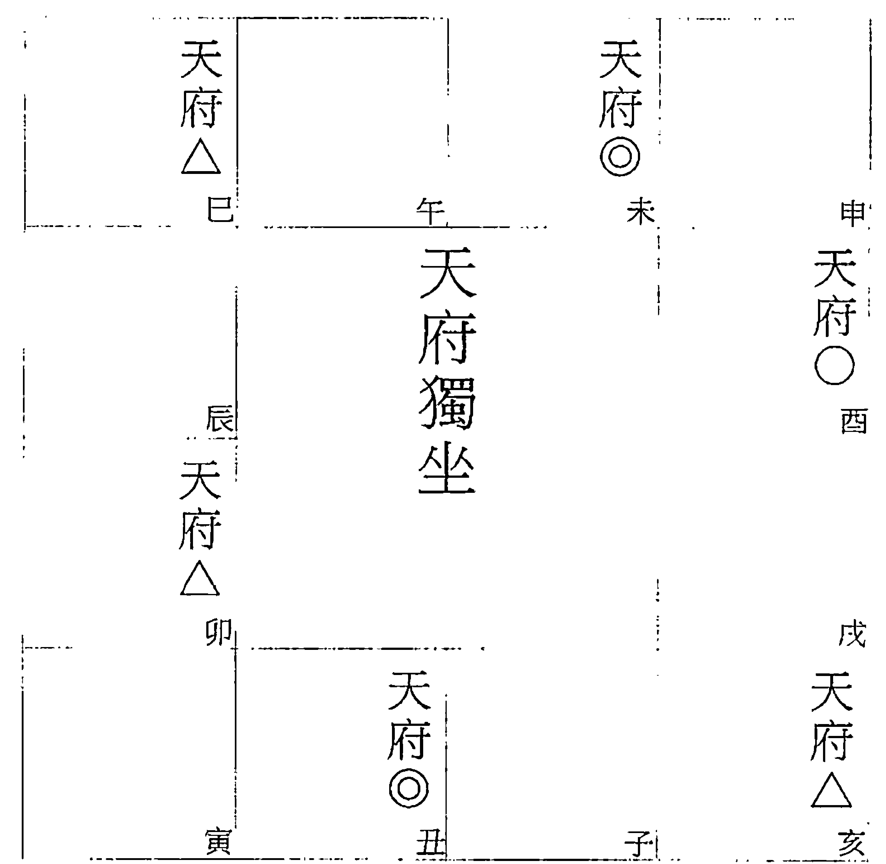

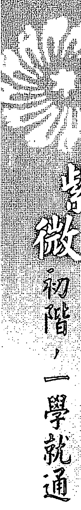

## 天府在丑及其十二宮的意義

天府坐入地支丑宫：

- 星曜五行：屬土，代表穩重、保守、內向、固執。
- 地支丑宮的五行：屬土，代表穩重、保守、內向、固執。
- 地支丑宮的意義：扭捏—扭扭捏捏。
- 地支丑宮的生肖：屬牛—剛毅主義。
- 地支丑宮的星座：山羊座—務實主義。
- 地支丑宮的宮性：地盤—財富宮。
- 代表人物：財務長
- 星曜強弱：化廟（◎），大富豪。

### 代表人物轉化：務實的大富豪

天府在丑爲化廟（◎），則優點盡出，呈現出運勢旺盛的格局。天府五行屬土，展現出穩重、冷靜而成熟的優點。因爲化廟則引動地支丑的優點呈現出剛毅、踏實、堅定、實際、財運佳等的優點。

天府爲財帛主、田宅主，化廟則展現出大富大貴、田產豐厚的運勢。天府代表人物原爲財務長，化廟則轉化升格爲大富豪的命格運勢，落入地支丑宮則轉化成務實的大富豪。

天府代表宰相，主『財』、主『權』，是幫皇帝做事的人，化廟則具有大權勢且個性穩定又堅持的意象。

## 天府（務實的大富豪）在丑坐入十二宮的意義：

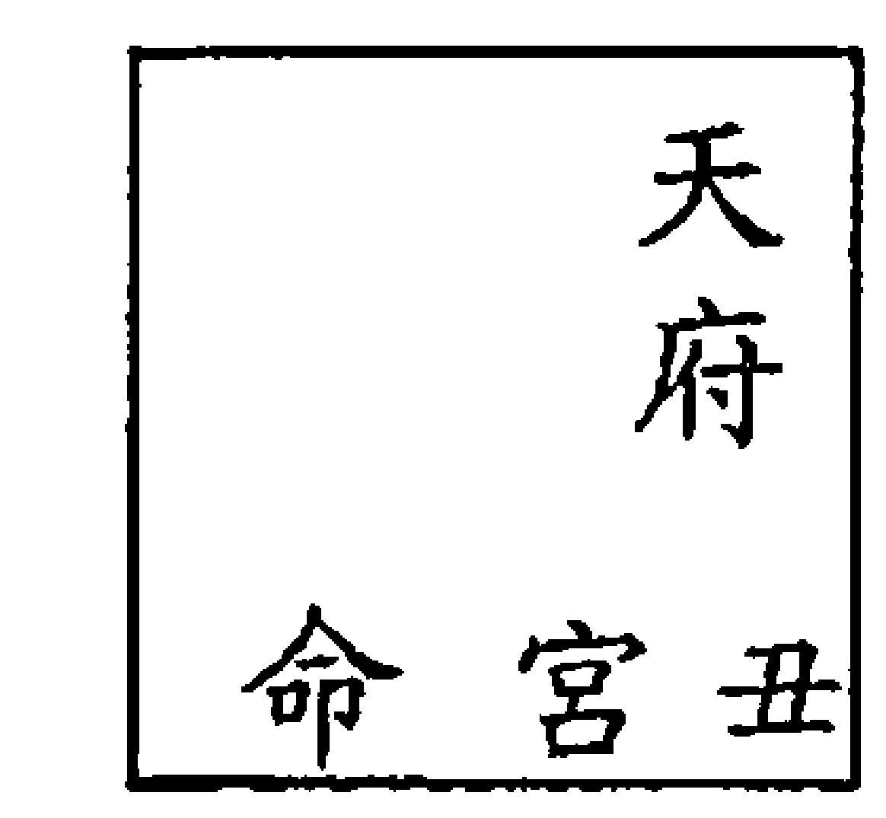

- 我的個性運勢：務實的大富豪。
- 我的事業運：旺運。
- 我的財運：豐厚。

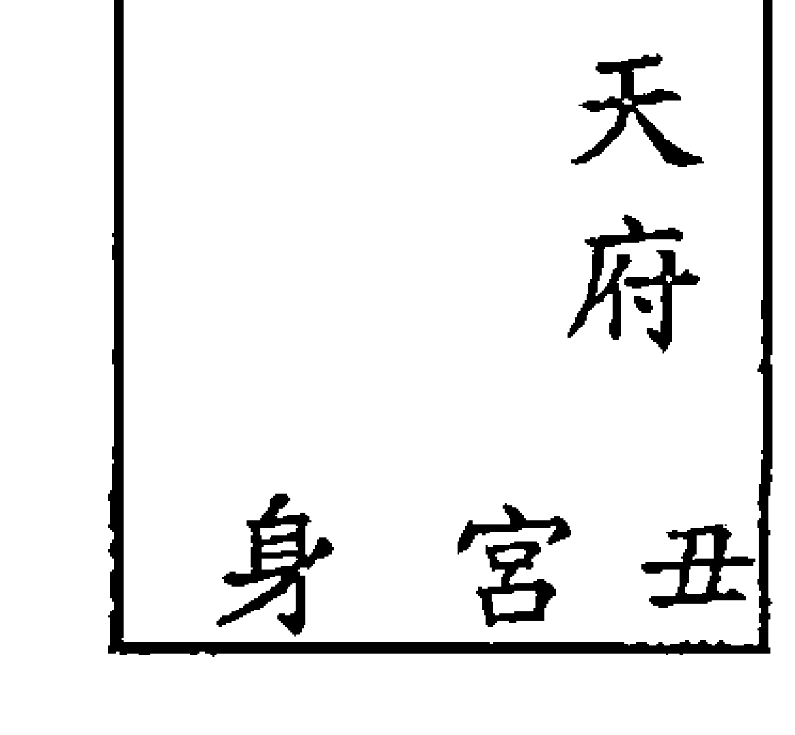

- 我中年後的個性運勢：務實的大富豪。
- 我中年後的事業運：旺運。
- 我中年後的財運：豐厚。

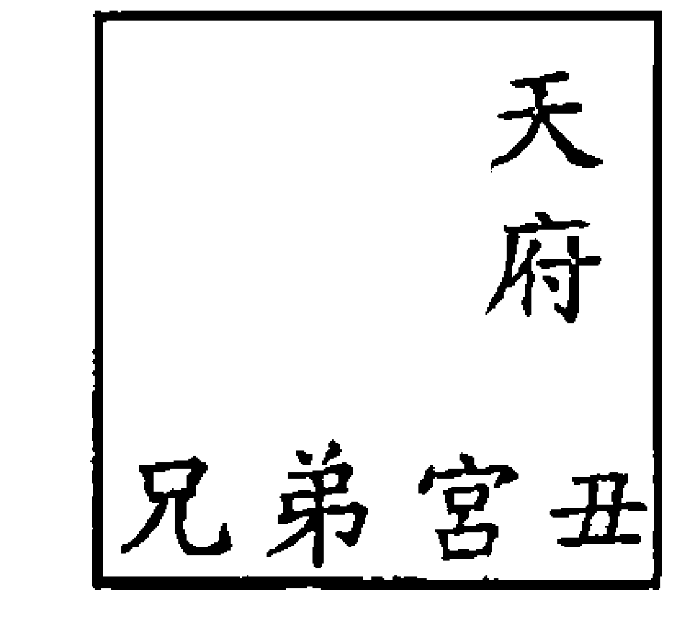

- 母親的個性運勢：務實的大富豪。
- 兄弟姊妹的個性運勢：務實的大富豪。

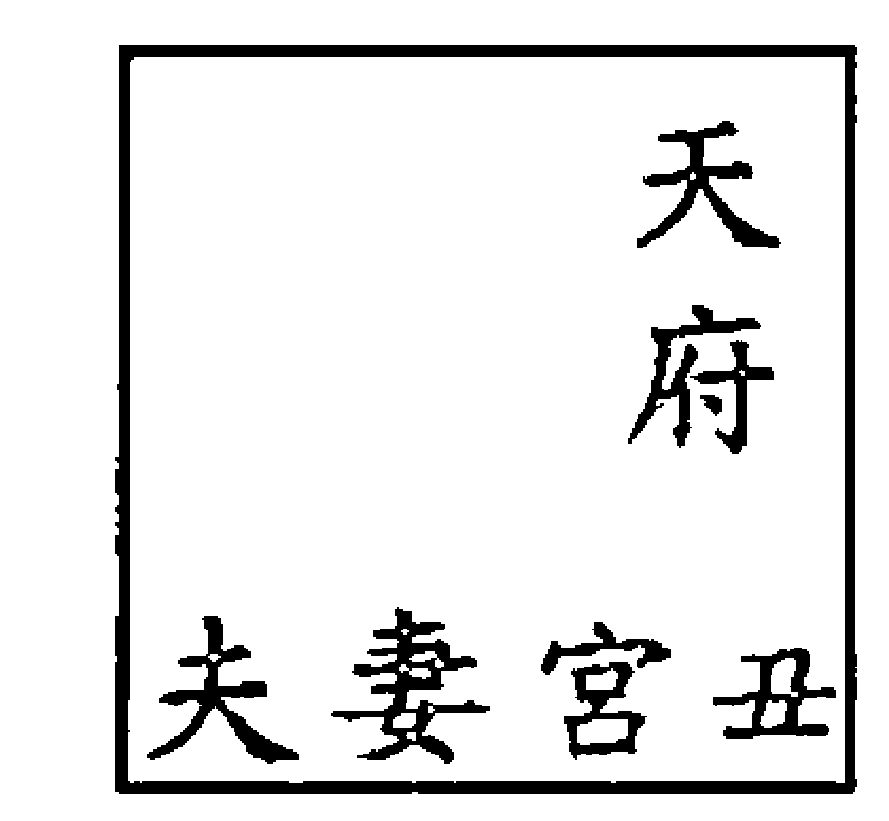

- 我對感情付出的個性運勢：穩定。
- 我喜愛對象的個性運勢：務實的大富豪。
- 配偶的個性運勢：務實的大富豪。

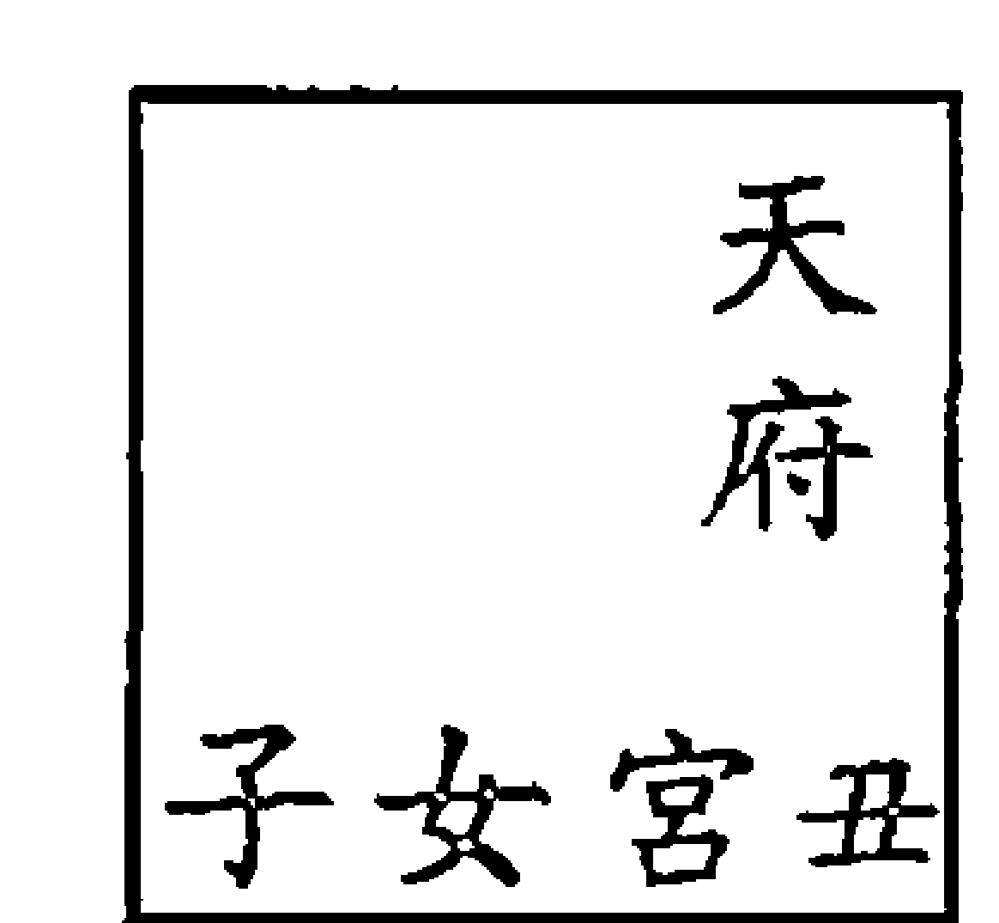

- 長子或長女的個性運勢：務實的大富豪。
- 我的屬下、助手：務實的大富豪。
- 性生活：多采多姿。

## 紫微初階，一學就通

| 天府 財帛宮丑 | 我的賺錢運勢：豐厚。<br>我的事業運勢：旺運。<br>我的個性運勢：務實的大富豪。 |
| :--- | :--- |
| **天府 疾厄宮丑** | **我的疾病：（土）脾臟、胃病。**<br>**我的潛能：有機會成為大富豪。** |
| **天府 遷移宮丑** | **我的外表：大富豪的樣子。**<br>**我的社交運：社交人士多為大富豪。**<br>**我的外出運：貴人運強。** |
| **天府 奴僕宮丑** | **我的朋友：務實的大富豪。**<br>**我的合夥人：務實的大富豪。**<br>**我的同事或朋友的運勢：務實的大富豪。** |
| **天府 官祿宮丑** | **我的事業運：旺運。**<br>**我的讀書運：穩定。**<br>**我的個性運勢：務實的大富豪。** |
| **天府 田宅宮丑** | **置產的運勢：祖產多、自置房產多。**<br>**家人的相處狀況：穩定和諧。** |

天府 福德宫丑
我的人生觀：當大富豪。
我的存摺運勢：豐厚。

天府 父母宫丑
父親的個性運勢：務實的大富豪。
長官的個性運勢：務實的大富豪。

## 天府在未及其十二宮的意義

天府坐入地支未宮：

- 星曜五行：屬土，代表穩重、保守、內向、固執。
- 地支未宮的五行：屬土，代表穩重、保守、內向、固執。
- 地支未宮的意義：味旺—享受成果。
- 地支未宮的生肖：屬羊—敏感主義。
- 地支未宮的星座：巨蟹座—家庭主義。
- 地支未宮的宮性：地盤—財富宮。
- 代表人物：財務長
- 星曜強弱：化廟（◎），大富豪。

### 代表人物轉化：享福的大富豪

天府在未為化廟（◎），則優點盡出，呈現出運勢旺盛的格局。天府五行屬土，展現出穩重、冷靜而成熟的優點。因為化廟則引動地支未的優點呈現穩重成熟、善良敏銳、冷靜、感性、愛家、財運旺等的優點，喜愛享受、較會花錢，能衝事業、會賺錢也會享受人生。

天府為財帛主、田宅主，化廟則展現出大富大貴、田產豐厚的運勢。天府代表人物原為財務長，化廟則轉化升格為大富豪的命格運勢，落入地支未宮則轉化成享福的大富豪。

天府代表宰相，主『财』、主『权』，是帮皇帝做事的人，化庙则具有大权势且个性稳定又坚持的意象。

## 天府（享福的大富豪）在未坐入十二宫的意义：

| 宫位 | 内容 |
| :--- | :--- |
| 天府<br>命 宫 未 | 我的个性运势：享福的大富豪。<br>我的事业运：旺运。<br>我的财运：丰厚。 |
| 天府<br>身 宫 未 | 我中年后的个性运势：享福的大富豪。<br>我中年后的事业运：旺运。<br>我中年后的财运：丰厚。 |
| 天府<br>兄弟宫 未 | 母亲的个性运势：享福的大富豪。<br>兄弟姐妹的个性运势：享福的大富豪。 |
| 天府<br>夫妻宫 未 | 我对感情付出的个性运势：稳定。<br>我喜爱对象的个性运势：大富豪。<br>配偶的个性运势：享福的大富豪。 |
| 天府<br>子女宫 未 | 长子或长女的个性运势：享福的大富豪。<br>我的属下、助手：享福的大富豪。<br>性生活：多采多姿。 |

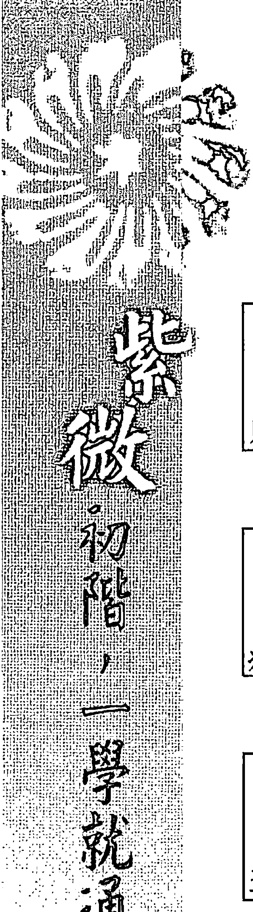

## 紫微初階，一學就通

### 天府 財帛宮未
- 我的賺錢運勢：豐厚。
- 我的事業運勢：旺運。
- 我的個性運勢：享福的大富豪。

### 天府 疾厄宮未
- 我的疾病：（土）脾臟、胃病。
- 我的潛能：有機會當大富豪。

### 天府 遷移宮未
- 我的外表：大富豪的樣子。
- 我的社交運：社交人士多為大富豪。
- 我的外出運：貴人運旺。

### 天府 奴僕宮未
- 我的朋友：享福的大富豪。
- 我的合夥人：享福的大富豪。
- 我的同事或朋友的運勢：享福的大富豪。

### 天府 官祿宮未
- 我的事業運：旺運。
- 我的讀書運：穩定。
- 我的個性運勢：享福的大富豪。

### 天府 田宅宮未
- 置產的運勢：祖產多、自置房產多。
- 家人的相處狀況：穩定和諧。

天府 福德宫未
我的人生观：当大富豪。
我的存摺运势：丰厚。

天府 父母宫未
父亲的个性运势：享福的大富豪。
长官的个性运势：享福的大富豪。

## 天府在卯及其十二宮的意義

- 天府坐入地支卯宮：
- 星曜五行：屬土，代表穩重、保守、內向、固執。
- 地支卯宮的五行：屬木，代表成長、上進、勞心、奔波。
- 地支卯宮的意義：茂盛—活力無限。
- 地支卯宮的生肖：屬兔—好動主義。
- 地支卯宮的星座：天蠍座—計畫主義。
- 地支卯宮的宮性：天盤—桃花宮。
- 代表人物：財務長
- 星曜強弱：化平（△），小會計。

### 代表人物轉化：奔波的小會計

天府在卯為化平（△），則優缺點參半，呈現出平庸的命格運勢。天府五行屬土，展現出穩重而成熟的優點，但有時亦會暴露出固執、封閉的缺點。因為化平則引動地支卯的優點，呈現精力充沛、行動高手、靜如處子動如脫兔、執行目標明確清楚、人緣佳等的優點，但時而亦曝露出，因動不停、想不完而產生計畫太多無法執行的狀況，且有桃花是非的缺點。

天府為財帛主、田宅主。化平則呈現一般水準的財富及房產的運勢。天府代表人物原為財務長，化平轉化為小會計的運勢，落入地支卯則轉化爲奔波的小會計。

天府代表宰相，主『財』、主『權』，是幫皇帝做事的人，但天府化平只能稱其爲書記官的意象比較沒有實權。

## 天府（奔波的小會計）在卯坐入十二宮的意義：

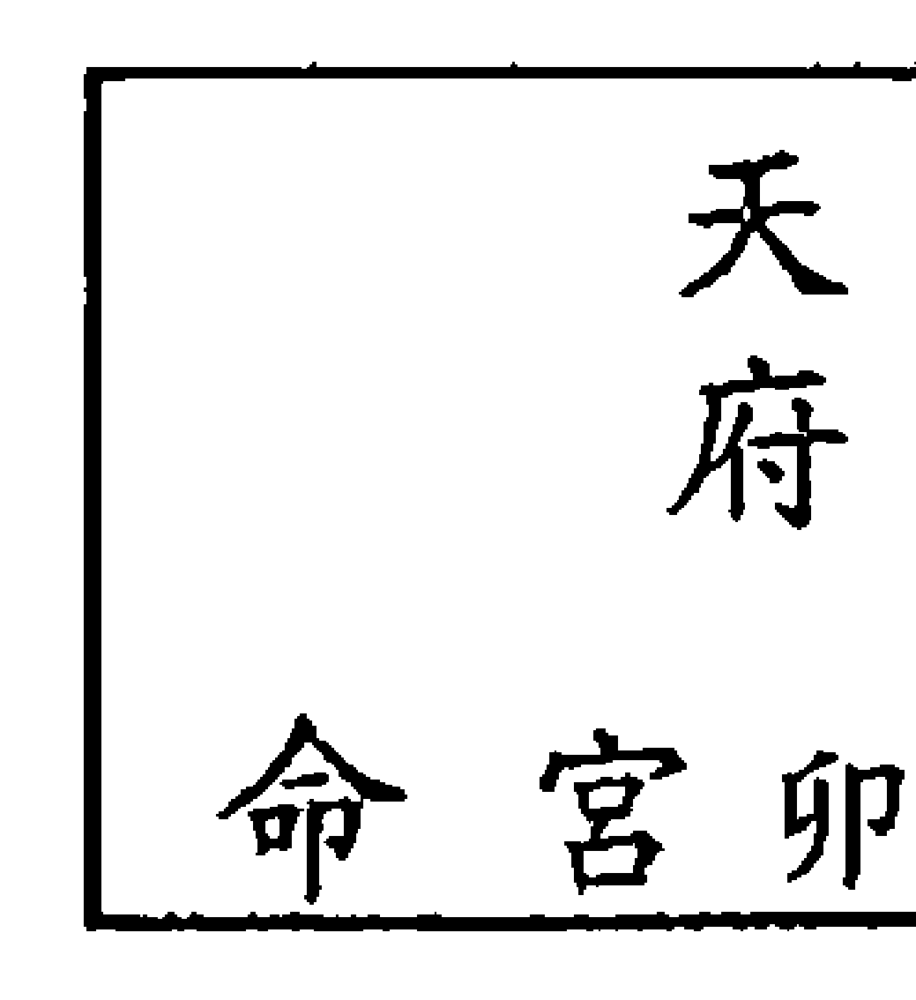

我的個性運勢：奔波的小會計。
我的事業運：平庸。
我的財運：固定收入。

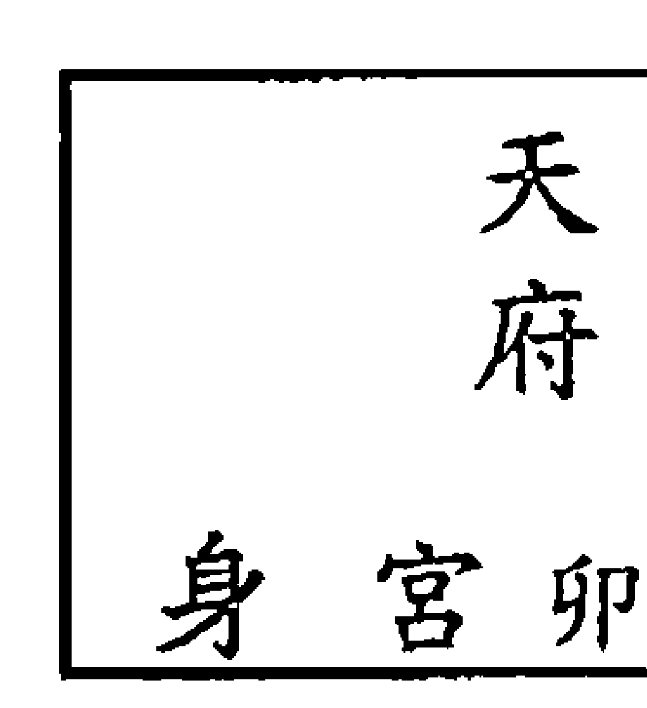

我中年後的個性運勢：奔波的小會計。
我中年後的事業運：平庸。
我中年後的財運：固定收入。

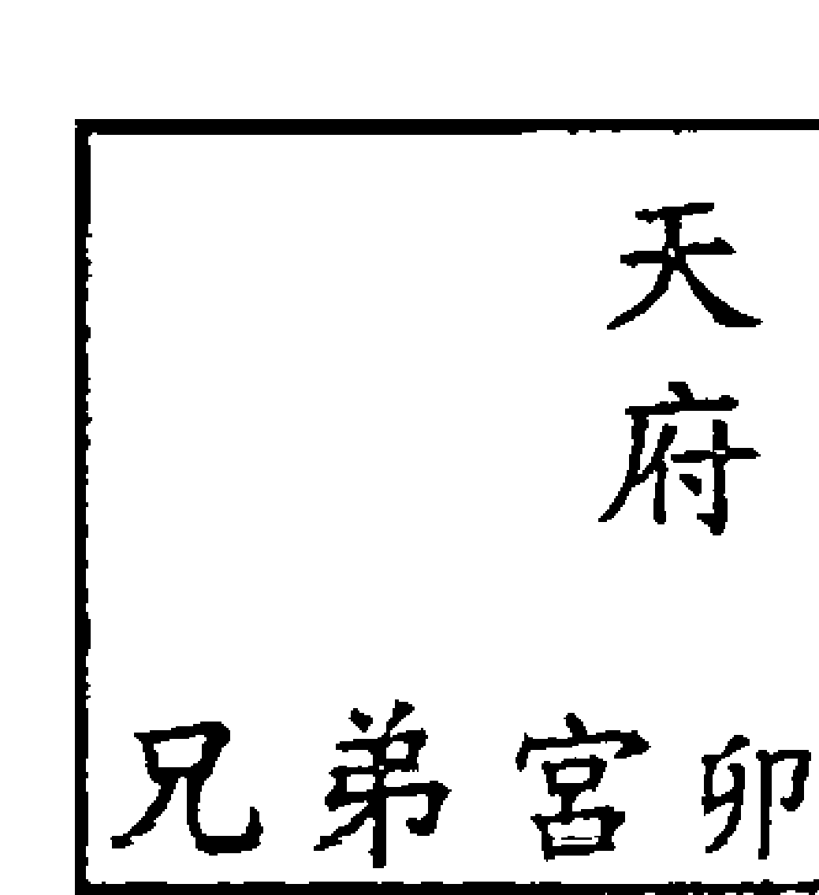

母親的個性運勢：奔波的小會計。
兄弟姊妹的個性運勢：奔波的小會計。

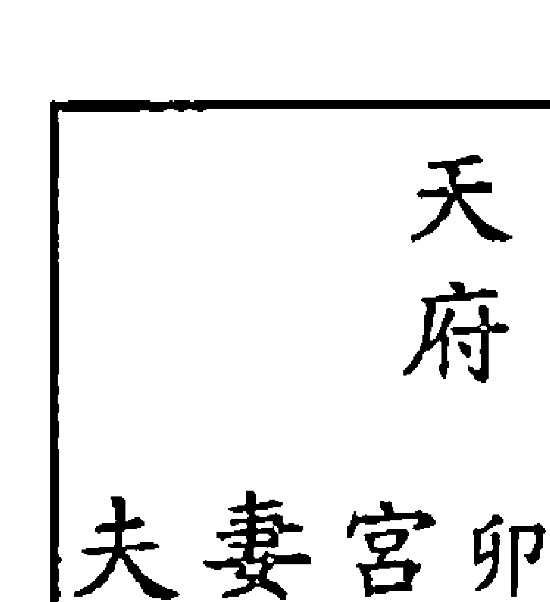

我對感情付出的個性運勢：穩定。
我喜愛對象的個性運勢：財務長。
配偶的個性運勢：奔波的小會計。

**天府 子女宮卯**
長子或長女的個性運勢：奔波的小會計。
我的屬下、助手：奔波的小會計。
性生活：多采多姿。

**天府 財帛宮卯**
我的賺錢運勢：固定收入。
我的事業運勢：平庸。
我的個性運勢：奔波的小會計。

**天府 疾厄宮卯**
我的疾病：（土）脾臟、胃病。
我的潛能：有機會當會計。

**天府 遷移宮卯**
我的外表：小會計的樣子。
我的社交運：社交圈多為財務人士。
我的外出運：貴人多。

**天府 奴僕宮卯**
我的朋友：奔波的小會計。
我的合夥人：奔波的小會計。
我的同事或朋友的運勢：奔波的小會計。

**天府 官祿宮卯**
我的事業運：平庸。
我的讀書運：穩定。
我的個性運勢：奔波的小會計。

**天府 田宅宫 卯**
置產的運勢：有祖產、可置產。
家人的相處狀況：穩定。

**天府 福德宫 卯**
我的人生觀：當財務長。
我的存摺運勢：平平。

**天府 父母宫 卯**
父親的個性運勢：奔波的小會計。
長官的個性運勢：奔波的小會計。

## 天府在酉及其十二宫的意義

- 天府坐入地支酉宫：
- 星曜五行：屬土，代表穩重、保守、内向、固執。
- 地支酉宮的五行：屬金，代表改革、突破、創意、叛逆。
- 地支酉宮的意義：酒甕—沈澱收藏。
- 地支酉宮的生肖：屬雞—叛逆主義。
- 地支酉宮的星座：金牛座—金錢主義。
- 地支酉宮的宮性：天盤—桃花宮。
- 代表人物：財務長
- 星曜強弱：化旺（○）。

### 代表人物轉化：創意的財務長

天府在酉爲化旺（○），則優點盡出，呈現出運勢旺盛的格局。天府五行屬土，展現出穩重、冷靜而成熟的優點。因爲化旺則引動地支酉的優點，呈現開創、發明、創意十足、懂得反省、追求新知、新觀念、財運佳、人緣好的優點。

天府爲財帛主、田宅主，化旺則展現出富貴、田產豐厚的運勢。天府代表人物原爲財務長，化旺則同樣爲財務長的命格運勢，落入地支酉宮則轉化成創意的財務長。

天府代表宰相，主『財』、主『權』，是幫皇帝做事的人，化旺則具有權勢且個性穩定又堅持的意象。

## 天府（創意的財務長）在酉坐入十二宮的意義：

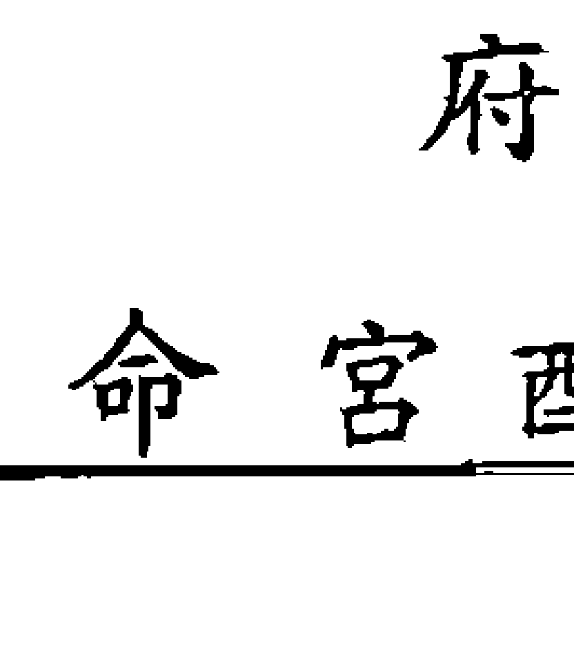

我的個性運勢：創意的財務長。
我的事業運：平順。
我的財運：富足。

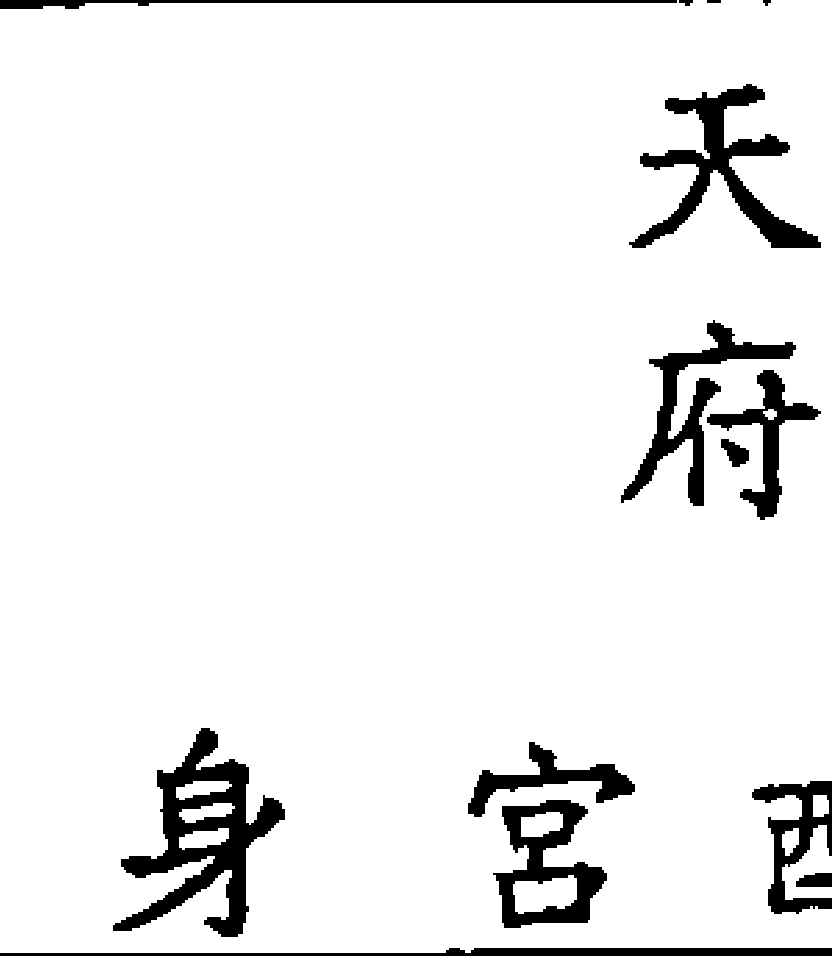

我中年後的個性運勢：創意的財務長。
我中年後的事業運：平順。
我中年後的財運：富足。

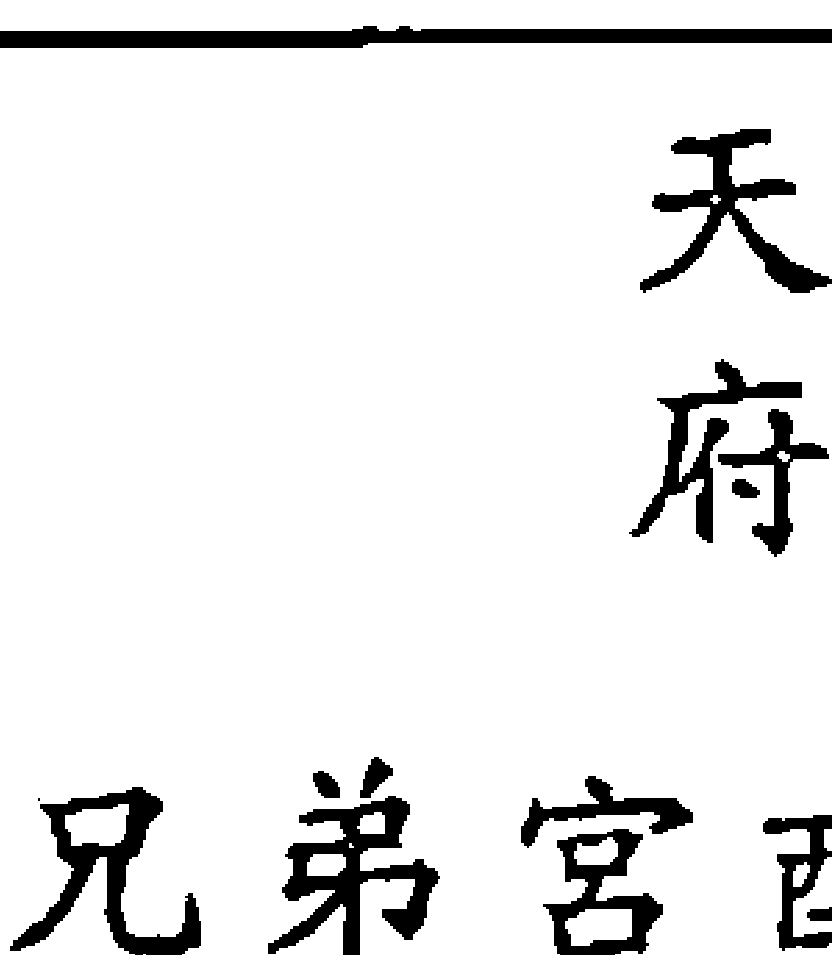

母親的個性運勢：創意的財務長。
兄弟姊妹的個性運勢：創意的財務長。

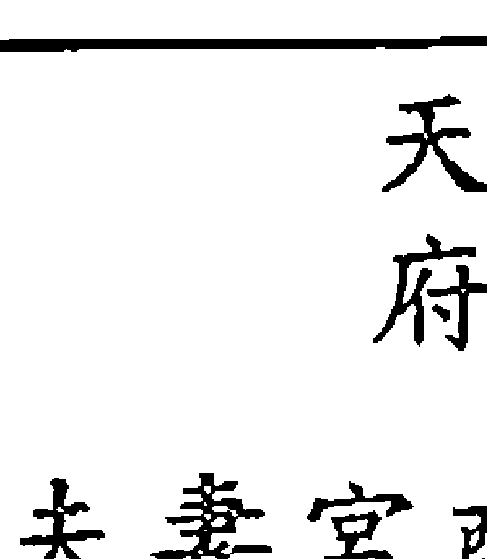

我對感情付出的個性運勢：穩定。
我喜愛對象的個性運勢：創意的財務長。
配偶的個性運勢：創意的財務長。

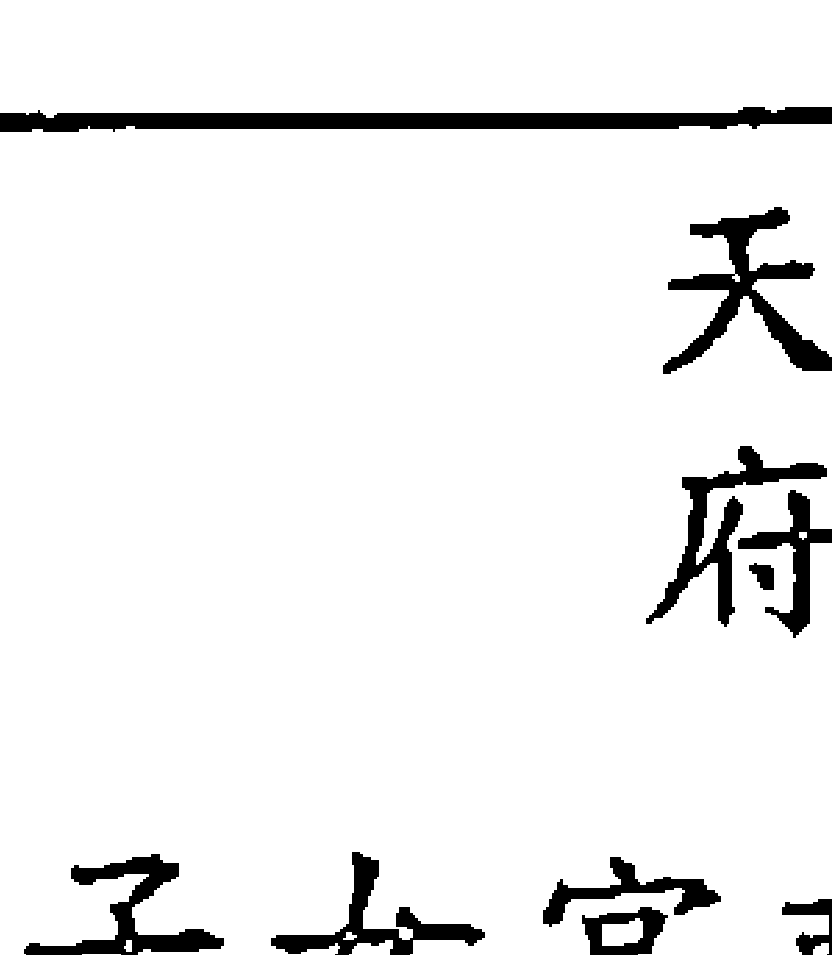

長子或長女的個性運勢：創意的財務長。
我的屬下、助手：創意的財務長。
性生活：多采多姿。


## 紫微斗数的一学就通

### 天府 财帛宫西
我的賺錢運勢：富足。
我的事業運勢：平順。
我的個性運勢：創意的財務長。

### 天府 疾厄宫西
我的疾病：（土）脾臟、胃病。
我的潛能：有機會當財務長。

### 天府 遷移宮西
我的外表：財務長的外表。
我的社交運：社交圈多為財務人士。
我的外出運：貴人多。

### 天府 奴僕宮西
我的朋友：創意的財務長。
我的合夥人：創意的財務長。
我的同事或朋友的運勢：創意的財務長。

### 天府 官祿宮西
我的事業運：平順。
我的讀書運：平順。
我的個性運勢：創意的財務長。

### 天府 田宅宮西
置產的運勢：祖產多、自置產多。
家人的相處狀況：穩定。

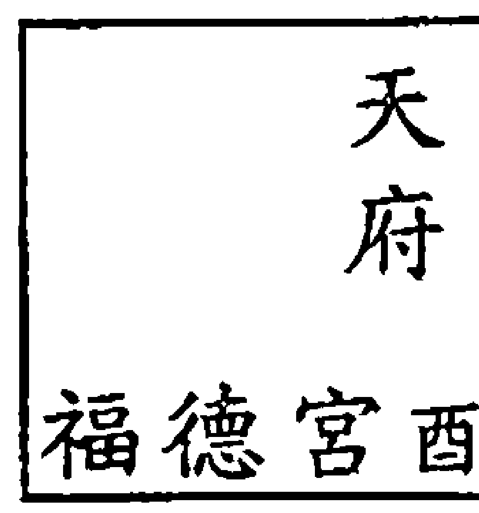

我的人生觀：當財務長。
我的存摺運勢：富足。

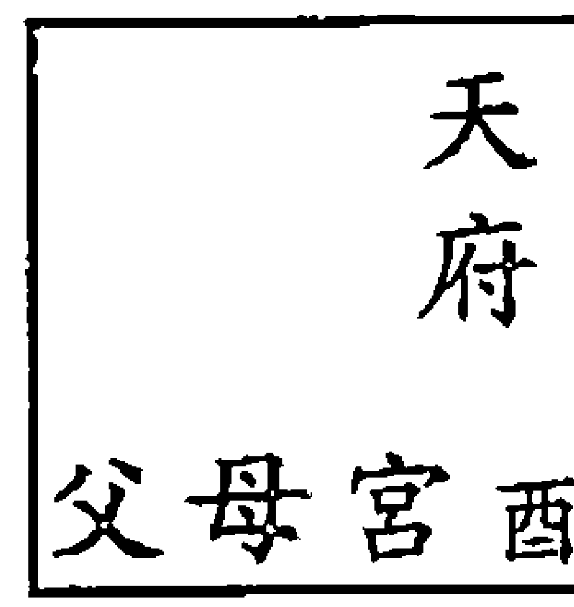

父親的個性運勢：創意的財務長。
長官的個性運勢：創意的財務長。

## 天府在巳及其十二宮的意義

天府坐入地支巳宮：
- 星曜五行：屬土，代表穩重、保守、內向、固執。
- 地支巳宮的五行：屬火，代表魅力、發揚、樂觀、傲慢。
- 地支巳宮的意義：起旺—開始衝刺。
- 地支巳宮的生肖：屬蛇—巧藝主義。
- 地支巳宮的星座：處女座—完美主義。
- 地支巳宮的宮性：人盤—奔波宮。
- 代表人物：財務長
- 星曜強弱：化平（△），小會計。
- 代表人物轉化：傲慢的小會計

天府在巳爲化平（△），則優缺點參半，呈現出命格運勢平庸的格局。天府五行屬土，展現出穩重而成熟的優點，但有時亦暴露出固執、封閉的缺點。因爲化平則引動地支巳的優缺點，呈現樂觀進取、有魅力、勤快、反應靈敏、專業權威、善於計劃的優點，但時而亦暴露出驕傲、目中無人、自以爲是、勞心勞力、學而不精、挑剔過度、勞碌奔波的缺點。

天府爲財帛主、田宅主。化平則呈現一般水準的財富及房產的運勢。天府代表人物原爲財務長，化平則轉化爲小會計的命格運勢，落入地支巳的代表人物轉化爲傲慢的小會計。

天府代表宰相，主『財』、主『權』，是幫皇帝做事的人，但天府化平只能稱其爲書記官的意象比較沒有實權。

### 天府（傲慢的小會計）在巳坐入十二宮的意義：

天府命宮巳
- 我的個性運勢：傲慢的小會計。
- 我的事業運：平庸。
- 我的財運：固定收入。

天府身宮巳
- 我中年後的個性運勢：傲慢的小會計。
- 我中年後的事業運：平庸。
- 我中年後的財運：固定收入。

天府兄弟宮巳
- 母親的個性運勢：傲慢的小會計。
- 兄弟姊妹的個性運勢：傲慢的小會計。

天府夫妻宮巳
- 我對感情付出的個性運勢：穩定。
- 我喜愛對象的個性運勢：財務長。
- 配偶的個性運勢：傲慢的小會計。

天府子女宮巳
- 長子或長女的個性運勢：傲慢的小會計。
- 我的屬下、助手：傲慢的小會計。
- 性生活：多采多姿。

天府財帛宮巳
- 我的賺錢運勢：固定收入。
- 我的事業運勢：平庸。
- 我的個性運勢：傲慢的小會計。

天府疾厄宮巳
- 我的疾病：（土）脾臟、胃病。
- 我的潛能：有機會成爲會計。

天府遷移宮巳
- 我的外表：傲慢小會計的樣子。
- 我的社交運：社交圈多爲財經人士。
- 我的外出運：貴人多。

天府奴僕宮巳
- 我的朋友：傲慢的小會計。
- 我的合夥人：傲慢的小會計。
- 我的同事或朋友的運勢：傲慢的小會計。

天府官祿宮巳
- 我的事業運：平庸。
- 我的讀書運：穩定。
- 我的個性運勢：傲慢的小會計。

天府田宅宮巳
- 置產的運勢：有祖產、可置產。
- 家人的相處狀況：和諧。

天府福德宮巳
- 我的人生觀：當財務長。
- 我的存摺運勢：平平。

天府父母宮巳
- 父親的個性運勢：傲慢的小會計。
- 長官的個性運勢：傲慢的小會計。

## 天府在亥及其十二宮的意義

天府坐入地支亥宮：
- 星曜五行：屬土，代表穩重、保守、內向、固執。
- 地支亥宮的五行：屬水，代表機伶、柔和、靈動、搖擺。
- 地支亥宮的意義：孩子—氣勢發威。
- 地支亥宮的生肖：屬豬—自尊主義。
- 地支亥宮的星座：雙魚座—浪漫主義。
- 地支亥宮的宮性：人盤—奔波宮。
- 代表人物：財務長
- 星曜強弱：化平（△），財務長。

### 代表人物轉化：保守的小會計

天府在亥爲化平（△），則優缺點參半，呈現出命格運勢平庸的格局。天府五行屬土，展現出穩重而成熟的優點，但有時亦暴露出固執、封閉的缺點。因爲化平則引動地支亥的優缺點呈現出，雖機智、靈活、反應快，但有時則軟弱、善變、沒主見；雖熱心助人、活潑好動，但有時則氣勢凌人導致人緣不佳；雖自重、自愛但有時太好面子；雖有藝術天分，但有時貪圖享受、感情太豐富；雖善於計畫，但容易奔走無方。

天府爲財帛主、田宅主。化平則呈現一般水準的財富及房產的運勢。天府代表人物原為財務長，化平則轉化為小會計的命格運勢，落入地支亥的代表人物轉化為保守的小會計。

天府代表宰相，主『財』、主『權』，是幫皇帝做事的人，但天府化平只能稱其為書記官的意象比較沒有實權。

### 天府（保守的小會計）在亥坐入十二宮的意義：

天府命宮亥
- 我的個性運勢：保守的小會計。
- 我的事業運：平庸。
- 我的財運：固定收入。

天府身宮亥
- 我中年後的個性運勢：保守的小會計。
- 我中年後的事業運：平庸。
- 我中年後的財運：固定收入。

天府兄弟宮亥
- 母親的個性運勢：保守的小會計。
- 兄弟姊妹的個性運勢：保守的小會計。

天府夫妻宮亥
- 我對感情付出的個性運勢：穩定。
- 我喜愛對象的個性運勢：財務長。
- 配偶的個性運勢：保守的小會計。

天府子女宮亥
- 長子或長女的個性運勢：保守的小會計。
- 我的屬下、助手：保守的小會計。
- 性生活：多采多姿。

天府財帛宮亥
- 我的賺錢運勢：固定收入。
- 我的事業運勢：平庸。
- 我的個性運勢：保守的小會計。

天府疾厄宮亥
- 我的疾病：（土）脾臟、胃病。
- 我的潛能：有機會當會計。

天府遷移宮亥
- 我的外表：保守小會計的樣子。
- 我的社交運：社交圈多為財經人士。
- 我的外出運：貴人多。

天府奴僕宮亥
- 我的朋友：保守的小會計。
- 我的合夥人：保守的小會計。
- 我的同事或朋友的運勢：保守的小會計。

天府官祿宮亥
- 我的事業運：平庸。
- 我的讀書運：穩定。
- 我的個性運勢：保守的小會計。

天府田宅宮亥
- 置產的運勢：有祖產、可置產。
- 家人的相處狀況：和諧。

天府福德宮亥
- 我的人生觀：當財務長。
- 我的存摺運勢：平平。

天府父母宮亥
- 父親的個性運勢：保守的小會計。
- 長官的個性運勢：保守的小會計。

## 太陰獨坐定律全解

- 太陰獨坐化廟只會落入地支亥宮。
- 太陰獨坐化旺只會落入地支酉宮及地支戌宮。
- 太陰獨坐化陷只會落入地支卯宮、地支辰宮及地支巳宮。

| 巳 | 午 | 未 | 申 |
|---|---|---|---|
| 太陰又辰 | 太陰獨坐 |  | 太陰○酉 |
| 太陰又卯 |  |  | 太陰○戌 |
| 寅 | 丑 | 子 | 太陰◎亥 |

## 太陰在卯及其十二宮的意義

太陰坐入地支卯宮：
- 星曜五行：太陰—屬水，代表機伶、柔和、靈動、搖擺。
- 地支卯宮的五行：屬木，代表成長、上進、勞心、奔波。
- 地支卯宮的意義：茂盛—活力無限。
- 地支卯宮的生肖：屬兔—好動主義。
- 地支卯宮的星座：天蠍座—計畫主義。
- 地支卯宮的宮性：天盤—桃花宮。
- 代表人物：白面書生。
- 星曜強弱：化陷（X），窮書生。
- 代表人物轉化：奔波的窮書生

太陰在卯爲化陷（X）則缺點暴露，形成低迷的命格運勢。太陰五行屬水，其五行之缺點暴露出軟弱、善變、沒主見。因爲化陷則引動地支卯的缺點，暴露出因常常動不停、想不完而產生計畫太多無法執行的狀況，且常有桃花是非。

太陰爲財帛主、田宅主。化陷代表會形成財務官司是非、產權官司是非、桃花是非等的事件。太陰代表人物原爲白面書生，化陷則爲窮書生的運勢，落入地支卯代表人物則轉化爲奔波的窮書生。

太陰主富、主文職、主女，化陷則主財運差、自由工作者較可發揮，太陰陷於男命或女命時均易被女性陷害。

### 太陰（奔波的窮書生）在卯坐入十二宮的意義：

太陰命宮卯
- 我的個性運勢：奔波的窮書生。
- 我的事業運：低迷。
- 我的財運：財來財去。

太陰身宮卯
- 我中年後的個性運勢：奔波的窮書生。
- 我中年後的事業運：低迷。
- 我中年後的財運：財來財去。

太陰兄弟宮卯
- 母親的個性運勢：奔波的窮書生。
- 兄弟姊妹的個性運勢：奔波的窮書生。

太陰夫妻宮卯
- 我對感情付出的個性運勢：感情白癡。
- 我喜愛對象的個性運勢：白面書生。
- 配偶的個性運勢：奔波的窮書生。

太陰子女宮卯
- 長子或長女的個性運勢：奔波的窮書生。
- 我的屬下、助手：奔波的窮書生。
- 性生活：視心情而定。

太陰財帛宮卯
- 我的賺錢運勢：財來財去。
- 我的事業運勢：低迷。
- 我的個性運勢：奔波的窮書生。

太陰疾厄宮卯
- 我的疾病：（水）泌尿系統、婦女病。
- 我的潛能：有機會當書生。

太陰遷移宮卯
- 我的外表：奔波窮書生的樣子。
- 我的社交運：社交人士多為讀書人。
- 我的外出運：小人多。

太陰奴僕宮卯
- 我的朋友：奔波的窮書生。
- 我的合夥人：奔波的窮書生。
- 我的同事或朋友的運勢：奔波的窮書生。

太陰官祿宮卯
- 我的事業運：低迷。
- 我的讀書運：坎坷。
- 我的個性運勢：奔波的窮書生。

太陰田宅宮卯
- 置產的運勢：無。
- 家人的相處狀況：不溝通。

太陰福德宮卯
- 我的人生觀：當才子。
- 我的存摺運勢：財來財去。

太陰父母宮卯
- 父親的個性運勢：奔波的窮書生。
- 長官的個性運勢：奔波的窮書生。

## 太陰在酉及其十二宮的意義

太陰坐入地支酉宮：
- 星曜五行：太陰—屬水，代表機伶、柔和、靈動、搖擺。
- 地支酉宮的五行：屬金，代表改革、突破、創意、叛逆。
- 地支酉宮的意義：酒罌—沈澱收藏。
- 地支酉宮的生肖：屬雞—叛逆主義。
- 地支酉宮的星座：金牛座—金錢主義。
- 地支酉宮的宮性：天盤—桃花宮。
- 代表人物：白面書生。
- 星曜強弱：化旺（○），大書生。

### 代表人物轉化：創意的大書生

太陰在酉為化旺（○），則優點盡出，形成旺盛的命格運勢。太陰五行屬水，展現機智、靈敏、反應快的優點。因為化旺則引動地支酉的優點，呈現開創、發明、創意十足、懂得反省、追求新知、新觀念、財運佳、人緣好的優點。

太陰為財帛主、田宅主。化旺則代表具有大富大貴、豪門房產的運勢。太陰代表人物原為白面書生，化旺則為大書生的運勢，落入地支酉轉化為創意的大書生。

太陰主富、主文職、主女，化旺則主富有、從事文職可發揚所長，於男命與異性相處較融洽，於女命則與同性緣深。

### 太陰（創意的大書生）在酉坐入十二宮的意義：

太陰命宮酉
- 我的個性運勢：創意的大書生。
- 我的事業運：旺盛。
- 我的財運：豐厚。

太陰身宮酉
- 我中年後的個性運勢：創意的大書生。
- 我中年後的事業運：旺盛。
- 我中年後的財運：豐厚。

太陰兄弟宮酉
- 母親的個性運勢：創意的大書生。
- 兄弟姊妹的個性運勢：創意的大書生。

太陰夫妻宮酉
- 我對感情付出的個性運勢：感情豐富。
- 我喜愛對象的個性運勢：創意的大書生。
- 配偶的個性運勢：創意的大書生。

太陰子女宮酉
- 長子或長女的個性運勢：創意的大書生。
- 我的屬下、助手：創意的大書生。
- 性生活：多采多姿。

太陰財帛宮酉
- 我的賺錢運勢：豐厚。
- 我的事業運勢：旺盛。
- 我的個性運勢：創意的大書生。

太陰疾厄宮酉
- 我的疾病：（水）泌尿系統、婦女病。
- 我的潛能：有機會當才子。

太陰遷移宮酉
- 我的外表：創意大書生的樣子。
- 我的社交運：社交人士多為才女。
- 我的外出運：貴人多。

太陰奴僕宮酉
- 我的朋友：創意的大書生。
- 我的合夥人：創意的大書生。
- 我的同事或朋友的運勢：創意的大書生。

太陰官祿宮酉
- 我的事業運：旺盛。
- 我的讀書運：順利。
- 我的個性運勢：創意的大書生。

太陰田宅宮酉
- 置產的運勢：祖產多、自置房產多。
- 家人的相處狀況：綿密。

太陰福德宮酉
- 我的人生觀：當大才子。
- 我的存摺運勢：豐厚。

太陰父母宮酉
- 父親的個性運勢：創意的大書生。
- 長官的個性運勢：創意的大書生。

## 太陰在辰及其十二宮的意義

太陰坐入地支辰宮：
- 星曜五行：太陰—屬水，代表機伶、柔和、靈動、搖擺。
- 地支辰宮的五行：屬土，代表穩重、保守、內向、固執。
- 地支辰宮的意義：震祛—脫胎換骨。
- 地支辰宮的生肖：屬龍—變遷主義。
- 地支辰宮的星座：天秤座—朋友主義。
- 地支辰宮的宮性：地盤—財富宮。
- 代表人物：白面書生。
- 星曜強弱：化陷（×），窮書生。

### 代表人物轉化：固執的窮書生

太陰在辰為化陷（×）則缺點暴露，形成低迷的命格運勢。太陰五行屬水，其五行之缺點暴露出軟弱、善變、沒主見。因為化陷則引動地支辰的缺點暴露出，固執、封閉、太保守、好動善變、變動無常、漂泊不定、人緣較差、財運不佳的情況。

太陰為財帛主、田宅主。化陷代表會形成財務官司是非、產權官司是非、桃花是非等的事件。太陰代表人物原為白面書生，化陷則為窮書生的運勢，落入地支辰代表人物則轉化為固執的窮書生。

太陰主富、主文職、主女，化陷則主財運差、自由工作者較可發揮，需特別注意的是太陰化陷於男命或女命時均易被女性陷害。

辰宮爲天羅、戌宮爲地網稱爲天羅地網宮，命宮在此二宮位，因爲競爭慾望過高，彷彿有一層網子罩住自己的身體、手上鐐著枷鎖，想掙脫卻力不從心，猶如運勢被鎖住一般，而深感一生辛苦、勞碌。

### 太陰（固執的窮書生）在辰坐入十二宮的意義：

太陰命宮辰
- 我的個性運勢：固執的窮書生。
- 我的事業運：低迷。
- 我的財運：財來財去。

太陰身宮辰
- 我中年後的個性運勢：固執的窮書生。
- 我中年後的事業運：低迷。
- 我中年後的財運：財來財去。

太陰兄弟宮辰
- 母親的個性運勢：固執的窮書生。
- 兄弟姊妹的個性運勢：低迷。

太陰夫妻宮辰
- 我對感情付出的個性運勢：不懂付出。
- 我喜愛對象的個性運勢：才子。
- 配偶的個性運勢：固執的窮書生。

太陰子女宮辰
- 長子或長女的個性運勢：固執的窮書生。
- 我的屬下、助手：固執的窮書生。
- 性生活：力不從心。

太陰財帛宮辰
- 我的賺錢運勢：財來財去。
- 我的事業運勢：低迷。
- 我的個性運勢：固執的窮書生。

太陰疾厄宮辰
- 我的疾病：（水）泌尿系統、婦女病。
- 我的潛能：有機會成為才子。

太陰遷移宮辰
- 我的外表：固執窮書生的樣子。
- 我的社交運：社交圈多為讀書人。
- 我的外出運：女性小人多。

太陰奴僕宮辰
- 我的朋友：固執的窮書生。
- 我的合夥人：固執的窮書生。
- 我的同事或朋友的運勢：固執的窮書生。

太陰官祿宮辰
- 我的事業運：低迷。
- 我的讀書運：坎坷。
- 我的個性運勢：固執的窮書生。

太陰田宅宮辰
- 置產的運勢：無。
- 家人的相處狀況：不溝通。

太陰福德宮辰
- 我的人生觀：當才子。
- 我的存摺運勢：財來財去。

太陰父母宮辰
- 父親的個性運勢：固執的窮書生。
- 長官的個性運勢：固執的窮書生。

## 太陰在戌及其十二宮的意義

太陰坐入地支戌宮：
- 星曜五行：太陰—屬水，代表機伶、柔和、靈動、搖擺。
- 地支戌宮的五行：屬土，代表穩重、保守、內向、固執。
- 地支戌宮的意義：滅始—除舊佈新。
- 地支戌宮的生肖：屬狗—負責主義。
- 地支戌宮的星座：牡羊座—發現主義。
- 地支戌宮的宮性：地盤—財富宮。
- 代表人物：白面書生。
- 星曜強弱：化旺（○），大書生。

### 代表人物轉化：穩重的大書生

太陰在戌爲化旺（○），則優點盡出，形成旺盛的命格運勢。太陰五行屬水，展現機智、靈敏、反應快的優點。因爲化旺則引動地支戌的優點呈現出成熟穩重、冷靜、謹慎、善良、尊貴、從一而終、責任感強烈、創意十足、財運佳的個性運勢。

太陰爲財帛主、田宅主。化旺則代表具有大富大貴、豪門房產的運勢。太陰代表人物原爲白面書生，化旺則爲大書生的運勢，落入地支戌轉化爲穩重的大書生。

太陰主富、主文職、主女，化旺則主富有、從事文職可發揮所長，於男命與異性相處較融洽，於女命則與同性緣深。

辰宮為天羅、戌宮為地網稱為天羅地網宮，命宮在此二宮位，因為競爭慾望過高，彷彿有一層網子罩住自己的身體、手上銬著枷鎖，想掙脫卻力不從心，猶如運勢被鎖住一般，而深感一生辛苦、勞碌。

### 太陰（穩重的大書生）在戌坐入十二宮的意義：

太陰命宮戌
- 我的個性運勢：穩重的大書生。
- 我的事業運：旺盛。
- 我的財運：豐厚。

太陰身宮戌
- 我中年後的個性運勢：穩重的大書生。
- 我中年後的事業運：旺盛。
- 我中年後的財運：豐厚。

太陰兄弟宮戌
- 母親的個性運勢：穩重的大書生。
- 兄弟姊妹的個性運勢：穩重的大書生。

太陰夫妻宮戌
- 我對感情付出的個性運勢：感情豐富。
- 我喜愛對象的個性運勢：大才子。
- 配偶的個性運勢：穩重的大書生。

太陰在戌

太陰 子女宮戌
- 長子或長女的個性運勢：穩重的大書生。
- 我的屬下、助手：穩重的大書生。
- 性生活：多采多姿。

太陰 財帛宮戌
- 我的賺錢運勢：豐厚。
- 我的事業運勢：旺盛。
- 我的個性運勢：穩重的大書生。

太陰 疾厄宮戌
- 我的疾病：（水）泌尿系統、婦女病。
- 我的潛能：有機會當大才子。

太陰 遷移宮戌
- 我的外表：穩重大書生的樣子。
- 我的社交運：社交圈多為大才子。
- 我的外出運：女性貴人多。

太陰 奴僕宮戌
- 我的朋友：穩重的大書生。
- 我的合夥人：穩重的大書生。
- 我的同事或朋友的運勢：穩重的大書生。

太陰 官祿宮戌
- 我的事業運：旺盛。
- 我的讀書運：順利。
- 我的個性運勢：穩重的大書生。

| 太陰<br>田宅宮戌 | 置產的運勢：祖產多、自置房產多。<br>家人的相處狀況：綿密。 |
| 太陰<br>福德宮戌 | 我的人生觀：當大才子。<br>我的存摺運勢：豐厚。 |
| 太陰<br>父母宮戌 | 父親的個性運勢：穩重的大書生。<br>長官的個性運勢：穩重的大書生。 |

## 太陰在巳及其十二宮的意義

太陰坐入地支巳宮：
- 星曜五行：太陰一屬水，代表機伶、柔和、靈動、搖擺。
- 地支巳宮的五行：屬火，代表魅力、發揚、樂觀、傲慢。
- 地支巳宮的意義：起旺—開始衝刺。
- 地支巳宮的生肖：屬蛇—巧藝主義。
- 地支巳宮的星座：處女座—完美主義。
- 地支巳宮的宮性：人盤—奔波宮。
- 代表人物：白面書生。
- 星曜強弱：化陷（×），窮書生。

## 代表人物轉化：傲慢的窮書生

太陰在巳爲化陷（×）則缺點暴露，形成低迷的命格運勢。太陰五行屬水，其五行之缺點暴露出軟弱、善變、沒主見。因爲化陷則引動地支巳的缺點，曝露出驕傲、目中無人、自以爲是、勞心勞力、學而不精、挑剔過度、勞碌奔波的缺點。

太陰爲財帛主、田宅主。化陷代表會形成財務官司是非、產權官司是非、桃花是非等的事件。太陰代表人物原爲白面書生，化陷則爲窮書生的運勢，落入地支巳代表人物則轉化爲傲慢的窮書生。

太陰主富、主文職、主女，化陷則主財運差、自由工作者較可發揮，需特別注意的是太陰化陷於男命或女命時均易被女性陷害。

## 太陰（傲慢的窮書生）在巳坐入十二宮的意義：

| 太陰 命宮巳 | 我的個性運勢：傲慢的窮書生。<br>我的事業運：低迷。<br>我的財運：財來財去。 |
| 太陰 身宮巳 | 我中年後的個性運勢：傲慢的窮書生。<br>我中年後的事業運：低迷。<br>我中年後的財運：財來財去。 |
| 太陰 兄弟宮巳 | 母親的個性運勢：傲慢的窮書生。<br>兄弟姊妹的個性運勢：傲慢的窮書生。 |
| 太陰 夫妻宮巳 | 我對感情付出的個性運勢：不懂付出。<br>我喜愛對象的個性運勢：才子。<br>配偶的個性運勢：傲慢的窮書生。 |
| 太陰 子女宮巳 | 長子或長女的個性運勢：傲慢的窮書生。<br>我的屬下、助手：傲慢的窮書生。<br>性生活：力不從心。 |

## 太陰 財帛宮巳

我的賺錢運勢：財來財去。我的事業運勢：低迷。我的個性運勢：傲慢的窮書生。

## 太陰 疾厄宮巳

我的疾病：（水）泌尿系統、婦女病。我的潛能：有機會當才子。

## 太陰 遷移宮巳

我的外表：傲慢窮書生的樣子。我的社交運：社交圈多為讀書人。我的外出運：女性小人多。

## 太陰 奴僕宮巳

我的朋友：傲慢的窮書生。我的合夥人：傲慢的窮書生。我的同事或朋友的運勢：傲慢的窮書生。

## 太陰 官祿宮巳

我的事業運：低迷。我的讀書運：坎坷。我的個性運勢：傲慢的窮書生。

## 太陰 田宅宮巳

置產的運勢：無。家人的相處狀況：不常在家。

## 太陰 福德宮巳

我的人生觀：當大才子。我的存摺運勢：財來財去。

## 太陰 父母宮巳

父親的個性運勢：傲慢的窮書生。長官的個性運勢：傲慢的窮書生。

## 太阴在亥及其十二宫的意义

太阴坐入地支亥宫：
- 星曜五行：太阴—属水，代表机伶、柔和、灵动、摇摆。
- 地支亥宫的五行：属水，代表机伶、柔和、灵动、摇摆。
- 地支亥宫的意义：孩子—气势发威。
- 地支亥宫的生肖：属猪—自尊主义。
- 地支亥宫的星座：双鱼座—浪漫主义。
- 地支亥宫的宫性：人盘—奔波宫。
- 代表人物：白面书生。
- 星曜强弱：化庙（◎），大才子。

## 代表人物转化：机伶的大才子

太阴在亥为化庙（◎），则优点尽出，形成旺盛的命格运势。太阴五行属水，展现机智、灵敏、反应快的优点。因为化旺平则引动地支亥的优点，呈现乐观进取、有魅力、勤快、反应灵敏、专业权威、善于计划的优点。

太阴为财帛主、田宅主。化庙则代表具有大富大贵、豪门房产的运势。太阴代表人物原为白面书生，化庙则为大书生的运势，落入地支亥转化为机伶的大才子。

太阴主富、主文职、主女，化庙则主富有、从事文职可发挥所长，于男命与异性相处较融洽，于女命则与同性缘深。

## 太陰（機伶的大才子）在亥坐入十二宮的意義：

- **太陰 命宮亥**
  - 我的個性運勢：機伶的大才子。
  - 我的事業運：旺盛。
  - 我的財運：豐厚。
- **太陰 身宮亥**
  - 我中年後的個性運勢：機伶的大才子。
  - 我中年後的事業運：旺盛。
  - 我中年後的財運：豐厚。
- **太陰 兄弟宮亥**
  - 母親的個性運勢：機伶的大才子。
  - 兄弟姊妹的個性運勢：機伶的大才子。
- **太陰 夫妻宮亥**
  - 我對感情付出的個性運勢：感情豐富。
  - 我喜愛對象的個性運勢：機伶的大才子。
  - 配偶的個性運勢：機伶的大才子。
- **太陰 子女宮亥**
  - 長子或長女的個性運勢：機伶的大才子。
  - 我的屬下、助手：機伶的大才子。
  - 性生活：多采多姿。

太陰 財帛宮亥
- 我的賺錢運勢：豐厚。
- 我的事業運勢：旺盛。
- 我的個性運勢：機伶的大才子。

太陰 疾厄宮亥
- 我的疾病：（水）泌尿系統、婦女病。
- 我的潛能：有機會當大才子。

太陰 遷移宮亥
- 我的外表：機伶大才子的樣子。
- 我的社交運：社交圈多爲大才子。
- 我的外出運：女性貴人多。

太陰 奴僕宮亥
- 我的朋友：機伶的大才子。
- 我的合夥人：機伶的大才子。
- 我的同事或朋友的運勢：機伶的大才子。

太陰 官祿宮亥
- 我的事業運：旺盛。
- 我的讀書運：順利。
- 我的個性運勢：機伶的大才子。

太陰 田宅宮亥
- 置產的運勢：祖產多、自置房產多。
- 家人的相處狀況：綿密。

太陰 福德宮亥
- 我的人生觀：當大才子。
- 我的存摺運勢：豐厚。

太陰 父母宮亥
- 父親的個性運勢：機伶的大才子。
- 長官的個性運勢：機伶的大才子。

## 貪狼獨坐定律全解

- 貪狼獨坐化廟只會落入地支辰及地支戌宮。
- 貪狼獨坐化旺只會落入地支子宮及地支午宮。
- 貪狼獨坐化平只會落入地支寅宮及地支申宮。

## 貪狼在子及其十二宮的意義

貪狼坐入地支子宮：
- 星曜五行：屬水，代表機伶、柔和、靈動、搖擺。屬木，代表成長、上進、勞心、奔波。
- 地支子宮的五行：屬水，代表機伶、柔和、靈動、搖擺。
- 地支子宮的意義：孽中一深藏不露。
- 地支子宮的生肖：屬鼠一機伶主義。
- 地支子宮的星座：水瓶座一理想主義。
- 地支子宮的宮性：天盤一桃花宮。
- 代表人物：好動兒。
- 星曜強弱：化旺（○），好動兒。

代表人物轉化：機伶的好動兒

貪狼在子為化旺（○），則優點盡出，呈現出命格運勢旺盛的格局。貪狼五行屬水、木，則其優點為機智、靈敏、反應快、求上進、肯學習的命格。因為化旺則引動地支子的優點，展現出機智、靈活、聰慧、細膩、冷靜、靈敏、聰明、格局、抱負遠大、人緣很好的個性運勢。

貪狼為遊戲禍福主、主富貴，化旺展現出正財、偏財運皆旺盛，雖沈溺於玩樂但福多於禍，且具有化解厄運的能力。貪狼化旺代表人物不變同為好動兒，落入地支子代表人物則轉化爲機伶的好動兒。

## 貪狼（機伶的好動兒）在子坐入十二宮的意義：

- 貪狼 命宮子
  - 我的個性運勢：機伶的好動兒。
  - 我的事業運：旺盛。
  - 我的財運：豐厚。
- 貪狼 身宮子
  - 我中年後的個性運勢：機伶的好動兒。
  - 我中年後的事業運：旺盛。
  - 我中年後的財運：豐厚。
- 貪狼 兄弟宮子
  - 母親的個性運勢：機伶的好動兒。
  - 兄弟姊妹的個性運勢：機伶的好動兒。
- 貪狼 夫妻宮子
  - 我對感情付出的個性運勢：善變。
  - 我喜愛對象的個性運勢：機伶的好動兒。
  - 配偶的個性運勢：機伶的好動兒。
- 貪狼 子女宮子
  - 長子或長女的個性運勢：機伶的好動兒。
  - 我的屬下、助手：機伶的好動兒。
  - 性生活：多采多姿。

## 紫微初階，一學就通

貪狼 財帛宮子
- 我的賺錢運勢：豐厚。
- 我的事業運勢：旺盛。
- 我的個性運勢：機伶的好動兒。

貪狼 疾厄宮子
- 我的疾病：（水）泌尿系統、婦女病、性病，（木）肝病。
- 我的潛能：有機會當天才兒童。

貪狼 遷移宮子
- 我的外表：機伶好動兒的樣子。
- 我的社交運：社交人士多為好動兒。
- 我的外出運：貴人多。

貪狼 奴僕宮子
- 我的朋友：機伶的好動兒。
- 我的合夥人：機伶的好動兒。
- 我的同事或朋友的運勢：機伶的好動兒。

貪狼 官祿宮子
- 我的事業運：旺盛。
- 我的讀書運：平順。
- 我的個性運勢：機伶的好動兒。

貪狼 田宅宮子
- 置產的運勢：貴人相助而中年後置產。
- 家人的相處狀況：不常在家。

| 貪狼 福德宮子 | 我的人生觀：吃喝不盡。我的存摺運勢：豐厚。 |
| 貪狼 父母宮子 | 父親的個性運勢：機伶的好動兒。長官的個性運勢：機伶的好動兒。 |

## 貪狼在午及其十二宮的意義

貪狼星坐入地支午宮為獨坐：
- 星曜五行：屬水，代表機伶、柔和、靈動、搖擺。屬木，代表成長、上進、勞心、奔波。
- 地支午宮的五行：屬火，代表魅力、發揚、樂觀、傲慢。
- 地支午宮的意義：日旺一紅的發火。
- 地支午宮的生肖：屬馬一暴躁主義。
- 地支午宮的星座：獅子座一尊重主義。
- 地支午宮的宮性：天盤一桃花宮。
- 代表人物：好動兒。
- 星曜強弱：化旺（○），好動兒。

代表人物轉化：樂觀的好動兒

貪狼在午為化旺（○），則優點盡出，呈現出命格運勢旺盛的格局。貪狼五行屬水、木，則其優點為機智、靈敏、反應快、求上進、肯學習的命格。因為化旺則引動地支午的優點呈現出樂觀進取、魅力無限、行動積極、衝勁十足、雄霸威武、擁有君臨天下、大將之風的領袖風範、人緣極佳、台緣旺盛。

貪狼為遊戲禍福主、主富貴，化旺展現出正財、偏財運皆旺盛，雖沈溺於玩樂但福多於禍，且具有化解厄運的能力。貪狼化旺代表人物不変同为好动儿，落入地支午代表人物则转化为乐观的好动儿。

## 貪狼（樂觀的好動兒）在午坐入十二宮的意義：

- 我的個性運勢：樂觀的好動兒。
- 我的事業運：旺盛。
- 我的財運：豐厚。

- 我中年後的個性運勢：樂觀的好動兒。
- 我中年後的事業運：旺盛。
- 我中年後的財運：豐厚。

- 母親的個性運勢：樂觀的好動兒。
- 兄弟姊妹的個性運勢：樂觀的好動兒。

- 我對感情付出的個性運勢：善變。
- 我喜愛對象的個性運勢：樂觀的好動兒。
- 配偶的個性運勢：樂觀的好動兒。

- 長子或長女的個性運勢：樂觀的好動兒。
- 我的屬下、助手：樂觀的好動兒。
- 性生活：多采多姿。

## 紫微初階：一學就通

貪狼 財帛宮午
- 我的賺錢運勢：豐厚。
- 我的事業運勢：旺盛。
- 我的個性運勢：樂觀的好動兒。

貪狼 疾厄宮午
- 我的疾病：（水）泌尿系統、婦女病、性病，（木）肝病。
- 我的潛能：有機會當將軍。

貪狼 遷移宮午
- 我的外表：樂觀好動兒的樣子。
- 我的社交運：社交人士多為好動兒。
- 我的外出運：貴人多。

貪狼 奴僕宮午
- 我的朋友：樂觀的好動兒。
- 我的合夥人：樂觀的好動兒。
- 我的同事或朋友的運勢：樂觀的好動兒。

貪狼 官祿宮午
- 我的事業運：旺盛。
- 我的讀書運：平順。
- 我的個性運勢：樂觀的好動兒。

貪狼 田宅宮午
- 置產的運勢：貴人相助而中年後置產。
- 家人的相處狀況：不常在家。

貪狼 福德宮午
- 我的人生觀：玩遍全世界。
- 我的存摺運勢：豐厚。

貪狼 父母宮午
- 父親的個性運勢：樂觀的好動兒。
- 長官的個性運勢：樂觀的好動兒。

## 贪狼在寅及其十二宫的意义

贪狼坐入地支寅宫：
- 星曜五行：属水，代表机伶、柔和、灵动、摇摆。属木，代表成长、上进、劳心、奔波。
- 地支寅宫的五行：属木，代表成长、上进、劳心、奔波。
- 地支寅宫的意义：演出—表演作秀。
- 地支寅宫的生肖：属虎—活跃主义。
- 地支寅宫的星座：射手座—活力主义。
- 地支寅宫的宫性：人盘—奔波宫。
- 代表人物：好动儿。
- 星曜强弱：化平（△），过动儿。

## 代表人物转化：劳心的过动儿

贪狼在寅为化平（△），则优缺点参半，呈现出平庸的命格运势。贪狼五行属水、木，呈现出机智、灵敏、反应快、求上进、肯学习的优点，以及软弱、没主见、劳心劳力、辛苦、奔波的缺点。因为化平则引动地支寅的优点及缺点呈现活跃、活力、乐观开朗、活泼好动、悠游自在、肢体语言丰富、精力充沛、善于计划且执行力强等优点，但时而暴露出太好动、太乐观、太爱现、坐不住、肢体动作太大、劳心劳力、奔走无方的缺点。

貪狼爲遊戲禍福主，化平則呈現出雖然有神祖庇蔭、如魚得水的命格，但因過於好動、慾望過高，導致不時闖禍而狼狽不堪的運勢。貪狼代表人物原爲好動兒，化平則轉化爲過動兒的命格運勢；坐入地支寅的代表人物轉化爲勞心的過動兒。另外貪狼具有解厄的功能，因此遇是非最終都能平安的解決。

## 貪狼（勞心的過動兒）在寅坐入十二宮的意義：

- **貪狼在命宮寅**：我的個性運勢：勞心的過動兒。我的事業運：平庸。我的財運：財來財去。
- **貪狼在身宮寅**：我中年後的個性運勢：勞心的過動兒。我中年後的事業運：平庸。我中年後的財運：財來財去。
- **貪狼在兄弟宮寅**：母親的個性運勢：勞心的過動兒。兄弟妹妹的個性運勢：勞心的過動兒。
- **貪狼在夫妻宮寅**：我對感情付出的個性運勢：善變。我喜愛對象的個性運勢：好動兒。配偶的個性運勢：勞心的過動兒。

| 貪狼 子女宮寅 | 長子或長女的個性運勢：勞心的過動兒。<br>我的屬下、助手：勞心的過動兒。<br>性生活：多采多姿。 |
| 貪狼 財帛宮寅 | 我的賺錢運勢：財來財去。<br>我的事業運勢：平庸。<br>我的個性運勢：勞心的過動兒。 |
| 貪狼 疾厄宮寅 | 我的疾病：（水）泌尿系統、婦女病、性病，（木）肝病。<br>我的潛能：有機會當娛樂天王。 |
| 貪狼 遷移宮寅 | 我的外表：勞心過動兒的樣子。<br>我的社交運：社交人士多為過動兒。<br>我的外出運：貴人小人參半。 |
| 貪狼 奴僕宮寅 | 我的朋友：勞心的過動兒。<br>我的合夥人：勞心的過動兒。<br>我的同事或朋友的運勢：勞心的過動兒。 |
| 貪狼 官祿宮寅 | 我的事業運：平庸。<br>我的讀書運：坎坷不順。<br>我的個性運勢：勞心的過動兒。 |

貪狼 田宅宮寅
- 置產的運勢：中年後置產。
- 家人的相處狀況：不常在家。

貪狼 福德宮寅
- 我的人生觀：學遍全世界。
- 我的存摺運勢：財來財去。

貪狼 父母宮寅
- 父親的個性運勢：勞心的過動兒。
- 長官的個性運勢：勞心的過動兒。

## 貪狼在申及其十二宮的意義

貪狼坐入地支申宮：
- 星曜五行：屬水，代表機伶、柔和、靈動、搖擺。屬木，代表成長、上進、勞心、奔波。
- 地支申宮的五行：屬金，代表改革、突破、創意、叛逆。
- 地支申宮的意義：身熟—身心成熟。
- 地支申宮的生肖：屬猴—勤快主義。
- 地支申宮的星座：雙子座—變裝主義。
- 地支申宮的宮性：人盤—奔波宮。
- 代表人物：好動兒。
- 星曜強弱：化平（△）過動兒。

**代表人物轉化：叛逆的過動兒**

貪狼在申為化平（△），則優缺點參半，呈現出平庸的命格運勢。貪狼五行屬水、木，呈現出機智、靈敏、反應快、求上進、肯學習的優點，以及軟弱、沒主見、勞心勞力、辛苦、奔波的缺點。因為化平則引動地支申的優缺點，呈現出開創、發明、反省、早熟、沈穩、歷練多、勤勞、反應快、善於應對進退、攻守得宜、精於計畫等的優點，但有時亦暴露出反傳統、反制度、叛逆、因急躁不安而行事欠考慮、見異思遷的缺點。

貪狼爲遊戲禍福主，化平則呈現出雖然有神祖庇蔭、如魚得水的命格，但因過於好動、慾望過高，導致不時闖禍而狼狽不堪的運勢。貪狼代表人物原爲好動兒，化平則轉化爲過動兒的命格運勢；坐入地支申的代表人物轉化爲叛逆的過動兒。另外貪狼具有解厄的功能，因此遇是非最終都能平安的解決。

## 貪狼（叛逆的過動兒）在申坐入十二宮的意義：

- **命宮 申**：我的個性運勢：叛逆的過動兒。我的事業運：平庸。我的財運：財來財去。
- **身宮 申**：我中年後的個性運勢：叛逆的過動兒。我中年後的事業運：平庸。我中年後的財運：財來財去。
- **兄弟宮 申**：母親的個性運勢：叛逆的過動兒。兄弟姊妹的個性運勢：叛逆的過動兒。
- **夫妻宮 申**：我對感情付出的個性運勢：反傳統。我喜愛對象的個性運勢：好動兒。配偶的個性運勢：叛逆的過動兒。

## 贪狼在申

### 贪狼在子女宫
- 长子或长女的个性运势：叛逆的过动儿。
- 我的属下、助手：叛逆的过动儿。
- 性生活：多采多姿。

### 贪狼在财帛宫
- 我的赚钱运势：财来财去。
- 我的事业运势：平庸。
- 我的个性运势：叛逆的过动儿。

### 贪狼在疾厄宫
- 我的疾病：（水）泌尿系统、妇女病、性病，（木）肝病。
- 我的潜能：有机会当发明家。

### 贪狼在迁移宫
- 我的外表：叛逆过动儿的样子。
- 我的社交运：社交人士多为过动儿。
- 我的外出运：贵人小人参半。

### 贪狼在奴仆宫
- 我的朋友：叛逆的过动儿。
- 我的合伙人：叛逆的过动儿。
- 我的同事或朋友的运势：叛逆的过动儿。

### 贪狼在官禄宫
- 我的事业运：平庸。
- 我的读书运：坎坷不顺。
- 我的个性运势：叛逆的过动儿。

### 贪狼在田宅宫
- 置产的运势：中年后置产。
- 家人的相处状况：不常在家。

### 贪狼在福德宫
- 我的人生观：创造新世界。
- 我的存折运势：财来财去。

### 贪狼在父母宫
- 父亲的个性运势：叛逆的过动儿。
- 长官的个性运势：叛逆的过动儿。

## 贪狼在辰及其十二宫的意义

贪狼坐入地支辰宫：

- 星曜五行：属水，代表机伶、柔和、灵动、摇摆；属木，代表成长、上进、劳心、奔波。
- 地支辰宫的五行：属土，代表稳重、保守、内向、固执。
- 地支辰宫的意义：震祛—脱胎换骨。
- 地支辰宫的生肖：属龙—变迁主义。
- 地支辰宫的星座：天秤座—朋友主义。
- 地支辰宫的宫性：地盘—财富宫。
- 代表人物：好动儿。
- 星曜强弱：化庙（◎），好动儿。
- 代表人物转化：强势的好动儿

贪狼在辰为化庙（◎），则优点尽出，呈现出命格运势旺盛的格局。贪狼五行属水、木，则其优点为机智、灵敏、反应快、求上进、肯学习的命格。因为化庙则引动地支辰的优点呈现出成熟稳重、冷静、求新求变、灵活机智、目标远大、人缘佳、财运佳的个性运势。

贪狼为游戏祸福主、主富贵，化旺展现出正财、偏财运皆旺盛，虽沈溺于玩乐但福多于祸，且具有化解厄运的能力。贪狼化庙代表人物不变同为好动儿，落入地支辰代表人物则转化为强势的好动儿。

辰宫为天罗、戌宫为地网称为天罗地网宫，命宫在此二宫位，因为竞争欲望过高，仿佛有一层网子罩住自己的身体、手上铐着枷锁，想挣脱却力不从心，犹如运势被锁住一般，而深感一生辛苦、劳碌。

### 贪狼（强势的好动儿）在辰坐入十二宫的意义

- 贪狼 命宫辰：
  - 我的个性运势：强势的好动儿。
  - 我的事业运：旺盛。
  - 我的财运：丰厚。
- 贪狼 身宫辰：
  - 我中年后的个性运势：强势的好动儿。
  - 我中年后的事业运：旺盛。
  - 我中年后的财运：丰厚。
- 贪狼 兄弟宫辰：
  - 母亲的个性运势：强势的好动儿。
  - 兄弟姊妹的个性运势：强势的好动儿。
- 贪狼 夫妻宫辰：
  - 我对感情付出的个性运势：贪心欲望。
  - 我喜爱对象的个性运势：好动儿。
  - 配偶的个性运势：强势的好动儿。
- 贪狼 子女宫辰：
  - 长子或长女的个性运势：强势的好动儿。
  - 我的属下、助手：强势的好动儿。
  - 性生活：多采多姿。
- 贪狼 财帛宫辰：
  - 我的赚钱运势：丰厚。
  - 我的事业运势：旺盛。
  - 我的个性运势：强势的好动儿。
- 贪狼 疾厄宫辰：
  - 我的疾病：（水）泌尿系统、妇女病、性病，（木）肝病。
  - 我的潜能：有机会当大将军。
- 贪狼 迁移宫辰：
  - 我的外表：强势好动儿的样子。
  - 我的社交运：社交人士多为好动儿。
  - 我的外出运：贵人多。
- 贪狼 奴仆宫辰：
  - 我的朋友：强势的好动儿。
  - 我的合伙人：强势的好动儿。
  - 我的同事或朋友的运势：强势的好动儿。
- 贪狼 官禄宫辰：
  - 我的事业运：旺盛。
  - 我的读书运：平顺。
  - 我的个性运势：强势的好动儿。
- 贪狼 田宅宫辰：
  - 置产的运势：贵人相助而中年后置产。
  - 家人的相处状况：不常在家。
- 贪狼 福德宫辰：
  - 我的人生观：拥有全世界。
  - 我的存折运势：丰厚。
- 贪狼 父母宫辰：
  - 父亲的个性运势：强势的好动儿。
  - 长官的个性运势：强势的好动儿。

## 贪狼在戌及其十二宫的意义

贪狼坐入地支戌宫：

- 星曜五行：属水，代表机伶、柔和、灵动、摇摆；属木，代表成长、上进、劳心、奔波。
- 地支戌宫的五行：属土，代表稳重、保守、内向、固执。
- 地支戌宫的意义：灭始—除旧布新。
- 地支戌宫的生肖：属狗—负责主义。
- 地支戌宫的星座：牡羊座—发现主义。
- 地支戌宫的宫性：地盘—财富宫。
- 代表人物：好动儿。
- 星曜强弱：化庙（◎），好动儿。
- 代表人物转化：执著的好动儿

贪狼在戌为化庙（◎），则优点尽出，呈现出命格运势旺盛的格局。贪狼五行属水、木，则其优点为机智、灵敏、反应快、求上进、肯学习的命格。因为化庙则引动地支戌的优点呈现出成熟稳重、冷静、谨慎、善良、尊贵、从一而终、责任感强烈、创意十足、财运佳的个性运势。

贪狼为游戏祸福主、主富贵，化旺展现出正财、偏财运皆旺盛，虽沈溺于玩乐但福多于祸，且具有化解厄运的能力。贪狼化旺代表人物不变同为好动儿，落入地支戌代表人物则转化为执著的好动儿。

辰宫为天罗、戌宫为地网称为天罗地网宫，命宫在此二宫位，因为竞争欲望过高，仿佛有一层网子罩住自己的身体、手上铐着枷锁，想挣脱却力不从心，犹如运势被锁住一般，而深感一生辛苦、劳碌。

### 贪狼（执著的好动儿）在戌坐入十二宫的意义

- 贪狼 命宫戌：
  - 我的个性运势：执著的好动儿。
  - 我的事业运：旺盛。
  - 我的财运：丰厚。
- 贪狼 身宫戌：
  - 我中年后的个性运势：执著的好动儿。
  - 我中年后的事业运：旺盛。
  - 我中年后的财运：丰厚。
- 贪狼 兄弟宫戌：
  - 母亲的个性运势：执著的好动儿。
  - 兄弟姊妹的个性运势：执著的好动儿。
- 贪狼 夫妻宫戌：
  - 我对感情付出的个性运势：执著。
  - 我喜爱对象的个性运势：好动儿。
  - 配偶的个性运势：执著的好动儿。
- 贪狼 子女宫戌：
  - 长子或长女的个性运势：执著的好动儿。
  - 我的属下、助手：执著的好动儿。
  - 性生活：多采多姿。
- 贪狼 财帛宫戌：
  - 我的赚钱运势：丰厚。
  - 我的事业运势：旺盛。
  - 我的个性运势：执著的好动儿。
- 贪狼 疾厄宫戌：
  - 我的疾病：（水）泌尿系统、妇女病、性病，（木）肝病。
  - 我的潜能：有机会当大将军。
- 贪狼 迁移宫戌：
  - 我的外表：执著好动儿的样子。
  - 我的社交运：社交人士多为好动儿。
  - 我的外出运：贵人多。
- 贪狼 奴仆宫戌：
  - 我的朋友：执著的好动儿。
  - 我的合伙人：执著的好动儿。
  - 我的同事或朋友的运势：执著的好动儿。
- 贪狼 官禄宫戌：
  - 我的事业运：旺盛。
  - 我的读书运：平顺。
  - 我的个性运势：执著的好动儿。
- 贪狼 田宅宫戌：
  - 置产的运势：贵人相助而中年后置产。
  - 家人的相处状况：不常在家。
- 贪狼 福德宫戌：
  - 我的人生观：事业遍及全世界。
  - 我的存折运势：丰厚。
- 贪狼 父母宫戌：
  - 父亲的个性运势：执著的好动儿。
  - 长官的个性运势：执著的好动儿。

## 紫微斗数初阶，一学就通

## 巨门独坐定律全解

- 巨门独坐化旺只会落入地支子宫、午宫、巳宫、亥宫。
- 巨门独坐化陷只会落入地支辰宫及地支戌宫。

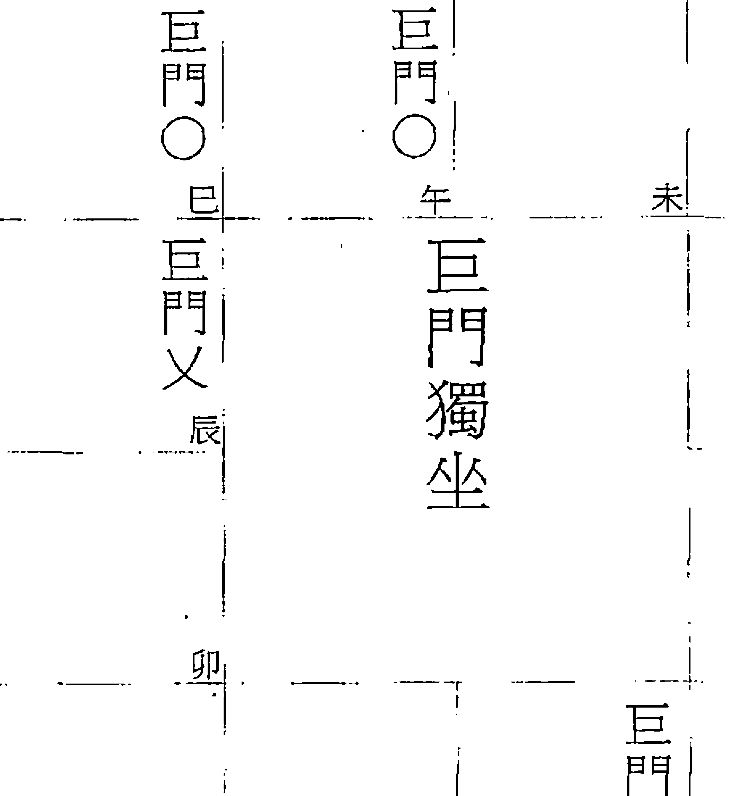

## 巨门在子及其十二宫的意义

巨门坐入地支子宫为独坐：

- 星曜五行：属土，代表稳重、保守、内向、固执；属金，代表改革、突破、创意、叛逆；化气为水，代表机伶、柔和、灵动、摇摆。
- 地支子宫的五行：属水，代表机伶、柔和、灵动、摇摆。
- 地支子宫的意义：孽中—深藏不露。
- 地支子宫的生肖：属鼠—机伶主义。
- 地支子宫的星座：水瓶座—理想主义。
- 地支子宫的宫性：天盘—桃花宫。
- 代表人物：演讲家。
- 星曜强弱：化旺（○），演讲家。

### 代表人物转化：机伶的演讲家

巨门在子为化旺（○），则优点尽出，运势旺盛。巨门五行属土、金、水，则优点展现成熟、稳重、冷静、开创、发明、有创意、反省、机智、灵敏、反应快。因为化旺则引动地支子的优点展现出机智、灵活、聪慧、细腻、冷静、灵敏、聪明、格局、抱负远大、人缘很好的个性运势。

巨门为品物主，化旺则代表资源丰富、生财器具完善、食衣住行生活品质高。巨门代表人物原为演讲家，化旺同为演讲家的命格运势，落入地支子代表人物则转化为机伶的演讲家。

### 巨门（机伶的演讲家）在子坐入十二宫的意义

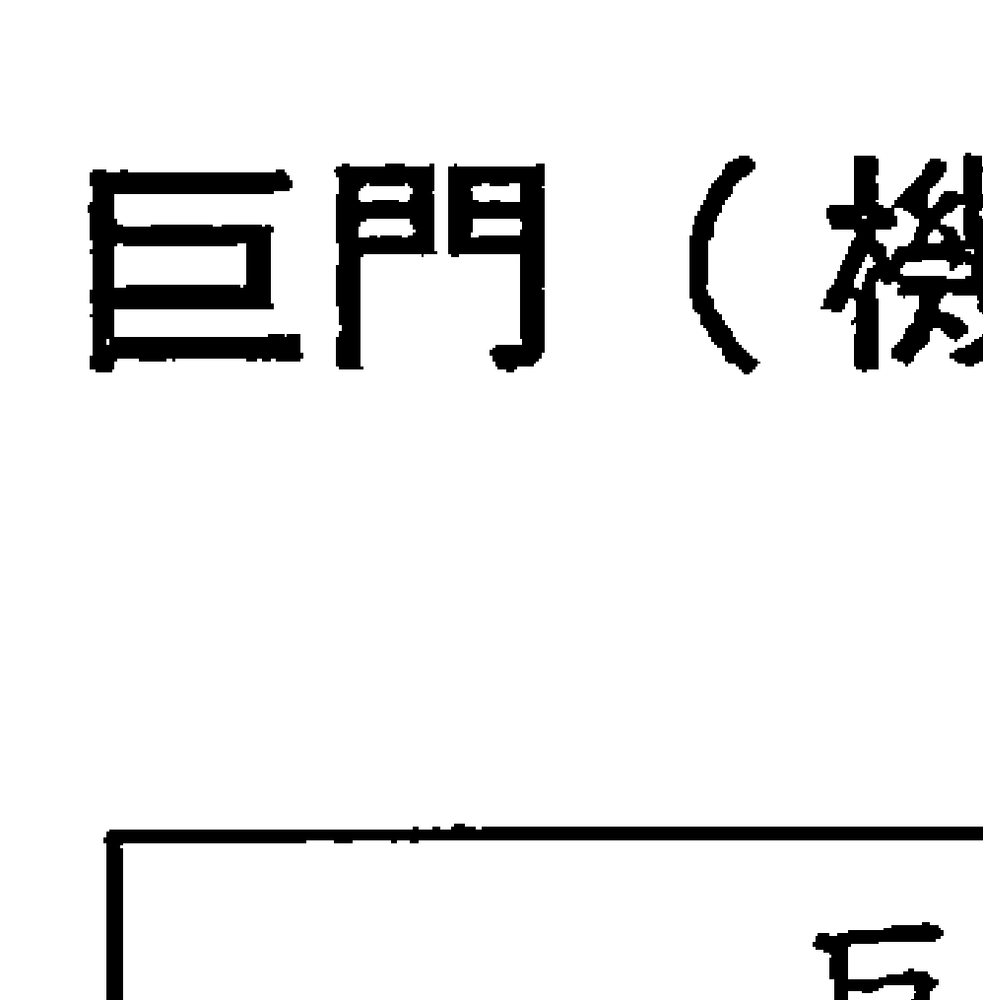

- 巨门 命宫子：
  - 我的个性运势：机伶的演讲家。
  - 我的事业运：旺盛。
  - 我的财运：生活品质高。

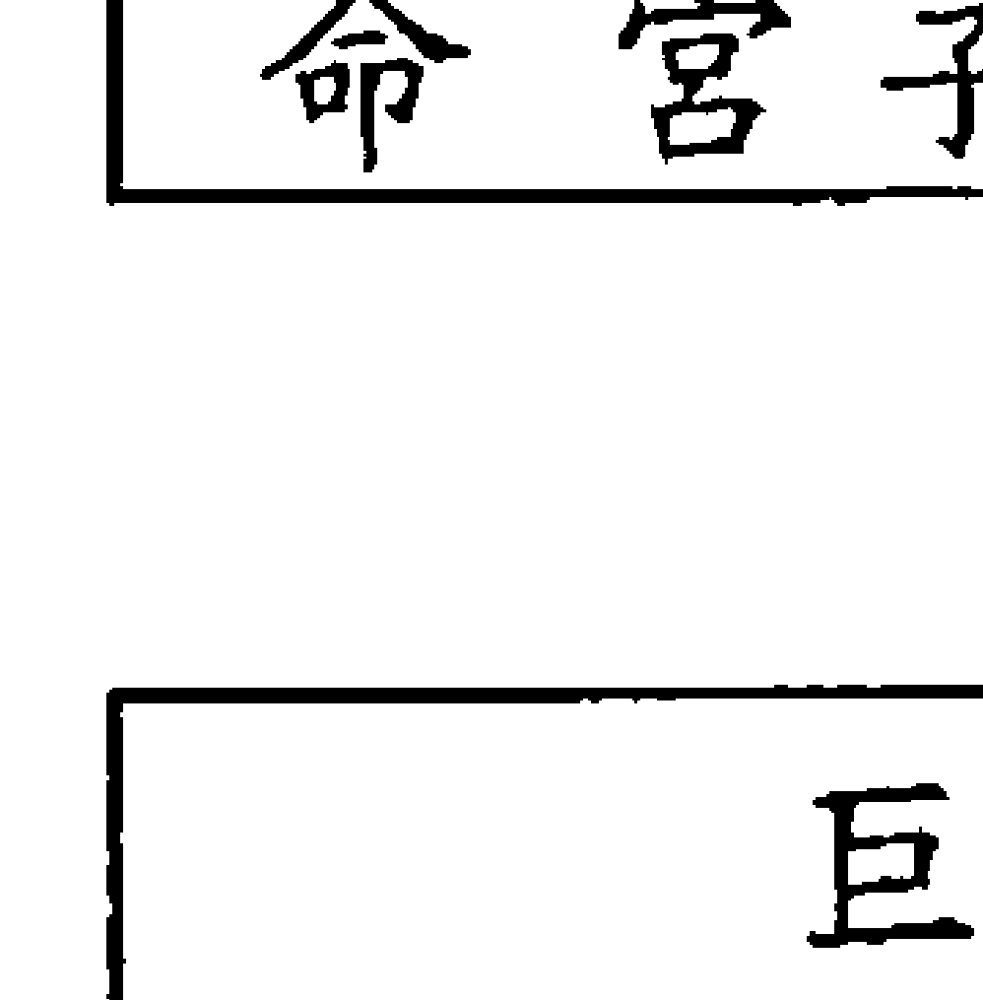

- 巨门 身宫子：
  - 我中年后的个性运势：机伶的演讲家。
  - 我中年后的事业运：旺盛。
  - 我中年后的财运：生活品质高。

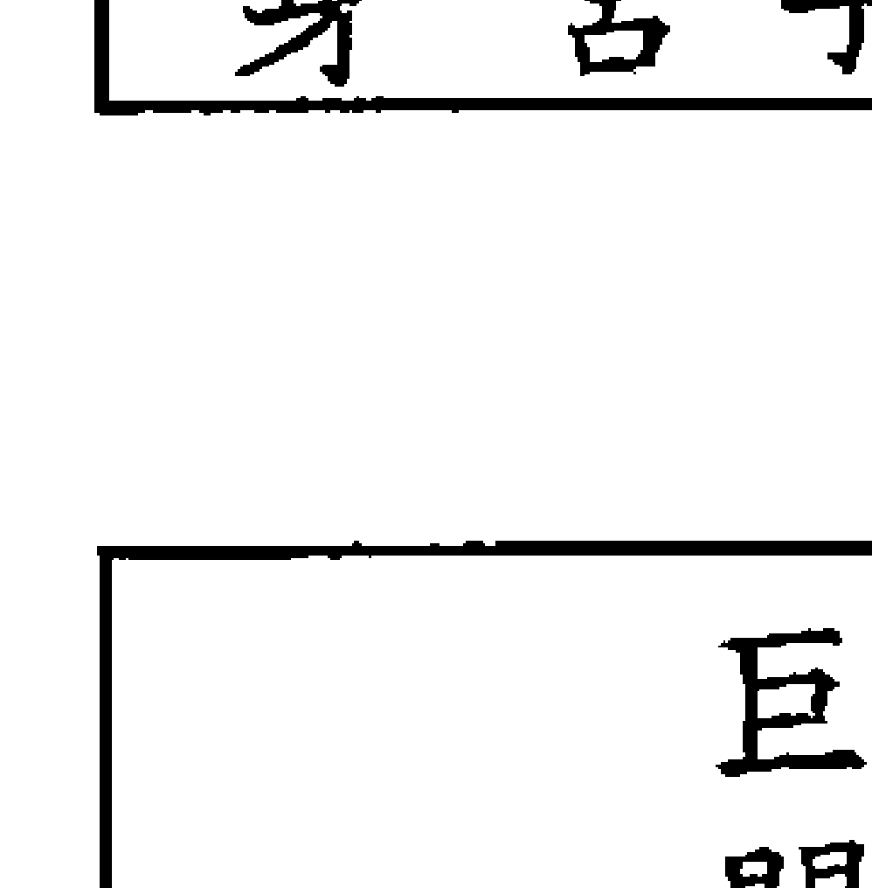

- 巨门 兄弟宫子：
  - 母亲的个性运势：机伶的演讲家。
  - 兄弟姊妹的个性运势：机伶的演讲家。

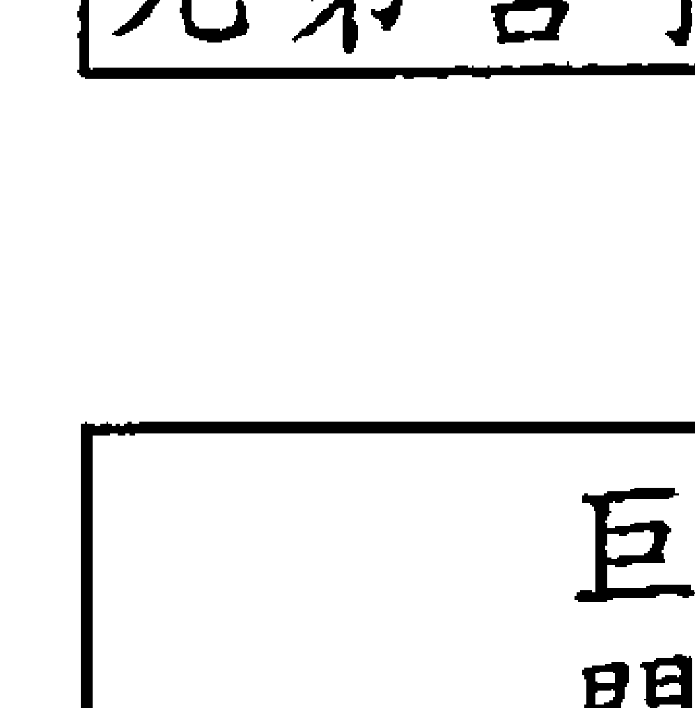

- 巨门 夫妻宫子：
  - 我对感情付出的个性运势：不是冤家不聚头。
  - 我喜爱对象的个性运势：旺盛。
  - 配偶的个性运势：机伶的演讲家。

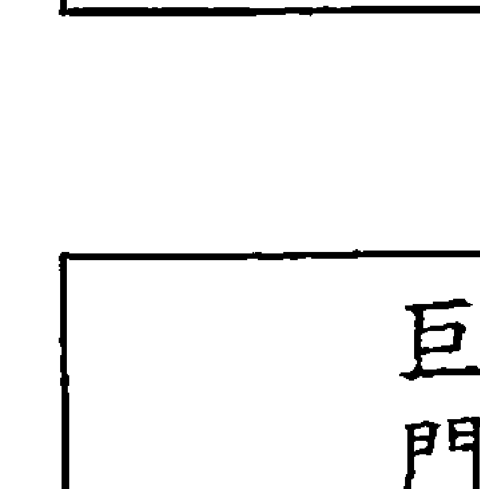

- 巨门 子女宫子：
  - 长子或长女的个性运势：机伶的演讲家。
  - 我的属下、助手：机伶的演讲家。
  - 性生活：绵密。

| 巨门 宫位 | 内容 |
|-----------|------|
| 财帛宫子 | 我的赚钱运势：生活品质高。<br>我的事业运势：旺盛。<br>我的个性运势：机伶的演讲家。 |
| 疾厄宫子 | 我的疾病：（土）脾脏、胃病，（金）呼吸系统，（水）泌尿系统、妇女病。<br>我的潜能：有机会当演讲家。 |
| 迁移宫子 | 我的外表：机伶演讲家的样子。<br>我的社交运：社交人士多为演讲家。<br>我的外出运：小人贵人皆有。 |
| 奴仆宫子 | 我的朋友：机伶的演讲家。<br>我的合伙人：机伶的演讲家。<br>我的同事或朋友的运势：机伶的演讲家。 |
| 官禄宫子 | 我的事业运：旺盛。<br>我的读书运：平顺。<br>我的个性运势：机伶的演讲家。 |
| 田宅宫子 | 置产的运势：中年后置产。<br>家人的相处状况：时而话多，时而话少。 |

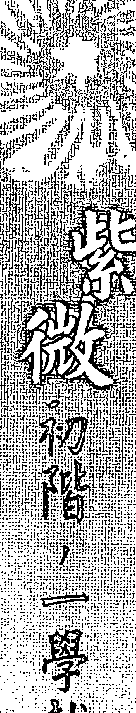

- **巨门 福德宫子**：
  - 我的人生观：当演讲家。
  - 我的存折运势：财来财去。
- **巨门 父母宫子**：
  - 父亲的个性运势：机伶的演讲家。
  - 长官的个性运势：机伶的演讲家。

## 巨门在午及其十二宫的意义

巨门星坐入地支午宫为独坐：

- 星曜五行：属土，代表稳重、保守、内向、固执；属金，代表改革、突破、创意、叛逆；化气为水，代表机伶、柔和、灵动、摇摆。
- 地支午宫的五行：属火，代表魅力、发扬、乐观、傲慢。
- 地支午宫的意义：日旺—红的发火。
- 地支午宫的生肖：属马—暴躁主义。
- 地支午宫的星座：狮子座—尊重主义。
- 地支午宫的宫性：天盘—桃花宫。
- 代表人物：演讲家。
- 星曜强弱：化旺（○），演讲家。

### 代表人物转化：乐观的演讲家

巨门在午为化旺（○），则优点尽出，运势旺盛。巨门五行属土、金、水，则优点展现成熟、稳重、冷静、开创、发明、有创意、反省、机智、灵敏、反应快。因为化旺则引动地支午的优点呈现出乐观进取、魅力无限、行动积极、冲劲十足、雄霸威武、拥有军临天下、大将之风的领袖风范、人缘极佳、台缘旺盛。

巨门为品物主，化旺则代表资源丰富、生财器具完善、食衣住行生活品质高。巨门代表人物原为演讲家，化旺同为演讲家的命格运势，落入地支午代表人物则转化为乐观的演讲家。

### 巨门（乐观的演讲家）在午坐入十二宫的意义

- **巨门 命宫午**：
  - 我的个性运势：乐观的演讲家。
  - 我的事业运：旺盛。
  - 我的财运：生活品质高。
- **巨门 身宫午**：
  - 我中年后的个性运势：乐观的演讲家。
  - 我中年后的事业运：旺盛。
  - 我中年后的财运：生活品质高。
- **巨门 兄弟宫午**：
  - 母亲的个性运势：乐观的演讲家。
  - 兄弟姊妹的个性运势：乐观的演讲家。
- **巨门 夫妻宫午**：
  - 我对感情付出的个性运势：说得多做得少。
  - 我喜爱对象的个性运势：乐观的演讲家。
  - 配偶的个性运势：乐观的演讲家。
- **巨门 子女宫午**：
  - 长子或长女的个性运势：乐观的演讲家。
  - 我的属下、助手：乐观的演讲家。
  - 性生活：激情。
- 巨门 财帛宫午：
  - 我的赚钱运势：生活品质高。
  - 我的事业运势：旺盛。
  - 我的个性运势：乐观的演讲家。
- 巨门 疾厄宫午：
  - 我的疾病：（土）脾脏、胃病，（金）呼吸系统，（水）泌尿系统、妇女病。
  - 我的潜能：有机会当演讲家。
- 巨门 迁移宫午：
  - 我的外表：乐观演讲家的样子。
  - 我的社交运：社交人士多为演讲家。
  - 我的外出运：小人贵人皆多。
- 巨门 奴仆宫午：
  - 我的朋友：乐观的演讲家。
  - 我的合伙人：乐观的演讲家。
  - 我的同事或朋友的运势：乐观的演讲家。
- 巨门 官禄宫午：
  - 我的事业运：旺盛。
  - 我的读书运：平顺。
  - 我的个性运势：乐观的演讲家。
- 巨门 田宅宫午：
  - 置产的运势：中年后置产。
  - 家人的相处状况：争执不休。

## 紫微初阶，一学就通

- 巨门 福德宫午：
  - 我的人生观：当演讲家。
  - 我的存折运势：财来财去。
- 巨门 父母宫午：
  - 父亲的个性运势：乐观的演讲家。
  - 长官的个性运势：乐观的演讲家。

## 巨门在辰及其十二宫的意义

巨门坐入地支辰宫：

- 星曜五行：属土，代表稳重、保守、内向、固执；属金，代表改革、突破、创意、叛逆；化气为水，代表机伶、柔和、灵动、摇摆。
- 地支辰宫的五行：属土，代表稳重、保守、内向、固执。
- 地支辰宫的意义：震祛—脱胎换骨。
- 地支辰宫的生肖：属龙—变迁主义。
- 地支辰宫的星座：天秤座—朋友主义。
- 地支辰宫的宫性：地盘—财富宫。
- 代表人物：演讲家。
- 星曜强弱：化陷（ㄨ），自闭儿。

### 代表人物转化：奔波的自闭儿

巨门在辰为化陷（ㄨ），则缺点暴露，呈现低迷的命格运势。巨门五行属土、金、水，则缺点暴露固执、封闭、太保守、反传统、叛逆、软弱、没主见、善变等，显现出非常矛盾的个性运势。因为化陷则引动地支辰的缺点暴露固执、封闭、太保守、好动善变、变动无常、漂泊不定、朋友多为泛泛之交、过度汲汲营营的追求财富。

巨门为品物主，化陷则代表物资贫乏、困顿不堪、生活品质较低。巨门代表人物原为演讲家，化陷则为自闭儿的命格运势，落入地支辰的代表人物转化为奔波的自闭儿。

辰宫为天罗、戌宫为地网称为天罗地网宫，命宫在此二宫位，因为竞争欲望过高，仿佛有一层网子罩住自己的身体、手上铐着枷锁，想挣脱却力不从心，犹如运势被锁住一般，而深感一生辛苦、劳碌。

### 巨门（奔波的自闭儿）在辰坐入十二宫的意义

- 巨门在命宫辰：
  - 我的个性运势：奔波的自闭儿。
  - 我的事业运：低迷。
  - 我的财运：财来财去。
- 巨门在身宫辰：
  - 我中年后的个性运势：奔波的自闭儿。
  - 我中年后的事业运：低迷。
  - 我中年后的财运：财来财去。
- 巨门在兄弟宫辰：
  - 母亲的个性运势：奔波的自闭儿。
  - 兄弟姊妹的个性运势：奔波的自闭儿。
- 巨门 夫妻宫辰：
  - 我对感情付出的个性运势：不懂付出。
  - 我喜爱对象的个性运势：企画人士。
  - 配偶的个性运势：奔波的自闭儿。
- 巨门 子女宫辰：
  - 长子或长女的个性运势：奔波的自闭儿。
  - 我的属下、助手：奔波的自闭儿。
  - 性生活：苦闷。
- 巨门 财帛宫辰：
  - 我的赚钱运势：财来财去。
  - 我的事业运势：低迷。
  - 我的个性运势：奔波的自闭儿。
- 巨门 疾厄宫辰：
  - 我的疾病：（土）脾脏、胃病，（金）呼吸系统，（水）泌尿系统、妇女病。
  - 我的潜能：有机会当企画人士。
- 巨门 迁移宫辰：
  - 我的外表：奔波自闭儿的样子。
  - 我的社交运：社交人士多为企画人士。
  - 我的出外运：小人多。
- 巨门 奴仆宫辰：
  - 我的朋友：奔波的自闭儿。
  - 我的合伙人：奔波的自闭儿。
  - 我的同事或同学的运势：奔波的自闭儿。

## 紫微初阶，一学就通

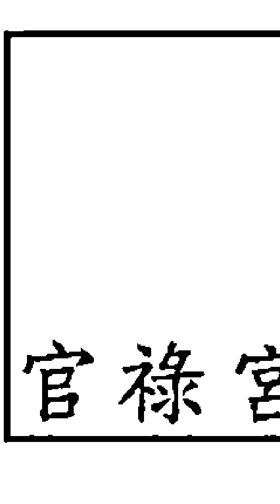

- 巨门 官禄宫辰：
  - 我的事业运：低迷。
  - 我的读书运：坎坷。
  - 我的个性运势：奔波的自闭儿。

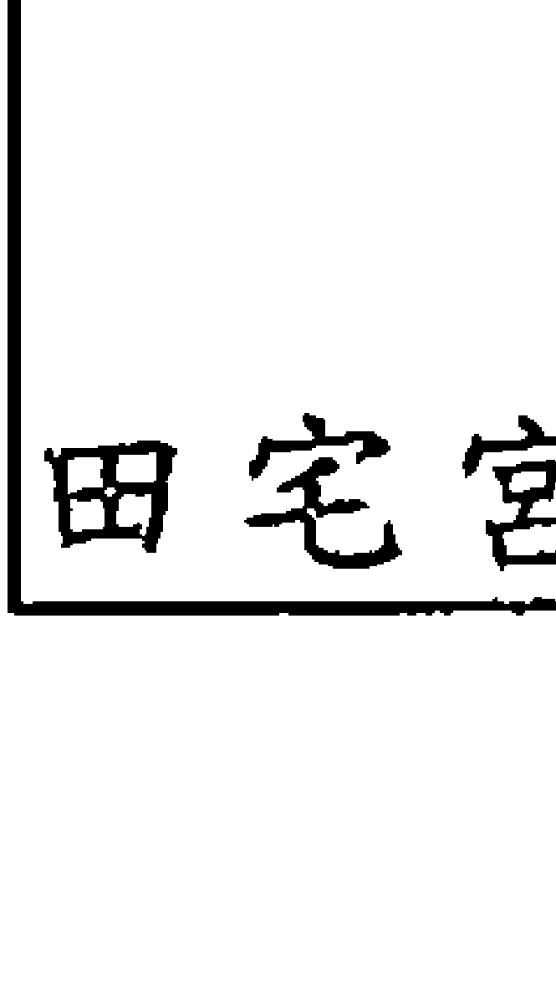

- 巨门 田宅宫辰：
  - 置产的运势：无。
  - 家人的相处状况：冷漠。

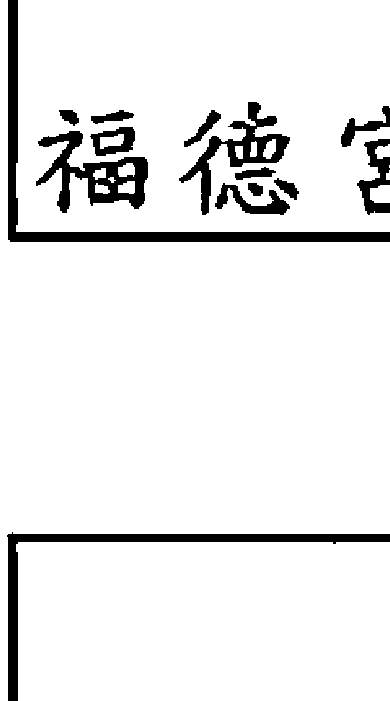

- 巨门 福德宫辰：
  - 我的人生观：当企画人士。
  - 我的存折运势：财来财去。


- 巨门 父母宫辰：
  - 父亲的个性运势：奔波的自闭儿。
  - 长官的个性运势：奔波的自闭儿。

## 巨门在戌及其十二宫的意义

巨门坐入地支戌宫：

- 星曜五行：属土，代表稳重、保守、内向、固执；属金，代表改革、突破、创意、叛逆；化气为水，代表机伶、柔和、灵动、摇摆。
- 地支戌宫的五行：属土，代表稳重、保守、内向、固执。
- 地支戌宫的意义：灭始—除旧布新。
- 地支戌宫的生肖：属狗—负责主义。
- 地支戌宫的星座：牡羊座—发现主义。
- 地支戌宫的宫性：地盘—财富宫。
- 代表人物：演讲家。
- 星曜强弱：化陷（又），自闭儿。

代表人物转化：固执的自闭儿

巨门在戌为化陷（又），则缺点暴露，呈现低迷的命格运势。巨门五行属土、金、水，则缺点暴露出固执、封闭、太保守、反传统、叛逆、软弱、没主见、善变等，显现出非常矛盾的个性运势。因为化陷则引动地支戌的缺点暴露出固执、封闭、太保守、挑剔、不满足、要求过高、太憨厚矜持、想法太多、过度汲汲营营的追求财富。

巨门为品物主，化陷则代表物资贫乏、困顿不堪、生活品质较低。

巨門代表人物原為演講家，化陷則為自閉兒的命格運勢，落入地支戌的代表人物轉化為固執的自閉兒。

辰宮為天羅、戌宮為地網稱為天羅地網宮，命宮在此二宮位，因為競爭慾望過高，彷彿有一層網子罩住自己的身體、手上鐐著枷鎖，想掙脫卻力不從心，猶如運勢被鎖住一般，而深感一生辛苦、勞碌。

## 巨門（固執的自閉兒）在戌坐入十二宮的意義：

| 巨門<br>命宮戌 | 我的個性運勢：固執的自閉兒。<br>我的事業運：低迷。<br>我的財運：財來財去。 |
| 巨門<br>身宮戌 | 我中年後的個性運勢：固執的自閉兒。<br>我中年後的事業運：低迷。<br>我中年後的財運：財來財去。 |
| 巨門<br>兄弟宮戌 | 母親的個性運勢：固執的自閉兒。<br>兄弟姊妹的個性運勢：固執的自閉兒。 |
| 巨門<br>夫妻宮戌 | 我對感情付出的個性運勢：不懂付出。<br>我喜愛對象的個性運勢：企畫人士。<br>配偶的個性運勢：固執的自閉兒。 |
| 巨門<br>子女宮戌 | 長子或長女的個性運勢：固執的自閉兒。<br>我的屬下、助手：固執的自閉兒。<br>性生活：苦悶。 |
| 巨門<br>財帛宮戌 | 我的賺錢運勢：財來財去。<br>我的事業運勢：低迷。<br>我的個性運勢：固執的自閉兒。 |
| 巨門<br>疾厄宮戌 | 我的疾病：（土）脾臟、胃病，（金）呼吸系統，（水）泌尿系統、婦女病。<br>我的潛能：有機會當企畫人士。 |
| 巨門<br>遷移宮戌 | 我的外表：固執自閉兒的樣子。<br>我的社交運：社交人士多為企畫人士。<br>我的出外運：小人多。 |
| 巨門<br>奴僕宮戌 | 我的朋友：固執的自閉兒。<br>我的合夥人：固執的自閉兒。<br>我的同事或同學的運勢：固執的自閉兒。 |
| 巨門<br>官祿宮戌 | 我的事業運：低迷。<br>我的讀書運：坎坷。<br>我的個性運勢：固執的自閉兒。 |
| 巨門<br>田宅宮戌 | 置產的運勢：無。<br>家人的相處狀況：無緣。 |
| 巨門<br>福德宮戌 | 我的人生觀：當企畫人士。<br>我的存摺運勢：財來財去。 |
| 巨門<br>父母宮戌 | 父親的個性運勢：固執的自閉兒。<br>長官的個性運勢：固執的自閉兒。 |

## 巨門在巳及其十二宮的意義

**巨門坐入地支巳宮：**

**星曜五行：** 屬土，代表穩重、保守、內向、固執。
屬金，代表改革、突破、創意、叛逆。
化氣為水，代表機伶、柔和、靈動、搖擺。

**地支巳宮的五行：** 屬火，代表魅力、發揚、樂觀、傲慢。
**地支巳宮的意義：** 起旺—開始衝刺。
**地支巳宮的生肖：** 屬蛇—巧藝主義。
**地支巳宮的星座：** 處女座—完美主義。
**地支巳宮的宮性：** 人盤—奔波宮。
**代表人物：** 演講家。
**星曜強弱：** 化旺（○），演講家。
**代表人物轉化：** 奔波的演講家

巨門在巳為化旺（○），則優點盡出，運勢旺盛。巨門五行屬土、金、水，則優點展現成熟、穩重、冷靜、開創、發明、有創意、反省、機智、靈敏、反應快。因為化旺則引動地支巳的優點，呈現樂觀進取、有魅力、勤快、反應靈敏、專業權威、善於計畫的個性運勢。

巨門為品物主，化旺則代表資源豐富、生財器具完善、食衣住行生活品質高。巨門代表人物原為演講家，化旺同為演講家的命格運勢，落入地支巳代表人物則轉化為奔波的演講家。

## 巨門（奔波的演講家）在巳坐入十二宮的意義：

| 巨門<br>命宮巳 | 我的個性運勢：奔波的演講家。<br>我的事業運：旺盛。<br>我的財運：生活品質高。 |
| 巨門<br>身宮巳 | 我中年後的個性運勢：奔波的演講家。<br>我中年後的事業運：旺盛。<br>我中年後的財運：生活品質高。 |
| 巨門<br>兄弟宮巳 | 母親的個性運勢：奔波的演講家。<br>兄弟姊妹的個性運勢：奔波的演講家。 |
| 巨門<br>夫妻宮巳 | 我對感情付出的個性運勢：對感情要求高。<br>我喜愛對象的個性運勢：演講家。<br>配偶的個性運勢：奔波的演講家。 |
| 巨門<br>子女宮巳 | 長子或長女的個性運勢：奔波的演講家。<br>我的屬下、助手：奔波的演講家。<br>性生活：激情。 |
| 巨門<br>財帛宮巳 | 我的賺錢運勢：生活品質高。<br>我的事業運勢：旺盛。<br>我的個性運勢：奔波的演講家。 |
| 巨門<br>疾厄宮巳 | 我的疾病：（土）脾臟、胃病，（金）呼吸系統，（水）泌尿系統、婦女病。<br>我的潛能：有機會當演講家。 |
| 巨門<br>遷移宮巳 | 我的外表：奔波演講家的樣子。<br>我的社交運：社交人士多為演講家。<br>我的出外運：小人貴人皆有。 |
| 巨門<br>奴僕宮巳 | 我的朋友：奔波的演講家。<br>我的合夥人：奔波的演講家。<br>我的同事或同學的運勢：奔波的演講家。 |
| 巨門<br>官祿宮巳 | 我的事業運：旺盛。<br>我的讀書運：平順。<br>我的個性運勢：奔波的演講家。 |
| 巨門<br>田宅宮巳 | 置產的運勢：中年後置產。<br>家人的相處狀況：沒時間溝通。 |
| 巨門<br>福德宮巳 | 我的人生觀：當演講家。<br>我的存摺運勢：財來財去。 |
| 巨門<br>父母宮巳 | 父親的個性運勢：奔波的演講家。<br>長官的個性運勢：奔波的演講家。 |

## 巨門在亥及其十二宮的意義

**巨門坐入地支亥宮：**

**星曜五行：** 屬土，代表穩重、保守、內向、固執。
屬金，代表改革、突破、創意、叛逆。
化氣為水，代表機伶、柔和、靈動、搖擺。

**地支亥宮的五行：** 屬水，代表機伶、柔和、變動、搖擺。
**地支亥宮的意義：** 孩子—氣勢發威。
**地支亥宮的生肖：** 屬豬—自尊主義。
**地支亥宮的星座：** 雙魚座—浪漫主義。
**地支亥宮的宮性：** 人盤—奔波宮。
**代表人物：** 演講家。
**星曜強弱：** 化旺（○），演講家。
**代表人物轉化：** 浪漫的演講家

巨門在亥為化旺（○），則優點盡出，運勢旺盛。巨門五行屬土、金、水，則優點展現成熟、穩重、冷靜、開創、發明、有創意、反省、機智、靈敏、反應快。因為化旺則引動地支亥的優點，呈現機智、靈活、反應快、熱心助人、活潑好動、自重自愛、藝術天分、善於計畫的個性運勢。

巨門為品物主，化旺則代表資源豐富、生財器具完善、食衣住行生活品質高。巨門代表人物原為演講家，化旺同為演講家的命格運勢，落入地支亥代表人物則轉化為浪漫的演講家。

## 巨門（浪漫的演講家）在亥坐入十二宮的意義：

| 巨門<br>命宮亥 | 我的個性運勢：浪漫的演講家。<br>我的事業運：旺盛。<br>我的財運：生活品質高。 |
| 巨門<br>身宮亥 | 我中年後的個性運勢：浪漫的演講家。<br>我中年後的事業運：旺盛。<br>我中年後的財運：生活品質高。 |
| 巨門<br>兄弟宮亥 | 母親的個性運勢：浪漫的演講家。<br>兄弟姊妹的個性運勢：浪漫的演講家。 |
| 巨門<br>夫妻宮亥 | 我對感情付出的個性運勢：浪漫。<br>我喜愛對象的個性運勢：演講家。<br>配偶的個性運勢：浪漫的演講家。 |
| 巨門<br>子女宮亥 | 長子或長女的個性運勢：浪漫的演講家。<br>我的屬下、助手：浪漫的演講家。<br>性生活：綿密。 |
| 巨門<br>財帛宮亥 | 我的賺錢運勢：生活品質高。<br>我的事業運勢：旺盛。<br>我的個性運勢：浪漫的演講家。 |
| 巨門<br>疾厄宮亥 | 我的疾病：（土）脾臟、胃病，（金）呼吸系統，（水）泌尿系統、婦女病。<br>我的潛能：有機會當演講家。 |
| 巨門<br>遷移宮亥 | 我的外表：浪漫的演講家的樣子。<br>我的社交運：社交人士多為演講家。<br>我的出外運：小人貴人皆有。 |
| 巨門<br>奴僕宮亥 | 我的朋友：浪漫的演講家。<br>我的合夥人：浪漫的演講家。<br>我的同事或同學的運勢：浪漫的演講家。 |
| 巨門<br>官祿宮亥 | 我的事業運：旺盛。<br>我的讀書運：平順。<br>我的個性運勢：浪漫的演講家。 |
| 巨門<br>田宅宮亥 | 置產的運勢：中年後置產。<br>家人的相處狀況：溫馨。 |
| 巨門<br>福德宮亥 | 我的人生觀：當演講家。<br>我的存摺運勢：財來財去。 |
| 巨門<br>父母宮亥 | 父親的個性運勢：浪漫的演講家。<br>長官的個性運勢：浪漫的演講家。 |

## 天相獨坐定律全解

- ○ 天相獨坐化廟只會落入地支丑宮。
- ○ 天相獨坐化平只會落入地支巳宮、地支未宮及地支亥宮。
- ○ 天相獨坐化陷只會落入地支卯宮及地支酉宮。

## 天相在丑及其十二宮的意義

**天相坐入地支丑宮：**

**星曜五行：** 屬水，代表機伶、柔和、靈動、搖擺。
**地支丑宮的五行：** 屬土，代表穩重、保守、內向、固執。
**地支丑宮的意義：** 扭捏—扭扭捏捏。
**地支丑宮的生肖：** 屬牛—剛毅主義。
**地支丑宮的星座：** 山羊座—務實主義。
**地支丑宮的宮性：** 地盤—財富宮。
**代表人物：** 媒婆
**星曜強弱：** 化廟（◎），皇后。
**代表人物轉化：** 務實的皇后

天相在丑為化廟（◎），則優點盡出，呈現出旺盛的命格運勢。天相五行屬水，展現出個性機智靈敏、反應快的優點。因為化廟則引動地支丑的優點呈現出剛毅、踏實、堅定、實際、財運佳等的命格運勢。

天相為官祿主，主印（代表背書，例如現今社會的支票背書）。天相化廟則讀書、工作事業、官位均呈現旺盛的運勢，亦即工作能力強、官大、事業大的命格運勢。天相代表人物原為媒婆，化廟升格為皇后的命格運勢，落入地支丑代表人物則轉化為務實的皇后。

## 天相（務實的皇后）在丑坐入十二宮的意義：

| 天相<br>命宮丑 | 我的個性運勢：務實的皇后。<br>我的事業運：旺盛。<br>我的財運：富足。 |
| 天相<br>身宮丑 | 我中年後的個性運勢：務實的皇后。<br>我中年後的事業運：旺盛。<br>我中年後的財運：富足。 |
| 天相<br>兄弟宮丑 | 母親的個性運勢：務實的皇后。<br>兄弟姊妹的個性運勢：務實的皇后。 |
| 天相<br>夫妻宮丑 | 我對感情付出的個性運勢：癡情。<br>我喜愛對象的個性運勢：皇后。<br>配偶的個性運勢：務實的皇后。 |
| 天相<br>子女宮丑 | 長子或長女的個性運勢：務實的皇后。<br>我的屬下、助手：務實的皇后。<br>性生活：配合到底。 |
| 天相<br>財帛宮丑 | 我的賺錢運勢：富足。<br>我的事業運勢：旺盛。<br>我的個性運勢：務實的皇后。 |
| 天相<br>疾厄宮丑 | 我的疾病：（水）泌尿系統、婦女病。<br>我的潛能：有機會當皇后。 |
| 天相<br>遷移宮丑 | 我的外表：務實皇后的樣子。<br>我的社交運：社交人士多為幕僚長。<br>我的出外運：貴人多。 |
| 天相<br>奴僕宮丑 | 我的朋友：務實的皇后。<br>我的合夥人：務實的皇后。<br>我的同事或同學的運勢：務實的皇后。 |
| 天相<br>官祿宮丑 | 我的事業運：旺盛。<br>我的讀書運：平順。<br>我的個性運勢：務實的皇后。 |
| 天相<br>田宅宮丑 | 置產的運勢：有祖產、自置產運旺。<br>家人的相處狀況：融洽。 |
| 天相<br>福德宮丑 | 我的人生觀：當皇后。<br>我的存摺運勢：富足。 |
| 天相<br>父母宮丑 | 父親的個性運勢：務實的皇后。<br>長官的個性運勢：務實的皇后。 |

## 天相在未及其十二宮的意義

**天相坐入地支未宮：**

**星曜五行：** 屬水，代表機伶、柔和、靈動、搖擺。
**地支未宮的五行：** 屬土，代表穩重、保守、內向、固執。
**地支未宮的意義：** 味旺—享受成果。
**地支未宮的生肖：** 屬羊—敏感主義。
**地支未宮的星座：** 巨蟹座—家庭主義。
**地支未宮的宮性：** 地盤—財富宮。
**代表人物：** 媒婆
**星曜強弱：** 化平（△），媒婆。
**代表人物轉化：** 享福的媒婆

天相在未為化平（△），則優缺點參半交錯，呈現平庸的命格運勢。天相五行屬水優缺點相互交錯，個性機智靈敏、反應快，但有時軟弱、善變、沒主見。因為化平則引動地支未的優缺點，呈現雖穩重、成熟、冷靜，但有時固執、封閉、太保守；雖善良、敏銳，但有時多愁善感、沈默寡言；雖直覺靈敏、感性，但有時悲觀、想太多、疑心病重；雖重視家的溫暖，但有時像溫室中的小花一般脆弱不堪，雖財運甚佳，但有時嗜財如命等交錯及矛盾的個性運勢。

天相為官祿主，主印（代表背書，例如現今社會的支票背書），天相化平則讀書、工作事業、官位均呈現平庸的命格運勢，亦即官小、上班族、市井小名的命格。天相代表人物原為媒婆，化平同為媒婆的命格運勢，落入地支未代表人物則轉化為享福的媒婆。

## 天相（享福的媒婆）在未坐入十二宮的意義：

| 天相<br>命宮未 | 我的個性運勢：享福的媒婆。<br>我的事業運：平庸。<br>我的財運：財來財去。 |
| 天相<br>身宮未 | 我中年後的個性運勢：享福的媒婆。<br>我中年後的事業運：平庸。<br>我中年後的財運：財來財去。 |
| 天相<br>兄弟宮未 | 母親的個性運勢：享福的媒婆。<br>兄弟姊妹的個性運勢：享福的媒婆。 |
| 天相<br>夫妻宮未 | 我對感情付出的個性運勢：穩定。<br>我喜愛對象的個性運勢：長袖善舞之人。<br>配偶的個性運勢：享福的媒婆。 |
| 天相<br>子女宮未 | 長子或長女的個性運勢：享福的媒婆。<br>我的屬下、助手：享福的媒婆。<br>性生活：一般。 |
| 天相<br>財帛宮未 | 我的賺錢運勢：財來財去。<br>我的事業運勢：平庸。<br>我的個性運勢：享福的媒婆。 |
| 天相<br>疾厄宮未 | 我的疾病：（水）泌尿系統、婦女病。<br>我的潛能：有機會當經紀人。 |
| 天相<br>遷移宮未 | 我的外表：享福媒婆的樣子。<br>我的社交運：社交人士多為經紀人。<br>我的出外運：小人貴人皆有。 |
| 天相<br>奴僕宮未 | 我的朋友：享福的媒婆。<br>我的合夥人：享福的媒婆。<br>我的同事或同學的運勢：享福的媒婆。 |
| 天相<br>官祿宮未 | 我的事業運：平庸。<br>我的讀書運：平庸。<br>我的個性運勢：享福的媒婆。 |
| 天相<br>田宅宮未 | 置產的運勢：中年後置產。<br>家人的相處狀況：平順。 |
| 天相<br>福德宮未 | 我的人生觀：當皇后、宰相。<br>我的存摺運勢：財來財去。 |
| 天相<br>父母宮未 | 父親的個性運勢：享福的媒婆。<br>長官的個性運勢：享福的媒婆。 |

## 天相在卯及其十二宮的意義

**天相坐入地支卯宮：**

**星曜五行：** 屬水，代表機伶、柔和、靈動、搖擺。
**地支卯宮的五行：** 屬木，代表成長、上進、勞心、奔波。
**地支卯宮的意義：** 茂盛—活力無限。
**地支卯宮的生肖：** 屬兔—好動主義。
**地支卯宮的星座：** 天蠍座—計劃主義。
**地支卯宮的宮性：** 天盤—桃花宮。
**代表人物：** 媒婆
**星曜強弱：** 化陷（乂），地下夫人。
**代表人物轉化：** 勞心的地下夫人

天相在卯為天相化陷（乂），則缺點暴露，呈現低迷的命格運勢。天相五行屬水，缺點暴露出軟弱、善變、沒主見。因為化陷則引動地支卯的缺點，暴露出因動不停、想不完而產生計劃太多無法執行的狀況，且有桃花是非的命格運勢。

天相為官祿主，主印（代表背書，例如現今社會的支票背書）。天相化陷則讀書、工作事業、官位均呈現低迷的命格運勢，亦即官小、上班族、市井小名的命格。天相代表人物原為媒婆，化陷則為地下夫人的命格運勢，落入地支卯的代表人物轉化為勞心的地下夫人。

天相化廟旺則貴人多且權勢大，化平陷則雖有小人但仍有貴人相助的運勢，因此均具有吉人天相的命格。

## 天相（勞心的地下夫人）在卯坐入十二宮的意義：

| 天相<br>命宮卯 | 我的個性運勢：勞心的地下夫人。<br>我的事業運：低迷。<br>我的財運：財來財去。 |
| 天相<br>身宮卯 | 我中年後的個性運勢：勞心的地下夫人。<br>我中年後的事業運：低迷。<br>我中年後的財運：財來財去。 |
| 天相<br>兄弟宮卯 | 母親的個性運勢：勞心的地下夫人。<br>兄弟姊妹的個性運勢：勞心的地下夫人。 |
| 天相<br>夫妻宮卯 | 我對感情付出的個性運勢：傳統。<br>我喜愛對象的個性運勢：長袖善舞之人。<br>配偶的個性運勢：勞心的地下夫人。 |
| 天相<br>子女宮卯 | 長子或長女的個性運勢：勞心的地下夫人。<br>我的屬下、助手：勞心的地下夫人。<br>性生活：一般。 |
| 天相<br>財帛宮卯 | 我的賺錢運勢：財來財去。<br>我的事業運勢：低迷。<br>我的個性運勢：勞心的地下夫人。 |
| 天相<br>疾厄宮卯 | 我的疾病：（水）泌尿系統、婦女病。<br>我的潛能：有機會當秘書。 |
| 天相<br>遷移宮卯 | 我的外表：勞心地下夫人的樣子。<br>我的社交運：社交人士多為秘書。<br>我的出外運：小人貴人皆有。 |
| 天相<br>奴僕宮卯 | 我的朋友：勞心的地下夫人。<br>我的合夥人：勞心的地下夫人。<br>我的同事或同學的運勢：勞心的地下夫人。 |
| 天相<br>官祿宮卯 | 我的事業運：低迷。<br>我的讀書運：坎坷。<br>我的個性運勢：勞心的地下夫人。 |
| 天相<br>田宅宮卯 | 置產的運勢：貴人協助置產。<br>家人的相處狀況：孤離。 |
| 天相<br>福德宮卯 | 我的人生觀：當皇后。<br>我的存摺運勢：財來財去。 |
| 天相<br>父母宮卯 | 父親的個性運勢：勞心的地下夫人。<br>長官的個性運勢：勞心的地下夫人。 |

## 天相在酉及其十二宮的意義

**天相坐入地支酉宮：**

**星曜五行：** 屬水，代表機伶、柔和、靈動、搖擺。
**地支酉宮的五行：** 屬金，代表改革、突破、創意、叛逆。
**地支酉宮的意義：** 酒醡—沈澱收藏。
**地支酉宮的生肖：** 屬雞—叛逆主義。
**地支酉宮的星座：** 金牛座—金錢主義。
**地支酉宮的宮性：** 天盤—桃花宮。
**代表人物：** 媒婆
**星曜強弱：** 化陷（X），地下夫人。
**代表人物轉化：** 叛逆的地下夫人

天相在酉為天相化陷（X），則缺點暴露，呈現低迷的命格運勢。天相五行屬水，缺點暴露出軟弱、善變、沒主見。因為化陷則引動地支酉的缺點，暴露出反傳統、反制度、叛逆、自我壓抑、現實主義、桃花是非的命格運勢。

天相為官祿主，主印（代表背書，例如現今社會的支票背書）。天相化陷則讀書、工作事業、官位均呈現低迷的命格運勢，亦即官小、上班族、市井小名的命格。天相代表人物原為媒婆，化陷則為地下夫人的命格運勢，落入地支酉的代表人物轉化為叛逆的地下夫人。

天相化廟旺則貴人多且權勢大，化平陷則雖有小人但仍有貴人相助的運勢，因此均具有吉人天相的命格。

## 天相（叛逆的地下夫人）在酉坐入十二宮的意義：

| 天相<br>命宮酉 | 我的個性運勢：叛逆的地下夫人。<br>我的事業運：低迷。<br>我的財運：財來財去。 |
| 天相<br>身宮酉 | 我中年後的個性運勢：叛逆的地下夫人。<br>我中年後的事業運：低迷。<br>我中年後的財運：財來財去。 |
| 天相<br>兄弟宮酉 | 母親的個性運勢：叛逆的地下夫人。<br>兄弟姊妹的個性運勢：叛逆的地下夫人。 |
| 天相<br>夫妻宮酉 | 我對感情付出的個性運勢：標新立異。<br>我喜愛對象的個性運勢：長袖善舞之人。<br>配偶的個性運勢：叛逆的地下夫人。 |

# 天相
子女宫酉

- 长子或长女的个性运势：叛逆的地下夫人。
- 我的属下、助手：叛逆的地下夫人。
- 性生活：求新求变。

# 天相
财帛宫酉

- 我的赚钱运势：财来财去。
- 我的事业运势：低迷。
- 我的个性运势：叛逆的地下夫人。

# 天相
疾厄宫酉

- 我的疾病：（水）泌尿系统、妇女病。
- 我的潜能：有机会当秘书。

# 天相
迁移宫酉

- 我的外表：叛逆地下夫人的样子。
- 我的社交运：社交人士多为秘书。
- 我的出外运：小人贵人皆有。

# 天相
奴仆宫酉

- 我的朋友：叛逆的地下夫人。
- 我的合伙人：叛逆的地下夫人。
- 我的同事或同学的运势：叛逆的地下夫人。

# 天相
官禄宫酉

- 我的事业运：低迷。
- 我的读书运：坎坷。
- 我的个性运势：叛逆的地下夫人。

# 天相
田宅宫酉

置产的运势：中年后置产。
家人的相处状况：少沟通。

# 天相
福德宫酉

我的人生观：当秘书。
我的存摺运势：财来财去。

# 天相
父母宫酉

父亲的个性运势：叛逆的地下夫人。
长官的个性运势：叛逆的地下夫人。

# 天相在巳及其十二宮的意義

天相坐入地支巳宮：

- 星曜五行：屬水，代表機伶、柔和、靈動、搖擺。
- 地支巳宮的五行：屬火，代表魅力、發揚、樂觀、傲慢。
- 地支巳宮的意義：起旺一開始衝刺。
- 地支巳宮的生肖：屬蛇一巧藝主義。
- 地支巳宮的星座：處女座一完美主義。
- 地支巳宮的宮性：人盤一奔波宮。
- 代表人物：媒婆
- 星曜強弱：化平（△），媒婆。

代表人物轉化：奔波的媒婆

天相在巳爲化平（△），則優缺點參半交錯，呈現平庸的命格運勢。天相五行屬水優缺點相互交錯，個性機智靈敏、反應快，但有時軟弱、善變、沒主見。因爲化平則引動地支巳的優點，呈現樂觀進取、有魅力、勤快、反應靈敏、專業權威、善於計畫的優點，但時而亦曝露出驕傲、目中無人、自以爲是、勞心勞力、學而不精、挑剔過度、勞碌奔波的缺點。

天相爲官祿主，主印（代表背書，例如現今社會的支票背書），天相化平則讀書、工作事業、官位均呈現平庸的命格運勢，亦即官小、上班族、市井小名的命格。天相代表人物原爲媒婆，化平同爲媒婆的命格運勢，落入地支巳代表人物則轉化爲奔波的媒婆。

天相化廟旺則貴人多且權勢大，化平陷則雖有小人但仍有貴人相助的運勢，因此均具有吉人天相的命格。

# 天相（奔波的媒婆）在巳坐入十二宮的意義：

- **命宮巳**:
  - 我的個性運勢：奔波的媒婆。
  - 我的事業運：平庸。
  - 我的財運：財來財去。
- **身宮巳**:
  - 我中年後的個性運勢：奔波的媒婆。
  - 我中年後的事業運：平庸。
  - 我中年後的財運：財來財去。
- **兄弟宮巳**:
  - 母親的個性運勢：奔波的媒婆。
  - 兄弟姊妹的個性運勢：奔波的媒婆。
- **夫妻宮巳**:
  - 我對感情付出的個性運勢：變化無常。
  - 我喜愛對象的個性運勢：經紀人。
  - 配偶的個性運勢：奔波的媒婆。

# 天相
子女宫巳

- 长子或长女的个性运势：奔波的媒婆。
- 我的下属、助手：奔波的媒婆。
- 性生活：多采多姿。

# 天相
财帛宫巳

- 我的赚钱运势：财来财去。
- 我的事业运势：平庸。
- 我的个性运势：奔波的媒婆。

# 天相
疾厄宫巳

- 我的疾病：（水）泌尿系统、妇女病。
- 我的潜能：有机会当仲介商。

# 天相
迁移宫巳

- 我的外表：奔波媒婆的样子。
- 我的社交运：社交人士多为贸易商。
- 我的出外运：贵人、小人皆有。

# 天相
奴仆宫巳

- 我的朋友：奔波的媒婆。
- 我的合伙人：奔波的媒婆。
- 我的同事或同学的运势：奔波的媒婆。

# 天相
官禄宫巳

- 我的事业运：平庸。
- 我的读书运：平顺。
- 我的个性运势：奔波的媒婆。

# 天相
田宅宫巳

置产的运势：中年后置产。
家人的相处状况：少沟通。

# 天相
福德宫巳

我的人生观：当宰相。
我的存摺运势：财来财去。

# 天相
父母宫巳

父亲的个性运势：奔波的媒婆。
长官的个性运势：奔波的媒婆。

## 天相在亥及其十二宫的意义

天相坐入地支亥宫：

- 星曜五行：属水，代表机伶、柔和、灵动、摇摆。
- 地支亥宫的五行：属水，代表机伶、柔和、灵动、摇摆。
- 地支亥宫的意义：孩子—气势发威。
- 地支亥宫的生肖：属猪—自尊主义。
- 地支亥宫的星座：双鱼座—浪漫主义。
- 地支亥宫的宫性：人盘—奔波宫。
- 代表人物：媒婆
- 星曜强弱：化平（△），媒婆。

代表人物转化：浪漫的媒婆

天相在亥为化平（△），则优缺点参半交错，呈现平庸的命格运势。天相五行属水，优缺点相互交错，个性机智灵敏、反应快但有时软弱、善变、没主见。因为化平则引动地支亥的优点，呈现机智、灵活、反应快、热心助人、活泼好动、自重自爱、艺术天分、善于计划的优点，但时而亦曝露出软弱、善变、没主见、气势凌人、人际关系不佳、重面子、好享受、感情太丰富、奔走无方、劳心劳力的缺点。

天相为官禄主，主印（代表背书，例如现今社会的支票背书），天相化平则读书、工作事业、官位均呈现平庸的运势，亦即官小、上班族、市井小名的命格。天相代表人物原为媒婆，化平同为媒婆的命格运势，落入地支亥代表人物则转化为浪漫的媒婆。

天相化庙旺则贵人多且权势大，化平陷则虽有小人但仍有贵人相助的运势，因此均具有吉人天相的命格。

# 天相（浪漫的媒婆）在亥坐入十二宮的意義：

我的个性运势：浪漫的媒婆。
我的事业运：平庸。
我的财运：财来财去。

我中年后的个性运势：浪漫的媒婆。
我中年后的事业运：平庸。
我中年后的财运：财来财去。

母亲的个性运势：浪漫的媒婆。
兄弟姊妹的个性运势：浪漫的媒婆。

我对感情付出的个性运势：绵密。
我喜爱对象的个性运势：长袖善舞之人。
配偶的个性运势：浪漫的媒婆。

# 紫微初阶，一学就通

# 天相
子女宫亥

- 长子或长女的个性运势：浪漫的媒婆。
- 我的下属、助手：浪漫的媒婆。
- 性生活：温馨。

# 天相
财帛宫亥

- 我的赚钱运势：财来财去。
- 我的事业运势：平庸。
- 我的个性运势：浪漫的媒婆。

# 天相
疾厄宫亥

- 我的疾病：（水）泌尿系统、妇女病。
- 我的潜能：有机会当经纪人。

# 天相
迁移宫亥

- 我的外表：浪漫的媒婆的样子。
- 我的社交运：社交人士多为贸易商。
- 我的出外运：小人贵人皆有。

# 天相
奴仆宫亥

- 我的朋友：浪漫的媒婆。
- 我的合伙人：浪漫的媒婆。
- 我的同事或同学的运势：浪漫的媒婆。

# 天相
官禄宫亥

- 我的事业运：平庸。
- 我的读书运：坎坷。
- 我的个性运势：浪漫的媒婆。

# 天相
田宅宫亥

置产的运势：中年后置产。
家人的相处状况：一般。

# 天相
福德宫亥

我的人生观：当经纪人。
我的存摺运势：财来财去。

# 天相
父母宫亥

父亲的个性运势：浪漫的媒婆。
长官的个性运势：浪漫的媒婆。

# 天梁獨坐定律全解

- 天梁獨坐化廟只會落入地支子宮及地支午宮。
- 天梁獨坐化旺只會落入地支丑宮及地支未宮。
- 天梁獨坐化陷只會落入地支巳宮及地支亥宮。

# 天梁在子及其十二宮的意義

天梁坐入地支子宫为独坐：

- 星曜五行：屬土，代表穩重、保守、內向、固執。
- 地支子宮的五行：屬水，代表機伶、柔和、靈動、搖擺。
- 地支子宮的意義：孥中一深藏不露。
- 地支子宮的生肖：屬鼠一機伶主義。
- 地支子宮的星座：水瓶座一理想主義。
- 地支子宮的宮性：天盤一桃花宮。
- 代表人物：教主。
- 星曜強弱：化廟（◎），大教主。
- 代表人物轉化：機伶的大教主

天梁在子爲化廟（◎），則優點盡出，呈現出旺盛的命格運勢。天梁五行屬土，則其五行之優點爲冷靜、穩重、成熟。因爲化廟則引動地支子的優點，展現出機智、靈活、聰慧、細膩、冷靜、靈敏、聰明、格局大、抱負大、人緣很好的個性運勢。

天梁爲官祿主，化廟則代表工作能力強，官大、事業大。天梁代表人物原爲教主，化廟爲大教主的命格運勢，落入地支子代表人物則轉化爲機伶的大教主。

天梁爲宗教星，與宗教的緣分深，容易從事奉獻大衆的服務業，例如醫院、學校、宗教、志工、義工，甚至於武職文做等軍公教警行業。

# 天梁（機伶的大教主）在子坐入十二宮的意義：

| 宮位 | 解釋 |
|---|---|
| 天梁<br>命宫子 | 我的個性運勢：機伶的大教主。<br>我的事業運：旺盛。<br>我的財運：富足。 |

| 宮位 | 解釋 |
|---|---|
| 天梁<br>身宫子 | 我中年後的個性運勢：機伶的大教主。<br>我中年後的事業運：旺盛。<br>我中年後的財運：富足。 |

| 宮位 | 解釋 |
|---|---|
| 天梁<br>兄弟宫子 | 母親的個性運勢：機伶的大教主。<br>兄弟姊妹的個性運勢：機伶的大教主。 |

| 宮位 | 解釋 |
|---|---|
| 天梁<br>夫妻宫子 | 我對感情付出的個性運勢：博愛。<br>我喜愛對象的個性運勢：大教主。<br>配偶的個性運勢：機伶的大教主。 |

| 宮位 | 解釋 |
|---|---|
| 天梁<br>子女宫子 | 長子或長女的個性運勢：機伶的大教主。<br>我的屬下、助手：機伶的大教主。<br>性生活：一般。 |

# 天梁
财帛宫子

- 我的赚钱运势：富足。
- 我的事业运势：旺盛。
- 我的个性运势：机伶的大教主。

# 天梁
疾厄宫子

- 我的疾病：（土）脾脏、胃病。
- 我的潜能：有机会当大教主。

# 天梁
迁移宫子

- 我的外表：机伶大教主的外表。
- 我的社交运：社交人士多为大教主。
- 我的出外运：贵人多。

# 天梁
奴仆宫子

- 我的朋友：机伶的大教主。
- 我的合伙人：机伶的大教主。
- 我的同事或同学的运势：机伶的大教主。

# 天梁
官禄宫子

- 我的事业运：旺盛。
- 我的读书运：平顺。
- 我的个性运势：机伶的大教主。

# 天梁
田宅宫子

置产的运势：有祖产、自置产中古屋佳。
家人的相处状况：互相叮咛。

# 紫微斗数初级，一学就通

# 天梁
福德宫子

我的人生观：当大教主。
我的存摺运势：富足。

# 天梁
父母宫子

父亲的个性运势：机伶的大教主。
长官的个性运势：机伶的大教主。

## 天梁在午及其十二宫的意义

天梁星坐入地支午宫为独坐：

- 星曜五行：属土，代表稳重、保守、内向、固执。
- 地支午宫的五行：属火，代表魅力、发扬、乐观、傲慢。
- 地支午宫的意义：日旺—红的发火。
- 地支午宫的生肖：属马—暴躁主义。
- 地支午宫的星座：狮子座—尊重主义。
- 地支午宫的宫性：天盘—桃花宫。
- 代表人物：教主。
- 星曜强弱：化庙（◎），大教主。
- 代表人物转化：乐观的大教主

天梁在午为化庙（◎），则优点尽出，呈现出旺盛的命格运势。天梁五行属土，则其五行之优点为冷静、稳重、成熟。因为化庙则引动地支午的优点，呈现出乐观进取、魅力无限、行动积极、冲劲十足、雄霸威武、拥有君临天下、大将之风的领袖风范、人缘极佳、台缘旺盛。

天梁为官禄主，化庙则代表工作能力强，官大、事业大。天梁代表人物原为教主，化庙为大教主的命格运势，落入地支午代表人物则转化为乐观的大教主。

天梁为宗教星，与宗教的缘分深，容易从事奉献大众的服務業，例如醫院、學校、宗教、志工、義工，甚至於武職文做等軍公教警行業。

# 天梁（樂觀的大教主）在午坐入十二宮的意义：

- **命宮午** (天梁)
  - 我的個性運勢：樂觀的大教主。
  - 我的事業運：旺盛。
  - 我的財運：富足。
- **身宮午** (天梁)
  - 我中年後的個性運勢：樂觀的大教主。
  - 我中年後的事業運：旺盛。
  - 我中年後的財運：富足。
- **兄弟宮午** (天梁)
  - 母親的個性運勢：樂觀的大教主。
  - 兄弟姊妹的個性運勢：樂觀的大教主。
- **夫妻宮午** (天梁)
  - 我對感情付出的個性運勢：敢愛敢恨。
  - 我喜愛對象的個性運勢：大教主。
  - 配偶的個性運勢：樂觀的大教主。
- **子女宮午** (天梁)
  - 長子或長女的個性運勢：樂觀的大教主。
  - 我的屬下、助手：樂觀的大教主。
  - 性生活：忽冷忽熱。

# 天梁
财帛宫午

- 我的赚钱运势：富足。
- 我的事业运势：旺盛。
- 我的个性运势：乐观的大教主。

# 天梁
疾厄宫午

- 我的疾病：（土）脾脏、胃病。
- 我的潜能：有机会当大教主。

# 天梁
迁移宫午

- 我的外表：乐观大教主的样子。
- 我的社交运：社交人士多为大教主。
- 我的出外运：贵人运旺。

# 天梁
奴仆宫午

- 我的朋友：乐观的大教主。
- 我的合伙人：乐观的大教主。
- 我的同事或同学的运势：乐观的大教主。

# 天梁
官禄宫午

- 我的事业运：旺盛。
- 我的读书运：平顺。
- 我的个性运势：乐观的大教主。

# 天梁
田宅宫午

置产的运势：有祖产、自置产中古屋佳。
家人的相处状况：孤离。

# 天梁
福德宫午

我的人生观：当大教主。
我的存摺运势：富足。

# 天梁
父母宫午

父亲的个性运势：乐观的大教主。
长官的个性运势：乐观的大教主。

## 天梁在丑及其十二宫的意义

天梁坐入地支丑宫：

- 星曜五行：屬土，代表穩重、保守、內向、固執。
- 地支丑宮的五行：屬土，代表穩重、保守、內向、固執。
- 地支丑宮的意義：扭捏一扭扭捏捏。
- 地支丑宮的生肖：屬牛一剛毅主義。
- 地支丑宮的星座：山羊座一務實主義。
- 地支丑宮的宮性：地盤一財富宮。
- 代表人物：教主。
- 星曜強弱：化旺（○），教主。

## 代表人物轉化：務實的教主

天梁在丑為化旺（○），則優點盡出，呈現出旺盛的命格運勢。天梁五行屬土，則其五行之優點為冷靜、穩重、成熟。因為化旺則引動地支丑的優點，呈現出剛毅、踏實、堅定、實際、財運佳等的命格。

天梁為官祿主，化旺則代表工作能力強，官大、事業大。天梁代表人物原為教主，化旺同為教主的命格運勢，落入地支丑代表人物則轉化為務實的教主。

天梁為宗教星，與宗教的緣分深，容易從事奉獻大眾的服務業，例如醫院、學校、宗教、志工、義工，甚至於武職文做等軍公教警行業。

# 天梁（務實的教主）在丑坐入十二宮的意義：

天梁 命宮丑
我的個性運勢：務實的教主。
我的事業運：旺盛。
我的財運：富足。

天梁 身宮丑
我中年後的個性運勢：務實的教主。
我中年後的事業運：旺盛。
我中年後的財運：富足。

天梁 兄弟宮丑
母親的個性運勢：務實的教主。
兄弟姊妹的個性運勢：務實的教主。

天梁 夫妻宮丑
我對感情付出的個性運勢：堅持到底。
我喜愛對象的個性運勢：務實的教主。
配偶的個性運勢：務實的教主。

天梁 子女宮丑
長子或長女的個性運勢：務實的教主。
我的屬下、助手：務實的教主。
性生活：一般。

# 天梁在丑

天梁 財帛宫丑

- 我的賺錢運勢：富足。
- 我的事業運勢：旺盛。
- 我的個性運勢：務實的教主。

天梁 疾厄宫丑

- 我的疾病：（土）脾臟、胃病。
- 我的潛能：有機會當教主。

天梁 遷移宫丑

- 我的外表：務實教主的樣子。
- 我的社交運：社交人士多為公務人員。
- 我的出外運：貴人運旺。

天梁 奴僕宫丑

- 我的朋友：務實的教主。
- 我的合夥人：務實的教主。
- 我的同事或同學的運勢：務實的教主。

天梁 官祿宫丑

- 我的事業運：旺盛。
- 我的讀書運：平順。
- 我的個性運勢：務實的教主。

天梁 田宅宫丑

- 置產的運勢：有祖產、自置產中古屋佳。
- 家人的相處狀況：一般。

天梁 福德宫丑
我的人生观：当大教主。
我的存摺运势：富足。

天梁 父母宫丑
父亲的个性运势：务实的教主。
长官的个性运势：务实的教主。

# 天梁在未及其十二宮的意義

天梁坐入地支未宮：

- 星曜五行：屬土，代表穩重、保守、內向、固執。
- 地支未宮的五行：屬土，代表穩重、保守、內向、固執。
- 地支未宮的意義：味旺—享受成果。
- 地支未宮的生肖：屬羊—敏感主義。
- 地支未宮的星座：巨蟹座—家庭主義。
- 地支未宮的宮性：地盤—財富宮。
- 代表人物：教主。
- 星曜強弱：化旺（○），教主。

代表人物轉化：享福的教主

天梁在未爲化旺（○），則優點盡出，呈現出旺盛的命格運勢。天梁五行屬土，則其五行之優點爲冷靜、穩重、成熟。因爲化旺則引動地支未的優點，呈現穩重成熟、善良敏銳、冷靜、感性、愛家、財運旺等個性運勢，喜愛享受、較會花錢，能衝事業、會賺錢也會享受人生。

天梁爲官祿主，化旺則代表工作能力強，官大、事業大。天梁代表人物原爲教主，化旺爲同爲教主的命格運勢，落入地支未代表人物則轉化爲享福的教主。

天梁爲宗教星，與宗教的緣分深，容易從事奉獻大眾的服務業，例如醫院、學校、宗教、志工、義工，甚至於武職文做等軍公教警行業。

# 天梁（享福的教主）在未坐入十二宫的意义：

| 宮位 | 解釋 |
|---|---|
| 天梁<br>命宫未 | 我的個性運勢：享福的教主。<br>我的事業運：旺盛。<br>我的財運：富足。 |

| 宮位 | 解釋 |
|---|---|
| 天梁<br>身宫未 | 我中年後的個性運勢：享福的教主。<br>我中年後的事業運：旺盛。<br>我中年後的財運：富足。 |

| 宮位 | 解釋 |
|---|---|
| 天梁<br>兄弟宫未 | 母親的個性運勢：享福的教主。<br>兄弟姊妹的個性運勢：享福的教主。 |

| 宮位 | 解釋 |
|---|---|
| 天梁<br>夫妻宫未 | 我對感情付出的個性運勢：穩定。<br>我喜愛對象的個性運勢：教主。<br>配偶的個性運勢：享福的教主。 |

| 宮位 | 解釋 |
|---|---|
| 天梁<br>子女宫未 | 長子或長女的個性運勢：享福的教主。<br>我的屬下、助手：享福的教主。<br>性生活：一般。 |

| 天梁 |
|------|
| 財帛宮未 |

我的賺錢運勢：富足。 我的事業運勢：旺盛。 我的個性運勢：享福的教主。

| 天梁 |
|------|
| 疾厄宮未 |

我的疾病：（土）脾臟、胃病。 我的潛能：有機會當教主。

| 天梁 |
|------|
| 遷移宮未 |

我的外表：享福的教主的樣子。 我的社交運：社交人士多為公教人員。 我的出外運：貴人多。

| 天梁 |
|------|
| 奴僕宮未 |

我的朋友：享福的教主。 我的合夥人：享福的教主。 我的同事或同學的運勢：享福的教主。

| 天梁 |
|------|
| 官祿宮未 |

我的事業運：旺盛。 我的讀書運：平順。 我的個性運勢：享福的教主。

| 天梁 |
|------|
| 田宅宮未 |

置產的運勢：有祖產、自置產中古屋佳。 家人的相處狀況：溫馨。

## 超级心法，一学就通

天梁 福德宫未 我的人生观：享受终生。 我的存摺运势：富足。

天梁 父母宫未 父亲的个性运势：享福的教主。 长官的个性运势：享福的教主。

## 天梁在巳及其十二宫的意义

天梁坐入地支巳宫：

- 星曜五行：属土，代表稳重、保守、内向、固执。
- 地支巳宫的五行：属火，代表魅力、发扬、乐观、傲慢。
- 地支巳宫的意义：起旺一开始冲刺。
- 地支巳宫的生肖：属蛇一巧艺主义。
- 地支巳宫的星座：处女座一完美主义。
- 地支巳宫的宫性：人盘一奔波宫。
- 代表人物：教主。
- 星曜强弱：化陷（×），地下教主。

### 代表人物转化：奔波的地下教主

天梁在巳为化陷（×），则缺点暴露，呈现出低迷的命格运势。天梁五行属土，则其五行之缺点暴露出固执、封闭、太保守。因为化陷则引动地支巳的缺点，暴露出骄傲、目中无人、自以为是、劳心劳力、学而不精、挑剔过度、劳碌奔波的命格运势。

天梁为官禄主，化陷则代表工作能力平庸、官小，一般为上班族、市井小民。天梁代表人物原为教主，化陷则为地下教主的命格运势，落入地支巳的代表人物转化为奔波的地下教主。

天梁为宗教星，与宗教的缘份深，化陷容易从事为少数人服务的行业，例如庙公、道士、法师、乩童等等。

## 天梁（奔波的地下教主）在巳坐入十二宫的意义：

紫微初阶一学就通

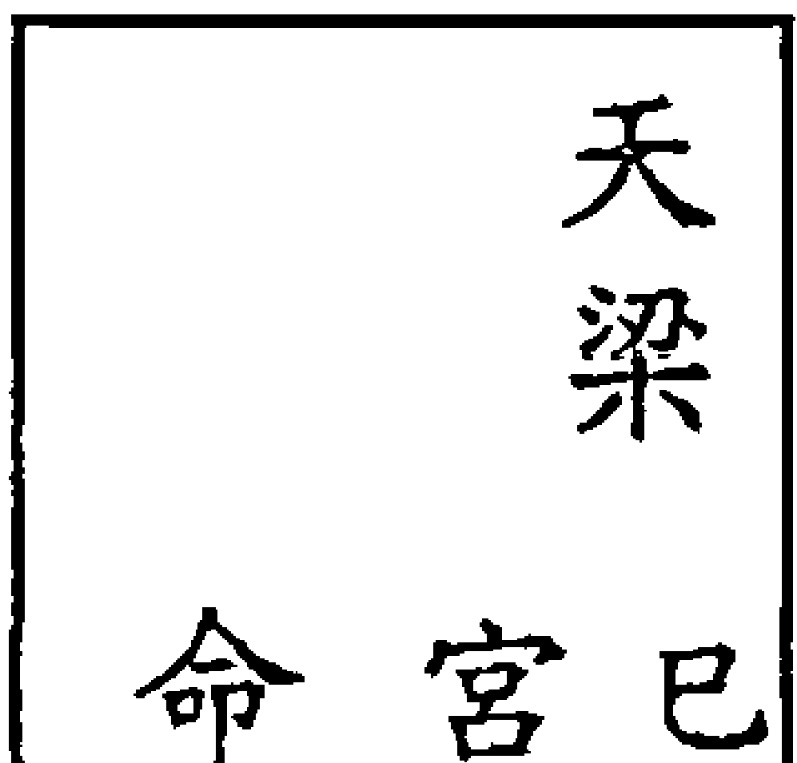

我的个性运势：奔波的地下教主。
我的事业运：低迷。
我的财运：财来财去。

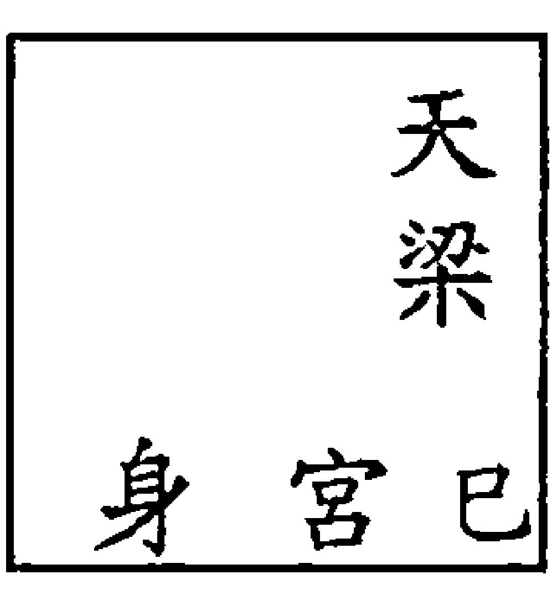

我中年后的个性运势：奔波的地下教主。
我中年后的事业运：低迷。
我中年后的财运：财来财去。

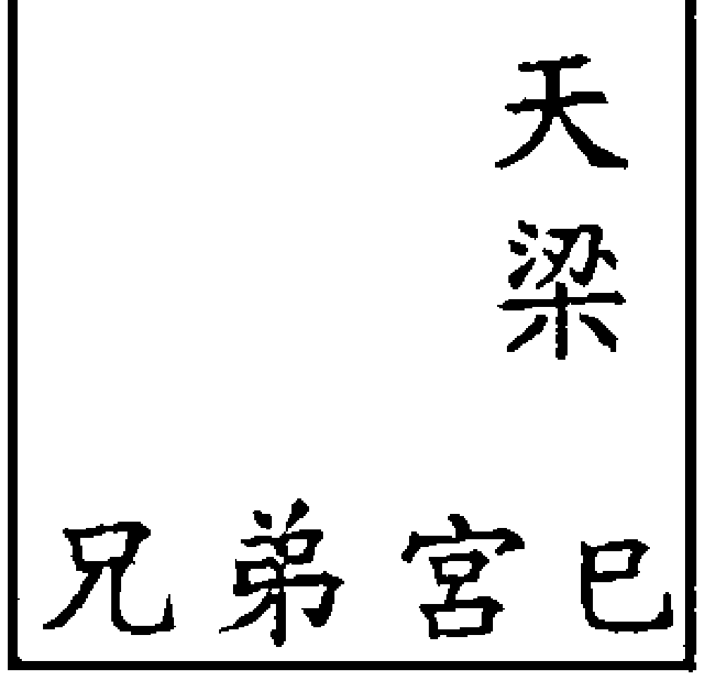

母亲的个性运势：奔波的地下教主。
兄弟姐妹的个性运势：奔波的地下教主。

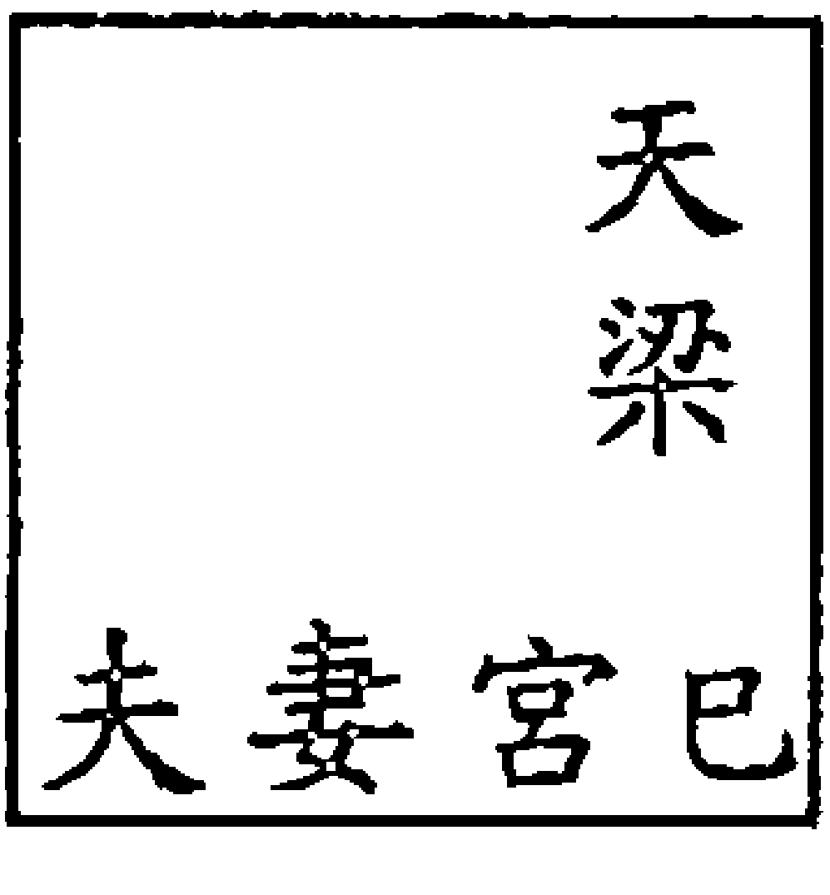

我对感情付出的个性运势：不懂付出。
我喜爱对象的个性运势：教主。
配偶的个性运势：奔波的地下教主。

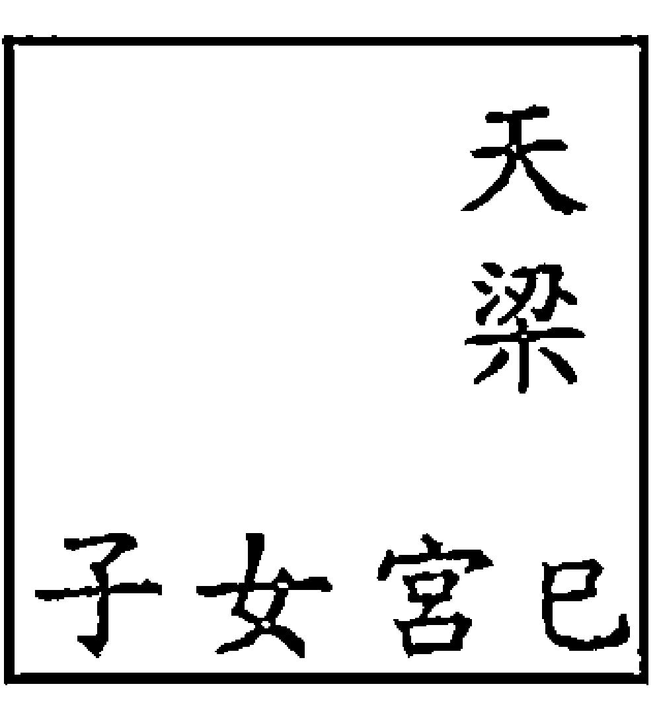

长子或长女的个性运势：奔波的地下教主。
我的属下、助手：奔波的地下教主。
性生活：一般。

| 天梁 |
|------|
| 財帛宮巳 |

我的賺錢運勢：財來財去。
我的事業運勢：低迷。
我的個性運勢：奔波的地下教主。

| 天梁 |
|------|
| 疾厄宮巳 |

我的疾病：（土）脾臟、胃病。
我的潛能：有機會當教主。

| 天梁 |
|------|
| 遷移宮巳 |

我的外表：奔波地下教主的樣子。
我的社交運：社交人士多為師傅。
我的出外運：小人貴人皆有。

| 天梁 |
|------|
| 奴僕宮巳 |

我的朋友：奔波的地下教主。
我的合夥人：奔波的地下教主。
我的同事或同學的運勢：奔波的地下教主。

| 天梁 |
|------|
| 官祿宮巳 |

我的事業運：低迷。
我的讀書運：坎坷。
我的個性運勢：奔波的地下教主。

| 天梁 |
|------|
| 田宅宮巳 |

置產的運勢：中年後置產。
家人的相處狀況：少溝通。

## 紫微初阶，一学就通

天梁 福德宮巳
我的人生觀：當教主。 我的存摺運勢：財來財去。

天梁 父母宮巳
父親的個性運勢：奔波的地下教主。 長官的個性運勢：奔波的地下教主。

## 天梁在亥及其十二宫的意义

天梁坐入地支亥宫：

- 星曜五行：屬土，代表穩重、保守、內向、固執。
- 地支亥宮的五行：屬水，代表機伶、柔和、靈動、搖擺。
- 地支亥宮的意義：孩子一氣勢發威。
- 地支亥宮的生肖：屬豬一自尊主義。
- 地支亥宮的星座：雙魚座一浪漫主義。
- 地支亥宮的宮性：人盤一奔波宮。
- 代表人物：教主。
- 星曜強弱：化陷（×），地下教主。

### 代表人物转化：散漫的地下教主

天梁在亥爲化陷（×），則缺點暴露，呈現出低迷的命格運勢。天梁五行屬土，則其五行之缺點暴露出固執、封閉、太保守。因爲化陷則引動地支亥的缺點，曝露出軟弱、善變、沒主見、氣勢凌人、人際關係不佳、重面子、好享受、感情太豐富、奔走無方、勞心勞力的命格運勢。

天梁爲官祿主，化陷則代表工作能力平庸、官小，一般爲上班族、市井小民。天梁代表人物原爲教主，化陷則爲地下教主的命格運勢，落入地支亥的代表人物轉化爲散漫的地下教主。

天梁為宗教星，與宗教的緣分深，化陷容易從事為少數人服務的行業，例如廟公、道士、法師、乩童等等。

## 天梁（散漫的地下教主）在亥坐入十二宫的意义：

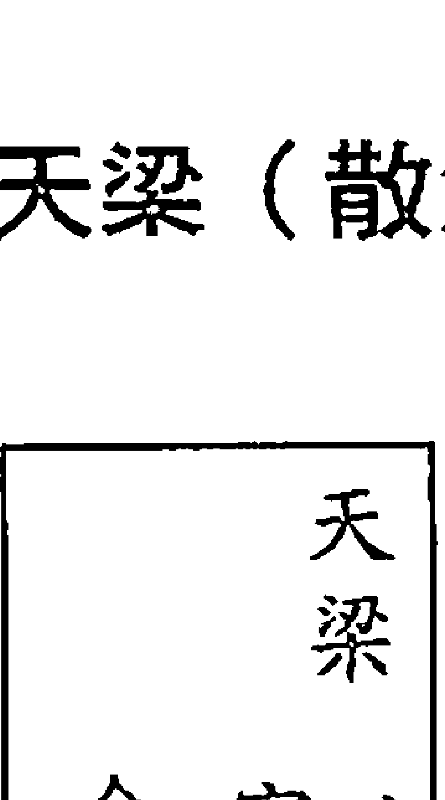

我的個性運勢：散漫的地下教主。
我的事業運：低迷。
我的財運：財來財去。

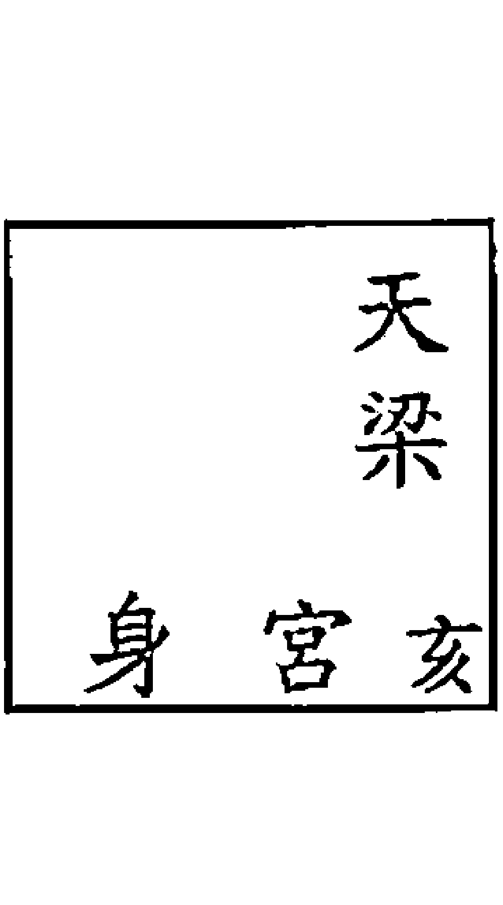

我中年後的個性運勢：散漫的地下教主。
我中年後的事業運：低迷。
我中年後的財運：財來財去。

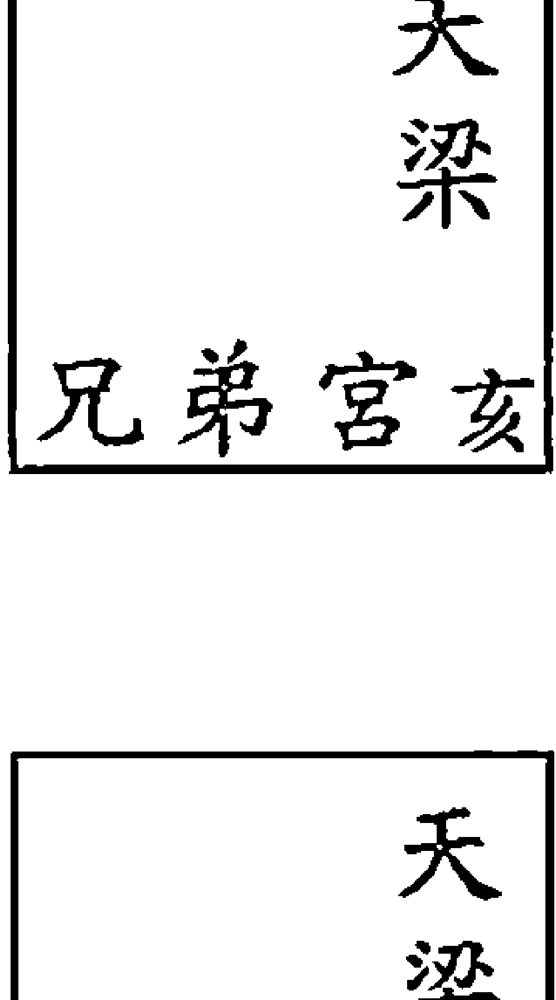

母親的個性運勢：散漫的地下教主。
兄弟姊妹的個性運勢：散漫的地下教主。

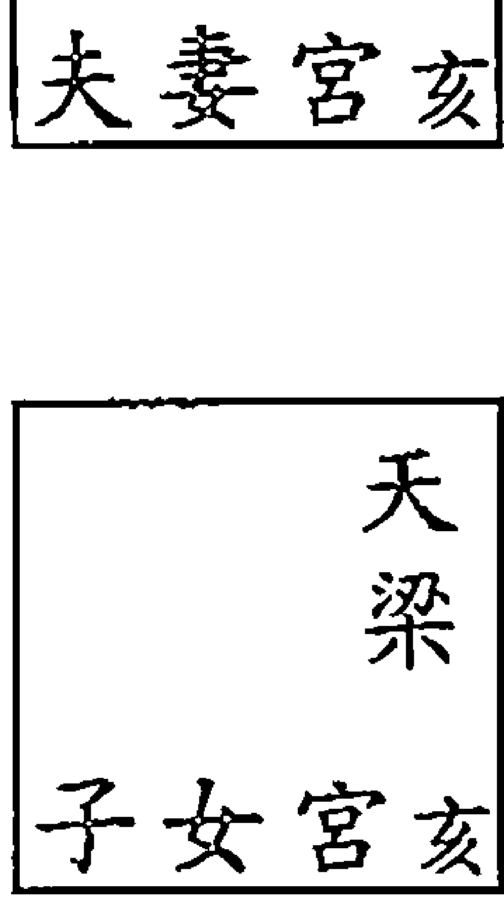

我對感情付出的個性運勢：不懂付出。
我喜愛對象的個性運勢：教主。
配偶的個性運勢：散漫的地下教主。


長子或長女的個性運勢：散漫的地下教主。
我的屬下、助手：散漫的地下教主。
性生活：一般。

## 天梁在亥

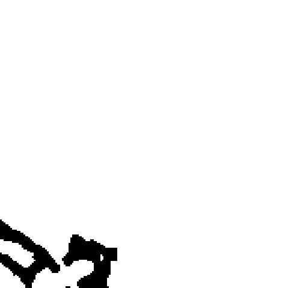

- **天梁 財帛宫亥**
  - 我的賺錢運勢：財來財去。
  - 我的事業運勢：低迷。
  - 我的個性運勢：散漫的地下教主。

- **天梁 疾厄宫亥**
  - 我的疾病：（土）脾臟、胃病。
  - 我的潛能：有機會當教主。

- **天梁 遷移宫亥**
  - 我的外表：散漫地下教主的樣子。
  - 我的社交運：社交人士多為師傅。
  - 我的出外運：小人貴人皆有。

- **天梁 奴僕宫亥**
  - 我的朋友：散漫的地下教主。
  - 我的合夥人：散漫的地下教主。
  - 我的同事或同學的運勢：散漫的地下教主。

- **天梁 官祿宫亥**
  - 我的事業運：低迷。
  - 我的讀書運：坎坷。
  - 我的個性運勢：散漫的地下教主。

- **天梁 田宅宫亥**
  - 置產的運勢：中年後置產。
  - 家人的相處狀況：懶得溝通。

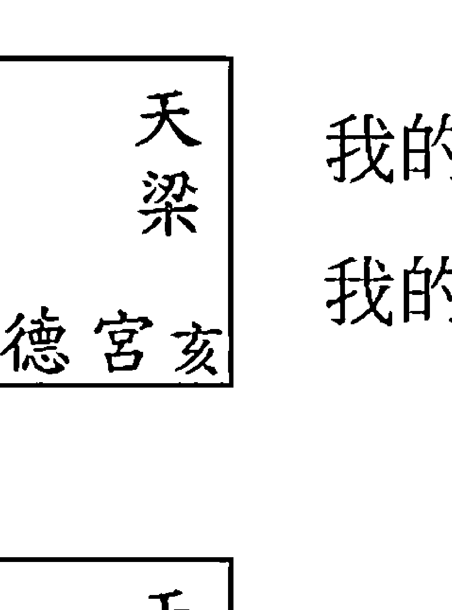

我的人生觀：喜從天降。
我的存摺運勢：財來財去。

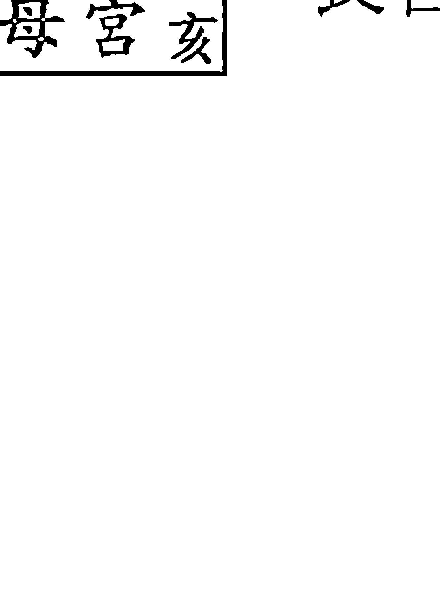

父親的個性運勢：散漫的地下教主。
長官的個性運勢：散漫的地下教主。

## 七杀独坐定律全解

- ○ 七杀独坐化庙只会落入地支寅宫、申宫、辰宫、戌宫。
- ○ 七杀独坐化旺只会落入地支子宫及地支午宫。

| 午 | 未 | 申 |
| :---: | :---: | :---: |
| 七殺○ | | 七殺◎ |
| **巳** | | **酉** |
| 七殺◎ | 七殺獨坐 | 七殺◎ |
| **辰** | | **戌** |
| | 丑 | 子 | 亥 |
| 卯 | | 七殺○ | 七殺◎ |
| 七殺◎ | | | |
| **寅** | **丑** | **子** | **亥** |

## 七杀在子及其十二宫的意义

七杀星坐入地支子宫为独坐：

星曜五行：属火，代表魅力、发扬、乐观、傲慢。属金，代表改革、突破、创意、叛逆。

地支子宫的五行：属水，代表机伶、柔和、灵动、摇摆。

地支子宫的意义：孥中一深藏不露。

地支子宫的生肖：属鼠一机伶主义。

地支子宫的星座：水瓶座一理想主义。

地支子宫的宫性：天盘一桃花宫。

代表人物：远征大将军。

星曜强弱：化旺（○），远征大将军。

### 代表人物转化：机伶的远征大将军

七杀在子为化旺（○），则优点尽出，呈现出旺盛的命格运势。七杀五行属火、金，展现出个性乐观进取、有魅力、开拓、发明、有创意的优点。因为化旺则引动地支子的优点，展现出机智、灵活、聪慧、细腻、冷静、灵敏、聪明、格局大、抱负大、人缘很好的个性运势。

七杀为官禄主，主成败、主变动、主肃杀，化旺则职位高、成大于败、创意十足、威风凛凛。七杀代表人物原为远征大将军，化旺同为远征大将军的命格运势，落入地支子的代表人物则转化为机伶的远征大将军。

## 七杀（机伶的远征大将军）在子坐入十二宫的意义：

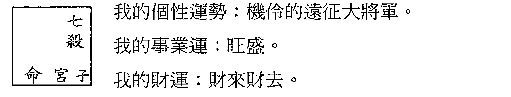

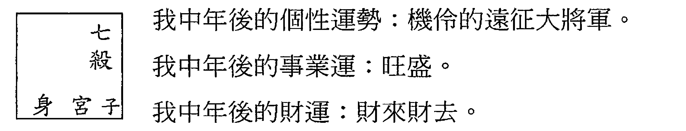

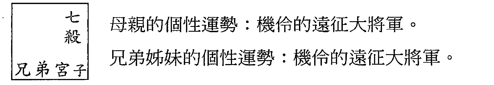

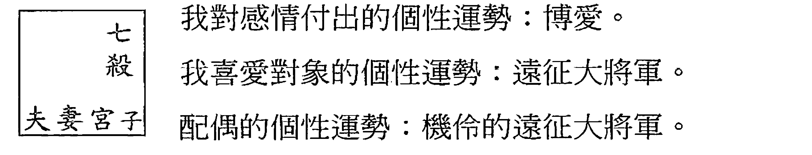

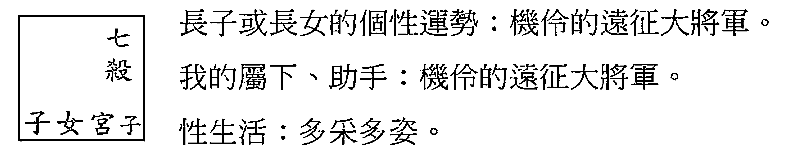

### 七杀 财帛宫子

我的赚钱运势：财来财去。
我的事业运势：旺盛。
我的个性运势：机伶的远征大将军。

### 七杀 疾厄宫子

我的疾病：（火）心血管，（金）呼吸系统。
我的潜能：有机会当远征大将军。

### 七杀 迁移宫子

我的外表：机伶远征大将军的样子。
我的社交运：社交人士多为外地人。
我的出外运：小人贵人皆有。

### 七杀 奴仆宫子

我的朋友：机伶的远征大将军。
我的合伙人：机伶的远征大将军。
我的同事或同学的运势：机伶的远征大将军。

### 七杀 官禄宫子

我的事业运：旺盛。
我的读书运：平顺。
我的个性运势：机伶的远征大将军。

### 七杀 田宅宫子

置产的运势：中年后置产。
家人的相处状况：孤离。

## 七杀在子

我的人生观：当远征大将军。
我的存折运势：财来财去。

父亲的个性运势：机伶的远征大将军。
长官的个性运势：机伶的远征大将军。

## 七杀在午及其十二宫的意义

七杀星坐入地支午宫为独坐：

- 星曜五行：属火，代表魅力、发扬、乐观、傲慢。属金，代表改革、突破、创意、叛逆。
- 地支午宫的五行：属火，代表魅力、发扬、乐观、傲慢。
- 地支午宫的意义：日旺一红的发火。
- 地支午宫的生肖：属马一暴躁主义。
- 地支午宫的星座：狮子座一尊重主义。
- 地支午宫的宫性：天盘一桃花宫。
- 代表人物：远征大将军。
- 星曜强弱：化旺（○），远征大将军。

### 代表人物转化：乐观的远征大将军

七杀在午为化旺（○），则优点尽出，呈现出旺盛的命格运势。七杀五行属火、金，展现出个性乐观进取、有魅力、开拓、发明、有创意的优点。因为化旺则引动地支午优点，呈现出乐观进取、魅力无限、行动积极、冲劲十足、雄霸威武、拥有军临天下、大将之风的领袖风范、人缘极佳、台缘旺盛的命格运势。

七杀为官禄主，主成败、主变动、主肃杀，化旺则职位高、成大于败、创意十足、威风凛凛。七杀代表人物原为远征大将军，化旺同为远征大将军的命格运势，落入地支午的代表人物则转化为乐观的远征大将军。

## 七杀（乐观的远征大将军）在午坐入十二宫的意义：

- **七杀 命宫午**
  - 我的个性运势：乐观的远征大将军。
  - 我的事业运：旺盛。
  - 我的财运：财来财去。
- **七杀 身宫午**
  - 我中年后的个性运势：乐观的远征大将军。
  - 我中年后的事业运：旺盛。
  - 我中年后的财运：财来财去。
- **七杀 兄弟宫午**
  - 母亲的个性运势：乐观的远征大将军。
  - 兄弟姊妹的个性运势：乐观的远征大将军。
- **七杀 夫妻宫午**
  - 我对感情付出的个性运势：博爱。
  - 我喜爱对象的个性运势：远征大将军。
  - 配偶的个性运势：乐观的远征大将军。
- **七杀 子女宫午**
  - 长子或长女的个性运势：乐观的远征大将军。
  - 我的属下、助手：乐观的远征大将军。
  - 性生活：多采多姿。

## 紫微斗数初阶一学就通

七杀 财帛宫午

我的赚钱运势：财来财去。
我的事业运势：旺盛。
我的个性运势：乐观的远征大将军。

七杀 疾厄宫午

我的疾病：（火）心血管，（金）呼吸系统。
我的潜能：有机会当远征大将军。

七杀 迁移宫午

我的外表：乐观远征大将军的样子。
我的社交运：社交人士多为外地人。
我的出外运：小人贵人皆有。

七杀 奴仆宫午

我的朋友：乐观的远征大将军。
我的合伙人：乐观的远征大将军。
我的同事或同学的运势：乐观的远征大将军。

七杀 官禄宫午

我的事业运：旺盛。
我的读书运：平顺。
我的个性运势：乐观的远征大将军。

七杀 田宅宫午

置产的运势：中年后置产。
家人的相处状况：孤离。

## 七杀在午

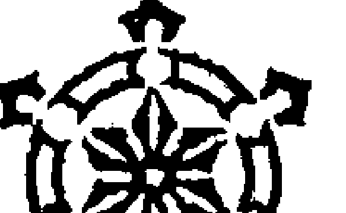

### 七杀 福德宫午

- 我的人生观：当远征大将军。
- 我的存折运势：财来财去。

### 七杀 父母宫午

- 父亲的个性运势：乐观的远征大将军。
- 长官的个性运势：乐观的远征大将军。

## 七杀在寅及其十二宫的意义

七杀坐入地支寅宫：

- 星曜五行：属火，代表魅力、发扬、乐观、傲慢。属金，代表改革、突破、创意、叛逆。
- 地支寅宫的五行：属木，代表成长、上进、劳心、奔波。
- 地支寅宫的意义：演出—表演作秀。
- 地支寅宫的生肖：属虎—活跃主义。
- 地支寅宫的星座：射手座—活力主义。
- 地支寅宫的宫性：人盘—奔波宫。
- 代表人物：远征大将军。
- 星曜强弱：化庙（◎），远征大元帅。

### 代表人物转化：上进的远征大元帅

七杀在寅为化庙（◎），则优点尽出，呈现出旺盛的命格运势。七杀五行属火、金，展现出个性乐观进取、有魅力、开拓、发明、有创意的优点。因为化庙则引动地支寅的优点，呈现求上进、肯学习、自我成长、活跃、活力、乐观开朗、活泼好动、悠游自在、肢体语言丰富、精力充沛、善于计划且执行力强等的命格运势。

七杀为官禄主，主成败、主变动、主肃杀，化庙则职位高、成大于败、创意十足、威风凛凛。七杀代表人物原为远征大将军，化庙升格为远征大元帅的命格运势，落入地支寅的代表人物则转化为上进的远征大元帅。

## 七杀（上进的远征大元帅）在寅坐入十二宫的意义：

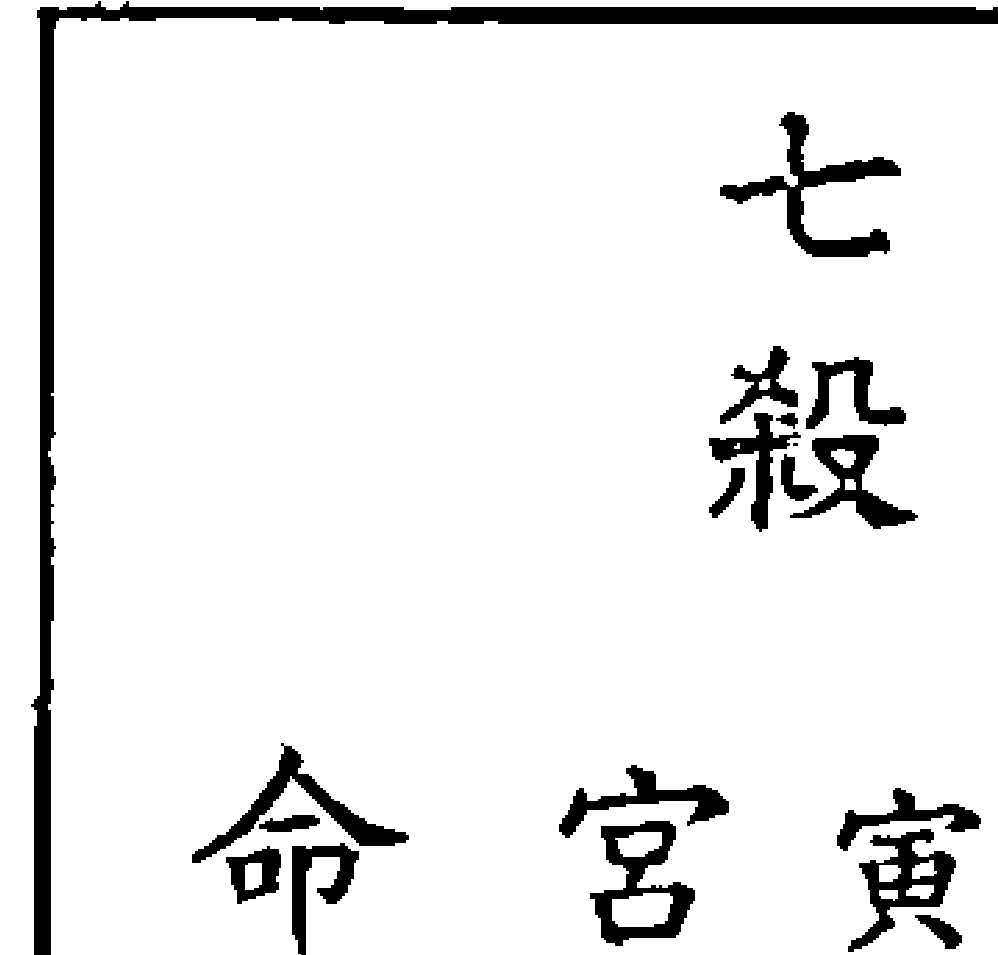

我的个性运势：上进的远征大元帅。
我的事业运：旺盛。
我的财运：大进大出。

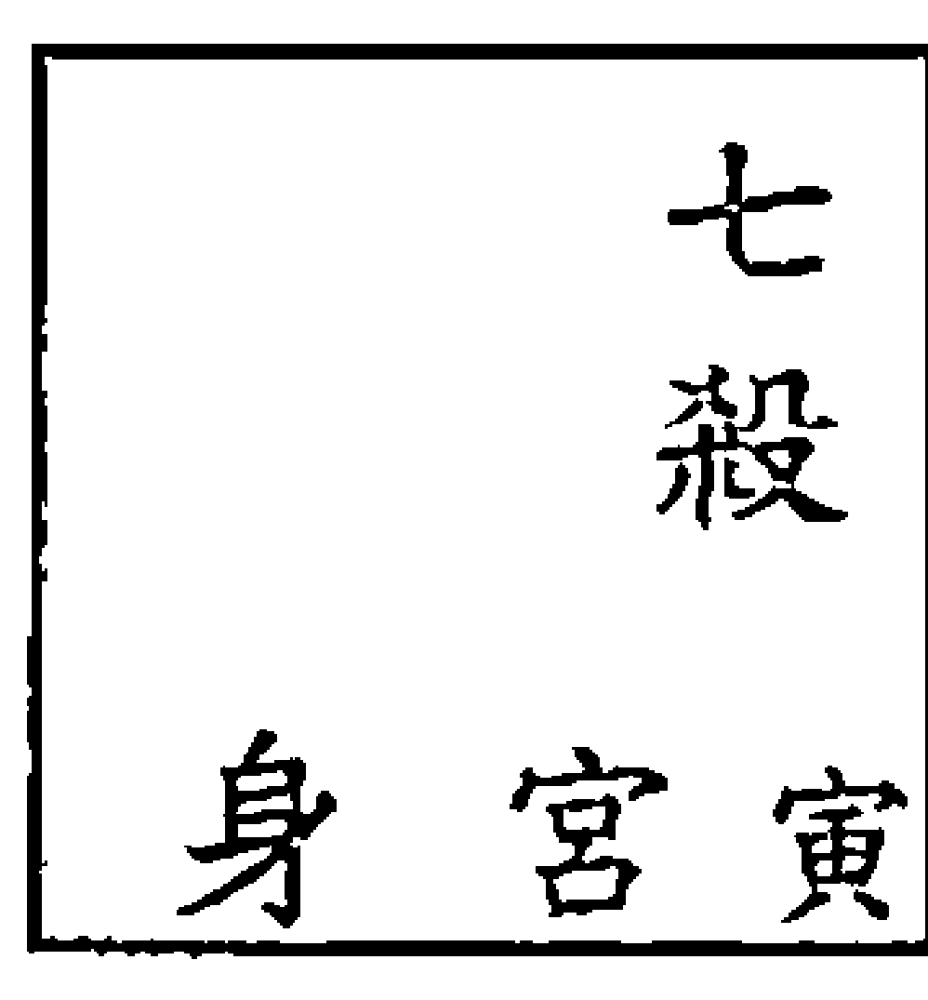

我中年后的个性运势：上进的远征大元帅。
我中年后的事业运：旺盛。
我中年后的财运：大进大出。

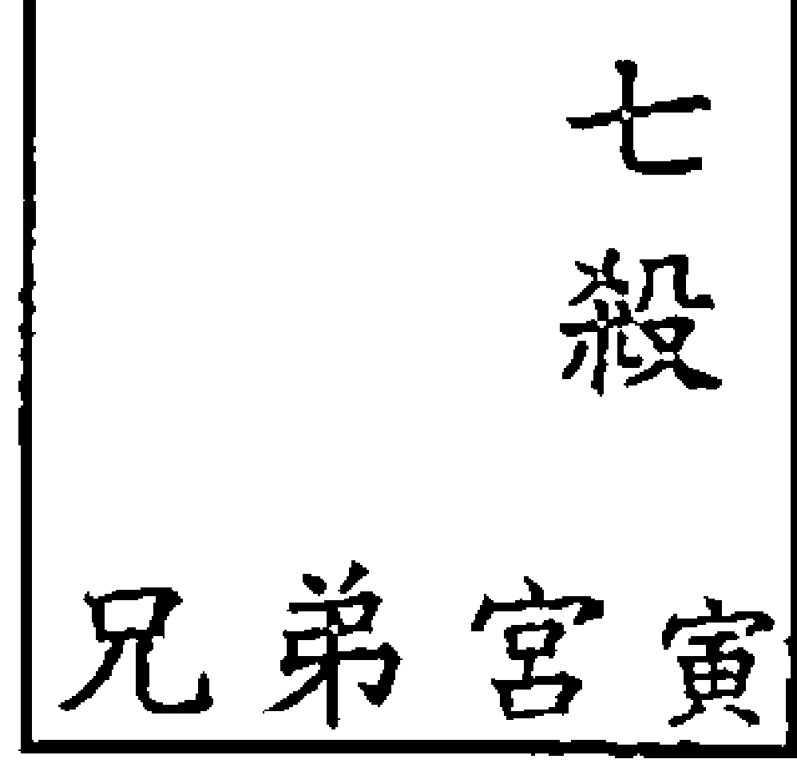

母亲的个性运势：上进的远征大元帅。
兄弟姊妹的个性运势：上进的远征大元帅。

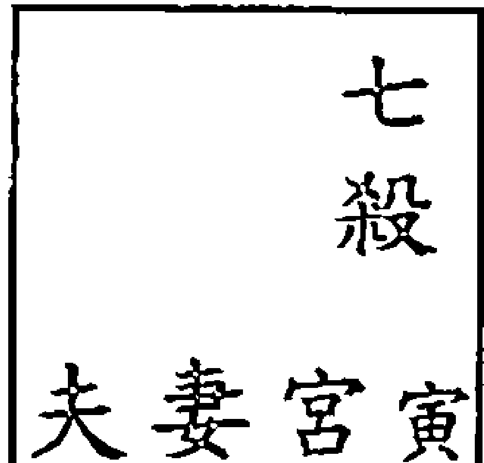

我对感情付出的个性运势：博爱。
我喜爱对象的个性运势：远征大元帅。
配偶的个性运势：上进的远征大元帅。

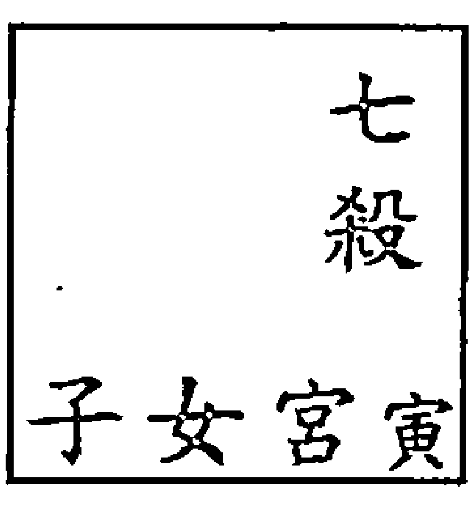

长子或长女的个性运势：上进的远征大元帅。
我的属下、助手：上进的远征大元帅。
性生活：多采多姿。

## 紫微初阶，一学就通

- **七杀 财帛宫寅**
  - 我的赚钱运势：大进大出。
  - 我的事业运势：旺盛。
  - 我的个性运势：上进的远征大元帅。
- **七杀 疾厄宫寅**
  - 我的疾病：（火）心血管，（金）呼吸系统。
  - 我的潜能：有机会当大元帅。
- **七杀 迁移宫寅**
  - 我的外表：上进远征大元帅的样子。
  - 我的社交运：社交人士多为外地人。
  - 我的出外运：小人贵人皆有。
- **七杀 奴仆宫寅**
  - 我的朋友：上进的远征大元帅。
  - 我的合伙人：上进的远征大元帅。
  - 我的同事或同学的运势：上进的远征大元帅。
- **七杀 官禄宫寅**
  - 我的事业运：旺盛。
  - 我的读书运：平顺。
  - 我的个性运势：上进的远征大元帅。
- **七杀 田宅宫寅**
  - 置产的运势：中年后置产。
  - 家人的相处状况：孤离。

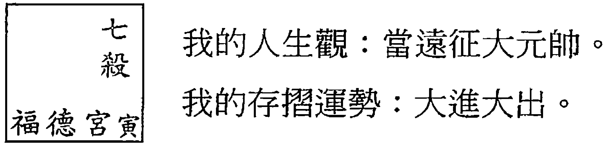

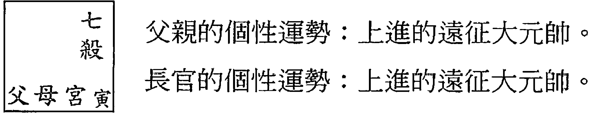

## 七杀在申及其十二宫的意义

七杀坐入地支申宫：

- 星曜五行：属火，代表魅力、发扬、乐观、傲慢。属金，代表改革、突破、创意、叛逆。
- 地支申宫的五行：属金，代表改革、突破、创意、叛逆。
- 地支申宫的意义：身熟—身心成熟。
- 地支申宫的生肖：属猴—勤快主义。
- 地支申宫的星座：双子座—变装主义。
- 地支申宫的宫性：人盘—奔波宫。
- 代表人物：远征大将军。
- 星曜强弱：化庙（◎），远征大元帅。

### 代表人物转化：创意的远征大元帅

七杀在申为化庙（◎），则优点尽出，呈现出旺盛的命格运势。七杀五行属火、金，展现出个性乐观进取、有魅力、开拓、发明、有创意的优点。因为化庙则引动地支申的优点，呈现早熟、沈稳、历练多、勤劳、反应快、善于应对进退、攻守得宜、精于计划等的命格运势。

七杀为官禄主，主成败、主变动、主肃杀，化庙则职位高、成大于败、创意十足、威风凛凛。七杀代表人物原为远征大将军，化庙升格为远征大元帅的命格运势，落入地支申的代表人物则转化为创意的远征大元帅。

地支申的代表人物则转化为创意的远征大元帅。

## 七杀（创意的远征大元帅）在申坐入十二宫的意义：

### 七杀 命宫申
- 我的个性运势：创意的远征大元帅。
- 我的事业运：旺盛。
- 我的财运：大进大出。

### 七杀 身宫申
- 我中年后的个性运势：创意的远征大元帅。
- 我中年后的事业运：旺盛。
- 我中年后的财运：大进大出。

### 七杀 兄弟宫申
- 母亲的个性运势：创意的远征大元帅。
- 兄弟姊妹的个性运势：创意的远征大元帅。

### 七杀 夫妻宫申
- 我对感情付出的个性运势：博爱。
- 我喜爱对象的个性运势：远征大元帅。
- 配偶的个性运势：创意的远征大元帅。

### 七杀 子女宫申
- 长子或长女的个性运势：创意的远征大元帅。
- 我的属下、助手：创意的远征大元帅。
- 性生活：多采多姿。

### 七杀 财帛宫申
- 我的赚钱运势：大进大出。
- 我的事业运势：旺盛。
- 我的个性运势：创意的远征大元帅。

### 七杀 疾厄宫申
- 我的疾病：（火）心血管，（金）呼吸系统。
- 我的潜能：有机会当远征大元帅。

### 七杀 迁移宫申
- 我的外表：创意远征大元帅的样子。
- 我的社交运：社交人士多为外地人。
- 我的出外运：小人贵人皆有。

### 七杀 奴仆宫申
- 我的朋友：创意的远征大元帅。
- 我的合伙人：创意的远征大元帅。
- 我的同事或同学的运势：创意的远征大元帅。

### 七杀 官禄宫申
- 我的事业运：旺盛。
- 我的读书运：平顺。
- 我的个性运势：创意的远征大元帅。

### 七杀 田宅宫申
- 置产的运势：中年后置产。
- 家人的相处状况：孤离。

### 七杀 福德宫申
- 我的人生观：当远征大元帅。我的存折运势：大进大出。

### 七杀 父母宫申
- 父亲的个性运势：创意的远征大元帅。长官的个性运势：创意的远征大元帅。

## 七杀在辰及其十二宫的意义

七杀坐入地支辰宫：

- 星曜五行：属火，代表魅力、发扬、乐观、傲慢。属金，代表改革、突破、创意、叛逆。
- 地支辰宫的五行：属土，代表稳重、保守、内向、固执。
- 地支辰宫的意义：震祛—脱胎换骨。
- 地支辰宫的生肖：属龙—变迁主义。
- 地支辰宫的星座：天秤座—朋友主义。
- 地支辰宫的宫性：地盘—财富宫。
- 代表人物：远征大将军。
- 星曜强弱：化庙（◎），远征大元帅。
- 代表人物转化：强势的远征大元帅

七杀在辰为化庙（◎），则优点尽出，呈现出旺盛的命格运势。七杀五行属火、金，展现出个性乐观进取、有魅力、开拓、发明、有创意的优点。因为化庙则引动地支辰的优点，呈现出成熟稳重、冷静、求新求变、灵活机智、目标远大、人缘佳、财运佳的个性运势。

七杀为官禄主，主成败、主变动、主肃杀，化庙则职位高、成大于败、创意十足、威风凛凛。七杀代表人物原为远征大将军，化庙升格为远征大元帅的命格运势，落入地支辰的代表人物则转化为强势的远征大元帅。

辰宫为天罗、戌宫为地网称为天罗地网宫，命宫在此二宫位，因为竞争欲望过高，仿佛有一层网子罩住自己的身体、手上镣着枷锁，想挣脱却力不从心，犹如运势被锁住一般，而深感一生辛苦、劳碌。

## 七杀（强势的远征大元帅）在辰坐入十二宫的意义：

### 七杀 命宫辰
- 我的个性运势：强势的远征大元帅。
- 我的事业运：旺盛。
- 我的财运：大进大出。

### 七杀 身宫辰
- 我中年后的个性运势：强势的远征大元帅。
- 我中年后的事业运：旺盛。
- 我中年后的财运：大进大出。

### 七杀 兄弟宫辰
- 母亲的个性运势：强势的远征大元帅。
- 兄弟姊妹的个性运势：强势的远征大元帅。

### 七杀 夫妻宫辰
- 我对感情付出的个性运势：博爱。
- 我喜爱对象的个性运势：远征大元帅。
- 配偶的个性运势：强势的远征大元帅。

### 七杀 子女宫辰
| 七杀 子女宫辰 |
| :--- |
| 长子或长女的个性运势：强势的远征大元帅。 |
| 我的属下、助手：强势的远征大元帅。 |
| 性生活：多采多姿。 |

### 七杀 财帛宫辰
| 七杀 财帛宫辰 |
| :--- |
| 我的赚钱运势：大进大出。 |
| 我的事业运势：旺盛。 |
| 我的个性运势：强势的远征大元帅。 |

### 七杀 疾厄宫辰
| 七杀 疾厄宫辰 |
| :--- |
| 我的疾病：（火）心血管，（金）呼吸系统。 |
| 我的潜能：有机会当远征大元帅。 |

### 七杀 迁移宫辰
| 七杀 迁移宫辰 |
| :--- |
| 我的外表：强势远征大元帅的样子。 |
| 我的社交运：社交人士多为外地人。 |
| 我的出外运：小人贵人皆有。 |

### 七杀 奴仆宫辰
| 七杀 奴仆宫辰 |
| :--- |
| 我的朋友：强势的远征大元帅。 |
| 我的合伙人：强势的远征大元帅。 |
| 我的同事或同学的运势：强势的远征大元帅。 |

### 七杀 官禄宫辰
| 七杀 官禄宫辰 |
| :--- |
| 我的事业运：旺盛。 |
| 我的读书运：平顺。 |
| 我的个性运势：强势的远征大元帅。 |

### 七杀 田宅宫辰
- 置产的运势：中年后置产。
- 家人的相处状况：孤离。

### 七杀 福德宫辰
- 我的人生观：当远征大元帅。
- 我的存折运势：大进大出。

### 七杀 父母宫辰
- 父亲的个性运势：强势的远征大元帅。
- 长官的个性运势：强势的远征大元帅。

## 七杀在戌及其十二宫的意义

七杀坐入地支戌宫：

- 星曜五行：属火，代表魅力、发扬、乐观、傲慢。属金，代表改革、突破、创意、叛逆。
- 地支戌宫的五行：代表属土，稳重、保守、内向、固执。
- 地支戌宫的意义：灭始一除旧布新。
- 地支戌宫的生肖：属狗一负责主义。
- 地支戌宫的星座：牡羊座一发现主义。
- 地支戌宫的宫性：地盘一财富宫。
- 代表人物：远征大将军。
- 星曜强弱：化庙（◎），远征大元帅。
- 代表人物转化：执着的远征大元帅

七杀在戌为化庙（◎），则优点尽出，呈现出旺盛的命格运势。七杀五行属火、金，展现出个性乐观进取、有魅力、开拓、发明、有创意的优点。因为化庙则引动地支戌的优点，呈现出成熟稳重、冷静、谨慎、善良、尊贵、从一而终、责任感强烈、创意十足、财运佳的个性运势。

七杀为官禄主，主成败、主变动、主肃杀，化庙则职位高、成大于败、创意十足、威风凛凛。七杀代表人物原为远征大将军，化庙升格为远征大元帅的命格运势，落入地支戌的代表人物则转化为执着的远征大元帅。

辰宫为天罗、戌宫为地网称为天罗地网宫，命宫在此二宫位，因为竞争欲望过高，仿佛有一层网子罩住自己的身体、手上铐着枷锁，想挣脱却力不从心，犹如运势被锁住一般，而深感一生辛苦、劳碌。

## 七杀（执着的远征大元帅）在戌坐入十二宫的意义：

### 七杀 命宫戌
- 我的个性运势：执着的远征大元帅。
- 我的事业运：旺盛。
- 我的财运：大进大出。

### 七杀 身宫戌
- 我中年后的个性运势：执着的远征大元帅。
- 我中年后的事业运：旺盛。
- 我中年后的财运：大进大出。

### 七杀 兄弟宫戌
- 母亲的个性运势：执着的远征大元帅。
- 兄弟姊妹的个性运势：执着的远征大元帅。

### 七杀 夫妻宫戌
- 我对感情付出的个性运势：博爱。
- 我喜爱对象的个性运势：远征大元帅。
- 配偶的个性运势：执着的远征大元帅。

### 七杀 子女宫戌
- 长子或长女的个性运势：执着的远征大元帅。我的属下、助手：执着的远征大元帅。性生活：多采多姿。

### 七杀 财帛宫戌
- 我的赚钱运势：大进大出。我的事业运势：旺盛。我的个性运势：执着的远征大元帅。

### 七杀 疾厄宫戌
- 我的疾病：（火）心血管，（金）呼吸系统。我的潜能：有机会当远征大元帅。

### 七杀 迁移宫戌
- 我的外表：执着远征大元帅的样子。我的社交运：社交人士多为外地人。我的出外运：小人贵人皆有。

### 七杀 奴仆宫戌
- 我的朋友：执着的远征大元帅。我的合伙人：执着的远征大元帅。我的同事或同学的运势：执着的远征大元帅。

### 七杀 官禄宫戌
- 我的事业运：旺盛。我的读书运：平顺。我的个性运势：执着的远征大元帅。

### 七杀 田宅宫戌
- 置产的运势：中年后置产。

- 家人的相处状况：孤离。

### 七杀 福德宫戌
- 我的人生观：当远征大元帅。

- 我的存折运势：大进大出。

### 七杀 父母宫戌
- 父亲的个性运势：执着的远征大元帅。

- 长官的个性运势：执着的远征大元帅。

## 破军独坐定律全解

- 破军独坐化庙只会落入地支子宫及地支午宫。
- 破军独坐化旺只会落入地支辰宫及地支戌宫。
- 破军独坐化平只会落入地支寅宫及地支申宫。

| 宫位 | 破军状态 |
| :--- | :--- |
| 子 | 破军 ◎ |
| 丑 | (空) |
| 寅 | 破军 △ |
| 卯 | (空) |
| 辰 | 破军 ○ |
| 巳 | (空) |
| 午 | 破军 ◎ |
| 未 | (空) |
| 申 | 破军 △ |
| 酉 | (空) |
| 戌 | 破军 ○ |
| 亥 | (空) |
| 中央 | 破军独坐 |

## 破军在子及其十二宫的意义

破军坐入地支子宫为独坐：

- 星曜五行：属金，代表改革、突破、创意、叛逆。属水，代表机伶、柔和、灵动、摇摆。
- 地支子宫的五行：属水，代表机伶、柔和、灵动、摇摆。
- 地支子宫的意义：莘中一深藏不露。
- 地支子宫的生肖：属鼠一机伶主义。
- 地支子宫的星座：水瓶座一理想主义。
- 地支子宫的宫性：天盘一桃花宫。
- 代表人物：敢死队。
- 星曜强弱：化庙（◎），敢死大元帅。

## 代表人物转化：机伶的敢死大元帅

破军在子破军为化庙（◎），则优点尽出运势旺盛。破军属金、水展现出发现、发明、开创新局、机智灵敏、奋具胆识的优点。因为化庙则引动地支子的优点，展现出机智、灵活、聪慧、细腻、冷静、灵敏、聪明、格局大、抱负大、人缘很好的个性运势。

破军为六亲主，主权，化庙则展现众亲拱月的运势。破军代表人物原为敢死队，化庙升格为敢死大元帅的命格运势，落入地支子代表人物则转化为机伶的敢死大元帅。

另外一提，破军主耗、主破、主祸福，化庙则得到的资源旺盛，福大于祸，事业及财富成功大于失败，亲朋好友皆会对其关心付出，具有衣锦还乡的格局。

## 破军（机伶的敢死大元帅）在子坐入十二宫的意义：

### 破军 命宫子
- 我的个性运势：机伶的敢死大元帅。
- 我的事业运：先破后成。
- 我的财运：财来财去。

### 破军 身宫子
- 我中年后的个性运势：机伶的敢死大元帅。
- 我中年后的事业运：先破后成。
- 我中年后的财运：财来财去。

### 破军 兄弟宫子
- 母亲的个性运势：机伶的敢死大元帅。
- 兄弟姊妹的个性运势：机伶的敢死大元帅。

### 破军 夫妻宫子
- 我对感情付出的个性运势：不懂付出。
- 我喜爱对象的个性运势：敢死大元帅。
- 配偶的个性运势：机伶的敢死大元帅。

### 破军 子女宫子
- 长子或长女的个性运势：机伶的敢死大元帅。
- 我的属下、助手：机伶的敢死大元帅。
- 性生活：多采多姿。

### 破军 福德宫子
- 我的人生观：当发明家。
- 我的存折运势：财来财去。

### 破军 父母宫子
- 父亲的个性运势：机伶的敢死大元帅。
- 长官的个性运势：机伶的敢死大元帅。

## 破军在午及其十二宫的意义

破军星坐入地支午宫为独坐：

- 星曜五行：属金，代表改革、突破、创意、叛逆。属水，代表机伶、柔和、灵动、摇摆。
- 地支午宫的五行：属火，代表魅力、发扬、乐观、傲慢。
- 地支午宫的意义：日旺—红的发火。
- 地支午宫的生肖：属马—暴躁主义。
- 地支午宫的星座：狮子座—尊重主义。
- 地支午宫的宫性：天盘—桃花宫。
- 代表人物：敢死队。
- 星曜强弱：化庙（◎），敢死大元帅。

## 代表人物转化：乐观的敢死大元帅

破军在午破军为化庙（◎），则优点尽出运势旺盛。破军属金、水展现出发现、发明、开创新局、机智灵敏、勤奋具胆识的优点。因为化庙则引动地支午的优点，呈现出乐观进取、魅力无限、行动积极、冲劲十足、雄霸威武、拥有军临天下、大将之风的领袖风范、人缘极佳、台缘旺盛的命格运势。

破军为六亲主，主权，化庙则展现众亲拱月的运势。破军代表人物原为敢死队，化庙则升格为敢死大元帅的命格运势，落入地支午代表人物则转化为乐观的敢死大元帅。

另外一提，破军主耗、主破、主祸福，化庙则得到的资源旺盛，福大于祸，事业及财富成功大于失败，亲朋好友皆会对其关心付出，具有衣锦还乡的格局。

## 破军（乐观的敢死大元帅）在午坐入十二宫的意义：

### 破军 命宫午
- 我的个性运势：乐观的敢死大元帅。
- 我的事业运：先破后成。
- 我的财运：财来财去。

### 破军 身宫午
- 我中年后的个性运势：乐观的敢死大元帅。
- 我中年后的事业运：先破后成。
- 我中年后的财运：财来财去。

### 破军 兄弟宫午
- 母亲的个性运势：乐观的敢死大元帅。
- 兄弟姊妹的个性运势：乐观的敢死大元帅。

### 破军 夫妻宫午
- 我对感情付出的个性运势：不懂付出。
- 我喜爱对象的个性运势：敢死大元帅。
- 配偶的个性运势：乐观的敢死大元帅。

### 破军 子女宫午
- 长子或长女的个性运势：乐观的敢死大元帅。
- 我的属下、助手：乐观的敢死大元帅。
- 性生活：多采多姿。

### 破军 财帛宫午
- 我的赚钱运势：财来财去。
- 我的事业运势：先破后成。
- 我的个性运势：乐观的敢死大元帅。

### 破军 疾厄宫午
- 我的疾病：（金）呼吸系统，（水）泌尿系统、妇女病。
- 我的潜能：有机会当发明家。

### 破军 迁移宫午
- 我的外表：乐观敢死大元帅的样子。
- 我的社交运：社交人士多为敢死队。
- 我的出外运：小人贵人皆有。

### 破军 奴仆宫午
- 我的朋友：乐观的敢死大元帅。
- 我的合伙人：乐观的敢死大元帅。
- 我的同事或同学的运势：乐观的敢死大元帅。

### 破军 官禄宫午
- 我的事业运：先破后成。
- 我的读书运：先破后成。
- 我的个性运势：乐观的敢死大元帅。

## 紫微斗数，一学就通

- **破军 (田宅宫午)**
  - 置产的运势：中年后置产。
  - 家人的相处状况：无缘。
- **破军 (福德宫午)**
  - 我的人生观：当发明家。
  - 我的存折运势：财来财去。
- **破军 (父母宫午)**
  - 父亲的个性运势：乐观的敢死大元帅。
  - 长官的个性运势：乐观的敢死大元帅。

## 破军在寅及其十二宫的意义

破军坐入地支寅宫：

- 星曜五行：属金，代表改革、突破、创意、叛逆。属水，代表机伶、柔和、灵动、摇摆。
- 地支寅宫的五行：属木，代表成长、上进、劳心、奔波。
- 地支寅宫的意义：演出一表演作秀。
- 地支寅宫的生肖：属虎一活跃主义。
- 地支寅宫的星座：射手座一活力主义。
- 地支寅宫的宫性：人盘一奔波宫。
- 代表人物：敢死队。
- 星曜强弱：化平（△），敢死队。
- 代表人物转化：奔波的敢死队

破军在寅破军为化平（△），则优缺点相互交错，呈现出平庸的命格运势。破军属金、水，展现出发现、发明、开创新局、机智灵敏、勤奋具胆识的优点，但时而暴露出反传统、反制度、软弱、没主见、善变的缺点。化平则引动地支寅的优点及缺点，呈现活跃、活力、乐观开朗、活泼好动、悠游自在、肢体语言丰富、精力充沛、善于计划且执行力强等的优点，但时而暴露出太好动、太乐观、太爱现、坐不住、肢体动作太大、劳心劳力、奔走无方的缺点。

破军为六亲主，主权、主耗，化平则呈现六亲孤离、权势坎坷、大成大破的运势。破军代表人物原为敢死队，化平同为敢死队的命格运势，落入地支寅代表人物则转化为奔波的敢死队。

## 破军（奔波的敢死队）在寅坐入十二宫的意义：

### 命宫 寅 破军
- 我的个性运势：奔波的敢死队。
- 我的事业运：坎坷。
- 我的财运：财来财去。

### 身宫 寅 破军
- 我中年后的个性运势：奔波的敢死队。
- 我中年后的事业运：坎坷。
- 我中年后的财运：财来财去。

### 兄弟宫 寅 破军
- 母亲的个性运势：奔波的敢死队。
- 兄弟姊妹的个性运势：奔波的敢死队。

### 夫妻宫 寅 破军
- 我对感情付出的个性运势：不懂付出。
- 我喜爱对象的个性运势：敢死队。
- 配偶的个性运势：奔波的敢死队。

### 子女宫 寅 破军
- 长子或长女的个性运势：奔波的敢死队。
- 我的属下、助手：奔波的敢死队。
- 性生活：多采多姿。

### 财帛宫 寅 破军
- 我的赚钱运势：财来财去。
- 我的事业运势：坎坷。
- 我的个性运势：奔波的敢死队。

### 疾厄宫 寅 破军
- 我的疾病：（金）呼吸系统，（水）泌尿系统、妇女病。
- 我的潜能：有机会当发明家。

### 迁移宫 寅 破军
- 我的外表：奔波敢死队的样子。
- 我的社交运：社交人士多为敢死队。
- 我的出外运：小人居多。

### 奴仆宫 寅 破军
- 我的朋友：奔波的敢死队。
- 我的合伙人：奔波的敢死队。
- 我的同事或同学的运势：奔波的敢死队。

### 官禄宫 寅 破军
- 我的事业运：坎坷。
- 我的读书运：坎坷。
- 我的个性运势：奔波的敢死队。

## 紫微初步，一学就通

| 田宅宫寅 | 破军 |
| :--- | :--- |
| 置产的运势：中年后置产。 |
| 家人的相处状况：无缘。 |

| 福德宫寅 | 破军 |
| :--- | :--- |
| 我的人生观：当发明家。 |
| 我的存折运势：财来财去。 |

| 父母宫寅 | 破军 |
| :--- | :--- |
| 父亲的个性运势：奔波的敢死队。 |
| 长官的个性运势：奔波的敢死队。 |

# 破軍在申及其十二宮的意義

### 破軍坐入地支申宮：

- 星曜五行：屬金，代表改革、突破、創意、叛逆。屬水，代表機伶、柔和、靈動、搖擺。
- 地支申宮的五行：屬金，代表改革、突破、創意、叛逆。
- 地支申宮的意義：身熟—身心成熟。
- 地支申宮的生肖：屬猴—勤快主義。
- 地支申宮的星座：雙子座—變裝主義。
- 地支申宮的宮性：人盤—奔波宮。
- 代表人物：敢死隊。
- 星曜強弱：化平（△），敢死隊。
- 代表人物轉化：叛逆的敢死隊。

破軍在申為化平（△），則優缺點相互交錯，呈現出平庸的命格運勢。破軍屬金、水，展現出發現、發明、開創新局、機智靈敏、勤奮具膽識的優點，但時而暴露出反傳統、反制度、軟弱、沒主見、善變的缺點。因為化平則引動地支申的優點呈現早熟、沈穩、歷練多、勤勞、反應快、善於應對進退、攻守得宜、精於計畫等的優點，但時而亦暴露出因急躁不安而行事欠考慮、見異思遷的缺點。

破軍為六親主，主權、主耗，化平則呈現六親孤離、權势坎坷、大成大破的運勢。破軍代表人物原為敢死隊，化平同為敢死隊的命格運勢，落入地支申代表人物則轉化為叛逆的敢死隊。

## 破军（叛逆的敢死队）在申坐入十二宮的意义：

| 破軍 命宮申 |
| :--- |
| 我的個性運勢：叛逆的敢死隊。<br>我的事業運：坎坷。<br>我的財運：財來財去。 |

| 破軍 身宮申 |
| :--- |
| 我中年後的個性運勢：叛逆的敢死隊。<br>我中年後的事業運：坎坷。<br>我中年後的財運：財來財去。 |

| 破軍 兄弟宮申 |
| :--- |
| 母親的個性運勢：叛逆的敢死隊。<br>兄弟姊妹的個性運勢：叛逆的敢死隊。 |

| 破軍 夫妻宮申 |
| :--- |
| 我對感情付出的個性運勢：不懂付出。<br>我喜愛對象的個性運勢：敢死隊。<br>配偶的個性運勢：叛逆的敢死隊。 |

| 破軍 子女宮申 |
| :--- |
| 長子或長女的個性運勢：叛逆的敢死隊。<br>我的屬下、助手：叛逆的敢死隊。<br>性生活：多采多姿。 |

# 破军在申

- **破军在财帛宫申**
    - 我的赚钱运势：财来财去。
    - 我的事业运势：坎坷。
    - 我的个性运势：叛逆的敢死队。

- **破军在疾厄宫申**
    - 我的疾病：（金）呼吸系统，（水）泌尿系统、妇女病。
    - 我的潜能：有机会当发明家。

- **破军在迁移宫申**
    - 我的外表：叛逆敢死队的样子。
    - 我的社交运：社交人士多为敢死队。
    - 我的出外运：小人居多。

- **破军在奴仆宫申**
    - 我的朋友：叛逆的敢死队。
    - 我的合伙人：叛逆的敢死队。
    - 我的同事或同学的运势：叛逆的敢死队。

- **破军在官禄宫申**
    - 我的事业运：坎坷。
    - 我的读书运：坎坷。
    - 我的个性运势：叛逆的敢死队。

- **破军在田宅宫申**
    - 置产的运势：中年后置产。
    - 家人的相处状况：无缘。

- **破军在福德宫申**
    - 我的人生观：当发明家。
    - 我的存折运势：财来财去。

- **破军在父母宫申**
    - 父亲的个性运势：叛逆的敢死队。
    - 长官的个性运势：叛逆的敢死队。

# # 破军在辰及其十二宫的意义

### 破軍坐入地支辰宮：

- 星曜五行：屬金，代表改革、突破、創意、叛逆。屬水，代表機伶、柔和、靈動、搖擺。
- 地支辰宮的五行：屬土，代表穩重、保守、內向、固執。
- 地支辰宮的意義：震祛—脫胎換骨。
- 地支辰宮的生肖：屬龍—變遷主義。
- 地支辰宮的星座：天秤座—朋友主義。
- 地支辰宮的宮性：地盤—財富宮。
- 代表人物：敢死隊。
- 星曜強弱：化旺（○），敢死大將軍。
- 代表人物轉化：強勢的敢死大將軍。

破軍在辰爲化旺（○），則優點盡出運勢旺盛。破軍五行屬金、水，展現出發現、發明、開創新局、機智靈敏、勤奮具膽識的優點。因爲化旺則引動地支辰的優點，呈現出成熟穩重、冷靜、求新求變、靈活機智、目標遠大、人緣佳、財運佳的個性運勢。

破軍爲六親主，主權，化旺則展現衆親拱月的運勢。破軍代表人物原爲敢死隊，化旺則升格爲敢死大將軍的命格運勢，落入地支辰代表人物則轉化爲強勢的敢死大將軍。

另外一提，破軍主耗、主破、主禍福，化旺則得到的資源旺盛，福大於禍，事業及財富成功大於失敗，親朋好友皆會對其關心付出，具有衣錦還鄉的格局。

辰宮為天羅、戌宮為地網稱為天羅地網宮，命宮在此二宮位，因為競爭欲望過高，彷彿有一層網子罩住自己的身體、手上鐐著枷鎖，想掙脫卻力不從心，猶如運勢被鎖住一般，而深感一生辛苦、勞碌。

## 破軍（強勢的敢死大將軍）在辰坐入十二宮的意義：

- 我的個性運勢：強勢的敢死大將軍。
- 我的事業運：旺盛。
- 我的財運：財來財去。

- 我中年後的個性運勢：強勢的敢死大將軍。
- 我中年後的事業運：旺盛。
- 我中年後的財運：財來財去。

- 母親的个性運勢：強勢的敢死大將軍。
- 兄弟姊妹的个性運勢：強勢的敢死大將軍。

# 破軍在辰

### 破軍 夫妻宮辰

我對感情付出的個性運勢：不懂付出。
我喜愛對象的個性運勢：敢死大將軍。
配偶的個性運勢：強勢的敢死大將軍。

### 破軍 子女宮辰

長子或長女的個性運勢：強勢的敢死大將軍。
我的屬下、助手：強勢的敢死大將軍。
性生活：多采多姿。

### 破軍 財帛宮辰

我的賺錢運勢：財來財去。
我的事業運勢：旺盛。
我的個性運勢：強勢的敢死大將軍。

### 破軍 疾厄宮辰

我的疾病：（金）呼吸系統，（水）泌尿系統、婦女病。
我的潛能：有機會當發明家。

### 破軍 遷移宮辰

我的外表：強勢敢死大將軍的樣子。
我的社交運：社交人士多為敢死隊。
我的出外運：小人貴人皆有。

### 破軍 奴僕宮辰

我的朋友：強勢的敢死大將軍。
我的合夥人：強勢的敢死大將軍。
我的同事或同學的運勢：強勢的敢死大將軍。

### 破軍 官祿宮辰

- 我的事業運：旺盛。
- 我的讀書運：先破後成。
- 我的個性運勢：強勢的敢死大將軍。

### 破軍 田宅宮辰

- 置產的運勢：中年後置產。
- 家人的相處狀況：無緣。

### 破軍 福德宮辰

- 我的人生觀：當發明家。
- 我的存摺運勢：財來財去。

### 破軍 父母宮辰

- 父親的個性運勢：強勢的敢死大將軍。
- 長官的個性運勢：強勢的敢死大將軍。

# 破軍在戌及其十二宮的意義

### 破軍坐入地支戌宮：

- 星曜五行：屬金，代表改革、突破、創意、叛逆。屬水，代表機伶、柔和、靈動、搖擺。
- 地支戌宮的五行：屬土，代表穩重、保守、內向、固執。
- 地支戌宮的意義：滅始—除舊佈新。
- 地支戌宮的生肖：屬狗—負責主義。
- 地支戌宮的星座：牡羊座—發現主義。
- 地支戌宮的宮性：地盤—財富宮。
- 代表人物：敢死隊。
- 星曜強弱：化旺（○），敢死大將軍。
- 代表人物轉化：執著的敢死大將軍。

破軍在戌為化旺（○），則優點盡出運勢旺盛。破軍五行屬金、水，展現出發現、發明、開創新局、機智靈敏、勤奮具膽識的優點。因為化旺則引動地支戌的優點，呈現出成熟穩重、冷靜、謹慎、善良、尊貴、從一而終、責任感強烈、創意十足、財運佳的個性運勢。

破軍為六親主，主權，化旺則展現眾親拱月的運勢。破軍代表人物原為敢死隊，化旺則升格為敢死大將軍的命格運勢，落入地支戌代表人物則轉化為執著的敢死大將軍。

另外一提，破軍主耗、主破、主禍福，化旺則得到的資源旺盛，福大於禍，事業及財富成功大於失敗，親朋好友皆會對其關心付出，具有衣錦還鄉的格局。

辰宮為天羅、戌宮為地網稱為天羅地網宮，命宮在此二宮位，因為競爭慾望過高，彷彿有一層網子罩住自己的身體、手上鐐著枷鎖，想掙脫卻力不從心，猶如運勢被鎖住一般，而深感一生辛苦、勞碌。

## 破軍（執著的敢死大將軍）在戌坐入十二宮的意義：

| 破軍 |
| :--- |
| 命 宮 戌 |

- 我的個性運勢：執著的敢死大將軍。
- 我的事業運：旺盛。
- 我的財運：財來財去。

| 破軍 |
| :--- |
| 身 宮 戌 |

- 我中年後的個性運勢：執著的敢死大將軍。
- 我中年後的事業運：旺盛。
- 我中年後的財運：財來財去。

| 破軍 |
| :--- |
| 兄弟 宮 戌 |

- 母親的個性運勢：執著的敢死大將軍。
- 兄弟姊妹的個性運勢：執著的敢死大將軍。

# 破軍在戌

### 破軍 夫妻宮戌

我對感情付出的個性運勢：不付出。
我喜愛對象的個性運勢：敢死大將軍。
配偶的個性運勢：執著的敢死大將軍。

### 破軍 子女宮戌

長子或長女的個性運勢：執著的敢死大將軍。
我的屬下、助手：執著的敢死大將軍。
性生活：多采多姿。

### 破軍 財帛宮戌

我的賺錢運勢：財來財去。
我的事業運勢：旺盛。
我的個性運勢：執著的敢死大將軍。

### 破軍 疾厄宮戌

我的疾病：（金）呼吸系統，（水）泌尿系統、婦女病。
我的潛能：有機會當發明家。

### 破軍 遷移宮戌

我的外表：執著敢死大將軍的樣子。
我的社交運：社交人士多為敢死隊。
我的出外運：小人貴人皆有。

### 破軍 奴僕宮戌

我的朋友：執著的敢死大將軍。
我的合夥人：執著的敢死大將軍。
我的同事或同學的運勢：執著的敢死大將軍。

### 破軍 官祿宮戌

我的事業運：旺盛。
我的讀書運：先破後成。
我的個性運勢：執著的敢死大將軍。

### 破軍 田宅宮戌

置產的運勢：中年後置產。
家人的相處狀況：無緣。

### 破軍 福德宮戌

我的人生觀：當發明家。
我的存摺運勢：財來財去。

### 破軍 父母宮戌

父親的個性運勢：執著的敢死大將軍。
長官的個性運勢：執著的敢死大將軍。

# 名人範例靜盤解析（初階練習篇）

| 宫位（地支） | 星曜（符号） | 宫位（地支） | 星曜（符号） |
| :--- | :--- | :--- | :--- |
| 财帛宫 巳 | 天马、禄存、巨门 ○ | 子女宫 午 | 擎羊、文曲、天相、廉贞 ◎△（忌） |
| 疾厄宫 辰 | 陀罗、贪狼 ◎ | 夫妻宫 未 | 天梁 ○ |
| 迁移宫 卯 | （空） | 兄弟宫 申 | 文昌、七杀 ◎（科） |
| 奴仆宫 寅 | 紫微、天府 ◎○ | 命宫 酉 | 地空、天钺、天同 △（禄）；武曲 ◎ |
| 田宅宫 子 | 破军 ◎ | 父母宫 戌 | 太阳、天魁 × |
| 官禄·身宫 丑 | 天机、左辅、右弼、地劫 ×（权） | 福德宫 亥 | （空） |
| **姓名** | 孙中山先生（男肖虎） | | |

**命宫酉位解释**：
天同△：叛逆的小野猪。
禄：顺利。
天钺：小贵人。
地空：诈骗集团。

我的运势：小人贵人交错，终究顺利且福星高照。

我的事业运：波折不断，终究顺利且福星高照。

我的财运：财进财出，终究得财且福星高照。

### 文昌 七杀 科◎ 兄弟宫申

七杀◎：创意的远征大元帅。
文昌：孔子。
科：幸运儿。

母亲的运势：贵人多且幸运又得权得名。

兄弟姊妹的运势：贵人多且幸运又得权得名。

### 天梁 ○ 夫妻宫未

天梁○：享福的教主。

我对感情付出的个性运势：德行天下（博爱）的方式。

我喜爱对象的运势：德高望重之名门为最佳。

配偶的运势：神祖庇荫、母仪天下，但孤离之人。

### 擎羊 文曲 天相 廉贞 ◎△ 忌 子女宫午

廉贞△、天相◎：傲慢的皇后。
忌：倒霉。
文曲：孟子。 擎羊：刽子手。

长子或长女的运势：小人贵人交错，终究官司是非、刑伤繁重。

我的属下、助手：小人贵人皆有，终究刑伤官非犯我。

性生活：多采多姿，终究桃花是非、刑伤不断。

### 财帛宫 巳 (巨门、禄存、天马)

巨門○：奔波的演講家。
鈴星：火眼瞳玲。
祿存：財神爺。 天馬：千里馬。

我的賺錢運勢：大財進，但易換成生活資源品物而耗弱。

我的事業運勢：波折不斷，終究以口得官。

我的運勢：小人貴人交錯，口角是非不斷。

### 疾厄宫 辰 (贪狼、陀罗)

貪狼◎：強勢的好動兒。
陀羅：虐待狂（疑難雜症、血光重）。

我的疾病：（水）泌尿系統及（木）肝病之疑難雜症。

我的潛能：潛心鑽研、多才多藝、執行力強。

### 迁移宫 卯 (空宫，借对宫酉宫主星)

太陰×：奔波的窮書生。
火星：火爆浪子。

我的外表：急躁、義氣、奔波的窮文人。

我的社交運：火爆浪子和女人陷害我。

我的出外運：刑傷血光重且低迷坎坷。

### 奴仆宫 寅 (紫微、天府)

紫微○、天府◎：旺運的大富豪。

- 我的朋友：有权有势。
- 我的合夥人：有权有势。
- 我的同事或同学的运势：有权有势。

### 官禄·身宫 丑 (天机、左辅、右弼、地劫)

天机×：孙病猴。
權：掌權。 左輔：槍手。
右弼：服務生。 地劫：搶劫犯。

我的事業運：波折不斷後得權，但終究陷落低迷。

我的讀書運：坎坷不順後而完成，但終究低迷停頓。

我的運勢：小人貴人交錯，可突破但終究不敵陷運。

我中年後的運勢：小人貴人交錯，可突破但終究不敵陷運。

我中年後的事業運：波折不斷後得權，但終究陷落低迷。

我中年後的財運：財進財出掌控財運，但終究失控且耗盡拮据。

### 田宅宫 子 (破军)

破軍◎：機伶的敢死大元帥。

置產的運勢：眾親拱月、先破後成而中年後置產。

家人的相處狀況：孤離無緣。

### 父母宫 戌 (太阳、天魁)

太陽×：散漫的包黑暗。
天魁：大恩人。

我的人生觀：解救眾生、悲天憫人。

我的存摺運勢：貴人、眾生相助而得財，但終究耗盡拮据。

父親的運勢：文武全才，財運亨通。

長官的運勢：文武全才，財運亨通。

| 宫位 (地支) | 星曜 (及四化) |
| :--- | :--- |
| 官禄宫 (巳) | 天机、禄存 △ (权)；七杀、文曲、陀罗 ◎ |
| 奴仆宫 (午) | 紫微、擎羊 ◎ |
| 迁移宫 (未) | 无主星 |
| 疾厄宫 (申) | 破军 △；天钺 |
| 田宅宫 (辰) | 太阳、天梁 ◎◎；左辅 ◎◎ |
| 财帛宫 (酉) | 廉贞、天府 △ (科、忌)；文曲、铃星 ◎ |
| 福德宫 (卯) | 武曲、天相 ◎△；火星 ◎△ |
| 命宫·身宫 (丑) | 天同、巨门 ╳╳ (禄) |
| 兄弟宫 (子) | 贪狼 ◯ |
| 夫妻宫 (亥) | 太阴、右弼、天魁、地劫、地空、天马 ◎ |
| 父母宫 (寅) | 无主星 |
| (中央信息) | **姓名：王永慶先生**<br>**性别：男**<br>**生肖：龍** |

> **命・身宫 丑** 的星曜组合：天同 ╳、巨门 ╳、禄。

**解读：**
- 天同 ╳、巨门 ╳：拼命的自闭儿。
- 禄：顺利。

我的運勢：資源品物貧乏，拼命而得順利。

我的事業運：隱忍苦吞、努力不懈而得官。

我的財運：財進財出（花錢是爲了賺錢）。

我中年後的運勢：資源品物貧乏，拼命而得順利。

我中年後的事業運：隱忍苦吞、努力不懈而得官。

我中年後的財運：財進財出（花錢是爲了賺錢）。

### 兄弟宫 (子) (贪狼)

貪狼○：機伶的好動兒。

母親的運勢：多才多藝，正偏財運皆旺盛。

兄弟姊妹的運勢：多才多藝，正偏財運皆旺盛。

### 夫妻宫 (亥) (太阴、右弼、天魁、地劫、地空、天马)

太陰◎：機伶的大才子。
右弼：服務生。
天魁：大恩人。 地劫：搶劫犯。
地空：詐騙集團。 天馬：千里馬。

我對感情付出的個性運勢：若即若離、恩威並重、多多益善的方式。

我喜愛對象的運勢：宜靜宜動、能內能外、多才多藝，懂得相夫教子爲最佳。

配偶的運勢：宗教緣濃厚，熱心公益的大才女。

### 子女宫 (午) (紫微、擎羊)

紫微○：旺運的大富豪。
擎羊：劊子手。

長子或長女的運勢：小人貴人交錯、得名得財，但終究官司是非、刑傷繁重。

我的屬下、助手：小人貴人交錯、得名得財，但終究刑傷官非犯我。

性生活：多彩多姿，終究桃花是非、刑傷犯我。

### 财帛宫 (酉) (廉贞、天府、文曲、铃星)

此宫为空宫需借对宫卯宫的主辅星。
廉貞△、天府◎：執著的大富豪。
忌：倒楣。
文昌：孔子。
科：幸運兒。 鈴星：火眼瞳玲。

長子或長女的運勢：小人貴人交錯、得名得財，但終究官司是非、刑傷繁重。

我的屬下、助手：小人貴人交錯、得名得財，但終究刑傷官非犯我。

### 福德宫 (卯) (武曲、天相、火星)

此宫为空宫需借对宫丑宫的主辅星。
武曲◎、天相◎△：剛毅的宰相。
火星◎△：火爆浪子。

我的賺錢運勢：男性大贵人及女性小贵人助我得眾生之財。

我的事業運勢：男性大贵人、女性小贵人、眾生以及神祖助我得官。

我的運勢：男性大贵人及女性小贵人助我得運。

### 疾厄宫 (申) (破军、天钺)

破軍△：叛逆的敢死隊。

我的疾病：（金）呼吸系统，（水）泌尿系统。

我的潛能：改革、创意、发明、开创、突破、大胆行事。

### 迁移宫 (未) (空宫，借对宫丑宫主星)

此宫为空宫需借对宫丑宫的主辅星。
天同乂、巨门乂：拼命的自闭儿。
禄：顺利。

我的外表：拼命赚钱的样子。

我的社交运：社交人士多为拼命三郎的有钱人。

我的出外运：胼手胝足得顺运。

紫微◎：大皇帝。
擎羊：劊子手。

我的朋友：大權大勢之豺狼虎豹。

我的合夥人：大權大勢之豺狼虎豹。

我的同事或同學的運勢：大權大勢之豺狼虎豹。

天機△：孫猴子。
權：掌權。
祿存：財神爺。

我的事業運：清高保守、機智靈活，逆水行舟而得官。

我的讀書運：循序漸進，突破坎坷，辛苦而得以完成。

我的運勢：穩紮穩打，能攻能守，辛苦奔波而得權。

七殺◎：強勢的遠征大將軍。
文曲：孟子。
陀羅：虐待狂。

置產的運勢：拖拉延滯，終究國內外置產。

家人的相處狀況：陰沈、口角、孤離無緣。

太陽◎、天梁◎：強勢的大教主。
左輔：槍手。

## 紫微斗数初阶，一学就通

我的人生观：为天下苍生，奉献自我。

我的存折运势：贵人、众生、神祖庇荫相助而丰厚。

火天武星相曲◎△
父母宫寅

武曲△、天相◎：平庸的皇后。

火星：火爆浪子。

-   父亲的运势：小人贵人交错，横成横败得名望。
-   长官的运势：小人贵人交错，横成横败得名望。

姓名：李登輝先生
男肖狗

| 宫位 | 地支 | 星曜及四化 |
|------|------|------------|
| 兄弟宫 | 巳 | 文昌 天門 又 |
| 命宫·身宫 | 午 | 天梁◎ 禄 |
| 父母宫 | 未 | 火七廉 星殺貞 ◎△ |
| 福德宫 | 申 | 鈴星 |
| 夫妻宫 | 辰 | 天貪紫 魁狼微 △○ 權 |
| 田宅宫 | 酉 | 陀文天 羅曲同 △ |
| 子女宫 | 卯 | 天左太天 馬輔陰機 科○△ |
| 官禄宫 | 戌 | 祿破武 存軍曲 △△ 忌 |
| 財帛宫 | 寅 |  |
| 疾厄宫 | 丑 | 天府 ◎ |
| 遷移宫 | 子 | 擕右太 羊弼陽 又 |
| 奴僕宫 | 亥 |  |

天梁◎：樂觀的大教主。
祿：順利。

我的運勢：長輩貴人眾多，可得神祖庇蔭，擁有德高望重之順運。

我的事業運：長輩貴人眾多，可得神祖庇蔭，擁有德高望重之官運。

我的財運：貴人、眾生、神祖之助而得大財，終究需回饋於眾生。

我中年後的運勢：長輩貴人眾多，可得神祖庇蔭，擁有德高望重之順運。

我中年後的事業運：長輩貴人眾多，可得神祖庇蔭，擁有德高望重之官運。

我中年後的財運：貴人、眾生、神祖之助而得大財，終究需回饋於眾生。

地空 地劫 天鉞 天相 △
兄弟宮己

天相△：奔波的媒婆。天鉞：小貴人。地劫：搶劫犯。地空：詐騙集團。

母親的運勢：辛苦奔波的二夫人，與我無緣。

兄弟姊妹的運勢：與我無緣。

文昌 巨門 ⅹ
夫妻宮辰

巨門ⅹ：奔波的自閉兒。文昌：孔子。

我對感情付出的個性運勢：不溝通又喜用威權的方式。

我喜愛對象的運勢：聰明且默默付出之人。

配偶的運勢：奔波辛苦、有權威，但終究官司是非、刑傷繁重。

天魁 貪狼 紫微 △○ 權
子女宮卯

紫微○、貪狼△：旺運的過動兒。權：掌權。天魁：大恩人。

長子或長女的運勢：長輩貴人相助而得權，但終究因霸氣過動而狼狽不堪。

我的屬下、助手：大貴人與權勢之人皆多，但終究狼狽不堪而犯我。

性生活：多采多姿，但霸道佔有而桃花是非多。

天機△、太陰○：平庸的大書生。

左輔：槍手。

科：幸運兒。 天馬：千里馬。

我的賺錢運勢：貴人運旺盛，辛苦奔波而得大財。

我的事業運勢：辛苦奔波，終究得名、得官。

我的運勢：貴人運旺盛，自身多才多藝，幸運得旺運。

天府◎：務實的大富豪。

我的疾病：（土）脾臟、胃臟。

我的潛能：穩紮穩打、多才多藝的理財聖手大富豪。

太陽×：包黑暗。

右弼：服務生。

擎羊：劊子手。

我的外表：凶悍、熱心公益、直言不諱。

我的社交運：社交人士多為豺狼虎豹、年輕朋友以及運勢低迷之人。

我的出外運：小人貴人皆有，但終究刑傷官非繁重而犯我。

| 奴僕宮亥 | 祿存 |
| :--- | :--- |
| 武曲△ | 散漫平庸的敢死隊。 |
| 破軍△ | 散漫平庸的敢死隊。 |
| 忌 | 倒楣。 |
| 祿存 | 財神爺。 |

武曲△、破軍△：散漫平庸的敢死隊。
忌：倒楣。
祿存：財神爺。

我的朋友：庸碌、散漫、衝動之人，終究財務官非而犯我。

我的合夥人：庸碌、散漫、衝動之人，終究財務官非而犯我。

我的同事或同學的運勢：庸碌、散漫、衝動之人，終究財務官非而犯我。

| 官祿宮戌 | 天同△ |
| :--- | :--- |
| 天同△ | 執著小野豬。 |
| 文曲 | 孟子。 |
| 陀羅 | 虐待狂。 |

天同△：執著小野豬。
文曲：孟子。
陀羅：虐待狂。

我的事業運：拖拉延滯，執著努力後而福星高照。

我的讀書運：延滯拖拉，以智慧苦讀而得以完成。

我的運勢：貴人、小人皆有，執著力後而福星高照。

此宮為空宮需借對宮卯宮的主輔星
紫微○、貪狼△：旺運的過動兒。
權：掌權。
天魁：大恩人。 鈴星：火眼瞳玲。
置產的運勢：拖拉醞釀，得大貴人相助而置產，但是非不斷。
家人的相處狀況：苦悶、口角、霸道而無緣。

此宮為空宮需借對宮寅宮的主輔星
天機△、太陰○：平庸的大書生。
左輔：槍手。
科：幸運兒。 天馬：千里馬。
我的人生觀：學遍全世界，恩澤眾生而得名。
我的存摺運勢：貴人相助而豐厚。

廉貞△、七殺◎：平庸的遠征大元帥。
火星：火爆浪子。
父親的運勢：急躁、奔波、霸道、求完美，與我無緣。
長官的運勢：急躁、奔波、霸道、求完美，與我無緣。

## 紫微斗数初级，一学就通

| 宮位 | 地支 | 星曜及四化 |
|------|------|------------|
| 兄弟宫 | 戌 | 火文星昌梁 科◎ |
| 命宫·身宫 | 亥 | 天天左天馬魁輔相 △ |
| 父母宫 | 子 | 地七廉空殺貞 ◎△忌 |
| 福德宫 | 丑 |  |
| 夫妻宫 | 酉 | 巨門 × |
| 田宅宫 | 寅 | 文曲 |
| 子女宫 | 申 | 鈴太天星陰機 △△ 權 |
| 官禄宫 | 卯 | 右弼 |
| 財帛宫 | 未 | 天府 ◎ |
| 疾厄宫 | 午 | 擎太羊陽 ○ |
| 遷移宫 | 巳 | 祿破武存軍曲 △△ |
| 奴僕宫 | 辰 | 陀天羅同 △祿 |

姓名：連戰先生

天相△：浪漫的媒婆。
左辅：枪手。
天魁：大恩人。
天马：千里马。

我的运势：大贵人相助多，使我吉人天相而享浪漫人生。
我的事业运：大贵人相助多，使我吉人天相而得官。
我的财运：大贵人相助多，使我吉人天相而得财。

巨門×：固执的自闭儿。

母亲的运势：孤独苦闷，资源贫乏，无缘。

## 名人範例靜盤分析

兄弟姊妹的運勢：孤獨苦悶，資源貧乏，無緣。

紫微○、貪狼△：旺運的叛逆過動兒。

天鉞：小貴人。

地劫：搶劫犯。

我對感情付出的個性運勢：固執、熱心、自尊、反傳統、博愛的方式。

我喜愛對象的運勢：天馬行空無所不談、親如姊妹，外表豔麗、出自名門、多才多藝且有創意為最佳。

配偶的運勢：貴人、小人皆多，最終擁有虔誠信仰平安一生。

天機△、太陰△：平庸的小書生。

權：掌權。

鈴星：火眼瞳玲。

長子或長女的運勢：貴人、小人皆多，終究桃花、財務是非。

我的屬下、助手：小人貴人皆多，終究是非犯我。

性生活：多采多姿，終究桃花是非。

天府◎：享福的大富豪。

我的賺錢運勢：豐厚富足。
我的事業運勢：平步青雲，宰相格局。
我的運勢：穩重保守，天助我也。
我中年後的運勢：穩重保守，天助我也。
我中年後的事業運：平步青雲，宰相格局。
我中年後的財運：豐厚富足。

太陽○：包大人。
擎羊：劊子手（血光刑傷重）。

我的疾病：（火）心血管。
我的潛能：威風凜凜、名揚四海。

武曲△、破軍△：平庸的敢死隊。
祿存：財神爺。

我的外表：清高有錢又大膽。
我的社交運：社交人士多為清高貴人以及權勢小人皆有。
我的出外運：平安順利但勞碌奔波。

| 奴僕宮 辰 | 陀天羅同 △祿 |
| :--- | :--- |
| 天同△ | 奔波小野豬。 |
| 祿 | 順利。 |
| 陀羅 | 虐待狂。 |

天同△：奔波小野豬。
祿：順利。
陀羅：虐待狂。

我的朋友：小人貴人皆多，經由自身的努力而順利且福星高照。

我的合夥人：小人貴人皆多，經由自身的努力而順利且福星高照。

我的同事或同學的運勢：小人貴人皆多，經由自身的努力而順利且福星高照。

| 官祿宮 卯 | 右弼 |
| :--- | :--- |
| 此宮爲空宮需借對宮酉宮的主輔星 |  |
| 紫微○、貪狼△ | 旺運的叛逆過動兒。 |
| 天鉞 | 小貴人。 |
| 地劫 | 搶劫犯。 |
| 右弼 | 服務生。 |

我的事業運：貴人多於小人，最後歸於平庸。

我的讀書運：斷層後平穩，終究完成。

我的運勢：貴人多於小人，終究奔波勞苦。

| 田宅宮 寅 | 文曲 |
| :--- | :--- |
| 此宮爲空宮需借對宮申宮的主輔星 |  |
| 天機△、太陰△ | 平庸的小書生。 |
| 權 | 掌權。 |
| 鈴星 | 火眼瞳玲。 |
| 文曲 | 孟子。 |

置產的運勢：有祖產，另拖延糾紛後中年置書香名宅。

家人的相處狀況：爭執、爭權，終究綿密。

廉貞△、七殺◎：拼命的遠徵大元帥。
忌：倒楣。
地空：詐騙集團。

我的人生觀：悲天憫人、名揚四海。

我的存摺運勢：財進財出、官司是非，終究富足。

天梁◎：機伶的大教主。
文昌：孔子。
科：幸運兒。
火星：火爆浪子。

父親的運勢：貴人多於小人，終究平穩順利且得名。

長官的運勢：貴人多於小人，終究平穩順利且得名。

## 名人範例靜盤分析

紫微斗数命盘图表，包含宫位和星曜信息：

| 宮位 | 地支 | 星曜及四化 |
|------|------|------------|
| 財帛宮 | 巳 | 陀羅、右弼、天相、紫微 (△△) |
| 子女宮 | 午 | 空 |
| 夫妻·身宮 | 未 | 空 |
| 兄弟宮 | 申 | 天鉞 |
| 命宮 | 酉 | 地劫、左輔、破軍 (○) |
| 父母宮 | 戌 | 天魁、文昌、天同 (◎ 科祿) |
| 福德宮 | 亥 | 空 |
| 田宅宮 | 子 | 空 |
| 官祿宮 | 丑 | 太陰、太陽 (◎叉) |
| 奴僕宮 | 寅 | 天馬、鈴星、貪狼 (△) |
| 遷移宮 | 卯 | 天機、巨門、文曲 (◎○ 權) |
| 疾厄宮 | 辰 | 文曲、巨門、天機 (◎○ 權) |

中心信息：男 肖狗，姓名：柯林頓先生

此宮為空宮需借對宮卯宮的主輔星
天機○、巨門◎：聰明的外交家。
權：順利。
文曲：孟子。 天鉞：小貴人。

我的運勢：貴人運旺盛，享受豐厚資源。

我的事業運：貴人運旺盛，以口得官。

我的財運：貴人運旺盛，以口得豐厚之財。

廉貞◎忌
兄弟宮 申

廉貞◎：奔波的典獄長。
忌：倒楣。

## 紫微初階，一學就通

母親的運勢：小人多，終究桃花官司等是非。

兄弟姊妹的運勢：小人多，終究桃花官司等是非。

此宮為空宮需借對宮丑宮的主輔星
太陽×、太陰◎：弱勢的大才子。

我對感情付出的個性運勢：博愛。

我喜愛對象的運勢：內外皆宜之對象為最佳。

配偶的運勢：男性小人及女性貴人交錯，終究以文得運。

我中年後的運勢：男性小人及女性貴人交錯，終究以文得運。

我中年後的事業運：高潮迭起，終究以文得官。

我中年後的財運：財進財出，終究以文得豐厚之財。

七殺○：樂觀的遠征大將軍。
擎羊：劊子手。

長子或長女的運勢：血光刑傷、小人多，有機會強勢突破。

我的屬下、助手：小人貴人皆多，時有刑傷官非犯我。

性生活：多采多姿，時有桃花是非、刑傷不斷。

| 財帛宮巳 | 天梁叉 |
| :--- | :--- |
| 祿存 |  |
| 叉 |  |

天梁叉：奔波的地下教主。
祿存：財神爺。

我的賺錢運勢：財進財出，終究回歸眾生。

我的事業運勢：貴人運旺，終究回歸平實。

我的運勢：貴人運旺，神祖庇蔭。

| 疾厄宮辰 | 紫微△ |
| :--- | :--- |
| 天相△ |  |
| 右弼 |  |
| 陀羅 |  |

紫微△、天相△：大媒婆。
右弼：服務生。
陀羅：虐待狂（疑難雜症、血光重）。

我的疾病：（土）脾胃臟及（水）泌尿系統之疑難雜症。

我的潛能：潛心鑽研、服務眾生之幕僚長。

| 遷移宮卯 | 巨門◎ |
| :--- | :--- |
| 天機○ |  |
| 文曲 |  |
| 權 |  |

天機○、巨門◎：聰明的外交家。
權：順利。
文曲：孟子。

我的外表：人緣鼎盛之權勢之人。

我的社交運：社交人士多為權勢之人。

我的出外運：貴人運旺，以口才、權勢而平步青雲。

| 奴僕宮寅 | 貪狼△ |
| :--- | :--- |
| 鈴星 |  |
| 天馬 |  |

貪狼△：勞心的過動兒。
鈴星：火眼瞳鈴。
天馬：千里馬。

## 初階，一學就通

我的朋友：奔波勞苦、是非犯我。
我的合夥人：奔波勞苦、是非犯我。
我的同事或同學的運勢：奔波勞苦、是非犯我。

太陽✕、太陰◎：弱勢的大才子。

我的事業運：高潮迭起，終究以專業得官。
我的讀書運：波折不順，終究完成學業。
我的運勢：男人小人及女性貴人交錯，終究以文得運。

武曲◎、天府◎：機伶的大富豪。
火星：火爆浪子。
地空：詐騙集團。

置產的運勢：是非糾紛不斷，終究豪門及第、房產豐厚。
家人的相處狀況：口角是非不斷，終究孤離孤獨。

天同◎：浪漫小乳豬。
祿：順利。
文昌：孔子。
科：幸運兒。 天魁：大恩人。

我的人生觀：解救眾生、名揚國際、世界大同。
我的存摺運勢：眾生相助，專業權威而得豐厚之財。

## 名人范例命盘分析

-   破军○：执著的敢死大将军。
-   左辅：枪手。
-   地劫：抢劫犯。

父亲的运势：小人贵人交错，奔波劳苦。

长官的运势：小人贵人交错，奔波劳苦。

| 宮位 | 地支 | 星曜及四化 | 宮位 | 地支 | 星曜及四化 | 宮位 | 地支 | 星曜及四化 | 宮位 | 地支 | 星曜及四化 |
| :--- | :--- | :--- | :--- | :--- | :--- | :--- | :--- | :--- | :--- | :--- | :--- |
| 兄弟宫 | 巳 | 天梁义 | 命宫 | 午 | 天文七 魁昌杀 忌〇 | 父母宫 | 未 | 地空 | 福德宫 | 申 | 天陀文 廉 馬羅曲 貞 科◎ |
| 辰 | 天紫 相微 △△ | （空白） | （空白） | 酉 | 祿存 |
| 夫妻宫 | 卯 | 地巨天 劫門機 ◎〇 祿 | （空白） | （空白） | 田宅宫 | 丑 | 擎破 羊軍 ◎〇 |
| 子女宫 | 寅 | 鈴天右貪 星鉞弼狼 △ | 疾厄宫 | 丑 | 火太太 星陰陽 ◎又 權 | 遷移宫 | 子 | 左天武 輔府曲 ◎〇 | 官祿宫 | 亥 | 天同 ◎ |
| 財帛·身宫 | 丑 | （空白） | （空白） | （空白） | 奴僕宫 | 亥 | （空白） |

*注：表格中央标注：男 肖兔 姓名：陳水扁先生*

七杀〇：樂觀的遠征大將軍。
文昌：孔子。
忌：倒楣。          天魁：大恩人。

我的運勢：貴人小人皆多，終究刑傷官非重。

我的事業運：波折是非不斷，但終究突破而得官。

我的財運：財進財出、官司是非，終究突破而得財。

天梁义：奔波的地下教主。

母親的運勢：勞心勞力，神祖庇佑。

兄弟姊妹的運勢：勞心勞力，神祖庇佑。

天紫相微△△
夫妻宮辰

紫微△、天相△：大媒婆。

我對感情付出的個性運勢：博愛。

我喜愛對象的運勢：相夫教子、權勢之家。

配偶的運勢：相夫教子、長袖善舞、企圖心旺盛之人。

地巨天劫門機◎◎祿
子女宮卯

天機○、巨門◎：聰明的外交家。

地劫：搶劫犯。

祿：順利。

長子或長女的運勢：小人多，但擁有富足的資源。

我的屬下、助手：小人多，終究官非犯我。

性生活：孤離黯淡。

鈴天右貪星鉞弼狼△
財帛·身宮寅

貪狼△：勞心的過動兒。

右弼：服務生。

天鉞：小貴人。　　鈴星：火眼瞳玲。

我的賺錢運勢：官司是非、勞心勞力、財來財去。

我的事業運勢：波折是非不斷，終究變動後得官。

我的運勢：小人貴人皆多，終究刑傷官非、狼狽不堪。

我中年後的運勢：小人貴人皆多，終究刑傷官非、狼狽不堪。

# 紫微初級，一學就通

我中年後的事業運：波折是非不斷，終究變動後得官。
我中年後的財運：官司是非、勞心勞力、財來財去。

太陽X、太陰◎：弱勢的大才子。
權：掌權（急速惡化）（權威醫師）。
火星：火爆浪子（血光重）。
我的疾病：（火）心血管，（水）泌尿系統。
我的潛能：能文能武，武權大才子。

武曲〇、天府◎：機伶的大富豪。
左輔：槍手。
我的外表：有權有勢之人。
我的社交運：社交人士多為有財有勢之人。
我的出外運：貴人運旺盛，一帆風順。

天同◎：浪漫的小乳豬。
我的朋友：散漫慵懶、福星高照。
我的合夥人：散漫慵懶、福星高照。
我的同事或同學的運勢：散漫慵懶、福星高照。

破軍○：執著的敢死大將軍。
擎羊：劊子手。
我的事業運：波折是非不斷，終究突破而得官。
我的讀書運：波折斷層，終究突破而完成。
我的運勢：小人多，終究刑傷官非重。

此宮爲空宮需借對宮卯宮的主輔星。
天機○、巨門◎：聰明的外交家。
地劫：搶劫犯。　　祿存：財神爺。
置產的運勢：官司是非多，中年後置產。
家人的相處狀況：口角不斷，孤獨孤離。

廉貞◎：奔波的典獄長。
文曲：孟子。
科：幸運兒。
陀羅：虐待狂。　天馬：千里馬。
我的人生觀：做大事、做大官，名揚國際。
我的存摺運勢：勞心勞力、財進財出，終究富足。

此宮爲空宮需借對宮申宮的主輔星。
太陽×、太陰◎：弱勢的大才子。
權：掌權。
火星：火爆浪子。　地空：詐騙集團。
父親的運勢：小人多，終究血光刑傷重。
長官的運勢：小人多，終究血光刑傷重。

| 宫位 | 地支 | 主星/辅星 | 备注 |
|---|---|---|---|
| 田宅宫 | 巳 | 太阳○忌 | |
| 官禄宫 | 午 | 天机◎ | 女 岡馬 |
| 奴仆宫 | 未 | 天钺 破军 紫微◎◎ 权 | 姓名: 林青霞小姐 |
| 迁移·身宫 | 申 | 地劫 | |
| 福德宫 | 辰 | 擎羊 七杀 武曲 ○△ 科 | |
| 疾厄宫 | 酉 | 火星 太阴○ | |
| 父母宫 | 卯 | 禄存 地空 天梁 天同 ◎△ | |
| 交友宫 | 寅 | 陀罗 天魁 左辅 右弼 文曲 文昌 天相 ◎ | |
| 田宅宫 | 丑 | 铃星 巨门○ | |
| 财帛宫 | 戌 | 贪狼 廉贞 又又禄 | |
| 命宫 | 寅 | (见下方引述框) | |
| 兄弟宫 | 丑 | (见下方引述框) | |
| 夫妻宫 | 子 | | |
| 子女宫 | 亥 | | |
| 天马 | 巳 | | |
| 天机◎ | 午 | | |

> 祿地天天
存空梁同
◎△
命宮寅

天同△、天梁◎：勤奮的大教主。
地空：詐騙集團。
祿存：財神爺。
我的運勢：小人貴人皆多，終究得神祖庇佑。
我的事業運：奔波斷層，終究神祖庇蔭而得官。
我的財運：財進財出，終究神祖庇蔭而得財。

> 陀天右左文文天
羅魁弼輔曲昌相
◎
兄弟宮丑

天相◎：務實的皇后。
文昌：孔子。 文曲：孟子。
左輔：槍手。 右弼：服務生。
天魁：大恩人。 陀羅：虐待狂。
母親的運勢：貴人運旺盛，終究吉人天相。
兄弟姊妹的運勢：貴人運旺盛，終究吉人天相。

巨門○：機伶的演講家。鈴星：火眼瞳玲。
我對感情付出的個性運勢：默默付出。
我喜愛對象的運勢：能文能武。
配偶的運勢：小人官司是非多，終究計畫得運。

廉貞×、貪狼×：善變的過動兒。祿：順利。
長子或長女的運勢：桃花是非，藝術得財。
我的屬下、助手：桃花是非，藝術得財。。
性生活：多采多姿且順利。

太陰○：穩重的大書生。火星：火爆浪子。
我的賺錢運勢：大財進大財出，終究得財。
我的事業運勢：橫成橫敗，終究以專業得官。
我的運勢：小人多，終究桃花是非。

天府○：創意的財務長。
我的疾病：（土）脾胃臟。
我的潛能：有機會當皇后、宰相。

此宮爲空宮需借對宮寅宮的主輔星。
天同△、天梁◎：勤奮的大教主。
地空：詐騙集團。
祿存：財神爺。 地劫：搶劫犯。
我的外表：清高的大善人。
我的社交運：社交人士多為慈善、宗教家以及大善人。
我的出外運：奔波勞苦，終究神祖庇蔭。
我中年後的運勢：小人貴人皆多，終究得神祖庇佑。
我中年後的事業運：奔波斷層，終究神祖庇蔭而得官。
我中年後的財運：財進財出，終究神祖庇蔭而得財。

紫微◎、破軍○：冷靜強勢的敢死大將軍。
權：掌權。
天鉞：小貴人。
我的朋友：有權有勢的大將軍輔助我。
我的合夥人：有權有勢的大將軍輔助我。
我的同事或同學的運勢：有權有勢的大將軍輔助我。

# 紫微初級，一學就通

天機◎ 官祿宮午
天機◎：積極的孫元帥。
我的事業運：以權威專業而得官。
我的讀書運：以智慧努力而完成。
我的運勢：獨立專業而得運。

天馬 田宅宮巳
此宮為空宮需借對宮亥宮的主輔星。
廉貞乂、貪狼乂：善變的過動兒。
祿：順利。 天馬：千里馬。
置產的運勢：波折變動，中年後置豪產。
家人的相處狀況：孤離無緣。

太陽○ 忌 福德宮辰
太陽○：奔波的包大人。
忌：倒楣。
我的人生觀：時而樂觀、時而悲觀的做大官。
我的存摺運勢：財來財去，終究富足。

擎七武 羊殺曲 ○△ 科 父母宮卯
武曲△、七殺○：平庸的遠征大將軍。
科：幸運兒。 擎羊：劊子手。
父親的運勢：小人貴人皆多，終究得名得官。
長官的運勢：小人貴人皆多，終究得名得官。

# 名人範例靜盤分析

紫微斗數命盤表格，包含12宮位和星曜分布，如：遷移·身宮 巳（祿太存陽）、疾厄宮 午（擎破羊軍）、財帛宮 未（天天鉞機又忌）、子女宮 申（地天紫劫府微）等。

巨門〇：浪漫的演講家。
我的運勢：資源豐厚而得運。
我的事業運：以計畫及口而得官。
我的財運：財來財去，將財富換成品物資源。

貪狼◎：執著的好動兒。
祿：順利。
左輔：槍手。
火星：火爆浪子。
母親的運勢：小人貴人皆多，終究行運呈現橫發橫破。
兄弟姊妹的運勢：小人貴人皆多，終究行運呈現橫發橫破。

太陰○：創意的大書生。
權：掌權。
我對感情付出的個性運勢：霸道又叛逆。
我喜愛對象的運勢：有權勢、有才氣為最佳。
配偶的運勢：有權有勢、專業權威。

紫微○、天府△：旺運的小會計。
地劫：搶劫犯。
長子或長女的運勢：貴人、小人皆多，終究穩定，但與命主無緣。
我的屬下、助手：貴人、小人皆多，終究曲終人散。
性生活：多采多姿後黯淡無光。

天機又：悲觀的孫病猴。
忌：倒楣。
天鉞：小貴人。
我的賺錢運勢：貴人、小人皆多，終究因官司是非而不振。
我的事業運勢：貴人、小人皆多，終究因官司是非而陷弱。
我的運勢：貴人、小人皆多，終究因官司是非而低迷。

破軍◎：樂觀的敢死大元帥。
擎羊：劊子手（血光刑傷重）。
我的疾病：（金）呼吸系統，（水）泌尿系統。
我的潛能：有機會當發明家。

太陽◎：上進的包大人。
祿存：財神爺。
我的外表：清高、有錢、有勢的樣子。
我的社交運：社交人士多為清高、有錢、有勢之人。
我的出外運：奔波勞苦，但一帆風順。
我中年後的運勢：貴人運旺，以眾生得運。
我中年後的事業運：貴人運旺，以眾生得官。
我中年後的財運：貴人運旺，以眾生得財。

武曲◎：御林大元帥。
右弼：服務生。
科：幸運兒。
陀羅：虐待狂。
我的朋友：小人貴人皆多，終究得財、得名。
我的合夥人：小人貴人皆多，終究得財、得名。
我的同事或同學的運勢：小人貴人皆多，終究得財、得名。

天同△ 官祿宮 卯
天同△：小野豬。
我的事業運：奔波勞苦，終究福星高照。
我的讀書運：勤奮努力，終究完成。
我的運勢：坎坷不順，終究福星高照。

天地七 馬空殺 ◎ 田宅宮 寅
七殺◎：上進的遠征大元帥。
地空：詐騙集團。
天馬：千里馬。
置產的運勢：波折不斷，中年後置豪產。
家人的相處狀況：孤離無緣。

天文文天 魁曲昌梁 ○ 福德宮 丑
天梁○：務實的教主。
文昌：孔子。
文曲：孟子。
天魁：大恩人。
我的人生觀：名揚四海，普渡眾生。
我的存摺運勢：來自於眾生，回歸於眾生。

```
鈴天廉
星相貞
◎△
父母宮 子
```
廉貞△、天相◎：機伶的皇后。
鈴星：火眼瞳玲。
父親的運勢：小人貴人皆多，終究得官但是非不斷。
長官的運勢：小人貴人皆多，終究得官但是非不斷。

# 諮詢與服務

讀者如有書中問題或命理諮詢的需求，歡迎與我們聯絡。

輔老師為推廣紫微斗數，常態性開設紫微斗數課程，如有興趣的讀者或各單位團體演講、座談會可來電或e-mail洽詢。

服務項目：

- 紫微斗數課程教學、專業師資培訓
- 紫微斗數企業成長營：講座及課程
- 弱勢團體或貧戶 課程免費
- 紫微斗數全運、流年運勢詳論

相關資訊請上紫微師範學院網站或部落格查詢：

- 網站：http://www.ziweischool.com.tw
- 部落格：http://tw.myblog.yahoo.com/ziweitw
- 命理諮詢預約電話：0933-166831
- E-mail：service@ziweischool.com.tw

智林文化

大樹林出版社

BIG FOREST PUBLISHING CO., LTD.

地址：台北縣中和市中山路二段530號6樓之一

讀者服務電話：(02)8242-3633

郵撥帳號：18746459 戶名：大樹林出版社

★填好資料後請沿線裝訂，即可成為智林文化會員，並不定期收到 e-mail 新書快訊！

新生活視野 10

紫微初階一學就通（下）

作者 / 輔德陸

美編設計 / 小題大作

排版 / 陽明電腦排版股份有限公司

出版者 / 智林文化出版社

地址 / 台北縣中和市中山路二段530號6樓之一

電話 /（02）2222-7270

傳真 /（02）2222-1270

網站 / http://www.guidebook.com.tw

E-mail / notime.chung@msa.hinet.net

發行人 / 彭文富

總經銷 / 旭昇圖書有限公司

地址 / 台北縣中和市中山路二段352號2樓

電話 /（02）2245-1480

傳真 /（02）2245-1479

劃撥帳號：18746459

戶名：大樹林出版社

法律顧問 / 盧錦芬 律師

初版一刷 / 2006年8月

初版二刷 / 2010年11月

行政院新聞局局版台省業字第618號

本書如有缺頁、破損、裝訂錯誤，請寄回本公司更換

◇版權所有·翻印必究◇

ISBN-13：978-986-7792-29-7

ISBN-10：986-7792-29-7

定價：280元

PRINT IN TAIWAN

國家圖書館出版品預行編目資料

紫微初階一學就通／輔德陸作．--初版．--台北縣中和市：智林文化，2006〔民95〕冊： 公分--（新生活視野；9-10）

ISBN 986-7792-28-0（上冊：平裝）．--
ISBN 986-7792-29-7（下冊：平裝）

1. 命書

293.1
95013291

| 项目 | 内容 |
| :--- | :--- |
| 书名 | 紫微初阶一学就通 |
| 姓名 |  |
| 性别 | □男 □女 |
| 出生日期 | 年 月 日 |
| 电话 |  |
| E-mail |  |
| 通讯地址 | □□□ |
| 学历 | □研究所 □大学 □专科 □高中(职) □国中 |
| 职业 | □商 □工 □学生 □公家机关 □自由业 □其他 |

★购书地点：__________________________书局__________________分店

★从何处知道本书：□逛书店 □朋友介绍 □广告DM □其它

★您希望本社能出版那些书籍(可复选)：

- □医疗保健
- □美容保养
- □占卜命理
- □餐饮美食
- □精致手工艺
- □女性生活
- □彩妆沙龙
- □其它 (请自由挥)

★您对本书的意见：

- 内容 ________ 1.丰富 2.尚可 3.再加强
- 封面设计 ________ 1.满意 2.尚可 3.改进
- 编辑 ________ 1.满意 2.尚可 3.改进
- 价格 ________ 1.偏高 2.可接受 3.偏低

★您的建议：

__________________________________________________________________________________________________________________________________________________________________________

# 中醫入門系列

- 01 一目了然學方劑 280元
- 02 脈診一學就通 280元
- 03 中醫入門一學就通 200元
- 04 圖解針灸一學就通 280元
- 05 黃帝內經一學就通 350元
- 06 輕鬆學中醫 280元
- 07 針灸甲乙經一學就通 399元
- 08 瀕湖脈學一學就通 399元
- 09 推拿復健一學就通 250元

# 健康活水系列

- 01 抗癌本草聖典1 380元
- 02 抗癌本草聖典2 360元
- 03 從五官看健康 200元
- 04 對症食療好健康 200元
- 05 漫畫神農本草經（上）169元
- 06 漫畫神農本草經（中）250元
- 07 漫畫神農本草經（下）250元

# 新生活視野

- 01 愛情速配九宮術 180元
- 02 易經入門一學就通 220元
- 03 紫微入門一學就通 250元

誠邀各方中醫師、易理專家合作出版書籍

本社網站：www.guidebook.com.tw

聯繫電話：(02)22227270 彭總編

# 紫微初階 一學就通

本書的重點及學習方法列述如下：

- 一、加強五行之個性特質及其優缺點個性。
- 二、利用五行特質，增強主星以及地支的意象了解。
- 三、加強地支三大屬性，天、地、人盤之個性運勢。
- 四、利用天、地、人盤，增強地支的個性運勢之了解。
- 五、加強廟旺平陷的意義，增強主星的個性運勢。
- 六、利用廟旺平陷的優劣運勢，了解主星落入該地支結合後，而相互引發的變化意象。
- 七、利用以上的變化，結合原十四主星代表人物的意象，融合後為升格、原格或降格的代表人物轉化。
- 八、利用代表人物轉化結合多重解釋的人事十二宮，而增強論斷個性運勢的確定方向。