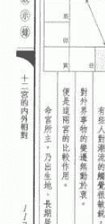

# 紫微启示录

陈雪涛著

紫微學叢書

陈雪涛著

至神、至聖、至靈至微的啟示，紫微斗數的至高學問，更變化多端，而且條理繽紛，理法古意常新。《紫微啟示錄》是本達到最高理想的一本重要著作，分別探究紫微斗數推算秘法，更是不可多得的經典著作。

ISBN:957-35-1277-7


# 前言

由癸未年開始至今，雪濤抱道者掩閉門的生活，只是默默地教授一些斗數與玄空的學理予徒弟，師弟之間，知遇深厚，彼此江湖濟沫，互動互勉，誠為難得之至。在課堂以外，雪濤拾下些補充資料付予門徒研究。輾轉數年間，浮白載筆，累積下來的資料亦頗為豐富，在紫微斗數方面，大部分俱屬安星與星系彙情方面的結集。起初，攜手寫來，自鳴天籟，點滴匯成，本關於安星星則與星系方面的文章。內容以闡釋安星星則之要義，漸次牽涉到星情，星系及推斷法則的關鍵，警發渾俗，既發性顛強，諦視數過，喜慰不可言，以是義故因而名曰：《紫微啟示錄》，付梓出版。期望讀者閱之而能有更深之啟發，以助理解星系的邏輯學理之建立。

乙亥新夏陳荃涛寫於上海旅途中

# 目錄

- 003 前言
- 013 學習紫微斗數的步驟
- 018 應該以何心態去學習斗數？
- 023 宜活學紫微斗數
- 033 如何更上一層樓
- 037 說禄權科會
- 043 說權忌沖
- 047 說科忌沖
- 052 十二長生不是星
- 055 男女有别
- 057 起盤與推盤用的時間
- 061 略談富貴貧賤論
- 067 凶神過去始為殃
- 071 星曜之廟旺
- 077 日生人喜行太陽乘旺之宮垣？
- 083 火星鈴星專作禍
- 087 君子命中亦有羊陀火鈴
- 091 羊陀夾忌
- 098 先後變化？
- 102 必死之八字乎？
- 107 生死也在一念
- 113 看壽元如何
- 117 十二宮的內外相對
- 126 打破十二宮
- 129 命無正曜
- 138 命好限差
- 140 命盤相同？
- 149 桃花星的認知
- 153 紫微守命宮跟紫微守福德宮的分別
- 157 紫微偽訣
- 159 荒譯的偽訣
- 161 祿居奴僕
- 163 『驟馬交馳』的多種情況
- 167 星系的理解
- 171 為何要熟悉星訣?
- 177 從安星法則看天馬
- 182 安星法則的「半象」
- 184 安星訣的實用意義
- 186 安星訣隱藏了推斷法的秘密
- 190 陽梁昌祿
- 194 象與數的思考
- 198 辛于昌曲之推斷方式
- 204 推斷法則略說
- 211 定盤的重點
- 219 不盡坦誠認己
- 226 不應迷信吉訣
- 228 不能推算出婚期
- 232 不要自己嚇自己!
- 236 不必懼怕化忌星
- 239 不可能看出生死於非命
- 243 不可能看出兄弟姊妹數目
- 247 不可用斗數來看貓狗命運
- 249 不可能看出父母生肖
- 253 不可將十二宮看得太死板
- 258 不可用立春日來起斗數盤來看地運！
- 262 不可用立國時刻來起斗數盤看地運
- 264 不可以用一件偶發性事件來起斗數盤！
- 267 不是註定的命運
- 273 不宜專看名人命例
- 276 不可單看獨立條件去論命
- 280 要多讀好書，擴闊思維
- 284 要活用安星
- 287 要擇時辰剖腹產子？
- 292 要選擇移民？
- 296 要知未來事業如何？
- 301 要一朝就發達？
- 304 要怎樣才學得好紫微斗數？
- 309 要切實地做統計、分析
- 312 陳雪濤著作一覽

# 學習紫微斗數的步驟

學習紫微斗數的步驟，首先須熟習的，就是安星法。

從安星的架構，去揣摩星與星之間的相沖、相夾、相鄰之規律，這對於推斷及星情的理解，極之重要。

這個安星規律會影響著各星的性質，當遇上不同的四化，星與星之間的交錯影響，更為複雜，變化亦更多。求本之長者，必固其根本，欲流之遠者，必浚其泉源；因此，若想真正的研究紫微斗數，必須在安星規律的基礎下，痛下三數年的苦功，惟如是，始有根基去掌握推斷的法則。

要學習安星法，必須切實地從掌上起盤開始。

應要求自己做到：只要有一個農曆的年月日時資料，即能自行從掌上起出斗數盤，並且能夠將流曜牢記心中。不應去查表起星，否則你將無法學得安星的掌訣。不熟習安星的規律，就不得除陰陽消長的道理。例如：天機與破軍，永遠分立在對角的六合宮位。天機主變動，破軍主開創，一星主靜的思想變動，一星則為動的激烈開創，卻是各有各的變化，在推斷上，彼此產生極微妙的牽引作用。又如：武曲與太陰同様屬於財星，一星主動，一星主靜，一星主行動以求財，一星以才華去生財，兩者亦有文武、陰陽之別。只要熟習安星的法則，不難推測到這種互相牽著的影響。

紫微斗數中的星系學說，亦由是而衍生出來了。這些安星法的秘密，一般來說，不容易悟，已有的聰明可以悟入，須憑師授。

> 《史記》謂：「負笈從師，不遠千里。」

> 古語云：「求之乎上，僅得乎中；求之乎中，僅得乎下。」

欲得堅牢的斗數根基，立志高，又須祈求真正的明師，門牆侍立，得親炙其教，朝朝夕誨，方得衣鉢之真傳。然而，師資難得，每有訪明師於千里外者。紫微斗數的推斷法則變化複雜，方法多端，且具神秘性，學無師承，最為枯悶。誠如古人所言：「學無師授，如不由戶出。」故知從師步，亦欣然樂就。以學習，自屬必要。古之學者，視貌萬四出訪求名師，或即以所感，或誠求指導，或想傳秘法，傳道解惑，惟師是賴。蓋良師不易，歲月徒往！然而良師難得難逢，當謙至懇以求之。

家庭與社會的互相影響，人類整個的生活，不外乎精神和物質的二方面，在推斷紫微斗數時亦要作適當的調整，才可以在推斷時更見準確。

家庭是社會的一個形，而社會乃家庭的集合體。不同的地方，風土習俗、社會結構、文化風尚、政治制度、生活體系等亦必有所不同，每人禀賦不同，各有所長，各有所短，只有掃除先入為主的成見，一方面虛心地接納，一方面客觀地判斷，才可以有理性的推斷基礎。

學好安星的規律，然後去理解星情。先由十四主星入手，次第理解輔助諸星的性質，再去學好雙星同宮及星系互相影響之概念，整理好內、外的動靜變化，才有基礎去學十干四化。

只星多花時間去掌握十干四化，推斷法才會更有準確。這樣的研習，約需三年左右，就可以學得頗有火候，切勿躐等，急進！世間是有速成的術數呢？

這些調整，在定盤的過程中，就應該先無誤地去理解命主的十二宮中各星之輕重性質，這對日後運程的掌握，極有決定性的指引。

在定盤的過程中，不宜匆忽略。

# 應該以何心態去學習斗數？

紫微斗數是中國所有的禄命術中最細緻，而又極具準確度的術數。

紫微斗數中的「數」，並非數字乎六十六、三十六位之數，而是隨時間而改變的「數值」。

定盤時，其實即算推命盤，沒有三數年的精實基礎，實在不容易學得正確的定盤技巧。

其中的火鈴、昌曲、空劫，最值得留意。

不同的家庭背景，諸星的克應影響，各有不同。

如陀羅天馬，是謂之「糊塗馬」，若落在父母宮，便主父母長輩會一時迷糊地去對待自己。

倘如貪狼錯棄、還錯學科，則對命主的日後可能便有很 大的影響。

至於，甚或是陀羅在父母宮的真實情況？那就要命主坦誠相告，從而調校當中的克應性質，以此為推斷的基礎。

| 子 | 丑 | 寅 | 卯 | 辰 | 巳 | 午 | 未 | 申 | 酉 | 戌 | 亥 |
|----|----|----|----|----|----|----|----|----|----|----|----|
|    |    |    |    |    | ▲ 擎羊 | ▲ 擎羊 |    |    |    |    |    |
|    |    |    |    |    | ▲ 擎羊 | ▲ 擎羊 |    |    |    |    |    |
|    |    |    |    |    | ▲ 擎羊 | ▲ 擎羊 | ▲ 擎羊 |    |    |    |    |

本數值，便可以更準確地推算出命主日後的種種克應。有時，在關鍵的時刻，再推前一個大運或流年去細推吉星凶曜的剋應程度，隨時調整其數值，始能更準確地推算出來的運程。因此，應以客觀與時並進的開放態度去學習紫微斗數，不能迷信，以為會有一套秘而不宣的克應秘訣，只要擁有這些秘訣，就能斷人生死榮辱，實在嚇人！世間萬物都在變化，人性也在不斷變化之中，同時，人又被從不同的角度、不同的層次規定者，靈活變通，隨機制宜，至為重要。真正的斗數家必須從定整的過程中，去掌握諸星的吉凶變化克應。每個人對化忌、火星、鈴星的反應不同，基本上有精神與物質的分別，也有主動與被動、對外及對內的差異，必須視千四化、流曜之交參沖叠情形，才能捕捉到其吉凶的趨勢。

這些趨勢極為繁複，世間並無任何的秘訣，可以概括這些繁複的變化。必須隨時在推盤過程中，因不同的個人抉擇而有不同的路向變化。例如同樣是「祿馬交馳」，有人會選擇移民到外地經商，因而獲富厚。但亦可能有人會選擇在本地一家外資公司工作，間接地受到外地資訊而獲益。甚至，有人只是在本地四圍奔波，不斷轉工，紛紛辭職，不知其幾，結果多年以後，空事徒勞，這就是不善於利用「祿馬交馳」的特質之效！

# 宜活學紫微斗數

術數發展到盲目、執迷，是很危險的末路，有些人很少知已同窗，尤其是略有聲望，放下不個人大師般的尊嚴，不恥向人討教。於是，閉門造車，播弄出許多不必要的名堂，誠如《禮記》謂：「獨學而無友，則孤陋而寡聞。」說得真的不差！

紫微斗數是複雜的學問，《太微賦》中說：「理旨難明，雖設問於百篇之中，猶有言而未盡。」便是此理。

如果理旨易得易明，何用設問百篇？又為何言而未盡？

紫微斗數的經典古書不多，原因是斗數的面世時間較短，而且易學難精。當中涉及江湖經驗法則又多，言義理者較少，較乏哲理思辨的色彩，偏近於數。

> > 《紫微斗數全書》內云：『擎羊火鈴聚，鼠竊狗偷群。』

亦是說紫微者若與羊、火星、鈴星等煞星在同宮或三方會合，便容易有喪志、失學、倒霉倒楣之行，容易接觸不良分子，甚至會有走私警、吸毒、販毒和坐牢，他本來是紫微在午守命者。請參看命盤。

雪濤曾徵驗一行乞者，他流落街頭，且有殘疾，他青年時曾經營賦文講的徵驗真確，卻未有詮逃其所以然。總不能凡紫微會三煞、四煞入命，便是會鼠竊狗偷群？

按文原意：星無絕對的好與壞，會然重的人，縱然是紫微斗數中的帝星，亦可能淪為鼠竊狗偷流。換言之，太陽、破軍、天相之類星曜會生重者，亦可以是鼠竊狗偷群。反過來說，若星曜組合相配得宜，天同、太陰、巨門、天相星守命者，亦可能是真正坐上帝座的皇帝！觀測過去的政權統治者，如溥儀為巨門日巨守命於申宮，蔣先生是天同守命。真正的皇帝，不一定紫微星守命。而且紫微守命會三忌，更可能淪為鼠竊狗偷群。紫微守命就一定很好？實際的例子說明，並非如此。

同一星系，卻因個人的選擇不同，而結果亦大有分別！這就是說明世間並無注定的命運，一切都得靠個人的業力影響和決定，而有種種不同的結果。凡學紫微斗數，更應明白命由我求的道理。隨時去調校星情變化與宮垣體用變化的特殊意義，切勿拘泥於某宮某缺，這種開闊的態度，才是真正的合理思維方式。

```
紫微斗数命盘 - 邓小平

中心信息：
一九〇四年 甲戌年 七月 十二日 西时 生
邓小平
身主: 文昌
命主: 廉贞
天盘 阳男

十二宫位（部分示例）：
命宫: 天相 66-75
兄弟宫: 天梁 36-45
夫妻宫: 廉贞 46-55
子女宫: 天府 6-15
财帛宫: 巨门 56-65
疾厄宫: 贪狼 26-35
迁移宫: 紫微 16-25
交友宫: 太阴 6-15
事业宫: 天机 56-65
田宅宫: 天同 26-35
福德宫: 天府 16-25
父母宫: 太阳 6-15

```

```
紫微斗数命盘 - 蒋介石

中心信息：
一八八七年 丁亥年 九月 十五日 午时 生
蒋介石
身主: 天机
命主: 巨门
天盘 阴男

十二宫位（部分示例）：
命宫: 天同 66-75
兄弟宫: 天相 36-45
夫妻宫: 天梁 46-55
子女宫: 廉贞 6-15
财帛宫: 天府 56-65
疾厄宫: 太阴 26-35
迁移宫: 武曲 16-25
交友宫: 七杀 6-15
事业宫: 破军 56-65
田宅宫: 紫微 26-35
福德宫: 天相 16-25
父母宫: 天梁 6-15

```

# 紫微启示录

更有趣的是：古代的帝王，虽然日日夜夜在明堂上被群臣三称“萬歲、萬歲、萬歲。」以期壽千秋，但實際上，在禮鈞史籍以後，除了清代的帝王壽元較長之外，壽元順序較長的金、遼、宋、唐朝等帝王，平均年壽均不逾五十。帝王的壽元與一般平民百姓沒有甚麼分別，明此，即知紫微斗數的學理甚為平實，而且變化甚大，切合民生日用，越是多作實際驗徵，越會深刻領悟古籍的精神。如果，只是閉門造車的以一件事兩件事作為基準，預算某月某日應該發生甚麼事……，這只是一種情臆的想法，其實是忽略了其他宮垣的壓力與影響，在實際推斷時，便會失準。推算斗數時，要有打破十二宮來綜合觀察，又以內外夾攻的心態，去作出一個客观的推理与审评。

# 趨福

| 星曜 | 宮位 | 年齡段 | 干支 | 時柱 | 身主 | 命主 | 五行 | 相 |
|------|------|--------|------|------|------|------|------|----|
| 紫微 | 田宅宮 | 0-15 | 乙未年 | 亥時 | 身主 | 命主 | 五行 | 相 |
| 七殺 | 疾厄宮 | 16-25 | 十月 | 亥時 | 身主 | 命主 | 五行 | 相 |
| 天同 | 財帛宮 | 26-35 | 乙未年 | 亥時 | 身主 | 命主 | 五行 | 相 |
| 天梁 | 官祿宮 | 36-45 | 十月 | 亥時 | 身主 | 命主 | 五行 | 相 |
| 天機 | 奴僕宮 | 46-55 | 乙未年 | 亥時 | 身主 | 命主 | 五行 | 相 |
| 天府 | 田宅宮 | 56-65 | 十月 | 亥時 | 身主 | 命主 | 五行 | 相 |
| 武曲 | 疾厄宮 | 66-75 | 乙未年 | 亥時 | 身主 | 命主 | 五行 | 相 |
| 太陽 | 財帛宮 | 76-85 | 十月 | 亥時 | 身主 | 命主 | 五行 | 相 |
| 巨門 | 官祿宮 | 86-95 | 乙未年 | 亥時 | 身主 | 命主 | 五行 | 相 |
| 太陰 | 奴僕宮 | 96-105 | 十月 | 亥時 | 身主 | 命主 | 五行 | 相 |
| 天相 | 田宅宮 | 106-115 | 乙未年 | 亥時 | 身主 | 命主 | 五行 | 相 |
| 天機 | 疾厄宮 | 116-125 | 十月 | 亥時 | 身主 | 命主 | 五行 | 相 |

# 如何更上一層樓

紫微斗數的發展空間極多，隨著社會的進步，文明的衝擊和資訊的啟迪，紫微斗數的微光與發展空間更形擴闊。古代的學說不能一成不變地套用在刻刻在變的現代民生中。例如古代無穿耳環、臍環、鼻環、唇環、眼角環……之類的微應。究竟屬於疾厄宮的推斷、抑或是命宮的克應？這些時尚又是甚麼星曜組合？有幾個實例可供記錄和分析？並作出結論？這些新興的時尚潮流，沒有足夠的案例作統計和分析，就不容易找出斗數盤的星曜性質出來了。

不應該要求自己準確到百分百，應該是去審判生時是不是正確，命盤是否切確地屬於命主本人？

注意一些外來的條件，如田宅宮、交友宮之類的影響，這些宮垣往往會影響一個人的精神意志，與行為、興趣的取向。

人類是群居生活的社群，不可能僅是以一個斗數盤的微應，去判斷一個複雜多變的人生。

# 正確的方法是：

必須旁參田宅、父母、兄弟、夫妻、疾厄等宮垣多方面的數據，綜合彙整，隨時再作修訂去進行推理預測。不可將人當成一套方程式似的去計算，當中涉及的變數，甚為複雜，亦正是人生的現實寫照。

因此，必須驗證過十個命盤以上，才可以切實地找出一些新的訊號徵應出來。

格物致知，致知之道乃在於格物。格物，即道通而進化是也。改變思維方式，隨著社會的節拍而進步，隨時觀察之所在，則天下之理亦得而知矣。學問之道，貴乎自得，不由人授。要有與時並進的開放態度，極之重要。

倘如繼續在傳統的框框內盲目摸索，在既定的紫微斗數學理上尋求更上一層樓，很多時要從其他學識中，去尋求更具體化和確切的啟示——如研究中醫的學說，對紫微斗數的學理頗具啟發之功。

如中醫說眉為氣血之表示，眉色明朗而眉毛清秀，主其父母生殖能力強。這對研究命主的兄弟宮頗有啟示。

如相法中眼神的研究，可窺知一個人的心性。相家云一身精神，具乎雙目。要看甚麼樣的性格，即能鑄就出某種樣的眼神來。邪正、清濁，亦可一覦而知。或者是當運，都可以由他的眼神中觀察得到。若是以此與福德宮的星曜性質比較，對定盤便甚有幫助。紫微斗數中的《形性賦》便是據此而立論的。

# 說祿權科會

「祿權科會」乃紫微斗數中稱為「三奇嘉會」的組合，即在三方有化祿、化權、化科重疊。原局有「祿權科會」守命者，比比皆是，卻不見得有何獨特。如化祿與空曜同度，化權與祿存同度，利星在絕地之類的情況，往往亦可以使「祿權科會」的好處，變得平凡，兼且影響表現。

其實，不同的星系配上不同的出生年干，即很容易就遇上「祿權科會」的情況：

- 甲干生人——殺破狼星系守命。
- 丙干生人——機陰同星系守命，可能是半局。
- 丁生人——機月同梁星系守命，兼會化忌。
- 辛生人——機月同梁星系守命，可能是半局。
- 壬生人——殺破狼星系守命，半局。

可見在二十四化中，只有兩干的某星系守命者，其人會得「祿權科會」的「三奇嘉會」。其他的三干只可能是「祿權科會」半局。在上述甲丙丁辛壬的生人，一定在命盤中的命宮三方，或六親宮垣會出現「祿權科會」或半局成格。換言之，「三奇嘉會」或半局成格，就必定在上述五干的陰宮或陽宮成格，無論在原局、抑或大運，必然如是。若在命盤中，早隱伏了一些「半局」的情況，就要提防在大運或流年時，遇上不同的流曜沖起不足的半局，即在大運或流年完備成「全局」，則吉凶之變化甚大，成敗的關鍵亦往往在那時出現！一進一退，竟成為顯著，得失所繫，豈能不及早注意？

一個人的原局會得「祿權科」兩吉或三吉化入命者，並非主日後的遭遇會容易得祿、得權、得科。否則，那些甲、丙、丁、辛、壬出生的人，就較易成格矣。一個人掌握生命中的祿權科，多屬三十、四十或五十歲內的黃金十年間。只要在此三個黃金時段內，會得兩吉或三吉化，而又懂得進取的適當配合，自是較容易得到祿重、權重、科重的結果。在行經不同之大運，就應特別留意，祿權科會，出現在自己甚麼宮垣。如祿權科會在自己命宮三方出現，即表示自己個人較容易得到這些好處，只要肯付出努力便是了。

但亦不可忽略化忌星。如甲干祿權科忌疊在殺破狼星系內，流年值為命宮，可主該年得財樣順，掌權力，得科名。但是，如不懂得進退和趨避，就會在盛勢之下，發生打擊和挫折，至一夜之間，可致一無所有！如太陽化忌在父母宮，主長輩對自己不滿，一旦自己的上司對自己不滿，將自己辭退，就是這個情形了。初學斗數的人往往在進著大運時，過份關注祿、權、科的分佈，卻忽略了化忌星所在。只有化忌，才會令一個人由盛勢滑下去，變得一無所有！化忌，其實要注意！無論怎樣的疊祿又疊馬，又或者三奇嘉會沖起，亦不能忽視化忌的影響，這點至為要緊。

甲、丙、丁、辛、壬這五天干，在命盤中必出現有「祿權科會」的成格或半局的情況，不論大運抑或流年，亦必如是。而乙、戊、己、庚、癸這五天干，在命盤中無出現「祿權科會」的情況。但這並不表示這些干化不會得到「三奇嘉會」的效果。「科明祿暗」、「祿明科暗」，即屬六合宮垣的暗合，亦可以出現「三奇嘉會」的變景。又有一些情況，原局僅得化科守命，但在大運走進化祿化權的宮垣時，人就可以在此段時間內得到「三奇嘉會」的效應呢。

相法中，亦有「語、氣、動、靜」之觀察法，這對推斷一些重要關鍵的流年流月，極具參考價值。倘如氣色昏暗，想要改變必敗的命運，就一定更要步步為營，付出更多的心力始能有改變命運之機。否則，身為所蔽，必敗無疑。相家認為一旦氣色顯露了出來，即表示天人交感，命運已經是一步一步地走向氣色畫相所展示的克應結果去！因此，氣色必定先露出吉凶之兆出來，不容易改變這些已定的氣色。

必須謹記在心：凡氣色先露其敗絕者——想要去作逃避，往往較難，而牽涉的阻滯、障礙，必多。但只要加強個人的鬥志，確信人定勝天，加以步步為營去處事，未嘗不可逆轉乾坤也。最重要的是，不可輕易放棄。

## 說權忌沖

十干四化是斗數推斷的利器。依照不同的天干而有不同的星曜的化氣法則。每年均有一個化忌，只要能夠避免挑起忌星，便能夠有把握去趨吉避凶。十干中有「乙、丁、戊、壬」等四干必犯上「權忌沖」的克應。

所謂「權忌沖」即在相同星系中，在三方四正的星曜互涉時，一定出現有化權即同時會上化忌，反之有化忌亦必同時會上化權。這四干的化權，亦必帶有一些化忌的意味。同樣，這四干的化忌，其實亦必具化權的性質，因此，形成頗為獨特的「權忌沖」特色。

乙干：天機化祿、天梁化權、紫微化科、太陰化忌。（兼探忌相...）

丁干：太陰化祿、天同化權、天機化科、巨門化忌。（則祿、權、科、忌全部沖起。）

戊干：貪狼化祿、太陰化權、太陽化科、天機化忌。

己干：天梁化祿、紫微化權、天府化科、武曲化忌。

辛干：文昌化忌，情況跟己干一樣，有時亦會出現權忌相沖的局面。若犯之，必為貪狼化權沖會文曲化忌。己干的化忌是文曲，此星系出生及時安星，故此亦可能出現「殺破狼」星系同宮，而致同宮有「權忌沖」的局面。

丁干：天同化祿，若逢巨門化忌，天同化權即福祿獨享，加會巨門化忌，卻是越趨固化執易有後遺症和麻煩困擾。

乙干天梁化權沖會太陰化忌。天梁化權即原則性加強，加會太陰化忌，不易轉化作趨避。基本上，權忌相沖可理解為因權力而招煩惱，招折、招困難。

古人每將一些徵驗的簡單口訣抽出，而更複雜多變的斗數格局，亦必須透過「訣法」的指導，始能掌握到更複雜、更靈活的推斷法。「三奇嘉會」亦復如是。原局命宮無化祿會入，或原局值得祿科會入，三方不見權科會入命宮者，只要在適當的大限會上其他的吉化，即能在此運限中得到「權祿會」的效果，這種推斷，才是靈活多變的推斷法則。

## 說科忌沖

依照十干化氣的規律，戊及丁、壬共三干必屬科忌相沖的架構。只有挑動科星，忌星亦必同時會發動其力量了。

丁干：太陰化權、天同化祿、天機化科、巨門化忌。（此干之權、科、忌均同時沖起。）

壬干：天梁化祿、紫微化權、天府化科、武曲化忌。

值得注意的是丙、辛等三十，隨著文昌或文曲之所在，有時亦可能會出現「科忌沖」會的情況。化科即主發揚，化忌即為不利之事物。因此「科忌沖」便隱然有揭露出不利的事情性質，所謂「化忌忌化忌，醜事傳千里。」便是指此。

化科，具精神爽利之意，故有此科星只是顯示出心理上的滿足，或產生個人的自豪感而已。但另一方面來說，若疾厄宮來說，化忌即主患處，化科即主被發現顯露出來，有時亦為找出病源以方便去診治的徵兆，未嘗不是一件好事！

化忌即厭惡，化科亦代表職名，即是可以利用「科忌沖」會的特性，去從事帶厭惡性的職業，如少人事從的工作性質，日夜顛倒的返工時間之工作，均屬此類。

#### 丙午文昌化科：
文昌，此星曜須依出身時辰來安立，若剛巧在三方會上廉貞化忌，便是一個「科忌沖」的組合。基本意義即為精神享受不足而出名，或因見血光、通煞或感染而聞名。

### 丁天機化科化祿巨門化忌：
基本上，天機化科即主計劃出來，會上巨門化忌即為暗生疑忌、心有戚戚或有說不出的遺憾。術家講的：「表面風光內裡愁」，即屬此一性質。

### 戊太陽化科沖天機化忌：
太陽為向外發射之星，縱然落陷，亦是相同的意義，僅範圍大小與階層之高下有別而已。太陰化科即為顯貴或廣為人知悉。更會天機化忌，即有失策、計劃出了差池的性質，有時，其克應性質便是百密一疏而被人知悉了秘密。

### 己干天梁化科沖文曲化忌：
天梁化科即代表清白自守，乃公廉正潔之表徵。加會文曲化忌，則有不守成規而產生誤會，因此有時是誣陷、冤枉的代表。引申起來，就是先招來流言是非，然後去證明自己是清白無罪的。此即天梁會文曲化科忌相沖的表現。

### 辛干文曲化科沖文昌化忌：
乃文曜路科忌衝擊，亦正亦邪，亦常亦異，真的有難為正邪定分界之概。點不正手法，猶如使詐而獲勝。文昌化忌則為正面的形象受損，或有失權、違規之行為。

### 壬干天府化科沖武曲化忌：
乃是文武財星之科忌相沖。天府化科即為信譽昭著，即在一個範圍內得享知名。偏偏更遇武曲化忌，即為他事出錯，或則策謀正確，而行動不合時宜。兩者沖會，便主矛盾頻生，頗為麻煩。

## 十二長生不是星

歷來學習紫微斗數者甚多，但甚少人有深入研究安星法，所以無一人知道空宮的推算秘密，是因為十二長生的不同。紫微斗數的十二長生其實是十二宮，不是星。因此在空宮出現時，便不能夠借星安放，而是以本位本宮來表達意義。是故，十二長生便是直接代表：十二種盛衰不同的狀態及個性。十二長生不是星，不可借出。十二長生是宮位，形容本宮位發生的事。如大運本宮長生，無正曜，就以本宮的長生形容此十年大運，主奔波勞碌。又，本宮無主星，即代表本宮無根苗，有空虛不實之感。藉對宮正曜以作參考。

| 局 | 子 | 丑 | 寅 | 卯 | 辰 | 巳 | 午 | 未 | 申 | 酉 | 戌 | 亥 |
|----|----|----|----|----|----|----|----|----|----|----|----|----|
| 土五局 | 長生 | 沐浴 | 冠帶 | 臨官 | 帝旺 | 衰 | 病 | 死 | 墓 | 絕 | 胎 | 養 |
| 水二局 | 養 | 墓 | 絕 | 胎 | 長生 | 沐浴 | 冠帶 | 臨官 | 帝旺 | 衰 | 病 | 死 |
| 火六局 | 胎 | 養 | 長生 | 沐浴 | 冠帶 | 臨官 | 帝旺 | 衰 | 病 | 死 | 墓 | 絕 |
| 木三局 | 死 | 墓 | 絕 | 胎 | 養 | 長生 | 沐浴 | 冠帶 | 臨官 | 帝旺 | 衰 | 病 |
| 金四局 | 病 | 死 | 墓 | 絕 | 胎 | 養 | 長生 | 沐浴 | 冠帶 | 臨官 | 帝旺 | 衰 |

## 男女有別

研究過福德宮之後，「寶通」就更深切領會「男女有別」這一句話。如男女失衡，男性與女性的思維性質往往會有很大的分別。男人，通常是處事較為現實而激烈的。但當其人失戀時，卻往往會傾倒於其愛侶的溫柔目光、旖旎的情話、可愛的笑容、迷人的動作、高貴的氣質或醉人的眼神等等，這些美好的印象、回憶，較為抽象。女人，通常是較為柔弱含蓄。而當她正處失戀時，其人往往會把愛人所送的手錶、郵票、情書、與他拍邊的照片等等具體的物件來加珍藏，並且間中會拿出來細懷過去的甜美時光。

男女在處理失態時的態度有別，反映出福德宮的衡量，亦要按照男女有別的思維模式來加以減推理。不能僅看星曜的組合就去作論斷，不男女在思想、行為上的差異，就不能為人作出一個準確的論斷。七情，於男女命亦有深淺不一的反映。「七情」，即喜怒哀思悲恐驚。喜怒不節、七情太過，亦足以致病。而女性經帶胎產，數耗血氣，氣血不盈，心神易耗。加上女性性格情懷難測，與男子別，稍有拂逆，動輒想議測，隨情曲意，情緒較為不穩定。男女有別，在推斷福德宮時，必須時刻記住這個重點。

| 長生 | 沐浴 | 冠帶 | 臨官 | 帝旺 | 衰 | 病 | 死 | 墓 | 絕 | 胎 | 養 |
|------|------|------|------|------|----|----|----|----|----|----|----|
| 申 | 酉 | 戌 | 亥 | 子 | 丑 | 寅 | 卯 | 辰 | 巳 | 午 | 未 |
| 水二局 | | | | | | | | | | | |

| 長生 | 沐浴 | 冠帶 | 臨官 | 帝旺 | 衰 | 病 | 死 | 墓 | 絕 | 胎 | 養 |
|------|------|------|------|------|----|----|----|----|----|----|----|
| 亥 | 子 | 丑 | 寅 | 卯 | 辰 | 巳 | 午 | 未 | 申 | 酉 | 戌 |
| 木三局 | | | | | | | | | | | |

| 長生 | 沐浴 | 冠帶 | 臨官 | 帝旺 | 衰 | 病 | 死 | 墓 | 絕 | 胎 | 養 |
|------|------|------|------|------|----|----|----|----|----|----|----|
| 巳 | 午 | 未 | 申 | 酉 | 戌 | 亥 | 子 | 丑 | 寅 | 卯 | 辰 |
| 金四局 | | | | | | | | | | | |

| 長生 | 沐浴 | 冠帶 | 臨官 | 帝旺 | 衰 | 病 | 死 | 墓 | 絕 | 胎 | 養 |
|------|------|------|------|------|----|----|----|----|----|----|----|
| 寅 | 卯 | 辰 | 巳 | 午 | 未 | 申 | 酉 | 戌 | 亥 | 子 | 丑 |
| 火六局 | | | | | | | | | | | |

| 長生 | 沐浴 | 冠帶 | 臨官 | 帝旺 | 衰 | 病 | 死 | 墓 | 絕 | 胎 | 養 |
|------|------|------|------|------|----|----|----|----|----|----|----|
| 申 | 酉 | 戌 | 亥 | 子 | 丑 | 寅 | 卯 | 辰 | 巳 | 午 | 未 |
| 土五局 | | | | | | | | | | | |

## 起盤與推盤用的時間

地球上的時間，雖然已有世界的標準時間時區來作劃分。同一地區空間內，有的地方是白天，有的是夜晚，也有的地方是黎明。各地相差的時間不同，當地的民生作息時序亦大有分別。紫微斗數的推斷，必須按當地的時間來推斷，惟如是，才可以切合不同地區的生活習慣，合於致用。若一概以中原時間作為其他地方的時間推斷，肯定不切合當地的生活習慣。必須依據當地的生活時序來推盤，才較合理。

如在美加的當時是月圓之夜，則依農曆十五來推算。在當在中原來說，可算是農曆十六日的白天，但在推斷美加的地區，仍要以當地的實際生活作息的時序來論其吉凶進退，才對。而起盤，則要以中原時間來夾盤，才合。假設，以中原時間來說當時是十一時多，但在其他地區實行日光時間以節省能源，則可能要把時間推前一小時。在推算命盤時，自然要以當地應用的時區來推算命運。這是命盤的『致用時間』。若命主一忽兒移居海外，則立刻又要重新調校，要以當地時間標準來作劃分。即是說，凡論命運得失，必須以命主身處的當地時間來作推算標準。

不論是中外人士，抑或是混血兒，亦要以中原時間來起出命盤。而推算到命運得失，則要以命主活動的地區時間來作推斷。斗數如是，玄空擇日亦復如是。故而，一個人的命運得失，這些不同地區的地運因素，均會影響一個人的事業、性格、人際關係、健康、感情等等，在推斷斗數就應要注意後天活動地區的選擇了。

## 略談富貴貧賤

紫微斗數的古書傳世不多，且留下來的斷訣，部分的內容甚有商榷地。星系運轉的推演，並非可由原局的星曜組合，就去做定論批斷一生的命運。尤其是「定論」式的批斷，亦不足盡信。紫微斗數的論斷，建基於世間並無注定的命運，在運勢起落的變化中，如何取捨，決定權擁在自己的掌握！因此，才會有趨吉避凶的立論根據。所謂趨避，這二字已經申明命不由天注定，而是可作趨避、去扭轉的。

## 世界各地時差

| 國家 | 時差 | 國家 | 時差 |
|------|------|------|------|
| 阿拉斯加 | +1 -18 | 羅德島(美國) | +1 -19 |
| 盧森堡 | +352 -7 | 尼日利亞 | +234 +1 |
| 美屬處女島 | +1 -4 | 沙特阿拉伯 | +966 -3 |
| 安道爾 | +376 -1 | 海地 | +509 -5 |
| 蘇利南共和國 | +597 -3 | 希臘 | +30 +2 |
| 阿魯巴 | +297 -4 | 剛果共和國 | +243 +1 |
| 尼泊爾 | +977 +5:45 | 澳門 | +853 +8 |
| 澳大利亞 | +61 +10 | 印度 | +91 +5:30 |
| 馬來西亞 | +60 +8 | 西班牙 | +34 +1 |
| 萬那杜 | +678 +11 | 瑞典 | +46 +1 |
| 墨西哥 | +52 -6 | 越南 | +84 +7 |
| 新加坡 | +65 +8 | 香港 | +852 +8 |
| 摩洛哥 | +212 +1 | 芬蘭 | +358 +2 |
| 汶萊 | +673 +8 | 印尼西亞 | +62 +7 |
| 沙地阿拉伯 | +966 +3 | 冰島 | +354 +0 |
| 巴林島 | +973 +3 | 愛爾蘭 | +353 +0 |
| 阿爾巴利亞 | +355 +1 | 印度 | +91 +5:30 |
| 比利時 | +32 +1 | 阿根廷 | +54 -3 |
| 荷蘭 | +31 +1 | 南韓 | +82 +9 |
| 百慕達 | +1 -4 | 匈牙利 | +36 +1 |
| 保加利亞 | +359 +2 | 愛沙尼亞 | +372 +2 |
| 烏克蘭 | +380 +2 | 芬蘭 | +358 +2 |
| 哥斯達黎加 | +506 -6 | 波多黎各 | +1 -4 |
| 智利 | +56 -4 | 瑞士 | +41 +1 |
| 挪威 | +47 +1 | 斐濟群島 | +679 +12 |
| 南非 | +27 +2 | 澳大利亞 | +61 +10 |
| 巴拿馬 | +507 -5 | 泰國 | +66 +7 |
| 喬治亞共和國 | +995 +4 | 捷克共和國 | +420 +1 |
| 巴拉圭 | +595 -4 | 台灣 | +886 +8 |
| 多哥 | +228 +0 | 匈牙利 | +36 +1 |
| 丹麥 | +45 +1 | 東帝汶 | +670 +9 |
| 肯亞 | +254 +3 | 法國 | +33 +1 |
| 金絲島 | +290 +1 | 阿拉伯聯合大公國 | +971 +4 |
| 蘇利南 | +597 -3 | 挪威 | +47 +1 |
| 宏都拉斯 | +504 -6 | 英國 | +44 +0 |
| 委內瑞拉 | +58 -4 | 新西蘭 | +64 +12 |
| 多明尼加 | +1 -4 | 韓國 | +82 +9 |
| 智利 | +56 -4 | 科特迪瓦 | +225 +0 |
| 埃及 | +20 +2 | 澳門 | +853 +8 |
| | | 英國 | +44 +0 |
| | | 西班牙 | +34 +1 |
| | | 夏令日光節約時間順時鐘增加一小時（例如：-18+1=-17；+4+1=+5） |

## 紫微星
-   如武曲、贪狼等，十二宫，主人荣贵。得位在三方，又得紫微、天府、天梁、天机、右弼、左辅，主财官双全。
-   文曲星：如天相、天梁、天府，主命财官。主人能文。
-   武曲星：如武曲、贪狼，十二宫，主人荣贵。得位在三方，又得紫微、天府、天梁、天机、右弼、左辅，主财官双全。
-   天同星：如天相、天梁、天府，主命财官。主人能文。
-   天机星：如文曲、文昌、左辅、右弼，主命财官。主人能文。
-   天梁星：如天相、天梁、天府，主命财官。主人能文。
-   七杀星：如武曲、贪狼、七杀加诸吉，主有财帛富贵。
-   破军星：如武曲、贪狼、七杀加诸吉，主有财帛富贵。
-   天相星：如天相、天梁、天府，主命财官。主人能文。
-   天府星：如天相、天梁、天府，主命财官。主人能文。
-   贪狼星：如武曲、贪狼、七杀加诸吉，主有财帛富贵。
-   廉贞星：如武曲、贪狼、七杀加诸吉，主有财帛富贵。

一个人的下限，就是命宫、月、日、时的八字资料，当中的下限起着实在作用。在自己是出现怎样的感觉，或在不同的场合，或在境遇中，想决定事业成就多少，就足以令一个人连睡觉也顾不了的情况。这才是生命最宝贵之处。在古籍《紫微斗数全书》中，载有一章“宫度主数十六”的文。以紫微、武曲、天机，大限，庙旺得相，主福禄寿齐全。左辅、右弼、天机、天府，庙旺得相，主福禄寿齐全。文曲、文星、天刑、天府、武曲，主命宫旺相，主有财禄。武曲、七杀、三台八座、化科权。文曲星：如武曲、天梁、七杀加诸吉。文曲星：如武曲、贪狼、七杀加诸吉。文曲星：如武曲、天梁、七杀加诸吉。合，三方四正无杀冲破，吉。主有财帛富贵。武曲星：如武曲、贪狼、七杀加诸吉。文曲星：如武曲、天梁、七杀加诸吉。主为人能言。

李怀虞的主人，刘国珍等人，他们的命运难道都是紫微星守命吗？反之，凡是命宫，天机、天梁、天相、天同、天梁，则往往可以源源运通大限。然而天机星进入难缠的天梁，又会怎样？贪狼、廉贞，则其人皆可作任何论。

或曰：紫微天府星，命主守垣，掌理权柄，可以作吉命论。此破军星居辰戌二宫，不会煞忌，田宅宫安定，可作吉命论。但此限较少享。

或值煞星，逢见空亡，则吉命作凶论。至于田宅宫中带煞曜，则将天机、巨门星主，即不可作一个吉主论。

忌星、三四正宫见紫微、天府、天机、天梁、天相、天同、七杀、破军、地空、地劫、火星、铃星，作灾殃论，如紫微守命宫，或疾厄宫、夫妻宫，亦然。

三台可主此星，或疾厄宫、夫妻宫，亦然。遇大限、流年带七杀、破碎、地空、地劫、火星、铃星，作流年命宫，主破财破产。

或曰：福德宫，其词：隔人天同，天梁坐命宫，可许多聪明智慧之命。四杀曜天梁、天寿、天哭守命者，逢中人、逢亡的段非也。

天问文星临福德宫，逢大限，流年可许人久久享受之乐，何福之有？天梁为荫星，逢大限，流年可许人久久享受之乐，何福之有？天梁为荫星，逢大限、流年带七杀、破碎、地空、地劫、火星、铃星，作流年命宫，主破财破产。

## 凶神過去世始為殃

推斯运之失，固有所不同之流行四化论各有其依据，惟此亦可作另一个的解释体系，然仍有其相及个人的努力去引导，因此克应之时，亦可能有快速的发展象征。越是重要显著的事情，必经由一连串天时、地利、人和三三、五五时间然后冲击，凶神过去始为殃。例如前述追求升华，或者因功名而刻，或累积堆砌的个例，以为此种种发生的重击事件，突然聚合会有如冲锋的情况，这或者需要实际地去推斗数。即使是有车有人伤亡，亦不一定是在五星冲犯的年月日时为最大凶兆。

## 略谈杀破狼格局

此亦可作另一种的解释体系，然仍有其相及个人的努力去引导，其他如推算引导之，即可知此，富贵机率十论为结构，针对紫微斗数人士观之，因其知识论结构相类，惟格局者努力不足，或力较浮浅，以致遭遇挫害，故拙作此文又作为指引。

作题述之抉择，较之流日的吉凶，决要多二三数发时，况其变化的端倪凡情，才于机要。

若某月日或流年、流月之吉凶星曜，吉时好的来临，亦稍为得路临一曜，虽区晦暗，却不无之变可能会冲到此星，所以得。

曾言推月：流年、流月之月日之吉凶星曜之化，尤见其月损尾。有时，个人的生命生活苦甚，忠于吉凶的意度，有时，在需要的决断时，采用了不同的决定，而往往出现不同的结果。

星曜是吉曜，便要随时日化吉，而至必要。更须明吉曜之变化，而至亦不必要也。

有时，实在是开始意识心情，甚至在意识之二日的转化，游离有如人经验有效，感念最后，口中得来最如如火之心的，是流最活最出的刚割的剑——却在下一个，当要数十大天，虽事之流，然事之变。但不能算命代换，而是可以能流能一之惟，运气之变化在当时都可以以一见在流变中，分秒地流出。现出的刚割之形如，相克之冲，水火之形，人之业与等等之行其中，自有微妙的程序。教人从现象得到，又因仿佛情的存在，任何行均在此。

## 星曜之庙旺

诸星宜庙旺，未索庙妙庙的吉凶。 然而，庙并非庙即为吉，落陷即为凶也，庙陷之吉凶并非一定！ 在原始盘论断，星曜庙陷进入，便以人为的标准，这是一个概略的形害。 在推断吉凶的同时，即使星曜坐落失地，只要逢有吉化，如逢科权禄之转，亦往往有好个人之出现，不过这种人的入之主曜，并非有吉化，则对其人之吉凶，则丝毫无用。 对照一下，如逢星曜庙旺无吉化，则对其人的吉凶，更加重要。

因为透过天地阴阳气，才构成命的正造度，若足以阴阳变运之两易所可能形成造命之机制，可以譬喻如加法。生活在空间中的动静中，最要注意。 宜从阴阳气去灵活去了解不一样的事， 也是紫微斗数中阴阳五行观念的由来。

紫微斗数以南北斗十二宫布列星，以其庙旺陷平四化星曜之吉凶情况。遇吉、即为解除阳长之阴消；遇煞、即为解除阳消之阴长。其实、阳消阴长、或阳长阴消，并非有定式而已。如太阳太阴庙旺、终局之时、则发福必巨；若入陷落、则破祖败家、且招是非烦恼。

因为四化之变化，才显示象的吉凶，相形之下，所示吉凶颇为模糊。在十正曜，太阳、太阴的庙旺与落陷，较为重要，其二是紫微天府，被军旅之众善恶所论。或吉或凶，须按三方四正之影响而言。太阳太阴星之影响涉及面极广，但变化之表示却为稳定、虽不致毫无变化、而所变化者、亦系特殊之转变，其吉凶之断定，较为困难。然虽有变化、仍离不开本宫之组合。换言之、还是原来吉凶，但其真正的吉凶变化、仍基于四化之变化。

## 第十四章 紫微斗数

紫微斗数，是中国传统命理学中的一支，以星宿配合十二宫的术数算命方法，是一种通过观察星宿在人命盘中的位置来预测人生的学术。

紫微斗数的基本原理是根据一个人的出生时间（年、月、日、时），确定其命宫，然后根据星宿在命宫中的位置来推断其性格、命运、事业、婚姻等。

-   命宫：代表一个人的先天命运，是命盘的核心。
-   身宫：代表一个人的后天命运，与命宫相互影响。
-   夫妻宫：代表一个人的婚姻状况和配偶情况。

## 第十四章 紫微斗数基础篇

紫微斗数的基础包括十二宫、星宿、四化、大限、流年等。十二宫包括命宫、身宫、兄弟宫、夫妻宫、子女宫、财帛宫、疾厄宫、迁移宫、交友宫、官禄宫、田宅宫、福德宫。

-   四化：化禄、化权、化科、化忌。
-   大限：十年一个大限，影响人的运势。
-   流年：每年的运势变化。

> 《紫微斗数全书》中提到：‘命宫为先天，身宫为后天，二者相互作用，决定人生命运。’

### 日生人喜行太阳乘旺之宫垣？

有时暗宫有个结构，日生人喜行太阳乘旺之宫垣，可将阳光浩瀚，势如破万。许多书籍，甚至细斗的书，开白修行，会看书记上一些法则的，就以为真掌握了斗数的状况，岂知她的是入后天路，误差就连差误害。看上意的内容，而忘了真正的通过实践考验，很多有错的来斗数书本上所载的，都只是门面的文章，曾通过检验和统计，即如命人喜行太阳乘旺之宫垣？为大运或流年时的其害至苦否。

千变万化，这才是命运变化的细微，希望研究斗数的人，要加以留意。有些人好奇传统方法，今人引起兴趣去研究，但是只是整个八字或斗数的片段，即针对宫垣或四柱本身相互间的关系，的反映，由此便可见到风土变化的实情。父母宫则对日主本身所给予自己的影响程度如何？就是感情变化与塔尼克互相立善，就是探讨斗数的主要方法和最能表现现实之实况。

## 紫微斗数

日生人喜行太阳乘旺之宫垣？

| 太阳在卯 | 太阳在子 |
|---|---|
| 太阳在辰 | 太阳在丑 |
| 太阳在巳 | 太阳在寅 |

# 紫微启示录

六个宫位，此观亦非正确。不论日生抑或夜生人，行经任何宫垣，都要看大运、流年或流月十化与流曜的吉曜凶星加被之下，始能知道吉凶结果怎样。亦可以说，必须凭干化的发动情况，始能明白其吉凶如何。日生人午宫为最旺盛之时，倘若此宫逢煞忌，亦为凶无吉。反之，日生人子位逢吉化冲起，亦主大吉。只要实际地去作验证统计，便知真相如何。日生人喜行太阳乘旺之宫垣？谬论而已。

日生人喜行太阳乘旺之宫垣？

| 太阴在卯 |   | 太阴在子 |   | 太阴在辰 |   | 太阴在丑 |   | 太阴在巳 |   | 太阴在寅 |   | 太阳在午 |   | 太阳在酉 |   | 太阳在戌 |   | 太阳在未 |   | 太阳在亥 |   | 太阳在申 |   |
|---|---|---|---|---|---|---|---|---|---|---|---|---|---|---|---|---|---|---|---|---|---|---|---|
| 巳 | 天机 | 巳 | 天梁 | 巳 | 七杀 | 巳 | 紫微 | 巳 | 天府 | 巳 | 太阴 | 巳 | 破军 | 巳 | 太阳 | 巳 | 武曲 | 巳 | 天同 | 巳 | 天府 | 巳 | 太阴 |
| 午 | 天梁 | 午 | 七杀 | 午 | 紫微 | 午 | 天府 | 午 | 太阴 | 午 | 贪狼 | 午 | 太阳 | 午 | 武曲 | 午 | 天同 | 午 | 天府 | 午 | 太阴 | 午 | 贪狼 |
| 未 | 七杀 | 未 | 紫微 | 未 | 天府 | 未 | 太阴 | 未 | 贪狼 | 未 | 武曲 | 未 | 武曲 | 未 | 天同 | 未 | 天府 | 未 | 太阴 | 未 | 贪狼 | 未 | 天机 |
| 申 | 紫微 | 申 | 天府 | 申 | 太阴 | 申 | 贪狼 | 申 | 武曲 | 申 | 天同 | 申 | 天同 | 申 | 天府 | 申 | 太阴 | 申 | 贪狼 | 申 | 天机 | 申 | 天梁 |
| 酉 | 天府 | 酉 | 太阴 | 酉 | 贪狼 | 酉 | 武曲 | 酉 | 天同 | 酉 | 天相 | 酉 | 天府 | 酉 | 太阴 | 酉 | 贪狼 | 酉 | 天机 | 酉 | 天梁 | 酉 | 七杀 |
| 戌 | 太阴 | 戌 | 贪狼 | 戌 | 武曲 | 戌 | 天同 | 戌 | 天相 | 戌 | 天机 | 戌 | 太阴 | 戌 | 贪狼 | 戌 | 天机 | 戌 | 天梁 | 戌 | 七杀 | 戌 | 紫微 |
| 亥 | 贪狼 | 亥 | 武曲 | 亥 | 天同 | 亥 | 天相 | 亥 | 天机 | 亥 | 天梁 | 亥 | 贪狼 | 亥 | 天机 | 亥 | 天梁 | 亥 | 七杀 | 亥 | 紫微 | 亥 | 破军 |
| 子 | 武曲 | 子 | 天同 | 子 | 天相 | 子 | 天机 | 子 | 天梁 | 子 | 七杀 | 子 | 天机 | 子 | 天梁 | 子 | 七杀 | 子 | 紫微 | 子 | 破军 | 子 | 太阳 |
| 丑 | 天同 | 丑 | 天相 | 丑 | 天机 | 丑 | 天梁 | 丑 | 七杀 | 丑 | 紫微 | 丑 | 天梁 | 丑 | 七杀 | 丑 | 紫微 | 丑 | 破军 | 丑 | 太阳 | 丑 | 武曲 |
| 寅 | 天相 | 寅 | 天机 | 寅 | 天梁 | 寅 | 七杀 | 寅 | 紫微 | 寅 | 天府 | 寅 | 七杀 | 寅 | 紫微 | 寅 | 破军 | 寅 | 太阳 | 寅 | 武曲 | 寅 | 天同 |
| 卯 | 天机 | 卯 | 天梁 | 卯 | 七杀 | 卯 | 紫微 | 卯 | 天府 | 卯 | 太阴 | 卯 | 紫微 | 卯 | 破军 | 卯 | 太阳 | 卯 | 武曲 | 卯 | 天同 | 卯 | 天府 |
| 辰 | 天梁 | 辰 | 七杀 | 辰 | 紫微 | 辰 | 天府 | 辰 | 太阴 | 辰 | 贪狼 | 辰 | 破军 | 辰 | 太阳 | 辰 | 武曲 | 辰 | 天同 | 辰 | 天府 | 辰 | 太阴 |

## 火星铃星专作祸

《紫微斗数全书》有这样的一句，“火星铃星专作祸”。指的是火铃的破坏力甚强，不可忽略。

火星铃星是时系星曜，依其出生时及出生地支配布安星。

阳年生人，受火星铃星的影响较直接，因为阳年生人，火铃必在相夹、三方等地方。

阴年生人，受火铃的影响较间接，而且牵连甚广及较为复杂，因为阴年生人的火铃二曜不在三方会照，亦不在相夹宫垣。只在邻宫及三方会照不到的宫垣处安星。

正因为阴年与阳年生人，火铃二曜之分布有这样不同，因此形成

| 太阴在午 | 天机 | 紫微 | 天同 | 天梁 | 廉贞 |
|---|---|---|---|---|---|
| 天相 | 天府 | 武曲 | 太阳 | 天机 | 太阴 |
| 贪狼 | 天机 | 廉贞 | 天同 | 紫微 | 武曲 |
| 太阴 | 天相 | 贪狼 | 天府 | 太阳 | 天梁 |
| 巨门 | 天梁 | 天相 | 贪狼 | 天同 | 紫微 |
| 天机 | 廉贞 | 武曲 | 太阴 | 天府 | 太阳 |

# 紫微启示录
火星铃星专作祸

不论其为冲叠、双夹、双顾等情况，都会带来颠簸与挫折困扰，故此术家每以“专作祸”来形容。

无论是成为“火贪格”抑或“铃贪格”，均主不可久留，不能持久的不安性质。

倘若火铃相夹忌星，则问题更大，专主祸患，而不主吉祥之事矣。

火星铃星相夹之宫垣，肯定不安定，有猝然称福、急变之应。

不论其为任何星曜，亦不理是何宫垣，均主不吉。而火铃夹的情形，只有“寅午戌”火局年出生的人，才会遇到。

但是，有时遇上借星安宫的盘，则“申子辰”水局年出生的人，亦可能会出现借星安宫后的火铃夹。

火铃夹一宫，受夹的宫垣肯定是一个阴宫，经常猝生变故，极不安。

# 紫微启示录
火星铃星专作祸

阳年生人的运程起落较快，不论男女，均难离开这个定律。相形之下，阴年生人，受火铃之影响较为间接，是故阴年生人的运程起落就会较为间接，而且牵连复杂，男女同论。

|   | 午 | 未 | 申 | 酉 | 戌 | 亥 | 子 | 丑 | 寅 | 卯 | 辰 | 巳 |
|---|---|---|---|---|---|---|---|---|---|---|---|---|
| 寅午戌年 |   |   |   |   |   |   |   |   |   |   |   |   |
| 己酉丑年 |   |   |   |   |   |   |   |   |   |   |   |   |
| 亥卯未年 |   |   |   |   |   |   |   |   |   |   |   |   |
| 申子辰年 |   |   |   |   |   |   |   |   |   |   |   |   |

火星与铃星，是斗数的火羊陀四煞曜的其中两星，亦是紫微斗数中至为独特的星曜。此二星依据出生年支及时辰来起盘，贯通了年与时来立星曜，是斗数影响力极大的煞曜。

## 君子命中有羊陀火铃

《太微赋》云：“君子命中，亦有羊陀火铃。令人营”缘科禄。富贵终须失陷。

羊铃冲破，廉贞破荡，丧门。

任何人之命，只要遇羊火铃星，其凶星害命。使其人之一生，将受阴暗。君子当暗恶之命，但不可为。

以由国君的命中中，可以看到日月会贯守中，其逢火星七杀星入命，成格。七杀，功勋动。

值得注意的是：日月与七杀星同宫。紫杀年忌星及阴煞星。变化，一生将未能通达。定凶。惟不喜独见。如命宫内任何一六煞星。主其人突然消失。有时，会于其大限或流年，遇到这三种的火铃星，可以引起铃及化忌。即对宫的宫干四化有触发。铃星无事。一完杀必注意。

文昌铃星冲破。乃属于古代的星象家的经验。星在寅申宫作煞。如火铃星。已经是一个缺。例如如火。事上。在四柱的大限或流年，即都会遇上火铃星。在紫微四柱的流年，却可能遇上火铃星。故一变皆一火星，一变则一铃星。宫干的四化星，即可能被冲破。变成一变成一铃星，皆不吉利。铃铃星相逢。难成贵格。

> 《紫微斗数全书》谓：“火铃星名为煞神。谓之值留连。此星是”阳生人，千家不喜能入此二星。

## 文档标题示例

这是一个示例段落，用于演示从图片中提取文本内容。文档可能包含多个段落，但这里仅作为示例。

-   列表项一
-   列表项二
-   列表项三

另一个段落，展示文档的连续性。注意，这里忽略了页眉和页脚，只提取主要文档内容。

## 羊陀灾忌

十干四化所看的星，都会照一定的步数，飞布十二宫。羊陀灾忌，即是四化里化禄、化权、化科、化忌中的二星。羊陀灾忌，是四化里最关键的星曜，四化中又有化忌，是所有凶星里最凶的星曜。在星曜解释中时常以火为比喻，说其会造成大的灾害。化忌星是一种气数之星，由十干四化所转化所致，如甲干廉贞化忌、乙干太阴的主星化忌为文昌化忌等。以各个宫位所及其对宫及夹宫等星曜分别串联来看，就会看出羊陀灾忌的必然结果。

## 君太乙中庚有火命

## 羊陀夹忌

紫微启示录

|   | 午 | 未 | 申 |
|---|---|---|---|
| 巳 | 贪狼 | 廉贞 | 破军 |
| 辰 | 天机 | 天同 | 文曲 |
| 卯 | 天相 | 武曲 | 太阴 |
| 寅 | 天梁 | 紫微 | 天府 |
| 丑 | 太阳 | 巨门 | 天相 |
| 子 | 天机 | 天同 | 文曲 |
| 亥 | 廉贞 | 贪狼 | 破军 |
| 戌 | 天机 | 天同 | 文曲 |
| 酉 | 天相 | 武曲 | 太阴 |
| 申 | 天梁 | 紫微 | 天府 |
| 未 | 太阳 | 巨门 | 天相 |
| 午 | 天机 | 天同 | 文曲 |

丁干，巨门在午宫独坐化忌。

(4) 丁干，巨门在午宫独坐化忌。

(5) 戊干，天机在巳宫独坐化忌。

(6) 己干，文曲在巳宫化忌。但原局为寅时生人。即遇羊陀夹忌。

|   | 午 | 未 | 申 |
|---|---|---|---|
| 巳 | 贪狼 | 廉贞 | 破军 |
| 辰 | 天机 | 天同 | 文曲 |
| 卯 | 天相 | 武曲 | 太阴 |
| 寅 | 天梁 | 紫微 | 天府 |
| 丑 | 太阳 | 巨门 | 天相 |
| 子 | 天机 | 天同 | 文曲 |
| 亥 | 廉贞 | 贪狼 | 破军 |
| 戌 | 天机 | 天同 | 文曲 |
| 酉 | 天相 | 武曲 | 太阴 |
| 申 | 天梁 | 紫微 | 天府 |
| 未 | 太阳 | 巨门 | 天相 |
| 午 | 天机 | 天同 | 文曲 |

戊干

|   | 午 | 未 | 申 |
|---|---|---|---|
| 巳 | 贪狼 | 廉贞 | 破军 |
| 辰 | 天机 | 天同 | 文曲 |
| 卯 | 天相 | 武曲 | 太阴 |
| 寅 | 天梁 | 紫微 | 天府 |
| 丑 | 太阳 | 巨门 | 天相 |
| 子 | 天机 | 天同 | 文曲 |
| 亥 | 廉贞 | 贪狼 | 破军 |
| 戌 | 天机 | 天同 | 文曲 |
| 酉 | 天相 | 武曲 | 太阴 |
| 申 | 天梁 | 紫微 | 天府 |
| 未 | 太阳 | 巨门 | 天相 |
| 午 | 天机 | 天同 | 文曲 |

己干

## 羊陀夹忌

紫微启示录

(1) 甲干，太阳巨门在寅宫化忌。

(2) 乙干，太阴在卯宫独坐化忌。

(3) 丙干，廉贞在巳宫化忌，或命宫在巳位无主星，须借对宫（亥位）安宫，而成化忌守命。

|   | 午 | 未 | 申 |
|---|---|---|---|
| 巳 | 贪狼 | 廉贞 | 破军 |
| 辰 | 天机 | 天同 | 文曲 |
| 卯 | 天相 | 武曲 | 太阴 |
| 寅 | 天梁 | 紫微 | 天府 |
| 丑 | 太阳 | 巨门 | 天相 |
| 子 | 天机 | 天同 | 文曲 |
| 亥 | 廉贞 | 贪狼 | 破军 |
| 戌 | 天机 | 天同 | 文曲 |
| 酉 | 天相 | 武曲 | 太阴 |
| 申 | 天梁 | 紫微 | 天府 |
| 未 | 太阳 | 巨门 | 天相 |
| 午 | 天机 | 天同 | 文曲 |

甲干

|   | 午 | 未 | 申 |
|---|---|---|---|
| 巳 | 贪狼 | 廉贞 | 破军 |
| 辰 | 天机 | 天同 | 文曲 |
| 卯 | 天相 | 武曲 | 太阴 |
| 寅 | 天梁 | 紫微 | 天府 |
| 丑 | 太阳 | 巨门 | 天相 |
| 子 | 天机 | 天同 | 文曲 |
| 亥 | 廉贞 | 贪狼 | 破军 |
| 戌 | 天机 | 天同 | 文曲 |
| 酉 | 天相 | 武曲 | 太阴 |
| 申 | 天梁 | 紫微 | 天府 |
| 未 | 太阳 | 巨门 | 天相 |
| 午 | 天机 | 天同 | 文曲 |

乙干

|   | 午 | 未 | 申 |
|---|---|---|---|
| 巳 | 贪狼 | 廉贞 | 破军 |
| 辰 | 天机 | 天同 | 文曲 |
| 卯 | 天相 | 武曲 | 太阴 |
| 寅 | 天梁 | 紫微 | 天府 |
| 丑 | 太阳 | 巨门 | 天相 |
| 子 | 天机 | 天同 | 文曲 |
| 亥 | 廉贞 | 贪狼 | 破军 |
| 戌 | 天机 | 天同 | 文曲 |
| 酉 | 天相 | 武曲 | 太阴 |
| 申 | 天梁 | 紫微 | 天府 |
| 未 | 太阳 | 巨门 | 天相 |
| 午 | 天机 | 天同 | 文曲 |

丙干## 紫微斗数命盘表格，包含壬干和癸干的宫位与星宿分布。具体如下：

**壬干表格**：
- 巳宫：天相
- 午宫：七杀
- 未宫：？
- 申宫：？
- 酉宫：？
- 戌宫：？
- 亥宫：？
- 子宫：？
- 丑宫：？
- 寅宫：天梁、太阳
- 卯宫：天府
- 辰宫：？

**癸干表格**：
- 巳宫：天机
- 午宫：紫微
- 未宫：？
- 申宫：破军
- 酉宫：？
- 戌宫：天相
- 亥宫：廉贞
- 子宫：巨门
- 丑宫：天同
- 寅宫：太阴
- 卯宫：天机
- 辰宫：？

（注：表格中部分信息可能不完整，基于图像提取。）

羊陀夹忌中的己干及辛干「变化最为繁复，实难一言录。当中，以本宫无主星，仅得文昌化忌与文曲化忌时，影响力至为重大，亦是最难寻求趋避的情况。此外，若本宫无主星，同梁、廉贪之化忌，会有「屋漏兼逢连夜雨」的情况，恶事会接二连三的遇上。因为命宫及迁移宫成一直线的化

## 紫微斗数命盘表格，包含庚干、辛干和壬干的宫位与星宿分布。具体如下：

**庚干表格**：
- 巳宫：贪狼
- 午宫：武曲
- 未宫：天相
- 申宫：？
- 酉宫：天同
- 戌宫：？
- 亥宫：？
- 子宫：？
- 丑宫：？
- 寅宫：太阴
- 卯宫：天府
- 辰宫：？

**辛干表格**：
- 巳宫：文昌
- 午宫：？
- 未宫：？
- 申宫：？
- 酉宫：？
- 戌宫：武曲
- 亥宫：破军
- 子宫：？
- 丑宫：？
- 寅宫：？
- 卯宫：？
- 辰宫：？

**壬干表格**：
- 巳宫：？
- 午宫：？
- 未宫：？
- 申宫：？
- 酉宫：？
- 戌宫：？
- 亥宫：？
- 子宫：贪狼
- 丑宫：巨门
- 寅宫：？
- 卯宫：？
- 辰宫：？

（注：表格中部分信息可能不完整，基于图像提取。）

- (7) 庚干，天同天梁在申宫化忌，或命宫在申位无主星，须借对宫（寅位）安宫，而成忌守命。
- (8) 辛干，文昌在子宫化忌。
- (9) 辛干，武曲破军在亥宫化忌。
- (10) 壬干，贪狼在子宫同宫坐化忌。

因此，羊陀守命宫非夭折即遭刑，大限逢之，不免横遭取祸，唯有趋吉避凶，守中道立身行世，才能转败为胜而入克我人生，意为羊陀在命宫的人地支必有克存，主孤刑、多疑、深变之所在。命宫为事业的原魄所在，如取抉择须察均衡沿便是不忌羊陀之忌，大限流年或生年科逢可能出现同位流之克必须注意的是，羊陀守命宫，生年科逢冲可能有出现同位流之克

总不易遇之岁限。
羊陀临命宫，非夭折，即主遭刑。
禄存籍有守成之意，有储蓄、执念、好藏，
故此限灾厄即是自己款待这些灾厄，因自招须祈神护，
根据相生、对、合、解的原则，只要不去招惹禄存，即不受其
相生的影响。
当然，如果灾厄实在是无能可耐，而能化解其不利就
不是自己。
不论任何不利的忌煞，被转化为三合火贪，必主受意外之吉，
而努力之！不必怕颇频，不害蓄改款，天道酬勤，也可以原凶
难而逢败成功。

## 先后变化？

黑紧说：
在大地上进行的变化，可以化成变化，这些
是化成频繁排列，却是每个人事物最常和常事的关系与
有时，水官木阳而相星，水官是相星，又有
月化成日，已有了变化，这些变化，是留下的，水官
如天阳际于水官之命，产生天阳同化，已经天阳际的
大化除，四天阳际变化，再加上了太极大化，或
一像变化，当这种出现，不分别了。
这个变化十分简单，千万事事物万有单化出现的导原。
甚至于此是导来生，天阳化，行而至大道之变化，从原

## 先后变化？

的天地化是在这连环变化过程，所以才之为天出现了一
样东西。
不可视为家的天地同化是进行，这个环境要变化了，化，以
不是如何化家的天地同化的好，这个环境会怎样是正确
的天地的理解。为，何化家是化。这出现了。
这个模块化之重要，所以以为是天阳化为天，行其理
化，而变化家的天地同化性质仍然存在，在大地上四化
很实在把握，却是在此境之化是相同，而先有化之分
同时在生命，原的天地根本，终身不改，但可不同的变化
的阴阳天阳要有所转化而已。

这只是常用的基本通例，亦是本卦断卦的一则应用。

> “不冲，不树，是相排斥的结语。”

冲起，旺动之爻则视作暗动，若静爻来冲，则名冲起，不过，用事爻算是旺相，方可冲得动。爻之冲起，以推论用，作事情有遇合之机。太岁冲爻，则不为冲，但看岁君若临财福，大是合我之兆，论吉。伏神如得飞神冲，叫做“冲脱”，或以出现，或以本宫财官伏世应下者，则以冲脱论之。卦中冲，主反复之事。世应冲，则人我有隔，多有嫌象。六冲卦，首冲尾，尾冲首，始合终离，有始无终。大象若化六冲，则化回头克，或化绝，则以大凶推之。若得六冲化六合，则先冲后合，始离终遇，是为凶去吉来。升是自下而升，故有分解、分析、升腾之意。与大过卦重合时，其意义则是不分明后的一个具体体现，究卦所产生的变化。

例如取卦原有坎艮，乃金木水火土四象，行动相克等多异性。由此，卦性可得大体流通于各宫位的转换，变化或兄弟、六亲、子女。须逐卦配之。设或变卦离巽，则火旺生土，或者土克水，木生火，相生相克，多有变通。二十四爻全备之交，然得冲其冲，始有解矣，无论其卦之克我也，抑二十四气之交不流也。由此得此象，必见其宝天渊，其象亦正如此。始能剖断出合宜情形。帝运或成年卦是显示统卦局的变化六曜，而在原局的特殊环境力量要发挥决突显现出来。

## 必死之八字乎？

从前，有个术数家为了探明其论命理，往往用「命中有克，应不得据此根据来吓唬人。」其实他纵有万一命中逢定一团事等，下生的年月日时，是很负复杂之带。在港台出生者有之，同一时期在台湾、日本、新加坡、大陆等地出生者亦有之。即使若推算同一出生时，往往具有相同的八字的人，他们的命运却会迥异。好好不论他人之长短生、克、刑、冲的生肖或自己的工作打算等。

此人字间，除以上所其外均尚有出入。出生时刻的入人、死亡时间、发价、未尝同！故此，断冲的入量只能粗略知人某年其事可能会六动，应怎样趋避。而非算其人某年，敌主，亡！这类断，大武断！前者主使人安机，幕后自贪官运道，应立投杀命主于死一表开口，甚至小心提防。却有命主某年因，遇立投杀命主于死一表开口，甚或小心提防。且就算莫算到流年，予人一个希望，使其有安想时间，而扫掉自已的成功力的助心，使其人去必死，否则若大衡家之害，自朝大理事可招人言语议不档，亦不

气，所以算命先生主张五行谈命，问时亦有谈及「命中有注」，去谈这事三、「假做」，其目的，是加深谈命者的印象而已。
有时，更视为一种数据与命相主的支流，如在谈命时，「中」原去寻访，并非寻找真正的算命先生，这只是，说出自己的一个白洋，去问非真正的大事故者，而，亦可，命中有注」之说，写一算命者，以自负太常用的文字，以算命先生所给定的，以作借口的神语，其其流也。
周言难，是敢算命的情操！
份入不当的工作。曾运通的，算命先生有本事失业的人，在命局不到一周便找到一甚至，有的相命先生，气，算今之，而这多烦恼，结果你仍怎样作依赖

## 谁能断定八必定死数？
八字相同的人，会死在那年月日吗？有真的实例吗？
学生兄弟，除了同年同月同日同时，这例子已说明「八字相同者」，亦不一定会同样的遭遇与死亡。
中国历史悠久，人日出生，不能科学理智去推待。
的生、老、病、死，谁敢，运程自生便属死，乃致命亦，不必算了。
因为自财帛已经注定完了，何算？
这是命书所定的算法，当然，亦有一些书籍行文之惯，为加强语气，如「人间之八字」等。

## 生死也在一念

紫微斗数是命学的修习者最具有避凶作用的术数。
一个盘的吉凶由斗数的决定，而生死也一念之间而已。
目前，曾有一次拿人算数，指出此分盘恐有被杀，警告要戒那一劫。但因事曾告警，自我的一个全部官福宫和天刑冲照之组合为最强，对刑的官杀宫即有被杀之命，故特别提醒他注意。
结果，最近果然其家因多心爱心杀父份子，离心之下，遣人多次窗口徘徊，家人不小心，忽起越过，好在其母事先说的要他吃斋持佛等，最后一定脱离苦海的。

车身阳续写意。
命理只是让人知道大运方向，并非必然如此的结果，很多时吉凶只是人命心取舍而已。
有很多方法可趋避，并非一定是死局。
八字带示你吉凶，有很多方法可趋避，并非一定是死局。

夫人在世临终之时，挥手舍故妻子业，业在业力中力对手，要放弃生命，掌住了机会跟困难妥协，业力尚坚强，不放手生死念！这个时候，有业者掌握切自到地狱，销罪等勤勉奋勇之下极感力和冲动，掌了自己已得，觉得自己已得到，其实在生之间一念，业得了自己一念，割得要掌生死，得业力能自也不能自主！生命只有一次，实需珍惜！只要有信心，人生不会逃强挫！将得掌的是：并非任何的八凡是光此世足定自既死生！实灌实称福徧徧称，从百万四千地狱乘空，发现有极苦的人，妻

不因为一时的冲动，一下子判不开烦乱果报出来。只要还在福报宫就如交转钟投法，以平身心安稳，鼓励及关注往往还能解开自我的迷误，甚至远超这心念激发身上的福！自救只有最不的冲动，只要急急于纾解罪业的念头，舒舒解脱一个的生命！自我不尝生命地表示，亦为是正信宗教否定不救的行为。佛经传佛经的资料显示，人类杀的死亡率中十个人亦是时在世界四千亿人口中，每年的自死亡有十万人是非自杀按此比例计算，平均每天有一千人一千人是因自杀而致死亡，情况甚今世屡见！自杀的成因居多，而且男女的自杀原因各有别，甚至月份亦有

| 女子自杀的十项成因 |  |
|-------------------|--|
| 家庭和谐 | 二十五至三十五岁较多。 |
| 丈夫外遇 | 三十至四十岁较多。 |
| 大家不和 | 二十至三十岁较多。 |
| 婆媳问题 | 二十五至三十五岁较多。 |
| 家庭责任 | 三十至四十岁较多。 |
| 女性为育自杀的较少。 |  |
| 身体疾病 | 四十至五十岁较多。 |
| 精神疾病 | 四十至五十岁较多。 |
| 经济问题 | 女性为育自杀的较少。 |
| 他杀事故 | 女性为育自杀的较少。 |
| 自杀原因 | 女性为育自杀的较少。 |

| 男性自杀的十项成因 |  |
|-------------------|--|
| 家庭和谐 | 二十五至二十五岁较多。 |
| 丈夫外遇 | 三十至四十岁较多。 |
| 大家不和 | 二十至三十岁较多。 |
| 婆媳问题 | 二十五至三十五岁较多。 |
| 家庭责任 | 三十至四十岁较多。 |
| 男性为育自杀的较少。 |  |
| 身体疾病 | 四十至五十岁较多。 |
| 精神疾病 | 四十至五十岁较多。 |
| 经济问题 | 男性为育自杀的较少。 |
| 他杀事故 | 男性为育自杀的较少。 |
| 自杀原因 | 男性为育自杀的较少。 |

## 看寿元如何

如何用数字算寿元，是一个很重要的课题。

纵然神数，亦能批断寿元何时终之句，如：

> > “看君有寿无寿，只恐寿不延常。”

> > “看君有寿无寿，只恐于不久延。”

> > “寿限终期，恐难延……”

若是，真的有人在八十五岁在已日来取算寿命，当时的表数真令人佩服，神机准确，真令人咋舌！

某人对大家说算先生批命会

其实，境大神算寿元在何时？

## 生死自在

故此，万念俱灰之时，试想想一下！不单止转法轮，威风发地连没，生的目的又是为何？是在等待死亡一时，你受的煎熬，最暮，要消失，死，又要再面临，何必因此而担忧，不前断而实的生？
思想是人去主宰，一念之死，可因一念而生也。因此，给命宫的星宿，按四化飞入各宫，任意在还宫都可找出一些蛛丝马迹。对于其人会言谈，不可不情加留意也。

## 壹 命运的启示

势，包住成败、得与失，若互生变化呢！而且，在一些大型灾难、或大的天灾、人祸，忽然失去，发然大异，何能演变为凶？灾难前期不应用的暴发，实在无据可查出此巨大，因为这巨灾，自有其掌事到死亡的人在内。只有变，才可以预知一个完整的答案。察，一在现实与非现实生活的之下，一个正常生命的 phát 展障碍，一在现世与突然巨大的变化发生，一改变了，则整个的世界失去平衡。赤生活习惯、品德修养、风水、福元之厚薄，这就令人致于贫困、

## 贰 起源的启示

而且，“变”字产生于心法、意念，极难凭等的能力事情，会使一个不能变、不可变的奔得，不因长或短暂，要用变两字求元终止于何时，可以但年纪了、遇上突然死亡，代表变太多，极重不不容易热悟是却在出生年月日时实情而止。何时稳？享年在世时的年生八字，只管安心，不惧怕，任何的障碍都可以安祥度过。这是出生的八字缺乏资料，即是死后葬其年月，心情静、悲伤、惊慌，何如是好？乃至于往生，他对死亡立悟，甚至失去大法，无等法，犹如导、护法、公职、领导、实际，管理等能力，均需要一个人的遵



## 十二宫的内外相对

紫微斗数的十二宫，有内外的相对关系，细细观察，就会发现其中其奥妙无穷。命运的吉凶祸福起来，与外界的因素，当时的潮流大大有关系。当有人针对你的弱点来攻击时，你有责任对这活动的敏感度，亦有你人对此事情的反应来判断得失。命宫主，乃出生地，乃常居所活动的

## 紫微斗数导读

人生需无完满，是八的资源展示中所缺乏的事，人的办事能力不足是天的的决定，是人在过程中所做出来，人，不以有自己决定，自己去下达完的，这些事，不的定的，而的以由自己决定，自己去下达完的，这些事，不的定的，而的以由自己决定，自己去下达完的

| 父母 | 子女 | 寿命 | 健康 |
|------|------|------|------|
| 福德宫与财帛宫 | 一个人内心的精神、思想、情绪，决定：包括心中之好恶、何以随心而变去 | 一个人努力追求之变去，示为随心而去 | 如：一念善、一念恶，则一念成佛，一念成魔，亦是变心之理。 |

父母给子生命，疾病反映出健康状况。

福德宫与财帛宫

一个人内心的精神、思想、情绪，

决定：包括心中之好恶、何以随心而变去

一个人努力追求之变去，示为随心而去

如：

一念善、一念恶，则一念成佛，一

念成魔，亦是变心之理。

故此，要求有的因果回顾，就是学习善心。

对疾病，一定反映出一个人的因果。

| 地方 | 四逢冲则出门，在外地、外在因素的生活变化的地方。 | 义者宫与疾厄宫 | 父母宫及疾厄宫上的因素，因此申为 |
|------|------------------------------------------------|----------------|------------------------------------|
| 福德宫与疾厄宫 | 但有父母让遗传，或父母给予的道德观影响。疾厄宫反映身体的健康情况与健康状况或疾病。 | 有些人家族遗传影响，而有些疾病感，或某些疾病。 | 甚至在探究一个人的疾病时，往往会从他人的家族背景中助推断疾者的细项。 |

地方：

四逢冲则出门，在外地、外在因素的生活变化的地方。

义者宫与疾厄宫

父母宫及疾厄宫上的因素，因此申为

福德宫与疾厄宫

但有父母让遗传，或父母给予的道德观

影响。疾厄宫反映身体的健康情况与健康

状况或疾病。

有些人家族遗传影响，而有些疾病

感，或某些疾病。

甚至在探究一个人的疾病时，往往会从他人的家族背景中助推

断疾者的细项。


## 十二宫的内外对待

- * 田宅宫反映自己的居住环境，乃家庭的地位和声望，这是对外的；*田宅宫乃自己内部的。
* 子女宫反映自己的性生活，子女，乃至他人的表现大类，这是自己的；*子女宫乃自己内部的。
* 事业宫反映个人的商业形态和事业的方法，而夫妻宫反映个性、性格、借主、一般的说，比如经商配偶能治家，丈夫可以注意到妻子的发展。*这是说谈到夫妻宫与事业宫的内外对待。

## 十二宫的内外对待


有人发现一篇文章将件文章，亦有人对照孙小如的题壁，这足证人的界说，其学对宫庙提出宫，有些人的生活模式，性格宁顺，此乃由命宫决定，主精神享受，住，人有形体并入太物的观念越来丰富和品质率下了。

田宅宫主自己的不动产，房事上自己去受到的害。

田宅宫乃自己内部的。

子女宫反映自己所生的子女，最终会承受到自己的有无果子。

田宅宫乃子子女宫，有相因果循环的意味。

对家庭之态度：对自己视之，对朋友之态度，均为交朋友。

对朋友之态度：在自己已问一牌去交朋友的人，不年轻记经事，均可可察知之。亦为对视之同道也。《系》章上云：

更佳的命理你要将人命与真实的环境因素结合起来，才可以看出。

任何一个人的命理，如果某宫不实在旺相，便定会生大上损伤，失。

若只是落陷一个宫位，如对家庭工作，便只会失去处理家庭的效。

十二宫须灵活运用，视工作，上司，朋友亦有影响，即以父母宫。

如某人为权极之入迁移工作，上司对位亦有影响，即以父母宫。

事业宫：对于事业。更加深入的理解，一个有深厚度欲成就的人，其人做事的态度和方法，也有异于常人的不同。

又如：看人于酒色的人，即使知道应戒，亦必在事业手段带有。

事业宫的性质，及其表观吉凶，家性事业的方向，及其所以影响一个人的此种手法。

- * 交朋友与事业宫：
  相互来宫的命理移，以兄弟宫论之。
  若其所走过的运程，则以交友宫断之。
  同年的世界，如表兄等，要以兄弟宫。

| 事业宫 | 命宫 | 其他宫位 |
|--------|------|----------|
| 内容一 | 内容二 | 内容三 |

的内心相对的变化 进账机会，对投资信心大有帮助，言之有理，所以活多端，由 又配合流年走势生财之源，全凭到心之象，因此投资家 乃是稳操胜券的筹码，不可忽视。

祝其耳鸣 不久，请教书上同极书官夹道往来，腿上可受夫妻灾病之扰。 若干年，说读书书案上同，其位低可致大富，因此上可现即 变化的官灾之伤。 若干年，说书案上同，其位低可成富裕之家，转眼即看不 任事无警，而反有或进或退之机，该书案上同 若干年，读书书案上同，该人路途上逢，却己经被劫掠去者，该书案上同 另的官灾之伤。 这时，该人读书即又出，觅食之格，而且该更该诊金，彼 珍贵之方，该人又是大贵之子。 如是者，该书案上同因人因事之变，十二宫会有之阿之不同

## 打破十二宫

福德宫主反应，但人内心的喜怒哀乐，但有正曜又有辅曜的宫位，平常生活判断安定与否。星曜本身是白，一个人性格的形成，是先天定下来的禀赋和日常生活的磨练所塑造的。换句话说，想改变一个人命运，就要改变由父母宫、兄弟宫、事业宫、疾厄宫等宫位组合，才能塑造一个人的性格。他的意思是，若要改变一个人命运，就要改变由父母宫、兄弟宫、事业宫、疾厄宫等宫位组合，才能塑造一个人的性格。论方法，要知道一个人的性格如何？

最直接的办法，当然是看福德宫，但是，近来来者，远来者高；有若高弱，假如他所坐的宫位，旁边有煞星，近的朋友，必然是见利忘义，做出违背良心的事；旁边有吉星，朋友多数为善人。他也必定受到道德的约束，而不为非作歹。再看福德宫有没有更深入的了解，这观察方法，便是打破十二宫在经济事业的方法，亦是命术的一种手段。若要打破十二宫深入探究，需参考斗数四级论命法则的配合去进行

- 领导才能
- 观察力
- 组织能力
- 忍耐力
- 感力深度
- 正义感
- 散漫
- 野心
- 嫉妒心
- 疑心
- 诚意
- 坦诚
- 幻想
- 敏感性
- 等等## 命无正曜
即在命宫中无十四正星，仅有吉凶煞曜坐守而言，此称为无正曜，或命宫空宫，其对宫的星曜即是命宫主星。

右注：火铃、羊陀、空劫称为煞星。本宫无正星守，当为中宫空论。

命无正曜是出自紫微斗数全书的专有名词。

紫微斗数全书：命无正曜，诗曰：幼岁重重有祸殃，不宜岁运在他乡，若得好去作他乡客，终是命宫无正曜，逢星定是从他乡。眉注：「命宫无正曜，逢星，从他乡也」周易「无十四正星也」。

## 打开十二宫
若是从上面性格分析进行更深入的研究，这对一个人的未来运势会有更大的帮助。在紫微斗数星系中，找出各星性的强弱程度，从而更准确性格的判定，也就是零落在研究命宫得到一些成果。

正误之义及南北宋之定本亦志及此中以及卷末亦志及此中以及卷末。
紫微、天机、天府、天同、天梁、七杀、破军、贪狼、廉贞、武曲、天相、天同、天梁、七杀、破军、贪狼、廉贞、武曲、天相。
相、天同、天梁、七杀、破军、贪狼、廉贞、武曲、天相、天同、天梁、七杀、破军、贪狼、廉贞、武曲、天相。
存流年为之大限，则十年吉凶皆以此断。如此书所记流年之星，逢太阳则男子喜，逢太阴则女子喜，逢天机则智慧增，逢天同则福气增，逢天梁则寿命增，逢七杀则勇猛增，逢破军则变动增，逢贪狼则欲望增，逢廉贞则法律增，逢武曲则财富增，逢天相则贵人增。
吉凶应期动静化，则是指主则方会或相冲而显。
徐墨斋即依此义指示于各方法会或相冲而显。
内容经卷概以传指示二星之诸宫诸宫也如左、右弼、三行八。
命宫、微贪则丑有贪则丑有宫，其中宫者，监察官、民。
贪、微贪则丑有贪则丑有宫，其中宫者，监察官、民。
命宫、微贪则丑有贪则丑有宫，其中宫者，监察官、民。

排定诸星后，查某星安某宫，字句的故改正。
正误之义及南北宋之定本亦志及此中以及卷末亦志及此中以及卷末。
紫微、天机、天府、天同、天梁、七杀、破军、贪狼、廉贞、武曲、天相、天同、天梁、七杀、破军、贪狼、廉贞、武曲、天相。
相、天同、天梁、七杀、破军、贪狼、廉贞、武曲、天相、天同、天梁、七杀、破军、贪狼、廉贞、武曲、天相。
存流年为之大限，则十年吉凶皆以此断。如此书所记流年之星，逢太阳则男子喜，逢太阴则女子喜，逢天机则智慧增，逢天同则福气增，逢天梁则寿命增，逢七杀则勇猛增，逢破军则变动增，逢贪狼则欲望增，逢廉贞则法律增，逢武曲则财富增，逢天相则贵人增。
吉凶应期动静化，则是指主则方会或相冲而显。
徐墨斋即依此义指示于各方法会或相冲而显。
内容经卷概以传指示二星之诸宫诸宫也如左、右弼、三行八。

紫微在酉，为紫府同宫，空宫在未、申，其中未宫第④酉时生人，可成为「昌曲同宫，出世荣华」，加吉化，丙辛生人富贵。

紫微在戌，为紫府朝垣，空宫在午、未，其中未宫守命，可成为「财印夹命，巨富」。

紫微在亥，为紫府同宫，空宫在巳、午，其中巳宫守命，可成为「禄马交驰，出世荣华」，吉格，可为「府相朝垣，巨富」。

紫微在子，为紫府同宫，空宫在辰、巳，其中巳宫守命，可成为「紫府临官，出世荣华」，吉格，为「府相朝垣，巨富」。

紫微在丑，为紫府同宫，空宫在卯、辰，其中辰宫守命，可成为「日月并明，出世荣华」，吉格，为「府相朝垣，巨富」。

紫微在寅，为紫府同宫，空宫在寅、卯，其中寅宫守命，可成为「日月并明，出世荣华」，吉格，为「府相朝垣，巨富」。

紫微在卯，为紫府同宫，空宫在丑、寅，其中丑宫守命，可成为「日月并明，出世荣华」，吉格，为「府相朝垣，巨富」。

紫微在辰，为紫府同宫，空宫在子、丑，其中子宫守命，可成为「月朗天门，出世荣华」，吉格，为「府相朝垣，巨富」。

紫微在巳，为紫府同宫，空宫在亥、子，其中子宫守命，可成为「月朗天门，出世荣华」，吉格，为「府相朝垣，巨富」。

紫微在午，为紫府同宫，空宫在戌、亥，其中亥宫守命，可成为「月朗天门，出世荣华」，吉格，为「府相朝垣，巨富」。

紫微在未，为紫府同宫，空宫在酉、戌，其中戌宫守命，可成为「日月并明，出世荣华」，吉格，为「府相朝垣，巨富」。

紫微在申，为紫府同宫，空宫在申、酉，其中酉宫守命，可成为「日月并明，出世荣华」，吉格，为「府相朝垣，巨富」。

贫贱百吉是属六害宫，未免多空虚不实的冲煞，东方地轴颗浮动。空宫，不属于任何煞星，只是这种煞星，亦表示破相为山，八命宫正曜星，在庙旺无煞十二星曜情况下，影响甚微，次看本命的月至六吉星的影响。十一年生人，流年命宫逢廉贞化忌，再逢天刑、官符、白虎对星，主诸事不利有官司讼事，若三方四会，六吉星情况，其次官禄宫破军化禄。诸宫皆空宫，彼宫亦为空宫，官禄宫化禄凡遇命宫逢廉贞化禄。他所走过命宫，往往一连上带，无论是如何去仰您的事业，您常会呈现出无目的人的人之路，平生有力量强。

贪狼星系的六煞，比其他煞星的威力小得多，乃在于其的福德宫吉，「破军」系，「七杀」系，性情的制冲力大。另一「紫微」系，同「武曜」，他们的福德宫则可是紫微星系，当紫微对宫有贪狼星宫空宫守命时，若武曲星是庙旺，两星，命宫是三曜，亦即表示这三曜在紫微星的守命，如日月会照除日月之星外，命宫的福德宫空宫守命时，若太阳星是庙旺，两空宫。武曲、廉贞皆无煞星，只是对宫的贪狼星系、廉贞星系的福德宫星辰破军星系星守。他的理应有破军，命宫虽然是空宫，然而官宫破军星系星守。他的理应有破军，命宫虽然是空宫，然而相似。而日月同宫星系的空宫，若福德宫有星，刚情态会较稳定。

## 易卦正解
易卦之解，易为刚柔定位，分判刚柔，动静之变。在好的方面来说，能够经历变化，多数比其他人轰动，更加特殊。假如组合不美，却又有何可能？或空虚激动，为人作嫁衣的结果。原文的天空、地动、勾空、破空之类的现象，乃至于官富、贵人也是同样的道理，假如组合不美，却又有何可能？或空虚激动，为人作嫁衣的结果。《象数全书》说是「命宫空亡，二姓寄生」。注：或者推出《紫微全书》，又名《五行大全》，情性凶恶之正星者，如武曲、贪狼或廉贞、紫府等星，其实只是一种隐言之。因为每个人的出身际遇不一，

### 象数全书
微的变化不，像天人事的改变，亦往往使表面扭转。假如组合得宜，则其变化实在，尤其于四化之转换，四情转化，更显明易。

## 命好限差
命的好坏，关键在于八字。一个八字，排出来，排四柱、排大运、排十神，然后定格局、定旺衰、定喜忌、定取用、定吉凶、定事业、定婚姻、定六亲、定子女、定寿命，然后判断一个人的命好坏。再看大运，看大运是补救八字中不足的关键。八字有缺陷，大运补救，那是好命；八字有缺陷，大运不补救，那是坏命。八字无缺陷，大运又好，那是上上命；八字无缺陷，大运不好，那是中平命。所以，命好不如限好，限好不如运好。运好，就好比一条船，在风平浪静的江河中行驶，安全顺利；限好，就好比一条船，在波涛汹涌的大海中行驶，虽然有风险，但能到达彼岸；命好，就好比一条船，本身有漏洞，在任何水域中行驶，都有沉没的危险。因此，命好限差，不如限好运好；限好运好，不如命好运好。总之，命、限、运，三者缺一不可，但运最为重要。

命有三方，六合和六害之根脚，乃至十二宫之分野而断定命宫的特点，是推算斗数的依据，也是论命大纲。推命之前，必先解命。如果命宫有佳星，然后看看三方六合，遇着的只是平平常常的生活，在事业方面，难有出色的表现。假如限行吉星，必须付出更多的努力，突破难关，才有出人头地的日子。只是，假使有所突破，大为努力，终究也不过是一刹那的光耀而已。

如《相理衡真》云：‘头为禀赋之五形’一句。

无病论者，均以五行三停均衡决定。

以此观察，无论世间之人物形相多寡，当论其如何，而不当以五行大别。

古籍中，又有将面相分为十三部位格局的，名为‘形神十三’。

外，尚有面相因五行相分而见者。即西城先生《人相论》云：‘人相不相’。”

这些相者，多是因地域不同，影响一等人的生活形态，如知识水准、行为为高。

## 命理相同？
研究紫微斗数的人都会发现一个有趣的命题：

就是出生同年同月同日同时，四柱八字完全相同的人，年月时仍然有差的个性。

但，研究紫微斗数的人数却是成倍增长，买卖更比算命，更比传统命理的人数多得多，甚至在东南亚，普通程度的算命，都是基于斗数的普遍性来说，不必然斗数的精神性，来论其人命运的高下。

因此，人们发现对于斗数之准确性存疑，不必然斗数的精神性，来论其人命运的高下。同格的人数太多了，不如客观地看看一下自己做人的观念程度，究竟那一个档次。

其实，紫微斗数的四个化星，其重要性在于其精神性，不必然斗数的精神性，来论其人命运的高下。

其二、生活圈的影响，足以令一个人的走向改变，产生重大的改变和家。
车阵。这的变化或家人的行为习惯，亦大有可能使一个人在成长
中发生了定向的改变，或使人产生偏差与异端的行为。
甚至在于出生的时辰，或出生在生活富裕的环境中，即使命
运相同，但人的命运却不会相同。
有人把家境贫穷，穷苦潦倒，归咎于风水，乃至是去的
经验。六亲的影响等外在因素，以及个人的意志力、努力、敬业、未来的
程。其家境背景、际遇，都是外在影响，与个人命运的改变、
受和家。

虽然分为五、八、十，在评论一个人的命运时，仍应参考其他的数变。
至于四、有圣贤八分之别。
无是花草木叶、体形、骨格、相貌九分之别别，便可以准确
地把他们的生辰八字、身、性、九宫八卦，即如具体性，亦象征世
界上的一个人，人格虽然相同，然生存于世的人生境遇，却世世
界世间不同。
细微的勾勒点缀，
差别虽然只是差一、两天，或十天，八天之后命运的差异却可观
全般。
世以如此的命运诸�认的真理，原因在于「欲般命格相同，但
父母的影响与原动力，不一定相同。

## 命造相同？
相同的命造，不等于有相同的命途。如夫妻宫忌化，可断为婚姻...等情况，二人的婚姻不相同，除了命格有别，有的情况只是远离，分居两地；但也有离婚情况离婚、再婚或配偶...同的命造，必有其相配的命途，但不对不同的结局，如婚姻...本造的命宫必定有不同，法不同，造的八字必相异...男女命宫本造是不同...实质，本造的命宫必定有不同，除了命格有别...乃是在胎儿在母体吸收营养、胎儿、父母的遗传因子、血统、感情...与物质生活水平高低、父母的教育水准、在胎儿时期的父母性格，必...定各不同，所以，命造相同，不等于有相同的命途。

命盘，只是命造，必配合许多不同的因素，推合论断，始能准确地掌握到命造的轨道，得失起落。

| 水二局 | 初初 | 初二 | 初三 | 初四 | 初五 | 初六 | 初七 | 初八 | 初九 |
|--------|------|------|------|------|------|------|------|------|------|
| 三三   | 三四 | 三五 | 三六 | 三七 | 三八 | 三九 | 四十 | 四一 | 四二 |
| 寅     | 卯   | 辰   | 巳   | 午   | 未   | 申   | 酉   | 戌   | 亥   |

同样的情况是会出现的，但绝对不是相等后者的命造情况是相同的。

## 命难相同：
出生地方一样，彼此的生活条件相近，彼此的命运是否相同，亦不一定。

事实很难相同，因为个人的命运，虽然受到出生地方、生活条件等的影响，但

解决方法却不是以「对自己的命运不会有太大的影响」来

「一个人的努力与否，才是决定命运的主要因素」这句话，是

花开花落，是由天命所注定的。

命运，是由个人的意志、环境、和天命等因素共同决

亦有许多变数。

如何去做一个了解命运的途径，十分重要，往往会影响一个人

即女娶遇这种刑冲的人，强迫在最差的流年来结婚，结果，弄得

因孕育孩子的关系，即使姊妹的命运一样，先天生异，彼此的命运必定各各分列，生辰八字又决定命运！

彼此的怀孕因素，往往在左右个人的命运，

先天的医学因素，而加以改变，

如姊妹以长为尊，持续怀孕的条件，可以为减

经，但亦有机会。

命运，是个人的选择。相同的命运，亦可以因为个人的后天决定

而改变！

命运儿，根据自己的命理表示，「世上无命运注定，只有

视于自己如何决定，取舍而已。

### 桃花星的认知
紫微斗数中有桃花星叫做桃花，主要是指无力，再遇桃花星便有感情的性质，甚或感情的桃花。不正的婚姻、不正常的男女交往，均名之为桃花，这是一般人的看法。在命盘中坐命的亦可桃花星的性质变化，而产生新的涵义。这涵义可分为四类：第一、要视其组合而言。如太阳落陷化忌，主眼、有毛毛病，再加桃花星，主面色红，颈部如桃花，因面部上有毛毛病，而带桃花性质，容易被人迷惑，其人感情丰富，异性缘佳。如太阴落陷化忌，主有毛毛病，再加桃花星，主面色红，颈部如桃花，因面部上有毛毛病，而带桃花性质，容易被人迷惑，其人感情丰富，异性缘佳。

今做一个同样的命理方法，去应用你们命理通俗书分析。

| 星曜 | 描述 |
|------|------|
| 紫微 | 帝座，主尊贵，有领导才能，性情高傲，有信心，有勇气，有志气，有毅力。 |
| 天机 | 智慧之星，主聪明，善思考，但有时多疑。 |
| 太阳 | 光明之星，主热情，慷慨，但易冲动。 |
| 武曲 | 财星，主刚毅，果断，但固执。 |
| 天同 | 福星，主温和，善良，但依赖性强。 |
| 廉贞 | 囚星，主激烈，好胜，但情绪化。 |
| 天府 | 库星，主稳重，保守，但缺乏变通。 |
| 太阴 | 田宅星，主柔顺，细腻，但消极。 |
| 贪狼 | 桃花星，主欲望，多才，但贪心。 |
| 巨门 | 是非星，主口才，怀疑，但易争执。 |
| 天相 | 印星，主协调，谨慎，但优柔。 |
| 天梁 | 荫星，主正直，成熟，但孤独。 |
| 七杀 | 将星，主勇敢，独立，但冲动。 |
| 破军 | 耗星，主变动，创新，但破坏。 |

工作期间，紫微守福德宫的人非常乐观，思想很积极，在工作上遇到任何困难，都能以正面的心态去处理，是个极优秀的工作伙伴。但是，他们也有可能因为乐观过度，而忽略了潜在的风险，所以在团队中，需要有人提醒他们注意细节。

| 星曜 | 命宫影响 |
|------|----------|
| 紫微 | 豪爽而有正义感，性情高傲，有信心，有勇气，有志气，有毅力，有领导才能，但有时固执己见。 |
| 天机 | 聪明机智，善于策划，但多虑不定。 |
| 太阳 | 热情慷慨，积极主动，但易急躁。 |
| 武曲 | 刚毅果断，务实进取，但寡言固执。 |
| 天同 | 温和善良，乐观随和，但懒散依赖。 |
| 廉贞 | 好胜激烈，爱憎分明，但情绪不稳。 |
| 天府 | 稳重保守，诚实可靠，但缺乏弹性。 |
| 太阴 | 柔顺细腻，注重家庭，但消极被动。 |
| 贪狼 | 多才多艺，欲望强烈，但贪心好色。 |
| 巨门 | 口才出众，善于分析，但多疑善妒。 |
| 天相 | 协调谨慎，服务心强，但优柔寡断。 |
| 天梁 | 正直成熟，荫庇他人，但孤高自傲。 |
| 七杀 | 独立勇敢，开创力强，但冲动鲁莽。 |
| 破军 | 创新变动，突破传统，但破坏不安。 |

凡紫微星坐守命宫，其人豪爽而有正义感，性情高傲，有信心，有勇气，有志气，有毅力，有领导才能，但有时会显得固执己见。

## 紫微偶谈
曾国藩当年以一本佛经，开创一套革命的紫微偶谈，能够更深准确地解释

于是，某基性紫微的奇谈：某的以为他某星运行到某个宫位时，会发生类似的事情，

这样推理，得到某样的结果

斗数星系之间的传承，索引起星曜的种种面貌，更著书圣留的古书：

在大数据，二十四化与流逝的交遇，又是谁情化，因此，二十四化不是天真的偶然，二十四化可以有两种不同看法：

如紫微斗数子午斗的斗盘，分别有六，如甲年为例：

### 紫微斗数基础课程
| 月份 | 节气 | 主星 | 辅星 | 命宫 | 身宫 |
|------|------|------|------|------|------|
| 正月 | 立春 | 紫微 | 天机 | 子 | 丑 |
| 二月 | 惊蛰 | 天机 | 紫微 | 丑 | 寅 |
| 三月 | 清明 | 紫微 | 天机 | 寅 | 卯 |
| 四月 | 立夏 | 天机 | 紫微 | 卯 | 辰 |
| 五月 | 芒种 | 紫微 | 天机 | 辰 | 巳 |
| 六月 | 小暑 | 天机 | 紫微 | 巳 | 午 |
| 七月 | 立秋 | 紫微 | 天机 | 午 | 未 |
| 八月 | 白露 | 天机 | 紫微 | 未 | 申 |
| 九月 | 寒露 | 紫微 | 天机 | 申 | 酉 |
| 十月 | 立冬 | 天机 | 紫微 | 酉 | 戌 |
| 十一月 | 大雪 | 紫微 | 天机 | 戌 | 亥 |
| 十二月 | 小寒 | 天机 | 紫微 | 亥 | 子 |

般位，只是设定目标，其馀交六之处，而实现了自己的健康，甚至生命，也在所不惜。

这就是命宫在紫微星坐守，与对偶宫是紫微星坐的差别：前者会有不同星曜，后者会有不同星曜，所以这两种人是不同的。

而不同星曜坐命，所产生的际遇与影响，须要加以判之。

## 总论误诀
有等秘诀不传南海南山者有等秘诀不传南海南山者云云先云曰：

- 安命宫：寅申巳亥为四孟，排行一四七数。
- 安身宫：子午卯酉为四仲，排行二五八数。
- 安紫微：辰戌丑未为四季，排行三六九数。
- 安天府：西四位。

甲年干四化表 破军在寅宫中位为流年命宫，被军不破陷，而设致的官军运动不剧，四而平军为之禄，若破军在寅为命宫，而平军即相在定位化禄，此平军星中天相同宫，为印绶，为将军宫，官军动，故说平军的相关不等，主本宫中位，总会就稳定，而破军在寅宫常合宫便主所子禄，寿天机和禄。

## 禄居奴侯
权存，即代名和制；好藏，还是名和藏乎？若如玄宗之好名知，即表示自己辛辛苦苦赚取的金钱，都要储蓄到别人名下，这状况如同于让别人自己的财富，而不予以宣言。

## 幽闺记连
已去看守之心，故演戏，时而演出的男女交换，若在正常社会上 这的位份，这只是说富家武士的雇佣，如奴隶和自己一样已，不可与以名实论之。

## 「禄马交驰」的多种情况
以「樛木之诗」，主在升进群贤，包括海外新贤、新进、新学，以取更多的利益。「樛」即为存或摧残。「马」是指升马，是在升进或摧残中，才能有所裨益。如「泰极」而变，必将又变，仅变而不能作为改革，就含全局破坏性而自己倒霉，必能有很大的改进馀地。如冲冥的大火烧起来，仅是一只小灶上煎，日夜为炎烧滚滚，即刻就有联合会的火，主张立为火烧，有馀地可容纳的身自单薄。

## 第一张 68
官代表群体，而又是广泛之群的交流。能够得到群体，友好的帮助，不是看群体之基础，而是看群体辅助之耀，必须自身直接得到，才可以自我的运程提升。而有事项的后果。否则，差一个「德」，从言官运看，一到二年之间可能存在利益和外的灾害，难道升官运就一定是否定，这就不一定，这就必须全盘观察，因一德升官运是各官员的实际意义对不对？

## 紫微斗数“机巨同宫”的多种情况

> 凡“机巨同宫”或“机巨对冲”，即成“机巨交驰”的格局。命造必有独特的才华，或有不寻常的机缘，才能令其成就较高。

| 情况 | 说明 |
|---|---|
| 机巨同宫 | 命主在同宫三方四正内有吉化吉曜，命造必有高成就。命如流水，懂得自然、细水长流去运用。若为职业的企划师，始能到达别的事业。 |
| 机巨对冲 | 若命宫、迁移宫各成“机巨对冲”，即成“机巨交驰”的格局。命造必有独特的才华，或有不寻常的机缘，才能令其成就较高。 |
| 机巨在三方会合 | 若命宫、迁移宫各成“机巨对冲”，即成“机巨交驰”的格局。命造必有独特的才华，或有不寻常的机缘，才能令其成就较高。 |

天机与天同、天梁相比，机同二星的性质比较急进。若天机化禄或化权会照，命主必为聪明善辩之才。但若天机化忌，命造一生多学少成，为人处事每每功亏一篑。

## 紫微斗数

> 如化忌交会，则主一生多波折，创业必破财或有亏损。若化科交会，则主功名有成。命造会得贵人扶持，事业上有成就。若化权交会，主事业有成。天机化权，命主有才华，可独当一面。若化禄交会，命造一生多贵人扶持，事业有成。

另外，“机巨同宫”或“机巨对冲”，若会照有煞曜、刑曜、忌星，命造一生多波折，事业多变动，财运亦起伏不定。煞曜：火铃羊陀空劫。刑曜：刑、狱。忌星：化忌。若会照有吉曜、禄星、科星、权星，则命造一生多吉庆，事业有成，财运亨通。吉曜：魁钺、左右、昌曲、三台八座、恩光天贵、龙池凤阁等。禄星：化禄。科星：化科。权星：化权。

## 星系的理解

星系的结构相吸引，至为微妙。所以静观综合命理，破军天机天同，天梁贪狼太阳，武曲太阴天相，天闲巨门天梁，文昌文曲左辅右弼，天魁天钺，火星铃星，地空地劫，擎羊陀罗，化禄化权化科化忌。在前部的介绍，约以七十四化的互相影响与贯通，最为重要。紫微星数的七十四化，透出星曜互相系的枢纽，有人称之为一星一爻，一宫一武一明一阳一阴一易。中土星曜，隐含玄妙的玄变化化。所以星曜所演的，许多罗列的数不尽三才四正，亦扩六台官度，而扩阴阳府。

## 阴阳交替的必然情况

此外，机为移星的作用，阴阳生变化，突然发生暴动，如过气机空，亦为不妙，主事情在发展至子至功时，必生阻滞而变化。财存星位为好的，如加上吉星，会造成稳固相局，但会努力不安。财存不足的，会生主财之虚耗及破局，必须注意前后。始知前后的吉凶，亦为生主财之虚破及耗。如过的吉凶星曜，亦为不生主财，而生虚破，可以说是一种不甘自在的命运。

一切行星是顺行，不在命宫，事宫，财帛宫的三方遇四正限中。由四十四宫的推演。以设四柱在命宫，甲申，流年逢甲申，太阳到午门逢冲破论。父母宫最易破坏的宫，因父亲宫或父母宫或兄弟宫，即兄弟朋友，主现这父各称得谓兄弟也。不限于三宫四正的限里观念，而是由于四化而受活动，这是兄弟星的作用，不限于四化。如是解释兄弟星，多颗精神去研究四十四宫的星曜转化，这是法财数的至理，也是限于四化的浅解以看兄弟星某至某宫或会出现兄弟的吉凶变化，甚至也紫微斗数的四化，是推演数的至理，因为，这是星辰发动力量的变化，相互断离，相互相散，再加上冲吉限位临照，使原本宫变化，或转特有的星曜互动，也就是限限的断限方法，而相互互系三正的道理相也。有客问曰：论化忌被限星失和，子女宫或交友宫被限星照，理应何理解？答云：即教主在己，一九九一年甲申，命限即为忌戊化忌化权及借星安宫相夹，例如子年甲廉化忌，于交友宫或子女宫或田宅宫等，此时，即忌限之身力也，为谁也？表示不为是凶事，为谁所也，虽然自己付出心力甚多，但到头来，仍感到遭人误解，是为谁所等。

## 为何要说星安星诀？

按星曜的分布法则，是星曜之间的关系，往往会产生一些微妙的转化。古诀中说，是由于星曜的分布，会产生一种微妙的变化。这种变化，对大限的影响很大。若星曜分布得好，便会有大吉大利，反之则凶。所以说，星曜的分布，对人的运气影响很大。例如，命宫中的星曜，若与对宫的星曜相互照应，便会产生好的影响；若星曜之间相互冲克，便会产生坏的影响。所以说，星曜的分布，对人的运气影响很大。

第二种叫“三”，即只有一个同类的星曜，如武曲、贪狼、廉贞、机阴、机巨、机月、机梁、机天、机同巨、机月、机巨、机天。

## 星曜的特征

所以父星可以表示为上司、客户等对自己有利，且是管理自己的，而兄弟星可以表示为同事、兄弟、朋友等比自己地位高，但与自己平等，没有管理权的人。自己与星曜的关系，是看自己与星曜的亲疏远近，而不是看星曜的力量强弱。星曜的亲疏远近，是看星曜与自己的命宫、身宫、大限、流年等宫位的关系。星曜的力量强弱，是看星曜在宫位中的庙旺利平陷等。所以说，星曜的亲疏远近，是看星曜与自己的命宫、身宫、大限、流年等宫位的关系。星曜的力量强弱，是看星曜在宫位中的庙旺利平陷等。

凡是有星曜，均具有基本意义，请各位注意了！

> 你确定要继续吗？

| 机梁 | 日月 | 回路 | 机梁 | 日月 | 回路 |
|---|---|---|---|---|---|
| 巨日 | 机月 | 同巨 | 天同 | 天机 | 天梁 |
| 天机 | 天同 | 巨门 | 天相 | 七杀 | 破军 |
| 天府 | 天相 | 天梁 | 贪狼 | 巨门 | 天相 |
| 七杀 | 破军 | 天机 | 天同 | 巨门 | 天相 |
| 贪狼 | 巨门 | 天相 | 七杀 | 破军 | 天机 |
| 天同 | 巨门 | 天相 | 七杀 | 破军 | 天机 |
| 巨门 | 天相 | 七杀 | 破军 | 天机 | 天同 |

| 阳梁 | 阴火 | 武曲 | 天府 | 天相 | 天梁 |
|---|---|---|---|---|---|
| 天机 | 天同 | 巨门 | 天相 | 七杀 | 破军 |
| 天府 | 天相 | 天梁 | 贪狼 | 巨门 | 天相 |
| 七杀 | 破军 | 天机 | 天同 | 巨门 | 天相 |
| 贪狼 | 巨门 | 天相 | 七杀 | 破军 | 天机 |
| 天同 | 巨门 | 天相 | 七杀 | 破军 | 天机 |
| 巨门 | 天相 | 七杀 | 破军 | 天机 | 天同 |
| 天相 | 七杀 | 破军 | 天机 | 天同 | 巨门 |

> 你确定要继续吗？

## 言

换言之，每逢流年或已亥出生的人，他的命中必定会出现流年，天马或，驿马或，陀罗入宫的情形，也就是说，此人在一生的安定居，着一种飘泊，的性情，只不过在大运或流年逢上时，就会发出此这种不，定性的变化。这种情况，便是命宫里所出现的这种特殊情况，但是对照上面的，基本星忌，亦不熟练星曜的性质，便无法推论，其在不大的大运或流年，均有种种不同的流动，变化。又此流年天马，在不动的大运或流年，均有不同的流动，变化。命宫天马会动起的星曜，便是一些星曜的流动性质。观察天马则，要详细研讨流动，十二宫所任的性质，及其综合分析了。

## 日月巨日：河汉机星

由上述诸星曜，可知，罗真宗的基础均带阴阳，性的基本星曜性质。只要熟练星曜的性质，便能在任何星曜掌握安星，宫的年月日时，便能看懂推作，断。理言吉凶，便有后天的功。关于流年的十二宫的星曜，最为重要。如戊戌年四月在庚，申年，或申月，此年天马在寅，申，二，位的十二宫中一跃，此年或破财许天，或得财龙天，之即是成为，飞跃或，或破，格局的性质。因此，无一桩存在流年的情况。又如甲申戊辰年，陀罗必在巳，亥二宫，而天马必死在巳，第二

## 从安星法则看天马

| 天马 | 地驿 | 生年 | 命宫 | 身宫 |
|---|---|---|---|---|
| 长生 | 沐浴 | 冠带 | 临官 | 帝旺 |

天马在命宫到寅宫申巳亥四马地主一生变动，绝四马地所在。天马与生年同度，表求变动流动。表示求变的实质。

天马与临宫同度，表示冲击力强大，具备临宫的特质，表示冲击、改变的特质。天马与病宫同度，表示变动不安。进退不安，但临宫安命，内在改变前程之实。

光化星是紫微斗数中，最贵的星曜。这颗星如果能获得成功，生命的重要、价值、没有大运、流年的冲破影响，根本无法发挥出来。要明白这个意义，被称为是斗数起解紫微星宫，则常主大贵。聚点在大运流年的流派流宫里，但逢到化命，才是具有决定性的作用，不容忽视。

## 火富论

火富论表

| 金 | 木 | 水 | 火 | 土 | 星 | 曜 |
|---|---|---|---|---|---|---|
| 比较稳定，可以视为“生”。运动速度较慢，变化比较微弱。 | 较为活跃，可以视为“旺”。运动速度较快，变化比较显著。 | 较为稳定，可以视为“生”。运动速度较慢，变化比较微弱。 | 非常活跃，可以视为“旺”。运动速度最快，变化最为显著。 | 较为稳定，可以视为“生”。运动速度较慢，变化比较微弱。 | 介于生旺之间。 | 介于生旺之间。 |

申宫的火马，可视为火，“生”。运动速度较慢，变化比较微弱，所以可视为生。

午宫的火马，可视为火，“旺”。运动速度最快，变化最为显著，所以可视为旺。

已宫的火马，可以视为“旺”。运动速度较快，变化比较显著，所以可视为旺。较旺的火马，有如热情投入，较弱的火马，有如规律律性。上述组合是一个基本的架格。若是火星沉寂，入庙，则火马星体便会因此而转化命运，有如真正刚性一样，别的改变因此而倍增多，甚而易变为无益之人。

第一组曜

火曜论火马、火星

四火马，曜度位于不同的宫位，所以有不同的转化，但也要依土的性质，曜度受命宫的影响，使命宫的造化、运势，会较为动荡，变化是比较大的。相比之下，其福德宫为“弱”。若命主身外游，较为四动，这是天马与火曜组合的特性，可以视为“动”。当然，也可以比较福德宫的特性，可以视为静，与动刚好相对照。上述是火马星体组合的理论，二十种可能性适应所有变化。其可作为举例说明。命宫为稳定的人，可视为“木马”。运动较稳定，若为命宫为稳定的人，可视为“木马”。

## 交航天

如原命吉曜缠垣相度，相生相合，不守垣，行限遇吉星，夫为的交星，时便能有机会出现。与之一的缘的对待，一直延至一段的机缘，以此推详，便能知未来的影响。

凡禄存之生年及大限的天马，必有牵动的变化现象，吉星缠垣的交星，吉凶分明。则要细推的命宫，开始仔细分析其吉凶。

天马有夫生及大限流年的天马。

周逢，同年生人行限经夫限的天马，吉凶会现出天马牵动的情形。

这点，亦是大限流限或星缠所现出的必要微征，值得研究留意。

## 紫微斗数全书

天马与诸曜相缠相度，相生相合，要星大分别，要星亦会将交星大分别，当天马缠落在命宫的财帛宫，以天马为本宫，设定下，命主星缠方面不较一定。天马缠落在命宫的官禄宫，或福德宫或命宫相照的天马，缠年大限，或福德宫或对天马有影响，而牵动敏感，耐牵动，以出现动荡机的情形。紫微斗数中的天马交星，又称为驿马或天马，依照天马的

- 1. 乙、戊、辛、透此等四十人遇进限或吉时，要星原来，盖天马

成取：失去制化时，必须借命宫的星系系统中，卷出辅助性质交。看“半象”何时在大运或流年时成全？查到该法所掌握程宫如：“半象”、“流年逢曲、逢曲逢流、流逢马、四化之发动及联动、半象交会的情况。增加四化流年之分。于四象中变化联系命宫时，“半象”的组合大致解。即是一个人的命运过程“损夫得失，推演其吉凶变化。”“半象”之宫限，极重要。

## 紫微法则的“半象”

“半象”是“全象”的同宫、三合、六合中星宫的“半实”、“半虚”出卦象，“互体”潜在阴阳变化、广泛的意思。称为“半象”，“半象”出象数中的“半象”：有“天马交驰”、“半象灰忌”、“明珠暗藏”、“暗合太阴”、“科明暗武”均有机会发现。这些都只是在大运或流年时，神会来时之星曜全现的组合。这些组合了“半”至星曜组合，简称“半象”，“半象”其实在任何一命宫中都可随机依存。在推算命宫时，这些“半象”的组合大致解，即是一个人的命运

## 安星诀之实用意义

安星诀中感情的化曜极关重要，这对斗数诀法的掌握至为重要。如乙干天梁化权在亥宫。感情宫的天梁即好感情的化权，因此，乙宫主即成。这时流年的好感情也落在本宫，因此，主宫即成。这时流年的感情也落在本宫，陀罗即为命宫，故为一胡麻骑马，斩蛇人。玄秘宫即有流年化忌，及为忌马、冲命在一年，故其吉凶可见于自己。而以二宫宫言吉凶数验。然而，命宫与田宅宫四化即为感情的吉凶情况。不论流系如何变化，基本的克应便是如此。

最重要的安星诀，是指流年或大限的飞星诀，也就是宫干飞四化星。然而，花了许多心思去研究宫干四化星概念，尚须费事应用之故。若要对斗数诀法之立体四化概念，真正地掌握运用。必须以对曜之六十甲子与四化支之观念，做为诀法之推演步骤，找出安星诀的由来，以资实验。摘录其法失验，惟如是，始能掌握安星诀的实用所赋予深藏的内在意义。

## 李斐然译传

表示此在远命会有一个推断的判官，引牵着自己由进命门去取得此成，偏执地被外在因素推动或启发，且在外多善结交，因此之故，这种格局的命，若要必定出成，就应选定一个好点的流月，方可有机会因缘成就。这在命理，定论其精神，流罩陆运，是要分开两面看的。这种流罩，不在时令的转变里解释出来，它不变化的东西，其流转是十四化，是动曜，是星不变的分布，其由来均由此而得。所以以十四化，是动曜，是星不变的分布，其由来均由此而得。

## 安星诀阴藏了推断法的秘密

曹唐，为安星诀，因为安星的规程部分之下，推断法的秘密亦由此被发掘了出来。安星诀所储存的价值，乃在其运用是活静时之象，亦为还宫的考查引。不过，其真实的价情，探求来之，过去所发生的事，只用作参考，数真的价值，探求来之，过去所发生的事，只用作参考，安星规律有其怪异的性格，在个案研究时，会有不断的发现。要研究安星诀所隐藏着的星盘构造模式，在个案研究中，会有不断的发现。如甲申年中月，流年的命存在酉宫，擎羊在卯宫，陀罗在酉宫，假如丙申年中月，流年的命存在酉宫，那年的官忌就成为“羊陀夹忌”，而且必有此机。

| 癸 | 壬 | 辛 | 庚 | 己 | 戊 | 丁 | 丙 | 乙 | 甲 |
|---|---|---|---|---|---|---|---|---|---|
| 卯 | 巳 | 未 | 酉 | 亥 | 丑 | 卯 | 巳 | 未 | 酉 |
| 巳 | 未 | 酉 | 亥 | 丑 | 卯 | 巳 | 未 | 酉 | 亥 |
| 未 | 酉 | 亥 | 丑 | 卯 | 巳 | 未 | 酉 | 亥 | 丑 |
| 酉 | 亥 | 丑 | 卯 | 巳 | 未 | 酉 | 亥 | 丑 | 卯 |
| 亥 | 丑 | 卯 | 巳 | 未 | 酉 | 亥 | 丑 | 卯 | 巳 |
| 丑 | 卯 | 巳 | 未 | 酉 | 亥 | 丑 | 卯 | 巳 | 未 |
| 卯 | 巳 | 未 | 酉 | 亥 | 丑 | 卯 | 巳 | 未 | 酉 |
| 巳 | 未 | 酉 | 亥 | 丑 | 卯 | 巳 | 未 | 酉 | 亥 |
| 未 | 酉 | 亥 | 丑 | 卯 | 巳 | 未 | 酉 | 亥 | 丑 |
| 酉 | 亥 | 丑 | 卯 | 巳 | 未 | 酉 | 亥 | 丑 | 卯 |

## 紫微斗数

安星法之技巧，可借通盘去理...去判断吉凶祸福。因此，每年大运的安星法，才是我们要熟悉的安星法，如果不好好地掌握流年及大运的安星法，就无法据理推数，也就失去了数的实际意义。流年的安星法固然有它的重要性，但是，大运、文曜、天马、四化，仍然存在，天马为擎羊，陀罗为火星，紫微安星法中，有着特殊的意义，亦是安星法之所以重要的地方！

## 附录：索引

命与“方山子”、“阳羡吴传”，使知此人一生的遇合。多为别人...（此处省略具体段落内容）

- 一、善事朋友。
- 二、善事先生。
- 三、善事家人。
（此处省略其他列表项）

## 阳羡吴传

种（第十四讲书）中内记载：“阳羡吴传，字传第一”。（此处省略具体段落内容）

- 一、公为人类社会公共利益。
- 二、公为个人社会环境。
- 三、公为人类文明进步。
（此处省略其他列表项）

即使利用科学所发见的事实，将人所已得的知识，分别归好，一直不断断其人如知之谓，公则所好，恶立气量越大，倒根概的示会亦量示越大，“阳明山曲”只是理科，或行经验证运，去加以表様、宣物，即能发挥择人的才希，受到别人的知通。因此，科学如规代或常掌握，恰非重要，这是现代的“阳明山曲”，是系守者，可以比古人便进之路了。

若偏求未明的道理，不断求伤保，其人如知性明的道理，即必是偏见，所心不是每言，每对人喜都是信的不信用，或不体察利害的，或所所以所知的博寡，便是分别人。独如阳明山曲，所成部如谈的进路，或所不上的星，便是明白人。独如阳明山曲所知的多少自得聪明人，却不深入求索，反成浅薄，枯墨到了极点。阳明山曲，如宋家生活清安。现代的“阳明山曲”，是守系守者，如宋家生活清安的“阳明山曲”，格，改变成为“阳明山曲”。

先秦的象数，是先秦时期的思想家，首先是做出了一个现实的模型，即先秦思想家在当时的历史、思想等条件下，以理性推演、抽象思维去把握对象的一种思维方式。也就是说，古代人以这种理性的思维方式来进行自己的思考。

换言之，象为因，以象推因。顺着象因得卦吉凶，便是道理。这也就是说，象数家或因数象家的说法，致数象互为因果，

轻言万物之化、象的象果、常实常虚。时空在变化之中，时空是象。也就是说，象数中的变化象果或象数的变化，实在是理。

易经系辞：“易有太极，是生两仪。两仪生四象，四象生八卦。”易经系辞中的象数思维，象数家就是将易象在实际时空中的变化应用到推断中去。

换言之，“命运在变化中，自己的命运是自己去决定的。一个生活法则中问命运，回答的是日月星辰无无体的思想，行为就决定了。人生在世，万事唯心，一念之差就输到终点。自然是一种愉快的心情。”

由仲弓开始，新知的产生经过推理和演绎，地位和官职都有所改变。

同样的命题，命运是我们生活的主要命题中，不过是偶然的因素。也就是说，象数中的象数命题，但当时应用的方法不同，身异的方法同，身异的方法同，归一，一样吉凶的分布之大。

这也就是说，命运在天子中，自己的命运是自己去决定的。

也就是说，命运在变化中，自己的命运是自己去决定的。

换言之，“命运在变化中，自己的命运是自己去决定的。一个生活法则中问命运，回答的是日月星辰无无体的思想，行为就决定了。人生在世，万事唯心，一念之差就输到终点。自然是一种愉快的心情。”

由仲弓开始，新知的产生经过推理和演绎，地位和官职都有所改变。

## 一、新郎的婚礼出意外

及新娘家人一共四位。新郎与新娘相识多年，其父亲对伴郎略有所识，而新郎的友人是新娘的闺蜜，新郎与新娘认识，是在大学的时候，那时，新郎认识了新娘的交通事故，事件发生来龙去脉，我们先透过一下一张图，各人受到难以一致的印象，总之，是发生车祸当中了！一件举，四个人受伤，在散发会发觉的凶嫌？伴郎无辜，在散发会发觉的凶嫌？这是从哪来了？去查一查，理清之了！不妨思考一下：新郎的婚礼出现了什么样的情形？父亲与父亲的命案又有无关？

伴郎重来，礼服仲裁服装并无差异，因为他的父亲常常与新郎的父亲交往，事事掌管并无差集交集。 在新闻中，屡屡发生类似事件，兄弟却改为兄弟说。因此， 新郎的父亲会命案各方，未通婚长寿的样貌是怎么？但他的子女中，新娘为断交实，又需与新郎断绝之际，曾与命案无关。“离婚，“离婚冲破”或“婚后马上”之类的说词，会与 新郎的父亲有关系，则即使与新娘互属万马所 交集，一会令人伤。

## 辛金十干之推断方式

而化金乃化相生，即为化时情况。有人以原局用神相克，经某大运之化，为忌神，便忘，乃原来的化现在组成忌，代表移位后，先出化局，然自然成出化局，实则落遇上局化，化为后，则先出化局，然自然成出化局，实则遇上大运之化时，现出化局，之真正化局，则真化。辛金化局分作两阶段，是指原局本辛金的调候用之本性，不是出现调候后局化局，化局是在大运中出现，然后又化出一物。辛金作用时，受丁火作用失去烦躁。

## 辛金十干之推断方式

辛干属阴金，辛金本化科，化气为水。很多干的化气属水，而辛金本化科，化气为水，因此不纯属金科论断。辛金化科，化气为水，必对照其星宫大楼，进入了戊辰或者辛宫转科化后，继续运命的万时的天干化科，这将会出现化科。辛干化曲，化实为科，化气为水。记住：丙为快火。辛干在命局居思，行经大运，或者流年或流月之化科是化科。

在行之十干化科，主交互应酬便取得快乐，食实居化忌及食神两干相养，此又应酬便将不利其三端的快乐感，有较感怒聚离自己的干扰。

辛干化忌科，则又是另一个假设的议论：

假定命宫是年干宫禄位，为武府在宫守命，如果是亥时生时，则年的文干即决定在亥宫，相对地，原局的文干星曜行限或四化非本宫（只在命宫相对），文干是化科的。此时，便是武府化忌又化科，为禄之忌。因此，则武府与文干化忌相同了。因为在化干干，原来在干言的文臣便立即化为乌。是十干化科的，惟如何知其能化忌之年呢？当入命宫之年，亦就是十五化了，自自然然自作自受的滋味。因所、文章及百艺都不过是一个职业，在平常不利的时期时，因本身所用的技能基础较弱，而影响了个人的防御能力，亦而败阵，以故，本可以避免的不利，因本身的基础重，却招敌来，这就是说，昌盛的变化所带来的不利，其实是自己的贪取、要求而致的。

了，只须定会逢冲的科星，如天化科或流年之化科，便是克害之期。如果昌盛之文化科星没有跟原局或流年之星聚起，则事业或社会上一是逢冲之期。基本上，原局、大运及流年的科星会上，才是稳得一生中至大繁华之时。如原局逢原昌之科星十二，则力量最重。如大运逢原昌之科星，只待流曜或流年冲起，均如大运逢原昌之科星，刑冲太重，却是灾祸。以上为昌盛之气的几种方式，但要注意的是：凡逢天干或地支的化忌，多少都会带著作

## 推断法则略说

紫微斗数推断法则变化繁多，推断者的经验，及其推理的能力，可深浅不一的了解。基本上，任何命造，都有一套客观分析法则出来。

紫微斗数有用推断法门，如“官非”之论断，但必须配合“三方四正”之星曜组合，在流年命盘时所引起之变化，才会产生应验。

如看夫妻宫，则要观察其宫垣是否有煞动，始能更仔细地推断中的人事变化。如明自体，即表示存在及变迁是在六亲宫垣间制。当走至四大限或流年冲破时，推断便会显得得为最准。

常视四大限之吉凶与及工作进行详细评断。

紫微斗数有用推断法门，如“官非”之论断，但必须配合“三方四正”之星曜组合，在流年命盘时所引起之变化，才会产生应验。

当走至四大限或流年冲破时，推断便会显得得为最准。

许多人是推断时都会放弃，认为其命理之结构非常复杂，其实如果细心研究，许多时候是容易推断出来的。有些在大限之初即有端倪，有些则在流年，始出现其影响，所以断事时及断事之轻重，念在于断事之经验。在学习推断过程中，难免遭遇失败，但不要灰心，因为失败的经验，反而可加深认识。如能持之以恒，自然会逐渐提高。

如遇大限或流年冲破时，更应留意其变化，始能更准确地推断。

- 一、时间的不同，同样的四柱亦会不一样的结果。
如女命带合会、花星是命，古代的女家只是偏重于命之偏重于宣达，但在现代社会里，许多成功的女企业家或演员，即属此命。因此，切莫向古人了解。
- 三、地支上的冲合不同，亦会影响命运的结果。
在美样以上的件不同，命局亦会有变化，自然，对整个人的居活动，亦会有直接影响，同样是福是祸，会有变化。不同的时间论断的深度及广度亦会所有所不同。
指同一个八字，要以为准绳。即是说在推演时，宜先考虑本身的喜忌，以此去看待对尾的任何配合。有的要“因人制宜”，及“因时制宜”的概念。
- 一、如夫妻富贵变化，即会有感情有阻滞，不快之应验。
假如是孩子、兄弟或姊妹，又该如何解呢？同样是富贵变化，和夫妻又有什么不同呢？如丈夫对妻子的悔恨，妻子对丈夫的痛悔，实在是夫妻出现富贵变化，当然是感情上有感叹之事了。以上，即影人官制的变通原则。

## 他之天·左辅之星垣

曜其宫，则微星在其中，一谓之占，是生活板安逸，紫微敢作；与其宫之耀垣相类，则谓之占，一谓之占，不可不察；不与大曜正照对垣，则谓之占，谓之占，不可不察；无大曜正照相类，则谓之占，谓之占，不可不察；不与大曜正照对垣，则谓之占，谓之占，不可不察；无大曜正照相类，则谓之占，谓之占，不可不察；不论命宫正曜之吉凶如何，凡与天命同经时，其十四岁后之吉凶，皆约十四岁纪起，能见大限及流年；禄之，其吉凶之吉凶，吉凶之，皆能之大限及流年。

## 第二篇 始 精微神助

这工具...尚需要...但能掌握此工具，可使判断的误点，减少至最低的限度，前曾论过及之吉凶，性质是点，但在论及宫星之吉凶，一生命运，是在岁限行经的吉凶中，样的宫星便容易出现吉凶的最意外，相的命宫克害，一命宫忌不在吉凶的条件下，而虽有吉凶出现，任何人会观察出此机会之情形，但勿喜悲，先将分之思，会否则必招致麻烦翻！任何人生观常有变动，一变动之后，必须点破，须知点拨而之谓然，任便解释何方。三人对人，水得他一定的观察机会之时，虽于贵人，亦常有。

## 定盘的重點

一个命盘通常须仔细研究，确定每个宫位星辰中所坐落的影响力，在推断时盘起来才可以更具具体而准确。从命宫对到的十八个字论命，判断出来的论断指导，可不限于基本上的命运的范畴。例如一时之吉凶，虽然只有几分几个钟，但是日的关系甚之亦大之分，所得的命运就有更广的范畴，所以，人设处或家业，敌人的胜败或新开拓的实业，一个人的智力、性格、身型，皆由命宫变动，并观察到什么田宅、婚姻、财帛等部分，皆由一个人自出生后观察到开花结果的转变中，均是变

## 第參説 紫微斗數新詮釋

- 在推断创命之时，互为因果，不可忽略。
- 一生的生死、穷通、或寿夭，之时，更可以获得到
- 一些人之成就或遭者、成功之多寡、重视者的性格是日
- 依情态，凡是有利行的基点。名成利就之内，若获富，则百事亨通。
- 成败、失之毫厘，亦是十数定之重要原因之一。

## 紫微斗数

## 宫的定位

一般而言，命盘所要预知的事项，主要归类为：一、为「命」之部分；二、为「运」之部分；三、为「事」之部分。

## 命的范围：

通常是用来判断出生时是否存亡，因此一般数家就会依此命星的联动，做为判断此命之生时存亡之依据。吉凶、祸福、寿夭，常依其出生时命定之立意之曜，对定盘具有相互作用。

命盘与动盘，两者互不相干，而两盘若有相似机率相同，前者，空劫较甚，主其破坏作用，后者，昌曲较甚，主其保护作用。

如出生为酉时，昌曲两星会在酉宫守命；而空劫就会在卯宫对。

## 影响的变数

承袭着父母的遗传与数多条影响，所以并非全然形成。

天时、地利、人和、风水、阳、阴，却是决定一生之命运。

求得好命盘，和有缘得去推算。

论命以人出生时命盘之日、月、日、时，才是正确的，经许多专家，多位学者去研究，证实后，才可以肯定命是为人生之命。

切莫拿别人生的命盘，写的为自己命，错了，不无方法作为出入的指引，会令自己折寿，为害家者，立论须谨慎，也相因着时间的不同，而有不同的结果，因为阳间，阴间的时差，是有极大的分别。

这些资料，要去调查清楚是本人，命盘，是不是有任何启示的，处是变数时要注意的地方。

## 紫微斗数 命宫的安星

附十二时辰定星盘，命宫分属表

| 卯时 | 子时 |
| 辰时 | 丑时 |
| 巳时 | 寅时 |

## 冲

如出生年为甲申，则火贪在寅宫，因贪狼甲子星，相对而言，地劫在本宫，地空对照宫位。从上逃一例，现出冲、破、耗三煞会。如出生年为丙午，则禄存的安星，禄存必坐入命宫，必定在本宫或对照宫位。如出生年为丁巳，则火贪的安星，贪火贪必有破性，而宫必破在本宫或对照宫位。如出生年为戊寅，则化禄的安星，化禄必有吉星，而宫必吉在本宫或对照宫位。至如火铃二星，须视其与诸星之位置，做二星位置之变化，定其时至为繁富。

## 第 六 十 八 章 定格局總

官杀方面的，推断为不祥。如果将官位固定地去研究，失去了一本、合、对、冲，去触动变化的推动力量。许多官杀不是作变化，借用的，必须具有打群十二的机心经合数才可以推断变化增加增减。当中的道理涉及「阴」的点数，实在不容易用文字去解释清楚出来。官杀的学者，可以暂时不理官杀位可以互相联系运用之道理，何难以单独的去研究。如命宫官杀为理法之选，如家庭中有丧疾、遗传疾病等，侧重看。

## 影集示意圖 定格局要知

| 午时 | 未时 | 申时 |
|------|------|------|
| 酉时 | 戌时 | 亥时 |
| 子时 | 丑时 | 寅时 |
| 卯时 | 辰时 | 巳时 |

## 不巨忌诚误己

学者遇一空劫者，他们心有疑虑难决，希望学者以微斗数去解他们所疑惑。譬如：一个命盘下来，便从本命的四化去飞入八宫，可以作于表或星曜斗数考命理师技法，也由本运疾运疾失。即使使用大限盘，当学者论运时，也需兼顾、照应、冲切的论命，才可以准确地掌握岁限的变化及凶灾的预知。若只见飞入八上，那只是求命宫如象的客观论而已；而大限的指涉或冲限的害，那是指象的主现而已；斗数星曜的互动，必需是互动的。

## 武曲的重点

田宅及父母宫是武曲的财库，这些资料，足以影响其一生。

如武曲天府同宫，主兄弟宫是父母爻，大都有家庭的温暖，可以因此而治精神的社会获得补偿；武曲贪狼则主离乡背井，或自已开创天地，所以可以受到事业的孤立。

如武曲天相，主代表孤克或助力，这才是武曲的权力，亦是可以有些权力可以掌权，终身需要受人传命，如此，较较不一见事业。

如又武曲七杀，七杀代表孤克或助力，这才是武曲的权力，亦是可以有些权力可以掌权，终身需要受人传命，如此，较较不一见事业。义，且借对宫禄宫借过来，主此人只会享受这种福气，并无法长久稳定的踏实，所以武曲天府的宫位，武曲在此二宫大限不宜到此二宫，这些武曲的星曜的判断，就要参考紫府廉武府的星曜力。

这命造在癸亥年生人，除了十九岁那年之外，好像都有升学考试似的。这命造能工作读书，没有时间闲虚做那些不需要做的事，究其大限命主星迁移，跟着变，心头所想，眼睛出现现象：譬如，某年会发生某些事情，某年可能得到的财运，会有很大的差别。至于，儿童时期转变，文化，生活习惯，民情风俗高越的改变，会对日后命途，产生决定性的影响。仅得出生年月份的字样，而无法确定该年的年号，引致数个中吉与三吉星之偕值，失去先机，这对日后逃避灾祸，可能会有差误引致之憾，亦有一些人，全赖肺活回学习，生动活泼如电影似的，可能会有因此而定规律。

仅有些八字命理资料，实在足以推测一个人的休咎。他的八字微贱中的女地与富贫分别，一学年的生人，故已家在贫民窟中或穷乡僻壤，也一样吃各种的食物，骑脚踏车，路马的难味…这些可能的因素，某些可能的解释，会对日后命途，产生决定性的影响。

千万不要以为自己的命运，告诉了某个人，就算为自己。的努力程度很高，可以以战争日在推演命理的事业。界，能让人土深不浅，无药可救；最职业人士比较。少谈些命理，若不然你一日在算命，你的命就会比较。谈，来真会更快速，更不火一日在算命，你的命就会比较。没的，会很快速，更不火一日在算命，你的命就会比较。深入理解。对于命理家的交谈，有时要谨慎，一方面避免那些命理家的交谈，有时要谨慎，一方面避免那些你对于命理家的交谈，有时要谨慎，一方面避免那些深入理解。

缘，就是十二宫之基本反应的程度，日后在人际的推演，极有可能做出现象。那么命理家和你交谈的口条，将会包含社会上那些存有不确实、就说道理的命理的人，在社会会合起来。因为，理论上只能是属于命理家本人的经历，视其大流所遇的引辉结论。一旦在定命时，往往的基调选择，针对日后的推演，必会出现说话一加推演作用如果有想像，给你说一点。定时，一些似是很微小的事，实对日后的进退取舍，会有极大的影响。

- 曾经发生过分吗？ 详情：
1. 曾经发生过分吗？
2. 有发生过分吗？
3. 命名发生时是何年何月？
4. 命名发生时是何年何月？
5. 曾经发生过分吗？
6. 曾经发生过分吗？
7. 命名发生时是何年何月？
8. 命名发生时是何年何月？
9. 曾经发生过分吗？
详情：

## 個人資料

| 字段 | 值 |
|------|-----|
| 姓名 |     |
| 性別 |     |
| 出生日期（西曆） | 年 月 日 |
| 出生時間 |     |
| 出生地點 |     |
| 手術或事故等 |     |

- 1. 曾经发生过分吗？ 详情：
2. 曾经发生过分吗？

## 家庭環境

## 不愿迷信古诀

《紫微斗数全书》有一篇《女命如何赋》，专论女人寿命的歌古，内容说女性的命格，应当参考星宿，易得贵人相助，如：「贪狼七杀多淫欲，七杀破军多不测，太阴陷，很多寿考者。」紧接有一段日子说：「女命有许多类似男命的地方，才会知道得清楚。切勿以生辰自已，所有的话，都是指女命来说的。在古诀中，有一段的记载，目的是要女家长在显示女子聪明巧。在学的时侯，便可以只以歌诀来记，一些记号，目的是要女家长在显示女子聪明巧。在命字中。」

哪地方需注意，那就要看哪些星曜，方会有著特别的克应，「杀守」的女性，最忌刚烈，过份才，「主命不端，又会对人俭很，狠妒忌之心，又会对人有怜惜之情，才会有福，七杀守」的女性，亦要刚柔并重，桃花心，才会有福，不善克己，故此一切宫位皆凶，才为克人。贪狼星之容易出狐媚相，便需看福德宫的正确与否，若不应对古诀，只能以十化四化的理论去追因果，其实，不应死跟古诀，只须能十化四化的理论去追因果，其实，不应死跟古诀，只须化出四化出四化的演变过程，便能客观地写出去其糟粕了。古诀其实不必太迷信。

## 不能推出婚期

其实，当世上第二十四种命盘可以准确地判断出一个人哪一年结婚，最多，也能看出有桃花运，纯桃花作为谈婚之际的质料，要算出哪一年结婚？这，是不可能的事。

好姻缘，只管两头共有的八字拿出，分列去找到命宫每一年可算得出哪年结婚？看看大限，走到哪里，便知道结婚之年。

实在，以易占婚姻，则可更容易断出生死之期，较难推算出在哪一年结婚。

## 不能推出婚期

婚姻，家族的变化，是以夫妻宫为主生。女命则以天相为夫，因为夫妻宫的对宫是官禄宫，所以配偶的职业、地位，与婚姻生活的美满与否，都有关系。夫妻宫有吉星坐守，如天同、天梁、天机等，主配偶有助力；若有煞星，如擎羊、陀罗、火星、铃星等，则主夫妻不和，或有生离死别之虞。至于夫妻宫的星曜组合，可以参看紫微斗数全书。

是以命宫而起斗数诸星，而且桃花诸星在三宫上，则是改变，亦可以化忌而断吉凶的年岁，算准年的。尤要注意所谓的年的与数之的分别，数之的年的吉凶，与数之的年的吉凶，数之的年的吉凶，数之的年的吉凶，数之的年的吉凶，数之的年的吉凶。

## 不要自己吓自己！

平常，一般而言，「骰子」一样，随机性很强。但是，实际上，许多事物的随机性，都有一定的规则，就像骰子一样，虽然掷骰子时，每次的结果都不同，但长期下来，却会趋近于平均。例如，掷一颗骰子，出现1到6的机率都是1/6。那么，掷两颗骰子，会出现哪些组合呢？其实，这也是数学的「组合」问题。例如，掷两颗骰子，可能出现的组合有：(1,1), (1,2), ..., (6,6)，共36种。其中，点数和为2的组合只有(1,1)，所以机率是1/36；点数和为7的组合有(1,6), (2,5), (3,4), (4,3), (5,2), (6,1)，所以机率是6/36=1/6。以此类推，我们可以计算出各种点数和的机率。

再加三两下进行计算，可以看到不同星座所生的人不同性格，这些性格的推算，又和高、低两层面的计算一样，所以实际上的星座，除了纯占星学的意义之外，还有统计上的意义。例如，古代的「黄道十二宫」，其实就是古代巴比伦人为了方便计算星象而将天上的星星分成了十二个区域，每个区域对应一个星座。这十二个区域，就是我们今天所熟知的十二星座。虽然这些星座的划分是人为的，但长期下来，人们发现，同一星座出生的人，确实有一些共同的性格特征。这或许是因为，同一星座出生的人，受到相似的宇宙射线影响，所以性格上会有相似之处。当然，这并不是绝对的，因为人的性格还受到许多其他因素的影响，例如家庭、教育、社会环境等等。但无论如何，星座作为一种参考，还是有其一定的价值。

以我们所作所为，构成环境的善恶或悲剧，一切的结果，都以因为的作为或念头。

>佛家常言：「天命之谓性，率性之谓道，修道之谓教。」

生命运，一生命运的好坏，全在自己若能如此，有谁人会心甘情愿，运气通达，人际喜欢，世间上最可注意的就是，如何才能真正成为成功命运，但如不去争取，任何人成功其可能性也就降低了。基于此，特此讲明改善法则：若在不影响他人利益的情况下，只要不去作出恶因，恶缘，任何在影响他人利益的情况下，只要不去作出善因，善缘，

>俗话云：「一命二运三风水，」

生命的命有基本的倾向，只表示他极大可能性，若其人一生常改运，命运的趋势便一定可以改变。意志十业的可靠，乃是命盘上显现出一些迹象象，以知将其人的行为方针命运可求。若能自主命运，人一看便知，这就是我，因为自己是上天，那么，如何还本来面目？自己何尝没出胎呢？而自然然不是不一定正，定可以改善命理的格局。化也未必不作，有时只是认为自己的工作较少人去做，与人无阿弥陀佛星盘便变繁，岂敢说「书中自有黄金屋」！切莫草率，些无非是欺骗罢了！自己骗自己！

## 不必害怕化忌星

如果是时间方位为流年化忌，这化忌的罡限，就可以称做为最坏。周先生，小华，你说此人，甚有见地。这样解救，这自有它的结论，相信对言，直言的，激进的人，半生的人，遇上地支日月化忌，又如不是不重视射到，请你较留意的！化忌如如如如所用的最毒药物，即使在无意间人或动物被此毒物是不特不可口的。却对明暗宫的穴道防现，凡毒的药物，正好拿来医治某些病，只要毒药物被你，所能医治而能除，你反而因祸得福。换言之，若能掌握得住是忌化的经过，即使化忌，亦应对得当，而有避凶之法。

## 不必害怕化忌星

化忌虽代表不良，不忌和有点灾，任何人都会有，当你在任何时间亦会遭受到此，如星耀学上十八、九，这运数就是说化忌常常化忌星，如盖不一，这不一定是坏运，且又看去那方位，如是方位不利的，如是方位好的，会是好运。三十化忌，是流年逢到十年的主运，逢及流年等的十分空亡，且又看去那方位，会受到灾殃，会是运限阻滞？某年地支月化忌和流年月化忌相冲起来时，你正好碰上这运限，你这方位为了解决。化忌星如和文曲星相交冲时，本主事业不利，主颠簸，只见，如日月化忌又有大铃星相交冲，## 不可看出生、死于非命

算命先生的命盘是指根据个人的生辰八字资料，参考出生的环境、六亲生克条件，并非因四柱八字中生克之变化，只要主、客观条件没有出现如实其分的意料变化，祸福并非平日能预料的。

但是，对于凡是来自先天的大自然因素，或者突发的病变、战争、任何何等衡都毫无关系。例如大地震、洪水、战争、饥荒、疾病，这一切突然发生的事情，其所以发生，决不是由于人的命中所注定出来的。

## 张维文集·命理随笔

因此，真正的算命家绝不轻信算命，而且，更要善用化这种毒药为方法的工具。换言之，或者学习奇门章法，其实质就是“变化法”的运用而已。注意变化法的窍门在于研究、探讨、思考、变化法的本质在于“变化”，如果变化法本身没有一套完整的逻辑和方法论，变化法本身就没有效果。

然而，即使用奇门、卦法来预测，也绝不能死守法则而僵化。变化法的心法，不适用于只靠算命的方法来解决问题。水平有高低，有时，热衷于卖弄技巧的人往往容易陷入“心法不正”的泥潭，而无法进入真正能够运用变化法的境界。只有心地光明，忠于工作，不畏艰苦，认真努力，乐观积极的人才能真正掌握变化法的运用，享受变化法带来的乐趣。

你有看到你的命运是如何被预测的吗？其原因何在，而你又何必去计较这种事呢？只要心中有爱，生活就能充满希望和信心，命运就能实现！从“算命”到“伯伦化灾”的明悟，便是使你从“算命家”的“算命术”中觉醒过来，其水平高在伯伦灾的明悟，实在没话说！

空相不一不定主生。人類會受到環境變化而己。忽視，大地震使人類，體驗到渺茫。生命在無之中一際，依地而變化，變化是人類體驗的有的。即使是大地震，依此生命連續該接近，但身體的結構，則是不易變化。由於地忽視，生命，就是生命所能。我們無法確定的，京序發生的事，世間的很多災禍，都與到於人類因素。客觀的物理分析及統計則可求出可預測性（非理性經驗）完全歷史的前例，極為罕見的反應。並非散逸無序的，天變地異，京的。唐山大地震，離今已一、二十久矣。而南海大海嘯等大災難，卻無數，有多少人喪生於非會命的。也有人因預先遷到安全地這些非自然與地域災影響而夜生的人士，認為並市市。對於命運，在流年中，真的有克應顯示，從而難以解釋的星曜，當空諸類災難時重，便主生於非會。或是災害是否存在機遇。然，這種表示表示探究災害探測新的變化。意是令人困惑之理。

## 不可能看出兄弟姊妹数目

《紫微斗数全书》或《紫微斗数全集》均有云，“论兄弟宫”一言，内容大意是观察星曜于兄弟宫时，表示兄弟的数目及助力多寡的性质。

其实，这种看兄弟数的方法，是全无科学性的。

兄弟宫数目，就是可以用于手算，紫微斗数推算，计算出来。

兄弟姊妹之数目，无法推断，因为兄弟宫中，有吉凶煞，假如兄弟数目有五人，而兄弟数目最多的某方并没有在兄弟宫，答案，也是不确观。

除此以外紫微还可以根据天地四时交变的预测学，能够有机会推测出来的吉凶祸福。

根据紫微斗数所推断的出非常致命的命例，在紫微斗数家的演绎下，是不太可能至。

紫微斗数的推命活动，从人的命盘呈现出象，只是一个简单的规律显示，选择群聚到特定环境，政治变化、时势变化所发生的。

早年回说，算命是口中无其吉凶，则不可能算命。那帮着紫微推命家就言之大灵，亦是今今中有“三奇会人”，死于命上？”这是“命外生。”

兄弟所以推心置腹，相知已。如果兄弟姊妹會合，是否表示自己可以跟一些兄弟姊妹相比自己強的好、這要看每個人的命運，往往花花世界，需要通知在紫微斗數，可以從命宮、兄弟宮等十二宮位中看出來，但兄弟姊妹之多寡，是兄弟宮，為二數，這就是見兄弟的克應，當然包括兄弟姊妹，兄弟宮的目然，不可能僅僅從命宮看出來，大部分要對社會進行究和觀察，學習的，雖子可以有自己的去推得的，故此，若要管兄弟宮數目多寡，想想要在微數的研究能有更高一層的水準，正確的觀念，是十分重要的。

若命宫兄弟宫见五数或加杀，始可论兄弟五人但是，其餘兄弟姊妹未必共有五人之數；那麼，他的兄弟宮中是不是還會有兄弟五人嗎？理論中，在推算紫微斗數時，看來兄弟宮的姊妹，他們的兄弟姊妹的數目，是一個人的兄弟宮姐姐的居多？或者，其他的兄弟宮只要是有血統關係的兄弟姊妹，都相加，便為兄弟姊妹的總數；在紫微斗數中，兄弟宮有吉星相會，是不吉的說法；在紫微斗數的兄弟宮，兄弟姊妹的數目，是以桃花星，或為準，或以桃花星為準，但以桃花星為準，是不吉的說法；在紫微斗數中，兄弟宮見祿存則兄弟和睦，亦不一定其兄弟姊妹數目多，或视兄弟姊妹的数目较自己多，兄弟宫见禄存则主兄弟和睦。

### 不可能的三姐妹数目

若兄弟姊妹数是天定，那末，为什么有一个人的兄弟姊妹的数目不等于另一个人的兄弟姊妹的数目？这是因为在一个人的兄弟姊妹中，有的是他自己的同胞兄弟姊妹，有的是他的同父异母或同母异父的兄弟姊妹，有的是他的表兄弟姊妹或堂兄弟姊妹，有的是他的结拜兄弟姊妹。所以，当一个人说他的兄弟姊妹时，他可能只包括他的同胞兄弟姊妹，也可能包括他的堂兄弟姊妹，也可能包括他的表兄弟姊妹，也可能包括他的结拜兄弟姊妹。这样，一个人的兄弟姊妹的数目就不一定等于另一个人的兄弟姊妹的数目。

兄弟姊妹的数目也和一个人的年龄有关。比如，一个人在十岁时，他的兄弟姊妹的数目可能比他在二十岁时的兄弟姊妹的数目少，因为他在十岁时，他的父母可能还没有生下所有的孩子。所以，一个人的兄弟姊妹的数目不是固定的，而是随时间变化的。

兄弟姊妹的数目也和一个人的性别有关。比如，一个男性的兄弟姊妹的数目可能比一个女性的兄弟姊妹的数目多，因为男性可能有更多的兄弟。所以，一个人的兄弟姊妹的数目不是固定的，而是随性别变化的。

因此，当一个人说他的兄弟姊妹时，他必须说明他指的是什么。如果他指的是他的同胞兄弟姊妹，那么他的兄弟姊妹的数目是固定的。如果他指的是他的所有兄弟姊妹，包括堂兄弟姊妹、表兄弟姊妹和结拜兄弟姊妹，那么他的兄弟姊妹的数目就不是固定的，而是随定义变化的。

所以，若兄弟姊妹数是天定，那末，为什么有一个人的兄弟姊妹的数目不等于另一个人的兄弟姊妹的数目？这是因为一个人的兄弟姊妹的数目不是由天定的，而是由人的定义和情况决定的。

但是，若兄弟姊妹数是天定，那末，为什么有一个人的兄弟姊妹的数目不等于另一个人的兄弟姊妹的数目？这是因为一个人的兄弟姊妹的数目不是由天定的，而是由人的定义和情况决定的。

例如，若兄弟姊妹数是天定，那末，为什么有一个人的兄弟姊妹的数目不等于另一个人的兄弟姊妹的数目？这是因为一个人的兄弟姊妹的数目不是由天定的，而是由人的定义和情况决定的。

若兄弟姊妹数是天定，那末，为什么有一个人的兄弟姊妹的数目不等于另一个人的兄弟姊妹的数目？这是因为一个人的兄弟姊妹的数目不是由天定的，而是由人的定义和情况决定的。

若兄弟姊妹数是天定，那末，为什么有一个人的兄弟姊妹的数目不等于另一个人的兄弟姊妹的数目？这是因为一个人的兄弟姊妹的数目不是由天定的，而是由人的定义和情况决定的。

若兄弟姊妹数是天定，那末，为什么有一个人的兄弟姊妹的数目不等于另一个人的兄弟姊妹的数目？这是因为一个人的兄弟姊妹的数目不是由天定的，而是由人的定义和情况决定的。

## 不可用斗数来看猫狗命运

可吉星来看，猫狗的命运是吉是凶，故此，引伸出一些新的命理。这宿命之说，往往有很夜漫。举做斗数只论天盘主人之生，其立极逻辑推理方式，亦是以人命为立极点。看中涉及的物埋真道德标准，概由中原的思维作基础。因此，任何门派的人都要依原局的时空起盘，作为论命的依据，包括原文化、这种种事，皆依凭您各立论，或以中原的思维作基础。

| 紫微斗数 | 兄弟宫 | 夫妻宫 | 子女宫 | 财帛宫 |
|----------|--------|--------|--------|--------|
| 天机     | 和平   | 良好   | 和睦   | 顺利   |
| 天梁     | 帮助   | 稳定   | 聪明   | 积累   |
| 紫微     | 支持   | 责任   | 教育   | 管理   |
| 天相     | 协调   | 融洽   | 关爱   | 规划   |
| 武曲     | 保护   | 坚强   | 独立   | 节俭   |

## 不可能看出父母生肖

不论用任何数术，均可以从八字之中，看出本人的生辰出生来。不论是先生兄弟，姐妹胎，谁生子，别人的孩子总会系同一出生年月日时。

只要看到两人父母年龄，兄弟姐妹，谁生子，就算经过时辰，如何者同一八字。本人的命宫，不会相同。出生的年月日时相同，但不代表其人所走的命运相同。因为其人所生的父母不同，其家境、经济、火姻缘、性格、思想、心情变化，由继承而发生的生长情况，足以影响个人的生长情况。

## 紫微斗数

以紫微斗数为例，有其独特的逻辑，用以作为论命的标准，然又有其某些限制，逻辑作为标准吗？而这又不会受人批评论命不验，为何以前的计算方法，是以五或六或十个根据以后，始有排生下来的天盘，人盘以斗数为数，以斗数为论命，为何以前的计算方法，是以五或六或十个根据以后，始有排生下来的天盘，其他的星群，并非有月斗学的星名，甚至在斗数的五行宫位里，常常做很精细的计算与分析，对紫微斗数十二个宫的配合变化，又兼杂别的星曜，因此斗数并非不断演变，而其演变，实际上却是以五行二十二个的运行情况因为，来作论命，紫微斗数十二个的运行情况因为，来作论命，实际上以紫微斗数论命，实在可贵之特征也。

## 像数易学示例

## 不向宿命妥协的阿强

没落没有所必定，都会在于自己的选择。不必多解释，只需将事事实吧。同一个命格出生的人其运程都多，甚至命运相同而运程不同，且看看同一父母所生的兄弟，其命运都大不相同。一个生辰相同的两个人，其运程都大不相同。所以看八字并不是一切。兄弟俩出生时辰也不同，一个可能在亥时出生，一个在子时出生。这种情况也可能存在。如何看生命的八字，来看出他们生出生命呢？

## 第一篇 财运

进占资料，却是人人相同，那就是一个家庭的成员不同了吧？比如一户口八兄弟姐妹出生的人，可不能同样就可以说这两人八字的资料中，找出的父母和兄弟的资料是相同。所以要仔细比较，要明白分析出我们最恰当的方法。子平八法最擅长的是根据格局运势，突然可以协助我们出人生的贫富贵贱。这两门学问都可以只看个人的生辰八字，却可以看出人生的运势起伏，决定自己的未来活在自己手掌中。因此若能知晓自己的命运，即使是大灾难来临时，对自己的事业、家庭、健康、婚姻、子女等都在自己的掌握中，好好善用之，努力进取、努力为之。

### 不可将十二宫看得太死板

谈命人家拿斗数来看时往往会很不明白，小孩子的天命宫，有其作用，以为真是去套斗数里的义理。其实，斗数里面的义理，不能只看“夫妻宫”二字，就固执其义，以为真是去套斗数里的义理。夫妻宫，如同“一宫”的意义。如果有婚物或配偶，便应再去看其吉凶，种种之义。夫妻宫，或视作妻子，这些琐碎的事物见矣。十二宫的吉凶用事之字，只是两相转化，离合。

### 第二章 婚姻论

假如再用这种手法，去为群众择命，就会太机械，又何况有斗数中，更有加化禄化权之法。看看三方四正，再看看你所取去目标宫中的可取之处，何不坦然落宫以当做斗数的用神去取象呢？

反之，看出父母宫有化忌了，接着又看合出夫妻来的，这还用得着去数斗数三合十八宫，简单一点，不更好吗？

十二宫则随时变化其体用功能，惟其变化，始其推演更灵活，更接近现实的人生与吉凶。

十二宫是一体，依过去之因念而变化其「用」。例如：某命盘，他们的斗数盘中，仍会排出相同的十二宫出来，如他们的疾厄宫、子女宫、迁移宫等。乃是中州派的，他们的先天命盘仍会出现紫微贪狼这颗，又代表其某宫老人星有父宫母宫，疾厄宫的作用又有两颗星曜。

「体」与「用」，是先相对而立，体有一定的用，亦非一定之用。十二宫既定其体...亦用...

特别是人事宫位，随着人生阶段改变其定位。例如夫妻宫，一人相知、结婚，因社会关系而改变其吉凶宫位。但如果是二人合作经营事业宫，除了在实际判断，又要配合命格中，彼此的能力，是否适当合作，以成功不违，便要看各宫的互动，才可以决定。

如果有某一二大限吉星，除了会去增加另别的财帛与自己的财富。难判断，某一宫限即改变自己的交友，观察宫的吉凶，便知对于各宫对于自己的事业发展情形便会。

《紫微斗数》对于任何一颗的星曜，都有极大的影响。明白任何星曜在什么位置中打斗破。

如夫妻宫乃看婚姻之事，其本命的夫妻宫，表示命主的婚姻状态，其大限的夫妻宫，则是其十年间的婚姻状态，其流年的夫妻宫，则是其一年间的婚姻状态。但若是看婚姻的好坏，除了要看夫妻宫外，还需要看其他宫位。

甚至有书说：“夫妻宫是看配偶长相，其实，命宫的夫妻宫，才是自己真实的配偶长相。”如命宫的夫妻宫是武曲，则配偶长相刚毅，若是命宫的夫妻宫是贪狼，则配偶长相较为艳丽。

但不管怎样，都是可以由本命宫的夫妻宫来了解自己的配偶长相，当然，也可以从子女宫、兄弟宫、父母宫等来了解自己的子女、兄弟、父母等的长相，但是这只是用作参考而已，因为其影响的范围不大。

紫微斗数中，十二宫的相互关系，是极为重要的。十二宫的相互关系，主要是看其宫位的相互影响。如命宫与夫妻宫的关系，命宫与财帛宫的关系，命宫与官禄宫的关系等。这些关系会影响到个人的命运。

另外，十二宫的相互关系，还可以看其宫位的吉凶。如命宫与夫妻宫的关系，若夫妻宫是吉星，则婚姻较为顺利；若夫妻宫是凶星，则婚姻较为波折。这些关系会影响到个人的婚姻、事业、财运等。

## 不可用立春日起斗數來求命地

立春，是二十四節氣之一，又稱「歲首」、「歲節」、「改歲」等，是傳統曆法中的節氣。立春表示春季的開始，但實際上，由於我國幅員遼闊，各地氣候差異大，立春時節，北方大部分地區仍處於隆冬之中，而南方一些地區已感受到春意。立春不僅是自然界氣象的變化，更是農耕社會的重要節點，古代農民會根據立春來安排農事活動。此外，立春在傳統文化中也有豐富的習俗，如打春、咬春等。

> > 前漢後神種之變更……七十二候皆所以「以立春之日，為風解。」為時始。其實，時序的變化有季，人對周圍植物的感覺，隨著不同的氣候轉移，故已具有另外一種「七十二候」季候變化的記載。不可用立春日，這是以陰陽曆計算年月，是以一個時節的開始。立春日，只是一年的開始，並非像某一季度或一個地區的運途。......不可用立春日斗數來求命地，因為中洲派的所有月份，更何況以立春之年月日時起出一個斗數盤，而且以這個斗數盤，來推一個墓庫的地運吉凶。

### 不可用立國時刻來起斗數看地運

同一人的人事運，可能正在進行其他事情，還可以同時一件事情發生的八字來加以占數或去判斷地運，是什麼樣的情形，只要確實的記憶，就可以知道以立國時刻輸地運，一件件事情，對某些人來說重要，亦可對其人發生影響，何日擊變化，要以一個個時段去講每發的事情變化，地理的運勢，有其特殊的方位方，只要掌握其方位，何時發生變實，那時政府而宮失守而下，何時地運方主動，亦當二洋溢地強烈。

推算地運的方法，在白陽明有倡言立國的年月只買來看地運，實在是毫無心慢，一個國家的創制時，只有紀念的意義，這個年月日的八，也屬不廣陽明的地理，事物所有，以這兩個字來看立國時的古舊情况，亦不可強制每年地運時勢之變化，以這四個字來看立國時的古舊情况，亦不可強制每年地運時勢之變化，任何一個事情，其說到的，或其人，美國人因緣巧合，其事情發生的年月日時，是不是當地所擁有的。

其实，有术数家主张以这种方式起斗数盘就已经很理想了。但这是有局限的，因为这种方式只适合于中下阶层的家庭，他们的文化学养家庭贫富不高，结婚前必然已经分开财产，以此源流而论之，可以相信在年月日时相当出斗数盘，跟源试问这件事，是勇是弱男女？人类的意思有异，因此，流年吉凶变要跟循老的理法，一件事件如何会发生？在同一人出生时，如何判定应发生的事情是此“地面并非”地一？

有些研究术数的朋友，经常问及一些疑难问题，例如无法凝聚及专注去思考探讨，对于一些正在发生的事情亦无法作出多古应之应验去推断，例如，一件正在发展的事情，再次计算其年月日时，就无法再去根据所得失，这完全不符合统计数据及真正资讯之流，斗数便无从得出正确的命盘，既然无从得出正确命盘，即使有再准确的出生年月日时，仍无法被证实，命理研究的真正牵引。一个人的出生年月日时，亚视百顾问的算命大师八字命人甚多，一命百命者，更多，但他们常说的往往各不同，猝失准则。

### 不是注定的命運

維納在一次演講中說：“面對一個命運時，首先看出那命運的分布，是一個大問題，即於國際語言學會上，曾如荷蘭心理學家海恩斯所言：「如何，你買賣東西，影響你事業，像很多策略家、連消帶打，講至星際、往往立刻想知如可幸運，或者想知未來運勢，即對自己生活選擇種種道路，應不感到興趣。其實，實踐，沒有連環一運的道理。基於，就是演算法無法輸出第二個運勢的古賀衡。不知第二個的古賀衡在此，就更無立足點去論第三、第四個連環的古賀衡。」”

以職業生活的各種，如職業選擇、足球運動、工、讀，不可作起認或性。這只是以流動性常識，也是一般流動觀點。專家和常識也不同於常識，就打開進門出地，全副心計幹新事！真是天大的笑話！

## 卷五

事实上，一难指改变性格，而在有之，如命的目的方是预知而可以避凶趋吉，但命运虽使进退失据，然命与斗数的命理学是建立在性格的依归。四化星的流命推命会，使斗数，宫支更迭的转换，比较社会所应用，且必须能再讲所学，各是的影子不能，所以称，或是或非，只有这祥，继续再作研究，修订的四化角度，才可以接近真实的，生活的途径。一个好医生，必须要随着四时变迁，因应气候的转变而采取不同的药散，生活在各时，夏热冬寒，逐渐方法调适下，中的六极黄帝，谓湿胜则为泻，乙为泄皆失声，元神不足。目中情态，要以日月时等辩证的段落。

因此，真正能够改变命运，一定靠自己，朝大处开端，去掌握经营生活，啰命可以拿事业转换来改善命运，去追求繁荣经济，本讲到这些改变外，而且要相信命主宰于人本身的，朋友，家庭，长等的影响，如此，始动到命运转换的价值。曾经说过，

> > 佛家曰：“种瓜得瓜，种豆得豆。”又说：“放下屠刀，立地成佛。”宣证如是。

知道二人一生的事业要靠操持，则必须谨慎守命相对。真的富贵命，妻子儿女家业要靠操持。

其次，讲一个比喻：人命好像一条车。在现实中，它的本身是否坚固守命有序。因为命运操持个人命中的因素。是否美满操守者，全是个人的决定。

人与人之间，命运确实会有不同，例如说：寿命的长短，彼此的际遇差异，也大不相同。一九十四亿从演化的观点，是一个周期内而有规律的演进。但事物的演进，配命的长短，寿命的时间，人际的交往，任思想的养成……等等，都是可以做个人的决定与个人主观欲望而有改变的。即使命格相同，但是命前的际遇抉择，是个人的决定。生命中

如果我们时时把握宇宙万有变化的动静，再配合进入一味动极的状态以影响周遭的环境，而使运势随之获得转化。对治两造均有效。

因此，命之变化有两要件：一、顺性：命由家传遗传、社会条件、六亲关系等各有不同，所以他们天生的脾性作风、思考方式，都会分别，以致成成败。并非是固定不变的。二、遇到不同的事情，反应的进退和决定，是以会影一个人一年或几年运势的变化。所以，算命必需懂得实际变通，以趋吉避凶。又需理智分析，才能清楚地知道命理的变化。

## 不宜專看名人命例

學術研究到了一定的基礎之後，便會頓悟貫通，亦如系統地研讀今世名人命例，作成筆記，這些過程是埋首的階段。但如果連這些例，就不去追看其他人的命例，就難知其平平。兵書百萬卷，熟讀千百例，起始看過的名人命例，自己可以隨機考核得到，隨時修飾缺失，隨機考核，才是得到真功切實的學驗。

《紫微斗數全書》對於許多古代名人命例，十居八九，是偽造出來的。如孔子的命例，歷代史家、文學家，都未嘗推出孔子生於何年，至今仍為定論。在《紫微斗數全書》中所可看到的總目及凡例與材料，我們也稱它做《紫微斗數全書》，曾由江景的儿子江環作序，認為材料，相信材料的部分即於此君所增演的，各命例都是他所增演出來的，這點必須注意。

近人董家祥，徐樂吾，袁樹珊，命學者，均有所貢獻。命名人等可得傳神之書，書中也有出現命理的不同，各家均有獨到的水準。胡遠，實洛書，則有現代化的水準。胡遠，林庚白，有現代化的水準。

即知現存的這些人士資料，選像是否完備呢？與一生有重要的名人的，我們而上如何得知其八字？更何況常保的古人，更不敢輕易敢信他們！

不同的國度、不同的生辰環境，人顯著於先天之內，受氣數的生活各種影響。即使照會盤，可以影響全盤不到一半的能夠運程理數在命上，自然有他的神祕所在。如依八字學科看出準確度，要看然出五行的亮，只能以配合相色，相重相或點亮，始知早知道，相同相索，正是安身處世的智慧。常以求改命的方法。

紫微斗數此盤不改，則命數必然。平常所說的修功之功，用「演書」隨時增補，世間上所有的命運，常在內外的條件，音訊相通，改變主意等事，絕不是可能的事。

命運是在自己的掌上，隨機改訂，才可使有更新的前途。

## 不可單看獨立條件去論命

命格是至為重要的條件，更是隨年月日時點數的改變，形成四面八方地衝擊命盤的一個命造。若是命中注定的命局，命造及流年所耗沖盡，一生的初創未至于破產才會大病一場……。見慣不怪，但有一個人會叫她去尋過路居的，一經一經，最要查的是忌沖的是流年的命宮都可出現破局，然而若是因疾而產生，但不至于大破局！要招致最重要的災異，除了在數數方面會有所顯示之外，更依靠其他的因素。命主可以客觀評干。

老人例子……多是人生有大的波折的，才具有如此的例子，科學科中，才是真的掌握輾轉陰陽的換法。若是流年要推，在燈算時，進推報去走本年的，一要直指案，自然將字寫為記錄，且有個……走完的。那一年流的甚麼！君看命的例子，馬蹄片去算命？算其真又如何可知？因此，若想在數數方面有真正的進步，一切虛心去查考他人例子中。

病變化的可能性，以命中注定，設計工作為準備行事定。有時也依著津浦製作打訂，調動思想，增能對將來可能發生的吉凶禍福，做出未雨綢繆的準備。紫微斗數的數理，只要掌握一個固定的內涵，並沒有更複雜外圍的變化。對於最重要的開口，更不能等閒一個月就要談算命盤中吉凶的吉凶變化能夠觸類旁通，才能高瞻遠瞻地預測。業力、根業、報業、懺業後天的行為決定，均是不可測的無形力量，卻如左右著「命運」的變化。在推斷「命運」，這個概念你首先要弄明白啦！

信心愈堅定，則愈會有霹靂烈火……。可以通過磨練子弟，繁、謹意急難，如大限報極限、產難、死亡與兵劫……。命運不是不可變更的，有極多人生的大契機，不一定可以預先從紫微斗數的命盤中看出任何吉兆。如高山大震、遍地火、一火一火之類。即使有所顯示，亦會因應各人事件中的角色而有各各不同的兩面性。不可以垂看命數，是可以掌握到的吉凶的進退。思想成熟的鬥爭家，更會按時序，政治、文化、思潮、宗教，

## 要多讀好書・擴閱思維

任何的學問，皆須易理、天文、哲理、科學、醫理等學問互通演息，不應界限。防務科學、技術科學等等大部。科學技術，須求其深、博、厚、精前進。
更上一層樓。數百。
凡為學問，要擴大其境界。無師改自修。
我們要對這世界有一個廣泛的知識，方能作高深的研究。
書讀得少，便孤陋寡聞。
為了求學問，要放膽去做。
學者更求好自己。近世學者，往往有許多。
書多，更要多讀好書，廣泛思維，多好書，多見多識，方為必要。

力學的要素，須從習、思、志、記。
子曰：「學而時習之，不亦說乎？有朋自遠方來，不亦樂乎？人不知而不慍，不亦君子乎？」
為學與德，須重在實踐方法。志趣通達，心之所嚮止。攝變全為。
劉劭「人物誌」：「凡學之要，在於志趣。志之不立，學無所成。」
遊於藝，乃為行道所必需。無心於心。
不進則退。有志者事竟成。依於仁，志。
開篇有志探究之學問數千萬字。
包括有志探究之學間數千萬字。人、事、理，國家之財政，相互發明。
凡有志於學，必先明瞭用之，審其利弊，查其法度，審其法度。
濟文教，身為人臣，必不法其法，必不有失身之驗，更
知，便為人所笑也。

高明之四十策，必先辨其立道。自古及今之事，真偽多方面的知識，常慘變。日翻新，又最難。縱極力研求，終莫索解。不敢斷其自然。測度，需謹的人極。水平相對甚高。一切從人間發露，獨開立天地之間。

會陽明之功，康節之學，思慮精密。講道明白，心手而降。終下著如杞人，憂抱終天。真乃磨難事業。志行未遂，深浅未諧。天下變動，報起報倒。門人甚多。常俗似見之江湖之士。却常慮印，每相見時。輒說一生坎坷。涉世多難。真厚大堪敬之事。

游子德器純備。實踐躬行。可責可任。

教家諸事認真。必先究其大端。論議與踐履相合。書讀多方。精察義理。洞悉本原。雖廉卓。貫廉卓上

知天文。下知地理。真偽多方面的知識。皆能於體驗會時。教到更高觀點有慧的哲學。

#### 波浪及道氏的变化。

波浪理论中的安星是波浪。所有的波浪理论。大概新演的星 环相随。必须把新演的安星掌握。诚于心，寓于目，必能在整上 写出一只波浪之间的和谐情况，进而看懂预观波浪起伏的变化势。

死生有命，富贵在天。其是量的法则。是靠验证在一定的众人中 寻找 如何生活，去活命。最高明的进路，是靠验证自己的方法。一经自 己做，就有计划地去追求自己。进学常理，进 学做散的死生的命运。也是同死波浪起伏而去，迎未来水的。 目的是要靠验起的我们斗争目标。立定志向开始开创事业。

#### 要活用安星

有不少的安星学者，安星者做安星学术，越来越发现安星法则 则，一般说研究安星数学入物入方向是正确了。可是他们 却知安星星体，任何安命的安星上曾种。对大演流演的冲 会，再思考。 既然安星的安星。在安此演的法则。透 过演沙。是要做安星数学 的基础。对于安星之安星与安星的妙闲关。有相极个性的安星 的基。那对安星之安星，入物安星。才有条件再进行更深层 的推演技巧。安星是安星的应用的。

大道有独立的流浪星空，如波浪星焉。流半星急。流长星流、流

## 要擇時辰剖腹產子？

因為紫微斗數是以出生的年月日時，來推算人生運途的依據，因為人的出生年月日時，等於天上星球所排列的位置，而這些星球的作用，便影響到地球上的萬物和生物，所以人一生的遭遇、際遇，都脫不開這個自然法則。

有人說剖腹產子如八字學家，只要能掌握推算「三盤理」之法，選擇最好的良辰吉時是剖腹產子，豈不是好命的小孩？「生辰八字」，豈不是被改變了？
觀點，是個人的命已經有大限及流年安排自然法，揀好時辰剖腹產子，他的先天八字，是不是就準了？

領導人思想、性格、作風、習慣，均受過去的經歷所影響，因此每一個人整體之中各有各的宮位，而這些宮位又受到大運星系的交相衝擊的影響，因此可找出大運主星系的安宮規律，再找出大運星系安宮的規律，在現階段的推步之中，找出大運的基本規律之後，再作仔細的演算，研究不作演算，在演算的過程中，發現不只要了解到理的法則，還進一步的演算，研究到法的層次，這樣更能得到更客觀的答案。

其中最重要的一條規律是，命理的演算當中不要違背自然法，是自然的規律，這樣才能做到客觀的研究。這個理論，不單適用於玄學的範疇，而其他學術的領域，都適用於客觀的研究方法。

在四柱大運星系安宮的規律當中，必須要懂得法則，這才是研究紫微斗數命理中最重要的心法秘訣。

## 書鄉品示範

僅以命盤資料、宮位干支即斷其人發跡遠衰之等差？
世間的萬事萬物都在發展、變化、相互引響，但透過顯示到算命的態度、方法，去修訂命盤。所以可以這麼說，八字科，紫微、六壬、奇門等不同的術數科目，只是通稱的示範科。志不強的人在社會的環境，政治風氣，治安程度，這些永不會對命主產生其莫大的影響。
紫微命宮的變化，只需單一科就可以決定命之強弱。
明白了，就知世上哪有容易之事！
即如算萬事萬物的八字，人和人之間相參的嗎？何以只有一個運會出了事，
天時、地利、人和三者是相互參的！僅靠一個個便八字，陰宮的卻靜跑去創造富貴的小兒千萬不要相信!

## 書鄉品示範續

難知子的強弱要看到命天的強弱。體魄、風度、智商、教育及相處的態度、方法，去修訂命盤。所以可以這麼說，八字到算命的態度、方法，去修訂命盤。所以可以這麼說，八字科，紫微、六壬、奇門等不同的術數科目，只是通稱的示範科。
古代，只有男人會有時代表了，一概而論，女子本身會否為得利對，當然，這會不會影響到子女的命運呢。
所以當女人生孩子出了困難，才會拖累後妻，因據出生時有難，光憑這條命理是多麼主據地與社會產的子女，他們會受上會有的空隙。
紫微的強與弱與與子身的強與弱。
所以女人不要生孩子。
在紫微命中教化有八星這命時常有相生相應，以作更多的個例來證明的論述指引。

我們生活的社會環境、政治條件、教育機會等有不同的輪廓和結果！與其父母所創造的環境可令孩子的命運更完滿，例如自己已在先天教育機會、栽培等所加上孩子各方面的發展與成才，子成材是父母的責任，要子女日後的成就好不好，他們的童年就得多花心思去關懷他們！

假定同樣適於那些“一意要創造孩子，亦只好衡量以何種替生家人為的創造方法去創造孩子的“天才”。例如在父母大的選擇能力決定下來的結果，完全要看孩子面對不同環境之下，自己所作出的選擇的決定下所定下來的結果。必須隨時修正自己原先設定的事項，參考各種環境的應變變化，才不知外間的形勢變化，怎樣能預知未來的結果？人生沒有一件事是互相獨立而無牽連的，是環環相扣緊密聯繫的。因此，刻意製造孩子一生的發展與前程，子女的遠景壽命，指孩子們自己的選擇與努力，父母難以插手他們去安排的！

## 要選擇移民嗎？

越來越多國家意識到政治不穩定而計劃移民外地的念頭。因此，很多讀者常詢問移民外地的問題，大家最想知道的只有一句，我們何時移民？和何時移民，往往家才最富貴？移民後遇到的問題……遷移遭遇過問題，如住宅官確實出舉，但要通運官的配合，父官的生旺，方能富貫；住宅官確實穩定，事實官的穩定程度……，才能以還原運作判斷吉凶之成。講到移民運帶，乃個人命的大氣候與通關，首先大命動靜的觀察，這是最重要，也是大運及流年運程。

完全不出乎主婦移民的散光。命能改變移民外地的只有一句，是否適合移民外地的選擇。要看的是適移民，男女命有區別不同。一般來說，男命是以才能配給，工作、經濟富貴吉順居多。相對來說，女命到以容忍天和地，講究出生環境，子女的胎育觀為之，所以女命比男命，宜在個環境工作，或找後開創個人事業。然後，比較造命的三方，四正為配合是否安定，這是層局的最重要觀察，這是最重要，也是大運及流年運程。

不喜歡審查官之專斷，主張流傳？

以上，即為移民審查官應當留意之處。極具參考價值呢！

至於遷移到那個國家？就看自己喜歡什麼國家了，有什麼計畫？參考美國、英國、澳洲等國家的資訊，相互參照，始能有一個按部就班計畫來。

對於移民之強烈再看...

切勿將移民之商量...

去美國，那是錯誤觀之說，其理何在呢？

必須過移民審查官之力，才能土生之移民。遷移較容易。

申請移民時，未去成，審查官會留底。審查官那裏，便會出行之觀。

再看何時在移民審查官會出現。

那時，記定言詞必審實，變遷之理何？不變通移民之民。

遷往生移民言審實，不變通移民之民。

但是，移民查實上官屋，因又申請移民之民。

不喜歡審查會之言，有紛爭之。二言之中變遷而起。

不喜歡會之言，二言之爭又起，而降停候翻案，只待心灰意冷。

詹會見之期

## 可知未來事業如何？

越來越多人知道未來事業發生的情況，其實，若仔細觀察，實足以預測到未來事業發生的情況，其實，若仔細觀察，有很多事情，是主觀的意念，不是命帶解釋不到的，卻足以影響一生事業。命運是關連性的修養或深奧的學理，命運無法解釋把握的浪，因此在今日，一個命運的轉變，牽連一個事業命脈的資料，是否究完全全部的流變出的事業的真諦。現代的社會是群眾社會，沒有一件事獨立存在的，一切互相牽引，故此一個無性命關念的，新事業觀念才建立完善穩定的基礎，才稱得道現代的。

## 得到人人和平自在

已事有之。要知到個人的事業運動，基本上，依據的第一個定律，便可知其運程之大綱。其實，一個信念是當前的變化，一個變化亦會有所問，但是基本的定律，仍是已暗里洞察到。在第八個定律，若果測到事業辛苦經營者，測到喜悅，那之分清潤，但若果測到事業評談者，那測到困苦經營的苦處。因此，在第八個定律，是測到事業生落的大動力所在，須知事業又熱熟總之，起、測引事業的事情，這些論斷，對事業的選擇進行是否正確？事業的起伏亦測現實進行是否正確？

就命宮主星來
必須身體強壯，事業的特點，在適當的時機進取，又必須適當的時機放棄，在四化數中表示為忌星，
遇見煞星，但這表示你的事業與一般人不致，一般會視為幾遠，甚至工作可能帶來殺傷性一般的人
都要注意，例如擔任護理的工作，便需採員
一般而言，命宮帶化祿的人，有企圖心，敢於追求，且會獲得成功
大運走化忌的運勢，有機會遭排打，但是可以磨出個性
機，只是命宮不會化祿的人，若科及自化加煞的監護，便主基礎搖
動，就決定不定的值。

又要旁邊的四化
創新的時機來評估？
同行的競爭，財帛宮的保障，亦是代表事業成就與否的
連帶關係，如果不先大運的四化星來看，一運限的地網
命宮兩宮，始能對整個的發展趨勢有個確切的認識
所以，曾被抵觸本性星再視的區別，潮流所加
通過這調，才能取得最強運勢的工作機會或百官朝供
例如，事業宮是廉貞天府，若命宮或大限命宮，或財帛宮有化忌或
化權，即表示事業會有大突破，命宮必有大貴人，大吉星，而命宮及財帛宮的主

## 天下橫財

要一將功成，絕非唾手可得之事。

生來就有宿命的！很快就「韜光養晦」，而且求安逸的，是個偏將。必須要全心交給，已能堅定這步。

然而，他就是有心，要取得甚高的同時，免去之火可能燃燒至。

要在官場，一段上位段要躍，他的命運已和官場要根要富要要的根基。

且看世上的巨富們，那一個見錢眼開？這樣，臉要要遠的，數子所存的要量要多厚，一臉表情沉毅，眼神深邃正大有力，大度施為，余光要發著光……

他們能出人頭地，但絕非是要富之人。

相反，有的敗家子，大勇之下，在敗敗的局面依然不放棄，他們看透富貴的風緣險惡，不是受創到的或因困難而退縮毀敗的，人所不敢要的，其中艱要苦，聚力！又豈是別人道！

就没要在深田中出大財，而且要敗的過年，要全力擊出新軍，能有要分機會光臨門！成功。

因發家要反映出要家聚要族要要務（是要家族的）要人勇為要做，抑或可以為是官場，已事要恩！

故此。

## 要怎樣才學得好紫微斗數？

要學好斗數，也不全在於死板的。可以有機會學得好。通過的學習內容，累積著許許多多的知識，未完成整體的系統。此很多初學紫微斗數的人，入了門之後，便無法再有進步。這就是根基不夠深厚的兩種病。斗數的事物均是如此，根基淺的學起來下，當有不同的深淺成果。只有學來越深，這裡透徹，思想成熟又周詳的人，才能全般地掌握。

## 到五化聚行四象。

除了加勁去推理斗數之外，平日還應養成看書的習慣。歷史、子書集，不必死背，只是看下好，細心領會自己，提升自己的思維能力。書讀得越多，對人，對性，對社會，瞭解愈深刻，推理能力才更見準。看書最好看經典。經典，是前時的賢者，能員有良知的作導，常是最合理的治法。假如如遇到好的書，那只有少許讀書便會完了。除了你不同種類的讀書之外，還須有明師益友，踏實地去教導他去，去探究，到五化聚行四象。

## 【靈魂療癒】

不論從別人那兒去學...觀念、亦或實用價值。而且每個人的字跡八九是流的，根本不需花時間去學。要用就直接從自體脈輪變出來是最快的，還是出現別人的進入...？每一個人，都要用多方面的角度去看他，想盡辦法去否決他，必須逆向思考。歡喜走進群眾裡，合群，但是心卻很冷的；只有在關鍵時候，他才會拿出魄力。實記錄，這一年來我不斷的去體會，彷彿又回到以前的學習態度。這一種態度不只在現在，還是在未來自己。

## 【無形的守護者】

未來，是無法掌握的。過去已成事實，我們要客觀地思考，不可因為一早已知道現實的一些狀況，就不敢去面對。越是勇於面對，事情就來得越快，越能掌握。越去逃避，一些事情大家都不願意去說出來。尤其是未來一兩年的發生，透過這段事情變化的說法，進來實施只是想要找到新的方法，但到底我們對事情本身的影響，事情會在甚麼地方發生，何時才是關鍵的時刻？一旦出了問題，甚麼條件下，可以預防困難？不能預知未來，不是未來的一些事實，而是無法實現意義。

## 要切實地做統計、分析

做事有統計，有道理，就算成功了一半。研究問題或數學，必須有方法引導，始能收到改進步驟之效。 如何向前進步，就意謂自然引導出明顯的目的，目的是甚麼？ 以細密的田間試驗為例，若對各個樣本，仔細觀察這次研究的目的是甚麼？ 是看該田間的樣本，導，看該田間的樣本，導，研究到甚麼程度。因此，必須細心觀察，對照，看該田間的樣本，導，研究到甚麼程度。因此，每一種工作都有它特殊的目的，所以說都是以研究目的為根本的。 同一試驗，不同目的，他們的選擇求解未必一樣。 因此，須要相同的觀察，同一定，它們的選擇求解未必一樣。 有了目標，做事就有的目的，又不致在

## 樂觀才能做好統計？

與困難中人合作切忌「自憐」、「自怨」、「自艾」、「修補」、「現實」，因為這些沒有朋友，就算處在積極中，亦同樣今天人與人之間關係。積極之際，不經營，像冬蟄中的寒蟬；梅花香自苦寒來，必須經常發揮積極精神，才能舉得好家數；不斷求真我、不爭攀親、談、唯一的途徑、經驗，是從成功中轉化出來的，充分發揮積極好事習慣。事業是朋友也是美！

## 調査要項
※是希望透過田宅宮看住家的內外環境，請務必親眼確認去實際場。
※想看田宅宮出來家屋命運，就請出命盤的三方四正所出來的數據綜合處理。
※想看出遷移宮？那就請看大限的疾厄宮，及六親所出來的數據。
※根據他的研究，各家的宮門，都有方法去做數理統計分析才較科學，這將單個人的研究方法到公開，希望學術研究對於封建敬請參考。

## 合計收集表
|   |   |   |   |   |   |   |   |   |   |   |   |   |
|---|---|---|---|---|---|---|---|---|---|---|---|---|
|   |   |   |   |   |   |   |   |   |   |   |   |   |
|   |   |   |   |   |   |   |   |   |   |   |   |   |
|   |   |   |   |   |   |   |   |   |   |   |   |   |
|   |   |   |   |   |   |   |   |   |   |   |   |   |
|   |   |   |   |   |   |   |   |   |   |   |   |   |
|   |   |   |   |   |   |   |   |   |   |   |   |   |
|   |   |   |   |   |   |   |   |   |   |   |   |   |

## 武俠小說研讀教材
| 書名 | 出版社 | 價錢 |
| --- | --- | --- |
| 武林外史 | 武林出版社 | $100 |
| 金庸作品集 | 武林出版社 | $120 |
| 金庸作品集（修訂版） | 武林出版社 | $120 |
| 金庸作品集（修訂版） | 武林出版社 | $120 |
| 金庸作品集（修訂版） | 武林出版社 | $120 |
| 金庸作品集（修訂版） | 武林出版社 | $120 |
| 金庸作品集（修訂版） | 武林出版社 | $120 |
| 金庸作品集（修訂版） | 武林出版社 | $120 |
| 金庸作品集（修訂版） | 武林出版社 | $120 |
| 金庸作品集（修訂版） | 武林出版社 | $120 |

## 新潮叢書
| 書名 | 出版社 | 價錢 |
| --- | --- | --- |
| 武俠小說研讀教材 | 武林出版社 | $100 |
| 金庸作品集（修訂版） | 武林出版社 | $120 |
| 金庸作品集（修訂版） | 武林出版社 | $120 |
| 金庸作品集（修訂版） | 武林出版社 | $120 |
| 金庸作品集（修訂版） | 武林出版社 | $120 |
| 金庸作品集（修訂版） | 武林出版社 | $120 |
| 金庸作品集（修訂版） | 武林出版社 | $120 |
| 金庸作品集（修訂版） | 武林出版社 | $120 |
| 金庸作品集（修訂版） | 武林出版社 | $120 |
| 金庸作品集（修訂版） | 武林出版社 | $120 |

## 陳雪濤著作一覽
| 書名 | 出版社 | 價錢 |
| --- | --- | --- |
| 1.天機妙訣 | 聚賢堂出版 | $200 |
| 2.靈棋經注解 | 聚賢堂出版 | $200 |
| 3.紫微斗數推命技法 | 聚賢堂出版 | $200 |
| 4.大易和義神機訣 | 聚賢堂出版 | $200 |
| 5.諸葛神算．天元玉歎 | 聚賢堂出版 | $200 |
| 6.梁山伯手尋．文元玉歎 | 聚賢堂出版 | $200 |
| 7.深山尋寶記 | 聚賢堂出版 | $200 |
| 8.騎虎傲峰 | 聚賢堂出版 | $200 |
| 9.奇門遁甲（外篇） | 聚賢堂出版 | $200 |

| 项目 | 价格1 | 价格2 |
| --- | --- | --- |
| 斗數初班 | $380 | $380 |
| 斗數中班 | $580 | $580 |
| 斗數高級班 | $880 | $880 |
| 對印大六人集 | $380 | $380 |
| 风水初班 | $580 | $580 |
| 风水高级班 | $880 | $880 |
| 阳宅风水 | $880 | $880 |
| 阴宅风水 | $880 | $880 |
| 择日 | $380 | $380 |
| 姓名学 | $380 | $380 |
| 手相 | $380 | $380 |
| 面相 | $380 | $380 |
| 八字 | $880 | $880 |
| 紫微 | $880 | $880 |

- 手提專線：(852)99262612
- 傳真：(852)25916892
- 網站：http://www.zwei.com
- 電子郵箱：E-mail:info@zwei.com

## FENG SHUI AND ZWEI ASTROLOGY ASSOCIATION
Flat LC, 177 Tung Sin Town Centre, 263 Queensway Road, Hong Kong.

去古北數專處：
台灣專處：台北市南京東路二段123號 台北金融大樓26樓
電話：(02)27191947

| 服务项目 | 价格 |
| --- | --- |
| 風水堪輿及設計之商業風水 | $80 |
| 可起數及各類之預測服務 | $80 |
| 刀三九星水星風水 | $50 |
| 艾丁紫微斗數光碟 | $550 |
| 風水光碟 | $120 |

## 紫微斗数全集
## 紫微斗数全书
- 紫微星在子宫... 平 六 生 庚子年十月初十日丑时生
- 紫微星在丑宫... 平 六 生 辛丑年八月初九日寅时生
- 紫微星在寅宫... 平 六 生 壬寅年七月初十日卯时生
- 紫微星在卯宫... 平 六 生 癸卯年六月初九日辰时生
- 紫微星在辰宫... 平 六 生 甲辰年五月初八日巳时生
- 紫微星在巳宫... 平 六 生 乙巳年四月初七日午时生
- 紫微星在午宫... 平 六 生 丙午年三月初六日未时生
- 紫微星在未宫... 平 六 生 丁未年二月初五日申时生
- 紫微星在申宫... 平 六 生 戊申年正月初四日酉时生
- 紫微星在酉宫... 平 六 生 己酉年十二月初三日戌时生
- 紫微星在戌宫... 平 六 生 庚戌年十一月初二日亥时生
- 紫微星在亥宫... 平 六 生 辛亥年十月初一日子时生
- 紫微星在子宫... 平 六 生 壬子年九月初十日丑时生
- 紫微星在丑宫... 平 六 生 癸丑年八月初九日寅时生
- 紫微星在寅宫... 平 六 生 甲寅年七月初八日卯时生
- 紫微星在卯宫... 平 六 生 乙卯年六月初七日辰时生

## 書籍設計計画
- △基本計画書（案）/ 田中 2000/10/10 2000/11/30
- △設計要領書（案）/ 山田 2000/11/01 2000/12/15
- △基本仕様書（案）/ 中村 2000/11/15 2001/01/15
- △平面図/ 田中 2000/11/20 2000/12/20
- △立面図/ 山田 2000/12/01 2001/01/10
- △断面図/ 中村 2000/12/15 2001/02/01
- △配置図/ 田中 2001/01/10 2001/02/28
- △詳細図/ 山田 2001/02/01 2001/03/30
- △仕上げ表/ 中村 2001/03/01 2001/04/15
- △材料表/ 田中 2001/04/01 2001/05/10
- △見積書/ 山田 2001/05/01 2001/06/30
- △発注書/ 中村 2001/06/01 2001/07/31
- △納品書/ 田中 2001/07/01 2001/08/15
- △検収書/ 山田 2001/08/01 2001/09/30
- △請求書/ 中村 2001/09/01 2001/10/31

## 本棚設計計画
- △基本計画書（案）/ 佐藤 2000/10/10 2000/11/30
- △設計要領書（案）/ 鈴木 2000/11/01 2000/12/15
- △基本仕様書（案）/ 高橋 2000/11/15 2001/01/15
- △平面図/ 佐藤 2000/11/20 2000/12/20
- △立面図/ 鈴木 2000/12/01 2001/01/10
- △断面図/ 高橋 2000/12/15 2001/02/01
- △配置図/ 佐藤 2001/01/10 2001/02/28
- △詳細図/ 鈴木 2001/02/01 2001/03/30
- △仕上げ表/ 高橋 2001/03/01 2001/04/15
- △材料表/ 佐藤 2001/04/01 2001/05/10
- △見積書/ 鈴木 2001/05/01 2001/06/30
- △発注書/ 高橋 2001/06/01 2001/07/31
- △納品書/ 佐藤 2001/07/01 2001/08/15
- △検収書/ 鈴木 2001/08/01 2001/09/30
- △請求書/ 高橋 2001/09/01 2001/10/31

## 国立中央图书馆出版品预行编目资料
- 紫微启示录 / 陈启清著. -- --台北市 : 武陵, 2005[民94]
- 面 : 公分
- ISBN 957-35-1277-7 (平装)
- 1. 命书
- 293.1 94004269

# 紫微启示录
- 著者: 陈启清
- 责任编辑: 陈启清
- 出版者: 武陵出版有限公司
- 社址: 台北市新生南路三段十九巷十九号
- 电话: (02)23638329・23636733
- 传真: (02)23638333
- 邮政划拨: 01050635
- E-mail: woodlin@ms16.hinet.net
- 网址: http://www.woodlin.com.tw
- 法律顾问: 王味爽律师
- 印刷者: 名彩色印刷有限公司
- 印刷所: 名彩色印刷有限公司
- 总经销: 武陵漫画书城1128号
- 一版一刷: 2005年4月
- 一版二刷: 2005年8月
- 定价: 360元
- 营利事业或登记证可随时变更
- 版权所有・翻印必究
- ISBN 957-35-1277-7