## 作者介紹

輔德陸

對命理研究有著不同於一般人的獨特見解與天分，不管是授課或論命皆深受大眾的推崇與讚揚，提倡『無所謂天機』、『個性改變命運』。

紫微師範學苑、紫微科學研究室 負責人
各大公私立團體單位及縣市社區 紫微斗數老師

## 著作

- 紫微入門一學就通
- 紫微初階一學就通 上、下冊
- 部落格：http://tw.myblog.yahoo.com/ziweitw
- E-mail: celinep.tw@msa.hinet.net
- 通訊地址：11499台北郵政第159-17號信箱

## 筆者的命學理念

1. 『命』僅是先天的基因；而後天的行為抉擇，則會改變『運』。
2. 個性一定改變命運。
3. 人是有思想的有機物，命運操控在自己手中。
4. 命盤如同電玩，大勝或大敗決定於自己。
5. 紫微是人文的啟迪，是藝術的延伸。
6. 紫微命盤可以瞭解自己、幫助親友、超越自我，進而奉獻社會。
7. 紫微命盤如同氣象預報，掌握時勢進退有據。
8. 紫微命盤可以是生涯規劃的參考書，是生命科學、是心理醫師、是身旁的導盲犬，是每個人都應該擁有的生命日記。

## 紫微四化

# 一學就通 上

輔德陸◎著

國家圖書館出版品預行編目資料

紫微四化一學就通／輔德陸作．-- 初版．--
台北縣中和市：智林文化，2007〔民96〕
冊： 公分 -- (新生活視野；11-12)
ISBN 978-986-7792-33-4 (上冊：平裝)．--
ISBN 978-986-7792-34-1 (下冊：平裝)
1. 命書
293.1 96003785

# 新生活視野 11

# 紫微四化一學就通（上）

作者／輔德陸

美編設計／博旭視覺工作室

排版／陽明電腦排版股份有限公司

出版者／智林文化出版社

地址：台北縣中和市橋和路116號6樓

電話：(02) 8242-3633．傳真：(02) 8242-2256

網站：http://www.guidebook.com.tw

E-mail: notime.chung@msa.hinet.net

發行人／彭文富

總經銷／旭昇圖書有限公司

地址：台北縣中和市中山路二段352號2樓

電話：(02) 2245-1480．傳真：(02) 2245-1479

劃撥帳號：18746459

戶名：大樹林出版社

法律顧問／盧錦芬 律師

初版一刷／2007年4月

行政院新聞局局版台省業字第618號

本書如有頁、破損、裝訂錯誤，請寄回本公司更換

◆版權所有·翻印必究◆

ISBN：978-986-7792-33-4

定價：280元

PRINT IN TAIWAN

# 前·言

自古以來，朝廷政府、皇親貴族及達官顯貴將命理學術奉為秘笈。皇帝私擁欽天監，用於管理國家朝政、控制平民思想的工具，便於以天治官，以地治民，於是命理學術文盲於焉產生，造成天機不可洩漏，否則必遭天譴的語言出現，平民百姓淪為宿命觀念，遵循皇帝倡導的政策生活，使得命理學術就越傳越神秘。

坊間命理的書籍眾多，從古籍、現代解析到一些現今自創理論的書籍琳瑯滿目，筆者雖然欣慰這中國傳統的學術能保留傳承下來，但也深深體會到要使紫微斗數得以廣泛的流傳及幫助眾人，首先必須要有一本淺顯易懂的書籍問世，讓民眾不再產生疑竇，進而願意去親近紫微斗數。

筆者想要交給讀者的是細膩、微小如同奈米一般的學習方式以及簡單、易懂的論命方法，進入紫微斗數命盤點、線、面的邏輯，而不是艱澀、迂迴、模糊的命理學問。

星雲法師曾說過：『講得困難很簡單，講得簡單卻很困難』，紫微斗數就如同佛法一般，如何讓大眾輕易地了解經文的內涵，卻是一份艱辛的工作。

# 推·薦·序·二

# 人在旦夕禍福間，唯一可以掌握的只有自己

輔老師又出新書了，上一本沒有邀我為他寫推薦序，讓我著實地唸了好久，還好這次沒忘了小弟我，讓我有機會大談闊論一番。

輔老師是個認真的人，當他下定決心要做的事情，他一定會全力以赴，就像他說要寫 100 本紫微斗數的書。100 本聽來簡單，想一想真是需要過人的智慧與毅力，現在他確實正努力的朝這個目標進行著。輔老師說：『寫到了 100 本的紫微斗數，也才算是將紫微斗數的深奧內涵完整介紹給大家，我也才可以卸下老天賦於我的責任』。看來輔老師已將後半生全交給了紫微斗數。

和輔老師的交情不下三、四十年，雖然我和他分屬不同的領域之中，猶記當初服役十年屆滿，本有強烈意願欲跟隨他闖蕩江湖，共創天空，但無奈本身迫於現況而作罷，便一路再當了十幾年的軍人，直至前年退休。如今輔老師已成為紫微斗數界之權威翹楚，也許這就是機緣吧！

# 推薦序二

生於貧賤富貴之家，不是你我能決定的，因為那是前世註定的命，而人在旦夕禍福間，唯一可以掌握的只有自己，只要能提早規劃、防範於未來，往往可以彌禍於無形。基於此，每遇困惑難解問題時，幸得大師不吝指引，當能逢凶化吉，諸事順利。尤其人生還有很長的一段路要走，如何走？只有繼續麻煩輔大師了！

朱國鈞

前台北憲兵隊副隊長

一門好的學問怎可讓它隨著時間的流逝而消失，更遑論它能幫助我們的生活呢！筆者將紫微斗數複雜的學術簡單化，運用邏輯思考的方式循序漸進的學習，進入紫微斗數的世界後，再去體會、意會它，自然就如行雲流水般的掌握自如了。好比我們蓋房子一般，有了穩固的地基，要往上延伸就不是一個大工程了。

輔德陸
丙戌年冬至

# 推·薦·序·一

# 人要知命，而非認命

『人生由命非由他』，這是韓愈所云，曾經對其不甚認同，總以為事在人為，但在走過了波折的人生路之後，驀然回首，原來在『紫微斗數』的命圖裡，早已注定了我的一生。

紫微斗數之神妙，在於其對人、事、運論斷之精準，而輔大師則是打開紫微斗數神秘大門的那雙手，他經由自己的智慧精華，用深入淺出的文彙，將我們引領入門，啟蒙了我們對於宇宙世界的茫然心境。對無奈的宿命論者，也做了最恰當的一個註解，也就是『人要知命，而非認命』，相信每一個讀者必然與我一般，已跟著輔老師踏入了這奇妙的殿堂。

陳君妮
財經顧問

## 《上册》目·錄

- ◎ 前言 …………………… 3
- ◎ 推薦序一 人要知命，而非認命 陳君妮 ………… 5
- ◎ 推薦序二 人在旦夕禍福間，唯一可掌握的只有自己 朱國鈞 ………… 6
- ◎ 導讀 …………………… 10
- ◎ 紫微星系四化星全解 …………………… 40
    - 紫微在子、午一化權科之意義 …………………… 40
    - 紫破在丑、未一紫微化權科；破軍化祿權之意義 …… 47
    - 紫府在寅、申一紫微化權科之意義 …………………… 55
    - 紫貪在卯、酉一紫微化權科；貪狼化祿權忌之意義 62
    - 紫相在辰、戌一紫微化權科之意義 …………………… 72
    - 紫七在巳、亥一紫微化權科之意義 …………………… 76
- ◎ 天機星系四化星全解 …………………… 80
    - 天機在子、午一化祿權科忌之意義 …………………… 80
    - 天機在丑、未一化祿權科忌之意義 …………………… 88
    - 天機在巳、亥一化祿權科忌之意義 …………………… 96
    - 機陰在寅、申一天機化祿權科忌；太陰化祿權科忌 之意義 …………………… 103
    - 機巨在卯、酉一天機化祿權科忌；巨門化祿權忌之 意義 …………………… 124
    - 機梁在辰、戌一天機化祿權科忌；天梁化祿權科之 意義 …………………… 137
- ◎ 太陽星系四化星全解 …………………… 149
    - 太陽在子、午一化祿權忌之意義 …………………… 149
    - 太陽在辰、戌一化祿權忌之意義 …………………… 159
    - 太陽在巳、亥一化祿權忌之意義 …………………… 169
    - 日月在丑、未一太陽化祿權忌；太陰化祿權科忌之 意義 …………………… 179
    - 日巨在寅、申一太陽化祿權忌；巨門化祿權忌之意 義 …………………… 201
    - 陽梁在卯、酉一太陽化祿權忌；天梁化祿權科之意 義 …………………… 219
- ◎ 武曲星系四化星全解 …………………… 239
    - 武曲在辰、戌一化祿權科忌之意義 …………………… 239
    - 武府在子、午一武曲化祿權科忌之意義 ………… 246
    - 武貪在丑、未一武曲化祿權科忌；貪狼化祿權忌之 意義 …………………… 261
    - 武相在寅、申一武曲化祿權科忌之意義 ………… 275
    - 武七在卯、酉一武曲化祿權科忌之意義 ………… 284
    - 武破在巳、亥一武曲化祿權科忌；破軍化祿權之意 義 …………………… 293
- ◎ 諮詢與服務 …………………… 304

## 導讀

在《紫微入門一學就通》及《紫微初階一學就通》書中提及主星之代表人物的星性、組合星系之代表人物的轉化，以及廟旺平陷使代表人物轉化；而四化星亦會影響主星廟旺平陷之代表人物的變化，以下就其觀念分述之。

四化星在我們紫微命盤中有加分、減分的影響，每一個人依自己出生的天干（甲乙丙丁戊己庚辛壬癸）而產生固定的四化星（祿權科忌）。

- 甲年（西元 1934、1944、1954、1964、1974、1984、1994、2004……）。
- 乙年（西元 1935、1945、1955、1965、1975、1985、1995、2005……）。
- 丙年（西元 1936、1946、1956、1966、1976、1986、1996、2006……）。
- 丁年（西元 1937、1947、1957、1967、1977、1987、1997、2007……）。
- 戊年（西元 1928、1938、1948、1958、1968、1978、1988、1998……）。
- 己年（西元 1929、1939、1949、1959、1969、1979、1989、1999……）。
- 庚年（西元 1930、1940、1950、1960、1970、1980、1990、2000……）。
- 辛年（西元 1931、1941、1951、1961、1971、1981、1991、2001……）。
- 壬年（西元 1932、1942、1952、1962、1972、1982、1992、2002……）。
- 癸年（西元 1933、1943、1953、1963、1973、1983、1993、2003……）。

# 紫微四化一學就通

生年天干之四化星分述如下：

| 天干 | 四化 | 祿 | 權 | 科 | 忌 |
|------|------|----|----|----|----|
| 甲   |      | 廉 | 破 | 武 | 陽 |
| 乙   |      | 機 | 梁 | 紫 | 陰 |
| 丙   |      | 同 | 機 | 昌 | 廉 |
| 丁   |      | 陰 | 同 | 機 | 巨 |
| 戊   |      | 貪 | 陰 | 弼 | 機 |
| 己   |      | 武 | 貪 | 梁 | 曲 |
| 庚   |      | 陽 | 武 | 陰 | 同 |
| 辛   |      | 巨 | 陽 | 曲 | 昌 |
| 壬   |      | 梁 | 紫 | 輔 | 武 |
| 癸   |      | 破 | 巨 | 陰 | 貪 |

生年天干之四化為化祿、化權、化科、化忌，各具有其代表的意義：

- 化祿星五行屬土，代表穩重、保守、內向、固執的個性運勢。內涵意義代表順利；個性為忍辱負重；命格為帶財、重財；運勢為順利、得財。

化祿星落入六親宮（福德宮之祖父、父母宮之父親、兄弟宮之母親、夫妻宮之配偶、子女宮之子女）以及遷移宮之貴人、奴僕宮之知己、田宅宮之家人相處，代表感情穩定、互相資助。落入命宮、身宮、財帛宮、遷移宮、官祿宮、田宅宮（置產）、福德宮（存摺）則代表財富貴人增加。落入疾厄宮則代表有醫生貴人相助。

- 化權星五行屬木，代表成長、上進、勞心、奔波的個性運勢。內涵意義代表掌權；個性為力破山河；命格為帶權而重權；運勢為掌權而得權。

化權星落入六親宮（福德宮之祖父、父母宮之父親、兄弟宮之母親、夫妻宮之配偶、子女宮之子女）以及遷移宮之貴人、奴僕宮之知己、田宅宮之家人相處，代表權威對待、聚少離多、牽制牽絆的緣分。落入命宮、身宮、財帛宮、遷移宮、官祿宮、田宅宮（置產）、福德宮（存摺）則代表霸道權威、掌權得權、控制自如的運勢。落入疾厄宮則代表有權貴醫生相助。

- 化科星五行屬水，代表機伶、柔和、靈動、搖擺的個性運勢。內涵意義代表幸運；個性為攀龍附鳳；命格為坐享其成；運勢為幸運、得名。

化科星落入六親宮（福德宮之祖父、父母宮之父親、兄弟宮之母親、夫妻宮之配偶、子女宮之子女）以及遷移宮之貴人、奴僕宮之知己、田宅宮之家人相處，代表寵愛溺愛、感情綿密、互相體恤。落入命宮、身宮、財帛宮、遷移宮、官祿宮、田宅宮（置產）、福德宮（存摺）則代表增加科名、專業、理財、貴人相助的運勢。落入疾厄宮則代表有專科醫生貴人相助。

- 化忌星五行屬水，代表失去機伶、柔和、靈動的特性，增加搖擺的個性運勢，內涵意義代表倒楣；個性為六神無主；命格為無依無靠；運勢為倒楣、失去。

化忌星落入六親宮（福德宮之祖父、父母宮之父親、兄弟宮之母親、夫妻宮之配偶、子女宮之子女）以及遷移宮之貴人、奴僕宮之知己、田宅宮之家人相處，代表感情失控、失和糾纏、拖累而無緣。落入命宮、身宮、財帛宮、遷移宮、官祿宮、田宅宮（置產）、福德宮（存摺）則代表失去財富、權勢、智慧、增加小人傷害。落入疾厄宮則代表主星所代表的疾病惡化。

辰、戌為天羅地網宮，代表慾望、企圖心過於強盛，深感奔波勞苦猶如囚犯被枷鎖控制一般，而四化星落入天羅地網宮則會改變其宮性。

化祿星本為踏實、務實，落入則穩定辰戌二宮的變動；化權星本為慾望、權勢，落入則增加了奔波勞苦的特性；化科星本為智慧、專業，從容了辰戌二宮的慾望；化忌星本為執著，落入則增加了辰戌二宮的執著心，深感力不從心。

四化星轉化廟旺平陷的運勢，使運勢升格或降格。升格、降格的觀念如下：廟◎本為100分的大旺運勢，◎逢祿、權、科升格為大◎為超旺120分的命格運勢；旺○本為80分的旺盛運勢，○逢祿、權、科升格為◎大旺100分的命格運勢；平△本為50分的平庸運勢，△逢祿、權、科升格為○旺盛80分的命格運勢；陷×本為20分的低迷運勢，×逢祿、權、科升格為△50分的平庸命格運勢。

相反的，廟◎本為100分的大旺運勢，◎逢忌則降格為○80分旺盛的命格運勢；旺○本為80分的旺盛運勢，○逢忌則降格為△50分的平庸命格運勢；平△本為50分的平庸運勢，△逢忌則降格為×20分低迷的命格運勢；陷×本為20分的低迷運勢，×逢忌則降格為-20分坎坷的命格運勢。

四化星之化祿、化權、化科使主星廟旺平陷升格，而化忌則使主星廟旺平陷降格。◎祿升格為特別順利，○祿升格為很順利，△祿升格為順利，陷祿升格為小順利；◎權升格為強權，○權升格為大權，△權升格為掌權，×權升格為小權；◎科升格為特別幸運，○科升格為很幸運，△科升格為幸運，×科升格為走運；◎忌降格為小倒楣，○忌降格為倒楣，△忌降格為很倒楣，×忌降格為倒楣透頂。

生年四化星影響我們頗重，但亦不可疏忽「宮干自化」、「命宮四化」、「大小限四化」、「流年四化」等影響，筆者後續出版品將會再對其做詳細說明。

有了上述的兩大觀念之後，則主星原本之廟旺平陷的代表人物則隨之升格或降格，而產生不同特色的代表人物：

| 主星 | 代表人物 | 逢四化 | 升格或降格 |
|---|---|---|---|
| 紫微◎ | 大皇帝 | 權、科 | 天皇 |
| 紫微○ | 皇帝 | 權、科 | 大皇帝 |
| 紫微△ | 兒皇帝 | 權、科 | 皇帝 |
| 天機◎ | 孫元帥 | 祿、權、科 | 孫王爺 |
| 天機○ | 孫悟空 | 祿、權、科 | 孫元帥 |
| 天機△ | 孫猴子 | 祿、權、科 | 孫悟空 |
| 天機× | 孫病猴 | 祿、權、科 | 孫猴子 |
| 天機◎ | 孫元帥 | 忌 | 孫悟空 |
| 天機○ | 孫悟空 | 忌 | 孫猴子 |
| 天機△ | 孫猴子 | 忌 | 孫病猴 |
| 天機× | 孫病猴 | 忌 | 孫坎坷 |

| 主星 | 代表人物 | 逢四化 | 升格或降格 |
|---|---|---|---|
| 太陽◎ | 包青天 | 祿、權 | 包王爺 |
| 太陽○ | 包大人 | 祿、權 | 包青天 |
| 太陽△ | 小包 | 祿、權 | 包大人 |
| 太陽× | 包黑暗 | 祿、權 | 小包 |
| 太陽◎ | 包青天 | 忌 | 包大人 |
| 太陽○ | 包大人 | 忌 | 小包 |
| 太陽△ | 小包 | 忌 | 包黑暗 |
| 太陽× | 包黑暗 | 忌 | 包坎坷 |
| 武曲◎ | 御林大元帥 | 祿、權、科 | 御林大王爺 |
| 武曲○ | 御林大將軍 | 祿、權、科 | 御林大元帥 |
| 武曲△ | 御林兵 | 祿、權、科 | 御林大將軍 |
| 武曲◎ | 御林大元帥 | 忌 | 御林大將軍 |
| 武曲○ | 御林大將軍 | 忌 | 御林兵 |
| 武曲△ | 御林兵 | 忌 | 御林坎坷兵 |
| 天同◎ | 小乳豬 | 祿、權 | 神豬 |
| 天同○ | 豬八戒 | 祿、權 | 小乳豬 |
| 天同△ | 小野豬 | 祿、權 | 豬八戒 |
| 天同× | 大野豬 | 祿、權 | 小野豬 |
| 天同◎ | 小乳豬 | 忌 | 豬八戒 |
| 天同○ | 豬八戒 | 忌 | 小野豬 |
| 天同△ | 小野豬 | 忌 | 大野豬 |
| 天同× | 大野豬 | 忌 | 坎坷豬 |

| 主星 | 代表人物 | 逢四化 | 升格或降格 |
| :--- | :--- | :--- | :--- |
| 廉貞◎ | 典獄長 | 祿 | 大法官 |
| 廉貞△ | 通緝犯 | 祿 | 典獄長 |
| 廉貞× | 囚犯 | 祿 | 通緝犯 |
| 廉貞◎ | 典獄長 | 忌 | 通緝犯 |
| 廉貞△ | 通緝犯 | 忌 | 囚犯 |
| 廉貞× | 囚犯 | 忌 | 死刑犯 |
| 太陰◎ | 大才子 | 祿、權、科 | 國師 |
| 太陰○ | 大書生 | 祿、權、科 | 大才子 |
| 太陰△ | 小書生 | 祿、權、科 | 大書生 |
| 太陰× | 窮書生 | 祿、權、科 | 小書生 |
| 太陰◎ | 大才子 | 忌 | 大書生 |
| 太陰○ | 大書生 | 忌 | 小書生 |
| 太陰△ | 小書生 | 忌 | 窮書生 |
| 太陰× | 窮書生 | 忌 | 病書生 |
| 貪狼◎ | 好動兒 | 祿 | 懶動兒 |
| 貪狼◎ | 好動兒 | 權 | 霸道兒 |
| 貪狼○ | 好動兒 | 祿、權 | 好動兒 |
| 貪狼△ | 過動兒 | 祿、權 | 好動兒 |
| 貪狼× | 過動兒 | 祿、權 | 過動兒 |
| 貪狼◎ | 好動兒 | 忌 | 好動兒 |
| 貪狼○ | 好動兒 | 忌 | 過動兒 |
| 貪狼△ | 過動兒 | 忌 | 過動兒 |

| 主星 | 代表人物 | 逢四化 | 升格或降格 |
| :--- | :--- | :--- | :--- |
| 貪狼× | 過動兒 | 忌 | 狼狽兒 |
| 巨門◎ | 外交家 | 祿、權 | 外交官 |
| 巨門○ | 演講家 | 祿 | 外交家 |
| 巨門○ | 演講家 | 權 | 辯論家 |
| 巨門× | 自閉兒 | 祿、權 | 自閉兒 |
| 巨門◎ | 外交家 | 忌 | 演講家 |
| 巨門○ | 演講家 | 忌 | 自閉兒 |
| 巨門× | 自閉兒 | 忌 | 啞巴 |
| 天梁◎ | 大教主 | 祿、權、科 | 教皇 |
| 天梁○ | 教主 | 祿、權、科 | 小教主 |
| 天梁△ | 小教主 | 祿、權、科 | 教主 |
| 天梁× | 地下教主 | 祿、權、科 | 小教主 |
| 破軍◎ | 敢死大元帥 | 祿、權 | 敢死大王爺 |
| 破軍○ | 敢死大將軍 | 祿、權 | 敢死大元帥 |
| 破軍△ | 敢死隊 | 祿、權 | 敢死大將軍 |
| 破軍× | 膽小鬼 | 祿、權 | 敢死隊 |
| 文昌◎○ | 孔子 | 科 | 大孔子 |
| 文昌△ | 小孔子 | 科 | 孔子 |
| 文昌× | 伴讀 | 科 | 小孔子 |
| 文昌◎○ | 孔子 | 忌 | 小孔子 |
| 文昌△ | 小孔子 | 忌 | 伴讀 |
| 文昌× | 伴讀 | 忌 | 掃把星 |# 紫微四化，一學就通

| 主星 | 代表人物 | 逢四化 | 升格或降格 |
|------|----------|--------|------------|
| 文曲◎◎ | 孟子 | 科 | 大孟子 |
| 文曲△ | 小孟子 | 科 | 孟子 |
| 文曲× | 書僮 | 科 | 小孟子 |
| 文曲◎◎ | 孟子 | 忌 | 小孟子 |
| 文曲△ | 小孟子 | 忌 | 書僮 |
| 文曲× | 書僮 | 忌 | 拖油瓶 |
| 左輔 | 槍手 | 科 | 大槍手 |
| 右弼 | 服務生 | 科 | 志工 |

組合星系中紫微星系為命，天府星系為運，而四化星則就其落入的主星不同，形成命或運的轉化，茲分述如下：

| 主星 | 地支 | 代表人物 | 四化 | 升降格或轉化 |
|------|------|----------|------|------------|
| 紫◎破○ | 丑 | 強勢的敢死大將軍 | 紫微化權 | 力破山河敢死大將軍 |
| 紫◎破○ | 未 | 冷靜的強勢敢死大將軍 | 紫微化權 | |
| 紫◎破○ | 丑 | 強勢的敢死大將軍 | 紫微化科 | 攀龍附鳳大將軍 |
| 紫◎破○ | 未 | 冷靜的強勢敢死大將軍 | 紫微化科 | |

## 導讀

| 主星 | 地支 | 代表人物 | 四化 | 升降格或轉化 |
|------|------|----------|------|------------|
| 紫◎破○ | 丑 | 強勢的敢死大將軍 | 破軍化祿 | 強勢的忍辱負重大元帥 |
| 紫◎破○ | 未 | 冷靜的強勢敢死大將軍 | 破軍化祿 | |
| 紫◎破○ | 丑 | 強勢的敢死大將軍 | 破軍化權 | 強勢的力破山河大元帥 |
| 紫◎破○ | 未 | 冷靜的強勢敢死大將軍 | 破軍化權 | |
| 紫○府◎ | 寅 | 旺運的大富豪 | 紫微化權 | 力破山河大富豪 |
| 紫○府△ | 申 | 旺運的小會計 | 紫微化權 | 力破山河小會計 |
| 紫○府◎ | 寅 | 旺運的大富豪 | 紫微化科 | 攀龍附鳳大富豪 |
| 紫○府△ | 申 | 旺運的小會計 | 紫微化科 | 攀龍附鳳小會計 |
| 紫○貪△ | 卯 | 旺運的過動兒 | 紫微化權 | 力破山河過動兒 |
| 紫○貪△ | 酉 | 旺運的叛逆過動兒 | 紫微化權 | |
| 紫○貪△ | 卯 | 旺運的過動兒 | 紫微化科 | 攀龍附鳳過動兒 |
| 紫○貪△ | 酉 | 旺運的叛逆過動兒 | 紫微化科 | |
| 紫○貪△ | 卯 | 旺運的過動兒 | 貪狼化祿 | 旺運的忍辱負重好動兒 |
| 紫○貪△ | 酉 | 旺運的叛逆過動兒 | 貪狼化祿 | |
| 紫○貪△ | 卯 | 旺運的過動兒 | 貪狼化權 | 旺運的力破山河好動兒 |
| 紫○貪△ | 酉 | 旺運的叛逆過動兒 | | |
| 紫○貪△ | 卯 | 旺運的過動兒 | 貪狼化忌 | 旺運的六神無主過動兒 |
| 紫○貪△ | 酉 | 旺運的叛逆過動兒 | | |
| 紫△相△ | 辰 | 大媒婆 | 紫微化權 | 力破山河大媒婆 |
| 紫△相△ | 戌 | 執著的大婆婆 | | |
| 紫△相△ | 辰 | 大媒婆 | 紫微化科 | 攀龍附鳳大媒婆 |
| 紫△相△ | 戌 | 執著的大婆婆 | | |
| 紫○七△ | 巳 | 旺運的遠征士官長 | 紫微化權 | 力破山河士官長 |
| 紫○七△ | 亥 | 浪漫的旺運遠征士官長 | | |
| 紫○七△ | 巳 | 旺運的遠征士官長 | 紫微化科 | 攀龍附鳳士官長 |
| 紫○七△ | 亥 | 浪漫的旺運遠征士官長 | | |
| 機△陰○ | 寅 | 平庸的大書生 | 天機化祿太陰化忌 | 忍辱負重小書生 |
| 機△陰△ | 申 | 平庸的小書生 | 天機化祿太陰化忌 | 忍辱負重窮書生 |
| 機△陰○ | 寅 | 平庸的大書生 | 天機化權 | 力破山河大書生 |
| 機△陰△ | 申 | 平庸的小書生 | 天機化權 | 力破山河小書生 |
| 機△陰○ | 寅 | 平庸的大書生 | 天機化科太陰化祿 | 攀龍附鳳大才子 |
| 機△陰△ | 申 | 平庸的小書生 | 天機化科太陰化祿 | 攀龍附鳳大書生 |
| 機△陰○ | 寅 | 平庸的大書生 | 天機化忌太陰化權 | 六神無主大才子 |
| 機△陰△ | 申 | 平庸的小書生 | 天機化忌太陰化權 | 六神無主大書生 |
| 機△陰○ | 寅 | 平庸的大書生 | 太陰化科 | 平庸的攀龍附鳳大才子 |
| 機△陰△ | 申 | 平庸的小書生 | 太陰化科 | 平庸的攀龍附鳳大書生 |
| 機○巨◎ | 卯 | 聰明的外交家 | 天機化祿 | 忍辱負重外交家 |
| 機○巨◎ | 酉 | 創新的外交家 | | |
| 機○巨◎ | 卯 | 聰明的外交家 | 天機化權 | 力破山河外交家 |
| 機○巨◎ | 酉 | 創新的外交家 | | |
| 機○巨◎ | 卯 | 聰明的外交家 | 天機化科巨門化忌 | 攀龍附鳳演講家 |
| 機○巨◎ | 酉 | 創新的外交家 | | |
| 機○巨◎ | 卯 | 聰明的外交家 | 天機化忌 | 六神無主外交家 |
| 機○巨◎ | 酉 | 創新的外交家 | | |
| 機○巨◎ | 卯 | 聰明的外交家 | 巨門化祿 | 忍辱負重外交官 |
| 機○巨◎ | 酉 | 創新的外交家 | | |
| 機○巨◎ | 卯 | 聰明的外交家 | 巨門化權 | 力破山河外交官 |
| 機○巨◎ | 酉 | 創新的外交家 | | |
| 機△梁◎ | 辰 | 平庸的大教主 | 天機化祿天梁化權 | 忍辱負重教皇 |
| 機△梁◎ | 戌 | 負責的平庸大教主 | | |
| 機△梁◎ | 辰 | 平庸的大教主 | 天機化權 | 力破山河大教主 |
| 機△梁◎ | 戌 | 負責的平庸大教主 | | |
| 機△梁◎ | 辰 | 平庸的大教主 | 天機化科 | 攀龍附鳳大教主 |
| 機△梁◎ | 戌 | 負責的平庸大教主 | | |
| 機△梁◎ | 辰 | 平庸的大教主 | 天機化忌 | 六神無主大教主 |
| 機△梁◎ | 戌 | 負責的平庸大教主 | | |
| 機△梁◎ | 辰 | 平庸的大教主 | 天梁化祿 | 平庸的忍辱負重教皇 |
| 機△梁◎ | 戌 | 負責的平庸大教主 | | |
| 機△梁◎ | 辰 | 平庸的大教主 | 天梁化科 | 平庸的攀龍附鳳教皇 |
| 機△梁◎ | 戌 | 負責的平庸大教主 | | |
| 陽×陰◎ | 丑 | 弱勢的大才子 | 太陽化祿太陰化科 | 忍辱負重國師 |
| 陽△陰× | 未 | 平庸的窮書生 | | |
| 陽×陰◎ | 丑 | 弱勢的大才子 | 太陽化權 | 力破山河大才子 |
| 陽△陰× | 未 | 平庸的窮書生 | | |
| 陽×陰◎ | 丑 | 弱勢的大才子 | 太陽化忌 | 六神無主大才子 |
| 陽△陰× | 未 | 平庸的窮書生 | | |
| 陽×陰◎ | 丑 | 弱勢的大才子 | 太陰化祿 | 弱勢的忍辱負重國師 |
| 陽△陰× | 未 | 平庸的窮書生 | | |
| 陽×陰◎ | 丑 | 弱勢的大才子 | 太陰化權 | 弱勢的力破山河國師 |
| 陽△陰× | 未 | 平庸的窮書生 | | |
| 陽×陰○ | 丑 | 弱勢的大才子 | 太陰化忌 | 弱勢的六神無主大書生 |
| 陽△陰× | 未 | 平庸的窮書生 | 太陰化忌 | 平庸的六神無主病書生 |
| 日○巨◎ | 寅 | 旺運的外交家 | 太陽化祿 | 旺運的忍辱負重外交家 |
| 日△巨◎ | 申 | 平庸的外交家 | 太陽化祿 | 忍辱負重外交家 |
| 日○巨◎ | 寅 | 旺運的外交家 | 太陽化權巨門化祿 | 旺運的力破山河外交官 |
| 日△巨◎ | 申 | 平庸的外交家 | 太陽化權巨門化祿 | 力破山河外交官 |
| 日○巨◎ | 寅 | 旺運的外交家 | 太陽化忌 | 六神無主外交家 |
| 日△巨◎ | 申 | 平庸的外交家 | 太陽化忌 | 低迷的六神無主外交家 |
| 日○巨◎ | 寅 | 旺運的外交家 | 巨門化權 | 力破山河外交官 |
| 日△巨◎ | 申 | 平庸的外交家 | 巨門化權 | 平庸的力破山河外交官 |
| 日○巨◎ | 寅 | 旺運的外交家 | 巨門化忌 | 六神無主演講家 |
| 日△巨◎ | 申 | 平庸的外交家 | 巨門化忌 | 平庸的六神無主演講家 |
| 陽○梁○ | 卯 | 強勢的大教主 | 太陽化祿 | 忍辱負重大教主 |
| 陽△梁△ | 酉 | 平庸的小教主 | 太陽化祿 | 忍辱負重小教主 |
| 陽○梁○ | 卯 | 強勢的大教主 | 太陽化權 | 力破山河大教主 |
| 陽△梁△ | 酉 | 平庸的小教主 | 太陽化權 | 力破山河小教主 |
| 陽○梁○ | 卯 | 強勢的大教主 | 太陽化忌 | 六神無主大教主 |
| 陽△梁△ | 酉 | 平庸的小教主 | 太陽化忌 | 六神無主小教主 |
| 陽○梁○ | 卯 | 強勢的大教主 | 天梁化祿 | 強勢的忍辱負重教皇 |
| 陽△梁△ | 酉 | 平庸的小教主 | 天梁化祿 | 平庸的忍辱負重教主 |
| 陽○梁○ | 卯 | 強勢的大教主 | 天梁化權 | 強勢的力破山河教皇 |
| 陽△梁△ | 酉 | 平庸的小教主 | 天梁化權 | 平庸的力破山河教主 |
| 陽○梁○ | 卯 | 強勢的大教主 | 天梁化科 | 強勢的攀龍附鳳教皇 |
| 陽△梁△ | 酉 | 平庸的小教主 | 天梁化科 | 平庸的攀龍附鳳教主 |
| 武○府◎ | 子 | 機伶的大富豪 | 武曲化祿 | 忍辱負重大富豪 |
| 武○府○ | 午 | 旺運的財務長 | 武曲化祿 | 忍辱負重財務長 |
| 武○府◎ | 子 | 機伶的大富豪 | 武曲化權 | 力破山河大富豪 |
| 武○府○ | 午 | 旺運的財務長 | 武曲化權 | 力破山河財務長 |
| 武○府◎ | 子 | 機伶的大富豪 | 武曲化科 | 攀龍附鳳大富豪 |
| 武○府○ | 午 | 旺運的財務長 | 武曲化科 | 攀龍附鳳財務長 |
| 武○府◎ | 子 | 機伶的大富豪 | 武曲化忌 | 六神無主大富豪 |
| 武○府○ | 午 | 旺運的財務長 | 武曲化忌 | 六神無主財務長 |
| 武○貪◎ | 丑 | 務實的好動兒 | 武曲化祿貪狼化權 | 忍辱負重霸道兒 |
| 武○貪○ | 未 | 懒散的好動兒 | 武曲化祿貪狼化權 | 忍辱負重霸道兒 |
| 武○貪◎ | 丑 | 務實的好動兒 | 武曲化權 | 力破山河好動兒 |
| 武○貪○ | 未 | 懒散的好動兒 | 武曲化權 | 力破山河好動兒 |
| 武○貪◎ | 丑 | 務實的好動兒 | 武曲化科 | 攀龍附鳳好動兒 |
| 武○貪○ | 未 | 懒散的好動兒 | 武曲化科 | 攀龍附鳳好動兒 |
| 武○貪◎ | 丑 | 務實的好動兒 | 武曲化忌 | 六神無主好動兒 |
| 武○貪○ | 未 | 懒散的好動兒 | 武曲化忌 | 六神無主好動兒 |
| 武○貪◎ | 丑 | 務實的好動兒 | 貪狼化祿 | 忍辱負重懶動兒 |
| 武○貪○ | 未 | 懒散的好動兒 | 貪狼化祿 | 忍辱負重懶動兒 |
| 武◎貪◎ | 丑 | 務實的好動兒 | 貪狼化忌 | 六神無主動兒 |
| 武◎貪○ | 未 | 懒散的好動兒 | 貪狼化忌 | 六神無主動兒 |
| 武△相◎ | 寅 | 平庸的皇后 | 武曲化祿 | 忍辱負重皇后 |
| 武△相○ | 申 | 叛逆平庸的皇后 | 武曲化祿 | 忍辱負重皇后 |
| 武△相◎ | 寅 | 平庸的皇后 | 武曲化權 | 力破山河皇后 |
| 武△相○ | 申 | 叛逆平庸的皇后 | 武曲化權 | 力破山河皇后 |
| 武△相◎ | 寅 | 平庸的皇后 | 武曲化科 | 攀龍附鳳皇后 |
| 武△相○ | 申 | 叛逆平庸的皇后 | 武曲化科 | 攀龍附鳳皇后 |
| 武△相◎ | 寅 | 平庸的皇后 | 武曲化忌 | 六神無主皇后 |
| 武△相○ | 申 | 叛逆平庸的皇后 | 武曲化忌 | 六神無主皇后 |
| 武△七◎ | 卯 | 平庸的遠征大將軍 | 武曲化祿 | 忍辱負重遠征大將軍 |
| 武△七○ | 酉 | 叛逆平庸的遠征大將軍 | 武曲化祿 | 忍辱負重遠征大將軍 |
| 武△七◎ | 卯 | 平庸的遠征大將軍 | 武曲化權 | 力破山河遠征大將軍 |
| 武△七○ | 酉 | 叛逆平庸的遠征大將軍 | 武曲化權 | 力破山河遠征大將軍 |
| 武△七○ | 卯 | 平庸的遠征大將軍 | 武曲化科 | 攀龍附鳳遠征大將軍 |
| 武△七○ | 酉 | 叛逆平庸的遠征大將軍 | 武曲化科 | 攀龍附鳳遠征大將軍 |
| 武△七○ | 卯 | 平庸的遠征大將軍 | 武曲化忌 | 六神無主遠征大將軍 |
| 武△七○ | 酉 | 叛逆平庸的遠征大將軍 | 武曲化忌 | 六神無主遠征大將軍 |
| 武△破△ | 巳 | 平庸的敢死隊 | 武曲化祿 | 忍辱負重敢死隊 |
| 武△破△ | 亥 | 散漫平庸的敢死隊 | 武曲化祿 | 忍辱負重敢死隊 |
| 武△破△ | 巳 | 平庸的敢死隊 | 武曲化權 | 力破山河敢死隊 |
| 武△破△ | 亥 | 散漫平庸的敢死隊 | 武曲化權 | 力破山河敢死隊 |
| 武△破△ | 巳 | 平庸的敢死隊 | 武曲化科破軍化權 | 攀龍附鳳敢死大將軍 |
| 武△破△ | 亥 | 散漫平庸的敢死隊 | 武曲化科破軍化權 | 攀龍附鳳敢死大將軍 |
| 武△破△ | 巳 | 平庸的敢死隊 | 武曲化忌 | 六神無主敢死隊 |
| 武△破△ | 亥 | 散漫平庸的敢死隊 | 武曲化忌 | 六神無主敢死隊 |
| 武△破△ | 巳 | 平庸的敢死隊 | 破軍化祿 | 忍辱負重遠征敢死大將軍 |
| 武△破△ | 亥 | 散漫平庸的敢死隊 | 破軍化祿 | 忍辱負重遠征敢死大將軍 |
| 同○陰◎ | 子 | 懶散的大才子 | 天同化祿 | 忍辱負重大才子 |
| 同○陰◎ | 午 | 拼命的窮書生 | 天同化祿 | 忍辱負重窮書生 |
| 同○陰◎ | 子 | 懶散的大才子 | 天同化權太陰化祿 | 力破山河國師 |
| 同○陰◎ | 午 | 拼命的窮書生 | 天同化權太陰化祿 | 力破山河小書生 |
| 同○陰◎ | 子 | 懶散的大才子 | 天同化忌太陰化科 | 六神無主國師 |
| 同○陰◎ | 午 | 拼命的窮書生 | 天同化忌太陰化科 | 六神無主小書生 |
| 同○陰◎ | 子 | 懶散的大才子 | 太陰化權 | 力破山河國師 |
| 同○陰◎ | 午 | 拼命的窮書生 | 太陰化權 | 力破山河小書生 |
| 同○陰◎ | 子 | 懶散的大才子 | 太陰化忌 | 六神無主大書生 |
| 同○陰◎ | 午 | 拼命的窮書生 | 太陰化忌 | 六神無主病書生 |
| 同○巨○ | 丑 | 拼命的自閉兒 | 天同化祿 | 忍辱負重自閉兒 |
| 同○巨○ | 未 | 敏感的自閉兒 | 天同化祿 | 忍辱負重自閉兒 |
| 同○巨○ | 丑 | 拼命的自閉兒 | 天同化權巨門化忌 | 力破山河啞巴 |
| 同○巨○ | 未 | 敏感的自閉兒 | 天同化權巨門化忌 | 力破山河啞巴 |
| 同×巨× | 丑 | 拼命的自閉兒 | 天同化忌 | 六神無主自閉兒 |
| 同×巨× | 未 | 敏感的自閉兒 | 天同化忌 | 六神無主自閉兒 |
| 同×巨× | 丑 | 拼命的自閉兒 | 巨門化祿 | 忍辱負重自閉兒 |
| 同×巨× | 未 | 敏感的自閉兒 | 巨門化祿 | 忍辱負重自閉兒 |
| 同×巨× | 丑 | 拼命的自閉兒 | 巨門化權 | 力破山河自閉兒 |
| 同×巨× | 未 | 敏感的自閉兒 | 巨門化權 | 力破山河自閉兒 |
| 同△梁◎ | 寅 | 勤奮的大教主 | 天同化祿 | 忍辱負重大教主 |
| 同○梁× | 申 | 懶散的地下教主 | 天同化祿 | 忍辱負重地下教主 |
| 同△梁◎ | 寅 | 勤奮的大教主 | 天同化權 | 力破山河大教主 |
| 同○梁× | 申 | 懶散的地下教主 | 天同化權 | 力破山河地下教主 |
| 同△梁◎ | 寅 | 勤奮的大教主 | 天同化忌 | 六神無主大教主 |
| 同○梁× | 申 | 懶散的地下教主 | 天同化忌 | 六神無主地下教主 |
| 同△梁◎ | 寅 | 勤奮的大教主 | 天梁化祿 | 忍辱負重教皇 |
| 同○梁× | 申 | 懶散的地下教主 | 天梁化祿 | 忍辱負重小教主 |
| 同△梁◎ | 寅 | 勤奮的大教主 | 天梁化權 | 力破山河教皇 |
| 同○梁× | 申 | 懶散的地下教主 | 天梁化權 | 力破山河小教主 |
| 同△梁◎ | 寅 | 勤奮的大教主 | 天梁化科 | 攀龍附鳳教皇 |
| 同○梁× | 申 | 懶散的地下教主 | 天梁化科 | 攀龍附鳳小教主 |
| 廉△相◎ | 子 | 機伶的皇后 | 廉貞化祿 | 忍辱負重皇后 |
| 廉△相◎ | 午 | 傲慢的皇后 | 廉貞化祿 | 忍辱負重皇后 |
| 廉△相◎ | 子 | 機伶的皇后 | 廉貞化忌 | 六神無主皇后 |
| 廉△相◎ | 午 | 傲慢的皇后 | 廉貞化忌 | 六神無主皇后 |
| 廉△七◎ | 丑 | 拼命的遠征大元帥 | 廉貞化祿 | 忍辱負重遠征大元帥 |
| 廉△七◎ | 未 | 平庸的遠征大元帥 | 廉貞化祿 | 忍辱負重遠征大元帥 |
| 廉△七◎ | 丑 | 拼命的遠征大元帥 | 廉貞化忌 | 六神無主遠征大元帥 |
| 廉△七◎ | 未 | 平庸的遠征大元帥 | 廉貞化忌 | 六神無主遠征大元帥 |
| 廉△破× | 卯 | 拼命的膽小鬼 | 廉貞化祿破軍化權 | 忍辱負重敢死隊 |
| 廉△破× | 酉 | 叛逆的膽小鬼 | 廉貞化祿破軍化權 | 忍辱負重敢死隊 |# 紫微四化，一学就通

| 主星 | 地支 | 代表人物 | 四化 | 升降格或转化 |
| :--- | :--- | :--- | :--- | :--- |
| 廉△破义 | 卯 | 拼命的胆小鬼 | 廉贞化忌 | 六神无主胆小鬼 |
| 廉△破义 | 酉 | 叛逆的胆小鬼 | | |
| 廉△破义 | 卯 | 拼命的胆小鬼 | 破军化禄 | 忍辱负重敢死队 |
| 廉△破义 | 酉 | 叛逆的胆小鬼 | | |
| 廉△府○ | 辰 | 拼命的大富豪 | 廉贞化禄 | 忍辱负重大富豪 |
| 廉△府○ | 戌 | 执著的大富豪 | | |
| 廉△府○ | 辰 | 拼命的大富豪 | 廉贞化忌 | 六神无主大富豪 |
| 廉△府○ | 戌 | 执著的大富豪 | | |
| 廉义贪义 | 已 | 弱势的过动儿 | 廉贞化禄 | 忍辱负重过动儿 |
| 廉义贪义 | 亥 | 善变的过动儿 | | |
| 廉义贪义 | 已 | 弱势的过动儿 | 廉贞化忌 | 六神无主过动儿 |
| 廉义贪义 | 亥 | 善变的过动儿 | | |
| 廉义贪义 | 已 | 弱势的过动儿 | 贪狼化禄 | 弱势的忍辱负重过动儿 |
| 廉义贪义 | 亥 | 善变的过动儿 | | |

| 主星 | 地支 | 代表人物 | 四化 | 升降格或转化 |
| :--- | :--- | :--- | :--- | :--- |
| 廉义贪义 | 已 | 弱势的过动儿 | 贪狼化权 | 力破山河过动儿 |
| 廉义贪义 | 亥 | 善变的过动儿 | | |
| 廉义贪义 | 已 | 弱势的过动儿 | 贪狼化忌 | 六神无主狼狈儿 |
| 廉义贪义 | 亥 | 善变的过动儿 | | |

在本书中主星独坐逢禄权科忌之四化星，会发生相同代表人物的现象，这是表于外的命格运势的状态，但千万不可忽略各主星与各地支的内在实质的意涵，也就是地支的个性永远是主星背后的本质，这个本质是永远不会改变的，所以在论断上会因地支的不同而产生不同的个性运势。

特别注意以下年干生人而双星又同宫，则为主星双化：

- ● 甲年生人：廉破双星同宫，必定廉贞化禄、破军化权；武破双星同宫，必定武曲化科、破军化权。
- ● 乙年生人：机梁双星同宫，必定天机化禄、天梁化权；机阴双星同宫，必定天机化禄、太阴化忌。
- ● 丁年生人：同阴双星同宫，必定天同化权、太阴化禄；机阴双星同宫，必定天机化科、太阴化禄；机巨双星同宫，必定天机化科、巨门化忌；同巨双星同宫，必定天同化权、巨门化忌。
- ● 戊年生人：机阴双星同宫，必定天机化忌、太阴化权。
- ● 己年生人：武贪双星同宫，必定武曲化禄、贪狼化权。
- ● 庚年生人：日月双星同宫，必定太阳化禄、太阴化科；同阴双星同宫必定天同化忌、太阴化科。
- ● 辛年生人：日巨双星同宫，必定太阳化权、巨门化禄。

十四主星均有其主要的职掌星性，而四化星会引动主星的优势与弱势，一般而言禄、权、科会突显主星的优势，化忌星则会失去主星的优势而突显出弱势，分述如下：

- ● 紫微主官禄，代表事业与财富及科名。逢权则增加权势；逢科则增加名气。
- ● 天机主脑，代表智慧与专业。逢禄则增加智慧；逢权则增加专业；逢科则亦增加智慧及专业；逢忌则失去智慧与专业。
- ● 太阳主官禄，代表事业、财富、科名、桃花。逢禄则增加财富；逢权则增加权势；逢忌则失去权势及财富、科名，且增加桃花是非。
- ● 武曲主财、主权、主文武，代表财富、权势、专业。逢禄则增加财富；逢权则增加权势；逢科则增加专业；逢忌则失去了财富、权势、专业。
- ● 天同主福德，代表福气、孩子气。逢禄则增加福份。逢权则增加如孩子气的霸道；逢忌则失去福份。
- ● 廉贞主官禄，代表事业、财富、科名、桃花。逢禄则增加财富；逢忌则失去权势、财富、科名，且增加桃花是非。
- ● 太阴主财、主科名，代表财富、专业、桃花。逢禄则增加财富；逢权则增加专业；逢科则增加名气；逢忌则失去财富、专业、科名，且增加桃花是非。
- ● 贪狼主祸福，代表财富、事业、桃花。逢禄则增加财富；逢权则增加权势；逢忌则失去财富与权势，且增加桃花是非。
- ● 巨门主品物，代表口才、物资。逢禄则增加口才、物资；逢权则增加辩才及物资；逢忌则失去口才及物资。
- ● 天梁主官禄，代表善良、权势。逢禄则形成助人而人助；化权则增加权势。
- ● 破军主官禄，代表变动、权势。逢禄则增加稳定；逢权则增加权势。
- ● 另外天府、天相、七杀三颗主星不四化。

辅星中文昌、文曲、左辅、右弼四颗星亦有四化之助力或阻力，辅星带有四化代表其影响力不低于主星，这是特别之处，我们亦可以将此四科辅星当成半个主星来看待之。

- - 文昌主科，代表权威、科名。逢科则增加权力、名气；逢忌则失去权威及名声。
- - 文曲主科，代表专业、科名、桃花。逢科则增加专业权威、名气；逢忌则失去专业及名声，且增加桃花是非。
- - 左辅主善，代表行善、贵人。逢科则增加善意、贵人相助的运势。
- - 右弼主善，代表行善、贵人。逢科则增加善意、贵人相助的运势。

笔者在『紫微初阶一学就通』中提到的主星论命观念分为阶梯式，是由一层一层的空间概念堆积而来。

- - 第一层：『地支为命，五行为运』。
- - 第二层：『五行为命，宫性为运』。
- - 第三层：『宫性为命，主星为运』。
- - 第四层：『主星为命，组合星为运』。
- - 第五层：『组合星为命，庙旺平陷为运』。

在这个阶段要将四化星融入主星成为第六层：『庙旺平陷为命，禄权科忌为运』，也就是地支、五行、宫性、主星、组合星、庙旺平陷为命，而禄权科忌为运，这时命与运两者的区分就更加的清晰。

现在我们就开始进入所有主星与四化星碰撞之后，产生变化的详细解说。

## 紫微星系四化全解

### 紫微在子、午—化权、化科之意义

紫微在子 (儿皇帝) 化权
紫微在午 (大皇帝) 化权

化权星的个性为力破山河；命格为帯权而重权；运势为掌权而得权。

化权星转化紫微△ 50 分的平庸运势，升格为○ 80 分的旺盛运势。化权星引动出紫微△本质的小权，突显出帯权而重权的命格，形成掌权而得权的运势升格为皇帝。化权星转化紫微△之代表人物儿皇帝，升格为力破山河皇帝。

紫微在子原为儿皇帝，代表机伶、内敛、摇摆、没主见的命格运势，为了追求权力名声的欲望而展现出机智且固执的行为特质，因为化平命格运势平庸，但逢化权星坐入，增加了紫微的权势、领导星性，形成拥有权势的命格运势。领导能力强、霸气十足，具有成为老板、工程师、建筑师、教授、老师、政府官员等职位的命格，在专业领域中常为领导者。

力破山河皇帝，坐入十二宫的意义

- - 命、身宫—我的命格运势：我是力破山河皇帝。
- - 兄弟宫—母亲与我的缘分：母亲以权杖管教我、以威权领导我。
- - 夫妻宫—配偶与我的缘分：配偶威权霸气，互相要求高。
- - 子女宫—子女与我的缘分：子女威权霸道，不易管教。
- - 财帛宫—财运：以专业而得财。
- - 疾厄宫—弱点的疾病：有紫微（土）脾、胃的疾病干扰我，但有权威医生贵人帮助我。
- - 迁移宫—出外运：领导、突破而顺利。
- - 仆役宫—知己与我的缘分：我有权势知己贵人相挺，但牵制我。
- - 宫禄宫—事业运：力破山河而得官。
- - 田宅宫—置产运：祖产、置产控制得宜。
- - 福德宫—存折运：存款金额控制自如。
- - 父母宫—父亲与我的缘分：父亲以权杖管教我、以威权领导我。

化权星转化紫微◎100 分的大旺运势，升格为 120 分的超旺运势。化权星引动出紫微◎本质的大权，更加突显出帯权而重权的命格，形成掌权而得权的运势转化升格为天皇。化权星转化紫微◎之代表人物大皇帝，升格为力破山河天皇。

紫微在午原为大皇帝，代表积极进取、霸气、领导、暴躁的命格运势，为了追求权力欲望而展现出霸道、霸气、领导的行为特质，因为化庙命格运势非常顺遂，又逢化权星坐入，增加了紫微的强势领导、如日中天的格局，形成拥有大权在握的命格运势。具有成为大老板、大工程师、大建筑师、权威教授、名师、政府高官等职位的命格，在专业领域中常为先驱领导者。紫微在午之权势、财富、地位皆较紫微在子为高。

#### 力破山河天皇，坐入十二宫的意义

- - 命、身宫—我的命格运势：我是力破山河天皇。
- - 兄弟宫—母亲与我的缘分：母亲以权杖管教我、以威权领导我。
- - 夫妻宫—配偶与我的缘分：配偶威权霸气，互相要求高。
- - 子女宫—子女与我的缘分：子女威权霸道，不易管教。
- - 财帛宫—财运：以权贵而得大财。
- - 疾厄宫—弱点的疾病：有紫微（土）脾、胃的疾病干扰我，但有大权威医生贵人帮助我。
- - 迁移宫—出外运：领导、突破掌大权。
- - 仆役宫—知己与我的缘分：我有大权贵知己相挺，但牵制我。
- - 官禄宫—事业运：力破山河而掌大权。
- - 田宅宫—置产运：祖产大、置产运强且掌控自如。
- - 福德宫—存折运：存款金额大且掌控自如。
- - 父母宫—父亲与我的缘分：父亲以权杖管教我、以威权领导我。

#### 紫微在子（儿皇帝）化科

#### 紫微在午（大皇帝）化科

化科星的个性为攀龙附凤；命格为坐享其成；运势为幸运、得名。

化科星转化紫微△50 分的平庸运势，升格为 ○80 分的旺盛运势。化科星引动出紫微△本质的尊贵，突显出坐享其成的命格，形成幸运、得名的运势。化科星转化紫微△之代表人物儿皇帝，升格为攀龙附凤皇帝。

紫微在子原为儿皇帝，代表机伶、内敛、摇摆、没主见的命格运势，加上化科星坐入则个性虽然增加机伶且贵人运旺盛的运势，但也呈现更加摇摆、没主见、内向的星性，个性转变成重视名声、爱面子，形成斯文、温和、较为胆怯、被动的行事作风。适合从事文职，如学者、作家、老师等工作。

攀龙附凤皇帝，坐入十二宫的意义

- 命、身宫—我的命格运势：我是攀龙附凤皇帝。
- 兄弟宫—母亲与我的缘分：母亲以开明的作风管教我，且溺爱我。
- 夫妻宫—配偶与我的缘分：配偶与我感情佳，互相扶持。
- 子女宫—子女与我的缘分：子女温和聪明，知书达礼。
- 财帛宫—财运：以专业、知名而得财。
- 疾厄宫—弱点的疾病：有紫微（土）脾、胃的疾病干扰我，但有专科医生贵人帮助我。
- 迁移宫—出外运：出外逢贵人相助。
- 仆役宫—知己与我的缘分：我有知己贵人相挺。
- 官禄宫—事业运：以专业而得官、得名。
- 田宅宫—置产运：有祖产、置产保守。
- 福德宫—存折运：存款金额只进不出。
- 父母宫—父亲与我的缘分：父亲以开明的作风管教我、且溺爱我。

化科星转化紫微◎ 100 分的大旺运势，升格为 120 分的超旺运势。化科星引动出紫微◎本质的尊贵，突显出坐享其成的命格，形成幸运而得名的运势。化科星转化紫微◎之代表人物大皇帝，升格为攀龙附凤天皇。

紫微在午原为大皇帝，代表积极进取、霸气、领导、暴躁的命格运势，化科星坐入则个性降低了霸气、领导、暴躁的特质，虽然聪明且贵人运旺盛，但个性转变成重视名声、爱面子，形成斯文、温和、较为胆怯、被动的行事作风。适合从事文职，可成为享誉国际的学者、作家、教授、宗教家、慈善家、医生、文官等文教及服务众生类的工作。紫微在午之名气、财富、地位皆较紫微在子为高。

攀龙附凤天皇，坐入十二宫的意义

- 命、身宫—我的命格运势：我是攀龙附凤天皇。
- 兄弟宫—母亲与我的缘分：母亲以开明的作风管教我，并溺爱我。
- 夫妻宫—配偶与我的缘分：配偶与我感情佳，互相扶持。
- 子女宫—子女与我的缘分：子女温和聪明，知书达礼。
- 财帛宫—财运：以专业、名声而得大财。
- 疾厄宫—弱点的疾病：有紫微（土）脾、胃的疾病干扰我，但有专科医生大贵人帮助我。
- 迁移宫—出外运：出外逢大贵人相助。
- 仆役宫—知己与我的缘分：我有知己大贵人相挺。
- 官禄宫—事业运：以专业、权威而得官，且名扬四海。
- 田宅宫—置产运：祖产大、置产大且美。
- 福德宫—存折运：存款金额大，且只进不出。
- 父母宫—父亲与我的缘分：父亲以开明的作风管教我，且溺爱我。

### 紫破在丑、未—紫微化权、化科；破军化禄、化权之意义

紫破在丑（强势的敢死大将军）紫微化权
紫破在未（冷静强势的敢死大将军）紫微化权

化权星的个性为力破山河；命格为帯权而重权；运势为掌权而得权。

化权星转化紫微◎100分的大旺运势，升格为120分的超旺运势。化权星引动出紫微◎本质的大权，更加突显出帯权而重权的命格，形成掌权而得权的运势。化权星转化紫微◎之代表人物大皇帝，升格为力破山河天皇；紫微◎权、破军○双星组合升格为力破山河大将军。

紫破在丑原为强势的敢死大将军，代表刚强、毅力、固执、踏实、有创意、重权势、爱面子、大胆创新的个性。在未原为冷静强势的敢死大将军，代表冷静、享福、敏感、固执、懒惰、崇尚自由的个性。因为紫破为庙旺，呈现非常顺遂的命格运势，又逢化权星坐入紫微，增加了紫微的强势领导、如日中天的格局；在丑则增加刚强、突破的特质，在未则降低享福、懒惰的特质，形成创意十足、大胆跃进、前卫创新、大权在握的命格运势。紫破在丑的成就大于紫破在未。

- **命、身宫**——我的命格运势：我是力破山河大将军。
- **兄弟宫**——母亲与我的缘分：母亲以权杖管教我、以威权领导我。
- **夫妻宫**——配偶与我的缘分：配偶威权霸气，互不相让。
- **子女宫**——子女与我的缘分：子女威权霸道，我行我素。
- **财帛宫**——财运：财进财出，终究以权贵而得大财。
- **疾厄宫**——弱点的疾病：有破军（金、水）呼吸、泌尿系统、妇女的疾病干扰我，但有大权威医生贵人帮助我。
- **迁移宫**——出外运：胆大、霸道、威严、领导、突破掌大权。
- **仆役宫**——知己与我的缘分：我被大权贵知己控制。
- **官禄宫**——事业运：先破之后而力破山河掌大权。
- **田宅宫**——置产运：置产运强且掌控自如。
- **福德宫**——存折运：存款金额财进财出，之后掌控自如。
- **父母宫**——父亲与我的缘分：父亲以权杖管教我、以威权领导我。

紫破在丑（强势的敢死大将军）紫微化科
紫破在未（冷静强势的敢死大将军）紫微化科

化科星的个性为攀龙附凤；命格为坐享其成；运势为幸运、得名。

紫破在丑原为强势的敢死大将军，代表刚强、毅力、固执、踏实、有创意、重权势、爱面子、大胆创新的个性。在未原为冷静强势的敢死大将军，代表冷静、享福、敏感、固执、懒惰、崇尚自由的个性。因为紫破为庙旺，呈现非常顺遂的命格运势，逢化科星坐入紫微，增加了紫微的智慧、聪明、重视名声、爱面子、被动的特性；在丑则降低刚强、固执的特质，在未则增加享福、懒惰的特质，形成斯文、温和、较为胆怯、被动的行事作风。呈现幸运、稳定、名气高之大文官的命格运势。

#### 攀龙附凤大将军，坐入十二宫的意义

- - 命、身宫—我的命格运势：我是攀龙附凤大将军。
- - 兄弟宫—母亲与我的缘分：母亲以威权管教我，终究以开明作风溺爱我。
- - 夫妻宫—配偶与我的缘分：配偶与我缘份先破后成，终究感情佳而互相扶持。
- - 子女宫—子女与我的缘分：子女叛逆霸道，终究温和聪明知书达礼。
- - 财帛宫—财运：先破后成，终究以专业、名声而得大财。
- - 疾厄宫—弱点的疾病：有破军（金、水）呼吸、泌尿系统、妇女的疾病干扰我，但有专科医生大贵人帮助我。
- - 迁移宫—出外运：出外逢小人干扰，终究大贵人相助。
- - 仆役宫—知己与我的缘分：朋友少，终究有知己大贵人相挺。
- - 官禄宫—事业运：先破后成，终究以专业、权威而得官，且名扬四海。
- - 田宅宫—置产运：置产先破后成，之后房產大且美。
- - 福德宫—存折运：存款金额财进财出，终究只进不出。
- - 父母宫—父亲与我的缘分：父亲以威权管教我，终究以开明作风溺爱我。

#### 紫破在丑（强势的敢死大将军）破军化禄
#### 紫破在未（冷静强势的敢死大将军）破军化禄

化禄星的个性为忍辱负重；命格为帯财、重财；运势为顺利、得财。

化禄星转化破军○80分的旺盛运势，升格为◎100分的大旺运势。化禄星安定了破军○本质的破耗星性，突显出帯财、重财的命格，形成稳重顺利而得财的运势。化禄星转化破军○之代表人物敢死大将军，升格为破军◎忍辱负重大元帅；紫微◎、破军○禄双星组合升格为强势的忍辱负重大元帅。

紫破在丑原为强势的敢死大将军，代表刚强、毅力、固执、踏实、有创意、重权势、爱面子、大胆创新的个性。在未原为冷静强势的敢死大将军，代表冷静、享福、敏感、固执、懒惰、崇尚自由的个性。因为紫破为庙旺，呈现非常顺遂的命格运势，逢化禄星坐入破军，降低了破军的破耗、大胆、改革的特性；在丑、未均增加稳重、踏实、务实的特质，形成行事稳健、步步为营、一步一脚印、格局大且大权在握的命格运势。

| 破军 | 紫微 |
| ---- | ---- |
| 祿 | 祿 |
| 丑 |  |

| 破军 | 紫微 |
| ---- | ---- |
| 祿 | 祿 |
| 未 |  |

#### 强势的忍辱负重大元帅，坐入十二宫的意义

- 命、身宫—我的命格运势：我是强势的忍辱负重大元帅。
- 兄弟宫—母亲与我的缘分：母亲以威权管教我，但会支持、帮助我。
- 夫妻宫—配偶与我的缘分：感情稳定、互相扶持。
- 子女宫—子女与我的缘分：子女稳重、保守，互相支持。
- 财帛宫—财运：以专业、权威，稳定而得大财。
- 疾厄宫—弱点的疾病：有紫微（土）脾、胃的疾病干扰我，但有医生大贵人帮助我。
- 迁移宫—出外运：出外逢大贵人相助。
- 仆役宫—知己与我的缘分：朋友多，且有知己大贵人支持。
- 官禄宫—事业运：以专业、权威，顺利而得官。
- 田宅宫—置产运：房產多且大而美。
- 福德宫—存折运：存款金额大，与日遽增。
- 父母宫—父亲与我的缘分：父亲以威权管教我，但会支持、帮助我。

#### 紫破在丑（强势的敢死大将军）破军化权
#### 紫破在未（冷静强势的敢死大将军）破军化权

化权星的个性为力破山河；命格为帯权而重权；运势为掌权而得权。

| 破军 | 紫微 |
| ---- | ---- |
| 權 | 權 |
| 丑 |  |

| 破军 | 紫微 |
| ---- | ---- |
| 權 | 權 |
| 未 |  |

化权星转化破军○80分的旺盛运势，升格为◎100分的大旺运势。化权星引动破军○本质的权威星性，突显出帯权而重权的命格，形成掌权而得权的运势。化权星转化破军○之代表人物敢死大将军，升格为破军◎力破山河大元帅；紫微◎、破军○权双星组合升格为强势的力破山河大元帅。

紫破在丑原为强势的敢死大将军，代表刚强、毅力、固执、踏实、有创意、重权势、爱面子、大胆创新的个性。在未原为冷静强势的敢死大将军，代表冷静、享福、敏感、固执、懒惰、崇尚自由的个性。因为紫破为庙旺，呈现非常顺遂的命格运势，逢化权星坐入破军，增加了破军的破耗、大胆、改革、发明的特性；在丑则增加刚强、突破的特质，在未则降低享福、懒惰的特质，形成突破能力强、领导欲望大、处事风格大胆精进，具有巩固自我权势地位的行事作风的命格运势。

紫微四化學就通

#### 強勢的力破山河大元帥，坐入十二宮的意義

命、身宮—我的命格運勢：我是強勢的力破山河大元帥。

兄弟宮—母親與我的緣分：母親以威權管教我、控制我。

夫妻宮—配偶與我的緣分：配偶威權、霸道，互不相讓。

子女宮—子女與我的緣分：子女霸道固執、我行我素，不易管教。

財帛宮—財運：以專業、權威、魄力而得大財。

疾厄宮—弱點的疾病：有紫微（土）脾、胃的疾病干擾我，但有權貴醫生貴人幫助我。

遷移宮—出外運：出外逢權勢貴人相助。

僕役宮—知己與我的緣分：朋友多，且有權勢知己貴人支持，但牽絆我。

官祿宮—事業運：以專業、權威、領導而得官。

田宅宮—置產運：房產多且大而有名。

福德宮—存摺運：存款金額大，控制自如。

父母宮—父親與我的緣分：父親以威權管教我、控制我。

### 紫府在寅、申—紫微化權、化科之意義

紫府在寅（旺運的大富豪）紫微化權
紫府在申（旺運的小會計）紫微化權

化權星的個性為力破山河；命格為帶權而重權；運勢為掌權而得權。

化權星轉化紫微○80 分的旺盛運勢，升格為100 分的大旺運勢；化權星引動出紫微○本質的權勢，更加突顯出帶權而重權的命格，形成掌權而得權的運勢。化權星轉化紫微○之代表人物皇帝，升格為力破山河大皇帝；紫微○權、天府◎雙星組合升格為力破山河大富豪。

紫府在寅原為旺運的大富豪，代表活躍、樂觀積極、剛強、毅力、固執、踏實、重權重財、愛面子的個性。因為紫府為旺廟，呈現非常順遂的命格運勢，又逢化權星坐入紫微，增加了紫微的積極求上進、重面子、慾望大的星性，形成霸氣十足、且攻且守、進攻時霸道突破，防守時穩如泰山的特質，具有強勢領導、如日中天、大權在握、富貴可期的命格運勢。

#### 力破山河大富豪，坐入十二宮的意義

命、身宮—我的命格運勢：我是力破山河大富豪。

兄弟宮—母親與我的緣分：母親以開明的方式管教我、以威權領導我。

夫妻宮—配偶與我的緣分：配偶威權霸氣，孤獨孤離。

子女宮—子女與我的緣分：子女威權霸道，獨立自主。

財帛宮—財運：因權貴而得大財。

疾厄宮—弱點的疾病：有天府（土）脾、胃的疾病干擾我，但有大權威醫生貴人幫助我。

遷移宮—出外運：穩重、威嚴、領導、突破掌大權。

僕役宮—知己與我的緣分：我有大權貴知己相助。

官祿宮一事業運：穩如泰山掌大權。

田宅宮—置產運：置產運強且掌控自如。

福德宮—存摺運：存款金額富足，掌控自如。

父母宮—父親與我的緣分：父親以開明的方式管教我、以威權領導我。

化權星轉化紫微○80分的旺盛運勢，升格為100分的大旺運勢；化權星引動出紫微○本質的權勢，更加突顯出帶權而重權的命格，形成掌權而得權的運勢。化權星轉化紫微○之代表人物皇帝，升格為力破山河大皇帝；紫微○權、天府△雙星組合升格為力破山河小會計。

紫府在申原為旺運的小會計，代表勤快、成熟、有創意、叛逆、奔波的個性。因為紫府為旺平，呈現旺盛的命格、平庸的運勢，逢化權星坐入紫微，增加了紫微的積極求上進、重面子、慾望大的星性，形成霸氣十足、有權有勢的命格運勢。

紫微為命、天府為運，紫府落於地支申，紫微旺權為先天的命格高，天府平為後天運勢較為平庸，雖然運勢奔波但終究回歸紫微旺權的命格，以現代論而言猶如大企業中之一般單位的小主管，假以時日終究掌大權。

#### 力破山河小會計，坐入十二宮的意義

命、身宮—我的命格運勢：我是力破山河小會計。

兄弟宮—母親與我的緣分：母親以開明的方式管教我、以威權領導我。

夫妻宮—配偶與我的緣分：配偶威權霸氣，孤獨孤離。

子女宮—子女與我的緣分：子女威權霸道，獨立自主。

財帛宮—財運：因權貴而得財。

疾厄宮—弱點的疾病：有天府（土）脾、胃的疾病干擾我，但有大權威醫生貴人幫助我。

遷移宮—出外運：穩重、威嚴、領導、突破掌權。

僕役宮—知己與我的緣分：我有權貴知己相助。

官祿宮—事業運：多才多藝而掌權。

田宅宮—置產運：置產運強且掌控自如。

福德宮—存摺運：存款金額穩定，掌控自如。

父母宮—父親與我的緣分：父親以開明的方式管教我、以威權領導我。

# 紫微四化一學就通

#### 紫府在寅（旺運的大富豪）紫微化科

#### 紫府在申（旺運的小會計）紫微化科

化科星的個性爲攀龍附鳳；命格爲坐享其成；運勢爲幸運、得名。

化科星轉化紫微○80 分的旺盛運勢，升格爲100 分的大旺運勢；化科星引動出紫微○本質的尊貴，更加突顯出坐享其成的命格，形成幸運而得名的運勢。化科星轉化紫微○之代表人物皇帝，升格爲攀龍附鳳的大皇帝；紫微○科、天府◎雙星組合升格爲攀龍附鳳大富豪。

#### 攀龍附鳳大富豪，坐入十二宮的意義

命、身宮—我的命格運勢：我是攀龍附鳳大富豪。

兄弟宮—母親與我的緣分：母親以開明的方式管教我、且溺愛我。

夫妻宮—配偶與我的緣分：配偶穩重、溫和、斯文，感情融洽。

子女宮—子女與我的緣分：子女溫和、穩重，感情融洽。

財帛宮—財運：因權名而得大財且理財有方。

疾厄宮—弱點的疾病：有天府（土）脾、胃的疾病干擾我，但有專科醫生貴人幫助我。

遷移宮—出外運：穩重、斯文、貴氣、溫和而得名。

僕役宮—知己與我的緣分：我有大權貴知己相助。

官祿宮—事業運：因權勢而得名。

田宅宮—置產運：置產運強且身居名宅。

福德宮—存摺運：存款金額富足，理財有方。

父母宮—父親與我的緣分：父親以開明的方式管教我，且溺愛我。

化科星轉化紫微○80 分的旺盛運勢，升格為 100 分的大旺運勢；化科星引動出紫微○本質的尊貴，更加突顯出坐享其成的命格，形成幸運而得名的運勢。化科星轉化紫微○之代表人物皇帝，升格為攀龍附鳳大皇帝；紫微○權、天府△雙星組合升格為攀龍附鳳小會計。

紫府在申原為旺運的小會計，代表勤快、成熟、有創意、叛逆、奔波的個性。因為紫府為旺平，呈現旺盛的命格、平庸的運勢，逢化科星坐入紫微，增加了紫微的聰明、智慧、愛面子的星性，形成斯文、溫和、較為膽怯、被動的行事作風，為有錢有勢但是名大於利的命格運勢。

紫微為命、天府為運，紫府落於地支申，紫微旺科為先天的命格高，天府平為後天運勢較為平庸，雖然運勢奔波，但終究回歸紫微旺科的幸運得名命格。

#### 紫府在寅、申

#### 攀龍附鳳小會計，坐入十二宮的意義

- 命、身宮—我的命格運勢：我是攀龍附鳳小會計。
- 兄弟宮—母親與我的緣分：母親以開明的方式管教我，且溺愛我。
- 夫妻宮—配偶與我的緣分：配偶穩重、溫和、斯文，感情融洽。
- 子女宮—子女與我的緣分：子女溫和、穩重，感情融洽。
- 財帛宮—財運：因權名而得財且理財有方。
- 疾厄宮—弱點的疾病：有天府（土）脾、胃的疾病干擾我，但有專科醫生貴人幫助我。
- 遷移宮—出外運：斯文、貴氣、溫和而得名。
- 僕役宮—知己與我的緣分：我有權貴知己相助。
- 官祿宮—事業運：多才多藝而得名。
- 田宅宮—置產運：置產運強且身居名宅。
- 福德宮—存摺運：存款金額穩定，理財有方。
- 父母宮—父親與我的緣分：父親以開明的方式管教我、且溺愛我。

### 紫貪在卯、酉—紫微化權、化科；貪狼化祿、化權、化忌之意義

紫貪在卯（旺運的過動兒）紫微化權
紫貪在酉（旺運的叛逆過動兒）紫微化權

化權星的個性為力破山河；命格為帶權而重權；運勢為掌權而得權。

化權星轉化紫微○80分的旺盛運勢，升格為100分的大旺運勢；化權星引動出紫微○本質的權勢，更加突顯出帶權而重權的命格，形成掌權而得權的運勢。化權星轉化紫微○之代表人物皇帝，升格為力破山河大皇帝；紫微○權、貪狼△雙星組合升格為力破山河過動兒。

紫貪在卯原為旺運的過動兒，代表求上進、有活力、奔波、善計畫的個性；紫貪在酉原為旺運的叛逆過動兒，代表叛逆、創意、改革的個性。因為紫貪為旺平，呈現旺盛的命格、平庸的運勢，逢化權星坐入紫微，增加了紫微在卯的積極求上進，以及在酉的創意、膽識的星性，形成多才多藝、霸道突破、有權有勢的命格運勢。

紫微為命、貪狼為運，紫微旺權為先天的命格高，貪狼平為後天運勢較為平庸，雖然運勢為四處奔波、財進財出，但終究回歸紫微旺權的掌權命格。

#### 力破山河過動兒，坐入十二宮的意義

命、身宮—我的命格運勢：我是力破山河過動兒。
兄弟宮—母親與我的緣分：母親對我要求高、以威權領導我。
夫妻宮—配偶與我的緣分：配偶威權霸道，互不相讓。
子女宮—子女與我的緣分：子女威權霸道，我行我素。
財帛宮—財運：財進財出，終究以權貴而得大財。
疾厄宮—弱點的疾病：有貪狼（水、木）泌尿系統、婦女病、肝、性病的疾病干擾我，但有大權威醫生貴人幫助我。
遷移宮—出外運：慾望高、霸道、企圖心重、領導、突破掌大權。
僕役宮—知己與我的緣分：我被大權貴知己控制。
官祿宮—事業運：多才多藝而力破山河掌大權。
田宅宮—置產運：置產變數多，但終究掌控自如。
福德宮—存摺運：存款金額財進財出，之後掌控自如。
父母宮—父親與我的緣分：父親對我要求高、以威權領導我。

## 紫微四化，一學就通

紫貪在卯（旺運的過動兒）紫微化科
紫貪在酉（旺運的叛逆過動兒）紫微化科

化科星的個性為攀龍附鳳；命格為坐享其成；運勢為幸運、得名。

化科星轉化紫微○ 80 分的旺盛運勢，升格為 100 分的大旺運勢；化科星引動出紫微○本質的尊貴，更加突顯出坐享其成的命格，形成幸運而得名的運勢。化科星轉化紫微○之代表人物皇帝，升格為攀龍附鳳大皇帝；紫微○科、貪狼△雙星組合升格為攀龍附鳳過動兒。

紫貪在卯原為旺運的過動兒，代表求上進、有活力、奔波、善計畫的個性；紫貪在酉原為旺運的叛逆過動兒，代表叛逆、創意、改革的個性。因為紫貪為旺平，呈現旺盛的命格、平庸的運勢，逢化科星坐入紫微，增加了紫微在卯的智慧、才藝，以及降低在酉的叛逆、反傳統星性，形成多才多藝、聰明伶俐、名聲遠播的命格運勢。

紫微為命、貪狼為運，紫微旺科為先天的命格高，貪狼平為後天運勢較為平庸，雖然運勢為四處奔波、財進財出，但終究回歸紫微旺科的幸運得名命格運勢。

#### 攀龍附鳳過動兒，坐入十二宮的意義

- 命、身宮—我的命格運勢：我是攀龍附鳳過動兒。
- 兄弟宮—母親與我的緣分：母親對我要求高，但又溺愛我。
- 夫妻宮—配偶與我的緣分：配偶威權霸道，但很疼我。
- 子女宮—子女與我的緣分：子女威權霸道，但很貼心。
- 財帛宮—財運：財進財出，終究以權勢而得財。
- 疾厄宮—弱點的疾病：有貪狼（水、木）泌尿系統、婦女病、肝、性病的疾病干擾我，但有專科醫生貴人幫助我。
- 遷移宮—出外運：多才多藝逢貴人且得名。
- 僕役宮—知己與我的緣分：我有權勢貴人知己。
- 官祿宮—事業運：多才多藝、攀龍附鳳而得官。
- 田宅宮—置產運：置產變數多，但終究順利且居名宅。
- 福德宮—存摺運：存款金額財進財出，終究理財有方。
- 父母宮—父親與我的緣分：父親對我要求高，但又溺愛我。

#### 紫貪在卯（旺運的過動兒）貪狼化祿

#### 紫貪在酉（旺運的叛逆過動兒）貪狼化祿

化祿星的個性為忍辱負重；命格為帶財、重財；運勢為順利、得財。

化祿星轉化貪狼△50分的平庸運勢，升格為○80分的旺盛運勢。

化祿星安定了貪狼△本質的過動星性，而增加帶財、重財的命格，形成順利而得財的運勢。化祿星轉化貪狼△之代表人物過動兒，升格為忍辱負重好動兒；紫微○、貪狼△祿雙星組合升格為旺運的忍辱負重好動兒。

紫貪在卯原為旺運的過動兒，代表求上進、有活力、奔波、善計畫的個性；紫貪在酉原為旺運的叛逆過動兒，代表叛逆、創意、改革的個性。因為紫貪為旺平，呈現旺盛的命格、平庸的運勢，逢化祿星坐入貪狼，降低了貪狼在卯的過動、財進財出，以及在酉的叛逆、創意、改革、反傳統的星性，形成穩重、踏實、務實、順利而得財的命格運勢。

紫微為命、貪狼為運，紫微旺為先天的命格旺盛，貪狼平為後天運勢較為平庸，所幸貪狼逢化祿星坐入，增加了貪狼的正財、偏財，形成有錢有勢的命格運勢。

#### 旺運的忍辱負重好動兒，坐入十二宮的意義

- 命、身宮—我的命格運勢：我是旺運的忍辱負重好動兒。
- 兄弟宮—母親與我的緣分：母親以威權管教我，但會支持、幫助我。
- 夫妻宮—配偶與我的緣分：感情穩定、互相扶持。
- 子女宮—子女與我的緣分：子女多才多藝，互相支持。
- 財帛宮—財運：以才藝、權威，穩定而得大財。
- 疾厄宮—弱點的疾病：有紫微（土）脾、胃的疾病干擾我，但有醫生大貴人幫助我。
- 遷移宮—出外運：出外逢大貴人相助。
- 僕役宮—知己與我的緣分：朋友多，且有知己大貴人支持。
- 官祿宮—事業運：以才藝、權威，順利而得官。
- 田宅宮—置產運：房產多且大。
- 福德宮—存摺運：小財出大財進。
- 父母宮—父親與我的緣分：父親以威權管教我，但會支持、幫助我。

#### 紫貪在卯（旺運的過動兒）貪狼化權

#### 紫貪在酉（旺運的叛逆過動兒）貪狼化權

化權星的個性為力破山河；命格為帶權而重權；運勢為掌權而得權。

化權星轉化貪狼△ 50分的平庸運勢，升格為○80分的旺盛運勢。
化權星引動貪狼△本質的霸道星性，更加突顯出帶權而重權的命格，形成掌權而得權的運勢。化權星轉化貪狼△之代表人物過動兒，升格為力破山河好動兒；紫微○、貪狼△權雙星組合升格為旺運的力破山河好動兒。

紫貪在卯原為旺運的過動兒，代表求上進、有活力、奔波、善計畫的個性；紫貪在酉原為旺運的叛逆過動兒，代表叛逆、創意、改革的個性。因為紫貪為旺平，呈現旺盛的命格、平庸的運勢，逢化權星坐入貪狼，增加了貪狼在卯的好動、才藝，以及在酉的創意、膽識的星性，形成多才多藝、霸道突破、有權有勢的命格運勢。

紫微為命、貪狼為運，紫微旺為先天的命格旺盛，貪狼平權亦為旺盛的運勢，雖然運勢為奔波、掌權、財進財出，但終究回歸紫微旺的穩重命格。

#### 紫貪在卯、酉

#### 旺運的力破山河好動兒，坐入十二宮的意義

命、身宮—我的命格運勢：我是旺運的力破山河好動兒。
兄弟宮—母親與我的緣分：母親以威權管教我、控制我。
夫妻宮—配偶與我的緣分：配偶威權、霸道，互不相讓。
子女宮—子女與我的緣分：子女霸道固執、我行我素，不易管教。
財帛宮—財運：以專業、權威、魄力而得財。
疾厄宮—弱點的疾病：有紫微（土）脾、胃的疾病干擾我，但有權貴醫生貴人幫助我。
遷移宮—出外運：出外逢權勢貴人相助。
僕役宮—知己與我的緣分：朋友多，但有權勢貴人知己控制我。
官祿宮—事業運：以專業、權威、領導而得官。
田宅宮—置產運：房產進出多，終究穩定。
福德宮—存摺運：存款金額大進大出，終究得以控制。
父母宮—父親與我的緣分：父親以威權管教我、控制我。

#### 紫貪在卯（旺運的過動兒）貪狼化忌

#### 紫貪在酉（旺運的叛逆過動兒）貪狼化忌

化忌星的個性為六神無主；命格為無依無靠；運勢為倒楣、失去。

化忌星轉化貪狼△50分的平庸運勢，降格為╳20分的陷弱運勢。化忌星引動貪狼△本質的過動星性，突顯出無依無靠的命格，形成倒楣、失去的運勢。化忌星轉化貪狼△之代表人物過動兒，降格為六神無主過動兒；紫微○、貪狼△忌雙星組合降格為旺運的六神無主過動兒。

紫貪在卯原為旺運的過動兒，代表求上進、有活力、奔波、善計畫的個性；紫貪在酉原為旺運的叛逆過動兒，代表叛逆、創意、改革的個性。因為紫貪為旺平，呈現旺盛的命格、平庸的運勢，逢化忌星坐入貪狼，增加了貪狼在卯的過動、桃花是非、財進財出，以及在酉的叛逆是非、創意混淆、改革紊亂的星性，形成是非不斷、狼狽不堪的運勢。

紫微為命、貪狼為運，紫微旺為先天的命格旺盛，貪狼平為後天運勢平庸，又遭逢化忌星坐入，失去了貪狼的智慧、才藝、人緣、正財、偏財，形成是非低迷的運勢，所幸紫微為旺終究回歸旺盛的命格。

## 紫微四化，一學就通

#### 旺運的六神無主過動兒，坐入十二宮的意義

- **命、身宮—我的命格運勢**：我是旺運的六神無主過動兒。
- **兄弟宮—母親與我的緣分**：母親以威權管教我、控制我、影響我。
- **夫妻宮—配偶與我的緣分**：配偶威權、霸道，爭執不休，終究孤離。
- **子女宮—子女與我的緣分**：子女霸道固執、我行我素、拖累我，終究孤離。
- **財帛宮—財運**：財進財出，終究穩定。
- **疾厄宮—弱點的疾病**：有貪狼（水、木）泌尿系統、婦女病、肝、性病的疾病干擾我。
- **遷移宮—出外運**：出外逢小人陷害。
- **僕役宮—知己與我的緣分**：小人朋友陷害我。
- **官祿宮—事業運**：事業多波折，但終究穩定。
- **田宅宮—置產運**：置產多波折，但終究穩定。
- **福德宮—存摺運**：存款金額財進財出，終究得以控制。
- **父母宮—父親與我的緣分**：父親以威權管教我、控制我、影響我。

### 紫相在辰、戌—紫微化權、化科之意義

紫相在辰（大媒體）紫微化權

紫相在戌（執著的大媒體）紫微化權

化權星的個性爲力破山河；命格爲帶權而重權；運勢爲掌權而得權。

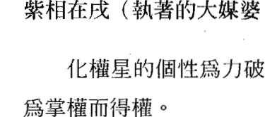

化權星轉化紫微△ 50 分的平庸運勢，升格爲○ 80 分的旺盛運勢。化權星引動出紫微△本質的小權，突顯出帶權而重權的命格，形成掌權而得權的運勢。化權星轉化紫微△之代表人物兒皇帝，升格爲力破山河皇帝。紫微△權、天相△雙星組合升格爲力破山河大媒體。

紫相在辰原爲大媒體，代表變遷、奔波、慾望大、求上進的個性；紫相在戌原爲執著的大媒體，代表固執、負責、忠誠、執著的個性。因爲紫相爲平平，呈現平庸的命格運勢，逢化權星坐入紫微，增加了紫微在辰的慾望、企圖心、變動性，以及在戌的執著心的星性，形成人緣極佳、正義凜然、企圖心強盛、有貴人、有權力的命格運勢。

紫相在辰、戌爲天羅地網宮，更增加其慾望及企圖心。在辰宮爲變動性大的基本命格，再加上化權星坐入，則個性權力慾望大而形成奔波、勞苦的運勢；在戌宮則更增加執著的個性。

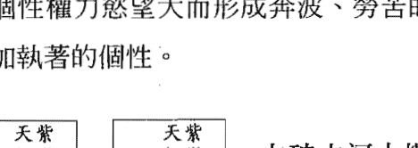

力破山河大媒體，坐入十二宮的意義

- 命、身宮—我的命格運勢：我是力破山河大媒體。
- 兄弟宮—母親與我的緣分：母親以開明的方式管教我、以威權領導我。
- 夫妻宮—配偶與我的緣分：配偶威權霸氣，但協助我。
- 子女宮—子女與我的緣分：子女威權霸道，但協助我。
- 財帛宮—財運：因權貴而得財。
- 疾厄宮—弱點的疾病：有天相（水）泌尿系統、婦女的疾病干擾我，但有大權威醫生貴人幫助我。
- 遷移宮—出外運：長袖善舞、熱心公益、領導、突破掌大權。
- 僕役宮—知己與我的緣分：我有大權貴知己相助，但也控制我。
- 官祿宮—事業運：服務衆生而掌大權。
- 田宅宮—置產運：親人協助置產，身居大宅。
- 福德宮—存摺運：親人協助存款，掌控自如。
- 父母宫—父亲与我的缘分：父亲以开明的方式管教我、以权威领导我。

#### 紫相在辰（大媒婆）紫微化科

#### 紫相在戌（执著的大媒婆）紫微化科

化科星的个性为攀龙附凤；命格为坐享其成；运势为幸运、得名。

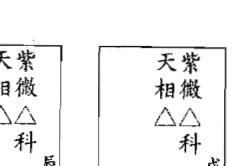

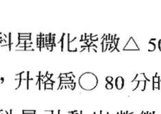

化科星转化紫微△ 50 分的平庸运势，升格为○80 分的旺盛运势。化科星引动出紫微△本质的尊贵，突显出坐享其成的命格，形成幸运而得名的运势。化科星转化紫微△之代表人物儿皇帝，升格为攀龙附凤皇帝。紫微△科、天相△双星组合升格为攀龙附凤大媒婆。

紫相在辰原为大媒婆，代表变迁、奔波、欲望大、求上进的个性；紫相在戌原为执著的大媒婆，代表固执、负责、忠诚、执著的个性。因为紫相为平平，呈现平庸的命格运势，逢化科星坐入紫微，增加了紫微在辰的智慧、名声、好面子，以及在戌的理智、聪明的星性，形成有名气、有贵人、科考顺利的命格运势。

紫相在辰、戌为天罗地网宫，本主欲望及企图心，化科星坐入则降低了追求突破的欲望。在辰宫为变动性大的基本命格，加上化科星则呈现稳定、保守的运势；在戌宫则降低了执著的个性。

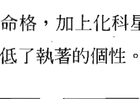

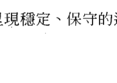

#### 攀龙附凤大媒婆，坐入十二宫的意义

- 命、身宫—我的命格运势：我是攀龙附凤大媒婆。
- 兄弟宫—母亲与我的缘分：母亲以开明的方式管教我、且溺爱我。
- 夫妻宫—配偶与我的缘分：配偶温和、斯文、落落大方，感情融洽。
- 子女宫—子女与我的缘分：子女温和、贴心，感情融洽。
- 财帛宫—财运：因权名而得财，且理财有方。
- 疾厄宫—弱点的疾病：有天相（水）泌尿系统、妇女的疾病干扰我，但有专科医生贵人帮助我。
- 迁移宫—出外运：贵气、温和、长袖善舞而得贵人助。
- 仆役宫—知己与我的缘分：我有大权贵知己贵人。
- 官禄宫—事业运：因权名而得官。
- 田宅宫—置产运：亲人协助置产，且身居名宅。
- 福德宫—存款运：亲人协助存款，且只进不出。
- 父母宫—父亲与我的缘分：父亲以开明的方式管教我，且溺爱我。

## 紫七在巳、亥一紫微化權、化科之意義

紫七在巳（旺運的遠征士官長）紫微化權

紫七在亥（浪漫的旺運遠征士官長）紫微化權

化權星的個性為力破山河；命格為帶權而重權；運勢為掌權而得權。

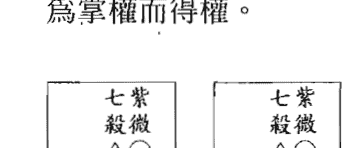

化權星轉化紫微○80分的旺盛運勢，升格為100分的大旺運勢。化權星引動出紫微○本質的大權，更加突顯出帶權而重權的命格，形成掌權而得權的運勢。化權星轉化紫微○之代表人物皇帝，升格為力破山河大皇帝；紫微○權、七殺△雙星組合升格為力破山河士官長。

紫七在巳原為旺運的遠征士官長，代表有才藝、求完美、有魅力、霸道、傲慢的個性運勢；紫七在亥原為浪漫的旺運遠征士官長，代表散漫、博愛、自尊心重、藝術天分高、好面子的個性運勢。因為紫七為旺平，呈現旺盛的命格、平庸的運勢，逢化權星坐入紫微，增加了紫微在巳的積極求上進、霸氣，以及降低在亥的懶散、浪漫的星性，形成多才多藝、霸道突破、有魄力、有權有勢的命格運勢。

紫微為命、七殺為運，紫微旺權為先天的命格旺盛，七殺平為後天運勢較為平庸，雖然運勢為四處奔波、勞心勞力、財進財出，但終究回歸紫微旺權的掌權命格。

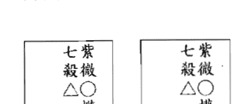

#### 力破山河士官長，坐入十二宮的意義

- 命、身宮—我的命格運勢：我是力破山河士官長。
- 兄弟宮—母親與我的緣分：母親對我要求高，以威權領導我。
- 夫妻宮—配偶與我的緣分：配偶威權霸道，互不相讓，終究無緣。
- 子女宮—子女與我的緣分：子女威權霸道、我行我素，難以管教。
- 財帛宮—財運：財進財出，終究以權貴而得大財。
- 疾厄宮—弱點的疾病：有七殺（火、金）心臟、心血管、呼吸系統的疾病干擾我，但有大權威醫生貴人幫助我。
- 遷移宮—出外運：慾望高、霸道、企圖心重、領導、突破掌大權。
- 僕役宮—知己與我的緣分：我被大權貴知己控制。
- 官祿宮—事業運：奔波勞苦後，力破山河掌大權。
- 田宅宮—置產運：置產變數多，但終究掌控自如。
- 福德宮—存摺運：存款金額財進財出，之後掌控自如。
- 父母宮一父親與我的緣分：父親對我要求高、以威權領導我。

#### 紫七在巳（旺運的遠征士官長）紫微化科

#### 紫七在亥（浪漫的旺運遠征士官長）紫微化科

化科星的個性為攀龍附鳳；命格為坐享其成；運勢為幸運、得名。

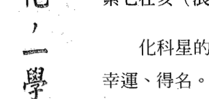

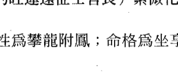

化科星轉化紫微○80分的旺盛運勢，升格為100分的大旺運勢；化科星引動出紫微○本質的尊貴，更加突顯出坐享其成的命格，形成幸運而得名的運勢。化科星轉化紫微○之代表人物皇帝，升格為攀龍附鳳大皇帝；紫微○科、七殺△雙星組合升格為攀龍附鳳士官長。

紫七在巳原為旺運的遠征士官長，代表有才藝、求完美、有魅力、霸道、傲慢的個性運勢；紫七在亥原為浪漫的旺運遠征士官長，代表散漫、博愛、自尊心重、藝術天分高、好面子的個性運勢。因為紫七為旺平，呈現旺盛的命格、平庸的運勢，逢化科星坐入紫微，增加了紫微在巳的追求名聲、貴人運勢以及在亥的懶散、浪漫、愛面子的星性；形成聰明、幸運、名氣、科考順利的命格運勢。

紫微為命、七殺為運，紫微旺科為先天的命格旺盛，七殺平為後天運勢較為平庸，雖然運勢為四處奔波、勞心勞力、財進財出，但終究回歸紫微旺科的幸運得名命格。

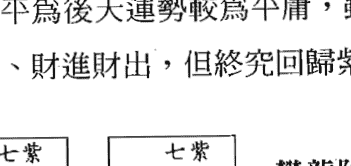

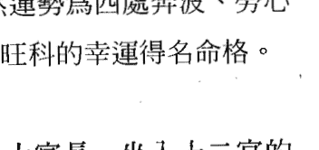

#### 攀龍附鳳士官長，坐入十二宮的意義

- 命、身宮—我的命格運勢：我是攀龍附鳳士官長。
- 兄弟宮—母親與我的緣分：母親對我要求高，但又溺愛我。
- 夫妻宮—配偶與我的緣分：配偶威權霸道，但很疼我。
- 子女宮—子女與我的緣分：子女威權霸道，但很貼心。
- 財帛宮—財運：財進財出，終究以權名而得財。
- 疾厄宮—弱點的疾病：有七殺（火、金）心臟、心血管、呼吸系統的疾病干擾我，但有專科醫生貴人幫助我。
- 遷移宮—出外運：小人、貴人皆有，終究得大貴人相助。
- 僕役宮—知己與我的緣分：我有權勢貴人知己。
- 官祿宮—事業運：奔波勞苦、攀龍附鳳而得官。
- 田宅宮—置產運：置產變數多，但終究順利且居名宅。
- 福德宮—存摺運：存款金額財進財出，終究理財有方。
- 父母宮—父親與我的緣分：父親對我要求高，但又溺愛我。

## 天机星系四化星全解

### 天机在子、午—化禄、权、科、忌之意义

天机在子（孙元帅）化禄

天机在午（积极的孙元帅）化禄

化禄星的个性为忍辱负重；命格为带财、重财；运勢为顺利、得财。

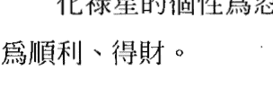

化禄星转化天机◎100分的大旺运势，升格为120分的超旺运势。化禄星安定了天机本质的变动星性，增加带财、重财的命格，形成顺利而得财的运势。化禄星转化天机◎之代表人物孙元帅，升格为忍辱负重孙王爷。

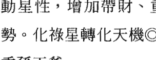

天机在子原为孙元帅，代表机伶、智慧、聪明、奔忙的命格运势，天机在午原为积极的孙元帅，代表魅力、乐观、积极、智慧、领导的命格运势，因为化庙命格运势非常顺遂，又逢化禄星坐入，增加了天机的智慧、专业而顺利得财的命格运势。天机在子增加其灵动、预知的特质，在午则改变暴躁、傲慢的特质，形成较稳重、踏实的命格运势。

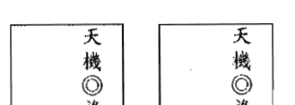

#### 忍辱负重孙王爷，坐入十二宫的意义

- 命、身宫—我的命格运势：我是忍辱负重孙王爷。
- 兄弟宫—母亲与我的缘分：母亲支持且帮助我。
- 夫妻宫—配偶与我的缘分：感情稳定，互相扶持。
- 子女宫—子女与我的缘分：子女稳重、聪慧，互相支持。
- 财帛宫—财运：以专业而得财。
- 疾厄宫—弱点的疾病：有天机（木）肝、胆、神经系统的疾病干扰我，但有医生大贵人帮助我。
- 迁移宫—出外运：出外逢贵人相助。
- 仆役宫—知己与我的缘分：有知己贵人支持。
- 官禄宫—事业运：以专业而得官。
- 田宅宫—置产运：置产顺利。
- 福德宫—存摺运：存款金额顺利稳定。
- 父母宫—父亲与我的缘分：父亲支持且帮助我。

#### 天机在子、午—化权

天机在子（孙元帅）化权

天机在午（积极的孙元帅）化权

化权星的个性为力破山河；命格为带权而重权；运势为掌权而得权。

| 天机◎权 子 | 天机◎权 午 |
| :---: | :---: |
| ![天机在子化权图示] | ![天机在午化权图示] |
| 化权星转化天机◎100分的大旺运势，升格为120分的超旺运势。化权星引动出天机本质的变动星性，更加突显出带权而重权的命格，形成掌权而得权的运势。化权星转化天机◎之代表人物孙元帅，升格为力破山河孙王爷。 |

天机在子原为孙元帅，代表机伶、智慧、聪明、奔忙的命格运势，天机在午原为积极的孙元帅，代表魅力、乐观、积极、智慧、领导的命格运势，因为化庙命格运势非常顺遂，又逢化权星坐入，增加了天机的智慧、专业、权威亦增加奔波及变动的命格运势。天机在子降低其内敛、内向的特质，在午则增加积极度及欲望的特质，形成较霸道、突破、欲望、权力的命格运势。

#### 力破山河孙王爷，坐入十二宫的意义

- 命、身宫—我的命格运势：我是力破山河孙王爷。
- 兄弟宫—母亲与我的缘分：母亲以权杖管教我、以威权领导我。
- 夫妻宫—配偶与我的缘分：配偶威权霸气，互相要求高。
- 子女宫—子女与我的缘分：子女威权霸道，不易管教。
- 财帛宫—财运：以专业权威而得财。
- 疾厄宫—弱点的疾病：有天机（木）肝、胆、神经系统的疾病干扰我，但有大权威医生贵人帮助我。
- 迁移宫—出外运：领导、突破、权威而掌权。
- 仆役宫—知己与我的缘分：我有大权贵知己控制我。
- 官禄宫—事业运：专业权威而得官。
- 田宅宫—置产运：置产运掌控自如。
- 福德宫—存摺运：存款金额掌控自如。
- 父母宫—父亲与我的缘分：父亲以权杖管教我、以威权领导我。

#### 天机在子、午—化科

天机在子（孙元帅）化科

天机在午（积极的孙元帅）化科

化科星的个性为攀龙附凤；命格为坐享其成；运势为幸运、得名。

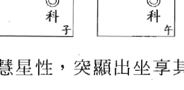

化科星转化天机© 100 分的大旺运势，升格为 120 分的超旺运势。化科星引动出天机本质的智慧星性，突显出坐享其成的命格，形成幸运而得名的运势。化科星转化天机©之代表人物孙元帅，升格为攀龙附凤孙王爷。

天机在子原为孙元帅，代表机伶、智慧、聪明、奔忙的命格运势，天机在午原为积极的孙元帅，代表魅力、乐观、积极、智慧、领导的命格运势，因为化庙命格运势非常顺遂，逢化科星坐入，增加了天机的智慧、专业、幸运、科考的命格运势。天机在子增加其灵动、预知、机伶的特质，在午则降低天机在午的暴躁个性，形成温和且有名气的个性运势。

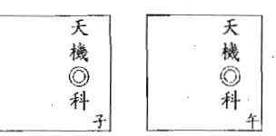

#### 攀龙附凤孙王爷，坐入十二宫的意义

- 命、身宫—我的命格运势：我是攀龙附凤孙王爷。
- 兄弟宫—母亲与我的缘分：母亲以开明的作风管教我、且溺爱我。
- 夫妻宫—配偶与我的缘分：配偶与我感情佳，互相扶持。
- 子女宫—子女与我的缘分：子女温和聪明，知书达礼。
- 财帛宫—财运：以专业、名声而得财。
- 疾厄宫—弱点的疾病：有天机（木）肝、胆、神经系统的疾病干扰我，但有专科医生大贵人帮助我。
- 迁移宫—出外运：出外逢贵人相助。
- 仆役宫—知己与我的缘分：我有知己贵人相助。
- 官禄宫—事业运：以专业而得官得名。
- 田宅宫—置产运：置产小而美。
- 福德宫—存摺运：存款金额进出保守。
- 父母宫—父亲与我的缘分：父亲以开明的作风管教我，且溺爱我。

#### 天机在子、午—化忌

天机在子（孙元帅）化忌

天机在午（积极的孙元帅）化忌

化忌星的个性为六神无主；命格为无依无靠；运势为倒楣、失去。

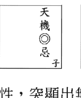

化忌星转化天机◎ 100 分的大旺盛运势，降格为 80 分的旺盛运势。化忌星失去了天机本质的智慧特性，突显出无依无靠的命格，形成倒楣、失去的运势。化忌星转化天机◎之代表人物孙元帅，降格为六神无主孙悟空。

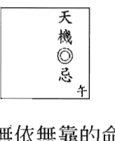

天机在子原为孙元帅，代表机伶、智慧、聪明、奔忙的命格运势，天机在午原为积极的孙元帅，代表魅力、乐观、积极、智慧、领导的命格运势，因为化庙命格运势非常顺遂，但逢化忌星坐入，失去了天机的智慧、专业、幸运、科考的命格运势。天机在子增加其内向、悲观的特质，在午则降低天机的积极、求上进的个性，形成悲观、是非、倒楣的个性运势。

天机化忌命格运势虽然是非不断，所幸天机为庙，化忌对其造成的影响为一时，犹如偶尔乌云飘过一般，不会长期形成低迷的运势。

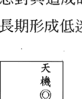

#### 六神无主孙悟空，坐入十二宫的意义

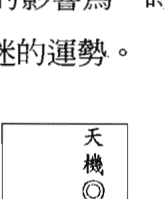

- 命、身宫—我的命格运势：我是六神无主孙悟空。
- 兄弟宫—母亲与我的缘分：母亲控制我、影响我。
- 夫妻宫—配偶与我的缘分：配偶固执，争执不休，聚少离多。
- 子女宫—子女与我的缘分：子女固执、我行我素、拖累我，聚少离多。
- 财帛宫—财运：财进财出，终究稳定。
- 疾厄宫—弱点的疾病：有天机（木）肝、胆、神经系统的疾病干扰我。
- 迁移宫—出外运：出外逢小人陷害。
- 仆役宫—知己与我的缘分：小人朋友陷害我。
- 官禄宫—事业运：事业多波折，但终究稳定。
- 田宅宫—置产运：置产多波折，但终究稳定。
- 福德宫—存摺运：存款金额财进财出，终究得以控制。
- 父母宫—父亲与我的缘分：父亲控制我、影响我。

### 天机在丑、未—化禄、权、科、忌之意义

天机在丑（孙病猴）化禄

天机在未（悲观的孙病猴）化禄

化禄星的个性为忍辱负重；命格为带财、重财；运势为顺利、得财。

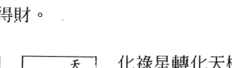

化禄星转化天机×20分的弱陷运势，升格为50分的平庸运势。化禄星安定了天机本质的变动星性，增加带财、重财的命格，形成顺利而得财的运势。化禄星转化天机×之代表人物孙病猴，升格为忍辱负重孙猴子。

天机在丑原为孙病猴，代表固执、扭扭捏捏、不切实际、无事奔忙的命格运势；天机在未原为悲观的孙病猴，代表敏感多疑、懒惰成性、胡思乱想、悲观的命格运势，因为化陷命格运势低迷，所幸逢化禄星坐入，增加了天机的聪明、专业降低了敏感悲观及善变的特质，形成稳定、务实的个性运势。

特别要注意的是，天机虽化禄，但天机在丑、未为弱陷，终究会处于天机陷的泥沼中，不得不重视。

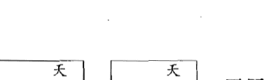

#### 忍辱负重孙猴子，坐入十二宫的意义

- 命、身宫—我的命格运势：我是忍辱负重孙猴子。
- 兄弟宫—母亲与我的缘分：母亲支持我，但终究无缘。
- 夫妻宫—配偶与我的缘分：感情初期稳定，但终究孤离。
- 子女宫—子女与我的缘分：子女保守、孤独，聚少离多。
- 财帛宫—财运：以专业而得财，财运终究低迷。
- 疾厄宫—弱点的疾病：有天机（木）肝、胆、神经系统的疾病干扰我，但有医生贵人帮助我。
- 迁移宫—出外运：出外小人、贵人皆有。
- 仆役宫—知己与我的缘分：有知己贵人支持，但终究无缘。
- 官禄宫—事业运：以专业而得官，官运终究低迷。
- 田宅宫—置产运：置产运小而顺。
- 福德宫—存摺运：存款金额财进财出。
- 父母宫—父亲与我的缘分：父亲支持我，但终究无缘。

#### 天機在丑（孫病猴）化權

#### 天機在未（悲觀的孫病猴）化權

化權星的個性爲力破山河；命格爲帶權而重權；運勢爲掌權而得權。

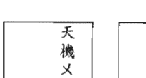

化權星轉化天機×20 分的弱陷運勢，升格爲 50 分的平庸運勢。化權星引動出天機本質的變動星性，突顯出帶權而重權的命格，形成掌權而得權的運勢。化權星轉化天機×之代表人物孫病猴，升格爲力破山河孫猴子。

天機在丑原爲孫病猴，代表固執、扭扭捏捏、不切實際、無事奔忙的命格運勢；天機在未原爲悲觀的孫病猴，代表敏感多疑、懶惰成性、胡思亂想、悲觀的命格運勢，因爲化陷命格運勢低迷，所幸逢化權星坐入，增加了天機的積極、求上進、聰明、專業，降低了不切實際、胡思亂想的特質，形成突破、積極的個性運勢。

特別要注意的是，天機雖化權，但天機在丑、未爲弱陷，終究會處於天機陷的泥沼中，不得不重視。

#### 天機在丑、未

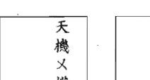

#### 力破山河孫猴子，坐入十二宮的意義

- 命、身宮—我的命格運勢：我是力破山河孫猴子。
- 兄弟宮—母親與我的緣分：母親用權杖管教我，且終究無緣。
- 夫妻宮—配偶與我的緣分：感情爭執不休，且終究孤離。
- 子女宮—子女與我的緣分：子女霸道、孤獨，聚少離多。
- 財帛宮—財運：以專業而得財，財運終究低迷。
- 疾厄宮—弱點的疾病：有天機（木）肝、膽、神經系統的疾病干擾我，但有權威醫生貴人幫助我。
- 遷移宮—出外運：出外小人、貴人皆有。
- 僕役宮—知己與我的緣分：有知己貴人支持，但終究無緣。
- 官祿宮—事業運：以專業而得官，官運終究低迷。
- 田宅宮—置產運：擁有強烈的置產慾望，但終究波折、低迷。
- 福德宮—存摺運：存款金額進進出出。
- 父母宮—父親與我的緣分：父親用權杖管教我，但終究無緣。

#### 天機在丑（孫病猴）化科

#### 天機在未（悲觀的孫病猴）化科

化科星的個性為攀龍附鳳；命格為坐享其成；運勢為幸運、得名。

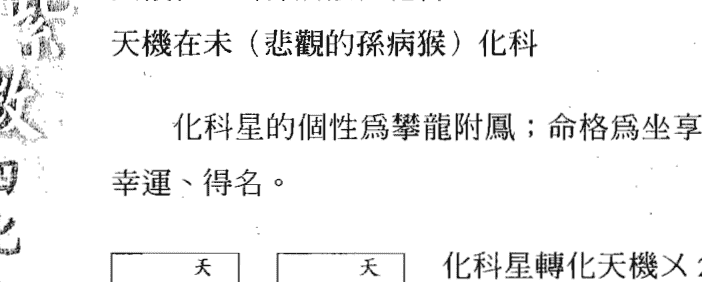

天機在丑原為孫病猴，代表固執、扭扭捏捏、不切實際、無事奔忙的命格運勢；天機在未原為悲觀的孫病猴，代表敏感多疑、懶惰成性、胡思亂想、悲觀的命格運勢，因為化陷命格運勢低迷，所幸逢化科星坐入，增加了天機的聰明、科考，降低了敏感悲觀及善變，但亦增加了懶惰享福的特質，形成幸運、得名的個性運勢。

特別要注意的是，天機雖化科，但天機在丑、未為弱陷，終究會處於天機陷的泥沼中，不得不重視。

#### 攀龍附鳳孫猴子，坐入十二宮的意義

- 命、身宮—我的命格運勢：我是攀龍附鳳孫猴子。
- 兄弟宮—母親與我的緣分：母親溺愛我，但終究無緣。
- 夫妻宮—配偶與我的緣分：感情初期甜蜜，但終究孤離。
- 子女宮—子女與我的緣分：子女斯文、溫和，但聚少離多。
- 財帛宮—財運：以專業而得財，財運終究低迷。
- 疾厄宮—弱點的疾病：有天機（木）肝、膽、神經系統的疾病干擾我，但有專科醫生貴人幫助我。
- 遷移宮—出外運：出外小人、貴人皆有。
- 僕役宮—知己與我的緣分：有知己貴人，但終究無緣。
- 官祿宮—事業運：以專業而得官，官運終究低迷。
- 田宅宮—置產運：置產運小而美。
- 福德宮—存摺運：存款金額財進財出。
- 父母宮—父親與我的緣分：父親溺愛我，但終究無緣。

#### 天机在丑（孙病猴）化忌

#### 天机在未（悲观的孙病猴）化忌

化忌星的个性为六神无主；命格为无依无靠；运势为倒楣、失去。

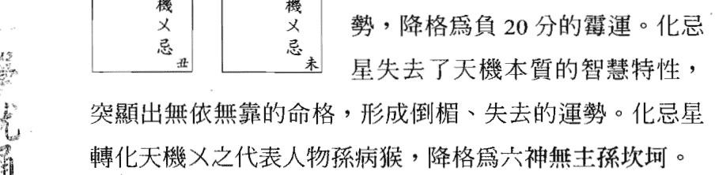

天机在丑原为孙病猴，代表固执、扭扭捏捏、不切实际、无事奔忙的命格运势；天机在未原为悲观的孙病猴，代表敏感多疑、懒惰成性、胡思乱想、悲观的命格运势，因为化陷命格运势低迷，又遭逢化忌星坐入，失去了天机的聪明、专业、智慧，增加了敏感多疑及萎靡悲观的特质，形成倒楣失去又坎坷的命格运势。

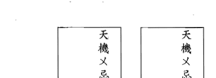

- 命、身宫—我的命格运势：我是六神无主孙坎坷。
- 兄弟宫—母亲与我的缘分：母亲影响我、拖累我，孤离无缘。
- 夫妻宫—配偶与我的缘分：配偶忧郁苦闷，孤离无缘。
- 子女宫—子女与我的缘分：子女拖累我，与子女无缘。
- 财帛宫—财运：财运低迷坎坷。
- 疾厄宫—弱点的疾病：有天机（木）肝、胆、神经系统的疾病严重伤害我。
- 迁移宫—出外运：出外逢小人相害。
- 仆役宫—知己与我的缘分：小人朋友陷害我。
- 官禄宫—事业运：事业运低迷坎坷。
- 田宅宫—置产运：置产运无。
- 福德宫—存折运：存款金额无。
- 父母宫—父亲与我的缘分：父亲影响我、拖累我，孤离无缘。

### 天機在巳、亥—化祿、權、科、忌之意義

#### 天機在巳（孫猴子）化祿

#### 天機在亥（散漫的孫猴子）化祿

化祿星的個性爲忍辱負重；命格爲帶財、重財；運勢爲順利、得財。

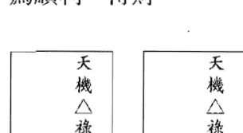

化祿星轉化天機△50分的平庸運勢，升格爲80分的旺盛運勢。化祿星安定了天機本質的變動星性，增加帶財、重財的命格，形成順利而得財的運勢。化祿星轉化天機△之代表人物孫猴子，升格爲忍辱負重孫悟空。

天機在巳原爲孫猴子，代表機伶、智慧、聰明、奔波的命格運勢，天機在亥原爲散漫的孫猴子，代表懶散、自尊心強、藝術天分的命格運勢，因爲化平命格運勢平庸，逢化祿星坐入，增加了天機的智慧、專業的命格運勢。天機在巳增加其才藝、專業的特質，在亥則降低了浪漫、懶散的特質，形成穩重、踏實的個性運勢。

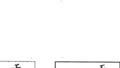

#### 忍辱負重孫悟空，坐入十二宮的意義

- 命、身宮—我的命格運勢：我是忍辱負重孫悟空。
- 兄弟宮—母親與我的緣分：母親很忙碌，但會幫助我。
- 夫妻宮—配偶與我的緣分：聚少離多，但會互相扶持。
- 子女宮—子女與我的緣分：子女聰慧、互相支持，但聚少離多。
- 財帛宮—財運：以專業而得財。
- 疾厄宮—弱點的疾病：有天機（木）肝、膽、神經系統的疾病干擾我，但有醫生大貴人幫助我。
- 遷移宮—出外運：出外逢貴人相助。
- 僕役宮—知己與我的緣分：有知己貴人支持。
- 宮祿宮—事業運：以專業而得官。
- 田宅宮—置產運：置產順利。
- 福德宮—存摺運：存款金額小，但順利穩定。
- 父母宮—父親與我的緣分：父親很忙碌，但會幫助我。

#### 天機在巳（孫猴子）化權

#### 天機在亥（散漫的孫猴子）化權

化權星的個性爲力破山河；命格爲帶權而重權；運勢爲掌權而得權。

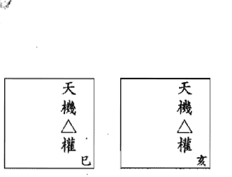

化權星轉化天機△ 50 分的平庸運勢，升格爲 80 分的旺盛運勢。化權星引動出天機本質的變動星性，突顯出帶權而重權的命格，形成掌權而得權的運勢。化權星轉化天機△之代表人物孫猴子，升格爲力破山河孫悟空。

天機在巳原爲孫猴子，代表機伶、智慧、聰明、奔波的命格運勢，天機在亥原爲散漫的孫猴子，代表懶散、自尊心強、藝術天分的命格運勢，因爲化平命格運勢平庸，逢化權星坐入，增加了天機的智慧、專業的命格運勢。天機在巳增加其才藝、專業、魅力、領導的特質，在亥則增加了自尊心、機伶的特質，形成積極、領導、突破的個性運勢。

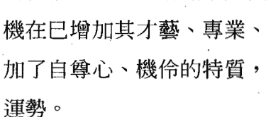

#### 力破山河孫悟空，坐入十二宮的意義

- 命、身宮—我的命格運勢：我是力破山河孫悟空。
- 兄弟宮—母親與我的緣分：母親以權杖管教我，但聚少離多。
- 夫妻宮—配偶與我的緣分：配偶威權霸氣，且聚少離多。
- 子女宮—子女與我的緣分：子女威權霸道，且聚少離多。
- 財帛宮—財運：以專業而得財。
- 疾厄宮—弱點的疾病：有天機（木）肝、膽、神經系統的疾病干擾我，但有權威醫生貴人幫助我。
- 遷移宮—出外運：奔波、忙碌、突破而掌權。
- 僕役宮—知己與我的緣分：我有權貴知己控制我。
- 官祿宮—事業運：以專業而得官。
- 田宅宮—置產運：置產運掌控自如。
- 福德宮—存摺運：存款金額掌控自如。
- 父母宮—父親與我的緣分：父親以權杖管教我，但聚少離多。

#### 天機在巳（孫猴子）化科

#### 天機在亥（散漫的孫猴子）化科

化科星的個性爲攀龍附鳳；命格爲坐享其成；運勢爲幸運、得名。

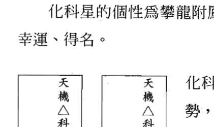

化科星轉化天機△ 50 分的平庸運勢，升格爲 80 分的旺盛運勢。化科星安定了天機本質的變動星性，突顯出坐享其成的命格，形成幸運而得名的運勢。化科星轉化天機△之代表人物孫猴子，升格爲攀龍附鳳孫悟空。

天機在巳原為孫猴子，代表機伶、智慧、聰明、奔波的命格運勢，天機在亥原為散漫的孫猴子，代表懶散、自尊心強、藝術天分的命格運勢，因為化平命格運勢平庸，逢化科星坐入，增加了天機的智慧、專業、科考、名氣的命格運勢。天機在巳增加其才藝、專業、名聲的特質，在亥則增加了浪漫、懶散、藝術的特質，形成較為斯文、溫和、有名氣的個性運勢。

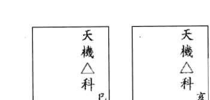

- 命、身宮—我的命格運勢：我是攀龍附鳳孫悟空。
- 兄弟宮—母親與我的緣分：母親奔波、忙碌，但溺愛我。
- 夫妻宮—配偶與我的緣分：配偶奔波、忙碌，但與我感情佳。
- 子女宮—子女與我的緣分：子女奔波、忙碌，但溫和聰明。
- 財帛宮—財運：以專業、名聲而得財。
- 疾厄宮—弱點的疾病：有天機（木）肝、膽、神經系統的疾病干擾我，但有專科醫生貴人幫助我。
- 遷移宮—出外運：出外逢貴人相助。
- 僕役宮—知己與我的緣分：我有知己貴人相助。
- 官祿宮—事業運：以專業而得官且得名。
- 田宅宮—置產運：置產小而美，但不常在家。
- 福德宮—存摺運：存款金額財進財出，但理財有方。
- 父母宮—父親與我的緣分：父親奔波、忙碌，但溺愛我。

#### 天機在巳（孫猴子）化忌

#### 天機在亥（散漫的孫猴子）化忌

化忌星的個性為六神無主；命格為無依無靠；運勢為倒楣、失去。

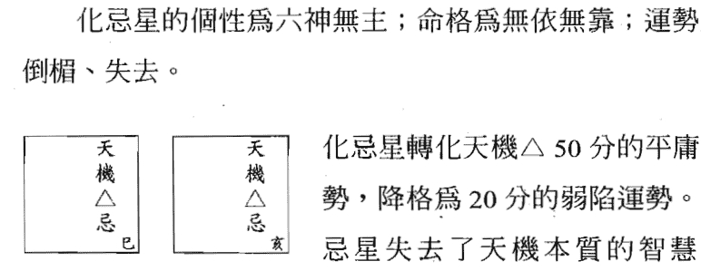

天機在巳原為孫猴子，代表機伶、智慧、聰明、奔波的命格運勢，天機在亥原為散漫的孫猴子，代表懶散、自尊心強、藝術天分的命格運勢，因為化平命格運勢平庸，又逢化忌星坐入，失去了天機的智慧、專業的命格運勢。天機在巳失去其魅力、求上進的特質，在亥則增加了懶散、悲觀的特質，形成被動、隨性、是非不分低迷的命格。

#### 六神無主孫病猴，坐入十二宮的意義

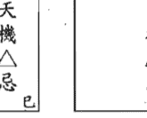

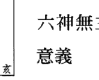

- 命、身宮—我的命格運勢：我是六神無主孫病猴。
- 兄弟宮—母親與我的緣分：母親控制我、影響我，與我無緣。
- 夫妻宮—配偶與我的緣分：配偶固執，爭執不休，與我無緣。
- 子女宮—子女與我的緣分：子女固執、我行我素、拖累我，與我無緣。
- 財帛宮—財運：財運低迷。
- 疾厄宮—弱點的疾病：有天機（木）肝、膽、神經系統的疾病嚴重傷害我。
- 遷移宮—出外運：出外逢小人陷害。
- 僕役宮—知己與我的緣分：小人朋友陷害我。
- 官祿宮—事業運：事業多波折、低迷。
- 田宅宮—置產運：無置產運。
- 福德宮—存摺運：存款金額財進財出，終究不聚財。
- 父母宮—父親與我的緣分：父親控制我、影響我，與我無緣。

### 機陰在寅、申—天機化祿、權、科、忌；太陰化祿、權、科、忌之意義

#### 機陰在寅（平庸的大書生）天機化祿、太陰化忌

#### 機陰在申（平庸的小書生）天機化祿、太陰化忌

化祿星的個性為忍辱負重；命格為帶財、重財；運勢為順利、得財。

化忌星的個性為六神無主；命格為無依無靠；運勢為倒楣、失去。

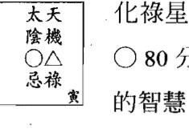

化祿星轉化天機△ 50 分的平庸運勢，升格為○ 80 分的旺盛運勢；化祿星引動出天機本質的智慧，突顯出帶財、重財的命格，形成順利而得財的運勢。化祿星轉化天機△之代表人物孫猴子，升格為忍辱負重孫悟空。

化忌星轉化太陰○ 80 分的旺盛運勢，降格為△ 50 分的平庸運勢；化忌星失去了太陰本質的才華，突顯出無依無靠的命格，形成倒楣、失去的運勢。化忌星轉化太陰○之代表人物大書生，降格為六神無主小書生。

天機△祿、太陰○忌之雙星組合，天機△祿為命，太陰○忌為運，雖有化忌星干擾太陰的感情、財富、田宅的是非狀況，但終究因天機△祿的帶財命格，而有順利得財的運勢。因此天機為升格、太陰為降格轉化為忍辱負重小書生。

機陰在寅為活躍、樂觀積極、求上進、機智，平庸大書生的命格運勢，但加上化祿星坐入天機、化忌星坐入太陰，則個性轉變成時而活躍、時而沈默，時而樂觀、時而悲觀，時而聰明、時而迷糊的狀態。適合從事專業才藝的職業，如學者、作家、會計師、老師、宗教家、命理家，亦可從事鑽研的工作，如自我工作室、研究室等之行業。

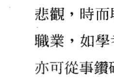

#### 忍辱負重小書生，坐入十二宮的意義

- 命、身宮—我的命格運勢：我是忍辱負重小書生。
- 兄弟宮—母親與我的緣分：化忌是非干擾，無助於我；終究化祿順利而助我。
- 夫妻宮—配偶與我的緣分：化忌無緣、口角是非，終究化祿、忍辱負重而重緣。
- 子女宮—子女與我的緣分：化忌口角是非無緣，但終究化祿順利且互助。
- 財帛宮—財運：化忌是非而破財，終究化祿以專業而得財。
- 疾厄宮—弱點的疾病：化忌傷害太陰（水）泌尿系統、婦女的疾病，但終究化祿使病情穩定。
- 遷移宮—出外運：化忌是非倒楣干擾，終究化祿而順利。
- 僕役宮—知己與我的緣分：化忌知己小人陷害，終究化祿知己貴人相助。
- 官祿宮—事業運：化忌工作是非干擾，終究化祿以專業得官。
- 田宅宮—置產運：化忌是非糾紛多，終究化祿順利而得產。
- 福德宮—存摺運：化忌存款進進出出，終究化祿順利而得庫。
- 父母宮—父親與我的緣分：化忌是非干擾無助於我，終究化祿順利而助我。

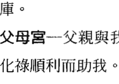

化祿星轉化天機△50分的平庸運勢，升格為○80分的旺盛運勢；化祿星引動出天機本質的智慧，而增加帶財、重財的命格，形成順利而得財的運勢。化祿星轉化天機△之代表人物孫猴子，升格為忍辱負重孫悟空。

化忌星轉化太陰△50分的平庸運勢，降格為×20分的低迷運勢；化忌星失去了太陰本質的才华，突顯出無依無靠的命格，形成倒楣、失去的運勢。化忌星轉化太陰△之代表人物小書生，降格為六神無主窮書生。

天機△祿、太陰△忌之雙星組合，天機△祿為命，太陰△忌為運，運勢逢化忌星干擾太陰的星性，形成感情是非、財務糾紛、田宅是非的坎坷狀況，但終究因天機△祿的帶財命格，對太陰的坎坷運勢而有所支撐。因此天機為升格、太陰為降格轉化為忍辱負重窮書生。

機陰在申為勤勞、奔波、反應快、有創意，平庸小書生的命格運勢，但加上化祿星坐入天機、化忌星坐入太陰，則個性轉變成時而勤快、時而懶散或無事奔忙，時而機智、時而胡思亂想的悲觀狀態。

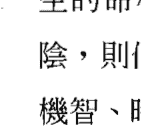

#### 忍辱負重窮書生，坐入十二宮的意義

- 命、身宮—我的命格運勢：我是忍辱負重窮書生。
- 兄弟宮—母親與我的緣分：化忌是非干擾我，終究化祿順利而助我。
- 夫妻宮—配偶與我的緣分：化忌無緣、口角是非，終究化祿、忍辱負重而重緣。
- 子女宮—子女與我的緣分：化忌口角是非且無緣，但終究化祿順利而有助。
- 財帛宮—財運：化忌是非而破財，終究化祿以專業而得財。
- 疾厄宮—弱點的疾病：化忌傷害太陰（水）泌尿系統、婦女的疾病，但終究化祿使病情穩定。
- 遷移宮—出外運：化忌小人是非、倒楣干擾，終究化祿逢貴人。
- 僕役宮—知己與我的緣分：化忌知己小人陷害，終究化祿知己貴人相助。
- 官祿宮—事業運：事業化忌多是非干擾，終究化祿以專業得官。
- 田宅宮—置產運：化忌是非糾紛多，終究化祿順利而置產。
- 福德宮—存摺運：化忌存款運低迷，終究化祿順利而得庫。
- 父母宮—父親與我的緣分：化忌是非干擾我；終究化祿順利而助我。

#### 機陰在寅（平庸的大書生）天機化權

#### 機陰在申（平庸的小書生）天機化權

化權星的個性為力破山河；命格為帶權而重權；運勢為掌權而得權。

化權星轉化天機△ 50 分的平庸運勢，升格為○ 80 分的旺盛運勢。化權星引動出天機本質的智慧星性，更加突顯出帶權而重權的命格，形成掌權而得權的運勢。化權星轉化天機△之代表人物孫猴子，升格為力破山河孫悟空。天機△權、太陰○雙星組合升格為力破山河大書生。

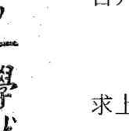

機陰在寅原為平庸的大書生，代表活躍、樂觀積極、求上進、才華洋溢的個性。因為機陰為平旺，呈現平庸的命格、旺盛的運勢，又逢化權星坐入天機，增加了天機的智慧、專業、積極求上進的星性，形成專業權威、積極上進、樂觀活躍、領導慾望、才華洋溢的命格運勢。

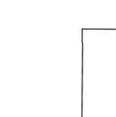

#### 力破山河大書生，坐入十二宮的意義

- 命、身宮—我的命格運勢：我是力破山河大書生。
- 兄弟宮—母親與我的緣分：母親以愛的教育管教我、以威權領導我。
- 夫妻宮—配偶與我的緣分：配偶真情流露，但威權霸氣、忽冷忽熱。
- 子女宮—子女與我的緣分：子女多才多藝、孝順，但威權霸道、奔波忙碌，與我聚少離多。
- 財帛宮—財運：因才藝、權貴而得財。
- 疾厄宮—弱點的疾病：有太陰（水）泌尿系統、婦女的疾病干擾我，但有大權威醫生貴人幫助我。
- 遷移宮—出外運：才華洋溢、領導、突破而掌權。
- 僕役宮—知己與我的緣分：我有權貴知己相助。
- 官祿宮—事業運：以專業、才華而掌權。
- 田宅宮—置產運：置產運強，掌控自如。
- 福德宮—存摺運：存款金額富足，掌控自如。
- 父母宮—父親與我的緣分：父親以愛的教育管教我、以威權領導我。

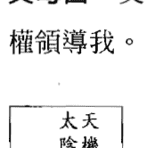

化權星轉化天機△ 50 分的平庸運勢，升格為○ 80 分的旺盛運勢。化權星引動出天機本質的智慧星性，更加突顯出帶權而重權的命格，形成掌權而得權的運勢。化權星轉化天機△之代表人物孫猴子，升格為力破山河孫悟空。天機△權、太陰△雙星組合升格為力破山河小書生。

機陰在申原為平庸的小書生，代表勤快、多變、創意、奔波、有才藝的基本特質，再加上化權星坐入天機，則增加天機的智慧、專業、機伶、求上進的特質，形成多才多藝、創意十足、改革突破、領導智慧的命格運勢。

#### 力破山河小書生，坐入十二宮的意義

-   命、身宮—我的命格運勢：我是力破山河小書生。
-   兄弟宮—母親與我的緣分：母親奔波忙碌，以威權領導我。
-   夫妻宮—配偶與我的緣分：配偶奔波忙碌，且威權霸氣、聚少離多。
-   子女宮—子女與我的緣分：子女威權霸道，且奔波忙碌、聚少離多。
-   財帛宮—財運：因才藝、權貴而得財。
-   疾厄宮—弱點的疾病：有太陰（水）泌尿系統、婦女的疾病干擾我，但有權威醫生貴人幫助我。
-   遷移宮—出外運：領導、突破而掌權。
-   僕役宮—知己與我的緣分：我有權貴知己相助。
-   官祿宮—事業運：以專業而掌權。
-   田宅宮—置產運：置產運勢不定，但終究控制得宜。
-   福德宮—存摺運：存款金額進進出出，終究掌控自如。
-   父母宮—父親與我的緣分：父親奔波、忙碌，以威權領導我。

機陰在寅（平庸的大書生）天機化科、太陰化祿
機陰在申（平庸的小書生）天機化科、太陰化祿

化科星的個性爲攀龍附鳳；命格爲坐享其成；運勢爲幸運、得名。
化祿星的個性爲忍辱負重；命格爲帶財、重財；運勢爲順利、得財。

化科星轉化天機△ 50 分的平庸運勢，升格爲○ 80 分的旺盛運勢；化科星引動出天機本質的才華星性，突顯出坐享其成的命格，形成幸運而得名的運勢。化科星轉化天機△之代表人物孫猴子，升格爲攀龍附鳳孫悟空。

化祿星轉化太陰○ 80 分的旺盛運勢，升格爲◎ 100 分的大旺運勢；化祿星增加了太陰本質的財富星性，更增加帶財、重財的命格，形成順利而得財的運勢。化祿星轉化太陰○之代表人物大書生，升格爲忍辱負重大才子。

天機△科、太陰○祿之雙星組合，天機△科爲命，太陰○祿爲運，天機化科代表智慧、聰明、專業、名氣的命格；太陰化祿代表財富、田宅的運勢順遂。因此原爲平庸的大書生升格爲攀龍附鳳大才子。

機陰在寅原爲活躍、樂觀積極、求上進、機智、奔波，平庸的大書生命格運勢，加上化科星坐入天機、化祿星坐入太陰，則個性運勢形成活躍、樂觀、聰明、有名氣、有財富的命格運勢。

| 天機 | 太陰 |
|:---:|:---:|
| △○ | |
| 祿科 | |

#### 攀龍附鳳大才子，坐入十二宮的意義

-   命、身宮—我的命格運勢：我是攀龍附鳳大才子。
-   兄弟宮—母親與我的緣分：母親支持我、幫助我，且溺愛我。
-   夫妻宮—配偶與我的緣分：配偶支持我、幫助我，且疼愛我。
-   子女宮—子女與我的緣分：小孩才華洋溢與我感情佳又孝順。
-   財帛宮—財運：才華洋溢、理財有方而得財。
-   疾厄宮—弱點的疾病：有天機（木）肝、膽、神經系統的疾病，但常有專科醫生貴人幫助我。
-   遷移宮—出外運：貴人運旺盛，且幫助我。
-   僕役宮—知己與我的緣分：知己貴人多，且幫助我。
-   官祿宮—事業運：以智慧、才華、專業而得官、得名。
-   田宅宮—置產運：置產運勢旺盛，身居名宅。
-   福德宮—存摺運：存款金額豐厚，理財有方而得庫。
-   父母宮—父親與我的緣分：父親支持我、幫助我，且溺愛我。

| 天機 | 太陰 |
|:---:|:---:|
| △○ | |
| 祿科 | |
| 申 | |

化科星轉化天機△ 50 分的平庸運勢，升格爲○80 分的旺盛運勢；化科星引動出天機本質的才華星性，突顯出坐享其成的命格，形成幸運而得名的運勢。化科星轉化天機△之代表人物孫猴子，升格爲攀龍附鳳孫悟空。

化祿星轉化太陰△ 50 分的平庸運勢，升格爲○80 分的旺盛運勢；化祿星增加了太陰本質的財富星性，更增加帶財、重財的命格，形成順利而得財的運勢。化祿星轉化太陰△之代表人物小書生，升格爲忍辱負重大書生。

天機△科、太陰△祿之雙星組合，天機△科爲命，太陰△祿爲運，天機化科代表智慧、聰明、專業、名氣的命格；太陰化祿代表財富、田宅的運勢順遂。因此原爲平庸的小書生升格爲攀龍附鳳大書生。

機陰在申原爲勤快、多變、創意、奔波的平庸小書生命格運勢，再加上化科星坐入天機、化祿星坐入太陰，則形成聰明智慧、溫和斯文、科考順利、穩重、踏實、多才多藝、財富順遂的命格運勢。

#### 攀龍附鳳大書生，坐入十二宮的意義

| 太陰 | 天機 |
|:---:|:---:|
| △△ | |
| 祿科 | |
| 申 | |

-   命、身宮—我的命格運勢：我是攀龍附鳳大書生。
-   兄弟宮—母親與我的緣分：母親支持我、溺愛我。
-   夫妻宮—配偶與我的緣分：配偶支持我、疼愛我。
-   子女宮—子女與我的緣分：小孩多才多藝與我感情佳。
-   財帛宮—財運：以專業而得財。
-   疾厄宮—弱點的疾病：有太陰（水）泌尿系統、婦女的疾病，但常有專科醫生貴人幫助我。
-   遷移宮—出外運：貴人運強，且支持我。
-   僕役宮—知己與我的緣分：知己貴人多，且支持我。
-   官祿宮—事業運：以才藝、專業而得官、得名。
-   田宅宮—置產運：置產運勢強，身居名宅。
-   福德宮—存摺運：存款金額高，理財有方而得庫。
-   父母宮—父親與我的緣分：父親支持我且溺愛我。

機陰在寅（平庸的大書生）天機化忌、太陰化權
機陰在申（平庸的小書生）天機化忌、太陰化權

化忌星的個性為六神無主；命格為無依無靠；運勢為倒楣、失去。
化權星的個性為力破山河；命格為帶權而重權；運勢為掌權而得權。

| 太陰 | 天機 |
|:---:|:---:|
| ○△ | |
| 權忌 | |
| 寅 | |

化忌星轉化天機△ 50 分的平庸運勢，降格為× 20 分的低迷運勢；化忌星失去天機本質的智慧星性，突顯出無依無靠的命格，形成倒楣、失去的運勢。化忌星轉化天機△之代表人物孫猴子，降格為六神無主孫病猴。

化權星轉化太陰○ 80 分的旺盛運勢，升格為◎ 100 分的大旺運勢；化權星增加了太陰本質的才華星性，突顯出帶權而重權的命格，形成掌權而得權的運勢。化權星轉化太陰○之代表人物大書生，升格為力破山河大才子。

天機△忌、太陰○權之雙星組合，天機△忌為命，太陰○權為運，天機化忌代表失去智慧、聰明、專業的命格；太陰化權代表才華、貴氣的運勢。因此原為平庸的大書生轉變為六神無主大才子。

機陰在寅為活躍、樂觀積極、求上進、機智的平庸大書生的命格運勢，加上化忌星坐入天機、化權星坐入太陰，則個性運勢形成時而活躍、時而沈默，時而樂觀、時而悲觀，時而聰明、時而迷糊，時而領導慾望強、時而逃避群體的特質。

天機化忌為無主見，太陰化權為領導運勢；天機為命，太陰為運，雖有太陰化權的才華領導運勢，但天機化忌的六神無主個性降低了領導能力形成優柔寡斷、能力不足的個性，終究容易形成大權旁落的命格。

#### 六神無主大才子，坐入十二宮的意義

-   命、身宮—我的命格運勢：我是六神無主大才子。
-   兄弟宮—母親與我的緣分：母親用權威管教我，終究化忌而無緣。
-   夫妻宮—配偶與我的緣分：配偶化權霸道固執、口角不斷，終究化忌而無緣。
-   子女宮—子女與我的緣分：子女化權霸道固執、口角不斷，終究化忌而無緣。
-   財帛宮—財運：化權才華洋溢、權貴而得財，終究化忌投資決定錯誤而破財。
-   疾厄宮—弱點的疾病：有天機（木）肝、膽、神經系統的疾病嚴重傷害我，但有權威醫生幫助我。
-   遷移宮—出外運：化權權勢貴人相挺，但終究權貴小人傷害我。
-   僕役宮—知己與我的緣分：化權知己貴人幫助我，但終究化忌陷害我。
-   官祿宮—事業運：化權以專業、權威而得官，終究因化忌是非小人而低迷。
-   田宅宮—置產運：化權置產運強盛，但終究化忌是非糾紛而失去。
-   福德宮—存摺運：化權存款豐厚，但終究化忌投資失敗而破庫。
-   父母宮—父親與我的緣分：父親用權威管教我，終究化忌而無緣。

化忌星轉化天機△ 50 分的平庸運勢，降格為 X 20 分的低迷運勢；化忌星失去天機本質的智慧星性，突顯出無依無靠的命格，形成倒楣、失去的運勢。化忌星轉化天機△之代表人物孫猴子，降格為六神無主孫病猴。

化權星轉化太陰△ 50 分的旺盛運勢，升格為◎ 80 分的旺盛運勢；化權星增加了太陰本質的才華星性，突顯出帶權而重權的命格，形成掌權而得權的運勢。化權星轉化太陰△之代表人物小書生，升格為力破山河大書生。

天機△忌、太陰△權之雙星組合，天機△忌為命，太陰△權為運，天機化忌代表失去智慧、聰明、專業的命格，太陰化權代表增加才華、領導、權威的運勢，形成六神無主大才子的命格。

格；太陰化權代表才華、貴氣的運勢。因此原為平庸的小書生轉變為六神無主大書生。

機陰在申為勤快、多變、創意、改革的平庸小書生命格運勢，加上化忌星坐入天機、化權星坐入太陰，則個性運勢形成時而勤快、時而懶散，時而樂觀、時而悲觀，時而有創意、時而亂改革，時而領導慾望強、時而逃避群體的特質。

天機化忌為無主見，太陰化權為領導運勢；天機為命，太陰為運，雖有太陰化權的才華領導運勢，但天機化忌的六神無主個性降低了領導能力形成優柔寡斷、能力不足的個性，終究容易形成權勢旁落的命格。

#### 六神無主大書生，坐入十二宮的意義

-   命、身宮—我的命格運勢：我是六神無主大書生。
-   兄弟宮—母親與我的緣分：母親奔波、勞碌，終究化忌而與我無緣。
-   夫妻宮—配偶與我的緣分：配偶化權霸道固執、口角不斷，終究化忌而無緣。
-   子女宮—子女與我的緣分：子女化權霸道固執、口角不斷，終究化忌而無緣。
-   財帛宮—財運：化權多才多藝而得財，終究化忌投資決定錯誤而破財。
-   疾厄宮—弱點的疾病：有天機（木）肝、膽、神經系統的疾病嚴重傷害我，但有權威醫生幫助我。
-   遷移宮—出外運：化權貴人權勢相挺，但終究權貴小人傷害我。
-   僕役宮—知己與我的緣分：我有化權知己貴人，但終究化忌陷害我。
-   官祿宮—事業運：化權以專業而得官，終究因化忌是非小人而低迷。
-   田宅宮—置產運：化權置產運強，但終究化忌是非糾紛而失去。
-   福德宮—存摺運：化權存款控制得宜，但終究化忌投資失敗而破庫。
-   父母宮—父親與我的緣分：父親奔波、勞碌，終究化忌而與我無緣。

機陰在寅（平庸的大書生）太陰化科
機陰在申（平庸的小書生）太陰化科

化科星的個性為攀龍附鳳；命格為坐享其成；運勢為幸運、得名。

化科星轉化太陰○80分的旺盛運勢，升格為◎100分的大旺運勢。化科星引動出太陰本質的才華星性，突顯出坐享其成的命格，形成幸運而得名的運勢。化科星轉化太陰○之代表人物大書生，升格為攀龍附鳳大才子。天機△、太陰○科雙星組合升格為平庸的攀龍附鳳大才子。

機陰在寅原為平庸的大書生，代表活躍、樂觀積極、求上進、才華洋溢的個性。因為機陰為平旺，呈現平庸的命格、旺盛的運勢，又逢化科星坐入太陰，增加了太陰的才華、智慧、專業、名氣的星性，形成才華洋溢、貴人運旺、斯文貴氣、名聲遠播的命格運勢。

天機為命、太陰為運，天機平代表機智平庸的命格，太陰旺科代表名氣旺盛的運勢，雖然運勢幸運得名，但終究回歸天機平的平庸命格。

#### 平庸的攀龍附鳳大才子，坐入十二宮的意義

-   命、身宮—我的命格運勢：我是平庸的攀龍附鳳大才子。
-   兄弟宮—母親與我的緣分：母親溺愛我，但終究奔波、忙碌而聚少離多。
-   夫妻宮—配偶與我的緣分：配偶與我感情綿密，但終究奔波、忙碌而聚少離多。
-   子女宮—子女與我的緣分：子女多才多藝、有名氣且感情佳，但終究奔波、忙碌而聚少離多。
-   財帛宮—財運：以智慧才華而得財，但終究財進財出。
-   疾厄宮—弱點的疾病：有天機（木）肝、膽、神經系統的疾病干擾我，但有專科醫生貴人幫助我。
-   遷移宮—出外運：出外逢貴人相助。
-   僕役宮—知己與我的緣分：我有知己貴人支持且感情佳。
-   官祿宮—事業運：以聰明、才藝、專業而得官、得名，終究歸於平凡。
-   田宅宮—置產運：房產大而美，但時常不在家。
-   福德宮—存摺運：存款金額高，但終究財來財去。
-   父母宮—父親與我的緣分：父親溺愛我，但終究奔波、忙碌而聚少離多。

化科星轉化太陰△50分的平庸運勢，升格為◎80分的旺盛運勢。化科星引動出太陰本質的才華星性，突顯出坐享其成的命格，形成幸運而得名的運勢。化科星轉化太陰△之代表人物小書生，升格為攀龍附鳳大書生。天機△、太陰△科雙星組合升格為平庸的攀龍附鳳大書生。

## 紫微四化，一學就通

機陰在申原為平庸的小書生，代表勤快、多變、創意、改革的個性。因為機陰為平平，呈現平庸的的命格運勢，逢化科星坐入太陰，增加了太陰的才華、智慧、專業、名氣的星性，形成多才多藝、貴人相助、斯文貴氣的命格運勢。

天機為命、太陰為運，天機平代表機智平庸的命格，太陰平科代表有名氣的運勢，雖然運勢科考順利，但終究回歸天機平的平庸命格。

#### 平庸的攀龍附鳳大書生，坐入十二宮的意義

-   命、身宮—我的命格運勢：我是平庸的攀龍附鳳大書生。
-   兄弟宮—母親與我的緣分：母親溺愛我，但終究奔波、忙碌而聚少離多。
-   夫妻宮—配偶與我的緣分：配偶與我感情佳，但終究奔波、忙碌而聚少離多。
-   子女宮—子女與我的緣分：子女有才藝、小有名氣且感情佳，但終究奔波、忙碌而聚少離多。
-   財帛宮—財運：以專業而得財，但終究財進財出。
-   疾厄宮—弱點的疾病：有天機（木）肝、膽、神經系統的疾病干擾我，但有專科醫生貴人幫助我。
-   遷移宮—出外運：出外逢貴人相助。
-   僕役宮—知己與我的緣分：我有知己貴人支持且感情佳。
-   官祿宮—事業運：以才藝、專業而得官、得名，但終究歸於平凡。
-   田宅宮—置產運：房產小而美，但時常不在家。
-   福德宮—存摺運：存款金額高，但終究財來財去。
-   父母宮—父親與我的緣分：父親溺愛我，但終究奔波、忙碌而聚少離多。

### 機巨在卯、酉—天機化祿、權、科、忌；巨門化祿、權、忌之意義

機巨在卯（聰明的外交家）天機化祿
機巨在酉（創新的外交家）天機化祿

化祿星的個性為忍辱負重；命格為帶財、重財；運勢為順利、得財。

化祿星轉化天機○80分的旺盛運勢，升格為◎100分的大旺運勢。化祿星安定了天機本質的變動星性，增加帶財、重財的命格，形成順利而得財的運勢。化祿星轉化天機○之代表人物孫悟空，升格為忍辱負重孫元帥，天機○祿、巨門◎雙星組合升格為忍辱負重外交家。

機巨在卯原為聰明的外交家，代表智慧、口才佳、求上進、有活力、積極、善計畫的個性運勢；機巨在酉原為創新的外交家，代表創意十足、務實改革的個性運勢。因為機巨為旺廟，呈現旺盛的命格、大旺的運勢，逢化祿星坐入天機，增加了天機在卯的企畫能力、聰明智慧以及穩定機巨在酉的叛逆及反傳統的星性；形成穩重、踏實、務實、順利而得財的命格運勢。

#### 忍辱負重外交家，坐入十二宮的意義

-   命、身宮—我的命格運勢：我是忍辱負重外交家。
-   兄弟宮—母親與我的緣分：母親以口才、智慧教導我，且支持我。
-   夫妻宮—配偶與我的緣分：配偶口才佳、聰明又穩重，且感情穩定。
-   子女宮—子女與我的緣分：子女口才佳、聰慧又穩重，且互相支助。
-   財帛宮—財運：以口才、專業而得財。
-   疾厄宮—弱點的疾病：有巨門（土、金、水）脾、胃、呼吸、泌尿系統、婦女的疾病干擾我，但有醫生貴人幫助我。
-   遷移宮—出外運：貴人運旺盛。
-   僕役宮—知己與我的緣分：我有知己貴人相助。
-   官祿宮—事業運：以口才、專業而得官。
-   田宅宮—置產運：置產運強且多。
-   福德宮—存摺運：存款金額高，理財有方而財庫豐。
-   父母宮—父親與我的緣分：父親以口才、智慧教導我，且支持我。

#### 機巨在卯（聰明的外交家）天機化權

#### 機巨在酉（創新的外交家）天機化權

化權星的個性爲力破山河；命格爲帶權而重權；運勢爲掌權而得權。

化權星轉化天機○ 80 分的旺盛運勢，升格爲◎100 分的大旺運勢。化權星增加了天機本質的多變星性，突顯出帶權而重權的命格，形成掌權而得權的運勢。化權星轉化天機○之代表人物孫悟空，升格爲力破山河孫元帥，天機○權、巨門◎雙星組合升格爲力破山河外交家。

機巨在卯原爲聰明的外交家，代表智慧、口才佳、求上進、有活力、積極、善計畫的個性運勢；機巨在酉原爲創新的外交家，代表創意十足、求新求變、辯才無礙的個性運勢。因爲機巨爲旺廟，呈現旺盛的命格、大旺的運勢，逢化權星坐入天機，增加了天機在卯的執行能力、聰明智慧以及在酉的創意、改革、突破及領導的星性，形成掌權而得權的命格運勢。

#### 力破山河外交家，坐入十二宮的意義

-   命、身宮—我的命格運勢：我是力破山河外交家。
-   兄弟宮—母親與我的緣分：母親以口才、權威教導我、帶領我。
-   夫妻宮—配偶與我的緣分：配偶口才佳、聰明，但霸道而口角不斷、溝通不良。
-   子女宮—子女與我的緣分：子女口才佳、聰慧，但霸道而難以管教。
-   財帛宮—財運：以口才、智慧、權威、專業而得財。
-   疾厄宮—弱點的疾病：有巨門（土、金、水）脾、胃、呼吸、泌尿系統、婦女的疾病干擾我，但有權貴醫生幫助我。
-   遷移宮—出外運：權勢貴人多。
-   僕役宮—知己與我的緣分：我有知己權勢貴人帶領我。
-   官祿宮—事業運：以口才、智慧、權威、專業而得官。
-   田宅宮—置產運：置產運強且大。
-   福德宮—存摺運：存款金額高，且控制自如。
-   父母宮—父親與我的緣分：父親以口才、權威教導我、帶領我。

#### 機巨在卯（聰明的外交家）天機化科、巨門化忌

#### 機巨在酉（創新的外交家）天機化科、巨門化忌

化科星的個性為攀龍附鳳；命格為坐享其成；運勢為幸運、得名。
化忌星的個性為六神無主；命格為無依無靠；運勢為倒楣、失去。

| 巨門 | 天機 |
|:---:|:---:|
| 〇忌 | 〇科 |
| 卯 | |

| 巨門 | 天機 |
|:---:|:---:|
| 〇忌 | 〇科 |
| 酉 | |

化科星轉化天機〇80 分的旺盛運勢，升格為◎100 分的大旺運勢；化科星引動出天機本質的才華星性，突顯出坐享其成的命格，形成幸運而得名的運勢。化科星轉化天機〇之代表人物孫悟空，升格為攀龍附鳳孫元帥。

化忌星轉化巨門◎100 分的旺盛運勢，降格為〇80 分的旺盛運勢；化忌星失去了巨門本質的口才星性，突顯出無依無靠的命格，形成倒楣、失去的運勢。化忌星轉化巨門◎之代表人物外交家，降格為六神無主演講家。

天機〇科、巨門◎忌之雙星組合，天機〇科為命，巨門◎忌為運，天機化科代表智慧、聰明、專業、名氣的命格；巨門化忌代表口角是非、資源匱乏的運勢。因此原本聰明、創新的外交家轉化成為攀龍附鳳演講家。

機巨在卯原為活躍、求上進、機智的聰明外交家命格運勢，加上化科星坐入天機、化忌星坐入巨門，則個性運勢形成時而活躍、時而沈默，時而積極、時而懶散，時而聰明、時而迷糊的狀態。

機巨在酉原為叛逆、創意、改革、反傳統的創新的外交家命格運勢，加上化科星坐入天機、化忌星坐入巨門，則個性運勢形成時而叛逆、時而保守，時而為反對而反對，時而反傳統、時而故步自封，時而有創意、時而膽怯，時而樂觀、時而悲觀的特質。

所幸天機旺化科為命，巨門廟化忌為運，雖遭逢化忌星的資源匱乏、口角官司是非的運勢，終究能以巨門化廟的大旺本質以及天機化旺科的智慧幸運過關，而形成旺盛的命格運勢。

| 巨門 | 天機 |
|:---:|:---:|
| 〇忌 | 〇科 |
| 卯 | |

| 巨門 | 天機 |
|:---:|:---:|
| 〇忌 | 〇科 |
| 酉 | |

#### 攀龍附鳳演講家，坐入十二宮的意義

-   命、身宮—我的命格運勢：我是攀龍附鳳演講家。
-   兄弟宮—母親與我的緣分：母親化忌是非干擾影響我，終究化科而疼愛我。

夫妻宮—配偶與我的緣分：配偶化忌無緣、口角是非，終究化科而甜蜜。

子女宮—子女與我的緣分：子女化忌口角是非而無緣，但終究化科而融洽。

財帛宮—財運：化忌是非而財務糾紛，終究化科以專業而得財。

疾厄宮—弱點的疾病：化忌傷害有巨門（土、金、水）脾、胃、呼吸、泌尿系統、婦女的疾病，但終究化科有專科醫生幫助。

遷移宮—出外運：化忌小人是非干擾倒楣，終究化科而貴人相助。

僕役宮—知己與我的緣分：化忌知己小人陷害，終究化科而知己貴人相助。

官祿宮—事業運：化忌工作官司是非干擾，終究化科以專業得官。

田宅宮—置產運：化忌置產官司是非糾紛多，終究化科幸運而穩定。

福德宮—存款運：化忌存款進進出出，終究化科而順利。

父母宮—父親與我的緣分：父親化忌是非干擾影響我；終究化科而疼愛我。

#### 機巨在卯（聰明的外交家）天機化忌

#### 機巨在酉（創新的外交家）天機化忌

化忌星的個性為六神無主；命格為無依無靠；運勢為倒楣、失去。

化忌星轉化天機○ 80分的旺盛運勢，降格為△ 50分的平庸運勢；化忌星失去天機本質的智慧星性，突顯出無依無靠的命格，形成倒楣、失去的運勢。化忌星轉化天機○之代表人物孫悟空，降格為六神無主孫猴子。天機○忌、巨門◎之雙星組合降格為六神無主外交家。

機巨在卯原為聰明的外交家，代表智慧、口才佳、求上進、有活力、積極、善計畫的個性運勢；機巨在酉原為創新的外交家，代表創意十足、求新求變、辯才無礙的個性運勢。因為機巨為旺廟，呈現旺盛的命格、大旺的運勢，但逢化忌星坐入天機，失去了天機在卯的企畫能力、聰明智慧，以及增加在酉的叛逆及反傳統的星性，形成資源豐富、口才無礙卻時而迷糊、悲觀、想太多的命格運勢。

天機旺忌為命，巨門廟為運，雖有企畫能力、口才辯才、資源豐富的運勢，但終究因為天機化忌失去聰明、智慧、理智、清晰的特質，形成平庸的命格。

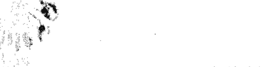

#### 六神無主外交家，坐入十二宮的意義

- 命、身宮—我的命格運勢：我是六神無主外交家。
- 兄弟宮—母親與我的緣分：母親用口才影響我，但終究因化忌而無緣。
- 夫妻宮—配偶與我的緣分：配偶光說不練、口角不斷，終究因化忌而無緣。
- 子女宮—子女與我的緣分：子女奔波、叛逆、口角不斷，終究因化忌而無緣。
- 財帛宮—財運：以口才、專業而得財，但終究化忌投資決定錯誤而破財。
- 疾厄宮—弱點的疾病：有天機（木）肝、膽、神經系統的疾病傷害我。
- 遷移宮—出外運：是非小人傷害我。
- 僕役宮—知己與我的緣分：朋友小人陷害我。
- 官祿宮—事業運：以口才、專業而得官，但終究化忌而低迷。
- 田宅宮—置產運：置產進出大，但終究化忌是非糾紛多。
- 福德宮—存款運：存款金額一般，但終究化忌投資失敗而低迷。
- 父母宮—父親與我的緣分：父親用口才影響我，但終究因化忌而無緣。

#### 機巨在卯（聰明的外交家）巨門化祿

#### 機巨在酉（創新的外交家）巨門化祿

化祿星的個性為忍辱負重；命格為帶財、重財；運勢為順利、得財。

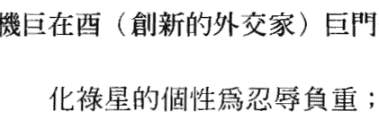

化祿星轉化巨門◎100分的大旺運勢，升格為120分的超旺運勢；化祿星增加巨門本質的口才星性，突顯出帶財、重財的命格，形成順利而得財的運勢。化祿星轉化巨門◎之代表人物外交官，升格為外交官。天機○、巨門◎祿之雙星組合升格為忍辱負重外交官。

機巨在卯原為聰明的外交家，代表智慧、口才佳、求上進、有活力、積極、善計畫的個性運勢；機巨在酉原為創新的外交家，代表創意十足、務實改革的個性運勢。因為機巨為旺廟，呈現旺盛的命格、大旺的運勢，逢化祿星坐入巨門，增加了巨門在卯的溝通技巧、企畫能力、生活資源、聰明智慧，以及在酉的辯論才能、務實創意及改革的星性，形成人際關係旺盛、企畫執行能力強、能說善道、資源豐厚且穩重、踏實、務實、順利而得財的命格運勢。

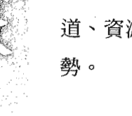

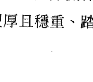

#### 忍辱負重外交官，坐入十二宮的意義

- 命、身宮—我的命格運勢：我是忍辱負重外交家。
- 兄弟宮—母親與我的緣分：母親支持我、幫助我。
- 夫妻宮—配偶與我的緣分：配偶與我感情穩定。
- 子女宮—子女與我的緣分：子女有才藝、有專業、口才好、感情穩定。
- 財帛宮—財運：以口才、智慧、才華、專業而得財。
- 疾厄宮—弱點的疾病：有天機（木）肝、膽、神經系統的疾病干擾我，但有醫生貴人幫助我。
- 遷移宮—出外運：出外逢貴人相助。
- 僕役宮—知己與我的緣分：我有知己貴人支持。
- 官祿宮—事業運：以口才、智慧、才華、專業而得官。
- 田宅宮—置產運：房產大而多，但時常不在家。
- 福德宮—存款運：存款金額順利且高。
- 父母宮—父親與我的緣分：父親支持我、幫助我。

#### 機巨在卯（聰明的外交家）巨門化權

#### 機巨在酉（創新的外交家）巨門化權

化權星的個性為力破山河；命格為帶權而重權；運勢為掌權而得權。

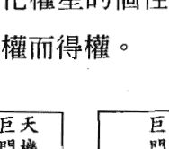

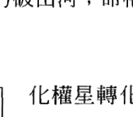

化權星轉化巨門◎100 分的大旺運勢，升格為 120 分的超旺運勢；化權星增加巨門本質的口才星性，突顯出帶權而重權的命格，形成掌權而得權的運勢。化權星轉化巨門◎之代表人物外交家，升格為外交官。天機○、巨門◎權之雙星組合升格為力破山河外交官。

機巨在卯原為聰明的外交家，代表智慧、口才佳、求上進、有活力、積極、善計畫的個性運勢；機巨在酉原為創新的外交家，代表創意十足、務實改革的個性運勢。因為機巨為旺廟，呈現旺盛的命格、大旺的運勢，逢化權星坐入巨門，增加了巨門在卯的積極、求上進、樂觀、活力、企圖心、執行魄力，以及在酉的辯論才能、大膽創新、積極改革、去燕存菁的星性，形成領導、突破、企畫執行能力強、辯論權威、順利而得權的命格運勢。

#### 力破山河外交官，坐入十二宮的意義


- 命、身宮—我的命格運勢：我是力破山河外交家。
- 兄弟宮—母親與我的緣分：母親以權威管教我，聚少離多。
- 夫妻宮—配偶與我的緣分：配偶霸道、口角不斷而聚少離多。
- 子女宮—子女與我的緣分：子女有才藝、有專業、口才好，但個性霸道而聚少離多。
- 財帛宮—財運：以口才、智慧、領導、突破而得財。
- 疾厄宮—弱點的疾病：有天機（木）肝、膽、神經系統的疾病干擾我，但有權貴醫生貴人幫助我。
- 遷移宮—出外運：出外逢權貴貴人相助。
- 僕役宮—知己與我的緣分：我有知己權貴貴人支持，但亦牽絆我。
- 官祿宮—事業運：以口才、智慧、領導、突破而得官。
- 田宅宮—置產運：房產大，但時常不在家。
- 福德宮—存款運：存款金額高，且控制得當。
- 父母宮—父親與我的緣分：父親以權威管教我，聚少離多。

## 機梁在辰、戌—天機化祿、權、科、忌；

### 天梁化祿、權、科之意義

機梁在辰（平庸的大教主）天機化祿、天梁化權
機梁在戌（負責的平庸大教主）天機化祿、天梁化權

化祿星的個性為忍辱負重；命格為帶財、重財；運勢為順利、得財。

化權星的個性為力破山河；命格為帶權而重權；運勢為掌權而得權。


化祿星轉化天機△ 50 分的平庸運勢，升格為○ 80 分的旺盛運勢；化祿星引動出天機本質的智慧，突顯出帶財、重財的命格，形成順利而得財的運勢。化祿星轉化天機△之代表人物孫猴子，升格為忍辱負重孫悟空。

化權星轉化天梁◎ 100 分的大旺運勢，升格為 120 分的超旺運勢；化權星增加了天梁本質的德行天下星性，突顯出帶權而重權的命格，形成掌權而得權的運勢。化權星轉化天梁◎之代表人物大教主，升格為力破山河教皇。

天機△祿、天梁◎權之雙星組合，天機△祿為命，天梁◎權為運，天機化祿代表智慧、聰明、穩重的命格；天梁化權代表福報庇蔭、善行義舉、服務眾生而得權的運勢。因此原為平庸的大教主，升格為忍辱負重教皇。

辰、戌為天羅地網宮，欲望、企圖心過於強盛。機梁在辰原為固執、變動性大、奔波的平庸大教主個性運勢，化祿星坐入天機及化權星坐入天梁，則增加其格局大、領導慾的運勢，但終究回歸於穩重、務實、踏實的命格。機梁在戌原為固執、執著、負責的平庸大教主運勢，化祿星坐入天機及化權星坐入天梁，則增加其領導能力與更加負責、忠誠的運勢，但終究回歸於穩重、務實的命格。


#### 忍辱負重教皇，坐入十二宮的意義

- 命、身宮—我的命格運勢：我是忍辱負重教皇。
- 兄弟宮—母親與我的緣分：母親用威權管教我，但也支持我、幫助我。
- 夫妻宮—配偶與我的緣分：配偶權威霸道，但支持我、幫助我。
- 子女宮—子女與我的緣分：子女權威霸道，但會幫忙我。
- 財帛宮—財運：以權威、智慧、專業而得財。
- 疾厄宮—弱點的疾病：有天機（木）肝、膽、神經系統的疾病，但常有權威醫生貴人幫助我。
- 遷移宮—出外運：有權勢長輩貴人幫助我。
- 僕役宮—知己與我的緣分：知己權勢貴人多，且幫助我。
- 官祿宮—事業運：以權威、智慧、專業而得官。
- 田宅宮—置產運：祖產運、置產運皆旺盛。
- 福德宮—存款運：存款金額豐厚，理財有方而得庫。
- 父母宮—父親與我的緣分：父親用威權管教我，但也支持我、幫助我。

#### 機梁在辰（平庸的大教主）天機化權

#### 機梁在戌（負責的平庸大教主）天機化權

化權星的個性為力破山河；命格為帶權而重權；運勢為掌權而得權。


化權星轉化天機△ 50 分的平庸運勢，升格為◎ 80 分的旺盛運勢。化權星引動出天機本質的智慧星性，更加突顯出帶權而重權的命格，形成掌權而得權的運勢。化權星轉化天機△之代表人物孫猴子，升格為力破山河孫悟空。天機△權、天梁◎雙星組合升格為力破山河大教主。

辰、戌為天羅地網宮，代表欲望過高、企圖心過於強盛。機梁在辰原為平庸大教主，代表變動性大、奔波、善良、宗教情懷的個性運勢；機梁在戌原為負責的平庸大教主，代表固執、執著、負責、忠誠、善良、助人的個性運勢，化權星坐入天機則更增加其固執、執著、變動、奔波、慾望、格局大、企圖心的命格運勢。


#### 力破山河大教主，坐入十二宮的意義

- 命、身宮—我的命格運勢：我是力破山河大教主。
- 兄弟宮—母親與我的緣分：母親用威權管教、帶領我、聚少離多。
- 夫妻宮—配偶與我的緣分：配偶權威霸道、口角不斷、聚少離多。
- 子女宮—子女與我的緣分：子女權威霸道，聚少離多。
- 財帛宮—財運：以權威、智慧、專業而得財。
- 疾厄宮—弱點的疾病：有天機（木）肝、膽、神經系統的疾病，但有權威醫生貴人幫助我。
- 遷移宮—出外運：有權勢長輩貴人幫助我。
- 僕役宮—知己與我的緣分：知己權勢貴人帶領我。
- 官祿宮—事業運：以權威、智慧、專業而得官。
- 田宅宮—置產運：祖產運勢旺，置產運勢強。
- 福德宮—存款運：存款金額財進財出，但控制自如。
- 父母宮—父親與我的緣分：父親用威權管教、帶領我、聚少離多。

#### 機梁在辰（平庸的大教主）天機化科

#### 機梁在戌（負責的平庸大教主）天機化科

化科星的個性為攀龍附鳳；命格為坐享其成；運勢為幸運、得名。


化科星轉化天機△50分的平庸運勢，升格為○80分的旺盛運勢。化科星引動出天機本質的智慧星性，突顯出坐享其成的命格，形成幸運而得名的運勢。化科星轉化天機△之代表人物孫猴子，升格為攀龍附鳳孫悟空。天機△科、天梁◎雙星組合升格為攀龍附鳳大教主。

辰、戌為天羅地網宮，代表慾望過高、企圖心過於強盛。機梁在辰原為平庸大教主，擁有善良、宗教情懷、變動性大、奔波的個性運勢；機梁在戌原為負責的平庸大教主，擁有善良、助人、忠誠、固執、執著的個性運勢，化科星坐入天機則降低其執著、固執、變動、奔波、慾望的特質，形成幸運而得名的命格運勢。

#### 攀龍附鳳大教主，坐入十二宮的意義


- 命、身宮—我的命格運勢：我是攀龍附鳳大教主。
- 兄弟宮—母親與我的緣分：母親雖常老生常談，但溺愛我。
- 夫妻宮—配偶與我的緣分：配偶雖然喜歡嘮叨，但感情融洽。
- 子女宮—子女與我的緣分：子女聰明、機伶，與我感情融洽。
- 財帛宮—財運：以智慧、專業而得財。
- 疾厄宮—弱點的疾病：有天機（木）肝、膽、神經系統的疾病，但常有專科醫生貴人幫助我。
- 遷移宮—出外運：有長輩貴人幫助我。
- 僕役宮—知己與我的緣分：有知己貴人幫助我。
- 官祿宮—事業運：以智慧、專業而得官、得名。
- 田宅宮—置產運：祖產運佳，置產運小而美。
- 福德宮—存款運：存款金額一般，喜愛投資理財。
- 父母宮—父親與我的緣分：父親雖常老生常談，但溺愛我。

#### 機梁在辰、戌

機梁在辰（平庸的大教主）天機化忌

機梁在戌（負責的平庸大教主）天機化忌

化忌星的個性為六神無主；命格為無依無靠；運勢為倒楣、失去。


化忌星轉化天機△ 50分的平庸運勢，降格為×20分的低迷運勢。

化忌星失去了天機本質的智慧星性，突顯出無依無靠的命格，形成倒楣、失去的運勢。化忌星轉化天機△之代表人物孫猴子，降格為六神無主孫病猴。天機△忌、天梁◎雙星組合降格為六神無主大教主。

辰、戌為天羅地網宮，慾望、企圖心過於強盛。機梁在辰原為固執、變動性大、奔波、平庸的大教主個性運勢，機梁在戌原為固執、執著、負責的平庸大教主個性運勢，化忌星坐入天機則增加其多慮、固執、變動、奔波、慾望、悲觀、執著的命格。

天機化忌為昏頭昏腦，天梁化廟為領導運勢；天機為命，天梁為運，雖有天梁的領導運勢，但天機化忌的六神無主個性失去了領導能力形成優柔寡斷、能力不足的個性運勢，終究容易形成權勢旁落的命格。

#### 六神無主大教主，坐入十二宮的意義


- 命、身宮—我的命格運勢：我是六神無主大教主。
- 兄弟宮—母親與我的緣分：母親孤獨、孤離，與我無緣。
- 夫妻宮—配偶與我的緣分：我與配偶無緣。
- 子女宮—子女與我的緣分：我與子女無緣。
- 財帛宮—財運：服務眾生而得財，終究化忌投資決定錯誤而破財。
- 疾厄宮—弱點的疾病：有天機（木）肝、膽、神經系統的疾病嚴重傷害我。
- 遷移宮—出外運：有長輩小人傷害我。
- 僕役宮—知己與我的緣分：小人朋友陷害我。
- 官祿宮—事業運：服務眾生而得官，但終究因化忌是非小人而低迷。
- 田宅宮—置產運：祖產運強，但終究化忌是非糾紛而失去。
- 福德宮—存款運：存款金額一般，但終究化忌投資失敗而破庫。
- 父母宮—父親與我的緣分：父親孤獨、孤離，與我無緣。

#### 機梁在辰（平庸的大教主）天梁化祿

#### 機梁在戌（負責的平庸大教主）天梁化祿

化祿星的個性為忍辱負重；命格為帶財、重財；運勢為順利、得財。


化祿星轉化天梁◎100 分的大旺運勢，升格為120 分的超旺運勢；化祿星增加天梁本質的德行天下星性，突顯出帶財、重財的命格，形成順利而得財的運勢。化祿星轉化天梁◎之代表人物大教主，升格為忍辱負重教皇。天機△、天梁◎祿之雙星組合升格為平庸的忍辱負重教皇。

辰、戌為天羅地網宮，欲望、企圖心過於強盛。機梁在辰原為固執、變動性大、奔波的平庸大教主個性運勢；機梁在戌原為固執、執著、負責的平庸大教主個性運勢，化祿星坐入天梁則增加其穩重、務實、負責、忠誠的特質，形成順利而得財的運勢。

天機化平為命，代表平庸的命格，天梁廟祿為運，代表服務眾生而得財的運勢，雖然運勢順遂但終究回歸天機化平的平庸命格。

#### 平庸的忍辱負重教皇，坐入十二宮的意義


- 命、身宮—我的命格運勢：我是平庸的忍辱負重教皇。
- 兄弟宮—母親與我的緣分：母親老成持重，且幫助我。
- 夫妻宮—配偶與我的緣分：配偶老成持重，彼此感情穩定。
- 子女宮—子女與我的緣分：子女聰明、穩重，與我感情穩定。
- 財帛宮—財運：以智慧、專業、服務眾生而得財。
- 疾厄宮—弱點的疾病：有天機化平（木）肝、神經系統的疾病，但常有醫生貴人幫助我。
- 遷移宮—出外運：有長輩貴人幫助我。
- 僕役宮—知己與我的緣分：有知己貴人幫助我。
- 官祿宮—事業運：以智慧、專業、服務眾生而得官。
- 田宅宮—置產運：祖產運佳，置產運一般。
- 福德宮—存款運：存款金額豐厚。
- 父母宮—父親與我的緣分：父親老成持重，且幫助我。

#### 機梁在辰（平庸的大教主）天梁化科

#### 機梁在戌（負責的平庸大教主）天梁化科

化科星的個性為攀龍附鳳；命格為坐享其成；運勢為幸運、得名。


化科星轉化天梁◎100 分的大旺運勢，升格為120 分的超旺運勢；化科星增加天梁本質的善良星性，突顯出坐享其成的命格，形成幸運而得名的運勢。化科星轉化天梁◎之代表人物大教主，升格為攀龍附鳳教皇。天機△、天梁◎科之雙星組合升格為平庸的攀龍附鳳教皇。

辰、戌為天羅地網宮，慾望、企圖心過於強盛。機梁在辰原為固執、變動性大、奔波的平庸大教主個性運勢，機梁在戌原為固執、執著、負責的平庸大教主個性運勢，化科星坐入天梁則降低其固執、執著、慾望、奔波的特質，形成幸運而得名的運勢。

天機化平為命，代表平庸的命格，天梁廟科為運，代表服務眾生而得名的運勢，雖然運勢得名但終究回歸天機化平的平庸命格。

#### 平庸的攀龍附鳳教皇，坐入十二宮的意義


- 命、身宮—我的命格運勢：我是平庸的攀龍附鳳教皇。

# 紫微四化，一学就通

兄弟宫—母亲与我的缘份：母亲溺爱我。

夫妻宫—配偶与我的缘份：彼此感情融洽。

子女宫—子女与我的缘份：子女聪明、温和、斯文，与我感情融洽。

财帛宫—财运：以智慧、专业、服务众生而得财。

疾厄宫—弱点的疾病：有天机化平（木）肝、神经系统的疾病，但常有专科医生贵人帮助我。

迁移宫—出外运：有长辈贵人相助。

仆役宫—知己与我的缘份：有知己贵人帮助我。

官禄宫—事业运：以智慧、专业、服务众生而得官、得名。

田宅宫—置产运：祖产运佳，置产运一般。

福德宫—存摺运：存款金额一般。

父母宫—父亲与我的缘份：父亲溺爱我。

## 太阳星系四化星全解

### 太阳在子、午—化禄、化权、化忌之意义

太阳在子（包黑暗）化禄
太阳在午（包大人）化禄

化禄星的个性为忍辱负重；命格为带财、重财；运势为顺利、得财。

| 太阳 × 禄 子 |
| :--- |
| 化禄星转化太阳 × 20 分的弱陷运势，升格为 50 分的平庸运势。化禄星安定了太阳本质的刚烈星性，而增加带财、重财的命格，形成顺利而得财的运势。化禄星转化太阳 × 之代表人物包黑暗，升格为忍辱负重小包。 |

太阳在子原为包黑暗，代表机伶、内敛、摇摆、没主见的命格运势，为了面子、名声、权力而展现出刚烈且固执的行为特质，因为化陷命格运势低迷，所幸逢化禄星坐入，增加了太阳的财富、权力的星性，形成有钱的运势，但因为太阳为化陷终究形成低迷的命格。

#### 忍辱负重小包，坐入十二宫的意义

- 命、身宫—我的命格运势：我是忍辱负重小包。
- 兄弟宫—母亲与我的缘份：母亲支持我，感情稳定。
- 夫妻宫—配偶与我的缘份：双方感情稳定，但终究无缘。
- 子女宫—子女与我的缘份：子女稳重、聪慧，互相支持，但终究无缘。
- 财帛宫—财运：以智慧而得财，但终究财运低迷。
- 疾厄宫—弱点的疾病：有太阳（火）心脏、心血管的疾病干扰我，但有医生贵人帮助我。
- 迁移宫—出外运：贵人、小人皆有。
- 仆役宫—知己与我的缘份：有知己贵人支持，但终究遭陷害。
- 官禄宫—事业运：以智慧而得官，但终究低迷。
- 田宅宫—置产运：置产顺利。
- 福德宫—存摺运：存款金额顺利，终究拮据。
- 父母宫—父亲与我的缘份：父亲支持我，但终究无缘。

化禄星转化太阳○80分的旺盛运势，升格为100分的大旺运势。化禄星安定了太阳本质的刚烈星性，而增加带财、重财的命格，形成顺利而得财的运势。化禄星转化太阳○之代表人物包大人，升格为忍辱负重包青天。

太阳在午原为包大人，代表积极进取、有权有势、霸气、领导、暴躁的命格运势，为了追求权力、财富而展现出霸道、霸气、领导的行为特质，因为化旺命格运势顺遂，又逢化禄星坐入，增加了太阳的财富特质，形成有权有财的命格运势。

太阳在子、午化禄，均适合从事稳定的军公教、政府机关、企业上班族的工作。

#### 忍辱负重包青天，坐入十二宫的意义

- 命、身宫—我的命格运势：我是忍辱负重包青天。
- 兄弟宫—母亲与我的缘份：母亲支持我，感情稳定。
- 夫妻宫—配偶与我的缘份：双方感情稳定，互相支持。
- 子女宫—子女与我的缘份：子女有权有势又稳重，且互相支持。
- 财帛宫—财运：以权而得财，财运富足。
- 疾厄宫—弱点的疾病：有太阳（火）心脏、心血管的疾病干扰我，但有医生贵人帮助我。
- 迁移宫—出外运：出外有权势贵人相助。
- 仆役宫—知己与我的缘份：有权势贵人知己支持。
- 官禄宫—事业运：因财富而得官。
- 田宅宫—置产运：置产顺利。
- 福德宫—存摺运：存款金额顺利、富足。
- 父母宫—父亲与我的缘份：父亲支持我，感情稳定。

#### 太阳在子（包黑暗）化权
太阳在午（包大人）化权

化权星的个性为力破山河；命格为带权而重权；运势为掌权而得权。

化权星转化太阳×20分的弱陷运势，升格为50分的平庸运势。化权星引动出太阳本质的刚烈星性，更加突显出带权而重权的命格，形成掌权而得权的运势。化权星转化太阳×之代表人物包黑暗，升格为力破山河小包。

太阳在子原为包黑暗，代表机伶、内敛、摇摆、没主见的命格运势，为了面子、名声、权力而展现出刚烈且固执的行为特质，因为化陷命格运势低迷，所幸逢化权星坐入，增加了太阳的权势星性，形成有权的运势，但因为太阳为化陷终究形成低迷的命格。

#### 力破山河小包，坐入十二宫的意义

- 命、身宫—我的命格运势：我是力破山河小包。
- 兄弟宫—母亲与我的缘份：母亲以权杖管教我、以威权领导我，终究无缘。
- 夫妻宫—配偶与我的缘份：配偶威权霸气，互相要求高，终究无缘。
- 子女宫—子女与我的缘份：子女威权霸道，不易管教，终究无缘。
- 财帛宫—财运：以智慧、权威而得财，但终究财运低迷。
- 疾厄宫—弱点的疾病：有太阳（火）心脏、心血管的疾病干扰我，但有权威医生贵人帮助我。
- 迁移宫—出外运：领导、突破、权威而掌权，但终究权势旁落。
- 仆役宫—知己与我的缘份：我有权贵知己控制我，且陷害我。
- 官禄宫—事业运：以智慧、权威而得官，但终究官运低迷。
- 田宅宫—置产运：置产运低迷，但终究掌控自如。
- 福德宫—存摺运：存款金额虎头蛇尾。
- 父母宫—父亲与我的缘份：父亲以权杖管教我、以威权领导我，终究无缘。

化权星转化太阳○80分的旺盛运势，升格为100分的大旺运势。化权星引动出太阳本质的刚烈星性，更加突显出带权而重权的命格，形成掌权而得权的运势。化权星转化太阳○之代表人物包大人，升格为力破山河包青天。

太阳在午原为包大人，代表积极进取、有权有势、霸气、领导、暴躁的命格运势，为了追求权力、财富而展现出霸道、霸气、领导的行为特质，因为化旺命格运势顺遂，又逢化权星坐入，增加了太阳的权力特质，形成有大权在握的命格运势。

太阳在子、午化权，容易成为企业经理人、高阶官员、各学校及团体之领导人。

#### 力破山河包青天，坐入十二宫的意义

- 命、身宫—我的命格运势：我是力破山河包青天。
- 兄弟宫—母亲与我的缘份：母亲以威权领导我、带领我。
- 夫妻宫—配偶与我的缘份：配偶威权霸气，互相要求高。
- 子女宫—子女与我的缘份：子女威权霸道，奔波忙碌。
- 财帛宫—财运：以领导、权威而得财。
- 疾厄宫—弱点的疾病：有太阳（火）心脏、心血管的疾病干扰我，但有大权威医生贵人帮助我。
- 迁移宫—出外运：领导、突破、权威而掌权。
- 仆役宫—知己与我的缘份：我有权贵知己控制我。
- 官禄宫—事业运：以领导、权威而得官。
- 田宅宫—置产运：置产运掌控自如。
- 福德宫—存摺运：存款金额富足。
- 父母宫—父亲与我的缘份：父亲以威权领导我、带领我。

#### 太阳在子（包黑暗）化忌
太阳在午（包大人）化忌

化忌星的个性为六神无主；命格为无依无靠；运势为倒楣、失去。

化忌星转化太阳×20分的弱陷运势，降格为负20分的霉运。化忌星失去了太阳本质的权威特性，突显出无依无靠的命格，形成倒楣、失去的运势。化忌星转化太阳×之代表人物包黑暗，降格为六神无主包坎坷。

太阳在子原为包黑暗，代表机伶、内敛、摇摆、没主见的命格运势，为了面子、名声、权力而展现出刚烈且固执的行为特质，因为化陷命格运势低迷，又遭逢化忌星坐入，失去了太阳的财富、权力的星性，形成是非不断、倒楣坎坷的命格运势。

#### 六神无主包坎坷，坐入十二宫的意义

- 命、身宫—我的命格运势：我是六神无主包坎坷。
- 兄弟宫—母亲与我的缘份：母亲影响我、拖累我，孤离无缘。
- 夫妻宫—配偶与我的缘份：配偶忧郁、霸道，孤离无缘。
- 子女宫—子女与我的缘份：子女拖累我，与子女无缘。
- 财帛宫—财运：财运低迷坎坷。
- 疾厄宫—弱点的疾病：有太阳（火）心脏、心血管的疾病严重干扰我。
- 迁移宫—出外运：出外逢小人陷害。
- 仆役宫—知己与我的缘份：损友陷害我。
- 官禄宫—事业运：事业运低迷坎坷。
- 田宅宫—置产运：置产运无。
- 福德宫—存摺运：存款金额无。
- 父母宫—父亲与我的缘份：父亲影响我、拖累我，孤离无缘。

化忌星转化太阳 80 分的旺盛运势，降格为△ 50 分的平庸运势。化忌星失去了太阳本质的权威特性，突显出无依无靠的命格，形成倒楣、失去的运势。化忌星转化太阳○之代表人物包大人，降格为六神无主小包。

太阳在午原为包大人，代表积极进取、有权有势、霸气、领导、暴躁的命格运势，为了追求权力、财富而展现出霸道、霸气、领导的行为特质，因为化旺命格运势顺遂，但遭逢化忌星坐入，失去了太阳的财富、权力特质，形成时而昏头昏脑、时而乱发脾气、时而决定错误、时而官司是非的特性，所幸太阳化旺运势小幅下跌，形成平庸的命格运势。

太阳化忌适合从事钻研、企划、自我工作室，不适合接触太多人的工作较为顺遂。

#### 六神无主小包，坐入十二宫的意义

- 命、身宫—我的命格运势：我是六神无主小包。
- 兄弟宫—母亲与我的缘份：母亲控制我、影响我，聚少离多。
- 夫妻宫—配偶与我的缘份：配偶固执，争执不休，聚少离多。
- 子女宫—子女与我的缘份：子女固执、我行我素、拖累我，聚少离多。
- 财帛宫—财运：财进财出，终究稳定。
- 疾厄宫—弱点的疾病：有太阳（火）心脏、心血管的疾病干扰我。
- 迁移宫—出外运：小人、贵人皆有。
- 仆役宫—知己与我的缘份：小人朋友陷害我。
- 官禄宫—事业运：事业多波折，但终究稳定。
- 田宅宫—置产运：置产多波折，但终究稳定。
- 福德宫—存摺运：存款金额财进财出，终究平顺。
- 父母宫—父亲与我的缘份：父亲控制我、影响我，聚少离多。

### 太阳在辰、戌—化禄、化权、化忌之意义

太阳在辰（奔波的包大人）化禄
太阳在戌（执著的包黑暗）化禄

化禄星的个性为忍辱负重；命格为带财、重财；运势为顺利、得财。

化禄星转化太阳○ 80 分的旺盛运势，升格为 100 分的大旺运势。化禄星安定了太阳本质的变动星性，而增加带财、重财的命格，形成顺利而得财的运势。化禄星转化太阳○之代表人物包大人，升格为忍辱负重包青天。

太阳在辰原为奔波的包大人，代表固执、变动性大、奔波、企图心、欲望的个性运势，为了面子、权势、财富而表现出积极的态度，因为化旺命格运势很顺遂。又逢化禄星坐入，增加了太阳的财富星性，形成稳重、务实、踏实、稳扎稳打的命格运势，且因太阳化旺而优点尽出，事业、财富呈现丰厚顺利的命格运势。

> 忍辱负重包青天，坐入十二宫的意义

- 命、身宫—我的命格运势：我是忍辱负重包青天。
- 兄弟宫—母亲与我的缘份：母亲支持我，感情稳定。
- 夫妻宫—配偶与我的缘份：双方感情稳定，互相支持。
- 子女宫—子女与我的缘份：子女有权有势，互相支持。
- 财帛宫—财运：以权而得财，财运富足。
- 疾厄宫—弱点的疾病：有太阳（火）心脏、心血管的疾病干扰我，但有医生贵人帮助我。
- 迁移宫—出外运：出外有权势贵人相助。
- 仆役宫—知己与我的缘份：有权势贵人知己支持。
- 官禄宫—事业运：以权势、财富而得官。
- 田宅宫—置产运：置产顺利。
- 福德宫—存摺运：存款金额顺利、富足。
- 父母宫—父亲与我的缘份：父亲支持我，感情稳定。

化禄星转化太阳×20分的弱陷运势，升格为50分的平庸运势。化禄星安定了太阳本质的变动星性，而增加带财、重财的命格，形成顺利而得财的运势。化禄星转化太阳×之代表人物包黑暗，升格为忍辱负重小包。

太阳在戌原为执著的包黑暗，代表固执己见、脾气刚烈、过度重视面子的个性运势，为了面子、权势、财富而表现出刚烈的态度，但因为化陷命格运势低迷不顺遂。所幸逢化禄星坐入，引动了太阳的权势、财富星性，原本固执的个性因为化禄而转化，形成了为了现实的利益而放弃自我的坚持，拥有尚称稳定、务实的运势。但终究还是因太阳化陷而缺点暴露，事业、财富呈现财进财出的命格运势。

辰、戌为天罗地网宫，欲望、企图心过于强盛，因化禄星的坐入则稳定了辰戌二宫过于冲刺的本质，形成较为平稳的运势。

- 命、身宫—我的命格运势：我是忍辱负重小包。
- 兄弟宫—母亲与我的缘份：母亲支持我，感情稳定，但聚少离多。
- 夫妻宫—配偶与我的缘份：双方感情稳定，但终究无缘。
- 子女宫—子女与我的缘份：子女稳重、互相支持，但终究无缘。
- 财帛宫—财运：以企图心而得财，但终究财运低迷。
- 疾厄宫—弱点的疾病：有太阳（火）心脏、心血管的疾病干扰我，但有医生贵人帮助我。
- 迁移宫—出外运：贵人、小人皆有。
- 仆役宫—知己与我的缘份：有知己贵人支持，但终究遭陷害。
- 官禄宫—事业运：以权势而得官，但终究低迷。
- 田宅宫—置产运：置产运势波折，终究顺利。
- 福德宫—存摺运：存款金额顺利，终究拮据。
- 父母宫—父亲与我的缘份：父亲支持我，但终究无缘。

#### 太阳在辰（奔波的包大人）化权
太阳在戌（执著的包黑暗）化权

化权星的个性为力破山河；命格为带权而重权；运势为掌权而得权。

化权星转化太阳○80分的旺盛运势，升格为100分的大旺运势。化权星引动出太阳本质的权威星性，更加突显出带权而重权的命格，形成掌权而得权的运势。化权星转化太阳○之代表人物包大人，升格为力破山河包青天。

太阳在辰原为奔波的包大人，代表固执、变动性大、奔波、企图心、欲望的个性运势，为了面子、权势、财富而表现出强势的态度，因为化旺命格运势很顺遂。又逢化权星坐入，增加了太阳的权势星性，形成霸气、突破、威权、不服输、欲望大的命格运势，且因太阳化旺而优点尽出，事业、财富呈现丰厚顺利的命格运势。

#### 力破山河包青天，坐入十二宫的意义

- 命、身宫—我的命格运势：我是力破山河包青天。
- 兄弟宫—母亲与我的缘份：母亲以威权领导我、带领我，但奔波、忙碌。
- 夫妻宫—配偶与我的缘份：配偶威权霸气、奔波、忙碌，互相要求高。
- 子女宫—子女与我的缘份：子女威权霸道，奔波、忙碌，聚少离多。
- 财帛宫—财运：以领导、权威而得财。
- 疾厄宫—弱点的疾病：有太阳（火）心脏、心血管的疾病干扰我，但有大权威医生贵人帮助我。
- 迁移宫—出外运：领导、突破、权威而掌权。
- 仆役宫—知己与我的缘份：我有权贵知己控制我。
- 官禄宫—事业运：以领导、权威而得官。
- 田宅宫—置产运：置产运掌控自如。
- 福德宫—存摺运：存款金额富足，但财进财出。
- 父母宫—父亲与我的缘份：父亲以威权领导我、带领我，但奔波、忙碌。

化权星转化太阳×20分的弱陷运势，升格为50分的平庸运势。化权星引动出太阳本质的权威星性，更加突显出带权而重权的命格，形成掌权而得权的运势。化权星转化太阳×之代表人物包黑暗，升格为力破山河小包。

太阳在戌原为执著的包黑暗，代表固执己见、脾气刚烈、过度重视面子的个性运势，为了面子、权势、财富而表现出刚烈的态度，但因为化陷命格运势低迷不顺遂。所幸逢化权星坐入，引动了太阳的权势星性，原本固执的个性因为化权而转化成霸气、突破、威权、不服输、欲望大的命格运势。但终究还是因太阳化陷而缺点暴露，事业、财富呈现进退无据、财进财出的命格运势。

辰、戌为天罗地网宫，欲望、企图形过于强盛，因化权星的坐入则增加了辰戌二宫冲刺的本质，形成欲望过大、奔波劳苦的命格运势。

#### 力破山河小包，坐入十二宫的意义

- **命、身宫**—我的命格运势：我是力破山河小包。
- **兄弟宫**—母亲与我的缘份：母亲以权杖管教我、以权威领导我，终究无缘。
- **夫妻宫**—配偶与我的缘份：配偶权威霸气，互相要求高，终究无缘。
- **子女宫**—子女与我的缘份：子女权威霸道，不易管教，终究无缘。
- **财帛宫**—财运：以企图心而得财，但终究财运低迷。
- **疾厄宫**—弱点的疾病：有太阳（火）心脏、心血管的疾病干扰我，但有权威医生贵人帮助我。
- **迁移宫**—出外运：领导、突破、权威而掌权，但终究权势旁落。
- **仆役宫**—知己与我的缘份：我有权威知己控制我。
- **官禄宫**—事业运：以权威而得官，但终究官运低迷。
- **田宅宫**—置产运：置产运低迷，但终究掌控自如。
- **福德宫**—存摺运：存款金额财进财出，终究低迷。
- **父母宫**—父亲与我的缘份：父亲以权杖管教我、以权威领导我，终究无缘。

#### 太阳在辰（奔波的包大人）化忌
太阳在戌（执著的包黑暗）化忌

化忌星的个性为六神无主；命格为无依无靠；运势为倒楣、失去。

化忌星转化太阳○80分的旺盛运势，降格为△50分的平庸运势。化忌星失去了太阳本质的变动特性，突显出无依无靠的命格，形成倒楣、失去的运势。化忌星转化太阳○之代表人物包大人，降格为六神无主小包。

太阳在辰原为奔波的包大人，代表固执、变动性大、奔波、企图心、欲望的个性运势，为了面子、权势、财富而表现出积极的态度，因为化旺命格运势很顺遂。但遭逢化忌星坐入，失去了太阳的权势及财富星性，形成时冲时守、时而固执、时而无主见、时而决定错误的特性，所幸太阳化旺运势小幅下跌，形成平庸的命格运势。

#### 六神无主小包，坐入十二宫的意义

- 命、身宫—我的命格运势：我是六神无主小包。
- 兄弟宫—母亲与我的缘分：母亲控制我、影响我，聚少离多。
- 夫妻宫—配偶与我的缘分：配偶固执，争执不休，聚少离多。
- 子女宫—子女与我的缘分：子女固执、我行我素、拖累我，聚少离多。
- 财帛宫—财运：财进财出，终究稳定。
- 疾厄宫—弱点的疾病：有太阳（火）心脏、心血管的疾病干扰我。
- 迁移宫—出外运：小人、贵人皆有。
- 仆役宫—知己与我的缘分：小人朋友陷害我。
- 官禄宫—事业运：事业多波折，但终究稳定。
- 田宅宫—置产运：置产多波折，但终究稳定。
- 福德宫—存摺运：存款金额财进财出，终究平顺。
- 父母宫—父亲与我的缘分：父亲控制我、影响我，聚少离多。

化忌星转化太阳×20分的弱陷运势，降格为负20分的霉运。化忌星失去了太阳本质的变动特性，突显出无依无靠的命格，形成倒楣、失去的运势。化忌星转化太阳×之代表人物包黑暗，降格为六神无主包坎坷。

太阳在戌原为执著的包黑暗，代表固执己见、脾气刚烈、过度重视面子的个性运势，为了面子、权势、财富而表现出刚烈的态度，但因为化陷命格运势低迷不顺遂。又遭逢化忌星坐入，失去了太阳的权势及财富星性，形成昏头昏脑、行事急就章的特性，使其成为是非不断、倒楣坎坷的命格运势。

辰、戌为天罗地网宫，欲望、企图心过于强烈，因化忌星的坐入则扰乱了辰戌二宫冲刺的本质，形成紊乱不堪的形势。

#### 六神无主包坎坷，坐入十二宫的意义

- 命、身宫—我的命格运势：我是六神无主包坎坷。
- 兄弟宫—母亲与我的缘分：母亲影响我、拖累我，孤离无缘。
- 夫妻宫—配偶与我的缘分：配偶忧郁、霸道，孤离无缘。
- 子女宫—子女与我的缘分：子女拖累我，与子女无缘。
- 财帛宫—财运：财运低迷坎坷。
- 疾厄宫—弱点的疾病：有太阳（火）心脏、心血管的疾病严重伤害我。
- 迁移宫—出外运：出外逢小人陷害。
- 仆役宫—知己与我的缘分：损友陷害我。
- 官禄宫—事业运：事业运低迷坎坷。
- 田宅宫—置产运：置产运无。
- 福德宫—存折运：存款金额无。
- 父母宫—父亲与我的缘分：父亲影响我、拖累我，孤离无缘。

### 太阳在巳、亥—化禄、化权、化忌之意义

#### 太阳在巳（上进的包大人）化禄
#### 太阳在亥（散漫的包黑暗）化禄

化禄星的个性为忍辱负重；命格为带财、重财；运势为顺利、得财。

化禄星转化太阳80分的旺盛运势，升格为100分的大旺运势。化禄星安定了太阳本质的奔波星性，而增加带财、重财的命格，形成顺利而得财的运势。化禄星转化太阳之代表人物包大人，升格为忍辱负重包青天。

太阳在巳原为上进的包大人，代表聪明、才艺、奔波、求上进、积极、求完美、乐观的命格运势，因为化旺命格运势旺盛，逢化禄星坐入，增加了太阳的财富、权势、名气的特质，形成顺利而得财的命格运势。

#### 忍辱负重包青天，坐入十二宫的意义

- 命、身宫—我的命格运势：我是忍辱负重包青天。

太阳在亥原为散漫的包黑暗，代表懒散、自尊心强、好面子的命格运势，因为化陷命格运势低迷，所幸逢化禄星坐入，增加了太阳的财富、权势的特质，形成较为稳重、务实、踏实的命格运势。但终究还是因太阳化陷而缺点暴露，事业、财富呈现进退无据、财进财出的命格运势。

#### 忍辱负重小包，坐入十二宫的意义

- 命、身宫—我的命格运势：我是忍辱负重小包。
- 兄弟宫—母亲与我的缘分：母亲支持我，感情稳定，但聚少离多。
- 夫妻宫—配偶与我的缘分：配偶浪漫多情、感情甜蜜，但终究无缘。
- 子女宫—子女与我的缘分：子女聪慧、有才华，互相支持，但终究无缘。
- 财帛宫—财运：以才华而得财，但终究财运低迷。
- 疾厄宫—弱点的疾病：有太阳（火）心脏、心血管的疾病干扰我，但有医生贵人帮助我。
- 迁移宫—出外运：贵人、小人皆有。
- 仆役宫—知己与我的缘分：有知己贵人支持，但终究遭陷。

- 兄弟宫—母亲与我的缘分：母亲奔波、忙碌，但支持我、感情稳定。
- 夫妻宫—配偶与我的缘分：配偶奔波、忙碌，但感情稳定、互相支持。
- 子女宫—子女与我的缘分：子女奔波、忙碌，但互相支持。
- 财帛宫—财运：以权而得财，财运富足。
- 疾厄宫—弱点的疾病：有太阳（火）心脏、心血管的疾病干扰我，但有医生贵人帮助我。
- 迁移宫—出外运：出外有权势贵人相助。
- 仆役宫—知己与我的缘分：有权势贵人知己支持。
- 官禄宫—事业运：因财富而得官。
- 田宅宫—置产运：置产顺利。
- 福德宫—存折运：存款金额富足。
- 父母宫—父亲与我的缘分：父亲奔波、忙碌，但支持我，感情稳定。

化禄星转化太阳 × 20 分的弱陷运势，升格为50 分的平庸运势。化禄星安定了太阳本质的粗犷星性，而增加带财、重财的命格，形成顺利而得财的运势。化禄星转化太阳 × 之代表人物包黑暗，升格为忍辱负重小包。

害。

官禄宫—事业运：以才艺而得官，但终究低迷。

田宅宫—置产运：置产运波折，但终究顺利。

福德宫—存折运：存款金额顺利，终究拮据。

父母宫—父亲与我的缘分：父亲支持我，但终究无缘。

#### 太阳在巳（上进的包大人）化权
#### 太阳在亥（散漫的包黑暗）化权

化权星的个性为力破山河；命格为带权而重权；运势为掌权而得权。

化权星转化太阳80分的旺盛运势，升格为100分的大旺运势。化权星引动出太阳本质的刚烈星性，更加突显出带权而重权的命格，形成掌权而得权的运势。化权星转化太阳之代表人物包大人，升格为力破山河包青天。

太阳在巳原为上进的包大人，代表聪明、才艺、奔波、求上进、积极、求完美、乐观的命格运势，因为化旺命格运势旺盛，逢化权星坐入，增加了太阳的财富、权势、名气的特质，形成霸气、突破、威权、掌权而得权的命格运势。

#### 力破山河包青天，坐入十二宫的意义

- 命、身宫—我的命格运势：我是力破山河包青天。
- 兄弟宫—母亲与我的缘分：母亲以威权领导我、带领我，且聚少离多。
- 夫妻宫—配偶与我的缘分：配偶奔波、忙碌、威权霸气，互相要求高。
- 子女宫—子女与我的缘分：子女威权霸道，奔波忙碌。
- 财帛宫—财运：以领导、权威而得财。
- 疾厄宫—弱点的疾病：有太阳（火）心脏、心血管的疾病干扰我，但有大权威医生贵人帮助我。
- 迁移宫—出外运：领导、突破、权威而掌权。
- 仆役宫—知己与我的缘分：我有权贵知己控制我。
- 官禄宫—事业运：以领导、权威而得官。
- 田宅宫—置产运：置产运掌控自如。
- 福德宫—存折运：存款金额财进财出，终究控制自如。
- 父母宫—父亲与我的缘分：父亲以威权领导我、带领我，且聚少离多。

化权星转化太阳×20分的弱陷运势，升格为50分的平庸运势。化权星引动出太阳本质的好面子星性，更加突显出带权而重权的命格，形成掌权而得权的运势。化权星转化太阳×之代表人物包黑暗，升格为力破山河小包。

太阳在亥原为散漫的包黑暗，代表懒散、自尊心强、好面子的命格运势，因为化陷命格运势低迷，所幸逢化权星坐入，增加了太阳权势的特质，形成较为上进、积极、好面子的命格运势。但终究还是因太阳化陷而缺点暴露，事业、财富呈现进退无据、财进财出的命格运势。

#### 力破山河小包，坐入十二宫的意义

- 命、身宫—我的命格运势：我是力破山河小包。
- 兄弟宫—母亲与我的缘分：母亲以权杖管教我、以威权领导我，终究无缘。
- 夫妻宫—配偶与我的缘分：配偶奔波、忙碌、威权霸气，互相要求高，终究无缘。
- 子女宫—子女与我的缘分：子女威权霸道，不易管教，终究无缘。
- 财帛宫—财运：以才华、权威而得财，但终究财运低迷。

- 疾厄宫—弱点的疾病：有太阳（火）心脏、心血管的疾病干扰我，但有权威医生贵人帮助我。
- 迁移宫—出外运：领导、突破、权威而掌权，但终究权势旁落。
- 仆役宫—知己与我的缘分：我有权贵知己控制我。
- 官禄宫—事业运：以才华、权威而得官，但终究官运低迷。
- 田宅宫—置产运：置产运低迷，但终究掌控自如。
- 福德宫—存折运：存款金额虎头蛇尾。
- 父母宫—父亲与我的缘分：父亲以权杖管教我、以威权领导我，终究无缘。

#### 太阳在巳（上进的包大人）化忌
#### 太阳在亥（散漫的包黑暗）化忌

化忌星的个性为六神无主；命格为无依无靠；运势为倒霉、失去。

化忌星转化太阳80分的旺盛运势，降格为△50分的平庸运势。化忌星失去了太阳本质的积极特性，突显出无依无靠的命格，形成倒霉、失去的运势。化忌星转化太阳之代表人物包大人，降格为六神无主小包。

太阳在巳原为上进的包大人，代表聪明、才艺、奔波、求上进、积极、求完美、乐观的命格运势，因为化旺命格运势旺盛，但遭逢化忌星坐入，失去了太阳的财富、权势、名气的特质，形成时冲时守、时而乐观、时而悲观、时而决定错误、时而官司是非的特性，所幸太阳化旺运势小幅下跌，形成平庸的命格运势。

#### 六神无主小包，坐入十二宫的意义

- 命、身宫—我的命格运势：我是六神无主小包。
- 兄弟宫—母亲与我的缘分：母亲控制我、影响我，且聚少离多。
- 夫妻宫—配偶与我的缘分：配偶固执，争执不休，聚少离多。
- 子女宫—子女与我的缘分：子女固执、我行我素，聚少离多。
- 财帛宫—财运：财进财出，终究稳定。
- 疾厄宫—弱点的疾病：有太阳（火）心脏、心血管的疾病干扰我。
- 迁移宫—出外运：小人、贵人皆有。
- 仆役宫—知己与我的缘分：小人朋友陷害我，但终究权贵知己相助。

- 官禄宫—事业运：事业多波折，但终究稳定。
- 田宅宫—置产运：置产多波折，但终究稳定。
- 福德宫—存招运：存款金额财进财出，终究平顺。
- 父母宫—父亲与我的缘分：父亲控制我、影响我，且聚少离多。

化忌星转化太阳×20分的弱陷运势，降格为负20分的霉运。化忌星失去了太阳本质的光明特性，突显出无依无靠的命格，形成倒霉、失去的运势。化忌星转化太阳×之代表人物包黑暗，降格为六神无主包坎坷。

太阳在亥原为散漫的包黑暗，代表懒散、自尊心强、好面子的命格运势，因为化陷命格运势低迷，又遭逢化忌星坐入，失去了太阳的财富、权势的特质，形成昏头昏脑、漫无目标的特性，使其成为是非不断、官司是非、倒霉坎坷的命格运势。

#### 六神无主包坎坷，坐入十二宫的意义

- 命、身宫—我的命格运势：我是六神无主包坎坷。
- 兄弟宫—母亲与我的缘分：母亲影响我、拖累我，孤离无缘。
- 夫妻宫—配偶与我的缘分：配偶忧郁、霸道，孤离无缘。
- 子女宫—子女与我的缘分：子女拖累我，与子女无缘。
- 财帛宫—财运：财运低迷坎坷。
- 疾厄宫—弱点的疾病：有太阳（火）心脏、心血管的疾病严重伤害我。
- 迁移宫—出外运：出外逢小人陷害。
- 仆役宫—知己与我的缘分：损友陷害我。
- 官禄宫—事业运：事业运低迷坎坷。
- 田宅宫—置产运：置产运无。
- 福德宫—存折运：存款金额无。
- 父母宫—父亲与我的缘分：父亲影响我、拖累我，孤离无缘。

### 日月在丑、未—太阳化禄、权、忌；太阴化禄、权、科、忌之意义

#### 日月在丑（弱势的大才子）太阳化禄、太阴化科
#### 日月在未（平庸的穷书生）太阳化禄、太阴化科

化禄星的个性为忍辱负重；命格为带财、重财；运势为顺利、得财。

化科星的个性为攀龙附凤；命格为坐享其成；运势为幸运、得名。

| 太阴◎科 |   |
| :------ | :-- |
| 太阳×禄 | 丑 |

化禄星转化太阳× 20 分的低迷运势，升格为△ 50 分的平庸运势；化禄星增加了太阳本质的财富星性，突显出带财、重财的命格，形成顺利而得财的运势。化禄星转化太阳×之代表人物包黑暗，升格为忍辱负重小包。

化科星转化太阴◎ 100 分的大旺运势，升格为 120 分的超旺运势；化科星引动出太阴本质的才华星性，突显出坐享其成的命格，形成幸运而得名的运势。化科星转化太阴◎之代表人物大才子，升格为攀龙附凤国师。

太阳×禄、太阴◎科之双星组合，太阳×禄为命，太阴◎科为运，太阳化禄代表财富、稳重的命格；太阴化科代表才华、专业、名气的运势。因此原为弱势的大才子升格为忍辱负重国师。

日月在丑原为弱势的大才子，代表刚烈固执、才华洋溢的特质，加上化禄星坐入太阳、化科星坐入太阴，增加了稳重、务实、踏实、求上进、聪明、智慧、才艺的特质，形成才华洋溢、名扬四海、顺利而得财的命格运势。

| 太阴◎科 |   |
| :------ | :-- |
| 太阳△禄 | 丑 |

#### 忍辱负重国师，坐入十二宫的意义

- 命、身宫—我的命格运势：我是忍辱负重国师。
- 兄弟宫—母亲与我的缘分：母亲溺爱我，且支持我、帮助我。
- 夫妻宫—配偶与我的缘分：配偶疼爱我，且支持我、帮助我。
- 子女宫—子女与我的缘分：子女与我感情佳，且才华洋溢又孝顺。
- 财帛宫—财运：才华洋溢、理财有方，顺利而得财。
- 疾厄宫—弱点的疾病：有太阳陷（火）心脏、心血管的疾病，但常有专科医生贵人帮助我。
- 迁移宫—出外运：贵人运旺盛且帮助我。
- 仆役宫—知己与我的缘分：知己贵人多且帮助我。
- 官禄宫—事业运：以智慧、才华、专业而得官、得名。
- 田宅宫—置产运：置产运势旺盛，身居名宅。
- 福德宫—存折运：存款金额富足，理财有方而得库。
- 父母宫—父亲与我的缘分：父亲溺爱我，且支持我、帮助我。

| 太阴×科 |   |
| :------ | :-- |
| 太阳△禄 | 未 |

化禄星转化太阳△50分的平庸运势，升格为○80分的旺盛运势；化禄星增加了太阳本质的财富星性，突显出带财、重财的命格，形成顺利而得财的运势。化禄星转化太阳△之代表人物小包，升格为忍辱负重包大人。

化科星转化太阴×20分的低迷运势，升格为○50分的平庸运势；化科星引动出太阴本质的才华星性，突显出坐享其成的命格，形成幸运而得名的运势。化科星转化太阴×之代表人物穷书生，升格为攀龙附凤小书生。

太阳△禄、太阴×科之双星组合，太阳△禄为命，太阴×科为运，太阳化禄代表财富、稳重的命格；太阴化科代表才华、专业、名气的运势。因此原为平庸的穷书生升格为忍辱负重小书生。

日月在未原为平庸的穷书生，代表享福、敏感、慵懒、固执、刚烈的特质，加上化禄星坐入太阳、化科星坐入太阴，增加了稳重、务实、踏实、求上进、聪明、智慧、才艺的特质，形成多才多艺、科考顺利、稳重而得财的命格运势。

#### 忍辱负重小书生，坐入十二宫的意义

- 命、身宫—我的命格运势：我是忍辱负重小书生。
- 兄弟宫—母亲与我的缘分：母亲溺爱我，且支持我。
- 夫妻宫—配偶与我的缘分：配偶疼爱我，且支持我。
- 子女宫—子女与我的缘分：子女多才多艺与我感情佳。
- 财帛宫—财运：以才艺、专业而得财。
- 疾厄宫—弱点的疾病：有太阴化陷（水）泌尿系统、妇女的疾病，但常有专科医生贵人帮助我。
- 迁移宫—出外运：贵人运强，且支持我。
- 仆役宫—知己与我的缘分：知己贵人多，且支持我。
- 官禄宫—事业运：以才艺、专业而得官、得名。
- 田宅宫—置产运：置产运势强，身居名宅。
- 福德宫—存折运：存款金额高，理财有方而得库。
- 父母宫—父亲与我的缘分：父亲溺爱我，且支持我。

#### 日月在丑（弱势的大才子）太阳化权
#### 日月在未（平庸的穷书生）太阳化权

化权星的个性为力破山河；命格为带权而重权；运势为掌权而得权。

化权星转化太阳×20分的低迷运势，升格为△50分的平庸运势。化权星引动出太阳本质的权势星性，更加突显出带权而重权的命格，形成掌权而得权的运势。化权星转化太阳×之代表人物包括黑暗，升格为力破山河小包。太阳×权、太阴◎双星组合升格为力破山河大才子。

日月在丑原为弱势的大才子，代表刚烈固执、才华洋溢的特质，加上化权星坐入太阳，增加了欲望、权势、突破、毅力、积极、求上进、聪明、智慧、才艺的特质，形成才华洋溢、顺利而得权的命格运势。

#### 力破山河大才子，坐入十二宫的意义

- 命、身宫—我的命格运势：我是力破山河大才子。
- 兄弟宫—母亲与我的缘分：母亲以爱的教育管教我、以威权领导我。
- 夫妻宫—配偶与我的缘分：配偶真情流露，但威权霸气、忽冷忽热。
- 子女宫—子女与我的缘分：子女多才多艺、孝顺，但威权霸道、奔波忙碌，与我聚少离多。
- 财帛宫—财运：因才艺、权贵而得财。
- 疾厄宫—弱点的疾病：太阳（火）心脏、心血管的疾病干扰我，但有权威医生贵人帮助我。
- 迁移宫—出外运：才华洋溢、领导、突破而掌权。
- 仆役宫—知己与我的缘分：我有权贵知己相助，但终究无缘。
- 官禄宫—事业运：以才华、突破、领导而掌权。
- 田宅宫—置产运：置产运强且掌控自如。
- 福德宫—存折运：存款金额富足，但终究财进财出。
- 父母宫—父亲与我的缘分：父亲以爱的教育管教我、以威权领导我，但终究无缘。

化权星转化太阳△50分的平庸运势，升格为○80分的旺盛运势。化权星引动出太阳本质的权势星性，更加突显出带权而重权的命格，形成掌权而得权的运势。化权星转化太阳△之代表人物小包，升格为力破山河包大人。太阳△权、太阴×双星组合升格为力破山河穷书生。

日月在未原为平庸的穷书生，代表享福、敏感、慵懒、固执、刚烈的特质，加上化权星坐入太阳，降低其享福、敏感、慵懒的特质，形成较为积极进取、突破而得权的命格运势。

太阳化权为命，代表掌权；太阴陷为运，代表运势低迷，所幸拥有化权的命格努力突破，而尚可弥补低迷的运势。

#### 力破山河穷书生，坐入十二宫的意义

- 命、身宫—我的命格运势：我是力破山河穷书生。
- 兄弟宫—母亲与我的缘分：母亲忧郁苦闷，且以威权领导我，但终究无缘。
- 夫妻宫—配偶与我的缘分：配偶忧郁苦闷、威权霸气，终究聚少离多。
- 子女宫—子女与我的缘分：子女威权霸道、奔波忙碌，终究聚少离多。
- 财帛宫—财运：财运低迷，终究因权而得财。
- 疾厄宫—弱点的疾病：有太阴化陷（水）泌尿系统、妇女的疾病干扰我，但有权威医生贵人帮助我。
- 迁移宫—出外运：有女性小人、有男性权贵。
- 仆役宫—知己与我的缘分：有女性小人陷害、男性权贵知己牵制。
- 官禄宫—事业运：事业低迷不顺，但终究突破而掌权。
- 田宅宫—置产运：置产运势不定，但终究控制得宜。
- 福德宫—存折运：存款金额进进出出，但终究掌控自如。
- 父母宫—父亲与我的缘分：父亲忧郁苦闷，且以威权领导我、支持我。

#### 日月在丑（弱势的大才子）太阳化忌
#### 日月在未（平庸的穷书生）太阳化忌

化忌星的个性为六神无主；命格为无依无靠；运势为倒霉、失去。

化忌星转化太阳×20分的低迷运势，降格为负20分的坎坷运势。化忌星失去了太阳本质的权势星性，突显出无依无靠的命格，形成倒霉、失去的运势。化忌星转化太阳×之代表人物包黑暗，降格为六神无主包坎坷。太阳×忌、太阴◎双星组合降格为六神无主大才子。

日月在丑原为弱势的大才子，代表刚烈固执、才华洋溢的特质，但逢化忌星坐入太阳，失去了太阳的求上进、积极、权势的特质，形成昏头昏脑、决定错误、官司是非的命格。

太阳化忌为命，代表倒霉、官司，太阴化庙为运，代表大旺运势，虽有才华洋溢及财富的运势，但终究因太阳陷忌的坎坷命格而形成财来财去的命格运势。

#### 六神无主大才子，坐入十二宫的意义

- 命、身宫—我的命格运势：我是六神无主大才子。
- 兄弟宫—母亲与我的缘分：母亲与我感情佳，但终究化忌而无缘。
- 夫妻宫—配偶与我的缘分：配偶才华洋溢、与我感情佳，但终究化忌而无缘。
- 子女宫—子女与我的缘分：子女才华洋溢、与我感情佳，但终究化忌而无缘。
- 财帛宫—财运：以才华洋溢而得财，但终究化忌是非而破财。
- 疾厄宫—弱点的疾病：有太阳（火）心脏、心血管的疾病严重伤害我。
- 迁移宫—出外运：女性贵人多，但终究男性小人伤害我。
- 仆役宫—知己与我的缘分：女性贵人多，但终究男性小人伤害我。
- 官禄宫—事业运：以才华洋溢而得官，但终究化忌是非而破官。

失業。

田宅宮—置產運：置產運強盛，但終究化忌是非糾紛而低迷。

福德宮—存摺運：存款豐厚，但終究化忌是非而破庫。

父母宮—父親與我的緣分：父親與我感情佳，但終究化忌而無緣。

化忌星轉化太陽△50分的平庸運勢，降格為X20分的低迷運勢。化忌星失去了太陽本質的權勢星性，突顯出無依無靠的命格，形成倒楣、失去的運勢。化忌星轉化太陽△之代表人物小包，降格為六神無主包黑暗。太陽△忌、太陰X雙星組合降格為六神無主窮書生。

日月在未原為平庸的窮書生，代表享福、敏感、慵懶、固執、剛烈的特質，又遭逢化忌星坐入太陽，則失去了太陽的求上進、積極、權勢的特質，形成昏頭昏腦、決定錯誤、官司是非的命格。

太陽化忌為命，代表倒楣、官司，太陰化陷為運，代表低迷的運勢，形成是非不斷、低迷坎坷的命格運勢。

日月在丑、未

六神無主窮書生，坐入十二宮的意義

命、身宮—我的命格運勢：我是六神無主窮書生。

兄弟宮—母親與我的緣分：母親憂鬱苦悶，因化忌而無緣。

夫妻宮—配偶與我的緣分：配偶憂鬱苦悶，因化忌而無緣。

子女宮—子女與我的緣分：子女憂鬱苦悶，因化忌而無緣。

財帛宮—財運：財運低迷坎坷。

疾厄宮—弱點的疾病：有太陰化陷（水）泌尿系統、婦女病及太陽（火）心臟、心血管的疾病嚴重傷害我。

遷移宮—出外運：出外逢小人陷害我。

僕役宮—知己與我的緣分：損友陷害我、背叛我。

官祿宮—事業運：事業低迷坎坷。

田宅宮—置產運：置產運無。

福德宮—存摺運：存款無。

父母宮—父親與我的緣分：父親憂鬱苦悶，因化忌而無緣。

#### 日月在丑（弱勢的大才子）太陰化祿
#### 日月在未（平庸的窮書生）太陰化祿

化祿星的個性為忍辱負重；命格為帶財、重財；運勢為順利、得財。

化祿星轉化太陰◎100 分的大旺運勢，升格為 120 分的超旺運勢。化祿星增加了太陰本質的財富星性，更加突顯出帶財、重財的命格，形成順利而得財的運勢。化祿星轉化太陰◎之代表人物大才子，升格為忍辱負重國師。太陽乂、太陰◎祿雙星組合升格為弱勢的忍辱負重國師。

日月在丑原為弱勢的大才子，代表剛烈固執、才華洋溢的特質，加上化祿星坐入太陰，增加了太陰的求上進、聰明、智慧、才藝的特質，形成才華洋溢、順利而得財的運勢。

太陽陷為命，代表低迷的命格；太陰廟祿為運，代表超旺的運勢，雖有才華洋溢及財富的運勢，但終究因太陽化陷的低迷命格而形成財來財去、權勢旁落的命格運勢。

弱勢的忍辱負重國師，坐入十二宮的意義

- 命、身宮—我的命格運勢：我是弱勢的忍辱負重國師。
- 兄弟宮—母親與我的緣分：母親以開明作風管教我、支持我，但脾氣陰晴不定。
- 夫妻宮—配偶與我的緣分：配偶與我感情佳、幫助我，但感情忽冷忽熱。
- 子女宮—子女與我的緣分：子女才華洋溢、奉養我，但聚少離多。
- 財帛宮—財運：以才華洋溢而得大財，但終究遭逢男性小人劫財而低迷不順。
- 疾厄宮—弱點的疾病：有太陽（火）心臟、心血管的疾病傷害我，但有醫生貴人幫助我。
- 遷移宮—出外運：女性貴人相挺，男性小人陷害我。
- 僕役宮—知己與我的緣分：女性知己貴人幫助我，男性小人陷害我。
- 官祿宮—事業運：以才華洋溢而得官，但終究小人是非而低迷。
- 田宅宮—置產運：置產運強盛。
- 福德宮—存摺運：存款豐厚，但時而男性親友劫財。
- 父母宮—父親與我的緣分：父親以開明作風管教我、支持我，但終究無緣。

太太阴陽 × △ 祿 化祿星轉化太陰× 20 分的低迷運勢，升格為 △ 50 分的平庸運勢。化祿星增加了太陰本質的財富星性，更加突顯出帶財、重財的命格，形成順利而得財的運勢。化祿星轉化太陰×之代表人物窮書生，升格為忍辱負重小書生。太陽△、太陰×祿雙星組合升格為平庸的忍辱負重小書生。

日月在未原為平庸的窮書生，代表享福、敏感、慵懶、固執、剛烈的特質，加上化祿星坐入太陰，增加了太陰的求上進、聰明、智慧、才藝的特質，形成多才多藝、穩重而得財的運勢。

太陽平為命，代表平庸的命格；太陰陷祿為運，亦代表平庸的運勢，太陰陷本為低迷之運勢，所幸化祿星坐入則形成尚稱平穩的命格運勢。

太太阴陽 × △ 祿 平庸的忍辱負重小書生，坐入十二宮的意義

命、身宮—我的命格運勢：我是平庸的忍辱負重小書生。

兄弟宮—母親與我的緣分：母親以開明作風管教我、支持我，但脾氣陰晴不定。

日月在丑、未

夫妻宮—配偶與我的緣分：配偶與我感情佳、幫助我，但感情忽冷忽熱。

子女宮—子女與我的緣分：子女才華洋溢，但聚少離多。

財帛宮—財運：以才藝而得財，但終究歸於平庸。

疾厄宮—弱點的疾病：有太陰化陷（水）泌尿系統、婦女的疾病傷害我，但有醫生貴人幫助我。

遷移宮—出外運：貴人、小人皆有。

僕役宮—知己與我的緣分：知己貴人、損友皆有。

官祿宮—事業運：以才藝而得官，但終究歸於平庸。

田宅宮—置產運：置產運平庸。

福德宮—存摺運：存款金額平庸。

父母宮—父親與我的緣分：父親以開明作風管教我、支持我，但脾氣陰晴不定。

#### 日月在丑（弱勢的大才子）太陰化權
#### 日月在未（平庸的窮書生）太陰化權

化權星的個性為力破山河；命格為帶權而重權；運勢為掌權而得權。

太太阴陽 ◎ × 權 化權星轉化太陰◎ 100 分的大旺運勢，升格為 120 分的超旺運勢。化權星增加了太陰本質的才華星性，突顯出帶權而重權的命格，形成掌權而得權的運勢。

權而得權的運勢。化權星轉化太陰◎之代表人物大才子，升格為力破山河國師。太陽×、太陰◎權雙星組合升格為弱勢的力破山河國師。

日月在丑原為弱勢的大才子，代表剛烈固執、才華洋溢的特質，加上化權星坐入太陰，增加了太陰的求上進、聰明、智慧、才華的特質，形成才華洋溢、突破而得權的運勢。

太陽陷為命，代表低迷的命格；太陰廟權為運，代表超旺的運勢，雖有才華洋溢而掌權的運勢，但終究因太陽化陷的低迷命格而形成權勢旁落的命格。

```
太陽 ☉ ×
太陰 ◎ 權
丑
```

#### 弱勢的力破山河國師，坐入十二宮的意義

- 命、身宮—我的命格運勢：我是弱勢的力破山河國師。
- 兄弟宮—母親與我的緣分：母親以權威管教我、帶領我，但脾氣陰晴不定。
- 夫妻宮—配偶與我的緣分：配偶威權霸道、口角不斷，但終究無緣。
- 子女宮—子女與我的緣分：子女威權霸道、奔波忙碌，終究無緣。
- 財帛宮—財運：以權威才華而得大財，但終究遭逢男性小人劫財而低迷不順。
- 疾厄宮—弱點的疾病：有太陽（火）心臟、心血管的疾病傷害我，但有權威醫生貴人幫助我。
- 遷移宮—出外運：女性權勢貴人相挺，男性小人陷害我。
- 僕役宮—知己與我的緣分：女性權貴知己幫助我，男性小人陷害我。
- 官祿宮—事業運：以權威才華而得官，但終究小人是非而低迷。
- 田宅宮—置產運：置產運強盛。
- 福德宮—存摺運：存款豐厚，但時而男性親友劫財。
- 父母宮—父親與我的緣分：父親以權威管教我、帶領我，但終究無緣。

```
太陰 ×
太陽 △
權
未
```

化權星轉化太陰 × 20 分的低迷運勢，升格為 △ 50 分的平庸運勢。化權星增加了太陰本質的才華星性，突顯出帶權而重權的命格，形成掌權而得權的運勢。化權星轉化太陰 × 之代表人物窮書生，升格為力破山河小書生。太陽 △ 、太陰 × 權雙星組合升格為平庸的力破山河小書生。

日月在末原為平庸的窮書生，代表享福、敏感、慵懶、固執、剛烈的特質，加上化權星坐入太陰，則增加了

太陰的求上進、聰明、智慧、才藝的特質，形成多才多藝、突破而得權的運勢。

太陽平為命，代表平庸的命格，太陰陷權為運，亦代表平庸的運勢；太陰陷本為低迷之運勢，所幸化權星坐入則形成尚稱平穩的命格運勢。

平庸的力破山河小書生，坐入十二宮的意義

- 命、身宮—我的命格運勢：我是平庸的力破山河小書生。
- 兄弟宮—母親與我的緣分：母親以權威管教我、帶領我，且脾氣陰晴不定。
- 夫妻宮—配偶與我的緣分：配偶權威霸道，與我口角不斷。
- 子女宮—子女與我的緣分：子女專業才華，但聚少離多。
- 財帛宮—財運：以才藝而得財，但終究歸於平庸。
- 疾厄宮—弱點的疾病：有太陰化陷（水）泌尿系統、婦女的疾病傷害我，但有醫生貴人幫助我。
- 遷移宮—出外運：貴人、小人皆有。
- 僕役宮—知己與我的緣分：知己貴人、損友皆有。
- 官祿宮—事業運：以才藝而得官，但終究歸於平庸。
- 田宅宮—置產運：置產運平庸。

#### 日月在丑、未

福德宮—存摺運：存款金額平庸。
父母宮—父親與我的緣分：父親以權威管教我、帶領我，但脾氣陰晴不定。

- 日月在丑（弱勢的大才子）太陰化忌
- 日月在未（平庸的窮書生）太陰化忌

化忌星的個性為六神無主；命格為無依無靠；運勢為倒楣、失去。

化忌星轉化太陰◎ 100 分的大旺運勢，降格為◎ 80 分的旺盛運勢。化忌星失去了太陰本質的才華星性，突顯出無依無靠的命格，形成倒楣、失去的運勢。化忌星轉化太陰◎之代表人物大才子，降格為大書生。太陽×、太陰◎忌雙星組合降格為弱勢的六神無主大書生。

日月在丑原為弱勢的大才子，代表剛烈固執、才華洋溢但事業低迷的特質，加上化忌星坐入太陰，則失去了太陰的聰明、智慧、才藝、財富的特質，形成時而昏頭昏腦、時而桃花是非、時而財務糾紛的命格運勢。

太陽陷為命，代表低迷的命格；太陰廟忌為運，代表時而是非的運勢，雖有太陰化廟的旺盛運勢，終究因太陽

化陷而形成低迷的命格。

#### 弱勢的六神無主大書生，坐入十二宮的意義

- 命、身宮—我的命格運勢：我是弱勢的六神無主大書生。
- 兄弟宮—母親與我的緣分：母親與我感情時好時壞，聚少離多。
- 夫妻宮—配偶與我的緣分：配偶與我感情時好時壞，聚少離多、終究無緣。
- 子女宮—子女與我的緣分：子女與我感情時好時壞，聚少離多、終究無緣。
- 財帛宮—財運：財進財出，但終究小人是非而破財。
- 疾厄宮—弱點的疾病：有太陰（水）泌尿系統、婦女的疾病，以及太陽（火）心臟、心血管的疾病嚴重干擾我。
- 遷移宮—出外運：貴人、小人皆有。
- 僕役宮—知己與我的緣分：貴人、小人皆有。
- 官祿宮—事業運：以才華洋溢而得官，但時而是非困擾，終究低迷。
- 田宅宮—置產運：置產運時而不順，終究是非糾紛而低迷。
- 福德宮—存摺運：存款進進出出，終究小人劫財而破庫。

父母宮—父親與我的緣分：父親與我感情時好時壞，聚少離多、終究無緣。

化忌星轉化太陰╳20分的低迷運勢，降格為負20分的坎坷運勢。化忌星失去了太陰本質的才華星性，突顯出無依無靠的命格，形成倒楣、失去的運勢。化忌星轉化太陰╳之代表人物窮書生，降格為病書生。太陽△、太陰╳忌雙星組合降格為平庸的六神無主病書生。

日月在未原為平庸的窮書生，代表享福、敏感、慵懶、固執、剛烈的特質，加上化忌星坐入太陰，則增加了太陰陷的悲觀、懦弱、沒主見、憂鬱的特質，形成貪圖享受、敏感多疑、懶惰成性、昏頭昏腦、桃花是非的坎坷運勢。

太陽平為命，代表平庸的命格；太陰陷忌為運，代表坎坷的運勢，雖有太陰化忌的倒楣運勢，所幸太陽化平終究形成平庸的運勢。

#### 平庸的六神無主病書生，坐入十二宮的意義

命、身宮—我的命格運勢：我是平庸的六神無主病書生。

兄弟宮—母親與我的緣分：母親憂鬱苦悶，與我聚少離多。
- 夫妻宮—配偶與我的緣分：配偶憂鬱苦悶，與我聚少離多，終究無緣。
- 子女宮—子女與我的緣分：子女憂鬱苦悶，與我聚少離多，終究無緣。
- 財帛宮—財運：財運低迷坎坷，終究歸於平庸。
- 疾厄宮—弱點的疾病：有太陰（水）泌尿系統、婦女的疾病嚴重傷害我。
- 遷移宮—出外運：出外逢小人陷害。
- 僕役宮—知己與我的緣分：損友陷害我。
- 官祿宮—事業運：事業運低迷坎坷，終究歸於平庸。
- 田宅宮—置產運：置產運低迷不順。
- 福德宮—存摺運：存款運勢低迷不順。
- 父母宮—父親與我的緣分：父親憂鬱苦悶，與我聚少離多。

### 日巨在寅、申—太陽化祿、化權、化忌；巨門化祿、化權、化忌之意義

#### 日巨在寅（旺運的外交家）太陽化祿
#### 日巨在申（平庸的外交家）太陽化祿

化祿星的個性為忍辱負重；命格為帶財、重財；運勢為順利、得財。

化祿星轉化太陽◎80分的旺盛運勢，升格為◎100分的大旺運勢；化祿星增加了太陽本質的財富星性，突顯出帶財、重財的命格，形成順利而得財的運勢。化祿星轉化太陽◎之代表人物包大人，升格為忍辱負重包青天。太陽◎祿、巨門◎雙星組合升格為旺運的忍辱負重外交家。

日巨在寅原為旺運的外交家，代表活躍、樂觀積極、求上進、口才佳、有權勢的基本命格運勢，加上化祿星坐入太陽，則增加財富、權勢的特質，形成順利而得財的旺盛命格運勢。

太陽◎祿為命，巨門◎為運，太陽化祿代表財富、穩重的命格；巨門廟代表口才好、資源豐富的運勢，在軍公教、政府機構、大型企業的領域中可得財。

巨太 門陽 ◎◎ 祿 寅

#### 旺運的忍辱負重外交家，坐入十二宮的意義

- 命、身宮—我的命格運勢：我是旺運的忍辱負重外交家。
- 兄弟宮—母親與我的緣分：母親直言無私，但支持我、幫助我。
- 夫妻宮—配偶與我的緣分：配偶直言無私，但支持我、幫助我。
- 子女宮—子女與我的緣分：子女有財有勢，與我感情穩定、相互支持。
- 財帛宮—財運：以口才、專業、權勢而富足。
- 疾厄宮—弱點的疾病：有巨門（土、金、水）胃、呼吸、泌尿系統、婦女的疾病，但常有醫生貴人幫助我。
- 遷移宮—出外運：貴人運旺盛且幫助我。
- 僕役宮—知己與我的緣分：知己貴人多且幫助我。
- 官祿宮—事業運：以口才、才華、專業而得官。
- 田宅宮—置產運：祖產、置產運勢旺盛，且身居大宅。
- 福德宮—存摺運：存款金額富足，且資源豐厚。
- 父母宮—父親與我的緣分：父親直言無私，但支持我、幫助我。

巨太 門陽 ◎△ 祿 申

化祿星轉化太陽△ 50 分的平庸運勢，升格為○ 80 分的旺盛運勢；化祿星增加了太陽本質的財富星性，突顯出帶財、重財的命格，形成順利而得財的運勢。化祿星轉化太陽△之代表人物小包，升格為忍辱負重包大人。太陽△祿、巨門◎雙星組合升格為忍辱負重外交家。

日巨在申原為平庸的外交家，代表勤快、多變、創意、改革、口才佳的命格運勢，加上化祿星坐入太陽，則增加財富、權勢的特質，形成順利而得財的命格運勢。

巨太 門陽 ◎△ 祿 申

#### 忍辱負重外交家，坐入十二宮的意義

- 命、身宮—我的命格運勢：我是忍辱負重外交家。
- 兄弟宮—母親與我的緣分：母親直言無私，但支持我、幫助我。
- 夫妻宮—配偶與我的緣分：配偶直言無私，但支持我、幫助我。
- 子女宮—子女與我的緣分：子女與我感情穩定、相互支持。
- 財帛宮—財運：以口才、專業而富足。
- 疾厄宮—弱點的疾病：有太陽（火）心臟、心血管的疾病，但常有醫生貴人幫助我。
- 遷移宮—出外運：貴人運強。
- 僕役宮—知己與我的緣分：我有知己貴人。
- 官祿宮—事業運：以口才、才華、專業而得官。
- 田宅宮—置產運：祖產、置產運勢強。
- 福德宮—存摺運：存款金額富足。
- 父母宮—父親與我的緣分：父親直言無私，但支持我、幫助我。

#### 日巨在寅（旺運的外交家）太陽化權、巨門化祿
#### 日巨在申（平庸的外交家）太陽化權、巨門化祿

化權星的個性為力破山河；命格為帶權而重權；運勢為掌權而得權。

化祿星的個性為忍辱負重；命格為帶財、重財；運勢為順利、得財。

| 巨門◎祿權 | 太陽◎ |
| :--- | :--- |

化權星轉化太陽○80 分的旺盛運勢，升格為◎100 分的大旺運勢；化權星引動出太陽本質的權勢星性，更加突顯出帶權而重權的命格，形成掌權而得權的運勢。化權星轉化太陽○之代表人物包大人，升格為力破山河包青天。

#### 日巨在寅、申

化祿星轉化巨門◎100 分的大旺運勢，升格為120 分的超旺運勢；化祿星增加了巨門本質的資源星性，更增加帶財、重財的命格，形成順利而得財的運勢。化祿星轉化巨門◎之代表人物外交家，升格為忍辱負重外交官。

太陽○權、巨門◎祿之雙星組合，太陽○權為命，巨門◎祿為運，太陽化權代表權勢、霸道、慾望、領導的命格；巨門化祿代表口才佳、資源豐富的運勢。因此原為旺運的外交家，升格為旺運的力破山河外交官。

日巨在寅原為旺運的外交家，代表活躍、樂觀積極、求上進、口才佳、有權勢的命格運勢，加上化權星坐入太陽、化祿星坐入巨門，則個性運勢更增加活躍、樂觀、積極、穩重、名氣、財運、掌權的命格運勢。

| 巨門◎祿權 | 太陽◎ |
| :--- | :--- |

旺運的力破山河外交官，坐入十二宮的意義

命、身宮—我的命格運勢：我是旺運的力破山河外交官。

兄弟宮—母親與我的緣分：母親以務實的方式管教我，以權威帶領我、且支持我、幫助我。

夫妻宮—配偶與我的緣分：配偶支持我、幫助我，但脾氣霸道。

子女宮—子女與我的緣分：子女文武雙全，與我感情穩定。

財帛宮—財運：以專業權威而得大財。

疾厄宮—弱點的疾病：有太陽（火）心臟、心血管的疾病，但常有權威醫生貴人幫助我。

遷移宮—出外運：權勢貴人運旺盛且幫助我。

僕役宮—知己與我的緣分：權勢知己貴人多且幫助我。

官祿宮—事業運：以智慧、才華、專業而得官。

田宅宮—置產運：置產運勢旺盛，身居豪宅。

福德宮—存摺運：存款金額富足，理財有方而得大庫。

父母宮—父親與我的緣分：父親務實的方式管教我，以權威帶領我，且支持我、幫助我。

化祿星轉化巨門◎ 100 分的大旺運勢，升格為 120 分的超旺運勢；化祿星增加了巨門本質的資源星性，更增加帶財、重財的命格，形成順利而得財的運勢。化祿星轉化巨門◎之代表人物外交家，升格為忍辱負重外交官。

太陽△權、巨門◎祿之雙星組合，太陽△權為命，巨門◎祿為運，太陽化權代表權勢、霸道、慾望、領導的命格；巨門化祿代表口才佳、資源豐富的運勢。因此原為平庸的外交家，升格為力破山河外交官。

日巨在申原為平庸的外交家，代表勤快、多變、創意、改革、口才佳的命格運勢，加上化權星坐入太陽、化祿星坐入巨門，則個性運勢更增加活躍、樂觀、積極、穩重、名氣、財運、掌權的命格運勢。

命、身宮—我的命格運勢：我是力破山河外交官。

兄弟宮—母親與我的緣分：母親以務實的方式管教我，以權威帶領我，且支持我、幫助我。

夫妻宮—配偶與我的緣分：配偶支持我、幫助我，但脾氣霸道。

子女宮—子女與我的緣分：子女文武雙全，與我感情穩定。

財帛宮—財運：以專業權威而得財。

疾厄宮—弱點的疾病：有太陽（火）心臟、心血管的疾病，但常有權威醫生貴人幫助我。

迁移宫—出外运：权势贵人运强且帮助我。
仆役宫—知己与我的缘分：权势知己贵人多且帮助我。
官禄宫—事业运：以智慧、才华、专业而得官。
田宅宫—置产运：置产运势强，且身居大宅。
福德宫—存折运：存款金额富足，且理财有方而得库。
父母宫—父亲与我的缘分：父亲务实的方式管教我，以权威带领我，且支持我、帮助我。

#### 日巨在寅（旺运的外交家）太阳化忌

#### 日巨在申（平庸的外交家）太阳化忌

化忌星的个性为六神无主；命格为无依无靠；运势为倒霉、失去。

化忌星转化太阳◎ 80分的旺盛运势，降格为△ 50分的平庸运势；化忌星失去了太阳本质的财富星性，突显出无依无靠的命格，形成倒霉、失去的运势。化忌星转化太阳◎之代表人物包大人，降格为六神无主小包。太阳◎忌、巨门◎双星组合降格为六神无主外交家。

日巨在寅原为旺运的外交家，代表活跃、乐观积极、求上进、口才佳、有权势的命格运势，加上化忌星坐入，则形成昏头昏脑、口无遮拦、财务官司、口角是非的个性运势。所幸巨门为庙、太阳为旺，终究形成平庸的运势。

#### 六神无主外交家，坐入十二宫的意义

- 命、身宫—我的命格运势：我是六神无主外交家。
- 兄弟宫—母亲与我的缘分：母亲直言无私，与我聚少离多。
- 夫妻宫—配偶与我的缘分：配偶直言无私，与我聚少离多。
- 子女宫—子女与我的缘分：子女与我口角不断、聚少离多。
- 财帛宫—财运：以口才、专业而得财，因直言是非而破财。
- 疾厄宫—弱点的疾病：有太阳（火）心脏、心血管的疾病干扰我。
- 迁移宫—出外运：出外逢小人陷害。
- 仆役宫—知己与我的缘分：损友陷害。
- 官禄宫—事业运：以口才、才华、专业而得官，因口角而官司是非。
- 田宅宫—置产运：置产运势坎坷。
- 福德宫—存折运：存款金额财来财去。
- 父母宫—父亲与我的缘分：父亲直言无私，与我聚少离多，终究无缘。

## 紫微四化一学就通

化忌星转化太阳△50分的平庸运势，降格为×20分的低迷运势；化忌星失去了太阳本质的财富星性，突显出无依无靠的命格，形成倒楣、失去的运势。化忌星转化太阳△之代表人物小包，降格为六神无主包黑暗。太阳△忌、巨门◎双星组合降格为低迷的六神无主外交家。

日巨在申原为平庸的外交家，代表勤快、多变、创意、改革、口才佳的命格运势，加上化忌星坐入，则形成昏头昏脑、口角是非、改革紊乱、无事奔忙的命格运势。

太阳平忌为命，代表官司是非、低迷的命格，巨门为庙为运，代表资源丰厚的运势，但终究因太阳平忌回归于低迷的命格运势。

#### 低迷的六神无主外交家，坐入十二宫的意义

- 命、身宫—我的命格运势：我是低迷的六神无主外交家。
- 兄弟宫—母亲与我的缘分：母亲直言无私，与我聚少离多，终究无缘。
- 夫妻宫—配偶与我的缘分：配偶直言不讳，与我聚少离多，终究无缘。
- 子女宫—子女与我的缘分：子女与我口角不断，与我聚少离多，终究无缘。
- 财帛宫—财运：以口才、专业而得财，因直言是非而破产。
- 疾厄宫—弱点的疾病：有太阳（火）心脏、心血管的疾病伤害我。
- 迁移宫—出外运：出外逢小人陷害。
- 仆役宫—知己与我的缘分：损友陷害。
- 官禄宫—事业运：以口才、才华、专业而得官，因口角官司而丢官。
- 田宅宫—置产运：置产运势坎坷。
- 福德宫—存折运：存款金额财来财去，终究破库。
- 父母宫—父亲与我的缘分：父亲直言无私，聚少离多，终究无缘。

#### 日巨在寅（旺运的外交家）巨门化权

#### 日巨在申（平庸的外交家）巨门化权

化权星的个性为力破山河；命格为带权而重权；运势为掌权而得权。

化权星转化巨门◎100 分的大旺运势，升格为 120 分的超旺运势；化权星增加了巨门本质的辩才星性，突显出带权而重权的命格，形成掌权而得权的运势。化权星转化巨门◎之代表人物外交家，升格为外交官。太阳○、巨门◎权双星组合升格为力破山河外交官。

日巨在寅原为旺运的外交家，代表活跃、乐观积极、求上进、口才佳、有权势的命格运势，加上化权星坐入巨门，则个性运势更增加霸气、领导、辩才无碍的命格运势。

#### 力破山河外交官，坐入十二宫的意义

- 命、身宫—我的命格运势：我是力破山河外交官。
- 兄弟宫—母亲与我的缘分：母亲以权杖管教我、以威权带领我。
- 夫妻宫—配偶与我的缘分：配偶脾气霸道，与我口角不断、分分合合。
- 子女宫—子女与我的缘分：子女威权霸气、劳碌奔波，与我聚少离多。
- 财帛宫—财运：以专业、权威而得财。
- 疾厄宫—弱点的疾病：有太阳（火）心脏、心血管的疾病，但常有权威医生帮助我。
- 迁移宫—出外运：权势贵人运旺盛。
- 仆役宫—知己与我的缘分：权势知己贵人牵制我。
- 官禄宫—事业运：以专业、权威而得官。
- 田宅宫—置产运：置产运势强，且身居大宅。
- 福德宫—存折运：存款金额富足，但财进财出。
- 父母宫—父亲与我的缘分：父亲以权杖管教我，以威权带领我。

化权星转化巨门◎100 分的大旺运势，升格为 120 分的超旺运势；化权星增加了巨门本质的辩才星性，突显出带权而重权的命格，形成掌权而得权的运势。化权星转化巨门◎之代表人物外交家，升格为外交官。太阳△、巨门◎权双星组合升格为平庸的力破山河外交官。

日巨在申原为平庸的外交家，代表勤快、多变、创意、改革、口才佳的命格运势，加上化权星坐入巨门，则个性运势更增加霸道、突破、创意十足、改革、辩才无碍的命格运势。

太阳平为命代表平庸的命格，巨门庙权为运代表旺盛的运势，但终究回归成为平庸的命格。

#### 平庸的力破山河外交官，坐入十二宫的意义

- 命、身宫—我的命格运势：我是平庸的力破山河外交官。
- 兄弟宫—母亲与我的缘分：母亲以权杖管教我、以威权带领我，聚少离多。
- 夫妻宫—配偶与我的缘分：配偶脾气霸道，与我口角不断、分分合合、聚少离多。
- 子女宫—子女与我的缘分：子女威权霸气、劳碌奔波，与我口角不断、聚少离多。
- 财帛宫—财运：以专业、权威而得财，但终究平庸。
- 疾厄宫—弱点的疾病：有太阳（火）心脏、心血管的疾病，但常有权威医生帮助我。
- 迁移宫—出外运：权势贵人运强。
- 仆役宫—知己与我的缘分：权势知己贵人牵绊我。
- 官禄宫—事业运：以专业、权威而得官，但终究平庸。
- 田宅宫—置产运：置产运势强。
- 福德宫—存折运：存款金额富足，但财进财出终归平庸。
- 父母宫—父亲与我的缘分：父亲以权杖管教我，以威权带领我，聚少离多。

#### 日巨在寅、申

#### 日巨在寅（旺运的外交家）巨门化忌

#### 日巨在申（平庸的外交家）巨门化忌

化忌星的个性为六神无主；命格为无依无靠；运势为倒楣、失去。

化忌星转化巨门◎ 100 分的旺盛运势，降格为◎ 80 分的旺盛运势；化忌星失去了巨门本质的口才星性，突显出无依无靠的命格，形成倒楣、失去的运势。化忌星转化巨门◎之代表人物外交家，降格为六神无主演讲家。太阳◎、巨门◎忌双星组合降格为六神无主演讲家。

日巨在寅原为旺运的外交家，代表活跃、乐观积极、求上进、口才佳、有权势的命格运势，加上化忌星坐入，则形成昏头昏脑、口无遮拦、财务官司、口角是非的个性运势。所幸巨门为庙、太阳为旺，终究形成平庸的运势。

#### 六神无主演讲家，坐入十二宫的意义

- 命、身宫—我的命格运势：我是六神无主演讲家。
- 兄弟宫—母亲与我的缘分：母亲直言不讳，与我口角不断，终究缘深。
- 夫妻宫—配偶与我的缘分：配偶脾气霸道，与我口角不断、分分合合。
- 子女宫—子女与我的缘分：子女威权霸气、劳碌奔波，聚少离多，终究缘深。
- 财帛宫—财运：以专业、权威而得财，因口角是非而破财，但财运终究顺遂。
- 疾厄宫—弱点的疾病：有巨门（土、金、水）脾、胃、呼吸、泌尿系统、妇女的疾病干扰我。
- 迁移宫—出外运：小人、贵人皆有。
- 仆役宫—知己与我的缘分：有损友陷害我，亦有贵人帮助我。
- 官禄宫—事业运：以专业、权威而得官，因口角是非而丢官，但官运终究顺遂。
- 田宅宫—置产运：置产运势波折，但终究顺遂。
- 福德宫—存折运：存款金额财进财出，但终究平稳。
- 父母宫—父亲与我的缘分：父亲直言不讳，与我口角不断，但终究缘深。

化忌星转化巨门◎100分的旺盛运势，降格为○80分的旺盛运势；化忌星失去了巨门本质的口才星性，突显出无依无靠的命格，形成倒楣、失去的运势。化忌星转化巨门◎之代表人物外交家，降格为六神无主演讲家。太阳△、巨门◎忌双星组合降格为平庸的六神无主演讲家。

日巨在申原为平庸的外交家，代表勤快、多变、创意、改革、口才佳的命格运势，加上化忌星坐入，则形成昏头昏脑、口角是非、改革紊乱、无事奔忙、官司是非、口无遮拦的命格运势。

太阳平为命代表平庸的命格，巨门庙忌为运代表时而是非的运势，但终究回归成为平庸的命格。

#### 平庸的六神无主演讲家，坐入十二宫的意义

- 命、身宫—我的命格运势：我是平庸的六神无主演讲家。
- 兄弟宫—母亲与我的缘分：母亲直言不讳，与我口角不断。
- 夫妻宫—配偶与我的缘分：配偶脾气霸道，口角不断、分分合合。
- 子女宫—子女与我的缘分：子女威权霸气、劳碌奔波，聚少离多。
- 财帛宫—财运：以专业而得财，因口角是非而破财，但财运终究平庸。
- 疾厄宫—弱点的疾病：有巨门（土、金、水）脾、胃、呼吸、泌尿系统、妇女的疾病干扰我。
- 迁移宫—出外运：出外运势小人多、贵人少。
- 仆役宫—知己与我的缘分：有损友陷害我。
- 官禄宫—事业运：以专业而得官，因口角是非而丢官，但官运终究平庸。
- 田宅宫—置产运：置产运势波折，但终究平庸。
- 福德宫—存折运：存款金额财进财出。
- 父母宫—父亲与我的缘分：父亲直言不讳，与我口角不断、聚少离多。

### 阳梁在卯、酉—太阳化禄、化权、化忌；天梁化禄、化权、化科之意义

#### 阳梁在卯（强势的大教主）太阳化禄

#### 阳梁在酉（平庸的小教主）太阳化禄

化禄星的个性为忍辱负重；命格为带财、重财；运势为顺利、得财。

化禄星转化太阳◎ 100 分的大旺运势，升格为120 分的超旺运势。化禄星增加了太阳本质的财富星性，突显出带财、重财的命格，形成顺利而得财的运势。化禄星转化太阳◎之代表人物包青天，升格为包王爷；太阳◎禄、天梁◎双星组合升格为忍辱负重大教主。

阳梁在卯原为强势大教主，代表成长、上进、奔波、光明磊落、济世救人、服务众生的个性运势，不管是科考、官运、名气皆高人一等，化禄星坐入太阳则增加其稳重、务实、实事求是、一步一脚印、顺利而得财的命格。

#### 忍辱负重大教主，坐入十二宫的意义

- 命、身宫—我的命格运势：我是忍辱负重大教主。
- 兄弟宫—母亲与我的缘分：母亲大家闺秀，且支持我、帮助我。
- 夫妻宫—配偶与我的缘分：配偶名门世家，且支持我、帮助我。
- 子女宫—子女与我的缘分：子女有财有势，与我感情稳定、相互支持。
- 财帛宫—财运：以服务众生而得大财。
- 疾厄宫—弱点的疾病：有天梁（土）脾、胃的疾病，但常有医生大贵人帮助我。
- 迁移宫—出外运：权势贵人运旺盛，且帮助我。
- 仆役宫—知己与我的缘分：知己权贵多，且帮助我。
- 官禄宫—事业运：以服务众生而得大官。
- 田宅宫—置产运：祖产、置产运势旺盛，身居名宅。
- 福德宫—存折运：存款金额富足。
- 父母宫—父亲与我的缘分：父亲高官显贵，且支持我、帮助我。

化禄星转化太阳△50分的平庸运势，升格为○80分的旺盛运势。化禄星安定了太阳本质的刚烈星性，而增加带财、重财的命格，形成顺利而得财的运势。化禄星转化太阳△之代表人物小包，升格为包大人；太阳△禄、天梁△双星组合升格为忍辱负重小教主。

阳梁在酉原为平庸小教主，代表创意、改革、叛逆、奔波的个性运势，化禄星坐入太阳则降低其刚烈脾气、爱面子、奔忙的特质，形成较为稳重、务实、实事求是、顺利而得财的命格。

#### 忍辱负重小教主，坐入十二宫的意义

- 命、身宫—我的命格运势：我是忍辱负重小教主。
- 兄弟宫—母亲与我的缘分：母亲稳重坚强，且支持我、帮助我。
- 夫妻宫—配偶与我的缘分：配偶德行高尚，且支持我、帮助我。
- 子女宫—子女与我的缘分：子女有财有势，与我感情稳定、相互支持。
- 财帛宫—财运：以服务众生而得财。
- 疾厄宫—弱点的疾病：有天梁（土）脾、胃的疾病，但常有医生贵人帮助我。
- 迁移宫—出外运：出外逢贵人且帮助我。
- 仆役宫—知己与我的缘分：我有知己贵人帮助我。
- 官禄宫—事业运：以服务众生而得官。
- 田宅宫—置产运：祖产、置产运顺利。
- 福德宫—存折运：存款金额稳定。
- 父母宫—父亲与我的缘分：父亲德行高尚，且支持我、帮助我。

#### 阳梁在卯（强势的大教主）太阳化权

#### 阳梁在酉（平庸的小教主）太阳化权

化权星的个性为力破山河；命格为带权而重权；运势为掌权而得权。

化权星转化太阳◎100分的大旺运势，升格为120分的超旺运势。化权星引动出太阳本质的权势星性，更加突显出带权而重权的命格，形成掌权而得权的运势。化权星转化太阳◎之代表人物包青天，升格为包王爷；太阳◎权、天梁◎双星组合升格为力破山河大教主。

阳梁在卯原为强势大教主，代表成长、上进、奔波、光明磊落、济世救人、服务众生的个性运势，不管是科考、官运、名气皆高人一等，化权星坐入太阳则增加其突破、威权、积极、名扬四海的特质，形成掌权而得权的命格运势。

#### 力破山河大教主，坐入十二宫的意义

- 命、身宫—我的命格运势：我是力破山河大教主。
- 兄弟宫—母亲与我的缘分：母亲母仪天下，以威权带领我。
- 夫妻宫—配偶与我的缘分：配偶德行天下，但霸道固执、争执难免。
- 子女宫—子女与我的缘分：子女有权有势，虽霸道固执、不易管教，但孝顺。
- 财帛宫—财运：以服务众生掌权而得财。
- 疾厄宫—弱点的疾病：有天梁（土）脾、胃的疾病，但常有权贵医生大贵人帮助我。
- 迁移宫—出外运：权势贵人运旺盛。
- 仆役宫—知己与我的缘分：知己权贵多，但牵制我。
- 官禄宫—事业运：以服务众生而掌大权。
- 田宅宫—置产运：祖产、置产运势旺盛，身居大宅。
- 福德宫—存折运：存款金额富足，控制自如。
- 父母宫—父亲与我的缘分：父亲德高望重，以威权带领我。

化权星转化太阳△ 50 分的平庸运势，升格为○ 80 分的旺盛运势。化权星引动出太阳本质的权势星性，更加突显出带权而重权的命格，形成掌权而得权的运势。化权星转化太阳△之代表人物小包，升格为力破山河包大人；太阳△权、天梁△双星组合升格为力破山河小教主。

阳梁在酉原为平庸小教主，代表创意、改革、叛逆、奔波的个性运势，化权星坐入太阳则增加其奔波忙碌、积极进取、求取功名的特质，形成掌权而得权的命格运势。

#### 力破山河小教主，坐入十二宫的意义

- 命、身宫—我的命格运势：我是力破山河小教主。
- 兄弟宫—母亲与我的缘分：母亲稳重坚强，以威权带领我。
- 夫妻宫—配偶与我的缘分：配偶德行高尚，但霸道固执、口角不断。
- 子女宫—子女与我的缘分：子女有权有势，且霸道固执、不易管教。
- 财帛宫—财运：以服务众生得权而得财。
- 疾厄宫—弱点的疾病：有天梁（土）脾、胃的疾病，但常有权威医生帮助我。
- 迁移宫—出外运：出外逢贵人。
- 仆役宫—知己与我的缘分：我有知己贵人，但牵绊我。
- 官禄宫—事业运：以服务众生而得权。
- 田宅宫—置产运：祖产、置产运波折不顺，但终究掌控自如。
- 福德宫—存折运：存款金额财进财出，但终究控制自如。
- 父母宫—父亲与我的缘分：父亲直言无私，以威权带领我。

## 阳梁在卯、酉

#### 阳梁在卯（强势的大教主）太阳化忌

#### 阳梁在酉（平庸的小教主）太阳化忌

化忌星的个性为六神无主；命格为无依无靠；运势为倒楣、失去。

化忌星转化太阳○80 分的旺盛运势，降格为△ 50 分的平庸运势。化忌星失去了太阳本质的权威特性，突显出无依无靠的命格，形成倒楣、失去的运势。化忌星转化太阳◎之代表人物包青天，降格为六神无主包大人；太阳◎忌、天梁◎双星组合降格为六神无主大教主。

阳梁在卯原为强势大教主，代表成长、上进、奔波、光明磊落、济世救人、服务众生的个性运势，不管是科考、官运、名气皆高人一等，化忌星使太阳失去了财富、事业、权势、官位的特质；因为太阳为庙，逢化忌星坐入造成时而昏头昏脑、时而决定错误的特性，形成时而口不遮拦、霸道霸气、打肿脸充胖子、悲观的命格。所幸阳梁皆化庙运势小幅下跌，仍旧拥有旺盛的命格运势。

#### 六神无主大教主，坐入十二宫的意义

- 命、身宫—我的命格运势：我是六神无主大教主。
- 兄弟宫—母亲与我的缘分：母亲大家闺秀，但时而口无遮拦、干扰我。
- 夫妻宫—配偶与我的缘分：配偶名门世家，但霸道固执、口角不断。
- 子女宫—子女与我的缘分：子女有权有势，霸道固执、不易管教，与我聚少离多。
- 财帛宫—财运：财来财去，终究以服务众生而得财。
- 疾厄宫—弱点的疾病：有太阳（火）心脏、心血管的疾病干扰我。
- 迁移宫—出外运：权势贵人、小人皆有。
- 仆役宫—知己与我的缘分：长辈贵人帮助我，损友干扰我。
- 官禄宫—事业运：时而小人是非破官，但终究以服务众生而得官。
- 田宅宫—置产运：小人是非而宅破，但终究祖产、置产运势强。
- 福德宫—存折运：存款金额财来财去，终究稳定。
- 父母宫—父亲与我的缘分：父亲高官显贵，但时而口无遮拦、干扰我。

化忌星转化太阳△ 50分的平庸运势，降格为 ✕ 20分的弱陷运势。化忌星失去了太阳本质的权威特性，突显出无依无靠的命格，形成倒楣、失去的运势。化忌星转化太阳△之代表人物小包，降格为包黑暗；太阳△忌、天梁△双星组合降格为六神无主小教主。

阳梁在酉原为平庸小教主，代表创意、改革、叛逆、奔波的个性运势，化忌星坐入太阳则形成昏头昏脑、为反对而反对、决定错误、无事奔忙、创意混淆、改革紊乱的特性。本为平庸的小教主坐入化忌星，则形成倒楣、失望的命格，如果选对职业，好比医护人员、老师、社工人员等之上班族，则运势尚称平稳。

#### 六神无主小教主，坐入十二宫的意义

- 命、身宫—我的命格运势：我是六神无主小教主。
- 兄弟宫—母亲与我的缘分：母亲口无遮拦，影响我、干扰我。
- 夫妻宫—配偶与我的缘分：配偶霸道固执，与我口角不断，终究无缘。
- 子女宫—子女与我的缘分：子女霸道固执、不易管教，与我聚少离多。
- 财帛宫—财运：财来财去，财运低迷。
- 疾厄宫—弱点的疾病：有太阳（火）心脏、心血管的疾病严重干扰我。
- 迁移宫—出外运：出外多小人。
- 仆役宫—知己与我的缘分：损友陷害我。
- 官禄宫—事业运：工作不顺、事业低迷。
- 田宅宫—置产运：置产运势低迷。
- 福德宫—存摺运：存款金额财来财去。
- 父母宫—父亲与我的缘分：父亲口无遮拦、干扰我，终究无缘。

阳梁在卯（强势的大教主）天梁化禄

阳梁在酉（平庸的小教主）天梁化禄

化禄星的个性为忍辱负重；命格为带财、重财；运势为顺利、得财。

化禄星转化天梁◎ 100分的大旺运势，升格为120分的超旺运势。化禄星引动出天梁本质的善良济世星性，而增加带财、重财的命格，形成顺利而得财的运势。化禄星转化天梁◎之代表人物大教主，升格为教皇；太阳◎、天梁◎禄双星组合升格为强势的忍辱负重教皇。

阳梁在卯原为强势大教主，代表成长、上进、奔波、光明磊落、济世救人、服务众生的个性运势，不管是科考、官运、名气皆高人一等，化禄星坐入天梁则增加其善行义举、菩萨心肠、普渡众生的特质，形成实事求是、一步一脚印、顺利而得财的命格。

#### 强势的忍辱负重教皇，坐入十二宫的意义

- 命、身宫—我的命格运势：我是强势的忍辱负重教皇。
- 兄弟宫—母亲与我的缘分：母亲母仪天下，且支持我、帮我、助我。
- 夫妻宫—配偶与我的缘分：配偶德行天下，且支持我、帮助我。
- 子女宫—子女与我的缘分：子女有财有势，与我感情稳定、相互支持。
- 财帛宫—财运：以服务众生而得大财。
- 疾厄宫—弱点的疾病：有太阳（火）心脏、心血管的疾病，但常有医生大贵人帮助我。
- 迁移宫—出外运：长辈贵人运旺盛，且帮助我。
- 仆役宫—知己与我的缘分：长辈知己贵人多，且帮助我。
- 官禄宫—事业运：以服务众生而得官。
- 田宅宫—置产运：祖产、置产运势旺盛，且身居大宅。
- 福德宫—存摺运：存款金额富足。
- 父母宫—父亲与我的缘分：父亲德高望重，且支持我、帮助我。

化禄星转化天梁△ 50 分的平庸运势，升格为○ 80 分的旺盛运势。化禄星引动出天梁本质的善良星性，而增加带财、重财的命格，形成顺利而得财的运势。化禄星转化天梁△之代表人物小教主，升格为教主；太阳△、天梁△禄双星组合升格为平庸的忍辱负重教主。

阳梁在酉原为平庸小教主，代表创意、改革、叛逆、奔波的个性运势，化禄星坐入天梁则增加其善良、助人、稳扎稳打的信念，形成较为稳重、务实、实事求是、顺利而得财的命格运势。

#### 平庸的忍辱负重教主，坐入十二宫的意义

- 命、身宫—我的命格运势：我是平庸的忍辱负重教主。
- 兄弟宫—母亲与我的缘分：母亲德行高尚，母兼父职、且支持我。
- 夫妻宫—配偶与我的缘分：配偶贤慧能干，且支持我。
- 子女宫—子女与我的缘分：子女稳重但固执，与我聚少离多。
- 财帛宫—财运：以服务众生而得财。
- 疾厄宫—弱点的疾病：有太阳（火）心脏、心血管的疾病，但常有医生贵人帮助我。
- 迁移宫—出外运：出外逢贵人。
- 仆役宫—知己与我的缘分：我有知己贵人。
- 官禄宫—事业运：以服务众生而得官。
- 田宅宫—置产运：祖产、置产运顺利。
- 福德宫—存摺运：存款金额稳定。
- 父母宫—父亲与我的缘分：父亲德行高尚，且支持我、帮助我。

## 零基础化，一学就通

阳梁在卯（强势的大教主）天梁化权
阳梁在酉（平庸的小教主）天梁化权

化权星的个性为力破山河；命格为带权而重权；运势为掌权而得权。

化权星转化天梁◎100分的大旺运势，升格为120分的超旺运势。化权星引动出天梁本质的德行天下星性，更加突显出带权而重权的命格，形成掌权而得权的运势。化权星转化天梁◎之代表人物大教主，升格为教皇；太阳◎、天梁◎权双星组合升格为强势的力破山河教皇。

阳梁在卯原为强势大教主，代表成长、上进、奔波、光明磊落、济世救人、服务众生的个性运势，不管是科考、官运、名气皆高人一等，化权星坐入天梁则增加其地位、名望、格局、理想、领导的运势，形成名扬四海、德行天下、高官显贵的命格运势。

#### 强势的力破山河教皇，坐入十二宫的意义

- 命、身宫—我的命格运势：我是强势的力破山河教皇。
- 兄弟宫—母亲与我的缘分：母亲以威权带领我、以权杖管教我。
- 夫妻宫—配偶与我的缘分：配偶霸道固执，与我争执难免、聚少离多。
- 子女宫—子女与我的缘分：子女有权有势、霸道固执，不易管教。
- 财帛宫—财运：以服务众生掌权而得大财。
- 疾厄宫—弱点的疾病：有太阳（火）心脏、心血管的疾病，但常有权威医生大贵人帮助我。
- 迁移宫—出外运：长辈权势贵人运旺盛。
- 仆役宫—知己与我的缘分：长辈知己权贵多，但牵制我。
- 官禄宫—事业运：以服务众生而掌大权。
- 田宅宫—置产运：祖产、置产运势旺盛，身居名宅。
- 福德宫—存摺运：存款金额富足，控制自如。
- 父母宫—父亲与我的缘分：父亲德行天下，以威权带领我。

## 紫微四化，一学就通

化权星转化天梁△50分的平庸运势，升格为○80分的旺盛运势。化权星引动出天梁本质助人的星性，更加突显出带权而重权的命格，形成掌权而得权的运势。化权星转化天梁△之代表人物小教主，升格为教主；太阳△、天梁△权双星组合升格为平庸的力破山河教主。

阳梁在酉原为平庸小教主，代表创意、改革、叛逆、奔波的个性运势，化权星坐入天梁则增加天梁的权力、魄力、执行力、行动力、领导力的特性，形成积极进取、创意十足、顺利而得权的命格运势。

#### 平庸的力破山河教主，坐入十二宫的意义

- 命、身宫—我的命格运势：我是平庸的力破山河教主。
- 兄弟宫—母亲与我的缘分：母亲以威权带领我、以权杖管教我，聚少离多。
- 夫妻宫—配偶与我的缘分：配偶霸道固执，与我争执难免、缘分浅薄。
- 子女宫—子女与我的缘分：子女有权有势、霸道固执，不易管教，与我聚少离多。
- 财帛宫—财运：以服务众生而得财。
- 疾厄宫—弱点的疾病：有太阳（火）心脏、心血管的疾病，但常有权威医生贵人帮助我。
- 迁移宫—出外运：出外逢长辈贵人。
- 仆役宫—知己与我的缘分：我有长辈知己，但牵制我。
- 官禄宫—事业运：以服务众生而掌权。
- 田宅宫—置产运：祖产顺利、置产平庸。
- 福德宫—存摺运：存款金额进进出出。
- 父母宫—父亲与我的缘分：父亲以威权带领我、以权杖管教我，聚少离多。

阳梁在卯（强势的大教主）天梁化科
阳梁在酉（平庸的小教主）天梁化科

化科星的个性为攀龙附凤；命格为坐享其成；运势为幸运、得名。

化科星转化天梁◎100分的大旺运势，升格为120分的超旺运势。化科星引动出天梁本质的德行天下星性，更加突显出坐享其成的命格，形成幸运而得名的运势。化科星转化天梁◎之代表人物大教主，升格为教皇；太阳◎、天梁◎科双星组合升格为强势的攀龙附凤教皇。

阳梁在卯原为强势大教主，代表成长、上进、奔波、光明磊落、济世救人、服务众生的个性运势，不管是科考、官运、名气皆高人一等，化科星坐入天梁则增加其理智、智慧、信念、名气、善行的特质，形成贵人运旺盛、德高望重的命格运势。

#### 强势的攀龙附凤教皇，坐入十二宫的意义

- 命、身宫—我的命格运势：我是强势的攀龙附凤教皇。
- 兄弟宫—母亲与我的缘分：母亲德高望重，且支持我、帮助我，感情绵密。
- 夫妻宫—配偶与我的缘分：配偶德高望重，且支持我、帮助我，感情绵密。
- 子女宫—子女与我的缘分：子女济世救人，与我感情稳定、相互支持。
- 财帛宫—财运：以服务众生而得财。
- 疾厄宫—弱点的疾病：有太阳（火）心脏、心血管的疾病，但常有专科医生大贵人帮助我。
- 迁移宫—出外运：长辈贵人运旺盛，且帮助我。
- 仆役宫—知己与我的缘分：长辈知己贵人多，且帮助我。
- 官禄宫—事业运：以服务众生而得大官、名扬四海。
- 田宅宫—置产运：祖产、置产运势旺盛，身居名宅。
- 福德宫—存摺运：存款金额富足。
- 父母宫—父亲与我的缘分：父亲德高望重，且支持我、帮助我，感情绵密。

化科星转化天梁△ 50 分的平庸运势，升格为○ 80 分的旺盛运势。化科星引动出天梁本质的长者星性，更加突显出坐享其成的命格，形成幸运而得名的运势。化科星转化天梁△之代表人物小教主，升格为教主；太阳△、天梁△科双星组合升格为平庸的攀龙附凤教主。

阳梁在酉原为平庸小教主，代表创意、改革、叛逆、奔波的个性运势，化科星坐入天梁则增加其斯文、温和、爱惜羽毛、重视名声的特质，形成贵人运佳、幸运而得名的命格运势。

#### 平庸的攀龙附凤教主，坐入十二宫的意义

- 命、身宫—我的命格运势：我是平庸的攀龙附凤教主。
- 兄弟宫—母亲与我的缘分：母亲支持我、帮助我，感情稳定。
- 夫妻宫—配偶与我的缘分：配偶支持我、帮助我，感情稳定。
- 子女宫—子女与我的缘分：子女济世救人，与我感情稳定。
- 财帛宫—财运：以服务众生而得财。
- 疾厄宫—弱点的疾病：有太阳（火）心脏、心血管的疾病，但常有专科医生帮助我。
- 迁移宫—出外运：长辈贵人运强。
- 仆役宫—知己与我的缘分：我有长辈知己贵人。
- 官禄宫—事业运：以服务众生而得官、得名。
- 田宅宫—置产运：祖产运势顺遂、置产运势平庸。
- 福德宫—存摺运：存款金额平庸。
- 父母宫—父亲与我的缘分：父亲支持我、帮助我。

> 《笔者特别强调》：太阳为官禄主，阳梁之太阳化禄、权，易成为父母官即为民服务之政府官员、公职人员；大企业之老板或经理人。而阳梁之天梁化禄、权、科，易从事慈善之大众事业，例如医院之医生、护士，学校之教授、老师，宗教之神职人员，或从事慈善之服务人员等等，所以，阳梁之太阳化禄、权与天梁化禄、权、科是有区别的。

## 武曲星系四化星全解

### 武曲在辰、戌－化禄、权、科、忌之意义

武曲在辰（御林大元帅）化禄
武曲在戌（负责的御林大元帅）化禄

化禄星的个性为忍辱负重；命格为带财、重财；运势为顺利、得财。

辰、戌为天罗地网宫，欲望、企图心过于强盛。武曲在辰原为御林大元帅，代表固执、变动性大、奔波、有钱有势的个性运势；武曲在戌原为负责的御林大元帅，代表固执、执著、忠诚、有钱有势的个性运势。化禄星坐入武曲则增加其稳重、务实、踏实的特质，形成实事求是、稳扎稳打、一步一脚印、顺利而得财的命格运势。

## 紫微斗数一学就通

#### 忍辱负重御林大王爷，坐入十二宫的意义

- 命、身宫—我的命格运势：我是忍辱负重御林大王爷。
- 兄弟宫—母亲与我的缘分：母亲支持我，感情稳定。
- 夫妻宫—配偶与我的缘分：双方感情稳定，互相支持。
- 子女宫—子女与我的缘分：子女有财有势，互相支持。
- 财帛宫—财运：文武双全而得大财。
- 疾厄宫—弱点的疾病：有武曲（金）呼吸系统的疾病干扰我，但有医生贵人帮助我。
- 迁移宫—出外运：出外有富豪贵人相助。
- 仆役宫—知己与我的缘分：有富豪贵人知己支持。
- 官禄宫—事业运：文武双全而得官。
- 田宅宫—置产运：置产大而多。
- 福德宫—存摺运：存款金额富裕。
- 父母宫—父亲与我的缘分：父亲支持我，感情稳定。

武曲在辰（御林大元帅）化权
武曲在戌（负责的御林大元帅）化权

化权星的个性为力破山河；命格为带权而重权；运势为掌权而得权。

#### 化权星转化武曲◎100分的大旺运势，升格为120分的超旺运势。

辰、戌为天罗地网宫，欲望、企图心过于强盛。武曲在辰原为御林大元帅，代表固执、变动性大、奔波、有钱有势的个性运势；武曲在戌原为负责的御林大元帅，代表固执、执著、忠诚、有钱有势的个性运势。化权星坐入武曲则增加其突破、权势、刚强、毅力的特质，形成霸气、威权、不服输、欲望大、掌权而得权的命格运势。

#### 力破山河御林大王爷，坐入十二宫的意义

- 命、身宫—我的命格运势：我是力破山河御林大王爷。
- 兄弟宫—母亲与我的缘分：母亲以威权领导我、带领我，但奔波忙碌，聚少离多。
- 夫妻宫—配偶与我的缘分：配偶威权霸气、奔波忙碌，彼此互相要求高、聚少离多。
- 子女宫—子女与我的缘分：子女威权霸道、奔波忙碌，与我聚少离多。
- 财帛宫—财运：以领导、权威而得财。
- 疾厄宫—弱点的疾病：有武曲（金）呼吸系统的疾病干扰我，但有大权威医生贵人帮助我。
- 迁移宫—出外运：出外逢权势贵人。
- 仆役宫—知己与我的缘分：我有权势知己，且控制我。
- 官禄宫—事业运：以文武双全而掌大权。
- 田宅宫—置产运：置产运掌控自如。
- 福德宫—存摺运：存款金额富足，控制自如。
- 父母宫—父亲与我的缘分：父亲以威权领导我、带领我，但奔波忙碌，聚少离多。

## 紫微四化，学就通

武曲在辰（御林大元帅）化科
武曲在戌（负责的御林大元帅）化科

化科星的个性为攀龙附凤；命格为坐享其成；运势为幸运、得名。

化科星转化武曲◎100分的大旺运势，升格为120分的超旺运势。化科星引动出武曲◎文武全才的本质，更加突显出坐享其成的命格，形成幸运而得名的运势。化科星转化武曲◎之代表人物御林大元帅，升格为攀龙附凤御林大王爷。

辰、戌为天罗地网宫，欲望、企图心过于强盛。武曲在辰原为御林大元帅，代表固执、变动性大、奔波、有钱有势的个性运势；武曲在戌原为负责的御林大元帅，代表固执、执著、忠诚、有钱有势的个性运势。化科星坐入武曲则降低其奔波、欲望、企图、固执的特质；增加武曲文武全才、智慧、理智、斯文温和的特质，形成贵人运、财运旺盛，幸运而得名的命格运势。

#### 攀龙附凤御林大王爷，坐入十二宫的意义

- 命、身宫—我的命格运势：我是攀龙附凤御林大王爷。
- 兄弟宫—母亲与我的缘分：母亲聪慧、明理，且溺爱我。
- 夫妻宫—配偶与我的缘分：配偶温和、智慧，感情融洽。
- 子女宫—子女与我的缘分：子女温和、聪明，感情融洽。
- 财帛宫—财运：文武全才、理财有方而得财。
- 疾厄宫—弱点的疾病：有武曲（金）呼吸系统的疾病干扰我，但有专科医生贵人帮助我。
- 迁移宫—出外运：贵气、温和而得贵人助。
- 仆役宫—知己与我的缘分：我有权威知己贵人。
- 官禄宫—事业运：文武全才、贵人相助而得官。
- 田宅宫—置产运：置产顺利，且身居名宅。
- 福德宫—存摺运：理财有方，且只进不出。
- 父母宫—父亲与我的缘分：父亲聪慧、明理，且溺爱我。

武曲在辰（御林大元帅）化忌
武曲在戌（负责的御林大元帅）化忌

化忌星的个性为六神无主；命格为无依无靠；运势为倒霉、失去。

化忌星转化武曲◎100分的大旺运势，降格为○80分的旺盛运势。化忌星失去了武曲本质的财富特性，突显出无依无靠的命格，形成倒霉、失去的运势。化忌星转化武曲◎之代表人物御林大元帅，降格为六神无主御林大将军。

辰、戌为天罗地网宫，欲望、企图心过于强盛。武曲在辰原为御林大元帅，代表固执、变动性大、奔波、有钱有势的个性运势；武曲在戌原为负责的御林大元帅，代表固执、执著、忠诚、有钱有势的个性运势。化忌星坐入武曲则形成时冲时守、时而固执、时而无主见、时而决定错误、时有财务纠纷、时而昏头昏脑，时而无事奔忙一肩扛的特性，使其成为时而是非不断、沮丧烦恼的个性运势，所幸武曲化庙运势小幅下跌，形成虽有是非但终究旺盛的命格运势。

#### 六神无主御林大将军，坐入十二宫的意义

- 命、身宫—我的命格运势：我是六神无主御林大将军。
- 兄弟宫—母亲与我的缘分：母亲控制我、影响我，聚少离多。
- 夫妻宫—配偶与我的缘分：配偶固执，争执不休，聚少离多。
- 子女宫—子女与我的缘分：子女固执、我行我素、拖累我，聚少离多。
- 财帛宫—财运：财进财出，易有财务官司，但终究得财。
- 疾厄宫—弱点的疾病：有武曲（金）呼吸系统的疾病干扰我。
- 迁移宫—出外运：出外逢小人。
- 仆役宫—知己与我的缘分：小人朋友陷害我。
- 官禄宫—事业运：事业多波折，但终究得官。
- 田宅宫—置产运：置产多波折，但终究旺盛。
- 福德宫—存摺运：存款金额财进财出，终究旺盛。
- 父母宫—父亲与我的缘分：父亲控制我、影响我，聚少离多。

### 武府在子、午—武曲化祿、權、科、忌之意義

武府在子（機伶的大富豪）武曲化祿

武府在午（旺運的財務長）武曲化祿

化祿星的個性為忍辱負重；命格為帶財、重財；運勢為順利、得財。


化祿星轉化武曲○80分的旺盛運勢，升格為◎100分的大旺運勢。化祿星引動出武曲本質的財富星性，而增加帶財、重財的命格，形成順利而得財的運勢。化祿星轉化武曲○之代表人物御林大將軍，升格為御林大元帥。武曲○祿、天府◎雙星組合升格為忍辱負重大富豪。

武府在子原為機伶的大富豪，代表機伶、聰慧、靈動、內斂、格局大、有錢有勢的特質，化祿星坐入武曲則增加其財富、務實、踏實、穩紮穩打的特質，形成順利而得大富的命格運勢。

武曲、天府均主財，化祿亦主財，財上加財，為財運亨通的命格。


#### 忍辱負重大富豪，坐入十二宮的意義

- 命、身宮—我的命格運勢：我是忍辱負重大富豪。
- 兄弟宮—母親與我的緣分：母親開明對我，且支持我、幫助我。
- 夫妻宮—配偶與我的緣分：配偶多才多藝，且支持我、幫助我。
- 子女宮—子女與我的緣分：子女有財有勢，與我感情穩定，互相支持。
- 財帛宮—財運：以才華智慧而得大富。
- 疾厄宮—弱點的疾病：有天府（土）脾、胃臟的疾病，但常有醫生大貴人幫助我。
- 遷移宮—出外運：權勢貴人運旺盛，且幫助我。
- 僕役宮—知己與我的緣分：權勢知己貴人多，且幫助我。
- 官祿宮—事業運：以智慧、才華而得官。
- 田宅宮—置產運：祖產、置產運勢旺盛，身居豪宅。
- 福德宮—存摺運：存款金額豐厚，理財有方而得大庫。
- 父母宮—父親與我的緣分：父親開明對我，且支持我、幫助我。

化祿星轉化武曲○80 分的旺盛運勢，升格為◎100 分的大旺運勢。化祿星引動出武曲本質的財富星性，而增加帶財、重財的命格，形成順利而得財的運勢。化祿星轉化武曲○之代表人物御林大將軍，升格為忍辱負重御林大元帥。武曲○祿、天府○雙星組合升格為忍辱負重財務長。

武府在午原為旺運的財務長，代表樂觀、積極、慾望大、領導力、魅力、有錢有勢的特質，化祿星坐入則安定武府在午的慾望心及傲慢，形成順利而得大財的命格運勢。

武府在子的財富大於武府在午，而武府在午的權勢則大於武府在子，這是武府化祿在子、午不同之處。

#### 忍辱負重財務長，坐入十二宮的意義

- 命、身宮—我的命格運勢：我是忍辱負重財務長。
- 兄弟宮—母親與我的緣分：母親威嚴對我，但支持我、幫助我。
- 夫妻宮—配偶與我的緣分：配偶威權霸氣，但支持我、幫助我。
- 子女宮—子女與我的緣分：子女有財有勢，互相支持。
- 財帛宮—財運：以領導智慧而得大財。
- 疾厄宮—弱點的疾病：有天府（土）脾、胃臟的疾病，但常有醫生大貴人幫助我。
- 遷移宮—出外運：權勢貴人運旺盛，且幫助我。
- 僕役宮—知己與我的緣分：權勢知己貴人多，且幫助我。
- 官祿宮—事業運：以智慧、領導而得官。
- 田宅宮—置產運：祖產、置產運勢旺盛，身居豪宅。
- 福德宮—存摺運：存款金額豐厚。
- 父母宮—父親與我的緣分：父親威嚴對我，但支持我、幫助我。

#### 武府在子（機伶的大富豪）武曲化權

#### 武府在午（旺運的財務長）武曲化權

化權星的個性為力破山河；命格為帶權而重權；運勢為掌權而得權。

化權星轉化武曲○80 分的旺盛運勢，升格為◎100 分的大旺運勢。化權星引動出武曲本質的權勢星性，更加突顯出帶權而重權的命格，形成掌權而得權的運勢。化權星轉化武曲○之代表人物御林大將軍，升格為御林大元帥。武曲○權、天府○雙星組合升格為力破山河大富豪。

武府在子原為機伶的大富豪，代表機伶、聰慧、靈動、內斂、格局大、有錢有勢的特質，化權星坐入武曲則增加其聰明、智慧、霸氣、權勢、剛強、毅力的特質，形成有權、有財、有勢的命格運勢。

武曲主權、天府主令，化權亦主權，權上加權，為大權在握之命格。


#### 力破山河大富豪，坐入十二宮的意義

- 命、身宮—我的命格運勢：我是力破山河大富豪。
- 兄弟宮—母親與我的緣分：母親以權杖對我，以威權領導我。
- 夫妻宮—配偶與我的緣分：配偶霸道固執，與我口角不斷、溝通不佳。
- 子女宮—子女與我的緣分：子女有權有勢、霸道固執，與我溝通不佳。
- 財帛宮—財運：以權勢領導而得大財。
- 疾厄宮—弱點的疾病：有天府（土）脾、胃臟的疾病，但常有大權貴醫生幫助我。
- 遷移宮—出外運：權勢貴人運旺盛，且幫助我。
- 僕役宮—知己與我的緣分：權勢知己貴人多，但牽制我。
- 官祿宮—事業運：以智慧、才華而掌權。
- 田宅宮—置產運：祖產、置產運勢旺盛，身居大宅。
- 福德宮—存款運：存款金額豐厚，控制自如。
- 父母宮—父親與我的緣分：父親以權杖對我、以威權領導我。


化權星轉化武曲◎80分的旺盛運勢，升格為◎100分的大旺運勢。化權星引動出武曲本質的權勢星性，更加突顯出帶權而重權的命格，形成掌權而得權的運勢。化權星轉化武曲◎之代表人物御林大將軍，升格為御林大元帥。武曲◎權、天府◎雙星組合升格為力破山河財務長。

武府在午原為旺運的財務長，代表樂觀、積極、慾望大、領導力、魅力、有錢有勢的特質，化權星坐入武曲則引動出武曲的文武全才、霸氣、權勢、領導、突破的特質，形成因權勢而得大財的運勢。

地支午主權，武曲、化權亦主權，天府主權令，權上加權，權勢高於武府化權在子。


#### 力破山河財務長，坐入十二宮的意義

- 命、身宮—我的命格運勢：我是力破山河財務長。
- 兄弟宮—母親與我的緣分：母親以權杖對我、以威權領導我，與我聚少離多。
- 夫妻宮—配偶與我的緣分：配偶霸道固執、口角不斷，與我溝通不佳、聚少離多。
- 子女宮—子女與我的緣分：子女有權有勢、霸道固執，與我溝通不佳、聚少離多。
- 財帛宮—財運：以權勢領導而有高收入。
- 疾厄宮—弱點的疾病：有天府（土）脾、胃臟的疾病，但常有大權貴醫生幫助我。
- 遷移宮—出外運：權勢貴人運旺盛。
- 僕役宮—知己與我的緣分：我有權勢知己貴人，但牽制我。
- 官祿宮—事業運：以領導、霸氣而掌權。
- 田宅宮—置產運：祖產、置產運勢強，身居大宅。
- 福德宮—存摺運：存款金額高，控制自如。
- 父母宮—父親與我的緣分：父親以權杖對我、以威權領導我，與我聚少離多。

#### 武府在子（機伶的大富豪）武曲化科

#### 武府在午（旺運的財務長）武曲化科

化科星的個性為攀龍附鳳；命格為坐享其成；運勢為幸運、得名。


化科星轉化武曲○80分的旺盛運勢，升格為◎100分的大旺運勢。化科星引動了武曲本質的文武全才星性，更加突顯出坐享其成的命格，形成幸運而得名的運勢。化科星轉化武曲○之代表人物御林大將軍，升格為御林大元帥。武曲○科、天府◎雙星組合升格為攀龍附鳳大富豪。

武府在子原為機伶的大富豪，代表機伶、聰慧、靈動、內斂、格局大、有錢有勢的特質，化科星坐入武曲則增加其聰明智慧、機伶、靈動、文才的特質，形成貴人相助、財運順遂的命格運勢。

武曲主文武全才、天府主多才多藝，化科主名氣、科考，才上加才再加名聲，為坐享其成、幸運而得名之命格。


#### 攀龍附鳳大富豪，坐入十二宮的意義

- 命、身宮—我的命格運勢：我是攀龍附鳳大富豪。
- 兄弟宮—母親與我的緣分：母親溺愛我，且支持我、幫助我。
- 夫妻宮—配偶與我的緣分：配偶與我感情甜蜜，且支持我、幫助我。
- 子女宮—子女與我的緣分：子女文武全才，與我感情穩定，互相支持。
- 財帛宮—財運：以文武全才而得大財。
- 疾厄宮—弱點的疾病：有天府（土）脾、胃臟的疾病，但常有專科醫生大貴人幫助我。
- 遷移宮—出外運：貴人運旺盛且幫助我。
- 僕役宮—知己與我的緣分：知己貴人多，且幫助我。
- 官祿宮—事業運：以文武全才而得官。
- 田宅宮—置產運：祖產、置產運勢旺盛，身居名宅。
- 福德宮—存摺運：存款金額高，理財有方而得庫。
- 父母宮—父親與我的緣分：父親溺愛我，且支持我、幫助我。


化科星轉化武曲○80分的旺盛運勢，升格為◎100分的大旺運勢。化科星引動了武曲本質的文武全才星性，更加突顯出坐享其成的命格，形成幸運而得名的運勢。化科星轉化武曲○之代表人物御林大將軍，升格為御林大元帥。武曲○科、天府○雙星組合升格為攀龍附鳳財務長。

武府在午原為旺運的財務長，代表樂觀、積極、慾望大、領導力、魅力、有錢有勢的特質，化科星坐入武曲則安定武曲的慾望心及傲慢，形成貴人運、財運旺盛，幸運而得名的命格運勢。

地支午宮代表權勢領導，武曲主文武全才、天府主多才多藝，化科主名氣、科考，十足的文武全才，為坐享其成、幸運而得名之命格。

武府化科在午的名氣大於武府在子，武府在子的聰慧則大於武府在午。


#### 攀龍附鳳財務長，坐入十二宮的意義

- 命、身宮—我的命格運勢：我是攀龍附鳳財務長。
- 兄弟宮—母親與我的緣分：母親高貴，且溺愛我、支持我、幫助我。


- 夫妻宮—配偶與我的緣分：配偶高貴，與我感情甜蜜，且支持我、幫助我。
- 子女宮—子女與我的緣分：子女文武全才，與我感情穩定。
- 財帛宮—財運：以文武全才而得財。
- 疾厄宮—弱點的疾病：有天府（土）脾、胃臟的疾病，但常有專科醫生大貴人幫助我。
- 遷移宮—出外運：出外逢貴人且幫助我。
- 僕役宮—知己與我的緣分：我有知己貴人且幫助我。
- 官祿宮—事業運：以文武全才而得官、得名。
- 田宅宮—置產運：祖產、置產運勢佳，身居名宅。
- 福德宮—存摺運：存款金額高，理財有方而得庫。
- 父母宮—父親與我的緣分：父親高貴，且溺愛我、支持我、幫助我。

#### 武府在子（機伶的大富豪）武曲化忌
#### 武府在午（旺運的財務長）武曲化忌

化忌星的個性為六神無主；命格為無依無靠；運勢為倒楣、失去。

天武
府曲
○○
忌子

化忌星轉化武曲○80 分的旺盛運勢，降格為△50 分的平庸運勢。化忌星失去了武曲本質的財富星性，突顯出無依無靠的命格，形成倒楣、失去的運勢。化忌星轉化武曲○之代表人物御林大將軍，降格為御林士官長。武曲○忌、天府◎雙星組合降格為六神無主大富豪。

武府在子原為機伶的大富豪，代表機伶、聰慧、靈動、內斂、格局大、有錢有勢的特質，化忌星坐入武曲則失去了武曲的財運、剛強、毅力的特性，形成時而昏頭昏腦、搖擺沒主見、時而決定錯誤的命格運勢。

武曲主財、天府亦主財，化忌代表破財；天府廟主財運亨通，武曲化忌主投資失利，為財進財出之命格。

天武
府曲
○○
忌子

#### 六神無主大富豪，坐入十二宮的意義

- 命、身宮—我的命格運勢：我是六神無主大富豪。
- 兄弟宮—母親與我的緣分：母親開明對我，但終究化忌而無緣。
- 夫妻宮—配偶與我的緣分：配偶多才多藝，但悲觀憂鬱，終究化忌而無緣。
- 子女宮—子女與我的緣分：子女多才多藝，但悲觀憂鬱，終究化忌而無緣。
- 財帛宮—財運：以多才多藝而得財，但終究化忌是非而破財。
- 疾厄宮—弱點的疾病：有武曲（金）呼吸系統、疑難雜症等疾病傷害我。
- 遷移宮—出外運：出外逢貴人幫助，但亦有小人傷害我。
- 僕役宮—知己與我的緣分：我有貴人知己，亦有小人損友陷害我。
- 官祿宮—事業運：以多才多藝而得官，但終究化忌是非而波折。
- 田宅宮—置產運：置產運勢波折，但終究穩定。
- 福德宮—存摺運：存款豐厚，但終究化忌是非而破庫。
- 父母宮—父親與我的緣分：父親開明對我，但終究化忌而無緣。

圖示：天武 府曲 ○○ 忌 午

化忌星轉化武曲○80分的旺盛運勢，降格為△50分的平庸運勢。化忌星失去了武曲本質的財富星性，突顯出無依無靠的命格，形成倒楣、失去的運勢。化忌星轉化武曲○之代表人物御林大將軍，降格為御林士官長。武曲○忌、天府○雙星組合降格為六神無主財務長。

#### 武府在子、午

武府在午原為旺運的財務長，代表樂觀、積極、慾望大、領導力、魅力、有錢有勢的特質，化忌星坐入武曲則失去了武曲的權威、財富、領導、樂觀、魅力的特性，形成時而昏頭昏腦、時而決定錯誤、亂發脾氣的傲慢命格。

武曲主權主富、天府主權令及財富，化忌主是非；天府旺為財運、權勢旺盛之運勢，武曲化忌主權勢、財務是非，為容易有財務官司是非之命格運勢。

圖示：天武 府曲 ○○ 忌 午

#### 六神無主財務長，坐入十二宮的意義

- 命、身宮—我的命格運勢：我是六神無主財務長。
- 兄弟宮—母親與我的緣分：母親威權對我，且終究化忌而無緣。
- 夫妻宮—配偶與我的緣分：配偶霸道固執，且悲觀憂鬱，終究化忌而無緣。
- 子女宮—子女與我的緣分：子女霸道固執，且悲觀憂鬱，終究化忌而無緣。
- 財帛宮—財運：以領導才華而得財，但終究化忌是非而破財。
- 疾厄宮—弱點的疾病：有武曲（金）呼吸系統、疑難雜症等的疾病嚴重傷害我。
- 遷移宮—出外運：出外逢小人傷害我。
- 僕役宮—知己與我的緣分：我有小人損友陷害我。
- 官祿宮—事業運：以領導才華而得官，但終究化忌是非而低迷。
- 田宅宮—置產運：置產運勢波折，但終究平庸。
- 福德宮—存摺運：存款富足，但終究化忌是非而破庫。
- 父母宮—父親與我的緣分：父親威權對我，且終究化忌而無緣。

### 武貪在丑、未—武曲化祿、權、科、忌；貪狼化祿、權、忌之意義

武貪在丑（務實的好動兒）武曲化祿、貪狼化權
武貪在未（懶散的好動兒）武曲化祿、貪狼化權

化祿星的個性為忍辱負重；命格為帶財、重財；運程為順利、得財。

化權星的個性為力破山河；命格為帶權而重權；運程為掌權而得權。


化祿星轉化武曲◎ 100分的大旺運勢，升格為120分的超旺運勢；化祿星增加了武曲本質的財富星性，更增加帶財、重財的命格，形成順利而得財的運勢。化祿星轉化武曲◎之代表人物御林大元帥，升格為忍辱負重御林大王爺。

化權星轉化貪狼◎ 100分的旺盛運勢，升格為120分的超旺運勢；化權星引動出貪狼本質的權勢星性，突顯出帶權而重權的命格，形成掌權而得權的運勢。化權星轉化貪狼◎之代表人物好動兒，升格為力破山河霸道兒。

武曲◎祿、貪狼◎權之雙星組合，武曲◎祿為命，貪狼◎權為運，武曲代表權勢、財富的命格；貪狼代表財富、權勢的運勢，武貪雙星組合代表雙權、雙財亦即為大權、大財。因此原為務實的好動兒升格為忍辱負重霸道兒。

武貪在丑原為務實的好動兒，代表穩重、保守、務實、固執、堅持、能文能武、多才多藝、有財有勢的命格運勢。加上化祿星坐入武曲，增加了武曲的財富特性；化權星坐入貪狼，增加了貪狼的權勢特質，形成更加踏實、且守且攻、步步為營的追求權力、財富的命格運勢。

武貪在未原為懶散的好動兒，代表享福、惰性重、敏感、貪玩，但財運亨通的命格運勢。加上化祿星坐入武曲，增加了武曲的財富特質；化權星坐入貪狼，增加了貪狼的權勢，轉化成踏實、為享福、享受而追求權力、財富的命格運勢。

忍辱負重霸道兒簡單來說為擁有大財、大權的超強運勢，其個性隱藏的特質為追求財富；其行事作風為力求突破、追求權力，因此形成能攻能守的特質，可成就大事業。丑宮、未宮兩相比較，武貪在丑宮的財富、權勢高於武貪在未宮。


#### 忍辱負重霸道兒，坐入十二宮的意義

- 命、身宮—我的命格運勢：我是忍辱負重霸道兒。
- 兄弟宮—母親與我的緣分：母親以權威帶領我、以務實的方式管教我，且支持我、幫助我。
- 夫妻宮—配偶與我的緣分：配偶脾氣霸道，但支持我、幫助我。
- 子女宮—子女與我的緣分：子女脾氣霸道，但文武雙全、互相支持。
- 財帛宮—財運：以多才多藝、專業、權威而得大富。
- 疾厄宮—弱點的疾病：有貪狼（水、木）泌尿系統、婦女病、肝的疾病，但常有權威醫生大貴人幫助我。
- 遷移宮—出外運：權勢富豪貴人運旺盛，且幫助我。
- 僕役宮—知己與我的緣分：權勢富豪知己貴人多，但也牽制我、幫助我。
- 官祿宮—事業運：以多才多藝、專業、權威而掌權。
- 田宅宮—置產運：置產運勢旺盛，身居大豪宅。
- 福德宮—存摺運：存款金額豐厚，而得巨庫。
- 父母宮—父親與我的緣分：父親以權威帶領我、以務實的方式管教我，且支持我、幫助我。

#### 武貪在丑（務實的好動兒）武曲化權

#### 武貪在未（懶散的好動兒）武曲化權

化權星的個性為力破山河；命格為帶權而重權；運勢為掌權而得權。


化權星轉化武曲◎ 100 分的旺盛運勢，升格為 120 分的超旺運勢；化權星引動出武曲本質的權勢星性，突顯出帶權而重權的命格，形成掌權而得權的運勢。化權星轉化武曲◎之代表人物御林大元帥，升格為御林大王爺。武曲◎權、貪狼◎雙星組合升格為力破山河好動兒。

武貪在丑原為務實的好動兒，代表穩重、保守、務實、固執、堅持、能文能武、多才多藝、有財有勢的命格運勢。加上化權星坐入武曲，則個性運勢形成突破、霸道、領導慾望強烈的特質。

武貪在未原為懶散的好動兒，代表享福、惰性重、敏感、貪玩，但財運亨通的命格運勢。加上化權星坐入武曲，則降低了享福、懶惰的特質，形成掌權而得權的命格運勢。

#### 力破山河好動兒，坐入十二宮的意義


- 命、身宮—我的命格運勢：我是力破山河好動兒。
- 兄弟宮—母親與我的緣分：母親以權威帶領我、以權杖管教我，彼此溝通不良。
- 夫妻宮—配偶與我的緣分：配偶霸道、好動、要求甚高，與我爭執不斷。
- 子女宮—子女與我的緣分：子女霸道、好動、不易管教，與我溝通不良。
- 財帛宮—財運：以多才多藝、專業、權威而得財。
- 疾厄宮—弱點的疾病：有貪狼（水、木）泌尿系統、婦女病、肝的疾病，但常有權威醫生大貴人幫助我。
- 遷移宮—出外運：權勢貴人運旺盛，且幫助我。
- 僕役宮—知己與我的緣分：權勢知己貴人多，但也牽制我、牽絆我。
- 官祿宮—事業運：以多才多藝、專業、權威而掌權。
- 田宅宮—置產運：置產運勢強，身居大宅。
- 福德宮—存摺運：存款金額高，控制自如。
- 父母宮—父親與我的緣分：父親以權威帶領我、以權杖管教我，彼此溝通不良。

## 紫微四化，一学就通

#### 武贪在丑（务实的好动儿）武曲化科

#### 武贪在未（懒散的好动儿）武曲化科

化科星的个性为攀龙附凤；命格为坐享其成；运势为幸运、得名。

化科星转化武曲◎ 100 分的旺盛运势，升格为 120 分的超旺运势；化科星引动出武曲本质的文才星性，突显出坐享其成的命格，形成幸运而得名的运势。化科星转化武曲◎之代表人物御林大元帅，升格为御林大王爷。武曲◎科、贪狼◎双星组合升格为攀龙附凤好动儿。

武贪在丑原为务实的好动儿，代表稳重、保守、务实、固执、坚持、能文能武、多才多艺、有财有势的命格运势。加上化科星坐入武曲，则增加了武曲的智慧、才艺、贵人运的特质，形成文武双全、幸运而得名又得财的命格运势。

武贪在未原为懒散的好动儿，代表享福、惰性重、敏感、贪玩，但财运亨通的命格运势。加上化科星坐入武曲，则更增加懒惰、享福的特质，形成贵人运佳但爱面子、坐享其成的命格运势。

#### 攀龙附凤好动儿，坐入十二宫的意义

- 命、身宫—我的命格运势：我是攀龙附凤好动儿。
- 兄弟宫—母亲与我的缘分：母亲文武全才，且溺爱我。
- 夫妻宫—配偶与我的缘分：配偶文武全才，与我感情甜蜜。
- 子女宫—子女与我的缘分：子女文武全才，与我感情稳定。
- 财帛宫—财运：以文武全才而得财。
- 疾厄宫—弱点的疾病：有贪狼（水、木）泌尿系统、妇女病、肝的疾病，但常有专科医生贵人帮助我。
- 迁移宫—出外运：贵人运强。
- 仆役宫—知己与我的缘分：我有知己贵人。
- 官禄宫—事业运：以文武全才而得官、得名。
- 田宅宫—置产运：祖产、置产运势强，身居名宅。
- 福德宫—存折运：存款金额高，理财有方而得库。
- 父母宫—父亲与我的缘分：父亲文武全才，且溺爱我。

#### 武贪在丑（务实的好动儿）武曲化忌

#### 武贪在未（懒散的好动儿）武曲化忌

化忌星的个性为六神无主；命格为无依无靠；运势为倒楣、失去。

化忌星转化武曲◎100分的旺盛运势，降格为○80分的旺盛运势；化忌星失去了武曲本质的财富星性，突显出无依无靠的命格，形成倒楣、失去的运势。化忌星转化武曲◎之代表人物御林大元帅，降格为御林大将军。武曲◎忌、贪狼◎双星组合降格为六神无主好动儿。

武贪在丑原为务实的好动儿，代表稳重、保守、务实、固执、坚持、能文能武、多才多艺、有财有势的命格运势。加上化忌星坐入武曲，则失去了武曲的财富、权势星性，形成更加固执、保守、埋头苦干、悲观的命格。

武贪在未原为懒散的好动儿，代表享福、惰性重、敏感、贪玩，但财运亨通的命格运势。加上化忌星坐入武曲，则增加了敏感多疑、犹豫、懒惰且悲观的特性，形成爱享福、软弱不积极的命格。

武贪双星组合武曲化忌，所幸武曲、贪狼皆化庙，武曲庙为财富的命格，贪狼拥有正财、偏财、多才多艺的运势，虽逢化忌星的干扰，终究回归于武贪旺盛的财富命格运势。

#### 六神无主好动儿，坐入十二宫的意义

- 命、身宫—我的命格运势：我是六神无主好动儿。
- 兄弟宫—母亲与我的缘分：母亲以权威带领我，彼此沟通不良。
- 夫妻宫—配偶与我的缘分：配偶霸道、悲观、要求甚高，与我争执不断。
- 子女宫—子女与我的缘分：子女霸道、悲观、不易管教，与我沟通不良。
- 财帛宫—财运：以多才多艺而得财，因小人是非而破财，但终究财运旺盛。
- 疾厄宫—弱点的疾病：有武曲（金）呼吸系统的疾病干扰我。
- 迁移宫—出外运：出外逢小人干扰我。
- 仆役宫—知己与我的缘分：我有损友陷害我。
- 官禄宫—事业运：以多才多艺而得官，因小人是非而破官，但终究官运旺盛。
- 田宅宫—置产运：置产运势波折，但终究置产运旺盛。
- 福德宫—存折运：存款金额进进出出，但终究稳定。
- 父母宫—父亲与我的缘分：父亲以权威带领我，彼此沟通不良。

#### 武贪在丑（务实的好动儿）贪狼化禄

#### 武贪在未（懒散的好动儿）贪狼化禄

化禄星的个性为忍辱负重；命格为带财、重财；运势为顺利、得财。

化禄星转化贪狼◎ 100 分的旺盛运势，升格为 120 分的超旺运势；化禄星增加了贪狼本质的财富星性，更增加带财、重财的命格，形成顺利而得财的运势。化禄星转化贪狼◎之代表人物好动儿，转化为懒动儿。武曲◎、贪狼◎禄双星组合升格为忍辱负重懒动儿。

武贪在丑原为务实的好动儿，代表稳重、保守、务实、固执、坚持、能文能武、多才多艺、有财有势的命格运势。加上化禄星坐入贪狼，则增加贪狼的正财及偏财的运势，形成有财、有势的命格运势。

武贪在未原为懒散的好动儿，代表享福、惰性重、敏感、贪玩，但财运亨通的命格运势。加上化禄星坐入贪狼，则安定贪狼的好动贪玩星性，形成有财、有势的命格运势。

武曲庙为财富亨通，贪狼庙亦为正财、偏财皆旺盛，化禄星代表顺利得财，财上加财，财富运势过于顺遂，导致武贪的组合形成较为懒散不积极的个性。

化禄星代表顺利得财，财上加财，财富运势过于顺遂，导致武贪的组合形成较为懒散不积极的个性。

#### 忍辱负重懒动儿，坐入十二宫的意义

- 命、身宫—我的命格运势：我是忍辱负重懒动儿。
- 兄弟宫—母亲与我的缘分：母亲以才华带领我、以务实的方式管教我，且支持我、帮助我。
- 夫妻宫—配偶与我的缘分：配偶才华洋溢，且支持我、帮助我。
- 子女宫—子女与我的缘分：子女才华洋溢，互相支持。
- 财帛宫—财运：以才华洋溢、专业、权威而得大富，且偏财运旺盛。
- 疾厄宫—弱点的疾病：有武曲（金）呼吸系统的疾病，但常有医生大贵人帮助我。
- 迁移宫—出外运：权势贵人运旺盛，且帮助我。
- 仆役宫—知己与我的缘分：权势知己贵人多，且帮助我。
- 官禄宫—事业运：以才华洋溢、专业、权威而得官。
- 田宅宫—置产运：置产运势旺盛，身居大宅。
- 福德宫—存折运：存款金额丰厚，而控制自如。
- 父母宫—父亲与我的缘分：父亲以才华带领我、以务实的方式管教我，且支持我、帮助我。

方式管教我，且支持我、帮助我。

#### 武贪在丑（务实的好动儿）贪狼化忌

#### 武贪在未（懒散的好动儿）贪狼化忌

化忌星的个性为六神无主；命格为无依无靠；运势为倒楣、失去。

化忌星转化贪狼◎100分的旺盛运势，降格为○80分的旺盛运势；化忌星失去了贪狼本质的财富星性，突显出无依无靠的命格，形成倒楣、失去的运势。武曲◎、贪狼◎忌双星组合降格为六神无主好动儿。

武贪在丑原为务实的好动儿，代表稳重、保守、务实、固执、坚持、能文能武、多才多艺、有财有势的命格运势。加上化忌星坐入贪狼，则转变成过于好动、没事找事、是非不断的运势。

武贪在未原为懒散的好动儿，代表享福、惰性重、敏感、贪玩，但财运亨通的命格运势。加上化忌星坐入贪狼，则个性运势形成敏感多疑、昏头昏脑、时而是非的特质。

武贪双星组合贪狼化忌，所幸武曲、贪狼皆化庙，武曲庙为财富的命格，贪狼拥有正财、偏财、多才多艺的运势，化忌星失去了贪狼偏财的运势，但终究回归于武贪旺盛的财富命格运势。

#### 六神无主好动儿，坐入十二宫的意义

- 命、身宫—我的命格运势：我是六神无主好动儿。
- 兄弟宫—母亲与我的缘分：母亲以权威带领我，但影响我、干扰我。
- 夫妻宫—配偶与我的缘分：配偶霸道、悲观、要求甚高，与我争执不断、聚少离多。
- 子女宫—子女与我的缘分：子女霸道、悲观、不易管教，与我沟通不良、聚少离多。
- 财帛宫—财运：以多才多艺而得财，因桃花是非而破财，但终究财运旺盛。
- 疾厄宫—弱点的疾病：有贪狼（水、木）泌尿系统、妇女病、性病、肝的疾病干扰我。
- 迁移宫—出外运：出外逢异性小人干扰我。
- 仆役宫—知己与我的缘分：我有异性损友陷害我。
- 官禄宫—事业运：以多才多艺而得官，因桃花是非而破官，但终究官运旺盛。
- 田宅宫—置产运：置产运势波折，但终究旺盛。
- 福德宫—存折运：存款金额进进出出，但终究稳定。
- 父母宫—父亲与我的缘分：父亲以权威带领我，但影响我、干扰我。

《笔者特别强调》：武贪之武曲化忌与武贪之贪狼化忌的区别，武曲化忌主失去正财，其虽有努力不懈、埋头苦干的行事作风，但刚愎自用的个性容易遭小人陷害，而形成财务官司是非的现象；贪狼化忌为好奇心过重、贪图物质享受且时有桃花是非，导致形成是非破财的现象。

### 武相在寅、申—武曲化禄、权、科、忌之意义

武相在寅（平庸的皇后）武曲化禄

武相在申（叛逆平庸的皇后）武曲化禄

化禄星的个性为忍辱负重；命格为带财、重财；运势为顺利、得财。

化禄星转化武曲△ 50分的平庸运势，升格为○80分的旺盛运势；化禄星引动出武曲本质的财富星性，更增加带财、重财的命格，形成顺利而得财的运势。化禄星转化武曲△之代表人物御林兵，升格为御林大将军。武曲△禄、天相◎双星组合升格为忍辱负重皇后。

武相在寅原为平庸的皇后，代表活跃、乐观积极、求上进、无事奔忙、喜好助人、追求财富的命格运势，加上化禄星坐入武曲，则增加了武曲的财富特质，形成较为实事求是、务实踏实、乐善好施、顺利而得财的命格运势。

武相在申原为叛逆平庸的皇后，代表早熟、勤快、创意、叛逆、喜好助人、追求财富的命格运势，加上化禄星坐入武曲，则增加了武曲的财富特质，也降低了叛逆、反传统的特质，形成较为稳扎稳打、乐善好施、顺利而得财的命格运势。

## 紫微四化，一学就通

的个性运势。

天武
相曲
◎△
禄 寅

天武
相曲
◎△
禄 申

#### 忍辱负重皇后，坐入十二宫的意义

- 命、身宫—我的命格运势：我是忍辱负重皇后。
- 兄弟宫—母亲与我的缘分：母亲乐善好施，且支持我、帮助我。
- 夫妻宫—配偶与我的缘分：配偶乐善好施，且支持我、帮助我。
- 子女宫—子女与我的缘分：子女长袖善舞，且孝顺、互相支持。
- 财帛宫—财运：以济世救人而得财。
- 疾厄宫—弱点的疾病：有武曲（金）呼吸系统的疾病，但常有医生大贵人帮助我。
- 迁移宫—出外运：贵人运旺盛，且帮助我。
- 仆役宫—知己与我的缘分：知己贵人多，且帮助我。
- 官禄宫—事业运：以济世救人而得官。
- 田宅宫—置产运：置产运势强。
- 福德宫—存折运：存款金额高。
- 父母宫—父亲与我的缘分：父亲乐善好施，且支持我、帮助我。

#### 武相在寅（平庸的皇后）武曲化权

#### 武相在申（叛逆平庸的皇后）武曲化权

化权星的个性为力破山河；命格为带权而重权；运势为掌权而得权。

天武
相曲
◎△
权 寅

天武
相曲
◎△
权 申

化权星转化武曲△50分的平庸运势，升格为○80分的旺盛运势；化权星引动出武曲本质的权势星性，突显出带权而重权的命格，形成掌权而得权的运势。化权星转化武曲△之代表人物御林兵，升格为御林大将军。武曲△权、天相◎双星组合升格为力破山河皇后。

武相在寅原为平庸的皇后，代表活跃、乐观积极、求上进、无事奔忙、喜好助人、追求财富的命格运势，加上化权星坐入武曲，则增加了武曲的刚毅、坚持、权势、领导、积极、突破、欲望、活力的特质，形成掌权而得权的命格运势。

武相在申原为叛逆平庸的皇后，代表早熟、勤快、创意、叛逆、喜好助人、追求财富的命格运势，加上化权星坐入武曲，则更增加武曲的叛逆、创意及领导的特质，形成创意十足、霸道叛逆的命格运势。

#### 力破山河皇后，坐入十二宫的意义

- 命、身宫—我的命格运势：我是力破山河皇后。
- 兄弟宫—母亲与我的缘分：母亲乐善好施，但以威权带领我，聚少离多。
- 夫妻宫—配偶与我的缘分：配偶乐善好施、支持我、帮助我，但个性霸道固执、时而争执不休、聚少离多。
- 子女宫—子女与我的缘分：子女长袖善舞、又孝顺，但脾气霸道、时而口角、聚少离多。
- 财帛宫—财运：以济世救人得权而得财。
- 疾厄宫—弱点的疾病：有武曲（金）呼吸系统的疾病，但常有权威医生贵人帮助我。
- 迁移宫—出外运：贵人运强，且帮助我。
- 仆役宫—知己与我的缘分：知己贵人多，且帮助我，但亦牵制我。
- 官禄宫—事业运：以济世救人掌权而得官。
- 田宅宫—置产运：置产运势强，且身居大宅。
- 福德宫—存折运：存款金额一般，但控制自如。
- 父母宫—父亲与我的缘分：父亲乐善好施，但以威权带领我，聚少离多。

#### 武相在寅（平庸的皇后）武曲化科

#### 武相在申（叛逆平庸的皇后）武曲化科

化科星的个性为攀龙附凤；命格为坐享其成；运势为幸运、得名。

化科星转化武曲△50分的平庸运势，升格为◎80分的旺盛运势；化科星引动出武曲本质的文才星性，突显出坐享其成的命格，形成幸运而得名的运势。化科星转化武曲△之代表人物御林兵，升格为御林大将军。武曲△科、天相◎双星组合升格为攀龙附凤皇后。

武相在寅原为平庸的皇后，代表活跃、乐观积极、求上进、无事奔忙、喜好助人、追求财富的命格运势，加上化科星坐入武曲，则增加武曲的聪明、才艺、文学特质，形成贵人运旺、聪明、理智、客观、文武双全的命格运势。

武相在申原为叛逆平庸的皇后，代表早熟、勤快、创意、叛逆、喜好助人、追求财富的命格运势，加上化科星坐入武曲，则降低了武曲的叛逆、刚愎自用的特质，形成贵人运旺、幸运而得名的命格运势。

## 紫微四化，一学就通

攀龙附凤皇后，坐入十二宫的意义

- 命、身宫—我的命格运势：我是攀龙附凤皇后。
- 兄弟宫—母亲与我的缘分：母亲乐善好施，且支持我、帮助我、溺爱我。
- 夫妻宫—配偶与我的缘分：配偶乐善好施，且支持我、帮助我、感情甜蜜。
- 子女宫—子女与我的缘分：子女长袖善舞，且孝顺、互相支持、感情融洽。
- 财帛宫—财运：以济世救人、贵人相助而得财。
- 疾厄宫—弱点的疾病：有武曲（金）呼吸系统的疾病，但常有专科医生贵人帮助我。
- 迁移宫—出外运：贵人运旺盛，且帮助我。
- 仆役宫—知己与我的缘分：知己贵人多，且帮助我。
- 官禄宫—事业运：以济世救人而得官、得名。
- 田宅宫—置产运：置产运势强，身居名宅。
- 福德宫—存折运：存款金额一般，但理财有方而得库。
- 父母宫—父亲与我的缘分：父亲乐善好施，且支持我、帮助我、溺爱我。

武相在寅（平庸的皇后）武曲化忌

武相在申（叛逆平庸的皇后）武曲化忌

化忌星的个性为六神无主；命格为无依无靠；运势为倒楣、失去。

化忌星转化武曲△ 50 分的平庸运势，降格为× 20 分的低迷运势；化忌星失去了武曲本质的财富星性，突显出无依无靠的命格，形成倒楣、失去的运势。化忌星转化武曲△之代表人物御林兵，降格为御林坎坷兵。武曲△忌、天相◎双星组合降格为六神无主皇后。

武相在寅原为平庸的皇后，代表活跃、乐观积极、求上进、无事奔忙、喜好助人、追求财富的命格运势，加上化忌星坐入武曲，则失去了武曲的财富、权势、坚持的特质，形成昏头昏脑、官司是非、倒楣悲观的命格。

武相在申原为叛逆平庸的皇后，代表早熟、勤快、创意、叛逆、喜好助人、追求财富的命格运势，加上化忌星坐入武曲，则失去了武曲的财富、权势的特性且无事奔忙、因反对而反对的特质，形成昏头昏脑、官司是非、倒楣悲观的命格。

## 紫微斗数一学就通

武曲平忌为命，天相庙为运，天相庙的职业为众生服务业或中介服务业等等，拥有旺盛的工作及财富运势，但终究回归于武曲平忌的财务官司是非。

- 命、身宫—我的命格运势：我是六神无主皇后。
- 兄弟宫—母亲与我的缘份：母亲乐善好施，但以威权带领我，聚少离多，终究无缘。
- 夫妻宫—配偶与我的缘份：配偶乐善好施、支持我、帮助我，但个性霸道固执、时而争执不休、聚少离多，终究无缘。
- 子女宫—子女与我的缘份：子女长袖善舞、又孝顺，但脾气霸道、时而口角、聚少离多，终究无缘。
- 财帛宫—财运：以济世救人而得财，因小人官司是非而破产。
- 疾厄宫—弱点的疾病：有武曲（金）呼吸系统、疑难杂症等疾病严重干扰我。
- 迁移宫—出外运：出外逢小人干扰。
- 仆役宫—知己与我的缘份：我有知己贵人帮助我，但也有小人损友陷害我。
- 官禄宫—事业运：以济世救人而得官，因官司是非而破官。
- 田宅宫—置产运：置产运势波折。
- 福德宫—存折运：存款金额进进出出，但终究低迷。
- 父母宫—父亲与我的缘份：父亲乐善好施，但以威权带领我，聚少离多，终究无缘。

### 武七在卯、酉—武曲化禄、权、科、忌之意义

武七在卯（平庸的远征大将军）武曲化禄

武七在酉（叛逆平庸的远征大将军）武曲化禄

化禄星的个性为忍辱负重；命格为带财、重财；运势为顺利、得财。

化禄星转化武曲△50分的平庸运势，升格为○80分的旺盛运势；化禄星引动出武曲本质的财富星性，更增加带财、重财的命格，形成顺利而得财的运势。化禄星转化武曲△之代表人物御林兵，升格为御林大将军。武曲△禄、七杀○双星组合升格为忍辱负重远征大将军。

武七在卯原为平庸的远征大将军，代表成长、奔波、求上进、积极、权势、霸气、有创意的命格运势，加上化禄星坐入武曲，则增加武曲的财富特质，形成较为实事求是、务实踏实、顺利而得财的命格运势。

武七在酉原为叛逆平庸的远征大将军，代表叛逆、奔波、无事奔忙、反传统、有创意的命格运势，加上化禄星坐入武曲，则增加了武曲的财富特质，形成较为稳扎稳打、顺利而得财且得权的命格运势。

#### 忍辱负重远征大将军，坐入十二宫的意义

- 命、身宫—我的命格运势：我是忍辱负重远征大将军。
- 兄弟宫—母亲与我的缘分：母亲奔波、忙碌、聚少离多，但帮助我、支持我。
- 夫妻宫—配偶与我的缘分：配偶奔波、忙碌、聚少离多，但帮助我、支持我。
- 子女宫—子女与我的缘分：子女奔波、忙碌、聚少离多，但互相支持。
- 财帛宫—财运：以专业、权威而得财。
- 疾厄宫—弱点的疾病：有武曲（金）呼吸系统的疾病干扰我，但有医生贵人帮助我。
- 迁移宫—出外运：出外逢贵人。
- 仆役宫—知己与我的缘分：我有知己贵人。
- 官禄宫—事业运：以专业、权威而得官。
- 田宅宫—置产运：置产运势顺遂。
- 福德宫—存折运：存款金额稳定。
- 父母宫—父亲与我的缘分：父亲奔波、忙碌、聚少离多，但帮助我、支持我。

#### 武七在卯（平庸的远征大将军）武曲化权
#### 武七在酉（叛逆平庸的远征大将军）武曲化权

化权星的个性为力破山河；命格为带权而重权；运势为掌权而得权。

| 七杀 | 七杀 |
| 武曲 | 武曲 |
| ○△ | ○△ |
| 权 | 权 |
| 卯 | 酉 |

化权星转化武曲△ 50 分的平庸运势，升格为○ 80 分的旺盛运势；化权星引动出武曲本质的权势星性，突显出带权而重权的命格，形成掌权而得权的运势。化权星转化武曲△之代表人物御林兵，升格为御林大将军。武曲△权、七杀○双星组合升格为力破山河远征大将军。

武七在卯原为平庸的远征大将军，代表成长、奔波、求上进、积极、权势、霸气、有创意的命格运势，加上化权星坐入武曲，则增加武曲的权势特质，形成突破、霸道、霸气、领导欲望强烈、掌权的命格运势。

武七在酉原为叛逆平庸的远征大将军，代表叛逆、奔波、无事奔忙、反传统、有创意的命格运势，加上化权星坐入武曲，则增加武曲的权势、领导特质，形成突破、霸道、霸气、掌权、叛逆、反传统的命格运势。

#### 力破山河远征大将军，坐入十二宫的意义

| 七杀 | 七杀 |
| 武曲 | 武曲 |
| ○△ | ○△ |
| 权 | 权 |
| 卯 | 酉 |

-   命、身宫—我的命格运势：我是力破山河远征大将军。
- 兄弟宫—母亲与我的缘分：母亲奔波忙碌，以权杖管教我，与我聚少离多。
- 夫妻宫—配偶与我的缘分：配偶奔波忙碌、威权霸气，与我聚少离多、缘分浅薄。
- 子女宫—子女与我的缘分：子女奔波忙碌、威权霸气，与我聚少离多。
- 财帛宫—财运：以专业、权威而得财，但财进财出。
- 疾厄宫—弱点的疾病：有武曲（金）呼吸系统的疾病干扰我，但有医生贵人帮助我。
- 迁移宫—出外运：出外逢权势贵人。
- 仆役宫—知己与我的缘分：我有权势知己贵人，但牵制我。
- 官禄宫—事业运：以专业、权威而得官。
- 田宅宫—置产运：国外置产运势强，且身居大宅。
- 福德宫—存摺运：存款金额进进出出，但控制自如。
- 父母宫—父亲与我的缘分：父亲奔波忙碌，以权杖管教我，与我聚少离多。

#### 武七在卯（平庸的远征大将军）武曲化科
#### 武七在酉（叛逆平庸的远征大将军）武曲化科

化科星的个性为攀龙附凤；命格为坐享其成；运势为幸运、得名。

化科星转化武曲△ 50 分的平庸运势，升格为○ 80 分的旺盛运势；
化科星引动出武曲本质的文才星性，突显出坐享其成的命格，形成幸运而得名的运势。化科星转化武曲△之代表人物御林兵，升格为御林大将军。武曲△科、七杀○双星组合升格为攀龙附凤远征大将军。

武七在卯原为平庸的远征大将军，代表成长、奔波、求上进、积极、权势、霸气、有创意的命格运势，加上化科星坐入武曲，则增加了武曲的才华、贵人运的特质，形成爱面子、坐享其成、幸运而得名的命格运势。

武七在酉原为叛逆平庸的远征大将军，代表叛逆、奔波、无事奔忙、反传统、有创意的命格运势，加上化科星坐入武曲，则增加了武曲的智慧、才艺的特质，但降低创意及改革的魄力，而形成贵人运旺、幸运而得名的命格运势。

#### 攀龙附凤远征大将军，坐入十二宫的意义

-   命、身宫—我的命格运势：我是攀龙附凤远征大将军。
- 兄弟宫—母亲与我的缘分：母亲溺爱我、帮助我，且支持我。
- 夫妻宫—配偶与我的缘分：配偶与我感情甜蜜，且帮助我、支持我。
- 子女宫—子女与我的缘分：子女与我感情融洽，互相支持。
- 财帛宫—财运：财进财出，但终究以专业、名声而得财。
- 疾厄宫—弱点的疾病：有武曲（金）呼吸系统的疾病干扰我，但有专科医生贵人帮助我。
- 迁移宫—出外运：出外逢贵人。
- 仆役宫—知己与我的缘分：我有知己贵人。
- 官禄宫—事业运：奔波、劳苦，但终究以专业、权威而得官、得名。
- 田宅宫—置产运：置产运势小而美。
- 福德宫—存摺运：存款金额进进出出，但理财有方。
- 父母宫—父亲与我的缘分：父亲溺爱我、帮助我，且支持我。

#### 武七在卯（平庸的远征大将军）武曲化忌
#### 武七在酉（叛逆平庸的远征大将军）武曲化忌

化忌星的个性为六神无主；命格为无依无靠；运势为倒霉、失去。

化忌星转化武曲△50分的平庸运势，降格为×20分的低迷运势；
化忌星失去了武曲本质的财富星性，突显出无依无靠的命格，形成倒霉、失去的运势。化忌星转化武曲△之代表人物御林兵，降格为御林坎坷兵。
武曲△忌、七杀○双星组合降格为六神无主远征大将军。

武七在卯原为平庸的远征大将军，代表成长、奔波、求上进、积极、权势、霸气、有创意的命格运势，加上化忌星坐入武曲，则失去了武曲的财富特质，形成昏头昏脑、无事奔忙、乱发脾气、刑伤、官司是非的命格运势。

武七在酉原为叛逆平庸的远征大将军，代表叛逆、奔波、无事奔忙、反传统、有创意的命格运势，加上化忌星坐入武曲，则失去了武曲的财富特质，形成无事奔忙、创意混乱、改革是非、胡思乱想、因反对而反对、刑伤官司不断的命格运势。

武曲平忌为命，七杀旺为运，七杀旺的职业为军警、运动员、商人等等，拥有旺盛的工作运势，但终究回归于武曲平忌的财务、官司等是非。

#### 六神无主远征大将军，坐入十二宫的意义

-   **命、身宫—我的命格运势：** 我是六神无主远征大将军。
- **兄弟宫—母亲与我的缘分：** 母亲奔波劳苦，与我聚少离多，终究无缘。
- **夫妻宫—配偶与我的缘分：** 配偶奔波劳苦，与我聚少离多，终究无缘。
- **子女宫—子女与我的缘分：** 子女奔波劳苦，与我聚少离多，终究无缘。
- **财帛宫—财运：** 奔波、劳苦而得财，终究因小人官司是非而破产。
- **疾厄宫—弱点的疾病：** 有武曲（金）呼吸系统、疑难杂症等疾病严重伤害我。
- **迁移宫—出外运：** 出外逢小人陷害。
- **仆役宫—知己与我的缘分：** 我有小人损友陷害我、背叛我。
- **官禄宫—事业运：** 奔波、劳苦而得官，终究因官司是非而破官。
- **田宅宫—置产运：** 置产运势波折、坎坷。
- **福德宫—存摺运：** 存款金额进进出出，但终究成空。
- **父母宫—父亲与我的缘分：** 父亲奔波、劳苦，聚少离多，终究无缘。

### 武破在巳、亥—武曲化禄、权、科、忌；破军化禄、权之意义

#### 武破在巳（平庸的敢死队）武曲化禄

#### 武破在亥（散漫平庸的敢死队）武曲化禄

化禄星的个性为忍辱负重；命格为带财、重财；运势为顺利、得财。

| 破军 | 破军 |
| 武曲△△禄 | 武曲△△禄 |
| 巳 | 亥 |

化禄星转化武曲△ 50 分的平庸运势，升格为○ 80 分的旺盛运势；化禄星引动出武曲本质的财富星性，更增加带财、重财的命格，形成顺利而得财的运势。化禄星转化武曲△之代表人物御林兵，升格为御林大将军。武曲△禄、破军△双星组合升格为忍辱负重敢死队。

武破在巳原为平庸的敢死队，代表乐观进取、积极上进、多才多艺、有创意且奔波忙碌的个性运势，化禄星坐入武曲则增加武曲的财富特质，形成较为稳扎稳打而得财的命格运势。

武破在亥原为散漫平庸的敢死队，代表自尊心强、懒散浪漫、爱享受的个性运势，化禄坐入武曲则增加武曲的财富特质，形成较为务实、踏实的命格运势。

#### 忍辱负重敢死队，坐入十二宫的意义

命、身宫—我的命格运势：我是忍辱负重敢死队。

兄弟宫—母亲与我的缘分：母亲奔波忙碌、聚少离多，感情终究稳定。

夫妻宫—配偶与我的缘分：配偶奔波忙碌、聚少离多，感情终究稳定。

子女宫—子女与我的缘分：子女奔波忙碌、聚少离多，感情终究稳定。

财帛宫—财运：财进财出、先破后成，终究以才华、创意而得财。

疾厄宫—弱点的疾病：有破军（金、水）呼吸、泌尿系统、妇女的疾病干扰我，但有医生贵人帮助我。

迁移宫—出外运：出外逢小人干扰，但亦有贵人相助。

仆役宫—知己与我的缘分：我有损友干扰，但亦有知己贵人相助。

官禄宫—事业运：事业先破后成，终究以才华、创意而得官。

田宅宫—置产运：置产运势先破后成，终究趋于稳定。

福德宫—存摺运：存款金额先破后成。

父母宫—父亲与我的缘分：父亲奔波、忙碌、聚少离多，感情终究稳定。

#### 武破在巳（平庸的敢死队）武曲化权

#### 武破在亥（散漫平庸的敢死队）武曲化权

化权星的个性为力破山河；命格为带权而重权；运势为掌权而得权。

| 破军 | 破军 |
| 武曲△△权 | 武曲△△权 |
| 已 | 亥 |

化权星转化武曲△ 50分的平庸运势，升格为○ 80分的旺盛运势；

化权星引动出武曲本质的权势星性，突显出带权而重权的命格，形成掌权而得权的运势。

化权星转化武曲△之代表人物御林兵，升格为御林大将军。武曲△权、破军△双星组合升格为力破山河敢死队。

武破在巳原为平庸的敢死队，代表乐观进取、积极上进、多才多艺、有创意且奔波忙碌的个性运势，化权星坐入武曲则增加武曲的权势特质，形成突破、权势、霸道、领导的命格运势。

武破在亥原为散漫平庸的敢死队，代表自尊心强、懒散浪漫、爱享受的个性运势，化权坐入武曲则增加武曲的权势特质，改变形成较为积极、求上进的命格运势。

#### 力破山河敢死队，坐入十二宫的意义

命、身宫—我的命格运势：我是力破山河敢死队。

兄弟宫—母亲与我的缘分：母亲威权霸道、奔波忙碌，与我聚少离多。

夫妻宫—配偶与我的缘分：配偶威权霸道、奔波忙碌，与我聚少离多，婚缘坎坷。

子女宫—子女与我的缘分：子女威权霸道、奔波忙碌，与我聚少离多。

财帛宫—财运：财进财出、先破后成，终究以创意、权势而得财。

疾厄宫—弱点的疾病：有破军（金、水）呼吸、泌尿系统、妇女的疾病干扰我，但有权贵医生帮助我。

迁移宫—出外运：小人、贵人皆有。

仆役宫—知己与我的缘分：我有损友干扰，亦有知己贵人相助，但受其牵制。

官禄宫—事业运：事业先破后成，终究以创意、才华而掌权。

田宅宫—置产运：置产运势先破后成，终究以自身力量突破。

福德宫—存摺运：存款金额财进财出，先破后成、终究控制自如。

父母宫—父亲与我的缘分：父亲威权霸道、奔波忙碌，与我聚少离多。

#### 武破在巳、亥

#### 武破在巳（平庸的敢死队）武曲化科、破军化权

#### 武破在亥（散漫平庸的敢死队）武曲化科、破军化权

化科星的个性为攀龙附凤；命格为坐享其成；运势为幸运、得名。

化权星的个性为力破山河；命格为带权而重权；运势为掌权而得权。

| 破军 | 破军 |
| 武曲△△权科 | 武曲△△权科 |
| 巳 | 亥 |

化科星转化武曲△ 50 分的平庸运势，升格为○ 80 分的旺盛运势；化科星引动出武曲本质的文才星性，突显出坐享其成的命格，形成幸运而得名的运势。化科星转化武曲△之代表人物御林兵，升格为攀龙附凤御林大将军。

化权星转化破军△ 50 分的平庸运势，升格为○ 80 分的旺盛运势；化权星增加了破军本质的权势星性，突显出带权而重权的命格，形成掌权而得权的运势。化权星转化破军△之代表人物敢死队，升格为力破山河敢死大将军。

武曲△科、破军△权之双星组合，武曲△科为命，破军△权为运，武曲化科代表能文能武、聪明、名气的命格；破军化权代表权势、领导、冲动的运势。因此原为平庸的敢死队升格为攀龙附凤敢死大将军。

武破在巳原为平庸的敢死队，代表乐观进取、积极上进、多才多艺、有创意且奔波忙碌的个性运势。化科星坐入武曲，则增加武曲的才华特质；化权星坐入破军，则增加破军的创意、改革、权势、领导欲望的特质，形成实质的文武双全的命格运势。

武破在亥原为散漫平庸的敢死队，代表自尊心强、懒散浪漫、爱享受的个性运势。化科星坐入武曲，则增加武曲的才华特质；化权星坐入破军，则增加破军的创意、改革、权势、领导欲望的特质，形成攻守得宜、贵人运旺的命格运势。

#### 攀龙附凤敢死大将军，坐入十二宫的意义

命、身宫—我的命格运势：我是攀龙附凤敢死大将军。

兄弟宫—母亲与我的缘分：母亲以威权带领我，但帮助我、支持我。

夫妻宫—配偶与我的缘分：配偶威权霸道，但帮助我、支持我。

子女宫—子女与我的缘分：子女虽然威权霸道，但才华洋溢，终究互相支持。

财帛宫—财运：以专业、权威、名声而得财。

疾厄宫—弱点的疾病：有破军（金、水）呼吸、泌尿系统、妇女的疾病干扰我，但有专科医生权贵帮助我。

迁移宫—出外运：出外逢权势贵人相助。

仆役宫—知己与我的缘分：我有权力知己贵人相助。

官禄宫—事业运：以专业、权威而得名、得权。

田宅宫—置产运：置产运势大而美。

福德宫—存摺运：存款金额进进出出，但控制自如且理财有方。

父母宫—父亲与我的缘分：父亲以威权带领我，但帮助我、支持我。

#### 武破在巳（平庸的敢死队）武曲化忌

#### 武破在亥（散漫平庸的敢死队）武曲化忌

化忌星的个性为六神无主；命格为无依无靠；运势为倒霉、失去。

化忌星转化武曲△ 50 分的平庸运势，降格为× 20 分的低迷运势；化忌星失去了武曲本质的财富星性，突显出无依无靠的命格，形成倒霉、失去的运势。化忌星转化武曲△之代表人物御林兵，降格为御林坎坷兵。武曲△忌、破军△双星组合降格为六神无主敢死队。

武破在巳原为平庸的敢死队，代表乐观进取、积极上进、多才多艺、有创意且奔波忙碌的个性运势，化忌星坐入武曲则失去了财富、毅力的特质，形成昏头昏脑、无事奔忙、决定错误、悲观、官司是非的命格。

武破在亥原为散漫平庸的敢死队，代表自尊心强、懒散浪漫、爱享受的个性运势，化忌星坐入武曲则失去了武曲的财富特质，增加了悲观的心性，形成散漫、犹豫不决、官司是非的命格运势。

武曲平忌为命，破军平为运，破军平的运势为先破后成，是为晚年发达的运势，可惜的是遭逢武曲平忌的是非命格，形成非常坎坷的命格运势。

#### 六神无主敢死队，坐入十二宫的意义

-   命、身宫—我的命格运势：我是六神无主敢死队。
- 兄弟宫—母亲与我的缘分：母亲悲观苦闷、奔波劳苦，与我聚少离多，终究无缘。
- 夫妻宫—配偶与我的缘分：配偶悲观苦闷、奔波劳苦，与我聚少离多，终究无缘。
- 子女宫—子女与我的缘分：子女悲观苦闷、奔波劳苦，与我聚少离多，终究无缘。
- 财帛宫—财运：财运坎坷低迷，且因小人官司是非而破产。
- 疾厄宫—弱点的疾病：有武曲（金）呼吸系统、疑难杂症等的疾病严重伤害我。
- 迁移宫—出外运：出外逢小人伤害。
- 仆役宫—知己与我的缘分：我有小人损友陷害我、背叛我、伤害我。
- 官禄宫—事业运：事业运势低迷坎坷，且因官司是非而破官。
- 田宅宫—置产运：置产运势无。
- 福德宫—存摺运：存款金额无。
- 父母宫—父亲与我的缘分：父亲悲观苦闷、奔波劳苦，与我聚少离多，终究无缘。

#### 武破在巳（平庸的敢死队）破军化禄

#### 武破在亥（散漫平庸的敢死队）破军化禄

化禄星的个性为忍辱负重；命格为带财、重财；运势为顺利、得财。

化禄星转化破军△ 50 分的平庸运势，升格为○ 80 分的旺盛运势；化禄星改变了破军本质的破耗星性，增加带财、重财的命格，形成顺利而得财的运势。化禄星转化破军△之代表人物敢死队，升格为敢死大将军。武曲△、破军△禄双星组合升格为忍辱负重远征敢死大将军。

武破在巳原为平庸的敢死队，代表乐观进取、积极上进、多才多艺、有创意且奔波忙碌的个性运势，化禄星坐入破军则降低破军的耗损、破财特质，形成较为步步为营、且攻且守的命格运势。

武破在亥原为散漫平庸的敢死队，代表自尊心强、懒散浪漫、爱享受的个性运势，化禄星坐入破军则降低破军的破耗特质，形成较为务实、踏实的命格运势。

武曲平为命，破军平禄为运，破军平禄的运势为先破后成，是为晚年发达的运势，可惜的是武曲化平终究财富归于平庸。

#### 忍辱负重远征敢死大将军，坐入十二宫的意义

-   命、身宫—我的命格运势：我是忍辱负重远征敢死大将军。
- 兄弟宫—母亲与我的缘分：母亲奔波忙碌，终究因少沟通而感情平淡。
- 夫妻宫—配偶与我的缘分：配偶奔波忙碌，终究因少沟通而感情平淡。
- 子女宫—子女与我的缘分：子女奔波忙碌，终究因少沟通而感情平淡。
- 财帛宫—财运：以才华、创意而得财，终究财运平庸。
- 疾厄宫—弱点的疾病：有武曲（金）呼吸系统的疾病干扰我，但有医生贵人帮助我。
- 迁移宫—出外运：出外逢贵人相助。
- 仆役宫—知己与我的缘分：我有知己贵人相助。
- 官禄宫—事业运：以才华、创意而得官，终究事业运势平庸。
- 田宅宫—置产运：置产运势顺遂。
- 福德宫—存摺运：存款金额高，终究财进财出而平庸。
- 父母宫—父亲与我的缘分：父亲奔波忙碌，终究因少沟通而感情平淡。

## 咨询与服务

读者如有书中问题或命理咨询的需求，欢迎与我们联络。

辅老师为推广紫微斗数，常态性开设紫微斗数课程，如有兴趣的读者或各单位团体演讲、座谈会可来电或e-mail洽询。

-   服务项目：
- 紫微斗数课程教学、师资培训
- 紫微斗数全运详论
- 弱势团体或贫户 课程免费
- 紫微斗数流年运势详论

相关资讯请上辅老师 V.S. 紫微师苑学苑部落格查询：

部落格网址：http://tw.myblog.yahoo.com/ziweitw

命理咨询预约电话：0933-166-831

E-mail : celinep.tw@msa.hinet.net

意见及疑问信箱地址：11499 台北邮政第 159-17 号信箱

为感谢读者的支持，特举办免费紫微斗数入门班回馈读者，欲参加的读者请将下列报名表寄回至：11499 台北邮政第 159-17 号信箱 紫微师苑学苑 收。(上课时间及地点将另行通知)

※请自行 copy

| 姓名 | 性别 | 年龄 |
|------|------|------|
| 电话 | E-mail |  |
| 行动 | 住址 |  |

## 中医入门系列

-   01 一目了然学方剂 280元
- 02 脉诊一学就通 280元
- 03 中医入门一学就通 200元
- 04 图解针灸一学就通 280元
- 05 黄帝内经一学就通 350元
- 06 轻松学中医 280元
- 07 针灸甲乙经一学就通 399元
- 08 濒湖脉学一学就通 399元
- 09 金匮要略一学就通 480元
- 11 推拿复健一学就通 250元
- 12 女性中医健康宝典 260元

## 健康活水系列

-   01 抗癌本草圣典1 380元
- 02 抗癌本草圣典2 360元
- 03 从五官看健康 200元
- 04 对症食疗好健康 200元
- 05 漫画神农本草经（上）169元
- 06 漫画神农本草经（中）250元
- 07 漫画神农本草经（下）250元

## 新生活视野

-   01 爱情速配九宫术 180元
- 02 易经入门一学就通 220元
- 03 紫微入门一学就通 250元
- 04 紫微初阶一学就通（上）280元
- 05 紫微初阶一学就通（下）280元

> 诚邀各方中医师、易理专家合作出版书籍

本社网站：
www.guidebook.com.tw

联系电话：
（02）82421156 彭总编

## 3.1 监督学习

监督学习是机器学习中最常见和应用最广泛的一种学习范式。其核心思想是，模型从带有标签的训练数据中学习输入到输出的映射关系，从而对新的、未见过的数据进行准确的预测或分类。

### 3.1.1 定义与要素

监督学习的任务可以被形式化地描述如下：给定一个数据集 \( D = \{(x_1, y_1), (x_2, y_2), ..., (x_N, y_N)\} \)，其中 \( x_i \) 表示输入的特征向量，\( y_i \) 是与之对应的真实标签（或称目标值）。模型的目标是学习一个函数 \( h: X \rightarrow Y \)，使得 \( h(x) \) 能够尽可能准确地预测 \( y \)。

监督学习包含几个关键要素：
- **训练数据**：由输入特征和对应的正确答案（标签）组成。
- **特征**：描述数据属性的可测量值，是模型进行判断的依据。
- **标签**：监督信号，代表了我们希望模型预测的正确答案。
- **模型**：学习算法的输出，表示从特征到预测结果的映射关系。
- **损失函数**：用于量化模型预测与真实标签之间差异的函数，是模型优化的目标。

### 3.1.2 常见算法与应用

根据输出变量 \( y \) 的类型，监督学习主要分为两大类问题：

1.  **分类**：当输出变量是离散的类别标签时，问题称为分类。例如，判断一封邮件是否为垃圾邮件（二分类），或识别手写数字是0-9中的哪一个（多分类）。
2.  **回归**：当输出变量是连续的数值时，问题称为回归。例如，预测房屋的价格、预估明天的气温等。

常见的监督学习算法包括：
- **线性回归**：用于回归问题，寻找特征与连续输出之间的线性关系。
- **逻辑回归**：虽然名字带“回归”，但主要用于二分类问题。
- **支持向量机**：一种强大的分类算法，也可通过变种处理回归问题。
- **决策树与随机森林**：通过树形结构进行决策，随机森林是集成学习方法，性能通常更稳健。
- **神经网络与深度学习**：通过多层非线性变换学习复杂模式，在图像、语音、自然语言处理等领域取得了突破性进展。

监督学习的应用渗透在各行各业，例如：图像识别、语音助手、垃圾邮件过滤、信用风险评估、股票价格预测（趋势）等。

### 3.1.3 算法分类概览

| 算法名称 | 主要用途 | 简要说明 |
| :--- | :--- | :--- |
| 线性回归 | 回归 | 拟合一条直线（或超平面）来建模特征与连续值之间的关系。 |
| 逻辑回归 | 分类 | 使用Sigmoid函数将线性输出映射到0-1之间，表示属于某类的概率。 |
| 支持向量机 | 分类/回归 | 通过寻找最大间隔超平面来进行分类，对非线性问题使用核技巧。 |
| 决策树 | 分类/回归 | 通过一系列if-then规则对数据进行划分，形成树状预测模型。 |
| 随机森林 | 分类/回归 | 集成多棵决策树，通过投票或平均来提高预测准确性和稳定性。 |
| 神经网络 | 分类/回归/其他 | 模仿生物神经网络，通过多层感知机学习数据中的复杂非线性关系。 |