# 作者介紹

## 輔德陸

對命理研究有著不同於一般人的獨特見解與天分，不管是授課或論命皆深受大眾的推崇與讚揚，提倡『無所謂天機』、『個性改變命運』。

- 紫微師範學苑、紫微科學研究室　負責人
- 各大公私立團體單位及縣市社區　紫微斗數老師

## 著作

- 紫微入門一學就通
- 紫微初階一學就通 上、下冊
- 部落格：http://tw.myblog.yahoo.com/ziweitw
- E-mail: celinep.tw@msa.hinet.net
- 通訊地址：11499台北郵政第159-17號信箱

## 筆者的命學理念

1. 「命」僅是先天的基因；而後天的行為抉擇，則會改變「運」。
2. 個性一定改變命運。
3. 人是有思想的有機物，命運操控在自己手中。
4. 命盤如同電玩，大勝或大敗決定於自己。
5. 紫微是人文的啟迪，是藝術的延伸。
6. 紫微命盤可以瞭解自己、幫助親友、超越自我，進而奉獻社會。
7. 紫微命盤如同氣象預報，掌握時勢進退有據。
8. 紫微命盤可以是生涯規劃的參考書，是生命科學、是心理醫師、是身旁的導盲犬，是每個人都應該擁有的生命日記。

## 紫微四化
### 一學就通 下
輔德陸◎著

## 國家圖書館出版品預行編目資料

紫微四化一學就通／輔德陸作．--初版．-- 台北縣中和市：智林文化，2007〔民96〕 冊：公分--（新生活視野：11-12）
ISBN 978-986-7792-33-4（上冊：平裝）-- ISBN 978-986-7792-34-1（下冊：平裝）
1. 命書 293.1 96003785

新生活視野 12

## 紫微四化一學就通（下）

- 作者／輔德陸
- 美編設計／博旭視覺工作室
- 排版／陽明電腦排版股份有限公司
- 出版者／智林文化出版社
  - 地址：台北縣中和市橋和路116號6樓
  - 電話：（02）8242-3633·傳真：（02）8242-2256
  - 網站：http://www.guidebook.com.tw
  - E-mail: notime.chung@msa.hinet.net
- 發行人／彭文富
- 總經銷／旭昇圖書有限公司
  - 地址：台北縣中和市中山路二段352號2樓
  - 電話：（02）2245-1480·傳真：（02）2245-1479
  - 劃撥帳號：18746459
  - 戶名：大樹林出版社
- 法律顧問／盧錦芬 律師
- 初版一刷／2007年4月
- 行政院新聞局局版台省業字第618號
- 本書如有頁、破損、裝訂錯誤，請寄回本公司更換
- ◆版權所有·翻印必究◆
- ISBN：978-986-7792-34-1
- 定價：280元
- PRINT IN TAIWAN

## 〈下冊〉目·錄

- ◎導讀...........................................................6
- ◎天同星系四化星全解................................................36
  - 天同在卯、酉—化祿權忌之意義...........................................36
  - 天同在辰、戌—化祿權忌之意義...........................................42
  - 天同在巳、亥—化祿權忌之意義...........................................48
  - 同陰在子、午—天同化祿權忌；太陰化祿權科忌之意義...........................54
  - 同巨在丑、未—天同化祿權忌；巨門化祿權忌之意義...........................73
  - 同梁在寅、申—天同化祿權忌；天梁化祿權科之意義...........................83
- ◎廉貞星系四化星全解................................................103
  - 廉貞在寅、申—化祿忌之意義...........................................103
  - 廉相在子、午—廉貞化祿忌之意義........................................107
  - 廉七在丑、未—廉貞化祿忌之意義........................................111
  - 廉破在卯、酉—廉貞化祿忌；破軍化祿權之意義...........................115
  - 廉府在辰、戌—廉貞化祿忌之意義........................................122
  - 廉貪在巳、亥—廉貞化祿忌；貪狼化祿權忌之意義...........................126
- ◎太陰獨坐四化星全解................................................136
  - 太陰在卯、酉—化祿權科忌之意義........................................136
  - 太陰在辰、戌—化祿權科忌之意義........................................150
  - 太陰在巳、亥—化祿權科忌之意義........................................164
- ◎貪狼獨坐四化星全解................................................178
  - 貪狼在子、午—化祿權忌之意義........................................178
  - 貪狼在寅、申—化祿權忌之意義........................................184
  - 貪狼在辰、戌—化祿權忌之意義........................................190
- ◎巨門獨坐四化星全解................................................196
  - 巨門在子、午—化祿權忌之意義........................................196
  - 巨門在辰、戌—化祿權忌之意義........................................202
  - 巨門在巳、亥—化祿權忌之意義........................................208
- ◎天梁獨坐四化星全解................................................214
  - 天梁在子、午—化祿權科之意義........................................214
  - 天梁在丑、未—化祿權科之意義........................................220
  - 天梁在巳、亥—化祿權科之意義........................................226
- ◎破軍獨坐四化星全解................................................232
  - 破軍在子、午—化祿權之意義........................................232
  - 破軍在寅、申—化祿權之意義........................................236
  - 破軍在辰、戌—化祿權之意義........................................240
- ◎文昌星四化星全解................................................244
  - 文昌◎○△乂—化科忌之意義........................................244
- ◎文曲星四化星全解................................................255
  - 文曲◎○△乂—化科忌之意義........................................255
- ◎左輔星四化星全解................................................266
  - 左輔—化科之意義................................................266
- ◎右弼星四化星全解................................................268
  - 右弼—化科之意義................................................268
- ◎名人範例靜盤解析（四化練習篇）................................................270
- ◎諮詢與服務................................................292

# 導讀

在『紫微入門一學就通』及『紫微初階一學就通』書中提及主星之代表人物的星性、組合星系之代表人物的轉化，以及廟旺平陷使代表人物轉化；而四化星亦會影響主星廟旺平陷之代表人物的變化，以下就其觀念分述之。

四化星在我們紫微命盤中有加分、減分的影響，每一個人依自己出生的天干（甲乙丙丁戊己庚辛壬癸）而產生固定的四化星（祿權科忌）。

- 甲年（西元1934、1944、1954、1964、1974、1984、1994、2004……）。
- 乙年（西元1935、1945、1955、1965、1975、1985、1995、2005……）。
- 丙年（西元1936、1946、1956、1966、1976、1986、1996、2006……）。
- 丁年（西元1937、1947、1957、1967、1977、1987、1997、2007……）。
- 戊年（西元1928、1938、1948、1958、1968、1978、1988、1998……）。
- 己年（西元1929、1939、1949、1959、1969、1979、1989、1999……）。
- 庚年（西元1930、1940、1950、1960、1970、1980、1990、2000……）。
- 辛年（西元1931、1941、1951、1961、1971、1981、1991、2001……）。
- 壬年（西元1932、1942、1952、1962、1972、1982、1992、2002……）。
- 癸年（西元1933、1943、1953、1963、1973、1983、1993、2003……）。

生年天干之四化星分述如下：

| 四化 / 天干 | 祿 | 權 | 科 | 忌 |
|---|---|---|---|---|
| 甲 | 廉貞 | 破軍 | 武曲 | 太陽 |
| 乙 | 天機 | 天梁 | 紫微 | 太陰 |
| 丙 | 天同 | 天機 | 文昌 | 廉貞 |
| 丁 | 太陰 | 天同 | 天機 | 巨門 |
| 戊 | 貪狼 | 太陰 | 右弼 | 天機 |
| 己 | 武曲 | 貪狼 | 天梁 | 文曲 |
| 庚 | 太陽 | 武曲 | 太陰 | 天同 |
| 辛 | 巨門 | 太陽 | 文曲 | 文昌 |
| 壬 | 天梁 | 紫微 | 左輔 | 武曲 |
| 癸 | 破軍 | 巨門 | 太陰 | 貪狼 |

生年天干之四化爲化祿、化權、化科、化忌，各具有其代表的意義：

- 化祿星五行屬土，代表穩重、保守、內向、固執的個性運勢。內涵意義代表順利；個性爲忍辱負重；命格爲帶財、重財；運勢爲順利、得財。
- 化祿星落入六親宮（福德宮之祖父、父母宮之父親、兄弟宮之母親、夫妻宮之配偶、子女宮之子女）以及遷移宮之貴人、奴僕宮之知己、田宅宮之家人相處，代表感情穩定、互相資助。落入命宮、身宮、財帛宮、遷移宮、官祿宮、田宅宮（置產）、福德宮（存摺）則代表財富貴人增加。落入疾厄宮則代表有醫生貴人相助。
- 化權星五行屬木，代表成長、上進、勞心、奔波的個性運勢。內涵意義代表掌權；個性爲力破山河；命格爲帶權而重權；運勢爲掌權而得權。
- 化權星落入六親宮（福德宮之祖父、父母宮之父親、兄弟宮之母親、夫妻宮之配偶、子女宮之子女）以及遷移宮之貴人、奴僕宮之知己、田宅宮之家人相處，代表權威對待、聚少離多、牽制牽絆的緣分。落入命宮、身宮、財帛宮、遷移宮、官祿宮、田宅宮（置產）、福德宮（存摺）則代表霸道權威、掌權得權、控制自如的運勢。落入疾厄宮則代表有權貴醫生相助。
- 化科星五行屬水，代表機伶、柔和、靈動、搖擺的個性運勢。內涵意義代表幸運；個性爲攀龍附鳳；命格爲坐享其成；運勢爲幸運、得名。
- 化科星落入六親宮（福德宮之祖父、父母宮之父親、兄弟宮之母親、夫妻宮之配偶、子女宮之子女）以及遷移宮之貴人、奴僕宮之知己、田宅宮之家人相處，代表寵愛溺愛、感情綿密、互相體恤。落入命宮、身宮、財帛宮、遷移宮、官祿宮、田宅宮（置產）、福德宮（存摺）則代表增加科名、專業、理財、貴人相助的運勢。落入疾厄宮則代表有專科醫生貴人相助。
- 化忌星五行屬水，代表失去機伶、柔和、靈動的特性，增加搖擺的個性運勢。內涵意義代表倒楣；個性為六神無主；命格為無依無靠；運勢為倒楣、失去。
- 化忌星落入六親宮（福德宮之祖父、父母宮之父親、兄弟宮之母親、夫妻宮之配偶、子女宮之子女）以及遷移宮之貴人、奴僕宮之知己、田宅宮之家人相處，代表感情失控、失和糾纏、拖累而無緣。落入命宮、身宮、財帛宮、遷移宮、官祿宮、田宅宮（置產）、福德宮（存摺）則代表失去財富、權勢、智慧、增加小人傷害。落入疾厄宮則代表主星所代表的疾病惡化。

辰、戌為天羅地網宮，代表慾望、企圖心過於強盛，深感奔波勞苦猶如囚犯被枷鎖控制一般，而四化星落入天羅地網宮則會改變其宮性。

化祿星本為踏實、務實，落入則穩定了辰戌二宮的變動；化權星本為慾望、權勢，落入則增加了奔波勞苦的特性；化科星本為智慧、專業，從容了辰戌二宮的慾望；化忌星本為執著，落入則增加了辰戌二宮的執著心，深感力不從心。

四化星轉化廟旺平陷的運勢，使運勢升格或降格。升格、降格的觀念如下：廟◎本為100分的大旺運勢，◎逢祿、權、科升格為大◎為超旺120分的命格運勢；旺○本為80分的旺盛運勢，○逢祿、權、科升格為◎大旺100分的命格運勢；平△本為50分的平庸運勢，△逢祿、權、科升格為○旺盛80分的命格運勢；陷×本為20分的低迷運勢，×逢祿、權、科升格為△50分的平庸命格運勢。

相反的，廟◎本為100分的大旺運勢，◎逢忌則降格為○80分旺盛的命格運勢；旺○本為80分的旺盛運勢，○逢忌則降格為△50分的平庸命格運勢；平△本為50分的平庸運勢，△逢忌則降格為×20分低迷的命格運勢；陷×本為20分的低迷運勢，×逢忌則降格為-20分坎坷的命格運勢。

四化星之化祿、化權、化科使主星廟旺平陷升格，而化忌則使主星廟旺平陷降格。◎祿升格為特別順利，○祿升格為很順利，△祿升格為順利，×祿升格為小順利；◎權升格為強權，○權升格為大權，△權升格為掌權，×權升格為小權；◎科升格為特別幸運，○科升格為很幸運，△科升格為幸運，×科升格為走運；◎忌降格為小倒楣，○忌降格為倒楣，△忌降格為很倒楣，×忌降格為倒楣透頂。

生年四化星影響我們頗重，但亦不可疏忽「宮干自化」、「命宮四化」、「大小限四化」、「流年四化」等影響，筆者後續出版品將會再對其做詳細說明。

有了上述的兩大觀念之後，則主星原本之廟旺平陷的代表人物則隨之升格或降格，而產生不同特色的代表人物：

| 主星 | 代表人物 | 逢四化 | 升格或降格 |
|------|----------|--------|------------|
| 紫微◎ | 大皇帝 | 權、科 | 天皇 |
| 紫微○ | 皇帝 | 權、科 | 大皇帝 |
| 紫微△ | 兌皇帝 | 權、科 | 皇帝 |
| 天機◎ | 孫元帥 | 祿、權、科 | 孫王爺 |
| 天機○ | 孫悟空 | 祿、權、科 | 孫元帥 |
| 天機△ | 孫猴子 | 祿、權、科 | 孫悟空 |
| 天機× | 孫病猴 | 祿、權、科 | 孫猴子 |
| 天機◎ | 孫元帥 | 忌 | 孫悟空 |
| 天機○ | 孫悟空 | 忌 | 孫猴子 |
| 天機△ | 孫猴子 | 忌 | 孫病猴 |
| 天機× | 孫病猴 | 忌 | 孫坎坷 |
| 太陽◎ | 包青天 | 祿、權 | 包王爺 |
| 太陽○ | 包大人 | 祿、權 | 包青天 |
| 太陽△ | 小包 | 祿、權 | 包大人 |
| 太陽× | 包黑暗 | 祿、權 | 小包 |
| 太陽◎ | 包青天 | 忌 | 包大人 |
| 太陽○ | 包大人 | 忌 | 小包 |
| 太陽△ | 小包 | 忌 | 包黑暗 |
| 太陽× | 包黑暗 | 忌 | 包坎坷 |
| 武曲◎ | 御林大元帥 | 祿、權、科 | 御林大王爺 |
| 武曲○ | 御林大將軍 | 祿、權、科 | 御林大元帥 |
| 武曲△ | 御林兵 | 祿、權、科 | 御林大將軍 |
| 武曲◎ | 御林大元帥 | 忌 | 御林大將軍 |
| 武曲○ | 御林大將軍 | 忌 | 御林兵 |
| 武曲△ | 御林兵 | 忌 | 御林坎坷兵 |
| 天同◎ | 小乳豬 | 祿、權 | 神豬 |
| 天同○ | 豬八戒 | 祿、權 | 小乳豬 |
| 天同△ | 小野豬 | 祿、權 | 豬八戒 |
| 天同× | 大野豬 | 祿、權 | 小野豬 |
| 天同◎ | 小乳豬 | 忌 | 豬八戒 |
| 天同○ | 豬八戒 | 忌 | 小野豬 |
| 天同△ | 小野豬 | 忌 | 大野豬 |
| 天同× | 大野豬 | 忌 | 坎坷豬 |
| 廉貞◎ | 典獄長 | 祿 | 大法官 |
| 廉貞△ | 通緝犯 | 祿 | 典獄長 |
| 廉貞× | 囚犯 | 祿 | 通緝犯 |
| 廉貞◎ | 典獄長 | 忌 | 通緝犯 |
| 廉貞△ | 通緝犯 | 忌 | 囚犯 |
| 廉貞× | 囚犯 | 忌 | 死刑犯 |
| 太陰◎ | 大才子 | 祿、權、科 | 國師 |
| 太陰○ | 大書生 | 祿、權、科 | 大才子 |
| 太陰△ | 小書生 | 祿、權、科 | 大書生 |
| 太陰× | 窮書生 | 祿、權、科 | 小書生 |
| 太陰◎ | 大才子 | 忌 | 大書生 |
| 太陰○ | 大書生 | 忌 | 小書生 |
| 太陰△ | 小書生 | 忌 | 窮書生 |
| 太陰× | 窮書生 | 忌 | 病書生 |
| 貪狼◎ | 好動兒 | 祿 | 懶動兒 |
| 貪狼◎ | 好動兒 | 權 | 霸道兒 |
| 貪狼○ | 好動兒 | 祿、權 | 好動兒 |
| 貪狼△ | 過動兒 | 祿、權 | 好動兒 |
| 貪狼× | 過動兒 | 祿、權 | 過動兒 |
| 貪狼◎ | 好動兒 | 忌 | 好動兒 |
| 貪狼○ | 好動兒 | 忌 | 過動兒 |
| 貪狼△ | 過動兒 | 忌 | 過動兒 |
| 貪狼× | 過動兒 | 忌 | 猥瑣兒 |
| 巨門◎ | 外交家 | 祿、權 | 外交官 |
| 巨門○ | 演講家 | 祿 | 外交家 |
| 巨門○ | 演講家 | 權 | 辯論家 |
| 巨門× | 自閉兒 | 祿、權 | 自閉兒 |
| 巨門◎ | 外交家 | 忌 | 演講家 |
| 巨門○ | 演講家 | 忌 | 自閉兒 |
| 巨門× | 自閉兒 | 忌 | 啞巴 |
| 天梁◎ | 大教主 | 祿、權、科 | 教皇 |
| 天梁○ | 教主 | 祿、權、科 | 小教主 |
| 天梁△ | 小教主 | 祿、權、科 | 教主 |
| 天梁× | 地下教主 | 祿、權、科 | 小教主 |
| 破軍◎ | 敢死大元帥 | 祿、權 | 敢死大王爺 |
| 破軍○ | 敢死大將軍 | 祿、權 | 敢死大元帥 |
| 破軍△ | 敢死隊 | 祿、權 | 敢死大將軍 |
| 破軍× | 膽小鬼 | 祿、權 | 敢死隊 |
| 文昌◎○ | 孔子 | 科 | 大孔子 |
| 文昌△ | 小孔子 | 科 | 孔子 |
| 文昌× | 伴讀 | 科 | 小孔子 |
| 文昌◎○ | 孔子 | 忌 | 小孔子 |
| 文昌△ | 小孔子 | 忌 | 伴讀 |
| 文昌× | 伴讀 | 忌 | 掃把星 |# 紫微四化，一學就通

| 主星 | 代表人物 | 逢四化 | 升格或降格 |
|------|----------|--------|------------|
| 文曲◎○ | 孟子 | 科 | 大孟子 |
| 文曲△ | 小孟子 | 科 | 孟子 |
| 文曲× | 书僮 | 科 | 小孟子 |
| 文曲◎○ | 孟子 | 忌 | 小孟子 |
| 文曲△ | 小孟子 | 忌 | 书僮 |
| 文曲× | 书僮 | 忌 | 拖油瓶 |
| 左辅 | 枪手 | 科 | 大枪手 |
| 右弼 | 服务生 | 科 | 志工 |

组合星系中紫微星系为命，天府星系为运，而四化星则就其落入的主星不同，形成命或运的转化，兹分述如下：

| 主星 | 地支 | 代表人物 | 四化 | 升降格或转化 |
|------|------|----------|------|--------------|
| 紫◎破○ | 丑 | 强势的敢死大将军 | 紫微化权 | 力破山河敢死大将军 |
| 紫◎破○ | 未 | 冷静的强势敢死大将军 | 紫微化权 | 敢死大将军 |
| 紫◎破○ | 丑 | 强势的敢死大将军 | 紫微化科 | 攀龙附凤大将军 |
| 紫◎破○ | 未 | 冷静的强势敢死大将军 | 紫微化科 | 大将军 |

| 主星 | 地支 | 代表人物 | 四化 | 升降格或转化 |
|------|------|----------|------|--------------|
| 紫◎破○ | 丑 | 强势的敢死大将军 | 破军化禄 | 强势的忍辱负重大元帅 |
| 紫◎破○ | 未 | 冷静的强势敢死大将军 | 破军化禄 | 重大元帅 |
| 紫◎破○ | 丑 | 强势的敢死大将军 | 破军化权 | 强势的力破山河大元帅 |
| 紫◎破○ | 未 | 冷静的强势敢死大将军 | 破军化权 | 力破山河大元帅 |
| 紫○府◎ | 寅 | 旺运的大富豪 | 紫微化权 | 力破山河大富豪 |
| 紫○府△ | 申 | 旺运的小会计 | 紫微化权 | 力破山河小会计 |
| 紫○府◎ | 寅 | 旺运的大富豪 | 紫微化科 | 攀龙附凤大富豪 |
| 紫○府△ | 申 | 旺运的小会计 | 紫微化科 | 攀龙附凤小会计 |
| 紫○贪△ | 卯 | 旺运的过动儿 | 紫微化权 | 力破山河过动儿 |
| 紫○贪△ | 酉 | 旺运的叛逆过动儿 | 紫微化权 | 过动儿 |
| 紫○贪△ | 卯 | 旺运的过动儿 | 紫微化科 | 攀龙附凤过动儿 |
| 紫○贪△ | 酉 | 旺运的叛逆过动儿 | 紫微化科 | 过动儿 |
| 紫○贪△ | 卯 | 旺运的过动儿 | 贪狼化禄 | 旺运的忍辱负重好动儿 |
| 紫○贪△ | 酉 | 旺运的叛逆过动儿 | 贪狼化禄 | 旺运的忍辱负重好动儿 |
| 紫○贪△ | 卯 | 旺运的过动儿 | 贪狼化权 | 旺运的力破山河好动儿 |
| 紫○贪△ | 酉 | 旺运的叛逆过动儿 | 贪狼化权 | 旺运的力破山河好动儿 |
| 紫○贪△ | 卯 | 旺运的过动儿 | 贪狼化忌 | 旺运的六神无主过动儿 |
| 紫○贪△ | 酉 | 旺运的叛逆过动儿 | 贪狼化忌 | 旺运的六神无主过动儿 |
| 紫△相△ | 辰 | 大媒婆 | 紫微化权 | 力破山河大媒婆 |
| 紫△相△ | 戌 | 执着的大婆婆 | 紫微化权 | 力破山河大媒婆 |
| 紫△相△ | 辰 | 大媒婆 | 紫微化科 | 攀龙附凤大媒婆 |
| 紫△相△ | 戌 | 执着的大婆婆 | 紫微化科 | 攀龙附凤大媒婆 |
| 紫○七△ | 巳 | 旺运的远征士官长 | 紫微化权 | 力破山河士官长 |
| 紫○七△ | 亥 | 浪漫的旺运远征士官长 | 紫微化权 | 力破山河士官长 |
| 紫○七△ | 巳 | 旺运的远征士官长 | 紫微化科 | 攀龙附凤士官长 |
| 紫○七△ | 亥 | 浪漫的旺运远征士官长 | 紫微化科 | 攀龙附凤士官长 |
| 机△阴○ | 寅 | 平庸的大书生 | 天机化禄太阴化忌 | 忍辱负重小书生 |
| 机△阴△ | 申 | 平庸的小书生 | 天机化禄太阴化忌 | 忍辱负重穷书生 |

| 主星 | 地支 | 代表人物 | 四化 | 升降格或转化 |
|------|------|----------|------|--------------|
| 机△阴○ | 寅 | 平庸的大书生 | 天机化权 | 力破山河大书生 |
| 机△阴△ | 申 | 平庸的小书生 | 天机化权 | 力破山河小书生 |
| 机△阴○ | 寅 | 平庸的大书生 | 天机化科太阴化禄 | 攀龙附凤大才子 |
| 机△阴△ | 申 | 平庸的小书生 | 天机化科太阴化禄 | 攀龙附凤大书生 |
| 机△阴○ | 寅 | 平庸的大书生 | 天机化忌太阴化权 | 六神无主大才子 |
| 机△阴△ | 申 | 平庸的小书生 | 天机化忌太阴化权 | 六神无主大书生 |
| 机△阴○ | 寅 | 平庸的大书生 | 太阴化科 | 平庸的攀龙附凤大才子 |
| 机△阴△ | 申 | 平庸的小书生 | 太阴化科 | 平庸的攀龙附凤大书生 |
| 机○巨○ | 卯 | 聪明的外交家 | 天机化禄 | 忍辱负重外交家 |
| 机○巨○ | 酉 | 创新的外交家 | 天机化禄 | 忍辱负重外交家 |
| 机○巨○ | 卯 | 聪明的外交家 | 天机化权 | 力破山河外交家 |
| 机○巨○ | 酉 | 创新的外交家 | 天机化权 | 力破山河外交家 |
| 机○巨○ | 卯 | 聪明的外交家 | 天机化科巨门化忌 | 攀龙附凤演讲家 |
| 机○巨○ | 酉 | 创新的外交家 | 天机化科巨门化忌 | 攀龙附凤演讲家 |
| 机○巨◎ | 卯 | 聪明的外交家 | 天机化忌 | 六神无主外交家 |
| 机○巨◎ | 酉 | 创新的外交家 | 天机化忌 | 六神无主外交家 |
| 机○巨◎ | 卯 | 聪明的外交家 | 巨门化禄 | 忍辱负重外交官 |
| 机○巨◎ | 酉 | 创新的外交家 | 巨门化禄 | 忍辱负重外交官 |
| 机○巨◎ | 卯 | 聪明的外交家 | 巨门化权 | 力破山河外交官 |
| 机○巨◎ | 酉 | 创新的外交家 | 巨门化权 | 力破山河外交官 |
| 机△梁◎ | 辰 | 平庸的大教主 | 天机化禄天梁化权 | 忍辱负重教皇 |
| 机△梁◎ | 戌 | 负责的平庸大教主 | 天机化禄天梁化权 | 忍辱负重教皇 |
| 机△梁◎ | 辰 | 平庸的大教主 | 天机化权 | 力破山河大教主 |
| 机△梁◎ | 戌 | 负责的平庸大教主 | 天机化权 | 力破山河大教主 |
| 机△梁◎ | 辰 | 平庸的大教主 | 天机化科 | 攀龙附凤大教主 |
| 机△梁◎ | 戌 | 负责的平庸大教主 | 天机化科 | 攀龙附凤大教主 |
| 机△梁◎ | 辰 | 平庸的大教主 | 天机化忌 | 六神无主大教主 |
| 机△梁◎ | 戌 | 负责的平庸大教主 | 天机化忌 | 六神无主大教主 |

| 主星 | 地支 | 代表人物 | 四化 | 升降格或转化 |
|------|------|----------|------|--------------|
| 机△梁◎ | 辰 | 平庸的大教主 | 天梁化禄 | 平庸的忍辱负重教皇 |
| 机△梁◎ | 戌 | 负责的平庸大教主 | 天梁化禄 | 平庸的忍辱负重教皇 |
| 机△梁◎ | 辰 | 平庸的大教主 | 天梁化科 | 平庸的攀龙附凤教皇 |
| 机△梁◎ | 戌 | 负责的平庸大教主 | 天梁化科 | 平庸的攀龙附凤教皇 |
| 阳×阴◎ | 丑 | 弱势的大才子 | 太阳化禄太阴化科 | 忍辱负重国师 |
| 阳△阴× | 未 | 平庸的穷书生 | 太阳化禄太阴化科 | 忍辱负重小书生 |
| 阳×阴◎ | 丑 | 弱势的大才子 | 太阳化权 | 力破山河大才子 |
| 阳△阴× | 未 | 平庸的穷书生 | 太阳化权 | 力破山河穷书生 |
| 阳×阴◎ | 丑 | 弱势的大才子 | 太阳化忌 | 六神无主大才子 |
| 阳△阴× | 未 | 平庸的穷书生 | 太阳化忌 | 六神无主穷书生 |
| 阳×阴◎ | 丑 | 弱势的大才子 | 太阴化禄 | 弱势的忍辱负重国师 |
| 阳△阴× | 未 | 平庸的穷书生 | 太阴化禄 | 平庸的忍辱负重小书生 |
| 阳×阴◎ | 丑 | 弱势的大才子 | 太阴化权 | 弱势的力破山河国师 |
| 阳△阴× | 未 | 平庸的穷书生 | 太阴化权 | 平庸的力破山河小书生 |
| 阳○阴◎ | 丑 | 弱势的大才子 | 太阴化忌 | 弱势的六神无主大书生 |
| 阳△阴× | 未 | 平庸的穷书生 | 太阴化忌 | 平庸的六神无主病书生 |
| 日○巨◎ | 寅 | 旺运的外交家 | 太阳化禄 | 旺运的忍辱负重外交家 |
| 日△巨◎ | 申 | 平庸的外交家 | 太阳化禄 | 忍辱负重外交家 |
| 日○巨◎ | 寅 | 旺运的外交家 | 太阳化权巨门化禄 | 旺运的力破山河外交官 |
| 日△巨◎ | 申 | 平庸的外交家 | 太阳化权巨门化禄 | 力破山河外交官 |
| 日○巨◎ | 寅 | 旺运的外交家 | 太阳化忌 | 六神无主外交家 |
| 日△巨◎ | 申 | 平庸的外交家 | 太阳化忌 | 低迷的六神无主外交家 |
| 日○巨◎ | 寅 | 旺运的外交家 | 巨门化权 | 力破山河外交官 |
| 日△巨◎ | 申 | 平庸的外交家 | 巨门化权 | 平庸的力破山河外交官 |
| 日○巨◎ | 寅 | 旺运的外交家 | 巨门化忌 | 六神无主演讲家 |
| 日△巨◎ | 申 | 平庸的外交家 | 巨门化忌 | 平庸的六神无主演讲家 |
| 阳○梁◎ | 卯 | 强势的大教主 | 太阳化禄 | 忍辱负重大教主 |
| 阳△梁△ | 酉 | 平庸的小教主 | 太阳化禄 | 忍辱负重小教主 |

| 主星 | 地支 | 代表人物 | 四化 | 升降格或转化 |
|------|------|----------|------|--------------|
| 阳○梁◎ | 卯 | 强势的大教主 | 太阳化权 | 力破山河大教主 |
| 阳△梁△ | 酉 | 平庸的小教主 | 太阳化权 | 力破山河小教主 |
| 阳○梁◎ | 卯 | 强势的大教主 | 太阳化忌 | 六神无主大教主 |
| 阳△梁△ | 酉 | 平庸的小教主 | 太阳化忌 | 六神无主小教主 |
| 阳○梁◎ | 卯 | 强势的大教主 | 天梁化禄 | 强势的忍辱负重教皇 |
| 阳△梁△ | 酉 | 平庸的小教主 | 天梁化禄 | 平庸的忍辱负重教主 |
| 阳○梁◎ | 卯 | 强势的大教主 | 天梁化权 | 强势的力破山河教皇 |
| 阳△梁△ | 酉 | 平庸的小教主 | 天梁化权 | 平庸的力破山河教主 |
| 阳○梁◎ | 卯 | 强势的大教主 | 天梁化科 | 强势的攀龙附凤教皇 |
| 阳△梁△ | 酉 | 平庸的小教主 | 天梁化科 | 平庸的攀龙附凤教主 |
| 武○府◎ | 子 | 机伶的大富豪 | 武曲化禄 | 忍辱负重大富豪 |
| 武○府○ | 午 | 旺运的财务长 | 武曲化禄 | 忍辱负重财务长 |
| 武○府◎ | 子 | 机伶的大富豪 | 武曲化权 | 力破山河大富豪 |
| 武○府○ | 午 | 旺运的财务长 | 武曲化权 | 力破山河财务长 |
| 武○府◎ | 子 | 机伶的大富豪 | 武曲化科 | 攀龙附凤大富豪 |
| 武○府○ | 午 | 旺运的财务长 | 武曲化科 | 攀龙附凤财务长 |
| 武○府◎ | 子 | 机伶的大富豪 | 武曲化忌 | 六神无主大富豪 |
| 武○府○ | 午 | 旺运的财务长 | 武曲化忌 | 六神无主财务长 |
| 武◎贪◎ | 丑 | 务实的好动儿 | 武曲化禄贪狼化权 | 忍辱负重霸道儿 |
| 武◎贪◎ | 未 | 懒散的好动儿 | 武曲化禄贪狼化权 | 忍辱负重霸道儿 |
| 武◎贪◎ | 丑 | 务实的好动儿 | 武曲化权 | 力破山河好动儿 |
| 武◎贪◎ | 未 | 懒散的好动儿 | 武曲化权 | 力破山河好动儿 |
| 武◎贪◎ | 丑 | 务实的好动儿 | 武曲化科 | 攀龙附凤好动儿 |
| 武◎贪◎ | 未 | 懒散的好动儿 | 武曲化科 | 攀龙附凤好动儿 |
| 武◎贪◎ | 丑 | 务实的好动儿 | 武曲化忌 | 六神无主好动儿 |
| 武◎贪◎ | 未 | 懒散的好动儿 | 武曲化忌 | 六神无主好动儿 |
| 武◎贪◎ | 丑 | 务实的好动儿 | 贪狼化禄 | 忍辱负重懒动儿 |
| 武◎贪◎ | 未 | 懒散的好动儿 | 贪狼化禄 | 忍辱负重懒动儿 |

| 主星 | 地支 | 代表人物 | 四化 | 升降格或转化 |
|------|------|----------|------|--------------|
| 武◎贪◎ | 丑 | 务实的好动儿 | 贪狼化忌 | 六神无主好动儿 |
| 武◎贪◎ | 未 | 懒散的好动儿 | 贪狼化忌 | 六神无主好动儿 |
| 武△相◎ | 寅 | 平庸的皇后 | 武曲化禄 | 忍辱负重皇后 |
| 武△相◎ | 申 | 叛逆平庸的皇后 | 武曲化禄 | 忍辱负重皇后 |
| 武△相◎ | 寅 | 平庸的皇后 | 武曲化权 | 力破山河皇后 |
| 武△相◎ | 申 | 叛逆平庸的皇后 | 武曲化权 | 力破山河皇后 |
| 武△相◎ | 寅 | 平庸的皇后 | 武曲化科 | 攀龙附凤皇后 |
| 武△相◎ | 申 | 叛逆平庸的皇后 | 武曲化科 | 攀龙附凤皇后 |
| 武△相◎ | 寅 | 平庸的皇后 | 武曲化忌 | 六神无主皇后 |
| 武△相◎ | 申 | 叛逆平庸的皇后 | 武曲化忌 | 六神无主皇后 |
| 武△七○ | 卯 | 平庸的远征大将军 | 武曲化禄 | 忍辱负重远征大将军 |
| 武△七○ | 酉 | 叛逆平庸的远征大将军 | 武曲化禄 | 忍辱负重远征大将军 |
| 武△七○ | 卯 | 平庸的远征大将军 | 武曲化权 | 力破山河远征大将军 |
| 武△七○ | 酉 | 叛逆平庸的远征大将军 | 武曲化权 | 力破山河远征大将军 |
| 武△七○ | 卯 | 平庸的远征大将军 | 武曲化科 | 攀龙附凤远征大将军 |
| 武△七○ | 酉 | 叛逆平庸的远征大将军 | 武曲化科 | 攀龙附凤远征大将军 |
| 武△七○ | 卯 | 平庸的远征大将军 | 武曲化忌 | 六神无主远征大将军 |
| 武△七○ | 酉 | 叛逆平庸的远征大将军 | 武曲化忌 | 六神无主远征大将军 |
| 武△破△ | 巳 | 平庸的敢死队 | 武曲化禄 | 忍辱负重敢死队 |
| 武△破△ | 亥 | 散漫平庸的敢死队 | 武曲化禄 | 忍辱负重敢死队 |
| 武△破△ | 巳 | 平庸的敢死队 | 武曲化权 | 力破山河敢死队 |
| 武△破△ | 亥 | 散漫平庸的敢死队 | 武曲化权 | 力破山河敢死队 |
| 武△破△ | 巳 | 平庸的敢死队 | 武曲化科破军化权 | 攀龙附凤敢死大将军 |
| 武△破△ | 亥 | 散漫平庸的敢死队 | 武曲化科破军化权 | 攀龙附凤敢死大将军 |
| 武△破△ | 巳 | 平庸的敢死队 | 武曲化忌 | 六神无主敢死队 |
| 武△破△ | 亥 | 散漫平庸的敢死队 | 武曲化忌 | 六神无主敢死队 |
| 武△破△ | 巳 | 平庸的敢死队 | 破军化禄 | 忍辱负重远征敢死大将军 |
| 武△破△ | 亥 | 散漫平庸的敢死队 | 破军化禄 | 忍辱负重远征敢死大将军 |

| 主星 | 地支 | 代表人物 | 四化 | 升降格或转化 |
|------|------|----------|------|--------------|
| 同○阴◎ | 子 | 懒散的大才子 | 天同化禄 | 忍辱负重大才子 |
| 同×阴× | 午 | 拼命的穷书生 | 天同化禄 | 忍辱负重穷书生 |
| 同○阴◎ | 子 | 懒散的大才子 | 天同化权太阴化禄 | 力破山河国师 |
| 同×阴× | 午 | 拼命的穷书生 | 天同化权太阴化禄 | 力破山河小书生 |
| 同○阴◎ | 子 | 懒散的大才子 | 天同化忌太阴化科 | 六神无主国师 |
| 同×阴× | 午 | 拼命的穷书生 | 天同化忌太阴化科 | 六神无主小书生 |
| 同○阴◎ | 子 | 懒散的大才子 | 太阴化权 | 力破山河国师 |
| 同×阴× | 午 | 拼命的穷书生 | 太阴化权 | 力破山河小书生 |
| 同○阴◎ | 子 | 懒散的大才子 | 太阴化忌 | 六神无主大书生 |
| 同×阴× | 午 | 拼命的穷书生 | 太阴化忌 | 六神无主病书生 |
| 同×巨× | 丑 | 拼命的自闭儿 | 天同化禄 | 忍辱负重自闭儿 |
| 同×巨× | 未 | 敏感的自闭儿 | 天同化禄 | 忍辱负重自闭儿 |
| 同×巨× | 丑 | 拼命的自闭儿 | 天同化权巨门化忌 | 力破山河哑巴 |
| 同×巨× | 未 | 敏感的自闭儿 | 天同化权巨门化忌 | 力破山河哑巴 |
| 同×巨× | 丑 | 拼命的自闭儿 | 天同化忌 | 六神无主自闭儿 |
| 同×巨× | 未 | 敏感的自闭儿 | 天同化忌 | 六神无主自闭儿 |
| 同×巨× | 丑 | 拼命的自闭儿 | 巨门化禄 | 忍辱负重自闭儿 |
| 同×巨× | 未 | 敏感的自闭儿 | 巨门化禄 | 忍辱负重自闭儿 |
| 同×巨× | 丑 | 拼命的自闭儿 | 巨门化权 | 力破山河自闭儿 |
| 同×巨× | 未 | 敏感的自闭儿 | 巨门化权 | 力破山河自闭儿 |
| 同△梁◎ | 寅 | 勤奋的大教主 | 天同化禄 | 忍辱负重大教主 |
| 同○梁× | 申 | 懒散的地下教主 | 天同化禄 | 忍辱负重地下教主 |
| 同△梁◎ | 寅 | 勤奋的大教主 | 天同化权 | 力破山河大教主 |
| 同○梁× | 申 | 懒散的地下教主 | 天同化权 | 力破山河地下教主 |
| 同△梁◎ | 寅 | 勤奋的大教主 | 天同化忌 | 六神无主大教主 |
| 同○梁× | 申 | 懒散的地下教主 | 天同化忌 | 六神无主地下教主 |
| 同△梁◎ | 寅 | 勤奋的大教主 | 天梁化禄 | 忍辱负重教皇 |
| 同○梁× | 申 | 懒散的地下教主 | 天梁化禄 | 忍辱负重小教主 |

| 主星 | 地支 | 代表人物 | 四化 | 升降格或转化 |
|------|------|----------|------|--------------|
| 同△梁◎ | 寅 | 勤奋的大教主 | 天梁化权 | 力破山河教皇 |
| 同○梁× | 申 | 懒散的地下教主 | 天梁化权 | 力破山河小教主 |
| 同△梁◎ | 寅 | 勤奋的大教主 | 天梁化科 | 攀龙附凤教皇 |
| 同○梁× | 申 | 懒散的地下教主 | 天梁化科 | 攀龙附凤小教主 |
| 廉△相◎ | 子 | 机伶的皇后 | 廉贞化禄 | 忍辱负重皇后 |
| 廉△相◎ | 午 | 傲慢的皇后 | 廉贞化禄 | 忍辱负重皇后 |
| 廉△相◎ | 子 | 机伶的皇后 | 廉贞化忌 | 六神无主皇后 |
| 廉△相◎ | 午 | 傲慢的皇后 | 廉贞化忌 | 六神无主皇后 |
| 廉△七◎ | 丑 | 拼命的远征大元帅 | 廉贞化禄 | 忍辱负重远征大元帅 |
| 廉△七◎ | 未 | 平庸的远征大元帅 | 廉贞化禄 | 忍辱负重远征大元帅 |
| 廉△七◎ | 丑 | 拼命的远征大元帅 | 廉贞化忌 | 六神无主远征大元帅 |
| 廉△七◎ | 未 | 平庸的远征大元帅 | 廉贞化忌 | 六神无主远征大元帅 |
| 廉△破× | 卯 | 拼命的胆小鬼 | 廉贞化禄破军化权 | 忍辱负重敢死队 |
| 廉△破× | 酉 | 叛逆的胆小鬼 | 廉贞化禄破军化权 | 忍辱负重敢死队 |## 紫微斗數四化，一學就通

| 主星 | 地支 | 代表人物 | 四化 | 升降格或轉化 |
|------|------|----------|------|--------------|
| 廉△破义 | 卯 | 拼命的膽小鬼 | 廉貞化忌 | 六神無主膽小鬼 |
| 廉△破义 | 酉 | 叛逆的膽小鬼 |  |  |
| 廉△破义 | 卯 | 拼命的膽小鬼 | 破軍化祿 | 忍辱負重敢死隊 |
| 廉△破义 | 酉 | 叛逆的膽小鬼 |  |  |
| 廉△府◎ | 辰 | 拼命的大富豪 | 廉貞化祿 | 忍辱負重大富豪 |
| 廉△府◎ | 戌 | 執著的大富豪 |  |  |
| 廉△府◎ | 辰 | 拼命的大富豪 | 廉貞化忌 | 六神無主大富豪 |
| 廉△府◎ | 戌 | 執著的大富豪 |  |  |
| 廉义貪义 | 巳 | 弱勢的過動兒 | 廉貞化祿 | 忍辱負重過動兒 |
| 廉义貪义 | 亥 | 善變的過動兒 |  |  |
| 廉义貪义 | 巳 | 弱勢的過動兒 | 廉貞化忌 | 六神無主過動兒 |
| 廉义貪义 | 亥 | 善變的過動兒 |  |  |
| 廉义貪义 | 巳 | 弱勢的過動兒 | 貪狼化祿 | 弱勢的忍辱負重過動兒 |
| 廉义貪义 | 亥 | 善變的過動兒 |  |  |

| 主星 | 地支 | 代表人物 | 四化 | 升降格或轉化 |
|------|------|----------|------|--------------|
| 廉义貪义 | 巳 | 弱勢的過動兒 | 貪狼化權 | 力破山河過動兒 |
| 廉义貪义 | 亥 | 善變的過動兒 |  |  |
| 廉义貪义 | 巳 | 弱勢的過動兒 | 貪狼化忌 | 六神無主狼狽兒 |
| 廉义貪义 | 亥 | 善變的過動兒 |  |  |

在本書中主星獨坐逢祿權科忌之四化星，會發生相同代表人物的現象，這是表於外的命格運勢的狀態，但千萬不可忽略各主星與各地支的內在實質的意涵，也就是地支的個性永遠是主星背後的本質，這個本質是永遠不會改變的，所以在論斷上會因地支的不同而產生不同的個性運勢。

特别注意以下年干生人而雙星又同宮，則為主星雙化：

- 甲年生人：廉破雙星同宮，必定廉貞化祿、破軍化權；武破雙星同宮，必定武曲化科、破軍化權。
- 乙年生人：機梁雙星同宮，必定天機化祿、天梁化權；機陰雙星同宮，必定天機化祿、太陰化忌。
- 丁年生人：同陰雙星同宮，必定天同化權、太陰化祿；機陰雙星同宮，必定天機化科、太陰化祿；機巨雙星同宮，必定天機化科、太陰化忌。

## 紫微四化，一學就通

宮，必定天機化科、巨門化忌；同巨雙星同宮，必定天同化權、巨門化忌。

- 戊年生人：機陰雙星同宮，必定天機化忌、太陰化權。
- 己年生人：武貪雙星同宮，必定武曲化祿、貪狼化權。
- 庚年生人：日月雙星同宮，必定太陽化祿、太陰化科；同陰雙星同宮必定天同化忌、太陰化科。
- 辛年生人：日巨雙星同宮，必定太陽化權、巨門化祿。

十四主星均有其主要的職掌星性，而四化星會引動主星的優勢與弱勢，一般而言祿、權、科會突顯主星的優勢，化忌星則會失去主星的優勢而突顯出弱勢，分述如下：

- 紫微主官祿，代表事業與財富及科名。逢權則增加權勢；逢科則增加名氣。
- 天機主腦，代表智慧與專業。逢祿則增加智慧；逢權則增加專業；逢科則亦增加智慧及專業；逢忌則失去智慧與專業。
- 太陽主官祿，代表事業、財富、科名、桃花。逢祿則增加財富；逢權則增加權勢；逢忌則失去權勢及財富、科名，且增加桃花是非。
- 武曲主財、主權、主文武，代表財富、權勢、專業。逢祿則增加財富；逢權則增加權勢；逢科則增加專業；逢忌則失去了財富、權勢、專業。
- 天同主福德，代表福氣、孩子氣。逢祿則增加福份。逢權則增加如孩子氣的霸道；逢忌則失去福份。
- 廉貞主官祿，代表事業、財富、科名、桃花。逢祿則增加財富；逢忌則失去權勢、財富、科名，且增加桃花是非。
- 太陰主財、主科名，代表財富、專業、桃花。逢祿則增加財富；逢權則增加專業；逢科則增加名氣；逢忌則失去財富、專業、科名，且增加桃花是非。
- 貪狼主禍福，代表財富、事業、桃花。逢祿則增加財富；逢權則增加權勢；逢忌則失去財富與權勢，且增加桃花是非。
- 巨門主品物，代表口才、物資。逢祿則增加口才、物資；逢權則增加辯才及物資；逢忌則失去口才及物資。
- 天梁主官祿，代表善良、權勢。逢祿則形成助人而人助；化權則增加權勢。
- 破軍主官祿，代表變動、權勢。逢祿則增加穩定；逢權則增加權勢。
- 另外天府、天相、七殺三顆主星不四化。

輔星中文昌、文曲、左輔、右弼四顆星亦有四化之助

力或阻力，輔星帶有四化代表其影響力不低於主星，這是特別之處，我們亦可以將此四科輔星當成半個主星來看待之。

- 文昌主科，代表權威、科名。逢科則增加權力、名氣；逢忌則失去權威及名聲。
- 文曲主科，代表專業、科名、桃花。逢科則增加專業權威、名氣；逢忌則失去專業及名聲，且增加桃花是非。
- 左輔主善，代表行善、貴人。逢科則增加善意、貴人相助的運勢。
- 右弼主善，代表行善、貴人。逢科則增加善意、貴人相助的運勢。

筆者在《紫微初階一學就通》中提到的主星論命觀念分為階梯式，是由一層一層的空間概念堆積而來。

- 第一層：『地支為命，五行為運』。
- 第二層：『五行為命，宮性為運』。
- 第三層：『宮性為命，主星為運』。
- 第四層：『主星為命，組合星為運』。
- 第五層：『組合星為命，廟旺平陷為運』。

在這個階段要將四化星融入主星成為第六層：『廟旺平陷為命，祿權科忌為運』，也就是地支、五行、宮性、主星、組合星、廟旺平陷為命，而祿權科忌為運，這時命與運兩者的區分就更加的清晰。

現在我們就開始進入所有主星與四化星碰撞之後，產生變化的詳細解說。

## 天同星系四化星全解

### 天同在卯、酉—化祿、化權、化忌之意義

#### 天同在卯（小野豬）化祿

#### 天同在酉（叛逆小野豬）化祿

化祿星的個性為忍辱負重；命格為帶財、重財；運勢為順利、得財。

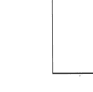

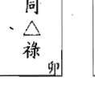

化祿星轉化天同△ 50 分的平庸運勢，升格為○ 80 分的旺盛運勢。化祿星安定了天同△本質的奔波星性，而增加帶財、重財的命格，形成順利而得財的運勢。化祿星轉化天同△之代表人物小野豬，升格為忍辱負重豬八戒。

天同在卯原為小野豬，代表勤勞、成長、上進、奔波、忙碌的個性運勢，化祿星坐入則呈現穩重、踏實、務實但些許懶散的特質，形成順利而得財的命格運勢。

天同在酉原為叛逆小野豬，代表創意、改革、叛逆、奔波的個性運勢，化祿星坐入則降低了創新、改革、叛逆的特質，形成較為穩重、踏實的命格運勢。


#### 忍辱負重豬八戒，坐入十二宮的意義

- 命、身宮—我的命格運勢：我是忍辱負重豬八戒。
- 兄弟宮—母親與我的緣分：母親穩重務實，且幫助我、支持我。
- 夫妻宮—配偶與我的緣分：配偶穩重務實，感情穩定。
- 子女宮—子女與我的緣分：子女穩重務實，互相支持。
- 財帛宮—財運：以專業而得財。
- 疾厄宮—弱點的疾病：有天同（水）泌尿系統、婦女的疾病干擾我，但有醫生貴人幫助我。
- 遷移宮—出外運：出外逢貴人相助。
- 僕役宮—知己與我的緣分：我有知己貴人相助。
- 官祿宮—事業運：以專業得官。
- 田宅宮—置產運：祖產、置產順利。
- 福德宮—存摺運：存款金額富足。
- 父母宮—父親與我的緣分：父親穩重務實，且幫助我、支持我。

#### 天同在卯（小野豬）化權

#### 天同在酉（叛逆小野豬）化權

化權星的個性為力破山河；命格為帶權而重權；運勢

為掌權而得權。

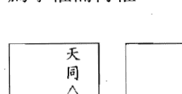

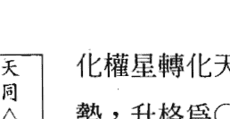

化權星轉化天同△50分的平庸運勢，升格為○80分的旺盛運勢。化權星增加了天同△本質的奔波星性，突顯出帶權而重權的命格，形成掌權而得權的運勢。化權星轉化天同△之代表人物小野豬，升格為力破山河豬八戒。

天同在卯原為小野豬，代表勤勞、成長、上進、奔波、忙碌的個性運勢，化權星坐入則增加天同奔波、忙碌的特質，形成積極、領導、求上進、奔忙而得權的命格運勢。

天同在酉原為叛逆小野豬，代表創意、改革、叛逆、奔波的個性運勢，化權星坐入則增加了天同奔波、忙碌但有創意的特質，形成較為積極、改革的命格運勢。

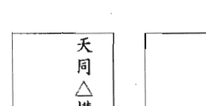

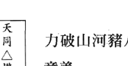

力破山河豬八戒，坐入十二宮的意義

命、身宮—我的命格運勢：我是力破山河豬八戒。
兄弟宮—母親與我的緣分：母親權威霸道，但支持我，與我聚少離多。

夫妻宮—配偶與我的緣分：配偶權威霸道，時而爭執、時而甜蜜，且聚少離多。
子女宮—子女與我的緣分：子女權威霸道、不易管教，與我聚少離多。
財帛宮—財運：以專業、權威而得財。
疾厄宮—弱點的疾病：有天同（水）泌尿系統、婦女的疾病干擾我，但有權貴醫生幫助我。
遷移宮—出外運：出外逢權勢貴人。
僕役宮—知己與我的緣分：我有權勢知己貴人相助，但亦有牽絆。
官祿宮—事業運：以專業、權威而得官。
田宅宮—置產運：祖產、置產控制自如。
福德宮—存摺運：存款金額財進財出。
父母宮—父親與我的緣分：父親權威霸道，但支持我，與我聚少離多。

天同在卯（小野豬）化忌
天同在酉（叛逆小野豬）化忌

化忌星的個性為六神無主；命格為無依無靠；運勢為倒楣、失去。

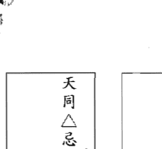

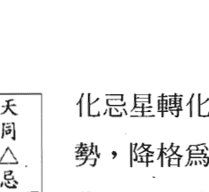

化忌星轉化天同△ 50 分的平庸運勢，降格為❌ 20 分的低迷運勢。化忌星失去了天同△本質的福氣星性，突顯出無依無靠的命格，形成倒楣、失去的運勢。化忌星轉化天同△之代表人物小野豬，降格為六神無主大野豬。

天同在卯原為小野豬，代表勤勞、成長、上進、奔波、忙碌的個性運勢，化忌星坐入則失去了天同的福份特質，呈現無事奔忙、埋頭苦幹、溝通障礙的命格運勢。

天同在酉原為叛逆小野豬，代表創意、改革、叛逆、奔波的個性運勢，化忌星坐入則失去了天同的福份特質，呈現改革紊亂、叛逆、反傳統且悲觀的特性，形成人緣差、社交障礙的命格運勢。

天同平為命代表雖有福份，但勤快、奔波的命格；化忌星為運代表倒楣失去的運勢，放棄了自身擁有的福份埋頭苦幹，形成無事奔忙的運勢。

#### 六神無主大野豬，坐入十二宮的意義

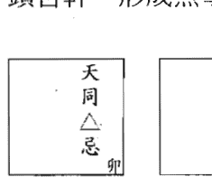

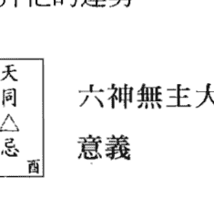

命、身宮—我的命格運勢：我是六神無主大野豬。

- 兄弟宮—母親與我的緣分：母親無事奔忙，與我溝通有障礙，聚少離多。
- 夫妻宮—配偶與我的緣分：配偶無事奔忙，與我溝通有障礙，聚少離多。
- 子女宮—子女與我的緣分：子女無事奔忙，與我溝通有障礙，聚少離多。
- 財帛宮—財運：財運低迷、不順遂。
- 疾厄宮—弱點的疾病：有天同（水）泌尿系統、婦女的疾病嚴重傷害我。
- 遷移宮—出外運：出外逢小人。
- 僕役宮—知己與我的緣分：我遭損友陷害。
- 宮祿宮—事業運：事業低迷不順。
- 田宅宮—置產運：置產運低迷。
- 福德宮—存摺運：存摺金額低迷。
- 父母宮—父親與我的緣分：父親無事奔忙，與我溝通有障礙，聚少離多。

### 天同在辰、戌一化祿、化權、化忌之意義

天同在辰（奔波小野豬）化祿

天同在戌（執著小野豬）化祿

化祿星的個性爲忍辱負重；命格爲帶財、重財；運勢爲順利、得財。

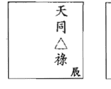

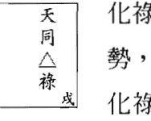

化祿星轉化天同△ 50 分的平庸運勢，升格爲○ 80 分的旺盛運勢。
化祿星安定了天同△本質的奔波星性，而增加帶財、重財的命格，形成順利而得財的運勢。化祿星轉化天同△之代表人物小野豬，升格爲忍辱負重豬八戒。

天同在辰原爲奔波小野豬，代表變遷、移民、奔波、固執的個性運勢；天同在戌原爲執著小野豬，代表忠誠、負責、執著、勤勞的個性運勢，化祿星坐入則呈現較爲穩重、踏實、務實的命格運勢。

辰、戌爲天羅地網宮，代表慾望大、企圖心、好勝心強的特質，化祿星坐入，則轉化成步步爲營、一步一腳印的命格運勢。

#### 忍辱負重豬八戒，坐入十二宮的意義

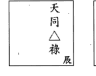

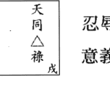

- 命、身宮—我的命格運勢：我是忍辱負重豬八戒。
- 兄弟宮—母親與我的緣分：母親穩重務實，且幫助我、支持我。
- 夫妻宮—配偶與我的緣分：配偶穩重務實，感情穩定。
- 子女宮—子女與我的緣分：子女穩重務實，互相支持。
- 財帛宮—財運：以專業而得財。
- 疾厄宮—弱點的疾病：有天同（水）泌尿系統、婦女的疾病干擾我，但有醫生貴人幫助我。
- 遷移宮—出外運：出外逢貴人相助。
- 僕役宮—知己與我的緣分：我有知己貴人相助。
- 官祿宮—事業運：以專業得官。
- 田宅宮—置產運：祖產、置產順利。
- 福德宮—存摺運：存款金額富足。
- 父母宮—父親與我的緣分：父親穩重務實，且幫助我、支持我。

#### 天同在辰（奔波小野豬）化權

#### 天同在戌（執著小野豬）化權

化權星的個性爲力破山河；命格爲帶權而重權；運勢

為掌權而得權。

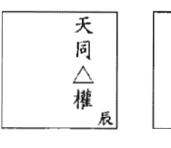

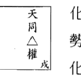

化權星轉化天同△50分的平庸運勢，升格為○80分的旺盛運勢。化權星增加了天同△本質的奔波星性，突顯出帶權而重權的命格，形成掌權而得權的運勢。化權星轉化天同△之代表人物小野豬，升格為力破山河豬八戒。

天同在辰原為奔波小野豬，代表變遷、移民、奔波、固執的個性運勢；天同在戌原為執著小野豬，代表忠誠、負責、執著、勤勞的個性運勢，化權星坐入則增加奔波、領導、慾望、固執、執著的命格運勢。

辰、戌為天羅地網宮，代表慾望大、企圖心、好勝心強的特質，化權星坐入，則更增加慾望心、企圖心、不服輸的命格運勢。化權星入辰、戌宮，猶如自己的人生受到天羅地網的枷鎖束縛一般，形成奔波勞苦的格局。

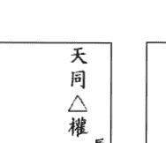

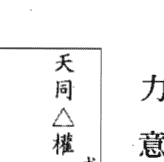

#### 力破山河豬八戒，坐入十二宮的意義

- 命、身宮—我的命格運勢：我是力破山河豬八戒。
- 兄弟宮—母親與我的緣分：母親權威霸道，但支持我，與我聚少離多。
- 夫妻宮—配偶與我的緣分：配偶權威霸道，時而爭執、時而甜蜜，且聚少離多。
- 子女宮—子女與我的緣分：子女權威霸道、不易管教，與我聚少離多。
- 財帛宮—財運：以專業、權威而得財。
- 疾厄宮—弱點的疾病：有天同（水）泌尿系統、婦女的疾病干擾我，但有權貴醫生幫助我。
- 遷移宮—出外運：出外逢權勢貴人。
- 僕役宮—知己與我的緣分：我有權勢知己貴人相助，但亦有牽絆。
- 官祿宮—事業運：以專業、權威而得官。
- 田宅宮—置產運：祖產、置產控制自如。
- 福德宮—存摺運：存款金額財進財出。
- 父母宮—父親與我的緣分：父親權威霸道，但支持我，與我聚少離多。

#### 天同在辰（奔波小野豬）化忌
天同在戌（執著小野豬）化忌

化忌星的個性為六神無主；命格為無依無靠；運勢為倒楣、失去。

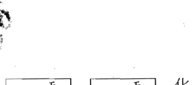

化忌星轉化天同△ 50 分的平庸運勢，降格為× 20 分的低迷運勢。化忌星失去了天同△本質的福氣星性，突顯出無依無靠的命格，形成倒楣、失去的運勢。化忌星轉化天同△之代表人物小野豬，降格為六神無主大野豬。

天同在辰原為奔波小野豬，代表變遷、移民、奔波、固執的個性運勢；天同在戌原為執著小野豬，代表忠誠、負責、執著、勤勞的個性運勢，化忌星坐入則呈現固執心、執著心、悲觀思想、昏頭昏腦、決定錯誤、無事奔波的命格運勢。

辰、戌為天羅地網宮，代表慾望大、企圖心、好勝心強的特質，化忌星坐入，則轉化成漫無目標、思緒紊亂、不服輸的命格運勢。

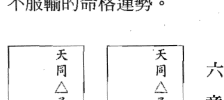

#### 六神無主大野豬，坐入十二宮的意義

- 命、身宮—我的命格運勢：我是六神無主大野豬。
- 兄弟宮—母親與我的緣分：母親無事奔忙，與我溝通有障礙，聚少離多。
- 夫妻宮—配偶與我的緣分：配偶無事奔忙，與我溝通有障礙，聚少離多。
- 子女宮—子女與我的緣分：子女無事奔忙，與我溝通有障礙，聚少離多。
- 財帛宮—財運：財運低迷、不順遂。
- 疾厄宮—弱點的疾病：有天同（水）泌尿系統、婦女的疾病嚴重傷害我。
- 遷移宮—出外運：出外逢小人。
- 僕役宮—知己與我的緣分：我遭損友陷害。
- 官祿宮—事業運：事業低迷不順。
- 田宅宮—置產運：置產運低迷。
- 福德宮—存摺運：存摺金額低迷。
- 父母宮—父親與我的緣分：父親無事奔忙，與我溝通有障礙，聚少離多。

### 天同在巳、亥—化祿、化權、化忌之意義

天同在巳 (小乳豬) 化祿
天同在亥 (浪漫小乳豬) 化祿

化祿星的個性爲忍辱負重；命格爲帶財、重財；運勢爲順利、得財。

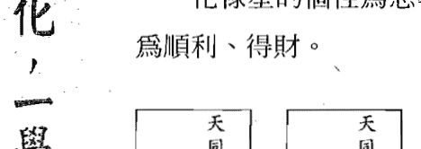

化祿星轉化天同◎100分的大旺運勢，升格爲120分的超旺運勢。化祿星增加了天同◎本質的福氣星性，更增加帶財、重財的命格，形成順利而得財的運勢。化祿星轉化天同◎之代表人物小乳豬，升格爲忍辱負重神豬。

天同在巳原爲小乳豬，代表多才多藝、天性樂觀、有魅力，但是懶惰的個性運勢；天同在亥原爲浪漫小乳豬，代表自尊心強、懶散浪漫、機伶、聰明的個性運勢，化祿星坐入則形成雖有一技在身、生活優渥，但行事作風卻隨意懶散的命格運勢。

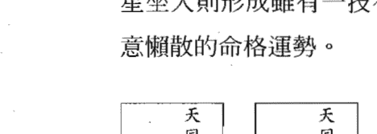

忍辱負重神豬，坐入十二宮的意義

- 命、身宮—我的命格運勢：我是忍辱負重神豬。
- 兄弟宮—母親與我的緣分：母親懶散浪漫，但幫助我、支持我。
- 夫妻宮—配偶與我的緣分：配偶懶散浪漫，感情融洽。
- 子女宮—子女與我的緣分：子女懶散浪漫，但福星高照、感情融洽。
- 財帛宮—財運：樂觀、專業而得財。
- 疾厄宮—弱點的疾病：有天同 (水) 泌尿系統、婦女的疾病干擾我，但有醫生貴人幫助我。
- 遷移宮—出外運：出外逢貴人相助。
- 僕役宮—知己與我的緣分：我有知己貴人相助。
- 官祿宮—事業運：樂觀、專業而得官。
- 田宅宮—置產運：祖產、置產運勢多且順利。
- 福德宮—存款運：存款金額富足。
- 父母宮—父親與我的緣分：父親懶散浪漫，但幫助我、支持我。

#### 天同在巳 (小乳豬) 化權
天同在亥 (浪漫小乳豬) 化權

化權星的個性爲力破山河；命格爲帶權而重權；運勢爲掌權而得權。

紫微四化，一學就通

化權星轉化天同◎100分的大旺運勢，升格為120分的超旺運勢。化權星引動出天同◎本質的博愛星性，突顯出帶權而重權的命格，形成掌權而得權的運勢。化權星轉化天同◎之代表人物小乳豬，升格為力破山河神豬。

天同在巳原為小乳豬，代表多才多藝、天性樂觀、有魅力，但是懶惰的個性運勢；天同在亥原為浪漫小乳豬，代表自尊心強、懶散浪漫、機伶、聰明的個性運勢，化權星坐入則形成生活優渥、有一技在身，行事作風單純、天真、求上進、自尊心、領導慾望強盛且博愛的命格運勢。

## 力破山河神豬，坐入十二宮的意義

- 命、身宮—我的命格運勢：我是力破山河神豬。
- 兄弟宮—母親與我的緣分：母親樂觀、上進，且幫助我、支持我。
- 夫妻宮—配偶與我的緣分：配偶樂觀、上進，且幫助我、支持我。
- 子女宮—子女與我的緣分：子女樂觀、上進，且互相支持。
- 財帛宮—財運：積極、樂觀、專業而得財。
- 疾厄宮—弱點的疾病：有天同（水）泌尿系統、婦女的疾病干擾我，但有權貴醫生幫助我。
- 遷移宮—出外運：出外逢權勢貴人相助。
- 僕役宮—知己與我的緣分：我有權勢知己貴人相助。
- 官祿宮—事業運：積極、樂觀、專業而得官。
- 田宅宮—置產運：祖產、置產運勢控制自如。
- 福德宮—存摺運：存款金額富足。
- 父母宮—父親與我的緣分：父親樂觀、上進，且幫助我、支持我。

天同在巳（小乳豬）化忌

天同在亥（浪漫小乳豬）化忌

化忌星的個性為六神無主；命格為無依無靠；運勢為倒楣、失去。

化忌星轉化天同◎100分的大旺運勢，降格為◎80分的旺盛運勢。化忌星失去了天同◎本質的福氣星性，突顯出無依無靠的命格，形成倒楣、失去的運勢。化忌星轉化天同◎之代表人物小乳豬，降格為六神無主豬八戒。

天同在巳原為小乳豬，代表多才多藝、天性樂觀、有魅力，但是懶惰的個性運勢；天同在亥原為浪漫小乳豬，代表自尊心強、懶散浪漫、機伶、聰明的個性運勢，化忌星坐入則形成雖有一技在身、生活優渥，但行事作風形成悲觀、奔波、愛面子、無事奔忙的命格運勢，所幸天同化廟終究具有享受的福氣。

## 六神無主豬八戒，坐入十二宮的意義

- 命、身宮—我的命格運勢：我是六神無主豬八戒。
- 兄弟宮—母親與我的緣分：母親無事奔忙，聚少離多，終究緣深。
- 夫妻宮—配偶與我的緣分：配偶無事奔忙，聚少離多，終究緣深。
- 子女宮—子女與我的緣分：子女無事奔忙，聚少離多，終究緣深。
- 財帛宮—財運：財運小人是非多，但終究旺盛。
- 疾厄宮—弱點的疾病：有天同（水）泌尿系統、婦女的疾病干擾我。
- 遷移宮—出外運：出外逢小人，但終究因貴人相助而福星高照。
- 僕役宮—知己與我的緣分：我遭損友陷害，但終究因貴人知己相助而福星高照。
- 官祿宮—事業運：事業小人是非多，但終究旺盛。
- 田宅宮—置產運：祖產、置產運易有是非，但終究旺盛。
- 福德宮—存摺運：存摺金額進進出出，但終究富足。
- 父母宮—父親與我的緣分：父親無事奔忙，與我聚少離多，終究緣深。

### 同陰在子、午—天同化祿、化權、化忌；太陰化祿、權、科、忌之意義

- 同陰在子 (懶散的大才子) 天同化祿
- 同陰在午 (拼命的窮書生) 天同化祿

化祿星的個性為忍辱負重；命格為帶財、重財；運勢為順利、得財。

化祿星轉化天同○80分的旺盛運勢，升格為⊙100分的大旺運勢。化祿星引動出天同本質的福氣星性，而增加帶財、重財的命格，形成順利而得財的運勢。化祿星轉化天同○之代表人物豬八戒，升格為小乳豬。天同○祿、太陰◎雙星組合升格為忍辱負重大才子。

同陰在子原為懶散的大才子，代表機伶、聰慧、靈動、懶惰、天真、感情豐富的個性運勢，化祿星坐入天同則增加天同的福氣，但也增加了懶散而不積極的特質，形成雖有智慧、財富卻安於現狀的命格運勢。

#### 忍辱負重大才子，坐入十二宮的意義

- 命、身宮—我的命格運勢：我是忍辱負重大才子。
- 兄弟宮—母親與我的緣分：母親溫和賢淑，且支持我、幫助我。
- 夫妻宮—配偶與我的緣分：配偶溫和賢淑、感情融洽，且支持我、幫助我。
- 子女宮—子女與我的緣分：子女溫和賢淑，彼此緣深。
- 財帛宮—財運：以智慧、才華而得大財。
- 疾厄宮—弱點的疾病：有太陰（水）泌尿系統、婦女的疾病干擾我，但有醫生貴人幫助我。
- 遷移宮—出外運：出外逢貴人相助。
- 僕役宮—知己與我的緣分：我有知己貴人相助。
- 官祿宮—事業運：以智慧、才華而得官。
- 田宅宮—置產運：祖產、置產運豐厚。
- 福德宮—存摺運：存摺金額富足。
- 父母宮—父親與我的緣分：父親溫文儒雅，且支持我、幫助我。

化祿星轉化天同×20分的低迷運勢，升格為△50分的平庸運勢。化祿星引動出天同本質的福氣星性，而增加帶財、重財的命格，形成順利而得財的運勢。化祿星轉化天同×之代表人物大野豬，升格為小野豬。天同×祿、太陰×雙星組合升格為忍辱負重窮書生。

同陰化陷在午原為拼命的窮書生，代表脾氣暴躁、無法與人溝通、無事奔忙、懦弱、無主見的個性運勢，化祿星坐入天同則增加了天同的福氣特質，降低了暴躁的性格，形成較為穩重的命格。

天同陷祿為命，代表穩重、踏實、財富的命格；太陰陷為運，代表財富低迷的運勢，所幸天同化祿終究稍微彌補了財富的缺憾。

##### 忍辱負重窮書生，坐入十二宮的意義

- 命、身宮—我的命格運勢：我是忍辱負重窮書生。
- 兄弟宮—母親與我的緣分：母親優柔寡斷，但穩重踏實，終究幫助我。
- 夫妻宮—配偶與我的緣分：配偶優柔寡斷，但穩重踏實，終究感情穩定。
- 子女宮—子女與我的緣分：子女優柔寡斷，但穩重踏實，終究感情融洽。
- 財帛宮—財運：財運低迷、坎坷，但終究平穩。
- 疾厄宮—弱點的疾病：有太陰（水）泌尿系統、婦女的疾病干擾我，但有醫生貴人幫助我。
- 遷移宮—出外運：出外逢貴人。
- 僕役宮—知己與我的緣分：我有知己貴人。
- 官祿宮—事業運：事業低迷、坎坷，但終究平穩。
- 田宅宮—置產運：置產運不順遂，但終究順利。
- 福德宮—存摺運：存摺金額低迷，但終究平穩。
- 父母宮—父親與我的緣分：父親優柔寡斷，但穩重踏實，終究幫助我。

同陰在子（懶散的大才子）天同化權、太陰化祿
同陰在午（拼命的窮書生）天同化權、太陰化祿

化權星的個性為力破山河；命格為帶權而重權；運勢為掌權而得權。

化祿星的個性為忍辱負重；命格為帶財、重財；運勢為順利、得財。

化權星轉化天同○ 80 分的旺盛運勢，升格為◎ 100 分的大旺運勢；化權星引動出天同本質的博愛星性，突顯出帶權而重權的命格，形成掌權而得權的運勢。化權星轉化天同○之代表人物豬八戒，升格為力破山河小乳豬。

化祿星轉化太陰◎ 100 分的大旺運勢，升格為 120 分的超旺運勢；化祿星增加了太陰本質的財富星性，更增加帶財、重財的命格，形成順利而得財的運勢。化祿星轉化太陰◎之代表人物大才子，升格為忍辱負重國師。

天同◎權、太陰◎祿之雙星組合，天同◎權為命，太陰◎祿為運，天同化權代表領導、博愛的命格；太陰化祿代表財富、田宅的運勢順遂。因此原為懶散的大才子升格為力破山河國師。

同陰在子原為懶散的大才子，代表機伶、聰慧、靈動、懶惰、天真、感情豐富的個性運勢。化權星坐入天同代表天下一家、世界大同的特質；化祿星坐入太陰代表財運亨通特質，形成有權、有財的命格運勢。

|   | 天同 | 太陰 |
|---|---|---|
| 状态 | ◎ | ◎ |
| 化星 | 祿 | 權 |
| 宫位 | 子 |  |

#### 力破山河國師，坐入十二宮的意義

- 命、身宮—我的命格運勢：我是力破山河國師。
- 兄弟宮—母親與我的緣分：母親有財有勢，雖支持我、幫助我，但以權杖管教我。
- 夫妻宮—配偶與我的緣分：配偶有財有勢，雖支持我、幫助我，但時而霸道。
- 子女宮—子女與我的緣分：子女有財有勢，雖互相支持，但不易溝通。
- 財帛宮—財運：以智慧、才華、權勢而得大財。
- 疾厄宮—弱點的疾病：有天同（水）泌尿系統、婦女的小病干擾我，但有權貴醫生幫助我。
- 遷移宮—出外運：出外逢權勢富豪貴人相助。
- 僕役宮—知己與我的緣分：我有權勢富豪知己貴人相助。
- 官祿宮—事業運：以智慧、才華而掌權。
- 田宅宮—置產運：祖產、置產運大且多，且身居大宅。
- 福德宮—存摺運：存摺金額豐厚。
- 父母宮—父親與我的緣分：父親有財有勢，雖支持我、幫助我，但以權杖管教我。

##### 同陰在子、午

化權星轉化天同× 20 分的低迷運勢，升格為△ 50 分的平庸運勢；化權星引動出天同本質的博愛星性，突顯出帶權而重權的命格，形成掌權而得權的運勢。化權星轉化天同×之代表人物大野豬，升格為力破山河小野豬。

化祿星轉化太陰× 20 分的低迷運勢，升格為△ 50 分的平庸運勢；化祿星增加了太陰本質的財富星性，更增加帶財、重財的命格，形成順利而得財的運勢。化祿星轉化太陰×之代表人物窮書生，升格為忍辱負重小書生。

天同×權、太陰×祿之雙星組合，天同×權爲命，太陰×祿爲運，天同化權代表霸道、慾望的命格；太陰化祿代表財富、田宅的運勢順遂。因此原爲拼命的窮書生升格爲力破山河小書生。

同陰化陷在午原爲拼命的窮書生，代表脾氣暴躁、無法與人溝通、無事奔忙、懦弱、無主見的個性運勢，化權星坐入天同陷則增加了天同的暴躁、霸道、奔波的性格特質；化祿星坐入太陰陷則彌補了太陰的財富缺憾，形成較爲有錢、有權的命格運勢。

|   | 天同 | 太陰 |
|---|---|---|
| 状态 | × | × |
| 化星 | 祿 | 權 |
| 宫位 | 午 |  |

#### 力破山河小書生，坐入十二宮的意義

- 命、身宮—我的命格運勢：我是力破山河小書生。
- 兄弟宮—母親與我的緣分：母親有權有勢，雖支持我、幫助我，但聚少離多。
- 夫妻宮—配偶與我的緣分：配偶有權有勢，雖支持我、幫助我，但時而霸道且聚少離多。
- 子女宮—子女與我的緣分：子女有權有勢，雖互相支持，但不易溝通且聚少離多。
- 財帛宮—財運：以智慧、才華、權勢而得財。
- 疾厄宮—弱點的疾病：有太陰（水）泌尿系統、婦女的疾病干擾我，但有權貴醫生幫助我。
- 遷移宮—出外運：出外逢權勢貴人相助。
- 僕役宮—知己與我的緣分：我有權勢知己貴人相助，但易有牽絆。
- 官祿宮—事業運：以智慧、才華而掌權。
- 田宅宮—置產運：祖產、置產運強。
- 福德宮—存摺運：存摺金額高。
- 父母宮—父親與我的緣分：父親有權有勢，雖支持我、幫助我，但聚少離多。

同陰在子（懶散的大才子）天同化忌、太陰化科

同陰在午（拼命的窮書生）天同化忌、太陰化科

化忌星的個性爲六神無主；命格爲無依無靠；運勢爲倒楣、失去。

化科星的個性爲攀龍附鳳；命格爲坐享其成；運勢爲幸運、得名。

|   | 天同 | 太陰 |
|---|---|---|
| 状态 | ◎ | ○ |
| 化星 | 科 | 忌 |
| 宫位 | 壬 |  |

化忌星轉化天同○80分的旺盛運勢，降格爲△50分的平庸運勢；化忌星失去了天同本質的福氣星性，突顯出無依無靠的命格，形成倒楣、失去的運勢。化忌星轉化天同○之代表人物豬八戒，降格爲六神無主小野豬。

化科星轉化太陰◎100分的大旺運勢，升格為120分的超旺運勢；化科星增加了太陰本質的才華星性，突顯出坐享其成的命格，形成幸運而得名的運勢。化科星轉化太陰◎之代表人物大才子，升格為攀龍附鳳國師。

天同○忌、太陰◎科之雙星組合，天同○忌為命，太陰◎科為運，天同化忌代表無事奔忙、昏頭昏腦的命格；太陰化科代表才華洋溢、聰明理智的運勢。因此原為懶散的大才子轉化為六神無主國師。

同陰在子原為懶散的大才子，代表機伶、聰慧、靈動、懶惰、天真、感情豐富的個性運勢。化忌星坐入天同，則失去了天同的福氣星性，形成奔波、勞苦的特質；化科星坐入太陰，則增加了太陰的才華、智慧星性，形成貴人運旺盛、有名氣的特質。

天同旺忌、太陰廟科同入地支子則形成優缺點相互交錯的格局，雖有化科的名氣、才華洋溢的運勢，但終究因天同化忌形成搖擺無主見、無事奔忙的命格。

| 星曜组合 |
| :--- |
| 天同○忌、太陰◎科 |
| 宫位：子 |

#### 六神無主國師，坐入十二宮的意義

- 命、身宮—我的命格運勢：我是六神無主國師。
- 兄弟宮—母親與我的緣分：母親才華洋溢，雖溺愛我，但時而干擾我。
- 夫妻宮—配偶與我的緣分：配偶才華洋溢，雖疼愛我，但時而溝通不良。
- 子女宮—子女與我的緣分：子女才華洋溢、溫和斯文，但時而溝通不良。
- 財帛宮—財運：以智慧、才華而得財，終究因小人是非而財進財出。
- 疾厄宮—弱點的疾病：有天同（水）泌尿系統、婦女的疾病嚴重干擾我，但有專科醫生幫助我。
- 遷移宮—出外運：貴人、小人皆有。
- 僕役宮—知己與我的緣分：我有知己貴人相助，亦有損友陷害。
- 官祿宮—事業運：以智慧、才華而得名，終究因小人是非而平庸。
- 田宅宮—置產運：祖產、置產運順遂，但時而小人干擾。
- 福德宮—存摺運：存摺金額進進出出。
- 父母宮—父親與我的緣分：父親才華洋溢，雖溺愛我，但時而干擾我。

##### 同陰在子、午

化忌星轉化天同× 20 分的低迷運勢，降格爲負 20 分的坎坷運勢；化忌星失去了天同本質的福氣星性，突顯出無依無靠的命格，形成倒楣、失去的運勢。化忌星轉化天同×之代表人物大野豬，降格爲六神無主坎坷豬。

化科星轉化太陰× 20 分的低迷運勢，升格爲△ 50 分的平庸運勢；化科星增加了太陰本質的才華星性，突顯出坐享其成的命格，形成幸運而得名的運勢。化科星轉化太陰×之代表人物窮書生，升格爲攀龍附鳳小書生。

天同×忌、太陰×科之雙星組合，天同×忌爲命，太陰×科爲運，天同化忌代表無事奔忙、昏頭昏腦的命格；太陰化科代表才華洋溢、聰明理智的運勢。因此原爲拼命的窮書生轉化爲六神無主小書生。

同陰化陷在午原爲拼命的窮書生，代表脾氣暴躁、無法與人溝通、無事奔忙、懦弱、無主見的個性運勢，化忌星坐入天同陷則失去了天同的福氣特質，增加了苦悶、勞心的性格，形成較爲坎坷的命格；化科星坐入太陰陷則增加太陰的專業、聰明的特質，形成有才華的運勢。

天同陷忌、太陰陷科同入地支午則形成優缺點相互交錯的格局，雖有化科的名氣、才華的運勢，終究因天同化忌形成無主見又霸道、無事奔忙的低迷命格。

#### 六神無主小書生，坐入十二宮的意義

- 命、身宮—我的命格運勢：我是六神無主小書生。
- 兄弟宮—母親與我的緣分：母親專業才華，雖溺愛我，但終究無事奔忙而無緣。
- 夫妻宮—配偶與我的緣分：配偶專業才華，雖疼愛我，但終究無事奔忙而無緣。
- 子女宮—子女與我的緣分：子女專業才華，雖互相支持，但終究無事奔忙而無緣。
- 財帛宮—財運：以聰明、才藝而得財，終究因小人是非而破財。
- 疾厄宮—弱點的疾病：有天同（水）泌尿系統、婦女的疾病嚴重干擾我，但有專科醫生幫助我。
- 遷移宮—出外運：貴人、小人皆有。
- 僕役宮—知己與我的緣分：我有知己貴人相助，亦有損友陷害。
- 官祿宮—事業運：以聰明、才藝而得名，終究因小人是非而破官。
- 田宅宮—置產運：祖產、置產運波折。
- 福德宮—存摺運：存摺金額進進出出，終究存款運勢低迷坎坷。
- 父母宮—父親與我的緣分：父親專業才華，雖溺愛我，但終究無事奔忙而無緣。

紫微四化，一學就通

- 同陰在子（懶散的大才子）太陰化權
- 同陰在午（拼命的窮書生）太陰化權

化權星的個性為力破山河；命格為帶權而重權；運勢為掌權而得權。

化權星轉化太陰◎100分的大旺運勢，升格為120分的超旺運勢。化權星引動出太陰本質的才華星性，突顯出帶權而重權的命格，形成掌權而得權的運勢。化權星轉化太陰◎之代表人物大才子，升格為國師。天同○、太陰◎權雙星組合升格為力破山河國師。

同陰在子原為懶散的大才子，代表機伶、聰慧、靈動、懶惰、天真、感情豐富的個性運勢，化權星坐入太陰則增加其權威、才華洋溢、積極的特質，形成擁有貴族世家以及才華洋溢、專業領導的命格運勢。

#### 力破山河國師，坐入十二宮的意義

- 命、身宮—我的命格運勢：我是力破山河國師。
- 兄弟宮—母親與我的緣分：母親有權威才華，以權杖管教我，但也支持我、幫助我。
- 夫妻宮—配偶與我的緣分：配偶有權威才華，時而霸道固執，但終究緣深。
- 子女宮—子女與我的緣分：子女有權威才華，時而霸道固執、不易管教，但終究緣深。
- 財帛宮—財運：以智慧、才華、權勢而得財。
- 疾厄宮—弱點的疾病：有天同（水）泌尿系統、婦女的疾病干擾我，但有權貴醫生幫助我。
- 遷移宮—出外運：出外逢權勢貴人相助。
- 僕役宮—知己與我的緣分：我有權勢知己貴人相助。
- 官祿宮—事業運：以智慧、才華而掌權。
- 田宅宮—置產運：祖產、置產運強，且身居大宅。
- 福德宮—存摺運：存摺金額富足。
- 父母宮—父親與我的緣分：父親有權威才華，以權杖管教我，但也支持我、幫助我。

化權星轉化太陰×20分的低迷運勢，升格爲△50分的平庸運勢。化權星引動出太陰本質的才華星性，突顯出帶權而重權的命格，形成掌權而得權的運勢。化權星轉化太陰×之代表人物窮書生，升格爲小書生。天同×、太陰×權雙星組合力破山河小書生。

同陰化陷在午原爲拼命的窮書生，代表脾氣暴躁、無法與人溝通、無事奔忙、懦弱、無主見的個性運勢，化權星坐入太陰陷則降低斯文、懦弱、無主見的特性，及增加專業、才華的特質，形成有專業形象的運勢。

天同陷爲命在午，代表暴躁的性格及溝通障礙的缺點命格，太陰陷權爲運，代表專業領導運強，但終究因天同化陷呈現無事奔忙的命格運勢。

#### 力破山河小書生，坐入十二宮的意義

- 命、身宮—我的命格運勢：我是力破山小書生。
- 兄弟宮—母親與我的緣分：母親有專業權威，以權杖管教我，聚少離多。
- 夫妻宮—配偶與我的緣分：配偶有專業權威、霸道固執，終究無緣。
- 子女宮—子女與我的緣分：子女有專業權威，霸道固執、不易管教，聚少離多。
- 財帛宮—財運：以專業、權勢而得財，但終究財進財出。
- 疾厄宮—弱點的疾病：有天同（水）泌尿系統、婦女的疾病干擾我，但有權貴醫生幫助我。
- 遷移宮—出外運：出外逢權勢貴人。
- 僕役宮—知己與我的緣分：我有權勢知己貴人，但終究無助。
- 官祿宮—事業運：以專業、才藝而掌權，但終究無事奔忙。
- 田宅宮—置產運：置產運一般。
- 福德宮—存摺運：存摺金額財進財出。
- 父母宮—父親與我的緣分：父親有專業權威，以權杖管教我，且聚少離多。

同陰在子（懶散的大才子）太陰化忌
同陰在午（拼命的窮書生）太陰化忌

化忌星的個性爲六神無主；命格爲無依無靠；運勢爲倒楣、失去。

## 紫微四化，一學就通

化忌星轉化太陰◎ 100 分的大旺運勢，降格為◎ 80 分的旺盛運勢。化忌星失去了太陰本質的財富星性，突顯出無依無靠的命格，形成倒楣、失去的運勢。化忌星轉化太陰◎之代表人物大才子，降格為大書生。天同◎、太陰◎忌雙星組合降格為六神無主大書生。

同陰在子原為懶散的大才子，代表機伶、聰慧、靈動、懶惰、天真、感情豐富的個性運勢，化忌星坐入太陰則失去了太陰的智慧、聰明、專業及才華的特質，形成搖擺、無主見、悲觀、不積極、懶散、情感是非的命格運勢。所幸天同為旺、太陰為廟雖逢化忌星干擾太陰，尚有太陰廟的財富運勢及天同旺的福氣命格。

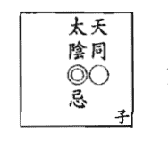

#### 六神無主大書生，坐入十二宮的意義

命、身宮—我的命格運勢：我是六神無主大書生。

兄弟宮—母親與我的緣分：母親時而悲觀無主見的干擾我，但終究支持我。

夫妻宮—配偶與我的緣分：配偶時而悲觀無主見的干擾我，但終究感情融洽。

子女宮—子女與我的緣分：子女時而悲觀無主見的拖累我，但終究緣深。

財帛宮—財運：財進財出，終究以專業而得財。

疾厄宮—弱點的疾病：有太陰（水）泌尿系統、婦女的疾病干擾我。

遷移宮—出外運：小人、貴人皆有。

僕役宮—知己與我的緣分：我有異性小人干擾，亦有貴人相助。

官祿宮—事業運：事業時而是非多，終究以專業而得官。

田宅宮—置產運：祖產、置產運波折，但終究順遂。

福德宮—存摺運：存摺金額財進財出，但終究穩定。

父母宮—父親與我的緣分：父親時而悲觀無主見的干擾我，但終究支持我。

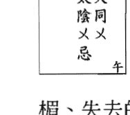

化忌星轉化太陰× 20 分的低迷運勢，降格為負 20 分的坎坷運勢。化忌星失去了太陰本質的財富星性，突顯出無依無靠的命格，形成倒楣、失去的運勢。化忌星轉化太陰×之代表人物窮書生，降格為病書生。天同×、太陰×忌雙星組合降格為六神無主病書生。

同陰化陷在午原為拼命的窮書生，代表脾氣暴躁、無法與人溝通、無事奔忙、懦弱、無主見的個性運勢，化忌星坐入太陰陷則失去了太陰的智慧、聰明、才華、專業、財富的特質，形成亂發脾氣、悲觀懦弱、搖擺無主見、溝通不良、情感及財務是非，實為非常低迷之命格運勢。

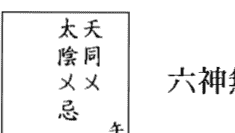

#### 六神無主病書生，坐入十二宮的意義

- 命、身宮—我的命格運勢：我是六神無主病書生。
- 兄弟宮—母親與我的緣分：母親悲觀無主見的干擾我，終究無緣。
- 夫妻宮—配偶與我的緣分：配偶悲觀無主見的干擾我，終究無緣。
- 子女宮—子女與我的緣分：子女悲觀無主見的拖累我，終究無緣。
- 財帛宮—財運：財進財出，終究財運坎坷低迷。
- 疾厄宮—弱點的疾病：有太陰（水）泌尿系統、婦女的疾病嚴重傷害我。
- 遷移宮—出外運：出外逢小人陷害。
- 僕役宮—知己與我的緣分：我遭逢損友陷害。
- 官祿宮—事業運：事業小人是非多，終究事業坎坷低迷。
- 田宅宮—置產運：祖產、置產運無。
- 福德宮—存摺運：存摺金額無。
- 父母宮—父親與我的緣分：父親悲觀無主見的干擾我，終究無緣。

# 同巨在丑、未—天同化祿、化權、化忌；巨門化祿、化權、化忌之意義

同巨在丑（拼命的自閉兒）天同化祿
同巨在未（敏感的自閉兒）天同化祿

化祿星的個性為忍辱負重；命格為帶財、重財；運勢為順利、得財。

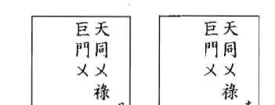

化祿星轉化天同×20分的低迷運勢，升格為△50分的平庸運勢。
化祿星引動出天同本質的福氣星性，而增加帶財、重財的命格，形成順利而得財的運勢。
化祿星轉化天同×之代表人物大野豬，升格為小野豬。天同×祿、巨門×雙星組合升格為忍辱負重自閉兒。

同巨在丑原為拼命的自閉兒，代表資源匱乏、固執、保守、苦悶、勤奮的命格運勢；同巨在未原為敏感的自閉兒，代表敏感、多疑、固執、保守、資源匱乏的命格運勢。化祿星坐入天同則增加天同的福份、資源、才華的特質，形成較為穩重、務實、踏實、順利而得財的命格運勢。

天同陷祿為命，代表有福份的命格；巨門化陷為運，代表資源匱乏而窮困的運勢，所幸天同陷化祿終究回歸一步一腳印而得財的命格。

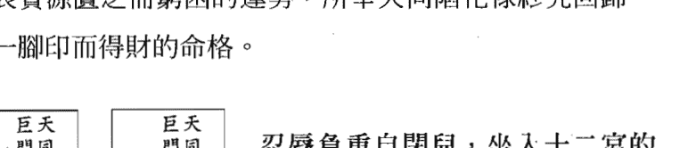

- 命、身宮—我的命格運勢：我是忍辱負重自閉兒。
- 兄弟宮—母親與我的緣分：母親刻苦耐勞、穩重踏實，終究支持我。
- 夫妻宮—配偶與我的緣分：配偶刻苦耐勞、穩重踏實，終究感情平穩。
- 子女宮—子女與我的緣分：子女刻苦耐勞、穩重踏實，終究緣深。
- 財帛宮—財運：財運低迷、坎坷，但終究平穩。
- 疾厄宮—弱點的疾病：有巨門（土、金、水）脾、胃、呼吸、泌尿系統、婦女的疾病干擾我，但有醫生貴人幫助我。
- 遷移宮—出外運：小人、貴人皆有。
- 僕役宮—知己與我的緣分：我有損友陷害我，亦有貴人幫助我。
- 官祿宮—事業運：事業低迷、坎坷，但終究平穩。
- 田宅宮—置產運：置產運不順遂，但終究順利。
- 福德宮—存摺運：存摺金額低迷，但終究平穩。
- 父母宮—父親與我的緣分：父親刻苦耐勞，但穩重踏實，終究支持我。

# 同巨在丑、未

同巨在丑（拼命的自閉兒）天同化權、巨門化忌
同巨在未（敏感的自閉兒）天同化權、巨門化忌

化權星的個性為力破山河；命格為帶權而重權；運勢為掌權而得權。
化忌星的個性為六神無主；命格為無依無靠；運勢為倒楣、失去。

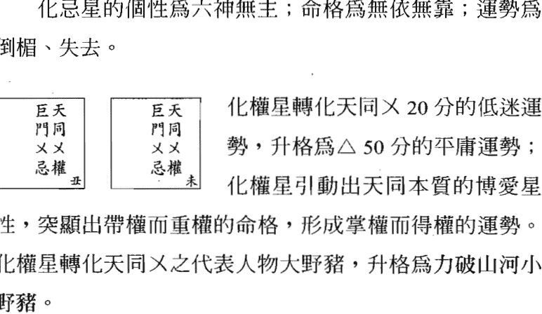

## 紫微四化，一學就通

天同×權、巨門×忌之雙星組合，天同×權為命，巨門×忌為運，天同化權代表權勢、突破的命格；巨門化忌代表一無所有的運勢。因此原為拼命敏感的自閉兒轉化為力破山河啞巴。

同巨在丑原為拼命的自閉兒，代表資源匱乏、固執、保守、苦悶、勤奮的命格運勢；同巨在未原為敏感的自閉兒，代表敏感、多疑、固執、保守、資源匱乏的命格運勢。化權星坐入天同陷、化忌星坐入巨門陷，則形成時而衝刺、時而悲觀、時而敏感多疑、時而積極的命格運勢。

巨門化忌為一生資源匱乏、窮苦潦倒、官司是非、小人陷害形成坎坷的運勢，所幸天同化權終究以自身的力量突破困境。

| 巨門天同 | 巨門天同 |
|----------|----------|
| ××       | ××       |
| 忌權 丑  | 忌權 未  |

## 力破山河啞巴，坐入十二宮的意義

命、身宮—我的命格運勢：我是力破山河啞巴。

兄弟宮—母親與我的緣分：母親敏感多疑、霸道不溝通，終究無緣。

夫妻宮—配偶與我的緣分：配偶敏感多疑、霸道不溝通，終究無緣。

子女宮—子女與我的緣分：子女敏感多疑、霸道不溝通，終究無緣。

財帛宮—財運：財運低迷、坎坷，但終究突破而穩定。

疾厄宮—弱點的疾病：有巨門（土、金、水）脾、胃、呼吸、泌尿系統、婦女病、疑難雜症等疾病嚴重傷害我，但有醫生貴人些許幫助。

遷移宮—出外運：出外遭小人陷害、遭貴人控制。

僕役宮—知己與我的緣分：我有損友陷害我，亦有貴人牽制我。

官祿宮—事業運：事業低迷、坎坷，但終究突破而平穩。

田宅宮—置產運：置產運低迷坎坷，但終究平穩。

福德宮—存摺運：存摺金額低迷，終究財進財出。

父母宮—父親與我的緣分：父親敏感多疑、霸道不溝通，終究無緣。

同巨在丑（拼命的自閉兒）天同化忌
同巨在未（敏感的自閉兒）天同化忌

化忌星的個性為六神無主；命格為無依無靠；運勢為倒楣、失去。

## 紫微四化，一學就通

| 巨門 | 巨門 |
| 天同 | 天同 |
| 忌 | 忌 |
| 丑 | 未 |

化忌星轉化天同× 20 分的低迷運勢，降格為負 20 分的坎坷運勢；化忌星失去了天同本質的福氣星性，突顯出無依無靠的命格，形成倒楣、失去的運勢。化忌星轉化天同×之代表人物大野豬，降格為坎坷豬。天同×忌、巨門×雙星組合降格為六神無主自閉兒。

同巨在丑原為拚命的自閉兒，代表資源匱乏、固執、保守、苦悶、勤奮的命格運勢；同巨在未原為敏感的自閉兒，代表敏感、多疑、固執、保守、資源匱乏的命格運勢。化忌星坐入天同則形成更加固執、埋頭苦幹、社交障礙、敏感多疑、漫無目標、憂鬱悲觀、資源匱乏、低迷的命格運勢。

| 巨門 | 巨門 |
| 天同 | 天同 |
| 忌 | 忌 |
| 丑 | 未 |

## 六神無主自閉兒，坐入十二宮的意義

- 命、身宮—我的命格運勢：我是六神無主自閉兒。
- 兄弟宮—母親與我的緣分：母親敏感多疑、悲觀自閉，終究無緣。
- 夫妻宮—配偶與我的緣分：配偶敏感多疑、悲觀自閉，終究無緣。
- 子女宮—子女與我的緣分：子女敏感多疑、悲觀自閉，終究無緣。
- 財帛宮—財運：財運低迷、坎坷。
- 疾厄宮—弱點的疾病：有天同（水）泌尿系統、婦女的疾病嚴重傷害我。
- 遷移宮—出外運：出外遭小人陷害。
- 僕役宮—知己與我的緣分：我有損友陷害我。
- 官祿宮—事業運：事業低迷、坎坷。
- 田宅宮—置產運：置產運無。
- 福德宮—存摺運：存摺金額無。
- 父母宮—父親與我的緣分：父親敏感多疑、悲觀自閉，終究無緣。

同巨在丑（拚命的自閉兒）巨門化祿
同巨在未（敏感的自閉兒）巨門化祿

化祿星的個性為忍辱負重；命格為帶財、重財；運勢為順利、得財。

| 巨門 | 巨門 |
| 天同 | 天同 |
| 祿 | 祿 |
| 丑 | 未 |

化祿星轉化巨門× 20 分的低迷運勢，升格為△ 50 分的平庸運勢；化祿星增加了巨門本質的資源星性，突顯出帶財、重財的命格，形成順利而得財的運勢。化祿星轉化巨門×之代表人物自閉兒，升格為忍辱負重自閉兒。

同巨在丑原為拚命的自閉兒，代表資源匱乏、固執、保守、苦悶、勤奮的命格運勢；同巨在未原為敏感的自閉兒，代表敏感、多疑、固執、保守、資源匱乏的命格運勢。化祿星坐入巨門則增加巨門的資源、口才、企畫特質，形成較為穩重、務實、踏實而得財的命格運勢。

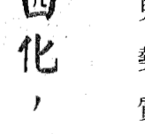

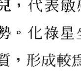

## 忍辱負重自閉兒，坐入十二宮的意義

- 命、身宮—我的命格運勢：我是忍辱負重自閉兒。
- 兄弟宮—母親與我的緣分：母親穩重踏實、刻苦耐勞，終究聚少離多。
- 夫妻宮—配偶與我的緣分：配偶穩重踏實、刻苦耐勞，終究聚少離多。
- 子女宮—子女與我的緣分：子女穩重踏實、刻苦耐勞，終究聚少離多。
- 財帛宮—財運：以刻苦、勤勞而得財。
- 疾厄宮—弱點的疾病：有天同（水）泌尿系統、婦女的疾病干擾我，但有醫生貴人幫助我。
- 遷移宮—出外運：出外逢貴人。
- 僕役宮—知己與我的緣分：我有知己貴人幫助我。
- 官祿宮—事業運：以刻苦、勤勞而得官。
- 田宅宮—置產運：置產運順遂。
- 福德宮—存摺運：存摺金額穩定。
- 父母宮—父親與我的緣分：父親穩重踏實、刻苦耐勞，終究聚少離多。

# 同巨在丑（拚命的自閉兒）巨門化權
同巨在未（敏感的自閉兒）巨門化權

化權星的個性為力破山河；命格為帶權而重權；運勢為掌權而得權。

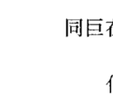

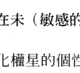

化權星轉化巨門×20分的低迷運勢，升格為△50分的平庸運勢；化權星增加了巨門本質的辯才星性，突顯出帶權而重權的命格，形成掌權而得權的運勢。化權星轉化巨門×之代表人物自閉兒，升格為力破山河自閉兒。

同巨在丑原為拚命的自閉兒，代表資源匱乏、固執、保守、苦悶、勤奮的命格運勢；同巨在未原為敏感的自閉兒，代表敏感、多疑、固執、保守、資源匱乏的命格運勢。化權星坐入巨門則增加巨門的資源、口才、企畫、權勢、領導、辯論、勤奮、掌權而得權的命格運勢。

# 紫微四化一學就通

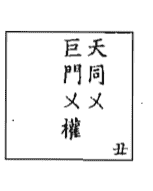

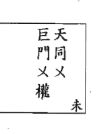

## 力破山河自閉兒，坐入十二宮的意義

命、身宮—我的命格運勢：我是力破山河自閉兒。

兄弟宮—母親與我的緣分：母親刻苦耐勞、威權霸道，終究聚少離多。

夫妻宮—配偶與我的緣分：配偶刻苦耐勞、威權霸道，終究聚少離多。

子女宮—子女與我的緣分：子女刻苦耐勞、威權霸道，終究聚少離多。

財帛宮—財運：以刻苦、勤勞、權威而得財。

疾厄宮—弱點的疾病：有天同（水）泌尿系統、婦女的疾病干擾我，但有權貴醫生幫助我。

遷移宮—出外運：出外逢貴人。

僕役宮—知己與我的緣分：我有知己貴人牽制我。

官祿宮—事業運：以刻苦、勤勞而掌權。

田宅宮—置產運：置產運波折，終究突破。

福德宮—存摺運：存摺金額進進出出。

父母宮—父親與我的緣分：父親刻苦耐勞、威權霸道，終究聚少離多。

# 同梁在寅、申—天同化祿、化權、化忌；天梁化祿、化權、化科之意義

同梁在寅（勤奮的大教主）天同化祿

同梁在申（懶散的地下教主）天同化祿

化祿星的個性為忍辱負重；命格為帶財、重財；運勢為順利、得財。

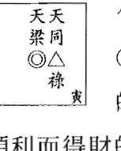

化祿星轉化天同△ 50 分的平庸運勢，升格為○ 80 分的旺盛運勢；化祿星增加了天同本質的福氣星性，突顯出帶財、重財的命格，形成順利而得財的運勢。化祿星轉化天同△之代表人物小野豬，升格為豬八戒。天同△祿、天梁◎雙星組合升格為忍辱負重大教主。

同梁在寅原為勤奮的大教主，代表活躍、樂觀積極、求上進、德行天下的個性運勢，加上化祿星坐入天同，則增加天同的福份特質，形成較為穩重、務實、順利而得財的命格運勢。

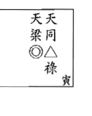

#### 忍辱負重大教主，坐入十二宮的意義

命、身宮—我的命格運勢：我是忍辱負重大教主。
兄弟宮—母親與我的緣分：母親高尚尊貴，且支持我、幫助我。
夫妻宮—配偶與我的緣分：配偶濟世救人，且互相扶持，感情融洽。
子女宮—子女與我的緣分：子女濟世救人，感情穩定，彼此緣深。
財帛宮—財運：以服務眾生而得財。
疾厄宮—弱點的疾病：有天同（水）泌尿系統、婦女的疾病干擾我，但有醫生貴人幫助我。
遷移宮—出外運：出外逢長輩貴人相助。
僕役宮—知己與我的緣分：我有長輩知己貴人相助。
官祿宮—事業運：以服務眾生而得官。
田宅宮—置產運：祖產、置產運順遂。
福德宮—存摺運：存摺金額富足。
父母宮—父親與我的緣分：父親濟世救人，且支持我、幫助我。

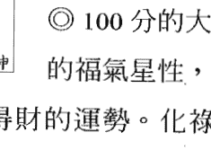

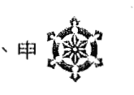

戒，升格為小乳豬。天同○祿、天梁×雙星組合升格為忍辱負重地下教主。

同梁在申原為懶散的地下教主，代表雖具有叛逆、創意的特質，但卻呈現光說不練、天馬行空的行事作風，加上化祿星坐入天同，則更增加天同的懶散不積極的命格，形成雖擁有福份的本質，卻過於懶惰成性的命格運勢。

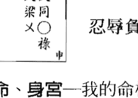

## 忍辱負重地下教主，坐入十二宮的意義

命、身宮—我的命格運勢：我是忍辱負重地下教主。
兄弟宮—母親與我的緣分：母親溫和善良，且支持我、幫助我。
夫妻宮—配偶與我的緣分：配偶溫和善良，且互相扶持，感情穩定。
子女宮—子女與我的緣分：子女溫和善良，感情穩定，彼此緣深。
財帛宮—財運：以服務眾生而得財。
疾厄宮—弱點的疾病：有天梁（土）脾、胃的疾病干擾我，但有醫生貴人幫助我。
遷移宮—出外運：出外逢貴人相助。
僕役宮—知己與我的緣分：我有知己貴人相助。
官祿宮—事業運：以服務眾生而得官。
田宅宮—置產運：祖產、置產運順遂。
福德宮—存摺運：存摺金額穩定。
父母宮—父親與我的緣分：父親溫和善良，且支持我、幫助我。

# 同梁在寅（勤奮的大教主）天同化權
同梁在申（懶散的地下教主）天同化權

化權星的個性為力破山河；命格為帶權而重權；運勢為掌權而得權。

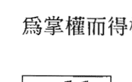

化權星轉化天同△ 50 分的平庸運勢，升格為 ◎ 80 分的旺盛運勢；化權星引動出天同本質的博愛星性，突顯出帶權而重權的命格，形成掌權而得權的運勢。化權星轉化天同△之代表人物小野豬，升格為豬八戒。天同△權、天同◎雙星組合升格為力破山河大教主。

同梁在寅原為勤奮的大教主，代表活躍、樂觀積極、求上進、德行天下的個性運勢，加上化權星坐入天同，則增加天同的領導、權勢、積極、博愛的特質，形成普渡眾生、掌權而得權的命格運勢。

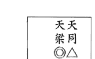

#### 力破山河大教主，坐入十二宮的意義

- 命、身宮—我的命格運勢：我是力破山河大教主。
- 兄弟宮—母親與我的緣分：母親高尚尊貴，但以威權帶領我，聚少離多。
- 夫妻宮—配偶與我的緣分：配偶濟世救人，但威權霸道，聚少離多。
- 子女宮—子女與我的緣分：子女濟世救人，但威權霸道，聚少離多。
- 財帛宮—財運：以服務眾生得權而得財。
- 疾厄宮—弱點的疾病：有天同（水）泌尿系統、婦女的疾病干擾我，但有權貴醫生幫助我。
- 遷移宮—出外運：出外逢長輩貴人相挺。
- 僕役宮—知己與我的緣分：我有長輩知己貴人相挺。
- 官祿宮—事業運：以服務眾生而掌權。
- 田宅宮—置產運：祖產、置產運大，且控制自如。
- 福德宮—存摺運：存摺金額財進財出。
- 父母宮—父親與我的緣分：父親濟世救人，但以威權帶領我，聚少離多。

## 紫微四化，一學就通

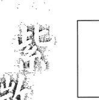

化權星轉化天同○ 80 分的旺盛運勢，升格為 ◎ 100 分的大旺運勢；化權星引動出天同本質的博愛星性，突顯出帶權而重權的命格，形成掌權而得權的運勢。化權星轉化天同○之代表人物豬八戒，升格為小乳豬。天同○權、天梁×雙星組合升格為力破山河地下教主。

同梁在申原為懶散的地下教主，代表雖具有叛逆、創意的特質，但卻呈現光說不練、天馬行空的行事作風，加上化權星坐入天同，則增加天同的才華、群眾魅力的特質，形成較為積極上進的命格運勢。

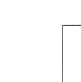

## 力破山河地下教主，坐入十二宮的意義

- 命、身宮—我的命格運勢：我是力破山河地下教主。
- 兄弟宮—母親與我的緣分：母親以威權帶領我、以權杖管教我，與我聚少離多。
- 夫妻宮—配偶與我的緣分：配偶威權霸道，與我爭執不斷、聚少離多。
- 子女宮—子女與我的緣分：子女威權霸道、不易管教，與我聚少離多。
- 財帛宮—財運：以服務眾生得權而得財。
- 疾厄宮—弱點的疾病：有天梁（土）脾、胃的疾病干擾我，但有權貴醫生幫助我。
- 遷移宮—出外運：出外逢貴人相挺。
- 僕役宮—知己與我的緣分：我有知己貴人相挺。
- 官祿宮—事業運：以服務眾生而掌權。
- 田宅宮—置產運：祖產、置產運強，且控制自如。
- 福德宮—存摺運：存摺金額財進財出。
- 父母宮—父親與我的緣分：父親以威權帶領我、以權杖管教我，聚少離多。

# 同梁在寅（勤奮的大教主）天同化忌
同梁在申（懶散的地下教主）天同化忌

化忌星的個性為六神無主；命格為無依無靠；運勢為倒楣、失去。

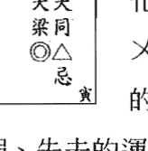

化忌星轉化天同△ 50 分的平庸運勢，降格為 × 20 分的低迷運勢；化忌星失去了天同本質的福氣星性，突顯出無依無靠的命格，形成倒楣、失去的運勢。化忌星轉化天同△之代表人物小野豬，降格為大野豬。天同△忌、天梁◎雙星組合升格為六神無主大教主。

同梁在寅原為勤奮的大教主，代表活躍、樂觀積極、求上進、德行天下的個性運勢，加上化忌星坐入天同，則失去了天同的福份、人緣的特質；增加了無事奔忙、埋頭苦幹、溝通障礙的特質，形成雖具有天梁廟的長輩、眾生貴人相助的運勢，但終究回歸天同平忌的昏頭昏腦、忙碌不堪的命格。

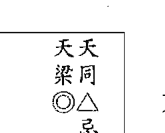

## 六神無主大教主，坐入十二宮的意義

- 命、身宮—我的命格運勢：我是六神無主大教主。
- 兄弟宮—母親與我的緣分：母親高尚尊貴，但無事奔忙，終究聚少離多。
- 夫妻宮—配偶與我的緣分：配偶濟世救人，但無事奔忙，終究無緣。
- 子女宮—子女與我的緣分：子女濟世救人，但無事奔忙，終究聚少離多。
- 財帛宮—財運：以服務眾生而得財，但終究財進財出而低迷。
- 疾厄宮—弱點的疾病：有天同（水）泌尿系統、婦女的疾病嚴重干擾我。
- 遷移宮—出外運：出外逢長輩貴人相挺，但亦有小人陷害。
- 僕役宮—知己與我的緣分：我有長輩知己貴人相挺，但亦有損友陷害。
- 官祿宮—事業運：以服務眾生而得官，但終究因小人是非而低迷。
- 田宅宮—置產運：祖產運大，但終究是非而低迷。
- 福德宮—存摺運：存摺金額財進財出，終究低迷。
- 父母宮—父親與我的緣分：父親濟世救人，但無事奔忙，終究聚少離多。

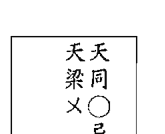

化忌星轉化天同○80分的旺盛運勢，降格為△50分的平庸運勢；化忌星失去了天同本質的福氣星性，突顯出無依無靠的命格，形成倒楣、失去的運勢。化忌星轉化天同○之代表人物豬八戒，降格為小野豬。天同○忌、天梁×雙星組合降格為六神無主地下教主。

同梁在申原為懶散的地下教主，代表雖具有叛逆、創意的特質，但卻呈現光說不練、天馬行空的行事作風，加上化忌星坐入天同，則失去天同的福份及人緣的特質，形成孤獨無依、時而無事奔忙、時而悲觀懶散、十足的光說不練之低迷命格運勢。

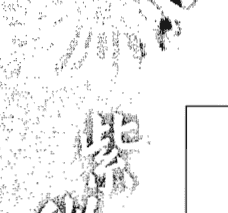

## 六神無主地下教主，坐入十二宮的意義

- 命、身宮—我的命格運勢：我是六神無主地下教主。
- 兄弟宮—母親與我的緣分：母親無事奔忙，終究聚少離多。
- 夫妻宮—配偶與我的緣分：配偶無事奔忙，終究無緣。
- 子女宮—子女與我的緣分：子女無事奔忙，終究聚少離多。
- 財帛宮—財運：以服務眾生而得財，但終究財進財出而低迷。
- 疾厄宮—弱點的疾病：有天梁（土）脾、胃及天同（水）泌尿系統、婦女的疾病嚴重干擾我。
- 遷移宮—出外運：出外逢小人陷害。
- 僕役宮—知己與我的緣分：我遭逢損友陷害。
- 官祿宮—事業運：以服務眾生而得官，但終究因小人是非而低迷。
- 田宅宮—置產運：祖產、置產是非多。
- 福德宮—存摺運：存摺金額財進財出，終究平庸。
- 父母宮—父親與我的緣分：父親無事奔忙，終究聚少離多。

### 同梁在寅、申

#### 同梁在寅（勤奮的大教主）天梁化祿

#### 同梁在申（懶散的地下教主）天梁化祿

化祿星的個性爲忍辱負重；命格爲帶財、重財；運勢爲順利、得財。

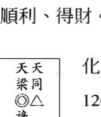

化祿星轉化天梁◎ 100 分的大旺運勢，升格爲 120 分的超旺運勢；化祿星增加了天梁本質的善良星性，突顯出帶財、重財的命格，形成順利而得財的運勢。化祿星轉化天梁◎之代表人物大教主，升格爲教皇。天同△、天梁◎祿雙星組合升格爲忍辱負重教皇。

同梁在寅原爲勤奮的大教主，代表活躍、樂觀積極、求上進、德行天下的個性運勢，加上化祿星坐入天梁，則增加天梁的善良、穩重、務實、善行義舉的特質，形成服務眾生、順利而得財的命格運勢。

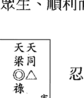

#### 忍辱負重教皇，坐入十二宮的意義

- 命、身宮—我的命格運勢：我是忍辱負重教皇。
- 兄弟宮—母親與我的緣分：母親德行天下，且支持我、幫助我。
- 夫妻宮—配偶與我的緣分：配偶濟世救人，且互相扶持，感情穩定。
- 子女宮—子女與我的緣分：子女濟世救人，感情穩定，但聚少離多。
- 財帛宮—財運：以服務眾生而得大財，但財進財出。
- 疾厄宮—弱點的疾病：有天同（水）泌尿系統、婦女的疾病干擾我，但有醫生貴人幫助我。
- 遷移宮—出外運：出外逢長輩貴人相助。
- 僕役宮—知己與我的緣分：我有長輩知己貴人相助。
- 官祿宮—事業運：以服務眾生而得官。
- 田宅宮—置產運：祖產、置產運順遂。
- 福德宮—存摺運：存摺金額富足，但財進財出。
- 父母宮—父親與我的緣分：父親德行天下，且支持我、幫助我。

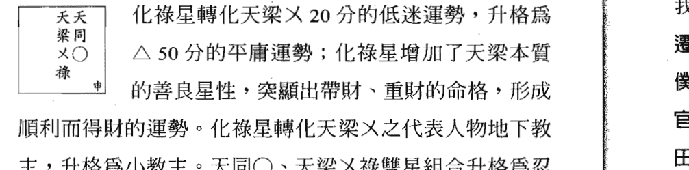

同梁在申原爲懶散的地下教主，代表雖具有叛逆、創意的特質，但卻呈現光說不練、天馬行空的行事作風，加上化祿星坐入天梁，則增加天梁的善良及貴人運的特質，形成雖爲懶散不積極，但因眾生貴人而得財的命格運勢。


命、身宮—我的命格運勢：我是忍辱負重小教主。
兄弟宮—母親與我的緣分：母親服務大眾，且支持我、幫助我。
夫妻宮—配偶與我的緣分：配偶服務大眾，且互相扶持，感情穩定。
子女宮—子女與我的緣分：子女服務大眾，感情穩定。
財帛宮—財運：以服務眾生而得財。
疾厄宮—弱點的疾病：有天梁（土）脾、胃的疾病干擾我，但有醫生貴人幫助我。
遷移宮—出外運：出外逢長輩貴人相助。
僕役宮—知己與我的緣分：我有長輩知己貴人相助。
官祿宮—事業運：以服務眾生而得官。
田宅宮—置產運：祖產、置產運順遂。
福德宮—存摺運：存摺金額富足。
父母宮—父親與我的緣分：父親服務大眾，且支持我、幫助我。

### 同梁在寅、申

#### 同梁在寅（勤奮的大教主）天梁化權

#### 同梁在申（懶散的地下教主）天梁化權

化權星的個性為力破山河；命格為帶權而重權；運勢為掌權而得權。


化權星轉化天梁◎ 100 分的大旺運勢，升格為 120 分的超旺運勢；化權星增加了天梁本質的德行天下星性，突顯出帶權而重權的命格，形成掌權而得權的運勢。化權星轉化天梁◎之代表人物大教主，升格為教皇。天同△、天梁◎權雙星組合升格為力破山河教皇。

同梁在寅原為勤奮的大教主，代表活躍、樂觀積極、求上進、德行天下的個性運勢，加上化權星坐入天梁，則增加天梁的領導、權勢的特質，形成積極、德行天下、掌權而得權的命格運勢。


#### 力破山河教皇，坐入十二宮的意義

- 命、身宮—我的命格運勢：我是力破山河教皇。
- 兄弟宮—母親與我的緣分：母親德行天下，但以威權帶領我，聚少離多。
- 夫妻宮—配偶與我的緣分：配偶德行天下，但威權霸道，聚少離多。
- 子女宮—子女與我的緣分：子女德行天下，但威權霸道，不易管教，聚少離多。
- 財帛宮—財運：以服務眾生得權而得財，但財進財出。
- 疾厄宮—弱點的疾病：有天同（水）泌尿系統、婦女的疾病干擾我，但有權貴醫生幫助我。
- 遷移宮—出外運：出外逢長輩貴人相挺。
- 僕役宮—知己與我的緣分：我有長輩知己貴人相挺。
- 官祿宮—事業運：以服務眾生而掌大權。
- 田宅宮—置產運：祖產、置產運強，控制自如。
- 福德宮—存摺運：存摺金額財進財出，終究平庸。
- 父母宮—父親與我的緣分：父親德行天下，但以威權帶領我，與我聚少離多。


化權星轉化天梁× 20 分的低迷運勢，升格為 △ 50 分的平庸運勢；化權星增加了天梁本質的德行天下星性，突顯出帶權而重權的命格，形成掌權而得權的運勢。化權星轉化天梁×之代表人物地下教主，升格為小教主。天同○、天梁×權雙星組合升格為力破山河小教主。

同梁在申原爲懶散的地下教主，代表雖具有叛逆、創意的特質，但卻呈現光說不練、天馬行空的行事作風，加上化權星坐入天梁，則增加天梁的領導、權勢、重面子的特質，形成較爲積極、有創意、掌權而得權的命格運勢。


#### 力破山河小教主，坐入十二宮的意義

- 命、身宮—我的命格運勢：我是力破山河小教主。
- 兄弟宮—母親與我的緣分：母親以威權帶領我，聚少離多，終究感情融洽。
- 夫妻宮—配偶與我的緣分：配偶威權霸道，聚少離多，終究感情融洽。
- 子女宮—子女與我的緣分：子女威權霸道，聚少離多，終究感情融洽。
- 財帛宮—財運：以服務眾生得權而得財。
- 疾厄宮—弱點的疾病：有天梁（土）脾、胃的疾病干擾我，但有權貴醫生幫助我。
- 遷移宮—出外運：出外逢長輩貴人相挺。
- 僕役宮—知己與我的緣分：我有長輩知己貴人相挺。
- 官祿宮—事業運：以服務眾生而掌權。
- 田宅宮—置產運：祖產、置產運強。
- 福德宮—存摺運：存摺金額財進財出，終究得庫。
- 父母宮—父親與我的緣分：父親以威權帶領我，聚少離多，終究感情融洽。

#### 同梁在寅（勤奮的大教主）天梁化科

#### 同梁在申（懶散的地下教主）天梁化科

化科星的個性爲攀龍附鳳；命格爲坐享其成；運勢爲幸運、得名。


化科星轉化天梁◎ 100 分的大旺運勢，升格爲120 分的超旺運勢；化科星增加了天梁本質的善良星性，突顯出坐享其成的命格，形成幸運而得名的運勢。化科星轉化天梁◎之代表人物大教主，升格爲教皇。天同△、天梁◎科雙星組合升格爲攀龍附鳳教皇。

同梁在寅原爲勤奮的大教主，代表活躍、樂觀積極、求上進、德行天下的個性運勢，加上化科星坐入天梁，則增加天梁的智慧、清高、名氣、善良、愛面子的特質，形成貴人運旺、幸運而得名的命格運勢。


#### 攀龍附鳳教皇，坐入十二宮的意義

- 命、身宮—我的命格運勢：我是攀龍附鳳教皇。
- 兄弟宮—母親與我的緣分：母親德行天下，且溺愛我，但聚少離多。
- 夫妻宮—配偶與我的緣分：配偶濟世救人，且互相扶持，但聚少離多。
- 子女宮—子女與我的緣分：子女濟世救人，感情穩定，但聚少離多。
- 財帛宮—財運：以服務眾生而得財，但財進財出。
- 疾厄宮—弱點的疾病：有天同（水）泌尿系統、婦女的疾病干擾我，但有專科醫生幫助我。
- 遷移宮—出外運：出外逢長輩貴人相助。
- 僕役宮—知己與我的緣分：我有長輩知己貴人相助。
- 官祿宮—事業運：以服務眾生而得大官、得盛名。
- 田宅宮—置產運：祖產、置產運順遂。
- 福德宮—存摺運：存摺金額高，但財進財出。
- 父母宮—父親與我的緣分：父親德行天下，且溺愛我，但聚少離多。


化科星轉化天梁╳20 分的低迷運勢，升格為△50 分的平庸運勢；化科星增加了天梁本質的善良星性，突顯出坐享其成的命格，形成幸運而得名的運勢。化科星轉化天梁╳之代表人物地下教主，升格為小教主。天同○、天梁╳科雙星組合升格為攀龍附鳳小教主。


#### 攀龍附鳳小教主，坐入十二宮的意義

- 命、身宮—我的命格運勢：我是攀龍附鳳小教主。
- 兄弟宮—母親與我的緣分：母親溺愛我，感情穩定。
- 夫妻宮—配偶與我的緣分：配偶互相扶持，感情穩定。
- 子女宮—子女與我的緣分：子女與我互相支持，感情穩定。
- 財帛宮—財運：以服務眾生而得財。
- 疾厄宮—弱點的疾病：有天梁（土）脾、胃的疾病干擾我，但有專科醫生幫助我。
- 遷移宮—出外運：出外逢長輩貴人相助。
- 僕役宮—知己與我的緣分：我有長輩知己貴人相助。
- 官祿宮—事業運：以服務眾生而得官、得名。
- 田宅宮—置產運：祖產、置產運順遂。
- 福德宮—存摺運：存摺金額穩定。
- 父母宮—父親與我的緣分：父親溺愛我，感情穩定。

## 廉貞星系四化星全解

### 廉貞在寅、申—化祿、化忌之意義

#### 廉貞在寅（典獄長）化祿

#### 廉貞在申（奔波的典獄長）化祿

化祿星的個性為忍辱負重；命格為帶財、重財；運勢為順利、得財。


化祿星轉化廉貞◎100分的大旺運勢，升格為120分的超旺運勢。化祿星安定了廉貞本質的奔波星性，而增加帶財、重財的命格，形成順利而得財的運勢。化祿星轉化廉貞◎之代表人物典獄長，升格為忍辱負重大法官。

廉貞在寅原為典獄長，代表權勢、活躍、樂觀積極、求上進、勤奮的基本命格；廉貞在申原為奔波的典獄長，代表權勢、勤快、多變、創意、改革的命格運勢。加上化祿星坐入則安定廉貞的奔波、勞苦、勞心勞力、變動的特質，形成較為穩重、務實、踏實、順利而得財的命格運勢。

## 紫微四化，一學就通

#### 廉貞◎祿（在寅） 廉貞◎祿（在申） 忍辱負重大法官，坐入十二宮的意義

- 命、身宮—我的命格運勢：我是忍辱負重大法官。
- 兄弟宮—母親與我的緣分：母親樂觀積極且支持我，感情穩定。
- 夫妻宮—配偶與我的緣分：配偶樂觀積極，感情穩定、互相支持。
- 子女宮—子女與我的緣分：子女樂觀積極，互相支持。
- 財帛宮—財運：以權而得財，財運富足。
- 疾厄宮—弱點的疾病：廉貞（木、土、火）肝、脾、胃、心臟、心血管的疾病干擾我，但有醫生貴人幫助我。
- 遷移宮—出外運：出外有權勢貴人相助。
- 僕役宮—知己與我的緣分：有權勢貴人知己支持我。
- 官祿宮—事業運：因樂觀進取取得權而得官。
- 田宅宮—置產運：置產順利。
- 福德宮—存摺運：存款金額富足。
- 父母宮—父親與我的緣分：父親樂觀積極且支持我，感情穩定。

### 廉貞在寅、申

#### 廉貞在寅（典獄長）化忌

#### 廉貞在申（奔波的典獄長）化忌

化忌星的個性為六神無主；命格為無依無靠；運勢為倒楣、失去。

#### 廉貞◎忌（在寅） 廉貞◎忌（在申） 化忌星轉化廉貞◎100分的大旺運勢，降格為○80分的旺盛運勢。化忌星失去了廉貞本質的權勢星性，突顯出無依無靠的命格，形成倒楣、失去的運勢。化忌星轉化廉貞◎之代表人物典獄長，降格為六神無主通緝犯。

廉貞在寅原為典獄長，代表權勢、活躍、樂觀積極、求上進、勤奮的基本命格；廉貞在申原為奔波的典獄長，代表權勢、勤快、多變、創意、改革的命格運勢。加上化忌星坐入，則失去了廉貞的領導、權勢、突破、智慧、格局的特質，形成昏頭昏腦、決定錯誤、無事奔忙、朝令夕改、創意混淆、改革紊亂、官司是非的命格運勢；所幸廉貞化廟終歸因突破而穩定。

#### 廉貞◎忌（在寅） 廉貞◎忌（在申） 六神無主通緝犯，坐入十二宮的意義

- 命、身宮—我的命格運勢：我是六神無主通緝犯。
- 兄弟宮—母親與我的緣分：母親控制我、影響我、要求過高，與我聚少離多。
- 夫妻宮—配偶與我的緣分：配偶與我爭執不休、要求過高，與我聚少離多。
- 子女宮—子女與我的緣分：子女我行我素、拖累我，與我聚少離多。
- 財帛宮—財運：財進財出、官司是非，但終究穩定。
- 疾厄宮—弱點的疾病：廉貞（木、土、火）肝、脾、胃、心臟、心血管等疑難雜症的疾病干擾我。
- 遷移宮—出外運：小人、貴人皆有。
- 僕役宮—知己與我的緣分：小人朋友陷害我，但終究權貴知己相助。
- 官祿宮—事業運：事業多波折，但終究穩定。
- 田宅宮—置產運：置產多波折，但終究穩定。
- 福德宮—存摺運：存款金額財進財出，終究平順。
- 父母宮—父親與我的緣分：父親控制我、影響我、要求過高。

### 廉相在子、午—廉貞化祿、化忌之意義

#### 廉相在子（機伶的皇后）廉貞化祿

#### 廉相在午（傲慢的皇后）廉貞化祿

化祿星的個性為忍辱負重；命格為帶財、重財；運勢為順利、得財。


化祿星轉化廉貞△50分的平庸運勢，升格為○80分的旺盛運勢。
化祿星安定了廉貞本質的奔波星性，而增加帶財、重財的命格，形成順利而得財的運勢。
廉貞△祿、天相◎雙星組合升格為忍辱負重皇后。

廉相在子原為機伶的皇后，代表機伶、聰慧、靈動、無主見、奔波、喜助人的特質；廉相在午原為傲慢的皇后，代表樂觀、積極、慾望大、暴躁、喜助人的特質。化祿星坐入廉貞則安定廉貞的奔波、勞苦、企圖慾望的特質，形成聰明智慧、樂觀積極、且攻且守、協調能力強而得財的命格運勢。


## 忍辱負重皇后，坐入十二宮的意義

- 命、身宮—我的命格運勢：我是忍辱負重皇后。
- 兄弟宮—母親與我的緣分：母親樂觀聰慧，且支持我、幫助我。
- 夫妻宮—配偶與我的緣分：配偶樂觀聰慧，且支持我、幫助我。
- 子女宮—子女與我的緣分：子女樂觀聰慧，且孝順、互相支持。
- 財帛宮—財運：以服務眾生而得財。
- 疾厄宮—弱點的疾病：有廉貞（木、土、火）肝、脾、胃、心臟、心血管的疾病，但常有醫生大貴人幫助我。
- 遷移宮—出外運：貴人運旺盛且幫助我。
- 僕役宮—知己與我的緣分：知己貴人多且幫助我。
- 官祿宮—事業運：以服務眾生而得官。
- 田宅宮—置產運：置產運勢有貴人相助。
- 福德宮—存摺運：存款金額穩定。
- 父母宮—父親與我的緣分：父親樂觀聰慧，且支持我、幫助我。

#### 廉相在子（機伶的皇后）廉貞化忌

#### 廉相在午（傲慢的皇后）廉貞化忌

化忌星的個性為六神無主；命格為無依無靠；運勢為倒楣、失去。


化忌星轉化廉貞△50分的平庸運勢，降格為╳20分的低迷運勢。
化忌星失去了廉貞本質的權勢星性，突顯出無依無靠的命格，形成倒楣、失去的運勢。化忌星轉化廉貞△之代表人物通緝犯，降格為囚犯。廉貞△忌、天相◎雙星組合降格為六神無主皇后。

廉相在子原為機伶的皇后，代表機伶、聰慧、靈動、無主見、奔波、喜助人的特質；廉相在午原為傲慢的皇后，代表樂觀、積極、慾望大、暴躁、喜助人的特質。化忌星坐入廉貞則失去了廉貞的權勢、領導、突破的智慧特質，形成精神緊張、決定錯誤、悲觀搖擺的命格運勢。

廉貞平忌為命，代表是非不斷的坎坷命格；天相廟為運，代表擁有吉人天相的運勢，但終究回歸廉貞平忌的是非、坎坷的命格運勢。


## 六神無主皇后，坐入十二宮的意義

- 命、身宮—我的命格運勢：我是六神無主皇后。
- 兄弟宮—母親與我的緣分：母親對外樂觀助人，對我要求無度，與我聚少離多，終究無緣。

## 廉七在丑、未—廉貞化祿、化忌之意義

- 夫妻宮—配偶與我的緣分：配偶對外樂觀助人，對我要求無度，與我聚少離多，終究無緣。
- 子女宮—子女與我的緣分：子女對外樂觀助人，在家悲觀叛逆，與我聚少離多，終究無緣。
- 財帛宮—財運：以服務眾生而得財，但因小人官司是非而破產。
- 疾厄宮—弱點的疾病：有廉貞（木、土、火）肝、脾、胃、心臟、心血管等疑難雜症的疾病嚴重傷害我。
- 遷移宮—出外運：出外貴人多，終究遭逢小人陷害。
- 僕役宮—知己與我的緣分：我有知己貴人幫助我，但也有小人損友背叛我。
- 官祿宮—事業運：以服務眾生而得官，但因小人官司是非而破官。
- 田宅宮—置產運：置產貴人運旺盛，但終究波折而低迷。
- 福德宮—存摺運：存款金額進進出出，但終究低迷坎坷。
- 父母宮—父親與我的緣分：父親對外樂觀助人，對我要求無度，聚少離多，終究無緣。

廉七在丑（拼命的遠征大元帥）廉貞化祿
廉七在未（平庸的遠征大元帥）廉貞化祿

化祿星的個性為忍辱負重；命格為帶財、重財；運勢為順利、得財。

化祿星轉化廉貞△50分的平庸運勢，升格為◎80分的旺盛運勢。
化祿星安定了廉貞本質的奔波星性，而增加帶財、重財的命格，形成順利而得財的運勢。
廉貞△祿、七殺◎雙星組合升格為忍辱負重遠征大元帥。

廉七在丑原為拼命的遠征大元帥，代表固執、剛毅、奔波、企圖、權力的命格運勢；廉七在未原為平庸的遠征大元帥，代表享福、享受、敏感、多疑、霸氣的命格運勢。加上化祿星坐入廉貞，則安定了廉貞的奔波、勞苦、無事奔忙、需求無度的特質，形成較為穩重、踏實、務實、有魄力、順利而得財的命格運勢。

忍辱負重遠征大元帥，坐入十二宮的意義

- 命、身宮—我的命格運勢：我是忍辱負重遠征大元帥。
- 兄弟宮—母親與我的緣分：母親奔波、忙碌、聚少離多，但幫助我、支持我。
- 夫妻宮—配偶與我的緣分：配偶奔波、忙碌、聚少離多，但幫助我、支持我。
- 子女宮—子女與我的緣分：子女奔波、忙碌、聚少離多，但互相支持。
- 財帛宮—財運：以專業、權威得官而得財。
- 疾厄宮—弱點的疾病：有廉貞（木、土、火）肝、脾、胃、心臟、心血管的疾病干擾我，但有醫生貴人幫助我。
- 遷移宮—出外運：出外逢貴人。
- 僕役宮—知己與我的緣分：我有知己貴人。
- 官祿宮—事業運：以專業、權威得官而得權。
- 田宅宮—置產運：置產運勢順遂。
- 福德宮—存摺運：存款金額進進出出，但終究穩定。
- 父母宮—父親與我的緣分：父親奔波忙碌、聚少離多，但幫助我、支持我。

廉七在丑（拼命的遠征大元帥）廉貞化忌
廉七在未（平庸的遠征大元帥）廉貞化忌

化忌星的個性為六神無主；命格為無依無靠；運勢為倒楣、失去。

化忌星轉化廉貞△ 50分的平庸運勢，降格為× 20分的低迷運勢。化忌星失去了廉貞本質的權勢星性，突顯出無依無靠的命格，形成倒楣、失去的運勢。化忌星轉化廉貞△之代表人物通緝犯，降格為囚犯。廉貞△忌、七殺◎雙星組合降格為六神無主遠征大元帥。

廉七在丑原為拚命的遠征大元帥，代表固執、剛毅、奔波、企圖、權力的命格運勢；廉七在未原為平庸的遠征大元帥，代表享福、享受、敏感、多疑、霸氣的命格運勢。加上化忌星坐入廉貞，則失去了廉貞的權勢、領導、求秩序的特質，形成昏頭昏腦、精神緊繃、敏感多疑、決定錯誤、官司是非的命格運勢。

### 六神無主遠征大元帥，坐入十二宮的意義

- 命、身宮—我的命格運勢：我是六神無主遠征大元帥。
- 兄弟宮—母親與我的緣分：母親奔波勞苦，與我聚少離多，終究無緣。
- 夫妻宮—配偶與我的緣分：配偶奔波勞苦，與我聚少離多，終究無緣。
- 子女宮—子女與我的緣分：子女奔波勞苦，與我聚少離多，終究無緣。
- 財帛宮—財運：奔波、勞苦而得財，終究因小人官司是非而破產。
- 疾厄宮—弱點的疾病：有廉貞（木、土、火）肝、脾、胃、心臟、心血管等疑難雜症的疾病嚴重傷害我。
- 遷移宮—出外運：出外逢小人加害。
- 僕役宮—知己與我的緣分：我遭逢小人損友陷害我、背叛我、加害我。
- 官祿宮—事業運：奔波勞苦而得官，終究因小人官司是非而破官。
- 田宅宮—置產運：置產運勢波折、坎坷。
- 福德宮—存摺運：存款金額進進出出，但終究成空。
- 父母宮—父親與我的緣分：父親奔波勞苦，與我聚少離多，終究無緣。

## 廉破在卯、酉—廉貞化祿、化忌；破軍化祿、化權之意義

廉破在卯（拼命的膽小鬼）廉貞化祿、破軍化權
廉破在酉（叛逆的膽小鬼）廉貞化祿、破軍化權

化祿星的個性為忍辱負重；命格為帶財、重財；運勢為順利、得財。

化權星的個性為力破山河；命格為帶權而重權；運勢為掌權而得權。

| 破軍 祿 50 分 | 破軍 祿 80 分 |
|---------------|---------------|
| 化權 卯       | 化權 酉       |

化祿星轉化廉貞△ 50 分的平庸運勢，升格為○ 80 分的旺盛運勢；化祿星安定了廉貞本質的奔波星性，突顯出帶財、重財的命格，形成順利而得財的運勢。化祿星轉化廉貞△之代表人物通緝犯，升格為忍辱負重通緝犯。

化權星轉化破軍× 20 分的低迷運勢，升格為△ 50 分的平庸運勢；化權星增加了破軍本質的權勢星性，突顯出帶權而重權的命格，形成掌權而得權的運勢。化權星轉化破軍×之代表人物膽小鬼，升格為力破山河敢死隊。

廉貞△祿、破軍×權之雙星組合，廉貞△祿為命，破軍×權為運，廉貞化祿代表且攻且守的命格；破軍化權代表權勢領導的運勢。因此在卯原為拼命的膽小鬼，以及在酉原為叛逆的膽小鬼，均升格為忍辱負重敢死隊。

廉破在卯原為拼命的膽小鬼，代表無事奔忙、埋頭苦幹、坎坷波折、左顧右盼的個性運勢；廉破在酉原為叛逆的膽小鬼，代表創意紊亂、改革混淆、反傳統、反社會、左顧右盼的特質。化祿星坐入廉貞，安定了廉貞的企圖、慾望、霸氣特質；化權星坐入破軍，則增加了破軍的權勢、領導、創意、開拓的特質，形成能攻能守、且攻且守、順利而得權得財的命格運勢。

- 命、身宮—我的命格運勢：我是忍辱負重敢死隊。
- 兄弟宮—母親與我的緣分：母親以威權帶領我，且幫助我、支持我。
- 夫妻宮—配偶與我的緣分：配偶威權霸道，但幫助我、支持我。
- 子女宮—子女與我的緣分：子女雖然威權霸道，但樂觀積極，終究互相支持。
- 財帛宮—財運：以創意、權威、積極得權而得財。
- 疾厄宮—弱點的疾病：有破軍（金、水）呼吸、泌尿系統、婦女的疾病干擾我，但有權貴醫生貴人幫助我。
- 遷移宮—出外運：出外逢權勢貴人相助。
- 僕役宮—知己與我的緣分：我有權勢知己貴人相助。
- 官祿宮—事業運：以創意、權威、積極得權而得官。
- 田宅宮—置產運：置產運勢大而順。
- 福德宮—存摺運：存款金額進進出出，但控制自如，終究平穩。
- 父母宮—父親與我的緣分：父親以威權帶領我，且幫助我、支持我。

廉破在卯（拼命的膽小鬼）廉貞化忌
廉破在酉（叛逆的膽小鬼）廉貞化忌

化忌星的個性為六神無主；命格為無依無靠；運勢為倒楣、失去。

化忌星失去了廉貞本質的權勢星性，突顯出無依無靠的命格，形成倒楣、失去的運勢。化忌星轉化廉貞△之代表人物通緝犯，降格為囚犯。廉貞△忌、破軍×雙星組合降格為六神無主膽小鬼。

廉破在卯原為拼命的膽小鬼，代表無事奔忙、埋頭苦幹、坎坷波折、左顧右盼、忐忑不安的個性運勢；廉破在酉原為叛逆的膽小鬼，代表創意紊亂、改革混淆、反傳統、反社會、左顧右盼、忐忑不安的特質。化忌星坐入廉貞則失去了廉貞的智慧、積極、權勢、領導、小心翼翼的特質，形成無事奔忙、精神錯亂、改革紊亂、創意混淆、無端叛逆、桃花是非、官司不斷的坎坷命格運勢。

### 六神無主膽小鬼，坐入十二宮的意義

- 命、身宮—我的命格運勢：我是六神無主膽小鬼。
- 兄弟宮—母親與我的緣分：母親悲觀紊亂、無事奔忙，與我聚少離多，終究無緣。
- 夫妻宮—配偶與我的緣分：配偶悲觀紊亂、無事奔忙，與我聚少離多，終究無緣。
- 子女宮—子女與我的緣分：子女悲觀紊亂、無事奔忙，與我聚少離多，終究無緣。
- 財帛宮—財運：財運坎坷低迷，且因小人官司是非而破產。
- 疾厄宮—弱點的疾病：有廉貞（木、土、火）肝、脾、胃、心臟、心血管等疑難雜症的疾病嚴重傷害我。
- 遷移宮—出外運：出外逢小人傷害。
- 僕役宮—知己與我的緣分：我有小人損友陷害我、背叛我、傷害我。
- 官祿宮—事業運：事業運勢低迷坎坷，且因官司是非而破官。
- 田宅宮—置產運：置產運勢無。
- 福德宮—存摺運：存款金額無。
- 父母宮—父親與我的緣分：父親悲觀紊亂、無事奔忙，與我聚少離多，終究無緣。

## 廉破在卯（拼命的膽小鬼）破軍化祿

## 廉破在酉（叛逆的膽小鬼）破軍化祿

化祿星的個性為忍辱負重；命格為帶財、重財；運勢為順利、得財。

化祿星轉化破軍× 20分的低迷運勢，升格為△ 50分的平庸運勢。化祿星安定了破軍本質的破耗星性，增加帶財、重財的命格，形成順利而得財的運勢。化祿星轉化破軍×之代表人物膽小鬼，升格為敢死隊。廉貞△、破軍×祿雙星組合升格為忍辱負重敢死隊。

廉破在卯原為拼命的膽小鬼，代表無事奔忙、埋頭苦幹、坎坷波折、左顧右盼、忐忑不安的個性運勢；廉破在酉原為叛逆的膽小鬼，代表創意紊亂、改革混淆、反傳統、反社會、左顧右盼、忐忑不安的特質。化祿星坐入破軍則安定了破軍的消耗、隨性的特質，形成較為穩重、務實、踏實且積極勤勞而得財的命格運勢。

### 忍辱負重敢死隊，坐入十二宮的意義

- 命、身宮—我的命格運勢：我是忍辱負重敢死隊。
- 兄弟宮—母親與我的緣分：母親奔波忙碌，終究因少溝通而感情平淡。
- 夫妻宮—配偶與我的緣分：配偶奔波忙碌，終究因少溝通而感情平淡。
- 子女宮—子女與我的緣分：子女奔波忙碌，終究因少溝通而感情平淡。
- 財帛宮—財運：以才華、創意而得財，財來財去，終究財運平庸。
- 疾厄宮—弱點的疾病：有破軍（金、水）呼吸、泌尿、腎、膀胱系統、婦女的疾病干擾我，但有醫生貴人幫助我。
- 遷移宮—出外運：出外貴人、小人皆多。
- 僕役宮—知己與我的緣分：我有知己貴人，但無緣。
- 官祿宮—事業運：以才華、創意而得官，終究事業運勢平庸。
- 田宅宮—置產運：置產運勢順遂。
- 福德宮—存摺運：存款財進財出，終究平庸。
- 父母宮—父親與我的緣分：父親奔波忙碌，終究少溝通，感情平淡。

## 廉府在辰、戌—廉貞化祿、化忌之意義

廉府在辰（拼命的大富豪）廉貞化祿
廉府在戌（執著的大富豪）廉貞化祿

化祿星的個性為忍辱負重；命格為帶財、重財；運勢為順利、得財。

化祿星轉化廉貞△50 分的平庸運勢，升格為◎80 分的旺盛運勢。化祿星安定了廉貞本質的奔波星性，而增加帶財、重財的命格，形成順利而得財的運勢。化祿星轉化廉貞△之代表人物通緝犯，升格為忍辱負重通緝犯。廉貞△祿、天府◎雙星組合升格為忍辱負重大富豪。

廉府在辰原為拼命的大富豪、在戌原為執著的大富豪，代表戰戰兢兢、神經緊繃的個性，慾望大、不服輸、固執、執著，為了賺取財富每天緊張、壓力、奔波、勞碌，因為拚命的原因也得到了富有的運勢，但終究因廉貞平而財富呈現財進財出的命格，所幸逢化祿星坐入廉貞，安定了廉貞的緊張星性，形成穩重的格局，而保有財富的命格運勢。

### 忍辱負重大富豪，坐入十二宮的意義

- 命、身宮—我的命格運勢：我是忍辱負重大富豪。
- 兄弟宮—母親與我的緣分：母親開明、穩重，且支持我、幫助我。
- 夫妻宮—配偶與我的緣分：配偶開明、穩重、多才多藝，且支持我、幫助我。
- 子女宮—子女與我的緣分：子女多才多藝，互相支持。
- 財帛宮—財運：以多才多藝而得財。
- 疾厄宮—弱點的疾病：有廉貞（木、土、火）肝、脾、胃、心臟、心血管的疾病，但常有醫生大貴人幫助我。
- 遷移宮—出外運：權勢貴人運旺盛，且幫助我。
- 僕役宮—知己與我的緣分：權勢知己貴人多，且幫助我。
- 官祿宮—事業運：以多才多藝而得官。
- 田宅宮—置產運：祖產、置產運勢旺盛，且身居大宅。
- 福德宮—存摺運：存款金額豐厚。
- 父母宮—父親與我的緣分：父親開明、穩重，且支持我、幫助我。

## 廉府在辰（拼命的大富豪）廉貞化忌

## 廉府在戌（執著的大富豪）廉貞化忌

化忌星的個性為六神無主；命格為無依無靠；運勢為倒楣、失去。

化忌星轉化廉貞△ 50分的平庸運勢，降格為×20分的低迷運勢。化忌星失去了廉貞本質的權勢星性，突顯出無依無靠的命格，形成倒楣、失去的運勢。化忌星轉化廉貞△之代表人物通緝犯，降格為囚犯。廉貞△忌、天府◎雙星組合降格為六神無主大富豪。

廉府在辰原為拼命的大富豪、在戌原為執著的大富豪，代表戰戰兢兢、神經緊繃的個性，慾望大、不服輸、固執、執著，為了賺取財富每天緊張、壓力、奔波、勞碌，因為拼命的原因也得到了富有的運勢，但遭逢化忌星坐入廉貞，更增加了廉貞的緊張星性，形成昏頭昏腦、決定錯誤、目標混淆、投資失敗的命格。終究因廉貞半忌而事業、財富呈現官司是非、財務糾紛而形成財進財出的命格運勢。

### 六神無主大富豪，坐入十二宮的意義

- 命、身宮—我的命格運勢：我是六神無主大富豪。
- 兄弟宮—母親與我的緣分：母親多才多藝，但終究化忌是非多而無緣。
- 夫妻宮—配偶與我的緣分：配偶多才多藝，但終究化忌是非多而無緣。
- 子女宮—子女與我的緣分：子女多才多藝，但終究化忌是非多而無緣。
- 財帛宮—財運：以多才多藝而得財，但終究化忌是非而破產。
- 疾厄宮—弱點的疾病：有廉貞（木、土、火）肝、脾、胃、心臟、心血管等疑難雜症的疾病嚴重傷害我。
- 遷移宮—出外運：出外逢小人傷害我。
- 僕役宮—知己與我的緣分：我有小人損友陷害我。
- 官祿宮—事業運：以多才多藝而得官，但終究化忌官司是非而破官。
- 田宅宮—置產運：置產運波折，但終究坎坷低迷。
- 福德宮—存款運：存款富足，但終究化忌是非而破庫。
- 父母宮—父親與我的緣分：父親多才多藝，但終究化忌是非多而無緣。

## 廉貪在巳、亥—廉貞化祿、化忌；貪狼化祿、化權、化忌之意義

廉貪在巳（弱勢的過動兒）廉貞化祿
廉貪在亥（善變的過動兒）廉貞化祿

化祿星的個性為忍辱負重；命格為帶財、重財；運勢為順利、得財。

化祿星轉化廉貞×20 分的低迷運勢，升格為△50 分的平庸運勢。
化祿星安定了廉貞本質的奔波星性，而增加帶財、重財的命格，形成順利而得財的運勢。
化祿星轉化廉貞×之代表人物囚犯，升格為通緝犯。廉貞×祿、貪狼×雙星組合升格為忍辱負重過動兒。

廉貪在巳原為弱勢的過動兒、在亥原為善變的過動兒，代表戰戰兢兢、神經緊繃的個性，慾望大、不服輸、固執、執著，為了吃喝玩樂、世俗慾望，每天緊張、壓力、奔波及勞碌。由於廉貪均化陷，造成缺點暴露、是非不斷的命格運勢，所幸逢化祿星坐入廉貞，安定了廉貞的緊張星性，形成較為穩重的格局，而保有較為踏實的工作及財富穩定的命格運勢。

### 忍辱負重過動兒，坐入十二宮的意義

- 命、身宮—我的命格運勢：我是忍辱負重過動兒。
- 兄弟宮—母親與我的緣分：母親奔波忙碌，但幫助我、支持我。
- 夫妻宮—配偶與我的緣分：配偶奔波忙碌，但幫助我、支持我。
- 子女宮—子女與我的緣分：子女奔波忙碌，但終究互相支持。
- 財帛宮—財運：以專業、才華而得財。
- 疾厄宮—弱點的疾病：有貪狼（水、木）泌尿系統、婦女病、性病、肝的疾病干擾我，但有醫生貴人幫助我。
- 遷移宮—出外運：出外小人、貴人皆有。
- 僕役宮—知己與我的緣分：我有權勢知己貴人相助。
- 官祿宮—事業運：以專業、才華而得官。
- 田宅宮—置產運：置產運勢順利。
- 福德宮—存摺運：存款金額進進出出，但終究平穩。
- 父母宮—父親與我的緣分：父親奔波忙碌，但幫助我、支持我。

## 廉貪在巳（弱勢的過動兒）廉貞化忌

## 廉貪在亥（善變的過動兒）廉貞化忌

化忌星的個性為六神無主；命格為無依無靠；運勢為倒楣、失去。

化忌星轉化廉貞×20分的低迷運勢，降格為負20分的坎坷運勢。化忌星失去了廉貞本質的權勢星性，突顯出無依無靠的命格，形成倒楣、失去的運勢。化忌星轉化廉貞×之代表人物囚犯，降格為死刑犯。廉貞×忌、貪狼×雙星組合降格為六神無主過動兒。廉貪在巳原為弱勢的過動兒、在亥原為善變的過動兒，代表戰戰兢兢、神經緊繃的個性，慾望大、不服輸、固執、執著，為了吃喝玩樂、世俗慾望，每天緊張、壓力、奔波及勞碌。由於廉貞均化陷，造成缺點暴露、是非不斷的命格運勢，又遭逢化忌星坐入廉貞，更增加了廉貞的緊張星性，形成昏頭昏腦、決定錯誤、目標混淆、投資失敗的命格。終究因廉貞平忌而感情、事業、財富均呈現糾紛、官司、是非不斷，而形成坎坷的命格運勢。

#### 六神無主過動兒，坐入十二宮的意義

- 命、身宮—我的命格運勢：我是六神無主過動兒。
- 兄弟宮—母親與我的緣分：母親桃花是非、無事奔忙，與我聚少離多，終究無緣。
- 夫妻宮—配偶與我的緣分：配偶桃花是非、無事奔忙，與我聚少離多，終究無緣。
- 子女宮—子女與我的緣分：子女桃花是非、無事奔忙，與我聚少離多，終究無緣。
- 財帛宮—財運：財運坎坷低迷，且因小人官司是非而破產。
- 疾厄宮—弱點的疾病：有廉貞（木、土、火）肝、脾、胃、心臟、心血管等疑難雜症的疾病嚴重傷害我。
- 遷移宮—出外運：出外逢小人傷害。
- 僕役宮—知己與我的緣分：我有小人損友陷害我、背叛我、傷害我。
- 官祿宮—事業運：事業運勢低迷坎坷，且因官司是非而破官。
- 田宅宮—置產運：置產運勢無。
- 福德宮—存摺運：存款金額無。
- 父母宮—父親與我的緣分：父親桃花是非、無事奔忙，與我聚少離多，終究無緣。

## 紫微四化，一學就通

# 我聚少離多，終究無緣。

# 廉貪在巳（弱勢的過動兒）貪狼化祿

# 廉貪在亥（善變的過動兒）貪狼化祿

化祿星的個性為忍辱負重；命格為帶財、重財；運勢為順利、得財。

```
貪廉
狼貞
××
祿
巳
```

```
貪廉
狼貞
××
祿
亥
```

化祿星轉化貪狼× 20 分的低迷運勢，升格為△ 50 分的平庸運勢。化祿星安定了貪狼本質的變動星性，而增加帶財、重財的命格，形成順利而得財的運勢。化祿星轉化貪狼×之代表人物過動兒，升格為忍辱負重過動兒。廉貞×、貪狼×祿雙星組合升格為弱勢的忍辱負重過動兒。

廉貪在巳原為弱勢的過動兒、在亥原為善變的過動兒，代表戰戰兢兢、神經緊繃的個性，慾望大、不服輸、固執、執著，為了吃喝玩樂、世俗慾望，每天緊張、壓力、奔波、勞碌。由於廉貪均化陷，造成缺點暴露、是非不斷的命格運勢，所幸逢化祿星坐入貪狼，安定了貪狼的善變星性，形成較為踏實的工作及財富穩定的運勢，但終究因廉貞化陷慾望過大、不服輸的個性枷鎖，而形成是非不斷、桎梏的命格。

# 弱勢的忍辱負重過動兒，坐入十二宮的意義

```
貪廉
狼貞
××
祿
巳
```

```
貪廉
狼貞
××
祿
亥
```

- 命、身宮—我的命格運勢：我是弱勢的忍辱負重過動兒。
- 兄弟宮—母親與我的緣分：母親奔波忙碌，雖幫助我、支持我，但終究無緣。
- 夫妻宮—配偶與我的緣分：配偶奔波忙碌，雖幫助我、支持我，但終究無緣。
- 子女宮—子女與我的緣分：子女奔波忙碌，雖互相支持，但終究無緣。
- 財帛宮—財運：以專業、才華而得財，但財進財出。
- 疾厄宮—弱點的疾病：有廉貞（木、土、火）肝、脾、胃、心臟、心血管等疑難雜症的疾病干擾我，但有醫生貴人幫助我。
- 遷移宮—出外運：出外小人、貴人皆有。
- 僕役宮—知己與我的緣分：我有知己貴人相助，但終究無緣。
- 官祿宮—事業運：以專業、才華而得官，但終究低迷。
- 田宅宮—置產運：置產運勢順利。
- 福德宮—存摺運：存款金額進進出出，但終究低迷。
- 父母宮—父親與我的緣分：父親奔波、忙碌，雖幫助我、支持我，但終究無緣。

# 廉貪在巳（弱勢的過動兒）貪狼化權

# 廉貪在亥（善變的過動兒）貪狼化權

化權星的個性爲力破山河；命格爲帶權而重權；運勢爲掌權而得權。

| 貪廉 狼貞 ×× 權 巳 | 貪廉 狼貞 ×× 權 亥 |
| --- | --- |

化權星轉化貪狼× 20 分的低迷運勢，升格爲△ 50 分的平庸運勢。化權星增加了貪狼本質的權勢星性，突顯出帶權而重權的命格，形成掌權而得權的運勢。廉貪×、貪狼×權雙星組合升格爲力破山河過動兒。

廉貪在巳原爲弱勢的過動兒、在亥原爲善變的過動兒，代表戰戰兢兢、神經緊繃的個性，慾望大、不服輸、固執、執著，爲了吃喝玩樂、世俗慾望，每天緊張、壓力、奔波、勞碌。由於廉貪均化陷，造成缺點暴露、是非不斷的命格運勢，所幸逢化權星坐入貪狼，增加了貪狼的權勢星性，形成掌權、突破但也個性霸道的運勢，但終究因廉貞化陷慾望過大、不服輸的個性枷鎖，而形成是非不斷、桎梏的命格。

| 貪廉 狼貞 ×× 權 巳 | 貪廉 狼貞 ×× 權 亥 |
| --- | --- |

# 力破山河過動兒，坐入十二宮的意義

- 命、身宮—我的命格運勢：我是力破山河過動兒。
- 兄弟宮—母親與我的緣分：母親霸道、固執，終究無緣。
- 夫妻宮—配偶與我的緣分：配偶霸道、固執，終究無緣。
- 子女宮—子女與我的緣分：子女霸道、固執，終究無緣。
- 財帛宮—財運：以專業、才華得權而得財，但終究低迷。
- 疾厄宮—弱點的疾病：有廉貞（木、土、火）肝、脾、胃、心臟、心血管等疑難雜症的疾病干擾我，但有權貴醫生幫助我。
- 遷移宮—出外運：出外小人、貴人皆有。
- 僕役宮—知己與我的緣分：我有知己貴人相助，但控制我，且終究無緣。
- 官祿宮—事業運：以專業、才華而得權，但終究低迷。
- 田宅宮—置產運：置產運勢順利。
- 福德宮—存摺運：存款金額進進出出，但終究低迷。
- 父母宮—父親與我的緣分：父親霸道、固執，終究無緣。

# 廉貪在巳（弱勢的過動兒）貪狼化忌

# 廉貪在亥（善變的過動兒）貪狼化忌

化忌星的個性爲六神無主；命格爲無依無靠；運勢爲倒楣、失去。

# 紫微四化一學就通

化忌星轉化貪狼× 20 分的低迷運勢，降格為負20 分的坎坷運勢。化忌星失去了貪狼本質的財富星性，突顯出無依無靠的命格，形成倒楣、失去的運勢。化忌星轉化貪狼×之代表人物過動兒，降格為狼狽兒。廉貞×、貪狼×忌雙星組合降格為六神無主狼狽兒。

廉貪在巳原為弱勢的過動兒、在亥原為善變的過動兒，代表戰戰兢兢、神經緊繃的個性，慾望大、不服輸、固執、執著，為了吃喝玩樂、世俗慾望，每天緊張、壓力、奔波及勞碌。由於廉貪均化陷，造成缺點暴露、是非不斷的命格運勢，又遭逢化忌星坐入貪狼，更增加了貪狼的桃花、慾望、揮霍星性，形成昏頭昏腦、投資失敗、桃花是非、揮霍無度的運勢。因此再逢廉貞弱陷，感情、事業、財富均呈現糾紛、官司、是非不斷，而形成坎坷的命格運勢。

# 六神無主狼狽兒，坐入十二宮的意義

- 命、身宮—我的命格運勢：我是六神無主狼狽兒。
- 兄弟宮—母親與我的緣分：母親桃花是非、揮霍無度，與我聚少離多，終究無緣。
- 夫妻宮—配偶與我的緣分：配偶桃花是非、揮霍無度，與我聚少離多，終究無緣。
- 子女宮—子女與我的緣分：子女桃花是非、揮霍無度，與我聚少離多，終究無緣。
- 財帛宮—財運：財運坎坷，終究低迷。
- 疾厄宮—弱點的疾病：有貪狼（水、木）泌尿系統、婦女病、性病、肝的疾病嚴重傷害我。
- 遷移宮—出外運：出外逢小人傷害。
- 僕役宮—知己與我的緣分：我有小人損友陷害我、背叛我、傷害我。
- 官祿宮—事業運：事業運勢坎坷，終究低迷。
- 田宅宮—置產運：置產運勢無。
- 福德宮—存摺運：存款金額無。
- 父母宮—父親與我的緣分：父親桃花是非、揮霍無度，與我聚少離多，終究無緣。

# 太阴独坐四化星全解

# 太阴在卯、酉—化禄、权、科、忌之意义

# 太阴在卯（奔波的穷书生）化禄

# 太阴在酉（创意的大书生）化禄

化禄星的个性为忍辱负重；命格为带财、重财；运势为顺利、得财。

化禄星转化太阴×20分的低迷运势，升格为△50分的平庸运势。化禄星安定了太阴×本质的忧郁星性，而增加带财、重财的命格，形成顺利而得财的运势。化禄星转化太阴×之代表人物奔波的穷书生，升格为忍辱负重小书生。

太阴在卯原为奔波的穷书生，代表优柔寡断、摇摆无主见、思想悲观、无事奔忙的个性运势，为了求取功名而学习才艺，但因为化陷命格运势低迷不顺遂。所幸逢化禄星坐入，增加了太阴的才华智慧星性，形成较为稳定、务实、踏实的命格运势。但终究还是因太阴化陷而缺点暴露，事业、财富呈现财进财出的命格运势。

# 忍辱负重小书生，坐入十二宫的意义

- 命、身宫—我的命格运势：我是忍辱负重小书生。
- 兄弟宫—母亲与我的缘分：母亲悲观、摇摆，虽支持我，但终究无缘。
- 夫妻宫—配偶与我的缘分：配偶悲观、摇摆，虽支持我，但终究无缘。
- 子女宫—子女与我的缘分：子女悲观、摇摆，虽相互支持，但终究无缘。
- 财帛宫—财运：以专业而得财，但终究低迷。
- 疾厄宫—弱点的疾病：有太阴（水）泌尿系统、妇女的疾病干扰我，但有医生贵人帮助我。
- 迁移宫—出外运：出外逢贵人相助。
- 仆役宫—知己与我的缘分：我有女性知己贵人，但终究无缘。
- 官禄宫—事业运：以专业而得官，但终究低迷。
- 田宅宫—置产运：置产运势顺利。
- 福德宫—存摺运：存款金额顺利，但终究低迷。
- 父母宫—父亲与我的缘分：父亲悲观、摇摆，虽支持我，但终究无缘。

# 太阴在酉（创意的大书生）化禄

化禄星转化太阴○80分的旺盛运势，升格为◎100分的大旺运势。化禄星增加了太阴○本质的财富星性，而增加带财、重财的命格，形成顺利而得财的运势。化禄星转化太阴○之代表人物创意的大书生，升格为忍辱负重大才子。

太阴在酉原为创意的大书生，代表聪明、智慧、创意、改革、发明的个性运势，为了求取功名而学习才艺，因为化旺命格运势很顺遂。又逢化禄星坐入，增加了太阴的才华智慧、财富星性，形成创意十足、智慧改革的命格运势，且因太阴化旺而优点尽出，事业、财富呈现丰厚顺利的命格运势。

# 忍辱负重大才子，坐入十二宫的意义

- 命、身宫—我的命格运势：我是忍辱负重大才子。
- 兄弟宫—母亲与我的缘分：母亲才华洋溢，支持我、帮助我。
- 夫妻宫—配偶与我的缘分：配偶才华洋溢，支持我、帮助我。
- 子女宫—子女与我的缘分：子女才华洋溢，相互支持。
- 财帛宫—财运：以专业才华而得大财。
- 疾厄宫—弱点的疾病：有太阴（水）泌尿系统、妇女的疾病干扰我，但有医生贵人帮助我。
- 迁移宫—出外运：出外逢贵人相助。
- 仆役宫—知己与我的缘分：我有女性知己贵人相助。
- 官禄宫—事业运：以专业才华而得官。
- 田宅宫—置产运：置产运势富足。
- 福德宫—存摺运：存款金额丰厚。
- 父母宫—父亲与我的缘分：父亲才华洋溢，支持我、帮助我。

# 太阴在卯（奔波的穷书生）化权

# 太阴在酉（创意的大书生）化权

化权星的个性为力破山河；命格为带权而重权；运势为掌权而得权。

# 太阴在卯（奔波的穷书生）化权

化权星转化太阴×20分的低迷运势，升格为△50分的平庸运势。化权星引动了太阴本质的才华星性，突显出带权而重权的命格，形成掌权而得权的运势。化权星转化太阴×之代表人物奔波的穷书生，升格为力破山河小书生。

太阴在卯原为奔波的穷书生，代表优柔寡断、摇摆无主见、思想悲观、无事奔忙的个性运势，为了求取功名而学习才艺，但因为化陷命格运势低迷不顺遂。所幸逢化权星坐入，增加了太阴的才华智慧星性，形成较为积极、领导、突破的命格运势。但终究还是因太阴化陷而缺点暴露，事业、权势呈现较为低迷的命格运势。

# 力破山河小书生，坐入十二宫的意义

- 命、身宫—我的命格运势：我是力破山河小书生。
- 兄弟宫—母亲与我的缘分：母亲悲观、霸道，虽支持我，但终究无缘。
- 夫妻宫—配偶与我的缘分：配偶悲观、霸道，虽支持我，但终究无缘。
- 子女宫—子女与我的缘分：子女悲观、霸道，虽相互支持，但终究无缘。
- 财帛宫—财运：以专业得权而得财，但终究低迷。
- 疾厄宫—弱点的疾病：有太阴（水）泌尿系统、妇女的疾病干扰我，但有权贵医生帮助我。
- 迁移宫—出外运：出外逢贵人相挺。
- 仆役宫—知己与我的缘分：我有女性权势知己贵人，但终究无缘。
- 官禄宫—事业运：以专业得权而得官，但终究低迷。

# 太阴在卯、酉

- 田宅宫—置产运：置产运势顺利。
- 福德宫—存摺运：存款金额财进财出，但终究低迷。
- 父母宫—父亲与我的缘分：父亲悲观、霸道，虽支持我，但终究无缘。

# 太阴在酉（创意的大书生）化权

化权星转化太阴◎80分的旺盛运势，升格为◎100分的大旺运势。化权星增加了太阴◎本质的才华星性，突显出带权而重权的命格，形成掌权而得权的运势。化权星转化太阴◎之代表人物创意的大书生，升格为力破山河大才子。

太阴在酉原为创意的大书生，代表聪明、智慧、创意、改革、发明的个性运势，为了求取功名而学习才艺，因为化旺命格运势很顺遂。又逢化权星坐入，增加了太阴的才华智慧、权势、名气星性，形成创意十足、智慧改革、权势领导的命格运势，且因太阴化旺而优点尽出，事业、财富均呈现丰厚顺利的命格运势。

# 力破山河大才子，坐入十二宫的意义

- 命、身宫—我的命格运势：我是力破山河大才子。
- 兄弟宫—母亲与我的缘分：母亲权威、霸道，支持我，终。
- 夫妻宫—配偶与我的缘分：配偶权威、霸道，支持我，终究缘深。
- 子女宫—子女与我的缘分：子女权威、霸道，相互支持，终究缘深。
- 财帛宫—财运：以专业得权而得大财。
- 疾厄宫—弱点的疾病：有太阴（水）泌尿系统、妇女的疾病干扰我，但有权贵医生帮助我。
- 迁移宫—出外运：出外逢贵人相挺。
- 仆役宫—知己与我的缘分：我有女性权势知己贵人相挺，但亦受其牵制。
- 官禄宫—事业运：以专业得权而得大官。
- 田宅宫—置产运：置产运势顺利。
- 福德宫—存摺运：存款金额财进财出，终究丰厚。
- 父母宫—父亲与我的缘分：父亲威权、霸道，但支持我，终究缘深。

# 太阴在卯（奔波的穷书生）化科

# 太阴在酉（创意的大书生）化科

化科星的个性为攀龙附凤；命格为坐享其成；运势为幸运、得名。

# 太阴在卯（奔波的穷书生）化科

化科星转化太阴╳20 分的低迷运势，升格为△50 分的平庸运势。化科星引动了太阴本质的智慧星性，突显出坐享其成的命格，形成幸运而得名的运势。化科星转化太阴╳之代表人物奔波的穷书生，升格为攀龙附凤小书生。

太阴在卯原为奔波的穷书生，代表优柔寡断、摇摆无主见、思想悲观、无事奔忙的个性运势，为了求取功名而学习才艺，但因为化陷命格运势低迷不顺遂。所幸逢化科星坐入，增加了太阴的才华智慧、自尊心星性，形成较为理智、清晰、有条理的命格运势。但终究还是因太阴化陷而缺点暴露，事业、财富呈现低迷的命格运势。

# 攀龙附凤小书生，坐入十二宫的意义

- 命、身宫—我的命格运势：我是攀龙附凤小书生。
- 兄弟宫—母亲与我的缘分：母亲悲观、摇摆，虽溺爱我，但终究无缘。
- 夫妻宫—配偶与我的缘分：配偶悲观、摇摆，虽相处甜蜜，但终究无缘。
- 子女宫—子女与我的缘分：子女悲观、摇摆，虽相处融洽，但终究无缘。
- 财帛宫—财运：以专业而得财，但终究低迷。
- 疾厄宫—弱点的疾病：有太阴（水）泌尿系统、妇女的疾病干扰我，但有专科医生帮助我。
- 迁移宫—出外运：出外逢贵人相助。
- 仆役宫—知己与我的缘分：我有女性知己贵人，但终究无缘。
- 官禄宫—事业运：以专业而得官、得名，但终究低迷。
- 田宅宫—置产运：置产运势顺利，小而美。
- 福德宫—存摺运：存款金额顺利，但终究低迷。
- 父母宫—父亲与我的缘分：父亲悲观、摇摆，虽溺爱我，但终究无缘。

# 太阴在酉（创意的大书生）化科

化科星转化太阴○80分的旺盛运势，升格为◎100分的大旺运势。化科星增加了太阴○本质的才华星性，突显出坐享其成的命格，形成幸运而得名的运势。化科星转化太阴○之代表人物创意的大书生，升格为攀龙附凤大才子。

太阴在酉原为创意的大书生，代表聪明、智慧、创意、改革、发明的个性运势，为了求取功名而学习才艺，因为化旺命格运势很顺遂。又逢化科星坐入，增加了太阴的才华智慧、财富、自尊心星性；由于化科星的影响降低了创意及改革的魄力，虽然如此，但太阴化旺使优势显现，事业、财富呈现幸运的命格运势。

# 攀龙附凤大才子，坐入十二宫的意义

- 命、身宫—我的命格运势：我是攀龙附凤大才子。
- 兄弟宫—母亲与我的缘分：母亲才华洋溢，支持我、帮助我、溺爱我。
- 夫妻宫—配偶与我的缘分：配偶才华洋溢，支持我、帮助我、疼爱我。
- 子女宫—子女与我的缘分：子女才华洋溢、孝顺，且相互支持。
- 财帛宫—财运：以专业才华而得财。
- 疾厄宫—弱点的疾病：有太阴（水）泌尿系统、妇女的疾病干扰我，但有专科医生帮助我。
- 迁移宫—出外运：出外逢贵人相助。
- 仆役宫—知己与我的缘分：我有女性知己贵人相助。
- 官禄宫—事业运：以专业才华而得官、得名。
- 田宅宫—置产运：置产运势顺利。
- 福德宫—存摺运：存款金额富足。
- 父母宫—父亲与我的缘分：父亲才华洋溢，支持我、帮助我、溺爱我。

# 太阴在卯（奔波的穷书生）化忌

# 太阴在酉（创意的大书生）化忌

化忌星的个性为六神无主；命格为无依无靠；运势为倒霉、失去。

# 太阴在卯（奔波的穷书生）化忌

化忌星转化太阴 ✕ 20 分的低迷运势，降格为负 20 分的坎坷运势。化忌星失去了太阴本质的智慧星性，突显出无依无靠的命格，形成倒霉、失去的运势。化忌星转化太阴 ✕ 之代表人物奔波的穷书生，降格为六神无主病书生。

太阴在卯原为奔波的穷书生，代表优柔寡断、摇摆无主见、思想悲观、无事奔忙的个性运势，为了求取功名而学习才艺，但因为化陷命格运势低迷不顺遂。又逢化忌星坐入，失去了太阴的才华、智慧、财富的运势，导致学习障碍、失去专才、财来财去、是非不断而忧郁悲观的坎坷运势。

#### 六神无主病书生，坐入十二宫的意义

- 命、身宫—我的命格运势：我是六神无主病书生。
- 兄弟宫—母亲与我的缘分：母亲悲观、摇摆，拖累我，终究无缘。
- 夫妻宫—配偶与我的缘分：配偶悲观、摇摆，拖累我，终究无缘。
- 子女宫—子女与我的缘分：子女悲观、摇摆，拖累我，终究无缘。
- 财帛宫—财运：财运低迷、坎坷。
- 疾厄宫—弱点的疾病：有太阴（水）泌尿系统、妇女的疾病严重伤害我。
- 迁移宫—出外运：出外逢小人陷害。
- 仆役宫—知己与我的缘分：我遭逢女性损友陷害。
- 官禄宫—事业运：事业运势低迷、坎坷。
- 田宅宫—置产运：置产运势无。
- 福德宫—存摺运：存款金额无。
- 父母宫—父亲与我的缘分：父亲悲观、摇摆，拖累我，终究无缘。

# 太阴在酉（创意的大书生）化忌

化忌星转化太阴 ○ 80 分的旺盛运势，降格为△ 50 分的平庸运势。化忌星失去了太阴 ○ 本质的财富星性，突显出无依无靠的命格，形成倒霉、失去的运势。化忌星转化太阴 ○ 之代表人物创意的大书生，降格为六神无主小书生。

太阴在酉原为创意的大书生，代表聪明、智慧、创意、改革、发明的个性运势，为了求取功名而学习才艺，因为化旺命格运势很顺遂。但遭逢化忌星坐入，失去了太阴的财富星性，形成财来财去、创意改革紊乱的命格运势，所幸太阴化旺终究以智慧、才华解决是非倒霉的命格运势。

#### 六神无主小书生，坐入十二宫的意义

- 命、身宫—我的命格运势：我是六神无主小书生。
- 兄弟宫—母亲与我的缘分：母亲与我口角是非多，但终究稳定。
- 夫妻宫—配偶与我的缘分：配偶与我口角是非多，但终究稳定。
- 子女宫—子女与我的缘分：子女与我口角是非多，但终究稳定。
- 财帛宫—财运：财来财去，终究以才艺而得财。
- 疾厄宫—弱点的疾病：有太阴（水）泌尿系统、妇女的疾病干扰我。
- 迁移宫—出外运：出外小人、贵人皆有。
- 仆役宫—知己与我的缘分：我遭逢女性损友陷害，但亦有贵人知己相助。
- 官禄宫—事业运：事业运势低迷不顺，但终究以才艺而得官。
- 田宅宫—置产运：置产运势波折，但终究顺遂。
- 福德宫—存摺运：存款金额财进财出，但终究顺遂。
- 父母宫—父亲与我的缘分：父亲与我口角是非多，但终究稳定。

### 太陰在辰、戌—化祿、權、科、忌之意義

太陰在辰（固執的窮書生）化祿
太陰在戌（穩重的大書生）化祿

化祿星的個性為忍辱負重；命格為帶財、重財；運勢為順利、得財。

化祿星轉化太陰陷20分的低迷運勢，升格為△50分的平庸運勢。化祿星安定了太陰本質的憂鬱星性，而增加帶財、重財的命格，形成順利而得財的運勢。化祿星轉化太陰之代表人物固執的窮書生，升格為忍辱負重小書生。

太陰在辰原為固執的窮書生，代表優柔寡斷、搖擺無主見、思想悲觀、無事奔忙、固執己見的個性運勢，為了求取功名而學習才藝，但因為化陷命格運勢低迷不順遂。所幸逢化祿星坐入，引動了太陰的才華、智慧、財富星性，原本固執的個性因為化祿而轉化形成了現實的利益而放棄自我的堅持，擁有尚稱穩定、務實的命格運勢。但終究還是因太陰化陷而缺點暴露，事業、財富呈現財進財出的命格運勢。

#### 忍辱負重小書生，坐入十二宮的意義

- 命、身宮—我的命格運勢：我是忍辱負重小書生。
- 兄弟宮—母親與我的緣分：母親悲觀、搖擺，雖支持我，但終究無緣。
- 夫妻宮—配偶與我的緣分：配偶悲觀、搖擺，雖支持我，但終究無緣。
- 子女宮—子女與我的緣分：子女悲觀、搖擺，雖相互支持，但終究無緣。
- 財帛宮—財運：以專業而得財，但終究低迷。
- 疾厄宮—弱點的疾病：有太陰（水）泌尿系統、婦女的疾病干擾我，但有醫生貴人幫助我。
- 遷移宮—出外運：出外逢貴人相助。
- 僕役宮—知己與我的緣分：我有女性知己貴人，但終究無緣。
- 官祿宮—事業運：以專業而得官，但終究低迷。
- 田宅宮—置產運：置產運勢順利。
- 福德宮—存摺運：存款金額順利，但終究低迷。
- 父母宮—父親與我的緣分：父親悲觀、搖擺，雖支持我，但終究無緣。

# 紫微四化，一学就通

化祿星轉化太陰旺80分的旺盛運勢，升格為◎100分的大旺運勢。化祿星增加了太陰本質的財富星性，而增加帶財、重財的命格，形成順利而得財的運勢。化祿星轉化太陰之代表人物穩重的大書生，升格為忍辱負重大才子。

太陰在戌原為穩重的大書生，代表聰明、智慧、忠誠、負責而踏實的個性運勢，為了求取功名而學習才藝，因為化旺命格運勢很順遂。又逢化祿星坐入，增加了太陰的才華智慧、財富星性，形成才華洋溢、穩扎穩打的命格運勢，且因太陰化旺而優點盡出，事業、財富呈現豐厚順利的命格運勢。

#### 忍辱負重大才子，坐入十二宮的意義

- 命、身宮—我的命格運勢：我是忍辱負重大才子。
- 兄弟宮—母親與我的緣分：母親才華洋溢，支持我、幫助我。
- 夫妻宮—配偶與我的緣分：配偶才華洋溢，支持我、幫助我。
- 子女宮—子女與我的緣分：子女才華洋溢，相互支持。
- 財帛宮—財運：以專業才華而得大財。
- 疾厄宮—弱點的疾病：有太陰（水）泌尿系統、婦女的疾病干擾我，但有醫生貴人幫助我。
- 遷移宮—出外運：出外逢貴人相助。
- 僕役宮—知己與我的緣分：我有女性知己貴人相助。
- 官祿宮—事業運：以專業才華而得官。
- 田宅宮—置產運：置產運勢富足。
- 福德宮—存摺運：存款金額豐厚。
- 父母宮—父親與我的緣分：父親才華洋溢，支持我、幫助我。

# 太陰在辰（固執的窮書生）化權

# 太陰在戌（穩重的大書生）化權

化權星的個性為力破山河；命格為帶權而重權；運勢為掌權而得權。

化權星轉化太陰陷20分的低迷運勢，升格為△50分的平庸運勢。化權星引動了太陰本質的才華星性，突顯出帶權而重權的命格，形成掌權而得權的運勢。化權星轉化太陰之代表人物固執的窮書生，升格為力破山河小書生。

太陰在辰原為固執的窮書生，代表優柔寡斷、搖擺無主見、思想悲觀、無事奔忙、固執己見的個性運勢，為了求取功名而學習才藝，但因為化陷命格運勢低迷不順遂。所幸逢化權星坐入，引動了太陰的才華、智慧、財富、貴氣星性；原本固執的個性因為化權星，更加形成堅持己見的行事作風，擁有突破、領導的命格運勢。但終究還是因太陰化陷而缺點暴露，事業呈現權勢旁落的命格運勢。

#### 力破山河小書生，坐入十二宮的意義

- 命、身宮—我的命格運勢：我是力破山河小書生。
- 兄弟宮—母親與我的緣分：母親悲觀、霸道，雖支持我，但終究無緣。
- 夫妻宮—配偶與我的緣分：配偶悲觀、霸道，雖支持我，但終究無緣。
- 子女宮—子女與我的緣分：子女悲觀、霸道，雖相互支持，但終究無緣。
- 財帛宮—財運：以專業得權而得財，但終究低迷。
- 疾厄宮—弱點的疾病：有太陰（水）泌尿系統、婦女的疾病干擾我，但有權貴醫生幫助我。
- 遷移宮—出外運：出外逢貴人相挺。
- 僕役宮—知己與我的緣分：我有女性權勢知己貴人，但終究無緣。
- 官祿宮—事業運：以專業得權而得官，但終究低迷。
- 田宅宮—置產運：置產運勢順利。
- 福德宮—存摺運：存款金額財進財出，但終究低迷。
- 父母宮—父親與我的緣分：父親悲觀、霸道，雖支持我，但終究無緣。

化權星轉化太陰旺80分的旺盛運勢，升格為◎100分的大旺運勢。化權星增加了太陰本質的才華星性，突顯出帶權而重權的命格，形成掌權而得權的運勢。化權星轉化太陰之代表人物穩重的大書生，升格為力破山河大才子。

太陰在戌原為穩重的大書生，代表聰明、智慧、忠誠、負責而踏實的個性運勢，為了求取功名而學習才藝，因為化旺命格運勢很順遂。又逢化權星坐入，增加了太陰的領導、才華智慧、財富星性，形成才華洋溢、權勢突破的命格運勢，且因太陰化旺而優點盡出，事業、財富呈現豐厚順利的命格運勢。

#### 力破山河大才子，坐入十二宮的意義

- 命、身宮—我的命格運勢：我是力破山河大才子。
- 兄弟宮—母親與我的緣分：母親權威、霸道，支持我，終究緣深。
- 夫妻宮—配偶與我的緣分：配偶權威、霸道，支持我，終究緣深。
- 子女宮—子女與我的緣分：子女權威、霸道，相互支持，終究緣深。
- 財帛宮—財運：以專業得權而得大財。
- 疾厄宮—弱點的疾病：有太陰（水）泌尿系統、婦女的疾病干擾我，但有權貴醫生幫助我。
- 遷移宮—出外運：出外逢貴人相挺。
- 僕役宮—知己與我的緣分：我有女性權勢知己貴人相挺，但亦受其牽制。
- 官祿宮—事業運：以專業得權而得大官。
- 田宅宮—置產運：置產運勢順利。
- 福德宮—存摺運：存款金額財進財出，終究豐厚。
- 父母宮—父親與我的緣分：父親威權、霸道，支持我，終究緣深。

# 紫微四化，一学就通

# 太陰在巳、亥—化祿、權、科、忌之意義

太陰在巳（傲慢的窮書生）化祿
太陰在亥（機伶的大才子）化祿

化祿星的個性為忍辱負重；命格為帶財、重財；運勢為順利、得財。

| 太陰 | 又祿 | 巳 |
|---|---|---|

化祿星轉化太陰陷20分的低迷運勢，升格為△50分的平庸運勢。化祿星安定了太陰本質的憂鬱星性，而增加帶財、重財的命格，形成順利而得財的運勢。化祿星轉化太陰之代表人物傲慢的窮書生，升格為忍辱負重小書生。

太陰在巳原為傲慢的窮書生，代表優柔寡斷、搖擺無主見、思想悲觀、無事奔忙、傲慢無理的個性運勢，為了求取功名而學習才藝，但因為化陷命格運勢低迷不順遂。所幸逢化祿星坐入，引動了太陰的才華、智慧、財富星性，原本固執的個性因為化祿而轉化形成了現實的利益而降低傲慢的態度，擁有尚稱穩定、務實的命格運勢。但終究還是因太陰化陷而缺點暴露，事業、財富呈現財進財出的命格運勢。

| 太陰 | 又祿 | 巳 |
|---|---|---|

#### 忍辱負重小書生，坐入十二宮的意義

- 命、身宮—我的命格運勢：我是忍辱負重小書生。
- 兄弟宮—母親與我的緣分：母親悲觀、搖擺，雖支持我，但終究無緣。
- 夫妻宮—配偶與我的緣分：配偶悲觀、搖擺，雖支持我，但終究無緣。
- 子女宮—子女與我的緣分：子女悲觀、搖擺，雖相互支持，但終究無緣。
- 財帛宮—財運：以專業而得財，但終究低迷。
- 疾厄宮—弱點的疾病：有太陰（水）泌尿系統、婦女的疾病干擾我，但有醫生貴人幫助我。
- 遷移宮—出外運：出外逢貴人相助。
- 僕役宮—知己與我的緣分：我有女性知己貴人，但終究無緣。
- 官祿宮—事業運：以專業而得官，但終究低迷。
- 田宅宮—置產運：置產運勢順利。
- 福德宮—存摺運：存款金額順利，但終究低迷。
- 父母宮—父親與我的緣分：父親悲觀、搖擺，雖支持我，但終究無緣。

# 紫微四化，一学就通

化祿星轉化太陰廟100分的大旺運勢，升格為120分的超旺運勢。化祿星增加了太陰本質的財富星性，而加重了帶財、重財的命格，形成順利而得財的運勢。化祿星轉化太陰之代表人物機伶的大才子，升格為忍辱負重國師。

太陰在亥原為機伶的大才子，代表聰明、智慧、藝術天分高的個性運勢，為了求取功名而學習才藝，因為化廟命格運勢非常順遂。又逢化祿星坐入，增加了太陰的才華智慧、財富星性，形成才華洋溢、富貴的命格運勢，且因太陰化廟而優點盡出，事業、財富呈現豐厚順利的命格運勢。

- 命、身宮—我的命格運勢：我是忍辱負重國師。
- 兄弟宮—母親與我的緣分：母親聰慧富貴，資助我、幫助我。
- 夫妻宮—配偶與我的緣分：配偶聰慧富貴，資助我、幫助我。
- 子女宮—子女與我的緣分：子女聰慧富貴，奉養我、相互支持。
- 財帛宮—財運：以權威才華而得大富。
- 疾厄宮—弱點的疾病：有太陰（水）泌尿系統、婦女的疾病干擾我，但有醫生貴人幫助我。
- 遷移宮—出外運：出外逢大貴人相助。
- 僕役宮—知己與我的緣分：我有女性知己大貴人相助。
- 官祿宮—事業運：以權威才華而得官。
- 田宅宮—置產運：置產運勢豐富。
- 福德宮—存摺運：存款金額豐富。
- 父母宮—父親與我的緣分：父親聰慧富貴，資助我、幫助我。

### 太陰在巳、亥

太陰在巳（傲慢的窮書生）化權
太陰在亥（機伶的大才子）化權

化權星的個性為力破山河；命格為帶權而重權；運勢為掌權而得權。

化權星轉化太陰陷20分的低迷運勢，升格為△50分的平庸運勢。化權星引動了太陰本質的才華星性，突顯出帶權而重權的命格，形成掌權而得權的運勢。化權星轉化太陰之代表人物傲慢的窮書生，升格為力破山河小書生。

太陰在巳原為傲慢的窮書生，代表優柔寡斷、搖擺無主見、思想悲觀、無事奔忙、傲慢無理的個性運勢，為了求取功名而學習才藝，但因為化陷命格運勢低迷不順遂。所幸逢化權星坐入，引動了太陰的才華、智慧、名聲星性，原本傲慢的個性因為化權而轉化形成為了現實的權勢而增加魅力的表現，擁有尚稱領導、突破的命格運勢。但終究還是因太陰化陷而缺點暴露，事業呈現權勢旁落的命格運勢。

#### 力破山河小書生，坐入十二宮的意義

- 命、身宮—我的命格運勢：我是力破山河小書生。
- 兄弟宮—母親與我的緣分：母親悲觀、霸道，雖支持我，但終究無緣。
- 夫妻宮—配偶與我的緣分：配偶悲觀、霸道，雖支持我，但終究無緣。
- 子女宮—子女與我的緣分：子女悲觀、霸道，雖相互支持，但終究無緣。
- 財帛宮—財運：以專業得權而得財，但終究低迷。
- 疾厄宮—弱點的疾病：有太陰（水）泌尿系統、婦女的疾病干擾我，但有權貴醫生幫助我。
- 遷移宮—出外運：出外逢貴人相挺。
- 僕役宮—知己與我的緣分：我有女性權勢知己貴人，但終究無緣。
- 官祿宮—事業運：以專業得權而得官，但終究低迷。
- 田宅宮—置產運：置產運勢順利。
- 福德宮—存摺運：存款金額財進財出，但終究低迷。
- 父母宮—父親與我的緣分：父親悲觀、霸道，雖支持我，但終究無緣。

化權星轉化太陰廟100分的大旺運勢，升格為120分的超旺運勢。化權星增加了太陰本質的才華星性，突顯出帶權而重權的命格，形成掌權而得權的運勢。化權星轉化太陰之代表人物機伶的大才子，升格為力破山河國師。

太陰在亥原為機伶的大才子，代表聰明、智慧、藝術天分高的個性運勢，為了求取功名而學習才藝，因為化廟命格運勢非常順遂。又逢化權星坐入，增加了太陰的才華智慧、財富、名聲星性，形成才華洋溢、權勢富貴的命格運勢，且因太陰化廟而優點盡出，事業、財富呈現專業權威的命格運勢。

#### 力破山河國師，坐入十二宮的意義

- 命、身宮—我的命格運勢：我是力破山河國師。
- 兄弟宮—母親與我的緣分：母親權威、富貴，資助我、幫助我。
- 夫妻宮—配偶與我的緣分：配偶權威、富貴，資助我、幫助我。
- 子女宮—子女與我的緣分：子女權威、富貴，奉養我、相互支持。
- 財帛宮—財運：以權威才華而得大富。
- 疾厄宮—弱點的疾病：有太陰（水）泌尿系統、婦女的疾病干擾我，但有權貴醫生幫助我。
- 遷移宮—出外運：出外逢大貴人相助。
- 僕役宮—知己與我的緣分：我有女性權勢知己貴人相助。
- 官祿宮—事業運：以權威才華而得大官。
- 田宅宮—置產運：置產運勢豐富。
- 福德宮—存摺運：存款金額豐富。
- 父母宮—父親與我的緣分：父親權威、富貴，資助我、幫助我。

# 太陰在辰（固執的窮書生）化科
太陰在戌（穩重的大書生）化科

化科星的個性為攀龍附鳳；命格為坐享其成；運勢為幸運、得名。

太陰陷科辰
化科星轉化太陰陷20分的低迷運勢，升格為△50分的平庸運勢。化科星引動了太陰本質的智慧星性，突顯出坐享其成的命格，形成幸運而得名的運勢。化科星轉化太陰之代表人物固執的窮書生，升格為攀龍附鳳小書生。

太陰在辰原為固執的窮書生，代表優柔寡斷、搖擺無主見、思想悲觀、無事奔忙、固執己見的個性運勢，為了求取功名而學習才藝，但因為化陷命格運勢低迷不順遂。所幸逢化科星坐入，引動了太陰的才華、智慧、自尊心星性，原本固執的個性因為化科而轉化形成為了面子而放棄自我的堅持，尚稱擁有才華及名氣的命格運勢。但終究還是因太陰化陷而缺點暴露，事業、財富呈現低迷的命格運勢。

#### 攀龍附鳳小書生，坐入十二宮的意義

- 命、身宮—我的命格運勢：我是攀龍附鳳小書生。
- 兄弟宮—母親與我的緣分：母親悲觀、搖擺，雖溺愛我，但終究無緣。
- 夫妻宮—配偶與我的緣分：配偶悲觀、搖擺，雖相處甜蜜，但終究無緣。
- 子女宮—子女與我的緣分：子女悲觀、搖擺，雖相處融洽，但終究無緣。
- 財帛宮—財運：以專業而得財，但終究低迷。
- 疾厄宮—弱點的疾病：有太陰（水）泌尿系統、婦女的疾病干擾我，但有專科醫生幫助我。
- 遷移宮—出外運：出外逢貴人相助。
- 僕役宮—知己與我的緣分：我有女性知己貴人，但終究無緣。
- 官祿宮—事業運：以專業而得官、得名，但終究低迷。
- 田宅宮—置產運：置產運勢順利，小而美。
- 福德宮—存摺運：存款金額順利，但終究低迷。
- 父母宮—父親與我的緣分：父親悲觀、搖擺，雖溺愛我，但終究無緣。

化科星轉化太陰旺80分的旺盛運勢，升格為◎100分的大旺運勢。化科星增加了太陰本質的才華星性，突顯出坐享其成的命格，形成幸運而得名的運勢。化科星轉化太陰之代表人物穩重的大書生，升格為攀龍附鳳大才子。

太陰在戌原為穩重大書生，代表聰明、智慧、忠誠、負責而踏實的個性運勢，為了求取功名而學習才藝，因為化旺命格運勢很順遂。又逢化科星坐入，增加了太陰的才華智慧、溫和穩重星性，形成才華洋溢、名聲遠播的命格運勢，且因太陰化旺而優點盡出，事業、財富呈現順利的命格運勢。

#### 攀龍附鳳大才子，坐入十二宮的意義

- 命、身宮—我的命格運勢：我是攀龍附鳳大才子。
- 兄弟宮—母親與我的緣分：母親才華洋溢，支持我、幫助我、溺愛我。
- 夫妻宮—配偶與我的緣分：配偶才華洋溢，支持我、幫助我、疼愛我。
- 子女宮—子女與我的緣分：子女才華洋溢、孝順，且相互支持。
- 財帛宮—財運：以專業才華而得財。
- 疾厄宮—弱點的疾病：有太陰（水）泌尿系統、婦女的疾病干擾我，但有專科醫生幫助我。
- 遷移宮—出外運：出外逢貴人相助。
- 僕役宮—知己與我的緣分：我有女性知己貴人相助。
- 官祿宮—事業運：以專業才華而得官、得名。
- 田宅宮—置產運：置產運勢順利。
- 福德宮—存摺運：存款金額富足。
- 父母宮—父親與我的緣分：父親才華洋溢，支持我、幫助我、溺愛我。

# 太陰在辰（固执的穷书生）化忌
太陰在戌（稳重的大书生）化忌

化忌星的个性为六神无主；命格为无依无靠；运势为倒楣、失去。

> 太陰陷忌辰

化忌星转化太陰陷20分的低迷运势，降格为负20分的坎坷运势。化忌星失去了太陰本质的智慧星性，突显出无依无靠的命格，形成倒楣、失去的运势。化忌星转化太陰之代表人物固执的穷书生，降格为六神无主病书生。

太陰在辰原为固执的穷书生，代表优柔寡断、摇摆无主见、思想悲观、无事奔忙、固执己见的个性运势，为了求取功名而学习才艺，但因为化陷命格运势低迷不顺遂。又遭逢化忌星坐入，失去了太陰的才华、智慧、财富星性，原本固执的个性因为化忌而形成昏头昏脑、决定错误、故步自封的命格运势。

> 太陰陷忌辰

#### 六神无主病书生，坐入十二宫的意义

- 命、身宫—我的命格运势：我是六神无主病书生。
- 兄弟宫—母亲与我的缘分：母亲悲观、摇摆，拖累我，终究无缘。
- 夫妻宫—配偶与我的缘分：配偶悲观、摇摆，拖累我，终究无缘。
- 子女宫—子女与我的缘分：子女悲观、摇摆，拖累我，终究无缘。
- 财帛宫—财运：财运低迷、坎坷。
- 疾厄宫—弱点的疾病：有太陰（水）泌尿系统、妇女的疾病严重伤害我。
- 迁移宫—出外运：出外逢小人陷害。
- 仆役宫—知己与我的缘分：我遭逢女性损友陷害。
- 官禄宫—事业运：事业运势低迷、坎坷。
- 田宅宫—置产运：置产运势无。
- 福德宫—存折运：存款金额无。
- 父母宫—父亲与我的缘分：父亲悲观、摇摆，拖累我，终究无缘。

> 太陰旺忌戌

化忌星转化太陰旺80分的旺盛运势，降格为△50分的平庸运势。化忌星失去了太陰旺本质的财富星性，突显出无依无靠的命格，形成倒楣、失去的运势。化忌星转化太陰之代表人物稳重的大书生，降格为六神无主小书生。

太陰在戌原为稳重的大书生，代表聪明、智慧、忠诚、负责而踏实的个性运势，为了求取功名而学习才艺，因为化旺命格运势很顺遂。化忌星坐入，失去了太陰的才华智慧、财富星、安定星性，形成时有是非的命格运势，所幸太陰化旺终究以智慧、才华解决是非倒楣的命格运势。

#### 六神无主小书生，坐入十二宫的意义

- 命、身宫—我的命格运势：我是六神无主小书生。
- 兄弟宫—母亲与我的缘分：母亲与我口角是非多，但终究稳定。
- 夫妻宫—配偶与我的缘分：配偶与我口角是非多，但终究稳定。
- 子女宫—子女与我的缘分：子女与我口角是非多，但终究稳定。
- 财帛宫—财运：财来财去，终究以才艺而得财。
- 疾厄宫—弱点的疾病：有太陰（水）泌尿系统、妇女的疾病干扰我。
- 迁移宫—出外运：出外小人、贵人皆有。
- 仆役宫—知己与我的缘分：我遭逢女性损友陷害，但亦有贵人知己相助。
- 官禄宫—事业运：事业运势低迷不顺，但终究以才艺而得官。
- 田宅宫—置产运：置产运势波折，但终究顺遂。
- 福德宫—存折运：存款金额财进财出，但终究顺遂。
- 父母宫—父亲与我的缘分：父亲与我口角是非多，但终究稳定。

# 紫微四化，一学就通

#### 太陰在巳（傲慢的窮書生）化科

#### 太陰在亥（機伶的大才子）化科

化科星的個性為攀龍附鳳；命格為坐享其成；運勢為幸運、得名。

| 太陰科巳 |
| --- |
| 化科星轉化太陰× 20 分的低迷運勢，升格為△ 50 分的平庸運勢。化科星引動了太陰本質的智慧星性，突顯出坐享其成的命格，形成幸運而得名的運勢。化科星轉化太陰×之代表人物傲慢的窮書生，升格為攀龍附鳳小書生。 |

太陰在巳原為傲慢的窮書生，代表優柔寡斷、搖擺無主見、思想悲觀、無事奔忙、傲慢無理的個性運勢，為了求取功名而學習才藝，但因為化陷命格運勢低迷不順遂。所幸逢化科星坐入，引動了太陰的才華、智慧、自尊心星性，原本傲慢的個性因為化科而轉化形成為了現實的名聲而降低傲慢的態度，擁有尚稱穩定而井然有序的命格運勢。但終究還是因太陰化陷而缺點暴露，事業、財富呈現低迷的命格運勢。

| 太陰科巳 |
| --- |
| 攀龍附鳳小書生，坐入十二宮的意義 |

命、身宮—我的命格運勢：我是攀龍附鳳小書生。

兄弟宮—母親與我的緣分：母親悲觀、搖擺，雖溺愛我，但終究無緣。

夫妻宮—配偶與我的緣分：配偶悲觀、搖擺，雖相處甜蜜，但終究無緣。

子女宮—子女與我的緣分：子女悲觀、搖擺，雖相處融洽，但終究無緣。

財帛宮—財運：以專業而得財，但終究低迷。

疾厄宮—弱點的疾病：有太陰（水）泌尿系統、婦女的疾病干擾我，但有專科醫生幫助我。

遷移宮—出外運：出外逢貴人相助。

僕役宮—知己與我的緣分：我有女性知己貴人，但終究無緣。

官祿宮—事業運：以專業而得官、得名，但終究低迷。

田宅宮—置產運：置產運勢順利，小而美。

福德宮—存摺運：存款金額順利，但終究低迷。

父母宮—父親與我的緣分：父親悲觀、搖擺，雖溺愛我，但終究無緣。


化科星轉化太陰◎100 分的大旺運勢，升格為 120 分的超旺運勢。化科星增加了太陰◎本質的才華星性，突顯出坐享其成的命格，形成幸運而得名的運勢。化科星轉化太陰◎之代表人物機伶的大才子，升格為攀龍附鳳國師。

### 太陰在巳、亥

運而得名的運勢。化科星轉化太陰◎之代表人物機伶的大才子，升格為攀龍附鳳國師。

太陰在亥原為機伶的大才子，代表聰明、智慧、藝術天分高的個性運勢，為了求取功名而學習才藝，因為化廟命格運勢非常順遂。又逢化科星坐入，增加了太陰的才華智慧、財富星性，形成才華洋溢、富貴的命格運勢，且因太陰化廟而優點盡出，事業、財富呈現豐厚順利的命格運勢。


#### 攀龍附鳳國師，坐入十二宮的意義

命、身宮—我的命格運勢：我是攀龍附鳳國師。

兄弟宮—母親與我的緣分：母親聰慧富貴，資助我、幫助我、溺愛我。

夫妻宮—配偶與我的緣分：配偶聰慧富貴，資助我、幫助我、溺愛我。

子女宮—子女與我的緣分：子女聰慧富貴，奉養我、相互支持、感情甜蜜。

財帛宮—財運：以權威才華得名而得財。

疾厄宮—弱點的疾病：有太陰（水）泌尿系統、婦女的疾病干擾我，但有專科醫生貴人幫助我。

遷移宮—出外運：出外逢大貴人相助。

僕役宮—知己與我的緣分：我有女性知己大貴人相助。

官祿宮—事業運：以權威才華得官而得大名。

田宅宮—置產運：置產運勢豐厚。

福德宮—存摺運：存款金額豐厚。

父母宮—父親與我的緣分：父親聰慧富貴，資助我、幫助我、溺愛我。

#### 太陰在巳（傲慢的窮書生）化忌

#### 太陰在亥（機伶的大才子）化忌

化忌星的個性爲六神無主；命格爲無依無靠；運勢爲倒楣、失去。

> 太陰 ✕ 忌 巳

化忌星轉化太陰 ✕ 20 分的低迷運勢，降格為負 20 分的坎坷運勢。化忌星失去了太陰本質的智慧星性，突顯出無依無靠的命格，形成倒楣、失去的運勢。化忌星轉化太陰 ✕ 之代表人物傲慢的窮書生，降格為六神無主病書生。

太陰在巳原爲傲慢的窮書生，代表優柔寡斷、搖擺無主見、思想悲觀、無事奔忙、傲慢無理的個性運勢，爲了求取功名而學習才藝，但因爲化陷命格運勢低迷不順遂，又遭逢化忌星坐入，則失去了太陰的才華、智慧、財富星性，原本傲慢的個性因爲化忌而形成昏頭昏腦、決定錯誤、自命清高的命格運勢。

> 太陰 ✕ 忌 巳

#### 六神無主病書生，坐入十二宮的意義

命、身宮—我的命格運勢：我是六神無主病書生。

兄弟宮—母親與我的緣分：母親悲觀、搖擺，拖累我，終究無緣。

夫妻宮—配偶與我的緣分：配偶悲觀、搖擺，拖累我，終究無緣。

子女宮—子女與我的緣分：子女悲觀、搖擺，拖累我，終究無緣。

財帛宮—財運：財運低迷、坎坷。

疾厄宮—弱點的疾病：有太陰（水）泌尿系統、婦女的疾病嚴重傷害我。

遷移宮—出外運：出外逢小人陷害。

僕役宮—知己與我的緣分：我遭逢女性損友陷害。

官祿宮—事業運：事業運勢低迷、坎坷。

田宅宮—置產運：置產運勢無。

福德宮—存摺運：存款金額無。

父母宮—父親與我的緣分：父親悲觀、搖擺，拖累我，終究無緣。


化忌星轉化太陰◎100 分的大旺運勢，降格為○80 分的旺盛運勢。化忌星失去了太陰本質的財富星性，突顯出無依無靠的命格，形成倒楣、失去的運勢。化忌星轉化太陰◎之代表人物機伶的大才子，降格為六神無主大書生。

太陰在亥原為機伶的大才子，代表聰明、智慧、藝術天分高的個性運勢，為了求取功名而學習才藝，因為化廟命格運勢非常順遂。但遭逢化忌星坐入，則失去了太陰的才華、智慧、財富星性，原本機伶的個性因為化忌而形成昏頭昏腦、決定錯認、自命清高的命格運勢。所幸太陰化廟終究以智慧、才華解決是非的命格運勢。


#### 六神無主大書生，坐入十二宮的意義

**命、身宮—我的命格運勢**：我是六神無主大書生。

**兄弟宮—母親與我的緣分**：母親與我口角是非多，但終究穩定而緣深。

**夫妻宮—配偶與我的緣分**：配偶與我口角是非多，但終究穩定而緣深。

**子女宮—子女與我的緣分**：子女與我口角是非多，但終究穩定而緣深。

**財帛宮—財運**：財來財去，終究以才華而得財。

**疾厄宮—弱點的疾病**：有太陰（水）泌尿系統、婦女的疾病干擾我。

**遷移宮—出外運**：出外小人、大貴人皆有。

**僕役宮—知己與我的緣分**：我遭逢女性損友陷害，但亦有大貴人知己相助。

**官祿宮—事業運**：事業運勢低迷不順，但終究以才華而得官。

**田宅宮—置產運**：置產運勢波折，但終究富足。

**福德宮—存摺運**：存款金額財進財出，但終究富足。

**父母宮—父親與我的緣分**：父親與我口角是非多，但終究穩定而緣深。

## 贪狼独坐四化星全解

## 贪狼在子、午—化禄、化权、化忌之意义

贪狼在子（机伶的好动儿）化禄
贪狼在午（乐观的好动儿）化禄

化禄星的个性为忍辱负重；命格为带财、重财；运势为顺利、得财。


化禄星转化贪狼○ 80分的旺盛运势，升格为◎ 100分的大旺运势。化禄星增加了贪狼本质的财富星性，突显出带财、重财的命格，形成顺利而得财的运势。化禄星转化贪狼○之代表人物好动儿，升格为忍辱负重好动儿。

贪狼在子原为机伶的好动儿，代表机伶、聪慧、灵动的个性运势；在午原为乐观的好动儿代表积极进取、暴躁的个性运势。为了追求欲望达成享受的目的而活灵活现，因为化旺命格运势顺遂，又逢化禄星坐入，稳定了贪狼的好动星性，形成较为务实的特质而拥有正财、偏财均旺盛的命格运势。


### 忍辱负重好动儿，坐入十二宫的意义

命、身宫—我的命格运势：我是忍辱负重好动儿。

兄弟宫—母亲与我的缘分：母亲多才多艺，资助我、帮助我。

夫妻宫—配偶与我的缘分：配偶多才多艺，资助我、帮助我。

子女宫—子女与我的缘分：子女多才多艺，奉养我、相互支持。

财帛宫—财运：以多才多艺而得正财及偏财。

疾厄宫—弱点的疾病：有贪狼（水、木）泌尿系统、妇女病、肝、性病的疾病干扰我，但有医生贵人帮助我。

迁移宫—出外运：出外逢贵人相助。

仆役宫—知己与我的缘分：我有知己贵人相助。

官禄宫—事业运：以多才多艺而得官。

田宅宫—置产运：置产运势顺利。

福德宫—存折运：存款金额高。

父母宫—父亲与我的缘分：父亲多才多艺，资助我、帮助我。

## 贪狼在子（机伶的好动儿）化权

## 贪狼在午（乐观的好动儿）化权

化权星的个性为力破山河；命格为带权而重权；运势为掌权而得权。


化权星转化贪狼○80 分的旺盛运势，升格为◎100 分的大旺运势。化权星增加了贪狼本质的权势星性，突显出带权而重权的命格，形成掌权而得权的运势。化权星转化贪狼○之代表人物好动儿，升格为力破山河好动儿。

贪狼在子原为机伶的好动儿，代表机伶、聪慧、灵动的个性运势；在午原乐观的好动儿，代表积极进取、暴躁的个性运势。为了追求权力欲望而展现出霸道、霸气的行为特质，因为化旺命格运势顺遂，又逢化权星坐入，增加了贪狼的好动、领导星性，形成拥有大权的命格运势。贪狼化权在午之权势强于贪狼化权在子。


#### 力破山河好动儿，坐入十二宫的意义

命、身宫—我的命格运势：我是力破山河好动儿。

兄弟宫—母亲与我的缘分：母亲霸道、权威，与我聚少离多。

夫妻宫—配偶与我的缘分：配偶霸道、权威，与我聚少离多。

子女宫—子女与我的缘分：子女霸道、权威，与我聚少离多。

财帛宫—财运：以权威才华而得财。

疾厄宫—弱点的疾病：有贪狼（水、木）泌尿系统、妇女病、肝、性病的疾病干扰我，但有权贵医生帮助我。

迁移宫—出外运：出外逢权势贵人相挺。

仆役宫—知己与我的缘分：我有权势知己贵人相挺，但亦受其牵制。

官禄宫—事业运：以权威才华而得官、得权。

田宅宫—置产运：置产运势大。

福德宫—存摺运：存款金额财进财出，但控制自如。

父母宫—父亲与我的缘分：父亲霸道、权威，与我聚少离多。

## 贪狼在子（机伶的好动儿）化忌

## 贪狼在午（乐观的好动儿）化忌

化忌星的个性为六神无主；命格为无依无靠；运势为倒楣、失去。


化忌星转化贪狼○80分的旺盛运势，降格为△50分的平庸运势。化忌星失去了贪狼本质的财富星性，突显出无依无靠的命格，形成倒楣、失去的运势。化忌星转化贪狼○之代表人物好动儿，降格为六神无主过动儿。

贪狼在子原为机伶的好动儿，代表机伶、聪慧、灵动的个性运势；在午原乐观的好动儿，代表积极进取、暴躁的个性运势。因为化旺命格运势顺遂，但为了达成吃喝玩乐的目的而使自己忙碌不堪，又遭逢化忌星坐入，失去了贪狼正财及偏财的运势，形成财进财出、桃花是非、狼狈不堪的命格运势。所幸贪狼为化旺，且具有解厄的功能，终究有旺盛的命格运势。


### 六神无主过动儿，坐入十二宫的意义

命、身宫—我的命格运势：我是六神无主过动儿。

兄弟宫—母亲与我的缘分：母亲与我口角是非多，且聚少离多。

夫妻宫—配偶与我的缘分：配偶与我口角是非多，且聚少离多。

子女宫—子女与我的缘分：子女与我口角是非多，且聚少离多。

财帛宫—财运：财来财去，终究以才艺而得财。

疾厄宫—弱点的疾病：有贪狼（水、木）泌尿系统、妇女病、肝、性病的疾病干扰我。

迁移宫—出外运：出外逢小人。

仆役宫—知己与我的缘分：我遭逢损友陷害。

官禄宫—事业运：事业运势起起伏伏，但终究以才艺而得官。

田宅宫—置产运：置产运势波折。

福德宫—存折运：存款金额财进财出。

父母宫—父亲与我的缘分：父亲与我口角是非多，且聚少离多。

## 贪狼在寅、申—化祿、化權、化忌之意義

贪狼在寅（劳心的过动儿）化禄

贪狼在申（叛逆的过动儿）化禄


化祿星的個性爲忍辱負重；命格爲帶財、重財；運勢爲順利、得財。

化祿星轉化貪狼△ 50 分的平庸運勢，升格爲○ 80 分的旺盛運勢。化祿星增加了貪狼本質的財富星性，增加帶財、重財的命格，形成順利而得財的運勢。化祿星轉化貪狼△之代表人物過動兒，升格爲忍辱負重好動兒。

貪狼在寅原爲勞心的過動兒，代表奔波、勞碌、善變的個性運勢；在申原爲叛逆的過動兒，代表傲慢、暴躁、好面子的個性運勢。爲了追求慾望達成享受的目的而不懈勞苦，因爲化平命格運勢平庸，所幸逢化祿星坐入，穩定 了貪狼的過動、霸道星性，形成較爲穩定的特質而擁有財 富的命格運勢。


#### 忍辱負重好動兒，坐入十二宮的意義

命、身宮—我的命格運勢：我是忍辱負重好動兒。

兄弟宮—母親與我的緣分：母親多才多藝，雖聚少離多，但能幫助我。

夫妻宮—配偶與我的緣分：配偶多才多藝，雖聚少離多，但能幫助我。

子女宮—子女與我的緣分：子女多才多藝，雖聚少離多，但能相互支持。

財帛宮—財運：以多才多藝而得正財。

疾厄宮—弱點的疾病：有貪狼（水、木）泌尿系統、婦女病、肝、性病的疾病干擾我，但有醫生貴人幫助我。

遷移宮—出外運：出外逢貴人相助。

僕役宮—知己與我的緣分：我有知己貴人相助。

官祿宮—事業運：以多才多藝而得官。

田宅宮—置產運：置產運勢順利。

福德宮—存摺運：存款金額財進財出。

父母宮—父親與我的緣分：父親多才多藝，雖聚少離多，但能幫助我。

## 貪狼在寅（勞心的過動兒）化權

## 貪狼在申（叛逆的過動兒）化權

化權星的個性爲力破山河；命格爲帶權而重權；運勢爲掌權而得權。

| 贪狼 △ 权 寅 | 贪狼 △ 权 申 |
| --- | --- |

化權星轉化貪狼△ 50 分的平庸運勢，升格為○ 80 分的旺盛運勢。化權星增加了貪狼本質的權勢星性，突顯出帶權而重權的命格，形成掌權而得權的運勢。化權星轉化貪狼△之代表人物過動兒，升格為力破山河好動兒。

貪狼在寅原為勞心的過動兒，代表奔波、勞碌、善變的個性運勢；在申原為叛逆的過動兒，代表傲慢、暴躁、好面子的個性運勢。為了追求慾望達成享受的目的而不辭勞苦，因為化平命格運勢平庸，所幸逢化權星坐入，增加了貪狼的權勢星性，形成突破、領導但更為叛逆、奔波的命格運勢。

| 贪狼 △ 权 寅 | 贪狼 △ 权 申 |
| --- | --- |

#### 力破山河好动儿，坐入十二宫的意义

命、身宫—我的命格运势：我是力破山河好动儿。

兄弟宫—母亲与我的缘分：母亲霸道、权威，与我聚少离多。

夫妻宫—配偶与我的缘分：配偶霸道、权威，与我聚少离多。

子女宫—子女与我的缘分：子女霸道、权威，与我聚少离多。

财帛宮—財運：以權威才華而得財。

疾厄宮—弱點的疾病：有貪狼（水、木）泌尿系統、婦女病、肝、性病的疾病干擾我，但有權貴醫生幫助我。

遷移宮—出外運：出外逢權勢貴人相挺。

僕役宮—知己與我的緣分：我有權勢知己貴人相挺，但亦受其牽制。

官祿宮—事業運：以權威才華而得官、得權。

田宅宮—置產運：置產運勢波折。

福德宮—存摺運：存款金額財進財出，但控制自如。

父母宮—父親與我的緣分：父親霸道、權威，與我聚少離多。

## 贪狼在寅（劳心的过动儿）化忌

## 贪狼在申（叛逆的过动儿）化忌

化忌星的個性為六神無主；命格為無依無靠；運勢為倒楣、失去。

| 贪狼 △ 忌 寅 | 贪狼 △ 忌 申 |
| --- | --- |

化忌星轉化貪狼△ 50 分的平庸運勢，降格為╳ 20 分的低迷運勢。化忌星失去了貪狼本質的財富星性，突顯出無依無靠的命格，形成倒楣、失去的運勢。化忌星轉化貪狼△之代表人物過動兒，降格爲六神無主過動兒。

貪狼在寅原爲勞心的過動兒，代表奔波、勞碌、善變的個性運勢；在申原爲叛逆的過動兒，代表傲慢、暴躁、好面子的個性運勢。因爲化平命格運勢平庸，爲了達成吃喝玩樂的目的而使自己忙碌不堪，又遭逢化忌星坐入，增加了貪狼的過動及好面子特質，且失去了貪狼正財及偏財的運勢，形成財進財出、桃花是非的命格運勢。所幸貪狼具有解厄的功能，終究歸於狼狽不堪而已。


#### 六神無主過動兒，坐入十二宮的意義

命、身宮—我的命格運勢：我是六神無主過動兒。

兄弟宮—母親與我的緣分：母親與我口角是非多，且聚少離多而無緣。

夫妻宮—配偶與我的緣分：配偶與我口角是非多，且聚少離多而無緣。

子女宮—子女與我的緣分：子女與我口角是非多，且聚少離多而無緣。

財帛宮—財運：財來財去、財運低迷。

疾厄宮—弱點的疾病：有貪狼（水、木）泌尿系統、婦女病、肝、性病的疾病嚴重干擾我。

遷移宮—出外運：出外逢小人。

僕役宮—知己與我的緣分：我遭逢損友陷害。

官祿宮—事業運：事業運勢起起伏伏，低迷坎坷。

田宅宮—置產運：置產運勢波折、低迷。

福德宮—存摺運：存款金額財進財出且低迷。

父母宮—父親與我的緣分：父親與我口角是非多，且聚少離多而無緣。

# 贪狼在辰、戌

## 贪狼在辰、戌一化祿、化權、化忌之意義

贪狼在辰（强势的好动儿）化禄
贪狼在戌（执着的好动儿）化禄

化禄星的个牲为忍辱负重；命格为带财、重财；运势为顺利、得财。

性尚且保有慾望大、好動的特質。


### 忍辱负重好动儿，坐入十二宫的意义

命、身宫—我的命格运势：我是忍辱负重好动儿。


化祿星轉化貪狼◎100分的大旺運勢，升格爲120分的超旺運勢。化祿星增加了貪狼本質的財富星性，加重了帶財、重財的命格，形成順利而得財的運勢。化祿星轉化貪狼◎之代表人物好動兒，升格爲忍辱負重好動兒。

兄弟宮—母親與我的緣分：母親多才多藝，資助我、幫助我。

夫妻宮—配偶與我的緣分：配偶多才多藝，資助我、幫助我。

子女宮—子女與我的緣分：子女多才多藝，奉養我、相互支持。

財帛宮—財運：以多才多藝而得大財。

疾厄宮—弱點的疾病：有貪狼（水、木）泌尿系統、婦女病、肝、性病的疾病干擾我，但有醫生貴人幫助我。

遷移宮—出外運：出外逢貴人相助。

僕役宮—知己與我的緣分：我有知己貴人相助。

貪狼在辰原爲強勢的好動兒，代表變遷、固執、慾望大的個性運勢；在戌原爲執著的好動兒，代表固執、負責、好奇心重的個性運勢。爲了追求慾望達成享受的目的而堅持到底，因爲化廟命格運勢非常順遂，又逢化祿星坐入，稳定了貪狼的好動星性，形成較爲務實的特質而擁有正財、偏財均旺盛的命格運勢。

官祿宮—事業運：以多才多藝而得官。

田宅宮—置產運：置產運勢富足。

福德宮—存摺運：存款金額富足。

父母宮—父親與我的緣分：父親多才多藝，資助我、幫助我。

辰、戌爲天羅地網宮主變動、主慾望，貪狼本質亦主慾望及變動，雖化祿落入貪狼本爲懶動兒，但其星性及個性尚且保有慾望大、好動的特質。

貪狼在辰（強勢的好動兒）化權
貪狼在戌（執著的好動兒）化權

化權星的個性為力破山河；命格為帶權而重權；運勢為掌權而得權。

化權星轉化貪狼◎100分的大旺運勢，升格為120分的超旺運勢。化權星增加了貪狼本質的權勢星性，突顯出帶權而重權的命格，形成掌權而得權的運勢。化權星轉化貪狼◎之代表人物好動兒，升格為力破山河霸道兒。

貪狼在辰原為強勢的好動兒，代表變遷、固執、慾望大的個性運勢；在戌原為執著的好動兒，代表固執、負責、好奇心重的個性運勢。為了追求慾望達成享受的目的而努力不懈，因為化廟命格運勢非常順遂，又逢化權星坐入，增加了貪狼的權勢、慾望星性，形成掌握權勢的特質而擁有因權而得財的命格運勢。

力破山河霸道兒，坐入十二宮的意義

- 命、身宮—我的命格運勢：我是力破山河霸道兒。
- 兄弟宮—母親與我的緣分：母親霸道、權威，與我聚少離多。
- 夫妻宮—配偶與我的緣分：配偶霸道、權威，與我聚少離多。
- 子女宮—子女與我的緣分：子女霸道、權威，與我聚少離多。
- 財帛宮—財運：以權威才華而得財。
- 疾厄宮—弱點的疾病：有貪狼（水、木）泌尿系統、婦女病、肝、性病的疾病干擾我，但有權貴醫生幫助我。
- 遷移宮—出外運：出外逢權勢貴人相挺。
- 僕役宮—知己與我的緣分：我有權勢知己貴人相挺，但亦受其牽制。
- 官祿宮—事業運：以權威才華而得大官、得大權。
- 田宅宮—置產運：置產運勢大。
- 福德宮—存摺運：存款金額財進財出，但控制自如而富足。
- 父母宮—父親與我的緣分：父親霸道、權威，與我聚少離多。

貪狼在辰（強勢的好動兒）化忌
貪狼在戌（執著的好動兒）化忌

化忌星的個性為六神無主；命格為無依無靠；運勢為倒楣、失去。

化忌星轉化貪狼◎100分的大旺運勢，降格為○80分的旺盛運勢。化忌星失去了貪狼本質的財富星性，突顯出無依無靠的命格，形成倒楣、失去的運勢。化忌星轉化貪狼◎之代表人物好動兒，降格為六神無主好動兒。

貪狼在辰原為強勢的好動兒，代表變遷、固執、慾望大的個性運勢；在戌原為執著的好動兒，代表固執、負責、好奇心重的個性運勢。為了追求慾望達成享受的目的而堅持到底，因為化廟命格運勢非常順遂，但也為了達成吃喝玩樂的目的而使自己忙碌不堪，但遭逢化忌星坐入，失去了貪狼正財及偏財的運勢，形成財進財出、桃花是非的命格運勢。所幸貪狼為廟且具有解厄的功能，終究有旺盛的命格運勢。

## 六神無主好動兒，坐入十二宮的意義

- 命、身宮—我的命格運勢：我是六神無主好動兒。
- 兄弟宮—母親與我的緣分：母親與我口角是非多，且聚少離多。
- 夫妻宮—配偶與我的緣分：配偶與我口角是非多，且聚少離多。
- 子女宮—子女與我的緣分：子女與我口角是非多，且聚少離多。
- 財帛宮—財運：財來財去，終究以才藝而得財。
- 疾厄宮—弱點的疾病：有貪狼（水、木）泌尿系統、婦女病、肝、性病的疾病干擾我。
- 遷移宮—出外運：出外逢小人。
- 僕役宮—知己與我的緣分：我遭逢損友陷害。
- 官祿宮—事業運：事業運勢起起伏伏，但終究以才藝而得官。
- 田宅宮—置產運：置產運勢波折，終究順利。
- 福德宮—存摺運：存款金額財進財出，終究旺盛。
- 父母宮—父親與我的緣分：父親與我口角是非多，且聚少離多。

## 巨門獨坐四化星全解

### 巨門在子、午—化祿、化權、化忌之意義

巨門在子（機伶的演講家）化祿
巨門在午（樂觀的演講家）化祿

化祿星的個性爲忍辱負重；命格爲帶財、重財；運勢爲順利、得財。

化祿星轉化巨門○80 分的旺盛運勢，升格爲◎100 分的大旺運勢。化祿星增加了巨門本質的資源星性，突顯出帶財、重財的命格，形成順利而得財的運勢。化祿星轉化巨門○之代表人物演講家，升格爲忍辱負重外交家。

巨門在子原爲機伶的演講家，代表機伶、聰慧、靈動、善溝通的個性運勢；在午原爲樂觀的演講家，代表積極進取、魅力無限的個性運勢。爲了追求生活品質的目的而廣結人緣，因爲化旺命格運勢順遂，又逢化祿星坐入，增加了巨門的資源、品質星性，形成成熟、穩重的特質而擁有生活品質高的命格運勢。

## 忍辱負重外交家，坐入十二宮的意義

- **命、身宮**—我的命格運勢：我是忍辱負重外交家。
- **兄弟宮**—母親與我的緣分：母親樂觀機伶，資助我、幫助我。
- **夫妻宮**—配偶與我的緣分：配偶樂觀機伶，資助我、幫助我。
- **子女宮**—子女與我的緣分：子女樂觀機伶，奉養我、相互支持。
- **財帛宮**—財運：以專業智慧而得財。
- **疾厄宮**—弱點的疾病：有巨門（土、金、水）脾、胃、呼吸、泌尿系統、婦女的疾病干擾我，但有醫生貴人幫助我。
- **遷移宮**—出外運：出外逢貴人相助。
- **僕役宮**—知己與我的緣分：我有知己貴人相助。
- **官祿宮**—事業運：以專業智慧而得官。
- **田宅宮**—置產運：置產運勢順利。
- **福德宮**—存摺運：存款金額順利。
- **父母宮**—父親與我的緣分：父親樂觀機伶，資助我、幫助我。

巨門在子（機伶的演講家）化權
巨門在午（樂觀的演講家）化權

化權星的個性為力破山河；命格為帶權而重權；運勢為掌權而得權。

化權星轉化巨門○80分的旺盛運勢，升格為◎100分的大旺運勢。化權星增加了巨門本質的辯才星性，突顯出帶權而重權的命格，形成掌權而得權的運勢。化權星轉化巨門○之代表人物演講家，升格為力破山河辯論家。

巨門在子原為機伶的演講家，代表機伶、聰慧、靈動、善溝通的個性運勢；在午原為樂觀的演講家，代表積極進取、魅力無限的個性運勢。為了追求生活品質的目的而廣結人緣，因為化旺命格運勢順遂，但逢化權星坐入，雖然增加了巨門的資源、品質卻形成霸道、霸氣、愛辯論的行事作風，而擁有說服力及權勢的命格運勢。

## 力破山河辯論家，坐入十二宮的意義

- 命、身宮—我的命格運勢：我是力破山河辯論家。
- 兄弟宮—母親與我的緣分：母親霸道、權威，與我聚少離多。
- 夫妻宮—配偶與我的緣分：配偶霸道、權威，與我聚少離多。
- 子女宮—子女與我的緣分：子女霸道、權威，與我聚少離多。
- 財帛宮—財運：以專業權威而得財。
- 疾厄宮—弱點的疾病：有巨門（土、金、水）脾、胃、呼吸、泌尿系統、婦女的疾病干擾我，但有權貴醫生幫助我。
- 遷移宮—出外運：出外逢權勢貴人相挺。
- 僕役宮—知己與我的緣分：我有權勢知己貴人相挺，但亦受其牽制。
- 官祿宮—事業運：以專業權威而得官。
- 田宅宮—置產運：置產運勢強。
- 福德宮—存摺運：存款金額財進財出，但控制自如。
- 父母宮—父親與我的緣分：父親霸道、權威，與我聚少離多。

巨門在子（機伶的演講家）化忌
巨門在午（樂觀的演講家）化忌

化忌星的個性為六神無主；命格為無依無靠；運勢為倒楣、失去。

化忌星失去了巨門本質的資源星性，突顯出無依無靠的命格，形成倒楣、失去的運勢。化忌星轉化巨門○之代表人物演講家，降格為六神無主自閉兒。

巨門在子原為機伶的演講家，代表機伶、聰慧、靈動、善溝通的個性運勢；在午原為樂觀的演講家，代表積極進取、魅力無限的個性運勢。為了追求生活品質的目的而廣結人緣，因為化旺命格運勢順遂，但遭逢化忌星坐入，失去了巨門的口才、人緣、資源的運勢，形成悲觀思想、物資匱乏、口角是非、官司不斷的命格運勢。

## 六神無主自閉兒，坐入十二宮的意義

- 命、身宮—我的命格運勢：我是六神無主自閉兒。
- 兄弟宮—母親與我的緣分：母親與我口角是非多，且聚少離多而無緣。
- 夫妻宮—配偶與我的緣分：配偶與我口角是非多，且聚少離多而無緣。
- 子女宮—子女與我的緣分：子女與我口角是非多，且聚少離多而無緣。
- 財帛宮—財運：財來財去，財運低迷。
- 疾厄宮—弱點的疾病：有巨門（土、金、水）脾、胃、呼吸、泌尿系統、婦女病等疑難雜症的疾病嚴重干擾我。
- 遷移宮—出外運：出外逢小人陷害。
- 僕役宮—知己與我的緣分：我遭逢損友陷害。
- 官祿宮—事業運：事業運勢起起伏伏、官司是非。
- 田宅宮—置產運：置產運勢波折、低迷。
- 福德宮—存摺運：存款金額財進財出、坎坷低迷。
- 父母宮—父親與我的緣分：父親與我口角是非多，且聚少離多而無緣。

### 巨門在辰、戌—化祿、化權、化忌之意義

巨門在辰（奔波的自閉兒）化祿
巨門在戌（固執的自閉兒）化祿

化祿星的個性為忍辱負重；命格為帶財、重財；運勢為順利、得財。

| 巨門 × 禄 辰 | 巨門 × 禄 戌 | 化禄星转化巨門× 20 分的低迷運勢，升格為△ 50 分的平庸運勢。化禄星增加了巨門本質的資源星性，突顯出帶財、重財的命格，形成顺利而得财的運勢。化禄星转化巨門×之代表人物奔波的自闭儿，升格为忍辱负重自闭儿。 |
|---|---|---|

巨门在辰原为奔波的自闭儿，代表变迁、劳碌、固执、欲望大的个性运势；在戌原为固执的自闭儿，代表故步自封、过于执著的个性运势。为了追求生活品质的目的而坚持到底，因为化陷命格运势低迷，但逢化禄星坐入，增加了巨门的资源、口才星性，形成较为务实的特质而尚拥有资源及人缘的命格运势。但终究因巨门化陷形成口角是非、悲观孤独的特质。

## 忍辱负重自闭儿，坐入十二宫的意义

- **命、身宫**—我的命格运势：我是忍辱负重自闭儿。
- **兄弟宫**—母亲与我的缘分：母亲固执悲观、聚少离多，虽时而帮助我，但终究无缘。
- **夫妻宫**—配偶与我的缘分：配偶固执悲观、聚少离多，虽时而帮助我，但终究无缘。
- **子女宫**—子女与我的缘分：子女固执悲观、聚少离多，虽时而互助，但终究无缘。
- **财帛宫**—财运：以专业而得财，但终究低迷。
- **疾厄宫**—弱点的疾病：有巨门（土、金、水）脾、胃、呼吸、泌尿系统、妇女的疾病严重干扰我，但有医生贵人帮助我。
- **迁移宫**—出外运：出外逢小人、贵人。
- **仆役宫**—知己与我的缘分：我有知己贵人相助，但亦有小人损友陷害我。
- **官禄宫**—事业运：以专业而得官，但终究低迷。
- **田宅宫**—置产运：置产运势顺利。
- **福德宫**—存摺运：存款金额财进财出。
- **父母宫**—父亲与我的缘分：父亲固执悲观、聚少离多，虽时而帮助我，但终究无缘。

## 紫微四化，一學就通

## 巨門在辰（奔波的自閉兒）化權
## 巨門在戌（固執的自閉兒）化權

化權星的個性爲力破山河；命格爲帶權而重權；運勢爲掌權而得權。

化權星轉化巨門×20分的低迷運勢，升格爲△50分的平庸運勢。化權星增加了巨門本質的辯才星性，突顯出帶權而重權的命格，形成掌權而得權的運勢。化權星轉化巨門×之代表人物奔波的自閉兒，升格爲力破山河自閉兒。

巨門在辰原爲奔波的自閉兒，代表變遷、勞碌、固執、慾望大的個性運勢；在戌原爲固執的自閉兒，代表故步自封、過於執著的個性運勢。爲了追求生活品質的目的而堅持到底，因爲化陷命格運勢低迷，但逢化權星坐入，增加了巨門的資源、辯論星性，形成較爲霸道的特質而尚擁有資源及權勢的命格運勢。但終究因巨門化陷形成口角是非、悲觀孤獨的特質。

## 力破山河自閉兒，坐入十二宮的意義

- 命、身宮—我的命格運勢：我是力破山河自閉兒。
- 兄弟宮—母親與我的緣分：母親霸道、權威、聚少離多，終究無緣。
- 夫妻宮—配偶與我的緣分：配偶霸道、權威、聚少離多，終究無緣。
- 子女宮—子女與我的緣分：子女霸道、權威、聚少離多，終究無緣。
- 財帛宮—財運：以專業而得財，但財進財出。
- 疾厄宮—弱點的疾病：有巨門（土、金、水）脾、胃、呼吸、泌尿系統、婦女病等疾病嚴重干擾我，但有權貴醫生幫助我。
- 遷移宮—出外運：出外逢權勢小人。
- 僕役宮—知己與我的緣分：我有權勢知己貴人相挺，但終究遭受陷害。
- 官祿宮—事業運：以專業而得權，但終究低迷。
- 田宅宮—置產運：置產運勢波折。
- 福德宮—存摺運：存款金額財進財出，終究低迷。
- 父母宮—父親與我的緣分：父親霸道、權威，與我聚少離多，終究無緣。

巨門在辰（奔波的自閉兒）化忌
巨門在戌（固執的自閉兒）化忌

化忌星的個性為六神無主；命格為無依無靠；運勢為倒楣、失去。

化忌星轉化巨門 X 20 分的低迷運勢，降格為負 20 分的坎坷運勢。化忌星失去了巨門本質的口才星性，突顯出無依無靠的命格，形成倒楣、失去的運勢。化忌星轉化巨門 X 之代表人物奔波的自閉兒，降格為六神無主啞巴。

巨門在辰原為奔波的自閉兒，代表變遷、勞碌、固執、慾望大的個性運勢；在戌原為固執的自閉兒，代表故步自封、過於執著的個性運勢。為了追求生活品質的目的而堅持到底，因為化陷命格運勢低迷，又遭逢化忌星坐入，失去了巨門的口才、人緣、資源的運勢，形成悲觀憂鬱、物資匱乏、口角是非、官司不斷的坎坷運勢。

## 六神無主啞巴，坐入十二宮的意義

- 命、身宮—我的命格運勢：我是六神無主啞巴。
- 兄弟宮—母親與我的緣分：母親與我無緣。
- 夫妻宮—配偶與我的緣分：配偶與我無緣。
- 子女宮—子女與我的緣分：子女與我無緣。
- 財帛宮—財運：財運低迷、坎坷。
- 疾厄宮—弱點的疾病：有巨門（土、金、水）脾、胃、呼吸、泌尿系統、婦女病等疑難雜症的疾病嚴重傷害我。
- 遷移宮—出外運：出外逢小人陷害。
- 僕役宮—知己與我的緣分：我遭逢損友拖累、背叛、陷害。
- 官祿宮—事業運：事業運勢低迷、坎坷、官司是非多。
- 田宅宮—置產運：置產運勢無。
- 福德宮—存摺運：存款金額無。
- 父母宮—父親與我的緣分：父親與我無緣。

### 巨門在巳、亥—化祿、化權、化忌之意義

巨門在巳（奔波的演講家）化祿
巨門在亥（浪漫的演講家）化祿

化祿星的個性為忍辱負重；命格為帶財、重財；運勢為順利、得財。

巨門在巳原為奔波的演講家，代表魅力、才華、求完美、忙碌的個性運勢；在亥原為浪漫的演講家，代表散漫、慵懶、藝術特質、自尊心強的個性運勢。為了追求生活品質的目的而廣結人緣，因為化旺命格運勢順遂，又逢化祿星坐入，增加了巨門的資源、品質、口才星性，形成較為成熟、穩重的特質而擁有生活品質高的命格運勢。

## 忍辱負重外交家，坐入十二宮的意義

- 命、身宮—我的命格運勢：我是忍辱負重外交家。
- 兄弟宮—母親與我的緣分：母親樂觀機伶，資助我、幫助我。
- 夫妻宮—配偶與我的緣分：配偶樂觀機伶，資助我、幫助我。
- 子女宮—子女與我的緣分：子女樂觀機伶，奉養我、相互支持。
- 財帛宮—財運：以專業智慧而得財。
- 疾厄宮—弱點的疾病：有巨門（土、金、水）脾、胃、呼吸、泌尿系統、婦女的疾病干擾我，但有醫生貴人幫助我。
- 遷移宮—出外運：出外逢貴人相助。
- 僕役宮—知己與我的緣分：我有知己貴人相助。
- 官祿宮—事業運：以專業智慧而得官。
- 田宅宮—置產運：置產運勢順利。
- 福德宮—存摺運：存款金額順利。
- 父母宮—父親與我的緣分：父親樂觀機伶，資助我、幫助我。

巨門在巳（奔波的演講家）化權
巨門在亥（浪漫的演講家）化權

化權星的個性為力破山河；命格為帶權而重權；運勢為掌權而得權。

化權星轉化巨門○80分的旺盛運勢，升格為◎100分的大旺運勢。化權星增加了巨門本質的辯才星性，突顯出帶權而重權的命格，形成掌權而得權的運勢。化權星轉化巨門○之代表人物演講家，升格為力破山河辯論家。

巨門在巳原為奔波的演講家，代表魅力、才華、求完美、忙碌的個性運勢；在亥原為浪漫的演講家，代表散漫、慵懶、藝術特質、自尊心強的個性運勢。為了追求生活品質的目的而廣結人緣，因為化旺命格運勢順遂，又逢化權星坐入，雖然增加了巨門的資源、品質，卻形成霸道、霸氣的行事作風，而擁有說服力及權勢領導的命格運勢。

## 力破山河辯論家，坐入十二宮的意義

- 命、身宮—我的命格運勢：我是力破山河辯論家。
- 兄弟宮—母親與我的緣分：母親霸道、權威，與我聚少離多。
- 夫妻宮—配偶與我的緣分：配偶霸道、權威，與我聚少離多。
- 子女宮—子女與我的緣分：子女霸道、權威，與我聚少離多。
- 財帛宮—財運：以專業權威而得財。
- 疾厄宮—弱點的疾病：有巨門（土、金、水）脾、胃、呼吸、泌尿系統、婦女病等疾病干擾我，但有權貴醫生幫助我。
- 遷移宮—出外運：出外逢權勢貴人相挺。
- 僕役宮—知己與我的緣分：我有權勢知己貴人相挺，但亦受其牽制。
- 官祿宮—事業運：以專業權威而得官。
- 田宅宮—置產運：置產運勢強。
- 福德宮—存摺運：存款金額財進財出，但控制自如。
- 父母宮—父親與我的緣分：父親霸道、權威，與我聚少離多。

巨門在巳（奔波的演講家）化忌
巨門在亥（浪漫的演講家）化忌

化忌星的個性為六神無主；命格為無依無靠；運勢為倒楣、失去。

化忌星轉化巨門○80分的旺盛運勢，降格為△50分的平庸運勢。化忌星失去了巨門本質的資源星性，突顯出無依無靠的命格，形成倒楣、失去的運勢。化忌星轉化巨門○之代表人物演講家，降格為六神無主自閉兒。

巨門在巳原為奔波的演講家，代表魅力、才華、求完美、忙碌的個性運勢；在亥原為浪漫的演講家，代表散漫、慵懶、藝術特質、自尊心強的個性運勢。為了追求生活品質的目的而廣結人緣，因為化旺命格運勢順遂，但遭逢化忌星坐入，失去了巨門的口才、人緣、資源的運勢，形成悲觀憂鬱、資源不足、口角官司是非的個性運勢。

## 六神無主自閉兒，坐入十二宮的意義

- 命、身宮—我的命格運勢：我是六神無主自閉兒。
- 兄弟宮—母親與我的緣分：母親與我口角是非多，且聚少離多而無緣。
- 夫妻宮—配偶與我的緣分：配偶與我口角是非多，且聚少離多而無緣。
- 子女宮—子女與我的緣分：子女與我口角是非多，且聚少離多而無緣。
- 財帛宮—財運：財來財去，財運低迷。
- 疾厄宮—弱點的疾病：有巨門（土、金、水）脾、胃、呼吸、泌尿系統、婦女病等疑難雜症的疾病嚴重干擾我。
- 遷移宮—出外運：出外逢小人陷害。
- 僕役宮—知己與我的緣分：我遭逢損友陷害。
- 官祿宮—事業運：事業運勢起起伏伏、官司是非。
- 田宅宮—置產運：置產運勢波折、低迷。
- 福德宮—存摺運：存款金額財進財出、坎坷低迷。
- 父母宮—父親與我的緣分：父親與我口角是非多，且聚少離多而無緣。

## 天梁獨坐四化星全解

### 天梁在子、午—化祿、化權、化科之意義

天梁在子（機伶的大教主）化祿

天梁在午（樂觀的大教主）化祿

化祿星的個性為忍辱負重；命格為帶財、重財；運勢為順利、得財。

化祿星轉化天梁◎100 分的大旺運勢，升格為120 分的超旺運勢。化祿星增加了天梁本質的善良星性，突顯出帶財、重財的命格，形成順利而得財的運勢。化祿星轉化天梁◎之代表人物大教主，升格為忍辱負重教皇。

天梁在子原為機伶的大教主，代表機伶、聰慧、靈動的個性運勢；在午原為樂觀的大教主，代表積極進取、領導的個性運勢。為了普渡眾生的目的而展現機智及領導的特質，因為化廟命格運勢非常順遂，又逢化祿星坐入，增加了天梁的善良星性，形成濟世救人而得財的命格運勢。

#### 忍辱負重教皇，坐入十二宮的意義

命、身宮—我的命格運勢：我是忍辱負重教皇。

兄弟宮—母親與我的緣分：母親濟世救人且支持我，感情穩定。

夫妻宮—配偶與我的緣分：配偶濟世救人，彼此感情穩定，互相支持。

子女宮—子女與我的緣分：子女善良穩重，且互相支持，感情穩定。

財帛宮—財運：以服務眾生而得財。

疾厄宮—弱點的疾病：有天梁（土）脾、胃的疾病干擾我，但有醫生貴人幫助我。

遷移宮—出外運：出外有長輩大貴人相助。

僕役宮—知己與我的緣分：有長輩大貴人知己相助。

官祿宮—事業運：因服務眾生而得官。

田宅宮—置產運：祖產、置產順利且大。

福德宮—存摺運：存款金額順利、富足。

父母宮—父親與我的緣分：父親濟世救人且支持我，感情穩定。

#### 天梁在子（機伶的大教主）化權

#### 天梁在午（樂觀的大教主）化權

化權星的個性爲力破山河；命格爲帶權而重權；運勢爲掌權而得權。

化權星轉化天梁◎100分的大旺運勢，升格爲120分的超旺運勢。化權星增加了天梁本質領導的星性，突顯出帶權而重權的命格，形成掌權而得權的運勢。化權星轉化天梁◎之代表人物大教主，升格爲力破山河教皇。

天梁在子原爲機伶的大教主，代表機伶、聰慧、靈動的個性運勢；在午原爲樂觀的大教主，代表積極進取、領導的個性運勢。爲了普渡衆生的目的而展現突破及領導的特質，因爲化廟命格運勢非常順遂，又逢化權星坐入，增加了天梁的領導星性，形成德行天下而得權的命格運勢。

#### 力破山河教皇，坐入十二宮的意義

- 命、身宮—我的命格運勢：我是力破山河教皇。
- 兄弟宮—母親與我的緣分：母親以威權領導我、帶領我、支持我。
- 夫妻宮—配偶與我的緣分：配偶威權霸氣，彼此互相要求高、聚少離多。
- 子女宮—子女與我的緣分：子女善良，但霸道、不易管教，與我聚少離多。
- 財帛宮—財運：以服務衆生而得財。
- 疾厄宮—弱點的疾病：有天梁（土）脾、胃的疾病干擾我，但有大權威醫生貴人幫助我。
- 遷移宮—出外運：出外逢權貴大長輩相助。
- 僕役宮—知己與我的緣分：我有權貴大長輩相助。
- 官祿宮—事業運：以服務衆生而得權、得官。
- 田宅宮—置產運：祖產、置產運勢強，且掌控自如。
- 福德宮—存摺運：存款金額掌控自如。
- 父母宮—父親與我的緣分：父親以威權領導我、帶領我、支持我。

#### 天梁在子（機伶的大教主）化科

#### 天梁在午（樂觀的大教主）化科

化科星的個性爲攀龍附鳳；命格爲坐享其成；運勢爲幸運、得名。

化科星轉化天梁◎100 分的大旺運勢，升格為 120 分的超旺運勢。化科星增加了天梁本質的名望星性，突顯出坐享其成的命格，形成幸運、得名的運勢。化科星轉化天梁◎之代表人物大教主，升格為攀龍附鳳教皇。

天梁在子原為機伶的大教主，代表機伶、聰慧、靈動的個性運勢；在午原為樂觀的大教主，代表積極進取、領導的個性運勢。為了清高名聲的目的而展現智慧及義行善舉的特質，因為化廟命格運勢非常順遂，又逢化科星坐入，增加了天梁的名望星性，形成名揚四海的命格運勢。

#### 攀龍附鳳教皇，坐入十二宮的意義

- 命、身宮—我的命格運勢：我是攀龍附鳳教皇。
- 兄弟宮—母親與我的緣分：母親濟世救人，且支持我、溺愛我。
- 夫妻宮—配偶與我的緣分：配偶濟世救人，彼此感情甜蜜，且互相支持。
- 子女宮—子女與我的緣分：子女善良穩重，且互相支持，感情穩定。
- 財帛宮—財運：以服務眾生而得財。
- 疾厄宮—弱點的疾病：有天梁（土）脾、胃的疾病干擾我，但有專科醫生幫助我。
- 遷移宮—出外運：出外有長輩大貴人相助。
- 僕役宮—知己與我的緣分：有長輩大貴人知己相助。
- 官祿宮—事業運：因服務眾生而得官、得名。
- 田宅宮—置產運：祖產、置產順利。
- 福德宮—存摺運：存款金額順利。
- 父母宮—父親與我的緣分：父親濟世救人且支持我，溺愛我。

### 天梁在丑、未—化祿、化權、化科之意義

天梁在丑（務實的教主）化祿
天梁在未（享福的教主）化祿

化祿星的個性為忍辱負重；命格為帶財、重財；運勢為順利、得財。

化祿星轉化天梁○80分的旺盛運勢，升格為◎100分的大旺運勢。化祿星增加了天梁本質的善良星性，突顯出帶財、重財的命格，形成順利而得財的運勢。化祿星轉化天梁○之代表人物教主，升格為忍辱負重大教主。

天梁在丑原為務實的教主，代表踏實、一步一腳印的個性運勢；在未原為享福的教主，代表有惰性、敏感的個性運勢。為了普渡眾生的目的而展現實際、敏銳的特質，因為化旺命格運勢順遂，又逢化祿星坐入，增加了天梁的穩重星性，形成步步為營而得財的命格運勢。

#### 忍辱負重大教主，坐入十二宮的意義

命、身宮—我的命格運勢：我是忍辱負重大教主。

兄弟宮—母親與我的緣分：母親善良、穩重，且支持我，感情穩定。

夫妻宮—配偶與我的緣分：配偶善良、穩重，彼此感情穩定，互相支持。

子女宮—子女與我的緣分：子女善良、穩重，且互相支持，感情穩定。

財帛宮—財運：以服務眾生而得財。

疾厄宮—弱點的疾病：有天梁（土）脾、胃的疾病干擾我，但有醫生貴人幫助我。

遷移宮—出外運：出外有長輩貴人相助。

僕役宮—知己與我的緣分：有長輩貴人知己相助。

官祿宮—事業運：因服務眾生而得官。

田宅宮—置產運：祖產、置產順利。

福德宮—存錢運：存款金額順利。

父母宮—父親與我的緣分：父親善良、穩重，且支持我，感情穩定。

#### 天梁在丑（務實的教主）化權

#### 天梁在未（享福的教主）化權

化權星的個性為力破山河；命格為帶權而重權；運勢為掌權而得權。

化權星轉化天梁○80分的旺盛運勢，升格為◎100分的大旺運勢。化權星增加了天梁本質領導的星性，突顯出帶權而重權的命格，形成掌權而得權的運勢。化權星轉化天梁○之代表人物教主，升格為力破山河大教主。

天梁在丑原為務實的教主，代表踏實、一步一腳印的個性運勢；在未原為享福的教主，代表有惰性、敏感的個性運勢。為了普渡眾生的目的而展現領導、突破的特質，因為化旺命格運勢順遂，又逢化權星坐入，增加了天梁的領導星性，形成積極行善而得權的命格運勢。

#### 力破山河大教主，坐入十二宮的意義

- 命、身宮—我的命格運勢：我是力破山河大教主。
- 兄弟宮—母親與我的緣分：母親以威權領導我、帶領我、支持我。
- 夫妻宮—配偶與我的緣分：配偶威權霸氣，互相要求高，聚少離多。
- 子女宮—子女與我的緣分：子女善良但霸道，不易管教，聚少離多。
- 財帛宮—財運：以服務眾生而得財。
- 疾厄宮—弱點的疾病：有天梁（土）脾、胃的疾病干擾我，但有權威醫生貴人幫助我。
- 遷移宮—出外運：出外逢權貴長輩相助。
- 僕役宮—知己與我的緣分：我有權威貴長輩相助。
- 官祿宮—事業運：以服務眾生而得權、得官。
- 田宅宮—置產運：祖產、置產運勢強，掌控自如。
- 福德宮—存摺運：存款金額掌控自如。
- 父母宮—父親與我的緣分：父親以威權領導我、帶領我、支持我。

#### 天梁在丑（務實的教主）化科

#### 天梁在未（享福的教主）化科

化科星的個性為攀龍附鳳；命格為坐享其成；運勢為幸運、得名。

化科星轉化天梁○80分的旺盛運勢，升格為◎100分的大旺運勢。化科星增加了天梁本質的名望星性，突顯出坐享其成的命格，形成幸運、得名的運勢。化科星轉化天梁○之代表人物教主，升格為攀龍附鳳大教主。

天梁在丑原為務實的教主，代表踏實、一步一腳印的個性運勢；在未原為享福的教主，代表有惰性、敏感的個性運勢。為了清高名聲的目的而展現智慧及說服力的特質，因為化旺命格運勢順遂，又逢化科星坐入，雖然增加了天梁的名望星性，但也形成較不積極的命格運勢。

#### 攀龍附鳳大教主，坐入十二宮的意義

命、身宮—我的命格運勢：我是攀龍附鳳大教主。

兄弟宮—母親與我的緣分：母親濟世救人，且支持我、溺愛我。

夫妻宮—配偶與我的緣分：配偶濟世救人，彼此感情甜蜜，且互相支持。

子女宮—子女與我的緣分：子女善良穩重，且互相支持，感情穩定。

財帛宮—財運：以服務眾生而得財。

疾厄宮—弱點的疾病：有天梁（土）脾、胃的疾病干擾我，但有專科醫生幫助我。

遷移宮—出外運：出外有長輩貴人相助。

僕役宮—知己與我的緣分：有長輩貴人知己相助。

官祿宮—事業運：因服務眾生而得官、得名。

田宅宮—置產運：祖產、置產順利。

福德宮—存摺運：存款金額順利。

父母宮—父親與我的緣分：父親濟世救人，且支持我、溺愛我。

### 天梁在巳、亥—化祿、化權、化科之意義

天梁在巳（奔波的地下教主）化祿

天梁在亥（散漫的地下教主）化祿

化祿星的個性為忍辱負重；命格為帶財、重財；運勢為順利、得財。

化祿星轉化天梁×20分的低迷運勢，升格為△50分的平庸運勢。化祿星增加了天梁本質的善良星性，突顯出帶財、重財的命格，形成順利而得財的運勢。化祿星轉化天梁×之代表人物地下教主，升格為忍辱負重小教主。

天梁在巳原為奔波的地下教主，代表無事奔忙、傲慢、巧藝的個性運勢；在亥原為散漫的地下教主，代表具有強烈的自尊心、浪漫、惰性的個性運勢。為了面子而形成到處奔走的特質，因為化陷命格運勢低迷，但逢化祿星坐入，增加了天梁的穩重星性，形成較為踏實的命格運勢。

天梁化陷為不積極但善良的個性，運勢猶如苦行僧一般，但終究因為天梁具有解厄的能力，可謂擁有平庸的命格運勢。

#### 忍辱負重小教主，坐入十二宮的意義

- 命、身宮—我的命格運勢：我是忍辱負重小教主。
- 兄弟宮—母親與我的緣分：母親善良、奔波，但支持我，感情穩定。
- 夫妻宮—配偶與我的緣分：配偶善良、奔波，彼此感情穩定。
- 子女宮—子女與我的緣分：子女善良、奔波，且互相支持，感情穩定。
- 財帛宮—財運：以服務眾生而得財。
- 疾厄宮—弱點的疾病：有天梁（土）脾、胃的疾病干擾我，但有醫生貴人幫助我。
- 遷移宮—出外運：出外有貴人相助。
- 僕役宮—知己與我的緣分：有貴人知己相助。
- 官祿宮—事業運：因服務眾生而得官。
- 田宅宮—置產運：置產順利。
- 福德宮—存摺運：存款金額平庸。
- 父母宮—父親與我的緣分：父親善良、奔波且支持我，感情穩定。

## 紫微四化，一學就通

#### 天梁在巳（奔波的地下教主）化權

#### 天梁在亥（散漫的地下教主）化權

化權星的個性為力破山河；命格為帶權而重權；運勢為掌權而得權。

化權星轉化天梁×20分的低迷運勢，升格為△50分的平庸運勢。化權星增加了天梁本質領導的星性，突顯出帶權而重權的命格，形成掌權而得權的運勢。化權星轉化天梁×之代表人物地下教主，升格為力破山河小教主。

天梁在巳原為奔波的地下教主，代表無事奔忙、傲慢、巧藝的個性運勢；在亥原為散漫的地下教主，代表具有強烈的自尊心、浪漫、惰性的個性運勢。為了面子而形成到處奔走的特質，因為化陷命格運勢低迷，但逢化權星坐入，增加了天梁的領導星性，形成較為掌權的命格運勢。

天梁化陷為不積極但善良的個性，運勢猶如苦行僧一般，但終究因為天梁具有解厄的能力，可謂擁有平庸的命格運勢。

#### 力破山河小教主，坐入十二宮的意義

- 命、身宮—我的命格運勢：我是力破山河小教主。
- 兄弟宮—母親與我的緣分：母親以威權領導我、帶領我，與我聚少離多。
- 夫妻宮—配偶與我的緣分：配偶威權霸氣，彼此互相要求高、聚少離多。
- 子女宮—子女與我的緣分：子女善良但霸道，不易管教，與我聚少離多。
- 財帛宮—財運：以服務眾生而得財。
- 疾厄宮—弱點的疾病：有天梁（土）脾、胃的疾病干擾我，但有權威醫生貴人幫助我。
- 遷移宮—出外運：出外逢權貴相助。
- 僕役宮—知己與我的緣分：我有權貴知己相助，但亦受其牽制。
- 官祿宮—事業運：以服務眾生而得權、得官。
- 田宅宮—置產運：置產運勢平庸。
- 福德宮—存摺運：存款金額財進財出。
- 父母宮—父親與我的緣分：父親以威權領導我、帶領我，與我聚少離多。

#### 天梁在巳（奔波的地下教主）化科

#### 天梁在亥（散漫的地下教主）化科

化科星的個性爲攀龍附鳳；命格爲坐享其成；運勢爲幸運、得名。

化科星轉化天梁×20分的低迷運勢，升格爲△50分的平庸運勢。化科星增加了天梁本質的名望星性，突顯出坐享其成的命格，形成幸運、得名的運勢。化科星轉化天梁×之代表人物地下教主，升格爲攀龍附鳳小教主。

天梁在巳原爲奔波的地下教主，代表無事奔忙、傲慢、巧藝的個性運勢；在亥原爲散漫的地下教主，代表具有強烈的自尊心、浪漫、惰性的個性運勢。爲了面子而形成到處奔走的特質，因爲化陷命格運勢低迷，但逢化科星坐入，雖然增加了天梁的名望星性，但也形成較不積極的命格運勢。

天梁化陷爲不積極但善良的個性，運勢猶如苦行僧一般，但終究因爲天梁具有解厄的能力，可謂擁有平庸的命格運勢。

#### 攀龍附鳳小教主，坐入十二宮的意義

- 命、身宮—我的命格運勢：我是攀龍附鳳小教主。
- 兄弟宮—母親與我的緣分：母親善良助人且溺愛我。
- 夫妻宮—配偶與我的緣分：配偶善良助人，彼此感情甜蜜。
- 子女宮—子女與我的緣分：子女善良助人，且互相支持，感情穩定。
- 財帛宮—財運：以服務衆生而得財。
- 疾厄宮—弱點的疾病：有天梁（土）脾、胃的疾病干擾我，但有專科醫生幫助我。
- 遷移宮—出外運：出外有貴人相助。
- 僕役宮—知己與我的緣分：有貴人知己相助。
- 官祿宮—事業運：因服務衆生而得官、得名。
- 田宅宮—置產運：置產順利。
- 福德宮—存摺運：存款金額順利。
- 父母宮—父親與我的緣分：父親善良助人，且溺愛我。

## 破軍獨坐四化星全解

### 破軍在子、午—化祿、化權之意義

- 破軍在子（機伶的敢死大元帥）化祿
- 破軍在午（樂觀的敢死大元帥）化祿

化祿星的個性為忍辱負重；命格為帶財、重財；運勢為順利、得財。


化祿星轉化破軍◎ 100 分的大旺運勢，升格為 120 分的超旺運勢。化祿星安定了破軍本質的破耗星性，突顯出帶財、重財的命格，形成順利而得財的運勢。化祿星轉化破軍◎之代表人物敢死大元帥，升格為忍辱負重敢死大王爺。

破軍在子原為機伶的敢死大元帥，代表機伶、聰慧、靈動的個性運勢；在午原為樂觀的敢死大元帥，代表積極進取、領導、暴躁的個性運勢。為了開創新局面的目的而展現機伶、霸道的特質，因為化廟命格運勢非常順遂，又逢化祿星坐入，安定了破軍的衝刺星性，形成創意、改革較為理智、穩重而順利得財的命格運勢。


## 忍辱負重敢死大王爺，坐入十二宮的意義

- 命、身宮—我的命格運勢：我是忍辱負重敢死大王爺。
- 兄弟宮—母親與我的緣分：母親樂觀機伶，資助我、幫助我。
- 夫妻宮—配偶與我的緣分：配偶樂觀機伶，資助我、幫助我。
- 子女宮—子女與我的緣分：子女樂觀機伶，相互支持。
- 財帛宮—財運：以創意、突破而得財。
- 疾厄宮—弱點的疾病：有破軍（金、水）呼吸、泌尿系統、婦女的疾病干擾我，但有醫生貴人幫助我。
- 遷移宮—出外運：出外逢權勢貴人相助。
- 僕役宮—知己與我的緣分：我有知己權勢貴人相助。
- 官祿宮—事業運：以創意、突破而得官。
- 田宅宮—置產運：置產運勢富足。
- 福德宮—存摺運：存款金額富足。
- 父母宮—父親與我的緣分：父親樂觀機伶，資助我、幫助我。

紫微四化，一學就通

破軍在子（機伶的敢死大元帥）化權
破軍在午（樂觀的敢死大元帥）化權

化權星的個性為力破山河；命格為帶權而重權；運勢為掌權而得權。


化權星轉化破軍◎ 100 分的大旺運勢，升格為 120 分的超旺運勢。化權星增加了破軍本質的權勢星性，突顯出帶權而重權的命格，形成掌權而得權的運勢。化權星轉化破軍◎之代表人物敢死大元帥，升格為力破山河敢死大王爺。

破軍在子原為機伶的敢死大元帥，代表機伶、聰慧、靈動的個性運勢；在午原為樂觀的敢死大元帥，代表積極進取、領導、暴躁的個性運勢。為了開創新局面的目的而展現魄力、霸道的特質，因為化廟命格運勢非常順遂，又逢化權星坐入，增加了破軍的霸氣星性，形成創意十足、大膽改革、突破而得權的命格運勢。


## 力破山河敢死大王爺，坐入十二宮的意義

命、身宮—我的命格運勢：我是力破山河敢死大王爺。

- 兄弟宮—母親與我的緣分：母親霸道、權威，與我聚少離多。
- 夫妻宮—配偶與我的緣分：配偶霸道、權威，與我聚少離多。
- 子女宮—子女與我的緣分：子女霸道、權威，與我聚少離多。
- 財帛宮—財運：以改革、突破而得財。
- 疾厄宮—弱點的疾病：有破軍（金、水）呼吸、泌尿系統、婦女的疾病干擾我，但有權貴醫生幫助我。
- 遷移宮—出外運：出外逢權勢貴人相挺。
- 僕役宮—知己與我的緣分：我有權勢知己貴人相挺，但亦受其牽制。
- 官祿宮—事業運：以改革、突破而得大官、得大權。
- 田宅宮—置產運：置產運勢大。
- 福德宮—存摺運：存款金額財進財出，但控制自如。
- 父母宮—父親與我的緣分：父親霸道、權威，與我聚少離多。

### 破軍在寅、申—化祿、化權之意義

- 破軍在寅（奔波的敢死隊）化祿
- 破軍在申（叛逆的敢死隊）化祿

化祿星的個性為忍辱負重；命格為帶財、重財；運勢為順利、得財。


化祿星轉化破軍△ 50 分的平庸運勢，升格為○ 80 分的旺盛運勢。化祿星安定了破軍本質的破耗星性，突顯出帶財、重財的命格，形成順利而得財的運勢。化祿星轉化破軍△之代表人物敢死隊，升格為忍辱負重敢死大將軍。

破軍在寅原為奔波的敢死隊，代表無事奔忙、勞心勞力的個性運勢；在申原為叛逆的敢死隊，代表無事奔忙、朝令夕改、反傳統的個性運勢。為了開創新局面而展現積極、改革的特質，因為化平命格運勢平庸，但逢化祿星坐入，安定了破軍的衝刺星性，形成創意、改革較為理智、穩重而順利得財的命格運勢。因為破軍化平，終究回到奔波、勞苦的命格運勢。


## 忍辱負重敢死大將軍，坐入十二宮的意義

- 命、身宮—我的命格運勢：我是忍辱負重敢死大將軍。
- 兄弟宮—母親與我的緣分：母親叛逆、奔波，但資助我、幫助我。
- 夫妻宮—配偶與我的緣分：配偶叛逆、奔波，但資助我、幫助我。
- 子女宮—子女與我的緣分：子女叛逆、奔波，但相互支持。
- 財帛宮—財運：以創意、突破而得財。
- 疾厄宮—弱點的疾病：有破軍（金、水）呼吸、泌尿系統、婦女的疾病干擾我，但有醫生貴人幫助我。
- 遷移宮—出外運：出外逢貴人相助。
- 僕役宮—知己與我的緣分：我有知己貴人相助。
- 官祿宮—事業運：以創意、突破而得官。
- 田宅宮—置產運：置產運勢波折。
- 福德宮—存摺運：存款金額財進財出。
- 父母宮—父親與我的緣分：父親叛逆、奔波，但資助我、幫助我。

## 破軍在寅（奔波的敢死隊）化權

## 破軍在申（叛逆的敢死隊）化權

化權星的個性為力破山河；命格為帶權而重權；運勢為掌權而得權。

破軍 △ 權
寅

破軍 △ 權
申

化權星轉化破軍△ 50分的平庸運勢，升格為○ 80分的旺盛運勢。化權星增加了破軍本質的權勢星性，突顯出帶權而重權的命格，形成掌權而得權的運勢。化權星轉化破軍△之代表人物敢死隊，升格為力破山河敢死大將軍。

破軍在寅原為奔波的敢死隊，代表無事奔忙、勞心勞力的個性運勢；在申原為叛逆的敢死隊，代表無事奔忙、朝令夕改、反傳統的個性運勢。為了開創新局面而展現積極、改革的特質，因為化平命格運勢平庸，但逢化權星坐入，增加了破軍的霸氣星性，形成創意十足、大膽改革，突破而得權的命格運勢。因為破軍化平，終究回到奔波、勞苦的命格運勢。

破軍 △ 權
寅

破軍 △ 權
申

## 力破山河敢死大將軍，坐入十二宮的意義

- 命、身宮—我的命格運勢：我是力破山河敢死大將軍。
- 兄弟宮—母親與我的緣分：母親霸道、權威，與我聚少離多，終究無緣。
- 夫妻宮—配偶與我的緣分：配偶霸道、權威，與我聚少離多，終究無緣。
- 子女宮—子女與我的緣分：子女霸道、權威，與我聚少離多，終究無緣。
- 財帛宮—財運：以改革、突破而得財。
- 疾厄宮—弱點的疾病：有破軍（金、水）呼吸、泌尿系統、婦女的疾病干擾我，但有權貴醫生幫助我。
- 遷移宮—出外運：出外逢權勢貴人相挺。
- 僕役宮—知己與我的緣分：我有權勢知己貴人相挺，但亦受其牽制。
- 官祿宮—事業運：以改革、突破而得官、得權。
- 田宅宮—置產運：置產運勢波折。
- 福德宮—存摺運：存款金額財進財出。
- 父母宮—父親與我的緣分：父親霸道、權威，與我聚少離多，終究無緣。

紫微四化一學就通

### 破軍在辰、戌—化祿、化權之意義

破軍在辰（強勢的敢死大將軍）化祿

破軍在戌（執著的敢死大將軍）化祿

化祿星的個性為忍辱負重；命格為帶財、重財；運勢為順利、得財。


化祿星轉化破軍○80分的旺盛運勢，升格為◎100分的大旺運勢。化祿星安定了破軍本質的破耗星性，突顯出帶財、重財的命格，形成順利而得財的運勢。化祿星轉化破軍○之代表人物敢死大將軍，升格為忍辱負重敢死大元帥。

破軍在辰原為強勢的敢死大將軍，代表固執、慾望大、變動的個性運勢；在戌原為執著的敢死大將軍，代表固執、忠誠、負責的個性運勢。為了開創新局面而展現積極、霸道的特質，因為化旺命格運勢順遂，又逢化祿星坐入，安定了破軍的衝刺星性，形成創意、改革、理想較為理智、踏實、穩重而順利得財的命格運勢。


## 忍辱負重敢死大元帥，坐入十二宮的意義

- 命、身宮—我的命格運勢：我是忍辱負重敢死大元帥。
- 兄弟宮—母親與我的緣分：母親執著、固執，但資助我、幫助我。
- 夫妻宮—配偶與我的緣分：配偶執著、固執，但資助我、幫助我。
- 子女宮—子女與我的緣分：子女執著、固執，但相互支持。
- 財帛宮—財運：以創意、突破而得財。
- 疾厄宮—弱點的疾病：有破軍（金、水）呼吸、泌尿系統、婦女的疾病干擾我，但有醫生貴人幫助我。
- 遷移宮—出外運：出外逢權勢貴人相助。
- 僕役宮—知己與我的緣分：我有知己權勢貴人相助。
- 官祿宮—事業運：以創意、突破而得官。
- 田宅宮—置產運：置產運勢強。
- 福德宮—存摺運：存款金額財進財出。
- 父母宮—父親與我的緣分：父親執著、固執，但資助我、幫助我。

## 破軍在辰（強勢的敢死大將軍）化權

## 破軍在戌（執著的敢死大將軍）化權

化權星的個性為力破山河；命格為帶權而重權；運勢為掌權而得權。


化權星轉化破軍○80分的旺盛運勢，升格為◎100分的大旺運勢。化權星增加了破軍本質的權勢星性，突顯出帶權而重權的命格，形成掌權而得權的運勢。化權星轉化破軍○之代表人物敢死大將軍，升格為力破山河敢死大元帥。

破軍在辰原為強勢的敢死大將軍，代表固執、慾望大、變動的個性運勢；在戌原為執著的敢死大將軍，代表固執、忠誠、負責的個性運勢。為了開創新局面而展現積極、霸道的特質，因為化旺命格運勢順遂，又逢化權星坐入，增加了破軍的衝刺星性，形成創意十足、改革突破而得權的命格運勢。


## 力破山河敢死大元帥，坐入十二宮的意義

命、身宮—我的命格運勢：我是力破山河敢死大元帥。
兄弟宮—母親與我的緣分：母親霸道、權威，與我聚少離多，終究無緣。
夫妻宮—配偶與我的緣分：配偶霸道、權威，與我聚少離多，終究無緣。
子女宮—子女與我的緣分：子女霸道、權威，與我聚少離多，終究無緣。
財帛宮—財運：以改革、突破而得財。
疾厄宮—弱點的疾病：有破軍（金、水）呼吸、泌尿系統、婦女的疾病干擾我，但有權貴醫生幫助我。
遷移宮—出外運：出外逢權勢貴人相挺。
僕役宮—知己與我的緣分：我有權勢知己貴人相挺，但亦受其牽制。
官祿宮—事業運：以改革、突破而得大官、得大權。
田宅宮—置產運：置產運勢大。
福德宮—存摺運：存款金額財進財出，但控制自如。
父母宮—父親與我的緣分：父親霸道、權威，與我聚少離多，終究無緣。

## 文昌星四化星全解

### 文昌◎○△乂—化科、化忌之意義

文昌—代表人物：孔子

五行屬金，代表改革、突破、創意、叛逆。

文昌代表人物為孔子，包含的意象有專業、權威、正統學術、才華洋溢、聰明伶俐、具創意的本質。文昌屬金，個性呈現改革、叛逆的意象，時而呈現自命清高的樣子，碰主星時會增加主星的權威領導的特質。

### 文昌落入十二宮之廟旺平陷

| 文昌◎巳 | 文昌乂午 | 文昌△未 | 文昌△申 |
|----------|----------|----------|----------|
| 文昌△辰 | | | 文昌◎酉 |
| 文昌△卯 | | | 文昌乂戌 |
| 文昌乂寅 | 文昌◎丑 | 文昌△子 | 文昌○亥 |

### 廟旺平陷之代表人物的轉化

### 文昌◎○：孔子

代表權威、智慧、名揚四海之人士。五行屬金，個性呈現改革、突破、創意的優點。化廟旺有如權威人士一般名揚四海，代表人物稱之為孔子，碰主星時會增加主星的智慧及才能。

### 文昌△：小孔子

代表專業、聰明、領導能力。五行屬金個性呈現改革、突破、創意的優點，以及叛逆的缺點相互交錯。化平有如一般的專業人士，在自己的專業領域內可為領導者。化平代表人物降格稱之為小孔子，碰主星時會增加主星的專業及才能。

### 文昌乂：伴讀

代表才藝、機伶、獨立自主。五行屬金，個性暴露叛逆的缺點。化陷則為具有一般的才藝，反應靈敏、有小聰明，獨立自主可成就。化陷代表人物降格稱之為伴讀，意指猶如陪公子一起讀書的伙伴一般，僅僅才智平庸而已，常有孤芳自賞的態度，碰主星時無助於主星的智慧及才能。

## 文昌◎◎（孔子）化科

化科星的個性為攀龍附鳳；命格為坐享其成；運勢為幸運、得名。


化科星轉化文昌◎100分的大旺運勢，升格為120分的超旺運勢。化科星增加了文昌◎本質的才華星性，突顯出坐享其成的命格，形成幸運而得名的運勢。化科星轉化文昌◎之代表人物孔子，升格為攀龍附鳳大孔子。

文昌化廟有如權威人士一般名揚四海，碰主星時會增加主星的智慧及才能，又逢化科星坐入，增加了文昌的才華、智慧、名聲，形成才華洋溢、名揚四海、科考名列前茅的命格運勢。當然文昌化廟的名氣及運勢高於文昌化旺。


## 攀龍附鳳大孔子，坐入十二宮的意義

- 命、身宮—我的命格運勢：我是攀龍附鳳大孔子。
- 兄弟宮—母親與我的緣分：母親才華洋溢，且溺愛我。
- 夫妻宮—配偶與我的緣分：配偶才華洋溢，且疼愛我。
- 子女宮—子女與我的緣分：子女才華洋溢，且感情融洽。
- 財帛宮—財運：以權威才華而得財。
- 疾厄宮—弱點的疾病：我有專科權威醫生貴人幫助我。
- 遷移宮—出外運：出外逢權貴相助。
- 僕役宮—知己與我的緣分：我有權貴知己相助。
- 官祿宮—事業運：以權威才華得官、得名。
- 田宅宮—置產運：祖產、置產順利。
- 福德宮—存摺運：存摺金額穩定，理財有方。
- 父母宮—父親與我的緣分：父親才華洋溢，且溺愛我。

## 文昌△（小孔子）化科

化科星的個性為攀龍附鳳；命格為坐享其成；運勢為幸運、得名。


化科星轉化文昌△50分的平庸運勢，升格為80分的旺盛運勢。化科星增加了文昌本質的才華星性，突顯出坐享其成的命格，形成幸運而得名的運勢。化科星轉化文昌△之代表人物小孔子，升格為攀龍附鳳孔子。

文昌化平有如一般的專業人士，在自己的專業領域內可為領導者。又逢化科星坐入，增加了文昌的才華、智慧、名聲，形成才華洋溢、科考順利的命格運勢。

## 攀龍附鳳孔子，坐入十二宮的意義

- 命、身宮—我的命格運勢：我是攀龍附鳳孔子。
- 兄弟宮—母親與我的緣分：母親有專業才華，且溺愛我。
- 夫妻宮—配偶與我的緣分：配偶有專業才華，且疼愛我。
- 子女宮—子女與我的緣分：子女有專業才華，且感情融洽。
- 財帛宮—財運：以專業才華而得財。
- 疾厄宮—弱點的疾病：我有專科醫生貴人幫助我。
- 遷移宮—出外運：出外逢貴人相助。
- 僕役宮—知己與我的緣分：我有知己貴人相助。
- 官祿宮—事業運：以專業才華而得官。
- 田宅宮—置產運：祖產、置產小而美。
- 福德宮—存摺運：存摺金額財進財出，但終究理財有方而穩定。
- 父母宮—父親與我的緣分：父親有專業才華，且溺愛我。

## 文昌乂（伴讀）化科

化科星的個性為攀龍附鳳；命格為坐享其成；運勢為幸運、得名。

化科星轉化文昌乂20分的低迷運勢，升格為△50分的平庸運勢。化科星增加了文昌本質的才華星性，突顯出坐享其成的命格，形成幸運而得名的運勢。化科星轉化文昌乂之代表人物伴讀，升格為攀龍附鳳小孔子。

文昌化陷為具有一般的才藝，反應靈敏、有小聰明、獨立自主，但個性較為傲慢而形成文書糾紛的是非。所幸逢化科星坐入，增加了文昌的才華、智慧、名聲，形成機伶而幸運的命格運勢。

## 攀龍附鳳小孔子，坐入十二宮的意義

- 命、身宮—我的命格運勢：我是攀龍附鳳小孔子。
- 兄弟宮—母親與我的緣分：母親聰明、明理，且溺愛我。
- 夫妻宮—配偶與我的緣分：配偶聰明、明理，且疼愛我。
- 子女宮—子女與我的緣分：子女聰明、明理，且感情融洽。
- 財帛宮—財運：以專業而得財。
- 疾厄宮—弱點的疾病：我有專科醫生幫助我。
- 遷移宮—出外運：出外逢貴人。
- 僕役宮—知己與我的緣分：我有知己貴人。
- 官祿宮—事業運：以專業而得官。
- 田宅宮—置產運：置產小而美。
- 福德宮—存摺運：存摺金額小，但理財有方。
- 父母宮—父親與我的緣分：父親聰明、明理，且溺愛我。

## 文昌◎◎（孔子）化忌

化忌星的個性為六神無主；命格為無依無靠；運勢為倒楣、失去。


化忌星轉化文昌◎ 100 分的大旺運勢，降格為◎ 80 分的旺盛運勢。化忌星失去了文昌本質的智慧星性，突顯出無依無靠的命格，形成倒楣、失去的運勢。化忌星轉化文昌◎之代表人物孔子，降格為六神無主孔子。

文昌化廟有如權威人士一般名揚四海，碰主星時會增加主星的智慧及才能，但遭逢化忌星坐入，失去了文昌的智慧、名聲，形成昏頭昏腦、文書官司是非的命格運勢，所幸文昌廟旺終究回歸旺盛的命格運勢。


## 六神無主孔子，坐入十二宮的意義

命、身宮—我的命格運勢：我是六神無主孔子。
兄弟宮—母親與我的緣分：母親威權固執，與我口角不斷，聚少離多。
夫妻宮—配偶與我的緣分：配偶威權固執，與我口角不斷，聚少離多。
子女宮—子女與我的緣分：子女霸道固執，與我口角不斷，聚少離多。
財帛宮—財運：財進財出，終究以專業而得財。
疾厄宮—弱點的疾病：有文昌（金）呼吸系統的疾病干擾我。
遷移宮—出外運：出外逢小人。
僕役宮—知己與我的緣分：我遭逢損友陷害。
官祿宮—事業運：事業運坎坷、波折，終究以專業而得官。
田宅宮—置產運：置產運勢波折。
福德宮—存摺運：存摺運勢財進財出，終究順利。
父母宮—父親與我的緣分：父親威權固執，與我口角不斷，聚少離多。

## 文昌△（小孔子）化忌

化忌星的個性為六神無主；命格為無依無靠；運勢為倒楣、失去。

化忌星轉化文昌△ 50 分的平庸運勢，降格為× 20 分的低迷運勢。化忌星失去了文昌本質的智慧星性，突顯出無依無靠的命格，形成倒楣、失去的運勢。化忌星轉化文昌△之代表人物小孔子，降格為六神無主伴讀。

文昌化平有如一般的專業人士，在自己的專業領域內可為領導者。但遭逢化忌星坐入，失去了文昌的才華、智慧、名聲，形成昏頭昏腦、決定錯誤、文書官司是非的低迷運勢。

## 六神無主伴讀，坐入十二宮的意義

- 命、身宮—我的命格運勢：我是六神無主伴讀。
- 兄弟宮—母親與我的緣分：母親霸道固執，與我口角不斷，聚少離多終究無緣。
- 夫妻宮—配偶與我的緣分：配偶霸道固執，與我口角不斷，聚少離多終究無緣。
- 子女宮—子女與我的緣分：子女霸道固執，與我口角不斷，聚少離多終究無緣。
- 財帛宮—財運：財進財出，財運低迷。
- 疾厄宮—弱點的疾病：有文昌（金）呼吸系統的疾病傷害我。
- 遷移宮—出外運：出外逢小人陷害。
- 僕役宮—知己與我的緣分：我遭逢損友陷害。
- 官祿宮—事業運：事業運坎坷、波折。
- 田宅宮—置產運：置產運勢波折。
- 福德宮—存摺運：存摺運勢低迷。
- 父母宮—父親與我的緣分：父親霸道固執，與我口角不斷，聚少離多終究無緣。

## 文昌×（伴讀）化忌

化忌星的個性為六神無主；命格為無依無靠；運勢為倒楣、失去。

化忌星轉化文昌× 20 分的低迷運勢，降格為負 20 分的坎坷運勢。化忌星失去了文昌本質的智慧星性，突顯出無依無靠的命格，形成倒楣、失去的運勢。化忌星轉化文昌×之代表人物伴讀，降格為六神無主掃把星。

文昌化陷為具有一般的才藝，反應靈敏、有小聰明、獨立自主，但個性較為傲慢而形成文書糾紛的是非。又遭逢化忌星坐入，失去了文昌的聰明、才藝，形成昏頭昏腦、決定錯誤、越幫越忙、文書是非、財務官司、讀書斷層、事業波折、官途坎坷的命格運勢。文昌本為輔星之吉星，弱陷化忌則轉為傷害主星的掃把星。

> 文昌又忌

## 六神無主掃把星，坐入十二宮的意義

- 命、身宮—我的命格運勢：我是六神無主掃把星。
- 兄弟宮—母親與我的緣分：母親昏頭昏腦，與我口角不斷，聚少離多、無緣。
- 夫妻宮—配偶與我的緣分：配偶昏頭昏腦，與我口角不斷，聚少離多、無緣。
- 子女宮—子女與我的緣分：子女昏頭昏腦，與我口角不斷，聚少離多、無緣。
- 財帛宮—財運：財運低迷、坎坷。
- 疾厄宮—弱點的疾病：有文昌（金）呼吸系統的疾病嚴重傷害我。
- 遷移宮—出外運：出外逢小人陷害。
- 僕役宮—知己與我的緣分：我遭逢損友背叛、陷害。
- 官祿宮—事業運：事業運波折、坎坷。
- 田宅宮—置產運：置產運勢無。
- 福德宮—存摺運：存摺運勢無。
- 父母宮—父親與我的緣分：父親昏頭昏腦，與我口角不斷，聚少離多、無緣。

## 文曲星四化星全解

### 文曲◎○△乂—化科、化忌之意義

文曲—代表人物：孟子

五行屬水，代表機伶、柔和、靈動、搖擺。

文曲代表人物為孟子，包含的意象有口才、感情、多才多藝的本質。文曲屬水，個性呈現機伶、柔和、靈動、搖擺的意象，時而呈現風流、異性緣強、滿腹經綸的樣子，碰主星時會增加主星的藝術特質。

### 文曲落入十二宮之廟旺平陷

| 文曲◎巳 | 文曲乂午 | 文曲○未 | 文曲△申 |
|---------|----------|---------|---------|
| 文曲△辰 |          |         | 文曲◎酉 |
| 文曲○卯 |          |         | 文曲乂戌 |
| 文曲△寅 | 文曲◎丑 | 文曲△子 | 文曲○亥 |

### 庙旺平陷之代表人物的转化

### 文曲◎◎：孟子

代表感情丰富、多才多艺之人士。五行属水，个性呈现机伶、柔和、灵动的优点。化庙旺有如专业人士一般名扬四海，代表人物称之为孟子，碰主星时会增加主星的聪慧及活跃。

### 文曲△：小孟子

代表专业、口才佳之人士。五行属水，个性呈现机伶、柔和、灵动的优点，以及摇摆不定、没主见的缺点相互交错。化平有如一般的专业人士，在自己的专业领域内尚可发挥。化平代表人物降格称之为小孟子，碰主星时会增加主星的专业及才能。

### 文曲×：书僮

代表小聪明、小技艺之人士。五行属水，个性呈现摇摆不定、没主见的缺点。化陷有如一般的巧艺之人，在自己的拿手技艺内尚可取悦自己或少数人。化陷代表人物降格称之为书僮，意指犹如主人旁的帮佣般，仅仅才智平庸而已，碰主星时无助于主星的专业及才能。

## 文曲◎◎（孟子）化科

化科星的个性为攀龙附凤；命格为坐享其成；运势为幸运、得名。

化科星转化文曲◎100分的大旺运势，升格为120分的超旺运势。化科星增加了文曲◎本质的口才星性，突显出坐享其成的命格，形成幸运而得名的运势。化科星转化文曲之代表人物孟子，升格为攀龙附凤大孟子。

文曲化庙旺有如专业人士一般名扬四海，又逢化科星坐入，增加了文曲的专业、才艺、口才、灵动、聪明，形成技艺卓越、名扬四海、科考名列前茅的命格运势。当然文曲化庙的名气及运势高于文曲化旺。

## 攀龙附凤大孟子，坐入十二宫的意义

- 命、身宫—我的命格运势：我是攀龙附凤大孟子。
- 兄弟宫—母亲与我的缘分：母亲多才多艺，且溺爱我。
- 夫妻宫—配偶与我的缘分：配偶多才多艺，且疼爱我。
- 子女宫—子女与我的缘分：子女多才多艺，且感情融洽。
- 财帛宫—财运：以专业才艺而得财。
- 疾厄宫—弱点的疾病：我有专科医生贵人帮助我。
- 迁移宫—出外运：出外逢贵人相助。
- 仆役宫—知己与我的缘分：我有知己贵人相助。
- 官禄宫—事业运：以专业才艺而得官、得名。
- 田宅宫—置产运：祖产、置产顺利。
- 福德宫—存折运：存折金额稳定，理财有方。
- 父母宫—父亲与我的缘分：父亲多才多艺，且溺爱我。

## 文曲△（小孟子）化科

化科星的个性为攀龙附凤；命格为坐享其成；运势为幸运、得名。

【文曲△科】化科星转化文曲△50分的平庸运势，升格为○80分的旺盛运势。化科星增加了文曲△本质的口才星性，突显出坐享其成的命格，形成幸运而得名的运势。化科星转化文曲之代表人物小孟子，升格为攀龙附凤孟子。

文曲化△有如一般的专业人士，在自己的专业领域内尚可发挥。逢化科星坐入，增加了文曲的专业、才艺、口才、灵动，形成专业形象佳、口才流利的命格运势。

## 攀龙附凤孟子，坐入十二宫的意义

- 命、身宫—我的命格运势：我是攀龙附凤孟子。
- 兄弟宫—母亲与我的缘分：母亲有专业才艺，且溺爱我。
- 夫妻宫—配偶与我的缘分：配偶有专业才艺，且疼爱我。
- 子女宫—子女与我的缘分：子女有专业才艺，且感情融洽。
- 财帛宫—财运：以专业才艺而得财。
- 疾厄宫—弱点的疾病：我有专科医生贵人帮助我。
- 迁移宫—出外运：出外逢贵人。
- 仆役宫—知己与我的缘分：我有知己贵人。
- 官禄宫—事业运：以专业才艺而得官。
- 田宅宫—置产运：祖产、置产小而美。
- 福德宫—存折运：存折金额财进财出，但终究理财有方而稳定。
- 父母宫—父亲与我的缘分：父亲有专业才艺，且溺爱我。

## 文曲╳（書僮）化科

化科星的个性为攀龙附凤；命格为坐享其成；运势为幸运、得名。

文曲X科
化科星转化文曲×20分的低迷运势，升格为△50分的平庸运势。化科星增加了文曲本质的口才星性，突显出坐享其成的命格，形成幸运而得名的运势。化科星转化文曲之代表人物书僮，升格为攀龙附凤小孟子。

文曲化陷有如一般的巧艺之人，在自己的拿手技艺内尚可取悦自己或少数人。所幸逢化科星坐入，增加了文曲的专业、才艺、口才，形成有专业的命格运势。

文曲X科
攀龙附凤小孟子，坐入十二宫的意义

- 命、身宫—我的命格运势：我是攀龙附凤小孟子。
- 兄弟宫—母亲与我的缘分：母亲聪明、机伶，且溺爱我。
- 夫妻宫—配偶与我的缘分：配偶聪明、机伶，且疼爱我。
- 子女宫—子女与我的缘分：子女聪明、机伶，且感情融洽。
- 财帛宫—财运：以专业而得财。
- 疾厄宫—弱点的疾病：我有专科医生帮助我。
- 迁移宫—出外运：出外逢贵人。
- 仆役宫—知己与我的缘分：我有知己贵人。
- 官禄宫—事业运：以专业而得官。
- 田宅宫—置产运：置产小而美。
- 福德宫—存折运：存折金额小，但理财有方。
- 父母宫—父亲与我的缘分：父亲聪明、机伶，且溺爱我。

## 文曲◎◎（孟子）化忌

化忌星的个性为六神无主；命格为无依无靠；运势为倒霉、失去。

文曲◎忌
化忌星转化文曲◎100分的大旺运势，降格为○80分的旺盛运势。化忌星失去了文曲本质的口才星性，突显出无依无靠的命格，形成倒霉、失去的运势。化忌星转化文曲之代表人物孟子，降格为六神无主孟子。

文曲化庙旺有如专业人士名扬四海，但遭逢化忌星坐入，失去了文曲的专业、才艺、口才、灵动、聪明，形成昏头昏脑、学习博而不精、摇摆没主见、说话不得体、文书是非的命格运势。所幸文曲化庙旺终究能以自身的聪明解决不顺的命格运势。

文曲◎忌
六神无主孟子，坐入十二宫的意义

| 宫位 | 含义 |
|---|---|
| 命、身宫 | 我的命格运势：我是六神无主孟子。 |
| 兄弟宫 | 母亲与我的缘分：母亲摇摆固执，与我口角不断，聚少离多。 |
| 夫妻宫 | 配偶与我的缘分：配偶摇摆固执，与我口角不断，聚少离多。 |
| 子女宫 | 子女与我的缘分：子女摇摆固执，与我口角不断，聚少离多。 |
| 财帛宫 | 财运：财进财出，终究以专业而得财。 |
| 疾厄宫 | 弱点的疾病：有文曲（水）泌尿系统、妇女的疾病干扰我。 |
| 迁移宫 | 出外运：出外逢小人。 |
| 仆役宫 | 知己与我的缘分：我遭逢知己小人陷害。 |
| 官禄宫 | 事业运：事业运坎坷、波折，终究以专业而得官。 |
| 田宅宫 | 置产运：置产运势波折。 |
| 福德宫 | 存折运：存折运势财进财出，终究顺利。 |
| 父母宫 | 父亲与我的缘分：父亲摇摆固执，与我口角不断，聚少离多。 |

## 文曲△（小孟子）化忌

化忌星的个性为六神无主；命格为无依无靠；运势为倒霉、失去。

化忌星转化文曲△ 50 分的平庸运势，降格为× 20 分的低迷运势。化忌星失去了文曲本质的口才星性，突显出无依无靠的命格，形成倒霉、失去的运势。化忌星转化文曲之代表人物小孟子，降格为六神无主书僮。

文曲化平有如一般的专业人士，在自己的专业领域内尚可发挥。但遭逢化忌星坐入，失去了文曲的专业、才艺、口才、灵动，形成昏头昏脑、学习博而不精、摇摆没主见、说话无礼、桃花是非、文书官司是非的命格运势。

## 六神无主书僮，坐入十二宫的意义

| 宫位 | 含义 |
|---|---|
| 命、身宫 | 我的命格运势：我是六神无主书僮。 |
| 兄弟宫 | 母亲与我的缘分：母亲摇摆固执，与我口角不断、聚少离多，终究无缘。 |
| 夫妻宫 | 配偶与我的缘分：配偶摇摆固执，与我口角不断、聚少离多，终究无缘。 |
| 子女宫 | 子女与我的缘分：子女摇摆固执，与我口角不断、聚少离多，终究无缘。 |
| 财帛宫 | 财运：财进财出，财运低迷。 |
| 疾厄宫 | 弱点的疾病：有文曲（水）泌尿系统、妇女的疾病严重伤害我。 |
| 迁移宫 | 出外运：出外逢小人陷害。 |
| 仆役宫 | 知己与我的缘分：我遭逢损友陷害。 |
| 官禄宫 | 事业运：事业运坎坷、波折。 |
| 田宅宫 | 置产运：置产运势波折。 |
| 福德宫 | 存折运：存折运势低迷。 |
| 父母宫 | 父亲与我的缘分：父亲摇摆固执，与我口角不断、聚少离多，终究无缘。 |

## 文曲×（书僮）化忌

化忌星的个性为六神无主；命格为无依无靠；运势为倒霉、失去。

化忌星转化文曲×20 分的低迷运势，降格为负20 分的坎坷运势。化忌星失去了文曲本质的口才星性，突显出无依无靠的命格，形成倒霉、失去的运势。化忌星转化文曲之代表人物书僮，降格为六神无主拖油瓶。

文曲化陷有如一般的巧艺之人，在自己的拿手技艺内尚可取悦自己或少数人。又遭逢化忌星坐入，失去了文曲的专业、才艺、口才、灵动、人缘，形成昏头昏脑、决定错误、摇摆没主见、思绪紊乱、说话无礼、桃花是非、文书官司是非的命格运势。

## 六神无主拖油瓶，坐入十二宫的意义

- 命、身宫—我的命格运势：我是六神无主拖油瓶。
- 兄弟宫—母亲与我的缘分：母亲是非不分，与我口角不断、聚少离多且无缘。
- 夫妻宫—配偶与我的缘分：配偶是非不分，与我口角不断、聚少离多且无缘。
- 子女宫—子女与我的缘分：子女是非不分，与我口角不断、聚少离多且无缘。
- 财帛宫—财运：财运低迷、坎坷。
- 疾厄宫—弱点的疾病：有文曲（水）泌尿系统、妇女的疾病严重伤害我。
- 迁移宫—出外运：出外逢小人陷害。
- 仆役宫—知己与我的缘分：我遭逢损友背叛、陷害。
- 官禄宫—事业运：事业运波折、坎坷。
- 田宅宫—置产运：置产运势无。
- 福德宫—存折运：存折运势无。
- 父母宫—父亲与我的缘分：父亲是非不分，与我口角不断、聚少离多且无缘。

## 左辅星四化星全解

### 左辅一化科之意义

左辅星五行属土，代表稳重、保守、内向、固执。为枪手贵人，代表具有无私无我、无怨无悔、拔刀相助的特质，一般主非血缘关系、男性、年龄较长的人，属于文职星性且具有踏实而稳重的个性。

## 左辅（枪手）化科

化科星的个性为攀龙附凤；命格为坐享其成；运势为幸运、得名。

化科星增加了左辅本质的贵人星性，突显出坐享其成的命格，形成幸运而得名的运势。化科星转化左辅之代表人物枪手，升格为攀龙附凤大枪手。

左辅化科增加了贵人的助力，形成聪明、智慧、名气、科名的命格运势，使主星多了左右手的帮助，而使命格运势增强。

## 攀龙附凤大枪手，坐入十二宫的意义

- 命、身宫—我的命格运势：我是攀龙附凤大枪手。
- 兄弟宫—母亲与我的缘分：母亲聪明、稳重，帮助我、支持我、溺爱我。
- 夫妻宫—配偶与我的缘分：配偶聪明、稳重，帮助我、支持我、疼爱我。
- 子女宫—子女与我的缘分：子女聪明、稳重，彼此互助、感情融洽。
- 财帛宫—财运：以服务众生而得财。
- 疾厄宫—弱点的疾病：我有专科医生帮助我。
- 迁移宫—出外运：出外逢大贵人相助。
- 仆役宫—知己与我的缘分：我有知己大贵人相助。
- 官禄宫—事业运：以服务众生而得官、得名。
- 田宅宫—置产运：不动产运势有贵人相助。
- 福德宫—存款运：存款运势有贵人相助。
- 父母宫—父亲与我的缘分：父亲聪明、稳重，帮助我、支持我、溺爱我。

## 右弼星四化星全解

### 右弼—化科之意義

右弼星五行屬水，代表機伶、柔和、靈動、搖擺。為服務生貴人，代表具有陪伴、關心、分擔解憂、鼓勵的特質，一般主非血緣關係、女性、年齡較輕的人，屬於文職星性且具有聰明、智慧、柔順的個性。

### 右弼（服務生）化科

化科星的個性為攀龍附鳳；命格為坐享其成；運勢為幸運、得名。

| 右弼科 |

化科星增加了右弼本質的貴人星性，突顯出坐享其成的命格，形成幸運而得名的運勢。化科星轉化右弼之代表人物服務生，升格為攀龍附鳳志工。

右弼化科增加了貴人的助力，形成聰明、智慧、名氣、科名的命格運勢，使主星多了左右手的幫助，使命格運勢增強。

### 攀龍附鳳志工，坐入十二宮的意義

- 命、身宮—我的命格運勢：我是攀龍附鳳志工。
- 兄弟宮—母親與我的緣分：母親聰明、明理，幫助我、支持我、溺愛我。
- 夫妻宮—配偶與我的緣分：配偶聰明、明理，幫助我、支持我、疼愛我。
- 子女宮—子女與我的緣分：子女聰明、明理，彼此互助、感情融洽。
- 財帛宮—財運：以服務眾生而得財。
- 疾厄宮—弱點的疾病：我有專科醫生幫助我。
- 遷移宮—出外運：出外逢貴人相助。
- 僕役宮—知己與我的緣分：我有知己貴人相助。
- 官祿宮—事業運：以服務眾生而得官、得名。
- 田宅宮—置產運：不動產運勢有貴人相助。
- 福德宮—存摺運：存款運勢有貴人相助。
- 父母宮—父親與我的緣分：父親聰明、明理，幫助我、支持我、溺愛我。

## 名人範例靜盤解析（四化篇）

天祿鈴巨
馬存星門
◎△○
財帛宮 巳 | 擎文天廉
羊曲相貞
××◎△
忌 | 夫妻宮 未 | 文七
昌殺
△◎
科
兄弟宮 申
--- | --- | --- | ---
陀貪
羅狼
◎◎
疾厄宮 辰 | 男
姓肖虎
女：孫
中山
先生 | 地天
空鉞同
△
祿
命宮 酉
火太
星陰
△×
遷移宮 卯 | 父母宮 戌
天紫
府微
◎◎
奴僕宮 寅 | 地右左天
劫弱輔機
×權 | 官祿·身宮 丑 | 破
軍
◎
田宅宮 子 | 天太
魁陽
×
福德宮 亥

天同平祿：忍辱負重豬八戒
天鉞：小貴人
地空：詐騙集團

個性：

有地支酉—創意及叛逆的個性，亦有地空—天馬行空的理想抱負，天鉞—服務眾生的特質；以及化祿—務實、踏實，天同—世界大同的抱負。

運勢：

一生遭逢地空—詐騙集團小人的陷害，但亦有天鉞—女性貴人的相助，終究擁有化祿—貴人的資助，天同—眾生貴人的相挺而福星高照。

七殺廟：創意的遠征大元帥
文昌平科：攀龍附鳳孔子

母親與我的緣分：

母親有文昌平科—專業才華且溺愛我；但亦有七殺廟—以威權領導我，且終究七殺—形成聚少離多的緣分。

廉相之廉貞化忌：六神無主皇后
文曲陷：書僮
擎羊：劊子手

子女與我的緣分：

子女有擎羊—無緣，文曲陷—無助，廉相之廉貞化忌—對外樂觀助人，在家悲觀叛逆，聚少離多，終究無緣。

紫微四化，一學就通

天機陷權：力破山河孫猴子
左輔：槍手
右弼：服務生
地劫：搶劫犯

身宮的個性：
有地支丑—踏實、務實的個性，亦有地劫—天馬行空的理想抱負，右弼—服務眾生、左輔—熱心助人的特質；以及化權—霸道、權威，天機—善良、靈敏。

身宮的運勢：
中年後遭逢地劫—搶劫犯小人的陷害，但亦有右弼—女性貴人及部屬的相助，左輔—男性貴人及長官的相挺，天機化權—以智慧、機伶、善良而得權，但終究回歸天機陷而運勢低迷。

事業運：
以地劫—宗教情懷，右弼、左輔—濟世救人，天機陷權—專業、智慧、善良而得官、得權，但終究回歸天機陷而官運低迷。

| 宮位      | 星曜與符號                                       | 中央資訊           | 宮位      | 星曜與符號                                     |
| :-------- | :----------------------------------------------- | :----------------- | :-------- | :--------------------------------------------- |
| 官祿宮 巳 | 祿存 天機 ◎△ 權                                 |                    | 疾厄宮 申 | 破軍 △                                         |
| 奴僕宮 午 | 擎羊 紫微 ×◎                                    | 男 肖龍            | 財帛宮 酉 |                                                |
| 遷移宮 未 |                                                | 姓名：王永慶先生   |           | 鈴星 文昌 天府 貞 ◎×△ 科 忌                   |
| 田宅宮 辰 | 陀羅 文曲 七殺 ◎△◎                             |                    | 子女宮 戌 |                                                |
| 福德宮 卯 | 左輔 天梁 太陽 ◎◎                               |                    | 夫妻宮 亥 |                                                |
| 父母宮 寅 | 火星 天相 武曲 ◎◎△                              | 命宮·身宮 丑       | 兄弟宮 子 | 天馬 地空 地劫 天魁 右弼 太陰 ◎               |
|           |                                                |                    |           | 巨門 天同 ×× 祿                               |
|           |                                                |                    |           | 貪狼 ○                                        |

同巨之天同化祿：忍辱負重自閉兒

個性：
有地支丑—穩重及固執的個性，以及同巨之天同化祿—務實、踏實、一步一腳印的特質。

運勢：
一生的運勢逢巨門陷—資源匱乏、生活清苦，天同陷祿—勤奮、勤勞、貴人相助而得財。

| 宮位      | 星曜與符號         | 分析與說明                     |
| :-------- | :----------------- | :----------------------------- |
| 子女宮 戌 | 鈴星 文昌 廉府 ◯◯◯△ 科 忌 | 廉府之廉貞化忌：六神無主大富豪 |
|           |                    | 文昌陷科：攀龍附鳳小孔子       |
|           |                    | 鈴星：火眼瞳玲                 |

# 子女與我的緣分：

子女有鈴星—口角不斷，文昌陷科—子女聰明、明理且感情融洽，廉府之廉貞化忌—子女多才多藝，但終究化忌是非多而無緣。

| 宮位      | 星曜與符號 | 分析與說明                     |
| :-------- | :--------- | :----------------------------- |
| 官祿宮 巳 | 祿存 天機 ◯◯△ 權 | 天機平權：力破山河孫悟空       |
|           |            | 祿存：財神爺                   |

# 事業運：

祿存—清高的職業、及財務的運用，天機平權—專業、智慧、善良而得官、得權，但終究回歸天機平而事業平庸。

| 宮位      | 星曜與符號                                       | 中央資訊           | 宮位      | 星曜與符號                 |
| :-------- | :----------------------------------------------- | :----------------- | :-------- | :------------------------- |
| 兄弟宮 巳 | 地空 地劫 天鉞 天相 △                            |                    | 福德宮 申 | 鈴星 △                     |
| 命宮·身宮 午 | 天梁 ◎祿                                        | 男 肖狗            | 田宅宮 酉 |                            |
| 父母宮 未 | 火星 七殺 廉貞 △◯△                              | 姓名：李登輝先生   |           | 陀羅 文曲 天同 ◯×△        |
| 夫妻宮 辰 | 文昌 巨門 △×                                    |                    | 宮位      | 祿存 破軍 武曲 ◯◯△ 忌     |
| 子女宮 卯 | 天魁 貪狼 紫微 △◯ 權                            |                    | 官祿宮 戌 |                            |
| 財帛宮 寅 | 天馬 左輔 太陰 天機 科◯△                        |                    | 奴僕宮 亥 |                            |
| 疾厄宮 丑 | 天府 ◎                                          |                    |           |                            |
| 遷移宮 子 | 擎羊 右弼 太陽 × ×                              |                    |           |                            |

| 宮位      | 星曜與符號 | 分析與說明                     |
| :-------- | :--------- | :----------------------------- |
| 命宮·身宮 午 | 天梁 ◎祿   | 天梁化祿：忍辱負重教皇         |

# 個性：

有地支午—魅力、暴躁、領導的個性，以及天梁化祿—善良、清高、濟世救人、務實、踏實的特質。

# 運勢：

一生的運勢逢天梁廟祿—神祖庇蔭、得眾生貴人而順。

# 紫微四化一學就通

| 宮位      | 星曜與符號 | 分析與說明                     |
| :-------- | :--------- | :----------------------------- |
| 子女宮 卯 | 天魁 貪狼 紫微 △○ 權 | 紫貪之紫微化權：力破山河過動兒 |
|           |            | 天魁：大恩人                   |

# 子女與我的緣分：

子女有天魁—霸道、固執、不易管教，紫貪之紫微化權—子女威權霸道，我行我素，終究聚少離多而無緣。

| 宮位      | 星曜與符號       | 分析與說明                     |
| :-------- | :--------------- | :----------------------------- |
| 財帛宮 寅 | 天馬 左輔 太陰 天機 科○△ | 機陰：平庸的大書生             |
|           |                  | 左輔化科：大槍手               |
|           |                  | 天馬：千里馬                   |

# 財運：

天馬—出外得財運勢順遂，左輔化科—大貴人相助而得財，機陰—以專業、智慧得財，但終究回歸天機平而財運平庸。

| 宮位      | 星曜與符號 | 分析與說明                     |
| :-------- | :--------- | :----------------------------- |
| 奴僕宮 亥 | 祿存 破軍 武曲 ◎△△ 忌 | 武破之武曲化忌：六神無主敢死隊 |
|           |            | 祿存：財神爺                   |

# 知己與我的緣分：

我有祿存—清高權貴的知己朋友，但亦有武破之武曲化忌—小人損友陷害我、背叛我、傷害我，終究與知己無緣。

| 宮位          | 星曜與符號                                     | 中央資訊                 | 宮位      | 星曜與符號                   |
| :------------ | :--------------------------------------------- | :----------------------- | :-------- | :--------------------------- |
| 遷移宮 已     | 祿存 破軍 武曲 ◎△△                            |                          | 子女宮 申 | 鈴星 太陰 天機 ×△△ 權        |
| 疾厄宮 午     | 擎羊 太陽 ×◎                                  |                          |           |                              |
| 財帛·身宮 未  | 天府 ◎                                        | 男 姓名：連戰先生        | 夫妻宮 酉 | 地劫 天鉞 貪狼 紫微 △◯      |
| 奴僕宮 辰     | 陀羅 天同 ◯△ 祿                               | 肖屬                      | 兄弟宮 戊 | 巨門 叉                      |
| 官祿宮 卯     | 右弼                                           |                          |           |                              |
| 田宅宮 寅     | 文曲 △                                        |                          |           |                              |
| 福德宮 丑     | 地空 七殺 廉貞 ◯△ 忌                          |                          |           |                              |
| 父母宮 子     | 火星 文昌 天梁 ×△◎ 科                         |                          |           |                              |
| 命宮 亥       | 天同 天魁 左輔 天相 △                          |                          |           |                              |

天同平祿：忍辱負重豬八戒
陀羅：虐待狂

# 知己與我的緣分：

有陀羅—陰險小人環伺在旁，但亦有天同平祿—知己貴人多且相助。

地空 七殺 廉貞 ◎△ 忌
廉七之廉貞化忌：六神無主遠征大元帥
地空：詐騙集團

# 存摺運：

逢地空—存款遭詐騙，廉七之廉貞化忌—存款金額進進出出，終究成空。

鈴星 太陰 天機 ×△△ 權
機陰之天機化權：力破山河小書生
鈴星：火眼瞳玲

火星 文昌 天梁 ×△◎ 科
天梁廟：大教主
文昌平科：攀龍附鳳孔子
火星：火爆浪子

# 子女與我的緣分：

子女有鈴星—暴躁、叛逆、口角不斷、不易管教，機陰之天機化權—子女威權霸道、奔波忙碌，與我聚少離多。

# 父親與我的緣分：

逢火星—口角不斷、無緣，文昌平科—溺愛我，天梁廟—清高、明理、有長者之風領導我，終究因天梁廟而感情穩定。

| 宮位          | 星曜與符號                     | 中央資訊         | 宮位      | 星曜與符號               |
| :------------ | :----------------------------- | :--------------- | :-------- | :----------------------- |
| 財帛宮 (巳)   | 祿存 天梁 ☒叉                  |                  | 兄弟宮 (申) | 廉貞 ☒忌                 |
| 疾厄宮 (辰)   | 陀羅 右弼 天相 紫微 ◯ △△      | 男 肖狗          | 父母宮 (戌) | 地劫 左輔 破軍 ◯         |
| 遷移宮 (卯)   | 文曲 巨門 天機 O O O 權       | 姓名：柯林頓先生 | 田宅宮 (子) | 地空 火星 天府 武曲 ✕◯◯  |
| 奴僕宮 (寅)   | 天馬 鈴星 貪狼 ◯△             |                  | 福德宮 (亥) | 天魁 文昌 天同 ◯◯ 科祿  |
| 子女宮 (午)   | 擎羊 七殺 ✕◯                  |                  | 命宮 (酉)   |                          |
| 夫妻·身宮 (未) |                                |                  | 官祿宮 (丑) | 太陽 太陰 ☒叉            |

文曲 巨門 天機 O O O 權
機巨之天機化權：力破山河外交家
文曲旺：孟子

# 出外運：

文曲—專業才華、異性貴人皆多，機巨之天機化權—聰明、智慧、專業、權威之人士爲貴人且相挺，但亦容易受其牽制。

天同廟祿：忍辱負重神豬
文昌旺科：攀龍附鳳大孔子
天魁：大恩人

# 存摺運：

存摺運勢有天魁—貴人相助，文昌旺科—以聰明、智慧、名聲而得庫且理財有方，天同廟祿—以眾生服務業而得庫。

廉貞廟忌：六神無主通緝犯

# 母親與我的緣分：

母親控制我、影響我、要求過高，與我聚少離多。

紫微斗数命盘表格，包含宮位如兄弟宮、命宮、父母宮、福德宮、夫妻宮、子女宮、財帛宮、疾厄宮、遷移宮、奴僕宮、官祿宮、田宅宮等，以及星曜如天梁、天魁、文昌、七殺、地空、天陀、馬羅、曲真、紫微、天相、巨門、天機、天同、左輔、右弼、武曲、天府、太陽、太陰、火星、鈴星、貪狼、廉貞、祿存、擎羊、破軍等，並有符號如×、○、△、忌、科、權等。

# 運勢：

一生逢天魁—大貴人的幫助，但亦有文昌陷忌—小人的官司是非，終究擁有七殺旺—突破、掌權，但孤獨的命格運勢。

| 宮位      | 星曜與符號     | 分析與說明                     |
| :-------- | :------------- | :----------------------------- |
| 子女宮 卯 | 地劫 巨門 天機 祿 ○ | + 機巨之巨門化祿：忍辱負重外交家 |
|           |                | - 地劫：搶劫犯                 |

# 子女與我的緣分：

子女有地劫—天馬行空的思想、與我少溝通，機巨之巨門化祿—子女聰明、伶俐、口才好、感情穩定，但終究因聚少離多而孤離。

| 宮位      | 星曜與符號     | 分析與說明                     |
| :-------- | :------------- | :----------------------------- |
| 疾厄宮 丑 | 火星 太陰 太陽 權 × | + 日月之太陽化權：力破山河大才子 |
|           |                | - 火星：火爆浪子               |

# 個性：

有地支午—領導、暴躁的個性，亦有天魁—權威、霸道的特質，文昌陷忌—昏頭昏腦、決定錯誤、傲慢孤獨，以及七殺旺—創意、突破、領導的抱負。

| 宮位      | 星曜與符號         | 分析與說明                     |
| :-------- | :----------------- | :----------------------------- |
| 命宮 午   | 天魁 文昌 七殺 ×○ 忌 | + 七殺旺：樂觀的遠征大將軍     |
|           |                    | - 文昌陷忌：六神無主掃把星     |
|           |                    | - 天魁：大恩人                 |

# 弱點的疾病：

我有火星—心臟、心血管的疾病及太陽陷—心臟、心血管的疾病嚴重傷害我，所幸化權—有權貴醫生幫助我。

| 宮位      | 星曜與符號                     | 分析與說明                     |
| :-------- | :----------------------------- | :----------------------------- |
| 福德宮 申 | 天馬 陀羅 文曲 廉貞 ×△◎ 科    | 廉貞廟：奔波的典獄長           |
|           |                                | 文曲平科：攀龍附鳳孟子         |
|           |                                | 陀羅：虐待狂                   |
|           |                                | 天馬：千里馬                   |

存摺運：
存摺運勢有天馬—異地有存款，陀羅—存款漸漸耗弱，文曲平科—以專業、名氣而得庫，廉貞廟—存款金額旺盛，但進進出出。

| 宮位      | 星曜與符號                     | 中央資訊               | 宮位      | 星曜與符號             |
| :-------- | :----------------------------- | :--------------------- | :-------- | :--------------------- |
| 田宅宮 巳 | 天馬                           |                        | 官祿宮 午 | 天機 ◎                |
| 福德宮 辰 | 太陽 ○ 忌                      | 女 姓名：林青霞小姐    | 奴僕宮 未 | 天鉞 破軍 紫微 ◎◎ 權  |
| 父母宮 卯 | 擎羊 七殺 武曲 ×○△ 科         |                        | 遷移宮 申 | 地劫                   |
| 財帛宮 戌 | 鈴星 巨門 ×○                   |                        | 疾厄宮 酉 | 天府 ○                |
| 命宮 寅   | 祿存 地空 天梁 天同 ◎ ◎△      |                        | 兄弟宮 丑 |                        |
|           | 陀羅 天魁 右弼 左輔 文曲 文昌 天相 ◎ ◎◎◎ | 夫妻宮 子 | 子女宮 亥 | 貪狼 廉貞 ×× 祿       |

| 宮位      | 星曜與符號     | 分析與說明                     |
| :-------- | :------------- | :----------------------------- |
| 子女宮 亥 | 貪狼 廉貞 ×× 祿 | 廉貪之廉貞化祿：忍辱負重過動兒 |

子女與我的緣分：
子女奔波忙碌、聚少離多，但終究互相支持。

# 紫微斗數一學就通


紫破之破軍化權：力破山河大元帥
天鉞：小貴人

# 知己與我的緣分：

我有天鉞—知己貴人幫助我，也有紫破之破軍化權—權貴知己幫助我，但易受其牽制。


太陽旺忌：六神無主小包

# 存摺運：

存款運勢化忌—財進財出，終究太陽旺—形成平庸穩定。


武七之武曲化科：攀龍附鳳遠征大將軍
擎羊：劊子手

# 父親與我的緣分：

父親與我遭逢擎羊—一生離死別的緣分，武七之武曲化科—父親溺愛我，且幫助我、支持我。

| 宮位          | 星曜與符號                 | 中央資訊               | 宮位      | 星曜與符號             |
| :------------ | :------------------------- | :--------------------- | :-------- | :--------------------- |
| 遷移身宮 已   | 祿存 太陽 ◯◯               |                        | 疾厄宮 午 | 擎羊 破軍 ×◎          |
| 奴僕宮 辰     | 陀羅 右弼 武曲 ◎科◎        | 男 肖狗                | 財帛宮 未 | 天鉞 天機 ×忌         |
| 宮位：官祿宮 卯 | 星曜：天同 △               | 姓名：麥可傑克森先生   | 子女宮 申 | 地劫 天府 紫微 △◯     |
| 田宅宮 寅     | 天馬 地空 七殺 ◎           |                        | 夫妻宮 酉 | 太陰 ◎權              |
| 福德宮 丑     | 天魁 文曲 文昌 天梁 ◎◎◎◎ |                        | 兄弟宮 戌 | 火星 左輔 貪狼 ◎◎祿  |
| 父母宮 子     | 鈴星 天相 廉貞 ×◎△         |                        | 命宮 亥   | 巨門 ○                |

貪狼廟祿：忍辱負重好動兒
左輔：槍手
火星：火爆浪子

# 母親與我的緣分：

母親與我有火星—聚少離多、口角不斷，亦有左輔—無私的幫助我，以及貪狼廟祿—互相支持、幫助，終究感情穩定。

| 宮位      | 星曜與符號 | 分析與說明                     |
| :-------- | :--------- | :----------------------------- |
| 夫妻宮 西 | 太陰 ○ 權  | 太陰旺權：力破山河大才子       |

# 配偶與我的緣分：

配偶權威霸道，與我爭執不斷、聚少離多。

| 宮位      | 星曜與符號 | 分析與說明                     |
| :-------- | :--------- | :----------------------------- |
| 財帛宮 未 | 天機 × 忌  | 天機陷忌：六神無主孫坎坷       |
|           |            | 天鉞：小貴人                   |

# 財運：

天鉞—貴人助我而得財，但終究遭逢天機陷忌—財運低迷、坎坷。

| 宮位      | 星曜與符號       | 分析與說明                     |
| :-------- | :--------------- | :----------------------------- |
| 奴僕宮 辰 | 陀羅 右弼 武曲 ◎科◎ | 武曲廟：御林大元帥             |
|           |                  | 右弼化科：攀龍附鳳志工         |
|           |                  | 陀羅：虐待狂                   |

# 知己與我的緣分：

我遭逢陀羅—陰險小人環伺在旁，但有右弼化科—知己貴人無私幫助我，以及武曲廟—權勢貴人相挺。

| 宮位      | 星曜與符號                                       | 中央資訊                 | 宮位      | 星曜與符號                   |
| :-------- | :----------------------------------------------- | :----------------------- | :-------- | :--------------------------- |
| 遷移宮 巳 | 天機 △                                           |                          | 疾厄宮 午 | 地空 右弼 紫微 ◎             |
| 奴僕宮 辰 | 陀羅 天鉞 ◎                                      | 男 姓 肖 名 : : 馬 英 虎 九 先生 | 財帛宮 未 | 天祿 火星 左輔 破軍 ◎ × △ |
| 宮位      | 攀羊 ×                                           |                          | 子女宮 申 |                              |
| 官祿宮 卯 | 文昌 天梁 太陽 △◎◎ 祿                           |                          | 夫妻宮 西 | 鈴星 天府 廉貞 ◎◎△          |
| 田宅宮 寅 | 天相 武曲 ◎△ 權                                 |                          | 兄弟宮 戌 | 天魁 巨門 天同 ×× 忌        |
| 福德身宮 丑 | 天巨天 魁門同 叉叉 忌                            |                          | 命宮 亥   | 貪狼 ○                      |
| 父母宮 子 |                                                |                          |           |                              |

| 宮位      | 星曜與符號 | 分析與說明                     |
| :-------- | :--------- | :----------------------------- |
| 命宮 玄   | 文曲 太陰 ○◎ 科 | 太陰廟科：攀龍附鳳國師         |
|           |            | 文曲旺：孟子                   |

# 個性：

有地支亥—聰明、機伶、浪漫的個性，亦有文曲—口才好、人緣佳、多才多藝，以及太陰廟科—理智、保守、感情豐富的母性特質。

運勢：
一生逢文曲—有多才多藝的貴人幫助，且有太陰廟科—高仕名人及女性貴人相助，擁有名揚四海、國師級的大才子般的命格運勢。

| 宮位      | 星曜與符號     | 分析與說明                     |
| :-------- | :------------- | :----------------------------- |
| 官祿宮 卯 | 文昌 天梁 太陽 △◎◎ 祿 | 陽梁之太陽化祿：忍辱負重大教主 |
|           |                | 文昌平：小孔子                 |

事業運：
事業上只有文昌平—平庸的貴人協助，但有陽梁之太陽化祿—長輩權勢貴人支持，終究以服務眾生而得大官。

| 宮位      | 星曜與符號 | 分析與說明                     |
| :-------- | :--------- | :----------------------------- |
| 田宅宮 寅 | 天相 武曲 ◎△ 權 | 武相之武曲化權：力破山河皇后   |

置產運：
置產運勢有武相之武曲化權—貴人協助，以及自我突破而置大產。

| 宮位          | 星曜與符號           | 分析與說明                     |
| :------------ | :------------------- | :----------------------------- |
| 福德·身宮 丑 | 天魁 巨門 天同 叉叉 忌 | 同巨之天同化忌：六神無主自閉兒 |
|               |                      | 天魁：大恩人                   |

身宮之個性：
中年後有地支丑—務實、踏實、固執個性，亦有天魁—權威、霸道的特質；以及同巨之天同化忌—奔波、勞苦、執著、悲觀的個性。

身宮之運勢：
中年後逢天魁—長輩、長官的相挺，但亦有同巨之天同化忌—陰險小人、官司是非的傷害，而終究遭逢低迷的命格運勢。

存摺運：
存款金額有天魁—相助而得庫，但終究因同巨之天同化忌而低迷。

# 諮詢與服務

讀者如有書中問題或命理諮詢的需求，歡迎與我們聯絡。

輔老師為推廣紫微斗數，常態性開設紫微斗數課程，如有興趣的讀者或各單位團體演講、座談會可來電或 e-mail 洽詢。

# 服務項目：

◆紫微斗數課程教學、師資培訓
◆紫微斗數全運詳論
◆弱勢團體或貧戶 課程免費
◆紫微斗數流年運勢詳論

相關資訊請上輔老師 V.S. 紫微師範學苑部落格查詢：

部落格網址：http://tw.myblog.yahoo.com/ziweitw

命理諮詢預約電話：0933-166-831

E-mail : celinep.tw@msa.hinet.net

意見及疑問信箱地址：11499 台北郵政第 159-17 號信箱

為感謝讀者的支持，特舉辦免費紫微斗數入門班回饋讀者，欲參加的讀者請將下列報名表寄回至：11499 台北郵政第 159-17 號信箱 紫微師範學苑 收。(上課時間及地點將另行通知) ※請自行 copy

| 免費紫微斗數一入門班 報名表 |       |       |
| :-------------------------- | :---- | :---- |
| 姓名                        | 性別  | 年齡  |
| 電話                        | E-mail |       |
| 行動                        | 住址  |       |

# 中醫入門系列

01 一目了然學方劑 280元
02 脈診一學就通 280元
03 中醫入門一學就通 200元
04 圖解針灸一學就通 280元
05 黃帝內經一學就通 350元
06 輕鬆學中醫 280元
07 針灸甲乙經一學就通 399元
08 瀕湖脈學一學就通 399元
09 金匱要略一學就通 480元
11 推拿復健一學就通 250元
12 女性中醫健康寶典 260元

# 健康活水系列

01 抗癌本草聖典1 380元
02 抗癌本草聖典2 360元
03 從五官看健康 200元
04 對症食療好健康 200元
05 漫畫神農本草經（上） 169元
06 漫畫神農本草經（中） 250元
07 漫畫神農本草經（下） 250元

# 新生活視野

01 愛情速配九宮術 180元
02 易經入門一學就通 220元
03 紫微入門一學就通 250元
04 紫微初階一學就通（上） 280元
05 紫微初階一學就通（下） 280元

誠邀各方中醫師、易理專家合作出版書籍
本社網站：
www.guidebook.com.tw
聯繫電話：
（02）82421156 彭總編