紫微堂奥

斗数总诀之希夷观天星，斗数推命

第一卷 坚元著

大学书局印行

紫微斗数赋文诠注

紫微堂奥

第一卷

坚元著

大学书局

紫微堂奥系列【全拾卷】

- 第一卷 斗数总诀之希夷观天星，斗数推命
- 第二卷 斗数发微论之命逢紫微，特寿且荣
- 第三卷 斗数太微赋之日月夹财，不权则富
- 第四卷 斗数斗姆赋之天门运限，扶身助命
- 第五卷 斗数七杀朝斗，爵禄荣昌
- 第六卷 斗数天禄天马，惊人甲第
- 第七卷 斗数天府同宫，尊居万乘
- 第八卷 斗数子午破军，加官进禄
- 第九卷 斗数丹墀桂墀，青云之志
- 第十卷 女命骨髓赋之辅魁福寿，弼相福临

左元著

紫微堂奥 第一卷

紫微斗数赋文诠注

大学书局印行

## 自序

《紫微堂奥》以江西负子子潘希尹先生补辑之《新镌希夷陈先生紫微斗数全书》为蓝本而为紫微斗数赋文之精详诠注。卷一于一九八四年一月印行流通，笔者以当时已有之紫微斗数认知学涵，昼夜辛勤勤奋笔耕，作序失序，日以继夜，昼夜颠倒，不屈不挠，再接再厉地经历了二十八个月的殷勤刻苦笔耕，卷十终于一九八六年五月印行流通而竟诠注紫微斗数赋文之全功。大学书局傅宝泰先生有见于《紫微堂奥》为研读学习紫微斗数所不可或缺的最佳参考书，但因原著缺少作者序文而有美中不足之憾，情商拙愚为原著增补自序，以使读友不因原著无自序的小小缺失而抱憾，望元当仁不让于师，义无反顾地恭敬从所命嘱，浏览翻阅十卷而为此序。

《紫微堂奥》共十卷；卷一精详诠注《合并十八飞星紫微斗数》一书之「紫微斗数总诀」，概说紫微斗数推命之使用星神与排布推命图的安星布斗。卷二呕心沥血地披沥诠注「斗数发微论」、「重补斗数彀率」、「斗数准绳」，附录「诸星问答论」（按：「诸星问答论」一称「星垣问答论」）。卷三为紫微斗数「太微赋」赋文诠注。卷四～卷九共六卷为「斗数骨髓赋」赋文诠注，并于赋文文句列举相当其文句的命例以为习涉研究之参考。卷十诠注「女命骨髓赋」，附录「补遗骨髓赋」、「形性赋」（按：「形性赋」与「诸星问答论」、「诸星入命限」互为参照融合，可以依据命图星神而推想描绘此命图本人之形性。）、「星垣论」（按：星垣论附录而未诠注。）、「紫微斗数漫谈」。今日增补为原著作自序，情不自禁地感慨：「老朽，老朽老矣！任何人尽得《紫微堂奥》，必然直览尽窥斗数堂奥，更胜老朽被香港徒孙们抬举谬誉为『斗数奇才，一代宗师』矣！」

二〇〇三年五月一日 勍元谨为序
住址：台中县太平市新坪里育德路二四七号四楼
电话：（04）23911351・23918427

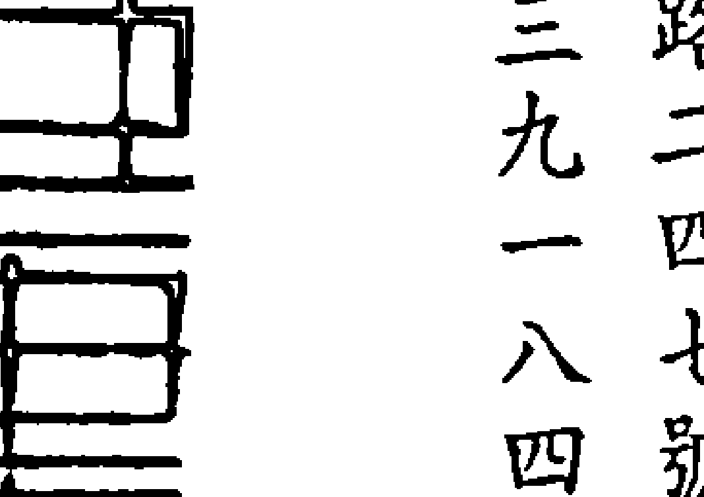

## 目录

- 希夷仰观天上星，作为斗术推人命………………六
- 不依五星要过节，只论年月日时生………………四
  - 一、五星之概念………………六
  - 二、五星五行………………九
  - 三、不依五星要过节………………一一
  - 四、只论年月日时生………………二九
  - 五、五行关系概念………………三八
  - 六、五行生克概念………………四二
  - 七、五行生克制化宜忌概念………………四四
- 先安身命次定局………………四七
  - 一、安身命例要知与五星大不同………………四七
  - 二、定命局之步骤………………五五
- 紫微天府布诸星………………七五
  - 一、安紫微星诀………………七五
  - 二、起紫微便览表………………七六
  - 三、起紫微数概念………………七七
  - 四、安紫府诸星诀………………九三
  - 五、附会记忆星曜的方法………………九七
  - 六、诸星集列便览………………一〇九
- 劫空伤使天魁钺………………一二五
  - 一、伤使临寅申巳亥，禄存到此却见败………………一三三
  - 二、天伤子卯辰午未，天使丑卯辰酉戌………………一三四
  - 三、二限逢伤使，太岁非之必死………………一三四
  - 四、太岁入罗网为灾恶………………一三五
  - 五、北斗方限至亥大宜………………一三五
- 天马天禄带煞神………………一五一
  - 一、安十二宫太岁煞禄神歌诀………………一五一
  - 二、博士概念………………一五二
  - 三、力士概念………………一五三
  - 四、青龙概念………………一五三
  - 五、小耗概念………………一五四
  - 六、将军概念………………一五五
  - 七、奏书概念………………一五五
  - 八、飞廉概念………………一五七
  - 九、喜神概念………………一五六
  - 十、病符概念………………一五九
  - 十一、大耗概念………………一五八
  - 十二、伏兵概念………………一六一
  - 十三、官府概念………………一六〇
  - 十四、飞天三杀概念………………一六四
  - 十五、流年四杀概念………………一六二
- 前羊后陀并四化………………一六七
  - 一、擎羊………………一七一
  - 二、陀罗………………一七二
  - 三、羊陀二星总论………………一七四
  - 四、化禄星………………一七四
  - 五、化权星………………一七五
  - 六、化科星（根据上下文推测，原文缺失此条）………………
  - 七、化忌星………………一七七
- 红鸾天喜火铃刑………………一八二
  - 一、安红鸾天喜诀………………一八二
  - 二、红鸾天喜概念（根据上下文推测，原文缺失此条）………………
  - 三、天喜概念………………一八五
  - 火星、铃星………………一八六
  - 一、安火铃二星诀………………一八六
  - 二、火星概念（根据上下文推测，原文缺失此条）………………
  - 三、火星概念………………一八七
  - 四、铃星概念（根据上下文推测，原文缺失此条）………………
  - 五、火铃二星概念………………一九〇
- 天刑、天姚………………一九一
  - 一、天刑概念………………一九一
  - 二、天姚概念………………一九五
- 二主大限并小限………………一九六
  - 一、命主………………二〇七
  - 二、身主………………二三〇
  - 三、大限………………二二八
  - 四、小限………………二二九
- 流年太岁寻斗君………………一九四
- 一、太岁概念………………二九五
- 二、岁前诸星概念…………二九七
- 三、将前诸星概念…………三〇七
- 四、流年太岁寻斗君………三一九
- 一、生杀星论………………三二四
- 二、纬剋经论………………三二五
- 三、经剋纬论………………三二七
- 四、诸星统论………………三二八
- 五、十二宫星辰落闲………三三三
- 六、定十二宫星辰落闲……三三八
- 七、简化星曜庙陷之概念…三三五
- 八、十二宫主喜宫概念……三四〇
- 九、参考资料………………三四四
- 流年祸福从此分……………三四六
  - 一、谈星要论………………三四六
  - 二、论大限十年祸福何如…三四八
  - 三、论二限太岁吉凶………三四九
  - 四、论行限分南北北斗……三五一
  - 五、论十二支生人所忌诀…三五一
  - 六、论立命行限宫歌………三五二
  - 七、流年祸福此中分………三五二

禄权科忌为四化，惟有忌星最可憎，大小二限若逢忌，未免其人有灾迍……三五五

科名科甲看魁钺，文昌文曲主功名，紫府日月诸星聚，富贵皆从天上生……三六〇

### 目录

- 一、命逢流年昌曲为科名科甲…三六二
- 二、文昌发科甲………………三六二
- 三、文曲受皇恩………………三六四
- 四、魁钺斗中司科之星………三六六
- 五、其他科举功名的线索…三六七

羊陀火铃为四杀，冲命冲限不为荣，杀破廉贪俱作恶，庙而不陷掌三军…三八二

- 一、四杀总论………………三八三
- 二、论七杀重逢……………三八四
- 三、七杀……………………三八四

更加丧吊白虎凑，伤使可以断生死……
若是生时准确者，祸福何有不准平，不准但用正时断，时有差误不可凭，
此是希夷真口诀，学者须当仔细精……
后列星图并论断，其中剖决最分明，若能依此推人命，何用琴堂讲五星…三九三

- 百字千金诀…………………三九五
- 附录：画蛇添足……………四〇〇
- 附录：时空遥想……………四〇五
- 跋……………………………四〇九

## 希夷仰观天上星 作为斗数推人命

紫微斗数之为生年月日时推测宿命之学术，由于依据人命生辰的原始资料与子平术之依据原始资料无有不同，所以泛称为「八字推命术」，与相法、易断之推测宿命吉凶大有不同，若不视为命理玄学，亦可当作一种消遣性的学术研习自娱。

相传唐有方士张果，号通玄先生，不知何许人，隐于中条山，往来汾晋间，尝自言生于尧丙子岁，精擅天文地理宿命，武则天时，慕名使使召之，张果诈死。开元中遣使迎之至京，寻还山，号通玄先生，后世以其神异，尊称为张果老，与吕李韩何等共八人，被后世世俗共尊为八仙。

相传有依据天文星象运行之推测人命术法，后称其法为张果老星宗，或简称果老星宗。

唐又有李虚中，止用人命生年月日三者即能推算本人之禄命，其术亦传于后，至有宋而有命书，其书或托名于李虚中。外有星命之学，以人生年月日时四者推算禄命，谓之星命（臆其为果老星宗），亦相传始于唐之李虚中，唯李虚中止用年月日而不用时，此说不辨即知其谬误。另有宋又见「珞琭子」一书，亦言禄命，伪托唐之珞琭子所作，后以唐之善推人命者，故李虚中也，于是附会李虚中为珞琭子。

旁考「已痈编」曰：星命之学，宋徐子平有珞琭子赋注二卷行于世，故谓其术曰子平。或谓子平名居易，五季人，与麻衣道者、陈图南、吕洞宾俱隐华山。今之推子平者，皆祖宋末徐彦升，其实非子平也。又宋传子平术，其书或托名于鬼谷子，或托名于郭璞，则为理学派宿儒游戏之作，托名之为一以言其来有自，一以术数为儒家所不屑为也。

今溯而臘之，斗数肇生于宋，而兼采果老星宗之精微，李虚中之简速，大概无可置疑，又考慧心斋主著：『紫微斗数新诠』曰：紫微斗数出于道家，始于吕纯阳，载于道藏经，至宋朝有陈希夷，明朝有罗洪先，清朝有青城道士，继续研究，发扬光大。民初北方亦有人加以研究，抗战期间，有人曾到洛阳安乐村的宋朝易理学家邵康节故居，发现藏有许多有关紫微斗数的书籍，和手抄割记的秘本，而加以研究。据悉当时不及抄录，只能记忆要点，也传留下许多珍贵资料，为后学之参考。

有关于陈希夷的略传逸闻甚多，尤以西岳华山东峰名胜弈棋仙迹的传说，经过段彩华先生精彩的描述『华山棋局』，使人恍如亲见先生与赵匡胤弈棋而『赢得华山一局棋』的精彩，并如睹先生仙风道骨的神采。（见台湾新闻报民国七十二年九月三十日、十月一日第九版副刊『华山棋局』。）

> 开宗明义即曰：『希夷仰观天上星，作为斗数推人命。』

唯后世之研习紫微斗数之学者，俱都推崇五代异人陈抟所作，所以传著于书之紫微斗数总诀正统高级飞星紫微斗数序曰：『原著飞星紫微斗数陈抟老祖，后唐亳州真源人，幼攻经史，继而慕道，曾得海诸仙之真传，举凡道家占验派、丹鼎派、经典派等，无不精通。先生对于经史百家之言，一见成诵，悉无遗忘，颇以诗名，曾预言赵匡胤将统一中原而称帝，之后，果然不爽。老祖除了著有指玄篇，八十一章外，并著有飞星紫微斗数六十四本，以及希夷数、范围数、河洛真数、河洛斗数、三元地理澈原经、河洛玄微（小奇门）等数十余卷，堪称千余年来第一奇人也。』

有关希夷先生略传，今之新锐斗数丛书如『紫微镜诠』皆见略述，且宋史、神仙传等皆有记载，学者即不知之能详，或有所耳闻认识，亦可自行考证，故不为赘述。

紫微斗数全书太微赋曰：『斗数至玄至微，理旨易明，虽设问于百篇之中，犹有言而未尽。』，因斗数诸星问答论大多希夷答曰，偶亦见白玉蟾答曰，恐学者不知白玉蟾为何许人，故附记略传。

## 白玉蟾略传：

### ──摘录道藏白玉蟾集之序──

海琼玉蟾先生事实：先生姓葛，讳长庚，字白叟。先世福之闽清人，母氏梦食一物如蟾蜍，觉而分娩，时大大有异童教琼琯，是生于琼。盖绍熙甲寅三月之十五也。

七岁能诗赋、背诵九经。父亡，母氏改适，先生师翠虚陈泥丸先生而学道焉。

弃家从师海上，号『海琼子』，至雷州，继白氏后，改姓白、名玉蟾，字以阅众甫，号『海南翁』，一号『琼山道人』，一号『赘庵』，一号『武夷散人』，一号『神霄散人』，一号『紫清真人』。自谓同紫元、紫华，先生乃紫清也。

## 不依五星要過節 只論年月日時生

今日研究紫微斗數之學者，俱知斗數衍出於「果老星宗」、「七政四餘」之星命一系，大多以星命過於細緻繁複而日見式微，更由於斗數玄微，理旨易明，而習者增益，大有青出於藍之勝，今日更見普遍而穩定流行。

斗數推崇希夷仰觀天上星而作斗數以推人之宿命，在命理學術的領域中執掌著相當份量的重要地位，雖已難以考據其創始與子平推命術之先後，但以子平推命迅捷，斗數推命精微，二者大有並提比論而流行深入民間。

大抵命理五術等學術，俱不離陰陽五行與易卦之理，子平推命術用陰陽五行生剋制化顯而易見，斗數用陰陽五行生剋制化則若隱若現，甚至隱而晦澀，更因衍出於星命，猶見星命細緻繁複遺留的痕跡，苟純粹由斗數而研習斗數，未築陰陽生剋制化之學術根基，大多困滯於某一程度而阻礙不前，更且斗數流傳既久而廣泛，流派駁雜而法例不一，每使初習者迷惑徘徊。

斗數流派雖駁雜，却大抵不外「鐵朴子」、「透派」、「飛星」三者，其中鐵朴子紫微斗數不見流行，唯見透派紫微斗數與飛星紫微斗數盛行而不衰，其中命理者宿張耀文先生、左騰龍先生生為透派一脈，梁湘潤先生、陳岳琦先生則為飛星一脈，至若新銳輩出如慧心齋主、天漓子先生俱為紫微斗數飛星一脈。

何以斗數派流駁雜而斗數新銳俱出於飛星紫微斗數一脈？

緣透派紫微斗數承續著星度節氣之意識，如欲安身立命必如星命，先查本命生月生時與節氣之關係，又如起大限亦如星命、子平之繁複，必視順逆命之節氣到生日生時之數，以三日而當一年計數（太陽星日行一度，月行一宮，而一宮三十度強，主於小限轄一年，至於大限轄十年，故以三日當一年計數。），其繁複仍如星命、子平。

飛星紫微斗數則見改良，安身立命僅須本命太陰曆（舊曆或農曆）生年月日時正確，可以不論節氣，不必如星命、子平之查閱萬年曆，幾至於隨時隨地可以論命之境界，又於起大限亦稱簡便，即視陰陽男女為何命局五行，不用計數即能推演。

據說曾有透派學者以飛星安身立命之「粗率」而詬病，而飛星學者則據紫微斗數總訣「不依五星要過節，只論年月日時生。」而以「正統」自居。

望元不安，暗中自習摸索飛星紫微斗數略涉星命、子平、透派斗數，深知各有攸據，根據雖異，其法自然不同，但觀透派與飛星之論斷則只斗數論斷一也。

若有學者自我標榜或相互譏誚，望元認其自失謙遜清高之風範，亦市屠半瓶叮嚀之輩而已，命理術本只為一系之或然數據，尚未臻「易與天地準，故能彌綸天地之道。」，苟不退而自省，僅以既得而自傲，竟至標譏讒語，豈不無聊？!

旁考七政造命之術，講究日月出沒，星曜過度，其術若出之於古天官之理天文星象，大概以京畿為觀星望斗之據點，或有地理經緯之差，或有星象天道之歲差，苟不先予調整，必有造命差談，更何況星命創始於唐，對於晉朝虞喜（字仲寧，會稽餘姚人）從實際的星象觀測和古書相對印證而發現「日行歲差」的事實，猶來不及消化而引用到命理學數的範疇，若是如此，今日造命豈不先調整日行歲差？

至若紫微斗數，雖有「希夷仰觀天上星，作為斗數推人命。」之說，恍惚斗數亦含有濃厚的星象意識，其用星曜亦若合於天文，但以其實星、虛星雜併而用，考據至為困難，若將其星曜視為如易卦之陰陽卦爻記號，即不考證天文星象，亦甚容易研習至相當準驗之精確程度矣！

## 一、五星之概念

### 中國古人談五星

我國研究天文之歷史至為悠久，大致可分為天文觀測家與曆法家二派，他們所做的事情，一以根據實際觀測的天文星象而記載之，一以推算日月五星的運行而推演曆法、預告日月蝕及五星運行的躔度，並且曆法家根據天文觀測家悠久的實際觀測結果而達到非常準確的推算。

除了預告日月蝕的準確之外，對於五星運行的週期也有詳細的觀測記載，譬如後漢書記載木星的週期為十一年又百分之八十七，與今日科學家用科學方法測算出的十一．八六年，只差了極小的一小數位數值而已，命理既由天文星象之運行而出，苟或研究命理而兼從事天文研究，必有助於命理之研究發展，謹摘錄希代書版有限公司出版呂應鐘先生編譯「銀河探秘」之「中國古人談五星」於下：

中國是世界上文化發源地之一，所以中國的天文學發達很早，在幾千年前，已有了輝煌的成就。

像金、木、水、火、土五星，在很古很古以前，中國人已對它們作了許多實際的觀測，並且計算出它們運行的度數和規律。

在五星中，首先被人們認識和加以注意的是木星。因為在天空中它相當亮，同時在一年中可以看到它的時間也特別長。中國人大約在公元前二千多年，已經測定得木星是十二年繞天一周，因此用它來定歲名，並且把木星叫做「歲星」。後來，到公元前四百年左右，人們又發覺木星在天空走一周所需要的時間，不是整整的十二年，而是十一年多。漢書天文志一書載：木星的週期是一一．九二年；後漢書卻說是一一．八七年。這些，和現在的天文學家所測定的一一．八六年這數字，已經非常接近。關於對木星的觀測，以及測定它的週期，和世界所有的國家相比，我們是最早的，並且也計算得最精密。因為在殷末周初，中國人已經開始重視歲星，到漢代已能計算它了。

其次是火星，古人覺得它發光熒熒，光度又時有變化。看起來，好像有時由東向西走，有時又由西向東走，非常神秘，叫人迷惑，所以把它叫做「熒惑」。

水星也很早就給中國人發現，史記天官書指出，當早上在太陽附近發亮的那顆星，就是五星中的水星。古人把一天的時間，分作十二時辰（每時辰等於現代二小時），按圓周的度數來說，每小時等於十五度，一辰等於三十度。因為水星繞太陽走的軌道，是在地球的內沿，所以我們在每小時等於十五度，一辰等於三十度。因為水星繞太陽走的軌道，是在地球的內沿，所以我們在地球上看它，是在太陽的東面或西面，而距離太陽即使最遠，也不超過一定的限度，而這最遠的角度，是廿八度，還不到一辰。於是，古人就叫水星做「辰星」。

金星在天空中最亮，因此也一早便被中國人找出來，人們因它的星光作銀白色，所以叫它做「太白星」。但金星在早上出現於東方，到黃昏又出現於西方，古人因此曾受到迷惑，以為是兩顆不同的星，並把早上見到的金星叫做「啟明星」，黃昏見到的叫做「長庚星」。

古人認識土星較晚，大約在戰國時代以前的古書都沒有提到土星。但後來，人們就測得土星二十八年在天空走一周天，認為它一年走一「宿」，二十八年走完二十八宿，好像是鎮壓二十八星宿的統領，所以叫它作「鎮星」。

在漢代，好幾位天文學者測驗五星非常精密。他們所寫下來的五星在天空運行的路徑和會合期，一直到今天還是對的。

此外，像近些年們所盛談的「七星聯珠」（即日、月、五星在一直線上），中國人老早就發現「五星聯珠」的現象，並引為是祥瑞了。

望元附按：命理用五星，其行宮行度用至半數，與天象星度有所出入，若五星俱順行，水星日行一度，月行一宮，金星日行一度，月行一宮，火星日半行一度，兩月行一宮，木星五日行一度，一年行一宮，土星十日行一度，廿八月行一宮，故欲得命理精微，如不能調適誤差，即飛星紫微斗數不依五星要過節，亦無可訴病也。

飛星紫微斗數於安身立命之時，雖不依五星要過節，但並非完全摒棄命理對於五星五行之意識，如斗數骨髓賦稱「科明祿暗位列三台」者，其所指之暗者，即為暗合，即為地支六合，亦即星命之言五星五行，實又承襲著五星五行之義理，若不能明其義理，至於斗數論斷之時必生窒礙，所以下列五星五行以為參考。

考原曰：「天干則甲乙屬木，丙丁屬火，戊己屬土，庚辛屬金，壬癸屬水；地支則寅卯辰屬木配東方也，巳午未屬火配南方也，申酉戌屬金配西方也，亥子丑屬水配北方也，而土寄旺於辰戌丑未之間配四季也。五星家又以寅亥屬木，卯戌屬火，辰酉屬金，子丑屬土，而午則為日，未則為月者。則以子午在下故為土，午未在上故為日為月，寅卯辰巳申酉戌亥分布左右，則如四時之流行於天地之間，故以其左右之合宮而別為木火金水之序也。」

協紀辨方書則以右列考原載錄五星五行引而未發，除具錄記之，更為釋義曰：「蓋天者，日也，月也；星者，日月之餘也。午未者離，子丑者坎，離為日（按：火者日之精。），坎為月（按：太陰乃水之精。），午之為日是已，子之不為月者何？月者，水之精，懸乎上而受日之光者，非北方子之位也，子丑之氣衝乎上而與日並其方，固必在未也。地者，水也，土也，子水丑土，丑又比水之土，其為地之體無可疑也，地，土也，子丑為土也。天位乎上，地位乎下，行乎兩間者必木火金水矣！子丑為水土，水土之際木必生焉，所以亥寅為木，一長生，一祿位也（按甲木长生於亥，临官於寅。），木成而火已出矣！寅火长生也，卯木旺也，旺则必熅，熅则必熅，熅则必...（此处为右侧文本内容，直到引用前）

> 考原曰：六合者，以月建与月将为相合也，如正月建寅，月将在亥，故寅与亥合，二月建卯，月将在戌，故卯与戌合也。月建左旋，月将右转，顺逆相值，故为六合。

龟海集曰：阴阳家地支六合者，日月会於子，则斗建丑，故子与丑合；日月会於丑，则斗建子，故丑与子合；日月会於寅，则斗建亥，故寅与亥合；日月会於卯，则斗建戌，故卯与戌合；日月会於辰，则斗建酉，故辰与酉合；日月会於巳，则斗建申，故巳与申合；日月会於午，则斗建未，故午与未合。

## 二、五星五行

大凡一般命数之论人命，俱寓月令节气之意识，以十二月“节”而节分一年为十二“节”，所以凡论人生月必视过节与否，正月建寅，从立春之时起，至交惊蛰之时止...凡立春、惊蛰、清明、立夏...等十二月节，起迄未有固定之日时，每欲推命必先求之历书通书，否则必有推定之繁琐困难。若星命子平之推论命宫，据说则要寻求月令中气，因笔者纯粹研习斗数，未敢妄论是否有此一说，但知六壬之学欲求月将，咸认为太阳於每月中气过宫，如正月雨水前，太阳犹在子宫，过正月中气雨水后，始入亥宫，始称月将发萌：。斗数之创始或有感于命数依赖曆法之不便，尤其宋初唐末之际犹未得活字版之发明，刊刻书籍费时困难，手抄更为旷时费事，设若无法推定，竟至无能依据论命，是以一改命数依据太阳曆法之传统方法，改良为依据太阴曆法论月令之方式，既符人民通俗之太阴曆法之观念，亦可省略查定月令节气之麻烦，堪称为命数学理上之一大创见发明。

## （一）、月令地支概念：

我国古代阴阳五行意识极为浓厚，大凡星象、物理、节气、身体、命数、医理、音律、曆法...等俱具五行阴阳之义理，是以「易」理成为山医命卜相之共同根基。

> 旁考史记律书：『营室者，主营胎，阳气而产之。东至於危，危，垝也，言阳气之危垝，故曰危，十月也。律中应钟，阳气之应不用事也，其於十二子为亥，亥者，该也，言阳气藏於下，故该也。...射者，阴气盛用事也，阳气无余也，故曰无射，其於十二子为戌，戌者，言万物尽灭，故曰戌。』

『，可见地支纳月令之意识已甚久远，正月纳於寅，为孟春，为一年之起始，此亦斗数大抵人命俱从寅上起之见解吧？！

斗数之命数虽不必如星命之依据节气，但以其本衍出於星命，历宋元明清而留传至今，其中己自诸多缺失困惑，苟能明瞭地支纳月令配卦之义理，或可逆推其衍出星命之缘故，或可重塑斗数之原真模样而更得数理之精确准验矣！

### 地支节气概念便览表

| 地支 | 月令 | 节气 | 宿度 | 配卦 |
|------|------|------|------|------|
| 亥   | 十月 | 立冬 | 壁九度 | 坤为地 |
| 子   | 十一月 | 大雪 | 危五度 | 地雷复 |
| 丑   | 十二月 | 小寒 | 室七度 | 地泽临 |
| 寅   | 正月 | 立春 | 壁九度 | 地天泰 |
| 卯   | 二月 | 惊蛰 | 奎五度 | 雷天大壮 |
| 辰   | 三月 | 清明 | 娄十一度 | 泽天夬 |
| 巳   | 四月 | 谷雨 立夏 小满 | 角十二度 轸十八度 翼二十度 | ☰ (乾为天) ☰ (天风姤) ☰ (天山遯) |
| 午   | 五月 | 芒种 夏至 小暑 | 张七度 星六度 柳十三度 | ☷ (天地否) ☴ (风地观) ☶ (山地剥) |
| 未   | 六月 | 大暑 立秋 处暑 | 鬼三度 井卅一度 参十度 |   |
| 申   | 七月 | 白露 秋分 寒露 | 嘴四度 毕十六度 昴十度 |   |
| 酉   | 八月 | 霜降 立冬 小雪 | 胃十五度 娄十二度 奎十八度 |   |
| 戌   | 九月 | 大雪 冬至 小寒 | 壁九度 室十八度 危十七度 |   |

## 三、不依五星要过节

大凡一般命数之论人命，俱寓月令节气之意识，以十二月“节”而节分一年为十二“节”，所以凡论人生月必视过节与否，正月建寅，从立春之时起，至交惊蛰之时止...凡立春、惊蛰、清明、立夏...等十二月节，起迄未有固定之日时，每欲推命必先求之历书通书，否则必有推定之繁琐困难。若星命子平之推论命宫，据说则要寻求月令中气，因笔者纯粹研习斗数，未敢妄论是否有此一说，但知六壬之学欲求月将，咸认为太阳於每月中气过宫，如正月雨水前，太阳犹在子宫，过正月中气雨水后，始入亥宫，始称月将发萌：。斗数之创始或有感於命数依赖曆法之不便，尤其宋初唐末之际犹未得活字版之发明，刊刻书籍费时困难，手抄更为旷时费事，设若无法推定，竟至无能依据论命，是以一改命数依据太阳曆法之传统方法，改良为依据太阴曆法论月令之方式，既符人民通俗之太阴曆法之观念，亦可省略查定月令节气之麻烦，堪称为命数学理上之一大创见发明。

### 周天宿度比较便览表

望元按：此地支概念便览表旁考自医书《八十一难经》，其二十八宿宿度除柳宿宿度无零数外，宿度俱有零数，不及备言其零数，表内仅止举其成数耳。
又按：二十八宿之宿度不一，至难考证，兹附统天历、会天历、授时历、开禧历以为比较参考，此或斗数之不依五星要过节之义理也。

| 星宿历法 | 角 | 亢 | 氐 | 房 | 心 | 参 | 觜 | 毕 | 昴 | 胃 | 娄 | 奎 | 壁 | 室 | 危 | 虚 | 女 | 牛 | 斗 | 箕 | 尾 | 轸 | 翼 | 张 | 星 | 柳 | 鬼 | 井 |
|---|---|---|---|---|---|---|---|---|---|---|---|---|---|---|---|---|---|---|---|---|---|---|---|---|---|---|---|---|
| 统天历 | 十二度九十分 | 九度七十四分 | 十六度二十六分 | 五度六十分 | 六度四分 | 九度半 | 四十六分 | 十六度三十六分 | 十一度九分 | 十五度三十八分 | 十二度七十五分 | 十八度二十一分 | 九度八十分 | 十八度四十五分 | 十六度十一分 | 九度二十九分 | 十度九十五分 | 八度八十六分 | 二十二度半 | 九度三十三分 | 十七度九十一分 | 十九度 | 二十度三十分 | 十七度八十五分 | 六度七十五分 | 十三度三十五分 | 二度三十七分 | 二十九度九十六分 |
| 会天历 | 十二度太 | 九度太 | 十六度 | 五度太 | 六度 | 九度半 | 半度 | 十六度少 | 十二度 | 十五度少 | 十一度太 | 十八度 | 九度太 | 十八度少 | 十六度 | 九度少七十九秒 | 十一度 | 七度 | 二十三度 | 九度 | 十八度 | 十八度太 | 二十度太 | 十七度太 | 六度太 | 十三度半 | 五度半 | 三十度半 |
| 授时历 | 十二度 | 九度 | 十五度 | 五度 | 五度 | 九度 | 二度 | 十六度 | 十一度 | 十四度 | 十二度 | 十六度 | 九度 | 十六度 | 十七度 | 十度 | 十二度 | 八度 | 二十六度 | 十一度 | 十八度 | 十七度 | 十八度 | 十八度 | 七度 | 十五度 | 四度 | 三十二度 |
| 开禧历 | 十二度 | 九度 | 十六度 | 五度 | 六度 | 九度半 | 半度 | 十六度半 | 十一度 | 十五度 | 十二度 | 十八度 | 九度 | 十八度 | 十六度 | 九度 | 十一度 | 七度 | 二十二度 | 九度半 | 十八度 | 十八度 | 二十度 | 十七度 | 六度太 | 十三度半 | 二度半 | 三十度 |

斗数虽未言节气，其实亦难泯十二月辟（配）卦之阴阳节气意识，为使学者能巩筑斗数数理之根基，并将来方便溯考斗数之原始起见，特摘录协纪辨方书之论如下：

### (二)、十二月辟卦概念

-   **正月建寅，泰卦：** 月令孟春，郑注曰：孟春者，日月会於娵訾而斗建寅之辰也。正月，三阳之月，泰，三阳之卦，故以配之。
-   **二月建卯，大壮卦：** 月令仲春，郑注曰：仲春者，日月会於降娄而斗建卯之辰也。二月，四阳之月，大壮，四阳之卦，故以配之。
-   **三月建辰，夬卦：** 月令季春，郑注曰：季春者，日月会於大梁而斗建辰之辰也。三月，五阳之月，夬，五阳之卦，故以配之。
-   **四月建巳，乾卦：** 月令孟夏，郑注曰：孟夏者，日月会於实沈而斗建巳之辰也。四月，纯阳之月，乾，纯阳之卦，故以配之。
-   **五月建午，姤卦：** 月令仲夏，郑注曰：仲夏者，日月会於鹑首而斗建午之辰也。夏至，一阴始生，姤，一阴之卦，故以配之。
-   **六月建未，遯卦：** 月令季夏，郑注曰：季夏者，日月会於鹑火而斗建未之辰也。六月，二阴之月，遯，二阴之卦，故以配之。
-   **七月建申，否卦：** 月令孟秋，郑注曰：孟秋者，日月会於鹑尾而斗建申之辰也。七月，三阴之月，否，三阴之卦，故以配之。
-   **八月建酉，观卦：** 月令仲秋，郑注曰：仲秋者，日月会於寿星而斗建酉之辰也。八月，四阴之月，观，四阴之卦，故以配之。
-   **九月建戌，剥卦：** 月令季秋，郑注曰：季秋者，日月会於大火而斗建成之辰也。九月，五阴之月，剥，五阴之卦，故以配之。
-   **十月建亥，坤卦：** 月令孟冬，郑注曰：孟冬者，日月会於析木而斗建亥之辰也。十月，纯阴之月，坤，纯阴之卦，故以配之。
-   **十一月建子，复卦：** 月令仲冬，郑注曰：仲冬者，日月会於星纪而斗建子之辰也。冬至，一阳始生，复，一阳之卦，故以配之。
-   **十二月建丑，临卦：** 月令季冬，郑注曰：季冬者，日月会於元枵而斗建丑之辰也。十二月，二阳之月，临，二阳之卦，故以配之。

### （三）、十二辰二十八宿星象

前迷二十八宿星象宿度不一，用星象之於十二辰恍若与今一般所认识之星象宿度稍异，特旁考纪辨方书以为参考。

蠡海集曰：十二肖属，子为阴极，幽潜隐晦，以鼠配之，鼠藏跡；午为阳极，显易刚健，以……马配之，马快行；丑为阴，俯而慈爱，以牛配之，牛舐犊；未为阳，仰而秉礼，以羊配之，羊跪乳；寅为三阳，阳胜则暴，以虎配之，虎性暴；申为三阴，阴胜则黠，以猴配之，猴性黠；卯酉为日月之门，二肖皆一窍，兔舐雄毛则孕，感而不交也，鸡合踏而无形，交而不感也；辰已阳起而变化，龙为盛，蛇次之，故龙蛇配辰已，龙蛇者，变化之物也；戌亥阴敛而持守，狗为盛，豬次之，故狗豬配戌丑，狗豬者，镇静之物也。或云：皆取不全之物配肖属者，非也！庶物万类岂特十二哉？况无义理，不足信也明矣！

> 考原曰：十二辰禽象，子鼠丑牛寅虎卯兔辰龙巳蛇午马未羊申猴酉鸡戌狗亥豬，其说相沿已久，莫知其所自来，虽於经典无见，然以传记子史考之，则不独宋以后也，如韩愈毛颖传，谓食於卯地祭张员外文，谓虎取而去，来寅其微，则唐时有之矣！管辂传，推东方朔龙蛇之占以为变化，相推会於辰巳。又谯周谓「司马」为「典午」，则汉晋时有之矣！溯而上之，陈敬仲筮者言当昌於姜姓之国，而释春秋谓，观之六四，纳得辛未，辛为巽，长女，未为姜，则是周时又已有也。至于二十八宿禽象，则近代方有之，意者因十二辰所取而附会其说耳，何则？十二辰以子午卯酉为四中宫，故一宫各筦三象，子宫女虚危，虚星居中，故为鼠之本象，女为蝠，危为燕，则取其似鼠者以配之也；卯宫氐房心，房星居中，故为兔之本象，氐为貉，心为狐，则取其似兔者以配之也；午宫柳星张，星星居中，故为马之本象，柳为獐，张为鹿，则取其似马者以配之也；酉宫胃昴毕，昴星居中，故为鸡之本象，胃为雉，毕为乌，则取其似鸡者以配之也。辰宫亢近中宫故为龙之本象，角居其旁，则取蛟为龙之类以配之；寅宫尾近中宫故为虎之本象，箕居其旁，则取豹为虎之类以配之；丑宫牛近中宫故为牛之本象，斗居其旁，则取獬为牛之类以配之；亥宫室近中宫故为豬之本象，壁居其旁，则取豺为豬之类以配之；戌宫娄近中宫故为狗之本象，奎居其旁，则取狼为狗之类以配之；未宫鬼近中宫故为羊之本象，井居其旁，则取犴为羊之类以配之；巳宫翼近中宫故为蛇之本象，轸居其旁，则取蚓为蛇之类以配之。

望元按：历法家之谓二十八宿星象之於十二辰，子，危月燕、虚日鼠、女士蝠；丑，牛金牛、斗木獬；寅，箕水豹、尾火虎；卯，心月狐、房日兔、氐土貉；辰，亢金龙、角木蛟；巳，轸水蚓、翼火蛇；午，张月鹿、星日马、柳土獐；未，鬼金羊、井木犴；申，参水猿、觜火猴；酉，胃土雉、昴日鸡、毕月乌；戌，娄金狗、奎木狼；亥，室火豬、壁水㺄。虽或近代历法家附会之说，唯十二肖属之意识相沿已久，每一肖属当配一年，遇而复始，有如干支之纪岁月日时，此亦斗数一宫属当配所属地支之宫，每一宫属一年，小限之义也。

### （四）、地支三合之概念

斗数地盘基於古人对于十二月令卦、节气、十二辰二十八宿星象……等多重繁复的意识，而结构成斗数多角度的重复层次，同时也演变成今日斗数丛书的纷杂。

除了上述所及之意识概念而外，斗数亦如其他命理数术，还具备着天干寄宫、遁宫之意识概念，见『六壬锁』或『斗数玄关』，因而造成斗数学者理解学习得不同的差异，反使后来学者莫衷一是，甚至为之困惑。虽然斗数门派纷杂而立论各异，但是对于斗数特别注重十二地支，有如人之生活于土地上，如果离开土地即不能够生活一样的重要，所以斗数之论断盖用三方四正论断，而三方四正者，实地支三合与岁破（地支六冲）之配合运用，所以欲明斗数星曜之冲合生剋制化必须先明地支三合。

> 协纪辨方书曰：申子辰合水局，亥卯未合木局，寅午戌合火局，巳酉丑合金局。

> 考原曰：三合者，取生旺墓三者以合局也；水生于申，旺于子，墓于辰，故申子辰合水局也；木生于亥，旺于卯，墓于未，故亥卯未合木局也；火生于寅，旺于午，墓于戌，故寅午戌合火局也；金生于巳，旺于酉，墓于丑，故巳酉丑，合金局也。

> 又曰：今按淮南子云：木生于亥，壮于卯，死于未，三辰皆木也；火生于寅，壮于午，死于戌，三辰皆火也；土生于午，壮于戌，死于寅，三辰皆土也（附按：此火土同长生之出处）；金生于巳，旺于酉，死于丑，三辰皆金也；水生于申，壮于子，死于辰，三辰皆水也。故五勝生一，壮五终九，五九四十五，故神四十五日而一徙，以三应五，故八徙而岁终。由今考之，陰陽家言三合者，唯水火木金而已，不及於土也，然言陰陽之书，淮南子亦可為古矣！所為三合之說，未必不始於是书，而上之三合则不传于世者，何歟？且世所言，土之長生等十二位與火無異，而淮南子则謂生午壯戌死寅，亦他書所無有也，今附載於此，以備一義也。

> 望元附按：數理之言五行，有水土同長生與火土同長生之異，斗數咸認五星五行，自然之序用水土同長生之義也。

：水土所生者木，上生而為火土，又上生而為金，又上生而為水。更見考原之論「五行生旺」（見後「先安身命次定局」二之(二)「五行生旺」），土生於申而寄生於寅。此所以斗数之五行生旺。

至於三合之概念，言之甚明，但理解困难，此正與純粹研習斗數而不及於築基陰陽五行義理之弊同理，苟能旁考天干寄宫、遁宫之義，從地支之藏干本氣、中氣、餘氣三者推敲，自能豁然开朗。

兹附地支藏干示意图，并摘录「斗数玄关」之「三合概念」於后：

## 「斗數玄關」三合之概念

斗數星曜觀察常及「三合」，凡星曜居於本宮之三合方，是為「合方」，亦稱「三合」，又有謂之「拱位」，或稱「拱照」，吉者為「協」，凶者為「贅」。 三合者，申子辰三合水局，巳酉丑三合金局，寅午戌三合火局，亥卯未三合木局，尚未見證 註，今圖解如下：

-   1. **一、申子辰三合水局：**
    * (一) 本氣
    

2. **(二) 中氣**
    

3. **(三) 餘氣**
    

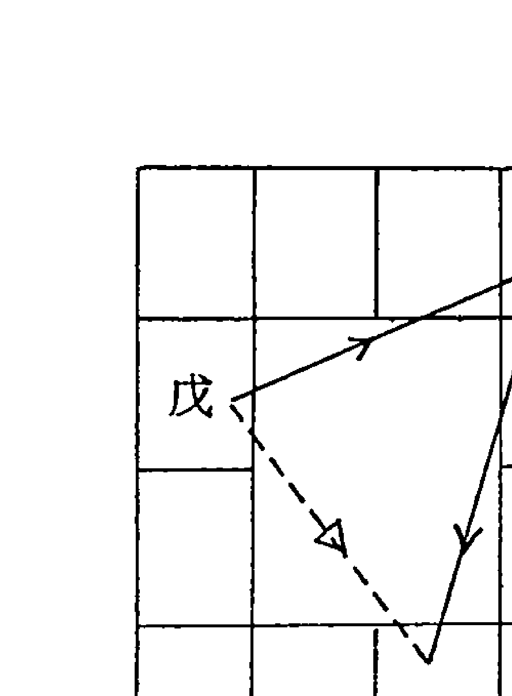

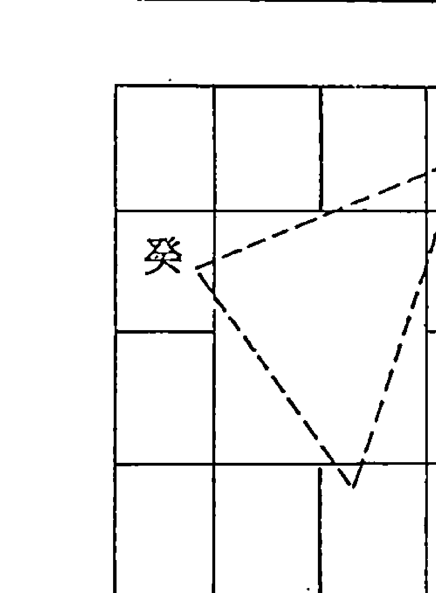

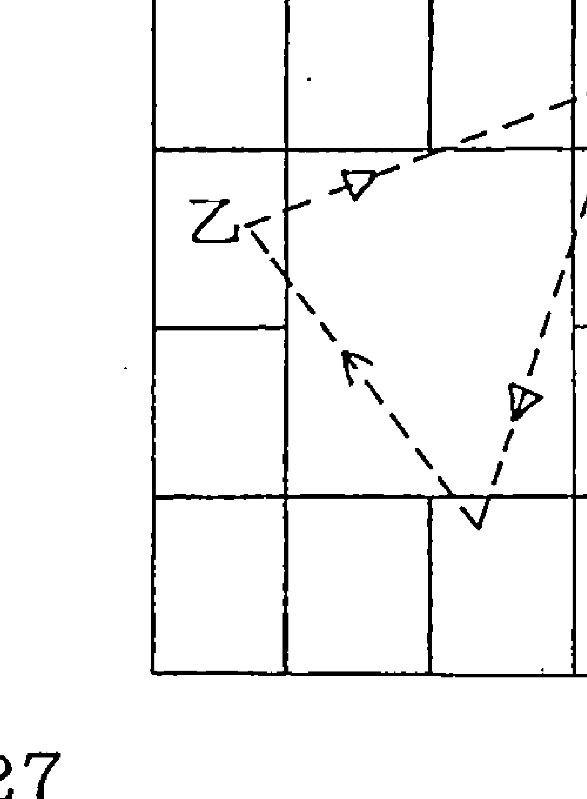

天干適宮示意圖 祿存蓋用當支本氣，唯戊己用餘氣。

| 戊庚丙 | 己○丁 | 丁乙己 | 戊壬庚 |
| :--- | :--- | :--- | :--- |
| 巳 | 午 | 未 | 申 |
| 乙癸戊 |  | ○○辛 |  |
| 辰 |  | 酉 |  |
| ○○乙 |  | 辛丁戊 |  |
| 卯 |  | 戌 |  |
| 戊丙甲 | 癸辛己 | ○○癸 | ○甲壬 |
| 寅 | 丑 | 子 | 亥 |

## 四、只論年月日時生

斗數既一改從前命理數術，不依五星要過節，可以不用推定節氣，何況是時通俗之記憶生日只有單純之太陰曆法，不似今日之生日之雙重標準，一者官方檔案證件之太陽日記載之用，一者沿承古老太陰曆通俗記憶生日行禮用事之用，除了生年干支或有忘記必須推數之外，既不必用「五虎遁」以年取月，亦不必用「五鼠遁」以日取時，簡直可以馬上立即安星佈置命圖而進入論斷

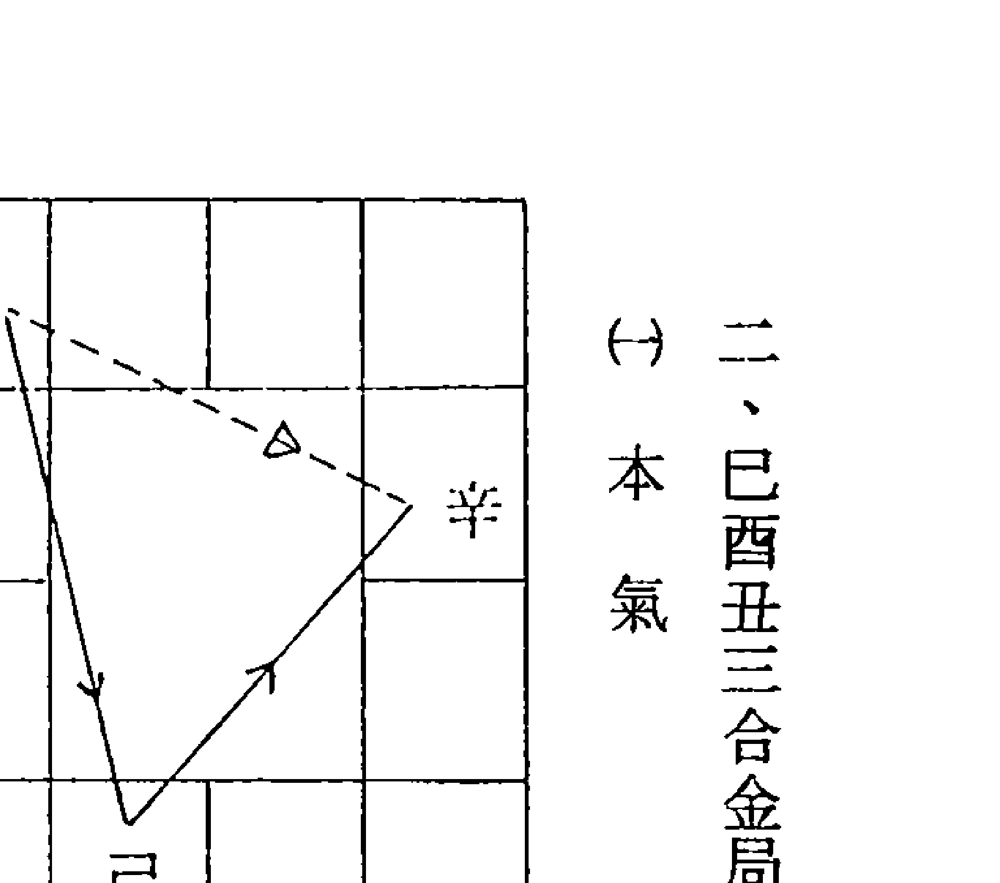

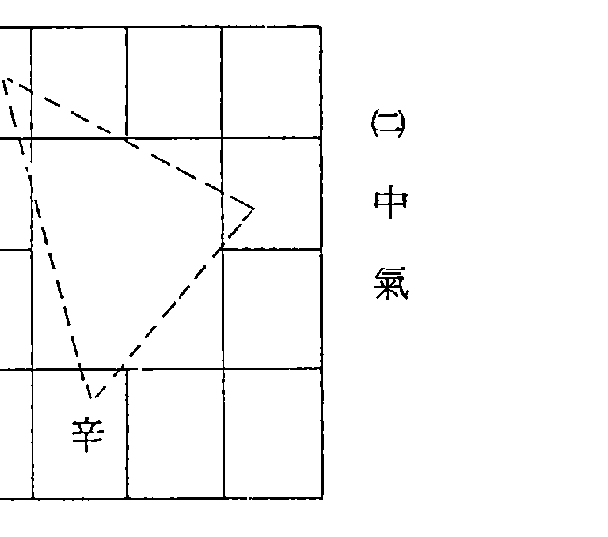

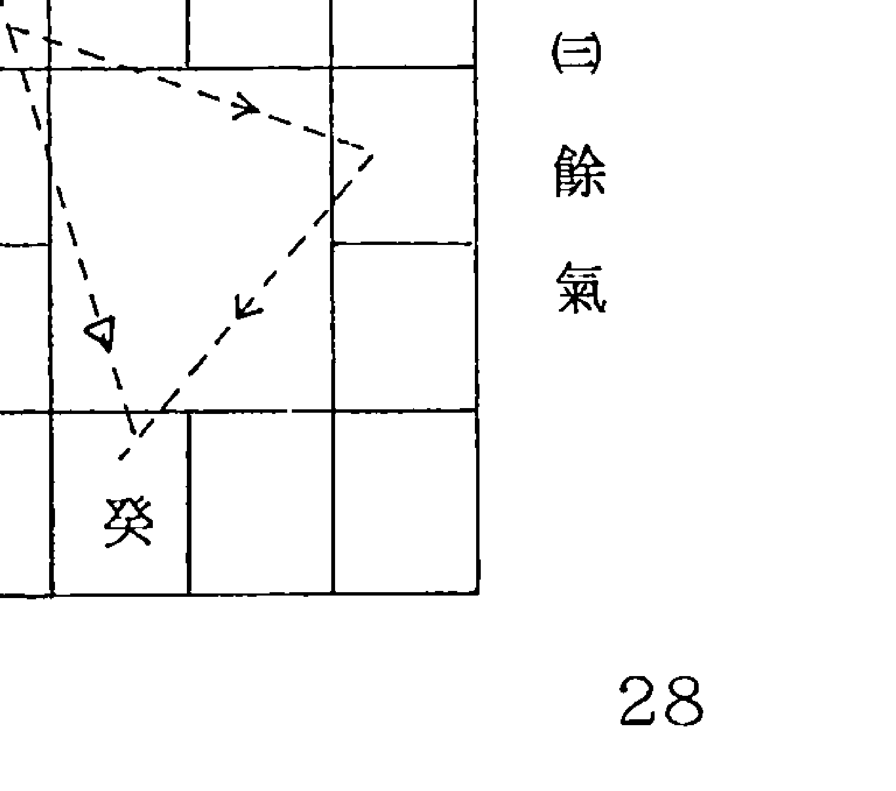

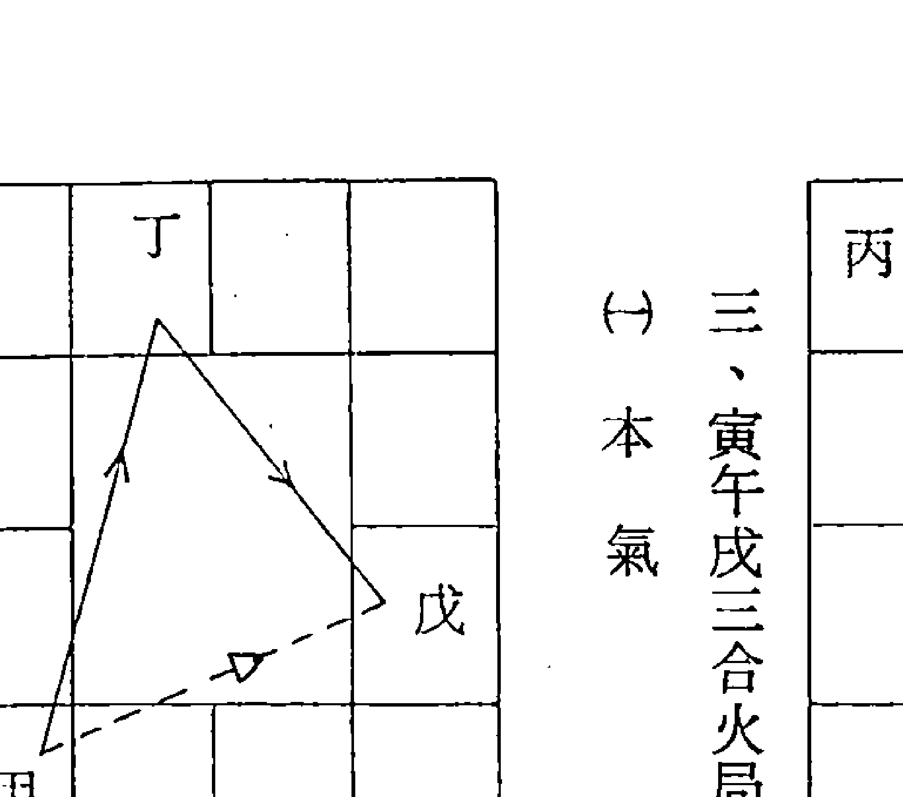

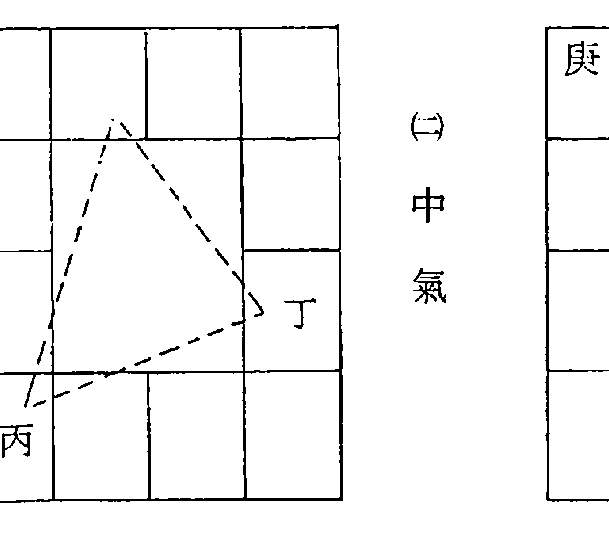

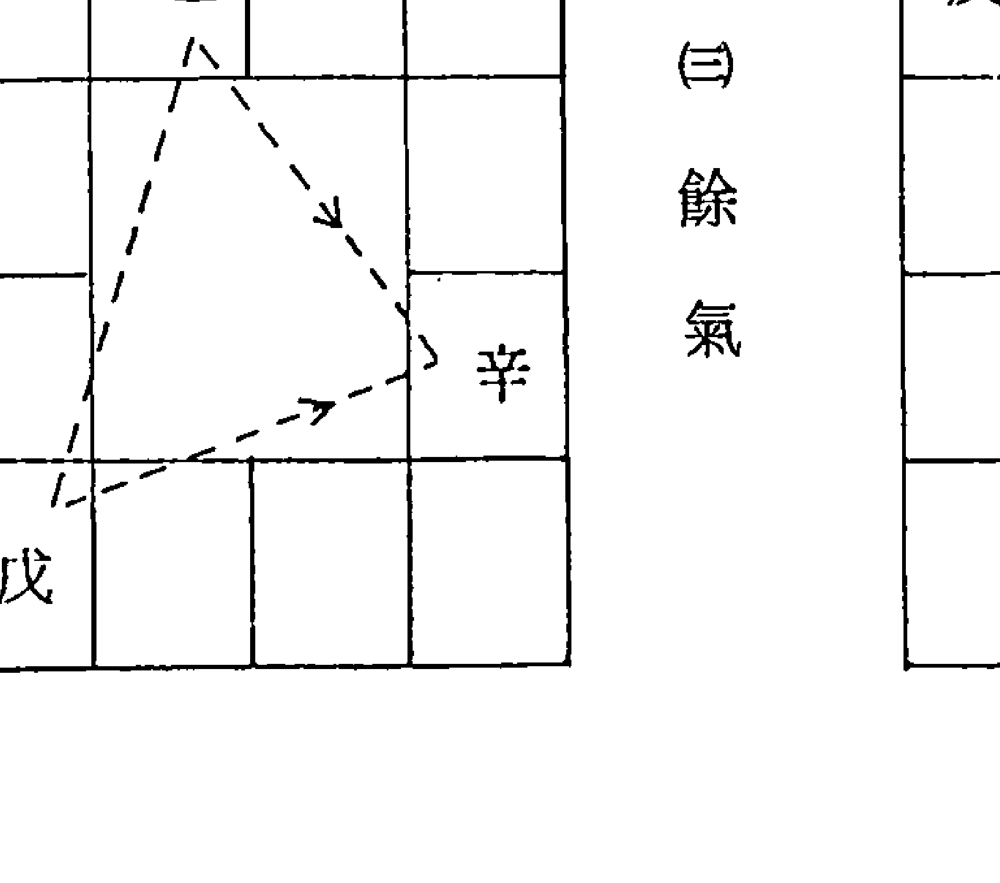

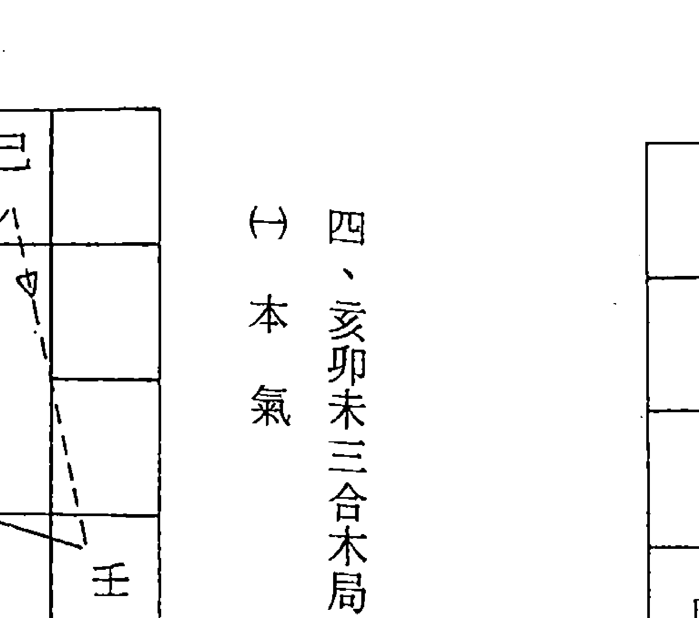

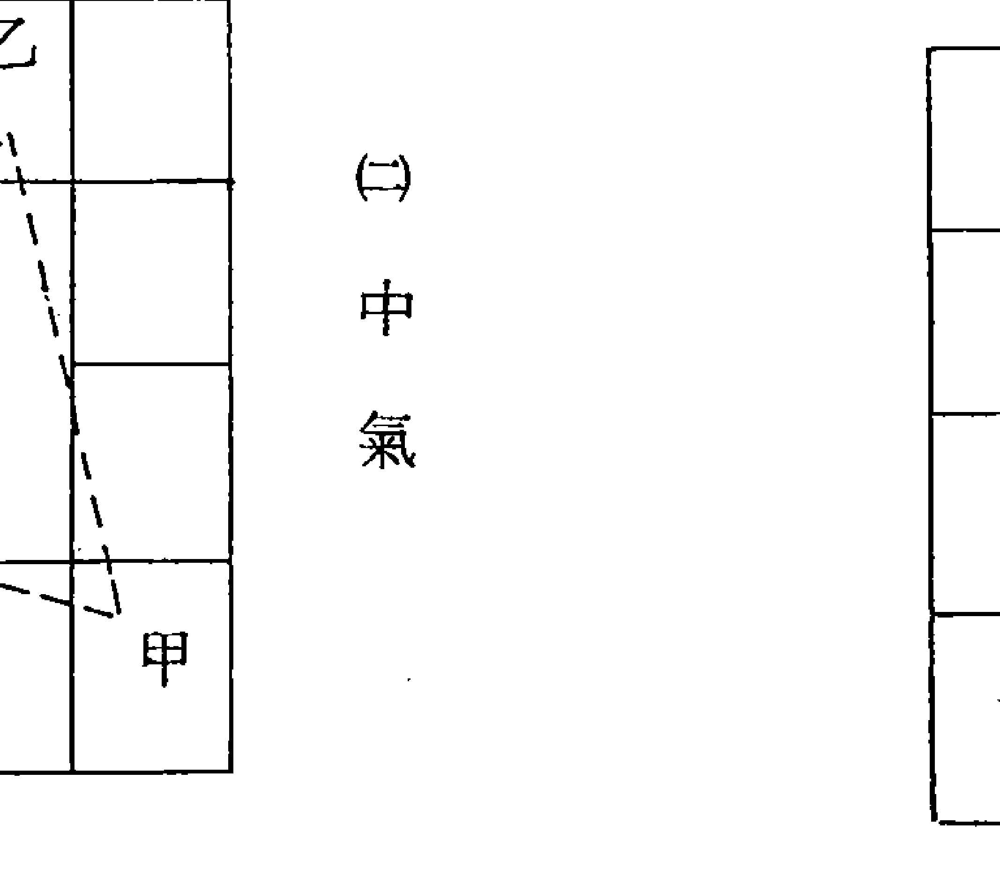

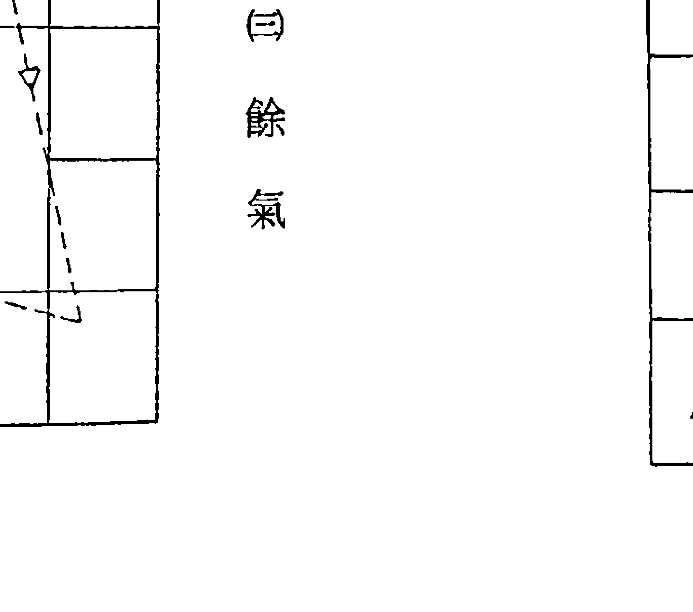

實在至為簡便，更且斗數素著準驗，所以有取代星命而青出於藍。
斗數既用本命太陰曆（農曆）之生年月日時，所以今用斗數推測宿命亦必用農曆之生年月日時，如只記太陽曆（陽曆或稱新曆）生日，則必用通書曆書推定其農曆生日，庶可得正確準驗。
又者今日計時，蓋用二十四小時計一日，而古用十二時辰當一日，所以今之論命，必先推定生時，而今之二十四小時換算為古法之十二時辰則簡單無難，又者一般皆具時辰換算常識，故不贅述，謹列便覽表以為簡索：

### 十二時辰便覽表

| 今日時間 | 時辰 |
| :--- | :--- |
| 昨日23:00-24:00 | 子 |
| 今日00:00-01:00 | |
| 01:00-03:00 | 丑 |
| 03:00-05:00 | 寅 |
| 05:00-07:00 | 卯 |
| 07:00-09:00 | 辰 |
| 09:00-11:00 | 巳 |
| 11:00-13:00 | 午 |
| 13:00-15:00 | 未 |
| 15:00-17:00 | 申 |
| 17:00-19:00 | 酉 |
| 19:00-21:00 | 戌 |
| 21:00-23:00 | 亥 |
| 今日23:00-24:00 | 翌日子時 |
| 明日00:00-01:00 | |

望元按：今之時間計算，以每天零時為一天交換的時間起迄交換點，而陰曆所用之時辰不以人為設定的時間為起迄點，陰曆之時日記訖點則定於日落至日出的黑夜時間的平均中數，相當於今日每天下午十一點（即二十三時）一日終結於二十三時，其後即為次日之始。
又有斗數發源於中原，星象宿度俱以京畿為依據，是否有調整地理緯度時差之必要？依據筆者研習斗數的經驗與實驗，已極具準驗，生於此而長於此，似無調整此一地理緯度時差的必要，至於調整地理緯度時差的結果則不得不也。
今日生長於臺灣地區，自民國三十四年五月一日（陽曆）起至民國六十八年九月三十日止，其間則有間斷的實施夏令日光節約時間，此夏令時間為人為之設定，非自然之時序，所以凡於夏令日光節約時間內誕生者，即應調整為中原標準時間，即如於其間有上午九時三十分生者，應先將生時提前一小時而換算為時辰，則此為「辰」時生而不為「巳」時生，餘做此，不贅。

| 實施年代 | 起迄時間 |
| :--- | :--- |
| 民國三十四年～四十年 | 五月一日～九月三十日 |

### （一）、生年干支计算方法

一般人在自己的生年月日时，普遍只记忆著生肖属、岁数、月、日、时，这些资料对于斗数推命来说已经可以说是完全齐备了，虽然生年干支没有马上表现出来，只要稍微推数计算一下，仍然可以不必特别查阅万年历。

以前之算命先生，尤其是瞎盲的算命先生最精于『招指一算』，心中有数，不谙者或讶其神奇，稍识者或讚其强于记忆，知之者则不以为怪，但把干支假寄于指掌，再就已知之今年岁次干支，按其今年岁数而分别干支，自今年而逆数至当生之年即得。

若知某人今年四十二岁，未知其生年干支，已知今年岁次癸亥，但自癸亥逆推至四十岁，按其今年岁数而分别干支，自今年而逆数至当生之年即得。

六十甲子的组合甚为简单，天干数十，地支数十有二，公倍数恰为六十，既知今年岁次癸亥，其人四十二岁，则干支分别计数逆推，四十二除以天干数十，余二，即自癸逆数二，得壬，其人生年天干为壬；又四十二除以地支数十二，余六，即自亥逆数六，得午，其人生年地支为午，合而知其人生年干支为壬午。

又如已知某人肖鼠，今年六十岁，则肖鼠人之生年地支必子，不必计数地支，生年天干则以岁数六十除以天干数十，无余，视为余十，自亥逆数十，得甲，合而知其人生年干支为甲子。余倣此。

似此简单数据，计数简易，更再将干支假寄于指掌上，以四指尖假寄地支巳、午、未、申，自食指尖而历指节而掌，假寄地支巳、辰、卯、寅，自小指尖申而历指节而指根之掌，假寄地支

| 民国四十一年 | 民国四十二年～四十三年 | 民国四十四年～四十五年 | 民国四十六年～四十八年 | 民国四十九年～五十年 | 民国六十三年～六十四年 | 民国六十八年 |
| :--- | :--- | :--- | :--- | :--- | :--- | :--- |
| 三月一日～十月三十一日 | 四月一日～九月三十日 | 四月一日～九月三十日 | 四月一日～九月三十日 | 六月一日～九月三十日 | 四月一日～九月三十日 | 七月一日～九月三十日 |

申、酉、戊、亥，再自小指根亥順歷子丑而衝接食指根之寅，恰如斗數之地盤，是以天干亦如之。假寄而不用子丑而已，附示意圖於下可窺概要：

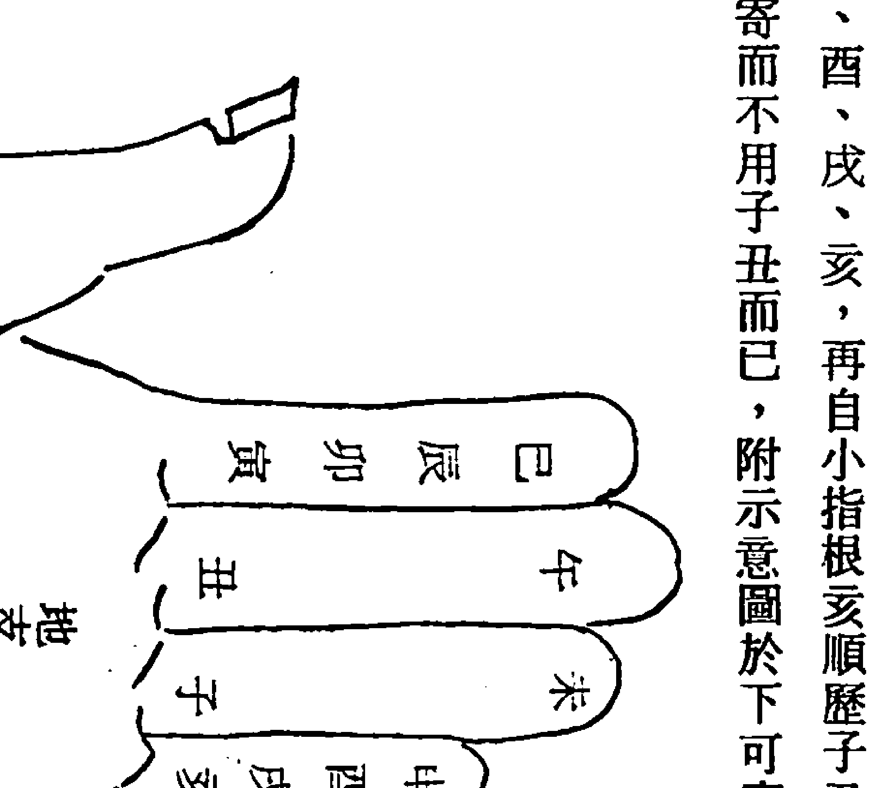

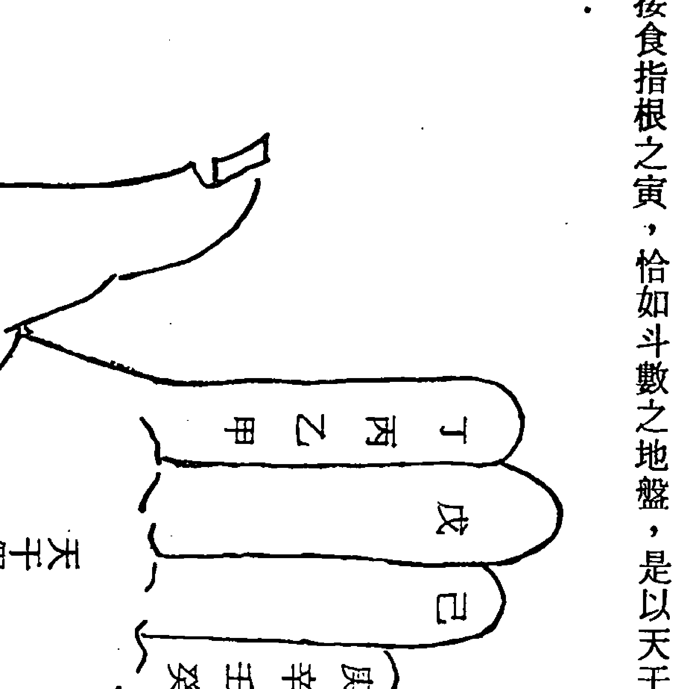

唯其江湖秘訣不一而足，但用地支假寄，一改逆數而順推，推近接近之歲數而順逆天干，則更為簡易。
如丙寅年有四十二歲者，如何速求？
因丙寅該年生為一歲，寅於食指根，此為丙寅，自寅順數至三，為辰，辰為丙辰，即丙辰年生者於丙寅年為十一歲，又自辰順數三，為午，午為丙午，即丙午年生者於丙寅年為二十一歲，又自午順數三，為申，申為丙申，即丙申年生者於丙寅年為三十一歲，又自申順數三，為戌，戌為丙戌，即丙戌年生者於丙寅年為四十一歲，丙戌年生人四十一歲最近四十二歲而不足，自丙戌逆回，地支得酉，天干自丙逆回，是以知其人生於乙酉。
又如某某人今年三十九歲，又如何速求其生年干支？
已知今年歲次癸亥，亥於小指根起一歲，間一「宮」於中指根為癸丑，癸丑年生人今年十一歲，又間一宮於食指第三節為癸卯，即癸卯年生人今年二十一歲，又間一宮於四指尖為癸巳，即癸巳年生人今年三十一歲，又間一宮於四指尖癸未順進二，進二當小指第二節為酉，為乙酉，是以知某人生年歲次干支乙酉。
總觀上述二例，但論地支，每順間一宮當十歲，歷十一、廿一、卅一……至最近本年年歲之

-   宮而逆順，不足逆回，有餘順進，法至簡速，稍微用心即能體會運用，茲附示意圖以為比對參考：

望元按：江湖秘訣不一而足，例猶須順逆，亦生混淆，所以有當十歲之數超過年歲，每見有餘而俱用順，捨不過年歲之不足而不用，即無不足，自無須逆回，一概用順則至簡易。法例雖或有差異，其理旨無有不同，學者可以做此自行玩味，不贅述。

## 二、五虎遁之概念

古紀歲月不離干支，尤其子平用之至要，反觀斗數『不依五星要過節，只論年月日時生。』粗視之，似已捨『五虎遁月』之法而不用，但詳加推敲，斗數用五虎遁法於『起五行寅例』，寓隱五虎遁以年取月之義而不彰顯。

竊考起五行寅例所用為五虎遁，加宮干起於寅，寅者正月，又考大抵人命俱從寅上起，若不論及其他，此二者合而觀之，正五虎遁以年取月之法也。

协纪辨方书曰：甲己年正月起丙寅，乙庚年正月起戊寅，丙辛年正月起庚寅，丁壬年正月起壬寅，戊癸年正月起甲寅。考原曰：上古歷元年月日時皆起於甲子年，是甲子年必為年前冬至十一月也，而正月建寅，故得丙寅，二月丁卯，以次順數至次年正月得戊寅，故乙年正月起戊寅，從甲至己越五年，共六十月花甲週而復始，故己年正月亦為丙寅也。

旁考子平術正用五虎遁以年取月而得『月柱』干支，以為論大運之依據，其理適與斗數用『宮干』當流年四化依據之義相通，故斗數用『命宮』為大限之依據，而命宮無大限（見斗數玄關）之義亦適與子平術不自月柱起大限之理相通，故斗數雖不見正用五虎遁，亦聊以記之，以明斗數隱晦寓藏之基本觀念多矣！

+   註解：
- (一)間一順進當十歲。
- (二)順進天干俱相同。
- (三)不足逆回干支求。
- (四)有餘順進數甚精。

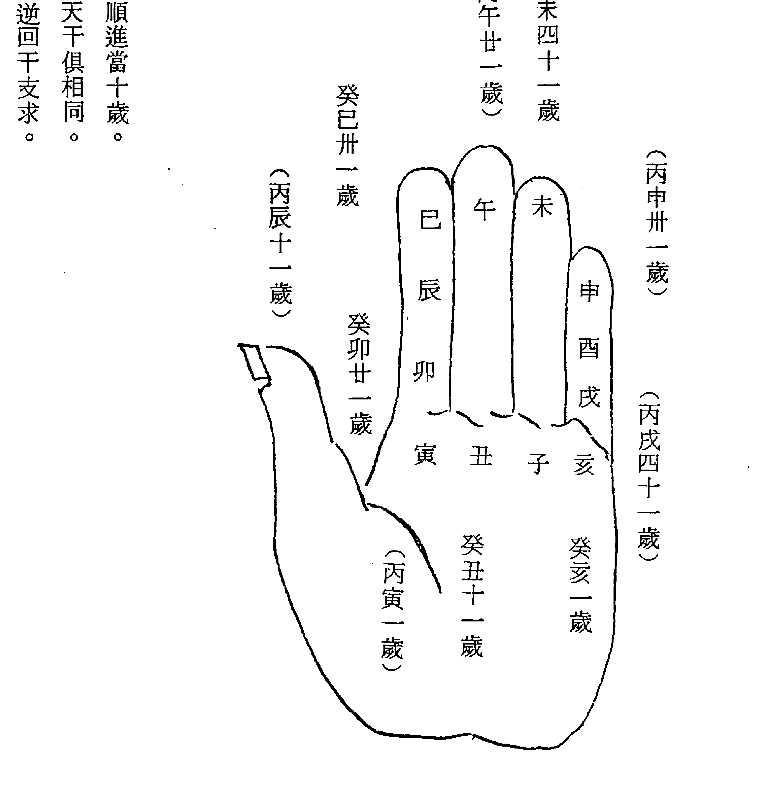

## 五、五行關係概念

前膽有宋一代理學發達，對於陰陽五行義理當極通俗普遍，所以斗數未具陰陽五行義理常用幾許，而今之註譯亦因之疏忽，若非從之不具，即略具而言之不明，何況五行之分甚多，不及一一備述，苟欲因循不具，則弊之缺失，苟欲求全，則泛而不精，故僅就天干五行及地支五行之關係概略集列成表，聊供參考。

天干五行關係概念便覽表

| 天干 | 五行 | 先天數 | 衝 | 合 | 化 | 剋 | 四時 | 方位 |
| :--- | :--- | :--- | :--- | :--- | :--- | :--- | :--- | :--- |
| 甲 | 陽木 | 三 | 甲庚衝 | 甲己合化土 | 甲己合化土 | | 春 | 東 |
| 乙 | 陰木 | 八 | 乙辛衝 | 乙庚合化金 | 乙庚合化金 | | 春 | 東 |
| 丙 | 陽火 | 七 | 壬丙衝 | 丙辛合化水 | 丙辛合化水 | 丙剋庚 | 夏 | 南 |
| 丁 | 陰火 | 二 | 癸丁衝 | 丁壬合化木 | 丁壬合化木 | 丁剋辛 | | |
| 戊 | 陽土 | 五 | | 戊癸合化火 | 戊癸合化火 | | | |
| 己 | 陰土 | 十 | | 甲己合化土 | 甲己合化土 | | 四季 | 中央 |
| 庚 | 陽金 | 九 | 甲庚衝 | 乙庚合化金 | 乙庚合化金 | | 秋 | 西 |
| 辛 | 陰金 | 四 | 乙辛衝 | 丙辛合化水 | 丙辛合化水 | | 秋 | 西 |
| 壬 | 陽水 | 一 | 壬丙衝 | 丁壬合化木 | 丁壬合化木 | | 冬 | 北 |
| 癸 | 陰水 | 六 | 癸丁衝 | 戊癸合化火 | 戊癸合化火 | | 冬 | 北 |

望元按：斗數諸星有藏干，天干各繫先天數，是以斗數諸星有數，唯數理缺失，今未見其傳。書中泛言陰陽男女，即依人之生年天干論，生年干陽者，男為陽男，女為陽女，生年干陰者，男為陰男，女為陰女，然亦有藏干論，生年干陽者，陽男陽女，生年干陰者，陰男陰女，此亦一說也。

男為陰男，女為陰女，后言陰陽男女，不另具註。

### 地支五行關系概念便見表

| 地支 | 子 | 丑 | 寅 | 卯 | 辰 | 巳 | 午 | 未 | 申 | 酉 | 戌 | 亥 |
| :--- | :--- | :--- | :--- | :--- | :--- | :--- | :--- | :--- | :--- | :--- | :--- | :--- |
| 五行 | 水 | 土 | 木 | 木 | 土 | 火 | 火 | 土 | 金 | 金 | 土 | 水 |
| 後天數 | 一 | 八 | 八 | 三 | 四 | 四 | 九 | 二 | 二 | 七 | 六 | 六 |
| 冲 | 子冲午 | 丑冲未 | 寅冲申 | 卯冲酉 | 辰冲戌 | 巳冲亥 | 午冲子 | 未冲丑 | 申冲寅 | 酉冲卯 | 戌冲辰 | 亥冲巳 |
| 三合 | 申子辰合水 | 巳酉丑合金 | 寅午戌合火 | 亥卯未合木 | 申子辰合水 | 巳酉丑合金 | 寅午戌合火 | 亥卯未合木 | 申子辰合水 | 巳酉丑合金 | 寅午戌合火 | 亥卯未合木 |
| 六合 | 子丑 | 子丑 | 寅亥 | 卯戌 | 辰酉 | 巳申 | 午未 | 午未 | 巳申 | 辰酉 | 卯戌 | 寅亥 |
| 刑 | 子刑卯 | 丑刑戌 | 寅刑巳 | 卯刑子 | 辰刑辰 | 巳刑申 | 午刑午 | 未刑丑 | 申刑寅 | 酉刑酉 | 戌刑未 | 亥刑亥 |
| 害 | 子害未 | 丑害午 | 寅害巳 | 卯害辰 | 辰害卯 | 巳害寅 | 午害丑 | 未害子 | 申害亥 | 酉害戌 | 戌害酉 | 亥害申 |

> 望元按：地支三合可見前地支三合之概念，地支六合可詳前五行。地支三合是取五行三合，又簡稱為『行合』，地支六合相類於天干合化（簡稱干合），是又稱『支合』。刑者，範為三類，一曰刑，寅刑巳、巳刑申、申刑寅（無恩之刑），未刑丑、丑刑戌、戌刑未（恃勢之刑），一曰互刑，子刑卯、卯刑子，一曰自刑，亥刑亥，辰刑辰、酉刑酉、午刑午。外有『破』者

| 地支 | 午 | 未 | 申 | 酉 | 戌 | 亥 |
| :--- | :--- | :--- | :--- | :--- | :--- | :--- |
| 陰陽 | 陽 | 陰 | 陽 | 陰 | 陽 | 陰 |
| 五行 | 火 | 土 | 金 | 金 | 土 | 水 |
| 數字 | 九 | 二 | 二 | 七 | 六 | 六 |
| 冲 | 午冲子 | 未冲丑 | 申冲寅 | 酉冲卯 | 戌冲辰 | 亥冲巳 |
| 三合 | 寅午戌合火 | 亥卯未合木 | 申子辰合水 | 巳酉丑合金 | 寅午戌合火 | 亥卯未合木 |
| 六合 | 午未 | 午未 | 巳申 | 辰酉 | 卯戌 | 寅亥 |
| 刑 | 午刑午 | 未刑丑 | 申刑寅 | 酉刑酉 | 戌刑未 | 亥刑亥 |
| 害 | 午害丑 | 未害子 | 申害亥 | 酉害戌 | 戌害酉 | 亥害申 |

## 六、五行生剋概念

> ，陽破後四辰，如子破酉，寅破亥，陰破前四位，如酉破子，亥破寅，其破不同於「歲破」之衝，作散也，移也解，不具。

言五行之有四時旺相死囚休，又別於五行生旺之十二神，取五行之於四時，春木夏火秋金冬水、土旺四季，子平用於「身」之至要，於斗數雖不明，但於五行之生剋卻難免提論，是以協紀辨方書正其名為「五行用事」曰：神樞經曰：五行旺各有時，惟土居無所定，乃於四立之前各旺一十八日。歷例曰：立春木，立夏火，立秋金，立冬水，各旺七十二日，土於四立之前各旺一十八日，合之亦為七十二日，總三百有六十而歲成矣！
此五行用事簡以言之，當生者旺，如木之於春欣欣向榮，是木氣當令之行，故木旺於春；所生者相，如水旺於冬，水生木，故木相於冬；我剋者死，如金旺於秋，金剋木，故木死（絕）於秋；剋我者囚，如木死於秋，雖木能生火，木既死，即火必待木旺始能生之，如災獄之囚盼待脫出，故火於秋，不能「剋」金，而言火囚於秋；生我者休，如木旺於春，水雖能生木，水氣因生木而泄，故水休於春。
若細以觀察，此實五行生旺之義，名目雖異而其理相通，苟或涉獵命理數術，嗜性廣搜而不能分辨，陡然自我混淆相亂，塁元之所以贅述，至盼有大智慧者能知此而旁考其他命數，以補斗數遺漏之缺失也。

### 五行生剋但立衰

| 五行 | 天干 | 地支 | 所生 | 所剋 | 剋化 |
| :--- | :--- | :--- | :--- | :--- | :--- |
| 水 | 壬癸 | 亥子 | 木 | 火 | 水剋火化木 |
| 木 | 甲乙 | 寅卯 | 火 | 土 | 木剋土化火 |
| 金 | 庚辛 | 申酉 | 水 | 木 | 金剋木化水 |
| 土 | 戊己 | 丑辰未戌 | 金 | 水 | 土剋水化金 |
| 火 | 丙丁 | 巳午 | 土 | 金 | 火剋金化土 |

若言五行生剋，其義雖簡，其變萬千，至難一言以蔽之，亦集列其要成表，以為便覽簡索，以供玩味：

塁元按：五行剋化，有認水剋火，火滅，水存，化水；木剋土，木立，土斥，化木；金剋木...## 七、五行生剋制化宜忌概念

綜觀上述五行關係、五行生剋，恍若有得而至迷惑，若干合之甲己合，以木剋土而化土，乙庚合，以金剋木而化金，丙辛合，火剋金而化水，丁壬合，水剋火而化木，戊癸合，土剋水而化火，又看支合，子丑合化土，丑土剋子水，寅亥合化木，亥水生寅木，卯戌合化火，卯木剋戌土，辰酉合化金，辰土生酉金，巳申合化水，巳火剋申金，午未合，日月明，亦不以剋而化生，是者五行陰陽相異者，不能用剋化論，一陰一陽相合者，必本合化，唯五行陰陽之同陽同陰相剋者，始得用剋化，此亦無怪斗數之論五行生剋制化至難！（附按：同陰陽剋者，應為剋生，而不為剋化。）

唯五行生剋制化有所宜忌，前徐大升先生論之甚為傳神，苟能體會應用，視斗數星曜生剋制化如五行生剋制化則又無難，今特摘錄以利研習：

- （一）、金賴土生，土多金埋。
  土賴火生，火多土焦。
  火賴木生，木多火熾。
  木賴水生，水多木漂。
- （二）、金能生水，水多金沈。
  水能生木，木多水縮。
  木能生火，火多木焚。
  火能生土，土多火晦。
  土能生金，金多土弱。
- （三）、金能剋木，木堅金缺。
  木能剋土，土重木折。
  土能剋水，水多土流。
  水能剋火，火炎水灼。
  火能剋金，金多火熄。
- （四）、金衰遇火，必見銷鎔。
  火弱逢水，必為熄滅。
  水弱逢土，必為淤塞。
  土衰逢木，必遭傾陷。
  木弱逢金，必為斫折。
- （五）、強金得水，方挫其鋒。
  強水得木，方緩其勢。
  強木得火，方洩其英。
  強火得土，方斂其欲。
  強土得金，方化其頑。

望元按：五行生剋制化雖為斗數論斷之至要，但斗數既寓隱五行生剋制化，即不甚了了，但知斗數星曜逢會變化，精語賦文，自能準驗，苟必先求星曜藏干而始入論五行生剋制化，則有失斗數創始之用心。塑元之所以詳言，蓋斗數缺失至多，端生隱晦，每遇阻滯必旁考他求，詳言五行生剋制化，一以助通阻滯，一以利兼習其他命理，亦使其他命理之學者容易兼習斗數而已。

### 先安身命次定局

斗數之異於星命（張果星宗、七政四餘）者，不以星曜宿度依流年而安定於一定宮曜，必先安身命次定局，如不知身命，則無以配納五行命局，若不悉五行命局，則不能進入「紫微天府佈諸星」，所以斗數與星命最大之不同者，有一定順序，不似星命先安身命後佈天星，或先佈天星後尋命身。

## 一、安身命例星大不同

大抵人命俱從寅上起，正月順數至本生月止，又自人生月上起子時，逆至本生時安命，順至本生時安身。

又若閏正月生者，要在二月內起安身命，凡有閏月，俱要依此。

上起，何也？閏月生者於次月起安身命，何以安佈諸星？

望元特闡釋如下：

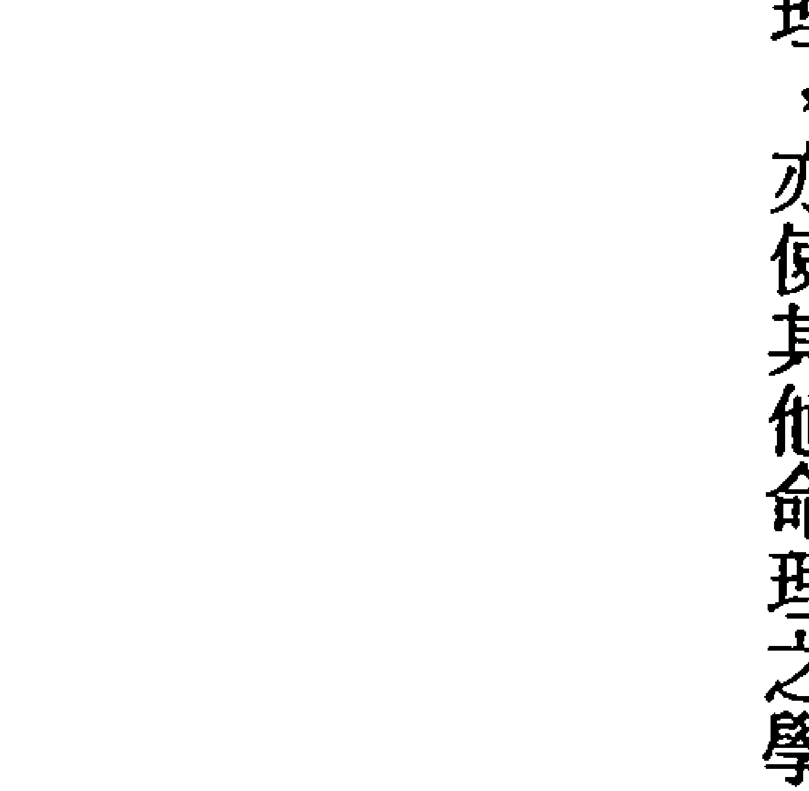

### （一）安身命例與五星不同

大凡星命之立命，既看日之躓度到宮以定時，即以時定命，日出於卯，造日用之。安命宮之法，法以太陽所泊之宮算起，順數遇卯安造命，假如某甲子年五月十二日辰時生，太陽泊於申宮，假申宮為生時辰，自申所假之辰順數至日出卯，適得未宮，故於未宮安命。今之坊間通書猶用七政四餘，即用此法，因斗數不用，故不為贅述。僅聊記以知斗數與星命之安命不同，不能用其他方法安命而入論斗數！

### （二）大抵人命俱從寅上起之概念

史記律書：「條風居東北，主出萬物，條之言，條治萬物而出之，故曰條風。南至於箕，箕者，言萬物根棋，故曰箕。正月也，律中泰簇，泰簇者，言萬物簇生也，故曰泰簇。其於十二子為寅，寅言萬物始生蜼然也，故曰寅。」醫家難經脈訣曰：「男娠左旋十月，至寅而生，女娠右旋十月，至申而生。」望元推臆，我國古代五術俱以「易」為根基，易與天地準，故能彌綸天地之道，聖人之作易，將以順性命之理，是以立天之道，醫家深明此理，是以視男女交感孕而受氣於亥，亥者，該也，核也，十月也，陽氣之危塄，極陰也，配卦坤，坤為母也。男秉陽而生，女秉陰而生，是以受氣孕娠若天道左旋而生，女秉陰而生，是以受氣孕娠若地道右旋而生。苟欲區分男女命之不同，或應男寅女申起命例才是，奈觀星象，日自華，月受日之光而麗，古代重男輕女，尤以西方夏娃為亞當贅骨的傳說為甚，月既受光於日，女命既依附於男命，故人命不論男女，俱從寅起推演，此其三也。

望元推臆，古人以寅為蜼然動貌，於物若蚓之引申而行，星象於天體運行，無痕無界，假令以十二辰次分野，假想天體自寅運行，斗數既仰觀而法星象，是亦當假令人命自寅而起，此其二也。

### （三）閏月生人安星概念

斗數若如五星，須用節氣根據推演，當無閏月之煩惱，若如子平等術尋用中氣過節，則亦須備萬年曆書，不能簡便。

安身命例雖明言要從次月起安身命，如閏三月生人，即視同四月生論身命，唯於安生月星曜之左輔右弼等星時，即視其仍為三月生人論，以符閏月之有節無氣。

### （四）安身命速覽概念

安身命既用本命生月與生時推演，有數據依賴，演算必得一定結果，如子午時生人，命身同宮，丑未時生人福德身同宮，寅申時生人官祿身同宮，卯酉時生人遷移身同宮，辰戌時生人財帛身同宮，巳亥時生人夫妻身同宮，只要推定命宮，立得身宮，至為簡便。

### （五）、命身宮的數據概念

科學昌明，資訊益見發達普遍的今天，喜愛玄理哲學、占卜命數的同好都懷抱著以電腦替人算命的憧懜，尤其是民生報於民國七十年十一月十八日首先披露鄭榮春先生將命理資料輸入電腦，實現別人難以完成的終端機前神機妙算的美夢，使電腦正確的映現一個特定的「命運」，也激

### 安命身便覽表

一般以列表方便查覽，亦列便覽表參之：

| 生時 | 類型 | 正月 | 二月 | 三月 | 四月 | 五月 | 六月 |
|------|------|------|------|------|------|------|------|
| 子   | 命   | 寅   | 卯   | 辰   | 巳   | 午   | 未   |
| 子   | 身   | 寅   | 卯   | 辰   | 巳   | 午   | 未   |
| 丑   | 命   | 丑   | 寅   | 卯   | 辰   | 巳   | 午   |
| 丑   | 身   | 丑   | 寅   | 卯   | 辰   | 巳   | 午   |
| 寅   | 命   | 子   | 丑   | 寅   | 卯   | 辰   | 巳   |
| 寅   | 身   | 子   | 丑   | 寅   | 卯   | 辰   | 巳   |
| 卯   | 命   | 亥   | 子   | 丑   | 寅   | 卯   | 辰   |
| 卯   | 身   | 亥   | 子   | 丑   | 寅   | 卯   | 辰   |
| 辰   | 命   | 戌   | 亥   | 子   | 丑   | 寅   | 卯   |
| 辰   | 身   | 戌   | 亥   | 子   | 丑   | 寅   | 卯   |
| 巳   | 命   | 酉   | 戌   | 亥   | 子   | 丑   | 寅   |
| 巳   | 身   | 酉   | 戌   | 亥   | 子   | 丑   | 寅   |
| 午   | 命   | 申   | 酉   | 戌   | 亥   | 子   | 丑   |
| 午   | 身   | 申   | 酉   | 戌   | 亥   | 子   | 丑   |
| 未   | 命   | 未   | 申   | 酉   | 戌   | 亥   | 子   |
| 未   | 身   | 未   | 申   | 酉   | 戌   | 亥   | 子   |
| 申   | 命   | 午   | 未   | 申   | 酉   | 戌   | 亥   |
| 申   | 身   | 午   | 未   | 申   | 酉   | 戌   | 亥   |
| 酉   | 命   | 巳   | 午   | 未   | 申   | 酉   | 戌   |
| 酉   | 身   | 巳   | 午   | 未   | 申   | 酉   | 戌   |
| 戌   | 命   | 辰   | 巳   | 午   | 未   | 申   | 酉   |
| 戌   | 身   | 辰   | 巳   | 午   | 未   | 申   | 酉   |
| 亥   | 命   | 卯   | 辰   | 巳   | 午   | 未   | 申   |
| 亥   | 身   | 卯   | 辰   | 巳   | 午   | 未   | 申   |

| 生時 | 類型 | 七月 | 八月 | 九月 | 十月 | 十一月 | 十二月 |
|------|------|------|------|------|------|--------|--------|
| 子   | 命   | 申   | 酉   | 戌   | 亥   | 子     | 丑     |
| 子   | 身   | 申   | 酉   | 戌   | 亥   | 子     | 丑     |
| 丑   | 命   | 未   | 申   | 酉   | 戌   | 亥     | 子     |
| 丑   | 身   | 未   | 申   | 酉   | 戌   | 亥     | 子     |
| 寅   | 命   | 午   | 未   | 申   | 酉   | 戌     | 亥     |
| 寅   | 身   | 午   | 未   | 申   | 酉   | 戌     | 亥     |
| 卯   | 命   | 巳   | 午   | 未   | 申   | 酉     | 戌     |
| 卯   | 身   | 巳   | 午   | 未   | 申   | 酉     | 戌     |
| 辰   | 命   | 辰   | 巳   | 午   | 未   | 申     | 酉     |
| 辰   | 身   | 辰   | 巳   | 午   | 未   | 申     | 酉     |
| 巳   | 命   | 卯   | 辰   | 巳   | 午   | 未     | 申     |
| 巳   | 身   | 卯   | 辰   | 巳   | 午   | 未     | 申     |
| 午   | 命   | 寅   | 卯   | 辰   | 巳   | 午     | 未     |
| 午   | 身   | 寅   | 卯   | 辰   | 巳   | 午     | 未     |
| 未   | 命   | 丑   | 寅   | 卯   | 辰   | 巳     | 午     |
| 未   | 身   | 丑   | 寅   | 卯   | 辰   | 巳     | 午     |
| 申   | 命   | 子   | 丑   | 寅   | 卯   | 辰     | 巳     |
| 申   | 身   | 子   | 丑   | 寅   | 卯   | 辰     | 巳     |
| 酉   | 命   | 亥   | 子   | 丑   | 寅   | 卯     | 辰     |
| 酉   | 身   | 亥   | 子   | 丑   | 寅   | 卯     | 辰     |
| 戌   | 命   | 戌   | 亥   | 子   | 丑   | 寅     | 卯     |
| 戌   | 身   | 戌   | 亥   | 子   | 丑   | 寅     | 卯     |
| 亥   | 命   | 酉   | 戌   | 亥   | 子   | 丑     | 寅     |
| 亥   | 身   | 酉   | 戌   | 亥   | 子   | 丑     | 寅     |

勸了雅好奇而……甚至於市面將可購回到特定的命理程式磁碟，就像購學終有成爲普遍利用電腦替人算命的一天，甚至於市面將可購回到特定的命理程式磁碟，就像購……

不過精湊命數而……恐怕在短時間內還無法樂觀其成。

望元研習紫微斗數有年，發現紫微斗數充滿著濃郁醉人的數據程序，苟能一一重新發現，當有助於紫微斗數電腦化的發展，茲舉命身宮的數據概念如下：

（甲）、安命身宮用本命之生月數配合排列爲一百四十四組的連續數據，凡命宮以逆，身宮以逆，本月子時之命宮即上一月亥時之命宮，本月子時的身宮即上一月亥時的身宮，如一月亥時生人命在卯，身在丑，二月子時生人亦命在卯，身在卯，餘做此可以數據推演。

（乙）、凡本命生月與生時同數者，如一月子時生，二月丑時生人等是，俱安命於寅，但身宮因時之數而變，其遞變之程式亦可用簡單算式計算推演：

（1）、生月數與生時數相等者，命宮俱安於寅。

（2）、生月數與生時數相等者，其身宮用生時數乘以二減一爲得數，自命寅起一順數至得數即爲身宮，例如三月寅時生，命宮固安於寅，身宮則用寅三乘以二減一，得數五，自命寅起一順數至得數五爲午，午即身宮，餘做此。

（3）、生時數若小於生月數，爲負數，但有小於生月數之生時數者，視其接續亥時而來，若三月丑時生人，丑時數十四，其身宮必位於命宮順數至二十七之宮位，換言之，得數二十七除以十二宮數，餘三，三爲得數，身宮必位於命宮順數至三之福德宮。

（4）、此算式以推求身宮爲主，故視生月數與生時數相同者爲每月計算之起例，似有妨害命宮計算之困擾，其實此數據概念有如二元一次方程式，先使未知的二元歸於單元化，重點先著重於身宮計算而已。

（5）、命宮自一月子時由寅逆數而定，由生時數減以生月數加一爲得數，若一月戌時生者，戌時數十一減以生月數加一，得數十一，由寅逆數十一爲辰，故知辰爲命宮，若三月丑時生者，丑時數十四減以寅時數二小於三，加十二宮數（亦即亥十二之數，視同接續亥時之後來者。），丑時數十四減以寅時數二小於三，加十二宮數，是得十二，是由寅逆數十二爲卯，故知安命於卯，安身於巳。

（6）、此數據概念雖不無煩贅之煩，但卻已具備電腦輸入程式的構想，讀者若能咀嚼玩味，必能品嚐其中之滋味，甚至做此而捕獲電腦輸入程式之楔機？

命身宮起出，即可確定諸宮之人際事物關係位置，不論男女，法俱從逆轉而安之：

### （六）、安十二宫例

- 一、命宮
- 二、兄弟
- 三、夫妻
- 四、子女
- 五、財帛
- 六、疾厄
- 七、遷移
- 八、奴僕
- 九、官祿
- 十、田宅
- 十一、福德
- 十二、父母

> 望元按：斗數十二宮之法衍出於星命，但其宮位不同於星命，較原星命之十二宮更切符實際生活之人生現象，不過因其衍出於星命，所以其中仍殘存著星命宮位之印象，每見賦文遺留著星命之韻味，茲附星命十二宮以供參考比較

### 星命十二宮安命訣

——摘錄星命須知——

主陰陽二皆逆數，假如甲子年五月十二日辰時生，太陽在申，子年太陽在子，五月逆數月數五到申，即定生時辰臨申，由申起辰順數至日出卯在未，即於未宮安命，逆數午上二財帛……，其十二宮順序如下：

- 一、命宮
- 二、財帛
- 三、兄弟
- 四、田宅
- 五、子女
- 六、奴僕
- 七、夫妻
- 八、疾厄
- 九、遷移
- 十、官祿
- 十一、福德
- 十二、父母

### (七)、十二宮位概念

昔傳七政造命之法，講究七政照法，形成星命、斗數十二宮位之概念。七政照法有六：曰開（隔九十度，以子宮言，卯酉為關。）、曰輔（隔六十度，以子宮言，寅戌為輔。）、曰夾（前後三十度，以子宮言，丑亥為夾。）、曰拱（隔一百二十度，以子宮言，辰申為拱。）、曰守（命宮，後凡主事之宮俱是。）、曰照（對宮）。

望元按：七政照法分十二宮一周天，一宮三十度，設行至一百五十度不照無光，為陷，此斗數命身二主俱有七之理也。

### (八)、安命主概念

斗數設命主一論，命主者七，若符七政之數，只看安命何宮，即可定出命主。

安命主訣
貪狼子宫  巨門亥丑宮  祿存寅戌宮  文曲卯酉宮
廉貞申辰宮  武曲未巳宮  破軍午宮

望元按：斗數命主用七，用斗數之北斗七星（若符地理挨星之法），以命主定人之心性，三方四正有命主星者為顯性性向，不見者為潛性性向，或如身宮見之，即本命後天環境而養成之習慣性向，一般斗數學者俱鮮論之，苟能活潑運用，論人形性，至為神驗。

旁考梁湘潤先生所著「紫微斗數考證」曰：「斗數論命基點在命宮，論命之時以命宮星曜論之，若不論命宮星曜而換以命主星，即可溝通命理與風水二者融合為一，可以同時論斷本命之陽宅喜忌禍福」。

### (九)、依附命身安定之星曜

安定命身，有虛星天傷、天使二星恒居於命宮之陷位；有天才、天壽二星用命身宮依生年支安定，天才自命宮起子順數至本生年支安之，天壽由身宮起子順數至本生年支安之。

## 二、定命局之步驟

命宮既安，命局未明，何以而定本命之五行命局？

簡以言之，斗數尋本命命宮干支納音而定五行命局。

但觀命宮僅有命盤地支而已，是以必加天干始能配干支，加天干之法亦自寅起，昔稱為「起（或加）五行冠蓋」，或稱「加宮干」等等，法以「五虎遁月」，是為「起五行寅訣」，訣曰：甲己之歲起丙寅 乙庚之歲起戊寅 丙辛之歲起庚寅 丁壬之歲起壬寅 戊癸之歲起甲寅 支有十二，子丑無干以配，循環天干再用甲乙補接而得甲子、乙丑，餘做此。假令有戊年生人安命於戊，由寅起甲寅，順歷乙卯、丙辰、……壬戌、癸亥，因天干只十，地支有十二，子丑無干以配，循環天干再用甲乙補接而得甲子、乙丑，餘做此。今戊生人安命於戊，命宮干支得壬戊，即用壬戊尋六十花甲子納音歌，依『壬戊癸亥』大海水而定本命為水二局。

### (一)、干支概念

希夷曰：天干始於甲，終於癸，河圖生成之數也。地支起於乾陽，備陰，自姤始，六變而坤成，合二六之數，為十二辰。夫甲丙戊庚壬，陽幹也，子寅辰午申戌，陽支也，乙丁己辛癸，陰幹也，丑卯巳未酉亥，陰支也。法以陽幹配陽支，陰幹配陰支，猶木之有幹有枝，以六甲配五子，自甲子為首，次第推排，而盡於癸亥，仍以干支本數計其成數，總其成數干支若干，然後以五數除之，其餘數以先天河圖象數冠之，遇其有聲音納之以五行之音，是為六甲納音，聖人推。

### (二)、天干原於河圖

據傳說：伏羲氏王天下，龍馬負圖出於河，遂則其文以畫八卦，其文一六居下，二七居上，三八居左，四九居右，五十居中。地理人子須知曰：按天干出於河圖，天一生壬水，地六生癸水，天三生甲木，地八生乙木，天七生丙火，地二生丁火，天九生庚金，地四生辛金，天五生戊土，地十生己土。協紀辨方書曰：河圖一六為水居北，二七為火居南，三八為木居東，四九為金居西，五十為土居中。北方水生東方木，東方木生南方火，南方火生中央土，中央土生西方金，西方金生北方水，此五行相生之序也。

### (三)、地支原於洛書

據傳說：大禹治水，理龜負文列於背，有數至九，禹遂因而第之，以成九疇，其文戴九履一，左三右七，二四為肩，六八為足，而五居中。地理人子須知曰：地支出於洛書，子午酉得天陽之數而居四正，寅申巳亥辰戌丑未得地陰之數而居四隅；陽數奇，故各主其一，陰數偶，故各主其二，辰戌丑未無定位，故寄居四隅。協紀辨方書曰：洛書戴九履一，左三右七，二四為肩，六八為足，五居中央。一六水剋二七火，二七火剋四九金，四九金剋三八木，三八木剋五中土，五中土剋一六水，此五行相剋之序也。

### （四）六十花甲纳音歌

- 甲子乙丑海中金
- 丙寅丁卯炉中火
- 戊辰己巳大林木
- 庚午辛未路旁土
- 壬申癸酉剑锋金
- 甲戌乙亥山头火
- 丙子丁丑涧下水
- 戊寅己卯城头土
- 庚辰辛巳白蜡金
- 壬午癸未杨柳木

望元按：五行生克，河洛理数实古人干支五支生克之概念，包含数据、方位、阴阳、五行，变动河图五行相生之序可成五行相克，变动洛书五行相克之序亦可得五行相生，研习学问不可拘泥不变，谨附图以供玩赏。

### （五）纳音数据概念

六十花甲子纳音用之甚早，几莫可考证，虽知其中包含数据概念，众说大抵不能考证，俱出臆测，亦皆言之成理，是若补义曰：甲己子午九，乙庚丑未八，丙辛寅申七，丁壬卯酉六，戊癸辰戌五，已亥是四数，符其支干，总成其数，却以五数除之，不满五者，以作纳音，如专一纳音属火，零二纳音属土，零三属木，零四属金，零五属水，惟火水土无声，故其数异（望元按：五行成数原于河图成数，此言一火二土五水之成数异于河图一水二火五土也。）傍考名义考曰：鬼谷子作纳音，纳者，受也，音者，感物助声也；水音一六，火音二七，木音三八，金音四九，土音五十，此生成之数也。甲己子午九，乙庚丑未八，丙辛寅申七，丁壬卯酉六，戊癸辰戌五，已亥四，此干支之数也。五行之中惟金木有自然之音，水火土必相假而后成音；水无音，假土则激（水受激而数五十），火无音，假水则沸（火受沸而数一六），土无音，假火则烈（土受烈而数二）；以干支之数，合生成之数，感物助声，而音斯受矣！

蠡海集云：或问曰，先天之数何缘而起？余答曰，数极于九，自九逆退取之，故甲己子午九，乙庚丑未八，丙辛寅申七，丁壬卯酉六，戊癸辰戌五，五天干已尽而地支独遗已亥，是以已亥得四终焉，况夫亥为天门，已为地户，纯阳之位，为开阖之枢，所以关键五行也。考原曰：此扬子云太元论声律所纪数也，凡两干两支之合，其余数得四九者为金，得一六者为火，得三八者为木，得五十者为土，得二七者为土。如甲子皆九，得数十八，乙丑皆八，得数十六，合之三十有四，故为金；壬六申七，得数十三，癸五卯六，得数十一，合之二十有四，故亦为金也，其余按数推之莫不皆然。但所配一六二七等数与河图之数不同，今按大衍之数五十，其用四十有九，以两干两支之合数于四十九内减之，余数满十去之，余一六为水，二七为火，三八为木，四九为金，五十为土，各取所生之五行以为纳音，其理正相合也。如甲九子九乙八丑八，其合数三十四，于四十九内减之，余十五，十不用，余五，属土，土生金，故曰金；丙寅丁卯共合数二十，于四十九内减之，余二十九，十不用，余九，属金，金生水，故曰水；戊辰己巳共合数二十，于四十九内减之，余二十九，十不用，余九，属金，金生水，故曰水；庚午辛未共合数三十，于四十九内减之，余十九，十不用，余九，属金，金生水，故曰水；壬申癸酉共合数三十，于四十九内减之，余十九，十不用，余九，属金，金生水，故曰水；甲戌乙亥共合数三十，于四十九内减之，余十九，十不用，余九，属金，金生水，故曰水；丙子丁丑共合数三十，于四十九内减之，余十九，十不用，余九，属金，金生水，故曰水；戊寅己卯共合数三十，于四十九内减之，余十九，十不用，余九，属金，金生水，故曰水；庚辰辛巳共合数三十，于四十九内减之，余十九，十不用，余九，属金，金生水，故曰水；壬午癸未共合数三十，于四十九内减之，余十九，十不用，余九，属金，金生水，故曰水；甲申乙酉共合数三十，于四十九内减之，余十九，十不用，余九，属金，金生水，故曰水；丙戌丁亥共合数三十，于四十九内减之，余十九，十不用，余九，属金，金生水，故曰水；戊子己丑共合数三十，于四十九内减之，余十九，十不用，余九，属金，金生水，故曰水；庚寅辛卯共合数三十，于四十九内减之，余十九，十不用，余九，属金，金生水，故曰水；壬辰癸巳共合数三十，于四十九内减之，余十九，十不用，余九，属金，金生水，故曰水；甲午乙未共合数三十，于四十九内减之，余十九，十不用，余九，属金，金生水，故曰水；丙申丁酉共合数三十，于四十九内减之，余十九，十不用，余九，属金，金生水，故曰水；戊戌己亥共合数三十，于四十九内减之，余十九，十不用，余九，属金，金生水，故曰水；庚子辛丑共合数三十，于四十九内减之，余十九，十不用，余九，属金，金生水，故曰水；壬寅癸卯共合数三十，于四十九内减之，余十九，十不用，余九，属金，金生水，故曰水；甲辰乙巳共合数三十，于四十九内减之，余十九，十不用，余九，属金，金生水，故曰水；丙午丁未共合数三十，于四十九内减之，余十九，十不用，余九，属金，金生水，故曰水；戊申己酉共合数三十，于四十九内减之，余十九，十不用，余九，属金，金生水，故曰水；庚戌辛亥共合数三十，于四十九内减之，余十九，十不用，余九，属金，金生水，故曰水；壬子癸丑共合数三十，于四十九内减之，余十九，十不用，余九，属金，金生水，故曰水；甲寅乙卯共合数三十，于四十九内减之，余十九，十不用，余九，属金，金生水，故曰水；丙辰丁巳共合数三十，于四十九内减之，余十九，十不用，余九，属金，金生水，故曰水；戊午己未共合数三十，于四十九内减之，余十九，十不用，余九，属金，金生水，故曰水；庚申辛酉共合数三十，于四十九内减之，余十九，十不用，余九，属金，金生水，故曰水；壬戌癸亥共合数三十，于四十九内减之，余十九，十不用，余九，属金，金生水，故曰水；朱子曰：乐声是土（宫）金（商）木（角）火（徵）水（羽），洪范是水火木金土。盖纳音以干支分配于五音，而本音所生之五行即为其干支所纳之音也。……阳生于子，自甲子以至癸巳，阴生于午，自甲午以至癸亥，故三十而复从宫起，宫君商君角民皆人道也，故可以为首，徵事羽物皆人所用也，故不可以为首，是以三甲终而复始于宫。干为天，支为地，音为人，三才之五行备矣！

望元综观上述，理旨大同小义，更有陶宗仪为纳音系辞以干支五行生旺墓作注，今略而不述。

1. 阳干支者配后接之阴干支，两干两支而合数，犹如周易筮仪扑著之「四扑」，以象四时者也。
2. 阴干支者合前来之阳干支，两干两支而合数，例如本命安命于酉，癸年生，起五行寅而加宫干辛，得辛酉，命宫辛酉，是阴干支，应合前来之阳干支庚申，用庚申辛酉四者而合数，合数二十八，十位数不用，余数八，因三八属木，故知本命安命辛酉为木三局命，余做此。
3. 合数之法，必记干支之计数，自九逆退取之，甲己子午九，乙庚丑未八，丙辛寅申七，丁壬卯酉六，戊癸辰戌五，巳亥四。（望元按：蠡海集注解勉强，此干支计数何与河图之数相异，尚有待考据。）
4. 合数但察个位之数，凡得一六者火（火燎上，是以居数之下），二七者土，三八者木，四九为金，五十者水（水润下，是以居数之上）。

望元按：研求学问每有学而后知不足，纳音合数之五行数恍若讲究地壳结构，若地心熔浆属火居最内，火而生土，土地包含容纳地火，土地而生木产金，木之生长显为阳三，金之含蕴隐为阴四，自然之水江流河海，化气升而为云，降而为雨，是居纳音五行之上，此愚见臆测之辞，聊博一哂。

### （六）代记记忆纳音歌方法

古昔有江湖术士，或落拓文士，因记忆六十花甲子纳音歌不易，发明记忆歌诀，其法有二：

#### （1）依原甲子旬干支顺序记忆歌诀

- 子午银灯挂壁钩
- 辰戌烟满寺钟楼
- 寅申汉地燥柴湿
- 纳音需向此中求

#### （2）不依原甲子旬干支顺序，重组甲子旬干支成为依天干顺序之记忆歌诀

- 甲乙锦江烟
- 丙丁没谷田
- 戊己营堤柳
- 庚辛桂杖钱
- 壬癸林钟满
- 花甲纳音存

如甲子乙丑海中金，甲午乙未沙中金，二者俱属金，以银代记，银字偏旁金，故知属金；如丙寅丁卯炉中火，丙申丁酉山下火，二者俱属火，以灯代记，灯字偏旁火，故知属火。余做此。

法以天干表示干支四字之天干，系辞之第一字表示合配子午丑未之代字，第二字表示合配寅申卯酉之代字，第三字表示合配辰戌巳亥之代字。如甲子乙丑、甲午乙未为锦，丙子丁丑、丙午丁未为没；如甲寅乙卯、甲申乙酉为江，丙寅丁卯、丙申丁酉为谷；如甲辰乙巳、甲戌乙亥为烟，丙辰丁巳、丙戌丁亥为田；余做此，视所得代字有何偏旁定其五行命局。

### （七）表列便览方法

据说有明一代，紫微斗数已见表列简索方法，法以命宫干支为之，不仅保存着六十花甲子纳音歌之样貌，既可助益于记忆纳音，又可以凭藉简索，方便确定命局。

望元按：直看此简索表与前「甲乙锦江烟」记忆花甲纳音歌诀比较，不难发现其共同之处。历有清而至现代，斗数学者发现起五行寅，固为将来安「大限四化」之必用，但若仅用于定五行命局，止知本命生年干及命宫支即足用矣！

**命宫纳音五行局简索表**

| 命宫支 | 命宫干 | 五行局 |
| :--- | :--- | :--- |
| 子丑 | 戊己 | 火六局 |
| 寅卯 | 丙丁 | 土五局 |
| 辰巳 | 甲乙 | 木三局 |
| 午未 | 戊己 | 火六局 |
| 申酉 | 丙丁 | 土五局 |
| 戌亥 | 甲乙 | 木三局 |

**定五行命局简便表**

| 生年干 | 命宫支 | 乙庚 | 甲己 | 丙辛 | 丁壬 | 戊癸 |
| :--- | :--- | :--- | :--- | :--- | :--- | :--- |
| 子丑 | 火六局 | 水二局 | 土五局 | 木三局 | 金四局 |
| 寅卯 | 土五局 | 火六局 | 木三局 | 金四局 | 水二局 |
| 辰巳 | 金四局 | 木三局 | 水二局 | 火六局 | 土五局 |
| 午未 | 木三局 | 土五局 | 土五局 | 水二局 | 火六局 |
| 申酉 | 水二局 | 金四局 | 火六局 | 金四局 | 木三局 |
| 戌亥 | 土五局 | 火六局 | 木三局 | 土五局 | 火六局 |

### （八）五行命局嵌数之寓意

五行命局嵌数，水嵌以二，为水二局，木嵌以三，为木三局，金嵌以四，为金四局，土嵌以五，为土五局，火嵌以六，为火六局。

一以其数既非河图生成之数，一以嵌数何不一而至五，竟用二而至六，实至令后者学者难以妄臆胡猜。

紫微斗数考证曰：紫微斗数为命理与易理结合之产品，凡遇命理常例以外之理哲，大都是依易卦、河洛理数为加添之理哲。

> 又曰：紫微斗数于五行命局用的是成数，故木为三数之局，金为四数之局，土为五数之局。惟水火二局，乃以易卦之「水火既济」卦理，水用火数，火用水数，坎离交换使用而成其象，故水为火二数之局，火为水六数之局。

望元则持游戏玩味态度曰：有宋王阳明提倡知行合一学说，孙中山先生提倡知难行易学说，蒋中正先生提倡知易行难学说，用之于斗数理哲之研习至当。知易行难者，斗数理旨易明，安星佈斗至为简易，欲本之论断则难；知难行易者，斗数之理旨当然然而莫知其所以然，但本其当然而不知所以然，亦能精通斗数义理；知行合一者，为研习斗数至境，既知而能行，既行而深知，岂非希夷再世乎？！紫微斗数如此，天下学问事务岂不亦若是乎？！

窥臆古人数据深寓阴阳五行或自然现象之义，大抵以奇数一、三、五、七、九为阳，为天「生」之数，显而活泼变动，偶数二、四、六、八、十为阴，为地「成」之数，晦而易感稳定。

古人推臆混沌者太极，阴阳相杂而不分，有若人命孕感而胎藏母体之中，男女犹莫辨，人之既生，雌雄可辨，又若太极之生两仪，阴阳有别，所以斗数定五行命局自二数而始，不自一数起也。

> 又观自然界之现象，地水深潜于地中，土以覆盖之，木之根基入于地中，金亦蕴藏于土中，是以水数居下而最少，土数五而居水木金之上，因其生发万物而用天「生」之数五。
> 
> 木之根基与金之蕴藏，盖居水上土下，何以定木三金四？窃臆草木之茂于平阳者多，金石产于高山者多，木根基入地而枝干生发出地表，是以取用天「生」之数三，金石蕴藏而有待开发取用，是以取用地「成」之数四。
> 
> 火之居上，犹日之高悬当空，若取此则当用天「生」数一，唯日之普照于地一也，自然界之火必以木生之，木之枝干既出于地表，火自木而生又一也，是以火居土上而唯地「成」数六可用，用六则符易理「水火既济」之卦易，亦符自然现象之火显而居于地表之上。占不论望元胡猜妄臆是否体会斗数原来之义理，斗数之五行命局嵌数之设并非无由而发，其中隐藏着一些提示性的寓意，却罕有人发现体会。

### （九）五行之概念

今习斗数，对于古人之五行意识若知而半解，不如宋朝理学达之五行意识普遍，所以斗数总诀未及五行生旺，以其当然而略之，迨至有明斗数又见流行，是以增加五行生旺，俾使后之学者方便研习，望元雅爱斗数已至痴癖程度，体仰明清之斗数贤哲提携后进用心之苦，是以不厌繁赘，旁据协纪辨方书而略论五行概念。

1. 五行命局之嵌数暗示着本命日起紫微的方法，如水二局命人初二、木三局命人初三、金四局命人初四，土五局命人初五，火六局命人初六，俱于寅宫起紫微。又如水二、金四、火六阴而右逆，凡初一生人均自寅顺至其数，水二丑、金四亥、火六酉而起紫微；如木三、土五阳而左顺，凡初一生人均自寅顺至其数，水二丑、金四亥、火六酉而起紫微；（详见起紫微数据概念）
2. 五行命局之嵌数暗示着五行命局起大限之年岁，如水二局二岁起大限，木三局三岁起大限，金四局四岁起大限，土五局五岁起大限，火六局六岁起大限。

协纪辨方书曰：六经论五行者，始见于尚书。洪范曰五行，一曰水，二曰火，三曰木，四曰金，五曰土。大禹谟曰，水火金木土，谷惟修其源起于河图洛书之数。盖图书之一六水也，二七火也，三八木也，四九金也，五十土也。在图则左旋而相生，在书则右转而相克也。然土于图书，则左旋而相生者也。惟吕氏春秋则以土直季夏之月，以顺相生之序。白虎通又以土直辰戌丑未之四季，而分旺于四时。文王后天图象，坤艮二土居，夏秋之交，则以火必得土而后能生金，水必得土而后能生木也。今按：行也者，言其行于地者也。质行于地而气通于天，数之有五焉，故曰五行也。地者，土也，以其对天言之则曰地，以其质言之，固土也。土之为四行君也，固也，君则不专其司，不居其部，是故以火之克金而秋，乃承夏令也。则谓既有四方，必有中央，而中央固土也，可以嗣火之老而生金也。以春夏冬夏之递嬗，四行转多而土转少也，则谓季月必辰戌丑未，而辰戌丑未固土也，减十二日以与本令，余十八日为土王用事，则各七十二日也。坤艮二土居四气之交，为土之真体，则后天图象明之。乾巽二方据魁罡之户，亦土之神用。则素问运气详之，土之君乎四行也，审矣！然此犹皆为有象可示者也。若其无象可示者，则寅申巳亥子午卯酉，实无一之离乎土焉！何也？非土则水火金木不能以行，其能以行者皆土也。

### （十）五行生旺

考原曰：木长生于亥，火长生于寅，金长生于巳，水长生于申，土亦长生于申，寄生于寅，各由长生沐浴冠带临官帝旺衰病死墓绝胎养，顺历十二辰。盖天道循环生生不已，故木方旺而火已生，火方旺而土已生，土方旺而金已生，金方旺而水已生，水方旺而木已生，终而复始，循环无端，此五行生旺之序也。

### （十一）安五行生旺诀

斗数之安五行生旺诀法有二，一以男命顺数而女命逆数，一以阳男阴女命顺数而阴男阳女命逆数。几经明清斗数学者之实验印证，较男俱顺女俱逆之诀为神验，故今所见斗数安长生之诀仅存阳男阴女命顺数、阴男阳女命逆数一也。

斗数安五行生旺，以五行命局定之，自长生而沐浴、冠带、临官、帝旺、衰、病、死、墓、绝、胎、养，阳男阴女命顺数，阴男阳女命逆数。诀曰：

金局命寅起长生
火局命寅起长生
木局命亥起长生
水局命申起长生
土局命申起长生

**五行生旺简索表**

| 五行局 | 长生 | 沐浴 | 冠带 | 临官 | 帝旺 | 衰 | 病 | 死 | 墓 | 绝 | 胎 | 养 | 阴女阳男 | 阳女阴男 |
| :--- | :--- | :--- | :--- | :--- | :--- | :--- | :--- | :--- | :--- | :--- | :--- | :--- | :--- | :--- |
| 水二局 | 申 | 酉 | 戌 | 亥 | 子 | 丑 | 寅 | 卯 | 辰 | 巳 | 午 | 未 | 顺行 | 逆行 |
| 木三局 | 亥 | 子 | 丑 | 寅 | 卯 | 辰 | 巳 | 午 | 未 | 申 | 酉 | 戌 | 顺行 | 逆行 |
| 金四局 | 巳 | 午 | 未 | 申 | 酉 | 戌 | 亥 | 子 | 丑 | 寅 | 卯 | 辰 | 顺行 | 逆行 |
| 土五局 | 申 | 酉 | 戌 | 亥 | 子 | 丑 | 寅 | 卯 | 辰 | 巳 | 午 | 未 | 顺行 | 逆行 |
| 火六局 | 寅 | 卯 | 辰 | 巳 | 午 | 未 | 申 | 酉 | 戌 | 亥 | 子 | 丑 | 顺行 | 逆行 |

望元别按：斗数之绘制命图，安星佈斗之诀要，分而述之，虽可收记忆之益，但集而列表简索，则可收便览之利，今之斗数多采集成列便览表以利简索，则难于默佈诸星，幸斗数之安星诀正如机械之组合，有部份零件须按一定程序组配，有部份零件可以分开组配，只要不离开设计的组合原则，终究可以依照个人的兴趣习惯而组织成完美的机械。望元著书既以诠註斗数赋文，并抱启迪研习斗数窒碍阻滞的野心，难免多所旁考加註，无法兼及安星曜之顺序以及一般可读性的编彙顺序，除默以致歉而外，并曾先著「斗数玄关」一书，使该书与此书相辅相生，唯仅读此书，当亦得窥「紫微堂奥」也！

## 紫微天府佈诸星

斗数最重要者，即安佈诸星曜，其中依附紫微运行之星曜有六，为天机、太阳、武曲、天同、廉贞、天府，但天府运行与紫微逆向分行，一般皆将其与紫微分庭并论。

天府仅稍次于紫微，亦有七星依附随之运行为太阴、贪狼、巨门、天相、天梁、七杀、破军。

此十四星曜为斗数之最主要星曜，分别成为紫微共六星之右旋运行系统，与天府共八星之左旋运行系统，若似阴阳两气之分合运行。

有「透派」五术继承人张耀文先生，向享易学界权威之誉，精擅紫微斗数，曾应邀赴日本讲授五术，名噪日本，有日人佐藤文莱先生受其传授后甚得心得，著作「紫微斗数推命术」，书中虽仅只使用紫府十四主要星曜，已具相当准确程度，由于该书理路通简易，颇值未习斗数者进入学习斗数，是以张程溥先生将之译述成为中文，由以文出版社出版「东洋占星术」一书，并于民国六十二年一月再版。

当时，我国出版界犹如有待开垦的荒芜园地，许多出版社大多引进日本著作而翻译成书，不若今日著作人材辈出，甚至有丛书泛滥，使初习者莫知选择之病，所以望元亦从是书而进入紫微斗数的研习。

### 一、安紫微星诀

兹详细叙述于下：

既知紫府十四主要星曜依附紫微分合运行，所以安紫微星即成为安佈诸星曜之最重要手续，以旁证斗数造诣若得精辟，即不尽用斗数全部星曜，同样能够表现斗数推测宿命的神异准确程度。

望元虽无声誉推介是书之心，但书中简明之方法却颇值著作命理玄奥学术书籍同好参考，亦有助于初习斗数者，因该书仅用十四主要星曜，不似今之斗数繁杂，可使初习者易于入门，待有成就，再进而研习其余星曜，则可收事半功倍之效。

**起紫微速度表**

| 命局 | 歌诀 |
| :--- | :--- |
| 水二局命 | 坎水宫中二岁行 初一起丑初二寅 顺行一宫安二日 阴阳虽殊行则同 |
| 木三局命 | 生逢木宫三岁遊 初一起龙初二牛 逆进二宫安二日 阴阳虽殊行则同 |
| 金四局命 | 紫微金宫四岁花 初一寻猪初二龙 顺进三步逆退一 先阴后阳是其基 惟有初二辰上起 退三进四逆寻跡 |

### 二、起紫微便览表

前安紫微訣若不經解讀，雖明如知用本生日依五行命局安星訣起紫微，幸有先進賢達為我輩後學解讀整理成便覽表而方便簡索便覽，不必吾輩絞盡腦汁而莫名其妙，若以便覽表而比較解讀安紫微訣，恍然頓悟，必得醍醐灌頂之自樂也。

- 土五局命：
戊土五龍居其中
惟有九日不能均
二宮一日順三次
逢四對宮去追尋

- 火六局命：
離火宮中六歲奇
初二騎馬初四龍
逆回三步是生時
退二安一退二日
顺進五日是其基
另有進一各其端

### 三、起紫微數據概念

斗數用本生日依五行命局起紫微，在表面上看起來好像五組各不相關的數據，但是詳加研究之后，在骨子裏却好像只有一组整體性的數據而已。

| 本生日 | 五行局 | 水二局 | 木三局 | 金四局 | 土五局 | 火六局 |
|--------|--------|--------|--------|--------|--------|--------|
| 初一   | 丑     | 丑     | 辰     | 亥     | 午     | 酉     |
| 初二   | 寅     | 寅     | 丑     | 辰     | 亥     | 午     |
| 初三   | 寅     | 寅     | 寅     | 丑     | 辰     | 亥     |
| 初四   | 卯     | 卯     | 巳     | 寅     | 丑     | 辰     |
| 初五   | 卯     | 卯     | 卯     | 巳     | 寅     | 丑     |
| 初六   | 辰     | 辰     | 午     | 卯     | 卯     | 寅     |
| 初七   | 辰     | 辰     | 辰     | 午     | 卯     | 卯     |
| 初八   | 巳     | 巳     | 巳     | 辰     | 辰     | 卯     |
| 初九   | 巳     | 巳     | 巳     | 巳     | 巳     | 辰     |
| 初十   | 午     | 午     | 未     | 巳     | 巳     | 巳     |
| 十一   | 午     | 午     | 午     | 未     | 巳     | 巳     |
| 十二   | 未     | 未     | 申     | 午     | 未     | 巳     |
| 十三   | 未     | 未     | 未     | 申     | 午     | 未     |
| 十四   | 申     | 申     | 酉     | 未     | 申     | 午     |
| 十五   | 申     | 申     | 申     | 酉     | 未     | 申     |
| 十六   | 酉     | 酉     | 戌     | 申     | 酉     | 未     |
| 十七   | 酉     | 酉     | 酉     | 戌     | 申     | 酉     |
| 十八   | 戌     | 戌     | 亥     | 酉     | 戌     | 申     |
| 十九   | 戌     | 戌     | 戌     | 亥     | 酉     | 戌     |
| 二十   | 亥     | 亥     | 子     | 戌     | 亥     | 酉     |
| 廿一   | 亥     | 亥     | 亥     | 子     | 戌     | 亥     |
| 廿二   | 子     | 子     | 丑     | 亥     | 子     | 戌     |
| 廿三   | 子     | 子     | 子     | 丑     | 亥     | 子     |
| 廿四   | 丑     | 丑     | 寅     | 子     | 丑     | 亥     |
| 廿五   | 丑     | 丑     | 丑     | 寅     | 子     | 丑     |
| 廿六   | 寅     | 寅     | 卯     | 丑     | 寅     | 子     |
| 廿七   | 寅     | 寅     | 寅     | 卯     | 丑     | 寅     |
| 廿八   | 卯     | 卯     | 辰     | 寅     | 卯     | 丑     |
| 廿九   | 卯     | 卯     | 卯     | 辰     | 寅     | 卯     |
| 三十   | 辰     | 辰     | 午     | 卯     | 卯     | 辰     |

依據五行命局嵌數寓意的暗示，望元終於在自我研習的暗中摸索中找到了正確的線索，五行

(1)、古之天文星象含有浓烈的建‘寅’意识，斗数亦承继著建寅的潜在意识，所以有‘大抵人命俱从寅上起’的概念，又以符合五行命局嵌数之相同之人，如水二局初二生人，木三局初三生人，金四局初四生人，土五局初五生人，火六局初六生人，俱在寅宫起紫微。

(2)、斗数承续著阴阳家的阴阳观念，仅从紫微系统六星，以紫微阴逆而右旋，天府系统八星，以天府阳顺而左旋，据此可臆紫微斗数亦如其他命理一样的讲究阴阳五行。五行命局所嵌入之数，正暗示著起紫微的阴阳区分的数据。

(3)、斗数起紫微亦如安命身宫一样有规律性的节奏递变遁法，五行命局之嵌数即暗示此一递变节奏，凡水二局者，每二生日递变而遁，木三局者，每三生日递变而遁，金四局者，每四生日递变而遁，土五局者，每五生日递变而遁，火六局者，每六生日递变而遁。

(4)、五行命局之嵌数是一把打开起紫微捷径门扉的简易钥匙。

换句话说：五行命局之嵌数是一把打开起紫微捷径门扉的简易钥匙。

但因其数据变化的过程式含有好像今日数学的代数观念，如果分开讲解必将发生重复唠叨之感，如果统筹讲解，则又理路困滞模糊，所以望元不赘厌烦，亦从各局分别讲解。

水二局者，每二生日递变而遁，即紫微遁法之速算除数为二，凡奇数余一之生日俱视为一数生日，凡偶数除以二无余之生日俱视为二数生日。一数生日自丑宫起紫微而遁，初二寅、初三寅、初五卯……二数生日自寅宫起紫微而遁，初二寅、初四卯、初六辰……。兹附表以明之：

#### 水二局一数生日起紫微便览表

| 命宫 | 紫微本生日 |
|------|------------|
| 丑 | 初一 |
| 寅 | 初三 |
| 卯 | 初五 |
| 辰 | 初七 |
| 巳 | 初九 |
| 午 | 十一 |
| 未 | 十三 |
| 申 | 十五 |
| 酉 | 十七 |
| 戌 | 十九 |
| 亥 | 廿一 |
| 子 | 廿三 |
| 丑 | 廿五 |
| 寅 | 廿七 |
| 卯 | 廿九 |

#### 水二局二数生日起紫微便览表

| 命宫 | 紫微本生日 |
|------|------------|
| 寅 | 初二 |
| 卯 | 初四 |
| 辰 | 初六 |
| 巳 | 初八 |
| 午 | 初十 |
| 未 | 十二 |
| 申 | 十四 |
| 酉 | 十六 |
| 戌 | 十八 |
| 亥 | 二十 |
| 子 | 廿二 |
| 丑 | 廿四 |
| 寅 | 廿六 |
| 卯 | 廿八 |
| 辰 | 三十 |

金四局者，每四生日递变而遁，即紫微遁法之速算除数为四，不论商之得数，余一者为一数生日，余二者为二数生日，余三者为三数生日，无余者为四数生日。一数生日自亥宫起紫微而遁，初一亥、初五子、初九丑……；二数生日自辰宫起紫微而遁，初二辰、初六卯……；三数生日自寅宫起紫微而遁，初三寅、初七午……；四数生日自丑宫起紫微而遁，初四丑、初八未……。兹附表以明之：

木三局者，每三生日递变而遁，即紫微遁法之速算除数为三，不论商之得数，余一者为一数生日，余二者为二数生日，无余者为三数生日。一数生日自辰宫起紫微而遁，初一辰、初四巳、初七午……；二数生日自丑宫起紫微而遁，初二丑、初五寅、初八卯……；三数生日自寅宫起紫微而遁，初三寅、初六卯、初九辰……。兹附表以明之：

#### 木三局一数生日起紫微便览表

| 五行局 | 紫微 | 本生日 |
|--------|------|--------|
| 木三局 | 辰 | 初一 |
| 木三局 | 巳 | 初四 |
| 木三局 | 午 | 初七 |
| 木三局 | 未 | 初十 |
| 木三局 | 申 | 十三 |
| 木三局 | 酉 | 十六 |
| 木三局 | 戌 | 十九 |
| 木三局 | 亥 | 廿二 |
| 木三局 | 子 | 廿五 |
| 木三局 | 丑 | 廿八 |

#### 木三局二数生日起紫微便览表

| 五行局 | 紫微 | 本生日 |
|--------|------|--------|
| 木三局 | 丑 | 初二 |
| 木三局 | 寅 | 初五 |
| 木三局 | 卯 | 初八 |
| 木三局 | 辰 | 十一 |
| 木三局 | 巳 | 十四 |
| 木三局 | 午 | 十七 |
| 木三局 | 未 | 二十 |
| 木三局 | 申 | 廿三 |
| 木三局 | 酉 | 廿六 |
| 木三局 | 戌 | 廿九 |

#### 木三局三数生日起紫微便览表

| 五行局 | 紫微 | 本生日 |
|--------|------|--------|
| 木三局 | 寅 | 初三 |
| 木三局 | 卯 | 初六 |
| 木三局 | 辰 | 初九 |
| 木三局 | 巳 | 十二 |
| 木三局 | 午 | 十五 |
| 木三局 | 未 | 十八 |
| 木三局 | 申 | 廿一 |
| 木三局 | 酉 | 廿四 |
| 木三局 | 戌 | 廿七 |
| 木三局 | 亥 | 三十 |

#### 金四局一数生日起紫微便览表

| 地支 | 紫微起始 |
|------|----------|
| 亥 | 初一 |
| 子 | 初五 |
| 丑 | 初九 |
| 寅 | 十三 |
| 卯 | 十七 |
| 辰 | 二十一 |
| 巳 | 二十五 |
| 午 | 二十九 |

#### 金四局二数生日起紫微便览表

| 地支 | 紫微起始 |
|------|----------|
| 辰 | 初二 |
| 巳 | 初六 |
| 午 | 初十 |
| 未 | 十四 |
| 申 | 十八 |
| 酉 | 二十二 |
| 戌 | 二十六 |
| 亥 | 三十 |

#### 金四局三数生日起紫微便览表

| 地支 | 紫微起始 |
|------|----------|
| 寅 | 初三 |
| 卯 | 初七 |
| 辰 | 十一 |
| 巳 | 十五 |
| 午 | 十九 |
| 未 | 二十三 |
| 申 | 二十七 |

#### 金四局四数生日起紫微便览表

| 地支 | 紫微起始 |
|------|----------|
| 丑 | 初四 |
| 寅 | 初八 |
| 卯 | 十二 |
| 辰 | 十六 |
| 巳 | 二十 |
| 午 | 二十四 |
| 未 | 二十八 |

土五局者，每五生日递变而遁，即紫微遁法之速算除数为五，凡本生日数除以五，不论商之得数，余一者为一数生日，余二者为二数生日，余三者为三数生日，余四者为四数生日，无余者为五数生日。一数生日自午宫起紫微而遁，初一午、初六未、十一申……；二数生日自亥宫起紫微而遁，初二亥、初七子、十二丑……；三数生日自辰宫起紫微而遁，初三辰、初八巳、十三午……；四数生日自丑宫起紫微而遁，初四丑、初九寅、十四卯……；五数生日自寅宫起紫微而遁，初五寅、初十卯、十五辰……。兹附表以明之：

#### 土五局一数生日起紫微便览表

| 命宫 | 紫微 | 本生日 |
|---|---|---|
| 午 | 紫微 | 初一 |
| 未 | | 初六 |
| 申 | | 十一 |
| 酉 | | 十六 |
| 戌 | | 廿一 |
| 亥 | | 廿六 |

#### 土五局二数生日起紫微便览表

| 命宫 | 紫微 | 本生日 |
|---|---|---|
| 亥 | 紫微 | 初二 |
| 子 | | 初七 |
| 丑 | | 十二 |
| 寅 | | 十七 |
| 卯 | | 廿二 |
| 辰 | | 廿七 |

#### 土五局三数生日起紫微便览表

| 命宫 | 紫微 | 本生日 |
|---|---|---|
| 辰 | 紫微 | 初三 |
| 巳 | | 初八 |
| 午 | | 十三 |
| 未 | | 十八 |
| 申 | | 廿三 |
| 酉 | | 廿八 |

#### 土五局四数生日起紫微便览表

| 命宫 | 紫微 | 本生日 |
|---|---|---|
| 丑 | 紫微 | 初四 |
| 寅 | | 初九 |
| 卯 | | 十四 |
| 辰 | | 十九 |
| 巳 | | 廿四 |
| 午 | | 廿九 |

火六局者，每六生日递变而遁，即紫微遁法之速算除数为六，不论商之得数，余一者为一数生日，余二者为二数生日，余三者为三数生日，余四者为四数生日，余五者为五数生日，无余者为六数生日。一数生日自亥宫起紫微而遁，初一亥、初七子、十三丑……；二数生日自午宫起紫微而遁，初二午、初八未、十四申……；三数生日自酉宫起紫微而遁，初三酉、初九戌、十五亥……；四数生日自辰宫起紫微而遁，初四辰、初十巳、十六午……；五数生日自寅宫起紫微而遁，初五寅、十一卯、十七辰……；六数生日自寅宫起紫微而遁，初六寅、十二卯、十八辰……。兹附表以明之：

#### 火六局一数生日起紫微便览表

| 命宫 | 紫微 | 本生日 |
|--------|------|--------|
| 亥 | 紫微 | 初一 |
| 子 | | 初七 |
| 丑 | | 十三 |
| 寅 | | 十九 |
| 卯 | | 廿五 |

#### 火六局二数生日起紫微便览表

| 命宫 | 紫微 | 本生日 |
|--------|------|--------|
| 午 | 紫微 | 初二 |
| 未 | | 初八 |
| 申 | | 十四 |
| 酉 | | 二十 |
| 戌 | | 廿六 |

#### 火六局三数生日起紫微便览表

| 命宫 | 紫微 | 本生日 |
|--------|------|--------|
| 酉 | 紫微 | 初三 |
| 戌 | | 初九 |
| 亥 | | 十五 |
| 子 | | 廿一 |
| 丑 | | 廿七 |

#### 火六局四数生日起紫微便览表

| 命宫 | 紫微 | 本生日 |
|--------|------|--------|
| 辰 | 紫微 | 初四 |
| 巳 | | 初十 |
| 午 | | 十六 |
| 未 | | 廿二 |
| 申 | | 廿八 |

#### 火六局五数生日起紫微便览表

| 命宫 | 紫微 | 本生日 |
|--------|------|--------|
| 寅 | 紫微 | 初五 |
| 卯 | | 十一 |
| 辰 | | 十七 |
| 巳 | | 廿三 |
| 午 | | 廿九 |

#### 火六局六数生日起紫微便览表

| 命宫 | 紫微 | 本生日 |
|--------|------|--------|
| 寅 | 紫微 | 初六 |
| 卯 | | 十二 |
| 辰 | | 十八 |
| 巳 | | 廿四 |
| 午 | | 三十 |

### (5)、紫微起遁之代数概念

斗数用本生日依五行命局起紫微之方法，虽然具备着五组不同的递变型态程式，但是其不同的递变型态的节奏中却隐藏着连续贯通的脉络，稍加用心即可发现紫微起遁之宫踵有逐渐替代的现象。

好比说：水二局一数生日生人，自丑宫起紫微而遁，初一生人于丑宫起紫微，丑宫为水二局一数生日生人起紫微起遁之宫，亦为木三局二数生日生人起紫微起遁之宫，亦为金四局三数生日生人起紫微起遁之宫，亦为土五局四数生日生人起紫微起遁之宫，亦为火六局五数生日生人起紫微起遁之宫，恍惚可以互相贯通而替代。

又看寅宫，为水二局二数生日生人起紫微起遁之宫，为木三局三数生日生人起紫微起遁之宫，为金四局四数生日生人起紫微起遁之宫，为土五局五数生日生人起紫微起遁之宫，为火六局六数生日生人起紫微起遁之宫，除使人感觉五行命局有逐渐替代而起紫微的直觉而外，其生日数之与命局数巧合，亦足使吾辈莫名赞赏，堃元妄臆此或为命局嵌数故留太极数一不用之理矣！

他如火六局一数生日生人自酉宫起紫微起遁，二数生日生人自午宫起紫微起遁，亦为土五局一数生日生人起遁之宫，亦为金四局一数生日生人起紫微起遁之宫；三数生日生人自亥宫起紫微起遁，亦为土五局二数生日生人起紫微起遁之宫，亦为金四局二数生日生人起紫微起遁之宫；四数生日生人自辰宫起紫微起遁，亦为土五局三数生日生人起紫微起遁之宫；五数生日生人自寅宫起紫微起遁，亦为土五局四数生人生人起紫微起遁之宫；六数生日生人自寅宫起紫微起遁，亦为土五局五数生日生人起紫微起遁之宫，岂不亦自心底泛生替代的代数观念呢？！

#### 紫微起遁便览表

| 五行局 | 生日数 | 紫微起遁 |
|--------|--------|----------|
| 金四局 | 四     | 寅       |
| 木三局 | 三     | 丑       |
| 水二局 | 二     | 辰       |
| 火六局 | 六     | 亥       |
| 土五局 | 五     | 午       |

### (6)、起紫微遁算式

总结上诸观念，起紫微之方法可以简单算式归纳：
甲、本生日数除以五行命局嵌数，视其余数而定于余数所属之数起紫微起遁。
乙、凡整除之数无余，商数即为起紫微遁之计数，如木三局命十五日生人，以十五除以三，得商五，五为起紫微遁之计数，即自寅宫计数一，顺数至五于午宫安紫微，余做此。
丙、凡有余，商数加一为起紫微遁之计数，如金四局命十九日生人，以十九除以四，得商四余三，余三者为金四局三数生日生人，即从寅宫计数一起，顺数至商四加一（即五）于午宫安紫微，余做此。

### (7)、阳顺阴逆的概念

大凡命数具有强烈的阳顺阴逆的概念，何以斗数之太阳竟依附紫微而右旋，太阴竟依附天府而左旋？

| 金局 | 木局 | 水局 |
|------|------|------|
| 四   | 三   | 二   |
| 三   | 二   | 一   |
| 二   | 一   |      |
| 一   |      |      |而左旋，岂不与自然现象太阳的东升西潜，太阴的西升东沈相反其道而行呢？研究，疏忽而不注意及此，但若纯粹研究命理而不旁考其他，命理之困惑必将日渐增多，终至困惑不得其解而日渐湮灭而缺失。至困惑莫名其妙困惑阻滞不进，旁及春秋繁露而稍有感悟，今特摘录于后以增学者之阴阳概念：笙元自习斗数，读及“斗数准绳”之“紫微帝座在南极不能施功”时，以紫微在午入庙而在子平闲，至为莫名其妙困惑阻滞不进，旁及春秋繁露而稍有感悟，今特摘录于后以增学者之阴阳概念：：春秋繁露：天道大数相反之物也，不得俱出阴阳是也。春出阳而入阴，秋出阴而入阳，夏右阳而左阴，冬右阴而左阳，阴出则阳入，阳入则阴出，阴右则阳左，阳左则阴右；是故春俱南，秋俱北，而不同道；夏交于前，冬交于后，而不同理；并行而不乱，混淆而各持分，此之谓天之意。

### 四、安紫府诸星诀

安星诀要无难，古将五行命局起紫微图及安天府图附列于卷后，屡经后人研究整理，大多形成今日集列成便览表简索之形象，已少见能够默而佈星之人。笙元自习斗数，初亦认为默佈天星必绝大智慧而强于记忆之贤智始能为之，后来解悟六十花甲子纳音歌及紫微遁法，勉能默佈命图，偶而邂逅随缘精舍主人韩老爹时，其亦咸认能够默佈斗数命图迹近神异，但若知笙元解悟六十甲子纳音歌而定人五行命局，又用紫微遁法定寻紫微，兼记安星要诀，即止默佈天星，又何有神异乎？！

- (一)、安紫府诸星诀
  简要易明，唯紫府关系位置莫名，是以安天府图增益，兹附录于下以明之：
- (二)、安天府图
  紫微天机逆行旁
  巨门天相及天梁
  七杀空三破军位
  八星顺数细推详

| 紫微宫曜 | 紫微 | 天机 | 太阳 | 武曲 | 天同 | 廉贞 |
| :--- | :--- | :--- | :--- | :--- | :--- | :--- |
| 子 | 亥 | 戌 | 酉 | 申 | 未 | 午 |
| 丑 | 子 | 亥 | 戌 | 酉 | 申 | 未 |
| 寅 | 丑 | 子 | 亥 | 戌 | 酉 | 申 |
| 卯 | 寅 | 丑 | 子 | 亥 | 戌 | 酉 |
| 辰 | 卯 | 寅 | 丑 | 子 | 亥 | 戌 |
| 巳 | 辰 | 卯 | 寅 | 丑 | 子 | 亥 |
| 午 | 巳 | 辰 | 卯 | 寅 | 丑 | 子 |
| 未 | 午 | 巳 | 辰 | 卯 | 寅 | 丑 |
| 申 | 未 | 午 | 巳 | 辰 | 卯 | 寅 |
| 酉 | 申 | 未 | 午 | 巳 | 辰 | 卯 |
| 戌 | 酉 | 申 | 未 | 午 | 巳 | 辰 |
| 亥 | 戌 | 酉 | 申 | 未 | 巳 | 午 |

### 紫府诸星便览表

紫微斗数向先安紫微系右旋逆布六星一也，据紫微而安天府一也，用天府而安其系八星左旋顺佈一也，盖为未习斗数方便入手而设，今则多见混列一表以简化之。

| 紫府同宫 | 巳 | 午 | 未 |
| :--- | :--- | :--- | :--- |
| (空) | 紫 | 紫 | 紫 |
| 辰 | (斜线) | (斜线) | (斜线) |
| 卯 | (斜线) | (斜线) | (斜线) |
| 同紫宫府 | 丑 | 子 | 亥 |
| (空) | 府 | 府 | 府 |

注：天府惟寅申二宫紫府二宫同宫，余宫俱各填斜作对，如紫居丑则府居卯矣！

> 望元按：紫府十四主要星曜系用本命之年月日时安佈，苟能费神耐心加以整理，或可有新线索之发现而利于电脑输入之程式，若只用此十四主曜论命，根据前述“东洋占星术”一书作为电脑输入程式资料，当亦无难。

### 五、附会记忆星曜的方法

紫微斗数之星曜，虽已比果老星宗等星命之星曜为少，亦透过诸星问答论而阐明诸星之属性、司掌、性质等重点，但终不及透派附会明朝说部神话“封神传”之记忆星曜之方法简易，是以将之略述于后：

#### (一)、明澄派（透派）简介

古代的命理占术家，不仅止于专精某一理数而已，大抵都要兼学“山、医、命、卜、相”五术，而且必须具备基本水准，更要能够活用，所以五术之门派因旁传而益形驳杂，而且各个门派都有他们传承的特有秘诀。

相传在明朝福建省的深山里，原来是好朋友的梅花门派五术掌门人梅耕天与白云门派五术掌门人白博文在一个山洞里发现许多藏书，相约趁着半夜没有人知道的时候来挖掘这些藏书。

快到天亮的时候，他们好不容易拿出了全部的藏书，仔细一看这些藏书，每一本都是极为珍贵的手抄本，这些书大多是与他们所学很有关系的五术书籍，其中则有一些是用他们看不懂的外国文字书籍。当时，距马哥孛罗来华两百年之后，这些外国文字书籍恐怕是义大利文，或者是荷兰文的传教士的天文历算著作。

| 天府 | 太阴 | 贪狼 | 巨门 | 天相 | 天梁 | 七杀 | 破军 |
| :---: | :---: | :---: | :---: | :---: | :---: | :---: | :---: |
| 辰 | 巳 | 午 | 未 | 申 | 酉 | 戌 | 寅 |
| 卯 | 辰 | 巳 | 午 | 未 | 申 | 酉 | 丑 |
| 寅 | 卯 | 辰 | 巳 | 午 | 未 | 申 | 子 |
| 丑 | 寅 | 卯 | 辰 | 巳 | 午 | 未 | 亥 |
| 子 | 丑 | 寅 | 卯 | 辰 | 巳 | 午 | 戌 |
| 亥 | 子 | 丑 | 寅 | 卯 | 辰 | 巳 | 酉 |
| 戌 | 亥 | 子 | 丑 | 寅 | 卯 | 辰 | 申 |
| 酉 | 戌 | 亥 | 子 | 丑 | 寅 | 卯 | 未 |
| 申 | 酉 | 戌 | 亥 | 子 | 丑 | 寅 | 午 |
| 未 | 申 | 酉 | 戌 | 亥 | 子 | 丑 | 巳 |
| 午 | 未 | 申 | 酉 | 戌 | 亥 | 子 | 辰 |
| 巳 | 午 | 未 | 申 | 酉 | 戌 | 亥 | 卯 |

#### 兰文或英文书籍?!

两人虽然是极为要好的朋友，而且共同协力挖出了这些书籍，但是到了分配书籍的时候，却为了分配与独占而发生了争执打杀。梅耕天不幸技差一筹而被打落悬崖，他所分得的书籍也被他怀抱着一起掉落山崖，所幸命不该绝，恰巧被经过的猎人所救，经过三个月的时间才养好所受的内外伤。

梅耕天发觉所分到的全部是外文书籍，他连一个字也看不懂，于是设计着抢夺白博文的书籍，伪称白博文抢夺了他家传秘笈，并且将他推落山谷，召请了许多其他五术门派的掌门人帮他讨回公道。

于是各门派都派出很多人手，在一夜之间就围困住白博文所住的白云庄，并且没有人相信白博文的辩白，终于宣布了白云庄灭族的命运。

白云庄以少敌众，虽然拚命抵抗，在战了一昼夜之后，白博文终于战死，白云庄被烧得面目全非，没有战死的白云派门人也都弃庄而逃。

梅耕天顺利的找出了那些由山洞找出来的书籍，回到梅花庄以后才发觉书籍少了一大半，他想大概是在纷战中烧毁，所以也就死心算了。

其实那些书籍并没有遭受战火烧毁，而是白博文的妻子白夫人在与丈夫共同奋战时，眼看着丈夫战死、家庄被焚一些门人也弃庄逃命，何况自己又身受重伤，于是回到庄里将她所能拿走的密书全部带着，从后门逃走。

> 其实那些书籍并没有遭受战火烧毁，而是白博文的妻子白夫人在与丈夫共同奋战时，眼看着丈夫战死、家庄被焚一些门人也弃庄逃命，何况自己又身受重伤，于是回到庄里将她所能拿走的密书全部带着，从后门逃走。

白云庄的战斗受伤，使白夫人无法操剑动武，但是白夫人记恨着梅耕天而矢志为夫报仇，在养伤的时候知道再也无法直接杀死梅耕天报仇，于是计划着如何偷偷的杀死梅耕天宠爱的六岁大女儿梅素香和四岁大的小女儿梅丽艳的方法。

半年之后，白夫人果然很巧妙的将梅丽艳偷出来，但是对于一个无辜可爱的小女孩实在不忍心下手，于是改变主意而想出最可怕的复仇计划，决心把梅丽艳当作自己的女儿养育，好让她将来去杀死梅耕天。

白夫人将梅丽艳改名为已经死去的女儿的名字白雪鹤，并且尽心抚养教授白雪鹤五术以及一些世所罕传的可怕方术，并且种植复仇的仇恨，尤其是白夫人在病危的时候，特别遗命白雪鹤一定要杀尽梅耕天和诸门派掌门人，为死去的父亲白博文报仇，这时候白雪鹤（即梅丽艳）已经十六岁了。

#### （二）、透派记忆斗数星曜的方法

梅素香身著白衣，带着两个少女为侍从，坐着马车在江湖上活动起来，凭着她的智慧以及五术的造诣，破坏了血衣魔女的离间计与害人的陷阱，成为轰动江湖的救难的和平的白衣女神。

相攻伐，她们使尽了奇门遁甲以及各种秘术互相争斗，最后白云门派寡不敌众而全部歼灭，只有血衣魔女一人安全的逃走，于是各门派都知道白雪鹤是白云门派的后代，再也不会有人中她的离间计，江湖又恢复了从前的平靜安宁。

梅素香听说魔女是白博文的女儿时感到很奇怪，好奇的到处探求调查白雪鹤的来历，终于发现白雪鹤其实就是她幼小时候失踪的妹妹梅丽艳，急着打听赶到梅丽艳住的地方，却没有找到梅丽艳。

在梅素香打听寻找梅丽艳的这些时候，梅丽艳还不知道自己的身世，在探知梅素香有一个文武兼备而相爱的未婚夫黄少平时，她利用女性妩媚的本能诱惑掳获了黄少平，逼使黄少平遗弃梅素香而來娶她自己。

梅丽艳并且趁着梅素香不在梅花庄的时候杀死了梅耕天。

梅素香回到梅花庄时，只有父亲梅耕天的尸首躺在地上，没有及时赶回阻止亲女弑父的惨剧，知道未婚夫被抢，父亲被杀，在绝望之余，终于病倒了。

她在病榻上将所有的事情写成书信，托人寄给正在渡蜜月的黄少平夫妇，抱病带着两个侍女离开了梅花庄，所以当梅丽艳夫妻知道事实的真相赶回梅花庄时，并没有遇见梅素香，空留无限的恼恨与懊悔……

这时候，梅素香在山上盖了一间小屋，领悟到自己身罹绝症，于是一心一意地把自己所学的五术写作下来，一方面预留遗书，大意说父亲梅耕天的一念贪婪，毁灭了白云门派，罪大恶极，不仅自己得到了人间最惨酷的报应，而且连累波及了女儿的幸福，罪恶重重的梅花门派应该只到父亲的一代为止，而她想自己重新建立一个新的门派，这个新的五术门派没有私欲罪恶，不含尘污，就像澄清透明的潭水一样清洁平静，希望将来有了儿女之后，将自己遗留下来的五术秘传授予，使其继承“明澄”门派的五术秘学，不要让“明澄”门派的五术成为绝学。

梅素香预备了后事之后，在她的著作署名“鸛文”，成为后代明澄派掌门人的名字中均有“文”字的规矩。后世因为明澄一派讲究“山”术之玄典、养生、修密等大法，崇尚老庄思想，清静无为，大有与世无争、看透名利私欲的趋向，所以简称“明澄”五术门派为“透派”，可惜透派亦如其他门派一样私密自珍，不见研究发展，反见流传久远而日渐缺失湮灭。

明朝有说部“封神传”，记武王伐纣事，一切仙佛皆来之助战，其言至诞，极其脍炙人口，几至于家传户晓，妇孺皆知。

透派创始人天纵聪智，将斗数之星曜与“封神传”说部之人物联想附会于一起。譬如说部中的姜太公的太太马千金就好像是专门刑剋破坏丈夫的命运的典型人物，自己毫无才能却爱出风头，因而与丈夫的合作者或好朋友起了冲突，终于破坏了丈夫的命运与事业，用这些形容马千金大概也不会太过份。姜太公一跟马千金结婚，马上变成贫无立锥之地，可以说是穷得一毛钱也没有。马千金每天向丈夫发牢骚，唠叨，甚至于破口大骂，除了怀疑姜太公的才能与不满现实之外，一直对于丈夫毫无帮助，到了六十八岁的晚年，实在穷得无可奈何，就像现代意气用事的年轻小伙子一样的赶新潮闹离婚。但是离婚之后，姜太公遇文王而贵为军师，当马千金确定这个消息，又知道破镜无法团圆的时候，终于后悔的自缢而死，死后魂魄被带到巨门星，成为司掌“疑”之神。……像这样巧妙的联想附会记忆斗数星曜的方法，大概可以算得上空前绝后，无可比拟了。

为什么堃元盛赞梅素香聪慧得神奇呢？

试看诸星问答论曰：“巨门在身命，一生招口舌之非；在夫妻，主于隔角、生离死别……。”，又看希夷先生曰：“巨门在数则掌是非，主于暗昧，疑是多非……。”，此不形容马千金，不用马千金代表，又到那里找出一个最恰当不够的代表典型？

又看斗数骨髓赋有“巨火擎羊终身缢死”，比较马千金贫穷一生而落得自缢而死，再不佩服她的附会联想能力冠绝古今，简直要骂自己神经迟钝或没有感情了，何况不止此一例？！

兹不赘笔墨，只将透派之附会概要集列于下：

| 星曜 | 神 | 司掌 |
| :--- | :--- | :--- |
| 紫微 | 伯邑·文王的长子。 | 司掌“尊贵、气质”之神 |
| 天机 | 姜尚·文王的军师即太公望 | 司掌“智慧、精神”之神 |
| 太阳 | 比干·纣王的忠臣 | 司掌“光明、博爱”之神。 |
| 武曲 | 武王·周武王、文王之次子 | 司掌“武勇、财富”之神 |
| 天同 | 文王·周文王，伯邑武王之父 | 司掌“融和、温顺”之神 |
| 廉贞 | 费仲·纣王的奸臣 | 司掌“歪曲、邪恶”之神 |
| 天府 | 姜太后·纣王皇后 | 司掌“才能、慈悲”之神 |

| 太阴 | 贪狼 | 巨门 | 天相 | 天梁 | 七杀 | 破军 | 火星 |
| :---: | :---: | :---: | :---: | :---: | :---: | :---: | :---: |
| 贾夫人：黄飞虎之妻 | 妲己：纣王之妾。九天玄女部下。 | 马千金：姜尚之妻 | 闻太师：纣王忠臣 | 李天王：武王忠臣 | 黄飞虎：纣王忠臣后从武王 | 纣王：殷商王朝的末代暴君 | 殷郊：纣王之子 |
| 司掌“洁白、住宅”之神 | 司掌“欲望、物质”之神 | 司掌“疑惑、是非”之神 | 司掌“慈爱、职责”之神 | 司掌“恒常、统率”之神 | 司掌“威严、激烈”之神 | 司掌“破损、消耗”之神 | 司掌“暴躁、火速”之神 |

| 铃星 | 文曲 | 文昌 | 擎羊 | 陀罗 |
| :---: | :---: | :---: | :---: | :---: |
| 殷洪：纣王之子 | 龙吉：助姜尚女将 | 婵王：助武王女将 | 杨戬：周朝大武将 | 天化：贾夫人之子 |
| 司掌“暴躁、惊骛”之神 | 司掌“淑德、粉饰”之神 | 司掌“高尚、淑德”之神 | 司掌“残忍、粗暴”之神 | 司掌“残忍、勇敢”之神 |

一般集要记忆星曜的方法
大抵研习学术、整治学问，最要广微博引、触类旁通，一旦面临学问学术之整治研习时，总是亟谋速成，无暇多做考证征引的工夫，大多只愿集列星曜的属性、司掌、通变要点，正正经经的加以记忆研习，以求能够通变活用而已。兹亦集列于下，以利研习：

诸星五行司化便览集列：
紫微：属土，乃中天之尊星，主掌造化枢机，人生主宰，为官禄宫主星。

天机：属木，南斗第三益算之善星，化善。

太阳：属火，火之精，乃造化之表仪，为紫微之分司，正主官禄星，化贵。

武曲：属金，北斗第六星，乃财帛宫主，化财。

天同：属水，南斗第四星，乃福德宫主，化福。

廉贞：属木、火，北斗第五星，乃次桃花，化囚。

天府：属土，南斗主令第一星，为南斗延寿解厄之星，乃财帛主，职掌财帛田宅衣禄之神，为紫微之佐贰，在斗司权。

太阴：属水，水之精，与日为配，司天仪表，为紫微之分司，为田宅主，化富（诸星问答论），化禄（希夷先生曰）。

贪狼：属水、木，北斗第一星，解厄主祸福，为标准（实际人生之现实之标准），其体属水，其气属木，为陟明之星，化桃花。

巨门：属水、金，北斗第二星，为阴精之星，化暗。

天相：属水，南斗第五星，司爵之宿，为福善，为官禄文星，佐帝之位（望元按：天相者，相也，掌帝印玺，若帝出宫，天相统领朝班，得左右则职掌威权。），化印。

天梁：属土，南斗第二星，父母宫主，司寿，化荫。

七杀：属火、金，南斗第六星，为将星，成败之孤辰，遇紫微化权降福，化杀。

破军：属水，北斗第七星，为夫妻、子女、奴仆之神，在天为杀气，在数为耗星，化耗。

文昌：属金，中天交魁星，主科甲。

文曲：属水，北斗第四星，文章（古作文车）之宿，主科甲。

左辅：属土，左辅紫微主宰之星，佐帝令善星。

右弼：属水，右弼紫微主宰之星，佐帝令善星。

天魁：属火，天乙贵人，主阳贵，司科之星，和合之神。

天钺：属火，天乙贵人，主阴贵（有欲与天魁区分，而曰玉堂贵人。），司科之星，和合之神。

禄存：属土，北斗第三星，真人之宿，主人贵爵掌人寿基之贵星，在命官官禄田宅为福，在身命田宅财帛主富。

擎羊：属火、金，北斗助星，化刑。

陀罗：属火、金，北斗助星，化忌。

火星：属火，南斗浮星，大杀将，南斗号杀神。

铃星：属火，南斗助星，大杀将，南斗为从神。

天马：属火，天之驿马。

化禄：属土，福德之神。

化权：属木，掌判生杀之神。

化科：属水，上界应试主掌文墨之神。

化忌：属水，多管之神。
地劫：属火，劫杀之神。
天空：属火，空亡之神。
天伤：属水，虚耗之神。
天使：属水，传使之神。
天刑：属火，孤刑之神。
天姚：属水，淫佚之神（相当于星命子平之红艳煞）。
天哭：属火，哭泣之神。
天虚：属水，虚伤之神。
红鸾：属水，婚姻之神。
天喜：属水，喜庆之神。
太岁：属火，乃流年太岁星君。
斗君：即月将星也。

### 六、诸星集列便览

初习斗数，即依安星诀要，战战兢兢恐有失，又不能区分常用、鲜用星曜，往往费时费神，遍列诸星，至于论断，则又有大半星曜不能运用，形同虚具，所以研习之初，如有不明星曜，既虚具而不能应用，当舍弃而不用。

研习斗数苟有小得，可以渐增星曜使用，苟有小成，则可依个人研习心得习惯，删略不能举足轻重之星曜，分别论断之目的而使用星曜，如仅论宿命概要，用星之数少，如论流年吉凶，则用星之数多而繁复。

至于安佈诸星，大抵分类为：生年干星曜、生年支星曜、生月星曜、生日星曜、生时星曜、安命星曜等大类，今之斗数大多集列便览以为简索，苟欲默佈诸星，当以记忆安星要诀为方便，今仅集列诸星以为便览如下：

神矣！

望元按：能活用上列常用诸星，论断庶几无难，又有五行生旺十二神，十二宫太岁煞禄神（即博士十二神），将前诸星十二，岁前诸星十二，流年飞天三杀，截空、旬空、恩光、天贵、三台、八座、凤阁、台辅、封诰、解神、天官、天福、天才、天寿、孤辰、寡宿、天巫、天月、阴煞等诸星，若能熟之精详，论断当能应验如

| 星曜 | 藏 干 | 本生时 |
|---|---|---|
| 子 |  |  |
| 丑 |  |  |
| 寅 |  |  |
| 卯 |  |  |
| 辰 |  |  |
| 巳 |  |  |
| 午 |  |  |
| 未 |  |  |
| 申 |  |  |
| 酉 |  |  |
| 戌 |  |  |
| 亥 |  |  |

生时星曜便览表

望元按：三台、八座、恩光、天贵，此四星依附辅弼昌曲四星而安之，以辅弼昌曲在数为四辅之星，故概论本人宿命，三方四正不见四辅星即可略此四星，见辅弼即用三台八座，见昌曲即用恩光天贵。

| 星曜 (干) | 三台 (戊) | 八座 (己) | 恩光 (丙) | 天贵 (戊) |
| :--- | :--- | :--- | :--- | :--- |
| 安星诀要 | 从左辅起初一，顺数至本生日安之 | 从右弼起初一，逆数至本生日安之 | 从文昌起初一，逆数至本生日安之 | 从文曲起初一，顺数至本生日安之 |

生日星曜便览表

望元札记：火铃二星为“生年支星曜”，不为“生时星曜”；二星不以坐落宫曜论庙陷，而依年支论庙陷，虽为偏曜，缘十二辰而有十二宫庙陷，苟或不查，必肇误解。

望元按：斗数诸书，俱以火铃二星依本生年支配合本生时而论为生时星曜，若依此，火铃二星畅明十二宫无阻滞，此与斗数论魁钺羊陀火铃共为偏曜之旨不符，窃考斗数偏曜之意，即星曜有所宫曜规避不入而偏处，更有清江西贫子子潘希夷补辑“紫微斗数全书”所附“古今富贵贫贱寿命图”凡一百一十四例俱证火铃二星为“生年支星曜”。

| 文昌 (庚) | 文曲 (癸) | 地劫 (丙) | 天空 (丁) | 台辅 (戊) | 封诰 (己) |
| :--- | :--- | :--- | :--- | :--- | :--- |
| 戌 | 辰 | 亥 | 亥 | 午 | 寅 |
| 酉 | 巳 | 子 | 戌 | 未 | 卯 |
| 申 | 午 | 丑 | 酉 | 申 | 辰 |
| 未 | 未 | 寅 | 申 | 酉 | 巳 |
| 午 | 申 | 卯 | 未 | 戌 | 午 |
| 巳 | 酉 | 辰 | 午 | 亥 | 未 |
| 辰 | 戌 | 巳 | 巳 | 子 | 申 |
| 卯 | 亥 | 午 | 辰 | 丑 | 酉 |
| 寅 | 子 | 未 | 卯 | 寅 | 戌 |
| 丑 | 丑 | 申 | 寅 | 卯 | 亥 |
| 子 | 寅 | 酉 | 丑 | 辰 | 子 |
| 亥 | 卯 | 戌 | 子 | 巳 | 丑 |星曜藏干生年干 | 祿存 | 羊 | 陀羅
:--- | :--- | :--- | :---
甲 | 寅 | 卯 | 丑
乙 | 卯 | 辰 | 寅
丙 | 巳 | 午 | 辰
丁 | 午 | 未 | 巳
戊 | 巳 | 午 | 辰
己 | 午 | 未 | 巳
庚 | 申 | 酉 | 未
辛 | 酉 | 戌 | 申
壬 | 亥 | 子 | 戌
癸 | 子 | 丑 | 亥

星曜藏干生月 | 左輔 | 右弼 | 天刑 | 天姚
:--- | :--- | :--- | :--- | :---
正月 | 辰 | 戌 | 酉 | 丑
二月 | 巳 | 酉 | 戌 | 寅
三月 | 午 | 申 | 亥 | 卯
四月 | 未 | 未 | 子 | 辰
五月 | 申 | 午 | 丑 | 巳
六月 | 酉 | 巳 | 寅 | 午
七月 | 戌 | 辰 | 卯 | 未
八月 | 亥 | 卯 | 辰 | 申
九月 | 子 | 寅 | 巳 | 酉
十月 | 丑 | 丑 | 午 | 戌
十一月 | 寅 | 子 | 未 | 亥
十二月 | 卯 | 亥 | 申 | 子

用恩光天貴，或欲詳而論命始用。又按：子平術固重日主（或作日元），何視斗數生日星曜僅乙級吉曜？聖元答曰：斗數與子平係衍出於星命，注重「日元」之理一也，但看斗數之起紫微必用本生日，又生日星曜俱吉，豈斗數不重乎？！

化，火剋金得土化，土剋水得金化之類。

干化曜，當可明瞭何者為化。又化者，乃相生也，謂金剋木得水化，水剋火得木化，木剋土得火化，土剋金得火化，金剋水得土化之類。

又按：旁考果老星宗有天干化曜凡用一十五星，地支化曜凡用爵星、天馬（附按：斗數用天馬自午起而順行六陽辰者，即衍探星命之天馬地支化曜，以干支論也。）二者，苟能知星命之天幹影響不大。但四化紛紜，未正其正，終為斗數致命之缺失，故塑元雖暫用上列四化，雖亦得論斷之相當程度準驗性，但在未得確認定論之前，尚有符大智慧者予以考證澄清。

，幸其所異者俱發生於「庚」、「壬」而已，又以相異之四化，星曜藏干大抵相同，對於實在論斷影響不大。但四化紛紜，未正其正，終為斗數致命之缺失，故塑元雖暫用上列四化，雖亦得論斷之相當程度準驗性，但在未得確認定論之前，尚有符大智慧者予以考證澄清。

塑元按：斗數四化為論斷至重要之一環，唯衆書紛紜，其說不一，可以徵引考證之資料又缺

截路空亡 | 化忌
:--- | :---
壬、癸 | 壬
申 | 陽太
未 | 陰太
辰 | 貞廉
卯 | 門巨
子 | 機天
酉 | 曲文
午 | 同天
巳 | 昌文
寅 | 曲武
丑 | 狼貪

天魁 | 天鉞 | 天官 | 天福 | 化祿 | 化權 | 化科
:--- | :--- | :--- | :--- | :--- | :--- | :---
丙 | 丁 | 戊 | 戊 | 己 | 甲 | 壬
丑 | 未 | 未 | 酉 | 貞廉 | 軍破 | 曲武
子 | 申 | 辰 | 申 | 機天 | 梁天 | 微紫
亥 | 酉 | 巳 | 子 | 同天 | 機天 | 昌文
亥 | 酉 | 寅 | 亥 | 陰太 | 同天 | 機天
丑 | 未 | 卯 | 卯 | 狼貪 | 陰太 | 弼右
子 | 申 | 酉 | 寅 | 曲武 | 狼貪 | 梁天
午 | 寅 | 亥 | 午 | 陽太 | 曲武 | 陰太
午 | 寅 | 酉 | 已 | 門巨 | 陽太 | 曲文
卯 | 巳 | 戌 | 午 | 梁天 | 微紫 | 府天
卯 | 巳 | 午 | 已 | 軍破 | 門巨 | 陰太

#### 生年支星曜便覽表

星曜/干/生年支 | 官府 | 伏兵 | 大耗 | 病符 | 喜神 | 蜚廉
:--- | :--- | :--- | :--- | :--- | :--- | :---
子 | 丑 | 子 | 亥 | 戌 | 酉 | 申
丑 | 卯 | 辰 | 巳 | 午 | 未 | 申
寅 | 辰 | 巳 | 午 | 未 | 申 | 酉
卯 | 寅 | 丑 | 子 | 亥 | 戌 | 酉
辰 | 午 | 未 | 申 | 酉 | 戌 | 亥
巳 | 未 | 申 | 酉 | 戌 | 亥 | 子
午 | 巳 | 辰 | 卯 | 寅 | 丑 | 子
未 | 午 | 巳 | 辰 | 卯 | 寅 | 丑
申 | 酉 | 戌 | 亥 | 子 | 丑 | 寅
酉 | 戌 | 亥 | 子 | 丑 | 寅 | 卯
戌 | 亥 | 子 | 丑 | 寅 | 卯 | 辰
亥 | 丑 | 寅 | 卯 | 辰 | 巳 | 午

#### 十二宫太岁煞禄神便览表

寻禄存星起博士

星曜/顺/逆/生年干 | 奏书 | 将军 | 小耗 | 青龙 | 力士 | 博士
:--- | :--- | :--- | :--- | :--- | :--- | :---
甲 男 | 未 | 午 | 巳 | 辰 | 卯 | 寅
甲 女 | 酉 | 戌 | 亥 | 子 | 丑 | 寅
乙 男 | 戌 | 亥 | 子 | 丑 | 寅 | 卯
乙 女 | 申 | 未 | 午 | 巳 | 辰 | 卯
丙 男 | 戌 | 酉 | 申 | 未 | 午 | 巳
丙 女 | 子 | 丑 | 寅 | 卯 | 辰 | 巳
丁 男 | 丑 | 寅 | 卯 | 辰 | 巳 | 午
丁 女 | 亥 | 戌 | 酉 | 申 | 未 | 午
戊 男 | 戌 | 酉 | 申 | 未 | 午 | 巳
戊 女 | 子 | 丑 | 寅 | 卯 | 辰 | 巳
己 男 | 丑 | 寅 | 卯 | 辰 | 巳 | 午
己 女 | 亥 | 戌 | 酉 | 申 | 未 | 午
庚 男 | 丑 | 子 | 亥 | 戌 | 酉 | 申
庚 女 | 卯 | 辰 | 巳 | 午 | 未 | 申
辛 男 | 辰 | 巳 | 午 | 未 | 申 | 酉
辛 女 | 寅 | 丑 | 子 | 亥 | 戌 | 酉
壬 男 | 辰 | 卯 | 寅 | 丑 | 子 | 亥
壬 女 | 午 | 未 | 申 | 酉 | 戌 | 亥
癸 男 | 未 | 申 | 酉 | 戌 | 亥 | 子
癸 女 | 巳 | 辰 | 卯 | 寅 | 丑 | 子

| 天壽 | 天才 | 身主 | 破碎 | 蜚廉 | 寡宿 | 孤辰 | 鳳閣 |
| :--- | :--- | :--- | :--- | :--- | :--- | :--- | :--- |
| 戊 | 乙 |  | 丁 |  | 丁 | 丙 | 戊 |
| 身宮起子，順行至生年安。 | 命宮起子，順行至生年安。 | 星火 | 巳 | 申 | 戌 | 寅 | 戌 |
|  |  | 相天 | 丑 | 酉 | 戌 | 寅 | 酉 |
|  |  | 梁天 | 酉 | 戌 | 丑 | 巳 | 申 |
|  |  | 同天 | 巳 | 巳 | 丑 | 巳 | 未 |
|  |  | 昌文 | 丑 | 午 | 丑 | 巳 | 午 |
|  |  | 機天 | 酉 | 未 | 辰 | 申 | 巳 |
|  |  | 星鈴 | 巳 | 寅 | 辰 | 申 | 辰 |
|  |  | 相天 | 丑 | 卯 | 辰 | 申 | 卯 |
|  |  | 梁天 | 酉 | 辰 | 未 | 亥 | 寅 |
|  |  | 同天 | 巳 | 亥 | 未 | 亥 | 丑 |
|  |  | 昌文 | 丑 | 子 | 未 | 亥 | 子 |
|  |  | 機天 | 酉 | 丑 | 戌 | 寅 | 亥 |

| 龍池 | 天虛 | 天哭 | 天喜 | 紅鸞 | 鈴星 | 火星 | 天馬 |
| :--- | :--- | :--- | :--- | :--- | :--- | :--- | :--- |
| 壬 | 丁 | 丙 | 壬 | 癸 | 丁、辛 | 丙 | 丙 |
| 辰 | 午 | 午 | 酉 | 卯 | 戌 | 寅 | 寅 |
| 巳 | 未 | 巳 | 申 | 寅 | 戌 | 卯 | 亥 |
| 午 | 申 | 辰 | 未 | 丑 | 卯 | 丑 | 申 |
| 未 | 酉 | 卯 | 午 | 子 | 戌 | 酉 | 巳 |
| 申 | 戌 | 寅 | 巳 | 亥 | 戌 | 寅 | 寅 |
| 酉 | 亥 | 丑 | 辰 | 戌 | 戌 | 卯 | 亥 |
| 戌 | 子 | 子 | 卯 | 酉 | 卯 | 丑 | 申 |
| 亥 | 丑 | 亥 | 寅 | 申 | 戌 | 酉 | 巳 |
| 子 | 寅 | 戌 | 丑 | 未 | 戌 | 寅 | 寅 |
| 丑 | 卯 | 酉 | 子 | 午 | 戌 | 卯 | 亥 |
| 寅 | 辰 | 申 | 亥 | 巳 | 卯 | 丑 | 申 |
| 卯 | 巳 | 未 | 戌 | 辰 | 戌 | 酉 | 巳 |

#### 流年将前诸星便览表

流年支 | 劫煞 | 華蓋 | 息神 | 歲驛 | 攀鞍 | 將星
:--- | :--- | :--- | :--- | :--- | :--- | :---
子 | 巳 | 辰 | 卯 | 寅 | 丑 | 子
丑 | 寅 | 丑 | 子 | 亥 | 戌 | 酉
寅 | 亥 | 戌 | 酉 | 申 | 未 | 午
卯 | 申 | 未 | 午 | 巳 | 辰 | 卯
辰 | 巳 | 辰 | 卯 | 寅 | 丑 | 子
巳 | 寅 | 丑 | 子 | 亥 | 戌 | 酉
午 | 亥 | 戌 | 酉 | 申 | 未 | 午
未 | 申 | 未 | 午 | 巳 | 辰 | 卯
申 | 巳 | 辰 | 卯 | 寅 | 丑 | 子
酉 | 寅 | 丑 | 子 | 亥 | 戌 | 酉
戌 | 亥 | 戌 | 酉 | 申 | 未 | 午
亥 | 申 | 未 | 午 | 巳 | 辰 | 卯

#### 流年昌曲便览表

流年干 | 文曲 | 文昌
:--- | :--- | :---
甲 | 亥 | 巳
乙 | 子 | 午
丙 | 寅 | 申
丁 | 卯 | 酉
戊 | 寅 | 申
己 | 卯 | 酉
庚 | 巳 | 亥
辛 | 午 | 子
壬 | 申 | 寅
癸 | 酉 | 卯

塑元按：斗數論命，不外用前述十四主曜，五行生旺、傷使，以及上述集列便覽諸星，如欲入論流年，則須加用流年干支星曜。流年干星曜之祿存、羊陀、魁鉞諸星俱依年干星曜安論。流年干支星曜則少，除天馬一星而外，火鈴二星有變用與不變二派，流年昌曲亦分二說：一以本用時辰安佈昌曲改依流年支論，一則沿用子平星命之流年干論，但對於歲前、將前諸星之安佈則意見一致而採用。

塑元按：流年昌曲如探流年干論，適與生年昌曲之順逆相反，文昌恒居流祿前三位，文曲恒居流祿後三位，並避辰戌魁罡之地而不入。

#### 流年岁前诸星便览表

星曜 | 小耗 | 官符 | 贯索 | 丧门 | 晦气 | 岁建
:---: | :---: | :---: | :---: | :---: | :---: | :---:
流年支 | 巳 | 辰 | 卯 | 寅 | 丑 | 子
子 | 午 | 巳 | 辰 | 卯 | 寅 | 丑
丑 | 未 | 午 | 巳 | 辰 | 卯 | 寅
寅 | 申 | 未 | 午 | 巳 | 辰 | 卯
卯 | 酉 | 申 | 未 | 午 | 巳 | 辰
辰 | 戌 | 酉 | 申 | 未 | 午 | 巳
巳 | 亥 | 戌 | 酉 | 申 | 未 | 午
午 | 子 | 亥 | 戌 | 酉 | 申 | 未
未 | 丑 | 子 | 亥 | 戌 | 酉 | 申
申 | 寅 | 丑 | 子 | 亥 | 戌 | 酉
酉 | 卯 | 寅 | 丑 | 子 | 亥 | 戌
戌 | 辰 | 卯 | 寅 | 丑 | 子 | 亥
亥 | 巳 | 辰 | 卯 | 寅 | 丑 | 子

塑元按：飞星紫微斗数以简驭繁，摈将前诸星不用，只采攀鞍为「直符」，劫煞为「奏书」，咸池为「将军」，此直符、奏书、将军共为飞天三杀。

灾煞 | 天煞 | 指背 | 咸池 | 月煞 | 亡神
:---: | :---: | :---: | :---: | :---: | :---:
午 | 未 | 申 | 酉 | 戌 | 亥
卯 | 辰 | 巳 | 午 | 未 | 申
子 | 丑 | 寅 | 卯 | 辰 | 巳
酉 | 戌 | 亥 | 子 | 丑 | 寅
午 | 未 | 申 | 酉 | 戌 | 亥
卯 | 辰 | 巳 | 午 | 未 | 申
子 | 丑 | 寅 | 卯 | 辰 | 巳
酉 | 戌 | 亥 | 子 | 丑 | 寅
午 | 未 | 申 | 酉 | 戌 | 亥
卯 | 辰 | 巳 | 午 | 未 | 申
子 | 丑 | 寅 | 卯 | 辰 | 巳
酉 | 戌 | 亥 | 子 | 丑 | 寅

## 劫空傷使天魁鉞

天空，地劫二星為生時星曜，依本命之生時安佈；天傷、天使二星為宮職星曜，不同於年月日時星曜，必於尋定命宮之後而安佈於命宮之陷位；天魁、天鉞二星為生年干星曜，依本命之生年干論。

茲將六星作用概要分別敘述於后：天空、地劫

塑元按：飛星紫微斗數以簡馭繁，並未用全歲前諸星，吉用龍德天德，並採喪門、弔客、白虎、官符為流年飛星四煞。飛星四煞與飛天三煞共為流年七煞（煞）。

斗數安佈紫府諸星固有一定之手續，即於安佈其他星曜，亦有一定之依據，研習斗數必熟知星曜代表意義，庶能活潑運用，譬如：

地劫：劫殺之神，屬火，藏干丙，主劫失，其劫煞破失大抵自內而生。

天空：空亡之神，屬水，藏干丙，主虛耗，輕者官災、破財，重者喪亡橫事相侵。

天傷：虛耗之神，屬水，藏干丙，主虛耗，輕者官災、破財，重者喪亡橫事相侵。

天使：傳使之神，屬水，藏干丙，主虛耗，輕者官災、破財，重者喪亡橫事相侵。

天魁：陽貴人，屬火，藏干丁，藏干為被動成就扶助我渡困厄之人，大抵為男性之貴人。

天鉞：陰貴人，屬火，藏干丁，藏干為被動成就扶助我渡困厄之人，大抵為女性之貴人。

| 病符 | 弔客 | 天德 | 白虎 | 龍德 | 大耗 |
| :--- | :--- | :--- | :--- | :--- | :--- |
| 亥 | 戌 | 酉 | 申 | 未 | 午 |
| 子 | 亥 | 戌 | 酉 | 申 | 未 |
| 丑 | 子 | 亥 | 戌 | 酉 | 申 |
| 寅 | 丑 | 子 | 亥 | 戌 | 酉 |
| 卯 | 寅 | 丑 | 子 | 亥 | 戌 |
| 辰 | 卯 | 寅 | 丑 | 子 | 亥 |
| 巳 | 辰 | 卯 | 寅 | 丑 | 子 |
| 午 | 巳 | 辰 | 卯 | 寅 | 丑 |
| 未 | 午 | 巳 | 辰 | 卯 | 寅 |
| 申 | 未 | 午 | 巳 | 辰 | 卯 |
| 酉 | 申 | 未 | 午 | 巳 | 辰 |
| 戌 | 酉 | 申 | 未 | 午 | 巳 |

### ——摘录诸星问答论——问：天空地劫所主若何？

希夷先生曰：二星守身命，遇吉则吉，遇凶则凶，如四杀冲照，轻者下贱，重则六畜之命（按：六牲马牛羊豕犬鸡，始养之则为六畜，六畜养之本主肉食，而后马牛役使之，六畜之命以喻受人役使、宰割，如奴仆婢姆之命也）。僧道不正，女子婢妾，刑克孤独。大抵二星俱不宜见，定主破财，二限逢之必凶。

歌曰：劫空为害最愁人，才智英雄误一身，只好为僧并学术，堆金积玉也须贫。

希尹先生按：有吉祸轻，三方四正加杀，少者夭寿论。）女命只可为偏房妓婢而已。

地劫火（丙），乃劫杀之神，性重，作事疏狂，动静憎恶，不行正道，好为邪僻之事。（潘希尹先生按：太岁二限遇有正多不吉，名曰断桥，有吉祸轻，四杀加少者平等论，多者下贱（潘希尹先生按：太岁二限遇有正府。

地劫入限吉凶诀歌曰：地劫从来生发疾，命中相遇多啾唧，若遇羊火在其中，辛苦持家防内室。

地劫入限吉凶诀歌曰：劫星二限若相逢，未免当年无祸危，太岁杀临多疾厄，官符星遇有官非。

### ——摘录南北山人编注正宗占星术紫微斗数全书——

劫空二星为火宿，值命身为祸最紧，肆凶最恶，居失陷较四杀刑囚杀破为害尤烈。

二恶曜性质雷同，品类一致（塑元附按：二星相提而性质不一，天空多主思想精神上之灾厄刺激，是遇四杀，多有精神感情之困扰，地劫多主财物肉体上之劫失破耗，是遇四杀，多有身体财物之病弊，不能区分则无以论斗数。）主祸不主福，主枯不主荣，十二宫中无处不凶。

命身得吉众而值之，灾祸较轻而已，惟于“倒限”之际，亦主凶绵祸连。此二星同入命身，主人言行颠倒，多虚少实，多败少成，天空值之尚不聚财，入少出多，好作奢掷浪费之事，地劫值之亦然，况二星俱到。

塑元按：天空值命身，个性倔强特殊，大抵好高骛远，思想不切实际，美言之理想崇高，换言之凭空幻想，缘此而表现于言行。地劫值命身，个性刚强怪异，大抵自负任性，思想求新好## 天傷、天使

摘錄南北山人編註紫微斗數全書——

希夷先生答曰：天傷乃上天虛耗之神，天使乃上天傳使之神，太歲二限逢之，不問得地否，只要吉多為福，其禍稍輕，如無吉值，巨門羊陀火忌天機，其年必主官災喪亡破敗。

歌曰：限至天耗號天傷，夫子在陳也絕糧，天使限臨人共忌，石崇巨富破家亡。

傷使二星皆屬水（附按，傷使二星亦屬火，今多見以屬火論者多。），乃上天傳使虛耗之神，值僕役及疾厄之宮，是乃永不照臨命身宮。

甲生人之傷使不宜守寅位，庚生人不宜值申宮，丙生人則忌居巳地，壬生人亦嗔落亥方。二星無廟旺利閑平陷之地，只有禍緊禍輕之分。

訣曰：「大小二限逢傷使，太歲失吉禍必興，若是運地又值惡，命身刑侵夢南柯。」，亦即天傷或天使於禍緊之地守大限，三方四正又無吉星臨照，而小限亦俱值之，再加太歲與眾惡同度或交會，且逢生年或流年之喪弔白虎之拱沖，更者命身亦無吉助而遭煞侵惡刑，則斯時多主凶災猝臨（原註：傷使所值大限之地及太歲巡行之位，吉眾者無大礙。）。

又訣云：「兄弟對宮天傷凶，天使疾厄父母沖，二皆守限甲子出，日暮逢之怕諸空，小限太歲災厄至，十有九死无疑慮。」

奇，美言之勇敢開創，換言之偏激疏狂，緣此而表現於言行。苟二星同值，或更迭守照，則二星之性兼而有之。

空劫夾命身，少主夭折，長主貧賤，大小二限或太歲抵此莫不凶險，多主疾厄災失，蓋空劫夾命限皆為敗格也。

命身與化忌或煞殺刑囚同守，又遭空劫夾欺，縱然三方吉照，亦主壽夭貧困刑傷，有煞惡拱照者更甚，至於二限或太歲抵此加夾之地，其凶不必論矣！

訣曰：「生逢天空猶如半天折翅，命中遇劫恰如浪裡行船。」（見斗數骨髓賦），由此可見命身至不宜逢遇空劫也。

又訣曰：「空劫臨財福之鄉，生來貧賤。」，亦即財帛或福德宮各守一惡者是。而若二星俱守財宮，一生貧困毋庸置疑；倘俱守於福德，則既主貧窮又主下賤。

又訣曰：「運限逢劫煞，先富後貧。」，亦即命身吉美，既主少年得意，而中晚大限有地劫守值且三方無吉，多主財富衰敗，輕則遭病厄之耗散。空劫二星同守大限，必主該限多凶，二限值之，災禍尤甚，太歲值之，亦多主凶。

訣云：「項羽英雄，限至天空而喪國；石崇豪富，限行劫地以亡家。」、「限遇地劫天空，阮籍有貧窮之苦。」、「三奇嘉會，空劫拱沖亦主凶。」、「祿倒馬倒，忌太歲之合劫空。」......蓋皆言空劫之凶也。（見斗數骨髓賦）

### 天傷、天使二星歲限禍福示意圖

| | 天傷禍緊 | 天使禍緊 | 天傷禍輕 | 天使禍輕 |
| :--- | :--- | :--- | :--- | :--- |
| 註：星垣用地支五行， 此示意圖視傷使二 星屬火也。 | 天傷禍緊 | 天使禍緊 | 天傷禍輕 | 天使禍輕 |
| | 天傷禍緊 | 天使禍緊 | 天傷禍輕 | 天使禍輕 |
| | 忌殺太歲災 | 北斗方限宜 | 歲限羊陀死 | 天使禍輕 |

歲倘失吉，命身流煞是年終。
」，即傷使必恒沖父母兄弟宮，守大限必達六十高齡之餘，最忌尚有截空、天空及旬空同值大限之位，再加上老運所行之小限及太歲均告分抵死絕病沐之地會遇諸惡，而命身既少吉曜守照，又逢流年羊陀同度，每主是年壽終正寢。

訣又曰：「化忌守限傷使夾，七殺同值命多喪。
」，亦即化忌與七殺守大限值遷移，對沖命宮是謂「七殺臨身終不美」（附按：此星命妻位七殺亦身宮之意識，若不明其出，亦生混淆。
），又加化忌沖命更主凶，時至歲運行七殺大限，而太歲及小限若均失吉是也。又，傷使與四煞或刑囚忌守大限於禍緊之地，小限或太歲值之，每主災迍。

此外，僕、疾二宮各有空劫與傷使同守，大小二限俱逢於該二宮而太歲失吉，亦主凶禍。總之，看傷使務必仔細透徹，然亦以吉眾禍輕、凶多禍緊，乃至夾、拱、沖、臨及太歲小限不遇凶惡為論斷之準則也。

望元按：傷使二星恒守命前後六宮之「陷」位，二星恒不照命身，但斗數既有「飛星」、「活盤」之概念，是以當生傷使能到大、小二限或入流年太歲之位。既有活盤之觀念，則「應」有「流年傷使」才是，搜覽諸書俱不見有「流年傷使」之說，唯見斗數骨髓賦有曰：「顏回夭折，文昌陷於夭殤。」一說，是則當生星曜拱陷之作用及於終生，此一意識衍自果老星宗之「七政照法」，分十二宮為守、照、夾、陷、輔、關六位，此為本命專有特有之「天體星象辰次」，其特有「天體星象辰次」必終其一生不能有所改變，正如自然之序，辰次分野一定而星行有序，所以意圖於下，以明傷使禍福緊慢、歲限為災之局：

### 天傷、天使二星歲限禍福示意圖

不僅傷使二星之作用終其一生，即當生命圖之吉凶作用亦為終生之作用。換言之，古之聖賢將人之命運假想成濃縮的宇宙星象，用以理數的方法解釋本來不能解釋的星星影響人命的神秘與奧秘，就如在單一的斗數命盤上，表示著重疊的時空映象，過去的「某某」就是現在的「某某」就是未來的「某某」……所以許多研究斗數的學者，每有所得皆自以為解開了斗數的玄微，其實斗數隱寓的哲理不僅命數一端，它還精蘊著陰陽五行與天文星象的變化，所以僅就斗數而詮註斗數，必因個人的理解習得而生差異，見解註既不能對同，求索雖多亦自無益。茲附傷使禍福示意圖於下，以明傷使禍福緊慢、歲限為災之局：

### 一、傷使臨寅申巳亥，祿存到此却見敗

如六甲生人安命於未，寅見天使祿存，或如安命於酉，寅見天傷祿存，一以傷使二星俱速見禍，禍臨緊速也，一以祿存為天鍾於人命之福善所存，最要見於命宮三方四正，今天之福善既陷

人生七十古來稀」的人生壽元觀念吻合附會。此為古人觀察人命體能自四十以後而逐漸衰退，更累積統計人命壽限不過此數者至多，非人必死於此數，當用心審辨星曜生剋制化為是。

傷使二星之入十二宮與人之安身立命息息相關，初行大限，順命即見天使沖照，所以幼少年多坎坷，逆命即見天傷相沖，所以幼少運多災迍，此為斗數論斷訣要眾者之一，以下亦觀察傷使二星之訣要也——

傷使之恒居奴僕、疾厄，非奴僕、疾厄之皆凶，一以表示此二宮為不利於人生之負面，一以提醒論斷之活盤輪轉不可或忘此二宮猶為本命之陷地，二星雖不守照命身而能臨歲限，以象人有且夕禍福，不可固執宿命天註不變之迷，是以分論當生十二宮俱略傷使二星不論（斗數之星曜有應論與不用論之分，所以初習斗數每見阻滯也。），若論歲限則必用之而端詳細審。

因，非自變突變也，用傷使加夾遷移，以象變遷之前後兩凶神，前有因而變遷，後有阻而須適應，能變遷而適應，何懼兩鄰加侮？所以增補太微賦曰：「兩鄰加侮尚可撐持，同室與謀最難提防」

望元精註：

傷使二星恒居奴僕、疾厄二宮，蓋二宮俱不利於我；天傷之居奴僕，故奴僕（含有求於我之戚友）有求於我，每可見有形以計之虛耗，但奴僕於我未必無助，是以虛耗少而助我多者，未必凶；天使之居疾厄，故疾厄之於我如上天天使傳達災難於我之凶訊，是以疾厄而知傳使，非必為凶；天傷司主身體財物有形之虛耗破損，逢會擎羊難免血光，天使司主精神信心無形之虛耗損破，非無由而傷心，必先疾厄而後傷心也，是以不見羊陀火鈴空劫為宜。

傷使二星恒加夾遷移，遷移者，本命環境之變遷、機會之變遷、思想之變遷也，凡變遷必有

| 天傷禍緊 天使禍輕 | 凡歲限到此為災， |
| 天傷禍緊 天使禍緊 | 旅遊疾病不可掉以 |
| 天傷禍緊 天使禍輕 | 輕心。 |
| 天傷禍輕 天使禍緊 | 天傷禍輕 天使禍緊 |
| 天傷禍緊 天使禍緊 | 祿存敗其跡 |
| 天傷禍輕 天使禍緊 | 天使禍緊 祿存敗其跡 |

於夭殤，不鍾於本命，所以災迍坎軻尤劇，更太歲二限三者俱到寅，其為災禍不可言矣！

傷使二星臨於寅申巳亥俱主禍緊，六甲生人不宜到寅，六丙生人不宜到巳（六戊生人其次之），六庚生人不宜到申，六壬生人不宜到亥，此祿存不宜入傷使也，他宮亦倣此論之。

### 二、天傷子卯辰午未，天使丑卯辰酉戌

傷使二星到寅申巳亥俱禍緊，到卯辰亦然，其餘六宮則有禍緊禍慢之分，大抵天傷子午未禍緊、丑酉戌禍慢，天使丑酉戌禍緊，子午未禍慢。

禍緊者，其禍之來也緊速立應，後遭可以推測預見；禍慢者，其禍之來也姍姍來遲，禍雖肇生，其應在他，常有後遺並發之弊，或有立見禍輕，而其後遺難免也。

### 三、二限逢傷使，太歲非之必死

原傷使禍福緊慢圖註解隱晦，一日：「歲限為災之局，凡歲限行到此星必死，若有救始不妨也。」，一日：「傷使二限逢生主星弱，太歲非之必死，此是羊陀當也。」

斗數諸星之論凶不一，羊陀迭併，七殺重逢，命喪身喪限衰，祿倒馬倒忌太歲之合劫空，鈴昌羅武限至投河，巨火擎羊終身縊死，七殺廉貞同位路上押屍，破軍暗曜同鄉水中作塚……俱皆論凶，星既凶，則傷使二星應也。

初習或以原註於子宮限，只傷使二限到子始論，非也，古取簡約，欲後之學者做此而為，庶可得斗數之精義矣！故「天傷禍緊，身合為災。」，故從此而倣之。

### 四、太歲入羅網為災惡

斗數用辰為天羅，戌為地網，故知天羅之束縛本命自由以象黑暗，是不知所以然也。

辰戌為魁罡，輔弼昌曲之所始出，不亦吉乎？！辰戌之為天羅地網，必傷使到臨，正為陷位而無光始論，故書註於戌：「天使禍緊，不可見殺，太歲臨此此宮災惡。」

### 五、北斗方限至亥大宜

亥，天門，北斗方限至此大宜，何祿存北斗第三星，六壬生人亥宮見傷使亦不美？知斗數者易，讀斗數者難，識斗數者更難！

如有人安命於辰，亥為疾厄，天使值之，安命於午，亥為奴僕，天傷值之，坐命星曜為北斗星曜，限行至亥始作北斗方限解，是六壬生人不見北斗星曜守命，亦應從寅申巳亥祿存跡自敗論

### 天魁、天鉞

摘錄諸星問答論——

問：天魁天鉞二星所主若何？
希夷先生答曰：魁鉞，斗中科之星，入命坐貴向貴，或得左右吉聚，無不富貴。況二星又為上界和合之神，若魁臨命，鉞守身，更迭相守（墜元附按：此原魁鉞坐貴向貴之義，但看「十八飛星策天紫微斗數」恍如星宗模樣，是臆如星宗之命身相向，後始引申為命身更迭相守，亦如坐貴向貴論。），更遇紫府日月昌曲左右權祿相湊，少年必聚美妻，若遇大難必得貴人成就扶持，小人不一亦不為凶，限步巡逢必主女子添喜，生男則俊雅，入學功名有成，生女則容貌端莊，出眾超群，若四十以後逢墓庫不依此斷，有凶不以為災，居官者賢而威武，聲名遠播，僧道享福不為下賤。女人吉多，宰輔之妻，命婦之論，若加惡殺，亦為富貴，但不免私情淫佚。

歌曰：天乙貴人眾所欽，命逢金帶福彌深，飛騰名譽人爭慕，博雅皆通古與今。

又曰：魁鉞二星限中強，人人遇此廣錢糧，官吏逢之發財福，當年必定見君王。

魁鉞火即天乙貴人，若人身命逢之，更得諸吉加臨，三合吉星守照，必少年登科及第，逢之雖不富貴，亦主聰明，為人秀麗清白，有威可畏，有儀可象，女命逢吉多為宰相婦，逢凶殺也主富貴。

魁鉞入命限吉凶訣曰：魁鉞命身限遇昌，常人得此足錢糧，官員遇此高遷擢，必定當年面帝王。

王。

——摘錄南北山人編註紫微斗數全書——

魁鉞，貴星也，二者不俱值一宮，若是命身坐貴向貴，並得紫府輔弼諸吉拱沖守照，無不富貴兼享，惟女命逢昌曲陰機及四煞，縱有富貴之福亦主好淫。

天魁守命（或身），天鉞守身（或命），又得眾吉交會，少年必娶美妻，遇難必得貴人扶救，出外多得貴人提拔（註：亦須詳參遷移，福德，官祿及僕役宮吉凶如何。。

訣曰：「天魁天鉞，蓋世文章。」，此為天乙拱命格，惟亦須得昌曲拱照或同值，並無刑囚煞忌加臨為論，若是命身皆得魁鉞，並得昌曲拱沖同值而三方吉眾，亦作此論。

又訣云：「魁鉞命身，位至台輔。」，亦即二星分守命身宮，財、官二宮復有諸吉守值而無煞忌刑囚者是。

訣云：「魁星臨命，位列三台。」，即乃紫微守命於午宮，並得文昌天魁同宮則是（附按：依此當為庚辛年九月辰時生人也，用魁鉞可推生年干，用文昌可推生時，用命宮可推生月生時也。），惟以加吉方論，訣法如上迹，三合拱照命身則次之。

訣又云：「魁鉞命身多折桂。」，惟以加吉方論，訣法如上迹，三合拱照命身則次之。（墜元附按：如丙丁年生人安命在戌，魁亥鉞酉夾命戌，丁生人魁鉞夾命為奇格，而生人緣祿存陷於巳天使而次之；又壬癸年生人安命在辰，魁卯鉞巳夾命辰，癸生人魁鉞夾命為奇格，壬生人緣祿存陷於亥天傷而次之。）

再訣曰：「貴入貴鄉，逢之富貴。」，即命身分有魁鉞同值，又兼眾吉及權祿等星守照是也。（墜元附按：斗數賦文固艱澀難解，非不可解，寧從缺照錄，切莫附會強為註解。詳考斗數十二宮，惟官祿一宮為貴鄉，後以財、官、命三合局，引而共為貴鄉。再考斗數諸星，太陽正主官祿星，化貴化祿，紫微亦官祿官主星，天相亦司爵之官祿文星，七殺居官祿亦當得權，魁鉞共此諸星同垣，是為貴入貴鄉，後以普遍引申而致義旨模糊。）
訣又有云：「魁鉞昌曲祿存扶，刑煞無沖台輔貴。」，唯是二貴各守命身，逢諸吉而無刑煞最美，三方拱沖者次之。

又訣曰：「魁鉞輔星為福壽。」，二星各守命身與輔星同值（右弼亦可），復遇眾吉拱照，無煞忌空劫者是（原註：二貴值命身，得輔弼拱照對沖亦然。）。

再訣曰：「魁鉞重逢羊鈴空劫淒，招疾之年。」，亦即命身得二星同守，而逢羊鈴空劫拱沖或臨照，再逢流魁流鉞重疊命身，則是年禍福參半，並當緊防疾病侵身。

望元按：斗數用魁鉞二星，意義雖簡明而明其所出，旁考其他亦甚紛雜，因衍出於果老星宗，是以摘錄天乙貴人與玉堂貴人於後，以利比較考證。

| 天乙貴人 | 未 |
| :--- | :--- |
| 甲 | 未 |
| 乙 | 申 |
| 丙 | 酉 |
| 丁 | 亥 |
| 戊 | 丑 |
| 己 | 子 |
| 庚 | 丑 |
| 辛 | 寅 |
| 壬 | 卯 |
| 癸 | 巳 |

天乙貴人，即晝貴人也。

| 玉堂貴人 | 甲 |
| :--- | :--- |
| 丑 | 甲 |
| 子 | 乙 |
| 亥 | 丙 |
| 酉 | 丁 |
| 未 | 戊 |
| 申 | 己 |
| 未 | 庚 |
| 午 | 辛 |
| 巳 | 壬 |
| 卯 | 癸 |

玉堂貴人，即夜貴人也。

斗數之安天魁天鉞訣，正為星命天乙貴人與玉堂貴人之濃縮，今既加以比較，於是產生一個新的疑惑，斗數之用魁鉞二星確當嗎？是否也須要像果老星宗一樣的區分晝生、夜生？那麼天魁、天鉞的真正區分如何？望元不明所以然，故引而未發，有待先進學者詳加指導詮釋而已！

### 天馬天祿帶煞神

紫微斗數之用天馬、天祿（祿存）二星，關係至為密切，尤其是祿存更為重要，不僅為羊陀二星之根據，亦為安十二宮太歲煞祿神之依據。

斗數星曜甚為注重五行生剋制化，如祿存天馬相逢，謂之『祿馬交馳』，取天馬丙火生祿存己土，主人愈辛勤而愈見收穫，愈有收穫而更見奮鬥，有生生不已之吉；又如『馬逢空亡，終身奔走。』，取天馬丙火遇空亡壬癸水而受剋，雖極盡奮鬥辛勞，可惜事倍功半，正如馬涉深水而泗渡，必極費力始得渡登彼岸。

又天馬天祿不僅止當生之本生年天祿天馬，又有流年之天祿天馬，更且當生之十二宮太歲煞祿神至流年而變用歲前諸星、將前諸星，所以必能明瞭斗數運用星曜之相互關係，才不會因為斗數用星繁多而量眩迷惑。

旁考三命通會曰：『祿，爵祿也，當得勢而享，乃謂之祿。』，『所謂驛馬者，乃先天三合數也。』，『祿為養命之源，馬是扶身之本，二者最喜相見。且如寅午戌馬在申，甲祿在寅，甲干上遁見丙，申上遁見壬，則以丙為天祿，壬為天馬，在日時交互見之，謂之天祿天馬。……：』，許多斗數星曜未見之註解，在三命通會上俱得詳盡之解說，可惜精通子平術之學者，缺乏古代道家廣涉、博學的精神，往往以子平簡速為足，不屑再涉獵斗數，是以僅習斗數往往失之於精微而容易誤判，而先習斗數欲再反求子平，侷促於先入之見，至為困難，相反的若先精子平而後習斗數則可事半功倍，如欲註釋斗數亦易如反掌，所以每見子平學者註釋斗數賦文，却不見斗數人士以斗數註解子平也。

又看今之註釋斗數，俱以斗數賦文簡扼艱澀而避諱不言，即或偶一得見亦難披瀝斗數之精髓，是以今日學習斗數亦難得斗數精神，於是望元雖飽嘗暗中摸索之苦惱，猶不敢自得自秘，謹以敬慎之態度將一己鄙漏之我見公諸同好，敢請先進賢達不吝教正——

斗數有許多星曜，尤其是年干如祿存，年支如天馬，以及一些生年干支之煞神，大多是假想中的神煞，在天文星象中並不存在的虛星，而且沿襲自「普遍通俗」的命數觀念神煞，與其他的星命子平等命數相當而相通，所以只要稍微知道命數神煞，要學習斗數並可一蹴而得。

### 天馬

天馬，有以詩氾歷樞云：『房為天馬，主車駕。』，或臆天馬即為房宿。

旁考十二辰二十八宿星象，房宿為房日兔，配納於卯辰，斗數之天馬僅行寅申巳亥而不入於卯，應非房宿可知。

旁考協紀辨方書載曰：『神樞經曰：天馬者，天之驛騎也（附按：此義與史記天官書：房為府曰天駟。相通）。其日宜拜公卿擇賢良，宣布政事遠行出征。』，『李鼎祚曰：天馬者，正月起午，順行六陽辰。』，『曹震圭曰：天馬是乾體，六陽用事之神也，易曰乾為馬。』，『按：乾卦納子寅辰午申戌（附按：此乾卦六爻納支，自下之一爻向上裝納六陽支也。），天馬則

## 天馬火，（藏干丙），喜會祿存，極忌截路空亡，如命在辰戌丑未遇寅申巳亥有天馬在夫妻

限臨之，更遇祿存紫府流昌必利。

- 如與祿存同宮謂之祿馬交馳
- 又曰折鞭馬
- 紫府同宮謂之雌雄馬。

逢空亡謂之死馬、亡馬（或空亡馬），居絕死謂之死馬，遇陀羅謂之折足馬，以上犯此數者

- 逢空亡謂之死馬、亡馬（或空亡馬）
- 居絕死謂之死馬
- 遇陀羅謂之折足馬

俱主災病，流年值之依此斷。

希夷先生答曰：諸宮各有制化，如身命臨之謂之驛馬，喜祿存紫府昌曲守照為吉，如大小二

——摘錄諸星問答論——

### 問：天馬星所主若何？

### 摘錄三命通會

天馬入限吉凶訣歌曰：
天馬臨限最為良，紫府祿存遇非常，官宦逢之應顯達，士人遇此赴科場。
天馬守限不得住，又怕劫空來相遇，更兼太歲坐宮中，限到其人尋死路。

宮（附按：如辰子申年生人安命在辰，夫妻宮在寅有天馬者是。）加吉會者富貴，加殺不美，加權祿照臨，必主男為官，女封贈。

燭神經云：驛馬生旺，主人氣韻凝峻，通變趨時，平生多聲望。死絕之為性則有頭無尾，或是或非，一生少成，漂泊不定。與祿同鄉，則福力優游；與煞相沖併，或孤神弔客喪門併者，離鄉背井之人，或為僧，或為商賈。帶倒食祿者，一生慳吝，機悻過賤，市廛態。與食神（附按：子平謂我所生者，陰陽同屬者食神，異者傷官，用之斗數，如武曲藏干辛，破軍藏干癸，辛金母同，癸水子，破軍之於武曲為食神。）衝併者，聲譽人也。行年遇馬，與病符同，主官事驚恐，入宅舍，主口舌驚恐，但以歲中吉凶言之。

寅午戌生人馬在申，而五陽干乘之，見甲申截路空亡馬，丙申大敗馬，戊申福星伏馬，庚申逢天關馬（附按：原註有好官，堃元躔天關或為天官之訛，此亦研習命數之苦惱，古書每有謬訛，有以訛為正，或誤正為訛之惶恐。），壬申大敗馬（原註：又名劣馬，主平生奔走，財帛歇滅，如壬申、甲申、戊申、丙申四馬，多疾，再沈再起，招是招非。），以上巳酉丑申年月日時發

申子辰人馬在寅，而五陽干乘之，見甲寅正祿文星馬，丙寅福星馬，戊寅伏馬，庚寅破祿馬，壬寅截路馬，以上亥卯未寅年月日時發應。

巳酉丑人馬在巳，而五陰干乘之，見乙巳正祿馬，丁巳旺氣馬，己巳九天祿庫馬，辛巳截路馬（原註：一云值貴人半吉。），癸巳天乙伏馬（附按：原註一云值貴人大吉，蓋壬癸貴人兔蛇藏，巳者蛇也。），以上寅午戌巳年月日時發應。

凡柱中帶馬，若不值空亡破敗，交退伏神，須榮貴；互祿共天乙貴神同其馬位，更得諸煞相併，官秉大權，貴居廊廟，時為上貴，日為中貴，月為常庶。庫馬，主少年之喜，旺馬，資壯歲之榮，生馬，老方得遂，而官卑任遠矣！如木，生亥旺卯庫未，餘倣此。珞琭子云：生馬未必有馬，背祿未必無祿，看其旺庫，不問背生，妙在消息盈虛也。

又曰：驛馬者，三命中發用喜慶之神，若人遇之，君子當其榮位，小人主豐贍，大小運行年至此，主得官及遷改之喜，小運及行年合驛馬，並主遷官得祿，如甲子人驛馬在寅，小運及太歲至亥，亥與寅合之類是也。

審而詳之，子平推命之術雖異於斗數，其論天馬與斗數則同而詳勝斗數，適值以為借鏡，至於斗數散佚，苟欲求全已不可得，譬如天梁陷守申亥值天馬，女命遇之雖主淫賤等零碎論斷，猶須以五行命局等配合條件詳審，以免錯謬而誤人也。

### 天禄

天禄之于斗数为禄存，犹天之福善所聚存也，于三命通会为十干禄，义为天注人命之爵禄，当得势而享之，因其作用于人命之终生，不似岁禄之更替，虽与岁禄无，而特名之为天禄或当生禄存，以示与流年岁禄有所区别。

协纪辨方书说岁禄曰：『甲年在寅，乙年在卯，丙戊年在巳，丁己年在午，庚年在申，辛年在酉，壬年在亥，癸年在子。按：岁禄者，岁干临官方也』（附按：五行生旺本有阴阳之分，斗数用长生或求其简而阴从阳，或流传失真而阴亦从阳。五行生旺本有阴阳之分，甲木长生于亥，死于午，故乙木长生于午，甲木阳顺而临官于寅，乙木阴逆而临官于卯，余仿此。六壬舖用此。）

，五行之性，临官吉于帝旺。盖临官则方盛，而帝旺则太过矣！故禄命家以临官为禄，而帝旺为刃。选择家亦有岁刃之说，天官非之，语见附录日禄见本条，月神皆从支取，故独无月禄例。

> 摘录诸星问答论——
问：禄存星所主若何？
希夷先生答曰：禄存北斗第三星，真人之宿，主人贵爵，掌人寿基。帝相扶之施权，日月得之增辉，天府武曲为厥职，天梁天同共其祥。十二宫中惟身命田宅财帛为紧，主富，居迁移则佳，与帝星守官禄，宜子孙爵秩。若独守命而无吉化，乃看财奴耳。逢吉逞其权，遇恶败其迹，最嫌落于陷空，不能为福，更凑火铃空劫，巧艺安身。盖禄爵当得势而享之。守身命，主人慈厚信直，通文济楚，女人清淑机巧，能幹能为有男子之志。紫府廉同会合，作禄存上局。大抵此星，

诸宫降福消灾，然禄存陷居四墓之地者（附按：禄存不入四墓，但以十干化禄而化禄能入于四墓，化禄亦相当于禄存也。），盖以辰戌为魁罡，丑未为贵人之门，故禄存遇之良有以也。

-   歌曰：
斗北禄存星，数中为上局，
守值身命内，不贵多金玉，
此为迪吉星，亦可登仕路，
文人有声名，武人有厚禄，
常庶发横财，僧道亦主福，
官吏若逢之，断然食天禄。
夹禄拱贵并化禄，金里重逢金满屋，
不惟方丈比诸侯，一食万钟犹未足。
禄存对向守迁移，三合逢之利禄宜，
得逢遐迩人钦敬，的然白手起家基。

禄存，己土，北斗司爵贵星。为人持重心慈耿直，有机变，多学多能，命遇之主富贵，文人有声名，诸宫降福消灾。值父母弃祖，重拜父母，喜紫府府相同梁日月武曲同宫为妙。单守命身，看财之奴，怕火铃空劫冲照，下局，巧艺多精之人。陷地（陷于伤使）减福，在命宫官禄田宅

-   为福。女命清白秀丽，有男子之志。
禄存入男命吉凶诀歌曰：
人生若遇禄存星，性格刚强百事成，
官员迁兮昌曲会，滔滔衣禄显门庭。

-   禄存入女命吉凶诀歌曰：
禄存守命莫逢冲，陀火交加祸不全，
天机空劫忌相会，空门僧道得清闲。

女命若遇祿存星，紫府加臨百事寧，更遇同貞相湊合，必然註定是夫人。祿存入命陷宮來（見空亡、火鈴、空劫），空劫鈴火必為災，若無吉曜來相湊，夫婦分離永不諧。

### 祿存入限吉凶訣歌曰：

> 祿存主限最為良，做事求謀盡吉祥，仕祿逢之多轉職，庶人遇此足錢糧。祿存主限壽延長，作事營謀萬事昌，更有科權兼左右，定知此限富倉廂。祿存主多富足，婚姻嫁娶添嗣續，更兼科祿又同宮，必主榮華享厚福。祿馬交馳限步逢，最怕劫空相遇同，更兼太歲惡星沖，限倒其年入墓中。

### ——摘錄南北山人編註紫微斗數全書——

> 訣曰：「祿存厚重多衣祿。」，亦即得祿存守命身，主人性寬仁厚，無刑囚耗忌空劫四煞沖合同値，定主衣豐食足。

> 訣曰：「天祿朝垣，身榮貴顯。」，即乃巳午申酉宮安命得祿存守值，且有紫府武相或魁鉞同垣，丙丁庚辛生人爵高俸厚且榮顯。祿存子午守遷移沖照命身，出外經商多順遂。祿存與化祿夾扶命身（原註：最宜夾扶命宮），財富綿綿。

> 訣云：「明祿暗祿，位至公卿。」，亦即祿存守命，暗合化祿是也，例如祿存守命於亥宮，寅宮有化祿，暗中六合則是。

> 原註：三合化祿及天馬守身亦雷同，女命多主才具高超。）

> 訣曰：「呂后專權，兩重天祿天馬。」，亦即命身得諸吉守臨，亦如上斷。

一世榮。」，當知格名之失實，唯雙重天祿，當主富貴無疑。），多主富貴雙全，倘祿存與化祿居三方拱照命宮，為雙祿朝垣格，若是命身得諸吉守臨，亦如上斷。

### 一、摘錄三命通會一一

祿，爵祿也，當得勢而享，乃謂之祿。自始分十干十二支時，便以甲乙配同寅卯，居東；丙丁配同巳午，居南；庚辛配同申酉，居西；壬癸配同亥子，居北。十干就支神為祿，謂祿隨旺行。所以甲祿寅……戊寄巳、己寄午，謂巳午乃火旺之鄉，子隨母得祿之義。內有辰戌丑未，辰戌為魁罡，名曰邊鄙惡地，祿元不寄，丑未乃天乙貴人出入之門，祿元避之，所以四宮無祿。又曰：四季有雜氣，為祿不專，故不取。

### 煞神

又曰：庫者祿之聚，如甲乙在未，丙丁在戌，戊己壬癸在辰，庚辛在丑。如甲乙亥多而得未，乃祿厚豐足之人。合者祿之橫，如甲祿寅而得亥，謂之明合，無寅得亥，謂之暗合，雖非見祿，亦曰見祿，多主僕來之福。拱者祿之尊，如甲祿居寅，不見寅而見丑卯，在兩旁拱之，謂之虛拱，如甲人見寅，又見丑卯在兩旁，謂之實拱。然拱實不若虛拱，主大富貴。

夫建祿者，主人肌厚氣實，體格不清，一身安逸，足財利，生旺則然，死絕則氣濁神漫，孳孳為生，吝嗇猥鄙。與元辰併，因擄蒲（謂賭戲也，今其術久廢，制亦不詳，俗稱擲色曰擲蒲，又凡賭博之事亦曰擲蒲。）得財，復因此敗。與官符併，因官門得財，或多爭訟。與劫煞併，好賤技小商，不義橫財。與天中併，多遺失破財。與祿鬼倒食併，多因賒貸牙僧得財，至死不過惟財是念之人。

但凡命數俱不排斥神煞之意識，斗數亦不能免。斗數採用神煞亦多，而大多缺乏註釋作用之資料，甚至有不知所以然而形同虛設之嫌，初習斗數每以斗數星曜神煞繁多為苦，苟或不能明白神煞作用而只虛具，則可暫擯捨不用，等到明白它的作用之後，才予增加使用，如此學習斗數亦不為至難矣！斗數神煞雖繁多而簡明，大抵可以大分為干系煞神與支系煞神兩大類，在「紫微天府佈諸星」章節中已可窺其大要，故不為贅述，但依附祿存一星而起之十二宮太歲煞祿神却又其作用，而無法避免不談。

### 一、安十二宮太歲煞祿神歌訣

原註：要知不拘男女命，尋祿存星起博士，陽男陰女順推輪，陰男陽女逆流行。

-   大耗伏兵至官府
吉凶從此分禍福
博士聰明力士權
青龍喜氣小耗錢
蜚廉主孤喜神廷
病符帶疾耗退祖
生年坐守十二煞
方敢斷人禍福源

望元按：斗數之安十二宮太歲煞祿神，雖諸書註釋猶曖昧不真，至於論小兒命亦提及「小兒博士力士上短下長……」，但今已不復見小兒初生即推造流年之風習，是亦註註者難得其詳，唯

### 二、博士概念

賴學者自行摸索而已。

慧心齋主著紫微斗數新詮曰：博士屬水，主聰明。

梁湘潤著飛星紫微斗數曰：博士屬水，主聰明。

右弼、天魁、天鉞等星同坐命宮，可發揮力量。（塏元附按：博士尋祿存而起，此從祿存而論，故博士之義亦曖昧也。）

慧心齋主著紫微斗數新詮曰：博士主聰明，喜坐命宮，主喜好文藝，若與文昌、文曲、左輔、

望元旁考協紀辨方書記載──

南北山人編註紫微斗數全書曰：博士屬水，主聰明及才能，有權又有壽。

塏興經曰：博士者，常與奏書對衝，如奏書在艮，博士在坤也。（望元附按：斗數之奏書居

於巽者明堂也，所理之方可進賢能，於國有益。（望元附按：四維者乾坤艮巽，猶斗數之亥申寅

已，不用此亦甚明。）

廣聖歷曰：博士者，歲之善神也，掌案牘，主擬議，所居之方利於興修。

塏興經曰：博士者，歲之惡神也，主刑威，掌殺戮，所居之方不宜抵向，犯之令人多瘟疾。

望元旁考協紀辨方書記載──

慧心齋主著紫微斗數新詮曰：力士對化權星有幫助，若所居宮中有主星化權，則增其輝。

明時總要曰：歲在東方，力士居東方維，歲在南方，居西南維，歲在西方，居西北維，歲在

北方，居東北維。

### 三、力士概念

梁湘潤著飛星紫微斗數曰：力士屬火，主權勢，操持權柄。

塏興經曰：力士者，歲之惡神也，主刑威，掌殺戮，所居之方不宜抵向，犯之令人多瘟疾。

明時總要曰：歲在東方，力士居東方維，歲在南方，居西南維，歲在西方，居西北維，歲在

北方，居東北維。

曹震圭曰：力士者，天子之護衛羽林軍也，常居歲前維方，不敢遠於君也，所在之方可以諂此

方之臣，以誅有罪。

梁湘潤著飛星紫微斗數曰：青龍屬水，主喜氣，進財有機變。

慧心齋主著紫微斗數新詮曰：主有喜事，辰年逢之最吉。

南北山人編註紫微斗數全書曰：青龍屬水，主喜氣及進財，亦主富機變。

### 四、青龍概念

梁湘潤著飛星紫微斗數曰：小耗屬火，主耗財。耗損，主不聚財，半凶。
慧心齋主著紫微斗數新詮曰：小耗於財物不利，流年或流月命宮及財帛宮逢小耗，再逢煞星，有遺失錢財的可能。
南北山人編註紫微斗數全書曰：小耗屬火，主破損不聚積，忌入命身財。
筮方旁考協紀辨方書，小耗與死符同位，記載──
經曰：小耗者，歲中虛耗之神也，所理之方不宜運動出入，興販經營及有造作，犯之者當有遺亡虛驚之事。
明時總要曰：小耗常居歲前五辰。
曹震圭曰：小耗者，小損也，乃太歲氣絕之辰，故曰小耗，假令寅年，寅旺卯衰辰病已死午墓未絕也，與死符同位，餘倣此。
考原曰：小耗常居大耗後一辰，未至於大耗，故曰小耗。
筮元附按：斗數十二宮太歲煞祿神之小耗非出於地支之神煞至明，唯歲前諸星之小耗則與協紀辨方書所記載相同，此小耗與小耗之義相通，唯作用或有異而已，是從歷例所曰：「小耗者常居月建前五辰。」而定。

### 六、將軍概念

梁湘潤著飛星紫微斗數曰：將軍屬木，主威猛，性暴半吉。
慧心齋主著紫微斗數新詮曰：主有威風，多表現於心情，流日逢之，主得意。
南北山人編註紫微斗數全書曰：將軍屬木，主威猛而性暴，利武不利文。
筮元旁考協紀辨方書大將軍記載──
神樞經曰：大將軍者，歲之大將也，統御威武，總領戰伐，若國家命將出師攻城戰陣則宜背之，凡興造皆不可犯。
李鼎祚曰：孟歲（寅申巳亥）以勝光（午），仲歲（子午卯酉）以小吉（未），季歲（辰戌丑未）以傳送（申），加歲枝上逢天罡（辰）為大將軍，如子年為仲年，即以未加歲枝子上順數至酉，得辰即酉為大將軍也，餘倣此。
曹震圭曰：大將軍其德忠直，常居四正，三年一遷，所理之地可以命將帥選威勇以伐不義。
（筮元按：此或為斗數將前諸星將星之出處也。）

### 七、奏書概念

梁湘潤著飛星紫微斗數曰：奏書屬金，主福祿，有文書之喜。

慧心齋主著紫微斗數新詮曰：主因文字或書寫有得意事，如寫稿有刊登機會，或受人讚賞。

南北山人編註紫微斗數全書曰：奏書屬金，主福祿及喜訊，宜入財官選。

望元附按：協紀辨方書大將軍之記載較近於將前諸星之將星，唯其拒隔仇賊之義亦可引而為此將軍與祿存之用，如甲祿在寅，陽男陰女在午，正可拒隔庚辛金，若陰男陽女在戌，亦足拒隔庚辛金也，餘倣此。

考原曰：大將軍者，統御武臣之職，有護衛虎賁之象，故居四正之位而從歲君之後，如寅卯辰歲在東方，則居正北，巳午未歲在南方，則居正東，申酉戌歲在西方，則居正南，亥子丑歲在北方，則居正西也。

按：剋我者為賊，我剋者為仇，其拒仇賊而生我，又後於我者大將軍之象也。淮南云：子孫為賓交，即其義也。歲在東方木，西方金剋我，北方水拒隔之。歲在西方金，與東方木為仇，中央土拒隔之。歲在南方火，與南方火為仇，西方金拒隔之。歲在北方水，與南方火為仇，西方金拒隔之。

### 八、飛廉概念

梁湘潤著飛星紫微斗數曰：飛廉屬火，主孤剋。享孤剋刑傷，忌入命身父母宮。

慧心齋主著紫微斗數新詮曰：有遭忌或別人造謠的現象，不喜居命宮，往往因別人的誣衊而遭受傷害。

南北山人編註紫微斗數全書曰：飛廉屬火，主孤剋刑傷，忌入命身父母。

望元旁考協紀辨方書記載丨丨廣聖歷曰：奏書者，歲之貴神也，掌奏記主伺察，所理之地宜祭祀求福、營建宮室，修飾垣墻。

蓬瀛書曰：歲在東方，奏書在東北維，歲在南方，奏書在東南維，歲在西方，奏書在西南維，歲在北方，奏書在西北維。

曹震圭曰：奏書者，水神也，為歲君之諫臣，察私屈揚德意之神也。常居近歲後維方，謂輔佐之道不敢先也，初起於乾者，順天之道也，所理之方，可舉賢能於國有益。

## # 九、喜神概念

未年在卯，申年在辰，酉年在亥，戌年在子，亥年在丑也。

按：飛廉者，力士也。事紂以善走名，古之力士多矣！而取象於飛廉者，喻惡煞也，三合之序，由生而旺，由旺而墓，由墓而生，四時之序，由木而火，由火而金，由金而水，由水而木，此一元所以迭運而不窮，五氣所以順布而成歲也。飛廉子年起申，子為水旺，申為水生，是以旺而逆歷於生也，由是卯年在巳，午年在寅，酉年在亥，以子卯午酉四旺之方，則并其旺而亦逆矣！丑年起酉，丑為金墓，酉為金旺，是以墓而逆歷於旺也，由是辰年在子，未年在卯，戌年在子，以丑辰未戌四墓之序而逆歷於酉午卯子四旺之方，則并其墓亦逆矣！夫順天者以德，逆天者以力，此豈非恃力悖德之象乎！故以飛廉喻之，又名大煞者，在歲名飛廉，在月名大煞，變其名使不紊也！

又按：子丑寅午未申年，飛廉即是白虎，卯辰巳酉戌亥年，飛年即是喪門，然則飛廉之神亦與黃幡豹尾同，可有可無者也。

望元附按：十二宮太歲煞祿神，既以煞祿為名，賓諸神煞俱針對祿存而言，如甲祿在寅，飛廉在申，為煞祿也，此亦寅申相沖之義，傲此而知斗數用十二宮太歲煞祿神創設精微之苦心也。

梁湘潤著飛星紫微斗數曰：喜神屬火，主吉慶，主延續，吉慶喜事。

慧心齋主著紫微斗數新註曰：主吉慶喜事，其力量較天喜星小，且不帶桃花。

南北山人編註紫微斗數全書曰：喜神屬火，主延續及諸吉慶，宜入妻宮。

望元旁考協紀辨方書記載——

甲己日艮方寅時，乙庚日乾方戌時，丙辛日坤方申時，丁壬日離方午時，戊癸日巽方辰時。

曹震圭曰：大抵物之所喜者，母見子也，假令甲己化土，生金為子，金之所居者丑也，丑近於艮，丙辛化水，生木為子，木之所居者未也，未近於坤，戊癸化火，生土為子，土居於辰，辰既有土，故居於乾，乾為亥子也，丁壬化木，生火為子，火旺於午離也。

考原曰：物以相見為喜，易傳曰：相見乎離，離者南方之卦也，於五行為火，於十干為丙，喜神者見丙也，假令甲己之干用五虎元起丙寅，寅為艮，故在艮也，乙庚之干得丙戌，戌為乾，故在乾也，丙辛之干得丙申，申為坤，故在坤也。丁壬之干得丙午，午在離也，戊癸之干得丙辰，辰為巽，故在巽也。

## # 十、病符概念

梁湘潤著飛星紫微斗數曰：病符屬水，主災病。

慧心齋主著紫微斗數新註曰：主災病，不喜居命宮，疾厄宮，福德宮，流年逢之多主有災病

### 十一、大耗概念

梁湘潤著飛星紫微斗數曰：大耗屬火，主耗敗，主退祖破財。

慧心齋主著紫微斗數曰：大耗是破耗之星，難承祖業，坐命宮主時有失物或較無整理物品的習慣，若與桃花星同宮，有因色失財或煩擾的現象。

南北山人編註紫微斗數全書曰：主耗破及退祖敗財，忌命身。

歷例曰：大耗者，歲中虛耗之神也，所理之地不可營造倉庫納財物，犯之當有寇賊驚恐之事。

明時總要曰：常居歲衝之地。

曹震圭曰：大耗者，太歲擊衝破散之神也，物擊則破，衝則散，破散則耗也。

按：大耗即係歲破，而復以大耗名者，為建困倉納財帛等事重者，其義又以見太歲至尊無對，如十二神貴人之前為天空，雖名天空，而空者，空空如也，非實有天空之神，若夫歲破之義，亦言其方為歲所破，而非有歲破之神能破太歲也，故又名之曰大耗也。

考原曰：月破者，月建所衝之日也，與歲破義同。

樞要歷曰：大耗者，月中虛耗之神也，其日忌營庫藏出財物遠經求取債負。

歷例曰：大耗者，正月起申，順行十二辰。

曹震圭曰：大耗者，月建擊衝破散之辰也，與月破同位。

望元附按：大耗有歲破月破之分，斗數亦有當生大耗與流年大耗之別，大耗雖恒居於相當相當生流年之宮曜，非每見大耗而論退祖耗敗，必二者重逢而論之，或與歲破月破重逢而論之也。

### 十二、伏兵概念

梁湘潤著飛星紫微斗數曰：伏兵屬火，主是非，主口舌是口舌是口舌是非。

慧心齋主著紫微斗數新詮曰：性質與陀羅星近似，但力量不如陀羅星強。

南北山人編註紫微斗數全書曰：伏兵屬火，主口舌是非，忌入命身財福。

望元旁考協紀辨方書記載——
歷例曰：伏兵大禍者，歲之五兵也，主兵革刑殺，所理之方忌出兵行師及修造，犯之主有兵傷刑戮之咎。

黎幹曰：寅午戌歲，伏兵在壬，大禍在癸，亥卯未歲，伏兵在庚，大禍在辛，申子辰歲，伏兵在丙，大禍在丁，巳酉丑歲，伏兵在甲，大禍在乙是也。

曹震圭曰：伏兵大禍者，以三合五行相剋之陽干為伏兵，陰干為大禍，伏禍災輕。

考原曰：伏兵大禍夾處於三煞之間，如申子辰年，三煞在巳午未，伏兵大禍則在丙丁是也，餘倣此。

### 十三、官府概念

望元附按：初習斗數每以不明十二宮太歲煞禄神為苦，雖若稍知而有所得，其實又運用窒礙，十二神煞形同虛佈，審此而或能把握，若有甲年生人、博士在寅，順歷而得子為伏兵，子宫限為丙子，若三方四正星曜凶惡，流年行限至此丙子宫限，始作伏兵災甚論，如流年二限不入子宫，或即入子宫而流年干不為丙丁，亦不作伏兵大禍論之，諸星即凶，亦不加禍論之。

梁湘潤著飛星紫微斗數曰：官府屬火，主訟，主口舌刑杖。

慧心齋主著紫微斗數新詮曰：主訟事、官非、不喜與七殺、白虎、官符、喪門、弔客等星同會。

南北山人編註紫微斗數全書曰：官府屬火，主官非訴訟，歲限凶主牢獄。

-   歷例曰：官符者，歲之凶神也，主官府詞訟之事，所理之方，不可與土工，犯之者當有獄訟之事，常居歲前四辰。
-   曹震圭曰：歲中掌符信之官，文權之職也，常居三合前辰，故前辰為文官，後辰為武職，假令歲在寅，寅午戌為三合，則午有官符，文權也，戌有白虎武職也，餘倣此。

按：通書年表神煞方位，以三合五行臨官之位為天官符，故此又名地官符以別之，地之云者，以其隨地支逐歲而移也，陰陽家最重山向，並論三方地官符，三方吊照太歲，故忌興造。（附按：斗數歲前諸星之官符即此地官符。）

通書曰：天官符忌修方，申子辰年屬水，水臨官在亥，故以亥為天官符，巳酉丑年屬金，金臨官在申，故以申為天官符，寅午戌年屬火，火臨官在巳，故以巳為天官符，亥卯未年屬木，木臨官在寅，故以寅為天官符。

按：天官符為太歲三合五行方旺之氣，故修造避之，與月家遊禍（月中惡神也，對沖劫煞之位。）同義，名曰天官符者，五行質具於地，而氣行於天，三合固氣也。

望元附按：斗數十二宮太歲煞禄神用官府，即採月家飛宮天官符而用，如本年天官符逐月飛

### 十四、飞天三杀概念

甲之位，亦稱官府或當生官符，若居官祿宮有為文官之兆，若居財帛宮則有武職之象，唯二限流年遇之，則主官府詞訟之事，最忌重逢流年官符、更遇廉貞，當主詞訟、獄訟之事。

斗數於流年亦用將前諸星，唯較注重者三，即奏書、將軍、直符，其安飛天三殺訣如下：

寅午戌飛入亥卯未　申子辰飛入巳酉丑
亥卯未飛入申子辰　巳酉丑飛入寅午戌

奏書口舌禍來侵，將軍飛入悔心驚，直符官災終不免，此事流年三殺星。

#### （一）、奏書概念

飛天三殺之奏書，非煞祿神之奏書，是以又有當生奏書與流年奏書之別，流年奏書取用將前諸星之劫煞，歲劫煞與月劫煞之義相通。

> 梁湘潤著飛星紫微斗數曰：劫煞屬火，主竊盜。
慧心齋主著紫微斗數新註曰：主不利錢財及工作方面。
南北山人編註紫微斗數全書曰：劫煞主盜賊，忌入命身及運限財田福官。
望元旁考協紀辨方書記載——
神樞經曰：劫煞者，歲之陰氣也，主有殺害，所理之方忌有興造，犯之主有劫盜傷殺之事。
李鼎祚曰：寅午戌歲在亥，亥卯未歲在申，申子辰歲在巳，巳酉丑歲在寅是也。

#### （二）、將軍概念

飛天三殺之將軍，非煞祿神之將軍，是以又有當生將軍與流年將軍之別，流年將軍取用將前諸星之咸池，其義幾與子平術之紅豔煞相通。

> 梁湘潤著飛星紫微斗數曰：咸池主桃花，入命身財福宮主好色。
慧心齋主著紫微斗數新註曰：咸池星是桃花星，其缺點多於天姚星，天姚星若所居宮位吉利，尚主文采風流，但咸池星不論坐任何宮位，都有不順利的感情，如果坐在命宮，再逢煞星，難免有感情糾紛，不喜與其他桃花星、六煞星、化忌星同宮，若與天空星、截空星、旬空星、地劫星等「空星」或天德星同宮，可以化解。

> 望元旁考協紀辨方書，咸池與大時、大敗同位，其記載——
淮南子曰：斗柄為小歲，月從左行十二辰，咸池為大歲，正月建卯，月從右行四仲，終而復始，大歲迎者辱，背者強，左者衰，右者昌。小歲東南則生西北，則殺不可迎也，而可背也，不可左也，而可右也。大時者咸池也，小時者月建也。
神樞經曰：大時者，將軍之象也，所值之日，忌出軍攻戰築室會親。
李鼎祚曰：大時者，正月起卯逆行四仲。
曹震圭曰：大時者，乃月建三合五行沐浴之辰也，蓋五行至此則敗絕，是最凶之辰也，故曰大凶之時。

> 按：咸池大時，神樞經有忌無宜，曹震圭以為大凶之時，今考淮南本義，則其義與歲神大將## (三)、直符概念

飛天三殺之直符，非煞祿神之官府，非歲前諸星之官符，其飛入之位與攀鞍同位。

梁湘潤著飛星紫微斗數曰：攀鞍利功名，有逢凶化吉的功能，喜坐命身宮。

慧心齋主著紫微斗數全書曰：利於功名，亦主武貴，利軍職不利文。

南北山人編註紫微斗數全書曰：攀鞍主功名，喜坐命身宮。

望元營驗直符或取攀鞍之反義，所以有直符飛入官災終不免之說，曾經廣搜博考而未有所得，此亦單純學習斗數之苦惱，稍有疑惑，每不得其解，一以人云亦云，一以存疑待考而已，後偶得「周易尚占」一書，書曰：「年建為天符，月建為直符，日建為傳符。」，以是而知直符者為月建之符應，若值遇官府、官符，始可論為官災，由是而知飛天三殺者，作用於流月者為強，於年限之力稍弱，如論當生命運則可不論。

### 十五、流年四殺概念

#### (一)、喪門概念

> 梁湘潤著飛星紫微斗數曰：喪門屬木，主喪亡，主喪己孝服妨妻虛驚，喜諸吉化解。

> 慧心齋主著紫微斗數新詮曰：喪門主遭遇不幸，並不一定有弔喪之事。

> 南北山人編註紫微斗數全書曰：喪門屬木，主喪亡，妨妻虛驚，喜吉解。

望元旁考協紀辨方書記載——

> 紀歲歷曰：喪門者，歲之凶神也，主死喪哭泣之事，常居歲前二辰所理之地，不可興舉，犯之者主盜賊遺亡死喪之事。

> 蓬瀛書曰：子年在寅，順行十二辰。

> 曹震圭曰：喪門者，太歲之轅門也，故常居歲前二辰，或謂喪門與白虎對衝，白虎主喪服之

比較注重者，吉用天德，凶用流年四殺，喪門、官符、白虎、吊客、安喪門白虎吊客官符四飛星

> 訣曰：「流年太歲前二位是喪門，後二位是吊客，喪門對照安白虎，吊客對照安官符。」

> 亦有訣曰：「歲君前二是一喪門，後二宮中吊客存，對照喪門安白虎，吊客對照安官府。」

望元於初習斗數之時，嘗不明當生協拱之合方力強，何以入論小限則對宮沖照之力強，至此則可明太歲小限相沖，必喪門吊客相膂而力強，或太歲小限相遇同宮，亦見官府白虎相膂而不美也。

今為增學者突破直符之觀念，故摘錄周易尚占「直符斷例」於下，以為旁考——

月建為直符：

月建為青龍，動則不雷同，內搖人口旺，外動祿財豐。

前三為朱雀，文書不待約，吉助有陞遷，殺交遭繫縛。

後三為玄武，所謀皆不許，在外損錢財，在家憂宅主。

對宮為白虎，凡占當忌取，外動有憂驚，休囚禍更深。

#### (二)、吊客概念

梁湘潤著飛星紫微斗數曰：吊客屬火，主孝服。主孝服妨妻虛驚，喜諸吉化解。

> 慧心齋主著紫微斗數新詮曰：吊客主有弔喪或不順之事。

> 南北山人編註紫微斗數全書曰：吊客屬火，主孝服，忌入命身及少中年運。

> 望元旁考協紀辨方書記載——

> 紀歲曆曰：吊客者，歲之凶神也，主疾病哀泣之事，常居歲後二辰，所理之地不可興造及問病尋醫弔孝送喪。

> 曹震圭曰：居三合後辰解，見官符節。

> 蓬瀛書曰：子年在戌，順行十二辰是也，其位常與官符對衝。

#### (三)、白虎概念

梁湘潤著飛星紫微斗數曰：白虎屬金，主諸凶。主刑傷，喜諸吉化解。

> 慧心齋主著紫微斗數新詮曰：主有不吉事，不喜會照喪門、吊客、官符等星。

> 南北山人編註紫微斗數全書曰：白虎屬金，主刑傷，忌入命身及少中年運。

> 望元旁考協紀辨方書記載——

> 人元秘樞經曰：白虎者，歲中凶神也，常居歲後四辰所居之地，犯之主有喪服之災，切宜慎之。

#### (四)、官符概念

按：官符白虎歲三合也，太歲之引從也，引爲文曰官符，從爲武曰白虎，前陽而後陰也，畜官同官符者，猶先馬也，因以爲六畜之占。

此飛星四殺之官符，一般以流年官符稱之，以與當生官符之官府（即十二宮太歲煞祿神之官府）有所區別而不混淆，其義其用與官府同通。（詳見十三、官府概念。）

梁湘潤先生著飛星紫微斗數曰：官符屬火，主訟。主官非刑杖，喜諸吉化解。

> 慧心齋主著紫微斗數新詮曰：官符主訴訟，如多遇凶星，會成事實。

> 南北山人編註紫微斗數全書曰：官符屬火，主官非刑杖，忌入命身運限。

堃元附按：官符爲殺，主訴訟、獄訟，其災又來，白虎爲殺，以喪門衝而主喪亡，以太歲官符資拱而主諸凶，如逢會流年截路空亡，刑傷凶災立至。

## 擎羊陀羅四化

祿存一星在斗數中扮演著極為特殊的角色，不僅帶領著博士等十二宮太歲煞祿神，而且也是擎羊、陀羅與四化星的依據。今日研習斗數，大多僅知祿前擎羊後陀羅，極少數考慮到四化的緣由，雖然紫微斗數全書於安四化星訣曰：「論生年干，挾火而化。」，亦附十干四化，但終嫌晦澀，反而造成今日詮釋的分歧。正玄山人著「天地人紫微斗數玄空四化秘解」，恍若已解化祿權科忌星之奧秘，望元思蠢而不能瞭解其說：「斗數四化存玄奧，妙化虛空少人知，追溯源流中斗現，許多玄妙暗中生。」望元或以未讀「天地人紫微斗數真機」，是以不知天和化祿、天權化權，天平化科，天烈化忌之意，更見其另有間接化祿，則又出於果老星宗之義。望元未兼習果老星宗，但天元祿若為斗數之化祿，則四化亦當衍出於果老星宗之十干變曜，

旁考果老星宗「天元祿」曰：「十曜天元化祿因，五遁迴前命立尋，何干化祿為天祿，最宜滿用喜垣成。」其原註曰：「以年干起五虎遁，順數至命宮得何干，以此天干化祿為是。如甲生人寅上立命，以甲己之年起丙寅，就是丙寅宮坐命，丙子（木）化祿是木即火為天元祿是也，餘倣此例。」

獨對孤燈熒熒，每感心力交瘁，「書到用時方恨少」、「知道得越多而疑問越多」，疑問而不得其解，亦祇能存疑以待求證，一本忠實於斗數賦文而為詮註。

擎羊，火金，北斗浮星，化刑入廟權貴，身旺形魁破相、勇鬥狠、機謀矯詐、橫立功名，能

### 一、 擎羊

> ——摘錄諸星問答論——

問：擎羊星所主若何？

希夷先生答曰：擎羊，北斗之助星。守身命性剛行暴，孤單則視親為疎，翻恩為怨。入廟剛果決，權謀好勇，主權貴，北方生人爲福，四墓生人不忌。居卯酉作禍與殃，刑剋極甚。六甲六戊生人，必有凶禍，縱富貴不久，亦不善終。若九流工藝人辛勤，加火忌劫空沖破，殘疾離祖，刑剋六親。女人入廟加吉上局，耗殺沖破，多主刑剋下局。

#### 擎羊入男命吉凶訣：
- 禄前一位安擎羊，上將逢之福祿加，更得貴人相守照，兵權萬里壯皇家。
- 擎羊守命性剛強，四墓生人福壽長，若得紫府來會合，須知財穀富倉箱。
- 擎羊一曜落閑宮，陀火沖兮便是凶，更若身命同劫殺，定然夭絕在途中。

#### 擎羊入女命吉凶訣：
- 北斗浮星女命逢，火機巨忌必常庸，三方凶殺兼來湊，不夭終須淚滾濤。
- 擎羊守限細推詳，四墓生人免禍殃，若是命中主星弱，定教一疾夢黃粱。
- 天羅地網遇擎羊，二限沖兮禍患哉，若是命中主星弱，定教一疾夢黃粱。
- 擎羊加殺最為凶，二限休教落陷逢，剋子刑妻賣田屋，徙流貶配去從戎。

### 二、陀羅

> 問：陀羅星所主若何？

希夷先生答曰：陀羅，北斗之助星。守身命心行不正，暗淚長流，性剛威猛，作事進退，橫成橫破，飄蕩不定。與貪狼同度，因酒色以成癆。與火鈴同，處疥疫之不死。居疾厄，暗疾纏綿。辰戌丑未生人為福，在廟，財官論，文人不耐久，武人橫發高遷。若陷地加殺，刑剋招凶，二姓延生。女人刑剋下賤。

陀羅，火金，北斗之助星。化忌。入廟身雄形粗，賦性剛強，破相氣高，橫發橫破，不守祖業，為人飄蓬，不作本處居民，作事退悔，有始無終。喜西北生人為福，及四墓生人又坐四墓宮，吉星眾者為福，會日月忌宿，男剋妻而女剋夫，加忌且損目。會左右昌曲有暗痣。若無正星而獨守命者，孤單棄祖入贅，二姓延生，巧藝為活。若陷宮逢巨殺，必傷妻子背六親，且傷殘帶疾。僧道吉。女命內狠外虛，凌夫剋子，不和六親，又無廉恥。

#### 陀羅入男命吉凶訣：
- 陀羅命內坐中存，更喜人生四墓中，再得紫微昌府合，財祿豐盈遠播名。
- 陀羅在陷不堪聞，口舌官非一世侵，財散人離入孤獨，所為所作不如心。

#### 陀羅入女命吉凶訣：
- 陀羅一曜女人逢，遇吉加臨淫蕩容，凶殺三方相照破，須防相別主人翁。

#### 陀羅入限吉凶訣：
- 限遇陀羅事亦多，必然忍耐要諒和，若無吉曜同相會，須教一夢入南柯。

### 三、羊陀二星總論

夾身夾命有陀羊，火鈴空劫又來傷，天祿不逢生旺地，刑妻剋子不為良。

玉蟾先生曰：擎羊陀羅二星，屬火金，乃北斗浮星，在斗司奏，在數凶厄。羊化氣曰刑，陀化氣曰忌。怕臨兄弟田宅父母三宮，忌三合臨身命。合昌曲左右有暗痣眼痣，見日月，女剋夫而夫剋婦，為諸宮之凶神。忌同日月，則傷親損目。刑併桃花，則風流惹禍，忌貪狼合，因花酒以忘身。刑與暗同行，招暗疾而懷目。忌與殺暗同度，招凌辱而生暗疾。與火鈴為凶伴，只宜僧道。權刑合殺，疾病官厄不免。貪耗流年，面上刺痕。二限更遇此，災害不時而生也。

歌曰：刑與暗同行，暗疾刑六親，火鈴遇凶伴，只宜道與僧，權刑囚合殺，疾病災厄侵，貪耗流年聚，面上刺痕新，限運若逢此，橫禍血刃生。

歌曰：羊陀天壽殺，人遇為掃星，君子防恐懼，小人遭凌刑，遇耗決乞求，只宜僧道人，二限倘來犯，不時災禍侵。

### 四、化祿星

希夷先生曰：祿為福德之神，守身命官祿之位，科權相逢，必作大臣之職。小限逢之，主進財入仕之喜。大限十年，吉慶無疑。惡曜來臨，並羊陀火忌沖照，亦不為害。女人吉湊作命婦，二限逢之，內外威嚴，殺湊平常。

歌曰：祿馬最喜交馳，祿存原本守於財庫，如化祿與天馬同宮，謂之祿馬交馳，財源滾滾，最利經商。如逢空劫，則祿馬被劫，財來財去，難以積蓄。

#### 化祿入命斷訣：
十干化祿最為榮，男命逢之福自申，武職題名邊塞上，文人名譽滿朝廷。
祿主天同遇太陽，常人大富足田庄，資財六畜皆生旺，凡有施為盡吉祥。

#### 化祿入限斷訣：
限中若遇祿來臨，爵位高遷佐聖明，常庶相逢當大貴，自然蓄積廣金銀。

### 五、化權星

希夷先生曰：權星掌判生殺之神，守身命科祿相逢，出將入相。科權相逢，必定文章蓋世，人皆欽仰。小限相逢，無有不吉。大限十年，必然遂志。如逢羊陀耗使劫空，聽讒貽累，官災貶謫。女人得之，內外稱志，可作命婦。僧道掌山林有師號。

化權星，木，掌判生殺之神。守身命科祿相逢，出將入相。會巨門武曲，必專大事，掌握兵符，為人極古怪，到處人欲敬。小限相逢無有不吉，大限十年必遂。逢凶亦不為災，如遇羊陀耗使空劫，聽讒貽累，官災貶謫。女人得之，內外稱意。僧道掌山林有師號。

#### 權星入男命斷訣：
權星最喜吉星扶，事業軒昂膽氣粗，更值巨門兼武曜，三邊鎮守掌兵符。

#### 權星入女命斷訣：
此星主限喜非常，官祿高陞佐帝王，財帛豐添宜創業，從今家道保安康。
權星此遇武貪臨，作事謀求盡得成，士子名添福祿，庶人得此積金銀。

#### 權星入限斷訣：
化權吉曜喜相逢，更吉加臨衣祿豐，富貴雙全人性硬，奪夫權柄福興隆。

### 六、化科星

希夷先生曰：科星上界應試主掌文墨之星。守身命權祿相逢，宰臣之貴。如逢惡曜，亦爲文章秀士，可作羣英師範。女命吉拱主貴，封贈。雖四殺沖破，亦爲富貴，與科星（昌曲）拱照沖合同論。

化科星，水，上界應試主掌文墨之神。守身命權祿相逢，主人聰明通達，最喜逢魁鉞，必中科第，作宰臣之職。如遇惡星，亦爲文章秀士，因作羣英師範，但嫌截路空亡，旬空天空亦畏忌。女命吉星拱守作公卿婦，雖四殺沖破也主富貴。

#### 科星入男命吉凶訣：
科星文宿最爲奇，包藏錦繡美文章，一躍禹門龍變化，管教聲達譽朝堂。
科星入命豈尋常，錦繡才華展廟廊，更遇曲昌魁鉞宿，龍門一躍姓名揚。

#### 科星入女命吉凶訣：
化科女命是良星，四德兼全性格清，更遇吉星權祿湊，夫榮子貴作夫人。

#### 科星入限吉凶訣：
科星二限遇文昌，士子逢之姓名香，僧道庶人多富貴，百謀百遂事英揚。

望元附按：凡習斗數，俱知斗數殘缺佚失，亟求有所尋獲而不以一書爲足，但諸書比對，壬年化科竟有天府左輔之不同，市坊銷售幾手達斗數習者人手一書的飛星紫微斗數、紫微精解、紫微斗數新詮……等書俱作壬年左輔化科，此以輔弼相提並論，右弼既得以戊年化科，左輔豈不能於壬年化科：
自潘希尹補輯紫微斗數全書、陳岳琦著正統飛星紫微斗數，南北山人編註紫微斗數全書……等等俱作壬年天府化科，其著作的可靠性應當更在於左輔化科之上，若以輔弼相提並論，紫府亦常相提並論，紫微更於乙年化科、壬年化權，豈天府不應化？
望元曾經屢次鑽研探索，終以府輔諸音，藏干又同屬陽土，終於悵然作罷，但因望元自習斗數以潘希尹補輯版本，習慣使用壬年天府化科，如遇壬年生人或壬年變化亦大致無差，唯不敢肯定而已。

### 七、化忌星

希夷先生曰：忌爲多管之神。守身命一生不順。小限逢之，一年不足，大限逢之十年悔吝。二限太歲交臨，斷然蹭蹬，文人不耐久，武人縱有官災口舌不妨，雖商賈技藝人皆不宜利。如會紫府昌曲左右科權祿與忌同宮，又兼四殺共處，即發財亦不佳，功名亦不成就。如單逢四殺耗使劫空，主奔波帶疾，僧道流移還俗，女人一生貧夭。

化忌星水，爲多管之神。守身命一生不順招是非，小限逢之，一年不足，大限相遇，十年悔吝，二限并太歲交臨，斷然蹭蹬，文人不耐久，武人縱有官災口舌不妨，雖商藝人在處不宜、難立脚，如遇紫府昌曲同，又科權祿與忌同宮，又兼羊火鈴空，作事進退、橫發橫破，始終不得久遠，即係發不住財是也，一生奔波勞碌或帶疾貧夭，僧道亦流移還俗。然天同在戊化忌，丁人遇吉，巨門在辰化忌，辛人返佳，若太陽在寅卯辰巳午化忌，太陰在酉戌亥子化忌爲福論，若日月陷地化忌主大凶，如廉貞在亥化忌是也。火入泉鄉又逢水命人化忌，也不爲害。

#### 忌星入男命吉凶訣：
諸星化忌不宜逢，更會凶星愈肆凶，若得吉星來助救，縱然富貴不豐隆。
貪狼破軍居陷地，遇吉化忌終不利，男爲奸盜女淫娼，加殺照命無眠睡。

#### 忌星入女命吉凶訣：
女人化忌本非奇，更遇凶星是禍基，衣食艱辛貧賤甚，吉星湊合滅災危。
忌星入廟反爲佳，縱有官災亦不傷，一進一退名不遂，更兼遇吉保安康。
二限空中見忌星，致災爲禍必家傾，爲官退職遭臟濫，胥吏須防禁杖刑。
忌星落陷在閒宮，惡殺加臨作禍凶，財散人離多疾苦，傷官退職孝重逢。

堃元附按：壬年化科的分歧，注意者大多掉以輕心，而對於庚年化忌的差異，總以自己個人的方式表示重視，明清版本流派依安四化星訣而用太陰化忌（但竹林書局版不用太陰化忌，而用天同化忌，使人感覺手民植版的重要。），梁湘潤著飛星紫微斗數之流派俱用天同化忌（但慧心齋主著紫微斗數新証不用天同化忌，亦從太陰化忌，使人感覺其胸有城府，當有所見。），更有民國七十二年五月初版的陳岳琦先生著作發行的「正統飛星紫微斗數」別樹一幟，不以太陰天同化忌，而庚年天相化忌（雖然天相化忌，亦天同化科，實亦寓天同化福不化忌之意識。），化忌之分歧徒使後習困惑，是以堃元特就渺鄙之我見分析於下，以利抉擇——

#### (一)、太陰化忌

#### (二)、天同化忌

依紫微斗數全書安四化星訣：「庚日武同陰爲首」，故庚年用太陰化忌。

> 「天同問答」曰：「不宜六庚生人居酉地，終身不守。」「若在亥地，庚生人下局。」

> 「化忌問答」曰：「天同在戊化忌，丁人遇吉。」

此緣諸星問答論與安四化星訣矛盾，更具有誘導成爲想象成爲天同化忌之意識而用天同化忌。

#### (三)、天相化忌

## 正统飞星紫微斗数一如其他诸书

有法而缺说明解释，在天同太阴化忌的纷乱中，即以「陈抟老祖四十一代传人」「自命」「正统」，亦难以令人心悦诚服，何况旷日久远，其中岂无佚失谬误？！

### 望元疏狂成性，大胆妄臆——

诸星俱有五行，科权禄忌四化亦不离五行变化，既有太阴（癸）化忌、又见天同（壬）化忌，则庚年化忌当在壬癸水之中，适天相适水，可阴可阳，一以统之，岂不便捷？！所以用天相化忌也！

#### (四)、天相不化忌之我见

天相为福善，于十二宫中皆为祥福，不随恶而变志，不因杀而改移，有言语诚实事不虚为之极端性端正，如使化忌，实亦难表现缺点。

天相与破军恒为冲照，本已充分的表现老实人容易受骗吃虧上当的人生哲理，更何况其三位辅宫有贪狠，十一位辅宫有七杀，苟若天相化忌，其凶可知，岂不有违「天绝人之路」的福善眷顾。

窃臆天相有代帝掌执朝纲威权之义，其与帝同当为阴水癸，代帝为君而为阳水壬，设使天相独居为壬水，化忌亦属壬，既同为壬水，则化忌之理显有牵强。

#### (五)、天同不化忌之我见

天同藏干壬，化忌亦藏干壬，设使藏干不生变化，与十干变曜之原则有违，更天同为化福，于十二宫中皆曰福，不忌七杀相侵，不畏诸凶同度，因认天同不化忌！

天同既不化忌，何以诸星问答论有天同化忌之说？望元臆此或为赋文用辞不当所造成后来诠译的错误，试以天同不化忌而用太阴化忌观之：天同在戊（化忌），则巨门在辰迁移七位落陷，太阴在寅官禄九位化忌，更太阳在子落陷，太阴在卯落陷化忌相冲；天同在亥，太阴则在子福德宫位化忌，亦略言格局之不美，实未直指天同化忌，但因「天同在戊化忌」之说而生天同化忌之错觉也。

#### (六)、四化之我见

四化以庚年化忌、壬年化科有分歧，我见虽或至当，亦不能无疵斑，是以虽用太阴化忌、天府化科，亦不敢放弃其他见解，每逢庚壬命限，特别用心审详，甚至参考其他见解，始敢大胆论断。

## 红鸾天喜火星铃刑

至如红鸾天喜二星，主婚姻喜庆，依本命之生年安佈；火星铃星，为南斗之大杀神，亦依本命之生年安佈；天刑天姚二星，所主不同而俱用本命之本生月安佈。

斗数星曜所代表之吉凶意义，纯视星曜之庙陷生剋制化而论其吉凶祸福，不只因其所代表之吉凶意义，所以增补太微赋言之甚明：『君子命中亦有羊陀火铃，小人命内岂无科禄权星，要看垣失垣，专论入庙失庙。』

红鸾天喜二星属水，大抵可以吉星论之，火铃二星属火，大抵可以杀星视之，此四星俱依年支安佈。

年支安佈，不因为命身宫之不同而有不同，依年支安佈，坐守此宫红鸾位，老人必主丧其妻。

- 卯上起子逆数之
- 对宫天喜不差移
- 年少婚姻喜事奇
- 三十年前为吉曜
- 五十年后不相宜

- 数到当生太岁支
- 坐守此宫红鸾位
- 老人必主丧其妻

斗数亦如果老星宗一般，虽然安星佈斗的方法具有一定的规则，但是由于生年月日时的配合而发生其他星曜搭配的不同，即使命宫上的布置完全相同，也因为命身宫座落的不同而有恩难仇忌的差别，所以斗数安星的方法虽然简单容易，也要能够明白星曜的性质才能够推测宿命。

### 一、安红鸾天喜诀

红鸾、天喜

红鸾天喜二星属水，主婚姻，藏于癸，主婚姻喜庆。

> > 梁湘润著飞星紫微斗数曰：『红鸾天喜二星，主婚姻，藏于癸，主婚姻喜庆。』

### 二、红鸾概念

红鸾以坐命宫或坐福德宫时最能发生效用，红鸾星主婚姻，年轻人多在有吉星及稳定的主星（如天府星、天相星等）配合时，得以成家，流年或大限天喜星若居子女宫，亦主增添人口。

但二星也带桃花，若是同宫的主星不够稳定（如天机星）或逢煞星，未婚者流年逢之，只主结交异性朋友，而不主婚姻。

无论男女，五十岁以后怕逢红鸾、天喜二星，主于配偶或感情不利。

> > 南北山人编注紫微斗数全书曰：『红鸾属阴水，主福喜，主婚姻，诸宫吉。』

望元竭力搜考有关红鸾星之资料，不仅斗数对于红鸾之谈论极为贫乏，仅见斗数发微论曰：『红鸾羞逢贪宿，命身相剋则心乱而不闲。』而已，其他通书之类虽见红鸾而未有注。

> > 斗数发微论曰：『红鸾羞逢贪宿，命身相剋则心乱而不闲。』

斗数每有似红鸾一星之具有普遍意识观念的地方总是约略不提，因此遇有时空意识隔阂的时候，反而变成模糊不可追究。

幸有南北山人编注紫微斗数论「诸星在命身宫吉凶所主」曰：红鸾属阴水，主婚姻喜庆，守于身命，主人禀性温良，聪明秀丽，三合紫微，簇节庙堂，且主得吉庆之事，男招美妻，女配贵夫。于丑寅卯辰戌亥入庙则吉，失陷则凶。于兄弟宫主手足有情，于夫妻主得美貌之妻，于子女主多，于财帛主丰旺，于迁移主有外财，于官禄少年登科及第，于田宅茂盛，于福德一生衣食安康。大小二限逢之，主财禄增添，男子招美妇，女子配贤夫。

又见梁湘润著飞星紫微斗数「杂论」曰：红鸾天喜主婚姻喜庆，鸾喜亦为财，但来终不留，红鸾主婚娶，天喜主喜庆，四十年为吉曜，晚行主丧妻，鸾喜入疾厄，逢擎羊、破军、杀宿，主有血光之灾。

又及：「如子午卯酉，为四败之地，主恶，又为桃花地。此四宫安命者，为人必好表好酒色，多风流，喜交游，而飘荡难免。」

望元胪子午卯酉为桃花地，或取义四地为虚日鼠，房日兔，星日马，昂日鸡四日禽之垣，以虚日鼠子多生殖力强，以星日马交久精力健旺，以房日兔感而不交，昂日鸡交而不感。盖取四日禽性欲之异于其他演禽也。

若是，红鸾宿于房日兔之垣，亦象未婚男女思春，对于异性的思慕原如房日兔之纯洁，感而不交，即或红鸾星动，亦止如猫儿思春而已，犹必有其他条件之配合始主婚姻。唯若结婚之年适得红鸾，不凑凶煞，大抵可断夫妻和谐、婚姻美满，若不遇红鸾，较稍次之。

### 三、天喜概念

梁湘润著飞星紫微斗数曰：天喜属水，主喜庆，藏干壬，主婚姻喜庆。

南北山人编注紫微斗数全书曰：天喜属水属阳，主福喜，主婚姻，诸宫吉。

望元旁考协纪辨方书，天喜与成日天医同位，记载——

选择宗镜曰：天喜者，正月戌、二月戌、三月子、四月丑，顺轮十二月，乃日支与月建三合，故曰天喜。

通书曰，春戌夏丑秋辰冬未，今人不原其理，尝于卦书中得其要领，大抵取日辰与月建相合为天喜也，与成日同位。

斗数之用天喜显非用此，而仅取「喜其有成」之意，而相传古代，天鸡星动，有赦的意思，天喜既宿于昴日鸡酉垣，或寓意情感上之罪过得到谅解赦免的至意，若是则天喜之桃花性质当如鸡合踏而无形，交而不惑，可以不必刻意追究它的桃花性质，但论喜其有成可也。

望元自习斗数几至迷痴，求搜考证不遗余力，每以或有所得而自喜，又以考而不证而失望，忖胪斗数诸星每现于命图，即论命不遇某星，入论年月亦必遇之，似此天喜一星，必有用或不用之差异，其他诸星亦必如此，唯必知斗数诸星之用与不用，始可大言已知斗数，因胪天喜虽不择家之法，而其适用或即采用选择家之义，如正月建寅，三合为寅午戌，而戌为寅之后辰，能使## 火星、鈴星

### 一、安火鈴二星訣

寅午戌人丑卯方　子申辰人寅戌揚
巳酉丑人卯戌位　亥卯未人酉戌房

### 二、安火鈴二星之困惑

斗數叢書氾濫而不勝枚舉，諸書相對大致雷同，而亦難免出入，謹舉安火鈴之訣同而演繹不同。

望元考對大方出版社印行紫微斗數全書、竹林書局發行紫微斗數全書，雖庚年化科忌有同陰及陰同之異，因俱為江西貧子子潘希尹補輯，所以書後附錄「古今富貴貧賤夭壽命圖」凡一百一十四例，安火鈴二星則僅依本生年支安立而已，唯自梁湘潤先生著飛星紫微斗數而後，每見安火鈴二星必依本生年支配合本生時安立。

若僅依本生年支安火鈴二星，火星僅行丑、寅、卯、酉四宮，鈴星僅侷促於卯戌二宮，雖能符合火鈴二星為偏曜有所宮躡避忌不入之義，但堪輿太微賦曰：「羊鈴憑太歲以引行。」，更見諸星廟旺失陷表十二宮俱得火鈴二星，則火鈴二星可為偏曜乎？

竊以斗數安星布鬥常見對襯和諧之特性，火鈴與羊陀共為四殺，羊陀亦偏曜，僅依生年干安置，若火鈴二星必用生年支配合本生時安置，則有破壞和諧對襯之嫌，是以望元摒棄不用本生時安置。

若依本生年支配合本生時安置火鈴二星，不用飛星法而用透澈法，亦具準驗，唯如此則火鈴二星暢行十二宮無避忌，不符偏曜之性質，更有失與羊陀共為四殺之對襯性，對照其他諸星安訣，除紫府十四主曜而外，或單純依年月日時安，或尋某星安，而須尋某星而安之星曜大抵有從屬關係，因此火鈴二星之單獨依本生年支安置而無所可疑。

唯其遺留十二宮廟旺失陷之困惑難解，若從鏖室出版社吳情先生編著「紫微斗數七段式斷命法」排除星曜廟陷之見解而言，則見怪不怪，其怪自敗矣！

可惜望元不如吳情先生灑脫，咸認聖哲賢達之心血，其來有自，絕非空穴來風，火鈴二星之星曜廟陷或不以十二宮臚論，而以相對流年支或小限支之先決條件而論，此疑唯有待大智慧者肯定突破而已。

### 三、火星概念

梁湘潤著飛星紫微斗數曰：火星屬火，南斗助星，化殺，藏干丙，主性剛。

慧心齋主著紫微斗數新註曰：火星為一顆煞星，有很強的激發力，火星的激發力並不受拘束，同時也兼具破壞力。

### 四、鈴星概念

火星入限吉凶訣：
火星得地限宮逢，喜氣盈門百事通，仕宦逢之皆發福，常人得此財豐隆。
火星一宿最乖張，無事官災闖一場，剋害六親應不免，破財艱苦免恓惶。

慧心齋主著紫微斗數新註曰：鈴星也是煞星，其性質與火星近似，但威力不如火星明顯，與火星相比，較虛。

梁湘潤著飛星紫微斗數曰：鈴星屬火，南斗助星，化殺，藏干丁，主性烈。

希夷先生歌曰：「大殺鈴星將，南斗為從神，個入身命者，性格亦沈吟，形貌多異類，威勢有聲名，若與貪狠會，指日立邊庭，廟地財官貴，陷地主孤貧，羊陀若湊合，其刑大不清，孤單並棄祖，殘傷帶疾人，僧道多飄蕩，還俗定無倫。女人無吉曜，刑剋少六親，終身不貞潔，壽夭仍困貧，此星大殺將，其惡不可禁，一生有凶禍，聚實為虛情，七殺主陣亡，破軍財屋傾，廉宿羊刑會，劫宜主刀兵，或遇貪狠宿，官祿亦不寧，若逢居旺地，富貴不可倫。」

問：鈴星所主若何？
答：鈴星乃南斗助星也。

——摘錄諸星問答論——

南北山人編註紫微斗數全書曰：鈴星屬火屬陰，化暴，入身命主刑災。

希夷先生歌曰：「火星大殺將，南斗號殺神，若主身命位，諸宮不可臨，性氣亦沈毒，剛強出眾人，毛髮多異類，唇齒有傷痕，更與羊陀會，禍祿必災迍，過房出外養，二姓可延生。此星東南利，不利西北生（附按：火星有激發東南木火垣之力，而有仇剋西北金水垣之礙也。） ，生人在丑，子申辰年生人在卯，亥卯未年生人在酉，貪火同守而已，餘為拱照。），旺地貴無倫，封侯居上將，勳業著邊庭，三方無殺破，中年後始興，僧道多飄蕩，不守規戒心，女人旺地潔，陷地主邪淫，刑夫又剋子，下賤勞碌人。
火星，南斗浮星，火性剛強出眾，唇齒四肢有傷，毛髮生異，形容各別，諸宮不美，惟貪狼廟旺指日立邊功，為財官格，利東南生人，不利西北，及喜寅卯巳午生人禍輕，更與擎羊同，則禍祿災厄，孤剋下局，只宜過房，外家寄養，重拜父母方可。女命心毒，內狠外虛，淩夫剋子，不守婦道，多是非，淫慾下賤。
寅午戌人宜，申子辰人陷災吝困，巳酉丑人得地吉，寅卯未人利益吉多發福。

南北山人編註紫微斗數全書曰：火星屬火屬陽，化暴，入身命主刑傷。

### 五、火鈴二星概念

鈴星火，南斗浮星，性毒，形神破相，膽大出眾，宜寅午戌生人權貴，亦利東南生人及限行福厚，西北人限行成敗，雖富貴不久。入廟遇貪狼，武曲鎮邊夷，更會紫府左右，不貴即富，如陷，夭折破相延壽，離祖重拜父母。女命性剛，背六親，傷夫子，遇吉豐足。

限至鈴星事若何，貪狠相遇福還多，更加入廟逢諸吉，富貴聲揚處處歌。

> 鈴星入限吉凶訣曰：

> 火鈴二星入男命吉凶訣：火鈴二曜居廟地，貪狠紫府宜相會，為人性急有威權，鎮壓鄉邦終有貴。

> 火鈴在命落閑宮，西北生人作事庸，破盡家財終不久，須教帶疾免災凶。

> 火鈴二星入女命吉凶訣：火鈴之星入命來，貪狠相會得和諧，三方無殺諸般美，坐守香閨得遂懷。

> 火鈴二曜最難當，女命單逢必主傷，若遇三方加殺湊，須防目下入泉鄉。

> 火鈴二星入限吉凶訣：火曜二星事若何，貪狠相會福還多，更加吉曜多權柄，富貴聲揚處處歌。

## 天刑、天姚

### 一、天刑概念

梁湘潤先生著飛星紫微斗數曰：天刑屬火，主孤剋，藏干丙，主刑夭，入廟掌兵權，刑遇太陽主武貴。

紅鸞天喜火鈴等星依本生年支安立，天刑天姚等星則依本生月支安立，初習斗數學者或容易因為年月支未加區分而混淆，但是稍微用心注意加以區分之後，很快就能夠加以辨別，並且多作練習之後即能默佈星曜。

斗數也有像天刑天姚這樣的情形，雖然二星俱依本生月而安立，而且安星訣亦相提並論，但是二星的性質有很大的差別的情形，學者不可執拗於相提並論的性質必定相似的先入之見，否則對於性質相近的星曜即不在意其間的差異區別了。

> 望元附按：斗數像紅鸞天喜這樣兩星相提並論的情形很多，以前大多隱晦而未見有人詳加區別註解，自慧心齋主著「紫微斗數新詮」之後，學者才開始注重相提並論的星曜的微妙區分，如希代書版有限公司鄭稼學先生著作「紫微鏡鑑」，及王家出版社望元編著「斗數玄關」，在這一方面也很下過一番功夫，其中即或有搜求不力，考證不當之處，亦足以為自習斗數學者做為研習斗數方法的參考，是如相提並論之火鈴二星等等，不贅為區別，藉以激發追求斗數的研習興趣。

慧心齋主著紫微斗數新詮曰：天刑入廟（丑寅酉戌）名「天喜神」，與紫微、貪狼二星同宮於酉，甚吉；與太陽同宮於寅卯（或廟旺），甚利武職，多為將官，與巨門、太陽同宮，宜法界人士；若與擎羊同宮，再遇煞星或化忌星，易有災傷。

> 南北山人編註紫微斗數全書曰：天刑屬火屬陽，主孤剋，廟掌兵喜武陽。

> 問：天刑星所主若何？
希夷先生答曰：天刑守命身，不為僧道定主孤刑，不夭則貧，父母兄弟不得全，二限逢之主出家，官事牢獄失財，入廟則吉。

歌曰：
天刑未必是凶星，入廟名為天喜神，昌曲吉星來湊合，定然獻策到王庭。
刑居寅上并酉戌，更臨卯位自光明，必遇文星成大業，掌握邊疆百萬兵。
三不子兮號天刑，為僧為道是孤身，天哭二星皆同到，終是難逃有疾人。

望元附按：研習斗數除以已知之命例或已知之特定條件而推究之外，大抵只能依賴傳授或依靠書籍自習，因此對於實際的研判難免發生困難，尤其是斗數以三方四正星曜逢會的機遇而變化，幾乎每一判斷都要遍查十二宮星曜，所以斗數的繁複程式往往很難令人接受，因此很多初習學者或已成習慣性之學者，大抵只採用一宮星曜之單獨論斷方法，也能夠達到相當的準驗，甚至於刻意追究某星在某宮的特殊意義。

如果撇開星曜逢會的機遇變化，天刑在命圖上的作用雖然不很強烈，但是在適合天刑的條件機會下即暴發它的作用，譬如天刑在父母宮，可能不利父母、疾厄、子女，或奴僕不得力等等，不能固執於「書云亦云，人日亦曰」。茲探王家出版社「星命術語專解」之一命例於後，以證飛星紫微斗數所說「刑遇太陽主武貴」，亦要其他條件配合才說得通。

命例：某陰男生於歲次辛酉年九月十五日巳時，安命於巳，適太陽文昌天刑守命，若以天刑遇太陽，當主武貴，何以未見貴顯，反於歲次戊寅年十八歲被槍斃而夭折？
此一命例前有吳情先生引用於其著作「紫微斗數七段式斷命法」中，因所見各有不同，所以大略以一己愚見批註於下：

- （一）、命造有天刑守命，可引諸星問答論：「天刑守命身：...主孤刑，不夭則貧。」，可存天刑守命不夭則貧之概念於心。
（二）、命造雖成陽梁昌祿、科權祿逢之命格，但命居絕地，文昌化忌，空劫夾命，必論吉處藏凶。以夾空夾劫，當主貧賤，苟能安貧守分猶可，若不知命不能守貧則凶矣！
（三）、生年辛酉，甲寅旬也，命造十八歲限行子宫，適值當生旬中空亡，而遇流年截路空亡，更見空劫流年羊陀拱沖，廉貞會官符，又陷天使禍緊，此小限之凶也。
（四）、大限辛卯，四化重逢，雖哭虛更迭守照，僅主虛耗，凶不至甚。唯大限之福德宮適為當生命宮，則此十年之福德亦不美也。

### 二、天姚概念

命例注：命造雖成陽梁昌祿格，四化俱到而吉處藏凶，更命居絕地，截空天刑守命而主孤刑。空劫夾命亦凶。

- （五）、太歲戊寅，七殺坐守，三方俱見羊陀，更何況戊寅為甲戌旬，流年旬中空亡落於申酉，外來災厄當不過申酉年申酉月申酉日申酉時也，故原不顯力之白虎官符肆虐也。是為歲驛落空亡，脫災無力也。
- （六）、斗君在巳，雖主正月吉凶，亦象一年禍福，月限正月甲寅，月限四化太陽化忌，則更凶矣！

綜觀上列觀察命身、大小二限、太歲斗君俱凶，即不敢斷其必死，亦可斷其災厄幾近於死矣！如上之尋特定線索，難免有附會準驗之嫌，苟或星曜生剋制化熟之能詳，更加用心檢討此一命例，應當能夠有更深入的領會！天刑一星固主孤刑、主刑傷，亦作醫藥之星，如三方四正遇之，多主身體傷殘疾厄，却必遇會哭虛二星定論，尤其天虛為帶疾論，否則不可輕易妄斷，有些醫師護理或衛生事業人員命中亦皆見天刑。

| 癸巳 | 文昌(忌) | 太陽(權) | 甲午 | 天破魁軍 | 乙未 | 天機 | 丙申 | 陀天羅府紫微 |
|------|----------|----------|------|----------|------|------|------|--------------|
| 斗君 | 截天空刑 | 祿       | 父母 | 流羊     | 官符 | 福德 | 直符 | 田宅         |
| (    ) | 絕       | 天空     | (    ) | 直符     | (    ) | (    ) | (    ) | (    )       |
| 壬辰 | 地劫     | 武曲     | 權流陀喪門 | 歲次戊寅年十八歲被槍斃。 | 陰男 | 歲次辛酉 | 年九月十五日巳時 | 民國十五年十五日巳時 |
| 兄弟 | (2-11.) |          |      | (見王家出版社「星命術語專解」二一三頁命例。) |      |      |      |      |
| 辛卯 | 火星     | 天同     | 科   |          |      |      |      |      |
| 大限 | 天虛     | 將貫科   |      |          |      |      |      |      |
| 夫妻 | 9.21. (12-21.) | 飛廉死 |      |          |      |      |      |      |
| 庚寅 | 右天弼鉞殺 | 辛丑     | 天梁 | 庚子     | 左天輔相廉貞 | 己亥 | 巨門 | 祿   |
| 太歲 |          |          |      | 十八歲小限 | 天使6.18. | 流截吊客 | 遷移 | 天馬奏書 |
| 子女 | (    )   | 財帛     | (    ) | 疾厄     | (    ) |      |      |      |

今舉某女士生於民國四十三年八月廿八日命例以增加對於天姚的認識——

#### (一)、生辰

甲午年八月一日巳時，安命於辰，命主廉貞，身主鈴星。

梁湘潤著飛星紫微斗數曰：天姚屬水，主風流，藏干癸，入廟爲風雅耗祿，陷地爲淫佚。

慧心齋主著紫微斗數全書曰：天姚是一顆桃花星，坐命宮、福德宮再遇咸池、紅鸞、沐浴等星，一生都易與異性接近，在寅、卯、酉、戌宮入廟較吉，主人多才多藝，也受異性歡迎，居於陷宮則才藝減少，桃花增強。若又遇紅鸞、咸池、沐浴等星，雖獲一時的愛情享受，煩擾隨之即來。不喜與右弼同宮，有感情，但又不利於感情。流年行運時，本宮或夫妻宮、福德宮有天姚星，無論男女命都會發生與異性一見鍾情的現象，古人對這種情形有「招手成婚」之說。

南北山人編註紫微斗數全書曰：天姚屬水屬陰，主風流，廟雅逸，陷淫佚。

望元附按：斗數殘缺供散，更由於研習命數所應該具備的基本陰陽五行生剋變化的簡略，反因爲希望突破斗數枯桎的形象，在廣徵博引之中，除了間雜一己自習斗數的鄙漏心得愚見而外，更大部分引用賢達先進的著作，並基於撰寫『斗數堂奧』的尺度，難免斷章取義，甚至於偶有失當，謹此向諸書著作先進致歉而外，並盼後學之學者不以一書部份的好壞而忽略該書的可讀性及精華。

#### (二)、四正

命宮丙辰，爲木三局命，紫相守命，府武守財，更武曲化科，破軍居遷移化權，廉貞守官祿化祿。若不論其他，此女命當主富貴。

#### (三)、次要星曜

命居死地有伏兵天刑地劫，更哭虛沐浴天姚俱到。若據天刑守命逢哭虛爲殘疾人，則與事實不符（此疾厄宮星吉也），但若知其婚姻二嫁，則天刑之創傷不固定於身體健康，當推及於六親親情以及精神之心理健康也，所以斗數論天刑主孤刑，其他亦似此大而化之，有賴學者用心鑽研。沐浴天姚拱命，大抵可斷此女當有感情之困擾，但應發生於何時，是一生？或限運逢之？

#### (四)、事實特點

- （1）、在某次伴嫁，邂逅第一任丈夫，一見鍾情而於丙辰年結婚，初嫁夫妻恩愛和睦，但與翁婆不睦。小限之福德宮有天姚。
- （2）、婚後生一女一子，丈夫迷戀外室，該外室竟獲翁婆歡心，卻反成爲其夫之第二任妻子。
- （3）、離婚後在台中大大百貨公司就職，很快就結識清水有正當職業之青年，並於壬戌年二十九歲結婚，此年天姚星在小限財帛宮拱照。
> 望元嘆註：人不知命多矣！此女苟於乙卯年二十二歲結婚，豈不更勝於二十三歲之年結婚？
- （4）、再嫁第一次懷孕而流產，癸亥年卅歲又再懷孕，小限子女宮則見天姚，官祿宮見天喜，大抵可斷此次懷孕可以順利生產也。望元不敏，未能完全破解諸星精義，是以不作附按，以免影響學者之觀察判斷，但此一命例特點甚多，是以選擇披露，但盼有心人能夠體會領悟，不贅。

——摘錄諸星問答論——

> 問：天姚星所主若何？
希夷先生答曰：天姚守身命，心性陰毒多疑恐，善顏色風流多婢，主淫，入廟旺主富貴多奴，或紫微吉星加，剛柔相濟主風騷，加紅鸞愈淫，加刑囚主夭。

歌曰：
天姚居戌卯酉遊，更入雙魚一併求，福厚生成耽酒色，無災無禍度春秋。天姚星與敗星同，號曰人間掃氣蚩，辛苦平生過一世，不曾安迹在客中。人身偶爾值天姚，戀色貪花性箹囚，此曜若居生旺地，位登極品亦風騷。

——摘錄南北山人編註紫微斗數全書——

天姚水宿也，風流之星，廟旺卯酉戌亥之宮，平閑申子辰寅巳午之地，陷位丑未。

| 己巳 | 天梁 | 庚午 | 七殺 | 辛未 | 天鉞 | 壬申 | 廉貞 |
|------|------|------|------|------|------|------|------|
| 父母 | （ ） | 福德 | 病符 | 田宅 | 喜神 | 官祿 | 臨官 |
| 戊辰 | 天相 | 紫微 |      |      |      |      |      |
| 命宮 | 1. （ ） | 伏兵死 |      |      |      |      |      |
| 丁卯 | 鈴星 | 擎羊 | 右弼 | 巨門 | 天機 |      |      |
| 兄弟 | （3.－12） | 府墓 |      |      |      |      |      |
| 丙寅 | 祿存 | 貪狼 | 丁丑 | 火星 | 天魁 | 陀羅 | 太陰 | 太陽 | 丙子 | 武曲 | 乙亥 | 左輔 | 天同 |
| 夫妻 | 3.1527. | 博士 | （13.－22） | 絕 | 女 | 4.16.28. | 力士 | 胎 | 財帛 | 5.17.29. | 青龍 | 養 | 疾厄 | 6.18.30. | 小耗 | 生 |

觀此女夫妻宮，如增補太微賦所曰：「廉祿臨身，女得純陰貞潔之德。」，則天姚有外來與自發之差別矣！

天姚於廟地守命得眾吉湊合，而三方四正均無煞忌諸惡，主學識豐富，福隆而有富貴之份，然亦好酒貪色，性趣風流，天姚於陷地守命，主心性多疑而陰狠，且好淫慾，與惡曜同垣復遇眾煞交會，因色犯刑，倘若田財不吉，倘主破家敗產。天姚與擎羊守命，或三合貪狼廉貞與沐浴，既主上述諸情且主男女刑剋，重者幼少夭喪。

天姚守身，三合貪狼沖照，男女因淫而偷情，遇紫微天府，僅主風流而不淫穢。

天姚與文曲同守命身於廟旺而少吉湊，亦主學術之人。與化忌守命身並與文曲同值，縱有學術一生難遇，多為清貧寒士。與紅鸞守命身淫慾越盛，女子紅杏出牆，三易情夫。

天姚與貪狼守命身於閑陷會諸惡，男淫亂而女為娼妓，得吉拱猶二嫁不足。

天姚守限，大小二限俱逢，或太歲值之，而三合鸞喜與桃花，不用媒妁招手成婚（原註：以天姚守限於少壯者為準，值老限則不論。又註，大限值天姚，小限與太歲三合而見之，亦主戀愛成婚，如太歲或小限值天姚，得三合紅鸞天喜之沖照尤驗。）。

天姚值夫妻之宮，多主重婚，與化忌或破軍輔弼同守於是宮，多主二離三婚，倘有凶神同垣，主男女一再更易姘居，而終生難獲正婚。

天姚守財帛宮，因酒色賭博而破失；居遷移於廟旺得吉扶，則每得貴人提攜。守田宅於陷地祖業無份。居福德既主身心忙亂，亦主男女擅交際，每得異性之好感，入子女於廟旺且逢吉曜，可獲俊男俏女，陷地則否。

望元附按：斗數之星曜觀察每因判別尺度的標準不同，以及論斷學者的習得與經驗的不同而發生差異，更因社會結構而逐漸形成性開放與婚姻生活紊亂的現象，是以造成斗數學者用心探討天姚的趨向，唯天姚一星為乙級凶星，必甲級主曜先有桃花之徵象，始可進而為論。

> 紫元註：天姚居官祿，多主事業成敗，亦主交際應酬。廿三歲至卅二歲十年沈湎酒色，卅二歲事業失敗，豈鸞喜夾大限之故乎？

| 地支 | 星宿 | 宫位 | 备注 |
|------|------|------|------|
| 己巳 | 廉貪祿 | 命宫 | ( ) 小耗 |
| 午   |      |      | ( ) |
| 未   | 天相天鉞 | 福德 | ( ) |
| 申   | 天同天梁 |      | (23-32) |
| 辰   |      |      | ( ) |
| 卯   | 擎羊天府 | 夫妻 | ( ) |
| 寅   | 祿存火星 |      | ( ) |
| 丑   | 紫微破軍文曲文昌天羅地網 | 財帛 | (4.16.28.40) |
| 子   |      | 沐浴 | ( ) |
| 亥   |      | 遷移 | ( ) |
| 戌   |      |      | ( ) |
| 酉   | 武曲七殺科 | 官祿 | ( ) |

> 紫元註：紫貪廉昌曲魁鉞皆易親近異性之星，七殺祿存守夫妻被火星沖，當主剋三妻而孤單，應也。此以桃花夾命之為三妻也。

| 地支 | 星宿 | 宫位 | 备注 |
|------|------|------|------|
| 辛巳 | 巨門 |      | ( ) |
| 壬午 | 天相天魁 | 財帛 | ( ) |
| 癸未 | 天梁陀羅 |      | ( ) |
| 甲申 | 七殺祿存 | 夫妻 | ( ) |
| 庚辰 | 貪狼文曲 | 遷移 | ( ) |
| 己卯 |      |      | (45-54) |
| 戊寅 | 紫微天府天火星右弼天鉞 | 官祿 | (35-44) |
| 己丑 |      |      | (25-34) |
| 戊子 | 破軍左輔 | 福德 | (15-24) |
| 丁亥 | 太陽祿 |      | (5-14) |
| 丙戌 | 武曲文曲鈴星天虛 | 命身宮 | ( ) 青龍冠帶 |
| 乙酉 | 天同擎羊科 |      | ( ) 沐浴 || 辛巳 ( ) | 壬午 財帛 ( ) | 癸未 ( ) | 甲申 夫妻 ( ) |
|---|---|---|---|
| 太陽 | 破軍 | 天機 | 紫微 天府 科 |
| | 天刑 | 截空 | 紅鸞 |
| 庚辰 遷移 ( ) 力士 墓 | 辛卯 (45.—54.) | 戊寅 官祿 (35.—44.) | 乙酉 ( ) 沐浴 |
| 武曲 擎羊 | 天同 祿存 | 七殺 陀羅 | 太陰 忌 |
| | | | |
| 陰女 張 太 太 土五局 | | 民國四十四年 乙未年 十一月廿四日丑時生 | |
| 戊丑 (25.—34.) | 己丑 | 丁亥 (5.—14.) | 丙戌 ( ) |
| 廉貞 天相 威池 地劫 | 天梁 權 | 巨門 | 貪狼 天空 天姚 喜神 冠帶 |
| | | | 帝旺 |
| 夫外遇，未見淫蕩，或以桃花逢空亡而端正？ | 墼元註：斗數發微論：紅鸞羞逢貪宿，心亂而不閉。本命天姚逢貪狼似可同論，但僅性妒恐 | | 歲次丁巳廿三歲下嫁張先生，己生三千金，今癸亥年廿九歲五月有孕，渴望生男。 |

墼元註：此命雖天姚守命，因疾厄擎羊逢力士，更命三合天刑哭虛，生來不能自由行動，不能斷天姚守命主淫慾也。

| 己 ( ) | 壬午 官祿 ( ) | 未 ( ) | 甲申 遷移 ( ) |
|---|---|---|---|
| 天機 文曲 左輔 | 紫微 天魁 | 陀羅 | 破軍 祿存 |
| | 截空 | 紅鸞 | |
| 辰 ( ) | 酉 ( ) 力士 死 | 丙戌 財帛 ( ) | 亥 ( ) |
| 七殺 | 攀羊 文昌 右弼 咸池 | 廉貞 天府 天空 天刑 天哭 | 太陰 |
| | | | |
| 陽男 陳 伸 長 土五局 | | 民國六十九年 庚申年 二月十五日丑時生 | |
| 卯 ( ) | 丑 ( ) | 戊子 夫妻 ( ) | 亥 ( ) |
| 太陽 天梁 | 天同 巨門 天喜 | 貪狼 地劫 | 太陰 |
| | | | |
| 戊寅 ( ) 天馬 天虛 天姚 | | | |
| 武曲 天相 天鉞 | | | |

## 二主大限並小限

斗數衍出於星命，雖然已大見改良，但是星命原來繁重複的麻煩，還有遺跡可尋，譬如星命用「宮主」「度主」……，斗數亦用「命主」「身主」。

旁考果老星宗，宮之所屬是宮主，宿之所屬為度主，名雖有二，其論則一也。用之於斗數，星命之度主即斗數之五行命局也，宮主者即斗數之命主也，外看月躔某度，即身主度主也，簡稱身主，正與斗數命身二主名義相通，是以摘錄「新刊詳釋通玄先生張果星宗大全」之「宮度主論」於后，以增認識命身二主之義。

> 「宮之所屬是宮主也，宿之所屬即度主也。凡安命處，有命宮之主，有命度之主，名雖有二，其論則一。如宮強而度弱者不美，或度高而宮衰者不善，必須要宮度二主皆強斯為盡善而盡美矣！且如子宫坐命，躔虛日，度土為宮主，起在四土升殿，或居子丑本垣，日為度主，起居四日升殿，或在午宮本位，又生於晝，此所謂宮度皆強也。倘土星起寅亥二宮，或次四木度下，又逢木炁照尅，或在午宮本位，又生於晝，或晝逢木炁所蔽，又帶刃劫廉雄等煞，此所謂宮度皆弱也。如宮度皆強者，不貴即富，或宮度皆弱者，非夭即貧，倘宮度主一強一弱，則知失於其中矣！此論雖然如是，更看太陰身星為重，蓋月者一日行十三度，關係禍福最緊，故玄：要知榮枯惟看月。經云：宮身度主喜朝陽，三主高強福壽昌，恩授不須來輔助，也應富貴始終良。然此三主者，第一重身主，第二重度主，第三看宮主。又云：晝生看命度主，夜生看身度主。斯論亦當。」

反觀今日之斗數，但知有命身二主而已，雖增補太微賦（有作玄微論）有曰：「二主逢劫空，衣食不足，謀而不遂。」，大多不明斗數衍出於星命，正與其「宮度皆弱者非夭即貧」之理旨相通，只以不知命身二主之所以，竟至不為考究，捨而不用，徒貽害後學，以訛傳訛，當生輩生誤謬，導致斗數之湮沒缺失也。

望元自習斗數雖有小成猶不敢自詡已知斗數；雖嗜癡於斗數，每有餘裕，即求索於書肆新著，叢書雖多，亦每多璣珠，不乏獨到創見，可惜大同小異，每及重點關鍵泰半一筆帶過，所以斗數雖至玄至微，理旨易明，今日研習卻又至難矣！望元有感學習窒滯之苦，是而著作心得，廣徵諸先進教正，並藉以拋磚引玉，以求賢達不吝秘訣創見，共同公諸於世，一利斗數之發揚光大，一利後學研習斗數之容易方便也。

斗數大抵用命主統御本命之心性，用身主統御本命之形貌，若能體會前所摘錄「宮度主論」，用之論斷人命或可比擬子平推命之簡速。

### 一、命主

斗數命主用「斗數北斗七星」，其用星曜數七，恍或天文星象大熊星座之「北斗七星」，望元嘗欲一一考證而力有不迨，僅若知貪狼絕非大熊星座七星之一，祿存或為「虛星」，初習斗數如望元不明天文星象者，切莫以破軍為斗數北斗第七星之與天文北斗第七星搖光巧合而附會為一，如若牽強附會而不為考證，豈研究學術之正常心態？

命主數七，安命子宮者貪狼，安命午宮者破軍，安命丑亥宮者巨門，安命寅戌宮者祿存，安命卯酉宮者文曲，安命辰申宮者武曲。命主之安定，自子之北斗第一星貪狼，向左右張翼順歷北斗七星之數而第二星巨門，第三星祿存，第四星文曲，第五星廉貞，第六星武曲，而合會於午之北斗第七星破軍，甚為容易記憶。

命主相同者不計其數，有以五行命局而定強弱，有以命主坐落而定其強弱，望元緣因未築陰陽五行之根基，又未搜見有關註參考資料，猶自徘徊摸索之中，是亦不確知其生剋制化之變化精要，但知命主出現於命宮四正者，其主人心性為顯性，若避命宮四正而不見者，其主人心性為潛性，一般皆表現於其座落宮曜所司掌之代表方面，如命主落於夫妻宮，則此一潛性之心性於夫妻之關係表現最明，或如大小二限逢會命主，命主之此性向亦能明顯的表現出來，如命主見於命宮四正者，則其一生為人俱見此命主之性向。茲將命主之主人心性略述於下：

#### (一)、貪狼

> ——摘錄諸星問答論——

> 問：貪狼所主若何？
> 答曰：貪狼北斗解厄之神，第一星也，屬水，化氣為桃花，為標準，乃主禍福之神，受善惡定奸詐瞞人，授學神仙之術，又好高吟，浮蕩，作巧成拙。入廟樂之宮，可為祥，可為禍，會破軍，迷花戀酒而喪命。同祿存可吉，遇耗因以虛花，遇廉貞也不潔，見七殺或配以遭刑，遇羊陀主痔疾，逢刑忌有斑痕，二限為禍非輕，與七殺同守身命，男有穿窻之體，女有偷香之態，諸吉壓不能為福，眾凶聚愈藏其奸，以事藏機虛花無實，與人交厚者薄而薄者又厚，故云：七殺守身終是夭，貪狼入廟必為娼。若身命與破軍同居，更居三合之鄉，生旺之地，男好飲而賭博遊蕩，好女無媒而自嫁，淫奔私竊，輕則隨客奔馳，重則遊於歌妓，喜見空亡，返主端正。若與武曲同度，為人諂佞奸貪，每存肥己之心，並無濟人之意。與貞同公庭，必定遭刑。七殺同為，定為屠宰。羊陀交併，必作風流之鬼。昌曲同度，必多虛少實。與七殺日月同躔，男女淫邪虛花。巨門交戰，口舌是非常有。若犯帝座無制，便為無益之人，得輔弼昌曲夾制則無論。陷地逢生，發則又生祥瑞，雖家顯亦發一時之財。在財帛與武曲太陰同，終非所自發，發則為淫佚。在兄弟子息俱為陷地。在田宅則破蕩祖業，先富後貧。奴僕居於廟旺，必因奴僕所破。夫妻宮，男女俱不得美。疾厄與羊陀暗殺交併，酒色之病。遷移若坐火鄉，破軍暗殺併，流年歲殺疊併，則主遭兵火賊盜相侵。總而言之，男女非得地之星，不見尤妙。

> 希夷先生曰：貪狼為北斗解厄之神，陟明之星，其氣屬木、體屬水，故化氣為桃花，乃主福之神。在數則樂為放蕩之事，遇吉則主富貴，遇凶則主虛浮，主人矮小性剛猛威、機深謀遠，隨波逐流，愛憎難定。居廟旺遇火星，武職權貴，戊己生人合局，遇帝相延壽，會廉武巧藝，得祿存僧道宜之，破殺相沖飄蓬度日，女人生刑剋不潔，遇太陰則主淫佚。

貪狼水，北斗化桃花殺。貪狼入廟長聳肥胖，陷宮形小聲高而量大，性格不常，心多計較，作事急速不耐靜，作巧成拙，好賭博花酒，陷地加羊陀忌星則孤貧破相殘疾，有斑痕疙瘩。入廟多居武藝之中，遇火鈴喜戊己生人合局垣，不喜六癸生人，不耐久長。女命平常，若陷地，傷夫剋子且不正，大多為娼婢。僧道亦不清潔。

### ## 貪狼入男命吉凶诀：

> > 四墓宫中福氣濃，提兵指日立邊功，火星拱會誠為貴，名震諸夷定有封。
> >
> > 贪狼守命同羊宮，陀殺交加必困窮，武破廉貞同殺劫，百藝防身度歲終。
> >
> > 四墓貪狼廟旺宮，加臨左右富財翁，若然再化科權祿，文武材能顯大功。

### ## 貪狼入女命吉凶訣：

> > 四墓宮中多吉利，更逢左右方為貴，祿財豐富旺夫君，性格剛強多志氣。
> >
> > 貪狼陷地女非祥，衣食雖豐也不良，剋害良人并男女，又教衾枕守孤孀。

### ## 貪狼入限吉凶诀：

> > 北斗貪狼入限來，若還入廟事和諧，科權仕路多成就，必主當年發橫財。
> >
> > 貪狼主限四墓臨，更喜人生四墓生，若見火星多橫發，自然富貴冠鄉鄰。
> >
> > 限至貪狼陷不艮，只宜節欲災傷，賭蕩風流去財寶，吉曜三方可免災。
> >
> > 女限貪狼事不艮，宜懷六甲免災殃，若無吉曜來相會，須知一命入泉鄉。

##### 巨門所主若何？

答曰：巨門屬水金，北斗第二星也，為陰精之星，化氣為暗。在身命一生招口舌之非，在兄弟則骨肉參商。在夫妻主於隔角，生離死別，縱夫妻有對，不免汙名失節。在子息，損後方招，雖有而無。在財帛有爭競之意。在疾厄遇刑忌，眼目之災，殺臨主殘疾。在遷移則招是非。在奴僕則多怨逆。在官祿主招刑杖。在田宅則破蕩祖業。在福德，其禍稍輕。在父母則遭棄擲。

> > 希夷先生曰：巨門在天司品萬物，在數則掌執是非，主於暗昧，疑是多非，欺瞞天地，進退兩難，其性則面是背非，六親寡合，交人初善終惡。十二宮中，若無廟樂照臨，到處為災，奔波勞碌，至亥子丑寅巳申，雖富貴亦不耐久。會太陽則吉凶相半，逢七殺則主殺傷。貪耗同行，因奸徒配。遇帝座則制其強。逢祿存則解其厄，值羊陀男盜女娼，對宮遇火鈴白虎無帝壓祿存，決配千里。三合殺湊必遭火厄。此乃孤獨之數，刻剝之神，除為僧道九流，方免勞神偃蹇，限逢凶曜災難不輕。

巨門水，北斗，化暗，主是非。入廟身長，肥胖敦厚清秀，不入廟五短瘦小，作事進退疑惑，多學少精，與人寡合，多是多非，奔波勞祿，喜左右祿存六癸六辛生人坐子卯合局，六庚六丁生人辰戌安命卻不富貴，子午宮安命丙戊生人孤寡夭折，六甲生人而擎羊同入廟在卯宮者破局，在子午宮於身命為石中隱玉格，更會祿科權福厚，會破忌羊陀，若不夭折男盜女娼。女命入廟，六癸六辛生人享福，陷地傷尅夫子，丁人遇之極淫，此星在女命多有瑕玷。

### ## 巨門入男命吉凶訣：

-   - 巨門子午二宮逢，局中得遇以為榮，三合化吉科權祿，官高極品衣紫袍。
- 此星化暗不宜逢，更會凶星愈肆凶，唇齒有傷兼性猛，若然入廟可和平。
- 巨門守命遇擎羊，鈴火逢之事不祥，為人性急多顛倒，百事茫茫亂主張。

### ## 巨門入女命吉凶訣：

-   - 巨門旺地多生吉，左右加臨壽更長，女人得此誠為貴，廉捲珍珠坐繡房。
- 巨門命陷主淫娟，侍女偏房始免殃，相貌清奇多近寵，不然夭壽主凶亡。
- 巨門限陷最乖張，無事官非鬧一場，哭泣喪連終不免，破財嘔氣受淒涼。

#### (二)、祿存

詳前「天馬天祿帶煞神」之天祿章節。

> > 潘希尹補輯紫微斗數全書曰：為人持重心慈耿直，有機變，多學多能。

> > 梁湘潤著飛星紫微斗數曰：祿存，北斗第三星，屬土，藏干己，主爵祿，司貴壽，解厄制化。

> > 慧心齋主著紫微斗數新註曰：無論男女，皆主相貌敦厚，心地善良，個性耿直，且一生財源。

> > 形性賦曰：性貌如春，和藹乃是祿存之情報。祿存祿主也應厚重。

#### (四)、文曲

詳後「文昌文曲主功名」之「文曲受皇恩」章節。

> > 續形性賦曰：磊落文曲，口舌便佞，在廟定生異痣，失陷必有斑痕。

> > 慧心齋主著紫微斗數精解曰：有文藝修養，外貌清秀瀟灑儒雅，聰明多學，長於口才。

> > 鄭稼學著紫微斗數曰：幽嫺儒雅而又口才便佞的粉飾類型。文曲之才華則流於駁雜，比較傾向嗜好性的學問。文曲主外樂的才華，為人有達觀，比較外向的性向。

#### (五)、廉貞

問：廉貞所主若何？

答曰：廉貞屬木，北斗第五星，在斗司品秩，在數司權令。不臨廟旺，更犯官符，故曰化囚，為殺，觸之不可解其禍，逢之不可測其祥，主人心狠性狂，不習禮義。逢帝座執威權，遇祿存主富貴，遇文昌好禮樂，遇殺曜顯武職。在官祿有威權，在身命為次桃花，若居旺宮，則賭博迷花而致訟，與巨門交會於陷地，則是非起於官司，逢財星耗合，祖業必破，遇刑忌則膿血不免，遇白虎則刑杖難逃，遇武曲於受制之鄉，恐木壓蛇傷，同火曜於陷空之地，主投河自縊，破軍與日月以齊行，目疾而不限，限逢至此，災不可攘。只宜官祿身命之位，遇吉福映，逢凶則不慈，若在他宮，福禍宜詳！

> 歌曰：廉貞已亥宮，遇吉福盈豐，應過三旬後，須防不善終。

廉貞屬火，北斗化次桃花，殺囚星，為官祿主，為人身長體壯，眼露神光，眉毛中大吹，骨亦露，性硬浮蕩好忿爭。入廟武職貴，遇府相左右有可權，祿存同富貴，昌曲七殺立武功，與擎羊同，是非日有，破軍火鈴同，狗俘狗心。已亥陷宮，棄祖孤單，巧藝僧道軍旅之流。六甲生人命坐寅申者上格，丁己人次之。六丙人坐子午卯酉宮，橫發橫破不耐久。六甲生人坐四墓宮財官格，若丙戊生人招非有成敗。若與昌曲忌星同在已亥宮，六丙生人有禍，六甲生人亦不宜也。未申生人在未申宮化祿逢吉，富貴必矣！若在諸宮逢羊陀火忌沖破，主殘疾。女人三合吉拱主封贈，雖惡殺沖，不為下局。若入廟逢化祿，剛烈，機巧清秀，旺夫益子。僧道有吉拱，有師號。此星最喜天相同，能化其惡。

> 廉貞守命亦非常，賦性巍巍志氣強，革故鼎新官大貴，為官清顯姓名香。

### ## 廉貞入男命吉凶訣：

> 廉貞坐命號閉宮，貧破擊羊火更中，縱有財官為不美，平生何以得從容。

女人在未申宮化祿逢吉，富貴必矣！若在諸宮逢羊陀火忌沖破，主殘疾。女人三合吉拱主封贈，雖惡殺沖，不為下局。若入廟逢化祿，剛烈，機巧清秀，旺夫益子。

#### (六)、武曲

——摘錄諸星問答論——

##### 問：武曲星所主若何？

答曰：武曲北斗第六星，屬金，乃財帛宮主，主財，與天府同宮有壽。其施權於十二宮分，其臨地有廟旺陷宮，主於人：性剛果決，有喜有怒，可福可災（望元註：守命未已宮，命主武曲，乃性情中人也。）。若陷，囚會於震宮，必為破主淹留之輩。與祿馬交馳，發財於遠郡。若貪狼同度，慳吝之人。破軍同財鄉，財到手而成空。諸凶聚而作禍，吉集以成祥。

> 希夷先生曰：武曲屬金，在天司壽，在數司財，怕受制入陷，喜祿存而同政，與太陰以互權，天府天梁為佐貳之星，財帛田宅為專司之所。惡殺耗囚會於震宮，必見木壓雷震，破軍貪狼會，則少年不利，所謂武曲守命福非輕，貪狼不發少年人是也。廟樂桃花同月，利己損人。七殺火星同宮，因財被劫。遇羊陀則孤剋，遇破軍難顯貴。單居二限可也，若與破軍同位，更臨二限之中，定主是非之撓。蓋武曲守命，主人剛強果斷。甲己生人福厚，出將入相，更得貪火沖破，定為貴格，喜西北生人，東南生人平常，不守祖業，四殺沖破，孤貧不一，破相延年。女人吉多為貴婦，加殺沖破孤剋。

武曲金，北斗化財，為財帛主。武曲性剛果決，心直無毒，形小聲高而量大。最喜甲己生人，福厚，有毛髮之異。入廟與昌曲同行，則出將入相，武職最旺，文人多學多能，會貪過火，化吉為上格，丙丁庚辛壬癸中格斷。與府相梁月祿馬會，主貴，西北人為福，東南人平常。陷地巧藝之人及僧道，更遇廉貞破軍羊忌空劫沖破下局，破祖敗家。女命入廟權貴，陷地值殺孤單，刑夫剋子且不正。

### ## 武曲入男命吉凶訣：

-   - 武曲守命化為權，吉曜來臨福壽全，志氣崢嶸多出來，超凡入聖向人前。
- 武曲之星守命宮，吉星守照始昌榮，若加耗殺來沖破，任是財多畢竟空。

### ## 武曲入女命吉凶訣：

-   - 將星一宿最剛強，女命逢之性異常，衣祿滔滔終有破，不然壽夭主凶亡。
- 女人武曲命中逢，天府加之星氣雄，左右祿來相逢聚，雙全富貴美無窮。

大小限逢武曲星，若遷入廟主財興，更加文昌臨左右，福祿雙全得稱心。
武曲臨限化權星，最利求謀事有成，更遇吉星同會合，文人名顯庶人興。
武曲之星入官人，公吏逢之刑杖來，常庶逢之還負債，官員值此有驚懷。

#### (七)、破軍

##### 問：破軍所主若何？

答曰：破軍屬水，北斗第七星也，司夫妻子息奴僕之神，居子午入廟，在天為殺氣，在數為耗星，故化氣曰耗。主人暴凶狡詐，其性奸猾，與人寡合，動輒損人，不成人之善，善助人之惡，虐視六親如寇仇，處骨肉無仁義，惟六癸六甲生人合格主富貴。陷地加殺沖破，巧藝殘疾，不守祖業，僧道宜之，女人沖破淫蕩無耽。此星居，紫微則失威權。逢天府則作奸偽，會天機則鼠竊狗盜，與廉貞火鈴同度，則決起官方。與巨門同度，則口舌爭闘。與文曲守命，一生貧士。遇諸凶結黨破敗。遇陷地其禍不輕，惟天梁可制其惡，天祿可解其狂。若逢流殺交併，家業蕩空。與文曲入于水域，殘疾、離鄉。遇文昌於震宮，遇吉可貴。若女命逢之，無媒自嫁、喪節、飄流。凡坐人身命，居子午，貪狼七殺相拱，則威震華夷。或與武曲同居巳宮，貪狼拱，亦居台閣。但看惡星何如，庚癸生人入格，到老亦不全美也。在身命陷地，棄祖離宗，在兄弟骨肉參商，在夫妻不正，主婚姻進退，在子息先損後成，在財帛如湯澆雪，在疾厄致挺羸之疾，在遷移奔走無力，在奴僕謗怨逃走，在官祿主清貧，在田宅陷度祖基破蕩，在福德多災，在父母破相刑剋。

破軍主限多膿血，失脫乖張不可說，更值女人主孝服，血光產難災殃節。

##### 破軍男命吉凶訣：
- 破軍七殺與貪狼，入廟英雄不可當，關羽命逢為上將，庶人富足置田庄。
- 破軍子午會文昌，左右雙雙入廟廊，財帛豐盈多慷慨，祿官昭著佐君王。
- 破軍一曜最難當，化祿科權喜異常，若還陷地仍加殺，破祖離宗出遠鄉。

##### 破軍女命不宜逢，擎羊加陷便為凶，剋害良人非一次，須教悲哭度朝昏。

##### 破軍入限吉凶訣：
- 破軍入限要推詳，廟地方知福祿昌，更遇文昌同魁鉞，限臨此地極風光。
- 破軍入限要推詳，廟地無凶少損傷，殺湊破軍防破耗，更防妻子自身亡。

破軍水，北斗化耗星，主妻子奴僕。形五短背厚眉寬腰斜，性剛寡合爭強，棄祖發福，好搏禽捕獵。喜紫微有威權，天梁天府能制其惡，文曲一生貧士，更入水鄉殘疾，雖富不久，天折。六癸甲生人坐子午宮者，位至三公。若丙戊寅申生人坐子午，則孤單殘疾，雖富貴不久，天折。丙戊生人坐辰戌丑未，紫微同垣，富貴不小。遇廉貞羊陀火鈴於陷宮，爭鬥疾病，僧道宜之。女人子午入廟有疾病，陷地加殺下賤淫慾。

### 二、身主

研習斗數，命身二主至為困惑，其作用又嫌隱昧，首見鄭稼學著紫微鏡鉦揭發探討，斗數用命主統御本命之內在精神秉性，而用身主統一外表的體型形貌。

望元曾數訪同好，大多不明命身二主，甚至以不明而摒棄不用，偶而有一二存疑二主之有同好大多密以自珍，各自為政，無法聚敘討論交換心得，因此唯有待將來以予確證而已。

其人之形貌，身主星雖主人之體貌，亦影響其人之心性，其中仍頗多值得探討鑽研之處，可惜命主星有七，身主星亦有七，依本生年支論，有安身主星訣曰：「子午人火鈴星，丑未人天相星，寅申人天梁星，辰戌人文昌星，巳亥人天機星，卯酉人天同星。」

#### (一)、火星
詳前「紅鸞天喜火鈴刑」之火星章節。
> 形性賦曰：火鈴似豫讓吞炭裝啞，暴虎馮河今日太凶。
> 續形性賦曰：若遇火鈴巨暗，必生異態，又值耗殺，定主形醜貌龐，若居死絕之限，童子乳哺徒勞其力，老者亦然壽終。
> 鄭稼學著紫微鏡鉦曰：毛髮多異狀，毛髮不同於正常，如色異、粗糙、濃密、疏稀、禿頭、## (二)、天相

卷屈：…等毛髮異狀。凡子年生人大多襁褓災厄難養，唇齒有傷痕，很容易使別人感覺到個性剛強易怒的類型。

> 問：天相星所主若何？
> 答曰：天相属水，南斗第五星也，為司爵之宿，為福善，化氣曰印，是為官祿文星，佐帝之位。若人命逢之，言語誠實，事不虛偽，見人難有惻隱之心，見人惡抱不平之氣。官祿得之則顯榮，帝座合之則爭權，雖佐日月之光，兼化廉貞之惡，身命得之而榮耀，子息得之而嗣續昌。十二宮中皆為福，不隨惡而變志，不因殺而改移，限步逢之富不可量。此星若臨生旺之鄉，雖不逢帝座，若得左右則職掌威權，或居閑弱之地也作吉星，二限逢之主富貴。
> 希夷先生曰：天相南斗司爵之星，化氣為印。主人衣食豐足，昌曲左右相會，位至公卿，陷地貪廉武破羊陀殺湊，巧藝安身，火鈴沖破殘疾。女人主聰明端莊，志過丈夫三方吉拱封贈論，若昌曲沖破侍妾。在僧道主清高。
> 歌曰：天相原屬水，化印主官祿，身命二宮逢，定主多財福，形體又肥滿，語言不輕瀆，出仕主飛騰，居家主財穀，二限若逢之，百事看充足。

天相水，南斗化印，為官祿主。為人相貌敦厚持重清白，好酒食，衣祿豐足。紫府左右昌曲日月嘉會，財官雙美，位至三公。與武破羊陀同行，則為巧藝，更加火鈴巨門，則傷刑不善終。

-   天相入男命吉凶诀：
    -   天相星辰邁等倫，照守身命喜無垠，為官必主居元宰，三合相逢福不輕。
    -   天相吉星為命主，必定斯人多克己，財官祿主旺家資，權壓當時誰不美。
    -   天相之星破武同，羊陀火鈴更為凶，或作技術經商輩，若在空門享福隆。
-   天相入女命吉凶訣：
    -   女人之命天相星，性格聰明百事寧，衣祿豐盈財帛足，旺夫貴子顯門庭。
    -   破軍七殺來相會，羊陀火鈴最所忌，孤刑剋害六親無，只可偏房與侍婢。
-   天相入限吉凶訣：
    -   天相之星有幾般，三方不喜惡星纏，羊陀空劫重相會，口舌官災禍亦連。
    -   限臨天相遇擎羊，作禍與殃不可當，更有火鈴諸殺湊，須教一命入泉鄉。

#### (三)、天梁

> 問：天梁星所主若何？
> 答曰：天梁屬土，南斗第二星也，司壽，化氣為蔭，為福壽，乃父母之主命，宰殺帝之權。於人命則性情磊落，於相貌則厚重溫謙、循直無臨，臨事果決。蔭於身，福及子孫。遇昌曲於財宮，逢太陽於福德三合，乃萬全聲名，顯於王室，臨於風憲。若逢耗曜，更逢天機及殺，宜僧道，亦受王家制誥。逢貪狼同度而亂禮亂家。居奴僕疾厄，相貌作豐隆之論。見廉貞刑忌，必無災厄克激之虞，遇火鈴刑暗，亦無征戰之擾，太歲沖而為福，白虎臨而無殃。論而至此，數決窮通之論也。命或對宮有天梁，主有壽，乃極吉之星。
> 希夷先生又曰：天梁南斗司壽之星，化氣為蔭為壽，佐上帝威權，為父母宮主。生人清秀溫和、形神穩重、性情磊落、善識兵法。得昌曲左右加會，位至台省。在父母宮，則厚重威嚴。會太陽於福德，極品之貴，戊己生人合局，若四殺沖破則苗而不秀，逢天機耗曜，僧道清閒。與貪狼同度，則敗倫亂俗。在奴僕疾厄亦作豐隆之論。廉貞刑忌見之必無克敵之虞，火鈴刑暗遇之，亦無征戰之擾。太歲沖而為福，白虎會而無災，奏書會則有意外之榮，青龍動則有文書之喜，小耗大耗交遇所幹無成，病符官符相侵不為災論。女人吉星入廟，旺夫益子。昌曲左右扶持，命婦封贈。羊陀火忌沖刑破剋，招非不潔。僧道宜之。
> 歌曰：天梁原屬土，南斗最吉星，化蔭名延壽，父母宮主星，田宅兄弟內，得之福自生，形神自持重，心性更和平，生來無災患，文章有聲名，六親更和睦，仕宦居王庭，巨門若相會，勞祿歷艱辛，若逢天機照，僧道享山林，二星在辰戌，福壽不須論。

天梁屬土，南斗化蔭，主壽星。厚重、清秀、聰明、耿直，心無私曲好施濟，有壽。與天機同行，居翰苑善談兵。左右昌曲嘉會，則出將入相。要入廟方富貴，陷地遇火，羊破局，則下賤孤窮夭折。逢天機耗殺，清閒僧道受制誥。六壬生人亥卯未上安命者，富貴雙全。女命有男子之志，入廟富貴，陷地加殺，傷剋夫子又賤淫。

##### 天梁入男命吉凶訣：
+   天梁之曜數中強，形神穩重性溫良，左右曲昌來會合，管教富貴列朝綱。
+   天梁星宿壽星逢，機日文昌左右同，子午寅申為入廟，官資清顯至三公。
+   天梁遇火落閑宮，陀殺重逢更是凶，孤刑帶疾破家財，空門技藝可營工。

##### 天梁入女命吉凶訣：
+   天梁星宿壽星逢，破軍卯酉不為良，女人得此為孤獨，剋子刑夫守冷房。

##### 天梁入限吉凶訣：
+   辰戌機梁非小補，破軍卯酉不為良，女人得此為孤獨，剋子刑夫守冷房。
+   天梁化蔭吉星和，二限逢之福必多，若加吉曜逢廟地，貴極一品輔山河。
+   限至天梁最是良，猶如秋菊吐馨香，加官進職迎新祿，常庶逢之也足糧。
+   天梁守限壽延長，作事求謀更吉昌，若遇火鈴羊陀合，須防一厄與家亡。

#### （四）、文昌

詳後「文昌文曲主功名」之「文昌發科甲」章節。

> 形性賦曰：俊雅文昌，眉清目秀。在廟定生異痣，失陷必有斑痕。
> 鄭稼學著紫微鏡銓曰：魁梧儒雅型，身材魁梧而眉清目秀，俊雅幽嫺而有氣質，是發育良好。

#### (五)、天同

> ——摘錄諸星問答論——
> 問：天同星所主若何？
> 答曰：天同星屬水，乃南方第四星也，為福德宮之主宰，後云化福。最喜遇吉曜助福添祥。為人廉潔，貌稟清奇，有機樞，無亢激，不怕七殺相侵，不怕諸殺同纏。限若逢之，一生得地，十二宮中皆曰福，無破定為祥。
> 希夷先生曰：天同，南斗益算保生之星，化祿為善，逢吉為祥。身命值之，主為人謙遜，禀性溫和，心慈鯁直，文墨精通，有奇志，無凶激，不忌七殺相侵，不畏諸凶同度，十二宮中皆為福論。遇左右昌梁貴顯，喜壬乙生人，已亥得地。不宜六庚生人，居酉地終身不守。會四殺居巳亥為陷，殘疾孤剋。女人逢殺沖破，刑夫剋子，梁月沖破，合作偏房。僧道宜之，主享福。

天同水，南斗化福，為福德主。天同入廟，肥滿清明仁慈耿直，與天梁左右嘉會，丙生人於已亥酉宮安命，財官雙美，福非小可，未宮次之。午陷丁生人宜之。若在亥地，庚生人下局，更遇羊陀鈴忌沖合，則孤單破相目疾。女命會吉星作命婦，旺夫益子，極賢能。居已亥雖美而淫。

-   天同入男命吉凶訣：
    天同坐命性溫良，福祿悠悠壽更長，若是福人居廟旺，定教食祿聲傳揚。
    天同若與吉星逢，性格聰明百事通，男子定然食天祿，女人樂守繡房中。
    天同守命落閑宮，火陀殺合更為凶，天極梁月來相會，只好空門度歲中。
-   天同入女命吉凶訣：
    天同守命婦人身，性格聰明伶俐人，昌曲更來相會處，悠悠財祿自天申。
    天同若與太陰同，女命逢之淫巧容，衣祿雖豐終不美，偏房侍妾與人通。
    人生二限值天同，喜氣盈門萬事榮，財祿增添宜創造，從今家道得豐隆。
    流年二限值天同，陷地須防惡殺沖，作事美中終不美，惟防官破及家傾。

#### (六)、天机

> ——摘錄諸星問答論——
> 問：天機所主如何？
> 答曰：天機屬木，南斗第三益算之善星也，後化氣曰善。得地合之行事，解諸星之順逆。定數於人命，逢諸吉咸集，則萬事皆善，勤於禮佛，敬乎六親，利於林泉，宜於僧道，無惡虐不仁之心，有靈機應變之志，淵魚察見，作事有方。女命遇之為福，逢吉為吉，遇凶為凶，或守於身，更逢天梁，必有高藝隨身。習者宜詳玩之。
> 希夷先生曰：天機益壽之星，若守身命，主人異常，與天梁左右昌曲交會，文為清顯，武為吉主享福，入格居翰林，巨門同一位，武職壓邊庭，亦要權逢殺，方可立功名，天梁星同位，定作道與僧。女人若逢此，性巧必淫奔。天同與昌曲，聚拱主華榮，辰戌子午地，入廟有功名，若之志。女命逢之，多主福壽，其在廟旺有力、陷地無力。

天機屬木，南斗化善星，為兄弟主，入廟身長肥胖、性急心慈、機謀多變，與天梁會合善談兵，乙丙丁生人遇之、入廟化吉。得左右昌曲魁鉞太陰湊合，生於巳酉丑亥卯未宮，權祿不小，文武皆大貴極品。加巨門羊火陀忌，巳酉丑亥為下局孤窮，縱有財官貴顯亦不耐久，只宜經商巧藝之輩耳。女命入廟，性剛機巧有權柄幹家，助夫益子。天梁太陰巨門見羊火忌沖合財，淫賤偏房娼婢，否則傷夫剋子。

玉蟾先生曰：天機南斗善星，故化氣曰善，佐帝令以行事，解諸凶之逆節，定數於人命之中。

> 歌曰：天機兄弟主，南斗正曜星，作事有操略，稟性最高明，所為最好尚，亦可作羣英，會若逢吉聚則為富貴，若逢沖殺亦必好善、孝義六親、勤於禮佛、無不仁不義之為，有靈通變達。

在寅卯辰，七殺並破軍，血光災不測，羊陀及火鈴，若與諸殺會，災患有虛驚，武暗廉破會，兩目少光明，二限臨此宿，事必有變更。

##### 天機入男命吉凶訣：
+   機月天梁合太陽，常人富足置田庄，官員得遇科權祿，職位高遷面帝王。
+   天命化忌落閑宮，縱有財官亦不終，退盡家財兼壽夭，飄蓬僧道住山中。

##### 天機入女命吉凶訣：
+   天機女命吉星扶，作事操持過丈夫，權祿宮中逢守照，榮膺誥命貴如何。
+   天機星與太陰同，女命逢之必巧容，衣祿豐饒終不美，為娼為妾主淫風。

##### 天機入限吉凶訣：
男女二限值天機，祿主科權大有為，出入經營多遇貴，發財發福少人知。
天機照限不安寧，家事紛紛外事多，更遇羊陀併巨暗，須知此歲入南柯。

#### （七）、鈴星

詳前「紅鸞天喜火鈴刑」之鈴星章節，並見身主火星章節。

鄭稼學著紫微鏡銓曰：形貌多怪異不同於正常，或胖、或瘦、或高、或矮、或威勢、或猥縮……，其共同特徵是臉面曾經傷破，有的甚至留下可見的疤痕，很容易使別人感覺到性格不穩定而大膽的類型。

望元按：俗諺「南斗註生，北斗註死。」，斗數定北斗七星為命主，用南斗諸星為身主，恍與俗諺之意識相通。雖然南斗僅只六星，不足以配命主七、身主亦七之數，既用文昌填補已足，何以必舍天府、七殺而改用火鈴？凡此等斗數困惑，俯拾可得，亦即今日研究斗數之學者所應該檢討探究的課題矣！

### 三、大限

#### （一）安大限訣

望元按：安大限訣法意義與子平法相通而可解釋，即於紫微斗數全書附錄古今（清）命圖百二十四例亦皆命宮無大限，但自飛星紫微斗數而後，俱用命宮起大限，使初習學者不能辨別是非而窒礙於流年，知難而退者多矣！

望元潛佞，私忖學問之道不在於自秘絕學，但怕其偏邪荒誕而為人所不學，但把真才實學流露於筆墨，則其著作真誠，亦足閱讀探討，雖鄙卤亦當有可取，雖粗俗亦可期其研究發展，苟以虛實正謬雜滲，既捫心自愧，亦當遺誤無窮。

望元痴迷於斗數，承蒙王君不棄，終於敢於發抒衷心的感慨：命數之訣要理旨易明，唯其經驗「功力」必賴積累，斗數論斷雖多，真能論斷者幾何？何其子平術論流年吉凶強於紫微斗數？豈斗數遜於子平乎？非也，故吾輩著作疏忽之筆孽也，以是望元自惕，每遇歧見必附我見，我見固非至當，為使後學能有抉擇審辨也。

命宮無大限，凡甲丙戊庚壬年生人，男為陽男，女為陽女；凡乙丁己辛癸年生人，男為陰男，女為陰女。陽男陰女之起大限即從命前之父母宮起，順歷福德、田宅、官祿……；陰男陽女之起大限即從命後一宮之兄弟宮起，逆次夫妻、子女、財帛……一如子平之「順命」、「逆命」。

本飛星紫微斗數起大限之法，俱用生年干依五行命局之嵌數論之，如陽男陰女水二局命，父毋宮主二歲至十一歲之十年限，福德宮主十二歲至廿一歲之十年限，夫妻宮主十三歲至廿二歲之十年限……；如為陰男陽女木三局命，兄弟宮主三歲至十二歲之十年限，……餘倣此。

按：透派紫微斗數起大限之法與子平法一樣，須尋定節氣查算，起大限之數未有一定，緣計得數而論，如安身命法用透派，則起大限亦當用透派之法。

#### （二）命宮無大限論

命宮無大限，明清刊刻版本俱如此，潘希尹補輯紫微斗數全書附錄百一十四命圖可證，一也。

子平術大運推算準驗，月柱無大運，由月柱前後順逆，二也。

望元肯定命宮無大限，履經試驗而屢得準驗，三也。

雖有此三證命宮無大限，或猶有疑義，故列斗數與子平比較則較易說明：斗數用生年干起五虎遁（即加十二支宫干），實即五虎遁以年取月之法，相當於子平之月柱，子平月柱無大運，斗數與子平相當，故應命宮無大限。

查考斗數設有童限，童限者別出於大小二限，專主童年之限，設使命宮起大限，則童限形同贅設，摒棄童限可也，唯其命宮無大限，故大限有空虛之間斷，故須設童限以為彌補，此從希代書版公司最新出版鄭稼學著「紫微鏡鑑」之「安大限訣」及「重限」測蟲一斑。

> （按：本公司出版之拙作「斗數玄關」亦同此論。）

### 四、小限

斗數尋定小限之法，似含有「女媧捏土塑人」的神話意識，也與人命生時俗稱「落土時」的模糊意識巧合，而事實上卻含有很濃厚的「五行生旺」意識，小限俱起於生年支三合局「冠帶」之位，用以表示人命赤裸裸的誕生，開始須要用襁褓冠帶等保護照顧而生長。

#### (一)、安小限訣

> （原註：不論陰陽男俱順數，不論陰陽女俱逆數。）

-   寅午戌人起辰宫
-   申子辰人起戌宫
-   已酉丑人起未宫
-   亥卯未人起丑宫

塑元按：生年支寅午戌三合火，火長生寅，冠帶辰，無論男女俱於辰起一歲，男順，二歲巳，三歲午……；女逆，二歲卯，三歲寅……。生年支申子辰三合水，水長生申，冠帶戊，無論男女俱於戊起一歲，男順，二歲酉，三歲申……；女逆，二歲亥，三歲戌……。餘倣此。

#### (二)、五行生旺順逆的探討

斗數諸書大多缺乏大膽假設，小心求證的治學精神，一般多抱因循承襲的心態，即或對於書中疑義，亦難以鑽研探求，又缺乏討論切磋的同好，因此也僅能心中存疑，最多也只不過私下裏試用而已，即有所得亦因必經公開而仍趨湮滅。

偶蒙明融堂謝老師不棄，而得與切磋探討斗數現有分歧的疑義。譬如安火鈴二星，謝老師亦使用生年支配合生時安定的方法與塑元使用僅以生年支安定的方法比較，雖然試驗了幾個實驗的命例，也找不出正確明顯的理由與證據，唯有各自存疑待證而已。又如庚年化忌的分歧，謝老師主張天同化忌，塑元則相信太陰化忌，相同的沒有足夠使對方滿意的理由。

> 謝老師突然提出震撼的疑問：『諸書用長生十二神有順逆之區分，而太歲斗君更用順，你認為看法意見如何？！』

塑元自習斗數以來，謝老師最先觸動不才對於斗數存疑而不得其解的第一人，塑元對於斗數之五行生旺亦存著最大的懷疑而不得其解，良久始回答：『諸書俱用陽男陰女順數，陰男陽女逆排，塑元亦從之而已。』

謝老師注意及於斗數之細微，研習斗數者亦大多如是，存疑從之如塑元者當亦不乏其人，故將積鬱心胸良久的疑惑公開，以求廣微教正——

+   1. 五行生旺遍十二月十二宮而出沒生死（詳見梁湘潤先生著紫微斗數考證，鄭稼學著紫微鏡鑑），則五行生旺當如節氣、卦氣、太歲、斗君以順行（此見與謝老師所見不謀而合），今斗數小限俱起於生年支三合局之五行冠帶之位亦用順，唯協紀辨方書、六壬鑰、子平俱比斗數更知五行生旺，皆有陰陽順逆之分。
+   2. 五行生旺既有陰陽之分，用之於斗數當然亦要有陽順陰逆之別，如以小限認男陽而順行，女陰所以逆行，更見紫微斗數全書『安長生沐浴冠帶臨官帝旺衰病死墓絕胎養』之下註：「男命順數，女命逆數。」，則證五行生旺當用男順女逆，望元初習斗數本循此法，但以不明五行生旺之義，用之斗數影響不彰，更見書後附錄命例俱用陽男陰女順、陰男陽女逆之矛盾，及市坊斗數諸書亦復如是，望元是無理由固執，故從善如流，但心中仍然存疑不敢或忘。
+   3. 大限採用陽男陰女順，陰男陽女逆，小限則用男俱順，女俱逆，暗示斗數使用五行生旺實有雙重不同標準的依據，但未明示，更以五行生旺之作用力小，生人現實命例之追蹤印證困難，是亦不敢妄言，唯以十二萬分誠摯之誠懇，盼有見於斗數今日分歧疑難之先進賢達不吝賜教，謹此先行致敬致謝！

(附游某人命例特徵，以增探討實例之經驗：)

##### 推斷特徵：
+   一、面方圓，體矮胖，身高不及五尺。
+   二、辛巳年廿歲結婚。
+   三、壬午年廿一歲生一女。
+   四、壬午年廿一歲海外從軍、五年後安回。
+   五、癸未年廿二歲曾經在海南島受傷。

註：恕不作註以免影響論斷。

| 天干地支 | 星曜 | 宮位 | 大限 | 附加星曜 | 天干地支 | 星曜 | 宮位 | 大限 | 附加星曜 |
| :--- | :--- | :--- | :--- | :--- | :--- | :--- | :--- | :--- | :--- |
| 乙巳 | 紫微、七殺、文昌、天鉞 | 田宅 | (24.-33.) | 權、天姚、紅鸞、飛廉、長生 | 丙午 | 右弼、天空 | 官祿 | (34.-43.) | 喜神、沐浴 |
| 甲辰 | 天機、天梁 | 福德 | (1.13.25. 37.49.61.) | 祿、地劫、天虛、奏書、養 | 乙酉 | 廉貞、破軍、文曲、天使 | 疾厄 | (64.-73.) | 帝旺、伏兵 |
| 癸卯 | 天相、天魁 | 父母 | (4.-13.) | 將軍、胎 | 庚戌 | 陀羅 | 財帛 | (74-83) | 官符、衰 |
| 壬寅 | 太陽、巨門 | 命宮 | ( ) | 截空、小耗、絕 | 辛亥 | 天府、祿存、天喜 | 子女 | 20. ( ) | 博士、病 |
| 癸丑 | 武曲、貪狼、天刑 | 兄弟 | 22. ( ) | 青龍、墓 | 壬子 | 天同、太陰、擎羊 | 夫妻 | 21. ( ) | 力士、死 |
| 天干地支 | 星曜 | 宮位 | 大限 | 附加星曜 | 天干地支 | 星曜 | 宮位 | 大限 | 附加星曜 |
| --- | --- | --- | :--- | :--- | --- | --- | --- | :--- | :--- |
| 丁未 | 天傷 | 奴僕 | (44.-53.) | 病符、冠帶 | 戊申 | 左輔、天馬、天哭 | 遷移 | (54.-63.) | 大耗、臨官 |
| | | | | | | | | | |
| | | 命主：祿存 | | | | 身主：文昌 | | | |
| 歲次壬戌年閏五月十九日巳時生 | | | | | | | | | |
| 現癸亥年六十二歲健朗 | | | | | | | | | |
| 陽男 | | | | | | | | | |
| 游某人 | | | | | | | | | |
| 金四局 | | | | | | | | | |

| 巳 | 午 將軍 | 未 流截 | 申 流鉞 |
|---|---|---|---|
| ( )指官背府 | ( )咸小池耗 | ( )月大煞耗 | ( )亡龍神德 |
| 辰 流羊 | 太陰化忌 紫微化科 天梁化權 天機化祿 乙丑年歲限 | | 酉 |
| 卯 流祿 | | | 戌 直符 |
| ( )災煞門 | | ( )攀天德 | |
| 寅 流陀奏書 | 丑 太歲 | 子 流魁 | 亥 |
| ( )劫晦煞氣 | ( )華蓋建 | ( )息病神符 | ( )歲驛客 |

| 巳 奏書 | 午 | 未 流鉞 | 申 流截 |
|---|---|---|---|
| ( )劫小耗 | ( )災大煞耗 | ( )天龍德 | ( )指白虎 |
| 辰 | | 酉 將軍 | |
| 太陽化忌 武曲化科 破軍化權 廉貞化祿 甲子年歲限 | | | |
| 卯 流羊 | | | 戌 |
| ( )息貫神索 | | ( )月弔客 | |
| 寅 流祿 | 丑 流魁流陀直符 | 子 太歲 | 亥 |
| ( )歲驛門 | ( )攀鞍氣 | ( )將星建 | ( )亡病神符 |## 丁卯年岁限
巨门化忌 天机化科 天同化权 太阴化禄

| 巳 (流陀) | 午 (流禄) | 未 (流羊) | 申 (奏书) |
|-----------|-----------|-----------|-----------|
| ( ) 岁驿丧门 | ( ) 息神贯索 | ( ) 华盖官符 | ( ) 劫煞小耗 |
| 辰 (直符) |  |  | 酉 (流钺) |
| ( ) 攀鞍晦气 |  |  | ( ) 灾煞大耗 |
| 卯 (太岁) |  |  | 戌 |
| ( ) 将星岁建 |  |  | ( ) 天煞龙德 |
| 寅 | 丑 | 子 (将军) | 亥 (流魁) |
| ( ) 亡神病符 | ( ) 月煞吊客 | ( ) 咸池天德 | ( ) 指背白虎 |

#### 丙寅年岁限
廉贞化忌 文昌化科 天机化权 天同化禄

| 巳 (流禄) | 午 (流羊) | 未 (直符) | 申 |
|-----------|-----------|-----------|-----|
| ( ) 亡神贯索 | ( ) 官符将星 | ( ) 攀鞍小耗 | ( ) 岁驿大耗 |
| 辰 (流陀) |  |  | 酉 (流钺) |
| ( ) 月煞丧门 |  |  | ( ) 息神龙德 |
| 卯 (将军) |  |  | 戌 |
| ( ) 咸池晦气 |  |  | ( ) 华盖白虎 |
| 寅 (太岁) | 丑 | 子 | 亥 (流魁奏书) |
| ( ) 指背岁建 | ( ) 天煞病符 | ( ) 灾煞吊客 | ( ) 劫煞天德 |

#### 己巳年岁限
武曲化禄 贪狼化权 天梁化科 文曲化忌

| 巳 | 午 | 未 | 申 | 酉 | 戌 |
|---|---|---|---|---|---|
| 流太陀岁 | 流将军禄 | 流羊 | 流钺 | | 直符 |
| ( )指背岁建 | ( )威晦池气 | ( )月丧煞门 | ( )亡贯神索 | | |
| 辰 | | | | | 流截将星 |
| ( )天煞病符 | |  | | | ( )官符将星 |
| 卯 | |  |  |  | 攀小鞍耗 |
| ( )灾煞吊客 | | | | |  |
| 寅 奏书 | 丑 | 子 流魁 | 亥 | | |
| ( )劫煞天德 | ( )华盖白虎 | ( )息神龙德 | ( )岁驿大耗 | | |

#### 戊辰年岁限
贪狼化禄 太阴化权 右弼化科 天机化忌

| 巳 | 午 | 未 | 申 | 酉 | 戌 |
|---|---|---|---|---|---|
| 流秦禄书 | 流羊 | 流钺 | | | 将军 |
| ( )劫煞晦气 | ( )灾煞丧门 | ( )天煞贯索 | ( )指背官符 | | ( )咸池小耗 |
| 辰 流太陀岁 | | | | | |
| ( )华盖岁建 | |  |  |  | 月大煞耗 |
| 卯 | | | |  |  |
| ( )息神病符 | | | | |  |
| 寅 | 丑 流魁直符 | 子 | 亥 | | |
| ( )岁驿吊客 | ( )攀鞍天德 | 流截将星白虎 | ( )亡神龙德 | | |

#### 辛未年岁限
文昌化忌 文曲化科 太阳化权 巨门化禄

巳 流截 ( ) 岁驿客
午 流魁 ( ) 息神病符
未 太岁 ( ) 华盖岁建
申 流陀奏书 ( ) 劫煞晦气
辰 直符 ( ) 攀鞍天德
卯 ( ) 将星白虎
寅 流钺 ( ) 亡神龙德
丑 ( ) 月煞大耗
子 将军 ( ) 咸池小耗
亥 ( ) 指背官符
酉 流禄 ( ) 灾煞丧门
戌 流羊 ( ) 天煞贯索

#### 庚午年岁限
太阴化忌 天同化科 武曲化权 太阳化禄

巳 ( ) 亡神病符
午 流截 ( ) 将星岁建
未 流陀直符 ( ) 攀鞍晦气
申 流禄 ( ) 岁驿丧门
辰 ( ) 月煞吊客
卯 将军 ( ) 咸池天德
寅 流钺 ( ) 指背白虎
丑 ( ) 天煞龙德
子 ( ) 灾煞大耗
亥 奏书 ( ) 劫煞小耗
酉 流羊 ( ) 息神贯索
戌 ( ) 华盖官符

#### 癸酉年岁限
贪狼化忌 太阴化科 巨门化权 破军化禄

| 巳 流钺 ( ) 指背 白虎 | 午 将军 ( ) 咸池 天德 | 未 吊客 ( ) 月煞 | 申 ( ) 亡神 病符 |
|---|---|---|---|
| 辰 ( ) 天煞 龙德 |  | 酉 太岁 ( ) 将星 岁建 | 戌 直符 ( ) 攀鞍 晦气 |
| 卯 流魁 ( ) 灾煞 大耗 |  |  | 亥 流陀 ( ) 月煞 丧门 |
| 寅 奏书 ( ) 劫煞 大耗 | 丑 流截 ( ) 华盖 官符 | 子 流禄 ( ) 息神 贯索 | 亥 流陀 ( ) 岁驿 丧门 |

#### 壬申年岁限
武曲化忌 天府化科 紫微化权 天梁化禄

| 巳 流钺 奏书 ( ) 劫煞 天德 | 午 ( ) 灾煞 吊客 | 未 ( ) 天煞 病符 | 申 太岁 ( ) 指背 岁建 |
|---|---|---|---|
| 辰 ( ) 华盖 白虎 |  | 酉 将军 ( ) 咸池 晦气 | 戌 流陀 ( ) 月煞 丧门 |
| 卯 流魁 ( ) 息神 龙德 |  |  | 亥 流禄 ( ) 亡神 贯索 |
| 寅 流截 ( ) 岁驿 大耗 | 丑 直符 ( ) 攀鞍 大耗 | 子 流羊 ( ) 将星 官符 | 亥 流禄 ( ) 亡神 贯索 |

#### 己卯年岁限
文曲化忌 天梁化科 贪狼化权 武曲化禄

| 巳 流陀 | 午 流禄 | 未 流羊 | 申 流钺奏书 |
|---------|---------|---------|-------------|
| （ ）岁驿丧门 | （ ）息神贯索 | （ ）华盖官符 | （ ）劫煞小耗 |
| 辰 直符 （ ）攀鞍晦气 |  | 酉 流截 （ ）灾煞大耗 |  |
| 卯 太岁 （ ）将星岁建 | 丑 （ ）月煞吊客 | 子 流魁将军 （ ）咸池天德 | 亥 （ ）指背白虎 |

#### 戊寅年岁限
天机化忌 右弼化科 太阴化权 贪狼化禄

| 巳 流禄 | 午 流羊 | 未 流钺直符 | 申 |
|---------|---------|-------------|-----|
| （ ）亡神贯索 | （ ）官符将星 | （ ）小耗攀鞍 | （ ）大耗岁驿 |
| 辰 流陀 |  | 酉 （ ）息神龙德 |
| 卯 将军 （ ）咸池晦气 |  | 戌 （ ）华盖白虎 |
| 寅 太岁 （ ）指背岁建 | 丑 流魁 （ ）天煞病符 | 子 流截 （ ）灾煞吊客 | 亥 奏书 （ ）劫煞天德 |

#### 辛巳年岁限
文昌化忌 文曲化科 太阳化权 巨门化禄

| 巳 ( ) 指背 岁建 流截 | 午 ( ) 咸池 晦气 流将军 魁 | 未 ( ) 月煞 丧门 | 申 ( ) 亡神 贯索 流陀 |
| :--- | :--- | :--- | :--- |
| 辰 ( ) 天煞 病符 |  | 酉 ( ) 将星 官符 流禄 |
| 卯 ( ) 灾煞 吊客 |  | 戌 ( ) 攀鞍 小耗 流羊 直符 |
| 寅 ( ) 劫煞 天德 流钺 奏书 | 丑 ( ) 华盖 白虎 | 子 ( ) 息神 龙德 | 亥 ( ) 岁驿 大耗 |

#### 庚辰年岁限
太阴化忌 天同化科 武曲化权 太阳化禄

| 巳 ( ) 劫煞 晦气 奏书 | 午 ( ) 灾煞 丧门 流截 魁 | 未 ( ) 天煞 贯索 流陀 | 申 ( ) 指背 官符 流禄 |
| :--- | :--- | :--- | :--- |
| 辰 ( ) 华盖 岁建 太岁 |  | 酉 ( ) 咸池 小耗 流羊 将军 |
| 卯 ( ) 息神 病符 |  | 戌 ( ) 月煞 大耗 |
| 寅 ( ) 岁驿 吊客 流钺 | 丑 ( ) 攀鞍 天德 直符 | 子 ( ) 将星 白虎 | 亥 ( ) 亡神 龙德 |

#### 癸未年岁限
贪狼化忌 太阴化科 巨门化权 破军化禄

| 巳 ( )岁驿吊客 | 午 ( )息神病符 | 未 ( )华盖岁建 | 申 ( )劫煞晦气 |
|------------------|------------------|------------------|------------------|
| 辰 ( )攀鞍天德 |  | 酉 ( )灾煞丧门 |
| 卯 ( )将星白虎 |  | 戌 ( )天煞贯索 |
| 寅 ( )亡神龙德 | 丑 流羊 ( )月煞大耗 | 子 流将军禄 ( )咸池小耗 | 亥 流陀 ( )指背官符 |

#### 壬午年岁限
武曲化忌 天府化科 紫微化权 天梁化禄

| 巳 ( )亡神病符 | 午 ( )将星岁建 | 未 ( )攀鞍晦气 | 申 ( )岁驿丧门 |
|------------------|------------------|------------------|------------------|
| 辰 ( )月煞吊客 |  | 酉 ( )息神贯索 |
| 卯 流将军魁 ( )咸池天德 |  | 戌 流陀 ( )华盖官符 |
| 寅 流截 ( )指背白虎 | 丑 ( )天煞龙德 | 子 流羊 ( )灾煞大耗 | 亥 流奏禄书 ( )劫煞小耗 |

#### 乙酉年岁限
太阴化忌 紫微化科 天机化权 天梁化禄

| 已 | 午 | 未 | 申 |
|----|----|----|----|
| （）指背 白虎 | 将军 （）咸池 天德 | 流截 （）吊客 月煞 | 流钺 （）亡神 病符 |
| 辰 流羊 （）龙德 天煞 |  | 酉 太岁 （）岁建 将星 |
| 卯 流禄 （）大耗 灾煞 | 戌 直符 （）晦气 攀鞍 |
| 寅 流陀 奏书 （）小耗 劫煞 | 丑 （）华盖 官符 | 子 流魁 （）贯索 息神 | 亥 （）丧门 岁驿 |

#### 甲申年岁限
太阳化忌 武曲化科 破军化权 廉贞化禄

| 已 | 午 | 未 | 申 |
|----|----|----|----|
| 奏书 （）天德 劫煞 | （）灾煞 吊客 | 流截 （）病符 天煞 | 太岁 （）岁建 指背 |
| 辰 （）华盖 白虎 |  | 酉 将军 （）咸池 晦气 |
| 卯 流羊 （）龙德 息神 | 戌 （）丧门 月煞 |
| 寅 流禄 （）大耗 岁驿 | 丑 流魁 流陀 直符 （）小耗 攀鞍 | 子 （）官符 将星 | 亥 （）贯索 亡神 |

#### 丁亥年岁限
巨门化忌 天机化科 太阴化禄 天同化权

| 巳 | 午 | 未 | 申 |
| --- | --- | --- | --- |
| 流陀 ( ) 岁驿大耗 | 流禄 ( ) 息神德 | 流羊 ( ) 华盖白虎 | 奏书 ( ) 劫煞天德 |
| 辰 直符 ( ) 攀鞍小耗 |  | 酉 流钺 ( ) 灾煞吊客 |
| 卯 流截 ( ) 将星官符 |  | 戌 ( ) 天煞病符 |
| 寅 ( ) 亡神贯索 | 丑 ( ) 月煞丧门 | 子 将军 ( ) 咸池晦气 | 亥 流魁太岁 ( ) 指背岁建 |

#### 丙戌年岁限
廉贞化忌 文昌化科 天机化禄 天同化权

| 巳 | 午 | 未 | 申 |
| --- | --- | --- | --- |
| 流禄 ( ) 亡神德 | 流羊 ( ) 将星白虎 | 直符 ( ) 攀鞍天德 | ( ) 岁驿客 |
| 辰 流陀 流截 ( ) 月煞大耗 |  | 酉 流钺 ( ) 息神病符 |
| 卯 将军 ( ) 咸池小耗 |  | 戌 太岁 ( ) 华盖岁建 |
| 寅 ( ) 指背官符 | 丑 ( ) 天煞贯索 | 子 ( ) 灾煞丧门 | 亥 流魁奏书 ( ) 劫煞晦气 |

#### 己丑年岁限
文曲化忌 天梁化科 贪狼化权 武曲化禄

| 巳 | 午 | 未 | 申 |
| :--- | :--- | :--- | :--- |
| 流陀 | 流禄 将军 | 流羊 | 流钺 |
| ( ) 指背官符 | ( ) 咸池小耗 | ( ) 月煞大耗 | ( ) 亡神龙德 |
| 辰 |  | 酉 |  |
| ( ) 天煞贯索 | 流截 ( ) 将星 白虎 |  |  |
|  |  |  | 直符 |
|  |  |  |  |
| 卯 |  | 戌 |  |
| ( ) 灾煞丧门 |  | ( ) 攀鞍天德 |  |
| 寅 | 丑 | 子 | 亥 |
| 奏书 | 太岁 | 流魁 |  |
| ( ) 劫煞晦气 | ( ) 华盖岁建 | ( ) 息神病符 | ( ) 岁驿吊客 |

#### 戊子年岁限
天机化忌 右弼化科 太阴化权 贪狼化禄

| 巳 | 午 | 未 | 申 |
| :--- | :--- | :--- | :--- |
| 流禄 奏书 | 流羊 | 流钺 |  |
| ( ) 劫煞小耗 | ( ) 灾煞大耗 | ( ) 天煞龙德 | ( ) 指背白虎 |
| 辰 |  | 酉 |  |
| 流钺 |  | 将军 |  |
| ( ) 华盖官符 | ( ) 咸池天德 |  |  |
|  |  |  |  |
| 卯 |  | 戌 |  |
| ( ) 息神贯索 |  | ( ) 月煞吊客 |  |
| 寅 | 丑 | 子 | 亥 |
| ( ) 岁驿丧门 | 流魁直符 | 太岁 |  |
|  | ( ) 攀鞍晦气 | 流截 ( ) 将星 岁建 | ( ) 亡神病符 |

#### 辛卯年岁限
文曲化科 文昌化忌 太阳化权 巨门化禄

| 巳 | 午 | 未 | 申 |
| :--- | :--- | :--- | :--- |
| 流截 | 流魁 | (空) | 流陀奏书 |
| ( ) 岁驿丧门 | ( ) 息神贯索 | ( ) 华盖官符 | ( ) 劫煞小耗 |
| 辰 直符 |  | 酉 流禄 |
| ( ) 攀鞍晦气 |  | ( ) 灾煞大耗 |
| 卯 太岁 | 限 | 戌 流羊 |
| ( ) 将星岁建 |  | ( ) 天煞龙德 |
| 寅 流钺 | 丑 | 子 将军 | 亥 |
| ( ) 亡神病符 | ( ) 月煞吊客 | ( ) 咸池天德 | ( ) 指背白虎 |

#### 庚寅年岁限
太阴化忌 天同化科 武曲化权 太阳化禄

| 巳 | 午 | 未 | 申 |
| :--- | :--- | :--- | :--- |
| ( ) 亡神贯索 | 流截 ( ) 将星官符 | 流魁直符 ( ) 攀鞍小耗 | 流禄 ( ) 岁驿大耗 |
| 辰 |  | 酉 流羊 |
| ( ) 月煞丧门 |  | ( ) 息神龙德 |
| 卯 将军 | 限 | 戌 |
| ( ) 咸池晦气 |  | ( ) 华盖白虎 |
| 寅 流钺太岁 | 丑 | 子 | 亥 奏书 |
| ( ) 指背岁建 | ( ) 天煞病符 | ( ) 灾煞吊客 | ( ) 劫煞天德 |巳：流截 ( ) 指背官符  
午：流将军 ( ) 咸池小耗  
未：( ) 月煞大耗  
申：流陀 ( ) 亡神龙德  
辰：( ) 天贯煞索  
中央：文曲 太阳 巨门 辛丑年岁限 化忌 化科 化权 化禄  
酉：( ) 将星白虎  
卯：( ) 灾煞丧门  
戌：流羊 直符 ( ) 攀鞍天德  
寅：流钺 奏书 ( ) 劫煞晦气  
丑：太岁 ( ) 华盖岁建  
子：( ) 息神病符  
亥：( ) 岁驿吊客  

巳：奏书 ( ) 劫煞小耗  
午：流截 ( ) 灾煞大耗  
未：流魁 ( ) 天煞龙德  
申：流禄 ( ) 指背白虎  
辰：( ) 华盖官符  
中央：太阴 天同 武曲 太阳 庚子年岁限 化忌 化科 化权 化禄  
酉：流羊 将军 ( ) 咸池天德  
卯：( ) 息神贯索  
戌：( ) 月煞吊客  
寅：流钺 ( ) 丧门岁驿  
丑：直符 ( ) 攀鞍晦气  
子：太岁 ( ) 将星岁建  
亥：( ) 亡神病符  

巳 (流钺) ( ) 岁丧驿门  
午 ( ) 息神贯索  
未 ( ) 华盖官符  
申 奏书 ( ) 劫煞小耗  
辰 直符 ( ) 攀鞍晦气  
中央：贪狼 太阴 巨门 破军 癸卯年 化忌 化科 化权 化禄 岁限  
酉 ( ) 灾煞大耗  
卯 流魁 太岁 ( ) 将星岁建  
戌 ( ) 天煞龙德  
寅 ( ) 亡神病符  
丑 流羊 ( ) 月煞吊客  
子 流禄 将军 ( ) 咸池天德  
亥 流陀 ( ) 指背白虎  

巳 流钺 ( ) 亡神贯索  
午 ( ) 将星官符  
未 直符 ( ) 攀鞍小耗  
申 ( ) 岁驿大耗  
辰 ( ) 月煞丧门  
中央：武曲 化忌 天府 化科 紫微 化权 天梁 化禄 壬寅年岁限  
酉 ( ) 息神龙德  
卯 流魁 将军 ( ) 咸池晦气  
戌 流陀  
寅 太岁 流截 ( ) 指背岁建  
丑 ( ) 天煞病符  
子 流羊 ( ) 灾煞吊客  
亥 流禄 奏书 ( ) 劫煞天德  

| 巳 太岁 ( ) 指背 | 午 将军 ( ) 晦气 | 未 流截 ( ) 月煞 | 申 流钺 ( ) 亡神 |
| :--- | :--- | :--- | :--- |
| 辰 流羊 ( ) 天煞 | 太阴 化忌 紫微 化科 天梁 化权 天机 化禄 乙巳年岁限 | | 酉 ( ) 将星 |
| 卯 流禄 ( ) 灾煞 | | | 戌 直符 ( ) 攀鞍 |
| 寅 流陀 奏书 ( ) 劫煞 | 丑 ( ) 华盖 | 子 流魁 ( ) 息神 | 亥 ( ) 岁驿 |

| 巳 奏书 ( ) 劫煞 | 午 ( ) 灾煞 | 未 流钺 ( ) 天煞 | 申 流截 ( ) 指背官符 |
| :--- | :--- | :--- | :--- |
| 辰 太岁 ( ) 华盖 | 太阳 化忌 武曲 化科 破军 化权 廉贞 化禄 甲辰年岁限 | | 酉 将军 ( ) 咸池 |
| 卯 流羊 ( ) 息神 | | | 戌 ( ) 月煞 |
| 寅 流禄 ( ) 岁驿 | 丑 流魁 直符 ( ) 攀鞍 | 子 ( ) 将星 | 亥 ( ) 亡神 |

| 巳 | 午 | 未 | 申 |
| :--- | :--- | :--- | :--- |
| 流陀 ( ) 岁驿客 | 流禄 ( ) 息神符 | 流羊 太岁 ( ) 华盖岁建 | 奏书 ( ) 劫煞晦气 |
| 辰 | 直符 ( ) 攀鞍天德 | | 酉 ( ) 灾煞丧门 |
| 卯 | 流截 ( ) 将星白虎 | | 戌 ( ) 天煞贯索 |
| 寅 | ( ) 亡神龙德 | 丑 ( ) 月煞大耗 | 子 将军 咸池小耗 |
| | | | 亥 流魁 ( ) 指背官符 |

| 巳 | 午 | 未 | 申 |
| :--- | :--- | :--- | :--- |
| 流禄 ( ) 亡神符 | 流羊 太岁 ( ) 将星岁建 | 直符 ( ) 攀鞍晦气 | ( ) 丧门岁驿 |
| 辰 | 流陀 流截 ( ) 月煞吊客 | | 酉 ( ) 息神贯索 |
| 卯 | 将军 ( ) 咸池天德 | | 戌 ( ) 华盖官符 |
| 寅 | ( ) 指背白虎 | 丑 ( ) 天煞龙德 | 子 ( ) 灾煞大耗 |
| | | | 亥 流魁 奏书 ( ) 劫煞小耗 |

| 巳 流陀 | 午 流禄 将军 | 未 流羊 | 申 流钺 |
| :--- | :--- | :--- | :--- |
| ( ) 指背 白虎 | ( ) 咸池 天德 | ( ) 月煞 吊客 | ( ) 亡神 病符 |
| 辰 ( ) 天煞 龙德 | 文曲 化忌 天梁 化科 贪狼 化权 武曲 化禄 己酉年限 | 酉 太岁 流截 ( ) 将星 岁建 | |
| 卯 ( ) 灾煞 大耗 | | 戌 直符 ( ) 晦气 攀鞍 | |
| 寅 奏书 ( ) 劫煞 小耗 | 丑 ( ) 华盖 官符 | 子 流魁 ( ) 息神 贯索 | 亥 ( ) 岁驿 丧门 |

| 巳 流禄 奏书 | 午 流羊 | 未 流钺 | 申 太岁 |
| :--- | :--- | :--- | :--- |
| ( ) 天德 劫煞 | ( ) 吊客 灾煞 | ( ) 病符 天煞 | ( ) 岁建 指背 |
| 辰 流陀 ( ) 白虎 华盖 | 天机 化忌 右弼 化科 太阴 化权 贪狼 化禄 戊申年限 | 酉 将军 ( ) 晦气 咸池 | |
| 卯 龙德 ( ) 息神 | | 戌 ( ) 丧门 月煞 | |
| 寅 ( ) 岁驿 大耗 | 丑 直符 流魁 ( ) 小耗 攀鞍 | 子 流截 ( ) 官符 将星 | 亥 ( ) 贯索 亡神 |

| 巳 | 午 | 未 | 申 |
| :--- | :--- | :--- | :--- |
| 流截 ( ) 岁驿大耗 | 流魁 ( ) 息神龙德 | ( ) 华盖白虎 | 流陀 奏书 ( ) 劫煞天德 |
| 辰 直符 ( ) 攀鞍小耗 | 文曲 太阳 巨门 辛亥年岁限 化忌 化科 化权 化禄 | | 酉 流禄 ( ) 灾煞吊客 |
| 卯 ( ) 将星官符 | | | 戌 流羊 ( ) 天煞病符 |
| 寅 流钺 ( ) 亡神贯索 | 丑 ( ) 月煞丧门 | 子 将军 ( ) 咸池晦气 | 亥 太岁 ( ) 指背岁建 |

| 巳 | 午 | 未 | 申 |
| :--- | :--- | :--- | :--- |
| ( ) 亡神龙德 | 流截 ( ) 将星白虎 | 流陀 直符 ( ) 攀鞍天德 | 流禄 ( ) 岁驿吊客 |
| 辰 | ( ) 月煞大耗 | | 酉 流羊 ( ) 息神病符 |
| 卯 将军 ( ) 咸池小耗 | | | 戌 太岁 ( ) 华盖岁建 |
| 寅 流钺 ( ) 指背官符 | 丑 ( ) 天贯煞索 | 子 ( ) 灾煞丧门 | 亥 奏书 ( ) 劫煞晦气 |

| 巳 流钺 ( ) 指背官符 | 午 将军 ( ) 咸池小耗 | 未 ( ) 月煞大耗 | 申 ( ) 亡神龙德 |
| :--- | :--- | :--- | :--- |
| 辰 ( ) 天贯煞索 | 贪狼 太阴 巨门 破军 癸丑年岁限 化忌 化科 化权 化禄 | 酉 ( ) 将星白虎 | 戌 ( ) 直符 ( ) 攀鞍天德 |
| 卯 流魁 ( ) 灾煞丧门 | | | 亥 |
| 寅 奏书 ( ) 劫煞晦气 | 丑 流羊 太岁 ( ) 华盖岁建 | 子 流禄 ( ) 息神病符 | 亥 流陀 ( ) 岁驿吊客 |

| 巳 流钺 奏书 ( ) 劫煞小耗 | 午 ( ) 灾煞大耗 | 未 ( ) 天煞龙德 | 申 ( ) 指背白虎 |
| :--- | :--- | :--- | :--- |
| 辰 ( ) 华盖官符 | 武曲 天府 紫微 天梁 壬子年岁限 化忌 化科 化权 化禄 | 酉 将军 ( ) 咸池天德 | 戌 流陀 ( ) 月煞吊客 |
| 卯 流魁 ( ) 息神贯索 | | | |
| 寅 流截 ( ) 岁驿丧门 | 丑 直符 ( ) 攀鞍晦气 | 子 流羊 太岁 ( ) 将星岁建 | 亥 流禄 ( ) 亡神病符 |

| 巳 | 午 | 未 | 申 |
| :--- | :--- | :--- | :--- |
| ( ) 丧门岁驿 | ( ) 息神贯索 | 流截 ( ) 华盖官符 | 流钺 奏书 ( ) 劫煞小耗 |
| 辰 | 流羊 直符 | | 酉 ( ) 灾煞大耗 |
| ( ) 攀鞍晦气 | 太阴 化忌 紫微 化科 天梁 化权 天机 化禄 乙卯年限 | | |
| 卯 | 流禄 太岁 | | 戌 ( ) 天煞龙德 |
| ( ) 将星岁建 | | | |
| 寅 | 流陀 | 丑 | 子 流魁 将军 | 亥 |
| ( ) 亡神病符 | ( ) 月煞吊客 | ( ) 咸池天德 | ( ) 指背白虎 |

| 巳 | 午 | 未 | 申 |
| :--- | :--- | :--- | :--- |
| ( ) 亡神贯索 | ( ) 将星官符 | ( ) 攀鞍小耗 | 流截 ( ) 岁煞大耗 |
| 辰 | | | | 酉 ( ) 息神龙德 |
| ( ) 月煞丧门 | 太阳 化忌 武曲 化科 破军 化权 廉贞 化禄 甲寅年限 | | |
| 卯 | 流将军 羊 | | 戌 ( ) 华盖白虎 |
| ( ) 咸池晦气 | | | |
| 寅 | 流禄 太岁 | 丑 流魁 流陀 | 子 | 亥 奏书 |
| ( ) 指背岁建 | ( ) 天煞病符 | ( ) 灾煞吊客 | ( ) 劫煞天德 |# 流年太岁寻斗君

斗数为一种多重性复式标准的命理数术，但从命身宫之分别主宰本命之先后天命运，命身二主之分别统御本命之形性，甚至有造成先后天命运趋向的感应灵动，又且有大限小限之含纳现象而言，小限之不能范围一年之吉凶甚明。

若欲推测本命流年之吉凶祸福，仅据小限推测，就如仅论命宫而不言身宫，亦能得极高之或然准验，但是精于斗数之学者，每论及流年，必用大小二限、流年太岁、斗君四者比较论断，如比不厌其繁的方法，仅欲求于流年吉凶祸福的精准而已。

如果说小限主宰本人行年的先天行运，那么太岁所主宰的吉凶，大概可以说是本人此年所可能遭受的后天行运了。

初学斗数难免对于太岁缺乏印象，总以为太岁每一年轮值一宫，顺历十二宫而又重新循环，岂不是人生的生命历程有十二年循环的命运周期？

如果明白大限四化以大限宫干天干而论，流年四化以太岁年干而论的道理，不难明白六十甲子用十天干与十二地支配纳，虽然具有十天干的周期性与十二地支的周期性，如不历六十甲子却不能重现相同的甲子，这也就是在斗数的生命历程上不会出现绝对周期性命运的道理。

换句话说，自然之序，日出日落，冬去春来，节气更替，虽然有一定的周期顺序而循环，但是昨天的日出与今天的日出难免有些微妙的差别，今天的日落也与明天的夕阳有所差别，每年的春夏秋冬虽然以一定的周期循环，如果针对特定的雨量季风农牧渔产观察，却是年年绝对不同。

斗数之流年太岁的道理与天行时序或六十甲子配纳的道理几乎完全一样，只要能够多方面的用心观察，第一次遇见的流年太岁与第十三次遇见的流年太岁虽然同样值守相同的宫曜，但是前一个太岁是属于前一个大限，而后一个太岁又属于后一个大限，所以说太岁虽然有十二年一值的周期性，却又年年不同！

一般初习斗数学者，大多止于论「命」，进而十二宫主事分论而已，真正涉及流年者不多，即使涉猎流年，每因命宫起大限发生流年误差而徘徊，甚至败兴而弃习斗数，实在至为可惜！

望元愚蠢，花费比一般人更多的时间与努力，时常徘徊在迷惘中摸索，终于明白单纯学习斗数至难达臻精深的堂奥，这并不是斗数不如其他命理哲学，而是斗数创始之初，把一些「简单」而普遍认知的意识删略，而这些基础性的意识已因为空间的变迁而从消逝模糊中转变成专门学识，再加上后人错误的诠註而演变成学习斗数的困难，所以要想学好斗数，只要找到正确的诀要门径，能够分辨星曜的正谬，任何人都很容易学好斗数。

## 一、太岁概念

太岁者，岁君。岁君火乃流年太岁星君，与诸凶神相遇皆不与谋，忌与大小二限相冲。太岁若逢大限遇紫府昌曲左右魁钺吉星扶救，灾少，方防六畜死失，若遇羊陀火铃劫空伤使。

### 歌曰：

太歲之星不可當，守臨宮限要推詳，若無吉曜來相助，未免官災鬧一場。

> 神樞經曰：太歲，人君之象，率領諸神統正方位，斡運時序總成歲功，以上元閼逢困敦之歲

（附註：史記曆書之紀歲，雖有甲子而不用甲子，別以焉逢、端蒙……爲甲、乙……，以困敦、赤奮若……爲子、丑……，此謂甲子之歲也。）起建於子，歲徙一位，十二年一週。若國家巡狩省方，出師略地，營造宮闕，開拓封疆，不可向之；黎庶修營宅舍，築壘墻垣，並須迴避。

> 黃帝經曰：太歲所在之辰，必不可犯。

曹震圭曰：太歲者，歲星也，故木星十二年行一周天，一年行一次也。

按：周禮馮相氏辨十有二歲，鄭康成註曰：歲星與日同次之月年所建之辰，樂說謂：歲星與日常應太歲月建以見，然則今歷太歲非此也。賈公彥疏曰：太歲在地，與天上歲星相應而行。歲星爲陽，右行於天，一歲移一辰，又分前辰爲一百四十四分而侵一分，則一百四十四年跳一辰，十二辰而則總有千七百二十八年十二跳辰也，以此而計之，十二歲一小周，謂一年，移一辰，也故千七百二十八年一大周，十二跳辰故也。太歲左行於地，一與歲星跳辰年數同，其云歲星與日同次之月斗所建之辰者，以歲星爲陽，人之所見，太歲爲陰，人所不覩，歲星與太歲雖右行左行不同，要之行度不異，故舉歲星以表太歲。歲星與日同次之月，一年之中惟于一辰之上爲法，若上至下年歲星移向子，十二月日月會於元枵，十二月斗建丑，丑有太歲，自此以後皆然也，故引樂說以證太歲在月建之義也。今歷太歲無跳辰之義，故云非此經太歲也云云。

今按歲星右行於天，太歲左行於地，歲星歲移一辰，十二年一周，故曰歲星，則歷之太歲即是。保章氏所云十有二歲，並非別有太歲。

顧太歲者，歲之神，歲星者，歲之星，舉太歲以表歲星則可，謂太歲即歲星則不可。曹震圭之說非也。

## 二、歲前諸星概念

太歲爲百神之統，俗謂之年中天子，神樞經謂國家巡狩省方，出師略地，營造宮闕，開拓封疆，不可向之。向之云者，與太歲對，則身居歲破之地也。又曰若黎庶修造則必須迴避者，太歲君向，其方固上吉之方而非下民之所敢用，猶月忌日爲中宮五黃，民間須避是日同一義也，故又謂之堆黃煞，古人謂之歲下對方則亦曰歲破。

> 漢王充論衡載移徙法曰：徙抵太歲凶，負太歲亦凶。抵太歲名曰歲下，負太歲名曰歲破是也。

望元附按：斗數使用太歲等虛星，與選擇家雷同而相通，是則命數與選擇家氣息相通，如欲兼習應能事半功倍也，可惜命數與擇日之分家，亦如斗數與奇門遁甲之分離也。

負子子潘希夷補輯版紫微斗數全書雖曰大小二限忌與太歲相沖，與漢王充論衡所載移徙法曰：「徙抵太歲凶，負太歲亦凶。」符合，總究語焉不詳，望元已於前「天馬天祿帶煞神」章節約略提及，小限太歲相沖，必喪門弔客相賛而力強，或大限小限相遇同宮，亦見官府白虎相賛而不美，但此為飛星紫微斗數欲簡化斗數之繁贅而設，對於初習斗數學者比較困難接受，因此為幫助進入論斷流年之學者而增贅此節。

，茲列表於下以為比較便覽：

| 宮位 | 歲前諸星 | 歲神 |
| :---: | :---: | :---: |
| 一 | 歲建 | 太歲 |
| 二 | 晦氣 | 太陽 |
| 三 | 喪門 | 喪門 |
| 四 | 貫索 | 太陰 |
| 五 | 官符 | 五鬼 |
| 六 | 小耗 | 小耗 |
| 七 | 大耗 | 大耗 |
| 八 | 龍德 | 龍德 |
| 九 | 白虎 | 白虎 |
| 十 | 天德 | 福德 |
| 十一 | 弔客 | 天狗 |
| 十二 | 病符 | 病符 |

到底兩者之間有何差異，因為望元未從選擇家學習剋擇，無法詳加區分說明，唯有待兼習二術之學者比對後肯於公開而已。

自己的時間，並且容易使自己迷失在似是而非的疑惑幻境之中，因此僅就斗數的範圍搜錄其他賢達。

其實考證學問雖然是一件無可厚非的好事，但是一味從事無關痛癢的枝節考據，不僅浪費自。

### 關於歲前諸星的見解於下——

### （一）、歲建

梁湘潤著飛星紫微斗數曰：歲建屬火，主一年休咎，主一年禍福，忌與命照相沖。

慧心齋主著紫微斗數新詮曰：歲建主一年吉凶，喜與六吉星或有力主星同宮，不喜煞星同臨。

天灝子著紫微精解曰：麻煩連連，糾纏不清。

望元附按：歲建者，與太歲同位，或即太歲。太歲順行左旋，故陽男小限有恆與太歲同垣者，有恆與太歲相沖者，大多一生災厄連綿，或懷才不遇，或蹉跎迍邅，或易肇事惹非，不可一概而論。唯事必有因，必主命、主限、主事之主曜先已現凶殺而論，否則可以略而不論，此所以斗數星曜有主賓等級之分也，至於歲前諸星，將前諸星之觀察論斷，亦依此論。

### （二）、晦氣

梁湘潤著飛星紫微斗數曰：晦氣主吝，喜諸吉化解，忌諸凶。

慧心齋主著紫微斗數新詮曰：晦氣主不順利，且往往不順利而對心情有影響。

天灝子著紫微精解曰：晦氣者，諸事不順、精神消沈，但如果出現在丑、未宮的話，倒可抵消其晦氣。

翌元因不明斗數晦氣與歲神太陽星位有何差異，特向金玉奇命學士請教，亦不知二者何以吉凶差異，出示其摘存剪貼的「星煞註解」載：太陽，吉星，最喜與太陰、紅鸞相會合，諸凶皆滅。若太陽坐流年之命垣，且主得子，若會三台、驛馬，主升遷。翌元是臆，如晦氣可從太陽而論，則居太陽廟旺為吉，而居太陽藏輝陷失宮躔而主晦氣，斗數為避免與十四主曜之太陽而紊亂，是以別名晦氣，飛星紫微斗數因此曜作用缺乏實際力量，是。

### （三）、喪門

詳前「天馬天祿帶煞神」之「流年四殺」喪門概念。

> 天滿子著紫微精解曰：「主有不幸之事件發生，多與生死離別及健康上的問題有關聯。

> 十二太歲宮神煞擇要說明曰：「喪門入宮，勿探病，送喪，免發生意外事件災禍。宜制凶殺星保平安，防平地起風波，凶多吉少之慮。

### （四）、貫索

> 梁湘潤著飛星紫微斗數曰：「貫索主獄災，喜諸吉化解，忌諸凶。

> 慧心齋主著紫微斗數新証曰：「主受環境束縛，如住醫院，或臨時被困在電梯中等。遇吉星及有力主星則失去力量。

> 天滿子著紫微精解曰：「意謂受外在環境之束縛，無法從心所欲。

### （五）、官符

詳前「天馬天祿帶煞神」之「流年四殺」官符概念。

翌元旁考金玉奇資料，太陰、勾絞同位，勾絞相等於斗數之貫索，其十二宮神煞擇要說明註曰：勾絞交運，易生事煩擾、風波、風月女人之害，防暗中箭，事事慎重。

> 天滿子著紫微精解曰：「有訴訟事件發生之可能，如果在丑、未宮則能逢凶化吉，化解災厄。

翌元旁考十二宮太歲神煞擇要說明，五鬼、官符、三台同位，其註曰：五鬼占宮，易無故生煩，此年中宜制五鬼運財，逢凶化吉，不然多事端破財，六畜亦不旺，合夥事業不利，易口舌，官符災獄之厄。

> 金玉奇命學士加註曰：五鬼招陰邪、怪疾、小人，或被暗害破財，三台八座在外請客小損財。

### （六）、小耗

翌元腦斗數雖別用三台、捨五鬼而取用官符，而官符實亦包羅五鬼之義也。

在前面煞神的章節中，有十二宮太歲煞祿神之小耗，在此流年歲前諸星又見小耗，於是為了區分，前者稱為當生小耗，後者稱為流年小耗，兩者之意義相同，唯當生小耗所主純粹為有形價值之損失，流年小耗所主涵蓋財物精神之損失，遺亡虛驚之事。

> 天滿子著：小耗星出現時，多主在錢財使用上不易節制，有浪費的情形。

翌元附按：初習斗數每以神煞為苦，習稍有成則思反求果老星宗或反求陰陽五行生剋制化，孰不知斗數理旨訣要己將陰陽五行生剋制化的道理，寓藏於星曜神煞之中，一般初習斗數大抵不必貪急詳細當生及流年神煞，但用當生神煞與流年神煞有相同而相逢者始論，如不見當生神煞逢會流年神煞，即不論神煞亦因共靈動不大，雖小疵而無大礙也。故習斗數初以星曜為主，漸而始及神煞可有成也。

### （七）、大耗

詳見『天馬天煞帶煞神』之煞神大耗概念。

> 慧心齋主著紫微斗數新註曰：大耗與丙級星中之大耗相同，但力量較弱，於流月、流日有用情形較小。

十二太歲宮神煞擇要說明，以大耗與歲破月恩同位，曰：大耗入度，凡事忍耐，安份守己，自可無憂，忌動土，完婚，婚姻易破緣。此年事業不順防破財。月恩日拜神祈安。（金玉奇命學士加註：父母妻子防災病，支票錯誤，行為不檢，敗財身之類。）

望元附按：流年大耗恒居太歲相衝之歲破之位，以背太歲及三合喪門弔客為凶，其損耗不僅及於錢財田宅，更會凶殺又見大耗重逢，甚至有意外、重疾、傷殘、喪亡之慮。古以大耗之凶，故若預測逢遇歲破大耗，即於月恩日祈安禳解，今之術士及習尚多已不尚禳解。

天瀟子著紫微精解曰：在金錢上有損失的情形，但如果出現在寅午戌申子辰各宮時，損失的情形較小。

### （八）、龍德

> 梁湘潤著飛星紫微斗數曰：龍德化凶為吉，喜入命身宮。

> 天瀟子著紫微精解曰：龍德有轉化的力量，將惡運消除帶來好運。

望元臚龍德或為天符運氣說之五運六氣，故載煞頭通書大全之逐年六氣歌以為參考，歌曰：『子午少陰君火尊，丑未濕土太陰臨，寅申少陽相火位，卯酉陽明值燥金，辰戌太陽寒水是，巳亥厥陰風木侵。』

但斗數龍德依流年支論，子年起未順數至流年支論，義旨難明，是以又甚為接近『歲枝德』，更臚斗數用流年歲前諸星分司十二宮，以歲神值宮而主管所值月限，則歲枝德寅起於未而順歷十二宮，豈非斗數龍德之義，故旁考協紀辨方記載丨丨

> 神樞經曰：歲枝德者，歲中德神也，德者，得也，得福之謂也。主救危而濟弱所理之方，利以興造舉動眾務。

> 李鼎祚曰：常居歲前五辰。

> 曹震圭曰：枝德者，從太歲向前五合之辰也，假令歲在甲子，向前見己巳，己丙與辛合，即已為校德也，餘倣此，今歷日歲轉吉神無此條。

按：歲枝德者謂甲既在子，則巳上必己，己，甲之合也，其所合之神所居之枝則亦必吉矣！地必從天，枝必從幹，幹既吉位，枝必無凶，其義然也。其辰又為死符又為小耗，歷家既重死符小耗，則不用此條。然美惡不嫌同位，吉凶不嫌同名。死符為營塚等事所忌，小耗為市易造作等事所忌，苟所舉之事非此屬也，則仍為吉神矣！即同一興作，如為營居室敗，則當以小耗論，如爲治橋梁築堤岸損己之財以利衆之事歟，則雖屬小耗而實爲枝德，乃大吉也，此條固不可廢。

望元附按：斗數幾近佚失湮沒，其中隱晦艱澀頗多，似此歲枝德、小耗、死符同位，而僅取小耗爲代，所以所有星曜神煞即凶，亦不全凶，即吉，亦無純吉，習而久之自能區辨。又若龍德即歲枝德，何以不與小耗同位，竟用年遁月之義，自子年之寅月起未而順歷十二辰，是二者爲一，或龍德別有所指，則不可考也？！

### （九）、白虎

詳前「天馬天祿帶煞神」之「流年四殺」白虎概念。

天滴子著《紫微精解》曰：白虎主有意外之災禍臨身，多屬不吉，但在卯宮或酉宮時，就沒有這麼嚴重。

十二太歲宮神煞擇要說明，以白虎、天雄、地煞同位，註曰：白虎入宮爲害，易傷人口，或血光病災，外傷車厄痛運，孝服及其他不測凶事。女人有喜則吉，無喜則憂。此年中制化白虎祈安（金玉奇加註：防破大財、家庭凶險。）

### （十）、天德

梁湘潤著《飞星紫微斗数新诠》曰：天德化凶爲吉，喜入命身宮。

慧心齋主著《紫微斗數新證》曰：天德星能夠化凶爲吉，對任何煞星、化忌星皆有抵抗能力，最喜居命宮或身宮，大限流年逢天德星亦吉，對桃花星尤有抵制功效。如果命宮星曜皆不吉，有天德星同宮，可以抵制一半不吉，若命宮中有一、二煞星，則天德星可以發揮力量加以制化。

天滴子著《紫微精解》曰：有化解惡運的作用，故有「保護神」之稱。

十二太歲宮神煞擇要說明，以福德、卷舌、天德同位，註曰：福德星入宮，萬事吉祥，如有不足事，可每月初一或十五，早晚敬拜福德正神，招財進寶，求福臨。

望元附按：斗數甚爲重視天德，一如注重飛天三殺、流年四殺，故有安天德訣：「天德星從酉上起子，順數至流年太歲上是也。」

旁考協紀辨方書，天德與天道同位，福德與天狗同位，天德福德雖皆福德之神，天德爲天之福德，猶天道也，福德則月中福德之神，如地方土地也，二者不可混同，茲錄協紀辨方書天德記載——

乾坤寶典曰：天德者，天之福德也，所理之方，所值之日，可以興土功營宮室。

堪輿經曰：天德者正月丁，二月坤，三月壬，四月辛，五月乾，六月甲，七月癸，八月艮，九月丙，十月乙，十一月巽，十二月庚。

曹震圭曰：四孟之月以陰干爲天德者，是天道惠其未生也。正月丙火生而丁火未生，四月庚金生而辛金未生，七月壬水生而癸水未生，十月甲木生而乙木未生，故以陰干爲德也。四季之月以陽干爲天德者，惠其自墓也。三月壬水墓，六月甲木墓，九月丙火墓，十二月庚金墓，故以陽干爲德也。四仲之月，以四維之卦爲德者，是天道變化成功也，二月萬物將生致役乎坤也，五月陰氣將生乾道變化也，八月萬物將收成言乎艮也，十一月陰氣散，陽氣入巽，入也風以散之也。五月以火爲德，正月丁，九月丙，

考原曰：天德者，三合之氣也，如正五九月建寅午戌合火局，故以火爲德，正月丁，九月丙。

| 巳 | 午 | 未 | 申 |
| :--- | :--- | :--- | :--- |
| （ ）喪門 歲驛 | （ ）貫索 息神 | （ ）官符 華蓋 流截 | （ ）小耗 劫煞 流奏鉞書 |
| 辰 流直羊符 | 太陰化忌 紫微化科 天梁化權 天機化祿 乙卯年歲限 | | 酉 |
| | | | （ ）大耗 災煞 |
| 卯 流太祿歲 | | | 戌 |
| （ ）歲建 將星 | | | （ ）龍德 天煞 |
| 寅 流陀 | 丑 | 子 流將魁軍 | 亥 |
| （ ）病符 亡神 | （ ）弔客 月煞 | （ ）天德 咸池 | （ ）白虎 指背 |

| 巳 | 午 | 未 | 申 |
| :--- | :--- | :--- | :--- |
| （ ）貫索 亡神 | （ ）官符 將星 | （ ）小耗 攀鞍 流直鉞符 | （ ）大耗 歲驛 流截 |
| 辰 | 太陽化忌 武曲化科 破軍化權 廉貞化祿 甲寅年歲限 | | 酉 |
| | | | （ ）喪門 月煞 |
| 卯 流將羊軍 | | | 戌 |
| （ ）晦氣 咸池 | | | （ ）白虎 華蓋 |
| 寅 流太祿歲 （ ）歲建 指背 | 丑 流流魁陀 （ ）病符 天煞 | 子 | 亥 奏書 （ ）天德 劫煞 （ ）弔客 災煞 |

| 巳 流太陀歲 | 午 流將祿軍 | 未 流羊 | 申 |
| :--- | :--- | :--- | :--- |
| ( ) 指背 歲建 | ( ) 咸池 晦氣 | ( ) 月煞 喪門 | ( ) 亡神 貫索 |
| 辰 | ( ) 天煞 病符 | 酉 流鉞 | |
| | 巨門化忌 天機化科 太陰化權 天同化祿 丁巳年 歲限 | | ( ) 將星 官符 |
| 卯 流截 ( ) 災煞 弔客 | | | 戌 直符 ( ) 攀鞍 小耗 |
| 寅 奏書 | 丑 | 子 | 亥 流魁 ( ) 歲驛 大耗 |
| ( ) 劫煞 天德 | ( ) 華蓋 白虎 | ( ) 息神 龍德 | |
| 287 | | | |

| 巳 流奏祿書 | 午 流羊 | 未 | 申 |
| :--- | :--- | :--- | :--- |
| ( ) 劫煞 晦氣 | ( ) 災煞 喪門 | ( ) 天煞 貫索 | ( ) 指背 官符 |
| 辰 流截 ( ) 華蓋 歲建 流太陀歲 | | 酉 流將鉞軍 |
| | 廉貞化忌 天昌化科 天機化權 丙辰化祿 年 歲限 | | ( ) 咸池 小耗 |
| 卯 | | | 戌 |
| ( ) 息神 病符 | | | ( ) 月煞 大耗 |
| 寅 | 丑 直符 | 子 | 亥 流魁 ( ) 亡神 龍德 |
| ( ) 歲驛 弔客 | ( ) 攀鞍 天德 | ( ) 將星 白虎 | |
| 286 | | | |

| 巳 流陀 | 午 流禄 | 未 流羊 太岁 | 申 流钺 奏书 |
| :--- | :--- | :--- | :--- |
| （ ） 岁驿 吊客 | （ ） 息神 病符 | （ ） 华盖 岁建 | （ ） 劫煞 晦气 |
| 辰 直符 （ ） 攀鞍 天德 | 己未年岁限 文曲化忌 天梁化科 贪狼化权 武曲化禄 | 酉 流截 （ ） 灾煞 丧门 |
| 卯 （ ） 将星 白虎 | 戌 （ ） 天煞 贯索 |
| 寅 （ ） 亡神 龙德 | 丑 （ ） 月煞 大耗 | 子 流魁 将军 （ ） 咸池 小耗 | 亥 （ ） 指背 官符 |

| 巳 流禄 | 午 流羊 太岁 | 未 流钺 直符 | 申 |
| :--- | :--- | :--- | :--- |
| （ ） 亡神 病符 | （ ） 将星 岁建 | （ ） 攀鞍 晦气 | （ ） 岁驿 丧门 |
| 辰 流陀 （ ） 月煞 吊客 | 戊午年岁限 天机化忌 右弼化科 太阴化权 贪狼化禄 | 酉 （ ） 息神 贯索 |
| 卯 将军 （ ） 咸池 天德 | 戌 （ ） 华盖 官符 |
| 寅 （ ） 指背 白虎 | 丑 流魁 （ ） 天煞 龙德 | 子 流截 （ ） 灾煞 大耗 | 亥 奏书 （ ） 劫煞 小耗 |

巳 流截
（ ）指背白虎

午 流魁将军
（ ）咸池天德

未
（ ）月煞吊客

申 流陀
（ ）亡神病符

辰
（ ）天煞龙德

文曲化忌 文曲化科 太阴化权 巨门化禄 辛酉年 岁限

卯
（ ）灾煞大耗

寅 流钺奏书
（ ）劫煞小耗

丑
（ ）华盖官符

子
（ ）息神贯索

亥
（ ）岁驿丧门

巳
（ ）劫煞天德

午 奏书
流截
（ ）灾煞吊客

未 流魁
（ ）天煞病符

申 流陀
流太岁
（ ）指背岁建

辰
（ ）华盖白虎

太阴化忌 天机化科 武曲化权 太阳化禄 庚申年 岁限

卯
（ ）息神龙德

寅 流钺
（ ）岁驿大耗

丑 直符
（ ）攀鞍小耗

子 将星官符

亥
（ ）亡神贯索

| 已（流钺） | 午 | 未 | 申（奏书） |
| --- | --- | --- | --- |
| ( ) 岁驿 大耗 | ( ) 息神 龙德 | ( ) 华盖 白虎 | ( ) 劫煞 天德 |
| 辰（直符） |  |  | 酉 |
| ( ) 攀鞍 小耗 | 贪狼化忌 太阴化科 巨门化权 破军化禄 癸亥年岁限 |  | ( ) 灾煞 吊客 |
| 卯（流魁） |  |  | 戌 |
| ( ) 将星 官符 |  |  | ( ) 天煞 病符 |
| 寅 | 丑（流羊） | 子（流将军） | 亥（流太陀岁） |
| ( ) 亡神 贯索 | ( ) 月煞 丧门 | ( ) 咸池 晦气 | ( ) 指背 岁建 |

| 已（流钺） | 午 | 未（直符） | 申 |
| --- | --- | --- | --- |
| ( ) 亡神 龙德 | ( ) 将星 白虎 | ( ) 攀鞍 天德 | ( ) 岁驿 吊客 |
| 辰 |  |  | 酉 |
| ( ) 月煞 大耗 | 武曲化忌 天府化科 紫微化权 天梁化禄 壬戌年岁限 |  | ( ) 息神 病符 |
| 卯（流将军） |  | | 戌（流太陀岁） |
| ( ) 咸池 小耗 |  |  | ( ) 华盖 岁建 |
| 寅 | 丑 | 子（流羊） | 亥（流奏书） |
| ( ) 指背 官符 | ( ) 天煞 贯索 | ( ) 灾煞 丧门 | ( ) 劫煞 晦气 |## 三、将前诸星概念

求神不如问卜，问卜不如谈命，谈命必藉术士而生自知，是以谈命反不如归求于自己，此所谓“自助者人助之，天亦助之！”之理也。

望元附按：研习命数积渐而知，命数实人生生活历程之经验、哲理、常识的融汇，有历尽风霜之贤老尊长即不习命数亦能直觉断言人生之未来，所以俗谣：“不听老人言，吃亏在眼前。”

梁湘润著飞星紫微斗数曰：病符主灾病，喜诸吉化解，忌诸凶。

慧心斋主著紫微斗数新注曰：病符主有小病灾。

天渊子著紫微精解曰：在身体方面有些小毛病。

十二太岁宫神煞择要说明，以病符、凶神、陌越同位，注曰：病符凶神入宫，此年勿入病人之家，勿食丧物，此年身体易不安，谋事难如意，保守旧业为宜，免致浮沉不定致损财，宜制化即安。（金玉奇加注：勿入病人之家之说者，一以易感阴邪，一忌传染病，如非传染病，即为伤病，探访何妨，命数岂不合人情如是乎？！）

五月乾，戌火墓在乾宫也。二六十月建卯未亥合木局，故以木为德，六月甲，十月乙，乙月坤，未木墓，在坤宫也。三七十一月建辰申子合水局，故以水为德，三月壬，七月癸，十一月巽，辰水墓在巽宫也。四八十二月建巳酉丑合金局，故以金为德，四月辛，十二月庚，八月艮，丑金墓在艮宫也。寅申巳亥月乃五行长生之位，故配阴干，辰戌丑未乃五行墓库之位，故配阳干，子午卯酉乃五行当王之位，故以配墓辰本宫之卦不用支，而用干者，支地也，干天也，名曰天德，故用天干又用四卦以代辰戌丑未者，不用地支故也。

### (土)、吊客

详前“天马天禄带煞神”之“流年四杀”吊客概念。天渊子著紫微精解曰：亲朋好友间有灾祸临身，但在辰宫或戌宫时，尚不至于此。十二太岁宫神煞择要说明，以天狗、八座、吊客同位，注曰：天狗星入度，忌看日月蚀，免逢凶灾生不测祸端，如生痛与刀伤，过运反吉，免致车祸伤身之大惨祸或大破财。此年中夜间宜改送天狗星，以新逢凶化吉。（金玉奇加注：主小人陷害、环境职业不良之改变，主口舌是非、讼狱、伤体。）

### (圭)、病符

望元附按：命数之中，每及祈禳之意识，唯斗数如孔夫子之敬鬼神而远之，未有只字片纸记载，是未及备言，或不尚祈禳，则不得而知，据望元研习斗数之愚见，苟能生活得心安理得、确实自在，当无灾厄久贫之人也！

### 一、将星

斗数诸星神煞虽仍嫌繁杂，但非羚羊挂角无迹可寻，其有脉络理旨清晰而吾辈不查而已，譬如星曜与神煞泾渭分明，譬如五行生旺十二神与十二宫太岁煞禄神司掌当生十二宫躔，而流年岁前诸星与将前诸星则主宰流年十二宫躔，年年俱有不同之变化，明其理旨脉络，按其诀要论断，学习斗数岂非易如反掌，又有何窒碍？

慧心斋主著紫微斗数新诠曰：主武贵，喜武职，但文人逢之亦吉。

南北山人编注紫微斗数全书曰：主武显，喜入命身官禄，尤利军人。

天渊子附按：斗数将星多矣！七杀为斗中上将，破军为数中战将，遇紫微有威权，火铃为杀将，恍如协纪辨方之大将军，其德忠直，为统御武臣之职，有护卫虎贵之象。

望元附按：斗数将星多矣！七杀为斗中上将，破军为数中战将，遇紫微有威权，火铃为杀将，恍如协纪辨方之大将军，其德忠直，为统御武臣之职，有护卫虎贵之象。

但观将星寻年支三合局帝旺之乡守镇，如辰子申年三合水局，将星在子，寅午戌年三合火局，将星在午，亥卯未年三合木局，将星在卯，巳酉丑年三合金局，将星在酉，俱取帝旺之乡为用。

唯斗数廉贞一星，在斗司品秩，在数司权令，则与大将军统御武臣之职相近，但当亦非此将星，遍阅望元可查资料俱不见将星，莫怪斗数对于将前诸星泰半笼统暧昧，不敢直指，以免暴露不学之才疏。

### 二、攀鞍

梁湘润著飞星紫微斗数曰：攀鞍主功名，入命身宫主武显。

慧心斋主曰：利于功名，有逢凶化吉的功能，喜坐命身宫。

天渊子著紫微精解曰：有利于试场，在名声上颇有成就，有消灾解厄的功能。

望元附按：流年将前诸星亦出于星命神煞，金玉奇胪其义接近于驿马，驿马带有桃花之性质，与奔驰劳碌之象，攀鞍则不具桃花性质，寓风流文采之象，有即上征程之义，引义而主筹备，登科、临行、就仕等类，与驿马天马同入限，利远行。为吉星，能除栏干、小耗、官符之凶。

是否亦如当生五行生旺长生十二神之理，为恐将星与帝旺紊乱而别名之？若是，则将星亦具帝旺之义也！

又按：望元窃以攀鞍恒居四墓之位，不能与驿马天马同垣，苟得同入限者，必命身各得攀鞍驿马而论，但命身宫绝不相邻，是又非是。因其臆此说，或命主与其一同垣，身主又与另一同垣而论，或大限得其一，小限又另得其一而论。

### 三、岁驿

岁驿即流年天马，为以当生天马区分而别名，其义与天马通同。

梁湘润著飞星紫微斗数曰：岁驿主迁动，入命身主武显。

慧心斋主著紫微斗数新诠曰：岁驿即流年天马，于流年命宫或迁移宫逢天马，主迁动或奔忙。

### （四）息神

天渊子著紫微精解曰：主迁移、变动、有旅行、外出的迹象，较属忙碌的时期。

金玉奇注曰：驿马空陷，诸星具贵吉，亦主镇边疆。

梁湘润著飞星紫微斗数曰：华盖主孤高，入命身宫宜僧道，不宜凡俗。

慧心斋主著紫微斗数新诠曰：华盖主聪明有才艺，坐命宫思想独特且喜研究哲理或宗教，有出世之心及孤芳自赏的现象。

南北山人编著紫微斗数全书曰：华盖主孤高，亦主才艺，利僧道，不宜俗。

天渊子著紫微精解曰：华盖主孤寂，有出世之思想，对现实生活缺乏热诚，企图脱离这个现实的世界。

金玉奇资料星煞注解曰：吉星，能消除五鬼、浮沈之凶星。

黄庭内景经曰：眉为华盖。

鉴海集曰：肺居五藏之上部，独为五藏之华盖，所以管领一身之气也。

晋书天文志：天皇大帝上九星曰华盖。

古今注曰：华盖，黄帝所作也，与蚩尤战于涿鹿之野，常有五色云气，金枝玉叶，止于帝上，有花葩之象，故因而作华盖也。

### （六）劫煞

详前“天马天禄带煞神”之“飞天三杀”奏书概念。

天渊子著紫微精解曰：主失物或钱财方面的损失，工作上亦不顺畅。

十二太岁宫神煞择要说明，以劫煞与太阳天空同位，注曰：天空入宫，不管闲事，凶口舌是非破财。女人犯，此年宜防色情，夫妻不睦。远行有财利吉，宜安制日月拱照星君大吉。

望元附按：命数虽曰七政四余，其义不离星曜神煞之运用，斗数亦如是，唯星曜神煞之运用，各有巧妙不同，大抵不离阴阳五行刑冲破害生克制化之理，故昔命数必由易筑基入门，易亦为五

### （七）、灾煞

梁湘润著飞星紫微斗数曰：灾煞主灾患，喜诸吉化解，忌诸凶。

慧心斋主著紫微斗数新诠曰：灾煞主在钱财方面有小人。

天渊子著紫微精解曰：多发生意料之外之事，尤其在钱财方面须防他人的诈骗。

望元旁考纪辨方书记载——

神枢经曰：灾煞者，五行阴气之位也，常居劫煞前一辰，主灾病疾厄之事，所理之方不可抵向营造，犯之者当有疾患。

曹震主曰：灾煞者，三合五行胎神也。

洞源经曰：劫煞起于灾，灾煞起于克，假令申子辰年合水局，水绝于巳，故劫煞在巳，胎于午，又水与午火相克，故灾煞在午也；巳酉丑年合金局，金绝于寅，故劫煞在寅，胎于卯，又金与卯木相克，故灾煞在卯也，余仿此。

### （八）、天煞

梁湘润著飞星紫微斗数曰：天煞主克父克夫，忌入命身父母夫妻宫。

慧心斋主著紫微斗数新诠曰：主女命不利于父、夫。多在自然情况下与父、夫不利。

天渊子著紫微精解曰：碰到天煞星时，男女都会和异性发生口角上的冲突，互逞口舌之利而闹得不可开交。意料之外的灾害而时时发生。

望元旁考纪辨方书，天煞者即岁煞也，其记载——

神枢经曰：岁煞者，阴气尤毒谓之煞也，常居四季，谓四季之阴气能游天上。

李鼎祚曰：寅午戌煞在丑，巳酉丑煞在辰，申子辰煞在未，亥卯未煞在戌。

广圣历曰：岁煞之地不可穿凿营移徙，犯之者伤子孙六畜。

曹震主曰：月煞，三合五行成形之位，所谓养也，大抵物之成形，母必有伤，故曰煞。

考原曰：劫煞、灾煞、岁煞，是为三煞，如曹氏说，则三合五行绝胎养之位也，绝胎养者，墓库以后，长生以前，神枢经所谓阴气是也，或谓三煞者三合五行当旺之冲，故有宜向不宜坐之说，如申子辰合水局，水旺于北方，南方其冲也，故三煞在南方巳午未，余仿此。

望元附按：流年三煞聚于将星相冲之方，何以而化为流年飞天三煞？此化之难明亦如禄权科忌四化之难，唯飞天三煞恒为三合之局，将星帝旺而劫煞于绝地，劫煞固与我将星为仇为克，而劫煞所居适为生我母气之长生位，故化而为母气三合之地为三煞。此说理路难明，试观附图或可略知一二——

### （九）、指背

梁湘润著飞星紫微斗数曰：指背言讲谀，忌入命身宫。

慧心斋主著紫微斗数新诠曰：主有人讲谀，且有诉诸事实的现象。

天渊子著紫微精解曰：易被人讲谤，多半有事实存在。

望元附按：旁考无所得，唯将星帝旺，华盖墓库，指背长生，三星亦为三合局也。

### （十）、咸池

详前“天马天禄带煞神”之“飞天三杀”将军概念。

天渊子著紫微精解曰：咸池指有感情事件，在感情方面多不顺利。

望元附按：咸池与飞天将军同位，常居流年三合局沐浴之方，故斗数杂论亦定子午卯酉为桃花地，但必咸池所居实论，非俱恒为桃花地，兹附比较便览图于下，以供研习参考：

|        | 将星 | 直符 |        |      |
| :----- | :--- | :--- | :----- | :--- |
|        | 寅午戌年 |      |        |      |
| 将军   |      |      | 天煞   |      |
|        |      |      | 灾煞   |      |
|        |      |      | 劫煞   |      |
|        |      |      | 奏书   |      |

|        | 劫煞 | 奏书 | 灾煞 | 天煞 |
| :----- | :--- | :--- | :--- | :--- |
|        | 申子辰年 |      |      | 将军 |
|        |      | 直符 |      |      |
|        |      | 将星 |      |      |

|        |      | 劫煞 | 奏书 | 灾煞 |
| :----- | :--- | :--- | :--- | :--- |
| 直符   | 亥卯未年 |      |      |      |
|        |      | 天煞 |      |      |
| 将星   |      |      |      |      |
|        |      |      |      | 将军 |

|        | 将军 |      |      |      |
| :----- | :--- | :--- | :--- | :--- |
| 天煞   | 巳酉丑年 |      |      |      |
|        |      | 将星 |      |      |
| 灾煞   |      |      |      |      |
|        |      | 直符 |      |      |
| 劫煞   |      |      |      |      |
| 奏书   |      |      |      |      |

| 水局咸池、火局将星、木局息神、金局灾煞 |
| :--------------------------------------- |
| 水长生，沐浴                             |
| 木局灾煞、火局息神、水局将星、金局咸池，沐浴 |
| 金长生，沐浴                             |
| 火局灾煞、木局息神、水局将星、金局咸池，沐浴 |
| 木长生，沐浴                             |
| 金局灾煞、水局息神、火局将星、木局咸池，沐浴 |
| 火长生，沐浴                             |
| 水局灾煞、金局息神、木局将星、火局咸池，沐浴 |

### （二）、月煞

梁湘润著飞星紫微斗数曰：月煞主克母克妻，忌入命身父母夫妻宫。

慧心斋主著紫微斗数新注曰：主男命不利于母、妻。其不利情况多为远行或分居等自然情况。

天渊子著紫微精解曰：月煞星在位时，易与他人发生争执冲突。

望元旁考协纪辨方书，发现华盖与黄幡同位，月煞与豹尾同位，是则华盖已包含黄幡之义，月煞已包含豹尾之义，苟能有此概念，甚有助于流年吉凶之论断，其记载——

黄幡（与华盖同位）：

乾坤宝典曰：黄幡者，旌旗也，常居三合墓辰所理之地，不可开门取土嫁娶纳财市买及有造作，犯之者，主有死亡。

广圣历曰：黄幡者，寅午戌岁在戊，申子辰岁在辰，亥卯未岁在未，巳酉丑岁在丑。

曹震圭曰：黄幡者，岁君安居之位，华盖也，故取三合五行墓辰，墓者土也，故言其黄。洞源经曰：将出乎中军，盖张于库上，此之谓也。

豹尾（与月煞同位，与黄幡相冲）：

乾坤宝典曰：豹尾者，亦旌旗之象，常居黄幡对冲，其所在之方不可嫁娶纳奴婢进六畜及与造，犯之者破财物损小口。

曹震圭曰：豹尾者，虎贲之象，先锋之将也，故常与黄幡相对，是置于华盖之前也。

### 黄幡豹尾总论

黄幡者，三合之季，象华盖也，与黄幡相对者为豹尾，其喜忌亦相同，盖皆岁君之卤簿大驾，以见不可犯之意耳。寅申巳亥年豹尾在前，黄幡在后，子午卯酉年豹尾在后，黄幡在前。曹震圭以豹尾为先锋之将而置于华盖之前则非也。又按：子午卯酉年，黄幡即是官符，豹尾即是吊客，寅申巳亥年，黄幡即是白虎，豹尾即是丧门，辰戌丑未年，黄幡即是太岁，豹尾即是岁破，然则黄幡豹尾二神固虚设也，以其无甚悖理，仍存其旧名。

### (三)、亡神

望元叹注：斗数分星曜与神煞二类，固以星曜吉凶为主，以神煞祸福为辅，虽神煞吉凶次于星曜，若引用不当亦必影响论断，后学斗数当明此理，以免普遍谬误。

梁湘润著飞星紫微斗数曰：亡神主耗败。

慧心斋主著紫微斗数新注曰：亡神主耗败钱财。

南北山人编注紫微斗数全书曰：亡神主耗败，忌入命身及财福官田迁移宫。

天渊子著紫微斗数精解曰：有钱财上的损失，开源但无法节流。

望元旁考协纪辨方书，妄臆亡神当出自“游祸”，亡神游祸同位，其记载——

神枢经曰：游祸者，月中恶神也，其日忌服药请医祝神致祭。

李鼎祚曰：游祸者，正月起巳，逆行四孟。

曹震圭曰：游祸者，三合五行临官之神，是对冲劫煞之位也。

考原曰：游祸神者，以其流行于四隅，故曰游，以其过旺，故曰祸。

按：天干以临官为禄，而地支以临官为祸，其义不同，干阳也，支阴也，阳善而阴恶，故阳旺以方旺为吉，而阴以方旺为凶也。岁方不忌羊刃而忌大煞，义亦类此，若夫成定之吉期，则取日月三合，不可与是同语矣！

## 四、流年太岁寻斗君

按：天干以临官为禄，而地支以临官为祸，其义不同，干阳也，支阴也，阳善而阴恶，故阳旺以方旺为吉，而阴以方旺为凶也。岁方不忌羊刃而忌大煞，义亦类此，若夫成定之吉期，则取日月三合，不可与是同语矣！

太岁，人君之象，率领诸神，统正方位，斡运时序，总成岁功，起建于子，岁徙一位，十二年一周，行止一定，故岁前诸星与将前诸星亦俱处一定宫曜，命数压书大多依此而论流年吉凶，但斗数则认人命之吉凶虽受此影响，而必因人而异，正如天下人命俱起于寅，而寅不俱为命宫，必以本生月与本生时而求本命宫，以求人命符应天命之感应，同一理，是以必用本生月配合本生时以求本人符应流年之感应，是为斗君。

斗数之命宫固为人命之诞生，斗君则为流年月日之始起，命宫以应天道而寻定，是以月顺时逆，斗君以行大数而设立，天道与大数相反，是以月逆时顺。有斗君而有流年月日时之根据感应，始能区分人命行运之不同，所以斗数之论人流年吉凶祸福，必用流年太岁寻斗君。

### 一、安斗君诀

安斗君诀曰：

太岁宫中便起正 逆寻生月即留停 又从生月宫轮子 顺到生时镇斗星

原注：斗君即月将星是也。

### 二、月将概念

六壬镐曰：月将者，一月之将，即日宿太阳也。太阳入何宫，即为何将。太阳于每月中气过宫，故月将亦应逢中气而交换。正月雨水后，太阳入亥宫，乃亥将登明也。二月春分后，太阳入... 协纪辨方书曰：日月所会之宫，谓之月将。……月建运天道而左旋，为天关，月将禀地道而右转，为地轴。

### 三、斗君概念

梁湘润著飞星紫微斗数曰：岁建属火，主一年休咎，主一年祸福，忌与命照相冲。斗君，主一月休咎，主一月吉凶。

江西贫子子潘希尹补辑『新镳希夷陈先生紫微斗数全书』（今大方出版社、竹林书局等皆刊行出版，书名简曰『紫微斗数全书』。）曰：斗君正月初一日管事，遇吉断吉，遇凶断凶。如太岁二限美，若斗君正月初一日值在某宫过度，逢凶杀，也主其年有得失、灾病、官非。依月限断之。

斗君逢在兄弟宫过度，逢吉星，兄弟一年和睦，逢凶杀，有刑者不见刑，主有兄弟争斗。

斗君过度在夫妻宫，逢吉星妻妾美无灾克，逢恶星妻妾有灾厄。又看人本命夫妻宫，若克妻者...

（附按：五行生克固以克我为难，而我克者亦为仇，如金能克木，木坚金缺，我克如不能克之则自缺损伤，余仿此论。）

的主其年刑伤妻妾，若不克者，可断其年有灾

斗君在子女宫过度，逢吉子女昌盛，逢凶刑克或子破家。

斗君在财帛宫过度，遇吉其月发财，遇凶恶空劫耗忌星，其月损财招口舌、官非，为财而起

斗君在疾厄宫过度，遇吉身心安宁，其年无灾，遇凶杀本生人有畏忌，其年多灾。

斗君在迁移宫过度，遇吉动中吉，遇凶杀动中有口舌。

斗君在奴仆宫过度，逢吉星则奴仆归顺，逢凶忌耗杀或恨主而走，或凶奴仆而是非。

斗君在官禄宫过度，遇吉其月财官旺，逢凶忌财官不显达，有劳碌奔波。

斗君在田宅宫过度，遇吉其年月财官倍进，逢凶杀忌耗退败。

斗君在福德宫过度，遇吉其年安静，逢凶杀欠宁。

（望元附按：福德宫为人命强宫，为一人精神之寄托，是原书又曰：岁君大小限不过，逢吉则享福，逢凶则努力辛苦。臆“不过”当为过度之误，但古人用文简约，或有别指，当用心研摩以求确认。）

斗君在父母宫过度，逢吉，父母吉利无灾伤得安逸，内外有喜，遇凶则父母不利。

望元附按：斗数生命寓月建运天道而左旋之义，斗君寓月将禀地道而右转之义，虽曰斗君即为月将，却不能如六壬轮之过中气寻月将，盖斗数不依五星要过节，故仅据本生月时论之为当。

苟所习非飞星派流而为透派，则斗君必如立命一般寻查节气，必如六壬轮之旨，先查有无过中气而安斗君，则于流年论断亦验矣！

又按：斗君者，斗君之神。“云笈七签”曰：“丹元星，天之斗君，主命禄籍。上法九天谱录，中统鬼神部目，下领学真兆民命籍。”世俗于病危时，其亲属为之礼斗祈福，盖主此说。斗数以斗君于正月一日管事，斗君所在之宫，主正月吉凶，亦主此年吉凶之趋向。

又按：研习斗数大多每及于流年为满足，往往忽略斗君吉凶也有影响流年祸福的灵动作用。

所以望元常以不能深入斗数细微为憾，本以沈默虚心以待求解，但近十年来虽不乏琼珠美玉之斗数著作，许多盘因胸中之疑惑亦不见蛛丝马迹，故效半瓶叮当、劣童顽态，以激回响，苟书中有

言辞放肆失当，敢请贤达不吝教正，并视望元如初习斗数之顽童，以童言无忌而海涵可也。

## 十二宫躔详庙陷

### 一、生杀星论

生杀星论曰：生我者为恩星为母曜，克我者为难星为杀星。果老谓：生杀作吉凶之根，如木为主用，见金克为凶，遇水生为吉，其理固然如是，但于中生者无益，克之者亦无妨。如冬月水木相生，夏季火土相资，此所谓生之者无益也，故云：三冬之木遇水而寒，九夏之土逢火而燥。又如春季金木相克，夏令水火交战，此所谓克之者无妨也，故云：金木共躔春有利名秋必折，水火同步冬须破落夏能成观。此生克之理兼四时而论之可矣！然谈星者要活泼融通，始得其妙，所谓智者如盘中之走珠，愚者按图而索骥，如若执恩星以言福，拘难星以决祸，此所谓胶柱鼓瑟、刻舟求剑，此等之学未足与议也。

望元按：诸星之于十二宫躔固有庙陷，于四时则又有生克变化，是欲立论十二宫详庙陷亦不易也！

### 二、纬克经论

纬克经论曰：五星本自得经用之当有力，或被所忌之星凌犯于本殿本垣之内，亦受制于彼，力不可得胜也，或已失经，尤不宜矣！木星有用，忌金星侵犯斗角井奎之木殿及寅亥之木垣。火星有用，忌火罗侵犯牛亢鬼翼之火殿及辰酉之金垣。土星有用，忌木炁侵犯女氐柳胃之土殿及子丑之土垣。金星有用，忌火罗侵犯尾翼觜室之火殿及卯戌之火垣。水星有用，忌土计侵犯箕轸参壁之水殿及巳申之水垣。太阳有用，忌木炁罗喉侵犯于虚房星昴太阳之殿及午宫太阳之正垣。太阴有用，忌土计侵犯于危心张毕太阴之殿及未宫太阴之正垣。凡所忌之星，非惟不可犯其垣殿，亦不可照临身命，亦不宜限度就之，值此者须求救援，使其无救，则必然凶矣！若忌星所垣殿

诸星入于十二宫躔之庙陷最利于同宫星曜强弱之判断，亦至利于三方四正逢会之强弱判断，但因有星曜藏干不易确定，斗数之用五行不一，既有地支五行、四时五行、五星五行等之复式运用，又有铁朴子流派与飞星流派之星曜庙陷之差异，更有今日著书撰作者的疏误或手民排版的错植，欲求其真也至难也，甚至有不明其所以然而忽视之。

旁考“三辰通载”，星命以十一曜（七政四余）为一辰，以十二宫为一辰，以二十八宿为一辰，言三者之关系，故名三辰通载，实五星（岁星、荧惑、镇星、太白、岁星）、六曜（太阳、太阴、紫气、月孛、罗喉、计都）入书浅近之书，苟或能明其理，对于斗数星曜十二宫躔庙陷必有助益而可明也，惜不见有人演绎于斗数之用！

唯考果老星宗有“纬克经论”、“经克纬论”、“诸星统论”，更至于身度主、身命主以至于十二宫主、七政四时论等，无一不可借为研习斗数之比较参考资料，望元不敏，不能解悟，兹录于后，以为比较参考：之上，而有强星凌制者，反以为幸，谓彼既遭伤则不能夺其害人之势矣！大抵用一星有一忌，详其用而决之可也。

反观白玉蟾先生言斗数太阳曰：“太阳司权贵为文，遇天刑（属火，藏干丙）为武。在寅卯为初升，在辰巳为升殿，在午为日丽中天，主大富贵，在未申为偏垣，作事先动后惰，在酉为西没，贵而不显，秀而不实，在戌亥子为失辉，更逢巨暗破军，一生劳碌贪忙，更主眼目有伤，与人寡合招非。”，似此太阳守命，仅论太阳出没之自然现象，不予理会星命殿垣之说，则诸星座落十二宫庙之庙陷，如明五星六曜之天行，似又无难？！

又比较斗数太微赋曰：“其星分布一十二垣，数定乎二十六位，入庙为奇，失数为虚。”，斗数发微论白玉蟾先生曰：“观天斗数与五星不同：……吉星入垣，则为吉，凶星失地，则为凶。”，则斗数庙陷之理当与星命之星曜殿垣观念不同，试举飞星斗数之太阳庙陷一例说明：

| 太阳 | |
|---|---|
| 陷 | 子 |
| 失 | 丑 |
| 旺 | 寅 |
| 庙 | 卯 |
| 旺 | 辰 |
| 旺 | 巳 |
| 庙 | 午 |
| 地 | 未 |
| 地 | 申 |
| 平 | 酉 |
| 失 | 戌 |
| 陷 | 亥 |

星命之言太阳，午为正垣，子卯午酉为太阳之殿，斗数以日出寅没酉，太阳有辉，两者并以观察即明庙陷之理：

太阳之居寅、辰、巳，不得殿，是为旺，卯、午光辉而入殿，是为庙，至于亥、子无辉落陷，而丑戌无辉不得地，酉无辉而和平，初以不可解而可解也。自然之象，日虽落于酉而薄明，更酉为昴日鸡之殿，虽失辉而为入殿，是为和平；戌、亥、子、丑虽然俱为失辉无光，斗数不用五星五行为星垣，而用地支五行为星垣，则亥子水垣克日之火为落陷，丑戌为土垣泄日之气为不得地，如此则星曜十二宫庙陷之理旨则又不难矣！

### 三、经克纬论

经克纬论曰：夫经克纬者，五星躔于受克之垣殿，在天则或色不正、或隐不明，犹身自救不及，奚暇与人为祸，虽有用之力不及矣！若木炁纬于牛亢鬼妻之金殿及辰酉之金垣，火罗躔于箕壁参轸之水殿、危心张毕之月殿及巳申未之水月垣，土计纬于斗角井奎之木殿及寅亥之木垣，金星纬于尾室翼觜之火殿及卯戌火垣，水孛纬于女氐柳胃之土度及子丑土垣之内，俱为受制。若所用之星而纬于受制之度，力固不及，或加凌克，从而欺之，辱尤甚也。或生我之星，复伤本殿本垣之中者，谓之表里遭伤，其害重矣！当求救援之星，乃危处求生之象，功归于救之星也，或救援之星又居受制之度，或遭凌犯，彼既已危，何暇援人，又须求星救彼，然后假力以救此也。若危害之星，纬于受制之度，反以为幸，谓彼既受辱而无复有凌人之势也，切忌反有星以救彼危，有所恃其势再苏为害益甚矣！

试将此经克纬论与前之纬克经论，恍若二而一之，实又有差异，前之纬克经论似与斗数当生

| 宫躔 | 天府 | 廉贞 | 天同 | 武曲 | 太阳 | 天机 | 紫微 |
|------|------|------|------|------|------|------|------|
| 藏干 | 戊   | 丁   | 壬   | 辛   | 丙   | 乙   | 己   |
| 子   | 庙   | 平   | 旺   | 旺   | 陷   | 庙   | 平   |
| 丑   | 庙   | 利   | 失   | 庙   | 失   | 陷   | 庙   |
| 寅   | 庙   | 庙   | 利   | 地   | 旺   | 地   | 旺   |
| 卯   | 地   | 平   | 平   | 利   | 庙   | 旺   | 旺   |
| 辰   | 庙   | 利   | 平   | 庙   | 旺   | 利   | 地   |
| 巳   | 旺   | 陷   | 庙   | 平   | 旺   | 平   | 旺   |
| 午   | 旺   | 平   | 陷   | 旺   | 庙   | 庙   | 庙   |
| 未   | 庙   | 利   | 失   | 庙   | 地   | 陷   | 庙   |
| 申   | 地   | 庙   | 旺   | 地   | 地   | 地   | 旺   |
| 酉   | 旺   | 失   | 失   | 利   | 平   | 旺   | 旺   |
| 戌   | 庙   | 利   | 平   | 庙   | 失   | 利   | 地   |
| 亥   | 地   | 陷   | 庙   | 平   | 陷   | 平   | 旺   |

### 四、诸星统论

命图星曜之十二宫庙陷之义相通，此之经克纬论则流年太岁小限入十二宫庙陷吉凶，二者亦悖着，可以合而为一，但诸星既安于命图，虽不因流年小限而异动，却因流年小限之不同而有吉凶之分，是二者又有差异矣！

天道左旋，七政右转，其相生相克之情，有君臣父子夫妇兄弟朋友之伦焉，其伏见疾迟留退之行，有降伏、有凌犯、有战斗、有攻击、有救援、有护卫之事焉，有昭然在其上者，有隐然在其下者，有攻彼而害此者，有损此而益彼者，有弱中之强者，有强中之弱者，彼此隐见强弱之中，其机玄微，当随机探索，愿其彼此，察其本末，审其明晦，辨其强弱，搜其救援，求其资助，以决其胜负。如土之受伤，法当取金制木，以救其土，所谓虚则补母，实则泻子，扶弱抑强，此其法也，随其立用而依法断之，则吉凶得失贵贱荣枯昭然判矣！

### 五、十二宫躔星曜庙陷

望元按：摘录果老星宗四论，以助明瞭斗数星曜十二宫躔庙陷，同垣强弱，逢会宾主，及生克制化之概略，苟能精熟之，庶能便于正确论断。

| 天魁 | 地劫 | 天空 | 铃星 | 火星 | 陀罗 | 擎羊 | 天马 |
|------|------|------|------|------|------|------|------|
| 丙   | 丙   | 丁   | 丁、辛 | 丙   | 丁、辛 | 丙、庚 | 丙   |
| 旺   | 陷   | 平   | 陷   | 陷   |      | 陷   |      |
| 旺   | 陷   | 陷   | 地   | 地   | 庙   | 庙   |      |
|      | 平   | 陷   | 庙   | 庙   | 陷   |      | 庙   |
| 庙   | 平   | 平   | 利   | 利   |      | 陷   |      |
|      | 陷   | 陷   | 陷   | 陷   | 庙   | 庙   |      |
|      | 平   | 庙   | 地   | 地   | 陷   |      | 庙   |
| 庙   | 庙   | 庙   | 庙   | 庙   |      | 陷   |      |
|      | 平   | 平   | 利   | 利   | 庙   | 庙   |      |
|      | 庙   | 庙   | 陷   | 陷   | 陷   |      | 地   |
|      | 平   | 庙   | 地   | 地   |      | 陷   |      |
|      | 平   | 陷   | 庙   | 庙   | 庙   | 庙   |      |
| 旺   | 旺   | 陷   | 利   | 利   | 陷   |      | 旺   |

| 禄存 | 破军 | 七杀 | 天梁 | 天相 | 巨门 | 贪狼 | 太阴 |
|------|------|------|------|------|------|------|------|
| 己   | 癸   | 丙、庚 | 戊   | 壬、癸 | 癸   | 甲   | 癸   |
| 庙   | 庙   | 旺   | 庙   | 庙   | 旺   | 旺   | 庙   |
|      | 旺   | 庙   | 旺   | 庙   | 失   | 庙   | 庙   |
| 庙   | 地   | 庙   | 庙   | 庙   | 庙   | 平   | 旺   |
| 庙   | 陷   | 旺   | 庙   | 陷   | 庙   | 利   | 陷   |
|      | 旺   | 庙   | 庙   | 地   | 陷   | 庙   | 陷   |
| 庙   | 平   | 平   | 陷   | 旺   | 旺   | 陷   | 陷   |
| 庙   | 庙   | 旺   | 庙   | 庙   | 旺   | 旺   | 失   |
|      | 旺   | 庙   | 旺   | 地   | 失   | 庙   | 失   |
| 庙   | 地   | 庙   | 陷   | 庙   | 庙   | 平   | 利   |
| 庙   | 陷   | 旺   | 地   | 陷   | 庙   | 利   | 旺   |
|      | 旺   | 庙   | 庙   | 地   | 陷   | 庙   | 旺   |
| 庙   | 平   | 平   | 陷   | 地   | 旺   | 陷   | 庙   |

### 六、定十二宫星辰落闲

望元按：星曜庙旺亦斗数暧昧之环节，此表或有与他书不同，或有失当，必待学者研究考据，吴情先生甚至有意摈弃不用，但望元发现星曜同宫而又为同级星曜，即使不能用五行决定星曜的主宾强弱时，苟能用此星曜庙陷加以辅助，可以方便决定同级星曜之强弱主宾关系。

| 天姚 | 天哭 | 天虚 |
|---|---|---|
| 癸 | 丙 | 丁 |
| | | |
| | | |
| | | 庙 |
| | | |
| | | |
| | | |
| | | |
| | | |
| | | 庙 |
| | | 庙 |
| | | 旺 |

诀曰：“紫微在子辰亥为闲宫，贪狼在寅申为闲宫，天相在辰戌为闲宫，七杀在辰亥为闲宫，天梁在巳酉为闲宫，天机在巳为闲宫，破军在巳申为闲宫，武曲在申为闲宫。”

慧心斋主新注曰：“星曜落闲宫，星曜的优缺点及力量是中性的，必须依其所会照的其他星曜，来决定它的性质或力量。”

| 天钺 | 左辅 | 右弼 | 文昌 | 文曲 | 红鸾 | 天喜 | 天刑 |
|---|---|---|---|---|---|---|---|
| 丁 | 戊 | 癸 | 辛 | 癸 | 癸 | 壬 | 丙 |
| | | | 地庙 | 地庙 | | | |
| | | | 平 | 陷 | | | 旺 |
| | | 庙 | 旺 | 利 | 庙 | | 庙 |
| | | | 地庙 | 地庙 | | | |
| | | | 陷 | 陷 | | | 旺 |
| | | | 旺 | 利 | | | 庙 |
| | | | 地庙 | 地庙 | | | 庙 |
| | | | 庙 | 庙 | 庙 | 庙 | 庙 |
| | | | 陷 | 陷 | | | |
| | | | 旺 | 利 | | | |

### 七、简化星曜庙陷之概念

透派五术宗师张耀文先生曾经渡洋赴日本讲授五术，名噪日本，其中有佐藤文碁先生，深得紫微斗数之诀窍心得，著作「紫微斗数推命术」一书，又经张程澎先生译著成「东洋占星术」而出版。

书中简单扼要，使用星曜虽仅止十四主曜而已，约模已具紫微斗数的精神架构，尤其是书中将十四主曜的庙陷概念用可以理解的正负数表示出来，实可当作今日研究斗数学者论述著作的参考。

望元不敏，对于星曜庙陷一无所获，不敢烂芋充数，谨摘录「十四星与十二宫吉凶表」以为研究旁考或公开秘笈的参考：

| 备 注 | 命宫 | 兄弟宫 |
|---|---|---|
| | 微 紫 | 1 | 2 |
| | 机 天 | 2 | 1 |
| | 阳 太 | 1 | 2 |
| | 曲 武 | -1 | 1 |
| | 同 天 | 1 | 1 |
| | 贞 廉 | -1 | 1 |
| | 府 天 | 1 | 2 |
| | 阴 太 | 1 | 2 |
| | 狼 贪 | -1 | -1 |
| | 门 巨 | -1 | 1 |
| | 相 天 | 1 | 1 |
| | 梁 天 | 1 | 1 |
| | 杀 七 | -1 | -1 |
| | 军 破 | -1 | -1 |
| 1 为吉 | 2 为大吉 | |

| 地支 | 星曜组合 | 空 | 星曜组合 | 空 | 星曜组合 | 空 | 星曜组合 |
|---|---|---|---|---|---|---|---|
| 已 | 破军 天梁 天机 | （ ） | 午 | （ ） | 未 | （ ） | 申 | 破军 贪狼 武曲 （ ） |
| 辰 | 七杀 天相 紫微 | （ ） | 辰辰落陷便览图： （此区域为空白图表，用于填写或展示星曜庙陷状态） | | 酉 | 天梁 （ ） |
| 卯 | （ ） | | 戌 | 天相 （ ） |
| 寅 | 贪狼 | （ ） | 丑 | （ ） | 子 | 紫微 （ ） | 亥 | 七杀 紫微 （ ） |

| 已 | 辰 | 卯 | 寅 | 丑 | 子 | | 父母宫 |
|---|---|---|---|---|---|---|---|
| 1 | 1 | -1 | 1 | -1 | 1 | 紫微 | 1 |
| -1 | 1 | 1 | -1 | -1 | 1 | 天机 | 1 |
| 2 | 2 | 2 | 1 | 1 | -1 | 太阳 | 1 |
| -1 | 1 | 1 | 1 | 1 | 1 | 武曲 | -2 |
| -1 | 1 | 1 | 2 | -1 | 2 | 天同 | 1 |
| -2 | 1 | -2 | 1 | 1 | -1 | 廉贞 | -2 |
| 1 | 0 | 1 | 0 | 2 | 0 | 天府 | 1 |
| -1 | -1 | -1 | 0 | 0 | 0 | 太阴 | 1 |
| 0 | 2 | 0 | -1 | 0 | 1 | 贪狼 | -2 |
| -1 | -1 | 0 | 0 | 0 | 1 | 巨门 | -2 |
| 1 | 0 | -1 | 0 | 2 | 0 | 天相 | 1 |
| 1 | 0 | 0 | 0 | 1 | 2 | 天梁 | 2 |
| 0 | -1 | 0 | 2 | 0 | 1 | 七杀 | -2 |
| 0 | 1 | 0 | -2 | 0 | 2 | 破军 | -2 |
| | 0 平 | -1 为次凶 | -2 为太凶 | 1 为吉 | 2 为大吉 | 备注 | |

| 夫妻宫 | 子女宫 | 财帛宫 | 疾厄宫 | 迁移宫 | 奴仆宫 | 官禄宫 | 田宅宫 | 福德宫 |
|---|---|---|---|---|---|---|---|---|
| 1 | 1 | 2 | 1 | 2 | 1 | 2 | 1 | 1 |
| 1 | 1 | 1 | -1 | 1 | 1 | 1 | -1 | -1 |
| 1 | 1 | 2 | 1 | 2 | 1 | 2 | 1 | 1 |
| -2 | -1 | 2 | -1 | 1 | 1 | 1 | 1 | -1 |
| 1 | 1 | 1 | 1 | 1 | 1 | 1 | -1 | 2 |
| -2 | -1 | 1 | -1 | 1 | -2 | 2 | -1 | -1 |
| 1 | 1 | 2 | 1 | 2 | 1 | 1 | 2 | 1 |
| 1 | 1 | 1 | 1 | 1 | 1 | 1 | 1 | -1 |
| -2 | -1 | 1 | -1 | 1 | -2 | 2 | -1 | -1 |
| -2 | -1 | 1 | -2 | 1 | 1 | 1 | -1 | 2 |
| 1 | 1 | 1 | 1 | 1 | 1 | 2 | 1 | 2 |
| 1 | 1 | 1 | 1 | 1 | 1 | 1 | 1 | 2 |
| -2 | -1 | 1 | -2 | 1 | -2 | 1 | -1 | -1 |
| -2 | -2 | 1 | -2 | 1 | 2 | 1 | 1 | -1 |
| -2 为大凶 | -1 为次凶 | | | 此为十四 | 星与十二 | 宫吉凶表 | | |

| 亥 | 戌 | 酉 | 申 | 未 | 午 |
|---|---|---|---|---|---|
| 1 | 1 | -1 | 1 | -1 | 2 |
| -1 | 1 | -1 | 1 | -1 | 1 |
| -1 | -1 | -1 | -1 | 1 | 2 |
| -1 | 1 | 1 | 1 | 1 | 1 |
| 1 | 1 | -1 | -1 | -1 | -1 |
| -2 | 1 | -2 | 2 | 1 | -1 |
| 1 | 0 | 1 | 0 | 2 | 0 |
| 2 | 2 | 2 | 0 | 0 | 0 |
| 0 | 2 | 0 | -1 | 0 | 1 |
| -1 | -1 | 0 | 0 | 0 | 1 |
| 1 | 0 | -1 | 0 | 1 | 0 |
| 1 | 0 | 0 | 0 | 1 | 2 |
| 0 | -1 | 0 | 2 | 0 | 1 |
| 0 | 1 | 0 | -2 | 0 | 2 |
| 吉凶表 | | | | | |
| 与十二支 | | | | | |
| 此为十四星 | | | | | |

### 八、十二宫主喜宫概念

斗数除前述命身二主而外，南北诸星各有所主，如紫微化尊，为官禄官主星，天机化善，为兄弟主，太阳化贵，正主官禄星，又为父星夫星，武曲化财，为财帛宫主，天同化福，为福德宫主，廉贞化囚，为官禄主，为次桃花，天府化贤，为财帛主，太阴化富，为田宅主，为母星妻星，贪狼化桃花，为标准，巨门化暗，为是非暗昧，天相化印，为官禄文星，天梁化荫，为父母宫，诸星于十二宫躔各有庙旺喜乐，今以十二宫躔星曜庙陷不一，缘以斗数衍出于果老星宗，是以摘录星宗「喜宫歌」以便学者参考，以决正谬使用与否。

> 喜宫歌：
星辰本宫为庙堂，生我之宫为乐乡，我生之宫为耻度，福与祸方堪审详。
星克其宫名人制，其星著忌号刑伤，本元星主居其位，贫乏之徒可较量。
十二宫中所爱星，此星入限最为亨，细寻交后方为福，强弱宫中别重轻。
宫位庙旺并喜乐，士人垂手取功名，忽然落陷兼留伏，镜土尘埃减半明。
欲识星辰入庙宫，土丑罗喉火卯中，金在辰宫计在巳，水罗午位总招荣。
孛星惟何未宫最，紫气申宫总一同，日月戌上云入庙，计都木亥尽亨通。
更有诸星乘旺方，水子火丑孛寅当，土罗计星卯中旺，金木之星亥上藏。
水日巳宫金到午，木居未上紫申方，太阴在酉太阳戌，金木之星亥上藏。
又看诸星好乐宫，只将土星认败纵，土子丑兮木寅亥，火居卯位最亨通。
金居辰酉皆为乐，水到巳申总一同，惟有太阳独居午，太阴未上好相逢。
十二宫中有喜星，日寅月卯水辰清，金居巳上土居午，木未火申便发荣。

### 十二宮星宿廟旺喜樂便覽表

| 巳 | 辰 | 卯 | 寅 |
|---|---|---|---|
| 張月偏垣 翼火正垣 軫水偏垣 | 軫水偏垣 角木偏垣 亢金正垣 氐土偏垣 | 氐土偏垣 房日正垣 心月偏垣 尾火偏垣 | 尾火正垣 箕水偏垣 |
| 水星入垣 | 金星入垣 | 火星入垣 | |
| 月張升殿 火翼升殿 水軫升殿 | 水軫升殿 角木升殿 金亢升殿 氐土升殿 | 氐土升殿 房日升殿 心月升殿 尾火升殿 | 尾火升殿 水箕升殿 |
| 孛星乘旺 太陽乘旺 水星乘旺 計都入廟 | 金星入廟 土星乘旺 | 土星乘旺 羅喉乘旺 計都乘旺 火星入廟 | 羅喉入廟 計都乘旺 |
| 水星樂宮 | 太陽樂宮 金星樂宮 水星喜宮 | 太陰喜宮 計都樂宮 火星樂宮 | 太陽喜宮 |

| 子 | 丑 |
|---|---|
| 危月偏垣 虛日正垣 女土偏垣 | 女土偏垣 牛金正垣 斗木偏垣 |
| 土星入垣 | 木星入垣 |
| 土女升殿 日危升殿 月虛升殿 | 土女升殿 金牛升殿 木斗升殿 |
| 土星入廟 水星乘旺 | 紫氣乘旺 火星乘旺 土星入廟 |
| 土星樂宮 孛星樂宮 計都喜宮 | 火星喜宮 土星樂宮 |

| 亥 | 戌 | |
|---|---|---|
| 危月偏垣 室火正垣 | 壁水偏垣 | 奎木偏垣 |
| 木星入垣 | 火星入垣 | 金星入垣 |
| 月危升殿 火室升殿 | 水壁升殿 | 木奎升殿 |
| 金星乘旺 計都入廟 紫氣乘旺 | 木星入廟 | 計都乘旺 太陰入廟 太陽乘旺 |
| 孛星喜宮 | 太陰喜宮 | 木星樂宮 |

| 酉 | 申 | 未 | 午 |
|---|---|---|---|
| 昴日正垣 畢月偏垣 | 畢月偏垣 翼火偏垣 參水偏垣 井木偏垣 | 井木偏垣 鬼金正垣 柳土偏垣 | 柳土偏垣 星日正垣 張月偏垣 |
| | 水星入垣 | 太陰入垣 | 太陽入垣 |
| 日昴升殿 月畢升殿 | 月畢升殿 火翼升殿 水參升殿 木井升殿 | 木井升殿 金鬼升殿 土柳升殿 | 土柳升殿 日星升殿 月張升殿 |
| 太陰乘旺 | 水星乘旺 紫氣入廟 | 木星乘旺 孛星入廟 | 金星乘旺 羅喉入廟 太陽入廟 水星入廟 |
| 孛星樂宮 | 火星喜宮 水星喜宮 | 木星喜宮 太陰樂宮 | 土星喜宮 太陽樂宮 |

### 九、参考资料

更得星辰所好局，但得次金星所屬，太陽太陰與土星，子午卯酉為殿局。
木星及丑未，水火寅中及巳亥，羅計卯酉福偏奢，孛紫寅申邦家泰。

## 流年禍福此中分

斗數理旨易明，依據訣要即能安星佈斗而完成命圖，並且可依據論斷本命一生之輪廓概論，初習者有以此為斗數之極致，孰不知據此命圖分述十二宮吉凶禍福僅止為斗數庸淺皮毛而已，仍嫌籠統含糊，實不足與子午卯酉相提並論，並要能論斷流年禍福，吉凶能得準驗，始為紫微斗數神妙的奧境。

唯初習斗數每阻滯於流年論斷，雖不可謂其不知斗數，但學習斗數若不能預測宿命吉凶，則又不能說其已知斗數，所以斗數學者每以不能優遊於流年禍福為苦，甚至認為術有秘訣，不得明師指點必不能有成，更以名師難求而悵然作罷！

望元鑽研斗數不能不謂至苦，訪求名師之心不能不謂至切，唯所及可以探討斗數者，大多僅止於已見書籍之桎梏範疇，斗數叢書雖如雨後春筍，巧立名目，卻罕有突破之著作，諸書輾轉引錄，偶見著書作者加註，大半缺乏考據實據，頗多忖臆之詞，望元於徬徨中有如迷失於荒山曠野之中，即遇一兩可以問路之人，其謂亦在找尋，終無捷徑可循，在錯誤的迷失中一再的重複錯誤，差倖發現了野草湮沒的荒徑，於是疏狂的去除蕪蔓的野草，重新整闢出前人暢行的途徑，以免後學不知所從。

斗數論斷流年吉凶禍福無難，既然已經明白繪製命盤，能夠安星佈斗，並且約略已經能夠觀察論斷，現在只要知道命身二主、大小二限、太歲斗君、星曜廟陷，也就可以說是實際進入了斗數的堂奧了，所以本書雖以註解斗數賦文為主線發展，雖不敢僭越成為斗數經典，亦足自詡為後學豎立紫微斗數之指南也！

所以學者只要自己在命身二主、大小二限、太歲斗君、星曜廟陷等方面用心下功夫，這其中已經包涵了流年禍福吉凶論斷的精義，學者亦能如望元一樣無師自通，甚至發現望元言有未及之精妙，至期！至盼！

茲為幫助學者有更多的時間從事更多的流年禍福的論斷實驗，特將流年歲前諸星與將前諸星整理成便覽表，以方便助益於流年論斷，如學者嫌之，可依個人心得習慣，或以理解、或以記憶，或按此表六十甲子順序，或以年干順序，或以年支順序而為之即可。

### 流年禍福從此分

斗數只要能夠完成命圖，能夠明白命身二主、大限、小限、太歲、斗君的意義，以及相互間的關係作用，要從命圖上觀察判斷一個人的流年吉凶禍福也就沒困難了！既然流年禍福這麼簡單就可以從命圖上分辨出來，為什麼許多初習斗數的學者總要阻滯在流年的論斷上呢？

李徽君雖然未習斗數，但是他認為一般斗數學者，除了門派子弟承受師門傳授的學者而外，大多以自己所能接觸的斗數叢書為研習的依據，諸書固然各有見地優點，但必難臻至善至美，甚至侷促於著作的目標而無法盡情發揮胸壑中機樞璣珠，著作諸書既然難免瑕疵，學者苟或不察，必難深得諸書精要，更以無師傳授指導輔導，稍有疑惑即生阻滯，甚至曲解諸書精要，當然難免步上論斷的歧途。

### 一、談星要論

李君之言深得我心，一書之著作，必費盡著作者之心血時間，苟有瑕疵，亦足為學者之借鏡，遇有精要優長適足以為學者取用，亦要能融會貫通，否則即有名師真經亦無益於我，因此荃元不禁嘮叨：「學貴有恒，亦要學以致用，學不能致用，不如不學！」

> ——摘錄紫微斗數全書——

看身命祿馬不落空亡，天空、截空最緊，旬空次之。第一看命主吉凶廟旺化吉化忌生尅（荃元附按：此言觀察命身宮星曜吉凶，當與命身主吉凶並參。），三看遷移財帛宮官祿三方星辰刑沖尅破，四看福德宮權祿劫空廟陷（荃元附按：吳情先生主張「主事之宮各有四化」，他書無之，一般之言十二宮吉凶只取本命年當生四化而已。），以福德對財帛宮也。身命遷移財官福德六宮，名曰八座，俱在成照，聚吉化吉，富貴高壽，六宮俱陷，聚凶化忌，夭壽貧孤，若卯酉時生人者尤（荃元附按：此以卯酉時生人，命身二宮恒居相沖論。）。外有田宅、疾厄，已錄於后（潘希尹先生補輯時編列於前。），又看父母，妻、子三宮，俱有劫空殺忌，僧道之命，否則孤獨貧窮。若命宮無正曜者，財官二宮有吉星拱照，富貴全美，或偏房庶母所生，三方有惡星沖照，或二姓可延生，離祖可保成家。如命宮有正曜、吉星、廟旺化吉，三方又有吉星會合，上上之命，如無正曜吉星，三方有吉旺，上次之命，命宮星辰無吉無凶，或吉凶相半者，如三方亦有中等星辰為中格，及命宮星辰入廟之命，若命無吉星，返有凶殺化忌，無祿落陷，為下格之命，三方有吉星，亦可為中等，先小後大，不能久遠，終為成敗夭折論，若安命星纏陷地，加凶殺又化忌，三方又會羊陀火鈴空劫，為

### 二、论大限十年祸福何如

——摘录紫微斗数全书——

分星缠全吉，庙旺得地，无擎羊陀罗火铃空劫者，主十年安静，人财全美，若限内有擎羊陀罗火铃空劫忌星为伴，成败不一，如宫分星缠陷地值擎羊陀罗火铃空劫忌，又加流年恶杀凑合，及小限巡逢凶杀，则官灾死亡立见。

大限将出，有吉衆者无灾悔，少者灾多，损人破财不利。

凡行至寅申巳亥子午宫，遇紫微天府天同太阴昌曲禄存禄主吉星，主人财兴旺添丁进口之庆。

行至辰戌丑未卯酉，遇恶杀廉贞天使羊陀火铃空劫忌星，主人酒色荒迷贫乏死生。

遇左右昌曲，仕宦迁官加职，士民生子发财，妇人喜事，僧道亦利，商贾得盈。

凡大小二限及太岁怕行天伤天使夹地，怕行天空地劫之地，怕行擎羊陀罗之地及羊陀冲照，怕脱凶限（望元附按：限行凶限，不见凶灾，非斗数不验，必是其人行善积德已为化解，或以凶灾遇应，其来必凶，故斗数预示凶限，如临脱限之时，最要事事谨慎。），怕逢凶限，又怕伤使劫空羊陀并夹岁限。

如天伤在子，天使在寅，岁限在丑宫，乃并夹也，羊陀命尚且无用，况夹限乎？！若逃得过，须看寿星紫微天同天梁贪狼坐命可解，更须看月值恶杀，日值恶杀加凑，大小岁月日时五者参详吉凶推断。

太岁行至奏书、将军、直符（飞天三杀也）、天使、天伤、羊陀、火铃、空劫、忌星，逢一

二位主人离财散、疾病哭泣之兆。若岁限犯重，月日一二位又逢忌星合者，官吏遭谪，常人招横事，妇人损胎，病者死亡。若恶杀在不得地，如风雨暴过。若岁限临，无吉星，命中无救，其年难过，必死！

### 三、论二限太岁吉凶

——摘录紫微斗数全书——

须详大限独守吉凶如何？小限独守吉凶如何？太岁独守吉凶如何？岁限俱凶则凶！

——摘录正统飞星紫微斗数——

又看太岁冲，大限小限太岁冲，羊陀七杀，然后可断吉凶！

小限为当年之根基，太岁是当年之遭遇与变化。

-   （一）、大限不利，而逢小限及太岁均吉，亦主一年称意遂心。
-   （二）、大限吉，而逢小限太岁不佳，亦主一年晦滞。

### 四、論行限分南北斗

——摘錄紫微斗數全書——

陽男陰女南斗為福，陰男陽女北斗為福。

-   北斗諸星吉凶：大限斷上五年，小限斷上半年應。
南斗諸星吉凶：大限斷下五年，小限斷下半年應。

### 五、論十二支生人所忌訣

——摘錄紫微斗數全書——

論大小二限星辰過十二宮，遇十二支人所遇訣：遇此，主災晦、官非、孝服、火盜、破財、刑傷、死亡立見。

-   人生子命忌寅申：假如子年生人，切忌寅申歲限，災晦至重，及忌子午歲限相沖。
丑午生人丑午嘖：假如丑生人，忌午丑歲限，午生人亦忌丑午歲限，及忌七殺星，災晦極重。

乙、星辰之動靜：凡星曜輪值四化，如二限、流年、斗君、流祿、流羊、流陀、流煞、月煞、馬君、三台、八座、天機等...：均謂之動星。孔曰：「吉凶悔吝生乎動...：」此之謂也。如若不動，不可輕易論斷他人吉凶，十者有八九不驗也，徒貽笑大方，不可不慎。

論運限發微：

但凡看運限流年，以及斗君之喜忌，首須觀察宮位之動靜？以及星辰之動靜？茲分述于左：

-   甲、宮位之動靜：凡宮位進入大小二限，及太歲、月建、斗君、或歲君、或月建，日辰沖合之宮，以及流年煞宮，（如流年三煞等）均謂之動宮，蓋宮動則有吉凶之分，不可以等閑視之。

-   (一)、月建最忌逢流年之流煞，及流年之白虎符等。
-   (二)、月建最喜會合四吉，或流祿乘旺，或流年之化祿會合無破。
-   (三)、月建最怕會合四忌，必有大敗，或本命及流年之雙忌相夾，主遭嫉，必被暗算。（按：四凶尤甚于四忌。）

又就月日二限，再談月份，如流年行限平順，月建雖陷弱，亦主平順而渡，若二限及太歲均佳，月建雖不利，雖是不妨，至多有小煩惱而已。若二限不佳，月建雖吉，亦不能為福（月建包括斗君在內）。

-   (四)、大限吉，太歲吉，而小限不利，多是吉中有破。
-   (五)、大限吉，太歲凶，而小限吉，則雖有小疵，無妨大體。
-   (六)、大限凶，太歲小限均吉，主一年勃興，過後又敗。
-   (七)、大限及小限均不利，太歲逢吉，雖是晦滯，尚可勉渡。
-   (八)、大限及太歲均凶，若不死，亦主破敗，不留一分。

寅卯之人防巳亥：假如寅卯人忌巳亥歲限，及忌卯酉寅申相冲。 蛇龍切忌本身臨：假如巳生人，忌逢巳年及忌行到巳限，辰生人忌行辰年限，又忌行到辰宮 限為天羅，又忌行到戊為地網，限遇此，災晦疾厄之險，官非破財，憂制連連矣！ 申人鈴火災殃重：假如申生人，忌逢火鈴二星，必主災晦至重，及忌寅歲限相冲。 未遇豬雞墓患殷：假如未生人，忌逢酉亥歲限，又忌見擎羊在四墓宮。 戊亥羊陀須避忌：假如戊亥生人，忌遇羊陀，災重，戊生人又忌行到戊宮歲限為地網，又忌 行到辰宮歲限為天羅，謂之辰戌相沖不美。

> > 歌曰：豬犬生人莫遇蛇，辰戌切忌到網羅，預先整頓衣冠木，未免生人唱挽歌。

### 六、論立命行限宫歌

> ——摘錄紫微斗數全書——

金人遇坎命須傷，木命洛離有禍殃，水遇艮宮應蹇滯，火來兌上禍難藏。 土到東南逢震巽，須防膿血及驚慌，縱然吉曜相逢照，未免官災鬧一場。

### 七、流年禍福此中分

有曾君福田兄與望元邂逅於金玉奇命學館，一見如故，言語投機，論及斗數大有相見恨晚之嘆，曾君研習斗數以及四處求訪之精神實非常人所及，亦深感今日研習斗數、命數者雖衆多，惜乎缺乏學識交流，不能知見自我習得之優劣利弊，故亦不知取他人之長補己之短！ 望元戲謔不恭：「此滿清閉關自守也，曲高當然合寡，孤芳亦僅止自賞，當有如 國父孫中山先生輩敢於創導革命。如使曾兄為之，促成命數學問之交流，則可期命數之更新而更發揚光大也！」 閒話雖多，嘻笑嘲諷仍然兩三句不離本行，曾君感慨斗數斷人流年禍福最難，雖有所心得，， 亦知「流年禍福此中分」，何以不能迅捷果斷。 望元以曾君在七、八分鐘內默佈一命圖而猶感不足，則望元猶在筆記研習斗數而已，實不敢 相應，唯只告訴他個人學習的經驗（此或一般初習斗數學者的心態）—— 望元自習斗數，始以自己命圖觀察判斷，附會書中吉凶準驗，深慶已有所得，唯換以他人命 圖觀察，竟然陌生得手足無措，頓失準據，幾至灰心作罷，一再試驗，漸能觀察一二，幾經自我 檢討，終於發現自習鑽研斗數的方法錯誤，天下事豈有速成之訣要，但觀斗數諸星問答不厭其 繁的重複星曜性質作用，又有賦文、論斷等等，此豈非暗示望元學有不足？於是望元專心針對賦 文以及紫微斗數全數後附百一十四命例之線索用心，旁求偶得的特殊性實例練習，終於稍有所得 ，漸敢果敢而失迅捷而已。 曾君恍有所悟：「是實驗經驗太少之病也，我亦當如是！」 上述雜記曾君與望元閒談，亦不失自習觀察論斷流年吉凶禍福之法，但研習學問，各有讀書

## 祿權科忌為四化 大小二限若逢忌 惟有忌星最可憎 未免其人有災迍

今日欣見斗數諸書競出，原來資料貧瘠的科權祿忌四化星忽然茹壯茂盛，如慧心齋主著紫微

祿權科忌為四化，這四化在斗數之中扮演著極為重要的角色，除了當生四化與流年四化而外，尚有大限四化、小限四化、月限四化、日限四化……等，凡是斗數學者俱知四化星的重要性，

但是由於四化可以參考以及保存下來的資料的匱缺，於是發生見解上與使用上的不同。

雖然諸門派學系對於四化的使用與見解有微妙的差異，但是在基本原則上與吉凶的觀念上却一致而無二義，咸認化科權祿為吉，化忌為凶，並且基於「君子問命，問凶不問吉」的意識，以及「窮極命卜」的事實，一般學者也自然的比較重視化忌星的作用與影響。

大抵化忌星守身命，一生不順招是非，小限逢之年不足，大限相遇十年悔吝，二限並太歲交臨斷然蹭蹬（音，蹭次鄧切，蹬惰蹬切，義，失勢貌。）

一般論斷普遍推及流年，如果大限已見化忌，而小限又見化忌，不論化忌重逢或迭併，大抵即可斷其小限之年其人必有災迍，輕則官非口舌破財，重則傷疾耗敗喪亡，因此欲速見凶厄，只要特別審詳化忌星即明。

習慣及研習訣竅，不必固執一定的程序與方法也。堃元見曾君確實決心實驗全書命例，於足關心的告訴他：「書中錯誤不少，可以先依錯而錯的觀察，還要更正其錯誤而比對觀察，大概如此而已，相信不久就能更勝於我！」

斗數新詮、天淵子著紫微精解、正玄山人著天地人紫微斗數玄空四化秘解、陳岳琦著正統飛星紫微斗數：：諸書俱見精闢透徹之註釋詮解，其利研習斗數揣模體悟，恕不贅述。

唯紫微斗數全書所附「科權祿忌得地圖」之幫輔說明四化星靈動符應的作用則被疏忽，今重以「紅鸞天喜火鈴刑」章節「王仲義」命例以為提起學者注意！

（列舉王仲義之可知徵兆，以利推敲，不為贅註。）

王仲義生於民國卅三年一月廿六日（歲次甲申年一月二日）酉時，癸亥現年四十歲，形貌極為酷肖「瘦皮猴」林松義，民國六十年前後數年間經常被誤認為林松義，身高五尺有零，瘦不露骨，擅交際言談，今頭髮已有三分之一斑白。

歲次甲辰年廿一歲，祖父逝世。

歲次丙午年廿三歲，祖母逝世。

歲次乙卯年卅二歲，其父經商失敗。

歲次乙未年卅六歲，與朋友合夥經營商業甚見盈利。其後獨自經營亦甚順利。

歲次辛酉年卅八歲，年底，租用商店夜半失火，損失不多，但迫不得已而另行租店。

歲次癸亥年四十歲，受父親之拖累，經營週轉困難。

觀察其命圖，安命在巳，得貪狼廉貞化祿守命，財帛宮在丑，得破軍化權守財，官祿在酉，得武曲化科守官，是亦斗數骨髓賦所言：「科權祿拱名聲昭彰」格，但查「科權祿忌得地圖」，化祿在巳，福慢，化權在丑，福，化科在酉，不得地也，更見太陽在戌奴僕宮化忌，災晦重重，

是真可以輔助四化星之觀察判斷，可惜堃元不敏，雖若有所得而不能解悟，盼先進賢達有以教我！

| 巳 | 午 | 未 | 申 |
|---|---|---|---|
| 科祿福慢 忌星凶 ( ) | 科星得地 祿不得地 忌星凶 ( ) | 科權福慢 怕殺為禍 忌無用 ( ) | 科祿得地 權忌不得地 ( ) |
| 辰 | 酉 | 科權祿忌得地圖 | 科權祿忌皆不得地 ( ) |
| 科祿福重 沖殺為災 忌無用 ( ) | 戌 | 科權福厚 怕殺沖破 祿重重 忌星重重 | ( ) |
| 卯 | 丑 | 子 | 亥 |
| 科權喜 怕殺湊合 忌星得地 ( ) | 科權福 祿慢 忌星不忌 ( ) | 祿權不得地 忌星不凶 ( ) | 忌星不宜 ( ) |

註：參考斗數玄關。

| 己巳 | 貪狼 廉貞 祿 | 庚午 | 巨門 | 辛未 | 天相 | 壬申 | 天同 天梁 |
|---|---|---|---|---|---|---|---|
| 命宮 | 天刑 32. ( ) | 21. ( 3.—12. ) | 紅鸞 ( 13.—22. ) | 23. ( 23.—32. ) | 戊辰 | 左輔 太陰 | 陽男 王仲義 木三局 命主：武曲 身主：天梁 | 歲次甲申 年一月二 民國卅三年 一月廿六 日酉時生 | 癸酉 | 七殺 武曲 科 天姚 官祿 36. ( 33.—42 ) | 丁卯 | 擎羊 天府 | 甲戌 | 鈴星 右弼 太陽 忌 天哭 ( 43.—52. ) 1.13.25.37.49.61. |
| 丙寅 | 火星 祿存 天空 天虛 | 丁丑 | 陀羅 文曲 文昌 破軍 紫微 權 天喜 財帛 40. ( ) | 丙子 | 天機 | 乙亥 | 遷移 38. ( 53.—62. ) |
| | | | ( 63.—72 ) |

## 科名科甲看魁钺

紫府日月诸星聚
文昌文曲主功名
富贵皆从天上生

青衣举子秀才，三更燈火五更雞，寒窗苦讀，唯求功名仕進，猶如今日學子諸等升學、檢定考試，滿懷得失之心，難免求神命卜，以期預卜高中，如果透過斗數推測宿命，大概能夠藉着昌曲魁鉞所表示的線索，而得到很高準確率的預知。

昌曲魁鉞固然為推測功名科名科甲的主要線索，並不是只要是有昌曲魁鉞就可斷言高中，還要紫府日月諸星才可以表示金榜題名，而金榜題名者固多，學有所成、學有專長、學以致用者又能得其幾？或如名落孫山者固多，竟出顯貴崢嶸之材。如使不自知命而強求於預知，爭不如不預知而奮發圖強，考前踏踏實實的充實自己，但本「謀事在人，成事在天。」、「有志者事竟成」……的信念而努力，又何必因得失心而徒增考前的心理負擔？

唯其得失之心，人皆有之，考前学子患得患失的不平衡心態當能不得而知，以是善心人士如慧心齋主者流，每藉公共傳播媒介開導善誘，以期每一應考學子有正常的考試心態，並誡父母愛之固可切，切勿因望子女成龍鳳的心態而增加子女應考的心理負擔，當知學府固為造就龍鳳的蛹繭，而社會的大熔爐也能把頑鐵鍛鍊成精鋼吧！

> 聯合報的「慧心齋主談命」專欄說得好：「如果某人想參加高考，已有充分的準備，本命、大運也顯示有錄取的機會時，則表示具備命理中所謂的實力。（亦要運氣），運氣，基本上以大運及流年的配合為主，有時候，只要某一年運氣很好，且又有充足的準備，那麼錄取的希望就很大了。……也有某些時候，實力與運氣皆有，卻也不能錄取或得獎，那是實力的性質所致，例如某一人想到國外求學，自認準備充分，具有實力，經過算命，考運也不差，卻始終無法如願，那很可能是不適合到海外求學，只適合在國內研讀，也許改考國內研究所，或是高、普考，就會把實力與運氣完全發揮了。……而實力就是最重要，也最值得驕傲的。「金榜題名只是一生命運中的一個機會，但在往後幾年求學過程中，未必再有傑出的表現。也有些人雖在求學時期名列前茅，踏入社會之後，卻不如往日般風光，足證考試高中，並不能保證一生或未來必定成功。……如果你志在金榜題名，那麼不妨檢討失敗的原因，明年再來，若屢試不中，也應該即時改變目標，有許多事不一定經由考試才能完成志願。」

是以研習命數，不僅止於宿命推測，其所涵蓋的人生邏輯哲學、心理哲學……亦相當的廣泛，亦如器物之於人，利多而弊少，不知命數而強言命數，最易流形於消極的人生觀，苟知命數而言命數，大抵可以把握命數透露的吉凶線索，善於利用創造把握機會，預知其過咎而先期以疏解或為趨避，實為積極奮闘的人生哲學。

因此紫微斗數強調昌曲魁鉞有利於科甲功名的吉利，至盼命數中有官貴，有昌曲魁鉞之吉者不止以科甲功名为喜而愈惰，当本青云有路志为梯以便更上一层楼而学有所成、学以致用。

### 一、命逢流年昌曲为科名科甲

诸星问答论曰：流年昌曲为科名科甲，大小二限逢之，三合拱照，太阳又照，流年禄、小限太岁逢魁钺左右台座日月科权禄马三方拱照，决然高中无疑，然非此数星俱全方为大吉，但以流年科甲为主。如命限值之（命限中已见昌曲），其余吉曜若得二三拱照，亦必高中。但二星在巳酉得地，不富即贵，只是不能耐久（附按：昌曲见于巳酉，有侥幸金榜题名之谓，终以实力不足致跟不上课业之现象，即侥幸高中，终因实力不足而怠惰学业，此富贵不能耐久之谓也，知此，既侥幸中第，当即自我充实，以免只为文凭虚名而徒然虚掷大好的黄金年华。）

> 歌曰：南北文昌曲星，数中推第一，身命最为佳，诸吉恐非吉，得居人命上，桃花泪三汲，入仕更无虚，从容要辅弼，只恐恶杀临，火铃羊陀激，若还逢陷地，苗而不秀实，不是公吏辈，九流工数术，无破宰职权，女人多淫佚，乐居亥子宫，空亡官无益。

### 二、文昌发科甲

摘录诸星问答论——

问：文昌星所主若何？答曰：文昌主科甲，守身命主人幽闲儒雅，清秀魁梧，博文广记，机变异样，一举成名，披道宜之，加权禄，厚重有师号。

> 歌曰：文昌主科甲，辰巳是旺地，利午嫌卯酉，火生人不利，眉目定分明，相貌极俊丽，喜于金生人，富贵双全美。先难而后易，中晚有声名，太阳荫福集，传胪第一名。

附按：太阳荫福集，是为「昌阳同梁」格，固主传胪，于流年逢遇，亦主高中。

文昌金，南北斗乃文魁星，眉目清秀，聪明机巧，多学多能，会阳梁禄存，财官昭著，富贵先难后易，陷地加羊火，巧艺之人。陷地独守，加杀擎羊陀铃，带疾亦能延寿。旺有暗痣，陷有斑痕。女命入庙平常，加吉曜富贵，陷地遇火羊巨机杀忌，则下贱淫娼使婢。（慧心斋主曰：阳梁昌禄格，主有文艺修养，甚利参加国家考试，因而获得重要工作，且会因工作表现良好，而有理想的事业。）

文昌入男命吉凶诀：
- 文昌坐命旺宫临，志大财高抵万金，文艺精华心壮大，须教平步上青云。
- 文昌守命亦非常，限不夭伤福寿长，只怕限冲逢火忌，须教夭折带刑伤。

文昌入女命吉凶诀：
- 女人身命值文昌，秀丽清奇福更长，紫府对冲三合照，管教富贵著霞裳。

### 三、文曲受皇恩

摘录诸星问答论——

问：文曲星所主若何？

> 答曰：文曲属水，北斗第四星也，主科甲，文车之宿，其象属水，与文昌同协，吉数最为祥，临身命中作科第之客，桃花浪媛，入仕无疑。于官禄面君颜而执政，单居身命吏，逢凶曜亦作无名舌辨之徒，与廉贞共处，必作公吏，官身与太阴同行，定系九流术士，怕逢破军，恐临水以生灾，嫌遇贪狼荏政事而颠倒，逢七杀刑忌囚及诸恶曜，诈伪莫逃，逢巨门共其度，和而丧志。

> 女命不宜逢，水性杨花，忌入土宫，限临蹭蹬，若禄存化禄来缠，不可以为凶论。

> （望元按：命中见廉贞与文曲同处，或虽不见廉贞，而守命于申而见文曲，亦作廉贞与文曲同处，必作公吏，流年遇廉贞文曲，甚利公务人员检定考试。）

> 希夷先生曰：文曲守身命，居巳酉丑宫居侯伯，武贪三合同垣将相之格，文昌遇合亦然。若陷宫午戌之地，巨门羊陀冲破，丧命夭折，水大惊险，若亥卯未旺地，与天梁天相会，主聪明博学，杀冲破，只宜僧道。若女命值之，清秀聪明，主贵，若陷地冲破，淫而且贱。

> 望元附按：昌曲相提并论，小有差异，廉曲同处必作公吏，廉昌相遇则不可武断。若得昌曲守身命，得三合武贪，中晚年将相之格。考试流年得昌曲武贪三合，可于剧烈的竞争考试中出人头地，唯以考前倍极辛苦努力而始论之。）

文曲水，北斗司科甲星，与文昌逢吉主科第，单居身命，更逢恶杀凑合，无名便佞之人，喜六甲生人巳酉丑宫侯伯贵，与贪狼火星同垣三合者将相之命。武贞羊破杀狠居陷地，则丧命夭折（参考骨髓赋『武破贪贞冲合曲全固贵，羊陀七杀相杂互见则伤』）。若与同梁武曲会旺宫，聪明果决，如羊陀火铃冲破，只宜空门。旺有暗痣，陷有斑痕。女命入庙清洁，陷地与巨火忌机会及贪狼破军同垣冲破，则下贱孤寒淫欲。

文曲入男命吉凶诀：
- 文曲守命最为良，相貌堂堂志气昂，士庶逢之应福厚，丈夫得此受金章。
- 文曲守垣逢火忌，不喜三方恶杀聚，此人虽巧口能言，惟在空门可遇贵。

文曲入女命吉凶诀：
- 女人命里逢文曲，相貌清奇多有福，聪明伶俐不寻常，有杀偏房也淫欲。

文曲入限吉凶诀：
- 二限相逢文曲星，士庶斯年须发福，更添左右会天同，财禄滔滔为上局。
- 文曲限遇廉陀羊，陷地非灾惹祸殃，更兼命里星辰弱，须知此岁入泉乡。

### 四、魁钺斗中科之星

详前「劫空伤使天魁钺」之「天魁、天钺」。梁湘润著飞星紫微斗数曰：天魁，南斗助星，属火，藏干丙，主阳贵，司才名之星，主昼生贵。天钺，南斗助星（？），属火，藏于丁，主阴贵，司才名之星，主夜生贵。天漓子著紫微精解曰：天魁星所代表之贵人无需刻意去寻求，常自然而然的出现在周遭环境中，或于精神或于物质，于危急时适时伸出援手，予以帮助、指点。天钺星之贵人有时并不是具体的，直接的正面予以协助，而可能于暗中或无意间给予直接或间接的援助。（此说先见于慧心斋主著紫微斗数新诠之中。）

> 望元附按：诸说仅及于魁钺为天乙贵人之说，略及魁钺为斗中科之星，忽略二星又为上界和合之神之义，一般或注意及此，大多偏重于婚姻之和合，而疏忽魁钺亦可作物机缘和合解，故男女婚姻之期常见当生或流年魁钺，若引验于考试竞争事物等，也可以解释为机会、巧合，学者只要仔细玩味斗数，当知此说不谬。（见诸星问答论：「限步巡逢，必主女子添喜。」限步逢之，必主清高，名成利就。）

### 五、其他科举功名的线索

摘录诸星问答论，余不例举——

帝会文昌拱照，又得美限扶，必文选之职。

天机巨门同一位，武职历边庭，亦要权逢杀，方可立功名。

> （望元附按：考试之竞争犹如边塞交锋，可以比较同论。）

太阳若与太阴会，骤发贵无伦，有耀照身命，平步入金门，巨门不相犯，升殿承君恩。

> （望元附按：太阳入坐流年迁移宫，限步逢之决要动移，甚利于出国深造或变换学历、环境之考试，如为职业升等考试则次之。）

天同遇左右昌梁贵显，喜壬乙生人已亥得地。

> （望元附按：天同化福，为福德宫主，已亥宫曜为入庙，七位相当于迁移宫有天梁坐守，九位相当于官禄宫有机巨坐守，只要左右昌曲入会，即成同梁昌辅格，乙年得天机化禄天梁化权，壬年天梁化禄，皆主贵显。本此，流年见同梁昌辅格，又得于乙丙壬年参加考试，当主金榜题名，名列前茅。）

天府太阳昌曲会，必登首选。

天相官禄得之，则显荣帝座。

天梁遇昌曲于财宫，逢太阳于福德，三合乃万全声名，显于王室，职位临于风宪。

> （望元附按：此以天梁天同守申宫，太阳居辰戌，子时生人昌曲亦居辰戌，福荫同守寅宫，考试流年限行或太岁至寅有利，在申次之。）

化科星，上界应试，主掌文墨之星，守身命，权禄相逢宰臣之贵，如逢恶曜，亦为文章秀士，可作群英师范。

科星二限遇文昌，士子逢之姓名香。

综观上述「科名科甲看魁钺，文昌文曲主功名」，可知斗数不仅只看昌曲魁钺而已，实亦必根据实际的命盘作审详的观察判断，大抵以斗中有昌曲的人比较具备才学的实力，数中有昌曲的人，比较具备应试才学的准备，而魁钺则是其他的助力与机缘而已。

假使斗数之中有昌曲魁钺的人，甚为有利于考试而获取事业与成就，只要再逢会紫府日月等吉星遇会，大概也就可以说其人的功名富贵的获得，必须先依靠其人真正的努力学问，确定了奋斗进取的目标而辛勤耕耘的报酬。

换句话说，考试功名必须要机会与实力的配合，绝少侥幸而得。不明斗数暗寓人生积极观哲学的人，最容易误以为命数中只要得到紫府日月诸吉聚会即可断其人可享天生的富贵，其实这只表示一种天生富贵的机缘而已，还必要其人经过潜在或有意培养的实力，才能够真正的符合天应命。如果从别人的羡慕的眼光来看，一个人的富贵贫贱好像天意命运注定的，其实富贵与功名几乎是一体的两面，科举功名固然须要实力与机会，富贵岂不是亦须要机会与实力呢？

> 如此，紫府日月诸星聚，固有富贵皆从天上生的吉兆，如以生身贫富不同，其人之成就亦将有所不同，所以增补太微赋说：「君子命中亦有羊陀火铃，小人命内岂无科禄权星。」，以为惕勉！

## 摘录诸星问答论

### 一、紫微

问：紫微所主若何？

答曰：紫微属土，乃中天之尊星，为帝座主，掌造化极机人生主宰，仗五行育万物，以人命为之立定数，安星缠各根所司，处年数内常掌爵禄，诸宫降福能消百恶。须看三台，盖紫微守命是中台，前一位是上台，后一位是下台。俱看在庙旺之乡否？有何吉凶之守照？如庙旺化吉甚妙，陷又化凶甚凶，吉限不为美，凶限则凶也。人之身命若值禄存同宫，日月三合相照，贵不可言。无辅弼同行，则为孤君，虽美玉不足，更与诸杀同宫，或诸吉合照，君子在野，主人事奸诈假善、平生恶积。与囚同居，无左右相佐定为胥吏。如落疾厄兄弟奴仆相貌四陷宫，主人劳禄，作事无成，虽得助亦不为福。更宜详细宫度，应究星缠之论，若居官禄身命三宫，最要左有卫天相，禄马交驰不落空亡，更坐生乡，可为贵论。如魁钺三台星会吉星，则帝相有气，诸吉咸集，必为文选之职，帝降七杀为权，有吉同位，则帝相有气，诸吉咸集，必为财武之官，更与武曲禄作武官之职，财帛田宅有左右守卫，又与太阴武曲同度，不见恶星，必为财武之官，更与武曲禄存同宫，身命中尤为奇特。男女宫得祥佐吉星，主生贵子，若独守无相佐，则子息孤单。妻宫会吉，男女得贵美，夫妻谐老，亦要无破杀。迁移虽是强宫，更要相佐有吉星照命，则因人之贵。

> 希夷先生曰：紫微为帝座，在诸宫能降福消灾，解诸星之恶虚，能制火铃为善，能降七杀为权。若得府相左右昌曲吉集，无不贵，不然亦主巨富，纵有四杀冲破，亦作中局，若遇破军在辰戌丑未，主为臣不忠，为子不孝不伦。女命逢之作贵妇断，加杀冲破，亦作平常，不为下贱。

> 歌曰：紫微原属土，官禄宫主星，有相为有用，无相为孤君，诸宫皆降福，逢凶福自申，文昌发科甲，文曲受皇恩，僧道有师号，快乐度春秋，众星皆拱照，为吏协公平。女人会帝座，遇吉事贵人，若与桃花会，飘荡落风尘，擎羊火铃聚，鼠窃狗偷群，三方有吉拱，方作贵人评，若还无辅弼，诸恶共饮凌，帝为无道主，考究要知因，二限若遇帝，喜气自然新。

> 玉蟾先生曰：紫微乃中天星主，为众星之枢纽，为造化也。大抵为人命之主宰，掌五行育万物，各有所司，以左辅右弼为相，以天相昌曲为从，以魁钺为传令，以日月为分司，以禄马为掌爵之司，以天府为帑藏之主，身命逢之，不胜其吉，如遇四杀、劫空、机梁冲破，定是僧道。此星在命，为人厚重，面紫色，专作吉断。

紫微土，南北斗化帝座，为官禄主，紫微面紫色或白清，腰背肥满，为人忠厚老成，谦恭耿直，其威制七杀，降火铃。若与府左右昌曲日月禄马三合极吉，食禄千钟巨富大贵。与禄存同，

### 二、天府

问：天府所主若何？

摘录诸星问答论

答曰：天府属土，南斗主令第一星也，为财帛之主宰，在斗司福权之宿，会吉皆为富贵之基，定作文昌之论。

> 希夷先生曰：天府乃南斗延寿解厄之星，又曰司命上相、镇国之星，在斗司权，在数则职掌财帛田宅衣禄之神，为帝之佐贰，能制羊陀为从，能化火铃为福。主人相貌清奇，禀性温良端雅，与太阳昌曲会，必登首选，逢禄存武曲，必有巨万之富。

> 秘云：天府为禄库，命逢终是富，不喜四杀冲破，虽无官贵，亦主财田富足。以田宅财为庙乐，以奴仆相貌为陷弱，以兄弟为平常。命逢之，得相佐，主夫妻子女不缺，若值空亡，是为孤立，不可一例而推断。大抵此星多主吉，又曰此星不论诸宫皆吉。女命得之，清正机巧，旺夫益子，虽见冲破，亦以善论。僧道宜之，有师号。

> 歌曰：天府为禄库，入命终是富，万顷置田庄，家资无论数，女命坐香闺，男人食天禄，此是福吉星，四外无不足。

天府入男命吉凶诀：
- 天府土，南斗化令星，为财帛主。为人面方圆，容红齿白，心性温和，聪明清秀，学多机变，能解一切厄，喜紫微昌曲左右禄存魁钺权禄，居庙旺必中高第，羊陀火铃会合，好诈。命坐寅午戌亥卯未，六己生人贵，若巳酉丑，乙丙戊辛人文武财官格。如亥卯未辰酉上安命者，甲庚人不贵，先大后小，有始无终。女命清白机巧，旺夫益子，遇紫微左右同垣极美，作命妇。

天府入限吉凶诀：
- 南斗尊星入限来，所为谋事称心怀，若还又化科权禄，指日欣然展大材。
- 限临天府能司禄，士庶逢之多发福，添财进喜永无灾，且也润身并润屋。
- 天府入限吉凶诀：
- 火铃擎陀来冲会，性格庸常多晦滞，六亲相背子难招，只好空门为尼计。
- 女人天府命身宫，性格聪明花模样，更得紫微三合照，金冠霞佩受皇封。
- 火铃羊陀三方会，为人奸诈多劳碌，空劫同垣不为佳，只在空门也享福。
- 天府之星守命宫，加之权禄喜相逢，魁昌左右来相会，附凤扳龙上九重。

### 三、太阳

摘录诸星问答论——

问：太阳所主若何？

答曰：太阳星属火，日之精也，乃造化之表仪。在数主人有贵气，能为文为武，诸吉集则降祯祥，处黑星则劳心费力。若随身命之中，居于庙乐之地，为数中之至曜，乃官禄之枢机，后化贵化禄，最宜在官禄宫。男作父星，女为夫主，命逢诸吉守照，更得太阴同照，富贵全美。若身居之，逢吉聚，则可在贵人门下客，否则公卿走卒。夫妻亦为弱宫，男为诸吉聚，可因妻得贵，陷地加杀伤，妻不吉。男女宫得八座，加吉星在庙旺地，主生贵子、权柄不小。若财帛宫于旺地，会吉相助，不怕巨门缠，其富贵绵远矣！若旺相无空劫，一生主富。居田宅得祖父荫泽。若左、右诸吉星皆至，大小二限俱到，必有骤兴之喜。若限不扶，不可以三合论议，恐应小差。女命逢之，限旺亦可共享，与铃刑忌集限，目下有忧，或生克父母。刑杀聚限，有伤官之忧，常人有官非之扰，与羊陀聚，则有疾病，与火铃合，其苦楚不少。推而至此，祸福了然。迁移宫，其福与身命不同，难招祖业，移根换叶，出祖为家，限步逢之，决要动移。女命逢之，若福德宫有相佐夫，招贤明之夫。父母宫，男子单作父星，有辉则吉，无辉克父。希夷先生曰：太阳星周天历度，轮转无穷，喜辅弼而佐君象，以禄存而助福，所忌者巨暗遭逢，所乐者太阴相旺，诸宫会吉则吉，黑道遇之则劳。守人身命，主人忠鲠，不较是非。若居庙旺，化禄化权，尤为贵论。若得左右昌曲魁钺三合拱照财官二宫，富贵极品，加四杀，亦主饱暖。僧道有师号。女人庙旺，主旺夫益子，加权禄封赠，加杀平常。

太阳入男命吉凶诀：
- 命里阳逢福寿浓，更兼权禄两相逢，魁昌左右来相凑，富贵双全比石崇。日月丑未命中逢，三方无化福难丰，更有吉星终不美，若逢杀凑一生穷。失陷太阳居反背，化忌逢之多蹇昧，又遭横事破家财，命强化禄也无害。

太阳入女命吉凶诀：
- 太阳正照妇人身，姿貌殊常性格贞，更得吉星同主照，金冠封赠作夫人。太阳安命有奇能，陷地须防恶杀凌，作事沈吟多进退，辛勤度日免家倾。太阳反照主心忙，衣禄平常寿不长，克过良人还克子，只宜荫下作偏房。

太阳入庙旺夫益子，加权禄封赠，加杀平常。太阳入南北斗化贵，为官禄主，太阳入庙，形貌堂堂雄壮，面方圆满，夜生陷，日生庙旺，心慈面紫色，好施济。若会左右昌曲魁钺太阴禄存守照官禄，财官昭著，极品之论，文武皆宜之。身逢吉聚，贵人门下客，否则公卿走卒。六庚生人命坐卯宫第一庙所，六壬次之。命在亥申生人下局，否则夭寿贫穷，虽发不久。庙旺终身富贵，陷地虽化权禄也凶，官禄亦不显，先勤终懒，成败不一，出外离祖可吉，与羊陀冲破又陷，下局，横发横破不耐久，若经商巧艺辛苦努力而祸轻延生矣！加凶杀带疾化忌。女命入庙，旺夫益子，若陷地又见羊陀火铃忌劫，贫贱残疾，亦为贞洁之妇。僧道亦清清洁。

> 希夷先生曰：太阳星周天历度，轮转无穷，喜辅弼而佐君象，以禄存而助福，所忌者巨暗遭逢，所乐者太阴相旺，诸宫会吉则吉，黑道遇之则劳。守人身命，主人忠鲠，不较是非。若居庙旺，化禄化权，尤为贵论。若得左右昌曲魁钺三合拱照财官二宫，富贵极品，加四杀，亦主饱暖。

> 玉蟾先生曰：太阳司权贵为文，遇天刑为武。在寅卯为初升，在辰巳为升殿，在午为日丽中天，主大富贵，在未申为偏垣，作事先勤后惰，在酉为西没，贵而不显，秀而不实，在戊亥子为失辉，更逢巨暗破军，一生劳碌贫忙，更主眼目有伤，与人寡合招非。女命逢之，夫星不美，遇耗则非礼成婚，若与禄存同宫，虽主财帛亦辛苦不闲，若与帝星左右同宫，则为贵论，又嫌火铃。

太阳入限吉凶诀：
- 二限偏宜见太阳，添财进业福非常，婚姻和合添嗣续，仕者高迁坐庙堂。
- 太阳守限有多般，陷地须防恶杀侵，加忌逢凶多阻滞，横事破财家伶仃。

### 四、太阴

问：太阴星所主若何？

答曰：太阴乃水之精，为田宅主，化富，与日为配，一天仪表。有上弦下弦之用，黄到黑到分势，尚好盈亏。数定庙乐，其为人也聪明俊秀，其禀性也端雅纯祥。上弦为要之机，下弦减威之论，所值不以所见无妨，若相生，坐于太阳，日在卯月在酉，俱为旺地，为富贵之基。命坐银辉之宫，诸吉咸集，为享福之论。若居陷地，则落弱之名，若上弦下弦仍可，不逢巨门为佳。身若居之，则有随娘继拜，或离祖过房。身命若见恶杀交冲，必作伤残之论。除非僧道，反获祯祥。决祸为最，为要紧，不可参差，又或与文曲同居身命，定是九流术士。男为妻宿，又作母星。

希夷先生曰：太阴化禄，与日为配，以卯辰巳午未为陷地，以酉戌亥子丑为得垣，酉为西山之门，寅为东潜之所，嫌巨曜以来缠，怕羊陀以同度、廉囚相犯、七杀相冲，恐非得意之垣，定作伤残之论。此星属水，为田宅宫主，有辉为福，失陷必凶。男女得之，皆为母星、又作妻宿。若在身命庙乐吉集，主富贵。在疾厄遇陀暗为目疾，遇火铃为灾，值贪杀损目。在父母如陷地失辉，遇流年白虎太岁，主母有灾。此虽纯和之星，但失辉受制则不吉，若逢白虎丧门吊客，妻亦慎之。

太阴入男命吉凶诀：
- 太阴水，南北斗，化富，为母宿，又为妻星，为田宅主。太阴面方圆，心性温和，清秀耿直聪明，花酒，文章博学，横立功名。身若逢之，则随娘继拜，陷地化吉科权禄吉，出外离祖吉，更遇羊陀火铃，酒色邪淫、下贱夭折。最喜六壬戊生人，在亥卯未宫立命合局，乙庚戊入亥宫立命上格，六丁人次之，六乙合格，六丁六戊化科权禄吉。女命会太阴入庙封赠夫人，若陷地伤夫克子、妾妓之辈。

太阴入女命吉凶诀：
- 太阴原是水之精，身命逢之福自生，酉戌亥垣为得地，光辉扬显姓名亨。
- 太阴入庙化权星，清秀聪明迈等伦，禀性温良恭俭让，为官清显列朝绅。
- 寅上机昌曲月逢，纵然吉拱不丰隆，男为仆从女为妓，加杀冲杀到老穷。
- 太阴陷地恶星中，陀火相逢定困穷，此命只宜僧与道，空门出入得从容。

太阴入限吉凶诀：
- 月会同阳在命宫，三方吉拱必盈丰，不见凶杀来冲会，富贵双全保到终。
- 太阴陷在命和身，不喜三方恶杀侵，克害夫君又夭寿，更虚血气少精神。
- 太阴星曜限中逢，财禄丰盈百事通，嫁娶亲迎添嗣续，常人得此旺门风。

### 五、左辅、右弼

——摘录诸星问答论——

问：左辅所主若何？
答曰：左辅帝极主宰之星，守身命诸宫降福，主人形貌敦厚，慷慨风流，府禄权若得三合冲照，主文武大贵，火忌冲破，虽富贵不久，僧道、清闲，所以温重贤晓，旺地封赠，大忌冲破，以中局断之。

#### 左辅入限吉凶诀：
左辅之星入限来，不宜杀凑主悲哀，火铃空劫来相凑，财破人亡事事衰。
左辅限行福气深，常人富足累千金，官员更得科权照，职位高迁佐圣君。
女逢左辅主贤豪，能幹能爲又气高，更与紫微天府合，金冠封赠福滔滔。
火陀相会不为良，七杀破军寿不长，只可偏房方富足，聪明得宠过时光。

#### 左辅入男命吉凶诀：
左辅土，南北斗善星，佐帝令尤佳，若府相机昌贪狼武曲会，更右弼同垣，富贵不小，财官双美，若见羊陀火忌中局。旺宫有暗痣，三杀，如陷地加巨门七杀天机，下局。女命命吉星，旺夫益子。僧道清洁。
左辅尊星能降福，风流敦厚通今古，紫府禄权贪武会，文官武职多清贵。
羊陀火铃三方照，纵有财官非吉兆，廉贞破巨更来冲，若不伤残终是夭。

#### 左辅入女命吉凶诀：
左辅女命吉星全，财官双美福绵绵，若逢火陀来冲破，伶仃孤苦受熬煎。
左辅之星女命逢，旺夫益子作人龙，更兼紫府同宫照，富贵荣华乐无穷。

问：右弼所主若何？
答曰：右弼帝极主宰之星，守身命文墨精通，紫府吉星同垣，财官双美，文武双全，羊陀火忌冲破下局断之。女人贤良有志，纵四杀冲破不爲下贱。僧道清闲。

#### 右弼入男命吉凶诀：
右弼天机上宰星，命逢重厚最聪明，若无火忌羊陀会，加吉财官冠世英。
右弼尊星入命宫，若还杀凑主常庸，羊陀空劫三方凑，须知带疾免灾凶。

#### 右弼入限吉凶诀：
右弼限逢福悠悠，财帛丰盈万事周，若逢火铃羊陀合，灾厄连连事不休。
右弼之星限内逢，更兼权禄主兴隆，若逢空劫来冲破，纵有财官也落空。

歌曰：
右弼入限最爲荣，人财兴旺必多能，官员迁擢僧道喜，更教家破主伶仃。
左辅原属土，右弼水为根，失君为无用，三合宜见君，若在紫微位，爵禄不须论，若在夫妻位，主人定二婚，若与廉贞併，恶贱遭钳髡。
辅弼为上相，辅佐紫微星，喜居日月侧，文人遇禹门，倘居开位上，无爵更无名，妻宫遇此宿，决定两妻成，若与刑囚处，遭伤作盗贼。

望元附按：紫微斗数全书以十四主曜共昌曲辅弼合为十八正曜，余为副曜、助曜、杂曜，虽魁钺天马亦是吉星，以其为偏曜，俱不入正曜。今读斗数总诀，常用星曜神煞多见提及，独缺辅弼二星，则不敢妄臆其故。但观诸星问答论，左辅有相近紫微天相的中间性质，右弼有相近天府天机的中间性质，而于问答其他诸星亦每多提及，是以一并摘录于此。又旁考果老星宗，其三台八座几乎或即为左辅右弼，今斗数用辅弼为正曜，三台八座则依附辅弼之副曜，亦不知所以然，唯有待大智慧者予考据而已。
又按：研究命数学者，大多充满着紫微斗数与子平八字互为体用的构想，甚至有些人士因为未能专精紫微斗数或专精子平八字，或个人习尚，已实际从事紫微斗数与子平八字合参之工作，只是未见有人获得满通或突破性的成就而已。
前述虽已提及考试的实力与机会问题，但是美中不足的是在斗数的范畴里很很难从命图中发现本命的教育程度，而这个课题却可以获得参考性的解决。
命理大全『观八字能否完成大学毕业七义』曰：

- 一、官杀混杂者，中学亦难毕业。
- 二、食神不通根坐库者（如甲戌），不能完成大学学业。
- 三、天干七杀在食神之前（如杀在年月，食神在时上，或杀在年，食神在月。），大学亦难完成。
- 四、食神月建之绝地，大学亦难完成。
- 五、食神逢枭神，大学难成。
- 六、方局被破者，从格、化格不真者，大学皆难完成。
- 七、杀强无印，即身衰遇鬼，主身体太弱，不只大学不能完成，且寿命亦不长。

## 羊陀火铃为四杀

杀破廉贪俱作恶
冲命冲限不为荣
庙而不陷掌三军

斗数所使用的星曜虽多，由于星曜可以运用区分归类的方法归纳，只要稍加练习，熟练习惯以后，大多没有绘制命图、安星布斗的困难。唯有进入观察论断的时候比较复杂一点，不过如果将星曜的作用性质也作一个原则性的划分之后，应该也能够扼要的把握诸星的特性加以灵活运用。譬如禄权科忌四化星在论断上最富于变化而且重要，化科权禄为三化吉，化忌主灾迍，所以大小二限厌逢遇化忌。譬如化忌星主灾迍之凶星也不在少数，一般都称擎羊陀罗火星铃星为四杀，此四杀星加天空地劫共为六凶星或六煞星，如果遇会六煞星冲命冲限，或守或加夹命限，大多难得荣昌，即富贵亦不耐久，或主一时灾迍踬。

譬如化科星主声名，亦主科名科甲，魁钺昌曲也同样具有主功名科甲之特性，所以说化科权禄魁钺昌曲皆为吉星，除此而外，紫府日月禄存辅弼诸星也都是吉星，只要得到诸吉星聚会守命，即使幼少年或有不幸颠沛坎坷，中晚年亦主富贵。譬如禄权科忌四化星在论断上最富于变化而且重要，化科权禄为三化吉，化忌主灾迍，所以大小二限厌逢遇化忌。譬如化忌星主灾迍之凶星也不在少数，一般都称擎羊陀罗火星铃星为四杀，此四杀星加天空地劫共为六凶星或六煞星，如果遇会六煞星冲命冲限，或守或加夹命限，大多难得荣昌，即富贵亦不耐久，或主一时灾迍踬。

虽然在认识星曜的原则上有吉凶的概念性质，事实上诸星没有绝对不变的吉凶性质，譬如紫微为尊吉之星，如果不居于六强宫而列贱位，亦主人多劳，像这样星曜于十二宫缠庙陷亦有吉凶之区别，更有三方四正遇会而有不同之吉凶，譬如杀破廉贪俱为恶星，如果居庙旺会吉，亦主武职峥嵘，可以统帅三军，独当一面之贵。

斗数星曜从年月日时安布的方法区分，进而认识诸星吉凶的概念原则，更进而确实体认星曜于论断时的吉凶变化，大概也就已经学会了斗数，以后还必须依靠自己个人的实验经验，才能够逐渐确定斗数神异的准确程度。如果学会了斗数而不能准确论断，必定是个人的实验经验不足，或以学习斗数的过程有所错误，或以现有的斗数方法被我们曲解或谬误的地方，只要能够加以检讨更正，必可预期斗数更见发扬光大。

### 一、四杀总论

玉蟾先生曰：火铃陀罗金，擎羊刑忌诀，一名马扫星，又名短寿杀。君子失其权，小人犯刑法，孤独克六亲，灾祸常不歇，腰足唇齿伤，劳禄多蹇剥，破相又劳心，乞丐填沟壑，武曲并贪狼，一世招凶恶，疾厄若逢之，四时不离着，只宜山寺僧，金谷常安乐。

如果学会了斗数而不能准确论断，必定是个人的实验经验不足，或以学习斗数的过程有所错误，或以现有的斗数方法被我们曲解或谬误的地方，只要能够加以检讨更正，必可预期斗数更见发扬光大。

### 二、论七杀重逢

如命中三合原有七杀守照，而流年又遇流羊流陀冲照，又七杀重逢，二者为祸最毒，入庙灾晦减轻，如陷地逢忌，及卯酉遇擎羊，为阉宫，午生人不利也。然七杀逢吉曜众者，亦转凶化吉，不可一概论凶。擎羊陀罗七杀，逢紫微天相禄存三合拱照可解。

诗曰：羊陀迭并命难逃，七杀重逢祸必遭，太岁二限临此地，十生九死不坚牢。

### 三、七杀

#### 一、摘录诸星问答论

问：七杀星所主若何？

答曰：七杀，南斗第六是也，属火金，乃斗中之上将，实成败之孤辰。在斗司斗柄，主于风宪，其威作金之灵，其性若清凉之状。主于数，则宜僧道，主于身定历艰辛。在命宫若限不扶，天夭折。在官禄得地，化祸为祥。在子息而子息孤单。居夫妇而鸳衾半冷。会刑囚于田宅父母，刑伤父母，产业难留。逢刑忌杀于迁移疾厄，终身残疾，纵使一身孤独，也应寿年不长。与囚于身命，为祸忧深。流年杀曜莫教逢身，杀星辰迭并身，杀逢恶曜于要地，命逢杀曜于三方，流杀又迭并，二限之中又逢，主阵亡掠死。合太阳巨门会帝旺之乡则吉，处空亡犯刑杀，遭祸不轻。大小二限合身命杀，虽帝制也无功。三合对冲，虽禄亦无力。盖世英雄为杀制此时一梦南柯。此乃倒限之地，所主要仔细推详，七杀乃数中之恶曜，实非善星也。

希夷先生曰：七杀斗中上将，遇紫微则化权降福，遇火铃则为杀长其威，遇凶曜于生乡，定为屠宰，会昌曲于要地，情性顽嚚。秘经云：七杀居陷地，沈吟福不生是也。二宫逢之定历艰辛，二限逢之殃破败，遇帝禄而可解，遭流杀而凶守身命，作事进退喜怒不常，左右昌曲入庙拱照，掌生杀之权，富贵出众。若四杀忌星冲破，巧艺平常之人，陷地残疾。女命旺地财权服众，志过丈夫，四杀冲破，刑克不洁，僧道宜之，若杀凑飘荡，流移还俗。

歌曰：
七杀寅申子午宫，四夷拱手服英雄，魁钺左右文昌会，权禄名高食万钟。
杀居陷地不堪言，凶祸犹如抱虎眠，若是杀强无制伏，少年恶死到黄泉。

七杀火金，南斗将星，遇帝为权，余宫皆杀，日大，性急不常，喜怒不一，作事进退沈吟，庙旺有谋略，遇紫微掌生杀之权，武职最利，加左右昌曲魁钺会合，位至极品，落空亡无威力，遇凶曜于生乡，定为屠宰，会刑因伤克。安命寅亥子午宫，丁己生人合局，辰宫六庚人吉，若坐子午寅申，却不喜壬庚午戊，六丙六戊中平，羊陀火铃冲会，又在陷地，残疾下局，虽富贵不久。女人入庙加权禄，旺夫益子，陷地遇羊火，则伤克下贱。

#### 七杀入男命吉凶诀：

七杀寅申子午宫，西夷拱手服英雄，魁钺左右文昌会，科禄名高食万钟。

杀居陷地不堪言，凶祸犹如伴虎眠，若是杀强无制伏，少年恶死在黄泉。

七杀坐命落闲宫，巨宿羊陀更照冲，若不伤肢必损骨，空门僧道可兴隆。

#### 七杀入女命吉凶诀：

女命愁逢七杀星，平生作事果聪明，气高志大无男女，不免刑夫历苦辛。

七杀孤星贪宿逢，火陀凑合非为贵，女人得此性不良，只好偏房为使婢。

#### 七杀入限吉凶诀：

二限虽然逢七杀，从容和缓家道发，对宫天府正来朝，仕宦逢之名显达。

七杀之星主啾唧，作事艰难俱有失，更加恶曜在限中，主有官灾多病疾。

魁钺昌曲无弗应
尚有流羊陀等宿
更加丧吊白虎凑

若还命限陷尤叹
此又太岁从流行
伤使可以断生死

既然「科名科甲看魁钺，文昌文曲主功名。」，那么命图的线索就要能表示魁钺昌曲的作用，如果魁钺昌曲俱出现于不恰当的宫躔，不能与其人的命身运限互相呼应，大概能够表示其人缺少实力与机运，那么也可以断论其人孤独而奔波劳碌。

像这样没有魁钺昌曲呼应的格局，本来就表示其人必须依靠自己的勤劳奋斗的命运，一旦机运来临的时候，还是能够出人头地、有所作为成就的。但是这样的格局大多命运坎坷灾逆，波澜时生，如果命居陷绝，限行衰败，则其人生更为坎坷波折，时遭挫折阻碍，甚至难免愤怒的怨艾上天造物之不公。命数之表示其人恶劣的格局，绝无让人自怨自艾、自暴自弃的诱导作用，更要吾辈确知自己实力、机运的不及而更加努力奋斗，一个恶劣的格局实已寓儒家亚圣孟子「上天将降大任于斯人，必先劳其筋骨苦其心志」的奋斗人生观也。

除此之外，还有流年擎羊陀罗等星曜神煞，这些星曜神煞都是随着流年太岁运行变化，虽然

若是生时准确者
不准但用正时断
此是希夷真口诀
祸福何有不准平
时有差误不可凭
学者须当仔细精

古人日出而作，日入而息，缺乏时间之观念，但由于社会结构的演进，仅只以日出日没已经不足作为作息的根据，昼则以日圭、日晷仪以测定时刻，夜则以铜壶滴漏以测定时刻，因是计时不为普遍，对于时辰的测定也比较不正确，是以人命之时亦仅止为大概而已，如人生于日出则日出卯，生于点灯之时则日灯火酉。

斗数或有感于果老星宗欲以本生辰之或然性而推求星度之精确度必不可能，是以从星宗衍演简化，以本生辰之准确性而推求星度之概略度，庶可使宿命推算之误差缩小，所以斗数大有青出于蓝之气势，但是要求人命生辰准确之原则依旧不变。

- 平旦寅
- 日出卯
- 食时辰
- 隅中巳
- 日中中
- 日斜未- 晡时申
- 日入酉
- 黄昏戌
- 眠定昏

- 子午卯酉一条线
- 寅申巳亥如镜圆
- 辰戌丑

流年羊陀一样依附在流年禄存的前后，其实还是根据太岁的流年干论定，其他随从太岁流年而年年变化的岁前诸星、将前诸星，就是根据太岁的流年支而论定。

本来命限中见有羊陀火铃空劫等煞星冲照，大多已表示灾失的徵兆，如果守值命限之主曜又为杀破廉贪等恶星，又居于败绝陷失之宫曜，不见吉曜制化生扶，不见左右扶持，不见魁钺昌曲接应，又会流年羊陀，更加丧门吊客白虎等煞神，正是雪上压霜，灾厄屡生，生命本呈风中烛、雨中花一样岌岌可危，设又限行伤使或伤使加夹地，即可判断其人寿尽，死于此年此限中。

然而论断生命灾疾生死固依这些凶星恶曜判断，非必如上述之诸凶恶煞俱到，才可断死，只需要其中有二三种致死的条件，依据诀要经验亦可断人灾疾生死。

因此研习紫微斗数，固能推测人命，预测宿命之吉凶祸福，实应善于助人劝化，使其人得以趋吉避凶，苟以假藉紫微斗数论断神验，讹许其人凶祸生死而为祈禳诈财，则天必谴之，神人共厌！

未秦核尖，秘诀君知莫乱传。『」，依诀而可辨人生辰时辰，但若不知生辰之大概为昼夜，亦不能斗数之确定生辰生时，若有巳午难分，未申难定时，亦根据胎儿临盆之姿势与头发旋生的形来确定，有定小儿生时日诀：『子午卯酉单顶门，或偏左边二三分，偏居右去始为顶，辰戌丑未是双顶，胞胎受定正时辰。『」，又曰：『子午卯酉面向天，寅申巳亥侧身眠，辰戌丑未脸伏地，临盆当试用心坚。『」
既能够确定本命生时准确，当能够依据绘制正确之命图，自然可以依据命图所显示出的宿命吉凶线索而确实的论断本命祸福。
如果生辰没有办法决定的时候，约略可以比照廿八宿于十二辰的方法使用，只大分生时为子午卯酉四个时辰，平旦左右为卯时生，日中左右为午时生，日入左右为酉时生，眠夜时候为子时，这个方法与西洋星座，虽然是星座生人，亦受其前宫星座或后宫星座影响的道理是一样的。不过，这个方法只是个权宜的方法，因为生辰的不正确，当然难免发生根本上的差误，所以相对的缺少准验的信凭性。换句话说，如果不能确定生时，不可轻率论断宿命祸福！
综观以上紫微斗数总诀，正是希夷先生所传下来的真正口诀心法，凡学习斗数之学者一定要用心仔细体会，只要能够精详纯熟总诀的理旨，当然可以运用紫微斗数推演预测人命之吉凶祸福！
望元按：『不准但用正时断『」亦有不同之见解，其见解曰：一个人如果只知生年月日而不确知生时，就推定其人生于子时，就以其人生于子时论之，大略不差。望元曰：此差不多先生论斗数，其论差不？多！必不不可如此，当如联合报「慧心斋主谈命『」如果你想确定出生时间『」的方法，将可能出生时间，分别以每一时辰制作命图，以其人之形性当作初选的根据，就已知的线索加以比对，更用最近的运限吉凶加以比对之后，可以暂时决定其生时，挨其生时预示的吉凶线索再经实际的三个月至半年的追踪印证之后，始可确定为其生时。
另见梁湘润著「飞星紫微斗数『」曰：『不准但用三时断『」，则其诠释当如前述，一个人如果不知其正确生时，可以推定其人生于寅时，即以寅时作为其生时，此说亦不可采也。
又有小儿初生难产，初产门，与顺利生产，或啼哭存活的时辰不一致，有认初产门为生时，有认存活啼哭为生时，何者为当？
望元答曰：古以生产血秽不吉，大多避之，所以大多以婴儿啼哭之声确定为其生时，今日虽有育儿保温拖延而存活之例，亦当视早生儿离开保育箱之时为其生时。又如难产而剖腹生产，亦以婴儿啼哭为其生时。或有为求生辰吉利而故意剖腹生产，则为人造作生辰，除非其母当有产厄血光之灾，否则人造作之生辰虽吉，对于初生儿亦缺少灵动之符应也！
李徵君尝以挛生兄弟之生时难我，我亦为难不得其解，此诚斗数定小儿生时之难题，旁考子平术八字无二致，仅以身强身弱而分兄弟命式，但此法却不适用于斗数。
后记载：树官生于光绪庚辰年三月廿九日丑时，学生生于清光绪庚辰年三月廿九日丑时，但是神主牌享年阳寿

福！
要用心仔细体会，只要能够精详纯熟总诀的理旨，当然可以运用紫微斗数推演预测人命之吉凶祸
对的缺少准验的信凭性。换句话说，如果不能确定生时，不可轻率论断宿命祸福！
综观以上紫微斗数总诀，正是希夷先生所传下来的真正口诀心法，凡学习斗数之学者一定要用心仔细体会，只要能够精详纯熟总诀的理旨，当然可以运用紫微斗数推演预测人命之吉凶祸
望元按：『不准但用正时断『」亦有不同之见解，其见解曰：一个人如果只知生年月日而不确知生时，就推定其人生于子时，就以其人生于子时论之，大略不差。望元曰：此差不多先生论斗数，其论差不？多！必不不可如此，当如联合报「慧心斋主谈命『」如果你想确定出生时间『」的方法，将可能出生时间，分别以每一时辰制作命图，以其人之形性当作初选的根据，就已知的线索加以比对，更用最近的运限吉凶加以比对之后，可以暂时决定其生时，挨其生时预示的吉凶线索再经实际的三个月至半年的追踪印证之后，始可确定为其生时。
另见梁湘润著「飞星紫微斗数『」曰：『不准但用三时断『」，则其诠释当如前述，一个人如果不知其正确生时，可以推定其人生于寅时，即以寅时作为其生时，此说亦不可采也。
又有小儿初生难产，初产门，与顺利生产，或啼哭存活的时辰不一致，有认初产门为生时，有认存活啼哭为生时，何者为当？
望元答曰：古以生产血秽不吉，大多避之，所以大多以婴儿啼哭之声确定为其生时，今日虽有育儿保温拖延而存活之例，亦当视早生儿离开保育箱之时为其生时。又如难产而剖腹生产，亦以婴儿啼哭为其生时。或有为求生辰吉利而故意剖腹生产，则为人造作生辰，除非其母当有产厄血光之灾，否则人造作之生辰虽吉，对于初生儿亦缺少灵动之符应也！
李徵君尝以挛生兄弟之生时难我，我亦为难不得其解，此诚斗数定小儿生时之难题，旁考子平术八字无二致，仅以身强身弱而分兄弟命式，但此法却不适用于斗数。
后记载：树官生于光绪庚辰年三月廿九日丑时，学生生于清光绪庚辰年三月廿九日丑时，但是神主牌享年阳寿

后记载：树官生于光绪庚辰年三月廿九日丑时，学生生于清光绪庚辰年三月廿九日丑时，但是神主牌享年阳寿

后记载：树官生于光绪庚辰年三月廿九日丑时，学生生于清光绪庚辰年三月廿九日丑时，但是神主牌享年阳寿

### 验证——

- 一、安命立身俱用实际生时，多胞生兄弟亦准用之。
- 二、安生时星曜依胞胎顺序顺次退一时辰，最先出生者以正生时安之，次胎为次，三胎为三……
- 三、孪生胞胎之生时相隔而可以确知者，当用其正确生时，如不能确知者，俱可用本法试验。

廿四岁，木官生于光绪庚辰年三月廿九日「寅」时，卒于明治乙丑年九月廿八日丑时，享年阳寿「卅六岁」（按：卅六岁应卒于乙卯年，如卒于乙丑年应四十六岁故世，惜家道中衰，族亲佚散，未见死亡记载。），适足以推敲。望元首以神主牌后生辰分别推敲，故甚相近，但因命图之不能表现其为孪生兄弟而不能满足，苦思良久，几乎颓废，终因闰月生人之安生月星曜而触发灵机，前人既有孪生兄弟争时竞生的意识，则只要在安生时星曜上表示，岂不可以解决孪生子生时的困惑？用以试之，果更近是，但以未经其他佐证，不敢妄论为是，仅将诀要方法提供参考，请自验证。

## 后列星图并论断

其中剖决最分明
若能依此推人命
何用琴堂讲五星

斗数亦如其他命数一样，必须要以本人正确的生年月日时为根据资料，才能够依据以为绘制命盘星图；在确知本人的生年月日时之后，即可依据而安星布斗，在完成星图之后，就要完全依赖星图而推测论断本人的宿命。对于一个有经验而精谙斗数的学者来说，在一张正确无误的命图上来说，应该已经可以很清楚的判断推测本人的宿命，因此即使没有见到本人，也应该能够根据本人仅有的正确的生辰八字而推测出本人的形性与宿命。假使任何一个研习斗数的学者，能够依此斗数总诀所说的方法，并且确实知道歌诀中所包括的星曜的生克制化的契机诀要，只要依照命图上星曜所表示的穷通祸福的意义，就可以依学者的经验推测本人的宿命，不必像以前「琴堂派」推断宿命的方法那么麻烦，在知道本人的生年月日时之后，还要查定节气，推算日月五星的躔度，才能够进入安星布斗而推测宿命。既然紫微斗数比「五星」命数简易，而且一样能够准确的推测宿命，又何必再使用琴堂派的五星命数呢？

望元注：斗数一出，逐渐替代星命，学者愈众，学者急于速成之心古今相同，每以自己学何用琴堂讲五行，徒使斗数总诀变得疏狂而自诩神妙，好像命数只有斗数一家，他家则不肯相提并论。

## 百字千金诀莫泄愚人

枢库坐生命遇吉，富贵始终亨通；日月左右长生杀遇颂终进退；贪贞守垣性劣，昌曲入庙科名禄存到处皆灵；最怕羊陀火铃巨化吉宿富贵同凶也不昌荣；魁钺夹拱发达一生近贵，功名局中最嫌空劫。

端视紫微斗数固比果老星宗简易，而其迅捷却大大不如子平术，所幸学者虽众目睽睽，而俱为彬彬谦虚之君子，并不以一二句文字错误而吹毛求疵，不过墬元鄙妄，咸认为学之道，知前人谬误而放胆更正，固有出于蓝而可喜可贺，苟若疑惑而不加考订，遽据一己心念而妄自增删，反不如存疑而附按，俾利后学之抉择而不误人也。

吕氏春秋曰：宓子贱治单父，弹鸣琴，身不下堂，而单父治。故称县署曰琴堂。墬元旁考「神峰通谬命理正宗」叙曰：……裴大猷有琴堂虚实书，均以人之生年五行纳音所属身命限度为之主，七曜四余为之用。」而忖臆命数五星其来有自，门派增益而有「琴堂」一脉，是以元朝五星命数，斗数为恐后学不能察而混紊，是以斗数总诀先明言「不依五星要过节，只论年月日时生。」结语更加强调斗数准验的神妙而言：「若能依此推人命，何用琴堂讲五星。」之理明也。

而重蹈摸索之覆辙。

此「百字千金诀」以简约百余字而清楚的说明诸星曜守命之吉凶论断概念，大抵依诀观察论断，再能加以机变，更加作意推详，必能论断准验，所以此诀虽文字简要，对于星曜守命之概念则甚具价值。但斗数星曜之遇会变化多端，若仅欲依诀论断，不能加以机变推详，则有失此诀之立意，甚或有误解之嫌，因此若遇读死书之死读死记之人，即不要用此诀传授。

### 百字千金诀曰：

紫微天府守命遇魁钺昌曲辅弼科权禄者，富贵始终亨通。（墬元附按：紫府同守命遇吉，固如此论，苟紫府于三方四正逢会，亦同此论。）

天机为益寿之星，太阴为主富之星，天梁为司寿之星，为福寿，天同为益算保生之星，为福德星，若命宫三方四正逢会此四星守照，即可论其福寿，又可依斗数骨髓赋：「机月同梁作吏人」论，如仅其一单独守命，则依其单独守命而分别论断，但机月同梁逢会之机会甚多，尤其安命寅申宫者得之最吉，必主刀笔功名，可为公务员逐渐升迁。

太阳太阴左辅右弼四星，如有其一于寅申巳亥长生之位守命，即木三局安命于亥，火六局命于寅：…者，即作吉论，会全四星者更美，但如逢遇杀破廉贪羊陀火铃空劫等凶恶杀星时，则命运事业肇生进退，当从流年推详。

如若武曲破军同守命于巳亥，或命宫三方四正见武破逢会，以破军癸水而泄武曲辛金之元气。

贪狼壬水甲木，廉贞甲木丁火，如其同守命于巳亥，贪狼化气为桃花，廉贞在身命为次桃花，则可断其人之性格观念开放浪漫，于夫妻男女之性生活不能单纯贞洁。又或贪狼、廉贞单独守命，贪狼守命之人性格不常而心多计较，又大多乐为放荡之事，廉贞守命之人心狠性狂而不习礼义，性硬浮荡而好忿争；故见贪贞守命之人，大抵可以断其品行恶劣而不端正。

又或文昌于巳酉丑守命、文曲于巳酉丑守命，二星俱为入庙，俱主科甲，可断其人聪明机巧，幽闲儒雅，博文广记，多学多能。唯文昌为正，为内才，其才大多偏向考试应试之学问，或文艺书写才华，以及经典学术之研究；文曲为副、为外华，其才大多偏向应对口才，或艺术、音乐、星相、命卜、医理之特殊造诣。大抵见有昌曲守命，即可论其人精于文事才华而著声名。

设若禄存守命，可美其名勤劳节俭，即直说其人为守财奴，注重金钱价值亦不为过，又以其为司爵贵星，主寿主富之星，所到之宫俱能降福消灾，所以命见禄存俱可论吉。唯禄存有逢吉逞其权、遇恶败其迹之特性，所以最嫌落于陷空（墬元附按：禄存诸宫俱入庙，唯陷于四墓与空亡。）不能为福，亦怕会逢火铃空劫之相凑，则引发羊陀加夹之侵侮而败其迹。

再看羊陀火铃为四杀，如不见制化，只要四杀守命，大抵可论其命刑伤灾逆，譬如羊陀守命于子卯午酉（或寅申巳亥，俱从「马头带剑，非夭折则主刑伤。」论，又且「火星铃星专作祸」，「七杀破军专依羊铃之虐」，所以凡见羊陀火铃四杀星守命之人，大抵可论其命坎坷颠簸。

巨门守命虽然一生招口舌之非，交人初善终恶而寡合，疑是多非而寡欢，一生大抵奔波劳碌，即或于亥子丑旺地、寅戌申入庙守命，亦富贵不能耐久。若得辛年生人，巨门化禄，癸年生人，巨门化权，则从化吉而论其富贵，此亦即斗数骨髓赋：「巨梁相会廉贞併，合禄鸳鸯一世荣。」之理旨，所以斗数四化甚为重要，不可不明其变化。

诸凡斗数，大抵以吉星守命而论其言，但如重补斗数总诀所说：「诸星吉多，逢吉也吉；诸星恶多，逢吉也凶。」，所以命宫之三方四正逢会凶星，俱作破坏影响原来命运格局而论。

若见魁钺加夹命宫，是为「魁钺夹命」，两邻贵人相扶，大抵一生平顺，或遇灾难困厄，亦见贵人救难渡厄；若见魁钺更迭守照，是为「坐贵向贵」，必主富贵；或见魁钺更迭守拱，亦利官禄、财帛；外或魁钺拱照，魁钺之一会逢，俱以魁钺为天乙贵人，斗中司科之星，又为上界和合之神，与诸星俱能相谋而成就扶助之，所以凡见魁钺夹拱守照，即可论其人一生近贵功名。

若是命局之中，三方四正最嫌逢会劫空二星，若见天空守命，则性格特异倔强，作事虚空，不行正道，成败多端不聚财，大多退祖始见荣昌，或者经历外来之打击而改变原来之人生观；若见地劫守命，亦性格怪异倔强，作事疏狂，动静憎恶，不行正道，好为邪僻之事，或者由于父子思想代沟，或者由于夫妻不睦，或者由于家室之影响而发生虚耗破失。大抵此二星俱作灾煞凶厄论定，唯遇吉则吉，遇凶则凶，如四杀冲照，轻者下贱，重者天亡。大抵空劫二星，与诸星皆不能相谋，遇吉虽然其凶稍杀，但其亦杀减吉星之吉，更遇凶星，则其凶愈彰，所以诸星俱不欲与其同宫。

综观上述，已经约略剖明诸星守命之诀要，虽然未尽详备，大概可以增加研习斗数论命之概念，若能本此诀要，加以机变与深入之推详，则论命易得其精髓与准验矣！

## 附录：画蛇添足

研习斗数，大抵不明斗数准绳，准绳也者，因人而异，或应或不应，大抵准绳用之当或不当，故曰：「大抵在人之机变，更加作意之推详，辨生克制化，以定穷通，看好恶正偏，以言祸福。」

望元妄臆斗数之准验，本有所凭，星图一也，何其论断各异，当在准绳之不同而有应有不应，更忖命理为圣人贤哲经验累积之数据统计而已，即据之完全正确，犹有变数、或然差数之不应，苟不能用心专意之多方推详，始差毫厘，终差千里，当然谬误不应。

每见斗数丛书，附有实例星图，论断简要，甚难帮助学者之研习斗数，为激发学者能够采取多角度的多方面观察斗数人命星图，特探正玄山人著「天地人紫微斗数玄空四化解」书中三例，略作附按之画蛇添足，或能自从斗数赋文例注中而澈悟斗数论断之旨！

### 格命之宫将（少将）

| 宫位 | 星曜/干支 | 附加信息 |
| :---: | :--- | :--- |
| (子) | 天空 亥申 | - |
| (妻) | 辛酉 | - |
| (兄) | 天右同弼(科) 壬戌 | - |
| (命) | 破武军曲 癸亥 | - |
| (父) | 太阳 甲子 | - |
| (福) | 天府 乙丑 | - |
| (田) | 天天太阴机马(权)(忌) 甲寅 | - |
| (官) | 贪紫狼微(禄) 乙卯 | - |
| (奴) | 陀巨左辅门罗 丙辰 | - |
| (厄) | 击天羊梁 戊午 | - |
| (财) | 文七廉曲杀贞昌 己未 | - |
| (迁) | 天禄相存 火星 丁己 | - |
| 中央区域 | 张少将，戊辰1.5卯生 | 水二局 |

望元按：凡论斗数，不知命身二主，无以论人形性。此命主廉贞为天雄，故极具开创奋斗之精神；此身主为益寿益算之星，故具天纵睿智且享长寿。
望元按：紫府朝垣，食禄万钟，此为武破廉贪冲合固贵，羊陀七杀相杂互见刑伤。
望元按：克父母，不利父星，又缘亥申相穿，刑害子女，子媳难。
此为禄存朝斗格论。
(一)武破在亥宫。以古书而言是平陷之地。不以吉论。
(二)但此造命格是贵为少将（壬戌年五五岁）。
(三)由此可见庙旺利陷的作用不大。格局远胜于一切。

### 正玄山人之命

| (官) 巨门 天魁 乙巳 | (奴) 天相 廉贞 丙午 | (迁) 天梁 (禄) 丁未 | (厄) 七杀 戊申 |
| :--- | :--- | :--- | :--- |
| (田) 贪狼 甲辰 | (寅) 壬午年 | (财) 天同 己酉 | (子) 武曲 (忌) 庚戌 |
| 福 太阴 天钺 癸卯 | | 生 | |
| 父 天府 紫微 右弼 (权) | (命) 天机 文昌 文曲 癸丑 | (兄) 破军 左辅 (科) 壬子 | (妻) 太阳 辛亥 |

+   ㈠以上是民族救星当代伟大人物之命格（资料取自中国易学研究中心斗数研究班）
    ㈡蒋公之命谱是太阴在辰。以古书而言是太阴反背。列为下格。
    ㈢唯有好的格局陷而不陷反主吉。
    ㈣因蒋公的命格是日月反背。所以有人说。日月反背之命往往乱世出英雄。
    ㈤由此足见庙旺利陷不重要。格局五行生克为要。

望元按：凡论人命格局，不知四化则无以论命，此日月反背，不利父母也，又火铃居迁移，旅途寂寞，虽辰卯相穿，刑伤兄弟朋友，故其开创革命大业中，居领导地位而寂寞，革命志士烈士多矣，伤亡亦桀桀不计，更此科权禄拱名誊昭彰，唯福德巨门化忌，一生多是非，虽殡逝而犹不遂实观建设富强康乐的三民主义的中华民国的宏愿。

### 当代伟人格命

| (父) 贪狼 廉贞 乙巳 | (福) 巨门 (忌) 丙午 | (田) 天相 丁未 | (官) 天同 天梁 (权) 戊申 |
| :--- | :--- | :--- | :--- |
| (命) 太阴 文昌 (禄) 甲辰 | 蒋公 丁亥 9.15 午瑞生 | (奴) 武曲 七杀 天钺 己酉 | (迁) 铃星 文曲 太阳 庚戌 |
| (兄) 火星 天府 癸卯 | | (财) 左辅 天机 (科) 壬子 | (厄) 天魁 辛亥 |
| (妻) 右弼 壬寅 | (子) 紫微 破军 癸丑 | | |

## 附录：时空遐想

斗数像其他命理数术一样，将人命的推测划分人命完整的一生成为可以想像的时间阶段，就像人类为了计时方便起见，制订了年、月、日、时、分、秒……以至于比想像意念更为「短暂」的「瞬间」的「刹那」……，斗数亦假设着人命由几个「十年大限」串联而成，每一大限由十个「一年小限」组织而成，每一小限又由十二个「月限」所串联而成，每一月限又由几个三十个「日限」组织而成……。

于是，人类对于科学昌明进步激发了更多的疑惑，甚至狂妄的想要掘发人命的诞生、地球的诞生、宇宙的诞生……，于是，聪明的古代圣贤想像着「无中生有」，由无极而生太极，太极而生两仪，两仪而生四象……，于是，疑惑的今日文明人怀疑易理、命理，曾有刘某疑问：「斗数历宋元明清迄今约一千年左右，好像仍能精确的推测一个人的命运，那么斗数是否也能推测一个外国人的宿命呢？」

墬元不假思索地立即回答：「曾经有斗数先进用斗数推测美国故总统之孀妇贾桂琳女士宿命至为准验，也有子平术先进用子平术推测德国希特勒宿命亦至为准验，虽然命数对于已知的特例有附会而准验的情形，但若由斗数渡洋到日本，也能受到日本人重视研习的情形猜想，斗数好像已经超越了地理经纬的限制。」

(一) 以上是正玄山人的命谱。天机下陷在丑宫应当是凶论。
(二) 但正玄山人虽辛苦些。但人生倒觉不恶。虽只读初中毕业。但也能独悟天地人斗数的玄奥。这岂是天机下陷所能办到的事乎？
(三) 足证庙旺利陷不重要。
(四) 请原谅正玄山人未把生年月日时公开。
墬元按：此机昌同梁格，当主文艺学术成就之格，更天梁在迁移未化禄，亦作禄存对面朝斗格，化禄藏干己，在未得地，是以德合吉壤人敬重，一生必得阴人成就扶持，长辈器重，格局甚明！
又以辅弼昌曲推之，当九月酉时生，再看命宫癸丑为木三局命，紫微起寅唯初三、初五生人而已，何用自秘。

刘某人又问翌元曰：「人类已经登陆过月球，如果人类有朝一日移民其他星球，是否也能够用斗数推测在其他星球的人类或智慧生命的宿命呢？」

翌元犹疑有顷始回答：「斗数像果老星宗一样观察星象运行而变成推测宿命的数据与记号，在原则性上，如果可以将这些记号数据换算成适合该一星球的记号数据，就像果老星宗先要计算星曜宿度一样，应该也能够准确的推测宿命吧！」

事后，翌元思想，斗数或可准确的推测某一范围的人命，那么居住于南半球的人类宿命，是否也不受地理经纬度的限制而准验呢？

据说外国科学家曾经使用电脑，输入天文星曜运行程式，不但追溯星座遥远过去的星象，甚至于预测现在的狮子座在经过一百万年之后，形状会变得像「电波望远镜」。

兹附科学家运用电脑追溯我们最为熟悉的北斗七星的星象于下，聊为想像中的时空旅行：

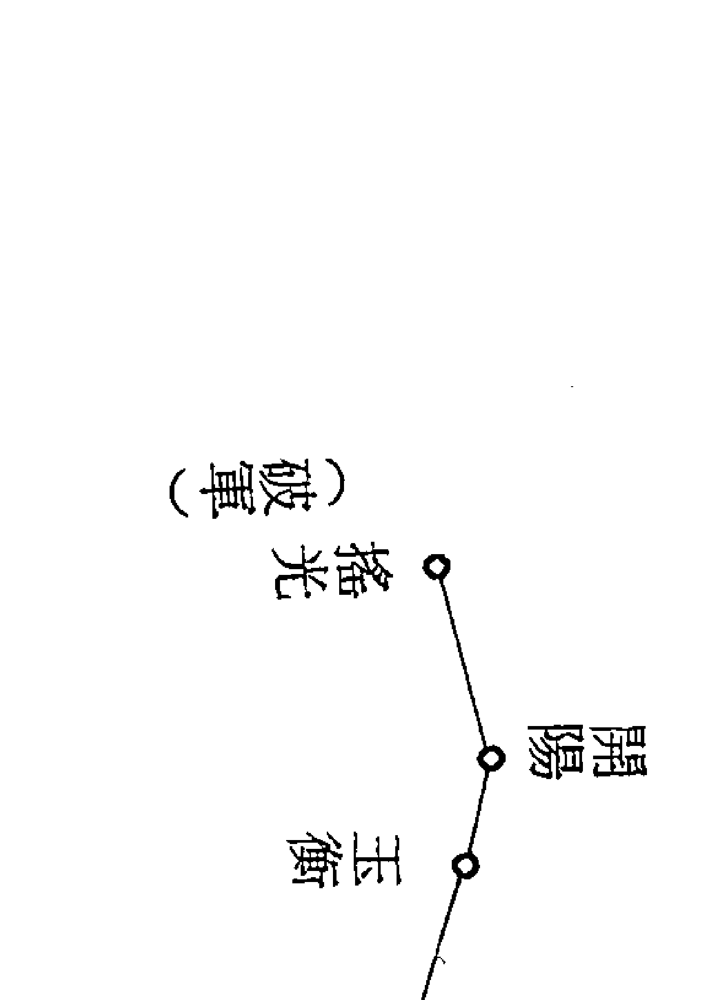

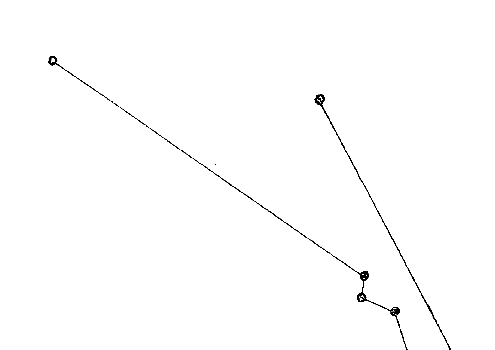

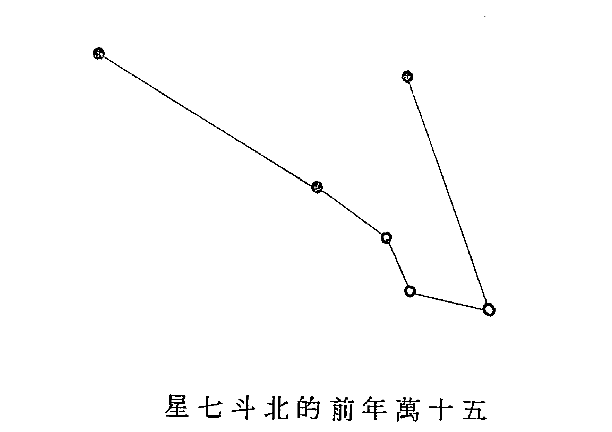

我国古代对于星象的观察，有很令人赞赏的惊人成就，很早就知道从北斗七星的天璇向天枢延长约五倍的直向方位就可以很容易找到北极星，今日还是仍然可以运用这个方法正确地找到北

据冯鹏年先生著『奇妙的星星』一书说，大约在四千年后，今日的织女星将会进入地球北极的天空而替代今日小熊星座的北极星的位置而成为「北极星」，挚友李君又发现许多研究果老星宗的学者，都不遗余力的调整星宿的宿度，于是问望元曰：「紫微斗数衍出于星命，果老星宗认为有调整宿度才能准验的观念，斗数是不是也有什么需要调整的？！」

望元没有正面回答李君，答曰：「你不是一向都相信我的斗数准确的或然率很高吗？我认为果老星宗如果不是要直接观察星象，应该是没有追求星宿调整宿度的必要的，只要稍微想一想，果老星宗虽然依据『当时』的星象而创作，但是它的方法不也是依据『当时』的天文星象吗？如果今天调整了宿度，是不是也要完全调适『变曜』或另外计算宿度与四余了吗？像现在研究果老星宗的方法，新的观念没能与旧的方法调适配合交融，当然是不能准确的！」

当场，除了李君外，尚有陈君，除陈君稍识果老星宗而已，我俩都不习星命，虽然他俩都认为我言之成理，可是这也只不过关着门自说自话，并不确知是否有理，如果有冒犯果老星宗研习之处，尚请海量包容，不与粗鄙疏狂的望元一般见识才是！

## 跋

史记历书曰：「黄帝考定星历，建立五行，起消息，正闰余，于是有天地神祇物类之官，是谓五官，各司其序，不相乱也，民是以能有信，神是以能有明德，民神异业，敬而不渎，故神降之嘉生，民以物享，灾祸不生，所求不匮。少皞氏之衰也，九黎乱德，民神杂扰，不可放物，祸苗荐至，莫尽其气。颛顼受之，乃命南正重司天以属神，命火正黎司地以属民，使复旧常，无相侵渎，其后三苗服九黎之德（附按：洛书正南戴九曰离火，左三东方木以生南方火，或出此典故，火黎者，离火也，其数九而曰九黎，日月舍自建星南至于箕，正月万物始生虿然也，卦气得天泰，三阳开泰也，于十二子寅，十二子之序三，三而万物萌芽幼苗也，是称之三苗，脏三苗服九黎之德不可从孔安国之注也），望元臆应以黄帝考定星历，至颛顼时节气与四时不能名符其实为当），故二官咸废所职而闰余乖次，孟陬殄灭，摄提无纪，历数失序。尧复遂重黎之后不忘旧者，使复典之，而立义和之官，明时正度，则阴阳调，风雨节，茂气至，民无夭疫，年者禅舜，申戎文祖云：『天之历数在尔躬，舜亦以命禹，由是观之，王者所重也。夏正以正月，殷正以十二月，周正以十一月，盖三王之正若循环，穷则反本，则不失纪序，无道则正朔不行于诸侯。』古人对于天文历数不断的观察记录，甚至于不断改变历书正朔仍然不免差余，至周襄王二十六年闰三月而时序不符，至汉武帝六年十一月甲子朔旦冬至而以七年更改为太初元年，如就历书而言，其年消失了一个月，就时序而言，又回复了与夏朝岁建于正月的历数，就好像我国现代在台湾地区自民国三十四年至六十八年间间断施行夏令日光节约时间一样的拨快（或拨慢）一个小时间一样的感觉，其所追求的只不过人民的作息与天道循环时序的纪序而已。设若紫微斗数创始于五代异人陈希夷先生，历北宋八度改变历书，南宋八度改变历书……，只要历书能与天道时序切近，紫微斗数可以不论节气，至今仍然如此惊异程度准确预测人命吉凶祸福，实亦极具研习探讨之价值，此亦望元所以痴迷于紫微斗数而若偏执狂恋也！

| 书名 | 价格 | 简介 |
|---|---|---|
| 紫微堂奥【全拾卷】 | 每卷定价350元 | 作者专研紫微斗数。本套书计10卷，详论斗数总诀、发微论、太微赋、骨髓赋、女命骨髓赋，集紫微之大成，为研习斗数之最佳教科书。 |
| 紫微斗数速成 | 定价400元 | 本书着重于斗数之安星佈斗、研判命图、论断等方面，配合大量图解，并附有144局命盘解说，实为研习斗数之最佳工具书。 |
| 紫微斗数婚姻观 | 定价200元 | 本书以斗数专论爱情与婚姻，全部真实案例，记录事实经过，男女主角命盘大公开，真实比对，情字路上坎坷的你，不可错过。 |
| 紫微斗数诸星论婚姻 | 定价200元 | 本书以斗数专论爱情与婚姻，全部真实案例，并附有斗数诸星对爱情运的影响分析，读者可藉此检视自己与另一半的速配与否。 |
| 紫微斗数玄关 | 定价250元 | 本书细说紫微，由斗数之基础筑基，次论12宫与各星曜之诀要，再论斗数赋文。全书辅以大量图表，深入浅出，值得一读。 |
| 紫微斗数玄关论断篇 | 定价250元 | 本书由命盘安星论起，详解各宫与其诸星之相互代表意义，最后论及斗数运限论断，全书附有详细图表，为研习斗数者必备注考书。 |
| 自学紫微斗数 | 定价200元 | 本书为研习斗数之入门书籍，作者以浅显笔法由专门术语说明，配合大量图解，可使读者由图像快速学习，使您轻松学会紫微斗数。 |
| 初习卜筮入门 | 定价250元 | 本书为研习卜筮之基本入门书籍，作者以浅显笔法说明专门术语，配合大量图解，可使读者由图像快速学习，并辅以真实案例实证。 |
| 指掌玄微集 | 定价500元 | 中国自古相术诸书多神验，独缺手相专书，每藏于面相书中且艰涩难懂。本书为专论指掌相书，更发明手纹流年判断方法，值得一读。 |
| 标准万年历 | 定价250元 | 本书举凡阴阳历、干支节气支互相对照，简便易查。增列岁次、月建紫白阴遁九星，利于研习奇门遁甲、姓名学。双色印刷，醒目清晰。 |

紫微堂奥[第一卷] / 墬 元著. --初版. --台南市：大孚，2003 [民92]
面； 公分
ISBN 957-765-328-6 (平装)
1. 命书
293.1 92012463

## 紫微堂奥 [第一卷] (编号F1562)

+   - 著者: 墬 元
    - 发行人: 傅宝泰
    - 出版者: 大孚书局有限公司
    - 地址: 台南市 701 东区德光街 65 号
    - 电话: (06) 268-2865
    - 传真: (06) 268-2489
    - E-mail: tafubook@giga.net.tw
    - 划拨帐户: 00354754
    - 登记证: 局版台业字第 01543 号
    - 印刷者: 大孚书局有限公司
    - 版次: 2003 年 8 月初版
    - 国际书号: ISBN 957-765-328-6
    - 定价: 新台币 350 元
    - 法律顾问: 北辰著作权事务所 萧雄淋律师

## 本局出版姓名学系列

| 作者/书名 | 定价 | 描述 |
|-----------|------|------|
| 黄有德编著 姓名汇典 | 定价 180 元 | 人之姓名，第一要配合生辰八字所欠之五行，第二要配合本人生肖，第三要配合字画数之变动，第四则配合阴阳之顺序。 |
| 阮茂森编著 中华姓名学 | 定价 200 元 | 本书前半部以图例详解说明如何利用先天八字取佳名的方法，后半部详录字的笔划与五行，使您轻松取用良名，实为姓名学必备参考书。 |
| 杨仁祺编著 最新命名宝鉴 | 改 版 中 | 人有姓名，表现其仁。身终尘土，而名永存。本书详解姓名学五大条件，读完本书即可自行依说明为自己取佳名，拥吉命。 |
| 杨仁祺编著 婴儿命名秘诀 | 定价 200 元 | 姓名学的功能在于指引人们趋吉避凶，招祥纳福。阅读本书可以自行判断姓名之吉凶与运势之配合，实为您不可缺少的姓名学工具书。 |
| 王圣文编著 命名福音 | 定价 150 元 | 作者自幼生长于堪舆命理世家，耳濡目染浸淫于正统命理学，更倾心研究道家秘籙。冀望天下读者均能得吉名，招祥福。 |
| 郑景峰编著 成功者姓名学 | 定价 180 元 | 姓名学术是预测姓名文字结合，可能产生之吉凶祸福、成败得失之学术研究。本书以浅显易懂的笔法详细说明如何自己取佳名，拥吉命。 |
| 郑景峰编著 成功者公司行号命名学 | 定价 200 元 | 本书针对公司行号命名所设计，书中列举 200 种公司行号取名格式，读者按格式套用即可轻松取用吉祥公司商号良名。 |
| 卢清和编著 妙智慧姓名学 | 定价 200 元 | 姓名是一个人内外在，有行无形总本质显现，事业有成而得盛名，行恶伪奸而得臭名，姓名随人一生顺逆而起伏，不可不慎。 |
| 墬元编著 不求人千禧姓名学 | 定价 200 元 | 本书以通俗浅显平易的笔法叙述，娓娓道出姓名学的缘由，配合大量图表，益于读友一目了然，俾使读友命名不求于人。 |
| 王威棠编著 中国姓名学 | 定价 200 元 | 本书配合大量图解，可使读者藉由图像快速学习。作者特公开秘诀，由出生所属命卦，判断您是属于东四命或西四命，让您趋吉避凶。 |

## 风水资料

风水布局 命理测算

## 中医古籍全集

- 本草经
- 千金方

电子资源

## 道家法术

3000册

## 武功秘籍

## 经史子集

## 传世名画

顶级高清 巨幅原画 6100卷

## 地方县志

全国地理志/府志/县志/乡志
共计8000多册

月被小不但兴而通北立阶信比流得治经纲而定通北立阶信定化石极石点

## 国学古籍库

问综列犹之不经执人有氏民理行之请呈非始可者举前于选均立解本与易伴不作庶固