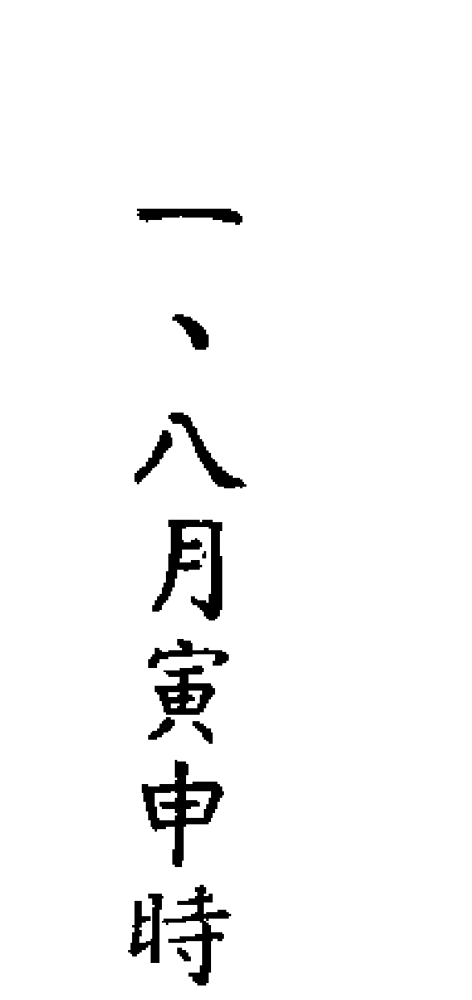
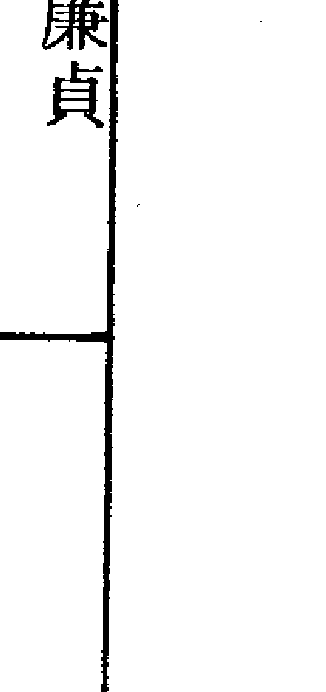
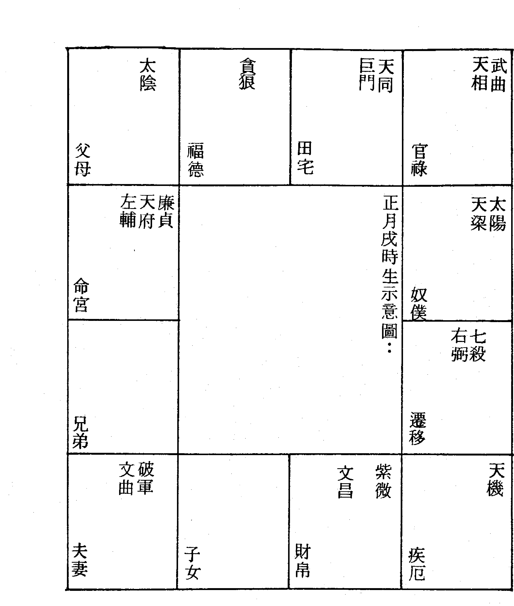

# 紫微堂奥

斗數骨髓賦之左府同宮，尊居萬乘

# 第七卷

堃 元著

大學書局印行

紫微斗數
賦文詮註

# 紫微堂奥

# 第七卷

堃 元著

大學書局

# 紫微堂奥系列【全拾卷】

- 第一卷 斗数总诀之希夷观天星，斗数推命
- 第二卷 斗数发微论之命逢紫微，特寿且荣
- 第三卷 斗数太微赋之日月夹财，不权则富
- 第四卷 斗数斗数骨髓赋之天门运限，扶身助命
- 第五卷 斗数骨髓赋之七杀朝斗，爵禄荣昌
- 第六卷 斗数骨髓赋之天禄天马，惊人甲第
- 第七卷 斗数骨髓赋之左府同宫，尊居万乘
- 第八卷 斗数骨髓赋之子午破军，加官进禄
- 第九卷 斗数骨髓赋之丹墀桂墀，青云之志
- 第十卷 女命骨髓赋之辅魁福寿，弼相福临

ISBN 957-765-328-6 (293)
00350
9 789577 653284
F1562

X 03 04
星火書店
$ 117.00

東明文化圖書公司
$ 117.00
TEL: 23425341

# 堃 元著

# 紫微斗數 賦文詮註

# 紫微堂奧 第七卷

# 大學書局印行

# 自序

《紫微堂奥》以江西負子子潘希尹先生補輯之《新鑄希夷陳先生紫微斗數全書》爲藍本而爲紫微斗數賦文之精詳詮註。卷一於一九八四年一月印行流通，筆者以當時已有之紫微斗數認知學涵，晝夜辛勤勤奮筆耕，作作息失序，日以繼夜，晝夜顛倒，不屈不撓，再接再厲的經歷了二十八個月的般勤刻苦筆耕，卷十終於一九八六年五月印行流通而竟詮註紫微斗數賦文之全功。大學書局傅寶泰先生有見於《紫微堂奥》爲研讀學習紫微斗數所不可或缺的最佳參考書，但因原著缺少作者序文而有美中不足之憾，情商拙愚爲原著增補自序，以使讀友不因原著無自序的小小缺失而抱憾，堃元當仁不讓於師，義無反顧的恭敬從所命囑，流覽翻閱十卷而爲此序。

《紫微堂奥》共十卷；卷一精詳詮註《合併十八飛星紫微斗數》一書之一「紫微斗數總訣」，概說紫微斗數推命之使用星神與排佈推命圖的安星佈斗。卷二嘔心瀝血的披瀝詮註「斗數發微論」、「重補斗數殼率」、「斗數準繩」，附錄「諸星問答論」（按：「諸星問答論」一稱「星垣問答論」）。卷三爲紫微斗數「太微賦」賦文詮註。卷四～卷九共六卷爲「斗數骨髓賦」賦文詮注，並於賦文文句列举相当其文句的命例以為习涉研究之参考。卷十诠注「女命骨髓赋」，附录「补遗骨髓赋」、「形性赋」（按：「形性赋」与「诸星问答论」、「诸星入命限」互为参照融溶，可以依据命图星神而推想描绘此命图本人之形性。）、「星垣论」（按：星垣论附录而未诠注。）、「紫微斗数漫谈」。

今日增补为原著作自序，情不自禁的感慨：「老朽，老朽老矣！任何《紫微堂奥》，必然直览尽窥斗数堂奥，更胜老朽被香港徒孙们抬举谬誉为「斗数奇才，一代宗师」矣！」

电话：（O四）二三九一一三五一·二三九一八四二七
住址：台中县太平市新坪里育德路二四七号四楼
林源田
堃元谨为序

# 目录

- 第五十三章 科禄巡逢，周勃欣然入相……一
- 第五十四章 文星暗拱，贾谊允矣登科……一四
- 第五十五章 擎羊火星，威权出众，同行贪武，威压边夷……二三
- 第五十六章 李广不封，擎羊逢於力士……三三
- 第五十七章 颜回夭折，文昌陷於夭殤……四四
- 第五十八章 仲由猛烈，廉贞入庙遇将军……六一
- 第五十九章 子羽材能，巨宿同梁冲且合……六九
- 第一节 喜欢凑热闹的心理……八二
- 第二节 铁板材能不逊子羽……八七
- 第三节 新店林同契的谬誉……八九

# 紫微堂奥

「斗数骨髓赋」赋文诠注，并於赋文文句列举相当其文句的命例以为习涉研究之参考。卷十诠注「女命骨髓赋」，附录「补遗骨髓赋」、「形性赋」（按：「形性赋」与「诸星问答论」、「诸星入命限」互为参照融溶，可以依据命图星神而推想描绘此命图本人之形性。）、「星垣论」（按：星垣论附录而未诠注。）、「紫微斗数漫谈」。

第六十章 寅申最喜同梁會
第六十一章 辰戌應嫌陷巨門
第六十二章 祿倒馬倒，忌太歲之合劫空
- 第一節 百里奚命例
- 第二節 楊國忠命例
- 第三節 范丹命例
第六十三章 運衰限衰，喜紫微之解凶惡
- 第一節 紫微身命不解凶惡例
- 第二節 紫微能消凶惡
- 第三節 限逢紫微喜氣新
第六十四章 孤貧多有壽，富貴即夭亡
第六十五章 吊客喪門，綠珠有墜樓之厄
第六十六章 官符太歲，公治有縲絏之憂
第六十七章 限至天羅地網，屈原溺水而亡
第六十八章 運遇地劫天空，阮籍有貧窮之苦
第六十九章 文昌文曲會廉貞，喪命夭年
第七十章 命空限空無吉湊，功名蹭蹬
第七十一章 生逢天空，猶如半天折翅
第七十二章 命中遇劫，恰如浪裏行船
第七十三章 項羽英雄，限至天空而喪國
第七十四章 石崇豪富，限行劫地以亡家
第七十五章 呂后專權，兩重天祿天馬
第七十六章 楊妃好色，三合文曲文昌
第七十七章 天梁遇馬，女命賤而且淫
第七十八章 昌曲夾塁，男命貴而且顯
第七十九章 極居卯酉，多為脫俗僧人
第八十章 貞居卯酉，定是公胥吏輩
第八十一章 左府同宮，尊居萬乘

## 第五十三章 科禄巡逢，周勃欣然入相

> 原注：命宫有吉坐守，三方化吉拱冲，或命前三位遇科权禄，皆主富贵。

堃元学习斗数，读斗数骨髓赋多及古人，参全书后附一一四命例数列史记所载，有汉高祖刘邦起沛县而得天下，傅孝惠帝，帝崩，吕后专权，辛已后崩，诸吕秉汉权，欲危刘氏，太尉周勃与丞相陈平谋而诛诸吕，立孝文帝，继孝景帝，是为文景之治，学术最盛，继孝武帝，是为汉武帝，武功最盛……，熟史记而能详斗数古人事略，复足引古鉴今，则广识以阐赋文矣！周勃为沛县人。

周勃还居住在沛县的时候，以苇编织饲蚕的盛具为生，有時候也帮忙人家整治丧事，也曾经于丧殡的时候吹箫挽歌为副业，甚至于帮忙拱撞棺椁，引缰司马之类的工作，只不过是一个鄙朴（朴实粗野）的人，才能也不过平庸而已，一旦风云际会，功封绛侯，荫及子孙，是所谓「時代考驗青年，青年創造時代」也。

劉邦於沛縣起義時，周勃就隨從著劉邦，攻擊胡陵，取下方與，方與又叛反，周勃出戰而退敵，又攻擊豐縣，攻擊碭東的秦軍，終於攻破碭城，取下下邑，賜爵五大夫。

劉邦軍隊又攻擊蒙虞而取得蒙虞，又攻擊章邯車騎，在這些戰役裹，周勃卻沒有特殊的戰功表現。

劉邦軍隊平定了魏地，攻擊爰戚東緝，又取得沛郡粟城，於攻擊薊桑之時，周勃領先其他將領攻佔薊桑，追擊秦軍，攻破阿下，一路追擊秦軍到濮陽，攻下了甄城，又攻定陶，襲擊取得了宛朐，俘虜了單父令。

劉邦軍隊夜襲取得了臨濟，攻破了卷城，攻擊壽張地方，攻擊李由軍隊於雍丘下，攻擊開封，周勃兵先到開封城下，在這些戰役中，周勃則有了很好的戰功表現。

後來章邯以秦國車騎精兵擊破項梁的軍隊，項梁戰死，這時候劉邦項羽正帶兵攻打陳留，因爲聽見項梁戰死，陳留又久攻不下，劉邦與項羽商量後即退兵；項羽退守彭城西，呂臣退守彭城東，劉邦退守碭城，以防秦朝章邯的軍隊乘勝攻擊。

劉邦自從秦二世元年九月於沛縣起義，到退守碭城的這一段時間，一共有一年兩個月的時間，這時候楚懷王封劉邦爲安武侯，兼爲碭郡郡守，劉邦因爲周勃在這一段時候的戰場上的英勇表現，於是派周勃爲虎賁令。

周勃以虎賁令的名位繼續追隨劉邦平定魏地，攻東郡尉於城武，攻破了城武，又接著擊破了王離的軍隊，又攻擊長社而先登，又攻擊潁陽緱氏，斷絕緱氏河津的補給，接著攻擊戶北趙賁的軍隊，又轉南而攻南陽太守，破武關，破嶢關，又大破藍田的秦軍，於是劉邦的軍隊比項羽先到了咸陽。

依照劉邦與項羽的約定，先到咸陽者爲王，但劉邦這時候的勢力仍然不如項羽強大，所以先到咸陽，還是退屯灞上等候項羽。

項羽到了咸陽以後，封劉邦爲漢王，並封國蜀漢。

劉邦因爲周勃的戰功與忠誠，賜與周勃爵位封爲威武侯，接受項羽的封國而進入漢中，周勃也追隨著劉邦入漢，被劉邦派爲將軍。

漢王劉邦元年八月，劉邦用韓信「陳倉暗渡」之計，出漢中而平定三秦，劉邦以周勃平定三秦有戰功，賜周勃食邑懷德。

攻槐里好時，攻擊趙賁內史保於咸陽時，周勃一樣有最好的戰功。

劉邦出漢中以後，軍威浩盛，北攻漆城，攻擊章平姚邛的軍隊，西則平定汧城，並且攻下了鄶頻陽，將軍邯的軍隊包圍在廢丘地方，攻破西丞城，擊破盜巴的軍隊。

周勃的軍隊攻上邽，東守嶢關，轉而襲擊項羽的軍隊，攻擊曲逆，周勃又有最好的戰功表現。

周勃帶著軍隊還守敖倉之後，又出兵追擊項羽的軍隊，這時候聽說項羽已死，於是轉兵向東平定楚地泗川東海郡二十二縣，然後還守雒陽。

由於周勃以將軍的名位追隨漢高祖劉邦，攻擊叛反的燕王臧荼，破之於易水之下，周勃所統領的將卒有很好的戰功表現，因此劉邦封周勃為絳侯，食絳邑八千一百八十戶，並且其後人得以世襲侯位食邑。

之後，周勃又將領漢軍到武泉攻擊匈奴，擊破匈奴於武泉之北之後，轉攻銅鞮地方的韓信軍隊。周勃攻破了銅鞮，太原六城也就向周勃投降了。周勃又進擊韓信匈奴的聯合軍隊，攻破晉陽，又攻擊礜石地方的韓信軍隊，攻破礜石，繼續追擊敗北的韓信軍隊八千里，然後回兵攻克樓煩三城。周勃將軍攻擊陳豨，屠殺馬邑城，其屬下斬殺了陳豨的將軍乘馬締，又追擊韓信陳豨趨利的軍隊於樓煩，攻破了樓煩，擄得陳豨的將軍宋最，雁門守『國』，轉攻雲中，平定了雁門郡十七縣，雲中郡十二縣，降服了郡守邀，丞相箕，肆將勳，又追擊陳豨軍隊，攻破了靈丘，斬殺陳豨。

被提升為太尉，執掌軍權。周勃因為追擊匈奴於平城下之戰，其所將領之戰役及將卒皆有很好的戰功表現，於是從將軍。

劉邦有知人之明，喜歡周勃的為人敦厚木訥，認為周勃生性鈍直，不好文學而缺少文學，但是由於周勃的忠誠以及治軍的戰功表現，認為周勃可以託付大事，所以在病危的時候告訴呂后：『曹參可以代替蕭何為相國，除了曹參以外，王陵陳平可以為左右丞相，而周勃的文學雖然不及這些人，但是周勃的忠厚穩重，我看將來輔佐我劉氏安天下的就是周勃這個人了，所以我先派周勃為太尉，執掌軍權啊！』

太尉，為秦制軍事之高官，其尊與丞相等，漢初因之，武帝時改為大司馬，光武時又復名太尉，居三公之首，歷代相承，至明始廢。

燕王盧綰叛反，周勃奉相國蕭何的命令替代樊噲將領軍隊討叛，攻下了薊城，擊破了上蘭、沮陽，一直追擊殘軍至馬邑長城，平定了上谷十一縣，右北平十六縣，遼西遼東二十九縣，漁陽二十二縣。周勃既平定了燕國，班師回朝的時候，漢高祖劉邦已病崩，因以絳侯的名義繼續奉事孝惠帝。

孝惠帝六年，孝惠帝置太尉官，又封周勃為太尉。據考證，漢高祖生於秦昭王五十一年乙巳歲次，崩於漢十二年丙午，享年六十二歲，孝惠帝七年秋八月戊寅孝惠帝崩，據說生秦始皇三十七年，享年二十三歲而已。孝惠帝稱帝時，號令皆出於呂太后，太后四年（按：相當於孝惠帝六年。），以絳侯周勃為太尉，八年七月，呂太后崩（按：相當於孝惠帝十年。）。

據說孝惠帝崩，呂太后立太子為帝，太后幽少皇帝於永巷，言帝病甚，於是稱制專權。

呂太后稱制的時候，用趙王呂祿為上將軍，執掌軍權，用呂王呂產為相國，秉持漢權，大有替代漢氏天下的氣概，周勃雖然名為太尉，卻未執掌軍權，陳平雖然為丞相，卻不得任事。

呂后崩，周勃與陳平計謀，因為酈寄與呂祿過從甚密，就派人劫持其父曲周侯酈商，使酈寄向呂祿遊說：「高祖與呂太后共同平定天下，高祖封立九王，太后封立三王，天下諸侯都已經知道，而且都認同封王得很適宜，現在太呂崩，皇帝年少，你以趙國的身份，不回趙國治理政事，卻還留戀著上將軍的地位在此執掌軍權，假使被大臣諸侯懷疑呂氏擅權自重，眾怒難犯豈不是天下大亂嗎？你為什麼不將大將軍兵權還給太尉？不請梁王將相國印歸還陳平丞相？您們有自己的藩屬國，回國為一國之王，豈不是很好嗎？」

呂祿聽說，本來就要歸還軍權，但是派人報告呂產及呂氏老人，長老有的說應該這樣，有的說不應該這樣，他們的姑母呂須很生氣的說：「假使將軍而沒有兵權，我們呂氏失去了權柄，恐怕就要死無葬身之地！」

因為周勃太尉本來應該守北軍而未入軍門，你應該是趙王而沒有在趙國治理政事，假使你再不將軍印歸還給周太尉，周太尉恐怕就要代替你到趙國治理趙國了！」

呂祿雖然沒有交出兵符軍令，時常與酈寄同出遊獵，視酈寄如兄長，聽酈寄說：「聽說皇帝就要死無葬身之地！」

呂祿聽說，本來就要歸還軍權，但是派人報告呂產及呂氏老人，長老有的說應該這樣，有的說不應該這樣，他們的姑母呂須很生氣的說：「假使將軍而沒有兵權，我們呂氏失去了權柄，恐怕就要死無葬身之地！」

呂祿雖然沒有交出兵符軍令，時常與酈寄同出遊獵，視酈寄如兄長，聽酈寄說：「聽說皇帝天下大亂嗎？你為什麼不將大將軍兵權還給太尉？不請梁王將相國印歸還陳平丞相？您們有自己的藩屬國，回國為一國之王，豈不是很好嗎？」

呂祿聽說，本來就要歸還軍權，但是派人報告呂產及呂氏老人，長老有的說應該這樣，有的說不應該這樣，他們的姑母呂須很生氣的說：「假使將軍而沒有兵權，我們呂氏失去了權柄，恐怕就要死無葬身之地！」

因為周勃太尉本來應該守北軍而未入軍門，你應該是趙王而沒有在趙國治理政事，假使你再不將軍印歸還給周太尉，周太尉恐怕就要代替你到趙國治理趙國了！」

呂祿相信酈寄，戀慕趙王的王位，就將軍印兵符交給典印官劉揭，而使兵權重新回到周勃的掌握，於是周勃得入軍門，行令軍中說：「擁護劉氏的站到右邊，擁護劉氏的站到左邊。」結果軍士將卒都擁護劉氏。

雖然周勃重新掌握兵權，但是南軍的兵權還在呂產的掌握，平陽侯就與丞相陳平計謀使呂產歸還軍兵權和相國職權，陳平乃召令朱虛侯輔助太尉，太尉周勃派令朱虛侯為監軍，派令平陽侯下令禁衛軍，不得軍令，嚴禁相國呂產擅入宮殿。

呂產還不知道呂祿已解除北軍兵權，以為呂祿可以接應，到了未央宮，想要闖宮亂反，卻遭禁衛阻止，只好在未央宮殿門外徘徊往來。

平陽侯看見呂產徘徊未央宮殿門下，因為禁衛軍兵力薄弱，不敢擊戰呂產，立即將情況告知周勃，周勃馬上派朱虛侯帶領士卒千餘人，入未央宮門支援平陽侯，在廷中與呂產相遇，朱虛侯勸呂產解除相國及南軍權柄，呂產不肯，雙萬堅持到了中午時候，朱虛侯就下令攻擊呂產。

這時候天風大起，呂產見情勢不對而先逃走，他的從官因為群龍無首自亂陣腳，不敢與朱虛侯爭闕，因此朱虛侯很容易就迫殺呂產，一直追到宮後轉的郎中府吏的廁所中才將呂產追殺。

皇帝知道朱虛侯已殺呂產，命謁者官持節信要慰勞朱虛侯，朱虛侯恐怕有詐不受慰勞表楊，反而想要奪取節信，謁者不肯而逃走，朱虛侯追不到謁者，就將阻擋的長樂衛尉呂更始斬殺。

周勃聽說呂產已死，立即部署，分別遣派人手拘捕呂氏男女老少，並且無分老女老少一律處斬。

辛酉日，捕斬呂祿，笞殺呂嬃，派人誅殺燕王呂通，並廢除魯王。
壬戌日，回復皇帝太傅審食其為原來左丞相的地位。
戊辰日，派遣濟川王為梁王，立趙幽王子遂為趙王。派朱虛侯告訴齊王已經誅除呂氏的情形，齊王罷兵，灌嬰也罷兵而回。

諸大臣私下計謀商議：「皇帝、梁王、淮陽王、常山王，都不是孝惠皇帝的血脈，如果讓這些人執掌用事，恐怕我們這些人都要倒楣，不如另立諸王劉氏中最賢德的人為皇帝！」

幾經商議，因為代王劉恆是劉邦八子中還活著的最年長，而且仁孝寬厚，其母太后薄氏又家教謹良，於是廢少皇帝而迎劉恆為孝文皇帝。

孝文帝立，用周勃為右丞相，賜金五千斤，食邑萬戶，經過月餘時間，有人告訴周勃說：「你誅除諸呂，迎立代王，威震天下，勞苦功高，現在受皇帝厚賞，又居尊位，如果戀眷相位，恐怕讒惹禍。」

周勃認為說得甚有道理，因此任事丞相職，總是小心謹慎，並請辭謝相國職位，但是辭謝相位只有年餘，因為丞相陳平逝世，孝文帝又召用周勃為丞相。

周勃復就丞相位，才只十餘個月，孝文帝很客氣的對周勃說：「現在天下昇平，列侯開事京師，沒有人願意回國治理政事，你是丞相，也是我最重用的大臣，你是不是願意率先回緝治國呢？」

周勃答應孝文帝，又被免除了丞相職位，回到絳地就理國事，居絳年餘，常存著位高權重受辱的忌自危的心理，每當河東守尉行縣至絳，周勃總是披甲戴胄，令家人持兵器戒備者，因此有人上書密告說周勃恐怕要造反。

孝文帝聽了，就將周勃的案件交給廷尉處理，廷尉又將案件交付給長安的獄吏逮捕周勃進行審判。周勃很害怕，不知道如何置詞回答，後來以千斤向獄吏疏通，獄吏指示周勃可請以公主為證。原來公主即為孝文帝的女兒薄昭公主，匹配與周勃長子勝之，證明，應當為最有力的證人。

周勃被繫獄得非常苦惱，果如獄吏指示，請薄昭公主回宮將周勃繫獄被陷的情形告知薄太后，太后相信周勃為人忠厚穩重，絕對下會叛反謀逆，因此在孝文帝請安談起這件事的時候，很生氣的用頭巾擲孝文帝說：「你這個孩子怎麼這樣糊塗，隨便聽信讒言，也不查明真相，怎麼隨隨便便就相信周勃會造反呢？想一想周勃在廢少帝的時候，將領著北軍軍權，握著皇帝玉璽的時候都沒有篡漢稱帝，現在寧願退居小小的絳縣，沒有掌握軍權軍符，你想想他怎麼會想要造反呢？」

孝文帝聽了薄太后的話，乃調閱絳侯周勃繫獄的問辯卷宗檔案，亦認為周勃無辜，派使者持符節赦免周勃無罪，並且回復周勃的爵位食邑。

周勃出狱以后，很感慨的说：「我曾经将领百万雄兵，只以为位高权重，一直被拘禁在牢狱中失去了自由，才知道狱吏的官位虽小，不管任何王亲国戚只要被拘禁在牢狱中，还是要接受他的管辖啊！」

周勃出狱后，恢复了爵位食邑，安份谨慎的治理政事，一直到孝文帝十一年才逝世，死后孝文帝谥封他为武侯，并使其子胜之承袭绛侯爵位及食邑。

周勃死后六年，绛侯胜之与薄昭公主的婚姻生活闹得很不愉快，并且因为被牵连于杀人事件而被除去爵位食邑。

又一年，文帝感念周勃功勋，乃选择周勃诸子之贤者周亚夫为条侯。

最佳的评语：「绛侯周勃，始为布衣时，鄙朴人也，才能不过凡庸，及从高祖定天下，在将相位，诸吕欲作乱，勃匡国家难，复之乎正，虽伊尹周公，何以加哉！」

太史公司马迁对于绛侯周勃虽极为写实，但为了一抒其本人忠心受屈的感慨，对于周勃却有。

堃元旁老命理術書爰取古事爲例說，以示昭信，但如有讀經史而爲考據者，則每見所及歲年無憑，如周勃死漢文帝十一年，歲次應爲壬申而不爲乙丑，乙丑爲漢文帝四年，又考漢高祖生乙已，如周勃生丁巳，則周勃少劉邦十三歲，劉邦崩後，孝惠在位七年，吕后在位八年，孝文又十一年，共廿六年，則周勃應卒於壬申年七十六歲爲是，故全書附錄命例只宜因其圖而作其解，不可以爲其生死有據，堃元詮註賦文亦依此爲釋之——

| 宫位 | 天干地支 | 星曜 | 杂曜 | 备注 |
| :--- | :--- | :--- | :--- | :--- |
| 命宫 | 乙巳 | 紫微七杀 | 陀罗、天凤伤阁 | 11.23.35.47.59. (63-72) |
| 兄弟宫 | 甲辰 | 天机天梁 | 天喜、封诰、科 | 身官禄 10.22.34.46. 宫 58. |
| 夫妻宫 | 癸卯 | 天府天相 | 火星、左辅 | 青龙 |
| 子女宫 | 壬寅 | 贪狼武曲 | 癸丑、地劫哭 | 父母宫 7.19.31.43.55.67. |
| 财帛宫 | 辛丑 | 太阴天同 | 禄权、天姚八座 | 命宫 6.18.30.32.54.66. |
| 疾厄宫 | 庚子 | 廉贞天府 | 辛亥、天府、天相、天魁右弼、天虚、天马 | 喜神、长生 |
| 迁移宫 | 己亥 | 铃星、红鸾、天钺、龙池、天空 | 兄弟宫 (3-12) | 夫妻宫 (13-22) |
| 交友宫 | 戊戌 | 破军、廉贞 | 己酉 | 子女宫 (23-32) |
| 事业宫 | 丁酉 | 文曲、禄存 | 迁移宫 (53-62) | 博士、丧门 |
| 田宅宫 | 丙申 | 擎羊、天使 | 疾厄宫 (43-52) | 官府、帝旺 |
| 福德宫 | 乙未 | 文昌、天刑、台辅 | 财帛宫 (33-42) | 临官、伏兵 |
| 父母宫 | 甲午 | | | |

**命盘基本信息**：
- 身主: 天机
- 命主: 贪狼
- 木三局
- 9.21.33.45.57.69.
- 田宅宫 小耗
- 太阳巨门 三台截空 忌
- 福德宫 8.20.32.44.56.68. 将军 绝
- 巨门 太阳
- 壬寅 贪狼武曲
- 癸丑 地劫哭
- 父母宫 7.19.31.43.55.67. 奏书 胎
- 太阴天同 禄权 天姚八座
- 命宫 6.18.30.32.54.66. 养 廉贞天府 辛亥 天府 天相 天魁右弼 天虚 天马 喜神 长生 兄弟宫 (3-12) 夫妻宫 (13-22) 沐浴 病符 庚戌 铃星 红鸾 天钺 龙池 天空 己酉 破军 廉贞 子女宫 (23-32) 冠带 大耗
- 岁次丁巳年正月十二日寅时生
- 陰男
- 周勃
- 岁次乙丑年六十九岁十二月初五日故
- 丙午

### 賦文詮註

> 埜元曰：周勃命例原有科權祿守拱，限行「戊申」「丙午」「甲辰」之宮歲限又得科權祿化吉者，是謂「巡逢」，主人權位富貴。

- 1. 戊申大限卅三歲至四十二歲，大限官祿宮太陰當生化祿，大限化權，可謂之「祿權巡逢」，但天機大限化忌，則此限利於官祿而不利於帛。
- 2. 如據「科祿巡逢」直譯，必當生化祿化科而於二限「乙」「化祿者為是，則周勃於「乙巳」大限入相，或於乙卯年五十九歲，乙巳年四十九歲，乙未年三九歲等俱「科祿巡逢」之條付為是。
- 3. 丁未大限亦如丁生，四化俱與當生重疊，亦可謂之「科權祿巡逢」，但以化吉未入大限之三方四正，卻得「府相朝垣」之貴，二限重逢之乙未年四十九歲，周勃應在將軍征戰之際戰之中，或不可以人相論之，但於今命之學理探討，生年與大限重遇者，我們不妨以「巡逢」視之。
- 4. 丙午大限五三歲至六十二歲，當生祿權照限，又得天同大限化祿，天機於大限三位化權，文昌於大限十一位化科，則此大限十年最利陞遷，是否可以列為「巡逢」之合格，我們於探考之研習過程，大概也不妨將之列為假設參考。
- 5. 乙巳大限類似丁未大限，依後文第一一九章「武破貪沖合曲全固貴，羊陀七殺相雜互見則傷」，大抵可論周勃於此限入相，繫獄，但史記孝文帝四年周勃繫獄為乙丑年，其命既死於此限。
- 6. 化吉巡逢之義不妨參考卷四第一九七頁之化吉相逢，如天機當生化科，於運限化祿，不可固執於原註但取當生四化穿鑿附會於賦文，庶可得論命之活發靈驗矣！
- 7. 習斗數命理當知「英雄不論出身低」，周勃以鄙朴人而封侯富貴，其繫於獄亦足徵「好漢不提當年勇」，故吾人今研習命理，更應「誠正修齊治平」以自為惕勵，則人人自強、強身、富家、國泰，天下為公矣！

視為「科祿相逢」，出將入相，主運籌謀略，以智慧見勝而致富貴論議，則「巡逢」一義以揭運限之四化，不可固執於原註但取當生四化穿鑿附會於賦文，庶可得論命之活發靈驗矣！不提當年勇」，故吾人今研習命理，更應「誠正修齊治平」以自為惕勵，則人人自強、強身、富家、國泰，天下為公矣！

## 第五十四章 文星暗拱，賈誼允矣登科

原註：如命宮有吉，遷移、官祿、財帛三方有昌曲科星朝拱者是也。

雖然前一章給予望元一種運限「巡逢」的啟示，但是望元却在暗中摸索賦文，一直先進賢達不吝才而肯於公開經驗以為嘉惠後學，可惜的是有真才實學的先進賢達不一定有了無居士黃老師之生花妙筆，甚至缺乏望元文墨揮灑自如的勇氣，亦正如古代命數術書之翻版，有如望元之半瓶叮嚀而強以著述論作以求立言成名者固多，但亦如望元之不學無術，未能深得「斗數堂奧」，故望元為補拙而據賦文以旁考古人事略，裨益學者讀友可以引為學術之研習，亦可引鑑為自我人格之修養矣！

賈誼，漢，洛陽人，年十八歲就以詩書學名聞於鄉郡，吳廷尉這時候正為河南太守，聽說賈誼年青秀才，於是召請來安置在自己的幕府裏，並且甚為幸愛賈誼。漢孝文皇帝初立，聽說天下各地方的治平考績以河南太守吳公為第一，又聽說吳公與李斯同為楚國上蔡人，曾經學事李斯，所以徵召吳公為廷尉。吳廷尉推薦賈誼，稱讚賈誼年少有為，頗通諸子百家之書，文帝於是召用賈誼為博士，這時賈誼年才二十餘歲，在所有的博士中為最年輕。每當文帝詔令議下，博士們常常無法說出心中的意見，賈誼却能夠很容易的應對，而且剛好很貼切的說出了諸老先生心中想要表達的意見，於是諸老先生都認為自己的才能不及賈誼。孝文帝喜愛賈誼的才學，就將賈誼破例昇遷為大中大夫。賈誼為大中大夫，認為漢興至孝文帝這二十幾年，天下太平和洽而鞏固，但是仍舊沿用秦朝的服色法制，實有改例的必要，於是草擬應改正朔，易服色、法制、定官名興禮樂之各事儀法建議變更。孝文帝即位，很用心而謙讓的要做一個仁主明君，許多律定的更改以及列侯的治理，都聽從賈誼的建議，並且有意封任賈誼公卿之位而重用之。但是有絳侯周勃、灌嬰、東陽侯張相如、馮敬之這一群保守派的人堅持反對意見，甚至於說賈誼的短處說：「賈誼這個洛陽人，初涉政治而已，年青人建議改制，只不過是急著表現個人的才能，想要擅權政治而已，假使聽從他的改制建議，必定會造成法制服色等等人民百姓無法適從的混亂。」文帝聽從這一派人的意見，不僅不採納賈誼的改制建議，甚至於疏遠賈誼，改派他為長沙王太傅。賈誼被謫謫為長沙王太傅，聽說長沙地方卑濕，深恐水土不服而認為壽命不長，甚至於感覺失意不得志，在赴長沙經過湘水的時候，甚至於有屈原一般的不得意的感覺，因此作賦憑弔屈原。

> 「共承嘉惠兮，俟罪長沙，側聞屈原兮，自沈汨羅，造託湘流兮，敬弔先生，遭世罔極兮，乃隕厥身，嗚呼哀哉！逢時不祥。鸞鳳伏竄兮，鴟梟翺翔，闒茸尊顯兮，讒諛得志，賢聖逆曳兮，方正倒植，世謂伯夷貪兮，謂盜如廉！莫邪為頓兮，鉛刀為銛，于嗟嘐嘐兮，生之無故，幹棄周鼎兮，而寶康瓠，騰駕罷牛兮，騫蹇驢驥，垂兩耳兮服鹽車，章甫薦履兮，漸不可久。嗟苦先生兮，獨離此咎，訊，曰：已矣！國其莫我知。獨堙鬱兮其誰語，鳳漂漂其高遙兮，夫固自縮而遠去。襲九淵之神龍兮，沕深潛以自珍，彌融爚以隱處兮，夫豈從螻與蛭螾，所貴聖人之神德兮，遠濁世而自藏，使騏驥可得羈兮，豈云異夫犬羊般，紛紛其離此尤兮，亦夫子之辜也！離九州而相君兮，何必懷此都也，鳳凰翔于千仞之上兮，覽德輝而下之，見細德之險微兮，搖增翮逝而去之，彼尋常之汙瀆兮，豈能容吞舟之魚，橫江湖之鱣鯨兮，固將制於螻蟻。

此弔屈原賦辭甚見懷才不遇之哀傷，亦見遭讒諛之不得意的鬱悶，正是一般人不能承受挫折失敗的頹喪落寞，所以賈誼的心情痛苦難過，可以想像而知。賈誼爲長沙王之太傅，雖然三年，心中仍然充滿著失意哀傷，有一天見到鵩（山鵬，楚人稱之爲服）飛落居住的舍隅上，又觸景生情的感慨，又爲「服鳥賦」以抒心中傷悼積鬱的心志。又經過了年餘，孝文帝又想起了被謫譴的賈誼，又把賈誼徵召回來。有一次，文帝坐在宣室而心血來潮的想要知道鬼神的事，而問賈誼一些鬼神的根本，賈誼很詳細的將鬼神的形貌根本告訴文帝，使文帝又記憶起他的博識才學，有些不安的向賈誼說：『很久沒有看見你了，這是我的罪過啊！我絕不會再放走你的。』過了一些時候，文帝以寵愛的少主梁懷王愛好讀書，又以賈誼博識才學，就拜賈誼爲梁懷王大傅。賈誼受拜爲梁懷王大傅，以文帝封淮南厲王子四人爲列侯而反對，並且上疏諫言說：『諸侯封建地而接連數郡地方，這不符合封建的制度與意義，很可能造成諸侯的專權坐大，很可能造成變生禍患，應該削減王子四人封侯呀！』> （按：文帝仁德，雖以淮南王與從者魏敬殺辟陽侯審食其坐大，於是文帝六年不聽天子詔令，居處無度，出入擬於天子，擅爲法令，群臣皆建議誅除淮南王、衡山王、廬江王，賈誼所反對者應指此而言。）文帝卻不聽賈誼的建議，仍然尊厲王並封立其三子爲列侯。數年後，梁懷王騎馬隨馬而死，未有子嗣，賈誼自責自己未盡到太傅監護的責任，哭泣得甚爲哀傷。又過了年餘，賈誼也死了，死的時候才三十三歲。

從以上的史記賈誼事略，我們馬上又發現斗數全書附錄之命例壽限又再次與史實有所出入，爲什麼全書一再強調富貴生死呢？難道說宿命如斯，人力無可勝天，那麼吾生於世，勞勞碌碌所爲何事？望元嘗如學者讀友之疑惑，富貴生死命中定，吾人不能相假，談命論運何益？苦思而悟，論命以知人情性，不及於天機宿命，但以觸機而變，或有同年同月日時生者，有「福至心靈」之別者，有配偶不同之影響者，有習涉相近之不同者，若已宿命註定而事在人爲，故聖人知命而不言命，二者相去而使吾人以知宿命不測不定也！今從斗數全書以爲探討賦文，附錄賈誼命圖於後——

### 賦文詮註

賈誼命中，原見昌曲二星坐身照命，更得太陰化科拱身，以化科星不直接照拱於命，其直沖官祿宮而暗拱於命，增益官祿宮天鉞之司科之質，是為暗拱，主人聰明博學，當以才學典試而博富貴功名。

- 1. 魁鉞為司科之星，含有考試機運之性質。
- 2. 文昌主科甲，文昌主專門性學識，內涵性才華，利於表達而受賞識。但如賈誼之命，僅以秀才資格，未經科甲殿試，卻被破例召用博士，其結果相當於科甲典試之結果，所以賦文以「允」表示其聰明才學已達到「登科」的標準，所以學者讀友有如賈誼命例者，應亦聰明才學之士，只要奮鬥進取，不要誤用聰明才華，必定造福人群矣！
- 3. 化科星，主應試，主掌文墨之星，利於競爭比較中得到聲名。
- 4. 魁鉞昌曲與化科固為科星，其餘紫府日月輔弼諸星亦主人聰明才學，不妨再參考溫習卷一第三六○頁起。
- 5. 賈誼曾固得昌曲天鉞拱照之言，太陰化科化拱之美，但命中有「巨火擎羊，終身縊死」之兆，雖未見巨門化忌，亦因懷才不遇而不能發揮本人之政治理想。

| 丁未 | 天鉞 | 戊午 | 左輔/紫微 | 己未 | 文曲/文昌 | 庚申 | 右弼/破軍 |
| :--- | :--- | :--- | :--- | :--- | :--- | :--- | :--- |
| 天馬<br>官祿宮 5.17.29. 長生 | 天機 | 天傷<br>奴僕宮 6.18.30. 養 | 左輔、紫微 | 文曲、文昌 | 遷移宮 7.19.31. 胎 | 右弼、破軍 | 疾厄宮 8.20.32. 絕 |
| 七殺 | 歲次庚午年二十八歲四月初八日故 | 陰男 賈 諡 | 奴僕宮 6.18.30. 養 | 遷移宮 7.19.31. 胎 | 疾厄宮 8.20.32. 絕 | 火星 | 天虛<br>財帛宮 9.21.33. 墓 |
| 天天/姚哭 | 身主：天同 命主：巨門 | 金四局 | 擎巨/羊門（權）<br>截空 | 祿貪/存狼（忌） | 兄弟宮 12.24. (4-13) 衰 | 陀太/羅陰（科）<br>天刑 | 夫妻宮 11.23. (14-23) 病 |
| 天武/相曲 | 地劫 | 父母宮 2.14.26. 臨 | 擎巨/羊門（權）<br>帝旺 | 命宮 1.13.25. | 祿貪/存狼（忌）<br>衰 | 陀太/羅陰（科）<br>病 | 兄弟宮 12.24. (4-13) 衰 |

6. 凡當生之夫妻宮，福德宮得魁鉞昌曲化科者，俱稱為「科星暗拱」。

## 第五十五章

#### 擎羊火星，威權出衆 同行貪武，威壓邊夷

> > 原註：辰戌丑未四墓安命，遇羊火星入廟，文武雙全，兵權萬里，如貪狼武曲遇火，旺地亦同此格斷。

墜元浸淫讀習斗數以來，一直希望能有一本原則性的精簡著作，或者是大堆頭的詳盡著作，在參考了許多書籍之後，終於決心以自己的認知斗數程度，全心全意的詮註賦文，裨使後學可免墜元過去受到賦文之原著所左右桎梏的狀況，不過墜元之摸索斗數，到底還是踩著賦文原著走出來的，希望學者在參考此一拙作之後，能夠自我開闢出一條坦潤的康莊大道來！回憶墜元於早期研習斗數的時候，隨興漫讀，不求甚解看到那裏就看那裏，讀了一句就只知所讀之一句，讀看之後，腦袋空蕩蕩的，也不知道剛才看了一些什麼，後來才逐漸感覺賦文的背後仍然包藏著許多還沒有被發現的線索要我們後學者自己去摸索體會。

### 第一節 擎羊火星威權出衆

擎羊為生年干星曜，火星為生年支星曜，二星雖各為南北斗浮星，被視為刑殺之凶星，故相逢遇會，俱作各肆凶威爭虜論之，但自本賦文原著而後，自慧心齋主著作「紫微斗數新註」而後，學者但見羊火相遇反有互相牽制抵制之作用，往往忽略擎羊入廟與否之要件，故望元孜孜於賦文之詮註，寧先求其精詳，而暫不侈望能得其精簡。

- 一、寅午戌甲生暗疾傷殘：

> 諸星問答「擎羊」論曰：「居卯酉作禍輿殃，刑剋極甚，六甲六戊生人必有凶禍，縱富貴不久，亦不善終，若九流工人辛勤，加火忌劫空沖破，殘疾、離祖、刑剋六親。」拙作「斗數玄關」第二二一頁曰：「若擎羊在子午卯酉陷地與廉貞火巨忌星同守，則帶暗疾，或面手足有傷殘，且不善終，一生多招刑禍，否則即為僧道。」本此以觀，羊火同處，不能互相牽制抵制，反有爭虜肆凶之嫌，故寅午戌甲生人安命在卯酉者，羊火必同守命，大抵不以美論，但其作禍輿殃之程度又自有不同，望元亦如學者之夢寐以求而已！

> 「斗數玄關」第二二二三頁曰：「擎羊守命，必陀羅守夫妻宮，所以有婚姻之困擾或家庭之吵鬧，缺乏家庭溫暖之問題。」，餘宮做此。

#### 二、擎羊入廟應不忌：

| 疾厄 | 財帛 | 子女 | 夫妻       |
| :--- | :--- | :--- | :--- |
| 遷移 |      |      | 父母       |
| 奴僕 |      |      |            |
| 官祿 | 田宅 | 福德 |            |
|      |      |      | 陀羅       |
|      |      |      | 祿存       |
|      |      |      | 兄弟       |
|      |      |      | 鈴星、擎羊 |
|      |      |      | 命宮       |
|      |      | 巳酉丑辛生人示意圖： |            |

又觀論命訣曰：「若卯酉陷宮，作禍傷殘帶目渺，六甲六戊寅申人守命，其人孤單，不守祖業，二姓延生，巧藝為活，廉貞火巨忌星同陷地，則帶暗疾，或面手足有傷殘，且不善終，一生多招刑禍，否則為僧道。」執此可知紫微斗數，謹勉為註解釋紫微斗數全書之輩，實非部份學者之所想像，或得異人傳授，或得秘笈之解，故任何學者稍加用心，俱能超越紫微矣！紫微斗數全書論命訣以西北生人為福，諸星問答論以北方生人為福，則有安命丑之差別，學者宜用心思量推敲。

| 官祿 | 奴僕 | 遷移 | 疾厄 |
| :--- | :--- | :--- | :--- |
| 田宅 | | 亥卯未癸生人示意图： | 財帛 |
| 福德 | | 火星 | |
| 父母 | 命宮 | 兄弟 | 夫妻 |

> 「斗數玄關」第二二三頁曰：「擎羊、陀羅二星有七殺、破軍獨居專行之特性，與諸星甚難協調，惟有在丑辰未戌宮時，刑傷是非之凶煞之氣收斂始能與其他星曜配合，即遇火鈴，亦不特別助長凶威，反有互相牽制抵制的作用。」

目前之斗數對於火鈴二星仍然紛歧而使人困惑，假使火鈴二星為「偏曜」，只如紫微斗數全書之依生年支尋立，不特再假加生時，則火星只行寅卯丑酉四宮，鈴星只行卯戌二宮，擎羊與火星永不相守，只有擎羊鈴星同守之機會，故擎羊之與火星只有三合遇會，或於流年巡逢之機會而已，所以所謂擎羊火星於三合遇會，不再加湊空劫忌星，則因其宮位之三合而產生互相牽制的作用。譬如丙午生人安命在午為擎羊守命，本有「馬頭帶劍」，非夭折則主刑傷」之兆，但如申子辰年生人，火星在寅、鈴星在戌，寅午戌三合火局，反得水火既濟之吉，以寅木生午火，午火生戌土，反有冲開戊庫，主事業功名有所成就建樹，再加上化吉則更美妙理想矣！

- 三、太微賦曰：「馬頭帶劍，鎮禦邊疆」：或者由於擎羊繫屬於年干星曜，火星屬於年支星曜，我們研習斗數太多偏重羊陀而比較輕忽火鈴，習而久之，論羊陀自然多於火鈴，而且羊陀入命之泛稱為「馬頭帶劍」或「帶劍」，加空劫星主刑傷夭折，加昌曲吉星化吉，主威權出眾，甚至別稱為「馬頭帝劍」以為區別。假使學者讀友不健忘的話，一定還記得卷三第一二九頁之漢光武帝命例，正是本文之最佳引例，其雖亦加哭虛空劫，但以祿權守拱，二十四歲，限行吉地，位登九五，豈不刺激我們後學更向斗數精微鑽研之好奇！茲附漢光武帝命圖以供學者參考，不贅說明——

### 第二節 同行貪武，威壓邊夷

凡是習涉斗數賦文，最難於分段句逗，像本文原有上承上文之義，應為一完整之字句，但依循原註，則又很明顯的被劃分成不同的兩句，而且在於附錄「古今富貴貧賤天壽命圖」，其強調「樂毅」馬援「為」貪武同行「之格，尤其是「樂毅」命例最與原註吻合，主人文武雙全，兵權萬里。

- 一、「一筆爛帳」可能打擊研習興趣：凡研習斗數有一相當程度學者，即使不習涉「紫微斗數全書」，亦必聽說過這麼一本斗數參考書，其之編纂很明顯的曾經經過一番深摯的用心，卷一賦文等篇與卷四附錄命例，成為一本彌久不衰的斗數參考書，幾乎還沒有見到一本超越其暢銷程度的斗數著作。學者大概已從黃老師直點「白居易」李太白「楊貴妃」呂蒙正「等命例的錯誤之外，假使學者也會注意到望元對於全書命例如「周勃」賈誼「命例之挑剔而外，幾乎一再的不斷的提醒學者不要盲目迷信任何著作可能達到百分之百正確性，甚至於知道確信望元任何拙作中可以挑剔檢點出最多的毛病！譬如拙作『斗數玄關』第二一二頁、『紫微婚姻觀』第八頁命圖佈星的錯誤……等等羞糗的錯誤，不待別人點瘡已經自覺臉紅，差幸望元耽溺於杜康，不待學者檢舉糾正，照照鏡子也不容易分辨是羞？是醉？反觀『馬援』命例，不問其生死正確性如何，只要稍微熟悉馬援『馬革裹屍』的故事的學者，大概都已知道馬援老當益壯，以八十幾歲的高齡猶還馳騁於沙場之上，又怎會天折於己酉六十歲呢？像這些挑剔揭瘡的錯誤，如果不影響打擊學者研習斗數的信心與興趣才怪，一旦拋開了這些值得參考而不願參考的精簡資料，那麼現在市面上最被看好的就只剩下『紫微斗數看病』『紫微斗數印證』……屈指幾本書可以參考而已！望元還記得早期研習斗數的時候，一直希望求得一文一命例，一命一全書之類的想法，甚至於到了現在也存著詮註一賦文即附錄一命例的幻想，然而望元只如坐井觀天之蜹蟆，不要說找不到適切的命例以為增加補充賦文之解釋，甚至於連想引用全書附錄命例也還感覺吃力困難，那麼自望元以下無法以筆墨表達個人內涵才學的專家學者，又能夠拿出一些什麼樣的斗數來給人家看呢？既然拿不出東西來擺飾攤鋪門面，那麼充其量也只不過是零星小販，又何妨販賣一些中古汽車、家電用品之類二手貨呢？

#### 二、樂殺命例詮釋賦文：

今日斗數實例多矣，唯陌生不盡得實例事略，爭不如反求於全書命例。全書古人命例多述史記名人，如便知之，若讀史記列傳，若見古人風範，故望元習斗數而讀史記列略，為人處事兢兢以求不惑，年逾不惑而實徬徨迷惑，若聞摯友南虹之關懷：『何去？何從？』望元昔默默不知所答，今惑不知所答，固欲去從斗數，縱日斗數紛亂而頻沒落，豈今之斗數猶昔之戰國乎！前雖已略述『樂殺』，今特再復述之而已。昔之戰國乎！前雖已略述『樂殺』，今特再復述之而已。中山曾經一度復國，但是到了趙武靈王的時候又被消滅了。這時候，趙人發現樂殺有賢名而善戰知兵法，於是推舉給武靈王，但卻未被重視。剛好武靈王發生了『沙丘之亂』，樂殺於是離開趙國而到魏國以求發展。

#### 樂毅終老於趙國

樂毅在魏國時，聽說燕昭王為報齊國之怨而禮賢下士，於是趁著替魏國出使燕國的機會觀察燕昭王招賢的誠意，因為燕王以客禮款待而感動了樂毅，於是就在燕國安定下來，燕昭王以之為亞卿而重視之。

當時，齊湣王田地，南敗楚相唐眛於重邱，西摧三晉於觀津，又與三晉擊秦，助趙滅中山，破宋廣地千餘里，與秦昭王分庭抗禮，諸侯皆想背棄秦國而服從於齊國，齊湣王因此自矜驕傲，人民不堪其矜而多怨言。

燕昭王認為這是報仇雪怨的好機會，於是問計於樂毅，樂毅回答：「齊稱霸已久，地大人眾，燕國僻遠國小，實不易獨攻齊國，如果一定要伐齊國，那就必須聯合趙國及楚魏才行。」

燕王聽從樂毅的意見，派樂毅出使遊說趙惠文王，並另外派人出使楚、魏，因為諸侯不滿齊湣王的驕暴，一說就成功。

燕王封樂毅為上將軍將兵，趙惠文王也以相國印授樂毅，於是樂毅率領趙楚韓魏燕五國之兵攻伐齊國，大破齊國於濟西，諸侯見好就收兵回國，只剩下燕國的軍隊在樂毅的指揮下獨追至臨淄，攻入臨淄而盡取寶貨財物祭器輸送回燕國。

燕昭王大悅，親自濟上勞軍犒賞，封樂毅為昌國君，並且接收齊國鹵獲先送燕國。

樂毅攻伐齊國，在五年之間攻下了齊國七十餘城，皆使之成為燕國的版圖郡縣，就只剩下了莒城即墨兩城還未攻下。

就在這時候燕昭王死了，燕惠王登基，齊國在莒之田單聽說燕惠王為太子時曾經與樂毅不愉快，於是派遣反間造謠：「樂毅與新王有過節，故意不攻下兩城，想要留在齊地稱王，所以齊國最怕燕國真的攻打兩城。」

燕惠王本來就懷疑樂毅，擔心回國會被誅殺，因此把兵權交給騎劫，樂毅遂向西投靠趙國，趙國尊寵樂毅，封之於觀津，號曰望諸君。

這時候，田單以火牛陣詐誑燕軍，攻破了騎劫軍隊對於即墨的包圍，並且轉戰追逐燕軍，收復了齊國的失地，將齊襄王從莒城迎接回臨菑。這就是歷史上有名的「田單復國」、「勿忘在莒」的故事。

燕惠王後悔聽信謠言而派騎劫代替樂毅，又埋怨樂毅投靠趙國，又擔心趙國用樂毅於這時候攻伐燕國，因此派人先向樂毅討人情：「先王看得起重用將軍，將軍替燕國破齊，替先王報仇而震動天下，我從來沒有忘記將軍的功勞，但因先王逝世，我剛即位，聽信左右，以騎劫代將軍將軍事，實在是體念將軍久經沙場暴露，所以要召回將軍，讓將軍休息一陣子，並且想要與將軍計議軍事，為什麼將軍會以為我是一個記怨的人，反而拋棄了燕國而投靠趙國，這又怎麼能夠報答先王對於將軍的知遇之意呢？」

樂毅要使者等著，特別修寫了一封文情並茂的書信給使者帶回去給燕惠王。書信是這麼寫著：

> 「臣不佞，不能奉承王命，以順左右之心，恐傷先王之明，有害足下之義，故循逃走趙。今足下使人數之以罪，臣恐侍御者不察先王之所以畜幸臣之理，又不白臣之所以事先王之心，故敢以書對。」

自五伯已來，功未有及先王者也，先王以為慊於志，故裂地而封之，使得比小國諸侯，臣竊不自知，自以為奉命承教，可幸無罪，是以受命不辭。

臣聞之，善作者不必善成，善始者不必善終，昔伍子胥說聽於閭閻，而吳王遠迹至郢，夫差弗是也，賜之鴟夷而浮之江，吳王不寤先論之可以立功，故沈子胥而不悔，子胥不早見主之不同量，是以至於入江而不化。

夫，免身立功，以明先王之迹，臣之上計也，離毀辱之誹謗，墮先王之名，臣之所大恐也，臨不測之罪，以幸為利，義之所不敢出也。

> 臣聞古之君子，交絕不出惡聲，忠臣去國，不潔其名，臣雖不佞，數奉教於君子矣！恐侍御者之親左右之說，不察疏遠之行，故敢獻書以聞，唯君之留意焉！

於是燕王又封樂毅之子樂間為昌國君，表示對於樂毅的器重及其子，因此樂毅也時常回到燕國，往來於燕趙兩國，兩國皆尊樂毅為「客卿」。

臣不佞，不能奉承王命，以順左右之心，恐傷先王之明，有害足下之義，故循逃走趙。今足下使人數之以罪，臣恐侍御者不察先王之所以畜幸臣之理，又不白臣之所以事先王之心，故敢以書對。

> 先王命之曰：『夫，齊霸國之餘業，而最勝之遺事也，練於兵甲，習於戰攻，王若欲伐之，必與天下圖之，與天下圖之，莫若結於趙，且又淮北宋地楚魏之所欲也。趙若許而約四國攻之，齊可大破也。』

臣聞賢聖之君，不以祿私親，其功多者賞之，其能者處之，故察能而授官者，成功之君也；論行而結交者，立名之士也。

先王舉之賓客之中，立之群臣之上，不謀父兄，以為亞卿，臣竊不自知，自以為奉令承教，可幸無罪，故受命而不辭。

#### 樂毅終老於趙國

望元讀史，史不記樂毅生死，而紫微斗數全書附錄命例記之，旁考六國表第三，樂毅於周赧王三十一年，即燕昭王二十八年，歲次丁丑年，如全書樂毅生辰可靠，其年二十九歲，攻伐齊地五歲，壬午年三十四歲騎劫代將，其大限由甲戌而入癸酉，於斗數命理亦幾乎可以為是，故研習斗數當從「先知後卜」以積疊觀察論斷之經驗，如不經歷此一階段，則必無法建立論命之自信，我們後學斗數又何妨暫先以紫微斗數全書為研習藍本？

> 【賦文詮註】

- 擎羊火星威權出眾，同行貪武威壓邊夷。
- 漢光武帝以擎羊守命，三合火星論，本樂毅以擎羊照命，三合火星論，二者俱具威權出眾之兆。
- 前者擎火開戌而利於官祿，本命擎火開未而利於陞遷，是否暗示一些還沒有被發現的線索。
- 二者俱生逢祿權，以擎羊守照及奇偶序星守命，運限逆之不同，則擎羊之進取奮鬥產生主動，被動之差異，以漢光武帝偶序星守命為最吉，樂毅奇序星守命為稍次。
- 羊陀拱命，空劫命身雖不吉，但得祿權輔弼守坐，昌曲夾命，則由史記事略觀之，樂毅之命亦不可以坦順議論，故命理只舉原則之或然定數而不及於心態變數，學者宜更勤奮研習而可真知斗數命理？

| 宮位/星曜 | 己巳 | 庚午 | 辛未 | 壬申 |
| :--- | :--- | :--- | :--- | :--- |
| 主星 | 陀羅 七殺 紫微 | 祿存 | 擎羊 | 天鉞 |
| 副星 | 天傷 天刑 | 天傷 天刑 | 天使 | |
| 十二宮 | 官祿 力士 臨官 | 奴僕 博士 冠帶 | 遷移 | 疾厄 沐浴 官符 |
| 雜曜 | 伏兵 長生 | | | |
| 宮位/星曜 | 戊辰 | | 癸酉 | |
| 主星 | 天機 天梁 | 陰男 | | 破軍 廉貞 |
| 十二宮 | 田宅 34. 青龍 帝旺 | | 地劫 天哭 | |
| 時間/備註 | 歲次己酉年四十一歲八月初七故 | 樂 | 財帛 (32-41) 養 大耗 | |
| 宮位/星曜 | 丁卯 | | 甲戌 | |
| 主星 | 火星 天相 | 毅 | | 鈴星 |
| 雜曜 | 天虛 | | 天姚 | |
| 十二宮 | 福德 小耗 衰 | | 女兒 (22-31) 胎 病符 | |
| 宮位/星曜 | 丙寅 | 丁丑 | 丙子 | 乙亥 |
| 主星 | 巨門 太陽 | 貪狼 武曲 | 天魁 文昌 太陰 天同 | 天府 |
| 副星 | 文曲 | 左輔 右弼 | | 天馬 |
| 四化 | (忌) | (權) (祿) | | |
| 雜曜 | 天空 | | | |
| 十二宮 | 父母 將軍 病 | 命宮 奏書 死 | 兄弟 (2-11) 蛰墓 蟲 | 夫妻 (12-21) 絕 喜神 |
| 中央備註 | 水二局 | 歲次己酉年十月初八日戌時生 | | |

#### 三、馬援命例簡說：

全書附錄馬援命例亦註「貪狼遇鈴，武曲同行，威振邊夷」，顯已具「同行貪武威壓邊夷」之意識，但由馬援命例研判，命中不見羊陀，貪武守照，鈴火同協，是以「貪火貴格」論議而附會於賦文，由此可見斗數論斷之繁複廣泛亦可直追於星命、子平，但由於論斷之星象線索不斷的被作有系統的統計整理出來，所以對於習涉命理的後學者來說，倒也有理旨簡明之利，並被年青之學者所容易理解接受。

望元或以天資魯鈍迂頑，或以求知精心切，不惜投入後半生之精神時間，老是感覺自己才正在用心研習斗數而已，好像任何一句賦文，任何一顆星象，都還沒有被我們所確實解讀出來，尤其是像本馬援之命例星象與前述漢光武帝及樂毅之星象雖然完全不同，卻能同樣表現在類似的相同成就結果，或者像漢光武帝與後文即將註註的「李廣不封，擎羊逢於力士。」二者明白的具有相同的「擎羊逢於力士」的星象，而且也同樣有「威權出眾」的星象，而且也同樣有「威壓邊夷」的相似事業成就，但於命運則又有所區別，所以望元老是感覺虛名累人，望元也像慧心齊主等賢達先進一樣無法完全瞭解斗數，斗數實亦難矣！

觀之馬援命例以「貪火貴格」而被附會於「貪武同行」，則守值與守照之區辨不易，更且容易使人感覺斗數如依賦文觀察研判，若不穿鑿附會，亦難免斷章取義之嫌，故學者除了精熟賦文論命限諸訣竅而外，切要從自己本人及周圍親友實例先知未卜入手，則斗數易矣！

| 宮位 | 信息 |
| :--- | :--- |
| 疾厄 (66-75) | 己巳，天天使刑 |
| 遷移 (56-65) | 戊辰，文武曲曲，祿 |
| 奴僕 (46-55) | 丁卯，擎羊天同，天傷 |
| 官祿 (36-45) | 丙寅，火祿右七星存弼殺，天馬 |
| 財帛 | 庚午，太陽忌，小臨耗官 |
| 女兒 | 將軍旺，帝旺 |
| 田宅 (26-35) | 青龍冠帶，力沐浴，博長生士生，官養府 |
| 夫妻 | 辛未，天機，截空 |
| 兄弟 | 癸酉，太陰，天姚 |
| 命宮 | 甲戌，鈴星文昌貪狼，病墓符 |
| 父母 (6-15) | 乙亥，巨門，天地空劫，大絕耗 |
| 其他 | 壬申，紫微天府，蚩病廉，奏書，衰，死神，喜神，病墓符，父母 (6-15)，大絕耗 |

#### 四、李廣命例亦為擎羊火星之格：

假使斗數全書附錄之漢光武帝之命例最為「擎羊火星，威權出眾」之參考命例，那麼李廣（按：附錄命例稱為李宗師。）命例則最為類似漢光武帝之命例，可是由於缺乏整理統計，卻還沒有一見到一本星象分類或者命運分類之類專輯可供研習參考！

- 擎羊守命，三合火鈴，吻合「擎羊火星威權出眾」之說。
- 漢光武帝同陰守命好學術，天同化祿而有遠大之理想抱負，天機化權而表現辦事之能力與智慧。
- 李廣廉府守命有幹勁，昌曲拱照聰明有學術，但右弼化科則表現辦事之機謀策劃能力以及預期策劃結果之得失心態。
- 漢光武帝身主天機守值官祿宮更化權，李廣身主文昌守值財帛宮而不再化吉；前者官祿宮化權，後者官祿宮化科，於事業之成就或有稍遜之星象。
- 二者之五行長生不同為最大之區別，前者由沐浴順行帝旺，入衰病而星強，後者由帝旺而向衰，臨老而逢長生，但以斗數知用五行長生者鮮，目前猶難強前區辨。

綜之上述異同區辨猶不盡備，又有運限四化之別，學者但能用心統計分析，則有類似之星象者，其命運亦呈相類似之結果，凡此必學者讀友自為體會矣！

| 天干 | 地支 | 星曜 | 宮位 | 年齡段 |
| :--- | :--- | :--- | :--- | :--- |
| 丁巳 | | 祿存 | 兄弟 | |
| 戊午 | | 擎天武 | 命宮 | |
| 己未 | | 天太太 | 父母 | (6-15) |
| 庚申 | | 貪狼 | 福德 | (16-25) |
| 丙辰 | | 陀左破 | 夫妻 | |
| 乙卯 | | 天空 | 女兒 | |
| 甲寅 | | 火星文昌 | 財帛 | (76-85) |
| 乙丑 | | 天天使姚 | 疾厄 | (66-75) |
| 甲子 | | 文七曲殺 | 遷移 | (56-65) |
| 癸亥 | | 天梁 | 奴僕 | (46-55) |

## 第五十六章 李廣不封，擎羊逢於力士

> 原註：二星守命，縱吉多，平常之論，加殺最凶，女命不論。

望元於著述論作之初，嘗欲搜列古人命例以成「先知後卜」集，但以搜考古人事略之困難，以及感於全書附錄古人生死之有疑故而作罷！

今之本文，望元曾先發表於希代書版公司印行「星象集萃」第①輯第七六頁，故不贅別為搜考，但恐有部份學者讀友未必購閱，或有遺珠之憾，特冒騙取稿費之嫌，有瀆已讀友之嫌，尚請海涵而錄之於後——

李廣，漢隴西成紀人，人長猿臂，家傳射藝，世代相傳，李廣尤其善射，雖其子孫他人學之，都比不上李廣精準射善。

李廣口訥少言，專以射藝為娛，與人相處，常作射箭疏密潤狹賭飲酒之遊戲，亦好打獵。李廣官拜右北平太守，威鎮匈奴，尊其為漢之飛將軍鎮戍數數年，匈奴不敢越雷池。有一次，李廣出獵，見草中巨石，誤以為猛虎，急挽箭射之，射中石沒鏃，看見自己射中巨石而非猛虎，自詡射藝疾勁，再度以箭射石，終不能入石沒鏃，但李廣神射之名卻遠近古今流傳不已。

漢孝文帝十四年，匈奴大舉入侵蕭關，李廣年輕而懷報國之志，以良家子弟從軍抵禦匈奴，勇敢善戰，射殺虜獲匈奴多人，昇漢中郎，又昇武騎常侍，到了漢景帝初立，李廣昇任隴西都尉，移調為騎郎將。

孝文帝後元三年，吳楚七國造反時，李廣為驍騎都尉，隨從太尉亞夫攻擊吳楚軍，取旗顯功名昌邑下，班師後，以李廣私受梁王所授將軍印而未得論功行賞，便被移調為上谷太守。

李廣被調守上谷，匈奴即犯上谷，李廣雖擊退匈奴，有典屬國之官者公孫昆邪這個人向皇上哭奏：「李廣才氣，天下無雙，為人自負喜歡逞能，不宜為上谷太守，否則匈奴數犯上谷，上谷恐怕就要失守了。」

因此，李廣被轉調為邊郡太守，轉調隴西北地雁門代郡雲中太守，皆以力戰為名，而昇調為上郡太守。

李廣為上郡太守，匈奴又犯上郡，天子馬上派一聽察官之中貴人從李廣勤習兵擊匈奴。

中貴人將領數十騎，途遇三匈奴，即追擊，匈奴三人雖敗逃，卻還身射箭，射殺數十騎馬，更箭傷中貴人，中貴人因此未再追擊而回上郡告訴李廣，李廣說：「這三個人，一定是射雕的獵人，說不定還知道匈奴的軍情！」

說著，帶隨著百騎急往三人去向追馳，因三個匈奴人與中貴人相戰時失去了馬匹而步行，所以追數十里就追上了。李廣令隨從分從左右包抄，自己直追而射殺其中二人，並且生擒一人，果然都是匈奴的射雕獵人。

於是將三人綑綁上馬，正要回上郡，忽然發現有數千騎匈奴人。

匈奴數千騎見漢軍以百騎單薄兵力而敢遠出上郡數十里，以為是誘敵之計，立即列陣山坡上，嚴陣以待。

這方面李廣百騎驚恐也，大為恐懼，急欲策馬退走，李廣當機立斷的制止說：「不可！現在我們離開大軍數十里，如果現出驚恐，我寡敵眾，匈奴必追射我們，現在我們留此不退，匈奴以為我們是誘敵之計，一定不敢攻擊我們！」

李廣下令百騎繼續接近匈奴陣地，快接近匈奴陣地二里處所才命令停止前進，更下令下馬解鞍，隨從有不明其意者問：「現在危急狀況，如果匈奴人突然攻擊怎麼辦？」

李廣說：「匈奴人本以為我們人少會逃走，我們下馬解鞍故示不走，匈奴人不會急著馬上攻擊，所以我要大家解鞍，匈奴人以為我們沒有逃走的必要！」

這時，匈奴人果然沒有貿然攻擊，並派出一白馬將軍察看軍情，李廣立即上馬出而射殺匈奴白馬將，馳回騎隊陣中，下馬解鞍，並下令軍士就地坐臥。

這時，正是夕暮時候，匈奴人被漢軍反常的情形嚇住，真的沒有向李廣等攻散，到了夜半時候，更有匈奴將領疑心漢軍有大軍埋伏在欲行夜襲，反而引兵而去。

李廣為上郡太守甚久，孝景帝崩，武帝立，左右以李廣為名將而推薦李廣為未央衛尉。

李廣為未央衛尉，程不識為長樂衛尉，二人皆為邊塞名將，二人一寬一嚴，李廣將領官兵並無什麼特別的要領，如果有水可飲，不等士卒全飲用，他絕不先吃食，治軍寬緩不苟，士卒皆喜歡追隨他，並盡忠為其所用；而程不識治軍以嚴，部屬皆能克盡職守，因此匈奴皆不敢犯二軍。

但是，程不識為人拘謹於文法律令，人又廉直，於孝景帝時曾數次上疏直諫，昇為太中大夫，李廣因匈奴不為侵害，沒有戰功建樹，沒有任何異遷機會。

朝廷以李廣兵敗，士卒失亡眾多，又曾為匈奴人生擒，本來應該問斬，念他多所戰功，貶贖為庶人。

李廣被革貶為百姓，家居數年。李廣與故穎陰侯孫強過從親密，野居藍田南山中射獵以為消遣。

有一次，帶一隨從出，在從人田舍飲酒而夜歸，還回霸陵亭，適值夜的霸陵尉喝醉酒而呵斥止步，李廣騎在馬上帶著酒意說：「我，以前的李將軍！」

霸陵尉並不通融，氣勢凌人的說：「就是現在當權將軍，也不能夠夜行，你以前當過將軍又有什麼了不起，下來！」

李廣不得已，只好夜宿於霸陵亭下，並且將這一事記在心裏。

這件事經過不久，匈奴入侵，殺死遼西太守，並且戰勝漢韓安國，於是天子立即召拜李廣為右北平太守以抵禦匈奴。

李廣就任右北平太守，即命請霸陵亭尉來見，亭尉才到李廣軍中，就被斬首洩恨。

不久，石建死了，於是天子召喚李廣代替石建為郎中令。

元朔六年，大將軍統領漢軍出定襄攻擊匈奴，李廣為後將軍，許多將領多有戰功表現，並且有以戰功封侯的，李廣竟無戰功表現，當然不受封賞。

經過三年，博望侯張騫將領萬騎，李廣以郎中令將領四千騎同出右北平，異道而行，李廣軍行數百里，遇匈奴左賢王大軍四萬騎，李廣軍被匈奴大軍包圍，軍士皆生惶恐。

李廣看軍心惶恐，乃命令其子李敢帶數十騎勇士出擊，李敢等數十騎異常勇猛，直貫匈奴人陣地，並且左衝右擊的零星接戰後，全隊安全而回，李廣告軍士說：「你們看，匈奴人很容易打發，人多也不足畏懼！」於是軍心安定。

李廣佈成圓環陣勢，對抗四面匈奴人的包圍，匈奴急攻之下，矢箭如雨，使漢軍死傷過半，而漢軍的矢箭很快就要用盡，李廣下令：「弓箭持滿毋發！」

李廣以大黃連弩射殺匈奴數員裨將，使得匈奴的包圍稍微鬆懈。雙方對峙，很快就到了黃昏時候，軍士有些恐懼得面無人色。

李廣意氣自如，更加治理軍隊，軍士被其勇氣感染鼓舞，終於入夜，匈奴人停止攻擊。

第二天，匈奴人又包圍攻擊，李廣軍又堅持力戰，而博望侯大軍至，匈奴人不戰而逃，而漢朝大軍無意追趕，李廣軍始得解圍，這時候李廣軍已幾乎全軍覆沒，因此依漢法功賞過罰，於是李廣再次被貶革為百姓。

李廣軍功顯赫人知，竟不受封賞，而李廣之軍吏及士卒，也有不少因戰功而受封賞的。李廣曾與望氣王朝朔說：自漢擊戰匈奴以來，李某幾乎參加了所有的戰役，我有許多校尉部屬，雖然才能平凡，卻因戰功而受封的有數十人。我李廣才能並不比別人差，到今天卻沒有任何尺寸的封邑封賞，這是什麼原因呢？難道說，我的命運不能得到封賞嗎？

王朝朔說：「請將軍自己想想，過去是不是做了些問心有愧而感覺遺憾的事！」

李廣回答說：「當我做隴西太守的時候，西羌人曾經造反作亂，我設計引誘他們投降，我騙他們投降者不殺，我卻反而把投降的八百多西羌人殺死，直到今天，我一回想起來就感覺良心不安！」

王朝朔感慨的說：「殺死八百多西羌投降的人，這實在是極大損害陰騭的事，這大概就是將軍你不受封賞的原因吧！」

又經過二年，大將軍驃騎將軍要大出擊匈奴，李廣知道了，數次請求參加出戰，天子因為李廣年老而不準。幾次申請之後，終於答應李廣為前將軍。

元狩四年，李廣隨從衛青出擊匈奴，衛青從捕獲的匈奴俘虜知道了單于居住的地方，乃決定帶精兵追擊，派李廣並與右將軍一起繞東道截堵單于的退路。

李廣很不服氣的說：「我李廣自少年即與匈奴擊戰，好不容易才得到這個面對單于的機會，我職為前將軍，我願作先鋒，生殺單于，不可派我為右將軍繞東道！」

李廣不知衛青出師之前，天子曾經私下告誡：「李廣年老，而且命數甚奇，如果使他當對單于，恐怕又無法生殺單于，你一定要記住！」

另一方面，衛青偏向公孫敖，這時候的公孫敖剛失去了封侯的爵位，也在軍中擔任中將軍，衛青有意使公孫敖與自己一起追殺單于，使公孫敖能夠建立戰功而重新獲得封賞，所以衛青當然不准所請。

李廣因衛青不准所請，雖衛青派李廣押運東道右將軍糧食，李廣因不滿衛青的指派，意甚慍怒，不謝大將而起。到底軍令如山，李廣還是押運糧食與右將軍從東道而出。

途中，李廣失去了嚮導而迷失了應行的路途。

這一方面，衛青與單于接戰，單于雖然戰敗，卻也逃走了。

大軍看單于逃入沙漠，只好回師，才遇見前將軍右將軍，衛青一方面犒勞將士，一方面追問功過。

對於李廣押運糧食失去嚮導而失去道路，以致延誤右將軍繞行東道攔截單于退路的責任，衛青必須詳報天子，李廣對於自己的失職失誤，實在無從推卸責任，也無從解釋。

李廣說：「諸校尉跟著我而迷失道路，無罪，迷失道路的罪責全在我一人。」

李廣對他的部屬說：「我李廣自少年起擊戰匈奴，大小七十餘戰，今天有幸隨大將軍出戰單于，大將軍卻不給我這個機會，反而派我並右將軍部行回遠，我李廣竟又迷失道路，難道說，這真是天命嗎？我李廣六十餘歲了，但是這一件過錯，我卻無法解釋呀！」

李廣說罷，引刀自刎而死，其軍士大夫一軍皆哭，百姓聞之，老少也都垂涕痛哭。

人。

李廣失道，校尉皆無罪，只有右將軍一人須擔負罪責，因其有戰功，雖當死罪，謹貶謫為庶人。

上述李廣不封的故事，出於史記列傳，據該有望氣王朔燕推測，李廣身經大小七十餘戰，屢立戰功，卻不受封賞，蓋由李廣殺死八百多名投降的西羌人，大大損傷陰騭所致！

朔燕的推測，正與斗數骨髓賦所說：「陰騭延年增百福，至於陷地不遭傷。」不謀而合。

但是，陰騭之增損，在於人，在於心，在於行，在於後乘之完成，不在於宿命，因此陰騭延年增百福的說法，實有勸化人行善積善之鼓舞性，卻無法於紫微斗數中預見或表現出來，因此斗數對於李廣不封則有不同的解釋。

斗數骨髓賦稱：李廣不封，擎羊逢於力士。

今年斗數骨髓賦所說，並暫據斗數命圖，李廣生於歲次戊辰年正月二十六日申時生，卒於歲次乙酉年十月初二，享年七十八歲飛星紫微斗數解釋如下：

（附命圖如下頁。按：因原圖之排佈較不理想，望元偏愛王家出版社之排列清晰易明，故改以王家排版附圖，學者但只依據個人習慣佈圖即可。）

| 丁巳 祿存 天同 | 戊午 擎天武 羊府曲 | 乙未 天太太 鉞陰陽 | 庚申 貪狼 權 祿 |
| --- | --- | --- | --- |
| 兄弟 博臨 士官 | 命宮 力帝 士旺 | 父母（6-15）青龍 衰 | 福德（16-25）病耗 小 |
| 丙陀左破 辰羅輔軍 | 歲次乙酉年七十八歲十月初二故 | 陽男 李宗師 身主：文昌 命主：破軍 火六局 | 歲次戊辰年正月二十六日申時生 |
| 夫妻 官冠 府帶 | 辛酉 巨天 門機 忌 | 田宅（26-35）將死 軍 | 壬戌 鈴右天紫 星弼相微 科 |
| 乙卯 天空 子女 伏沐 兵浴 | 甲子 文七 曲殺 | 乙丑 天魁 天天 使姚 | 甲寅 火文 昌星 貞 |
| 財帛（76-85） | 大長 疾（66-75）病養 符 耗生 厄 | 遷移（56-65）喜胎 神 | 奴僕（46-55）天傷 絕 費 |

### 「命圖研判」

此為紫相朝垣，曲昌加會科名之命格，亦是馬頭帶劍，鎮禦邊疆之命格，但刑妻傷子，今就命圖，為先知後卜之論述如後：

命主破軍：性不仁，背重眉寬，行坐腰斜，奸詐好行驚險。

如以李廣為上郡太守出追匈奴射雕人遇匈奴兵之事，以李廣為隴西太守而盡殺投降之八百多西羌人之事，以霸陵亭記恨而殺斬霸陵尉之事，似可斷李廣性不仁，奸詐好行驚險，但證之李廣治軍寬緩不苛，則其性僅對敵人或所惡者，始作如此論。

身主文昌：形俊雅，眉清目秀，多學多能。

以此推測，李廣之形貌清秀俊雅可知。

命身二主推人之形性，僅得大體之一斑而已，若欲證之確實，還須從命宮，身宮並父母宮參詳。

命宮天府武曲擎羊，三方紫相殺廉昌曲火鈴：

天府主人心性溫和，聰明清秀，學多機變，同擎羊而火鈴拱合，奸詐。

武曲主人性剛果決，心直無毒，嘉會昌曲，出將入相，武職最旺，人遇廉貞火鈴哭虛沖破，是為下局。

擎羊主人形龐（同粗）破相，剛強果決，勇鬥心狠，機謀矯詐，橫立功名，能奪君子之權，

七殺主人性急不常，喜怒不一，作事進退沈吟，有謀略，遇紫微掌生殺之權，遇昌曲位至極品，以擎羊相沖遇火鈴，雖富貴，但不久。

天相主人相貌敦厚持重清白，好酒食，衣祿豐足，遇紫府昌曲，財官雙美，但遇武曲擎羊，加七殺火鈴，則傷刑不善終。

綜合命宮及三方星曜之遇合沖會，幾乎已經可以看見李廣一生之命運，我們稍加整理則可如此論斷；

李廣命坐午火宮，天府武曲擎羊守命，得紫相朝垣，加會昌曲，主位至極品，衣祿豐足，掌生殺之權，雖是馬頭帶劍、鎮禦邊疆之格，但因天相七殺廉貞及火鈴二星拱沖，是以頭面手足有傷殘，一生多招刑傷，不能善終，證之李廣二次貶謫為百姓，最後還是自刎而死，此實紫微斗數準驗之玄妙呀！

再看李廣之官祿宮，亦是身宮星曜，本宮得紫微天相右弼鈴星，三方有天府武曲擎羊，破軍陀羅左輔、廉貞文昌火星天馬：

紫微遇左右文昌，位至封侯伯，遇天府權貴名利兩全，又加天相，內外權貴清正，遇破軍，鬧中安身，加羊陀火鈴，只作平常而論。

天相與紫微同垣，權貴，得天府文昌左右，權顯榮貴，遇武曲，邊夷之職，遇廉貞，崢嶸權貴，見天馬頗多遷調變動，羊陀火鈴哭虛沖破，則有貶謫。右弼宜居武職，與紫府昌曲，見羊陀火鈴亦有黜降。綜合官祿宮及三方星曜，對於李廣官祿爵位之論斷，就是十分的貼切準驗，但是以此還是無法說明李廣頗建戰功，為何不受封賞？細看李廣官祿宮中有一天虛一星，又見財帛宮有天哭星，此二星實為惡曜，如二星加臨父母宮內，主破蕩賣田宅，如臨身命，主窮獨帶刑傷，六親多不足，今二星臨於官祿宮，當然虛耗侯伯祿爵，主憂傷官祿也。何況陀羅對宮沖破，官祿只是虛名而已，又擎羊拱沖官祿宮，加會吉星雖主權貴，但擎羊居午是為陷地，官祿只得平常虛名而已。此所以李廣不封之原因在此，但是古之數術之士，用文簡約，更精通以五行生剋制化為運用，不取如此繁複之註釋，僅如斗數骨髓賦所稱：「李廣不封擎羊逢於力士。」趨轉熄減，又一二小焰之火，在大片火焰之中，總不如大片火焰之熾烈，不能有超凡之成就，此所以解釋力士之權勢受擎羊刑剋，雖得一時之權貴，富貴只是虛名不能長久。上列二宮論斷，雖可窺測李廣之官祿命運，卻畢竟未能完全，今再輔以福德宮星曜以為推測：擎羊為北斗助星，屬火化刑，力士主權勢，亦屬火，二星相逢於午火之宮，火雖熾烈，卻易趨轉熄減，又一二小焰之火，在大片火焰之中，總不如大片火焰之熾烈，不能有超凡之成就，此所以解釋力士之權勢受擎羊刑剋，雖得一時之權貴，富貴只是虛名不能長久。上列二宮論斷，雖可窺測李廣之官祿命運，卻畢竟未能完全，今再輔以福德宮星曜以為推測：福德宮得貪狼化祿，正與兄弟巳火宮之祿存暗合，意味李廣終身福厚，有喜有福，但見陀羅火星沖敗，主心身不得寧靜。又三方破軍廉貞七殺三星，主人勞心費力不能靜守，昌曲亦主心身俱不得寧靜，左輔還主辛勤，何況還有天哭天馬，對於李廣之戎馬生涯是很貼切的寫照。又看命圖加註：「刑妻無子」，今從夫妻宮及子女宮以為推論如後：夫妻宮得破軍陀羅左輔三星，三方有紫相右弼貪殺曲等星：破軍星主克妻，主生離，見紫微，宜年長之妻。左右雖主夫妻偕老，然見陀羅鈴星，宜年長剛強之妻，或遲娶或主欠和。貪狼七殺皆不利於夫妻婚姻關係。從史記列傳的記述，雖然缺乏李妻之記述，但是李廣一生戎馬軍旅，與其妻生離在所難免，至於李廣是一妻，或妻死再娶，或有妻有妾，因史料闕如，難以求證。其子女宮無主星曜，僅得天空獨守，三方梁機巨日月諸正曜，還有地劫天刑天傷三星，數家當知李廣生有三子，因而敢斷其無子？大抵紫微斗數流派甚多，多有本宮無主星曜，以對宮星曜沖照影響之力於三方中最強烈，而借用對宮之機巨二星作為論斷，如此則主有子二人乖違不一心，因天空坐守，主孤克論。參詳子女宮之準驗，太凡以人數論，今社會觀念大改變，皆行家庭生育計劃，並非順乎自然產育，準驗率自然全失，似乎以透派暗寓遺傳觀念之論斷方法爲佳：

天機主生很會唸書的孩子，巨門主有愛發脾氣的孩子，太陽主有發展力強的孩子，太陰主有

今再看史記列傳記載，李廣有子三人，長子當戶，次子椒，三子敢，俱得為郎。

#### 當李廣於軍中自刎的時候，

李廣知道衛青偏待其父李廣的事情，憤怒的擊傷了衛青，衛青對於李敢暴行犯上的行爲並不在意追究，並且代爲隱匿不說。

當李廣知道衛青偏待其父李廣的事情，憤怒的擊傷了衛青，衛青對於李敢暴行犯上的行爲並不在意追究，並且代爲隱匿不說。

關內侯，封食邑二百戶，代李廣爲郎中令。

但是霍去病與衛青有親戚的關係，不滿衛青的處置方法，就將李敢擊傷衛青的事情暗記心中，在李敢從上雍到甘泉宮狩獵時，將之射殺。

如今以斗數命圖與史記列傳比較，斗數之推論推言，大體可謂準驗，只限李廣壽限成爲謎惑。

斗數命圖資料卻肯定的指出，歲次乙酉年七十八歲十月初二故，大限行財帛寅木宮，小限行子女卯木宮，附註：『終身高爵厚祿，壽至七十八歲，太歲刑忌相併，小限入天空敗絕之地，故死！』

### 「賦文詮註」

凡擎羊入命，主人個性剛強果決，脾氣暴燥，機謀勇闖，大多我行我素，好大喜功，內心孤獨，六親無助。

凡力士入命，主人保守頑固，有自我表現及逞強追求權力權勢之傾向。

故擎羊力士相逢，其追逐權勢勇力，好大喜功而我行我素，但知逞能逞強而自我表現，其個性太過陽剛，每有疏忽人際關係及環境立場之弊，往往有失人和而失去了貴人提攜，別人扶助之機會，故賦文之曰：『李廣不封，擎羊逢於力士』。

但考之前述漢光武帝命例，亦爲『擎羊逢於力士』，只以生主星同陰，其秉性隨和而能自制，却得助而中興漢室，李廣只緣武曲坐命而待人拙劣，爲人主觀強烈，固執易怒而不通達變，二者之造化竟有天淵之别，故吾人研此斗數，則爲人處世交游，最宜求和平融圓矣！

兩相比較，擎羊逢力士之傾向陽剛，如李廣之再得陽序星曜守命，其性自更趨於剛硬，古有明訓：『滿招損，謙受益。』，剛則易折，故擎羊逢力士之謂事業成就有限當指出，若如漢光武帝之亦「擎羊逢於力士」，但以本命爲陰序星曜，比較有失於被動消極，却得擎羊力士之自動積極，反得剛柔並濟之美，故賦文解讀或用之論斷，俱不可一概而議。
又觀斗數崇尚三方四正觀察研判，能與賦文謀合者，故不妨借爲仲論，或有擎羊力士不入於命，竟居三方拱命者，是否亦可比照研判呢？
望元嘗以擎羊力士相逢於本命財帛，除有懷才不遇，財帛不蓄之兆而外，亦逞擎羊力士之固執逞強，
故學者不妨多就個人可能搜求的詳知實例以爲印證之！
附按：擎羊力士僅陽男陰女之順命者見之，如陰男陽女則有陀羅力士同宮守命之兆，是否可以比擬擎羊逢力士而相提並論，亦要學者自爲實驗，不贅！

## 第五十七章 顏回夭折，文昌陷于夭殤

原注：如丑生人安命寅宫，其文昌陷于未宫夭殇，流年又遇七杀及羊陀迭併之限，依此断准。

塑元曾于处女作「紫微镜铨」第二九○页、第二九一页分别作图比较，并于「紫微堂奥」卷三第十一日之祭祀复圣颜回，则又徒生混乱而已！
二五八页暗示古人生辰之不可考，故执于斗数而宜从斗数才有得说明参考，否则今日以农历九月
塑元手边有关颜回的资料贫乏得无法臆测他的生平事迹，尤其是颜回的寿命成为千古一大谜题，即以史记的撰著距离颜回的时代不算久远，也因为古人的简约而有不同的解释，依王肃的考证，颜回死于孔鲤之后，孔鲤年五十岁而死，其时孔子年七十岁，依史记列传第七，仲尼弟子列传之记载颜回少孔子三十岁，则颜回应该享年四十岁以上才对。
后世以孔子描述颜回：「贤哉回也！一箪食，一瓢饮，在陋巷，人不堪其忧，回也不改其乐。回也如愚！退而省其私，亦足以发，回也不愚！用之则行，舍之则藏，唯我与尔有是夫！回年二十九，发尽白，蚤死！」

，却又得助而中兴汉室，李广只缘武曲坐命而待人拙劣，为人主观强烈，固执易怒而不通达变，
，二者之造化竟有天渊之别，故吾人研此斗数，则为人处世交游，最宜求和平融圆矣！
两相比较，擎羊逢力士之倾向阳刚，如李广之再得阳序星曜守命，其性自更趋于刚硬，古有
明训：『满招损，谦受益。』，刚则易折，故擎羊逢力士之谓事业成就有限当指出，若如汉光武
帝之亦「擎羊逢于力士」，但以本命为阴序星曜，比较有失于被动消极，却得擎羊力士之自动积
极，反得刚柔并济之美，故赋文解读或用之论断，俱不可一概而议。
又观斗数崇尚三方四正观察研判，能与赋文谋合者，故不妨借为仲论，或有擎羊力士不入于
命，竟居三方拱命者，是否亦可比照研判呢？
望元尝以擎羊力士相逢于本命财帛，除有怀才不遇，财帛不蓄之兆而外，亦逞擎羊力士之固执逞
强，
故学者不妨多就个人可能搜求的详知实例以为印证之！
附按：擎羊力士仅阳男阴女之顺命者见之，如阴男阳女则有陀罗力士同宫守命之兆，是否可
以比拟擎羊逢力士而相提并论，亦要学者自为实验，不赘！

家語的記載也說：「顏回二十九歲而頭髮盡白，三十二歲而死。」甚至有些未曾考據的人，僅據「顏回二十九歲，髮盡白，早死」文意誤解為顏回夭折於二十九歲，髮盡白，早死。

（按：古時代以未盡天年爲夭，逝古近代則世俗沿傳年未滿三十歲死亡爲夭折，而早死又未具確義，故不能肯定顏回死於何年歲。）

顏回，春秋時代魯國人，孔子弟子，字子淵，少孔子三十歲，因為依據史家考證孔子生於歲次庚戌年，所以顏回或應生於歲次己卯年才對，其天資聰睿，聞一知十，賢如利口巧辭而擅外交的子貢亦推許其聰明，自嘆不如顏回：「賜也，何敢望回，回也聞一以知十，賜也聞一以知二。」

顏回從學於孔子，曾經問孔子：「何者為仁？」

> 孔子說：「克制約束自己的言行，還須檢討反省自己的言行是否合乎禮，自己的言行能合乎禮義就是仁了，這是狹義的仁，要是天下的人能夠人人如此，就是博愛，就是廣義的仁，仁的終極就是世界大同啊！」

顏回問仁之後，孔子曾經向別人讚美顏回說：「顏回樂道而努力追求學問真理，是個大賢人啊！」

顏回居住在別人不堪其憂的陋巷中，在別人的眼中生活得很刻苦，祇不過簡簡單單的簞食瓢飲，但是他卻能夠安貧樂道，雖然清苦的生活，他卻生活得很滿足，從未改變他追求學問真理的樂趣。

顏回天資聰睿，聞一知十，對於孔子的傳授，雖然只是沉默的接受，外表雖然看起來有些愚鈍而不知發問，其實他已經明白孔子的傳授，私下裏還要省察自己的言行是否合乎孔子傳授的學問真理，所以當代的人尊崇顏回為亞聖，有一些後代的相關書籍也一樣尊崇他為亞聖。

顏回與孔子一樣明白做人的道理，認為言行可以才言行，認為有言行不合禮義的就不是言行問真理，甚至能夠觸類旁通，像這樣大智若愚的顏回，怎能說他愚鈍呢？

史記之仲尼弟子列傳註解，家語說：「顏回年才二十九歲而頭髮盡白，三十二歲而死。」

顏回的父親顏無繇，字路，父子兩人不同時間從學於孔子，顏回死的時候，顏路家貧，請求孔子賣掉車子幫助他體面的安葬兒子，孔子婉拒說：「葬之禮，應看個人的環境經濟而為，我的孩子孔鯉（伯魚）死的時候，還不是有棺而無槨，我應該遵守士大夫的禮節，出門不可以無車啊！你就象我埋葬孔鯉一樣，簡單一點算了，何必要我賣車為顏回置槨呢？」

由於顏回比孔子的兒子伯魚晚死，所以王肅在考證顏回的生死之謎時，指出家語的錯誤，肯定的說：「這只是根據久遠古書的記載，顏回的壽元可能有所錯誤，因為顏回死時，孔子應為六十一歲，伯魚五十歲而先孔子而死，已知顏回死在伯魚之後，伯魚為孔子之子，伯魚五十歲而死，孔子應為七十歲，則伯魚死時，顏回已經四十或四十一歲。」，如果根據古代的平均壽命而言，能够活上四十岁就已经不能说他天折了。颜回虽然沉默寡言，却有浓厚的幽默感的另一面，譬如孔子周游列国的时候，有一次从卫国要到陈国去，经过匡城的时候，颜回替孔子赶着马车，用马鞭指着城墙破缺的地方向孔子说：『以前我曾经和阳虎（字货）就是从这个破缺的地方进入匡城。』

剛好有匡城的人聽到，看孔子生得有些像陽虎一樣槐梧的狀貌，以為魯國的陽虎又來搶劫匡城，於是率眾來圍困孔子等人。

孔子等人被圍困著，沒有見到顏回的人，孔子被圍困五天，悲哀的彈琴而歌，歌曲甚為悲哀，天地為之昏暗，忽然刮起一陣暴風，吹擊得匡城的軍士僵仆在地，圍困的軍士都認為這是大聖人，所以天起暴風幫助聖人，因此也就不再圍困孔子而散去。

> 孔子打趣的說：『這幾天都沒有看見你的人影，我還以為你被匡城的人殺死了！』

> 顏回很幽默的回答：『夫子還活著，顏回怎麼敢先死呢！』

顏回雖然如此幽默，生死到底是天命，顏回到底還是比孔子早死。孔子哭得很哀慟的說：『自從顏回進入我的門下以後，門下弟子學習著顏回的榜樣，而能勤學好問，師生間的情感比以前更加融洽呀！』

> 魯哀公問孔子：『那一個弟子最為好學？』

> 孔子回答：『有顏回這個人最為好學不倦的，尤其難能可貴的是顏回不會遷怒，不會再犯同樣的過錯，可惜的就是早死了一點。自從顏回死了以後，再也沒有一個弟子一樣好學不倦的了！』

旁考史記年表第二，魯哀公十一年，歲次丁巳年，齊伐魯，魯因冉有言而迎歸孔子，孔子六十八歲，則顏回不死，當三十九歲而已，王肅之考證亦不可信，如因於斗數顏回卒於壬辰年才十四歲必不當，孔子乙巳年五十六歲過陳受困，顏回當二十七歲未死，丁未廿九歲盡白髮，則顏回之死當在丁未至壬子三十四歲之間為當矣！

姑不為考證顏回之生死如何，其死應晚於丁未而早於丁巳，故今之在斗數而言斗數，假設顏回生於辛酉年四月二十日卯時，卒於壬辰年三十二歲六月初四為研習斗數之參考，但以附錄命圖佈星之錯誤，而依佈星更訂生日為二十二日。

-   一、顏回生於辛酉年四月二十二日卯時，見附圖一，從原圖注曰：『命坐魁鉞，身逢權祿，昌曲陷於天傷，不能發達，大限七殺重逢，壬辰年太歲流羊流陀迭併，故死。』因此可以想見全書附錄命例若與斗數骨髓賦相輔而益彩象。

-   二、顏回生於辛酉年四月二十日卯時，見附圖二，以年月時未變，生日不同而十四主曜差異，但其生時星曜之昌曲空劫一如附圖一，昌曲陷於天殤，劫空守照，生年星曜亦如附圖一之羊陀拱命，故兼涉子平術學者，不妨聯想其間能否溝通而互為詮釋合參。

-   三、附圖二若可以依太微賦「殺居絕地，天年夭似顏回」詮釋，則地劫為殺，以其生卯時而為「偏官」，則其或生於己日丁卯時，頗值兼涉子平術學者推敲之。

#### （一圖附）

紫微斗数命盘表格，包含以下宫位和星曜：
田宅宫：癸巳、截空、田宅
官禄宫：甲午、小耗、官禄
奴仆宫：乙未、右弼、左辅、文曲、文昌、贪狼、武曲、科、忌、天伤、奴仆
迁移宫：丙申、陀罗、巨门、太阳、禄、权、天空、迁移
疾厄宫：丁酉、禄存、天相、天哭、天使、疾厄
财帛宫：戊戌、铃星、擎羊、天机、天梁、财帛
子女宫：己亥、七杀、紫微、天马、子女
夫妻宫：庚子、天刑、夫妻
兄弟宫：辛丑、病符、胎、兄弟
命宫：庚寅、天钺、地劫、喜神、绝、命宫
父母宫：辛卯、火星、破军、廉贞、蜚廉、墓、父母
福德宫：壬辰、天姚、奏书、死、福德
其他细节如宫位年龄范围等。

### 第二節 賦文註註

#### 第一節 顏回天折只因四大空亡

望元開覽「三命通會」，壺中子云：「顏回天折，只因四大空亡。」

旁考之，所謂四大空亡者，若俗謂之六甲旬中空亡。

干支六十甲子分別六甲旬，其中甲辰甲戌二旬，全備金木水火土五行，內甲子甲午旬獨無水，甲寅甲申旬獨無金，此四行者五行不全，是謂四大空亡。（按：四大空亡以納音命之。）

如甲子甲午旬生人見水，甲寅甲申旬見金，謂之正謂，如當生年中不犯，行運至水金處，亦謂之犯；若帶得，主一生蹇滯，不問貧賤富貴，皆夭折。三處重遇，瞬息為期。

且假如顏回生辰八字為「辛酉、癸巳、己○、丁卯」，其生甲寅旬之辛酉年，月日時忌帶金，雖四柱不見納音之金，但如生日為己丑日，地支會金金局，亦擬為生帶四大空亡論議，或行己丑大運可擬運逢論之。

但顏回之生辰終為難知，望元雖常聽聞子平術之論議，終以興趣不相近而未知子平術法，聊為開談，以助勾勒學者溝通子平斗數之聯想而已！

#### 附圖(二)

| 壬辰 太陽 權 天姚 | 癸巳 截空 田宅 | 甲午 將軍 病符 官祿 | 乙未 左輔 右弼 文曲 文昌 破軍 紫微 小耗 衰 | 丙申 陀羅 天空 臨官 力士 | 丁酉 祿存 天府 天哭 天使 疾厄 博士 冠帶 |
| --- | --- | --- | --- | --- | --- |
| 奏書死 | 次壬辰年三十二歲六月初四故 | 歲次辛酉年四月二十日卯時生 陰男 | 顏 亞 聖 |  |  |
| 辛卯 火星 七殺 武曲 | 庚寅 天鉞 天梁 天同 地劫 命宮 | 辛丑 天相 兄弟(3-12) 病胎符 | 庚子 巨門 祿 夫妻(13-22) 大耗養 | 己亥 貪狼 廉貞 天馬 子女(23-32) 伏兵 長生 |  |
| 父母 螽廉 墓 | 喜神 絕 |  | 天刑 |  |  |
| 木三局 |  |  |  |  |  |
| 木三局 |  |  |  |  |  |

| 己巳 陀罗 左辅 天梁 (科) | 庚午 禄存 七杀 | 辛未 擎羊 大限 | 壬申 天铖 廉贞 |
|--------------------------|----------------|----------------|----------------|
| 父母 (3-12) 力士        | 福德 (13-22) 博士 | 田宅 (23-32) 帝旺 | 官禄 临官      |
| 戊辰 天相 紫微           | 陽女           | 岁次己亥年二月初一生 | 癸酉 火星 右弼 |
| 命宫 青龙 死             | 自杀           | 天伤 奴僕       | 大耗 冠带      |
| 丁卯 文曲 巨门 天机 (忌) | 女             | 甲戌 铃星 破军  | 太岁 地劫 迁移 |
| 兄弟 小耗 墓             | 木三局         | 病符 沐浴       |                |
| 丙寅 贪狼 (权)           | 丁丑 太阴 太阳 | 丙子 天魁 天府 武曲 (禄) | 乙亥 文昌 天同 |
| 小限                     | 奏书 胎         | 天空 疾厄       | 天使 喜神 长生 |
| 夫妻 24. 将星 绝         | 子女           | 财帛 蛰养 廉    |                |

天殤者，或單指天傷，或并指傷使而言。
居于奴僕之宫，含寓果老星宗（或七政四余）八杀疾厄宫之义。
天伤又名天耗，乃上天虚耗之神，与天使之传达灾厄疾病之讯息相当而相提并论，于斗数恒不得其之义，大抵已先有「科星居于陷地，灯火辛勤」之兆，而其又主人寿限短促之义隐而未发，故骨髓赋举颜回早死以为例说。
今且举一坤造生于岁次己亥年二月一日亥时，缘以文昌陷于天使，竟以岁次壬戌年二十四岁九月廿一日仰药自尽，虽经家人急救医救，终于廿二日戌时夭折辞世。
故斗数星象之有相类者，亦必或然发生相似的命运结果，所以学者读友不妨共为搜集实例以为统计分析，则诸赋文之蕴寓意义将逐渐为吾人解读矣！

神煞 | 生年干 | 性别
---|---|---
将军 | 甲 | 
午 |  | 男
戌 |  | 女
亥 |  | 男
未 |  | 女
酉 |  | 男
丑 |  | 女
寅 |  | 男
戌 |  | 女
酉 |  | 男
丑 |  | 女
寅 |  | 男
戌 |  | 女
子 |  | 男
辰 |  | 女
巳 |  | 男
丑 |  | 女
卯 |  | 男
未 |  | 女
申 |  | 男
辰 |  | 女

#### 二、杀居绝地，天年夭似颜回

我们今日研习斗数无法确知颜回之生死之谜，故有例而若无例可以参考，假如全书附录之命例有几分可以相信，那么命例所指『杀居绝地』之『杀』，应指生时星曜之『地劫』而言，则亦如前述之谓人命生不得时也。

1.  地劫为生时星曜，绝为五行长生十二神之一，依五行命局命定，五行命局实为命宫干支之纳音，犹古取生年纳音为寿元之义，则杀居绝地应有生时克伤泄害命宫或生年干支之义。
2.  假如地劫为生时支星曜，则生时支不可仇忌命宫干支，生年干支，日元之类，待有待兼精子平斗数之仁人君子公开嘉惠吾等后学而已！
3.  若颜回命例不取地劫为『杀』，显再已无其他星曜可以为『杀』星，徒然无法解读此太微赋文之义。
4.  假如颜回生辛酉，纳音木，与斗数五行命局巧合，其生卯时而不具时干，根本使我们无法探究其奥妙，但如将当生年马前诸星加布于命图之上，则命宫又得『劫煞』，是否含有暗示『地劫』『劫煞』『绝』同垣守命主人寿促之义，实亦有待我们自为研求之矣！

总之，赋文之解读本难，要于解读中分析出简明的原则性意义更难，可惜的是『江湖派』『秘而不泄』『学理派』骄矜自满，欲促使斗数交流砥砺，恐难见其成矣！

## 第五十八章 仲由猛烈，廉贞入庙遇将军

> 原注：立命申宫，此二星坐守是也，余做此。

廉贞居申为入庙而已，其余在辰戌丑未四墓为利盆，在子午卯酉寅为平和，在巳亥为落陷，故廉贞之与将军同垣，亦只在申相逢能符赋文之义，余宫有不相逢者固可不论，即于余宫相逢亦宜减论之。将军为十二宫太岁煞禄神之一，其入命，主人个性谨慎刚强，脾气暴躁，任性好胜，所幸者能刻苦患难，不会主动招惹麻烦。将军一旦逢遇廉贞，则因廉贞之顽固好胜，任性浮荡，便激发了廉贞本来潜在的强烈反抗，报复性向表现化，所以更为骄狂任性，言行时常予人一种猛烈的攻击战斗感。

为了了解廉贞入庙遇将军的猛烈个性到底是个什么样的情形，所以望元不揣浅陋，勉为引录史记之记述，以为学者清闲参考——

仲由，春秋时候卞人，字子路（家语以子路为季路），少孔子九岁，是孔子的得意弟子，也是孔子的侍卫。

仲由生性朴野，好勇力，志伉直，事亲至孝，曾经为了送食米给，亲而亲自背负食米行走百里。

仲由爱以雄猲豚（猲，音嘉，猴属，长七尺，能作人行，善走逐人。豚，小猪。）装饰于衣冠，作为雄壮，激昂，勇敢的象征，刚从学于孔子之时，因年龄相去不远，有些怀疑孔子是不是像传说中的一样有道德学问，时常有些桀傲不驯的故唱反调或顶撞孔子，后来才心悦诚服死心塌地的追随孔子。

> 说起来也很有趣，孔子有教无类，从来未要求过学生书立拜师誓言书，但以子路有勇名，未来还拒绝子路拜师，但以子路之诚恳及孝名，更因为学生门人的帮忙仲由请求，到底还是硬不起心肠拒绝，要求仲由书立誓死就学的拜师志愿书才将他收为弟子，并且设礼诱导仲由，希望能够使他收敛猛烈的性格而变成谦冲的君子。

仲由就学政治，问政于孔子，孔子说：「从政之道，在于以德服人，先以德使百姓人民信服，才能劳动支使人民，使人民心悦诚服，视劳动为人民应尽的义务，而不以劳动为苦。」

> 仲由不能够完全明白其中的道理，于是再向孔子请益，孔子则说得更简单：「先以德服人，继以劳德之，行此二事持之有恒，无倦即可！」

仲由好勇力，因此又问孔子：「君子也崇尚勇力吗？」

> 孔子说：「勇力的极致就是义，义就是君子追求的目标呀！假使君子好勇而无义，就像君臣失道一样的造成混乱，假使小人好勇而无义，则会沦落为盗！」

仲由听到孔子的解释以后，认为自己只具备勇力的一般表现而没有达到义的境界，希望自己能够达到勇的极致，却又害怕自己无法做到，于是尽量约束自己的言行。

> 孔子观察仲由而下评语说：「一般听讼，必须听取两面的言辞以定是非，但是仲由生就朴野而近于卤莽的个性，却只凭直觉感官的判断而偏信一面的言辞以断官讼，他的勇力超越常人，也超过我，我真不知道应该用什么方法来教导他，假使他好勇暴躁的脾气不改，将来一定不得好死。但是仲由是个热情豪爽的男子，他与朋友交往绝不计较差别朋友的地位贫富，他是个可以同甘共苦的好朋友。虽然仲由随我学习政治并问勇于我，他差不多已瞭解从政与尚义的意义，却没有完全瞭解仁义的真谛呀！」

> 季康子问孔子：「仲由知道仁吗？」

> 孔子回答说：「从政为仁，假使让仲由治理千乘之国，他能够治理的很好，他知道义之当然，却不知道是否为仁！」

> 季孙问孔子说：『这么说仲由是个大臣的材料啰！』孔子回答说：『仲由是个尽职的人，可以说是一个大臣的材料。』仲由接受而决定为蒲大夫，特别向孔子辞行，孔子赠勉告诫仲由说：『卫邑蒲城多壮士，恐怕很难治理，不过我可以告诉你，只要恭敬谦敬的尽忠职守，可以不必害怕蒲城壮士是否勇猛；只要宽大清正的用心于众人的政事，可以得到百姓人民的归心信服。你只要能够做到恭正的原则，平静的治理蒲城，就可以报答卫出公的赏识了。』

仲由辞别孔子而就任卫国蒲大夫，孔悝之邑宰。卫灵公有个宠姬南子，与太子瞆相过从，两人的私情被卫灵公知道了，瞆害怕被诛杀而出奔，到了卫灵公死的时候，夫人想要立公子郢治理卫国，公子郢推辞说：『有太子瞆之子辄在，郢不敢！』于是辄被立为君，辄就是卫出公。卫出公在君位十二年，他的父亲瞆在外而没有办法入主卫国，但是他总自认为卫国的当然君主，于是是他设法潜回卫国进入孔悝家里，要胁孔悝帮助他夺取王位，因此就一起带着孔悝的随从家人徒众攻击出公，出公不敌而投奔鲁国，于是瞆入主王位，就是卫庄公。孔悝作乱的时候，仲由刚好不在卫邑，一听见消息传到马上就赶往卫邑，刚好遇见子羔守卫城门，子羔向仲由说：『出公已经去位了，现在城门也已经关闭了，你可以回去了，不必强要入城而遭受连累！』

仲由说：『我食出公的俸禄，怎么可以怕受牵累呢？开门让我进城吧！』子羔不理会仲由的请求，迳自离去。仲由守在城门外等待着入城的机会，刚好有使者入城，城门开了，仲由趁机随着使者入城，并且直接造访庄公瞆瞆。瞆不听仲由，于是仲由举火就要烧台，瞆害怕得赶忙下台，并且请求壶庆攻击仲由。仲由不敌，甚至于被击断冠缨，仲由垂死还很雄壮激昂的说：『君子要死得堂堂皇皇，怎么可以衣冠不整？』说着整冠结缨才死。

孔子听说仲由死于卫国孔悝作乱，很感慨的说：『以前我曾经说过，仲由好勇暴躁的脾气假使不改，一定不得好死，现在果然未享天年而死！以前我有仲由当我的侍卫，想要侮慢我的人一不敢侮慢我，现在我没有仲由了，谁敢侮慢我呢？』仲由问勇及政治，后人将仲由目视为政事的标榜，特别选录礼记檀弓篇苛政一章于古文古事，虽然未能形容仲由的风范，笔者不吝录述，聊为学者参考：有一次，孔子从泰山的旁边经过，有个妇人在坟墓上哭得很哀伤。孔子靠在车子的横板上倾听，却听不出妇人为什么哭得这么哀伤，就差遣子路（仲由）去问她：『你的哭声，为什么好像充满了深重的忧伤呢？
妇人哀哭的说：『从前我的公公被老虎伤害而死，我的丈夫也被老虎伤害而死，现在我的儿子又被老虎伤害而死，我怎么不悲哀呢？
孔子问：『这里有老虎为害，为什么不离开这里？
妇人回答说：『这里虽然没有苛虐的政治！
孔子回头向从学的弟子说：『学生们记着这个教训，苛虐的暴政实在比凶猛的老虎更可怕而被人民厌弃啊！』

> 仲由虽然生性朴野坦率，却也有其谦虚纯朴的另一面，譬如孔子周游列国的时候，在齐景公卒故的第二年，孔子从蔡国到叶国，叶公问孔子从事政治的原则，孔子告诉叶公说：『从事政治的原则在于民心的归附，使边远的人民百姓都愿归附就是了！』
叶公对于这个答覆不甚了然，过了几天又问对于政治有研究而著名的仲由，仲由竟然无话回答叶公，孔子听说叶公问政于仲由，仲由竟然无话：『你为什么不告诉叶公从事政治的道理呢？』
仲由很坦然的告诉孔子：『你已经告诉叶公从事政治的原则在于民心归附的德政，这是一个目标原则，我从学于老师，有关于政治学问我都是秉承老师的教导，我也不知道应该再告诉叶公这个人什么才是从事政治的原则，何况政治并不是短期间就可立见成效的大事，我看叶公这个人不耻下问，我反而不知要如何告诉他！』

> 孔子反问仲由：『那么，你为什么不告诉叶公，我的为人学道不倦，诲人不厌，发愤忘食，乐以忘忧，不知老之将至呢？你也可以告诉叶公，从事政治就要像我的为人一样，只要以民心归附的德政为原则，要有耐心，要能实行顺应民心的德政，不应该计较德政的实施是否已达到预期的目标呀！』

在任何故事的背后都有一些值得我们去体会的人生哲学，从上述的事略，我们好像可以看见仲由接受孔子的教育熏陶，孔悝作乱本来是出于卫庄公贲瞆的要督导，因为卫庄公是卫出公的父亲，所以仲由把要替公报仇泄恨的对象指向孔悝，甚至毫不考虑一些人之常情就请求庄公杀孔悝，假使仲由不是一个猛烈暴燥的好勇性格，只要稍微冷静理智一些，在子羔拒绝入城的时候，他大可以投奔鲁国去找卫出公，甚至于不会固执任性的潜入卫邑，又那会发生举火烧台而惹来杀身之祸呢？所以学者读友如见自己有类似仲由子路的性格之处，甚要留意约束自己的为人处事言行了。

但是仲由的猛烈真的是出于宿命星象之『仲由猛烈，廉贞入庙遇将军』吗？
有许多让我们难以瞭解的矛盾，实际存在于我们的人生之中，但是其矛盾的不平衡的相对感，有时候却又借着不相同的标准或不平衡的媒介而产生了相对的不矛盾，只要学者读友自为玩味形性赋所谓『七杀如子路暴虎凭河，火铃似豫让吞炭。』那么全书附录之真实性已明显的有所垢病，我们只可将它当作解释赋文的参考命图罢了！
按：俗谚称：尽信书不如无书。如以史记记载，孔子大仲由九岁，大颜回卅岁，则仲由大颜回二十一岁，依全书记载，仲由死于三十二岁，则仲由死时颜回仅十二岁，以十二岁童稚之年的颜回，应未从学于孔子或未随孔子周游列国，此理甚易凭常理推测，但以孔子受困于匡城之际，颜回已能驱策马车（史记：去卫，将适陈，过匡，颜刻为仆，以其策指之：……。），这时候卫灵公当政，仲由则在卫出公时出任卫邑蒲卒，而卫出公在位十二年才发生孔悝作乱，那么仲由的寿限很明显的超越了三十二岁的年龄，不然就是全书的记载不可凭信。

## 第五十九章 子羽材能，巨宿同梁冲且合

原注：羽命立申宫，子宫有天同，寅宫有巨门，辰有天梁，又得科权禄左右拱冲，合此格是也。

全书附录不见子羽命例，或于补辑时失缺，或早已补辑之前已经佚失，故我们仅能勉就原注以为逆溯推演出一假定命图以为参考：

1.  安命申宫，命无主曜，可许为「机月同梁」格，或为「巨日同宫」，官封三代」之次格。
2.  能得科权禄拱命者，必丁生人「月同机巨」或辛生人「巨阳曲昌」二者而已。
3.  要得左右拱冲者，必九月生或十一月生人而已，则九月寅时生人，命中有文昌，十一月辰时生人命中有文曲，此二者俱有可能吻合题意。
4.  丁生为土五局，命坐长生，则可能生于八日，廿日，廿四日，辛生为火六局，命坐病位，则可能生于十日、廿四日、廿九日。
5.  依科权禄拱命论，九月寅时生人，命中无文曲，必不为辛生人，而十一月辰时生人则为丁辛生人俱可得三化吉。

总之上诉推演，有三假定命图可能为子羽命例，故于佈例三纸命图后，如能再详知子羽生平事略，只要有相当之斗数程度，一定可以从其中选定一图为假定之参考命例矣！

| 戊申 文昌 | 丁未 擎羊 | 丙午 禄存 文曲 | 乙巳 紫微 七杀 陀罗 |
|---|---|---|---|
| 命宫 伏兵 长生 | 兄弟 (5-14) 官府 沐浴 | 夫妻 (15-24) 博士 冠带 | 子女 (25-34) 力士 临官 |
| 己酉 廉贞 破军 天钺 | | | 甲辰 天机 天梁 科 |
| 父母 大耗 养 | | | 财帛 (35-44) 青龙 帝旺 |
| 庚戌 | | | 癸卯 天相 |
| 福德 病符 胎 | | | 疾厄 (45-54) 小耗 衰 |
| 辛亥 天府 天魁 | 壬子 天同 太阴 禄 权 | 癸丑 武曲 贪狼 | 壬寅 太阳 巨门 忌 |
| 田宅 喜神 绝 | 官禄 (75-84) 蜚廉 墓 | 奴仆 (65-74) 奏书 死 | 迁移 (55-64) 将军 病 |
| 岁次丁年九月日寅时生<br>土五局 | 阴男 子羽<br>假定命图 | | |

**紫微斗数命盘（左）**

| 宫位 | 天干 | 星曜 | 年龄段 | 备注 |
|------|------|------|--------|------|
| 子女 | 乙巳 | 陀罗七杀紫微 | 25-34 | 力士官 |
| 夫妻 | 丙午 | 文昌禄存 | 15-24 | 博士带 |
| 兄弟 | 丁未 | 擎羊 | 5-14 | 府浴 |
| 命宫 | 戊申 | 文曲 | - | 伏兵生 |
| 财帛 | 甲辰 | 天梁天机(科) | 35-44 | 青龙旺 |
| 父母 | 己酉 | 天钺破军廉贞 | - | 大耗养 |
| 疾厄 | 癸卯 | 天相 | 45-54 | 小耗 |
| 迁移 | 壬寅 | 左辅巨门太阳(忌) | 55-64 | 将军 |
| 奴仆 | 癸丑 | 贪狼武曲 | 65-74 | 奏书 |
| 官禄 | 壬子 | 右弼太阴天同(禄权) | 75-84 | 蜚廉 |
| 田宅 | 辛亥 | 天魁天府 | - | 喜神 |
| 福德 | 庚戌 | - | - | 病符 |

阴男，土五局，定命图，岁次丁年十一月辰时生。

**紫微斗数命盘（右）**

| 宫位 | 天干 | 星曜 | 年龄段 | 备注 |
|------|------|------|--------|------|
| 子女 | 癸巳 | 七杀紫微 | 25-34 | 将军 |
| 夫妻 | 甲午 | 天钺文昌(忌) | 15-24 | 小耗 |
| 兄弟 | 乙未 | - | 5-14 | 青龙 |
| 命宫 | 丙申 | 陀罗文曲(科) | - | 力士 |
| 财帛 | 壬辰 | 天梁天机 | 35-44 | 奏书 |
| 父母 | 丁酉 | 禄存破军廉贞 | - | 博士 |
| 疾厄 | 辛卯 | 天相 | 45-54 | 蜚廉 |
| 迁移 | 庚寅 | 天魁左辅巨门太阳(禄权) | 55-64 | 喜神 |
| 奴仆 | 辛丑 | 贪狼武曲 | 65-74 | 病符 |
| 官禄 | 庚子 | 右弼太阴天同 | 75-84 | 大耗 |
| 田宅 | 己亥 | 天府 | - | 伏兵 |
| 福德 | 庚戌 | 擎羊 | - | 官府 |

阴男，火六局，定命图，岁次辛年十一月辰时生。

### 第一节 喜欢凑热闹的心理

子羽者，当指孔子之弟子澹台灭明，今依史记以为其事略：
澹台灭明，武城人，字子羽，少孔子三十九岁，孔子生庚戌，则应生于戊子，胪术书或误为丁亥年生人。

> 据正义考水经云：黄河至滑州灵昌县东七里为之延津，以前澹台子羽，带着千金之璧要渡河饯送给河阳侯，有水盗乘持舟子要鲁子羽交出千金之璧，子羽不受，要胁的说：『千金璧本来就是要送人的，你们如果以义理来要求我送给你们都可以，如果像这样用威胁劫持的是绝对办不到的』，说着就拔出佩剑将璧劈成三块，分别投向水盗，趁着水盗分心的时候，更把水盗一起杀了，以免水盗再危害他人生财货。

那么子羽有什么样的材能呢？

> 孔子听到了，很感慨的说：『我如果以口才选择人才，一定会失去宰予这样的人材，如果以相貌选择人才，一定会失去像子羽这样的人材。』

学生有所成就而在诸侯之间传了开来。

子羽南游至吴国，有学生三百多人从他学业，子羽甚能因教施材，所以他的名气也因为他的道路。

学业以后，为人逊让而勤勉修行，端方公正得连平常时候也注意着品行，平时走路宁可绕着较远的道路，除非是公事上必须会见卿大夫，否则就避免会见，以免落人联话。

如果从事略及传说推敲，我们大抵可以看出子羽的端方公正，若可以巨日照命解释，其渡河毁璧而了无怪意，生平不愿巴结卿大夫，若可以天机天梁守财帛之轻财利解释，其设教课徒，若可以天同太阴守官禄解释，所以能有如子羽命格者，应亦当如子羽有广泛而多方面的材能呀！

虽然我们并不确知子羽的确实命局，但是如果学者读友的手边刚好有一本铁板道人陈岳琦老师著作『正统飞星紫微斗数』，不妨翻阅到后半部『论斗数星曜』第四０页作为比较参考。

> 其曰：『子羽，孔夫子仲尼之门生，有才干。此言如人立命申宫，对方有太阳巨门来照，财逢天梁，事业有太阴天同，且巨梁天同皆在庙旺之地，主有非常才干。如人立命寅宫，巨阳在申弱地来朝，事业逢太阴天同陷地，财得机梁来朝，虽有吉星来加，亦有富贵，但因陷地，不作有才干论也。此类格局，旺地多作医师、律师。陷地多是九流江湖术士。』

记得小时候看庙会，学生的时候看展览，参加园游会，很自然的都往较多的人簇所在凑热闹：
，我们的心理好像潜在着一种处群合群的凑热闹本能，有些盲从的往往热闹的群簇聚集，甚至于衣饰流行、工商产品也有一窝蜂的现象。
假使您也像望元一样的想像注注骨髓赋，大概也祇不过像一代斗宿者宿陈岳琦老师或不才望元一样，依循着全书原著引伸发挥，很难离开原著而别有见地发表特异独行的解释。

### 第二节 铁板材能不逊子羽

回忆望元于民国七十二年十一月廿四日偕慈仁多杰李彻师兄初次晋谒铁板道人陈岳琦老师时候，心中怀抱著无比兴奋与尊崇，私询其生辰八字，不答，数说一些学术界名人秘辛，一如『铁板开骥』之再版，因此藉机观察其相貌。

脸方丰腴，予人一种智慧学术长者之感，可惜耳朵小，童少年之家境应无可以显夸之处。

印开眉疏，证诸斗数形性赋，应属廉破星入命主命之流。

手掌丰腴，手指短小，查手相以观之，大多主观强烈，具有强烈的占有欲望，甚至于近于顽固，正所谓『短厚者性鄙而好取』。

语多牢骚，说人短长，左耳上寸许发间有一长约四、五寸之刺刀伤疤，窃以斗数形性忖臆，或为巨门逢铃星之格。

临别，望元以斗数术语探之：『老师命宫座落何宫，何星守命？』

> 陈老师回答：『安命戌宫，命宫无星，要以辰宫巨门相反看也！』

……望元过于盐米，无法时聆教益，几忘此事，今年六月忽接新店林同契华笺，而又勾起无限回忆与感慨，望元只愿孜孜于追研斗数精微，于人形性反而生疏退步，莫怪乎古谚：『学如逆……

望元不否认铁板道人陈老师解释得很好，望元也穿凿附会得天衣无缝，可是摸着自己的凉心，又无法不为热昏了头的学者读友冲凉，望元也曾经认为任何人只要有国学基础就能够解读的很好，结果望元错了，一个没有相当斗数程度的专家学者，即使自负为陈抟老祖四十一代传人陈岳琦老师还不是照样犯了相同的错误，前面依据原著推演的三张子羽假定命图完全错误了。

怎么办，望元舞文弄墨惯了，著述论作不谓不多，但是一发现偶有鲁鱼亥豕，疵毛狗蚤的错误，往往想要修正改订都很困难，谁又能区辨书中无心的错误呢？

1.  巨门与天梁二星同为天府系星曜，二星恒为相间一天相星的恒定关系位置，只要其一与紫微系之日机天同相冲，另一星必与相冲之星成为三合之状况。
2.  依此而假想，如太阳在巳守命，巨梁二星拱命，天同居夫妻而三合天同，岂不与赋文文义相当！
3.  又如子羽为天同守命之人，则形貌平易近人，性格稳定，谦逊温文，和蔼可亲，多才多艺而难有专精之特长，则于辰戌守命时，巨梁冲合，岂不与赋文文义相当！
4.  依此而假想，如天同在巳亥独守命，天梁冲照，机巨守命，岂不亦具本文之文义！
总之以观，原注错了，铁板道人陈老师错了，望元错了，我们只能略知其错，却又无可奈何。

# 水行舟，不進則退

假如陳老師如其所說，巨門在辰守遷移，則必天同在戊守命，天梁午宮守財，機月寅宮守官，豈不有「子羽材能，巨宿同梁沖且合」之兆，以其傳授弟子之眾，豈不更勝於澹臺滅明先賢！

望元依此嘆曰：「鐵板材能不遜子羽！」

# 第二節 新店林同契的謬響

望元雖然時常與素未謀面的讀友學者書信往返，但以缺乏了無居士黃老師的描寫技巧，又恐學者讀友本來已經化名調侃，又或無意侵犯了雅愛望元之學者讀友隱私權，故常有躍躍欲試而不敢發表之矛盾，但對於新店林同契之謬響則如梗在喉，不吐不快，故甘冒污染學者讀友清聽之謗，且讓望元一抒心中牢騷。

> 林同契74、6、13日華篋部份節錄如下——『……對於四化及羊陀沖命之人曾下過一番功夫研究。世人對於庚壬年干生人之四化有著極大不同之看法，基本上，我並不排斥各家學說，但較能接受陳岳琦之四化理論。吾以為命落四基，羊在財帛，陀在遷移之人較適於學術研究，往往思維領先世人甚多，不宜經商從政，應該為後人爭千秋大事，勿與今人議論。尤其辰宮坐命之人，更是如此。……』

由於我們知道陳岳琦與閣下之生辰，無可諱言，陳岳琦完成四十一代傳人之任務。至於四十吾以為每代傳人，年齡差距三十年，我也沾上同宗之光彩。

望元於學術上向無建樹，一向甚為敬重陳老師的聲名成就，但於其有限的幾個望元相知的弟子之非，甚為不能接受其牢騷，故望元雖亦有滿腹之牢騷，亦盡可能不著文字，只是傻傻的追逐斗數而已。

望元亟欲求得陳岳琦老師生辰，但函詢林同契而竟如泥牛入海，再無回詢，因是而知，望元

# 假想望元相類於陳老師：

放眼五秘學術界自去年甲子歲諸說競出以來，斗數群英爭雄，噉噉多士紛嚷，試以自詡為陳博老祖第四十一代傳人，來台斗數開山祖師之陳岳琦老師固為有名之斗數耆宿，以其聲望尚且不足於領袖斗數群英，望元未曾忝列其門牆，當然不足於自詡為希夷先生之第四十二代傳人。 望元即或有幸被陳老師或其諸弟子推舉為希夷先生之第四十二代「榮譽」或「名譽」傳人，實有幸而不敢高攀之感觸，凡學術之散佈，一入門派已先自限而難再有長進，何況以五代異人陳希夷先生學究天人，博及命卜星象堪輿，其傳斗數尚不見錄於「古今圖成」，望元僅涉斗數而不及其他，又何足於承襲陳希夷一脈之浩瀚之學？ 又觀斗數源遠流長，私藏密授各有習用之不同，今日斗數群英眾士競立，又有那一個人已具德望而能登盟呼號諸賢，望元狂嗜斗數而勉效「御史之筆」，盡一己對於現代斗數知能，以為個人認知批評斗數之紛歧而已，向無沽名釣譽之妄想也。 今雖有感而開筆及此，實欲以天同坐守辰戌之解釋子羽可能為此等格局之丙、丁、辛生人為合格，科權祿拱而主材能，若如望元雖亦符「巨宿同梁冲且合」之格局，但以壬生，雖得天梁化科之利於學識、學術，但以羊陀拱命，又不可以「子羽材能」相擬，勉可謂之「人無自知之明，但嘆懷才不遇，何堪大用？」

紫微斗數命盤（陽男陳老師假想命圖）

| 宮位 | 星曜 |
|------|------|
| 夫妻 | 七殺廉貞 |
| 子女 | 擎羊天梁 |
| 財帛 | 祿存天相 |
| 疾厄 | 陀羅巨門 |
| 遷移 | 貪狼紫微 |
| 奴僕 | 太陰天機 |
| 官祿 | 破軍武曲 |
| 田宅 | 天府 |
| 福德 | 太陽 |
| 父母 | 破軍武曲 |
| 命宮 | 天同 |
| 兄弟 |  |

陽男 望元 火六局

## 第六十章 寅申最喜同梁會

> 原註：寅宮安命值同梁化吉，甲庚及申生人富貴，又如申宮安命值同梁化吉，甲庚及申生人富貴。

假使我們把賦文分開來逐句詮註，難免害於斷章取義之弊，如果我們把賦文連貫起來一起解釋，又難免案亂駁雜之病，其啓承接轉至難把握，故本書雖採逐句詮註，而學者讀友於讀習之際，切要將相關資料，一並搜為參考。

> ——太微賦曰：「蔭福聚，不怕凶危。」，參考卷三第一六九頁。

> ——增補太微賦曰：「同梁守命，男得純陽中正之心。」，參考卷三第三三九頁。

> ——重補斗數毅率曰：「蔭福臨，不怕凶沖。」，參考卷二第二〇四頁。

#### 一、正統飛星紫微斗數之見：

考之陳岳琦老師著「正統飛星紫微斗數」之論斗數星曜亦多為詮註賦文之引伸發揮，其第三七頁釋「寅申最喜同梁會」曰：

> 「太微賦云：蔭福聚，不怕凶危。同梁會於寅，或申宮之旺地，吉多富貴聲揚，無吉有煞，亦不怕凶險，可化成安祥，此格兼有高壽，寅宮立命，以己生人天梁化科入命，祿存並天鉞來合。

#### 二、附錄「甯萃命例」參考：

全書附錄有「吳秉直命例」，安命於申，雖有祿存文曲守命，但以同梁居遷移照命，其受同梁之影響而可擬為同梁守命論之，但以未讖吳秉直事略，故不採為參考。

又查有甯萃命例，亦難考其事略，其命圖註：「機月同梁之格，一生吏業崢嶸。五十二歲大限灰地，辛巳年太歲埋蛇，小限喪門忌星為害，主死。」，為免學者翻閱他書之疏煩，附圖於後，以為參考。

因於命圖之註，同梁守命於寅申之人果必為「機月同梁」格，參考卷六「機月同梁作吏人」，是知附錄依此論「甯萃」為吏人。

# ### 三、不同立點的觀察意見：

望元浸淫於斗數，為了徹底瞭解斗數諸篇賦文起見，往往為了文字之斟酌推敲而傷腦筋，譬如逢、遇、會之義相當而通同混用，故嘗於卷二第四六頁提出「會之概說」，假如此一解釋正確，則本文以同梁守命於寅申又有所不當。

竊考斗數骨髓每有增補太微賦等不及之處，假如「會」之一字不做同守，則應認同梁居三方拱命為當，則其格局大約有如下述之情形：

-   1. 安命寅申無主曜，同梁居遷移照命，太陰守財，天機守官，是如吳秉直命例，太陰居財，有穩定固定薪俸收入而逐漸積蓄致富之傾向。
-   2. 安命寅申無主曜，巨日居遷移照命，同陰守官祿，機梁守財帛，是同梁財官合會之格。
-   3. 安命寅申無主曜，同梁居遷移照命，太陽守財，巨門守官，亦成「同梁陽祿」之格，是為「同梁日巨」格。

綜之三例假設，俱以命宮無主曜為言，遍考全書，罕言命宮無主曜之論，故以三方星曜會照拱命取論之，學者讀友知此，不妨自為擬佈星圖以為研判之！

辛巳，貪狼，壬午，文曲，癸未，天相，甲申，天同
天刑，病符，截空，大耗，伏兵，養兵，天馬，官府
子女，絕符，夫妻，胎，兄弟，伏兵，命宮，長生
庚辰，太陰，陽男，萃，歲次庚寅年九月初一日寅時生，乙酉，擎羊，武曲

# # 第六十一章 辰戌應嫌陷巨門

> 原註：辰戌二宮安命值巨門，失陷，主人作事顛倒，加殺，主唇舌之非，刑傷不免，更遇惡限尤。

凡觀斗數星象以論命，每以觀察研判之不同而歧異，故後文猶有「巨門辰戌為陷地，辛人化吉祿崢嶸。」之說，以免僅見本文之凶而忽略增補太微賦之謂「凶不皆凶，吉無純吉。」，斗數準繩所謂「巨門為惡曜，得垣尤美。」之論。

考之全書諸星廟陷表，巨門無陷，失於丑，居辰巳未戌平和而已，但廟陷之說甚難考據，而以巨門藏癸干水，辰戌納戊土，有土剋水之義，恍如陽宅所謂宮星剋戰，故以巨門水受剋而曰陷。

望元遍查附錄命例一一四局，難勉得「王钦若命例」為巨門在辰守命，幾可以為本人之參考，但以其生辛而化吉，則又不可引為參考，故摘錄論命訣以為溫習參考。

論命訣曰：「巨門，水。北斗，化暗，主是非。入廟（寅申卯酉）身長肥胖，敦厚清秀。不入廟五短瘦小，作事進退疑惑，多學少精，與人寡合，多是多非，奔波勞碌。喜左右祿存，六癸（化權）六辛（化祿）生人；坐子卯合局，六庚、六丁（化忌）生人，辰戌安命卻不富貴；子午宮安命，丙戊生人（羊陀逢會）孤寡夭折；六甲生人而擎羊同，雖在卯宮入廟者，破局；在子午宮於身命為石中隱玉格，更會祿科權福厚；會破忌羊陀，若不夭折，主男盜女娼。女命入廟，六癸六辛生人享福，陷地傷剋夫子，丁人遇之極淫，此星在女命多有瑕疵。」辰戌宮和平，癸辛生人貴，丁生人困。

| 宮位 | 星曜 |
|------|------|
| 父母 | 天相 |
| 命宮 | 巨門 |
| 兄弟 | 貪狼、紫微 |
| 夫妻 | 太陰、天機 |
| 子女 | 天府 |
| 財帛 | 太陽 |
| 疾厄 | 武曲、破軍 |
| 遷移 | 天同 |
| 奴僕 |  |
| 官祿 | 七殺、廉貞 |
| 田宅 |  |
| 福德 | 天梁 |

-   1. 巨門於辰戌二宮守命，大抵不為美，或曰：『以辰較戌宮為旺。』，蓋辰為金垣，戌為火垣，故安命在辰較戌為旺。望元讀之，期期以為非，蓋辰藏戊癸乙，戌藏戊丁辛，餘氣辰之乙，戌藏戊丁辛，餘氣辰之乙泄水氣，戊之辛有生水之義，更觀二宮命主不同，在辰為廉貞，在戌為祿存，凡有巨門守命之人，秉性多疑，六親寡合，交人初善終惡，處世待人已有可垢病之處，不宜任性，只喜隨和，故認安命在戌者較辰稍吉。
-   2. 凡巨門守命之人，自卑感與自尊心成正比例增長，疑是多非，猶疑優柔，愛發牢騷，喜喧染誇耀，口快心諾，不是無心中得罪別人，就是不能實現言諾而被人輕睥，像這種的個性，往往面是背非，陽奉陰違，所以從不同的個性的人看來，巨門守命之人優柔寡斷，該做的不做，不該想的却拼命的想，難免予人一種做事顛倒，不分本末的感覺。（按：貪狼與昌曲同度，多虛少實，茲政事而顛倒，與此相類。）
-   3. 太陽守財帛，安命在戌者入廟，主財運亨通，衣食豐足，安命在辰者落陷，主辛勤勞祿，不能滿足奢侈浪費的慾望。
-   4. 天同守遷移，能夠適應生活工作環境，才能比較容易受到較大年齡之異性賞識照顧，並且因為其扶助提攜而發展本人的才能而成成就。
-   5. 官祿宮無主曜，借用對宮機月以為觀察研叛，主其人缺乏主動進取的創業精神，傾向消極苟且與依賴的事業心理，大多因為人事關係才能居有權位，一般只為平常公務員或職員而已，甚至易遭貶職、失職、賦閒之苦惱。
-   6. 丙戊壬年生人，或陀羅坐命，或羊陀拱命，大多於十二歲以前之童幼時期即有頭面傷破，唇齒傷折，四肢骨折等幼年災磨現象，而且長大成人之後，亦較常人容易發生皮肉血光之災厄。
-   七、丁生人巨門化忌，其神經更形細緻敏銳，主有是非疑惑的阻障災咎，容易產生精神疲勞或分裂之症狀，在辰安命者稍微好一點，在戌守命者，其人則患得患失之心更重，幾近於精神分裂之現象，所以最宜多參加團體活動，登山旅遊之活動，以調劑心身之平衡爲佳。
-   八、庚生人雖得太陽化祿、天同化科之美，謂之科祿拱會，主有智慧才能，可惜的是其官祿宮無主曜，太陰化忌冲照，其官祿事業上多因自我限制而坐失機會，或因氣高橫破而難顯達，因此六庚生人多見怨艾之人。
-   九、凡人之神經敏銳並非爲絕對性之缺點，故丁生人雖見巨門化忌之凶，但以遷移天同化權，太陰化祿、天機化科冲照官祿宮而暗拱於命，亦作「科權祿逢」之暗格，大多能有成就，唯其成就歷程比較常人勞苦艱辛。
-   十、六乙生人 安命在辰者，擎羊入命，安命在戌者，羊陀拱命，其因太陰化忌，大抵如丙戊壬生人，甚至災磨更有過之而無不及。
-   十一、辛生人雖亦擎羊入命或羊陀拱命，但以巨門化祿，太陽化權，主有權位富貴。
-   十二、癸生人亦有巨門化權，太陰化科，主有學術成就，本命聰明通達而能得權勢。
-   十三、假如身居辰戌者，其星象作用稍遜於坐守，而命主爲巨門者，又稍遜於身宮在辰戌者，學者讀友不妨自爲試驗之。

## 第六十二章 祿倒馬倒，忌太歲之合劫空

原註：如祿馬臨敗絕空亡之地，而太歲流年復會地劫天空，主駁雜災悔，發不住財之論。

### 第一節 百里奚命例

> 命例原註曰：「巨日同宮，祿合守照，左右昌曲加會，少年不順，因限行羊鈴地劫虛絕之地說明參考——」

今日我們解讀賦文就好像解釋斗數星象的意義一樣各憑自由心證，有些並不十分清晰瞭解，大抵能夠捉摸一個輪廓邊兒解釋就已經很不錯了，不過為了力求精解或因為從事斗數命理專業的緣故，觀察又逼迫我們要把心中的模糊印象又清晰的言語文字表達出來。如果以最抽象的說法來解釋，「祿倒」就是「祿逢沖破」（參考卷三第二十頁「祿逢沖破吉處藏凶」。）、「馬倒」就是天馬陷於空亡，位居死絕之位，或陷於羊陀之類。若既如此論議「祿倒」「馬倒」，則必已當生命圖已可預見，但於實際上又不盡見於當生命圖，故望元詳考全書附錄命例，搜得「百里奚」「楊國忠」「范丹」三命例作此註，故以為例舉為居長生甚美，命垣太陽當生化祿，三方純吉無病，惟三合截路空亡而已，若要牽強為「祿倒」「馬倒」，則不無穿鑿附會之譏，所以我們斗數論命之困難者，應在於活看之困難，尤其是在什麼時候、在什麼狀況下才能夠確實為「祿倒」「馬倒」，還真是一個辣手的難題！雖然斗數資料缺佚不全，不過旁考星命取人生年干支納音為壽元，我們不妨把五行命局（命宮干支納音）視為人命壽元，則兼涉子平術者，甚易從運限納音與命宮納音之生剋測察健康及壽限，可惜的是研習斗數而兼習子平者不多，故以納音推測壽元僅可暫供參考而已。如以望元愚見，當生祿馬原已三合太陰化忌，於庚辰、乙酉大限又化忌，其於乙丑十六歲、庚午廿一歲、乙卯六十六歲、庚申七十一歲，太陰又再化忌，凡此四年俱見太陰三化忌之現象，惟十六、廿一歲之大限在辰，所不利者財帛，至於六十六歲為地劫相沖，是不利於財，或不利於健康，由於我們對於百里奚生平略了無所知，故我們不為無意的猜測置評。再看庚申年七十一歲，除了太歲同祿馬之宮三合太陰三化忌，小限三合截空逢流截而外，要以祿倒馬倒而論人命生死顯有所牽強？那麽祿倒，馬倒應如何解釋呢？望元正在搜集一些已經逝世死亡的分類統計，如果能在其中發現祿倒、馬倒的真正解釋，必再另為專輯公開之。

# **第二節 楊國忠命例**

命例原註曰：「真正府相朝垣者，食祿千鍾，雖然作得祿合格局，又忌廉貪二星空劫沖破，不得富貴綿遠。大限落於廉貪陷地，小限在寅對沖太歲，為祿倒馬倒之論。」

試觀楊國忠命例，祿存陷於絕地，見空劫相沖，天馬三合陀羅截空，於當生已徵祿倒、馬倒之兆，大限癸亥，當生化祿之貪狠變化為化忌，是真可以「祿倒」論之。

又看丙申流年、廉貞又化忌沖命，當生天馬三合陀羅重逢流陀，幾亦可以「祿倒」「馬倒」論矣！

如循此一例以觀，祿馬以當生為重，運限不逢沖合凶殺為佳，但其所強調者仍在於壽限，與本文原註所謂「主駁雜災悔，發不住財之論。」有天淵之別，而且還有一點值得我們懷疑探討的，在楊國忠的命例上並沒有看見「太歲合劫空」之星象，是不是本文原註又註解錯誤了呢？

假使原文「劫空」是「截空」的諧音字誤，那麼人命有祿倒、馬倒徵兆之時，如果又見太歲或小限三合截空，是不是可以依命例之強調為死亡的星象呢？

望元一方面勉為著述註賦文，而於註之際仍然不斷的在研習與充實自己，既希望完全相信古文原註的正確性，而一方面卻又不敢全部相信其權威性，所以學者讀友不妨以個人的讀習感覺自為判斷之。

| 辛巳 七紫 殺微 | 壬午 右文 弼昌 | 癸未 天陀 鉞羅 | 甲祿左文 申存輔曲 |
| :--- | :--- | :--- | :--- |
| 天姚 田宅 (25-34) 大絕 耗 | 截流 空截 官祿 (35-44) 兵 伏胎 | 天天 傷空 奴僕 (45-54) 官養 府 | 太歲 天馬 遷移 (55-64) 博長 士生 |
| 庚辰 天天 梁機 |  | 陽男 百 里 癸 命主：祿存 身主：文昌 土五局 | 歲次庚戌年五月二十日辰時生 乙酉 破軍 廉貞 擎羊 大限 天使 66. 疾厄 (65-74) 力沐 士浴 |
| 福德 (15-24) 病符 墓 | 歲次庚申年七十一歲五月初二故 |  | 丙戌 青龍 冠帶 財帛 |
| 己卯 火天 星相 |  |  | 丁亥 天府 小臨 耗官 子女 |
| 地劫 父母 (5-14) 喜神 死 |  |  | 戊子 太陰 天同 (忌) (科) 將帝 軍旺 夫妻 |
| 戊寅 巨太 門陽 (祿) 小限 | 己丑 鈴天貪武 星魁狼曲 (權) 天刑 奏書 哀喪 兄弟 | 庚寅 天刑 奏書 哀喪 兄弟 | 辛卯 11.23.35.47.59.71. 命宮 蟹病 廉 |

### 第三節 范丹命例

命例原註曰：「生來貧賤，劫空臨財福之鄉，祿馬落於空地，中年限入美景，方得發達名揚。七十五歲大限入於天空，小限七十七歲同入此地，祿倒馬倒忌太歲相沖，故亡。」試觀范丹命例，入眼即見錯誤，再次打擊了我們依據「紫微斗數全書」研習斗數的信心，如果我們不「敢」依據全書研習斗數，縱觀現代的斗數叢書固多，充其量也只不過在全書的範圍內打轉而已，我們又如何去選擇值得我們參考依據的書籍呢？姑且不為推介研習斗數之參考書籍，也不為本命例之錯誤作任何更正，則本命例就成為與本文題意「祿倒馬倒，忌太歲之合劫空。」之唯一參考命例（見附圖一）。假使我們的大膽的將原命圖作一小幅度的更正，那麼大限戊申，為天機大限化忌沖照，七十五歲小限入戌三合地劫化忌，更見羊陀照限，太歲遇太陽流年自化忌，當生羊陀沖歲，三合天空、截空、截空，依命例而論逝世亦當。因此我們不妨將賦文或原註作一假設性之修正，存之於心而為日後之驗證——

-   一、祿倒、馬倒，忌太歲之合劫空。
-   二、祿倒、馬倒，忌歲限之合截空。

凡有此現象者，俱作死斷之。

| 宮位 | 天干地支 | 星曜 | 備註 |
|------|----------|------|------|
| 命宮 | 丁巳 | 祿存 | 博絕士 |
| 父母 | 戊午 | 擎羊、天機(忌) | 力胎士 (5-14) |
| 福德 | 己未 | 天鉞、天右弼、紫微(科) | 青龍 (15-24) |
| 田宅 | 庚申 | 太歲、天馬 | 小耗生 (25-34) |
| 官祿 | 辛酉 | 天府 | 將軍浴 (35-44) |
| 奴僕 | 壬戌 | 文昌、太陰(權) | 奏書帶 (45-54) |
| 遷移 | 癸亥 | 貪狼、廉貞(祿) | 蓋臨廉官 (55-64) |
| 疾厄 | 甲子 | 巨門 | 病衰 符 |
| 財帛 | 乙丑 | 火星、天魁、天相 |  |
| 子女 | 甲寅 | 天梁、天同 | 大耗 |
| 夫妻 | 乙卯 | 鈴星、七殺、武曲 | 伏兵 |
| 兄弟 | 丙辰 | 陀羅、文曲、太陽 | 官府墓 |

#### （二圖附）

| 癸已 存輔相 | 甲午 攀羊梁 | 乙未 文曲昌殺貞 （科）（忌） | 丙申 大限 天空馬截 |
| :--- | :--- | :--- | :--- |
| 天傷 奴僕 (45-54) 博絕士 | 遷移 (55-64) 力胎士 | 疾厄 (65-74) 青龍 | 財帛 (75-84) 小耗生 |
| 壬辰 陀巨 羅門 | （註：依祿存四化更訂之。）<br>歲次甲子年七十九歲七月初五故 | 陽男 范 丹 | 歲次丙午年二月初十卯時生 |
| 截空 官祿 (35-44) 官墓 府 | | | 子女 (85-94) 將軍浴 |
| 辛卯 鈴貪 星狼微 | | | 戊戌 天同 （祿） |
| 田宅 (25-34) 伏死 兵 | | | 夫妻 91. 奏書帶 |
| 庚寅 太天 陰機 （權） | 辛丑 火天 星府 | 庚子 太陽 | 己亥 天破武 魁軍曲 |
| 福德 (15-24) 大病 耗 | 父母 (5-14) 病衰 符 | 命宫 喜神旺 | 兄弟 華臨 廉官 |

#### （一圖附）

| 祿左天 已存輔相 | 午 攀天 羊梁 | 未 文曲昌殺貞 （科）（忌） | 申 二限 天天截 空馬空 |
| :--- | :--- | :--- | :--- |
| 天傷 奴僕 (45-54) 博絕士 | 遷移 (55-64) 力胎士 | 疾厄 (65-74) 青龍 | 財帛 (75-84) 小耗生 |
| 辰 陀巨 羅門 | （註：存誤備考，應享年九十一歲為是。）<br>歲次甲子年七十九歲七月初五故 | 陽男 范 丹 | 歲次甲午年二月初十卯時生 |
| 官祿 (35-44) 官墓 府 | | | 子女 (85-94) 將軍浴 |
| 卯 鈴貪 星狼微 | | 身命 主主 ：： 鈴貪 星狼 土五局 | 戌 天同 （祿） |
| 田宅 (25-34) 伏死 兵 | | | 夫妻 91. 奏書帶 |
| 寅 太天 陰機 （權） | 丑 火天 星府 | 子 太陽 | 亥 天破武 魁軍曲 |
| 福德 (15-24) 大病 耗 | 父母 (5-14) 病衰 符 | 命宫 喜神旺 | 兄弟 華臨 廉官 |## 第六十三章 运衰限衰，喜紫微之解凶恶

> 原注：如大小二限不逢吉曜，而身命有紫微守照，则限虽凶，亦主平稳，盖以身命有主，故也。

假如我们敢于大胆假设，“运衰”或指大限陷于凶乡，“限衰”或只专指“小限”而言其恶劣，所喜者为运行紫微守值之宫缠，因紫微于诸宫降福，能消百恶，如运衰、限衰、运行紫微，多主福禄、财富、升迁，可以视为一种否极泰来的转机，但如三方杀破狼又加凶恶者，则又不可以为吉。
像望元这样愚昧的揭发全书的错误疮疤，是否可以勉列于高雄点瘩派的门墙呢？假使望元只是一味的挑剔全书赋文的毛病，而不能对症下药，充其量也只不过是标新立标之辈而已，不过只要是有敏感度的学者读友，一定很快就发现本文原注的似是而非的语病的。
但凡身命有紫微守照之人，其成照六宫必见杀破狠，不仅较其他星命容易发生毛病，甚至丙壬癸生人与羊陀守照之人更比其他命例来得多灾多难，岂可仅以身命有紫微解凶恶论之？
望元认为此文又宜稍作适度的诠注更正。
一、命衰之人，运行紫府之限运，多作吉论。

### 第一节 紫微身命不解凶恶例

宿命之吉凶好坏，大抵因人之生存意义及生活意识而有极大的界说，而且其生前死后的被评价也往往有时代性之不同，不过大抵言之，幼失怙恃、中年丧偶、晚来失子、残疾暴败：……等等，于谈命皆称之凶恶，今执此一概念而斥原注之失当如下：
（参考卷四第五九页“命衰身衰限衰，终身乞丐”。）
二、运衰之人，限行紫府之岁限，不以为凶。
三、限衰之人，岁行紫府之宫缠，不以为恶。

- 一、庞涓命例，廉杀守命，紫贪守财，凶死于马陵道。
二、韩信命例，廉相守命身，紫府守财，虽出将入相，功高震主，惨遭毒死。
三、刘伶命例，天府守命，紫微守福德照身，享年三十二岁而夭寿。
四、叶英命例，廉府守命，紫微守财，享年三十二岁而夭寿。
五、娼妇命例，紫府守命，沦落烟花风尘。
六、和尚命例，紫贪守命，脱俗为僧，不孝之人。
七、孤妖命例，廉贪守命，紫破守财，二十九岁狂邪而死。
八、小儿天命例，紫杀守命，天于九岁而亡。

#### （一图附）

| 己巳 破武军曲(权科) 庚午 太阳(忌) 辛未 天天钺府 壬申 太天阴机 | 己巳 天刑 官禄(32-41) 小绝耗 庚午 天伤 奴仆 辛未 迁移 将胎军 壬申 奏养书 疾厄 |
| --- | --- |
| 戊辰 天同 岁次庚辰年三十七岁九月十三故 阳男 龙 滑 水二局 | 岁次甲辰年九月十六日酉时生 癸酉 天姚 财帛 喜沐浴 |
| 丁卯 擎羊 | 甲戌 巨门 |
| 福德(12-21) 力死士 | 子女 病冠符带 |
| 丙寅 禄右存弼 天天空马 父母(2-11) 博病士 | 丁丑天陀罗曲昌杀贞(禄) 丙子 左天辅梁 乙亥 夫妻 大临耗官 |

上述全举附录命例为示意，仅附图于后，不赘说明，学者读友可以自为查阅全书参考，更视于实例当非紫微可解凶恶可知矣！

#### （三图附）

| 宫位与星曜 | 宫位与星曜 | 宫位与星曜 | 宫位与星曜 |
| :--- | :--- | :--- | :--- |
| 己巳<br>天相<br>官禄 (32-41)<br>小耗 绝 | 庚午<br>天梁<br>奴仆<br>天天伤刑 | 辛未<br>七杀 康贞<br>迁移<br>禄 | 壬申<br>天使 截空<br>疾厄<br>蜚廉生 |
| 戊辰<br>巨门<br>田宅 (22-31)<br>青龙 墓 | 岁次乙亥年三十二岁二月初七故<br>阳男<br>刘伶<br>水二局 | 岁次甲辰年十月初四日戌时生<br>癸酉<br>地劫<br>财帛<br>喜神 沐浴 | 甲戌<br>天同<br>子女<br>病符 冠带 |
| 丁卯<br>贪狼 紫微<br>福德 (12-21)<br>力士 死 | | 天姚 | |
| 丙寅<br>禄存 文曲 太阴 天机<br>父母 (2-11)<br>博士 病 | 丁丑<br>陀罗 天魁 右弼 左辅 天府<br>命宫<br>官府 丧 | 丙子<br>文昌 太阳<br>兄弟<br>伏兵 旺<br>忌 | 乙亥<br>破军 武曲<br>夫妻<br>大耗 官<br>权 科 |

#### （二图附）

| 宫位与星曜 | 宫位与星曜 | 宫位与星曜 | 宫位与星曜 |
| :--- | :--- | :--- | :--- |
| 己巳<br>巨门<br>兄弟<br>小耗 绝 | 庚午<br>天相 康贞<br>命宫<br>将军 胎<br>禄 | 辛未<br>天钺 天梁<br>父母<br>天刑 | 壬申<br>七杀<br>福德<br>蜚廉生<br>截空 马 |
| 戊辰<br>文昌 贪狼<br>夫妻<br>青龙 墓 | 岁次乙巳年三十二岁二月初四故<br>阳男<br>韩信<br>土五局 | 岁次甲戌年十一月初五日午时生<br>癸酉<br>天同<br>田宅<br>喜神 沐浴 | 甲戌<br>文曲 武曲<br>官禄<br>病符 冠带<br>科 |
| 丁卯<br>铃星 擎羊 太阴<br>子女<br>力士 死 | | | |
| 丙寅<br>禄存 左辅 天府 紫微<br>财帛<br>博士 病 | 丁丑<br>火星 陀罗 天魁 天机<br>疾厄<br>官府 丧<br>天使 | 丙子<br>右弼 破军<br>迁移<br>伏兵 旺<br>权 | 乙亥<br>太阳<br>奴仆<br>大耗 官<br>忌<br>天天伤姚 |

#### （五图附）

| 丁巳 | 天巨 | 戊午 | 天廉 | 己未 | 天梁 | 庚申 | 七杀 |
|------|------|------|------|------|------|------|------|
| 天马 | 橹   |      |      | 天伤 | 天空 |      |      |
| 田宅 | 奏书 | 官禄 | 蛊胎 | 奴仆 | 喜神 | 迁移 | 长生 |
| 丙辰 | 贪狼 |      |      | 阴女 |      | 辛酉 | 火星 |
| 福德 | 将军 |      |      | 妇   |      | 疾厄 | 沐浴 |
| 乙卯 | 天魁 | 太阴 |      |      |      | 壬戌 | 铃星 |
| 父母 | 小耗 |      |      |      |      | 财帛 | 伏兵 |

#### （四图附）

| 癸巳 | 禄存 | 甲午 | 犀羊 | 乙未 | 巨门 | 丙申 | 武曲 |
|------|------|------|------|------|------|------|------|
| 父母 | 博士 | 福德 | 力士 | 田宅 | 青龙 | 官禄 | 小耗 |
| 壬辰 | 陀罗 |      |      | 阳男 |      | 丁酉 | 天梁 |
| 命宫 | 官府 |      |      | 巢   |      | 奴仆 | 将军 |
| 辛卯 | 天姚 |      |      | 英   |      | 戊戌 | 文昌 |
| 兄弟 | 伏兵 |      |      |      |      | 迁移 | 奏书 |
| 庚寅 | 火星 | 破军 | 辛丑 |      | 庚子 | 紫微 | 己亥 |

#### （七图附）

| 序位 | 宫位/星曜 | 宫位/星曜 | 宫位/星曜 | 宫位/星曜 |
| :--- | :--- | :--- | :--- | :--- |
| 壬辰 | 天截<br>伤空<br>奴仆<br>官府 | 陀罗<br>太阳 | 阳男<br>孤<br>妖<br>命<br>木三局 | 丁酉<br>天文<br>钺昌府<br>科<br>夫妻<br>将军 |
| 辛卯 | 火星<br>七杀<br>武曲<br>官禄<br>伏兵旺 | 岁次甲戊年廿九岁狂邪疾亡 | | 戊戌<br>铃星<br>太阴<br>天空<br>兄弟<br>奏书 |
| 庚寅 | 左辅<br>天梁<br>天同<br>田宅<br>(23-32)<br>大耗官 | 辛丑<br>天相<br>福德<br>(13-22)<br>病符带 | 庚子<br>右弼<br>巨门<br>地劫<br>天哭<br>天空<br>父母<br>(3-12)<br>神浴 | 己亥<br>天魁<br>贪狼<br>廉贞<br>忌<br>天姚<br>命宫<br>蜚廉生 |
| 癸巳 | 禄存<br>文曲<br>迁移 | 甲午<br>擎羊<br>天机<br>权<br>天使<br>疾厄 | 乙未<br>破军<br>紫微<br>财帛 | 丙申<br>天马<br>天天刑<br>子女<br>29.小耗 |

#### （六图附）

| 序位 | 宫位/星曜 | 宫位/星曜 | 宫位/星曜 | 宫位/星曜 | 宫位/星曜 | 宫位/星曜 |
| :--- | :--- | :--- | :--- | :--- | :--- | :--- |
| 戊辰 | 文昌<br>天同<br>天使<br>疾厄 | | 阴男<br>和 | | 岁次己巳年二月二十二日午时生 | 癸酉<br>右弼<br>贪狼<br>紫微<br>权<br>命宫<br>大耗 |
| 丁卯 | 火星<br>迁移 | | 尚 | | 甲戌<br>铃星<br>巨门<br>文曲<br>忌<br>天刑<br>父母<br>病符 | |
| 丙寅 | 天姚<br>天天<br>奴仆 | 丁丑<br>七杀<br>廉贞<br>官禄 | | 丙子<br>天魁<br>天梁<br>科<br>田宅 | 乙亥<br>天相<br>天马<br>福德<br>喜神 | |
| 己巳 | 陀罗<br>左辅<br>破军<br>武曲<br>禄<br>财帛 | 庚午<br>禄存<br>太阳<br>子女 | 辛未<br>擎羊<br>天府<br>夫妻 | 壬申<br>天机<br>太阴<br>天钺<br>兄弟 | | |
| | 力士<br>长生 | 博士 | 养 | 官府 | 胎 | 伏兵<br>绝 |

### 第一节 紫微能消凶恶

录命例以及实例试验印证，终获心得——制火铃为喜，能降七杀为权，若得府相左右昌曲吉集，无有不贵，不然亦主巨富，纵有四杀冲破，亦作中局，若遇破军在辰戌丑未，主为巨忠，为子不孝之论，女命逢之作贵妇断，加杀冲破，亦作平常，不为下贱。望元初及诸星问答论之希夷先生曰：“紫微为帝座，在诸宫能降福消灾，解诸星之恶处，能制火铃为喜，能降七杀为权，若得府相左右昌曲吉集，无有不贵，不然亦主巨富，纵有四杀冲破，亦作中局，若遇破军在辰戌丑未，主为巨忠，为子不孝之论，女命逢之作贵妇断，加杀冲破，亦作平常，不为下贱。”若还无辅弼，诸恶共饮凌，帝为无道主，考究要知因，二限若遇帝，喜气自然新。

> 紫微犹国之帝王，位极至尊，极易受左右朝臣之影响，受奸佞则听谗无道，近忠良则政治清明，故歌曰：“

| 乙巳 | 文天钺曲府 | 丙午 | 太阴天同 | 丁未 | 天刑 | 贪武狼曲 | 戊申 | 巨门太阳 |
| --- | --- | --- | --- | --- | --- | --- | --- | --- |
| 迁移 | 蛊长廉生 | 疾厄 | 喜沐浴 | 财帛 | 病冠符带 | 子女 | 大临耗官 |
| 甲辰 | 天伤 | 阳男 | 岁次壬申年十一月初一日丑时生 | 己酉 | 文天昌相 |
| 奴仆 | 奏胎书 | 小儿天命 | 夫妻 | 伏兵旺 |
| 癸卯 | 天破魁军 | 金四局 | 庚戌 | 鈐陀天星罗梁机 |
| 官禄 | 将胎军 | 癸丑 | 壬子 | 犁羊右弼 | 辛亥 | 禄七紫存杀微 |
| 田宅 | 小绝耗 | 福德 | 青龙 | 父母（4-13）士 | 力死 | 命宫 | 博病士 |

一、紫微本身无助火铃为善之力，但以紫府二星星曜之组合，成照六宫之内恒见杀破狼，因贪狼与火铃相逢，增强贪狼之好胜与夸耀才能的优点，故表现成而为进取而富贵，所以称之为制火铃为善。紫微之能制火铃为善，仅于子午卯酉四宫逢火铃为合格，若更加羊陀空劫忌耗，则为破格，不以善论。附图示意于后，余仿此。

|   | 贪狼 | 天武相曲 |
|---|------|----------|
| 天府廉贞 | 申子生人示意图： | 铃七杀星 |
| 火破军星 |   | 紫微 |

|   | 紫微 | 破军 |
|---|------|------|
| 七杀 | 申子生人示意图： | 铃天星府廉贞 |
| 火天武星相曲 |   | 贪狼 |

二、紫微于十二宫逢羊陀，主人奸智假善，利于经商，但以无空劫耗忌为是，如又逢杀忌，多主成败。

| 廉贞 七杀 | | 寅午戌生人示意图： |
| :--- | :--- | :--- |
| | 紫微 贪狼 铃星 | |
| 天府 火星 | | 武曲 七杀 |
| 武曲 破军 | 天府 | |
| | 亥卯未生人示意图： | 紫微 贪狼 火星 |
| | | 铃星 |
| | 廉贞 七杀 | |

### 第二节 限逢紫微喜气新

- 三、紫微居辰戌丑未，遇会破军，不宜再见火铃，虽无羊陀空劫耗忌，亦作是非、官符、疾厄、破财论议，盖以“七杀破军专依羊铃之虐”论之，若得辅弼昌曲，其祸稍轻。
四、紫微居寅申巳亥，寅午戌生人火铃夹命者，庚生人最吉外，其余生人於成就事业财富之过程倍历艰辛，多见成败而后建树，亦以“七杀破军专依羊铃之虐”故也。

综之，上述经验心得，仅为证明紫微消灾解厄之力甚微，其不以本力制火铃为善，可见一斑，若再逢凶杀，则无力以制火铃，若诸赋文所蕴蓄之寓意，待有待吾人之一推敲验证而共研之矣！

望元窃臆大小二限不逢吉曜者，原注所谓身命者，应主大限运至紫微宫限，或于小限、太岁之行至紫微宫限，大抵象征其运转捩点之契机，学者不妨就自己本人的经历以为试验之。

或许大部分之学者读友之大半生俱多顺畅如意，人在福中不知福，虽增补太微赋所曰：“限逢紫府定财多”可征（参考卷三第三三四页），惟人于顺遂称心之中每不自知锦上添花之吉，故望元特举己命运行戊申大限之“衰”运以为说明之——
[已知望元戊申大限事实]
1. 岁次丁巳年，卅六岁，五月初二日遇转不灵。六月初三日闭倒，六月十二日清理。

2. 岁次丁巳年，卅六岁，九月初三日撞死九岁的小男孩，当日拘押于丰原分局，翌日交保，拖延至年底民事和解后，被判有期徒刑一个月准易科罚金。

3. 岁次丁巳年九月九日，父病转剧而住院，三天两头往台大医院探视父病，并为筹付清理后开出之支票弄得焦头烂额。十一月初九日办理出院手续。

4. 岁次戊午年，卅七岁，正月十三日父亡，仅余三千余元，为办理丧事，不及一个小时花用治尽，后由先伯父帮忙治丧。

5. 岁次戊午年，正月二十日晨，为筹款，才甫一出门即因票据法通缉被捕，经拙荆奔走缴纳筹款后释出，终于决定贱售房产偿债。

6. 戊午年卅七岁二月间卖屋偿债，三月迁移，七月又因去年之第二次退票再遭通缉被捕，被移送至法院拘留所，延至办理缴款完毕时才即日开释，七月底为汽车驾驶教练，不久即辞职。

7. 戊午年卅七岁九月，先伯父通知共业土地被占，和解未成，终于决定进入诉讼，由于先伯父不敢得罪对方，故由堃元举债进入搜集证据及告诉。

8. 己未年卅八岁疲于繟讼，勉为打零工及举债渡日而已。其间屡办继承皆因故未能完成手续。

9. 岁次庚申年卅九岁十月廿六日和解获得部份土地价款，终得偿清大部份负债，精神一松懈下来，却因急性肝炎而病倒半个月。

10. 己未年卅八岁冬，左大腿外侧感染一疮疔，据说为蜂窝组织炎，俗名为蜂巢疔，医治困难但以不恶化，于是听任之，直到乙丑年四十四岁孟夏经医师轻轻划两刀，才算痊愈。

11. 庚申年正月初一日于往员林百果山途中被撞，左眼颧至鼻唇缝合十五针，幸无大碍，经月余亦自痊愈，留下隐约之疤痕。

12. 辛酉年四十岁仲夏，共业土地以合理之价钱完全卖清，完全偿清负债，尚足于生活，因感所余不足东山再起，因此赋闲无业，勉以家庭加工，土木小零工维生。

13. 辛酉年四十岁，依旧处于失业状况，除了为土木小零工外，亦为油漆零工，占货商帮手外又为烘月饼工，利用太多的时间温习并钻研紫微斗数。

14. 辛酉年四十岁四、五月于竹南为土木工，挚友光正来访不遇，专诚至工地聚叙，营为堃元摇头叹息，甚至有心代谋出路。

15. 壬戌年四十一岁春为通霄工地土木管理员，后辞职专心钻研紫微斗数，并立志以为整理著述，但以缺乏经验，一再退稿。

16. 癸亥年四十二岁，四月“紫微镜铨”脱稿，于五月初十初获成就的报酬，并于八月十四日继得“斗数玄关”之稿费，于是为写稿为生之志之更坚，完全埋首于整理与著述而已。

17. 岁次甲子年四十三岁，二月初八日分期付款购买即住之公寓，季夏终于设砚服务，勉以所知为人论命，但以知名度不够，以及有志完成五十册著作或百部著作传世，故仍以舞文弄墨为主。

#### （七图附）

| 乙巳 | 天破武<br>钺军曲<br>忌 | 丙午 | 太阳 | 丁未 | 天府<br>科 | 戊申 | 太天<br>阴机<br>(权)(忌)<br>地天天<br>劫马刑 |
| --- | --- | --- | --- | --- | --- | --- | --- |
| 父38. 母(6-15) | 蚩临<br>廉官 | 福39. 德(16-25) | 喜帝<br>神旺 | 田40. 宅(26-35) | 病衰<br>符 | 官41. 禄(36-45) | 大耗<br>病 |
| 甲辰 | 天同 | 阳男 | 岁次壬午年十二月一日酉时生 | 己酉 | 贪狼<br>紫微<br>(禄)(权)<br>天红<br>伤鸾<br>伏死<br>兵 |
| 命37. 宫 | 奏冠<br>书带 | | | | 癸天铃左<br>卯魁星辅<br>天喜 | 兄36. 弟 | 将沐<br>军浴 |
| 火六局 | 庚戌 | 陀巨<br>罗门 | 迁移43. | 官墓<br>府 | | | |
| 壬寅 | 癸火文文七廉<br>丑星曲昌杀贞 | 壬子 | 擎天<br>羊梁<br>禄 | 天天姚哭虚 | 财帛 | 力胎<br>士 | 辛亥 | 右禄天<br>弼存相<br>(科)<br>天使 | 疾44. 厄<br>博绝<br>士 | 夫妻<br>小长<br>耗生 | | 子女<br>青养<br>龙 |

要收入。
18. 岁次乙丑年四十四岁，迫于盐米生活，以常人二、三倍之工作时间笔耕，溯至壬戌年四十岁可渐入顺境矣！

### “堃元自为简评”

凡看命先看格局，堃元为机月同梁，羊陀拱命之格，是为公务人员之破局，禄主缠于陷地，故发不主财，行运丁未大限十年虽亦尝拟发财之论，但至岁次丁巳年才交入戊申“衰”限，财帛如汤浇雪，祸不单行，亦征“命宫无大限”之验矣！

1. 戊申大限，太阴化权，表现洁净与限制之优点，本可以吉论，但与天机化忌同垣，则又主操心不安，更坐大耗地劫之病位，三方擎羊、天空、哭虚，则有事业之打击挫折，清偿债务等事烦心。

2. 岗次丁巳年，小限虽得紫府相拱照之吉，但如前述，紫微之制火铃为善，必不可再逢凶杀，今紫微先遭大限天机化忌及小限巨门化忌所夹，已无力制火铃，且太岁埋蛇，为当生化忌之地，以小限吉，太岁凶，故其凶应于下半年，学者读友不妨代堃元详推之。

3. 岗次戊午年，小限入于当生命宫，成为运限迭并之兆，更因岁限互值流年擎陀，小限之父母宫逢当生化忌，小限凶于太岁，故其凶应于前半年。

4. 岗次己未年，小限埋蛇，太岁入未，互见流年文曲化忌，更互值流年羊陀，两相比较，太岁稍吉于小限，故仍以后半年为稍吉，但论财帛则乏善可陈矣！（按：堃元虽已不复记忆生长蜂巢疔之时，但依星推之，或应于九月、十月之间。）

5. 庚申年卅九岁，小限至午、太岁入申、太阳化禄，太阴化忌，小限吉于太岁，应于前半年吉，后半年凶为是，何以前半年和解不能成立，直至十月廿六日始得和解，盖以小限之财不如太岁之财有天同化科之美，且小限之福德宫双化忌，读友大概可以想象堃元其时穷得几乎发狂之一般，且太岁终不为美，得财而病，则于星象中甚难研判出来呀！

6. 辛酉年四十岁，小限天府，太岁紫贪，文昌化忌，可以套“限逢紫府定财多”议，亦可拟“二限若遇帝，喜气自然新”论，但此限之迁移终究不美，故呈工作之时常变换，短暂之流荡现象。（按：廉贞七杀同位之意义有三：一为积富，二为流荡，三为半路埋尸，切宜注意其合格要件，否则极意误判。）

（注：戊申大限，自卅六岁至四十岁属此大限之上五年，依“行限分南北斗”应吉于下五年，但以太阴化权，则此十年内又有清偿债务、建置产业之吉。如依财论，下五年吉，依精神生活论，则下五年从事著述而更操心，故“行限分南北斗”之议，尚有待心理感受层次之区辨与验证，不可尽信于书。）

7. 壬戌年四十一岁，小限入申，太岁至戌，此年为子女前途出路操心，因友破财，且具购买房屋之欲望，但于夏末，右足痛风，旬月而愈，但于星象所表示之意义，则不尽能够贴切解读，故学者读友于研习斗数之历程，不可急躁求速，先明星性意义，多作先知后卜之实验，则积渐而有成矣！

8. 癸亥年四十二歲，小限又入紫貪，太歲入亥，此年又為一轉折之契機，但以貪狼化忌，小限財帛武曲當生化忌，流陀守值太歲，王友借款、李友借款幾次催討而成為壞帳處理，另一方面則因寫作獲酬而改變生活狀況。所以本文之論「運衰限衰，喜紫微之解凶惡」者，甚易為我們後學所誤解，如果詳熟於諸星之性，歲限從紫微守值宮躍過渡者，不論其他諸星如何，俱主為轉折之契機，只要好好把握此一機會，不難開創未來的新局面呀！

9. 甲子年四十三歲，小限入戊，太歲到子，太陽化忌，諸師友誠不可作為，望元笑曰：「萬事起頭難，此之最難，如不為之，欲等機運來臨而才作為，其又面對創業做事之開始困難，反而坐失良機，豈可謂之知命，吾知今年凶惡而必履之而迎接未來之吉祥矣！」，居於此一心理，或應於太陽居遷移（以太歲論）決要動移，毅於二月八日定居下來，而結束數年來之流蕩，但因小限之財帛宮太陽化忌，而有大量金錢支出之現象，則心命徵驗於斗數星象矣！

（按：有緣客來訪，每以星象凶而縮怯，望元皆告以克難為上，每以星象吉而急進，望元則視可否而告以急流勇退，並聲明星象符號之解讀緣於研判者之自由心證，未必神異準驗，當以本人之實際條件判斷之。）

10. 乙丑年四十四歲，小限到亥，太歲入子三合紫貪，此年妻財俱呈一片新氣象，故紫微之猶「紫氣」，若含「紫氣東來，歲月更新」之義，大抵紫府守命，主人終身福厚，歲限於紫微過渡，或三合逢之，主人之轉折契機。

綜之上述，取斗數星象驗證自己本人經歷，祿命昭然若揭，但世人詫異其說，不明命理因應秉性之統計，論命而只求準驗，不敢將心中之困擾明白討論，甚至崇尚解禳消災，徒生無謂煩惱及困惑：「宿命註定，命運可以改變嗎？」

凡命理之一端，最為精蘊人生哲理，所強調者只在於陰德心命而已。

然後求助於人，則冥冥之中，必若得天地神靈之幫助呵護矣！

俗例說得好：「自助、人助、天助！」，凡有困惑煩惱之學者讀友，必先自立、自強、自助。

## 第六十四章 孤贫多有寿，富贵即夭亡

> 原注：如命主星弱，乃财官子息陷地，亦宜减禄延寿是也。又如太岁生命，主星又弱，或财官迁移化吉，或又行吉限，定主横发不久，乃十年二十年運遇即夭亡也。

命理之隐寓『潜移默化』，是亦勉人为善，本人默默行善之义，并依人性心理而为哲理衍化，故有天赋知人善任者，有经验而阅人无差者，有研习学术而能区辨者。

望元读本文而有感其蕴『安分守分』之义，相当于『五言独步』所谓：『有病方为贵，无伤不是奇，格中如去病，财禄喜相逢。』之义，但以本文文义晦涩，不曾明揭人生十有八九不如意，只言一个人的穷通富贵，天命注定，如果一个人贫贱命人，能够安分守己，必能享尽天年，如

> 『五言独步』所谓：『有病方为贵，无伤不是奇，格中如去病，财禄喜相逢。』

果妄图非份之想，必损人利己，有伤阴骘，不得好死，正是『善有善报，恶有恶报』之义也。

但如执於斗数，亦可因於星象以为解释，惟其所以可以解释者必及於命身二主，或有格局之相同者，而命身二主之不同而有所区分，今以简释之。

生主星：守值命宫之主曜，谓之生主星，今斗数所据以研判格局吉凶者。

命主星：依命宫宫位寻定，取用斗数北斗七星為用，丑至巳為先天秉性有之，未至亥為后天习得成之，惟斗数学者疏忽者多。

身主星：依生年支寻定，取用斗数南斗四星及浮星、文昌為用，丑至巳為先天遗传形貌秉性，未至亥為后天习得秉性形貌，惟斗数学者疏忽者亦多。

觀之二格局相当，命身二主不同，廉颇命主破军居戌為旺地，身主天相居卯為平和，明辅命主入申為平和，身主天同到巳為入庙，缘此命身二主之不同而若可区分二人际遇之不同，但由於命身主之缺乏资料，则有待学者读友共研以为突破而已。

今且举全书附录之媚妇命例以为简说——（图参阅一三九页）

> 媚妇命例原注：『七杀临身终不美，天空地劫再无良，虽有紫府完命垣，而夫宫二宫甚混杂，且姚忌居於福德，其贱无矣矣！』

| | | | | | | | |
|---|---|---|---|---|---|---|---|
| 丁巳<br>天馬<br>田宅 | 天鉞<br>巨門<br>奏書<br>絕 | 戊午 | 天相<br>天廉貞<br>蜚廉<br>胎 | 己未<br>天傷<br>天哭<br>奴僕<br>喜神 | 庚申 | 七殺<br>天空<br>孤辰<br>病符<br>長生 |
| 丙辰<br>天姚<br>紅鸞<br>寡宿<br>福德 | 貪狼<br>將軍<br>墓庫 | | 陰女<br>娟 | 辛酉 | 火星<br>天同<br>天使<br>疾厄<br>大耗<br>沐浴 |
| 乙卯<br>天魁<br>太陰<br>父母 | 小耗<br>死 | | 身主：天機<br>命主：祿存<br>婦 | 壬戌 | 鈴星<br>武曲<br>天喜<br>財帛<br>伏兵<br>冠帶 |
| 甲寅<br>地劫<br>命宮 | 天府<br>紫微<br>青龍<br>病 | 乙丑<br>兄弟 | 擎羊<br>天機<br>力士<br>衰 | 甲子<br>祿存<br>破軍<br>夫妻<br>博士<br>帝旺 | 癸亥 | 陀羅<br>太陽<br>子女<br>官府<br>臨官 |

| | | | | |
|---|---|---|---|---|
| 天梁<br>兄弟 | 七殺<br>命宮 | 父母 | 福德 | 廉貞 |
| 夫妻 | 天相<br>紫微 | | 陰男<br>廉 | 己丑年三月十五日戌時<br>田宅 |
| 子女 | 巨門<br>天機 | 身主：天相<br>命主：破軍 | 頗土五局 | 官祿<br>破軍 |
| 財帛 | 貪狼 | 疾厄 | 太陰<br>太陽 | 天府<br>武曲<br>奴僕<br>天同 |
| 奴僕 | 天同<br>遷移 | | 天府<br>武曲<br>疾厄 | 太陰<br>太陽<br>財帛<br>貪狼 |
| 官祿<br>破軍 | | 陰男 | 己酉年三月十八日辰時<br>子女 | 巨門<br>天機 |
| 田宅 | | 身主：天同<br>命主：破軍 | 明輔水二局 | 夫妻<br>天相<br>紫微 |
| 福德<br>廉貞 | 父母 | | 命宮<br>七殺 | 兄弟<br>天梁 |

循原注之以身宫七杀以论，未免较为牵强附会，但试取全局以观，则可研判论议者甚多，譬如武曲主财，财居财位更入庙，何不富奢？

1.  命主禄存居夫妻宫，更逢化禄，可谓之双禄，特别重视夫妻感情及生活，但以三合化忌、鸾姚、天空，则其倾于性事淫乱可明。
2.  命主禄存与禄主之性相当，其宜安定稳固，忌入亥子之宫，尤以子为海门更为波荡，是为「禄主缠于陷地，发不主财」，则其虽得财居财位之富奢，但以命中空劫，难免倾向奢侈浪费，故奢而不富，岂不已暗示其命。
3.  身主天机居丑为落陷，更逢天马天梁昌曲，俱为多情热情之星曜，几可依女命骨髓赋：「巨门天机为破荡」、「擎羊火星为下贱」议论。

综观此女财宫武火同垣，是为劫财，命身二主虽不见于三方四正，本未必沦落为娼，但命理玄微，人性之弱点虽隐藏，亦不可不論有其弱点，故执此以观，三主俱应同参活看，不可有所偏执矣！

学者读者但本此比例参考，再读原注，则可知论命易而看命难，更得神异更难矣！

## 第六十五章 吊客丧门，绿珠有坠楼之厄

> 原注：大小二限；遇前有丧门，后有吊客，及太岁逢凶，必遭惊险是也。

依据传说，绿珠为晋朝豪富石崇之爱妾，颇具才艺姿色，孙秀垂其美色，尝求石崇割爱，石崇不许，孙秀心欲得之而后甘，于是矫诏收押石崇，绿珠往求孙秀释崇，孙秀于楼设宴款待绿珠，酒至半酣，求逼绿珠成欢，绿珠不许，自投楼下坠死。

今见本文之谓绿珠坠楼丧生而无附录命例，则此难以举例说明，不过此义若此于果老星宗，若有岁殿岁驾之义，望元猜忖其谓人命限行当生太岁及吊客二宫，忌逢凶杀，绿珠之坠楼，其大小限互居当生丧吊之位，甚至更有命居当生太岁，或太岁重遇当生太岁之谓吧！

假使必以小限入于丧吊之位，则仅适宜于女命而不适宜男命，故今不多赘解评。

斗数以多重之复式星曜神煞论命，恍如多重之栏江网，大网网大鱼，小网网小鱼，细网网虾米，巨细必有所中。

主曜正星如大网，杂曜副星如小网，神煞之如细网，甚至误怖星曜亦有误投误中之微验，故术士业者尝有谓虐。「有心栽花花不闘，无心插柳柳成荫，此绿客之福，天地神灵假吾等之口以预兆吉兆，非命理之變異莫測也！

## 第六十六章 官符太歲，公治有縲絏之憂

原註：命身宮二星坐守及二限又遇官符等殺，依此斷。

公治者，公治長也，相傳其性喜研究自然生物生態，能知鳥語，被誤殺人而受拘罪，孔子聞之曰：「公治長性仁，可以女子妻室之，現在雖然累繦之中，我仍然相信他是清白無罪的。」

此亦供附錄命例可以參考，但斗數之論官符者，比較籠統模糊，僅見太微賦：「刑殺會廉貞於官祿，枷杻難逃（或作同流）。（參考卷三第二七二頁），重補斗數毅率：「大耗會廉貞於官祿，架杻囚徒。（參考卷二第二六六頁），其餘則散見於諸星問答論之中，學者無妨自為搜考之。

假使依循本文原著，則當生命身宮互得太歲官符二星者，如安命於太歲者，寅申時生人，官祿身同宮者，適居當生官符，又或安命於官符上者，辰戌時生人，財帛身同宮者，適居當生太歲，及二限又遇官符等殺者，難免有牢獄之災。

| 奴僕 | 小耗 | 遷移 | 大耗 | 疾厄 | 龍德 | 財帛 | 白虎 |
|------|------|------|------|------|------|------|------|
| 官祿 | 官符 |      |      | 寅申時生人示意圖：<br>此以子安命，餘宮做此。二限忌行辰宮，<br>恐有牢獄之災。 | 子女 | 天德 |      |
| 田宅 | 貫索 |      |      |      | 夫妻 | 吊客 |      |
| 福德 | 喪門 | 父母 | 晦氣 | 命宮 | 太歲歲建 | 兄弟 | 病符 |
| 奴僕 | 天德 | 遷移 | 吊客 | 疾厄 | 病符 | 財帛 | 太歲歲建 |
| 官祿 | 白虎 |      |      | 辰戌生人示意圖：<br>此以子安命，餘宮做此。二限忌行申宮，<br>恐有牢獄之災。 | 子女 | 晦氣 |      |
| 田宅 | 龍德 |      |      |      | 夫妻 | 喪門 |      |
| 福德 | 大耗 | 父母 | 小耗 | 命宮 | 官符 | 兄弟 | 貫索 |

今之人際關係日趨複雜，吾人對於國家法令不能悉盡周詳，安分守己猶有誤觸法令之虞，苟或非作妄為，即其命中雖無牢獄之災，遲早必被緝之以法，所以斗數之設此以慰吾等安分善人，但以心安理得，或處無妄不白之冤，是為宿命災厄，不必打點疏通，亦自能返我清白。

因此，對於官符之分辨，於論斷上亦為不可疏忽之一環，但以其又另有「十二宮太歲煞祿神」（按：或簡稱為「博士十二神」）之官府，恆居祿存之或前、或後，用於補助說明羊陀守命之多災厄，學者讀友不妨多作實例之搜考統計之。

再看本文之或言官符坐命者，大抵以歲前諸星之當生官符論議，其為人不一定犯法，但特別喜歡興訟，正為增補太微賦所謂：「為人好訟，蓋因太歲遇官符。」也。

所以今日斗數求知求精之要求慾望不論的提昇，勉以賦文蓋括論斷已漸感不足於適應，然而學者只是懷抱著一個夢想：「知道為什麼犯官符嗎？是本人權益受損而提起訴訟？是受罪嫌遭收押偵查？是觸犯法令而遭牢獄之拘？是為罪案之證人而出入公庭？」

然而要求儘管要求，目前的任何斗數資料仍然遠遜於我們所要求的精詳，唯一的希望是能有一個研究斗數的團體，能夠不惜花費時間精神，從事各類事象之深入調查分析統計，而且不計代價的公開，否則大概也只能因於經驗與賦文各自為政而已。今依本文圖示於後——

## 第六十七章 限至天罗地网，屈原溺水而亡

原注：二限行至辰戌二宫，逢武曲贪狼，更有太岁丧吊白虎及劫空四杀，或一逢冲照，其限最凶。

像这样有文无附例的文句，在诸篇赋文之倒还真不少，而真能如了无居士黄老师著「现代紫微」第①集第一一二页「限至投河」一文一般搜考斗数赋文中溺水而集列者，则仅此一家而别无分号，故不忍抄录技痒，恭为摘录于后——

节录「现代紫微」第①集第一一三页——

我（黄老师自称）在本文列举的这个小孩的命造，在民国七十一中年，跟邻居小朋友玩球，球掉进水里，他跑去捡，不知雨后不久，水漫沟渠，他一失足全身没顶，等被人救起，已回天乏术了。

斗数赋文中写到溺死的结构，还真不少，除「铃星陀武」（望元附按：见卷八第八十六章「铃昌罗武，限至投河。」）外，还有八条：

-   原注：（见前）略。
-   「限至天罗地网，屈原溺水而亡。」（斗数骨髓赋）
-   「破军暗曜同乡，水中作冢。」（太微赋）
-   「武曲会破军、贪狼于坎宫，必主投河溺水。」（诸星问答论）
-   「天同与火曜于陷空之地，主投河自缢。」（诸星论）
-   「二曲贪狼午丑限，防溺水之忧。」（诸星论）
-   「昌曲己辛壬生人，限逢虑投河。」（诸星论）
-   「巨火擎羊陀逢恶曜，防缢死投河。」（诸星论）

观之其后之命解，因其衍用「命宫起大限」，与望元习知之「命宫无大限」不能相谋，故不赘录，学者读友不妨自为购阅，今只摘引其命例事实，以为简说：

溺死男童 六十八（己未）年五月廿八日丑时生 壬戊年四岁没顶溺死。

「命例事实」

「堃元簡評」

1.  「當生格局有斗數骨髓賦『鈴星（按：文曲相提並論。）羅武，限至投河。』之星象，但限至何年，不易立見，因以當生見之，故易有水厄，臨井近水戒要小心。
2.  「命宮無大限」論，適符本文「限至天羅地網，屈原溺水而亡。」之意，但與原註稍有不符，故甚難斷其溺水而亡。但此年命主武曲化忌，不論其於何宮，俱主災咎，學者讀友不妨多作實驗。
3.  二限已呈日月反背之兆，更空劫，大限化忌，流年羊陀拱照，則運限凶惡可以想像，惟不測其至夭折溺死而已。
4.  太歲有斗數骨髓賦『巨火擎羊，終身縊死。』星象（按：鈴星相當於火星，流陀相當於擎羊之論。），可膽本命有心或無意之『自尋死路』矣。
5.  假如小限強調三方之『天同』『鈴星』『天機化忌』『天空』，則若可依『天同與火曜於陷空之地，主投河自縊。』論，但望元忽膽有張同契來訪，問及『水厄』，望元於失眠疲勞之際，嘗誤『廉貞』為『天同』，本擬其再來以為訂正，如本此，則可謂之『誤打誤撞』『瞎貓碰上死老鼠』，故不可以此論議之。
6.  本命之溺死星象雖有模稜兩可之嫌，但既有溺死之事實，望元及與望元同等程度以下之學「廉貞同火曜於陷空之地，主投河自縊。」（諸星問答論）

| 己巳 | 庚午 | 辛未 | 壬申 |
|---|---|---|---|
| 陀羅<br>文曲<br>貪狼<br>廉貞<br>(忌)(權) | 祿存<br>右弼<br>巨門<br>(科) | 擎羊<br>天相 | 天鉞<br>左輔<br>天梁<br>天同<br>(科)<br>(祿) |
| 天姚<br>天馬<br>(祿)<br>命宮 | 力士<br>病父 | 博士<br>衰母 | 福德 |
| 官府<br>旺帝 | 田宅 | 伏兵<br>臨官 |  |
| 戊辰<br>太陰<br>(權)<br>二限 |  | 陰男<br>溺 | 歲次己未年五月廿八日丑時生 |
|  |  | 死 | 癸酉<br>火星<br>文曲<br>七殺<br>武曲<br>(祿)<br>(忌)<br>截空<br>官祿 |
|  |  | 男童 | 大耗<br>冠帶 |
| 兄弟<br>(3-12)<br>青龍 | 註：<br>〇記表示當生四化<br>()記表示大限四化<br>[]記表示流年四化<br>歲次壬戌年四歲溺死 |  |  |
| 丁卯<br>天府<br>(科) |  | 木三局 | 甲戌<br>鈴星<br>太陽<br>太歲 |
|  |  |  | 天空<br>天傷<br>奴僕<br>沐浴<br>病符 |
| 夫妻<br>小耗<br>墓 |  |  |  |
| 丙寅 | 丁丑 | 破軍<br>紫微<br>(權)<br>天刑 | 丙子<br>天魁<br>天機<br>(忌)<br>天地<br>使劫 |
|  |  |  | 乙亥 |
| 子女<br>將軍 | 財帛<br>1. | 奏書<br>胎 | 疾厄 |
|  |  |  | 蜚廉<br>養 |
|  |  |  | 遷移 |
|  |  |  | 喜神<br>長生 |

## 第六十八章 遇地劫天空，阮籍有贫穷之苦

原註：二限十二宫中，但遇劫空二星，虽吉多，亦财来财去，如见流年杀曜凶星，定主贫困。

附按：因缺屈原命例可以参考，故不作其生平事略记述，学者不妨自查史记或其他史实补充以为实验之的。

星弱，定教一疾梦黄粱。
？所以不论赋文被我们如何解讀引用，我们都无妨暂时将它视为正确
又逢流年羊陀，又如何論傷殘帶疾？又如何論「天羅地網遇擊羊，二限冲兮禍患戒，若是命中主
至於腦震盪所致，所以只取單一之表象事實取為命例，必有不足之嫌，不然原有羊陀守命之人，
譬如此命雖有可見之溺水死亡之事實，但依望元之推測，其之致死當先有腦部跌撞受傷，甚
不也可以重新命定增補一些論斷之星象線索嗎？
更移，依此假定試驗於實例，如實例不見假定星象，則取命例星象以為實驗，積少成多，我們豈
總而言之，不論賦文已留示我們後學何等線索，我們首先假定其如金科玉律一樣的正確不可
外斗數之壽限論斷不只一端，且可別以其他倒限星象觀察之。
者讀友，雖暫時無法以為觀察研判，亦不必急於牽強附會，不妨先將擱存一旁，他日再試之。另

有關賦文之註，大概以鐵板道人陳岳琦老師所著「正統飛星紫微斗數」及南北山人童彭年老師所編註「正宗占星術」較為完整而值得參考以外，大概就數潘子漁老師所著「斗數精奧」勉強可以參考而已，但是在這些著作之中，並不一定已代表其本人之全部認知程度，另外在未出著述的講師之中，望元則最心儀景仰方無忌老師，其原於癸亥年在台北授課，後即於高雄開班，其之講解賦文新精闢而望元嘆服而引為觀止，若有後來欲為詮註斗數賦文者，不妨取方老師講義以為藍本，則心嘉會後學矣！
（方無忌老師於高雄市中山一路二六三號亞洲中山大廈十室，或居住於高雄市復興一路二號二樓，電話０７─二二一四六一八。）
今見本文又無命例可以參考，勉考阮籍，其好老莊而官至少兵校尉，竊臆其性猶望元之安貧樂道，人窮而志不窮，或猶望元限行戊申地劫大限而受貧窮之謂也（參考前「運衰限衰，喜紫微之解凶惡。」）

> 阮籍，三國魏尉氏人，字嗣宗，有才學，才藻豔逸而倜儻不羈，嗜酒放蕩，或閉門著書，累月不出，或登山玩水，竟日忘歸，每至途窮（無路，或以此論其貧窮。），輒慟哭而返。

## 第六十九章 文昌文曲會廉貞，喪命夭年

原註：巳亥二宮安命值之是也，辛生人最忌。若武曲天相財印星隨宮，反為得貴主權。

解讀賦文之難，在於命例之不相屬，且以原註非盡恰到好處，不必盡信其為是，但亦無妨先依原註以為研判之。

若使巳亥二宮安命者，己命丑時生，亥命亥時生，俱為昌曲同協之格，則惟廉貞守命者，可擬如賦文所謂，則其不只辛生人為忌，丙己壬癸生人亦必忌之，今且舉限錄孤夭之命以為說明之。

孤夭命例原註曰：「此命貪狼廉貞二星俱陷，又逢化忌，雖有天魁貴人坐長生亦無用也，三方四正俱見羊鈴會合，二十九歲小限入於絕地，太歲又在地網，故得狂邪之疾亡。」（見前第六十三章附圖）

望元觀察研判之，廉貞遇昌曲，本主其人好禮樂，惟丙生廉貞化忌，主人有歪曲邪惡之阻礙災咎，則禮義蕩然，更趨狂傲任性，命主星巨門又陷哭虛地劫，大小二限相沖，歲限俱見流年太陽化忌，其凶可以先知未卜而得矣！

凡论命大抵以命宫化忌为最凶，次以对宫，再次以三合宫，然后又观羊陀火铃空劫，故此格如只三方四正有化忌，亦不尽绝对之凶恶，但如能详熟赋文，则知「昌贪居命，粉身碎骨」，必生人忌之。

| 官禄 | 奴仆 | 迁移 | 疾厄 |
|---|---|---|---|
| 武曲破军文昌 | 太阳 | 天府 | 天机太阴 |
| 田宅 | | 财帛 | 子女 |
| 天同 | | 紫微贪狼文曲 | 巨门 |
| 父母 | 命宫 | 兄弟 | 夫妻 |
| 天相 | 廉贞七杀 | 天梁 | 天相 |

假如如此命盘以辛生人最凶，则不相当，故赋文亦不必径取原注为是。又如安命于巳亦然。设或强亦以昌曲会廉贞为凶，则不妨考虑其或为安命丑未，廉贞七杀同守命，则丙己辛壬癸生人忌之，今只附示意图于后，学者读友不妨自为揣摩研判之。

| 夫妻 | 兄弟 | 命宫 | 父母 |
|---|---|---|---|
| 天相 | 天梁 | 廉贞七杀 | |
| 子女 | | | 福德 |
| 巨门 | | | 天同 |
| 财帛 | | | 田宅 |
| 紫微贪狼文曲 | | | 天府 |
| 疾厄 | 迁移 | 奴仆 | 官禄 |
| 天机太阴 | 天府 | 太阳 | 武曲破军文昌 |

# 取寅申宫安命，贪狼独守命者，始能贴切本赋文之原义，今示图以为参考之——

| 田宅宫 | 官禄宫 | 奴仆宫 | 迁移宫 |
|--------|--------|--------|--------|
| 天梁   | 七杀   |        | 廉贞   |
| 福德宫 |        | 疾厄宫 | 财帛宫 |
| 紫微天相|        |        | 破军   |
| 父母宫 |        | 子女宫 | 命宫   |
| 巨门天机|        | 天同   | 贪狼   |
|        |        | 兄弟宫 | 夫妻宫 |
|        |        | 太阳太阴| 武曲天府|

廉贪与文昌同守命者比较接近原注之解释。

按：此等格局甚易组成「昌贪居命」之格局，但这些仅为假设，必须验证之，我们仍以已亥

# 第七十章
## 命空限空無吉湊，功名蹭蹬

原註：如命限逢空加殺，其功名必不能就，或有正星吉化，逢空劫命限，亦主燈火辛勤，不得上達。

凡賦文所舉俱有失於籠統，而原註總是依文直譯，在我們的斗數程度還沒有達到解讀賦文程度的時候，我們也只能無可奈何的依循著原註以為解釋而已。

不過由於賦文之所及，每使我們發生一些或多或少的聯想，甚至於要產生比信賴更多的疑問：「空亡有多般，是取天空、截空、旬空看？或三者並看？」

一般說來，我們大多比較重視天空、地劫二神，以其空亡、劫殺之特性而被視如諸煞之王，與羊陀火鈴並列為六凶星，所以我們在下面的賦文就要提到空劫二神。

通常我們都忽略了截空與旬空，甚至不明其作用而摒捨不用，於是很久下來，再也沒有人喜歡自找麻煩的談論這冷僻的課題了。

截路空亡應該也是斗數上的歧紛問題之一，但是它的重要性不及四化、火鈴、天馬，所以我們也就不放在心上了。

依愚見，截空含有截斷、整齊、失落、虛空之義，也可以說是人生事象的結果變換契機。它的意義幾乎也像紫微一樣代表著「轉捩的契機」，唯一二者之不同，紫微有開始、開展的意義，截空則有結果、截斷的意義，很可惜的是我們對於截空的瞭解幾乎無異於無所知。

剩下來的「旬中空亡」，就好像截空一樣的不受注意，甚至於好像完全不存在一樣的被忽略了，即使偶被提及，也只取生年干支旬為論，根本就無暇注意考慮到是否應該配合大限干支旬的實驗問題。

今且舉第六十七章所舉「溺死男童」命例以為試驗——

1. 歲次己未年生，屬甲寅旬，旬空子丑。
2. 命宮己巳，屬甲子旬，旬空戌亥，逆行戊辰，丁卯……旬空俱戌亥。
3. 溺死之年，歲次壬戌，流截在寅，亦屬甲寅旬，如生年干支旬空子丑。
4. 命主武曲逢當生截空、太歲入天空之鄉，適為大限旬空之地，可否比擬為命空限空論議呢？

假使本文所言者類此，則輕而阻窒破財，功名蹭蹬，更會凶星，甚至有死亡之慮也。

總之上述實驗，我們對於空亡星類之終究缺乏認識，當然在解讀賦文的時候，一樣的朦朧難知，就因為斗數中還有更多像這樣的障礙存在，一些專家學者求功心切，不謀鑽研突破，於是另闢門徑，終於肇生了「祿忌轉化」、「宮垣喜忌」……等等眩人眼目的令人驚訝的論斷方法。

所以學者讀友在研習斗數的過程，不妨依循原來的學習路線為主，然後廣搜博採其他的斗數知識，能夠吸收到自己的學習之中活用，否則切勿貪多而不化矣！

## 第七十一章 生逢天空，猶如半天折翅

原註：命宮值天空坐守，作平常之論，尤恐中年跌剝，倘橫發必主凶亡，如命在亥，子時生人，命在巳，午時生人是也。

空劫二星爲生時星曜，地劫恒居生時後一辰，天空則與地劫分合而逆行，二星相提並論，大抵俱不作吉論，天空的災害比較傾向於精神打擊，地劫的災害比較傾向於錢財健康的耗損，爲物質與精神的打擊，其災害大多因爲人之秉性虛空、虛浮所致。

如依五行生剋而論，子丑辰巳午未若有與生時比和之義，寅卯申酉四時則有與生時仇剋之患，但斗數不論生剋而論星煞，故反以空劫同臨爲凶，所以想要溝通子平斗數仍有一段之鴻溝困難。

天空守命，大多幼年坎坷，或體弱災病，或貧困失學，或早失怙恃，所以一般多童幼難養，中年有成敗之論。

| 遷移 | 疾厄 | 財帛 | 子女 |
|------|------|------|------|
| 文曲 |      |      | 十月子時生示意圖： |
| 奴僕 |      |      | 夫妻 |
| 官祿 |      |      | 文昌 |
| 田宅 | 福德 | 父母 | 兄弟 |
|      |      |      | 天地空劫命宮 |

| 命宮 | 父母 | 福德 | 田宅 |
|------|------|------|------|
| 文昌 |      |      | 十月午時生示意圖： |
| 兄弟 |      |      | 官祿 |
|      |      |      | 文曲 |
| 夫妻 |      |      | 奴僕 |
| 子女 | 財帛 | 疾厄 | 遷移 |

## 第七十二章 命中遇劫，恰如浪裏行船

原註：命宮遇地劫坐守，作平常論，亦不主財，若加殺忌，尤甚凶。

地劫甚類於天空，而且充滿了破壞性，不僅本身幼年多病多災，而且其生長之家庭環境亦呈波蕩坎坷之現象，中年之事業亦極受影響，所以凡見地劫守身命之人，切要逐漸養成踏實苦幹與勤儉節約之美德，否則其一生甚難聚財，甚至顛沛流離，甚之。

地劫與天空二星，每見於成照六宮之內，其作用雖不能完全影響甲級星曜之吉凶，但其能發生疾厄災難之作用必賴主曜先有耗忌四殺之凶，否則並不單獨產生作用，但此一星曜等次問題，往往受忽略，甚至有視為六凶星之首者，雖然未必有所依據，但我們又無妨列為研習時之驗證注意現象！

| 生时\星曜 | 巳 | 辰 | 卯 | 寅 | 丑 | 子 |
|-----------|----|----|----|----|----|----|
| 天空      | 亥 | 戌 | 酉 | 申 | 未 | 午 |
| 地劫      | 午 | 未 | 申 | 酉 | 戌 | 亥 |
| 摘        | 安命亥、巳宫者不宜。 | 十月丑时，安命戌者不吉，余仿此。 | 安命酉、卯、丑、未者忌之。 | 安命寅申者，童幼灾病，不吉。 | 安命卯、酉、丑、未者忌之。 | 安命子午辰戌者忌之，安命已亥为空劫夾命。 |

## 第七十三章 项羽英雄，限至天空而丧国

> 原注：大小二限俱逢天空是也。

今特摘錄已發表於「星象集萃」第③集第一百一頁以饗讀友學者為清閒之參考——
項羽名籍，字羽，秦末下相人，祖先世世為楚將，封於項，故以項為姓（按：本姬姓國名），為齊桓公所滅，子孫為不忘本，以國為氏。
其祖父項燕，亦楚將，與秦交戰，為秦將王翦所殺。
項羽年少時候即追隨其叔父項梁生活，性喜搏禽捕獵，不喜歡用功讀書，所以學書不成，改而習劍，他仍舊不肯用心學習劍術，所以學劍也不成。
項梁看他不肯讀書，又不肯學劍，因此很憤慨的責罵：「像你這樣荒嬉放蕩，書劍無成，將來又有什麼用呢？」
項羽近似頑劣的抗辯：「讀書有什麼好處呢？大不了只要認識幾個字，記記姓名也就夠了，你要我練劍，我也看不出有什麼好處，即使學會了劍術，大不了也只不過一人敵而已，這樣讀書學劍又有什麼好處的呢？您要教就教我萬人敵的功夫學問吧！」
於是，項梁就教導項羽研習兵法，但從他認真學習兵法，認真用功的學習兵法，項羽大喜，從此很認真用功的學習兵法，概要大略之後，旋又不肯深入研究學習，其叔父也真拿他沒辦法，也只好聽其自然。
項梁因為殺人罪株連而遭樑陽縣逮捕，乃請曹咎修書給樑陽獄掾司馬欣疏通後，事情也就自然平息無事了，但是為了避免仇人的報復，也就帶著項羽逃到吳中避仇。
項梁因為吳中地方有許多門下弟子都是賢士大夫，所以選擇逃到吳中。到了吳中之後，每逢吳中有大繇役或喪事等事，項梁往往被推舉為主辦，私下裏運用兵法的原則部署賓客及弟子，每次都很成功完滿，所以吳中地方很快就知道項梁的才能。
有一次，秦始皇游會稽，渡浙江，項梁與項羽一起看熱鬧，項羽看著雄壯的儀仗行列及帝王輝煌的氣派不由脫口說道：「秦始皇也只不過是一個人而已，又有什麼了不起，我也可取代他做皇帝啊！」
項梁趕緊掩住他的嘴巴，唯恐被別人聽見，並且責備他：「不要亂說，這樣忤逆犯上的話如果被聽見了，要被株連九族的。」從此之後，項梁知道項羽有著過人的膽識與志氣，對於項羽也就另眼看待了。
在吳中的這個時候，項羽已經生得槐梧軒昂，身高八尺有餘（註：天機入廟，長聳肥胖。），力能扛鼎，才氣過人，因此吳中子弟、地痞流氓等大多敬畏項羽而不敢向他挑釁打鬧。

秦二世元年七月，陳涉等人在大澤（徐氏云：在沛郡斬縣。）起義，消息很快就傳遍天下。
九月，會稽守備項通告訴項梁說：「江西都已經造反起義，是推翻秦朝暴政的時候了，我聽說先舉兵能制人，後舉兵則為人所制，因此我也想要發兵響應，決定派先生及桓楚將領兵馬，你看怎麼樣？
這時候，聽說桓楚逃亡到洪澤湖中，沒有人知道他的住處，只有項羽知道而已，我去問問看！」
項梁說著，就出門去找項羽，面授謀略並且囑咐項羽持劍在室外等候，然後又回到屋中與守備同坐說：「項羽已經在室外等候著，現在可以召喚項羽，命令他去找桓楚了。」
守備項通於是召喚項羽入見，並且問項羽：「你能找來桓楚嗎？」
項羽沒有回答項通，只注意著項梁的暗號，這時候項梁搖動眼睛向項羽示意，可以依計行動了，因此項羽立即拔劍斬下守備的頭顱。
項梁提著項通滿臉驚懼的首級，佩帶著守備的印綬大步出門，項通的屬下一見大驚，引起了很大的騷動，蜂擁著要捉拿項梁及項羽，但都被項羽一人擊殺得傷亡不計其數，一府的門人兵丁被項羽的神勇懾伏而沒有人敢接近。
項梁於是馬上召集相識的富豪官吏，曉諭他們，自己所以殺死項通是為了舉義起事，他馬上得到豪吏們熱烈的擁護，於是帶領吳中兵馬，派人收服下縣，得精兵八千人。

項梁收下縣，立即部署吳中豪傑，為校尉候司馬，自任為會稽守備，項羽為裨將，並且安撫下縣的百姓。這時候廣陵人召平，正在替陳王安撫治理廣陵（揚州）還沒有就緒，忽然聽說陳王兵敗逃走，秦兵馬上就要攻來，急忙渡江假傳陳王的命令，拜項梁為楚王上柱國（按：上柱國相當於漢朝的相國。），說：「江東已定，請趕快派兵西擊秦兵。」

於是項梁就帶領著下縣的八千精兵渡江來西，聽說陳嬰已經攻下了東陽，並且派遣使者來跟項梁聯絡，希望能夠與項梁一起西擊秦兵。

陳嬰這個人本來是東陽縣士生士長，平素誠信謹慎，甚得地方人士推崇。此時不滿秦朝暴政的起義抗暴風潮也影響了東陽青年，相聚數千人殺死了東陽縣令起義，可是烏合之眾、群龍無首，又推舉不出一個適當的領袖人才，終於請信謹的陳嬰出來領導。陳嬰雖然聲勢浩大，但是秉承他母親的訓誡，不敢自立為王，並且對他的軍吏說：「項氏世代將軍名家，今天如果想要舉大事，一定要有懂得韜略的將領指揮作戰，項梁正是最為適當的人選，如果我們能夠依附他一齊並肩作戰一定可以推翻秦皇帝！」，於是眾人聽從他的話，所以項梁一渡江，很自然的就併屬到項梁的陣容裏面。

項梁得到陳嬰的歸屬，又統兵渡淮河，黥布與蒲將軍二人也各自帶著兵馬來歸屬，於是項梁的軍容更為盛大，大約有六七萬人之多。

項梁的軍隊到了下邳地方，聽說有廣陵人秦嘉已經策立景駒為楚王，駐軍在彭城東，根本不承認項梁是楚王上柱國。

項梁聽了很憤慨的向軍吏宣佈說：「陳王最先揭竿起義，因為戰事不利而不知逃到那裏去，現在大勢未定，秦嘉就背叛陳王而擁立景駒，這簡直是大逆無道！」因此進兵攻擊秦嘉。

秦嘉兵敗而逃，被項梁一直追到胡陵，逼不得已還軍交戰，秦嘉戰死，其軍吏也就投降歸附項梁屬下，景駒雖然從戰亂中逃去，可是逃亡到梁地的時候還是死了。

項梁將秦嘉的軍吏整編以後，駐軍在胡陵地方，剛要繼續舉兵西擊秦軍，秦將章邯已經帶兵到了粟縣，因此項梁派別將朱雞石餘樊君與章邯交戰，不幸餘樊君戰死，朱雞石敗退回胡陵，項梁生氣把朱雞石殺了，並且引兵入薛。

在此之前，項梁曾經派項羽另外攻打襄城縣，項羽因為襄城堅守不能攻下，死傷軍吏甚眾所以一攻下了襄城，就殘忍的將俘虜都活埋了。

項梁聽到陳王確定死訊，召集諸別將到薛會議計事，以便決定以後的步驟，這時候沛公劉邦也在沛縣起義。

有居住在鄛縣的阜陵睿智者范增，已經七十歲了，平常深居簡出，聰明而好奇計，他來向項梁建議說：「秦始皇滅六國，楚國多英雄豪傑實在沒有亡國的道理呀！雖然自從楚懷王入秦不回，楚國一直可憐到今天，但是民心總是存著復興的信念。楚國人也一直記著國恥，南方的老人不忘記流傳教訓子孫：『楚國即使只剩下三戶人家，滅亡秦朝暴政的一定還是我們楚國人民啊！』，這種民心的復興信念才是滅秦的最大力量。最先起義的陳涉不懂得利用而自立為王，所以不能得到民心的歸附，如果先生你雖然只是世代的楚將而已，自從江東起義以來，就已經得到不少軍吏民心的歸附，如果能夠冊立楚懷王的後代，不是更能號召天下民心的歸向嗎？』

項梁覺得范增說的話很有學問道理，於是派人四出訪求楚懷王的後代，這時候楚懷王的孫子落拓到為人牧羊苟活，在秦二世二年六月間，終於被項梁找到擁立為楚懷王，以其祖諡為號而順民望，以陳嬰信謹而又首先歸屬，就拜陳嬰為楚上柱國，封食邑五縣，與懷王建都於盱台（漢之楚州），自己則稱號為『武信君』。

過了幾個月，項梁帶領兵馬攻亢父，並且與齊國田榮司馬龍的軍隊會合去救東阿，大破秦軍於東阿。田榮也就領兵回歸齊國，驅逐齊王假，假相田角則逃亡趙國，其弟田間也留在趙國不敢回齊國，這時候田榮立田儋之子市為齊王。

項梁已經攻破東阿下軍，並且追殺秦軍，同時好幾次派遣使者催促齊國發兵，一齊西擊秦國兵。

田榮說：『如果楚國能將逃亡的田假殺死，趙國能將逃亡的田角田間殺死，我齊國才願意出兵。』

項梁回答說：『田假曾經是一國之王，窮途末路才來我楚國投靠以求政治庇護，我楚國怎能不顧國際道德而殺他呢？』這時候的趙國也不肯殺田角田間兄弟，不願意因田榮私議而罔顧國際道德。

田榮因為新政初立，恐怕出兵擊秦。國內空虛時，逃亡在外的田假田角田間乘虛回國，所以不肯發兵協助楚國。

項梁派劉邦及項羽另外攻打城陽，攻破而屠城，並且在濮陽東一帶大破秦軍。秦軍退守濮陽，於是從濮陽南攻定陶，定陶不能攻下，於是向西佔略地方直到雝州，又大破秦軍，斬殺李由（李斯之子），並且還兵攻打下黃，下黃也堅守而難以攻下。

項梁從東阿起兵，北至定陶，又大破秦軍，這時候項羽等又剛好斬殺李由，因此顯得驕傲而輕視秦國的兵力。

宋義見了很擔憂的向項梁直諫說：『戰勝而將領驕傲軍吏惰怠，一會會遭遇慘敗，現在軍吏已經有些怠惰的現象，秦軍恐怕馬上就要派兵馬增援，臣下實在替君子擔憂啊！』項梁不聽忠諫，並且派宋義出使齊國，宋義在出使途中巧遇齊國高陵軍田顯，宋義問田顯說：『先生是要去見武信君嗎？』，問答：『是的！』，宋義說：『我剛剛離開武信君，我敢斷論武信君馬上就要軍敗了，如果你一定堅持要去見他，最好慢走的好，如果疾走趕路恐怕會正好遭到禍及！』

秦軍正如宋義預料的派章邯帶著所有兵馬增援，立即攻擊楚軍，大破楚軍於定陶，項梁戰死。

這時候攻打下黃的劉邦項羽因為久攻不下而改攻陳留，陳留也堅守不能攻下，劉邦與項羽於是交換意見商量說：「現在項梁的軍隊慘敗，軍心恐懼不安，實在不宜作戰，我們還是暫時撤退吧！」

劉邦、項羽與呂臣一起帶著軍隊向東撤退，呂臣駐軍彭城東，項羽駐軍彭城西，劉邦駐軍碭（音唐）郡，佈置成為犄角守望相助的陣勢。

秦將軍章邯認為已經打敗楚國的主力項梁軍隊，其他楚地的兵力沒有什麼了不起，也就沒有乘勝追擊，於是揮軍渡河攻擊趙國，大破趙國。

這時候，趙歇為王，陳餘為將，張耳為相，都一起撤退入鉅鹿城。章邯駐軍鉅鹿城南，並且構築甬道工事，大有圍困鉅鹿城以待其糧絕的現象。而陳餘為趙將，將領著軍吏數萬人在章邯軍北方堅守著鉅鹿城，這就是所謂的河北之軍也。

這個時候，楚懷王聽說項梁敗死於定陶，心中惶恐不安，馬上就從盱台遷都到彭城，並且合併項羽呂臣的軍隊由自己將軍指揮，命令呂臣為司徒，其父呂青為令尹，劉邦為碭郡長，封為武安侯，將領碭郡的軍隊。

那時候在途中遇見宋義的齊國使者高陵君顯，因為聽從宋義的建議慢行，所以這時候才到彭城見楚懷王，並且盛讚宋義的明見說：「宋義曾經預言武信君的軍隊必敗，過了沒幾天，果然應驗而兵敗，像這樣沒有交戰而能夠預見敗徵，實在是個不可多得的知兵人才啊！」

楚懷王於是召見宋義，與他一起討論議事，聽宋義說得頭頭是道而大悅，因此用宋義為上將，項羽為魯公、為次將，范增為末將，並出兵救趙，諸別將都歸屬宋義指揮，號為「卿子冠軍」。

> 「話不是這樣說的，志願應該在大而不在小，你沒有看過牛尾搏背上的牛蠅，而沒有辦法拂除身上的螞蟻嗎？現在秦軍攻趙，即使能夠戰勝也必定精疲力倦，我就是要乘這個時候攻擊秦軍；如果秦軍無法戰勝趙軍，最後還是要撤退的，我就是等待這個時候攻擊秦軍，我盛彼衰，不是很容易就可以擊破秦軍嗎？所以就讓秦趙爭鬥，我們等著坐守漁翁之利好了！這也就是說衝鋒陷陣我宋義比不上你項羽，而運幄指揮作戰謀策，你項羽就比不上我。因此我最注重軍紀，下令軍中約束說：「戰鬥要如猛虎一樣的兇猛，平時要守軍紀像羔羊一樣的順從，如果適得其反，臨陣退卻的、平時暴虐的、或像野狼一樣貪婪無厭的、或頑強不服從指揮的，都要處斬。」

行軍到了安陽，宋義屯兵四十六日不進，項羽疑問說：「我聽說秦軍圍困趙王在鉅鹿地方，如果我們疾速引兵渡河，我楚軍從背後攻擊秦軍，趙軍自然從城內合著我們出擊秦軍，如此不就可以擊破秦軍嗎？」

宋義於是派遣其子宋襄出使齊國，臨行並且一直親送到無鹽地方，且還飲酒作樂的替宋襄餞行。這時候，天寒大雨，士卒飢凍，項羽實在看不順眼，私底下想：「就盡我們所有軍力攻擊秦軍吧！像這樣久留在這裡等待也不是辦法，今年收成不好，士卒也穿得不好，宋義只貪圖個人的溫飽享受，一点也不体恤士卒的飢凍，想要坐觀趙軍的應戰結果，而不想與趙軍合作破秦，這算什麼坐待時機？如果以秦國的強盛攻新造的趙國，一定能夠取下趙國，秦國如果取下趙國，那來的有機可乘呢？更何况秦軍破趙，一定可以全力對付我楚國，懷王的安危也實在與今日救趙之舉相關，現在上將不能體恤士卒而徇私，再怎麼考慮，宋義實非社稷之臣，一點也看不出他的忠心來。」項羽在晨朝上將軍宋義的時候，就在帳中將他斬殺，提著他的頭出帳向軍中宣令說：「宋義與齊國溝通謀反，楚王密令項羽注意，現在他派其子出使齊國就是最好的證據，所以項羽就遵懷王密令將宋義誅殺。」項羽派人追殺宋襄，直到齊國才將他追殺，一方面派桓楚向楚懷王報告經過，於是楚懷王負當這個的時候，諸將皆懾於項羽宣令的威凜氣勢，眾皆懾服，没人敢支吾意見，皆說：「最先擁立楚王的，也是將軍世家，現在將軍忠心的誅殺亂賊，最能看出將軍的忠於楚王啊！」別將共推項羽假代上將軍的職權。項羽已殺「卿子冠軍」宋義，威震楚國，名震諸侯，於是立刻派當陽君蒲將軍統兵二萬人渡河救鉅鹿，戰事進行得很不順利，陳餘又派人請求增兵援助，項羽於是盡率所有軍隊渡河。楚軍才渡河，項羽立即下令摧毀炊具，並且將船鑿沈，只持帶分配三天的口糧宣佈说：「大家要知道，破釜沈舟，我們已經没有退回去的餘地，我們只有三天的糧食，我們的糧食就在秦軍那裹，這一戰只許速戰速決，只許勝利，不許失敗！」（這就是歷史上有名的「破釜沈舟」的典故。）項羽軍抱必死之心，將士用命，一到戰場就立即圍戰王離，與秦軍遭遇肉搏血戰，摧毀秦軍的甬道工事，大破秦軍，殺死了蘇角，俘虜了王離，間涉因為不肯投降也自焚而死。當項羽軍攻擊秦軍的時候，與項羽一齊來救鉅鹿的諸侯軍除有十幾處壁之多，也没有人敢先發兵攻擊秦軍的。及見到項羽軍奮勇争先的攻擊秦軍的時候，還是按兵的作壁上觀，看到楚軍以一當十，聲威動天的奮戰，震懾得有些膽顫心驚，甚至於假想遭遇到項羽軍時候也一定無法抵抗。項羽擊破秦軍之後召見諸侯將軍，諸侯將軍懾服於項羽的威凜，都膝行入見，而且没有人敢抬頭仰視項羽的，項羽也就是在這個時候開始成為諸侯上將軍，諸侯軍除也都歸屬項羽指揮。秦軍章邯駐軍棘原，項羽駐軍漳南，兩軍相持没有接戰，秦軍却害怕得好幾次退却畏戰。

二世皇帝派人责备章邯怯战，章邯着急得赶快派长史欣回国请求增援。
长史欣赶回咸阳求救，赵高不肯相信项羽的厉害，故意不见长史欣。长史欣留在宫垣兵卫的司马门三天都无法晋见求救，心里焦急得不得了，因为推忖赵高的猜忌性格恐怕将会不利于己，因此从其他的路赶回军中报告经过，幸好长史欣顾虑周到，才没有被赵高派出的杀手追杀到。
长史欣回到军中向章邯报告说：‘赵高专揽朝权，在其位下实在没有什么作为，今日之战如果能胜，赵高必定嫉妒吾辈的战功，如果战不能胜，当然避免不了战死，希望将军要能及早为自己的将来打算！打算！’
刚好赵将陈馀也写劝降书给章邯，书曰：‘白起为秦将，南征鄢郢，北坑马服，攻城略地，不可胜计，而竟赐死。蒙恬为秦将，北逐戎人，开榆中地数千里。竟斩阳周。这是为什麽呢？因为其功多，秦不能尽封，反而用法律将他们诛杀也。现在将军当了三年的秦将，损伤士卒必以十万人以上计数，而现在天下纷纷起义抗暴，还不知道要有多少人伤亡，你们那个专权的赵高，只会奉承阿谀蒙蔽，现在天下大乱，唯恐二世皇帝诛杀，他一定会敷衍塞责，把过错推在将军头上，一定会想办法将将军诛杀，派别人代替将军统兵以脱卸其职责关系。秦朝这样有功也杀，无功也杀，这实在是天亡秦朝的徵兆，这么简单的道理不用头脑思考也足够明白。
今天将军对于朝内无法忠言直谏，在外用兵又形同亡国之将，你想想，像你这样孤独无援的可悲的情形又能够维持多久呢？你为什麽不肯倒戈与诸侯一起举义抗暴呢？只要你肯一起击秦，将也可以因战功而分封土地爵禄，这不是比将来被人算计诛杀而落得妻离子散来得好吗？’
章邯半信半疑的犹豫着，暗中派遣军侯（相当副官传令兵之辈）始成向项羽要求盟约，可惜没有成功。
项羽派遣蒲将军日夜统兵度‘三户’地方，自己也从漳南起兵，又与秦军交战，大破秦军，更且尽出所有的军队攻击秦军汗水，又获得辉煌的胜利。
章邯又派人求见项羽要求盟约，项羽于是召集军吏会议计谋，问：‘军粮不足，想要答应章邯的盟约，怎么样？’军吏异口同声的称赞：‘好办法！’于是项羽约期在洹水南的殷墟上订盟。
盟约后，项羽立章邯为雍王，安置在楚军的编制中，派长史欣为上将军，率领原来的秦军打先锋，很容易就取得新安及许多地方。
本来，楚军对待秦军吏卒并没有歧视，但是过了一些时候，楚军有的曾经受过秦中吏卒暴虐苦头的，存着报复心理以及高人一等的阶级观念，就像支使奴虏一样的差使新降的秦中吏卒，甚至于轻贱折辱，因此秦降吏卒的中间发生耳语，私下窃言辗转互问：‘章将军等诈骗吾等归属诸侯，却遭这么大的待遇差距，现在如果能够入关推翻秦朝固然很好，如果不能的话，我们一定会随着大军向东撤退，那时候秦朝一定会诛杀我们的父母妻子，我们应该怎么办才好？’
诸将有风闻秦中吏卒下窃语的，就将这不良的现象向项羽报告，项羽于是召集黥布蒲将军计议将「秦中吏卒还有许多归降而心中不服的，如果到了关中突然不听指挥倒戈相向，岂不是危及大事，倒不如将他们全部击杀，就不用担心了。」计议既定，项羽独自带着章邯、长史欣、都尉翳先行入秦，于是秦军遵照命令于夜间击杀并埋葬秦卒二十多万人在新安城南。

楚军行略入秦国的境地，因为函谷关有将兵守关而不能入关，又听说沛公刘邦已经先入咸阳，项羽大为生气的命令当阳君等攻击破关，项羽于是入关，驻军于戏西，这时候沛公驻军霸上，没有与项羽碰上。

> 沛公的左司马曹无伤派使者告诉项羽说：「沛公想要称王关中，以及希望得到子婴为相国，所以秦朝的珍宝都留待着没动。」

> 项羽大怒说：「我厉兵秣马就是为了比沛公的军队先到咸阳，为什么还是被沛公先到咸阳！

这时候，项羽大军四十万，驻军在新丰鸿门，沛公的军队只有十万，驻军在霸上。

> 范增提醒项羽说：「沛公还居住山东边的时候，是个贪财好色的人，现在先入关中，不取财物，不近妇女，其志气当不在小。看他龙行虎步很有天子帝王的气概，现在就赶快击杀他，否则就要失去这个机会！」

这个消息被项羽的叔父左尹项伯听见了，因为他是很重情义的人，在义兵还没有起义之前，曾经杀人犯了死罪，幸亏被张良开脱救命，知道张良追随在刘邦身边，一听到项羽要攻击刘邦，恐怕张良受到连累，于是连夜赶到霸上私见张良，劝张良赶快与他一起逃走。

> 张良以私下逃走不够义气，立即将消息转告刘邦，刘邦一时也急得没了主意，还是张良帮刘邦想出办法，并且介绍认识项伯。刘邦随着张良以兄长的礼节接待项伯，并且与项伯约为婚姻亲戚，恳请项伯转达项羽说：「我刘邦入关，财物女色一点儿也不敢占为己有，户籍吏民，查封府库，就是要等待上将军接收关中。所以遣将守关，并不是要阻挡延迟将军入关，只是防备其他军队、强盗或预防非常状况，日夜盼望着将军赶快赶到，岂有背叛项将军的存心。希望先生替我美言，我绝对不是一个背德无义之人啊！」

> 项伯答应刘邦，并且嘱付明日及早赶到鸿门向项羽谢罪，他才有办法说好话，项伯果然连夜又赶回鸿门，把刘邦的心意转达给项羽，并且建议说：「假使没有刘邦先破关中，主公怎么能够这么顺利入关，现在刘邦有大功你反要攻击他，恐怕会落个不义之名，我看不如看明天刘邦的态度如何再决定对待他的态度吧！」

第二天，刘邦果然很早就只带着随从百人来见项羽，表明没有称王的心意，称王的谣言一定是小人中伤的，要挑拨离间你我兄弟的感情的。

> 项羽说这都是你的左司马曹无伤的话所引起的，不然项羽我也不会这么愤慨。

项羽设宴款待刘邦饮酒，项羽项伯坐东入主人席，亚父范增坐南陪席，刘邦坐北主客席，张良陪侍席。宴饮中范增好几次用眼睛向项羽示意，项羽好像没有看见一样没有反应，范增于是出去召来项庄舞剑娱乐，并且授计项庄利用舞剑的机会刺杀刘邦。
项庄拔剑起舞，项伯知道将不利于刘邦，因此藉口单人舞剑不如双人对舞精彩，于是也拔剑起舞，并且好几次用自己的身体阻挡项庄刺杀刘邦的机会。
张良于是三脚两步地赶出军门见樊噲，樊噲紧张而关切地急着追问：「今天的情形怎么样？
「真糟糕，现在项庄拔剑舞术，虽然有项伯暂时掩护着，但是项庄很明显的在找机会刺杀沛公，情况非常危急！」
樊噲听了，激动的说：「此迫在燃眉，属下请求进入，与主公同生共死！」说着，带剑拥盾直闯军门，虽然军门卫士交戟阻止他，反而被樊噲挥盾撞跌地上，分开帷幔而冲至刘邦的席前峙立着，怒发冲冠而愤慨地瞪视项羽戒备着。
项羽为樊噲的气势所感，即席按剑立即责问：「你是什么人？想作什么？」
张良怕樊噲出口不逊，急忙回答：「这是沛公的陪乘将军（犹俗之车夫）樊噲也！」
因为张良缓和了紧张的气氛，项羽复正席，嘉许樊噲的忠心勇壮，赞曰：「好一个壮士，赐酒！
侍者斟满了玉卮（酒器）的酒，樊噲这时候才缓和下来，向项羽跪拜谢酒，站起来很豪放的
项羽更爱其豪放，又赐彘（音滞，义豕废足有一彘，犹今称之蹄膀）。肩说：「赐你彘肩，就像刚才见我一样，这一生见到了我，都不必客气见礼。」
樊噲坦然地接受彘肩，把盾覆放在地上，将彘肩放置盾上，拔剑切割地吃得喷喷作声。
项羽一生没有见过这样洒脱豪迈的英雄壮士，惺惺相惜地又问：「壮士还能够再喝酒吗？」
樊噲率直地回答：「我连生死都不放在心上，只不过是多喝一『卮』酒而已，大不了也不过酒醉失态而已，又怎么能再喝？秦王暴政，楚怀王为奖励英雄豪杰，曾经与诸侯约定，先破秦入咸阳的可以王关中，今沛公先破秦入关中，不敢贪取毫毛；封闭宫室，还军霸上，完全为等待大王您。所以遣将守关，只是防备其他盗贼诸侯之入关；像沛公这样的战功以及对于大王的尊敬，听说您不但不想封赏，甚至还想杀害沛公，这种行为心理，和秦暴政又有什么分别呢？我樊噲实在替大王可惜！
项羽被樊噲理直气壮地数说得无言以对，藉着赐座宴饮掩饰窘态，樊噲于是坐在张良的席次要沛公能够赶快返回宴饮。
没多久，沛公刘邦借口如厕，不胜酒力，招着樊噲陪同上厕所，项王也派都尉陈平引导，刘邦向樊噲问：「我们现在不辞而别，不会有失礼节吗？」
樊噲果决地回答：「现在人家就像刀俎，我们就像刀俎上的鱼肉，只有听任宰割而已。如果想要做大事，只要不违背原则，不必拘谨于细节，只要不违背民心的向背，又何必挂意一些小的有失礼节的行为。

(刘元每饮必醉，读史及此，不禁讥借水遁酒友者曰，刘邦也，其志当不大小！)

张良等刘邦脱身之后，又回到军门向项羽致歉：「沛公不胜杯杓，不能面辞，特别嘱咐张良，奉献白璧一双给大王，玉斗一双给大将军（亚父范增）。」

项羽问：「酒未尽兴，沛公的人呢？」

张良客气地回答：「沛公恐怕大王有意追责过错，且不胜酒力，不辞而别先行脱身离去，现在大概已经回到自己的军队了。」

项羽接受玉璧放置在座位上，范增接过玉斗放在地上，拔出佩剑用剑柄把玉斗撞破，感叹地说：「唉！今天没有俘虏捉杀刘邦，将来夺取项王天下的，一定就是这个人了。」

过了几天，项羽引兵入咸阳，杀秦降王子婴，烧秦宫室，大火连续烧了三个月都没有熄灭，

曾经有幕僚人员劝止项羽说：「关中形势险要，土地肥饶，可以称霸天下！不要班师！」

项羽见秦墟残破，又怀乡思，因此说：「富贵不还乡，就好似锦衣夜行，又有什么好值得夸耀的？」

项羽听了极为生气，命令把这个幕僚活活的烹煮处死。

- 封刘邦为汉王，治巴蜀，都南郑
- 立章邯为雍王，治咸阳以西，都废邱
- 立长史欣（本枞阳狱掾，有德于项梁）为塞王，治咸阳以东至黄河地，都枞阳
- 封都尉董翳（曾受封翟王）为翟王，治上郡，都高奴
- 项羽自立为西楚霸王，治九郡，都彭城

项羽派人迁徙帝都到长沙郴县，并催促义帝迁都，暗中命令衡山临江王在渡江的时候把义帝杀了。

由于项羽不封得不能适切，齐赵两国马上就叛反。

田荣很快就统治了三齐地方，帮助旧赵王复赵；原赵将陈馀因复赵功劳而被封为代王；

张耳归投汉王，这时候刘邦也已经兼并三秦，统治关中，甚至于推兵东进。

项羽以郑昌为王，以为抵挡距离刘邦的东进，命令萧公角等人攻击彭越，却被彭越击败。

汉王派张良安抚韩王郑昌说：「汉王遵守约定，但是齐赵叛反，齐赵两国又联手署要灭楚，汉王只是想出兵帮助项王而已。」

项羽因为齐赵有联合要兼并楚国的趋向，无法对西方的汉王用兵，更为了北击齐国而向九江王征兵，九江王借病不借兵，只派出数千名将卒敷衍，项羽于是暗中怨恨着九江王。汉之二年，冬天，项羽挥兵进攻城阳，田荣与之会战，田荣战败逃走到平原，却被平原的百姓杀了。项羽一方面扫荡田荣残余的军队，一方面安抚百姓，但是对于田荣的降卒都处以活埋（活埋者，昔之习惯也，但仅军队争战有之，故史不宣染，独秦始皇焚书坑儒大垢之于青史）。但是田荣之弟田横又号召齐国残军将卒数万人誓死反抗、打游击，甚至于又占领了城阳，因此项羽的军队流连在齐国，好几次都不能攻下城阳。汉之三年，春，刘邦统领五诸侯军队五六十万人，乘虚东伐西楚，项羽听说，只好命令诸将继续攻击齐国，自己带着精兵三万，南从鲁而出兵胡陵。四月，汉军已经占据彭城，搜刮财货珍宝美女，饮酒作乐。项羽只好改道萧县，一到彭城就趁着黎明大进击，日中就大破汉军。汉军败退逃走，项羽不肯放过而继续追杀，在谷泗二水间就杀死汉军十万多人。汉军皆南逃向山路，楚军又继续追击，一直追到灵壁东的睢水上，一下子又杀死汉军十多万人，尸体堵塞了整条睢水，睢水的水流被尸体堵塞得停聚不流。项羽的军队终于包围了汉王刘邦，层层密密地包围了三层，想要赶尽杀绝。这时候，大风（或为龙卷风）从西北而起，飞沙走石，树木折断，屋盖被掀走了，房舍也摧毁了，天地变得晦暗，刮过了楚军的包围阵容，吹得楚军大乱而坏散了严密的包围，好像天意要帮助刘邦突围，所以刘邦才能够带着数十人逃走。刘邦想要经过沛县带着家室西逃，而楚军也紧追不舍，甚至于派军队直追刘邦的沛县老家，而刘邦的家人因为风声紧急，太公吕后等家人已经先抢搬逃走了，所以没有与刘邦碰上，太公吕后一行也想要找刘邦一起逃亡，不料逃亡的途中反而遇上了楚军，被送到项羽身边的军中软禁着。刘邦在逃亡的途中，遇见了长子孝惠鲁元，于是一起载着其子一起逃走，可是楚军迫近了，赶紧又把他推下车，换由滕公夏侯婴收载，以轻便迅速逃亡，不见楚军迫逼的时候，又怜爱地抱到车上同载，途中这样反复了三次，才真正脱逃了楚军的追杀。刘邦重新整集残军士卒至荥阳，这时候吕后的兄长周吕侯也是汉将，正带兵守着下邑，可以说是汉军的势力范围了，一些残散的散兵游勇也都到荥阳归队，更且留守的萧何又尽带着老弱的留守部队来荥阳，于是汉军的阵容又大为振作壮大起来。项羽占据着彭城，常乘胜出击汉军，由于汉军在荥阳聚结，并且又在荥阳南京间的几次小规模遭遇战中都战胜楚军，于是楚军被阻挡在荥阳而无法继续出征。另一方面，由于项王救彭城而离开齐国，正好给田横收复齐国的机会，田荣之子田广为齐王。这时候的国际道德甚为脆弱，本来与汉友好的诸侯军队，因为汉王刘邦的彭城战败，反而背弃汉王而向楚军表示友好态度。汉军只好在荥阳到黄河之间构筑甬道，以便运输粮食和防御。汉之三年，项羽好几次侵夺汉之甬道，汉军因而缺乏粮食，主动向项羽请和，并且离间项羽与亚父范增的情感。本来项羽还是相信范增的。不仅没有答应和平请求，甚至与范增急围荥阳，刚好也让陈平的离间计有了顺利进行的机会，于是项羽开始怀疑范增，恐怕范增与汉王私下勾结，于是削夺亚父的权柄，因此范增愤慨地大怒请求说：「天下的大事已经很明显了，君王自己作为就可以了，就让我告老回乡吧！」项羽马上准许范增告老回乡，但是范增在回程还没有到达彭城的时候，就因为背疽发作而死。这时候荥阳城里，汉将纪信抱着成仁的决心向刘邦建议说：「现在情势很危急，请让我装扮成王上的模样去诓骗楚军的耳目，这样王上就可以乘机突围逃走了。」这一夜纪信装扮成汉王的模样，带着女子仆从，在二千精兵的护卫之下，从东门城而出，马上就受到楚军的包围攻击，纪信在帝车里下令左右说：「传言出去：城中的粮食断绝，汉王出来向楚王投降了！」楚军以为俘虏了汉王，消息马上传遍军中，楚军大呼万岁而松懈了包围，汉王刘邦却乘机从城西出城，只带着数十骑从逃向成皋。项羽看见纪信假扮汉王，问：「汉王在什么地方？」纪信回答说：「汉王已经很安全的逃出你的重围了！」项羽懊恼地下令把纪信烧杀了。楚军破荥阳，生擒汉御史大夫周苛、枞公，许以权位名利，二人不降，周苛甚至破口大骂，于是项羽下令把周苛烹煮，并把枞公杀了。汉王出荥阳，南走宛叶，得到九江王英布的拥护，收集了残兵而据守成皋。汉之四年，项羽进兵围攻成皋，刘邦独与滕公从成皋北门逃走，走修武而投靠韩信张耳的军队，诸将也都纷纷逃出成皋而追随汉王，于是项羽攻占了成皋。楚军又要西征，汉立即派兵到巩城坚守抗拒，使楚军无法西进。这时候，彭越渡河，攻击楚东阿，杀死楚将军薛公，项羽只好挥军东击彭越。汉王得到淮阴侯的兵力又要南进，还是郑忠劝告才改变主意，派刘贾将兵帮助彭越把楚军积聚粮饷烧了，刘邦更乘机引兵渡河收复了成皋，驻军广武，可惜的是彭越被项羽击破，落荒而逃。项羽平定彭越的战事，又回军西征，也驻军广武，楚汉两军对峙着，两军各坚守着阵地有数月之久。
这时候，彭越在梁州地方打游击，专门断绝楚军的粮食，成为最使项羽头痛的后患，只好用
刘太公要挟刘邦说：『如果你不马上投降，我就将你的父亲烹煮吃了。』 刘邦不受威胁地回答：『你我盟约为兄弟，我的父亲也就是你的父亲，假使你一定要烹食太公，一定也要分我一杯羹尝尝滋味！』 项羽生气得就要杀太公，项伯劝阻说：『天下千奇百怪不能根据常理判断的事情太多了，像刘邦这样只顾天下而不顾父亲死活的情形，你即使杀了太公也没有用，恐怕反而会被诸侯士卒笑话而背弃你！』 项羽听从他的话没杀太公。

两军相持不能分出胜负，壮丁苦于军旅争战，老弱妇孺也无法从事农事家事，项羽性急地对刘邦说：『这样相持不下，天下连年兵乱只不过因为你我两人争持而已，这样劳苦子民百姓，不如两军决一生死，胜者为王！』

刘邦笑着拒绝：『我宁愿斗智，不愿斗刀！』 项羽派出壮士挑战，都被汉神射手楼烦射杀，于是项羽亲自披甲持戟出阵挑战，楼烦举弓向项羽，项羽怒目瞪叱：『有种你就给我滚出来！』，楼烦震慑于项羽的威凛，不仅不敢射箭，甚至于连看都不敢看，退回壁内，不敢再露脸。

项羽面前说：『彭越强劫外黄，外黄才投降，希望大王来解救外黄。现在大王解救了外黄，又要活埋十五岁以上男丁，像这样怪罪没有武力的老百姓，百姓怎能够归顺呢？』项羽听了很有道理，于是赦免应当被活埋的人。楚军东至睢阳，果然很容易平定了梁地，又以东梁地十余城，又有谁敢归顺大王呢？如果消息传开，从此归顺向楚。
六天，楚军受不了汉军的叫战辱骂，大司马曹咎带兵渡汜水要应战，士卒才渡河到河中间的时候，就受到汉军猛烈的攻击而大败，大司马曹咎、翟王董翳、塞王司马欣皆在船上自刎而死。——按：曹咎者，故蕲狱掾。)
当这个时候，项羽还在睢阳，听说海春侯曹咎兵败，立刻回兵还击，这时候汉军刚好围困钟离昧在荥阳东，一听说项羽军队到，吓得弃战而逃退到险要的地方坚守。
这时候，汉军兵盛粮食充足，楚军却兵疲缺粮，所以刘邦请求项羽释放太公妻子，第一次派陆贾请求时，项羽不肯，刘邦又派侯公向项羽请求，终于以划分鸿沟东西为楚汉界线为条件而释放太公及吕后等人。
项羽释放人质，就引兵东归，刘邦也要西归，张良陈平一起建议说：「汉已占有天下大半，又得诸侯附合，现在楚军兵疲粮尽，正是天亡楚国之时，我们应该乘机取楚，如果放弃这个机会则恐养虎而生后患！」刘邦听了也就采纳。
汉五年，刘邦才追击楚军，大军推进到阳夏之南就停驻下来，预备等到韩信与彭越的军队会合一起攻击楚军。可是大军又继续前进到固陵时候，两人的军队仍然不见会合，楚军反击汉军，汉军又大败，汉王刘邦只好退入军垒中，一方面派使者告诉韩信彭越事成分地封王而并力击楚。
韩信彭越皆派人回报，立即出兵，并力击楚。韩信乃从齐国出兵，刘贾的军队则从寿春出兵并进，攻占而屠杀城父地方，很快就进逼到垓下。
大司马周殷为了避免六县城军民受兵败被屠杀的连累而叛楚顺汉，举九江之兵，随刘贾彭越的军队一齐会逼垓下，这时候项羽已经军队兵少粮尽，只好退守垓下军垒，于是被联军重重包围，远比昔日楚军在彭城破汉包围刘邦的时候有过之而无不及。
夜里，四面楚军皆歌唱着楚国的歌谣，项羽大惊而怀疑：「难道说汉王已经攻占了楚国吗？为什么汉军有这么多的楚国人呢？」项羽因以借酒浇愁，对酒悲歌，虞姬陪侍地应和：「汉兵已略地，四方楚歌声，大王意气尽，贱妾何聊生。」，虞姬为免更累赘项王自刎而死。霸王英雄气短，亦不禁感而悲泣。悱恻缠绵而感人的情景看在左右眼里，也都感动得为之流泪哭泣。
于是，项王抑制了悲哀慷慨，又跨骑上乌骓马，带领着麾下壮士骑从八百余人，趁着黑夜突围而出，向南方急驰逃命。
天亮后，汉军才发觉项王已经突围而去，于是派骑将灌婴以五千精骑追杀。
项羽渡淮河后，还肯忠心追随他的仅一百多人而已，一行人逃到了阴陵地方的时候，因为迷失方向而请问一个田间农夫，农夫故意欺骗指点错误的方向，于是一行更迷失在大泽中，因此就被汉军追击。
项羽一行转而向东逃走，逃到东城的时候，项羽的身边就只剩下廿八骑而已，汉军追骑却有数千之众，项羽自思无法脱逃，于是告诉随从：「我项羽自二十四岁起兵至今八年，身经七十余战，所向披靡，从未失败，最后却落得今天被困的绝境，这真是天亡我也！你们各自逃生去吧！
属从却誓死相从而不愿逃生。
很快的，项羽一行又被汉军追上而且围困住，项羽只好与属从约定突围后的会合地点，分三处突围，项羽这支突围队伍，所向披靡，项羽并斩杀了一将军。
这时候，赤泉侯为骑将，刚好追上了项羽，项羽瞋目叱吒，吓得赤泉侯人马俱惊，反而窜逃出数里才安静下来。
项羽又回到了队伍之中，汉军不能确知项羽在那一支队伍之中，于是分三处围杀，项羽不忍，左冲右突地驰救他的属从，又斩杀了汉军一都尉及数十百士卒，于是三支突围队伍又聚集成为一支，这时候又少了两个骑从。
项羽与仅剩的骑从商量：「我们怎么办？」骑从皆无异见，全凭项羽决定进退，项羽于是决定东渡乌江。
项羽逃到乌江边，乌江亭长靠船附岸，安慰项羽说：「江东虽小，也还有千里地方，还有数十万民众，一样也可以据地称王。现在这里就只有我这一条船，请大王赶快上船渡江，汉军没办法追赶的！」
项羽惨笑着说：「江东子弟兵八千随我渡江而西，现在却没有一人跟随回来，就是江东父老怜惜我而还愿意尊我为王，我又有何面目回去见江东父老呢？」这一匹乌驹马是匹千里名驹，已经跟随我五年了，我不忍心看见它与我一起战死，就赏赐给你，酬劳你的一番心意吧！」
项羽说后，下令随从弃马，回身步战。在混战中，项羽虽然又杀死汉军数百人，自己也身受十余处创伤，在接兵浴血战中，突然遇见汉骑司马吕马童，不禁脱口招呼：「你不就是邻居的吕马童吗？」
吕马童端详着项羽沾满鲜血的脸，告诉王翳说：「这个人就是汉王悬赏的项王啊！」项羽自知无法突围，难免一死，于是说：「我听说汉王悬赏千金要我的人头，杀我的人可以封邑万户，以前邻居的时候常受到你的照顾恩德，我没有什么可以报答你的，现在就用我的头愿意来报答你的恩德吧！」
项羽于是自刎而死，王翳急忙抢取了项羽的首级，其余的汉军也互相蹂践地争抢着要得到项王的尸体，甚至于争抢而相杀的人多达数十人，最后，郎中骑杨喜、骑司马吕马童、郎中吕胜、杨武各争到了项羽一部份肢体。于是这五个人后来就被封侯。
项王已经死了，楚国也都投降了，只有鲁不肯归降，要为项王守礼义，誓死效忠，刘邦本来想要引天下兵屠杀鲁，后来则派人持示项羽的首级劝降，鲁的父老终于也降顺了汉朝。因为楚怀王在最初的时候封项羽为鲁公，而项羽死的时候，鲁又为项羽守礼义，最后降顺汉朝，所以刘邦就用埋葬鲁公的礼节将项羽埋葬在谷城，并且亲自主持发丧哭吊才离开。
刘邦有天下，对于项氏的支属也不追究株连，更封项伯为射阳侯，另外桃侯、平皋侯、玄武侯本来也都是项氏亲族，而赐姓国姓刘氏的。

| 天干 | 地支 | 宫位 (年龄) | 主星 | 辅星/杂曜 | 备注 |
|---|---|---|---|---|---|
| 乙巳 | 陀罗 | 兄弟宫 (5.17.29.) (2-11) | 天刑 | 天马、封诰 | 临官、士 |
| 丙午 | 禄存、天机 | 命宫 (6.18.30.) | 天喜 | (科) | 冠带、博士 |
| 丁未 | 紫微、破军、擎羊、文曲、文昌 | 父母宫 (7.19.31.) | 凤阁、龙池 | | 沐浴、官府 |
| 戊申 | | 福德宫 (8.20.32.) | 天姚、天空 | | 长生、伏兵 |
| 甲辰 | 太阳 | 夫妻宫 (4.16.28.) (12-21) | 八座 | 青龙、帝旺 | |
| 己酉 | 天府、火星、天钺 | 田宅宫 (9.21.) | 天台、虚辅 | | 大耗、养 |
| 癸卯 | 武曲、七杀 | 子女宫 (3.15.27.) (22-31) | 天哭 | 小耗、丧 | |
| 庚戌 | 太阴、铃星 | 官禄宫 (10.22.) | 三台 | (禄) | 病符、胎 |
| 壬寅 | 天同、天梁 | 财帛宫 (2.14.26.) (32-41) | 空亡、地劫、截路 | 天将、军 | (权) |
| 癸丑 | | 疾厄宫 (1.13.25.) | 天使 | | 死、奏书 |
| 壬子 | 天相 | 迁移宫 (12.24.) | 红鸾 | | 墓、飞廉 |
| 辛亥 | 廉贞、贪狼、天魁、左辅 | 奴仆宫 (11.23.) | 天伤 | | 绝、喜神 |

**中心信息**：
*   **阴男**
*   **项羽**
*   **岁次丁卯年八月十二日卯时出生**
*   **岁次戊戌年三十二岁十二月初六故**
*   **命主：破军**
*   **身主：天同**
*   **水二局**

——太史公司马迁撰写史记，将项羽推崇为一代帝王而载之本纪卷七，更评注曰：「吾闻之周生曰：舜目盖重瞳子，又闻项羽亦重瞳子。羽岂苗裔邪！何兴之暴也！夫秦失其政，陈涉首难，豪杰蜂起，相与并争，不可胜数。然羽非有尺寸，乘势起陇亩之中，三年，遂将五诸侯灭秦，分裂天下而封王侯。政由羽出，号为霸王，位虽不终，近古以来，未尝有也。及羽背关怀楚，放逐义帝而自立，怨王侯叛己，难矣！自矜功伐，奋其私智，而不师古。谓霸王之业，欲以力征经营天下，五年，卒亡其国，身死东城，尚不觉寤而不自责，过矣！乃引天亡我，非用兵之罪也，岂不谬哉。

望元所以详译史记本纪卷七，一以详知项羽而能研习推测项羽命例，一以紫微斗数全书命图生差误犹待考证，苟或学者循其常而昧其本，大道日讹，诡论蜂起，徒听其红紫而乱朱，则文字造孽，祸害千年矣！

书云：项羽生于岁次丁卯年八月十二日卯时生，岁次己未年三二岁十二月初六故。望元以项羽生于丁卯年计之，迄己未年当五十三岁，则与项羽英年殒逝不谋，当戊戌年卅二岁也。

望元旁考史记年表，太史公已叹楚汉丰年表至难，望元不敢自拟太史公，勉而考之，寻考秦二世元年九月项梁号武信君，二年九月被章邯杀于定陶，外见秦二世二年闰九月楚怀王封项羽于鲁，为次将，属宋义救赵，若皆可视为项羽二十四岁之年。

原注：权禄加会，当至极贵富，禄存守命垣，被对宫忌星冲破，为吉处藏凶。三十二岁大限到寅地劫，相合小限天空值守，大小二限相冲，故自刎于乌江。

### 望元曰：

「项羽不得善终更甚于李广，依太微赋云：『七杀廉贞同位，半路埋尸。』，论之至明。

今只假设项羽生于岁次丁卯年八月十二日卯时，推计而卒于戊戌年三十二岁十二月初六日者申论，余从略——

凡此数者，考证至难，今以斗数而先知后卜，所得必各异其趣，学者不妨一试之。

又如以秦二世元年壬辰，二年项羽二十四岁论，则项羽当生于己巳年而卒于庚子年。如元年而项羽二十四岁，又当为戊辰年生而已亥年故。

纪岁曰：『秦二世元年，壬辰也。』则项羽当生于庚午而卒于辛丑，如是则命例失实矣！

又就本纪载秦二世二年六月立楚怀王，是时而号武信君，则元年九月当项梁代会稽守备之际，翌年端月始起兵为当，项羽从其叔项梁而起兵论之，秦二世二年际，项羽年二十四岁，依徐广考项梁为楚上柱国而急西击秦之异，则当秦二世二年九月自立而号武信君为是。

假设项羽于秦二世元年七月陈涉起义后，杀会稽守备项通而代，必不能于秦二世元年九月自立之理甚明，何况又有秦二世端月（一作项梁五月）有陈涉之将广陵人召平（年表作君平）矯拜。

### 望元据命图而观察，赋文之线索多矣！

首见斗数骨髓赋曰：『项羽英雄，限至天空而丧国。』、『巨门忌星皆不吉，运限命运莫相逢。』、『科权禄拱，名誉昭彰。』、『机月同梁作吏人。』……。

次有斗数准绳曰：『太阴火铃同位，反成十恶。』、『斗数发微论曰：『命身相克，则心乱而不闲。』、『福德遇空亡，奔走无力。』……。

综观项羽命局，机月同梁格局，科权禄逢名誉昭彰，如太史公评：『羽非有尺寸，乘势起陇亩之中，三年，遂将五诸侯灭秦，分裂天下而封王侯。』，验矣！

但其迁移身同宫，巨门化忌坐守冲命，亦应太微赋所曰：『禄逢冲破，吉处藏凶。』，诸星问答论所曰：『禄存逢吉逞其权，遇恶败其迹。』，虽称霸业而军旅流荡，实身心俱乱而不闲。

项羽之称霸，大限行癸卯，正应斗数骨髓赋称：『紫府朝垣食禄万钟。』、『武破贪贪冲合曲全固贵，羊陀七杀相杂互见则伤。』、『四正囊括六吉星，但又见贪狼于大限之财宫化忌，虽然权位扶摇直上，仅只贪狠化忌就已暗藏主有物质欲望的阻障灾咎，更配合当生巨门化忌所主是非疑惑的阻障灾咎而论，项羽之不能信用亚父范增，实亦可用斗数命局先知而后附会解释。（参考斗数玄关）

### 更看其父母宫三方四正星曜分论（参考紫微镜铂）：

紫微：主可得父母极大恩惠，但愧遇破军同擎羊，主早刑剋父母，故世世为楚将，年少即从军，不见父母宫有吉星之庇，是故紫微朝垣而武破羊陀亦是美中不足，且见父母宫有火星及地劫。

杀武：七杀武曲同垣拱照父母宫，主刑，有六亲骨肉孤独之象，更见擎羊天哭，当主父母不周全。

廉贪：陷于天伤又见擎羊，主早刑父母。

天梁：陷而又见擎羊，主早刑父母。

综观之，项羽命中父母不周全或俱不周全，早年离祖，六亲骨肉孤独，亦应验如神也。

继看命图福德宫无正曜，虽借得福荫，几可按斗数准绳「福荫临之，庶几可解。」论，但福德坐天空见地劫、空亡、忌星，更何况天梁入申落陷失力，仅赖天同化权最有力而已，但化权属木，入申亦受尅，所以亦不能化解暗处之藏凶，逐渐失去民心人事而失败也。

由六亲福德推之，大抵也能够解释「项羽英雄，限至天空而丧国。」今试详细加以观察研判——

一、迁移身宫，巨门化忌，暗处藏凶，当以不能把握环境职位变迁的契机而失败。

二、大限入壬寅，武曲化忌，当主财富孤独的阻碍灾咎，何况当财帛宫更犯地劫及截路空亡，其于梁地之积聚军需俱遭彭越破坏，此或可以解释矣！执此，三十二岁至四十一岁正是项羽大破败之十年也。

三、小限运行至天空之乡，俱见当生截路空亡（寅）、流亡截路空亡（子），则此年命运恐大破败之十年也。

有斗数骨髓赋所曰：「生逢天空，犹如半空折翅。」之兆凶矣！更何况天机于流年之夫妻宫化忌，适流年五月限宫，故四面楚歌，项羽与虞姬死别或应于五月底吧！此亦骨髓赋所曰：「项羽英雄，限至天空而丧国。」之出处吧！

四、太岁入戌地网之位，流年化忌天机值流年运命之财宫，象征因精神智慧之阻碍灾咎而破财，更为当生之命宫，所以项羽此年常有判断决定性之错误，如常为彭越困扰者是。

五、当生命宫天机于流年化忌，更与流年同垣，当生迁移身宫有巨门化忌而成为流年福德宫，更得流年丧门、截路空亡同垣、双化忌互为冲触动感应，其凶之至极已可不论自明。更何况戌宫太阴铃星当主十恶大败之趋向矣！

六、细及月限，斗君在寅，甲寅，已见天机于事业宫化忌，更见太阳在福德宫（辰）化忌，此年此月在各方面多有阻碍灾咎之发生，更何况直符同宫，实其凶兆已至明显矣！

六月月限到未，是为己未，又有文曲化忌守垣，推及流日初六又入当生之迁移身宫，凡此线索俱指向极凶的死亡征兆，学者当能观察推演，不赘。

其他可以观察研判之资料，每有其特定之意义以及引申之代表意义，不可只限临天空俱论凶，犹要注意太微赋所曰：「倘居空亡，得失最为紧要。」更本斗数准绳所曰：「大抵在人之机变，更加作意之推详。」则斗数可以渐入而无难矣！

## 第七十四章 石崇豪富，限行劫地以亡家

石崇不祇是富甲天下，而且是一个典型的花花公子，他和绿珠的一段温馨艳史，不单祇是艳和石崇斗富了。

「富贵过石崇」，这是一句市井话，其实，石崇富堪敌国，在中国史而论，恐怕没有人能够生平事略之参考，亦勉可借为子平斗数合参之参考，故特摘录之——

门户，石崇称巨富；桃花煞刑冲，绿珠惨坠楼。「一文，虽为子平术之论，但以其可为「石崇」散佚，独与命理有关之资料勉为保存一二，刚好有香港某杂志之「悟微居士专栏」『畅言』气势贯而已不成资料，很庆幸的时其时又勾起了青少年时候研究命理的兴趣，虽然大部份剪贴资料多已颇具浓烈兴趣，每有佳品，必另剪贴成为专册，但以未为整理，记注出处，日久下来，又因搬移品酒，可惜几次迁徙以后，已经荡然无存。在卅七岁破败以后，尝为估物场临时帮工，对于图书，鸭舌姿瓶绍兴酒（梅兰菊竹），小瓷瓶大麵酒（松崖梅兰菊竹）……下至玫瑰露、橘子酒、样望元向有剪贴搜集之嗜好，尝于卅岁至卅四年五年间收集公卖局酒类，上至祝寿酒、纪念酒。

原注：大小二限临于夹陷之地，更遇流陀等煞，必凶。

而且可以说是晋朝的情圣。

石崇是晋朝人，他是石苞的第六公子，石苞虽然有钱，又有些小功名，可是，石崇的致富是一手创业的。他年少英俊，能文能武，比较而言，他的武功更为超卓，身体槐梧其伟，习武功之外，骑术更精，能够骑野马，不必按鞍。如果今日在澳洲牧场，相信不少在牧场长大的牧童也敬仰几分。

石崇是河北省南皮县人，今日的津浦铁路曾经贯穿了河南西部的境域。可是，石崇出生的地方却在山东益都县，当他的父亲石苞也是一个行商，已经很苦心从钱孔里钻营，不过，经营生意致富是有限的，谁料石崇暴富，又出到大盗那一手。

原来石崇学得一身好武功，又精于骑术，凭着石苞的名声，到处作游侠，识得他的人都叫他石公子，这就可以掩着他做大盗的行径。

当时，石崇有一班人想跟着他，在豫南之间，劫了几位大富商，钱银珠宝无数，被劫的人有些不知下落，有些报官缉盗，但是，那时候的地方官，一个老爷几个兵，听闻是大盗，而且一千人等几十人，来头不小，一定以为是绿林豪杰，怎能派兵进入深远的地方追缉盗。因此，石崇高做几单世界，却无人能够缉到他，甚至，无人料到这个大盗就是石公子。

石崇还有一手，就是采取韩信将兵的善法，就地招揽手下，他以游侠身份到处作门面功夫，在市集上，他看到有些贫穷的人，拖男带女，他就假作慈祥，向那些人慰问，不消说，这一位轻车袭衣的公子型，人们不知道他是石公子，祇知道他是贵公子，也有人放出空气，他是王朝的显贵公子，他施惠一些小款碎银，贫穷而无以谋的人，一家几口，为之打拱作揖，千万多谢。

自然，石崇一个人走江湖做世界是势单力孤，他必然有几位死党亲信的手足，正史里没有载名，但从野史中可以寻出，石崇在学武的时候，有几位和他年纪彷佛的师兄弟，就是后来在豫南鲁北做世界时候的得力助手，在河南，一片平坦地带，飞骑而至，委实好像蒙古的马队，其来之速，散水也快，他们到处招收手下，作为喽罗兵，但随时会解散，甚至做了世界，走得慢一点的，自然变成落伍流寇，不能跟纵追随石崇，如果被官兵抓到，也没法探得出真正的口供，因为古时的大盗，为首的不少衣着楚楚，可以想像得到的是：石崇做世界的方式，时时有变，行纵飘忽，所以，他自称游侠，而稍为注意他的人，不过以游侠视之。

昔燕赵多慷慨悲歌之士，游侠已有相当渊源，其实游侠不过是义名，仔细点研究起来，游侠和大盗已经没有多大的分别，所不同的地方，大盗无恶不何，而游侠却会劫富济贫，甚至，大盗已挂起了盗贼的招牌，成为官兵通缉的对象，而游侠反而被弱小民众所尊敬，石崇有着特别的体力，膂力尤为惊人，貌如冠玉，唇红齿白，正式女人『汤丸』。

据说，古时的女人也有一套审美男人的眼光，武松怎能有如许多艳史，就是他有雄壮的身躯，老虎也可以夹生打死，于是，就落得潘金莲垂青，另外又有薛教曹有天生过人的『本钱』，也成爲名女人的恩物，其实，石崇也有一副天生洪厚的『本钱』，否则，绿珠被孙秀派兵所迫，宁愿跳楼自尽，为情而牺牲，而石崇也为之被迫死，这是石崇与绿珠的悲剧收场，成为天下间的情圣，并非无因的。

石崇一连几次干大盗的勾当得手，便以金盆洗手，掩饰得非常精密，当时没有认识他的人发现的他行径，是的，古时的人，头脑非常简单，很多人都是忠良份子，大凡忠良纯朴的人，必然从人的善处着想，除非目击到某一个人的行径，才会鉴别出那个人是坏人！何况，石崇未作大盗之前，石苞在河北、河南而至山东，无人不识他是一个大地主，是一名行商，石苞初期作药材，后来兼营皮革与盐业，当石崇长大学武功的盛年，石苞的生意更发展，说也奇怪，石苞虽然不及石崇财富的百分之一，可是，石苞是真真正正的大善长仁翁，他宅心慈善，初作商人的时候，已经好公益的善事，遇到邻居县市有灾害的时候，石苞愿意赈粮，因此，石崇后来虽然富堪敌国，他可以和王恺、羊秀斗富豪，当然是石崇斗赢，但是无人称石崇是石善人，于此，可见石崇有为富不仁的品行。大约因为石苞好行善，识得他与闻名的人都异口同声称誉石善人，人人都秉于穷不与富敌的鉴戒，认为石崇是石苞的第六公子，唔感恩于石苞，何况，石崇有了不可计数的钱财之后，为了要显着阔佬，每年都大排筵席做生日，这一个大生日，做得真够阔绰，祇要到石府拜寿请安的穷人，每人封一个大红封包，内有一条盖了戳记的印鉴，写上银码十两，这是有限乡梓中的穷人，如果远一点的来道贺，也分配暗中等派银码，五两，三两不定。但是，预先派出马仔，放出空气，说是石六爷的好意，使贫等人家好得一个封包，作为过节赏钱。因为大放空气，惠泽穷人，反而，有钱有面，或者自认为仍不算很穷的人，不好意思远道去拿一个拜寿的封包，因而，他收到作善事的美名，这一套「桥」，也是他纳了绿珠之后，有点满意，知道当时有王恺要跟他斗阔，而且，王恺是管惠帝瞧得起的人，于是，他开始市义了。

石崇这一条「桥」果然收得，从前一部份的人对他的闲言闲语，为之一扫而光，更有人乘势托大脚，说他是有石善人的品格，一门好善，其实，石崇那时候，越富越富，他手下替他包办盐运，广置田地，雇穷农开垦，照办农田水利，用尽生财的办法。当时的人，最易被利用，用钱生财，其複式生利率的确犀利，百万之后，不难变千万，千万之后，也容易变成亿万，同时，古时的人重信用，就是手下的马仔，大多数是忠心为其主，代他办理行商，这样一来，石崇真是连自己有多少财产，都难以知道，纵然知道，也不过是约数，当时会计制度虽然公开，可是，会计的方式太旧，没有邮电交驰，各地的资产总额，生利的速率，不能一下子就可以记得准确，他既多钱多到漫不经心，有几位又是他当年在江湖上作过世界的亲信，他便放心，变成阔佬懒理了。

当时石崇与王恺斗富豪，使目击之人，为之瞠目结舌，王恺为了花费钱，使石崇低头，叫人要了紫色的细布，结成在荒野上四十里的围幔，做成天然的绿化颜色，当然花了不少绿布才有此豪华，可是，石崇立刻动用银弹，派出心腹，立刻在王恺结上紫绿布条边，筑起五十里长的红锦生幛，其长度超出了十里，红锦的市价比起紫绿布已贵了不少，又筑长了十里，当然润过了王恺一倍以上，世间人眼浅，个个拍手掌，不消说，这一仗，是石崇打赢了。

石崇未在开封府召妓之前，已经广蓄艳妾逾百人。以逾百的姬妾，所消耗的妆饰、花费，便可以闭目想想，而逾百的姬妾，付出的身价银又多少，为了服侍姬妾的婢女，佣仆又多少？

到了后来，他看中了青楼妓女绿珠之后，变成如胶似漆，恩爱缠绵，两个人如乳水交流，浸淫在温柔乡里，对于逾百的姬妾，不祇雨露不均，简直是荒废了，其中不少姬妾成了怨姑，糊里糊涂，石崇亦不予过份约束，他祇知有了绿珠，认为美人在抱，三千粉黛无颜色。

在正史所载，绿珠艳绝，天姿国色，善吹笛，而野史则称绿珠擅吹箫。

突然之间，如晴天霹雳，正当石崇与绿珠我怜卿、卿怜我之际，绿珠的艳色天下重，为大将军孙秀所垂涎，孙秀派出心腹爪牙找到石崇，其时石崇正在金谷别馆在凉台上面临青池和绿珠饮酒作乐，闻而色变，他以为孙秀要找到任何一位丽人儿就解决了，立刻吩咐所有的姬妾及艳婢列队以供孙秀的心腹选美，谁料孙秀指定要夺取绿珠，当时的最精彩的语片曰：「君侯服御，丰则丰矣！然受命指索绿珠，不识孰是？」，石崇勃然曰：「绿珠吾所爱，不可得也。」，使者曰：「君侯博通古今，察远照迩，顙加三思。」，于是，石崇被迫献绿珠，而绿珠愤而跳楼自尽，可谓为情牺牲，石崇亦为之被迫死，其时石崇年五十二岁。

### 石崇大造
（蜀汉后主延熙十二年七月假九日辰时）

石崇大造的特点地支为辰巳午末，一连串珠联，成为一气呵成，特殊大贵。

「财库遇三合之乡，石崇作万金之主。」大贵用财不用官。如果以普通命造而言，六月甲木已退气，但此为特殊运造，混文赋有云：

> 「财库遇三合之乡，石崇作万金之主。」

戊辰、己巳均为纳音的大林木，互相辉映，以指甲木之势，戊己均为偏正财，财以指妻妾，何况，「巳酉丑跃意走为桃花」。意即午，桃花临于日支，是征其人足以到处享女色。年上己土正财通根于未，时上戊土偏财通根于辰。甲午又为红艳桃花，是见其人有俊美男子的风仪，不然绿珠以妓女出身，竟然碎骨殉情，其中必然有不少内里的原因。

石崇之造贵在一串珠联，非以一般命造而取用了。

研究命理的神煞，大多不验，乃属牵强附会，可是，桃花煞，不论男女命，其徵验程度，达十之八九。尤其是女命。桃花煞很值得注意，当然又要看整个命造的配合，有些桃花煞如能生化智。变成不羁的马。

绿珠的命造，未能搜集。至于石崇的命造，是否如此，很难作进一步的研究。

我（悟微居士）有点怀疑的地方是甲木生于六月已退气，木不通根，亦为木之余气，仅暗专一点癸水正印，不能引出，甲木不宜令而身不旺言，身既不旺，怎能胜任如此多财？换言之，财为妻妾，财多则象征妻妾众，可是，在命理之言，财多身弱，比如一个身体虚弱的人，不能面对十二金钗，仍有余力周旋于众香闺裹。

因为石崇是晋朝时候的人，代远年湮，而正史未有把石崇的详细生年刊载，此为可疑点之一，而且火炎火燥，己土正财难以生辛金！即使财官格成，亦尔印以供调候。富堪敌国，岂地珠一串珠联而有如此的气势？因此，古人的远年命造，难以稽考！

解读赋文有关古人命例者，如不稽考古人事略等如未作解释，但以稽考古人事略须费神旷时，学者多不肯为，何况古人之生辰缺乏考据，几无一是可凭，唯其研习斗数而勉就全书附录命例以为观察其星象征兆而已，故附录之石崇命例享年虽与史实不符，今仍取附录命例以为观察研判之参考！

石崇命例原注曰：「处世荣华，权禄守财福之命」，文昌武曲俱拱命垣，为巨富之命，大限四十三岁入于天空天伤之地，四十四岁小限入于天使大耗之地，又兼太岁逢劫，故死。

## 第七十五章 吕后专权，两重禄天马

原注：禄存又逢化禄，及天马同守命宫是也。

吕后，汉高祖之皇后，刘邦死后，为太后，专揽国家大事，骨髓赋所说即指此而言，虽然对于吕太后之生平，史记本纪亦记载不详，今从史记以瞭解吕后之故事。

吕后之父吕公，失其名（相经记载说吕公名文字叔平），单父人，因为避仇而举家迁住沛县。

吕公与沛县公熟悉，为吕公设宴，沛县的豪傑官吏大夫听说县令有贵宝，都前往道贺，萧何主持其事，看见道贺的官吏大夫人多，宣布说：“堂上地方有限，贺仪礼金不到千钱的，请坐堂下席位。”

（按：秦末流风习俗如此，今日读此有感如此趋炎附势之钱财势力，实在官僚得令人作呕！）

当时刘邦只是小小的亭长而已，在一些人入座之后，也在投刺的名片上写著贺钱万钱，实际上却不给一钱。

吕公看到名片上的大出手贺钱数目，虽然萧何告诉吕公说：“刘邦这个人喜欢说大话，连平常喝酒都要记帐欠钱，这恐怕只是说说大话而已。”但是吕公还是亲自到门上相迎入座。由于刘邦的贺钱最多（实际上未拔一毛），被引就上座，席中吕公因为刘邦生成好相貌，因为自己精善相术而特别敬重刘邦，好几次用眼睛示意刘邦留下来。酒宴后，当刘邦留下来时，吕公就对刘邦说：“我年少时喜欢相人，相人许多，从来没有看过你这么好相貌的人，我有女儿，愿意把她嫁给你为妻妾！”这就是吕后所以得嫁给刘邦的故事，不过当吕公将吕后许配刘邦时，吕后之母曾经生气的反对说：“你曾经说过，这个女儿有大贵之命，要把她出嫁给大贵人，你与沛县令是要好的朋友，他要和你结为儿女亲家，你都不肯答应这门亲事，现在怎么胡乱的将女儿胡里胡涂的许配给爱说大话的刘邦呢？”吕公不顾吕媼的反对，只是笑着说：“这个道理就不是你们女人妇道人家所能够明解的！”就这样的吕后嫁给了刘邦，并且生下一男一女，男的就是后来的孝惠帝，女的就是后来的鲁元公主。

刘邦还是沛县亭长时候，常请假回家耕田，有一次吕后与子女在田中锄地除草，有一饥渴的老人经过，向吕后讨水渴，吕后看他饥饿的样子，一并将点心给老人吃，老人感动得替吕后看相说：“夫人是个大贵人！”又替子女看相说：“都是贵人，这个男孩子的富贵，可以使夫人大富贵！”老人说着就走了，刚好刘邦也到田间来，吕后告诉刘邦说老人相母子三人都是大贵人，刘邦好奇的追到老人，请老人相相，老人告诉刘邦，刚才那母子和你一样有贵相，你的面相比她们都更好更是贵不可言。刘邦向老人道谢，假如真有贵不可言的一天，一定不会忘记指点的恩德。于是一直记住老人的言语，大贵天下时，想要报答老人，老人却又找不到老人。刘邦因老人之言，又历醉斩巨蛇之异，所以听说秦始皇东游历要压东南方出现的帝气时，刘邦更怀疑自己一个布衣也有当皇帝的一天，因此躲匿到芒砀山的山泽岩石之间，但是不论刘邦如何躲藏，吕后与别人就很容易找到刘邦，刘邦因此奇怪的问吕后，吕后说：“要找你最简单了，只要一看到有五色云气的地方就可以找到你了！”

刘邦从此更为心喜自负，沛中子弟听说传说的，多愿意追随刘邦。刘邦称帝，吕后为后，孝惠为太子，刘邦特别宠幸戚姬，生子名如意，刘邦看孝惠仁慈得不像个帝王的材料，有好几次想改立如意为太子，都因为大臣和张良的劝阻才没有改立太子。吕后名雉，字娥姁，为人刚毅，辅佐刘邦平定天下，诛杀功臣大多得力于吕后。汉高祖十一年，吕后随刘邦攻击淮南王黥布时，战乱中刘邦中流矢受伤，粗心未予治疗，伤口发炎致病，而且病得很厉害，吕后找医生来治病，医生告诉刘邦伤口发炎头痛发烧可以治疗，刘邦一听到伤病可以医治，粗口大骂说：“我以一个布衣平民而得以统治天下，这不就是天命要我当皇帝吗！假使命运注定我要这么死亡，就是神医扁鹊也救不了我！”刘邦让骂着不让医生医治，吕后服侍在病床边问：“陛下！假使你死了，萧何相国也老了，你看什么人才是最适当的相国人选？”刘邦说：“曹参可以代替萧何！”吕后又问：“除了曹参以后，还有什么人是最适当的人选？”刘邦说：“王陵可以当相国，不过他有点儿憨直，必须要以陈平的机智为辅助，陈平虽然机智计谋有余，却难以独当相国之重任！周勃为人稳重忠厚，虽然不及萧何曹参王陵等人的才学，将来安定辅佐刘氏天下的，必定是周勃这个人，可以先派令周勃为太尉！”吕后又继续问，其余还有什么人是相国的人选，刘邦感慨的说：“听天命尽人事，这是以后的事情，我也无法预测了！”（按：病榻对话中，可见刘邦的知人善任，也可见吕后的稳重智谋，以一女子而预为关心国家前途，实非一般人所能及，也应验了斗数骨髓赋之：“科禄巡逢周勃欣然入相”。）刘邦虽然病愈康复，十二年四月甲辰日死于长乐宫，吕后有四天不发丧，丁未日发丧并大赦天下，丙寅日埋葬，己巳日立太子孝惠为帝。吕后于是为吕太后。吕太后记恨着戚姬曾经几次要求刘邦改立如意（封为赵王）之事，就将戚夫人囚禁在永巷宫，并且存心诛除赵王，于是派使者召赵王，虽然赵王称病不回，终于禁不住数次召唤而回。孝惠帝生性仁慈，知其母有意诛杀赵王，在赵王如意回来的时候，自己到霸上迎接赵王一起入宫，并且一起起居饮食，使吕太后没有机会杀赵王。

汉孝惠帝元年（汉高祖十二年）十二月，孝惠帝清晨出外射箭，赵王因为年少不能早起，没有一起出外射箭。吕太后一得知赵王独居的这个机会，立刻派人送毒酒赐给赵王，当天黎明孝惠帝射箭回来时，赵王已经喝饮毒酒而死，孝惠帝只好改派淮阳王子友为赵王。吕太后得遂诛除赵王如意皆心愿，已经没有不利戚夫人而赵王拥兵叛反的顾忌，残酷的斩断戚夫人的手足，毒辣的挖去她的眼睛，灼割她的耳朵，更狠心的灌饮喑哑的药水，使戚夫人不见不听不言不动的困居厕所之中，称之为“人彘”。过了几天，吕太后召孝惠帝参观人彘，孝惠帝闻知人彘就是戚夫人，竟五感交集而大哭，因此而生病，缠绵病榻年余不起，终日饮酒淫乐以为消遣而不听朝政。吕太后不以除去赵王为满足，为了巩固孝惠帝的帝位，还存心除去刘邦的长男齐王肥，有意毒杀齐王。孝惠帝二月，孝惠帝与齐王肥一起在吕太后面前宴饮，孝惠帝以家人之礼尊刘肥为长兄而让刘肥坐上座，吕太后生病的赐下两杯毒酒，还要齐王站起来端杯祝福祝寿。齐王不知情，站起来端杯祝福，孝惠帝又急忙站起来端杯祝福，吕太后急切间拂落了孝惠帝的酒杯，使齐王奇怪得不敢饮酒，佯醉离宴。

齐王后来知道那杯未饮的是毒酒，就忧恐无法平安离开长安，随行的内史献策建议：“太后只生孝惠帝与鲁王公主而已，而且非常宠爱。现在大王有七十余城，而鲁元公主所食汤沐邑（按：古）代诸侯所食曰国，皇后公主所食曰邑）只有数城而已，假使大王能以一郡地方献给太后作为鲁元公主的汤沐邑，太后一定会欢喜，只要太后欢喜满意，大王就没有生命的忧虑了！”齐王于是献上城阳之郡为鲁元公主汤沐邑，并尊封鲁元公主为鲁王太后，吕太后真的欢喜满意，设置酒宴在齐王府邸（按：汉法制，各封建诸侯皆建邸第于京师，以为回京师期间之起居饮食处所。）饮酒作乐，齐王肥终于平安回齐国。孝惠帝七年秋八月戊寅，孝惠帝崩发丧，享年二十三岁，吕太后哭丧而无悲惨流泪。留侯张良之子张辟疆为侍中，虽然年才十五，却善观察颜色，告诉丞相说：“太后只有孝惠帝一子，今天孝惠帝驾崩，哭而不悲，你们知道为什么吗？”“孝惠帝壮年英逝无子，太后畏惧的就是丞相你们这些大臣与诸侯呀！”“假使你们能够请拜吕台、吕产、吕禄为将，使吕氏家族的人到宫来参与政事，这样大概就能安太后的心，大家也就可以免除杀身之祸！”丞相依照张辟疆计策向吕太后建议，吕太后听说，才安心的为孝惠帝哭丧，哭声里才有悲痛独子天丧的悲哀。于是吕太后拜诸吕为将，吕氏家族因此而权贵起来，吕太后下令大赦天下，到了九月辛丑才埋葬孝惠帝。

“吕氏非开国加臣，又不是刘氏族人，如果封建为王，必为天下诸侯百姓所评击反对！”吕太后听了很不高兴，又问左丞相陈平与绛侯周勃，两人都说：“高祖皇帝平定天下，封建子弟为王，现在太后称制，封建诸吕昆弟，当然可以！”吕太后因为讨厌右丞相王陵，想要改拜王陵为皇帝太傅，王陵却告病回乡去了。吕太后于是用陈平为右丞相，用辟阳侯审食其为左丞相，左丞相不必处理政事，只派令他监察宫中官吏，因此得到吕太后的宠幸。吕太后为了封建诸吕氏，于是先封高祖的功臣为诸侯，为了封建诸吕氏为王，于是先封张子彊为淮阳王，子不疑为常山王，于是大臣请封酇侯吕台为吕王，于是吕太后顺利的封建诸吕，巩固了自己的权位。皇帝年少即位，听说非孝惠帝后所生，实孝惠皇后佯为有身，用美人之子为太子，而杀太子之生母，愤懑的说：“太后怎么可以杀掉我的生母呢？现在我还没有长大，只要我长大一定要报仇！”吕太后听说，恐怕将来皇帝当权，就将皇帝幽禁永巷宫中，对外只说皇帝病得很厉害，自己称制专权，处理天下政治，特别设置太尉官，以绛侯周勃为太尉。七年正月，吕太后召赵王友，故意不见赵王，甚至令禁卫围守赵邸，并且不给食物，如果臣吏有偷送食物至赵王府邸的，就以抗命拘捕论罪，因此赵王竟至于饿死。

吕太后所以饿死赵王友，只不过因为赵王友以吕氏女为后，不爱皇后而宠幸其他姬妃美女，皇后向吕太后进谗言说：“赵王曾经不满吕太后封封建吕氏为王，吕氏不是刘氏怎么可以封王呢？”假使太后百岁之后，我赵王必定打击吕氏的王位。”赵王友于丁丑日饿死，吕太后不以王礼埋葬，而只以平常百姓的礼节将赵王友埋葬在长安民冢，已丑日日全蚀，天地昏暗，心中厌恶不乐的向左右说：“我也不应该饿死赵王而只以民礼埋葬！”

二月，迁派梁王恢为赵王，吕王产为梁王，更名梁国为吕国，吕国为济川，吕太后更以吕产之女妻赵王恢为皇后，于是吕太后的从官皆为吕氏。吕太后听说赵王恢不爱吕产女，而宠爱其他的爱姬，于是派人以毒酒毒杀赵王爱姬，使赵王悲愤得在六月时自杀，吕太后另派武信侯吕禄为赵王。

八年三月中，吕太后于除灾求福之后要回宫廷，经过轵道（今陕西咸阳縣东北）地方，忽然看见一条像苍犬的黑影，钻扑进吕太后的掖下，忽然间就消失踪影，根本就没有苍犬或其他兽物，吕太后惊疑的问卜，卜象说：“赵王如意冤死为祟。”吕太后竟因掖下生疽疮而生病。

七月，吕太后执伤病得更厉害，马上派令赵王吕禄为上将军，掌握北军兵符，吕王吕产掌握南军兵符，并告诫两人说：“高祖皇帝平定天下时，曾经与大臣约盟说，如果有不受刘氏封建而称王者，天下诸侯可以共同攻击打击他，现在我们吕氏称王，有大臣不平不满，因为我还活着，他们不敢怎么样。假使我死了，皇帝年纪又小，大臣们一定会作乱的，你们必须牢牢掌握兵权，保卫宫廷，千万不要离开宫廷为我送丧，以防被人所制！”

- 本赋曰：“出世荣华，权禄守财官之位。”，命例引伸权禄守财福而同论，故研习斗数不可食古不化。
- 太微赋曰：“财荫坐于迁移，必巨商高贾。”，因本命符此论，更破军化权守财，主本命于财富上表现开创与进展之优点与成就，故论富豪亦道。
- 补遗斗数骨髓赋曰：“贪月同杀会机梁，因财计利作经商，须知暮夜无眠睡，潮海营营自走忙。”，依据星象研判，则于辛未大限为行商（或为游侠），己未年廿六岁，或辛酉年廿八岁
- 破军守财，较易在颠峰状况破财，或遗留大笔财富殒逝，故壬申大限之甲戍年截空重逢，应为其收敛约束自己之年，但其无自知之明，或于此年与王恺斗富，反落于大将军孙秀以斗富而
- 癸酉大限，贪狼于当生命宫化忌，可拟冲破当生财帛宫之论，且以大限俱见六宫，乙亥年
- 岁次丁丑年四十四岁，小限入当生化忌之宫，且更流年巨门化忌照限，流年羊陀拱限，因

| 列1 | 列2 | 列3 | 列4 |
| :--- | :--- | :--- | :--- |
| 己巳<br>巨门<br>天姚<br>父母 (3-12)<br>小病耗 | 庚午<br>右弼<br>文曲<br>天相<br>廉贞(禄)<br>将军死<br>德 (13-22) | 辛未<br>天钺<br>天梁<br>田宅 (23-32)<br>奏书 | 壬申<br>文昌<br>左辅<br>七杀<br>截空<br>官禄 (33-42)<br>蟹绝<br>康 |
| 戊辰<br>贪狼<br>命宫<br>青龙 | 岁次丁丑年四十四岁十一月初五故 | 阳男<br>石崇 | 岁次甲午年五月初三日寅时生 |
| 丁卯<br>铃星<br>擎羊<br>太阴<br>天喜<br>兄弟<br>力士帝旺 | 木三局 | 癸酉<br>天同<br>天伤<br>红鸾<br>空<br>奴仆 (43-52)<br>喜胎神 | 甲戌<br>武曲(科)<br>迁移<br>病养符 |
| 丙寅<br>禄存<br>天府<br>紫微<br>天马<br>夫妻<br>博士临官 | 丁丑<br>火星<br>天魁<br>陀罗<br>天机<br>地劫<br>天刑<br>子女<br>官冠带 | 丙子<br>破军(权)<br>财帛<br>伏兵沐浴 | 乙亥<br>太阳(忌)<<br>疾厄<br>天使44<br>大耗长生 |

太岁入于“地劫”之乡，以太岁与小限相提并论，故命例之为本文之参考者或出于此，三合天空、巨门化忌，流年羊陀拱照，故凶。

综之上迷简评，仅依命例星象研判，欲使学友形成观察研判之概念而已，而且于实例试验之中，每有小限主人禄爵，太岁主人祸福之应，或二者俱凶，大抵可以断人生死矣！

吕太后安命于寅，命主禄存，主人慈厚信直，有机变而多学多能，女人主清淑机巧，能干能为，有君子之志，此种禄存星类型之性向，在刘邦还是沛县亭长时候于田间铺食予善面相的老人时，已可见吕太后有仁慈济助他人的品德，辅佐刘邦诛杀功臣时，也可见其能干能为与机变的性向，当孝惠皇帝死后，吕太后称制专权，则更可见其实具有男人雄大的野心和志向。

吕太后之命宫有禄存星，所以禄存星之性向非常明显，虽有次桃花廉贞星守命，因甲年生而主贵，但是廉贞星主性硬、浮荡，好忿争之性向在晚年即流露出来。吕太后命两重天禄天马，更得紫府朝垣，主食禄万钟，更得左右昌曲加会，实益助紫府朝垣之力，有左辅右弼秉性克宽克厚之性向，可从宽厚诸吕，几次大赦天下得知。

诸吕之得权，可从“府相同来会命宫全家食禄”得到论断线索。吕太后尊居八座之大贵，除命宫得八座外，更有文曲左辅坐身宫，文昌右弼照命宫，似乎也为人多学多能，此当然禄存之性向表露无遗，又武曲化科坐墓地，则有“武曲庙垣威名赫奕”之暗动，又有“科禄巡逢周勃欣然入相”之征兆。

细查吕太后命宫三方四正星曜诸皆吉星，仅迁移宫贪狼天虚截路空亡不美，还有羊陀火铃四杀夹命，所以吕太后有贪狼星性格不常，心多计较，作事急速不耐静之性向，成为美中不足之败局。

吕太后命宫虽有羊陀火铃加夹，但是两邻加侮尚可撑持，但是四杀作用却使廉贞星发挥了刑夫剋子孤单不正之作用，这可从刘邦崩逝以后的吕太后的作为看见，而且贪狠星陷于截路空亡，取水空而泛而论，也作伤夫剋子且不正论，所以相经说史记之不敢说，指吕太后剋夫淫慾。

| 己巳田宅宫 12.24.36.48.60 绝大耗 | 天同 庚午官禄宫 11.23.35.47.59 墓病符 | 左辅文曲天府武曲 科 龙池 | 辛未奴仆宫 10.22.34.46.58 死喜神 | 天钺太阴太阳 忌 天天伤喜 | 壬申迁移宫 9.21.33.45.57. 病蜚廉 | 右弼文昌贪狼 天天凤台截 马虚阁辅路 空亡 |
| :--- | :--- | :--- | :--- | :--- | :--- | :--- |
| 戊辰福德宫 1.13.25.37.49.61. 胎伏兵 | 破军 天封 权 哭诰 | 岁次辛酉年六十八岁九月初一故 | 阳女 吕 太 后 | 岁次甲寅年三月七日寅时生 | 癸酉疾厄宫 8.20.32.44.56.68. 衰奏书 | 天天空 使空 巨天 门机 |
| 丁卯父母宫 2.14.26.38.50.62. 养官府 | 铃星羊 天姚 | 身主：天梁 命主：禄存 | 火六局 |  | 甲戌财帛宫 7.19.31.43.55.67. 帝将军 | 天紫 相微 |
| 丙寅命宫 3.15.27.39.51.63. 长生博士 | 禄存 廉贞 禄 八座 | 丁火陀天 丑星罗魁 地红 劫鸾 | 兄弟宫(6-15) 沐力 浴士 | 丙子夫妻宫(16-25) 冠青 带龙 | 七杀 三台 | 乙亥子女宫(26-35) 临小 官耗 | 天梁 天刑 |

## 第七十六章 杨妃好色，三合曲文昌

原注：命宫及财帛宫迁移照，更会太阴天机，必主淫佚。

四看子女财帛田宅，吕太后的子女宫虽有天梁吉星，但因天梁落陷于亥水宫，又有天刑星，遇太阳化忌，又逢擎羊铃星，所以论为克子。吕太后的财帛宫与田宅宫之星曜极美，在此也不为论，学者可以自己试为推论即可。

其他父母、兄弟、疾厄、迁移、奴仆、官禄六宫，对于女命之影响虽然不如其他六宫之强烈，到底对于女命还是有影响作用，学者可以自行玩习，再与本记的吕太后事略比对，当然可得紫微斗数先知后卜准验的乐趣，所以也不复多言。

为加深学者读友论人寿限之观念与印象，特再论述吕太后之所以亡故如下：

太岁小限行到酉宫，有巨门恶星，大限行到未宫，有太阳化忌，正是“巨门忌星皆不吉，运身命限忌相逢”，更何况大小二限俱见羊陀火铃四杀，故论为凶。

吕太后之太岁小限行到酉疾厄宫，斗君亦落于酉宫，刚好流年羊陀加夹地，主本生人有畏忌其年多灾病，又酉宫有天空天使，丑宫有地劫，此与项羽之死亡有异工同曲之妙。

吕太后之大限于未宫，有太阳化忌，有天伤，见羊陀火铃四杀，逢地劫天刑，其凶已见，何况未宫有太阴而见火铃星，又如项羽命之“太阴火铃同位反成十恶”，所以斗君于疾厄宫过渡，主吕太后于此年病死。

> 紫微骨髓赋谓：“文昌文曲福不全。”大约沿承着古代“女子无才便是德”的不正常观念所致，好像假定女子有了文艺才华与智慧之后，心中先以充满了情感的追求与幻想，往往因此而表现得热情、多情，试看今日学历较高之女子，反而有配偶难求的感觉，难道说一个现代女子不应该有才学才华吗？

兹引录拙作，“紫微看婚姻”第二九二页杨贵妃生平事略以为参考——

杨妃，即杨贵妃也。弘农华阴人，小名玉环，杨琰（玄琰）之女，生于蜀。其父为蜀州司户，早死，玉环由叔父收养，为杨钊（国忠）从妹。

唐开元廿二年，玉环十五岁时被选入宫，嫁给玄宗（李隆基）的第十八子寿王李瑁为妃，玉环长得花容月貌，生性颖悟，能歌善舞。后世称赞美女“环肥燕瘦”，即指杨玉环的丰腴与赵飞燕的轻盈各擅长而言。

当时，唐玄宗最宠爱的有杨皇后及武淑妃，但因两人先后去世，使玄宗抑郁寡欢，太监高力有一次，玄宗大赐宫女在华清池澡浴，偶然看到一位美女胴体如玉，丰腴结硕，婀娜多姿，这种窈窕中散发着轻盈健美的新鲜的形象，使玄宗产生一股无名的好逑刺激，于是向高力士查问，原来这位青春健美的女郎就是寿王妃杨玉环。唐玄宗素性风流，高力士了解玄宗的意思，乃授意玉环上表乞赐女冠，移居南宫出家带发修行。玉环出为女道士，号“太真”，所以后世也称之为“杨太真”。

> （堃元附按：唐朝的文化衣冠习俗，不像一般想像中的迂腐保守，甚至还受边塞游牧民族的粗犷豁达的影响，大概可以从日本古装电影及其民族衣饰生活得到一个想像轮廓，其婚姻的制度，几近于今日的婚姻自由开放的思想，却又极度的严守传统的婚姻礼制，是一种很玄奥的人生意识，唐朝人深信一个人出家，即表示“弃绝前缘”、“摒绝世俗”，一个人一旦出家以后，以前的名份地位皆随之而死绝，所以杨玉环之出家为女道士，即为婚姻自由意识与礼制抵触矛盾，而藉宗教信仰的意识达成不融洽的中间历程。）

不久之后，唐玄宗即将之召幸入宫，册封玉环为贵妃，并且因为歌舞的才能，进宫后即主持宫廷歌舞，排练“云裳羽衣”而轰动。所以后世皆称之为“杨贵妃”。

从此之后，唐玄宗怠忽朝政，不像以往一样的亲临早朝，终日欣赏贵妃歌舞。贵妃既得到皇上的宠爱，便趁机推荐他的从兄杨国忠。杨国忠本来在四川从军，玄宗因为特别宠爱杨贵妃，所以立刻就把杨国忠召进宫中服务，初任他的御史大夫和剑南（四川成都）节度使，后来索性就让杨国忠当相国，以博得贵妃的喜悦。

唐玄宗为一流风天子，为了博取杨贵妃的欢悦，并在天宝七年，同日拜命杨贵妃的三个姊妹为夫人，大姊为“韩国夫人”，三妹为“虢国夫人”，八妹为“秦国夫人”。

唐玄宗很快就被虢国夫人的姿色所迷乱，爱她那种淡施脂粉的朴素及冷艳尊贵的气质，很快的就发生了暧昧的私情，发现虢国夫人虽然外表冷艳尊贵，其实充满了无限的温柔热情，别有一番不同于杨贵妃的刺激享受，但是唐玄宗宠爱杨贵妃已到了敬畏的程度，不愿使杨贵妃嫉妒生气，不敢明目张胆的“偷情”。除此之外，唐玄宗同时周旋于杨贵妃、梅妃、虢国夫人这三个天下绝世美人之间，而且要私会梅妃、虢国夫人都必须背着杨贵妃行事。

杨贵妃兄妹多人，一门俱因杨贵妃的关系而宠贵，其弟杨銜尚太华公主，有杨门“一妃、三郡王、三夫人、二国公、一宰相”的显赫，显然是历史上空前的奇迹。在杨国忠还没继李林甫为宰相的时候，宰相李林甫把胡人安禄山推荐给唐玄宗，唐玄宗这时候正沉溺周旋于天下三个绝世美人的爱情之中，只随便把安禄山安置在宫中就算了。安禄山为人聪明机变，狡猾而善投机，知道玄宗最为宠爱听信杨贵妃，就自请拜贵妃为乾娘，时常陪伴亲近杨贵妃。这时候，唐玄宗刚好迷惑沉溺于虢国夫人的爱情之中，于是安禄山则乘虚而入，与杨贵妃发生不可告人的私情，秽乱宫闱，争取杨贵妃的欢心而向唐玄宗推荐。安禄山出入宫闱，知道杨国忠贵为御史之尊，全靠裙带关系攀附而得，很看不起杨国忠的不学无术，相对的杨国忠也十分不满安禄山的无礼，两人因此而有嫌隙，并且逐渐的加深隔阂。安禄山能通数种胡语，受到杨贵妃的美言之后，被封为平卢、范阳、河东三地方节度使，重兵在握。杨国忠嫉妬安禄山的跋扈嚣张，常在玄宗的面前数说安禄山的坏话，甚至说安禄山想要阴谋造反，但是玄宗一向就知道两人有嫌隙而交恶，不肯相信，也不在意。相国李林甫死了，唐玄宗命杨国忠继任为宰相，仍然一直沉醉于温柔乡中而疏忽朝政，杨国忠既为宰相，很自然就把持而国家政事而专权。杨国忠掌理朝纲，朋比结党，把朝廷搞得乌烟瘴气，虽然歌舞升平，其实国家的政治已经糜烂不堪。安禄山本来就看不起杨国忠，这时候更不满杨国忠乱七八糟的专权揽政，便藉口以诛杀杨国忠为名，终于在玄宗天宝十四（西元七五五年）十一月，与史思明一起起兵造反。后来的历史学家就称这次的叛乱为“安史之乱”，或称为“天宝之乱”。唐朝太平日久，武备废弛，所以安史造反的军队由范阳起兵，一路上势如破竹，攻陷了许多城池，很快就攻占了洛阳，攻破了潼关，并且直逼长安。安史叛乱，四处告急，杨国忠也没什么对策，只好劝玄宗逃往四川避乱。玄宗也没了主意，不得已只好带着杨贵妃、杨国忠、高力士等一行人，在陈玄礼将领的军队护卫着逃向四川。蜀道崎岖难行，六军护卫备感劳顿艰难，沿途不断的埋怨叹气，相互传说，这一次安禄山的叛变造反，实在都是杨国忠所激反的，如果不杀死罪魁祸首的杨国忠，军队不愿继续前进。玄宗担心军队真的为此叛变，立刻答应并且下令将杨国忠杀了，大队人马才继续前进，但是途中将士饱受风霜，饥饿疲惫，于是怨言又起，一些高级军官就集合着向陈玄礼建议说：“杨国忠虽是诛灭，但贵妃仍在，将士们心中不安，不如建议皇上把贵妃娘娘也一起杀了！”到了马嵬坡驿馆的时候，陈玄礼顾及本身未来的安危，马上就反应军队的情绪，奏请要求诛杀，玄宗迫于情势所迫，终于忍痛命令将杨贵妃缢死。很巧的应验了“推背图”第五象戊辰观卦的图文。谶曰：杨花飞，蜀道难，截断竹簏方见日，更无一吏乃平安。颂曰：渔阳鼙鼓过潼关，此日君王幸剑山。木易若逢山下鬼，定于此处葬金环。

> （堃元附按：研习命数者泰半缺乏之时间考据史实，大多就手边资料演绎与命数有关的历史资料而已，而历史学家又无暇指正命数书籍中有关史实故事中的谬误，因此难免有所分歧出入。寻考希代书版公司出版之林宜学先生著作“中国预言之谜”之第一三五页起，对于马嵬坡的描述精彩而又详尽，与前述相异，故特摘录于下——）

一天，走到马嵬驿，（唐玄宗）正牵着杨贵妃的小手要进入驿里休息，祇听得驿门外面，喊杀连天，吓得唐玄宗面色如土，杨贵妃更是怕得银牙乱战、粉脸发青。玄宗命高力士到外面去看看，到底在搞什么鬼。到了高力士回来才知道，杨国忠父子和韩国夫人，已经被禁军杀死。玄宗大惊失色道：“玄礼在那里？”御史大夫魏方进在旁边就说：“臣出去看看，究竟是什么事情？”魏方进说完话，走出外面。一看，外面的禁军，已经把国忠的首级悬挂在驿门上，在那里摇摇摆摆的，地上绑着国忠的肢体，已经凌割得残不忍睹。“你们！为何擅杀宰相？”魏方进不知所措的问道。话都还没有说完，前面几个士兵一拥而上，把方进按在地下几刀下去砍成几段。同平章事韦见素在里头等方进不回来，也出来看到底怎么回事。出来脚都还没有站稳，另一群乱军拥上来把他殴成一团，血流满地。突然，背后匆匆走出数人，大声喊道：“不要伤害韦相公！”大家停了手，韦见素才痛苦的爬起来，踉踉跄跄的退入驿中，向唐玄宗说明情形。唐玄宗听了只能在四周踱来踱去，没法想，那外面仍然喧嚷不休。高力士想一想，还是请玄宗出去慰谕，玄宗只好硬着头皮，扶着杨杖走出门外，低声下气的恳问将士，命令他们收兵。可是将士们仍然围住驿门，一点也不遵圣旨，玄宗暴跳如雷，命令高力士出去问陈玄礼，陈玄礼的答话是：“国忠既然已经诛斩，贵妃不宜再供俸，请皇上割恩正法。”“这恐怕不便进去说吧？”高力士面现为难道。底下的军士都听了这话，都喧哗起来。“不杀贵妃，誓不护驾”。有人这样叫喊着。接着大家群起呼喊，大家边喊，朝着高力士涌来，见看来势儿凶，似乎要围殴高力士的样子，高力士吓得面无血色，慌忙逃进里头，上气不接下气的向唐玄宗说明这事。“贵妃平常住在宫里，对外边的事情从来不闻不问，什么罪该杀呢？”玄宗变色道。“贵妃原是无罪，但是将士们已经杀掉国忠，如果贵妃还随侍在左右，终究无法使众心悦服，希望陛下就牵就一下，将士心定下来，陛下才能安全。”高力士只得尽力说服玄宗。玄宗沉吟不语，转身走到驿门旁边，倚杖立着，韦见素的儿子京兆司录章谔，也护驾在旁。就向前跪下道：“众怒难犯，安危只在须臾之间，愿陛下速行处决。”玄宗还在犹豫不决，外面喧哗的声音越来越厉害，几乎就要冲进门来。韦谔还跪在地上，猛力叩头请求，叩得鲜血满额头。“罢了！罢了！”玄宗顿足道。话都还没有说完，高力士神色慌张的冲进来说：“军士们已经冲进来了，陛下若不速决，他们要来自己动手了。”玄宗不禁掉下眼泪来。怔了半晌，才说：“我也顾不得贵妃了，你替朕传旨，赐贵妃自尽吧！”

杨国忠死了，杨贵妃死了……。安禄山攻入长安，僭称帝号，立长子庆绪为太子，后因改立爱妾之子庆恩，庆绪怀恨在心，使人刺杀其父。这时，玄宗的儿子李亨，在灵武（甘肃即位），即是为“肃宗”。肃宗派遣郭子仪、李光弼等联合九个节度使的兵力，围剿叛军于邺（河南临漳县西南）。安庆绪不支，派人向范阳部将史思明求援，史思明率军击溃九个节度使的联军，又杀死庆绪，僭称大燕皇帝，叛军又死灰复燃。后来幸赖郭子仪、李光弼努力剿叛，更由于史思明的内部发生了变化，史思明被其子史朝义所杀，史朝义又被他的部下李怀先所杀，李怀先向唐军投降，安史之乱始告平息。唐玄宗幸蜀至成都，肃宗于灵武受禅即位，派郭李平乱剿叛，越明年安史乱平，肃宗迎玄宗归长安，尊玄宗为太上皇，优养南宫。

> ——摘录白居易“长恨歌”——

玄宗秉性风流多情，就养南宫后，犹自悼念杨贵妃的恩爱风情，极力寻求方士，思念寻觅杨贵妃的魂魄聚叙死别的相思之情。于是唐玄宗与杨贵妃的乱伦秽垢而凄艳哀绝的爱情故事被后世小说家附会演著成通俗的“月唐演义”，也被当代的大诗人白居易的“长恨歌”所歌咏。

> 汉皇重色思倾国，御宇多年求未得，杨家有女初长成，养在深闺人未识。
天生丽质难自弃，一朝选在君王侧，回眸一笑百媚生，六宫粉黛无颜色。
春寒赐浴华清池，温泉水滑洗凝脂，侍儿扶起娇无力，始是新承恩泽时。
云鬓花颜金步摇，芙蓉帐暖度春宵，春宵苦短日高起，从此君王不早朝。
承欢侍宴无闲暇，春从春游夜专夜，后宫佳丽三千人，三千宠爱在一身。
金屋妆成娇侍夜，玉楼宴罢醉春春，姊妹弟兄皆列士，可怜光彩生门户。
遂令天下父母心，不重生男重生女。
骊宫高处入青云，仙乐风飘处处闻，缓歌讴舞凝丝竹，尽日君王看不足。
渔阳鼙鼓动地来，惊破霓裳羽衣曲，九重城阙烟尘生，千乘万骑西南行。
翠华摇摇行复止，西出都门百余里，六军不发无奈何？宛转蛾眉马前死。
花钿委地无人收，翠翘金雀玉搔头，君王掩面救不得，回看血泪相和流。
黄埃散漫风萧索，云栈萦纡登剑阁，峨嵋山下少人行，旌旗无光日色薄。
蜀江水碧蜀山青，圣主朝朝暮暮情。行宫见月伤心色，夜雨闻铃肠断声。
天旋地转回龙驭，到此踌躇不能去。
马嵬坡下泥土中，不见玉颜空死处，君臣相顾泪沾衣，东望都门信马归。
归来池苑皆依旧，太液芙蓉未央柳，芙蓉如面柳如眉，对此如何不泪垂？
春风桃李花开日，秋雨梧桐叶落时，西宫南内多秋草，落叶满阶红不扫。
梨园弟子白发新，椒房阿监青娥老。
夕殿萤飞思悄然，孤灯挑尽未成眠，迟迟钟鼓初长夜，耿耿星河欲曙天。
鸳鸯瓦冷霜华重，翡翠衾寒谁与共？悠悠生死别经年，魂魄不曾来入梦。
临邛道士鸿都客，能以精诚致魂魄，为感君王辗转思，遂教方士殷勤觅。
排云驭气奔如电，升天入地求之遍，上穷碧落下黄泉，两处茫茫皆不见。
忽闻海上有仙山，山在虚无缥缈间，楼阁玲珑五云起，其中绰约多仙子。
中有一人字太真，雪肤花貌参差是。
金阙西厢叩玉扃，转教小玉报双成，闻道汉家天子使，九华帐里梦魂惊。
揽衣推枕起徘徊，珠箔银屏迤逦开，云鬓半偏新睡觉，花冠不整下堂来。
风吹仙袂飘飘举，犹似霓裳羽衣舞，玉容寂寞泪阑干，梨花一枝春带雨。
含情凝睇谢君王，一别音容两渺茫，昭阳殿里恩爱绝，蓬莱宫中日月长。
临别殷勤重寄词，词中有誓两心知，七月七日长生殿，夜半无人私语时。
在天愿作比翼鸟，在地愿为连理枝，天长地久有时尽，此恨绵绵无绝期。

要敬礼让杨贵妃三分，难道这正是吕蒙正叹世歌所叹：“时也！命也！运也！？”为寿王妃，竟也参与“赐浴”的心理就无以理解，更何况于承恩邀宠之后，玄宗以天子之尊，犹“春寒赐浴华清池”，妃嫔宫女之处，欲邀皇上眷宠而裸戏于温泉水中的心理还能想像，杨玉环当时读罢长恨歌，恨不能时空逆转，有唐的男女婚姻观念意识到底与今日何异？为何唐明皇“春寒赐浴华清池”，妃嫔宫女之处，欲邀皇上眷宠而裸戏于温泉水中的心理还能想像，杨玉环当时读罢长恨歌，恨不能时空逆转，有唐的男女婚姻观念意识到底与今日何异？为何唐明皇“春寒赐浴华清池”，妃嫔宫女之处，欲邀皇上眷宠而裸戏于温泉水中的心理还能想像，杨玉环当时读罢长恨歌，恨不能时空逆转，有唐的男女婚姻观念意识到底与今日何异？

### 今试就将紫微斗数全书附录命图以为推敲研究

> ——
斗数骨髓赋曰：杨妃好色，三合文曲文昌。
——

> （堃元附按：杨贵妃与安禄山秽乱宫闱，应当中年之时，后安禄山虽藉口杨国忠掌权乱政而造反，或未能忘情于杨贵妃吧！）

堃元寻就杨贵妃命图格局而论：“同巨守命，坐贵向贵，嘉会昌曲，羊陀拱跻。”，其中以坐贵向贵最为有力，所以先论“坐贵向贵，得贵人宠爱。”次以嘉会昌曲之星曜庙旺陷失俱居旺地，亦有力，所以可从诸星咎论所曰：“文昌文曲同协，吉数最为祥。”而论吉，但依斗数论男女不同，则依女命骨髓赋所曰：“文昌文曲福不全。”之缺陷，更何况羊陀拱跻，天姚、红鸾、沐浴三桃花星俱到，所以其宿命中已有喜欢亲近接触异性的倾向，甚至因此而构成骨髓赋：“杨妃好色，三合文昌文曲。”之条件。但斗数之论，正如金玉奇陈老师研习子平命理之心得：“书籍之著作论述，大多局限于论述特定的线索，所以在这里只提出解述这个特定的线索，在别的地方又提出来解说那个特定的线索，所以研究命理不要单就特定的线索研习，最好还要发现其他的线索，发现的越多，知道得越详细，大概也就离推测论议宿命不远矣！”

| 己巳 | 太阴 | 庚午 | 贪狼 | 辛未 | 天钺 巨门 天同 | 壬申 | 天相 武曲 |
| :--- | :--- | :--- | :--- | :--- | :--- | :--- | :--- |
| | 夫妻 (15-24) | | 兄弟 (5-14) | | 命宫 | | 父母 |
| 大耗 | 大耗 | | 病符 | | 喜神 | | 蛰生 |
| 戊辰 | 左辅 天府 廉贞 | | | | | 癸酉 | 天梁 太阳 |
| 子女 (25-34) | | | | | | | 福德 |
| 天空 | 伏兵 | 帝旺 | | | | | 天喜 天刑 |
| 丁卯 | 文昌 擎羊 | | | | | 甲戌 | 铃星 右弼 七杀 |
| 财帛 (35-44) | | | | | | | 田宅 |
| 红鸾 | 官府 | 轰府 | | | | | 将军 |
| 丙寅 | 火星 禄存 破军 | 丁丑 | 天魁 陀罗 | 丙子 | | 乙亥 | 文曲 天机 |
| 疾厄 | | 迁移 | | 奴仆 | | 官禄 | |
| 天使 天马 | 博士 | 天姚 | | 天伤 | | 青龙 | |
| 9.21.33. | | 10.22.34. | | 11.23.35. | | 12.24.36. | |
| | | | | | | | |
| | | 地劫 | | 截空 | | | 科 |
| 6.18.30. | | 5.17.29.41. | | 4.16.28.40. | | 3.15.27.39. | |
| | | | | | | | |
| | | | | | | | 怒 |
| | | 次癸卯年四十一岁九月初九日故 | 阳女 | 妃 | 岁次甲子年正月初七日未时瑞生 | | |
| | | 身主：火星 | 命主：武曲 | 土五局 | | | |

依陈老师之说，试将观察的焦点扩展放宽，先看杨贵妃安命在未，命主武曲，则杨贵妃为“面对现实而又身体力行的武勇类型。”但命主星未在命宫之三方四正出现，所以“武勇类型”的性向为隐性的（见紫微镜鉴第九四页），估不论其生主星为何，大抵已可论其“内刚”。又看杨贵妃子年生，身主火星，毛发多异状，很容易使别人感到个性刚强易怒的类型（见紫微镜鉴第一〇六页，火星亦不见于三方四正，则亦趋向于“内刚”，而且眼睛的明亮灵活不会显得大而不当，在衣服遮蔽下的“毛”应当有些与众不同的诱惑。（附按：人之生理大同而小异，相理大多以小异之线索而论断，几乎每一个人都完全不相同。）命身二主俱主杨贵妃有“内刚”的性格，此或唐明皇之所以爱之而敬畏礼让三分吧！但如执一而论，不符斗数论议之精神，当再就命宫三方四正星曜而观察其形性——

魁钺：形貌秀丽清白，仪态超群，端庄娴淑，博爱仁慈，待人和睦。（附按：杨贵妃富贵而不忘杨氏兄弟姊妹，大概有此二星故，可惜魁钺二星亦感情丰富之星，见拙作“斗数玄关”第六九页，自不宜再见昌曲鸾等星。）昌曲：眉清目秀，健美娉婷，性格爽朗大方，博学多能，口齿伶俐，注重修饰仪表。（附按：有此二星，不难想像杨贵妃有才华、艺术气质。）天同：女性体姿丰满，多具文艺气质，有崇高的理想，谦逊温和可亲，仁慈耿直，多才多艺。

巨门：（附按：想像杨贵妃为美人，更巨门水受未己土制，所以此星之形性表现较少，但其内心仍难免杞人忧天而倾向于内在的爱情嫉心。）天机：形貌聪明智慧，脸细长椭圆形，身材适中，性急心慈，有机谋能应变。羊陀：形貌粗犷，刚强果决而有些骄傲自负，性格不稳定，身有暗痣。综合而论议，想像杨贵妃之形貌当有如不得善终之美艳星玛丽莲梦露，早顷的香港影星乐蒂，或退出模特儿的林丝缎的早年形貌身材，并且更因为羊陀二星而倾向于“开放性”的女性，这様有气质而健美的女性，岂能使男人魂魄荡摇？何况古代女性不是文弱就是富泰，欲如杨贵妃之健美娉婷，实在难得一见，莫怪唐明皇为之神魂颠倒。（荃元附按：以斗数推测宿命，据说有一些学者自诩才学，不见人而论之，虽先天之宿命可以论之无误，但是对于后天环境运命之灵动，必有失之想象与大意，所以荃元窃臆用斗数推测宿命，最好能够面谈论谈，则斗数星曜之主宾可辨，后天运命之灵动可以推求也。）

再观福德身同宫，太阳天梁同守，太阳化忌，更见阳陀拱照，适可依紫微镜鉴二六二页论：“阳梁守福德，注重生活情趣，女命会吉星，招贤明夫婿，有家庭情趣且享福，但加六凶忌耗，则落于生活情趣的形式追求，成为虚荣心强烈的表现。”福德宫司主一个人的精神生活，本人对于生活环境感受的人生观，不论男女命俱为极为重要的观察线索，所以将这个线索溶入本人的形性中，则杨贵妃虚荣心强，而追求生活情趣的形式享受，恐怕早就梦想着能够在御用的华清池中澡浴，何况内心中早已自负姿色，又有许多妃嫔一起赤裸澡浴，在这种想象的条件下，岂不是很自然的藉着唐明皇的恩赐而下水嬉戏呢！（附按：也许唐朝就像今日日本仍然保留的男女同浴的风俗，本来裸露澡浴是极其纯洁自然，如果以色情的观点想象，反而有失于意淫亵渎之嫌。）

再就其当夫妻宫而论，太阴在巳落陷，更有天贵同守，嘉会日梁魁曲、恩光，但太阳化忌，又见陀罗等凶，正亦可用紫微镜铨第二二八页论：“能得优美高雅之配偶，陷失者，受配偶拘束虐待，会六吉者感情融洽和睦，会六凶者，有不睦，甚至生离。”，何况对宫之天机，更有“女嫁年龄较小或年龄差距较大之夫”之暗动，其线索已指出婚姻虽然吉美，但是已有吉处藏凶之趋向，设使不知杨贵妃之故事，于其生前来论命又当如何论议？其吉处藏凶，凶藏于何处？

今就王家出版社之望元拙作“斗数玄关”第六八页“婚姻观察之概念”所说，应有将结婚年龄当作“婚姻生命”而如生辰之立命概念，则知其于十八岁结婚，比较会成为当生夫妻宫命运的现象，但其早于十五岁即被选入宫，嫁给寿王为妃，所以最先所观察者，即须先看十五岁小限之夫妻宫吉凶。“婚前曾经人事而迟婚者，夫妻偕老无克，遇火铃者，因婚姻生活而收敛渔色之性。此星亦如廉贞为缺憾之婚姻，常因性欲、精神之不睦而有多婚或外遇之现象。”

杨贵妃十五岁小限到“申”，小限夫妻宫在“午”，主曜为贪狼，依紫微镜铨二二八页论：“桃花星”，更要结婚之年夫妻宫不美，如有一、二不符，千万莫妄论人婚姻，以免造成本人之错误意识，则研习命理之造化而使人趋吉避凶，竟反造引人“误入歧途”之孽，此则有损自己之福德，亦非望元披沥著述斗数命理之本意也！

本此，杨贵妃与寿王李瑁之婚姻可断为“缺憾之婚姻”，且有“多婚或外遇之现象”。本此而再推考杨贵妃是否于十八岁被册立为妃？或于何年龄被册立为妃？则又可推知杨贵妃与唐明皇之婚姻线索也！

（附按：其余诸宫之线索，因不在本文之论议重点，从略不赘，学者可以自求推敲自娱！）

## 第七十七章 天梁遇馬，女命賤而且淫

> 原註：如寅申巳亥四宮安命，遇天馬坐守，而三方遇天梁合照，是也。

賦文之原註總是比較偏向一定的尺度以為解釋，就好像我們研習斗數總是偏執於自己的習學喜好與習慣，對於相關的后學方法，不一定能夠聯想或接受。

天梁遇馬，我們可以依原註之謂，以天馬在寅申巳亥四宮安命，遇天梁三合守照者，即依本文論，但在另一方面則不妨換成天梁在寅申巳亥宮安命而天馬守照者，亦可擬此同論。

> 今特摘錄李居璋老師著「現代八字雜談」第二二三頁，適有一風塵女命例適可引為本文之參考

```
己卯 戊辰 壬午 甲辰 （歲次己卯年二月廿六日辰時生）
```

此造桃花帶貴神，全局食神過重，殺亦重，剋泄交集，命薄，終落風塵，後嫁為後室，卅一歲（己酉年）夫死。

### 【紫微簡評】

- 1. 天梁在亥守命為落陷，天馬對宮照命，適類本文之命格要件。
- 2. 辰（戊）時生人財帛身同宮，命有天梁，身有太陰，巧合卷四第二七〇頁『天梁太陰却作飄蓬之客。』，且應卷四五章『天梁天馬陷，飄蕩無疑。』，又見羊陀空劫照拱，夫妻息二宮星象不美，故可依本文論之。
- 3. 天梁守命，必七殺守父母宮，主與父母之親緣薄弱，有早年離開父母生活之現象。如果為男命，還能獨立生活，而在古代之女命則多淪為娼婢而已，所以本文強調女命而不及男命，不過在我們研習的時候，對於男命也要抱著追蹤考證的研究心，不妨驗證男命除了有飄蕩不定的現象之外，是否也像女命一樣充滿著強烈的性慾，或者有性變態的傾向。
- 4. 天梁陷申亥，見天馬守照固可依本文論之？如居寅入廟，居巳平之，是否仍依本文論之，或者須要減論之？假使我們能夠證實天梁守命不分廟陷的理論，那麼太陰在寅申已亥守命而見天馬守照著，亦當依本文論議，或天馬在寅申已亥守命而三合天梁太陰者，亦然。
- 5. 斗數全書之賦文原註，對於賦文之合格要件總是語焉不詳，此命例並見羊陀空劫拱命，假使無凶殺而反有化吉，是否仍依此論。

總之，我們於研習的過程，首先假定賦文是正確的，那麼我們才有所依據以為研習呀！

| 己巳 | 陀羅 天同 | 庚午 | 祿文天武存昌府曲 | 辛未 | 擊太陰太陽羊陰陽 | 壬申 | 天文貪銑曲狼 |
|------|-----------|------|----------------|------|------------------|------|------------|
| 天馬 | 遷移 | 官臨府官 | 疾厄 | 博士旺 | 財帛 | 力士 | 子女 | 青龍 | 病 |
| 戊辰 | 左破輔軍 |  | 陰女 | 女 | 歲次己卯年二月廿六日辰時生 | 癸酉 | 火右巨星弼門機 |
| 天傷 | 奴僕 | 伏冠兵帶 | 風 | 塵 |  | 夫妻 | 小死耗 |
| 丁卯 |  |  | 女 | 命 | 火六局 | 甲戌 | 鈴天紫星相微 |
| 地天劫哭 | 官祿 | 大沐耗浴 |  |  |  | 兄弟 | 將墓軍 |
| 丙寅 |  | 康貞 | 丁丑 |  | 丙子 | 天七魁殺 | 乙亥 | 天梁 |
| 天姚 | 田宅 | 病長符生 | 福德 | 喜養神 | 父母 | 蛩胎廉 | 命宮 | 奏絕書 |

## 第七十八章 昌曲夾墀，男命貴而且顯

墀者，宮殿階上地，以丹漆之者曰丹墀，砌以玉石者曰玉墀。望元考之寅辰時生人，昌曲夾未，未宮必日月同守，申戌時生人，昌曲夾丑，丑宮亦必日月同守，要以勉強區分夾日、或夾月，於事實上並不容易，而且墀之所謂，原有暗示宮殿前之階上廣場之謂，所以昌曲所夾者應該是日月（紫微之分司），或者應該夾紫微（帝座）、天府（司命上相、鎮國之星）？為什麼沒有人對於賦文之原註發生懷疑？不論本文應從何解釋為當，學者不妨參考卷四第一九九頁「——夾月夾日誰能遇，夾昌夾曲主貴兮。」，再參酌下列表意圖以為推考研究判之——

> 原註：太陽為丹墀，太陰為桂墀如太陽太陰在丑未安命，而前後二宮有左右昌曲來夾是也。





| 夫妻 | 兄弟 | 命宮 | 父母 |
| --- | --- | --- | --- |
| 天同 | 文曲天府武曲 | 太陰太陽 | 文昌貪狼 |
| 子女 | （空） | （空） | 巨門天機 |
| 財帛 | （空） | （空） | 天相紫微 |
| 疾厄 | 廉貞 | 七殺 | 左輔天梁 |
| 遷移 | （空） | 奴僕 | 官祿 |
| 官祿 | 天梁 | 七殺 | 奴僕 |
| 田宅 | 天相紫微 | （空） | 疾厄 |
| 福德 | 右弼巨門天機 | （空） | 財帛 |
| 父母 | 文昌貪狼 | 太陰太陽 | 文曲天府武曲 |
| （空） | 命宮 | 兄弟 | 夫妻 |

| 官祿 | 奴僕 | 遷移 | 疾厄 |
| --- | --- | --- | --- |
| 天梁 | 七殺 | （空） | 廉貞 |
| 田宅 | （空） | （空） | （空） |
| 福德 | 右弼巨門天機 | （空） | 財帛 |
| 父母 | 文昌貪狼 | 太陰太陽 | 文曲天府武曲 |
| 命宮 | 兄弟 | 夫妻 | 左輔天同 |
| （空） | （空） | （空） | （空） |
| （空） | （空） | （空） | （空） |
| （空） | （空） | （空） | （空） |
| （空） | （空） | （空） | （空） |

八月寅時生示意圖：

| 夫妻 | 破軍 武曲 | 兄弟 | 文曲 太陽 | 命宮 | 天府 | 父母 | 文昌 太陰 天機 |
| :--- | :--- | :--- | :--- | :--- | :--- | :--- | :--- |
| 子女 | 天同 |  |  |  |  | 福德 | 貪狼 紫微 |
| 財帛 | 右弼 |  |  |  |  | 田宅 | 巨門 |
| 疾厄 |  | 遷移 | 七殺 廉貞 | 奴僕 | 天梁 | 官祿 | 左輔 天相 |
| 官祿 | 天相 | 奴僕 | 天梁 | 遷移 | 七殺 廉貞 | 疾厄 |  |
| 田宅 | 巨門 |  |  |  |  | 財帛 |  |
| 福德 | 右弼 貪狼 紫微 |  |  |  |  | 子女 | 天同 |
| 父母 | 文昌 太陰 天機 | 命宮 | 天府 | 兄弟 | 文曲 太陽 | 夫妻 | 左輔 破軍 武曲 |

八月申時生示意圖：

| 官祿 | 天相 | 奴僕 | 天梁 | 遷移 | 七殺 廉貞 | 疾厄 |  |
| :--- | :--- | :--- | :--- | :--- | :--- | :--- | :--- |
| 田宅 | 巨門 |  |  |  |  | 財帛 |  |
| 福德 | 右弼 貪狼 紫微 |  |  |  |  | 子女 | 天同 |
| 父母 | 文昌 太陰 天機 | 命宮 | 天府 | 兄弟 | 文曲 太陽 | 夫妻 | 左輔 破軍 武曲 |
| 夫妻 | 破軍 武曲 | 兄弟 | 文曲 太陽 | 命宮 | 天府 | 父母 | 文昌 太陰 天機 |
| 子女 | 天同 |  |  |  |  | 福德 | 貪狼 紫微 |
| 財帛 | 右弼 |  |  |  |  | 田宅 | 巨門 |
| 疾厄 |  | 遷移 | 七殺 廉貞 | 奴僕 | 天梁 | 官祿 | 左輔 天相 |

八月寅時生示意圖：

| 夫妻 |  | 兄弟 | 文曲 天機 | 命宮 | 破軍 紫微 | 父母 | 文昌 |
| :--- | :--- | :--- | :--- | :--- | :--- | :--- | :--- |
| 子女 | 太陽 |  |  |  |  | 福德 | 天府 |
| 財帛 | 右弼 七殺 武曲 |  |  |  |  | 田宅 | 太陰 |
| 疾厄 | 天梁 天同 | 遷移 | 天相 | 奴僕 | 巨門 | 官祿 | 左輔 貪狼 廉貞 |
| 官祿 | 貪狼 廉貞 | 奴僕 | 巨門 | 遷移 | 天相 | 疾厄 | 天梁 天同 |
| 田宅 | 太陰 |  |  |  |  | 財帛 | 七殺 武曲 |
| 福德 | 右弼 天府 |  |  |  |  | 子女 | 太陽 |
| 父母 | 文昌 | 命宮 | 破軍 紫微 | 兄弟 | 文曲 天機 | 夫妻 | 左輔 |

八月申時生示意圖：

| 官祿 | 貪狼 廉貞 | 奴僕 | 巨門 | 遷移 | 天相 | 疾厄 | 天梁 天同 |
| :--- | :--- | :--- | :--- | :--- | :--- | :--- | :--- |
| 田宅 | 太陰 |  |  |  |  | 財帛 | 七殺 武曲 |
| 福德 | 右弼 天府 |  |  |  |  | 子女 | 太陽 |
| 父母 | 文昌 | 命宮 | 破軍 紫微 | 兄弟 | 文曲 天機 | 夫妻 | 左輔 |
| 夫妻 |  | 兄弟 | 文曲 天機 | 命宮 | 破軍 紫微 | 父母 | 文昌 |
| 子女 | 太陽 |  |  |  |  | 福德 | 天府 |
| 財帛 | 右弼 七殺 武曲 |  |  |  |  | 田宅 | 太陰 |
| 疾厄 | 天梁 天同 | 遷移 | 天相 | 奴僕 | 巨門 | 官祿 | 左輔 貪狼 廉貞 |

#### 二、十月辰戌生人示意圖：

| 夫妻 | 兄弟 | 命宮 | 父母 |
|------|------|------|------|
|      | 文昌<br>天機 | 紫微<br>破軍 | 文曲 |
| 子女 | 太陽 | 十月辰時生示意圖 | 天府 |
| 財帛 | 七殺<br>武曲 |      | 太陰 |
| 疾厄 | 天梁<br>天同 | 左輔<br>右弼<br>天相 | 巨門<br>貪狼<br>廉貞 |
| 官祿 | 貪狼<br>廉貞 | 巨門 | 天相 |
| 田宅 | 太陰 |      | 七殺<br>武曲 |
| 福德 | 天府 |      | 太陽 |
| 父母 | 文曲 | 左輔<br>右弼<br>破軍<br>紫微 | 文昌<br>天機 |

| 夫妻 | 兄弟 | 命宮 | 父母 |
|------|------|------|------|
|      | 天同 | 文昌<br>天府<br>武曲 | 太陰<br>太陽 | 文曲<br>貪狼 |
| 子女 | 破軍 | 十月辰時生示意圖 | 巨門<br>天機 |
| 財帛 |      |      | 天相<br>紫微 |
| 疾厄 | 廉貞 | 右弼<br>左輔 | 七殺 | 天梁 |
| 官祿 | 天梁 | 七殺 | 奴僕 | 遷移 |
| 田宅 | 天相<br>紫微 |      | 十月戌時生示意圖 | 財帛 |
| 福德 | 巨門<br>天機 |      |      | 破軍 |
| 父母 | 文曲<br>貪狼 | 右弼<br>左輔<br>太陰<br>太陽 | 文昌<br>天府<br>武曲 | 天同 |

| 官祿 | 貪狼<br>廉貞 | 巨門 | 天相 |
|------|-------------|------|------|
| 田宅 | 太陰 | 十月戌時生示意圖 | 七殺<br>武曲 |
| 福德 | 天府 |      | 太陽 |
| 父母 | 文曲 | 左輔<br>右弼<br>破軍<br>紫微 | 文昌<br>天機 |
| 夫妻 |      |      |      |
| 兄弟 |      |      |      |
| 命宮 |      |      |      |
| 子女 |      |      |      |
| 財帛 |      |      |      |
| 疾厄 |      |      |      |

| 官祿 | 天梁 | 七殺 | 遷移 |
|------|------|------|------|
| 田宅 | 天相<br>紫微 | 十月戌時生示意圖 | 財帛 |
| 福德 | 巨門<br>天機 |      | 破軍 |
| 父母 | 文曲<br>貪狼 | 右弼<br>左輔<br>太陰<br>太陽 | 文昌<br>天府<br>武曲 | 天同 |
| 夫妻 |      |      |      |
| 兄弟 |      |      |      |
| 命宮 |      |      |      |
| 子女 |      |      |      |
| 財帛 |      |      |      |
| 疾厄 |      |      |      |

| 父母 | 命宮 | 兄弟 | 夫妻 |
| :---: | :---: | :---: | :---: |
| 天機 太陰 文曲 | 天府 | 太陽 文昌 | 武曲 破軍 |
| 紫微 貪狼 | 十月辰時生示意圖： | | 天同 |
| 巨門 | | | 子女 |
| 天相 | 天梁 | | 財帛 |
| 官祿 | 奴僕 | | |
| 廉貞 七殺 左輔 右弼 | 遷移 | | |
| 疾厄 | | | |

綜之上述示意圖，我們不難發現日月守命者為「機月同梁」之暗格，紫破守命者為「武破貪沖合曲全固貴」之格局，天府守命者為「日月昌曲夾命」之格，若再無殺其他吉凶星曜加湊，

| 福德 | 田宅 | 疾厄 | 財帛 | 子女 | 夫妻 |
| :---: | :---: | :---: | :---: | :---: | :---: |
| 紫微 貪狼 | 巨門 | 天相 | | 天同 | 武曲 破軍 |
| | | | 十月戌時生示意圖： | | |
| 父母 | | | 財帛 | | |
| 天機 太陰 文曲 | 天府 | 天梁 | 廉貞 七殺 | | |
| | 左輔 右弼 | 遷移 | | | |
| | | 奴僕 | | | |
| | | 官祿 | | | |

應以紫破守命者最具進取心而最貴，天府守命者負責盡職而次貴，日月守命者樂業守成而最遜。

又考後文第九十三章「丹墀桂墀，早遂青雲之志。」，其對於丹墀、桂墀又不以丑未解釋，徒然使後學叢生迷惑而已，所慶幸的是由於現代部份斗數學者對於賦文的致力鑽研，我們大抵已能明辨賦文與原註之有不盡恰當者，而且以最大的努力在研求其正確性，並儘量的在尋求最能貼切的解釋。

總之，本文顯有重複「夾昌夾曲主貴分」之意義，暗示一個人如果生於書香世家，其父兄知書達禮者，其本人亦受薰陶，容易獲得功名而貴顯。

（按：女命因古代社會型態之不同，故不以貴顯論，今之女權發達，亦若可擬與男命同論。

## 第七十九章 極居卯酉，多為脫俗僧人

> 原注：紫微為北極，如坐守命宮加殺，定主僧道，無殺加吉化，左右，魁鉞，主貴。

觀之紫微居卯酉者，必貪狼同垣，主為人興趣廣泛，多才多藝，很容易遭受感情困擾與挫折。

又觀實際之人生，一個人在遭遇感情上的困擾或挫折的時候，最容易產生消極逃避的心理，甚至於脫俗出家以為解脫其煩惱，大抵正是紫貪加殺之義。（參考卷三第一二四三頁）

那麼所謂的「極居卯酉，多為脫俗僧人」，應該以何者為合格要件呢？這時候全書所附錄之命例中就有「和尚之命」「楊道人之命」可以讓我們摩擬參考，另外又有「寶壇僧之命」，其雖為紫貪在卯守財帛之格局，但以命逢天空、財值地劫，官祿武曲化忌，竟亦為脫俗僧人，故附錄于後，后學無妨自為玩味推敲之——

紫微斗數命盤表格，包含以下內容：
己巳: 陀羅左輔破軍武曲, 天劫地空, 財帛(34-43), 力士生
庚午: 祿存太陽, 子女(24-33), 博士生
辛未: 擎羊天府, 夫妻(14-23), 官府胎
壬申: 天機太陰天鉞, 兄弟(4-13), 伏兵絕
戊辰: 文昌天同, 天使, 疾厄, 青龍沐浴
陰男和: 命主：文曲, 身主：天機, 金四局
歲次己巳年二月二十二日午時生
癸酉: 右弼貪狼紫微, 截空, 命宮, 大耗墓
丁卯: 火星, 遷移, 小耗冠帶
丁丑: 七殺廉貞, 天哭, 官祿, 奏書旺
丙子: 天梁天魁, 科, 田宅, 蜚廉衰
乙亥: 天相, 福德, 喜神病

> 「和尚命例」
命例原註：「極居酉地，權祿扶持，殺破空劫巳酉相會合，多為脫俗之僧。大限到財帛，又加空劫陀羅，小限四十三，喪門天哭太歲大限相沖，是為不美，故死於是年。」

> 「楊道人命例」
命例原註：「極居卯地，雖有權祿加會，被刑忌會合，不過虛名而已。子生人不宜寅申限，小限又入天空擎羊之地，太歲又忌，的主喪命。」

> 「寶壇僧命例」
命例原註：「科權祿拱，左右朝垣，本似富貴之命，奈何空劫身命忌星會合，只宜為僧，有主持岩泉之名。五十一歲太歲逢鈴，大小二限俱在天傷之地，喪門白虎沖併，故死。」

| 乙巳 天天鉞相 | 丙午 文天昌梁<br>禄 | 丁未 七廉殺貞 | 戊申 文曲 |
|---------|---------|---------|---------|
| 夫妻 蛊絕廉 | 兄弟 喜胎神 | 命宮 病養符 | 父母 大長耗生 |
| 甲辰 巨門 | 陽男<br>寶<br>增<br>僧<br>水二局 | | 歲次壬申年十月初四日辰時生 |
| 癸卯 天貪紫魁狠微<br>权 | 歲次壬戌五十一岁十月十一故 | | 庚戌 鈴陀天星羅同 |
| 壬寅 火太天星陰機 | 癸丑 左天輔府<br>科 | 壬子 擎羊 太陽 | 辛亥 祿破武存軍曲<br>忌 |
| 疾厄 小病耗 | 遷移 青衰龍 | 奴僕 力帝士旺 | 官祿 博士官 |

| 乙巳 天天鉞相 | 丙午 天梁<br>禄 | 丁未 七廉殺貞 | 戊申 天傷 |
|---------|---------|---------|---------|
| 福德(14-23) 蛊長廉生 | 田宅(24-33) 喜沐浴 | 官祿(34-43) 病冠符帶 | 奴僕(44-53) 大臨耗官 |
| 甲辰 左巨輔門 | 陽男<br>楊<br>道<br>人 | 歲次壬寅年五十一岁十一月初五故 | 歲次壬子年正月初八日亥時生 |
| 父母(4-13) 奏養書 | 命主：文曲<br>身主：火星 | 金四局 | 己酉 天刑 |
| 癸卯 天文貪紫魁曲狠微<br>权 | 句空 | 庚戌 鈴陀右天星羅弼同 | 天地使劫 |
| 命宮 將胎軍 | 疾厄 官府衰 | 壬寅 火太天星陰機 | 辛亥 祿文破武存昌軍曲<br>忌 |# 第八章 貞居卯酉，定是公胥吏輩

> 原註：卯酉安命，廉貞坐守加殺，必作公門胥吏僕役。

賦文在我們初學的學者，或者仍感生澀阻滯的朋友來說，有些從來未接觸過賦文，不知道現在所能看見的斗數理論及論斷大多是從賦文演蛻而出，或者是把賦文奉為學習圭臬，寧願承認自己愚笨，而不願考慮賦文是否有待商榷的餘地……，而事實上，卻有許多賦文很困難用已知的解釋說明。

譬如我們已知道紫微、武曲、廉貞三星為三合，由於其與天府、貪狼、天相、七殺、破軍的分合組配情形，紫微在子午為獨守，武曲在辰戌為獨守，廉貞在寅申為獨守，奇怪的是本文不認廉貞在寅申獨守時比較可能成為「公胥吏輩」，為何卻取卯酉與破軍同守命立論？所以有甚多浸淫在賦文較久而如望元之學者，一旦遇上不能解釋的賦文，只好存疑待研，或者像望元一樣以個人學習認知而強為自由心證之解釋。

假使只取廉貞在寅申獨守而論，因紫相守財，大多服務於公私營機關（尤以軍公教人員為多），能因敬業之表現而獲得地位財富；因武府守官，大多有幹勁毅力及廣泛之才能，能夠逐漸擢昇，甚至成為主管級以上的當權地位，所以廉貞獨守命者，只要不遇會空劫耗忌，尤於其人自負好勝，喜歡自我表現，敢作敢為，做事只講求實質效益，甚至於不擇手段，因此其成不只侷促於基層之公務員，幹部而已。

惟廉貞破軍二星在卯酉同守命者，最值得我們玩味推敲，因為本命個性倔強剛毅，卻又不善於交際應酬，放肆任性而外，還充滿著冒險僥倖與投機的意識，說得不好聽一點，本命自負才能，在辦事上雖頗見效盡與開創性之做法，但於本質上卻有敷衍苟且之弊，所以其陞遷機會反而不如一般。

本文雖已假定廉破在卯酉守命者，最可能終生屈居於基層幹部，公務人員之層，但旁考形性賦曰：『廉貞眉寬，口闊，面橫，為人性暴，好爭好勝...』，暗合廉貞為貪濫之曹吏，身命司數實奸盜之技兒，豬屠之流。』，於是又讓我們想像到增補太微賦所謂：『凶不皆凶，吉無純吉。』，任何命局皆在於觀察研判之機變，會吉而增論其吉，會凶而減論其凶。

大抵廉破同守命者，其人還會受到破軍之最大影響，從其人的形貌大約可以判斷出所受的影響，一般眉印寬闊而毛濃黑者，體型傾向矮壯而腰背豐厚者，言行而不顧後果者，大多較受破軍之影響，在命理統計上大多有早婚之傾向，或者尤於家庭生活之負擔，或者由於感情之浪漫開放，往往沈殿於感情生活而忽略事業上的進取與建樹，所以一般大多成就有限。

如果廉破守命之人，若為甲乙己庚辛人，或得祿存守照，或得化吉之美，基於運命過程雖然難免波盪，但卻常能有開創性或突破性之成就，可惜的是本命往往無法享受自己的成功成就，恐有傷殘短壽之走向，不是在巔峰狀況遺留大筆遺產，就是橫遭突然之破財。

綜之上述，詮註賦文之難，實更勝於論命之苦，但既有心詮註賦文，我們又必須注意到十干生人之變化不同。

-   一、甲生人科權祿拱，可許為財官格，惟在卯者擎羊守命，切要注意「馬頭帶劍，非夭折則主刑傷。」，在酉守命者為羊陀拱命，其事業之陞遷較為艱難費力，甚至容易發生不必要之麻煩與災厄。
-   二、乙辛生人得祿存守照，使本命之自負任性轉於事業之理想抱負，為人趨於隨和，則富貴可得。
-   三、丙申人廉貞化忌，易為貪濫之曹吏，或為奸盜、技藝、豬屠之流，惟其修心養性行善或可改善宿命，否則甚易觸法犯刑。
-   四、戊生人祿存到午，或居福德，或守財帛，且見貪狼在官祿宮化祿，亦主於三十歲後發財發福，可惜的是此等格局之人，往往少年得志，一過卅歲之後，反有貶謫破敗之慮。
-   五、丁己生人必見擎羊陀羅合命，在卯命者最利競爭性之事業，或從事軍警、司法之職業，在酉命者最辛勤求財度日，往往有賦閒失業之慮，因己生人官祿宮武曲化祿，貪狼化權，在一番努力奮鬥之後，在事業上仍然成功成就。
-   六、庚生人武曲化權，亦類於甲生人，在酉命者為擎羊守命，在卯命者為羊陀拱命，我們必須從實際之命圖行限加以觀察研判之。
-   七、壬生人武曲化忌，雖見祿存守照財帛，但於事業成就之過程比較辛勤勞苦，而且比較容易發生不必要之破財，故於理財方面比較不宜放利、作保。
-   八、癸生人破軍化祿、貪狼化忌，且在卯命者，陀羅守財，在酉命者，擎羊守官，雖亦主吉，但於事業之歷程必極盡已經營鑽之能事，甚至有富貴不久之現象。

綜之上述，未備者仍待學者自為研求，但我們不妨用一句將來即將詮註說明的賦文來做為總結：「武破貪沖合曲全，固貴，羊陀七殺相雜互見，則傷。」

> 今舉全書附錄「劉都衙命例」以為參考——

命例原註：「貞破卯酉作公卿，權祿雖生逢，落於陷地，不能發達，不過公門中軒昂而已。」

二限到夾地，不免凶禍，且文昌不宜見貪破，又見羊鈴，故主凶亡。

| 巨門太陽 | 奴僕 | 天府 | 福德 |
|:---------|:-----|:-----|:-----|
| 天相 | 遷移 | 太陰天同 | 田宅 |
| 天機天梁 | 疾厄 | 貪狼武曲 | 官祿 |
| 紫微七殺 | 財帛 | | |
| 破軍廉貞 | 命宮 | | |
| | | | |
| 兄弟 | | 夫妻 | |
| 子女 | | 財帛 | |
| 疾厄 | | 兄弟 | |
| 遷移 | | 命宮 | |
| 奴僕 | | 父母 | |
| 官祿 | | 福德 | |
| 田宅 | | | |

| 己巳 天府<br>天刑<br>福德 (16-25)<br>小病耗 | 庚午 太天陰同<br>地劫<br>田宅 (26-35)<br>將死軍 | 辛未 天貪武鉞狼曲<br>科<br>官祿 (36-45)<br>奏書 | 壬申 巨太門陽<br>大限<br>奴僕 (46-55)<br>蜚廉 |
|--------------------------------------------|--------------------------------------------|--------------------------------------------|--------------------------------------------|
| 戊辰 天空<br>父母 (6-15)<br>衰龍 | 歲次戊子年五十五歲十月十三故<br>陽男 劉都衙<br>火六局 | 歲次甲午年九月初三日未時生<br>癸酉 天姚<br>遷移 | 天相 喜神<br>胎 |
| 丁卯 星羊昌軍貞 (權祿)<br>命宮 力士旺 | 丁丑 星魁羅<br>夫妻 官冠府帶 | 甲戌 天梁機<br>小限 天使55.<br>疾厄 | 天天梁機<br>病養符 |
| 丙寅 祿存弼<br>兄弟 博臨士官 | | 丙子 左輔<br>子女 伏兵浴 | 乙亥 文曲殺微<br>財帛 大耗生 |

## 第八十一章 左府同宫，尊居萬乘

原註：辰戌二宫安命，值此二星坐守，更會三方吉化拱冲，必居极品之貴。

一讀及本文，恍惚有一種再熟悉不過的感覺，原來在卷五有第三十三章之『左輔文昌會吉星，尊居八座。』，在卷六有第三十九章之『府相來會命宮，全家食祿。』，有第五十章之『墓逢左右，尊居八座之貴。』，難道才一讀及本文就昇起了似曾相似的感覺，大概也因為如此，所以原註只強調辰戌二宫安命，而不另舉餘宫為貴。

左府二星俱被視為吉曜，而且俱藏『戊』干，二府同宮，如換子平術語而言，謂之『結黨』，更增其強旺，所以不論於任何一宮同垣，只要無殺湊，俱可以為吉祥論議，但為便於註詮之方便，只取辰戌以為例說——

#### 一、左府辰宫同垣守命：



-   图说：
    1.  紫相朝垣。
    2.  左辅文昌会吉星，尊居八座。
    3.  墓逢左右，尊居八座之贵。
    4.  甲庚壬生人财官格。

觀之上述圖示，我們根本不必再以文字技巧增加任何說明，大概已經形成了深刻親切的印象，尤其是左輔守命最宜三合守照能見紫府權祿，此格本已自有紫府拱守，雖不再化吉，亦可得中等富貴，如再得吉化，當然可致大貴。

惟圖說從全書論命訣說，甲寅壬生人財官格，若不致當，故特為增補提示說明：

1.  壬生人武曲化忌，羊子陀戌，或羊陀拱命，或陀羅守命，為人雖然寬厚，但多機智好用計謀，故多為商賈，得財易，而得貴次之。
2.  辰宮安命者，庚生人祿存守官祿，更得武貪化祿權而主大貴外，即為癸生人亦得破軍化祿，祿存守財之吉，雖然貪狠在福德宮化忌，亦可許為高商巨賈之命，甚至有財優則仕之傾向。
3.  戌宮安命者，丁生人主富，己生人主貴，學者讀友不妨自為摩擬研判之。
4.  戌宮易見鈴星守值，但以天府本身有制羊陀為從，能化火鈴為福之特點，尤其是居四墓得位之天府為然，但如為寅午戌生人，火丑鈴卯，三方四正適無火鈴干擾，則更符本文之意矣！
5.  甲生人以廉貞化祿，武曲化科，不論辰戌俱主大貴，但戌宮安命者更得祿存守官，故戌安命較辰者為貴。

綜之上述增補提示說明，僅為提示之大端，不備細節，其餘諸宮，學者但能把握斗數諸星之性，當亦不難自為賦文合格與否之推敲聯想，甚至會感覺斗數與子平有許多類似而若可相通之處啊！

#### 二、左府辰宮同垣守命：

七月戊時生示意圖：

破軍 | 紫微 | 天機
---|---|---
夫妻 | 子女 | 財帛 | 疾厄
兄弟 | 左輔 | 天府 | 廉貞 | 右弼 | 七殺 | 天梁 | 太陽 | 遷移 | 奴僕
命宫 | 文曲 | 武曲 | 相曲 | 天同 | 巨門 | 文貪 | 昌狼 | 太陰
父母 | 福德 | 田宅 | 官祿

-   圖說：
    1.  紫相朝垣。
    2.  左輔文曲會吉星，尊居八座。
    3.  墓逢左右，尊居八座之貴。
    4.  甲庚壬生人財官格。

# 间 跋

望元擠列於斗數作家行列之初，李徹老師嘗勸望元暫勿貪啃子平，於「斗數玄關論斷篇」印行之後，更得新竹斗數方家吳萬全老師函誠，宜如李兄之言，但於習學斗數之歷程，則漸感子平斗數相類而若可溝通，幾次停下來想要開始學習子平，可惜的是內心有股莫名的排斥感，簡直不知道應該從何入手？

今歲梅月、荔月、望元兩次痛足，不艮於行，坐立不安，幾至罷筆平息，勉欲以子平消遣病榻，排斥之感依然如故，難道說望元之精神已完全寄託於斗數賦文之詮註乎！

陳師兄見望元苦惱模樣，不禁關懷的安慰：「只要有一樣專長就好了，我看現今之斗數學理界中能夠像你一樣精熟賦文的學者大概找不到第二個了，又何必急著學子平呢？！」

關起門自捧自誇，本是人之常情，望元聽起來也相當受用，但是我仍然感慨的回答：「江湖多異人，學用各有專攻，精熟賦文之先進賢達必多，或不肯或不能將之著述發表而已。望元雖夢作第一之妄想，而實自知而未能精熟於賦文，仍再埋頭鑽研不懈而已，或於研習子平之後而能有所有精進，故心中實在羨慕兼精子平斗數之先進老師，他們不必特定以斗數論命，可以相輔相行而優游有餘，所以有一天，或者永遠來不及也說不定，我也很想兼精子平斗數啊！」

# 本局出版鄭景峰著作介紹

| 書名 | 定價 | 說明 |
|:---|:---|:---|
| 初學紫微斗數 | 180元 | 本書由推排斗數命盤開始教導讀者自我學習，詳加解說紫微十二宮位各種星曜性情分析，輔以144種命盤論斷，有不可思議的準確度。 |
| 易經金錢卦 | 250元 | 作者以淺顯筆法教導您如何學習卜卦，本書附有最詳盡之64卦實用斷法，讀者可自行對照，即可明瞭卦中涵義與暗示。 |
| 卜卦初步 | 250元 | 本書為卜卦教學之基本教材，作者以淺顯筆法，由淺入深，詳解卜卦之基本常識，配合卦例演算，為卜卦學習之入門書。 |
| 增註第一卜書 | 500元 | 本書前身原為野鶴老人之《增刪卜易》，後加標點更名為《天下第一卜書》。現作者更行校正、增加教材卦例，為卜卦教學最佳教科書。 |
| 最新標註易隱 | 300元 | 作者重新標註卜筮古書《易隱》，考證其錯別字，加註標點，並將古字更為現今通用之字。本書為研習卜卦之基本教材。 |
| 怎樣學好卜卦 | 300元 | 本書實為研習卜卦之入門書，作者深入淺出，詳細解說卜卦之基本常識，並配有真實卦例驗證，讀者可自我對照學習。 |
| 卜卦實例分析 | 250元 | 本書除教導您如何卜卦外，另收錄作者多年實際卦例驗證分析，計分八大類型，為卜卦初學者自我練習驗證之最佳參考書。 |
| 卜卦DIY | 250元 | 本書針對財運、感情兩大主題，作者特將絕學公開，教您財運卦、感情卦判斷大原則，輔以真實案例，讓您自學卜卦，輕鬆DIY。 |
| 卜卦要訣 | 250元 | 本書為研習卜卦之入門書籍，由口訣術語開始說明，全部真實案例大公開，紀錄詳實事實經過，可供讀者真實對照比對，不可錯過。 |
| 星相家手冊 | 120元 | 本手冊記載研習命理基礎，涵蓋子平八字、紫微斗數、文王卦、萬年曆。全書圖表編排、口袋書尺寸，簡單明瞭方便記憶又可隨身攜帶。 |

# 本局出版姓名學系列

| 作者 | 書名 | 定價 | 說明 |
|:---|:---|:---|:---|
| 黃有德編著 | 姓名彙典 | 180元 | 人之姓名，第一要配合生辰八字所欠之五行，第二要配合本人生肖，第三要配合字畫數之靈動，第四則配合陰陽之順序。 |
| 阮茂森編著 | 中華姓名學 | 200元 | 本書前半部以圖例詳解說明如何利用先天八字取佳名的方法，後半部詳錄字的筆劃與五行，使您輕鬆取用良名，實為姓名學必備參考書。 |
| 楊仁祺編著 | 最新命名寶鑑 | 改版中 | 人有姓名，表現其人。身終塵土，而名永存。本書詳解姓名學五大條件，讀完本書即可自行依說明為自己取佳名，擁吉命。 |
| 楊仁祺編著 | 嬰兒命名秘訣 | 200元 | 姓名學的功能在於指引人們趨吉避凶，招祥納福。閱讀本書可以自行判斷姓名之吉凶與運勢之配合，實為您不可欠缺的姓名學工具書。 |
| 王聖文編著 | 命名福音 | 150元 | 作者自幼生長於堪輿命理世家，耳濡目染浸淫於正統命理學，更傾心研究道家秘籙。冀望天下讀者均能得吉名，招祥福。 |
| 鄭景峰編著 | 成功者姓名學 | 180元 | 姓名學術是預測姓名文字結合，可能產生之吉凶禍福、成敗得失之學術研究。本書以淺顯易懂的筆法詳細說明如何自己取佳名，擁吉命。 |
| 鄭景峰編著 | 成功者公司行號命名學 | 200元 | 本書針對公司行號命名所設計，書中列舉200種公司行號取名格式，讀者按格式套用即可輕鬆取用吉祥公司商號良名。 |
| 盧清和編著 | 妙智慧姓名學 | 200元 | 姓名是一個人內外在，有行無形總本質顯現，事業有成而得盛名，行惡偽奸而得臭名，姓名隨人一生順逆而起伏，不可不愼。 |
| 堅元編著 | 不求人千禧姓名學 | 200元 | 本書以通俗淺顯平易的筆法敘述，娓娓道出姓名學的緣由，配合大量圖表，益於讀友一目瞭然，俾使讀友命名不求於人。 |
| 王威棠編著 | 中國姓名學 | 200元 | 本書配合大量圖解，可使讀者藉由圖像快速學習。作者特公開秘訣，由出生所屬命卦，判斷您是屬於東四命或西四命，讓您趨吉避凶。 |

# 墊元開談論命館

電話：(04)二三九一一三五一•二三九一八四二七
住址：台中縣太平市新坪里育德路二四七號四樓
林源田

# 國家圖書館出版品預行編目資料

紫微堂奥[第七卷] / 堅 元著. --初版. --台南市：
大孚，2003 [民 92]
面； 公分
ISBN 957-765-334-0 (平裝)
1. 命書
293.1 92012463

# 紫微堂奥 [第七卷] （編號F1568）

著 者:堅 元
發 行 人:傅寶泰
出 版 者:大孚書局有限公司
地 址:台南市 701 東區德光街 65 號
電 話:(06) 268-2865
傳 真:(06) 268-2489
E-mail: tafubook@giga.net.tw
劃撥帳戶:00354754
登 記 證:局版台業字第01543號
印 刷 者:大孚書局有限公司
版 次:2003年8月初版
國際書號:ISBN 957-765-334-0
定 價:新台幣350元
法律顧問:北辰著作權事務所 蕭雄淋律師

**版權所有 · 請勿翻印**
本書如有缺頁、破損、倒裝，請寄回更換。