# 紫微一太微赋

紫微斗数赋文诠注

紫微堂奥卷三

堃 元著

金刚出版（集团）有限公司印行

初版 一九八五年六月
承印 鸿兴印刷有限公司 台北市迪化街一段五号 电话：（〇二）五八九二六七〇
发行 董超达
出版 金刚出版（集团）有限公司 台北市重慶南路三段二三八号 电话：（〇二）七三四〇八三三

## 金刚经销图书简目

| 编号 | 书名 | 作者 | 新台币 | 港币 |
|------|------|------|--------|------|
| 1 | 紫微斗数新诠 | 慧心斋主 | 100.00 | 20.00 |
| 2 | 紫微斗数看婚姻 | 慧心斋主 | 75.00 | 15.00 |
| 3 | 如何推算命运——紫微斗数与四化星 | 慧心斋主 | 100.00 | 20.00 |
| 4 | 紫微斗数推命术 | 曾伟煌 | 150.00 | 30.00 |
| 5 | 紫微斗数玄机 | 欢乐主人 | 150.00 | 30.00 |
| 6 | 紫微精解 | 天凤子 | 150.00 | 30.00 |
| 7 | 紫微运势篇 | 张辉一 | 125.00 | 25.00 |
| 8 | 飞星紫微·命身十二宫详解 | 顾好弘 | 150.00 | 30.00 |
| 9 | 紫微斗数深源 | 星雪山人 | 200.00 | 40.00 |
| 10 | 政余参悟·八字用神精义 | 星雪山人 | 250.00 | 50.00 |
| 11 | 天星斗数学 | 陈希勉 | 175.00 | 35.00 |
| 12 | 紫微高级命理研究 | 江宗明 | 125.00 | 25.00 |
| 13 | 紫微斗数精义 | 江柏达·余雪鸿 | 175.00 | 35.00 |
| 14 | 气色大全 | 薄湘居士 | 150.00 | 30.00 |
| 15 | 紫微命例研究 | 吴明修 | 175.00 | 35.00 |
| 16 | 正宗·紫微斗数全书 | 南北山人 | 200.00 | 40.00 |
| 17 | 最新紫微斗数 | 黄精诚 | 175.00 | 35.00 |
| 18 | 紫微斗数速成 | 吴憤 | 100.00 | 20.00 |
| 19 | 紫微七段式断命法 | 吴憤 | 150.00 | 30.00 |
| 20 | 紫微掌中推盘法 | 楚皇 | 100.00 | 20.00 |
| 21 | 紫微宫气论 | 楚皇 | 100.00 | 20.00 |
| 22 | 紫微忌神论 | 楚皇 | 100.00 | 20.00 |
| 23 | 十八飞星·倚天紫微斗数 | 陈岳琦 吴憤 | 125.00 | 25.00 |
| 24 | 正统紫微斗数 | 陈岳琦 吴憤 | 125.00 | 25.00 |
| 25 | 增订正统·协纪辨方书 | 邱康节原著 陈岳琦 吴憤 | 400.00 | 80.00 |
| 26 | 增订正统·增删天书 上下二册 | 邱康节原著 陈岳琦 吴憤 | 500.00 | 100.00 |
| 27 | 追踪正统斗数 第一集 | 法云居士 | 175.00 | 35.00 |
| 28 | 追踪正统斗数 第二集 | 法云居士 | 175.00 | 35.00 |
| 29 | 追踪正统斗数 第三集 | 法云居士 | 175.00 | 35.00 |
| 30 | 追踪正统斗数 第四集 | 法云居士 | 175.00 | 35.00 |
| 31 | 追踪正统斗数 第五集 | 法云居士 | 175.00 | 35.00 |
| 32 | 紫微斗数心传 | 潘子渔 | 250.00 | 50.00 |
| 33 | 紫微斗数研究 | 潘子渔 | 200.00 | 40.00 |
| 34 | 紫微斗数精要 | 潘子渔 | 150.00 | 30.00 |
| 35 | 紫微斗数看病 | 潘子渔 | 150.00 | 30.00 |
| 36 | 紫微斗数印证 | 潘子渔 | 200.00 | 40.00 |
| 37 | 紫微实例分析 | 潘子渔 | 200.00 | 40.00 |
| 38 | 紫微斗数入门 | 望元 | 250.00 | 50.00 |
| 39 | 紫微锦囊 | 望元 | 150.00 | 30.00 |
| 40 | 斗数主脑——陈基篇 | 望元 | 150.00 | 30.00 |
| 41 | 斗数主脑——论断篇 | 望元 | 150.00 | 30.00 |
| 42 | 紫微——总缺解·紫微堂奥 卷一 | 望元 | 175.00 | 35.00 |
| 43 | 紫微——发微论·紫微堂奥 卷二 | 望元 | 175.00 | 35.00 |
| 44 | 紫微——太微赋·紫微堂奥 卷三 | 望元 | 175.00 | 35.00 |
| 45 | 紫微——骨髓赋 | 望元 | 175.00 | 35.00 |
| 46 | 实用紫微斗数 | 钟直霖 | 150.00 | 30.00 |
| 47 | 现代斗数实例 | 钟直霖 | 125.00 | 25.00 |
| 48 | 斗数活盘运用 | 钟直霖 | 150.00 | 30.00 |
| 49 | 命理新论 上中下三册 | 吴俊民 | 600.00 | 120.00 |
| 50 | 命理新论实例·附紫白诀阐微 | 吴俊民 | 200.00 | 40.00 |

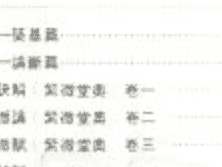

# 紫微—太微赋

紫微斗数赋文诠注
紫微堂奥卷三
堃 元著

金刚出版(集团)有限公司印行

## 自序

望元常请金玉奇命学馆以为向陈老师请领命理五术之教益，心倾其之精于子平八字推命术、易卦课占、择吉、堪舆、命名……等等，沈静温雅，谆谆善诱，晨昏礼佛，宁静而安贫乐道，嘂数疑问：“胡不授课以助生计?!”，陈老师澹泊以对：“不好为人师，怕误人矣！”，望元知其谦虚而不敢再问，又嘗请为论述著作，其又推拒曰：“才疏学浅，不敢冒渎五术而笔墨文字！”

诸友闲谈，每趣望元有所论述著作，当可传授斗数以为后学解惑，望元景仰陈老师之虚怀若谷，犹自勤奋钻研五秘之术，苟非迫于生计，望元实亦不敢舞文弄墨以亵渎斗数，岂敢存招生授课之心?！或讥而答称：“书为师，望元勤于读书而有小得，惟苦于读书而后学于望元者，敢勉为其师！一

望元沈醉钻研斗数亦久矣！反复强读“诸星问答论”、“太微赋”……等赋文，艰涩阻滞而隐晦，一而再，再而三的紧锲不舍，甚至旁考其他，是知能得解读诸赋文，亦可谓“登堂”，能够瞻仰紫微斗数殿堂的富丽辉煌，若欲再有所深知，则必再更求名师点解，或再参考其他斗数丛书，必不得“入室”，所以望元尽殚一己心智，拙作“斗数玄关”而继“紫微堂奥”，以利后学之知斗数浩瀚而已。

寻知风城吴万全先生编著“延陵堂飞星四化紫斗玄关”一书资料丰博，几可誉为最佳之紫微斗数参考书之一，可为研习斗数之参考，更可往求其指迷解惑矣!!

嘗有庄读友来电询及紫微堂奥卷一卷二有所重复，堃元坦率以告：“读者择书而购，堃元不敦期呈读者仅购堃元抽作，以其重点而重复，如仅读抽作，重复阅读，亦可收温故知新之益矣！

庄读友爱护堃元而提醒堃元，并期呈堃元继成紫微斗数赋文之诠注，以是堃元勉尽所知以为继成“紫微堂奥”！”

联络处：堃元闲谈论命馆  电话：（０四）二七八一三五一
台中县太平乡新坪村新平路一七九之三二十一巷一弄九号四楼

堃元  谨识

## 目录

- 太微赋
- 第一章 斗数理旨易明
- 第二章 星之分野各有所属
- 第三章 土星苟居其垣若可动移
- 第四章 禄逢冲破吉处藏凶
- 第五章 马遇空亡终身奔走
- 第六章 生逢败地发也虚花·绝处逢生生花不败
- 第七章 观生剋以察制化
- 第八章 日月最嫌反背
- 第九章 禄马最喜交驰
- 第十章 空亡定要得用天空最为紧要
- 第十一章 若逢败地扶持大有奇功
- 第十二章 紫微天府全依辅弼之功
- 第十三章 七杀破军专依羊铃之虐
- 第十四章 诸星吉逢凶也吉·诸星凶逢吉也凶
- 第十五章 辅弼夹帝为上品
- 第十六章 桃花犯主为至淫
- 第十七章 君臣庆会才善经邦
- 第十八章 魁钺同行位居台辅·禄文拱命贵而且富
- 第十九章 日月夹财不权则富
- 第二十章 马头带箭镇卫边疆
- 第廿一章 刑囚夹印刑杖惟司
- 第廿二章 善荫朝纲仁慈之长
- 第廿三章 贵人贵乡逢者富贵
- 第廿四章 财居财位遇者富奢
- 第廿五章 日丽中天专权之贵
- 第廿六章 水澄桂萼清要之职
- 第廿七章 紫微辅弼同宫一呼百诺居上品
- 第廿八章 文耗居于寅卯谓之众水朝东
- 第廿九章 日月守不如照合·荫福聚不怕凶危
- 第三〇章 贪居亥子名为泛水桃花
- 第卅一章 刑遇贪狼号曰风流邪杖
- 第卅二章 七杀廉贞同位路上埋尸·破军暗曜同乡水中作冢
- 第卅三章 禄居奴仆纵有官也奔驰
- 第卅四章 帝遇凶徒虽获吉而无道
- 第卅五章 帝坐命库则曰金舆捧檄·福安文曜谓之玉袖天香
- 第卅六章 太阳会文曲于官禄皇殿朝班
- 第卅七章 太阴同文曲于妻宫蟾宫折桂
- 第卅八章 禄存守于田财堆金积玉
- 第卅九章 财荫夹于迁必巨商高贾
- 第四〇章 贪会禄居旺宫终身鼠窃
- 第四一章 贪居绝地天年夭似颜回
- 第四二章 杀居绝地寿考永如彭祖
- 第四四章 忌暗同居身命疾厄困弱尪羸..................二六三
- 第四五章 凶星会於父母迁移刑伤产室..................二六五
- 第四六章 刑杀同廉贞於官禄架刧难逃..................二六八
- 第四七章 官府夹刑杀於迁移离乡遭配..................二七二
- 第四八章 善福於空位天竺生涯..................二八○
- 第四九章 辅弼单守命宫离宗庶出..................二八三
- 第五〇章 七杀临於身命加恶杀必定死亡..................二八七
- 第五一章 铃羊合於命宫遇白虎须当刑戮..................二九四
- 第五二章 官府发於吉曜·流杀怕逢破军..................二九四
- 第五三章 羊铃凭太岁以引行..................三○二
- 第五四章 病符官符皆作祸..................三○四
- 第五五章 奏书博士与流禄尽作吉祥·力士将军同青龙显其权势..................三○六
- 第五六章 遇杀无制乃流年最忌..................三一三
- 第五七章 人生荣辱限元必有休咎·处世孤贫数中并无驳杂..................三一五
- 增补太微赋
- 玄微论
- 增补太微赋架言..................三一六
- 第五八章 斗数犹大易之分八卦..................三一九
- 第五九章 观星大要..................三二一
- 第六〇章 女命大要..................三二三
- 第六一章 男命大要..................三三三
- 第六二章 命限大要..................三三五
- 第六三章 小儿命大要..................三四八
- 第六四章 星性举例..................三四二
- 跋..................三五四

# 太微赋

## 太微赋

斗数，至玄至微，理旨易明，虽设问于百篇之中，犹言而未尽。至如星之分野，各有所属，寿天贤愚，富贵贫贱，不可一概论议。其星分布一十二垣，数定乎三十六位，入庙为奇，失数为虚，大抵以身命为福德之本，加以根源为穷通之资。星有同躔，数有分定，须明其生剋之要，必详乎得垣失度之分，观乎紫微舍躔，司一天仪之象，卒列宿而成垣。

土星苟居其垣，苟可动移，金星专司财帛，最怕空亡，帝居动，则列宿奔驰，贪守空，而财源不聚，各司其职，不可参差，苟或不察其机，更忘其变，则数之造化远矣！

> 例曰：禄逢冲破，吉处藏凶，马遇空亡，终身奔走，生逢败地，发也虚花，绝处逢生，生花而不败。

星临庙旺，再观生剋之机，命坐强宫，细察制化之理！日月最嫌反背，禄马最喜交驰；倘居空亡，得失最为要紧，若逢败地，扶持大有奇功。紫微天府全依辅弼之功，七杀破军专依羊铃之虐。诸星吉，逢凶也吉，诸星凶，逢吉也凶。辅弼夹帝为上品，桃花犯主为至淫，君臣庆会材擅经邦，魁钺同行位居台辅，禄文拱命贵而且贤，日月夹财不权则富，马头带箭镇卫边疆，刑囚夹印刑杖惟司，善荫朝纲仁慈之长，贵人贵乡逢者富贵，财居财位遇者富奢。

- 太阳居午，谓之日丽中天，有专权之贵，敌国之富。
- 太阴居子，号曰水澄桂萼，得清要之职，忠谏之材。
- 紫微辅弼同宫，一呼百诺居上品，文耗居寅卯，谓之众水朝东。
- 日月守，不如照合。荫福聚，不怕凶危。贪居亥子，名为泛水桃花。刑遇贪狼，号曰风流邪杖。七杀廉贞同位，路上埋尸。破军暗曜同乡，水中作塚。禄居奴仆，纵有官也奔驰。帝遇凶徒，虽获吉而无道。

> 帝坐金车，则曰金辇捧掷。福安文曜，谓之玉袖天香。太阳会文昌...

## 第一章 斗数理旨易明

紫微斗数亦如子平八字推命术一样的依人的生辰年月日时为依据，以生月生时安命身宫，依命宫所得干支定五行命局，更依命局及本生日起紫微星，用紫微而排列十四主曜，还要依生年干、生支、生月、生日、生时各别排列主次要星曜，以为完全当生命图。

因为斗数绘制当生命图之安星布斗有一定的脉络可以依循，而且进入观察研判的时候能够凭借诸星问答（星垣论）作为观察研判的参考，所以说紫微斗数尽管玄微奥妙，其绘制命图及观察推测宿命的方法，皆有可以依循的方法而显得清晰而容易明白。

但是许多学者每以斗数之繁复为苦，甚至于认为斗数星曜之生剋制化甚难得其机变，即有诸星问答论亦很难帮助益宿命推测之观察研判，所以有认为“理旨难明”为当。

此二说见解互异而不相悖，其曰斗数理旨易明者，盖指斗数命图之“体”而言，其所以言斗数难明者，盖指斗数命图之“用”而论。

望元观文明望义，此处或以“理旨易明”为是，否则下文“虽设问于百篇之中，犹言而未尽。”即缺乏赋文承启之作用，亦无以表达“诸星问答论”之重要性及论议不及之处，所以为太微赋以裨益后学认识紫微斗数。

> 於官禄，皇殿朝班，富贵全美。太阴会文曲於妻宫，蟾宫折桂，文章令盛。禄存守於田财，堆金积玉。财荫坐於迁移，巨商高贾。耗居禄位，沿途乞食。贪会旺宫，终身鼠窃。杀居绝地，天年夭似颜回。贪坐生乡，寿考永如彭祖。
> 忌暗同居身命疾厄，沈困尫羸。凶星会於父母迁移，刑伤产室。刑杀同廉贞於官禄，架樁难逃。官府夹刑杀於迁移，离乡遭配。善福於空位，天竺生涯。辅弼单守命宫，离宗庶出。七杀临於身命，加恶杀必定死亡。铃羊合於命宫，遇白虎须当刑戮。官府发於吉曜，流杀怕逢破军。
> 羊铃凭太岁以引行，病符官符皆作祸，奏书博士与流禄，尽作吉祥力士将军同青龙，显其权势。
> 童子限如水上泡浬，老人限似风中燃烛，遇杀无制，乃流年最忌。人生荣辱，限元必有休咎，处世孤贫，数中逢乎驳杂，学者至此，诚玄微矣！

## 第二章 星之分野各有所属

我们猜臆摸索著紫微斗数学天文星象有极其密切的关系，但是在我们今日所能看到的飞星紫微斗数的形像之中，除了“星曜”采用天文星象的部分名称之外，已经很难再考证其与天文星象的关联。

藉著神州出版公司印行之铁板道人陈岳琦先生著作於民国五十五年二月初版之“十八飞星策天紫微斗数”一书，包括“十八飞星策天紫微斗数”(按：陈岳琦先生於民国七十二年五月自费初版“正统飞星紫微斗数”一书，包括“十八飞星策天紫微斗数”及“正统紫微斗数”两部分，前半部即为“十八飞星策天紫微斗数”。)，我们恍惚可以看见策天紫微斗数自张果老星宗蜕变简化的过程，但是在斗数残存的诸篇赋文中，我们又无法找到张果老星宗之遗骸，甚至于星象的分野及所属都模糊得困难推考。

望元曾经屡次企图追求推考紫微斗数与天文星象或张果老星宗之关系，可惜偏于天文知识之贫乏以及对于七政四余之涉猎不深，每一探索即感头量脑胀，虽然明知紫微斗数的当生命图寓隐着其人生辰的天文星象的暗示意义，而终究怅然若失，无能解读而作罢！

望元愚蠢无以解读斗数星曜的星象意义，但窃忖若能稍识天文星象，最少能有助于确定星曜庙旺陷失之作用，所以不厌繁赘，特别整理“张果老星宗大全”一书之部分资料，裨利学者研习

# 参考之用

## 廿八星宿宫分所属便览表

### 一、宫分所属：

| 宫分所属 | 正偏星垣 | 周天度数 | 入宫度数 |
| :--- | :--- | :--- | :--- |
| 子 宝瓶 齐 青 | 危月偏垣 虚日正垣 女土偏垣 | 九度 九度 十二度 （合三十度） | 危十三度入亥 |
| 丑 磨羯 越 扬 | 斗木偏垣 斗木偏垣 牛金正垣 女土偏垣 | 三度 二十一度 六度 一度 （合二十八度） | 斗四度入丑 |
| 寅 人马 燕 幽 | 箕水偏垣 尾火正垣 | 九度 十六度 （合二十八度） | 尾三度入寅 |
| 卯 天蝎 宋 豫 | 氏土偏垣 房日正垣 心月偏垣 尾火偏垣 | 二度 六度 五度 十五度 （合二十八度） | 氏一度入卯 |
| 辰 天秤 郑 兖 | 氏土偏垣 亢金正垣 角木偏垣 轸水偏垣 | 一度 九度 十二度 七度 （合二十九度） | 氏一度入卯 |
| 巳 双女 楚 荆 | 轸水偏垣 翼火正垣 张月偏垣 | 十度 十九度 一度 （合三十度） | 轸十度入辰 |

| 宫分所属 | 正偏星垣 | 周天度数 | 入宫度数 |
| :--- | :--- | :--- | :--- |
| 丑 磨羯 越 扬 | 斗木偏垣 斗木偏垣 牛金正垣 女土偏垣 | 三度 二十一度 六度 一度 （合二十八度） | 斗四度入丑 |
| 子 宝瓶 齐 青 | 危月偏垣 虚日正垣 女土偏垣 | 九度 九度 十二度 （合三十度） | 危十三度入亥 |
| 亥 双鱼 吴 越 | 室火偏垣 壁水正垣 | 九度 十六度 （合二十五度） | 室四度入戌 |
| 戌 金牛 赵 冀 | 奎木偏垣 娄金正垣 | 九度 十六度 （合二十五度） | 奎一度入戌 |
| 酉 白羊 魏 梁 | 胃土偏垣 昴日正垣 毕月偏垣 | 十五度 六度 五度 （合二十六度） | 胃一度入酉 |
| 申 双子 周 雍 | 井木偏垣 鬼金正垣 柳土偏垣 | 十五度 六度 五度 （合二十六度） | 井九度入申 |望元注：周天度数应合三百六十度，如依太阳日行一度约计则应三百六十五又四分之一度为是，唯廿八星宿布列周天阔窄不均，亦有疏空之处，是计合廿八星宿止三百四十九又二分之一度，果老星宗残本「日多度少」而有空白之日，成为历代推求确实之困难，后有统天历推考廿八星宿占据周天三百五十九度七分，会天历三百六十度半，授时历三百六十四度，开禧历三百五十七度，更考出入十二宫星度亦有不同，今人甚多推考周天度数不能与日度相符者，大抵忽略星宿相

| 亥 | 戌 | 酉 | 申 | 未 | 午 |
| :--- | :--- | :--- | :--- | :--- | :--- |
| 双鱼 卫 邠 奎木偏垣 壁水偏垣 室火正垣 危月偏垣 二度、九度、十七度、三度 三十一度 奎二度入戌 | 白羊 鲁 徐 奎木偏垣 娄金正垣 胃土偏垣 胃土偏垣 三度、十二度、十六度 三十一度 胃四度入酉 | 金牛 赵 翼 昴日正垣 毕月偏垣 十度、六度 二十八度 毕七度入申 | 阴阳 晋 毕月偏垣 觜火偏垣 参水偏垣 井木偏垣 八度、十度、半度、十度 二十八度半 井九度入未 | 巨蟹 秦 雍 井木偏垣 鬼金正垣 柳土偏垣 三度、二度、二十三度 二十八度 柳四度入午 | 狮子 周 柳土偏垣 星日正垣 张月偏垣 九度、六度、十五度 三十度 张十五度入巳 |

### 二、其星分布十二垣：

斗数十二宫不专依十二地支五行看，亦如果老星宗之「星辰入垣图」一样包含五星五行之意涵，所以除了安星分布十二垣而外，另有命主星之作用，可惜的是许多紫微斗数学者无法发现命主星之作用，甚至舍弃不用。

望元于拙作「紫微堂奥」卷一第九页「五星五行」已摘录协纪辨方书释义甚详，所谓五星五行者亦今俗称地支六合之义，能明此义者，对于斗数星曜庙旺陷失之决定及观察星曜暗合之作用皆能有所帮助，是以特别列表于后以为参考——

## 星辰入垣入庙便览表

| 子 | 丑 | 寅 | 卯 | 辰 | 巳 | 午 | 未 |
| :--- | :--- | :--- | :--- | :--- | :--- | :--- | :--- |
| 癸 | 戊辛己 | 戊丙甲 | 乙 | 乙癸戊 | 戊庚丙 | 己丁 | 丁乙己 |
| 破军、文曲、太阴、天相 | 太阴、武曲 | 天府、天梁、七杀、马 | | 天府、天梁、贪狼 | 文昌 | 紫微 | 紫微、七杀 |
| 土 | 土 | 木 | 火 | 金 | 水 | 阳 | 阴 |
| 天府、天梁、禄存 | 紫微、天府 | | 太阳、火星 | 武曲、擎羊 | 天同、文曲 | 太阳、火星 | |

望元注：此便览表未全列斗数星曜，仅依星曜之藏干而论，藏干不能与地支藏干或五行相合者，一概删列。又紫微斗数丛书所列星曜庙旺陷失纷歧，学者大抵可以任择一书作为根据参考，最要从实际之命例经验中推考为当。

### 三、数定乎三十六位：

斗数命图将星曜分布十二垣，是为命图之「体」，观星「体」之生克制化、刑冲会害是为命图之「相」，研判流年所谓「斗数活盘」运用是为命图之「用」，于是星布于十二垣，各垣俱有其「体」「相」「用」，恍若得三十六位之不同。

斗数之推测命数，必得「体」「相」「用」之瞭解纯熟运用，知其一而不知其二，或知贤愚形性而不辨寿夭，知其二而不知其三，亦难预知富贵贫贱，吉凶休咎，所以紫微斗数虽有「星垣问答论」，终究有言而未尽，引而未发，所以特为「太微赋」以为补充。

### 四、入庙为奇：

我国古代星座图，将天星分为三垣——紫微垣、太微垣、天市垣——，将黄道星曜分为「心、房、角、亢、氐、轸、翼、张……」第二十八星宿。

在星宿十七度与张宿十七度之间的天域被称为「天庙」，以有客星（指非恒星之金、木、水、火、土五星或其他不在相对地球为恒定位置的慧星等星辰。）经过的机会甚为难得，所以有人入庙为奇一说。（按：星张宿居午位。）

另据史记天官书载：「岁星（即木星）一曰摄提，曰重华，曰应星，曰纪星，营室为清庙，岁星庙也。」以太阳系挟带五星在黄道带上运行，经历十二宫躔二十八星宿，木星每十二年绕行太阳公转一周，从地球上看起来就好像每十二年绕行廿八星宿一周，所以每年适经历一宫躔星宿。

斗数依据木星绕行运转的状况而解释命图现象：「生年太岁并小限到流年太岁之宫躔，而又

| 亥 | 戌 | 酉 | 申 |
| :--- | :--- | :--- | :--- |
| 甲壬 | 辛丁戊 | 辛 | 戊壬庚 |
| 天同 | 武曲、铃星、天府、天梁 | | 天相、七杀 |
| 木 | 火 | 金 | 水 |
| | 七杀、擎羊、陀罗 | 文昌 | 巨门 |

### 五、失数为虚：

望元纵观「星垣问答论」解释星曜在「斗」、「数」之作用及影响特性，以在斗司掌论「体」，以在数司掌论「用」，星曜固以在体之当生命图须要入庙化吉为奇，但更要其于在用之流年活盘亦能得吉会吉，否则若会凶杀，遇空亡等现象即为「失数」。

斗数之言「失数为虚」者，泛指星曜不能依其原有特性作用影响其人命运岁限，正与子平所谓「好八字，不如行好运。」之义相通。

譬如武曲在天司寿，在数司财，如武曲「失数」即不主财，又如贪狼乃主祸福之神，在数则乐为放荡主事（主桃花），但见赋文每称「贪铃并守将相之名」，「贪狼火星居庙旺，名镇诸邦」。观之，贪狼在数本主桃花，但亦为多才多艺，如与火铃守居，适能制贪狼乐为放荡之桃花性质，反能于才艺上有突破性之表现，所以贪狼失数亦不能以桃花论之；其他如桃花遇空亡，返主端正……等等，学者不妨自为推求，不赘。

## 第三章 土星苟居其垣若可动移

我们之中，除开一些专家学者之外，我们的天文星象意识大多非常薄弱，有一些是从书本上获得的，有一些则零零碎碎的听拾而得，真正具备完整天文知识的人并不多。

在我们北半球生活的我国古代，一直相信论语所说：「北辰远，而众星拱之。」，他们一直相信「北极星」在很遥远的北方天际，大概就在想像的天中位置，位居于众星的中央，其他的星曜都似乎拱卫着「北极星」，并且围绕着它转动的现象，在他们的观察之中，星曜有亮度等级之不同，由于星曜分布罗列的情形，很像古代封建社会制度的朝仪官秩一样，终于成为「史记天官书」，以及后来的「汉书天文志」、「晋书天文志」、「宋书天文志」……等等，这也就是「观乎紫微舍次，司天象之仪，卒列宿而成垣。」的斗数星象意识的由来。

天文星象在人类的视觉有一定的秩列，这种几乎固定不变的星象秩列无时不在运转（其实是地球的运转所致），所以史记天官曰：「用昏建者杓，杓自华以西南，夜半建者衡，衡殷中州河济之间，平旦建者魁，魁海岱以东北也。」，正是地球相对天文星象运转的说明。

据今科学家研究天文星象之推考，地球绕太阳公转，太阳带着太阳系围绕着银河系的中心运转，由于地轴倾斜二十三度半运转（陀罗的进动），地轴指向天体极绕着黄道，缓慢的划成一圈，地球两极所划的圈相同，其半径均等于地轴倾斜的二十三度半，此为天体极的进动路径，在公元三千年前，大约以天龙星座之某星为「北极星」，而此一天体极目前今之小熊星座之「北极星」约一度，目前仍在继续接近中，到公元二一〇〇年时，天体极与北极星将达到最接近的约为半度距离，其后地轴对于北极星的绕圈又将逐渐增到，到了公元七千年（一说八千年）时，仙王座α星（α—cePhei，或称天鹅座α星）将替代今日之「北极星」，会有一段很长的时间成为几乎不变的「北极星」，而今日之北极星将在中天绕「廿八度」的圈运行。依据地理人子须知载曰：「中天北极紫微星垣，天星之辰极，太乙之常居也，正临亥地。」，「西披少微星垣，士大夫权天帝文章之府司也，正居辛兑，中有帝座，正临兑地。」，「南宫太微星垣，三光之庭，天帝受釐告功之室也，中有五帝座，正居此地，太乙五商书正居巽地。」，「可见古人观察星象已很正确的知道北极星「紫微」（或谓太乙）不在天体极点上，并且已具备天体运行的深度认识，所以说「土星苟居其垣，若可动移。」，因而形成斗数十四主曜随着紫微的「观察位置」而「帝居动，而列宿奔驰」的现象。假定紫微所在的宫躔以表示星象，则一周天三百六十度十二宫躔，适得一百四十四种「星象」，又假定此一百四十四种星象如廿八星宿之环列黄道带上而无间缺，则每一斗数星象适占周天度数二度半。但这些假设对于瞭解斗数与星象间的关系，一点也没有发生解答的作用，不过有部份学者却因为「二、五」巧合于太阴行度「两日半行一宫」，更且斗数生辰以太阴历为据，所以有人强调张果老星宗以太阳为主，紫微斗数以太阴为主。正如阳历与阴历之纪历虽然不同，但一样能够准确的表示四时节气。

## 第四章 禄逢冲破吉处藏凶

### 一、禄爵当得势而享之：

> 依诸星问答论曰：「禄存，逢吉逞其权，遇恶败其迹，最嫌落于陷空。」之特性，此「禄逢冲破，吉处藏凶。」之说，即从「遇恶败其迹」而引发。

斗数有明禄暗禄之说，而解释各有不同：

- （一）、禄存为明禄，化禄为暗禄。
- （二）、三方四正可见禄存主星为明禄，主事宫躔之六合宫有禄存化禄者为暗禄。

四化之化禄，不论其禄存主星如何，俱于化禄后而具备禄存星之性质，亦从禄存星论议。

禄存为明禄，化禄为暗禄。

禄存在诸宫皆能降福消灾，有制化解厄之功，但其恒处于羊陀夹地，正为「两邻加侮」之现象，适足以表现人生爵禄无不劳而获之现象，所以禄存独守命者，不依慈厚信直、通文济楚论议，特论为看财奴，此或以羊陀加夹所致。

禄存大多被论为财运星，亦为助福添祥之星，其遇紫微、天相、即因紫微为官禄宫主星，天相为官禄文星，而主权贵；週日月，则增日主官禄之贵，月主田宅之富；遇天府、武曲，则以武曲主财，天府主禄库（财帛、田宅、衣禄）而不能表现其与财富的特性，似乎仅成为赋闲的帮衬星曜而已，但禄存每能帮衬辅佐天府、武曲之失职，每有利禄财源不绝之暗示；或遇天梁、天同，其作用即不在于增加财运，只是更增加其福荫之吉祥而已。

禄存之所以主财源不绝，大抵以性貌如春，和谐情怀，正与俗谚「和气生财」不谋而合，更观诸星问答论曰：「禄存，北斗第三星，真人之宿，主人贵爵，掌人寿基。」，岂不正暗示「健康为财富之本」，其以「真人之宿」以论禄存，是不是就像解释贪狼为标准一样的隐？

如果说贪狼之现实倾向于物质生活价值的精打细算，那么禄存之切合于人性，岂不有倾向于精神生活价值的主观意识？！所以禄存之内心之重视名誉更甚于钱财，既耽心被人评论轻视，又充满了事业进取心与积聚钱财的欲望，因此禄存独守命之人，每以钱财衡量人生价值而成为看财奴论。

### 二、禄存遇恶败其迹

禄存既为「真人之宿」，是亦如人之趋炎附势，逢吉逞其权，遇恶败其迹。
禄存对于庙旺星曜有帮衬发挥其星曜优点之作用，但以其于精神生活上有现实自私之一面，所以每遇凶恶煞星，其人生价值因之改变，虽仍不失处世艺术之随和，但在其生活交游的范围已发生了品质的改变，大多远益友而亲小人，虽然不能马上见到祸害，实已种下了减少或破败自己财富的危机，所以说「禄逢冲破，吉处藏凶。」
如以斗数的术语解说，禄存恒居于羊陀加夹地，平时虽不惧「两邻加侮」，但如遇会火铃空劫忌耗空亡等星，则造成内忧外患，四面楚歌之象，所以禄存「降福消灾」、「制化解厄」之力一松懈，灾厄祸害立即乘隙而入，是谓「吉处藏凶」。
望元感认：假如身命宫三方四正有禄存，最怕化忌、天空、地劫、空亡、火星、铃星遇合，遇者虽非即见财富减少破败，但是于某一财富程度，即发生逐渐或突发性之钱财耗失破败现象，或于运限遇合而见阻滞耗失，必赖学者之经验而审详。

### 三、禄存于命理意义与堪舆挨星意义不同：

斗数用禄存之义，大抵与「星平」、「子平」相当，但斗数命主星亦有禄存，命主星有七，适与堪舆九星相当，许多学者俱认为斗数可以凭藉命主星而用斗数堪舆，但斗数命主星与堪舆九星之意义是否相通呢?!
望元感认，斗数命主星仍应从斗数而论，不可迳与堪舆九星混同，两者似可成为沟通的桥梁，但其意义必不相同，故列比较表于后，裨利学者研究突破——

| 星曜 | 斗数五行 | 堪舆九宫五行 | 堪舆五星五行 | 斗数命主摘要 |
| :---: | :---: | :---: | :---: | :---: |
| 贪狼 | 甲木 | 一白属水 | 生气属木 | 子藏癸水 |
| 巨门 | 癸水 | 二黑属土 | 天医属土 | 丑亥藏甲己合化土 |
| 禄存 | 己土 | 三碧属木 | 绝体属土 | 寅戌藏丙辛合化水 |
| 文曲 | 癸水 | 四绿属木 | 游魂属水 | 卯酉藏乙木辛金 |

### 四、星平会海参考资料：

——摘录星平会海全书——

- （一）、论官禄：
甲禄在寅 乙禄在卯 丙戊禄在巳 丁己禄在午

望元按：此与斗数禄存之本义相通。

- （二）、论天禄：
庚禄在申 辛禄在酉 壬禄在亥 癸禄在子

望元按：此与斗数当生十干化禄之义相当。

- （三）、生成禄：
假如甲生人见丙，是甲禄在寅，甲年适见丙寅，不必见寅，见丙子、丙戌、丙申、丙午、丙辰便为天禄，乙生人见巳亦是，他倣此。

- （四）、朝元禄：
假如寅生人，值月上，或日时上有甲者，皆谓之朝元，甲禄在寅，朝归本命，其他倣此。

望元按：此几近于斗数之禄存守命。

望元按：此与斗数之遇会禄存一般。

| 廉贞 | 武曲 | 破军 | 左辅 | 右弼 |
| :--- | :--- | :--- | :--- | :--- |
| 丙火 | 辛金 | 癸水 | (戊土) | (癸水) |
| 五黄属土 | 六白属金 | 七赤属金 | 八白属土 | 九紫属火 |
| 五鬼属火 | 福德属金 | 绝命属金 | 从本宫无所属 | 从本宫无所属 |
| 辰申藏乙庚合化金 | 己未藏乙庚合化金 | 午藏丁火己土 | | |

## 第五章 马过空亡终身奔走

原注：假如甲生人正截路空亡在申，傍空在酉，安命在申，主人终身奔走，宜僧道。

斗数安天马以本生年支论之，申子辰年生人安天马于寅，亥卯未年生人安于巳，寅午戌年生人安于申，巳酉丑年生人安于亥，马行四隅寅巳申亥宫位，余宫不入。

天马，属丙火，为司禄之星，主辛勤，主运动，主奔驰，所以有天马临于身命，谓之驿马，主人勤奋奔忙。假如寅午戌生人安命在申，又得天马坐守，其性好动不耐静，或安命在寅，为申之天马冲照，其性亦如驿马。

凡天马，最喜禄马交驰，如与紫府同宫，谓之扶辇马，与刑杀同宫，谓之负尸马，与火星同宫，谓之战马，与日月同宫，谓之雌雄马，逢空亡谓之空亡马，居绝地，谓之死马，遇陀罗，谓之折足马。若夫妻宫得天马者，又得紫微守命，可称马前「金辇捧辔」（详见拙作「紫微堂奥」卷二第二三O页）。

天马逢空亡，谓之空亡马，有劳碌而收获不大之事倍功半现象，一般之言空亡皆以截路空亡而论，而截路空亡则依本生年干而论，所以「天马逢空亡」之弦外之音含有吾人生年干支组配适

> 望元按：此与斗数「禄马交驰」相通。

外有天厨禄、连珠禄、论飞禄、名位禄、论夹禄、正夹禄、双夹禄、论拱禄、论支禄、论时禄、十干食禄……等，星平俱以吉论，学者可以自为研求，不赘。

- （五）、飞腾禄：
假如甲申、甲子、甲辰生人见寅，是甲禄在寅，申子辰马居寅，庚寅、庚午、庚戌见申，是庚禄在申，寅午戌马居申，只此六位。

## 指正空亡：已地阴阳千分好

切与否的意义，而且提醒学者对于截空等空亡性质的星曜加以注意。望元窃臆命理论「空亡」至多，如「十大空亡」、「六甲空亡」（即旬中空亡）、「天败空亡」、「截路空亡」、「天上空亡」、「十干空亡」、「四大空亡」……等等，斗数简化而较重视截路空亡，故拙作「斗数玄关」第二三八页曾试为考证，以截空始有与天马同宫之机会，所以马遇空亡当以天马与截路空亡同宫而论！本于此说，马遇空亡的界说变得非常狭猛，几乎已经不考虑同宫星曜及三方星曜的作用，虽嫌强调截路空亡主截断、整齐、失落、虚空之「虚空」意义，但如果把「马遇空亡，终身奔走。」视同单一的名词解释，岂不是赋文提醒我们正视其内涵的本义吗？因此，凡安命在寅申巳亥宫，有天马守照暗合，又见截路空亡同宫者，庶可依此而论，若于运限遇之者，则其「终身」之义应改为「运限」论之。兹附马遇空亡示意图于后，裨利学者深入研求推考，不赘。

| 年干 | 宫位 |
| :--- | :--- |
| 甲 | 申 |
| 乙 | 未 |
| 丙 | 辰 |
| 丁 | 卯 |
| 戊 | 子 |
| 己 | 酉 |
| 庚 | 午 |
| 辛 | 巳 |
| 壬 | 寅 |
| 癸 | 丑 |

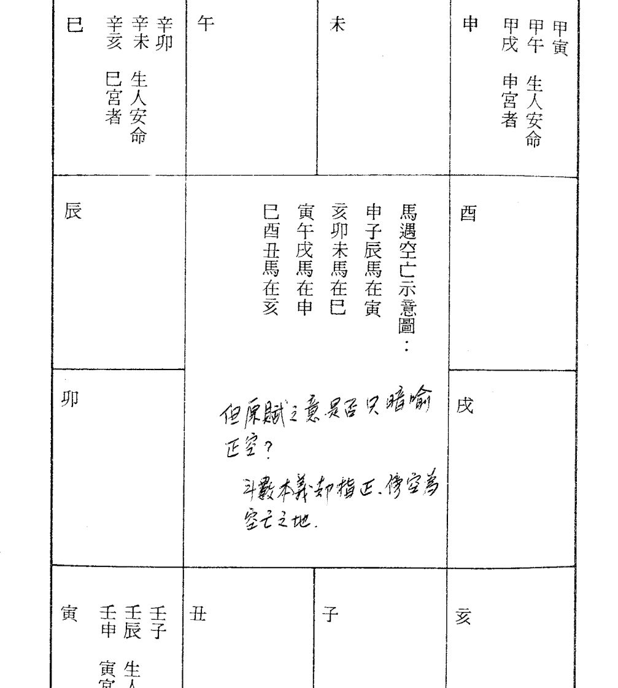

## 第六章 生逢败地发也虚花 绝处逢生生花不败

原注：假如土水人安命在巳为绝地，却得金生在巳，生水不绝，为母来救子之理。凡寅申巳亥为四绝，又为四生。（按：参考卷二「行限逢乎弱地未必为灾」。）

斗数安长生十二神，作用不甚彰显，安法歧异，甚至有舍弃不用，反不如子平用「生旺库」十二神之运用活泼，所以在解说上比较新鲜阻涩——

### 一、起长生之岐异：

古以五行体系生死处之不同，遍历十二月辰而出没生死，大抵以五行命局（命宫干支纳音）为起长生之依据，但有部份学者仍沿用子平法，仅依本生年干支纳音五行起长生，各自取用，但俱未见有活泼运用及公开阐释解说者。

今姑不置辩起长生依命宫或本生年干支纳音五行安定，斗数咸认水土同长生（亦有沿用子平火土同长生者）则是不争之事实。但对于长生十二神顺逆则又有二种不同的见解：

- （一）、男命顺数、女命逆数（见紫微斗数全书原注。）。
- （二）、阳男阴女顺数、阴男阳女逆数（见紫微斗数全书「古今富贵贫贱天寿命图」。）。

在此不同意見下，又衍生一股无端的疑问：「长生十二神既含有当生十二辟卦之意义，则卦气宜俱用顺数？！」，此说虽未见成立，但其所疑问亦甚值得探讨！

望元于命图运作上，以五行命局起长生，以阳男阴女顺数、阴男阳女逆数起长生，但于运用上亦极为生涩，大抵以帮助认识命身宫之强弱而已。

一般之论五行长生，大抵以「衰、病、死、墓、绝」五宫位为败地，假如水土命局顺长生者，安命于丑为衰地、安命于寅为病地，安命于卯为死地，安命于辰为墓库，安命于巳为绝地，凡安命此五败地，生主星虽得吉曜庙旺，主一时权贵财富，大多经历成败不能久长，或有名无实，或突然破耗衰败，所以有「生逢败地，发也虚花」之说。

> 望元读习紫微斗数，于眉批附注：

- 「禄存：理想抱负、事业心。
天马：奋斗精神、实践行为。
- 长生十二神：环境适应能力。」

### 二、沐浴为败气：

长生之次为沐浴，取喻婴儿新生之周身胎胚污秽，有「秽气」之义，故必以洗涤而名之「沐浴」，引申为教育栽培，但每被以「败气」视之，亦不忘其「秽气」而以桃花视之，主荒唐败气，不务实业，酒色荒芜、懒惰废事等事。

### 三、绝处逢生生花而不败：

沐浴紧依附于长生之次，故必先知长生十二神之安定，（参考「紫微镜钳」第二二四页「安生旺库」诀，「斗数玄关」第九一页，「紫微堂奥」卷一第六九页），依诀而安，如适安命于沐浴位上，是称「生逢败地」，以沐浴之星如贪狼等桃花星曜，有乐为放荡事而主败气。

陈岳琦先生著「正统飞星紫微斗数」一书中「论命要则」之五谓：「……何以谓之「化」，如火本克金，而得土，成火生土，土生金，引通之局，乃最上之局，如武曲阴金，居午乃被克，得天府之阳土同宫，则午火去生天府之土矣，天府去生武曲之金矣，自然引通，无往不利也。」

望元观此为紫微论命要则，必注重星曜之生克制化，以生主星守于被克之乡不美，须取生化引通为吉，其言下虽未完全解释「绝处逢生」之义，适可以帮助了解「绝处逢生」，所以望元与谢老师闲谈开论斗数之时，每多赞誉「正统飞星紫微斗数」为研习斗数应该「必备」之参考书也。

| 地支 | 时辰 | 五行长生 | 方向 | 天干阴阳沐浴组合 |
| :--- | :--- | :--- | :--- | :--- |
| 午 | | | 数顺 → | 丙男辛女（金）沐浴 |
| 未 | | | | 甲女己男（土）沐浴 |
| 申 | | （水土长生） | ← 数逆 | 壬女丁男（水） |
| 酉 | | | | 庚男乙女（水）沐浴 |
| 戌 | | | | 丙女辛男（木）沐浴 |
| 亥 | | （木长生） | ← 数顺 | 壬男丁女（木）沐浴 |
| 子 | | | | 庚女乙男（火）沐浴 |
| 丑 | | | 数顺 → | |
| 寅 | | （火长生） | ← 数逆 | |
| 卯 | | | | 甲男己女（火）沐浴 |
| 辰 | | | | 庚女乙男（金）沐浴 |
| 巳 | | （金长生） | ← 数逆 | |
| | | | 数顺 → | |

生逢败地示意图## 第七章 观生剋以察制化

斗数于安星佈斗后，依个人观察研判而有不同的习惯，一般是最先分辨各宫躔星曜之庙旺陷失，然后再观察星曜生剋制化之作用，继以仔细研判命宫坐落之意义，以及三方四正星曜之吉凶。

大抵即可以进入推测宿命福祸休各阶段。

> > 原註：假如水土生人，墓库在辰，若与财帛同度为财库，与官禄同为官库，与禄存同为天库，耗杀同为空库，逢迁移同为劫库。凡辰戌丑未为四墓库，此亦属纳音而论。（按：参考卷二「立命会在强宫必能降福。」）

### 一、命坐强宫概念：

> > （按：参考卷二「立命会在强宫必能降福。」）

或六阴时安命六阳宫。（虽格局星曜完全相同吉美，其福份则稍逊于吉生。

建生二字。

后世术士为谀媚相命之人，不论本命是否吉生，男命俱于生辰后加註建生二字，女命亦皆用

一般于命宫安定后，以命宫干支而定五行命局，继而安长生十二神，如吉命居长生、冠带、临官、帝旺之地，就称之为强宫，余者俱以弱宫论。

大抵星曜格局相同者，其宿命吉凶福祸亦一般无二，若命宫有强弱区分者，则以命坐强者，命坐弱宫者为次。

命宫之强弱既依长生十二神作用，而十二神又有代表其本人环境适应能力之意义，即或生主星凶恶，亦可稍杀原生主星凶恶之影响，所以论议单命局时，即不注意命宫强弱亦无所谓，但对于两者以上命局相互比较时，却是一个不可轻忽的分辨细节！

### 二、墓库之概念：

紫微斗数杂论曰：「辰戌丑未为四墓之地，主刑，亦为孤独地，此四宫安命者，必外表沈厚而多游移，秉祖离宗，刑剋六亲，离乡远處为美。」，此以安命于四墓地而论。

辰戌丑未为四墓之地，亦有倣子平而称之为「库」，或称之为「墓库」，如安命于「墓」位

| 巳 | 午 | 未 | 申 |
|:---|:---|:---|:---|
| 丙男辛女（水）绝地 戊男癸女（土）绝地 乙庚生人（金）长生 |  |  | 丁壬生人（土）长生 乙庚生人（水）长生 戊男癸女（木）绝地 |
| 辰 |  | 四生四绝示意图： 注：四绝地仅示阳男阴女顺数之位，阴男阳女逆数四绝之位不赘。 | 酉 |
| 卯 |  |  | 戌 |
| 寅 | 丑 | 子 | 亥 |
| 甲己生人（火）长生 壬男丁女（金）绝地 |  |  | 丙辛生人（木）长生 甲男己女（火）绝地 |

假如水土命人安命在巳，丙戊年男命，辛癸年女命，俱是命居绝地，如生主星得武曲（辛）、文昌（庚）、七杀（丙、庚，在命以庚金论。），陀罗（丁、辛，在命以辛金论。），天同（壬，星垣論有天同属金之說，故天同居巳之金長生地而論入廟。）等属金星曜，正是金之長生位在巳，水土雖絕於巳，但得水母金（即属金生主星）生水不绝，是為母来救子之理，於論議時即可不拘於「命居絕地」，但依生主星吉凶論議即可。

> 望元按：紫微斗數雜論曰：「如子午卯酉，為四敗之地，主惡，又為桃花地，此四宮安命者，為人必好嫖好酒色，多風流，喜交遊，而飄蕩難免。……寅申己亥為四生（四絕）四馬之地，主勞，又為辛勤地，此四宮安命者，為人必聰明流合，受制於人，辛勤勞碌，自尋苦惱者，居其多數。……」，正是第五章與本章賦文之不同銓註。

即名之為「命庫」，生主星有天府者，稱為「祿庫」，生主星化祿者，稱為「天庫」，有破軍、七殺、火鈴者，即為「空庫」，難成財富積蓄，若逆數長生於命庫中有祿存者，亦稱之「天庫」。

又觀原註有「財庫」、「官庫」之說，顯不依命庫論議，望元臆其命必不居於墓地，故有財帛宮居墓地，稱為「財庫」，官祿宮居墓庫，是為「官庫」，遷移宮為墓庫者，稱為「劫庫」，常是有名無實，或為人作嫁。（望元曾為此疑問苦思，是否應以身宮併於三方，或僅三方見墓庫即論？但未獲確證，惟待學者自為研求驗證！）

望元附按：尋見子平術推人八字，但見有辰戌丑未四字，即以「庫」論之，此原註或循子平術而論議，但今研習斗數，既列於賦文之中，或有其隱寓之內涵，學者大多對賦文掉以輕心，是仍未見考證，唯只聊具以為參考！

墓庫在宿命推測上，可能有幫襯觀察田財官祿的作用意義，所以學者可以誌於旁白，以作為論議之參考，如命帶「空庫」、「劫庫」之人，大抵虛名或無積蓄，即或本人善於理財，亦當以配偶親人名義積蓄置產，不宜以本人名義為之！

| 巳 | 午 | 戊女癸男（火）墓 | 未 | 乙女庚男（木）墓 | 申 |
|:---|:---|:---|:---|:---|:---|
| 辰 | 丙男辛女（水）墓 | 戊男癸女（土）墓 | 命库示意图： | 酉 | 甲女己男（金）墓 |
| 卯 | 丙女辛男（木）墓 | 戊 | 甲男己女（火）墓 | | |
| 寅 | 丑 | 戊男癸女（金）墓 | 子 | 甲女己男（水）墓 | 丙女辛男（土）墓 | 亥 |

## 第八章 日月最嫌反背

紫微斗數全書論父母宮曰：「凡看父母，以太陽星為父，太陰星為母。太陽在陷宮，主先剋父，太陰在陷宮，主先剋母：……」，此必依父母宮星象為據，如父母宮吉，雖日月反背亦不能論刑剋父母，望元初習斗數之初，每本末倒置，常常發生誤判之應尬，於是在抽搐「紫微斗數入門」屢為提醒。

日月之意義不僅象徵父母、夫妻，太陽亦為官祿主，太陰亦為田宅主，所以不可把日月侷促於親情的觀察，亦要注意第七章所迹「觀生剋以察制化」，今舉歲次己卯年八月初二日巳時生某小兒天命為例說，其命居死地，正日月最嫌反背之格，父母宮星象亦凶，何以不刑剋父母，而竟於辛巳年二月十九日夭折呢？！

茲列命圖於下，並提醒學者能夠像照相攝影一樣注意到「光圈」、「焦距」、「快門時間」

| 宮位/星曜 | 己巳 | 文昌 | 陀羅 | 貪狼 | 廉貞 | 庚午 | 祿存 | 巨門 | 辛未 | 擎羊 | 天相 | 壬申 | 天梁 | 天鉞 | 天同 |
|:---|:---|:---|:---|:---|:---|:---|:---|:---|:---|:---|:---|:---|:---|:---|:---|
| 父母 | | | | | (權) | | | | | | | | | (科) | |
| 福德 | 天馬 | 太歲 | 病 | | 天空 | 衰 | | | | | | | | | |
| 田宅 | | | | | | | | 帝旺 | | | | | | | |
| 官祿 | | | | | | | | | 臨官 | | | | | | |
| 命宮 | 地劫 | | 死 | | | | | | | | | | | | |
| 兄弟 | 天哭 | 斗君 | 墓 | | | | | | | | | | | | |
| 夫妻 | | | | | | | | | | | | | | | |

> > 原註：太陽在申酉戌亥子，太陰在寅卯辰巳午，則日月無輝，何貴之有，然有日月反背而多富貴者，要看本宮三合有吉化拱照，不加權見也，故玉蟾先生嘗曰：「數中議論最精，惟新法在人活變耳！」

## 【觀察研判線索】

- 一、星臨廟旺，再觀生剋之機，此為「日月反背」，日不得地，月落陷。
- 二、命坐強宮，細察制化之理，此命雖吉生而坐死弱之地。
- 三、命居死地，主失落，喪亡，缺乏生氣（見斗數玄關第九二頁）；安命於辰（按：此不以命庫論。），辰為自刑之宮位（見斗數玄關第十一頁）。
- 四、太陰落陷本已有收斂限制之象，更遇羊陀火鈴，主酒色、邪淫、下賤、「天折」（見紫微斗數全書）。
- 五、童限有存在價值（見紫微鏡鈐第一五八頁），翌元於拙作「斗數玄關論斷篇」有極詳盡之說明，學者可自為參考。
- 六、天馬象徵生命精力、奮鬥精神、實踐行為，此猶年幼，故僅以生命精力論議，天馬居病位，是為病馬，與陀羅同宮，是為折足馬。

略覽命圖四正星曜，機月同梁作吏人，魁鉞拱命，日月守照，應是富貴之命。

命宮有地劫，太陰見對宮鈴星。正是「日月火鈴同位反成「十惡」，主破財大敗。

庚辰年二歲：行限寅絕之地，幸對宮吉星沖照，又得祿存降福消災，是凶中有吉之一年，但亦吉處藏凶。

辛巳年三歲：行限卯墓之地，大小二限斗君同宮，雖有府相朝垣，輔弼守照之吉，但以傷使拱照，當生截路空亡及化忌沖照，七殺擎羊火星拱沖，正是「火星鈴星專作禍，劫空傷使禍重重「七殺破軍專依羊鈴之虐」等凶兆，更以大小二限同宮，是可以「七殺重逢」論凶甚。

太歲入巳病之敗弱地，逢流年截空、文昌化忌，遇合當生截空、文曲化忌，外又有七殺破軍火星合照，傷使拱照，空劫加夾，破敗之象甚明，所以作夭折論斷，果死於本辛巳年二月十九日。

## 【觀察研判大要】

但太陰守命於辰天羅「死」地，落陷無輝本已不吉，已時生更不喜太陰落陷，對宮太陽亦不得地，正是日月反背失輝，不能論吉。

但日月反背失輝亦有多富貴者，其必三方四正有化吉守照加拱，不加殺湊始可以富貴論議，

若似舉例某小兒夭命，其格局雖與 蔣公命局相仿，但富貴貧賤壽夭之差別至大，所以任何學者可參考本書卷一第四〇二頁 蔣公命局參考。

一種命理術數，雖然給予我們許多極為寶貴的線索，卻猶賴學者觀察研判命局時所能運用的程度而決定。

## 第九章 禄马最喜交驰

> 原註：假如甲禄在寅，而申子辰馬亦在寅遇此得地，謂之祿馬交馳。

「祿馬交馳」於斗數中甚常使用評議，可以說是耳熱能詳，即使不加詮註，大抵亦能瞭然於胸—— 假如有安命於寅、甲子、甲辰、甲申年生者，適祿存天馬俱安於寅宮，或如有安命於申、庚寅、庚午、庚戌年生者，亦得祿存天馬同守於申宮，即謂之「祿馬交馳」，正與星平所謂「飛騰祿」相通，主人愈勤奮而愈見財祿，有飛黃騰達之貴。 但斗數論議活變，似此當生命宮即得「祿馬交馳」者，又專名為「天祿天馬」，將來在詮註「斗數骨髓賦」時，還會專題專論「天祿天馬驚人甲第」，主人擁有令人羨慕的不動產，所以不贅筆墨。 斗數論議每以三方四正論定，所以祿存守命，三方遇會天馬，或天馬入命，而三方又見祿存者，亦稱為「祿馬交馳」格局，更有以化祿與天馬相逢，亦作祿馬交馳論。 凡安命寅申巳亥宮，有祿馬交馳之現象，更得天相坐守命宮，即專名之為「祿馬佩印」（天相简称马印），主人为官权贵，殷勤政事。假如禄马交驰，天相于三方见之，其格局则颇然改观

虽亦具飞黄腾达之象，却不一定为官从政，其权贵必稍次于『禄马佩印』之正格，亦富贵可期。

假如命有禄马交驰格局之人，三方四正如见七杀，空亡，其论议则又有不同——如有七杀者

不见火铃空劫耗忌星猬可，如再见诸杀曜，即谓之「负尸马」，主人虚名，或马弛失控，必见

浮沈成败；如见空亡，即谓之「空亡马」，主人奔波劳碌，徒劳奔驰而不能聚积。

譬如甲寅、甲午、甲戌、甲子年生人，安命于申者，虽有禄存朝「斗」之象，但以天马、截路空亡

同宫，兼得「禄马交驰」及「空亡马」之象，但以禄存居寅，适为金四局命之绝地（女命不是）

则专名之为「禄衰马困」，主人有余而力不足，抱负远大或极其勤奮，終其一生却无法伸展

浓厚。

或如大小限流年，同见七杀、禄存、天马、空亡，亦作「禄衰马困」论之，不可执著于「禄

马交驰」之吉。

| 巳 | 辰 | 卯 | 寅 |
|:---|:---|:---|:---|
| 庚寅 | 庚午 | 庚戌 | 庚子 |
| 禄马交驰 | 禄马交驰 | 禄马交驰 | 禄马交驰 |

己酉丑生人化禄，命亦作禄马交驰论。

## 禄马最喜交驰

> 原注：「假如甲禄在寅，而申子辰年生者，马亦在寅，遇此得地，谓之禄马交驰。」

「禄马交驰」是离乡发财的星曜。依原注，但见「禄存」与「天马」同宫即是。但在实际推断上，却有几点补充，否则容易推错。尤其是近来很多人想研究移民，一推错，非常之撞板。

- 1. 第一，光是在一个宫垣见「禄马交驰」，没用，必须「叠禄」「叠马」，然后才主发财。
2. 第二，「禄马交驰」是否破格，须注意天马是否与空曜同宫，若与地空、天空、截空同宫，则为破格，不能称为「禄马交驰」。
3. 第三，若「叠禄」而不「叠马」，即禄存与大限之禄存或化禄会合同度，但天马则不会大限流年之天马，则主身虽可發财，但却不主「發財於遠郡」。在现代，可能是跟外埠贸易而發财，人则仍留居故土。
4. 第四，若「叠马」而不「叠禄」，即天马与流年大限的天马同度或相会，而禄存则不相会，则主身動而未必發财。假如再见空曜（参考「马遇空亡，終身奔走」条），则更主身劳。

以上幾點，在推斷時非常重要。

至於「禄马交驰」的性质，古人虽云：「發财於遠郡」，但现代亦可能令人變成「空中飞人」，亦即於兩地之間飛來飛去，經營貿易，故未必如古人那樣，一定要背井離鄉也。（八十二）

## 第十章 空亡定要得用天空最为紧要

> > 原註：假如身命宮，惟金空則鳴，火空則發，二限逢之，反為福論，若水空則泛，木空則折，土空則陷，為禍矣！

假如命坐截路空亡，每以其为凶星而厌憎，多主夭折，或歷盡艱辛而謀為不遂。截路空亡忌入命身宮，喜入疾厄宮，或與貪狼、天姚等桃花性質星曜同宮，如疾厄宮得空亡，主人健康少災病，如同桃花性質星曜同宮，返主端正。截路空亡之影響作用並不彰顯，假如命坐截路空亡，還不可遽斷以為凶論，必須注意追查天空一星之座落宮曜，因為天空星乃為空亡之神，所以太微賦註曰：「倘居空亡，定要得天空，得失最為要緊。」

但此註仍然隱晦曖昧，甲生人安命於申者，或己生人安命於西者，俱為金四命，又命坐截空，是否亦要天空人命，始以「金空則鳴」論？！

如必依此而論，則其他「木空則折」、「水空則泛」、「火空則發」、「土空則泛」必不能得五行命局之五行與命宮地支五行相符，是否僅要截空與天空同守命論，不必考慮命局五行？！

若可以不考慮命局五行，則有下列各種情形，即可以原註引申解釋——

- **（一）、金空則鳴：**
甲年十月卯時生人，安命於申，金四局命，適截空、天空同守命。申為金。
己年十月寅時生人，安命於酉，金四局命，亦截空、天空同守命。酉為金。
金空則鳴，主聲名，有名聲傳揚之吉。

- **（二）、火空則發：**
庚年十月巳時生人，安命於午，火三局命，亦截空、天空同守命。午為火。
辛年十月午時生人，安命於巳，水二局命，適截空、天空同守命。巳為火。
火空則發，主財富，有錢財利祿之吉。

- **（三）、木空則折：**
壬年十月酉時生人，安命於寅，金四局命，適截空、天空同守命。寅為木。
丁年十月申時生人，安命於卯，金四局命，亦截空、天空同守命。卯為木。
木空則折，主生命或事業有中途破敗、喪失之憂。

- **（四）、水空則泛：**
戊年十月亥時生人，安命於子，金四局命，適截空、天空同守命。子為水。
水空則泛，主人個性環境不穩定，有感情泛濫風流之傾向。

此天空即為地空，有

│ 癸巳 (命宮) │ 文昌(忌) │ 太陽(權) │ 甲午 (父母) │ 天魁 │ 破軍 (天空) │ 未 (官符/福德) │ 天機(忌) │ 申 (田宅) │ 紫微 │ 天府 │ 陀羅 │
|:---|:---|:---|:---|:---|:---|:---|:---|:---|:---|:---|:---|
│ 截空 │
│ 辰 (兄弟) │ 武曲 │ 地劫 │ 裏門 | ※注意：當生四化與大限辛卯之四化相同，太歲及小限之四化俱用流年戊寅論。 │ 辛卯 (大限/夫妻) (12-21) │ 火星 │ 天同 │
│ 戊 (奴僕) │ 鈴星 │ 擊羊 │ 貪狼(貪) │ 天傷 │ 白虎(官府) │ 亥 (遷移) │ 巨門 │ 孤辰 │ 天馬 │
│ 庚寅 (太歲/子女) (22-31) │ 天鉞 │ 七殺 │ 右弼(科) │ 丑 (財帛) (32-41) │ 天梁 │ 子 (疾厄) (42-51) │ 廉貞 │ 天相 │ 左輔 │ 流截 │ 天使 │ 6.18.吊客 │
│ 水二局 │ 酉 (官祿) │ 祿存 │ 文曲 │ 太陰(科/權) │ 天哭 │ 天姚 │ 註：歲次戊寅年十八歲被槍斃。
民國十年十月十五日巳時生
歲次辛酉九月十五日 │
│ 空中亡旬生當 │

※注意：當生四化與大限辛卯之四化相同，太歲及小限之四化俱用流年戊寅論。

註：歲次戊寅年十八歲被槍斃。
民國十年十月十五日巳時生
歲次辛酉九月十五日

> 空中亡旬生當

│ 巳 │ 辛年十月午時命 │ 午 │ 庚年十月巳時命 │ 未 │ 乙年十月辰時命 │ 申 │ 甲年十月卯時命 │
|:---|:---|:---|:---|:---|:---|:---|:---|
│ 辰 │ 丙年十月未時命 │ 命居空亡示意圖(一)： │ 酉 │ 己年十月寅時命 │
│ 卯 │ 丁年十月申時命 │ 戊 │
│ 寅 │ 壬年十月酉時命 │ 丑 │ 左輔 │ 右弼 │ 癸年十月戌時命 │ 子 │ 戊年十月亥時命 │ 亥 │

命居空亡示意圖(一)：

## 寻覓張琦平先生『星命術語專解』

（王家出版社印行）第一三頁原按：『桃花驛馬，美麗活曜，男命嗜酒、好色、流浪。』

今以斗數觀之，其命中文昌化忌，主有粉飾實際的阻礙災咎（見『斗數玄關』第二三六頁），在已時守命更發揮此一缺陷，何況亥見天馬，官祿宮見天姚，此豈非與張先生所按不謀而合？！

豈非本賦前文『馬遇空亡，終身奔走。』之例證？！

但截路空亡及天空之用仍不揭顯，若尋天空坐甲午宮曜，甲午納音沙中金而論『金空則鳴』

，由官祿宮之文曲化科之主聲名已可表現，何至如此繁贅？！更看小限十八歲戊寅年右弼化科，則表現機謀策劃與財祿之優點，亦主名聲，但不意本命之揚名竟因被槍斃事而傳揚，故若以『金空則鳴』，似可以用也！

但更看小限行至子宫而值流年截空，適入於當生旬中空亡之宫曜，子於地支五行屬水，以『水空則泛』豈不更為恰當？！何況流年戊寅，納音城頭土，改而以『土空則陷』論，或亦無不可？！

若是，天空雖爲空亡之神，雖有斷橋之義，在塟元摸索中竟無賦文所強調之重要，流年之截路空亡反見作用，此或以流截冲動天空之凶？！

猜臆再多，徒生困擾，不如用心考證或爲旁考，塟元旁考三命通會，珞球子論空亡云：『五陽令用一陽，五陰令用一陰，假如甲子丙寅戊辰庚午壬申（按：俱甲子旬），則用戌（按：甲子旬空戊亥。），不用亥。』，執此義，小限六歲丙寅年亦入當生旬中空亡之子宫曜，何不『水泛旬空戊亥。）」

「『土陷」？！

## 【參考資料】

## 旬中空亡（摘錄協記辨方書）：

塟元臆其丙年流截到辰，丙寅納音爐中火也，以『火空則發』論議亦無不可？！所以斗數對於空亡認知的貧瘠，實有礙於生命壽夭以及窮通富貴之判斷，至盼有熱愛斗數之善士，能予深入探討突破！

考原曰：十日爲旬，以十干配十二支，自甲至癸而止，餘二辰天干不及，故爲空亡。如甲子旬寅卯時，甲寅旬子丑時。

歷例曰：旬中空亡者，甲子旬戊亥時，甲戌旬申酉時，甲申旬午未時，甲午旬辰巳時，甲辰旬寅卯時，甲寅旬子丑時。

按：劉歆七略有風后孤虛二十卷，今其書亡矣！古人以旬空爲『虛』，辰已即爲孤也。兵法曰：『背孤擊虚，一女可敵十夫。』

又按：旬中空亡云者，就一旬之內，十干不及之二支而言也。空亡固不利矣！然，猶有火空則發，金空則鳴之義，隨五行之性與所遇之事以爲斷，未可盡以爲凶，況又從空亡而論日祿，如甲辰旬内寅卯之類，謂之祿陷空亡，而又以甲辰乙巳本日之寅卯二時謂之十惡大敗無祿時，益屬無謂。夫，甲辰日寅時，乙巳日卯時，即已得本日之祿矣，而以其爲旬空也，而謂之無祿，豈非| 巳 | 午 | 未 | 申 |
| :--- | :--- | :--- | :--- |
| 流禄 | 流羊 |  | 陀罗 |
| 当生截空 | 天空 | 大限空空 | 流年天马 |
| 命宫 |  | 大限旬空 | 流年旬空 |

| 辰 | 酉 |
| :--- | :--- |
| 流陀 | 禄存 |
|  | 流年旬空 |

| 卯 | 戌 |
| :--- | :--- |
|  | 擎羊 |
| 大限 |  |

| 寅 | 丑 | 子 | 亥 |
| :--- | :--- | :--- | :--- |
| 太岁 |  | 当流生年旬截空空空 | 当生天马 |
|  | 当生旬空 | 小限 | 斗君 |

| 备注 |
| :--- |
| 岁次辛酉年九月十五日巳时生 注：岁次戊寅年十八岁被枪毙。 阴男 命主：武曲 身主：天梁 水二局 |

骑驴觅驴之谓耶！？若甲辰旬内寅卯时，而本日为丙丁，则尤为他人之无禄，何与于己而亦谓为禄陷空亡而忌之，岂不谬哉？！

# 望元筋记：

赋文可以摘句注释，不可以摘句注释，此“倘居空亡，得失最为要紧。”是不可摘句注释，必承上文“禄马最喜交驰”，于是禄存（或含天马）陷居空亡之位，即须要特别用心审详，今仍以前述命例说明！

- 本命坐截路空亡，最要注意禄存之得失。
- 大限逆行壬辰、辛卯、庚寅…，俱属甲申旬，旬空午未，仅十一岁庚午、十二岁辛未过渡，其流年属甲子旬，旬空戊亥，流禄申酉，禄未陷空亡也。
- 流年戊寅年十八岁，属甲戌旬，旬空申酉，当生禄存适陷于流年旬空酉宫，以“五阳命用一阳”论，禄陷空亡稍轻。
- 流年截空迭逢当生旬空，流禄陷逢当生截空，小限天伤到巳，祸紧，禄存败其迹（见紫微堂奥卷一第一三二页）。
- 当生禄存又陷于流年旬空，流年天马亦同陷于流年旬空，可以“禄倒马倒”论矣！

## 第十一章 若逢败地扶持大有奇功

> 原注：假如命在败绝地，又禄存化禄扶持，反美。

循原注之义，则败地不为狭义的沐浴为败气之位论，甚至有涵盖“衰、病、死、墓、绝”五败位之义，则长生十二神所具备的意义与子平用日干比对月建之论“身强”、“身弱”相当，可以不必拘泥于身之强弱，但看有无生扶（克泄）禄贵之义相通，亦斗数之星曜神煞划分甲、乙、丙……等等级之大意罢？！

假如我们必桎梏于败地为沐浴之地，则仅得子午卯酉四宫位而已，回溯第六章“生逢败地示图一”，凡安命败地之人必不能得禄存坐守，仅能得化禄坐守而已。

如果又要强依原注，以“又禄存化禄扶持”始论者，则仅得甲男安命在卯而廉贞在辰化禄、丙男安命在午而天同在未化禄、庚男安命在酉而太阳在戌化禄、壬男安命在子而天梁在丑化禄四者而已。

但若旁考诸星问答论之“禄存”问答，其曰：“最嫌落于陷空，不能为福……禄存陷居四墓之地……。”，则化禄之性相等于禄存而俱陷于四墓之地，又岂能为福而发生扶持之功？！

其实上述四命局之化禄虽入于辰戌丑未，但细观其长生十二神，禄存俱得长生，化禄俱坐冠带，实已不可一概用“陷居四墓之地”论之，双禄夹命岂不很意外的将命局扶持衬托出来?! 特附示意图而利学者推考：

综之上列四示意图，俱为阳男又安命于子午卯酉桃花四败之地，如从杂论则有为人好嫉好酒色之倾向，但同时又具备斗数骨髓赋所称之“夹禄少人知”及“李广不封，擎羊逢于力士”之骚杂现象，并未如预期中所想象的美好。

依紫元愚见，四命局大抵以庚壬二命为商贾，庚吉于壬，但庚男子息缘薄，壬男则为金融操神，丙男夫妻缘差，甲男恐易因物质生活或事业因素而不得安静。

观此双禄夹命之四例，既无法立即表现赋文的意义，则很难把命宫局限于“沐浴”一位上，唯有把败地的意义引申为广义的“沐浴、衰、病、死、墓、绝”六位，于是我们的思想突然豁然开朗，读古赋文固颇有可取之处，亦颇多窒碍，对于有所窒碍疑义的赋文，我们不必一味强为解读，因为有些时候，赋文为求对仗工整，往往有些“虚字”或“虚句”，如此一句赋文岂不是有些第六章“生逢败地，发也虚花；绝处逢生，生花不败。”的意义？！

所以紫元认为研习斗数最重要的是——尽量从已知的命例寻找特定的线索及经验，久而久之。

不过我们仍然可以作下列的假想：假如安命衰败绝地，命宫三方四正星曜中平，却得吉化科权禄，或两邻有禄存化吉加夹扶持者，可弥补原“生逢败地发也虚花之缺陷”！！

| 乙巳 | 丙午 | 丁未 | 戊申 | 己酉 | 庚戌 | 辛亥 | 壬子 | 癸丑 | 甲辰 | 癸卯 | 壬寅 |
| :--- | :--- | :--- | :--- | :--- | :--- | :--- | :--- | :--- | :--- | :--- | :--- |
| 天伤 | 天福 | 天使 | 天府紫微科权 | 太阴 | 伏兵胎贪狼陀罗 | 禄存巨门 | 力士沐浴 | 青龙冠带 | 武曲忌 | 奏书衰天同天魁 | 将军旺七杀 |
| 奴仆 | 迁移 | 疾厄 | 财帛 | 大耗绝 | 子女 | 夫妻 | 命宫 | 父母 | 官禄 | 田宅 | 福德 |
| 蜚廉病 | 喜神死 | 病符墓 | 天官 | 养官府 | 博士长生 | 截空 | 木三局 | (注：有以左辅化科者。) |  |  |  |
|  |  |  | 壬男安命在子示意图： |  |  |  |  |  |  |  |  |
| 阳男 |  |  |  |  |  |  |  |  |  |  |  |

譬如如有丁年女命，安命在巳为火六局命，是为命居绝地，又见陀罗逢力士，原可比拟斗数骨髓赋之“马头带剑”，非夭折则主刑伤”而论，其为武破守命，虽破军陷居绝地，却得武曲陀罗金禄夹命，其格局很明显的成为旺夫主财之格局，这或即“扶持大有其功”之义？！（见后附示意图）

相生不绝，可惜被廉贞火拱克，又为火命局，武破俱乏力，但其得紫相朝垣，贵人拱照，更得权禄夹命，其格局很明显的成为旺夫主财之格局，这或即“扶持大有其功”之义？！（见后附示意图）

又如金四局命人，安命于戊，是为衰地，如得天府廉贞守命，廉贞虽被讥为杀囚星，但戊藏丁辛，又以廉贞火能生天府土，天府之才能、慈悲及主财之特性，不仅未因命居地网衰位而受到限制，且因紫相朝垣而相得益彰，岂不更能表现天府主财之特性。

尤其以丁年女命而言，更得魁钺贵人夹命，太阴化禄与天同化权同扶持福德，岂不妙哉！（见后附示意图）

又或安命在子而得贪狼守命等例，很麻烦一一示意解说，学者不妨自为设计推考，即或一无所得，亦能于推考的过程获得研习学术的乐​​趣与消遣矣！

## 第十三章 紫微天府全依辅弼之功

紫微含缠，司一天仪之象，紫微亦被尊为中天之尊星，为帝座，主掌造化枢机，人生主宰，为斗数命图使用中之最尊主曜，一般被认为其取象天文星象的“北極星”。
望元旁考复汉出版社印行之属保罗先生译著“天文学（ASTRONOMY）”第四六六页“天体极的进动路径”载──

> “地球轴的圆锥形移动，使其轴所指向的天体极绕着黄道，缓慢的划成一圈，地球两极所划的圈相同，半径均等于二十三度半，此为极在星座间的移动。”

当一天体极面对北方，则其天体极的进动运动为逆时针方向（按：果老之紫气月孛及七星俱逆行宫，顺行度，若臆其不出于天文星象，则今日之研究命理实难令人理解，若付天文星象左右影响人类的宿命，则研究命理更要研究“宇宙天文学”。），此极目前离北极星约一度（按：北极星为小熊星座尾巴尖上的α星，其在北极而非绝对的正北，所以紫微入子之正北而不入庙，仅得平和而已。），目前仍在继续接近中，到二一○○年时，其与北极星的距离，达到最小约为半度，其后地球轴对于北极星的每日绕圈又将渐增大，到西元七○○○年，α－仙王座（α－

| 宫位 | 巳 | 午 | 未 | 申 | 酉 | 戌 | 亥 | 子 | 丑 | 寅 | 卯 | 辰 |
| :--- | :--- | :--- | :--- | :--- | :--- | :--- | :--- | :--- | :--- | :--- | :--- | :--- |
| **主星** | 天机 天钺（壬男） | 紫微 |  | 破军 | 天钺（丁女） 廉贞 | 天府 | 太阴 天魁（丁女） | 贪狼 | 巨门 天同 | 武曲 天相 | 太阳 天梁 天魁（壬男） 天伤 | 七杀 |
| **宫名** | 疾厄 | 财帛 | 沐浴 | 子女 | 冠带 | 夫妻 | 临官 | 兄弟 | 帝旺 | 命宫 | 衰 | 父母 |
| **天干地支** | 巳 |  | 未 | 申 | 酉 | 戌 | 亥 | 子 | 丑 | 寅 | 卯 | 辰 |
| **生长状态** | 长生 |  |  |  |  |  |  |  | 绝 |  |  | 沐浴 |
| **长生** | 养 |  |  |  |  |  | 墓 |  |  |  | 胎 |  |
| **禄权科忌** |  | 壬男四化：梁紫府武 | 丁女四化：阴同昌贞 |  |  |  |  |  |  |  |  |  |
| **其他** | 天使 |  |  | 壬男丁女安命在戊示意图： |  |  |  | 金四局 |  |  |  |  |

又旁考“地理人子须知”卷七引步天歌（据说见于“龙法卷”，望元尝欲求真而未得，偶于此，以作为参考。），止摘录紫微垣于下——

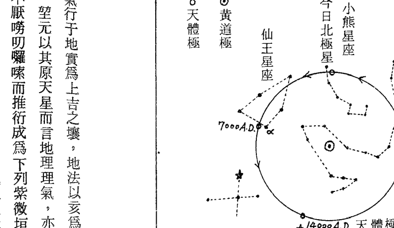

> “中天北极紫微星垣，天星之宸极，太乙之常居也，正临亥地，为天帝之晨尊，所以南面而立者也。后有四辅四星居壬；勾陈六星居辛，六甲六星居乾，天纲八星居戌，华盖九星居坎，阁道五星居癸，威池五星居丑，八谷八星居艮，天将军四星居寅，丙陛六星居甲，司命六贵人在辰，三师三星在乙，天理四星居辰，五诸侯居巽，内厨二星居巳，四贵人四星临丙，帝座二星居未，女床三星居坤，天棓五星居申，阳德阴德二星居庚，丙屏二星居兑，天乙柱史女史三星居辛，而有左卫七相，右卫七将，以藩帝室，大陛六符以辅治，北斗七政以翼垣，

其气行于地实为上吉之坏，地法以亥为正垣，贵南而贱北者，从天极而来也。望元以其原天星而言地理理气，亦若可引于斗数参考为推求天文星象与斗数命理之关系，是以不厌唠叨啰嗦而推衍成为下列紫微垣星象示意图，裨益学者自为推考——于是我们可以假想紫微为九五至尊之皇帝，其养尊处优自不待言下，朝政国事端赖左辅右弼等文武百官处理，地方则分权官吏治理，边疆则端赖将帅诸侯镇御，所以紫微具有优越高贵的气质、才华洋溢而无专长、有宽宏容纳的气量以及耳软心慈时常受左右影响的现象，另一方面则是其生活物质上的享受亦优越而倾向于浪漫淫欲，所以有时候也把紫微归纳于桃花性质之感情丰富之星曜，缘此想像，紫微之若为帝王之尊，岂不是极须栋梁辅佐？极须忠谏御史进言纠正匡助？莫怪诸星问答论称：“紫微无辅弼同行，则为孤君，虽美玉不足……，与囚（廉贞）同居，无左右相佐，定为胥吏。”兹观紫微之居亥，星曜虽旺，与七杀同守命而俱居于“闲宫”，二星之优点大抵相互抵制并受限制，若三方四正不见化吉，又无辅弼，其与紫微在子独守命之为孤君相去又几远？所以斗数之观察研判，最要依据命图之实际星曜遇会而论议也！又看“天府为帝之佐贰”，若其相当于紫微垣星象所示之“五诸侯”，则其应当具备“内厨“二星的“美食”性质，亦要具备“天理“四星之主刑狱，司治安，但“内厨”之性由三合之“天相“以为代表，其“天理”之性则由“七杀”相冲而暗示，所以研习斗数本已不易，强要解读诠释

# 天机五星

“紫微天府，全依辅弼之功。”
原注：“假如命遇紫府，又得辅弼守照，终身富贵。”
紫微为北斗主星，天府为南斗主星，凡命宫主星入守，皆喜见左辅右弼——其实太阳为“中天星系”之主星，亦喜欢见辅弼。

古诀云：“紫微无辅弼同行，为孤君，美中不足。”“紫微与天府、左右、昌曲、禄马三合极吉，食禄千钟，巨富大贵。”
“紫微守命，天相及辅弼夹拱，为君臣庆会，有治国经邦之才。”
“天府昌曲左右同会，高第恩荣。”
“天府喜紫微昌曲左右魁钺、禄存及权禄，庙堂必中高第。”

古歌云：“紫微天中第一星，命身相遇福财兴，若逢相佐宫中会，富贵双全播令名。”
又云：“天府之星守命宫，加之权禄喜相逢，魁昌左右来相会，附凤攀龙上九重。”

这些歌诀，即是说紫微及天府均喜欢见辅佐之星。所谓辅佐之星，即是左辅、右弼、天魁、天钺、文昌、文曲、禄存、天马。

“太微赋”只云“全依辅弼之功”，而不提及魁钺、昌曲、禄马，是举偏以概全。古代的术数书刊，凡歌赋的体裁大都如此。

# 阳德

+   ：四库 勾陈六星 天罗八星 六合六星 太乙（紫微）

“斗数”之中，凡主星皆喜欢见辅佐。“中州派”称之为“百官朝拱”。除了辅佐诸曜之外，并且喜欢见三台、八座、恩光、天贵、龙池、凤阁、天官、天福、台辅、封诰诸杂曜。若不见辅佐而见这些杂曜，亦不失为得助。

紫府有助，则富贵可期，若无辅佐，则主为人孤立。所谓“无辅弼同行为孤君，美中不足”即是这个意思。

主星有助无助，分别极大，习斗数者需加注意。（八十四）

| 巳 | 午 | 未 | 申 |
| :--- | :--- | :--- | :--- |
| 天府 | 太阴天同 | 武曲贪狼 | 太阳巨门 |
| 辰 | 酉 | 天相 |
| 卯 | 破军廉贞 | 戌 | 天机天梁 |
| 寅 | 丑 | 子 | 亥 |
|  |  |  | 紫微七杀 |

假定太乙为紫微比较图：

注：斗数用将前诸星有“华盖”，居辰戌丑未而入于坎子之宫，有“咸池”则恒行子午酉卯，不入丑位。

## 第十三章 七杀破军专依羊铃之虐

斗数更难。今又假定天府即为五诸侯，则天府代表紫微为方面之“土皇帝”，其名实及生活享受虽然或有不及紫微，但其却代表着紫微推行政令，维护治安，征纳税廪，于是天府不仅要向中央纳贡，同时又要眷顾部属百姓，所以具备了“领导统御”的“才能”（亦由天相所表现），自然而然的德怀厚下，所以亦表现其爱心慈悲的另一方面，莫怪“紫微镜诠”曰：“天府之慈则以自己之有余帮助别人。”既然天府可以征纳税廪，则天府之主财富、主丰富亦可不必再加解释，唯只其于丑未卯酉巳亥六阴宫独守命是否必要一如紫微要得辅弼相佐，则尚有待于推敲。不论天府之独守是否能够单独表现其优点，如以辅弼在斗数上的辅佐主曜发挥优点的性质而言，岂有不爱辅弼同行遇会之理？！此亦赋文之辞藻往往肇生解读困难了！初习学者切勿如望元言，初涉斗数时之误会会有紫微守命、天府守命、或紫府守命之格局，一定要依赖辅弼与化吉才能发挥命局的优点啊！

# 原注：假如身命遇七杀破军，又会羊铃守照，有制方可。

读解赋文，往往有以不同的说法阐释同一事象，即或不尽完全相同，所说之事亦极其相近，譬如总诀曰：“羊陀火铃为四杀，冲命冲限不为荣。”、“尚有流羊陀等宿，此又太岁从流行。”（各见卷一），斗数发微论亦曰：“羊陀七杀限运莫逢，逢之定有刑伤。”，重补斗数彀率亦有一说：“七杀临于陷地，流年必见死亡，耗杀忌逢破军，火铃嫌逢太岁。”（各见卷二）……各说都指向星曜遇会组合的不利情形——杀破廉贪俱作恶，羊陀火铃为四杀，大抵恶杀星遇会而可以“凶咎”论议，尤其是七杀、破军之遇羊铃为然。更看斗数骨髓赋亦强调：“贪狼廉贞破军恶，七杀擎羊陀罗凶，火星铃星专作祸，劫空伤使祸重重。”，我们研习斗数亦如命理之希望预知吉凶而能趋避，当然对于这些凶杀恶星就要深入了解，尤其是七杀、破军、贪狼三星互为犄角而恒成为三合状况，我们又从而为区分呢？！依慧心斋主著“紫微斗数新诠”曰：“七杀星与破军星皆是紫微星身边的大将，所不同的是破军星是必须冲锋陷阵的先锋，七杀星是运筹帷幄的主帅。破军星喜听命于紫微星，七杀星却有

‘将在外君命有所不受’的独断专行的特性。”，回溯前“紫微垣星象示意图”，很容易把七杀联想成为“右卫七将”，把破军联想成为北斗七政中的第七星“摇光”。

姑不为星象之推考，因据杀破狼三星的藏干性质而言，假设依星垣论“破军水于子旺之乡，如巨海之浪潮，汹涌可远观而不可近倚，破军是以居焉！”排列十四主曜如附图，由于宫阙之地支藏干与星曜藏干而比较，恍惚可以推考星曜之庙旺陷失，甚至很容易猜想七杀为北斗七政之摇光，其如七星之象七政，因其运行之金星以为代表，旁考史记索隐载：“春秋运斗枢云：…第七星摇光，”又马融注尚书云：“北斗七星各有所主：…第七曰罚金，谓太白也。”，则若有破军为体，七杀为用之想象，不过又考天官书，则又七杀恍如以右卫七将为体，以参宿为用之想象，其载：“参主斩刈，又为天狱，主杀罚，其中三星横列者，三将军，东北曰左肩，主左将，西北曰右肩，主右将，东南曰左足，主后将军，西南曰右足，主偏将军，故轩辕氏占参，应七将也，中央三小星曰伐天之都尉也，生戎狄之国不欲明，若明与参等，大臣谋乱，兵起夷狄，内战；七杀皆明，主天下兵振，芒角张，王道缺；参失色，军散败；参芒角动摇，边候有急；参左足入玉井，及金火守，皆为起兵。”，执行如能考定斗数星曜相应于天文星曜，岂不借助于星占而增益推测宿命的准据？！

那么，破军为恶星，七杀为凶星，本身已具备杀耗之作用，又何必依赖羊陀火铃来表现二星的杀耗性质呢？！我们不妨重温诸星问答论有关此六星之星性答问，如果一时没有找到“紫微斗数

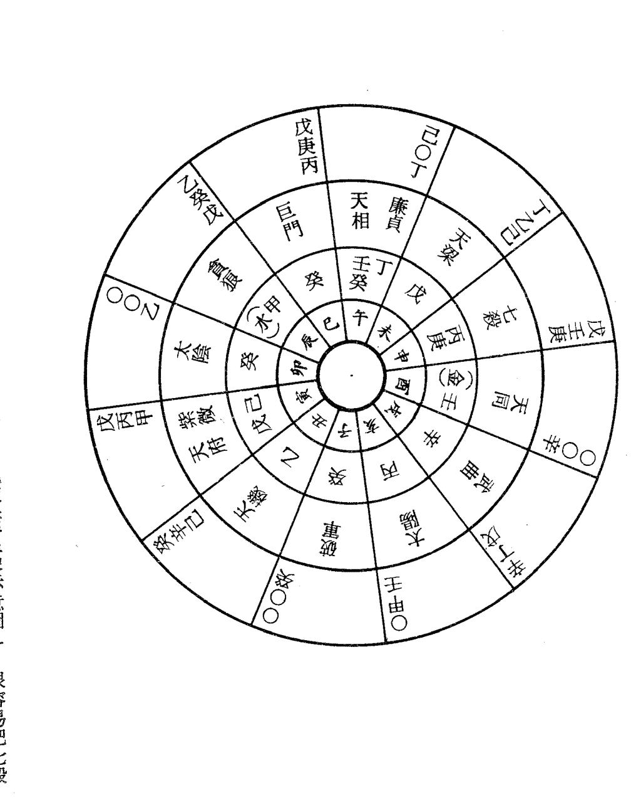

全书”，只要您手边有“紫微堂奥”卷一、卷二，不难知道一个大概。但如寻考“紫微斗数新诠”（有“紫微精解”之说相近）诠注七杀破军之星性亦颇值参考，我们不妨试为探求——。

### 第一节 七杀的探求推考

- 紫微斗数新诠曰：“七杀星甚理智，亦有独立的能力，所以此星最喜独坐，不需任何星曜的辅助，甚至六吉星和四化星中的化禄、化权、化科三星，对它也不能表现显著的辅助功能，（七杀星亦无四化星），也唯有如此，它才会完全发挥其特立独行的力量，无论男女命，皆主事业有成，是其特点之一。”

试观七杀在子寅辰午申戌戊六阳宫为独守，诸星问答论议之甚为不美：“在命宫若限不扶、天折。”紫微斗数全书论命宫诀曰：“子午宫旺地，丁己甲生人财官格：。”，实亦喜爱会化吉，今附示意图，裨利学者研习参考——！

望元循观丁己人者，俱得禄存对面朝斗之吉，慧心斋主竟删丁生人不具，听其心中亦存有化吉之观念，故以三方不见化吉而不具吧？！

又观其曰：“七杀星在子、午宫安命，若有天刑、擎羊星会照，加遇吉星，亦可为外科医师或牙医（此听为其经验之谈，颇值深入探讨研究。）甚有表现。若逢武曲星化禄，与禄存同宫，

### 七杀在子守命示意图：（安命在午仿此。）
| 宫位 | 星曜 | 功能/备注 |
| :--- | :--- | :--- |
| 午 | 天府、武曲（丁己禄存） | 迁移 |
| 未 | 太阳、太阴、天使 | 疾厄 |
| 申 | 天机、巨门 | 财帛 |
| 酉 | - | - |
| 戌 | 紫微、天相 | 夫妻 |
| 亥 | 天梁 | 兄弟 |
| 子 | 七杀 | 命宫 |
| 丑 | - | - |
| 寅 | 廉贞 | 父母 |
| 卯 | - | - |
| 辰 | 破军 | 官禄 |
| 巳 | 天同、天伤 | 奴仆 |

> 注：四化星：
> 甲生人：廉破武阳
> 丁生人：月同机巨
> 己生人：武贪狼曲
> 戊生人：贪月弼机亦可任財經主管（此指己生人安命在子而言。），要其擎羊天刑而有化吉，如以安命在子而言，僅戊生人見擎羊沖照；四月生人天刑入命，八月生人天刑入官，十月生人擎羊天刑同居遷移，十二月生人天刑入財帛而得貪狼化祿而已，學者不妨自為研求，不贅。

> 「七殺在寅、申二宮，無論男女，只要不會煞星，皆主為人服務，可任主管要職，且多任公職或在民營大企業機構任職，生活不虞匱乏，若有化祿會照或祿存星同宮會照，主富足，若有煞星來衝，則辛勞特甚。」「七殺在寅、申二宮，不是朝斗，即為仰斗，皆有格局，故皆能有所表現，甲、己年生的人，吉利，且為人有主張、肯上進，惜七殺星力量太強，對宮又有紫微、天府星，分別為南、北斗星主，所以雖氣勢萬千，但無論男、女命，皆難免孤寂。」

「現代社會女命七殺者，皆在事業上有所表現，惜寅、申二宮安命，福澤欠吉（或曲守福德），除多努力事業外，也應該注意照顧家庭，藉以趨吉避凶。」

望元亦如一般學者之肯定紫微斗數新詮對於研習斗數的參考價值，甚至極力以其為著述之榜樣，竭力以淺顯易知的語體文闡釋，唯有所憾者，望元才學見識不及慧心齋主，亦不如諸書作者，勉以一己對於斗數的痴迷狂熱而換取溫飽而已，有時心胸若狂風巨浪之澎湃，臨之於筆墨竟不知從何下筆，在斷斷續續的編著過程，難免為繁瑣雜碎分心，或有重複，或多贅筆絮言，至盼海涵！

觀此格局，慧心齋主亦只取甲己生人之吉利，對於庚生人之祿存對面朝斗，以及丁生人之祿

| 巳 |
|---|
| 田宅 |
| 辰 |
| 福德 |
| 卯 |
| 父母 |
| 寅 |
| 命宮 |

| 午 |
|---|
| 宮祿 |
| 丑 |
| 兄弟 |

| 未 |
|---|
| 奴僕 |
| 子 |
| 夫妻 |

| 申 |
|---|
| 遷移 |
| 亥 |
| 子女 |

| 酉 |
|---|
| 疾厄 |

| 戌 |
|---|
| 財帛 |

七殺在寅守命宮示意圖：（安命在申倣此。）

註：四化星：
甲生人：廉破武陽
乙生人：紫機梁陰
丙生人：同機昌廉
丁生人：同機巨陰
戊生人：貪陰右機
己生人：武貪梁曲
庚生人：武太陰同
辛生人：巨陽曲昌
壬生人：梁紫輔武
癸生人：破巨陰貪

（丁人祿存）

（庚人祿存）

| 巳 | 午 | 未 | 申 |
|---|---|---|---|
| 巳 | 天機 | 紫微 | 破軍 |
| 父母 | 福德 | 田宅 | 官祿 |
| 辰 | 七殺 |  | 酉 |
| 命宮 |  | （安命在戊做此。）
七殺在辰守命宮示意圖： | 天傷 |
| 卯 | 天梁 太陽 |  | 奴僕 |
| 兄弟 |  |  | 戌 天府 廉貞 |
|  |  |  | 遷移 |
| 寅 | 武曲 天相 | 丑 巨門 天同 | 子 貪狼 | 亥 太陰 |
| 夫妻 | 子女 | 財帛 | 疾厄 天使 |

**註：**
全書曰：「辰戌宮入廟，加吉星
財官格。」

存入官祿宮之好處亦有所不到。凡此未經意之疏忽，換之於任何人亦如此，莫怪研習命數諸同契常感嘆說：「命數精準浩瀚，習之不及六七，觀察研判又不及六七，孰能不兢勉自惕乎？！」

紫微斗數新註曰：「辰、戌二宮為天羅地網宮，七殺星入辰、戌二宮，必然奮力掙脫，以求表現。「天羅、地網宮固有限制能力，但遇到個性堅強、有主見、有獨立性的七殺星時，也嫌難以駕馭，其結果是七殺星必然歷盡千辛萬苦，驚險百出，但終能有所成就。「此星在辰，戌宮，皆主有專門技能，或文藝修養，以在辰宮尤有獨立個性、獨特見解，若有左輔、右弼、文昌、文曲、化祿、化科、化權等吉星來助，再逢煞星，多主為文藝工作者，雖歷盡千辛萬苦，且多各種波折，但也有表現。「七殺星雖不畏煞星和化忌星，但不喜對宮的廉貞星化忌，若再逢其餘六煞星，則困擾重重，如流年或大限夫妻宮不吉，多主感情困擾；如果流年或大限，財帛宮不吉，多主財務波折；若流年或大限，疾病宮不吉，則宜注意身體健康。「比較起來，七殺在辰、戌二宮，為七殺星最辛勞，最易有驚險的宮位，但只要會照吉星，也多能有表現。其成就往往與七殺星在寅、申二宮者不相上下，只是更艱辛驚險。由七殺星來看人生，更可證明，「努力」是創造命運的最好方法。」

> 「七殺星雖不畏煞星和化忌星，但不喜對宮的廉貞星化忌，若再逢其餘六煞星，則困擾重重，如流年或大限夫妻宮不吉，多主感情困擾；如果流年或大限，財帛宮不吉，多主財務波折；若流年或大限，疾病宮不吉，則宜注意身體健康。「比較起來，七殺在辰、戌二宮，為七殺星最辛勞，最易有驚險的宮位，但只要會照吉星，也多能有表現。其成就往往與七殺星在寅、申二宮者不相上下，只是更艱辛驚險。由七殺星來看人生，更可證明，「努力」是創造命運的最好方法。」

事實上，諸星問答論之論議最為簡潔：「主於數，則宜僧道（按：義易受打擊挫折，宜如僧道之灑脫達觀。）；主於身定歷艱辛（按：當生身宮或太歲行限七殺。）；在命宮若限不扶，天折；在官祿得地，化禍為祥；在子息而子息孤單；居夫婦，而篤衾半冷；會刑（擎羊）囚（廉貞）孤獨，也應年壽不長。

> > 又見希夷先生曰：「七殺遇紫微，則化權降福，遇火鈴則為殺長其威。」

-   二、斗數新詮曰：「七殺星既不需要吉星之助，也不畏煞星之厄，入廟的七殺星能壓制火星及鈴星的威力，也能使地空（即天空）、地劫、擎羊、陀羅等星俯首就範，甚至化忌星也不能對七殺星構成威脅。但由於七殺星對煞星的制壓，全出於力拼，所以每遇煞星同宮或會照時，必歷盡艱辛，始能有成，是其特點之二。」

望元對於思維良久，僅能以其所論議為靜狀之體守情形，凡七殺主於數而運限遇之，除能得遇會紫府祿存化權而外，至忌遇會羊陀火鈴耗忌，豈有制壓火鈴之力？！若是，則七殺不能依火鈴羊陀而肆虐？！

> > 諸星問答論曰：「七殺與囚於身命（七殺與廉貞更迭相守身命宮或同守。），折股傷股，又主殤傷（按：如太歲，小限互見七殺、廉貞二星，亦依此論。）；會因耗於遷移，死于道路（按：廉貞與大耗同守遷移宮，或丙年廉貞化忌而論。）；若臨陷弱之宮（按：男命以子女、奴僕、兄弟、父母為弱宮，女命以奴僕、兄弟、父母、疾厄、官祿為弱宮。），為殘較減（按：義七殺如子平相穿之義，傷他較深而殘己較減。），若值正陰之宮，作禍憂深；流年殺曜莫教逢身，殺星辰休迭併身，殺逢惡曜於要地，命逢殺曜於三方，流殺又迭併，二限之中又逢，主陣亡掠死。

循此，七殺即入廟（按：紫微斗數以丑寅申戌入廟，全書以丑寅未申戌為入廟。）當亦乏力制壓羊陀火鈴，學者不妨試佈星圖以為推考，不贅。

### 第二節 破軍的探求推考

> > 諸星問答論之談論紫微曰：「紫微為帝座，在諸宮能降福消災，解諸星之惡虛，能制火鈴為善，能降七殺為權。」

故七殺能紫微之威而制火鈴為善，非其本身有制壓火鈴之力，所以喜見紫微權祿，其星性原可與破軍有所區分，但因慧心齋主熟知斗數三方四正之觀察議論，竟使七殺破軍之星性有些混淆莫辨，於是以望元試以愚見比較紫微斗數全書與新詮之異同如下：

-   一、新詮曰：「破軍星是紫微星身邊的戰將，衝鋒陷陣，斬將搴旗，勇猛無比。」前線作戰有突出性、變化性，及危險性，波動不免，破軍星與諸星不同之處，在於此星為殺、破、狠的主角之一，為變化樞紐，而屬於破軍的變化，往往是大幅度的，足以影響之一生的變動，所以也對女命的感情較有影響，也不利於錢財，是其特點之一。

> > 星垣論曰：「破軍水於子旺之鄉，如巨海之浪潮洶湧，可遠觀而不可近倚。破軍是以居為，若四墓之煞，充其瀾漫，必得武曲之金，使其源流不絕，方為妙矣！」

望元比较，二者若相同，俱言破军充满波动变化性，尤以坐守为最，三合次之，对照稍轻，但破军之子午入庙，丑未辰戌旺地坐守而言，则其具有冒险性、开创性、投机性是一种主动的波动性，与运限遇会破军之被动的波动变化性有所不同，所以诸星问答论曰：「破军在天为杀气（按：从在斗之论为当生宿命。），在数为耗星。」，慧心斋主之论破军不利于钱财，或出于此说吧？！

二、新诠曰：「在古人的眼中，破军星有不少缺点，诸如个性的刚强好胜，及人生的波动等。但在动乱的时代，破军星倒不能等闲视之，且多能发挥其优点，那就是勇敢、正直、有开创性、有恒心及领导能力，是其特点之一。

但观全书之诸星问答论，破军几乎只有缺点而无优点，其曰：「主人暴凶狡诈，其性奸猾，与人寡合，动辄损人，不成人之善，善助人之恶，虐视六亲如寇仇，处骨肉无仁义。」
所幸破军恒见天相冲照，并以杀破狼成为三合局，亦有如慧心斋主所说之好处，何 况问答论又曰：「惟六癸（化禄）六甲（化权）生人合格，主富贵。」『遇文昌于震宫（按：破军在卯必廉贞同守。），遇吉可贵。』『凡坐人身命居子午，贪狼七杀相拱，则威震华夷，或与武曲同居巳宫，贪狼拱，亦居台阁。』

望元比较之，破军固多缺陷，但以星曜之遇会组合亦能衬托出其优点，所以研习斗数始以瞭解诸星星性，进而要明其遇会之生克制化，始能得窥斗数堂奥矣！

### 三、新诠曰：「在诸星中，破军星是比较暴躁而有冲动的星曜，唯紫微星能使其俯首称臣，听令行事，也只有禄存星或化禄星能化解它不良的习性，而使之在开创的过程中，把破坏性减至最低，并能增加后援，是其特点之三。」

望元虽未识子平，亦惟借助子平六神而勉以为释——

### 诸星问答论曰：「此星居，紫微则失威权，逢天府则作奸偽：……惟天梁可制其恶；天禄可解其狂。」，寻考本书卷二诠注斗数发微论曰：「奸谋频设，紫微愧遇破军。」，则紫微己土之制破军癸水不彰，而禄存亦己土之能止破军癸水泛滥则使人困惑不已，又者天府与天梁同为戊土，何天梁能制破军之恶，天府反有「水多土流」之象？

### 破军之遇禄存，是「七杀」之合格者；之遇紫微虽亦七杀格，但紫微、武曲、廉贞恒成三合，若杂武曲辛之「偏印」，廉贞丁之「偏财」，是为「七杀多根（财为七杀之根，廉贞丁火之先生紫微己土。」，须忌始终剋害；七杀如逢财助，其煞愈凶。」，所以破军之遇禄存，是为「癸就己乡，奔波难保，干禄生旺，可以扶持，惟喜双来，自能合制。」也！

破军之遇天梁戊土，是为戊癸合化火，是为「正官」格，其之遇天府，亦因天相（壬癸）半合天府，七杀相冲之故也，正是「水旺不怕土」「水多土流」之理也！

循此，勉强可以解释紫府二星不能号令破军，但若得化权禄者，则又形成格局。或以破军、天梁二星于星图上不能逢会而忽略「天梁能制破军之恶」之特点，依望元愚得之经验而言：破军守命之人，雖性剛寡合，但大小限行天梁，則性趨耿直公正，厚重溫謙，臨事果決而好私濟。

綜觀上述，斗數奧妙玄微，每以觀察研判之尺度不同而有截然相異的論斷，譬如同全書之論「命宮訣」曰：「破軍喜紫微有威權，天梁天府能制其惡。」，則或為慧心齋主之所本，亦論議之一端而已。

本此而言，「七殺破軍專依羊鈴之虐」，亦當從七殺破軍缺陷的一方面觀察研判，七殺為「成敗之孤辰」及破軍「在數為耗星」之缺陷，更因為遇會羊陀火鈴耗忌諸星而暴露無遺矣！

附記：請詳細參考本書卷二第六十八頁「七殺之特點」，及第一〇五頁「破軍對於紫微之影響」。第二六八頁「七殺臨於陷地，流年必見死亡。」，第二六九頁「耗殺忌逢破軍，火鈴嫌逢太歲。」。

## 第十四章
諸星吉逢凶也吉
諸星凶逢吉也凶

原註：假如三方身命，但吉多凶少則吉，凶多吉少則凶，仍看吉凶星得垣失落，與夫生剋制化，以定禍福。（按：參考卷二「四正吉星定為貴，三方殺拱少為奇。」、「吉星入垣則為吉，凶星失地則為凶」的基本概念，同時還要在心腦之中存有「活盤」概念，否則諸星大不了只是遇會逢會而已，很難產生動態的活盤觀念。

> 「逢」字，有相遇，會同（參考卷二第一〇四頁「遇」的概念），值，迎的意義，在於此處則表示「行限遇到」的動詞意義，與卷二所說靜態觀察意義有截然不同的區別，不僅先要具備「四正吉星定為貴，三方殺拱少為奇」、「吉星入垣則為吉，凶星失地則為凶」的基本概念，同時還要在心腦之中存有「活盤」概念，否則諸星大不了只是遇會逢會而已，很難產生動態的活盤觀念。

凶。」

> 假如前章「破軍的探求推考」曾引諸星問答論曰：「惟天梁可制其惡」，在安星佈斗的格局中，破軍天梁二星同屬天府系星曜，二星相間隔四宮，更迭相對性的居於陷位，如破軍守命，天梁即陷於疾厄宮，如天梁守命，破軍即陷於奴僕宮，在靜體的命圖上恒不出現於三方四正之宮處，但如破軍守命，大限、小限俱有行逢天梁之運，又如破軍主大限，大限範圍中之小限亦有逢值天梁之機會，所以斗數極為重視活盤之動態觀念。天梁制破軍之惡，如是解？

與觀全書原註，其義僅止於三方四正的靜體觀察研判而已，未能道破『逢』字的精神內涵。

依紫微斗數對人命諸宮星曜之觀察論斷，原只以星曜之得垣失度與生剋制化而論議，後來從事斗數研習之術士、學者，逐漸依據星性而將紫微、天機、太陽、武曲、天同、天府、太陰、天相、天梁、祿存、魁鉞、輔弼、昌曲等等歸類為吉星，將廉貞、貪狼、巨門、七殺、破軍、火鈴、羊陀、空劫、忌耗等等視為凶星。

如原諸宮之三方四正星曜，有吉星多者，大抵作吉論議，即使偶遇一二凶星相間，亦不以為凶，流年而逢凶限，亦不至極凶，譬如人命偶而值天同，其性隨和謙遜，原無亢激，或行廉貞之限，其性疏狂而不習禮義，但此等自負驕傲仍受天同星性統御，仍有人不賣狂，我不驕狂，其既自負自許，我亦自視比其更高的傾向，其餘亦大抵做此而論。

同理，原有凶星多者，即有一二吉星，或逢流年吉限，只作凶惡稍弱而已，亦不作吉論議，譬如如原得破軍守命之人，秉性驕傲放肆，善助人為惡，不成人之善，但於天梁運限，則性情磊落公正、果決、而喜歡助人為善，此等改善僅為短暫現象，過後則又復破軍之本性矣！

又或原有天梁守大限，而小限逢貪狼，是為天梁與貪狼同度，有亂禮亂家之現象……似此等星曜組織不能相謀，而於大小二限之活盤作用上發生遇會情形，即用『逢』而表示，此為星曜生剋制化之簡易觀察方法，如不求斗數之詳盡精準，大抵可以此一簡單原則區分吉凶，但必以實際之星圖為觀察之準据矣！

## 第十五章 辅弼夹帝为上品

> 原注：（与第十六章併為一整句作註。）假如身命紫微與貪狼同垣，男女邪淫奸詐，『巧謝得後悟』，得輔弼夾帝，貪狼受制則不拘此論。（按：參考卷二「左右會紫府，極品之尊」、「紫微守命，輔弼同垣，其貴必矣！」）

凡曾用心研讀斗數諸篇賦文之人，必發現原註每有文義不符之弊，尋觀斗數佈局方法，僅安命丑未之人能得輔弼加夾，更觀星曜組織情況，紫微之守於丑未，必得破軍同守，而非得貪狼同垣。

尋得安命在丑，要得輔弼夾命，僅得九月酉時生人，及十一月亥時生人；又見安命在未，要得輔弼夾命，則為三月酉時生人，及五月亥時生人而已。

執此，斗數賦文原有線索可以依循，但以其闡釋方法缺乏系統脈絡，使我們後學之人很難精進，譬如紫破同守丑未而得輔弼加夾，斗數發微論原有「奸謀頻設，紫微愧遇破軍」（見卷二第一〇四頁），何以得左右夾命即論為「上品」格局?!何況諸星間答論之紫微問答又有「紫微若遇破軍在辰戌丑未，主為臣不忠，為子不孝。」之說，若為人不忠不孝而得富貴上品之命，如安祿山之安命在戌而得輔弼守照，落個千古「為臣不忠」之罵名，又有何益?!又或如龐涓之安命在丑，適得左右加夾，雖曾經富貴權勢一時，又有何益?!

茲附示意圖及三則古人命例圖以利學者推考——

紫微斗數全書原註：

紫府加會雙祿朝垣，左右拱照，無不富貴，只嫌柴破居於辰戌，鈴星同位，寅方見化忌，主為臣不忠。流年太歲行酉地，流年巨門又化忌，小限天傷天刑主凶亡。

望元附按：

安祿山，唐，營州柳城，胡人。初名阿華山，又作軋華山，從母適安氏，冒姓安，更名安祿山，通長安，稱號燕帝。尋為其子安慶緒所殺。

紫微斗數全書原註：

紫府科權祿昌曲魁鉞坐守身命，左右夾垣，為富貴之論，廉貞七殺又為積富之人。命犯陀羅，庚辰太歲入天羅，小限在地網，身命逢流羊流陀會併，故凶。

望元附按：

龐涓與孫臏俱學兵法（有同師鬼谷子之傳說），龐涓既事魏，得為惠王將軍，而自以為能不

十一月亥时生命例：

| 巳 (官禄) | 午 (奴仆) | 未 (迁移) | 申 (疾厄) |
| :--- | :--- | :--- | :--- |
| 貪狼 廉贞 | 巨门 | 天相 | 天梁 天同 |
| 天伤 | 天刑 | 天使 | 天地 劫 |
| 辰 (田宅) | 卯 (福德) | 寅 (父母) | 丑 (命宫) |
| 太阴 | 文曲 天府 | 左辅 | 破军 紫微 |
| 戌 (子女) | 亥 (夫妻) | 子 (兄弟) | 亥 (夫妻) |
| 太阳 | 文昌 | 天姚 | 天空 |

九月酉时生命例：

| 巳 (官禄) | 午 (奴仆) | 未 (迁移) | 申 (疾厄) |
| :--- | :--- | :--- | :--- |
| 贪狼 廉贞 | 巨门 | 天相 | 天梁 天同 |
| 天刑 | 天伤 | | 天地 劫 |
| 辰 (田宅) | 卯 (福德) | 寅 (父母) | 丑 (命宫) |
| 太阴 | 天府 | 右弼 | 文曲 文昌 破军 紫微 |
| 戌 (子女) | 亥 (夫妻) | 子 (兄弟) | 亥 (夫妻) |
| 太阳 | 天姚 | 左辅 天机 | 天空 |

五月亥时生命例：

巳：天姚，夫妻
午：右弼天机，兄弟
未：破军紫微，命宫
申：左辅，父母
辰：太阳，子女
酉：天府，福德
卯：文曲七杀武曲，财帛
戌：太阴，田宅
寅：天梁天同，疾厄
丑：天相，迁移
子：巨门，奴仆
亥：文昌贪狼廉贞，官禄

三月酉时生命例：

巳：天姚，夫妻
午：左辅天机，兄弟
未：破军紫微，命宫
申：右弼地劫，父母
辰：太阳，子女
酉：天府，福德
卯：七杀武曲，财帛
戌：太阴，田宅
寅：天梁天同，疾厄
丑：文曲天相，迁移
子：巨门，奴仆
亥：贪狼廉贞，官禄

| 宫位       | 星曜（含四化/辅星）          | 天干地支   | 年份   | 生辰                 | 局数   | 备注（如星曜组合、宫位属性）          |
|------------|------------------------------|------------|--------|----------------------|--------|---------------------------------------|
| 命宫       | 天同、破军、武曲（权/科）、天刑 | 巳午未申... | 丙辰年 | 九月十六日酉时生     | 水二局 | 天刑、天傷等星曜，小耗/絶/墓等属性    |
| 兄弟       | 龍池、青龍（墓）             | 卯         | -      | -                    | -      | 青龍胎等属性                          |
| 夫妻       | 伏兵、伏兵（旺）             | 亥         | -      | -                    | -      | 大耗官等属性                          |
| 子女       | 病符、冠帶                   | 酉         | -      | -                    | -      | 病冠符帶等属性                        |
| 财帛       | 喜神、沐浴                   | 戌         | -      | -                    | -      | 喜沐神浴等属性                        |
| 疾厄       | 蜚廉、長生                   | 申         | -      | -                    | -      | 蜚長廉生等属性                        |
| 迁移       | 遷移、奏書（養）             | 辰         | -      | -                    | -      | 奏書養等属性                          |
| 交友       | 奴僕、小耗（絶）             | 午         | -      | -                    | -      | 小耗絶等属性                          |
| 官禄       | 博士、病符                   | 寅         | -      | -                    | -      | 博士病符等属性                        |
| 田宅       | 天馬、天空                   | 卯         | -      | -                    | -      | 天馬天空等属性                        |
| 福德       | 力士、死                     | 辰         | -      | -                    | -      | 力士死等属性                          |
| 父母       | 博士、病符                   | 寅         | -      | -                    | -      | 博士病符等属性                        |

| 宫位       | 星曜（含四化/辅星）          | 天干地支   | 年份   | 生辰                 | 局数   | 备注（如星曜组合、宫位属性）          |
|------------|------------------------------|------------|--------|----------------------|--------|---------------------------------------|
| 命宫       | 破军、武曲、天機（權）、天刑 | 巳午未申... | 丁酉年 | 七月十六日戌时生     | 火六局 | 天刑、天傷等星曜，小耗/絶/墓等属性    |
| 兄弟       | 青龍、青龍（胎）             | 卯         | -      | -                    | -      | 青龍胎等属性                          |
| 夫妻       | 伏兵、伏兵（旺）             | 亥         | -      | -                    | -      | 大耗官等属性                          |
| 子女       | 病符、冠帶                   | 酉         | -      | -                    | -      | 病冠符帶等属性                        |
| 财帛       | 博士、病符                   | 申         | -      | -                    | -      | 博士病符等属性                        |
| 疾厄       | 力士、絶                     | 午         | -      | -                    | -      | 力士絶等属性                          |
| 迁移       | 遷移、奏書（養）             | 辰         | -      | -                    | -      | 奏書養等属性                          |
| 交友       | 奴僕、小耗（養）             | 卯         | -      | -                    | -      | 小耗養等属性                          |
| 官禄       | 將軍、長生                   | 寅         | -      | -                    | -      | 將軍長生等属性                        |
| 田宅       | 奏書、沐浴                   | 丑         | -      | -                    | -      | 奏書沐浴等属性                        |
| 福德       | 蜚廉、冠帶                   | 子         | -      | -                    | -      | 蜚廉冠帶等属性                        |
| 父母       | 喜神、臨官                   | 亥         | -      | -                    | -      | 喜神臨官等属性                        |

| 巳 | 天同 天馬 天虛 | 午 | 左輔 天府 武曲 八座 | 未 | 太陰 太陽 天哭 | 申 | 天鉞 右弼 貪狼 地三劫台 |
|---|---|---|---|---|---|---|---|
| 夫妻 (13-22) | 伏兵 病符 | 兄弟 (3-12) | 大耗 哀 | 命宮 | 病符 帝旺 | 父母 | 喜神 臨官 |
| 辰 | 擎羊 破軍 |  | 陰男 |  | 歲次 乙亥年三月二十七日酉時生 丙寅年五十二歲二月初五故 | 酉 | 火星 巨門 天機 |
| 子女 (23-32) | 官府 死 |  | 白居易 |  |  | 福德 | 蜚廉 冠帶 |
| 卯 | 祿存 |  |  |  |  | 戌 | 鈴星 天相 紫微 |
| 財帛 (33-42) | 博士 墓 |  | 木三局 |  |  | 田宅 | 奏書 沐浴 |
| 寅 | 陀羅 廉貞 天使 天空 | 丑 | 文曲 文昌 | 子 | 天魁 七殺 天傷 | 亥 | 天樑 天刑 |
| 疾厄 (43-52) | 力士 絕 | 遷移 | 青龍 胎 | 奴僕 | 小耗 養 | 官祿 | 將軍 長生 |

紫微斗數全書原註：

權祿拱照（按：祿存與化祿俱簡稱為祿。），左右夾垣，日月同宮，昌曲守身，富貴之命，命帶忌星，壽難長永。大限到陀羅天空之鄉，小限行擎羊，亥生人有忌，故死於五十二歲。

望元附按：

白居易，唐，太原人，字樂天。元和進士。遷左拾遺，貶江州司馬，後召還，官至刑部尚書。晚年放意詩酒，號醉吟先生，居香山，稱香山居士。所為詩深厚麗密，而且平易近人，老嫗亦解其意，士人爭傳之。

及孫臏，嫉之，則以法刑斷臏兩足而黥之。孫臏以刑徒陰見齊使，齊將田忌善而客待之。後，魏與趙攻韓，韓告急於齊，齊使田忌將而往，孫臏以減灶計誘龐涓入馬陵道，陷魏軍，龐涓自知智窮兵敗，乃自到死於馬陵道。

綜合前述古人三命例，雖未深得紫破同垣之義，但勉得科權祿化吉及輔弼扶持之功之機，尤是酉時生人安命在丑未，除輔弼夾命而外，天刑必守於官祿宮，天姚必守於財帛宮，又如亥時生人安命在丑未，除得輔弼夾命之外，夫妻身宮必見天姚，遷移宮必得天刑，所以研習斗數除了全神注意主要星曜的生剋制化之外，如能深入探討其他較次而常用的星曜神煞，必能更得斗數論議之精神矣！

## 第十六章 桃花犯主為至淫

> （參考卷二「淫奔大行，紅鸞羞逢貪狼。」）

斗數星曜以貪狼正主桃花，以廉貞為次桃花，由於二星之三合，七殺守命而貪狼守財帛，破軍守命則貪狼守官祿，同樣的，紫微守命而廉貞守官祿，武曲守命則廉貞守財帛，此二種三合局的組配為恆定不變之格局，尤其是此二三合局又相互以順逆不同的運行組配，很像機械齒輪的相互銜契，甲齒輪順轉則帶動乙齒輪逆轉一樣，凡此六星的組配只有二種情形：

- （一）、辰子申三合局與寅午戌三合局沖照狀況，如此六星成此狀況，必各佔六陽宮之一，且兩兩同垣相守。
- （二）、二組六星重疊為一種三合局狀況，如紫破在丑之巳酉丑三合局狀況，或如紫破在未之亥卯未三合狀況，如此六星成此狀況，必居於六陰宮之半，且兩兩同垣相守。

基於此一認識，桃花貪狼之犯紫微帝主亦僅得此二種情形而已，一為紫微貪狼同垣而論桃花犯主，一為貪狼沖照紫微而論桃花犯主。

如依前一章原註，則以紫微貪狼在卯酉宮守命而論，但在卯酉宮安命之人，必不得輔弼夾命之格局，或可得輔弼於命財同協之美，或可得輔弼聚守於夫妻宮或官祿宮之吉，或可得輔弼同協於福德遷移宮此四種情形而已，於是命宮與輔弼也有一定的組配情形，只是少有人下功夫研究而已，所以在著作論作的過程如果不能費心盡力的推考，很容易就如紫微斗數全書一樣的犯下文頭不對義尾的詮註錯誤。

本賦後文有「貪居亥子，名為泛水桃花；刑遇貪狼，號曰風流邪杖。」（見後文，參考卷二第二二七頁「貪狼居子，乃為泛水桃花。」），則貪狼在子獨守命，恆見沖照紫微帝座，如貪狼在亥與廉貞同守命，則紫破同守財，我們到底應該執何推考？！

> 望元窮臆後文還要探考「貪居亥子」，所以本章暫時考慮貪狼與紫微在子午更迭守照之情形，亦暫時放棄二星互守巳丑，或互守亥未之狀況，當然更不及於申戌（或寅辰）等等情形，僅單就紫微與貪狼同守卯酉而視為桃花犯主論議如下——

首看紫微斗數書論命訣曰：

> 「紫微卯酉宮旺，貪狼同，乙辛生人，甲庚生人，貴不耐久。」

次看「紫微鏡註」紫貪同守命曰：

> 「多才多藝，興趣廣泛，難免感情困擾。」

「貪狼卯酉宮利益，紫微同，見火星貴，乙辛己人宜之，財官格。」

更看拙作「斗數玄關論斷篇」第九三頁「貪狼守命」：「……充滿人性追求慾望滿足的個人主義本位的標準，……喜歡而且容易接近異性，……常有賭博吃花酒或遊蕩閒逛等不良嗜好。

| 巳 | 破軍武曲 | 午 | 太陽 | 未 | 天府 | 申 | 太陰天機 |
|---|---|---|---|---|---|---|---|
| 財帛 | 絕 | 子女 | 胎 | 夫妻 | 養 | 兄弟 | 長生 |
| 辰 | 天同 | | 丁年女命(陰梁同機巨) | 壬年男命(梁紫府武) | 乙年女命(機梁紫陰) | 庚年男命(陽武同陰) | 安命在酉示意圖: |
| 疾厄 | 墓 | | | | | | |
| 卯 | | | | | | | |
| 遷移 | 死 | | | | | | |
| 寅 | | 丑 | 七殺廉貞 | 子 | 天梁 | 亥 | 天相 |
| 天傷 | | | | | | | |
| 奴僕 | 病 | 官祿 | 衰 | 田宅 | 帝旺 | 福德 | 臨官 |

| 巳 | 天相 | 午 | 天梁 | 未 | 七殺廉貞 | 申 | 天傷 |
|---|---|---|---|---|---|---|---|
| 福德 | 臨官 | 田宅 | 帝旺 | 官祿 | 衰 | 奴僕 | 病 |
| 辰 | 巨門 | | 己年女命(武貪梁曲) | 甲年男命(廉破武陽) | 安命在卯示意圖: | 酉 | 遷移 |
| 父母 | 冠帶 | | | | | | |
| 卯 | 貪狼紫微 | | | | | 戌 | 天同 |
| 命宮 | 沐浴 | | | | | 天使 |
| 寅 | 太陰天機 | 丑 | 天府 | 子 | 太陽 | 亥 | 破軍武曲 |
| 兄弟 | 長生 | 夫妻 | 養 | 子女 | 胎 | 財帛 | 絕 |

貪狼在卯酉與紫微同宮，可比桃花犯帝座，大多因迷花戀酒而影響地位財富之成就，甚至只是泛泛平常之輩，破壞了紫微的福吉，須得輔弼昌曲夾制，能夠抑制色情性慾之心，則無此論。

再看「紫微斗數新詮」曰：

> > 紫微斗數太微賦中有『桃花犯主為至淫』的說法，為什麼古人會有『桃花犯主』的說法呢？因二星同宮，如果再有咸池、天姚、沐浴、紅鸞、大耗等星同宮或會照，而沒有吉星制化，或化忌星、空亡星抵制，就難免時有豔遇，而滋生感情困擾了。

> > ……但如無煞星同宮，則應另作別論，不但貪狼星不會犯主，紫微星反能發揮力量，管得住貪狼星，使它不犯桃花，却能發揮其才藝方面的能力。……無論男女命，皆主人爽直，性格堅強，反應敏捷，才幹優越，能在事業上嶄露頭角，可任重要職務。

綜而觀之，桃花犯主之意義如果改從星曜藏干的意識探討推敲，或較易瞭解——

貪狼藏干甲，紫微藏干己，甲己合化土，更詳拙作「斗數玄關」第五九頁等文曰：

> > 甲己之歲，戊為統龍，以土司化，鎮天土氣。」，甲遇己得辰未丑戌而旺相，是以五運以五宮為正廟，我入母宮為福德，我入子宮為泄氣，我入剋宮為刑傷，我入妻宮為財帛……。「甲與己合化土，有二而化，一不能化則遷本位之性。」，所謂一不能化，物必兩也，此天干一陰一陽如夫婦始配合成偶，方能變化成形，陰陽不合，安能得化機之宜矣！

> > 十干中又有妒化之說，如甲己化土，柱中見乙不化……。」，所謂妒化者，日戀其生，遂成一家之好，親愛戀情，何能從化之，故甲己見乙，同乙之本家也（不能化則遷本位之性。）。

於是而知，紫貪原有甲己合化土之性，其同垣於卯，正是甲己見乙，不能化而遷木位之性，貪狼甲木得卯宮乙木之性而能剋紫微己土之性，此或可以論議為「桃花犯主」之出處吧！

又或紫微同守於酉，甲己原可合化土，戊土而生辛金，正是我入子宮為泄氣，尤以紫微己土之泄氣為然。紫微己土即先泄氣，「生金愈旺」，旺金足以剋貪狼木，正為「我入剋宮為刑傷」，其與在卯守命雖有不同，但結果竟同為「刑傷」，所以從「桃花犯主」而論，亦極貼切矣！

## 第十七章 君臣慶會才善經邦

前第十五章『輔弼夾帝為上品』所舉安祿山命例，可以說是本章的最佳範例，但嫌鈴星入命，官祿宮文曲化忌，所以為臣不忠，謂之奴欺主，臣蔽君，反為禍亂。
今再看全書所附王莽命例（見卷二第一三○頁），雖有巨到二宮兄弟無義之象，實亦為此之最佳範例——
觀看王莽命局，紫相守命，紫微為君，天相為臣已不在話下，武曲廉貞之三合會照亦不可說，明，又得昌曲守照，天府守財帛，右弼守官祿。天府為祿庫，為帝之佐貳，右弼與左輔同為上相，輔佐紫微帝星，亦帝之佐貳，可以說是典型的『君臣慶會』格局，所以王莽之富貴已可命中預測而知。

> 原註：假如紫微守命，得天相昌曲，天府得天同天梁相助，紫微得夾，為君臣慶會，逢之無不富貴，
但有金星與刑忌四星同度，謂之奴欺主，臣蔽君，
反為禍亂，須要推詳，如安祿山之命是也。（按：
參考卷一『紫府日月諸星聚，富貴皆從天上生。』

| | 廉貞 右弼 祿 | 壬申 官祿(33-42) 截空 | 辛未 田宅(23-32) 奏書 墓 | 庚午 福德(13-22) 將軍 死 | 天梁 己巳 父母(3-12) 小耗 病 | |
|---|---|---|---|---|---|---|
| | 癸酉 奴僕(43-52) 天傷 喜神 胎 | 陽男 王莽 歲次甲申年三月初九日子時生 命主：廉貞 身主：天梁 木三局 癸未年六十九歲九月十二日故 | | 陽男 王莽 歲次甲申年三月初九日子時生 命主：廉貞 身主：天梁 木三局 癸未年六十九歲九月十二日故 | 文曲 紫微 戊辰 命身 青龍 衰 | |
| | 甲戌 文昌 破軍 鈴星 權 | | | | 擎羊 巨門 天機 丁卯 天姚 兄弟 力士 帝旺 | |
| | 遷移(53-62) 病符 養 | | | | 丙寅 火星 祿存 貪狼 天馬 夫妻 臨官 博士 | |
| | 乙亥 天同 天地空天刑使劫 | 丙子 天府 武曲 科 財帛 伏兵 沐浴 | 丁丑 太陽 太陰 陀羅 天魁 忌 子女 冠帶 官府 | | | |

又以王莽命圖之三方四正多吉星，雖見鈴星沖照，整體的格局仍比安祿山命例吉祥，故不僅壽長而富貴亦長，正是第十四章「諸星吉，逢凶也吉」之義，其之沖命，亦僅如卷二第一四五頁「火鈴到遷移，長途寂寞」而已。

尋觀拙作「斗數玄關論斷篇」論紫相同守命曰：「具專長，唯難以學而致用，有特別幸運的趨勢，衣祿豐盈。」，原以三方未化吉而論，今王莽命局三方比較不理想之廉破武三星俱化祿權科之吉，實已深得斗數骨髓賦所說「科權祿拱，名譽昭彰」之實，學者不妨自為研求，不贅。

## 第十八章 魁鉞同行位居合輔

祿文拱命貴且富

> 原註：假如魁鉞守身命，兼得權祿昌曲吉曜來拱，無不富貴，但有刑忌相沖則平常，只宜僧道。（按：參考卷一「魁鉞昌曲無弗應，若還命限陷尤嗔。」，卷二「昌曲在於空鄉，林泉冷淡。」）

### 第一節 魁鉞同行位居台輔

#### 一、魁鉞為和合之神的傳說：

斗數賦文以簡約為主，大抵僅及於一般之觀察研判原則而已，於實際之命圖組配變化，則必賴學者自為探求推考，望元甘冒暴露不學無術之缺陷，為不使厚愛望元拙作之廣眾讀者失望，唯只勉力忠實於諸篇賦文，竭盡枯澀才思而以樸實無華的筆觸詮註，苟有超過強烈程度的主觀意識流露於字行之間，除懇包涵之外，更盼不吝指正！！

斗數向以魁鉞同為天乙貴人，釋義含混，而於用亦不清，於諸星問答論雖有「和合之神」說，而書中強調二星主科甲而不正主婚姻，實亦使人困惑不已？！
相傳宋時婚禮俗祀和合之神，其名萬回，神行而傳遞家書尺素，男女情有所鍾而遐想此神能傳遞內心感情而撮合姻緣，是以祭祀祈福。
但俗傳「和合」之神為二神而非一神，其名「寒山」「拾得」，為正主婚事和諧之神。
特摘錄埜元雜集以為遺資料以為參考——

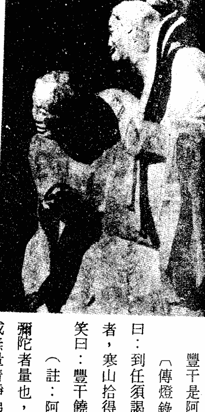

寒山：
唐時高僧，不知何許人，居天台唐興縣寒嶽，時往還國清寺，以樺皮為冠，布裘敝履，人莫識之。
閻丘胤宦丹丘，往寺求之，寒山走歸寒嶽，入穴而去，其穴自合。
唐時詩僧，豐干禪師行至赤城道側，聞兒啼拾得，名曰拾得。
寒山拾得：
唐貞觀時二僧，見〔高僧傳〕：豐干師居天台國清寺，出雲遊，適閻丘胤出守台州，問彼有賢達否，曰寒山文殊，拾得普賢，狀如貧子，又似瘋狂。閻丘至任，入寺拜之，二人曰豐干饒舌，便連臂走出，尋其遺物，見拾得偈詞。（四庫書目有寒山子詩集二卷，豐干拾得詩一卷。）

拾得：

豐干：

| 名稱 | 身份/稱號 | 簡介 |
| :--- | :--- | :--- |
| 豐干 | 阿彌陀佛 | 〔傳燈錄〕：閻丘胤出牧丹陽，豐干禪師謂曰：到任須謁文殊普賢，在天台國清寺執磐洗器者，寒山拾得也。閻丘訪之，見二人致拜，寒山笑曰：豐干饒舌。 |
| （註：阿彌陀佛，梵語，佛號，阿者無也，彌陀者量也，或翻譯為無量壽佛，或無量光佛，或無量清淨佛。） | | |
| 寒山 | 文殊菩薩 | （註：文殊，菩薩名，梵語曰文殊師利，其義為妙吉祥，佛家尊為菩薩之首座。） |
| 拾得 | 普賢菩薩 | （註：普賢，菩薩名，行彌法界曰普，位鄰極聖曰賢，與文殊為佛門二聖。） |
| 萬回 | 和合神 | （註：和合，神名，其像蓬頭笑面，身著綠衣，左手擎鼓，右手執棒。宋時謂之萬回哥哥。又見「西湖遊覽志」載：「今婚禮俗祀和合，蓋取和諧好合之意。」） |

（註：閻丘，複姓。世本云：齊閻丘嬰之後，閻丘本邾地，食邑於此，因以為氏，漢有閻丘卿習禮，又有廷尉閻丘勳。）

萬回：

唐，武则天时高僧。
〔傳燈錄〕：萬回禪師姓張，九歲乃能語，兄戍安西，父母遣問訊，朝往夕回。以朝夕往返萬里而回，號萬回。
〔西陽雜俎〕：僧萬回，年二十餘，貌癡不語，其兄戍遼陽，久絕音問，或傳其死，其家為作齋，萬回忽卷餅茹大言曰：兄在，我將饋之。出門如飛，及暮而還，得其兄書，緘封猶濕，計往返一日萬里，因號焉。

#### 望元附记：

在傳說故事的背後，往往有被歪曲而穿鑿附會的事實，但在混淆而莫可推考時空的錯亂之中，勉強要考據，豈不亦同陷於神經錯亂之中。如就星占考據，或者較能確知魁鉞之原始意義。（

參考「斗數玄關」第二三七頁）

#### 二、協紀辨方書中三貴人

——摘錄「協紀辨方書」——

#### 一、天乙貴人

龜海集曰：天乙貴人當有陽貴、陰貴之分。
蓋陽貴起於子而順，陰貴起於申而逆。此神實導陰陽配合之和，故能為吉慶，可解凶厄也。

且如陽貴以甲加子，甲與己合，所以己用子為貴人；以乙加丑，乙與庚合，所以庚用丑為貴人；以丙加寅，丙與辛合，所以辛用寅為貴人；以丁加卯，丁與壬合，所以壬用卯為貴人；辰為天罡，貴人不臨；以戊加巳，戊與癸合，所以癸用巳為貴人；以己加午，己與甲合，所以甲用午為貴人；以庚加未，庚與乙合，所以乙用未為貴人；以辛加申，辛與丙合，所以丙用申為貴人；以壬加酉，壬與丁合，所以丁用酉為貴人；以癸加戌，癸與戊合，所以戊用戌為貴人；以甲加亥，甲與己合，所以己用亥為貴人；子原宮不數；以乙加子，乙與庚合，所以庚用子為貴人；以丙加丑，丙與辛合，所以辛用丑為貴人；丑原宮不數；以丁加寅，丁與壬合，所以壬用寅為貴人；以戊加卯，戊與癸合，所以癸用卯為貴人；辰為天罡，貴人不臨；以己加巳，己與甲合，所以甲用巳為貴人；以庚加午，庚與乙合，所以乙用午為貴人；以辛加未，辛與丙合，所以丙用未為貴人；以壬加申，壬與丁合，所以丁用申為貴人；以癸加酉，癸與戊合，所以戊用酉為貴人；以甲加戌，甲與己合，所以己用戌為貴人；以乙加亥，乙與庚合，所以庚用亥為貴人；此乃陽貴順取也。

且如陰貴以甲加申，甲與己合，所以己用申為貴人；以乙加未，乙與庚合，所以庚用未為貴人；以丙加午，丙與辛合，所以辛用午為貴人；以丁加巳，丁與壬合，所以壬用巳為貴人；辰為天罡，貴人不臨；以戊加卯，戊與癸合，所以癸用卯為貴人；以己加寅，己與甲合，所以甲用寅為貴人；以庚加丑，庚與乙合，所以乙用丑為貴人；以辛加子，辛與丙合，所以丙用子為貴人；以壬加亥，壬與丁合，所以丁用亥為貴人；以癸加戌，癸與戊合，所以戊用戌為貴人；以甲加酉，甲與己合，所以己用酉為貴人；以乙加申，乙與庚合，所以庚用申為貴人；以丙加未，丙與辛合，所以辛用未為貴人；以丁加午，丁與壬合，所以壬用午為貴人；以戊加巳，戊與癸合，所以癸用巳為貴人；辰為天罡，貴人不臨；以己加卯，己與甲合，所以甲用卯為貴人；以庚加寅，庚與乙合，所以乙用寅為貴人；以辛加丑，辛與丙合，所以丙用丑為貴人；以壬加子，壬與丁合，所以丁用子為貴人；以癸加亥，癸與戊合，所以戊用亥為貴人；此乃陰貴逆取也。

古云：丑未為天乙貴人出入之門，緣陽貴以甲起子，循丑順行，至癸復歸於丑，陰貴以甲起申，由未逆行，至癸復歸於未，豈非丑未為貴人出入之門乎？!

曹震圭曰：天乙者，乃紫微垣左樞傍之一星，萬神之主掌也。一曰二者，陰陽分治內外之義也。辰戌為魁罡之位，故貴人不臨。戊以配中央之位，乃勾陳后宮之象，故與甲同其起例；以丑乃紫微後門之左陽界之辰也，未乃紫微南門之右陰界之辰也；甲者，十干之首，故陽貴以甲加丑，陰貴以甲加未。

逆行，甲得丑，乙得子，丙得亥，丁得酉，己得申，庚得未，辛得午，壬得己，癸得卯，此昼日之贵也。阴贵以甲加未顺行，甲得未，乙得申，丙得酉，丁得亥，己得子，庚得丑，辛得寅，壬得卯，癸得巳，此暮夜之贵也。戊以助甲成功，故亦得丑未。若六辛之独得寅午，则自然所致，更无疑矣！

> > 通書云：郭景純以十干貴人為吉神之首，至靜而能制群動，至尊而能鎮飛浮，以其為坤黃中通理，乃貴人之德，是以陽貴人出於先天之坤而順，陰貴人出於後天之坤而逆。天干之德未足為貴，而干德之合氣乃為貴。

先天坤卦在正北，陽貴起於先天之坤，故從子起甲，甲德在子，氣合於己，故己以子為陽貴，以次順行；乙德在丑，氣合於庚；丙德在寅，氣合於辛；丁德在卯，氣合於壬；辰為天羅，貴人不居，故戊跨在巳，氣合於癸；庚德在午，氣合於丁；己德在未，氣合於甲；庚德在申，氣合於乙；辛德在酉，氣合於丙；壬德在戌，氣合於戊；子坤位，貴人不再居，故跨在亥，氣合於丁；子坤位，貴人不再居，故癸跨在丑，氣合於戊；是為陽貴起例：

| 巳 | 午 | 未 | 申 |
|---|---|---|---|
| 戊合癸 | 天空 | 己合甲 | 庚合乙 |
| 辰 | 酉 | | |
| 天羅 | 辛合丙 | | |
| 卯 | 戌 | | |
| 丁合壬 | 地網 | | |
| 寅 | 丑 | 子 | 亥 |
| 丙合辛 | 癸合戊 乙合庚 | 甲合己 | 壬合丁 |

后天坤卦在西南，陰貴起於後天之坤，故從申起甲。甲德在申，氣合於己，故己以申為陰貴，以次逆。乙德在未，氣合於丙；丙德在午，氣合於辛；丁德在巳，氣合於壬；辰為天羅，貴人不居，故戊跨在卯，氣合於癸；庚德在寅，氣合於丁；己德在丑，氣合於甲；庚德在子，氣合於乙；辛德在亥，氣合於丙；壬德在戌，氣合於戊；子坤位，貴人不再居，故跨在未，氣合於丁；子坤位，貴人不再居，故跨在未，氣合於戊；是為陰貴起例：## （一）天官贵人

神煞起例：日随干官星，曰天官贵人。

按：酉中有辛，甲之官也，故甲日酉；申中有庚，乙之官也，故乙日申；子中有癸，丙之官也，故丙日子；亥中有壬，丁之官也，故丁日亥；卯中有乙，戊之官也，故戊日卯；寅中有甲己之官也，故己日寅；午中有丁庚之官也，故庚日午；巳中有丙辛之官也，故辛日巳；丑未中有己壬之官也，故壬日丑未；辰戌中有戊癸之官也，故癸日辰戌。不取五鼠遁者，伏藏者为贵，为官显露。

天乙贵人（即阳贵） | 玉堂贵人（即阴贵） | 干
--- | --- | ---
丑 | 未 | 甲
子 | 申 | 乙
亥 | 酉 | 丙
酉 | 亥 | 丁
未 | 丑 | 戊
申 | 子 | 己
未 | 丑 | 庚
午 | 寅 | 辛
巳 | 卯 | 壬
卯 | 巳 | 癸

考原曰：曹氏与通书二说各有意义，但曹氏则以阳为阴，以阴为阳。夫阳顺阴逆，阳前阴后，自然之理也。当以起未而顺者为阳，起丑而逆者为阴方是。按贵人云者，干德合方之神也。何以不用干德，而用其合，干德体也，合则其用也，合干之德，其所用必大吉矣！故以贵人名之。合方之论，考历书所载审矣，而曹震圭阴阳顺逆倒置者，则世俗并如其说，考其根原则以元女经有“大吉、小吉”之文故也。然其理究不可通，则亦未得元女经有其文而可违信也，且“大小”二字易为谛论，安知非浅学之人转以俗说，改窜元女经，遂传刻袭谬耶？！至其昼夜之分，则或以卯酉为限，或以日出入为限，今考其义，自当以日出入为定也。

望元附记：
本书卷一第一三九页曾亦考究魁钺二星未得而有疑义，今比较果老星宗与协纪辨方书虽名不同而起例相同，稍异于今斗数之使用魁钺二星起例，故以便览志之，裨利学者试用为推考婚姻时使用——

巳 | 午 | 未 | 申
--- | --- | --- | ---
丁合壬 | 丙合辛 | 乙合庚
 | | 癸合戊 | 甲合己
辰 | | | 酉
天罗 | | | 壬合丁
卯 | | | 戊
戊合癸 | | | 地网
寅 | 丑 | 子 | 亥
天空 | 己合甲 | 庚合乙 | 辛合丙

> 望元附记：

斗数因于天官贵人而有安天官诀，其法不用日取时，而用生年干取宫支，法例不同，窃臆斗数学者鲜用天官、天福二曜，或于传刻誊误袭谬。天官贵人相近于天福，而福星贵人则异于天福，兹列便览以利研习——

| 斗数天官 | 斗数天福 | 天官贵人 |
|----------|----------|----------|
| 未       | 酉       | 酉       |
| 辰       | 申       | 申       |
| 巳       | 子       | 子       |
| 寅       | 亥       | 亥       |
| 卯       | 卯       | 卯       |
| 酉       | 寅       | 寅       |
| 亥       | 午       | 午       |
| 酉       | 巳       | 巳       |
| 戌       | 午       | 未丑     |
| 午       | 巳       | 戌辰     |

## 福星贵人

神煞起例：日干生时干，曰福星贵人。

按：淮南子甲日寅时必为丙寅，乙日丑时亥时必为丁丑丁亥，丙日子时戌时必为戊子戊戌，丁日酉时必为己酉，戊日申时必为庚申，己日未时必为辛未，庚日午时必为壬午，辛日巳时必为癸巳，壬日辰时必为甲辰，癸日卯时必为乙卯，皆本日日干之食神子孙，子孙为宝爻，故曰福星贵人。

> 望元附记：

假如福星贵人以日干之食神而论，则斗数若亦列一种“天福”，如天官之寻本生年干安定，但若从子孙为宝爻之义而论，则天福当改寻命宫干安定较可理解，若是，则天官天福俱应寻命宫干安定，至盼学者试为验证之。兹列比较便览表，裨利学者推考——

| 斗数天福 | 斗数天官 | 福星贵人 |
|----------|----------|----------|
| 酉       | 未       | 寅       |
| 申       | 辰       | 亥丑     |
| 子       | 巳       | 戌子     |
| 亥       | 寅       | 酉       |
| 卯       | 卯       | 申       |
| 寅       | 酉       | 未       |
| 午       | 亥       | 午       |
| 巳       | 酉       | 巳       |
| 午       | 戌       | 辰       |
| 巳       | 午       | 卯       |

## 第二节 禄文拱命贵而且富

### 三、魁钺同行之义

星曜有同躔相守，身宫并于命宫成照之宫，寻见魁钺以辰戌魁罡清楚分界，南北相守而永不同躔，故一般之言魁钺同行者，概以命身宫更迭相守，或命身宫之三方四正互见魁钺者是。

天官天福便览表（依命宫干寻定）
| 天官 | 天福 |
|------|------|
| 酉   | 寅   |
| 申   | 丑   |
| 子   | 戌子 |
| 亥   | 酉   |
| 卯   | 申   |
| 寅   | 未   |
| 午   | 午   |
| 巳   | 巳   |
| 未丑 | 辰   |
| 戌辰 | 卯   |
| 甲   | 酉   |
| 乙   | 申   |
| 丙   | 子   |
| 丁   | 亥   |
| 戊   | 卯   |
| 己   | 寅   |
| 庚   | 午   |
| 辛   | 巳   |
| 壬   | 未丑 |
| 癸   | 戌辰 |

假如如甲戊庚生人，安命丑未，天魁守丑、天钺守未，是为坐贵向贵，正是“贵人贵乡，逢者富贵”（见后第二十三章）。

又如乙己年生人安命在子，三月辰时生人，财帛身同宫于申，命宫有天魁，身宫有天钺，似此魁钺同行论议。

或如丙丁年生人，在西安命有天钺，如九月丑时生人，福德身在亥同宫，适得天魁守身宫，或命宫有天钺，身宫有天魁，似此魁钺同行论议！

再如壬癸年生人，在亥安命，命宫虽无魁钺，但已迁移宫有天钺，卯宫禄宫有天魁，似此魁钺拱命，亦可作魁钺同行论议！

凡此，魁钺所居俱为庙旺，有司科名之义，有受赏识见器重之义，但得诸吉加临，三合吉星守照，大抵易得富贵地位。

紫元附记：观察人命富贵而研判地位高低，大约可用三台、八座、恩光、天贵、台辅、封诰等六星表示，此六星极近天文丛辰中之“泰阶”，在斗魁下而两两相比，化之于宿命星图之中，命中如无昌曲，可以不具恩光、天贵，如无辅弼，则可不提三台、八座，同理，命中如无魁钺，大概亦不必赘佈台辅、封诰。如此，星曜神煞之脉络分明，流年之使用亦仿此，不赘。

> 望元附记：

斗数之言禄者，有禄存、化禄、流禄，其性质大抵依禄存而论。禄存易明，而化禄难知，如能深得化禄之义，或可解决四化之科忌歧见问题。

斗数之言文星者，大抵以魁钺昌曲为主，“科名科甲看魁钺，文昌文曲主功名”（见卷一第三六〇页），而又有化科亦为文星，大抵以天魁文昌主文运，所以台辅配合天魁观察研判，恩光从文昌寻定，天钺文曲主文选，所以封诰配合天钺研判论议，天贵依文曲寻定，至于化科，亦依科主星之性质大分为“文运”、“文选”两大类，学者可以试为推敲分类，不赘。

本文后述“太阳会文昌于官禄，皇殿首班之贵。”、“太阴同文曲于妻宫，蟾宫折桂，文章令盛。”，大抵论议昌曲对于本命直、间接的吉祥，如果又见禄存、化禄之好处，则有如锦上添花。

所以命中有禄文朝拱守照，兼得吉星加临，譬如成为“阳梁昌禄”、“同阴曲禄”……等格局者，多主富贵而有贤名，但如有刑（擎羊）忌（陀罗）相冲，则美中不足，不可期许富贵，仅止平常命，以其刑忌冲破富贵，多主清高，甚宜僧道之命。

## 第十九章 日月夹财不权则富

> （见卷二第一九三页“财印夹命，日月夹财，其富何疑”。）

日月夹财之说，由于解释之不同而有不同——

日月所加夹者，仅丑未二宫而已，或为天府独守，或为武贪同守，以天府武曲俱为“财星”，是为“日月夹财”。拙作“紫微堂奥”卷二已举“贪武守命”论议，唯未及于天府守命，今以学者对于斗数皆有深刻之认识，所以只附图示意，裨便于观察研判中有所发现、发挥，不特为赘。

注：图示天府守命，亦日月夹“财星”之格局，可依斗数骨髓赋“府相同来会命宫，全家食禄”论议，与卷二之贪武守命之“武破贪冲合曲全，固贵，羊陀七杀相杂互见，则伤”各异其趣，但其异中有同者，“见七杀廉贞冲命，一则廉贞七杀分守财官二宫拱宫，正符斗数骨髓赋‘廉贞七杀反为积富之人’之义”，所以斗数诸篇文似乎时常变换着不同的词句来解释相同或相似的格局，学者只要稍微用心即能发现此一特性。

另外，日月夹财之说又有不同之解释，盖指日月加夹“财帛宫”而言。望元窃考诸赋文屡以命宫论议，鲜用其他宫位讨论，但基于学理的探讨，以及其说正与本赋文后述“财居财位，遇者富奢”之义相同相通，所以拙作卷二已揭武贪守财帛宫示意图二则，今亦附天府在丑未守财帛宫，而得天相在巳亥守命之示意图二则，裨利学者自为推敲研判：综合卷二示意图及本章示意图，我们发现日月夹命，其为天府守命，或武贪守命，大抵偏向于权贵，于事业地位有所成就而获得财富，若得日月加夹“财帛宫”者，则有“财居财位，遇者富奢”之象，大抵偏向于财富，虽然二者之最后现象都显示财富，但其过程略有不同，所以说：“日月夹财，不权则富。”

## 日月夹财示意图（二）

紫微斗数排盘（日月夹财示意图二）：

| 地支 | 主星       | 宫位   | 地支 | 主星     | 宫位   | 地支 | 主星     | 宫位   | 地支 | 主星       | 宫位   |
|------|------------|--------|------|----------|--------|------|----------|--------|------|------------|--------|
| 巳   | 破军、武曲 | 夫妻   | 午   | 太阳     | 兄弟   | 未   | 天府     | 命宫   | 申   | 天机、太阴 | 父母   |
| 辰   | 天同       | 子女   | 中央 | 日月夹财示意图（二）： |        | 酉   | 紫微、贪狼 | 福德   |
| 卯   |            | 财帛   | 戌   | 巨门     | 田宅   |
| 寅   | 天使       | 疾厄   | 丑   | 七杀、廉贞 | 迁移   | 子   | 天伤     | 奴仆   | 亥   | 天相       | 官禄   |

## 日月夹财示意图（一）

紫微斗数排盘（日月夹财示意图一）：

| 地支 | 主星       | 宫位   | 地支 | 主星     | 宫位   | 地支 | 主星     | 宫位   | 地支 | 主星       | 宫位   |
|------|------------|--------|------|----------|--------|------|----------|--------|------|------------|--------|
| 巳   | 天相       | 官禄   | 午   | 天梁     | 奴仆   | 未   |          | 迁移   | 申   | 七杀、廉贞 | 疾厄   |
| 辰   | 巨门       | 田宅   | 中央 | 日月夹财示意图（一）： |        | 酉   |          | 财帛   |
| 卯   | 紫微、贪狼 | 福德   | 戌   | 天同     | 子女   |
| 寅   | 天机、太阴 | 父母   | 丑   | 天府     | 命宫   | 子   | 太阳     | 兄弟   | 亥   | 破军、武曲 | 夫妻   |

巳（命宫） | 午（父母） | 未（福德） | 申（田宅）
--- | --- | --- | ---
辰（兄弟） | 巨门 | 日月夹财示意图（二） | 酉（官禄）
卯（夫妻） | 贪狼紫微 |  | 戌（奴仆）
寅（子女） | 太阴天机 | 丑（财帛） | 子（疾厄） 亥（迁移）

## 第廿章 马头带箭镇衡边疆

斗数之论议星曜组配情形大多针对特定的线索现象阐述。假如丙戊年生人午宫安命，适见擎羊守命，于斗数术语上特称为“马头带箭（剑）”。以擎羊为凶星，所以斗数骨髓赋有“马头带剑，非夭折则主刑伤”之说，但以擎羊具有遭受打击、反抗突破的特性，如得吉化守照，反能激发无比的奋斗精神与毅力，于是合格而成为“马头带箭，镇御边疆。”之佳话。

原注：假如午宫安命，遇有天同贪狼擎羊，丙戊人逢之化吉，虽以羊刃在命，以为美论，富贵皆可许也，只不耐久。

在阴阳命数之中，午为“马”，为“马祖之神”，故午宫视为“马头”，擎羊为“阳刃”，为兵器，为箭、为剑。在斗数骨髓赋中特别提到著名的“李广不封，擎羊逢于力士”，揉和了“马头带箭”之吉与凶。望元尝欲集成古人命例以成“先知后卜”集，但以古人命例之史实考据困难，未能如愿以偿，只以散篇性质发表。李广不封命例已发表于星象集萃第一辑第七六页，学者可以模拟以为参考，并至盼仁心学者提供古人史实，共襄集成“先知后卜”集。

除了著名的李广命例而外，最常被引用的“马头带箭”格局，即为东汉光武皇帝刘秀之命例。

紫微斗数命盘表格：
巳宫：右弼、禄存、文曲、天府、兄弟、博士、长生
午宫：天同、太阴、擎羊、天姚、命宫、力士、沐浴
未宫：武曲、贪狼、父母（4-13）、青龙、冠带
申宫：太阳、巨门、福德（14-23）、小耗、临官
酉宫：天相、文昌、左辅、天钺、科、田宅（24-33）、将军、帝旺
戌宫：天机、天梁、铃星、权、官禄（34-43）、奏书、衰
亥宫：紫微、七杀、天魁、天伤、奴仆（44-53）、蜚廉、病
子宫：地劫、迁移（54-63）、喜神、死
丑宫：天使、疾厄、病符、墓
寅宫：火星、大耗、绝
卯宫：破军、廉贞、忌、伏兵、胎
辰宫：陀罗、截空、夫妻、官府、养

[紫微斗数全书原注]

据紫微斗数全书后附命图资料，汉光武生于岁次丙辰年六月初一日丑时，其最显著的特征亦如李广命例（岁次戊辰年正月二十六日申时生），午宫安命，且同为“擎羊逢于力士”，但结果未尽相同，故附录汉光武命例于后，以为研习——“马头带箭，镇御边疆”，权禄生逢，财官双美，二十四岁后，限行吉地，位登九五。直到五十四大限入于地劫之宫，小限天伤不吉，损寿。

望元附按：
汉光武帝，东汉中兴之主，名秀，高祖九世孙。王莽篡汉，盗贼蠡起。光武起兵春陵，破莽军于昆阳，旋即帝位，定都洛阳，平铜马诸贼，降赤眉，讨公孙述，隗嚣等，天下大定，在位二十三年。

## 第二十一章 刑囚夹印 刑杖惟司

> 原注：假如身命有天相，却被羊贞夹之，主人连官非，受刑杖，终身不能发达，只宜僧道。（参考卷二『大耗会廉贞于官禄，架杻囚徒。』、『官符会刑杀于迁移，离乡远配。』）

斗数赋文常用星曜所化而简称之，刑为擎羊，囚为廉贞，印为天相。此三星中之廉贞与天相有一定的组配，因天相适介于贪狼与七杀之间（天府介于贪狼破军之中间），故天相与廉贞之组配情形，仅如第十六章所述之贪狼与紫微之组配情形一样，或同居守于六阳宫，或同居守于六阴之宫，绝无一居阳宫而一居阴宫相邻之情形发生。苟依原注而注，则袭误循谬，为望元所不肯为也！

为使学者容易了解天相廉贞二星之组配情形，特列二星关系位置便览表，以为速见——

| 天相 | 廉贞 |
|------|------|
| 子午 | 子午 |
| 丑未 | 丑未 |
| 寅申 | 寅申 |
| 卯酉 | 卯酉 |
| 辰戌 | 辰戌 |
| 巳亥 | 巳亥 |

观此二星之组配情形，适与紫微天府之关系位置一样微妙，二星仅在子午同宫，并自子午两宫分别顺逆而分合，正与安哭虚二星之方法相当，兹附速见示意图如下：

宫位
---
子午
丑未
寅申
卯酉
辰戌
巳亥

注：惟子午二宫同宫，余宫俱分合平斜相应作对，如天相在丑，廉贞即在亥，如廉贞在丑，则天相在亥，余倣此类推。

那么，天相廉贞二星既不相邻，天相自无被廉贞擎羊加夹交攻之道理。若使囚印二星在子午守命，而更得擎羊入犯，是否可以依赋文论议“刑杖惟司”（按：旧刑律以“死”“流”“徒”“杖”“笞”为五刑，刑杖犹义触犯法律而受到刑罚。）？！

若依诸星问答论而言，天相“……见人恶抱不平之气，……兼化廉贞之恶……。”，似不可以易触刑法而犯刑论。但以文承“马头带箭”，而此格所言若为“马头带箭”不宜再见化忌而言。

观此三图，丙生人安命在午，命宫廉贞化忌，依骨髓赋论议“马头带剑”，非夭折则主刑伤，亦未有不当。男命申年限行寅宫，女命寅年限行申宫，俱成当生大耗迭逢流年之现象，亦近于卷二之重补斗数毂率“大耗会廉贞于官禄，架枷囚徒。”之线索；壬生人安命在子，大抵亦与丙生人安命在午之格局大致相同，惟仅四化不同，财宫有权禄，而官禄宫武曲化忌，正是吉处藏凶之征。如午年小限行至申宫，流年大耗入于子，则正应“大耗会廉贞于官禄”之象。是否必要丙年廉贞又化忌始论，学者不妨就手边可得的资料，细心自为考求而已！

> 太微赋：“刑囚夹印，刑杖惟司。”原注：“假如身命有天相，却被羊贞夹之，终身不能发达。宜为僧道。”清人加註曰：“主人逢官非受刑杖。”

- 第一，天相为擎羊、陀罗所夹。擎羊化气为刑，陀罗化气为忌。
- 第二，天相永远被天梁及巨门所夹，若巨门化忌，则因天梁为刑星，故构成“刑忌夹印”的格局。若擎羊与天梁同度，则更为的确。

无论流年大限遇“刑忌夹印”之局，其年必受制肘，且易惹是非，倒未必如古人说得那么凶险，“主人逢官非受刑杖”。

据王亭之所知，若天盘命宫为“刑忌夹印”的格局，趋避之道，则为从事司刑杖的公差，故始能谓之“刑杖惟司”，亦即“惟司刑杖”之意。古代差役的社会地位甚低，因此才称之为“终身不能发达”。

至于“宜为僧道”一点，亦属望文生义，乃由“终身不能发达”而来，盖与古代凡受通缉的人，一为僧道即不追究，这种社会制度有关。然而并不是确切。（九十一）

除外，天相在巳亥守命，廉贞在未丑守福德，若夫妻宫之卯酉见擎羊，是否才成立为“刑囚夹印”之要件？谨附甲生人安命在巳例，以为学者做此推求参考——（一三八页）

## 壬生人在子安命示意图：
注：有以左辅化科论男命大耗入申宫，女命大耗到寅宫。

| 巳 | 午 | 未 | 申 |
|:---|:---|:---|:---|
| 天钺 太阳 天伤 奴仆 | 破军 迁移 | 天使 疾厄 | 天府 紫微 科权 财帛 |
| 武曲 忌 官禄 |  |  | 太阴 子女 |
| 天魁 天同 田宅 |  |  | 陀罗 贪狼 |
| 七杀 福德 | 天梁 禄 父母 | 擎羊 天相 廉贞 命宫 | 禄巨门 兄弟 |

## 戊生人在午安命示意图：
注：右弼化科论男命大耗入寅宫，女命大耗到申宫。

| 巳 | 午 | 未 | 申 |
|:---|:---|:---|:---|
| 禄巨门 兄弟 | 擎羊 天相 廉贞 命宫 | 天钺 天梁 父母 | 七杀 福德 |
| 陀罗 贪狼 禄 夫妻 |  |  | 天同 田宅 |
| 太阴 权 子女 |  |  | 武曲 官禄 |
| 天府 紫微 财帛 | 天魁 天机 忌 疾厄 | 天使 长生 | 破军 迁移 |

## 第廿二章 善荫朝纲仁慈之长
善之指天机，荫之指天梁，朝纲有二义；名词朝纲，犹言朝廷之纲纪，从诗经「纲纪四方」之义，犹言机梁同守命而治理此一格局，动词朝纲，朝义臣见君，谒见尊进之人等义，纲义总而御分者，如纲之大緃，如治丝者张之之緃，理之为纪，犹言机梁二星在三方而朝拱。从紫微斗数全书原注之精神而言，只取机梁二星在辰戌同守身命而言，可以说是极有名的「机月同梁」格之一。

姑先不论二星之星性意义，如果依照前述星曜组配的方法观察，我们将天机、太阳、天同三星与太阴、巨门、天梁三星详细研求，其组配情形比较富于变化。

如果太阳巨门二星在巳亥相对，适六星散佈于六阴宫而每星各据一辰。

如果太阴天机二星在巳亥相对，则巨门天同在未丑同垣，天梁太阳在酉卯同垣，六阴宫之二无主曜（连紫府等星亦不见）。

如果太阴天机在寅申同垣者，其相对之申宫无主曜，他四星分佈于其餘四阳辰而各據其一。

> 原注：假如机梁二星守身命在辰戌宫，兼化吉相助，以为富贵，加刑忌耗杀，僧道宜之。

## 甲生人在巳安命示意图：

| 宫位 | 地支 | 主星 | 备注 |
|:---|:---|:---|:---|
| 命宫 | 巳 | 天相 | |
| 父母 | 午 | 天梁 | |
| 福德 | 未 | 七杀 | |
| 田宅 | 申 | 廉贞(禄) | |
| 官禄 | 酉 | | |
| 仆役 | 戌 | | |
| 迁移 | 亥 | 天同 | |
| 疾厄 | 子 | 天使 | |
| 财帛 | 丑 | 陀罗、天府 | |
| 子女 | 寅 | 天机、太阴、禄存 | |
| 夫妻 | 卯 | 紫微、贪狼、擎羊 | |
| 兄弟 | 辰 | 巨门 | |

注：阳女男，按：谨请考虑天相在丑未安命，廉贞在巳亥夫妻宫，擎羊到卯酉福德宫，正为刑囚拱照迁移而不利迁移也。

如果太阳巨门在寅申同垣者，六星适两两同垣，偏据六阳辰之半，在寅而佔子寅辰，在申则佔午申戌。

如果天梁天同在寅申同垣者，其星曜散佈情形与太阴天机在寅申同垣之情况相同，相对之宫无主曜，他四星分佈于四阳辰而各据其一。

如果天梁天同在巳亥相对者，则他四星两两同垣，一如太阴天机二星在巳亥相对之情形一般，太阴太阳在丑未同垣，巨门天机在卯酉同垣，馀未酉（或丑卯）无主曜。

甚為值得一提的是——这两组六星的关系位置，由于天机逆行紫微之旁，太阴挨邻於天府之次而表现几乎与紫府二星的关系位置一样的填斜作对，学者可以依循此一线索而更容易瞭解十四主曜之组配状况。

话说回来，不论天机天梁在辰戌同守命，或见二星在丑未守照，或二星在三方拱命，大抵俱可依「善荫朝纲」论议！

寻观诸星问答论，玉蟾先生曰：「天机化气曰善，……若逢冲善亦必好善，孝义六亲，勤於礼佛，无不仁不义之為，有灵通变达之志。」，故命有天机之人，大抵无恶虐不仁之心，言行一致，信守承诺，大多能够得到别人的信赖与良好的评价。

又观之论天梁，诸星问答论曰：「於人命则性情磊落，於相貌则厚重温谦、循直无私、临事果决，荫於身，福及子孙。」，故命中有天梁之人，不善隐藏自己的感情，公正有仁爱之心，每存「推己及人」、「老吾老以及人之老，幼吾幼以及人之幼」的意识，常将亲友视如弟妹子孙一样的照顾帮忙，大多能够得到别人的信靠与尊敬。

总之二星同临，为人言行端正，仁慈善行，每能為别人置身处地而设想，急公好义而热心帮助别人，於是本赋文或深知此义，故曰：「善荫朝纲，仁慈之长。」，极力推崇二星的好处，亦具勉人宏善行义之旨乎？！

巡观命数，咸认过去既成的事实不能改变，将來未成的命运不能预测，一致推崇「阴騭延年增百福」之说，倡导「善恶有报」而「善有善报」，更发人深省「勿以善小而不為」、「勿以恶小而妄為」，於是我国的传统命数逐渐获得正确的体认：「命由心转」、「命由心生」……，於了解「时代考验青年，青年创造时代」的意义，每一个有為青年俱不為出身而自卑，更且能够奋闘进取而创造开拓个人的事业与成功的途径！

## 第廿三章 贵人贵乡逢者富贵
原註：假如身命遇有贵人，又兼吉曜权禄来助，逢之无不富贵，限遇之亦主发福。

前第十八章「魁钺同行位居台辅」，望元尝用心旁考协纪辨方书，於是将闻元先生著「六壬镐」对于「贵人」推臆的用法疑惑一扫而空，但命占之使用星曜神煞并不完全相同，所以望元不敢妄臆蒋先生之见有误，或妄言今日斗数使用魁钺有所不当，但考证之不同正如鑑起之异说，必原说有所变化不同，所以有异说或考证之不同，譬如爱因斯坦先生曾倡言光速為宇宙间之绝对速度，但是有些科学家仍然怀疑有超光速之可能，甚至在无线电望远镜中发现疑似超光速的星光体？！假使我们把魁钺与阴阳贵人比较，我们很容易发现微乎其微的差异！

这种微妙的差异，对于目前已知斗数所能使用魁钺的程度，似乎毫无任何影响，因為一般斗数学者往往将二星相提并论，混乱使用而不刻意探讨，所以望元以不敢加以强调区分，以免造成不必要的混淆，不过对于有心人来说，似乎很值得在论议婚姻的时候加以用心试验考证。再说魁钺二星主科甲、司科名，又為和合之神，最喜魁临命，钺守身，或更迭相守，大抵与人和睦而得成就扶助，兼得吉曜权禄来助，逢之无不富贵，如限步逢之，亦主发福，所以命限喜见魁钺。

| 天魁 | 阳贵 | 天钺 | 阴贵 |
|:---|:---|:---|:---|
| 丑 | 未 | 未 | 丑 |
| 子 | 申 | 申 | 子 |
| 亥 | 酉 | 酉 | 亥 |
| 酉 | 酉 | 亥 | 亥 |
| 未 | 未 | 丑 | 丑 |
| 申 | 申 | 子 | 子 |
| 未 | 未 | 丑 | 丑 |
| 午 | 寅 | 寅 | 丑 |
| 巳 | 巳 | 卯 | 卯 |
| 卯 | 巳 | 巳 | 卯 |

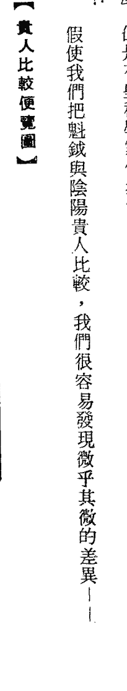

行流年魁钺之地，是為「贵人贵乡」，即依贵人论之。

假如乙己生人安命在子，天魁在申守财帛，虽未得身宫併於财帛宫，亦為「坐贵拱贵」，其议论亦大抵如前论。

假如丙丁生人安命在酉，天钺在亥福德宫，若身宫併於福德宫，即是「魁钺守身命」，或得身宫併於夫妻、财帛、迁移之一，即成為「魁钺交会命身」，亦吉。

假合六辛生人安命在戌，天魁在午，天钺在寅，是為「魁钺合命」，或称「魁钺拱命」。类此情形最多，譬如壬癸年生人在酉亥安命，亦得「魁钺拱照」，一照一拱，亦吉，又如丙丁生人即已安命，亦然。

大抵有上述诸情，是為「贵人入命」，命有贵人者，喜行当生及流年贵人所值宫躔，其年随和多得助，亦俗谣「和气生财」之至理呀！

## 第廿四章 财帛财位遇者富奢
原註：假如紫微天府武曲居於财帛之宫，又兼化权禄及禄存，必主富奢，二限若逢之，主发跡。

斗数有杂论，经云：紫府武阴，双禄主财，详考其他。如擎羊、文昌、左辅、七杀、天刑、陀罗、子午破军，红鸾、天喜等曜，皆為财星，俱不如紫府武阴与双禄，或十年，或一月，或一日，或一时。七杀、擎羊、陀罗之财，来财必败；红鸾天喜之财，财来亦不存。凡财宫财星，以单守為美，再加吉星相辅，三方吉宿照合為妙，若见凶星，得亦不聚，反出是非。巨门、太阳、天梁之财，必由口争竞争而得，两正星併列一宫者，皆如是。孤寡之星入财帛宫，财来财去，餘资何有。魁钺文曲之财為兼接，火铃之财，到手成空。铃星又為偏财，咸池亦主财，见财而后桃花也。是以人生世间，以财养命，来去各有不同耳。

望元览诸书，窃忖斗数论财，偏爱五行属金之星曜，金从革而主义，义者宜也、善也、与众共之也，所以斗数取用武曲為财帛宫主，其藏干得「辛」故也。诸星问答论希夷先生曰：「武曲属金，在天司寿，在数司财，怕受制入限，喜禄存而同政，与太阴以互权，天府天梁為佐贰之星，财帛田实（宅）為专司之所。」，又见其餘诸星，亦从「金」而论，金得土而生旺，金剋木而有财，辛金见癸水為食神，见壬水而伤官，或见剋辛之丙丁而為偏官（七杀）、正官，执此而论，大抵可得财帛论议概要。

试以财帛宫位恒居命宫右合之位，如安命在子，财帛在申，子藏癸，而申藏庚壬戊，為正印（按：癸得庚為正印，壬為劫财，戊為正官。）；如安命在卯，财帛在亥，卯藏乙，亥藏壬甲，亥為正印（按：乙得壬為正印，甲為劫财。）……凡此而观，亦若可用子平以為解释。

1. 假定紫微在丑守命，（抛开破军同垣不论），紫微藏己，入丑藏己辛癸為比肩（辛為食神，癸為正财）。
2. 武曲在丑守财帛，（亦拋开七杀同垣不论），武曲藏辛，酉亦藏辛，适亦得比肩。
3. 廉贞在巳守官禄，（亦不提贪狼之同垣），廉贞藏丁，巳藏丙庚戊，已对於廉贞為劫财（得丙劫财，庚正财，戊伤官）对紫微则為正印。
4. 巳丑酉三合金，金主义，与众共之，其宜善而得财。

兹将武曲主财之紫微、武曲、廉贞所表示之意义，以子平六神表示，学者可以做此一例而自為参考自娱！

循此而深入斗数，可以分辨财星之性质，更知星曜遇会生剋制化之机，何愁不能深得斗数之堂奥？！

大凡财宫得财星入守者，皆有财富之倾向，紫微斗数新詮為释禄存主财之性曰：「禄存星的财，与其他财星有所不同，天府星、武曲星、太阴星，皆為财星，然天府星之财為继承祖业，或自己积蓄而来，武曲星之财，為辛苦工作获得，或经营有关钱财之事業而有所收穫；太阴之财，為正常收入，固定之财，唯禄存之财，虽然不甚明显，但却总是财源不绝，即使遇煞星，也不会……

望元註：基於斗数观察，每以三方四正研判，故任何格局皆能析出主曜之三合状况如图示，如「紫、武、贞」、「杀、破、狼」、「机、阳、同」、「阴、巨、梁」、「府、相、○」等三合状况，恍若可以借助子平六神以為解释，但以主曜必有组配，若强欲以子平六神解释，则徒增无谓厌烦困扰，反不如退而求斗数星曜生剋制化之机，如必须贯通子平斗数，可取消息赋所曰：「以干為禄，向肯定其贫富；以支為命，详逆顺以循环。」及玉井奥诀所曰：「天干专论生剋制化，地支专取刑衝破害。」之义，论议斗数吉凶则专看星曜生剋制化，其吉凶所应则以地支刑衝破害而知，则可预见紫微斗数之发扬光大矣！

## 第廿五章 日丽中天专权之贵
太阳居午，谓之日丽中天，有专权之贵，敌国之富。

原註：假如身命坐於午宫，遇有太阳，庚辛生人日生时者，富贵全美，女人逢之，旺夫益子，封赠夫人。

望元痴迷斗数而孜孜不倦，不仅诸篇赋文之推敲玩味，耐人思探讨，致如全书后附「古今富贵贫贱天寿命图」，恍若赋文之句逗註，但以其论简而无大义，致使学者疏忽而弃之交臂，譬其附「严子陵命图」，其未註记何许人，使人不知其為东汉之「严光」，於是观命图而不能察。

> 【紫微斗数全书原註】
今特引录严子陵命图以詮释此文——
太阳居午无杀凑（参考后文斗数骨髓赋「紫微居午无杀凑，位至公卿。」，女命骨髓赋「太阳居午，遇吉终是福。」），左右扶持福不轻（参考第十五章「辅弼夹帝為上品」），因有文昌同科禄，富贵双全，寿至终七十三岁，大限天伤，小限天使，不吉损寿。

**表格内容：**
午宫：干支-巳、戊、庚、丙；十神-廉贞(丁)、伤官、正财、劫财。
未宫：未。
申宫：申。
酉宫：酉、武曲(辛)、比肩。
戌宫：戌。
亥宫：亥。
子宫：子、紫微(己)、正财、食神、比肩。
丑宫：丑、癸、辛、己。
寅宫：寅。
卯宫：卯。
辰宫：辰。
关系：己得丁為「偏印」；己得辛為「食神」；己得乙為「正官」；己得癸為「偏财」；己酉丑三合金。

望元附按：严光，东汉餘姚人，字子陵。少与光武同游学，光武即位，变姓名隐身不见，帝令物色得之。除諫议大夫，不就。耕於富春山。后人纪念其高风亮节，其所居在浙江桐廬县南石室之山為「严陵山」，其釣处名「严陵瀨」。

望元据此有线索而观，严子陵先贤固為「太阳居午，谓之日丽中天，有专权之贵，敌国之富」，权贵富贵本可期待，唯其不肯功名仕宦，倘佯山水，则「命由心生」，未来之机会命运操之在我之信心而可以创造改变亦验矣！

窃从命图考之，其命中官禄宫巨门铃星同守，依拙作「斗数玄关论断篇」而论；「入庙，武职权贵，文人不耐久……陷宫，遭侮吝，加羊陀火铃空劫，更不美，退官卸职。」，巨门在戌平和虽未落陷，其為文人而非武职，故其不能依「有专权之贵，敌国之富。」论议至明，又且福德宫為人命之强宫，其与财帛身宫冲照，天机身主之所居，竟见文曲化忌同守，依拙作「斗数玄关」第二三六页「己年文曲化忌，主粉饰虚伪的阻障灾咎。」论，则其少与汉光武帝同游学，其才学固為刘秀所深知赏识，但严子陵本人或怕飞短流长、遭人讥议，故宁捨富贵功名而就耕读自娱？！

更观命图四正，亦「阳梁昌禄」之格，禄存守命，化科冲照，当主享誉，谋為遂意，功名富贵垂手可得，但其三方只得化科而无权禄，故其自轻权禄而不求也？！

準此，禄存与化禄相近而有不同，日丽中天之格局，亦当有科权禄全始论大贵，如得科权则……

| 巳 | 午 | 未 | 申 |
|:---|:---|:---|:---|
| 武曲 (禄) | 太阳 天府 | | 天机 太阴 文曲 天钺 (忌) |
| 破军 | 太阳 天府 | 天梁 天府 | |
| 陀罗 | | 擎羊 | |
| 天刑 天虚 天马 | 封誥 | 天哭 天空 | |
| 兄弟 (5-14) 士官 | 命宫 冠带 博士 | 父母 沐浴 官府 | 福德 长生 伏兵 |
| 辰 | | 阴男 | 酉 |
| 天同 | | 严子陵 | 紫微 贪狼 火星 (权) |
| 帝旺 青龙 | | 辛亥年九月二十八日辰时生 | 天姚 截空 |
| 夫妻 (15-24) | | 岁次己亥年七十三岁五月初八故 | 田宅 大耗 养 |
| 卯 | | 命主：破军 身主：天机 | 戌 |
| 恩光 三台 地劫 | | 土五局 | 铃星 巨门 |
| 小耗 衰 | | | 台辅 |
| 子女 (25-34) | | | 官禄 病符 胎 |
| 寅 | 丑 | 子 | 亥 |
| 右弼 | 廉贞 七杀 | 天梁 左辅 天魁 (科) | 天相 |
| 将军 病 | 天使 | 天梁 左辅 天魁 (科) | 天伤 三台 |
| 财帛 (35-44) | 疾厄 (45-54) 书死 | 迁移 (55-64) 墓 | 奴仆 (65-74) 神绝 |
| | 1.13.25.37. 49.61.73. 奏 | 贰 | 喜 |

| 宫位 | 地支 | 星曜 | 备注 |
|:---|:---|:---|:---|
| 兄弟 | 巳 | 武曲、破军 | 权 |
| 命宫 | 午 | 太阳 | 禄 |
| 父母 | 未 | 天府、天钺、陀罗 | |
| 福德 | 申 | 天机、太阴、禄存 | 忌 |
| 夫妻 | 辰 | 天同 | 科 |
| 田宅 | 酉 | 紫微、贪狼、擎羊 | |
| 官禄 | 戌 | 巨门 | |
| 奴仆 | 亥 | 天相 | |
| 子女 | 卯 | | |
| 迁移 | 子 | 天梁 | |
| 财帛 | 寅 | | |
| 疾厄 | 丑 | 廉贞、七杀、天魁 | 天使 |

## 「日丽中天」示意图（一）：
庚年生人
木三局

- （一）阳武阴同。
- （二）阳武同相。

贵多於富，如得科禄则主富而得贵，仅得其一则从其一论之。若是，则原註庚年生人当先富而后贵，或仅主财富而已，必辛生人权禄相逢始依赋文论矣！

## 第二十六章 水澄桂萼清要之职
太阴居子，号曰水澄桂萼，得清要之职，忠諫之材。

> 【紫微斗数全书原注】
太阴天同居子守命，丙丁人富贵忠良，权禄生逢，入将出相之命。大限到於巳宫，又逢陀罗，且己生人切忌本身临，又太岁地劫天哭星作扰，是以凶也。

望元附按：周勃，汉沛人，佐高祖定天下，封絳侯，吕氏之叛，勃诛诸吕，迎文帝即位，汉室以安，卒諡武侯。

史记世家「絳侯」载：「勃為人木彊敦厚，高帝以為可属大事，勃不好文学，每召诸生说士，东乡坐而责之，趣為我语，其椎少文如此。勃既定燕而归，高祖已崩矣。……其后人有上书告勃欲反，下廷尉，廷尉下其事长安，逮捕勃治之，勃恐，不知置辞。吏稍侵辱之，勃以千金与狱吏，狱吏乃书牍背示之，以公主為证。……太后以冒絮提文帝曰：「絳侯绾皇帝玺，将兵於北军，不以此反，今居一小县，顾欲反邪？」……赦絳侯，复爵邑。……卒，諡為武侯。

> 命图」，其亦可為此赋文之参考，兹引录為用，裨利学者研习推考！——
> 望元出身寒微，半生飘荡，勉欲寻求今日政要显贵之命例而不可得，幸斗数全书亦附「周勃
> 室以安，卒諡武侯。

原註：假如身命坐於子宫，遇有太阴，丙丁生人夜生时者，富贵全美，心无私曲，有忠諫之材。

| 宫位 (地支) | 宫位名称 | 星曜/註解 | 生年四化/特殊标记 |
|:---|:---|:---|:---|
| 巳 | 兄弟 | 破军 武曲 | |
| 午 | 命宫 | 长生 天魁 太阳 | 权 |
| 未 | 父母 | 辛年生人 | 金四局 |
| 申 | 福德 | 天府 | 陀罗 天机 太阴 |
| 酉 | | 註：文曲化科，文昌化忌。 | 禄存 贪狼 紫微 |
| 戌 | 官禄 | 田宅 博士 | 擎羊 巨门 禄 |
| 亥 | 奴仆 | 天伤 | 天相 |
| 子 | 迁移 | 天梁 | |
| 丑 | 疾厄 | 天使 | 七杀 廉贞 |
| 寅 | 财帛 | 天钺 | |
| 卯 | 子女 | | |
| 辰 | 夫妻 | 天同 | |

「日丽中天」示意图(二)：

斗数之议论，大抵以官职表示其人职业地位之高下，故不知古代官职大略则甚易误解赋文之涵义，如本文之言「得清要之职，忠諫之材」，稍有不慎即将「清」「要」之职混淆，亦将「忠」「諫」不分矣！

旁考「朝野类要」载：「职慢」「谓之清，职紧位显谓之要，兼此二者谓之清要」，所以清要分而言之，或统而言之，俱以职为高显為论。

其以言忠，竭诚也，尽己之心為忠；所以言諫，正也，谓以直言正人之非也。忠諫也者，尽己之竭诚以直言正人之非也，以今日语文简言之，负责尽职也。

若是，依望元附按周勃之生平大略，其封侯而位显，是為清要之职，汉高祖之评其「木彊敦厚，可属大事。」，是誉其為忠諫之材，否则周勃本以织薄曲為生业，更常为人吹簫治丧事，材官引疆，更又不好文学，何以论议其「职慢位显」之官职？何以论其為「御史大夫」「諫议大夫」「流之稍次官职」？

莫怪金玉奇命学馆陈老师每有所感而教益望元曰：「学然後而知不足，从事命相固必精湛於专业之命理术数，更切要博通古今，广知见闻，庶能於命相业中服务社会，勉人行善向善矣！」

今观周勃命图，其為「机月同梁」格，喜得禄存对面朝斗，更得同阴化权禄，亦正第十八章……

| 辛戌 | 陀罗七杀紫微 | 天伤 | 奴仆(63-72) | 力士病 | 迁移(53-62) | 壬午 | 文曲禄存 | 博士衰 | 疾厄(43-52) | 帝旺 | 癸未 | 天使 | 官府 | 财帛(33-42) | 临官 | 甲申 | 文昌 | 伏兵 | |
|:---|:---|:---|:---|:---|:---|:---|:---|:---|:---|:---|:---|:---|:---|:---|:---|:---|:---|:---|:---|:---|
| 左辅天梁天机 | 科 | 官禄 | 青龙死 | 天相 | 火星 | 己卯 | 田宅 | 小耗墓 | 太阳 | 巨门 | 忌 | 截空 | 将军绝 | 福德 | 武曲 | 贪狼 | 己丑 | 地劫天姚天哭 | 父母 |
| 戊寅 | 太阴天同 | 禄 | 权 | 蚩廉养 | 命宫 | 戊子 | 奏书胎 | 兄弟 | 长生 | 喜神 | 丁亥 | 天魁天府 | 天马 | 夫妻(13-22) | 沐浴病符 | 右弼 | 铃星 | 丙戌 | 大耗冠带 | 子女(23-32) | 空刑 | 天天 | 破军 | 廉贞 | 乙酉 | 岁次丁巳年正月十二日寅时生 | 乙丑年六十九岁十二月初五日故 | 周勃 | 木三局 | 身主：天机 | 命主：贪狼 | 阴男 |

## 第廿七章 紫微輔弼同宮一呼百諾居上品

「祿文拱命，貴而且富」之「同陰昌祿」之格，先貴而後富矣！其福德宮有巨門化忌，主有是非疑惑的阻障災咎，適於大限行至壬午宮五十三歲大限應驗於繫獄之災。

凡此先知而後卜，一以自誤消遣，一以能旁知斗數之觀察研判機要，增加自我研習斗數之經驗，所以望元於數本抽作中，每要學者自覺已知之命例線索，裨能增加研判之經驗，更且溫故而知新，熟而後能生巧，如此，學者猶要責怪望元婆婆媽媽乎？！

原註：假如紫微守於身命，有左右同宮來扶持，富貴，以為終身全美之論。（見卷二「左右會紫府，極品之尊。」，「紫微守命，輔弼同垣，其貴必矣！」）

斗數之一星可能入於十二宮曜之一，其宮曜又可得命身十二宮之十二種變化，即使不與其他星曜神煞組配，已自有一四四種不同論議，即以子午兩兩相對，猶要有七十二變化，其「七十二數正為「七十二地煞」之數，不以迷信而詮詮，以日行一日一度概計，五日一候，一周天三百六度正為「七十二候」，一星曜依七十二候而論議七十二變化，此為巧合?!或抑穿鑿附會?!

望元拙作「紫微堂奧」卷二第四二頁已揭「左右會紫府，極品之尊。」，其所以強調左右同垣，二星俱落陷，何可以論「一呼百諾」居上品？是否應用奴僕宮星曜一併觀察研判?!

今又從紫微斗數全書後附命圖摘錄三例，除第一例職位最低之「舉人」命例與本文「紫微輔弼同宫」條件相符而外，李斯及皇雨安二命例，雖未得紫微守命，但其吉亦因輔弼同宫而表现，學者無妨自為比較推考，不赘。

## 【紫微斗数全书原注】

- （一）、庚生人天相化忌。全書所附俱用天相化忌。
- （二）、起小限以男寅女申之法，或生年太歲宮起一歲?!
- （三）、其用流年昌曲之法不明?!
- （四）、其論命限四化不明?!

> 望元附按：此舉人命圖異於其他命圖多矣，學者用心觀察當知或為後人所增附，其特點如下：左右同宮，日巳月酉並明，權祿加會，為富貴之命，太歲喪門白虎沖命限，是以見凶。
>
> 望元附按：原命圖有化忌不正位而植於天相之下，如以斗數全書命圖為研習範本，當小心注意其佈星有無錯誤，以免指鹿為馬，或強穿鑿附會！

李斯，秦始皇之相，本楚上蔡人，從荀卿學帝王術，西仕於秦。始皇既定天下，斯為丞相，

| 辛巳 | 貪狼 壬午 | 巨門 | 癸未 | 天相 陀羅 天鉞 | 甲申 | 天同 祿存 天科 |
|------|-------------|------|------|----------------|------|-------------------|
| 三台 | 天刑 天傷 |      |      |                | 天使 | 天馬            |
| 官祿(36-45) 病臨 | 符官 | 奴僕(46-55) 大耗 帝旺 | 遷移 | 伏兵 衰 | 疾厄 | 官府 病       |
| 庚辰 | 太陰 忌 |      |      | 乙酉(32小限) 財帛 | 八座 博士 死 | 太陽 祿       |
| 田宅(26-35) 喜神 冠帶 | 鈴星 天府 |      |      |                | 力士 墓 | 天姚             |
| 己卯 |             |      |      |                |      |                   |
| 福德(16-25) 蜚廉 沐浴 | 文曲 己丑 天魁 右弼 破軍 紫微 | 戊子 | 文昌 天機 | 丁亥 32小限 (癸未小限) | 青龍 絕 | 夫妻             |
| 戊寅 |             |      |      |                |      |                   |
| 父母(6-15) 奏書 長生 | 命宮 | 將軍 養 | 兄弟 | 小耗 胎 |      |                   |

| 巳 破軍 武曲 | 午 太陽 | 未 左輔右弼天府 | 申 天機太陰天鉞 (忌)(祿) 天馬 |
|------------------|----------|------------------|------------------------------------|
| 夫妻 伏兵病 | 兄弟 大耗衰 | 命宮 病符旺 | 父母 喜神 临官 |
| 辰 擎羊天同 | 陰男 歲次乙未年四月二十四日戊時生 | 酉 火星貪狼紫微 (科) |
| 子女 官府死 | 卯 祿存 地劫 | 福德 蜚廉沐浴 | 戊 鈴星巨門 |
| 財帛 博士墓 | 木三局 | 田宅 奏書沐浴 |
| 寅 陀羅文曲 | 丑 七殺貞 | 子 文昌天魁天梁 (權) | 亥 天相 |
| 天使 天空 | 天刑 天傷 | 天刑 官禄 将军长生 |
| 疾厄 力士絕 | 迁移 青龍胎 | 奴仆 小耗養 |

| 巳 祿存太陽 | 午 擎羊破軍 | 未 天機 (權) | 申 天府紫微 |
|--------------|--------------|---------------|--------------|
| 天刑 天傷 | 天使 | 官祿(35-44)博士絕 | 奴仆(45-54)力士胎 | 迁移(55-64)青龍 | 疾厄 小耗長生 |
| 辰 陀羅文曲 | 陽男 歲次丙申年十月十一日戊時生 | 酉 天鉞太陰 |
| 田宅(25-34)官府墓 | 卯 天同 (祿) | 福德(15-24)伏兵死 | 土五局 | 財帛 将軍沐浴 |
| 寅 火星文曲七殺 | 丑 左輔右弼天梁 | 子 文昌天相七殺 (科)(忌) | 亥 天巨魁門 |
| 父母(5-14)大耗貞 | 命宮 病符衰 | 兄弟 喜神旺 | 夫妻 蜚廉官 |

## 第廿八章 文耗居於寅卯謂之衆水朝東

文者，文星也，昌曲化科魁鉞俱屬之，魁鉞屬火，文昌庚金，以文星而五行屬水者，文曲癸水，化科壬水也。
耗者，大抵以破軍在數為耗星而論，但天傷原有天耗之號，傷使二星亦屬水，今多從火而論，以傷使不入命而可如大小耗之屬火不論。最須考慮的是化忌及貪狼，因化忌為多管之神，其星屬壬水，亦具破敗悔吝之義，雖未明言為「耗星」，亦當慎重考慮之。貪狼原屬水，雖常論其藏干甲木，但貪狼至卯而破軍至亥，如更癸年化忌，則宜慎為審詳。
今依斗數全書原註之義，以破軍為耗，文曲為文，暫時摒略與文曲相提並論之文昌不提，假設破軍文曲同垣於寅、卯守命二例以為觀察研判：

（一）、破軍在寅為獨守，欲得文曲同垣者，必戊時生人得之，則其捨十一月戊時生人外，已無安命在寅之例，故設為一例。

> 原註：假如身命居寅卯，遇昌曲破軍，卻有刑殺沖破，一生驚駭，限步到此，須逢吉則平，遇凶更不吉，終身辛苦費心勞力。

| 巳 太陰 田宅 | 辰 天府 廉貞 福德 | 卯 寅 文曲 左輔 破軍 命宮 | 午 貪狼 官祿 | 丑 天空 兄弟 | 未 天同 巨門 天刑 天傷 奴僕 | 子 文昌 右弼 紫微 夫妻 | 申 武曲 天相 遷移 | 酉 太陽 天梁 天使 地劫 疾厄 | 戌 七殺 財帛 | 亥 天機 天姚 子女 |
|----------------------|--------------------------|----------------------------------------|---------------------|---------------------|------------------------------------------|----------------------------------|--------------------------|----------------------------------------|---------------------|--------------------------|

（二）、破軍在卯必廉貞同守，欲得文曲同垣者，則要亥時生人合格，故又可設十二月亥時生人為一例以為觀察。

> 註：破軍癸水，文曲癸水，天相壬水，壬年武曲化忌，癸年貪狼化忌，有諸水匯東北之象。以艮非正東，是僅列為考慮。

## 第廿九章 日月守不如照合 荫福聚不怕凶危

寻观此文之义，与卷二第二〇四页「荫福聚，不怕凶冲」，第二二一页「日月会，不如合照」之义完全相同，仅叙述文句之顺序不同而已，望元于卷二已作详细之说明，尤以「日月会，不如合照」图示极详，但以「荫福临」之图示仅及于荫福守照而已，对于天同天梁于命身更迭相守，同梁在寅申守命之情形皆有未备，故只补附「荫福聚」于寅申同垣之示意图以明，不赘注记。

原註：假如日月守身命，虽会吉曜不为全美，如逢凶星定有凶灾，如是三合于命兼化吉，以为美也。
荫福即天梁天同，如在身命，逢吉不怕凶灾，便有刑忌，不论也。（见卷二「荫福临，不怕凶冲。」，「日月会，不如合照。」）

> 註：破軍文曲為癸水，天相壬水，右弼有癸水，十二月建亥，生月、生時、財宮俱亥亦屬水。卯為正東，更得癸年生人，貪狼化忌亦壬水，望元窮題或以此合格。

### 荫福聚不怕凶危(一)：

| 已 | 午 | 未 | 申 |
|---|---|---|---|
| 天使 疾厄 | 天机 财帛 | 紫微破军 子女 | 夫妻 |
| 辰 | | | 酉 |
| 太阳 迁移 | | | 天府 兄弟 |
| 卯 | | | 戌 |
| 武曲七杀 奴仆 | | | 太阴 命宫 |
| 寅 | 丑 | 子 | 亥 |
| 天同天梁 官禄 | 天相 田宅 | 巨门 福德 | 贪狼廉贞 父母 |

### 荫福聚不怕凶危(二)：

| 已 | 午 | 未 | 申 |
|---|---|---|---|
| 田宅 | 官禄 | 天伤 奴仆 | 迁移 |
| 辰 | | | 酉 |
| 太阳 福德 | | | 天府 天使 疾厄 |
| 卯 | | | 戌 |
| 武曲七杀 父母 | | | 太阴 财帛 |
| 寅 | 丑 | 子 | 亥 |
| 天同天梁 命宫 | 天相 兄弟 | 巨门 夫妻 | 贪狼廉贞 子女 |

## 第卅章 貪居亥子名為泛水桃花

原註：假如身命坐於亥子過貪狼，逢吉曜以吉論，如遇刑忌，男浪蕩，女淫娟。（見卷二「貪狼居子，乃為泛水桃花。」）

拙作卷二第二二三七頁已揭「貪狼居子，乃為泛水桃花。」與本文之比較，本以其文義簡潔而未附圖，今因鑑於避免重複，只補附示意圖而不註，敬請讀者見諒海涵，必請讀者自為比較，並且參考第二八章「眾水朝東」之義而深入推考——

### 泛水桃花示意圖(一)

| 宫位 | 地支 | 主星 | 其他星曜 |
|------|------|------|----------|
| 迁移 | 巳   |      |          |
| 疾厄 | 午   | 天机 | 天使     |
| 财帛 | 未   | 紫微破军 |        |
| 子女 | 申   |      |          |
| 夫妻 | 酉   | 天府 |          |
| 兄弟 | 戌   | 太阴 |          |
| 命宫 | 亥   | 贪狼廉贞 |        |
| 父母 | 子   | 巨门 |          |
| 福德 | 丑   | 天相 |          |
| 田宅 | 寅   | 天同天梁 |        |
| 官禄 | 卯   | 武曲七杀 |        |
| 奴仆 | 辰   | 太阳 | 天伤     |

## 第三十一章 刑遇貪狼號曰風流邪杖

望元雖立志註註斗數諸篇賦文，或以繁瑣雜碎糾纏，中途罷筆而文思遽斷，或以斷章取義而譯述困難，或以賦文之重複而難以取捨，每感其重要而心存重複敘述，但臨下筆，則又猶豫不決，勉欲拾遺補闕，則不知如何增補，積漸而文思衰竭，心有餘而力不足，徒喚奈何？！今以重補斗數之曰：「天刑遭貪」以本文有一字之異，庶可再作文章，但竊見本文應承「貪狼居（亥）子，名為泛水桃花。」演譯為當，則其要天刑到子者，必為四月生人，如四月生人要安命於寅者，則必當為四月卯時生人，武曲天相同守命者是，見後附示意圖(一)。如從卷二第二二九頁猜臆，則必壬生年者，擎羊適與貪狼同垣，見後附示意圖(二)。

> 原註：假如貪狼羊刃同垣身命於寅宮，為人聰明，更主風流，若遇閑宮則平矣！余詳之非也，寅宮無擎羊到位，只有陀羅所值，後學要明此論。（見卷二『天刑遭貪，必主風流刑杖。』）

又如依先賢潘希尹先生之原註，則其說相近於諸星問答之義：

> 「……羊陀交併必作風流之鬼。」

於是循其旨義而附示意圖(三)於後。

### 風流邪杖示意圖(三)

| 巳 | 天機 天傷 | 午 | 紫微 | 未 | 申 | 破軍 |
| --- | --- | --- | --- | --- | --- | --- |
| 奴僕 | | 遷移 | 疾厄 | 財帛 | | |
| 辰 | 七殺 | | | | | 酉 |
| 官祿 | | | | | | 子女 |
| 卯 | 天梁太陽 | | | | | 戌天府廉貞 |
| 田宅 | | | | | | 夫妻 |
| 寅 | 天相 武曲 | 丑 | 巨門天同(癸) | 子 | 貪狼(壬)(甲) | 亥太陰(癸) |
| 福德 | | 父母 | | 命宮 | | 兄弟 |

苟或因循潘先生之新註，又要吻符「刑遇貪狼」之義，則如「眾水朝東」例，使甲生人安命在卯而紫貪同守命，豈不數全其美，茲附示意圖四，請自為推考——

### 風流邪杖示意圖(一)

| 巳 田宅 | 辰 七殺 天姚 福德 | 卯 天梁 太陽 父母 | 寅 天相 武曲 地劫 命宮 | 午 天機 官祿 | 丑 巨門 天同 兄弟 | 未 右弼 左輔 文曲 文昌 天傷 奴僕 四月卯時生 | 申 破軍 天空 遷移 | 酉 天使 疾厄 | 戌 廉貞 天府 財帛 | 亥 太陰 子女 |
|-----------------------|------------------------------|---------------------------|------------------------------|---------------------|------------------------------|------------------------------------------------|--------------------------|-----------------------|--------------------------|-----------------------|
| 子 貪狼 天刑 夫妻 | | | | | | | | | | |

### 風流邪杖示意圖(二)

| 巳 文曲 右弼 天梁 田宅 | 午 七殺 官祿 | 未 天傷 奴僕 | 申 迁移 长生 |
|:-------|:-------|:-------|:-------|
| 辰 紫微 天相 擎羊 地劫 福德 乙年六月巳時生 土五局 | | | 酉 文曲 左輔 天使 疾厄 |
| 卯 天机 巨门 禄存 父母 博士 | | | 戌 破军 财帛 |
| 寅 贪狼 陀罗 天刑 命宫 | 丑 太阳 太阴 兄弟 | 子 天府 夫妻 | 亥 子女 |

### 風流邪杖示意圖(三)

| 巳 天机 天钺 田宅 | 午 紫微 官祿 | 未 文昌 文曲 左辅 右弼 天伤 奴仆 | 申 破军 天空 迁移 |
|:-------|:-------|:-------|:-------|
| 辰 七杀 天姚 福德 壬年四月卯時生 金四局 | | | 酉 天使 疾厄 |
| 卯 太阳 天梁 天魁 父母 | | | 戌 廉贞 天府 财帛 |
| 寅 武曲 天相 地劫 命宫 | 丑 天同 巨门 兄弟 | 子 贪狼 擎羊 天刑 夫妻 | 亥 太阴 禄存 子女 博士 |

## 第卅二章 七殺廉貞同位路上埋屍 破軍暗曜同鄉水中作塚

### 第一節 七殺廉貞同位路上埋屍

研習斗數之最難者，大概就是命圖活盤之應用與觀察星曜發用之困難，舉如本文「七殺廉貞同位，路上埋屍」，與斗數骨髓賦之「廉貞七殺反為積富之人」、「廉貞七殺流蕩天涯」之意義應該如何從其份量上加以區辨?!又如「破軍暗曜同鄉，水中作塚。」，破軍與巨門同為天府系星曜，其秩列不在三方四正之內，破軍前六為巨門，巨門前八為破軍，何以能夠同鄉?!

> 原註：假如身命值此二星守之，加化忌耗殺，亦依上此斷，或在遷移宮亦然。暗曜，指巨門，亦同上斷。（按：參考卷二「七殺臨於陷地，流年必見死亡。」，「耗殺忌逢破軍，火鈴嫌逢太歲。「。）

### 風流邪杖示意圖 (四)

| 宫位 | 星曜信息 |
|---|---|
| 巳 (福德) | 天空 地劫 |
| 午 (田宅) | 天相 |
| 未 (官祿) | 天梁, 天姚 |
| 申 (奴僕) | 七殺, 廉貞 (祿), 天傷 |
| 酉 (遷移) | |
| 戌 (疾厄) | 文曲 左輔, 天同, 天使 |
| 亥 (財帛) | 破軍 (權), 武曲 (科), 太陽 (忌) |
| 子 (子女) | |
| 丑 (夫妻) | 陀羅, 天府 |
| 寅 (兄弟) | 祿存, 太陰, 天機, 長生, 博士 |
| 卯 (父母) | 擎羊, 貪狼, 紫微 |
| 辰 (命宮) | 天刑, 巨門, 右弼, 文昌 |
| 其他 | 甲年生人七月午時生, 火六局, 文曲天機存太陰 |

一个紫微斗数命盘表格，包含多个宫位（如命宫、父母宫、福德宫、田宅宫、官禄宫、奴仆宫、迁移宫、疾厄宫、财帛宫、子女宫、夫妻宫、兄弟宫）及其对应星曜、天干地支、四化、大小限等信息。表格结构复杂，有多行多列，部分内容被分隔线划分。具体文字示例包括：戊申（夫妻宫14-23岁，伏兵绝）、丁未（子女宫24-33岁，官符胎）、丙午（财帛宫34-43岁，博士养）、己巳（疾厄宫44-53岁，力士生）等宫位与年龄区间，以及天钺、地劫、天同、武曲、破军、太阳、文昌、天府、天机、太阴、文曲、紫微、贪狼、巨门、右弼、天相、陀罗、天梁、禄存、七杀、廉贞等星曜名称，并标有化禄、化权、化科、化忌等四化符号。表格中还包含“丁丑年七月十一日戌时生”、“癸亥年四十七岁五月廿七日寅时死亡”、“林亮水”、“金四局”等个人与事件信息。

问答论七杀灾难之线索」，并於第七三页附林亮水先生於癸亥年车祸死亡之线索，虽为论羊陀迭并而设例，但是读者只要有经验，或肯稍加用心，即不难发现其太岁亥宫之星象已呈「七杀廉贞同位，路上埋尸」之现象，高雄随缘精舍主人韩老爹於壬戌年为其推命时已作暗示，批论曰：「五月应酬多，易接近酒色财气，注意健康，注意外出慎防意外。」，此足以证韩老爹命理之精湛，亦足以证太岁发用之重要性也——

但七杀廉贞同位，又逢化忌之情形，不一定全部表现在「太岁发用」（第八章「日月最嫌反背」之某小儿夭命亦然），如第十五章「辅弼夹帝为上品」所提之安禄山命图，则在大限之三方发现（按：大限庚午，若庚以天相化忌，正得七杀廉贞同位，又逢化忌之说），但如天相不为化忌，则用当生文曲化忌而论，是否有些牵强困难?!

又如庞涓命图，其当生命宫已原有「廉贞七杀反为积富之人」之现象，大限行至己巳，适逢文曲化忌，又呈半路埋尸之凶兆，积富与凶亡二者仅在於化吉与化忌之区别而已，所以大限已呈凶象之十年，必要用心推考，但其为何不於太岁发用，或以小限发用，则有待学者深入探讨研究!

望元寻见潘子渔先生著「紫微斗数实例分析」第八七页「项羽死於何年」，遂定於戊戌年三十二岁死亡，此之推蔽本甚无谓，如有心推考，当就史记「本纪第七项羽」及「月表」考之，其记项梁杀会稽假守殷通而为「项国」正月，项梁於秦二世元年九月称号信武君，十三月为章邯破杀于定陶，秦二世后（闰）九月，怀王封项羽于鲁为次将，是为「项国」正月，其有国十七月而尊怀王为义帝，是为义帝元年，项羽自立为西楚霸王，又记一月始，迄四十八月而诛，学者苟有心为历史考证，当不难用心推考而得，但研习命数之专家学者，大多无法分心考证历史，勉欲从命图推考人命寿元，则每有固执於所学之弊病。

譬如潘子渔先生本其命宫起大限为特色，则大限辛丑（详参拙作「斗数玄关论断篇」第二五页「大限干之调适」），辛干文昌化忌，可以说又如当生巨门化忌之不美，其若死於戊戌年三十二岁，则小限太岁俱以天机化忌，其年之太岁又见天机化忌，要不论项羽之不死难矣！兹附大限及太岁发用示意图於后——

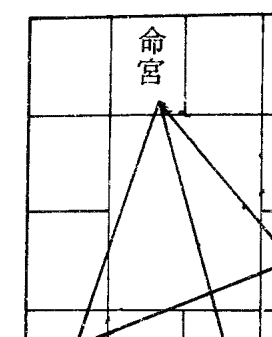

（当生命图）

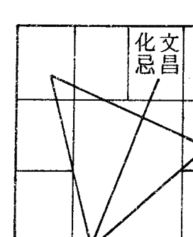

（大限发用）

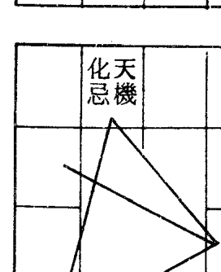

（太岁发用）

> ——摘录「紫微镜铨」第二八八页骨髓赋：项羽英雄，限至天空而丧国。科禄守命，权禄加会，当至富贵，巨门化忌，冲破为吉处藏凶，三十二岁大小二限相冲，故缢死於乌江。

### 【太岁发用命例】

| 乙巳 陀罗 | 丙午 天机 禄存 科 | 丁未 文曲 文昌 擎羊 破军 紫微 | 戊申 32 小限 天空 |
|-------------|--------------------------|-------------------------------------------|------------------------|
| 兄弟(2-11) 力士 临官 | 命宫 博士 冠带 | 父母 官府 沐浴 | 福德 伏兵 长生 |
| 甲辰 太阳 | 陰男 项  羽 | | 己酉 火星 天钺 天府 33 小限 |
| 夫妻(12-21) 青龙 帝旺 | | | |
| 癸卯 右弼 七杀 武曲 | 田宅 大耗 养 | 庚戌 铃星 太阴 禄 | 32 太岁 截空 |
| 水二局 | | | |
| 壬寅 天梁 天同 权 | 癸丑 天相 | 壬子 巨门 忌 | 辛亥 天魁 左辅 贪狼 廉贞 地劫 天使 天伤 |
| 财帛(32-41) 将军 病 | 疾厄 奏书 死 | 迁移 蜚廉 墓 | 奴仆 喜神 绝 |
| | | | 33 太岁 官禄 病符 胎 |

> 注：己亥年为三十三岁，三十二岁应为戊戌年。
>
> 岁次丁卯年八月十二日卯时生
> 己亥年三十二岁十二月初六故但如鄭稼學先生著「紫微鏡註」，其敢於訂正「紫微斗數全書」附錄原「己未年三十二歲十二月初六故」而為「己亥」，顯見其曾用心於斗數而下苦心，其實以項羽生於丁卯，至戊戌為三十二歲，至己亥則為三十三歲矣！若推至己未則項羽享年五十三歲，顯為有誤，其不改如何？！但全書之言故於三十二歲，而鄭稼學先生從其意而註，僅提擬死于三十二歲己亥年而已，不意潘子漁先生觀察細心而敏銳至於細微，望元也只好勉以項羽死於己亥年三十三歲為圖示，裨利學者比較。

參考——

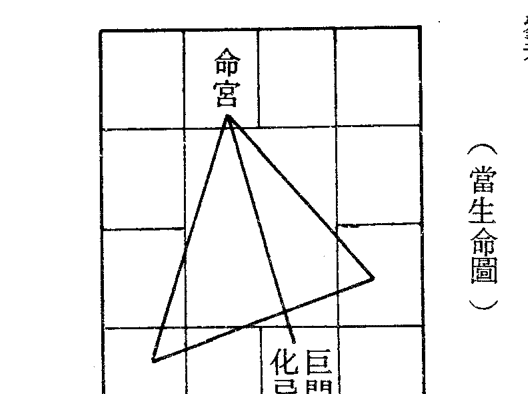

（當生命圖）

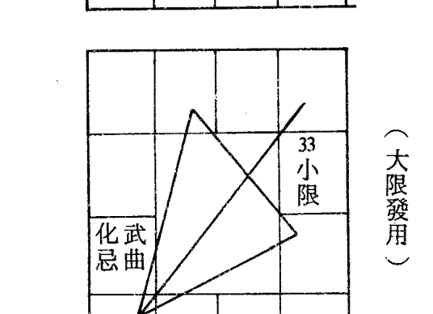

（大限發用）

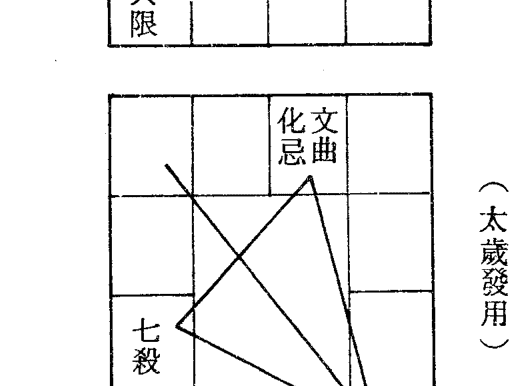

（太歲發用）

## 第二節 破軍暗曜同鄉水中作塚

斗數將十二地支劃分五行，參考卷二第二七頁「南人北人概念」，其大分東南西北四方，東主木而寅卯辰為木鄉，南主火而巳午未為火鄉，西主金而申酉戌為金鄉，北主水而亥子丑為水鄉。若使破軍在亥，巨門到子，或可以破軍暗曜論之，但考星曜之組配狀況，破巨二星同屬天府系星曜，天府太陰貪狼而巨門繼之，巨門間六始為破軍之位，破軍間四始復臨巨門之地，二星永無同宮之機會，亦復無相鄰或同臨一方之機會，唯一可能同鄉之情形僅在於活盤之觀察，或其一守於大限而另一守於小限，或其一守於大小限而另一值守太歲，捨此，二星應無相逢或相鄰之機會矣？！

不過依據拙作卷一第九頁「五星五行」的地支六合而論，巨門在卯，破軍到戌，卯戌合化火，同屬火鄉，破軍到辰，巨門到酉，辰酉屬金，同屬金鄉，是亦作二星同鄉而論議。此意正與拙作卷二第二五八頁「凶星交會於相貌遷移、傷刑其面」之義相當。

唯一不同的，就是破巨二星交會雖凶，如果不逢化忌，六凶等星，則不一定主水厄，必如廉貞七殺同位化吉為積富之人，化忌為半路埋屍之理相當，學者不妨自為揣摩？！

187

186

## 第三十三章 祿居奴僕縱有官也奔馳

原註：假如身命宮星平，奴僕宮又得祿存及化權祿吉曜，以為美論，只是勞碌。

斗數賦文有一些傾向學「理」性的性質，祿存在斗數上可以說是一顆極為特殊的星曜，一般被視為十九正曜之一，但是它又具備偏曜的性質，避免丑未辰戌不入，是一顆及吉星，於諸宮降福消災，逢吉逞其權，遇惡敗其迹，所以於學理上說，祿存居守奴僕宮，應主奴僕多，甚至衛主起家，只是忌逢耗忌火鈴而已，何以「祿居奴僕」，能得奴僕，何以會「縱有官也奔馳」？

奴僕與疾厄二宮，在星光的照耀命宮的說法上，是星光黯淡無光的宮位，祿存入於此二宮，其人之福善亦存在於隱蔽而不明顯，其盛衰與廢之過程，自然也不發生奇蹟式的成功或意外的挫折，大抵表示其人的天訟福善存在於「陷」位的奴僕宮，須待星體運行到可見其星光時，才能感應到祿存的好處。

若就奴僕宮的三方四正而言，奴僕宮與兄弟宮互為守照，影響最為直接強烈，三合父母宮、子女宮，無意中已表示人生在世之與父母、兄弟、子女相互照顾示現象，祿存之存與奴僕宮，則有為父母、兄弟、子女、朋友服務作稼的現象，所以必朋友奴僕之有所利益，本人始亦因之而得富貴，望元按語「祿居奴僕縱有官也奔馳」之說大概因此而來，可惜一時找不到範例可以幫助說明。

憎三方星曜化忌會凶。譬如丙生人，祿存到巳，擎羊入午沖照命宮不美，更何況官祿宮之廉貞化忌?!又如壬生人，祿存到亥，擎羊入子沖照命宮已不吉，又得財帛宮武曲化忌?!或如癸生人，貪狼化忌，羊陀加夾子宮，類似數者，俱作帝遇凶徒而論，學者做此而模擬，必能於星圖的觀察研判中有所獲益。

今註云：「假如紫微守命身，遇有權、祿、刑、忌同位，雖吉無凶，只為人心術不正。」
此條註文，可謂誤盡蒼生。——由此可見明清兩代的斗數術者，時有簡陋粗率之處。而元代註文則不同，曰：「紫微守身命，見煞、刑、忌同」，便是吉星凶曜交集的格局，如此格局，並不主人心術不正，只是欠寬厚。若依元鈔本註，則屬「在野孤君」的格局。
兩條註文的涵義相差很大。倘若根據今本，有「權祿刑忌同位」，便是吉星凶曜交集的格局，如此格局，並不主人心術不正，只是欠寬厚。若依元鈔本註，則屬「在野孤君」的格局。
紫微坐命宮，一般可分為三種結構——

- 第一，紫微見昌曲、魁鉞、輔弼，以及三台八座、恩光天貴、台輔封誥等雜曜，是為「百官朝拱」，則其人事業必定光昌，且易受人愛戴，兼且可以發揮其領導才能。
- 第二，紫微見煞、忌、刑諸曜，則為「在野孤君」，其人主觀成見甚深，而且可能嗜好甚深，兼且自以為是，又喜人諛媚，故謂「雖獲吉而無道」。
- 第三，一般情形，紫微坐命而既見吉曜，又見凶曜，則可發揮其領導才能，且有決斷力，但過份主觀，並易流為自高自大。

「太微賦」所說，指的是第二種格局，所以才稱之為「帝遇凶徒」。而今本註文所言，則為第三種格局矣。

## 第卅五章 帝坐命庫則曰金舉捧檄 福安文曜謂之玉袖天香

太微賦云：「帝遇凶徒，雖獲吉而無道。」

- 第一，紫微見昌曲、魁鉞、輔弼，以及三台八座、恩光天貴、台輔封誥等雜曜，是為「百官朝拱」，則其人事業必定光昌，且易受人愛戴，兼且可以發揮其領導才能。
- 第二，紫微見煞、忌、刑諸曜，則為「在野孤君」，其人主觀成見甚深，而且可能嗜好甚深，兼且自以為是，又喜人諛媚，故謂「雖獲吉而無道」。
- 第三，一般情形，紫微坐命而既見吉曜，又見凶曜，則可發揮其領導才能，且有決斷力，但過份主觀，並易流為自高自大。

> 原註：假如紫微守命宮，前有吉曜者來呼號是也，
必常大權之職。臨官同昌曲，主福德宮亦然。（見卷二「紫微坐命庫，則曰金舉捧檄」，「輩臨官安文曜，號為衣錦惹天香。」）

帝坐命庫則曰金舉捧檄，臨官同文曜，號曰衣錦惹天香。

### 第一節 帝坐命庫則曰金舉捧檄

望元立志詮註斗數諸賦文，間接傳聞「紫微堂奧」樸實而無浮華虛飾，正足以鼓勵望元繼續完成未竟之詮註工作，此實許多斗數學者畢生獻身於斗數之崇高理想，但是由於其他學者不像望元一般的無所事事而有富裕的時間從事筆耕，所以就只好「任由」望元縱橫捭闔於「紫微斗奧」矣！

### 第二節 福安文曜謂之玉袖天香

學者回溯望元拙作卷二第二三〇頁，不難發現望元為註解斗數賦文所下的苦心與心血，不論其為「祿前金舉」或「馬前金舉」，明眼人一看即知其以紫微守命之吉而由夫妻宮之吉相互襯托出令人羨慕的格局，這可由全書論命訣「天馬」以為說明：「天馬火，最喜會祿存，極忌截路空亡，如命在辰戌丑未，遇寅申巳亥有天馬在夫妻宮加吉會者，富貴，加殺不美，加權祿照臨，必主勇為官，女封贈。」

茲分別附圖示意於后——（一九五——二〇二頁）

望元疏狂不羈，嘗戲曰：「書不厭多讀，不厭反覆閱讀，讀一遍有一遍的好處，只可惜人性的脆弱，對於閱讀過的書籍，很難能再從頭到尾再讀一遍，因此求學每易遭遇瓶頸而無法突破！」

望元於重讀卷二第二三三頁「輩臨官安文曜」，號為「衣錦惹天香」，如果依其二「輩臨官同文曜」直譯，豈不最為簡潔便當——紫微在寅申巳亥之臨官位守命，有昌曲、化科等文曜同守命者，或可稱之玉袖天香。

今試以木三局命丙辛年生人安命在寅以為試驗——（二〇三頁）從試驗圖示發現，此一命局一定要丙生人之文昌到寅，辛生人之文曲到寅為合格，則因為昌

| 巳 | 午 | 未 | 申 | 酉 | 戌 | 亥 | 子 | 丑 | 寅 | 卯 | 辰 |
|---|---|---|---|---|---|---|---|---|---|---|---|
| 天梁 | 七殺 | 廉貞 | | | 破軍 | 天同 | 武曲天府 | 太陽太陰 | 貪狼 | 天機巨門 | 紫微天相 |
| 父母 | 福德 | 田宅 | 官祿 | 天傷 | 奴僕 | 遷移 | 疾厄 | 財帛 | 夫妻 | 子女 | 兄弟 |
| | | | 馬前金舉示意圖（一）： 辰子申，馬在寅。 | | | | 天使 | | 天馬 | | 命宮 |
| | | | （圖片內手寫文字部分，作為表格單元格內容提取） | | | | | | | | |

馬前金舉示意圖（三）：寅午戌，馬在申。

| 已 天使 疾厄 | 午 天同 財帛 | 未 太陰太陽 子女 | 申 貪狼 天馬 夫妻 |
|---|---|---|---|
| 辰 破軍 遷移 | （空） | （空） | 酉 巨門天機 兄弟 |
| 卯 天傷 奴僕 | （空） | （空） | 戌 紫微天相 命宮 |
| 寅 廉貞 官祿 | 丑 田宅 | 子 七殺 福德 | 亥 天梁 父母 |

馬前金舉示意圖（二）：亥卯未，馬在巳。

| 已 天馬 夫妻 | 午 兄弟 | 未 天機 命宮 | 申 破軍紫微 父母 |
|---|---|---|---|
| 辰 太陽 子女 | （空） | （空） | 酉 天府 福德 |
| 卯 武曲七殺 財帛 | （空） | （空） | 戌 太陰 田宅 |
| 寅 天梁天同 疾厄 | 丑 天相 遷移 | 子 巨門 奴僕 | 亥 貪狼廉貞 官祿 |

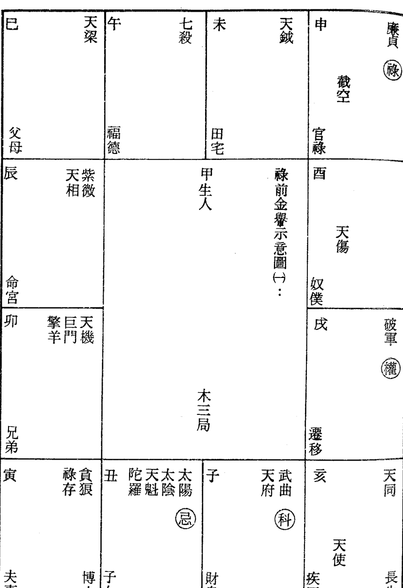

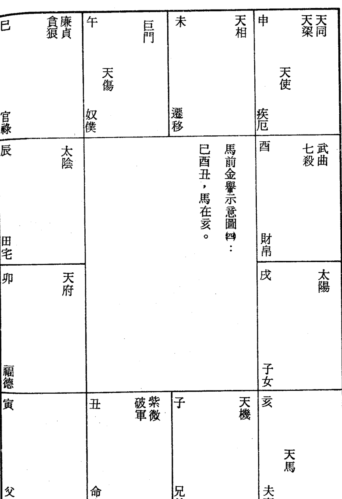

||巳|午|未|申|
|---|---|---|---|---|
|天同(科)|天府(權)|太陰(忌)太陽(祿)|祿存|
|天使|截空|陀羅天鉞|貪狼|
|疾厄|財帛|子女|夫妻|
|辰|破軍||庚生人|祿前金舉示意圖(三):|
|遷移|||博長士生|
|卯|天傷|水二局|擎巨天羊門機|
|奴僕||||兄弟|
|寅|廉貞|天魁|七殺|
|官祿|田宅|福德|父母|
|||||戌|
|||||天相紫微|
|||||命宮|
|||||亥|
|||||天梁|
|註：四化亦有用陽武陰同陽武同相|||

|已|祿存|午|擎天羊機|未|破紫微軍(戊天鉞)|申|
|---|---|---|---|---|---|---|
|夫妻|博土|兄弟|命宮||父母|
|辰|陀太陽羅(丙截空)|戊生人|丙生人|祿前金舉示意圖(二):|酉|
|子女|七武殺曲|土水五二局||(丙天鉞)|天府|
|財帛|天梁天同|天相(戊天魁)|子|巨門|亥|
|疾厄|天使|(丙天魁)|貪廉貞狼|
|官祿||遷移|奴僕|(戊截空)|天傷|
||||田宅||太陰|
|||||戌||
|||||福德||

| 巳 (田宅) | 午 (官禄) | 未 (奴仆) | 申 (迁移) | 酉 (疾厄) | 戌 (财帛) | 亥 (子女) | 子 (夫妻) | 丑 (兄弟) | 寅 (命宫) | 卯 (父母) | 辰 (福德) |
|---|---|---|---|---|---|---|---|---|---|---|---|
| 巨门 | 天廉相贞 | 天梁 | 七杀 | 天同 | 武曲七杀 | 太阳 | 破军 | 天机 | 紫微天府 | 太阴 | 贪狼 |
| | 天伤 | | 天使 | | | | | | | | |
| 病 | 死 | 墓 | 绝 | 胎 | 养 | 长生 | 沐浴 | 冠带 | 临官 | 帝旺 | 衰 |
| | | 试验示意图：丙男辛女 | | | | | | | | | |
| | | 木三局 | | | | | | | | | |
| | | 注：丙生文昌化科 辛生文曲化科 | | | | | | | | | |

| 巳 (官禄) | 午 (奴仆) | 未 (迁移) | 申 (疾厄) | 酉 (财帛) | 戌 (子女) | 亥 (夫妻) | 子 (兄弟) | 丑 (命宫) | 寅 (父母) | 卯 (福德) | 辰 (田宅) |
|---|---|---|---|---|---|---|---|---|---|---|---|
| 天钺廉贞贪狼 | 巨门 | 天相 | 天梁天同 | 七杀武曲 | 太阳陀罗 | 禄存 | 天机擎羊 | 紫微破军 | 截空 | 天府天魁 | 太阴 |
| | 天伤 | | 天使 | | | | | | | | |
| | | | | | | 博士 | 长生 | | | | |
| | | 壬生人 | | | | | | | | | |
| | | 祿前金舉示意圖： | | | | | | | | | |
| | | 木三局 | | | | | | | | | |
| | | | | | | | | (科) | | | |

曲之運行，昌入寅，則曲到子，而曲入寅則昌到子，除了表示增加紫微的才華以外，實在很難再有特別的發現？！

假使改依其三「輩」，臨官安文曜」而言，茲以戊生人安命在未，紫破守命，如其為女命，則亥官祿宮得臨官，而在此官祿宮得昌曲、化科者，豈非與潘子漁先生註曰：「官祿宮有文昌文曲，稱為「玉袖天香」」之義相當，則此格局因為昌曲於財帛宮祿拱命而富貴，大約可以下列二則示意圖表示之一一

依據上述之方法，學者如有興趣與時間，不妨做上二示意圖試驗「輩臨官安文曜」及「福安文曜」，使文句的解說能夠從實際的佈星命圖中表現出來，所以圖解之功用往往有助於學術之理解。

除了拙作卷二所提到的五種線索以外，望元忽然又想到了一個可能一一假使「福」之所指為「天同」，而非「福德宮」，那麼上述的詮註也就毫無意義了。

學者不妨抽出一些空暇做做實驗一一

天同守命，有昌曲、化科同守，是否可以稱為「福安文曜，玉袖天香。」？！

## 第卅六章 太陽會文昌於官祿皇殿朝班

如使太陽守官祿，其福德有天同之福，遷移有天機之靈機應變外，命財二宮不復見紫微系諸星，必由天府系之太陰、巨門、天梁以表示，但亦常有無正曜之現象：太陽在子午獨守，寅申安命，命無正曜，財宮巨門，遷移機陰。太陽在丑未與太陰同守，卯酉安命，亦命無正曜，財宮天梁，遷移機巨。太陽在寅申與巨門同守，辰戌安命，亦命無正曜，財宮亦無正曜，遷移機梁。太陽在卯酉與天梁同守，巳亥安命，太陰獨守，財宮無正曜，遷移天機。太陽在辰戌獨守，安命子午，巨門守命，財宮無正曜，遷移天機。太陽在巳亥獨守，安命丑未，天梁獨守，財宮太陰，遷移天機。若依斗數三方四正觀察研判之方法而言，本宮無正曜即借用對宮正曜沖動為用，凡見太陽守坐官祿宮，極易構成「巨日同宮，官封三代」、「巨機同宮公卿之位」，或「機月同梁作吏人」。

原註：假如太陽會文昌於官祿，逢吉曜，富貴，必作宰相。（見卷二「太陽會文昌於官祿，金殿傳臚」。）

| 巳 | 午 | 未 | 申 | 酉 | 戌 | 亥 | 子 | 丑 | 寅 | 卯 | 辰 |
|---|---|---|---|---|---|---|---|---|---|---|---|
| 天姚 | 祿存 | 攀羊右弼天機科忌 | 天鉞破軍紫微 | 左輔 | | | | | | | |
| 夫妻 | 博士絕 | 兄弟 | 官府墓 | 命宮 | 伏兵死 | 父母 | 大耗病 | | | | |
| 辰 | 陀羅太陽 | 戊生女命 | 臨官安文曜示意圖（二）：（五月亥時生人） | 酉 | 天府 | | | | | | |
| 子女 | 力士胎 | | | 福德 | 病符衰 | | | | | | |
| 卯 | 文曲七殺武曲 | | | 戌 | 太陰權 | | | | | | |
| 財帛 | 青龍養 | | 火六局 | 田宅 | 喜神帝旺 | | | | | | |
| 寅 | 天梁天同 | 丑 | 天魁天相 | 子 | 巨門 | 亥 | 文昌貪狼廉貞祿 | | | | |
| | 天使 | | 天刑 | 天傷天空截空 | 奏書冠帶 | 官祿 | 蜚廉臨官 | | | | |
| 疾厄 | 小耗長生 | 遷移 | 將軍沐浴 | 奴僕 | | | | | | | |

之格局。又如太陽在寅至午，太陰即在子逆至申，又極易形成「明珠出海」、「日月並明」、「日月守照」、「日月合照」等格局。只要太陽廟旺為光輝，實乃官祿之樞機，化貴、化祿，最宜在官祿宮，更由於天機之聰明機變，作事有謀略而益發襯托出其人善於適應官場波動變幻之環境，大抵主人有貴氣，能為文為武，如更遇諸吉咸集，則降禎祥，無不富貴，即或太陽從申至子失輝，亦主其人官貴，唯其獲得之歷程勞心費力，所得富貴亦減論之。緣太陽為官祿主，官星居官位，本自有如「財星居財位」之相當意義，更何況得文昌之吉助，豈不益增加官祿宮之禎祥好處？!請詳見第二七章「紫微輔弼同宮一呼百諾居上品」所附之「李斯」命圖，其猶未得文昌之吉（但得祿存，兼得輔弼同守命之吉），以妻財二宮魁鉞之拱官，已貴為秦始皇之宰相，另有張侍郎之命例，既幾有本文「太陽會文昌於官祿，皇殿朝班」之象，又復近於後章所述「太陰同文曲於妻宮，蟾宮折桂」之兆，其為官貴不及李斯，特附其命圖於第三七章以為參考，凡此合格不合格之區分，實亦研習斗數之課題，很難以筆墨一一論述，今只將「太陽同文昌於官祿」之情形以示意圖表示於后——

| 巳 | 午 | 未 | 申 |
|----|----|----|----|
| 七杀紫微 | 右弼 | 左辅 |  |
| 天使天姚 |  | 地劫 |  |
| 疾厄 | 财帛 | 子女 | 夫妻 |
| 辰 |  |  | 酉 |
| 天梁天机 |  |  | 破军廉贞 |
| 迁移 |  |  | 兄弟 |
| 卯 |  |  | 戌 |
| 天相 |  |  |  |
| 天空天伤 |  |  | 命宫 |
| 奴仆 |  |  |  |
| 寅 | 丑 | 子 | 亥 |
| 文昌巨门太阳 | 贪狼武曲 | 文曲太阴天同 | 天府 |
| 官禄 | 天刑 | 福德 | 父母 |

（五月申时生人示意图）

| 巳 | 午 | 未 | 申 |
|----|----|----|----|
| 天梁 | 右弼七杀 |  | 左辅廉贞 |
| 天姚 |  | 地劫 |  |
| 财帛 | 子女 | 夫妻 | 兄弟 |
| 辰 |  |  | 酉 |
| 天相紫微 |  |  |  |
| 天使 |  |  | 命宫 |
| 疾厄 |  |  | 戌 |
| 卯 |  |  | 破军 |
| 巨门天机 |  |  |  |
| 迁移 |  |  | 父母 |
| 寅 | 丑 | 子 | 亥 |
| 贪狼 | 文曲文昌太阴太阳 | 天府武曲 | 天同 |
| 天空天伤 | 天刑 | 田宅 | 福德 |
| 奴仆 | 官禄 |  |  |

（五月酉时生人示意图）

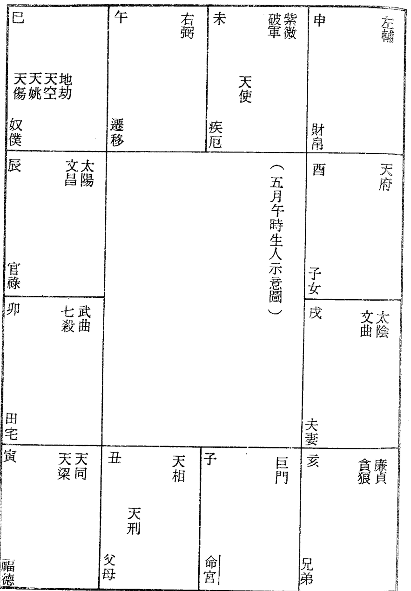

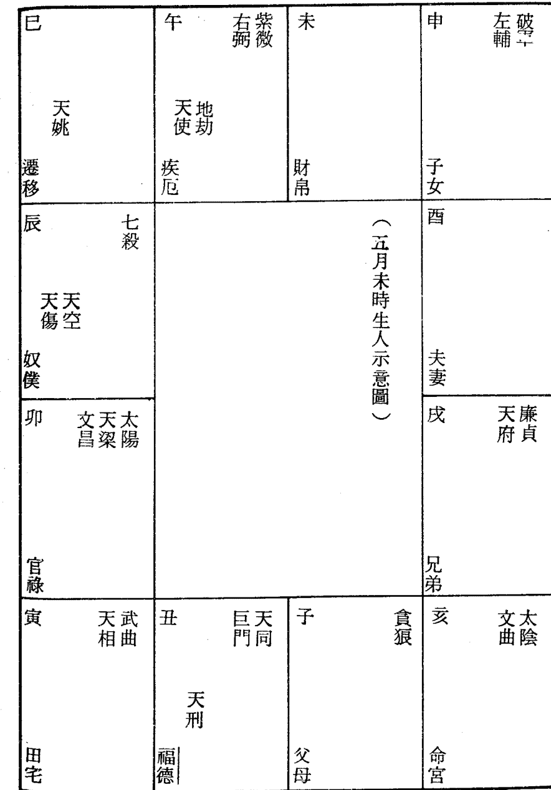

## 第三十七章 太陰同文曲於妻宮蟾宮折桂

知道斗數到熟悉紫微的歷程絕非兩三天或一兩本書所能簡易說明的，雖然俗諺「條條道路通羅馬」，到底「羅馬不是一天建成」的，最重要的還是要能夠理解消化吸收，否則就失去了紫微斗數，甚至於任何學識知識的研習意義。

在今日斗數學者的眼中，清刻版本的潘希尹補輯「新鐫希夷陳先生紫微斗數全書」，幾乎可以說是最為完整的圭臬佳作，但是由於其書的無心或疏忽錯誤，往往使初學者難以依據自習，譬如如一一

> 原註：假如太陰文曲同於妻宮，又兼吉曜來扶，限夫又逢，至此男子蟾宮折桂，女子招貴受封贈。（見卷二「太陰合文曲於妻宮，翰林清異。」）

其卷二起五行寅例，堃元初習所據之民國六十四年六月大方出版社印行之版本不依五虎遁，誤植為「丙辛之歲起甲寅」「戊癸之歲起戊寅」，曾經誤我五七年而不自知。其之所以導演今日庚年四化之分歧亦由本身自我矛盾而生，其卷二「安祿權科忌四星變化訣」曰：「庚日武同陰為首」，當以太陰化忌為是，但其於卷二論命訣論議化忌星竟曰：「然天同在戊化忌，丁人遇吉。」，於四化訣不化忌之「天同」竟忽然化忌，又於卷四「古今富貴賤天壽命圖」之「庚寅生」「竇萃之命」於天同斜下註化忌，此或即為天同化忌之臆生（按：何以無人猜臆「陰」或為「蔭」之音誤？），唯查翻卷四附錄一「四命圖，附錄庚生人如「孟軻之命」，「晏平仲命」，……等，俱以天同化科，天相化忌，莫怪斗數者宿陳老師岳琦先生著「正統飛星紫微斗數」，特別強調「庚陽武同相」，倡言「天相化忌」，……望元每存歧異於心，凡一命例必及於斗數之全書頁「十干四化之更正」而為「日武府相」，心有疑義而不敢訕知斗數，適於竹林書局邂逅青年斗數賢達吳老師萬全先生，蒙其不棄書告「考證天同化忌之義」，其生庚寅年，對於庚干四化之考證當倍力於常人，其曰：「余亦屬庚年生者，家兄與親友學生皆然，觀斗數論批之際，均以同忌取用，事事映足契機所斷矣！

> 尤可贵者，吴老师衍於天同化忌而释太阴双化科之义，其简释曰：「1.庚阴化科，病忧忧兮，病福难绘心中悒，执识同忌攸关注，阴科同忌营审记。2.癸阴化科，筵度速兮，才艺舒演酒色续，贪忌相磋仲繁延，阴科非唯展文丽！」

> 望元除日夜盼其已付梓之「延陵堂飞星四化紫微斗关」早日行销於市坊书肆而外，更盼其本创办「延陵堂针灸医屋」义诊之菩萨心肠，能於百忙中更为紫微斗数有所精阐入微的关泽精著，裨济世而解如望元迁顽窒疑之困惑！

台中县李森霖先生偶识望元，亦坦勉望元，儘早继成「紫微堂奥」，并嘱竭力避免重复赘述，因是而以更审慎之心态琢磨。拖著至今，始勉见将成卷三本书，又以太阴之不论为「双化忌」或为「双化忌」，与本文「太阴同文曲於妻宫，蟾宫折桂。」皆有莫大之影响，是又落得繁言絮说，敬请一哂！

-   1.庚阴化科，病忧忧兮，病福难绘心中悒，执识同忌攸关注，阴科同忌营审记。
    2.癸阴化科，筵度速兮，才艺舒演酒色续，贪忌相磋仲繁延，阴科非唯展文丽！

循观斗数星曜之组合，凡得太阴入妻宫，必巨门守命，天梁守福德而始论其他，於是搜览斗数诸书，著述斗数丛书之先进贤达，或如滥竽充数之望元辈等，即或呕心沥血而勉成卷册，总难免顾此失彼之失，於是累书俱「言有未尽」、「言有未到」、「言有失据」……之通病。

如以巨门守命而言，姑不论紫微系星曜组合状况，仅就妻月福荫而言，本人聪明疑惧，有杞人忧天及喜欢发牢骚之倾向，大抵能获得令人羡慕的婚姻配偶，并且有个性懦弱而患得患失的趣向，所以其之随遇而安的环境适应力实有消极无累的成份在内，所以配偶之良贤淑慧者可以相安无事，如果夫妻宫之太阴陷失无耀者，其本人耽心忽然失去配偶而宁愿受配偶之拘束虐侍。

太阴守妻宫之星曜组合，与太阳守官禄之星曜组合各具其趣，後者大多出现「命无正曜」之状况，巧合孟子所说：「天将降大任於斯人，必先劳其筋骨苦其心志。」的铭言，前者则发现「迁移宫」无正曜的现象，试看——

太阴在子午，天同同守，安命寅申，必巨日守命，机梁守福德在辰戍，迁移宫无主曜。

太阴在丑未，太阳同守，安命卯酉，机巨同守命，天梁守福德，迁移无主曜。

太阴在寅申，天机同守，安命辰戌，巨门独守命，天梁守福德，迁移天同独守。太阴在卯酉，安命巳亥，巨门独守命，天梁守福德，太阳独守迁移。太阴在辰戌，安命子午，巨门独守命，福荫守福德，太阳独守迁移。太阴在巳亥，安命丑未，同巨门同守命，日梁守福德，迁移无主曜。观之星曜组织有喜欢平稳安定生活的倾向，如使文曲会於妻宫，则因妻宫之冲动官禄宫，大致抵有受到配偶之鼓励、帮助、要求、刺激...等影响情形而於官禄职位上发展而成的现象，所以有受到配偶之鼓励、帮助、要求、刺激...等影响情形。以斗数赋文亦是发吾人深省玩味矣！总之，巨门虽为是是非之神，又为暗曜，此星入命，必太阴佔据妻宫，具有当官富贵之机缘，唯其不经过思考巡出的直言与牢骚，如得文曲之艺术性口才来表达，岂使不能垂手获得功名富贵，易容易搏得口角春风之美誉。兹附张侍郎命例以为参考，并附「太阴同文曲於妻宫」之情形以示意图表示於后，学者不难发现「太阴同文曲」，必亦於他宫得到「太阳同文昌」——

| 地支 | 星曜 | 宫位 |
|------|------|------|
| 巳 | 天姚 | 夫妻 |
| 午 | 巨门 | 兄弟 |
| 未 | 右弼天相廉贞 | 命宫 |
| 申 | 天梁 | 父母 |
| 酉 | 天同 | 福德 |
| 戌 | 武曲 | 田宅 |
| 亥 | 太阳文昌 | 官禄 |
| 子 | 破军 | 奴仆 |
| 丑 | 天机 | 迁移 |
| 寅 | 天府紫微 | 疾厄 |
| 卯 | 太阴文曲 | 财帛 |
| 辰 | 贪狼 | 子女 |

## 【紫微斗数全书原注】

权会巨门威扬，果作谏臣。

太阴文昌于妻宫，蟾宫折桂，太阳文曲于官禄，皇殿朝班。

> 癸生人会巨门为「石中隐玉」（按：斗数骨髓赋曰：「子午巨门，石中隐玉。」）格，此验矣！

只兄弟落陷，果是否（晋：鄙。义：恶也）不如人矣！

| 宫位 | 主星/辅星 | 宫位属性 |
|---|---|---|
| 巳 | 紫微七杀 天刑 | 田宅 |
| 午 | | 官禄 |
| 未 | 天地伤劫 | 奴仆 |
| 申 | | 迁移 |
| 酉 | 破军廉贞 天使天姚 | 疾厄 |
| 戌 | | 财帛 |
| 亥 | 天府 | 子女 |
| 子 | 天同太阴 文曲左辅 | 夫妻 |
| 丑 | 武曲贪狼 | 兄弟 |
| 寅 | 太阳巨门 文昌右弼 | 命宫 |
| 卯 | 天相 天空 | 父母 |
| 辰 | 天机天梁 | 福德 |
| 中央 | （九月申时生人示意图） | |

| 巳 天相 父母 | 午 天梁 福德 | 未 七杀 田宅 | 申 廉贞 官禄 |
|---|---|---|---|
| 辰 巨门 左辅 命宫 |  |  | 酉 天伤 地劫 天刑 奴仆 |
| 卯 贪狼 紫微 兄弟 |  |  | 戌 右弼 天同 迁移 |
| 寅 文曲 太阴 天机 夫妻 | 丑 天府 天姚 天空 子女 | 子 文昌 太阳 财帛 | 亥 破军 武曲 天使 疾厄 |

| 巳 天梁 福德 | 午 七杀 田宅 | 未 | 申 廉贞 天伤 地劫 天刑 奴仆 |
|---|---|---|---|
| 辰 紫微 天相 父母 |  |  | 酉 （十一月酉时生人示意图） |
| 卯 巨门 天机 命宫 |  |  | 戌 破军 天使 疾厄 |
| 寅 左辅 贪狼 天空 兄弟 | 丑 文昌 文曲 太阴 太阳 夫妻 | 子 右弼 天府 武曲 子女 | 亥 天同 天姚 财帛 |

（正月戊时生人示意图）

（十一月酉时生人示意图）

### 五月子时生人示意图

| 地支 | 星宿与宫位 |
|------|------------|
| 巳 | 贪狼、廉贞；天姚；兄弟宫 |
| 午 | 右弼、巨门；命宫 |
| 未 | 天相；父母宫 |
| 申 | 左辅、天梁、天同；福德宫 |
| 酉 | 七杀、武曲；田宅宫 |
| 戌 | 文昌、太阳；官禄宫 |
| 亥 | 天机；奴仆宫 |
| 子 | 空；迁移宫 |
| 丑 | 破军、紫微；疾厄宫 |
| 寅 | 空；财帛宫 |
| 卯 | 天府；子女宫 |
| 辰 | 文曲、太阴；夫妻宫 |

### 三月亥时生人示意图

| 地支 | 星宿与宫位 |
|------|------------|
| 巳 | 巨门；命宫 |
| 午 | 左辅、天相、廉贞；父母宫 |
| 未 | 天梁；福德宫 |
| 申 | 七杀、右弼；田宅宫 |
| 酉 | 天同；官禄宫 |
| 戌 | 武曲；奴仆宫 |
| 亥 | 文昌、太阳；迁移宫 |
| 子 | 破军；疾厄宫 |
| 丑 | 天机；财帛宫 |
| 寅 | 紫微、天府；子女宫 |
| 卯 | 文曲、太阴；天姚；夫妻宫 |
| 辰 | 贪狼；兄弟宫 |

（九月寅时生人示意图）

| 巳 | 午 | 未 | 申 |
| :--- | :--- | :--- | :--- |
| 天府 天刑 子女 | 文曲 太阴 天同 夫妻 | 贪狼 武曲 兄弟 | 文昌 巨门 太阳 命宫 |

| 辰 | 酉 |
| :--- | :--- |
| 天相 天空 天姚 父母 |  |

| 卯 | 戌 |
| :--- | :--- |
| 破军 廉贞 天使 疾厄 | 天梁 天机 福德 |

| 寅 | 丑 | 子 | 亥 |
| :--- | :--- | :--- | :--- |
| 迁移 | 天伤 地劫 奴仆 | 官禄 | 七杀 紫微 田宅 |

（七月丑时生人示意图）

| 巳 | 午 | 未 | 申 |
| :--- | :--- | :--- | :--- |
| 文曲 太阴 夫妻 | 贪狼 兄弟 | 天姚 命宫 | 巨门 天同 父母 |

| 辰 | 酉 |
| :--- | :--- |
| 右弼 天府 廉贞 子女 | 文昌 天梁 太阳 福德 |

| 卯 | 戌 |
| :--- | :--- |
| 天刑 财帛 | 左辅 七杀 天空 田宅 |

| 寅 | 丑 | 子 | 亥 |
| :--- | :--- | :--- | :--- |
| 破军 天使 疾厄 | 迁移 | 天伤 地劫 奴仆 | 紫微 官禄 | 天机 |

（正月辰时生人示意图）

| 巳 | 午 | 未 | 申 |
| :--- | :--- | :--- | :--- |
| **破军武曲** 天使 疾厄 | **文昌太阳**  财帛 | **天府** 天空 子女 | **文曲太阴天机**  夫妻 |
| **天同左辅**  迁移 |  |  | **贪狼紫微** 天刑 兄弟 |
| **卯** 天地伤劫 奴仆 |  |  | **巨门右弼**  命宫 |
| **寅** | **丑** 七杀廉贞 天姚 田宅 | **子** 天梁 福德 | **亥** 天相 父母 |

（十一月卯时生人示意图）

| 巳 | 午 | 未 | 申 |
| :--- | :--- | :--- | :--- |
| **天同**  财帛 | **天府武曲**  子女 | **文昌文曲太阴太阳** 天刑 夫妻 | **贪狼**  兄弟 |
| **破军** 天使 疾厄 |  |  | **天机巨门**  命宫 |
| **卯**  迁移 |  |  | **天相紫微**  父母 |
| **寅** 左辅廉贞 天地伤劫 奴仆 | **丑**  官禄 | **子** 右弼七杀  田宅 | **亥** 天梁 天姚 福德 |

### 五月午时生人示意图

| 巳 | 午 | 未 | 申 | 酉 | 戌 | 亥 | 子 | 丑 | 寅 | 卯 | 辰 |
| :--- | :--- | :--- | :--- | :--- | :--- | :--- | :--- | :--- | :--- | :--- | :--- |
| 天姚 天伤 奴仆 | 天机 右弼 迁移 | 紫微 破军 疾厄 | 左辅 财帛 | 天府 子女 | 太阴 文曲 夫妻 | 贪狼 廉贞 兄弟 | 巨门 命宫 | 天相 天刑 父母 | 天同 天梁 福德 | 七杀 武曲 地劫 田宅 | 太阳 文昌 官禄 |

### 三月巳时生人示意图

| 巳 | 午 | 未 | 申 | 酉 | 戌 | 亥 | 子 | 丑 | 寅 | 卯 | 辰 |
| :--- | :--- | :--- | :--- | :--- | :--- | :--- | :--- | :--- | :--- | :--- | :--- |
| 太阳 文昌 迁移 | 破军 左辅 疾厄 | 天机 财帛 | 紫微 天府 右弼 子女 | 太阴 文曲 夫妻 | 贪狼 兄弟 | 巨门 天刑 命宫 | 廉贞 天相 父母 | 天梁 福德 | 七杀 田宅 | 天同 天姚 官禄 | 武曲 地劫 天伤 奴仆 |

| 巳 | 午 | 未 | 申 |
| :--- | :--- | :--- | :--- |
| 破军武曲 天姚 田宅 | 文昌右弼太阳 官禄 | 天府 天同天空 奴仆 | 文曲左辅太阴天机 迁移 |
| 辰 | | 酉 | 贪狼紫微 天使 疾厄 |
| 天同 | | | 巨门 财帛 |
| 卯 | | 戌 | |
| 地劫 父母 | | | |
| 寅 | 丑 | 子 | 亥 |
| 命宫 | 七杀廉贞 天刑 兄弟 | 天梁 夫妻 | 天相 子女 |

| 巳 | 午 | 未 | 申 |
| :--- | :--- | :--- | :--- |
| 文昌太阳 天姚 官禄 | 右弼破军 天地伤劫 奴仆 | 天机 迁移 | 左辅天府紫微 天使 疾厄 |
| 辰 | | 酉 | 文曲太阴 财帛 |
| 武曲 | | | 贪狼 子女 |
| 天空 | | 戌 | |
| 田宅 | | | 巨门 夫妻 |
| 卯 | | | |
| 天同 | | | |
| 福德 | | | |
| 寅 | 丑 | 子 | 亥 |
| 七杀 | 天梁 天刑 命宫 | 天相廉贞 兄弟 | 巨门 |

| 巳 | 午 | 未 | 申 |
| --- | --- | --- | --- |
| 天府 天姚 父母 | 文曲 右弼 太阴 天同 福德 | 贪狼 武曲 田宅 | 文昌 左辅 巨门 太阳 官禄 |
| 辰 命宫 | | 酉 天相 天伤 天空 奴仆 | |
| 卯 破军 兄弟 | | 戌 天梁 天机 | |
| 寅 夫妻 | 丑 地劫 天刑 子女 | 子 财帛 | 亥 七杀 紫微 天使 疾厄 |

（五月寅时生人示意图）

| 巳 | 午 | 未 | 申 |
| --- | --- | --- | --- |
| 天同 天姚 福德 | 右弼 天府 武曲 田宅 | 文曲 文昌 太阴 太阳 官禄 | 左辅 贪狼 天伤 天空 奴仆 |
| 辰 破军 父母 | | 酉 巨门 天机 迁移 | |
| 卯 命宫 | | 戌 天相 紫微 天使 疾厄 | |
| 寅 地劫 兄弟 | 丑 廉贞 夫妻 | 子 天刑 子女 | 亥 七杀 天梁 财帛 |

（五月卯时生人示意图）

**（五月子时生人示意图）**

- **巳宫（兄弟宫）：** 贪狼、廉贞、天姚
- **午宫（命宫）：** 右弼、巨门
- **未宫（父母宫）：** 天相
- **申宫（福德宫）：** 左辅、天梁、天同
- **酉宫（田宅宫）：** 七杀、武曲
- **戌宫（官禄宫）：** 文昌、太阳
- **亥宫（奴仆宫）：** 天机、天伤、天空、地劫
- **子宫（迁移宫）：**
- **丑宫（疾厄宫）：** 破军、紫微、天使、天刑
- **寅宫（财帛宫）：**
- **卯宫（子女宫）：** 天府
- **辰宫（夫妻宫）：** 文曲、太阴

**（五月丑时生人示意图）**

- **巳宫（命宫）：** 文曲、太阴、天姚
- **午宫（父母宫）：** 右弼、贪狼
- **未宫（福德宫）：** 巨门、天同
- **申宫（田宅宫）：** 左辅、天相、武曲
- **酉宫（官禄宫）：** 文昌、天梁、太阳
- **戌宫（奴仆宫）：** 七杀、天伤、天空
- **亥宫（迁移宫）：** 天机、紫微、地劫
- **子宫（疾厄宫）：** 天使
- **丑宫（财帛宫）：** 天刑
- **寅宫（子女宫）：** 破军
- **卯宫（夫妻宫）：**
- **辰宫（兄弟宫）：** 天府、廉贞## 第三十八章 禄存守于田财堆金积玉

重补斗数毂率曰：“禄合守田财，为烂谷堆金。”，抽作卷二第二二三七页会强调田宅宫在辰戌与财帛宫到酉卯成为“六合”宫位的情形下，又有禄存与化禄入二宫呼应，很自然就可从命图呈显“大富”之命运，但观本文所强调者仅“禄存”之“迍吉”特性而已。

假如禄存入守财帛宫，亦以禄存有暗示财源不断之财星性质，是亦可依“财居财位，逢者富奢。”论之：禄存入财帛，有财源不断，富足仓箱之象，如逢紫府实有承袭父祖产业之吉，如逢武曲天机，虽呈辛勤或劳心工作而获财之情形，亦有事半功倍之好财运，如逢太阴，则有正常固定而可趋于轻松容易获得的感觉，而一般禄存守财帛之人，大多有以钱滚钱之利息收入现象，…大抵亦仅能强调动产一方面的富裕而已。

同理，如果禄存入守田财宫，其所表示亦仅及于田宅单方面之承袭祖产荣昌，或自己多购置田宅不动产而已，若要同时发现经济富裕的状况，似乎犹有些牵强。

学者只要试从十二宫位的关系稍微思考，不难发现财帛宫与田宅宫是分别属于两体系不同的“成照”范围，很难从命图上发生直接、间接的影响关系，可是在我们实际生活体认上，两者实在应该发生最为密切的相互影响及关系，所以先附“成照”示意图为说明——

| 宫位 | 星曜或内容 |
|------|------------|
| 巳 (官禄) | 天机 |
| 午 (奴仆) | 紫微、天地伤劫 |
| 未 (迁移) | 天姚 |
| 申 (疾厄) | 破军、天使 |
| 酉 | |
| 戌 (财帛) | 左天辅府贞 |
| 亥 (夫妻) | 文曲太阴 |
| 子 (兄弟) | 贪狼 |
| 丑 (命宫) | 巨天门同 |
| 寅 (父母) | 天武相曲 |
| 卯 (田宅) | 文天梁阳、天刑 |
| 辰 | 右七杀弼、天空 |

试看紫微斗数卷三“谈星要论”曰：“……三看迁移财帛官禄三方星辰刑冲克破，四看福德宫：……以福德对财帛宫也。”身命迁移财官福德六宫，名曰八座，俱在“成照”，聚吉化吉，富贵高寿。”，可以安命在子例示意，余倣此，学者请自为推考。

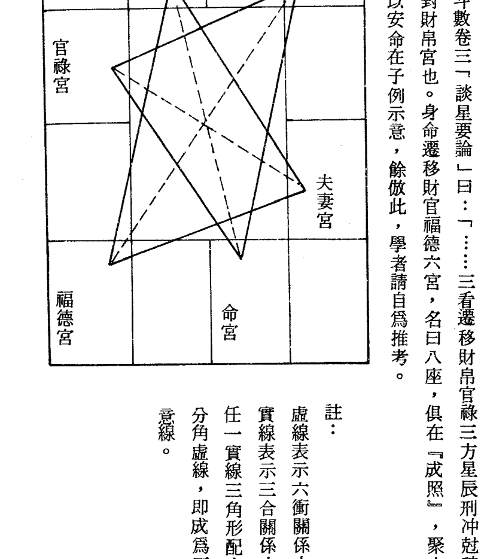

注：虚线表示六冲关系之冲照。实线表示三合关系之合照。任一实线三角形配合该三角形之分角虚线，即成为三方四正之示意线。

再正视吾人现实之生活亦彼此“成照”示意图所表示无遗，财官命三合，立即直接反应吾人之贫贱富贵，尤其钱财之有无能表现其人之善恶，其性之善恶可从其适应环境之迁移宫表示其待人接物的心态，于是妻动福又成为三合，六宫八座而为一直接切身之成照体系。如另一成照体系，可以子女、田宅比譬为吾人不同形质的钱财，子女为人性的钱财，田宅为不动的物性钱财，从子女三合者含有传宗接代的服务或被服务性质，从田宅三合者含有同舟共济的分担或共享的健康思想性质。所以一个性向于人生哲学而研习命数的任何人，大多几近于宗教慈善之服务济世，绝无假借命数以诈财骗色之伪善之人。可惜，吾人私欲深底的邪恶，往往披着美丽的外套而使平常人不辨而破坏形象：如报载地理师如何如何而破坏地里师形象，如报载警察、计程车司机……如何如何而破坏警察、计程车司机……之形象。所以望元于斗数虽为自习无才辈流，但以痴迷狂嗜于斗数传统命数之玄微，而立志勉成诠注赋文之劬劳，所以尽量以平实而可以体认的人生来阐释斗数。
旁观一个人之有无数田宅不动者，不一定钱财相对富裕便利，甚至于犹要借贷渡日。同样的，一个生活糜烂，挥霍无度的人，虽然表面上经济富裕，好像应该有无限的家业，可是事实上每多租赁房屋之人。甚至于背负了许多暧昧的烂帐。
上述有所偏颇的人生，在命数上，在古代农业社会的意识中，俱不以“财富”论之，唯其身之能安，心之能安，“富足仓箱”，仓有余粮，箱有金银，始可以富足论之。望元基此所以认为应以卷二所强调之说话为正确合格，如仅如本人之禄存守财偏颇于动产富足，禄存守田宅而偏顷于不动产广多，实有疑义而不可取也？！

但是初习斗数除了观察星图的反应迟钝而外，亦大多缺乏“活盘概念”，很少有人体认“命图一全书”之事实，每以为只要能够布星，能够据书议论已很知足，孰知每一命图详审下来，未必于全书而巨细无遗，所以在您的某一年或每一月，您不曾也筹思经营商贸的计划吗？堃元十二万分肯定的告诉您，某一年的迁移宫，或某一月的迁移宫，您必能发现武曲或天梁，但以其效应期间太短，所于您仍未置身于高商巨贾的芳名录中，即使偶而客串，亦只不过小生意人而已。

## 第三十九章 财荫坐于迁移必巨商高贾

寻观斗数星曜组配，财星武曲坐守迁移，其命财官三合之星曜俱必依天府系阳序列之星曜表达，唯其福德宫恒见廉贞，映象其人生观有体认工作的意义，倾向工作忙碌为满足，且因忙碌工作得到收获而欣慰的倾向，几乎已勾出了武曲坐迁移，不宜静坐之特性，何况其犹有突破环境现状及容易发生钱财流通变易的状况，自然而然的必以实业家、贸易商之流以为想像了。
至如天梁坐迁移，比较困难立即发现其为商贾之可能性，甚至想从恒守福德宫的太阴星来旁敲侧击也有困难，但因太阴坐守福德宫之人，大多具有浪漫艺术的生活情趣，以及享福作乐的倾向，参酌天梁坐迁移之“虽不刻意表现才能，却极易被发觉赏识，而且受帮忙成就”的情形想像，这不正表现一个贸易商或实业家的诚信态度与交际应酬现象，又该以什么行业来映象？！

原注：财即武曲，荫即天梁，此二星或一化权禄，与吉星坐迁移宫，必作巨商高贾，若加刑忌杀凑平常。（见卷二“财荫居迁移，为高商豪客。”）

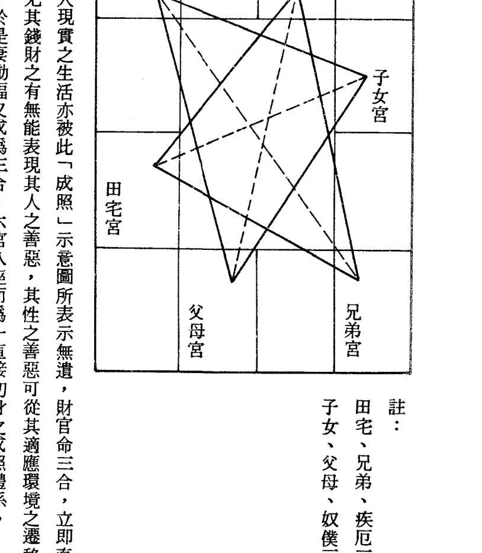

注：田宅、兄弟、疾厄三合。子女、父母、奴仆三合。

堃元亦满曾经商失败之苦恼，更见斗数专家、学者、术士俱秘艺自珍，所以只好任由堃元大发悲悯慈善济世之心，公开千万从事商业经贸所关心的切身问题——我的财运如何？我什么时候能够赚钱？

很简单，想想您目前的职业心态，再看看您的大小限的迁移宫如何？假使您有如下图所示之行限状况，大约在第一大限之十年成为有声名信誉之商人，限入第二大则经营比较事倍功半，最要吉星相助，限入第三大则已具规模而富裕仓箱矣！余倣此！

如有如台北市读友黄中荣先生来信所问讯亦及于此一问题，除已部份答复而外，对于其前途亦有茫然之感，以其适与此例相逆，所以亦附图简说如下——

- 此命为“子午巨门，石中隐玉”之破格，从事商业有禄存朝斗之美，担当公务职位，亦将有“皇殿朝班”之庆，可惜吉处藏凶，黄先生不自知本人顾忌太多而缺失了一些大好机会。
- 以黄先生科权之福，黄先生应服职于在大机构中，而且被器重而有声名，此可以由辅弼拱命衬托出来。
- 少年得志，眼高心大，于十三岁至廿二岁期间即已喜欢扩散性的发挥表现，如能将事业扩展而能发福发财。可惜常于不自知之无意中得罪朋友，虽然很容易交到朋友，可惜却乏知交挚友，对于自己反生厌烦事端而已。
- 夫妻宫太阴化禄，竟与铃星同宫，是为“化禄到戊福厚，怕杀冲。”，虽有获得高雅优美女性为配偶，而且能得美满幸福之星象，但以宫干得庚，又得化忌（除以天相化忌未得外），故于婚事上有杂乱纠阻障灾咎。
- 大限行至廿三岁至卅二岁十年，主从事劳心费力之职业，身心不能静守，甚能力争上游，在这一期间爬升到经理主任级权当方面之职位，但见火星，又主事倍功半，甚至有经商之欲望与事实。
- 大限行至卅三岁至四十二岁，望元妄断黄先生于卅二岁之年有不同来源之收益，则当于此年另外投资经营，但大限福德适又有大限化忌，适可本“福德遇空劫，奔走无力”论议。此限十年有“荫星坐迁移”为高商巨贾之星象，可惜二限于本宫不重逢，有勉强而不如意经营的现象，有延迟获利成就财富的现象。所以黄先生问财利若何，据此可知一般，当从自己的个性及经营方法等等加以检讨，否则此十年之不能立见盈利，即应归咎于当生之巨门化忌，主是非疑惑的阻障灾咎，大概与您患得患失的心理以及无法专注之所致吧？!

读者以此命例比较示意图，应当有成为高商巨贾之可能，但只以行运二者相反而有很大区别

| 戊申 | 丁未 | 丙午 | 乙巳 |
| :---: | :---: | :---: | :---: |
| 紫微 破军 擎羊 | 天机 禄存 科 | 天使 疾厄 (43-52) | 陀罗 奴仆 (63-72) |
| 财帛 (33-42) 32. 44 3X | 迁移 (53-62) | 己酉 天钺 天府 火星 | 甲辰 太阳 官禄 (1X 迁移) |
| 子女 (23-32) 2X | 黄先生 | 癸卯 武曲 七杀 田宅 (2X 迁移) | 壬寅 天同 天梁 权 福德 (3X 迁移) |
| 庚戌 太阴 铃星 禄 | 夫妻 (13-22) 10.22 1X | 癸丑 天相 | 壬子 命身 |
| 廉贞 贪狼 天魁 | 巨门 忌 | 辛亥 | 兄弟 (3-12) |
| 木三局 | 父母 |

## 第四十章 耗居禄位沿途乞食

，莫性堕元常于闲谈时感叹：“命好，不如运好；运好，不如心好！”，所以读者诸君，但存福

耗者有二，一曰破军，一曰大耗，一般俱以破军论之，但十二宫太岁煞禄神中之大耗，对于钱财田宅之不利，亦宜列为考虑推敲之范围。禄者，于星曜指禄存、化禄，于宫位大多敏感的认为泛指官禄宫而言，但依望元愚见，禄位者有四：一为禄存所居之位，一为化禄所居之位，一为财帛宫，盖财帛宫者禄也，一为官禄宫，盖官禄者爵禄也。缘天梁有制破军之恶、禄存解其狂之趋向，所以知禄存、化禄不惧与破军同垣，甚至而知破军临于辰戌丑未四墓位，其耗性有收敛之现象。所以一般而言『耗居禄位』，大抵以破军守坐财帛二宫而言。破军之居财位，有破坏消耗钱财之暗示，所以紫微斗数全书论财帛诀曰：

原注：假如耗星守官禄宫，又逢刑忌，及寅午戌生人命坐午宫，巳酉丑生人命坐酉宫，亥卯未生人命坐卯宫，申子辰人命坐子宫是。（见卷二『耗居败地，沿途乞求。』）

易形成诸星问答论所曰：“贪狼与七杀同身命，男有穿窬之体，女有俭香之态……。”

破军之守官禄，虽亦难免耗禄现象，反利武职，以入坐官禄宫独守之情形或稍次于独坐财帛宫之恶劣，所以紫微斗数全书论官禄宫诀曰：

“贪狼与七杀同身命，男有穿窬之体，女有俭香之态……。”

凡见破军守财之人，必为贪狼坐命，七杀守官禄宫，不利寅申时生人，以其官禄身同宫，容易形成诸星问答论所曰：“贪狼与七杀同身命，男有穿窬之体，女有俭香之态……。”

“贪狼与七杀同身命，男有穿窬之体，女有俭香之态……。”

学者将上述两相比较，原注之义显如重补斗数毅率“耗居败地，沿途乞求”而有失当，当以破军守于财帛宫更不利于官禄宫为是，如此破军之损耗特性因其耗财而表现无遗。

假如耗星守财帛宫，又逢刑忌，及寅午戌生人命坐午宫，巳酉丑生人命坐酉宫，亥卯未生人命坐卯宫，申子辰生人命坐子宫，（古或子平有依生年支定四大命局之法，申子辰三合水，余倣此。今斗数不用此。），破军守财适居败气沐浴之地，是知其人经济撙节艰难。如此岂不与本文之义相符？！

“但研习与探讨有所不同，诠注赋文有几近于探讨斗数之性质，望元曾经冥思假想——‘假如原为破军守命之人，大多为劳碌命之典型，其三方四正又见大耗、羊陀、火铃、空劫、化忌之情形，是否比上述情形更能体贴“沿途乞食”之本义？！望元不敏，不敢胡思乱想，惟有持学者自为研求验证！’”

+ 子午破军（独守）多有金银宝贝蓄积。
+ 丑未破军（独守），亦财盛。
+ 寅申破军（独守），破祖不聚，或劳碌生财，先难后遂，加空劫极贫。
+ 卯酉破军，廉贞同垣，破祖不聚，或劳碌生财，先难后遂，加空劫极贫。
+ 辰戌破军，武曲同垣，东来西去。
+ 巳亥破军，武曲同垣，亦宜武职，加权禄文昌文曲显达，加羊陀火铃平常。
+ 子午破军，武职轩胜。
+ 丑未破军，紫微同垣，名振声扬。
+ 寅申破军，武职轩胜。
+ 卯酉破军，廉贞同垣，胥吏（低、次层公务员）最美，文人不耐久。
+ 辰戌破军，武职轩胜。
+ 巳亥破军，武曲同垣，亦宜武职，加权禄文昌文曲显达，加羊陀火铃平常。

## 第四一章 贪会旺宫终身鼠窃

原注：假如耗星会贪狼，守命身官禄之位，主为人贫穷，终身为窃盗之人。（见卷二“贪会旺宫，终身鼠窃。”）

斗数分男女命而有强弱宫之不同，男命以财帛、官禄、迁移、福德、田宅为强宫，女命以夫、妻、子女、财帛、田宅、福德为强宫。凡男女命皆以财帛、田宅、福德为强宫，所以又别称此三宫为三旺宫。

但命宫之观察研判，皆以三方四正星曜论议，所以又有认命宫、迁移、财帛、官禄等四正宫为旺宫，但若循原注之义，则当以“官禄宫”为旺宫。

如使贪狼坐守官禄宫，则必破军守命，于是循依诸星问答论曰：“破军居，紫微则失威权，逢天府则作奸伪，会天机则鼠窃狗盗……。”，于是如卷二第二四七页所称：“此以破军会天机，论鼠窃狗盗者，言偷窃固非人之宿命本性，盖因人之一时之一念之贪欲而误触或有意犯窃盗罪而已，窃盗之心既由贪婪欲望而生，知之而能自我抑制，即有破军会天机之情形亦不犯也。”

望元之说，以破军守命之人，限行至天机之十年或一年，是为运用绞尽脑汁智慧之时期，如有天梁、禄存，其人虽骄傲放肆，素不行善，竟突然有行善助人之举。如其年不见梁禄，更逢耗忌，其所伤脑筋者，大抵已生贪婪欲望之心，是否涉触窃盗之事实，必要审详，不可妄断也。

如使贪狼守命，则必七杀守于官禄，破军守坐财帛，至易形成“耗居禄位，沿途乞食”之格局，如使本文与前章之文互为承接，则文义清晰易知，贪会旺宫之义即应当为“贪狼在帝旺之位守命”为是，因原注之断章取义而使吾等后学重履误讹之覆辙也——

试看：“耗居禄位，沿途乞食；贪会旺宫，终身鼠窃。”，岂不可以“破军守财帛，容易发生经济拮涩现象，如果贪狼适在子午卯酉帝旺之位守命，虽财帛宫居于长生之地，亦恐难免借贷周转生活，如果无从乞援求助，则有终身沦为鼠窃狗盗之流。”

兹举潘子渔先生著“紫微斗数分析实例”第二九一页林先生已被通缉例以为说明——

### 【原注事实】

- 此命迁移宫七杀、铃星、会有车祸。（果在高速公路出车祸。）
- 此命武曲、天相、天马同宫，主人宜早早离开出生地，到外地去发展。（出人出生在福建。）
- 夫妻宫破军、陀罗、右弼，主离婚。（早已分居，又与某女人同居。）
- 财官双美，财帛宫有紫微、左辅，官禄宫有武曲、天相、天魁。
- 此命最可惜者，乃廉贞坐命加羊刃，廉贞加煞有官司。此人两年前与人合伙经商，开出支票三百万，其合伙人均已溜去美国，现他因票据法被法院通缉在案，本人劝其投案自首，他说要被判坐牢三年多，家中尚有老母，以及妻子生活怎么办？现在东躲西藏。我又详细替他推算，发现民国七十五年白虎在戊地，与廉贞同宫加羊刃，凶恶异常，必有牢狱之灾。反不如现在就去坐牢，三年后大运甲午，43～52岁还会发财。惜忠言逆耳，不到黄河心不死，未见棺材不流泪，他宁愿过此流浪生活，希望能有奇迹出现。（但愿如此）。
（附记：书出版于73年1月，犹癸亥年，则事实所称二年前与人合伙，岁次辛酉年，林先生四十一岁。望元以潘先生或预期成书较慢，故望元以其当于壬戊年42岁与人合伙而推论引用于后。

### 【望元提示】

- 要看林先生之合伙事业，当以合伙之年为此合伙事业之命宫论议，42岁小限到子，适得贪狼守命，破军守财帛，几与本文题义相近，所以引用说明文义。
- 壬戊年太岁到戊，为小限之夫妻宫，视同夫妻身同宫论议。
- 小限太岁俱用流年干寻定四化，于是小限之福德宫武曲化忌。
- 小限命宫呈“马头带箭，镇御边疆”之美，此合伙事业若具无限美景，但太岁陷于地网，小限福德化忌又逢壬年截空，两辅宫俱凶，又临脱大限，如使问之望元，必断：“不可合伙，戒之于贪！”
- 高速公路车祸之未死，一幸，午宫天魁之功，更流年魁钺加亥辰天网，当生化忌之力次于流年化忌之剧（按：此理近于子平之重日时，奇门遁甲之重日时遁局。），故天网开一面不死。
- “耗居禄位，沿途乞食”，是知林先生原事业亦可观，但已呈周转困难现象，原欲合伙图利，意合伙人为“贵人”，奈武曲化忌，吉处藏凶，贵人竟成害林先生陷于民国七十二、三年触犯票据法之人也！
- 小限命宫之贪狠，不居于当生旺位，亦未居流年旺位，又小限身宫（太岁）未并于财官二宫，否则当更速其触犯票据法而立即过“流荡天涯”之逃避通缉之鼠窃生活矣！
望元特引用此例以为补助说明诠注赋文之义，因拘于篇幅之自限，犹多未到，譬如果林先生当于今（甲子）年四四岁农历五月或十一月遭到通缉捕获归案服刑等等，不一而足，言有未到之处，敬请读者海涵原谅，并请善体塑元一片悲悯用心之深长，学者只要用心体会玩味，诸君斗数之造诣当更胜于塑元矣！

### 壬戌年四十二岁小限示意图

### 林先生

### 木三局

| 巳 | 午 | 未 | 申 |
| --- | --- | --- | --- |
| 天机 流钺 奴仆 | 天魁 权 大限 迁移（33-42.） | 紫微 （天使） 疾厄 | 陀罗 右弼 破军 流马 财帛 |
| 辰 | 卯 | 寅 | 丑 |
| 七杀 文昌 忌 官禄 | 太阳 天梁 权 流魁 田宅 | 武曲 天相 天钺 忌 流戳 福德 | 巨门 天同 父母 |
| 子 | 亥 | 戌 | 酉 |
| 贪狼 小限 命宫 | 太阴 流禄 兄弟 | 天马 天刑 流羊 | 天府 文曲 铃星 擎羊 科 太岁 夫妻 |
|  |  |  |  |

| 巳 | 午 | 天机 | 未 | 紫微破军 | 申 | （1X） |
|----|----|------|----|----------|----|--------|
| 辰 | 太阳 |  |  |  | 酉 | 天府 |
|  | 3X 迁移 |  |  |  | （2X） |  |
| 卯 | 七杀武曲 |  |  |  | 戌 | 太阴 |
|  | 2X 迁移 |  |  |  | （3X） |  |
| 寅 | 天梁天同 | 丑 | 天相 | 子 | 巨门 | 亥 | 廉贪 |
|  | 1X 迁移 |  |  |  |  |  |

### 乙巳
陀罗
奴仆
(63-72)

### 甲辰
太阳
官禄
(1X 迁移)

### 癸卯
武曲
七杀
田宅
(2X 迁移)

### 壬寅
天同
天梁
权
福德
(3X 迁移)

### 丙午
天机
禄存
科
迁移
(53-62)

### 丁未
天使
疾厄
(43-52)

### 戊申
紫微
破军
擎羊
财帛
(33-42)
32. 44 3X

### 己酉
天钺
天府
火星

### 黄先生

### 木三局

### 子女
(23-32)
2X

### 庚戌
太阴
铃星
禄

### 夫妻
(13-22)
10.22 1X

### 父母

### 命身

### 辛亥
巨门
忌

### 兄弟
(3-12)

### 廉贪
贪狼
天魁## 第四二章 杀居绝地天年天似颜回

未生孟轲，颜回之不二过人格，被尊誉为亚圣，其早年白发，英年殒逝为命数家所津津乐道，但考英雄豪杰古今青史，如仲由寿限亦偏促，仅享年三十二，又如项羽、韩信、吴越春秋之庆忌，文星暗拱之贾谊，……民国之烈士……空军英雄高志航将军……等等，又岂是寿永之人。

斗数赋文之举颜回命例，故以其命图之命垣居于绝地，又暗合七杀，大限又行七杀而具特点，望元已于卷二第二四九页已有所注释，不赘。

但若颜回之生日原为二十二日，刊刻时脱漏“二日”二字，则原附命图则又无可诟病，适如本文之可以解释矣！

不过要考证古人生辰至难，今日之祭祀“复圣”颜回，大多认为其生于农历九月十一日，所以摘录联合报冯鹏年先生所发表以为参考：

> “颜回是孔门七十二贤之一，敏而好学，一箪食，一瓢饮，人不堪其忧，回欲能不改其乐。可惜，三十二岁便逝世了，孔子称赞他‘不迁怒，不贰过’，后来被尊为‘复圣’。”

> 原注：假如命坐寅申巳亥，逢七杀加刑忌，又值某星所绝，纵有吉曜合照，限临则凶矣！（见卷二“杀居绝地，生成三十二之颜回。”）

## 第四三章 贪坐生乡寿考永如彭祖

> （见卷二“日在旺宫，可学八百年之彭祖。”）

本文难于注解已如拙作卷二第二五三页所述，故望元至盼读者另为参考卷二第二九页“寿星概念”，不过因于上下文意之承接，上文既言“杀居绝地”，以安命寅申已亥而论议，则本文之言“贪坐生乡”，亦当指安命寅申已亥而论议，盖寅申已亥为四生四绝四马之地，不仅斗数杂论有所叙述，学者亦大抵能够了然于胸，不过为使部分学者不致混淆起见，望元仍以图示说明——

寻考补遗骨髓赋之论“寿夭”有诗云：“贪狼入庙最高强，南极星同寿命长，北斗帝星无恶杀，绵绵老耄衍祯祥。”

于是要求要求贪狼在庙旺地守命始主寿考，如更得长生必主长寿。但望元查贪狼坐守寅申，星光平和，在已亥与廉贞同垣，竟为落陷失辉，所以如仅以学理要为推考，亦无异于大海捞针之难。或以贪狼在辰、未、戌三宫守命论之，则无法以十二长生加强贪狼主寿之特殊意义，故望元

## 第四四章 忌暗同居身命疾厄困弱尪废

亦莫敢为之强为诠注，唯盼学者搜求一些八、九十寿以上之老年人命例而又能巧得贪狼（或太阳）守命之实际命图自为推考研求而已。

简洁的说明，但是直截了当的说：“如果命宫、身宫、疾厄宫，此三宫之一，有巨门与羊陀同垣，或巨门与化忌同垣的情形，多主其人衰困瘦弱而多病。”

> 卷二『巨暗同垣于身命疾厄，羸瘦其躯。』

（按：旁考辞源：困者，极也，苦也，瘁也，倦极 力乏，窘乏也，贫苦之人也；弱者，柔也，衰也，败也，不足也；尪者，同尩，音×尢，跛曲胫也，羸弱也；羸者，音ㄌㄟ累，瘠也，疲弱也。四字合而解释，贫苦瘦弱，精神萎顿自卑更甚于生理或病理障碍也。）

甚至于被敏感的学者想像成为──

假如甲年生人，安命于卯，命宫有擎羊，疾厄宫适于戌暗合，或如庚年生人，安命于酉，疾厄宫正于辰暗合，本已具“马头带箭，非夭折则主刑伤”之象，二宫之一又得巨门，即依原注论之。

## ## 第四五章 凶星会于父母迁移刑伤产室

> （见卷二“凶星交会于相貌迁移，伤刑其面。”）

重补斗数谷率之凶星指火铃而言，本文所指之凶星则专指羊陀而言。举如有甲生人安命在酉，其迁移宫原有擎羊，陀罗适居官禄而冲伤夫妻宫，如壬年运限至酉，命盘似二而一，父母宫适得陀罗，田宅宫正得擎羊，其所冲破者为子女，虽非羊陀迭并，但亦不利于官禄、田宅，或不利于子女、家室。附示意图于后，其余做此，不赞。（二六六页）

又有一说，凶星当指空劫而言，假如有父母迁移交会命格之人，只要父母宫得其一，田宅宫必得另一，所以刑伤产业，如果迁移宫得其一，则夫妻宫必得另一，所以刑伤家室。

唯此说极难表现凶星交会之意义，终有牵强附会之讥，但以其暗示空劫二凶星之运行关系，所以亦附示意图以明之——（二六七页）

又如丙戊生人，安命在酉，疾厄宫在辰暗合，则疾厄宫亦适得陀罗，或如壬生人安命在卯，疾厄宫在戊暗合，则疾厄宫亦适得陀罗，二宫之一又见巨门，即依原注论之。

或说丁生人巨门化忌，不宜见其守命身疾厄三宫之一，……凡此学者可以想像，不赞。

| 巳 (亥卯未天马) | 午 | 未 | 申 (寅午戌天马) |
|------------------|----|----|------------------|
| 水绝地          | 金长生 |    | 木绝地          |
| 辰              | 酉 | 戌 | 亥 (巳酉丑天马) |
| 卯              |    | 戌 | 亥               |

注：寅午戌三合火，天马居中，适冲动火长生寅，以象精力充沛，好动，余仿此。

| 巳 | 午(天空) | 未 | 申 天伤 |
|----|-------------|----|------------|
| 福德 | 田宅 | 官禄 | 奴仆 |
| 辰(地劫) 父母 | 卯 | 命宫 | 酉 天空 迁移 |
| 寅 | 丑(地劫) 夫妻 | 子 | 亥 |

| 巳 | 午 | 未 | 申 |
|----|----|----|----|
| 财帛 | 子女 | 夫妻 | 兄弟 |
| 辰 天使 疾厄 | 卯 擎羊 迁移 |  | 酉 流陀 命宫 |
| 寅 天伤 奴仆 | 丑 甲禄 官禄 | 子 流羊 田宅 | 亥 壬禄 福德 |

## 第四六章 刑杀同廉贞于官禄架枢难逃

> 原注：假如刑杀廉贞守官禄之宫，流年二限到此，不为祸患定遭刑。（见卷二『大耗会廉贞于官禄，架枢囚徒。』）

初习斗数学者于第四一章“贪会旺宫终身鼠窃”时，会或讹异望元狂妄而敢武断林先生44岁甲子年有牢狱之灾，其实说穿了不值方家一哂，其所武断者，即执于本文赋文之议论——刑杀同廉贞于官禄，架枢难逃——而已。刑杀者，可以单指擎羊而解释，盖擎羊化气为刑，其又为四杀星之一，为求赋文工整而别以“刑杀”称之，换句白话来说——化刑之杀星如果与廉贞同垣于官禄宫，其人有牢狱之灾。据此而再观林先生流年命图，44岁小限到寅，当生命宫岂不刚好成为“财帛宫”而三合官禄宫平？！何况此命图亦吻合卷二第二六二页“大耗会廉贞于官禄，架枢囚徒”之义，如图示：

44岁限示意图：

| 大限 | 流年大耗 | 官禄 |
|------|----------|------|
|      | 阴男     | 林先生 |
|      | 木三局   |      |
|      | 擎羊     | 廉贞 |
|      | 当生官符 | 财帛 |
|      | 贪狼     | 大限化忌 |
|      | 当生大耗 | 太岁 |
| 小限 |          | 命宫 |

注：甲子年流年大耗到午，为小限之官禄宫，正确为“大耗会廉贞于官禄”也。

除此之外，斗数骨髓赋有“官符太岁，公治有缧绁之忧。”之说，引用于林先生44岁限，

岂不亦可图示之？!

（注：太岁有“官符太岁逢白虎”之象。小限有“大耗会廉贞于官禄”之象。斗君亦见“官符重逢、太岁官符”之象。）

综之上述数说，望元如果不敢直断林先生今甲子年有牢狱之灾，区区在下敝人不才我之望元
岂不要自请送离岛管训，好好忏悔反省十数年来浸淫痴迷于紫微斗数之浪费时问精神？!

或问望元小限到寅有四，有戊子年八岁，庚子年二十岁，壬子年三十二岁，今甲子年四十四
岁，何以不发生于前三渡，而只发生于今，望元岂不亦先知后卜之“马后炮”？!

望元固宁为“马后炮”之“大声公”，但仍得有不得激将之虚荣惑，只好稍微预先透露一丁
点提示，那就是从大限所获得的线索，君不见诸星问答有曰：“破军……会天机则鼠窃狗盗，与
廉贞火铃同度，则决起官方。”乎？!

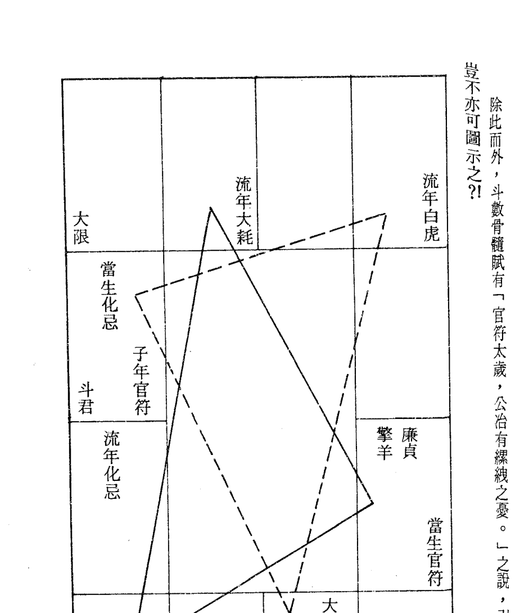

## 第四七章 官府夹刑杀于迁移离乡遭配

> 原注：假如流正官府与当生官府夹刑杀于迁移之宫，太岁小限若到此，必遭刑贬配离祖之论。（见卷二“官符会刑杀于迁移，离乡远配。”）

甲年生男官符加夹迁移示意图：

| 巳 | 午 | 未 | 申 |
|---|---|---|---|
| (子女) | 小耗(夫妻) | 将军(兄弟) | 奏书 |
| 辰 | 流羊 | 青龙 | 蜚廉 |
| (财帛) | 攀羊 | 乙亥年官符 | 喜神 |
| 卯 | 流禄 | 力士 | (父母) |
| (疾厄) | 丑 | 陀罗 | (官禄) |
| 寅 | 禄存 | 伏兵 | (田宅) |
| 流陀 | 大耗 | (迁移) | 博士 |
| (奴仆) | 官府 | 病符 | 乙亥年太岁 |

官府者，即十二太岁煞神之官府，有认其混淆与“官符”通用，称之为“当生官符”，恒居禄后一位，阳男阴女命者，恒与陀罗同宫，阴男阳女命者，恒与擎羊同宫。岁前诸星有“官符”，恒与太岁、白虎三合会照，如今甲子年，太岁在子，官符到辰，白虎居申，以太岁官符本为兴讼之神，容易出入公堂而论议之（参考前一章“刑杀同廉贞于官禄，极难逃”）。一般为不使与煞禄神之官符相混而有所区别，称之为流年官符。当正官符以生年干与男女之区别而寻定，流年官符以流年支而寻定，所以本文虽然为一句简单的赋文，其实已暗示人命罪恶的欲望已有命定的触犯刑法而遭受制裁的预兆，命中有这种星象的人，就最要注意修养——甲年生男，当生官符居丑，未之流年官符到亥，如小限到午，适为癸未年，即以官府夹“流禄”于迁移论议；酉之流年官符亦到丑，是为“官符重逢”，或称“官符迭并”；亥之流年官符到卯，是为加夹“寅宫”。由是，甲年生男，官符加夹之位“寅”，若行年岁次乙亥年，适为流陀所居，是为加夹“寅宫”。

验证——官符夹刑杀于迁移便览表 为使爱护望元之读学者，方便查阅，望元特别用心于此，将之集列为下列便览，请自参考

| 庚男 | 己女 | 己男 | 戊女 | 戊男 | 丁女 | 丁男 | 丙女 |
|------|------|------|------|------|------|------|------|
| 未   | 巳   | 未   | 午   | 辰   | 巳   | 未   | 午   |
| 巳   | 亥   | 巳   | 辰   | 戌   | 亥   | 巳   | 辰   |
| 酉   | 卯   | 酉   | 申   | 寅   | 卯   | 酉   | 申   |
| 申   | 辰   | 申   | 未   | 卯   | 辰   | 申   | 巳未 |
| 流陀 | 流羊 | 流陀 | 流陀 | 流羊 | 流羊 | 流陀 | 流陀 |
| 辛巳 | 乙亥 | 辛巳 | 庚辰 | 甲戌 | 乙亥 | 辛巳 | 庚辰 |

| 生命/摘要 | 甲男 | 甲女 | 乙男 | 乙女 | 丙男 |
|-----------|------|------|------|------|------|
| 官当府生 | 丑   | 卯   | 辰   | 寅   | 辰   |
| 太流岁年 | 亥   | 酉   | 戌   | 子   | 戌   |
| 官流符年 | 卯   | 丑   | 寅   | 辰   | 寅   |
| 加官夹地符 | 寅   | 寅   | 卯   | 卯   | 卯   |
| 刑杀     | 流陀 | 流陀 | 流羊 | 流羊 | 流羊 |
| 流年岁次 | 乙亥 | 乙酉 | 甲戌 | 甲子 | 甲戌 |

## 〔事实〕

案受审，迄今甲子年四月改判无期徒刑为有期徒刑之命例后——

- 一、犯案前月余，由泥水匠改任玫瑰园餐厅外务经理。
- 二、涉“谢国和弃尸案”，初被判共同杀人，处无期徒刑，后上述经改判有期徒刑十二年。
- 三、犯案后经月，八月在其母及律师之陪同下向警方投案。

上述便览表仅举一端而已，学者可以据而引申发挥，今特举蔡某人因故犯案，于壬戌年秋投

| 癸女 | 癸男 | 壬女 | 壬男 | 辛女 | 辛男 | 庚女 |
|------|------|------|------|------|------|------|
| 亥   | 丑   | 子   | 戌   | 申   | 戌   | 酉   |
| 巳   | 亥   | 戌   | 辰   | 午   | 辰   | 卯   |
| 酉   | 卯   | 寅   | 申   | 戌   | 申   | 未   |
| 戌   | 寅   | 丑   | 酉   | 酉   | 酉   | 申   |
| 流羊 | 流陀 | 流陀 | 流羊 | 流羊 | 流羊 | 流陀 |
| 辛巳 | 乙亥 | 甲戌 | 庚辰 | 庚午 | 庚辰 | 辛卯 |

## 蔡某人廿五岁示意图：

| 乙巳 | 禄存 | 丙午 | 文曲 擎羊 天府 武曲 | 丁未 | 天钺 太阴 太阳 | 戊申 | 文昌 贪狼 |
|------|------|------|-------------------|------|--------------|------|----------|
| 父母 | 斗君 | 福德 | 二月              | 田宅 | 三月         | 官禄 | 四月     |
| 甲辰 | 陀罗 破军 | 十二月 | 流年大耗 当生官符 | 己酉 | 巨门 天机 | 奴仆 | 五月     |
| 小限 | ... | ... | ... | ... | ... | ... | ... |

> 注：民国71年7月14日为壬戌年五月廿四日。就五限言，甚符“官符夹刑杀于迁移，离乡遭配”之义。

| 巳 | 禄存 天同 | 午 | 文曲 擎羊 天府 武曲 | 未 | 天钺 太阴 太阳 | 申 | 文昌 贪狼 |
|----|----------|----|-------------------|----|--------------|----|----------|
| 夫妻 | 博士 临官 | 兄弟 | 力士 帝旺 | 命宫 | 青龙 衰 | 父母 | 小耗 病 |
| 辰 | 陀罗 破军 | 25 | 官府 冠带 | 蔡某人 | 岁次戊戌年八月廿六日寅时生 | 酉 | 巨门 天机 |
| 天刑 | ... | ... | ... | ... | ... | ... | ... |

> 注：岁次壬戌年蔡某人廿五岁，流年官符到寅，是官符加夹小限兄弟宫，竟为朋友事犯案，异哉！

## 第四八章 善福于空位天竺生涯

善者，天机，福星，天同。二星恒不同垣，但不能排除其于大小二限运会之机会。
空位者，基于诸星问答论之论命诀歌曰：“命坐天空是出家，文昌天相实堪夸，若逢四杀同身命，受荫承恩福可佳。”，所以大抵以天空所居为“空位”，但我们不排除截路空亡与旬中空亡所居为空位之可能！

寻观斗数全书，论议僧道生活者多矣，以其散漫，故集列摘录于下——

> 玉蟾先生曰：“紫微，……身命逢之不胜其吉，如遇四杀、劫空、机梁冲破，定是僧道。”

> 诸星问答论“天机”问答曰：“天机，……定数于人命，逢诸吉咸集，则万事皆善，勤于礼佛，敬乎六亲，利于林泉，宜于僧道。”

> 希夷先生曰：“天机，……若居陷地，四杀冲破，是为下局，若见七杀、天梁，当为僧道之清闲。”

> （望元附按：天机守命之人，慈善能为人设想，容易有宗教信仰，如机梁守命之人亦然，其限行七杀、天梁之岁限，最容易产生发生宗教信仰。）

> 希夷先生曰：“天同，……会四杀居巳亥，为陷。残疾孤克，女人逢杀冲破，刑夫克子，梁月冲破，合作偏房，僧道宜之，主享福。”

> 诸星问答论“太阴”问答曰：“太阴，……身命若遇恶杀交冲，必作伤残之论，除非僧道，反获祯祥，决祸为最、为要紧，不可参差。又或与文曲同居身命，定是九流术士。”

> 希夷先生曰：“巨门，……十二宫中若无庙乐照临，到处为灾，奔波劳碌，至亥子丑寅巳申虽富贵亦不耐久，会太阳则吉凶相半，逢七杀则主杀伤，贪耗同行，因奸徒配，遇帝座则制其强，逢禄存则解其厄，值羊陀，男盗女娟，对宫遇火铃白虎，无帝压禄存，决配千里，三合杀凑，必遭火厄，此乃孤独之数，刻剥之神，除为僧道九流，方免劳神偃蹇，限逢凶曜，灾难不轻。”

> 诸星问答论“七杀”问道曰：“七杀，……主宜数，则宜僧道。”

> 诸星问答论“文曲”问答曰：“官身与太阴同行，定系九流术士。”

：……综之上述，人命原无天生之命，大抵以人生遭遇挫折，精神空虚困惑而倾向于僧道九流术士，学者苟能精谙诸星问答论，要以论议星曜生克制化即趋简易，更寻得“补遗骨髓赋”有论出家僧道之命，更值得推孝研究，一并摘录于后，裨免学者另外翻寻之麻烦——
“极居卯酉遇劫空，十人之命九人僧，道释岩泉皆有分，清闲幽静度平生。”

命坐空乡定出家，文星相会实堪夸，若还文曲临身命，受荫清闲福可嘉。
天机七杀破梁同，羽客僧流命所逢，更若太阳兼帝座，伶仃孤克命方终。
另观天机论男命诀又曰：“天命化忌落闲宫，纵有财官亦不终，退尽家财兼寿夭，飘荡僧道在山中。”，于是知戊年生男命天机化忌，如更在巳之闲宫守命，则可以断此人容易倾向于宗教信仰矣！

又观天同论男命诀又曰：“天同守命落闲宫，火陀杀合更为凶，天机梁月来相会，只好空门度岁中。”，因天同优点受限制之闲宫不明（望元尝臆其为戊宫，戊藏戊丁辛，天同壬水之受限制吧？！），所以此“又曰”读解困难，只给予我们一个僧道岁月的印象而已！

读此二则“又曰”，再看赋文及诸星问答，我们可以想像此二星更迭相守于身命，如天机在巳守命，天同在丑守财帛身宫，或如天同在戊守命，天机在寅守官禄身……等例，命身宫之一居于天空、截空、旬空之位，大概即可以论议其人可能倾向于宗教信仰。

> 附记：天机为巳亥年生人身主，天同为卯酉年生人身主，望元尝于卷二第九九页“昌曲在于空乡，林泉冷淡”臆忖命身主座落旬空位而倾向宗教信仰，则本文之义相当，是否要活泼联想论议，则有待学者自为验证了！

谈星要论曰：“……若命宫无正曜者，财官二宫有吉星拱照，富贵全美，或偏房庶母所生，三方有恶星冲照，或二姓可诞生，离祖可保成家。”，其论固至当，唯其面临今日社会组织结构型态已异于古代之一夫多妻制度，当然有所必要以为新诠。

## 第四九章 辅弼单守命宫离宗庶出

> 曾看紫微斗数全书论父母宫诀曰：“左辅独守，无刑。廉贞同，早刑。加文昌，相生，无刑。加羊陀火铃，刑伤退祖，二姓延生。”

- 右弼独守，无刑。加吉星得父母庇荫。见羊陀火铃凑，离祖，二姓安居。
窃臆人命之与父母亲缘当从父母宫以为观察，凡父母宫单见辅弼，亦无碍于父母，必见四杀始作离宗、庶出论议。

今观本文，再查论命诀，论命仅及于运命福禄而不及于父母，于是知紫微斗数全书虽已涵盖极广泛而犹有不及，所以斗数之值得吾人深入探讨研究以为发扬者，当非区区望元井底之蛙所可以窥天而以为发扬。

寻观潘子渔先生著“紫微斗数实例分析”第三二三页“第二个潘子渔”例，适命无正曜，主“幼时在他家寄养数年”，果然，潘先生幼时寄养姑妈家中，郑先生寄养外祖母家中，以潘先生巳 天府 左辅 天伤 奴仆(46-55) 耗官
午 太阴 天同 忌科 截空 伏兵旺 迁移(56-65)
未 陀罗 文昌 文曲 贪狼 武曲 权 天使 疾厄(66-75) 府丧
申 禄存 巨门 太阳 禄 天空 天马 财帛 博士病
辰 官禄(36-45)符带
卯 铃星 破军 廉贞 田宅(26-35) 神浴
寅 地天 劫姚 福德(16-25) 廉生
丑 火星 父母(6-15) 书养
子 将军胎 命宫
亥 七杀 紫微 兄弟 小耗绝
戌 天机 天梁 夫妻 青龙墓
酉 右弼 擎羊 天相 天力 士死 子女

阳男 郑先生 (第二个潘子渔)
岁次庚寅年二月三日卯时生
火六局

注：原图天相化忌，命宫起大限。以火铃天马等之所用不同，提注于此，读拙作当依此图观之。

新论至当，引录其命图，裨益学者推考—— 望元尝就手边资料加以参酌，命无正曜，从潘先生新论至当，即或见辅弼守命，亦有寄养亲戚家中之现象，尤其值得探讨的是，命无正曜之人，大多少年以前多灾难，缺乏美满温馨之家庭生活，或缺父爱，或乏母爱，或完全离开父母生活，在感情上每有不稳定与不成熟之现象，甚至于感情的追求上呈现父爱、母爱之憧憬，有潜意识希望弥补幼少年所缺失的父母爱之倾向。 兹附小李命图于后以为参考，其亦少年寄养亲戚家中，并如郑先生之为阳男顺命，第二大限之宫亦俱不见正曜——

## 第五〇章 七杀临于身命加恶杀必定死亡

（见卷二“七杀临于陷地，流年必见死亡。”）

七杀之星性甚为奇特，在当生命图之观察，常被以“庚金”论之，专针对贪狼甲木而为七煞，而于数中即作丙火而为杀曜。另者，其与紫微天府同为少数在十二宫骤无陷之星曜之一。

七杀恒与天府相冲，遇紫微则化权降福，在寅申丑未辰戌六宫入庙，甚至有说其能假紫府之专权而制压羊陀火铃空劫等凶星之力，但一般则视七杀至畏诸凶，所以诸星问答论曰：“主于身命，定历艰辛；在命宫，若限不扶，天折。”“若值正阴之宫，作祸忧深，流年杀曜莫教逢身，杀星辰休迭并身，杀逢恶曜于要地，命逢杀曜于三方，流杀又迭并，二限之中又逢，主阵亡掠死。”

“七杀居陷地，沈吟福不生。”，本赋前曰：“七杀破军专依羊铃之虐。”“七杀廉贞同位，路上押尸。”“杀居绝地，天年夭似颜回。”……等观之，七杀岂有制压诸凶之力？！

凡此观星必依星图实际观察研判，亦正后文“增补太微赋”所曰：“凶不皆凶，吉无纯吉。”之义，所以赋文之倾向于学理性的研究与诠注比较困难，但如有命图可以观察研判说明则比较清楚容易，因此特别摘录紫微斗数全书所附录“小儿天命”之“二”以为参考……

| 巳 | 午 | 未 | 申 |
|---|---|---|---|
| 夫妻 辰 陀罗 七杀 截空 天姚 子女 卯 天梁 太阳 财帛 寅 天相 文曲 武曲 天使 天马 疾厄 (64-73) 绝 | 兄弟 长生 | 沐浴 命宫 | 冠带 父母 (4-13) 临官 |
| 天机 禄存 (权) | 紫微 擎羊 | 左辅 右弼 | 破军 |
| 酉 | 戌 | 亥 | 子 |
| 天钺 地劫 福德 (14-23) 帝旺 | 廉贞 天府 (忌) 田宅 (24-33) 衰 | 太阴 天魁 | 贪狼 文昌 (科) 天刑 天伤 仆役 (44-53) 死 |
| 丑 | | | |
| 天同 巨门 (禄) 天空 迁移 (54-63) 墓 | | | |

注：
现年廿九岁，勤奋知礼，清晨送报，兼推销各类厨具、开饮机、工商记者，未结婚，正物色佳偶中。

阳男
小李
金四局
岁次丙申年四月廿三日戌时生

# 【紫微斗数全书原注】

初看本宫守命垣星，本宜易养，但夹羊夹陀夹空夹劫，若非夭，即主卑贱，虽紫禄无力，故天于九岁而亡。

> 【圣元提示】

+   1. 订正空劫，福德身宫有地劫，适可依斗数发微论“福德遇空劫，奔走无力。”论议，其福德身有当生武曲相冲，主有财富孤独的阻障灾咎。
    2. 天马陷于截路空亡，是为马落空亡，终身奔走。
    3. 其生壬申年为甲子旬，旬空戊亥，禄存正陷于旬空，是禄存之最嫌而不能为福，当依禄存遇恶败其迹论之。
    4. 紫微在子辰亥落闲，其在亥守命，亦有优点被限制不能发挥之倾向，又且紫微在亥化权不得地（见卷二第五七页），紫微化不化权俱不能发挥“命逢紫微非特寿而且荣”之优点。
    5. 大小二限相冲，何况小限到午，适得太阴化忌，流年截路空亡，小限极凶。大限壬子，适为擎羊重逢。对于小限而言，是为羊陀迭并。
    6. 太岁为当生大耗（申）、流年大耗（戊）所拱照，亦凶。
    7. 庚辰年禄存到申，其年为甲戌旬，旬空申酉，又逢禄存陷空之象，岂不至凶？！

| 宫位 | 地支 | 主星 | 其他星曜 | 备注 |
|------|------|------|----------|------|
| 命宫 | 亥 | 紫微、七杀 | 禄存、权、天姚、博士、病 | 金四局、阳男 |
| 兄弟 | 戌 | 天机、天梁 | 禄、陀罗、铃星、官府、衰 | |
| 夫妻 | 酉 | | 天空、伏兵、帝旺 | |
| 子女 | 申 | 巨门、太阳 | 临官、大耗、文昌、天相 | |
| 财帛 | 未 | 贪狼、武曲 | 忌、天刑、病符、冠带 | |
| 疾厄 | 午 | 天同、太阴 | 天使、小限、喜神、沐浴 | |
| 迁移 | 巳 | 天府、文曲 | 科、蜚廉、长生 | |
| 仆役 | 辰 | | 天伤、（庚辰太岁） | |
| 官禄 | 卯 | 廉贞、破军 | 将军、胎 | |
| 田宅 | 寅 | 左辅、火星 | 天马、截空、小耗、绝 | |
| 福德 | 丑 | | 地劫、青龙、墓 | |
| 父母 | 子 | 右弼、擎羊 | 大限、力士、死 | |

## 第五一章 铃羊合于命宫遇白虎须当刑戮

太岁、官符、白虎三神恒为三合，如望元推臆项羽死于己亥年三十三岁无误，则项羽之命例适足以引为本文之说明！

> 【望元提示】

+   - 一、命午宫与未合，命宫左合铃星。
    - 二、未宫有擎羊，左合亥宫之当生白虎。
    - 三、擎羊与铃星原不相合，因午未宫之日月合而呈“铃羊合于命宫”之象。
    - 四、本命已呈遇白虎须当刑戮之兆，以白虎在此当生命图为静体，所以未动而未发用，若流年遇白虎则忌之。

项羽当生白虎示意图：

| 已 陀罗 | 午 天机(科)禄存 | 未 文昌文曲擎羊破军紫微 | 申 |
| 辰 太阳 | 酉 火星天钺天府 | 卯 武曲七杀右弼 | 戌 铃星太阴(禄) |
| 寅 天同天梁(权) | 丑 天相天使 | 子 巨门(忌) | 亥 廉贞贪狼左辅天魁天伤仆役 |

# 【望元提示】

一、就当生命宫而言，命宫合铃星而不合擎羊。

二、太岁有当生擎羊白虎遇合流年擎羊白虎之兆。

三、以太岁大限六合，而如“铃羊合于命宫”之午未合现象。

四、项羽被逼乌江自刎，与遭刑戮何异?!

执此以观，虽不能考证项羽死亡于己亥年三十三岁，但正足于说明斗数在一些特例上要考虑宫位地支六合之“暗合”意义，所以本文或可如下解释——

假如羊铃守命，或命身中原有羊铃之一坐守或三合者，又得四杀之一与命身暗合，皆作“羊铃合于命宫”论议，主其人将来容易遭遇刑戮死亡之厄运。

如其限行杀、破、狼岁限，又逢流年白虎，亦作诸凶咸集论议，其凶恶虽不一定如七杀迭并，七杀加恶杀必定死亡，但如又逢化忌者，亦主遭受法律制裁，或灾病手术、车祸等血光之灾，甚至死亡。

| 已 | 午 | 未 | 申 |
|---|---|---|---|
| 流陀 | 陀罗 流禄 | 天机(科) 禄存 文曲文昌(忌) 紫微破军 流羊 流年白虎 当生官符 | |
| 辰 太阳 | 项羽三十三岁流年白虎示意图： | 酉 火星 天钺 天府 | |
| 卯 武曲七杀 右弼 流年官符 | | 戌 铃星 太阴(禄) | |
| 壬寅 天梁天同(权) 大限(32-41) | 丑 | 子 天相 | 亥 巨门(忌) 左辅 天魁 贪狼 廉贞 己亥年太岁 当生白虎 |

## 第五二章 官府发于吉曜 流杀怕逢破军

官府者，大抵以当生官符论议，为十二宫太岁煞禄神之一，其恒布于十二神之最后，而恒居博士之衔接位，以博士寻禄存安定，故顺布必与擎羊同宫，逆布必与陀罗同垣，一般亦大抵以凶曜视之。
望元于卷一第一六三页附按，以官府若居官禄宫有为文官之兆，若居财帛宫则有武职之象；唯二限流年遇之，则主官府词讼之事，最忌重逢流年官符，当主词讼、狱讼之事。
此说换以羊陀解释亦无不当，试观诸星问答论希夷先生之所曰：“擎羊入庙，性刚果决，机谋好勇，主权贵。”“陀罗在庙财官论，文人不耐久，武人横发高迁。”，羊陀虽俱北斗浮星，守之于命不尽以凶星论之，但于运限命数逢遇，则大抵以杀星论凶，甚忌羊陀迭并也。
又观司法人员如推事、检察官、法警之命中有官府，犯法之囚徒命中有官府，证人、关系人等等比较时常出入司法治安机关之命中三合亦有官府，其所差别者在于命宫星曜之配置如何而已。假如命主星得吉曜，则官府受制不凶，不犯官非，甚至有因之为官当差，所以说“官府发于吉曜”。
惟其官府等次不彰，用羊陀较易表示其吉凶征兆，如果流年迭并，或如前章所述“羊铃合于命宫”，则有考虑发生官非之必要，此亦羊陀二星已涵盖了官府一神之故也。
由于静体之擎羊陀罗而到变相的流羊流陀，由于意识观念恍惚可以清楚划分，恍惚又朦胧混淆，如擎羊之有流年擎羊，天马之有流年天马，截路空亡之有流年截空，我们却很难肯定火铃有无流年火铃，于是在这模糊不清的意念中，斗数采用“将前诸星”、“岁前诸星”之二套神煞以为辅助运用，但以二十四神煞中有许多不太切实用，于是从“将前诸星”中取“将军”、“奏书”、“直符”三神，另取“岁前诸星”中“丧门”、“吊客”、“官府”、“白虎”四神以为流年“飞天七杀”，或简称为“流杀”。

# 一、飞天三杀概念示意：

飞天三杀既恒为三合，依斗数之习惯三方四正观察研判而言，似乎可以视为一个整体，然而

书云：“奏书口舌祸来侵，将军飞入悔心惊，直符官灾终不免，此是流年三杀星。”，于是使人有种飞星不飞的观念，如果将前诸星之未值宫发动者即不发生飞杀之作用，但以斗数仍有所残缺佚失，此说是否可信，则有待学者自为验证而已，兹举其四种“三合局”示意，裨利学者便览——

# (一)、辰子申三合水之流年局：

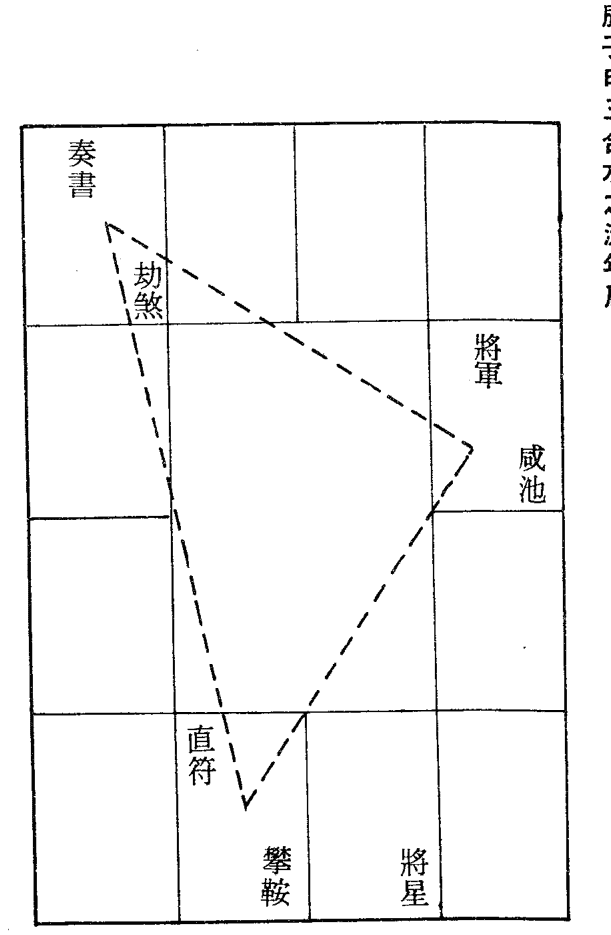

注：
水长生于申，将军恒居沐浴之位，直符恒居水衰之位，奏书则恒居水绝之地。

将前诸星表现流年之“卦气”，为使不与长生十二神混淆而别名，但二者之组配作用则有待吾人研究发现。

# (二)、巳酉丑三合金之流年局：

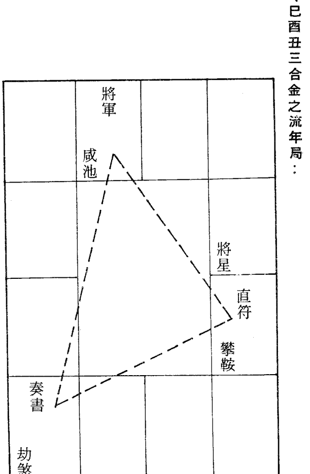

注：
金长生于巳，将星恒居帝旺之位，将军为咸池之居沐浴位，直符恒居金衰之攀鞍位，奏书则恒居金绝之位。

# (三)、寅午戌三合火之流年局：

飞天三杀亦自成一三合局，寅午戌三合火，火克年支三合之金，故取其克为凶。

# 四、亥卯未三合木之流年局：

飞天三杀亦自成一三合局，亥卯未三合木，木生年支三合之火，惟劫煞有水能克火而已，故飞天三杀之义犹自模糊，必赖学者研究突破。

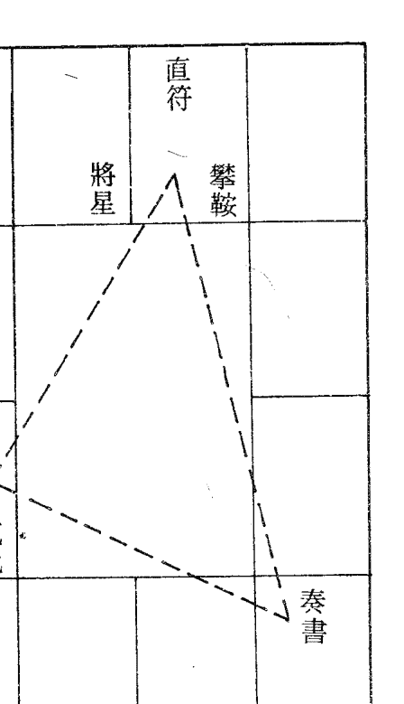

注：火长生于寅，将星恒居帝旺位，将军为咸池恒居沐浴位，直符为攀鞍恒居火衰位，奏书为劫煞恒居火绝位。

飞天三杀亦自成一三合局，辰子申三合水，水本有生年支三合之木，岂以水多木漂论之乎？！

# 二、太岁统御官府白虎概念：

岁前十二神自太岁起岁建，适与官府、白虎成为三合，凡此三者，大抵表现古人之太岁意识，其意义亦几近于前述当生官符“官府”，所以“官府”当有文官之兆，“白虎”当有武职之象。

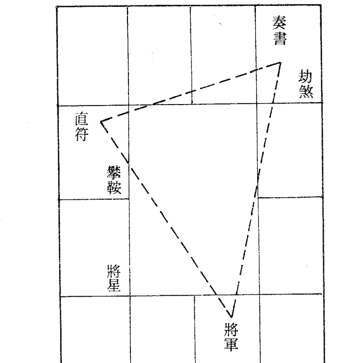

注：木长生于亥，将星恒居帝旺位，将军为咸池恒居沐浴位，直符为攀鞍恒居木衰位，奏书为劫煞恒居木绝之地。

总之上述诸端，流年杀星不宜逢破军，当然亦不宜相逢羊陀火铃空劫耗忌等杀星，学者不妨自为钻研推考之！

# 三、大耗统御丧门吊客概念：

古人意识太岁不可坐向，其所向为岁破，斗数以流年大耗表示之，其之耗损含有自己丧失或别人丧失之义，所以含有统御“丧门”“吊客”而为三合之义，兹以图示意：

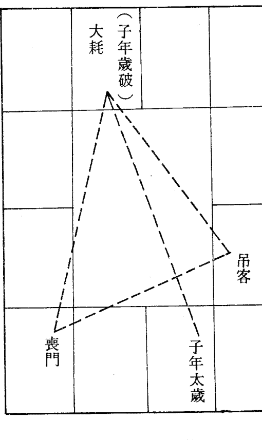

但以其俱作杀星论议，所以“白虎”之“武杀”，“官府”主“文杀”，太岁为岁君，所以统御文杀、武杀诸凶也，兹附子年太岁以为示意：

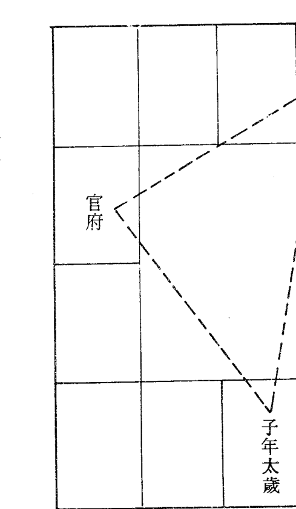

## 第五三章 羊铃凭太岁以引行

> （参考卷一第三八七页“尚有流羊陀等宿，此又太岁从流行。”）

羊铃共为四杀，羊陀系属于年干星曜，火铃则系属于年支星曜，所以四星的关系位置每因干支之配置而有周期性之运行变化。

太岁者，即岁君，为流年太岁，因岁次干支之表示，使许多“年”之神煞有所系属及运行，俗谚每谓：“太岁当头坐，无灾便有祸。”，盖以岁君属火，与诸凶神相遇，皆与不讳，忌与大小二限相冲，尤甚三合宫符、白虎，又遇会羊陀火铃者，必主其人官非、财破、身亡。

太岁固非实星，却普遍潜在于民间意识——！

古代观星，称木星为“岁星”，也叫做“太岁”，古人发现木星每十二年绕太阳公转一周，从地球上来看，我们地球经过一年，木星在天空只移动一“辰”，而木星移动一辰，总是经历“黄道”带上某些特定的星宿，每十二年周历黄道带所有星宿而绕行太阳一周，所以斗数设“流年太岁”，每年值命盘一宫曜。

又地球绕日公转太阳一周为一年，从地球上看木星，每夜可见木星出现于黄道带附近，很巧

的每个月经历黄道十二宫之一宫，历一年而遍历黄道带十二宫，所以又衍生“流月太岁”、“流日太岁”的想象……！

古时论断宿命，必须观察天上星象配合，今日从事紫微斗数论命，能够灵活应用三四十颗星曜以上就不错了，如果能够明白神煞卦气之意义，使用到六七十几个“符号”，大概也可以算得上学者、专家、方家……之流了，想要从命图配合星象的观察而推测宿命，大概也只是一个神话中的梦想而已！

斗数使用太岁，每年当值相同年支之宫曜，子年太岁在子宫，丑年太岁在丑宫……亥年太岁在亥宫，其立意很接近子平术之小运，君不见子平术直接取用流年岁次干支为其人之小运？！

既然斗数使用太岁之意义与子平相当，则命数阴阳家等的星曜神煞的意识亦被保存沿用，如从年干之流禄、流羊、流陀、流年四化，如从年支之岁前诸星、将前诸星……，所以斗数之论小限、太岁，唯有共用流年之干支而已。

所有的流年星曜神煞，俱依附太岁引行，则羊陀火铃四杀亦当不例外，但于今斗数学者大多只偏重流羊、流陀而已，对于火铃二曜是否要如羊陀之有流年火铃，仍存疑义，何况火铃二星之

起例犹有“年支星曜”与“年支配合生时星曜”之意见分歧，凡此等等俱有待学者推求而已。

简言之，斗数推测宿命，以太岁每年之运行一宫而牵动羊陀火铃四杀，以为观测研判流年运限之吉凶！

## 第五四章 病符官符皆作祸

斗数之异于子平者，以精微细致取胜，但失之于繁复驳杂，如果不能分辨主宾体用，则命图满盘皆凶，凶多吉少，而无一可取。斗数为使学者不致于困惑，大抵以当生之星曜神煞为体，以流年星曜神煞为用之意义，这可以从主病疾之“病符”与主官非之“官符”而获得概念——“病符”属水，“官符”属火，俱分“当生”、“流年”，皆以逢之作祸论议，尤以重逢为验，难断其为祯祥。凡当生之病符、官符其依生年干寻定，其意义是否在于强调人命生年干之注重生克制化，虽不得而知，但当生病符，即五行长生之“病”位，与当生官符，即十二宫太岁煞禄神之官府，二者俱依其人之生年干寻定则是不争之事实。二者分别以不同的方法起例，所以繁属稍有不同，但其临于流年，虽有将前诸星及岁前诸星之分，但流年“官符”、“病符”俱依流年支论议，而且同属“岁前诸星”，官符恒居岁前左拱之位，病符恒居岁后右夹之位，两星之关系位置互为陷位，以官符主本宫而言，病符适居于疾厄宫天使之位，如以病符为本宫而言，官符适居于仆役宫天伤之位。

据此，官符、病符之星性可以用伤使反应，有些斗数极佳之学者，甚至尽量采取较少之星曜神煞，俾使命图简易清晰而方便观察研判矣！

## 第五五章 奏书博士与流禄尽作吉祥

> 〔见卷二“奏书博士并流禄，以丧乎吉祥。”，“力士将军与青龙，以显其威福。”〕

斗数用十二宫太岁煞禄神起博士而寻禄存安定，以禄存有当生禄存及流年禄存之体用区分，所以博士等十二神亦应当依流禄而有流年十二宫太岁煞禄神为是，但如此则益增斗数命图观察研判之困扰，所以现今所见之斗数每有“尽在不言中”与“重复”之现象。

在十二宫太岁煞禄神与将前诸星很为相近，但又截然不同，而且十二神如果用三合局的方法表现的话，学者不难发现奏书与博士的关系位置正巧有如流年官符、病符之关系一般，望先已于卷二“奏书博士并流禄，以丧乎吉祥。”中有所解释，所以在互居陷位的星曜中，亦有如博士奏书同为吉祥之性质，千万不要因为星曜神煞的起例大同而一概论之！

试看博士主聪明，奏书主福，以其相关位置而论，岂不暗寓“聪明反被聪明误”之义？！力士与官府分居博士前后，正相当于羊陀之夹流禄，因此只要能更深入的分析十二宫太岁煞禄神的性质，当然更有助益于观察研判，只可惜知斗数而又精通神煞的到底不多，所以斗数有关于这一方面的资料，几乎可以说是贫瘠得毫无收成。

今试以三合局方法表示甲年之十二宫太岁煞禄神如下——

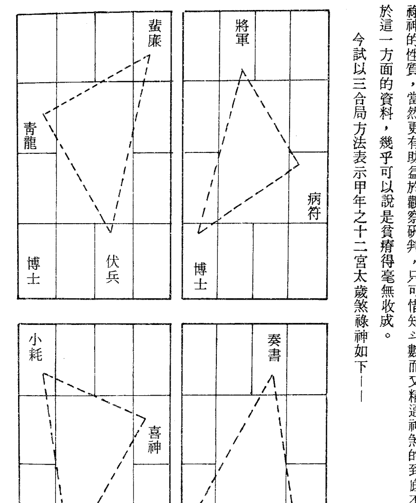

306

307

于是在这个三合局的示意图中，还隐藏者许多值得我们探求的人生哲学的寓义，譬如“博士”、“力士”、“将军”、“青龙”、“小耗”、“病符”、“喜神”、“蜚廉”、“奏书”、“伏兵”、“官府”等，在十二神的三合局之中，我们发现小耗所统御的三合局无近利而外，力士、将军、青龙三神大多能够表现其同宫星曜原来所能发挥的优点。（参考卷二第二七二页）。

假使有精子平斗数之学者，不妨将十二宫太岁禄神之作用，试以子平六神之方法假想：譬如甲年起丙寅，则丙寅对于甲为“博士”、“丁卯为“力士”、“戊辰为“青龙”……乙丑为“官府”。但此仅止于想象，学者不妨从下列示意自为探讨是否可行，不赘。

# 【甲】

+   - 博士 食神 丙寅 比肩（比肩、食神、偏财）
    - 力士 伤官 丁卯 劫财（劫财）
    - 青龙 偏财 戊辰 偏财（偏财、正印、劫财）
    - 小耗 正财 己巳 食神（食神、偏官、偏财）
    - 将军 偏官 庚午 伤官（伤官、正财）
    - 奏书 正官 辛未 正财（正财、劫财、伤官）
    - 蜚廉 偏印 壬申 偏官（偏官、偏印、偏财）
    - 喜神 正印 癸酉 正官（正官）
    - 病符 比肩 甲戌 偏财（偏财、偏印、比肩）
    - 大耗 劫财 乙亥 偏印（偏印、比肩）
    - 伏兵 食神 丙子 正印（正印）
    - 官府 伤官 丁丑 正财（正财、正官、正印）## 第五六章 遇殺無制乃流年最忌

童子限如水上泡漚，老人限似風中燃燭，遇殺無制乃流年最忌。（見卷二「童老限遇殺必驚折，學者可試就所附命圖觀察研判一一」）

「一」

古人累積經驗與長久持續不斷之觀察與記錄、修正，終而衍成命數哲學，正確的觀察出童年時候的抗病、免疫力較弱的現象，正確的觀察到老年衰邁時候的生理機能衰退、老化現象，亦如童年之對於疾病及意外災禍的缺乏應變能力及抵抗能力，所以對於童年、老年之觀察研判，切宜注意命限有否遇殺，遇殺又有無制化，避免造成誤斷。

一般對於老年運限之觀察，大抵還可印證其人經歷而調適命圖星象之吉凶作用，在觀察上還有線索可以追尋，但是對於嬰兒初生，大小二限未行以前之宿命則較困難觀察，所幸斗數留有童限訣，學者但只用心審詳即可。

今有民國六十一年十一月十五日（歲次壬子年十月十日）辰時生女命，生下來未及二旬即夭折，學者可試就所附命圖觀察研判一一

（命盘图表，包含十二宫位、星曜、神煞、生辰等信息，布局为方格网状。）

### 【翌元提示】

- 一、命宮，亦童限一歲，以天空守值，依「生逢天空猶如半天折翅」論之。
- 二、小限在戊，有鈴羅不美，更呈「廉貞（戊）七殺（辰）」同位，路上押屍。
- 三、太歲陷於天殤，恐有絕糧餓死之厄，或以食咽胃腸有障礙。
- 四、太歲有「鈴羊合命宮遇白虎須當刑戮」之兆。
- 五、命居敗地，祿居絕地已不美，天馬及命身二主俱入寅而遇截路空亡，寅為水命蹇滯之宮，亦人生子命所忌之宮，故凶。
- 六、童命初生之年，以月限為斗君，十月入辰，是為「生逢七殺」，何況羊陀拱沖，小限月限相沖，更互守天羅地網，故至凶。
- 七、此命有「命衰」「身衰」「祿絕」「馬陷」之兆，命無正曜，依「巨門」論議，以「巨門逢七殺則主殺傷」論議，此女當主送醫手術而亡。

## 第五七章

## 人生榮辱限元必有休咎
處世孤貧數中並無駁雜

> （參考卷二「一世迍邅，命限逢乎駁雜。」）

斗數雖然還不能說是命數哲學中最為完美的學術，但是其之能夠由一個人的生辰八字而表現於命圖星象，而且能夠接近神異程度的表示人生的榮辱休咎，推測其人的富貴吉凶禍福壽限，可以說是一門很值得推敲研習的命數哲學。
其實命圖星象的觀察研判，在原則上雖然大同小異，但是由於斗數學者專家的習得程度各有不同，而且各以其所習得而能發揮於觀察研判的比例又有不足傾向，各專家學者以此「不同」「不足」而用斗數推測宿命已獲社會上的好評與認同，所以斗數之值得研習並為推廣發揚，亦自不言而知矣！
翌元嘗於閒談中喟嘆：「吾學不及斗數全書之三成，用之又不足習得之三成，以不及斗數精萃之一成為人推測宿命已極具相當程度之準確率，知世間猶存此命數哲學而不鑽研求習，翌元豈亦白癡傻之徒乎？！」

## 增補太微賦

## 玄微論

希夷先生曰：斗數之例，猶大易之分八卦，八卦非象辭不明，眾星非講明何措?! 是以觀斗數者，再三審動靜之機，第一辨賓主之分，動靜循環不已，主賓更迭無拘，主若無情，何賓之有，賓若不能對，何足取哉！ 愧彼羊陀，惟視祿存之好惡，入吾日月，也思空劫之興亡；殺有殺而無刑，雖殺有救，刑有刑而孤單，終身不勉；火星旺宮為富論，羊陀得令豈成凶！ 前後二凶神，為兩鄰加侮，尚可撐持，同室與謀，最難提防，片火焚天，馬重羊逐，祿存劫空，親戚無常，權祿行藏靡定。 君子哉魁鉞，小人哉羊鈴，凶不皆凶，吉無純吉，主強賓弱可保無虞，主弱賓強凶危立見，主賓得失兩相宜，運限命身當互見。

身命最嫌羊陀七殺，遇之未免為凶；二限甚忌貪破巨廉，逢之定然作禍，命遇魁昌常得貴，限逢紫府定財多。 凡觀女人之命，先觀夫子二宮，若值殺星定三嫁而心不足，或逢羊宇（陀羅）雖啼哭而淚不乾。 若觀男命，始以福財為主，再審遷移何如，二限相因，吉凶同斷。 限逢吉曜，平生動用和諧，命坐凶鄉，一世求謀齷齪，廉祿臨身，女得純陰貞潔之德，同梁守命，男得純陽中正之心。 君子命中亦有羊陀火鈴，小人命內豈無科祿權星，要看是垣失垣，專論入廟失廟。 若論小兒，詳推童限：小兒命坐凶鄉，三五歲必然夭折。更有有限逢惡殺，五七歲必主災亡。 文昌文曲天魁秀，不讀詩書也；多學少成，只為擎羊逢劫空； 命之理微，熟察星辰之變化；數之理遠，細詳格局之興衰。 北極加凶殺，為道、為僧；羊陀遇惡星，為奴、為僕；如武破廉貪

## 增補太微賦絮言

斗數全書之「增補太微賦」數見自「前後兩凶神，為兩鄰加侮，尚可撐持。」以迄「此皆斗數之奧妙，學者宜熟思之。」，終不及南北山人編註之「古版復修新梓紫微斗數全書中」之「玄微論」予人一種完整的感覺，尤其可貴者，南北山人曾用很大功夫詳加句逗、整理、釋譯，對於吾等後學，確實裨益裨助不少。

竊以「玄微賦」無損於「增補太微賦」，尤其有過之而無不及，所以引錄以為替代。惟以斷章取句之註困難，有以全句、斷句之分別詮註，較易引導學者瀏覽「紫微堂奧」之故，自然疏稀於章節編序之講究，敬請學者見諒！

，固深謀而貴顯，加羊陀空劫，反小志之孤寒。

限輔星旺，限雖弱而不弱，命臨吉地，命雖凶而不凶，斷橋截路，大小難行，卯酉二空，聰明發福。

命身遇紫府，疊積金銀，二主逢劫空，衣食不足。謀而不遂，限身遭遇輔相。

科權祿拱，定為扳桂之高人；空劫羊鈴，作九流之術士；情懷暢舒昌曲命身；詭詐浮虛，羊陀陷地；天機天梁擎羊會，早有刑而晚見孤；貪狼武曲廉貞逢，少受貧而後享福。

此皆斗數之奧妙，學者宜熟思之！

## 第五八章 斗数猶大易之分八卦

古有連山易，歸藏易、周易，今但存周易，其為古卜筮之書，聖人設卦觀象，繫辭焉而明吉凶，易與天地準，故能彌綸天地之道。
據說，希夷先生說：「斗數之例，就好像周易之分八卦，仰以觀於天文，俯以察於地理，是故知幽明之故，原始及終，故知死生之說。周易之設卦爻以觀象，有賴於文王周公之作辭，孔子之繫辭才能夠明確的解釋成為可以明瞭的卦象，斗數之例就像周易之象辭而可以理解，所以講究斗數一定要瞭解衆星神煞的性質，如果不能瞭解星曜神曜之性質，又如何能夠理解紫微斗數呢？！」
也就因爲斗數好像大易之分八卦的道理一樣，在斗數的命盤星象之中，蘊蓄著河洛理數，所以凡是觀察研判紫微斗數者，一定會極爲慎重的審詳命盤星象動靜的契機，首先就是要能分辨星象的主實關係，在整個觀察研判的過程，命盤星象雖爲靜體的現象，却又能表現循環不已的活盤動態現象。
在觀察研判的過程中，但以主事之宮爲本宮，主事之宮因爲觀察之需要而無拘束的變換著，首先要注意主事宮蹏虛實，本宮若有虛無實，即使能得三方輔益，其功到底不如本宮自強，假如
三方星曜又不能與本宮星象呼應對襯，那麽這個本宮星象大概也就沒有什麼可以論議的了。
因此，觀察斗數要具備命盤星象的活盤動態概念而外，心中還要存著命盤猶如大易八卦的意識，兹附示意圖于後——

> 據說，希夷先生說：「斗數之例，就好像周易之分八卦，仰以觀於天文，俯以察於地理，是故知幽明之故，原始及終，故知死生之說。周易之設卦爻以觀象，有賴於文王周公之作辭，孔子之繫辭才能夠明確的解釋成為可以明瞭的卦象，斗數之例就像周易之象辭而可以理解，所以講究斗數一定要瞭解衆星神煞的性質，如果不能瞭解星曜神曜之性質，又如何能夠理解紫微斗數呢？！」

## 第五九章 观星大要

观察命图星象不能一一尽述，兹举大要于下：

- 一、愧彼羊陀，惟视禄存之好恶矣！
羊陀恒夹禄存，其不利於本宫，本宫但见羊陀，禄存必退避於三方四正之外。因禄存为人命福禄之所存，最宜三方四正见之，所以观星之法亦甚注意禄存所表现之好坏意义！

- 二、入吾日月，也思空劫之兴亡：
观察命图星象固以紫微为枢机变化，比较注重正曜之生剋制化，但其中精微不一而足，如日月为紫微之分司，亦有其主宰，日月分象一天之仪表，日为官禄主月为田宅主，即不入命，亦应审详观察，其作用大抵可以配合空劫以为推考，所以斗数观星无所偏颇，副曜杂曜亦有其表象意义。

- 三、杀有杀而无刑，虽杀有救：
太微赋曰：「七杀破军专依羊钤之虐。」，大抵明言凶星遇会杀星而与凶作恶，如果命图原有杀耗廉贪等恶曜，大抵不以美论，或为庙旺化吉，反作祯祥，如其遇会羊陀火铃耗忌空劫，即如太微赋所论：「七杀临於身命，加恶杀必定死亡，铃羊合於命宫遇白虎须当刑戮……，流杀怕逢破軍……。「等等論之。」

- 四、刑有刑而孤單，終身不剋：
假如其人命圖中原有刑殺之星，而此等刑殺之星孤單無力，又不遇會流年殺星，則於命圖上所表示的象意亦只虛星而已，像這種有虛無實的星象，即使用是刑殺凶星，終其人之一生亦不發生刑剋作用，所以觀星需要能分辨星曜之虛實。

- 五、火星旺宮為富論：
火鈴為南斗殺將，一般雖以殺星視之，但利東南生人，又喜寅卯巳午生人，限行東南亦福厚，如居寅午戌卯廟地，寅卯未得地，喜遇貪狼，是為「貪火貴格」，如在得地限宮獨逢，亦主喜氣盈門，百事通遂，仕宦逢之有陞遷發福之兆，常人逢之亦主錢財豐隆，此為火鈴驟與發達之特性，所以火鈴在廟地之地，亦以吉星論議，尤其不可忽略其所表現於人之進取奮鬥精神。

- 六、羊陀得令豈成凶：
羊陀火鈴共為四殺，一般以北斗浮星之刑忌視之，惟其喜入四墓，亦利四墓生人，亦如火鈴不盡為凶，譬如漢光武帝劉秀為「馬頭帶箭」格，生逢權祿，鎮禦邊疆而登九五，所以觀星大要必視星圖變化，不可固執吉凶而不能機變，如果食頑不化則與斗數之理旨相去至遠矣！尋觀諸星，羊陀喜紫微昌府會合，天府與化祿為最不畏懼羊陀而外，似已無其他星曜能夠制化。

- 七、兩鄰加侮，尚可撐持：
> > 尋見斗數骨髓賦有曰：「夾空夾劫主貧賤，夾羊夾陀為乞丐。」
所言以本宮之前後有兩凶神加夾，即稱為兩鄰加侮，大抵不以美論。假如己時生人安命在巳，亥時生人安命在亥，是為空劫夾命。又如甲生人安命在寅，乙生人安命在卯，是為羊陀夾命。或如限行遷移宮，奴僕原有天傷，疾厄原有天使，是為傷使加夾。俱為兩鄰加侮。觀星大要原則上固以兩鄰加侮為不美，但觀星大要必以本宮為主，本宮星曜吉旺，是謂自強不畏兩鄰加侮，如本宮星曜平和，亦不甚忌凶星加夾，惟本宮星曜陷弱，是謂從根自伐，是為同室與謀，或為同室操戈，內患而兩鄰加侮，凶危立見矣！

- 八、同室與謀，最難提防：
論議星曜生剋制化，實為斗數之精萃極致，譬如武曲為財星，如守財帛應有「財居財位，遇者富奢」之美，但如其守於巳亥必見破軍同垣，破軍水不能生武曲金，反泄武曲之金，所以反成「財到手成空」之象，
> > 尋見論財帛訣曰：「武曲破軍同，東來西去，先無後有。……加羊陀火鈴，不聚，極怕空亡。」
此破軍之於武曲即以「同室與謀」論議，或如羊陀火鈴同垣，因四殺火之先剋武曲金，挫弱武曲之金，豈能再見破軍水來泄氣？！
凡此，星曜同垣，有相剋，有相生，最怕被剋不生，最怕不為相生而被泄氣，此等同室為謀之情況不一定表面即能察見，而且其凶從根自伐，所以最難提防，惟有於觀察研判時小心在意而已。

- 九、片火焚天，馬重羊逐：
此句甚為晦澀難解，也有無此句者，尋觀南北山人編著「紫微斗數全書」第二四三頁「玄微論」曰：「孤神天馬重羊逐。」，潘子漁先生著「紫微斗數精義」第一八四頁譯曰：「火星忌與天馬同宮，必有災禍，羊刃重疊，則祿存失其助力。」而推臆，實仍有疑義。
望元竊臆「片火焚天」應當相對於「泛水桃花」而設，如是，則如有寅午戊丙年生人安命在午，適擎羊入命，天馬入申而廉貞化忌，此等格局有屬火星曜上燎命盤上方的現象，或勉可以「片火焚天」視之，茲附示意圖以待學者驗印——

八卦方位与卦气示意图：

| 地支 | 描述 | 月份 | 卦象 | 方位 |
| :--- | :--- | :--- | :--- | :--- |
| 巳 | 巳为大驿 | 四月 | 乾为天 | 巽 |
| 午 | 午为烽堠 | 五月 | 天风姤 | 离 |
| 未 | 未为花园 | 六月 | 天山遯 | 坤 |
| 申 | 申为名都 | 七月 | 天地否 | 坤 |
| 辰 | 辰为草泽 | 三月 | 泽天夬 | 巽 |
| 酉 | 酉为寺钟 | 八月 | 风地观 | 兑 |
| 卯 | 卯为琼林 | 二月 | 雷天大壮 | 震 |
| 戌 | 戌为烧原 | 九月 | 山地剥 | 乾 |
| 寅 | 寅为广谷 | 正月 | 地天泰 | 艮 |
| 丑 | 丑为柳岸 | 十二月 | 地泽临 | 艮 |
| 子 | 子为墨池 | 十一月 | 地雷复 | 坎 |
| 亥 | 亥为悬河 | 十月 | 坤为地 | 乾 |

「片火焚天」之謂，當以何者為當，望元不敢遽下定論，以是對於「馬重羊逐」之義亦生疑義——
假定天馬僅依年支論議，則擎羊依年干而恆居祿前，天馬如火鈴之僅依年支安佈，則擎羊與天馬的關係位置，有暗示歲次干支組配之意义，天馬擎羊因歲次干支之組配變化，在命盤上似有互相追逐之現象，譬如甲子年天馬到寅，擎羊在卯，如以順行度逆行宮之星象而言，就好像擎羊在追逐者天馬，又如庚午年天馬到申，擎羊在酉，豈不又是擎羊在追逐者天馬？！
凡是在命圖上發現擎羊追逐天馬的星象者，必祿馬同垣，是為祿馬交馳，主人勤奮獲祿，豈不幾得「馬重羊逐」之義？!

假想「片火焚天」示意圖：

| 地支 | 宫位 | 星曜 |
| :--- | :--- | :--- |
| 亥 | 奴僕 | 天同(祿)、天傷 |
| 戌 | 官祿 | 破軍 |
| 酉 | 田宅 | (空) |
| 申 | 福德 | 廉貞(忌)、天馬 |
| 未 | 父母 | (空) |
| 午 | 命宫 | 七殺、擎羊、孤辰(天空)、地劫 |
| 巳 | 兄弟 | 天梁、祿存 |
| 辰 | 夫妻 | 紫微、天相、陀羅 |
| 卯 | 子女 | 天機、巨門(權) |
| 寅 | 財帛 | 貪狼 |
| 丑 | 疾厄 | 太陽、太陰、天使 |
| 子 | 遷移 | 武曲、天府 |

註：文昌化科
丙午生人身主鈴星
丙午年生人命
金四局

註：午為烽候屬火，七殺藏干有丙火，擎羊亦藏丙火，如有天空丙火（或地劫丁火），孤辰丙火俱到，豈非有「片火焚天」之象。

- 十、祿存劫空，親戚無常：
尋觀潘子漁先生著「紫微斗數精奧」之註釋，與望元之解讀有句逗之異趣，其若解為：「片火焚天馬，重羊逐祿存，劫空親戚無常：…。」，賦文句逗之相異而肇生訛註之不同，此亦讀習紫微斗數之一樂也！
祿存，主人貴爵，掌人壽基，蓋以生年干論置。
地劫，乃劫殺之神；天空，乃空亡之神；二神主破財、疾厄、災損、損人壽元，蓋以生時支論置。
祿存與劫空之性，實有正負面的意義，尤其是俱不依紫微星或命宮的所在而安置，幾乎可以單獨各別論議，但由於祿存與劫空之正負面關係的特性，亦有如子平之年干與生時支之比較參看一樣，好像也有一種難以形容的親戚關係，但是祿存與劫空之相互關係位置卻沒有一定的準則依據，所以說：「祿存劫空，親戚無常。」

- 十一、祿權科忌，行藏靡定：
祿權科忌四星變化有挾火而化之說，今雖難知其何以挾火而化，但見四化星俱依年干論置，如甲年廉貞化祿，破軍化權，武曲化科，太陽化忌……，其變化只尋化主星論議，而人命之命圖星象各有不同，化主星之座落未有定而各不相同，除了依年干實際尋找化主星佈置四星變化而外別無他法，所以說：「祿權科忌，行藏靡定。」

馬重羊逐示意圖：

| 巳 | 午 | 未 | 陀羅 | 申 | 祿存 天馬 |
| :--- | :--- | :--- | :--- | :--- | :--- |
| | | | | | 庚午 庚寅 庚戌 |
| 辰 | | | | 酉 | 擎羊 |
| | | | | | 馬重羊逐示意圖： |
| 卯 | 擎羊 | | | 戌 | |
| 寅 | 祿存 天馬 | 丑 | 陀羅 | 子 | 亥 |
| | 甲子 甲辰 甲申 | | | | |

- 十二、君子哉魁鉞，小人哉羊鈴：
在斗數命圖的星象中，有一些星曜就好像心胸坦蕩的君子一樣絕對對我有益，這樣的星曜大概可以用魁鉞二星來代表，尤有趣者，魁鉞入命亦能使人心胸坦蕩，與人隨和相處，所以雖不富貴，亦主聰明。
另外有一些星曜就像暗中圖謀不利於我的小人一樣絕對對我不利，這樣的星曜大概可以用羊陀火鈴四殺星來代表，這些小人一樣的星曜也呈現著一定的特性，羊陀性剛猛而性暴，火鈴亦剛強而內狠沉毒，有四殺入命者，亦大抵如小人一樣的自私、個性不穩定，尤其是在心術品行上有不正常之傾向。

- 十三、凶不皆凶，吉无純吉：
在斗數傳授與習得的過程之中，為了講授與傳習的方便與容易理解起見，於是而生星曜性質吉凶的劃分，這種大體性的吉凶劃分方法只是一種可以理解的原則性而已，並不是絕對的。
譬如左右昌曲魁鉞為六吉，而其中大多含有感情氾濫的桃花性質：
昌曲雖主科甲文章，却生好與人爭論雄辯，多逞口舌之能的弊病，甚且流露無限的桃花風流性質。
左右雖主樂觀進取，但對於感情方面而言，又具破壞力以及容易發生不正常感情發展之傾向。
魁鉞雖多主有精神上或物質上能夠受到無形支援的好處，但對於四五十歲以後的老運而言，魁鉞反而失去貴人的性質而呈露缺點，反而變成精神物質上的煩擾，更且呈現感情上的困擾或桃花風流傾向，尤以天鉞更比天魁為甚。
又如羊陀火鈴空劫為六凶，而其中大多含有精神超越之進取性質，譬如紫微斗數全書論命訣曰：「祿前一位安擎羊，上將逢之福祿加，更得貴人相守照，兵權萬里壯皇家。」……等等，此六凶星亦有表現其吉祥之另一方面。
綜之上述，六吉星獨守不為純吉，最要能有其他星曜相守為吉。
所以，斗數觀星之吉凶，不以其原則性吉凶區分為吉凶之依據，必須依據命圖之星象，細審生剋制化，詳查廟旺失陷而論議，裨免造成如祿存在諸宮俱降福消災之絕對觀念，以免忽視祿存有「遇惡敗其跡」之反面，學者不妨再參考第五六章「遇殺無制乃流年最忌」所附之「陽女天命」一例而可加深印象。

- 十四、主强賓弱，可保無虞：
斗數論命，大抵以本宮星曜為主，三方星曜為賓；若論本宮星曜，以廟旺正曜為主，陷失正曜次之，以副曜雜曜為賓；論命又以身命為主，福德為副，歲限為賓。能知主賓之分，則易於觀察研判矣！
假如紫微守照命身之人，以紫微在諸宮降福，能消百惡，能降七殺為權，能制火鈴為善，所以限行單遇火鈴亦不為凶，較懼羊陀，或四殺重逢而已。所以限行雖凶，如果本命生主星強，本宮主曜星強，雖未有吉化，亦主平穩，可保平安無慮。

- 十五、主弱賓強，凶危立見：
假如廉貪狼二星在巳亥同垣守命，二星皆帶桃花風流傾落，以二星俱落陷，可以「主弱」論之，甚難掩飾桃花之傾向缺陷，於男女之感情上難免有迎新棄舊之現象。
三方四正若又遇昌曲鸞喜、沐浴、咸池、天姚等星，必見感情糾紛與困擾。
如限行破軍七殺之運，易有不測，尤以三十歲後為然。
> > 此為「主弱賓強，凶危立見」之一例，與前述「諸星凶，逢吉也凶」之義相當，餘做此，不贅。

- 十六、身命最嫌羊陀七殺，遇之未免為凶：
大抵身命最忌七殺羊陀同守或遇會，一以七殺居陷地，沈吟福不生，命身逢之定歷艱辛，一以七殺重逢，為禍最毒，甚甚太歲二限同臨。
假如有七殺守命身之人，不可言美，又得羊陀同守，多為巧藝平常而已，甚至殘疾夭折，尤其容易發生羊陀迭併之現象，所以身命最嫌羊陀七殺，有之則比較其他人容易發生意外打擊與災害。
> > 有詩為證，詩曰：「羊陀迭併命難逃，七殺重逢禍必遭，太歲二限臨此地，十生九死不堅牢。」

- 十七、二限甚忌貪破巨廉，逢之定然作禍：
假如大限原有貪破巨廉之一，小限又逢遇其一，如此大小二限重逢，皆因此四星無相制、生化之力，所以更益暴露相互間之缺點，如無吉化吉曜相助，定主凶厄作禍。

茲據諸星問答論以敘述四星相逢之作禍如下——
- 貪狼若與破軍同居身命（即貪狼守命，官祿身同宮見破軍坐守；或破軍守命，財帛身同宮見貪狼。），或會三合生旺之鄉，男好飲而賭博遊蕩，女則無媒而自嫁，私奔淫逃或落風塵。
- 貪狼巨門相逢，交戰口舌，是非常有。
- 破軍與貪耗同行，因奸徒配。
- 破軍與巨門同度，則口舌爭訟。
- 巨門與貪耗同行，則口舌爭訟。
依據上迹而為觀察研判，二限甚忌貪破巨廉，逢之定然作禍。

## 十八、命遇魁昌常得貴

命遇魁昌有多般，有同垣坐守，有對宮照臨，有兩鄰扶持，有三合拱照，或一坐一拱之同協……，有得魁昌，有單遇魁鉞，或獨遇昌曲，其中以「坐貴向貴」為最貴，以「昌曲同協」為最吉，同時兼而有之，必主富貴禎祥。

## 十九、限逢紫府定財多

斗數之以武曲主財最為人所熟知，對於其他財星則較少談論，如諸星問答論之言紫微曰：「年數內常常爵祿，諸宮降福，能消百惡。……財帛田宅有左右守衛，又與太陰、武曲同度，不見惡星，必為財賦之官。」，之言天府則曰：「在數則職掌財帛、田宅、衣祿之神，為帝之佐貳，能制羊陀為從，能化火鈴為福。……逢祿存、武曲，必有巨萬之富。秘云：天府為祿庫，命逢終是富是也。」一，執此，限中單逢紫微，主有爵祿，單遇天府，主有祿庫，兼得二星則兼而有之，斗數骨髓賦更特別強調「紫府朝垣，食祿萬鍾。」，所以本文「限逢紫府定財多」，即不註註亦可自明矣！

> 秘云：天府為祿庫，命逢終是富是也。

## 第六〇章 女命大要

古代社會結構型態與今日不同，女主中饋而不從事社交事業，甚重三從四德，所以有「婚姻為女人歸宿」之意識，強調夫妻宮、子女宮對於女命之重要，亦寓女人「相夫教子」的人生至理哲學，所以凡觀女人之命，必先看其夫、子二宮，取決女命能否「益夫旺子」！

女命大抵憎厭殺星守值，或於夫妻宮見之亦甚不美，茲循古人重男輕女之意識，引錄紫微斗數全書論命訣數則以為「女命殺星」之參考一：

- 「七殺孤星貪宿逢，火陀湊合非為貴，女人得此性不良，只好偏房為使婢。」
- 「破軍女命不宜逢，擎羊加陷便為凶，剋害良人非一次，須教悲哭度朝昏。」
- 「貪狼陷地女非祥，衣食雖豐也不良，剋害良人與子女，又教貞枕守孤孀。」
- 「廉貞貪破曲相逢，陀火交加極賤傭，定主刑夫并剋子，只通房娼婢容。」

……綜之上述，古人以婦女能貞節為尊貴，輕賤卑視七出之淫蕩女人，因之視女人失貞為下賤，二婚三嫁為凶剋之命。若能詳推女命（男命亦然），命宮星曜吉凶僅言秉性、運命而不及夫妻宮，要論夫妻之姻緣若何，則當依據其夫妻宮星曜推考，甚忌羊陀火鈴空劫耗忌諸殺入犯，學者如果習知諸殺入值夫

## 第六一章 男命大要

男命之觀察，當以福德財帛為主，再看遷移宮吉凶如何，大抵在心中已具本人命運之概念，進而觀察流年歲限，其觀察之方法，必要觀察大限，而又看小限，大小二限參考研判，始能活潑論議吉凶。

如果男命之觀察，不明體相用之訣竅，不能以當生福財之吉凶為體，不能以大限吉凶為相，則僅論流年歲限之發用，必有偏頗而不能精準。

要知論命大要，學者不妨參考拙作『斗數玄關論斷篇』之「運限論斷概論篇」，其中敘述簡明易知，不贅。

妻宮有破壞夫妻美滿婚姻生活之凶煞者當然可明女命觀察夫妻宮之重要性，簡單的說，觀察女命夫妻宮的簡單原則——「女命夫妻宮，若值殺星，定三嫁而不足。」

至於子女宮為輔助觀察夫妻宮之重要線索，如果羊陀入於女命、夫妻、子女三宮，大抵俱不以美論，或主生離，或為孀婦，或為孤孀，或為二婚三嫁……，凡此諸等情形，俱表示女命之惡運不幸，又因古代女命缺乏社會地位之認同而不能自主，一旦遭遇上述之不幸，也只能悲嘆啼哭的積極認命而已。

今日社會結構型態已甚為尊重女權，今日之女性已不復古典女人之柔弱無助，尤其是男女關係的觀念日趨開放開明，對於女命夫妻宮的詮釋，是否已經必要作部份的修訂，應該就是吾等今日研習斗數的課題了!!

## 第六章 命限大要

斗數之觀察雖分別命限，其實仍只就同一命圖觀察研判而已，所以要能分辨命限之所主，大概可以議推測宿命矣！

在這命圖的星象中，不論是任何人皆使用相同的「符號」及方法，所以在命圖上都安佈著相同的星曜神煞，其所不同的就是安佈的座落位置有所不同而已，斗數推測宿的方法就是根據這些差異而觀察星曜的廟旺陷失，生剋制化而論議之。

大抵，論議歲限，歲限逢吉曜守值，可許其歲限期間，謀為順遂，乘心如意；論議宿命，大抵最忌命宮陷座凶鄉，則其人一生抑鬱不得志，大多求謀困難。

- 一、廉祿臨身，女得純陰貞潔之德：
  女命如果有廉貞守命身，廉貞雖為次桃花，甚嫌命宮、夫妻宮又有殺破狼巨及六凶星，大多有婚姻及感情之困擾，但如甲年生人廉貞化祿，或有祿存化祿臨於命身，則依諸星問答論之言廉貞曰：「逢帝執威權，遇祿存主富貴，遇文昌好禮樂。」論議，更以廉貞火生祿存土而觀察，「祿存守身命，主人慈厚信直、通文濟楚，女人清淑機巧，能幹能為，有君子之志。」此為觀察研判之一例，雖廉貞有次桃花之象，但得祿存制化而清淑機巧，但其廉貞原有之不習禮儀（驕傲疏狂）受制，反而成為愛情專一，極端貞潔，有強烈的感情獨佔慾望及劇烈的嫉妒心理。

  像這樣星曜生剋制化而改變論議的情形很多，所以學者必須用心搜集資料與經驗。還有是星曜的遇會組合雖然也有生剋制化現象，但是其仍然只就星曜的原來性質論議而已，如下列之「同梁守命，男得純陽中正之心：

- 二、同梁守命，男得純陽中正之心：
  同梁在寅申同垣守命，是為「機月同梁」之格，因為太陰守財帛而又有「財居財位」之兆。

  如以天梁戊土剋天同壬水而言，應當天梁強而天同弱，但以所居宮位之不同，在寅梁廟同利，在申則同旺梁陷，此等星曜廟旺陷失之奧妙，却因梁同二星有相近之性質而幾乎沒有發生生剋制化之變化。

  試看，天梁是一顆崇尚清高，又具樂觀、享受、輕視錢財的星曜，天同則是一顆有遠大而超越現實的志向抱負、崇尚清閒、有理想抱負、和平處世、與人無爭、但有因循苟且、墨守成規，缺乏進取競爭之缺點，像這樣的人實在可以說是一個極為難得的好好先生呀！

## 第六三章 小兒命大要

若論小兒之命，童限佔著極為重要的環節，正相當於大限的作用一樣，必須童限與歲限配合觀察研判。

> > 安童限訣曰：「一命二財三疾厄，四妻五福六官祿，餘年一派順流行，十五命宮看端的。」

其義在於「童子限如水上泡漚」，其生命力較為脆弱而富於變化，很難用「十年一大限」之方法貼切表現，所以另設「一年一童限」之方法以為適當表現斗數之精微（按：子平亦然，有從時柱起小運者，以之與流年有所區別。）

斗數諸書以學者天生聰明睿智而不言量限，望元勉以一己之愚見而言之——童限因應五行命局而有不同，水二局命，童限一歲看命宮，二歲看財帛宮，二歲交入大限後即看大限；木三局命，童限一歲看命宮，二歲看財帛宮，三歲看疾厄宮，三歲交入大限後即看大限；……餘做此，不贅。

明白童限之後，再看小兒命坐凶鄉者，如其小限未凶而三五歲夭折，大概可以根據童限之吉凶而獲得解釋，但是這僅止為觀察研判小兒命之一端而已，要論議小兒命之最重要者，仍然在於觀察歲限有無逢遇惡殺而論議，學者可以自為推考驗證矣！

## 第六四章 星性举例

命數之義理非常玄微，以斗數推測宿命一定要詳細觀察研判星曜神煞生剋制化之變化。
命數推測宿命歲限之義理也非常的奧妙，而且不容易三言兩語就說得詳盡清楚，簡單的說，
還是要用心仔細觀察命圖星曜的格局及其活盤的變化。
在這許多難以意料的無窮變化之中，我們多多少少還是有一些線索可以依循，譬如有人命守
吉地有吉星，其行限雖有凶命之兆，但以其命原吉，限行之凶僅為暫時現象，必能逢凶化吉，不
以凶論；或如限行喪病死墓絕之地原為弱限，但如守限星曜廟旺，主吉，化吉，或有扶助，行限
雖為弱地，亦不執一而論其弱。
學者明此諸端大要，只要能夠熟思詳習，必定能有所成就，茲特舉一些原則性的論議方法以
為參考！

- 一、文昌文曲天魁天鉞，不讀詩書也可入：
  文昌文曲魁鉞化科為科名之星，其於人之形貌有文質秀氣，大抵命身逢之，俱主博文廣記，
  博學機巧，聰明秀氣，一般有文學材華之傾向，但亦有幼年失學之人，因其有極佳的學習模仿能力，
  其學識往往超出於其幼年所受的正式教育程度。更因為昌曲魁鉞等星多少含帶著桃花性質，
  所以在社交上大多有很好的談吐與風度，每能予人良好的印象。

- 二、擎羊守命之人，難免脾氣暴躁，缺乏恆毅耐性，而且有自以為是的驕傲傾向，像這樣的個性，
  即使在很好的教育環境接受廣博的學術教育，亦大多無法深得精微，如果再遇空劫二星，則性
  格更不穩定而不尚實際，往往不能依照一般正常的從事學問，當然這樣的人即使成為博學的通才，
  其所學亦大多止於皮毛而無所成就。

- 三、為人好訟，蓋因太歲遇官符：
  在人生社會的眾生之中，我們不難發現有一些人比較特別喜歡訴訟打官司，這是什麼原因呢？
  如果用斗數來加以解釋，這就是因為此人的流年太歲遇會當生官符。由於太歲本來已自三合流
  年「官符」「白虎」，所以書云：「太歲之君不可當，守臨宮限要推詳，若無吉曜來相助，未免
  官災鬧一場。」，以此而遇當生官符，豈不是比別人更容易發生官司是非嗎？

- 四、北極加凶殺，為道為僧：
  北極者，指紫微而言，若尋補遺骨髓賦「極居卯酉遇劫空，十人之命九人僧，道釋岩泉皆有
  分，清閒幽靜度平生。」而言，紫微當在卯酉遇劫空而為僧為道。但如從諸星問答論白玉蟾先生
  所曰：「身命逢紫微不勝其吉，如遇羊陀火鈴四殺劫空機梁沖破，定是僧道。」而言，則原有紫
  微守命而加六凶星之人，在其人生歷程容易遭遇挫折打擊而歸向宗教信仰，其之發生宗教信仰之

- 五、羊陀遇恶星，为奴为仆：
  羊陀二星不爱独守命，如其命中原有独守命之人，依循紫微斗数全书论命诀之所致而知几近於为奴为仆之命，兹节录以为参考——

  > 『六甲、六戊、寅申生人，擎羊守命，其人孤单不守祖业，二姓延生，巧艺为活。』

  『陀罗独守命者，孤单，弃祖，入赘，二姓延生，巧艺为活。』

- 六、武破廉贪，深谋而显贵，加羊陀空劫，反小志之孤寒：
  杀破狼之格局虽然大多不如理想，如有武曲来合，亦可组织成为理想之格局，凡是三合遇武破廉贪此四星俱全者，必亦同得紫微廉贞之搭配，大多有思想细密、创见而容易获得富贵，所以更得化吉者，必主富贵，但如有羊陀相杂，则易生刑伤破败。见斗数骨髓赋：『武破贞贪冲合曲全固贵，羊陀七杀相杂互见则伤。』

- 七、断桥截路，大小难行：
  断桥者，天空也，乃空亡之神，主成败，主退祖不聚财，主突然丧失。
  截路者，截路空亡也，主中断，主结果，主转换，亦主丧失诸空。
  若命中原有天空者，是为『生逢天空，犹如半天折翅。』，以其生命力有弱于常人之倾向，又以其耐性思想又较为偏激异常，限行截空之地，主有灾迍破败。又或大限原有天空守值，小限又截空，则亦有限逢必凶之兆。又或更迭相守亦然。

- 八、卯酉二空，聪明发福：
  顾名思义，天空为断桥，截路为空亡，义遇水无舟而不能渡，轻者谋为不遂，重者坠水没溺而丧失生命矣！
  假如有丁年寅时生人安命在卯酉者，酉有截空，卯有截空，卯有截空，酉有天空天钺同守，虽卯之截空有木空则折之兆，而酉之天空则有金空则鸣之象，天空于是有制衡截空之作用，酉宫之天钺自然脱颖而出，所以反主聪明发福，而且声誊传扬。

- 九、命身遇紫府，叠积金银：
  （参考「限逢紫府定财多」）

  假如安命在辰戌，紫微天府同守命，但以财帛宫『天府武曲』之同值而有『财星居财位，遇者富奢。』之兆。但以天相在辰戌为落闲，缺乏辅助紫微之力量，所以紫微之尊贵较受影响而倾向财富。
  紫微在辰戌守命之义有二：或为承袭庞大资产之富家子弟，或为在外奋闘成功成业之人，皆主富贵无疑。又假如紫微天府在寅申同守命，或如紫微守命，天府守身，或如天府守命。紫微守身，凡此数种皆为命身遇紫府论议，主其人有获得超越其本人技能勤势以上之财富报偿，但如遇羊陀火铃空劫耗忌，则又另当别论。

- 十、二主逢劫空，衣食不足：
  二主者，命主與身主也。
  劫空者，地劫與天空也，二星主多災、破失，尤其不利於財帛田宅。
  假如甲子年生人安命在丑亥，命主巨門，身主火星，又為寅時生人，適巨機在酉坐守者，巨門火星俱到酉而過天空。雖命身二主不在三方四正之內，但其影響所及，仍然不利於錢財，每有衣食不足之現象。
  似此，命主星遇地劫，身主星遇天空，或更迭相遇，或同遇劫空，此皆為「二主逢劫空」論議，主衣食不足。

  > 附按：天空地劫二星不利於錢財；天空多主得到之後而耗失，其在順境上突遭挫折打擊，因耗失而影響精神之傾向。地劫則是在得到之後逐漸耗失，有「利不及費」之得多失多現象，有每因操勞而影響精神物質及健康之不利傾向。所以二主逢劫空之人，非指其人必貧困到衣食不斷之地步，而是指其人生歷程中，突然有降低其原來物質生活標準的改變，其改變之同時而影響本人之精神感受，產生衣食不足之感，換句話說，二主逢劫空之人有慾望無窮之傾向，更宜培養勤儉刻苦之生活習慣及美德。

- 十一、謀而不遂，命限遇入擎羊：
  擎羊陀羅二星相提並論，命限遇入陀羅，亦可以相提並論。
  凡是命限逢遇羊陀之人，大抵有謀而不遂，作事不順之失。
  遇擎羊者，容易激動而不能深思熟慮，徒逞意氣用事，所以雖有思謀而謀為不遂之傾向。
  遇陀羅者，容易惰怠退悔而有始無終，甚至猶疑拖延而坐失良機，當然謀為易生阻障困擾。
  以此，命限遇入羊陀，則其謀為有不能達到預期目標之傾向。

- 十二、東作西成，限身逢逢輔相：
  輔相者，泛指左輔右弼而言，最宜三合拱照，大抵有輔弼同行者，限行福氣深，東作西成。
  但若以天府為帝之佐貳為輔，天相為官祿文星佐帝之位而言，則又有「府相」朝垣之義？！
  或者輔相僅指天相而已——
  天相，主人言語誠實，事不虛偽，見人難，有側隱之心，見人惡，抱不平之氣，官祿得之顯榮，帝座合之，則爭權，亦佐日月之光，兼化廉貞之惡，具有正義感，樂於助人，處事誠正，因之守正不阿，難免有些刻板呆滯、缺乏變通的傾向。
  天相於十二宮中皆為祥福，不隨惡而變志，不因殺而改移，限步逢之，富不可量。此星若臨生旺之鄉，雖不逢帝座，得左右，亦主職掌威權，或居閑弱之地，二限逢之主富貴。
  因為天相亦主財毅，又具守正不阿之特性，作為言行合情合理。又人以財為養命，天相之為主財，主應得其相當於其勤勞報償代價之財。以天相守正不貪，如又得輔弼扶助，實亦有如紫微號令百官之威權，所以限身逢之，多主財福，東作西成，謀為遂心。

- 十三、科權祿拱，定為板桂之高人：
  科權祿四星變化，實為紫微斗數精微中之一大奧妙，雖欲編纂專輯以為闡微，亦必罄竹難書，四化之三化吉而止一化忌，實亦有歌誦美好的人生，人生充滿了無窮希望的韻味。化科星，屬水，上界應試主掌文墨之神，主聰明通達，主聲名，喜逢魁鉞，嫌逢截空、旬空、天空，為一才華洋溢之星，最喜逢遇化權化祿，必主顯貴。化權星，屬木，掌判生殺之神，威同紫府（俗諺有南斗註生，北斗註死之說），主威權，主表現，主自負自許，往往具有到處欲人尊敬的傾向，廟旺之星曜化權，對於凶煞星有制衡之力，衰陷之星化權，則減失其威權與表現，如得科祿相逢，必主出將入相，僅科權相逢，主文章冠世，有受世人欽仰之吉，如逢耗使劫空，有聽貽眙累，官災貶謫之厄。化祿星，屬土，福德之神，主財祿，主善福，主善外交，即惡曜來臨並羊陀火忌沖照，亦不為害，此星之性質與祿存相似接近，常相提並論，以祿存為天祿，為明祿，以化祿為暗祿，二祿同宮命官，為「兩重華蓋」，兩鄰得祿存化祿，是「雙祿夾命」，如遷移居子午，有化祿祿存，是為「對面朝斗」，三合有祿者為「祿拱」，遇逢科權主顯貴，科祿相逢，主科名富貴，權祿相逢，主富貴。科權祿三化吉，如得其一為吉，得其二更吉，得其三全者最吉，必主由其生活環境中脫穎而出，甚至有經由考試擢拔而一舉成名，成為國家棟樑之材，顯貴可許。

- 十四、空劫羊鈴，作九流之術士：
  空劫二星守身命，雖然遇吉則吉，遇凶則凶，但如四殺沖照，輕者卑賤，重者災死凶亡，或為僧道而不正，所以有歌云：

  > >「劫空為害最愁人，才智英雄誤一身，只好為僧併學術，堆金積玉也須貧。」

  劫空羊陀火鈴，共稱六凶星，得其一二，已主凶厄災失，何況得空劫又被四殺沖照，往往有招凶惡，疾厄若逢之，四時不離著，只宜山寺僧，金穀常安樂。火鈴羊陀稱四殺，一名馬掃星，又名短壽殺，如身命得之，君子失其權，小人犯刑法，孤獨剋六親，災禍常不歇，腰足唇齒傷，勞碌多蹇剝，破相又勞心，乞丐填溝壑，武曲併貪狠，一世招凶惡，疾厄若逢之，四時不離著，只宜山寺僧，金穀常安樂。

- 十五、情懷暢舒，昌曲守命：
  昌曲二星，具備才華、文藝、藝術之氣質，又且聰明機巧，多學多能，瀟灑儒雅而又能言善道，與人良好印象而極易相處親近，不乏聊天談心的朋友，更以多學多能而能作多方面的休閒消遣

  > >（參考「文昌文曲天魁秀」。）

- 十六、詐浮虛，羊陀陷地；
  （參考前逑「多學少成，只為擎羊逢劫殺。」「謀而不遂，命限遇入擎羊。」）

  擎羊恆居祿前一位，以祿存不入四墓，擎羊亦不入寅巳申亥，凡甲丙戊庚壬年，擎羊入值子午卯酉，是為落陷。

  > > 希夷先生曰：擎羊，北斗之助星，守身命性粗行暴，孤單，有視親為疏，翻恩為怨。入廟性剛果決，權謀好勇，主權貴，北方生人為福，四墓生人不忌。居卯酉作禍與殃，刑剋極甚。六甲六戊生人，必有凶禍，縱富貴不久，亦不善終。若九流工藝人辛勤，加火忌劫空沖破，殘疾離祖，刑剋六親。女人入廟加吉上局，耗殺沖破，多主刑剋下局。

  擎羊在子午卯酉為落陷，充分發揮凶煞破壞的影響力，所以勇鬥逞狠，機謀矯詐之流露，所以說擎羊入命，詐虛浮。

  有自負好勝的傾向，往往有懷疑別人能力之心理，在自己不及別人而又不服輸的狀況下，自然激發了機謀矯詐的流露，所以說擎羊入命，詐虛浮。

  擎羊恆居祿後一位，以祿存不入四墓，陀羅亦不入子午卯酉，凡乙丁己辛癸年，陀羅入值寅申巳亥，是為落陷。

  > > 希夷先生曰：陀羅，北斗之助星。守身命心行不正，暗淚長流，性剛威猛，作事進退，橫成橫破，飄蕩不定。與貪狼同度，因酒色以成癆。與火鈴同，處疥疫之不死。居疾厄，暗疾纏綿。

  辰戌丑未生人為福，在廟財官論，文人不耐久，武人橫發高遷。若陷地加殺，刑剋招凶，二姓延生，女人刑剋下賤。

  陀羅落陷，暗中滋生凶殺之影響力，擎羊為衝殺，陀羅為陷阱，尤其陀羅在寅申巳亥，更暴發性的秉性，擎羊激昂，而陀羅陰沈。

  按：斗數處處隱寓善惡報應，實有勉人行善勸人向善之功德，如羊陀之虛浮詐譎，當然多生是非，易遭挫折，此亦斗數洞澈世事人情之人生哲學，所以凡有羊陀入命之人，切應實事求是，從誠正修身做起，當可化凶為吉。

  附記：但羊陀居陷地，雖皆主詐虛浮，擎羊是屬於因循外來刺激而生，陀羅卻屬於內在自發性的秉性，擎羊激昂，而陀羅陰沈。

- 十七、天機天梁擎羊會，早有刑而晚見孤：
  （參考前逑「善福於空位，天竺生涯。」，參考斗數骨髓賦：「機梁酉上化吉者，縱有財官也不榮。」）

  機梁二星在辰戌同垣，乙辛人擎羊同守，如僅就擎羊而言，性剛果決，權謀好勇，亦主權貴。但以天機乙木與擎羊不能相謀，所以希夷先生曰：「天機若見七殺天梁，當為僧道之清閑。」

  「天梁若逢耗曜，更逢天機及殺，宜僧道。」，則早有刑而晚見孤雖在不言之中。亦以「僧道」

  遺，既不孤獨寂寞，亦能排遣空閒，如此之人，當然情懷暢舒，而且樂觀。

- 十六、詐偽浮虛，羊陀陷地：
  擎羊恒居祿前一位，以祿存不入四墓，擎羊亦不入寅巳申亥，凡甲丙戊庚壬年，擎羊入值子午卯酉，是為落陷。

  > 希夷先生曰：擎羊，北斗之助星，守身命性粗行暴，孤單，有親親為疏，翻恩為怨。入廟性剛果決，權謀好勇，主權貴，北方生人為福，四墓生人不忌。居卯酉作禍與殃，刑剋極甚。六甲六戊生人，必有凶禍，縱富貴不久，亦不善終。若九流工藝人辛勤，加火忌劫空沖破，殘疾離祖，刑剋六親。女人入廟加吉上局，耗殺沖破，多主刑剋下局。

  > 按：斗數處處隱寓善惡報應，實有勉人行善勸人向善之功德，如羊陀之虛浮狡詭，當然多生是非，易遭挫折，此亦斗數洞澈世事人情之人生哲學，所以凡有羊陀入命之人，切應實事求是，從誠正修身做起，當可化凶為吉。

  附記：但羊陀居陷地，雖皆主詐偽虛浮，擎羊為衝殺，陀羅為陷阱，尤其陀羅在寅申巳亥，更暴發性的秉性，擎羊激昂，而陀羅陰沈。

- 十七、天機天梁擎羊會，早有刑而晚見孤：
  機梁二星在辰戊同垣，乙辛人擎羊同守，如僅就擎羊而言，性剛果決，權謀好勇，亦主權貴。但以天機乙木與擎羊不能相謀，所以希夷先生曰：「天機若見七殺天梁，當為僧道之清閑。」，則早有刑而晚見孤雖在不言之中，亦以「僧道」

  > （參考前逃「善福於空位，天竺生涯。」，參考斗數骨髓賦：「機梁酉上化吉者，縱有財官也不榮。」）

假如丙戊年生人安命於午宮，天機守命，則擎羊同垣，巨門在遷移，主出外勞心不安，與人不足多是非，天梁天同居財帛，雖主白手生財勝祖，但以天機守命，必關中進身吏員立腳，由小而大。但以天機擎羊同垣，巨門守午命宮，而成「馬頭帶箭」，擎羊破壞了命局，恐主天折或刑傷，破相而得延壽，又以天機崇尚完美，追求理想超越一般的準繩，反而有熱衷宗教的傾向，內心容易空虛孤獨，所以有早有刑而晚見孤之說。

上述舉例僅為其一，其餘不勝枚舉，學者當可循此而為引申推考，不贅。

## 十八、貪狼武曲廉貞逢，少受貧而後享福：

紫微武曲廉貞恆為三合，雖未言及紫微，亦當將其考慮在內。

貪狼七殺破軍亦恆為三合，與紫武廉甚易形成重疊同垣之組配，要使貪狼與武廉相逢而六星不重疊同垣的機會，實在不容易指出，勉強以紫微在子午獨守命而言，或可勉強在紫微的三方向同時發現貪狼武曲廉貞而已。

武曲有襁褓少年災迍之傾向，更據希夷先生曰：

> 「武曲會祿馬則發財遠郡，貪狼會則少年不利，」

所謂武曲守命福非輕，貪狼不發少年人是也。」

廉貞雖三合紫微，亦非純吉之星，所以諸星問答論有歌曰：

> 「廉貞巳亥宮，遇吉福盈豐，應過三旬後，須防不善終。」

外看斗數骨髓賦有

> 「貪武墓中居，三十才發福。」

之說，另有訣云：

> 「貪武不發少年人，運過三十方延壽。」

之說，則貪狼會廉武宜巧藝之說法，俱可從不同的觀察角度而獲得驗證，所以說

> 「貪狼武曲廉貞逢，少受貧而晚享福。」

矣！

### 跋

讀書難?!不難！但以用心、專心、恆心而已！自習難?!不難，但以旁考，引申，理解而已！或喟讀習紫微斗數至難，專用術語多而難為旁考，幾至處處窒礙而寸步不前矣！不難，讀習紫微斗數要能理解，舉一反三也，於半知不解時，但只依循書中方法而為實驗、試驗，熟而後能生巧矣！

可惜自習斗數亦難，難於不知實驗、試驗，尤其是實例資料之難以搜集，當事人之資料事實難於驗證，譬如有夫妻婚姻不睦，既缺夫妻結婚之年齡，亦缺夫妻不睦之時期及原因，對於有經驗的斗數專家來說或無困難而可以解釋，但對於自習、初習之學者來說，渺茫而無頭緒，爭不

> 曾有楊某人問望元：「讀習無所不同，何相去至遠！」

> 望元笑曰：「讀習無所不同，何相去至遠！」望元笑著勉勵他說：「剛開始讀習斗數不必貪多，一命例如如果能得一特定線索已足矣！積少而漸有成，把相同的線索命例歸於一類，自然能夠體會也！」