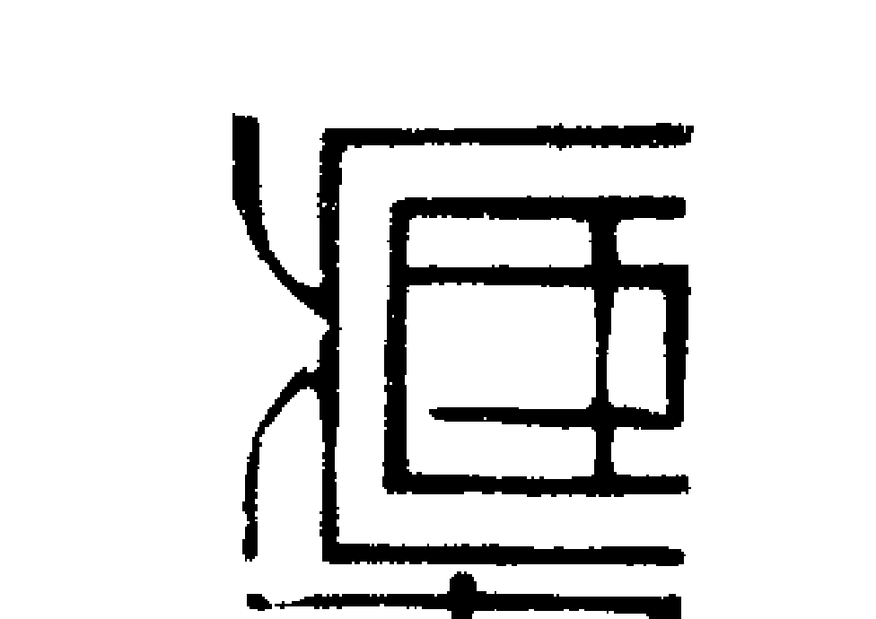
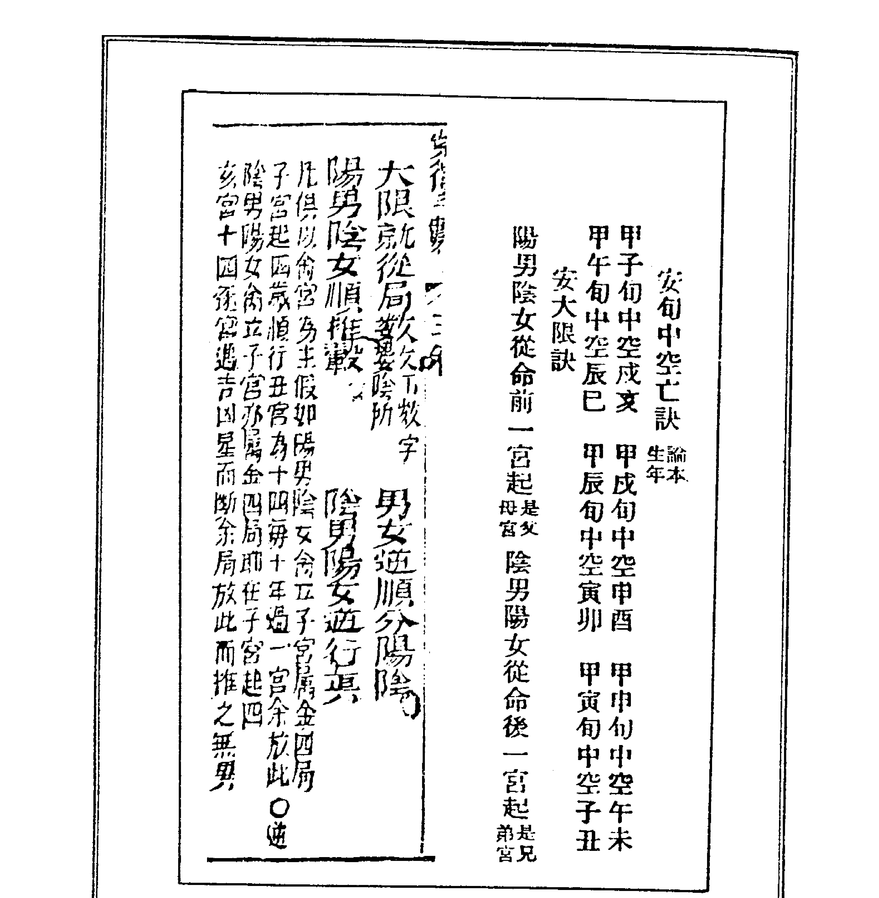

# 紫微堂奥

斗數骨髓賦之丹墀桂岸，青雲之志

## 第九卷

望 元著

大孚書局印行

紫微堂奥 第九卷 望 元著 大孚書局

## 紫微堂奥系列【全拾卷】

- 第一卷 斗數總訣之希夷觀天星，斗數推命
- 第二卷 斗數發微論之命逢紫微，特壽且榮
- 第三卷 斗數太微賦之日月夾財，不權則富
- 第四卷 斗數天門運限，扶身助命
- 第五卷 斗數七殺朝斗，爵祿榮昌
- 第六卷 斗數骨髓賦之天祿天馬，驚人甲第
- 第七卷 斗數骨髓賦之左府同宮，尊居萬乘
- 第八卷 斗數骨髓賦之子午破軍，加官進祿
- 第九卷 斗數骨髓賦之丹墀桂岸，青雲之志
- 第十卷 女命骨髓賦之輔魁福壽，弼相福臨

ISBN 957-765-330-8 (293)
9 789577 653307
F1564
星光書店 $117.00
東明文化圖書公司 $117.00 TEL: 23425341

望 元著

紫微斗数 赋文诠注

## 紫微堂奥 第九卷

大学书局印行

### 自序

《紫微堂奥》以江西負子子潘希尹先生補輯之《新鑰希夷陳先生紫微斗數全書》爲藍本而爲紫微斗數賦文之精詳詮註。卷一於一九八四年一月印行流通，筆者以當時已有之紫微斗數認知學涵，晝夜辛勤奮筆耕，作息失序，日以繼夜，晝夜顛倒，屈不撓，再接再厲的經歷了二十八個月的殷勤刻苦筆耕，卷十終於一九八六年五月印行流通而竟詮註紫微斗數賦文之全功。大孚書局傅寶泰先生有見於《紫微堂奥》爲研讀學習紫微斗數所不可或缺的最佳參考書，但因原著缺少作者序文而有美中不足之憾，情商拙愚爲原著增補自序，以使讀友不因原著無自序的小小缺失而抱憾，望元當仁不讓於師，義無反顧的恭敬從所命囑，流覽翻閱十卷而爲此序。《紫微堂奥》共十卷；卷一精詳詮註《合併十八飛星紫微斗數》一書之「紫微斗數總訣」，概說紫微斗數推命之使用星神與排佈推命圖的安星佈斗。卷二嘔心瀝血的披瀝詮註「斗數發微論」、「重補斗數殼率」、「星垣問答論」。卷三爲紫微斗數「太微賦」賦文詮註。卷四～卷九共六卷爲「斗數骨髓賦」賦文註釋，並於賦文句列舉相當其文句的命例以為習涉研究之參考。卷十詮註「女命骨髓賦」，附錄「補遺骨髓賦」、「形性賦」（按：「形性賦」與「諸星問答論」、「諸星入命限」互為參照融合，可以依據命圖星神而推想描繪此命圖本人之形性。）、「星垣論」（按：星垣論附錄而未詮註。）、「紫微斗數漫談」。

今日增補為原著作自序，情不自禁的感慨：「老朽，老朽老矣！任何人盡得《紫微堂奧》，必然直覽盡窺斗數堂奧，更勝老朽被香港徒孫們抬舉謬譽為「斗數奇才，一代宗師」矣！」

二〇〇三年五月一日 望元謹為序

望元閒談論命館 林源田

住址：台中縣太平市新坪里育德路二四七號四樓

電話：（04）二三九一一三五一・二三九一八四二七

### 目录

- 第九十三章 丹墀桂墀，早遂青雲之志 一
  - 第一節 太陽正主官祿星 一
  - 第二節 太陰為田宅宮主 二
  - 第三節 早遂青雲之志 三
- 第九十四章 命祿拱祿，定為巨擘之臣 四
  - 第一節 臥龍生命例 四
  - 第二節 王雲五命例 五
  - 第三節 王永慶命例 六
  - 第四節 了無學士命例 七
  - 第五節 唐山逸士命例 八
- 第九十五章 陰陽會昌曲，出世榮華 九
  - 第一節 輔弼遇財官，衣緋著紫 九
  - 第二節 孫運璿先生生命例 十
  - 第二節 俞國華先生生命例 十一
- 第一章 日月最嫌反背，乃为失辉 ...... 五六
- 第二章 身命定要精求，恐差分数 ...... 六一
- 第三章 诸葛孔明火烧藤甲军乃减寿 ...... 七二
- 第四章 好人好事代表李珮菁 ...... 七四
- 第五章 歌声、轮椅、玉兰花 ...... 八〇
- 第六章 慧耕居士的评论 ...... 八八
- 第七章 命实运坚，槁田得雨，命衰限弱，嫩草遭霜 ...... 九九
- 第八章 论命必推星善恶，巨破擎羊性必刚 ...... 一〇一
- 第九章 府相相同梁性必好，火劫空贪性不常 ...... 一〇四
- 第十章 昌曲禄机清秀巧，阴阳左右最慈祥 ...... 一〇七
- 第十一章 武破贞贪冲合，固贵；羊陀七杀相杂，则伤 ...... 一一二
- 第十二章 贪狼廉贞破军恶，七杀擎羊陀罗凶 ...... 一一〇
- 第十三章 火星铃星专作祸，劫空伤使祸重重 ...... 一二〇
- 第十四章 巨门忌星皆不吉，运身命陷忌相逢 ...... 一二二
- 第十五章 更兼太岁官符至，官非口舌决不空 ...... 一二四
- 第十六章 吊客丧门又相遇，管教灾病而相攻 ...... 一二八
- 第九十七章 臣梁相会廉贞併，合禄鸳鸯一世荣 ...... 四三
- 第九十八章 武曲闲宫多手艺，贪狼陷地作屠人 ...... 四六
- 第九十九章 武曲闲宫多手艺 ...... 五七
- 第一百章 天禄朝垣，身荣贵显 ...... 六一
- 第一百〇一章 魁星临命，位列三台 ...... 六八
- 第一百〇二章 武曲居乾戌亥上，最怕太阴逢贪狼 ...... 七一
- 第一百〇三章 化禄还为好，休向墓中藏 ...... 七九
- 第一百〇四章 子午巨门，石中隐玉 ...... 八六
- 第一百〇五章 明禄暗禄，锦上添花 ...... 一〇八
- 第一百〇六章 紫微辰戌遇破军，富而不贵有虚名 ...... 一一五
- 第一百〇七章 昌曲破军逢，刑剋多劳碌 ...... 一二四
- 第一百〇八章 贪武墓中居，三十才发福 ...... 一三二
- 第一百〇九章 天同戌宫为反背，丁人化吉主大贵 ...... 一四〇
- 第一百一十章 巨门辰戌为陷地，辛人化吉禄峥嵘 ...... 一四四
- 第一百一十一章 机梁酉上化吉者，纵遇财官也不荣 ...... 一四九
- 第一百一十二章 贪狼陷地作屠人 ...... 一五三
- 第二二四章 七殺守身終是夭，貪狼入命必為娼......一五〇
- 第二二五章 心好命微亦主壽，心毒命固亦夭亡......一五二
- 斗數骨髓賦結語（代跋）......一五三

### 第九十三章 丹墀桂墀，早遂青雲之志

原註：丹墀謂日居卯辰巳，桂墀謂月入酉戌亥，此六宮身命遇之是也，亦宜見昌曲魁鉞。

墀者，原指宮殿階上地，其地以丹砂漆之，或以赤磚鋪飾者，謂之「丹墀」，其地砌以玉石，或以白磁鋪飾者，謂之「玉墀」。考漢以科甲，唐設科舉，宋用帖括，明清用八股試士，於宋時有春秋貢試之制，鄉試在仲秋而名「秋試」，春間會試，明清例於三月會試，因名「春試」、「春闈」，望元付臚以春闈秋試之引伸為丹墀桂墀，取義功名及第，或非指日月守命而言。如果想像本賦文模倣太微賦而蛻出來，那麼或當如太微賦所謂：「太陽居午，謂之日麗中天，有專權之貴，敵國之富；太陰居子，號曰水澄桂萼，得清要之職，忠諫之材。」，才比較貼切。假使以太陽之喻丹墀，以太陰之喻桂墀，則或命中原有，或於運限遇之，必要昌曲魁鉞等科星以為呼應，如徵驗早遂青雲之吉。現在我們正在探討尋求一門玄秘而難以理解的學術，我們勉強依循著歷代流傳下來的學術界

#### 第一節 太陽正主官祿星

太陽原屬火，正主官祿星，其居身命官祿宮時，大抵可以表現出其循規蹈矩、奉公守法，自強不息的事業進取心，其居於福德宮時，也同樣的表現此一把工作當作消遣娛樂的性向，但是守值財帛與遷移二宮時，其吉凶之意義中總是要帶著『忙碌』『移動』『照射』的星象意義，於夫妻宮又宜男而不宜女……，總之，任何一種解釋的背後還包括著許多變化，我們大概可以同時注意到太陽值命時必有下列現象：

1. 紫微守田宅，主人多勞：男命之田宅宮雖不爲陷弱之宮，但以其不在成照六宮，正徵斗數發微論』奪星列賤位，主人多勞。
2. 天機守福德，主人多思：福德宮代表本命之人生觀，精神生活，娛樂享受、價值觀念之概況，有天機善星守福德者，以其爲兄弟主，容易產生替別人設想操心之秉性，往往有與人共財合夥之情形，甚至容易因友損財，一向喜歡追求規律性、情慾性的精神生活，如果不把精神專注在事業工作上，一定產生哲學思想、宗教信仰，或寄託於法學、玄學之中，所以說，天機守福德，主人多思，必須在本人建立某種程度人生價值觀以後，才能有所成就成功。——先勞後逸—— 學者讀友如果剛好是丑未時生而太陽守命者，不妨反省檢討自己，當您研習了紫微斗數之後，自己雖然還沒有研判命圖的自信，卻很樂意替您的親友的命例去請教您的老師或同契啊！
3. 天同守夫妻，配偶溫馴 天同爲福星，爲福德主，其守官祿則缺乏創業敬業之精神，不喜歡受約束拘束，故曰「福星 居於官宮，反成無用。」，但夫妻宮雖與官祿沖照，天同守夫妻宮則主配偶溫馴，不論夫妻和睦與否，都能把家庭照料得讓人放心，男得聰明體貼美貌之賢內助，女嫁溫和體貼而隨和之夫郎。 不過斗數之論婚姻甚難，每要因婚姻而活看，更且人在福中不知福，太陽守命之人雖有享夫妻福之傾向，本人卻未必以爲福，大抵因爲太陽守命之人，生性外向好動，熱情好友，大多早婚，由於婚姻意識未克成熟，婚後易有感情困擾，而其晚婚者，雖具家庭責任，但以事業心更勝於夫妻感情，亦难免发生感情困扰。 望元曾经研判一些太阳守命之例，虽有享夫妻福之兆，但以太阳，天同必有其一三合巨门，故其夫妻之相处仍然时生龃龉勃豁啊！

##### 四、廉贞守疾厄宫，主人灾疾：

廉贞亦官禄主，又作次桃花，化气为囚，大抵于守命身为次桃花，守官禄为官禄星，运限遇之作『阻滞』『禁锢』『逾越』『突破』……等义解释，但以星曜藏干『丁』，适为生主星太阳『丙』之『劫财』，故廉贞守疾厄宫，以『劫财』能生『伤官』而易招灾疾之论。

望元窃以为斗数之论断疾厄仍甚困难，相对诸书纷歧而未必准验，故除呼唤颛兼精医学之学者读友共起统计分析而外，并旁考『三命通会』之『论疾病先知五脏六腑所属干支』之一、二，节录于后，以为参考发挥之。

『丁』主心。

丙丁见壬癸亥子多者，内主心气疼痛，顛痫舌强，口痛咽哑，急慢惊风，语言蹇涩，外主潮热发狂，眼暗失明，小肠疝气，疮痍脓血，小便淋浊。妇女主乾血痨，经脉不调。小儿主痘疹疥癣，面色红赤。是也。

乾卦在亥，亥为天门，六辛生人得此时，多主盲聋。亥属肾，肾通耳，丙火遭水克也。

凡论残疾病症，先论日干，次详月令，然后通年时看之，伤官主残疾，煞重亦然。

申属坤，为众阴，伤官煞重，主腰脚筋骨之疾。伤官伤尽者，不在此论。

酉为兑，属口齿不全之疾。

戌为火库，主下血痔漏之疾。

丑未伤官，亦主脾胃，伤官煞旺者，年年病瘟。

主用上下战克，五行无救助，主身体不完，头面残伤。

观之而反顾紫微斗数全书论曰：『廉贞，禄存灾疮、腰足之疾。入庙加吉，和平。遇贪狼同陷地，眼疾，疾多。七杀、破军、天府同，灾少。』，所论不及子平几十之一，其中如何观察研判，又见阻礙重重，唯其廉贞至易会合贪狼，更本三合武曲，是知逢遇丙、壬、癸三星化忌之年易招灾疾而已。

子位坎宫，伤官煞重相刑，主下部疾。

寅宫艮土，主脾胃，面色痿黄之疾。

若戊己生人，甲乙为刑旺之煞，二月乙木，子卯相卯，刑起子中卯木为煞者，亦主下部疾。

辰属震，此月带伤官，少年主多惊疾，盖震者动也，轻者主惊，脾胃疾，重则主足疾。震，长男子。（二月水生木者，亦如此。）

巳为巽，伤官煞重，主妇人血气不调，劳疾。

午为离为目，伤官煞重，主失明，头风之症。

##### 五、武曲守兄弟宮，相處嚴謹：

武曲為財帛宮主，其藏干為「辛」，有斂聚、頑固之義，若守財帛為吉主富，守於兄弟則大多少兄弟，或因兄弟年齡差距之關係而相處態度嚴謹，即或年齡相當，亦因兄弟個性剛頑或自閉而困難相處，難免精神孤獨，缺乏兄弟之友愛，無形中終於造成熱情好友之潛在性向。

#### 第二節 太陰為田宅宮主

太陰乃水之精，為田宅主，化富，與日為配天儀表。
假如以天象日月之聯想，太陽能自發光輝照射普天，故外向而慷慨樂與，太陰不能自發光輝，映日而有光明，故有斂聚因應之內向自閉傾向，其之盈明，則又假日光而洞明夜影，故其喜歡追求理想化的自我限制的生活方式，並且有整潔其周圍環境及傳播其思想信仰之傾向。
雖然太陰也有類似太陽之追求規律性的生活，以及追求玄秘學術與宗教信仰之傾向，二者之間又有不同，太陽守命者，大多外向而主動的追尋玄秘，喜歡與同好共同研究，而太陰守命者，大多內向而因應的追尋玄秘，或者為了謀生、學術，或受親友的影響才發生宗教信仰之類，喜歡個人鑽研以後才與同道切磋探討。
大抵太陰守命身，為人聰明俊秀，稟性端雅純祥，文章博學，入廟旺者，面方圓，陷失者，
因其所感應最強之星象而呈巨梁同機日之形貌，如遇文曲同居命身，學識駁雜而口齒伶俐，甚至

總之，我們目前之星研判，大抵仍然停滯在「分析」與「獨斷」之階段，如果能夠次第推之「同系星曜研判」，對於未來之實際的千變萬化的組合研判，必定能有意想不到的幫助，因此我們應該要同時注意到其他天府系星曜之下列守值現象：

為醫師、術士、宗教家、稅務員之流。

##### 一、巨門守福德宮，敏感多愁：

巨門為刻剝之神，掌執是非，主於暗昧之暗星，含有「辨別」、「分離」之寓意，故在福德宮是最為理想的宮位，表示本人有研究思考之人生觀，但以其思考傾向於自我限制之範圍，往往有猶疑反覆之寡斷，以致造成杞人憂天之情形，必須化吉、會吉，才可當作敏銳的觀察力論議，不然則容易因為小事而常為自己的設身立場操心，輕則內外不擅交際應酬，重則為了粉飾本人的缺陷而養成潛在性的傳播別人是非及說謊的習慣，尤其以丑未年丑未時生人及安命在亥丑宮者為明顯。

##### 二、天梁守官祿宮，成就感重：

天梁為父母宮主，凡得守父母宮最吉，多能承受父母庇蔭恩惠，即於田宅、兄弟宮得之，亦以福論，唯其主於官祿宮，則主有樂業精神，成就感強烈，但又缺乏創業敬業之精神，所以比較適合於命卜、教職、醫師等等自由業，一旦經營商貿或生產製造業，則常為職業之因素而來去奔波，一旦會凶者，奔波勞碌之象愈明，故本賦文譽曰：「天梁太陰卻作飄逢之客。」，即此之謂。
適合於命卜、教職、醫師等等自由業，一旦經營商貿或生產製造業，則常為職業之因素而來去奔波，一旦會凶者，奔波勞碌之象愈明，故本賦文譽曰：「天梁太陰卻作飄逢之客。」，即此之謂。

##### 三、天相守田宅宮，計劃置產：

天相亦爲官祿星，與廉貞之主官祿之性質不同，廉貞宜競爭性，實幹性之武職，天相則宜目標性與計劃性之文職，但以天相破軍二星恆爲守照，又具開創性與破壞性及變化性之影響意義，所以天相守官祿者，由於敬業及誠信之態度，適合於各種行業，唯其之成功與否，則在於其目標性及計劃性之得宜與否而已。

天相之守於田宅宮亦相近此義，如有祖業者，大多能守成，如無祖業者，大多有計劃性的購置田宅，並且辛苦積蓄而自置。但以破軍沖照，往往會發生田宅進退之現象。

##### 四、破軍守子女，先損後成：

破軍司夫妻、子息、奴僕之神，只謂夫妻、子息、奴僕而以爲吉，其損耗之性質仍然存在，惟天梁可制其破耗浪費之惡質，祿存可解其狂傲任性之性格，故見祿存，化祿爲吉，或寅申年生人身主天梁者，則不必執於「先損後成」論議，否則可以依此以爲試驗爲實例之印證。

破軍與天相恆爲沖照，田宅與子女亦互成守照，其吉凶或應驗於田宅，或應驗於子息，不過逢破運守值於子女宮時，大多子女個性特別剛強，比教困難教育，且有浪費金錢、損耗玩具財物之傾向，親緣亦趨於薄弱，尤其是子女命中有空劫者更驗。

##### 五、貪狼守父母宮，親情平淡：

貪狼爲桃花，爲善惡之標準，雖然可善可惡，但我們一般都以惡神視之，大抵以爲「現實」「計較」「自私」「貪婪」「享樂」「小氣」……等名義以爲解釋，遇火鈴爲貴，遇輔弼昌曲夾制爲吉。

貪狼守父母宮，大多親情平淡或趨於淡薄。如居巳亥與廉貞同宮，是爲陷地，與生身父母形同陌路，有名無實，或爲人養子女，或成年後入贅女家。與紫微同守，雖主父母雙全，但親情亦不見得融洽。或加殺而見日月化忌，則早刑父母矣！

##### 六、天府守兄弟宮，兄弟平常：

天府爲祿庫，爲財帛主，故具有「隱密」「隔閡」之寓意，又具「豐富」「內實」之義，故天府守值兄弟宮，表面兄弟關係平常，保持著一定程度的兄弟弟恭及各自的私密權利，但情誼親密融洽，能夠互相照顧，並在財富物質上互相協助支援。

##### 七、七殺守奴僕宮，剛強難用：

七殺爲將星，又爲孤辰，遇紫微爲權，餘宮皆殺，故後文視之爲凶星，以其具「獨立」「好勝」「激動」「極端」之寓意，故最利在官祿宮得地，化禍爲祥，如守奴僕宮，則暗示交友用人多遇剛強好勝或態度傲慢之人，每有陽奉陰違之行爲。此或因太陰守命之人，原就比較不能信任別人，相對的增加用人困難，因此用人難盡其材，也。

如果為營利或商務，事業之因素，就只好親自奔波處理的緣故也。

#### 第二節 早遂青雲之志

依循本賦文原註，但得日月廟旺守命之人，或以太陽之有事業進取心，或以太陰之能追求理想，能夠於早年經由典試而獲得未來的事業成就，唯以其文義隱約籠統，未克表示合格之條件，因此在解讀的時候，望元也無能把握其重點以為解釋，只說分別以示意圖簡說如左——

##### 一、太陽在寅守命示意圖：

| 巳（田宅） | 午（官祿） | 未（奴僕） | 申（遷移） |
| 辰（福德） | 天機天梁 | | 酉（疾厄） | 廉貞破軍 |
| 卯（父母） | 天相 | | 戌（財帛） |
| 寅（命宮） | 巨門太陽 | 丑（兄弟） | 貪狼武曲 | 子（夫妻） | 天同太陰 | 亥（子女） | 天府 |

1. 書云：『丁己甲庚人財官格。』，此以祿存論吉。
2. 賦曰：『巨日同宮，官封三代。』，此喻事業成就至三台之列。
3. 賦曰：『命遇魁昌常得貴，限逢紫府定財多。』

##### 二、太阳在卯守命示意图：

| 巳 德 午 田宅 未 官禄 申 奴仆 |
| 辰 父母 七殺 |
| 卯 命 天太 梁陽 |
| 寅 兄弟 天武 相曲 丑 夫妻 子 子女 亥 財帛 |

1. 书云：『乙辛生人财官格，甲庚人困。』
2. 赋曰：『日照雷门，富贵荣华；月朗天门，进爵封侯。』辰戌时生人最吉。
3. 顺行运者早发，逆行命者中晚年成就。

##### 三、太阳在辰守命示意图：

| 巳 母 午 德 未 宅 申 祿 |
| 辰 命 太陽 |
| 卯 兄 七武 殺曲 |
| 寅 夫 天天 梁同 丑 子女 子 財帛 亥 疾厄 |

1. 书云：『财官格。』
2. 顺行运者，限逢天机而变更，大抵早中年成就。
3. 逆行运者，限逢同梁而为福，亦早中年即见成就。

##### 五、太阳在午守命示意图：

| 巳 | 破军武曲 | 午 | 太阳 | 未 | 天府 | 申 | 太阴天机 |
|---|---|---|---|---|---|---|---|
| 兄弟 | | 命宫 | | 父母 | | 福德 | |
| 辰 | 天同 | | | | | 酉 | 贪狼紫微 |
| 夫妻 | | | | | | 田宅 | |
| 卯 | | | | | | 戌 | 巨门 |
| 子女 | | | | | | 官禄 | |
| 寅 | | 丑 | 七杀廉贞 | 子 | 天梁 | 亥 | 天相 |
| 财帛 | | 疾厄 | | 迁移 | | 奴仆 | |

-   书云：「丁己生人财官格，壬丙戊生人悔吝」。
-   顺行运者，行未限即吉，申酉无凶杀，则早遂青云之志。
-   逆行运者，稍逊。

##### 四、太阳在巳守命示意图：

| 巳 | 太阳 | 午 | 破军 | 未 | 天机 | 申 | 天府紫微 |
|---|---|---|---|---|---|---|---|
| 命宫 | | 父母 | | 福德 | | 田宅 | |
| 辰 | 武曲 | | | | | 酉 | 太阴 |
| 兄弟 | | | | | | 官禄 | |
| 卯 | 天同 | | | | | 戌 | 贪狼 |
| 夫妻 | | | | | | 奴仆 | |
| 寅 | 七杀 | 丑 | 天梁 | 子 | 天相廉贞 | 亥 | 巨门 |
| 子女 | | 财帛 | | 疾厄 | | 迁移 | |

-   书云：「财官格。」
-   顺行运者，交申限入顺境。
-   逆行运者，早年浮沈，交寅限入顺境。

| 巳 | 太阳 | 午 | 破军 | 未 | 天机 | 申 | 天府紫微 |
|---|---|---|---|---|---|---|---|
| 财帛 | | 子女 | | 夫妻 | | 兄弟 | |
| 辰 | 武曲 | | | | | 酉 | 太阴 |
| 疾厄 | | | | | | 命宫 | |
| 卯 | 天同 | | | | | 戌 | 贪狼 |
| 迁移 | | | | | | 父母 | |
| 寅 | 七杀 | 丑 | 天梁 | 子 | 天相廉贞 | 亥 | 巨门 |
| 奴仆 | | 官禄 | | 田宅 | | 福德 | |

##### 七、太阴在酉守命示意图：

> 书云：『丙丁人财官格，吉星众大贵。』

-   顺行运者，早年不美，交子限后为吉。
-   逆行运者，早中年得志。

| 巳 | 破军武曲 | 午 | 太阳 | 未 | 天府 | 申 | 太阴天机 |
|---|---|---|---|---|---|---|---|
| 子女 | | 夫妻 | | 兄弟 | | 命宫 | |
| 辰 | 天同 | | | | | 酉 | 贪狼紫微 |
| 财帛 | | | | | | 父母 | |
| 卯 | | | | | | 戌 | 巨门 |
| 疾厄 | | | | | | 福德 | |
| 寅 | | 丑 | 七杀廉贞 | 子 | 天梁 | 亥 | 天相 |
| 迁移 | | 奴仆 | | 官禄 | | 田宅 | |

##### 六、太阴在申守命示意图：

> 书云：『丁庚甲生人，财官格。』

-   顺行运者，交行天相运限为吉。
-   逆行运者，早年得志。

##### 九、太阴在亥守命示意图：

-   书云：「丙丁人财官格，吉星众大贵。」
-   赋曰：「月朗天门，进爵封侯。」，寅申时生最吉。
-   大约在寅申限成就。

紫微斗数示意图，包含地支宫位（如巳、午、未等）和星宿（如天机、紫微、破军等），以及宫位如迁移、疾厄、财帛、子女等。

##### 八、太阴在戌守命示意图：

-   书云：「丙丁人财官格，吉星众大贵。」
-   顺行运者，早年不美，中晚年成就。
-   逆行运者，早中年得意，交午限后视吉凶多寡以论。

紫微斗数示意图，包含地支宫位（如巳、午、未等）和星宿（如天机、破军、紫微等），以及宫位如疾厄、财帛、子女、夫妻等。

### 第九十四章 合禄拱禄，定为巨擘之臣

臣擎者，大指也，谓杰出於众，如大指异於他指也。望元初涉赋文之始，不求甚解，以为「巨擎之臣」专指国家显要栋梁，总以为「合禄」、「拱禄」之命例固多，但不尽为军公政教职之人，若如望元天梁在财官化禄，亦作「合禄」之论，但向与「薪俸」乏缘，朽曲之木而不可以为栋梁，唯於辨明「臣擎」之义后，反观服役三年，虽只以「上等兵」退役，在役期间却被谓为「士兵长」，此岂非士兵之「杰出」者，又於摊贩期间，首肇路边衣饰挂陈如店铺之风，布匹明价扫场之端，亦曾经为汽车流动摊贩之佼佼者，证今之爬格子卖稿，亦为抄袭腾释五术书籍之数一、数二好手，於是知道「合禄」、「拱禄」之确实意义矣！凡命身逢会禄存者，大抵性格刚强而为人随和、处事能机变，为了追求理想，受人尊敬而能进取奋闘，所以一般可以从禄存同垣之主曜性质或化禄主之性质以瞭解其人之成就於「禄存守」

> 原註：禄存与化禄在财官二宫合命，或命坐禄而迁移有禄拱，皆主富贵。诀云：『合禄拱禄堆金玉，爵位高迁衣紫袍。』

| 巳 | 午 | 未 | 申 |
|---|---|---|---|
| 七杀 | | | |
| 奴仆 | 迁移 | 疾厄 | 财帛 |
| 辰：天机天梁 | | | 酉：廉贞破军 |
| 官禄 | | | 子女 |
| 卯：天相 | | | 戌 |
| 田宅 | | | 夫妻 |
| 寅：太阳巨门 | 丑：贪狼武曲 | 子：天同太阴 | 亥：天府 |
| 福德 | 父母 | 命宫 | 兄弟 |

##### 十、太阴在子守命示意图：

-   书云：『丁戊生人财官格。』
-   顺行运者，大约寅限入顺境。
-   逆行运者，初行大运即吉。

| 辛巳 | 太阴(忌) | 壬午 | 右弼文曲贪狼 | 癸未 | 天钺陀罗巨门天同(科) | 甲申 | 禄存左辅文昌天相武曲(权) |
| :--- | :--- | :--- | :--- | :--- | :--- | :--- | :--- |
| 天姚 | | 截空 | | | 天马 | | |

| 父母(4-13) | 大耗长生 | 福德(14-23) | 伏兵沐浴 | 田宅(24-33) | 官府冠带 | 官禄(34-43) | 临官博士 |
| 庚辰 | 天府廉贞 | 按：梁老师以太阴化科、天同化忌论。 | 阳男 | 岁次庚午年五月初五日寅时生 | 乙酉 | 擎羊天梁太阳(禄) | 天伤天空红鸾 |

| 命宫(37) | 病符养 | | 卧龙生 | | 奴仆(42-53) | 力士帝旺 | |

| 己卯 | 铃星 | | 身主：铃星 | 命主：廉贞 | 丙戌 | 七杀 | |

| 兄弟(36) | 喜神胎 | | | | 迁移(43) | 青龙丧门 | |

| 戊寅 | 破军 | 己丑 | 火星天魁 | 戊子 | 紫微 | 丁亥 | 天机 |
| 夫妻(35) | 蜚廉绝 | 子女(34) | 奏书墓 | 财帛(74-83) | 将军死 | 疾厄(64-73) | 小耗病 |
| | | 地劫天刑 | | 天哭天虚 | | 天使 | |

#### 第一节 卧龙生命例

梁老师著作时之研判：

一、命宫虽居「天府」可以论吉，但与廉贞会，好在天府在「庙位」远比廉贞为势旺，并无四杀加凶，出身根基论中庸。

> 「卷六第一页『天禄天马，惊人甲第。』，言禄马同守命之吉。

> 「诗曰：『禄有对面在迁移，子午逢之利禄宜，德合吉坏人敬重，双全富贵福稀奇。』，大抵言禄存守照，其人自尊心重而能自爱之吉。

歌曰：『禄存对向守迁移，三合逢之利禄宜，得逢邂逅人钦敬，的然白手起家基。』，此言「合禄」「拱禄」者，目前即或迍邅晦滞，但以坚毅不屈，奋斗不挠，终必有所「杰出」之成就。

因此特举下列实例以为研习斗数之参考——

望元认为想要解读赋文最好的方法，应该就是熟读诸篇赋文，揣摩其蕴义内涵，因此如「禄存对面朝斗格」及诸星问答论之歌曰，不妨一并引用为参考：

之。田财，则堆金积玉。「，或如「禄存厚重多衣食」「禄居奴仆，纵有官也奔驰。」……等研议

#### 第二节 王云五命例

塾元对于王云五先生命例亦一无所知，勉就沈平山先生著「紫微命谱」下册第一三〇页而知先生之生于光绪十四年戊子六月一日卯时生，耳闻其幼尝为印书厂学徒，从检排字而苦学成功，一生忠党爱国，发明「王云五」四角号码检字法，对于我国文化史实之考证及提倡，颇可以引为后学后世之榜样。

> （图参阅二十九页）

望元未识王云五先生之生平事略，唯以其三合化禄，亦足证合禄之命能有杰出之成就而已。

-   二、身宫则极佳，会聚「化权、文昌、天相、武曲、左辅、禄存」共在官禄宫中，全部为吉星，无一凶星，可惜未带「化禄」，文昌得文才天资化权得其实名，左辅有贵人，若带「化禄」则千万之富，以不带「化禄」，虽有「禄」而难化为己之所用。

三、紫微星在财帛宫，本可主「财」，但有三个凶星，大抵耗散财势，一为天虚，二为天哭，三为大耗。

其格整齐之处为「命宫、天府、紫微、身宫」巧合为申子辰三合之方，众吉星在调停，乃属后天努力，始克享名利。

初限至三十三之三十年大限，均非所宜，三十四─四十三入田宅宫，五个星座之中三吉二凶，尤以「化忌」为甚，屡成屡败。

四十四─五十三岁入官禄宫，乃「身宫」众吉所聚之位，平生最佳之运程，大限虽好，初入此限。……（下略）。

塾元一向主张命宫无大限，与上论有一宫位之差别，故不另为研判提出，所以引以为例者，是取其本命三合禄存，主有「杰出」之成就，验之卧龙生先生为武侠小说之坛地，果为执牛耳之有数前辈之一也。

#### 第三节 王永庆命例

> ——摘录「紫微命谱」下册第二七页——

王永庆的童年岁月可说十分穷困坎坷。他生长在台北县新店镇直潭里的小山上，距离新店的大街有两公里的路程。父亲是穷苦的茶农，以耕作几片贫瘠的茶田，卖茶业为生。从王永庆有记忆以来，他便经常必须跟着母亲到家附近的台车道旁，等着从狮子山头运送木材和煤的台车经过，然后去捡那些台车上掉下的煤块或木材，挑选好的拿去卖钱，差的则留在家

里生火烧水或煮饭。
小学毕业以后，王永庆为了赚钱贴补家用，自然无法再继续升学。
在他十五岁那一年，便离开家乡，只身到嘉义去应征一家米店的工人，帮米店老板送米。
到了十六岁，父亲王长庚便向朋友筹借了一点资金，加上王永庆一年来省吃俭用节省下来的钱，以两百块钱，在嘉义市开了一家米店。（附按：两百块钱在现在是一个小数目，但依老一辈的传说，那时候一斗米才卖一、两毛钱而已，大约值一千斗米至二千斗米之谱，换算现代米价计算，则大约为现在新台币柒百万元至贰千万元之谱，可以算是一个很大数目。）
廿一岁稍有积蓄，斥资在云林县购进十二甲农地，建立事业基础。
民国三十二年，王永庆转投入木材业，也因此在这里发迹。
在他经营木材业的日子里，充满了许多酸甜苦辣的小故事，他曾经因「滥伐山林」，而被日本政府抓去坐牢；为了载木材，他辛苦地踩着脚板车，到处送货，这幕情景，形成日后景仰他的人为他绘制了「勇者的形象」。
台湾光复之后不久，政府迁台，一切建设方兴未艾，建筑业呈现一片蓬勃景象。王永庆的木材业也因此获得大笔财富。王永庆逐渐从米店的小商人蜕变成木材大贾。
四十年代初期（附按：指民国四十几年。），王永庆与上海商人赵庭箴合作，接受美援的支肋，投资塑胶业。
台塑关系企业目前拥有近三十个企业单位，富甲一方，对国内经济发展，增进国民就业机会，具卓越贡献。现任台塑关系企业负责人，台湾塑胶公司、台湾化学纤维公司、私立明志工业专科学、私立长庚纪念医院、朝阳木业公司、新茂木业公司等事业机构董事长。

#### 第四节 了无学士命例

五术界有两个「了无」，居住高雄市苓雅区广东一街四十四号者为「了无学士」郑景峰老师，二位老师在斗数界都有杰出非凡的成就，在这里望元所要说的就是了无学士郑老师。
在这个命例中比较特殊的就是命中不见禄存、化禄，但以其命主天同与当生巨门化禄同宫，又于行辛卯大限之二四岁至三三岁间，有大限太阳化禄拱照，大抵于癸亥年间三十三岁完成「米卦金钱学」、「博士姓名学」：……等书，于甲子年三十四岁交破军大限后而创始「台湾易经纪念

馆」，着手编著「五术名人录」等著作，此小限适见廉贞化禄照限，至乙丑年三十五岁，则三合

#### 第五节 唐山逸士命例

唐山逸士刘哲闻老师声名之响亮，其杰出於众之成就已经遐迩皆知，已不必望元代为鼓掌捧场了，不过因为其生于民国三十八年九月六日（见「五术名人录」第一辑第一二五页），因其生于夏令时间，又为闰七月生人，在安星布局上本来已有纷歧困难，今则假定其生于岁次己丑年闰七月十四日酉时为正确时辰，并取望元所认为闰月生人以次月安命身，月系星曜则仍依本月诀安佈，以为学者读友对于闰月定局之参考。（参考迁头堑农之「紫微闰月探幽」）（图参阅三十二页）。

郑老师为高雄县人，立志搜集中外五术人物之著作，如诸同道或出版社不妨迳与郑老师直接联系之！（图参阅三十一页）。

考。当生化禄及流禄，似此命中未遇，而於运限逢遇之例，适足以玩味揣摩，故特引为推敲研习之参考。

| 丁巳 禄右弼 天机 (科) (忌) | 戊午 擎羊 紫微 | 己未 天钺文曲文昌 | 庚申 破军 |
|---|---|---|---|
| 父母 (5-14) 博士 绝 | 福德 (15-24) 力士 胎 | 田宅 (25-34) 青龙 养 | 官禄 (35-44) 小耗 长生 |
| 丙辰 陀罗 七杀 | 命宫 官府 墓 | 阳男 王云五 身主：火星 命主：廉贞 土五局 | 岁次戊子年六月初一日卯时生 |
| 乙卯 天梁 太阳 | 兄弟 伏兵 死 | 辛酉 左辅 | 奴仆 (45-54) 将军 沐浴 |
| 甲寅 火星天相武曲 | 乙丑 天魁巨门天同 | 甲子 贪狼 (禄) | 壬戌 铃星天府廉贞 |
| 夫妻 地劫天刑天马 大耗 病 | 子女 病符 衰 | 财帛 (75-84) 截空 喜神 帝旺 | 疾厄 (65-74) 天使 蜚廉 临官 |
| | | 癸亥 太阴 (权) | 迁移 (55-64) 奏书 冠带 |

| 癸巳 太阴 | 甲午 天机贪狼 (科) | 乙未 巨门天同 (禄) | 丙申 陀罗文昌武曲 (忌) |
| 壬辰 右弼天机廉贞府 | 阴男 了无学士 | 岁次辛卯年七月五日寅时生 | 丁酉 火星天梁 (权) |
| 辛卯 天刑 | 身主：天同 命主：破军 | 金四局 | 庚子 紫微 天机 |
| 庚寅 天魁破军 | 辛丑 天使地劫 | 迁移 (54-63) | 己亥 天马 伏兵病 |

| 癸巳 禄存太阴 | 甲午 擎羊贪狼 | 乙未 巨门天同 (禄) | 丙申 天相武曲 |
| 壬辰 陀罗天机廉贞府 (忌) | 阳男 | 岁次丙辰年十一月廿五日戊时生 | 丁酉 天梁太阳 |
| 辛卯 左辅 | 身主：文昌 命主：文曲 | 木三局 | 庚子 文昌 紫微 (科) 己亥 天钺右弼 天机 (权) |
| 庚寅 文星破军 | 辛丑 天空 | 病符冠带 女 | 喜神沐浴 财帛 (73-82) 长生蛊 |

### 第九十五章 阴阳会昌曲，出世荣华

> 原註：如命坐阴阳，财官二宫昌曲来会，或命坐昌曲，财官日月来会，更遇魁钺吉星，富贵必矣！

斗数定人贫富之论诀多矣，溯考卷五第三四页起『出世荣华，权禄守财官之位，生来贫贱，劫空临财福之乡。』已经约言大要，而斗数观星之变化不一而足，故又作本文以为增补其不足，但以文註两节，则又要以『补遗髓赋』之『文星朝命格』来补充，才足以使后学之您我容易区辨前述『颜回夭折、文昌陷于夭殤』、『文昌文曲会廉贞，丧命夭年』、『铃昌罗武，限至投河』、『昌贪居命粉骨碎屍』之等凶兆，并能明辨『夹昌夹曲主贵兮』、『文曲武曲为人多学多能』、『左辅文昌会吉星，尊居八座』、『曲遇梁星，位至台纲』、『昌曲夹墀，男命贵而且显』之等吉象，故先摘录『文星朝命格』，裨利於一并解读诠註。

> 诗曰：『文昌文曲最荣华，值此须生富贵家，更得三方祥曜拱，却如锦上又添花。』

综之以观，日月天梁之偶序星曜甚喜昌曲，故得昌曲守照，同协、合照，大抵可以生来富贵荣华之论，尤其是更遇魁钺化吉者更验。或以命身互见亦然。

| 紫微 天府 天钺 | 天机 擎羊 | 破军 禄存 | 太阳 陀罗 | 乙巳 天伤 奴仆 | 甲辰 右弼 武曲 官禄 |
|---|---|---|---|---|---|
| 伏兵 长生 财帛 | 官府 沐浴 子女 | 冠带 博士 疾厄 | 临官 力士 迁移 | 天使 天姚 | 地劫 |
| 太阴 | 己酉 | 截空 | 大耗 养 | 铃星 左辅 贪狼 庚戌 | 病符 胎 |
| 巨门 辛亥 | 天马 兄弟 | 喜神 绝 | 天魁 天相 廉贞 丙子 | 文曲 文昌 天梁 丁丑 | 七杀 丙寅 |
| 奏书 死 父母 | 将军 病 福德 | 天空 | 小耗 衰 田宅 | 天刑 | 青龙 帝旺 |
| 蜚廉 墓 命宫 | 水二局 | 命主：贪狼 身主：天相 | 唐山 逸士 | 民国卅八年九月十六日酉时生 | 岁次己丑闰七月十四日生 |

> 今日举国民政府主席林森先生及蔡辰男先生之命例于后，以为学者读者自为研判之参考

| 辛巳 | 太阳(禄) | 壬午 | 左辅 破军 | 癸未 | 天钺 陀罗 天机 | 甲申 | 禄存 右弼 天府 紫微 |
|---|---|---|---|---|---|---|---|
| 命宫 | 大耗 长生 | 父母 (4-13) | 截空 伏兵 沐浴 | 福德 (14-23) | 官府 冠带 | 田宅 (24-33) | 博士 临官 |
| 庚辰 | 武曲(权) | 岁次乙丑年四十六岁因十信风波而成新闻人物 | 阳男 蔡辰男 | 岁次庚辰年三月二十八日亥时生 | 乙酉 | 擎羊 太阴(忌) | 官禄 (34-33) 力士 帝旺 |
| 兄弟 | 病符 | 命主:武曲 身主:文昌 | 金四局 | 官禄 (34-43) 力士 帝旺 | 丙戌 | 铃星 贪狼 | 奴仆 (44-53) 青龙 衰 |
| 己卯 | 文曲 天同(科) | 夫妻 | 喜神 胎 | 丁亥 | 文昌 巨门 | | |
| 戊寅 | 火星 七杀 | 己丑 | 天魁 天梁 | 戊子 | 天相 廉贞 | 丁亥 | 文昌 巨门 |
| 子女 | 天马 蜚廉 绝 | 财帛 (74-83) 奏书 墓 | 疾厄 (64-73) 将军 死 | 迁移 (54-63) 小耗 病 | | | |

| 丁巳 | 禄存 | 戊午 | 擎羊 天机(忌) | 己未 | 天钺 破军 紫微 | 庚申 | 地劫 |
|---|---|---|---|---|---|---|---|
| 命宫 | 博士 绝 | 父母 (5-14) | 力士 胎 | 福德 (15-24) | 青龙 养 | 田宅 (25-34) | 小耗 长生 |
| 丙辰 | 陀罗 左辅 太阳 | 阳男 林森 | 岁次戊辰年一月十八日酉时生 | 辛酉 | 天府 | 天刑 | 官禄 (35-44) 将军 沐浴 |
| 兄弟 | 官府 绝 | 身主:文昌 命主:武曲 | 土五局 | | | | |
| 乙卯 | 七杀 武曲 | 夫妻 | 伏兵 死 | 壬戌 | 铃星 右弼 太阴(科)(权) | 天伤 | 奴仆 (45-54) 奏书 冠带 |
| 甲寅 | 火星 天梁 天同 | 乙丑 | 天魁 文曲 文昌 天相 | 甲子 | 巨门 | 癸亥 | 贪狼 廉贞(禄) |
| 子女 | 天空 天马 大耗 病 | 财帛 (75-84) 天姚 病符 衰 | 疾厄 (65-74) 天使 截空 喜神 旺 | 迁移 (55-64) 蜚廉 临官 | | | |

### 第九十六章 輔弼遇財官，衣紈著紫

> 原註：如身命有正星或吉，遇三方財帛宮有輔弼來朝，是也。

輔弼為吉星，甚利居財官之宮，尤其左輔守官祿宮，右弼守財帛宮最為適宜，或如丑未同垣之守照命身亦吉，辰戌之守照亦然，或如昌曲同協之守拱，一居命，一居財或官，皆為吉福論議。

前述「左輔右弼，秉性克寬克厚」、「左輔同宮，尊居萬乘」、「墓逢左右尊居八座」、「貴」、「左輔同宮，尊居萬乘」等文之俱言其吉，本不待堃元贅為詮註，但以讀「左輔同宮，尊萬乘」而有感，如梗在喉，不吐不快。

天府者，財帛主也。武曲雖為財星，遇天府則如財之入祿庫，反成天府之佐貳。假使本文之原義，是喜遇財星，官星同守命而顯其吉，則我們探討之範圍可以縮小到紫府之週會（紫微為官祿主，天府為財帛主。），日月之分合（太陽為官祿星主貴，太陰為田宅主主富。），武廉之三合（武曲為財帛宮主主財，廉貞為官祿主主權。），府相之三合，則輔弼最喜同財官之星合守財官之垣，或以財官之星逢遇三方四正之強宮，餘外者，輔弼雖仍以吉祥論議，但其福則遜之也。

#### 第一節 孫運璿先生命例

> 今且舉「紫微命譜」下冊第一八三頁孫運璿先生、第一八七頁俞國華先生、第一九二頁林洋港先生三命例以為研判之參考一一

一一摘錄「紫微命譜」一一

孫運璿，山東省蓬萊縣人，民國二年生。早年攻讀電機工程，民國二十三年在哈爾濱工業大學畢業後，隨即參加隴海鐵路連雲港發電廠建廠工作，抗戰時期先後擔任過青海西寧電廠廠長及甘肅天水電廠工程處主任。三十一年底，政府為進行戰後重建工作，復被遴選派赴美國田納西河流開發局工作三年。三十五年奉派參加接收台灣電力公司，歷任機電處長、協理兼總工程師、總經理等職務，民國四十一年獲頒五等景星勳章，四十三年並獲中國工程師學會頒贈工程獎章。五十六年十二月受命為交通部長，五十八年復調任為經濟部長，計任職達八年又八個月。民國五十三年赴奈及利亞任全國電力公司執行長兼總經理。五十六年十二月受命為交通部長，五十八年復調任為經濟部長，計任職達八年又八個月。六十七年五月，蔣經國先生就任第六任總統，提名孫氏為行政院長。（任職行政院長任內，積勞成疾。）

#### 第二節 俞國華先生命例

> ——摘錄「紫微命譜」——

> 「堃元提示」

- 1. 命主祿存司爵貴，主富貴，一般以財星論，與右弼同垣而更得力。
- 2. 身主天相為官祿主，為官祿文星，化印，得天輔同垣輔佐而得其印。
- 3. 命中雖只得左輔一曜，已徵擬「左輔同官，爵居萬乘」之兆，何況右弼守福德之照財帛，
- 4. 如取狹義以論命，則紫相朝垣，得左輔之助，故如命中單遇輔弼之一，雖亦如本文之論，但其福則比同會者為遜。

俞國華，浙江省奉化縣人，生於民國三年一月十日。民國二十三年畢業於國立清華大學後，先後任職於軍事委員會委員長南昌行營、武昌行營及重慶行營約二年，於廿五年夏調任委員長侍從室秘書，三十三年五月奉政治派赴美國進修，入哈佛大學研究院研究經濟，三十五年夏復轉赴英國，入倫敦政治經濟研究院繼續研究經濟，三十六年秋重返美國，出任國際復興銀行副執行董事凡四年，四十年初改任國際貨幣基金會副執行董事。四十四年五月奉政府召返國，任中央信託局局長，迄五十年四月改任為中國銀行董事長，同時兼任中國產物保險公司董事長，五十五年十月入國防研究院受訓。五十六年十二月行政院改組，奉派為財政部部長，並擔任國際復興開發銀行理事。五十八年四月膺選為中國國民黨第十屆中央委員。
民國五十八年七月奉派為中央銀行總裁及行政院政務委員及亞洲開發銀行理事。
（總統連任後，被提名現任行政院長。）

| 宮位/大限 | 星曜（主） | 星曜（輔） | 四化 | 神煞 | 生時/資訊 |
| :--- | :--- | :--- | :--- | :--- | :--- |
| 疾厄 (42-51) | 天魁 | 天機 | - | - | - |
| 財帛 (32-41) | 紫微 | 文曲 | - | - | - |
| 子女 (22-31) | 文昌 | 破軍 | 祿 | - | - |
| 夫妻 (12-21) | 廉貞 | - | - | - | 歲次癸丑年十一月十一日寅時生 |
| 兄弟 (2-11) | 天府 | - | - | 鈴星、天庫 | - |
| 命宮 | 青龍 | - | - | - | 命主：祿存 身主：天相 水二局 |
| 父母 | 博士 | - | - | - | - |
| 官祿 (72-81) | 伏兵 | - | - | - | - |
| 田宅 | 官府 | - | - | - | - |
| 遷移 (52-61) | 帝旺 | - | - | - | - |
| 奴僕 (62-71) | 大耗 | - | - | - | - |

丁巳 天魁天梁 官祿(74-83)喜神 | 戊午 天傷 奴僕(64-73)蜚廉 | 己未 遷移(54-63)奏書胎 | 庚申 天使天刑 疾厄(44-53)將軍絕
:--- | :--- | :--- | :---
丙辰 文曲天紫微相 田宅 病符沐浴 | **陰男 俞國華** 命主：巨門 身主：天相 金四局 | 辛酉 財帛(34-43)小耗墓
乙卯 火星天左鉞輔巨門天機(權) 福德 大耗冠帶 | | 壬戌 鈴星文破曲軍(祿)
甲寅 貪狼(忌) 父母 伏兵官 | 乙丑 擎太羊陰陽(科) 截空 命宮 官府帝旺 | 甲子 祿天武存府曲 兄弟(4-13) 博士 | 癸亥 陀羅右弼 天同 天空劫馬 夫妻(14-23) 力士病
| | | 天姚 衰 | 青龍死 子女(24-33)

> 『紫微提示』

- 1. 命主巨門化權，以化權亦作官星論，左輔同垣而益佐其威權。
- 2. 命宮日月同垣，亦作財官雙守命垣論，因財宮無正曜，借福德宮星論用，故為「科權相逢」之暗格。
- 3. 民國廿五年，歲次丙子年廿四歲後扶搖直上，至民國三三甲申年卅二歲後順吉，大抵交行戊酉二吉限故。
- 4. 歲次丁亥年卅五歲，大小二限俱吉，故以任國際復興開發銀行副執行董事凡四年。
- 5. 民國五十六年，歲次丁未年五五歲，大限之入未宮，適見輔弼互守於大限財官二宮，故主「衣紳著紫」之論，甲子年七三歲之小限亦然。唯大限無正曜，輔弼財官易位，故其福稍遜。
- 6. 再交行戊午大限，雖不得輔弼之力，但以祿存對面朝限，更三合當生破軍化祿，大限貪狼化祿，是為錦上添花之論。
- 7. 觀之又行丁巳大限，大限四化俱逢，又得輔弼之力，未免吉處藏凶，此十年內或有辛勤勞碌之慮。

綜之提示，本命即或不能生逢輔弼，或於命身主遇之，或於運限逢會，大抵亦擬命中生逢之議，故以斗數觀星之繁複，莫怪後學極力追求簡速之各種研判方法啊！

#### 第三節 林洋港先生命例

> ——摘錄『紫微命譜』——

林洋港，民國十六年生，台灣省南投縣魚池鄉人。

民國四十年畢業於國立台灣大學法學院政治系，獲法學士學位。

擢升為台灣省政府秘書，嗣經執政黨徵召，出任南投縣政府秘書，由基層幹起，歷任課員、課長而升縣政府秘書，民國五十三年當選南投縣長，在五年四個月的任期中，績效卓著，將一偏僻之山城，治理成為全省之模範縣。六十一年六月，台灣省政府改組，延攬為建設廳廳長。

民國五十六年，當選南投縣長，在五年四個月的任期中，績效卓著，將一偏僻之山城，治理成為全省之模範縣。六十一年六月，台灣省政府改組，延攬為建設廳廳長。

民國六十五年六月，出任台北市市長。

民國六十七年五月，轉任台灣省政府主席，表現卓著，造成「林洋港的震撼」，尤為政界傑出人才。民國七十年十二月調任內政部長。

#### 【堃元提示】

- 1. 辅弼守官禄身宫，更三合身主天同化权，可以依本赋文论议。
- 2. 本命生主星有巨门化忌，不免辛勤，但以魁钺辅弼拱命，科权相逢，以吉多而论吉。
- 3. 此与「机月同梁」相恍惚，是否可以「机月同梁」格拟议，仍有待于探讨。
- 4. 本命大限由寅过丑，故癸丑大限以后宜调适为「辛丑」、「庚子」、「己亥」、「戊戌」……，以为论议大限四化，望元屡试屡验，故再次提醒学者读友共为试验之。
- 5. 如分别析判十二宫主事，则不可更改宫干，且如论官禄一事，仍以丁论四化，大抵遇卯命宫之十五、二七、三九、五一、六三等岁之年，其官禄不免小疵或阻滞，遇亥子丑三宫之年岁则作吉论之，故至岁次己巳年六十三岁临脱丁酉大限之年，应为珍摄身体健康，以免吉处藏凶，得中有失，诸事谨慎而大吉。

乙巳 陀羅 天梁 天馬 力士 長生 福德 | 丙午 禄存 文曲 七杀 田宅 博士 养 | 丁未 擎羊 左辅 右弼 官禄 官府 胎 (74-83) | 戊申 文昌 廉贞 天伤 伏兵 绝 奴仆 (64-73)
:--- | :--- | :--- | :---
甲辰 天相 紫微 天姚 青龙 沐浴 父母 | **阴男 林洋港** 身主：天同 命主：文曲 金四局 | | 己酉 火星 天钺 天空 大耗 墓 迁移 (54-63)
癸卯 巨门 天机 截空 小耗 冠带 命宫 63 | | 岁次丁卯年四月十五日寅时生 | 庚戌 铃星 破军 天使 病符 死 疾厄 (44-53)
壬寅 贪狼 兄弟 (4-13) 将军 临官 | 癸丑 太阴 太阳 禄 夫妻 (14-23) 奏书 帝旺 | 壬子 天府 武曲 子女 (24-33) 盖廉 衰 | 辛亥 天魁 天同 权 财帛 (34-43) 喜神 病

### 第九十七章 巨梁相會廉貞併，合祿鴛鴦一世榮

> 原註：巨梁貪祿四星，身命三合相逢，廟地並吉，又如祿存化祿居夫妻宮，有祿來合，亦主富貴。

巨梁相會者，必命限之相逢，二限之相遇，於安星佈局應無相會之可能，唯一可以假想的機會就是巨梁更迭互守命身，如巨門守命，丑未時生者，天梁守身，或天梁守命，巳亥時生者，巨門守身之類。但由於命身宮的相互關係及作用，我們瞭解得有限，因此我們並不刻意注意到這種狀況能否當作巨梁相會？

合祿鴛鴦者，包含著使我們不得不敲破腦筋而拼命往夫妻宮去找答案，其實鴛鴦的含義就有夫妻的意義在裏面，但以其又有雌雄的意義在裏面，於是「合祿鴛鴦」連合起來想像，恍惚說明夫妻宮原有祿存、化祿，卻又見其暗合之六合宮位有化祿、祿存來暗合，於是明祿暗祿有如夫妻之配合，使原來巨門守命或夫妻宮之不理想情形，一變而成為貞祥的狀況，於是在此一想像之下，我們不妨想像有甲年生人天梁守命在辰，則巨門在夫妻寅宮，有祿存同宮，更見酉宮廉貞化祿來暗合命！於是幾合於本文之意義矣！

茲舉可能吻合本文題義之命圖示意於左，學者讀友於是模仿而揣摩之，大概可以想像本賦文之內涵矣！

示意圖一：
| 己巳 七殺 紫微 父母 | 庚午 病 福德 | 辛未 天魁 田宅 | 壬申 官祿 |
| :--- | :--- | :--- | :--- |
| 戊辰 天梁 天機 命宮 | 癸酉 奴僕 | 甲戌 | 破軍 廉貞 權祿 |
| 丁卯 擎羊 天相 兄弟 | 乙亥 | 天府 | 長生 |
| 丙寅 祿存 巨門 太陽 夫妻 | 丁丑 天鉞 陀羅 貪狼 武曲 子女 | 丙子 天同 太陰 財帛 | 疾厄 |

- 1. 甲生人廉貞化祿暗合命者，或為合格。
- 2. 太陽雖化忌，有廟旺化忌不忌之說，不
- 3. 安命在戊者，稍遜之，不贅。

示意圖二：
| 癸巳 天相 | 甲午 天钺梁 | 乙未 陀罗七杀廉贞 | 丙申 |
| :--- | :--- | :--- | :--- |
| 兄弟 | 长生 命宫 | 父母 | 福德 |
| 壬辰 巨门(禄) | | 丁酉 禄存 | 田宅 博士 |
| 夫妻 | 辛卯 贪狼紫微 | 戊戌 攀羊 天同 | 官禄 |
| 子女 蜚廉 | 庚寅 天魁阴机 | 辛丑 天府 | 庚子 太阳(权) |
| 财帛 | 疾厄 | 迁移 | 奴仆 病 |

- 1. 辛生人巨门化禄，有酉宫禄存暗合，适
- 2. 曲昌为科忌，以不见化忌者为吉，遇之者稍逊。
- 3. 安命在子者，儆此。

示意圖三：
| 辛巳 天同 | 壬午 天府武曲 | 癸未 太阴太阳(忌) | 甲申 天魁贪狼 |
| :--- | :--- | :--- | :--- |
| 迁移 | 疾厄 | 财帛 | 子女 长生 |
| 庚辰 攀羊破军 | | 乙酉 天机巨门(禄) | 夫妻 蜚廉 |
| 奴仆 | 己卯 禄存 | 官禄 博士 | 丙戌 紫微天相(科) |
| 戊寅 陀罗廉贞 | 己丑 | 戊子 天钺七杀 | 丁亥 天梁(权) |
| 田宅 | 病 福德 | 父母 | 命宫 |

- 1. 乙生人天机化禄，禄存守官禄宫，则夫
- 2. 太阴在未宫化忌，忌无用而不凶。
- 3. 安命在巳者，儆此。

示意圖四：
| 乙巳 | 丙午 | 丁未 | 戊申 |
| :--- | :--- | :--- | :--- |
| 父母 | 田宅 | 福德 | 官禄 |
| 甲辰 | 太阳 | | 己酉 | 天府 |
| 命宫 | | | 奴仆 | |
| 癸卯 | 武曲七杀天魁 | | 庚戌 | 太阴陀罗 |
| 兄弟 | | | 迁移 | |
| 壬寅 | 天梁天同 | 癸丑 | 壬子 | 辛亥 | 廉贞贪狼禄存 |
| 夫妻 | | 子女 | | 财帛 | 疾厄 |

- 1. 壬生人天梁化禄，有禄存暗合命，或可视为合格。
- 2. 如在寅安命者，无法表现「合禄鸳鸯」之义，唯安命在辰几近。
- 3. 巨门在子午有「石中藏玉」之吉，安命在戌者做此。

示意圖五：
| 癸巳 | 甲午 | 乙未 | 丙申 | 病 |
| :--- | :--- | :--- | :--- | :--- |
| 财帛 | 子女 | 夫妻 | 兄弟 | |
| 壬辰 | 天府廉贞 | | 丁酉 | 天梁太阳禄存 |
| 疾厄 | | | 命宫 | 博士 |
| 辛卯 | | 戊戌 | 七杀擎羊 |
| 迁移 | 天钺 | | 父母 | |
| 庚寅 | 天魁破军 | 辛丑 | 庚子 | 己亥 | 天机 |
| 奴仆 | | 长生 | 官禄 | 福德 | 田宅 |

- 1. 辛生人巨门化禄，禄存守命，或为合格。
- 2. 安命在卯者，做此拟议。

示意圖六：
| | 太阴 | 天钺贪狼 | 巨门天同 | 天相武曲陀罗 |
| :--- | :--- | :--- | :--- | :--- |
| **癸巳** | **甲午** | **乙未** | **丙申** | **病** |
| **财帛** | **子女** | **夫妻** | **兄弟** | |
| **壬辰** | 天府廉贞 | | **丁酉** | 天梁太阳禄存 |
| **疾厄** | | | **命宫** | 博士 |
| **辛卯** | | **戊戌** | 七杀擎羊 |
| **迁移** | 天钺 | | **父母** | |
| **庚寅** | 天魁破军 | **辛丑** | **庚子** | **己亥** | **天机** |
| **奴仆** | | 长生 | 官禄 | 福德 | 田宅 |

- 1. 癸生人破军化禄暗合命，巨门化权三合禄存，或为合格。
- 2. 安命辰者，做此拟议。

綜之上述示意圖，唯天梁守命，容易得廉貞暗合，必見巨門守夫妻，而見太陰守財帛，則原來「財居財位，遇者富奢」之吉，不論其祿存，化祿之遇會，已大抵有主財富之傾貴，假如安命在丑未者，更見太陽守官祿宮，則又主官貴，豈不甚為貼切本文之設義，但以賦文模糊隱約，我們充其量只能自為摸索推敲而已。

假如我們想要強調巨門守夫妻宮之現象，則巨門在子午所暗合者天相，天相不化祿，唯三合太陽可化祿，或三合寅申之祿存而已，則甲庚生人或為合格。如巨門天同守丑未，則所暗合者貪狼，戊生人貪狼化祿，乙生人天機化祿更三合祿存。……凡此想像則散漫而不切實際，因此我們不論是否已經掌握了本文之重點，仍然要以實際之命圖研判為最重要。

依堃元個人之讀習愚見，夫妻宮為成照六宮之一，與福德宮共居人命之「輔」位，已具有輔扶本命之意義，何況其衝照官祿宮，三合遷福二位，故其凶忌對於本命總有相當之影響力，故有吉者之以為吉，無吉者之如堃元命者，雖見空劫之凶，但以夫妻有共同生活之體認，是亦得妻力！

因此夫妻之相處能誠敬相愛者，並不必囿於星象之吉凶矣！

在本文最能激發我們思考者，大抵斗數諸星能得位而有力，失垣失數則不能發揮其影響作用，那麼古人假借命理來勉勵我們後學之至義明矣！

天府天魁 疾厄 長生 | 戊午 太陰天同 (科) 財帛 衰廉 | 己未 武曲貪狼 (忌) 子女 | 庚申 巨門太陽 (權) 夫妻
:--- | :--- | :--- | :---
丙辰 天破廉貞 (祿) 遷移 | 辛酉 天相
乙卯 奴僕 | 壬戌 天機天梁
甲寅 官祿 | 乙丑 攀羊 福德 | 甲子 祿存 父母 | 癸亥 紫微七殺陀羅 病
甲寅 田宅 | | |

### 第九十八章 武曲閑宮多手藝，貪狼陷地作屠人

> 原註：武曲巳亥宮守命加殺者，手藝安身。貪狼巳亥加殺，天壽。

望元考之全書雖有「定十二宮星辰落閑」之訣，唯只聊備一格而未為引發，至今仍然至為疑惑不解，尤其武曲或貪狼之居巳亥，俱不入閒宮，顯然原註並不考究「閒宮」之意義甚明。

##### 定十二宮星辰落閑便覽表

紫微星曜落閑表
| 紫微 | 藏干 | 天中 | 閒宮 |
| :--- | :--- | :--- | :--- |
| 己 | 平獨和守 | 癸 | 子 |
| | 己癸辛 | | 丑 |
| | 甲戊丙 | | 寅 |
| | 乙 | | 卯 |
| 得同地命 | 戊乙癸 | | 辰 |
| | 丙戊庚 | | 巳 |
| | 己丁 | | 午 |
| | 己丁乙 | | 未 |
| | 庚戊壬 | | 申 |
| | 辛 | | 酉 |
| | 戊辛丁 | | 戌 |
| 旺同地殺 | 甲壬 | | 亥 |

七曜落廟陷閑表
| 破軍 | 七殺 | 天梁 | 天相 | 貪狼 | 武曲 | 天機 |
| :--- | :--- | :--- | :--- | :--- | :--- | :--- |
| 癸 | 庚丙 | 戊 | 壬癸 | 甲 | 辛 | 乙 |
| （陷）| | | | 平獨和守 | | （陷）|
| | 得獨地守 | | 平同和帝 | （陷）| | |
| 平同和武 | | 平獨和守 | | （陷）| 平獨和守 | |
| | | | | | | （陷）|
| 陷獨閉守 | | （陷）| | 平獨和守 | 得同地印 | |
| | | 得同地日 | （陷）| | | |
| | | | 得同地帝 | | | |
| 平同和帝 | （陷）| （陷）| | | | |

註：十四主曜中有紫微、武曲、天府、七殺四星無陷，餘者有陷，但諸星廟陷之說仍多紛歧考之斗数对于闲宫之资料贫瘠而无所谈论，勉考“补遗骨髓赋”之“论人命有无艺术者”作如下说——
论人命有无艺术者 寅申巳亥安命，或辰戌丑未遇有贪狼武曲在命化忌加杀，必作细巧艺术之人也。
诗曰：『闲宫贪狼何生业，不是屠人须打铁，诸般巧艺更能精，性好游畋并捕猎。』
又曰：『破武未宫多巧艺，已亥安命正相宜，破军廉贞居卯酉，细巧之人定艺奇。』
又曰：『天机天相命身中，帝令财星入墓宫，天府若居迁动位，平生定是作奇工。』
又考诸星问答论又有以下诸说——
贪狼 七杀同为，定为屠宰。（按：贪狼守命，辰戌时生人，七杀守官禄身宫之谓也。）
希夷曰：『（贪狼）会廉武，巧艺得禄。』
天相 希夷曰：『陷地（卯酉）贪廉武破羊陀杀凑，巧艺安身。』
七杀 希夷曰：『（七杀）若四杀忌星冲破，巧艺、残疾，不守祖业。』
破军 陷地（卯申酉）加杀冲破，巧艺、残疾，不守祖业。
综之以上述，在未经整理以前，我们甚难取决上述之论是否准验，不过我们大抵可以依据本赋文而把范围缩加，然后再依据以验证之参考。

#### 第一节 武曲闲宫多手艺

武曲之居申者，以天相同垣，虽为金星居金垣而得地，但以天相水有泄气之义，又申垣为水行之长生地，或以此而论为『落闲』，但一般只以天相入庙、武曲得地比较，很自然就取天相为主，武曲为宾研判，因此我们即或不为深究武曲落闲之意义，应亦无大妨。唯其所难者，武相在申守命，有紫相朝垣之大吉格局征兆，甚难决定在何种要件下才为合格因此我们唯有大胆的假设——

-   1. 壬生人武曲化忌，擎羊守官禄宫，此或为巧艺之人。
    2. 命主廉贞，又见廉府守财帛，丙生人遇之，廉贞化忌，陀罗同守财帛，此或为巧艺得禄之格。
    3. 贪狼守夫妻宫，如巳亥时生人夫妻身同宫，癸生人贪狼化忌之冲官禄，空劫入官福二宫，此或亦可拟为巧艺之人。
    4. 七杀守福德宫，如丑未时生人福德身同宫，丙戊生人羊陀拱身，壬生人陀罗同七杀，乙生人羊陀拱命，辛生人羊陀命身，俱见空劫之守照财官，此诸或皆合格之例。

以上之假设，在于方便考据，但以堃元薄弱而乏实例可以说明印证，勉强旁考博搜，好不好容“紫微命谱”下册第三五二页“柯俊雄”命例，第三七六页“许不了”之命例为武相在寅
易才于“紫微命谱”下册第三五二页“柯俊雄”命例，第三七六页“许不了”之命例为武相在寅

| 巳 | 午 | 未 | 申 |
| :--- | :--- | :--- | :--- |
| 田宅(26-35) 小耗 | 官禄(36-45) 将军 帝旺 | 奴仆(46-55) 奏书 衰 | 迁移(56-65) 殁 康 |
| 福德(16-25) 青龙 冠带 | 父母(6-15) 力士 沐浴 | 兄弟 官府 养 | 疾厄(66-75) 喜神 死 |
| 命宫 博士 长生 | 夫妻 伏兵 胎 | 子女 大耗 绝 | 财帛(76-85) 病符 墓 |

守命之格，虽以其非武相守申之合格，但以二人俱奉献于演艺，或可以引为研习之参考，故特本其命图以为参考之。
（按：许不了生辰，『紫微命谱』作『辛卯年正月十七日子时生』，翡翠双周刊之天乙上人则作生于『庚寅年十二月二十六日未时生』，堃元未知之知许不了，所以引用沈平山先生著作，并不表示紫微命谱为正确，所以堃元一向不喜欢未知的命例发表，在此勉强引用，只是牵强附会于上述假设之研习参考，因此除了向学者读友表示致歉而外，希望学者读友于研习斗数的过程，尽量采取最确知而详尽的命例以为研习，如果想像采取未知之实例做为研习之命例，那么还是先把斗数全集、全书等丛书读熟了，自然也能够运用了！）

#### 第二节 贪狼陷地作屠人

贪狼独守寅申为平和闲宫，必与廉贞互为守照，如居巳亥则与廉贞同陷，依本文当以廉贞同守巳亥安命为论，若从“补遗骨髓赋”则当以寅申宫安命为是，不过此等见仁见智之纷歧，大多由于习用之不同而纷歧，如果我们能够像前述之把握原则，那么我们只要依据实例观察研判，又何必一定要把赋文拘囿于有限的范围呢？

从“武曲闲宫多手艺”一节中的假设，我们大抵可以假定命身主或三方四正有化忌者，命身财官之宫有羊陀火铃空劫者，似此有辛苦生财或事业阻滞者，即使如影帝柯俊雄先生之“科权禄拱，名誉昭彰”，我们仍要小心的审详研判，以免发生疏误错断。

由于贪狼之守命，除开与廉贞恒成“成照六宫”之关系而外，亦必恒见天相守福德宫，七杀守官禄宫，破军守财帛宫，比武曲守命之情形更容易成为巧艺之人，或不为巧艺之人，或如诗曰之谓“不是屠人须打铁”而沦为劳工渔农之人矣！

今且举贪狼在寅申巳亥安命之假设合意示于后，学者读友不妨自为探讨推敲之！

综之上述二节，只是在学理上之假设探讨，如果学者读友曾经用心看过紫微斗数全书，我们不难发现古人还把有关的论诀分散在“补遗骨髓赋”及“命宫论诀”之中，现在为了揣摩研习之方便，堃元特地将之集列于后，裨益学者读友自为参考！

| 癸巳 | 天机 | 甲午 | 天钺 | 紫微 | 乙未 | 丙申 | 陀罗 | 破军 |
| :--- | :--- | :--- | :--- | :--- | :--- | :--- | :--- | :--- |
| 田宅 | 天马截空 | 官禄 | 小耗衰 | 奴仆 | 天伤 | 迁移 | 力士临官 |
| 壬辰 | 左辅曲杀 | 科 | 乙丑年五月十六日病故 | 阴男 | 许不了 | 岁次辛卯年正月十七日子时生 | 丁酉 | 禄存 |
| 福德 | 奏书死 | 岁次乙丑年五月十六日病故 | 命主：禄存 | 身主：天同 | 木三局 | 或作岁次庚寅年十二月二十六日未时生 | 天刑 | 博士 |
| 辛卯 | 天梁太阳 | 权 | 命宫 | 喜神绝 | 兄弟(3-12) | 夫妻(13-22) | 子女(23-32) | 官府沐浴 |
| 庚寅 | 天魁相曲 | 辛丑 | 巨门天同 | 庚子 | 贪狼 | 己亥 | 太阴 | 伏兵生 |

财帛(33-42) | 官府沐浴

科

忌

禄

巳 | 午 | 未 | 申
---|---|---|---
天同 | 天府武曲 | 太阳太阴 | 贪狼
子女 | 夫妻 | 兄弟 | 命宫

辰 | 破军 | | 酉 | 巨门天机
财帛 | 5. 戊生人羊陀入妻财不美 | 4. 辛生人陀罗入命，尤其逢会文昌化忌者为最。 | 3. 壬生人武曲化忌，有夫妻、官禄、福德身同宫者为尤。 | 2. 乙丁己生人，财宫有羊陀不美，尤其巳亥时生人，夫妻身同宫为最。 | 1. 丙癸生人廉贪化忌为不美。 | 示意图二： | 父母

卯 | | | 戌 | 天紫相微
疾厄 | | | 福德

寅 | 廉贞 | 丑 | 子 | 七杀 | 亥 | 天梁
迁移 | 奴仆 | 官禄 | 田宅

巳 | 午 | 未 | 申
---|---|---|---
天梁 | 七杀 | | 廉贞
田宅 | 官禄 | 奴仆 | 迁移

辰 | 天紫相微 | | 酉 | 疾厄
福德 | 5. 辛生人羊陀入财迁不宜。 | 4. 戊生人羊陀入官福不宜。 | 3. 乙巳，乙亥年生人，陀罗入命不宜。 | 2. 壬生人巳亥时生人，夫妻身同宫，武曲化忌不宜。 | 1. 癸生人贪狼化忌，丙生人廉贞化忌不宜。 | 示意图一： |

卯 | 巨门天机 | | 戌 | 破军
父母 | | | 财帛

寅 | 贪狼 | 丑 | 子 | 太阳太阴 | 亥 | 天府武曲
命宫 | 兄弟 | 夫妻 | 子女

##### 示意图四：

-   1. 子午时见空劫为不美。
    2. 丙壬癸人见化忌不美。
    3. 丁己生人，羊陀入财迁不美。
    4. 甲生人，羊陀入官福不美，尤其寅申时生人，官禄身同宫为最。丑未时生福德身同宫次之。

##### 示意图三：

-   1. 子午时见空劫为不美。
    2. 丙壬癸人见化忌不美。
    3. 丁己生人，羊陀守命福不美。
    4. 庚生人，羊陀入官福不美，尤其寅申时生人，官禄身同宫为最。
    5. 丑未时生福德身同宫次之。

形性赋曰：「文曲旺宫，闻一知十，暗合廉贞，为贪滥之曹吏，身命司数，实奸盗之技儿，猪屠之流。」

补遗骨髓赋论定人一身驳杂，诗曰：「吉曜相扶凶曜临，百般巧艺不通亨，若逢身命遇恶曜，只做屠牛宰马人。」

廉贞入男命吉凶诀，歌曰：「廉贞坐命号闲宫，贪破擎羊火更中，纵有财官为不美，平生何以得从容。」

贪狼入男命吉凶诀，歌曰：「贪狼守命同羊宫，陀杀交加必困穷，武破廉贞同杀劫，百艺防身度岁终。」

天相入男命吉凶诀，歌曰：「天相之星破武同，羊陀火铃更为凶，或作技术经商辈，若在空门享福隆。」

天梁入男命吉凶诀，歌曰：「天梁遇火落闲宫（巳酉），陀杀重逢更为凶，孤刑带疾破家财，空门技艺可营工。」

七杀论命诀曰：「（七杀）遇凶曜于生乡，定为屠宰。」

禄存论命诀曰：「（禄存）怕火铃空劫冲照，下局，巧艺多精之人。」

擎羊论命诀曰：「六甲六戊寅申生人（擎羊）守命，其人孤单不守祖业，二姓诞生，巧艺为活。」

陀罗论命诀曰：「（陀罗）独守命者，孤单、弃祖、入赘、二姓诞生，巧艺为活。」

擎羊论财帛诀曰：「擎羊辰戌丑未宫，闲中生财，陷地（子午卯酉）破祖不聚，终不能发达，只鱼盐污垢中生财。」

天梁论迁移诀曰：「天机同（辰戌），艺术途中走。」

破军论迁移诀曰：「（破军）加羊陀火铃，奔驰巧艺走途中，加文昌、文曲、武曲相命，优伶之人（参考前附柯俊雄、叶铁雄二命图。）。」

### 第九十九章 天禄朝垣，身荣贵显

原注：如甲生人立命寅宫，甲禄到寅守命，亦作天禄朝垣格。又如庚禄居申，乙禄居卯，辛禄居酉，此四位禄存守命，俱依此论。在巳亥子午四宫，不为禄存朝垣格也。

天禄者，禄存也，专言当生禄存，正与子平取用年禄贵喜归禄于日时相当，唯斗数之以不同于子平之说法而表现罢了，且如前述柯俊雄先生之生辰为正确，则其八字翻查万年历为「甲申、丁丑、甲申、乙亥」，甲申生禄马在寅，其日主亦甲，月令丑为向禄，为拱禄，时辰亥为暗合，亦拟见禄之论，又见年日之申互破禄，是以气散不聚，贵而不贵，而于斗数之命图所见，则有禄马交驰之吉，却以火星同垣而富贵未克全美，两相比较以后，斗数为禄存守命，子平则禄存冲照日支，原注是否拟此而论禄存守命为「天禄朝垣」，实在有待我们兼习二术而予探讨印证之矣！

以「臣见君曰朝」，谒见尊敬之人亦曰朝，则于斗数当于三方有禄存之谓为是，何原注竟以「禄存守垣」之半为论？

当然，斗数已经从星命中作大幅度的「改良」蜕变而出，我们不必一定要吹毛求疵的打破沙锅问到底，不过如果像望元这样傻瓜的咬文嚼字，勉强能够推敲出一个端倪，只要不偏离斗数之原则，我们为什么不敢大胆的假设探讨呢？

依据望元大胆的假想，斗数赋文仍然与子平攀搭着极为浓厚的亲戚关系，尤其是原注于无意中好像要透露斗数诸星与宫位干支之关系，或者其原来就有这样的取用方法——

-   一、甲生人安命在寅，禄存入寅守命，寅为丙寅，则如三命通会之论十干曰：「如甲见丙寅，甲土剋丙水为财，为福星禄。」
    二、乙生人安命在卯，禄存入卯守命，卯为己卯，为进神禄。
    三、庚生人安命在申，禄存入申守命，申为甲申，为截路空亡禄？若值福星贵吉。且如甲申纳音水，申是水之长生位，则如「长生禄」论议。
    四、辛生人安命在酉，禄存入酉守命，酉为丁酉，为空亡贵神禄，丁木受气，辛水沐浴，主姦淫事，值喜神吉。
    五、丙禄在巳为癸巳，为伏贵神禄，半吉半凶。戊禄在巳为丁巳，为旺库禄。丁禄在午为丙午，为喜神禄，交羊刃半吉。己禄在午为庚午，为截路空亡禄，凶。此四者有三不吉，何戌生人

安命在巳之吉，不以『天禄朝垣』论？
六、壬禄在亥为辛亥，为同马乡禄，大吉。癸禄在子为甲子，为进神禄，主登科进达。此二者应俱可以为吉，何原注亦并舍不论？
总之斗数之命禄存为天禄应为不争之事实在斗数之观星一般概念中之十二宫位皆作吉论，尤其是守命身田宅财帛皆主财富，居迁移亦主出外遂心，居官禄主贵爵，宜子孙爵秩，唯嫌『遇恶败其迹』，最嫌落终空亡不能为福，更凑火铃空劫，巧艺安身之一般认识，因此在赋文与原注的差异之间，是不是应该舍原注而从原文之单纯化呢？若是，我们不妨大胆的假设，命身有禄存守值，或见禄存朝拱者，只要不逢会火铃空劫忌耗，俱可依本文论为『身荣贵显』，最少应该也可以比拟前述『合禄拱禄』，定为巨擘之臣」研研判，那么对于赋文及原注之讲究词藻变化的特性，我们又何必因文害义呢？
假使学者读友对于此一解释仍然不能满足的话，不妨再翻阅以前曾经抄录的紫微斗数全书所附录的『古今富贵贫贱天寿命图』之『励文通』『张子房』『陆贾』『安禄山』等之双禄朝垣命格，那么对于禄存之守值或朝拱，大概就能获得一个概念性的认识了。

### 第一〇〇章 魁星临命，位列三合

> 原注：如午宫安命，紫微守坐遇文昌，魁钺同宫，丙生人奇格。

魁星者，原指北斗七星第一星，天枢星，『春秋运斗枢』以枢，旋、玑、权四星为魁，魁者，斗之所用盛也，而构之本也，故具根本、首领、羹斗之义，以衡、开阳、摇光三星为杓，但于科举时代，俗误奎宿为魁星，以魁星赐斗为文运之兆，故学子举人多供魁星，以求文运功名。
斗数取文昌为文『魁』，文曲为文车之宿（按：主文运。），依史记天官书曰：『斗魁戴匡六星，日文昌宫。』，『奎曰封豕，为沟渎，娄为聚众，胃为天仓。』，于今之天文星象大抵采用天文学名，奎宿分属于仙女座（Andromeda）及双鱼座（Pisces），斗数以辰宫表示其本垣（按：奎宿为寒露节子初三到十一分之中星，约当于辰次分野，参考卷一第十四页。），文昌属大熊星座（Ursa Major），斗数取戌宫为其本垣，但今之斗数大概已经完全脱离星象之观察，我们大概已经无法以命盘对照天文星象，所以不必一定要将斗数与天文星象拉拢在一起谈论，以免造成更多的困扰。
假如魁星之狭义指文曲而言，并不产生困扰，但于斗数却取文昌为文魁，于是又有化科及流

年文昌之疑惑，到底我们还无法十分正确地分辨这些事实，一般只把昌曲相提并论，以化科为科星，上界应试主掌文墨之星，对于流年昌曲之应否设立与使用，全书引而未发，勉见全集取流禄前四位为流昌，定流年文昌星诀曰：「甲蛇乙马报君知，丙戊申宫丁巳鸡，庚猪辛鼠壬逢虎，癸人见兔步云梯。」，遇之则吉，主文名科第，其余则必须依赖我们后学自为摸索推敲了。

民国七十四年十二月廿九日（农历乙丑年十一月十八日）亥时，望元至台中吉祥书局晋谒星相名人梁湘润老师，在短暂三十分钟的候教时间，梁老师告望元正拟一斗数书籍，预定六百页成稿，目前大约已集稿三百余页，将尽心力考斗数星曜之诗歌赋文分类论断，古人应只使用三十六颗星曜（按：此符三十六天罡之数，适与目前轰动盛行之飞行四星脉络之见解相同。），虽然未定书名，但望元已直觉必为轰动畅销之书，厚着脸皮先预订了一本，梁老师厚爱后学，慨然答允赠送，望元不虚此行，为恐老师才教学下课太累，实在不敢再拿许多命理纷歧的问题请教，于是藉故辞别。

于是我的心中又多了一个疑问，目前所见斗数星曜多达一百有零，许多星曜形同虚设，我们并不能完全掌握运用，只好把自己摸索所得的六吉星辅用六小吉星的观念公开以为共同切磋，那么在我们未来能够掌握诸星的繁属关系以后，我们不也就可以删减一些不必要的赘星了吗？

##### 一、恩光天贵依于昌曲寻定，则知其人之文学学历高低，故恩光天贵用以表示其人能够发挥其才学而有成就，一般命中不遇昌曲，不必刻意安布恩贵，遇运限逢昌曲之时，再安恩贵以为审详。

### 二、三台八座依于辅弼寻定，则知其人辅弼用事地位之高低，故三台八座用以表示其人职位高低之成就，一般命中不遇辅弼，暂时不必安布台座，遇运限逢辅弼之时，再安台座以为审详。

##### 三、魁钺为贵人，亦如子平之喜其归宿于日时，但其相互系属而能表示直间接得贵，尤其是生时俱有权衡作用，故台辅封诰二星为得贵之吉星，其虽不同魁钺起于年干，但其相互系属而能表示直间接得贵，故命中不见魁钺，暂时可以不佈台辅封诰，至运限逢遇魁钺或流年魁钺则又不能不审详二小贵星之宫位作用矣！

以上三点星曜系属理论，应该可以推衍至所有诸星之互相系属关系而把繁复驳杂的星曜简化，可怕的是我们还未能深入探究，甚至于诸星之系属又可能包罗交换互为作用的影响，绝非鄙薄才疏之望元可以突破完成，故特公开以为共同探讨切磋！

闲话少说，言归正传，魁星既被我们假定为昌曲二星，而恩光、天贵、台辅、封诰、天空、地劫等小星曜俱与昌曲有互相系属之关系，则我们未能达到相当程度以前，我们最好还是脚踏实地的一并观察研判为佳，那么我们不妨依据原注的命义来探讨，则唯辛生人，午宫安命始能有天钺与紫微同守之机会，再一次暴露了「不可尽信书」的事实，现在望元假定为辛生人午安命，紫微天钺同守命之遇文昌示意于后，其余之遇文曲者，则做之拟议可也！

##### 示意图(二)
**生辰**：男，岁次辛○年五月十、廿三日廿九日子时生
**命主**：破军，**身主**：破军，**金四局**

| 宫位/干支 | 星曜组合 | 特殊标注 |
| :--- | :--- | :--- |
| 兄弟（壬辰） | 文曲、七杀 | 科 |
| 夫妻 | - | - |
| 子女（辛卯） | 天梁、太阳 | 权 |
| 财帛（庚寅） | 天魁、武曲、天相、封诰 | - |
| 命宫（甲午） | 天机、台辅、长生 | - |
| 父母（乙未） | 紫微、右弼、天钺 | - |
| 福德（丙申） | 陀罗、左辅、破军 | - |
| 田宅（丁酉） | 禄存、寡宿 | - |
| 官禄（戊戌） | 廉贞、天府、文昌、铃星、擎羊 | 忌 |
| 奴仆（己亥） | 太阴、天伤、地空劫 | - |
| 疾病 | - | - |
| 迁移（庚子） | 天同、巨门 | 禄 |
| 疾厄（辛丑） | 天使、天刑 | - |

##### 示意图(一)
**生辰**：男，岁次辛○年九月十、廿三日廿九辰时生
**命主**：破军，**身主**：破军，**金四局**

| 宫位/干支 | 星曜组合 | 特殊标注 |
| :--- | :--- | :--- |
| 兄弟（壬辰） | 七杀 | - |
| 夫妻（辛卯） | 天梁、太阳 | 权 |
| 子女（庚寅） | 天魁、右弼、武曲、天相、地劫 | - |
| 财帛（庚寅） | 天相、封诰 | - |
| 命宫（甲午） | 天机、封诰、长生 | - |
| 父母（乙未） | 紫微、天钺、文昌 | 忌 |
| 福德（丙申） | 陀罗、文曲、破军 | 科 |
| 田宅（丁酉） | 禄存、天姚、博士 | - |
| 官禄（戊戌） | 廉贞、天府、铃星、擎羊 | - |
| 奴仆（己亥） | 太阴、天孤、天伤 | - |
| 疾病 | - | - |
| 迁移（庚子） | 天同、巨门 | 禄 |
| 疾厄（辛丑） | 天使、天刑 | - |

| 癸巳 | 天机甲午 | 天钺紫微乙未 | 丙申 | 陀罗破军 |
| :--- | :--- | :--- | :--- | :--- |
| 截空孤辰 兄弟 | 长生命宫 | 地劫父母 | 福德 |  |
| 壬辰 左辅七杀 夫妻 |  | 阴男  示意图 (四) 岁次辛○年正月十一、廿三、廿九日申时生 | 丁酉 禄存 | 天刑 田宅 博士 |
| 辛卯 天梁太阳 (权) 天空 子女 斐廉 | 命主：破军 身主：  | 金四局 | 戊戌 铃星擎羊右弼天府廉贞 封诰 官禄 |  |
| 庚寅 天魁文昌相曲 (忌) 台辅 财帛 | 辛丑 巨门天同 (禄) 天使寡宿 疾厄 | 庚子 文曲贪狼 (科) 迁移 | 己亥 太阴 天伤 奴仆 | 病 |

| 癸巳 | 天机甲午 | 天钺左辅紫微乙未 | 丙申 | 陀罗右弼破军 |
| :--- | :--- | :--- | :--- | :--- |
| 截空孤辰 兄弟 | 长生命宫 | 父母 | 福德 |  |
| 壬辰 七杀 夫妻 | 台辅 | 阴男  示意图 (三) 岁次辛○年三月十一、廿三、廿九日戌时生 | 丁酉 禄存 地劫 田宅 博士 |  |
| 辛卯 天梁太阳 (权) 天姚 子女 斐廉 | 命主：破军 身主：  | 金四局 | 戊戌 铃星擎羊天府廉贞 官禄 |  |
| 庚寅 天魁曲相曲 (科) 财帛 | 辛丑 巨门天同 (禄) 天使寡宿 疾厄 | 庚子 文昌贪狼 (忌) 迁移 封诰 | 己亥 太阴 天伤天刑 奴仆 | 病 |綜上所述，根據有限線索並參照四張示意圖，單以「紫微居午無煞凑，位至公卿」來論，應無合格之可能，不可以言貴。但因昌曲等六吉星俱在成照六宮之內，台輔封誥亦然，是吉多而論吉。最特別的是官祿宮羊鈴同垣，互相牽制抵消凶威，反助廉府之力，祿權入於子女疾厄以補運限之吉。唯文昌化忌，則主有粉飾實際之阻障災咎之傾向。唯其命主與陀羅同垣，反主思想力之創意。以廉府主官祿，具敬業精神及創業魄力，故雖未生逢祿權，亦因本命之有幹勁毅力，則於任何事業上均能有所建樹而成功。尤其是於學術、經商、巧藝上應更能有傑出於眾之成就，大抵可以從武相守財，祿存守田宅以為論，為「富格」。

但此終為理論之見，紙上談兵而已。或者原註亦如望元寫作論著之際，不免有筆不由心之誤。如果不強調魁鉞同宮，則甲生人科權祿逢，名譽昭彰；乙生人坐科向貴，太陰在亥化忌凶輕；丙生人廉貞化忌無凶殺衝動，更得魁鉞夾官祿之吉；己生人生逢祿權，豈不比示意為吉？故賦文有虛飾虛註者，我們在研習時如發現其為不當，則不可採信之。

依望元個人之讀習愚見，本文當與上文並為一整句解讀，不可如原註之分開註解，那麼賦文義自然貫通。似乎可以取用全書附錄之曹參命例（參考卷五第二〇三頁）以為參考。故命中有文科星者，表示其人多才學見識，比較能夠獲得成就之機會啊！

### 第一〇一章 武曲居乾戌亥上，最怕太陰逢貪狼

> 原註：武曲在戌亥守命，三方見太陰、貪狼化忌加殺不為美也，定主少年不利，或有貪火沖破主貴者，甲己壬生人合格。

武曲與貪狼必見於成照六宮，自不待望元贅筆。武曲獨守戌宮，則貪狼居遷移辰；武破同守亥者，則紫貪守卯之官祿宮。不論如何，其三方之財遷官絕對不見太陰為是。

或者學者讀友也像望元初涉斗數時之感覺迷疑，恐怕也會像望元一樣把賦文原註反覆讀了幾十遍還摸不出一點頭緒來吧！

假使學者讀友不以紫微斗數全書之古文為艱澀的話，那麼本賦文所表示的意義很可能就是諸星問答論之貪狼問答所謂：「（貪狼）在財帛與武曲太陰同，終非所自發，發則為淫佚。」之意義了。

但貪狼問答取貪狼居財帛宮為論，如本文武曲居戌亥上，貪狼居官遷而不守財帛，我們又如何為相互比較探討呢？

在還沒有進入探討以前，我們不妨再拿文源版之飛星紫微斗數第二〇六頁「紫微斗數雜論」之一一看諸星主財之論。

按經云：紫府武陰、雙祿（祿存及化祿）主財，詳考其他。如擎羊、文昌、左輔、七殺、天刑、陀羅、子午破軍、紅鸞天喜等曜，皆為財星。然擎羊之財，或十年，或一年、或一月、或一日，或一時。七殺、擎羊、陀羅之財，來財必敗，或橫發之後散去，或非吾所享。左輔文昌之財，較久遠而不絕。破軍之財，過則必敗。紅鸞天喜之財，財來則不存。凡財宮財星，以單守為美，再加吉星相輔，三方吉宿照合為妙。若見凶星，得亦不聚，反出是非。巨門、太陽、天梁之財，必由口舌競爭而得，兩正星併列一宮者，皆如是。孤寡之星入財宮，財來財去，餘資何有。魁鉞文曲之財為兼（間）接，火鈴之財，到手成空。鈴星又為偏財。咸池亦主財，見財而後桃花也。是以人生世間，以財養命，來去各有不同耳。

現在我們已經有了諸星俱主不同財富性質之觀念，再加上活盤研判之概念，歲限命限等概念。那麼太陰雖與武貪為不同秩序之星曜，當生安佈之時，奇偶兩序秩序井然而不相逢會。至於運限，則原武曲守命者，有運行太陰大小限之時；限至太陰之時，又有行武貪歲限之年。於是在我們原來固執的不能逢會遭遇的成見裏，終於相信此一事實。那麼不用望元贅筆，大抵已可見原註又有不當之處。

不過在我們解讀研習賦文的這時候，最大的目的大概就在於訓練本人的思考能力與培養個人觀察能力與謹慎耐性的美德。不論賦文之原註、解讀是否恰當，還必須要經過實例試驗的證實以後，才能確實引為我們所用。壬寅日晉謁梁老師的時候，曾經談論到命數為統計或然率的資料。一個人終其有限之七、八十年壽限，大不了也只能經驗幾萬個實例，其所及實在還不到世界幾十億人命之一。所以一個術士能達到百分之幾十的準驗率，大概可擬為天人了。望元不禁表達個人的觀念，命數為統計累積經驗之或然率資料，其所表達的或然率必定含有偏差於事實之曲率。那麼正足於使望元作為掩飾才疏學淺的藉口，學者讀友豈不或聞望元這麼說過：「望元論命不準是應該的，論命準驗也只不過是緣客的命造剛好符合古人的論斷經驗而已，絕不是望元有相當以上的斗數程度或預知能力！」

但是命數的巧妙也就在這裏。老古人的東西我們雖然來不及消化，但是其中還是包藏著許多的奇異准驗論訣在裏面。譬如先父生於乙卯年七月初四日酉時，原借廉貪為生主星，身主天同原即三合太陰。其交行甲申大限廿五歲至卅四歲間，適太陰主財，雖不發達，亦漸主財。大抵交入癸未大限，天相天姚主限，府祿主財，又見貪狼大限化忌，財祿更見豐盈。欲迎家母子同居，卻因家母以望元入學為拒，不一二年即傳聞先父耽酒淫佚，甚至屢有所聞而不斷。更于卅八、九歲金屋藏嬌之行為，此豈不正貪狼問答之「與武曲太陰同，發則為淫佚。」嗎？（參考拙作「認知紫微斗數」第二九頁。）現在參考了先父命例之後，再回到正題就比較容易明白。古人設下斗數命理之時，或於命限歲限之相逢而外，又有命、身、主生星之相逢觀念。如是，則武曲在戌守命，則卯酉年生人，身主與太陰相沖；更為乙生人，則祿存命主更與太陰同垣；貪狼居遷移身宮者，則更近於賊爻之義矣！（見示意圖一）。又如武破同守亥，巳亥年生人，則身主天機與太陰同宮；若更為乙丁生人，則乙生之命身主俱遭羊陀損傷，丁生人亦然。（見示意圖二）。那麼參考二示意圖以後，學者讀者再做此以為聯想，觸類引伸，更能於運限審詳。則雖不能深得斗數之精奧，亦可以自據書籍以為研習而無窒礙矣！

### 第一〇二章 化祿還為好，休向墓中藏

> 原註：如武曲、太陰、貪狼化祿守照命宮，更加吉曜，亦富貴，但辰戌丑未四宮，雖化吉無用。

望元對於四化之瞭解貧瘠而淺薄，或有疑問望元之談論四化者鮮，此為事實，自不用爭辯。蓋望元未能確知四化之作用及其所以變化之原由。在此四化仍然紛歧之際，任何不健全的立論，都隨時有被其他理論取代的可能。故望元雖於卷一第一七九頁已揭個人一己之愚見，但仍時有疑問者，故望元據實以告：「四化唯庚年化科忌及壬年化科有紛歧疑義，雖疑輾轉流傳而因諧音字誤所致，但考無實據，我個人暫時采用庚干天同化科、壬干天府化科，仍在研求之中而已。」

事實上，斗數全書在安祿權科忌四星變化訣留註「論生年干換火而化」一文已經包藏了千古不解之謎。現在又有誰能夠解開其謎底呢？

其次又見諸星問答之論與化祿性質相恍惚的祿存星曰：「祿存陷居四墓之地者，蓋以辰戌為魁罡，丑未為貴人之門，故祿存遇之，良有以也。」，固然祿存有不入辰戌丑未之事實，但化祿卻不受此限制。故科權祿忌得失圖作註：「丑，科權福、祿緊，不怕殺，忌星不忌。」「辰，科祿福重，沖殺為災，忌無用。」「戌，科權福慢，怕殺為禍，忌無用。」「未，科權福慢，怕殺沖，忌星重重。」，並未見如原註所謂之「辰戌丑未四宮，雖化吉無用。」，似此見仁見智之紛歧，我們又如何能夠以為取捨？

望元勉欲強求於果老星宗之化曜，結果徒勞而無功，屢試屢挫，幾乎已至於心灰意懶。偶然靈機一動，子平與斗數並駕，同自星命蛻衍改艮而異徑。子平之論議干支更勝於斗數，以「三命通會」搜羅子平最為完備，何不試為求之？

##### 論十干化氣——出三命通會——

復陽子曰：十干合而化者，陰陽之配，夫婦之道也。遇六則合，遁三則化，以五子餘數，至已上得合，既合，遁虎統龍，龍（喻帝君，主宰，其於星象為東方蒼龍七宿，後堪輿家專稱山之氣勢曰龍）主陽德，司天而成變化者也。子者，坎之位，天一生水，媾精之象，胎娠陽中，故男子從子左行，三十至已，陽也，故三十而娶；女子從子右行，二十至已，陰也，故二十而嫁。此人合五行之造化，詎可過於此期哉。

東壬子，至丁巳六數，故丁與壬合，丁壬化木，甲德統龍。
南戊子，至癸巳六數，故戊與癸合，戊癸化火，丙德統龍。
西庚子，至乙巳六數，故乙與庚合，乙庚化金，庚德統龍。
中甲子，至己巳六數，故甲與己合，甲己化土，戊德統龍。
北丙子，至辛巳六數，故丙與辛合，丙辛化水，壬德統龍。

甲己之歲，戊德統龍，以土司化，黅天土氣。
乙庚之歲，庚德統龍，以金司化，素天金氣。
丙辛之歲，壬德統龍，以水司化，玄天水氣。
丁壬之歲，甲德統龍，以木司化，蒼天木氣。
戊癸之歲，丙德統龍，以火司化，丹天火氣。

統龍天德，上下臨御，以成變化，品彙成亨。故丙遇辛，得申子辰而奮發；乙遇庚，得巳酉丑而掀轟；丁遇壬，得亥卯未而清貴；戊遇癸，得寅午戌而榮顯；甲遇己，復辰戌丑未而旺相。

是以五運以五官為正廟，我入母宮為福德，我入子宮為漏泄，我入鬼宮為刑傷，我入妻宮為財帛。子反能剋制於凶煞，仍究煞氣制之，所以五運造化無窮，惟生剋制化。

三車以甲己年通起丙寅，至戊辰三數，數至三則變化（按：通三則化。）。辰為龍，亦能變化，故甲己乙庚丙辛丁壬戊癸隨其所屬天干而得其氣。

又曰：甲己作首，丙屬火，火生土，故化土。（按：斗數挾火而化，應出於此義。）

又曰：甲己化土，有二則化，一不能化，仍還本位之性（按：甲屬木，不遇己仍為木，己屬土，不遇甲仍為土，甲己相遇，合而化土。）。所謂一不能生，生物必兩，此天干一陰一陽，如夫婦配合成偶，方能變化成形，陰陽不合，安得化機之宜哉。是以有妒化之說，如甲己見乙（按：甲己相遇化土，乙與甲同屬木，妒甲木之合己化土。），乙庚見辛，丁壬見丙，戊癸見壬，丙辛化木，柱中見癸並子，雖強成木，不成真物，是化而不化也。

又曰：大凡化氣，只取日干而配合之神，或年月與時皆可用，但要日辰得旺氣於時。若不得月中旺氣，只時上旺氣亦可；倘得月中旺氣，而時上不乘旺氣，則不可用；若月與日時俱得氣，方為全吉。

甲己化土，非辰戌丑未月不化，其次午月亦化。有戊字間之，則不化，名曰妒化。凡辰戌丑未生人，柱有己亥，為受氣臨官，主晚年不吉，有官奪官，有財奪財。夫受氣臨官，長生第四位也，以干為主，雙犯則應，餘月不應。又曰：甲己化土，切要木為官，得甲乙寅卯為官，戊癸氣為禍，忌見丁壬日時。

乙庚化金，非巳酉丑月不化，其次七月亦化。有甲字間之，則不化，名曰妒合。凡巳酉丑生人，柱有庚申，名曰受氣臨官，晚年不佳。又曰乙庚化金，切要火為官，故喜丙丁巳午，甲己為禍，忌見戊癸日時。

丙辛化水，非申子辰月不化，其次十月亦化。柱有丁字不化，名曰姤合。凡申子辰生人，見癸亥，名曰受氣臨官，亦主晚年不佳。又曰丙辛化水，切要土為官，得辰戌丑未為官，乙庚為福，見甲己日時。

丁壬化木，非亥卯未月不化，其次正月亦化。柱有丙字不化，名曰姤合。亥卯未生人，見甲寅，名曰受氣臨官，晚年不佳。又曰：丁壬化木，切要庚辛申酉為官，丙辛為福，忌見乙庚日時。

戊癸化火，非寅午戌月不化，其次四月亦化。柱有己字不化，名曰姤合。凡寅午戌生人，見丁巳，為受氣臨官，晚年不佳。又曰：戊癸化火，切要壬癸亥子為官，丁壬為福，忌見丙辛日時。

甲己化土，喜戊辰時，生四季月，其土成象，柱中生旺，有氣為上，不可見火，見火則虛。見木氣則剋壞，是甲己日怕丙丁時，餘月喜丙。

乙庚化金，喜庚辰時，生申酉月，其金成象，喜戊土相生，甲己為福，不喜死敗，故此月有乙庚日，怕子寅時。

丙辛化水，喜壬辰時，生亥子月，其水成象，愛庚字相生之氣，乙庚為福，故此月有丙辛日，怕卯巳時。

##### 逐月横看理化之象

- 正月節
丁壬化火
戊癸化火

- 二月節
丁壬化木
戊癸化火

- 三月節
丁壬不化
戊癸化火

又曰：丙寅辛卯丙辰辛卯，庚申乙酉戊乙酉，己亥甲子己丑甲子，癸巳戊午癸未戊午，戊子癸丑戊寅癸丑，己酉甲戌己亥甲戌，乙巳庚辰乙卯庚辰，壬午丁未壬申丁未，以上地支相連，是同氣也，故為正化。

有轉角進化，干合中見支辰四角相順連，如甲辰見己巳之類，日時遇之，成立功名不難。

有轉角退化，干合中見支辰四角相反連，如甲午見己巳之類，日時遇之，功名差晚，到好處多退減，歲運逢之亦歇減。

有坐下自化，乃壬午，丁亥，戊子，甲午，辛巳，癸巳，丁祿在午，壬祿在亥，丁與壬合之例。壬午，丁亥為福最深，戊子聰明，辛巳權謀，甲午亦作小亨，癸巳貴中有酒色之疾。

- 四月節
- 乙庚化金
- 丙辛不化
- 甲己不化
- 寅午戌化火
- 亥卯未化木
- 申子辰不化
- 巳酉丑破相
- 辰戌丑未失地
- 亥卯未不化
- 寅午戌化火
- 甲己無位
- 丙辛化水
- 乙庚金秀
- 戊癸化火
- 丁壬化木

- 五月節
- 乙庚化金
- 丙辛水氣不化
- 甲己不化
- 寅午戌化火
- 亥卯未化木
- 申子辰不化
- 巳酉丑成形
- 辰戌丑未小失
- 亥卯未失地
- 寅午戌真火
- 甲己不化
- 丙辛端正
- 乙庚無位
- 戊癸發貴
- 丁壬化木

- 六月節
- 乙庚成形
- 丙辛化水
- 甲己暗秀
- 寅午戌化火
- 亥卯未不化
- 申子辰化水
- 巳酉丑成形
- 辰戌丑未無信
- 亥卯未不化
- 寅午戌不化
- 甲己不化
- 丙辛不化
- 乙庚不化
- 戊癸不化
- 丁壬化木

- 七月節
- 乙庚化金
- 戊癸化水（？）
- 丁壬化木
- 丙辛進秀學堂
- 甲己化土
- 寅午戌不成形
- 亥卯未成形
- 申子辰大貴
- 巳酉丑武勇
- 辰戌丑未亦貴
- 十月節
- 丁壬化木

- 八月節
- 乙庚進秀
- 戊癸衰薄
- 丁壬不化
- 丙辛就妻
- 甲己不化
- 寅午戌破家
- 亥卯未無位
- 申子辰清
- 巳酉丑入化
- 辰戌丑未正位
- 十一月節
- 丁壬化木

- 九月節
- 乙庚化金
- 戊癸化火
- 丁壬化火（？）
- 丙辛不化
- 甲己化土
- 寅午戌化火
- 亥卯未不化
- 申子辰不化
- 巳酉丑不化
- 辰戌丑未正位
- 十二月節
- 丁壬不化

- 十月節
- 乙庚化金
- 丙辛不化
- 甲己不化
- 寅午戌化火
- 亥卯未成形
- 申子辰大貴
- 巳酉丑武勇
- 辰戌丑未亦貴
- 十月節
- 丁壬化木

- 十一月節
- 乙庚化金
- 丙辛水氣不化
- 甲己不化
- 寅午戌化火
- 亥卯未化木
- 申子辰不化
- 巳酉丑成形
- 辰戌丑未小失
- 亥卯未失地
- 寅午戌真火
- 甲己不化
- 丙辛端正
- 乙庚無位
- 戊癸發貴
- 丁壬化木

- 十二月節
- 乙庚成形
- 丙辛化水
- 甲己暗秀
- 寅午戌化火
- 亥卯未不化
- 申子辰化水
- 巳酉丑成形
- 辰戌丑未無信
- 亥卯未不化
- 寅午戌不化
- 甲己不化
- 丙辛不化
- 乙庚不化
- 戊癸不化
- 丁壬化木

- 戊癸為火
乙庚化金
丙辛化水
甲己化土
寅午戌不化
亥卯未成材
申子辰化水
巳酉丑破象
辰戌丑未不化

戊癸化火
乙庚化金
丙辛化秀
甲己化土
寅午戌不化
亥卯未化木
申子辰化水
巳酉丑化金
辰戌丑未不化

戊癸化火
乙庚化金
丙辛不化
甲己化土
寅午戌不化
亥卯未不化
申子辰不化
巳酉丑不化
辰戌丑未化土

大略觀上述「論十干化氣」至詳，可惜子平斗數取用不同，甚難馬上引為斗數運用。假使學者讀友能得閒暇，不妨揣摩其中「遇六則合」、「遁三則化」、「妒化不合」、「妒合不合」之義，再以之試於斗數，或可確定斗數之四化矣！

且如斗數之「甲廉破武陽為伴」，遁三而化，自甲遁三為丙，意以太陽丙化忌，廉貞丁火能生己土而化祿，破軍癸水能制丙火丁火而化權，武曲辛金能與丙火相合化水生甲而為科名之類。但要以試於斗數四化仍有困難，故至盼能試為突破確定之。

雖然我們仍未知斗數四化之原由，但以十干化祿權之看法一致，因此我們對於解讀本文並不會發生困難。但是比較子平論十干化氣之後，我們不免要發生懷疑，斗數之四化是不是也像子平一樣的有化而不化，有用而不用之情形。想當然也應該有類似的情形，所以本文才有「化祿還為好，休向墓中藏」之說了。

於是疑問又隨之而生。辰戌丑未固為四墓之地，辰為水土墓，戌為火墓，未為木墓，丑為金墓。五行長生既緣於命宮干支納音五行而定，則辰戌丑未又不盡為入墓。甚至有逆佈之水土墓在子，木墓在卯，火墓在午，金墓在酉，則原註又暴露了「勉強作註」的缺憾。

假如在斗數四化中，有注重運用諸宮干支納音五行的傾向，那麼我們目前所使用的五行長生又將值得我們重新探討了。

疑問多了，徒然自陷於混淆錯亂。因此望元一直提倡在還沒有建立「現代斗數」以前，最好的研習方法還是嘗試吸收消化「傳統斗數」。那麼化祿之性質相近於祿存，由於祿存為司貴爵之星，有進取向上之義，不喜入墓而安定，故化祿為福德之神，主人有否得貴爵之福德，故亦擬如祿存之不喜入墓。

於是我們不妨依據現在所知道的傳統斗數方法，尋找出十干化祿入墓之合格者。凡遇化祿墓中藏者，即依賦文減論化祿之福，表示其人雖亦能有成就，但其成就不見得能夠傑出於眾。茲附化祿墓中藏示意圖以為參考：

| 巳 | 金長生 | 廉貞（丙生人化祿）貪狼（戊生人化祿） |
| :--- | :--- | :--- |
| 辰 | 水土墓 | 太陰（丁生人化祿） |
| 寅 | 火長生 | 紫微破軍（癸生人化祿） |
| 午 | 逆火墓 |  |
| 卯 | 逆木墓 | 天府 |
| 丑 | 金墓 |  |
| 未 | 木墓 |  |
| 申 | 水土長生 | 天同（丙生人化祿）天梁（壬生人化祿） |
| 酉 | 逆金墓 | 武曲七殺（己生人化祿） |
| 戌 | 火墓 | 太陽（庚生人化祿） |
| 子 | 逆水土墓 |  |
| 亥 | 木長生 | 天機（乙生人化祿） |

化祿墓中藏示意圖(2)：
1. 癸生女命，安命子丑者合格。
2. 丁生女命，安命午未申酉者合格。
3. 庚生男命，安命子丑者合格。
4. 乙生男命，安命子丑者合格。
5. 辛生男命，安命申酉者合格。
6. 己生男命，安命申酉者合格。

| 巳 | 金長生 | 太陰（丁生人化祿） |
| :--- | :--- | :--- |
| 辰 | 水土墓 | 廉貞（甲生人化祿）天府 |
| 寅 | 火長生 | 破軍（癸生人化祿） |
| 午 | 逆火墓 |  |
| 卯 | 逆木墓 |  |
| 丑 | 金墓 |  |
| 未 | 木墓 |  |
| 申 | 水土長生 | 巨門（丙生人化祿）天同（辛生人化祿） |
| 酉 | 逆金墓 | 武曲天相（己生人化祿） |
| 戌 | 火墓 | 太陽（庚生人化祿） |
| 子 | 逆水土墓 |  |
| 亥 | 木長生 | 天機（乙生人化祿） |

化祿墓中藏示意圖(1)：
1. 甲生男命，安命子午丑未者合格。
2. 丙生女命，安命戌亥者合格。
3. 辛生女命，安命戌亥者合格。
4. 戊生女命，安命午未者合格。
5. 庚生女命，安命辰巳者合格。
6. 壬生女命，安命寅卯戌亥者合格。

### 第一〇三章 子午巨門，石中隱玉

原註：子午二宮安身命值巨門坐守，更得寅戌申辰科祿合照，富貴必矣！

巨門為刻剝之神，在身命六親寡合，一生招口舌是非，除僧道九流方免勞神偃蹇，十二宮中若無廟樂照臨，到處為災，奔波勞碌，至亥（旺）子（旺）丑（失）寅（廟）巳（平）申（廟），雖富貴亦不耐久，會太陽則吉凶相半，唯在子午宮於身命為石中隱玉格，更會祿科權福厚，會破忌羊陀，若不夭折，男盜女娼。

執於上述紫微斗數全書之論，亦如一般觀星論命，正如斗數發微論之謂：「四正吉星定為貴，三方殺拱少為奇。」，亦如重補斗數數率之謂：「諸星吉多，逢凶也吉；諸星惡多，逢吉也凶。」，巨門雖為暗曜，其在天司品萬物，故有巨門守命者，多見法官、推事、律師、命卜、傳播、演藝……之人，唯其在數則掌執是非，主於暗昧，故亦常見蹇滯迍邅顛沛流離之人，此亦正增補太微賦所昭揭之謂：「凶不皆凶，吉無純吉。」之義，故賦文之利於迅捷觀星研判，而未及於細微，論命仍然須要謹慎審詳為宜。

且如前文有「巨機同宮，公卿之位。」（見卷五第二五九頁），「巨日同宮，官封三代。」（見卷六第五一頁），「巨梁相會廉貞併，合祿鴛鴦一世榮。」（見本卷第九十七章），及後文「巨門辰戌為陷地，辛人化吉祿崢嶸。」（見本卷第一〇九章）等吉，如果先存巨暗為凶曜之成見，每易有所疏忽誤判，故賦文一再的提醒我們後學，不要輕忽了諸星的組合變化，所以子午巨門守身命，雖為石中隱玉命格，亦要詳細合格與否，如見凶殺破格，則不可以逞許富貴，學者讀友不妨自為區辨全書附錄命例之「張侍郎」（參考卷四第一四七頁）之皇殿朝班，及「車明」（參考卷五第四十頁）之貧賤。

望元勉強窮搜流通市面的斗數叢書，好不容易才在沈平山的「紫微命譜」下冊第三六三頁找到「鳳飛飛」命圖可擬為本文之參考命例，可惜的是其安星若有錯誤，或者故意隱瞞生日（如生十五日，則命圖無誤。），因此只好因錯照錯之以為參考而已——

如果學者讀友也像堃元一樣狂嗜紫微斗數的話，那麼就應該注意到『斗數宣微』第七六頁之『看命之論斷』，其曰：『凡原書（指全集或全書之一，狹指賦文。）中，無論身命，無論男女命，有語皆可置於十二宮中論斷。』『假如……梁居午位，官資清顯，因午宮安命，天梁坐守是也。……若命盤上，他宮得此午方天梁星曜，亦可借斷。』此一借斷理論雖未必正確，但以每十二年有二歷此宮之機會，一為小限過渡，一為太歲過渡，何況大限亦有三合，沖照命垣之機會，故亦見準驗，唯其未能詳細，恐有小差而已。今本文之原註有『安命身值』之語，更見全書論命訣亦有『在子午宮於身命為石中隱玉格』之言，則巨門在子午宮，安命在子午者，固為合格，若身宮有巨門守值者，或巨門在遷移宮照命者，亦當擬為石中隱玉格研議，故特摘引『紫微命譜』下冊第一七一頁『黃杰』，第一七四頁『嚴家淦』二命圖，及正玄山人邱老師『紫微斗數玄空四化事業財官專論』第二三八頁『李先生』命圖於後，學者讀友不妨自為參考，或各據原書參考研判之——

| 巳 | 午 | 未 | 申 |
| :--- | :--- | :--- | :--- |
| 火天貪廉 星鉞狼貞 兄弟 | 文巨 曲門 命宮 (6-15) | 天相 父母 (16-25) | 文天 昌梁同 福德 (26-35) |
| 鳳天 閣福 | | 天姚 | 孤台 辰輔 |
| 辰 右太 弼陰 夫妻 | | 陰女 鳳飛飛 | 酉 七武 殺曲 |
| 天寡封 喜宿詔 | | 時生 | 民國四十二年（癸巳）七月十一（？）日寅 天龍 空池 田宅 (36-45) |
| 卯 天天 魁府 子女 | 命主：破軍 身主：天機 火六局 | 戌 左太 輔陽 | 紅鸞 官祿 |
| 寅 天天解陰 馬巫神煞 財帛 | 丑 攀破紫 羊軍微 疾厄 | 子 鈴祿天 星存機 遷移 | 亥 陀羅 天虛 奴僕 |

| 辛巳 奴僕(66-75) 伏兵 絕 | 壬午 遷移(56-65) 大耗 墓 | 癸未 疾厄(46-55) 病符 死 | 甲申 財帛(36-45) 喜神 病 |
| :--- | :--- | :--- | :--- |
| 貪狼 祿 廉貞 忌 | 巨門 | 天相 | 天魁 天梁 天同 權 |
| 庚辰 官祿(76-85) 官府 胎 | 嚴家淦 命主：貪狼 身主：天機 火六局 | 乙酉 子女(26-35) 蜚廉 衰 |
| 擎羊 太陰 忌 | 光緒廿一乙巳年九月廿五日戌時生 陰男 | 七殺 武曲 |
| 己卯 田宅 博士 養 | 丙戌 夫妻(16-25) 奏書 旺 |
| 火星 祿存 天府 | 鈴星 太陽 | 帝旺 |
| 戊寅 福德 力士 長生 | 己丑 父母 青龍 沐浴 | 戊子 命宮 小耗 冠帶 | 丁亥 兄弟(6-15) 將軍 臨官 |
| 陀羅 右弼 文曲 | 破軍 紫微 科 | 天鉞 左輔 文昌 | 天機 祿 |

| 乙巳 奴僕(43-52) 蜚廉 病 | 丙午 遷移(53-62) 喜神 死 | 丁未 疾厄(63-72) 病符 墓 | 戊申 財帛(73-82) 大耗 絕 |
| :--- | :--- | :--- | :--- |
| 天鉞 貪狼 祿 廉貞 | 巨門 | 天相 | 天梁 天同 祿 |
| 甲辰 官祿(33-42) 奏書 衰 | 黃杰 命主：貪狼 身主：天梁 木三局 | 己酉 子女 伏兵 胎 |
| 文曲 太陰 | 光緒廿八壬寅年十一月初二日子時生 陽男 | 七殺 武曲 忌 |
| 癸卯 田宅(23-32) 將軍 旺 | 庚戌 夫妻 官府 養 |
| 鈴星 天魁 天府 科 | 陀羅 文昌 太陽 | 帝旺 |
| 壬寅 福德(13-22) 小耗 臨官 | 癸丑 父母(3-12) 青龍 冠帶 | 壬子 命宮 力士 沐浴 | 辛亥 兄弟 博士 長生 |
| 左輔 | 火星 破軍 紫微 權 | 攀鞍 右弼 天機 | 祿存 |

### 第一〇四章 明祿暗祿，錦上添花

原註：如甲生人立命亥宮，得化祿坐守，又得寅祿夾貪，蓋寅與亥合之謂也，與前「科明祿暗」格同斷。

假如將本文承接上文一起解讀，則知石中隱玉格當有祿存或化祿為合格，以紫府能制巨門之強，祿存可解巨門之厄故也，故巨門守值，甚喜左右祿存之逢會。如果把二文分開來解讀，則上文猶有未備，本文則可以單獨成立，學者讀友不妨再把前述第九十四章「合祿拱祿，定為巨擘之臣。」讀一、二遍，那麼本文又近於卷五第二十七章「科明祿暗、位列三台。」，豈不足證本文為承接上文之語乎？只要我們願意把本文當作獨立的文句解釋，那麼幾乎任何稍有成就的命例都能符合本文之合格條件，如全書附錄命例之「呂后專權，兩重天祿天馬。」「科祿巡逢，周勃欣然入相。」及「削文通」「張子房」「曹參」「姜恒」等等命例俱可以為合格擬議，尤其如「趙高」之祿合格（參考卷四第一七一頁），「陳平」之三合祿存，暗合化祿之命格（漢陽武人，少家貧，好讀書，美如冠玉，事高祖，屢出奇策，縱反間，封曲逆侯，惠帝時為左丞相，後與周勃共誅諸呂、劉氏）

| 乙巳 | 陀羅 天府 | 丙午 | 祿存 太陰 天同 | 丁未 | 擎羊 貪狼 武曲 | 戊申 | 右弼 巨門 太陽 |
| :--- | :--- | :--- | :--- | :--- | :--- | :--- | :--- |
| 兄弟(2-11) | 力士 臨官 | 命宮 | 博士 冠帶 | 父母 | 官府 沐浴 | 福德 | 伏兵 長生 |
| 甲辰 | | | 陰男 | 歲次丁丑年三月二十日戌時生 (政府機關庇蔭致富實例) | 己酉 | 天鉞 天相 | |
| 夫妻(12-21) | 青龍 帝旺 | | 李先生 | | 田宅 | 大耗 養 | |
| 癸卯 | 火星 破軍 廉貞 | | 命主：破軍 | | 庚戌 | 鈴星 天梁 天機 | |
| 子女(22-31) | 小耗 衰 | | 身主：天相 | 水二局 | 官祿(72-81) | 病符 胎 | |
| 壬寅 | 文曲 | 癸丑 | | 壬子 | 文昌 | 辛亥 | 天魁 七殺 紫微 |
| 財帛(32-41) | 將軍 病 | 疾厄(42-51) | 奏書 死 | 遷移(52-61) | 蜚廉 墓 | 奴僕(62-71) | 喜神 絕 |

化禄墓中藏示意图(4)：
1. 辛生女命，安命辰巳子丑者合格。
2. 甲生男命，安命辰巳者合格。
3. 丙生男命，安命申酉者合格。
4. 庚生女命，安命申酉戊亥寅卯者合格。
5. 戊生女命，安命申酉者合格。
6. 壬生女命，安命辰巳者合格。

化禄墓中藏示意图(3)：
1. 戊生男命，安命戊亥辰巳者合格。
2. 壬生男命，安命子丑者合格。
3. 己生女命，安命寅卯戊亥者合格。
4. 癸生男命，安命戌亥辰巳者合格。
5. 丁生男命，安命子丑者合格。
6. 甲生女命，安命寅卯戊亥者合格。
7. 丙生女命，安命午未者合格。

| 巳 | 七杀 紫微 | 午 | | 未 | | 申 |
| :--- | :--- | :--- | :--- | :--- | :--- | :--- |
| 金长生 | | 逆火墓 | | 木墓 | | 水土长生 |
| 辰 | 天机（乙生人化禄） 天梁（壬生人化禄） | | 化禄墓中藏示意图 (6)： 1. 壬生男命，安命午未申酉者合格。 2. 乙生女命，安命午未申酉者合格。 3. 己生女命，安命子丑者合格。 4. 戊生男命，安命子丑者合格。 5. 丁生男命，安命午未申酉者合格。 6. 丙生女命，安命辰巳子丑者合格。 7. 甲生女命，安命申酉者合格。 8. 癸生男命，安命子丑者合格。 | | 酉 | 廉贞（甲生人化禄） 破军（癸生人化禄） |
| 水土墓 | | | | | 逆金墓 | |
| 卯 | 天相 | | | | 戌 | |
| 逆木墓 | | | | | 火墓 | |
| 寅 | 太阳（庚生人化禄） 巨门（辛生人化禄） | 丑 | 武曲（己生人化禄） 贪狼（戊生人化禄） | 子 | 天同（丙生人化禄） 太阴（丁生人化禄） | 亥 | 天府 |
| 火长生 | | 金墓 | | 逆水土墓 | | 木长生 |

| 巳 | 天梁（壬生人化禄） | 午 | 七杀 | 未 | | 申 | 廉贞（甲生人化禄） |
| :--- | :--- | :--- | :--- | :--- | :--- | :--- | :--- |
| 金长生 | | 逆火墓 | | 木墓 | | 水土长生 | |
| 辰 | 紫微 天相 | | 化禄墓中藏示意图 (5)： 1. 癸生女命，安命午未申酉者合格。 2. 丁生女命，安命寅卯戌亥者合格。 3. 庚生男命，安命辰巳者合格。 4. 己生男命，安命子丑午未者合格。 5. 乙生男命，安命午未者合格。 6. 辛生男命，安命寅卯戌亥者合格。 | | 酉 | |
| 水土墓 | | | | | 逆金墓 | |
| 卯 | 天机（乙生人化禄） 巨门（辛生人化禄） | | | | 戌 | 破军（癸生人化禄） |
| 逆木墓 | | | | | 火墓 | |
| 寅 | 贪狼（戊生人化禄） | 丑 | 太阳（庚生人化禄） 太阴（丁生人化禄） | 子 | 武曲（己生人化禄） 天府 | 亥 | 天同（丙生人化禄） |
| 火长生 | | 金墓 | | 逆水土墓 | | 木长生 |

| | | | | | |
|---|---|---|---|---|---|
| 巳 金長生 | 午 逆火墓 | 天機（乙生人化祿）未 木墓 | 紫微破軍（癸生人化祿）申 水土長生 | | |
| 辰 水土墓 | 太陽（庚生人化祿） | 化祿墓中藏示意图(8)： 1. 庚生男命，安命申酉戌亥寅卯合格。 2. 癸生女命，安命申酉者合格。 3. 丁生女命，安命辰巳者合格。 4. 辛生男命，安命子丑辰巳者合格。 5. 己生男命，安命辰巳者合格。 6. 乙生男命，安命午未者合格。 | 酉 逆金墓 | 天府 | |
| 卯 逆木墓 | 七殺武曲（己生人化祿） | | 戌 火墓 | 太陰（丁生人化祿） | |
| 寅 火長生 | 天梁天同（丙生人化祿）丑 金墓 | 天相 | 子 逆水土墓 | 巨門（辛生人化祿） | 亥 木長生 | 貪狼廉貞（甲生人化祿 戊生人化祿） |

| | | | | | |
|---|---|---|---|---|---|
| 巳 金長生 | 天機（乙生人化祿）午 逆火墓 | 紫微未 木墓 | | 申 水土長生 | 破軍（癸生人化祿） |
| 辰 水土墓 | 七殺 | 化祿墓中藏示意图(7)： 1. 甲生男命，安命寅卯戌亥者合格。 2. 丙生男命，安命午未者合格。 3. 辛生女命，安命午未者合格。 4. 戊生女命，安命寅卯辰巳戌亥者合格。 5. 庚生女命，安命午未者合格。 6. 壬生女命，安命子丑者合格。 | 酉 逆金墓 | | |
| 卯 逆木墓 | 天梁太陽（庚生人化祿 壬生人化祿） | | 戌 火墓 | 天府 | 廉貞（甲生人化祿） |
| 寅 火長生 | 天武相曲（己生人化祿）丑 金墓 | 巨天門同（丙生人化祿 辛生人化祿） | 子 逆水土墓 | 貪狼（戊生人化祿） | 亥 木長生 | 太陰（丁生人化祿） |

| 巳 | 金長生 | 破軍(癸生人化祿) | 武曲(己生人化祿) |
|---|---|---|---|
| 午 | 逆火墓 | 太陽(庚生人化祿) | |
| 未 | 木墓 | 天府 | |
| 申 | 水土長生 | 天機(乙生人化祿) | 太陰(丁生人化祿) |
| 辰 | 水土墓 | 天同(丙生人化祿) | |
| | 化祿墓中藏示意圖(10): | | |
| | 1. 丙生男命，安命子丑辰巳者合格。 | | |
| | 2. 辛生女命，安命申酉者合格。 | | |
| | 3. 甲生男命，安命申酉者合格。 | | |
| | 4. 壬生男命，安命午未申酉者合格。 | | |
| | 5. 庚生女命，安命子丑者合格。 | | |
| | 6. 戊生女命，安命子丑者合格。 | | |
| 酉 | 逆金墓 | 貪狼(戊生人化祿) | |
| 戌 | 巨門(辛生人化祿) | | |
| | 火墓 | | |
| 亥 | 天相 | | |
| | 木長生 | | |
| 寅 | 火長生 | | |
| 丑 | 金墓 | 七殺 | 廉貞(甲生人化祿) |
| 子 | 逆水土墓 | 天梁(壬生人化祿) | |

| | 太陽(庚生人化祿) |
|---|---|
| 午 | 逆火墓 | 破軍(癸生人化祿) |
| 未 | 木墓 | 天機(乙生人化祿) |
| 申 | 水土長生 | 天府 | 紫微 |
| 辰 | 水土墓 | 武曲(己生人化祿) |
| | 化祿墓中藏示意圖(9): | | |
| | 1. 己生女命，安命子丑午未者合格。 | | |
| | 2. 乙生女命，安命辰巳者合格。 | | |
| | 3. 戊生男命，安命午未者合格。 | | |
| | 4. 壬生男命，安命午未者合格。 | | |
| | 5. 甲生女命，安命子丑午未者合格。 | | |
| | 6. 丙生女命，安命寅卯戌亥者合格。 | | |
| | 7. 癸生男命，安命午未者合格。 | | |
| | 8. 丁生男命，安命寅卯戌亥者合格。 | | |
| 酉 | 逆金墓 | 太陰(丁生人化祿) |
| 戌 | 貪狼(戊生人化祿) | | |
| | 火墓 | | |
| 亥 | 巨門(辛生人化祿) | | |
| | 木長生 | | |
| 寅 | 火長生 | | |
| 丑 | 金墓 | 七殺 | |
| 子 | 逆水土墓 | 天梁(壬生人化祿) | 天相 | 廉貞(甲生人化祿) |

| 巳 (金长生) | 天府 | 午 (逆火墓) | 太阴 (丁生人化禄)   天同 (丙生人化禄) | 未 (木墓) | 贪狼 (戊生人化禄)   武曲 (己生人化禄) | 申 (水土长生) | 巨门 (庚生人化禄)   太阳 (辛生人化禄) |
| --- | --- | --- | --- | --- | --- | --- | --- |
| 辰 (水土墓) | 化禄墓中藏示意图(12):   1. 戊生男命，安命申酉者合格。   2. 己生女命，安命辰巳者合格。   3. 庚生男命，安命子丑者合格。   4. 辛生女命，安命辰巳者合格。   5. 壬生男命，安命申酉者合格。   6. 癸生女命，安命辰巳者合格。   7. 丙生男命，安命申酉者合格。   8. 丁生女命，安命辰巳者合格。 | 酉 (天相) |
| 卯 (逆木墓) | 廉贞 (甲生人化禄)   破军 (癸生人化禄) | 戌 | 天机 (乙生人化禄)   天梁 (壬生人化禄) |
| 寅 (火长生) | 丑 (金墓) | 子 (逆水土墓) | 亥 (木长生) | 紫微 | 七杀 |

| 巳 (金生長) | 天同 (丙生人化祿) | 午 (逆火墓) | 天府   武曲 (己生人化祿) | 未 (木墓) | 太陰 (丁生人化祿)   太陽 (庚生人化祿) | 申 (水土長生) | 貪狼 (戊生人化祿) |
| --- | --- | --- | --- | --- | --- | --- | --- |
| 辰 (水土墓) | 破軍 (癸生人化祿) | 化祿墓中藏示意图(11):   1. 癸生女命，安命寅卯辰戌亥者合格。   2. 庚生女命，安命午未者合格。   3. 丁生男命，安命子丑者合格。   4. 己生男命，安命寅卯戌亥者合格。   5. 乙生男命，安命辰巳者合格。   6. 辛生男命，安命午未者合格。 | 酉 (逆金墓) | 天機 (乙生人化祿)   巨門 (辛生人化祿) |
| 卯 (逆木墓) | | 戌 | 天相   紫微 |
| 寅 (火長生) | 廉貞 (甲生人化祿) | 丑 (金墓) | 子 (逆水土墓) | 七殺 | 亥 (木長生) | 天梁 (壬生人化祿) |## 第一〇五章
紫微辰戌遇破军，富而不贵有虚名

> 原注：辰戌二宫安命遇紫微破军，实为陷地，必不贵也，纵使发财，亦无实受。

曾经听说：「堃元的书写得很好。」，但是据说堃元多产著作，仅有几本畅销而已，可能写得太艰深了一些，因此堃元心中忧喜参半，假使堃元的著作倾向于艰深，那么我们所接触的斗数程度则普遍的低落，只要斗数水准一旦提高，则丁卯之岁，堃元之任何著作必定畅销无矣！

事实上，斗数各有取用不同，十步之内必有芳草，斗数程度奇异准验之奇人异士大有人在，故堃元之斗数著作被推誉为较有发挥之少数作品之列，亦为不争之事实，因以取用之不同，有部分学者渐知堃元著作中言之有物，每要求堃元多以实例解说，可惜的堃元缺乏实例及论断经验，

自然无法满足广泛读友学者的求知要求，唯只一本个人习学诠释而已，并且在可能的情形下尽量补充实例以为参考而已。
既然堃元基于诠注赋文的学理性著作的「紫微堂奥」被部分人士视为艰深，而厚爱堃元拙作的学者读友能自第一卷以迄于本卷，那么当知学者读友之斗数程度当在堃元伯仲之秩，甚或胜於堃元，而只缺乏堃元写书不打草稿的本领，或以不肯写作成名而已，故学者读友一触本文，立

予我们的观念：「紫府加会，双禄朝垣，左右拱照，无不富贵。只嫌紫破居於辰戌，铃星同位，寅方见化忌，主为臣不忠。流年羊行酉地，流年巨门又化忌，小限天伤天刑，主凶亡。」（参阅图一二七页）
又有「赵高」命例，其为秦时宦者，始皇崩於沙丘，赵高矫诏赐长子扶苏死，立二世，旋杀李斯，高为丞相，事无大小皆决之，旋弑二世，立子婴，子婴既立，乃族诛之。命例原注亦予我们相当於「安禄山」为臣不忠之观念：「此为禄合，左右相会，一生爵禄甚丰，富贵双全应有分。紫破辰戌不忠，故有指鹿为马之事。大限夹地遇陀罗，流年小限丧门吊客病符作殃，故主凶亡。」（参阅图一二八页）

又有「王莽」命例，其為漢元皇后之姪，字巨君，平帝時為大司馬秉政，陽為恭儉，禮賢下士以收人望，稱宰衡，加安漢公，弒平帝，立孺子嬰，王莽攝政號假皇帝，臣民謂之攝皇帝，尋篡漢位，國號新，法令煩苛，赤眉綠林諸盜同時蜂起，光武與兄伯升乃起兵討之，莽敗被殺，在位十五年。

全書附錄命例原註亦近於「趙高」「安祿山」，曰：「科權祿拱，名聲揚。辰戌為臣不忠，篡漢之位，是也。且申人忌見火鈴，五十三大限入戌遇火鈴地網重併，小限天傷遭刑傷而亡。」（參閱圖一二九頁）

上舉三例既富且貴，唯以為臣不忠，俱不善終，雖只希夷之論斷，但以我們嗜好斗數命理者，除少數顯貴能夠接觸政要之考證此論之或然率而外，如堃元微薄之所接觸大抵為庶常人命例，因此我國自古以孝立教，家醜不可外揚，偶一接觸為子不孝之命例，亦本「隱惡揚善」之原則不為舉例，故命數之中即不見不孝之實例。

本文或承此意，避「為臣不忠，為子不孝」之論，偏重斗數發微論之秉性論斷：「奸謀頻設，柴微愧遇破軍。」，於是全書附錄命例又舉一「富商」例，適合本文立意，其原註曰：「此科權迭併身命，但嫌陀羅破局，是以不貴，喜天府武曲居財帛，是謂財入財鄉，其富宜矣！但破軍居遷移，不免努力耳！」（參閱圖一三〇頁）

### 第一〇六章　昌曲破軍逢，刑剋多勞碌

> 原註：如卯酉辰戌破軍守命，雖得文昌文曲，亦非全吉，若刑剋化忌，亦不足貴。

斗數諸星，雖然已經讓我們瞭解得很多很多，拙作在「斗數玄關」第一五頁用心得說得很「透徹」，並且在「紫微堂奧」卷六第一一四頁約略表示破軍守命之人有比較特別濃厚的個人主義觀念，而一旦要研判實例的時候，不是發現我們不瞭解的不知道還有好多好多，甚至於往往碰上了過目即忘的情形，一下子又忘記是在那一本書看過，直到以後才重新發現。

假使學者讀友的手中也有一本全集或全書，堃元至盼學者讀友不要因為其文義艱澀而忽視其研習價值，即如堃元的國學底子並不算什麼，為了瞭解其文義而猛啃字典辭源，在逐漸中積聚了一些不算什麼的國學程度，同時也發現了賦文與諸星問答論的研習價值，那麼以學者讀友不同程度的聰智，對於賦文的解讀也就有所不同，那麼這些不同的解讀詮註很可能就刺激後世的命理認識了。

在諸星問答論裏有這麼一些文句，堃元將之與本章賦文所有關的搜錄以為共同參考——

破軍　司夫妻、子息、奴僕之神，在天為殺氣，在數為耗星，故化氣曰耗。主人暴凶狡詐，

其性奸猾，與人寡合，動輒損人，不成人之善，善助人之惡，虐視六親如寇仇，處骨肉無仁義，惟六甲生人合格（按：破軍甲化權，是得開創之成就。），主富貴。陷地加殺冲破，巧藝、殘疾、不守祖業，僧道宜之。女人冲破，淫蕩無恥（按：破軍癸化祿，三合官祿宮貪狼化忌，女人事業心重者，或職業婦女，較易發生感情之困擾，或俱宜自我剋制約束，庶免造成下一代之心理異常。）。

與武曲入財鄉，則東傾西敗。

與文星守命，一生貧士，遇諸凶結黨，破敗，遇陷地（按：卯申酉陷地，故原註有卯酉之謂。），其禍不輕。惟天梁可制其惡，天祿可解其狂（按：前章舉例，命逢祿存、化祿，或命身主為梁祿，故不盡為凶。）。若逢流殺交併，家業蕩空，與文曲入于水域（按：亥子限歲，或水命至申子辰宮。），殘疾、離鄉，遇文昌於震（卯）宮，遇吉可貴。

歌曰：「怕逢破軍，恐臨水以生災。遇貪狼泔政事而顛倒。逢七殺刑忌囚及諸惡曜，詐偽莫逃。」（按：希夷謂，文曲守命身……，只恐惡殺臨，火鈴羊陀激，若還逢陷地，苗而不秀實，不是公吏輩，九流工數術。」

当我们再一次阅读上文的时候，与第一次初读的时候，应该会有不同的感觉，甚至于又发现了一些本来已经被我们忽略的论断吧！那么本文不论就文义解释，或循原注联想，应该不必堃元赘笔了！
后附原注所谓破军卯酉辰戌与昌曲同守命之示意图，以利学者读友自依习学及拙作所闲谈之诸多线索参考研判之——

-   1. 父母宫无正曜，幼年寄养、二姓、早离祖。
-   2. 空劫守照父母田宅，刑伤产室。
-   3. 丙己辛壬癸生人逢化忌，不美。

| 天府 天刑 福德 | 太阴 地劫 田宅 | 武曲 贪狼 官禄 | 太阳 巨门 奴仆 |
| :--- | :--- | :--- | :--- |
| 天空 父母 | | 九月未时生 | 天相 天姚 迁移 |
| 廉贞 破军 文昌 命宫 | | | 天机 天梁 疾厄 |
| 右弼 兄弟 | 夫妻 | 子女 | 紫微 七杀 文曲 财帛 |

一、破军文星在卯守命示意图：

| 天府 福德 | 太阴 田宅 | 武曲 贪狼 官禄 | 太阳 巨门 奴仆 |
| :--- | :--- | :--- | :--- |
| 左辅 父母 | | 正月亥时生 | 天相 天刑 迁移 |
| 廉贞 破军 文昌 命宫 | | | 天机 天梁 右弼 疾厄 |
| 兄弟 | 天姚 夫妻 | 天空 子女 | 紫微 七杀 文昌 财帛 |

赖以复存。）皆可引为研习参考，今只举「陈平」命例相近于原注而附录于右——

身临绝地，小限到天空天使夹地，又陀罗为成人所忌，是为大凶，故终寿。

第四〇一页），化禄可以明见，禄存居夫妻之照官禄为暗拱，为本文之注最为贴切，故堃元特别用心搜考其著作中之自述，以利于学者读友之研习参考——

已经历事略便览表

邱丰森 岁次壬午年九月初五日酉时生

正玄山人命例

| 辛巳 | 天梁 | 壬午 | 左文昌七辅杀 | 癸未 | 天钺罗 | 甲禄右文曲 | 廉贞 |
| :--- | :--- | :--- | :--- | :--- | :--- | :--- | :--- |
| 奴仆(46-55) | 大耗官 | 临迁移(56-65) | 伏兵旺 | 疾厄(66-75) | 府衰 | 财帛 | 博士病 |
| 庚辰 | 天相紫微 | 岁次乙丑年七十二岁五月初三故 | 阳男 | 陈 | 平 | 乙酉 | 擎羊 |
| 官禄(36-45) | 病冠符带 | 己卯 | 铃巨天星门机 | 身主：文昌 | 命主：贪狼 | 木火六局 | 丙戌 | 破军 |
| 田宅(26-35) | 喜神浴 | 戊寅 | 贪狼 | 己丑 | 火天太阳星魁阴 | 忌禄 | 戊子 | 天府武曲 | 丁亥 | 天同 | 权 | 科 |
| 福德(16-25) | 蜚廉生 | 父母(6-15) | 奏书 | 命宫 | 将军胎 | 兄弟 | 小耗绝 |

初中三年，自西湖至苗栗步行通学，单程约步行一小时五十分。

初毕。以班级四十三之第九名毕业。

初遇闾山门异人刘法云之徒黄连喜。

国民小学教育入学。

小学成绩轻松的保持在十名内。

心脏病困衰，不药而愈。就读苗栗初农。

堃元尝遍读正玄山人大作，不喜欢其贬低学者读友，故于卷一第四〇四页暗示，其于「天地人紫微斗数玄空四化秘解」，故秘本人生年月日时，又未免抬举学者读友之聪智更在其不可思议的神明之上，但以天机守命落陷为凶，未审格局二主之影响作用，故于拙作附按，并代其整理已知经历事略如前，则其于甲寅年三十三岁或受主管窝囊气，或与同事不睦而于五月离开石油公司

| 年龄 | 干支 | 描述 |
| :--- | :--- | :--- |
| 39 | 庚申 | 三年间遇十三位老师薰陶教化，紫微斗数与六爻无师自通。 |
| 40 | 辛酉 | 於「仁德堂」自以为「金阙童子」转世，立意修建「玄真道苑」。 |
| 41 | 壬戌 | 初著天地人紫微斗数，此后陆续推出紫微斗数百科全书。 |
| 42 | 癸亥 | （空） |
| 43 | 甲子 | 改建天地人玄真道院。备受了无居士及外界之赞誉。 |
| 44 | 乙丑 | 是非口舌。原与武陵合作融洽，今年有隔阂不睦。 |
| 45 | 丙寅 | （本年或有修增建玄真道院之兆，凡事小心，庶免犯官符。） |
| 46 | 丁卯 | （官迁不美，斗数宗师之隆誉颓坠，偏向宗教信仰之附会。） |
| 27 | 戊申 | （空） |
| 28 | 己酉 | （空） |
| 29 | 庚戌 | （空） |
| 30 | 辛亥 | （空） |
| 31 | 壬子 | （空） |
| 32 | 癸丑 | （空） |
| 33 | 甲寅 | 不耐钻井技工生活，离开至台北做豆浆生意。 |
| 34 | 乙卯 | 白手起家，非常辛苦，自己买了房子。 |
| 35 | 丙辰 | （空） |
| 36 | 丁巳 | 兄弟信奉宗教，其弟走火经黄师治愈。本人疾病并停掉了事业。 |
| 37 | 戊午 | 信仰走火，接受黄连喜灵疗而皈依闾山仙宗，自谓神明附体。 |
| 38 | 己未 | 随黄师行道走江湖。 |

| 乙巳 天巨钺门 | 丙午 天廉相贞 | 丁未 天梁 (禄) | 戊申 七杀 |
| :--- | :--- | :--- | :--- |
| 2.14.26.38 官禄(33-42) 蜚廉 病 | 3.15.27.39 奴仆(43-52) 喜神 死 | 4.16.28.40 迁移(53-62) 病符 墓 | 5.17.29.41 疾厄(63-72) 大耗 绝 |
| 甲辰 贪狼 | 阳男 邱 丰 森 岁次壬午年九月初五日酉时生 命主：巨门 身主：铃星 木三局 | 己酉 天同 |
| 1.13.25.37 田宅(23-32) 奏书 衰 | | 6.18.30.42 财帛(73-82) 伏兵 胎 |
| 癸卯 铃天太 星魁阴 | 庚戌 陀罗 武曲 (忌) |
| 12.24.36 福德(13-22) 将军 旺 | | 7.19.31.43 子女 官府 养 |
| 壬寅 右天紫 弼府微 (科)(权) | 癸丑 火文文 星曲昌 天机 | 壬子 击左破 羊辅军 | 辛亥 禄存 太阳 |
| 11.23.35 父母(3-12) 小耗 官 | 10.22.34.46 命宫 青龙 带 | 9.21.33.45 兄弟 力士 浴 | 8.20.32.44 夫妻 博士 生 |

之钻井技工工作，并因小限流年破军化权而逐渐好转，三十四岁小限值天机化禄，卅六岁值太阴化禄，或於此期间能得辛苦置产，唯紫元斗数每有疏误错乱，个人研判当不如其自研，故学者读友如取用命宫起大限者，仍宜自为参考原作。
不论紫元命宫无大限之见解是否正确，并不影响我们对于命例格局的基本研判，所以附录命中禄存与化禄明暗之研判参考，故凡成照六宫逢双禄，或于三主与双禄同值者，我们俱应考虑其为「明禄暗禄」格审详研判之。

| 己巳 | 陀罗 天同 | 庚午 | 禄存 天府 武曲 | 辛未 | 擎羊 太阴 太阳 | 壬申 | 贪狼 天钺 |
| :--- | :--- | :--- | :--- | :--- | :--- | :--- | :--- |
| 天使 天马 | | 大限 | | 天姚 | | 天钺 贪狼 |
| 疾厄 | 力士 绝 | 财帛(36-45) | 博士 墓 | 子女(26-35) | 官府 死 | 夫妻(16-25) | 伏兵 病 |
| 戊辰 | 破军 右弼 | 岁次丁酉年三十九岁正月十九故 | | 阴男 | | 岁次己未年七月初九日戌时生 | 癸酉 | 天机 巨门 火星 |
| | | 命主：禄存 | | 安禄山 | | 太岁 | 地空 地劫 |
| 迁移 | 青龙 胎 | 身主：天相 | | | | 兄弟(6-15) | 大耗 衰 |
| 丁卯 | | | | | | 甲戌 | 紫微 天相 左辅 铃星 |
| 小限 | 天刑 天伤 | | | | | 命宫 | 帝旺 病符 |
| 奴仆 | 39 小耗 养 | | | | 火六局 | | |
| 丙寅 | 廉贞 文曲 | 丁丑 | | 丙子 | 七杀 文昌 天魁 | 乙亥 | 天梁 |
| | 忌 | | 天空 天虚 | | | 天哭 | 科 |
| 官禄 | 将军 长生 | 田宅 | 奏书 沐浴 | 福德 | 冠带 兼廉 | 父母 | 临官 喜神 |

| 己巳 | 天梁 | 庚午 | 左辅·七杀 | 辛未 | 天魁 | 壬申 | 右弼·廉贞 | 戊辰 | 文曲·天相·紫微 |
| :--- | :--- | :--- | :--- | :--- | :--- | :--- | :--- | :--- | :--- |
| 命宫 | 青龙·衰 | 丁卯 | 擎羊·巨门·天机 | 兄弟 | 力士·帝旺 | 丙寅 | 火星·禄存·贪狼 | 夫妻 | 博士·临官 |
| 丁丑 | 天钺·陀罗·太阴·太阳 | 子女 | 官府·冠带 | 丙子 | 天府·武曲 | 疾厄 | 伏兵·沐浴 | 乙亥 | 天同 |
| | 长生 | | 截空 | | 太岁 | | 小耗·病 | | 父母(3-12) |
| | 福德(13-22) | | 将军·死 | | 田宅(23-32) | | 奏书·墓 | | 官禄(33-42) |
| | 蜚廉·绝 | | 岁次癸未年六十岁九月十二故 | | 阳男 | | 王 | | 莽 |
| | 命主：廉贞 | | 身主：天梁 | | 木三局 | | 岁次甲申年三月初九日子时生 | | 癸酉 |
| | 小限 | | 天伤 | | 奴仆(43-52) | | 喜神·胎 | | 甲戌 |
| | 铃星·文昌·破军 | | 大限 | | 迁移(53-62) | | 病符·养 | | 天地天使空劫刑 |
| | 大耗·长生 | | | | | | | | |

| 丁巳 | 天魁·天同 | 戊午 | 天府·武曲 | 己未 | 太阴·太阳 | 庚申 | 贪狼 | 丙辰 | 左辅·破军 |
| :--- | :--- | :--- | :--- | :--- | :--- | :--- | :--- | :--- | :--- |
| 命宫 | 病符·帝旺 | 乙卯 | 天钺 | 兄弟(5-14) | 甲寅 | 文曲·廉贞 | 夫妻(15-24) | 乙丑 | 擎羊 |
| 子女(25-34) | 甲子 | 禄存·文昌·七杀 | 官府·死 | 癸亥 | 陀罗·天梁 | 疾厄(45-54) | 力士·绝 | 太岁 | 天马 |
| | 喜神·临官 | | 福德 | | 蜚廉·冠带 | | 田宅 | | 奏书·沐浴 |
| | 官禄 | | 将军·长生 | | 辛酉 | | 火星·巨门·天机 | | 奴仆 |
| | 小耗·养 | | 壬戌 | | 铃星·右弼·天相·紫微 | | 迁移 | | 青龙·胎 |
| | 岁次甲午年五十二岁四月初八故 | | 阴男 | | 赵 | | 高 | | 命主：廉贞 |
| | 身主：天同 | | 土五局 | | 岁次癸卯年正月二十一日戌时生 | | 天天刑空 | | 大限 |
| | 天使 | | 地劫·天姚·截空 | | 大耗·衰 | | | | |

上迹数例在于使我们了解命例格局之或然趋向，并非一与上述格局相同，即发生相同之倾向，尤其是每一命例之父母、妻子、环境及其个人品行修养之不同，天底下绝对不会有完全相同命运者，于命理所表示者仅为相似之或然趋向而已，譬如宗教家正玄山人与堃元谊属同年，即因为生年干支星曜、四化及流年、小限宫位之相似相同，于二者之命运即发生某些相似的结果，所以命图相似者，其可能发生相似命运的或然率就更大。
我们研习命理的目的，固然在于预知命运的或然趋向，唯以堃元愚见，研习命理的应在于了解本人的个性禀赋，用以帮助培养个人的品德，一旦发现本人为紫破格，则应以端正品德为要，庶可造福社会国家，或如本人虽不为紫破格，发现本人大小二限分别为紫破运限时，内心不免有莫名的反抗叛逆时，此时导之于正途则为开创之局面，如使流于任性，轻则不孝、赌博、为非作歹，重则不忠，触刑犯法，叛逆，故执于命数之详论禀赋个性，我们除了自我的再教育而外，对于子女之禀性与教育亦应特别注重，不应把教育的过失完全推诿为国家制度教育有所缺失啊！

| 乙巳 | 天钺 天同 | 丙午 | 文曲 武府 科忌 | 丁未 | 太阴 太阳 | 戊申 | 贪狼 文昌 |
| :--- | :--- | :--- | :--- | :--- | :--- | :--- | :--- |
| 疾厄 | 天使 | 财帛 | 长生 蜚廉 | 子女 | 沐浴 喜神 | 夫妻 | 冠带 病符 |
| 甲辰 | 破军 | | 阳男 | | 岁次壬申年十一月廿六日寅时生 | 己酉 | 天机 巨门 |
| 迁移 | 养 奏书 | | 富 | | | 兄弟 | 天空 |
| 癸卯 | 天魁 | | 商 | | | 庚戌 | 紫微 天相 陀罗 铃星 权 |
| 奴仆 | 胎 将军 | 身主：天梁 | 命主：禄存 | 金四局 | | 命宫 | 官府 衰 |
| 壬寅 | 左辅 火星 廉贞 | 癸丑 | | 壬子 | 七杀 右弼 擎羊 | 辛亥 | 天梁 禄存 禄 |
| 官禄 | 天马 截空 | 田宅 | 地劫 | 福德 | 墓 青龙 | 父母 | 天姚 |
| | | | | | | | 博士 病 |

##### 二、破軍文星在酉守命示意圖：

- 1. 如在卯守命擬議。
- 2. 生逢天姚，多主賭博、投機。
- 3. 貪武不發少年人，早發者不美。

| 宮位 | 星曜 |
|---|---|
| 兄弟 | 廉貞 破軍 文昌 天姚 命宮 |
| 夫妻 | |
| 子女 | 天機 天梁 |
| 財帛 | 紫微 七殺 文曲 天刑 |
| 疾厄 | 天相 |
| 遷移 | |
| 奴僕 | 太陽 巨門 右弼 |
| 官祿 | 武曲 貪狼 |
| 田宅 | 天同 太陰 左輔 地劫 |
| 福德 | 天府 |
| 父母 | 天空 |

| 宮位 | 星曜 |
|---|---|
| 兄弟 | 廉貞 破軍 文曲 天刑 命宮 |
| 夫妻 | |
| 子女 | 天空 |
| 財帛 | 紫微 七殺 文昌 |
| 疾厄 | 天機 天梁 左輔 地劫 |
| 遷移 | 天相 |
| 奴僕 | 太陽 巨門 |
| 官祿 | 武曲 貪狼 天姚 |
| 田宅 | 天同 太陰 |
| 福德 | 天府 |
| 父母 | 右弼 |

##### 三、破軍文星在辰守命示意圖：

- 1. 父母見空劫刑，或主父母不周全。
- 2. 破軍爲耗星，忌行己亥歲限。
- 3. 丁己辛癸生人逢化忌，破格。

| 宮位 | 星曜 |
|---|---|
| 兄弟 | 廉貞 右弼 |
| 夫妻 | |
| 子女 | 七殺 左輔 |
| 財帛 | |
| 疾厄 | 天梁 |
| 遷移 | 紫微 天府 文曲 |
| 奴僕 | 天機 巨門 天姚 |
| 官祿 | |
| 田宅 | 太陽 太陰 |
| 福德 | 武曲 天府 |
| 父母 | 天同 天空 地劫 天刑 |

| 宮位 | 星曜 |
|---|---|
| 兄弟 | 天姚 |
| 夫妻 | 廉貞 |
| 子女 | |
| 財帛 | 七殺 |
| 疾厄 | 天梁 天空 地劫 天刑 |
| 遷移 | 紫微 天府 文昌 |
| 奴僕 | 天機 巨門 |
| 官祿 | |
| 田宅 | 太陽 太陰 |
| 福德 | 武曲 天府 |
| 父母 | 天同 |

##### 四、破軍文星在戌守命示意圖：

| 廉貞 | 夫妻 | 九月子時生 | 兄弟 | 文昌 破軍 天姚 命宮 |
| :--- | :--- | :--- | :--- | :--- |
| 七殺 | 財帛 |  | 天同 天空 地劫 父母 |
| 天梁 天刑 疾厄 | 文曲 天相 紫微 遷移 | 巨門 天機 奴僕 | 右弼 天府 武曲 福德 | 太陰 太陽 田宅 | 右弼 貪狼 官祿 |

- 1. 如在辰守命擬議。
- 2. 不主二婚，亦有感情困擾。
- 3. 遇吉為吉，逢凶殺不宜。

綜之上述示意圖略判，不免有再一次複習「紫微辰戌遇破軍，富而不貴有虛名」之感覺，雖然富貴固有天命，唯於人生之努力奮鬥亦多能有成就，故研習於斗數，應該不必固執於命理而頹喪，何況前章所舉命例，或富貴，或富，又豈能一以概全。竊臆本文當以破軍在亥守命逢昌曲比較貼切，蓋武破同守命，本較不利於財，且九月亥時生者，空劫夾命，父母兄弟乏力，五月未時生者，空劫夾遷移，亦然，學者不妨自為試之！

| 右弼 廉貞 | 夫妻 | 三月午時生 | 兄弟 | 文曲 破軍 命宮 |
| :--- | :--- | :--- | :--- | :--- |
| 左輔 七殺 | 財帛 |  | 天同 天刑 父母 |
| 天梁 天空 地劫 疾厄 | 文昌 天相 紫微 遷移 | 巨門 天機 天姚 奴僕 | 天府 武曲 福德 | 太陰 太陽 田宅 | 貪狼 官祿 |

### 第107章 貪武墓中居，三十才發福

> > 原註：如辰戌丑未四宮，若得二星守命身，主少年不利，加化忌則夭。訣云：『貪武不發少年人，運過三十方延壽。』

所謂武曲守命福非輕，貪狼不發少年人，我們已經耳熟能詳，二星同守丑未，固有如此傾向，或如武貪在辰戌之互為守照者亦然，唯斗數又有逆行運之命，其墓在子午酉卯四正之位，則如武殺在卯（逆木墓）酉（逆金墓）守命身，或如武府在子（逆水土墓）午（逆火墓），或如紫貪在卯酉，或如貪狼在子午守命身者，我們亦應該考慮應否也比照本文擬議，尤其是武貪互為命身之情形，更應該用心仔細審詳。

假如我們不是因循原註，把本文與賦文分開註解，敢於將二文接承以為讀註，那麼我們一定會訝異賦文已把範圍縮小到廉破在卯酉守命，而武貪在丑未守官祿之要件為研判之依據，那麼諸星問答論所謂『破軍與文曲入于水域』，當非指亥子申辰宮而言，其論命宮干支納音為水之義呀！

墊元營與楊、曾二老師閒談及『三命通會』每及納音論命，今之談命則罕言納音，墊元營告有此一疑，古之子平重納音，斗數當亦如是，可惜今之斗數只知用於安命，未審納音亦可輔助兄弟、子女之研判，故墊元每感獨立之闡揚斗數，心有餘而力不足，甚且心拙而力歇也！

尤其尤其是癸生人貪狼化忌，羊陀守妻財者更為貼切。

由於二文接承而聯想，則廉破在卯守命者，宜只戊癸年九月未時或正月亥者生人合格而已，至於廉破在酉守命之人，亦當宜只乙庚乙人而擬為『破軍與文曲入于水域』之論，但又考古人作賦，本有以為廣泛原則性論斷之意義，是不是如墊元之把賦文局限於特定的少數命例格局，實在亦難免有所疑問，不過因為二文接承一起解讀，並未違背賦文之原義，甚至更能使合格之件縮小範圍，那麼在實例中如有與巧合者，則當體『天之降大任於斯人，必先勞其筋骨，苦其心志。』，不必因為『刑剋多勞碌』而喪志，反應更為奪闖進取，才足於表現三方之紫殺守財，天相守遷，武貪守官之好處。

今只附錄癸生人在卯守命之與文曲同宮，及庚生人在酉與文曲守命二例示意，其餘則謹請學者讀友自為引伸試驗，那麼墊元之註即或偏離事實，對於紫微斗數之研習參考，亦不無小助矣！

| 辛巳: 文昌、七杀、紫微 (孤辰，财帛) | 壬午: (天截空空，子女) | 癸未: 天钺、陀罗 (夫妻) | 甲申: 禄存 (兄弟) |
| :--- | :--- | :--- | :--- |
| 庚辰: 左辅、天梁、天机 (天地使劫，疾厄) | 阳男  命主：文曲  水二局  岁次庚○年正月八、九日巳時生 | 乙酉: 攀羊、文曲、破军、廉贞 (天刑，命宫)  丙戌: 右弼 (父母) | 己卯: 天相 (迁移) |
| 戊寅: 巨门、太阳 (天伤，奴仆) | 己丑: 天魁、贪狼、武曲 (天寡姚宿，官禄) | 戊子: 太阴、天同 (田宅) | 丁亥: 天府 (福德) |

| 丁巳: 天魁、天府 (孤辰，福德) | 戊午: 太阴、天同 (科) (田宅) | 己未: 贪狼、武曲 (忌) (官禄) | 庚申: 巨门、太阳 (权) (天伤，奴仆) |
| :--- | :--- | :--- | :--- |
| 丙辰: 左辅 (父母) | 阴女  命主：文曲  水二局  岁次癸○年正月廿、廿一日亥時生 | 辛酉: 天相 (天刑，迁移) |
| 乙卯: 天钺、文曲、破军、廉贞 (禄) (命宫) | 甲寅: (兄弟) | 乙丑: 攀羊 (天截寡空宿，夫妻) | 甲子: 禄存 (天空，子女) | 癸亥: 陀罗、文昌、七杀、紫微 (天地使劫，疾厄) |

### 第一〇八章 天同戌宮為反背，丁人化吉主大贵

> > 原註：盖天同在戌宫，本陷，如遇丁生人，寅午宫禄存、化禄，更得寅辰化吉冲照拱，定主大贵。天相亦然，加杀僧道下局。

假使想像古人作賦，沒有把賦文局限於一定的合格要件，那麼在此後數文中，很顯然已把合格要件說得很清楚，所以賦文或作廣泛原則性之論說，或作狹義之合格要件之特別解釋，端賴我們於解讀時自為揣摩推敲而已。

天同居戌守命者，有日月反背之象，且武破守父母宮，多主剋早不美，何況個人更有巨門化忌照命，應以論凶，何以竟逕予論大貴，學者讀友但依文佈圖即可瞭然——明眼人一瞧，立知此為『機月同梁』格，有第一〇四章『明祿暗祿，錦上添花』之吉，有卷五第二十五章『科權祿拱，名譽昭彰』之喜，並有『夾貴』及梁祿之『財居財位，逢者富奢。』之美，勉見遷移宮有巨門化忌，本命垣有鈴星同値，依重補斗數毅率所謂『諸星吉多，逢凶也吉』而之論吉。

一般習涉斗數未至相當程度以前，心中難免對於羊陀火鈴空劫耗忌存著嫌憎厭忌之感，尤其

| 乙巳 陀羅 天相 (疾厄) | 丙午 祿存 天梁 (財帛) | 丁未 擎羊七殺廉貞 (子女) |
| 甲辰 巨門 (忌) (遷移) | 丁年生人示意圖： | 己酉 天鉞 (兄弟) |
| 癸卯 貪狼 紫微 (奴僕) | 命主：祿存 金四局 | 庚戌 鈴星 天同 (權) (命宫) |
| 壬寅 太陰 (祿) 天機 (科) (官祿) | 癸丑 天府 (田宅) | 壬子 太陽 (福德)   辛亥 天魁 武曲 破軍 (父母) |

是依循全書附錄命例研習之後，一旦發現命中三方四正出現化忌，不待審辨忌主星為何，化忌於何處，又有吉星化吉則謂「吉處藏凶」，得中有失。」，若單逢化忌，更逢殺耗，大多逕取「化忌為多管之神，守命身，一生不順。」論之，則一以概全，拿著雞毛當令箭，不無小差之失。蓋，全書有日月廟旺化忌不忌之說，四化得失表有化忌在辰無用之說，有廉貞在亥化忌，丁火入水鄉（木長生），又逢水命人，原已受剋不化，即化忌亦不為害等理論，雖然這些理論尚有待您我之考驗，但不為試驗，又不足於印證正訛，故望元在詮註賦文，不及於一一證實，唯只假定其為正確，並至盼學者讀友共為探討而已。

因此，丁生人巨門化忌，所表現之缺點為敏感多疑，優柔寡斷之極致，今以巨門之居遷移，所表現者為不能滿足現實之環境，且以敢於批評工作環境而心得罪別人，但談星最宜其利弊之審辨，巨門在辰化忌既不能表現其發牢騷之缺失，則本命之批評工作環境利弊得失必多中肯，適足以表現本命之才學能力，那麼巨門於辰化忌，不以為凶而以為吉，本命又何必以論「吉處藏凶，得中有失。」乎？

又觀天同為福星，本如天之兒童，固有因循安逸，苟且敷衍之怠惰心理，實如兒童之以督促、獎勵、鞭策而能辛勤奮，其化權之自尊心，成就感之濃厚強烈，即足以促成「到處欲人尊敬」之奮發圖強之幹勁，何況其秉性原即「文墨精通有奇志」，一旦化權，即能表現融和與協調之優點，與巨門化忌必為守照，即表現擅長公共關係之交際能力，領導統御人事關係之知人善任能力

又看化祿於官祿，當主於事業上有傑出於眾之事業表現成就，化主星有偏向立業置產之優點，則不論其職位之高低，事業之成就如何，由天府守田宅，梁祿守財帛，俱足以徵應此一理論假設，何況於同宮又有天機化科之吉，主能表現益算智慧與辦事之優點而獲得事業聲名，那麼本命豈不在社會服務工作之如國省市議員、醫護、文學、稅賦、企業、宗教、政治等事業上獲得成功成就呢？

更觀命主祿存之「財居財位」，天梁午位守財之上等富貴，天府守田宅之田園茂盛，守祖自置旺相之論，魁鉞夾命之才華能力表現，使父母兄弟官長朋友同事部屬之寵愛賞識器重敬愛而言，姑不論天同守命之人能謙遜隨和，有機樞而無亢激，自重而人敬重，不易發生逾越之行為，即或小有差池錯失，亦能得受容忍遷就，諸般好處以壓巨門化忌，鈴星值命之小疵，不以富貴福壽論之，亦唯主吉大貴而能評議而已！

或問天同在辰守命，丁生人亦如此，是否能為擬議，望元臆當可以為擬議，但以巨門在戊化忌，更會凶殺，忌星在戊有災厄重重之兆，必極歷辛勤勞碌而克有成，則宜減論其貴，不免「吉

### 第一〇九章 巨門辰戌為陷地，辛人化吉祿崢嶸

原註：辰戌巨門坐命，本為陷地，如辛生人巨門化祿在辰，則酉祿暗合在戌，則酉祿夾命，必主富貴，加殺非也。

丁生天同戊宮命，天同化吉主大權，其遷移巨門在辰化忌無用，則巨門在辰守命丁生人亦可以擬議，而不能不為通變審詳，何況天相陀羅同值父母宮，終為「凶星交會父母遷移，刑傷不耐久，甚或全無祖業，唯自置一途而已，則福之遜減可知矣！”

星曜廟旺之說猶有星宮兇戰爭競之論，故巨門於辰戌雖為平和，應因以吉凶變化論議，苟無吉凶足資判別，則巨門癸水之入辰戌土之宮，或論受剋，或論合化丙火之為陷地，因此特以為辛生處藏囚，得中有失。矣！

或如巨門在辰戌守命，雖不能以為不美，但以巨門辰戌為陷地，化忌終主遜色，必備極艱辛奮鬥，或可以成功成就，不然則應以辛年生，或行辛干運限為美，此於次章當以爲詮註矣！

| 巳 天相 父母 | 午 天鉞天梁 福德 | 未 七殺廉貞 田宅 | 申 陀羅 官祿 |
|---|---|---|---|
| 辰 巨門 命宮 | 陰男女 | 辛人化吉祿崢嶸(一) | 酉 祿存 奴僕 |
| 卯 貪狼紫微 兄弟 |  |  | 戌 鈴星擎羊 天同 遷移 |
| 寅 天魁天機天陰 夫妻 | 丑 天府 子女 | 子 太陽 財帛 | 亥 破軍武曲 疾厄 |

……等職業有傑出於眾之成就，雖以曲昌化科忌，因以太陽化權，不再論為勞碌生財，反作於權威或拓展或博愛性質之職業生財，何況妻福二宮有魁鉞相助，適足以補官財之不足，正亦「明祿暗祿，錦上添花」之論，又為「祿權相逢，宰臣之貴。」，主有權位富貴論議，因以此為「機月同日」之暗格，幾可擬為「機月同梁作吏人」之循此而能爬陞之命格，大抵可取全書附錄「王欽若」命例（見卷五第二三一頁）揣摩推敲之，或以「王珪」命例（見卷四第二四五頁）以為參考，今只佈列賦文命圖示意圖於後，以免學者又必須自佈星圖之麻煩而已，不贅。

### 第二〇章 機梁酉上化吉者，縱遇財官也不榮

如非原註及賦文之強調酉宮守命，粗就文義甚容易誤會機梁在酉同守命之論，但以您我習涉斗數之時日而言，我們很明確的知道機梁唯在辰戌同垣而已，因此我們立知一文而舉兩例，只要學者曾用心揣摩，那麼本文又如前文之暗示「宮星尅戰爭兢」之不美，甚至比較明白的表示星曜獨守的情形，如有宮垣尅泄星曜時，則其性不能恰到好處的表現出來，即或能得化吉，則化吉之處亦難免大為遞減，甚至不妨做此引伸，如有主曜二顆者，除以研判其廟旺陷失之外，最好一併審視有無「宮尅星」「宮尅星」之情形，有之，則該星減論，反之能得「宮生星」「星尅宮」者，即加強其星性增議之。因此我們在未獲確實經驗以前，不妨假定本文具有經驗意義而試驗之，並且假定「宮」「星」亦有生尅之意義，則原注之機梁酉上化吉，縱遇財官也不榮可以假定為正確，但巨門（癸）在酉有受生之義，則不應以為可信，不妨存疑以為考議之。

> 原註：酉宮安機梁實為相地，雖逢凶，化吉無力。巨門亦然。

| 巳 (疾厄) | 破軍 武曲 | 午 (財帛) | 天鉞 太陽(權) | 未 (子女) | 天府 | 申 (夫妻) | 天機 太陰 陀羅 |
| 辰 (遷移) | 天同 | 辛人化吉祿崢嶸(二): | 酉 (兄弟) | 紫微 貪狼 祿存 |
| 卯 (奴僕) | 命主：祿存 | 木三局 | 戌 (命宫) | 巨門 鈴星 擎羊(祿) |
| 寅 (官祿) | 天魁 | 丑 (田宅) | 廉貞 七殺 | 子 (福德) | 天梁 | 亥 (父母) | 天相 |

茲舉機梁在酉上示意圖以為參考，不贅。

| 巳 | 午 | 未 | 申 |
|---|---|---|---|
| 太陰(乙生化忌) 財帛 | 貪狼 子女 | 巨門天同 夫妻 | 天相武曲(壬生化忌) 兄弟 |
| 天府廉貞 疾厄 | （空） | 天梁太陽 命宮 | （空） |
| （空） 遷移 | （空） | 七殺 父母 | （空） |
| 破軍 奴僕 | （空） | （空） 田宅 | 天機 福德 |

- 1. 天梁壬生化祿，父兄田不美。
- 2. 天梁乙生化權，財疾奴不美。
- 3. 天梁己生化科，妻財不美。

天梁

| 巳 | 午 | 未 | 申 |
|---|---|---|---|
| 天同 財帛 | 天府武曲 子女 | 太陰太陽(甲生化忌、乙生化忌) 夫妻 | 貪狼 兄弟 |
| 破軍 疾厄 | （空） | 天機巨門(丙生化權、丁生化忌) 命宮 | （空） |
| （空） 遷移 | （空） | 紫微天相 父母 | （空） |
| 廉貞(丙生化忌) 奴僕 | （空） | 七殺 田宅 | 天梁 福德 |

- 1. 天機乙化祿，妻官不美。
- 2. 天機丙化權，子疾奴不美。
- 3. 天機丁化科，奴妻財不美。
- 4. 天機戊化忌，命子疾不美。
- 5. 天機乙丙吉，奴僕欠力故也。

天机

### 第二二章 日月最嫌反背，乃為失輝

原註：太陽在申酉戌亥子，太陰在寅卯辰巳午，則日月無輝，何貴之有。然有日月反背而多富貴者，要看本宮三合有吉化拱照，不加權見也，故玉蟾先生嘗曰：『數中議論最精，惟新法在人活變耳。』斗數爲複式之命理，我們到現在爲止還未能明察其繁複重疊之程式，星曜既有宮位之廟旺陷失之論，又有「星宮生剋」之議，因此本文未免又暗藏了星曜「得時」之聯想。且如太陽爲官星、爲父星、爲夫星，其明於晝而夜失輝，晝之遇火鈴爲「日火爭輝」，大抵不美，但冬生日弱，或爲夜生，則日無輝，借火鈴以爲有明，又不可盡以爲凶論。或如太陰爲財富主，爲母曜，爲妻宿，明於夜而晝失輝，如夜生逢火鈴，亦曰「月火觀明」，不足以爲吉，故有「太陰火鈴同位，反成十惡」之論，更以晝生月火亦仍無輝，遇之仍不以爲吉，唯十惡之凶稍減之論，又有月本無輝，借日光以夜明，故太陰或為反背，晝秋生者，又擬借明而不以為凶。凡此造化五行理化之論議，斗數一概未為闡微詮釋，徒令後學暗中推敲摸索而致紛歧訛訛筆生，苟學者讀友因此而悟斗數諸星亦寓隱「得時」、「得令」之奧義，則有所依循而庶免於盲人騎瞎馬之胡闖亂撞，那麼以學者讀友之聰明智慧超越望元之上，先進賢達固立即超勝望元，後學望元者，亦必因望元之詮註而能得舉一反三之益，並以時間及專心俱勝於望元，假以最短時日，亦當追步望元而超邁也。望元既然不吝拋捨自習之心得，狂妄以為發古人所未發言，桀傲以爲獨力呼籲重新注意「命宮無大限」之論，必有自習經驗在，基於個人之狂嗜熱愛斗數，不忍坐觀斗數沒落，更且心拙力歇而欲罷筆，故爲不使寄望望元繼續推出更多寫作的學者讀友遭到太大的失望，因此特別為報答學者讀友之厚愛，敬告當如前述「得時」「得令」之論議日月，故特引先總統 蔣公之「日月反背」格，而得大富貴者，略為提示以為參考！

### 【紫微提示】

- 1. 果老星宗李燈問答「人生禀賦分金論」曰：「萬乘主與下貴不同，必陰陽夾拱，五曜連珠，今唐天子玄宗命乙酉，其年五星環拱天門，日月分躔危宿，汝可觀之。」
- 2. 依前牽強附會，蔣公三方四正得日月守照，財宮天機木而化科爲水，左輔土，遷移宮文曲水，鈴星火，官祿宮天同水而化權爲木，天梁土，命垣文昌金，正是日月五星俱備之大貴格也。
- 3. 日月反背乃爲失輝，一般俱以論父母、財官、夫妻之不美，但必先審觀主事本宮之象意，則父母宮最弱，幾近於事實。
- 4. 太陰晝生，雖爲反背，以「得時」之晝生而有明，不可逕取以失輝，故日月反背者，未及審詳，不無小差。
- 5. 月生季秋，月澄秋夜，仲秋最吉，季秋稍遜，以秋金得令當旺，月水受生爲相，其仍以旺相論，唯次於仲秋夜生人而已。
- 6. 太陰見鈴星沖照，本擬「十惡」之論，唯其生於晝，鈴火力弱，其凶稍遜，此其一也，又見日鈴同垣為「日火爭輝」之兆，太陽反背，晝生如日受蔽遮，自相爭競，反兆陽自白雲隙透明，逢凶而為吉論，此其二也，何況文曲癸之居戌，有餘氣辛金相生之義，太陽丙之泄，鈴星生逢有藏辛之義，貪生文曲而忘仇太陽，以文曲為主曜論議逢吉，此其三也。

| 乙巳 | 丙午 | 丁未 | 戊申 |
|---|---|---|---|
| 陀羅、貪狼、廉貞 | 祿存、巨門 | 擎羊、天相 | 天梁、天同 |
| 父母 | 福德 | 田宅 | 官祿 |
| 天空、地劫、天刑、天馬、天虛、天巫 | 博士、墓 | 寡宿、天哭 | 封誥、伏兵 |
| 力士、絕 | 火六局 | 病 |
| 甲辰 | 己酉 |
| 命宫 | 奴僕 |
| 文昌、太陰 | 天姚、天傷 |
| 青龍、胎 | 大耗、衰 |
| 癸卯 | 庚戌 |
| 兄弟 | 遷移 |
| 截空、龍池、天才、天壽 | 鈴星、文曲、太陽 |
| 小耗、養 | 病符、旺 |
| 壬寅 | 辛亥 |
| 夫妻 | 疾厄 |
| 三台、天貴、天官 | 天使、孤辰、鳳閣、解神、天福、喜神 |
| 將軍、生 | 冠帶 |## 第一二章 身命定要精求，恐差分數

原註：欲安身命，先辨時辰，真則命愈有應，身命既定之後，則看本宮生旺死絕何如，然後依星推斷。

綜之上述略判提示，雖未必為正確可信，但若因循賦文脈絡以為推敲，則陰陽五行之造化之理旨應與占卜，子平相同而無二義，故又可以發吾人之聯想玩味矣！

若是，則日月有得時得令之取用，其他諸星又何嘗有例外，且如天機木之宜春夏，不宜秋，喜晝生而不愛夜生，天梁土之喜四季，天同之旺相於秋冬，火鈴喜東南夜生，羊陀喜西北四墓，廉貞喜東南夏生……，諸星若得時令之以為得力有用，逢吉之為錦上添花，且如失時失令則為乏力小用，逢吉之為錦衣夜行，其顯貴終不及於得時得令之有用也。

略論至此，大義彰昭，溯觀前述諸文，則足徵望元放肆之不虛，斗數寓蘊陰陽五行之造化而阻滯不前，唯以累積古往今來之無限經驗，不無於涉觸錯誤而漸得修正之好處，故今之斗數雖未為吾人完全發掘，亦足以造成一時代之風行矣！

既然斗數觀星之繁複如斷，則於觀察研判不免有所疏忽，雖然輕慢為人之常情，且以斗數論命不必完全透澈物理造化，諸星問答以及諸篇賦文已極見經驗之累積，但只詳熟亦能論命，唯因只及大要，要以論命仍有分數之差，故望元而自讜曰：「術士嗜名而好利，但凡論命即索潤酬，並認論命不準是應該（才疏學淺故也）」，論命有準緣客之福氣也！

因此我們深信命理為歷代聖賢經驗之累積，數術為或然率之統計，相同年月日時生者有千百，命數只取相同單一之命圖或八字為研判，要以同一例而推演百千之變化必有不及，此中奧義罕有人知悉，知者自秘而不語，今且聽望元以為提出——

- 1. 命數之能論宿命，蓋因人之秉性難移而有準，秉性之能成相於形表，故當於安身立命以為考證形性，形性不符者，恐為變格破格，論議艱難，或有生辰錯誤，勉要依據星圖觀察研判，想當然必失準驗矣！

- 2. 數術之能議運命，蓋因生辰正確而合格，其人運命只在或然率之統計偏差曲率以內，每以大致大概而表現，不為此象，即為彼兆，彼此預兆之區辨甚難，故論命亦當如醫師之望、聞、問、切，不必自詡才高八斗而恥於問答，能得問答而知彼此之強弱，則取強捨弱而可以預言未來矣！

- 3. 或如塑元勉強以為論命換取溫飽，緣客所告正確生辰而不能符驗形性，則取形性以定其人感應宿命之強弱，命之由心生，相亦由心之所生，以果推因而知其變格，破格，因於形性所徵之星曜以推吉凶，吉凶亦幾近而以相似之宿命表現矣！

- 4. 或如塑元無從取捨感應星曜之強弱，每問於其人經歷之事實，以果推因，求其相差之異，以其差異而預測吉凶，亦常有所準驗，唯以論者之缺乏自信，則緣客亦不敢自信矣！

- 5. 或問塑元何知術士之才高八斗，論議有準，塑元實告以無從以知術士之品德才學，「弱弱馬也有一招賜，雞屎落土也有三寸烟。」，習學之不同，取用之不同，各有所長而又互見所論，精於驗證者未必長於預知吉凶，擅於推敵者未必能以為合婚斷財官，故論命宜盡本分而問心無愧，緣客亦宜有求論命之常識技巧，則術士或有不及，勉亦能得提醒而審詳。

大抵論命之依據在於生辰之正確無訛，此亦紫微斗數總訣所謂「若是生時準確者，禍福有不準平，不準但用正時斷，時有差誤不可憑。」之義也，如生辰之不正確，安生立命之為別人命圖，所談論者亦他人之宿命也，既與本人無所影響，或有一二準驗，純為巧合，不論也罷！

### 第一三章 陰騭延年增百福，至於陷地不遭傷

> 原註：身命雖弱，及行弱限，反得福德，此必心好，陰騭所致。余（指原註者）家內之舍親李逢春隨兄任湖廣，遇一相師，相他壽促，可往還之，及至中途，風雨，見一貧者，周之錢米，其人感德，將親女陪奉，逢春固辭而回，復無一恙，復至兄任，相師見之，笑曰：「先生陰騭相現矣！」然，當居台閣。」，再三問之，春不對，及後徐詳方知其故，今果遊洋，此其驗也。

命理之以宿命界說，難免及於世俗之宿命運，或言因果以為懲惡揚善，或以輪迴以為善惡報應，當亦不可以為厚非，尤其其心靈空虛而無所依託之際，亟欲尋求滿足，充實、寄託，因之以各種不同方式以為表現，或縱情縱慾之消遣，或以小說科幻之暫時逃避現實，或以尋求玄秘以為充實自己……，而以信仰宗教之以為精神寄託者最多！

##### 一、七十三年七月十八日第七版報導：

望元認為宗教信仰之相近於命數，見仁見智而不必特爲批判是非，唯以人生在世之如浮游，富貴之如雲烟，最宜面對現實而生活的確實，不可因爲命數或宗教信仰而蒙蔽理智、心理，因此特別剪錄數則聯合報之報導以為參考——

###### 人們信仰宗教・尋求心靈寄託

###### 撇棄親情家庭・猶似走火入魔

根據一項非正式的估計，因爲信仰走火入魔，連家庭親情都棄而不顧的人，有日漸升高的趨勢。精神科醫師感慨地認爲：這根本是種「心理病態」，神如有知也會嗔怪，違背人性的做法。

台中家庭協談中心牧師林和明說，信仰本來是勸人爲善，用意是好的，可是本月份，他就接到三個走極端的個案，家屬在講述的時候，簡直就是痛心疾首。其中一例是位任職於中學的老師，他原本是個好丈夫好父親，可是兩年前開始皈依佛門後，不但三餐必定喫齋，下班回家就關進佈置如同佛堂的房間裏，敲木魚唸經，除非必要，根本不和家人說話。

> 他太太很難過的說，丈夫甚至把夫婦同寢視爲冒瀆神靈，會妨礙他修成正果，所以每當她對丈夫有親近之意，他就躲洪水猛獸一樣忙不迭的避開了。

另一個案是位家庭主婦，她家經濟狀況不太理想，情緒十分苦悶，親戚引領她去某教派「散心」，不料她從此就一頭栽進去，不做家事，也不管公婆丈夫和孩子的飲食起居，成天流連在教會，還很熱心的四處帶人加入，以期「得救」。

類似案例在各協談機構都續有發現，榮總台中分院精神科專科醫師卓良珍分析這和人類處於文明社會，內心的孤單色彩卻愈益濃烈有著很密切的關係。

他說，人生下來就是孤單的個體，需要愛和歸屬感，從而建立自尊心和價值感，尤其當心理受到壓力時，這種需求來得格外殷切。

所以當人面臨長期病痛或婚姻發生糾紛，兒子被判刑等無法改變的事實時，以及衣食住行難以满足时，丧失了安全感，就会被无形的孤单等等围绕。卓良珍表示，这个阶段在心理学上称为恍惚的认同危机，当人事会觉得前途渺茫，不知何去何从，如果刚好有信仰，很容易便对不沾人间烟火的神祗心服口服，崇拜得五体投地，并且不用担忧神会泄漏他的心事。林和明牧师指出，正确的信仰应该会让家庭更幸福和谐，不会骄越正直，所谓「身传重于言传」也正是这个意思。卓良珍医师也说，人的一生不断的寻找认同的目标，可靠的认同可以帮助自己见贤思齐，更有信心度过难关，信仰也是如此，有些宗教说得天花乱坠，形同包着糖衣的赝品，知识水准较低者易受蛊惑，渐渐走火入魔。还有些教徒是本身境遇有某方面的欠缺，乃不自觉的籍着对神过份热心的服务加以弥补，全然忽略了现实世界，这种人在各派宗教都可发现。信仰虔诚固然可喜，但是如果因为信仰而「忘了我是谁」，放弃对个人家庭和社会的责任，卓良珍说：「我相信神也不会高兴的。」

##### 二、七十三年十二月二十二日第七版报导

###### 听信相士说瞎话 为让老娘活着

###### 孝女跳楼获救

彰化市一名孝顺的王姓女子，由于相信江湖相士所言，为让自己的母亲不死，昨日中午到彰化市第四信用合作社大厦的七楼顶上企图跳楼自杀，幸经人发现报警，及时获救，险些平白送了一命。廿六岁的王姓女子，住彰化市菜市街，最近几天经常在彰化市民族路第四信用合作社大厦附近徘徊，引起合作社警卫人员的注意，昨日中午十二时卅分，王女又独自到四信门前徘徊一阵子后，混在人群之中进入大厦，警卫人员发现立即向附近的中华路警察派出所报案，巡官陈郁文率警员陈停坚赶到，进入大厦搜寻王女，搜到七楼顶阳台时，发现王女正翻越阳台栏杆要往下跳，显然企图跳楼自杀，及时上前把她拉住，并带回派出所保护，王女到了派出所后出声痛哭，经员警相询才说出了她要自杀的原因。王女说，她十四岁时和朋友去给相士算命，算命的人告诉她绝对不能在廿六岁时结婚，否则她和她母亲二人之中会有一人死亡，这件事她一直牢记在心，今年初她认识了现在的丈夫，进而相恋，她母亲知道后叫她在今年结婚，她告诉母亲算命的说她廿六岁结婚不好，而她今年刚好廿六岁，所以想明年再结婚，但她的母亲不相信这一套，一定要她今年结婚，她最后只好顺从母亲的意思，于今年七月结婚。王女表示，她结婚后心理一直忐忑不安，而且她母亲今年刚好四十九岁，她听人家说四十九是「歹狗」，她真擔心她母親捱不過今年，尤其年關愈迫近，她的心理壓力愈大，痛苦不堪，最後她決定，既然算命的人說二人之中只會死一人，與其讓她的母親死不如自己先死，好讓母親活下去，所以她要跳樓自殺。派出所的員警聽了王女的話後，都深深的被她的孝心感動，但也為她愚蠢得竟然去迷信江湖相士的胡言亂語感到可笑，經給予一番開導後，通知她的家人來把她帶回。

##### 三、七十四年一月十二日第七版報導：『星座美容』！

###### 國外引進新技術 女性粧扮妙效果

西方國家相信星相學，每個人所屬的星座居然可以用為美容和選擇衣服、首飾的參考，這項由台中市美容界引進的「星座美容」資料，很不可思議。

美容老師劉正舉例說，牡羊星座以紅色為主色，玫瑰紅和粉紅是副色。獅子星座以金黃色為主色，也可以選擇明亮的淡黃色。人馬星座以橘黃和鮮黃色為主色，但要注意是否與髮色配合。在珠寶飾物方面，牡羊星座佩戴紅寶石，可以散發奇異的魅力。獅子星座的女性如果戴條黃金項鍊，將會顯得神采奕奕。人馬星則適合佩戴玉、藍寶石和琉璃石。在美容運動方面，牡羊星座的弱點在臉部五官，所以要注意眼部的化粧和保養，經常在鼻部上方指壓，如果在忙碌一天後能躺十五分鐘，舉高雙腿，還能幫助頭部的血液循環。

獅子星座的心臟，背和脊髓容易出毛病，所以隨時隨地要保持正確的姿勢，尤其穿高跟鞋常會扭傷腳踝。

人馬星座的缺陷在於肝、臂部和腿部，由於喜歡美食和缺乏運動，最好持續做健身操和按摩，消除臂、腿過多的贅肉。

西洋星相學分十二星座，這種星座美容之說未必正確，但連美容也和星座攀得上關係，倒是很有趣的一件事。

##### 四、七十四年一月十四日第七版報導：星相療法

我國相命者往往以生辰八字替人算命，而西洋預言家則以十二星座為人盤算未來，誰比較正確？實在很難說。目前，一些美容老師指出，每個人所屬星座還可以作為美容的參考。例如，牡羊星座的弱點在臉部五官，注意眼部化粧和保養，經常在鼻部上方指壓，就可以變得更美。這本是相當玄的事情，但一些女性卻深信不疑，並確認獅子星座者心臟、背、脊髓容易出毛病，所以特別注意如何保持正確姿勢。對於這種說法，局外人又有什麼話說呢？不過，為了美容，有人認為清飲食、清呼吸和清思想才最重要，與其施以可疑的療法，不如根本不施以療法。這個看法是否有道理，無疑值得參考！

因之望元認為孔子之謂「己立立人，己達達人，推己及人，己所不欲勿施於人，老吾老以及人之老，幼吾幼以及人之幼」等銘言，實可引以為吾人行善積德之銘言，但以一心存善向善為本，其次以為積功德、修陰德而已。命數既相近於宗教信仰，除了端正人性品德而外，亦寓勉人行善揚善之至義，故為術士者大都多有隱惡揚善之美德，於是我們遇到命理與人生哲學之接觸，「命運可以改變嗎？」，「破財能消災嗎？」，假使答案是否定的，那麼本文「陰騭延年增百福，至於陷地不遭傷。」，豈不等於虛文浮飾之詞！

在這裏，我們純粹以斗數星曜的立場來研判，大抵以府相輔弼天機之人心地慈善溫和，比較合群而願意助人，大抵以貪廉破殺羊陀之人個性剛強倔傲，比較寡合而傾向於功利主義，因此，善人常行善事，惡人偶而慈悲行善，在或然比率上府相之人平生順暢而少凶逆，貪廉破殺之人平生起伏而多災患，此取人類秉性行為所可能產生之行為結果，因此在斗數命理上，有一些運限陷地，或祿倒馬倒，不僅沒有死亡，甚至連一點點兇非刑傷都沒有，先賢經驗發現這些人都會行善積德，於是使用與習俗宗教信仰觀念可以溝通的「陰騭延年增百福」解釋星象的不能準驗，其背後又暗示著「性格的改變可以改變命運」的「人類行為言語學」的含義，並且藉此以為勉人行善而已，所以當我們談到形性賦的時候，大概就是此一意義了。

譬如中早年之望元，雖天同坐命，而感應命主廉貞之形性甚為強烈，癸亥年間，金玉奇陳老師見望元眉疏無眉，眉骨微突，顴骨不隆，法令不著，屢誠當以藥物養眉，苟得眉黑尾秀，當可享名，但望元一笑置之，命由心轉，相由心生，但只一心存善，心安理得，生活正常，即無能以爲行善積德，庶如行善積德矣！果然，望元於甲子年巨門守限，太陽在財帛化忌，廉殺守田宅化祿之年，分期付款購買現居之公寓，雖眉疏依舊，眉尾竟又復生新毛，雖未有任何善行，但以本分而無害於人，竟亦聊博多產作家之虛名！

雖言相由心生，命由心轉，但人之秉性因應於環境而言語行為，終非秉性之所由發，故俗謠又謂：「勿以善小而不為，勿以惡小而為之。」，「消極為善，善不足稱；消極為惡，終遭天譴。」，……，命理亦從俗而言，其中又寓隱「格、致、誠、正」之至理，而在望元的感觸則成為「奮鬥進取的人生觀」，「消極為善」，「命理亦從俗而言，其中又寓隱「格、致、誠、正」之至理，而在望元的感觸則成為「奮鬥進取的人生觀」，以言行規矩而不為非作歹，於是教育修養之可以陶治心性，守正存誠之幾近於行善積德，於人之秉性行為俱傾向於善蔭之星，所感應之行為亦當如之而少凶危，是以我國之命理學術為「唯心論」，為「人類行為言語學」，為「心理學」……，其中不為「無奈的宿命論」，而以此文之代表暗示「謀事於人，成事在天」、「天下無難事，只怕有心人。」、「人定勝天」……等等各種不同的意念，都是我國之命理學術之特色！

| 癸巳 | 天機 | 甲午 | 天鉞 | 紫微 | 乙未 | 左右輔弼 | 丙申 | 陀羅 | 破軍 |
| :--- | :--- | :--- | :--- | :--- | :--- | :--- | :--- | :--- | :--- |
| 截空 | 夫妻(14-23) | 將軍生 | 兄弟(4-13) | 小耗 | 養命宮 | 青龍胎 | 父母 | 力士 | 絕 |
| 壬辰 | 七殺 | 歲次甲寅年五十四歲八月二十五日故 | 陰男 | 孔明 | 歲次辛酉年四月初十日戌時生 | 丁酉 | 祿存 |      |      |
| 天姚 | 子女(24-33) | 奏書 | 沐浴 | 地劫 | 福德 | 博士 | 墓 |      |      |
| 辛卯 | 火星 | 天梁 | 太陽 | 權 | 身命主：天同曲 | 命主：武曲 | 金四局 | 鈴星 | 擎羊 |
| 財帛(34-43) | 冠帶 | 廉帶 | 庚寅 | 天魁 | 文曲 | 天相 | 武曲 | 辛丑 | 巨門 |
| 太歲 | 天使 | 疾厄(44-53) | 喜神 | 遷移(54-63) | 天空 | 大限 | 病符 | 54 | 小限 |
|      |      |      |      |      |      | 天刑 | 天傷 | 大耗 | 衰 |
|      |      |      |      |      |      | 官祿 | 伏兵 | 病 |      |

#### 第一節 諸葛孔明火燒藤甲軍乃減壽

（古人生死難以考據，斗數全書附錄命例，難免有穿鑿附會解釋賦文之嫌疑，但本於斗數之研習，姑且假定附錄命例為可以相信。）

孔明歲次辛酉年四月初十日戌時生

原註：左右同宮，日卯月酉並明，為明珠兩照，一生富貴，多才多能。五十四歲天傷忌耗，太歲羊陀三方迭併，故死。

事略：諸葛亮，三國蜀相，陽都人，字孔明，隱於隆中，劉備三顧茅廬始見之，佐劉備取荊州、定益州，遂與魏吳成三國鼎立之勢，劉備歿，受遺詔輔政，封武鄉侯，整官制，修法度，志在攻魏以復中原，乃東和孫權，南平孟獲，而後出師北伐，與魏相攻戰數年，後以疾卒於軍，諡忠武。

（按：本賦結語「心好命微亦主壽，心毒命固亦夭亡。」一文，上句即為本文「陰騭延年增百福之論，下句為反論，原註譬如諸葛孔明用智燒藤甲軍乃減數年之壽者，其火燒藤甲軍者，乃指南平孟獲，七擒七縱之事，殘命太眾故以「命固心毒亦夭亡」論之。）

> 「堃元提示」

- 1. 甲寅年五十四歲初交「己」丑大限，太歲適為大限文曲化忌之地，是成歲限雙忌之論。
- 2. 命主武曲與文曲同垣，原有羊陀朝拱，故作命主受傷之論。
- 3. 身主天同原坐天空之鄉，更見流陀入犯，是亦受傷，唯不至極，以坐病符之位不美，又見病符重逢，足徵交行己丑大限十年身體衰弱。
- 4. 流年羊陀朝拱命宮，是論生主受傷，唯生主星每有被大小二限取代之義，今大限受傷，小限入當生化忌之位，三者無一完全，故不以為美。
- 5. 三主損傷，流祿陷於天使、化忌，流馬陷於陀羅、絕地，祿倒馬倒，論議病故可也。
- 6. 既命圖徵兆有壽終之兆，則賦文之論為減壽，未免落入穿鑿附會之議，但如以傲世之立論，亦無可以厚非矣！

#### 第二節 好人好事代表李珮菁

有郭秋展老師者，發表「歌聲、輪椅、玉蘭花」一文於「星象集萃第②輯第六七頁，其之詳述好人好事代表李佩菁事略，對於鼓舞愛心，宣揚好人好事之美意，當受吾等後學之效法模倣，更應附合而多為發表一些好人好事，傑出青年，成功偉人之事蹟等等，庶能無愧於命理寫作之良心才對。

可惜因為習學取用之不同，郭秋展老師亦如堃元之取用命宮無大限，竟遭命宮起大限之「慧耕居士」假「了無居士」著作「現代紫微」第②集第一三〇頁以為筆伐「命宮不可無大限」——兼評一篇荒謬的文章」。

姑且不為議論「命宮有無大限」之公婆說理，見仁見智，慧耕居士之執著於學術上之探討，實在至令堃元激賞其口齒伶俐，文筆鋒健之才華，但以其未能體會「陰騭延年增百福」的勸善行善至意，終究不能造成學術上之切磋探討，有朝一日證明「命宮有大限」之說為是，郭老師之宏善美德仍無損於習學之不及，億一證明「命宮無大限」之符合命理，豈不就像王莽之重才學而不崇尚品德之落人以批評之口實，甚至被唾棄？

在這裏想要比較兩種不同理論的正訛是非，實在難以用相同的標準以為衡量，何況命理研判之結果不能脫離既知的事實，一旦根據事實而以星象穿鑿附會，雖然星象之解釋不能盡合人意，事實終究是事實，我們基於學術可以自行別為解釋，何必去干涉別人宏善的心意呢？

堃元今日根據郭老師之文，整理李珮菁小姐事略，除為略判提示而外，並摘錄二文於後，學者讀友不妨參考以為分別推敲之——

李珮菁
歲次丙申年四月十一日未時生
既知事略：
七歲 壬寅年
就讀國小一年級

| 癸巳 | 甲午 | 乙未 | 丙申 |
| :--- | :--- | :--- | :--- |
| 禄天存梁 | 擎七羊杀 | 左右辅弼 | 廉贞 |
| 天孤使辰 | 地劫 | 红鸾 | 大临耗官 |
| 疾厄(43-52) | 财帛(33-42) | 子女(23-32) | 夫妻(13-22) |
| 壬辰 | 陀罗紫相微 | 阳女 | 岁次丙申年四月十一日未时生 |
| 天天截空姚空 |  | 李珮菁 | 丁酉 |
| 迁移(53-62) |  |  | 寡宿 |
| 辛卯 | 文巨天昌门机 | 身命主主：天梁存 | 兄弟(3-12) |
| 庚寅 | 火贪星狼 | 木三局 | 戊戌 |
| 天天马虚 |  |  | 天哭 |
| 官禄(73-82) |  |  | 命宫(25) |

十一歲 丙午年
國小四年，歌唱比賽第六名。（按：我國學年制度跨年，上學期比賽為本年，下學期比賽則為翌年。）

十二歲 丁未年
參加桃園天聲廣播電台歌唱比賽第一名。

十三歲 戊午年
中視第一屆歌唱比賽冠軍。

十四歲 己未年
「我愛月亮」一曲走紅，聲名大噪。

十五歲 庚申年
五月間脊椎發痛，十月病況加重，在家療養一個月，病情仍無法減輕，雖然依約出國表演，但即回國治療。

十六歲 辛酉年
檢查結果為腦末脊椎神經瘤，在六十八年六月三日入院開刀（農曆五月初九），胸部以下完全麻痺。在大夫指導下，八月間，學會了站立，於是出院回家。重披歌衫表演演唱，年底又開始兩腿痠痛，愈來愈軟弱無力，同年的十二月十六日（農曆十月廿七日）再度進院開刀。

十七歲 壬戌年
在台北中華體育館舉辦「無限關懷」義演，又多次在台北新公園及高雄、台中、花蓮等地舉行了三十餘場義演或義賣，更遠赴菲律賓、新加坡、泰國積極參與，將溫暖傳遞得更遠，使愛心散播得更廣。

十八歲 癸亥年
榮獲全國好人好事之表揚。

### 「塁元提示」

- 1. 命中或無運中求，破軍陷地加殺沖破，巧藝、殘疾、不守祖業、女人淫蕩無恥。 破軍居戊為旺地，逢會六凶無吉化，竟「巧藝」、「殘疾」，因命主祿存之解破軍之狂傲，身主天梁之制破軍之故，故不以「女人淫蕩無恥」、「為子不孝」之論。（參考卷三第三三八頁「廉祿臨身，女得純陰貞潔之德。」）
- 2. 李珮菁小姐受其父親李武溪先生教育薰陶，好像天相星之感應最強，命主祿存次之，故其於戊午年染病後，仍然誠信如約出國演唱，其於殘障後仍然多次參加義演、義賣，把愛心散播得更廣。
此亦賦文「陰騭延年增百福」之謂也，其心性不受殺破狼會凶殺之影響，則破軍之星性可以滅論其凶惡矣！
- 3. 大限交行丙申，是為歲運並臨，因於命理論之，廉貞雙化忌至凶，幸命身二主未遭損傷，即有凶時，亦當無大礙。
庚戌年十五歲，丙辰年廿一歲又重逢廉貞雙化忌，俱應論凶，唯其二年歲行墓年，辰戌之土有制化忌之義，庚戌年小限又得流祿，三合武曲化權，反主學業事業自此年辛勤轉好，至廿一歲小限，貪火主限有火貴之象，廉貞三化忌固凶，唯小限寅中之木有受生之義，故貪火因以「橫發」，反有一曲「我愛月亮」走紅之事實。此即前文「身命定要精求，恐差分數。」之義啊！
- 4. 交行乙未大限後，太陰在大限遷移宮應有「忌星不忌」、「太陰廟旺化忌為福論」等說，故雖有雜亂糾纏的阻礙災咎，尤其是拘束性之限制，如疾病、財力之限制等，但對於本命來說，應有不為害，或因禍得福之傾向，於是要詳審流年而可知其禍福矣！
- 5. 歲次丁巳年廿二歲為脫交之年，廉貞在小限疾厄宮雙化忌，或可推本年已萌腦末脊椎神經瘤之因，唯未能早期發覺而已。
- 6. 歲次戊午年廿三歲，歲限沖照而呈命身相剋之義，更逢羊陀併，太陰化忌暗拱小限，歲行午年，故大限之化忌仍有肆凶之威，若欲詳知其病則非塁元目前程度所能研判矣！
- 7. 己未年廿四歲兩次開刀手術，小限適入文曲化忌之地，太歲有流羊入犯，更大小雙化忌朝拱，故知本年不美。
- 8. 庚申年廿五歲，小限重回命垣，受大限太陰化忌之影響減輕，且武曲在小限福德宮化權，天同化科照命身二主，故在其人生觀表現「武勇及財富的優點」而得突破本身殘障之限制而造成個人之聲名。
- 9. 癸亥年廿八歲，歲亥限未，大限太陰化忌之作用更弱，其榮獲全國好人好事代表之表揚，亦聊足應驗太陰在酉戌亥子化忌為福之論矣！

綜之既知之事實以為穿鑿附會，其中每能引用全書賦文、問答、論訣，唯以塁元自知未能吸收消化，以致才疏學淺，對於實例之研判經驗欠缺，猶不足以深及細微，因不忍見斗數之紛歧，故特公開自我摸索之心得，裨待學者讀友可以參考以為切磋研習。

那麼對於李小姐命例之研判，除了參考上述而外，並得參考後列摘錄之二種不同理論之觀念以為推敲，那麼望元倡議「命宮無大限」之論，不論是「身敗名裂」或「功成身退」，都可以罷筆而無愧於心矣！

#### 第三節 歌聲、輪椅、玉蘭花

###### ——摘錄『星象集萃』第②輯——

歌聲、輪椅、玉蘭花

好人好事代表 李佩菁

八年前，以「我愛月亮」一曲唱紅大半邊天，廣受大眾喜愛的是她；五年前，因手術失敗，導致半身癱瘓，而拒絕向命運低頭的也是她——李佩菁

於去（七十二年）十二月膺選為全國好人好事代表，接受各界表揚的李佩菁，因多次舉行義演及義賣，鼓舞殘障同胞的奮鬥意志，散播愛心於社會，經由內政部社會司會同各界審查單位繽密的審核後，產生代表六十七人，李佩菁榮居其中之一。

主辦單位好人好事運動推行委員會表示，好人好事代表之當選，除必須符合四維八德的基本條件外，並必須具有犧牲、奉獻、利他精神的具體事實。表揚好人好事運動，自民國四十七年開始進行，二十餘年來，已表揚一萬多名好人好事代表，這些代表遍佈社會各階層，由於他們的善行義舉，在社會上所擴大的影響，對社會風氣有莫大的道德鞏固力量。

李佩菁是台灣省新竹市人，民國四十五年生，目前為台灣電視公司的演藝人員。她從小就喜歡唱歌，自五、六歲開始，就經常哼哼唱唱，唸小學二年級時，因家裏新買了電唱機，害得她整天和唱片黏在一塊兒，使得她更沈醉於歌唱。有一次，她隨唱片大唱起「茶葉青」，恰巧被爸爸聽到了，對小女兒的歌藝頗感到驚奇。

李佩菁迷戀歌唱，已經到了如癡如醉的程度，有一回，她夥同鄰居的幾位小朋友到郊外做「秀」，把磚頭相疊塾高當做「舞台」，截取一枝甘蔗頭權充「麥克風」，引吭高歌，一首接著一首，大過起「歌星」的癮，一直到天黑都忘了回家，急得家裏的人差點到派出所報案。

由於對歌唱有濃厚的興趣，幾乎那兒舉辦了歌唱比賽，就少不了李佩菁的份。從十二歲起，她前前後後參加了無數的比賽，其中當然也不乏失敗的經驗。「讀小學四年級時，我第一次參加正式的比賽，祇得了個第六名，害我哭得好傷心！」不服輸的個性，促使李佩菁再接再厲，終於在隔年獲得了生平第一次的冠軍，那是參加桃園天聲廣播電台所舉辦的歌唱比賽。

直到今天，李佩菁總計獲得了十項歌唱比賽的冠軍，其中最重要的一次是十八歲這一年參加中視舉辦的第一屆歌唱比賽，因此導引她踏入了歌壇。

李佩菁在歌藝上的成就是有目共睹的；論知名度，也是一位家喻戶曉的紅歌星。然而，歌唱的道路並非人人走得出來的，李珮菁自認為是完全憑真本事進電視台的，沒有憑藉絲毫的人事背景。剛開始當新星，也經過了一段辛酸和委屈。當時，她家住桃園，每次接到公司的節目通知，到台北電視都需由父親騎機車載送。李珮菁猶記得有一次上節目，老早就趕到錄影現場，但製作單位為了等一位大牌紅星，使得大夥兒跟著在那裏耗時間，三、四個鐘頭過去了，好不容易輪到她上場，製作單位卻發現錄製的節目帶子時間已夠，於是又請她回去，表示下次有機會將優先邀請她，李珮菁那時百感交集，祇得怏怏而歸。

李珮菁進入歌壇的初期以「到底愛我不愛」、「求你再愛我」等歌曲走紅，而真正使她聲名大噪的則是六十五年推出「我愛月亮」一曲，風靡了社會大眾，無論是電視、廣播、或是大街小巷播放的唱片，「我愛月亮」的歌聲洋溢著全省的各個角落，也因此，李珮菁獲得了「月亮歌后」的美譽，同時，她在歌壇的地位也大為提升。

由於「我愛月亮」一曲的走紅，李珮菁不但在服裝、打扮上刻意搭配，連舞蹈的動作、手勢也經過一番設計，無論到任何地方表演，熱情的觀眾總不忘點唱這首歌。成名後的李珮菁，整天奔波於趕場的歌唱生涯，不但沒有休閒的時間，甚而，與家人相聚的時間也極其有限。

正當李珮菁的演藝事業步向高峰時，詎料「天有不測之風雲」，六十七年五月間，李珮菁時感脊椎發痛，到了十月，病況加重，先後看過醫生，在家療養了一個月，病情仍無法減輕。由於，已跟別人簽了合約，李珮菁祇得強自振作去表演。卜居在那裏，連飯店裏的席夢思床她都無法入睡，祇好躺在地板上就眠，最後，竟連在舞台上都無法站穩，發覺病態嚴重，才急忙回國治療。

經過檢查後，醫生告訴她長了腦末脊椎神經瘤，勸她立即開刀，否則後果堪慮，李珮菁這時再也顧不得合約的束縛，在六十八年六月三日入院開刀，經過若干小時的手術過程，當她醒來時，發覺胸部以下完全癱瘓，翻身、按摩、潔身都需別人的幫忙，身心的痛苦豈是他人所能瞭解！在大夫的指導下，李珮菁從事物治療，從像嬰兒般的爬、跪、坐、站一步步學起，八月間，她學會了站立，於是出院回家。

在主治大夫的鼓勵下，李珮菁由室內走出戶外，又重披歌衫表演，演唱歸來後，李珮菁信心倍增。但是，好景不常，到了年底，又開始兩腿酸痛，而且，愈來愈軟弱無力。同年的十二月十六日，再度進院開刀，手術完成後，她覺得灼痛無比，忍不住號啕大哭。父親看到眼裏，可是卻愛莫能助，祇得安慰她：「別哭了，孩子！哭是沒用的，徒然增加妳的痛苦罷了。妳要冷靜下來，放寬心情，這對妳的病情才能有所幫助。」這番話點醒了李珮菁，使她體悟到這些疼痛沒人能幫她承受，祇有她自己才能克服。

歌壇時，李先生卻常常告誡她，「做人須如稻子一般，果實愈豐滿時，頭則垂得愈低。」因父親師」，更是「益友」。李武溪先生平日沈默寡言，而每言則十分中肯，深含道理。當李珮菁走紅李珮菁說，這一生給予她恩惠最大的應該是她的父親——李武溪先生。父親不但是她的「良

日常的教導，讓李珮菁學習了不少做人處事的道理。對於歌唱，父親也經常給予她指點。每當學好了一首歌，就唱給爸爸聽，然後父親就像觀眾又兼評審般地作欣賞、批評。天底下沒有絕對的不幸，身體的病痛固然帶給了李珮菁不少的折磨、不便；然而，也因此之故，使得李珮菁更深入體會人生，她對人生的看法，更開朗！更曠達！經歷了一段心路之後，李珮菁更積極地坐著輪椅面對群眾，走入群眾。她由自己的遭遇聯想到世界上還有多少的殘障朋友需要人們去關懷、鼓勵！她要以自己的不幸做見證，鼓舞和她同樣境遇的人，活得更愉快，更積極！於是，她參加了所有邀請她的表演會，自己也舉辦類似的活動，邀請殘障同胞與她同樂。六十九年在台北中華體育館舉辦「無限關懷」義演，博得了廣大的讚譽。此後，又多次在台北新公園及高雄、台中、花蓮等地舉行了三十餘場義演或義賣，更遠赴菲律賓、新加坡、泰國積極參與，將溫暖傳遞得更遠，使愛心散播更廣。李珮菁表示，這幾年來，她獲得了太多親朋和外界的關懷，同時，也使她更懂得如何去關懷別人。事實上，李珮菁原本是一位極富愛心的女子。「小姐，買一朵玉蘭花好嗎？」一碰到這種情景，她從沒拒絕過。因為，她會體諒到賣花的歐巴桑或是小妹妹頂著太陽，穿梭街道，祇為的就是賺點蠅頭小利，照顧生活。這樣輕易能夠幫忙的事情，為什麼不讓別人快樂呢？吉人天相。我們相信，這位天性善良的大眼睛姑娘於不久的明天將又跳躍在我們更

| 癸巳 | 天梁天空鈴星祿存天梁廟陷 | 甲午 | 衰官府地劫擎羊陷七殺廟 | 乙未 | 紅鸞伏兵帝旺右弼左輔 | 丙申 | 陰煞天壽大耗臨官廉貞廟 |
|------|--------------------------|------|--------------------------|------|--------------------------|------|--------------------------|
| 疾厄 | 18.30天博官士病 | 財帛 | (33-42) | 天才 | 子女 | (23-32) | 夫妻 (13-22) |
| 壬辰 | 天空路 | 陀羅廟得 | 天相得 | 紫微得 | 癸亥年合廿八歲 | 陽女丙申年四月十一日未時生 | 丁酉 破碎符 冠帶 火星得 天鉞 |
| 遷移 | 天姚 | 力士 | 死 | 李珮菁小姐 | 兄弟 (3-12) | 封誥 | |
| 辛卯 | 青龍 | 天傷 | 文昌利 | 巨門廟旺 | 天機旺 | 戊戌 解神 天哭 喜神 沐浴 破軍旺 | |
| 僕役 | 墓 | 木三局 | 命宮 | | | | |
| 庚寅 | 天虛 天月 小耗 | 絕 | 貪狼平 | 辛丑 台輔 將軍 | 胎 | 太陰廟 太陽不得 | 庚子 龍池 奏書 養 天府廟旺 武曲旺 己亥 飛廉 長生 天魁 文曲旺 天同廟 |
| 官祿 | 鳳閣 | 田宅 | 天喜 | 福德宮 | 身宮 | 天刑 天福 | 父母 天巫 孤辰 |

### 斗數詮釋：

相信，她會將愛心更廣被於社會。

李珮菁小姐生於丙申年四月十一日未時。命宮坐破軍星，財帛坐七殺、擎羊，官祿坐貪狼，對宮遷移紫微、天相、陀羅沖照。

書云：「破軍屬水，北斗第七星也，司夫妻、子息、奴僕之神……在天為殺氣，在數為耗星，故化氣曰耗……陷地加殺沖破，巧藝殘疾。」李珮菁破軍坐命宮，雖居旺地，而陀羅沖破，復以空劫會照，包隱含劫數之因子，再逢大、小限及流年行運不吉，則災變生矣。民國六十七年（戊午）李小姐二十三歲，大限剛脫「午」交運於「未」宮，大限福德宮（以未為命宮）病符、破碎坐宮，且火星同度，福澤損失，疾厄宮貪狼無力，天虛、天月並躔，於身體不利也。二十三小限逢天刑，福德（以子為命宮）逢天虛、天月；流年戊午居洛書離卦位，木命人忌之；況太歲沖小限，空劫加會，病情至斯時由隱而現矣！此年，李小姐已時感脊椎作痛。二十四小限（流年己未），疾厄七殺、擎羊並躔，地劫同度，且流陀、流羊沖照該年小限，凶象萌矣！流年疾厄（以未為命宮）又逢天虛、天月；福德再逢火星、破碎，命主乃有該年身體見「刃」，手術失敗之情事也。

揆諸以往，三十二大限，火星、病符坐宮，疾厄陀羅、天空同度，父母破軍，天哭並躔，命主與雙親早有刑剋，幼年環境較差，身體欠佳是也。十三二十二大限，廉貞坐宮，忌星同度，狠，福德逢沐浴、喜神，夫妻七殺、擎羊、地劫並垣，主青少年時期即多異性之緣，復以遷移坐貪，有涉足娛樂、影視圈之跡象，且因福德宮坐喜神，乃常有歌唱比賽奪魁之吉慶，惟感情生活波折難免，易招煩惱。

民國六十二年（癸丑），十八歲。小限居巳宮，魁鉞沖照，福德左輔、右弼同臨，紅鸞加遇；流年丑宮太陰化科，天喜同坐，福德巨門化權，青龍加過。科星利聲名，紅鸞、天喜、青龍皆帶喜氣，該年獲得中視歌唱比賽冠軍，無可置疑。

民國六十五年（丙辰），廿一歲。小限貪狼坐宮，廉貞居遷移；流年逢天姚，沐浴、喜神居遷移，該年以「我愛月亮」一曲走紅歌壇，聲名大噪，艮有以也。

民國六十二年（癸亥），廿八歲。小限左右守垣，陰陽、昌曲會照；流年天魁坐宮，昌曲守照，福德太陰化科，官祿逢化權，乃榮獲全國好人好事之表揚。此年雖小限逢紅鸞，流年福德坐天喜，小限及流年夫妻宮各逢鈴、火，有戀愛之跡象，或情感上小有所成，成婚並不甚佳。

民國七十三年（甲子），廿九歲。小限坐七殺、擎羊逢地劫；流年武曲化科逢天府，廉貞化祿於財帛，然太陽化忌於父母宮，小限父母坐寡宿亦不吉；況子年太歲沖小限，主該年不利父，錢財出入較大，雖亦主聲名，事業表現亦佳，但整體而言，為憂多於喜的一年。

民國七十四年（乙丑），卅歲。小限坐天梁、祿存、鈴星、魁鉞沖照，夫妻宮逢青龍；流年天喜、胎星同垣，該年有結婚之機會，亦較適合成親；同時，流年天梁化權於官祿，天機化祿於

#### 第四節 慧耕居士的評論

##### 命宮不可無大限

###### ——兼評一篇荒謬的文章

希代書版公司老闆朱先生為綱羅五術界人才，遂邀請了無居士加入希代陣容，了無居士寫書成癖，又自恃天縱英明，才高八斗，就興致勃勃一口氣答應了下來。寫書是他的本份，不關我事，八竿子也打不到我頭上來。充其量是他拼命寫書，我樂得冷眼旁觀，當個讀者吸收他一點研究心得。或捧捧場，鼓鼓掌，如此而已。

想不到，在『現代紫微』第一集裏，他說：『我的朋友慧耕術士對『過宮法』及『命宮無大限』兩種理論，早有所聞，並曾深入探討過，他將在本書第二集公布他的研究報告。』白紙黑字，還是把我拖下水來。

紫微斗數的大限起法，約略來講有四種；有按五行局起運、有按子平學的節氣起運、有自命宮起運、有不自命宮起運等不同方法。

起運不依五行局是外行人，大限不自命宮起更是荒謬。

> 對我的觀點，有人持反對意見，他們說：『大限若從命宮起行，那麼一個祿權科格局的命，在童運時就應該富貴。事實上，有不少人，童年貧困，三餐難繼，至老才富貴的，關於這一點，你怎麼講？』

> 我的答覆是這樣的：『命與運是兩回事。祿權科入命，並不表示註定富貴，因為運程本身具有消長的作用。命運的軌跡，絕對是漸進的，就以俞國華先生來講，現在貴為行政院長，從命理上來探討，應該是他的事業在顛峰狀態時，有此極貴，絕對不是一出娘胎就可以當行政院長。』

> 『起碼在初運時，大限與命宮重疊，富貴命在童年就不該有坎坷的情形，如此前後截然不同，又怎麼解釋？』對方不服氣地責問道。

> 『第一個大限雖運與命重疊，但大限的宮干有四化作用，六十甲子的循環又不相同，這都需要考慮。這種富貴但童年坎坷的情形，不是初運祿逢沖破，恐怕是三方四正煞忌星太多吧！像秘訣上說：貪武不發少年人，三十幾發福。貪武墓中居的命，不就是最好的說明嗎？』

『這是特例！』

『在你看來是特例，別人則不見得同意。就以陽梁昌祿格來講，未受教育前，恐怕沒人敢說他文章寫得好，參加大專聯考，一定是名列前茅。但這種人，小時候聰明伶俐，智商高，學習能

##### 安旬中空亡诀

##### 论本生年

##### 安大限诀

阳男阴女从命前一宫起（是父母宫） 阴男阳女从命后一宫起（是兄弟宫）

力强，我们可以肯定。简单地说，在不同的环境，必定有不同的优异表现，这是命理的特色。
不过第一个大限自父母宫或兄弟宫起行（视阴阳性别而定），是有根据的。竹林书局出版的《紫微斗数全书》，书后附有一百一十四个命例，都不自命宫起大限。
《紫微斗数全书》的原貌如何？很难查考。竹林书局的版本，在扉页上注明《江西负子子潘希尹补辑》，显然在内容上，潘希尹是动过手脚的，有的部分甚至有画蛇添足之嫌。第一，命例上的生卒年月，大都不合史实，这部分查考二十四史即可证明。第二，内容诠释，有歪曲现象，如杨贵妃命例，除生卒年月错误外，解释杨贵妃好色，以三合昌曲为理由，不近情理，为什么不是命身三合咸池、天姚呢？第三，明版的《十八飞星策天紫微斗数》也附有命盘，其原始解释，与竹林书局的《紫微斗数全书》不尽相同，后者刻印较晚，有伪造的痕迹。我们对照其中两个命盘，比较，可以看出蛛丝马迹。显见《命宫无大限》的说法，值得怀疑。
据我所知，使用父母宫或兄弟宫起限的人并不多。在可见的资料，是七十三年三月出版的《星象集萃》第②辑里，郭秋展先生一篇题名《歌声、轮椅、玉兰花》的文章，就是使用这种方法，分析歌星李珮菁小姐的命運。
李珮菁小姐歌唱事业高峰时，患了「脑末脊椎神经瘤」，经两次开刀失败，成了瘫痪。
李小姐虽然身体残障，但她也有辉煌的一面，十八岁参加中视举办的第一届歌唱比赛获得冠军；二十一岁唱《我爱月亮》一曲窜红歌坛；二十八岁膺选为全国好人好事代表。

古籍中记载「命宫无大限」，唯竹林版紫微斗数全书，如此主张的人显然以此为依据。我们可以看出，这是根本上的错误。
「十八飞星」上明白交代「俱以命宫为主」，如「阳男阴女，命立子宫，属金四局，子宫起四岁，顺行丑宫为十四，每十年过一宫，余做此」。「十八飞星」比竹林版早，当然以前者为准，主张「命宫无大限」的人，应该好好拜读这个条文。
（右边影印文字，载于竹林版斗数全书卷二、左边是集文版斗数全集的原貌）

| 命 欽 王 | 命 國 楊 |
|----------|----------|
| 命       | 國       |
| 文武     | 武       |
| 陰男     | 陽男     |
| 年月日時 | 辛酉年七月五日寅時生 | 丙申年五十九歲二月初五故 |
| 五行局   | 水二局   | 土五局   |
| 例       | 宋朝宰相 | 楊貴妃哥哥 |

王欽若和楊國忠二命是典型的「命宮無大限」證據。王造逆行，五十三歲大限原應入亥宮，從兄弟宮起限，就是戊宮，就是「大小限入地網又逢擊羊」；楊造五十九歲大限原應在戊宮，現也變為亥宮，才有「大限落於廉貪陷地」說法。 王欽若為宋朝宰相，因「楊家將」而聞名；楊國忠是楊貴妃的哥哥，唐明皇的大舅子。

从命理觀點來說、錢財，事業是否如意，聲譽、地位能否受到社會肯定，跟身體有無疾病殘障，是鳳馬牛不相及，「橋歸橋，路歸橋」，不可牽扯在一起。李珮菁的命運最能說明這一點，她在歌壇的成就和身體的殘障，在命理上，應該要分別論斷。 郭先生詮釋李珮菁的命運，卻無這種認識，因此他說：「破軍屬水，北斗第七星也，司夫妻、子女、奴僕之神……在天為殺氣，在數為耗星，故化氣曰耗……陷地加殺沖破，巧藝殘疾。」 李珮菁破軍坐命宮，雖居旺地，而陀羅沖破，復以空劫會照，包涵含劫數的因子，再逢大、小限及流年行運不吉，則災變生矣。 這種說法，只在尋星摘曜，牽強附會李珮菁既成的殘疾事實，全然抹殺諸如歌藝天份、歌壇聲譽等等其他因素。如果把這些因素考慮進去，不難發覺郭先生這張命盤，實在解釋不通。 第一、李珮菁是成名的演藝人員，她的歌聲風靡全省。如果她的生時沒錯，命身宮三方四正不見昌曲、魁鉞、輔弼等六吉星的任何一顆會照，甚至於祿存星或化祿、化權、化科等吉化，更無緣照會，而虎視眈眈的卻是「羊陀劫空」諸煞，伺機吞噬。這種殺破狼格局，三方四正不見一顆吉曜，六煞星中有羊陀劫空沖照，加上廉貞化忌沖破身宮，竟會成為一位快速竄紅歌壇的名歌星，很使人疑惑！ 第二、殺破狼的人，須居廟旺之地，有吉化之宿如祿權坐命身或在三方拱照，才能創造一番事業。否則諸煞會齊，兇虐之性難以駕馭，豈不是反成貧賤格局？命宮破軍雖居旺地，但遇此格局，恐將是英雄無用武之地。
第三、命宮是命盤的關鍵所在，但一生亨通或蹇滯，絕非單單命宮就可以全部決定，尚須顧及財帛、遷移、事業、身宮等合併兼論。若以這個命盤這些宮位看，堪稱諸惡煞雜陳，無論如何，一生很難和「名」與「利」沾上邊。
這種命格，會是在歌壇上名利雙收，並佔有一席之地的李珮菁小姐嗎？

郭先生又談到李珮菁開刀的命理因素，他說：「民國六十七年（戊午）李小姐二十三歲，大限剛脫「午」交運於「未」宮（註：應是「申」交運於「未」宮之誤），大限福德宮（以未為命宮）病符、破碎坐宮，且火星同度，福澤損失，疾厄宮貪狼無力，天虛、天月並躔，於身體不利也。二十三小限逢天刑，福德（以子為命宮）逢天虛、天月；流年戊午居洛書離卦位，本命人忌之；況太歲沖小限，空劫加會，病情至斯時由隱而現矣！此年，李小姐已時感脊椎作痛。二十四小限（流年己未），疾厄七殺、擎羊並躡，地劫同度，且流陀、流羊沖照該年小限，凶象萌矣！流年疾厄（以未為命宮）又逢天虛、天月；福德再逢火星、破碎，命主乃有該年身體見「刃」，手術失敗之情事也。」

這種解釋，也很難令人滿意。

一、郭先生的行運排法，不自命宮起大限，顯然將「命」與「運」截然分割，斷然否定「命」與「運」兩者具有相繼連續性的關係。沒有「命」，那有「運」？讓「運」與「命」脫節，就不知道「運」從何出？「運」自「命」出，才合乎命理邏輯。郭先生的第一個大限不由命宮起行，不知是獨到心得？還是師門別傳？

二、假定郭先生的行運排法是對的，也沒有道理拿與疾病不相干的宮位及星曜，來解釋疾病的原因。如乙未大限的福德宮（酉宮）坐病符、破碎、火星同度，即令再凶，「福澤損失」也與「腦末脊椎神經瘤」何干？福德宮僅會合夫妻、財帛、遷移三宮，若能影響波及，亦止於此三宮相關事項。至於一個人是否耽於逸樂或勞心努力，甚至思想觀念等精神活動領域的事，考慮福德宮的作用，還有點道理。福德宮對殘障惡疾，難有如此大的影響力，怎麼可以亂扯關係？

三、貪狼星除了在四墓庫入廟外，因其五行屬木，據「星垣論」說：「寅乃木之垣，乃三陽交泰之時，草木萌芽之所主，於卯位其木愈旺矣，貪狼天機是廟樂」，郭先生怎能反說貪狼在寅宮為無力呢？縱使貪狼居寅為無力，逢天虛、天月，對身體會有所不利，作小疾小病論斷則可，說它們會造成嚴重殘疾，未免太抬舉了天虛、天月，貶低了貪狼覓北斗第一星的地位。這種主賓不顧，強弱不分的理念，解釋斗數命盤，往往牽強附會，本末倒置，而不知所云。

四、郭先生說：「二十三歲小限逢天刑（在子宮）……流年戊午居洛書離卦位，本命人忌之。」這些話究竟解釋些什麼？它對李珮菁小姐的「腦末脊椎神經瘤」有什麼影響？否則這種論調，和拿子平法來申論斗數，很有異曲同工之「謬」。

五、郭先生認為「太歲沖小限，空劫加會」，就會「病情由隱而現」，就會「時感脊椎作痛」，更是沒有道理。凡是女命，小限一概逆轉，流年則不分男女每年順進一宮，一順一逆，必有重疊（同宮）與相對（對沖）的機會。因此，不管稱它是「太歲沖小限」或「小限沖太歲」，對女命而言，每六年必有一次相沖的機會。所以拿「太歲與小限相沖」，作為命理上判斷吉凶的依據，是不合乎邏輯的。李珮菁每在子午流年，必定太歲沖小限（即五、十一、十七、廿三、廿九、卅五……等歲數）；另外，如果說「劫空加會」也會致病的話，那麼凡是申年未時生者，是不是都會跟她一樣「脊椎作痛」，在羊年住院開刀呢？

六、郭先生以「流年疾厄又逢天虛、天月；福德再逢火星、破碎，命主乃有該年身體見刃」作為解釋疾厄的理由，其解釋有違常理，前二、三兩項，我已指出這種錯誤，而用小限的解釋，理由也是很牽強。因二十三歲小限與二十四歲小限，一樣有流陀、流羊沖照，何以二十三歲不開刀，卻要在二十四歲開刀？雖然彼此疾厄宮不同，一則有七殺、擎羊、地劫，一則有左輔、右弼、紅鸞，但依郭先生一貫的論說，二十三歲小限福德宮，不是有天月、天虛嗎？怎麼不發生開刀的為害作用？此外，二十三歲小限疾厄宮（未宮）內無主星，對宮太陰星，在乙未運化忌，沖照進來，這種情形，難以令人相信其凶性會弱於七殺、擎羊、地劫。

郭先生的論命方法——命宮無大限，及詮釋李珮菁小姐癱疾的理由，除了難以周延外，我們還發現有幾種現象，是郭先生不會考慮的，也是時下一般命理同好，常有的通病。

| 疾厄 | 癸 | 財帛 | 甲 | 子女 | 乙 | 夫妻 | 丙 |
| :--- | :--- | :--- | :--- | :--- | :--- | :--- | :--- |
| 天空死亡 鈴星祿存 天梁得廟 | 18 | 天官博壬 | 33-42 | 天才 | 23-32 | 陰天大 臨死財 | 13-22 |
| 遷移 壬 |  | 僕役 辛 |  | 兄弟 丁 |  | 命宮 戊 |  |
| 天空陀羅 天相得 天力士姚 |  | 背天文昌 巨門利 天機旺 |  | 破碎病符 冠帶 火星得 |  | 解神天哭 喜神 沐浴 破軍旺 |  |
| 官祿 庚 |  | 田宅 辛 |  | 福身 德宮 子 |  | 父母 己 |  |
| 天天小絕貧 月耗狼平 |  | 台將胎太太 輔刑陽不陰 |  | 龍奏義天府 池書曲曲旺 |  | 飛廉長天文天 殺生魁曲同旺 |  |
| 以 |  | 天喜 |  | 天天 刑福 |  | 天孤 巫辰 |  |

### 第一一四章 命实运坚 命衰限弱

一、运用命理古诀或赋文，不考虑其适用性与妥当性，只知一味地套用。如「破军陷地，加煞冲破，巧艺残疾」这条命理原则，拿来解释一名残障者，有其适用性；拿来解释一位街头卖艺、舞台卖肉者（如脱衣舞女郎）也有其适用性；拿来解释一位盲眼按摩者，更有其适用性。但李珮菁小姐只是一个身带残疾、藉藉无名的歌唱者，同样有其适用性。但她在歌坛上声誉甚隆，红得发紫，从这一点而论，这条赋文硬要套在她身上来解释，就欠缺妥当性了。

二、紫微斗数论命，较其他禄命法为特殊的地方，在于四化星的运用。若只顾命盘上有什么星曜，就拿什么星曜来强加附会，对于生年、大运及流年的四化星，视如弃履，置若罔闻，这种人显然不知四化星为何物，更遑论能运用四化星对命盘作合理解释。

三、不活用四化星，仅依静态的宫位、星曜，按其性质解释吉凶，明显的违背了指导命理的易学中心思想——变易法则。宫位与星曜，是跟岁运前进而变化（尤指四化星），因此不考虑生年、大运及流年四化星的作用，仅以不移动、不变化的宫位及星曜推论命运，则十二年以后再回归到同一宫位，依同样的星曜判断吉凶时，结果就应该有相同的遭遇才对。但事实上，这可能吗？

四、李小姐的时辰显然有误。不过，由于并不讨论李小姐的命运，我暂时不谈更正的事。

### 命实运坚，槁田得雨 命衰限弱，嫩草遭霜

> 原注：如命坐陷地，却有四面吉拱，亦为福论。
> 又如命生陷地，运逢恶杀，必主灾悔。
> 若夫命实运坚，其福不必言矣！

现在我们把各种星象的逢会与变化讨论得很多了，但是其中之组合变化未必能够完全包罗而无遗漏，因此我们不妨把观星的要领做一原则性的概论——

一般来说，命逢吉星化吉坐生旺者为「命实」，运行吉星化吉者为「运坚」，命实而运坚之人，其出生即使寒微贫薄，由于其天生之禀赋及其人生之进取奋斗，那么就好像一块枯槁不能耕种的土地，在获得甘霖的滋润之后而适宜耕种播植，我们可以预许其未来能有丰厚的收成与杰出的成就。

反之，一个人如果安命在衰败绝地，更是凶星耗忌守照，我们即以为「命衰」，运行凶限忌杀者为「限弱」，一般命衰限弱之人，其出生即使荣华富贵，终于天生禀赋及其人生之荒唐颓废，那么就好像新生苍翠的嫩草，虽有欣欣向荣不可限量之倾向，到底只适合雨露之滋润培养，一旦遭遇霜雪之冻害，终至不能成长而反萎死，我们不妨警惕其未来必遭破败，小时了了，大未必佳！

事实上在命理上，每见吉凶相间，福祸相伴，实难有命实运坚及命衰限弱的人，所以前文之谓「先贫后富，武贪同守身命。」

命身格局之好坏以为入论，实则后天运限之吉凶更具影响，因此为人父母而知命理者，当知教育

栽培之重要，有教无类而要因材施教，如其命中秉赋有以者，强欲揠苗助长，虽爱之而害之，若

其命中秉赋有之者，但经薰陶栽培，终可见其成功成就，唯于人生者，人类有个体处群的特性，

则当以健全子女独立的人格品德以及其存活才艺技术为前提，那么其品德行为倾向于善曜吉星，

终不有嫩草遭霜之虞，反得槁田得雨之益矣！

原注执于命理之事实以为解释，或有命衰之人而三方四正有吉星化吉之好处，不可迳以为纯

凶，或如命实之人而三方四正俱吉，但其命身二主又遭损伤者，亦不可迳以为纯吉，故前文以为

「命好身好限好，到老荣昌。」「命衰身衰限衰，终身乞丐。」，只见增补太微赋所谓「命身遇

紫府，叠积金银。二主逢劫空，衣食不足，谋而不遂。」等论也。

论而至此，命实不为实，运坚而为实也，运坚不为坚，心志之坚而为坚也；同理，命衰不为

衰，限弱之为衰也，限弱不为弱，心志之弱而为弱也；为人能知命由心生，运由心转者，又何必

执迷于命理之吉凶祸福耶？

### 第一一五章 论命火推星善恶，巨破羊火刚

> 原注：此三星守命，若居陷地，不但性刚，也定主唇舌是非，加杀伤财破败。

我们一般以紫微斗数论命，大抵依据星曜以为观察研判其形性善恶吉凶，因此我们不妨把诸

星分割成一个原则性的论断，但此实为约略大概之原则，如果迳以为论断仍要失之于小差。

一般说来，命逢巨门、擎羊、破军之人，其个性必定趋于刚强，甚至倡傲激动。

譬如安命在亥子之人，命主为巨门，若见破军或擎羊守命者，亦可以论性刚之论。

或如午宫安命者，有巨门、擎羊守命者，亦可以为性刚之论。

如果巨门、破军、擎羊三星有一、二守命者，亦俱可以论性刚，惟性刚又有不同，巨门倾向

于固执而心志不坚，所以犹疑不决而不能果断；破军倾向于自负骄傲而目空一切，所以自私任性

而投机冒险；擎羊倾向于勇力激动而好胜好斗，所以性刚果决而自我表现。

诸如此等诸星形性之判断，必定要能够详熟，依之而可以验证本命与星象之吉凶感应如何，

那么据之以为论命可矣！

### 第一一六章 府相同梁性必好，火劫空贪性不常

> 原注：府相同梁皆南斗纯阳助中之星，身命值之，必得中和之性，若贪狼遇火固当富贵，但空劫临之，则依此断。

若见有天府、天相、天同、天梁守命之人，或丑未年生人之天相为身主，卯酉年生人之天同为命主，寅申年生人之天梁为身主者，其秉性大抵谦逊温良，即或为杀破狼等性刚星守命之人，在平时之相处表现亦当以谦逊温良论议。

性府相同梁之性好又有所区分：天府守命之人，必自己有余而能助人；天相守命之人，必有 所应诺而助人；天同守命之人，不计有无助人之能，不愿得罪于人而碍于情面之助人，往往能力 不及而失信于人；天梁欲人尊敬而助人，故天梁大多有条件之人呀！

此中又有所区分，天府温良端雅而喜欢别人敬重 ，一向喜欢隐密个人的缺陷而显得有气质；天相诚信无虚而喜欢表现个人的才能财富，故其虚荣 感重而讲究体面，一向喜欢受人注目而注重衣饰饮食，并且受破军的影响，往往有侧隐之心而好 打不平；天同鲠直温和而喜欢幻想空谈，一向喜欢处群而迁就别人，故其空虚感往往使人忽略

其才能与成就；天梁温谦循直而喜欢指挥指导别人，比较倾向于理论性之成就感，因此能律己而 处事公正，尤其受太阳影响者更验！

假如身命中见火铃、天空、地劫、贪狼者，由于这些星曜是一切比较不稳定的星曜，其个性 或喜怒无常，或暴躁，或阴沉，或作事疏狂、虚空，往往不能以一般的言说性情来衡量，我们大 致可以把这些星性归纳为性格异常来讨论——

贪狼守命或子宫安命为命主之人，其个人主义甚为浓厚，往往依据个人的爱憎而表现为喜怒 ，甚至有夸大，心多计较，重富轻贫等心理，因以喜怒无常论之。

火星入命或子年生人，性格刚强，容易激动暴躁，却又有记恨之性格，有时候是消洩一下就 算了，有时候却又记仇于心，候机以为报复，所以我们也以为这是不正常的性格。

铃星入命或午年生人，其性格脾气相近于火星，唯以自负骄傲更在火星之上，往往言行表现 比火星更为大胆激烈而持久，所以亦属于异常性格之一。

天空地劫二星之入命身或与命身二主同垣，其人好高惊远，粗心骄傲或粗率野心，想像与思 考往往逸出正常之思想范围，因此我们也很难以常理来衡量其性格言行。

综之上述，我们可以如赋文以为原则性之判断——府相同梁性必好，火劫空贪性不常——。

### 第一一七章 昌曲禄机清秀巧 阴阳左右最慈祥

> 原注：昌曲禄机守命，不加四杀，主人磊落英华，聪明秀丽，亦当富贵。
> 如阴阳左右坐命不加杀，主人清奇敦厚，度量宽宏，富贵之论。

在斗数诸星里面，有一些是倾向于文星科名性质之星曜，这些星曜本來大多可以暗示一个人的学历成就，譬如有日月昌曲机禄辅弼者，大多比较容易拥有较高学历之文凭，并且适合于服务军公教等公家性质之职业，但由于其中又不免有些失学之例外，所以我们对于这些暗示学术才华的星曜，不必一定要限定于推考才华学历之作用，不能仍然依据其星曜之形性以为研判之。譬如一

有昌曲守命者，或如安命在卯酉宫之以文曲为命主者，或如生于辰戌年之以文昌为身主者，一般都生得清秀机巧，有才学之气质及伶俐便给之口舌，往往聪明伶俐而读书到较高的学历，即便失学，亦由于秉赋聪明机变，亦能在社会生活中学习到比其年龄学历更丰厚广泛的知识学术，

如禄存守命之人，或如安命寅戌宫以禄存为命主之人，其人自尊心强，能自重而敬重别人，故形性赋所谓『性貌如春和蔼，乃是禄存之情德。』，『善禄定是奇高之艺，细巧伶俐之人。』，『禄存禄也应厚重。』，于是是有化禄者，亦当如禄存之有清秀机巧之一面。

天机为善星，化气曰善，其相近禄存为细巧伶俐之人，秉赋聪智而能机变，所以有天机守命或己亥年生之以天机为身主之人，大抵都可以论议有学习艺术之天才，更由于其为兄弟主，有为人设想之慈善，故为人仁义，急人之难，常为朋友兄弟之困难而操心呀！

综之上述四星有一共同之点，大抵都生长得清秀而学识丰博，聪明机巧，与之谈吐，比较不会索然无味也。

又有日月辅弼四星，此四星亦具学术才华，但其性质又与昌曲禄机有不同，大抵倾向于宽厚之一面，譬如一

太阳聪明慈爱，度量宽大，为人忠鲠，不较是非，是为严于律己，宽以待人之典型。

太阴端雅纯祥，聪明俊秀，清秀鲠直，心性温和，是洁身自爱之典型。

辅弼二星大抵相提并论而相近，形性赋譬之『左辅右弼温良规模，端庄高士。』，左辅以敦厚，右弼以宽恕，故前文之所谓『文曲武曲为人多学多能，左辅右弼秉性克宽克厚。』也。

总之上述而可知斗数诸星每多恍惚相似之处，唯其相似相近之中又有微妙差异，学者读友不

妨参考拙作「斗数玄关论断篇」，或自为整理诸星问答论、诸篇赋文之异同，则当能渐得紫微堂奥，熟而后生巧矣！

### 第二一八章 武破贪冲合，羊陀七杀相杂，则伤

> 原注：身命三合遇武破廉贪守照，更得化吉，富贵必矣！
> 要知紫微能降七杀为权，能使羊陀相善，故紫微同居命宫固佳，在冲合亦可，但七杀羊铃终非吉之曜，到老亦不得善终也。

研究紫微斗数之方法，除了要分别单独了解斗数诸星之意义作用与其形性而外，更重要的是在于星曜的组合变化，譬如三方四正为武破贪紫杀组合之人，不论其为何二星同守命，大多具奋斗进取之好胜倔强之倾向，一般说来都能出人头地而有所成就建树，但以其亦如一般命理之所谓，太过与不及皆不为美，如此好胜倔强之格局，若再见羊陀之刚星，火铃不定性之曜，或空劫耗忌来缠，则太过而容易有所损伤。上此为举例之论。学者读友应该试从诸般实例之组合变化以为实验。今且将本文诠释如后之示意，裨益读友能举一而反三，触类而引伸，那么何必寻师求诀，再三玩味揣摩，人人俱超胜望元无疑矣！

##### 二、紫贪组合格局有六：

（一）紫贪在卯酉守命：

1. 甲生人羊陀相杂。
2. 丁己庚生人，有羊陀相杂。
3. 癸生人羊陀相杂。
4. 壬生人武曲化忌。
5. 癸生人贪狼化忌。
6. 丙生人廉贞化忌。

命：
（二）廉杀在丑未守命
（三）武破在巳亥守命

##### 一、紫破组合格局有六：

（一）紫破在丑未守命：

1. 甲癸生人，有羊陀相杂。
2. 丁己庚生人，亦陀相杂。
3. 壬生武曲化忌不美。
4. 丙癸生廉贪化忌。

美。不美。
命：
（二）廉贪在巳亥守命
（三）武杀在卯酉守命

##### 三、紫杀组合格局有六：

（一）、紫杀在巳亥守命：
1. 丁己生人羊陀相杂。
2. 庚生人羊陀相杂。
3. 甲癸生人羊陀相杂。
4. 壬癸生人武贪化忌。
5. 丙生人廉贞化忌。
（二）、廉破在卯酉守命：
（三）、武贪在丑未守命：

> 「堃元提示」
综之上述十八格局而以三示意图表示，我们发现其中以癸生人贪狼化忌又见羊陀相杂为最忌，其守命之三合或为巳酉丑会合金局，或为亥卯未会合木局，癸之为水，贪狼之为木也，贪狼木之受金剋固为不美，若木之为仆劫财又不美，是知斗数如子平之喜中和，太过与不及皆不喜也，可惜堃元对于子平薄鄙之如鸭子听雷——缩脖子呆立而已，至盼学者诸友之知子平而以为融会贯通矣！

### 第一一九章 贪狼廉贞破军恶 七杀擎羊陀罗凶

> 原注：身命三合有六星守照，更兼化忌不见吉，定
> 主淫邪破败或灾伤刑克，如入庙化吉，亦与前同看。

观星论命在于掌握原则要领，因此我们研习斗数或其他学术皆同此一理，如果为整套之学术
，最好先粗枝大叶的走马看花看它一遍，然后回头循次渐进，遇有前后互相关系者，不妨并为
一起相关性质之研习，那么大概就能够体会其中之要领。

假如因为个人的学识程度或联想领悟能力无法自习，那么我们仍然决定要研习斗数或任何学
术的时候，我们就只好像到学校上课一样，找一个先进贤达的老师指导，让他把他的知识经验传
授给我们。不过以今日国民教育程度水准之提高，以今日命理学识之广泛被诠释公开，实在比望
元自习摸索斗数时更为有利于自习，像望元不知起五行寅卯为「五虎遁法」者，尚且能够依据紫
微斗数全书摸索到目前写作著述的程度，那么以学者读友的资质秉赋更在于望元之上，又如何不
能自习而超胜于望元耶！

一般在现实的人生中，大多有「君子问祸不问福」之趋向，此亦人类容易得意忘形，容易推
诿过失、敷衍塞责的通病，大多在遇到横逆无奈的时候才想到求神问命，因此术士最常接触
遇到的就是财官不顺，夫妻不和、健康违和之实例，因此研习命理之初，不妨用心于凶星恶曜
之预见预知，那么我们虽然不能达到预知吉凶祸福的程度，最少也能够自为警惕谨慎，甚至学以
致用而服务于人，那么提醒别人小心谨慎，岂不为一件微不足道之小善耶？

##### 一、贪狼廉贞破军恶：

现在赋文也好像含有这种至意，于是自本文以下都为原则性的凶星恶曜之研判要领——
贪狼乃主祸福之神，化气为桃花，在数乐为放荡之事，遇吉则主富贵，遇凶则主虚浮，会破
军迷花恋酒而丧命，同禄存可言，遇耗囚以虚花，遇廉贞也不洁，见七杀或配以遭刑，遇羊陀主
痔疾，逢刑忌有斑痕，二限为祸非轻。

贪狼与七杀同守身命，男有穿窬之体，女有偷香之态，诸吉压不能为福，众凶聚愈藏其奸，
以事藏机，虚花无实，与人交，厚者薄而薄者又厚，故云：「七杀守身终是夭，贪狼入庙必为娼

。
贪狼若身命与破军同居，更居三合之乡，生旺之地，男好饮而赌博游荡，好女无媒而自嫁，
淫奔私窃，轻则随客奔驰，重则游于歌妓，喜见空亡，返主端正。

贪狼若与武曲同度，为人谄佞奸贪，每存肥己之心，并无济人之意。

贪狼若与廉贞同，公庭必定遭刑。

贪狼与七杀同，定为屠宰。

贪狼与羊陀交并，必作风流之鬼。

贪狼与昌曲同度，必多虚而少实，所谓“昌曲嫌遇贪狼，莅政事而颠倒。”也。

贪狼与七杀日月同缠，男女淫邪虚花，巨门交战，口舌是非常有。

贪狼若犯帝座，无制便为无益之人，得辅弼昌曲夹制，则无此论。

贪狼与巳亥为陷地，巳水命，亥木命，陷地逢生，又生祥瑞，虽家颠也发一时之财。

贪狼惟会火铃能富贵。

贪狼在财帛与武曲、太阴同，终非所自发，发则为淫佚。

贪狼在兄弟息，俱为陷地，在兄弟宜各胞，在子息早先刑克。

贪狼在田宅则破荡祖业，先富后贫。

贪狼在奴仆居庙旺，必因奴所破，初难招，招多败主之奴，陷地全无。

贪狼在夫妻宫，男女俱不得美，男主妻迟，女主夫长婚迟，加四杀化忌，主生离死别，或谓三度作新郎（娘）。

贪狼在疾厄宫与羊陀暗杀交并，酒色之病。

贪狼在迁移，若坐火乡（按：巳午为火乡，寅午戌会火者亦然，并试其宫干支纳音火者并论）

破军与武曲入财乡，则东倾西败。

破军与巨门同度则口舌争斗，与刑忌同度则终身残疾。

破军居卯申酉陷地加杀冲破，巧艺、残疾、不守祖业，僧道宜之，女人冲破，淫荡无耻。

破军惟六癸生人化禄，六甲生人化权，合格，主富贵。

破军在天为杀气，在数为耗星，主人暴凶，狡诈其性，形五短，背厚眉宽腰斜，与人寡合，动辄损人，不成人之善，善助人之恶，虐视六亲如寇仇，处骨肉无仁义。

增补太微赋曰：“贪狼武曲廉贞逢，少受贫而后享福。破军在天为杀气，在数为耗星，主人暴凶，狡诈其性，形五短，背厚眉宽腰斜，与人寡合，动辄损人，不成人之善，善助人之恶，虐视六亲如寇仇，处骨肉无仁义。”

廉贞在官禄有威权，只宜官禄身命之位遇吉福映，逢凶则不慈，武职权贵，加杀贵不耐久。

廉贞在身命为杀囚星，为次桃花，若居旺宫，则赌博逆花而致讼，与擎羊同，是非日有。破军火铃同，狼心狗肺。与巨门交会于陷地，则是起于官司。逢财星耗合，祖业必破。遇刑忌则脓火不免。遇白虎则刑杖难逃。遇武曲于受制之乡，恐木压蛇伤。同火曜于陷空之地，主投河自缢。破军与日月以济行，目疾而不免。限逢至此，灾不可逭。

廉贞在官禄有威权，只宜官禄身命之位遇吉福映，逢凶则不慈，武职权贵，加杀贵不耐久。

##### 二、七杀羊陀罗凶：

综观贪廉破三星取用虽各别，唯于人之秉性，不免个性刚强骄傲，为人风流任性，贪狠计较小气，廉贞疏狂自负，破军放任好赌，对于酒色有相近之兴趣，比较容易因为不正常的男女感情而并发一些后遗的不良因应行为，因此我们不妨将它们归为一类，凡是命逢贪廉破三恶星之人，虽然未必人人好色风流，迷花恋酒，贪玩好赌，但以其秉性中有些倾向而容易发生这些行为，所以最好能培养端正的品德以为克制淫欲，转移为正常的友谊及消遣娱乐，庶免养成不良之嗜好。

七杀擎羊陀罗三星，虽然也和廉破贪一样的都是性格刚强硬直的星曜，不过这中间又有不同，此三星倾向于激动好胜，内心之中大多蕴藏着一股反抗性的冲动，比较容易因为反抗性的冲动而失去正常的理智与分辨是非的突然行为，所以我们以『凶』星视之！

###### 其分别的意义

七杀为成败之孤辰，乃斗中之上将，遇帝为权，余宫皆杀，主于身，定历艰辛，在命宫，目大性急，喜怒不一，作事进退沈吟，庙旺有谋略，遇紫微掌生杀之权，武职最利，加左右昌曲魁钺会合，位至极品，落空亡无威力，遇凶曜于生乡，定为屠宰，会刑囚伤克，主于数，则宜僧道，女人旺地，财权服众，志过丈夫，四杀冲破，刑克不洁。若限不扶，夭折。

- 破军在兄弟，骨肉参商，加辅弼昌曲能和谐。
- 破军在夫妻，不正，主婚姻进退，男女俱克，别娶，主生离，唯能迟婚者，可吉。
- 破军在子息，先损后成，子女个性刚强。
- 破军在财帛，如汤浇雪，在巳亥武曲同，东来西去，辰戌丑未遇紫微，先去后生，辰戌旺宫亦财盛，子午宫多有金银宝贝蓄积，卯申酉陷宫，破祖不聚，加空劫，极贫。
- 破军在疾厄，致尪赢之疾。
- 破军在迁移，奔走无力。
- 破军在奴仆，谤怨逃走。
- 破军在官禄，主清贫，武职轩胜。
- 破军在田宅陷度，祖基破荡，耗忌同垣，田宅全无。
- 破军在福德，多灾，劳心费力。
- 破军在父母，破相刑克，少年灾迍，逢禄梁入庙则吉。

破军与文星守命，一生贫士。破军遇诸凶结党破败，遇陷地其祸不轻，惟天梁可制其恶，天禄可解其狂。破军若逢流杀交并，家业荡空，与文曲入于水域（申子辰亥，并宫干支纳音水者），残疾离乡。离乡，遇文昌于震宫，遇吉可贵，若女命逢之，无媒自嫁，丧节漂流。

七杀为杀将，在官禄得地，化祸为祥，武职峥嵘，权贵非小，不宜文人。

七杀在子息而子息孤单，居夫妇而鸳衾半冷，如斗数准绳所谓：「若言子媳有无，专在擎羊耗杀，逢之则害，妻妾亦然。」斗数发微论所谓：「杀临三位，定然妻子不和。」刑杀守子宫，子难奉老。」

七杀会刑囚于田宅、父母，刑伤父母，产业难留。

七杀逢刑忌杀于迁移、疾厄，终身残疾，纵使一身孤独，也应寿年不长，会囚耗于迁移，死于道路。

七杀与囚于身命，折股、伤股，又主痨伤，若临陷弱之宫，为残较减，若值正阴之宫，作祸忧深。

擎羊为北斗浮星、助星、化刑，守身命性粗行暴，破相孤单，则视为疏，翻思为怨（按：反脸不认人之谓），入庙性刚果决，机谋好勇，主权贵，北方生人为福，四墓生人不忌，居卯酉作祸兴殃，刑克极甚。

> 按：反脸不认人之谓

六甲生人擎羊在卯守命，虽为星克宫，却宫纳音克星，六戊生人在午安命，宫支纳音俱克星，必有凶祸，纵富贵不久，亦不善终，若九流工艺人，辛勤，加火忌劫空冲破，残疾、离祖，刑克六亲。

女人擎羊入庙守命，加吉上局，杀耗冲破，多主刑克下局。

陀罗与擎羊相提并论，亦北斗浮星、助星、化忌，守身命心行不正，暗淚长流，性刚威猛，作事进退，横成横破，飘荡不定。

陀罗与贪狼同度，因酒色以成痨，与火铃同，处疥疫之不死。

陀罗居疾厄，暗疾缠绵。

陀罗宜入庙，辰戌丑未生人为福，加吉财官论，文人不耐久，武人横发高迁。若陷地加杀，刑克招凶，二姓延生。

女命不宜，刑克下贱。

总之七杀擎羊陀罗三凶星，其秉性刚强而容易有反抗性之冲动，故好胜心固然可以予人奋斗进取，太过则易并发不择手段之不正常行为，所以有此三凶星者，应该培养深谋远虑与谦忍之美德啊！

### 第二〇章 火星铃星专作祸 劫空伤使祸重重

> 原注：大小二限值此凶星，定加灾悔多端，如身命逢之加吉，火铃无实，劫空不宜。

斗数之星曜研判，除了要能审详诸星之性质作用，分辨其恶凶制化生克而外，有一些星曜比较偏向于祸殃灾疾之议论，譬如因依生年支安布之火铃二星及因依生时支安布之空劫二星，或作刑伤灾害，或作劫杀损耗，或行限陷位之伤使地容易有凶非之类，切要详熟而能运用无碍。假如火铃二星只依生年支安布，则其为偏曜，所佔为有限之丑寅卯酉戌数宫，尤其铃星仅居丑戌，火星不入戌地。若必再加生时则不为偏曜，不可不为用心，其于静者灾轻，其于动者灾重，有如太微赋所谓「七杀破军专依羊铃之虏」也。假如空劫二星之守命身，固主人性重，作事疏狂虚空，亦要从其本曜以为区辨，更遇火铃之刚强大胆，则必灾悔多端。或如限限行至伤使之地，日月不照，即有诸吉，亦不免福中有所虚耗，何况巨机羊陀火铃空劫耗忌之与殃，其年必主官灾、丧亡、破败。凡使诸星之性质，有如此六「祸」星之于运限作用较强者，必于运限审详活看，不可一概议论，学而时习之，可以自知之矣！不赘！

### 第二二章 巨门忌星皆不吉 运身命陷忌相逢

原注：化忌星乃多管之神，十二宫、身命、二限逢之，皆主不吉，况巨门本非吉曜，若陷地化忌，何吉之有。

巨门或忌主星，我们俱以暗忌视之而憎嫌，虽然赋文有「巨门辰戌为陷地，辛人化吉禄峥嵘」「斗数准绳有「巨门为恶曜，得垣尤美。」「论命诀有「天同在戌化忌，丁人遇吉，巨门在辰化忌，辛人返佳。」「太阳在寅卯辰巳午化忌，太阴在酉戌亥子化忌为祸论。」「廉贞在亥化忌，又逢水命人，化忌也不为害。」……等论，但此之静体而未动变，执之以为论命格尚无不可，若并运限一概而论，又恐有分数之小差。

巨门为剥离刻薄之神，虽有辛化禄，癸化权之吉，但遇丁即化忌，故巨门居辰，虽辰中有癸而为平和，但以辰中本气戊土克之，亦不妨以为落陷，辛癸生岁限虽得暂吉为福，终以本曜非吉曜，交会刑囚耗杀不美而外，遇丁生岁限，或行寅午戌巳宫岁亦不为喜，故仍不以为纯吉论之。

化忌为多管之神，甚忌羊陀火铃空劫之逢会，故遇紫府昌曲辅弼科权禄，虽得横发，亦不免

庚干化忌纷歧未辨，或举「天同在戌化忌，丁人遇吉。」以为庚干天同化忌，塑元期期以为不可，天同在戌化忌之义与巨门在辰化忌之义相同，盖戊中戊丁辛，天同藏壬干，得辛金之生而为平和，与丁相仇，受戊之克，故遇火土岁限皆以为忌。

假如必以庚干天同化忌，试佈星图则太阴在辰化科，成科忌守照之格，或迳改如「庚日武同阴相」者，亦科忌守照，故欲区辨二者之取用，必依于科主，忌主之本质而就实例以为多方验证之。

或有「日武府相」「日武同相」「日武阴相」……等等纷歧，我们今日不知四化之缘起，唯有共为切磋而印证而已，至盼学者读友能为证实之矣！

### 第一二三章 更兼太岁官符至，官非口舌决不空

原注：夫，太岁官符本为舆讼之神，况巨门乃是非之曜，又兼化忌临之，其官非口舌必不能免。

望元反覆习读赋文，初依原注之分句研读，并不觉其有未当，但以赋文未加句逗，原注分句亦无不当，只是有些文句应该连接在一起解读的，如果走马看花的流览而过，恐怕就会使赋文的原义改善，如果我们把第一一九章连接至第一二三章为完整的文字来解读，大概就不需要望元诠註了——

> 「贪狼廉贞破军恶，七杀擎羊陀罗凶，火星铃星专作祸，劫空伤使祸重重，巨门忌星皆不吉，运身命限忌相逢，更兼太岁官符至，官非口舌决不空，吊客丧门又相遇，管教灾病而相攻。」

1. 当生原有巨门守身宫，羊陀照命，遇杀破狼空劫耗忌之宫岁最宜审详。
2. 大限戊申，天机大限化忌，更空劫守照，此限更要特别用心。
3. 丁巳年卅六岁初交大限，太岁至巳为当生武曲化忌之乡，又逢流陀入犯，不美。
4. 卅六岁小限居铃星之乡，又为流年吊客之位，暗合巨门化忌，流羊拱照，亦不为喜。
5. 戊午年卅七岁小限入命宫，三合天机双化忌，更同流陀，当生羊陀拱限，当然不美也。
6. 太岁至午，当生羊陀朝拱，三合天空，天机双化忌暗拱，亦见流羊入犯，想当然不美耳。
...：证之，丁巳年望元破财，过失致人于死，戊午年亡父、票据法通缉，岂不足征「官非口舌决不空，管教灾病而相攻。」之人，唯以我们习涉斗数之程度尚不足以使我们细辨灾凶之来，所以不必急著想要马上得到高超精准的斗数程度，大抵只要能够揣摩出一个凶非的大概，积渐而自灵巧熟练矣！

虽然望元认为此一段赋文有整句连接之意义，但是把它们分句解释，依然包着其各文句的意义，所以也可以只把本文如原注之上文解释：「巨门忌星皆不吉，运身命限忌相逢，更兼太岁官符至，官非口舌决不空，吊客丧门又相遇，管教灾病而相攻。」，甚至于只把本文作为单独之独立解释。

太岁为岁君，与诸凶神相遇皆与不谋，忌与大小二限相冲，遇紫府昌曲左右魁钺吉星扶救，灾少方防六畜死失，若遇羊陀火铃空劫伤使（按：如望元卅六岁小限行戊申大限之天使地。），财破身亡，女命逢之，防难产之厄，若有救，可，多死亡。

官符者有三，从博士起者为「煞禄神」官符，从生年支起者为当生官符，从流年太岁起者，为流年官符，三者忌有二重逢，即加夹岁限亦不美。
今且将太岁与官符同垣之情形示意以为参考——

| 巳 | 午 | 未 | 申 |
|:---:|:---:|:---:|:---:|
| | | | |
| 丁己生女命， 当生官符重逢。 | | | |
| 官符 | 小耗 | 大耗 | 龙德 |
| 辰 | | 酉 | |
| 甲生女命， 小限为官符加夹。 | 丑年太岁示意图 (2)： （表格居中） | 白虎 | |
| 贯索 | | 戌 | |
| 卯 | | 天德 | |
| 丧门 | | 吊客 | |
| 寅 | 丑 | 子 | 亥 |
| | 太岁 甲癸男 官府限 | 病符 | |
| 晦气 | | | 吊客 |

| 巳 | 午 | 未 | 申 |
|:---:|:---:|:---:|:---:|
| | | | |
| 丁己生女命， 小限官符加夹。 | | | |
| 小耗 | 大耗 | 龙德 | 白虎 |
| 辰 | | 酉 | |
| 乙丙戊生男命， 当生官符重逢。 | 子年太岁示意图 (1)： （表格居中） | 天德 | |
| 官符 | | 戌 | |
| 卯 | | 吊客 | |
| 乙生女命， 小限为官符加夹。 | | | |
| 贯索 | | | |
| 寅 | 丑 | 子 | 亥 |
| | 丧门 | 太岁 壬生女 官府运 | |
| 丧门 | 晦气 | | 病符 |

| 巳 | 午 | 未 | 申 |
|:---|:---|:---|:---|
| 太岁 丁己生女官府 | | 晦气 | 丧门 贯索 |
| | | | 小限官符加夹。 丁己生男命 |
| 病符 | | | 官符 当庚生女命官符重逢。 |
| 吊客 | | | 小耗 |
| 天德 | 白虎 | 龙德 | 大耗 |
| 已年太岁示意图 (6)： | | | |

| 巳 | 午 | 未 | 申 |
|:---|:---|:---|:---|
| | 晦气 | 丧门 | 贯索 官符 |
| 太岁 乙丙戊生男官府 | | | 小丙限戊官生加女夹命。 |
| | | | 当辛生男命，官符重逢。 |
| 病符 | | | 小耗 |
| 吊客 | 天德 | 白虎 | 龙德 |
| 辰年太岁示意图 (5)： | | | |

##### 未年太岁示意图(8)：太岁庚丁己生男官府岁建

| 巳 | 午 | 未 | 申 |
|:---:|:---:|:---:|:---:|
| 吊客 | 病符 | 太岁 庚丁己生男官府 岁建 | 晦气 |
| 辰 |  |  | 酉 |
| 天德 |  | 未年太岁示意图(8)： | 丧门 |
| 卯 |  |  | 戌 |
| 白虎 |  |  | 庚生女命，小限官符加夹。 贯索 |
| 寅 | 丑 | 子 | 亥 |
| 龙德 | 大耗 | 甲生男命，小限官府加夹。 小耗 | 癸生女命，当生官符重逢。 官符 |

##### 午年太岁示意图(7)：太岁丙戊生女官府岁建

| 巳 | 午 | 未 | 申 |
|:---:|:---:|:---:|:---:|
|  | 病符 | 太岁 丙戊生女官府 岁建 | 晦气 |
| 辰 |  |  | 酉 |
|  |  | 午年太岁示意图(7)： | 辛生女命，小限官符加夹。 丧门 |
| 卯 |  |  | 戌 |
| 吊客 |  |  | 壬辛生男，当生官符重逢。 贯索 |
| 寅 | 丑 | 子 | 亥 |
| 天德 |  |  | 壬生女命，小限官符加符。 官符 |

##### 酉年太岁示意图 (10)

| 巳 | 午 | 未 | 申 |
|:---:|:---:|:---:|:---:|
| 辰 | 龙德 | 酉 | 太岁 庚生女官府岁建 |
| 卯 | 大耗 | 戌 | 晦气 |
| 寅 | 小限官符加夹 甲生女命 | 丑 | 当生官符相逢 甲生男命 |
| 子 | 小限官符加夹 癸生女命 | 亥 | 丧门 |

##### 申年太岁示意图 (9)

| 巳 | 午 | 未 | 申 |
|:---:|:---:|:---:|:---:|
| 辰 | 白虎 | 酉 | 晦气 |
| 卯 | 龙德 | 戌 | 丧门 |
| 寅 | 大耗 | 丑 | 小限官符加夹 乙生女命 |
| 子 | 当生官符相逢 壬生女命 | 亥 | 小限官符加夹 辛生男命 |

| 巳 | 午 | 未 | 申 |
| :---: | :---: | :---: | :---: |
| 大耗 | 龙德 | 白虎 | 天德 |
| 辰 丁己生女命， 小限官符加夹。 | | | 酉 亥年太岁示意图(12)： 吊客 |
| 小耗 | | | 病符 |
| 卯 甲生女命， 当生官符相逢。 | | | 戌 |
| 官符 | | | 太岁 |
| 寅 癸生男命， 小限官符加夹。 | 丑 | 子 | 亥 癸生女官府 岁建 |
| 贯索 | 丧门 | 晦气 |

| 巳 | 午 | 未 | 申 |
| :---: | :---: | :---: | :---: |
| 龙德 | 白虎 | 天德 | 吊客 |
| 辰 | | | 酉 戊年太岁示意图(11)： 病符 |
| 大耗 | | | 病符 |
| 卯 乙生女命， 小限官符加夹。 | | | 戌 壬辛生男官府 岁建 |
| 小耗 | | | 太岁 |
| 寅 乙生男命， 当生官符重逢。 | 丑 壬生女命， 小限官符加夹。 | 子 | 亥 |
| 官符 | 贯索 | 丧门 | 晦气 |

| 巳 | 午 | 未 | 申 |
| :--- | :--- | :--- | :--- |
| 伏兵 | 青龙大耗 | 小耗 | 病符 将军喜神 奏书 |
| 辰 官府 男命逢子辰年及此限，易犯官符。 力士 | 乙生人官符示意图(2)： | 酉 蜚廉 | 蜚廉 |
| 卯 博士 | 博士 | 戌 | 奏书 喜神 |
| 寅 力士 女命逢寅戌年及此限，易犯官符。 官府 | 丑 青龙 | 子 伏兵 小耗 | 亥 大耗 将军 病符 |

| 巳 | 午 | 未 | 申 |
| :--- | :--- | :--- | :--- |
| 大耗 | 小耗 病符 | 将军 喜神 | 奏书 蜚廉 | 蜚廉 |
| 辰 伏兵 青龙 | 甲生人官符示意图(1)： 酉 奏书 喜神 |
| 卯 官府 女命逢亥卯年及此限，易犯官符。 力士 | 戌 将军 病符 |
| 寅 博士 | 丑 博士 力士 男命逢丑酉年及此限，易犯官符。 官府 青龙 | 子 伏兵 小耗 | 亥 大耗 |

##### 丁生人官符示意图(4)

| 巳 | 午 | 未 | 申 |
|:---|:---|:---|:---|
| 女命逢丑巳年及此限，易犯官符。 力士 | 官府 | 博士 | 男命逢卯未年及此限，易犯官符。 官府 | 博士 | 力士 | 伏兵 | 青龙 |
| 辰 | 青龙 | 伏兵 | 酉 | 大耗 | 小耗 |
| 卯 | 小耗 | 大耗 | 戌 | 病府 | 将军 |
| 寅 | 丑 | 子 | 亥 |
| 将军 | 病符 | 奏书 | 喜神 | 蛊廉 | 蛊廉 | 喜神 | 奏书 |

##### 丙生人官符示意图(3)

| 巳 | 午 | 未 | 申 |
|:---|:---|:---|:---|
| 博士 | 博士 | 官符 | 女命逢寅午年及此限，易犯官符。 力士 | 伏兵 | 青龙 | 大耗 | 小耗 |
| 辰 | 男命逢子辰年及此限，易犯官符。 力士 | 官府 | 酉 | 病符 | 将军 |
| 卯 | 青龙 | 伏兵 | 戌 | 喜神 | 奏书 |
| 寅 | 丑 | 子 | 亥 |
| 小耗 | 大耗 | 将军 | 病符 | 奏书 | 喜神 | 蛊廉 | 蛊廉 || 巳 | 午 | 未 | 申 |
| :--- | :--- | :--- | :--- |
| 女命逢丑巳年及此限，易犯官符。 力士 | 官府 | 博士 | 博士 官府 男命逢卯未年及此限，易犯官符。 力士 伏兵 |
| 青龙 伏兵 | | 己生人官符示意图(6)： 酉 大耗 | 小耗 |
| 小耗 大耗 | | 戌 病符 将军 | |
| 将军 病符 | 奏书 喜神 | 蜚廉 蜚廉 | 喜神 奏书 |

| 巳 | 午 | 未 | 申 |
| :--- | :--- | :--- | :--- |
| 博士 | 女命逢寅午年及此限，易犯官符。 博士 官府 力士 伏兵 | | 青龙 大耗 小耗 |
| 男命逢子辰年及此限，易犯官符。 力士 官府 | | | 戊生人官符示意图(5)： 酉 病符 将军 |
| 青龙 伏兵 | | | 戌 喜神 奏书 |
| 小耗 大耗 | 将军 病符 | 奏书 喜神 | 蜚廉 蜚廉 |

| 巳 | 午 | 未 | 申 |
| :--- | :--- | :--- | :--- |
| 将军 病符 | 小耗 大耗 | 青龙 | 伏兵 力士 女命逢辰申年及此限，易犯官符。 |
| 奏书 喜神 | 辛生人官符示意图(8)： 博士 博士 | 蜚廉 蜚廉 | 男命逢午戌年及此限，易犯官符。 官府 力士 |
| 喜神 | 奏书 病符 | 将军 大耗 | 伏兵 小耗 青龙 |

| 巳 | 午 | 未 | 申 |
| :--- | :--- | :--- | :--- |
| 小耗 大耗 | 青龙 | 伏兵 力士 男命逢卯未年及此限，易犯官符。 官府 博士 | 博士 |
| 将军 病符 | 庚生人官符示意图(7)： 官府 力士 女命逢巳酉年及此限，易犯官符。 | 蜚廉 蜚廉 | 喜神 |
| 奏书 喜神 | 伏兵 青龙 | 病符 将军 | 大耗 小耗 |

| 巳 | 午 | 未 | 申 |
| :--- | :--- | :--- | :--- |
| 喜神 奏书 蜚廉 | 蜚廉 奏书 喜神 | 将军 病符 | 癸生人官符示意图(10)： |
| 辰 | 酉 | 小耗 大耗 |
| 病符 将军 | 戌 | 青龙 伏兵 |
| 卯 | 亥 | 男命逢未亥年，及此限，易犯官符。 |
| 大耗 小耗 | 寅 | 丑 | 子 |
| 力士 博士 | 博士 力士 官府 |
| 伏兵 青龙 官府 | 力士 博士 | 力士 博士 | 官府 |

| 巳 | 午 | 未 | 申 |
| :--- | :--- | :--- | :--- |
| 蜚廉 | 蜚廉 奏书 喜神 | 将军 | 病符 小耗 大耗 |
| 辰 | 壬生人官符示意图(9)： | 酉 | 青龙 伏兵 |
| 喜神 奏书 | 卯 | 戌 | 男命逢午戌年，及此限，易犯官符。 |
| 病符 将军 | 力士 | 官府 | 亥 |
| 大耗 小耗 伏兵 | 青龙 官府 | 力士 博士 | 博士 |

### 第二三章 吊客丧门又相遇，管教灾病而相攻

> 原註：夫，吊客喪門本主刑孝，但不逢七殺，刑囚猶或可免，若災病則必有也，況忌星最能生疾。

太歲三合白虎官符，歲破大耗恆與太歲相沖而三合吊客白虎，此六神煞組合成爲照六宮之關係，若小限居其一者，有吉則可，逢殺破狼囚暗羊陀空劫火鈴耗忌則不美。

學者讀友習而至此，已知太歲與小限成爲一定之關係，女命以太歲順行，小限逆行，故較多變化，男命則歲限俱順行而恆定不變，且如塑元壬午年生男命，太歲在午，小限一歲起於辰，初生居吊客之位，二歲、三歲……之小限俱坐吊客之位，如爲女命，則太歲由午順行，小限由辰逆行，逢六歲、十二歲之年歲限在巳亥同宮，如此分而又合，合而又分，俱成一定之宮位關係，那歷喪門吊客相遇之機會就太多了，好像在本文的背後還包藏著弦外之音，或者應該是當生之喪吊與流年喪吊迭併，或者如子平之歲運併臨之義。

譬如塑元生壬午年，小限居當生吊客之位，戊午年卅七歲又見，此年喪父，唯此一例或爲巧合，或未必可以爲解釋本文，不過我們既然想要解讀賦文之意義，當然可以做各種不同的解釋而加以試驗印證之。

但凡子午卯酉年生人，必太歲之引小限，而辰戌丑未年生人則歲限相沖，如此歲限關係刑態爲一定之格式，所以可以想像成爲五、十一、十三之週期年的相遇，譬如塑元一歲小限坐當生吊客，至五歲則小限入當生喪門之位，至九歲則三合當生喪吊，至十一歲則流年喪門入於當生吊客之位，至十三歲則吊客迭併。

但此一週期意義並不很明顯，一般仍要依據主曜之組合變化以爲觀察研判，不然很容易造成先入成見的錯誤，所以在我們研習的過程之中，任何賦文或任何訣要方法都只在增加我們的觀星辨識能力而已，最重要的仍然要從實際經驗來幫助我們修正已知的研判方法。

譬如，限居吊客，必官符沖照，三合喪門大耗，限君喪門，必白虎沖照，三合吊客大耗……：凡此等等組合意義的影響作用雖然不大，但是主曜之組合變化不理想時，我們就不免會考慮到這些小星曜的影響作用了！

### 第二四章 七殺守身終是天 貪狼入命必為娼

> 原註：七殺守身命，陷地加凶依此斷。
如貪狼守命雖不加殺，或在三合照臨，亦主淫佚，如加殺陷地，則男主飄蕩，女主淫亂。

> 秘云：「貪狼三合相臨照，也學韓君去偷香。」

我們或者會詫異宿命論的可靠性，一旦學者讀友對於紫微斗數有研究及相當程度的話，不妨試找一些貪狼守命，七殺守身之命例試驗，尤其是貪狼七殺必守命身而加凶殺的命例更值得我們推敲玩味。

塾元把斗數骨髓賦註得最為透關了，如果還是不敢相信紫微斗數能夠如此神奇準驗，唯一的辦法就是「格致誠正修齊治平」，一旦一個人的心靈充實，生活實在，心地善良，行善積德，又何必考慮宿命吉凶禍福呢？

當然，我們現在還沒有把賦文完全瞭解到滾瓜爛熟的程度，不免要有顧此失彼，疏忽誤判的情形發生，這些人為的錯失，我們希望能夠因為科技的進步來幫助改善，甚至能夠蛻演成為更容易解釋瞭解的數據，到那個時候，學者讀友大概也就無法再反駁命理的神奇玄奧了。

那麼學者讀友目前所想知道的都知道了，我們剩下來的就是能不能從實例命圖中研判「七殺守身終是天，貪狼守命必為娼。」等等賦文之合不合格而已！

### 第一二五章 心好命微亦主壽 心毒命固亦夭亡

原註：上句即前陰騭論之說，下句與上句反者便見，譬如諸葛孔明用智燒藤甲軍，乃減數年之壽，是也。

凡是命理都有所根據，雖然我們還無法確知紫微斗數是根據什麼而能表現得如此神妙，不過我們一定已經發現紫微斗數是一種「心命學說」，特別強調心地善良，提倡合群處群，所以宿命格局的好壞並不重要，最重要的是一心存善而已。

因此在這裏我們不推崇功名富貴，不講究功利主義，塾元至為希望學者讀友能把紫微斗數當作消遣，當作品德的修養，借一句出家人的口頭禪：「信佛的人沒有壞人。」，那麼塾元也希望學斗數的沒有詐財騙色的人。

記住，一個生活正常的人，絕對是心地善良不作壞事的人，我們不必談論一些漫天價地的大道理，只要能夠生活正常，又何必依戀童年的天真呢？

### 斗數骨髓賦結語（代跋）

今人命有千金貴，運去之時豈久長，數內包藏多少理，學者須當仔細詳！

人類的生命充滿了神奇與美妙，在我們個體的生命還沒有開始以前，就已經開始，在我們個體生命結束了以後，仍然以著精神、文化的生命持續下去，或許人類文明有毀滅的一天，個人生命有結束的時候，我們既已獲得可貴的生命與生存，我們為什麼不能珍重把握這無價的現實人生呢？

固然每一個人都憧憬著榮華富貴，父母辛勤培育我們養大成人，幾乎花費了他們畢生的，或半生的精力、時間、金錢，我們為人子女的能夠用什麼來回報父母呢？

固然每一個人都厭憎著貧困潦倒，一旦遭遇了挫折失敗，不知刻苦克難，徒然恨天怨人，於事又有何補呢？塾元曾經頹喪潦倒，但以研習紫微斗數而奮發圖強，雖然才只漸入順境，但卻也敢大膽肯定的告訴讀者學友：「天無絕人之路，只怕自絕之人。」，只要一個人跌倒了能夠再爬起來，一定不會永遠痛苦貧困潦倒的。

### 國家圖書館出版品預行編目資料

紫微堂奥[第九卷] / 塾 元著. --初版. --台南市 : 大孚, 2003 [民92]
面 ; 公分
ISBN 957-765-336-7 (平裝)
1. 命書
3.1
92012463

### 紫微堂奥 [第九卷] (編號F1570)

著 者: 塾 元
發 行 人: 傅寶泰
出 版 者: 大孚書局有限公司
地 址: 台南市 701 東區德光街 65 號
電 話: (06) 268-2865
傳 真: (06) 268-2489
E-mail: tafubook@giga.net.tw
劃撥帳戶: 00354754
登 記 證: 局版台業字第 01543 號
印 刷 者: 大孚書局有限公司
版 次: 2003 年 8 月初版
國際書號: ISBN 957-765-336-7
定 價: 新台幣 350 元
法律顧問: 北辰著作權事務所 蕭雄淋律師